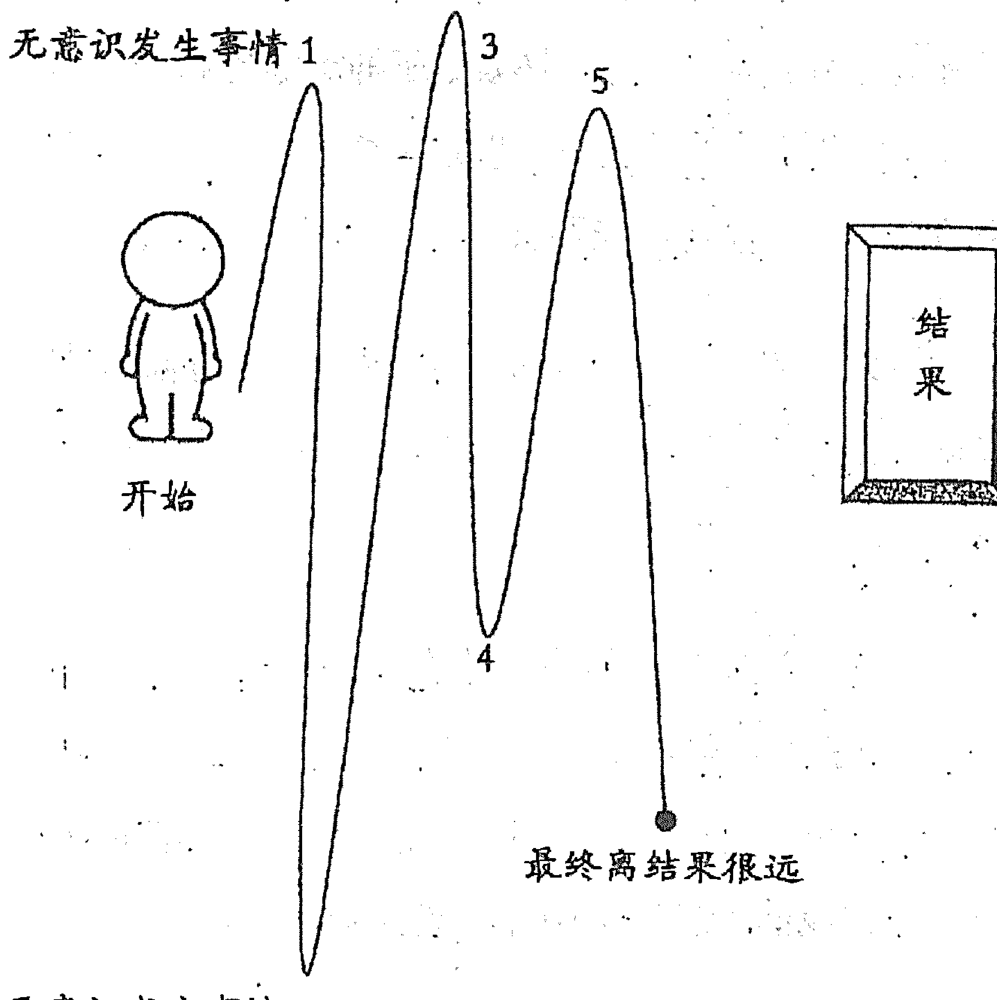
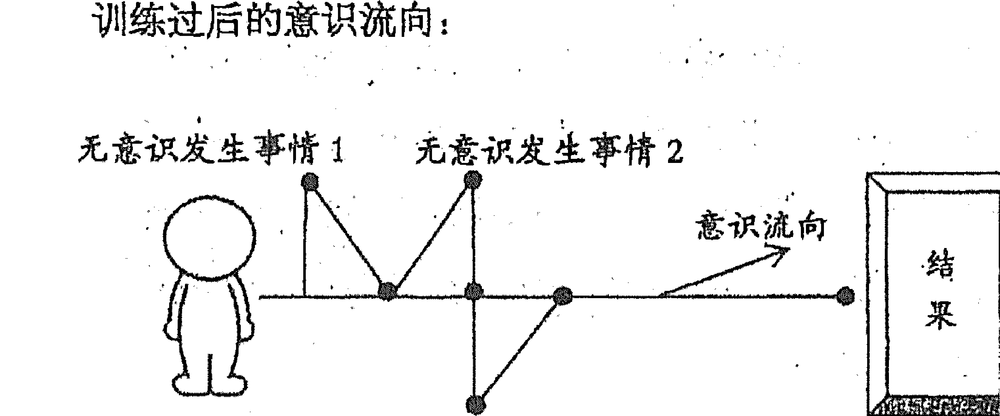
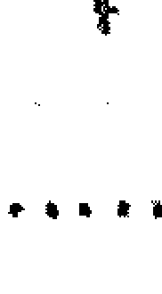
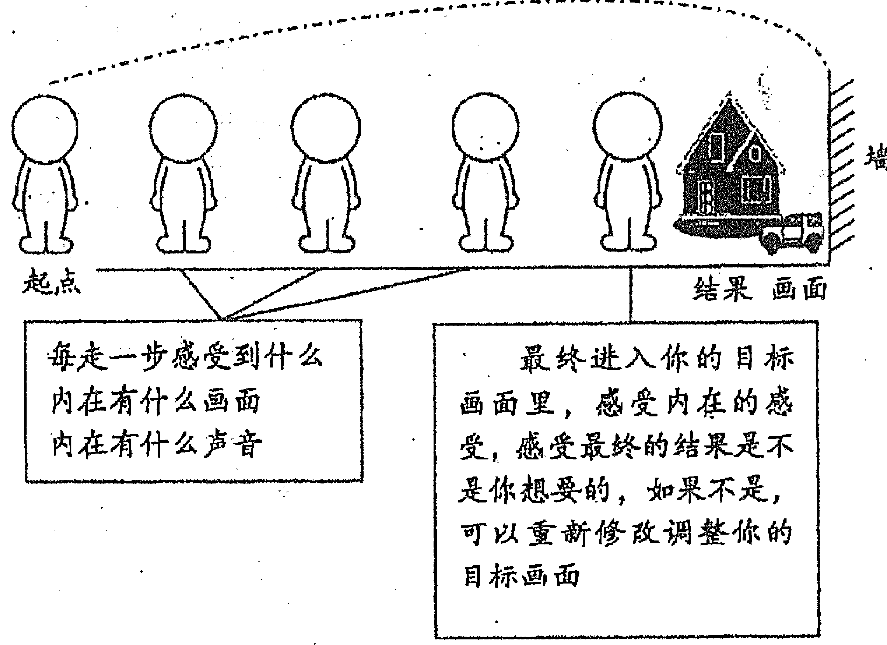
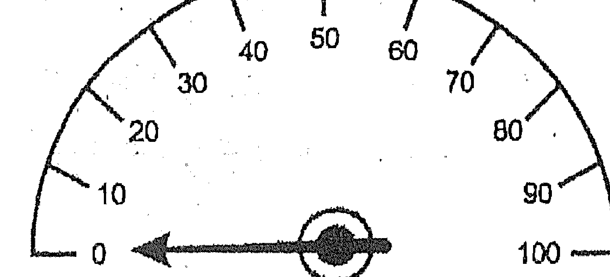
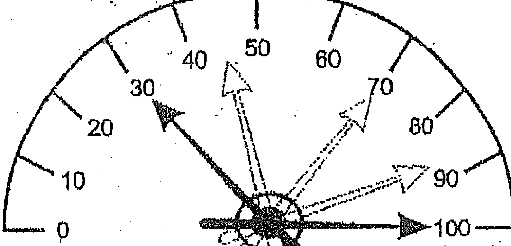

# 显化

李仲轩 著

【一本帮你实现愿望的人生指南】

真正的显化不是心灵上的安慰
而是一条需要你脚踏实地去落地的实修道路

华夏文学出版社
HUAXIA LITERATURE PUBLISHING HOUSE

# 显化

李仲轩/著

# 【一本帮你实现愿望的人生指南】

真正的显化不是心灵上的安慰
而是一条需要你脚踏实地去落地的实修道路

## 显化

- 作者：李仲轩
- 责任编辑：宋涛
- 装帧设计：尹若瑶

- 总编辑：周素芝
- 行销企划：聂元皓
- 出版总监：齐景林

- 出版发行：华夏文学出版社
- 地址：香港九龙旺角弥敦道555号九龙行16楼1801室
- 网址：http://www.hxlph.com
- 电子邮箱：hxwxcbs@126.com

- 开本：880×1194 1/32
- 印张：4.5
- 字数：27 600
- 印数：1-10000
- 版次：2020年2月第1版 2021年9月第4次印刷

ISBN 978-988-74164-6-3

定价 49.00元 (RMB)

版权所有·侵害必究

如有缺页或破损等质量问题，请联系邮箱更换。

真正的显化不是心灵上的安慰

而是一条需要你脚踏实地去落地的实修道路

## 目录
CONTENTS

- 前 言 001

- 序 言 我就是显化者 007

- 第一章 你想要什么？ 017
  - 我们现在的生活是如何显化出来的？ 019
  - 所有的显化都是从一个想法开始的 020

- 第二章 你渴望什么？ 027
  - 清理练习 038
  - 觉察练习 039
  - 冥想练习 042

- 第三章 想象力的无穷魅力 043
  - 无处不在的想象力 045

- 想象力为什么有如此大的力量？ 048

- 让想象力成为你最擅长的力量 049

- 想象力是当下的力量（练习） 052

- 想象力是怎么样运作的？ 054

- 每天 5 分钟想象力练习 055

- 第四章 接受是创造的开始 061

- 接受反对的部分 064

- 我们是一个整体 066

- 平衡内在反对部分（练习） 068

- 第五章 重新输入新的信念 073

- 什么是信念？ 075

- 信念是怎么形成的？ 076

- 探索内心深处的知道（练习） 081

- 第六章 意识的流向 087

- 一切都是意识 089

- 意图在我们的生活中要如何设定呢？ 092

- 如何让实际的发生更顺利？ 096

- 第七章 颠覆你的行动，重新出发 105

- 关于金钱 109

- 关于健康 110

- 关于伴侣 111

- 关于孩子 111

- 第八章 感恩的魔力 113

- 60 天感恩练习 120

- 爱（练习） 122

- 显化的重点 124

- 第九章 梦想加油站 125

- 附录一 自我思考 130

- 附录二 关于显化你需要确信并去践行 131

- 附录三 作者的建议和叮嘱 132

- 后记 134

# 前言

亲爱的朋友，祝贺你正在打开一本显化的秘籍，一本实现人生愿望的使用手册。

## 本书起源

我之所以写这本书，是因为当我发现显化的秘密时，内心非常激动，我花了几年的时间反复研究、实践以及教会身边一部分人使用，帮助他们显化出一些自己想要的人事物。经过反复试验和实践，我非常渴望把显化、即将开启属于你自己的显化篇章、显化的规律、显化的步骤和流程分享给广大有梦想、有心愿的人们，这本书的目的在于帮助读者掌握显化的规律、流程和步骤，让每个人更轻松、更有把握地实现生命中的愿望。

我相信这一本切实有效的书籍可以帮助更多人实现愿望，从而改变实际的生活！

这本书是一本全然向内求的书籍，结合了强大的无形能量和宇宙的法则，我用最简单、最直白的语言把显化的规律详细地表达给你，同时也具体地讲述了如何在日常工作生活中实际运用显化的法则，通过实际的练习吸引到内心渴望的人事物，比如期待已久的爱人和挚友，内心渴望金钱的数量、理想的身材、提升健康质量和自身的能量以及内心的平和。让每个人的显化能力得到更大程度的开发，达到生活与事业的最佳状态。

本书的内容受到了社会各界人士的喜爱，无论是学生、父母、企业家、创业者、上班族，甚至宝妈，都运用本书当中的显化步骤和流程练习实现了内心的愿望。

本书适合想要吸引更多理想人事物、实现心中愿望的人士。

很多人非常喜欢这本书的结构和阐述方式，它非常具有实用性、可操作性，读者把自己的实际情况结合到书中所阐述的练习中，并在实际的运用中成功达成目标和实现愿望。

这本书中所讲述的核心是每个人的内在力量，这个强大的显化力量就在我们每个人的内在，我们只需要发现它，并有规律地运用它，就能实现我们每个人生命中一切美好的愿望。

显化的规律一直存在着，发生在我们身上的事物无一不是遵循了显化的规律，按照显化的步骤和流程发生的，但是只有很少的人完整地发现了它。真正的显化不是心灵上的安慰，而是一条需要你脚踏实地去落地的实修道路。

在一次次的实修及一次次成功显化的过程中，你会不断地、更加敏锐地发现自己内心的声音，生命会更加平衡，同时也会被生命中强大的爱和感恩的能量不断地滋养，生命的状态去向更加富足、宁静、喜悦。

这本书里讲的显化步骤的练习因为简单且有效而被广大学习者喜爱，建议读者怀着一颗空杯的心态去阅读，全然信任地去实践，效果更佳。

在这里，我将为你详细介绍这本书籍的使用方法。

这是一本实现愿望的使用书，通篇的内容，把显化的整个流程和步骤——写在了书里。

这里给你一段温暖的提示，以便你更好地使用本书：

1. 建议读者将身心融入这本书，投入地体会书中所表达的意思和练习。这样才能更好地领会显化的秘密。
2. 请从头开始看，切勿断章取义。因为这本书中写的是显化的步骤和流程，是连贯的，每一步骤都是环环相扣。在实际操作中，第一步练习好之后，再进入下一步练习，才能达到更好的效果！
3. 书籍适合反复阅读，反复在生活中落地练习，在每一步练习中，读者都要去检测上一步是否落地。显化是有步骤的，有顺序的，有流程的，每一步都练习到位才能更好地进入下一步，同时下一步才会更好地展开。
4. 当我们在某一个步骤不理解的时候，请坚定地反复揣摩练习的含义，在生活中反复练习从而拿到内在感受，实现显化。
5. 看书过程中，及时做读书笔记，每个步骤涉及到练习，可以直接写在书上或整理到自己的笔记本上。

给自己整理一个好的心情，安安静静地在当下享受这本书吧！

即将开启属于你自己的显化篇章！

# 序 言

我就是显化者

显化是深入了解自己的过程，随着不断地深入自己，最终将成为显化及创造者。

## 这就是显化啊

从古到今，掌握显化秘密的人总是少数的，对于大多数人来说，无论是生活还是工作都是辛苦的、充满挑战的，同时又存在着激烈的竞争，大多数人的潜意识里都会认为，只有不断地努力才有可能达成自己想要的，甚至他们认为还有很多想要的东西，无论怎么努力都是无法获得的。

当我们遵循“显化”的规律，懂得以正确的方式运用时，我们会成为一个真正轻松的显化者，我们会切实体验到在工作、生活乃至生命的方方面面显化我们想要的，并持久地享受梦想成真所带来的富足、宁静和喜悦。

也许在此之前，你经常想要一些东西，但总是迟迟不能如愿。

比如，想要显化更多的金钱，但金钱总也不来。

想要显化健康的身体，但总是大小的疾病不断。

想要显化理想的伴侣，但总是遇不到那个对的人。

想要显化自己喜欢的工作，但工作总是不顺心。

当很多人想要显化自己喜欢的工作，但显化出来的却是自己不喜欢的，不想要的！

当很多人想要显化自己喜欢的事业，但显化出来的是自己不喜欢的，不想要的！

于是开始不敢有自己的想法了；开始跟着社会的标准、身边人的想法走。但即使是别人的想法，也是经由自己显化而来的。

有没有思考过：为什么想要显化自己想要的，但显化出来的都是自己不想要的呢？

首先，我们的头脑看到想要的东西都想要，而我们的潜意识里记录的大多都是做不到、太难了、很辛苦等等这样的想法，所以显化出来的都是太难的、做不到的、非常不容易的、辛苦努力的。

在这一章，我们要知道：我就是显化者、创造者，所有的一切，都是经由我内心的相信和怀疑显化出来的。

真我是根据内心的想要及渴望来显化的。

了解这一点非常重要，我是创造者，我是显化者本身，真我即是一切，他不分好坏、对错、真假，他只会根据自己内心相信、渴望、想要的而显现。

也就是说，在这个世界上，所有的一切都是真我的显现，这个真我就是我们现在很多人说的能量、空性，是生命本身。

所以每一个人都是创造者，每一个人都是生命，每一个人都是佛，每一个人都是觉知本身。

几乎所有的圣人们都告诉过我们这一点，也许你也在别的书本上看到过这一点。

但今天的不同之处，是你要知道自己是显化者，你可以停下来看一下自己的家庭、自己的身体、自己的事业、自己的财富，几乎这些都是无意识地在重复着过去父母曾教导我们的模式。因为我们相信了他们的这些模式，所以我们创造出来了现在的这些结果。

所以，你要清楚地知道：你就是显化者、创造者，你越是了解你是创造者，就越容易创造出不一样的生活及未来想过的生活，否则你会无意识地对抗真我，无意识地对抗生命。

曾经，在我的团队里有一个女孩，她出生后是被父母抱养回来的。她一直相信了父母告诉她的生日，也会根据她的生日来看自己的性格，她觉得：嗯，是这样的，太准了！

直到她 24 岁那一年，她忽然知道了自己是抱养的，并不是养父母亲生的。当她知道了自己真实的生日后，她也会根据生日看自己的性格，她也会说：嗯，也很像。

所以，其实每一个人都是自性本身，任何一种面相我们都有，所以我们越是连接上真我，就越容易显化一切想要的人事物。

显化时时刻刻都发生在我们的实际生活中，你是否注意到你经常想到了某个人，然后没过多久便接到了对方的电话；你的客户在你意想不到的时刻，找你报了一个大单；你一直喜欢的人也刚好喜欢你；约见客户的发生和你想得一模一样；你一直想吃的大餐，正好朋友约你一起；等等。

这个世界上所出现的一切事物，都是由每个人显化出来的，一切的创造都是经由每个人显化出来的，比如人们穿的许许多多不同风格的衣服，人们所创造的这么多美食，现在出现的这么多高楼大厦，人们出行的车辆等等，一切都是经由显化而来的。

而我们需要的是确信这个非常重要的秘密，这也是唯一的秘密：

- 每一个人都是显化者，
- 你就是显化。

可以毫不夸张地说：我们每个人就像一个显化的机器，可以做到精准显化，但是我们却不知道。

也许让你接受这一点是很难的，因为看向自己的生活，到处都是自己不想要的事物，无论如何也不敢相信自己就是显化。

但无论你是否相信，都不会改变你就是显化者，你每分每秒都在显化着，一切都是经由你显化的。所以先接受这一点吧，你就是显化者！接受它。

请深深地相信吧，你就是显化者，接下来的步骤会帮助你精准地显化你想要的，而不再是显化你不想要的。

- 你能够显化出你内心所渴望的富足生活。
- 你能够显化出和谐友好的人际关系。
- 你能够显化出内心一直渴望的伴侣。
- 你能够显化做自己热爱的事情，并创造价值。
- 你能够显化出想要的和谐家庭关系，得到家人的支持和信任。
- 你能够在困难和障碍中显化转机达成目标。
- 你能够显化从内而外的高频能量与平和状态。
- 你能够在实际的实修中显化任何所梦想的事物。
- 你能够显化一切，并享受着自己的梦想成真所带来的满足和喜悦。

# 第一章

## 你想要什么？

种下什么种子，长出什么果实

每个人都是一块肥沃的土地，可以长出任何果实

对于刚种下的种子要精心照料

## 你想要什么？

## 我们现在的生活是如何显化出来的？

在我们小的时候，我们会看到父母在怎样经营着自己的家庭，怎样经营自己的事业，怎样和金钱相处，以及是如何经营他们的人际关系的。

父母也经常告诉我们：人生该怎么活，该怎么过，要做个好孩子等等。这些所有的发生都在我们的心田当中种下了一颗种子，随着时间的推移慢慢地长成了一棵大树。

小的时候，我们的父母、我们身边的人、老师或者社会告诉我们的所有思想都是一个种子，这些种子进入到我们内心深处的无意识，久而久之，我们无意识显化出了自己儿时学来的一切，而这些离我们真正想要的及未来想要的相差甚远。

今天我们要做的是：在我们的心田中，重新种下新的种子。当我们的心田中种下了新的种子，我们要把更多的能量关注在新的种子上面，不要再给过去无意识的想法更多的能量。当不再给过去无意识的想法更多能量的时候，过去那些无意识的种子，就慢慢地不再生长，或者慢慢地衰老。

## 所有的显化都是从一个想法开始的

在这里我要提到的是：任何一个伟大的事业，包括有很多金钱的人，他们都是从一个想法开始的，不断地关注这些想法，不断地默念这些想法，最后形成了一股强大的吸引力。

当你从一个想法到实现目标，就叫一念即达！

所以你到底想要什么呢？

首先你要知道你要什么，你的目标是什么？

没有开始就没有结束，开始怎样结束就怎样，显化的最开始就是源于一个想法。

相信很多人都听说过哈佛大学的一项关于目标的调查：

调查对象是一群智力、学历、环境等条件差不多的年轻人。调查结果发现：

- 27%的人没有目标；
- 60%的人目标模糊；
- 10%的人有清晰但比较短期的目标；
- 3%的人有清晰且长期的目标。

经过25年的跟踪调查，结果发现他们的生活状况及分布现象有一定规律：

- 3%有清晰且长期目标的人，他们大都成了社会各界的顶尖成功人士，其中不乏白手创业者、行业领袖、社会精英；
- 10%有清晰但目标比较短期的人，大都生活在社会的中上层，成为各行业的不可或缺的专业人士，如律师医生、工程师、高级主管等；
- 60%的目标模糊的人，几乎都生活在社会的中下层，他们能安稳地生活与工作，但都没有什么特别的成绩；
- 剩下的那 27%的没有目标的人，几乎都生活在社会的最底层，他们的生活过得都不如意，常常失业，并且抱怨他人，抱怨社会，抱怨世界。

所以，目标对人生有巨大的导向性作用。

目标有聚焦作用，明确自己的目标后，心灵便会自然地把能量引向目标的方向，一切将会在自然之中进行，如果没有目标，能量就会分散、虚耗。

目标的设立，主要的作用就是聚焦内心的能量到一个点，以便更快、更好地完成目标。当内心有了目标，我们的能量就集中于待完成的目标上，目标变成了一种行动的指引。在正面能量聚焦的指引下，我们所有的行动都将围绕目标来展开，我们将在正面能量聚焦的作用下，爆发出巨大的潜能和强大的执行力。聚焦的能量是强大的，我们就要通过目标的引导来产生放大镜效果，将聚焦点燃起来，这样我们的能量就有了方向。我们的行动、我们的状态和我们的生命就都有了方向。

有了目标，有了正面能量的聚焦作用，我们才会在极强的行动力推动下去完成目标。没有了目标，能量便处于散乱的状态，东打西撞，没有力量去引导它们集中，它们就无法产生极强的穿透作用。

所以你的目标是什么呢？

问一下自己：我想要什么？

这时候你会发现你想要的很多，漂亮的衣服，一顿丰盛的晚餐，豪车，宽敞的房子，进账，伴侣，等等。

像这样类似的念头，我们每天有很多，包括我们没有觉察的念头，比如我想跳舞，想去玩，想看电视等等。

人的一天平均有六万多个念头，我们的能量就会分散到六万多处，在这种能量都被分散的状态下，我们真正想要的人事物是不容易显化的。

在我们的这些想要中，有很多都是可有可无的，比如我们想买双鞋，其实买不买都行的，但当念起时，就分散走了我们一部分的能量。

我想看电视，但最近也没什么好节目，也许你因为无聊就去看了电视，这也分散了自己一部分的能量。

……

就是这样每天一件事情一件事情地发生，一天一天地度过了，我们会感叹说：为什么自己想要的还不到来，运气真不好！

其实，真的不是你的运气不好，只是你不知道自己到底想要什么，不知道什么是自己头脑想要的，什么是自己心想要的，你把能量都分散到太多的地方了，无法聚焦产生力量。

接下来带你一起探索什么是内心真正渴望的。

# 第二章
你渴望要什么？

感觉是心的语言

感觉是无限的能量

## 你渴望要什么？

想要做到精准地显化，你必须要知道你到底渴望什么？也就是你的心想要什么？

当问到很多人这个问题的时候，大多数人都不知道如何回答，因为太多人都不知道自己到底渴望什么。每天经历的事情、要的东西似乎都是可有可无的，自己内心真正的渴望自己从来没有发现。

一个可有可无的想法不容易实现，但是如果一个想法中包含强烈的感受就很容易实现，这种强烈的感受，会把我们分散到六万个念头的的能量全部聚集到一个地方来，轻松帮你实现你内在的渴望，所以你一定要知道你渴望什么。

- 心之所愿，身之前行；
  心之渴望，行而必成。
  思想背后的情感，会决定事物显化的快慢。

当你探索到什么是自己心想要的、心渴望的。显化会非常轻松，因为显化不是显化头脑层面的，而是显化心的渴望。

上面内容讲了：很多时候我们一会儿想要这个，一会儿想要那个，我们也总说这些都是我想要的呀，怎么显化不出来，我真的想要呀！

其实，大部分我们的“想要”都是头脑想要，这种想要是可有可无的。显化是跟随心的，只有心渴望的才能显化。心不渴望的，都不能实现显化。

当你知道什么是你内心真正渴望的；你会发现一个神奇而微妙的现象，心会给你一股力量，这股力量会自然流向你想要的事物，当有能量流进来，实现也就轻松了。

心是热情，心是力量，心在当下，心是当下的渴望，心是感觉，所以我们常常说：跟着感觉走，要啥啥都有。心在当下，所以从心出发，就是从当下出发。大家都听过佛陀的故事：

2500年前，乔达摩·悉达多，一个身体健康、衣食富足、家庭生活幸福美满，并且将要领导整个国家的王子，内心强烈渴望解脱人类生老病死等无常的痛苦，心意坚决地离开自己的国土，无论自己的行为会遭到人们什么样的非议和诟病，都坚定地向着真理勇敢地从当下出发！

同样，玄奘的故事也是很好地诠释：

在烙铁一般的烈日熨烫着的沙漠中，玄奘滴水未沾，面对着饥渴和灼热的煎熬，因为渴望实现心中教法弘传、众生离苦的目标。玄奘异于常人地继续走在西行求法的觉悟之路，他深知这一路所遇到的不可能会是顺境坦途，发心清净，舍身求法，置之死地方能浴火重生，并发出“宁往西天一步死，不向东土半步生”的誓言。最终成就了这位历史上具有巨大贡献的佛教教育家、翻译家。

所以勇敢地从心出发，从当下出发吧！

什么才是自己心想要的呢？

首先通过练习，你会慢慢锻炼出对于想要事物的敏感度：它是来自于头脑，还是来自于心。

### 练习步骤

举例：当你说，我想吃一顿丰盛的晚餐。

然后闭上眼睛，连接上自己，感受刚刚说的那句话是来自于哪里？感受是来自于心还是来自于头脑。这时候静静等待内在的回应，你会知道这是心想要的还是头脑想要的。觉察到它，决定自己要不要把能量放在这里。如果是头脑想要的，那就建议你把能量回收回来，因为即使你去做了，在内在也会消耗你的能量，并不能够给你带来滋养和内在的喜悦！

这里还有一个最简单的方法，可以用来检测你想要的到底是你的心想要的，还是头脑想要的。

去留意当你感受一件你自己非常想要的事物时，是否有一种无形的力量在推动你，这个需要你有非常敏锐的觉察力。

这股力量的发生就在当你的心真正渴望一样事物的时候，会自动有一股能量带着你把这所有的注意力放在这个地方。这个过程都是自动发生的，毫无刻意，不累，非常轻松。

所以现在静下心来，写下你内心真正想要的：

例：王小姐的表格

| 我想要的 | 是否是心渴望的 |
| --- | --- |
| 我想显化年入百万 | 否 |
| 我想显化健康的身体 | 否 |
| 我想显化一个三观一致的伴侣 | 是 |
| 我想显化业绩第一名 | 是 |
| 我想显化好的人际关系 | 否 |
| 我想显化孩子非常听话 | 否 |
| 我想显化超级棒的身材 | 是 |
| 我想显化翻转负债 | 是 |
| 我想显化今晚吃一顿大餐 | 否 |
| 我想一年内显化一辆豪车 | 否 |
| 我想年底显化一栋别墅 | 否 |

图表中的分类都是我们显化的方向，仅供参考。

你可以通过列自己的表格来感受什么是自己内心想要的：

第二章：你渴望要什么？ | 显化

| 我想要的 | 是否是心渴望的 |
| --- | --- |
| | |
| | |
| | |
| | |
| | |
| | |
| | |
| | |
| | |
| | |
| | |
| | |
| | |
| | |
| | |
| | |

### 清理练习

我们每个人每天都有很多无意识的念头，每一个人都是一块土地，我们要把自己土地上的杂草清理掉，种上自己想要的种子，这样才能收获自己想要的。

在这一章，要给你介绍一个每天可以去做的练习，就是无意识念头的清理练习。练习的目的就是让我们去觉知自己过去无意识的想法、无意识的模式，不再把过多的能量给到过去无意识的想法，不让无意识的想法干扰我们去显化自己想要的人事物。

准备一张 A4 纸，每天早晨把我们无意识的想法全部写到这张 A4 纸上，这些想法可能是没有逻辑的，杂乱无章的，东一句西一句的，都没有关系，只要是出现在你头脑里的念头和想法全部写下来。

在这个过程中，去留意自己头脑中的念头，尽量细致地一字一句都不要错过和漏掉，一一写下来。当你把一直漂浮在头脑当中的想法落实在纸上的时候，它就得到了很好地清理。在现实显化的过程中，我们的能量会更加聚焦，不会分散到各个无意识念头上，显化的过程也会更加顺利。

### 觉察练习

在显化的这个过程中，我们要学会如何保持觉察？

> 保持觉察：念起即觉，觉之不随。

经常问自己：我觉察到什么？

比如：当我无意识地看淘宝、刷朋友圈，我觉察到：自己被无意识带走，又在做无意识的事情。

- 当我内在有任何的情绪升起，不需要把情绪投射出去，只是觉察到：我这一刻有情绪升起！
- 当身边人谈论一个话题，我毫不犹豫参与进去了，聊得热火朝天，我觉察到：我又被无意识带走了。
- 当别人跟我说了一句话，过了一会儿我就说出了这句话，我觉察到：说话的并不是我。

......

在这一步中，你无需做更多，也无需因自己又被无意识带走而自责，只是不断地觉察，在每个当下觉察。

当你时刻保持觉察，这时就可以开始成为显化者。

> 经常问自己：我觉察到什么？

同时每天去重复自己想要的想法，冥想自己想要的，给自己想要的想法更多的能量。

### 冥想练习

现在你可以闭上眼睛，让自己放松下来。想到自己想要的，感受它成为一个种子，种在你的心里。慢慢地有很多营养流进这个种子，有光、爱、能量滋养着这个种子慢慢发芽，长成一棵小树。越长越大，越长越大，慢慢长成了一棵大树！

# 第三章 想象力的无穷魅力

想象力是一切创造的开始，
让想象力成为你最擅长的内在力量！

## 想象力的无穷魅力

当你知道了自己到底渴望想要什么，这个时候可以进入下一步骤：运用想象力。

### 无处不在的想象力

想象力是万力之源，想象力是创造的核心力量，想象就是一个从无到有的构思过程。创造是想象之后的运用，这个世界上所有出现的事物，都是被想象过的，即将出现的事物，也都要被想象。我们存在的这个世界就是被想象力推动的，没有想象过从无到有，就没有之后的创造和显化的呈现。

历史上有成就的思想家、发明家、作家、画家无不具有超凡的想象力，并且敢于将其实现。他们也经历过被人嘲笑，直到有一天，他们创造出令人惊叹的作品，人们才发现他们的想法原来如此奇妙。

关于想象力的名人故事数不胜数，因为所有发明创造都离不开想象：

瓦特通过开水沸腾发明蒸汽机；莱特兄弟想飞最终创造出飞机；爱迪生发明电灯；牛顿被苹果砸中领悟万有引力；吴承恩写《西游记》；庄周梦蝶；蒲松龄写《聊斋》……

想象力在实际的生活中，也给我们的生活带来了很多的变化！

生活中我们曾面临各种各样的问题。天气热，怎么办？想让自己更舒服，因此有人发明了电扇、空调等等。

当人们准备出门，但不知道未来几天的天气如何，于是就出现了天气预报。

当我们出门时手机电量不足，于是就出现了充电宝。有人发现手机打字办公不方便，怎么办？因此出现了小型蓝牙键盘。

为了更方便人们的出行，便宜又便捷，于是有了现在的交通工具，公交车、地铁以及共享单车等。

从问题到解决，在中间起到重要作用的就是想象力，从无到有的重要过程就是想象力。

通过这些身边常见的例子，我们可以更清晰地感受到所有出现的事物都是从无到有，都是被想象过而出现的。

爱因斯坦说过，想象力远比知识重要。因为知识是有限的，想象力是无限的，它包含着世界上的一切，推动着社会的进步，是知识进化的源泉。

所以，当你想要创造及显化自己想要的事物时，想象力是你的必经之路。

### 想象力为什么有如此大的力量？

我们的左脑和右脑有明确的分工，左脑主要负责逻辑、文字、语言、分析、数字、次序；右脑则主要负责颜色、音乐、想象、空间感觉、直觉、图像。

很多人都想要成功，但是当我们头脑中有一个“我要成功”的想法和一个画面同时存在时，显化会优先选择图像。如果你的画面是成功的画面，显化出来的就是成功，如果你的画面是不成功的画面，那显化出来的就是不成功的结果。这也是很多人为什么想要成功，却不成功的主要原因。

想象力的强大力量就在于它会帮助我们在我们的头脑中建立你自己想要的成功的、健康的、幸福的画面和图像，从而成为显化的优先选择！

当我们有一个想要的想法，比如想要成功，随着我们的想象力不断地打开，我们看到的、听到的、感受到的会更多。慢慢就会唤醒自己内在觉知的力量，这时我们就会体验到这个世界更多的精彩。

### 让想象力成为你最擅长的力量

想象，这是种特质。没有它，一个人既不能成为诗人，也不能成为哲学家、有机智的人、有理性的生物，也就不成其为人。
——狄德罗

想象力是人类创新的源泉，想象力即是创造一个念头或一个思想画面的能力。

在我 15 岁的时候，想象力就带我实现了震惊家乡的举动。15 岁的时候，我辍学在家，闲着无聊，也是我听了老妈的建议去表哥家帮忙装修。由于我什么都不懂，人家叫我递个板子我就递个板子，叫我拿个东西我就拿个东西，就这样度过了 7 天。

忽然店里来了一个人，找我表哥吊顶，由于客人材料都已经买好了，如果做这一单，辛苦半天只能赚到很少的手工费，表哥没有答应。这位客人着急装修，半夜来到我家里，恳求我帮忙，我说自己并不会吊顶，只是待了7天而已。他依然坚持，我实在没办法拒绝，就答应下来了。

客人走后的那一夜我没有睡，我一直在运用我的想象力，想象我去他家装修的全过程，以及我这几天帮忙的全过程。第二天早上，我拿着工具去到他的家里，一个原本不会装修的我，从早上8点到晚上8点，给他家的房子完美吊顶，特别漂亮！这件事情轰动了我们当地，无人不知无人不晓！

这就是想象的威力，想象力是创造的能力，它的魅力就在于它可以将你带入一个虚拟世界，实现现实生活不可能实现的梦想。

所以通过不断地练习，你完全有可能让你的想象力成为你最擅长的内在力量！

### 想象力是当下的力量（练习）

一个1岁的孩子，天马行空，他的想象力及创造力高达96%。当他长到10岁时，他的想象力、创造力只剩下4%。

现在的我们要有意识地训练自己的想象力。想象力就是感受的力量，我们可以选择下面的方式来训练自己的想象力！

#### 一、通过观察

想象力就是感受的力量，当你看到任何事物，无论去到任何场所都要去留意自己的感受。

- 当你来到一个房间，你感受到什么？
- 当你见到一个人，你感受到什么？
- 当你看到一个动物的觅食，你感受到什么？
- 当你看到一道菜，你感受到什么？

#### 二、通过倾听

通过倾听的感受练习，更有助于锻炼和培养自己的想象力。

当你听到一个人在说话，请留意你的感受。你感受到什么？

- 当你听到一首歌曲，请留意你感受到什么？
- 当你听到鸟叫声，请留意你的感受是什么？

……

只要任何与听有关的，当你听到的时候都要去留意你的感受是什么样的。随着你的感受力越来越敏感，你运用想象力的能力也就越强！

#### 三、通过描述

描述是孕育想象力的关键，在日常生活中学会描述性的表达。结合以上两个练习，无论你看到、听到、感受到什么，都尝试着把它们具体地描述出来。描述自己看到了什么，听到了什么，感受到了什么。尽量细致具体地描述清楚，并大量持续地尝试描述你看到、听到、感受到的！

随着你不断地练习上面三个建议，想象力将会在你的内在展开，你的创造能力会越来越大，你所能创造的东西就越来越多。

### 想象力是怎么运作的？

心是一个空间，当你内心当中渴望想要一个东西的时候，比如说我想见一个人，或者我想喝一杯茶，这时心会给头脑一种能量，然后在头脑当中，一杯茶或者一个人在头脑当中会出现。

所以你不论内在渴望任何东西，在你的头脑之中，它会出现一个画面，你要问自己：在你用这件东西，遇见这个人，成功实现这件事的时候，你看到什么，听到什么，感受到什么，感知到什么。

### 每天5分钟想象力练习

举个具体的例子：关于金钱

我非常渴望今年进账100万。

每天想象：

当我有了100万，我看到什么？
我看到我银行卡显示数字 1000000。

听到什么？
我听到家人说，你真有本事; 听到一些朋友请教我是怎么做到的！

我感受到什么？
我感受到自己内心中很骄傲、很自信，充满感恩，很感恩宇宙的恩赐，感恩客户的信任，感恩团队的帮助

我感知到金钱其实很虚幻，金钱的核心就是能量！感知到心渴望向自己的更深入去探索。

例子二：关于健康

我内心非常渴望自己的疾病好起来，活出健康的状态！

每天想象：

当我的疾病好了，非常健康的样子！

我看到什么？
我看到自己走路脚步非常轻快，可以轻松地跑起来，轻松地做运动；每天有足够的精力照顾孩子、做饭、工作、跳舞，可以做很多事情并且精力充沛；我看到自己每天起床吃饭睡觉，很有规律地生活！

我听到什么？
我听到家人说：“哇，你健康的样子真好，看到你健康我们也开心！”

我感受到什么？
我感受到自己很开心，喜悦，很轻松，很健康。

#### 我感知到什么？

我感知到健康和内在成长连接很深。

根据这个表格里的内容连接你的内在渴望吧！

每天至少花 5-10 分钟的时间想象。

| 我真正渴望的是什么？ |
| --- |
| 当我已经显化的时候，我看到什么？ |
| 我听到什么？ |
| 我感受到什么？ |
| 我感知到什么？ |

每天去想象自己成功的画面，你成功的景象会离你越来越近。

尽量具体想象，想象得越清晰、越清楚，就越容易实现。

特别提醒你，一定要主动地去想象，如果你不想象就不会出现；如果你不想象，让别人去想象，就被别人统领。

# 第四章 接受是创造的开始

接受即是改变

一切都在变，接受即是遵循了宇宙变化的改变

六、感觉是创造的开始

这一步骤非常重要，也是很多人在现实生活、显化的过程中容易忽略掉的！

假如你想要健康，你想要当讲师，你想要家庭好一点，你想要有钱，想要开悟……

我为什么想要健康？我为什么想当讲师？我为什么想要家庭好一点？我为什么想要有钱？我为什么想要开悟？

这背后有一个很容易被忽略的地方，拿健康来说，当想要健康，其实在过去内在就已经储存了一些不健康的想法及经历。但是由于想要健康，大多数人们都不愿意去看到内在不健康的经历，也不愿意去听到内在不健康的声音，甚至压抑着它。

如果你压着不健康的声音，而这个不健康的部分就在你身体里面，它就将阻碍着你，让你无法活出健康无论你怎么努力也是不能追寻到健康的，而且永远不可能活出健康。

### 接受反对的部分

当我们想要一个东西的时候，内在会出现一个反对的声音，就像作用力会产生反作用力，就像你拍别人的手，自己的手也会疼一样。

首先我们要知道，这是正常的发生。当我内心渴望想要一个东西的时候，内在对立的声音，就是让你知道你还有一些不接纳部分，在这一步，我们不要逃避它，学会去接受它。

因为这个反对的部分一直在你的身体里面，还在当下，如果你不去经验它，不去感谢它，不去臣服它，不去看见它，它会阻碍着你一辈子。

所以——

- 想要快乐，快乐非常简单，接受不快乐；
- 想要幸福，很简单，接受不幸福；
- 想要健康，接受不健康，就这么简单。

### 我们是一个整体

每一个人都是一个整体，在每一个整体中都会有各种面相在相互生成、相互对立着。

在一个公司里，有表现好的，也有表现不好的；有优秀的，也有不是那么优秀的。当集体一起去达成共同目标时，如果领导者把所有的注意力、关注点都放在那些表现好的、优秀的员工身上，那些做不那么好的员工就会更受打击，甚至有些做不好的人还会想各种办法有意无意地阻碍那些做得好的人达成目标。

大多数人并没有留意到这一点，于是把内在的障碍投射到外面的世界中去，他只会觉得是自己的运气不够好，最近有点倒霉，或者觉得是自己能力不够强的原因造成了没有达成个人目标，没有达成公司目标。

事实上，只是因为他把自己内在接受不了的部分投射到外面的世界之中了。当我们接受了内在的部分，外在的世界自然会平息下来。

在一个家庭中，也是一样的。有一对父母生养了两个孩子，有一个听话的，有一个不听话的。如果我们把所有的注意力都放在听话的孩子身上，那么不听话的那个孩子就会有意见，他会做各种夸张的事情来引起父母的注意。往往这个时候父母会更加生气，导致整个家里面乌烟瘴气的。

其实，这只是因为父母的内在不愿意承认那一个不听话的孩子，不愿意接受那个不听话的孩子。而听话和不听话都是相对的，是互生的。这就是物质世界的规律。

如果想平衡、想快速达成目标，就要接纳内心当中不想接纳的部分。

生命就在当下，目标也在当下，想要显化的也在当下。当接纳了当下不想接纳的，显化就变得轻而易举了。

### 平衡内在反对部分（练习）

这个练习主要是帮助平衡内在想要的和反对的部分。当平衡了两股能量，在显化的过程中，才没有阻碍的力量。

### 练习步骤

1. 先感受自己就是想要的，这时内在是什么样的感受（你的想法是什么，情绪是什么，身体状态是什么）。
2. 跨一步，问自己：是什么阻碍了我得到想要的？
3. 完全去感受它，接纳它，呼吸带进去。

通过反复循环地练习，把内在所有的阻碍平衡。

这一步练习需要一遍又一遍重复上述步骤，直到没有任何阻碍。

举例：我想要健康。

首先我先去感受自己就是健康，是什么感受？

——我感受到我特别喜悦，内在非常流动，我身体非常轻松，我非常确信我就是健康！（深呼吸）

跨一步走出来到旁边，问自己：是什么阻碍了我成为健康？

> ——我曾经见过太多人生病了，就觉得到了这个年纪就会生这样的病！（感受它，深呼吸）

再跨到刚才的位置感受自己就是健康，是什么感受？

> ——我感受到我特别喜悦，内在非常流动，我身体非常轻松，我非常确信我就是健康！（深呼吸）

跨一步走出来到旁边，问自己：是什么阻碍了我成为健康？

> ——内在好像总是推动我去生点病，这样就可以得到身边人的陪伴和爱了。（感受它，深呼吸）

# 显化 | 接受即是改变

再去感受自己就是健康，是什么感受？

持续循环下去，不断练习，直到说不出任何阻碍。

这个时候，我内在两股力量得到了平衡。

# 第五章 重新输入新的信念

你的信念创造了你的实相

深入回看你的生活，就会发现你的信念

## 重新输入新的信念

当你内在没有任何阻碍，能量平衡的时候，你需要给自己输入一个新的信念。

如果没有输入新的信念，那么只会重复潜意识里旧有的信念，得到的也只是旧有的结果。

## 什么是信念？

信念是一股促使人们按照自己认为正确的观点、原则去行动、去实现目标的一种强大的内在力量。

## 显化 | “知道”就等于你的结果

我们经常会听到一个人说：这件事就应该是……这样的，这件事情要这样做，不要这样做等等一些话语。之所以如此确定，就是内在信念的推动。

再比如，一个人陷入绝境，但在他的内在“天无绝人之路”是他的信念，他就总是能想到办法化险为夷，突破困境。

积极的信念会让我们对事情充满信心从而顺利达成，限制性的信念会让我们对事情夹杂怀疑从而无法达成自己的目标。

## 信念是怎么形成的？

信念是人们在长期的人生实践中逐步形成的，信念一旦形成，是不会轻易改变的。大多数人的信念是在我们幼年的时候学习而来的。

不同的人，由于社会环境、思想观念、阶级利益需要和个人具体经历等不同，会形成不同的乃至截然相反的信念。

根据每个人的情感经历不同，而产生的一些观念，如果我们相信了它，那么一个普通的观念就会升级成为我们的信念。

在我们拥有的很多观念中，有些观念被自己留下了，有些被丢弃了；如果留下来的观念，根据我们过去的经历，对一件事情的相信程度和把握程度，决定了是否成为我们的信念。

信念左右着我们思想所涉及的范围，不同的信念以不同的方式规范着我们的思考，固定着我们的思考方式，我们都会被“框”在这个模式里运行。

这里有两个故事分享给你们。

### 第一个故事：跳蚤效应

生物学家曾经将跳蚤随意向地上一抛，它能从地面上跳起一米多高。但是如果在一米高的地方放个盖子，这时跳蚤会跳起来，撞到盖子，而且是一再地撞到盖子。过一段时间后，拿掉盖子就会发现，虽然跳蚤继续在跳，但已经不能跳到一米以上了，直至结束生命都是如此。

### 第二个故事：小象的成长

大象很小的时候，驯兽师就在它们的身上套了一根铁链，并拴在牢固的水泥柱上。起初，小象受不了这种束缚，发出一声声怒吼，依靠自身的力量拼命地挣扎不断地扯动铁链。然而，它的力量太小了，弄得自己鲜血直流，遍体鳞伤，也没能挣脱铁链的束缚。

等到身体的伤口复原后，它又接着与铁链做斗争，当然结果与之前一样，它还是没能挣脱铁链的束缚。

就这样经过无数次的尝试，小象绝望地发现，无论自己怎么努力，一切皆是徒劳，自己根本奈何不了那条坚硬的铁链，与其做无谓的斗争，倒不如接受现实。

于是，小象放弃了努力，学会了忍受，也渐渐习惯了身上的铁链。直到它长成大象，也没有再想过挣扎和逃跑。

驯兽师只用一条细细的链子就束缚住了大象。

通过这两个故事同样映射出我们人的规律，当我们遇到一次次障碍，没有获得自己想要的事物，我们内在就会形成：我不行，无论怎么样都做不到等等类似的信念。这样的信念会一直阻碍着我们前行。

所以信念对人的影响是非常大的，信念直接决定

## 显化 | “知道”就等于你的结果

了对于一件事情是否能做到，起了决定性的因素。

如果没有重新输入新的信念，结果早在行动之前就已经决定了，所付出的努力，所走的路程，也只不过是再次印证了自己做不到、达不成的信念而已。

这里讲到的信念并不是曾经很多人口头上喊的口号：我能行，我能行！而是通过平衡了内在能量之后，让内在升起最适合你的，并且能够达成愿望的信念，而这样的信念是来自内心真正的感受，感受到你是否可以！

大多数人几乎很少关注自己内心的感受，甚至不愿意承认自己内心感觉，不愿意承认自己做不到，压抑住了这部分的声音，于是拼命喊着口号：我能行。无论怎么努力，这样依然是无法做到的，因为信念是感受，是来自内心深处的声音。

更简单来说：
你内心知道你能做到时，你就能做到；
你内心知道你做不到时，你就一定做不到。
‘知道’就等于你的结果。

## 探索内心深处的知道（练习）

上一步，我们平衡了内在的意图和反对意图，平衡之后我们就要给自己输入一个新的信念，而这一种输入不是把别人好的信念拿过来用，因为那并不一定适合你，你也用不出来。

这里我们说到的‘输入’是‘升起’的意思，让这个更好、更适合你的信念，从内心最深处那个知道的部分升起。

## 显化 | “知道”就等于你的结果

当我们意图和反意图的声音都没有了，能量完全都平衡的时候，让自己安静下来，坐在那里，完全安静下来，感受自己的内在，让新的信念升起，此刻去留意你内在深处最想说的一句话，最渴望说的一句话，如何才能做到成功的一句话，比如说：

1. 我知道，只要我规划好自己的生活，想要的自然都会到来。
2. 我知道，只要我大量行动，就会有很多客户找我买单。
3. 我知道，只要我每天保持好的心情，不需要做什么，结果就会特别好。
4. 我知道，我每天进步一点点，就一定可以做到的。
5. 我知道，只要我持续地关注我想要的，就会有人把我想要的带到我身边。
……

当你找到这个新的信念，这将不是仅仅地相信，也无需天天空喊“我能行”的口号，这个信念将住进你身体的每一个细胞里，这是完全适合你的信念，将带着你轻松自然地达成你的愿望。

当你内在知道这样做一定没有问题的时候，结果就会达成且毫无问题，分毫不差。

所以在这一步，让自己安静下来，坐下来，闭上眼睛，静静地听你内在深深的那个知道，告诉你：你到底怎样做，可以实现你内心的渴望。

这一步的练习是紧接着上一步平衡意图和反意图之后的，平衡之后就去留意内在新的信念，然后记录下来！每天不断重复！这会让你达成愿望非常轻松和顺利！

现在就让你内在新的信念重新升起吧！

## 第五章：重新输入新的信念！显化

记录：我内在深深地知道

## 显化 | “知道” 就等于你的结果

注意：这一步骤中需要你自我进行检测，看自己是否完全平衡了你内在的意图及反对意图，如果没有，请回到第四章再次做接受步骤的练习，重新来到第五章！

# 第六章 意识的流向

意之所在能量随来

注意力等于事实

## 意识的流向

## 一切都是意识

接下来的一步是：你要有个清晰的意图！

意图是一股非常强大的力量！

意图是一股非常强大的力量！

意图是一股非常强大的力量！

强大到即使你什么都没有，只要有个清晰的意图就可以显化你想要的。

## 显化 | 意图是一股非常强大的力量

这一步骤的主要作用是让你的意识流流进你的意图，流向你想要的事物上，即使外在有其他事情发生你也很快能把意识流拉回来。

意图的设定主要是帮助我们让现实显化的路程更加轻松，如果我们没有设定每一天的意图，那我们很容易会被一天当中很多忽然的发生带走，而忘记了自己要去达到的地方。设定了意图，我们的意识流流进自己想要的人事物上面，即使外在忽然的发生出现，我们的意识流很快又会回到自己要显化的事物上，又会回到自己的显化轨道中！

首先这里要说明的是：意图和目标的区别！

很多人在这一步骤中，总是会混淆意图和目标！

我们可以用最简单的方式来理解：

## 第六章：意识的流向 | 显化

目标：就像箭靶子，是一个最终的结果。

意图：是希望达到某种目的的打算。

意图是有过程又有结果，是一个比较清晰的路线。

感受上是流动的状态。

所以在我们还没有行动之前，我们要有个意图。

从这两个字面意思来说：意+图，意识+图像。

图像表达我们最终去向的结果；意识就是能量，你的能量在哪里，结果就在哪里。

大部分人都是被自己的无意识带走，没有刻意去训练自己意识的流向，这里我们就要加强自己意识流向的练习。

## 意图在我们的生活中要如何设定呢？

举例：李先生今天的意图是成交5个客户。

首先他知道了意图是一个过程的，比较清晰的路线。

他会在头脑中，把整个的清晰的过程全部想象一遍。

“我早上6点钟起床，起床之后洗漱整理自己。7:30去上班，8:00到了办公室。我倒了杯水坐了下来，我打开手机就有人给我留言咨询业务，我很轻松地跟他介绍了一下，一会儿收到他回复说：他感觉我说的特别吸引他，觉得是自己想要的，果断给我转了账，还特别的感谢。我非常开心有个好的开始。”

## 第六章：意识的流向 | 显化

然后我坐下来整理今天的工作资料，整理了一会儿，准备喝水休息一下，给自己泡了杯茶，坐在窗边喝着茶，打开手机，看到有人给我留言要买我代理的书籍，因为他的目的明确，很快就转账过来！我愉快地给他打包发货！

一上午的时间很快就过去了，感觉好像还有人找我咨询，听着同事们叫我一起去吃饭，我就很开心地去了。吃完饭回来，果真手机上有留言，咨询产品，我回复了他的问题，他很快就转账过来了。

我有睡午觉的习惯，于是我就休息了一个小时。在我刚刚醒来非常放松的时候，看到手机上有一笔直接转过来的费用，让我安排给他发货，是代理直接要10份产品。我很放松地收了转账并回复了他。

下午参加了团队组织的活动，大家一起玩得非常

## 显化 | 意图是一股非常强大的力量

开心，然后接下来是我专注做业绩的时间。我带着爱、感恩联系每一个人，并开心地分享我的产品，和我交流的人，都很开心认识我，同时有 5 个人转账买我的产品，成为了我的客户。

下班之后，是我最有感觉的时候，我安排好自己下班要做的事情，吃饭、泡澡、洗衣服、整理房间、写日记，内心的声音是：不需要持续盯着手机，只要我把自己事情做好，做让自己有感觉的事情，想买产品的客户会主动留言和转账。第二天早上起来，我打开手机，只要点消息就能收到他们的红包和转账。

就这样，到了第二天我统计自己昨天业绩的时候，发现，自己超额达成了目标，一共有成交了 11 个客户。

当他每天早上这样想一遍，神奇的事情便会发生

## 第六章：意识的流向 | 显化

一天所有的事情，都会按照他的意图展开。

所以在这一步骤千万别犯懒，很多人都以为只有不停地做事，多做事，才能达到自己想要的目标，却忽视了意图的强大力量。

我们曾经做过一个测试，选择了两个人。

第一个人每天什么也不想，无意识地过一天，任由什么事情来了就做什么事情。

第二个人每天早上先不着急投入工作，先把自己意图的流程在头脑中想象一遍。

一个月之后，对比非常明显：

第一个人，只是完成了领导交给的任务，有时还出错，每天非常忙碌，累到每天都是回家倒头就睡，对于业绩做得很吃力，赚到的也是小单子。

## 显化 | 意图是一股非常强大的力量

第二个人，每天很轻松地生活，客户都是主动上门找他。当他主动做业绩的时候，客户都非常喜欢他，工作完成得非常轻松。领导非常满意，同时又有自己闲暇的生活，生活很惬意。成交的有大单有小单，总的来说就是更加轻松了！

经过不断地测试后，这个意图的方式已经被大量的人开始使用。

## 如何让实际的发生更顺利？

在具体实施的时候，你可能会遇到这样的问题：

当你想到客户主动来找你，主动转账，业绩来得非常轻松，你也许会觉得：这怎么可能，这也想得太离谱了吧，只是想想而已吧，怎么可能按照我设定的运转呢

这里给你推荐一个非常有效的“投射”（练习）：

如果你的意图是成交5个客户，当你去想的时候，想到有些环节会有不舒服、怀疑、压抑等等的感受，其实在实际发生中，走到这一步也是一样的不舒服，一样的经历着，只是你有可能不知道、没意识到而已。

因为大多数人都是无意识地生活，很多时候根本没有觉察自己的紧张、不舒服，只注意到最后自己的结果不太好。

我们要知道的是：所有的发生都是我们的意识展开的，结果就在我们心里，起点也在我们心里，如果我们没有把它提前投射出来，那些怀疑的声音、不舒服的感受，会在我们实际发生中完全地呈现出来。

“投射”练习就是帮助我们提前把它们投射出来，让实际的发生更加顺利。

## 显化 | 意图是一股非常强大的力量

一个人在无意识状态的意识流向：

一个人在无意识状态下，当他想要达成自己的目标时，总是会被身边无意识发生的事情带走，事情总是一件一件地发生，自己做完了这件事情就紧接着做下一件事情，时间在不停地向前走，最终没有达成自己的目标和想要的结果。

## 训练过后的意识流向：

当不断地训练之后，你的意识流直接流向你想要的结果，同样无意识发生的事情依然会出现，但是很快就会把自己拉回来，不会一直被无意识牵着走。

## 你可以这样做：

- 客户主动 咨询产品
- 第1个客户 主动转账
- 连续有客户 转账购买
- 成交了 5个客

想象你面前有一条竖着的直线，从起点到终点，你就站在起点上，然后把你的意图画面：上文是准备成交5个人的画面投射到终点，自己从起点的位置一小步一小步往意图的终点走过去，走的每一步都把过程中的发生投射出来，并感受走到这一步所带你的感觉。走到任何一步，如果内在中有任何不舒服，都去感受它，并说：

> 我感觉到你了，我知道你在这个地方，我接受你。

感受完之后再向前走，又不舒服再感受，再向前走直到走到终点。

## /// 上面例子的具体实施步骤 ///

起点：早上来到办公室，打开手机就看到有人留言咨询产品；我给他介绍了一下，他就轻松转账了！
（这一步如果有不舒服的感受、不舒服的声音，这时候停下来感受，感受到之后再走向下一步）

↓

开始准备上午的工作，不一会儿就有人转账主动购买我代理的书籍。
（感受自己的感受，但凡有一点不舒服，就停下来感受，感受之后再走向下一步）

## 显化 | 意图是一股非常强大的力量

和同事一起去吃了午饭。吃完午饭回来，看到手机上有人咨询产品，我向他具体回复了一下，他果断转账过来了。

> （这一步如果有不舒服的感受、不舒服的声音，这时候停下来感受，感受到之后再走向下一步）

到了第二天我统计自己昨天业绩的时候发现，自己超额达成了目标，一共有成交了11个客户。

> （这一步如果有不舒服的感受、不舒服的声音，这时候停下来感受，感受到之后再走向下一步）

## 把你内在的结果画面投射到墙上

每走一步感受到什么
内在有什么画面
内在有什么声音

最终进入你的目标
画面里，感受内在的感
受，感受最终的结果是不
是你想要的，如果不是，
可以重新修改调整你的
目标画面

这个过程中，如果感觉画面不对，再调整画面，直到调整成为感受很舒服，画面很清晰，调整的意思就是说，你有了一次重新设定你人生的一次机会。

## 显化 | 感恩是一股非常强大的力量

在内在走一遍这个过程，其实这条路程你已经走完了，当你再实际去走的时候，任何的路程都是一帆风顺的，都是按照你的想法，按照你的意图展开的，是一模一样的，一点都不夸张。

# 第七章 颠覆你的行动 重新出发

行动创造结果
丰盛的行动创造丰盛的结果

## 颠覆你的行动，重新出发

当你看到这一步的时候，请一定要记得完成前面的步骤。

大多数人想要实现自己的目标时，都会立刻选择行动，大量行动，却忽视了自己内在的力量。当你真正去体验上面的步骤时，相信你能体验到你内在真正强大的力量。

这里用了大量的篇幅详细讲解了每一步的练习，但实际操作所花的时间并不多，所以一定要完成上面的步骤再走向行动这一步。

我们这里讲的行动，不是我们以往理解的行动。

## 显化 | 从最大的能量出发

不了解这个意义之前，很多人都是用现在来决定未来。大多数人会说我现在没有钱，没有背景，没有资源，当他带着这样的感受去行动的时候，99%的概率是失败的。

但是真正可以轻松显化事物的那些人，是用未来决定现在。这部分人只占3%。

这些3%的人首先想的是自己成功了之后，是什么心情，什么感受，什么思想，什么状态，他以这样的能量为起点，来看自己当下需要调整些什么，如何去行动

- 从丰盛出发；
- 从最有感觉出发；
- 从精彩出发；
- 从当下出发；
- 从轻松出发；
- 从最高的兴趣出发；
- 而不要从匮乏出发，不要从担心出发，不要从过去出发。

从灵性的角度讲，我们都是一体的，能量上都是平等的，无论你从什么出发，你想显化的人事物都能感应到你的能量。

## 关于金钱

如果你想显化金钱，但你对待金钱特别匮乏，总是觉得自己没有钱，那么无论你有多么大的行动量，无论你做多少事情，都无法显化金钱。

但如果你充满着富足、丰盛，感受自己就是金钱，

## 显化 | 从最大的能量出发

## 关于健康

如果你想显化健康，但你总是定义自己有这个病，有那个病，这里不舒服，那里不舒服，整天无精打采，做什么事情都先考虑自己是个有病的人，这样无论你做多少事情，吃多少产品，都无法显化健康。

但如果你感受自己就是健康的，你会有什么样的心情，你会有什么样的肢体动作，你会有什么样的状态带着这样的感受来调整自己，无论你做任何事情的时候都感觉自己就是一个正常的人，这样很快就会显化健康。

## 关于伴侣

如果你想显化一个有爱的伴侣，但你对待身边的人非常抓取，生怕自己失去什么，超级没有安全感，自己也不会照顾自己，无论你多想要，那种有爱的伴侣都不会显化，即使伴侣出现在你面前，也不是你想要的那种类型，你认不出他/她。

但如果你在伴侣没有到来之前，很好地爱自己，照顾自己的生活，自己充满爱，自己满足自己内在的任何需求，带着爱和每一个人相处，这样伴侣很快就显化了。

## 关于孩子

如果你希望自己的孩子可以很好地照顾好自己，

## 显化 | 从最大的能量出发

有所成就，但你心里总是想：自己的孩子行不行啊，你不好吧。充满了担心，无论你为孩子做多少事情，无论孩子怎么样努力，他都不可能做得好。

但如果你从由衷的信任出发，无论你的孩子做得怎么样，你都信任他，任何时候都觉得他肯定可以的，即使是犯错了，你依然相信他：没有问题的，未来一定可以的，我家孩子很棒，他一定可以的！这样很快，孩子无论做什么事情都可以做得非常好。

在体验中，你需要掌握一个重点：

- 要从心出发，不要从思想出发；
- 从当下出发，不要从过去和未来出发；
- 从丰盛出发，不要从匮乏出发；
- 从最高兴趣出发，不要从无聊出发；
- 从最大的能量出发，不要从无精打采的状态出发

## 第八章
感恩的魔力

感恩就是放下过去负面的开始

## 感恩的魔力

最后一步就是：感恩。

感恩，似乎是我们都不陌生的一个词语。但很多人只是说着感恩，并没有连接上感恩的能量。只有连接上感恩的能量，才更有利于你的显化。

几乎大多数人的感恩，都来自于失去之后那一点的回忆才有所感触的，对于其他的几乎没有任何感恩。

如果你不知道感恩是什么，你是无法感恩的。

这里举个孩子的例子：

### 显化 | 感恩不是说的，是做的

玩具放在商店的橱窗里，孩子可以看见它，因为他想要。一旦给他买回了家，很快就被放在那里了，看不见了，因为他觉得是“我的”了。

但忽然有另外一个小朋友来了，拿走了他的玩具，这时他就哭了，说这是“我的”。

大人也是一样，当我们知道了房子是我的，车子是我的，老婆是我的，就看不见这些了，饭是我的，吃饭的时候不去享受饭，这就等于没有真正拥有，更不知道感恩。

感恩不是说的，是做的。感恩不是思想层面的，也就是说，我们不能因为知道了一个概念，就开始到处说感恩，没有感受地“说”是没有任何用处的，它是一种感受，是一种体验。

如果你愿意在生活的方方面面开始体验感恩，那么你的生活将转变成为无限的美好。

无论你在哪里，无论你是什么身份，无论你做什么工作，周围环境如何，当你开始体验感恩的那一刻，生命就在朝向最美好的方向。

现在你可以审视你生命的各个方面：金钱、健康、家庭、工作、事业、团队、人际关系、亲子关系，如果还有不尽人意的地方，那么你需要更加感恩来缓和及圆融你和这些的关系。如果有些你比较满意的地方，也更加地需要感恩，它同样会持续不断地来到你的生活中。

生命的拥有在于时时感恩。只有当你开始对你拥有的表达感恩的时候，你才会真正开始拥有，开始显化更多。

一个真正的拥有者，是真正懂得感恩的人。

### 显化：| 感恩不是说的，是做的

### 讲一个真实的故事：

我刚刚创业的时候，遇见一个人，非常懂得感恩，是我当时见过的最懂得感恩的一个人。

这位先生是个不错的企业家，他说：“我想买一辆劳斯莱斯，但是不想处理我的奥迪，因为在我没有钱的时候，就是这辆奥迪车带着我东奔西跑，带着我做很多生意，让我赚了很多钱。我非常感谢它。我如果买了劳斯莱斯，可能就不开奥迪了，也许就让它孤独了。我舍不得卖掉它，想去专门为它弄个车库，专门给它找个家。”

这个老板并没有把车当成一个代步工具，他把车当成人了，而且非常感恩，这个振动频率车子也能感受到的。

所以感恩不是说的，是做的。

只有当你对你拥有的表达感恩的时候，你才能真正地把你想要的人事物显化到你的生活中，你才能真正地体验到它。

感恩你拥有的，不管你现在拥有多少，你都要感恩它。你感恩的越多，你显化的就越多，得到的也会越多。

随着你开始感恩，财富会更加多地来到你身边，你的身体会更加健康，家庭会更加幸福，人际关系会更加和谐，事业发展会更加顺利，团队伙伴会更加团结朝向同一方向前行，你的心情会更加好，一切的一切，都会往好的方面变化！

练习感恩的意义就在于我们尽可能多地在生活中觉察它，真正让这股感恩的能量，融入我们的生活！

### 60 天感恩练习

智慧的人每天都在坚持写感恩日记，有的写了几年，有的写了十年，有的写了几十年。

很多人刚开始写感恩是因为渴望得到些东西，随着时间越来越长，感恩成为了一种体验，成为了他们生活的一部分。时间久了，他们身上的能量和振动频率已经完全不同了，生命中接连不断地有奇迹发生了。

写感恩的好处和美妙只有持续的体验者才知道。

### 功课：坚持至少 60 天体验感恩，写感恩日记。

这里不介绍任何的感恩模板，重点就在于当你写感恩的时候是否有连接上自己的心。

### 爱（练习）

你讨厌的越多，你拥有的也会走掉；你越讨厌什么就越吸引什么。

比如说：如果你讨厌没有钱，就会越吸引没有钱。

但如果即使你的金钱很少，但你很爱它，你的金钱也会越来越多。

经常问自己：我爱什么？

### 每天记录我爱什么？

### 显化的重点

最后你需要了解一个显化的重点核心。

当你知道你就是显化之后，记得：

- 一次只显化一件事情。
- 一次只显化一件事情。
- 一次只显化一件事情。

很多人总是无法显化，是他做事情的时候，头脑里有很多事情，很多时候同时在想五六件事情。

## 第九章
梦想加油站

### 梦想加油站

当你阅读完以上全部内容的时候，请你闭上眼睛回到你的内心，感受一下自己是否能够显化自己的梦想和目标！

此刻感受你对于自己梦想和目标的相信程度，内在中想象出一个类似下方一样的仪表盘，相信程度由低到高是0-100，请感受你自己的此刻的相信程度是多少？

### 显化 | 越相信梦想，越容易吸引梦想

此刻你会感受到仪表盘的指针，从零开始向右摆动，去留意此刻你的指针停在了多少，请你看到自己对于梦想的相信值。

如果你的指针指向的数值比较小，或者没有到达100，请在这里学会调整你对于梦想的相信值！

因为你越相信你的梦想，越容易吸引你的梦想！

当你看到自己此刻梦想的相信值时，依然闭上眼睛，深呼吸，随着每一次吸气，将内在仪表盘上面的指针，每次调整增加10-15，随着再次呼吸，再次让仪表盘上的指针增加10-15，经过多次呼吸调整，指针指向的数字不断增大，直到最后对梦想的相信值达到100！

### 第九章：梦想加油站 | 显化

这一步是不可缺少的一步，我们需要确定地知道自己想要的是什么，需要非常相信自己的梦想可以实现！同时你在内在对于梦想和目标的调整，直接影响着外在实际的发生！

大多数人没有了解这一步的时候，梦想无法实现，最后发现，原来自己并不完全相信自己的梦想和目标！

当你调整之后，你会获得来自梦想的一股强大力量，从而让你的显化路程更加地轻松并且充满力量！是非常有必要练习的步骤！

# 【附录一】
### 自我思考

这几个问题在显化过程中随时问自己:

- 1. 我要显化什么?
- 2. 我做的这件事情和我的显化有关吗?
- 3. 我用了多少的能量在显化自己的事情上面?
- 4. 我还可以做些什么，可以加快我显化的速度?
- 5. 我还要用多久把我想要的显化到我的生活中?
- 6. 我要显化的是我内心渴望要的，还是我头脑想要的?

# 【附录二】
### 关于显化你需要确信并去践行

- 我是一切显化的源头。
- 我为自己的显化而来，我要显化自己想显化的。
- 我要对我显化的一切（我想要的，不想要的，开心的，不开心的）表达感恩。
- 当我了解显化的秘密后，我接下来的显化会得心应手。
- 如果我渴望的还没有显化，我一定回顾书中所讲的步骤，哪一步出了问题，重新调整，重新再来一遍！
- 时刻觉察，我在显化无意识，还是在显化我的目标。

# 【附录三】
### 作者的建议和叮嘱

亲爱的读者朋友们，这本书我通篇讲述了显化的整个流程，只有你把所有的章节都串联起来，才是完整的显化流程，单独拿出任何一章都是不完整的！

所以你如果想要更精准地显化，要多次通读本书并找到每一章之间的联系。有了整体化的意识，整个显化的步骤和流程，你才是真正地掌握了！

要把整个过程熟练于心，形成潜意识，这就需要你不断地多花些时间和精力钻研这本书！最终你将能成为显化本身，和显化融为一体，你就是显化！心想事成，心能转物！

同时，落地的实践也是尤其重要的，要在你的工作和生活中有规划地练习，不仅可以让你更轻松地显化，而且一段时间过后，会改善你整个生活的品质！

# 后记

在写作的过程中，我详细地把每一个显化的步骤用最简单的语言细化到具体的一件事情。当你已经了解了显化的流程，那么从现在开始，你就可以根据本书中讲述的显化步骤和流程开始每一天的练习了。

在我们以往的实修测试中，显化的速度各有不同。实践者通过不断练习显化的步骤流程，达到熟练掌握显化练习，很多人都在一年内显化了自己年初制定的目标，有些人每天都可以做到显化自己的小目标，甚至有的人念起即显化，可以做到秒显化。

### 后记 | 显化

所以，请你坚定不移地、持续地去练习这套有效的实修练习，一段时间它会改变你的生命状态、生活品质，以及个人的能量层次都会有所变化。这不只是简单的做法，而是更深入连接自己的过程，不断平衡自己能量的过程，更加敏锐地发现直觉的过程，是信任更大的生命力量的过程。通过不断地实修，相信你一定能体验到你正在被生命中强大的爱和感恩的能量围绕和滋养，生命的状态去向更加富足、宁静、喜悦。

再次衷心而诚挚地感谢前期所有参与显化练习的实修学员，感谢他们给我发来那么多反馈来分享自己每天、每个月个人成功显化的故事；感谢不断邀请我做课程分享的学员们，让我不断成功经验显化的内容，感谢你们的邀请让这些显化的内容可以真正帮助更多团队和企业。感谢团队工作伙伴的全力配合，感谢出版社对书籍出版的大力支持。