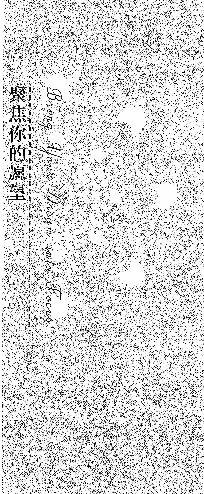
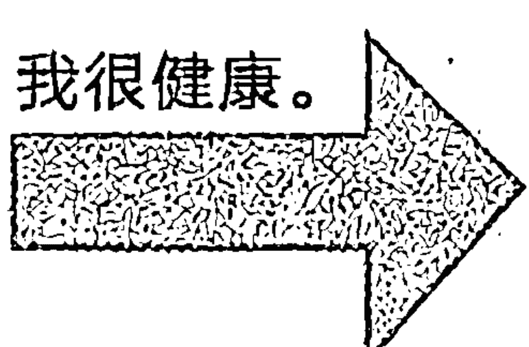
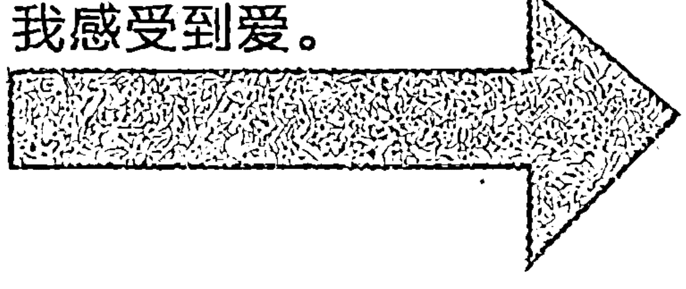
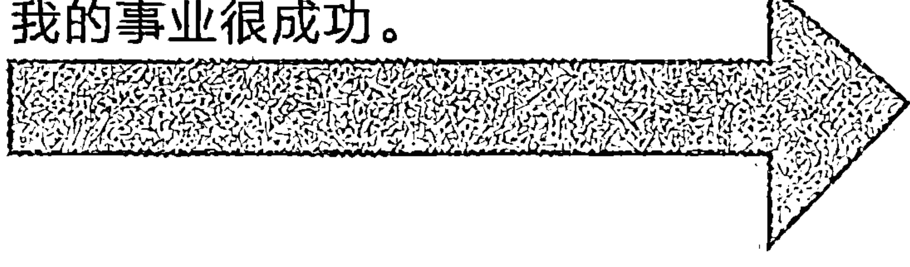
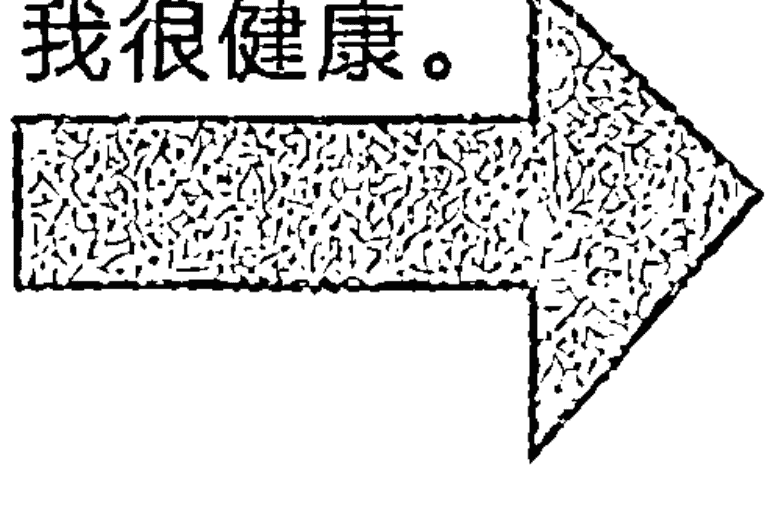
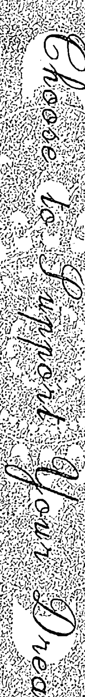

# 显化心原力

谨以此书献给我的父母，他们不仅让我许愿，也教我如何实现愿望。也献给凯西·科瑞，帮我将这些法则从愿望和梦想变成我自己实现的心愿。但愿有一天我能如悉报答你的慷慨和支持！

## 推荐序

亲爱的读者们，
我们身处在一个许多人时常感到失控的时代，为快速而多元的现代生活深受其苦。很多发生在我们身上的事情似乎并非是自己决定的。我们被世界大事件的速度席卷，遭受冲击和受到创伤。我们中间许多人渴望过上一种更纯朴，或许更简单，当然更加亲密和令人满意的生活，而不是仿佛默认被引导的生活。

人们常说，“我只想得到更多我要的东西，而不是其他的。”但是，他们又不知如何让这个改变的发生。这就是桑妮亚·乔凯特的工作价值所在。

太多时候，我们被告知我们应该过着更有灵性，但是又要遵循世俗规范更加成功的生活。坦白而言，我们都想如此，只是要有人告诉我们如何做就好了。我们不需要仅仅在头脑里想象可能和应该要过这样的生活。我们希望得到真正的盛宴，而不是画饼充饥。我们想要和我们值得拥有真正的方法。

桑妮亚·乔凯特不仅是一位大师级灵性导师，她也是一位将生活的诀窍用一系列清晰、简单而可行的方法与我们共享的老师。她很务实；她不遗巨细；她注重细节。她不仅告诉我们去做某件事情。她更是准确地告诉我们如何去做。

图书市场上充斥着大量起不到帮助效果的心灵自助书籍。它们承诺通过七个简单法则或是二十一个神奇的方法发挥功效，但是，当我们认真仔细地去研究这些法则或方法时，发现它们太难融入我们熟知的生活。譬如，“每天静坐一小时。”是的，这当然好，请帮我找到这一个小时吧。

乔凯特女士以可以消化的方式给予灵性指引。作为一名已婚、两个孩子的妈妈、全职作家、灵性导师和直觉力践行者，她不得不学习现代社会时间管理的艺术和诀窍。她的书籍教导她自己也必须学习的：在你所处生命的某个阶段，如何过上满意的生活。

过去二十年，乔凯特和我成为亲密无间的朋友。随着时光的流逝，我感受到她知识渊博、博学多才并举止优雅（她的语言像是一块被精雕细琢具有国际范的宝石）。

我才开始体会到，她用踏实、幽默又亲民的方式教导灵性，这是一种精心选择的方式。她通过故事和以身作则做教导，而不是说教，或者像许多人一样借用名望来粉饰和推销观点。

阅读桑妮亚·乔凯特的书不会让你感觉聪明。桑妮亚·乔凯特会使你变得聪明。每当有朋友或学生身处困境，需修复严重受损的安全感，我不会给他们推荐当今畅销书灵性大师，虽然他们的确都是不错的作者和老师。

一次又一次，对于灵魂饥饿者，这些人真正地希望改变和拓展他们的生命，我把他们推荐去乔凯特那里学习。我之所以这么做是因为她是一位帮助他人获得力量的老师。她帮助人们信任自己，而非她本人。在我的眼中，她异常地谦逊。“成为你自己的大师。”她常建议，并补充道，“这里是方法。”

衷心祝愿桑妮亚的工作，在你的生命里很有价值，正如它对我的一样。

茱莉娅·卡梅隆

## 译者序

我想上天让一个人超级认真读一本书的最佳方式就是翻译它，反观这本书也一定对此人相当重要。深深地感谢上天如此的厚爱，也深深的感谢心灵坊张专的推荐和明焰文化大为的信任，在素未谋面的情况下将此重任委托与我。

前几天接到张专邀请写个译者序，貌似挺突然的，也觉得很荣幸，但是也觉得自己的确在翻译的这一个月有许多的心得体会。《显化心原力》这本书偶然的出现在我的世界里，宛若突然刮来的一阵清风，和风细雨滋润心田，也若一抹阳光，和煦得恰到好处，我将它视作上天给我的恩典与奖赏。

回想当时刚从缅甸参加为期六十天的国际禅修营回国，恰好需要一段闭门即深山的调整期，而这本书成了我最好的支持与后盾，它让我心安理得呆在家里继续早晚密集禅修。早晚禅修之余的时间我用来翻译文章，身心互相促进，禅修和翻译也互相滋养，书中的方法也对我在缅甸禅修期间的经历做了梳理和厘清，因此越翻译越欢喜，越翻译越感恩。书中有许多真实的案例，TA 们的故事深深地打动我的心，在修行成长的道路上甚至我也有过类似的经历，因此感同身受和深受启发，有时我会感动的落泪，有时也会被鼓舞的落泪，感觉我们每一个人都不是一座世外孤岛，在这个世界上所有的人都渴望爱与被爱，都渴望获得自己理想的人生，只是没有找到方法、或者说正在找寻方法，每一个人都值得拥有自己想要的人生。这些不是虚幻不实的想象，而是通过具体落地的方法和步骤可以去实现的，最重要的是在这一趟心愿显化的旅程中，也将与自己悄然相遇！

整个翻译是一个有趣的过程，也是一个内省的过程，特别是在翻译前两章的时候，一度感觉无从下手，书中的提问等等都是我需要去问自己的，只有当我沉下来心去把这些题目都一一完成，才长舒了一口气，觉得可以继续翻译下去了。桑妮亚老师的英文非常的优美，她善用长句，在翻译的过程中需要不断地去推敲该如何断句，因此这些段落和句子就需要不断地去看、去琢磨原文的意思，力求能将原意用中文最贴切的表达出来。而有些部分的翻译仿佛就是一气呵成，中文的意思直接就从脑海中流了出来。翻译的进度并没有完全的按照计划执行，这个过程对我来说就是一个静心观照的机会，因为当不按照进度完成的时候，焦虑和担心就会蹦出来，让我活在未来，想着无法按时交稿，翻译也卡壳了。当这个时刻来临就是静心关照的时刻，也是实践老师教导的时刻。

翻译过程我也会邀请天使、指导灵还有连接桑妮亚老师的能量与我同在，很多时候我都能感受到这股力量的存在。特别在翻译第五章的时候，虽然这一章节是在中间位置，但是出于某种原因，却是最后完成的。就在截稿前的前两天打开这一章准备修改，发现文档上只有几百字，当时有点傻眼了，或许没有保存好，或许没有翻译，但是直觉又觉得不可能这么多都没有翻吧。当下，我接受现实，那就是完成这一章的翻译。那一刻，我下定意图一定要在当天完成，并邀请天使的协助，以及观想自己在今天就轻松地完成翻译，能在截稿前一天顺利完成所有的翻译，交付出版社能够按期完成后续工作。没想到的是，第五章的内容与我当时的处境相当的有共时性，里面讲述了好几个有趣的故事，都让我在翻译的时候心生无限欢喜，哈哈大笑起来觉得这真的是最好的安排。这里就不提前剧透了，我想大家在读到本书的时候，一定也会与我有相似的情景，这本书真是非常的落地和具体。而就在晚上八点四十分左右，完成了这一章的翻译，显示看了看字数 12005 字。这真是一个奇迹，一天能完成这么多字的翻译，同时还做了校对修改。

桑妮亚老师就像一位经验老道的导游非常清晰的通过一步步可行的方法，引领我们自己去实现自己内心最真实的愿望，那是与我们自己的天赋、使命和禀赋相关的，梦想成真并不是那样遥不可及，只是我们没有得到正确的指导，没有找到有据可循的榜样，而桑妮亚老师就在这里，她全盘托出自己亲身实践并也让无数的学员同样受益的九大创造力法则。与巨人同行不会让我们感到自己的渺小，而会发觉自己内在的光明如实如是。

我想您一定迫不及待的想一口气读完这本书了吧，可惜的是它不是一本需要一口气读完的书，通过我自己的经验，如桑妮亚老师的建议，最好是按照章节的认真完成每一个练习，再有条不紊的进入下一章的学习和练习，并且温故而知新，回顾前一章的内容，甚至自己单独用一个笔记本做练习都很有必要，既然要选择，那么就给自己选择一个美美的笔记本吧，看着就心生欢喜的笔记本吧，一切的美好都值得用美好去体验！

PS. 翻译期间我也运用桑妮亚老师教导的方法考前冲刺八小时，看完驾照考试教科书，妥妥的做了一次学霸（此处允许我做个鬼脸），而且考试当天帮助了一位小妹妹也通过了考试，原本她只是打算挂科，下次再来补考的，结果是她的分数比我还高。

吴玲芝（和雅）
二零一八年立夏日于长沙

## 前言

当我回想本书是最终如何得以完成，一种对所有老师深深的感恩之情流遍全身，包括物质层面和精神层面的老师。这本书的出现是我自己所显化的奇迹，心想事成。

让我告诉你它是怎么写出来的。

许多年前，当最开始做直觉阅读时，我发现最艰难的时刻是不得不告诉一些咨询者，他们内心渴望的事情并不会发生。每次出现这种情形时，我觉得仿佛自己在粉碎他们的希望，所以我真的很讨厌这样做。经过几年痛苦的“迁怒于报信者”经历，我决心这必须有一种更好的助人方式。如果咨询只是预言失败，而没有教他们如何迈向成功，我觉得自己的工作方法不正确。如果我做不到这样，那么根本就没有帮助他人。实际上，由于我那令人气馁的话而有可能使他们受挫。

那种想法真的困扰着我。充满直觉力是愉快的，但是我的工作却不完整。我不能继续只是做一个直觉力窥探者，当我感受到咨询者们的失落，我希望能够以一种切实的方式给予他们真正的帮助。我需要先学习这些方法。当我设定我的意图，整个灵性世界的学习都向我敞开。

我的学习过程从一出生就得到上苍的协助。妈妈是我的启蒙老师。二战期间在饱受战乱的欧洲，作为还是一个孩子的她遭受无法想象的困难，她为我提供了凡事皆有可能和坚毅的榜样。从她的身上，我学到了专注和想象的力量。她教我信任这个世界。凡是我能想象的一切，如果我能尽力做好自己该做的，这个世界都愿意接纳及支持我。

带着她的祝福和情谊，对知识的追求让我进一步研究宗教、形而上学和灵性提升。当我学习这些时，我开始理解觉知是通往成功的密匙。进入这个领域，我感觉像一个孩子跨入糖果店。我对学习充满了热情，热切地寻找答案，学习占星、数字学、塔罗、卡巴拉、气场、冥想、瑜伽、脉轮系统和任何看起来有关于教我意识如何在世间显化的东西。我想尽一切办法学习。慢慢地，我仿佛把一块巨大的拼图拼凑起来。我开始发现任何人都能创造他们想要的。

期间，我也被介绍认识了我的两位灵性导师，查理·古德曼和特伦顿·塔利博士。在他们的指导下，我才得知：实相是作为“以神的形象和像神一样”的灵性存在，我们才是自己生命经验的创意建筑师。我学到要将一个充满创意的冲动变成一个显化结果，这个过程是要始终如一、连续不断和不偏不倚的。从那时开始，我就将全部生命都付诸践行这些法则。这样做的过程中，我体验到一个接连一个的奇迹。我感到既惊讶又高兴，身边的人也为我一贯的“好运”感到惊奇。

终于，十四年后，我感觉迫切地要分享我和我的客户们一起学习的。最初，我开始通过一对一的个案介绍创造力的法则。我会帮助客户确认需要使用哪一条法则，这样他们能保持方向正确，并实现梦想。然而不久之后，我意识到通过一个整体把法则都展示出来，这样去教授的效果要好得多。

我的先生，派崔克和我设计了一个名为“现实的本质：如何创造你想要的”工作坊。最开始的工作坊很复杂，有太多内容。但是，通过实践和在学员们的帮助下，我们简化了它，直到我们精炼和提取工作坊的核心，把它变成简单、清晰指令，并吸收浩瀚的灵性教导的精华，并让它们简洁、实在和易于遵循。这种新的形式适合任何一个学员，只要他想要实现梦想，宇宙都会一路护送其直至成功。

这本书就是这么来的。它是过去二十五年多我所学习的结晶。我以卡巴拉生命之树为模型，卡巴拉是一种古代形而上的体系，教导创造力转变的过程。

书中我诠释了复杂的灵性法则及运用。我选择以一种简单的练习册的形式来书写，并用故事来举例说明每一条法则。如你接下来在书中会看到，我最大的精神影响是拿撒勒的耶稣和乔达摩佛陀，他们都用寓言故事教导我。在我的文字中，我使用现代的寓言，它们引自我自己的学生们、客户们以及个人经历。

我相信这些法则依然有待学习。我用一颗开放和热切的心期待学习它们。到目前为止，我所学到的东西比一盏（阿拉丁）神灯还要好，二十多年来为我照亮前进的道路。我的学习带给我的生活无限祝福，虽然它们还远不够圆满，但是我的心愿是与大家分享它。

书中的这些创造力法则带给我无数的奇迹、快乐的惊喜和深刻地感受富足、安全与宁静。通过与这些法则共同努力，我也学习到如果我能尽好本分，神会在中途与我相遇。过去二十多年里，我体验到由这些法则所带来的宇宙的大爱和慈悲，环绕我身边的一切都是我曾经真心渴望得到的。本着同样的爱和慷慨的精神，我想与你分享这些法则。简单来说，它们创造了奇迹。

成功的关键是按照次序一个接一个地遵循法则。成功地完成每一个法则会自然引领你进入下一个。如果学习受阻，就回到开始和回顾已学的法则，确保你已经完全地吸收领会每一条法则。

如果你是那种虎头蛇尾的人，或者很容易分散精力或受挫折，如果能找到一两位值得信赖的朋友，他们会陪你一起完成这些法则，这会有助于你按计划进行。

请注意你不必着急完成这些法则。最好慢慢来。正确地运用每一条法则，而不是焦急地往前赶，在错误的方向用功。

自己尝试这些法则，看有什么会发生。我全心全意地相信它们也会给你带来奇迹。这些法则已引领我体验喜悦而神奇的人生。愿它们也带给你同样的喜悦与神奇，我已经写好这本手册，希望它将指引你实现你的梦想。

## 热身准备

在致力于实现你的梦想和心愿之前，你必须遵守以下三条规则。

### 规则一：轻装上阵

如果朝着梦想前进，不要执着于你的恐惧。当你踏上这一趟通往心的创造之旅，将所有的猜测都置之脑后。不要让自己背负无用的概念、二手的建议，或者其他人解释给你的“现实”。只要你运用宇宙创造力法则，你就能创造任何你想要的。这里没有偏袒和好运。然而，这里有共识性与恩典。如果遵循自然的创造力法则，你将一路收获这些礼物。
开始你的创造性使命，知道自己是一个灵性存在，在这个地球上彰显创造力的神性，并记得自己是谁。

### 规则二：对自己的梦想负责

为了实现你的梦想，你必须首先知道自己是一个神圣的创造者。正因为如此，你已经在你的生命里创造出许多奇迹，即使是那些你并不喜欢的，也折射出你的创造力。这意味着你不能埋怨他人、推卸责任、指手画脚、感到委屈，或者允许自己对目前生活方式感到愤怒。

换句话说，为自己负起责任，欣赏你已经创造出来的生活，即使它是一团糟。即使一团糟也需要有创造力才会产生。失望地看看你生活的方方面面；好的、坏的，或不好不坏的。每一项都有你个人不可磨灭的印记和独特的创造力。如果你的生活现状不尽如人意，那么决心创造另外一个吧。总而言之，只要你不陷在今天它多么不好之中，无论你的处境怎样，你都将能扭转局面。

我的妈妈过去经常跟我们说，“祝福你的混乱。”用另一句话说，将你的情绪浪费在沮丧上是没有意义的。更重要的是，不要浪费时间生气或者责备他人导致你的现状。如果这样做，你向他们放弃了你所有的创造力。而且我可以肯定，他们也不会用它让你变得更加快乐。

你或许忍不住要问，“你是说我要对我不公平的老板、粗鲁的伴侣、糟糕的健康和讨厌的工作负责吗？”

并非如此。但是，你的创造力让你陷入那种处境，并且它也能让你脱离那个困境。无论今天你在生命的哪个位置，没有什么能够阻挡你在明天实现梦想。即便是一个可怕的场景也蕴藏着让你挖掘自己最深天赋的潜力。

让我们面对它。当事情进展顺利时，我们都往往能创造性地发挥。当我们受到责难时，创造力思维的轮子就开始打滑。

我的妈妈给我讲过一个故事，可以说明这一点。罗马尼亚出生，她在二战期间还是一个孩子就被囚禁在集中营中。因为她天生的幸运和直觉独创性，她设法幸存下来。

在美军抵达之后，我的妈妈从集中营中被解救出来，在附近一个巴伐利亚小镇获得自由。为了重建秩序，部队执行非常严格的物质供给制度。乡下已经完全被战争所摧毁，每一个都在争夺食物、衣服和日用物质。按照妈妈的话来说，这也是每个人“竭尽所能发挥创意的动机”。

她的一个朋友，一个名叫拉罗什的吉普赛人，想去偷一条部队的毯子，这严重违反部队的规定。天气冷得刺骨，甚至连士兵们的补给都短缺。很不幸的是，拉罗什被逮个正着，并抓了起来。他被当场发现，这样的犯规被处以在部队监狱囚禁三个月。

我的妈妈和其他几个人聚集在一起，试图想一个办法帮助拉罗什离开监狱，绞尽脑汁为他的偷窃寻找可能的理由。最后，我妈妈想到一个办法。她建议在法庭审判时，拉罗什应该说他是个色盲，不能分辨他偷的这条毯子是部队的。

多么有创意的一个解释！法庭一定也这么认为，因为他们接受了他的捏造。拉罗什被无罪释放。

妈妈说这种类型的脑力震荡引发出每个人最佳的创意。人们没有时间为自己生气或者感到委屈。如果他们想活下去，他们不得不运用创造力想出办法来。尽管问题看起来是一个人无法承受的，他们团结在一起，一天比一天更聪明。小小的事情，譬如找到一颗土豆或一枚鸡蛋，都能成为巨大的胜利。

将你的力量臣服于责怪、嗔恨、愤怒或感觉像一个受害者，这是你能做的最坏的事情。无论身处何处，利用你的处境作为一个飞往你梦想的发射台。

### 规则三：不要成为一个控制狂

做一个控制狂意味着在冒险之前，你想要保证获得成功。它也意味着在尝试之前，你想要避免所有潜在的受伤或失望。它意味着在一开始，你就需要知道你会成功。但是，这意味着失败。因为控制狂想要的这种保证是一份成功的礼物，勇气和冒险的成果，它不能提前获得。

想得到某个结果的承诺，这意味着你限制自己的付出，回过头来也减少你的回报。最终，避免失望是逃避生命本身。因为失望是一位必要的老师，它让我们明白当我们跌倒在路上，我们需要换个新的方向。

如果你是一个控制狂，你就无法自由的创造。因为自由的创造来自真实本质、真正的自己——你的灵魂。从控制的角度去创造是企图用小我创造，你无法实现真正的心愿。真正的心愿是灵魂的展现。

显化心原力
20

当你迈向创造梦想之时，请记住这三条简单的规则。我最喜欢《易经》上的一句话，这句话完美地诠释所说的这一切，“如果开始是对的，那么结果也是对的。”因此，为了保证有一个美好的开始：(1) 轻装上阵；(2) 对自己的梦想负责；(3) 不要成为一个控制狂。

## 现在你是神圣的造物主

在你开始致力于实现心愿之前，认识自己已经取得的创造性成功非常重要。列出你所有最伟大的成就，从出生到现在，作为一种肯定自己创造力的行动。

## 法则一

### 聚焦你的愿望

创造力法则一，简单来说就是，你的念头创造实相。因此，如果想要创造一种经验，首先对那种经验要有一个清晰而明确的想法。法则一也表明，任何你所清晰聚焦的，无论想要与否，你都创造了它们。

想法引导聚焦。如果愿望模糊不清，注意力也会变得模糊。如果想法是真心实意的，注意力将变得敏锐和清晰。这是为什么模糊不清的愿望永远也无法实现，但是清楚的心愿将成真。清晰的聚焦是心灵的魔法棒。它将你的创造力向特定的方向指引，你想要创造的经验就会尾随而至。无论何处，只要有清晰的聚焦，你都能创造你想要的。

作为一个十几岁的少年，我从妈妈那里第一次学习了这一课。记得有一天，我很伤心地去找她，因为十年级毕业舞会眼看逼近，而我却还没有舞伴。更雪上加霜的是，在我们读高中的年代，松糕鞋是必备单品。在我读书的西班牙学校，男同学身高都是五点五英尺。身高五点八英尺的我再穿上松糕鞋，就成个头突出六英尺的壁花，没有人愿意邀请我跳舞。当每一个人都准备在舞会上翩翩起舞，我感觉像灰姑娘似的被忽略和拒绝。

妈妈同情地听完我的诉苦，却没有给我所期望的回答。

“我不惊讶没有人邀请你参加舞会啊。”她说道，“毕竟，通过把注意力放在男同学们身材多么矮小、你感觉多么尴尬，你自己创造了这个问题。你的专注把舞伴们都赶跑了。为什么不把注意力放在遇到一个足够高的男生，这样你就可以穿着松糕鞋参加舞会呢？把注意力集中在创造一个高大的王子带你去舞会上吧！”

“怎样做啊？”我叫道，“舞会只有三周就要开始了。我没有时间集中注意力创造任何事情！”

“喔，不！你有足够的时间创造你想要的。”妈妈说道，“奇迹可以在任何时刻发生。”

不甘落于人后，于是我决定放手一搏。

我的焦点开始在想象一个英俊男孩，他来接我，并带我去参加舞会。情景像电影一样在我的脑海里浮现。我想象出一个非常高大的男孩，我可以穿上松糕鞋，不再比对方高了。（松糕鞋现在看起来并不重要，但是事实上它们是关键。在十六岁时，我的外表是一切。而松糕鞋就是最重要的部分。如果你都没有一双松糕鞋，那只能说明你不够酷）

在接下来的两个星期里，我把注意力都集中在梦想约会上。有时，我列出一个清单，写出我的王子具备的特点：高大、帅气、会跳舞。而有时，我在笔记本上素描他的模样：长头发、瘦瘦的、长得像大卫·鲍威。我甚至都偷偷告诉我的一位闺密，并把她也拉进来。我们以详细而鲜活的细节，轮流向对方描绘各自想象的“梦中情人”的模样。当焦点变得越来越集中时，我们甚至都会兴奋得扭起屁股来。

每天早晨醒来的时候，我的脑海里就是他的模样。每天晚上将要睡着时，我想象着他开着加长版豪车来接我。为什么不这样想呢？这是我自己的电影。我在每一个角落寻找他，我在每个时刻期待他的出现。我让自己进入一个翘首盼望他出现的状态。

我这样整整做了两个星期，并对结果非常有信心。但是，尽管如此努力，“他”并没有如愿出现。在舞会前最后一个星期，我的情绪开始跌落，信心也随之下降，我的焦点变得模糊不清。

舞会前的三天，还是没有舞伴，我再也无法忍受。

当想象力准备开始现在已经熟悉的惯例，我对自己说，“算了吧！我都不想去参加那个愚蠢的舞会了。”

眼看希望即将落空真让人难以忍受。于是，我决定买双新鞋子来安慰自己，然后去看一场电影。

继续努力了一个下午后，我去了附近一家新开张的鞋店，看看有什么合适的鞋子。展柜上摆着一双我见过最漂亮的松糕鞋。一双白色松糕鞋，镶嵌着闪闪发光的人造钻石、六英寸蓝色塑胶底。

太棒啦！我必须买这双鞋。

当我拿着鞋子，想到它们是多么适合在舞会上穿，可是我都不会去参加了，心情就往下低沉。我拿起鞋子去收银台，等着售货员过来。过了几分钟，一个我见过最帅的男生从帘子后面出来：长长的金发，六点五英尺，瘦高个，而且他还穿着一双非常酷的格纹松糕鞋，长得就像大卫·鲍威。一看见他，我就屏住了呼吸。

“有什么可以帮你的吗？”他问道。他从我的手中拿起这一双样鞋，扬了扬，问道：“这是店里最好看的一双鞋了，对吧？今天刚到的新品。不想试一下吗？”

我对自己的反应有些小小的尴尬，我说：“当然啦，为什么不试一下呢。”当他拿着给我试穿的鞋子返回时，我已经平静下来。我把鞋子穿上，刚好合适。

“你一定要买这双鞋子。”他说道，“穿上真是太酷了。走一圈看看，让我好好欣赏下你。”

我爱上这双鞋子和这个售货员了，但是……“我不能买这双鞋子，”我说，回到现实，“它们太贵了，并且我没有机会穿。”

“如果你买这双鞋子。”他说，“我会带你去任何你想去的地方。”听到他这么说的时候，我察觉到自己正仰慕地看着他！

“我才不相信你，”我说，“你不过想推销罢了。”

“不，是真的。你想去哪儿呢？”

“舞会。”我开玩笑地回答道。

“好呀，去舞会。”他笑着说道，“什么时候？”

我的脸红了。“嗯……”我鼓起勇气继续说道，“这周六晚我们学校有一个舞会，但是我相信你已经有安排了吧。”

我心想这么帅的男生怎么可能没有约会呢？

“没有，我没有安排。很荣幸能参加。告诉我在哪儿吧。”

几分钟之内，我有了舞伴和一双崭新的“水晶舞鞋”。

周六晚上，我的王子开着他爸爸的黄色凯迪拉克到来。虽然不是加长版豪车，但是已经非常接近了。最棒的是，当我在门口迎接他时，我看到他除了那绅士的燕尾服，他还穿着一双超级帅气、闪亮的红色镶钻松糕鞋，正好搭配我的那一双。我们俩很有型地滑进舞池，度过一个特别美妙的夜晚。自从那以后整个高中，我们都在一起约会。

如果以前我对专注的力量有任何的怀疑的话，顷刻间它们就荡然无存了。

你自己试一试，看看结果怎么样。

### 你怎么知道要专注什么？

作为创造力法则的老师，根据我的经验，人们通常并不知道什么是他们的内心愿望。实际上，真的一无所知。

当一想到“愿望”这个词，就想到热情、向往、非常地渴望。当你有一个真正的愿望时，对某个经历或者结果会有一种强烈的冲动。这种燃烧着的、强烈的和充满激情的渴望就是创造力的火花，推动奇迹变成行动。若没有这样的渴望，将一无所获。如果你没有这种真正强烈的火花，奇迹产生的创造过程将消停。

模糊不清、杂乱无章的想法缺少让你的能量转变成行动所必须的火花。真正的心愿是在当下这个时候感受到的，它反映出你最紧急的需要和关注。

真正的心愿是在此时此刻感受到的，它反映出当下你最直接的需要和关心的。如果你对自己的心愿感到困惑，从审视眼前的生活开始，问问自己到底需要什么，诚实地评估还缺少什么。有什么特别的东西你一直在等待？有什么是你没有注意到的，因为它太明显以至于你都忽略了？

不要笑。有时候我们反而忽略自己内心最深的渴望，因为它们躲在众目睽睽之下。

一个名叫洛林的客户，她在心愿工作坊课间休息时来找我。

“我想我最好还是离开，”她说，“这里每个人对他们想要创造的都十分清晰，只有我还是毫无头绪。”

“洛林，在你离开之前，我想问你，你什么来参加这个课程？是什么原因让你来到这里的？”

“沮丧，”洛林答道，“我想或许能得到一些灵感，因为我总是觉得很焦急和空虚。这真令人沮丧！”

“好的，可能从觉察什么让你沮丧你能找到一些心愿的线索。”我建议道，“你的生活里缺少什么呢？到现在为止，有什么是你没有经历过的？”

“缺乏快乐。”她抱怨道，“我在生活里找不到任何乐趣。”

“快乐对你来说意味着什么？你会喜欢什么样的体验呢，譬如说，明天？”

“我都不能回答这个问题，因为无论我想什么，我都做不到。”

“为什么做不到呢？什么阻挡了你？”

“责任！我有许多责任。我有三个儿子，他们要踢足球、打棒球、家庭作业……我要做家务、准备晚餐、洗碗、兼职工作，并且我先生什么也帮不上忙。所以我不能快乐。这不可能。我没有时间。”

“这就是你的线索，洛林。”我说道，“我听出来了，你的心愿是希望在处理家政上得到一些帮助。这样一来，你就有属于自己的时间。如果这就是你的愿望呢？”

“那真会是一个奇迹！”她笑了，带着一丝烦恼，“我从来都没有想过啊。这听起来像是一个无趣的愿望。我以为心愿应该更加光彩夺目。这个看起来太实在了。”

“嗯，这就是这些法则的全部含义，创造出你所需要的奇迹。”

洛林决定将注意力集中在请人打扫房间和处理杂事的奇迹上，因为这是她真正需要的。她只是没有看到这一点而已。

这是一个真正的心愿吗？

当然是的。

### 如果对自己的心愿感到困惑怎么办？

通常我的客户们并不清楚他们想要的是不是真正的心愿。例如，参加心愿工作坊后，卡洛尔预约个案咨询，因为她觉得很困惑。

“我以为我的愿望是嫁给我的男朋友，詹姆斯。”她说，“但是，三个月前我们分手了。因为，我觉得这个想要嫁给他的念头让我感觉不舒服。可是，当我参加你的工作坊，你让我们通过关注生活里缺少什么去找到真正的愿望。我所想的全是詹姆斯。现在，我觉得自己犯了一个可怕的错误。更糟糕的是，现在詹姆斯说他也不想娶我。我感觉真糟糕。我真的把事情搞砸了。”

“卡洛尔，”我说，“让我们更仔细地看一看你的心愿吧。首先，让我们把注意力放在你与詹姆斯的关系上。一定有分手的原因，那会是什么原因呢？”

“主要原因是詹姆斯不负责任，”她说，“他没有稳定的工作，结果我要支付大多数费用。有时候他有钱，有钱的时候他还是会支付账单。但是，我就是不知道是否可靠。我觉得他有所有的自由，而我要做所有的工作。”

“好，听来倒是一个不错的理由结束这段关系。那么你爱詹姆斯哪一点呢？对于他，还有什么遗漏的呢？”

“詹姆斯是一个非常热情洋溢和令人振奋的人。”卡洛尔说，“他是一个社会活动家，他的生活里有各种有趣的人和经历。与我这无聊的生活相比，詹姆斯活得更生机勃勃。没有他，我的生活真的很乏味。”

“卡洛尔，当我在教创造力法则的时候，我强调把关注点放在自己真正想要的。你这种情况，我相信詹姆斯并不是你真正想要的。你想要的是他带来的生机和创造力。詹姆斯不过是你达到目的的一种方式而已。为了实现你的梦想，你必须想想为自己创造出那样令人兴奋的事情。”

卡洛尔的脸红了，看起来有些尴尬。“桑妮亚，我一点都不认为自己有创造力或激情。我会觉得自己好笨。那样不像我。”不过，她的语气听起来并不确信。

“好啦，卡洛尔。真是这样吗，或者只是习惯这么认为？你有没有想过热情激昂地去做一件事情呢？”

她想了想，然后说：“我的确对环保很有热情。并且，诚实来说，我必须承认我还是有公众演讲的天赋。”

“那为什么不把这个作为你的心愿呢，提升演讲能力并且参与像绿色和平这样的组织？”

卡洛尔带着重新定向的愿望离开，朝向真正的心愿：一个属于她自己的更有意义的愿望。几个月后，我收到她的来信。她告诉我，她积极地参加了拯救地球组织，还加入了主持人协会。她还说正在和一位非常低调的男士约会。他特别支持她。她说她现在的生活很精彩，这段关系也让她感到安全，与之前和詹姆斯在一起虽有意思却不愉快的生活截然相反。

### 大胆去想

在确认自己的愿望时，许多人常犯一个错误，好像只被允许有一个愿望，因此必须选择正确。而且，最好是一个能想到的具有最崇高的道德和灵性的愿望。但是，这种严格且惩罚性的方式，阻止你找到自己内心真正渴望的。

事实是你可以创造，并且无时无刻不在创造，即便所创造的和脑袋里想的很不一样。事实上是一旦学习如何实现愿望，想要多少就能显化多少。在学习的过程中你会发现，创造力就是创造力。

生活的每一个方面都是奇迹，无论大小，满意或不满意。洛林才知道她的障碍来自确认自己真正的愿望，因为她不知道最明显和最实际的需要就是对真正的心愿的支持。

卡洛尔认为对热情的追求不能算是一个有价值的愿望。每一个例子里，关注点要么太局限，要么太高尚，这两位女士都忽略务实和需要。

没有以一种切实际的方式了解我们需要什么，我们停滞不前。

### 现在你想要的是什么？

我的老师告诉我，真正的心愿不是在遥不可及的将来，而是在当下就能感受到，那种热情洋溢与强烈的愿望。如果不知道想要的是什么，有可能目光太过长远，反而忽略当下显要的需求和愿望。

几年前我体会过这一点，当时我很困惑自己实现心愿的能力。我想写一本书，可是在生命的那个阶段，我有许多的事情需要照料。所以总是找不到时间或灵感开始写作。我为自己缺乏进展而感到沮丧和内疚，这让我倍感气馁。

将创造力法则一运用于我的处境，我检查了自己的愿望与信念。虽然，我想写一本关于用直觉生活的书，但是内在的声音不断在告诉我时机不对。作为一个责任心强而又顽固的人，我不喜欢不断浮现于内心的这个信息。我的头脑说，“继续前进。快点！把握好今天！”但是，内在的另外一个声音说，“保持耐心。”最后是这个内在的声音得到深思熟虑。

我问了自己几个非常重要的问题来确认愿望：

- 我害怕吗？
- 我觉得没有安全感吗？
- 我觉得自己的写作水平不好吗？
- 我在欺骗自己的写作能力吗？

逐一测试这些问题，我不得不诚实地说没有。恐惧不是让写作停滞不前的障碍，这让我进一步认真思索和客观看待。拖延的真正原因终于真相大白。

现实生活是我有两个年龄尚小的女儿，一个一岁和一个两岁、一座重新装修后凌乱不堪的房子，以及一个每周要出差三天的丈夫。在那个时候，写作的工作不可能是我真正的心愿，虽然它可以作为未来的愿望继续存在。

我的诚实反思揭露出我真正想要的是有时间陪伴女儿，而不用感到内疚。我也希望能够让十五个月的女儿一觉睡到天亮。这是一项尚未完成的壮举，大多数时候都是让我精疲力竭。那时，另外一个心愿就是整理好乱七八糟的房子。这些事情都是我所关心的。这些愿望对我来说是很重要，虽然我看不到它们的存在。写一本书只会把我的关注和精力都远离当下的愿望，这就是为什么总是无法动笔的原因。

这是一个清醒的时刻，它告诉我要一步一个脚印去靠近我的愿望。当双手都被一座乱糟糟的房子和孩子所占据，写一本书的心愿是无法达成的。当心思在另外一个方向时，愿望是无法实现的。我的愿望需要时间和耐心，可这两项当时都不具备。一旦确认事情的合理顺序，我就将精力放在真正的心愿上，同时感觉如释重负和向前迈进了。

如果你正在内心与自己的心愿斗争，不确定是否是你真正想要的，务必确保自己没有忽略任何当下最需要你关注、注意和关心的事情。它或许会是直觉力引领你先做其他的步骤，必须先为实现心愿打下基础。

如果你无法确认你的心愿，可以尝试理清楚此刻什么让你心烦、抑郁、沮丧、激怒、疲惫、生气，或前进。当你辨认出这些事情，问相反的你自己想要的是什么。

记住创造力法则一是你创造出你聚焦的。关注是关键。把自己关注的放在首位，并密切留意。关注是敏锐地将你的注意力集中在非常一个紧凑而具体的区域，譬如今天、明天、这一周。忘掉明年吧！把注意力聚焦在自己身上：今天你的生活、你的处境、你的健康、你的家庭、你的关系。很有可能在这些方面，你的注意都聚焦在不喜欢的方面了。

### 你是否集中精力在

- 多么不喜欢你的工作？
- 在关系中非常不开心？
- 自己多么嫉妒某些人及他们所拥有的？
- 自己多么没有魅力？
- 自己多么穷困潦倒？
- 自己多么孤单、不被理解，或倒霉？
- 自己多么疲惫、承担过多责任，或忙碌？
- 你的身体是多么不健康、不合作、不舒服？
- 你是多么困顿、无聊和沮丧？
- 你是多么没有成就感、没有动力和一事无成？

如果这样，你创造出所有的这些情境，即便它们让你不开心。你必须做的是转移焦点到更加愉快的经历，例如：

- 从事一份自己特别热爱的工作
- 被爱及被欣赏
- 体验丰盛
- 感受到自己真正的美
- 轻松地支付账单及智慧地花钱消费
- 与他人相处融洽
- 毫不犹豫寻求帮助
- 健康和谐的身心
- 有时间滋养自己
- 感到欢欣鼓舞、有创意和有成就

“但是我怎么能做到这些呢？”人们抱怨道，“这并不是真的！”

我只能分享从我妈妈那里传承下来的伟大智慧。你现在所经验的就是到目前为止。总是乐意去接受惊喜。明天仍在创造之中。

### 真正的心愿对比“应该的”心愿

另外一个发现你真正心愿的障碍是拒绝你真正热爱的，因为你觉得羞愧或者用理智将其拒之门外，认为它过于庞大，不现实。

参加完心愿工作坊后，迈克尔预约了一个阅读个案。他的愿望很清晰，然而却感到没有那种燃烧的激情，这是将心愿变成现实的必要因素。

“我知道我要的是什么，”他说，“可是，我就是觉得没有动力。”

“你想要的是什么呢？”我反问道。

他回答说：“我希望读法学院，并且拿到文凭。”

“还有其他的吗？”

“我希望赚很多钱，然后很年轻就退休！”他说。

“还有其他愿望吗？”我继续问道。

“没有了……嗯，不过，还有一件事情。我希望某一天有钱了，我能去学习拍电影。但是这个愿望不切实际，”他不以为然地补充说完，“我需要聚焦在真正的愿望上。”

“你喜欢拍电影吗？”我试探性地问道。

“我爱电影，只是对任何人来说找到一个空隙时间真的不容易。如果我很有钱，并有机会能去拍摄电影，那将是多么令人兴奋啊。不过，那是一条很长的路，如果真是那样的话，我必须专注于当下。要是能让自己充满干劲就好了。或许我需要百忧解。”

当我在听迈克尔说话时，听到的都是逻辑、消极和悲伤，以及一大堆的恐惧。运用他的头脑创造出一个计划，这个计划却忽略了内心真实的声音，而是给他一个替代品。（记住，真实的愿望，来自内心，而非头脑。）

最后，我忍不住问道：“迈克尔，当你说法学院时，你的声音没有能量。你为什么要选择它呢？”

“嗯，我希望能有钱交学费。并且我的父母都挺喜欢法学院，他们会替我交学费。”

“他们是怎么看待你对电影的兴趣呢？”

“不怎么看好。他们说拍电影太难赚到钱了。”

“哦，是吗？他们是电影制片人吗？”

“不是……”

“他们认识电影界任何人吗？”

“没有……”

“你呢？”

“有啊，我有几个朋友学电影专业。”

“那他们找到工作了吗？”

“找到了，但是需要时间。”

“所以你就理智地决定最好把时间放在拿到法学院文凭上，对吗？”

显化心原力

16

“是的！除非，我得不到结果。我已经连续申请两年啦。”

迈克尔的问题是他的理智让他误以为，实现真正的心愿是财力不够和无法获得经济支持。追求真正的心愿将是浪费时间。这一个信念，加上继续让父母为他的生活负责完全阻碍了他。然而，事实是不去跟随自己的内心和踏上电影制作这条道路，迈克尔真的在浪费时间。在他来找我之前，已经浪费了两年时间。

我建议迈克尔再次诚实地评估他的心愿，考虑去读电影学院。我告诉他如果这真的是他的心愿的话，他一定会找到方法去实现它。我也建议在对电影行业赚钱潜力做出结论之前，再给这个愿望一个机会。我建议他为自己的梦想承担起经济责任，不再依靠父母。这有点让人感到恐慌，但是对他却是一个非常有趣的概念。

“好好想一想，让我知道你做的决定。” 我说。

迈克尔直到过了三年半才与我联系，当时我收到他的留言。又一年没有申请上法学院，他终于将心愿从法律转到电影，并且得到一千美金及其他经济援助支付学费。迈克尔在电影学院表现优秀，特别是剪辑。现在在一家薪酬丰厚的广告公司工作。他专心致志于拍摄故事片，已经制作了三部独立影片。他发现经济的需求简单又轻松地解决了。最重要的是，选择自己的梦想，他感觉非常满意。

如果你觉得了解你的愿望受到阻碍，问自己是否

-   1. 忽略了生活中最明显和最直接的需要。

法则一 聚焦你的愿望

17

-   2. 用别人“理智的”心愿代替自己真正的心愿。
-   3. 你没有理会真正的愿望，认为它们不重要或是不切实际。

### 如果还是不知道想要的是什么？

如果准确地知道自己想要的是什么，那么你很幸运。你已经超过了大多数的人。很多人的心愿只是来自于浅显的层面，仿佛在糖果店里眼睛睁得大大的孩子，希望得到看到的每一颗糖果。不幸的事实是，实际上我们的确得到了想要的糖果，瞬间囫囵地吞下去，留下的只有肚子痛的失望。

如果你可以感觉和感受到一种更深的心灵渴望，这种渴望表达你的创造力，分享你的爱，为这个世界贡献你的擅长，那么你就走在正确的道路上，真正的幸福从那里而来。宇宙以一种非常有序的方式运行。思想和意图创造来自真我——你的灵魂的思想和意图带来和平与喜悦。

如果你对自己想要什么一无所知，不知道你的心愿。那么，有可能你要用做减法的一个过程找到答案。从把焦点从自己身上移开，聚焦到帮助他人开始。去一些让你感兴趣的地方做志愿者，无论是图书馆、食物银行、医院或是募款机构，都不要紧。就全力以赴地去做吧！这样做，你会记起自己真实的身份，因为你和自己的心一起工作。

尝试24小时不间断地去做，你会看到效果。慈善和公益事业是小我粉碎机。它们打破自私自利和控制的需要。将你从背负的沉重中释放出来，重新与世界获得连接。

### 这里有一个好主意！

如果觉得自己完全被卡住，需要一些灵感，另外一个发现心愿的方法是连接内在创造力自我。这个方法就是给它取个名字，直接与它对话。

我叫我的创造性内在自我“好主意”。如果你也喜欢，你也可以用这个名字。每一次当我觉得精疲力竭、灵感匮乏或不知道自己真正想要的是什么，我就是闭上眼睛一会，询问“好主意”帮助我聚焦在我真正的需要上。这些年在“好主意”的指引下，我得到一些非常惊喜的建议。

例如，在一次特别长的加班加点后，我发现自己（一点都不惊讶如此）精疲力竭、看每个人都不顺眼。虽然我尽量聚焦在让自己感受所需要的平静，但是休息和放松的办法并没有奏效。一天，当我处在这种负面状态中，我冲着派崔克和孩子们宣泄情绪，局面真的很难堪。之后，我想是时候和“好主意”聊一聊了。

“好主意，请帮帮我，”我说道，“我需要指引。我很暴躁、疲惫，而且我不知道我要的是什么。我的家人也对我很生气。我真的太累了，累得都无法思考。请给我指引方向吧。”接着，我闭上眼睛，放松了一会。

突然一辆自行车的形象浮现在脑海里，我有两年没有骑过自行车了。当然！我想，我都忘记了多么喜欢沿着芝加哥湖边骑行，看着清澈的湖水和享受与人共处的时光。多么好的一个主意啊！

通过连接你的创意和灵感，好主意也能帮助你。这一部分往往被忽视或误用。通过与内在的自己进行一次简单的心与心交流，你直接挖掘出具有共时性和创造性的灵感。

认识在你内在的“好主意”，请他或她帮助你准确地了解此刻真正的需要。你将为他或她的通情达理感到震惊。

### 数数你的幸福

另外一个穿越困境的好办法就是现在数数你的幸福。现在你喜欢的是什么？哪一部分心愿已在今天的生活里实现了？暂时忘却未来，回到当下。留意你已经收获的创造性成果。

不断地聚焦在“更多、更多、更多”，让一个人变得更加贪婪和懊恼。佛陀曾说，“一切苦的根源来自于对物质的贪爱。”记住喜悦来自于创造，而非占有。如果你选择走的是一条物质主义道路，那么学会做减法而不是加法。要明白其实自己需要的并不多，而不是还需要拥有更多。回归大自然。正如《圣经》上所说，“想想田野里的百合。所罗门，在他所有的荣耀里，一切如此井然有序。如果上帝今天会赐予我们如此之丰盛，那么想想，在明天的烤箱里，他将为你做些什么。”

呼吸鲜花的芬芳。触摸大树。将脚丫置于溪流中。感受脚下的泥土。回归大地。回到此刻，感受宇宙的丰盛围绕着你，一切为你的喜悦而存在。

显化心原力
20

### 找到你的心愿，你必须成为自己

如果你找不到你的心愿，或许是因为你不能找到自己。想想看有可能你洞察需要的能力被沮丧、上瘾或疲惫所麻痹。如果怀疑有可能真是这样（虽然很不情愿承认这一点），把确认问题所在，并找到合适而有爱的解决方案作为你的心愿吧。这些可能包括体育运动，或寻求专业咨询，或是加入戒瘾康复团体。

### 控制从来都不解决问题

最后一个阻挡你找到心愿的障碍是控制、欺骗、伤害或者以任何形式利用他人。这些欲望很可能是令人沮丧的目的。记住，真正的愿望源于内心，你的真正的神圣本质。是在你之内神性创造奇迹，而不是小我意识。

如果你的愿望对他人产生伤害或者缺少诚实，它们肯定源于恐惧或懒惰的小我意识，在其后没有真正的生命动力。你会在自身消极中煎熬。毫无疑问身体和心灵都将受苦。造成伤害的愿望只会染污灵魂本质，严重破坏你的身体健康和情绪平衡。但是，最重要的是，它们反映了你对创造力极其的滥用。

这让我想起几年前找我做阅读个案的一位客户。

有一天，一位女士出现在门口，她穿着红色连衣裙、红色长筒袜、红色鞋子和一件红色夹克。她还戴着红色耳环，她的指甲当然也是红色的，一种特别鲜艳的渐变红色。

这位红衣女士来找我，因为她的先生和家人都让她感到很难过。照她所说，她嫁给了一个“非常不错，但就是不赚钱”的男人。她感觉他成了她的负担。

她还告诉我，她与姊妹们关系疏远。她说在照料母亲病重临终时期，姊妹们不仅没有帮忙，甚至都不感激她所做的一切。她抱怨自己承受着巨大的经济压力，觉得自己被那些自私自利的姊妹们所抛弃。她的心愿是丈夫能够赚一大笔钱，姊妹们能公平地分割母亲的遗产，把属于她的一份给她，因为她承担所有的照料。在诉说她的经历时，她有时候伤心得痛哭起来，以至于都无法说话。她最大的心愿就是希望得到欣赏。

我的阅读却呈现另外一番说法。我看到她的丈夫是工程师，有一份好工作。由于母亲并没有留下遗嘱，她是那个得到全部财产的人。我还看到她并没有经济问题，她的关注点被崇尚物质主义的态度所扭曲，因为很久以前的伤害仍然对姊妹心怀芥蒂。

几个月后，另外一位叫露易丝的女士来做阅读个案。很明显她的妹妹控制了生命垂危的母亲，让她取消遗嘱。露易丝准备将这个妹妹诉诸法庭，公平地分割遗产。

我很快意识到露易丝的妹妹就是几个月前见过的红衣女士。露易丝告诉我，她的母亲留下了价值千万的美金，甚至超过不止这个数目的遗产。所有的财产都被红衣女士占有，包括每一张旧照片。据露易丝所说，红衣女士总是设法得到

显化心原力
22

母亲的关注，直到母亲开始生病，她与母亲相处得并不愉快。当母亲病了，所有人都感到惊讶，红衣女士搬去与母亲一起住。不久之后，她开始制造困难，让其他人都无法去探望母亲。母亲去世后，红衣女士就将母亲的一切都据为己有，一点都没有分给其他姊妹。现在，姊妹们要与她对簿公堂。

我想这表明尽管红衣女士是一个百万富翁，但是她就如破产者一样。因为她的内心并不能真正享有恶意获得的财富。她的焦点仍然在缺少母亲的关注，这是姊妹们多年来都拥有的。纵然得到千万美金，但是依然觉得被欺骗，她成了一个骗子。

对红衣女士的行为可能做出各种评价，但是有一点非常显而易见：任何用愤怒、妒嫉或操纵手段得到的都无法荣耀灵魂本质。如果你认为别人拥有了属于你的东西，并且必须争抢或谋划如何夺回来的话，那么你的观点是扭曲的。宇宙有无限的爱倾注于你的灵魂，给你所有你需要的力量去创造任何你想要的。

不要误以为你的梦想掌握在他人手中，被这种幻相所迷惑或分散精力。记住，当你为自己承担起责任，你将得到整个宇宙爱的支持。如果你感到心生嫉妒或不诚实，要知道自己心灵镜头没有聚焦，用所有的觉知力把焦点切换到自己身上。

这一次去确认你的愿望。要知道任何的愿望都值得去实现，如果它是真实的、真正的，且不被操控或伤害他人的

## 法则一 聚焦你的愿望

23

愿望。更重要的是，想一下什么是你聚焦的，你的意识都放在哪里了，因为它们决定你现在正在创造的。

研习西方卡巴拉神秘学，以另外一种方式帮助我学了这一课。我学到每一个人都有两种神奇的力量可以运用到生活中。若能正确地使用这两种力量，我们将创造想要的一切。

这两种力量就是关注和意图。

### 关注

如果我们关注某些事情，我们就把创造力也投入其中。无论哪里聚焦我们的关注，我们也将创造的能量引向那里。如果把注意力放在错误的事情上，它们就盗取我们的能量，让我们变得无能为力，把不愉快的经验吸引进我们的生活。这是当我们把精力用在嫉妒别人或心生妒忌时会发生的结果。

如果我们聚焦在“他们有我没有的”，我们就会体验这样的经历。这也发生在当我们把精力集中在每一天可能会发生的最坏的事情，或者最坏能发生的时候。这样做，我们真的创造和体验到的，就是最坏的。

这是一条很简单的法则，却是我见过最容易被忽视的。要实现你的心愿，你必须给你的心愿全部的注意力。

你能持之以恒地关注你的心愿吗？如果你不能做到，那么可能这并非是真的，因为一个真正的心愿是会得到你的关注的。

我的客户马里奥不断地告诉我，他想要健康。他遭受

的身体危机比我认识的任何人都要多。他有痛风、背痛、轻微的关节炎、肾结石、拇囊炎、耳鸣、带状疱疹、荨麻疹、过敏、失眠和滑囊炎。每一次我见到他，他就会说：“你都不会相信这一周我是怎么过的！”马里奥把所有的关注（以及任何一个可能听到诉苦的人）都聚焦在持续不断的疼痛和痛苦上。他的整个人生以看医生和脊柱按摩为中心。

有一次我对他说：“你这是在吹嘘还是在抱怨呢？我分不出来。”

难怪他的健康永远也没有改善。他把所有的关注都放在疾病上，而不是聚焦在变得健康。他享受由不良的健康带来的关注，并且无法放下。

据我所知，马里奥时至今日依然有同样的健康问题。他依然不相信我告诉他的：“你创造你所关注的。”

### 意图

一旦你聚焦注意力在你想要创造的，你能获得第二种力量，意图的力量。当你把注意力放在你的心愿上，生命开始朝着正确的方向前进。接下来，让你的意图去创造它。

-   意图就是力量。
-   意图就是所有权。
-   意图就是承诺。
-   意图就是神奇。

当带着意图努力时，你就切断干扰、去除障碍，并在

法则一
聚焦你的愿望
25

自己和愿望之间建立起一种连接。意图开始让你的意识有秩序，这样你会多加留意，并抓住所需的机会让梦想成真。

意图不像痴心妄想的想法，那是抽象的、模糊的、消极的和不知所云的。意图像是一支飞射靶子的箭。意图需要你的创造性表达，并为你的梦想打下基础。

斯科特去年冬天来参加心愿工作坊，他想创造找到灵魂伴侣和一份满意的工作的体验。在工作坊中，他特别地相信意图的力量，当即就决定他不会希望得到一个灵魂伴侣。相反他要找到一个。受到我的先生派崔克和我这种一起工作方式的鼓舞，斯科特进一步决定他的灵魂伴侣也会和他以同样协调的方式一起工作。

几个月后，当在本地一家灵性书店参加一个讲座时，斯科特遇到了金。他们几乎是一见钟情。当讲座结束时，他们已经约会了。他们的相互吸引在一夜之间发展成爱和合作伙伴。几个月之内，他们合伙创建了一家快速椒盐脆店。更让我开心的是，最近我得知斯科特和金很快要结婚了。

通过使用意图的力量，斯科特几乎立刻地让心愿变成现实。

像许多在二战战犯集中营中幸存者一样，我妈妈拥有巨大的意图力量。意图是我们家庭生活的中心主题。妈妈告诉我永不放弃。一个九个人的家庭，我们的经济从来都不宽裕。但是妈妈总会说，“让我们想想我们需要什么，我们就会有什么。”并且，真的是这样。

对于这种显化我的最早回忆是在我八岁时。那时我的

显化心原力
26

大哥斯蒂芬十七岁，考虑去读大学。我的爸爸是一个销售员，他的收入养活我们全家。斯蒂芬很沮丧，因为大学学费明显不够。我曾无意中听到他对妈妈说出他的恐惧，他永远都不可能去读科罗拉多大学采矿专业，在我们州一所颇有声望的工程学校，因为她和爸爸都负担不起。

我的妈妈从来（现在也如此）都没有耐心听人说“永远”。

“停！”听了几分钟后她说，“我想要你去读你梦想的学校，上帝也如此。不要担心怎样实现。你只需要担心你的成绩，让宇宙去担心学费吧。”

尽管斯蒂芬是个理性的人，也是全部考 A 的优秀学生。他对妈妈拒绝面对经济现状很生气。“现实一点！”有很多人都在竞争奖学金，全世界的学生都在申请。我的成绩不可能支付学费。

妈妈处之泰然地说道：“说话算数。不管怎么样，申请这所学校。你会去的，你也会得到你要的学费。”

斯蒂芬沮丧地冲出去了。想要去这所学校读书，有担心自己永远不可能去，他甚至在申请之前就放弃了。然而，妈妈没有放弃。截然相反的是，她永远都不觉得斯蒂芬有麻烦。

“你会去！你会看到的！”她对着他大叫道。

最后，折服于妈妈充满自信的乐观主义（并且妈妈促使他），斯蒂芬终于申请了这所学校。最后的结果是，他是十个申请者中间唯一一个获得全额五年奖学金的。那一天斯蒂芬尖叫着冲过门来，拿着一封信宣布获得的奖励，妈妈只

法则一 聚焦你的愿望

27

是微笑着说：“正如我所想的一样！”

许愿和期望都比较脆弱，它们可能会减弱、偏离和破灭。而相反的是，来自灵魂的意图，它是高贵的，也将被尊贵地对待。环境会向它俯首称臣。人们将尊重它。其他人将受到它的鼓舞。因为真正的意图是如此珍贵，他们将得到不同寻常的待遇。

运用创造力法则一，开始让你的梦想成为现实吧。聚焦在你想要创造的，给予它全部的关注，下定意图去经验它！

现在，让我们进入法则一的练习。

### 法则一的练习

在创造的世界里，所有的愿望都是平等的，并没有“值得”或“不值得”之说。不过却有“真正的心愿”与“应该要做的心愿”的区别。后者只是一种遵照别人想法的企图。这些法则只会实现真正的心愿。它们只会支持那些来自内心真实的愿望，而不是来自内疚或恐惧。

### 按照重要性排列你的愿望

为了确认你真正的心愿，请依次按照它们对你的重要性排序。从一排到十。

-   健康和身体
-   财务
-   关系
-   家庭
-   工作
-   创造性表达
-   旅行 / 探险
-   个人财产
-   灵性
-   其他的关注

### 聚焦你的心愿

在下面空白处，写出现在你想要创造的。从自己的需要和愿望开始。

1. 健康和身体。身体健康和保健的范围，包括减轻或增加体重、美容、运动、运动和从疾病中恢复健康。

2. 财务。这个范围包括收入、存款、还款、用于购买的支出、风险投资和嗜好。

3. 关系。这个范围包括爱、恋爱、结婚、离婚、孩子、父母、朋友、邻居、搭档和宠物。

### 创造力法则

4. 家庭。这个范围包括购买、出售、租赁、重新装修、建造、搬动、找室友、装修和设计你的住所。

5. 工作。包括想去哪里工作、想做什么样的工作、获得多少报酬、想和谁一起工作、工作环境、想得到什么奖励、有多少工作自由度，以及你想对这个世界做出的贡献。

6. 创造性表达。包括唱歌、跳舞、画画、写作、疗愈、直觉力、发明、建筑、设计、摄影、表演、制片、拍电影、烹饪、园艺和雕塑等。

7. 旅行／探险：包括旅行、运动、娱乐、度假、探索世界、心灵探索和任何一种新体验。

8. 个人财产。包括所有实物形式的物件和资产，它们能够带给你日常生活更多快乐、舒适、实用和乐趣。

9. 灵性。包括认识自己、疗愈旧伤、发现内心的力量、拓展直觉力、发现新维度和记起自己真正的身份。

10. 其他的关注。任何上述没有涵盖的事项。

现在，回顾你的愿望清单，确认三个最想先实现的心愿。用下面的冥想帮助你挑选出来。一次只完成几个心愿，你能更有效地集中精力。每实现一个愿望，你就可以回到愿望清单，继续进行下一个。请把选好的三个愿望写在下面：

我，................................................，现在，我使用全部的专注和意图来实现如下的心愿：

1. ................................................................................................................

2. …………………………………………………………………………

3. …………………………………………………………………………

### 冥想

这是整个系列第一个冥想，本书的每一章都有一个冥想练习。这样设计是为了帮助你更好地运用每一个法则。将冥想与目前正在学习的法则结合，这是非常有帮助的。

你或许想把冥想录音或者请某个让你感觉很舒服的人读给你听。当你大声读出来的时候，请在每个段落结尾处停顿片刻，在脑海中全然地去想象。

找一个舒适的地方，你可以安静地坐着，至少十分钟不会受到打扰。

闭上眼睛，把注意力放在呼吸上，留意每一次吸气和呼气。

当感受到内在的宁静、身心处于平衡的状态，问你的“高我”：“什么是我现在真正想要的？”
允许高我温和地回答这个问题。不要阻挡、评判或审查得到的答案。就只是接受任何的回答。
继续放松地呼吸几分钟。将所有的注意力都聚焦在实现这个心愿。
当你准备好的时候，慢慢地睁开眼睛。

## 法则二 获得潜意识的支持

一旦聚焦于你想要创造的事物，就顺其自然地进入创造力法则二，即获得潜意识的支持。

法则二教导要成功地实现心愿，意识里的想法和潜意识里的信念必须达成一致。如果你在意识层面聚焦，而潜意识层面的信念却与其相冲突，你将创造出一种对峙局面。

让我用我的一位客户苏珊的故事来阐述这一点吧。

当苏珊来找我做直觉力阅读个案时，她为自己在一家大公司担任经理一职感到特别沮丧。任何时候想要做出一个决定，苏珊都需要经过两位上司的批准同意，他们都非常保守。她感觉自己在人事管理上比他们更有效率。苏珊觉得忍无可忍！

过去六个多月里，苏珊一直都在计划辞职，准备创建自己的培训公司。她甚至都拜访了好几位女士，她们正做着她所梦想的事情，无论创意还是业务都在蓬勃发展。这些女士们接纳和对待苏珊仿佛她就是她们中间的一分子。如苏珊所言：“我被邀请坐下来，与她们一起进餐，感觉棒极啦。”

然而，尽管她清晰地专注于自己的目标，还有工作背景及支援让她坚持到底，当真的要去面对时，苏珊紧抓着现有的工作不放手。她解释道，当每一次想真正说出“我不干了”，一种黑影般的厄运感就将她席卷。她无法集中精力工作，很容易对丈夫和孩子生气，也很不好意思告诉那些一直鼓励她的女士们。苏珊被困住了，她很恼怒。

“我到底怎么啦？” 她懊恼地问道。

我提议看一看她的障碍所在。在意识层面，苏珊运用了创造力法则很好地聚焦，也为追求自己的梦想而跃跃欲试。但是，我可以感觉到，在潜意识层面中矛盾的信念使她裹足不前。

苏珊出身于一个严格的荷兰工人阶级家庭，从小接受严格的家教。在这种环境长大，她被教导到希望获得金钱上的成功意味着贪婪，有钱人都是任性放纵的罪人。同时，尽管事实上她的丈夫很高兴她有一份工作。潜意识里她自己认为作为一个女人就应该待在家里相夫教子。

在意识层面，很久以前苏珊就已经离开了童年压抑的生长环境，开始自己的生活，结婚生子，但是潜意识层面这些陈旧的信息依然存在，并且还在影响着她。现在这些被长期遗忘的看法像黑湖妖潭（the Creature of the Black Lagoon）一样，阻止她实现愿望。她感觉自己像个坏女孩，想要得到的比应该得的更多，正等着接受惩罚。

直到她认识到可以用更加和谐和支持性的信念来代替这些破坏性的信念，苏珊一直都陷在困境之中。她的创意之轮在如此压抑的态度之中旋转。为了摆脱这一僵局，苏珊需要让新的信念与当下现状及有意识的创造性愿望协调一致，共同为她工作。

当苏珊有意识地去觉察这些信念，她承认自己的心愿和对成功的负面信念相冲突，这的确阻碍了她的前进步伐。

这个问题并非只是苏珊一个人有。

在每一位失意的艺术家的脚下、每一位准演员、每一位精疲力竭的照顾者、每一位有潜力的企业家，以及每一位“寂寞的心俱乐部”成员的内心深处都可以找到。如果信念与愿望背道而驰，那么我们的创意表达也将枯竭，因为我们创造我们所相信的！这就是创造力法则二。

在我们交流之后，苏珊决定在时年四十二岁时重塑信念，获得自己潜意识的支持。她不想再像个孩子一样希望得到认可。她从来没有在充满评判的家庭环境中得到过认可。她想变得更加自我肯定。她阅读可以激励自己的灵性书籍，譬如《创造性观想》和《艺术家之道》（译者注简体中文版名为《创意，是一笔灵魂的交易》）。她加入联合教会（Unity），一个教导更多爱的价值观的积极教会。她甚至还做了长得像她的娃娃，这样她可以用有创意和力量的认可，象征性地去支持自己，来自于《创意，是一笔灵魂的交易》一书中的建议。

后来苏珊还是辞职了，她开始创建自己的公司。缓慢地，但是很有底气地朝着企业界前进，她非常满意于自己有创造自由。另外一个额外的奖励是当决定自己创业，结果她的父母成了最支持她的人。当她的信念发生改变，父母的信念也随之改变。现在，父母直言不讳地对她说，为她勇敢创业而感到自豪。他们很欣赏她的成功。

如果你像苏珊一样困顿，振作起来吧！有许多种方法都可以改变你的潜意识，继续朝着你的心愿前进。这些中间最有力量的方式是直接与潜意识对话，告诉它你已经决定要创造的。

关于潜意识脑，我认识到它就是一个“是的机器”。它能说的就是“是的”。它不能辩论或反对。因此，如果你要对自己说：“我希望成功。”你的潜意识脑将会说：“是的，我希望成功。”如果你接着说：“成功是罪孽深重的。”你的潜意识脑将会说：“是的，成功是罪孽深重的。”而且，如果你继续给它模棱两可的信息，你将发现自己在兜圈子。潜意识脑乖乖地听从你给的每一个指令。如果你的指令与梦想一致，你将停止绕圈，开始往前走。

底线是必须让潜意识脑接受并相信你的愿望，这样才能在现实中创造出来。一旦它确认，等着瞧吧，你的梦想正在实现之中！

妈妈曾给我讲过一个关于信念的创造性力量的故事。

十六岁时作为一名年轻的罗马尼亚战争新娘，她嫁给爸爸来到美国。她的英语说得不怎么好，边说边学。

抵达美国后不久的一天晚上，爸爸带她去一个户外夏日花园跳舞。几支快舞曲之后，她让爸爸给她取一些饮料来喝。过了一会，爸爸拿回一杯饮料，漂亮的高脚玻璃杯，上面装饰着樱桃，还有一把小雨伞。

“这是你的鸡尾酒。”他说。

我妈妈听懂了“鸡尾酒”这个英语单词，并且很惊讶爸爸给她一杯酒精饮料，但是由于那是一个特殊的场合，为什么不喝酒呢？她尝了一口，味道很不错。然后，她一口干掉。他们在舞池里翩翩起舞。由于酒精的作用，妈妈感觉很放松，玩得很开心，仿佛一下子从所有的拘谨束缚中解脱出来。

不久她感到口渴，她又要了一杯饮料。另外一杯鸡尾酒送过来了。她几乎都一口喝完。然后，她迫不及待地想去跳舞。再一次回到舞池，她一边唱歌一边跳舞。她说那是她一生中最快乐的时光，虽然感觉有一些晕晕的。

舞会上她又要了一杯鸡尾酒。当鸡尾酒被送过来，她又一口气喝完，回到舞池。过了一会，她感觉很眩晕，要倒下了。爸爸托住她，把她扶到一张椅子坐下。

“你怎么回事呀？”爸爸问道，语气里既关心又担心。
“你不会开玩笑吧！”妈妈回答道，“你觉得会是怎么回事呢？这些鸡尾酒让我头晕目眩的。”
爸爸爆发出一阵狂笑：“怎么会呢？这些鸡尾酒没有酒精啊。它们是儿童鸡尾酒！”
“啊，真的吗？”妈妈说，瞬间觉得清醒了。
我的妈妈和爸爸是一路笑着回家的。

### 让你的潜意识支持你

通过留在潜意识里的指令，你的信念创造出你的经验。
你所认同的每一个信念都被潜意识作为一个指令来接收，接着潜意识就依此设置。

在工作坊中，我给学员们解释，潜意识非常善于接纳，无论你要它做什么，它都愿意听话照做。它接受订单就像免下车快餐店的售货员：你开车过来。说要买什么。潜意识接到订单，记录下你要的，然后派送给你。

它不会争论。它不会修改订单。它不会说服你放弃。它说的都是：“好的。好的。好的。”然后，尽力按照你的订单办事。

想象一下，现在自己开车到达免下车心愿窗口。在那里等待你的是善于接纳和通情达理的潜意识。

潜意识的你：“请问您想要什么？”
意识的你：“我想要有人爱我。”
潜意识的你：“好的。还有其他的吗？”
意识的你：“但是，那永远也不会发生。我年龄太大了。”
潜意识的你：“好的。还有其他的吗？”
意识的你：“如果我真的找到这个人，他怎么能忍受我的个性呢？”
潜意识的你：“好的。就这些吗？”
意识的你：“我发现很难相信任何人能真的理解我，并爱我。”
潜意识的你：“好的。还有其他的吗？”
意识的你：“我真的不相信我能遇到意中人。我最好不要再想了，这样就不会失望。”

潜意识的你：“好的。这全部是你想的吗？”
意识的你：“好的，这是全部。”

因此，潜意识的你准备给你任何想要的体验。给你的是“匮乏”，而不是“感受到爱”就不足为奇了吧？

现在你明白潜意识是如何运行的吗？它并没有那么复杂，只是一台“说好的机器”，没有辨别或鉴赏能力，接受你给予的每一个指令。如果给出冲突的指令，它也别无选择，只有产生模糊和不愉快的结果。

并且给予的信息越冲突，通过输入过滤潜意识越是会抓住那些你经常给予的指令不放。

我的开车经验与我先生的截然不同，就是一个很好的例子来说明这一点。派崔克认为这个世界上有许多糟糕的、粗鲁的司机，总是喜欢插队、挡路，基本上表现得就像浑蛋一样，特别是那些开着豪华跑车的人。

要保持与创造力法则二吻合，每次当派崔克开车，出发不到几分钟，我们总是毫不例外地遇到，马路警察拦住一些开着豪车粗鲁的家伙，他们开车的方式就像白痴。

有一次开车外出，我们与另外一位粗鲁的司机有好几次令人神经紧张的亲密接触。派崔克打开国家公共广播电台来舒缓一下他的神经，听到的却是一个作家的文章，关于豪车司机在马路上的粗鲁行为。

“听到了吗？”派崔克怒视着我，辩护道，“我可不是唯一一个这样想的人啊！”

我只是大笑起来，然后系紧安全带。

我自己的驾驶经验恰好相反，非常平静无事。我对其他的司机没有负面想法，所以经常遇到一些看起来挺不错的司机，摇手示意让我先行，或者当我拼命想找停车位时，刚好有人开车要走腾出位置。实际上，我的驾驶经历非常幸运。

当我对我们各自的驾驶经历有不同意见时，这常激怒派崔克。主要是因为对于马路上发生的一切，我们都是对的。毕竟，一切的发生都是我们各自信念写的脚本。

### 潜意识给你的是你时常惦记的东西

换句话说，你总是惦记的东西，潜意识创造得最好。这就是为什么你会最终经历你所担心的事情。担心是惦记某事的最强有力的方式。潜意识不是尝试蓄意破坏。它只是对你给予它的关注和聚焦做了最佳的回应。

另外一种对潜意识的理解，你可以把它当作一条单行道。它照着你指的路带你往前走。

输入潜意识的信念及指令与你的心愿一致的程序，认识这一点是关键。

如果你想得到爱，那么多想一想关于爱的成功案例。如果你想要得到健康，那么多想一想身心平衡健康的愉快画面。如果你想得到事业成功，那么就多想一想变得成功。运用同样的方式，如果想要得到自由、支持、机会，或者无论你想要的是什么。

聚焦你的注意力在这些想法上，直到你相信他们正在等待着你。潜意识将给成功的体验正如它将给你失望，这两者都一样地热切想给予你。它只会并且也只能给予你有意识下达的指令。

### 你到底相信什么？

确认信念的一种方式就是沉思你的心愿，问问自己如果真的实现了这样的愿望会是怎么样？

在做这件事情的时候，你有发现任何的焦虑或恐惧吗？你担心自己要求得太多吗？你在想该怎样对自己的愿望负责吗？你认为如果愿望实现了可能造成另一种伤害或痛苦吗？你觉得这样的愿望不值得吗？给你的生活带来改变会让你产生任何形式的紧张吗？

杰瑞是十二年前参加我们第一个心愿工作坊的学员，他总结得很好。他说：“创造力法则二，换句话说就是，你能承受有多好，这就是最好的了。”

杰瑞是对的。

如果你的信念与心愿相反，你愿意用更有支持性的信念来代替吗？令人惊讶的是，很多人不愿意。

我有一位名叫乔斯林的客户，被诊断出卵巢癌。治愈癌症的心愿将她带到我这里。

当我为她做阅读个案时，我看到她的信念相当强大，她认为在满足自己需要之前，必须不遗余力地照顾好其他任何人。这个信念进一步被事实证明，她嫁给了一个成功的商人，这位先生希望她能待在家里做全职太太，像五十年代的妻子和母亲。

对自己不赚钱感到内疚，并极力满足丈夫的心意，完成作为一位妻子应尽的职责。煮饭、打扫、拼车送孩子上学、在孩子的学校和医院做义工，以及看望住在养老院的婆婆，这些让乔斯林感到精疲力竭。这个日程表如此紧迫和疲惫，以至于没有自我表达的途径。她的免疫系统遭到攻击，于是她就得了癌症。

我建议她停止这种超长时间、漫无止境地照顾他人，为自己寻找一些更充实的活动，以支持性的方式帮助她得到康复，增强治愈的可能性。

“我怎么可以？”她用怀疑的语气问道，“我是一个妈妈！我有几个孩子！大家需要我。我不能停下来。”

她的回答反映出一种被深深认可的信念，那便是她的价值、她的工作和她的责任都比她自己本身更加重要。任何与这个信念不同的建议都招到彻头彻尾的拒绝。如果她不是一个照顾他人的人，她一无是处，这是一个比疾病更可怕的事实。她认为照顾自己根本不在她的考虑范围，那是医生的事情，不是她的。医生对她的健康负责，无论是活还是死。

“我只是想找到好医生，”她说，“他能治好我。”

乔斯林没有放弃努力。她继续以非常快的节奏心甘情愿地照顾他人。愿地奉献自己。经过四年病痛折磨，她于四十三岁去世。
有比让她改变信念更难的事情吗？我想没有。

### 那么，我怎样才能不执意孤行呢？

摆脱执意孤行的秘诀是知道如何以潜意识运作的方式去给它留下深刻印象。好消息是有许多种方式可以这样做。
获得潜意识支持的一种方法就是重新调整愿望。改变你的愿望，把你的愿望从仅仅得到一个结果变成为这个世界做出贡献。

例如，洛克西，一个美国乡村音乐歌手，她预约了一个阅读个案，因为她在练习法则二时遇到很大困难。她直言不讳地对我说：“桑尼娅，事实上尽管我的心愿是成为一位成功的艺人，但我就是不能相信这真的会发生在我的身上。”

“嗯，好的，洛克西，”我答道，“在你决定什么会成真之前，让我们仔细看看你的心愿吧。准确来说，成功对你而言意味着什么？”

“这很容易，”她回答，“成功意味着赚很多钱。”
“这就是对你而言全部的意义吗？”我问她。

她思索了一阵子，然后说：“我想它也意味着人们会喜欢我的音乐。”

“换而言之，成功意味着你的歌声是有价值的，它带给别人积极的感受。”

“是的，我觉得是这样的。”她承认。

## 法则二 获得潜意识的支持

“那么，有可能，如果你专注在你的愿望将带给这个世界的价值，你将容易相信它能实现，而不是仅在个人成就上。”

“我明白你的意思了，”洛克西说，“当你那样说的时候，我更加容易信任我的心愿。”

洛克西决定重新调整她的焦点，从作为一名希望获得认可歌手到为这个世界贡献她的才能，发现自己如释重负很快就进入创造力法则三。

无论何时当你难以相信自己的愿望，这种简单的重新定位你的焦点将产生奇迹。

如果你希望得到爱，那么相信分享你的爱的价值，这份爱的能量能让人从中受益。如果你希望得到一份新工作，相信你独特的才能将带给雇佣你公司的价值。如果你希望做整容，相信美化自己将让这个世界更加美好的价值。换句话说，聚焦在你所渴望事情的价值上，将帮助你梦想成真。当你这么做的时候，你连接真正的意图，越过潜意识里旧有的相反的信念。当你的创造来自于贡献的渴望，潜意识会全然合作。这是突破自己和获得成功的最佳方式。

肯定语句是另外一种获得潜意识支持的方式。潜意识最能接受的就是不断重复听到的。简单的陈述能最好地重新引导潜意识。

例如，十年前，我的丈夫，派崔克，用一个简单的肯定语句成功戒烟。每一次当他有想点燃香烟的冲动，就说“我更喜欢健康”，然后做一个深呼吸。连续几天，这个肯定语句打消了他想抽烟的念头。自此之后，他再也没有抽过烟了。

我最喜欢的肯定语句之一来自于喜剧家比利·克里斯托(Billy Crystal)。他扮演的角色费尔南多(Fernando)说：“你看起来棒极啦！”每天早晨照镜子时，我对自己大声地说这一句肯定语句。它让我忍不住大笑，但是，非常肯定的是我立刻对自己感觉更棒。我的好友莫提最喜欢的肯定语句是：“生活是一场交响乐，我爱这音乐。”每次我见到他的时候，他总是仿佛脚底安了弹簧，脸上荡漾着灿烂的笑容。

如果你希望得到爱，可以试一试这个肯定语句：“我喜欢被爱。”或者如果你想要获得成功，就说：“宇宙对我非常慷慨。”

另外一种肯定新方向的愉快方式就是写一首自己的歌曲或写一句祈祷。我的一位客户，在遇到巨大挑战时，写了一首像下面这样子的小诗：

> 通过宇宙的恩典
我来到最合适我的地方
我释放旧有的伤痛
我不再需要创伤
Through divine grace
I move into my rightful place
I am free of old drama
I don't need the trauma

当然，这仿佛有点傻，但是这有作用。她唱着唱着潜意识变得合作起来，她可以开始继续往前进。

另外一种获得潜意识支持的方法称为信任投射，可以在我的朋友朱莉娅·卡梅隆（Julia Cameron）《创意，是一场灵魂交易》（The Artist's Way）一书中找到。也就是说，如果周围是带给你安全感和热情的人，即便你身处困境，他们相信你能梦想成真，你会更加容易相信自己的愿望。创造力法则是“获得潜意识的支持”。但是也可以被称之为“获得支持”。我们中间许多人，在童年时期未能得到支持，受伤至今伤口仍未愈合。所以觉得自己依然被过往这种不被支持的经验所困扰。通过将这种虚幻的声音换成当下活生生的、充满热情的声音，潜意识将撤销陈旧的输入，开始接受新的、更积极的影响，从而继续完成这些让梦想成真的任务。

你可以在艺术家之道学习团体、个案治疗、十二步戒瘾团体、灵性社区以及周末工作坊中获得这些支持。你也可以在充满爱心和有创造力的老师，或者真正的朋友和爱人那里得到支持。事实是相比独自一人承受，当得到爱的力量的支持时，我们会做得更好。

祈祷仍然是另外一种获得潜意识支持的方式。这里有一个简单的祈祷词：

> “我将自己的愿望作为对这个世界爱的源泉。在实现的过程中，我将光的信息传递给我所触及的一切。”

这个祈祷，如果每天都重复，是对潜意识非常有力量的表达。毕竟，如果你在为上帝服务，又有什么可以阻止你呢？当上帝在运作时，即使是潜意识也会迅速遵从。

有许多种调整潜意识和重塑信念的方法，它们会帮助你继续往前靠近自己的愿望。但是，所有的方法中最有力量的是让你的意识跟随你所做出的决定。决定是行动的聚焦。决定将兑现你的愿望。它将你全部的注意力都放在一条单行道上，这条单行道叫作你的心愿。做出你的决定，并在其中洞彻它的价值、肯定它的真实性、积极地寻求帮助，并通过祈祷愿你的愿望让这个星球变得更加美好。

> 正如拉尔夫·布尔蒙（Ralph Bulm）在《符文之书》中所说：“这个世界上只有一种力量，那就是决定的力量。其他一切都随之而来。”

### 法则二的练习

### 你已有的信念

在这里写下对你的愿望你已有的信念，无论好或坏。不要删减，只是去表达，尽可能地如实回答。

我认为成功是....................................................................................................................

....................................................................................................................

....................................................................................................................

....................................................................................................................

....................................................................................................................

我认为金钱是................................................................................................................

................................................................................................................

................................................................................................................

................................................................................................................

................................................................................................................

................................................................................................................

我认为健康是................................................................................................................

................................................................................................................

................................................................................................................

................................................................................................................

我认为冒险是................................................................................................................

................................................................................................................

................................................................................................................

................................................................................................................

我认为创造是................................................................................................................

我认为心灵平静是................................................................................................................

................................................................................................................

................................................................................................................

................................................................................................................

................................................................................................................

我认为爱是................................................................................................................

................................................................................................................

................................................................................................................

................................................................................................................

现在我想相信我的心愿是................................................................................................................

................................................................................................................

................................................................................................................

................................................................................................................

### 一首给自己的歌

给新的信念写一首歌或者一段旋律。（我知道这感觉有点傻，但是它很有趣，并且它还很有效！开始写吧。）

................................................................................................................

................................................................................................................

................................................................................................................

## 法则二 获得潜意识的支持

### 粉碎负面信念仪式

潜意识对仪式的反应良好。当你做这个清理仪式时，可以燃香、点烛、摇铃，或者播放一些特别的音乐，越激情澎湃越好。

首先，写下所有与你的愿望相反的负面信念。

接下来，大声地告诉你的潜意识。
现在，听好啦！这些负面信念不再起作用。我把它们从潜意识记忆库里烧掉和释放。不再允许它们以任何形式影响我。我用崭新而有力量的信念代替这些旧有信念。我用我神圣的本质代替旧有信念！
接着，点燃写了陈旧信念的纸，在卫生间里把灰冲走，然后洗手。

### 通往心愿的单行道

在剪下的单行道交通标志上写下新信念，如下所示：

将它们贴在显要位置。例如，将“我很富足”贴在钱包上，“我很漂亮”贴在卫生间镜子上，“我看起来棒极啦”贴在衣柜里，“我的事业很成功”贴在办公桌抽屉上。这个办法就是要有创意，所以尽情发挥创造力吧，并且带上你的幽默感。我的一个学员，把“我很性感”放在内衣抽屉里！这么做将直入潜意识的中心，真的让你精神鼓舞。

### 与你的潜意识心心相印

写下你的心愿，然后填写以下表格：

| 我的心愿 | |
| --- | --- |
| 当我实现心愿的时候，我将怎样看待自己？ | |
| 当我实现心愿的时候，别人将会怎样看我？ | |
| 实现心愿，我有可能遇到哪些困难？ | |
| 如果实现了心愿，环境会发生哪些变化？ | |
| 如果实现了心愿，关系会发生哪些变化？ | |
| 如果实现了心愿，我害怕什么？ | |
| 如果实现了心愿，我希望体验哪些奖赏呢？ | |

### 冥想

找到一个舒适的地方，你可以安静地坐下来，至少十五分钟不会被打扰。

闭上眼睛，将注意力放在呼吸上，感受空气吸进来，然后呼出去。

把注意力集中在你的心愿上，留意任何让你分心的念头出现。

继续你的呼吸，专注于你的心愿上，并有意识地觉察是什么把你的思绪带走。用不评判的方式看着这些分散的念头，无论它是恐惧、焦虑、他人的意见，或不再适用的信念。继续地呼吸，带着觉知，观想这些令你分心的念头被地球重心引力吸出来，吞进地球。

想象你的意识与潜意识合二为一成为一个焦点，就像指南针上的指针，正中靶心地指向你的愿望。当你这样做的时候，想象你的身体、头脑和心灵都被神圣的恩典所充盈。

当结束这个冥想，有意识地做出一个决定，从此刻开始，伴随每一个呼吸，去接纳所有能体验你的心愿的经验。

当你准备好的时候，慢慢地睁开眼睛。

### 回顾

最后，再回答一个问题：你相信自己准备好要实现梦想了吗？如果答案是肯定的，可以进入下一个法则的学习。

如果答案是否定的，请回到创造力法则一，重新开始。

## 法则三

### 想象你的心愿

Imagine Your Heart's Desire

获得潜意识的支持带你进入创造力法则三，它将教导我们凡是你所渴望的东西都通过你的想象力诞生在这个世界。

想象力接纳每一个真正的心愿，并赋予它生命的气息。在这个王国里，梦想呈现出色彩、声音和动作。想象力仿佛一座肥沃的花园，让你的愿望和梦想作为土壤，在这里你已播下种子。这些种子变成想法，当被小心地呵护，就会绽放盛开。

想象力是生命的摇篮。在那里你的愿望得到滋养和保护。在生长和孕育的过程中，在那里它们也是安全的。你的想象力将促进愿望的拓展，直到它们不受束缚，成为它们本来的样子。想象力是一切可能性的源泉。

我的老师，查理，经常会说：“看看周围，桑妮亚。你看到了什么？”

“嗯，”我看了看他的客厅说，“我看到家具、书、地毯、壁炉……”

“你真正看到的不只是这些呀！”他说，“你看到想象力了吗，桑妮亚？奇妙的、不可思议的、具有独创性的想象力！例如，看看这椅子上的雕花，摇椅上绣针花边装饰。看看这东方地毯上精致的图案和鲜艳的色彩。看看壁炉正面是用大理石做的，壁炉架是用结实的橡木雕刻而成。这个房间里的每一个细节，包括房间本身，都是人们想象力的直接体现。”

我才意识到正如查理老师说的一样。每一个被创造出来的事物都是首先在脑海里栩栩如生地呈现。妈妈过去也说：

“你无法体验到你无法想象的事情……但是，你总是在体验自己心里想的事情。”我的另外一位老师，塔利，也告诉我，如果我真的希望得到什么，我必须首先想象它的存在。

“真正的想象，”他告诉我，“运用你所有的感官和所有的情绪。真正的想象常在人们害怕什么的时候被用到。许多人都非常擅长于此。他们如此恐惧某个结果，以至于感觉和情绪都调动起来，头脑中令人害怕的想象画面紧随其后。”

在实践过程中，我也经常留意有一些客户，他们总是有一种趋势，即总是下意识地想象最糟糕的结局，而不是他们的愿望。这看起来像是一种令人费解的方式，以此保护自己免受失败的痛苦。奇怪的是，他们仿佛觉得对糟糕结果的担心会阻止失败发生一样。他们竟然不知道，这样做实际上只会使痛苦加倍增长，首先期待失望，接着招致失望。或许，这也是耶稣想要表达的意思，当他说：“他们的恐惧必将降临于他们。”

整个法则三恰恰相反，调动所有的想象力去激发出一种对你真正想得到事物的内在体验。当你认真地想象自己真正的心愿时，你会惊奇地发现全身感官是如此积极主动地配合你。

实际上，通过是否能够清楚地想象，你可以分辨出它是否是内心真正的心愿。不信，试试看。

你能想象自己的心愿吗？你能在脑海中描绘出它吗？它看起来是什么样子？它是什么感觉、声音、闻起来什么味道？你可以尝到它吗？如果能以这种方式想象你的心愿，你就在创造一张愿望想象蓝图。当你创造出这样的蓝图时，你的梦想就会显现在你的生活里。

给你讲一个我自己的故事，如何运用想象力住到我所梦想的法国南部的故事。

我总是盼望这辈子能住到法国南部，这些想象唤起了灵魂深处一种最深切的温暖感觉。越是想象去那里居住，就越是迫不及待想去那里。为了实现这个愿望，我的第一个计划就是成为一名空中乘务员。但是，工作的航线总是飞往克利夫兰和彼得堡这些城市。我发现自己比之前离法国南部更远了，而不是更近。

有一天，在转乘进入下一个航班工作之前，我必须在底特律机场等待好几个小时。当坐在空乘人员休息厅等待时，我与一位名叫理查德的同行聊起天来，他也要等几个小时。首先，我们聊工作，但是最后聊着聊着，我们聊到更多的私人事情。我告诉他，我对自己工作是如何失望，我真正的雄心壮志是想要搬去法国南部。

出乎意料，理查德居然说：“真的很不错啊。我以前就在法国南部住过。”

“你在法国住过？”我问他，感觉既羡慕又好奇。

“是的，”他回答，“八年前，我住在普罗旺斯艾克斯（Aix-en-Provence），度过了一段非常愉快的时光。”

我开始向他寻求建议，这样我也可以去那里住。但是他看了看手表，发现必须登机了。他拿起一张纸，匆匆写下这些话：“一旦下决心去做，事情比你想的要容易得多。真正决定去做，这才是最难的。”

他递给我那张纸条，说道：“这上面是我住过的那个家庭的姓名。如果你真的去了那里，或许他们能帮助你。祝你好运。”

那张纸条是我与我的梦想之间第一次紧密连接。甚至以前，我都从未听说过普罗旺斯艾克斯，但是通过理查德的描绘，听起来似乎是个不错的地方。自从那时那刻起，我就决定怎么样都要去那里。

做出决定后，想象力启动所有的感觉操作系统。想象在艾克斯租了一间小房子，正如理查德说的那样，生活在那里具有浓郁的波西米亚风格。想象当我在环绕着小镇的田野里闲逛，薰衣草的香味扑鼻而来，他说在那里种植薰衣草。想象品尝着美味的奶酪、葡萄酒，还有嘎吱嘎吱地咀嚼法国长棍面包。想象与几位英俊的绅士用无懈可击的法语交流，我们徜徉在漫步在米波拉大道，香榭丽舍大街的小镇版本，像理查德描述的一样。

我的冥思感动了自己。我阅读法语书籍、听伊迪丝·琵雅芙唱片，以及仔细研究弗洛姆的法国导览之“二十美元一天在法国”。我知道我必须要去，但是我不想单独一个人去。要找谁结伴同行呢？

我决定说服我的朋友海蒂，一个不满现状的鸡尾酒女服务员，加入我的旅行。

“多么令人兴奋啊！”她说，“听起来真是棒极啦。我要是能去就好啦。”

她这么一说，我就动用全部精力想说服她同意一起去。我如法炮制了理查德对我说的话。

我说：“海蒂，只要你真的做出决定，事情就容易了。”

她犹豫起来。“我们住哪里呢？”她边说边紧张地笑了。我可以感觉到她在考虑我的建议。

我稍稍停顿了一下。这个时刻我可以让她做决定，或打破她的决定。我的想象力完全征服了我。

我突然想起理查德给的纸条上的名字，我说：“这不成问题。我们可以住到我朋友那里。”虽然我不能解释为什么，但是感觉我说的都是真的。我说的都是从直觉或者想象来看都将会是那样。

“管它的呢，”海蒂终于说，正中下怀，“让我们一起去吧。”

目标设定。两个月后，我请了六个月假，海蒂辞职。我们就出发了。

我们兴高采烈地踏上这一趟罗曼蒂克的探险之旅。直到当我们抵达巴黎，由于时差和焦虑，在那里现实粉碎了我们的想象。巴黎很贵、没有人情味，而且很出乎意料。我们决定待一天就离开。

“去南部，奔往我们的美好生活！”我们唱着。在里昂站搭上高铁，我们很庆幸出了城。从里昂去马赛的途中，那时海蒂已经饱受文化差异和时差的冲击，问起“我的朋友”。

啊，我做了一个深呼吸。

“海蒂，至于我们的朋友，这中间有一件事情我没有跟你说。我还从来没有见过他们。我只是有一张写着他们名字的纸条，这张纸条是一位认识他们的人给我的。但是，不要担心啊。我确信他们会热情地欢迎我们的到来，正如我想象的那样。”

当得知并没有人接待我们，海蒂惊恐万分。

接下来一路依靠我的想象力（而且此时也不想听她说话），我挪到火车另一边坐下，并在《米其林指南》里寻找更经济实惠的酒店。我们于午夜十二点到达马赛，出租车把我们送去了马提尼酒店，我的一星级选择。

让我们大失所望，马提尼是一间破烂的廉价旅馆，离火车站有两个街区远。饥肠辘辘及对旅馆的反感，我们决定忍受一个晚上，先找个地方填饱肚子再说。

旅馆周边的环境和旅馆一样的令人惊悚。除了偶有烟雾弥漫和昏暗的酒吧之外，大多数的地方都是荒凉和偏远的。吃晚餐的希望看来要落空了。但是，由于实在太饿了，我们继续找了下去，希望能找到一个咖啡馆。又走了几个街区后，我们听到前面有很大声、愤怒的声音。当靠近拐角处，我们看到一群街头流氓在打架。吓了我们一跳，海蒂大声尖叫起来。他们朝着我们这边走过来，我们飞快地转身就跑，吓得魂飞魄散。当快跑到住的旅馆附近拐角处时，突然发现我们在一辆警车的前灯下。三个警察跳了下来。

“站住！”他们大声叫道，并拿枪指着我们。

我不敢相信发生了什么。到达马赛仅仅半个小时，现在我们却被误认为是吸毒犯、妓女，或者什么更坏的。我们被扔进警车后座！这一点都不是我曾经想象过的，却是一场冒险。

海蒂受到巨大惊吓。我自己也一定和她一样，因为我开始放声大笑。到目前为止，整个经历太离奇，即使我的想象力也没有了。两个警察和我们一起坐在警车后面，另外一个坐到前座，开始开车。

海蒂一定要我向警察解释我们是谁，我们不但迷了路，饿着肚子，还很恐慌，以及……

我知道凭我那点生疏的法语无法把这些都一一表达出来。惊心动魄地过了好几分钟，我努力地说了一句法语：“我们迷路了。”

警察们有些不安，问我们要护照。我们把护照递给他们，屏住了呼吸。他们认真地检查了护照。

终于，其中一个警察微笑着说：“第一次到这里吗？”

“是的，是的。”我们赶忙回答，头像拨浪鼓一样频频点头。

“你们住在哪里？”

当我回答：“马提尼旅馆。”他们面面相觑，转了转眼珠子，其中一个警察做了一个用手割喉咙的手势。

“天啊！”海蒂说，“现在怎么办才好？！”

警察们商量了几分钟。最终，有一个问道：“你们需要好一点的房间，对吧？”

“是的！任何比这个好的！”

他挺同情我们的处境，在小声地来回与其他两个警察激烈地讨论之后，他说：“不要担心。大房间，在艾克斯。我们送你们过去。”

又过了三十分钟，我们从破烂的旅馆拿了行李，被送到一个安全又美丽的乡下住宅，正好就是在艾克斯小城郊外，我们最初的目的地！那位警察的奶奶起床，迎接我们的到来，并给我们做了吃的：意大利蒜味腊肠、法国长棍面包、奶酪和新鲜水果。吃完后，把我们领到一个棒极了的房间，后来我才发现窗外正好可以远眺满山坡的薰衣草，正好就是我所想象过的。

“是吧，海蒂？”我说，在三十六个小时疲惫不堪的旅程后，终于躺在温馨惬意的床上，“我不是告诉你，我们在法国南部有朋友吗！”

这个经历向我展示了想象力的神奇力量。当你真正地去想象你的心愿，由内生发出一种生命力，在灵魂深处熊熊燃烧。这股力量接管你的想法、把控你的情绪，像一座繁花盛开的花园一样，进入你的生命。而且，它也吸引具有同样品质的人进入你的生命之旅。

想象力是决定力。想象力是创造力。想象力给予心愿一个通往世界的管道。如果你的愿望是真实的，你的信念也支持它，那么你的想象力就会敞开接纳这个心愿，进入它那肥沃而富饶的土壤，开始孕育生命。

### 你的想象力属于你吗？

想象力创造你的生活。它决定你的选择。它显示出你的喜好和厌恶。它促使你行动。它展现出你所生活的世界。它是最神奇的工具。但是，有许多人却允许自己的想象力被偷走，而以廉价的代替品取而代之。

停下来，如果你的想象力过多地被反胃的日间电视剧、CNN 精神口香糖，或是没完没了的美国情景喜剧所占据。远离那些以暴力、痛苦和苦难作为消遣，让心灵麻木的画面。保持警觉，谁在左右你的想象力。人们让自己的想象力屈服于这些错误和塑造的现实版本，以至于到某种程度，相信这些就是真实世界的呈现。

留心可以看到，电视已不再模仿人，反而是人们开始模仿电视或电影。许多人在很久以前就已经停止想象，这种想象是他们孩提时候都知道的，它来自深深的、渴望的、充满感情的地方。反而，把其他人的形象投射到自己的心灵屏幕上。

这种多米诺骨牌效应已经削弱了潜在的创造力，仅仅成为模仿者而已。

许多人争相模仿的东西是失败、痛苦和悲伤的形象，它们是令人沮丧、失望和呆板的。我们跟随引领者，依照被告知的方式去思维，把他人的建议当成事实本身。这样做，我们丧失了真正的创造力。

当我还是空姐的时候，每天要面对航线上大量低沉沮丧的常规工作。像其他所有人一样，要经历许多由于不按时引起的疼痛和痛苦。在 1985 年，我终于决定辞职，全身心投入直觉力咨询和灵性教学工作。然后，那时许多好朋友（以及两位家庭成员）都仍在航空公司工作。几乎每一天，其中某一位朋友就会打来电话，几乎要掉眼泪，说着某些诸如此类的话“我听说航空公司下周要关闭了！如果真的发生了，我怎么支付账单啊？”或者“完蛋了。我某天可能要失业了！”

这些人的焦虑像瘟疫一样扩散在机场航站楼。每个人都告诉另外一个人世界末日将要降临。我甚至回忆起一位报社记者曾告诉我，他已经写了一篇航空公司倒闭的新闻。

> “这是不可避免的，”他说，“事实就是只等发生的那一刻。”

这是十一年前的事情。当我写到这里，飞机仍在天空飞翔。同时，当我写到此处，有些人仍在焦虑惶恐，尽管十一年后航空公司的业务仍在开展，而他们也一直保有这份工作。虽然有些航线的确停止飞行，但是新的航线又组建，许多空乘人员和飞行员重新找到工作。换句话说，改变并非意味着结束。它仅仅表明是时候迎接新生事物的到来。

经历所有的这些起起伏伏，我也注意到一种趋势，有一部分人喜欢煽动负面情绪的火苗，像咯咯叫的母鸡一样说长道短，仿佛他们听到的就是真的，喜欢煽动已有的失落和戏剧化。通常，这些人都是没有真正生活乐趣和热情的人，所以他们创造出一些形象破坏他人的感觉。

要小心这一点。不要让闲言碎语成了你的日常。任何时候，当你听到有人说“我听说”，把这个作为你要走开的信号。知道无论发生什么，你都有能力面对它。

从现在开始，让你自己的想象力成为你自己经验原始脚本的作者。真正的想象力是有勇气成为原创。它引领我们往内看。它感受到来自心灵的灵感，来自于神的形象。

真正的想象力不受限制。它挑战传统观点的边界。那些运用这股神奇力量的人处于最佳的时机。

想一想那些运用真正想象力，并有勇气想象飞翔的人。现在我们都可以去到比火星更远的地方。现在，我们可以相互之间跨越全球联络、面对面或者通过电脑屏幕。有些人勇敢地想象用一颗新的心脏代替受伤的。想想这个！现在，我们可以做许多器官移植手术，甚至可以制造人工器官，给予人们新生的机会。所有的这一切要感谢那些有勇气敢想象他们梦想的人们。

真正的想象力是慷慨大方的，它将利益全世界。沉思一会，通过观想自己的梦想成真，想想那些潜藏的灵感与实例，你可以给予身边的人。你的成功，从灵魂层面来说，也是每个人的成功。所以，事实上你的梦想是给世界的一份礼物。

不断灌溉梦想，保持梦想花园的肥沃。阅读支持创造力的书籍。注视那些体现你心愿的图片。祈祷和冥想得到灵感。敢于超越那些已经先于你的人。敢于超越那些绕过限制你的概念。敢于去想自己真正的心愿。

### 给花园除草

如果想象力是你的花园，那么担心就是杂草，你必须小心留意。否则，担心的杂草悄然生长，像野火一样迅速蔓延，难以控制。

我遇到最常见的担心杂草就是“是啊，但是”杂草。这种心理状态是想象所有可能的The request was rejected because it was considered high risk

## 法则三 想象你的心愿

可以的话，或者嫁个合适的人，与她有共同的人生目标。换而言之，用她的想象力去引领她的梦想，而不是尝试迫使她的男朋友臣服于他的自由意志。

我也告诉雪莉，即使她的男朋友迫于要挟，真的与她结了婚，他也可能仍然还是那个同样的家伙，也很有可能婚后对她非常生气和恼怒。这样的状况，我见多了。

正确的使用想象力需要没有操控的创造。这样才会有效果。

我的先生，派崔克，当我们还在约会时，他就告诉我，他对婚姻一点都不感兴趣。我听后十分失望，因为我很爱他，但是别无选择，只有接受他就是这么想的。然而，我仍旧希望结婚，所以我选择与他分手。三周以后，在开罗大金字塔下，他以最浪漫的方式向我求婚。

当我与派崔克分手时，我是当真的。从灵性教导中我知道，我必须尊重他的愿望，而我自己也要跟随我的心愿，希望有个充满爱意和承诺的婚姻。但是，当他得到他想要的时候，他改变了主意。（我们不都是这样吗，时不时地改变主意？）一旦派崔克意识到我的心意已决，无论有他或者没有他，他选择与我在一起。十二年过去，我们有了两个孩子，他还是那位百分之百信守承诺的好丈夫。

换句话说，如果你想要的看起来是不太可能，想象惊喜地获得其他更好的。当你想象你的梦想，不要有任何强迫。如果你的梦想需要他人的协助，就向神寻求帮助吧。

我这么做的时候会说：
神圣的圣灵，
请给予我的梦想所有必要的支持！
然后，放手让宇宙去帮助你实现它。
想象力是天才诞生的地方。重视它，用令你振奋和鼓舞的图像去感受你的愿望。
每一个梦想都有你的参与！像观看电影一样，观想你的梦想有你来领衔主演。你的感觉如何？就是紧紧跟随这种感觉，它会引领你去到梦想的中心点。
现在让我们开始法则三的练习。

### 法则三的练习

### 想象你的梦想

每晚在睡觉之前，把所有的注意力都集中想象你的梦想，仿佛它们正在发生一样。用内在观想去掉任何多余的东西。只想你想要的。
如果愿望实现了，它会带给你什么影响？你会有怎样的感觉？你会在哪里？你会做什么？它会怎样帮助到你？其他人会怎么看待你？会有什么区别？想象回答这些问题。
以图片、文字、情绪，任何想象力给你的，无论以何种形式出现，去经验你的梦想。如果你的愿望是真实的心愿，这个练习就很容易。
早晨醒来第一件事就是同样地做这个练习。每天早晨，想象新的细节：景象、声音、味道、感觉和情绪。从各个角度全方位地去想象它。不要把你的梦想看作是平面的、遥远的和黑白色的样子。赋予它色彩、声音、质地、语调、动作、韵律，即给予它生命力。问问自己，“我真的能想象在我的梦想中心点吗？”接下来想象它，以生动的色彩。想象因有你的心愿在，你的世界将变得多么截然不同。允许这个时刻成为属于你私人而尽情享受的经验。

不要匆忙地想象。好好享受吧。

### 想象力助推器

- 在一张彩色纸上写下你的心愿。
- 无论去到哪里，都带着你的心愿清单，放在钱包或者钱夹里。
- 每天早上洗澡时，冥想你的心愿的感受和情绪。
- 唱唱你的心愿之歌，在工作途中、开车回家、打扫房子、准备晚餐，及任何你想起它来的地方。
- 每天早晨，想象更多关于你愿望的细节，这将给你带来快乐。
- 在愿望周围建上栅栏。不要告诉任何人你正在创造的。而把能量用来创造！

### 想象力花园仪式

每天花十五分钟在心里照料你的想象力花园。入睡前通常是一个好时间。因为潜意识对仪式的反应非常好，当要进入你的创造力花园时，选择穿一件特别的外套。（睡衣没有关系，如果它们很特别。）穿上特别的服装会帮助你的潜意识做好准备，让它进入接纳模式。

古时候所有的牧师和神职人员都穿着很庄严的服装，以表示重要和神圣的工作正在进行。（并且这些服装通常看起来像是睡衣！）穿上特别的衣服，你连接在你灵魂里所有创造力电路，让它们运作起来，并释放最有创造力的以太。

随着时间的推移，我学习到一件事情，即做一些与身体相关的事情有助于真正地运用想象力。我通过在创造力仪式中调动所有的感官来提升自己的想象力。

首先，我穿上神圣的和服（从唐人街买的一件裹身的日本和服），并对我的潜意识说，我要进入想象力花园了。我带上笔记本和笔。接下来，点上熏香和蜡烛。我最喜欢的熏香是柯巴脂，因为它香味浓郁，有着大地的芬芳，在古时候寺院祈福时常被用到。蜡烛用的是蜂蜡，只是因为我喜欢蜂蜡蜡烛而已。

然后，播放特别的冥想音乐。我有几张最喜欢的 CD，有自然的鸟叫、潺潺流水和微风拂过的声音，伴随着竹笛演奏。音乐制造出我需要开始想象的氛围。

当营造出合适的气氛，我闭上眼睛，开始冥想我的愿望。尽量像看电影一样去观想。我在参与演出，而不仅只是远远地看着。享受一会创造性的电影，然后睁开眼睛。最后，我写下我想要创造的，接着我看一遍，大声地读出来。

整个仪式需要十五到二十分钟。我真的很享受，每天都期待做这个仪式。尝试创造你自己的想象力花园。这里并没有所谓的“正确”做法。信任你的直觉力，像小孩子过家家一样去创造你自己的仪式。不要审查你的梦想，或者尝试把它缩成现实版本大小。想象力是一切创造的源泉。它需要以感性和大胆的方式释放出来。通过这样做，你将创造所有必要的热情去推动梦想成真。

### 把自己放在画面中

把你的心愿贴在在家里某个地方的大镜子上。由于有保护梦想的需要，这面镜子不能在公共区域被其他人看见。它可以放在衣柜门背后，或者在写字台。运用你的想象力隐藏它。

把你的心愿宣言写在镜子上，还有照片、杂志图片、卡片，或者任何视觉辅助物品。把这些都沿镜子边缘贴上，在中间留出一个圆圈，这样你那迷人的脸庞就光彩夺目地映射在镜子里，被你的梦想所包围。写下“如愿所偿”，把它贴在镜子上方和下方。

每天至少照一次这面镜子。

### 音乐想象之旅

当你想要聚精会神观想梦想时，选择聆听一盘最喜欢的磁带或 CD。选择什么样类型的音乐都不重要，只要它能激发你的愿望。避免选择蓝调音乐，除非，当然如果你是受虐狂，想要痛苦、孤独和排斥！

### 尽可能感性地描述你的愿望

| | 心愿 1 | 心愿 2 | 心愿 3 |
|---|---|---|---|
| 场景 | | | |
| 声音 | | | |
| 气味 | | | |
| 味道 | | | |
| 触觉 | | | |

### 冥想

在开始这个冥想之前，或许你希望选择一些宁静而舒缓的音乐作为背景音乐。任何可以让你平静下来的，大自然的声音或是经典音乐，或冥想音乐。在任何音乐商店都可以找到。

找到一个舒服、安静的地方，你可以躺下来，伸展身体和放松。做几个深呼吸，然后呼气，闭上眼睛。

想象这是美好的一天。温暖的阳光。蓝蓝的天空。想象你非常放松，你正在欣赏周围的景色。

现在，想象有一个邮递员向你走来。你留意到有什么重要的东西正在信箱里等待着你。当你开始向信箱走去时，允许兴奋、高兴、好奇和期待的感觉充满全身。巨大的好奇从内心升起。这是谁给你寄来了什么东西呢？每走一步，允许你的想象力自由翱翔。

最后，你来到一个鲜艳的红色信箱，上面用加粗字体写着你的名字。感受到自己的兴奋，当你打开这个鲜艳的红色信箱，并把手伸了进去。

当你从信箱里抽回手时，看到手中拿着一包种子。

在这个包裹前是一幅非常清晰的图画描绘着你的愿望，一个一直埋藏在你梦想里的秘密心愿。

让自己知道这些种子里蕴藏着独特的心愿，它存在于你本质最深核心的地方。它在你的愿望里。它在你的焦虑里。有时候，它甚至在你的噩梦里。它让你憧憬。它正是你想要的，与你生命相关的。
将这包神奇的种子在胸前放一会，然后想象找一个最合适的地方种下这些种子。这个地方，你可以为你特别的心愿创造一个神圣的花园。让自己去到那个地方。
当你到达这个地方，你将要播种的花园，看看周围环境，找到一个工具开始松土。
拿起工具，开始慢慢地松土。当在准备这座花园让你孕育你的愿望时，不要着急，拔掉杂草。带着爱清理走小卵石和大石头。在你干活的时候，去感受这个地方是多么合适播种那些种子。
现在弯下腰，从花园里捧起一把泥土。让自己直觉地知道它需要什么。它是潮湿的吗？它是干燥的吗？它需要你给它什么？更多的爱吗？更多的关注吗？更多的承诺吗？更多的聚焦吗？你能给予什么让这片土地滋养你的种子直至成熟？
用你自己的双手翻土，直到它变得疏松。慢慢地去闻一闻泥土的气味。举起一把土来，吸气。将土壤里散发的希望吸进来。
现在，非常小心地打开那包种子，拿出种子来，它们代表潜藏在你意识和潜意识中的所有潜能。
小心翼翼地、满怀爱意地、极其全神贯注，将这些种子散在土壤里。用双手将种子用土掩盖起来。
然后将种子的包装袋挂在花园中央的一根枝条上，这样每一次你来到花园时，你的心愿就显而易见。

现在，用你的意图做一个保护性的栅栏将花园围起来。做好后，站一旁好好欣赏一下你的杰作。

想象自己用爱和全身心投入滋养这座花园。看到自己每天都来检查它。耐心地等待它们发芽。相信它们会生长。要小心那些想偷走你这个特别愿望的乌鸦和兔子们。

看到自己站着，作为一股强有力的力量阻挡任何想夺走你愿望的事物。去除花园中任何不促进生长的东西。

要知道有时候雨水会浇灌种子，有时候会是你的汗水，而且有时候会是你的泪水。你知道每一天没有什么可以阻止这些种子生长。不管怎么样，要懂得你已经用爱播种了你的梦想。

你或许会看到其他人播种的。你或许看到他们的想法和愿望已经丰收，刚好就在你隔壁的花园。把他们的努力当成一种鼓励，但是永远也不要失去信心，相信你的心愿即将破土而出。属于你自己的愿望正在展开，即将出现在你的生命里。

现在深深地吸一口气，把注意力都放在流经你的能量上。让它从上至下流过你的全身，流进你的花园，看到你的愿望开始被唤醒。

当你的愿望破土而出时，看到嫩芽焕发出生机，看到它们生机勃勃，开始生长，越来越高，每一天都长得越来越茁壮。

记住不是你让这些种子生长。尽管你会担心，但是它们依然生长。它们有自己的能量和力量，因为得到大地和阳光的滋养与润泽。

这座花园在生长因为它希望你播下的种子都开花结果。

再一次退后站着，好好欣赏一下你的工作。看着自己的愿望越来越强壮、越来越有力量，很深的树根并且枝繁叶茂。看着盛开的花朵，结着你梦想的果实。

现在，庆祝丰收吧。给自己一些时间，安静地呼吸，这样你能好好地享受梦想成真。

当你准备好的时候，请慢慢地睁开眼睛。

### 回顾

如果现在你能成功和生动地想象自己的愿望，请进入创造力法则四的学习。

如果还不能做到，请返回并重新温习法则一、法则二和法则三，看看哪个部分有可能遗漏的。

## 法则四 去除障碍

前面三条法则就像是你的愿望建筑师，精心设计出你的心愿蓝图。当积攒足够的能量，你就准备好要进入让愿望开始显现的阶段。法则四是创造力承包商，让神圣的层面开始在地球上建筑你的梦想。

十四岁的时候，我第一次听说法则四。那时我最大的心愿就是尽最高程度地提升直觉力。我研读大量形而上的书籍。学习塔罗牌，并用普通扑克牌按小时计时做解读。头上戴着扎染印花大头巾、戴着大耳环、两个手腕上戴满手镯、穿着大摆裙，假装成我就是“桑妮亚女士，特别不凡的通灵者”。但是，我真正想要的是跟随某位大师学习。

一天妈妈告诉我，她邀请了一位非常特殊的人来吃晚餐。他的名字叫查理·古德曼，一位著名的灵性导师。他拥有非凡的天赋：千里眼、千里耳和通灵传导能力。他的学生遍布全球，我们都深感荣幸能邀请他来家里。

我兴奋极了以至于换了三套衣服，希望这样看起来我是最好的。当介绍查理给我认识时，我的心怦怦直跳，感觉仿佛要冲出胸膛。查理非常和蔼可亲，大约七十岁，白胡子，戴着厚眼镜片。他一支接一支地抽着万宝路香烟，具有感染力的笑声对我来说就像是潺潺流水的小溪。

吃晚餐的时候，查理坐在餐桌的上座，给我们家每个人做了一个简短的解读，一个接一个，并告诉每个人的扬升大师和指导灵的名字。

当轮到我的时候，他说：“桑妮亚，你的指导灵是大天使麦克。你有直觉力天赋。你会帮助人们在他们的生命中找到和平和宁静。

我要晕过去了。他看出来我很有直觉力。我真是受宠若惊！

他接着说：“……如果你学习提升它。”

乱说！我以为我正在学习呢。

吃完晚饭后，我鼓足勇气请求查理教我与指导灵对话。他居然同意了，并说：“桑妮亚，只要你能足够自律，我就可以教你。”

我们约定一周后的周六中午十二点见面。我们要见面的第一个周六，我在十二点十五分到达查理家，按门铃，没有人开门。

我很疑惑，接着有些不安，但是我等了一小会。最终，查理还是没有出现。我离开了，找到一座电话机。我打查理的电话，但是电话铃声一直响。查理真的不在家。

我既失望又有点生气，我回家了。“或许他年纪大了，健忘。”我对自己说。那一周我又打了几次电话给他，但还是没有人接电话。

接着下一周，我在走之前打电话给查理，确保他在家。出乎意料的是，这一次他接了电话。

“你好，我是查理！”他说。

“查理，我是桑妮亚。上周怎么回事啊？我们不是约好中午十二点见面的吗？”

“是啊，”他回答。“你去哪里了？我等到十二点十分，然后就走了。按照我们的约定，你没有十二点到这里。”

“但是，查理，我不敢相信你居然走了！我搭了一辆迟到的巴士，有几件事情要做，我只不过是晚到了一小会。”

“为时已晚，桑妮亚！”他说，“你在逃避准时到达。”

我尝试解释拖延的原因，但是他打断了我说话。查理对我为什么迟到一点都不感兴趣。他说我们学习课程就是与指导灵的约定，这需要被给予准时的尊重。

“指导灵们不关心借口。如果他们聚集足够的能量来到我们的意识层面，然而你却不在场，那么你不够认真。如果这很重要，真正的重要，你会有序地安排，并把它作为最优先的事情。这就是准备的意义。指导灵是有条不紊的，如果你想与他们一起工作，那么你也必须有条理性。当你想努力实现一个目标，就再也不要浪费时间在分心的事情上。时间是所有事情中最重要的。”

我想，或许他是对的。我或许太随便对待一个如此重要的心愿。对我来说，在十四岁的年龄，与我之前邋里邋遢的方式相比，这是一种截然不同看待事情的方式。这让我感觉比我通常的理由更加诚实。

在与查理的那一次谈话中，以及接下来的许多次，我学会通过给予生命中最优先的顺序来尊重我的心愿。他教我要实现心愿，你必须承诺尽自己的力量去做每一件能让它真正发生的事情。在查理的帮助下，我学习用内省和诚实去评估我的行为。我认识到要保护自己的梦想，我必须远离分心的事物，把全部精力投入我所渴望的。

查理每周给我上两次课，要接着跟他学习，我必须去除一路上所有的障碍。

“查理，”我有时候试探性地问他，“你不能更灵活一些吗？”

“我可以啊，”他说，大笑起来，“但是，宇宙法则不会。如果你真的希望得到某件东西，桑妮亚，你必须想方设法保护它，坚持不懈地信守承诺。这意味着不要变得懒惰或者稀奇古怪！”

跟随查理学习，我学会了遥视（预见未来事情的能力）、遥听（聆听指导灵的能力）、心灵占卜（阅读物品的能力）和通灵传导（让指导灵通过你来说话），所有这些在我生命里不可思议的方法。但是，回过头来看，我认为我学到最了不起的方法是坚定不移的决心，用自己所有的力量让愿望成真。我学到朝着实现愿望而去规划人生，而非迫使它在一团糟的生活里出现。通过这样做，我开始为自己的人生使命打下坚实的基础。

### 暂停

法则四是关于时间。无论你想得到什么，不管是心灵成长，还是面部美容，在某个时候，它都需要一些时间让它发生。而你能找到时间的唯一方式是，你觉得你的愿望是重要的，即它是有价值的。

在我们的社会，这并不容易。在工作坊期间许多学员上前来告诉我，以及私底下跟我说，他们觉得花时间在自己身上是自私的。只有在照顾好他们周围每个人及每件事后，他们留些时间照顾自己的需要才会让他们感到不内疚。问题是当他们照料好其他人的紧急需求后，他们并没有时间了（当然也没有能量）再去创造属于自己的梦想。

过去我常想这是大多数女性的问题，但是经过十年教导这些法则，我现在也认为男性同样经常陷入这样的两难困境。我觉得它是“在出去玩耍之前，你必须完成所有作业”综合征。这是一个已经被内化的家长般的声音，我们许多人都是这样被养育长大。

棘手的是工作似乎永远没有休止，因此玩耍的时间，关注自己所喜爱的事情的时间，从来不会有，或者即便有时间，也伴有着大量的内疚感，盗走我们追求时候的任何真正乐趣。这种思维模式让我们相信受苦是更高尚的行为，把别人的需求放在首位、拼命地工作，及放弃我们的兴趣爱好。

我怀疑这种想法很大一部分来自于对耶稣基督教导的误解。耶稣说，“爱邻如爱己”，但是我们却听成了“而不要爱自己”。

根据这种误解，我们变成了一群疲惫的工作狂，憎恨地等待我们下一世的机会，对这一世我们所有的贡献从来不觉得感恩。我们的心愿被遗弃在自己内在的角落，无人问津。

运用创造力法则四的第一步是纠正这种错误的认知。从认识爱自己是你神圣的权利开始。追求心灵的渴望是宇宙智慧。这意味着重视自己的需要，并承诺花时间去满足它们。

另一个阻止我们接纳和实现内心愿望的障碍是我们被养育成凡事寻求认可的生物，通过别人的眼光来定义我们的价值。我们已经沦为认同别人所接纳的观点的奴隶。

### 消除蓄意破坏

支持你的心愿的第一件事情就是用坚固的边界保护它。在这个阶段，它们还只是刚冒尖的嫩芽，需要用保护和警觉围起来。你必须保护你的梦想，将所有不支持性的影响都清除，例如评判、嫉妒或是悲观消极的朋友、强势的同事，以及那些心情沉重的愤世嫉俗之人。

如果你的愿望是拥有身体健康，那么让自己远离所有有毒的物品、环境和会给你带来身心不和谐的人。如果你的愿望是丰盛富裕，那么让自己离开那些贫穷观念的人，以及类似的环境。

顺便提醒你一句，我说的是你离开，而非改造你身边的每个人。

我看到成千上万的愿望被破灭，由于一个反对者或一个嫉妒、悲观、讽刺的人跟别人说，你看他们多疯狂或愚蠢，居然相信他们可以拥有自己真心想要的。一位又一位的客户曾告诉我，“我太太觉得我发疯了”“我先生嘲笑我”“我的孩子们说我不切实际”或者“我的家人不同意”。

人们误以为梦想需要得到他们所爱之人的认同才会实现。这不是真的。事实是，你有可能找不到相信或支持你的人。不过，好消息是你并不需要任何的同意也可以获得成功。你所需要的是保护自己远离泄气、坏事和不赞成的破坏者。

不要浪费时间试图改变或说服任何人，你的愿望是有价值的。这样做只会消耗你本应关注在愿望上的能量。你的愿望应该被当作一件珍宝和秘密远离不信任者的目光。一个朋友曾对我说：“如果有人反对你，你拒绝他们。”

- 远离。
- 向后退。
- 隐蔽起来。
- 有智慧的。

建立起清晰和保护性的边界，如此你的愿望将有机会在你的生命里牢固地扎根生长。

### 愿望需要自律

保罗的愿望是成为他所在房地产公司的合伙人，名利双收。他非常痴迷于在老板面前表现出合作伙伴的价值，以至于购买最贵的服装、开着一辆最新的雷克萨斯、光顾了所有昂贵而潮流的餐馆，并且经常在众人面前表现出一副他多么成功的样子。实际上他并没有通过自律来赢得成功。相反的是，他以为看起来成功（甚至负债）就等同于成功本身。

### 法则四 破除障碍

他认为如果他得到别人的认可，这就有可能让他得到他想要的。他花费大量时间和金钱在外表上，而非将全副精力投入工作。

保罗缺乏自律的后果是，不久缺乏自律的后果对周围的人都表露无遗。他花钱超过赚钱，并积累巨额欠款。要债的人追到公司，使他很尴尬狼狈。他对工作开始分心，最后由于缺乏效率而被解雇。缺少工作自律和赚前先花让他更加落后于想实现的事业目标。

保罗从来都没有认识到，天下并没有免费的午餐。这是许多人通过艰难经历所得到的。

法则四要求你确认，并清除一切让你远离专注于愿望的事情。一切！这意味着检查方方面面的能量，看是否有任何的浪费、杂乱、分散或无序，全心全意集中精力和能量在实现愿望上。同时，它也意味着找到时间和自律，去建立让愿望实现所必须的秩序。

从最明显的地方开始：你所处的环境。混乱、敷衍了事、尚待完成事项和杂乱无章都是能量窃贼，偷走你的时间！每一时刻你都必须花时间寻找东西、道歉，或者有意去躲避未完成事项，这些永远都在耗费你的时间。

你的房间整洁吗？它是否堆满了没用的废品？你在执着什么事情，仅仅（如珠穆拉玛峰探险者所说）“因为它在那里”？

清理后院。捐赠。重复利用。分享。做一次旧货买卖。

腾出空间来，让新的能量和生命力流进你的生命。

琼和马克，我们的朋友，他俩是我们所认识最糟糕、最有收藏癖好的人。他们也是我们所认识的人中间最不守承诺、工作不开心，以及财务窘境的两个人。他们就像住在垃圾堆里，还为自己的这些执着辩护，因为担心某天有可能会需要这些过去的老旧物品，有可能买不起它们。最令他们心痛的是渴望生一个孩子却一直无法怀孕，尽管他们还担心无法养得起一个孩子。花钱做人工受精是不可能的。

参加完一次心愿工作坊后，他们认识到一直在做并不喜欢的工作，并且将婚姻束缚在无法受孕的困扰中。通过运用创造力法则一、法则二和法则三，他们认识到他们的心愿是搬去另一个城市，重新开始。他们全然地接受法则四，卖掉房子，送走或卖掉他们的东西。带着新获得的自由，他们决心全国旅行，以一种放松的方式寻找新家的居住地。这种新的思维方式对他们来说是一种奢侈。

他们最远去到科罗拉多。在那里，在一座山峰露营时，他们怀上了一直想要的孩子。沉浸在无限喜悦之中，琼和马克认识到，清空生命中那些陈旧、恐惧的执着帮助打开了他们的心扉，去接受他们真心渴望的：家与自由。

随着逐渐地成长，我对创造力法则四的热爱超过任何其他法则。它就仿佛是一位伴随人生之旅的“创造力警官”。法则四是一条信守承诺、捍卫秩序和保护的法则。它的战士们是消除和组织。法则四像一支军队一样向前迈进，建立边界、让愿望有可能实现（在这个最脆弱的阶段），没有危险地生长。

通过让你检查自己的执着所在，法则四打开一条继续前进的通道。如果这些执着阻止你实现你的愿望，它们还值得抓住不放吗？

### 忠于自己的愿望

在读大学时，我有一位非常不错的朋友。他的梦想是成为一名摇滚音乐家。安迪的声音非常好听。他会弹吉他。但是，他有一个很大的障碍。那就是刚出道的摇滚音乐家的世界是围绕着夜总会和酒吧打转，而安迪来自一个有着严格保守的基督教背景的家庭。他的家人们认为摇滚音乐、喝酒和俱乐部环境是罪恶的。

叛逆的安迪想追随自己的梦想一段时间，但是最后纠结和内疚感，让他觉得难以负重。他放弃了乐队，决定做一个好儿子。他在他们教会管理的医院找到一份工作，这（对父母来说）更能接受。

虽然他竭尽全力想让自己对生活感到知足，但是被迫放弃的爱好日益让心感到沉重。他慢慢地变得有些抑郁。为了保持一点点他的真心所爱，下班后他常出入酒吧和夜总会，并且开始喝许多酒。他的抑郁也表现为失眠。通过在医院的关系，给他开了安眠药。不久之后，他对酒精和处方镇定剂都上瘾了。

过去几年，我们有过几次交流。在很多时候，他都承认要去除对药物和酒精的需要、要去除征得家人同意的需要，以及要去除对这份令人沮丧的工作的执着。最重要的是，他需要承认他的痛苦，这样他能追寻音乐，他的真爱。

但是，安迪从来都没能去除这些障碍，反而被障碍住了。他在三十七岁，死于镇静剂过量和酗酒。

安迪的经历是一个悲剧，但不幸的是太常见了。我们经常被动地等待某些外在的力量给我们允许，允许我们做真正的自己，去拥护我们的事业。当我还一个十几岁的孩子时，我的老师查理告诉我，允许只能来自于内在，来自于我们自己的内心深处。做查理的学生好几年，有一天，他要我给他做一个直觉力阅读。觉得自己还不够资格，我说：“查理，我不能。”

“为什么不呢？”他问道，“你还在等什么？”

想了想，我最后知道为什么。“允许。”我回答道。

查理爆发出一阵大笑，“从谁那里？”他问。

我想了想。“从你……？”我一半是回答，一半是探询式的问。

他又笑了起来。“桑妮亚，去掉这个想法吧，认为需要得到别人的许可你才可以做自己！我不能给你许可。没有人可以。许可来自于你自己！”

在查理的帮助下，我去掉了需要其他某些人告诉我，我是谁的想法。给查理做了第一个直觉力阅读。自那以后，三十年来，我一直做了下来。

### 法则四 破除障碍

真正地明白查理老师帮助我看清楚非常重要。实际上，你不可能成为任何你想要成为的，你唯能成为那个真实的自己。只有你自己可以允许自己表达出来。法则四像是一个精神心理的下水道清理机。洗刷所有堵塞在你的心愿之旅路途上的障碍。同时，你也要看清楚障碍物是什么，并从道路上将它们移除。

无论是身体健康失衡，还是情绪垃圾，别人认为你是谁或你应该怎么做的想法的头脑垃圾、上瘾的心灵垃圾，或是恐惧和拖延的精神垃圾，现在是时候面对它和放下它。现在是时候重新评估你的时间。

我观察到一个最常见的错误，当他们在努力实现梦想时，错误地管理时间，忘记留出时间让奇迹发生。我看到人们花太多时间在可以应对的事务上，或者一起忘记。他们花费太多时间在碎片式的方法上，为自己的梦想所做甚少，但是不足够让梦想实现。他们把大量的精力用在焦虑地打发时间上，譬如看电视、煲电话粥，或者听别人抱怨。

并不是我不喜欢看电视、打电话，或者没有同情心。只是，每一件事情都需要时间，法则四要你成为你自己时间的主人，用它来支持你的梦想。

一天当中多问问自己，“这是最好地运用我的时间吗？或者我可以放下这个吗？”更重要的是，问问自己，“今天什么时候我要把时间用在实现自己的心愿上？”

法则四看起来挺严厉，但是不要被骗了。你被要求去除任何不重要的事情，只是要求您移除那些阻碍你进步的，并让你的愿望能顺利实现。虽然短时间看起来，这可能挺严格，但是实际上它是非常自由和有力量的，它可以反应出你认真与否。

如果你是认真的，这个法则将促使你前进。如果不是，那么它将揭露你的不诚心，帮助你停下来。如果你走在错误的轨道上，暂停将如释重负。无论如何，你都会受益于这条法则。你将去掉分散精力和浪费时间，也删除不适合你的目标。

几年前，一位名叫珍妮的女士来到心愿工作坊。当她讲述自己的故事时，心情十分沉重。

珍妮是一名发型师，在高中毕业后就开始学习这门手艺。她是那些“好人”中的一员，总是对每一个人有求必应。每天理发十小时，超时工作和周末加班，满足每个人的需求，这一切都是为了一份非常低的薪水。然而，尽管她如此和蔼可亲，她的朋友并不多，而且自信心很低。

我问珍妮什么是她真正的心愿。

珍妮说有三件她想要的东西超过其他任何东西。第一件是新的家具。十年前，她离开家时带着父母留下来的，现在这些家具都成了废品。第二件是她希望搬家。自从离开家后，她就一直住在同样一栋破旧的公寓，每个晚上都讨厌回去。第三件是她希望结交新朋友和有乐趣。她很厌倦一整天都在为他人付出，而从来没有接到过任何外出和娱乐的邀请。

当听珍妮说完她真正的心愿，她哭了起来。“我害怕搬家，我没有足够的钱给搬家工人，更别说什么新家具了。而且没有朋友帮我……”她的声音逐渐微弱下来。

“珍妮，”我说，“你想做出改变和获得支持的心愿很清晰，它是真诚而发自内心的。你可以运用创造力法则四。在这种情况，你需要的是问问自己的创造力警官，让它帮助你去除那些阻碍你的事情。它会消除你不愿意放下的意愿。”

珍妮考虑了一会，说道：“嗯，我的确花了许多时间自怜自艾。或许我要放下这些了。”

“听起来是个不错的开始，珍妮。尝试一下，看有什么会发生。”

“自怜自让我简直无聊到死，”她说，“所以即便什么都没有发生，我至少是会感觉好多了，对吧？”

珍妮带着新的解决方法离开了课堂。虽然她无法想象梦想将如何实现，但是她诚实地准备做出改变，并已厌倦自己这难过悲伤的故事版本。

我差点忘记珍妮，直到八个月后的某一天，接到一封她的来信。

“你永远都无法相信发生了什么，”她在信中写道，“当结束心愿工作坊后，我继续观想我的梦想。我也学习放下负面情绪，决心改变自己。我准备好了。”

“接着有一天，当我下班回家发现整个小区都布满了消防员。住的那栋公寓楼由于着火崩塌！我所有的财产都灰飞烟灭。然而，这却是奇迹所在之处。当客户们听说发生的不幸，他们纷纷伸出援手。我原以为只是关心发型的人，给予了我如此之多的关爱、支持和家具。我都不敢相信。甚至有一位男士给我提供住的地方，后来向我表白说，很早以前他就被我吸引了，但就是不知道该如何表达！”

“至于我那些老掉牙的家具，很高兴它们都被烧掉。更重要的是，我妈妈是保险经纪人。多年前，她就给这些家具投保，保单一直有效。我刚刚收到一张支票，重新添置所有的家具。今天，我要去采购啦。这是迄今为止发生在我身上最令人兴奋的一件事情。”

珍妮的心愿实现了。

在珍妮的例子中，法则四的“创造力警官”真的闪烁着警灯经过她的生活，为她的愿望实现创造了机会。珍妮的奇迹是突如其来和完全没有预期的。它会产生是因为它非常诚恳地想要改变。她的经历告诉她一个重要的事实，那就是要得到更好的东西，你必须放下手中已有的。

没有比珍妮更诚恳地愿意放下阻碍去实现梦想。让我来告诉你一个故事吧，故事中的女主人公同样也有梦想，可是她并不愿意去清除障碍。

劳拉来找我做个案咨询，在她也参加了心愿工作坊之后。当她那天过来做咨询的时候，很生气，更希望诉说而不是聆听。

“运用这些创造力法则，我觉得真是困难，”她说，“它们听起来都挺不错的，但是要放下比你说的要困难多了。”

“劳拉，我从来没有说放下阻碍是一件容易的事情。我只是说如果你想要实现梦想，放手是必须的。什么是你无法放下的呢？”

劳拉开始哭泣。“四年前，我与前夫离婚，几乎立即遇到我的意中人，约翰。两年里我们日日夜夜都在一起。突然，没有任何预兆，在我希望能结婚时，他与我分手。我的心愿是嫁给约翰，可是你却建议我离开他！我不能那样做。我就是希望与其相反。我要他回心转意！”

劳拉有问题。她的目标是嫁给一个很明显并不愿意给她承诺的人。我的解读显示在他们的关系中，她是控制和依赖的。在与约翰相处的过程中，劳拉仅仅只是将依赖性从前夫那里转移到约翰的身上。劳拉对自己的生命没有负责任，而让约翰背负并承担。任何一段关系中都需要来自伴侣双方平衡的能量，才能有真正的活力。因为劳拉非常依赖约翰给予的认同感，她变成一个重担，他这才离开。

“劳拉，”我建议道，“或许你应该放下的是对男人给予的认同感的强烈需要。或许在这种婚姻中，你首先要问的是找到自己，并对自己负责任。换句话说，为自己创造一个有意义的人生，然后看看什么会发生。”

劳拉对我的建议感到很沮丧。幸福的全部概念是把精力放在控制约翰。对她来说，要放下这种控制的需要将是一个巨大的改变。

### 法则四 破除障碍

“如果你想结婚，关注于婚姻。但是那种你所渴望的婚姻是基于爱与友谊，而非恐惧和依赖。你已经经历过一段基于依赖的婚姻，并且感到很痛苦，还记得吗？”

劳拉与我争论起来：“你是对的。我很害怕孤独，但是我不能放下约翰。而且我也不会放下。我知道他是合适我的那个人，我们相互也很合适。我真的不相信他连这都不明白。”

她生气地离开了。

劳拉完全没有理解，法则四需要你诚实地放下阻碍实现梦想的一切。劳拉的例子中，这意味着她必须放下操控、害怕独立和控制的需要。我从来都没有要她放弃约翰。再说，他已经与她分手。

劳拉拒绝承认，她的态度和行为都是多么执着，这正阻挡了爱的流动。她继续追求约翰，导致的结果是让他更加疏远。第二年，约翰突然与一位检察官结婚。

劳拉极为震惊，但是最后她终于明白。她开始接受治疗，并进入医学院学习。三年后光荣毕业，她终于能够独立起来，并为自己感到自豪。她开了一家私人诊所，不久后遇到另外一位医生。和她一样，这位医生也完全地重新开始他的人生。约会了一小段时间，他们结婚了，现在幸福地生活在堪萨斯。

劳拉给我留言。

“我们谈话的那一天，我知道你说的都是正确的，但我就是不愿意听。经过许多心痛欲绝，我最终放下所有我想控制的和在生命中发生的。令人惊讶的是，我遇到利奥。他是最棒的伴侣，无论在工作上还是在爱情上。当我终于放下错误的事情，我收到了一切我所梦想的，甚至更多。现在，我终于明白了法则四的含义。”

### 现在我清楚明白了

如果你有盲点，创造力警官可能比较难以应付。有时候它自发地出现回答你灵魂深处的渴望，即使你的意识层面障碍了你。如果是这样，请小心！它像是一道闪电，用狂风暴雨为你辟出一条路来。

艾丽西娅是个工作狂，在一家大型国际性银行担任投行经理，每天工作十二到十四个小时。艾丽西娅几乎被一种对成功的狂热需要所驱使，完全地失去平衡。她来找我，因为她的心愿是想要生一个孩子，但是完全无法成功。在四十一岁的年龄，三次流产后精疲力竭，她非常灰心丧气。

穿着非常体面完美的西装，“日程安排紧凑”，随手握着手机，腰上还别着传呼机，她一来做阅读个案就说：“我只问三个直接的问题。试管婴儿会成功吗？需要做多少次？然后需要花多少钱？”

艾丽西娅对她的银行工作非常痴迷，工作的高速运转和交易使她失去了女性阴柔的一面。对于她来说，孕育一个孩子是另外一桩生意。她在尽量减少风险。实际上，艾丽西娅可以想做多少次人工受精就做多少次，但是在她的生命里并没有给孩子的一个位置，因此就不会有孩子。她的工作如此满满当当，如此忙碌，并且急匆匆得连再多一个电话都没有办法接听，更别说要照顾和承诺一个新的生命。

我给她的第一个建议是关掉手机和传呼机，把注意力回到内在。

“看到你的内在就像一座人满为患的房子了吗？”我问，“在哪儿你准备安置一个孩子呢？从身体或情绪上来看都没有空间。”

艾丽西娅对自我反省一点都不感兴趣。对她而言，人工受精都是归结为医生、时间和金钱。她完全对怀孕这个过程失去连接。怀孕就只是一个机械过程而已。更不要说，我没有看到人工受精的成功。

艾丽西娅冲了出去，带着失望的情绪。她去做了四次人工受精，但是没有一次成功。

然而，有一天艾丽西娅下班后匆匆忙忙赶回家。她的车被一辆有停车标示的出租车撞到。她的手腕和肋骨被撞断，被迫停下她那忘乎所以的工作，休养生息十周。因为有工作上瘾，不上班的最初几天很难过，但是过了几周后，她开始放松和重新建立了与她周遭的世界的联系。她开始冥想和练瑜伽。她的康复变成了由于工作的强度早就应该兑现的假期。

就在即将要返回去工作的时候，艾丽西娅做了最后一次体检。终于她觉得恢复了。只是她感觉到不同寻常的疲惫，于是医生给她做了验血，想看看是不是有发炎或是病毒感染。

医生把她叫去办公室，对她说：“一切都好，艾丽西娅。检验结果没有问题。但是，你永远也不会相信这个，验血结果显示你怀孕了！这就是你一直感觉疲惫的原因。”

艾丽西娅惊呆了。四次尝试人工授精都运气不佳，她居然自然地怀上了，就在意外事故恢复期。她辞去工作，开始在家做自由职业者。现在她是一个可爱的宝宝的妈妈。

“那辆出租车闯进了我的生活带给我祈祷的回应。我在自动导航。我停不下来了。对于我这个奇迹，我不得不哈哈大笑。你知道出租车平时都是横冲直撞的。而那是我自己的横冲直撞撞到了我。”

法则四扫平了艾丽西娅的道路，移除通往她愿望的最大障碍，即她自己本人。

### 请创造力警官让事情变成井然有序

创造力警官有可能不期而至。如果是这样，它经常会先作为一种损失出现，经过深入洞察，再显示出它本身就是一种自由解脱。它或许会以让你沮丧的方式出现，让你震惊，甚至让你悲伤。它可能是让你失去工作、结束关系、一场疾病阻挡你的道路，发生这些背后的推动力。它甚至有可能，在艾丽西娅的例子里，那辆撞到你的出租车。

如果你的心愿是真实的，如果你信任你的愿望，而且如果你的想象力里充满了正确的画面，你将发现自己面对的是创造力警官友爱而严峻的面孔。当这种情况发生，欢迎它来到你的生命里！

当你准备迎接你的愿望，请创造力警官进来并接管。看一看你的生活，问问自己该如何做出准备。

看看自己怎么样安排时间的。有给你的愿望和渴望优先顺序吗？有在你的生命里为它们腾出时间吗？你的愿望在清单首要位置吗？即便只需要你五分钟观想的时间。你是把它放在生命的第一位还是在其他事情之后？

看看你的环境。是不是又堆积了你永远也不会使用的东西？出于缺乏的恐惧或是不情愿放下过去，你在执着这些旧物品吗？当集中精力在你真正心愿的重要工作时，你是否有把注意力放在其他不重要事项上而显得精力涣散？你是否急急忙忙地向前冲，以至于连喘口气的工夫都没有？你是不是自我放纵或无法自律？

对这些耗费能量的怪物保持警惕，它们有把你逼到绝处吗？

- 有抱怨的人打电话浪费你的时间
- 看电视作为打发
- 零乱的杂物成为障碍赛训练场
- 大事记变成情绪泛滥
- 平时大量的怀疑（自言自语说多么无用、没有价值、不可能、没意义，或者对你来说不可能发生和完成）
- 把抱怨当作一项运动
- 当要说不或者自力更生时，唯唯诺诺
- 多管闲事
- 对自己不负责任
- 受制于别人的观点，认为你是谁、你能做出什么成就或你该往哪里去
- 为自己感到委屈
- 懒惰或懒散
- 容忍背后搞阴谋反对你的人

你明白了吧，动用你的创造力警官阻止这些麻烦！

法则四意味着你是认真地对待你的愿望。这表明你愿意诚实而务实地去做自己必须做的，并在生命里为它腾出空间来。即使是想象也是一种行动。在创造奇迹时，它可能成为最有力量的一种行动。法则四是决心。允许自己去经历属于你的心愿的奇迹。

放下借口。放下戏剧化。放下凌乱不堪。放下对错误事情和想法的执着。运用这股释放的能量让你去体验你的愿望。放下屈服于他人。用自律作为守护者，尊重自己和你的心愿，创建一个金色的保护圈围绕着它和你自己。拒绝让任何东西偷偷溜进这个金色的圆圈干扰你的奇迹！

承诺也是法则四的名字。信守承诺创造出愿望不断成长的环境，让它能安全地突破。

承诺是创造力承包商，为你的奇迹破土动工，所以准备好了吗……当你开始行动，事情就开始启动。现在看你的了。

### 法则四的练习

### 你是如何使用你的时间的？

用三天时间来记录你都做了些什么。重要的事情有优先吗？有多少时间用在你的心愿上了？你能更好地规划时间吗？你给它足够的时间了吗？写下你的发现。

### 下水道疏通机 疏通堵塞

检查你的生活。问问自己，有什么事情阻碍你的前进或者让你滞后？如果有的话，是什么放不下？你能放下吗？是什么障碍你实现你的梦想……

物质层面？（这是指你的环境。有什么需要抛弃的，譬如工作、房子、车子、废品、旧资料……或者不支持你的人？）

情感层面？（这是指借口、指责、不诚心、操控、自怜、上瘾、糟糕的评价、消极、讽刺、浪费、八卦、撒谎、嫉妒、依赖、不负责任和懒惰。）

心理层面？（这是指自以为是、寻求认可、自负、自私、恐惧、夸大其词、否认、威胁和逃避。）

心灵层面？（这是指心胸狭窄、内疚、羞耻、低自尊心、夸大痛苦、物质享乐主义和一般而言缺乏感情。）

显化心原力
112

### 承诺协议

现在写下那些、什么时候和你将怎样去除这些障碍。

| 去除 | 内容 | 时间 | 方式 | 你的感觉 |
| :--- | :--- | :--- | :--- | :--- |
| 物质层面 | | | | |
| 情感层面 | | | | |
| 心理层面 | | | | |
| 心灵层面 | | | | |

### 冥想

闭上眼睛，做几次深长的呼吸，让自己回到身心的中心。

现在把所有的注意力都放在你的心愿上。问问自己，今天，还有什么阻碍你实现自己的愿望。你有时间照料自己的愿望吗？如果没有，是什么占用了你的时间？你可以放下吗？

你有空间来照料你的愿望吗？如果没有，是什么占据了你的空间？你可以放下吗？

你有能量来照顾你的愿望吗？如果没有，是什么耗费了你的能量？你愿意放下吗？

在你的生活里有什么事情，在你的过往，或者你的态度阻止你今天实现自己的愿望？如果有的话，想象在你的房子前面开来一辆大的垃圾车。这辆大卡车停在这里，收走所有你再不想要的阻碍你实现心愿的东西。想象把所有的障碍都扔到垃圾车后面。然后，目送它开走。

留意自己现在感觉到多么自由，准备好实现你的心愿。让自己平静地享受一会这种感觉。

当你准备好的时候，慢慢地睁开眼睛。

### 回顾

终于，带着像明亮的聚光灯一样的决心，承诺去实现自己的梦想，进入到法则五的学习。

如果还不能，请返回并复习法则一到四，看看那里你有没有跟上步伐。

显化心原力
114

## 法则五

### 敞开接受九霄指引

Be Open to Infinite Guidance

当来到创造力法则五，你已经在创造力法则显化的中途了。在这个时刻，你下意识地努力将与来自宇宙的支持联合起来。因为扫清通往心愿之旅的障碍，现在你可以拓展意识和接受直觉力的指引。

直觉力意味着“内在的老师”，法则是关于如何与这位“内在的老师”进行连接。直觉力并不是随意而为，也不是侥幸成功。它是显化创造力过程中理性的下一步，与意识专注、潜意识、想象力和决心建立连接所产生的自然成果。它是有意识的努力与专注力相结合的可预测的结果。

在显化过程的这个阶段，灵性的指引对引导你通往成功开始发挥关键作用。正如我的老师塔利博士所说：“一旦你尽力去实现自己内心的愿望，宇宙会在中途与你会合。”

当开始控制头脑及相信自己，我们就忆起我们的实相是神性的存在。宇宙神圣意识通过我们不断地在寻找表达它的途径。通过有意识地准备好自己迎接灵性的觉醒，我们可以接纳以第六感形式的灵性指引，即心灵感应、连接高我。意识的觉醒将我们的努力变成一种轻松愉悦的共时性、内在洞见、自然而发的“啊哈”惊叹和激励性的解决方案。我喜欢把法则五看作是骑兵到达将我们解救出来的时刻。

### 你的指引灵

任何时候都可以接收到灵性指引，这种认识对许多人来说是一种天启。作为我的灵性导师查理·古德曼的学生，这对我的启示就是可以得到多少的支持和指导。查理告诉我，我们每一个人都有一群指导灵——守护天使们的唯一职责就是引导我们实现我们的梦想。

让我惊讶的是我们每一个人都有三十三位指导灵，活跃在特定的支持领域，在任何指定的时间与我们合作。想象一下那样！你拥有一整支灵性队伍为你服务，只要你愿意接纳这些指导。

宇宙以其慷慨的爱心为每一件事情提供指导。针对不同的任务，我们每一个人都有不同的指导灵。他们如下：

- 送信者 帮助定位丢失或需要寻找物品的指导灵
- 助人者 为特定任务提供灵感或解决方案的指导灵
- 疗愈者 指引获得健康和平衡的指导灵
- 导师 引领你获得信息和学习的指导灵
- 喜悦指导灵 逗你开心和给予幽默的调剂的指导灵
- 天使 光的存在，他们保护你和让你免于受到伤害
- 扬升大师 引领心灵的指导灵，譬如耶稣、摩西、佛陀、默罕默德、白鹰、圣母玛利亚、尤迦南达、赛巴巴、圣母米拉……名单还在继续。

### 用冥想准备接收指引

准备接受指引最重要的方式就是冥想。冥想是准备接收神圣灵性（Divine spirit）的必不可少的部分。即使每天你只能冥想五分钟，这份付出的回报也将是指数式增长。

为了聆听内在指引，所有人都需要花时间去扩展我们的心灵觉知。冥想是一种从波涛汹涌的念头海洋中解脱出来的方法。它可以让这些念海平静下来，并抚平我们的焦虑。它并不需要很复杂。缓慢地吸气进来说“我是”，接着呼出去说“平静”，这样做十次是一个简单的开始。

所有伟大的灵性导师，从印度、中国和日本的大师们到西方社会的圣者、牧师和神秘主义者都在试图讲授冥想的重要性。现在即便是西方国家的医生、治疗师和商界领袖都开始一致赞同，冥想是拓展意识和提升创造力的关键。耶稣说得最好：“若祈求，必给予。若寻找，必找见。若叩门，必会为你开门。”

因此，接收指引的第一步是每天开始冥想。这个重要的承诺让你喋喋不休的大脑平静下来，将注意力转向聚焦于内心，即你的灵魂所在，这是一种全新生活方式的开始。

决心每日冥想反映出创造力法则运作的方式。你不能接听电话，如果有其他人正在同时与你说话。同样的，如果你的头脑一直喋喋不休，你也不能聆听内在的指引。

有规律地练习冥想时，依然还是会有头脑的嘈杂，这时将你的意识调整到更高的感知度。这个更高的意识水平是宁静和平静，越过它就是你的高我，寂静、微细的声音。

### 冥想式祈请

当你学会平息头脑的喋喋不休，你可以直接运用冥想来寻求指导。对许多人来说这是一种揭露秘密的方式，他们不敢相信这么简单，但是的确如此。如果询问，你就会获得答案。这是宇宙的法则。

当我还是一个小孩的时候，很多次我看着妈妈进入到冥想状态请求指导。我特别记得一件事情，因为她非常兴奋指导灵告诉她的方法。

许多年前，妈妈有喜欢在黑白照片上画油画的兴趣爱好，这种方式在当时非常流行。她非常喜爱每幅作品给她带来的沉思和创造力，最后变得非常擅长于此。她开始参加油画组的国家摄影比赛。

有一年国家专业摄影协会赞助了妈妈参加的一场比赛。他们给每一位参赛选手都寄来一张黑白照片，一个戴着宽边凉帽年轻貌美的女人。妈妈开始着手画这幅肖像，并且夜以继日非常勤奋地画了三个多月。她的工作接近完美即将大功告成，但是让这幅油画固化和干燥遇到一个严重的问题，以至于无法邮寄给赞助商进行评审。

许多天过去了还是无法合适地固化这幅肖像，比赛的截止日期眼看逼近。妈妈继续专注于找到解决方法，尽管事实上她已经开始惊慌起来。

一个晚上她沮丧地举起双手说：“就这样！我要安静地坐在这把椅子里，一动不动直到答案出现为止。” 然后，她就坐了下来。

我们小孩子都知道最好不要打扰她。她在那种“你竟敢窥视”的心情之中，我们从来都不敢以身试法。

她就这样坐着。眼睛闭着，还是坐着。眼睛睁开，凝视天空。接着坐着。眼睛闭上……睁开……凝视……又闭上。几个小时过去了，爸爸发出“嘘”的声音把我们赶去上床睡觉。即使是他也不敢去打断。妈妈在等待指导。最后我相信她睡着了。

那天晚上我很晚醒来，听到来自父母房间兴奋的声音。

“鲍尔，起来！鲍尔！”妈妈的声音飘过走廊。

“什么？”爸爸迷迷糊糊地问道。我从我的房间里听到他在床上侧过身来。

“我在椅子上睡着了，梦见我在与画家拉斐尔说话。他站在我的面前，看着那幅画。他告诉我钴催干剂正是这幅画需要的！起床，给我去买一些钴催干剂。我肯定它可以！”妈妈激动地说道。

“现在？”爸爸哀怨地说道，“现在是凌晨四点。上床睡觉！明天早上我去买。”

早晨第一件事，他就去买了。

按照拉斐尔给出的建议，妈妈用了钴催干剂。这是一种相当鲜为人知的颜料固化剂。如所承诺，油画固化得非常漂亮。两天以后这幅画被寄去大会进行评审。妈妈得了第一名。

当她停止讨论、思考和焦虑不安，答案就出现了。答案出现在当她让心静下来，寻求来自她的其中一位指导灵的指引。这样她创造出宁静的心灵去聆听答案。

显化心原力
120

### 保持灵活

你或许经常意识到指导灵，然而挣扎于压制或忽略它的存在。指导灵或许敦促你要有共时性、尝试一些新鲜事物，或者脱离因循守旧和根深蒂固的习惯。然而，当你真的对你的指导灵做出回应时，你常会突然发现一种全新的生活方式，而让你对错综复杂的智慧及宇宙法则的运作感到惊叹不已。

这里有一个故事，有两个人他们都意识到并自发地回应了指导灵的指引，从而引导他们都获得了更大的自我意识。

我的朋友露丝在二十世纪五十年代嫁给了一位性格演员。最近他去世了。当我在纽约时，我问我的朋友他们三十岁的儿子马特是如何对待他父亲的死亡。

“他很难过，”她说，“这对他来说太难以承受。不过他告诉我一个非常棒的故事，他在回家的飞机上遇到的一位天使的故事。”

露丝说由于在父亲床边守夜以及去世后媒体对他提出种种要求，马特非常疲惫和有压力。肯尼迪机场的喧嚣更让他疲惫不堪。下午五点，航班已经挤满了人（人满为患）。

当马特进入机舱，一个内在的声音促使他询问乘务员，他是否可以坐在相对比较安静的头等舱。这完全不是马特的性格，但是他听从了他的直觉。

“我的父亲刚刚去世，我非常疲倦，”他对一位男性乘务员说，“我可以坐在这里吗？”

这位乘务员看着他，意识到马特处于一种很深的悲伤之中，真的需要帮助。他停顿了片刻，接着说：“当然可以。我会想办法的。”这位空哥成功了，于是马特就坐在头等舱里了。

飞机起飞后，乘务员们开始提供饮料。马特对那位乘务员说：“或许你认识我的父亲。他是一位演员。”他从口袋里拿出父亲的照片。

看到这张照片，那位乘务员的脸上露出异样的表情。他说：“请等我提供完服务，我有一些关于你父亲的有趣的事情要告诉你。”

当他结束服务回到马特这里。“你会认为这很奇怪，但是我知道你会来。整个下午在我的脑海里不断地浮现出你父亲的面孔。我甚至都跟其他的乘务员说了，因为这个影像非常强烈。现在我遇到了你，我肯定你的父亲在要我为你的到来做准备。”

马特惊讶地看着那位乘务员。“好吧，那正像是他的风格，”马特说，“希望我坐头等舱。谢谢你告诉我。”

当露丝告诉我这个故事时，我被感动了。我说：“这难道不是在为我们展示，如果我们只聆听自己的直觉，我们所有的人可以得到多少的爱与帮助吗？多么了不起的一个故事啊。”

但是我后来发现，那仅是 A 部分。现在让我告诉你 B 部分吧。

接下来的一周派崔克、两个女儿以及我决定去宾夕法

显化心原力
122

尼亚的哥哥家，与他、他的太太和三个孩子一起共度感恩节。我的哥哥和他的太太都是飞机乘务员，他们已经把时间安排好，都非常兴奋我们能去那里。

在感恩节的那一天，在我们享用了一顿丰盛的晚餐后正要吃甜品时，我的哥哥说：“让我告诉你几周前我的一个奇特的经历。”

“我在费城和纽约之间的航班上，毫无缘由地开始想起一位演员，我在好多年前的老电影中看见过他。我不断地问自己：‘为什么我想起他了呢？’好吧，在接着下一趟航班，从纽约到洛杉矶，一个非常忧伤的年轻人登机，告诉我他的父亲刚刚去世，并问我他是否能坐在头等舱。通常我会说不行，但是这个家伙很颓废，我感觉不得不（打破规矩）通融。”

现在，我洗耳恭听了。难道有可能是……

哥哥继续说：“当我们在飞机飞到空中，他给我看了他父亲的照片，我认出这个男人的面貌就是在我脑海里看到的。这仿佛是他的父亲来找我，要我好好照顾他的儿子。”

这是不是一个奇特的经历？我哥哥用一个困惑的微笑结束了说话。

我摇摇头说：“你不知道我已经从那个年轻人的妈妈那里听到了这个故事？她是我的一个朋友。”

我们没有人能相信，但是……当然这是真的！

这件事是一个很好的例子，说明创造力法则是如何像推倒多米诺骨牌一样运作。马特希望得到一个情绪的缓冲（法则一），当他留意到头等舱的空座位，相信这是有可能的（法则二），想象自己坐在其中一个位置（法则三），并且超越他常规的保守（法则四），通过询问是否可以坐在那里，跟随了他的直觉（法则五），接着宇宙配合准备了提前准备好我的哥哥给予帮助的机会。

当在严重危机或紧急时刻，许多人都说过这种共时性。实际上，书店书架上摆满了关于天使和其他神性介入主题的书籍。换句话说，法则五在运作。

这种相互作用展现了神性指导（Divine guidance）的优雅的编排，当它们进入我们的意识，它如此肯定了我们与宇宙的爱以及相互之间的连接，让我们相信我们从未真的孤身一人。

### 询问，而不是命令

询求指导时需要一颗真诚而开放的心。如果有些人错在宁可不问，也有一些人傲慢地要求他们不能得到的东西。

当我在为《通感之道》（The Psychic Pathway）做全国系列讲座时，有过几次这样的经历。有两次听众走近我，并像这样子说：“我喜欢你的老师。我怎样才能联系他们呢？”当我解释他们两位都在几年前已经过世，我没有我能推荐的其他大师级导师的私人信息，他们变得很愤慨。

“为什么不能？这不就是你的工作吗？！”一位年轻人质问道。另外一位女士变得非常沮丧，并指责我不把她推荐给其他人是因为我很自私。

当我反问这些人，他们做了哪些准备要遇到他们的导师，他们都面面相觑。“这是什么意思？”他们问道。

我用接下来的故事来回答。

曾经有一位年轻人，他听过有一位居住在遥远的喜马拉雅山的圣者，他可以教导开悟。由于渴望学习，这位年轻人买了一张机票，跋山涉水终于来到大师简陋的小屋前。他走到大师的门口，敲门，并表达了他想开悟的愿望。

大师打开门，看了他一眼，当着年轻人的面把门关上，一句话也没说。

这位年轻人既惊讶又生气地离开了，不过两天后他又回来了。猛敲大师的门，他说：“我花钱来到这里！我准备好要开悟！”

门依然紧闭着。

三天又过去了，这位年轻人生气地再次猛敲门，叫道：“你是什么样的大师啊？我觉得你不开门教我，因为你是一个骗子！”

他再一次吃了个闭门羹。

几周过去了，每一天这位年轻人都返回来，希望大师能够收他为徒。最后，有一天他请求大师教他。大师的门仍然紧闭。

几周变成几个月，这位年轻人还是没有成功。一天，正当这位年轻人要从紧闭的门前转身离去时，大师走了出来，并开始沿着小路走过来。惊讶的年轻人冲去大师的身边，当他与大师一起走的时候几乎都要被他的话所淹没。

“请你教我，大师。我为自己的粗鲁道歉。我很真诚。你就告诉我该怎么做吧。”他就这样不断地说下去。大师一直保持沉默。

最后，他们走到一座桥，下面是潺潺的小溪。年轻人停止了说话，突然大师一把抓住他的衣领，将他推到岸边，把他的头压在水里。

年轻人用尽全身力气挣扎着，但是大师比他还有强壮，他把年轻人的头埋在水中。最后，这个年轻人把所有的力量都聚集在一起，像喷泉一样从水中冒出来。

他非常震惊，冲着大师大声嚷嚷道：“你在干什么？你是不是疯了？”

大师放下年轻人，咯咯地笑了起来：“当你希望得到指导就像刚才想得到一口呼吸一样迫切时，那时你可能准备好要接受指导了。”

灵性指导就像从无线电广播发射机中播放的一支美妙的交响乐。这个广播是给每一个人的，但是要听到它你需要接收器。冥想、清晰的专注和一颗敞开的心是你的心灵接收器。等待指导就像为那个接收器增加一根天线，放大它的接受度。相信这个广播就像聆听音乐一样。在指导下的行动就像跟随音乐翩翩起舞，允许它流经你。

### 真正的解决方案，不是表面的

真正的灵性指导是安静和微妙的，将你的意识导向真正的解决方案。但是为了接收灵性指导，你必须愿意解决生活中真正的问题，而非表面的干扰。

通常我们或许不想那样做。因为追求立刻的满足更有吸引力。不幸的是这从来都不管用，因为我狠狠地受过教训。

在二十岁出头时，我对自己很没有安全感，并且非常不喜欢那时候的自己。我已经有一段时间没有谈恋爱了，感觉自己就像一只丑小鸭。我知道自尊心有一些问题，但是我不愿意以任何更深入的形式去看待自己的问题。反而，我落入一个往外寻求表面的解决方法的陷阱，希望以此得到自己想要的。我逛街买衣服和鞋子来让自己感觉更好，但是这并没有多大的帮助。

有一个时刻，当我觉得特别孤单，我遇到了一位发型师，他在橡树街的一家发廊工作，那是芝加哥最时髦的一条购物街。这真的打动了我的心。我觉得他肯定知道什么是最酷的！我立刻就向他吐露真言，抱怨没有男朋友，也不知道该如何是好。

在仔细打量了我之后，他说他愿意帮忙。他让我相信我的王子永远也不会出现，除非我做一些改造我的“卷曲的老鼠毛色的头发，以及女孩子的那些眉毛！他们得走啦！”对我来说幸运的是，他就是救星（他就是那个愿意帮助我的人）。

想要相信这真的就是恋爱的唯一障碍，我怀着满心期待冲进了他工作的发廊。这多么容易啊。九点进去，两点出来，在午夜十二点就恋爱了。

我剪了头发，染成红色并烫卷。然后，我的眉毛被拉到了一个单一的发际，都是在他那具有说服力的诱惑之下。为了增加冲击力，他没有让我看到自己，直到我那“性感炸弹”的改造完成。

当终于完成这一严峻的考验，我照了照镜子，倒吸了一口凉气。我看起来就像那个刚刚被骗的小孤儿玛丽(Little Orphan Annie)。更自取其辱的是，对于这场灾难我要支付三百美金。我一路哭着回去。

当室友看到我时，她们都吓了一大跳。她们用了极大的自制力才没有嘲笑我。我恨不得把头藏在一个纸袋子下面。

几乎花了六个月的时间才从这场错误中恢复过来，才看起来像我自己。从这笔交易中，我甚至连一个约会都没有。假如我是个男人，我也不会约我自己出去。

想要以肤浅的方式处理我的问题是不可能的。如果花这些钱做几个个案或参加一个创造力课程，我会过得更好。并不是我和美容院有什么问题。只是他们只能解决头发的问题，而不是心的问题！

我们生活在一种浮躁的文化中，吹捧即时满足。如果你不同意，看看心灵热线的成功就好了。它们占线爆满。但是，真正的热线需要从你的头连接你的心，在那里可以找到真正的心灵指引。

### 愿意得到惊喜

在我的课程和咨询个案中，我一次又一次地看到智力与直觉之间的斗争。如果人们不能理智地理解答案，他们就排除答案存在的可能性。然而，想一想过去生活中所有的成功与快乐：你真的提前知道生活会如此之美好吗？

让我给你讲个故事，讲的是法则五如何在我的一位名叫莱斯特的客户身上运作。

十二年前，莱斯特参加了我的第一个心愿工作坊（心原力显化工作坊）。我对教课很紧张，因为之前从来没有这样做过，但是我很热切地想分享这些法则。当莱斯特出现时，我知道我有麻烦了。厚厚的眼镜片、笔记本、计算器和录音机，莱斯特每一处看上去就像化学工程师，正如他所是。他保守、评判和好辩，准备挑战我的每一个观点。我能感觉到。

莱斯特跟随我一起学习，我们一步步从法则一学到法则四。但是，我能感觉出他认为他在迁就我，并且在浪费时间。当完成每一个法则学习时，他什么都没有说。但是，他的身体语言可以让我和其他学员都知道，他对我说的话并不怎么在意。

当我们开始学习法则五，莱斯特突然发作，以他非常保守的亚洲方式打断了我。

> “对不起！对不起……但是我必须在这里打断你。好的！好的！聚焦，想象！清理你的房子！但是，现在你说，如果我放手，我会被引领实现我的愿望。我不这样认为。你给我解释如何实现！”

他得出结论，然后瞪眼望着我。莱斯特决定，除非他事先知道如何实现愿望，否则这是不可能的。

“莱斯特，”我开始说，“我的观点是，如果你做了所有的准备工作，并且真正地认真对待实现你的愿望，那么你的灵魂会展示给你看怎么实现。并且很有可能以最令人惊喜的方式。那就是法则。乐于接受展现给你的任何方法，并愿意接受惊喜。”

“不！这简直令人难以置信！不可能！”

“莱斯特，”我说，“那么什么是你的心愿呢？”

“嗯，首先我希望有个妻子。非常不太可能的愿望，因为我是一个非常固执而无聊的男人，我甚至从不约会。我也不想找一个邮购新娘，虽然有些人建议我考虑一下这个。我是一个浪漫的人。我想要谈恋爱。”

“第二，我是一个大实验室的化学工程师。我不喜欢我的工作，但是它的报酬丰厚。我想自己干，但是作为一个化学工程师，我的职业选择很有限。”

“最后，我讨厌这里的气候，我想搬走。我已经申请了许多年在气候温暖的城市的工程师职位。我得到的回复都只是低薪资降级的职位。所以，你的理论或许很有趣，但是从逻辑上说，我完全困在现在的生活，而且不能看到有任何改变的可能！”

在这个冷静而合乎常理的假象之下，莱斯特的绝望对我来说显而易见。“莱斯特，”我说，“作为一个科学家，你学会了做实验，对吗？”

“是的，怎么啦？”

“那好，我只要求你对这些创造力法则运用同样的实验原则，仿佛你要做化学实验。我敢肯定一个好的科学家不会提前做结论，不会像你一样已经做出结论。老实地去尝试这些法则。先做实验，然后再得出结论。公平吗？”

莱斯特安静地想了想，说：“好的，很公平，但是……”

“没有但是！敞开你的心胸。这是我的假设，如果你遵循法则一到四：聚焦、信任、想象和准备，那么法则五将引导你通向你的愿望。如果你向它敞开。你可以吗？”

莱斯特接受了挑战。他同意全力以赴去实践前面四条法则。

四个月后莱斯特收到一封二十年高中同学聚会的邀请函。在巴哈马进行为期三天的乘船游览。打开邀请函后，莱斯特就把它扔一边去了。但是，当他这么做时，出于某种原因让他感觉不舒服。他的内在声音及直觉告诉他，从垃圾桶里捡起那封邀请函，并考虑一下。

莱斯特捡回那封函，把它放在一边晾了两周，想要忘记它。他想他甚至都不喜欢高中的经历。然而，他的直觉和内心却说：“去！”最终，他臣服于这个声音，这非常不像莱斯特保守而理智的个性，他报名参加了巡游。

而在游艇上，他重新认识了一位高中的朋友，她曾经听过他的化学课。她的名字叫邦妮。她住在佛罗里达，她在那里经营一家小药店。在持续的交谈中，莱斯特和邦妮自然而然地陷入爱河。莱斯特辞去工作，搬到佛罗里达，并帮助邦妮经营药店。

简而言之，通过法则五他被指引通往他的奇迹。指引并不像一张被精心策划的地图一样出现。相反，它就是一个字——“去！”

莱斯特寄给我们一张婚礼请柬，他在上面写着：“奇迹成真！”在请柬里面只有一行字：“法则五。诚挚的，莱斯特。”

### 通过祈祷请求

仅次于冥想，祈祷也是一种连接告我的方式。妈妈是这样跟我说的：“祈祷是询求指引，冥想是倾听它。”

如果祈祷让你感觉不舒服，要么是你以前被教过该如何祈祷，或者你被灌输一些自我贬损版本：“我的耻辱。我这么坏我不配活”的祈祷形式。这个版本当然不是寻求帮助的一种正确的方式。我教的祈祷方式非常简单，它或许对你会有帮助。在睁开双眼之前，甚至在移动身体之前，我的早晨祈祷是：

> 神圣的父亲、圣洁的母亲，让我前进。
请让这一天符合我的最佳利益。
请让我能觉知
通往我心愿的所有指引。阿门。

这个祈祷简短而温馨，而且有效。它将我放到准备接受帮助的状态，并且我就是如此。

另外一个非常有效的祈祷是

HELP！ 救命！（帮帮我！）

然后闭上眼睛，打开心扉。

我的先生派崔克最近就这么做了，以下是发生的事情。

我们买了一栋有九十年历史的维多利亚式住宅（之后我将告诉你更多关于它的故事），想将它恢复到美丽的原貌，我们被大量的工作所淹没。虽然我们也雇了一位承包商，但是为了努力控制成本，派崔克自己做了大量的工作。这个工程比我们想象的要耗费更多精力。它就像从一件旧毛衣上扯出一根松散的线头，整个东西就都拆散了。

派崔克干活的时间变得越来越长。他夜以继日地工作，有时候差不多过了午夜十二点才回家，早上六点又过去了。经费、时间和缓慢的进度使他气馁。他开始感觉被困在堆积如山一般等待完成的工作中。

一个深夜，当他在一个浴室铺瓷砖时，遭到一次又一次的失败，他沮丧地尖叫起来：“救命（帮帮我），上帝！饶了我吧！这个工作太多啦。我迫切地需要一次探险奇遇。”

第二天早上喝咖啡的时候，他告诉我他的爆发。“看看我的手！”他说，的确我可以看到那双手由于劳动而开裂和疼痛。“我希望此刻我在世界的另一端！”他大声说。

我自己也累了，我对他感同身受。但是，花了所有的钱，我们穷得像教堂的老鼠，看起来不太可能有什么探险活动。

“坚持一下，派崔克，”我心不在焉地说，“这一切终将结束。”那个时候我自己几乎都不相信这一点。

一个月后，我们遇到一位朋友共进晚餐，并与他分享了我们经历的痛苦细节。他充满同情地为我们打气，并力劝（强烈要求）我们放松。那时当派崔克说：“唯一我可以放松的方式就是离开这里。我可以真的用一场探险来忘记我的烦心事。”

我们的朋友，自己本身是一个旅行家，停顿片刻后说：“好啊，我自己也正在考虑去探险，或许阿根廷或者智利。你为什么不和我一起去呢？”

当他考虑了一下这个提议，然后拒绝了。我可以看到痛苦从派崔克的脸上掠过。“这听起来相当不错，但事实是我没钱买机票。房子已经把我们弄破产了。”

我们的朋友又稍停片刻，接着说：“我累积了不少飞行常客里程。实际上，我确定我能兑换两个人的往返机票。所以，为什么不我请你呢？”

这个提议太慷慨了，派崔克难以听进去，更是难以接受。他回答说：“谢谢。这里还有许多事情要做。”这个时候，我插话了。

“你疯了吗？”我问道，“没有什么事是不能等等的。你为什么不去呢？”

它来得如此突然，这需要一点说服力。但是，派崔克最终还是能够涵雅地收下这份礼物，来自我们的朋友以及宇宙的这份礼物。

指引和支持就在那里，宇宙给予的一切为那些能用眼睛可以看到、用耳朵可以听到，并能用心接纳的人而准备。

### 你想获得指导吗？

通常，法则五最大的障碍就是我们自己对错误观念的执着和对现在的期待，以及对我们自己已经适应和习以为常的痛苦的贪爱与执取（对我们自己舒服而熟悉的痛苦的爱恋与执着）。至少每个月我都会遇到一位这样的客户，希望获得知道，但是真正的只是在试探而已，对任何解决方法都不感兴趣。

最近，我遇到一位女士，莫林，她的婚姻很不幸。她说她的先生是一个勤奋工作的人，收入颇丰，忠诚，而且也很关心他们的孩子。问题是他很悲观和自制，他们就每一件事情都发生激烈的争论。任何时候她说“走”，他说“停”。任何时候她说“好”，他说“不”。他们是比克森(Bickersons)的现代版本，电台喜剧系列中一对虚构的三十多岁的夫妻，以不断争吵而闻名。

在诉说对丈夫的不满时，莫林描绘得活灵活现。她告诉我她工作是多么努力，只会得到懒惰的批评。她告诉我她营造了一个多么美丽的家，只是被数落花了太多钱。她告诉我她倾注了多少精力在孩子们身上，只是被告知她溺爱他们。她的婚姻被归结于她英雄般的付出想赢得某个人的支持和认可，而这个人并不愿意给予。这听起来的确挺不幸的。

更甚于此的是，她的付出完全以丈夫的期待为中心点，而不是她自己想要的。这让她既痛苦又生气。她想知道我是否能看到她不幸的生活可以做任何的改变。

“莫林，”我建议道，“改变从你开始。你需要去会见治疗师，去弄清楚你要取悦如此令你讨厌的一个人的需要。”

“哦，我想过这一点。”她打了一个响指，“但是，约翰会很生气，如果他知道我花钱去做治疗。”

我停下来，接着说：“那好吧，或许你可以参加相互支持聚会，那是免费的。”

“嗯，我也想过这个。但是，我也不能那样做。约翰会很生气，如果晚上我不在家和孩子们在一起。”

我又停了下来，接着说：“莫林，你是一个成年女性，听起来好像约翰是你的父亲。你有没有考虑过做婚姻咨询呢？”

“天啊，不，”她固执地说道，“他永远也不会去的。”

我有点被激怒了，提出最后一个建议：“你为什么不读一下哈维尔·亨德里克斯写的《得到你想要的爱》这本书呢？书中有许多可行的方法改善一段苦涩的婚姻。我肯定你会从中有所受益的。”

“嗯……”她犹豫不决，“请你写下书名，但是我不知道什么时候能找到时间阅读。你看还有什么其他的方法合适我？”

“没有，”我说，微笑着回答，“再多也是一样的。”我写下书名，递给她。她又跟我说了几个关于约翰的令人生气的故事，接着叹了口气说：“我真的想要你告诉我一些比这个更有希望的办法。噢，好吧。或许明年。”她走了之后，我发现那张我给她写了书名的纸仍然放在桌子上。很明显她并不是真的想要获得指引。她想要被拯救，而那不是我能做的。

### 灵性指导是巧妙的

灵性指导是巧妙的，经常被那些没有留心注意的人所忽视。如果你全神贯注于头脑轰隆隆的愤怒、恐惧、轻率的评判、保守的观点，你会与暗示（线索）擦肩而过。指引轻轻地停留在你的内心，仿佛一片羽毛。真正的指引需要一颗安静和愿意接纳的心，它才能被接收到。

法则五引导你通往你的愿望，一次一条线索。你所要做的就是敞开接纳线索，等待它们的出现，当出现时信任它们，当运作时遵照它们而行事。

当你来到法则五，你进入了一个奇迹世界。“我想知道宇宙将如何开启我的愿望？”要知道它将要，并期待得到惊喜会是以什么样的方式。它会令你惊讶。它会让你开心。你可以肯定的是你的灵魂（your soul）指引你的方式将是如此难以置信的简单。你永远也不会提前想到它！

当你运用法则五，生活不再是一场斗争。正是在这里，每一天都充满了让你高兴的潜力。正是在这里，你开始感受到来自宇宙指引的支持。在此时你将明白不是你让奇迹发生，但是如果你允许它的发生，奇迹无处不在。

法则五疗愈心灵、带走恐惧，并将你的注意力转移至正确的焦点：你的灵魂。它消除要把事情搞清楚的负担。它节省了担心、困扰、恐惧和沮丧带来的损耗。它将带你进入一种美好的内心宁静的状态。

当你练习法则五，请带着全部的觉知去观察和倾听，不是来自别人的，而是你自己的直觉。保持头脑的清晰和安静。每天早晨冥想。每天晚上祈祷。轻松地询问，并敞开接纳你所需要的。你永远也不知道，或许你问的就是一位天使。要知道这就是宇宙法则五，在旅途的这一刻，你可以全然地期待受到它的指引。

这是你应得的！

### 法则五的练习

### 聆听指引

-   开始每一天，在睁开眼睛之前，用祈祷询问圣灵的指引。
-   每天花十分钟冥想休息，而不是喝咖啡休息。
-   给你的高我写一封信，寻求你的灵魂的指引，帮助你找到实现愿望的方法。然后，以你的灵魂写一封信回来给你，告诉你该怎么做。（试一试，它很有效！）

对每一天充满期待，而不是闲散度过每一天。
- 练习变得灵活和顺其自然。跟随直觉而不是像苍蝇一样将它们赶走。任何可能的时候，大声地说出想要的帮助和指引——洗澡时、开车时、在卫生间，任何一个人的时候。（最好的是，任何你需要帮助的时候，无论是否一个人！）
- 任何你有想要寻求帮助的冲动时，做就好了。你或许正在和一位天使说话呢。

### 从头脑中脱离出来

避免让你的未来理智化。（不管怎样，这主要是你的恐惧的口香糖。）记住你是一个灵性的创造者，你的灵魂知道要引领你去往何处，并且现在它正在引领着你。
安静下来。任何可能的时候，练习安静。消除背景噪声沉思和愿意接纳灵性指引的习惯。冥想和放松。

### 冥想

找到一个舒服而安静的地方坐下来，轻轻地闭上眼睛。留意就只是闭上眼睛而带给你的不同感受。
现在，做三个缓慢而深长的呼吸，让自己安顿下来，连接任何支持你的一切。随着每一次呼气，让自己感受与大地的坚实，并与它合为一体。继续地专注在你的呼吸上，直到自己处于一种安静而平衡的状态。
现在，想象自己凝视着水晶般蓝色的天空。当你注视着天空飘过的云朵，想象自己正在想象、思绪起伏、很放松，也很平静。

当你允许自己思绪的漂浮，想象有一束像探照灯一样的光从上倾泻而下，将你的身体和灵魂都笼罩在温暖而有爱的光中。感觉很安全和放松，随着每一次呼吸，吸气时让这充满爱的光芒充满你整个存在，让自己越来越放松。

想象这束光停留在心的位置。让注意力从思绪中轻轻地转移，跟随着这束光进入你的内心。在这里你将听到充满爱的声音，放松、呼吸、倾听。

这是高我的声音，温柔地引领你通往你的心愿。知道这个内在的声音在任何时候你都可以听到。

这个声音是无所不知的，充满爱和力量的，有能力和智慧，安全而巧妙的。静静地将注意力放在这个内在指引上，让你的意识全然地接纳并跟随更高的指引。

安静地倾听一会。

当你准备好的时候，慢慢地睁开眼睛。

### 回顾

如果你能跟随法则五的步骤，恭喜你！那么，你可以进入法则六的学习。

如果还不行，请返回前面，从法则一复习到法则四。

显化心原力
140

## 法则六

选择带着爱去创造自己的理想

当进入创造力法则六，你就已经学完创造力第二阶段。这个最后一步，实际上你开始控制要如何显化你的梦想。在这个过程中的这一时刻，你选择要以怎样的方式让你的心愿实现。

法则是关于抉择和行动。在学习这些创造力法则的过程中，你认识到不管想要创造什么，无论是一段全新的恋爱关系，还是一份新的工作，它需要来自你的选择和行动。只要你活在这个地球上，不管你想创造什么，你必须有所行动，它才会实现。即便是坐在山洞里打坐这么一件事情，你也必须进去山洞，然后盘腿坐下来打坐。

法则六声明：“选择带着爱去支持你的梦想。”这一法则专注于两个点：第一点是选择支持你的梦想，第二是“带着爱”去这样做。

看起来非常显而易见，但是许多人不会日复一日地选择支持自己的梦想，更别提带着爱去支持。因此通常我们说想要实现某个愿望，但是相应的行为、思想和行动实际上阻挡成功，与其背道而驰。我认为，法则六是你的心愿的核心。当你选择做出充满爱的决定，这说明你是认可你的愿望的，你将直接吸引你的心愿来到你的身边。

我曾有一位叫罗伯特的客户，天性快活、和蔼可亲，但是体重严重超重。他的愿望是减掉七十五磅。他观想自己身材苗条，并把当年瘦的时候照片拼贴成一张照片。可是，尽管有这样的愿望和观想，每当做完这些，他选择去吃那些容易增肥的“非食品”，如奶酪、薯片和甜甜圈，外加一份十六盎司的牛排。他在吃的食物上与自己玩游戏，理由是“这一周我都做得非常棒，所以我只是给自己一点点奖励”。然后，他放纵自己吃一些垃圾食品，把减去的重量又都吃回来了。

接着，他对减肥不成功如此不开心，以至于会吃更多。当他来参加心愿工作坊时，法则六是他必须要遵循的一条法则。

他说：“我的目标是减去七十五磅。我必须停止肆意吃喝，我不得不强迫自己按照规定饮食了。”我能感受到的是，这一切都是非常没有爱的建议。

“首先，罗伯特，”我说，“你必须检查一下你是如何运用选择力的。”

“什么意思呢？”他反问道。

“嗯，这意味着看你在生活中任何时候做的选择是出于爱还是恐惧。如果是因为爱，努力起来就比较容易，结果也是有成效的。当你这么做是由于恐惧，努力起来很困难、费力，而且经常是没有效果的。当你说‘不得不’，说明你是带着恐惧而去做的。”

“难怪如此艰辛！”他回答。

“当因为恐惧而做出一个决定，你的某部分是反抗的。事实是，除非把爱带入你的决定，做出爱的抉择支持自己的梦想，你是注定要失败的。你这种情况，罗伯特，你必须选择以一种滋养你的健康的方式，足够地爱自己和你的身体。你的第一个决定必须是停留在爱你自己，而不是担心长胖。”

### 法则六：选择带着爱支持你的梦

143

“换句话说，”他说，“我应该选择草莓，而不是奶酪蛋糕。”

“正是这样，”我说，“诸如此类的决定需要自律，但是不要把自律和惩罚混淆在一起。自律意味着学习，而非伤害。如果你运用自律去学习滋养自己，以一种充满爱的方式，那么你很可能就会成功。”

“关键词是热情。当选择充满热情地爱自己，你就邀请了许多神性的支持。你知道‘热情’这个词的含义吗？它的意思是‘像神一样’。”当你激情澎湃，你就与来自与神性的支持一起努力。无论做什么，一个充满热情的决定在其背后，这将截然不同。

罗伯特认真地听着。“你说的对，”他说，“我没有非常热情地去实现我的心愿。实际上，我公然地讨厌这些努力。”

没有爱的方式显然导致不成功的结果，并让他筋疲力尽。正如一句古老的格言所说：“越抗拒，越持续。”

罗伯特决定停止抗拒需要来自于自己的支持。他下定决心热情地对待自己的梦想。开始做那些支持他自己心愿的决定。从选择高脂肪食物到选择新鲜食品，开始自己在家做饭，而不是经常去餐馆，那是他以前的习惯。他开始认识到以爱自己的名义吃垃圾食品是一种谎言。不再对自己的身体感到不满，他开始通过爱的目光来看待它。

最开始是困难的，但是慢慢地他开始以一种真正的充满爱的方式吃饭。像他开玩笑说的那样：“我决定用吃饭来做改变。这是一个崭新的世界！”

显化心原力
144

### 法则六：选择带着爱支持你的梦

认识到有许多的决定可以支持自己的愿望，他不仅慢慢地改变了饮食习惯，也开始在诺迪克机上滑雪。罗伯特说他正在“滑向苗条！”

他也认识到，在过度饮食背后有一个需要滋养和支持的愿望。针对饮食过度，他加入一个上瘾康复计划。在那里，他从理解问题所在的人们那里得到了热情、支持和爱。

当我最后一次遇见罗伯特的时候，他减轻了五十磅，正计划与一个新加入的俱乐部进行跨国滑雪旅行。他看起来就是那种清楚地选择支持自己梦想的人，而且他爱上这样去做。

选择的力量是实现梦想的催化剂。你的选择开始转动显化之轮。

如果你不习惯经常做出爱自己的决定，或许你需要一些练习。

一位叫凯特的客户来找我做阅读。她的愿望是有一段充满爱的关系，可是她遇到的这位男士充满批判、自私、没有承诺和言语过激的。她想知道这样的男士是否有可能成为她的心愿。

> “凯特，你希望有一段充满爱的关系，但是你选择一个攻击性的，”我回答，“这位男士带给你的影响就像砒霜一样有毒。我感觉与他相处实际上都让你生病了。当你和他在一起的时候，你的感觉是怎样的？”

> “我从来都没有想过这一点，”她说，“但是，现在我想了想，他的确让我偏头痛。”

145

“你没有看出来吗？你的心愿不可能是和这位男士在一起。实际上，这不可能，除非你做出爱的决定来支持它。”

“怎么样？”凯特问道，“我不明白你的意思。”

“嗯，你可以从选择远离那些让你难受的男士开始。你不仅与错误的伴侣在一起，他还占据了在你生命中原本要给属于你真爱的那个位置。”

“但是，我会感到孤单……”她说。

“你担心不会遇到其他人了。”我补充道。

她承认：“你说的对。”

“凯特，你必须认识到带着恐惧做的决定只会带来恐惧。尝试做一些反映出爱自己的决定。你的决定需要与你的愿望一致。如果你的愿望是去体验爱，选择足够的爱自己，创造出那种经验来。”

凯特离开了，带着对选择的沉思。

一点接一点，她开始理解为何她的选择是去除自我恐惧。与男朋友的每一次约会变得越来越难以忍受。当他约她时，凯特开始选择不再与他见面。她拒绝时的态度很强硬。最后，其他的男士们开始邀请她外出。经过深思熟虑，她只选择那些让她真正感觉舒服的邀约。

凯特虽然还没有遇到一段她想要的关系，但是她正在学习爱自己，一种更让人满足的感觉，一种超过她曾经所有的感觉。

凯特的矛盾来自于决定和愿望，这是很常见的。当选择来自于恐惧，而不是爱的时候，冲突就产生了。当你选择恐惧，你不愿意相信可以得到自己真正想要的。你相信你只能得到你得到的（那是恐惧）。这是一种恶性循环。

它发生在，当你想要一份更好的工作，但是选择继续从事现在的工作，担心并没有更好的工作。

它发生在，当你渴望冒险，但是选择继续一成不变，恐惧失去安全或保障。

决定会创造，无论是来自于恐惧或是爱。你可以选择两者其一。这里有一位男士，他超越恐惧，选择了爱。

几年前，劳尔打电话来预约一个阅读咨询。说话温和的，精致的，三十二岁来自南美的同性恋。他是一个受过训练的艺术家，却不得不被迫在一家餐馆当服务员而谋生。当他来到我的办公室时，他拿着一封信，并把它往我的桌子上一扔。

> 他说：“拿着它，用你的直觉告诉我，我要的是否能实现。”

我拿起信，感受到热情，但是也感受到愤怒、轻蔑和恐惧。我知道他想发信息，但这是一个误导的信息。

> “劳尔，”我说，“这封信语气尖刻，现在发出去，我觉得恐怕只会是无人理睬。”

他看起来既沮丧又失望。“这是一封写给总统的信，”他说，“请求拨款更多资金用于艾滋病研究。我有七个亲密的好朋友，我们当中每一个人都被测出 HIV 阳性。可是，任何一个人都没有钱获得所需的医疗。这是一个非常严重的问题，不仅是为了我个人，而是为了所有艾滋病阳性的患者。我觉得我必须有所行动。”

他完全把愿望都集中在获得艾滋病研究资金，但是这个决定充满敌意，只会让他一无是处。我的阅读给劳尔指出另外一个方向。

“劳尔，你的天赋和擅长是在艺术方面。我看到你开了一家艺术画廊，它也可以作为一个向大众宣传教育艾滋病的公众平台。以这样的一种方式，你会赢得社会的认可和尊重。”

他把眼睛睁得大大的，不敢相信。“那将是我最大的梦想，但是，现实是我是一个政治避难者，并且穷困潦倒。在我的祖国，我是一个博物馆的馆长。而在这里，我在一个餐馆里端茶倒水。我几乎都无法支付账单，更别说面对健康问题的恐惧了。但是，我再也喜欢不过这个建议了，我该怎么做呢？”

“尽管你现在是在一家餐馆工作，”我说，“你仍然还是你——一个艺术家。不要忽略了这一点。不要担心如何做自己。只是选择让人们知道你是谁，然后让宇宙照顾好其他一切。”

劳尔热情高涨地离开了，但又有些难以置信。他选择遵循法则六的建议，并且一点点地开示，公开地告诉大家他的梦想。四个月内，一位经常光顾这家餐馆的顾客，听到劳尔这么说的时候，主动提出要支持他的梦想。他们两人组建了一家艺术画廊，一个完美的空间，实现了劳尔所有最发自肺腑的愿望。

这是七年之前了。最近，劳尔刚从最初的地点搬出来，搬到一个更加满意的位置。他获得了地区和国家的认可，不仅是他的画廊，而且还包括他在对艾滋病患者宣传中的远见卓识。他从难民的身份变成受人尊敬的社区发言人，获得了所在城市重要执政领导者的支持。

所有这一切的发生源于劳尔选择记得他是谁，爱自己和他的使命，并尽量地与他人分享自己的愿望。通过这么做，现在他的生活充分展现了他的心愿。

这是非常棒的例子说明法则六的吸引力。至于他的健康，他的七位好友都已经去世，但是劳尔，虽然不是最佳的健康状态，但是至今感觉良好，并能从事他所热爱的事情。他说，一发现自己是艾滋病阳性，他立刻决定余生要做一个有爱心和平和的人。他很肯定，这个决定对延缓疾病的进展起到非常积极的效果。

当将爱与热情带给你的心愿，整个过程就展现出一种充满魔力和疗愈的品质。你不再头撞南墙。你不再格格不入。你不再如行尸走肉般地活着。当将爱与热情灌溉你的心愿，就像踩在一块神奇的地毯上，开始优雅地飞向你想要的，不费力气，而且很优雅。它将移除障碍，并协助你找到平衡，就像我女儿去年夏天很好地向我证明了这一点。

### 法则六：选择带着爱支持你的梦

149

我们刚搬到一个新的社区，这里可以比之前居住芝加哥（有一点更危险）给孩子们多一点的自由空间。得到这点新的自由，他们首先想做的是不带支撑轮地骑自行车。在这之前由于缺少练习，他们从来没有这么骑过。于是有一天，我们把两边的支撑轮都卸下，带着孩子们来到人行道。

桑妮亚，七岁，非常坚定。我可以感觉到，那一天她身体的每个细胞都想不落后于那个街区的其他孩子！非常确信，第一次尝试没用支撑轮骑了十五分钟。她在马路上成功地骑行。我们都热烈地高声欢呼起来，直到我转身发现她六岁的妹妹，塞布丽娜，乱蓬蓬地坐在地上，呜咽着。

“塞布丽娜，怎么啦？”我问道。

“我讨厌桑妮亚！她可以不要支持轮骑自行车，我却不行。”泪水从她的脸颊滚落下来，“现在每个人都会嘲笑我，叫我小不点。”

“好啦，塞布丽娜。她比你大一岁。你只是需要多一些练习。”

“这里的小孩才五岁，他们都不需要支持轮。我讨厌他们！特别是桑妮亚！”她伤心欲绝，觉得远远地落在姐姐后面，现在又第三次在半路被抛下。她极其伤心。

帕特里克走过来，说：“Beans 豆豆，不要哭了。放松。我教你怎么骑。来吧。”

她擦干眼泪，把手递给了帕特里克，站起来。但还是对自己感到很难过，对其他孩子感到很生气。帕特里克抱起她放在自行车上，向前推了她一把，接着……哗啦！爸爸一放手，她就摔倒了。塞布丽娜哭着爬起来，抽泣着，并且很沮丧。

帕特里克再次抱起她放在自行车上。第二次推了她一把。她再一次摔倒，立刻哭了起来。

这个时候，桑妮亚正好像飞一样驶过我们，高声叫道：“塞布丽娜，快看看我啊！”

塞布丽娜瞪了她一眼。觉得自己成功的希望很渺茫，她开始退缩到失望之中，眼泪从脸上滚滚而下。

“豆豆，”帕特里克说，“不要对其他人生气和难过啦。相反要想想，你是多么热爱骑着你的自行车。这是学会骑自行车的秘密。”

塞布丽娜抽泣着，并认真在听。

“我们试一试吧，”帕特里克说，“想想每一只脚都充满了爱，然后将所有的爱放在脚踏板上，尽可能地用力！当这么做的时候，把注意力放在你想去的地方，并且大声地说出，‘我爱骑自行车！我爱骑自行车！’不要想其他任何事情，好吗？现在，准备好了吗？”

塞布丽娜被这个主意激发了兴趣。一边咯咯地笑起来，一边半信半疑，她说：“好的，我要试一试！”骑到自行车上，她仍然有些踌躇不决，但是口里还是说着，“我爱……”

喔！她骑走了。

“塞布丽娜，感觉自己骑起来很容易。更加地爱骑你的自行车！”帕特里克叫道，“当你说的时候，往前面集中注意力。”

又试了一次。“我爱骑我的自行车。我爱骑我的自行车。”这一次她说得更加坚定了，在摔倒之前骑了整整十五英尺。

备受鼓励，我们都列队起来为她加油。甚至连其他的孩子都聚过来，希望看她骑自行车。

帕特里克给她鼓劲：“再试一次，豆豆。这一次，真正地爱骑你的自行车！我知道你可以的。尽你可能将所有的爱都送给每只脚踏板，集中注意力在你前进的方向。保持平静，让自己尽全力再试一次。”

对自己的进步又惊又喜，塞布丽娜再一次跳上自行车。这一次她欢笑和尖叫着：“我爱骑我的自行车！我爱骑我的自行车！”每踩一脚都竭尽全力，全神贯注往她要去的地方骑，呼呼地飞快骑着！她不见啦！

孩子们欢呼了起来。每一次蹬脚踏板就是一个奇迹。越骑越用力，她爱上那辆自行车，一路沿着小区骑下去。找到神奇的平衡点，她像一阵风一样飘过马路，带着爱的魔力。

当你在努力实现梦想时，请把爱带入你的选择。这将使你获得来自宇宙的支持。当遇到充满爱的热情之时，困难和阻碍变成一阵微风。这是因为当你是热情洋溢和充满爱的，神圣的支持将与你同行。如同格言所说：“世人皆爱有爱之人。”

显化心原力
152

法则六是关于力量。它不是那种出于小我的力量，而是那种当你连接到来自宇宙爱的支持之时优雅地流经你的力量。

### 实现自己的梦想，而不是其他人的

我听到最常见的一种争辩就是做出与目标相反的决定：“我不能选择我想要的，因为我买不起。”人们非常善于恐惧地制造一些他们并不想要的场景，然后被这些场景牢牢地囚住。

马文的愿望是成为一名作家，但是他选择和他姐夫一起销售保险。不需要说，马文对他的决定并不高兴，尽管实际上这个行业利润丰厚。他做了十年，忽略事实上他一年比一年更加沮丧。

最终，马文到了厌恶上班的这个点。这个时候他打电话找我做阅读。

在我们的交流中，马文告诉我，他对想辞职的这个愿望感到内疚，因为这份工作很赚钱。他也觉得内疚，因为他姐夫非常依赖他，因此辞职有可能伤害到马文的姐姐。他想，如果真的辞职，这可能对他们所有人的经济都有所损伤。他不愿意看到这一幕发生。

为了减轻内疚感，他选择更加拼命地工作，将自己埋在工作之中。当马文来找我的时候，他正担负着巨大的责任，感觉非常受束缚。这一点不奇怪。他的头脑和心脏完全在应战状态，他的选择完全没有与自己的心愿一致。

“马文，”我说，“你的选择一点都不支持你的愿望。反而支持的是你姐夫的愿望，完全被你的恐惧所驱使。为了得到你自己想要的，你必须响应内心的召唤，而不是他的。”

马文无法接受这个事实。“如果我做自己所喜爱的，我会伤害到我姐姐，让我姐夫失业，然后破产。”

我看到的是不同的情形，并不觉得他的家人几乎都依赖于他，像他选择相信的那样。我尝试告诉他，他过分强调自己的重要性，而低估了家人的适应能力和自己能有创意地过好生活的能力。但是，他打断了我说的话。

“你不知道你在说什么。你不认识我的姐姐。他们离开我都没有办法生活，所以我怎么会有一刻宁静安心写作呢？”

很明显，马文没有洞察到任何潜在可能性，而是继续执着于他的恐惧。他离开的时候如同进来的时候一样痛苦。尽管我努力地告诉他，他的确还有其他的选择，而且不会伤害到任何人。

十八个月后，马文回来找我做另外一次阅读，这一次他怒不可遏。姐姐和姐夫突然宣布要在夏末搬去蒙大拿州的计划，且他不在这个计划之中。

马文告诉我：“他们说，我看起来非常热忱于工作，所以他们想我是不会介意的。”

我想笑，但是没有这么做。“马文，你应该感到兴奋不已，”我说，“现在，你可以实现自己的梦想了。”

但是马文没有感到兴奋。他非常沮丧，浪费这么多年，努力照顾家人。事实是，他们的幸福与他一点关系都没有。他并没有义务去照顾他们，尽管他的信念这么认为。然而，对自己应尽的责任却被严重忽略，这是愤怒的真正来源。

马文和姐夫决定卖掉公司，均分收益。与此同时，马文在一家非盈利时事新闻社找到工作，同时也开始写他的第一本小说。过去这些年里，他存了一大笔钱，可以补充现在微薄的薪水。他勉强地承认，离开之前的工作，现在他快乐多了。但是，他依然非常恼火，姐夫对他为公司做出的奉献毫不上心。我建议他去找一位治疗师帮助他消除愤怒，他同意了。

一年后，我又收到马文的消息。这一次，他告诉我他正在参加一个写作课程，并且时不时低卖一两首短歌给电台。当我问他是否对姐夫感觉好一些了。他回答道：“那是古老的过去了。我特别享受现在的日子，所以我决定放下。”

迟做比不做好。

你是否也曾经陷入过这样的陷阱呢？你在为别人的梦想负责，而忽视了自己的吗？这些选择经常是事与愿违，并且如果选择做一个圣人或是暴君，我必须警告你这是一份费力不讨好的工作。

当你允许自己跟随自己的心声之时，最好诚实并信任他人，若有必要他们能调节自己的需要。他们可能会抱怨，但是他们有能力，并且也会想办法解决。最好帮助他人的方式就是真实地对待自己，活出你的梦想，而不是生气、痛苦和怨恨。

### 法则六：选择带着爱支持你的梦

155

法则六是关于爱，而不是感情用事、照顾、烈士、圣徒或受害，我们许多人误以为这些是爱。我们被教育将别人的需求放在自己之前，这是这一种爱的表现，可是这并不是。它表达的是恐惧。

我听到过一些对法则六的异议。

- “这将打破常规。”
- “我的孩子需要我。”
- “我的父母不会喜欢这个。”
- “工作第一。”
- “谁又会关心这些呢？”
- “我的日常生活习惯会改变。”

诸如此类，诸如此类，诸如此类。当选择其他事情优先于你的心愿，你的选择来自于恐惧（即使是出于善意的恐惧），待在熟悉的受苦和匮乏模式中。法则六直面这些习性，帮助你回到平衡和谐。

我认识到我们与他人一起生活，生活的一部分是当需要时负责任和可以信赖，譬如对我们的孩子、家人和朋友，特别是如果他们还小或是生病。我不是在说变得自恋，或逃离真正的责任。

我说的是选择一条平衡的途径，一种让你的梦想与你的生活协调一致的方式，而不是为了其他人做出牺牲。如果生活中都是“不得不”和“应该”的义务，那么看一看你的选择吧。你有选择充满爱地支持自己吗？如果没有，尝试换个角度看看爱意味着什么。别忘了，耶稣基督也曾说过，“爱邻如爱己”。至于帮助他人，他有曾说过，“站起来，往前走”，而不是，“我来背你”。

法则六是对自己的梦想和愿望完全负责，让它们充满爱地为你而实现，而不是希望等着救助。

### 爱的选择吸引财富

人们经常不让自己选择自己想要的东西，因为害怕不会有足够的钱或支持来实现它。创造力法则教导所有的创造来自宇宙无限的供给。记住，所有的一切来自宇宙之源。当运用创造力法则六去创造你的梦想时，你就能连接到这个源头。

如果你很难通过自己的选择获得宇宙支持，那么可以选择寻求社团的支持。幸运的是，有许多这样的团体：上瘾症小组、创造力聚会、志愿者小组、灵性社团、团体治疗，甚至还有体育小组和娱乐小组。法则六主要是关于支持，一种连接宇宙无限支持的方式，以任何可能的方式通往充满爱地获得支持。

下面这个故事讲的是法则六如何能解决这个难题。

过去十年里，当帕特里克和我想外出晚餐时，我们通常会去一家餐馆，并要求坐在雅各服务的区域。原因是当雅各招待我们用餐时，他总是以充满爱的热情提供服务，被他招待是一种享受。每次他为我们服务，我们也会非常慷慨地给他小费，因为有他在身边是如此开心。他的魅力与食物一样有吸引力。

过去这些年，雅各透露说他的目标是搬去意大利，开一家芝加哥风格热狗摊(店)。“我没有钱，也没有经商的经验。”他说，“但是，我愿意尝试一下。这就是我的梦想。”

每一次我们看到他，不是刚刚从意大利度假回来，就是计划不久要去哪里。他还告诉我们正在参加意大利语课程学习，每次都说越来越好。毫无疑问，意大利是他的热情所在。

上次我们去吃晚餐，雅各已经不在了。他已经辞职去了意大利，去实现他的梦想。另外一位服务员告诉我们，雅各存了十万美金小费，因为他太受人欢迎啦。

“多么幸运的家伙啊！”他说。

我知道这真不是什么幸运。这是他对顾客的爱心和热情的态度，把他带去了罗马，众神居住之城。

我很肯定他会很快适应那里。

让我给你讲另外一位客户的故事吧，她选择接受法则六。

格蕾丝是一位非常有创造力和灵性的女性。她在许多地方住过，也做过许多有趣的事情。她当过画家、作家、音乐家、产品设计师和厨师。尽管有这么多才能，可是，当我遇见到她时，她在一家花店干着一份维持生计的工作。她负债累累，人生使命也没有实现。在参加工作坊时，她告诉我们她的心愿是某一天能成为一名灵气或者萨满的灵性疗愈师。但是她害怕无法养活自己。

我建议她运用法则六，也是吸引力法则。

“当带着爱去工作，你会吸引别人。”我说，“接纳这个事实吧。因为爱是地球上最高的振动频率。当你工作时带着爱，人们可以感受到它，因此而受益，也会把爱传递回来给你。积极的振动频率自然而然地吸引人们进入它的振频。那些热爱他们所干的事情的人通过工作把爱传播出去。这就是为什么爱是最好的营销工具。因为它非常有吸引力，吸引来正好你所需要的。

格蕾丝真的下定决心跟随自己的内心，接纳她想选择的职业。如她所说：“感觉这么合适，我无法拒绝。我热爱做这份工作。”

最初一个月，她只有几位客户，仍然保持花艺师的“常规”工作。但是，仅仅几个月后，社区内人们口口相传，非常感激得到她的帮助，预约咨询的电话开始纷纷而至。

在短短八个月内，她辞去那份常规工作，因为日程满得安排不过来。到第一年年底，她的咨询爆满。一次就预约满一个月。第二年，她还清所有的旧债，搬进一套漂亮的公寓，并被一家整体健康中心邀请为外聘顾问，作为直觉力诊断专家。到第二年年底，她要很努力找时间休息放松，因为吸引了太多客户。每一天，她的能力都在提升。每一次，为客户做咨询的经验本身也是一个疗愈的奇迹。

法则六吸引来更多丰盛的工作，远远超过格蕾丝曾想过的。最重要的是，她完成了自己的心愿。疗愈是她的使命，并且她爱这样的生活！选择与法则六一起合作，像她所做的这样去表达爱与热情，吸引来的都是她想要的，并且超乎意料。

### 法则六：选择带着爱支持你的梦

因为心愿实现，格蕾丝的物质需求也减少了。她觉得充满了宇宙之爱，物质需求很大程度消减。与法则六一起合作，她获得的支持远远超出想象，并且以其他许多方式，而不仅仅只是金钱。

珍妮是一个五十岁开外的单身空姐。她的心愿是遇到一个金龟婿结婚。但是，当她提起男人时，语气里是不屑一顾的轻蔑。许多负面的态度可能来自于过去那些年成为好几位已婚男士生命里的“那个女人”的失望经历有关系。她觉得受骗、敲竹杠和被利用了。

“男人是这么自私，都是这样的骗子。我讨厌他们！”她高声说道。

但是，珍妮希望结婚。嗯……我想。

“珍妮，听起来好像所有这些拒绝让你非常受伤。你被这些男人哪一点所吸引呢？”

“老实说，我并不爱这些男人。”“我喜欢他们的带来的安全感。我的收入并不多，空姐的工作根本不稳定。我一直担心衰老、孤独和没钱。”

我说：“嗯，为什么不把愿望由希望与一个男人结婚而获得安全感的方式变成自己赚钱获得安全呢，既然那是你真正的心愿？”

“那的确会是一个转变，”珍妮乐了起来，“我倒是很想自己赚钱。我厌倦了依靠男人来获得安全感。不管怎么说，我也从来没有得到过。但是，在我这个年纪，怎么样才能赚到钱呢？我没有任何一技之长。这是个好主意，但是不切实际。不，男人是唯一的解决方案。”

“珍妮，你的问题是不愿意为你的梦想付出金钱，而得到你需要的技巧。为什么不参加一个投资课程呢？”我建议道，“我想你会爱上这个课程的。在决定之前不妨尝试一下，看看是不是实际。你从来都无法预测。”

珍妮带着怀疑离开了。结果，她选择与一个比她年轻的小伙子约会，又一次遭到羞辱的拒绝而痛苦不堪。再也无法忍受了，她最终下定决心选择另外一种方式来获得经济安全。

在一个地区成人教育机构，珍妮参加了一个基础投资课程。她非常开心学习股票、债券、共同基金和投资策略，发现自己在这个方面挺有天赋（也有可能这些年来听她的情人们谈论这些）。六个月内，她设定了一个谨慎的投资配置，并在飞机航班工作之余，在一家地区投资公司找到一份兼职工作。

珍妮完全投入赚钱之中，以至于都忘记要去追求异性。当有人约她时，她发现自己的分别心少了很多。她不再“投资”任何一个男人了，投资自己更有乐趣。最终，她一直所追寻的安全感变得唾手可得。她喜欢创造财富，并认为自己一个称职的财务经理和专家。

在珍妮的例子里，她的选择曾经被误导，选择依靠男人而获得安全感。当她决定改变主意，学习理财知识，没有中介，她认识到她的真正心愿是——独立自主的安全感和创造利润的喜悦。

珍妮通过自己的努力发现了自己的心愿。为了爱、为你自己和为你的愿望而工作的选择可以变成奇迹。那些觉得不可能的事情也开始变得可以把握。那些关闭的大门也将为你打开。爱的法则就是真正奇迹的法则。

爱的神奇力量将吸引支持。当你带着爱工作，你会吸引热情。其他人会因为你、你正在做的事情和希望得到帮助而振奋。无论何地，只要有真爱，真正的热情，那里也有上帝的荣耀。人们无法拒绝爱，因为在内心深处，这是我们所有人都要的感觉。当我们感受到爱之时，我们喜欢这种感觉，希望爱一直围绕在我们身边，并为之振奋雀跃。这就是魅力的秘密，深深地爱你正在做的，在你的能量场里没有拖延、抗拒和消极。你成为一束清澈的白光。所有你接触到的人都感受到环绕着你的这股能量，他们会为你欢呼喝彩，并照亮前行的路。

### 如果你被抱持观望的态度卡住了

我也有一些学生，他们非常清楚自己的心愿。甚至付出行动去支持自己的愿望，但是找不到所需要的爱和热情。

在宾夕法尼亚州的首府哈里斯堡教课时，我遇到了莎伦。她是一个极有天赋，甚至还小有名气的灵媒，但是，虽然她爱她做的这份工作，却没有信心对她的服务收钱，因此做着一份她讨厌的工作。尽管每个周末和晚上，她都被灵性帮助的请求应接不暇。她不断地告诉自己，必须在电话公司继续工作，并且还不得不收费继续直觉力工作。

这个“不得不”的想法日日夜夜地耗费着她。最后，她得不断地工作。（我称之为“慢性呼气”模式：付出、付出、付出，从来都没得到回报。）这种思维来自于作为清教徒家庭中的长女，强调克己和受苦是灵性提升的途径。她花了很长时间才接受自己是通灵的。

这种状况持续了好多年。莎伦得了慢性疲劳综合征，变得非常抑郁。“但是，我不得不……”是她一贯的立场，尽管这是明显的精神衰减征兆。离领取二十五年来不得不工作的薪水还差两个月，莎伦下岗了。又过了一个月，不得不通灵，她被卷入一场车头被撞的车祸。

很明显，宇宙在试图告诉她一些她并不愿意聆听的事情。最后，莎伦躺在一家医院昏迷不醒，生动地记得有三位天使来看望她，在床边告诉她必须做通灵工作，并相信宇宙会支持她。最后，她终于从昏迷中苏醒，身体也慢慢地康复，但是仍然因“不得不”的思维而受苦。

> “我知道我的使命是通灵咨询，但是内在的某些东西让我觉得不值得接受支持。我只是希望我能赚钱支持做这个。”

我告诉莎伦，她要打开心门，允许她所给出的爱返回来形成一个完整的流动。我与她分享了一句关于爱的中国格言，也是我所喜爱的一句格言：“当你愿意接受你所愿意给予的东西时，并且当你愿意给予你所愿意接受的东西时，你就懂得了爱。”

当听到这个概念时，莎伦的眼睛闪着亮光。学会接受也是爱的一种形式对她来说是新鲜的。我留给莎伦自己去仔细考虑这个崭新的开始。

如果你被中立的态度卡住了，无法充满爱地支持自己的道路，你有可能害怕回报。你有可能感觉脆弱，如果敞开心扉，让自己感受支持，如果之前没有感受过。这通常是真实的，如果你来自一个暴力的家庭或者一段亲密关系。祈祷和相信宇宙如实地爱着你和支持你。

如果在选择爱和支持你的梦想上犹豫不决，加入自助团体，如匿名戒酒会，或是来自治疗师、身心灵老师和值得信赖的朋友的指导。实现梦想最大的障碍有可能是孤独。你需要那些希望你成功的人的爱和支持。这样做会让你能量充沛，不再迟疑。

耶稣曾经说过：“无论何处，只要有三个或者三个以上的人，以我之名而集会，我将与你们同在。”这意味着要认识到他们帮助你的力量。社区起到让奇迹发生的增效作用。

显化梦想需要你自己的抉择，如果这个选择是从心而发，带着爱和热情，那将是一种快乐，它也会吸引来支持。

将“不得不”思维模式变成“乐意的”思维模式。带着一份愉悦感去努力实现梦想。可以用一天时间，对每一个请求练习说“我很乐意”。留意事情进展有什么区别？

### 法则六：选择带着爱支持你的梦

当我还是一个小孩的时候，我们总是边唱歌边做家务活。总是以“Whistle while your work”开头，然后把我们能想起的每一首百老汇歌曲、披头士和汤姆·琼斯的歌都唱个遍。因为一边干活一边开怀大笑、表演节目，通常我们都玩得很开心。

在洗衣服的那一天，我们把所有七个兄弟姐妹的袜子都叠成袜子球。一人一次，每个小孩都会站起来唱一首歌。如果某个人唱歌忘词或者是跑调，就朝他扔袜子球。那个袜子球得的最多的小孩就要完成所有剩余的家务活。原本是一个没完没了的工作却成为我们最喜爱的周末活动。

热情具有感染力。不久之后，小区的每个孩子都想在洗衣服日来我们家。多半是邻居家五音不全的小孩干完我们的家务活，但是似乎没有人介意这一点。这种乐趣干活也是值得的。

当你不再想和说“我不得不”的时候，生命也随之改变。尽管有时候看起来选择并不多，但是要知道总是会有一种更佳的方式脱离困境。许多人陷入痛苦无法自拔，变成习惯了受虐或沮丧，反而习以为常。

真相是受苦并非你唯一的选择。如果愿意冒险离开舒适区域，总是可以找到方法支持自己的梦想。为了改变，或许要求你创造性的思维，这有可能并不是你的习惯，但是问问自己：如果这种麻烦的关系或情况明天会消失，我该怎么办？事实是，当你做出选择后，整个宇宙都将支持你。

我们所有人都因创造而来到这个地球。这是我们的使命。

当你倾注热情，努力就变成一种享受。有爱的人吸引爱进入他们的生命。有热情的人将热情传递给身边其他人。神奇的想法不是操控的思维。它不是不去工作，逃避实现梦想的必要行动。它意味着为你的真我、灵魂而努力。这意味着你要从你真实的自我、你的灵魂和真实的你必须做的事情来创造你的梦想。

记住，法则六是心愿的核心。无论你想得到什么，用爱去选择，每一天至少用一个行动，向你的梦想迈进。如果这么做，如热恋中的人一样，你将吸引整个宇宙的爱与热情。

### 法则六的练习

### 选择是你的

现在，是时候心怀热情地选择你要做的事情来支持自己的心愿。例如：

- 如果你想提升艺术方面的才能，选择参加一个艺术类课程。
- 如果你想减轻体重，选择吃健康食物和享受健身运动。
- 如果你想建立一段新的关系，选择微笑、乐于结交朋友、被邀请担任新的职位时说“好的”。
- 如果你想提升灵性，选择冥想、祈祷和阅读鼓舞人心的书籍。
- 如果你想得到一份新工作，选择写简历、告诉别人你有空闲、寻找新的机会、充满热情地查询招聘广告。

如果这个愿望是真心的，你的目标也是真实的，你就总能想到办法支持自己所热爱的。

### 练习每日爱的选择

买一个口袋大小的日程表。标记每一天做了什么选择支持你的愿望。尽量每天都做标注。如果你的愿望是真正的，这将是一种乐趣。致力实现梦想，每一天都会比前一天更有吸引力。

在日历上用大写字母注明梦想的诞生日，如果你真的这么做，梦想真的会成真。

> （备注：如果你不能这么做，或者一连跳过好多天，那么可能这并非你真正的愿望。请返回前面，复习法则一。）

### 看到结果

当你遵循自己的选择，请填写如下表格：

| 你的愿望 | 你做的选择去支持愿望 | 结果 |
| --- | --- | --- |
| | | |
| | | |
| | | |

### 冥想

这个法则的冥想不仅仅是一个冥想，也是一种肯定。每天重复几遍。

找到一个舒服的地方，可以安静地坐下来，至少五分钟不受打扰。闭上眼睛，将注意力放在呼吸上，当吸气时空气进入你的身体，呼气时空气离开你的身体。

当你处于宁静的状态，在心里默念重复以下肯定句：

我只选择有帮助的行动。
全然地支持我的内心的愿望，
在精神上、情感上和身体行为上。

当重复这些肯定句时，将全部的注意力集中在你的心愿。重复五分钟。然后，当你准备好的时候，请慢慢地睁开眼睛。

备注：接下来的方法可以在日常清醒的状态下使用。每一次当你的行为与梦想背道而驰之时，做个深呼吸，并尽可能地大声说出来：

我更喜欢支持我的梦想。

接着，将自己的行为变得更有支持性。每天重复这些肯定句几次。

### 回顾

如果你能做到法则六的这些步骤，那么可以进人法则七的学习。

如果还不能，请返回并复习法则一到五。

法则六：选择带着爱支持你的梦

## 法则七

实现心愿的秘密是运用你所有的能量，以任何一种可能的方式，得到你所想要的。正如你所看见的一样，这是法则一到六的全部内容。通过集中精力遵循每一条法则，一步接一步，你已经有意识地调整你的能量，让它直接地朝向实现你的愿望。在接下来的每个步骤里，如寻宝图，会直接引导你实现某个特别的心愿。

到目前为止，通过运用这些法则，你正在一条创造合适的条件让神性通过你而运转的旅途。这就是法则七；允许神性的力量流经你而运作，而不是依靠个人的力量去让它发生。

一旦奇迹发生的时机成熟，法则七就开始运作。基本上，这一法则教导你放手，允许宇宙暂时接管和完成它的奇迹。换而言之，放下企图凭借个人努力获得成功，让这个过程经由上帝之手。这样做也意味着信心。

当有些人听到这样的言论时，他们就会抱怨。对于许多人来说，拥有信心不过就是手指交叉，这不过是远离真相罢了。请注意，直到现在我才提到信心。理由是只有具足奇迹产生的因缘，奇迹才会发生。

农夫如果不播种，就不会有丰收。如果不照顾树苗，浇水、除草、施肥和保护它们，也不会有丰收。然而，很重要的是要认识到他所有的工作，并不是这位农夫让种子生根发芽。而是宇宙的神奇力量，神圣的爱通过农夫而做工，让种子得以生长。没有农夫的照料，这颗种子无法发芽。但是，当农夫用他的能量成为一个通道，让神性流经他表达出来，丰收就是自然而然的结果。

法则七是一条期望法则。它是充满信心地允许宇宙精心策划属于你的奇迹，并知道你自己为展开这趟奇迹之旅创造了必要的条件。

这就是有信心的含义！

对有信心，我最喜欢的一个定义是基于过去的付出，对未来充满“自信”。如果遵循法则一到六，你就能自如地建立信心。如果没有完成该做的事项，那么就不会足够有信心。

### 时间就是一切

能量循环运转，即使是梦想也需要时间。法则七的智慧是了解时间也是创造力过程的一部分。事实上，当提到奇迹，时间就是一切。请将你的信任放置在上帝之手，时机与一切，就是所谓的现在。

例如，派崔克和我有一个共同心愿，那就是搬进一座大房子。我们（特别是我）有两年多的时间非常清晰地聚焦在这个目标上。为了创造最理想的条件，我看房地产广告、开车兜逛心仪的小区，并且与每个有可能有帮助的人聊天。我把现在住的房子打理得井井有条，准备出售，并在心里想搬出去。

经过六个月的时间找房子，我发现一座几乎是完美的房子，虽然与我们想要的并不是一模一样。我觉得它已经非常接近了。我希望我的心愿现在马上实现，很不耐烦继续再等待正是我要的房子出现。我变得消极和担心正是我要的根本不存在或者我们买不起。所以我愿意以此来替代我的梦想。

虽然派崔克并不赞同我的意见。我很固执（一个我依然为此受苦的缺点）。我怂恿我的先生去询价。我知道这并不尊重法则七，没有耐心地强行用我的意愿凌驾于神圣意志之上，但是我还是故作忽略。派崔克和我一起去了，尽管并不心甘情愿，大多数原因就是为了讨好我。

经过多次的谈判，很多的压力和冲突，以及产生的不愉快感受，我们不得不取消这次交易。事实上这座房子不仅年久失修，而且对我们来说是一个错误的决定。它太小了，没有足够的采光，格局也不能满足我们的需求。最后，剩下只有这个小区是适合的。

整个过程我可以感觉到我在用个人意志凌驾于神圣意志，迫使达成这桩生意。最终，所有的付出让人精疲力竭和尴尬，也没有结果。我们没有买到新房子，每个人都很生气，我感觉离自己的梦想甚至更远了。

然而，我却不得不承认如释重负。我知道我在尝试迫使每个人接受这座房子，而不是耐心地等待合适的时机。我知道我的主意是错误的，因为它们是被迫的。我感觉就像灰姑娘的继姐，费尽力气想穿水晶鞋，可是并不合适她。我放弃这种企图，决定把我的梦想暂时放到一边。我已经全力以赴了。在那个时刻，任何再多余的努力感觉就像强迫去开一扇紧闭的大门。

## 法则七：放下控制

夏天姗姗而来。一个晚上，在一个朋友家的烧烤聚会上，我们开始聊起房子。我的朋友建议我们看看他们居住的小区。我们从来都没有考虑过这里。派崔克和我来回参观了这个小区，有一次我们看中了一座房子。我们询价并能承受。每个人都觉得是成功在望，直到最后一刻房主决定把房子租给他的朋友，而不是卖给我们。再一次，交易以失败告终。

与此同时，我们非常确信即将要搬家，已经卖掉自己住的房子，正处于搬家的边缘，必须在几周后搬出去，可能没有地方住。我们咨询了房地产经纪人，要我们“接受现实”，并租了一套他提供的公寓。他确信地说我们想要的房子不可能有。他非常熟悉楼市，马上出现是不太可能。我们就不得不再继续等待。

与房地产经纪人的对话让我们完全气馁，找房子的前景渺茫。既然事情不按我的意愿进行，我祈求神圣意志的接管。过了一会，我拿着报纸坐下来，翻到房地产页面。让我惊喜的是，跳出的一页有一张与我梦想中的房子一模一样的图片，一座需要翻修的维多利亚风格老房子。最棒的是这座房子价格便宜了许多，仅隔我们第二选择“找不到房子”的小区一条街，并在更好的一条街上。我们的房地产经纪人惊呆了。

报价在几个小时内就被接受了。我们从容地进入这座房子，以创纪录的时间重新装修。现在，我们全家舒服地住在新家里。

事情的进展经由房子出现让我重新认识遵循法则七的智慧。当我忽略这一法则，迫不及待地企图让梦想成真，我带给自己和家人许多压力。我浪费了不必要的能量，也一事无成。当我使用法则七，把愿望交给宇宙蕴藏的力量。虽然花了六个月时间，以及需要很多灵活性，但是最终得到了一个更开心的结果。“鞋子”非常合脚，可以这么说，这样购物从来都没有不舒服的时刻。

谢天谢地，我没有得到我想用不耐烦强迫买的房子！相反，宇宙给我们派送了一个更好的版本、一份包装了的礼物。

### 跟随流动

对人们来说，法则七可能有难度。它推动我们面对恐惧、正视我们对控制的抓取，并让我们将内心深处的梦想和愿望全都交托与上帝手中。它要我们信任一切都会变好，尽管外在看来颇有挑战。当遇到法则七，对我们的信心是一种考验，耐心也如此！

我的一个客户，莎莉告诉我，她遇到法则七，正当她准备找我做阅读个案咨询时。

> “桑妮亚，那天早上起床，我有一种满怀期待的感觉，我的心愿即将实现。当我想到我的愿望时，我知道我必须有强大的信念让自己在正确的轨道上。带着这种想法，我开着车来见你。当等红灯的时候，我发现恰好停在一辆车牌为‘LP O’FTH’的车后面！（翻译备注 FTH 为信心 Faith 的英文中的字母）”

“看到这个巧合，我对自己微微笑了。继续开车穿过市区到你的办公室，发现自己被堵在芝加哥最慢的出租车后面！这真是让我抓狂。经过好多次尝试超车，我放弃了。最后，我终于有个机会与他并排停下等红灯，我看到在他的车窗上有个告示牌，上面写着：

> 信念能推倒我们眼前
最坚不可摧的围墙。
信念使我们成功，
帮助我们赢得胜利。

“这两条信息真的冲击到我。毫无疑问，上天真的在告诉我要放松和保持信心！”她边说，边笑了起来，“真的很有意思，就是看到这两条暗示给了我所需要的耐心和信心。”
莎莉已经接近梦想，她的信心将帮助她心想事成。

### 原谅减轻重负

此时，最能确保找到信心的方式就是原谅曾经伤害过你或者让你失望的任何人和所有人（包括你自己）。有时候不愿意原谅也是保护我们继续受伤的一种方式，但是它真的让我们更加执着于痛苦。一旦我们把愤怒的矛头指向这些人，这些欺骗或伤害过我们的人，他们就吸引了我们的注意力和能量。只要拥有宽恕的力量，即使是最大的反对者也无法阻挡我们前进的步伐。

去年是妈妈从集中营释放出来五十周年。姐姐和我陪着她和爸爸重返德国，回到当年的现场。

即将唤醒很久以前的痛苦回忆，我们并不确信她将如何反应。我能感受到自己保护性的直觉意识提得很高。尽管没有理由感到恐惧，但是我担心过去的回忆有可能难以承受，还有部分的我也担心这次有可能打开潘多拉的盒子。我的妈妈是一个很有灵性且有着超凡见解的人。这一趟旅行也不例外。

当我们一到达德国，就把大包小包行李放到在机场租的自驾车 上。妈妈看到一个全副武装的士兵站在机场入口处。看着这个士兵，她对我们说：“似乎站着的感觉很奇怪，而且不必再感到害怕。”当她说的时候，这个士兵发现了妈妈正在注视他，他朝着我们微笑。妈妈也朝他微笑过去。

当开着车通过郊区，我可以看到妈妈脸上冲突的情绪。有时候，她会指着一个还记得的地址，但是当她给我们详细介绍时，声音变得越来越小。有时候，她会透露一点点曾经遭受过的恐怖场景，但是从来都不会过多细说任何痛苦的事情。

她告诉我们，她是怎么样被纳粹士兵赶着步行十四天，几乎没有食物或水，当然也没有任何保护措施免受自然条件的侵害。她告诉我们，纳粹士兵是如何把囚犯的头剃光、烧掉他们的衣服，以及把每个人扔进帐篷，没有任何设施或取暖。她透露的这些小细节在增加，大多数时候是自言自语。

她一度告诉我们，就在她十二岁孩子惊恐的眼皮底下，士兵如何把囚犯们排成行开枪射杀。然后，扔一袋袋的石灰把尸体掩盖起来。接着又再次这么做，射杀更多囚犯。她经常陷入沉默，我能看得出她在深思许多年前发生的这一切。我几乎无法相信我的妈妈，一位如此充满爱和乐观的人，曾经承受过这么多的痛苦和恐怖。

更让我惊讶的是，当快要到妈妈被释放的那个小镇，她不由自主地说：“快看，这乡下现在变得多漂亮啊。即使最黑暗的无明也无法阻挡上帝的美显化于这周遭的一切。”

后来，当我们去了被释放后父母结婚的教堂。爸爸和妈妈告诉我们，妈妈穿着一件用降落伞做的新娘礼服的模样。尽管实际上，我们的爸爸曾是侵略军队的一员，妈妈过去则是囚犯，但是那一天每个人都把战争的仇恨放在一边，整个小镇的人都来到教堂庆祝他们的婚礼。小镇的人们居然设法找到了一匹老马和一驾马车，一位善良的男士甚至找到了一个旧的银马鞍，他把它们擦得雪亮套在马匹上，载着我那惊喜万分的父母非常时髦地去他们的婚礼现场。

妈妈和爸爸手牵手站在教堂的台阶下，正如五十年前一样。沉思那些很久以前的日子，她说：“再次站在这里真是不可思议，自由自在地和我的家人一起，感觉备受祝福。”接着，她以感伤的方式摇摇头，并说，“我原谅他们所有的人。他们都不知道自己在干什么。”

选择回顾所有的旧伤是实现梦想的必要步骤。毕竟，失败是成功之母。每一次失误让你更靠近你想要的。

意识到自己有可能累了。坚持到现在意味着你一直在非常努力，值得好好休息一下。即使你需要歇口气，信任宇宙会继续为你显化它的神奇。许多人害怕如果在此刻休息，就会阻挠奇迹产生的进程。然而，为了让奇迹发生，放松正是你现在必须做的。我的老师塔利博士说过：“桑妮亚，有时候最强大的力量就是什么都不做！”

紧迫是来自恐惧的声音。图谋、强迫和操控也是如此。恐惧是假我的声音，小我企图阻止你记起你真实的本质，一个灵性的存在。要知道，一旦你放松，小我控制事情的惯性就会被削弱。因为小我必须靠边站，允许神圣的灵性（神灵）接管一切。恐惧限制灵性的流动，让事情完全停止。

如果这一次你感到害怕，那么专心致志地去祈祷。但是，并没有必要乞讨、讨价还价、哄骗、哀求或是谈判你想要用什么样的祈祷方式。实际上，请不要那样做。如果臣服无价值感的恐惧，实际上你会后退回去。最佳的祈祷方式就是立刻说：

> 神圣的灵性，请将我从恐惧中释放出来，
并帮助我忆起我真实的本质。

如果发现自己在信任的危机之中——走出去！看看大自然。在你周遭的世界里看到神性的慷慨。行走在树林中。在海边、湖边和溪流边呼吸。欣赏花朵的美丽。聆听鸟儿的叫声。留意你身边一切的奇迹。

如果你完成法则一到六，你的祈祷将转化恐惧为平静的期待奇迹的发生。知道自己与任何人一样值得拥有这个奇迹，而如何显化它，宇宙比我认为的更智慧。信任上帝，在他无限的视野中，比你更知道如何实现你的梦想。

我的一个客户，丹尼尔，纠结于法则七。他是一名演员，觉得宇宙用了太长时间来完成他的心愿：一份稳定的演艺事业。实际上，他对这一点很生气。他遵循所有的规则，尽力运用创造力法则，正确地做好每件事情，可是他的事业不见起色。他被迫坐在桌子前等着付账单。

“什么时候时来运转啊？”在连续五年来每年一次阅读咨询时，他问道，“我感觉这次不过是去年的一次重演。”

“不仅如此呢，”我说，“再等几年。”

“那时候我就是个老男人啦。”他开玩笑地说，“我会在养老院开晚餐剧场。”灰心丧气却佯装无事，他回到餐馆，仍然很纠结。

一天他打电话给我，上气不接下气。“桑妮亚，我刚得到一个巨大的惊喜！在最近一次去伦敦旅行，我接到经纪人的电话，推荐我去参加角色挑选。我不敢相信，但是他们选了我做主角，扮演一个上年纪的服务员！”他正准备搬去伦敦，几周之内要开始排练。

“这是不是太狂野了？”他最后这么说。

“我想这是上天的幽默。”我说。

经过几年的努力，这是他的第一次突破。上天总是在运作着，神的炼金术将所有因素都融入这个理想的事业首发式。从那起已经三年，他已经有了一份稳定的演艺事业。在他的案例中，年龄成熟和服务员的工作都是实现梦想的必不可少的步骤。

### 当你准备好了，宇宙也已准备好

吉诺，我最喜欢的一位客户，是市中心区的一位警察，他非常热衷于心灵成长，如饥似渴地阅读形而上学书籍，参加每一个他能找到的自我成长的讲座，冥想，不断地进行灵性探索，甚至走火。吉诺对创造力法则也颇有见地。

他的心愿是改变世界，特别是在他的警署部门。已经在警署效力二十年，他非常了解警察滥用职权的问题。他觉得大多数的这些问题是由于涉及其中的警官们对自己的灵魂本质毫无觉知，这样做是出于恐惧和膨胀的很大的自负。

吉诺想制订一个计划，教导警官们如何通过冥想去面对他们的恐惧、体能耐力测试，以及关于灵魂的指导。他对自己的计划长期不懈地刻苦坚持，直到终于设计出一个满足警官们需求的量身定制的培训计划，帮助他们突破恐惧，带着真爱的力量去工作。吉诺非常确信，在骨子里深信，这个培训计划是他的人生使命。

太糟糕的是没有任何其他人这么认为。吉诺尝试设法得到他的上司的支持，但未成功。他去了市长办公室，但是被打发走了。他一遍又一遍地修改内容，让它在培训经费上越来越可行。但还是不行。

他祈祷。他冥想。他观想。他做准备。他去爱。但是没有人在乎。他完全地失败。

吉诺用了两年时间致力实现他的愿望，带着巨大的热情。但是，没有往前进步一英尺。最终，他不再抱以任何幻想，他放弃了。

“真废话！”他说，“我提供自己的服务，但是无人问津。”

觉得精疲力竭及情绪崩溃，吉诺把计划扔进垃圾桶，然后离开了。对遭受的拒绝感到很迷乱，吉诺决定培养新的兴趣。他买了一辆摩托车和一座房子，开始把注意拉回到自己身上来获得乐趣。慢慢地他的沮丧逐渐消散。他很享受休整自己的房子，骑摩托车也带给他一种没有拘束和无限可能的感觉。他结交了新朋友，一个人的时候他对存钱不感兴趣。

有了这些改变，他开始感受到一种真正的内心宁静和难以言表的感觉。如他所说：“我不再依赖任何东西！”

想象一下吉诺的惊讶，在第一次递交他的培训计划两年多后，他接到市长办公室打来的一个电话。他们现在对采纳他的观点饶有兴趣，并希望能与他面谈商量课程方案。

他欣喜若狂。

回想起来，吉诺意识到尽管他想教他的同事们如何去除过往的自负，但是那时他提出建议，他自己仍然有许多的自负。实际上，那样做是出于想单枪匹马地“拯救警署”，并真的以为自己是可以的。这两年的等待期让他放下自我，变得只是更加专注于滋养自己和他的生命。现在，他真的可以从发自真心的爱的角度去教导，而非出于一种拯救他人的需要。

法则七自始至终都在通过吉诺勤奋工作。它是一条对结果放下任何执着的法则。它意味着放手和允许宇宙以它自己独特的方式展现神奇。法则七教导我们宇宙有它自己的时间和远景。正如同每一个生长的季节需要达到特定的时间量，我们充满创意的愿望也如此。它们需要时间来顺应“季节”。要意识到你个人的视野是局限的，将你的力量变得更高的愿景。

法则七是耐心的法则，在这个需要被迅速满足的世界里，它是一个非常有挑战性的功课。它是一位时间老师。它要求你把意识从头脑移开，让它进入你的心扉，跟随宇宙意识的流动，而不是在头脑里希望一切按照你的意愿进行。它要求你将意识转移进入你的心，灵魂的居住地，在那里你可以感受到一切安好，以一种深深的直觉方式，充满耐心地等待恩典。

如果缺乏信任和耐心是你的通病，试一试下面这个祈祷词，这是当我还是个孩子的时候妈妈教给我的。

> 神圣之灵，请使用我。请让我实现我的愿望。

然后放松，做个深呼吸。即使你无法看见它或者掌控它，知道自己的梦想正在幕后悄悄地进行中。那就是你从知识进入智慧的时候。

耐心和信心是对人类灵魂的两个最大的考验。通过我们五官传递更加容易。当能看到、听到、触到、闻到和尝到我们想要的东西的时候，我们更加容易信任。

不时地我们都像“多疑的托马斯”一样。但是你是否意味着感官告诉我们的就是存在的一切呢？很难说，特别是要考虑到感官传递到的信息大多数时候都是不准确的。

最好使用你的洞见而非眼见。最好聆听你的直觉而非道听旁说、现在或过去。最好将自己的能量调频至更深、更有洞察的水平，而非仅仅是看到事情的表象。

法则七需要你拥有信心，却不是盲目、幼稚的信任。它所指的信心来自一个完全清醒的角度。将你的觉知调整到与你的创造力流动同频，感受神正在通过你运作，以一种无法用肉眼看到，甚至是神秘的方式。用冥想和祈祷让你的头脑安静下来。将你的意识在心轮位置集中。允许自己奢侈和慷慨地知道神圣之灵正代表你充满爱地在运作。即使你在休息，创造的动力引擎也在幕后辛勤地运转着。

如果你正在经受一次耐心考验，那就优雅地接受它吧。把它作为一种暗示，你已经非常接近你的心愿了。我可以保证你的等待是值得的。在恰当的时间，多米诺骨牌就会像羽毛一样轻盈地倒下，仿佛被魔法推倒，宇宙的魔法。

法则七是真正的力量。拥有信心和耐心，你与创造力完全一致，因此你的愿望将无须努力或被迫地展现。这就被称为创造性臣服，完全的创造性臣服。

你所放下的都是幻象，让你的愿望无法实现的幻象，所有你不能拥有你想要的东西的幻象。你放下必须得到自己想要的东西，必须进行争夺，必须是痛苦的和戏剧化的，或者你会产生失败的幻象。你所放下的是一种“我与世界为敌”的看法，这个看法是从小我、你的虚假自我的取景器中看事情，让你一直恐惧与没有安全感。

当你臣服，你记起你是一个神圣的灵魂，与神永远无法分离，受到神的指引。你也看到了自己与神的恩典与慈悲之间的绝对连接，就像阳光连接着太阳一样。你所看到的都是作为宇宙之子，你的真正价值，无限地被爱着和被支持着。

### 你是通道，而非源头

在心愿工作坊中，我会通过在房间中央放上一盏立式台灯，以此举例说明拥有信心意味着什么。试图用个人意志去控制就像想不插电源开灯一样。首先，你不会成功。其次，你会疲于努力。最后，事实上这很荒唐，没有意识到插上电源是让灯泡亮起来的唯一方式。

我们与那盏台灯没有区别。我们也得到比我们更高的源头的支持。这股流经我们的宇宙能量是我们的生命之源和呼吸。这股能量给予我们创造的能力。这股宇宙之源的生命力是神圣之灵。

当我们记起我们是圣灵的一部分显化，只需通过简单地“插入”信任，宇宙能量是无限地任由我们取用。那么，我们开始理解我们已经拥有所有宇宙所有的能量，只是允许它开始流动。我们不需要控制这股力量，只是允许它的流动。

人们纠结于信任的原因是我们已经忘记我们是灵性存在（灵魂）。我们与自己存在的实相分离。当我们忘记自己灵性的本质，变成被自己的小我所操控，我们变得恐惧、焦虑和没有安全感。因为小我并非我们的真实本质，它无法靠自己的力量存活。

回到你真正是谁的实相是法则七的核心。一旦你这么做，恐惧不再控制你，而信任就将到来。如果你通过灵魂之眼再找寻它，信任就会像呼吸一样轻松出现。实际上，它没有任何停歇的出现。

耐心是通往信心的前门。如果你经过这一扇门，知道自己、你的愿望和宇宙正在一致地往前行进，但是还没有完全一致。当你抵达这个位置时，振奋起来！这意味着你正在做你应该做的，你的奇迹就在诞生的路上了。

法则七告诉我们还有许多的工作尚待完成，但是记下来的工作应该以平静和信任去进行，你的愿望正在正确的轨道上进行。它提醒你一种比你更伟大的力量，宇宙在幕后的力量，正代表你将每件事情处于最完美的秩序。

现在，让我们进入法则七的练习。

### 法则七的练习

### 做一个炼金盒（魔法盒）

你的愿望和渴望是神圣而圣洁的，因为他们来自于最真实的自己及你的灵魂。自从创世初以来，与所有信仰的行为和全世界所有宗教践行的一样，这里被称之为一种仪式，以此证明你的灵魂对你的愿望的承诺。

这个仪式中最佳地包含了所有你一直在致力的工作，也包含了现在你同意将个人意志交入神的手中。它是一位亦师亦友的萨满，卢安·格特梅尔教给我的方法。

她告诉我如何做一个炼金盒。炼金术意味着蜕变，这个盒子会将你的能量转化为现实。

做一个炼金盒非常有趣。在你制作时，它将激发你所有的创造力。这个过程需要时间和准备，每一个步骤都是一个来自你的决定，决心以一种最外在的行动方式支持你的心愿。不要担心没有时间。每一步都是可以控制的。整个制作可以用一周来完成，每天花上十到十五分钟。

让我告诉你怎么做吧。

### 阶段一

首先你需要一个有盖子或者有闭合的盖子的盒子。最佳选择是鞋盒、饼干桶或者帽子盒。你或许也可以在邮递包裹或航运中心找到合适的盒子。不太合适的是那种衬衣盒子或者在报货商店可以找到的扁平礼品盒。在衣柜和橱柜里找找。一个合适的盒子或许正在那里等着你呢。

接下来你需要收集剪刀、胶水、漂亮的纸巾或手工折纸，以及要装饰盒子的东西，还有你要放进盒子里去创造神奇的力量的东西。要留意那些可以代表你的愿望的特殊物品。你或许找到它们，因为它们突然出现在你走的路上。例如，你或许收到一张明信片，或者在杂货铺排队看到一个杂志封面上的图片，它完美地代表你的愿望。

一旦决心制作这个盒子，宇宙会充满热情地加入你，提供给你建议和所需物质。这个项目的这一阶段像是寻宝，你会受你的灵魂的指引，以及你的灵性引导你遇到许多神奇的事情。至少允许自己有一周的时间去收集材料。这样你将有一整周七天神奇的体验。

当你收集时，把所有的材料都存放到一个特别的地方。

有一些你或许会收集的东西是：

- 神圣的图片（天使、圣者、佛陀、圣烛台、大卫之星……）
- 神性存在的照片（天使、精灵、大地之灵……）
- 动物的照片（鸟儿、狮子、马匹、狗、野鹿……）
- 代表着你想要去的地方的风景照片
- 看起来像你想要拜访的人的照片
- 你想要使用的创造性工具的照片（譬如画笔、照相机、打字机、园艺工具、乐器……）
- 在你想要工作的领域工作的人的照片

你可以剪下杂志图片。你可以在礼品卡上找到图案。你可以拍下塔罗牌上的图案，或者更好的是你可以自己画一张。

另外一种装饰炼金盒的非常棒的资源，就是你本地的儿童商店或者卡片小卖部，在那里有贴纸出售。通常都有上百种可以供你挑选，选出漂亮的、代表你想要激发的经验，譬如：

- 心形
- 房子
- 美元符号
- 乐器
- 帽子和衣服
- 天使
- 精灵
- 光芒四射的星星
- 花朵
- 动物

### 阶段二

在阶段二，实际上你将所有的东西都放在一起，放进你的炼金盒。这通常需要两或三个小时不被打断。这是对看电视或者煲电话最好的一个替代，它非常有力量，因此最好提前计划好。

在这个阶段，不要着急，没有准备好就不要开始。当你在做准备工作时，创造出一定程度的期待也是有价值的。

播放音乐是非常有帮助的，当你在准备盒子的时候，它会让你舒缓下来。一定要关上电视机、拔掉手机，并不做任何会让你分心的事情。

在开始装饰盒子之前，把所有的材料组装好。一个非常棒和漂亮的办法就是用彩色纸巾和剪纸装饰胶把盒子外面包起来。你可以选择任何喜欢的颜色，刷胶水就像画画一样。另外一种包盒子的方法就是用来自杂志或者书本心愿的图片，把盒子里里外外都粘个遍。

装饰好盒子，你就想要用神奇的护身符和大地元素等把它填满。这时候可以放进薰衣草、玫瑰、雪松枝条、熏香和其他任何特别的东西。（在我自己的盒子里，我有一只水晶幸福的蓝鸟、埃及硬币、印度鹅卵石、圣多拉的水晶、象征力量的红色羽毛、代表灵感的白色蜡烛、好时之吻巧克力象征甜蜜、塔罗牌愚者代表惊喜，以及一座独立的房子代表安全的住所，这里就只是举出少数的物品）

当在进行这个时，让你的内在小孩出来和你玩耍。依靠自己的想象力带给你合适和充满灵感的图像。共时性当然也会参与其中，你所需要的会突然浮现在脑海中。

让这个活动成为你的灵魂正在你的生命中创造的三维象征性地表现。当在努力实现愿望之时，请留意你的情绪，感觉自己正在赋予愿望力量。

制作炼金盒是将从法则一到七所有的努力都综合起来。从一到七，它包含了专注、信念、想象、承诺、直觉和爱。它将与热情一起，为你的梦想创造出一个安全而神奇的安乐之所。让阶段二平静你的心、利用你的创造力和庆祝你的愿望进入显化。

### 阶段三

在制作好这个美丽的炼金盒去安放内心最深处的愿望，你准备好开始阶段三。你需要准备一张或两张漂亮的纸，例如日本手工纸和一把剪刀。将这张纸剪成四小块。每一张纸上写下你的心愿。你可以尽可能地写下自己愿意去承诺兑现的愿望。

接下来，一次一个，将每一个心愿放进盒子里，并说出下面这句祈祷词：

> 圣父、圣母，（神圣的父亲、神圣的母亲）
> 我将愿望呈于您神圣之手，并安心地等待
> 您慷慨地恩赐。

然后，将你的愿望放入你神圣的容器之内，盖上盖子，将它藏在一个安全的地方，在那里它不会被干扰。

有一些学生和客户告诉我，尽管他们很喜欢制作炼金盒这个主意，但是他们发现很难让自己真的行动起来去做这个工作。这是可以理解的，在这个世界创造力和游戏的品质被视为“傻傻的”或者“浪费时间”。当尝试制作这个神圣的盒子时，如果发现自己的创造力被卡住，邀请你的朋友、孩子们，或者邻居参与到这个活动中来，一起制作。任何与另外一个充满激情的人分享的事情看起来都更有吸引力。如果你把他们的加入作为神奇之一，你会很惊讶于其他人是多么乐意加入你。

倘若这还不够吸引你，那么你就只能选择找一个或者买一个已经做好的漂亮盒子。或许甚至可以有一个正好就在家里的架子上。四周看一看。它可能是个饼干桶、帽子盒、雪茄盒子、首饰盒子，或者就是一个纸箱子。如果你不能在家里找到一个合适的盒子，那么去买一个吧。它们无处不在，而且非常的漂亮。对于那些甚至有可能都找不到的，这里是我最后的建议：装饰一个大信封，把它作为你的神圣器皿。即便这样也是有效的。毕竟，不是盒子（或者信封）有魔力，而是你想要使用它的意图，让它变得特别。

释放出你内在玩耍的天性，这是实现愿望一个强有力的因素。但是，以一种让你舒服的方式进行也是可以的。手工制作、亲手挑选和手写都是个人选择，并且同样有效，只要你决心能有你需要的神圣的容器，可以将你的愿望交给宇宙充满爱的手中。

### 冥想

舒服地坐在椅子上，挺直脊柱，双脚平放在地面上。闭上眼睛，保持舒缓而自然的呼吸。

想象你的双脚脚底变成树根，深深地穿过地面。随着每一次吸气，想象你成为一棵美丽而茁壮的树。

当你吸气，想象自己深深地扎根于大地。观想自己牢固地被宇宙爱的能量所支持着。

想象通过你的身体吸收大地的能量，从你双脚开始，通过你的双手进入心脏、继续到达你的头顶，从头顶出去融入无限的宇宙。

当你吸气时，想象自己所有的焦虑和疲惫通过树根从身体排出去，流进大地。随着每一次吸气，感觉自己得到无限的支持。

通过个人意愿，毫不费力地支持你自己。要知道你是神圣计划的一部分，你以及你的愿望都得到爱的照料。

放松地做几个呼吸，然后当你准备好的时候，慢慢地睁开眼睛。

### 回顾

当你完成炼金盒仪式后，平静地进入法则八的学习。如果你还不能完成，请回到法则六和七，复习这两章。

## 法则八

### 确认你的心愿

当循序渐进从一个到下一个创造力法则，你开始理解实现创造的过程是非常理性的。通过遵循每一条法则，沿着路径一步一步地往前走，引领你的愿望来到你的生命里。当你认识到只要让神圣能量流经你的因缘具足，你的所有的愿望都可以实现，那一层感性的面纱也开始揭开。

在法则一、二、三，你认识到确认自己真正的心愿是必不可少的开始。从心而发的愿望能最好地被显化出来。你也认识到仅有愿望是不会带来结果的。

法则四、五、六则教导仅有愿望，没有清晰思维、组织规划和不懈努力，也是徒劳无功。当你努力完成每一条法则，你就将愿望变成一个充满能量的意图，在继续前进的过程中不断积累能量和力量。

第一组三条法则在情感层面显化。第二组三条法则在精神层面显化。而最后三条则最后把这些能量释放到物质层面，在这里你可以享受你的创造。

每一个目标、每一个愿望，沿着一条创造力的生命轨迹非常类似你自己的生命成长。与你一样，每个愿望始于一颗像种子大小的信念，以最初尚未显化的形式蕴藏着所有将要展现的潜能。与你一样，每一个愿望始于蓄积能量、呈现出外形、形状和大小。当生长足够充分的时候，它需要继续保持意图，正如曾经的你一样。一旦付诸承诺，每一个愿望将有它心动的旋律，引人入胜地吸引你用选择和行动去支持它。从本质上来说，每一个造物都遵循各自的进化过程，有它自己的时间节奏。如果在准备好诞生之前就被迫出生，它终将失败或者死亡。

然而，当愿望在世间呈现的时间终于到了，它开始在物质层面显化，让愿望从精神到物质层面展现的方式也被找到，简直就在你面前。法则八被简洁而优雅地在《创世纪》（译者注：旧约圣经第一章）里阐述：“在最开始是意愿（自我实现）。”

这一法则宣告所有力量中最大的力量，即用语言说出来就能创造你想要的力量。上帝创造这个世界时说：“要有光。”耶稣创造神迹时说：“说这句话，你就将被治愈。”摩西被上帝的话语——十诫，赋予力量，引领他的人民从奴役获得自由。

语言创造一切，因为语言是思想的载体。它们表达出一切你所关注及相信的。它们描绘出你的内在世界，并反映出决心的程度。语言透露出你的信念和传递你的热情。语言不是来自于自己的恐惧，就是来自于信心。它们是正在运作之中所有创造力的总和，能量物质传递着宇宙神性，并形成你在物质层面的体验。

你所选择的语言被编程去释放能量和生命力变成各种它们所表达的。你所说的，变成你的体验。无论你想要与否。你的话语是能量从精神到物质表达的完全转移。它们确实是创造力的魔法棒。

不幸的是，你或许对这股力量毫不知情，所以对自己所创造的不是很谨慎。真相是无论你知道与否，无论你是否相信或接受，你就是神圣的灵性存在，你在地球的经验如造物主一样。你或许还没成为一个有效率的造物主，因为没有学习让你的生命力与愿望保持一致，但是创造了吗？大多数时候你肯定是创造了！

法则八要你全然地运用你神圣的创造力，完全承担起该如何使用它的责任。当你对自己的话负责，你就确认了自己的真实身份，即依照上帝的模样和像上帝一般，光的存在。这一法则揭示了耶稣曾教导的真理，他说，“难道你不知道自己就是神吗？”

法则八是去纠正所有错误的秘钥。它立刻显示出调整你的能量的方法，创造出一种清晰、畅通无阻的方式展现你在这个地球上的实相，以及你的愿望。

如果你的话语像种子一样漫无目的地播撒到随意的方向，那么这些语言所承载的能量将变得虚弱、逐渐枯萎，并且永远也无法变成你的愿望。如果你用心的、有爱的选择自己所说的话，特别地给予它实现愿望的意图，它们就将在你那惊呆了的眼皮底下显化你的愿望，特别是这些言语是带着专注、意图、承诺和爱的。

换句话说，你的语言就是法则本身。

妈妈是第一个告诉我语言具有创造力的人。她跟我说，上帝赋予我们不可思议的力量，通过我们自己的语言去创造一切我们想要的东西。如果我们把所有的力量都放到语言上，毫无疑问，我们所说的就将变成现实。这个秘密是不容置疑的。

这个观点很有吸引力，它为我打开了一个充满无限可能的全新世界。假如我能学习这些法则，我就能创造任何一切！我不断地试验这些法则。接着，在十三岁的时候，我得到了我觉得是肯定的证明！

在圣诞假期的一天，我正在看电视。我看到一个本地电视台正在做促销。圣诞老人开着车在丹佛转，看看有没有人把“KWGN 圣诞快乐，圣诞老人”这几个字写在一个大牌子挂在窗户上。只要你挂的这个牌子被圣诞老人看到，他就会停下来去你们家，然后给你一台彩色大电视机。

对于一个家庭并不富裕的十三岁孩子来说，想赢得一台彩色大电视机似乎很有诱惑力。我决定竭尽全力和用语言的力量得到那台电视机。我在一块大牌子上写下“KWGN 圣诞快乐，圣诞老人。爱你的，桑妮亚”。并且，当我把它贴在窗户上的时候，我用所有的能量，大声地喊“圣诞老人，现在就来我们家”。

我真的特别兴奋，因为我完全确信圣诞老人会来。这是一种非常强有力的感觉。我的哥哥和姐姐们看着我，不禁都笑了起来。

当我在贴胶带的时候，我的姐姐诺艾尔问我：“你真的相信你会赢吗？”

“说到做到，”我说（我妈妈经常说的一句话），“那台电视机是我的。圣诞老人肯定会来！”

那是一个周四的晚上。周五放学回家，我发现妈妈特别激动。

“你猜不到今天发生了什么？”她微笑着说。
“什么，什么？”我叫了起来。
“在七点四十五分，你上学后的两分钟，当时我还穿着睡袍，也没有化妆，门铃响了。我一打开门，一台大电视机就在我的眼前，圣诞老人就在电视机后，搬来一台崭新的电视机！我真的快尴尬死了。圣诞老人送的新彩色电视机现在正在客厅等着你呢。桑妮亚，今晚我会穿着内衣出现在晚间新闻里！”

我们都高兴地尖叫起来。在运用语言的力量后不到二十四小时，圣诞老人送的电视机就出现了。

这就是我的圣诞节奇迹和一个改变一生的经历。新电视机的奖励足够证明，让我开始信任语言的力量。然而，不久之后我也认识到任何事情都有两面性。

我记得有一次，当我还是一个十几岁少女的时候，正值青春叛逆期，我想和朋友们在一个周五晚上去市中心玩耍，但是妈妈不同意。这让我很生气，于是我决定撒谎，说我要出去帮人照看孩子。我知道这样做漠视了法则八，也没有把妈妈放在眼里。但是，我想我能侥幸成功。

在一个拐角处会上我的女友们，我们偷偷摸摸地去了市中心。那晚最大的惊喜就是坐着希尔顿酒店的升降电梯上上下下。（不要问我为什么——我们还是十几岁的少女！）我一直不停地跟我的女友们说，我是如何撒谎的，谎言如何让我感觉不舒服，并且如果被发现我将是多么难堪。

因为我的焦虑毁掉了玩耍的乐趣，最后女友们都开始取笑起我来。很快，我向妈妈妥协的态度成了许多无聊笑话的把柄，我自己竟然也参与其中。我们描绘出荒唐的场景，我在电梯间被妈妈逮个正着。然后，所有的人爆发出一阵歇斯底里的大笑。

朋友们自始至终都向我保证：“不要担心！你妈妈永远也不会来这里的，桑妮亚。你只是妄想多疑罢了。”

她们不再拿我说笑了，然而当我们再一次下到酒店大堂，电梯门打开了。与我面对面站着，正在等电梯的是……

哦，我的天啊！不会吧！

……我的妈妈。

我们都吓得尖叫起来。我的女友苏情急之中按住关电梯的按钮，想把我藏起来，但是一切都太迟了。我的妈妈看到我时的震惊不亚于我见到她，她伸过手来要抓我。真的让我死翘翘的是电梯门就在她眼前关上了，这只会火上浇油。

我注定在劫难逃。我都可以听到“丧葬号音”在脑袋里重复播放。

当跨出电梯，我说“我得走啦，伙计们”，准备走向我的“丧礼”。

当被教训之后，只有一个愤怒而通灵的妈妈能给出教训，我鼓足勇气问道：“顺便问一下，妈妈，你怎么会在希尔顿呢，没有理由啊？”

她说：“我的指导灵告诉我要去！”

我心想：“你的指导灵并没有要你去，是我要你去的。我的大嘴巴喋喋不休地说了两个小时自己被逮住。”这是法则八在运作。

那个晚上，我领教到语言的创造力。永远也不要说你并不想要经验的。（并且永远也不要想比一个通灵的妈妈更聪明。）

那次的经历给我留下很深刻的印象。从那个晚上起，我开始留意人们所说的与他们的经历之间的关联。一次又一次地发现这个法则是多么的坚持一致。如果说我在开始的时候对这一法则心存疑惑，但是随着过去这些年，任何的疑虑都完全烟消云散。

我所观察的法则八是一条最容易被验证的法则。事实是我们就像是在熟睡时与我们说话的神，我们却非常无意识地使用自己语言的力量，大多数的时候还与自己针锋相对。我猜想中国的古人很懂得创造性语言的力量，他们说：“小心你所祈求的。你有可能得到它。”我意识到这里没有所谓的“有可能”。你一定会得到。这就是法则。

例如，我看到人们用语言的力量创造出完全是噩梦般的经历。他们详尽细述自己不想要的东西。他们描绘出最坏的结果。他们悲叹失望和不幸。他们优柔寡断和不诚实。他们重复其他人说的，而不是听从自己高我的声音。他们热烈地抱怨，因恐惧而受苦，并且垂头丧气。为了与法则八保持一致，他们一个接一个完美地显化，一个完全糟糕的经历。

我的客户洛伊斯是一位艺术老师，在一家有很多学生的公立学校工作。她来找我做阅读个案，因为得不到校长的支持，校长不器重她的工作。两人之间的纠葛让她精疲力竭，最终洛伊斯变得讨厌起床和去学校上班。

在我们的交谈中，她说过不止十次，“我真的很不喜欢学校的校长。他真是个让我脖子痛的家伙”。

我也发现洛伊斯患有慢性颈椎病和肩膀疼痛，并且正在休病假。

汤姆最近刚应聘上广告经理，来找我做阅读个案，因为他的工作非常有竞争性。他总是担心失去工作。他的性格不如公司要求的那样咄咄逼人。当他在吃罗来兹胃药时，汤姆告诉我：“我无法忍受竞争。”他患有慢性溃疡和肠道损伤。

(注：I can't stomach the competition. “忍受”在英文中用的 stomach 一词，这个词也有胃的意思。)

娜丁是六个孩子的妈妈，把毕生的精力都投入抚养孩子。当最小的一个孩子从肯萨斯搬去东海岸，她来找我做阅读个案。

“看到最后一个孩子离开，这真让我心碎。”她说，并叹了一口气，“但是我为她感到高兴。”

四个月后，娜丁突然心脏病发作。

为了遵循法则，上面三位客户都因自己的话而受苦。语言是守护你力量的步兵，将准确地执行你所下达的命令。

在法则二中，你学过潜意识创造你所关注的。在法则八中，你告诉世界你所关注的，并命令宇宙为你实现它。宇宙在它无限的爱中赋予你能力和自由去创造任何你选择创造的，无论好与坏。这都不重要。创造首先从念头开始，结束于语言，并且无论目标是什么，这个过程都是一样的。

令人吃惊的是，在现实中创造疾病、失望和贫穷要比创造成功花费更多精力。集中精力在悲观失望是非常耗神的。观想不幸是非常强烈的情绪工作。重复叙述陈年旧伤和痛苦需要非常精细的努力去重现当年。忽略直觉力产生一种冲突。憎恨或愤怒的情绪让人精疲力竭，活在恐惧之中几乎让人无法忍受。

谈论这种强烈的负面能量将使你生病。当你说的话来自于这种强烈的负面意识层面，它相当于向你的心愿扔了一颗炸弹，把它炸得支离破碎。

要认识到将能量引导向你所热爱的其实更加容易。即使只用一半用在创造出问题的能量，你也一定会成功，因为爱放大你的付出。

创造力法则之美在于它能同时地向前进和向后倒退，说出你想要的。大声地向宇宙确认。在干活时吹口哨时吹出它来。在高山之巅将它大声喊出来。在祈祷时安静地冥想它。自己召唤它的到来。

有一次，一个客户给我讲了一个关于她梦想的故事。她说她去参加一个财富工作坊，那位导师拿着一张一美元站在教室前面。

“这张钱，”她说，“是给在这个房间里所有已经付了账单的人。”

大概有八个人举手。这位导师给了他们每人一美元。接下来，她举起一张五美元的纸钞。

这一次只有五个人举手。她给了他们每人五美元。

接着，她举起一张一百美元的钞票，并说道：“这张一百块是给在这个房间里一个具有非常特别资质的人。只是我不会说到底是什么样的资质。你必须自己想出来。这个人就可以拥有这一百美元。”

房间里鸦雀无声，每个人都绞尽脑汁地想会是什么样的资质呢。他们相互左顾右盼，希望能找到一丝线索。

最后，一位女士跳着站起来说：“我有这样的资质！这一百块是我的！”然后她径直走向前，从微笑着的导师手上拿过那张钞票。众人面面相觑，然后望着导师，希望得到解释。

导师对那位女士说：“你可以告诉大家你的特别资质是什么吗？”

女士回答道：“有勇气说这是我的！”

这是一个人敢于承认自己的梦想的例子。你能确认自己的吗？当你可以的时候，它就变得唾手可得，正如那张百元美钞对那位女士而言一样。所有需要她付出的就是说“这是我的！”然后伸手拿回来。

听起来简单，却很少有人敢于承认事情能如此轻而易举。那些敢于这么做的人将力量直接把握在自己的手中。这种能量被称为信念。

在参加卡巴拉和生命之树形而上的学习时，我学过带着信念说出来的话会形成磁铁，为说话者吸引回正是对他这个世界所说过的话。当说话时带着信念和自信就千万倍地放大这股磁力。

信念召唤你的愿望实现，自信心引导它们直接来到你的身边。通过语言表达的主权将你的愿望放到你的手掌之中。充满信心所说的话传递了你的神性。“如果上帝与你同在，谁敢与你对着干呢？没有比上帝的力量更伟大的了。”

## “我是”是法则

字典中两个最强有力的词语是“我是”。古希伯人称呼上帝——耶和华，字面的直译就是“我即我是”。上帝之名通过“我是”去创造，并使整个宇宙服从其指令。当你说“我是”时，你给自己的语言增加了强有力的一拳，可以确信你将得到你确认想要的。这就是为什么你永远都不要声称自己的局限，只要你准备拥有它们。“我是”这两个词是宇宙中表达主权最有力量的词语。

明白这一点可以释放你所有的潜能，将它们显化成物质形式。我的老师查理·古德曼教过我一个通过“我是”这两个词来显化非常棒的方法。

无论你想要什么，假装你已经拥有它了。我根据他的教导，并利用这些词语，假装“我是一个灵媒”。二十五年后，我可以真心地告诉你我就是一个灵媒。运用你的力量去拥抱你实相。大声地确认你是谁。记住你神圣的本质。打开心扉，并将这股力量释放出来，让全世界都听到，“我即我是”。

“我是一个艺术家。”

“我是被爱的。”

## 法则八 确认你的心愿

“我是丰盛的。”
“我是美丽的。”
“我是安全的。”
“我是有创造力的。”
“我是值得的，正如我的本质。”

当你说“我是”时，它是真的。

你知道吗？宇宙不会让你成为任何其他，只会是你的本质，并如这样，它完全尊重你的力量去创造。这是真的，有时候这可能让人有点小尴尬。你知道吗？宇宙会让你与你的本质丝毫不差，正因为如此，它完全地尊重你创造的力量。

曾经是否有说过的话萦绕在心挥之不去呢？曾经是否有小小的善意的谎言被揭穿的？或者更糟糕？很可能有过这样的经历，因为如果谎言被人相信，需要带着信念说出来。就像你所学到的一样，充满信心说的话会显化出来。

宇宙分辨不出真相和谎言。每个词仅是一个被释放出来和充满磁力的创造性指令，被程序化为你去吸引对应的物质形式。我学到这一点，在我是个青少年时，被妈妈在电梯间逮了个正着。你也可以在身边每天都看到这一点。

我的朋友曾经告诉我，当她坐在新的理发店椅子上，打电话给她以前的发型师，问她头发颜色的配方。不想告诉对方她在哪里，她撒谎说在郊外打来电话。两个小时后，顶着刚刚做好的一头染发，她向她的车走去，她遇上了之前的发型师，面对面。

几个月前，我的邻居打电话请病假，因为她希望休息几天来放松放松。她告诉主管说得了流感，卧病在床。过了几天，她吃了一份变质的吞拿鱼三明治，并且食物中毒，不得不被迫在床上躺了两天。

一个客户告诉我，她曾经在同一个时期与两位男士约会。有一天，就在最后一分钟，她取消与其中一位男士的约会，为了接受同时间另外一位的晚餐约会。取消约会的谎言是她要加班。但是，当她和第二位男士在餐馆前面刚一下车，第一位男士就正好把车停在他们后面，和他的妈妈一起去同一家餐馆。

够尴尬了吧？是的，但这都是她自己的创造物！宇宙通过荣耀你的话语来尊重你的神性。所以对自己所说的负责，因为不管怎么样它们都是你的。

法则八是一条有关责任的法则。无论你想要的是什么，它带回现实。你必须准备拥有它，照顾好它，对其负责，并承认它是你的。

你的语言透露出是不是如此。如果你为某事而祈祷，每天却说另外的一件事情。问问自己，是否这透露出内在不情愿对自己的梦想负责。

我的客户米莉四十三岁。她的兴趣广泛，手头上有许多不同的项目。她绘画。她是一个慈善机构成员。她从事园艺。她旅行。她在一家法律辩护公司工作。她在业余时间参加表演课程。

米莉热爱她的生活，除了有一个大问题以外。她从来都没有结过婚，而且她想结婚。她不断地约会，但是从没有人向她求婚。她想知道我是否看见了一位“王子”出现在她的生活里。

“从来都没有，”我说，“我看到了有机会，但不是从王子那里来的。”

被我的回答惊呆了，她说：“这听起来真可怕，桑妮亚。你怎么敢这么确定呢？你的意思是我永远都不会结婚？”

“不是的，”我说，“我的意思是这里没有王子。当然，我的确看到了几只青蛙，它们对你颇有兴趣，但是没有王子。”

“你这是什么意思？”她含着眼泪问我。

“我的意思是我看到有两位男士非常热切地追求你，而且可能想与你结婚。但是，这些男人都不是王子。他们是青蛙，他们做的事情就像青蛙一样。”

“譬如？”

“嗯，他们只是人类。他们会忘记重要的事情。他们会迟到。他们没有你幻想的浓密的黑发和发达的肱二头肌。实际上，我看到这些男人有一些超重和秃顶。但是，他们对你有强烈的好感，并且他们看起来很甜蜜……想结交他们吗？”

米莉大张着嘴，看起来很惊恐：“天啊，不要。为什么我要浪费时间在像那样的男人身上呢？”

“那么，米莉，‘那’就是男性。所有的人都是青蛙，他们不完美。所有的男人都有优点，如果你有眼光看到的话。这是你的能力去观察他们的特别之处，并引发出他们高贵的品质。当然了，”我微笑着补充道，“这需要耐心和努力，以及许多的爱去建立信任，但是这是值得的。”

她退缩了。“我不确定自己有时间或者精力去那样做，特别是如果那个男人并不是我真正感兴趣的。”

“这就是为什么我告诉你这些事情。我看到你一点都不想结婚，而你想要的，你已经拥有了。”

“怎么会这样？”她反问道。

“现在与你约会的这些男人都是王子，因为任何一个男人都可以做一个晚上的王子。只是要日日如此就不太可能了，因为每天都处在温柔的焦点中和慢动作，这并不自然。现实生活不允许这样。”

她大笑起来。“好吧，当你这样解释，我觉得你是对的。或许我在祈求一件可能最坏的事情。或许我应该重新考虑。总而言之，我的确很享受我的生活。我不需要让自己进入一种需要占用更多我的时间的状态。时间太珍贵了。”

“所以，忘记结婚吧。好好地享受你的皇室约会。”

一年后，米莉寄了一张可爱的卡片给我，上面说她真的找到了她的王子。他是一名飞行员，住在自己的公寓里。他一周只有三天在城里，这段时间他们在一起特别开心。接下来，他离开四天，她一个人自在地享受其他所有的兴趣爱好。他们超级快乐，没有结婚的计划。

米莉想要一位王子，这就是她得到的。这里没有“先生”在其中。

### 谨慎地使用你的语言

关于法则八，最后一点我想说的是多年前从塔利博士那里学到的。

塔利博士告诉我每个词的背后都流动着能量。如果你运用语言去八卦，或在做之前就叽里咕噜地说你要做的事情，那么你就在吸取那些实际需要用于创造的能量。你的语言变成了一种能量泄露。

对于那些看起来就是无法起床，或者朝着自己梦想前进的人，这经常就是问题的根本所在。我的一个名叫丹妮丝的客户就是一个明证。

丹妮丝非常想成为一名新闻播音员。她每天花大量的时间谈论，她是多么想成为播音员。她甚至都没有分辨谁在听她说。任何想她说的人都可以。她告诉他们所有一切，她怎样计划去读书，计划参加影视课程，计划写简历并发到本地电视台。她说到她将和谁交谈，他们和谁说了，而他们又是怎么说的。

问题是除了所有的讨论之外，丹妮丝从来都找不到任何时间或动力去遵照所说的，采取任何行动。事实是对于她的梦想她所做的就是谈论。当要去做的时候，她已经精疲力竭。她已经没有剩余能量了。

她的潜意识误以为，通过所有这样的谈论就已经成功了，因此没有给她去实践的动力。丹妮丝真正需要的是“闭嘴”，这就是我所建议的。

> “无论你说了多少，丹妮丝，这永远无法代替行动。永远。别说话。把能量转移到你的双脚。”

丹妮丝听从了我的建议。当她真的“闭嘴”，她认识到所有她的谈论只是对真正承诺的一个替代品。她也认识到她的骄傲让她远离真实世界的竞争。所以她试图吹嘘自己，通过用自己虚构的世界来给别人留下深刻印象。问题是她只不过在糊弄自己而已。

她的闭嘴也停止了用错方向的努力。不说话很难，她最终迫使自己让蓄积的能量转变成行动。她参加了第一个影视班，以及一所大学的新闻课程。

> “进展缓慢，”她说，“但是，至少我终于在实现的路上了。从现在开始，我闭上嘴巴。”

塔利博士经常说：“只说你已经做了的，不要说你将要做的。”太多时候，我们浪费语言在告诉世界我们所知道的一切，在充分考虑之前给出建议和意见。说出忠告的唯一时刻就是当你有亲身经验，而不是来自书本知识。在没有亲自实践之前，你都有可能无法充分理解所获得的知识。

小我总是试图运用书本知识告诉别人如何创造，因为这是一种很容易分散精力的方式，让你远离创造属于自己的幸福。这一种付出对其他人或对你都是一事无成，因此它不会在物质层面显现。

这是一条非常智慧的原则。谨慎地使用你的语言。从各个方面来说，浪费终归是浪费。不要浪费你需要的精力在闲聊或者指导别人。闭上嘴巴将最终把精力转移到脚踏实地的行动，这能给你带来真正的利益。

我曾经见过，当语言被有意识地使用及怀有伟大的意图，它们如何能传达其背后神圣的力量，并瞬间疗愈。像这样的语言创造奇迹。像这样的语言也可以来自于你。

### 法则八的练习

### 不要害羞——大声说出来

每一天，向宇宙大声地说出你想要的。越是准确越好。

### 保密

当与他人谈论你的梦想时，问自己他们是真的支持你，或者还是会给你浇冷水。许多的客户抱怨，他们多么迫切地想实现梦想，直到受到一些人（通常是非常亲近的人）妨碍，源自他或者她自己的负面消极。

决定停止告诉别人你将要去做的，只分享已经做了的。记住，保密中蕴藏着力量。用沉默保护好你的梦想。

### 谈论主题

小心你的语言！如果你想要得到爱，不要说没有人爱你。如果你希望得到一份新工作，不要说没有工作机会。不要用语言去护卫你的伤痛和失望。

只说支持你梦想的事情。如果负面的言论很难转变成正面的，那么至少可以不说话。

### 只说真话

保持诚实和说真话。不要说谎，不要对其他人，也不要对你自己。诚实地说话。这意味着当语言流经你的头脑时，对他人和对自己都要诚实。毫无例外地说真话时，你说的都将成真。

### 积极的语言

语言拥有力量。留意你身边的语言。远离那些习惯性说脏话、气话、丧气的话，或者轻率说话的人。如果你受到别人负面的语言影响，当这些话朝你而来的时候，在心里说，“取消、取消”。（最好是在心里默默说，因为你不想引发更多负面或者破坏性的语言攻击）

### 力量在你的手中

最后，对自己语言的力量承担起全部责任：

- 如果你想要爱，请充满爱地说话。
- 如果你需要金钱，请慷慨地说话。
- 如果你想要健康，请健康地说话。
- 如果你想要机会，请有创意地说话。

### 诚实和正直

通过语言，你告诉全世界你是谁。用最好的语言来创造你的奇迹。让你的话显示出你真正的本质和一直都充满创意的存在。通过荣耀你的语言，让你说的话荣耀你。

### 聆听自己

将你的心愿清晰地对录音机说出来。当结束时，倒带，听听自己的声音。听起来有说服力吗？你说的时候清晰吗？你相信自己吗？

重复这个练习，直到确信无疑。

### 肯定句

用“我是”开头来使用这个带来力量的肯定句。

- 我是一个创造者，
- 我用自己的语言创造。
- 我荣耀我说的话，
- 我的话也荣耀我。
- 如我所说，
- 它将成真。

你可以使用这个肯定句或者更好的是用自己的语言创造一个。在每一次想要抱怨或是复述自己的恐惧时，说这个肯定句。当你觉得不安全时，说这个肯定句。当你在早晨醒来，或者即将入睡时，说这个肯定句。

让这个肯定句成为日常生活的一部分。

### 我的心愿肯定句

（此处为填写区域）

### 回顾

如果你已经完成以上这些练习，可以进入法则九的学习。
如果还没有，请返回并复习法则七和八。

## 法则九

### 对你的愿望要矢志不渝

当到达实现心愿的最后一步，现在你开始理解成功虽然可能自然而然地发生，但是它并非一个随机事件。你开始明白这里并没有所谓的幸运，但是有恩典的存在。一个愿望不是突然就被实现，而是当满足必要的条件和法则之后的必然结果，这样你成为一个畅通无阻神性表达的管道。

书中的每一条法则都帮助在你的创造性愿望和你的意识与潜意识意图之间建立起越来越多的一致性。每一条练习过的法则提醒你记得自己是谁，一个神性的灵性火花，你是来到这个地球进行创造的。当你逐一完成这些原则，你也学习了如何引导神性表达去有意识地创造你想要的奇迹。

如果你的心愿是发自真心的，那么你就会清晰地聚焦于它（法则一）。如果你能清晰地聚焦，那么你就会获得潜意识的支持（法则二）。如果潜意识支持你的愿望，那么你就开始非常具体地观想它（法则三）。当你的想象力创造出一幅愿景蓝图，你的意识层面会清除障碍并接纳它（法则四）。当你清除一路的障碍，你开始接受内在指引（法则五）。跟随直觉力的引导，你做出热情洋溢而有支持性的选择（法则六）。当你选择正确的行动，随之产生的信心自然而然地接管（法则七）。接下来信心掌控整个过程，你开始用语言构建你的愿望（法则八）。

这就引领你来到创造力最后一条法则。当到达最后一步时，要求你将所有的付出和意图都综合起来，并且矢志不渝地坚持下去直到它变成物质层面的体验。在这里完成实现愿望的最后一步组装。

换句话说，法则九是一个检查的过程，检查你从法则一到八的努力，看看你是否已经汇集所有必不可少的因素。它检验你之前所有的付出，虽然没有人喜欢接受考验，但是正是这一个步骤保证拿到你想要的结果。

这个创造力显化的考验阶段与将信息输入进入你的个人电脑非常相似。宇宙对你下的指令做出不折不扣的回应，就像电脑一样，辨别你或许改变想法或者想要纠正错误。因此在愿望付诸行动之前，给你一个机会暂停、思索和评估你是否真心想要得到你所祈求的。

组装一个愿望与组装任何其他东西没有区别，尽管你或许有了所有的部分，只有把所有部分组合在一起，你才能得到你想要的东西。成功的结果取决于在这一路每一步你都已经得到正确的部分。虽然最后一步看起来不过就是扭紧螺丝，但是除非每个部分都正确地拼凑在一起，否则螺丝是不能扭得动的。这就是考验。

关键是继续保持信心，即使你必须返回去，重复之前的一些步骤。它或许要多几次的尝试。要知道当所有的部分都组合起来，大功正在等待告成。

许多年前我的先生，派崔克和我，刚刚结婚，给我们最先的那个公寓买了一套自己组装的书架。这套特别的书架最吸引人的地方是说明书册子上写着“轻松组装”。我们把书架运回家，用所有的专注、信念、想象、承诺和必要的灵感和快乐把这些书架的部分组合好。我们满怀激情地打开盒子，准备开始组装第一个书架。派崔克开始阅读安装指南，自始至终都看着一张成品的照片。

“第一步：从面板 A 开始。”没问题，我拿出面板 A。
“接下来，将面板 A 和面板 B 相对。”这个简单。
“将面板 C 插入到面板 A 和面板 B 后面的槽里。”有点难，但还是接着放好了。

“现在将面板 D 放进面板 A、B、C 结构下面，同时将面板 A、B、C 紧紧地握在一起。”什么？

我们开始使出浑身解术安装面板 A、B、C 和 D 都没有成功。首先 C 跳出了沟槽。接着面板 D 从下面掉了下来。再接着 C 又倒了。最后我们想方设法把它们装起来。我们手挽着手，派崔克试图从两英寸远看说明书。

“把面板 E 扣到面板 A、B、C、D 结构的上面。”
用他的脚指头去取面板 E，把它从房间里滑过一边，还一直对我大声嚷嚷要我不要动或者大气不出，派崔克终于成功地将它安放到位。它有些摇晃，但是看起来有点像个书架的样子了。我们继续。

“把架子 H 滑到 A、B、C、D、E 结构的中间。”慢慢地将架子 H 滑入进去。我们以为稳操胜券。当派崔克开始安装柜门的时候，我把书架都抓紧在一起。它们不合适。

“不要再这么厉害地摇晃了！它要散架了！”我叫道。

把所有的东西都抱在一起，我的手臂都酸痛了。柜门还是不合适，当派崔克继续尝试的时候，面板 A 跑了出来。我使劲让 H 不要倒下，当派崔克跳过去一把抓住面板 A，只是面板 E 跑了出来。突然整个书架四分五裂坍塌在地板中央。我们简直无法相信。这比我们想象的要费事得多。

派崔克对我大吼大叫。我也对他吼了回去。他说这个书架有缺陷。我说他没有按照说明书做。我们俩都叹起气来，看着地板上乱七八糟的一堆，又从头开始做起来。这一次是我读说明书。

当我做每一步指示时，感觉自己有些飘飘然。我们有进步。当到达必须把架子放进去的那一步，用最小的推力，整个东西突然再次坍塌。

真是诅咒，我们又重新开始。这一次仿佛进行了好几个小时。我叫派崔克笨蛋。他也叫我笨蛋。我们俩都说这个书架比笨蛋还笨。在某一刻，我们确信我们拿到的说明书不正确。接着我们觉得这是一个有缺陷的书架，最后我们得出结论无论是谁写的这些说明，这个人是一个变态的虐待狂，正在公司总部的某个地方咯咯地嘲笑我们。我们觉得我们拿到的这些，不管这些板子是什么做的，这都不是一个书架！

“什么问题呢？”我们相互问道，失望得难以置信。有几次我们如此接近，但是又如此遥不可及。许多次我们都打算放弃，要不是盒子上的那张图片在不断盯着我们看，好像在说“不要放弃。信任。想象它。感觉它。专注它。继续努力！”

我想了一会儿。我们怎么做会更好呢？接着有个主意了。“我知道了。让我们假装我们就是那个书架，”我说，“如果我们就是书架，那么我们需要怎样才能在一起呢？”

慢慢地、有条理地、一步接一步，我们重新仔细阅读说明书。A 到 B——检查。底部，C——检查。顶部，D——检查。

当我认真地观察 D，第一次我才留意到有一个小的“*”，看起来就像一颗小灰尘。我往下看向这一页最下面，那里画了一个对应“*”的符号，有可能是最小号印刷字体写着一行解释：“将塑料安全锁插入孔内。”就在门把手旁边的一个小包装里有两颗塑料安全锁，看起来就像白色豆子。我把它们推进两个锁孔里。

瞧！这个摇摇欲坠的组合瞬间就变成了直布罗陀巨岩。架子、门和把手都上了上去，书架立在那里就像是骄傲的玛丽。地板上的一堆凌乱不堪变成了一个漂亮的书架。第二个柜子不到三十分钟就像施了魔法一样组合好了。

我们情不自禁地回想整个事情是怎么完成的，就是从我们变得全然专注于结果的那一刻开始。虽然为了达到最终的结果，我们不得不重新返回到开头好几次。但是知道就是在某个地方，不知缘由的，我们的愿望就隐藏在地方上那一堆混乱之中。我们从未放弃。虽然所有的考验和测验，以及许多次失败的尝试和气馁的时刻，我们向后退缩了，但是从来没有放弃过。

任何的心愿实现的方式都是这样。只有第一次的奇迹是一个挑战。坚持不懈。拒绝放弃。坚韧不拔地克服一路上各种颠簸，继续前进直至到达终点。这就是成功的关键。

法则九说，回到最开始，检查你的工作，并足够灵活地去了解哪里需要改正和提高。法则九是质量控制和愿望成真的最后一步。

我的妈妈过去经常告诉我：“只有第一个奇迹是困难的，接下来的都很容易。”

法则九要求你与你的愿望完全地合一／统一，尽管有考验，并且这里会有大量的考验；尽管表面看起来是令人气馁的；对帮助置若罔闻，这你可以想象将是消极的；拒绝停下来，虽然往后退找一个新的视角是允许的。

### 做一个勇敢的人

法则九意味着远离那些普遍共识、大众舆论、传统观点、袖手旁观的万事通，以及对超自然力量进行暗中破坏的人。这些人太胆小而不敢尝试去实现自己愿望的，因此他们会通过试图打乱你的计划而让自己精力分散。

面对它——人们喜欢对创新、创意泼冷水。回顾一下历史，没有人鼓励过达·芬奇，或者怀特兄弟，或者本杰明·富兰克林、托马斯·爱迪生、居里夫人……所有的这些人都被他们时代的专家称之为笨蛋、幻想家、疯子和骗子。几个世纪过去，这些普普通通唱反调的人并没有多大改变。时至今日仍然还有人在争论不休是不是有灵魂存在。

真为他们感到遗憾。
为他们祈祷。
远离他们。

但是，看在老天爷的分上，当轮到你的愿望时，请不要咨询他们！并且如果他们主动提供建议，请忽略它们。

我理解不寻求支持是多么困难。当在最气馁和需要外在鼓励的时候，通常你想要得到帮助。请求帮助是可以的，只是要确认寻找建设性的支持。仅仅去咨询那些信任你的人，他们希望你成功，而且他们拥有想象力，并有能力让你振作起来。如果你不认识这样的人，那么去到你能找到的最高源头——上帝的支持。这时候你要做的就是祈祷，祈求有坚持下去的力量。

法则九提醒你有关的考验，并建议你做好准备。我告诉我的客户把这些考验当作人生中运动的一部分。直面并通过考验就是我们检验进步的方式。通过这些考验可以成为乐趣的一部分，如果你把它们作为成长的机会。当派崔克和我回顾我们是如何成功地组装好书架，是十八次的失败让成功如此甜蜜和组装第二个书架如此容易。

如果你想要实现一个心愿，你不能成为一个懦者。你不能轻易地胆怯。你不能放弃。实现你的心愿需要毅力，它也需要勇气去打破陈规和跟随你的心。

我最喜欢的客户之一，比利。她来参加心愿工作坊时已经七十二岁了。比利嫁给一个她从来都没有真正爱过的男人五十多年，但是觉得无论如何都必须坚持到底。她说她的丈夫是一个好男人，但是看起来更像是一份责任而不是伴侣。她看到他有八年没有工作、十八年的酗酒、七年的抑郁、六年由于心脏病不能自理和五十年的恐惧、消极和自卑。

当他在自己的心灵无明中煎熬时，她却把毕生精力都放到阅读形而上学和灵性文学、关于酗酒和相互依赖的自我成长书籍，以及创造性观想和丰盛的教导，把这些作为一种教他拥有更好生活的方法。

尽管她很努力，比利的丈夫从来都没有改变过他的态度。然而，她却变成了一个知识渊博和很有精神动力的人。很早之前她就决定接受丈夫的不足，并用她的婚姻作为一个练习无条件的爱的机会。但是，尽管时间流逝，比利在心中悄悄地许下一个愿望，希望能在此生与一位真正的灵魂伴侣体验充满激情的爱情。

当比利的丈夫八十一岁时，他突然死于中风。比利很震惊，但是她也承认自己感到自由了。五十二年来照顾他，现在她终于能把精力放在自己身上。当她来参加心愿工作坊时，她的目标是规划好财务、卖掉房子和搬去亚利桑那州的圣多娜。“还有，”她补充道，“或许找到一个男朋友！”我最赞叹比利的地方是，七十二岁的年龄也无法阻挡她拥有真心的愿望。

她的孩子们大发脾气，以为她是不是老糊涂了。但是她有五十年的抗争经验，所以他们都不是她的对手。不到三个月，比利就卖掉了房子，在圣多娜的拖车公园里买了一辆拖车，并在镇上一家形而上学的书店找到一份兼职工作。最近比利给我写了一封最可爱的信。

她说有一天当她在上班的时候，一位有些年纪但很帅气的男士走进书店，并四处浏览。他是一个长相粗犷的人，但是浑身散发着干净而健康的气场。她对他一见钟情，虽然她的反应让自己都觉得有些傻傻的。过去五十三年里，她从来没有对任何人有这样的一种感觉。

更让她惊讶的是，当他询问书店里各式各样的水晶和书籍时，那位男士大胆地向她示爱。经过一个小时，他终于选出一块心形的粉晶，她把款项记到登记本上。接着，很让她尴尬的是，他把它给了她，并说：“这是送给你的，可爱的女士。”然后，他邀请她出去喝杯咖啡。

她说当她触碰到他的手时，整个身体就像被点亮的圣诞树，全身过电，是的，激情。他们的第一次约会没完没了。他们把对方都视为失散已久的恋人，并在一九九五年八月结婚，在圣多娜峡谷举行了一个简单的婚礼。

比利最终实现了她的心愿。它一直都在等待她，因为她从未放弃并坚持到底。

如果在时间没有成熟之前放弃了你的愿望，你不会成功。如果询问别人是如何想的，你不会成功。如果你要征得别人的批准或同意，你尤其不会成功。

当你听从了普遍共识，你在商量之中失去自己的喜悦、内在宁静和真正的自己。毕竟，这里真的没有免费的午餐。

当你决定在大众舆论的世界中保持“安全”，你放弃了所有让自己真正快乐的机会。我把它称之为“他们的地盘”。以下是他们的一些观点：

> “他们说男人比女人要多，所以三十岁以后找到真爱的概率是百分之零点一（0.1%）。”

> “他们说肺癌没得治。”

> “他们说经济在衰退，赚钱和工作都很少。”

> “他们说艺术家挨饿，演员在桌子前等工作，而作家无法生存。”

“他们的地盘”是一块没有指望的地方。然而，令人惊讶的是，大多数的人类选择在那里生活。没有人知道谁统治这一片土地。那里有许多士兵捍卫“他们”至死不渝，但是我还没有遇到过一位将军。

这里并没有一个将军。他们没有胆量去引领。那就是为什么他们生活在那里。

法则九要你离开“他们的地盘”。它要你，在宇宙的帮助之下，乘上永不放弃的火箭前往“我能和我将做到的王国”。法则九召唤你找到勇气离开懦者，跟随你的心愿，全靠你自己。

如果你遵循法则九，你将成功地创造属于你的奇迹。那是肯定无疑的。

如果你不遵循法则九，你的愿望将永远只是一个幻想。那也是肯定无疑的。

法则要你信任你的灵魂主宰你的生命。它意味着放下对熟悉的失败模式的每一种执着。这包括任何一切，它或许隐藏在你心灵的缝隙或角落，在你过往的阴影里，以及在你的情绪垃圾箱里。

把自己彻底地看看。完全确信地活着，相信自己拥有创造一切你想要的东西的力量，任何一切！因为你所需要的力量是宇宙流经你的那股力量。

### 凡是给予的必将回报于你

法则九要你停止束缚自己、让自己远离喜悦和成功，请带着一种丰盛的感觉去做事。最简单的方式就是练习灵性法则“凡是给予的必将回报于你”。

法则九是慷慨的法则。从你开始，流经你，然后流向其他人，慷慨和无条件给予的能力反映出你真正地理解所有创造力法则。当你乐意付出时，你就有意识地确认了因果法则。你将吸引你所拓展的能量来到你的生命里，依据因果法则“它将是千倍的回报”。

在友善与爱的能力中，最重要的是要慷慨，当这样做的时候，你的接受能力也将拓展。宇宙是无限的，但是去承接它的无限祝福的能力取决于你的容量。我们都像是从神圣恩典之井中汲水的杯子。正如妈妈说的，“我们有的人是大杯子，有的人是小杯子，还有的人是顶针！”

当你可以成为一个大杯子时，不要做顶针。通过开阔胸襟和变得更加慷慨，提升感受幸福和满足的能力，去创造并享受你所创造的。放松，别紧张，不要为小事担心。知道你是一个神圣的容器、宇宙之子，并且你所有的愿望不过是去运用你的神性的一种自然渴望。

宇宙根据你的订单来派送。它能轻而易举地创造出大的，如同它创造小的一样。它可以充满爱的创造冲突，也能创造和谐。记住，你的想法不仅是抽象概念。它们是真正的现实，正是设计出你的体验的纤维、质地和维度。让你的想法成为一种神性意识，恰如其分地期待，并轻松地分享宇宙乐意给你的所有礼物。

### 你真正想要的或许会给你惊喜

有时候，无论我们做什么，看起来好像就是毫无进展。也有些时候，无论我们如何努力地想实现自己的梦想，我们一路障碍重重。无论它是否收到你想得到的爱、渴望的工作、身体健康状态，或者是最好的住宅，有些隐藏在你意识背后的东西影响这个过程。

如果是这样的话，请考虑有可能你的渴望来自头脑而非内心。有可能你失去与最深层需求的连接，并被误导了，不要担心。充满爱的宇宙是知道你的需要的，它会引领你回到正确的轨道上。把你的想法暂时搁置一边，耐心地等待宇宙为你准备好的礼物。

让我来为你讲一个故事吧。有一个人很努力但备受挫折，最后发现她的高我已另有计划，并一直在努力满足了她最深层的需求和愿望。

艾米是我的一个客户。过去二十多年，她在丹佛一家自由期刊担任新闻编辑，终于到达一个无聊和烦躁不安的顶点。她强烈地想要改变。经过深思熟虑后，她辞去工作，然后开始猛烈地寻找更有意思的工作职位。在第三次面试后，她被要求写一篇文章，她兴高采烈地完成了这篇写作。递交了文章，然后很有信心地等待通过。

两周过去了，她还没有收到老板的回音。她焦虑不安，她踌躇地打去电话。当一听到老板说，“你好，艾米！”她的心就沉了下去。他的语气泄露了他的决定。她得不到这个职位。被告知的理由是她过于胜任。一周后，她听说公司里的一个男士得到了那个职位。

她失望且沮丧，她继续寻找工作。几个星期过去了，她接到另外一份令人兴奋的工作通知，为一家著名的非营利机构写资助方案书。她立刻申请了，再一次很受欢迎。两次面试后，她让自己振奋起来。她被叫回去第四次面试，一周后，她收到一封解释信，那个职位已经另有他人。

这一次遭遇拒绝有些难以让她接受了。她的心愿是找一份更有意义的工作，看起来注定要失败。由于这些拒绝的结果，她陷入严重的自我怀疑和自尊心受伤，由此变得很抑郁。

一个月以后她又被另外一个炸弹轰炸了。艾米被查出得了乳腺癌。

在六个月的时间里，她那富有进取心和专业性的世界坍塌，权力和成功成了泡影。因为没有工作，她失去了自尊和自信，而现在要面临失去生命的可能。

癌症给艾米敲响了警钟。突然，她认识到竭尽全力追求的根本就不是自己的心愿。她的重心像闪电般地转移。她的最大愿望突然变成了她其实一直都在抗争的——那就是属于自己的时间。她想要有时间放松，有时间和孩子在一起，他们都还小。她想要有时间思考、散步和只是活着。辞职以后，她已经有了自己的心愿，但是还没有实现。而现在她受到要失去一切的威胁。

艾米是幸运的。癌症发现得很及时，经过两侧乳腺癌根治术后六个月，艾米完全恢复健康。她也获得了一个任何人都想要得到的最棒的礼物，清晰地知道什么对她来说是真正重要的。

艾米离开了新闻界，她把注意力转向内心深处一直深深渴望的，却从未留意过的。她在学习书法、照顾孩子和滋养自己。终于，她感觉很快乐了。

艾米是一个很好的例子，宇宙的爱与善良超出个人的想象，引领她实现内心的圆满。艾米得到比祈求的还要多得多，现在的生活正符合她真正的心愿。

如果做了所有你能实现心愿的一切之后，你还是在挣扎，那么信任宇宙正在为你运作。将所有的过程都交给宇宙。事实是你离心愿并不远了，如果你能靠边站，并允许你的灵魂将它传递回给你。问题是你有可能无意识地与内心的愿望失去连接，修正的过程正在进行。

尽管我们受情感的本能驱使去创造，但是归根结底我们是灵性的存在。我们最重要的渴望是滋养灵魂。虽然或许没有认识到这一点，但是我们带着灵性的抱负在物质层面表达。我们有想要学习的功课、想要提供的服务和想要做出的创造性贡献。通过完成这些最初的灵魂约定，我们才能找到那种一直都在寻求的安全感和满足感。

通常一场危机能激发起你神圣的记忆，忆起在生命中真正的愿望。有时候，这需要到一个死胡同才让你重新调整自己的思维模式，让自己与内在最深处真实而真切的需要重新连接。如果你停滞不前，请把努力放到神的手中吧，然后祈祷：

> 请指引我实现心愿的方向！

这或许难以置信。不久之后，你会发现一个有着更深远意义的结果在等着你。创造的喜悦是灵性的游戏，记起我们是谁的喜悦才是我们心愿的真正根本。

法则九的成功故事比比皆是。他们是那些你欣赏的人、那些人获得他们真心想要的。他们是那些让你感觉快乐的人，那些人敢于去做他们想做的、那些人相信自己并无论如何都矢志不渝。他们是那些平易近人和友善的人，最重要的是，他们慷慨大方地做自己。

法则九的最佳故事还有待书写。这是一个成功的故事，它将比任何其他的都吸引的兴趣，因为这是属于你自己的故事。当你每次运用一条法则，可以保证你将实现你的愿望，绝对的！你的心愿是宇宙通过你表达自身的一种方式。你想要创造的渴望是灵魂的表达在放声歌唱。

在实现心愿时最大的奇迹是你将发现自己的伟大。像一盏灯，你将照耀这个黑暗的世界。你的创造力将是给你的奖励。活出真实的自己将是你给这个世界的礼物。

亲爱的宇宙之子，进入到这个世界准备玩耍吧。你是宇宙神性的孩子，宇宙将与你同在。你有指导灵和守护者、天使和扬升大师，他们都将帮助你。你有许多的同伴一起坚持到最后的胜利。欢笑、嬉戏和创造吧！

与自己的愿望完全地合一，矢志不渝，直到它的诞生。勇敢地活在你的心愿里，你将成为神的传讯者。你为他人照亮道路，并协助推动进化之轮。愿你所有的愿望都成真！

这个或更好，顺其自然！

### 法则九的练习

### 坚持下去

每周至少花一个小时来努力实现你的梦想，独自一个人。这有可能是在学习其他某一个法则时你承诺去做的，但是尚未完成的一些练习。它可能是表达出你梦想的某个艺术项目。它有可能是阅读一本欢欣鼓舞或有益的书，给予你指导或信息。

### 休息

如果觉得头撞南墙，就停下来休息。出去散个步、骑自行车、跑步、滑旱冰、登山远足，或其他单独的体育活动，二十分钟到一个小时，至少一周一次。与其同时，沉思新的方法去继续进行你的创意工作。

### 一个大杯子

作为一个象征性的提醒物，宇宙将倒满你的想象力的杯子（无论它的大小），为自己准备一个非常大的杯子让宇宙去倒入。

### 保持敞开

敞开接纳宇宙带来的惊喜，比你想要的甚至更好的结果。祈祷时总是说“这个或许是更好的”。

### 传递出去

作为对宇宙创造力法则充满信心的一种证明，请帮助他人、分享微笑、向你最喜欢的慈善机构捐款、送走你不再需要的。为新的丰盛流进你的生命腾出空间。

### 从此以后非常幸福

请写一篇你的心愿的童话故事，给自己一个幸福的结尾！诚心所愿，金石为开！

### 冥想

找到一个舒适的地方，在这里至少二十分钟不会被人打扰。

闭上眼睛，深深地吸气，慢慢地呼气。留意多么美妙的感觉，就只是放手，让你的身体放松下来。当你呼气的时候，想象身体被金色的白光充盈着，来自宇宙的爱。当你吸气的时候，记起自己是谁——神性的存在，照着神的形象而造出、像神一样。

把所有表达创造的力量都带到你的潜意识层面，肯定自己以下的实相：

* 我是表达创造力的神圣通道。
* 我的意识层面全然地支持我内心最深的渴望和梦想。
* 我的想象力是无限性，支持所有实现梦想的方式。
* 我自愿放下所有与之相反的执着、障碍和念头。
* 我全然地接受高我的智慧和灵性的指导。
* 我选择以清晰和智慧的方式来实现我的梦想。
* 通过觉知，我的个人意志臣服于神性意志。
* 当在物质层面构筑我的梦想时，我的语言是诚实、专注和有力量的。
* 我将所有的努力都集中于这个美好的创意过程。
* 我正确地接受所有我能想象到的！如实如是！

## 最后的建议

在致力实现梦想时，每个人的性格和风格都不一样。有些人喜欢独自进行，而有些人一个人的时候感觉很艰难，需要支持和社团。如果你单独工作是最好的，那么享受你的过程吧。如果你更喜欢与其他人一起工作，邀请几位朋友（即使一位也可以）一起组成你自己心愿的团体。单独的或与他人一起，法则的效果是一样的。总而言之，开心地创造你真正想要的生活！

### 与他人一起创造你真正想要的生活

**准备** 同意一起完成九次课，每次大约两个小时。每次一条法则。在参加聚会前，通读该法则的那一章。

**讨论** 用在一起的时间讨论这一法则对你的意义，并聆听他人的回答。

**报告** 报告自从上一次聚会以来，你是如何运用所学到的法则的。

**寻求支持** 对那些还有困难的法则寻求建议。以团体的形式，让你认识到哪些法则对你来说比较容易，也发现你的盲点。

**带着爱进行** 慷慨和温柔地对待自己和自己的梦想，以

## 致谢

我要感谢我的先生和搭档，派崔克·塔利，感谢他如此充满爱意地与我一起实现所有我们内心的愿望，从他在1980年设计第一次心愿工作坊开始。正是他对这些法则的专注与信念让这项工作演变成一本书。

感谢我的孩子们，他们在日常生活中流露出的信念，他们在日常生活中展示的信念，在梦中，奇迹和不可思议爱的疗愈力量。

感谢我的父母，他们毫不迟疑地活出这些法则，为我在旅途伊始就展现了一个充满各种可能性的世界。

感谢我亲爱的朋友和导师，茱莉娅·卡梅伦，帮助我表达自己。没有她，就没有我的书。

感谢我所有灵性家庭成员，我的姐姐库克·哈维、卢安·格特梅尔、琼·史密斯、希恩娜·格蕾丝、温迪·泰勒和比尔·蒙迪，感谢她们与我观点一致，相信这些法则，并当我迷失在疑惑中时，为我照亮前行的道路。

感谢苏珊·舒曼，我了不起的经纪人，是她将这项工作交到合适的人的手中。

感谢变革书城的盖尔·塞米纳拉·曼德尔和霍华德·曼德尔，感谢他们对我工作持之以恒的信心，以及将它隆重的推荐给芝加哥的读者们。

感谢皇冠出版集团及克拉克森·波特出版社所有信任我的人，他们用爱和细心把这些法则转变成翔实的工作。感谢奇普·吉布森，我的出版商，信任这个项目，给予它实现的力量。感谢卡罗尔·萧恩，我才华横溢而踏实的编辑。感谢卡米尔·史密斯事无巨细的照料，以及简·特罗伊哈夫特让这项工作充满美感。感谢艾米·泽尔文，我的公关经理，铺平了通往世界的道路，以及乔伊·西科尔斯基一直负责到结束。

也要感谢安珀·阿内特，我的助理，感谢她要经历考验、庆祝胜利及平衡我的进展。你是一个圣人。

你们所有人一起竭尽所能出色地展示了宇宙的法则。

最后的感谢都献给我所有的客户，这些人的经历故事教给我许多，他们是我最好的老师。

感谢特伦顿·塔利博士、查理·古德曼，以及所有的指导灵们。发自内心地感谢你们。

## 唤醒直觉顺流显化三日工作坊

### 改变你生命的机缘

考虑到职场人士宝贵的休假时间，满足学员长期复训学习提升的需求。三天直觉显化工作坊浓缩了唤醒直觉力与顺流显化五天的课程精华，把大量实用的技巧工具，通过现场练习和小组讨论传授给每一位学员，学员当下就能轻松掌握并可以在生活中随时运用，Sonia 老师通过四十年的教学经验已经把教学化繁为简，用最简单的方法就能让你直捣黄龙，解决问题。

老师所传授的工具带中工具学员只要熟练运用 3 到 4 个工具，就可以帮助你随时随地轻松调整能量振频，把低频能量瞬间转化为高频，把负面能量转化为正能量。Sonia 老师的课程安排系统和有条不紊，讲解、演示、练习、复习，涵盖在整个工作坊中，真正从学员的角度量体裁衣给出方法与工具，并且在会场内学会并掌握。

### 唤醒直觉主题涉及内容：

- 1. 运用简单 4 步骤法帮助你与直觉调频
- 2. 如何在各个层面进入你人生最壮丽的成功之流
- 3. 按步骤有效引导和释放挫折与失望
- 4. 如何在直觉引导的生活中经验到满足与喜悦

### 顺流显化主题涉及内容：

#### 1. 运用直觉力找出你内心真正渴望的东西

有时候我们总是在追求错误的东西，我们真的了解自己内心最渴望的是什么吗？我们是不是经常忽略灵魂发出的尖叫而去追求一些在外界看来很有价值很光鲜，但却不是自己真正想要的东西。

#### 2. 运用你的想象力描绘生命的蓝图

当你真正了解自己想要的是什么时，你是不是经常觉得自己不值得拥有这些？如果我们像画画一样给自己画出一个生命的蓝图，你会给自己描绘出一个什么样的画面呢？

#### 3. 行动是到达渴望最近的捷径

立刻、马上行动是达到梦想最快的捷径，梦想如果一直存在想象里而不去行动，就永远没办法达到；想想你现在立刻想去做得第一步是什么？马上行动！

#### 4. 生命的呼吸开启新的每一天

与其坐着思考，不如起身跳舞。每天只需要3分40秒，随着舞动，解放自己的头脑，让自己纯然的活在此时此刻。当下就可以顺流显化！

> 桑妮亚·乔凯特不仅是一位大师级灵性导师，而且也是一位用一系列清晰、简单而可行的步骤分享生活之道的老师。她将灵性融入实践，并指导我们具体该如何去做。我推荐那些真心希望他们的生活能有所改变和提升的人参加她的工作坊。

—— 茱莉亚·卡梅隆

> 一本特别棒的书！桑妮亚·乔凯特将逻辑与直觉力结合在一起，引导我们直接通往奇迹发生之处。我强烈推荐《显化心原力》这本书。

—— 卡洛斯·沃特

> 美梦成真源于我们内在神性的创造奇迹，而不是小我意识。信念就是我们深深相信的念头，当我们聚焦在哪里，哪里就会产生能量，而能量又会忠实地显化结果让我们一次又一次去经验，最终念头创造实相。当我早于读者读到《显化心原力》这本书时，我已在灵魂深处与桑妮亚相逢。

—— 张芝华