# 晶石的能量

# Preface

# 译者序

替代疗法，也称替代医学，是由欧美国家划定的常规西医治疗以外的补充疗法。按照西方的习惯，替代疗法包括冥想疗法、维生素和矿物质疗法、催眠疗法、自然疗法、芳香疗法、按摩疗法、晶石疗法等。中国传统的草药、针灸疗法在西方国家也归在替代疗法中，并且是很受欢迎的种类。

在西方发达国家中，“替代医学”一向不被重视，被归为“另类”。但20世纪70年代后，这些治疗方法却越来越受到人们欢迎，许多大学医学院都设立替代医学研究中心，分别从事有关“替代医学”的专项研究。

晶石疗法在中国还属于新生事物，其实中国从古代流传至今的玉石佩戴养生与其原理是相通的。中国古人认为，玉是阴阳二气的纯精，是和谐的物化表示，对人体健康有神奇的作用。现代养生学认为玉石有神奇的物理化学特性，能将效能积聚，形成一个电磁场，佩戴在身上，能与人体发生谐振，从而促进人体机能的协调运转。

我向大家推荐的这本《晶石的能量》，是一本对晶石收藏和晶石治疗有兴趣人士的指南书，在全球销量超过10万册。它系统详细地阐述了一百多种晶石相关外观特征、治疗特性、神秘能量和特殊用途等信息。总体来说，是一本知识量大、通俗易懂，值得研读的入门书籍。本书作者西蒙和苏·莉莉在替代疗法方面有超过25年的实践经验，涉及领域从色彩疗法到芳香疗法等，尤其是我们本书中深入讲述的晶石疗法。这一次，她们为中国的读者和晶石爱好者们打开了一扇新的替代疗法之门。

刘知纲
2015年6月15日

# Introduction

# 前言

在地球上，没有什么东西比我们脚下的岩石更实实在在。那也是为什么从有考古历史记载开始，我们的祖先就会把宝石和晶石当作有特殊意义的东西，认为它们带有魔幻的力量。

即便到了 21 世纪的今天，晶石的魅力一直不减，实际上，随着各种人体能量平衡养生行业的兴起，人们对它们的兴趣在这 30 年越来越浓厚。即便许多人不相信所谓的人体平衡能通过一块块晶石被唤回，他们也会因为要寻找属于他自己的幸运生辰石而对晶石兴趣盎然。另一方面，那些为了寻找人体能量平衡养生的晶石而擦亮眼睛的人，会为了所谓有魔力的新石头不惜代价。

传统医药的发展依赖于多种多样矿物质的物理化学特性，依靠大量的矿石被开采出来、提炼、切割、研磨以及聚合转变成其他物质。如果说有人声称晶石只要简单地放置在身上或者身边几分钟就能起到治疗作用，那么这在科学界看来从根本上就是个笑话。

我们被教育去接受理性、科学的世界观，这种世界观告诉我们任何事物必须是言之有理、可信的、解释得通的，“受过教育的”意味着其认知是实用的、理性的、明智的。

伴随着许多替代疗法的兴起，西方世界新的人体能量平衡学说为了得到主流社会的认同，通常倾向于通过一些听起来挺科学的解释来证明他们是正确的。但其实这些解释大多是徒劳的，一个很简单的原因就是，他们的解释是建立在单个个体的独特的自身体验上，“自身体验”不是一种可以被科学测定的现象。尽管如此，“自身体验”也是支配人体的功能、选择和行为的一项重要因素。这种体验是我们生活的某种食粮，我们都需要寻找这样的食粮，让我们得到某种程度上的满足并以此为乐，以避免出现这方面的饥饿感。

晶石和宝石一直起着这种精神食粮的作用，它们的美和魅力难以言喻，有如发现一份看似极其美味的蛋糕或酥饼那种让人垂涎三尺的感觉。

这本书不会告诉您为什么晶石好像是一种有效的治疗工具，因为目前这个在科学上还没有让人信服的解释。我们只会让您看到一些主要的晶石疗法的用料和处方，你们可以自己去尝试。

作为有十多年经验的专业晶石治疗专家的培训员，我们曾经一次次地看到这种技术是多么的简单实用，仅仅用一把小晶石，有时甚至不用与身体接触，就能深远地改善患者的健康。

一个受过系统培训的晶石治疗师通常有许多办法去估算并矫正其客户体内的能量不平衡情况，通过对晶石能量聚集和微调的技巧以达到最佳治疗效果。我们这本书提供的建议肯定是很一般的，但是尽管如此，依然会给你们提供一个机会去释放潜在的压力，对健康问题进行预先处理。

# Part 1
## The Power of Crystals

## 晶石的能量

晶石的功能多得令人难以置信，它们可被广泛应用于改善人的肌体和精神及情感状态。本书这一部分为大家呈现一种简单直接的治疗技术，以供探讨。晶石对您身体有多少作用不能简单地通过单个病例的经验来测定，某一天您对晶石的体验也许会比其他人更深刻，当然最好在开始体验之前就能对晶石的功效有个简短的了解。过上几个星期您会意识到自己的身体状态得到了明显提高，您开始能够从容地面对困境，您对自己感到了更多的平衡和释然。

# Healing traditions

# 医疗传统

晶石一直被认为是特殊、非凡甚至是神奇的，它们有着迷人的形状和色彩，在这个地球上找不到与其性质类似的东西。古人相信晶石是他们的先祖从天堂送下来的礼物，事实上，这种认知与客观存在相去并不远。所有的组成物质的粒子都来源于宇宙诞生时的一次大爆炸，爆炸发生后，组成物质的粒子辐射到宇宙各地，星球和行星由此诞生。

人们相信他们所佩戴或收藏的晶石蕴含着某种特殊的精神能量。宗教和精神领袖能找出最好的珍宝。普罗大众没法得到那么稀有昂贵的东西，但他们盼望可以从看着类似珍宝但不那么贵重的东西那里获得好运。例如在古埃及，法老和他们的祭司赋予绿松石为繁殖能力、生命力和快乐的象征，而当地百姓则用看着类似的蓝色玻璃链子戴在身上祈福。由此可见晶石的两大主要应用领域：作为所在地方财富地位的象征以及作为一种魔幻的和有治疗能力的能量。晶石的这两大应用主线延续至今。

在古埃及法老图坦卡蒙（约公元前1336 — 前1327年在位）的木乃伊身上，人们发现镶嵌着青金石、方解石和绿松石的黄金胸饰。

# From ancient to modern

# 从古至今

我们现在推行的晶石治疗法起源于 20 世纪七八十年代开始的替代文化的兴起。像许多其他的补充性系统的发展一样，晶石疗法的发展最后也脱离了传统文化的格局。关于每一块石头都有其独特的魔力这种说法可以追溯到中世纪早期欧洲的希腊、罗马和阿拉伯哲学文献中，也与古印度阿育吠陀的传统很有渊源。

现代的晶石治疗师最初主要把注意力集中在水晶的特性上，由于传统上认为水晶能与精神世界沟通，能让巫师或术士发现和诊断疾病并解除病因，因而被赋予很高的评价。晶石、晶体镜子或者水晶球在占卜上的使用就是这种长久传统的一种延续。这些晶石的神奇使用方式通常不被现代科学认可，因为这被认为是种迷信，然而现代科学也认识到了矿物和晶石的某些奇特性质并加以利用，包括手表（石英的压电性）、汽车火花塞（蓝晶石）、医用激光器（红宝石）以及航天飞机的窗户材料（蓝宝石）等等。

在晶体世界中，求真务实的观点和超自然的观点看起来是相互排斥的，然而，两者都是有价值的，一个给我们生活提供了有用的工具和技术，另一个让我们看到了超越现在的潜能和想象。如果我们只关注自己所生活的大自然的一方面，那么我们就会错过大量经验，因为两者都事关我们的健康与和谐。晶石疗法能恢复我们的基本平衡。

# Crystals and colour

# 晶石与颜色

在某种程度上，诸如化学成分、晶体结构、晶形、硬度和光泽等性质都有可能聚集晶石的能量，但唯独颜色才是晶石治疗法的关键。我们都看重颜色的装饰作用，却忘记了这代表一种实实在在的力量——不同颜色光的能量级别。这种能量能刺激大脑，改变我们思考和感知的方式，以及我们的身体健康。我们对于颜色的反应是本能的，而且是无法被控制的，但如果我们感知了每种颜色的效应后，就会明白某些特定石头为什么会对我们产生较强的吸引力，从而帮助我们在不同情况下选择合适的晶石。晶石的颜色不止一种，这是由于晶体中混入了其他元素，从而改变了晶格结构，进而改变了我们所看到的颜色。

宝石专家用条痕测试的方法寻找晶石的真实颜色，这需要用晶石在一块未上釉的白瓷砖上划一道痕，从而找出晶石未被发现的颜色。举个例子来说：事实上无论是烟水晶、紫水晶、黄水晶抑或粉晶和绿色东陵石，其条痕都是灰白色的，和无色透明水晶的条痕没差别。

## Basic colour qualities
基础颜色特质

- 黑色 —— 适合做背景的
- 棕色 —— 适应性广的
- 橙色 —— 让人放松的
- 黄色 —— 有机化的
- 绿色 —— 平衡的
- 蓝色 —— 易于沟通的
- 靛蓝 —— 冷酷的
- 紫色 —— 综合化的
- 粉色 —— 易接受的
- 白色 —— 干净的
- 无色 —— 纯净的

## The aura
气场

所有有生命的物体都有所谓气场——一种围绕着机体的能量场。气场由不同层面组成，它们不能被我们的身体器官感知，只能被体内意识觉察。

气场的每个层面都是相同的。在一个层面出现的问题通常会影响其他层面，直到这种不平衡状态蔓延到整个气场和身体有关部位，进而表现为痛苦或疾病状态。晶石治疗法能迅速清理这些细微的问题源，就像定期清理玻璃让最大量的光线进入房间那样。

气场的各层通常被描述为像洋葱的同心皮层。实际上，最薄的外层也和其他层是相互关联的，并和肉身交织无间。

## Levels of the aura
气场的各层阶

- **Etheric body 以太体**
以太体距离肌体最近，充当我们肌体的外轮廓，能在肌体层面发现问题之前显示出不平衡的状态。

- **Emotional body 情绪体**
这个层面犹如心理学觉察，我们千变万化的情绪就像丰富的色彩，这个层面很容易用晶石来清理和保持平衡。

- **Mental body 心智体**
一个承载我们理念、信念和经验的架构，在这里，压力能导致心理定势并阻止我们达到目的。

- **Astral body 星座体**
一个介于日常意识和精神实质的分界线。在这个层面，如果出现不平衡状态，症状通常是迷惑、恐惧和偏执。

- **Spiritual bodies 心灵体**
这个细微的层阶比较难于界定，它们给我们通用的能量，帮我们达到最终的成就。

## The subtle body and chakras
精微体和轮穴

精微体的概念起源于古印度，与气场说的原理（见第 13 页）基本相通，并被众多替代医疗法（包括晶石治疗法）采用。精微体和肉体有联系，更超越肉体。精微体是一个系统性的无法察觉的通道网络（经脉），生命的能量（生命素）通过这些通道进行输送。我们肉体的、心灵和心智部分的运转都依靠生命素被顺畅地输送到精微体的各部分。如果生命素由于经脉堵塞而流动不畅，或者正好相反，流动过快，结果就会是身体出现病症，心灵不安心智不稳。识别并矫正不适当的能量模式有助于让身体恢复平衡、释放压力并修复创伤。

我们可以通过影响精微体的健康能量主接收器和分配器来优化生命素的流动，这被称为轮穴（来自梵文“轮”）。我们身体上有七个主要的轮穴，呈线状分布在从头顶到脊椎底部的身体中心部位。每个轮穴管控着相应的肉体、心智、心灵。当一切运转正常的时候，各个轮穴按照频率振动，每个对应一种彩虹光谱色（见图）。一个轮穴发生故障会影响其他几个轮穴，所以保持整个身体系统的能量平衡很重要。

平衡轮穴是晶石治疗法的关键，我们可以用晶石有活力的主色调能量去供应各个轮穴。一般的情况下，在每个轮穴部位放同一块有合适颜色的石头，一分钟就能让整个身体系统能量得到一定的平衡。这绝不是使用晶石和轮穴进行治疗的唯一方法，但大多数时候，这却是很有效的一种方法。

# 医疗传统

冠部轮穴（紫色）
头顶上部
集合性、连贯性、归属感和心理放松

额部轮穴（靛蓝色）
前额中心
视力、理解力、洞察力、透视感、想象力和直觉判断力

咽喉轮穴（亮蓝色）
喉咙底部
沟通、表达、能量交换、平和与理解力

心脏轮穴（绿色）
胸部中心
人际关系、平衡感、空间感、成长性、爱心、吸引力和冷静

心口轮穴（黄色）
肚脐眼与横隔膜之间
个人潜能、控制力、理解力、消化能力、生存力、诚信和信心

骶骨轮穴（橙色）
肚脐眼下面
创造力、探究力、灵感、快乐、好色、流动、修补和享受

根部轮穴（红色）
能量、积极性、有根性、实践性、生活需要和接地气
（注：根部轮穴位于脊椎底部，但通常把晶石放置在膝盖间或大腿间即可获得能量平衡）

15

## Ayurveda
阿育吠陀

阿育吠陀（梵文“生命科学”）存在于古印度至少已有 2000 年，是世界上最古老的医药体系之一。作为一个兼有按摩、锻炼、食疗和静思的整体性传统养生方法，阿育吠陀赋予宝石以特殊的地位。据古书记载，造物主之光由星球传递到地球，宝石收集并传播这些能量。如果某个人的健康受到了不和谐事情的影响，那阿育吠陀医师能鉴别出是哪一颗星球出的问题，然后建议患者佩戴合适的宝石以消除病害。

以下目录显示每一个阿育吠陀星球所代表的方面以及与之相关的主要宝石种类。

## 星球和对应的宝石

- **太阳 —— 红宝石**
  （雄性的守护神、活力、成功）
- **月亮 —— 珍珠**
  （雌性守护神、平静、舒适、安康）
- **水星 —— 祖母绿**
  （教育、智力、言语、幽默）
- **金星 —— 金刚石**
  （爱、美、艺术）
- **火星 —— 珊瑚**
  （勇气、信心、体力）
- **木星 —— 黄蓝宝石**
  （哲理、心灵成长、财富、学识）
- **土星 —— 蓝宝石**
  （名望、寿命、诚信、公正）
- **罗睺 —— 锆石**
  （北交点），月亮的升交点
  （躁动、世俗的成功、武力、自私）
- **计都 —— 猫眼石**
  （南交点），月亮的降交点
  （钝性、灵性、无着、无私）

## Birthstones
生辰石

天体和宝石之间的联系由生辰石的概念延续着。生辰石的名单是变化多样的，因为有的是根据月份，而有的是根据星座来排的。我们这里提供的是一个最常见的传统生辰石的简短融合目录。尽管如此，最好还是使用被您自主关注的石头，而不要仅仅因为这石头与您出生星盘的一部分（星座生辰）相关才去关注。

## 生辰石

| 星座 | 日期 | 生辰石 |
| :--- | :--- | :--- |
| 白羊座 | 3月21日—4月19日 | 红玉髓、鸡血石、碧玉、钻石 |
| 金牛座 | 4月20日—5月20日 | 碧玺、虎睛石、黄玉、祖母绿 |
| 双子座 | 5月21日—6月20日 | 海蓝宝石、黄水晶、硅孔雀石、虎睛石、珍珠 |
| 巨蟹座 | 6月21日—7月22日 | 月长石、珍珠、红宝石、祖母绿 |
| 狮子座 | 7月23日—8月22日 | 红宝石、金绿柱石、日光石、白水晶 |
| 处女座 | 8月23日—9月22日 | 蓝宝石、橄榄石、玛瑙、黄水晶 |
| 天秤座 | 9月23日—10月22日 | 天青石、蛋白石、砂金石、橄榄石 |
| 天蝎座 | 10月23日—11月21日 | 黑曜石、赫基蒙水晶、黄玉、海蓝宝石 |
| 射手座 | 11月22日—12月21日 | 蓝水晶、紫水晶、孔雀石、绿松石 |
| 摩羯座 | 12月22日—1月19日 | 煤精、黑玛瑙、白水晶、黑碧玺 |
| 水瓶座 | 1月20日—2月18日 | 紫水晶、蓝宝石、玉髓、石榴石 |
| 双鱼座 | 2月19日—3月20日 | 绿松石、珍珠、粉晶、海蓝宝石 |

## The geology of gems
宝石地质

矿物是地球内部自然形成的无机材料，同种矿物有着相同的化学分子式和晶体结构，它们是宇宙中最稳定的物质形态。

## Crystal formation
晶石形成

晶石形成的第一种成因是由于地壳的运动，就像液态岩石地幔上地壳层板块碰撞挤压，使得富含各种元素的热液和高温气体迅速往地表移动。当这些气体和液体冷却时，它们常常会结晶，温度、压力、围岩和元素混合等因素都影响某个特定地方结晶出的晶体。这种方式形成的岩石和晶体通常称为火成的或者岩浆成因的。

晶石的第二种形成方式称为沉积作用，如果晶体和岩石暴露在风霜雨雪中，它们开始被腐蚀，小碎块被冲入河流海洋形成砂矿。经过上百万年的高压力，砂矿被压缩，产生沉积岩石和矿物。由于形成的温度和压力相对较低，在沉积成因形成的矿物通常比岩浆成因的矿物硬度也要低。

火山喷发的炽热岩浆的结晶过程能对其接触面带来戏剧性的影响，例如黑曜石就来自火山熔岩的快速冷却。

## 晶石的能量

晶石形成的第三种方式是变质作用。这是岩浆矿物或沉积矿物再次受到地壳运动的高温高压的作用，虽然矿物微粒不会被熔化，但它们会被再次反应结合形成新的晶体。地壳在持续地运动着，这个结晶化的过程也在不断地进行着。我们通常只看到含有晶体的矿床或者矿脉由于侵蚀作用或者抬升作用暴露在近地表被开采。

## Crystal systems
晶系

晶体的形状能保持上百万年不变化，这是由于构成晶体的原子结构是稳定有序的，通常称之为晶格。这种晶格的有序排列、重复遍及整个晶体，使得同种矿物的所有晶体都呈现同样的几何形态，同种晶面之间保持同样的交角。无论晶体的尺寸大或者小，表面光滑如镜抑或阴暗粗糙，这种精确的重复都从无变化。晶体的外在形态是其内部原子结构的一种反映，晶体形状对晶石的神奇作用和治疗功能有着重要的影响。

晶格构造可分为七种类型（看后附列表），不同的矿物如果是同种晶格类型，那么其基本结晶形态就是相近的。但是，由于多变的结晶条件，晶体外形很少一眼看过去是这么简单。然而，如果您很仔细地去检查就会发现某些鉴别特征（例如，水晶或者祖母绿的六边形截面）。

## Crystal lattice patterns
结晶习性

### Cubic 等轴晶系

立方体晶格，这类晶体大多可见晶体穿插，很少见单个立方体。
实例：石榴石、黄铁矿、方钠石、金刚石、岩盐、萤石和自然铜等
能量特性：释放压力以及鼓励创造性

### Trigonal 三方晶系

这种晶格的晶体形状是类似于钻石形或菱形筒状的。
实例：蓝宝石、水晶、碧玺和红宝石
能量特性：激励和固定

### Tetragonal 四方晶系

这种晶格的形状类似于两个金字塔底对底地连接，高点和低点之间被拉伸的感觉。
实例：金字塔状鱼眼石、锆石、金红石和黄铜矿
能量特性：平衡性和协调性

### Monoclinic 单斜晶系

形状像细长压扁的火柴盒。
实例：透石膏和锂辉石
能量特性：情绪波动和洞察力

### Orthorhombic 斜方晶系

形状像一个压扁的火柴盒，各条边长不均等。
实例：片状赛黄晶、橄榄石、黄玉和天青石
能量特性：连接、有助于信息流

### Hexagonal 六方晶系

形状像六棱柱。
实例：海蓝宝石、β-水晶、祖母绿和磷灰石
能量特性：组织性和支持

### Triclinic 三斜晶系

这种晶格是最多变的，没有固定的面角和边长比。
实例：板状蓝晶石、拉长石和硼钠钙石等
能量特性：开放和保护性

## Your crystal collection
您的晶石收藏

每年都有上百种新矿物种被发现，但是由于这些新矿物种绝大多数太过于细小、脆弱、稀有，有些甚至接触起来有毒性，所以这些东西对于晶石治疗师来说意义不大。实际上，古往今来，晶石治疗师所使用过的晶石种类相对于地壳所蕴含的丰富矿物来说简直可以忽略不计。

当收集治疗用的晶石的时候，需要考虑其实用性、耐久性、安全性、有效性以及多功能性等。关注您直觉的喜好，但是确保您有广泛的选择余地。

晶石的销售推广通常会像其他消费品一样，一些常见的矿物会被起一个怪异的名字，从而引人遐想。不是所有的商业化名称都与其原本的矿物学名有关联，比如说：蓝松石实际上是染色的条纹玉髓，与绿松石毫无关系。当您购买石头时，应该尽量去了解它们原本的矿物学名，这样您才能知道所买到的到底是什么东西。认错和标错晶石是很容易发生的事，即便晶石店主也会犯这种错，所以花点时间去学习晶石的典型晶形和颜色是很有必要的。

## What to look for
寻找什么

晶石的尺寸和外观无关紧要，其内部成分和晶体结构才是它拥有独特治疗作用的原因所在。

所以对于晶石治疗来说，一块晶石是又大又漂亮还是又小又破旧无关紧要，石头看得见的外形对治疗效果的影响远不如其肉眼看不见的原子晶格。

## Common forms of crystal
晶石的常见形态

- 矿物标本
矿物晶体或多种矿物在围岩上或以它们被发现的样子开采下来。

- 晶簇
多个晶体长在同一块围岩上，水晶簇，尤其是紫晶洞最受欢迎，它们可以使正能量保持在一个空间内并可以净化其他石头。

- 单晶体
可通过其几何形状进行辨别。单晶体有特定的晶面、面角和尖头。单晶体通常从比较硬的围岩上脱落下来。

- 圆石
级别低点或晶体有损的石头，用滚筒抛光后看似圆圆的水蚀卵石。这样能提高石头的颜色光泽。这种相对便宜点的晶石容易放置在身体上，成为晶石治疗师的首选之物。

- 加工过的晶石
被切磨成形和抛光过的石头，从大块切磨抛光成按摩棒状、球状、片状和易摆放的随形等，用于装饰或治疗用，切磨成刻面或者弧面的宝玉石戒面也是如此。

## Building a healing kit
建一个晶石治疗器材箱

进行晶石治疗需要收集大量各种不同颜色的矿物晶体。圆石、扁石和小个单晶体很容易放在身体上。基本的晶石准备需包括：

- 十二块左右小到中块的（每块 2—3 厘米长）的白水晶
- 三到四块紫水晶、烟水晶和黄水晶
- 一至两个按摩棒、小球球或其他已抛光的石头
- 一个或多个定频用晶石——白水晶或者紫水晶比较合适
- 少量相对大块的安神用晶石—— 需易于手持

## Caring for your crystals
晶石护理

尽管晶石看起来很结实，但实际上它们需要小心触摸，轻拿轻放。

- 硬度低的石头会被硬度高的石头刮伤，所以须把它们分开
- 去五金商店找找轻的分格的盒子并给每个格里填上软纸
- 不要用太大的盒子，这样的盒子一旦装满石头会很重
- 即便硬度很高的石头也可能很脆，不要使晶石相互磕碰
- 晶石的晶头很容易被碰坏，所以触摸或存放都应该小心
- 不要将晶石暴露在强光下或温度剧变的环境中，强光下其颜色会消退，温度剧变会让某些晶体产生裂隙
- 不要将磨成球状的晶石放在直射的阳光下，某些环境下可能会聚光着火

## Cleansing and charging
晶石净化和能量恢复

新的石头，只要它们不会溶于水或者太脆，放到温和的肥皂水中清洗除尘后都会更漂亮。但是更重要的是，所有的晶石在每次治疗使用前和使用后都需要被强力清洗。这是因为晶石有从周围环境吸收能量进入其内部结构从而矫正身体能量不平衡的功能。如果不进行清理，晶石内部的能量就会超负荷并降低其工作效率，甚至传递不平衡能量进入患者的气场。一个清洗过的晶石通常看起来比“能量疲倦”的晶石更轻盈并且明亮。

## 晶石净化的方法

- **流水和阳光净化**
把晶石放在流动的水下并想象能量不平衡随水流走。

- **声音净化**
在晶石旁边敲打一个发声的碗、钟、铙钹或音叉进行能量清理。

- **熏香净化**
熏香一直被用于净化和供神，焚些香并持晶石在香烟缭绕中往返几次，以达到净化的目的。

- **干盐净化**
把晶石放在碗里并把干海盐盖在上面，静置一夜。注意不能把晶石放在盐水中以防某些晶体表面会被盐水腐蚀。

- **吹气净化**
在晶体上面用力吹气并设想晶体内的能量不平衡被吹走，多重复几次。

- **晶簇净化**
把石头放置在某些很大的晶簇上，让其能量得到恢复。

- **香精喷雾净化**
给晶石喷洒花露水或者香精等来净化。

## Crystal healing techniques
晶石治疗术

使用晶石对人体进行治疗最有效的方法之一是把晶体按照某种图阵在患者身体上或者身边进行阵列摆放，用以打通人体能量流通的经脉路径。您也可以通过钟摆和权杖等方式驾驭晶体的能量，还可以把这些能量结合其他治疗法，类似于灵气治疗法、颜色治疗法和风水治疗法等一起使用。

许多晶体治疗法您可以独自开展或与其他人一起进行。您得找一个适合开展治疗的地方，开始前需要花点时间来进行准备。晶体治疗的作用是慢慢累积的，通常是每次五至十分钟，每周一两次，这样做的效果比起每次做很长时间且很复杂但是很久才做一次的效果要好。通过这种方法您将有效释放身体内的压力并养成维持能量平衡的能力。

## Preparing the healing space
准备晶石治疗的场所

尽管晶石能自发创造一个平和有序的气场，但是如果在一个安静舒服的空间里进行晶石治疗会更加有效。

- 找一个能让您伸直腿平躺的房间。
- 尽量减少或者移除类似于电视、电话、强光或高分贝音乐的干扰。
- 把紧绷的衣服解松，摘除手表、眼镜、鞋子和首饰，这有助于身体放松，并让能量容易在体内流动。
- 当与另一个人合作进行晶石治疗时，尽量不要谈日常琐事，但要多进行资料经验的交流。

## Centring, grounding and protecting
集中精神、接地气和保护

所有参与晶石治疗的人员都应该第一时间集中精力安静身心，这有助于避免干扰、情绪波动、焦虑或分心。为集中精力，您应该按以下几点去做：

- 手持或放置晶石在身体中线的任何位置
- 凝视一块放在合适距离的晶石
- 双手握住一块大点的晶石并凝视
- 手持一块晶石并想象您的呼吸能穿越它

在晶体治疗之前，您应该用晶体让自己接地气，以便让您的能量得到锚定并释放压力。治疗结束后，接地气的晶石将会排泄掉过剩的能量并整合整个治疗过程。需放置一两块接地气的晶石在以下区域（晶石颜色得是黑色、金属色、棕色或者红色）：

- 臀部前面
- 两脚之间或底下
- 接近脊椎底部
- 脚底下一米处（3英尺左右）
- 大腿之间
- 沿身体的长度方向往下

治疗过程中，当晶石放置到位，闭上眼睛放松，这时任何感觉（比如麻刺感、轻盈感、沉闷感、心血涌起或飘移感等）都仅仅是能量在平衡中的迹象。如果您感到不舒服、移开除了置地的晶石外的所有其他石头，内心立马就会恢复平静。

## Using layouts
晶石阵列使用

晶石阵列指晶石在身体上或身体旁边放置的固定套路。每一种晶石阵列都是一种经过精心设计的平衡我们生命能量的特殊方式。某些被称为网状的阵列，需要我们躺在特殊颜色的布料上以放大晶石的能量。

尽管大部分阵列最好是以身体躺倒的方式进行，但是在必要情况下，也可选择端坐着把石头轻轻捆绑在某个部位的方式。如果您是一个人操作，开始前请确保自己所需要的晶石被放在易于拿到的地方。晶体放置在位时间不必太长，五至十分钟就够了。大多数情况下，您使用的不是晶柱就是圆石。有些阵列需要晶柱，晶柱的能量方向比圆石更准确些。

下面的图展示了一个放松压力的阵列，虎睛石放置在骶骨轮穴处，脚边有接地气的石头，粉晶在心脏位置，周围四根白水晶柱头朝外。

## 佩戴晶石饰品

宝石项链和护身符被佩戴已经有很长的历史了。然而佩戴一件晶石饰品却不能从本质上改变您的处境，但有如此特性的晶石能帮助您把处境变得更好。

接地气的晶石（黑色、金属色、棕色或者红色石头）能让影响实用性和生存本能的根部轮穴得到加强，拉长石和彩虹黑曜石等在阻止其他人消耗您的能量方面表现卓越。类似于紫锂辉石和摩根石这样粉色的石头则侧重于镇定、移神和理解力，能减少您面对局面变化而失控的风险。

晶石能让您的某些弱点得到有效强化。有时考虑到您身体的某个部位易于受到疾病或者伤痛的侵害，以及您所面对的处境从心智上和情绪上来说是很困难的，这种强化能让某个需要您关注的轮穴的作用得到凸显。本书第 15 页标有在您有压力的时候可以佩戴石头的颜色，有助于您维持自己的能量。

所有您所佩戴或携带的晶石都需要有规律地净化，以消除其从您身上和您周围环境中吸收的不平衡能量。如果是珠宝首饰，则应把它们放到小的水晶簇或者紫晶洞里面过夜，以补充能量。

同时佩戴或携带太多不同种类的晶石会带来副作用的，会使身体疲惫紊乱。每天替换您所佩戴的晶石，这种替代能让您的身体状态得到休整，也会让您不至于对晶石 28 种功效形成依赖，并让您从这些晶石的治疗能力中获得更大的益处。

## 晶石钟摆和魔杖

与其他人协作充分利用钟摆和魔杖的能量是很益的。这两样东西对于从人体气场中清除不平衡能量是很有用的工具。

### 使用晶石钟摆

您可以用一个现成的晶石钟摆或者用金属陀螺系在线上做一个，自己做的有个好处就是您可以在空陀螺里换不同的晶石，白水晶、紫水晶、烟水晶、黄水晶都是很合用的。

- 等待治疗的人应该手脚伸直躺下并放松；
- 把钟摆放置在他（或者她）两脚之间上方或脚后上方；
- 把钟摆调到摆幅中间（与前臂的向前向后方向一致）。开始后，一边缓慢摆动，一边平稳地移动钟摆，使其顺着身体中间线从脚部位置到头顶位置；
- 任何时候，当钟摆摆到有能量不平衡的区域，就能把不平衡的能量消除。当摆动中遇到不平衡能量区域时，钟摆的摆动轨迹就会有所不同。不平衡能量被消除后，钟摆轨迹恢复正常；
- 重复这个过程，把晃动的钟摆慢慢地从脚底向头顶移过去；
- 再重复这个过程，在身体的每一边移动钟摆，总共来回移动五次。

### 使用晶石魔棒

晶石魔棒的形状是一头圆一头尖（见下图），圆的一端可以直接放在皮肤上，晶体魔棒的使用方法和钟摆类似（移动魔棒通过气场区来消除能量不平衡），但这种做法对治疗师的要求更高。以下描述的治疗技术是提高您动手技能的一种好方法，但是您所感觉到的关于能量不平衡产生的原因最好不要仓促下结论。即便您没有感觉到任何能量不平衡，以下提及的治疗技术也会有很好的净化和镇定效果。

- 等待治疗的人应该手脚伸直，躺下并放松；
- 用拇指和其他手指的指尖垂直抓住魔棒，魔棒的尖朝上；
- 从患者的脚部下面开始，移动手和胳膊逆时针方向回旋，一边观察不平衡能量被晶石析出和中和的情况；
- 用以上方法慢慢地向身体上面部位移动，在身体某个区域持续操作，直到这个部位感觉良好为止。在某些部位，或许您可以改变晶石移动的速度、方向和模式，从而让您的手臂顺着其感觉舒服的方式去动。准备好了就开始；
- 当转到头顶部位的时候，掉转魔棒让尖头朝向患者身体，重复刚才的手法，沿患者身体方向向下移动，让手和魔棒顺时针方向转动。

## 晶石与风水

一些学派和传统钟情于与风水相关的中国艺术，他们都只为了一个目的：给大到整个城市、村镇，小到房子、房间的环境带来平衡与和谐。

风水的工作原理在于增强磁场（身体能量）的流动。这和印度的普拉纳（prana，意为能量）的原理是类似的（参看 14 页）。风水的一个普遍原则就是力求在宏观的宇宙的方向和五行（金、木、水、火、土）上与微观的个体的生活或工作空间上取得平衡。一个房间或一栋建筑是一个独立的八卦系统，在这个系统里，每一个扇区对应一定的颜色和生命的一块区域。而网格则是一种简化的八卦系统。

当您在生活的某个方面出现了被堵塞或者负面的磁场，风水会推荐您改变居所的颜色、结构或形状，以恢复和谐。能量可以通过推介出一件合适的物体或象征符得到提高，类似于一株植物、一幅画，或者一块晶石，尤其是一块有着闪亮的光泽和光洁的刻面的晶石，能给呆滞暗淡的地方带来光亮并使之活跃起来。如果您想让您生活的某个方面得到提升，或者说解决某些困难，就应该按照八卦的原理，放一块颜色合适的晶石在您家里或者某个特殊房间的对应位置上。

## 开辟一片圣洁地

像印度教和伊斯兰教等许多宗教，以及像以非洲和北美为代表的许多土著文化，都会在家里留出一小块祭祀的地方，用于祭拜先祖、保护神、师长、精神领袖或仅仅为了静心祈祷。

我们的家是梳理我们生活思路的地方，如果我们没有一块安静的地方，哪怕只是一个窗台或者小架子，那么我们将没法花时间去反思我们的行为、评估我们的状况、去梦想未来以及去清理那些我们不需要的东西，所有的这些都是与我们幸福感息息相关的东西。

一块圣洁之地不是非得有什么宗教图案的地方，日本最有名的禅院只有被风雨侵蚀的岩石矗立在沙堆上。一块地方变得圣洁在于它能让我们超脱俗念，洞察人世企盼未来。如果您决定开辟一块您自己的圣洁之地，这个地方能被用于治疗或达到特定的生活目标，选择能映现您的内心的东西，每天一两次花上不长时间在这个地方放松一下，静下心来集中精力为理想目标鼓劲。

一块晶体或者晶簇能成为一个安静有效的沉思空间。它也能让气氛活跃并保持空间清洁。选择一块您觉得迷人的大单晶或者晶簇，这块晶石让您有宁静感——您觉得在探索它方方面面的时候仍然能保持注意力。每天花一些时间放松地凝视这块晶体或者晶簇，这种方式可以映射您对自己幸福的关注。

## 做晶石精华液和晶石矿物质水

晶石的能量信号可以印入水分子。通过水您可以把晶石的治疗能量直接传递到身体上。矿物精华液和矿物质水让身体以自己的节奏平衡。

### 晶石水

- 把一块清洗过的晶石或者宝石放入一个玻璃杯或者罐子，倒满新鲜泉水，盖上并让水过夜。
- 早上把石头拿走，白天慢慢地喝这些水。
- 没喝完的水就放入冰箱里，不要放太多天。

### 晶石精华液

- 把一块晶石放入一个干净的玻璃碗，倒入泉水然后盖上，放在太阳底下两到三个小时。
- 把这些磁化过的水倒入一个瓶子，并倒入等量的酒精含量至少 40% 的伏特加酒做成保护层，然后将瓶子封口。
- 用一根滴管把一些精华液倒入瓶子里。
- 晶石精华液用途很多，可被倒入口中、涂抹在经脉位或轮穴位、切入气场、倒入洗浴水中，或者喷洒在房间四处。
- 每次至少三大滴，每天两次，如果需要还得增加次数。
- 滴瓶里的精华液取自大瓶，大储藏瓶需放置在阴凉处。

> 注意：只能使用足够硬的、非水溶性的、无毒的晶石去制作矿物水和精华液，石英族的晶石是最理想的。

## 晶石在其他疗法中的应用

除了凭借自身的特性成为治疗工具外，晶石还有放大其他治疗法的功效。

### 按摩疗法、精神疗法和灵气疗法

在这些疗法中，治疗师可以将宇宙的能量传导给患者。治疗师可能会把这些能量通过握在手里的晶石和放在脚底下接地气的晶石加以传导，确保治疗是安全的、平衡的以及容易协调的。

### 映射疗法

这种疗法针对的是手与脚上的某个点或面的反应与对应某个身体器官的病变。一个映射疗法师通过按摩和其他操作手法刺激映射点来进行治疗。有时可以使用晶石魔棒或者晶石球代替手指进行操作。晶石在映射疗法开始前或者结束后被放在病人的脚边，用以稳定和加深治疗效果。

### 色彩疗法

颜色本身是一种很强大的治疗工具，它的效力能用晶石软化减轻，晶石能把颜色的能量与晶体结构的影响力结合。治疗师能从患者对晶石的选择中对细微能量的作用得到深刻的认识。

我们喜欢的颜色有助于增强我们的活力，我们不喜欢的颜色代表我们回避的能量，这种能量也许对我们有利，所以，我们不喜欢的颜色有时实际上是我们所需要的。

## 快速查找晶石

在晶石指南部分（参看 46—275 页），我们将逐个探索晶石的特性，这里我们提及某种晶石对身体主要部位、器官系统和精神、情感、肉体各方面的治疗作用。用以下清单寻找最适合您的晶石，然后参看晶石指南部分中关于那些石头的条目，学习如何使用它们。

- 头部和眼睛：蓝铜矿、紫水晶、萤石、舒俱来石、金刚石
- 耳朵、鼻子、喉咙和脖子：天河石、海蓝宝、天使石、蓝纹玛瑙、蓝水晶、天青石、坦桑石、青金石、堇青石、紫锂辉石、蓝胆矾
- 胸部和肺部：藓纹玛瑙、硅孔雀石、海纹石、绿松石
- 心脏：红宝石、绿水晶、砂金石、绿龙晶、绿铜矿、祖母绿、珊瑚、拉长石、绿帘花岗岩、西瓜碧玺、绿碧玺
- 消化系统：古铜辉石、黄水晶、黄铁矿、自然硫、葡萄石、紫磷铁锰矿、锆石
- 大肠、肾脏和膀胱：黑曜石、橄榄石、玉石、黄铜矿、硼钠钙石
- 生殖器官：自然银、红玉髓、摩根石、菱锰矿、乳石英、月光石、透石膏、欧泊、珍珠、红碧玺
- 血液循环系统：赤铁矿、铁石英、鸡血石、砂岩
- 神经系统：黄水晶、自然银、自然金、蓝宝石、金红石水晶
- 免疫系统：绿松石、海蓝宝、海纹石、白水晶、电气石
- 骨骼和肌肉系统：燧石、黑电气石、磁铁矿/天然磁石、尖晶石、金红石水晶、磷灰石、电气石水晶
- 增强体能：煤精、烟水晶、褐铁矿、虎睛石、石榴石、碧玉、琥珀、自然金、透辉石、蛇纹石、摩凯石、玄武岩
- 提神：陨石、玻璃陨石、硅化木、符山石、红锌矿、莫尔道玻璃陨石、榍石、鱼眼石、赛黄晶
- 减压：缟玛瑙、文石、自然铜、孔雀石、锰黝帘石、花岗岩
- 稳定情绪：石盐、太阳石、黄玉、金绿柱石、绿帘石、蓝晶石、菱锌矿、蓝线石、蓝宝石、方钠石、查罗石、锂云母、蔷薇辉石、芙蓉石、彼得石、石灰岩、白垩岩、大理岩、泡沸石、白水晶

## 晶石阵列

在前一部分我们介绍过晶体阵列的原则（参看 28 页）：把晶石摆放在身体上或者身体周围是驾驭晶体治疗功力的根本途径。这里，我们推荐一系列最有用的阵列去增强您的晶石治疗效果。

### 简单的日常阵列

为了充分利用好晶石，我们需要有规律地使用它们，如果您每天花一点时间去做以下两种基本的晶石阵列，将有助于您避免精神压力和能量不平衡。

#### 净化阵列

这种阵列能净化并释放受阻的能量，在您无缘无故地觉得不安稳的时候是很有用的。伴随着压力的释放，灵感似乎会增加。

- 把烟水晶放在脚旁边。
- 把白水晶放到头顶上。
- 把绿松石（可增强活力）或者青金石（可释放深度的压力）放在额头中央位置。
- 待在阵列中五至十分钟。

#### 能量平衡阵列

这种阵列能提供很好的日常能量平衡以及对自然能量流动的修复。

- 把烟水晶放在脚旁边。
- 把白水晶放到头顶上。
- 把蔷薇石英放在胸部中心位置。
- 待在阵列中五至十分钟。

### 彩虹轮穴平衡

躺着并把合适颜色的晶石按以下描述的方法放在身体上或者身体周围，这样可以通过身体能量中心——轮穴补充及平衡身体的能量，如果您有各种不同颜色的晶石供选择，可以按直觉去挑选。

- 首先，放一块接地气的晶石在两脚之间，黑色、金属色、棕色或者暗红色的都可以；
- 然后把一块红色晶石放在根部轮穴位置（靠近脊椎底部或者两膝之间）；
- 再下来把一块橙色的晶石放在肚脐眼下面的骶骨轮穴位置；
- 放一块黄色晶石在肋骨下面的心口轮穴位置；
- 放一块绿色晶石在胸部中央的心脏轮穴位置；
- 放一块亮蓝色晶石在咽喉底部的咽喉轮穴位置；
- 放一块靛蓝色晶石在前额中央的额部轮穴位置；
- 最后，放一块紫色或者无色透明的晶石在头顶上的冠部轮穴位置；
- 躺着并且放松五分钟左右，然后从头到脚把这些晶石移开，最后把接地气的石头拿走。

您也可以不考虑颜色，单根据直觉选择晶石去平衡轮穴能量。闭上眼坐在晶石前，平静思绪，然后将目光集中于根部轮穴位置。过一分钟后，看看您收集的晶石并且挑出您最先注意到的那块，这样就能平衡根部轮穴。对其他六个轮穴重复这个过程，然后把选出的七块晶石按上面说的彩虹轮穴平衡的步骤做一遍。

### 放松身体

在合适的环境中并给以一定的支持，身体的一些疾病能自行痊愈。以下的两种晶石阵列能抚慰并放松身体，促进治疗能量的流动。

#### 所罗门印章阵列

所罗门印章阵列的普通物理治疗只用白水晶，您也可以摆许多其他晶石在阵列的中间以聚集治疗功效。如果是局部的疼痛，在痛处搭一个简单的所罗门印章阵列即可。放一块绿色或者蓝色的晶石在发炎的位置能让疼痛缓解。

- 放六块白水晶在身体周围，尖头朝外，一块在头顶上面，两边上臂旁边各放一块，大腿旁边各放一块、两脚中间下方放一块。
- 过几分钟后或者感觉好点的时候，把水晶尖头掉转过来朝里，这个过程用两到三分钟完成。

#### 8 字形

这种晶石阵列能让我们在焦虑不安时复苏迟钝的能量。和所罗门印章阵列一样，这种阵列可以在我们的身体需要恢复健康的时候布置到任何部位。

- 围绕身体呈 8 字形放八块或者更多烟水晶或者黑电气石晶体，所有的晶体尖头都朝向一个方向。从左肩膀放第一块晶石开始，然后在胸部中心、右臀部旁边、右小腿旁边、两脚下方中间、左小腿旁边、左臀部旁边、右肩膀处依次各放一块晶石。
- 如果您还有更多的这类晶石，在阵列的空隙位置沿 8 字图案轮廓填充摆放。
- 待在这个阵列中直到您觉得感觉好起来。

### 安心，提神

任何阻止自然的能量流动、扰乱我们能量均衡的行为都会以压力的形式在我们身体系统中呈现出来，之前提到的晶石阵列有助于解除我们身上的各种压力。

#### 超越时间感阵列

当您变得急躁时，这种晶石阵列能让您觉得安心。

- 放一块青金石或别的暗蓝色晶石在前额中部，并在蓝色晶石周边放置三块小的萤石片，摆成上三角形状；
- 放另一块萤石在头顶正上方；
- 在晶石阵列中待上 5—10 分钟。

#### 欢乐赐予阵列

当您感觉情绪低落的时候，这种晶石阵列能给您带来欢乐。

- 躺在一块黄色的布料上，最好头朝向北方；
- 放六块水晶在身体周围，尖头朝向身体，具体位置如下：一块在头顶上面、两个肩膀位置各一块、一块在心口穴位、两脚顶部各放一块。
- 在晶石阵列中待上 5—10 分钟。

#### 灯塔阵列

如果您觉得孤独或者与外界隔绝，这种晶石阵列能给您以精神方面的指引作用。

- 躺在一块粉色的布上；
- 放一块黑电气石在脚底中心位置；
- 放一块绿色电气石在身体心脏位置的两边布上；
- 放一块蓝色电气石在头顶位置，蓝色碧玺上面再放一块粉色电气石；
- 在晶石阵列中待上 5—10 分钟。

## 晶石冥思

当看到有魅力的石头时想不多看一眼都是很难的，晶石是一个很好的冥思焦点。就像在晶石阵列中，您应该找到一个安静的地方去冥思，让自己接地气并以自己为中心的准备是很有益的。

### 轮穴冥思

这既是一种平衡能量轮穴的治疗经验，也是一种冥思。

- 集合适适合根部轮穴的黑色、金属色、棕色和红色晶石；
- 从中选择一块最吸引您的晶石，双手抓住几分钟，让其激励化和稳定化的能量流过您的身体；
- 按顺序选择适合每个轮穴部位的晶石重复这个过程：
- 选择一块适合骶骨轮穴的橙色晶石，并吸收其富含创造力、流动性、治疗作用和欢乐的能量；
- 选择一块适合心口轮穴的黄色或者金黄色晶石，并吸收其有支持性、组织性和净度的能量；
- 选择一块适合心脏轮穴的粉色或者绿色晶石，并吸收其有平静、平衡、个人方向和空间特质的能量。
- 选择一块适合咽喉轮穴的绿松石或者亮蓝色晶石，并吸收其具有和睦、沟通、创造性和个人表现力的能量；
- 选择一块适合额部轮穴的暗蓝色晶石，并吸收其具有直觉力、洞察力和宽广视野的能量；
- 选择一块适合冠部轮穴的紫色、白色或者无色晶石，并吸收其富含活力、能集合宇宙能量的能量。
- 最后从面前各种颜色的晶石中选择一块，握一会儿并感受它对您能量平衡的修复。

### 心中粉色星冥想法

粉色是减少恐惧、攻击性、愤怒、刺激和误解的绝佳选择，粉色石头能保护我们免受各种消极能量的侵袭。

- 从您的晶石里找五块自认为特别吸引人的粉色石头；
- 坐在地上并把其中四块放在您周围：前后左右各一块；
- 第五块抓在您手上；
- 把注意力集中在心脏轮穴上，闭上眼并设想在您的胸部中心位置有一个亮粉色的火花闪出来；
- 看到粉色火花，您开始想象它如星星一样闪亮，它的力量和光芒不断增强，强烈的粉色光晕涌入您的体内；
- 当光晕向外扩散，想象它触到您抓住的石头；
- 光晕持续扩散到环绕您的那几块晶石；
- 想象每块粉色晶石都开始从它中心位置的星点火花上发散出粉色光芒；
- 维持这种立马围住了您的粉色光芒，并看到粉色的光持续发散进入您周围的东西中；
- 设想这种粉色的光芒触及到您认识的人的心并在里面迸发出火星，这种火星又闪亮发光触及更多他们认识的人的心；
- 尽您所愿地延续这种冥想，能想多久就想多久，尤其集中冥想把这种光芒导向那些和您相处得不好的人；
- 在冥想的尾声阶段，让您的注意力和粉色光芒回到您周围的晶石，然后回到您手上的晶石，最后回到您的心中；
- 让这种颜色在您心中慢慢退去，然后睁开眼。

### 晶石神灵冥思法

这种冥思能让您遇到晶石的神灵。前面几次冥思，您也许不会以任何确切的形式遇到晶石的神灵，但对同一块晶石多几次探索，以您易于沟通的方式带着遇到神灵的目的出发，就像遇到一个人或者一只动物一样。这种神灵会帮助您理解如何从与晶石相伴中获益。当进入冥思时，您的意图越清楚，神灵理解您的体验就越容易。

- 把您想去探索的晶石抓在手上或者放在其颜色对应的身体轮穴上；
- 想象您前面有个洞口，慢慢让梦想的图案清晰化；
- 想象您自己向洞口昏暗的灯光移动，一边缓慢地移动，一边摸索您的印象；
- 往前移动，然后看到您面前一条向下的路通往地底深处；
- 顺着这条路，最终您会走到一个关着的门边；
- 想象一种晶石的图片或者名称在这个门上，集中您的意向——遇到这种晶石的神灵并等待这扇门打开；
- 当门打开，走进去并聚集您的印象，从容地去摸索——这是您能否遇到晶石的神灵的关键所在。之前您在门的那一边所经历的一切都是这种晶石特性的一种表现；
- 回去的时间到了，对着门口说声“谢谢”，并用意志力把您自己带回到门口；
- 走出这道门并关上它，沿这条小路走出洞口；
- 在重新开始您的日常活动之前，从容地去考虑并记录您刚才的体验。

## Exploring crystals

## 晶石探索冥思法

晶石是一种稳定的物质，有固定的治疗特性和固定的能级。相比之下，人类是独特的，会持续调整自我以适应其内部和外部环境。如果一块晶石让您感觉这天很提神而那天却很安神，那不是晶石的形状变了，而是您的身体状况起变化了。冥思能帮助您理解晶石的功力如何改变。

如果您把这个过程重复几次，即便您没有察觉功效的巨大差异，也会对那种晶石的习性更为熟悉并更善于使用它。定期使用这种技巧还会强化您的意识和直觉感。

- 确认您准备研究的这块晶石在开始之前就被清洗过；
- 贴近并审视您选择的石头几分钟；
- 两手抓住晶石，贴近心口（肋骨下面）一两分钟，想象您的呼吸穿过这块石头，这样有助于您和晶石的能量协调；
- 然后把晶石放在您面前远一点儿的地方，您可以放松地凝视着它；
- 细想您身体上的感觉，关注您身体任何吸引您注意力的部位；
- 然后观察您的情绪感觉，心情如何？想法怎样？
- 再把晶石握住；
- 想象透过晶石呼吸一分钟左右；
- 细想您现在的感觉，您现在的注意力在身体哪个部位？心情是否有变化？想法是否有所不同？
- 最后让自己坐在地上并结束这次体验。

# Part 2

## A Guide to Crystals

## 晶石指南

书本的这一部分将给您介绍超过 100 种在晶石治疗中既安全又容易获取的矿物晶体。由于颜色是晶石治疗功能中最为重要的方面，所以我们将按矿物晶体常见的颜色来组织分类。我们探索每一种矿物晶体神奇的治疗特性，并提出切实可行的方法去利用这些特殊能量。这本书将会帮助您学习哪种晶体在某个时间对您会有益，您也会了解到一些关键性的地质信息，类似于颜色分类、光泽、硬度和晶系等，以及如何去养护和鉴别这些石头，尤其是如何去区分看起来比较类似的晶石。

## Black tourmaline

## 黑电气石

Na(Mg,Fe,Li,Mn,Al)₃Al₆(BO₃)Si₆.O₁₈(OH,F)₄

黑电气石，也被称为黑碧玺，是分布最广泛的电气石类矿物，它呈黑色的原因是由于化学成分里包含的铁。在治疗方面，黑电气石有很强并且很干净的能量，这使得其特别有效力。从驱除家里的负能量到放松被拉伤的肌肉以及倒时差，它都表现得相当给力。当被加热时，电气石的一端带正电荷，另一端带负电荷，这也喻示了这种晶石的关键特性：帮助我们消除极端观念。

- 颜色：黑色
- 光泽：玻璃光泽
- 硬度：7 — 7.5
- 晶系：三方

### 鉴定与养护

- 单晶体易于鉴别，其横截面是倒弧角的三角形，晶头不高，甚至有点接近圆顶状。
- 如果细小晶体长时间置于光线下，常会呈现棕至绿色调。可见纵向晶面纹。

### 魔力

- 能引开任何潜在危害，黑电气石被认为是避开负能量的最有效晶石之一
- 与地球能量有很强联系

### 治疗功能

- 对身体结构进行调校
- 由于其与根部轮穴关系紧密，因而有安稳固定的效用
- 抚慰与修整劳累的骨骼和肌肉
- 暂时性地集中意识
- 强化现实感
- 接地气并保护我们

### 实践方法

- 佩戴电气石耳饰或者把小块黑碧玺用膏药等粘在耳朵后面以减缓耳鸣和耳痛。
- 旅行时携带电气石以减缓疲劳、倒时差和避免方向迷失。
- 在床底下或床垫下面放黑碧玺以便睡得安稳，尤其在不熟悉的地方。

### 关键词

- 接地气
- 保护
- 调校

### 相似晶石

绿帘石晶形看起来和黑碧玺差不多，但是通常呈暗棕绿色。

缟玛瑙，当缟玛瑙被磨圆的时候，很难与黑碧玺区分，除非有很细的条纹。

磨圆的黑曜石看起来和黑碧玺差不多，但黑曜石通常更透一点。

## Obsidian

## 黑曜石

含包裹体的复杂硅酸盐矿物

黑曜石由火山岩浆快速冷却形成，主要发现于火山地区。其黑颜色成因是由于矿物成分内部含有的铁。从结构上讲，它更像玻璃而非晶体。这些特性使得黑曜石与其他石头相比较看起来有些“死板”。然而，给多点注意力，我们会发现忙碌的“噪音”背景有助于打破我们生活中陈旧的模式。

| 颜色 | 黑色、墨绿色、灰色、棕红色 |
| --- | --- |
| 光泽 | 玻璃光泽 |
| 硬度 | 6 |
| 晶系 | 非晶质 |

### 鉴定与养护

- 黑曜石的品种多样，包括从灰烟色半透明的“阿帕奇眼泪”到完全不透明的浓黑色火山玻璃。
- 雪片状黑曜石含有灰色或白色片片包裹体，这些包裹体通常是长石、云母或者类似矿物。
- 红木黑曜石拥有棕红色条纹。
- 虹彩黑曜石的彩虹色是由于其内部包裹的细小矿物对光的反映。
- 未磨圆和未抛光的黑曜石通常边缘比较锋利，手持需谨慎。

## 黑曜石

### 关键词

- 启迪
- 净化
- 转变

### 魔力

- 用传统的抛光方法可以做成占卜工具
- 一个平滑的黑曜石盘片或者抛光过的黑曜石球能用作辅助透视镜
- 能发现被隐藏的或被遗失的东西

### 治疗功能

- 作为一种带着引人注目的力量从地表出现的石头，黑曜石能把隐藏的问题、情绪和精神创伤带出表面
- 黑曜石能让消化系统重新得到平衡
- 黑曜石能接地气并保护我们

### 相似晶石

**黑色缟玛瑙**非常难以与黑曜石区分。但有时黑曜石更接近半透明。

### 实践方法

**磨圆的黑电气石**通常掂起来比黑曜石更重一点。

- 把五块黑曜石沿身体摆成五角星形，让尖头放在头顶上部以激励变化，躺在红色或黑色的布料上以加深体验。

**磨圆的烟水晶**看起来和黑曜石品种“阿帕奇眼泪”差不多。

## Onyx

## 缟玛瑙

SiO₂

缟玛瑙是玛瑙的一种，和石英、玉髓、欧泊的成分是一样的，只是缟玛瑙的内部有颜色层。 缟玛瑙的希腊文原意为指甲盖（其薄薄的亮白条带常常类似于指甲盖的弯曲边缘）。缟玛瑙不是一种外向的、爱热闹的石头。让人印象深刻的是它的朴实、深沉、内敛的黑白条带。在生活中，我们有时需要后退并冷静地环顾自己所处的处境。缟玛瑙由于有助于揭示各方面、各种观点、各种看得见的冲突，是改善环境最为理想的石头。相比之下，缠丝玛瑙（橙色的缟玛瑙）则具有更温暖和更吸引人的属性。

颜色：黑白条带，有时只有黑色
光泽：玻璃光泽、丝绢光泽或土状光泽
硬度：7
晶系：三方晶系

### 鉴定与养护

- 缟玛瑙由于其颜色黑白相间，所以易于鉴别。
- 缟玛瑙切片硬，但很脆。

### 魔力

- 缟玛瑙有镇静的功效，可用于平衡兴奋和性急
- 缟玛瑙能增强自我反省，但也会使某些人产生惰性和对日常活动不积极
- 必要时可以让使用者或者佩戴者不那么引人注目

> 相似晶石
缟玛瑙如果没有条带的话，很难与所有滚圆的黑石头——类似于黑电气石、黑曜石和烟水晶等区分开来。

### 治疗功能

- 在净化的同时接地气并聚集能量
- 有章法地缓解麻烦
- 让强劲的情绪状态平静下来
- 鼓励平静和内省
- 揭示所处境地的内在原因

### 关键词

- 镇定
- 疏远
- 平静

### 实践方法

- 凝视带条纹的缟玛瑙样品，思索处境背后隐藏的东西。
- 把缟玛瑙和一种积极性的石头——类似于碧玉或者石榴石等放一起，使得观察力提高并重新思索对策，以免让您与其他人疏远。

## Magnetite and lodestone

## 磁铁矿和磁石

Fe²⁺Fe₂³⁺O₄

相比于其他通常会含有许多杂质的氧化物铁矿物（像赤铁矿等）、磁铁矿（被磁化后通常被认为是磁石）是很纯净的。当地球形成时，那些类似于铁等比较重的金属就被重力作用推入这个星球的中心部位，于是地球的磁场就形成了。磁铁矿能帮助我们与这个星球和谐相处。最早的罗盘就包含了片状的磁铁矿。在治愈术上，磁铁矿让我们不至于迷失方向。同样，没有任何其他石头能如此迅速地中和现代城市生活产出的环境污染。

| 颜色 | 黑色 |
| --- | --- |
| 光泽 | 金属光泽、土状光泽 |
| 硬度 | 5.5 — 6.5 |
| 晶系 | 等轴晶系 |

### 鉴定与养护

- 磁铁矿常见八面状单晶体。
- 天然磁石的两极有磁性，所以常有铁屑被吸附。
- 磨圆的天然磁石虽然表面粗糙，但有光泽。
- 磁铁矿通常是粒状的，带斜面断口。

## 磁铁矿和磁石

### 关键词

- 校准
- 接地气
- 指导

### 魔力

- 帮我们找到正确的路径
- 扭转逆境

### 治疗功能

- 匹配轮穴和微妙体
- 减压、接地气和激发能量
- 重新调整身体对地球电磁场的适应

### 实践方法

在人体能量区上方转动一个天然磁石钟摆以消除其气场中的电磁污染。这种方法适合那些用完电脑或者看完电视后觉得筋疲力尽的人。

### 相似晶石

赤铁矿的表面反光通常更强。

铬铁矿是一种含有镁杂质的铁铬氧化物，其磁性低很多，而且条痕是棕色（磁铁矿和天然磁石的条痕是黑色的）。

## Jet

## 煤精

煤精是史前智利南洋杉埋藏在地底下被大海的压力压结后形成的，当海啸搅动海底矿床的时候被拍打到岸边。19 世纪时，由于维多利亚女王的使用而广为人知。女王佩戴产自约克郡惠特比的煤精，用于悼念其亡夫阿尔伯特亲王。许多源自地壳深处的石头，类似于岩浆成因的那些，其特质是热烈奔放的。然而煤精不同，它是平静、冷酷以及和谐的。它倾向于用一种温和的方式“回归自我”。用煤精进行治疗常常会让人有种坐在一棵受保护树的古老枝条下的感觉。

| 颜色 | 黑色、深褐色 |
| --- | --- |
| 光泽 | 玻璃光泽 |
| 硬度 | 2.5 |
| 晶系 | 非晶质 |

### 鉴定与养护

- 煤精的比重很轻，有时像塑料。
- 摩擦煤精会产生静电。
- 完全未经过处理的煤精表面有暗淡的近似丝绢般的光泽。
- 有些天然煤精样品上可以看到年轮圈，类似树干的横截面。

### 相似晶石

缟玛瑙比煤精要重得多。

黑电气石若被磨圆，要比煤精重得多而且更透亮。

巴黎煤精实际上是黑玻璃。

### 魔力

- 源自地球远古时期的森林，煤精能让我们的目光超越眼前并洞察被隐藏的事情
- 光洁度很高的煤精能被用作占卜镜

### 治疗功能

- 激活能量进入脊椎
- 改善忧郁的状态
- 静下心来
- 行成安全、舒适、被保护的感觉

### 实践方法

如果您觉得忧虑过重或者对处境考虑过多，放一块煤精在腰部下面（放在袋子里或者放在身上），用以平衡通过整个身体的能量。

### 关键词

- 稳定
- 镇定
- 远景

## Meteorite

## 陨石

成分不一

许多类似于水晶的宝石被认为来自天堂。陨石正是从天上掉下来的，所以它一直被特殊对待。许多人认为运势来自某个大的星球的遗骸，这个星球曾经存在于我们太阳系介于火星与木星之间的小行星带。陨石主要分为两大类，铁陨石最常见，常常混有镍成分在内，变得很重。也有石陨石，结构和火成岩类相似，常常会含有橄榄石晶体。稀有的陨石像石铁陨石（橄榄陨铁），既含有石头陨石的成分也含有金属在内。

颜色：亮灰色、灰绿色或黑色
光泽：金属光泽、土状光泽
硬度：随成分而变化
晶系：随陨石成分结构而变化

### 鉴定与养护

- 陨石能在地球的任何角落被发现。
- 陨石通常会有平滑的波动面，比重通常很大。
- 当陨石含铁量很高的时候会很脆。
- 当陨石被切开并用酸腐蚀，其内部的合金结构就会清晰可见。

## 陨石

### 关键词

- 知觉
- 新视域
- 唤醒

### 魔力

- 具有开发新层次意识的潜力
- 传统上被锻造成受高度评价的具有魔力的首饰和武器

### 治疗功能

- 增强我们的力量和弹性
- 激活类似于直觉、想象力和灵感等创造性的心理技能
- 拓宽知觉

### 实践方法

- 抓住陨石以想出创造性的解决办法。陨石常常有激励感和催促感，会激发灵感和想象力，对于由其他石头所引导的事物进程有扩大作用。

### 相似晶石

**橄榄岩**看起来挺像陨石。

**铁矿石和镍矿石**看不到陨石表面的擦熔感，内部晶体结构也不一样。

## Flint

## 燧石

SiO₂

燧石是石英的一种，成分结构与玉髓接近，由海底真菌和富硅贝壳形成于古代海洋中。当燧石敲开的时候，其边缘非常锋利，所以我们的祖先用其作为工具和武器。由于燧石撞击能产生火花，也被古人用于取火。燧石是一种朴素无华的石头，代表着人类与科技和石头特性长期和智慧的结合，并提醒我们物体的美不只在于其外观，还在于其潜在作用。天然燧石类似于骨头，所以和我们的先祖以及地球的灵魂相联系。没有什么石头能比它给我们更深的历史感。

颜色：蓝灰色、灰色或黑色
光泽：土状光泽至玻璃光泽
硬度：7
晶系：三斜晶系

### 鉴定与养护

- 燧石可从石灰岩地区采集到，尤其在石灰岩海滨地区较常见。
- 通常为不规则的圆瘤状，其表面因暴露于空气中常呈粉白色。
- 其边缘有半透明感，通常很锋利。

### 相似晶石

博茨瓦纳玛瑙通常是灰色的，有点像燧石，但它有比较明显的白色带。

石英岩比燧石要白。

角石和燧石很接近，但其为非生物成因，产于矿脉中。

### 魔力

- 通常认为燧石能避害并增加我们对地球的认识
- 使我们免于做噩梦

### 治疗功能

- 帮助身体吸收营养素
- 加速骨折的恢复
- 让我们理解并消化信息
- 让轮穴和精微体活跃

### 实践方法

- 为了鼓励新想法和释放天赋，放一块燧石在骶骨轮穴上（肚脐眼下面），另一块放在咽喉轮穴上（上横骨上面）。

### 关键词

- 修补
- 知识
- 信心

## Haematite

## 赤铁矿

Fe₂O₃

这种常见的矿物有着很高的铁含量，常见半球状、鲕状、肾状团块。在非洲，赤铁矿是世界上最早被挖掘的矿。赤铁矿可以用作红色颜料，曾一度作为一种宗教物质被搜寻。在所有的接地气石头中，赤铁矿是把我们的意识带到现时最有用的石头。对很小一部分人来说，赤铁矿的作用正相反：在这种情况中，赤铁矿抛光后的反光面对隐藏的神秘精神世界开放感知。

颜色：钢灰黑色，红色
光泽：金属光泽或土状光泽
硬度：5 — 6
晶系：三方晶系

### 鉴定与养护

- 磨圆的赤铁矿团块金属光泽亮，比重大。
- 未加工的赤铁矿样品光泽暗淡。
- 当暴露在空气中时，破损的边缘会慢慢变成红色粉末。
- 赤铁矿很脆，如果扔在地上或者敲打很容易产生很多碎片。

## 赤铁矿

### 关键词

- 激励
- 授权
- 接地气

### 魔力

- 输送能量和不被伤害
- 避免各种危害

### 治疗功能

- 支持血液和循环系统
- 减少发炎
- 提升自信
- 接地气并稳定自己
- 激发身体和精神的方方面面

### 实践方法

- 佩戴赤铁矿首饰以稳定精神。
- 当您无精打采或者“魂不守舍”的时候，携带赤铁矿可以恢复能量。

### 相似晶石

磨圆的赤铁矿光泽要差点，不那么闪亮。

白铁矿这种闪亮的铁矿石很少能见到大块的。

## Silver

## 银

Ag

银被当作很有价值的东西已经为人类使用了数千年。我们之前看过的银大多混有别的元素。纯自然银呈一团团的丝状、不规则板状和片状，还有砖块状。就像金代表太阳那样，银象征着月亮——让人想起冷静、沉思，以及女性于月光漂浮的水上倒影。银可用于冷却精力过于旺盛的状态，就像它能带来流动与运动一样。相对于发出太阳光芒的金的强烈的外向性，银的特性是内省和冷淡的。

颜色：银白色，若氧化变成灰黑色
光泽：金属光泽
硬度：2.5 — 3
晶系：等轴晶系

### 鉴定与养护

- 银的新鲜切面暴露在空气中很快就会被氧化（硫化）发黑，从而失去光泽。
- 纯银很软，通常加入其他金属作为合金使用。
- 天然银不太常见但也值得留意寻找，通常银是与镍作为合金做成片状或者块状出售。

## 银

### 关键词

- 放松
- 平静
- 流动

### 治疗功能

- 缓和能量在体内的流动并清除杂质
- 通过运动减少麻烦
- 减轻神经痛
- 阻止传染病
- 辅助精神平衡
- 激励洞察力和直觉

### 相似晶石

方铅矿（硫化铅）和银一样软，但比重要大得多，摸起来会脏手，所以不推荐用于晶石治疗。

### 实践方法

放一块清洗过的银样品在一杯饮用水里一至两小时，然后把银捞出并晾干，当天慢慢一点点把杯里的水喝掉，可避免疾病传染或在感觉不舒服时起抚慰作用。

辉锑矿（硫化锑）是看起来像铅笔头颜色的带条纹的长长金属晶体，像方铅矿一样，其粉末会脏手，不推荐用于晶石治疗。

白铁矿、石墨等也是如此。

## Smoky quartz

## 烟水晶

SiO₂

烟水晶可在有花岗岩的地方找到，通常在山区或者火山岩地区。水晶的烟黑色成因被认为是透明白水晶受到附近矿物的放射性衰变影响。在治疗上，烟水晶的作用比白水晶要温和，这样不至于对敏感的人过分刺激。烟水晶的种类和情绪变化和它的颜色变化一样多。它能平和地感受到是容光焕发的、引人入胜的、结实的、朴实的以及神秘的。用它完美的黑色小晶面，平静地吸引白水晶反射的亮度很难取得的注意力。通过烟水晶，我们能感受到空间的深度、新创造的潜力和历史的记忆。

颜色：烟棕色至褐黑色
光泽：玻璃光泽
硬度：7
晶系：三方晶系

### 鉴定与养护

- 许多商店里出售的烟水晶是由白水晶经过人工辐照着色的，但它的用途和天然烟水晶一样。
- 墨晶是烟水晶深黑色的变种。
- 发现于苏格兰凯恩戈姆山脉的黄棕色水晶变种被叫作苏格兰烟晶。

## 烟水晶

### 关键词
- 潜在的
- 开始
- 稳定性

### 魔力
- 集中能量（白水晶扩张能量）
- 提供一个冥想的焦点

### 治疗功能
- 静下心来，集中思绪
- 逐渐接地气

### 实践方法
- 一只手拿白水晶，另一只手拿烟水晶，平衡能量的吸收与放送，试着找到让自己休息的和能让人兴奋的位置。
- 均匀地围绕自己放置 12 块烟水晶，尖头朝外，做能量治疗和净化。躺在橙色布料上以加深体验。

### 相似晶石
黄水晶（左图）类似于烟水晶发白的变种。

黑曜石的亚种“阿帕奇眼泪”几乎和烟水晶看起来没差别。

## Tektite

## 玻璃陨石

SiO₂

玻璃陨石看起来就像放了好久忘了吃的硬糖或干了的柏油，但其实它的来源却是很神秘的——数百万年前，由岩土被天上掉下来的流星撞击和熔融产生。玻璃陨石由它们被发现的地方命名，例如，澳洲玻璃陨石发现于澳大利亚，爪哇玻璃陨石被发现于爪哇，莫尔道玻璃陨石发现于欧洲中部的捷克。最不同寻常的是“利比亚玻璃”——一种半透明、黄绿色的玻璃陨石，发现于横亘利比亚的撒哈拉大沙漠，被认为是在远古某次大灾难中产生的。

颜色：从绿色至棕色至黑色渐变
光泽：玻璃光泽
硬度：6 — 7
晶系：非晶质的

### 鉴定与养护
- 表面通常是不规则和有麻点的。
- 有些玻璃陨石可切磨做成宝石。
- 玻璃陨石很少见半透明的，除了在比较薄的边缘，这些地方呈棕色。

### 相似晶石
陨石也有这样的表面麻点，但玻璃陨石轻很多而且更透亮。

黑曜岩没有表面麻点。火山弹很像玻璃陨石，但看起来风化得厉害点。

### 魔力
- 混合地球的能量和外星球的影响力
- 缓和不稳定的状况

炉渣包含了太多杂质并且看起来风化得厉害。

### 治疗功能
- 用一个实际的焦点激励不同能量的聚合
- 消除过于情绪化的状态
- 帮助我们找到问题的解决办法
- 经历异想天开后把我们带回现实

### 实践方法
- 在一些紧张的混乱状况下，放一块玻璃陨石在您身体感觉烦乱的焦点位置。同时结合使用白水晶或者烟水晶——作为接地气石头或者摆成所罗门封印格局（参见 40 页）——让境况迅速得到平衡。
- 手握玻璃陨石进行冥思，或者把它放到枕头底下以激发新视角、新观点和新方法来表现个人创意。

### 关键词
- 包容
- 合并
- 转移

## Tiger's eye

## 虎睛石

SiO₂

虎睛石也是石英家族的一员，其纤维由常见的造岩矿物角闪石（通常是亚种青石棉）嵌入石英中形成。这种丝绢般的蓝黑色的青石棉纤维使得所在的石英呈蓝绿色光彩并形成一种石头叫鹰睛石，当这些青石棉内含物被氧化的时候，带有特征的棕色和金黄色调的虎睛石就形成了，蓝色的青石棉条痕可能还会有。虎睛石如果被放在热源附近就会变红，但是目前市面上大部分红色虎睛石都是人工加热致色的。虎睛石上漂亮的条纹强调了它的一项功能 —— 转移能量。和所有的切割抛光后像眼睛的石头一样，虎睛石是一种能量强大的护身避邪物。

颜色：棕色，金黄色
光泽：玻璃光泽
硬度：7
晶系：三方晶系

### 鉴定与养护
- 当光线从虎睛石的纤维上移走时，石头上的棕色和金黄色丝绢般色条纹看起来也会移动变化。
- 把虎睛石磨成凸圆形能把其特色光学效应表现到极致，这种方法常用于做首饰。
- 虎睛石的光彩效果依赖于切磨的角度选择。
- 鹰睛石的蓝绿色光彩通常比虎睛石的光彩更精致。

### 魔力
- 防止“邪恶眼”、恶魔和巫术
- 转移不需要的能量
- 使您的反对者混乱

### 治疗功能
- 舒缓被卡住或者被拥堵的状态，例如在消化吸收或者思考过程混乱的时候
- 让身体和精神镇定
- 建立信心
- 激励和其他人联系

### 实践方法
- 把虎睛石放在脚部、骶骨和心口轮穴处激活实用的能量。
- 把鹰睛石放在额头和咽喉轮穴处，刺激通讯和观念流动。

### 关键词
- 实用性
- 社交性
- 现实主义

### 相似晶石
虎铁石由虎睛石、红碧玉和黑色赤铁矿组成，有波浪纹色带。

含金红石包体的水晶更黄而且没什么规则的光彩。

## Vesuvianite

## 符山石

Ca₁₉(Al,Mg,Fe)₁₃Si₁₈O₆₈(OH,F,O)₁₀

符山石的英文名Vesuvianite(维苏威石)来源于意大利维苏威火山，在中国叫符山石也是以产地得名。符山石的另一个英文名字叫idocrase。它产生于石灰岩和白云岩所在的变质作用区域。符山石的净度和颜色变化让它成为一种既有用处又很迷人的宝石。18世纪著名的诗人和科学家约翰·沃尔夫冈·冯·歌德发现符山石是如此漂亮后，为它写了首叙事诗。

颜色：棕色、绿色、墨绿色、黄色，罕见蓝、紫色和无色
光泽：玻璃光泽、土状光泽
硬度：6 — 7
晶系：四方晶系

### 鉴定与养护
- 符山石常见长柱形或者双金字塔晶形。
- 柱状晶性的横截面呈方形。
- 符山石的颜色命名来自被发现的产地：埃格尔石是棕色的、加利福尼亚石是绿色的、维柳伊石是墨绿色的、桑特石是黄色的、辛普林石是淡蓝色的。
- 符山石晶体很脆，手持需小心。

### 关键词
- 视角
- 解决
- 亮度

### 魔力
- 带来转变和制造幻象
- 能导致外观变化
- 考虑到境况暗示新方法

### 治疗功能
- 有助于带来决心和恒心
- 减少混乱和澄清复杂情况

### 实践方法
放一块符山石在咽喉轮穴处，另一块放在心脏轮穴处，两只手各拿一块，以寻找麻烦的解决办法，必要情况下重复几次。

### 相似晶石
锆石晶体的形状比较尖锐突出。

绿帘石与符山石比较难区分。

钙铝榴石比符山石要重，宝石级的钙铝榴石晶体为翠绿色半透明的，普通的灰白色不透明，土状光泽。

黄玉有特征的凿子状晶系。

## Halite

## 石盐

NaCl

石盐是岩盐的另外一个名字，我们现在发现的石盐晶体是在史前时期古代内海咸湖干热情况下蒸发形成的。石盐通常与石膏等其他蒸发产生的矿物共伴生。石盐的开采从石器时代就开始了，一直是一种值钱的商品。除了作为一种人体日常饮食必需的要素和有效的防腐剂，石盐还是一种治疗能力很强的晶石。然而，石盐的吸潮性很强，所以手握或者存储都需要很小心。

颜色：粉色、棕色、白色、黄色、蓝色等
光泽：玻璃光泽
硬度：2
晶系：等轴晶系

### 鉴定与养护
- 石盐本身是无色透明的，其颜色来自混入其中的其他矿物杂质。
- 石盐晶体硬度很低，需分开储存。
- 当受到敲击或撞击，石盐会裂成细碎的立方体晶体。
- 石盐容易吸收空气中的水汽，需放在干燥处保存。

### 魔力
- 抵御邪恶侵袭
- 扭转消极影响

### 治疗功能
- 保持神经系统高效运转
- 有助于维持人体关键的盐分平衡，盐分太少会导致虚弱和紊乱，太多会导致脱水和肌肉损伤
- 平衡人体的精微体
- 有助于稳定情绪

### 实践方法
- 把一大块石盐掏空，中间放一个灯泡或一支蜡烛，能放射出平静温暖的灯光，除去空气中的烟尘、霉菌和电磁污染。
- 把整碗的石盐或者小块的石盐沿家里摆放以消除环境污染，弄完后把处理过的石盐丢弃。

### 关键词
- 吸引
- 保护
- 稳定

### 相似晶石
粉水晶、乳石英和石英岩比石盐要硬。

萤石的晶形和石盐接近，但硬度要大，而且萤石的表面感觉更像玻璃。

方解石比石盐要硬而且玻璃似的光泽要强点。

## Bronzite

## 古铜辉石

(Mg,Fe)₂Si₂O₆

古铜辉石是市面上新出现的一种晶石，是造岩矿物大家族辉石族中的一员，辉石族的成分都是硅酸根和金属离子的复杂复合物。古铜辉石得名于其暖色调的橙色——金色金属光泽，石头表面嵌花般的晶面纹喻示着它能把截然不同的要素或不同理念和谐地融合到一起。

| 颜色 | 棕色、古铜色 |
| --- | --- |
| 光泽 | 玻璃光泽、金属光泽 |
| 硬度 | 5 — 6 |
| 晶系 | 四方晶系 |

### 鉴定与养护
- 古铜辉石通常形成大块颗粒状或纤维状的外形，常与蛇纹石共伴生。
- 古铜辉石硬度比较低而且很脆，如果不慎掉地，很容易摔碎。
- 不像金属矿石那么闪耀，光照在古铜辉石的纤维或者粒状颗粒上，显示出嵌花般或者线锯般的晶面纹。

### 魔力
- 有助于抵御负能量
- 提升创造性和灵活思维

### 关键词
- 安全
- 整合
- 放松

### 治疗功能
- 慢慢地暖身体，有助于放松
- 释放紧张情绪
- 辅助消化与营养吸收

### 实践方法
为了消除置身于新环境或者困难环境下的紧张感：躺下并把古铜辉石放在腹腔神经丛或者心脏轮穴位置，然后想象即将到来的大事，这样能减少您的焦虑情绪。如果您放一块接地气的石头（类似于烟水晶等）在您的脚底下以及一块紫水晶在额头上（为了精神镇定），佩戴一块古铜辉石有同样的效果。

### 相似晶石
**黄铁矿**（或者叫愚人金）看起来与古铜辉石很像，但颜色更加偏金色或黄色；同时黄铁矿比重更大。

**自然铜**颜色也很像，但没有晶面纹。

## Staurolite

## 十字石

Fe₂Al₉Si₄O₂₂(OH)₂

十字石是那种看起来像人造的矿物之一，但其实十字石的两个穿插双晶棱柱是天然形成的。因为穿插形成十字形，所以被称为“十字架石”或者“精灵石”。通常，十字石被包裹在一种偏软的奶黄色围岩中，使得它成为一种让人印象深刻的石头。十字石通常被用于给人带来好运和保护。例如，在瑞士，十字石在基督教洗礼中作为护身符；在布列塔尼，十字石作为从天堂降落的幸运魔力石佩戴。

| 颜色 | 黄色、暗棕色至亮棕色 |
| --- | --- |
| 光泽 | 土状光泽至玻璃光泽 |
| 硬度 | 7 — 7.5 |
| 晶系 | 斜方晶系 |

### 鉴定与养护
- 十字石是一种普通矿物，但是不那么容易找到。
- 十字石的晶体坚硬、光泽黯淡、棕色、不透明。

### 魔力
- 平衡对立的东西
- 建立自信和稳定性
- 鼓励我们在面对对立观点的时候坚持自己的信念
- 代表指南针东南西北四个方位、大自然的力量、四季，以及我们目光所及的世界和阳光照得到的地方

### 相似晶石
**玄武岩**上很难见到结晶体，而且没有双晶。

**硅化木**看不到明显的棱柱交角。

**褐铁矿**有泥土特征。

### 治疗功能
- 对根部轮穴和脊椎底部有好处
- 温和地接地气
- 当能量过于活跃和分散的时候对身体和精神起安定作用

### 实践方法
- 睡眠不好有时是由于精神过度兴奋，这时把一块十字石晶体放到枕头底下会有意外惊喜。

### 关键词
- 集聚
- 安静
- 合并

十字石的穿插双晶

## Limonite

## 褐铁矿

FeS₂ + FeOOH

褐铁矿形成在古代海底的泥土中，开采出来后，石头表面暴露在风雨中被风化，形成了有趣的纹路图案。发现于湖滨或海边的褐铁矿称为沼铁矿，这些奇形怪状的石头有时挺值钱的，其中最贵的当属棕褐色泥层表面有金黄色粉末状黄铁矿的品种，通常以博吉石的名字成双地售卖。

颜色：灰至棕色、黄棕色或黑色
光泽：半玻璃光泽
硬度：5 — 5.5
晶系：斜方晶系

### 鉴定与养护
- 褐铁矿有可爱的泥土味。
- 褐铁矿有棕色条痕。
- 褐铁矿有好多其他名称，比如萨满球和魔趣泥弹等。
- 褐铁矿通常是硬球状或盘状。
- 褐铁矿需储存在干燥处以防被进一步风化。

### 魔力
- 揭示复杂情况下的不为人知的内部情况
- 帮我们想出解决问题的最简单办法
- 把隐藏的问题带出表面
- 调和我们与自然和精神的关系

### 治疗功能
- 对精微体有益处，带来幸福感和舒适感
- 增强体能

### 实践方法
- 手握一块褐铁矿能理清头绪。
- 把一块褐铁矿放在骶骨轮穴处（肚脐眼下方）可以修复身体重心。

### 关键词
- 协调
- 简化
- 打乱

### 相似晶石
赤铁矿条痕是红色的（褐铁矿条痕为棕色）。

十字石常见晶体穿插。

黄铁矿常有非泥质围岩（见下图）。

## Petrified wood

## 硅化木

成分不一

硅化木实际上不是一种晶石，而是木头经过数百万年的石化，变成了一种能量强大的树和石头的结合体。当一个地方，树木倒入有丰富矿物质的水中后，树木的细胞组织就会慢慢地被矿物质充填 —— 其中大多数是常见的欧泊、玛瑙、碧玉或者玉髓。每一块硅化木都有它的个性，通常颜色上有细微变化，包括淡棕色、灰色和奶油色等。像其他化石一样，硅化木是地球漫长历史和沧海桑田的生动记录者。硅化木赋予我们变得强大的同时又有韧性的能力。

颜色：棕色、黑色
光泽：玻璃光泽
硬度：7
晶系：三斜晶系、三方晶系或非晶质

### 相似晶石
暗色调的带状玛瑙有时看着很像硅化木，但是缺乏木纹结构，看着不像木头。

### 鉴定与养护
- 硅化木看起来像木头，但摸起来像石头。
- 硅化木的外观依其矿化成分不同而变化很大。
- 硅化木可见木纹、年轮和细胞结构等。

雪花石膏缺少有机体状的环带。

煤精的比重比硅化木低很多。

### 魔力
- 增强毅力和耐心
- 传达一种永恒和很久远的感觉
- 让我们固守在这个星球

红柱石看起来有点像，但红柱石容易形成十字形内部结构图案，这点可轻易区别硅化木；同理，碧玉、重晶石、玄武岩等也是如此。

### 治疗功能
- 辅助记忆
- 让连接处不那么僵硬
- 帮助我们去理解古代的事情如何与现在关联
- 在困难时期带来稳定性

### 实践方法
- 如果您身体某部位感觉虚弱无力，放一块硅化木在这个部位去恢复能量。
- 当您觉得精神状态不好的时候用来恢复精神力量：把玻璃陨石放在心口，硅化木放在骶骨轮穴和两膝，烟水晶（水晶尖朝下）放在脚底下。

### 关键词
- 记忆
- 可靠性
- 永恒

## Garnet

## 石榴石

成分不一

石榴石是很复杂的矿物混合物，这使得它的颜色和组分很复杂。石榴石的名称来源于拉丁文“石榴”。石榴石常见的是红色的，一直以来红色象征着热血，热血又一直象征着各种各样的生机活力 —— 如力量、激励、成功、丰饶和热情等。石榴石看似包含和发扬了所有这些特质。

颜色：红棕色（镁铝榴石）、红紫色或黑棕色（铁铝榴石）、红橙色（锰铝榴石）、红或绿色（钙铝榴石）、各种颜色（铁铝榴石）、暗绿色（钙铬榴石）
光泽：玻璃光泽
硬度：7 — 7.5
晶系：等轴晶系

### 鉴定与养护
- 石榴石颜色很多，每一种有不同的名字，最常见的是暗棕红色的镁铝榴石。
- 晶体很常见，通常是很硬的球形，表面有着许多复杂的小刻面。
- 石榴石的比重比较大。
- 看起来不透明的石榴石在强光下可能会呈深红色。

### 关键词
- 启动
- 刺激的
- 热烈的

### 魔力
- 让计划顺利进行
- 提供坚韧和勇气

### 治疗功能
- 石榴石的颜色常常能决定其治疗作用的关键，并且，所有的石榴石都有加速治疗过程的作用
- 红色石榴石提神作用很强，只适合短时间使用
- 绿色石榴石功力温和，但还是有刺激作用
- 所有的石榴石都能提供一种热烈的、让人感到暖和的能量对抗寒冷、潮湿或者呆滞的疾病状态

### 实践方法
当用一根白水晶魔棒把能量引导到身体疲惫的区域时，同一只手的手掌抓一块石榴石，与白水晶魔棒接触，这样能推进能量沿着模板指引的方向流动并增强治疗的功效。

### 相似晶石
红刚玉、锆石和暗色碧玺与红色石榴石很像；翡翠、绿碧玉、蛇纹石等和绿色石榴石有点像。

## Ruby

## 红宝石

Al₂O₃(+Cr)

红宝石是刚玉的一个小变种，由其内含的铬氧化物致色（刚玉的蓝色变种为蓝宝石，除此以外还有黄色及无色等颜色的刚玉）。颜色艳丽并且半透明的高质量宝石级红宝石是非常稀有的，因此它们的价值高昂。大部分红宝石是红或者蓝紫色不透明并且带有挺重的金属光晕的，但是即便是质量不高的红宝石也会有让人垂涎欲滴的美，令人无法抗拒。传统上红宝石被认为是太阳的石头，能赋予人以财富和力量、长寿和健康。

颜色：红色
光泽：玻璃光泽至金刚光泽
硬度：9
晶系：三方晶系

### 鉴定与养护
- 红宝石有特色的六方腰鼓状晶形，中间粗两头细。
- 红宝石有时切割成弧面形能看到星光效应，这是内部有序排列的金红石包裹体的缘故。
- 红宝石的六方横截面在晶石治疗中应用广泛。
- 红宝石的抛光面常看到六方状生长纹。

### 魔力
- 像太阳那样是生命能量的可靠来源，给佩戴者以太阳相关的福利（例如活力、成功等）
- 润滑与其他人的关系

### 治疗功能
- 平衡心脏、精微体和身体的能量
- 帮助建立自信、安全感、热情和自尊
- 使温暖和稳固化

### 实践方法
- 重建自我能量平衡，用六块红宝石做阵列：放一块在头顶，一块在脚底下，两膝旁边各放一块，两肘旁边各放一块。如果躺在一块黄色布料上，治疗功效会得到放大。
- 增加实现目标的功力，放 12 块水晶组成围绕身体环状阵列，水晶尖朝外，然后放一块红宝石在心脏轮穴部位，躺在白色布料上。

### 关键词
- 积极思考
- 营养
- 稳定

### 相似晶石
蓝宝石与红宝石在晶形上没什么差别，但蓝宝石的颜色通常是蓝色的或者紫色的。

锆石、尖晶石、石榴石和红碧玺与红宝石颜色相似，但红宝石（除非是顶级的）有特征的金属光晕。

## Zincite

## 红锌矿

ZnO

红色的氧化锌——红锌矿是越来越多进入市场的人造矿物之一，这种小小的六方晶体在自然界虽然也有产出，但非常稀有。第一块大晶体的红锌矿是在一座波兰的锌矿中由于地下火灾无意中产生的，但现在绝大部分红锌矿是作为工业提炼锌的副产品产出并出售。不像其他一些人造的晶体，红锌矿无毒并且化学成分稳定，不易变化。一场意外带来了红锌矿，红锌矿也常常喻示一些出乎意料的结果和惊喜。它的颜色让人兴奋而刺激，它的强烈光泽展现着其活力四射的特性。

颜色：红色、橙色、酸绿色
光泽：金刚光泽
硬度：4 — 5.5
晶系：六方晶系

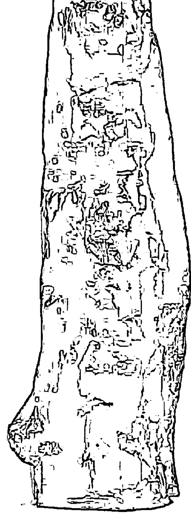

### 鉴定与养护

- 红锌矿晶体常常会被扭曲或者末端被许多小刻面平齐。
- 部分红锌矿晶体会显出被熔化或者熔融的迹象。
- 红锌矿很重，但很软而且很脆，所以需轻拿轻放，分开保存。

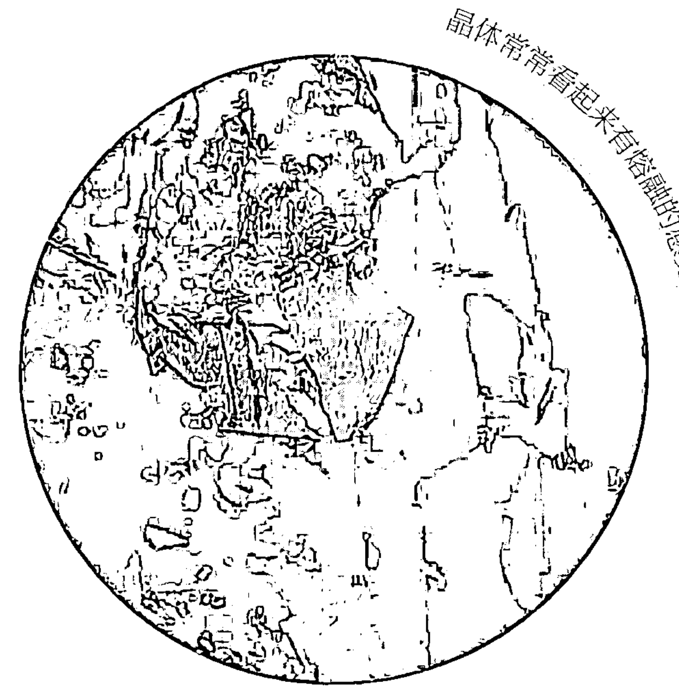

### 魔力

- 代表新奇事物、发明才能、创造性的试验和令人惊奇的启示

### 治疗功能

- 能激活迟钝的状况，类似于消化不良、肌肉劳损、头重脚轻等
- 帮助身体抵御传染病

### 实践方法

- 红锌矿快速兴奋的能量与稳定性的石头能很好地配合工作；把红锌矿和黑色或者棕色石头放一起能激活实践技能；与白水晶或者乳石英放一起能净化心灵；与橙色石头放一起有治疗功能；与紫水晶放一起能提高戒备心和灵感。

### 关键词

- 唤醒
- 启示
- 惊奇
- 创新

### 相似晶石

辰砂，成分是硫化汞，很软而且有毒，其大红颜色和红锌矿类似，但辰砂的晶体要小很多，通常结晶在围岩上，而且通常颜色更艳丽点。

## Iron quartz

## 铁水晶

SiO₂

铁水晶也被称为铁锈色水晶，由水晶在富含铁氧化物矿物的环境中结晶而成。它看起来就像有点脏兮兮的、被染色的棕灰色水晶，但有时含铁水晶也有亮砖红色或者橙红色。

由于含有两种重要的矿物质，故而铁水晶是一种治疗功力强大的晶石，它既有水晶不可思议的纯净，也有氧化铁的土红色，即便很小的、光泽暗淡的铁水晶也暗示它是一种蕴含着尘世精神力量的混合物。

| 颜色 | 红棕色、橙色 |
| --- | --- |
| 光泽 | 土状光泽至玻璃光泽 |
| 硬度 | 7 |
| 晶系 | 三方晶系 |

### 鉴定与养护

- 铁水晶晶体有时呈土状光泽，不透明，或者有一层淡红色覆盖物。
- 有时铁水晶外表面会被部分抛光，以揭示颜色覆盖物层下面的景象。
- 铁水晶还有其他名称，如“橙色水晶”和“橘红水晶”等。

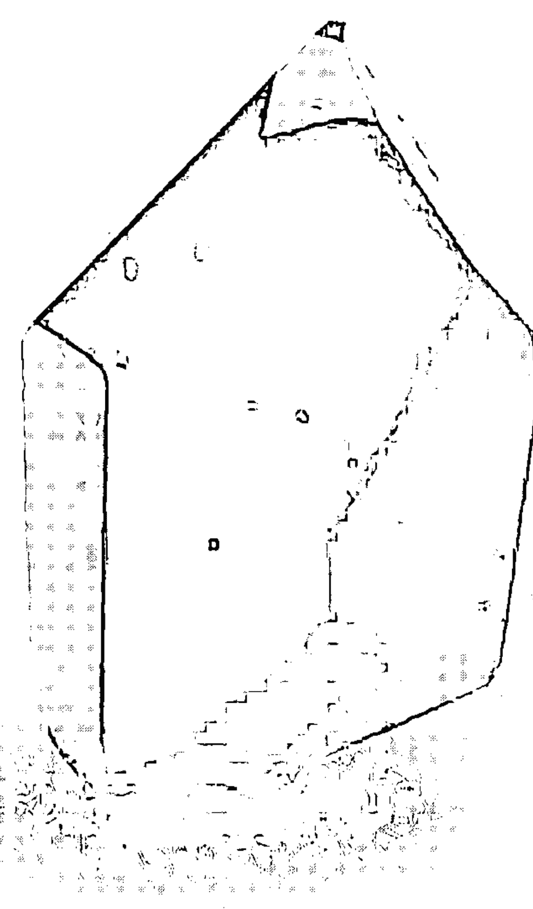

## 铁水晶

### 关键词

- 温和地激励
- 恢复性的
- 浓缩

### 魔力

- 揭示或者产生更多实在的、优良的或者精微的能量
- 鼓励有效的实践行动
- 接近隐藏的天然能量

### 治疗功能

- 让我们现在在这个地方接地气
- 优化血液循环
- 帮助恢复能量和幸福感

### 实践方法

- 如果您觉得自己不能把精力集中于您应该做的事，就放一块铁水晶晶体在您的脚底下并想象您的呼吸通过这块晶石。
- 如果您的精神比较兴奋或者觉得情绪激动烦乱，放一块铁水晶在心口。

### 相似晶石

红碧玉看不到晶形并且很少达到半透明。

红玉髓的橙色更浓并且常可见带状纹路。

## Jasper

## 碧玉

SiO₂

碧玉是石英的一种，其颜色由所含的不同杂质导致，赤铁矿使碧玉呈红色，褐铁矿使其呈棕或者黄色，绿泥石使其呈绿色。

碧玉有着很长的使用历史，许多个世纪以前就被用于制作护身符和装饰品。其现代名称被认为是来源于古代亚述语 ashpu，意即石头。碧玉的优势不仅是因为它常呈现我们生活中所崇敬的红色，而且有着无尽的色调与图纹，并且产出量大、易于雕刻，这使得碧玉是一种很有价值的商品。

颜色：红色、棕色、黄色、绿色等
光泽：玻璃光泽至土状光泽
硬度：6 — 7
晶系：三方晶系

### 鉴定与养护

- 红碧玉很常见，当碧玉与其他石英类矿物一起被粉碎，并被重新熔融为晶体的时候会形成马赛克的效果。
- 许多碧玉的变种有它们特定的名称，例如：绿色碧玉中有红点血玉髓或者鸡血石，还有环形碧玉或者“海洋碧玉”，其特点是有绿色、蓝色或者黄色的同心纹。

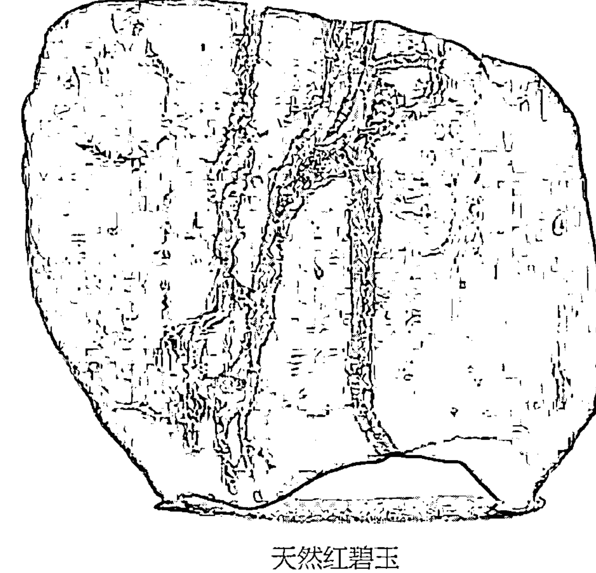

### 魔力

- 传统上认为碧玉能抵御毒蛇咬伤和其他毒物
- 给实践问题提供独特的解决方法

### 治疗功能

- 温和地接地气（尤其是红色和棕色的碧玉变种）
- 有助于把精力集中在生活实践上
- 鼓舞热情和动力
- 当精神工作开始进行时充当稳定角色
- 给身体受伤害的部位提供营养，辅助修复和痊愈

### 实践方法

为了体验碧玉的治疗特性：放一块黄色碧玉在前额中间，一块黄色碧玉在心脏和喉咙中间，在两耳边各放一块红色碧玉，在心脏部位、两手上各放一块绿色碧玉。

### 关键词

- 实用的
- 接地气
- 修补

### 相似晶石

铁水晶很少有颜色变化并且通常呈水晶的晶形。

黑玛瑙颜色更深。

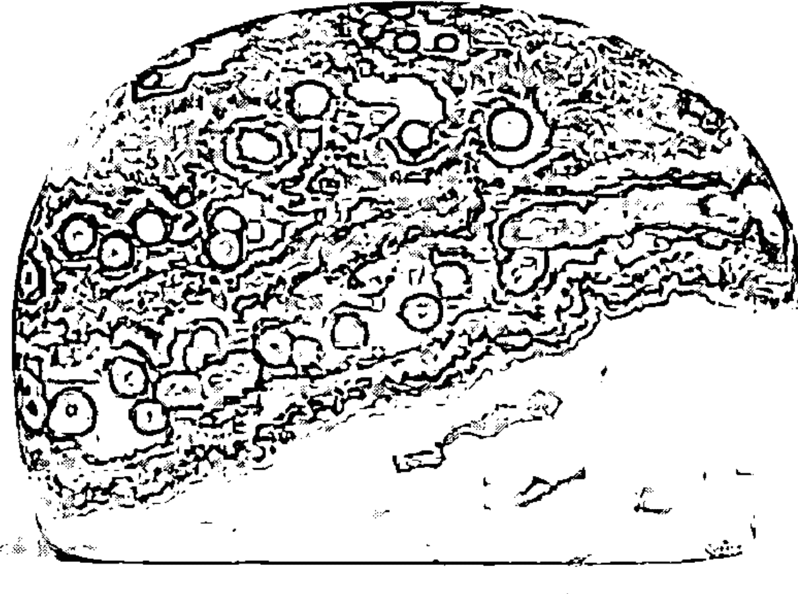

## Spinel

## 尖晶石

MgAl₂O₄

尖晶石很少形成大晶体，因晶体形状像刺尖而得名。实事求是地说，这使得它比较难以用于治疗，除非晶体还附带在围岩上。高级的尖晶石和金刚石的亮度接近，这使得它在首饰界很受欢迎。尖晶石通常被作为一种能吸引好运和激发高尚想法的石头去佩戴。像其他许多红色石头一样，尖晶石也被当作一种失血的治疗之物。

颜色：红色或者棕色（有时会有蓝色、绿色或者无色等）
光泽：玻璃光泽
硬度：8 — 9
晶系：等轴晶系

### 鉴定与养护

- 尖晶石晶体常见小八面体或者金字塔形。
- 不同变种的尖晶石有着不同的颜色：镁铁尖晶石是黑色的、红尖晶石是血红色的、玫瑰红尖晶石是粉红色的、铁铝尖晶石是蓝红色的、橙尖晶石是淡紫红色或者稻黄色的。

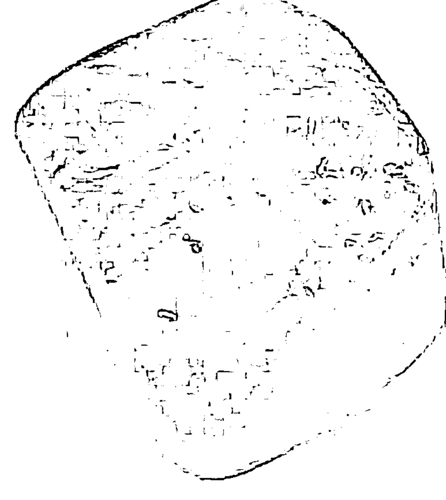

### 魔力

- 充当一种果断行动的激励

### 治疗功能

- 把治疗的能量集中到身体中需要关注的部位——尤其把治疗能量转移深入体内组织
- 帮助身体自我排毒
- 推动迟滞的能量流动
- 放松僵硬的肌肉

### 实践方法

- 尖晶石和水晶一起使用，释放受阻的能量。
- 放一块尖晶石在前额上，两三块白水晶在头顶上，水晶尖头朝外，可减缓隐约感到的头痛。
- 把尖晶石放在肚脐眼上面，两三块水晶尖放在脚底下，可净化消化系统。
- 把尖晶石放在骶骨轮穴上，绿松石放在喉咙上，烟水晶尖朝下放在脚底下，可增强创造力。

### 关键词

- 初始化
- 集中
- 净化

### 相似晶石

**石榴石**有许多个面，晶体呈球状。

**红宝石**常有金属光晕，并且常可见较大晶体。

**锆石晶体**常见筒状。

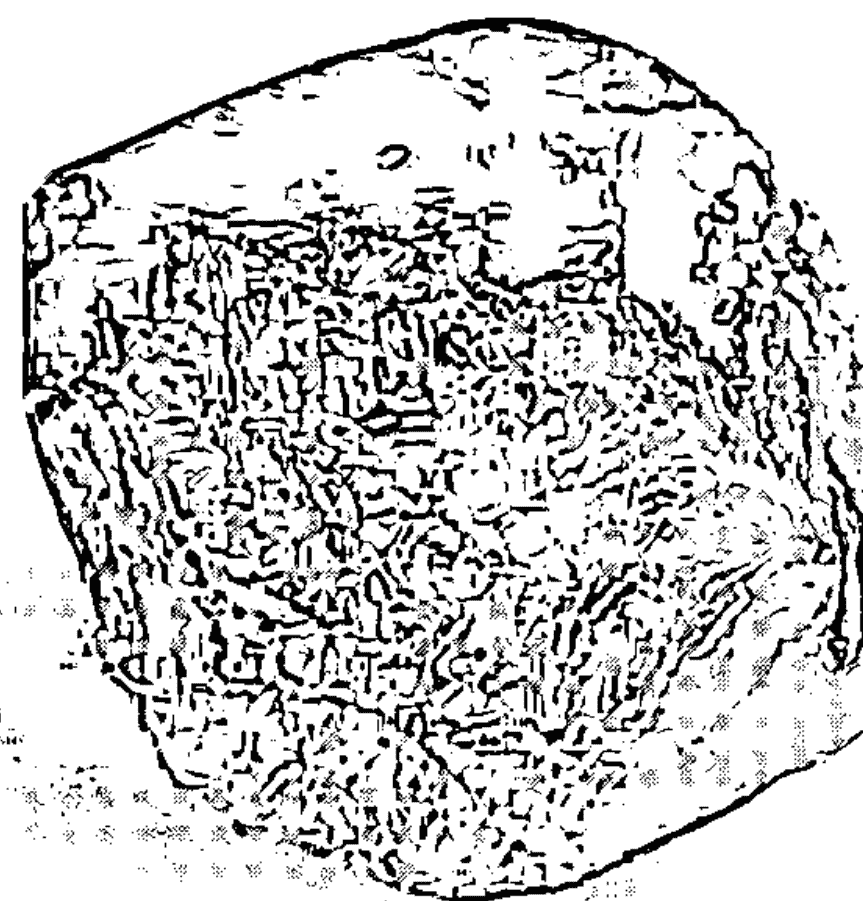

## Carnelian

## 红玉髓

SiO₂

如同大家早已知道的，红玉髓是一种极好的、全能的治疗用晶石，其能量温和而稳定，很少有其他晶石像它的能量那样容易得到、通用、亲和，红玉髓尤其在骶骨轮穴的功效最好。有些患者可能会觉得红玉髓的能量有点过强，但是可以用其他散热的晶石降低它的功力。

红玉髓由富硅的成矿溶液结晶而成，颜色来源于氧化铁内含物。尽管也许您沿海边散步有时也能发现这种略带橙红色的石英卵石，但是最好的红玉髓产自印度、巴西、乌拉圭、伊朗、沙特阿拉伯等地。

颜色：橙色、红橙色
光泽：玻璃光泽
硬度：7
晶系：三方晶系

### 鉴定与养护

- 红玉髓颜色很浓，从半透明到不透明的都有。
- 红玉髓可通过缓慢加热加深颜色。
- 红玉髓是玉髓的一种，通常以鹅卵石或者大块形式呈现。
- 注意仿制品：其他品种的玉髓常会被染色用以仿制红玉髓。

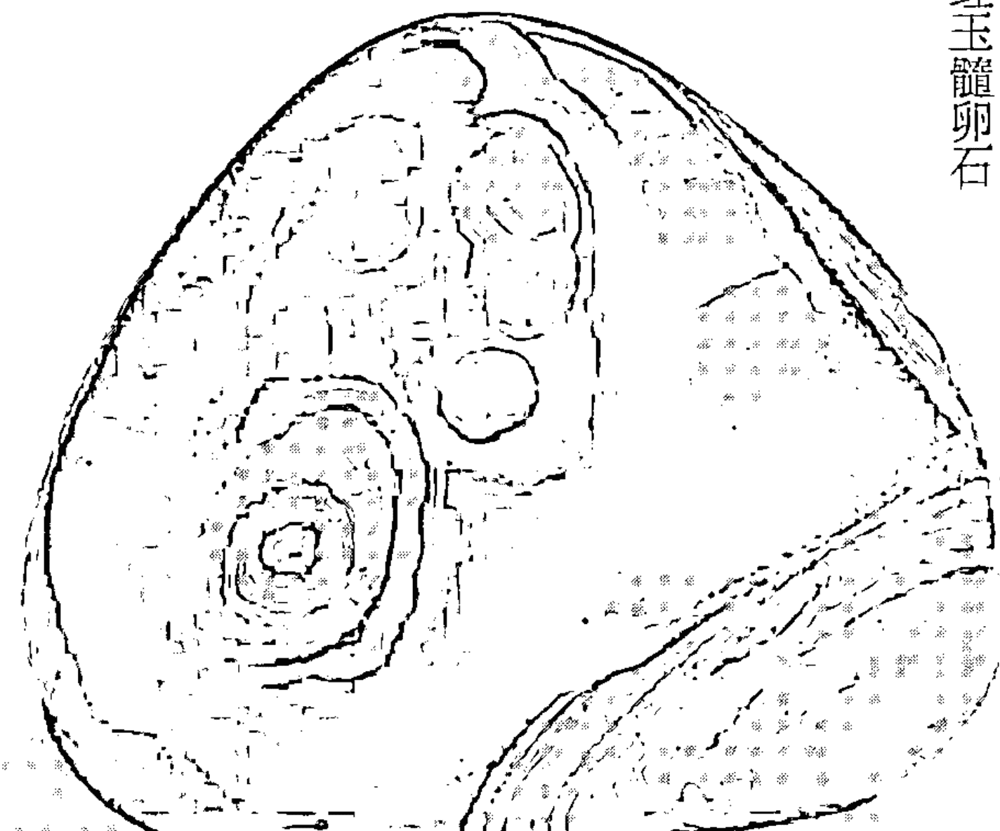

## 红玉髓

### 关键词

- 释放
- 修复
- 升温

### 魔力

红玉髓是一种很适合雕刻护身符、戒指和印章的石头。佩戴红玉髓制作的饰品能带来勇气、信心以及免于受伤害。

### 治疗功能

- 释放压力、治愈创伤
- 增强创造力
- 修复精微体能量

### 实践方法

加速治疗进程或者释放压力、治疗旧伤。放六块红玉髓在以下位置：喉咙部位一块；头顶一块；骶骨轮穴位身体两边各一块；两大腿间靠近小腿部位一块；两脚踝间一块。如果您躺在一块橙色的布料上，治疗功效会更佳。

### 相似晶石

**红条纹玛瑙挺像红玉髓**，但是它的颜色通常夹杂着一层层白色或者灰色的色带。

**雄黄（硫化砷）和辰砂（硫化汞）**通常是光泽亮、颜色艳丽的小晶体，长在围岩上，这两种晶石有轻微毒性，不适用于晶石治疗。

**磨圆的暗色黄水晶和橙色东陵石**也有点像红玉髓。

## Sunstone

## 太阳石

(Na,Ca)Al₁₋₂Si₃₋₂O₈

大部分人对柔软、有着荧光色和珍珠光泽的月光石比较熟悉，太阳石与其属于同一个矿物族（长石族），但含有闪亮的内含物能反射出温暖的金黄色光芒。
宝石级的太阳石发现于挪威和美国，有很强的反射光，雕琢成弧面宝石时效果最好。次级的太阳石大多是乳白色或者棕橙色，稍带有片状闪光包体。

颜色：深橘黄色，带金色斑点
光泽：玻璃光泽、金刚光泽
硬度：6 — 6.5
晶系：三斜晶系

### 鉴定与养护

- 太阳石通常作为弧面宝石或者磨圆的饰品，很少作为刻面宝石使用。
- 太阳石由内含的大量细微镜铁矿片或者针铁矿片对光产生反射，反射出红棕色的光芒。
- 人造太阳石由棕色玻璃和金属碎屑做成。

### 魔力

- 太阳石代表轻松、活泼和乐观主义
- 就像月光石看起来好像包含了月亮的柔和光晕，太阳石也反射着太阳耀眼的金色光芒

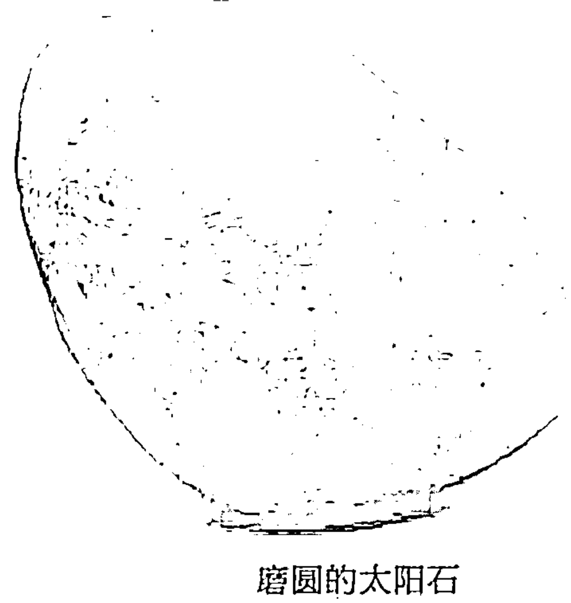

### 治疗功能

- 使身体温暖、温和地提神
- 激励艺术技巧和表达能力提高
- 提供自我价值观并提升自我形象
- 支持坚持自我的意愿

### 实践方法

- 改善悲伤和沮丧的情绪：放一块太阳石在心口部位，周围环绕放四块白水晶（水晶尖朝外）；另一块太阳石放在心脏中心位置，周围环绕放四块白水晶（水晶尖朝里）。
- 如果您觉得经过一个漫长寒冬的发呆后有些意志消沉，抓一块太阳石在手上并看它的晕色几分钟，这样有助于您改善情绪。

### 关键词

- 温暖
- 自尊
- 快乐

### 相似晶石

石英岩是白色粒状的，但没有晕色。

月光石有柔和发蓝的晕色。

光谱石是白色的，带着玻璃似的蓝色晕色。

拉长石有蓝色、绿色、黄色和粉色晕色。

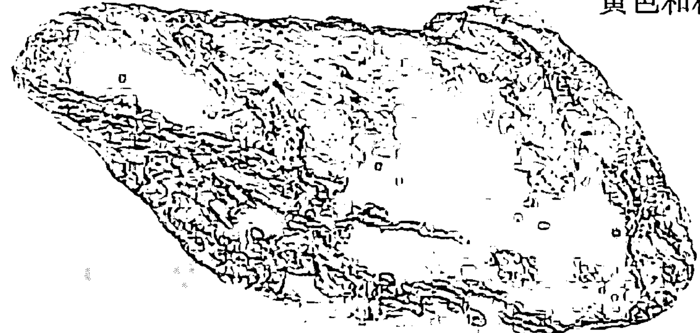

## Aragonite

## 文石

CaCO₃

文石的英文名是 Aragonite，来自西班牙村庄莫利纳德亚拉贡（Molina de Aragón），在这里，文石第一次被发现并鉴定出来。文石和方解石的化学成分一样，但晶体结构不同，这使得它的硬度和比重更大。这种引人注目的晶石使人泛起形形色色的联想：一座未来主义的外太空城市、一种来自交替现实的侵入、空间秩序的原始膨胀……文石能把富于想象力的心变成一种创造性的恍惚，这使得文石成为一种对横向思维很有用的晶石。

颜色：橙色、金棕色、黄色、白色等
光泽：玻璃光泽、珍珠光泽
硬度：3.5 — 4
晶系：斜方晶系

### 鉴定与养护

- 文石的晶体会围绕一个普通的中心点形成长长的交生的六边形棱柱状，这种晶簇被称为“人造卫星”。
- 磨圆的文石常常像凝固的蜂蜜。
- 文石的种类包括：铁花（文石花），一种很漂亮的树枝状文石集合体；豆瓣石，大量豌豆大小的肿块状文石结晶在围岩上；斯普鲁特斯坦文石像玛瑙那样有不同的色带。

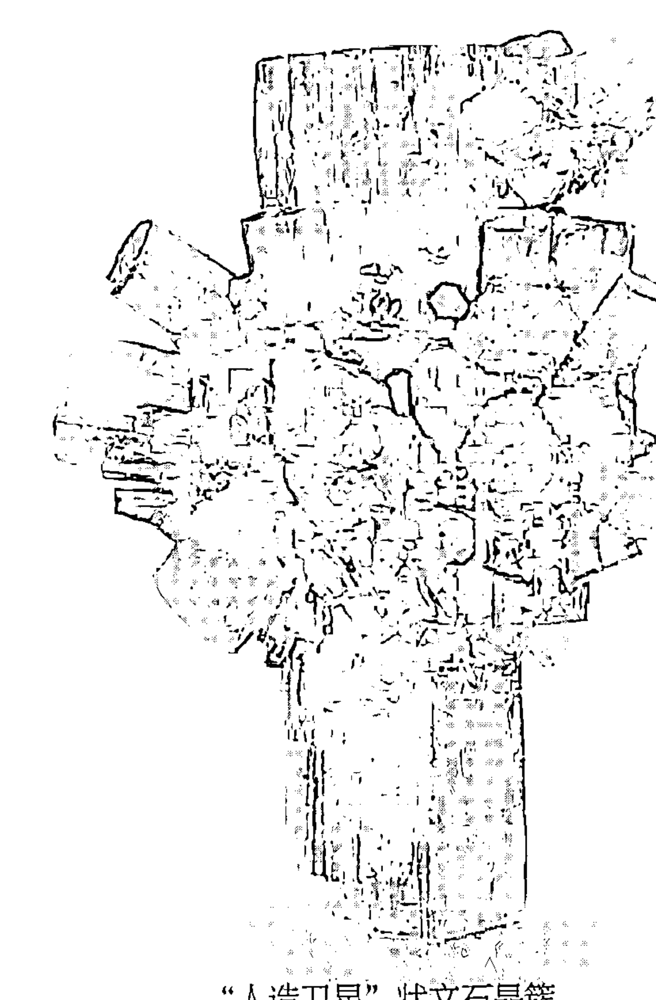

## 文石

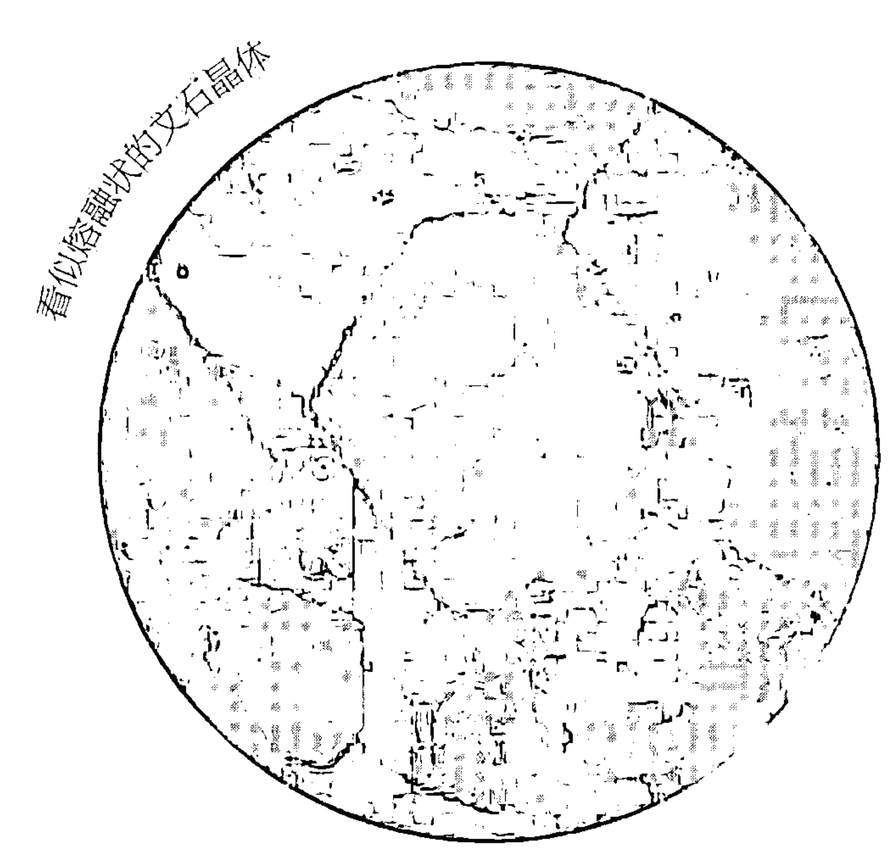

### 关键词

- 实用性
- 自我修养
- 集中

### 魔力

- 能把迥然不同的元素融合到一起
- 能给探索新的发展可能提供一个安全的基础

### 治疗功能

- 释放有压力或者急躁的感觉
- 有助于解决问题
- 对学习和考试有帮助

### 相似晶石

橙色方解石与文石的化学成分一样，但其表面感觉不一样。

### 实践方法

黄水晶的内部结构和层式与文石的直线式不一样。

- 为了清洗头脑和表达，把文石晶体放在前额中间位置、喉咙底部以及肚脐眼处。
- 放一块文石晶体在心口可镇定神经。

红玛瑙为隐晶质，没有内部晶体结构。

## Copper

## 自然铜

Cu

自然铜是一种次生矿物，由含铜成矿溶液与其他矿物发生化学反应时形成。天然的铜颗粒和晶体团块称为自然铜，它分布广泛但并不常见。大部分铜是从类似于黄铜矿、蓝铜矿、赤铜矿和孔雀石这样的矿石中提取而来。

对爱神维纳斯来说，铜是神圣的，这位古罗马爱与创造力的女神生于塞浦路斯岛（Cyprus），使得铜得到这个名字（Copper）。

| 颜色 | 橙色，橙红色 |
| --- | --- |
| 光泽 | 金属光泽 |
| 硬度 | 2.5 — 3 |
| 晶系 | 三等轴晶系 |

### 鉴定与养护

- 自然铜通常形成比较平滑或者树枝状的矿块。
- 自然铜表面有时有绿色的氧化物存在。
- 非常平滑的铜块可能不是天然形成的，但也可以用于治疗。

### 相似晶石

金红石和自然铜颜色相似，但晶体长且呈针状。

### 魔力

古铜辉石晶体更黄并且有特色的马赛克状晶面纹。

- 化解冲突
- 帮助达成积极的结果
- 提升情绪协调
- 减轻困难并助于把占星术的和宇宙的影响力联系起来

### 治疗功能

- 减少炎症
- 释放紧张和挫折感
- 增强大脑功能

### 实践方法

- 佩戴铜制品（例如做成手镯）是治疗风湿病和关节炎病痛的一种广为流传的方法。
- 太阳、月亮和其他星球的运动会引发恼怒、心境不稳、紧张和失眠。如果您感觉到有点无缘无故的不正常，携带或者佩戴一些铜，或者放一些铜在您的枕头底下。如果之后您的状态得到改善，您就会确信行星运动的作用真的存在。

### 关键词

- 抗炎药
- 平滑化
- 统一

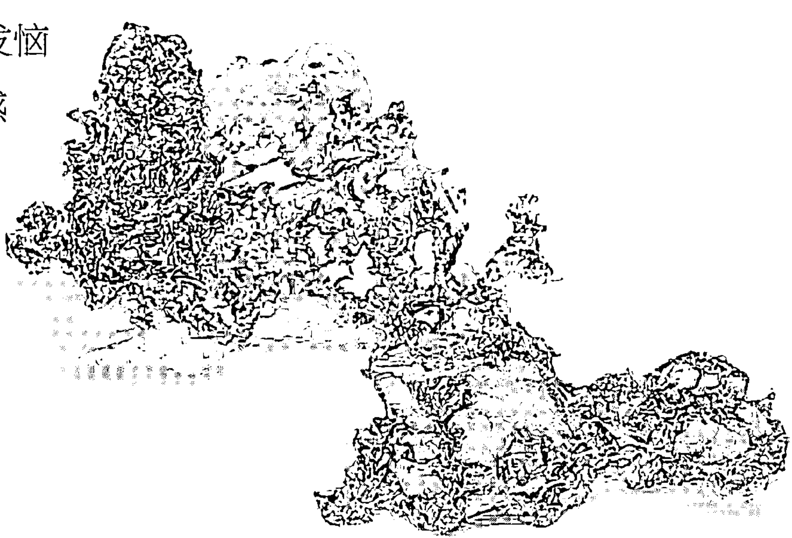

## Citrine quartz

## 黄水晶

SiO₂

黄水晶是一种不寻常的水晶品种，它结合了水晶的晶莹透亮和太阳光的暖色调，天然黄水晶由水晶在结晶时混入铁质矿物包裹体形成，最好的黄水晶产于巴西、法国、俄罗斯和西班牙。然而，我们在市面上见到的大部分黄水晶是由普通的紫水晶通过加热形成。

| 颜色 | 黄色、金棕色或者黄褐色 |
| --- | --- |
| 光泽 | 玻璃光泽 |
| 硬度 | 7 |
| 晶系 | 三方晶系 |

### 鉴定与养护

- 天然黄水晶颜色较淡，半透明，有时有点像淡色调的烟水晶。
- 改色的黄水晶的尖部颜色较深，通常呈黄色、金色或者棕色，基底常为乳白色。
- 紫黄晶是一个特殊的水晶品种，同一块水晶上既有黄色水晶部分也有紫色水晶部分。

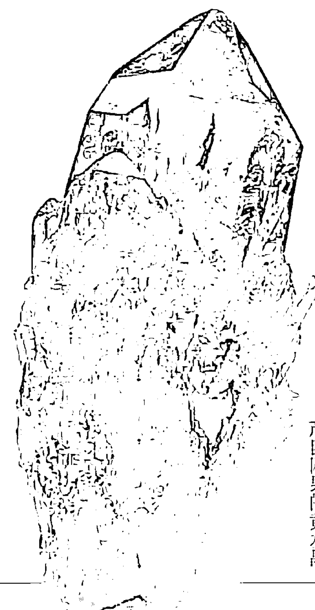

### 魔力

- 保持整个过程自然进行
- 逐渐形成能量

### 治疗功能

- 集合并激活低级的轮穴
- 让人感觉平静和温暖
- 增加信心和建立一种个人能力感
- 在冬天提供快活的能量以刺激思维

### 实践方法

- 用黄水晶和白水晶布置阵列以增强沟通能力、适应能力、心智能量和协调性，躺下并把黄水晶放在心口，水晶尖朝脚部方向；把白水晶放在两脚脚弓位置和头顶位置，水晶尖都朝上。两手各拿一块黄水晶，水晶尖头朝下。这个治疗过程持续到您觉得需要把水晶移开为止，或者十分钟左右。
- 黄水晶和紫水晶在颜色上互补，放到一起可使人感到放松、宁静、心智平衡和乐观。

### 关键词

- 温暖
- 舒适
- 振奋人心

### 相似晶石

**琥珀**比黄水晶软很多并有轻微的黏稠感。

**方解石**比黄水晶的硬度低很多。

## Amber

## 琥珀

C₁₀H₁₆O + H₂S，偶有化石混入

尽管琥珀是一种石化的针叶树脂而不是一种石头或者晶体，但它被当作珍贵宝石已逾上千年。世界上主要的琥珀来源地是南美、缅甸和欧洲波罗的海沿岸地区。琥珀足够轻，能浮在水面上。全世界很多地方都发现过琥珀。琥珀很容易被熔化，并且由于硬度低，可以用砂纸打磨。

颜色：金色、黄色、棕色，有时呈绿色
光泽：树脂光泽
硬度：2
晶系：非晶质

### 鉴定与养护

- 琥珀掂起来很轻，并且摸起来有点黏黏的感觉。
- 有些看起来里面有昆虫的所谓“琥珀”有可能是塑料或者重熔树脂。
- “俄罗斯琥珀”由小块琥珀熔结而成。
- 科帕树脂是另外一种树脂，比琥珀的形成年代要短很多（科帕树脂形成于一百万年至二百万年前，琥珀的形成时间在四百万年前以上）。

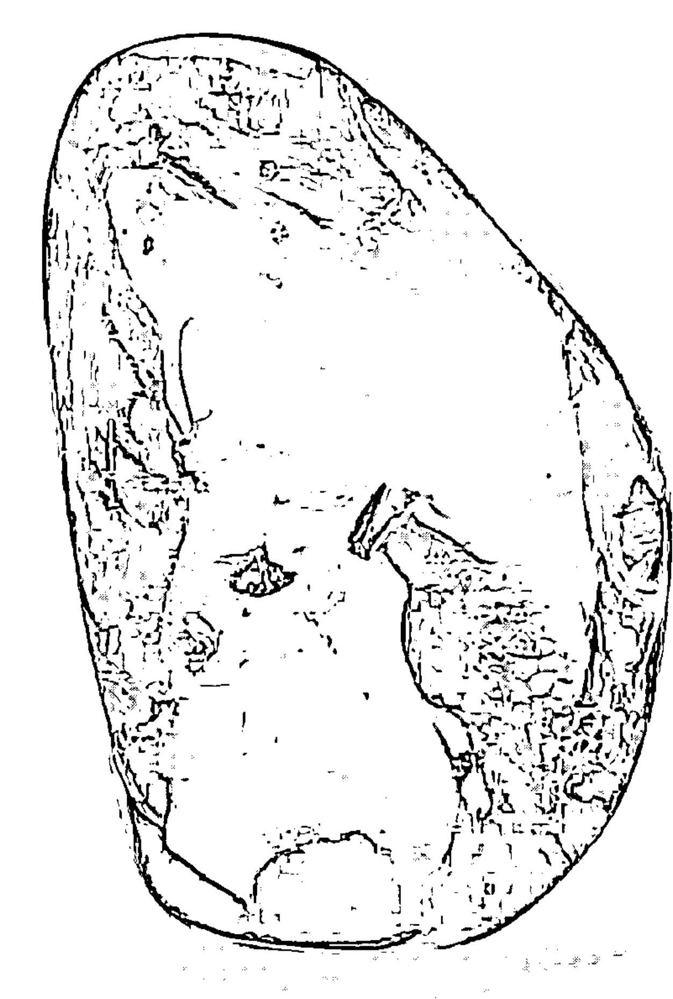

### 魔力

- 象征某种能量
- 浓缩着太阳的魔法能量

## 琥珀

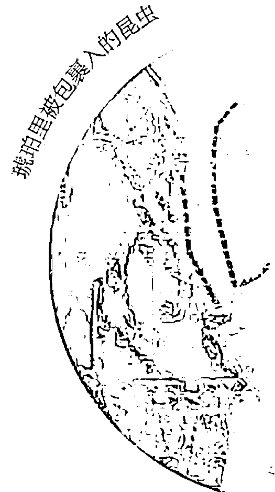

### 关键词

- 活跃化
- 刺激
- 加强

### 治疗功能

- 使身体精力充沛
- 调整神经紊乱
- 激发能量并产生激情
- 加快思维过程

### 实践方法

- 放一块琥珀在额头并抓一块煤精在手上，可让思维更敏捷。
- 躺下并把煤精放在两脚之间，琥珀放在头顶上、大腿间和双手上，可激励大脑及神经系统。
- 把一块琥珀沿患者脊椎方向从头到脚推几个来回，可改善神经紧张。

### 相似晶石

**橙色方解石**不像琥珀那样有黏黏的感觉，而且比琥珀更硬更重。

**黄水晶**比琥珀比重大且硬得多，摸起来凉凉的。

## Pyrite

## 黄铁矿

FeS₂

黄铁矿由于其奇妙的晶形和漂亮的光泽而广受收藏者的欢迎。黄铁矿也被称为硫铁矿或者愚人金，这种其实挺普通的矿物发现于多种岩层矿脉中，产出黄铁矿晶体的地方常有温排水，全世界最大的黄铁矿矿床在西班牙。黄铁矿的英文名是 pyrites，来源于希腊文 pyr，意思是“火”，因为黄铁矿在敲击后容易产生火花，从古代开始就被用于取火。黄铁矿能反射出金黄色的光芒使得它和太阳联系起来。把黄铁矿放在心口上或者腹部，会让患者增强其自然亲和力。

颜色：亮黄色
光泽：金属光泽
硬度：6 — 6.5
晶系：等轴晶系

### 鉴定与养护

- 黄铁矿有强反射的金黄色表面。
- 黄铁矿晶面上常有条纹，而且不同晶面的条纹方向不一致。
- 黄铁矿晶体可见完美的立方体，也有复杂的晶簇、大团块以及有条纹的放射球状的 —— “太阳”黄铁矿。

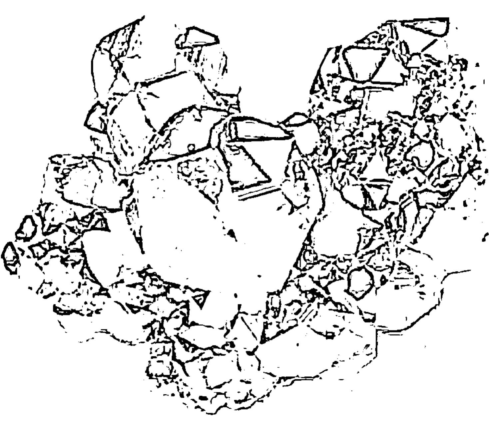

- 黄铁矿相对比较软而且脆，所以最好把它与其他比较硬的石头分开放置。

### 魔力

- 抵御各种黑暗和阴郁
- 可以用作揭示真相的镜子

### 治疗功能

- 清洁化、带来生气以及振奋精神
- 减轻焦虑、沮丧和挫折感
- 强化逻辑思维和建造有基础的真实感
- 免受污染物和负能量的侵害

### 实践方法

- 大块晶簇不贵，而且对于把房间弄明亮起来效果很好，尤其是工作区或者用餐区。
- 把黄铁矿放在身体感觉有点迟钝的地方会有效果。
- 黄铁矿对于饮食和排毒系统是一种理想的辅助物质。

### 关键词

- 活化
- 净化
- 点火
- 澄清

### 相似晶石

自然金通常呈现比较暗的黄色。

黄铜矿通常与黄铁矿伴生。

磁黄铁矿、方黄铜矿和砷铂矿颜色与晶形都和黄铁矿有点像，但是不那么容易看到。

古铜辉石和褐铁矿也是如此。

## Gold

## 自然金

Au

在过去的一万年里，黄金是权力和财富的缩影，长期以来一直被认为是最珍贵和最有精神内涵的物质之一，尽管它是一种很软的金属。金是抗腐蚀性最强的材料，不会生锈或者失去光泽。自然金都是很小的颗粒状或者树枝状。在富含金的矿床中，自然金通常是和石英或者黄铁矿一起见于矿脉中。有时这些矿床被暴风雨等自然灾害侵蚀，自然金被冲入溪流或者江河中，由于比重很大，它们通常沉淀在河床的底部，形成一块冲积砂矿。自然金有时也与铜、银、镍、铅等金属矿物产出在同一矿床中。

颜色：黄色、金色和橙色
光泽：金属光泽
硬度：2.5 — 3
晶系：等轴晶系

### 相似晶石

带有小斑点的黄铁矿有时看起来与自然金相似，但黄铁矿的形状通常是立方体的，而自然金的颗粒则无定形。

### 鉴定与养护

- 石英上的小块或者鳞片状自然金可用于晶石治疗，金箔和金叶这些人造金制品也可以用于治疗。
- 金首饰如果是 K 金材料制作的话，只含了一小部分金，治疗效果有限。
- 为了更容易处理，可把小条状的自然金用硅胶或者蜂蜜黏结到薄石英片上使用。

黄铜矿通常是偏橙金属色调。

银金矿一种天然的金和银的混合矿物，通常是带有银色调的黄色。

### 魔力

- 利用太阳的能量产生动力
- 鼓励真实和纯净
- 推动财富、丰饶和健康

### 治疗功能

- 平衡大脑和神经系统
- 加强免疫系统
- 支撑自我感觉、自我价值和自信心
- 促进创造性思维
- 稳定身体内微妙的电流系统

### 实践方法

- 把自然金放在心脏轮穴处，能给身体注入健康能量，如在自然金周围放置白水晶，则可以促进和加快治疗过程。
- 放自然金在能量阻塞或者有痛感的区域以强化治疗。
- 对治疗师来说，融合自然金和宝石的精华液很有用，放几滴在手腕脉搏处或者轮穴处会有很好的效果。

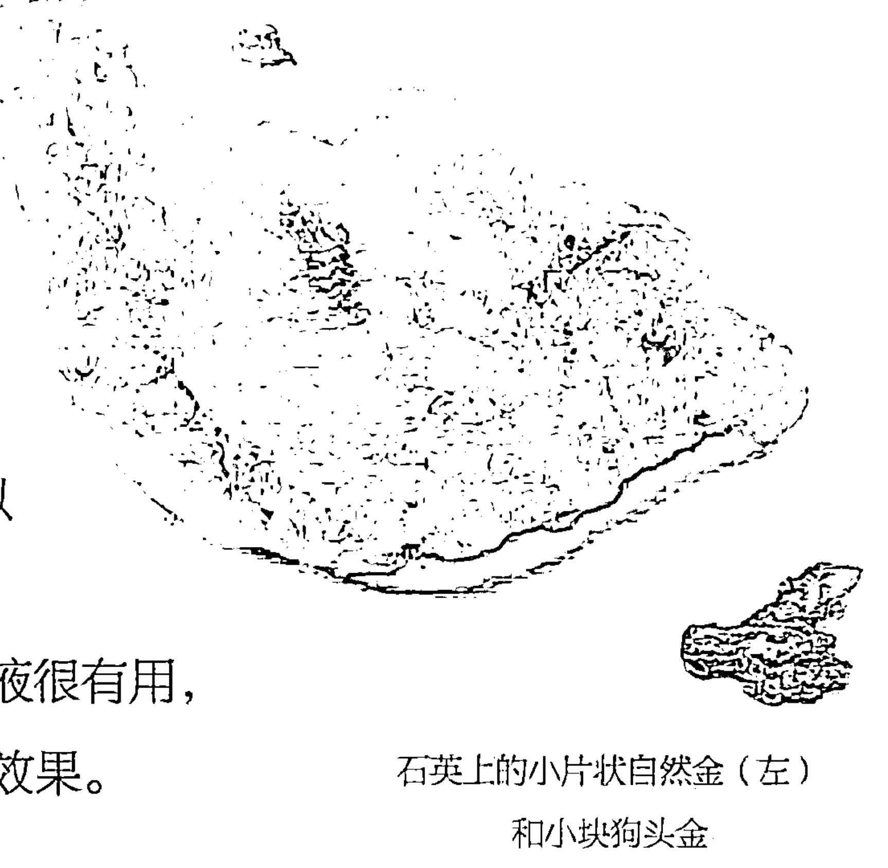

### 关键词

- 信心
- 创造力
- 稳定性

## Rutilated quartz

## 金红石包体水晶

SiO₂ + TiO₂

金红石包体水晶也被称为钛晶、金发晶、天使发晶或者维纳斯发晶等，这种融合水晶和金红石的精美晶石产于欧洲阿尔卑斯山、亚洲乌拉尔山以及巴西等地。作为一种珍贵的宝石，它被切磨成刻面或者弧面宝石。金红石包体水晶的十字交叉图纹喻示着快速的沟通与能量交换，它的透明度和橙/金黄色调使得它在激励身体自我修复方面表现完美。

颜色：无色透明带有黄色或者橙棕色针状包裹体
光泽：玻璃光泽
硬度：7
晶系：三方晶系（水晶）和四方晶系（金红石）

### 鉴定与养护

- 这种带金红石包体的水晶通常带有点淡淡的烟色调。
- 当包裹的金红石晶体很细的时候，金红石通常像直直的铜黄色金属线。
- 当包裹的金红石又多又厚的时候，整个晶石的透明度就会下降。
- 有时也有较大晶体的金红石被发现，通常红色中略带点银色调，条纹明显，强光下半透明。

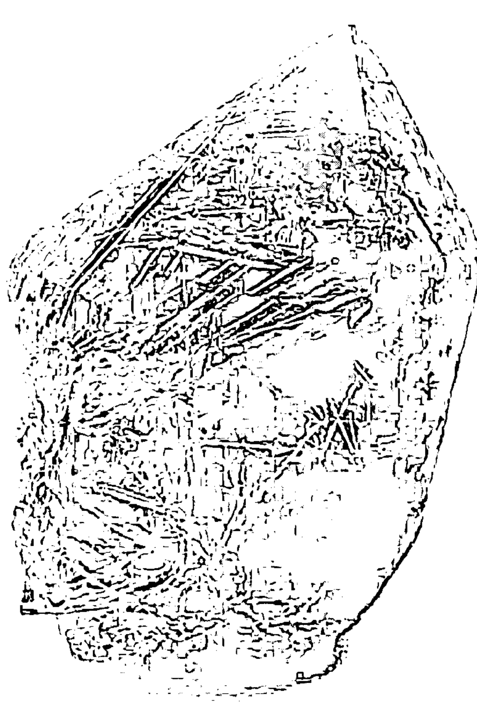

## 金红石包体水晶

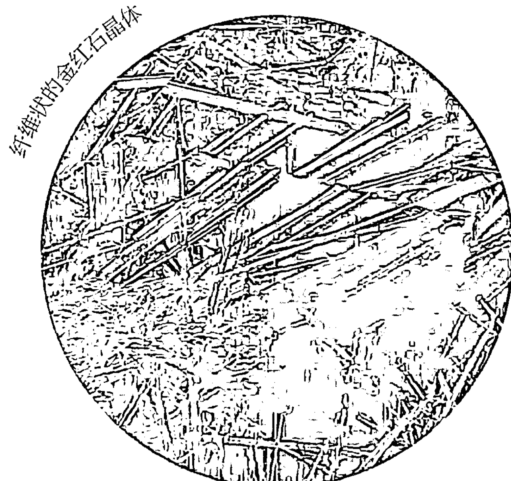

### 关键词

- 驱动
- 捆绑
- 恢复

### 魔力

- 加速事物进程
- 清楚障碍物

### 治疗功能

- 辅助修复受损的纤维组织
- 放松紧张的肌肉
- 把沉重的心情变轻松
- 帮我们超越陈旧的思维模式
- 无论生活多艰难，激励我们取得进步

### 实践方法

- 把金红石包体水晶放在身体的任何有组织受伤、骨折或者肌肉劳损的部位。

### 相似晶石

含电气石包裹体的水晶。当电气石很亮的时候和含金红石包体水晶有点像，但电气石包体的亮度和金属光泽反射强度和金红石纤维比起来要差点。

针铁矿是水晶里的另外一种常见包裹体，通常在紫水晶里呈扁平的放射状铜黄色晶体。

猫眼石不透明，而且内含物比金红石包裹体水晶要多而且复杂。

## Topaz

## 黄玉

Al₂SiO₄(F.OH)₂

好多个世纪前，黄玉这种珍贵的石头就被用于制作珠宝，有时黄玉出现在某些代表权势的项链中。它的稀有性意味着它是和荣誉及成功相联系的。用长长的黄玉晶体做的魔棒治疗功力很强，能把大量的能量集中到体内。黄玉通常为金橘色或者黄色，但它其实颜色范围很广，这取决于铁或者铬等微量元素的含量。黄玉有些变种在阳光下会失去颜色，而有些在阳光下颜色却会更浓。粉色黄玉非常稀有，但是可以通过把黄色黄玉加热得到，无色透明的黄玉可以通过加热和辐照变成蓝色。

颜色：橙色、黄色、粉色、白色、蓝色、灰色、绿色、棕色、无色
光泽：玻璃光泽
硬度：8
晶系：斜方晶系

### 鉴定与养护

- 黄玉能形成很大的晶体，但很贵。
- 质量最好的黄玉很少出现天然滚圆状，但是偶尔会出现白色和蓝色的。
- 黄玉晶体可通过其底部的方形或菱形横截面确认。
- 黄玉的侧面有竖条纹。

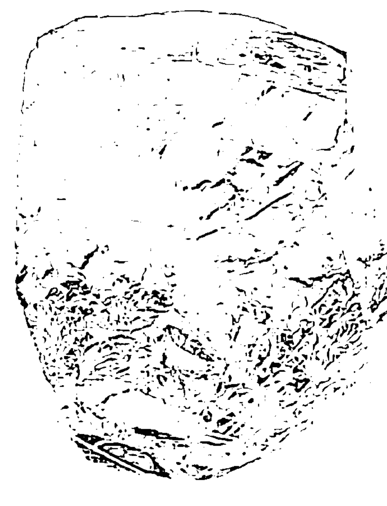

- 黄玉很硬，但很脆，很容易看到内裂，尤其在被热处理过的黄玉上易见。
- 经常清洗被当作治疗用吊坠的黄玉晶体能使其闪耀度完好如初。

### 魔力

- 培养自信和良好的领导能力
- 激励人们去表达其愿望

### 治疗功能

- 释放身体紧张
- 有助于稳定情绪
- 增强积极性和信心
- 使精微能量的各层面协调

### 实践方法

- 放一块黄玉晶体在隔板上，搁在肋骨下，放松并平衡身体上下的能量。

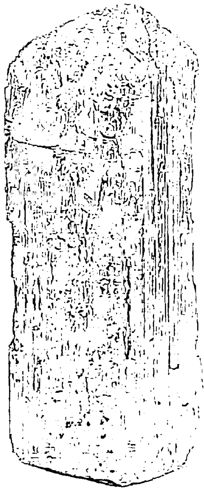

巴西帝王黄玉

### 关键词

- 确信
- 信心
- 放松

### 相似晶石

碧玺是三方晶系，晶体通常可见三个侧面，而黄玉是斜方晶系，可见四个侧面。

巴西石和黄玉颜色很像，但比较软。

海蓝宝和蓝黄玉挺像，但光泽没那么亮。

金绿柱石（黄色绿柱石）、硅铍石等也是如此。

## Calcite

## 方解石

CaCO₃

方解石是一种很常见的矿物，形成于多种岩石中：石灰石、大理石、石灰华、泥灰土以及洞穴里的石钟乳和石笋等。方解石结晶于低温成矿溶液中，有着多种多样的形状和颜色，而且常形成双晶。方解石也是形成海洋生物的贝壳的主要成分，这意味着当这些海洋生物死后沉入海底时，会有更多的富钙岩石如白垩等形成。方解石的治疗特性随着其形状而变化，具有快速的、多方面的能量。

颜色：几乎所有的颜色都有，包括无色的
光泽：玻璃光泽、珍珠贝光泽或丝绢光泽等
硬度：3
晶系：六方晶系

### 鉴定与养护

- 方解石硬度较低，有丝绢状的光晕。
- 方解石摸起来有肥皂般的滑腻感。
- 方解石的晶体多呈有特征的天然形状，类似于“狗牙石”（像拉伸金字塔，也像狗牙一样）和“钉头”方解石（细长的晶身上有一个宽而平的晶头），这两种方解石都常可见到双晶。
- 如果单单看方解石的颜色，很容易与其他许多晶石混淆。

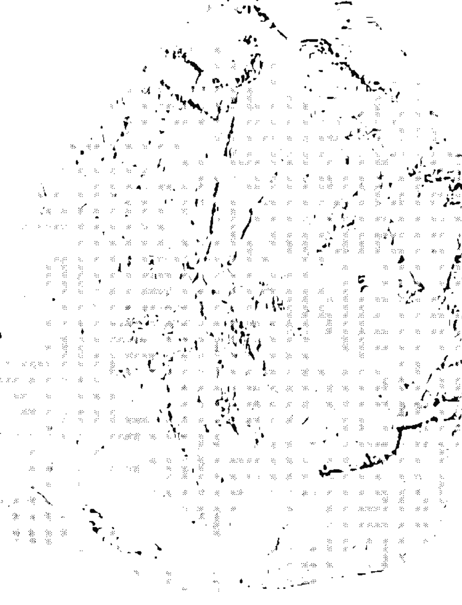

- 如果掉在地上或者被施加了很大的压力，方解石就会沿解理面裂开成数块菱面体。

### 魔力

- 把个体与大自然连续变化的循环联系起来
- 使得能量流动变得容易

### 治疗功能

- 转移停滞或者流动缓慢的能量
- 镇定并平复焦虑的心情
- 安神
- 通过移除摩擦或不协调的能量来创造清洁的环境

### 实践方法

- 凝视一块方解石晶体（尤其是球状或者蛋形的）并通过它冥思，方解石减缓并散射通过它的光，放松您对它的凝视，从而镇定您的精神，让您的思绪静下来。

### 关键词

- 安慰
- 镇定
- 冷却

### 相似晶石

琥珀有轻微的黏腻感。

文石的晶形和方解石不一样。

白水晶、蓝水晶、黄水晶等比方解石硬很多。

重晶石、天青石、赛黄晶、白云石、菱镁矿、菱沸石等也都如此，硬度、比重和晶形都有差别。

## Mookaite

## 摩凯石

SiO₂

摩凯石这种绝色的石英品种比较软，有红色、棕色或者黄色带状区域，就像一层层的彩色砂岩。摩凯石是一种沉积岩石，有点像燧石，由乳白色的微小生物的骨骼残骸沉积在古代海洋中形成。摩凯石只产于澳大利亚，有着和使用天然土质颜料的土著绘画一样的丰富色彩。摩凯石在晶石治疗中有着极强的令人心灵宽慰的特质。无论患者当时的状态是多么心烦意乱或者紧张，摩凯石都会顺利地解决。它有一种朴实的有根性和干脆的清晰。

- 颜色：红与黄色大理石纹
- 光泽：玻璃光泽
- 硬度：7
- 晶系：三方晶系

### 鉴定与养护

- 摩凯石的流动色带区域有着特殊的黄色和暗红色大理石纹。
- 与看似相像的碧玉相比，摩凯石的泥土色调更重。

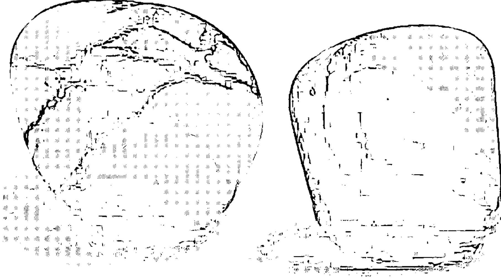

## 摩凯石

### 关键词

- 安全
- 解决方案
- 平滑化

### 魔力

- 增加对赋予生命的地球能量流动的意识
- 鼓励和谐的活动

### 治疗功能

- 稳定低级轮穴以及刺激免疫系统
- 创造一种去探索和体验未知的安全感
- 在实际可能的范围内保留意见
- 让紧张的心理体验与日常生活相结合
- 帮助我们用一种放松的和切实可行的方式达到目标

### 相似晶石

黄色和红色的碧玉色带间有明显的边缘。

### 实践方法

虎铁石相对摩凯石比重更大，并且色带是不联系的，包含黄铁矿和赤铁矿等金属矿物。

- 把摩凯石放在心口轮穴上会有内心松弛的感觉。
- 把摩凯石放在臀部会有种自然平衡和优雅的感觉。
- 把摩凯石放到额部能提高您对自然世界的理解力。

## Heliodor

## 金绿柱石

Be₃Al₂Si₆O₁₈

金绿柱石这种清澈明亮的晶石是绿柱石的黄色变种，其致色元素是铁，通常可见与水晶和钠长石共生。金绿柱石的英文名称为 heliodor，来源于希腊词汇 helion 和 doron，意思是太阳的礼物。就像明亮的清晨，金绿柱石有着清净、开发的能量，尤其适合于清除陈旧过时的想法和无益的坏习惯以及解析混乱。它的能量比高质量的黄水晶和柠檬水晶更轻更新鲜，这使得它值得在您需要做重要决定或改变命运的时候作为治疗用晶石。

颜色：黄色、柠檬黄，有时带有淡蓝色
光泽：玻璃光泽
硬度：7.5 — 8
晶系：六方晶系

### 鉴定与养护

- 金绿柱石的黄色是绿柱石中一种很稀有的岩石。
- 金绿柱石晶体中通常有其他矿物的包裹体。
- 金绿柱石能通过其六方柱状晶形和平行的纵条纹进行鉴别。

### 魔力

- 象征全新的开始
- 带来取得成就的意图

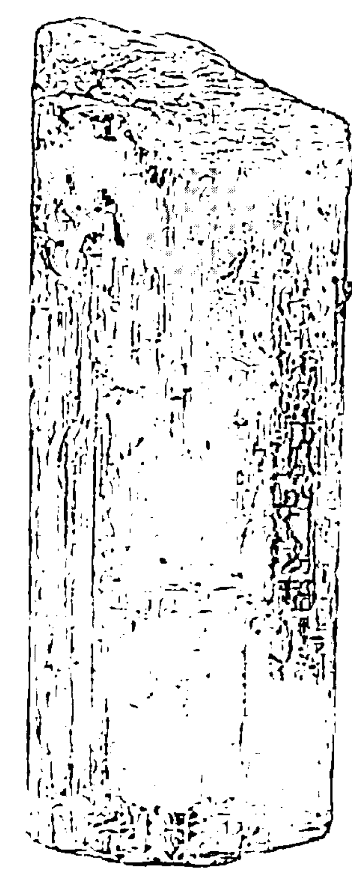

## 金绿柱石

### 治疗功能

- 修复和平静旷日持久的压力带来的神经系统过度劳累
- 减轻渴望和担心
- 鼓励乐观主义
- 带来清楚和深入理解
- 让能量储存于更好的用途中

### 实践方法

- 放一块烟水晶在脚上，一块紫水晶在心口轮穴，一块金绿柱石在额头轮穴上，能放松神经系统。
- 放一块烟水晶在脚上，一块金绿柱石在心口轮穴，一块紫水晶在额头轮穴上，能安神。
- 放一块金绿柱石在额头轮穴上，两手腕脉搏处各放一块白水晶，吸入空气时想象气息通过腕部和额头的石头进入体内。

### 关键词

- 恢复精神
- 修复
- 清洗
- 平静下来

### 相似晶石

翠铬锂辉石更绿。

巴西石更脆并且通常更显一种酸黄色。

锂磷铝石属于不同的晶系，晶形不一样，其晶体很短。

方解石有明显的解理。

金绿宝石属于不同的晶系，晶形不一样，并且颜色更黄。

黄水晶也是如此。

## Sulphur

## 自然硫

S

由于有着独特的亮黄色和迷人的晶形，自然硫是一种漂亮的矿物标本。它由火山爆发产生的富硫气体冷凝而成，易燃，能产生蓝色火焰，这种特质从古时候起就为人所熟知。自然硫有时被称为“硫黄”，在圣经中是作为上帝的一种惩罚用具。大概在公元10世纪，中国人就使用它制作火药。在晶石治疗中，自然硫火热的特质也是很有用的。最好的自然硫晶体产自意大利。

颜色：亮黄色、黄棕色
光泽：树脂光泽
硬度：1.5 — 2.5
晶系：斜方晶系

### 鉴定与养护

- 硫黄的气味会让人想起臭鸡蛋。
- 晶石治疗中要注意硫黄的晶体很软，小晶体尤其比大个单晶更容易弄碎。
- 要让硫黄与其他晶石分开放置。

### 魔力

- 揭示隐藏的动机
- 唤醒我们回到现实
- 让我们以超越的眼光看待日常事件

### 相似晶石

雌黄的粉末有轻微毒性，而且受热会放出含砷蒸汽，不能用于晶石治疗；并且雌黄偏橙色，颜色更深。

### 治疗功能

- 减轻消化系统失调和毒素堆积
- 促进热心和乐观主义
- 激发理性心态
- 清理精微体的混乱状态

### 关键词

- 净化
- 排毒
- 激活

### 实践方法

- 把自然硫放在冠部轮穴，一块白水晶在自然硫上面，这块白水晶两边再放两块白水晶，水晶尖朝外，这个阵列可加速转变和清理心绪。
- 把自然硫放在第二个轮穴上，一块白水晶放在自然硫上面，水晶尖朝上，另一块白水晶在自然硫下面，水晶尖朝下，可辅助排毒。
- 把自然硫放在两脚之间，一块白水晶放在自然硫上面，水晶尖朝上，另一块白水晶放在自然硫下面，水晶尖朝下，可激励新的开始。

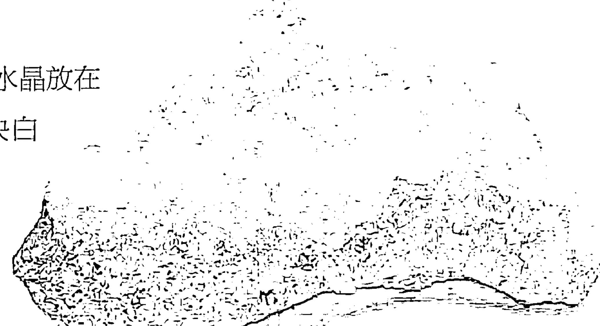

## Peridot

## 橄榄石

(Mg,Fe)₂SiO₄

贵橄榄石是质量达到宝石级的橄榄石族矿物，到火山岩地区旅行的人常常能带回一些包裹或镶嵌有贵橄榄石的岩石。橄榄石是火山活动的重要指示标之一。某些陨石中也能发现橄榄石。贵橄榄石最早在红海的一个岛上发现后被命名为 topazus，希腊人把贵橄榄石命名为 chrysolite（意为“黄金石”），这个名称至今还常被用于某些特别透亮的橄榄石晶体。在古代，贵橄榄石被认为具有祛邪驱魔的作用，价值很高，尤其是镶嵌在黄金上面的时候。

颜色：绿色、黄绿色
光泽：油脂光泽至玻璃光泽
硬度：6.5 — 7
晶系：斜方晶系

### 鉴定与养护

- 贵橄榄石很少见大晶体，通常看到的橄榄石晶体多数是像珠子或者粗片状。
- 贵橄榄石的光泽很强，如果抛光后光泽更好。
- 贵橄榄石晶体是带垂直条纹的棱柱状。
- 贵橄榄石比较脆，所以最好分开放置。

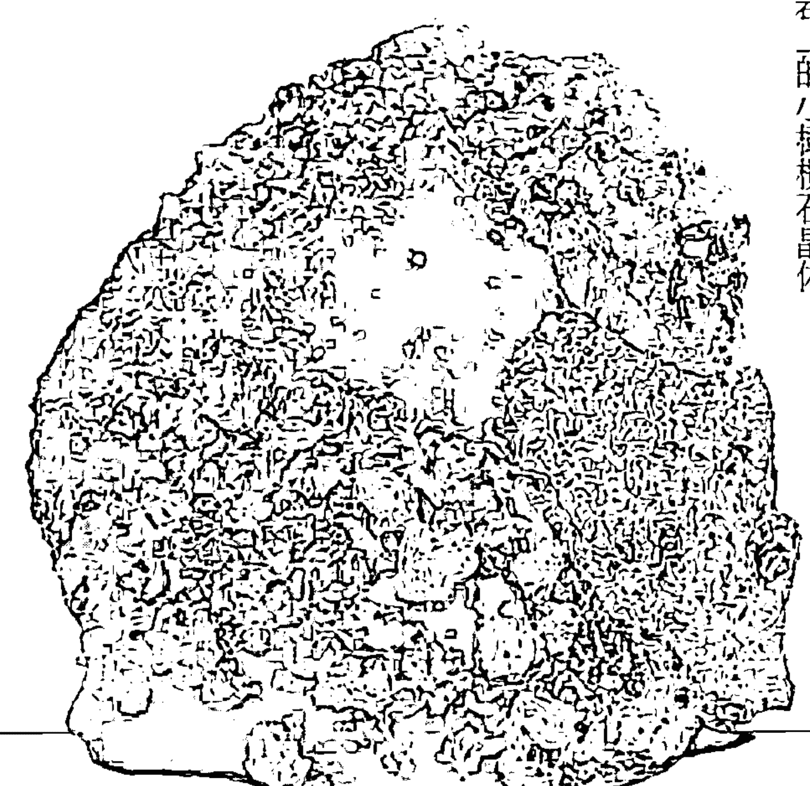

### 魔力

- 象征着自然世界有活力的能量
- 提供对有害力量和影响的防御保护

### 治疗功能

- 把毒素排出体外
- 修复情感平衡
- 覆盖不需要的思维方式
- 对过去放手
- 有助于加强个人同一性

### 实践方法

- 刺激天然愈合的进程，可放四块贵橄榄石在身上：一块在喉咙底部，一块在心脏旁边，两肾旁边各一块，同时在脚边放一块接地气的石头（比如赤铁矿）来促进整个进程。
- 当把贵橄榄石做成钟摆进行治疗时，能释放毅力并促进洞察力水平增强。

### 关键词

- 清洗
- 淡化
- 振兴

### 相似晶石

**镁橄榄石**组分中缺铁，但其他方面很像贵橄榄石。

**铁橄榄石**含铁更多，呈红或者棕色，带有金属光泽。

**铁镁橄榄石**也是橄榄石的一种，铁含量高于镁，通常呈棕色或者黑色。

## Chrysoprase

## 澳玉

SiO₂

澳玉的英文名 Chrysoprase 得名于希腊语 chrysos（意为“金黄色的”）和 prason（意为“韭菜”），形成于很轻的多沙基岩的矿脉中。澳玉的外在特征是半透明、浓重的苹果绿色，使得它看起来有点像某些糖果 —— 绿色的杏仁膏或者椰子冰。波西米亚是传统上澳玉资源最丰富的地方，但是近来澳大利亚也产出了极好的澳玉。

- 颜色：苹果绿至祖母绿色
- 光泽：树脂光泽至玻璃光泽
- 硬度：7
- 晶系：三方（微晶质）

### 鉴定与养护

- 澳玉通常呈大块状、脉状或结核状产出。
- 澳玉的颜色既有亮苹果绿，也有很浓的暗绿色，南美还产出过浅黄色的。
- 澳玉晶体通常是半透明至不透明，蜡状光泽。
- 澳玉通常被切磨成弧面形，注意玻璃或者塑料做的仿制品。
- 澳玉的颜色会在阳光下或者加热后减淡。

### 相似晶石

低质量的祖母绿有时很像澳玉，但通常被切磨成刻面，而澳玉常一般被切磨成弧面。

翡翠通常更硬，表面有浓密感。

葱绿玉髓通常会形成肉眼可见的石英质晶体。

绿色砂金石会有金属闪光。

### 魔力

- 传统上澳玉是一种代表好运和成功的石头
- 使我们与周围环境融为一体，甚至被视为隐形
- 传送自然界和谐的能量

### 治疗功能

- 推动彻底的睡眠和深度休息
- 支持清洁和消毒
- 带来一种与日俱增的安全和平静感
- 增强创造力

### 实践方法

用六块石头组成六边形，一块澳玉放在头顶上，一块澳玉放在左肩旁边，一块黑碧玺放在左手边，一块澳玉放在脚底下，一块澳玉放在右手边，一块黑碧玺放在右肩旁边。为增强功效，可躺在一块黑色织物上。可与创造性力量联系并发现新的方向。

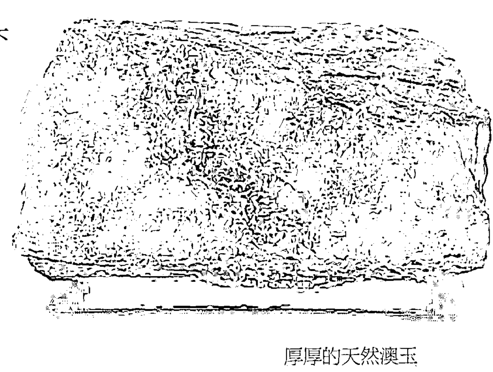

### 关键词

- 安详
- 和谐
- 平静

## Prase (actinolite quartz)

## 绿石英（阳起石石英）

SiO₂

绿石英是一种由其所包裹的针状阳起石晶体致色的深绿色调石英，通常也被称为阳起石石英。绿石英是一种对首饰行业挺有用的半宝石，在古代就常被用于雕琢。

我们很幸运遇到一位女士向我们展示她的巨大绿石英晶簇，它是在一场大风暴后沿加利福尼亚的海滨步行时发现的。这么漂亮的晶体被意外地找到是一件很令人惊讶的事情。

| 颜色 | 中绿色至深绿色 |
| --- | --- |
| 光泽 | 玻璃光泽 |
| 硬度 | 7 — 7.5 |
| 晶系 | 三方晶系 |

### 鉴定与养护

- 在某些石头中，针状阳起石可被视为一种包裹体；但是在另外的一些石头中，阳起石晶体非常密集和均匀地分布。

### 魔力

- 获得周围事物产生的治疗能量
- 统一有意识的和潜意识的能量
- 把心脏中心的内能和自然世界的外能混合

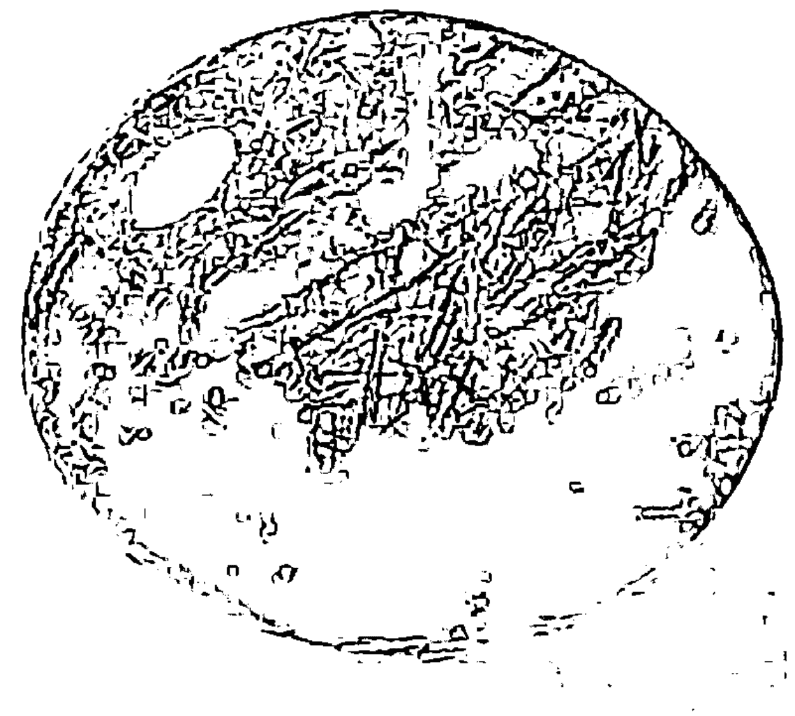

磨圆的绿石英

## 绿石英（阳起石石英）

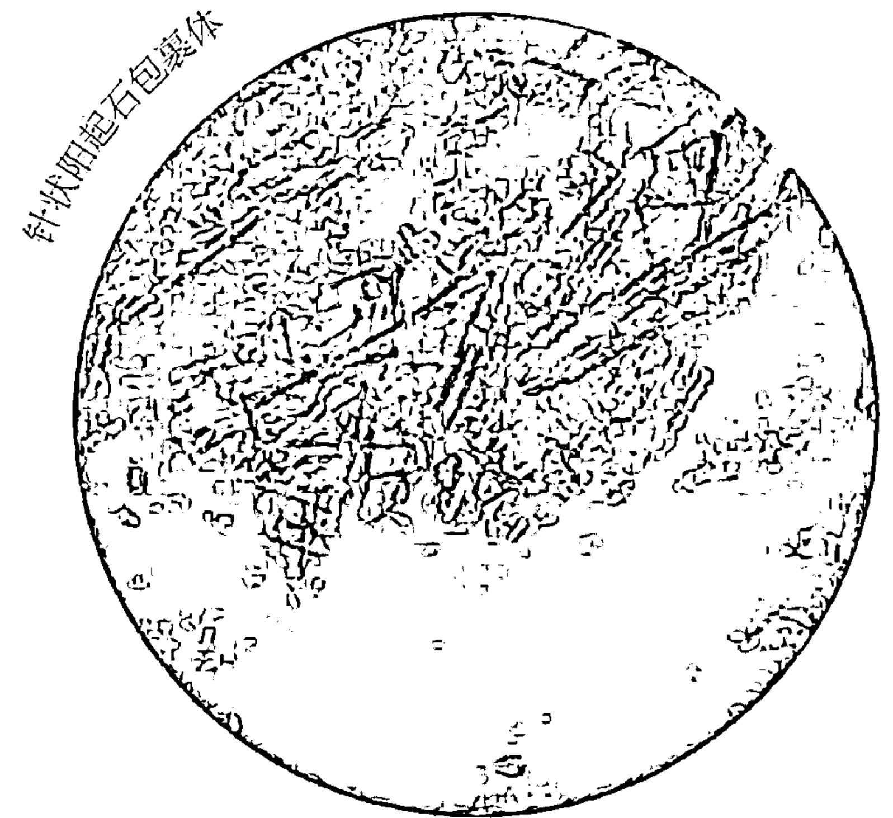

### 关键词

- 支持
- 融合
- 自然的力量

### 治疗功能

- 拓宽视野
- 破除虚假的障碍
- 帮我们与周围环境和谐相处

### 实践方法

为降低压抑感、孤独感或者疏远感，放三块绿石英：一块在额部，一块在心脏部位，一块在两脚之间。再增加四块水晶，头一块在冠部，尖朝上，一块在脚底下，尖朝下，一块在左手上，尖朝里，一块在右手上，尖朝外。想象您的吸气进入脚部的石头并向上移动通过所有石头，然后随您的呼气回来再转一遍。

### 相似晶石

**砂金石**有因为镜铁矿或者云母引发的闪光。

**藓纹玛瑙**通常是树枝状或有机体状，有绿色或者棕色的内含物。

**绿泥石**是另外一种常见于水晶中的内含物，但通常呈云雾状、纱状或幻影状，而非针状。

## Prehnite

## 葡萄石

Ca₂Al₂Si₃O₁₀(OH)₂

葡萄石呈奶油绿色，其英文名 Prehnite 源于其 18 世纪的发现者——荷兰人亨德里克·冯·普雷汉恩上校。葡萄石通常是放射团块状或者葡萄状，偶尔可见与玄武岩和长石共伴生的板状晶体。最初葡萄石被认为是祖母绿或者贵橄榄石的一个亚种，多发现于南非，有段时间被称为“好望角祖母绿”或“好望角橄榄石”。其他祖母绿的产地包括澳大利亚、美国、英国和阿尔卑斯山地区。

葡萄石因为其半透明的绿色而备受关注，这使得它成为一种放松心境以及达到不受时空束缚的意识状态的理想晶石。

- 颜色：黄绿色，无色
- 光泽：玻璃光泽至蜡状光泽
- 硬度：6 — 6.5
- 晶系：斜方晶系

### 鉴定与养护

- 葡萄石半透明的浅绿色调含有淡淡的乳白色，与月光石有点相像。
- 葡萄石有圆形和葡萄状两种常见类型，有时抛磨过的小片可见多边形的细胞状。

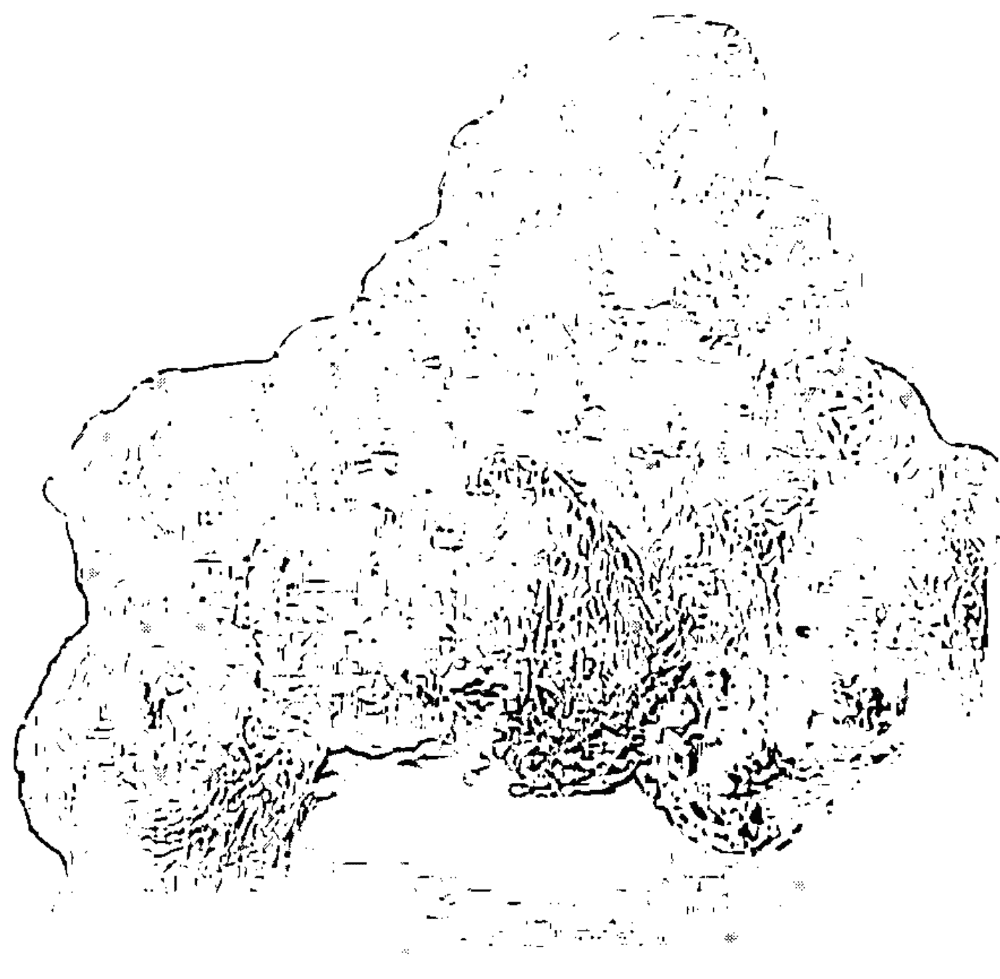

## 葡萄石

### 关键词

- 软化的
- 缓和的
- 安心的

### 魔力

- 解开无意识的心理
- 融化时空界限，易于获得洞察力、远距离观察力和沟通力等超自然能力

### 治疗功能

- 减缓神经性消化不良
- 抚慰和平定心绪
- 助于消除严重的忧虑

### 相似晶石

**橄榄石**光泽更强并且透明度更好，没有葡萄石的奶油状柔和感。

### 实践方法

**银星石**形成扁平的、光滑的放射纤维状或者球状结合体。

- 葡萄石是极好的冥思焦点。
- 葡萄石有占卜的理想外观，可以让意识进入其他时间和空间寻找到解决问题的方法；能让您放松地凝视在晶体上，让思绪和想法随心所欲地飞扬。

**异极矿**通常是放射状集合体，并有丝绸光泽。

**辉沸石**常形成回转波状的晶束，晶体颜色为白色、黄色或棕色等，晶体更软并脆，带珍珠光泽。

## Aventurine

## 砂金石

SiO₂

砂金石是石英大家族中的一员，作为一种雕琢材料和治疗用品已经有很长的历史了。例如：在西藏，砂金石被当作提高知觉和增强视力的东西。砂金石由于内部含有的闪亮包裹体，很容易与其他石英类晶石区分开来。砂金石被认为因和一种18世纪在意大利发明的闪亮的绿色装饰玻璃很像而得名，这种玻璃在熔融时加入金属鳞片而制得。

颜色：绿色、蓝色或红棕色带金属闪光
光泽：玻璃光泽
硬度：7
晶系：三方（微晶质）

### 鉴定与养护

- 砂金石由于其闪亮外表很容易识别，常见的是滚圆的卵石或肿块状。
- 色深闪亮的砂金石通常被用于雕琢，但大多滚圆的砂金石颜色很淡也不太闪。
- 砂金石常见三种颜色：绿色的主要由云母致色，红棕色的主要由黄铁矿或针铁矿致色，蓝色的主要由金红石或者青石棉致色。

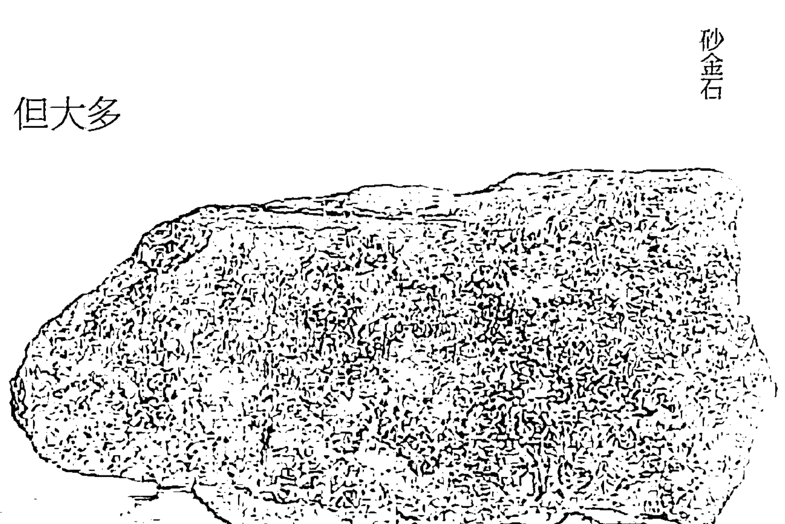

## 砂金石

### 关键词

- 平衡
- 平和
- 稳定

### 治疗功能

- 镇静并稳定情绪
- 鼓励乐观的看法
- 让心神平和稳定（尤其是蓝色砂金石）
- 绿色砂金石是平衡心口轮穴，促进灵性成长以及拥有感恩最佳的晶石之一
- 红棕色砂金石能带来开心和放松

### 相似晶石

玉石的光泽没有砂金石那么亮而且也不闪。

祖母绿有时也像绿色砂金石那样包含闪亮的云母，但是它有醒目的解理。

### 实践方法

天河石有绿色调，但不闪。

蓝水晶和蓝色砂金石相像，但没有闪亮的包裹体。

- 稳定情绪及让心情开朗：放一块砂金石在胸部中心位置，砂金石周围放四块白水晶（尖头朝外），如果您的情绪被干扰，把另外一块砂金石放在喉咙处，一块烟水晶或者其他接地气的石头放在脚底下。

## Emerald

## 祖母绿

Be₃Al₂Si₆O₁₈

祖母绿是绿柱石矿物族中珍贵的绿色亚种，形成于花岗岩和花岗伟晶岩中，由所含有的铬元素和钒元素致色。其颜色范围从浑浊的草绿色到透亮的深绿色。毫无疑问，祖母绿一直被认为与植物王国以及富饶多产有着神秘的联系。祖母绿最终于四千多年前开始在埃及被开采。目前主要产于巴西、哥伦比亚、俄罗斯、巴基斯坦和南部非洲等地。

| 颜色 | 亮绿色 |
| --- | --- |
| 光泽 | 玻璃光泽 |
| 硬度 | 8 |
| 晶系 | 六方晶系 |

### 鉴定与养护

- 高质量透明的祖母绿很稀有，基本只见于宝石贸易中，但是不透明并有云雾状包裹体的祖母绿还是比较容易得到。
- 祖母绿晶体是长六棱柱状，顶部常有刻面形成穹顶状。
- 低级别的祖母绿有时被称为绿色绿柱石。
- 包裹体可作为祖母绿的产地鉴定依据，例如：含有方解石或者黄铁矿的通常来自巴西，含有云母的通常来自俄罗斯或者非洲。

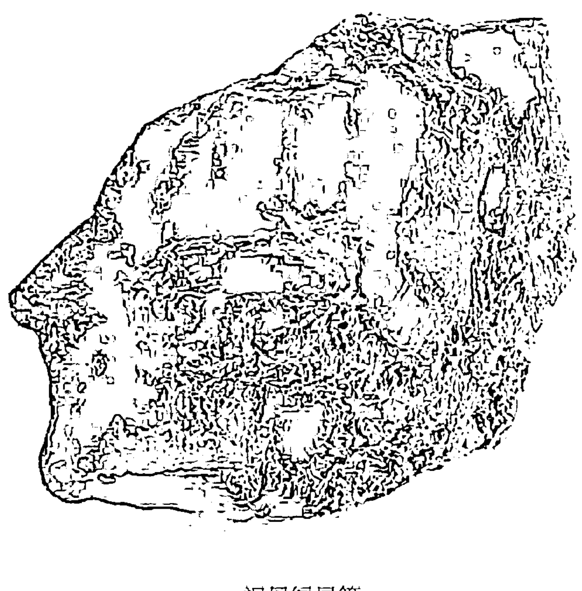

- 祖母绿戒面有好多仿制品，例如，所谓的“印度祖母绿”实际上就是染色的水晶。

### 魔力

- 祖母绿能揭露事实，所以鼓励诚实
- 支持爱、友谊和依恋
- 与预言和预见能力有关

### 治疗功能

- 加速清洗和净化过程
- 缓和隐藏的恐惧和焦虑
- 作为冥思的焦点很有效果

### 实践方法

- 把祖母绿放在心脏轮穴位置可带来平衡与平静。
- 放六块祖母绿，一块放在额头，一块放在上胸部，一块放在心脏轮穴，两手腕处各一块，两脚间放一块，可体验祖母绿的各种功效。

### 关键词

- 镇静
- 清洗
- 协调

### 相似晶石

海蓝宝石是绿柱石家族中偏蓝绿色的亚种。

磷灰石表面常见裂痕，硬度也比祖母绿要低许多。

碧玺的晶形是三角状，而非六方柱状。

## Bloodstone

## 血石

SiO₂

血石这个名称容易产生误导，让它听起来好像与石英家族其他晶石的差别很大似的。血石本质上是绿色碧玉中有些氧化铁产生的红、棕或者黄色的斑点。然而，这种细微的变化使它的治疗特性有很大的延伸，同样很好的血石标本（深绿色底色上有清晰的血红色斑点的那种）也是一种广受欢迎的雕刻材料。

- 颜色：绿色中有红、棕或黄色斑点
- 光泽：玻璃光泽
- 硬度：7
- 晶系：三方晶系

### 鉴定与养护

- 高质量的血石通常只有在宝玉石贸易中才能见到，较次级别的局部有些颜色的血石比较易得。

### 魔力

- 给身体能量受损的地方提供保护
- 有助于提高世界影响力和声望
- 传统上被认为是一种战士之石，与治疗创伤和止血相联系，受火星能量的影响

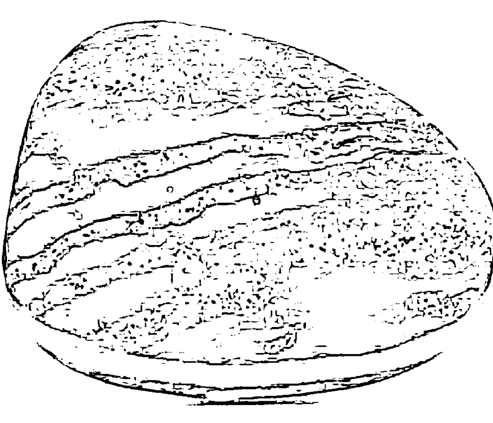

## 血石

### 关键词

- 勇气
- 力量
- 支持
- 刺激

### 治疗功能

- 刺激身体系统，尤其是血液循环系统
- 给心脏和根部轮穴提供能量平衡
- 提供动力和支持
- 有鼓励洞察力技能的特殊使用
- 带来力量和健康

### 实践方法

- 大块的血石对于冥思和其他精神实践是很有用的，它能促进能量的流动以及强化个人的核心意识。
- 用五块血石：一块靠近脊椎底部，一块放在心脏和咽喉轮穴之间（胸腺部位），一块放在前额，头两侧靠近耳朵处各放一块，可增强力量、决心和活力。

### 相似晶石

绿色碧玉和血石在成分上基本一致，但是没有红色斑块。

## Chlorite (including seraphinite)

## 绿泥石（包括绿龙晶）

Ca₂(Mg,Fe²⁺)₅Si₈O₂₂(OH)₂

绿泥石通常是在水晶中形成绿色云雾状的包裹体，但是它最令人印象深刻的形象是“绿龙晶”，是晶石市场的一个新品种。绿龙晶最早发现于西伯利亚，晶体很软，常见土灰绿色的放射纤维状晶簇，当它们被细心地抛光后在光影变换下会呈现出压花丝绒或者短丝绸的效果。绿龙晶最初很稀有并且价格十分昂贵，但现在比较容易得到。但是，需要注意的是，绿龙晶如果作为珠宝首饰材料来使用的话，虽然十分精美漂亮，其硬度和耐久性与传统宝玉石没法相比。

颜色：淡绿、暗绿或黑色
光泽：丝绢光泽至玻璃光泽
硬度：2
晶系：单斜晶系

### 鉴定与养护

- 绿泥石非常软，存放时需把它们相互隔开。

### 魔力

- 使我们和自然界的力量、自然灵魂以及我们这个星球及相邻星球的非物质生命建立联系
- 使心脏轮穴运转良好，改善我们与宇宙精神力量的关系

### 相似晶石

有些孔雀石在其鼓起的绒状表面也会有光影变化。

星叶石也有闪亮的放射状或平坦的色片效应，常呈暗橙色、绿色或者棕色。

## 绿泥石（包括绿龙晶）

### 治疗功能

- 温和地平复身体各部位的过度活跃状态
- 缓和孤独感和被抛弃感
- 阐明个人目标

### 实践方法

- 抓一块绿泥石可适用于向自然状态或向冥思状态敞开心扉。
- 把绿龙晶放在心脏上面可获得微能量并达到冥思境界，放一块接地气的晶石在眉部可净化并稳定这种体验。用一块黑碧玺作为接地气的石头，可以和地球的能量联系起来；用绿玻璃陨石可以作为接地气的石头，可以和宇宙的能量联系起来；用天青石可以在天使王国遨游冥思。

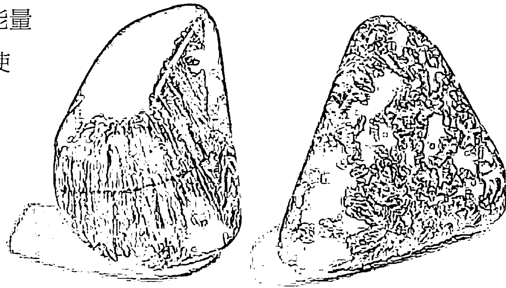

绿龙晶卵石

关键词
开放
敏感化
揭示

## Dioptase

## 绿铜矿（透视石）

Cu₆Si₆O₁₈·6H₂O

绿铜矿这种迷人的含铜硅酸盐矿物产出于铜矿床的淋滤氧化带。如果作为宝石有点太软了，但它的火彩相当好，因为它的双折射率很高，所以透明的绿铜矿价值很高。它浓浓的绿色能刺激身体、情绪和精神的各个层面，尤其增强微知觉和超自然能力。绿铜矿还是一种在项目刚开始或者处于发展阶段时有用的石头，您也许会发现绿铜矿的快速净化能力很强，最好每次少量地控制使用（每次握在手上或者进行穿戴只能几分钟，尤其是靠近心脏轮穴的时候）。

| 颜色 | 铬绿色（深蓝绿色） |
| --- | --- |
| 光泽 | 玻璃光泽 |
| 硬度 | 5 |
| 晶系 | 三方晶系 |

### 鉴定与养护

- 绿铜矿通常形成深绿色的小晶体，常为近方形或者六棱柱状。
- 单个的晶体比围岩上的小晶簇要少见。

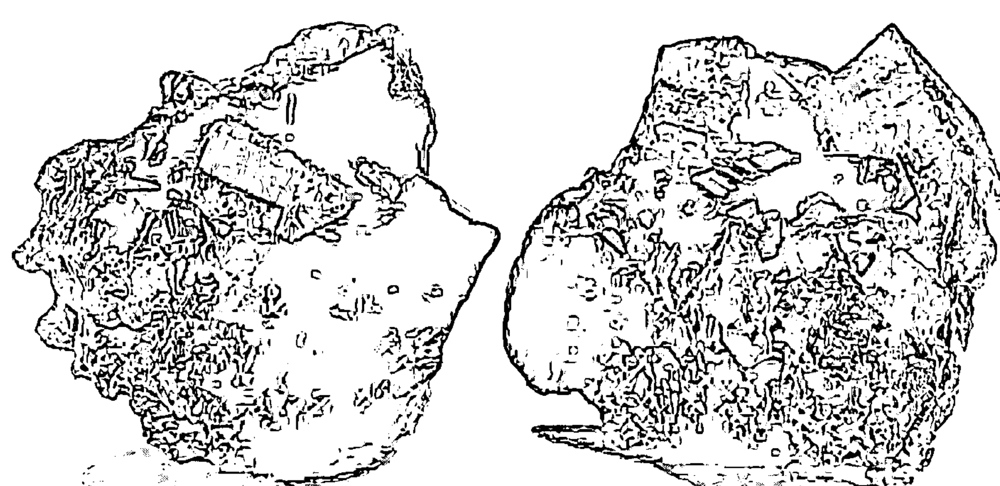

## 绿铜矿（透视石）

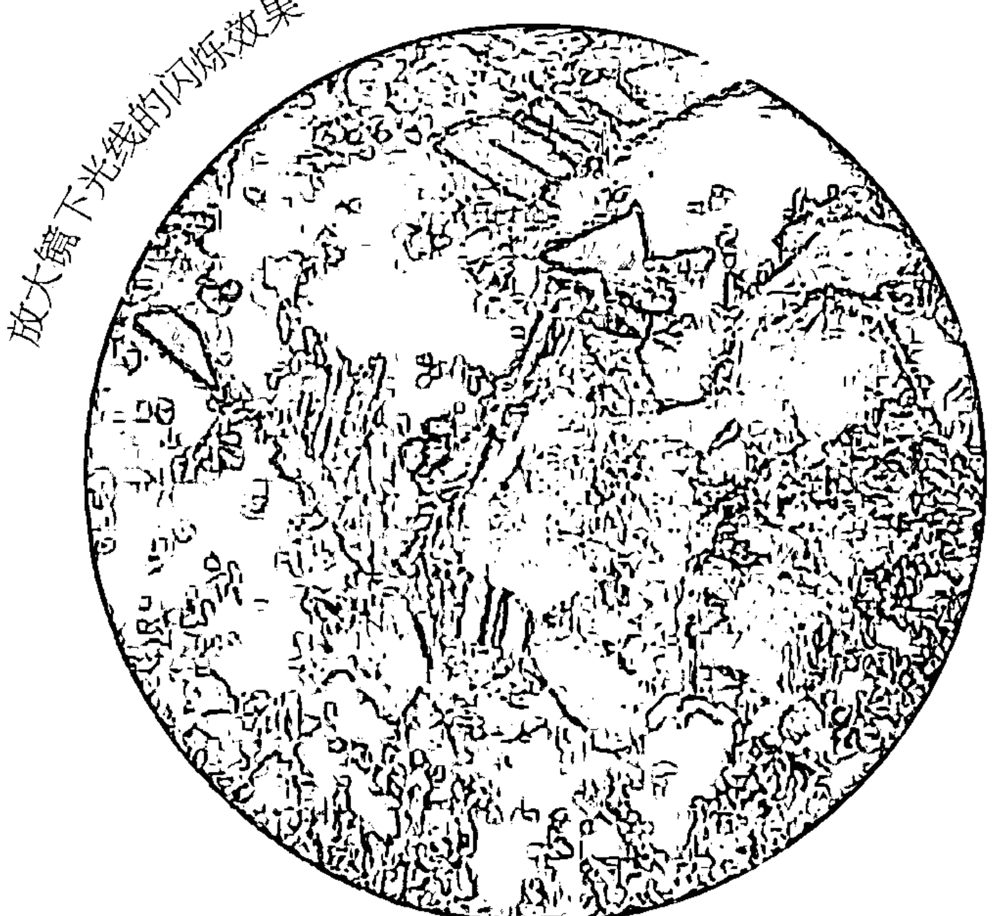

### 关键词

- 刺激
- 滋养
- 扩展

### 魔力

- 刺激转变与成长

### 治疗功能

- 滋养心脏轮穴
- 清除陈旧的行为方式
- 带来清楚的视力和真知灼见

### 相似晶石

**绿盐铜矿**是一种相似的铜矿物，有着长长的绿色针状晶体，常呈放射状晶簇。

### 实践方法

- 把绿铜矿放在心口轮穴上几分钟，可滋养心口轮穴。
- 放一块绿铜矿在床边可促进变化。
- 把绿铜矿放在代表您目标的画或者照片旁边，有助于您达成目标。

**翠砷铜矿**呈祖母绿色的短柱状或厚板状晶体，但不像绿铜矿有火彩，也没有锐利的边缘，而且含有轻微毒性，所以接触后需彻底清洗手。

## Diopside

## 透辉石

CaMg(SiO₃)₂

透辉石是辉石族矿物的一员，通常产出在富钙变质岩中，晶体罕见，常呈粒状集合体。最好最珍贵的透辉石品种是“黑月光石”，切磨成弧面时有星光效应或者猫眼效应。“黑月光石”透辉石还能让您从不利影响和恶毒眼光中免于伤害。各种透辉石都能刺激体内深处的增长循环和治疗，也能逆转负面的情绪和精神状态。

- 颜色：铬黑色、暗绿或绿色（偶见无色、黄色或蓝色等）
- 光泽：玻璃光泽至土状光泽
- 硬度：6
- 晶系：单斜晶系

### 鉴定与养护

- 透辉石的晶体品种包括深绿色的铬透辉石、黑色透辉石以及紫蓝色很稀有的紫青辉石。
- 暗绿色和黑色品种的透辉石常见的是滚圆的卵石。

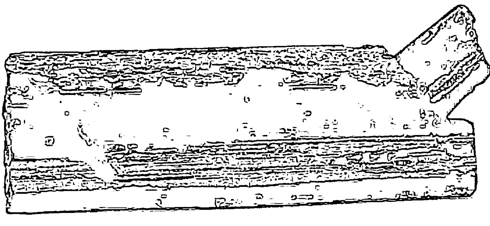

## 透辉石

### 关键词

- 启示
- 增长
- 恢复

### 魔力

- 揭示隐藏的事物
- 代表黑色月亮的能量，与魔力和潜意识相关

### 治疗功能

- 释放根深蒂固的压力
- 在慢性病后恢复能量
- 增强自我价值感
- 帮助我们看到事物中最好的一面

### 相似晶石

磨圆的碧玺通常保持粗糙表面。

### 实践方法

切割成小块的玉石是半透明或者不透明的。

- 把透辉石放在身体患处，白水晶放在头上面，烟水晶放在脚底下，可辅助恢复体能。
- 把白水晶放在头上面，透辉石（最好是有星光的）放在脚底下一米以下，可消除压力或者心灵创伤。
- 把透辉石放在心口部位，粉水晶放在心脏部位，烟水晶放在脚上，可促进自我尊重。

黑色黑曜石通常是半透明的。

绿铜矿有亮蓝绿色条痕，而透辉石的条痕是白色的。

## Epidote

## 绿帘石

Ca₂(Al,Fe³⁺)₃Si₃O₁₂(OH)

绿帘石由于结构和外形与电气石很相像，直到 20 世纪初期才被鉴定出是另外的一种矿物。绿帘石与电气石明显不同的一点是它的颜色范围很小，常见的是黄绿色像开心果的颜色。品质好的绿帘石产自奥地利、斯里兰卡、阿拉斯加和秘鲁等地。在晶石治疗中，绿帘石因为其强健的支撑性能量而备受青睐。

| 颜色 | 开心果绿、绿色、棕色、黑色 |
| --- | --- |
| 光泽 | 玻璃光泽至土状光泽 |
| 硬度 | 6 — 7 |
| 晶系 | 单斜晶系 |

### 鉴定与养护

- 暗绿色的绿帘石适合切磨抛光，其他种类的适合滚磨。
- 锰红帘石是一个亮红色至淡黄色的变种。
- 绿帘石很少见透明度，只有某些达到宝石级的绿色绿帘石才可用于做首饰。

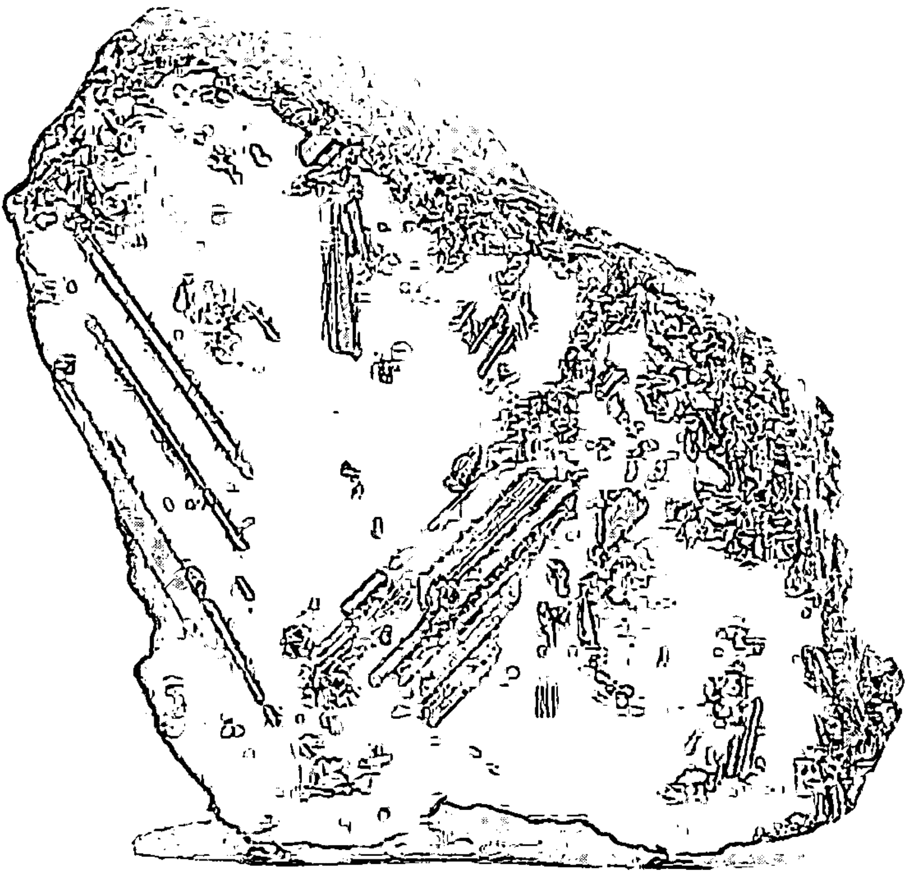

### 魔力

- 建立、发展、支持
- 对如何成功提出切实可行的建议

## 绿帘石

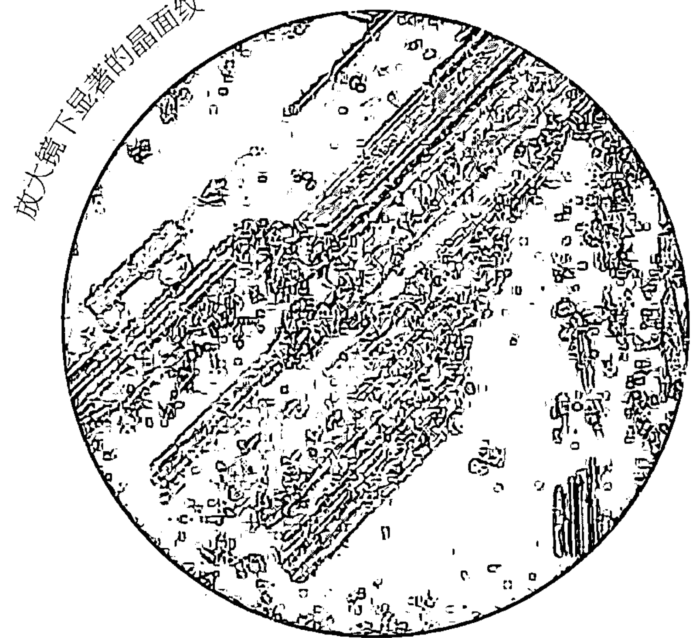

### 关键词

- 聚集
- 强化
- 实际的

### 治疗功能

- 提供能加强包括骨骼、软骨、筋腱和肌肉等在内的身体结构的接地气实践能量
- 稳定情绪
- 帮助达到目标
- 使我们在各个层面积累力量

### 相似晶石

**电气石**在外形上与绿帘石很相像，除了颜色范围大以外在外观上很难区分。

### 实践方法

**符山石**有清晰锐利的晶体边缘。

- 把绿帘石放在前额中间以及两手上，可帮助实现目标。
- 把绿帘石放在两脚间，黄水晶放在心口部位，可稳步前进。

**阳起石**具有丝的光泽和细针状晶体。

**普通辉石**为黑色近方形柱状。

## Jade

## 玉石

翡翠：NaAl(Si₂O₆)；软玉：Ca₂(Mg,Fe)₅Si₈O₂₂(OH)₂

玉石主要分两种：软玉（阳起石质）和翡翠（辉石质）。软玉的英文名 Nephrite 来源于其被认为有治疗肾脏的功能。软玉不是很硬的矿物，却很有韧性，很难开裂。相比软玉来说，抛光后的翡翠相对更偏颗粒状，可见轻微凹凸。

全世界对于玉石的推崇非常广泛，其在不同文化中的认同感也是相当一致的，其最初起源的作用也大体雷同。玉石广泛地被认为是一种有治疗功能的石头，和各种与祖传精神以及对死者的保护的事项有着特殊的关联。

玉石的颜色多种多样，例如：美国加州有亮蓝色的玉石，玉石还能变颜色，通常玉石在与过世的人一起埋葬后，会慢慢变成棕褐色。

### 鉴定与养护

- 玉石的仿品通常有鲍温石、钙铝榴石、葡萄石等矿物。

颜色：绿色、白色、灰色、灰色、浅蓝色等
光泽：油脂光泽
硬度：6.5 — 7
晶系：单斜晶系，微晶质

### 相似晶石

鲍温石是蛇纹石的一种，不像玉石那么硬，用小刀就能刻动。

钙铝榴石常常被打上“非洲玉石”或者“德兰士瓦玉”的标签。相似的还有绿玉髓、葡萄石、砂金石等。

## 玉石

### 魔力

- 与长寿相关
- 有助于在世的人与过世的先祖建立联系以及保护过世的人的精神

### 治疗功能

- 平衡心脏轮穴，有助于改善我们与其他人的关系
- 增加归属感
- 增强有效和适当行动的能力
- 对我们进行深层次放松，加速治疗进程

### 实践方法

- 当您因过往与境遇而感到失落时，把玉石放在脊椎底部、骶骨轮穴或者咽喉部位，将让您重新焕发活力。

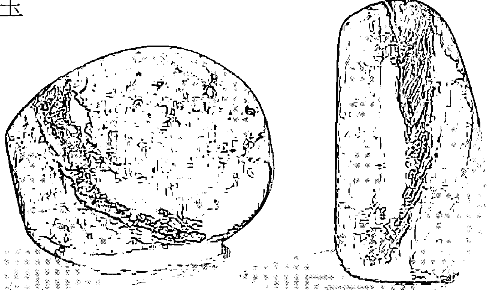

滚圆的玉石

## Sphene

## 榍石

CaTiSiO₅

榍石是榍石钛铁矿族矿物中透明宝石级的亚种，通常产出在变质岩中，尤其产于结晶片岩裂隙中，与水晶、绿泥石和长石等矿物共伴生。榍石有半透明带点脏脏的橄榄绿色，晶形比较怪异，像扁平的楔形。实际上，榍石的名字 sphene 在古希腊语中就是“楔子”的意思。就像真的楔子一样，榍石可用于打开通往治疗体验新层面的大门或者进入根深蒂固习惯。这使得它成为一种重要的治疗用晶石。

颜色: 黄绿色、绿棕色、棕红色等
光泽: 金刚光泽
硬度: 5 — 5.5
晶系: 单斜晶系

### 鉴定与养护

- 榍石的颜色很难“干净”，通常是绿棕色或者带点微红色调，但光泽很强。
- 榍石扁平板状的晶体通常略带点条纹。
- 榍石有时被用作更昂贵的晶石，如黄玉、金绿柱石或者橄榄石的仿品。

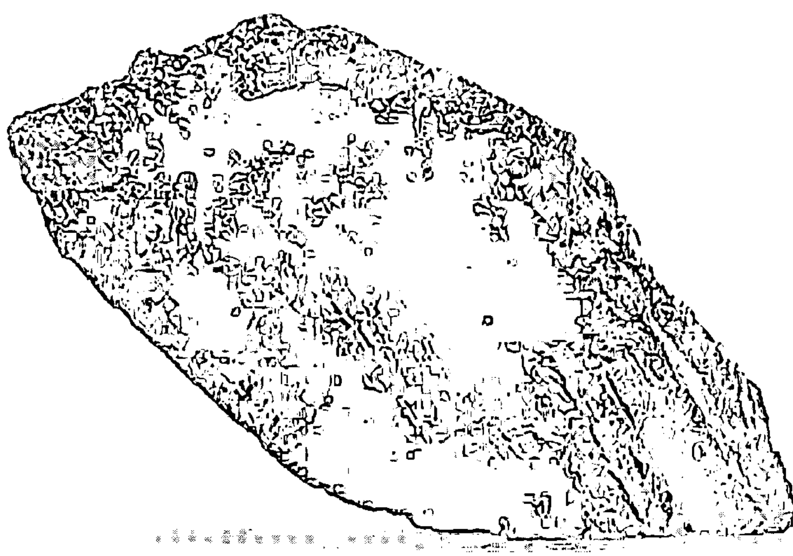

### 魔力

- 明确新的方向
- 给问题提供解决方法
- 鼓励横向思维

### 治疗功能

- 缓和地增加身体能量水平
- 帮我们理解自己的情绪
- 让我们对新观点新理念持开放态度
- 让精微体有序排列

### 实践方法

- 把榍石放在头部周围或者额部轮穴上，可澄清心绪。
- 把榍石放在上嘴唇上面一点的位置或者下嘴唇下面一点的位置，可增加并集中能量。
- 把榍石和粉水晶合一起放在心脏轮穴部位可清除精神紧张。
- 把榍石和黄水晶合一起放在心口部位可增加辨别能力。
- 把榍石和石榴石合一起放在根部轮穴部位可增加自我激励。

### 关键词

- 阐明
- 校正
- 探索

### 相似晶石

橄榄石的绿色比较纯净，并且它的晶体不那么扁。

贵橄榄石呈清澈透明的苹果绿色。

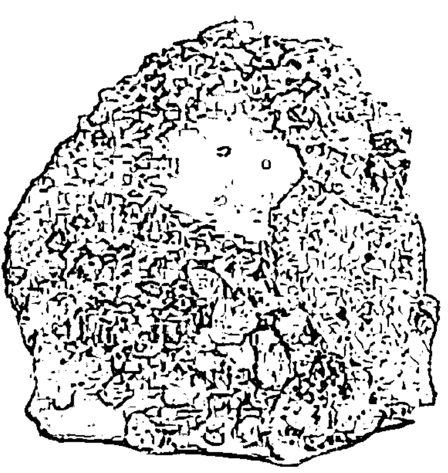

## Serpentine

## 蛇纹石

Mg₆(OH)₈Si₄O₁₀

蛇纹石的名字来源于这种石头能够治疗蛇咬的古代传说。这种说法也许来自蛇纹石蜿蜒迂回的纹路，以及其色调容易让人想起蛇皮。蛇纹石是一种变质岩，形成于富含橄榄石的岩石中，尤其多发现于英国（主要产出在康维尔）、意大利、南非、俄罗斯和美国等地。蛇纹石形成的石棉纤维（也被称为温石棉或蛇纹石石棉）由于会导致肺气肿等严重的肺部疾病而被杜绝使用。但是一块块的蛇纹石则是完全无害的。

颜色：浅绿至深绿色、黄色、红棕色
光泽：蜡状光泽至玻璃光泽
硬度：3 — 4
晶系：单斜晶系，微晶质

### 鉴定与养护

- 蛇纹石由于其光滑的肥皂感很容易鉴别。
- 鲍温石是蛇纹石一种颜色很淡的变种，常常被称作“新玉石”。
- 蛇纹石很软，容易被其他石头刮花，需小心分开储藏。

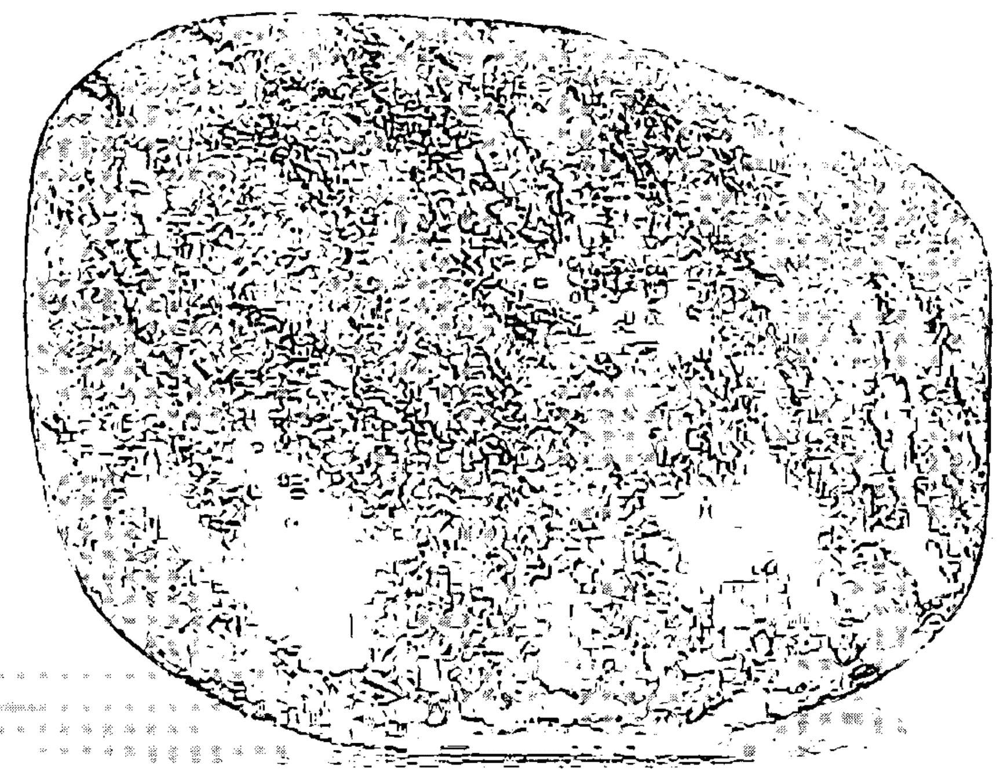

蛇纹石

### 魔力

- 具有避免伤害的力量
- 消除恐惧
- 开发超自然的技能

### 治疗功能

- 让身体能量（普拉纳）的使用和吸收贯通全身
- 平复和稳定心绪
- 提高知觉
- 对冥思与新的意识状态的和谐融合有益

### 实践方法

- 当焦虑和恐惧影响到正常的休息和放松的时候，可考虑使用蛇纹石。发生梦魇、失眠、妄想症以及对未知的恐惧等症状可通过穿戴或手持蛇纹石来缓解。
- 把蛇纹石放在喉咙和心脏部位、红玉髓放在骶骨轮穴、烟水晶放在脚底下、紫水晶放在头顶上，可抚慰焦躁不安的心绪。

### 关键词

- 安慰
- 流动
- 启迪

### 相似晶石

绿帘石比蛇纹石硬得多并且磨圆状的颜色很单一。

玉石硬度大得多并且颗粒结合紧密。

## Malachite

## 孔雀石

Cu₂CO₃(OH)₂

孔雀石是铜矿床的一种次生矿物，常与蓝铜矿共生。孔雀石的单晶体很少见，通常呈囊肿状或者放射块状。孔雀石含铜60%左右，是一种很有用的铜矿石。主要的产地在俄罗斯、非洲和澳大利亚等地。孔雀石的英文名 Malachite 来源于希腊一种锦葵属的植物“maloche”，它的叶子和孔雀石一样柔软并带深绿色。由于有醒目的眼球状同心纹，孔雀石被用于对“邪恶眼”提供神奇的保护。

颜色：绿色带深绿或黑色同心纹
光泽：丝绢光泽或土状光泽
硬度：3.5 — 4
晶系：单斜晶系

### 鉴定与养护

- 孔雀石抛光块、切片、囊肿状或块状的都比较常见，还常与蓝铜矿共生。
- 孔雀石有浅绿色条纹，这是它区别类似于锌孔雀石和假象孔雀石等相似石头的依据之一。
- 孔雀石很软而且空隙多易于吸收其他粉末或液体，所以需将其与其他硬石头和盐、油等分开放置。

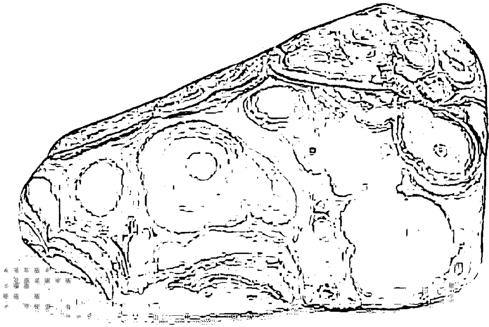

### 魔力

- 与发展和充裕相关联

### 治疗功能

- 缓解疼痛，在精疲力竭的时候辅助恢复
- 定位和纠正情绪失调
- 推动新观念的开发
- 在困难环境中鼓励和强化自己
- 吸收环境中的污染物

### 实践方法

- 两手各滴两三滴宝石精华液或者抓一块孔雀石，可抵消长时间暴露在电磁辐射下带来的影响。
- 抓一块孔雀石在身体疼痛部位上方，可有效吸收体内的不平衡并进行净化。

### 关键词

- 平衡
- 抚慰
- 排毒
- 吸收剂

### 相似晶石

**蛇纹石**的纹路不那么规则，并且颜色更偏黄绿色。

**硅孔雀石**更偏亮蓝绿色，没有规则条纹。

**锌孔雀石**形成蓝色或绿色葡萄装硬壳，但其条痕是浅蓝色。

**假象孔雀石**有蓝绿色条痕。

## Moldavite

## 绿玻璃陨石

玻璃与硅酸盐的复杂混合物，SiO₂

绿玻璃陨石这种非晶质的玻璃陨石目前仅发现于捷克共和国的一个地方，它诞生于一千五百万年以前，但其来源依然是个谜。绿玻璃陨石有可能由陨石熔融了附近的围岩而形成的，因为它不含有火山岩常见的包裹体。绿玻璃陨石也可能随某颗彗星或者陨石来到地球，它可能是天外来客。绿玻璃陨石一直有着特殊的意义，中世纪文献提及：圣杯很可能是一块从天而降的石头，这使得许多人认为绿玻璃陨石也是那种广受欢迎的外星遗物。

颜色：半透明绿色、棕绿色
光泽：玻璃光泽
硬度：5
晶系：非晶质

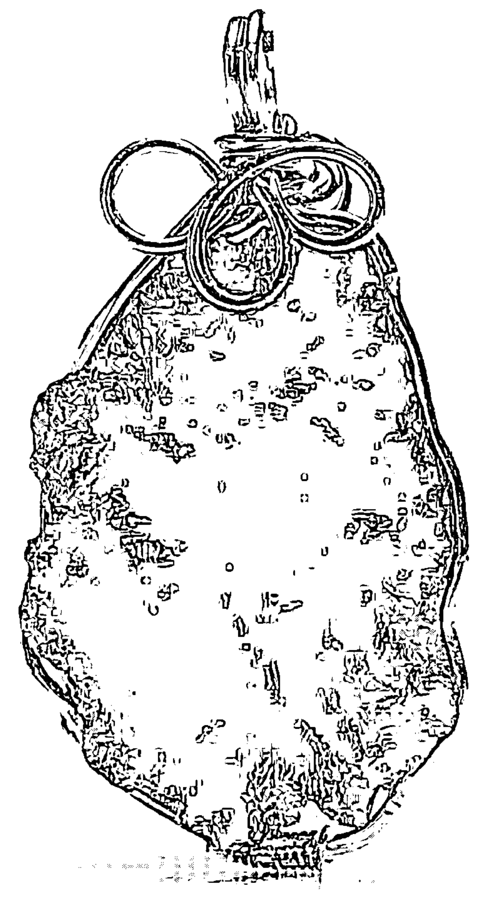

### 鉴定与养护

- 绿玻璃陨石是仅有的一种绿色透明的玻璃陨石，其他的都是黑色或者棕色。
- 大块的绿玻璃陨石很少见，大多数表面有麻点、凹坑或者水波纹等，呈挤压片状、泪滴状或卵石状等。

## 绿玻璃陨石

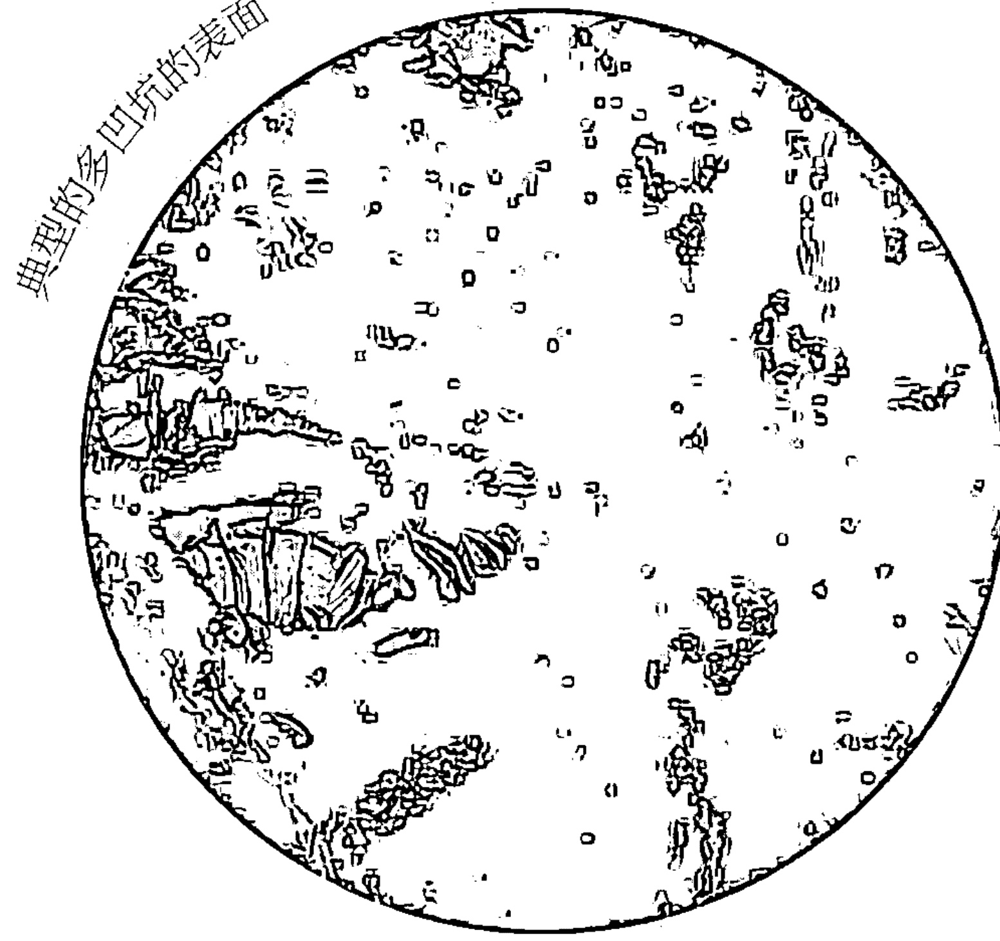

### 关键词

- 转变
- 扩展
- 放大

### 魔力

- 混合宇宙和地球的能量，扩展对宇宙的认知
- 代表转变、进化的过程和灵性成长

### 治疗功能

- 放大其他晶石的治疗特性
- 加强免疫系统
- 提高我们对创造的欣赏

### 相似晶石

**其他玻璃陨石**看似相似但没有浓绿色。

**绿色电气石**看似像切割过的绿玻璃陨石，但绿玻璃陨石硬度偏低，并且没有二色性。

### 实践方法

- 为鼓励创新或者探索您真正的潜能：躺在一块绿色布料上，把天青石放在头顶上，绿玻璃陨石放在两肩旁边，天青石放在两手旁边，绿玻璃陨石放在两脚间，确保有一块类似于赤铁矿或者电气石等接地气的石头在治疗后使用。

**阳起石**具有丝的光泽和细针状晶体。

**橄榄石**通常偏黄绿色。

## Moss agate

## 藓纹玛瑙

SiO₂

藓纹玛瑙是一种优质绿色或者棕色的氧化锰、角闪石和铁质包裹体的玉髓。古时候红海之滨的也门有很多这种石头的资源，所以藓纹玛瑙也因为其附近的交易中心穆哈被称为“穆哈石”。

手持一片藓纹玛瑙，有如把自然界的能量集中在您手中：它就像穿过蕨叶森林，也像鸟瞰大河的入海口，或者从外太空看地球的视角。

| 颜色 | 无色透明带绿或者棕色包裹体 |
| --- | --- |
| 光泽 | 玻璃光泽 |
| 硬度 | 6.5 |
| 晶系 | 三方晶系，微晶质 |

### 鉴定与养护

- 蕨纹、苔藓纹以及叶纹等在藓纹玛瑙中清晰可见，尽管有些根包体浓密得您需要在光下才能看清楚。

### 魔力

- 使我们与自然世界相协调
- 代表韧性与稳步发展

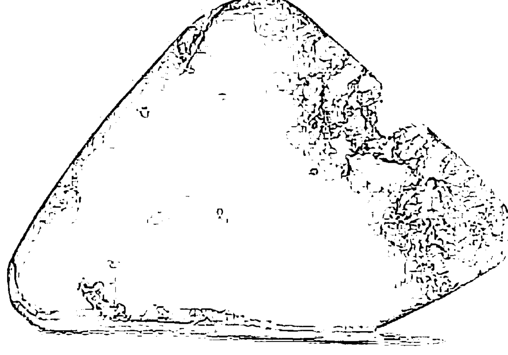

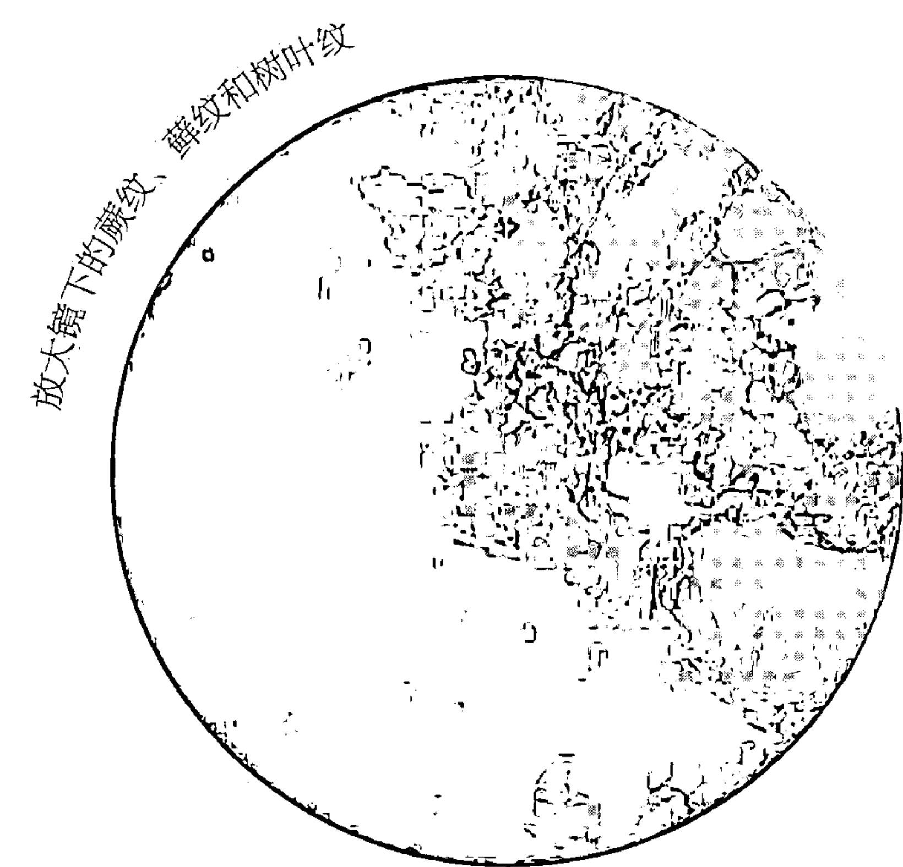

### 关键词

- 空间感
- 乐观主义
- 开放

### 治疗功能

- 有助于放松和打开拥堵狭窄区域，如血液或淋巴循环
- 释放被压抑的情绪
- 增加乐观主义
- 推动自我潜能发觉

### 相似晶石

**树纹玛瑙**是乳白色的，也达不到半透明程度。

**绿碧玉**似完全不透明。

**树枝状砂岩 / 灰岩**与藓纹玛瑙有同样的内含物，但是包裹在不透明的粒状岩石颗粒中，而非水晶里。

### 实践方法

- 放五块藓纹玛瑙在身体各部位：一块放在胸上部（胸腺位置），一块放在心脏轮穴，一块放在胃底部，心脏轮穴两边各放一块，可缓解密闭感、拥堵感和紧张情绪，尤其是与人际关系相关的情绪感觉。

## Turquoise

## 绿松石

CuAl₆(PO₄)₄(OH)₈·4-5H₂O

早期欧洲人给绿松石命名 pierre turquoise（土耳其石）是因为相信它来自小亚细亚，然而这只是因为欧洲人最早从那边贸易而获得这种石头。这种石头来自沙漠干旱地区如伊朗、西奈半岛和中国西藏等地。绿松石由铜铝矿床氧化带水合作用形成，这使得它具有蓝色调，其绿色来自铁杂质。

绿松石一直很流行用作护身符，在文艺复兴时期的欧洲，几乎所有绅士的戒指上都镶着块绿松石，以期避讳在决斗或者骑马中遭遇不幸。在许多种文化中，天蓝色的绿松石与土红色或者橙色的石头（如珊瑚和红玉髓等）放在一起，以同时祈求天和地的护佑。

颜色：绿松色、蓝绿色、亮蓝色等
光泽：蜡状光泽至玻璃光泽
硬度：5 — 6
晶系：三斜晶系，微晶质

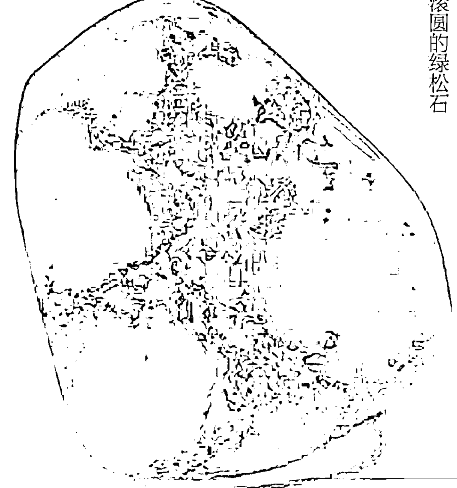

### 鉴定与养护

- 绿松石的晶体很少见而且通常很少，主要形成块状或者囊肿状集合体。
- 阳光会使绿松石褪色，大部分样品被打蜡或者涂树脂来保护颜色。
- 绿松石空隙多，容易被油脂污染。

### 魔力

- 增强气场
- 与精神世界相联系

### 治疗功能

- 加强各种器官组织
- 平衡各种精微体，尤其是心脏、胸腺和咽喉轮穴
- 使环境负能量失效
- 让情绪冷静下来
- 让过度活跃的思维平静下来
- 提高直觉力和超自然技能

### 实践方法

- 放一块绿松石在头顶部位，一块在脚底下，两手边各一块，两肩膀边各一块，可消除伤害并在障碍面前带来转变，如果躺在一块黄色布料上能增强效果。

### 关键词

- 加强
- 保护
- 提高

### 相似晶石

软硼钙石，一种灰白色非晶质的石头，通常被染色用来模仿绿松石。

天河石不像绿松石那么蓝，有色带。

海纹石、硅孔雀石等晶石看起来也有点像绿松石。

## Aquamarine

## 海蓝宝石

Be₃Al₂Si₆O₁₈

海蓝宝石是绿柱石的亚种之一，是最受欢迎的亮蓝色宝石，晶体结构内所含的铁的多少决定了它的颜色深度，可从接近无色到深海蓝绿色变化。高等级的海蓝宝有时被其他相似品种模仿，包括用蓝色黄玉、蓝色玻璃或者低等级加热改色的海蓝宝等仿制。海蓝宝产于花岗伟晶岩这种缓慢形成的岩浆岩类中，最有名的产地在巴西和巴基斯坦等地。

| 颜色 | 无色、浅蓝至蓝绿色 |
| --- | --- |
| 光泽 | 玻璃光泽 |
| 硬度 | 7.5 — 8 |
| 晶系 | 六方晶系 |

### 鉴定与养护

- 海蓝宝石能形成铅笔状的六方柱状晶体。
- 首饰用的海蓝宝对颜色级别分得很清楚，偏绿色的价格不那么贵。
- 滚圆的海蓝宝原石很纯净，颜色从带点乳白色调的蓝色到珍珠光泽的瓷绿色都有。
- 海蓝宝石里面的平行条纹会发光并且会让蓝色看起来更深。
- 海蓝宝石晶体有二色性，从某个角度看，颜色会比其他角度要淡。
- 海蓝宝石晶体的顶端要么是平的，要么是刻面穹顶。

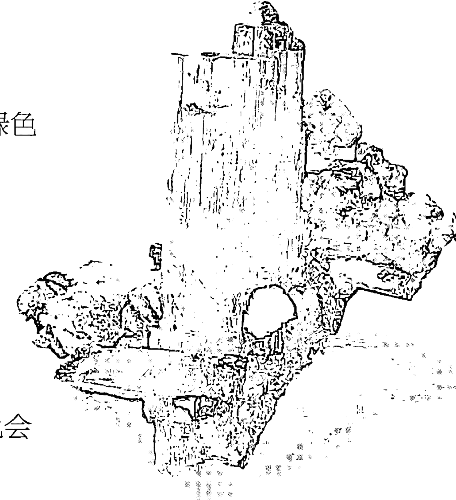

### 魔力

- 免于伤害
- 开启安全的旅程，尤其是海上旅程

### 治疗功能

- 增进免疫系统，平衡胸腺和咽喉轮穴
- 清除迟钝的情绪
- 鼓励乐观主义
- 让想法创造性地表达
- 鼓励专长绝活
- 帮助发现灵感并使想象力流动起来，通常能带来实际的产出

### 实践方法

- 当您的能量值偏低以及传染病流行的时候，在咽喉和心脏轮穴之间戴一个海蓝宝石吊坠。
- 用海蓝宝石和粉水晶布一个阵列，可在各层面平静和抚慰心绪。

### 关键词

- 冷却
- 净化
- 抚慰
- 减轻

### 相似晶石

**蓝色黄玉**比重更大，颜色更偏光亮的金属色。

**西伯利亚水晶**没有内含物和二色性。

**水光水晶**改色的白水晶，颜色偏彩虹色。

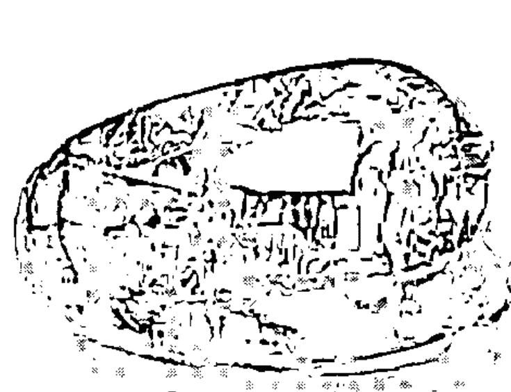

滚圆的海蓝宝

## Amazonite

## 天河石

KAlSi₃O₈

天河石这种流行的宝石其实是常见矿物长石族的一个亚种，它有着迷人的蓝绿色短粗棱柱状晶体。天河石的英文名 amazonite 来自亚马孙河（Amazon River），尽管亚马孙流域并没有什么著名的天河石矿床，它主要产于加拿大、马达加斯加、墨西哥、俄罗斯以及非洲某些地方。天河石比较软，易于加工，在古埃及十分流行。天河石的绿颜色传统上常常会与丰饶、护佑以及先人的精神相联系。

颜色: 浅蓝绿至深中绿，有亮条纹
光泽: 玻璃光泽
硬度: 6 — 6.5
晶系: 三斜晶系

### 鉴定与养护

- 天河石的颜色深浅变化很大，抛光后的天河石可以通过其条纹进行鉴定，狭窄的纹理有暗色或者很浓的色斑点缀。
- 天河石的表面有时会出现虹彩现象。
- 轮廓清晰的精美天河石晶体尤其受欢迎。
- 当作为宝石用时，天河石通常被切磨成弧面。

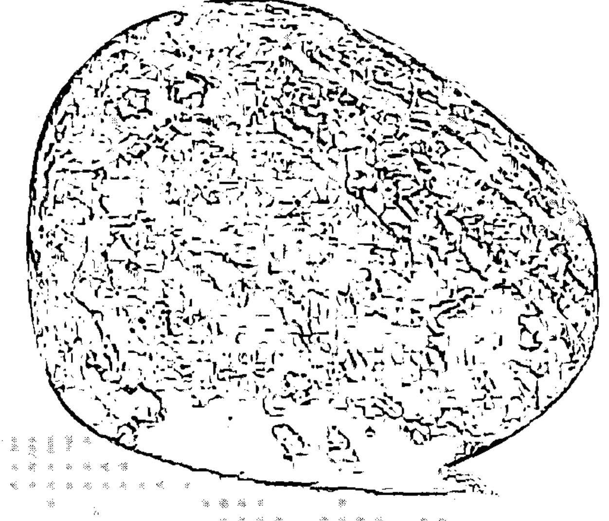

## 天河石

### 关键词

- 刺激
- 沟通
- 记忆

### 魔力

- 能帮您回到很久远的回忆中，甚至前世
- 接近先祖的能量

### 治疗功能

- 减轻耳朵、鼻子、喉咙以及神经系统的病痛
- 激励创造力和个人表现力
- 释放受阻的情绪
- 支持沟通
- 增强精神力

### 相似晶石

**绿松石**颜色更为均匀，没有条带，通常更偏蓝色。

**砂金石**没有条纹。

### 实践方法

**祖母绿晶**更偏半透明和玻璃光泽。

- 把天河石放一块在心口轮穴，一块在脊椎底部，两脚下方各一块，可加强自我认同和个人能力。
- 把天河石放一块在心脏轮穴，一块在脑袋底部，可回到很久远的记忆中。

此外，**硅孔雀石**等晶石与天河石也挺像。

## Chrysocolla

## 硅孔雀石

Cu₂H₂Si₂O₅(OH)₄

硅孔雀石常常看起来像天空的景象或者遥远星球的表面，它是一种喻示着许多可能性的石头。硅孔雀石产出在铜矿床的淋滤氧化带，这种矿物很少是很纯净的，其晶体结构随着混入元素的变化差别很大，它也常与其他铜矿物共伴生，如蓝铜矿、孔雀石、赤铜矿、绿松石等。

颜色：绿色、蓝绿至亮蓝色
光泽：玻璃光泽至蜡状光泽
硬度：2 — 4
晶系：单斜晶系或斜方晶系，微晶质

### 鉴定与养护

- 纯净的硅孔雀石非常软，除非被混入水晶、玉髓或者欧泊等矿物。
- 高品质的硅孔雀石常常会有明显的蓝色和绿色区域区分，使得它看起来像地球与外太空的关系。
- 以色列的埃拉特石所含的绿松石和孔雀石比例基本相对，相对其他大多数种类的硅孔雀石而言有比较一致的颜色。

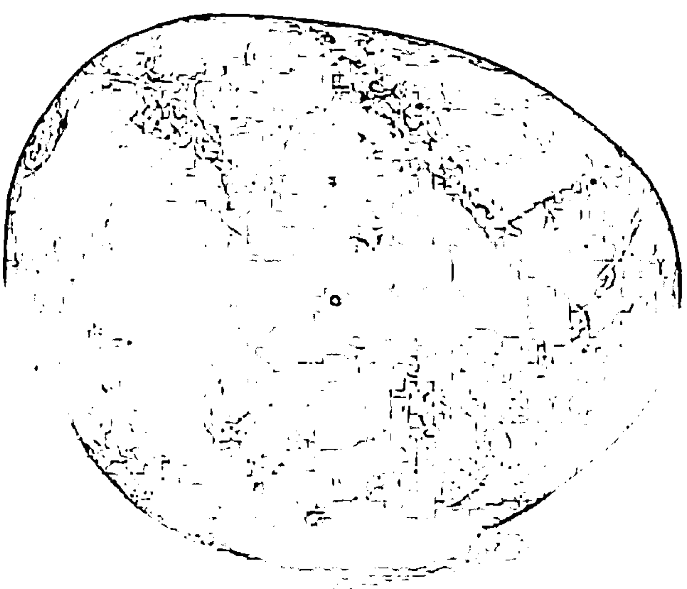

### 魔力

- 带来变化、成功与和睦

## 硅孔雀石

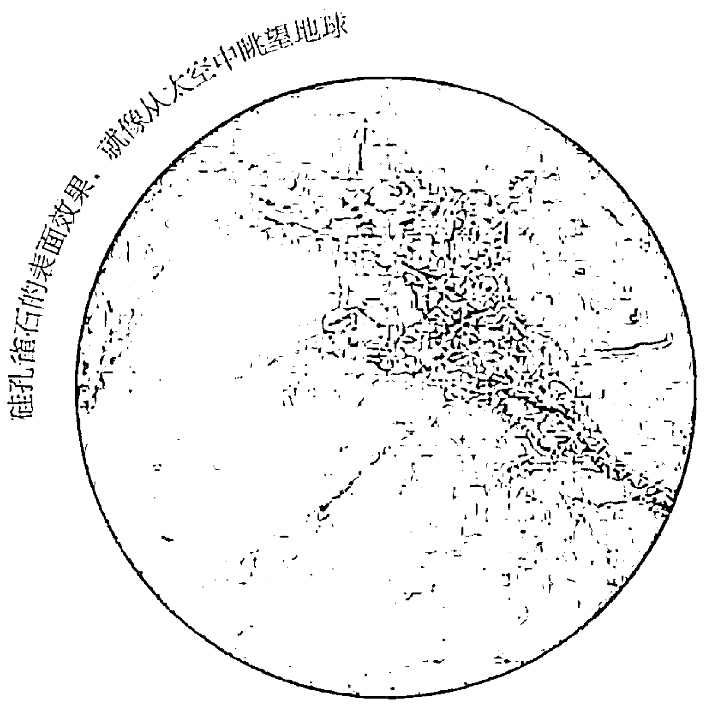

### 关键词

- 吸收
- 沟通
- 放松

### 治疗功能

- 对喉咙和胸部疾病有益处
- 让身体和情绪放松
- 增强创造力
- 在多个层面帮助沟通

### 实践方法

- 把硅孔雀石放在喉咙底部以及胸腔两边，可均匀呼吸以及增强表达能力。
- 在咽喉轮穴处和颅骨底部放置硅孔雀石，可防止潜意识的信息。
- 把硅孔雀石放在脊椎底部以及颅骨底部，可平衡脊椎的能量流动。

### 相似晶石

海纹石包含白色脉络纹，并且会更硬点。

绿松石颜色更丰富也更硬。

天河石更硬。

蓝纹玛瑙更硬、更烂，而且不含绿色斑点。

## Larimar

## 海纹石

Ca₂NaSi₃O₈(OH)

海纹石是针钠钙石一种迷人的形式，翠蓝色并有着白色脉状纹，让人想起热带海洋。海纹石很稀有，目前只在一个地方被发现，位于多米尼加共和国的大山里面。它通常以细针状的放射状集合体或者裂缝和孔隙充填了玄武岩的紧密块状产出。

有位精神导师曾声称：加勒比群岛是消失了的亚特兰蒂斯帝国的一部分，这块地区会产出一种蓝色石头，有很强的治疗功效。有些人认为指的就是海纹石，所以它有时也被称为“亚特兰蒂斯石”。

颜色：亮蓝绿色、亮蓝色、白色
光泽：丝绢光泽至玻璃光泽
硬度：4 — 5.5
晶系：三斜晶系

### 鉴定与养护

- 海纹石很稀有，也比较贵。
- 海纹石也被当作“海豚石”卖。
- 这是一种软的矿物，需把它与其他硬的石头和有尖锐边缘的东西分开放置。

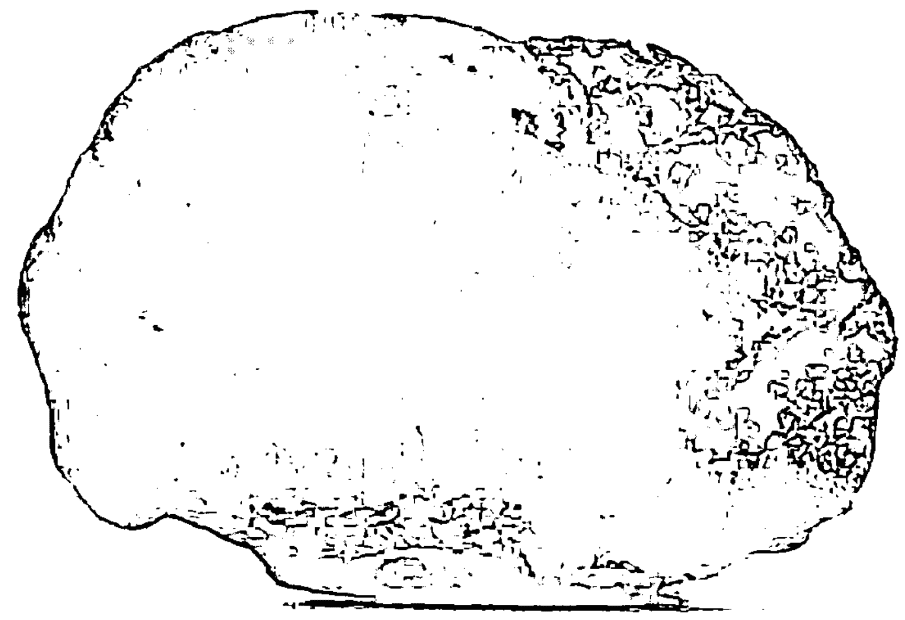

夹着玄武岩的海纹石

### 治疗功能

- 复杂身体上半身能量的流动并释放相应部位的密封性
- 平衡极端化的情绪
- 鼓励宽容
- 对私人空间给予赞赏
- 放松意思知觉
- 拓宽对时间和空间的体验
- 帮助认知到自己在事物整体框架中的位置

### 关键词

- 遥远的地平线
- 平静
- 接受

### 实践方法

- 放一块海纹石在额部，两块白水晶放在头部周围（水晶尖朝外），一块接地气的石头放在两脚之间，可放松和拓宽意识。
- 放一块蓝色石头在咽喉轮穴，海纹石放在心脏轮穴，两块白水晶放在海纹石两边（水晶尖朝外），一块黄水晶放在心口轮穴，一块烟水晶放在两腿之间，可带来和睦与满足。

### 相似晶石

**异极矿**有丝绢状的光泽。

**绿松石**尤其是颜色浅的品种看起来也很像。

## Smithsonite

## 菱锌矿

ZnCO₃

许多收藏者被菱锌矿非同寻常的柔滑的珍珠光泽所吸引，菱锌矿典型的葡萄状外形也是很迷人的。古代，菱锌矿是锌的主要提取源，锌被用来与铜混合制作黄铜，这种易于混合的能力反映了它提高创造力和辅助平滑转换的能量。菱锌矿的英文名 smithsonite 来自英国科学家詹姆斯·史密斯森，他创立了著名的史密森尼尔研究所（Smithsonian Institution）。

颜色：粉色、蓝色、绿色、蓝绿色、灰色
光泽：玻璃光泽至珍珠光泽
硬度：4.5
晶系：三方晶系

### 鉴定与养护

- 菱锌矿很少见大晶体，通常在其他种类的岩石上形成圆球状（葡萄状）单晶和晶簇，就像喀斯特地貌中石灰岩溶洞里面的奇妙景象。
- 菱锌矿的颜色变化很大，但通常呈现的是清淡优美的蓝色、粉色、绿色和灰色等，粉色晶体来自纳米比亚，蓝绿色的来自美国新墨西哥州，有条带钟乳石状的来自撒丁岛。
- 菱锌矿曾经被认为是异极矿，实际上它们是成分完全不同的两种东西。

### 相似晶石

玉髓常看到类似的颜色和形状，但要硬得多。
方解石晶体有类似的光泽和硬度，但有清楚的菱面体解理。
异极矿比重要轻得多，容易看出纤维状感觉，丝绢光泽更强。

### 魔力

- 在新的人际关系中提供保障
- 在不稳定的时候持续提供信心

### 关键词

- 混合
- 合并
- 平滑化

### 治疗功能

- 激发免疫系统
- 稳定情绪并释放压力
- 帮助我们放下包袱，发现属于自己的新路径并拥抱新的生活状态
- 除去心中的杂乱心绪，帮助我们集中精力

### 实践方法

- 佩戴菱锌矿饰品可缓解对新建立的人际关系的焦虑。
- 把菱锌矿放在咽喉轮穴或者胸上部（在胸腺位置），一块粉水晶放在心脏部位，一块紫水晶放在心口轮穴，可从容面对重要会议。

产自新墨西哥州的蓝绿色的菱锌矿

## Blue lace agate

## 蓝纹玛瑙

SiO₂

玛瑙天然就有各种各样的颜色，但蓝纹玛瑙是其中较为精致和赏心悦目的品种之一。它精美的蓝色、白色、灰色交织的丝带边给人以亲切、平静与和睦的感觉。实际上，蓝纹玛瑙的内部纹路是如此的漂亮，看起来像远方多云的景象。这些颜色层由隐晶质的石英组成，这也是为什么这种玉髓会被定义为玛瑙。它们形成于岩浆岩内部的晶洞中，南部非洲地区有着许多产出很漂亮蓝纹玛瑙的矿床。总体来说蓝纹玛瑙是一种不寻常的、通常比较昂贵的玛瑙品种。

颜色：条带间隔的蓝色、白色和灰色等
光泽：玻璃光泽至油脂光泽
硬度：6.5
晶系：三方晶系，微晶质

### 鉴定与养护

- 蓝纹玛瑙刚发现时通常是圆石、薄片或者晶洞。
- 如果晶洞中间空腔够大有足够生长空间的话，您偶尔会在蓝纹玛瑙晶洞里看到小水晶晶体。
- 蓝纹玛瑙以其线条柔和的紫蓝色精美条带为典型特征。

## 蓝纹玛瑙

### 魔力

- 带来和睦、理解和知足
- 容许对存在的精微位面进行探究
- 传达隐藏的信息

### 治疗功能

- 平静和镇定身体内能量积累过多的部位
- 温和地培育和安抚情绪
- 安顿思维过于活跃的心绪
- 引发对这个世界的归属感

### 实践方法

- 在床边放一块很大的磨圆的蓝纹玛瑙原石，可促休息。
- 凝视一块切磨抛光过的片状蓝纹玛瑙，可放松眼睛平定心绪。
- 把蓝纹玛瑙放在咽喉部位，紫水晶放在额头或者头顶，粉水晶放在心脏或者心口部位，烟水晶放在脚上，可让您平缓接受外界的变化。

### 关键词

- 缓慢冷却
- 培育
- 安慰

### 相似晶石

蓝水晶看不到色带。

博茨瓦纳玛瑙上有灰色、粉色、奶油色、棕色条带，但很少见蓝色。

此外，硅孔雀石看起来与蓝纹玛瑙也有点像。

## Celestite

## 天青石

SrSO₄

天青石是一种硬度不高的灰色或蓝色矿物，很久以前就开始被用于制造陶瓷、玻璃、照明弹和烟花等。在印度，天青石粉末被倒入圣火中以制造壮观的深红色火焰，这是含锶的缘故。天青石常常形成于结晶温度很高的花岗岩或者伟晶岩中，但也会结晶在蒸发的盐湖中。它有时会与文石、白垩、自然硫等矿物和岩石共伴生。最漂亮的天空蓝色天青石产于意大利、德国和马达加斯加等地。

颜色：无色、灰蓝色或天蓝色
光泽：玻璃光泽至珍珠光泽
硬度：3 — 3.5
晶系：斜方晶系

### 鉴定与养护

- 天青石的比重比较大。
- 天青石晶簇比单晶体更常见，单晶体是短粗的楔形晶体。
- 天青石硬度不高，很容易产生划痕，滚圆状是更稳定的形态。

## 天青石

### 魔力

- 揭示新观点
- 揭开维系现实的基本能量

### 治疗功能

- 鼓励沟通和表达
- 当需要的时候轻快我们的心情
- 向新想法敞开心扉
- 鼓励开心不语、灵感、静默冥思和高度直觉

### 实践方法

放七块小天青石晶簇在身体周围：一块在头顶上，两肩旁边各一块，两手边各一块、两脚踝旁边各一块，放10 — 15分钟，有助于寻找灵感和避开世俗的问题。当躺在一块白色布料上效果会更好，附近需放接地气的石头以把您带回现实。

### 关键词

- 优雅的
- 揭示
- 幸福的
- 令人振奋的

### 相似晶石

**水光水晶**（一种改色水晶）横截面是六边形，而天青石是四边形。

**蓝色托帕石**硬度要大许多，而且有独特的晶面纹。

## Blue quartz

## 蓝水晶

SiO₂

蓝水晶兼有水晶均衡的净度和蓝色的冷静平和，大多蓝水晶是块状的（大块微晶质集合体），这种形状的蓝水晶其颜色由金红石和青石棉包裹体导致，这两种石头在光线透过水晶发生折射的时候有更多蓝色的光谱射出。偶尔也能见到大晶体的蓝色透明水晶。蓝色水晶主要产于美国、巴西、奥地利等地。

颜色：浓密的中蓝色、灰蓝色、淡紫蓝色
光泽：玻璃光泽
硬度：6 — 7
晶系：三方晶系

### 鉴定与养护

- 团块状的蓝水晶很难与蓝色砂金石区别，尽管砂金石有闪烁效应。
- 蓝水晶的晶体是透明至半透明的，很容易与人工加色的水光水晶混淆。水光水晶具有丰富的金属感亮蓝色，没有任何变化。

## 蓝水晶

### 魔力

- 镇定焦虑不安的心理状态
- 免受负能量影响
- 帮助我们有效地传递信息

### 治疗功能

- 增强心脏、肺部、脖子和咽喉的功能
- 刺激免疫系统
- 带来满足感和对未来的希望
- 破除影响沟通的枷锁

### 实践方法

- 戴一块蓝水晶吊坠可加强免疫系统和提高沟通技能及表达能力。
- 把蓝水晶放在前额，粉水晶放在心脏部位，可缓解恐惧与悲痛。
- 放三块蓝水晶在身体上：一块在前额，两手上各一块，可激活个人精神潜能。

### 关键词

- 保护
- 满足
- 沟通

### 相似晶石

天青石的晶体柱面是四个面，而蓝水晶柱面是六个面。

天使石硬度更低，颜色也相对柔和。

蓝线石总体是蓝色，但有暗蓝色、棕色或者橙色的色斑。

蓝宝石颜色更深，有明显的二色性（晶体颜色随观察角度变化而发生改变）。

## Angelite

## 天使石

CaSO₄

天使石也被称为硬石膏，是一种常见的能形成巨大状岩石的沉积矿物。它在石膏脱水后形成，这也使得石膏岩层缩水形成空洞。天使石还形成于盐湖蒸发或硫铁矿风化的地方。最好的天使石产于秘鲁和墨西哥，也在德国被发现过。

天使石治疗作用的主体是对平和的集中。这种晶石能缩短日常思维过程，并让您关注到更细微的生活品质。

天使石的名字有时被误认为来自其天使般的粉状蓝色，但其实它的名字来源于发现者的搭档安吉拉（Angela）。

颜色：亮蓝色、白色、灰色、紫色等

光泽：玻璃光泽至珍珠光泽

硬度：3.5

晶系：斜方晶系

### 相似晶石

天青石比重比天使石要大，并且有透明的蓝色晶体。

蓝色方解石硬度比天使石要大。

蓝色黄玉质地更接近玻璃。

蓝水晶硬度更大，通常不透明。

### 鉴定与养护

- 硬石膏的晶形和石膏差不多，但只有蓝色大块状的才叫天使石。
- 有些天使石品种的样品在紫外光下有荧光效应。
- 天使石很软而且对水敏感，所以抛光后的表面需要被细心处理以保护好其色质。

## 天使石

### 关键词

- 稳固
- 冷静
- 专注

### 魔力

- 提升平和静谧度
- 增强聆听微妙沟通的能力
- 揭示现实中被隐藏的地方

### 治疗功能

- 缓解喉咙紧缩和颈部僵硬
- 安抚困惑的情绪
- 鼓励创造性的沟通
- 在良好的创造层面把我们开放在微妙共享的氛围中

### 实践方法

把天使石握在手上几分钟，然后再握几分钟白水晶，然后再握红玉髓或者红碧玉这样能量缓和的晶石，可暂时缓解过分激动或者思维混乱的状态。

天使石样品

## Apatite

## 磷灰石

Ca₅(PO₄)₃(F,Cl,OH)

磷灰石的晶体呈现多种形状和颜色，很像一些其他晶体，它的名字来自希腊词汇 apate，意思是“骗子”，实际上直到 18 世纪，磷灰石才被确认是一种与众不同的矿物。磷灰石能产出在各种地质环境中，但最重要的还是以海底生物遗骸的形式形成在沉积岩中。磷灰石也是人牙釉质的主要成分。全世界最主要的磷灰石矿床在加拿大和西班牙。在晶石治疗特性方面，磷灰石和多功能性及易变性相关。

颜色：蓝色、黄色、绿色等
光泽：玻璃光泽至土状光泽
硬度：5
晶系：六方晶系

### 鉴定与养护

- 磷灰石最常见的颜色是蓝色和绿色。
- 磷灰石平滑的表面下面常有裂痕。
- 尽管磷灰石的晶体颜色变化很大，但是它的光泽总体不是很闪亮。
- 磷灰石很脆，容易被划伤。

## 磷灰石

### 魔力

### 关键词

- 转变静止状态

- 结构
- 韧性
- 力量

### 治疗功能

- 强化骨骼、牙齿和肌肉组织的物理结构
- 帮助个人表达和流畅沟通
- 鼓励一种有弹性的心态
- 激活才智以及加深理解
- 激励微妙层面的意识和洞察力
- 帮助我们创建结构
- 帮助我们重新组织生活中需要关注的方面

### 相似晶石

蓝晶石颜色和蓝色磷灰石类似，但是蓝晶石更偏刀板状，并且很少达到半透明。

### 实践方法

- 拿三块磷灰石晶体：一块放在咽喉轮穴，另两块放在胸骨两边、锁骨以下位置，会得到灵活多样的态度。
- 拿八块磷灰石晶体：头部耳朵边各放一块，咽喉部位放一块，后背中间位置放一块，肾两边（与肋骨平齐位置）各放一块，两个大拇指旁边各放一块，可使身体能量得到优化。

绿柱石也是六方板状或者柱状晶形，但外观看上去没有很多内裂。

黄玉的各个面会有明显的晶面条纹，晶头呈楔形。

## Tanzanite

## 坦桑石

Ca₂Al₃(SiO₄)₃(OH)

坦桑石 1967 年才在非洲最高峰坦桑尼亚乞力马扎罗山附近的梅勒拉尼山地区被发现。新的宝石总会吸引关注，尤其当这种宝石有优雅的品质能使人联想到其灵性。坦桑石就是这一种出类拔萃的宝石：它是普通矿物黝帘石中一个由其晶体结构中特殊元素致色的稀有亚种。坦桑石很像蓝宝石，但由于含有锶元素而带有紫色调。坦桑石有明显的多色性，有时暗蓝色、棕黄色和红紫色这三种颜色可以在同一块晶体的不同角度看到。它的蓝颜色可以通过热处理进行加深。

颜色：蓝色，有多色性（红、蓝或者棕色）
光泽：玻璃光泽
硬度：6 — 6.5
晶系：斜方晶系

### 鉴定与养护

- 宝石级的坦桑石很贵也很难找到。
- 小片的或者低品质的坦桑石相对容易得到。
- 粉色黝帘石被称为锰黝帘石。
- 拿坦桑石需小心谨慎，因为它的晶体很脆。

## 坦桑石

### 关键词

- 活跃化
- 蜕变
- 扩展

### 魔力

- 揭示平凡中的不平凡
- 与转变和启示相关联
- 能掩盖事物的真实本性

### 治疗功能

- 放置在任何部位都能集中治疗的能量，尤其在咽喉部位时效果好
- 能迅速释放被压抑的情绪
- 刺激直觉和超自然技能
- 把不同来源的能量和信息整合成一个新的整体

### 实践方法

- 想激活并放大某块石头的能量，把它和坦桑石放在一起就行。
- 把坦桑石放在头顶或额头部位，再放一块暗色的接地气的石头在脚边，可体验灵性知觉的增长。

### 相似晶石

蓝宝石极少出现坦桑石上的紫红色调。

紫水晶通常会出现比坦桑石更暗的蓝色变化。

## Sodalite

## 方钠石

Na₄Al₃Si₃O₁₂Cl

方钠石通常是漂亮的宝石蓝色掺杂着许多白色，这其实是它的假色，方钠石上的颜色都是由其所含的杂质导致的。方钠石有蓝色、绿色、黄色、粉色、白色和灰色等多种颜色。方钠石产在岩浆岩中，常与青金石共伴生，玻利维亚、巴西、厄瓜多尔、格陵兰等地是它的主产地。在晶石治疗方面，它在人体各个层面的能量的平衡与稳定上有着特殊的效果。

- 颜色：通常是蓝色带有白色条脉
- 光泽：玻璃光泽至油脂光泽
- 硬度：5.5 — 6
- 晶系：等轴晶系

### 鉴定与养护

- 方钠石的晶形是菱形十二面体，但我们通常能看到的是没有晶形的块体。
- 当被切磨抛光后，方钠石很难与青金石区分开来。

### 魔力

- 改善与他人的沟通联系
- 帮助远程信息传递

### 治疗功能

- 净化淋巴系统，增强免疫系统
- 稳定情绪
- 清醒知觉
- 在冥思中扩展意识
- 鼓励心态平和与满足感

### 实践方法

- 把方钠石放在额头、咽喉和骶骨轮穴位置，可消除内心潜意识的阻塞。
- 把赫基蒙水晶放在额头、方钠石放在咽喉、红玉髓放在骶骨轮穴位置上，可减轻恐惧和内心矛盾。
- 把方钠石和孔雀石放在一起，放置到有问题的部位，或者放在咽喉和心脏轮穴上，可缓解某个部位的长期不舒服。

### 关键词

- 冥思
- 联系
- 平和

### 相似晶石

**青金石**呈颜色更深的亮蓝色，含有某些白色区域，而非方钠石有某些脉状的白条；而且青金石常含有黄铁矿，这点方钠石没有。

**蓝线石**是一种比较死板的紫蓝色石头，带有些斑点。

## Sapphire

## 蓝宝石

Al₂O₃ (含微量 Fe 和 Ti)

蓝宝石据说有着神奇的作用，长时间使许多收藏者像着了魔似的。尽管大家认为蓝宝石只是一种蓝色石头，但其实宝石级刚玉里除了红色系的以外，其他颜色的都算是蓝宝石(红色的宝石级刚玉就是红宝石)。除了金刚石，人类目前知道自然界最硬的矿物就是刚玉（包括蓝宝石）。斯里兰卡产出的蓝宝石是最多的，当然，最漂亮的矢车菊蓝宝石产自克什米尔。

红宝石和蓝宝石的颜色和晶形低调淡雅，使人觉得稳定放心。它们帮我们把精力集中于持久的值得投入的价值中，这种被我们的先祖奉为珍宝的石头至今仍是修复能量平衡的最佳之选。

颜色：蓝色或紫色、黑色、绿色、黄色等
光泽：半金刚光泽至玻璃光泽
硬度：9
晶系：三方晶系

### 鉴定与养护

- 低等级的蓝宝石类似于滚圆的毛石或者六方小晶体片，都比较容易发现。
- 透明的矢车菊蓝宝石是质量最优价值最高的蓝宝石，蓝黑色的次之。
- 星光蓝宝石由于内部所含的金红石包裹体定向排列产生星光效应。

## 蓝宝石

### 魔力

- 提供精神力量
- 免受妒忌和伤害
- 吸引赞成的态度和祝福
- 激励智慧与预言能力
- 辅助获得全面成功（星光蓝宝石）

### 治疗功能

- 平衡内分泌系统并控制过度活跃的能量
- 安抚、控制并降低由于恐惧和焦虑引发的心口紧张感
- 增强个人表达能力，利于心脏和咽喉轮穴
- 刺激更高的心智

### 实践方法

- 放六块蓝宝石在身体周围：额头、心口、两手掌和两脚底下各一块，可激励灵性成长。

### 关键词

- 保护
- 理解
- 能力

### 相似晶石

**磷灰石**常有内部裂痕。

**红宝石**晶形一样，但颜色不同。

**蓝色或者无色的黄玉**切磨后看起来和蓝宝石戒面很难分辨。

**绿柱石晶体**两头不会像蓝宝石那样变窄。

## Lapis lazuli

## 青金石

(Na,Ca)₈(Al.Si)₁₂O₂₄(S,SO₄)

青金石的使用历史可以追溯到五千多年前，在那时它备受古埃及法老的青睐。法老的工匠使用它制作类似于甲虫形和眼睛形状的护身符等饰品。青金石被认为能用来治疗抑郁症和发烧，以及增加头脑清晰度和直觉力。很可能古埃及人与我们现在获得青金石的矿源是一个地方：产出最多最好的阿富汗地区。一种岩石的成分比一种晶体要复杂，青金石的主要矿物组分是蓝青金石，有时它还含有方钠石，通常还有黄铁矿，而它们的底岩则常常是方解石。

颜色：深蓝色带白色和金黄色斑点
光泽：玻璃光泽至油脂光泽
硬度：5.5
晶系：等轴晶系

### 鉴定与养护

- 最好的青金石是深蓝色的，有着小块金色的黄铁矿斑点。
- 青金石在紫外光下有白色荧光。
- 有些人造青金石仿品是用玻璃和小金属块制作的。
- 有些人造的青金石是用差的青金石粉碎，然后用塑胶和树脂重新黏结，再染色制成。

### 魔力

- 与真相、平衡和公正相关联
- 鼓励坚定不移和勇气

### 治疗功能

- 对咽喉和胸上部有护理作用
- 把隐藏的焦虑拉出表面
- 辅助沟通与冥思
- 提供洞察力和清醒头脑

### 实践方法

- 把青金石放在前额可激励深刻的洞察力和记忆力。
- 聚齐七块天青石和五块白水晶，把天青石放在头顶、两肩边上、两手边和两脚边，把白水晶放在两耳边、心口两边和两脚中间，可求得洞察力、真相和清晰度。如果躺在蓝色布料上治疗，效果会更好。

### 关键词

- 真相
- 记忆
- 意识

### 相似晶石

**方钠石**颜色没那么蓝，并且有脉状纹。

**蓝线石**是蓝紫色的，其晶体上有暗色斑纹或粉色和棕色斑块。

## 蓝铜矿

Cu₃(CO₃)₂(OH)₂

蓝铜矿由于其漂亮的深蓝色而备受欢迎，它有炫目的蓝色边缘，这是它的治疗能量的关键所在。蓝铜矿产于铜矿氧化带，常与绿色矿物孔雀石共伴生，它们自己的化学成分也很相近。在中世纪，粉末状蓝铜矿被用于做绘画或染色用的颜料。然而蓝铜矿吸收空气中的水分后容易氧化成孔雀石，这一点解释了为什么在许多文艺复兴早期的绘画上面，天空是绿色的。孔雀石和蓝铜矿两种矿物共生在一起的标本，是用来清除根深蒂固的情绪极好的晶石。全世界最好的大晶体蓝铜矿目前产自纳米比亚。

| 颜色 | 蓝色至暗蓝色 |
| --- | --- |
| 光泽 | 玻璃光泽、土状光泽 |
| 硬度 | 3.5 — 4 |
| 晶系 | 单斜晶系 |

### 鉴定与养护

- 小的蓝铜矿晶体常呈一种粉状的蓝色，还常见小囊肿状。
- 大晶体蓝铜矿通常颜色乌黑发亮，有着电光蓝色的边缘。
- 蓝铜矿晶体比较软，手持需小心。
- 不要在水中清洗囊肿状蓝铜矿。

### 关键词

- 深度释放
- 旧记忆
- 整合

### 魔力

- 有助于迅速取得结果
- 揭示神秘的事物
- 从未知事物传递信息

### 治疗功能

- 触探深层次的身体知觉
- 把记忆和长久的压力导出并在治疗过程中释放出来
- 改善沟通和创意流动

### 相似晶石

蓝宝石除非是一小部分宝石级的，其他的很难达到深蓝色，而且蓝宝石更多呈透明玻璃状。

### 实践方法

放四块蓝铜矿在身体上和周围：一块放在头顶上，头两边各放一块，一块放在心口部位，可鼓励意识的扩展。

蓝铜矿孔雀石共生标本有明显的蓝绿区域界线。

## 蓝线石

Al₇(BO₃)(SiO₄)₃O₃

蓝线石是一种与众不同并且很吸引人的晶石，它有富于变化的颜色，这喻示着它在不同的条件和状态下易于转化的特性。蓝线石产出在富铝变质岩和某些伟晶岩中，通常与水晶共生，质量最佳的蓝线石产自美国内华达州。达到宝石级的蓝线石很少形成大晶体，所以通常被切磨成弧面宝石或者作为装饰品。蓝线石很难熔化（这使得它在工业上用作熔炉里衬）。在晶石治疗中，蓝线石坚定的特性可帮助我们维持能量平衡。

- 颜色：亮蓝色、暗蓝色或紫色，通常有暗色斑以及粉色或棕色斑块
- 光泽：丝绢光泽
- 硬度：7
- 晶系：斜方晶系

### 鉴定与养护

- 蓝线石常形成扁平状、刀状晶体或者放射状晶簇，但容易得到的通常是滚圆的毛石。
- 蓝线石很像其他蓝色石头，但通常能从它的斑点和蓝到棕、紫的丰富色调范围区分。
- 蓝线石相对于方钠石、青金石或蓝铜矿等其他暗蓝色石头，感觉更朴实平常。

### 魔力

- 提出相反的观点

### 治疗功能

- 减缓恶化和被激怒的能量
- 培育耐性
- 创造拆分方法，使我们维持个人能量平衡
- 帮助我们表达精神理念和理解隐藏意义
- 刺激身体各个不同系统之间的沟通联系
- 推动微妙的理解和流通

### 实践方法

- 拿一块蓝线石去修复日常生活的能量流动，可在不怎么降低身体能量水平的情况下带来平静。
- 把蓝线石放在咽喉轮穴，可激励与其他人分享建议。

### 关键词

- 理解
- 安抚
- 均衡

### 相似晶石

**蓝水晶和蓝色砂金石**都有明显的颗粒状外观，并含有白色条带或者金属闪光。

**蓝晶石**有类似的刀状晶体，但光泽更闪。

**青金石**的蓝色在带有白色和黄铁矿的金色区域中显得更有活力。

**方钠石**是更深的紫蓝色，并且有白色脉状纹。

## 蓝晶石

Al₂SiO₅

蓝晶石的晶体为刀片状，常形成放射状晶簇。产于变质岩中，主要产自奥地利、巴西、法国、意大利和俄罗斯等地。白色或者灰色的蓝晶石亚种被称为瑞替阶石。蓝晶石不同寻常的是它的硬度随晶体受力方向的不同而变化很大。达到宝石级的蓝晶石很少，但是由于其耐热性和弱导电性使得它在工业中使用广泛。在晶石治疗中，蓝晶石也是一种极好的身体能量导体。

- 颜色：通常是蓝色或蓝黑色，有时有白、灰、绿色条纹
- 光泽：珠贝光泽或珍珠光泽
- 硬度：4 — 7（不同晶面方向差别较大）
- 晶系：三斜晶系

### 鉴定与养护

- 蓝晶石通常是玻璃光泽但不透明的刀片状晶簇。
- 达到宝石级质量的蓝晶石切片或者弧面效果和磷灰石或者蓝宝石接近。
- 沿蓝晶石晶体延长方向，可见平行纹理或者交叉纹路。
- 纤薄的晶簇需要小心保存以防破碎，较厚的晶体相对结实。

### 魔力

- 当加速其他进程的催化剂
- 在各种事物间建立更快速的联系
- 辅助快速沟通

### 治疗功能

- 平衡整个身体的能量
- 镇静和释放受阻的情绪
- 带来心神稳定和安宁
- 辅助冥思并进入各个意识层面

### 实践方法

- 把蓝晶石放在身体任何感觉能量供给不足或者过度的地方。
- 放一个蓝晶石晶体在前额能平静心绪以及鼓励清醒思考。
- 把蓝晶石晶体放一块在额部，两手腕脉搏处各放一块，一块烟水晶放在脚上，可有效阻止恐惧复发。

### 关键词

- 联系
- 无阻滞流动
- 释放

### 相似晶石

磷灰石常有很多内裂，而且偏半透明。

达到宝石级的蓝色电气石颜色上和蓝晶石相像，但不是那么扁平。

蓝宝石晶石更硬而且是六边形。

矽线石组分和蓝晶石相同，但它属于斜方晶系的，有白色针状的晶体。

## 普雷塞利青石

成分多样

普雷塞利青石生成已有 48 亿年之久，由辉绿岩组成，发现于英国威尔士西南部的彭布罗克郡普雷塞利山脉。五千多年以前，英国新石器时代的人们把十九块巨大的青石从威尔士移到索尔兹伯里平原建造环形的巨石阵，路程超过 200 英里，这些石头每块都超过 4000 千克重。传说是魔术师梅林用他的魔术把这些大青石飞送过来。普雷塞利青石有很强大的能量场，能让我们集中精力和恒心，并使我们被锚定在地球的能量中。

- 颜色：蓝灰色，蓝绿色带包裹体
- 光泽：未抛光为土状光泽
- 硬度：各异
- 晶系：多样

### 鉴定与养护

- 没抛光的普雷塞利青石看起来呈蓝灰色，抛光后呈蓝绿色。
- 抛光后的普雷塞利青石中，灰色的长石内含物给人以夜空中星星的感觉。

### 魔力

- 让我们与遥远的未来联系起来
- 加强声音和运动在仪式上的影响
- 给不同维度提供一条路径

### 治疗功能

- 同时放松和补充能量
- 集中治疗耳朵、鼻子和咽喉
- 彻底切除情感纠葛，提升实在的满足感
- 稳定心绪，鼓励加强清晰的思路

### 实践方法

- 放一块普雷塞利青石在额部轮穴，靠近发际线的位置，再放两块普雷塞利青石或者其他蓝色晶石或白水晶在靠近肘部的地方，把手靠在心口上，可进入思绪深处和久远的记忆中。
- 放一块普雷塞利青石在额部，另一块在后脑枕骨底部，可带来深度的平静。

### 关键词

- 净化
- 接地气
- 永恒

### 相似晶石

**玄武岩**上有许多可见的长石或者橄榄石晶体，但颗粒状的少，多为脉状纹理。

**花岗岩**有许多颗粒状的大晶体，但很少呈黑色。

**绿龙晶**颜色看起来和普雷塞利青石差不多，但要软许多。

**蓝线石**呈淡蓝色并且有斑点。

**蓝水晶和蓝色砂金石**颜色更深并且蓝色更均匀。

## 紫水晶

SiO₂

紫水晶有着极漂亮的紫色，自古以来就是备受皇室贵族宠爱的宝石。它的名字来源于希腊语，意思是“没有喝醉的”。从古希腊时期，紫水晶就被认为能节制不守规矩的行为以及鼓励心理纯净与灵性，它是一种功能全面的治疗用晶石。

紫水晶是一种由所含的微量铁离子致色的水晶亚种，其颜色从浅粉紫色到暗紫色都有，但是在加热条件下会转变成棕色、黄色甚至绿色。紫水晶多半形成于火山岩浆气泡留下的岩石晶洞中。

### 鉴定与养护

- 紫水晶有二色性，从不同的观察角度会看到蓝紫色或红紫色。
- 紫水晶尖部的岩石会更强点，而底部有时会有点乳油色调。
- 大多紫水晶是短柱状。
- 墨西哥的紫水晶常常颜色比较淡点，但晶体棱柱会细长点。
- 雪佛龙紫水晶有白与紫相间的条带。

| 颜色 | 紫色 |
| --- | --- |
| 光泽 | 玻璃光泽 |
| 硬度 | 7 |
| 晶系 | 三方晶系 |

### 相似晶石

紫色萤石的颜色挺像紫水晶，“蓝约翰”品种的萤石的颜色外观则有点像雪佛龙紫水晶，但是这些萤石都是呈等轴状的晶形（立方体、八面体、菱形十二面体等）而非六棱柱状，而且硬度比紫水晶要低许多。

紫黄晶是一种紫色和黄色混合的水晶，有天然受热形成的，也有人工加热导致的。

### 魔力

- 有助于在各种环境中维持能量平衡
- 平衡两极

### 治疗功能

- 激励自我控制
- 平复恶劣的情绪并带来稳定
- 帮助想象付诸实践
- 辅助冥思与睡眠

### 实践方法

- 拿七块紫水晶晶体：一块放在头上，一块放在两腿间，其余六块均匀围绕身体放置（所有水晶尖头朝里），可促进治疗，若躺在黄色或紫色布料上效果会更好。
- 为了探究其他晶石的特性，可把这些晶石轮流放在额部，最后放一块接地气的晶石，如黑电气石等。这种治疗阵列还能创造一个探索微妙知觉的安全空间。

### 关键词

- 融合
- 精神平静
- 治疗

## 萤石

CaF₂

尽管萤石有许多种颜色，浓紫色的萤石还是最常见的。萤石还是第一种在紫外光下发生荧光效应的矿物，它的名字也由此而来。它还有迷人的外形：相互贯穿的立方体晶体表面常覆盖些其他矿物，类似于方解石、水晶和黄铁矿等。萤石还是一种重要的工业原料，生产玻璃和炼钢都需要它。著名的萤石产地有英国、德国、意大利、瑞士和美国等。

| 颜色 | 紫色、绿色、蓝色、黄色、无色等 |
| --- | --- |
| 光泽 | 玻璃光泽 |
| 硬度 | 4 |
| 晶系 | 等轴晶系 |

### 鉴定与养护

- 呈阶梯状的立方体萤石晶体看起来会像一座微缩城市。
- 八面体单晶体有天然的，但市面上大多数是人工依据解理面敲出来的。

### 魔力

- 鼓励创新和发明
- 帮助规划和协调资源

### 关键词

- 协调
- 创新
- 灵感

### 相似晶石

**紫水晶**没有内部解理，而且比萤石要硬。

**石盐晶**晶形挺像萤石，但硬度要低许多，光泽弱而且不是那么透明。

**方铅矿晶**晶形也挺像萤石，但有较暗淡的金属晕，比重很大，而且有轻微毒性。

**方解石**有时有近似的外观，但通常同一块晶石上颜色单一，这点和颜色丰富的萤石没法比。

### 治疗功能

- 强健骨骼组织和各器官的物理结构
- 帮我们掌握身体技能，提高灵敏性和平衡能力
- 鼓励自我价值感
- 促进新思想的吸收和深层次意识的理解

### 实践方法

- 放一块大的萤石晶体或晶簇在学习或者工作的地方，可帮助理清头绪。
- 睡觉时把萤石放在床边可发现新想法和解决方案。
- 把萤石拿在身体较上的某个地方，可提高协调技能。

## 舒俱来石

KNa₂(Fe²⁺,Mn²⁺,Al)₂Li₃Si₁₂O₃₀

舒俱来石形成于火山岩类的正长岩中，最早于20世纪早期发现于日本。迷人的新矿物种总会激起爱好者的极大兴趣，慢慢地在其他一些地方也发现了这种矿物，尤其是在南部非洲的新发现，使得它在交易中出现了许多名称，包括 Royal Azel、lavulite 和 luvulite 等。舒俱来石常见深紫色间杂暗色脉状纹的颗粒状集合体，这使得它的切磨抛光效果很好。紫色通常被认为是一种有魔力和精神内涵的颜色，舒俱来石以一种晶石的形式诠释了紫色的属性，它喻示了一种朴实的、均衡的微妙体验。

- 颜色：粉色、淡紫或深紫色
- 光泽：玻璃光泽至树脂光泽
- 硬度：5.5 — 6.5
- 晶系：六方晶系

### 鉴定与养护

- 舒俱来石颜色变化明显，从亮紫色到接近黑色的都有。
- 市面上有些舒俱来石的仿品，常见的是染色条纹玉髓。

### 魔力

- 帮我们达到精神目标
- 将细微的和实质的感觉结合

### 治疗功能

- 协调大脑左右半球，激励大脑和神经细胞的能量流动，改善学习困难，提高身体灵敏度
- 降低理想与现实之间的张力
- 让敏感个体融入到日常环境中
- 给精神能量一个实际聚焦点

### 实践方法

- 放一块舒俱来石在额头，绿松石放在咽喉轮穴，虎睛石放在骶骨轮穴，可让您的精神得到放松。
- 把白水晶放在冠部，舒俱来石放在咽喉，绿玻璃陨石放在心脏，烟水晶放在脚上，可消除隔离感和疏远感。

### 关键词

- 综合
- 敏感
- 精神上的行星

### 相似晶石

紫磷铁锰矿比起舒俱来石表面要柔软，而且多纤维状。

查罗石同一块石头弯曲的纹路上有许多不同的颜色变化。

染色条纹玉髓通常比舒俱来石更亮而且颜色更丰富。

## 查罗石

(K,Sr,Ba)(Ca,Na)₂(Si,Al)₄O₁₀(OH,F)

查罗石产自西伯利亚查罗和中下游地区的富碱火山岩中，抛光后会呈现旋涡状的紫色和白色云朵状结构，并有半透明斑块和黑色霓辉石包体点缀。查罗石的精神本质在于运动和流通，鼓励深层次的协调。和其他大部分紫色晶石一样，它能通过合并红颜色与蓝颜色的能量把我们生活中的不同方面整合到一起，通常红色的能量包括实用性、行动和参与，而蓝色则代表宁静、内省、平和与超然等。

- 颜色：紫红色，间杂白色、粉色、金黄色等
- 光泽：土状光泽至玻璃光泽
- 硬度：5 — 6
- 晶系：三斜晶系

### 鉴定与养护

- 查罗石装饰性很强，常被切磨成弧面、珠子和厚片状。
- 查罗石弯曲迂回的纤维状结构很容易与其他不透明的紫色晶石区分。

### 魔力

- 促进理解
- 帮助我们接受变化
- 在动荡中带来平衡

### 相似晶石

舒俱来石是颗粒状集合体，也没用结晶质的内含物。

### 关键词

- 平静的视角
- 灵活性
- 意识

### 治疗功能

- 安抚紧张的情绪
- 镇定神经系统
- 在集体环境中鼓励个人观点

### 实践方法

- 把查罗石放在心脏轮穴，绿电气石沿查罗石摆放，脚边再放一块接地气的石头，有助于您适应新的环境。
- 把查罗石放在冠部轮穴，月光石放在咽喉和心口轮穴，可抚慰神经系统。

查罗石抛光片

## 堇青石

Mg₂Al₃(AlSi₅O₁₈)

堇青石常被称为“水蓝宝石”，颜色和蓝宝石的半透明紫蓝色很像，但是从一些角度看堇青石也会有浅棕黄色、蓝灰色、浅白色等色调。堇青石常见于沉积片麻岩中，最有名的产地是斯里兰卡和缅甸，那里产出淤积在河床中的滚圆状堇青石毛石。由于堇青石从不同角度看过去其颜色会有变化，所以它具有揭示不同视角的能量。

- 颜色：紫色、紫蓝色、棕色或者棕灰色
- 光泽：油脂光泽至玻璃光泽
- 硬度：7
- 晶系：斜方晶系

### 鉴定与养护

- 堇青石常呈团块状、粒状，偶见短柱状晶体。
- 某些堇青石亚种因为含有赤铁矿包裹体而呈红色。
- 未加工的堇青石常是颗粒状，部分能达到半透明。
- 灰色的堇青石看起来挺像玉髓，某些被用于雕琢。

### 魔力

- 让我们从多角度看问题
- 让科学与魔术相联系，逻辑与想象力相结合

### 治疗功能

- 激活神经和内分泌系统
- 增强体谅与同情之心——无论是在别人对我们还是我们对别人的时候
- 帮助我们了解别人需不需要帮助
- 鼓励对存在的两面性的理解和接受

### 实践方法

- 当您必须面对一个艰难选择的时候用三块堇青石，放一块在额头，另两块放在头部两边（抓在两手上也行）。
- 如果您需要解决一件恋人之间的麻烦事，或者决定如何处理对某人强烈的感情时，放一块堇青石在心脏部位，另一块在心口，再放一块石榴石在两脚之间。

### 关键词

- 清晰思考
- 同情心
- 决定

### 相似晶石

蓝色黄玉没有内部颜色变化。

蓝色电气石只有轻微的二色性。

蓝宝石表面有金属光晕，而堇青石更偏灰蓝色。

## 紫磷铁锰矿

(Mn3+,Fe3+)(PO4)

紫磷铁锰矿看起来简直不像一种矿物，它柔软而有丝绢状光晕的纤维状晶体紧密排列使得它很容易被鉴别。紫磷铁锰矿比较稀少，主要产在卢旺达、纳米比亚和美国等少数几个地方，但它极佳的装饰性使它在矿物晶体收藏市场颇受欢迎。

紫磷铁锰矿也是一种对治疗很有用的晶石，尤其在减轻疼痛和用同情和温和的方式修复身体和精神伤害方面。它绸缎般的柔和顺溜也能激励细微能量在体内的平滑流动。

| 颜色 | 暗紫色或暗红色 |
| --- | --- |
| 光泽 | 土状光泽至丝绒光泽 |
| 硬度 | 4.5 |
| 晶系 | 斜方晶系 |

### 鉴定与养护

- 紫磷铁锰矿看似有柔软丝状的质地。
- 紫磷铁锰矿有时被切磨成弧面形来展示其丰富的颜色和招人喜欢的质地。

### 魔力

- 有助于整合不同的技巧、思路和观点
- 有助于弥补错误

### 治疗功能

- 让身体营养摄取最大化，帮助能量产生
- 放松和抚慰心绪
- 加强直觉力
- 鼓励容忍
- 对各种生命能量提供潜在的支持
- 把我们作为不同角色的作用组合到一起，帮我们达到精神的目标

### 实践方法

- 放一块紫磷铁锰矿在冠部或额部轮穴上，一块在心脏上，一块在根部轮穴上或者旁边，可实现身体、心灵和精神上的协调。
- 放一块紫磷铁锰矿在冠部，一块黑电气石在两脚间，可在您感到缺乏方向和没有取得进步的时候减轻压力和挫折感。

### 关键词

- 满足
- 容忍
- 集中
- 镇定

### 相似晶石

舒俱来石比起紫磷铁锰矿来表面更闪耀，纤维感不那么强。

## Rose quartz

## 粉水晶

SiO₂

粉水晶以其精美的粉色调而闻名，是价值最高的水晶亚种之一，其内含的钛和锰元素使其拥有了这种色调的同时也使其单晶体长不大，这也是我们通常看到的都是大块集合体而非单晶的缘故。如今大多数粉水晶产自巴西，同时印度、马达加斯加和美国也有出产。在晶石治疗方面，粉水晶能激励我们敞开心怀，给我们的生活带来信任和爱心。

颜色：粉色、玫瑰色、桃红色、粉紫色等
光泽：玻璃光泽
硬度：7
晶系：三方晶系

### 鉴定与养护

- 大块的粉水晶晶头好多是用毛石切磨抛光而成的。
- 未抛磨过的粉水晶边缘很锋利。
- 薰衣草水晶是带有紫色调的粉水晶。
- 大多粉水晶是半透明且有内裂的，宝石级的粉水晶是透明无瑕的。

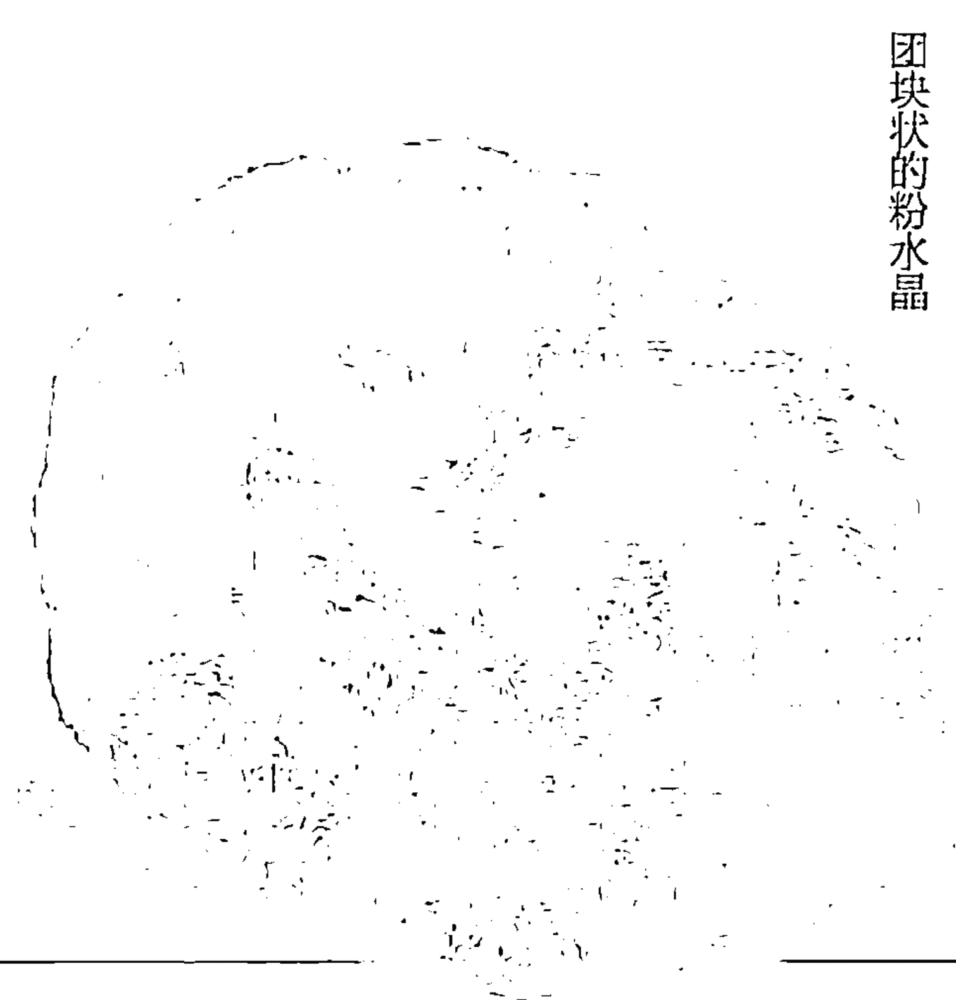

- 星光粉水晶含有定向排列的金红石包体，经过相应的切磨抛光后会有星光效应。

### 魔力

- 培养审美情趣
- 激发爱和友谊的感觉

### 治疗功能

- 迅速释放情感压力（效果有时过于强烈会带来不适感，若想避免，需用接地气的晶石来平衡能量）
- 揭示其他问题的深层次原因，类似于负面的自我形象等

### 实践方法

- 把虎睛石放在骶骨轮穴，接地气的石头放在脚边，粉水晶放在心脏部位，粉水晶周围摆四块白水晶，水晶尖朝外，可释放情绪压力。
- 围绕身体放十二块粉水晶，可增强自我价值感和培育认同感，若躺在一块粉色或者洋红色的布料上效果会更好。

### 关键词

- 爱心
- 情感
- 释放

### 相似晶石

宝石级的粉水晶和摩根石、粉色黄玉以及紫锂辉石都挺相像。

## Kunzite

## 紫锂辉石

LiAlSi₂O₆

紫锂辉石这种漂亮的粉紫色晶体是锂辉石家族（其中也包括绿色的翠铬锂辉石，也被称为希登石）中最受欢迎的成员，其英文名 Kunzite 来自于在 20 世纪初发现它的美国宝石专家 G. F. 昆兹。它有带条纹的长棱柱状晶体，有时不透明，但通常是半透明甚至全透明的。紫锂辉石的颜色从侧面看过去颜色比较浅，但如果沿它的晶体延长方向看，颜色则深很多，能看到明显的粉紫色。偶尔，锂辉石晶体会出现绿颜色和紫颜色在一起的情况。

| 颜色 | 粉色、浅粉紫色 |
|---|---|
| 光泽 | 玻璃光泽 |
| 硬度 | 6.5 — 7.5 |
| 晶系 | 单斜晶系 |

### 鉴定与养护

- 紫锂辉石有与晶体延长方向平行的晶面条纹。
- 紫锂辉石在被开采出来后颜色会变暗。

### 魔力

- 加强心脏功能并使我们与普世的爱相协调
- 抵御侵害

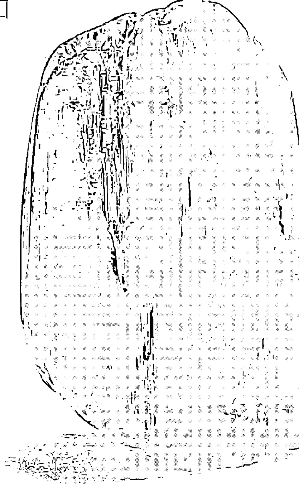

## 紫锂辉石

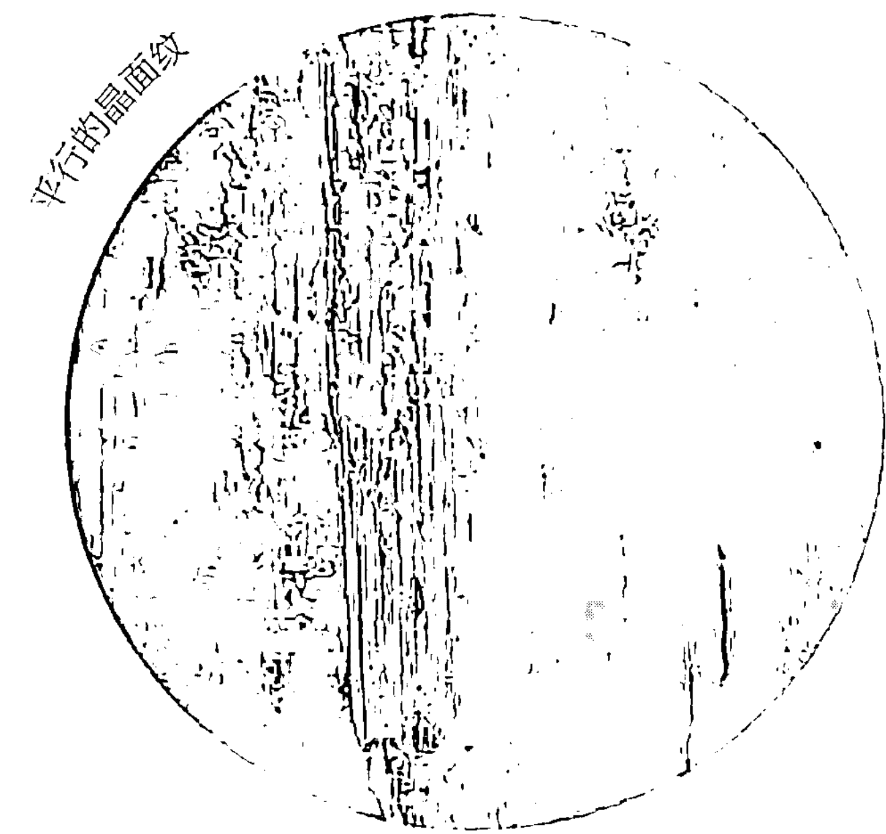

### 关键词

- 爱心
- 支持
- 理解
- 和睦

- 帮我们站在其他人的角度看问题
- 给予矛盾一个终结

### 治疗功能

- 改善心血管系统和甲状腺功能
- 增强自尊心
- 有助于改掉消极的无益的思维方式
- 创建一块冥思空间

### 相似晶石

与高质量的粉水晶有点相似，但粉水晶没有平行的晶面条纹。

### 实践方法

- 把紫锂辉石放在心脏上并围绕身体放四块白水晶呈钻石形，水晶尖朝外，可治疗和防护缺乏爱心的症状。
- 佩戴一块紫锂辉石或者翠铬锂辉石做的吊坠，可在您情绪不佳的时候给您贴心的关怀。

摩根石和桃色电气石，当您沿着中心轴看的时候没有颜色变化。

## Lepidolite

## 锂云母

K(Li,Al)₃(Si,Al)₄O₁₀(OH,F)₂

锂云母以前很少见，直到近十年才变得比较易得。它有时是大块的圆束状集合体或者小块扁平连生的块状，但最常见的还是粉紫色微晶质的毛石状，受光照后表面很闪耀。锂云母是云母的一个亚种，由其所含的锂元素致色，工业上用来做隔热材料，在晶石治疗中用来保护心脏免受损伤。锂云母通常与粉红电气石共伴生，这使得柔软的锂云母有了更多的力量，并使它能治疗情感创伤并鼓励欲望的表达。

- 颜色：粉色、紫色、灰色等
- 光泽：珍珠光泽
- 硬度：2.5 — 3
- 晶系：单斜晶系

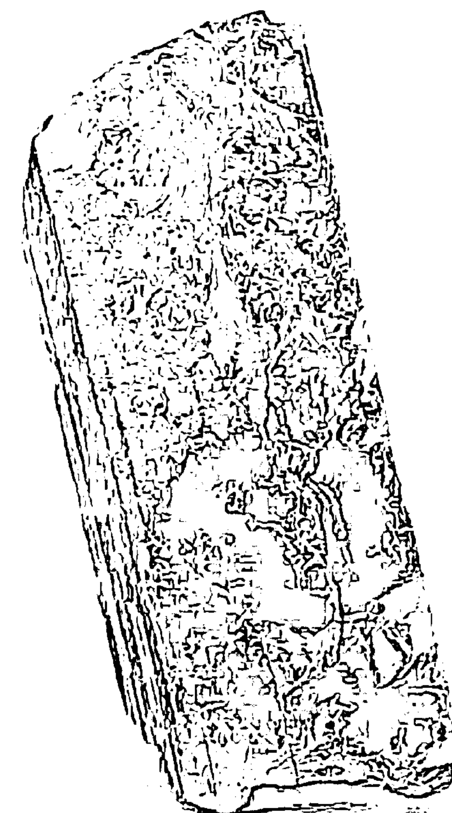

### 鉴定与养护

- 滚圆的锂云母常呈桃红色，并混有粉色电气石。
- 滚圆的锂云母闪光度不太强。

## 锂云母

### 关键词

- 实现
- 安全
- 直觉

### 魔力

- 让对手出现混乱
- 让真感情被了解

### 治疗功能

- 平衡神经和肌肉系统，减轻身体紧张度
- 带来内心的安全感、免受伤害
- 帮我们相信自己的直觉并评估各种不同观点
- 鼓励我们发掘自己的潜能

### 实践方法

- 把锂云母放在咽喉、胸腺和心脏部位，黄水晶放在心口和肚脐部位，再放一块石榴石或者星光红宝石在脚边，可增强勇气、力量和自信心。
- 放一块锂云母在心口并想象您的呼吸通过它进出体内，可给自己带来深度的放松感。

### 相似晶石

**粉红电气石**如果是滚圆状的看起来挺像锂云母，但其条纹清晰可见且硬度更大。

**锰黝帘石**没有闪光的现象。

## Morganite

## 摩根石

Be₃Al₂Si₆O₁₈

摩根石的粉颜色源自晶体结构内的锰、铯、锂等微量元素，这使得它成为绿柱石家族中一个相当稀有的亚种（绿柱石家族中有颜色的亚种还包括祖母绿、海蓝宝石等）。像其他粉色晶石一样，摩根石有解决关于自我价值和自我认同的问题的优势。当在心脏轮穴部位佩戴一块摩根石做的吊坠时，它能发现并消融掉深度的情感冲突和痛苦回忆，以及其他各种不舒服的感觉。摩根石还具有很强的保护性能量，能降低攻击性，鼓励对周围事物的宽容。

- 颜色：粉色
- 光泽：玻璃光泽
- 硬度：8
- 晶系：六方晶系

### 鉴定与养护

- 摩根石毛石几乎可以达到全透明，也有不透明的乳白色。
- 和其他绿柱石类晶石一样，摩根石上也常会有晶面纹。
- 摩根石被抛光后通常比水晶更亮。

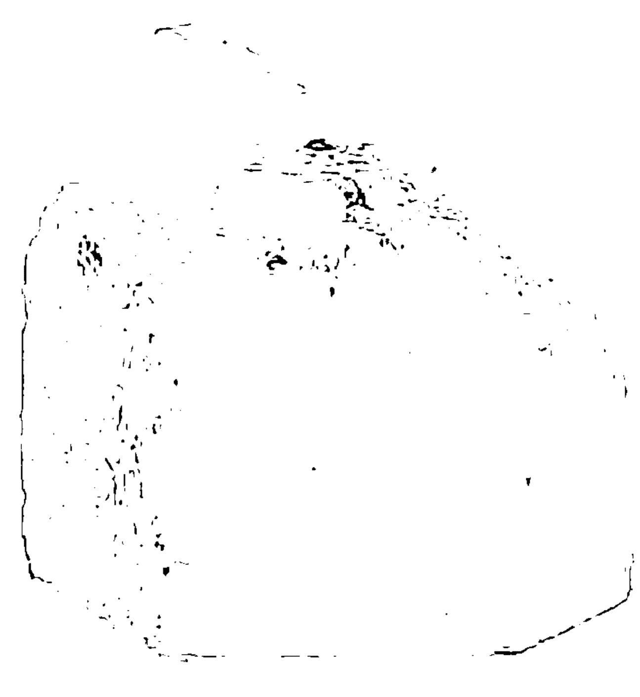

### 魔力

- 诠释完美的净度、平和与公开性
- 消融边界
- 让一切看起来更合理

### 治疗功能

- 通过在骶骨轮穴的作用来抚慰和滋养生殖系统
- 帮我们理解和消除与其他人的纠纷，尤其在小问题变成大麻烦的时候
- 鼓励我们全方位地看到我们生活的方方面面，建立秩序
- 冥思的理想焦点，将我们与创造背后的能量连接到一起

### 实践方法

- 把摩根石放在骶骨轮穴上有助于解决性问题和情绪障碍，这也能帮助于您面对创伤和损失。
- 把摩根石放在靠近骶骨的地方，可发现与骶骨轮穴有关的问题并解决。

### 关键词

- 释放
- 简化
- 爱心

### 相似晶石

如果被切磨后或者是在滚圆状态下，**粉水晶、粉红电气石、粉色黄玉和紫锂辉石**都很难与摩根石区分。

## Rhodonite

## 蔷薇辉石

MnSiO₃

蔷薇辉石的英文名 rhodonite 来自希腊词汇 rhodon，意思是玫瑰。那里产出的蔷薇辉石晶体呈带倒圆棱边的桌面形，但其实蔷薇辉石多数是没有晶形的块状。抛光后的高质量蔷薇辉石切片像成熟西瓜的截面，其他的大多呈鲑鱼红色，有棕色或者黑色的脉状杂质。粉颜色通常能让我们与潜在的创造性能能量相连，而棕黑色脉状则能让我们使这些高水平力量有实际用途。绝大部分蔷薇辉石产于变质岩中。

| 颜色 | 粉色至暗粉色，带有棕黑色区域 |
|---|---|
| 光泽 | 玻璃光泽 |
| 硬度 | 5.5 — 6.5 |
| 晶系 | 三斜晶系 |

### 鉴定与养护

- 宝石级的蔷薇辉石是半透明的，有的部分能看出晶形。

### 魔力

- 给机会证明自己
- 帮助我们改善沟通渠道以及促进互相理解
- 传统上与交感魔法有关联

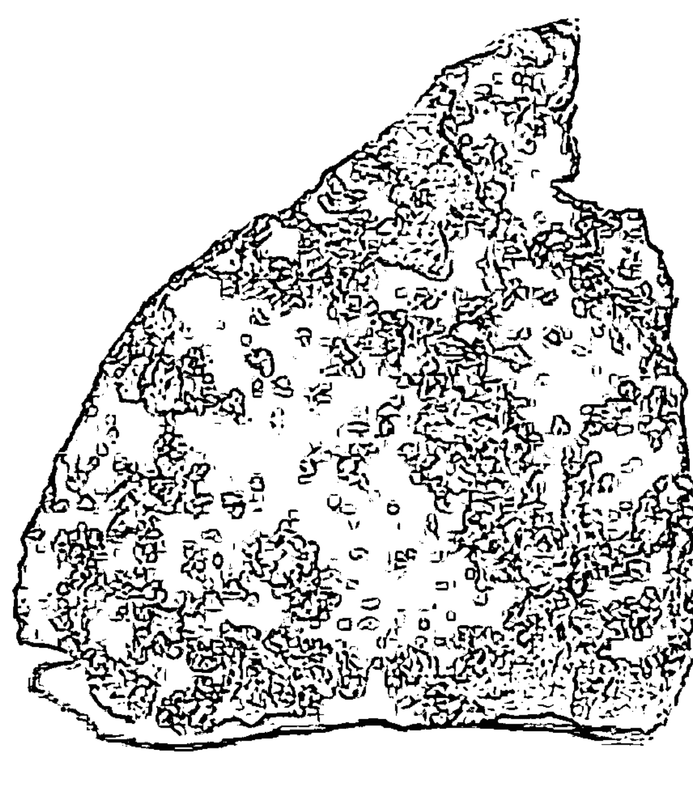

## 蔷薇辉石

### 治疗功能

- 在转型时期支持我们，尤其当这种转变不是我们自己选择的
- 让我们能表达强烈的、真正的情绪感受
- 朝着目标引导情绪
- 消除消极心态、混乱和焦虑

### 关键词

- 共鸣
- 热情
- 积极性
- 沟通

### 实践方法

- 蔷薇辉石能让我们与微妙的振动合拍，所以在唱圣歌和念咒文的时候应手持或者佩戴一块，尤其在冥思期间。
- 把蔷薇辉石放在骶骨轮穴和喉咙部位，让自己被完全地聆听。
- 把蔷薇辉石放在颅骨底部和咽喉部位，可打通被封锁的沟通渠道。
- 放一块蔷薇辉石在骶骨轮穴，两耳边各放一块，可提高超感听觉。

### 相似晶石

宝石级的菱锰矿都和单色蔷薇辉石晶体很像。

草莓水晶看起来和质量差点的蔷薇辉石有点像。

滚圆状的锰黝帘石和蔷薇辉石有点像，但有许多闪光。

## Rhodocrosite

## 菱锰矿

MnCO₃

沉积矿床里的菱锰矿看起来就像是红色、粉色或橙色版本的蓝纹玛瑙，它颜色来自其结构内的锰元素，当这种葡萄状或者肾状的菱锰矿集合体在被切磨抛光成片状或者随形时，能看到同心圆状的色带。里面深颜色的色带常会含有些小块的菱面菱锰矿晶体，大块半透明浓粉红色的菱锰矿晶体很难得，因为是收藏者和博物馆的宠物，价格昂贵。

一些菱锰矿能给心绪带来池塘涟漪上铺满玫瑰花瓣的感觉，这样令人抚慰的画面符合这种晶石的治疗功能，它能解除身体内所有的紧张和压力，尤其是心口和腹部的。菱锰矿的岩石，从最浓的深粉色，到淡粉色，到橙色和奶油色，能让脚部、骶骨和心口的轮穴能量协调。

| 颜色 | 粉色、浅红棕色、灰色等 |
|---|---|
| 光泽 | 玻璃光泽 |
| 硬度 | 3.5 — 4.5 |
| 晶系 | 三方晶系 |

### 鉴定与养护

- 漂亮的菱面体晶体很稀有也很贵。
- 滚圆的毛石、随形抛光的切面对于晶石治疗相对易得实用。

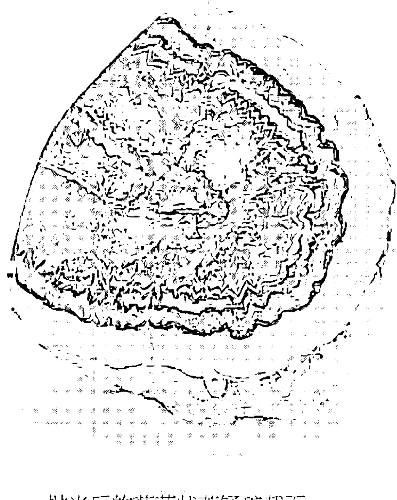

## 菱锰矿

### 治疗功能

- 减缓消化系统和生殖系统的病痛
- 增强自我价值和自信心
- 释放焦虑导致的紧张感
- 摆脱外伤带来的气场干扰
- 驱走疼痛和恼怒

### 实践方法

- 放一块菱锰矿在小腹能减轻这个部位的伤痛或者不舒服，尤其对由于质疑、恐惧或者缺乏自信而带来的能量阻塞很有效。您如果在骶骨轮穴位置放一块赫基蒙水晶，治疗效果会更好。
- 放一块菱锰矿在脉搏处可加强自我感并增强实现目标的能量。

### 关键词

- 自信心
- 减轻
- 许可

### 相似晶石

珊瑚通常是更深的橘粉色。

蔷薇辉石常有棕或黑色的脉状纹。

樱桃蛋白石有很多半透明的白色斑块。

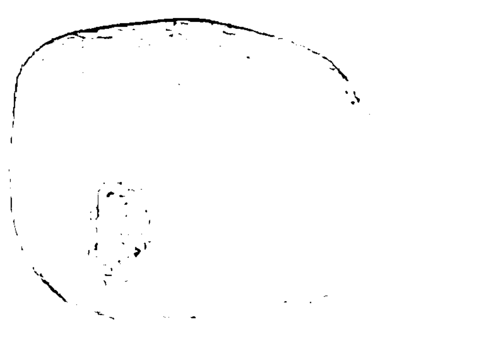

## Thulite

## 锰黝帘石

Ca₂Al₂OH(SiO₄)₃

锰黝帘石从古代开始在挪威就是一种有名的装饰性雕刻用石。作为黝帘石的一个大块头亚种，锰黝帘石产在变质石灰岩中，也产在岩浆岩中，有精致的草莓红色（由所含的锰致色），有时也像其他黝帘石亚种那样含有绿色。锰黝帘石的英文名 Thulite 来源于远古神话中的北风之外的小岛 Thule。锰黝帘石被认为是与世界最遥远的极限相联系，给我们以超越正常范围的信心。

颜色：粉色、红粉色或灰色等
光泽：玻璃光泽至珍珠光泽
硬度：6 — 6.5
晶系：斜方晶系

### 鉴定与养护

- 锰黝帘石通常以粒状集合体产出，常抛光成随形或做成切片。
- 锰黝帘石有均匀的中粉色。
- 低级别的锰黝帘石有灰白色区域，有的还含有绿色黝帘石。

### 相似晶石

片状的蔷薇辉石和锰黝帘石颜色挺像，但有些暗色的脉状纹。

滚圆状的草莓水晶更偏玻璃状。

### 魔力

- 给我们信心去探索并吸引我们去无知的未来

## 锰黝帘石

关键词
探究
自信
激励

### 治疗功能

- 增强神经系统的功能，方便大脑与身体其他部位的沟通
- 帮我们从无益的情绪状态往前走
- 刺激我们在感到满足或者不乐观的时候积极进取

### 实践方法

- 把锰黝帘石放在心口，可镇定神经。
- 把锰黝帘石放在骶骨轮穴，绿色砂金石放在心脏部位，蓝纹玛瑙放在咽喉部位，可增强自信。
- 沿身体周围按钻石形摆出四块锰黝帘石，可让您在感到忧虑不安时适应这种体验。如果您躺在阵列中一直精神集中于让您焦虑的处境，这种阵列会让您减轻恐惧。

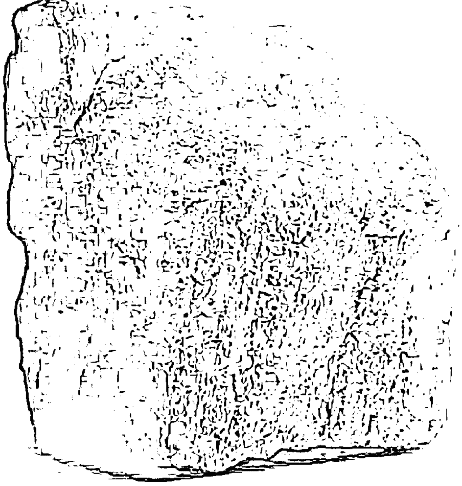

## Moonstone

## 月光石

KAlSi₃O₈

月光石在矿物学中被称为冰长石，这种长石族的亚种有着柔和的珍珠光泽，让人联想到月光，被称为月光石真是名副其实。大晶体的月光石很少见，常见的多是微晶质集合体块状，最重要的月光石产地是斯里兰卡。在印度，月光石被高度重视，是最适合女人佩戴的宝石，它被认为是月亮能量和女性精神的原型之石，能增强女性的美德。

颜色：珍珠白色、奶油色、黄色、蓝色等
光泽：玻璃光泽
硬度：6 — 6.5
晶系：斜方晶系

### 鉴定与养护

- 月光石的特征光泽是其晶体结构的缘故，它有蛋白白色、彩虹效应和光晕等，都是光线在晶体结构内的折射、漫反射和干涉导致的。
- 当有钠长石和正长石的交替层的时候，蓝色光或者乳白色的光晕就会出现。
- 等级差点的月光石是灰色、棕色、黄色和橙色的。

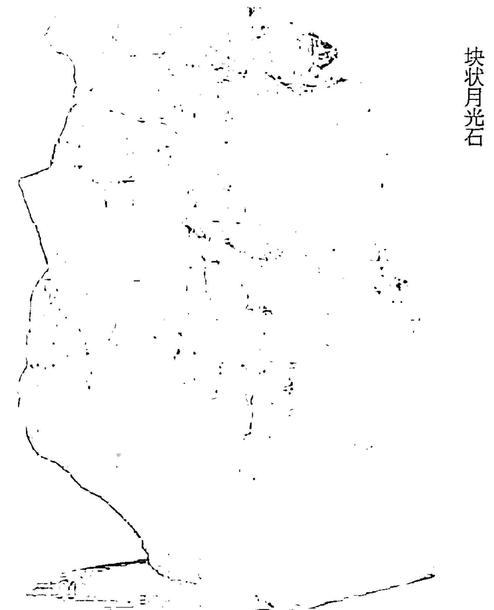

### 魔力

- 使我们生物钟与时间周期协调
- 驾驭月亮和水的能量
- 传送幸运女神的能量
- 与丰饶、流动和成长相联系

### 治疗功能

- 平衡身体的血液和淋巴系统
- 减轻痛经并辅助解决其他女性问题
- 减轻消化不良，尤其是压力导致的
- 稳定情绪并释放压力
- 帮助我们理解别人的感受
- 增强直觉力和想象力

### 实践方法

拿出五块月光石，把它们分别放在：头顶一块、两肩腋窝上面各一块、两髋骨上各一块，这样可抚慰身体，镇定情绪和精神，如果摊在一块暗蓝色的布料上，这种阵列效果会更好。

### 关键词

- 情绪平和
- 释放
- 同情心
- 女性特质

### 相似晶石

其他种类的长石，例如钠长石，有时和级别差点的月光石有点像。

彩虹月光石和拉长石有点像，但它是白色的并有成片的彩虹色。

## Zeolite

## 沸石

Ca, K, Na 硅酸盐混合物

沸石族的各成员常常共生在同一块围岩上，很难去区分。单个沸石亚种的晶石治疗功效有限，但整个共生标本各矿物能释放出强劲的集体能量，喻示着协调与合作。

| 属性 | 描述 |
|---|---|
| 颜色 | 白色、灰白色、黄色、红色等 |
| 光泽 | 玻璃光泽至珍珠光泽 |
| 硬度 | 3 — 5 |
| 晶系 | 大多单斜晶系 |

### 鉴定与养护

- 辉沸石有珍珠光泽以及蝴蝶结状的双晶束。
- 片沸石常形成红色或白色板状晶体。
- 钙十字沸石常形成球状、反射状晶体集合体或者小的缠绕状晶体，颜色发白，珍珠光泽。
- 菱沸石常形成菱面体或者近似立方体的晶形，颜色为红色或者白色。
- 钠沸石是最常见的沸石，通常是半透明针状晶体形成球状集合体、晶簇和覆盖物等。
- 沸石类晶体最常见是与鱼眼石、水硅钙石等矿物共伴生。

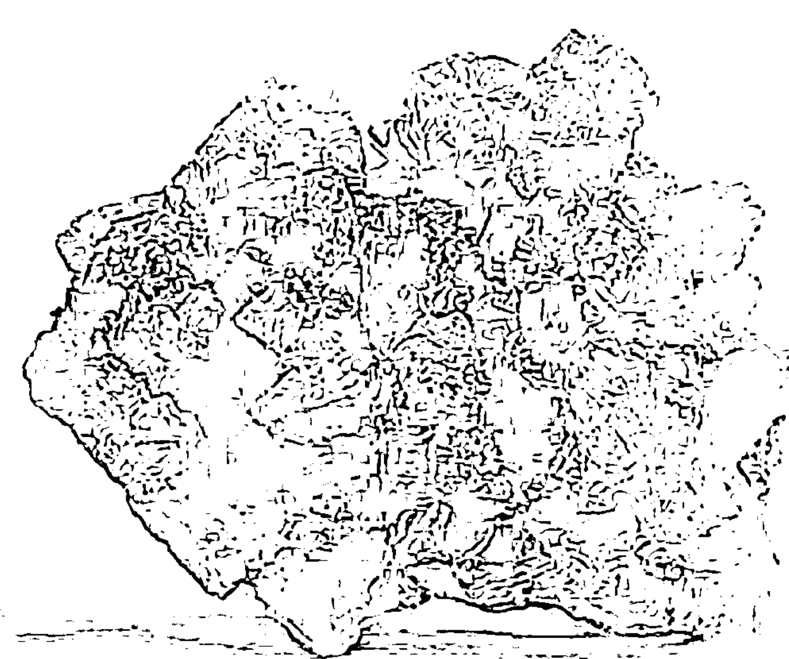

- 所有的沸石类矿物都很软，所以需要小心清洗并分开放置储存。

### 魔力

- 鼓励创新、幽默和支持
- 激发群体团结
- 激发集体意识

### 治疗功能

- 使身体系统协调运转
- 逐渐灌输信心并开始新的项目
- 帮我们向别人展示灵敏度
- 提供更宽广、更乐观的方法

### 实践方法

- 放一块多沸石共生标本在冠部，天青石在咽喉部位，玉石在心脏部位，天然磁石在脚上，可让您意识到与大家友谊的意义。

| 关键词 |
|---|
| 合作 |
| 亚种 |
| 创新 |

| 相似晶石 |
|---|
| 方解石珍珠光泽很弱并有反光很强的表面。 |
| 钠长石和其他长石与沸石有相似的外观，但要硬很多，而且常与岩浆成因的晶体和岩石共伴生。 |

## Milky quartz

## 乳石英

SiO₂

在一些山区，我们能看到乳石英的矿脉暴露在风化剥落的岩石表面，远远地发出强烈的反射光。几千年前，这些石头就被用于去增强宗教圣地的神圣感，现在，它们依然保持着那种神圣气场。

乳石英呈比较纯洁的白色，不透明至微透明，其颜色来自包裹在石英中的大量细微气泡和水泡包裹体。如果石英里面包裹的是铁质的包裹体并使它呈现轻微的颜色，那就是普通石英了。有些水晶朝基底方向会出现越来越浓的乳白色区域，这还是包裹的细微气泡或水泡包裹体的缘故。据说只要我们手握这些石英足够久，我们体内的热量就能把石英内的气泡从晶体表面细微的结构中挤出来，从而使石英表面变得干净透亮。

### 鉴定与养护

- 一些有颜色的石英亚种有它们独特的名字，例如粉棕色的“草莓石英”等。
- 乳石英通常是团块状，但是也会有各晶面完全发育的晶体。

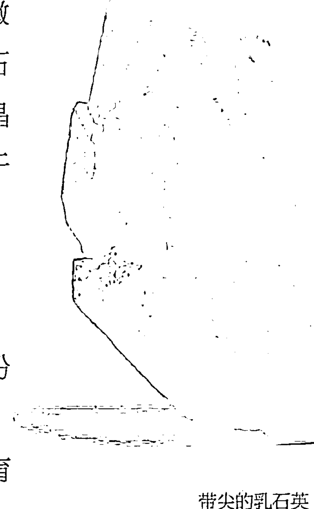

颜色：白色
光泽：玻璃光泽
硬度：7
晶系：三方晶系

## 乳石英

### 魔力

- 象征月亮的能量
- 代表提纯和净化
- 驾驭光的力量

### 治疗功能

- 逐渐清理受阻的能量
- 温和地释放麻烦的情绪
- 驱散消极思想
- 平复过度活跃的思维
- 帮我们从容面对并融入整理能量流通

### 实践方法

聚齐六块滚圆的乳石英和六块黑电气石，把它们按以下阵列排布：乳石英放在两肩、两手和两脚旁边，电气石放在头顶、脚底下、两肘边和两膝旁边，可让您与您自己及外部世界沟通联系变得更容易。

| 关键词 |
|---|
| 扩散 |
| 抚慰 |
| 放松 |

### 相似晶石

大理石（一种主要由石灰岩和白云岩构成的石种，矿物组分主要是方解石和含钙、锰居多的硅酸盐类）看起来更不透明并偏颗粒状。

## Selenite

## 透石膏

CaSO₄·2H₂O

透石膏的英文名 selenite 来自古希腊月光女神塞勒涅，因为它有明显的月亮光晕。透石膏是宝石级的普通矿物石膏。石膏由古代海洋和盐湖蒸发形成，透石膏既有水一般的清澈柔美，也有很好的可溶性。

颜色：白色或无色，有时带点黄、棕、红、绿等颜色
光泽：玻璃光泽至珍珠光泽
硬度：2
晶系：单斜晶系

### 鉴定与养护

- 透石膏常形成特征明显的燕尾双晶。
- 纤维状半透明的白色大块状透石膏被称为纤维石膏。
- 圆玫瑰花形的结核状石膏集合体被称为“沙漠玫瑰”。
- 透石膏很软，用手指头都很容易划动。
- 透石膏对水和湿气非常敏感，如果放入水中一段时间后，用手都可以将其弯曲，时间长了透石膏会裂开呈多个小块。

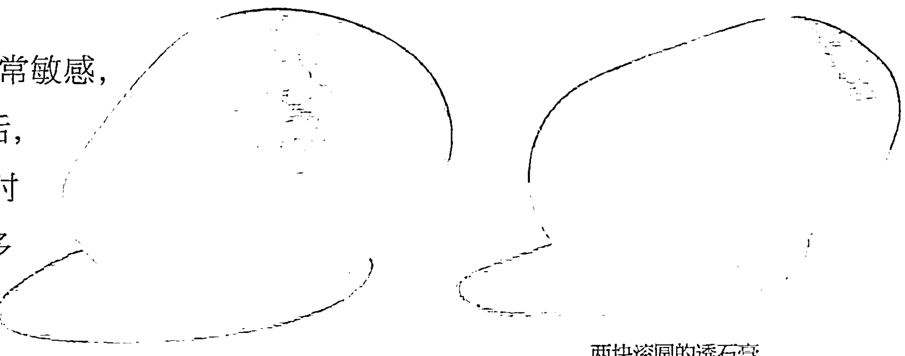

### 魔力

- 清除暗黑和阴影
- 帮我们避开麻烦
- 保护我们免受伤害与责备

### 治疗功能

- 迅速用快速流动的冷却能量破除能量停滞
- 转移负面情绪，尤其是怨恨和长期存在的怒气
- 给心灵带来纯净
- 扩张意识

### 实践方法

手持一块透石膏晶体做的魔棒，能帮您清除当天的压力以及难以释怀的痛苦记忆。设想您吸气时气流从头顶慢慢进入，呼气时沿着魔棒方向出去，然后想象您的麻烦事都顺着这种中性无害的石头流走了。

| 关键词 |
|---|
| 扩张 |
| 释放 |
| 冷却 |

### 相似晶石

硼钠钙石也被称为电视石，带晶面纹的表面很像透石膏，但是它的晶体纤维方向有明显的光影干涉效果。

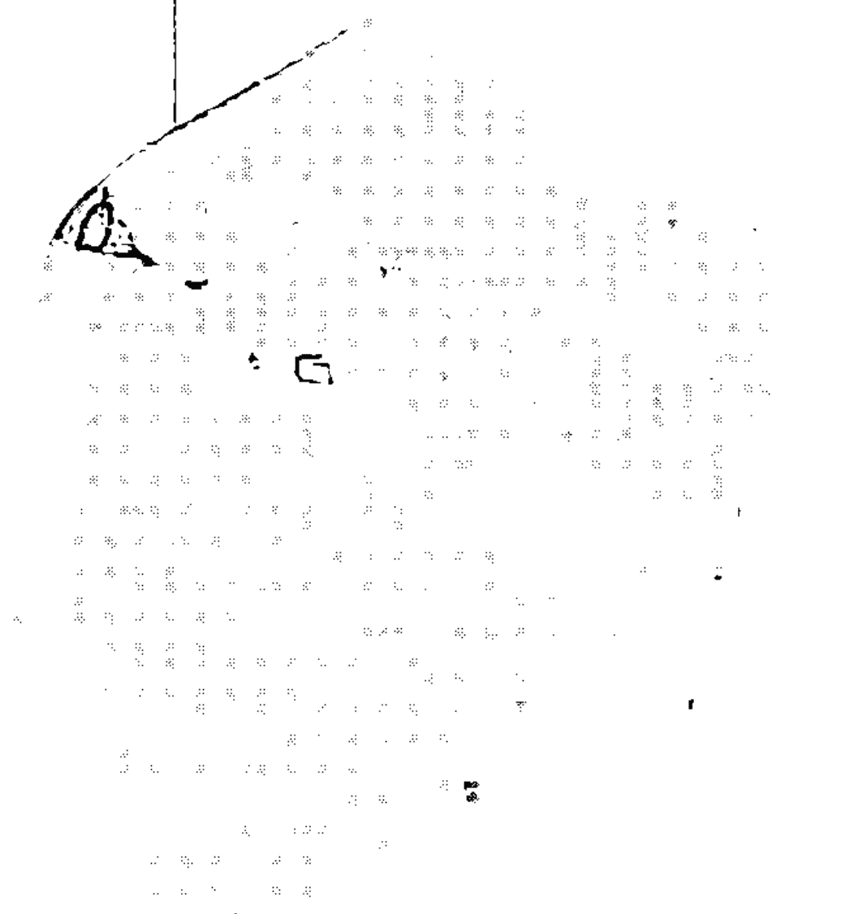

## Tourmaline quartz

## 电气石水晶

含 Na(Mg,Fe,Li,Mn,Al)₃Al₆(BO₃)Si₆O₁₈(OH,F)₄ 的 SiO₂

水晶和电气石常常结晶在一起形成包含电气石包裹体的水晶标本，通常是水晶里包含细长针状的电气石晶体，电气石则通常是最常见的亚种——黑色的铁电气石晶体，偶尔也会有其他亚种的。含电气石包裹体的水晶标本给我们带来生动活力的能量和电气石接地气的能量，形成一种新的合并的能量。

- 颜色：白色或者云雾状带黑色直线状包裹体
- 光泽：玻璃光泽
- 硬度：7
- 晶系：三方晶系

### 鉴定与养护

- 含电气石的水晶既有晶体状，也有肿块状，滚圆毛石状，甚至珠子和弧形戒面等。
- 水晶既有透明的，也有很多絮状包裹体的。

### 魔力

- 抵御有害能量来袭
- 鼓励经过清楚的慎重考虑后的果断行动
- 帮我们得到来自地球的能量

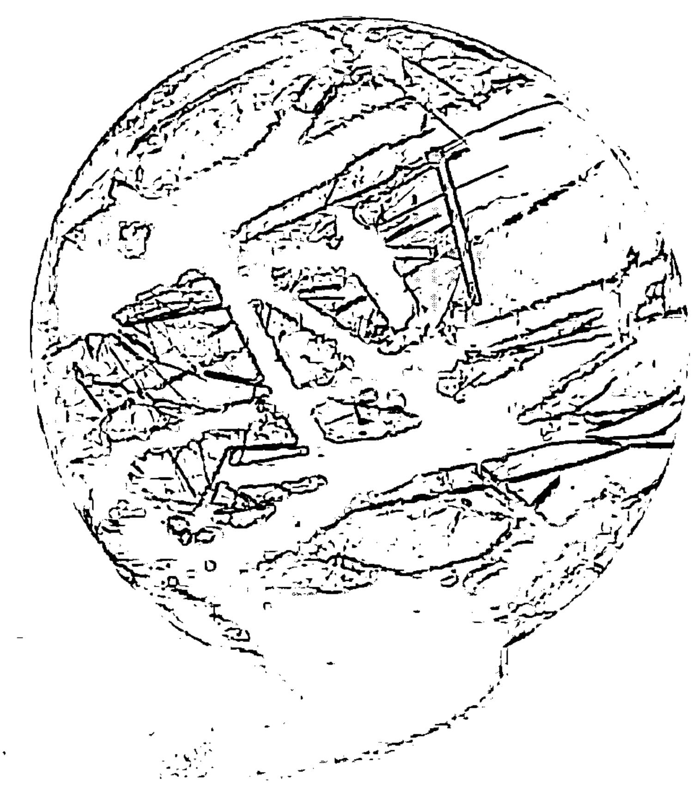

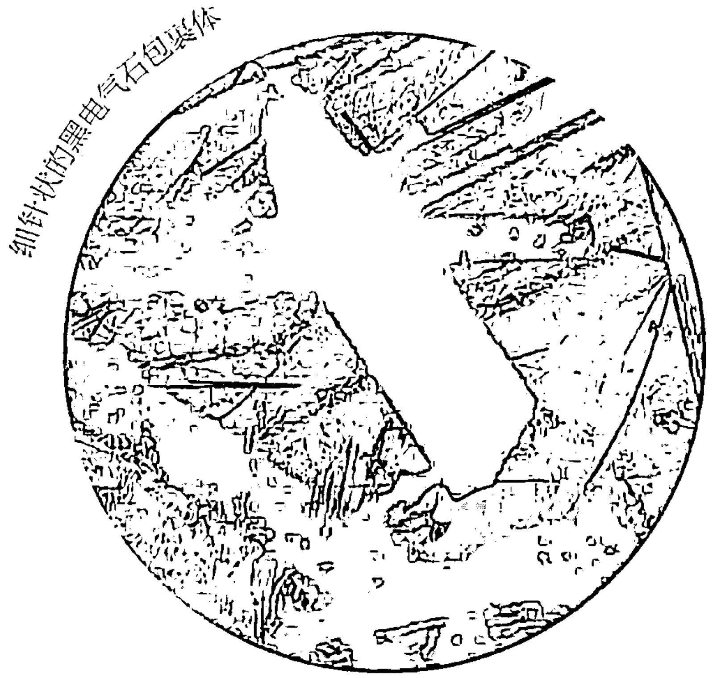

### 关键词

- 保护
- 接地气
- 加强

### 治疗功能

- 加强生态各层面的功能
- 扭转环境失调
- 让我们的情感和观念脚踏实地
- 帮我们筛选掉无益的想法
- 整合能量模式，调整各精微体和轮穴，校正所有的能量层级

### 相似晶石

**包含金红石的水晶，** 包体通常呈金色、黄色或棕色，很闪耀。

### 实践方法

**包含针铁矿的水晶，** 其包体是扁平针状，黄铜色。

- 把包含电气石的水晶放在冠部或在根部轮穴，可激励对身体和精神各方面能量的整合。
- 把包含电气石的水晶放在胸腺部位，可推动免疫系统和身体能量水平。

**包含阳起石的水晶，** 其包体是绿色针状。

## Clear quartz

## 白水晶

SiO₂

白水晶是第一种被描述成晶体的物质，在古希腊，这种有着完美水亮几何形体的石头被称为 crystalos，意思是“永恒的冰”，因为他们认为水晶是由冰固结而成的，永远不会融化。水晶是这个世界到目前为止发现最常见的晶体，地壳超过十分之一由它的成分 SiO₂ 构成。白水晶一直被晶石治疗师和萨满巫师当作一种能进入精神世界的工具。

- 颜色：无色透明
- 光泽：玻璃光泽
- 硬度：7
- 晶系：三方晶系

### 鉴定与养护

- 白水晶有六边形的横截面，长柱状，六边形尖头，这让它很容易被鉴别。
- 白水晶的手感、净度、亮度甚至密度等都会由于产地的不同而异。
- 白水晶的尖和棱边很易碎，如果与别的石头相撞很容易损伤。

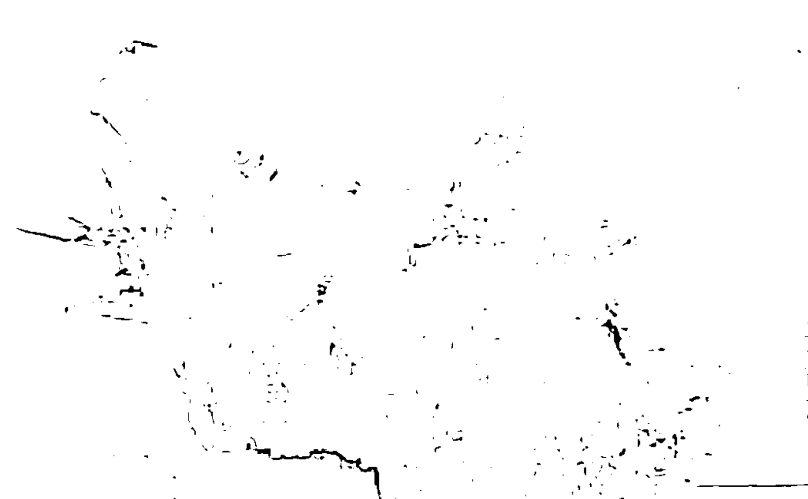

## 白水晶

### 魔力

- 如果放在其他晶石旁边，可放大其能量功力
- 有助于揭露真相
- 用于占卜和预测

### 治疗功能

- 扩展和加强整个气场
- 净化和转移能量
- 释放受阻的情绪并带来平静
- 增强思想的净度和洞察力的锐利度
- 带来精神平静，让冥想和沉思顺利进行

### 实践方法

按以下阵列排布9块小白水晶晶簇：一块放在头顶上，其他的沿身体周围均匀排布，水晶尖朝外。可增强动力和能量层级，并跨越个人进步的障碍。如果躺在红色布料上进行治疗效果会更好。

### 关键词

- 照明
- 组织
- 放大

### 相似晶石

赛黄晶的尖头是特有的凿刀形。

鱼眼石的尖头是四面，而非六面。

## Apophyllite

## 鱼眼石

KCa₄Si₈O₂₀(F.OH).8H₂O

鱼眼石是一种产在火山岩、矿脉和花岗伟晶岩等类型晶洞中的普通矿物，常与水晶、方解石、葡萄石和沸石族的矿物共伴生，鱼眼石还曾一度被认为是沸石族矿物的一种。全世界最著名的产地是印度浦那，那里产大晶体的无色透明鱼眼石，还有漂亮的透绿色鱼眼石。鱼眼石完美的透亮金字塔状晶体尖头是一个极好的能量净化与更新焦点。

颜色：无色、白色、灰色、绿色、粉色等
光泽：玻璃光泽、珍珠贝光泽，偶见金刚光泽
硬度：4.5 — 5
晶系：四方晶系

### 鉴定与养护

- 鱼眼石晶体通常是针状、柱状或者板状，常为四面柱形带金字塔尖。
- 透明的鱼眼石晶体表面非常闪亮。
- 绿色的鱼眼石亚种（氟鱼眼石）比较稀有。
- 鱼眼石需小心存放，因为硬度不高，很轻，而且对热很敏感。

### 相似晶石

赛黄晶的比重和硬度更大，有菱形横截面以及楔形晶头。
白水晶的横截面是六边形，顶尖也是六个面汇聚成一个尖点，而非鱼眼石的四个面。
无色方解石光泽没这么亮。

### 魔力

- 发展我们的微知觉能量
- 绿色鱼眼石把我们与自然灵魂相连

### 治疗功能

- 温和地净化我们的心灵和身体
- 有助于释放不安全感和其他难以控制的情绪
- 鱼眼石晶簇是冥思的有效辅助物，并能激励思路的清晰度

### 实践方法

- 把鱼眼石放在骶骨轮穴上可充分利用它的净化能量。
- 把鱼眼石放在冠部以上或者耳朵边可激励精微洞察力和灵感。
- 把鱼眼石放在额头部位，可让思路冷静并敞开。
- 把绿色鱼眼石放在心脏部位，可快速释放受束缚和绝望的感觉。

| 关键词 |
| --- |
| 天然的 |
| 净度 |
| 超越 |

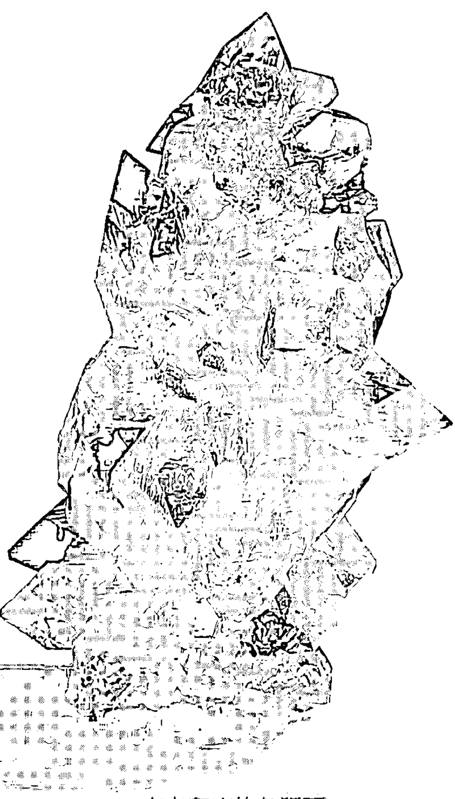

## Danburite

## 赛黄晶

CaB₂Si₂O₈

赛黄晶是一种稀少但广泛分布在白云岩矿床中的矿物，它的英文名 Danburite 来自其主要产地美国康涅狄格州西南部的丹伯里（Danbury），其他有名的产地散布在世界各地，包括墨西哥、缅甸、意大利、日本、马达加斯加和瑞士等。虽然赛黄晶偶尔也会出现金黄色或者粉色，但它最常见的还是像无色透明的黄玉那样。赛黄晶的晶形是典型的细长形带凿子晶头，有很好的闪光和净度。它的造型喻示着它的主要功能：能像凿子那样一点点移除障碍，帮助我们达到目标。

| 颜色 | 无色，偶尔金黄色或者粉色 |
| --- | --- |
| 光泽 | 玻璃光泽 |
| 硬度 | 7 |
| 晶系 | 斜方晶系 |

### 鉴定与养护

- 大块的凿子形赛黄晶晶体有霜白形闪光。
- 虽然赛黄晶的硬度不低，但比重很轻，这使得它有时挺脆。

### 魔力

- 在各种状况中都能给予积极的推动
- 迅速把事情给解决

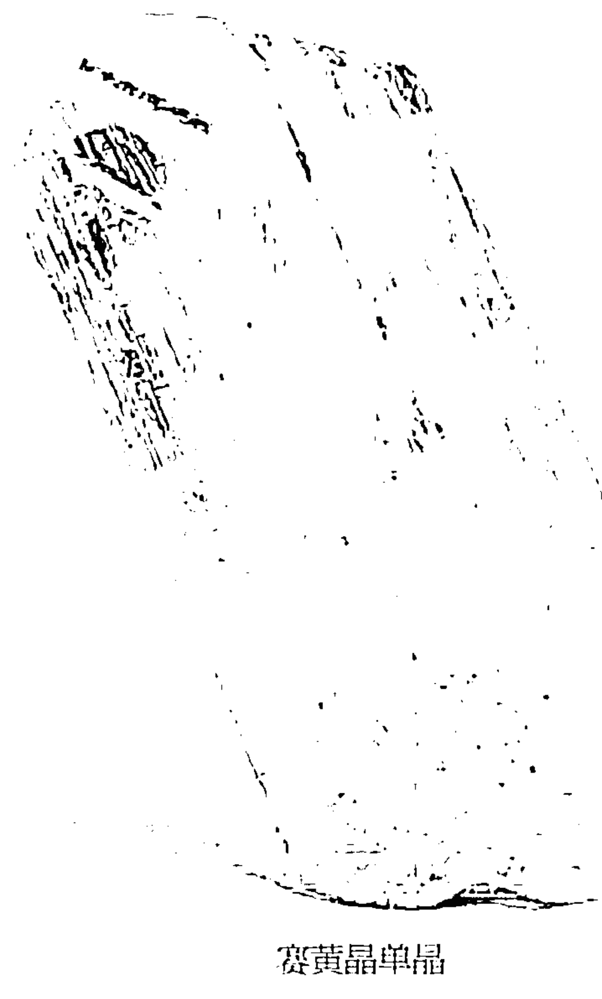

### 治疗功能

- 激活和净化身体能量
- 帮助我们理解我们情绪的来源以及如何发展变化
- 加速思考进程并增强我们的直觉力
- 转移我们的意识，使我们对看不出来的创造力水平更敏感

### 实践方法

- 把赛黄晶放在喉咙底部和骶骨轮穴（刚好肚脐眼下面），可促进清晰的表达能力和创造力。
- 把透石膏放在头顶、赛黄晶放在喉咙部位、紫锂辉石放在心脏部位、红玉髓放在骶骨轮穴、黑电气石放在脚上，可免受负面能量的侵袭。
- 把黄水晶放在脚上和心口轮穴、砂金石放在心脏部位、蓝纹玛瑙放在咽喉部位、赛黄晶放在额头，可提高情绪。

### 关键词

- 亮度
- 转变
- 直觉力

### 相似晶石

鱼眼石形成金字塔状晶头，而非凿子形的晶头。

无色黄玉的硬度、比重和致密度更大，但不那么亮。

透石膏的硬度要低很多，手指甲都能把它划伤。

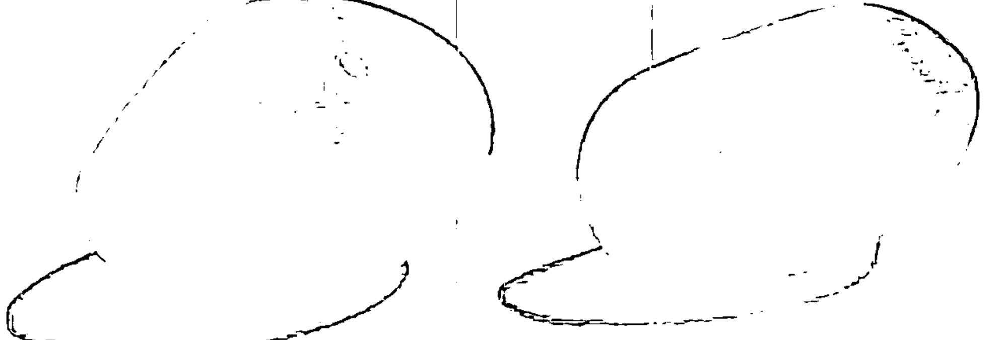

## Diamond

## 金刚石

C

碳元素能形成两种截然不同的晶体：自然界最硬的矿物金刚石以及最软的矿物质——石墨。最初，金刚石是在河里以及河流冲积沙堆上发现的，但是这样的矿床已经不能满足人类的需求了，现在金刚石的主要产地，无论是南非、西伯利亚还是澳大利亚，都是从坚硬的超基性岩浆岩——金伯利岩中开采的。尽管金刚石非常硬，但同时也很脆并有明显的解理，这使得熟练的宝石切磨技师能利用它的晶体形状切磨出火彩最好，保存重量最多的形状。

传统上金刚石与勇气、纯洁和不可战胜相联系，它一直被认为有足够的能量驱除邪恶并带来好运，由此也被认为是一种完美的晶石。

### 鉴定与养护

- 质量差点的金刚石晶体通常是八面体带许多凹坑的，小个的金刚石可以用硅胶或者蜂蜜粘在一个小晶石片上供治疗用。
- 切磨好了的金刚石也可以用于晶石治疗，但是如果已经镶嵌到首饰上的就不行了。

| 颜色 | 无色，偶见蓝色、绿色、粉色、黄色等 |
| --- | --- |
| 光泽 | 玻璃光泽至金刚光泽 |
| 硬度 | 10 |
| 晶系 | 等轴晶系 |

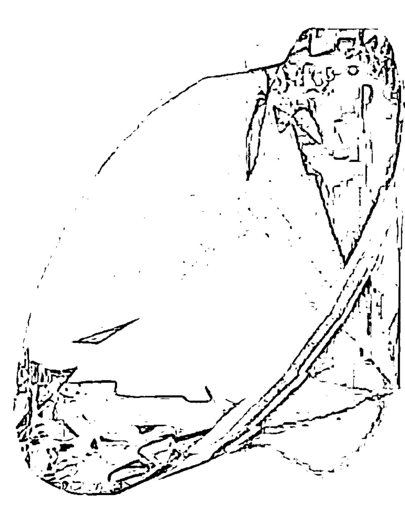

### 魔力

- 使我们消灾避祸
- 意味着荣誉和纯洁的意向
- 代表战无不胜的力量

### 治疗功能

- 重新平衡头骨、下巴和脊椎部位的能量
- 是一种效力强大的解毒物，能解身体精神各个层面的毒，强大到您需要用另外的镇定用的晶石来减缓其作用
- 移走负面能量和情绪障碍
- 把迟缓的古板的思维进程转换成宽广普世的观念
- 支持冥思和精神的冒险

### 实践方法

- 把金刚石和其他晶石（如某种红色晶石）放在一起以导引其闪光方向更精准，可提神。
- 用一颗小金刚石晶体做宝石精华液，滴几滴到身体需要金刚石能量的部位。

### 关键词

- 光辉
- 结盟
- 连接

### 相似晶石

立方氧化锆比重更大。

赫基蒙水晶和尖晶石没有金刚石的火彩。

其他相像的还有无色锆石等。

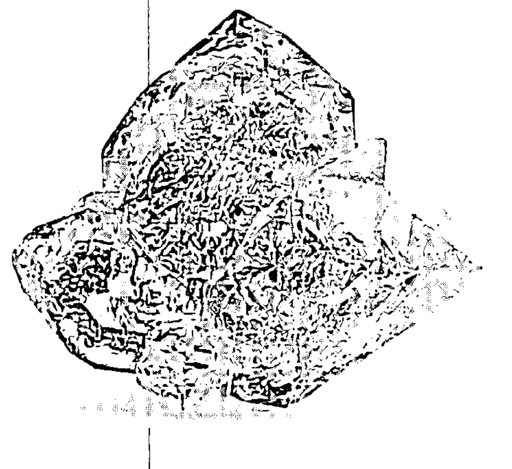

## Ulexite

## 硼钠钙石

NaCaB₅O₉·8H₂O

硼钠钙石产于盐湖盆地和干旱沙漠地带的沉积型硼矿床中，其透明晶体通常被称为“电视石”，因为当把硼钠钙石的透明晶体放在图画或者笔记上，细小的晶体会像光导纤维那样，准确地把晶体下面的图形传导到晶体的上表面，就像一个显示屏。

| 颜色 | 无色、白色等 |
| --- | --- |
| 光泽 | 玻璃光泽至珍珠光泽 |
| 硬度 | 2.5 |
| 晶系 | 三斜晶系 |

### 鉴定与养护

- 硼钠钙石能形成针状晶体集合体、纤维状集合体、粒状集合体和块状晶体等。
- “电视石”在一般的矿物商店里不容易找到，它把光和影像从底部向上面传送的特性引人注目，认准了不会错。
- 硼钠钙石是一种柔软的矿物，对水和湿气很敏感。

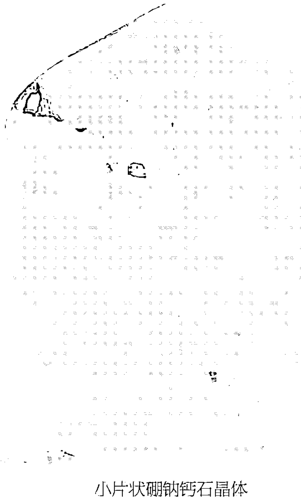

### 魔力

- 促进即时沟通
- 帮助我们权衡一下反对的观点

### 治疗功能

- 帮助神经传导物质流动到身体各部位
- 消除我们情绪中的阻碍
- 让洞察力兴奋起来
- 提供灵感
- 使我们带着清晰的头脑和专注去处理问题
- 辅助梦想的体验（灵魂旅行、清醒的梦境、心灵游离等）

### 实践方法

- 把硼钠钙石和蓝色及靛蓝色的晶石放在一起，增强沟通的流畅性或者给心境带来平和的状态。
- 把青金石放在额头、天河石放在咽喉部位、硼钠钙石放在冠部、烟水晶放在脚上，可探究前世的过往。
- 把硼钠钙石放在额头，萤石放在硼钠钙石两边、蓝晶石放在咽喉部位、玉石或者西瓜碧玺放在心脏部位、煤精放在根部轮穴，可让知识和眼界提升到新层次。

### 关键词

- 沟通
- 净度
- 幻觉

### 相似晶石

**透石膏**看起来像硼钠钙石，但是没有“光导纤维”般的功效。

**水硅钙石**丝绢光泽不那么强，它的针状晶体也没那种特殊光学效果。

## Zircon

## 锆石

ZrSiO₄

锆石通常以金字塔状或者棱柱状晶体产自以伟晶岩为主的岩浆岩中。锆石很硬，并且它的化学成分让它抗腐蚀，因此能在河床和沉积的砂岩中找到它。无色的锆石常被用来做金刚石的仿品，或者依据其自身的光学效应被加工成宝石。宝石级的锆石通常来自远东地区和澳大利亚。在晶石治疗上，锆石是一种神奇的有变化力的晶石，能揭示隐藏的真相。

- 颜色：无色及其他大部分颜色
- 光泽：玻璃光泽至金刚光泽
- 硬度：7.5
- 晶系：四方晶系

### 鉴定与养护

- 红棕色的八面体晶形锆石是最常见的。
- 其他颜色的亚种，包括紫蓝色的风信子石和黄锆石等。
- 锆石可以通过热处理变成透明、蓝色或金黄色，颜色很重的锆石大多被热处理增色过。
- 锆石刻面戒面火彩很闪，但其边缘易碎裂，需小心保存。

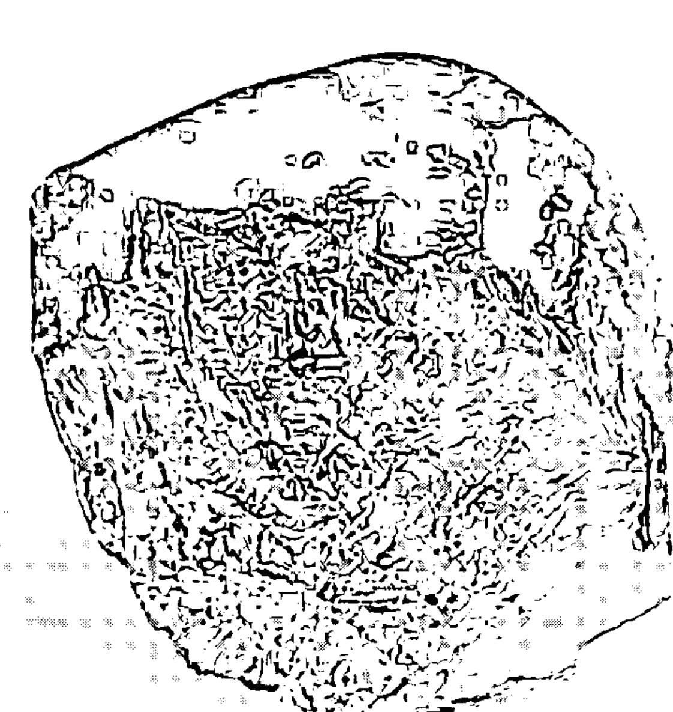

## 锆石

### 魔力

- 促进转变
- 揭示隐藏的现实

### 治疗功能

- 清理与调整消化和内分泌系统
- 改善睡眠
- 纠正过度敏感的情绪
- 鼓励灵活的心态
- 减少错觉与幻想，控制想象力
- 容许我们体验正当实用的心灵潜意识

### 实践方法

- 把锆石放在额头、冠部和颅底部位，对身体能量平衡运转效果很好。
- 把锆石放在下腹部，可增强内部能量平衡。
- 把锆石放在额头，两手上再各放一块，可提高现实感。如果您惧怕“失去理智”，再加上两块锆石，两脚上各一块。

### 关键词

- 揭示
- 转变
- 调整

### 相似晶石

尖晶石看似相像，但锆石有时有长棱柱状的晶体。

磁铁矿有金属光泽，而非金刚光泽。

## Labradorite

## 拉长石

(Na,Ca)Al₁₋₂Si₃₋₂O₈

拉长石是一种比较稀有的长石类矿物，其英文名 Labradorite 来自它被发现的地方——加拿大的拉布拉多地区（Labrador）。拉长石还产于澳大利亚、芬兰、西西里、挪威和乌克兰等地。它以其炫目的彩虹效应而闻名，由所含的磁铁矿等包裹体对光线产生干涉和衍射，拉长石特有的光学效应也被称为“拉长石晕彩”。

在晶石治疗方面，拉长石的彩虹色像一块反射盾那样保护佩戴者的气场。当您感觉自己的能量储备会被人为地减少时，佩戴拉长石会减轻这种状况。治疗过程中一个常见的副作用是，您比较亲近的人会感觉到您行为的变化，他或者她可能会评论您变得没以前那么亲密友好或者有疏远感了。当然，随着您和其他人自己能量流通变得平衡后，这个阶段就会过去。

- 颜色：灰色带黄、绿、橙和孔雀蓝等彩虹色
- 光泽：玻璃光泽
- 硬度：6 — 6.5
- 晶系：三斜晶系

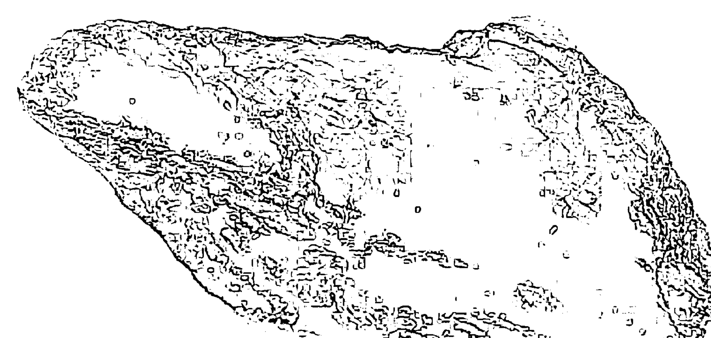

## 拉长石

### 关键词

- 开放性
- 适应性
- 保护

### 鉴定与养护

- 小片状有彩虹效应的常呈暗灰色，有时容易与低等级的血石或者绿柱石混淆。

### 治疗功能

- 提高我们专注自己的事务、免受外界打扰的能力
- 帮助我们顾及别人的情绪心境
- 激励我们接受新思想并挑战新机会
- 增强我们置身事外的能力

### 相似晶石

**碱性正长石**也是有彩虹效应的暗黑或者暗灰色长石亚种，它有拼图般的花纹。

### 实践方法

- 围绕身体放七块滚圆的拉长石：一块在头上、两脚边各一块、身体两边等间隔各放两块，然后再放一块萤石在咽喉底部（或者胸骨上部），这样可释放任何身体负能量，包括环境压力。

**光谱石**也有相似的彩虹色，但其底色通常无色或者呈白色，而拉长石底色则是灰色。

## Chalcopyrite

## 黄铜矿

CuFeS₂

黄铜矿的产地遍及世界，从欧洲、南非、澳大利亚直至美洲都有它们的身影。黄铜矿是一种常见的铜矿石，但我们最常见到的是它被氧化后的样子，也就是表面具有晕彩的斑铜矿，也被称为孔雀铜矿。未被风化的黄铜矿是铜黄色，但如果长时间暴露在空气中，表面就会被氧化形成斑铜色，光线从它不平整的表面反射回来，呈现出令人眼花缭乱的颜色，有紫色、紫红色、红色、蓝色、黄色和粉色等，尤其当黄铜矿的块头大的时候更是明显。
黄铜矿的化学成分里既包含金星相的金属铜，也包含火星相的金属铁，它代表着力量与美的结合。

颜色：铜黄色（未氧化的）；紫色、蓝色、粉色、红色、黄色（氧化后的）
光泽：金属光泽
硬度：3.5 — 4
晶系：四方晶系

### 鉴定与养护

- 黄铜矿常见的都是大块集合体状，单独晶体的很少见。

### 魔力

- 让我们在变化的时代能灵活适应
- 推动意想不到的提升
- 增强创造力和革新

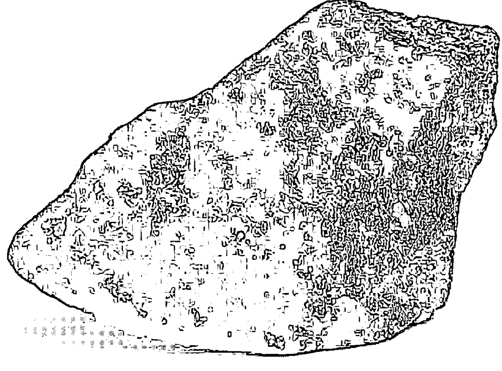

### 治疗功能

- 刺激神经系统
- 移除情绪障碍、培养稳定通畅的情绪
- 压制有害的想法
- 保护我们免受能量大起大落的影响
- 帮我们接地气
- 促进解毒

### 实践方法

- 当生活看起来变得平凡、沉闷、缺乏激情的时候，带上一块黄铜矿，能激活您的创造力并让您的洞察力变得更敏锐。
- 把黄铜矿放在额头或者冠部可刺激新想法的诞出。
- 放一块黄铜矿在心口轮穴，可让您对生活乐趣的体验更深。

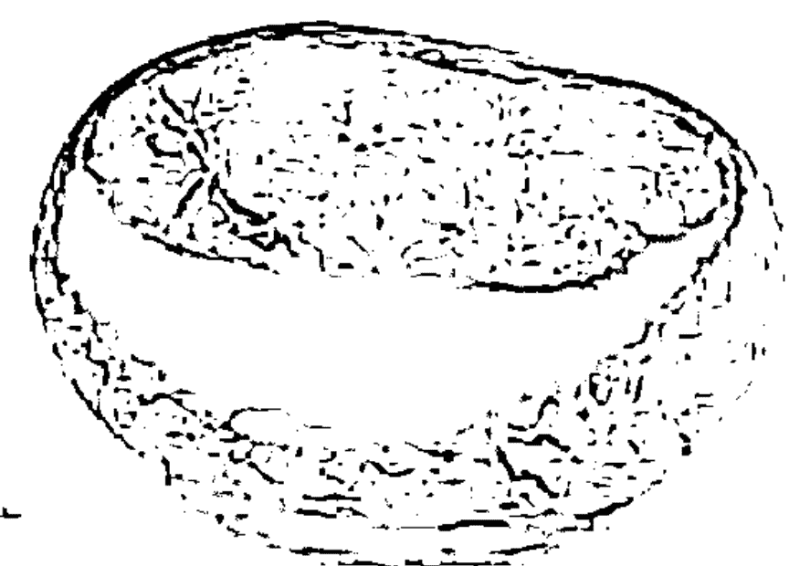

抛光过的磨圆状黄铜矿

### 关键词

- 保护性的
- 净化
- 刺激

### 相似晶石

**黄铁矿**看起来和未氧化的黄铜矿相似，但黄铁矿更硬，而且颜色不像黄铜矿带暖色调。

**斑铜矿**会很快失去光泽，变成带紫色的彩虹色，其实它被氧化之前是铜红色。

**镍黄铁矿**是等轴粒状，古铜棕色，其结构和颜色与黄铜矿相比看起来更接近泥土的感觉。

## Opal

## 欧泊

SiO₂.nH₂O

欧泊常常不公正地被认为是一种不太幸运的晶石，实际上，欧泊有许多种，包括我们下面会提到的那些，它们能提供各异的治疗功效，尤其对情绪有益。需要注意的是，欧泊是一种很脆弱的矿物，如果暴露在空气中容易失去结构中的水分子，因而变得易碎。

颜色：各种颜色都有
光泽：玻璃光泽至珍珠贝光泽
硬度：6
晶系：非晶质

### 安第斯欧泊（浅蓝色、蓝绿色和绿色等）

- 缓和情绪
- 有助于缓解紧张关系

### 樱桃欧泊（粉色、红色和橙色等）

- 有助于组织和血液系统更新
- 温和地增进能量层级
- 有助于提高情绪

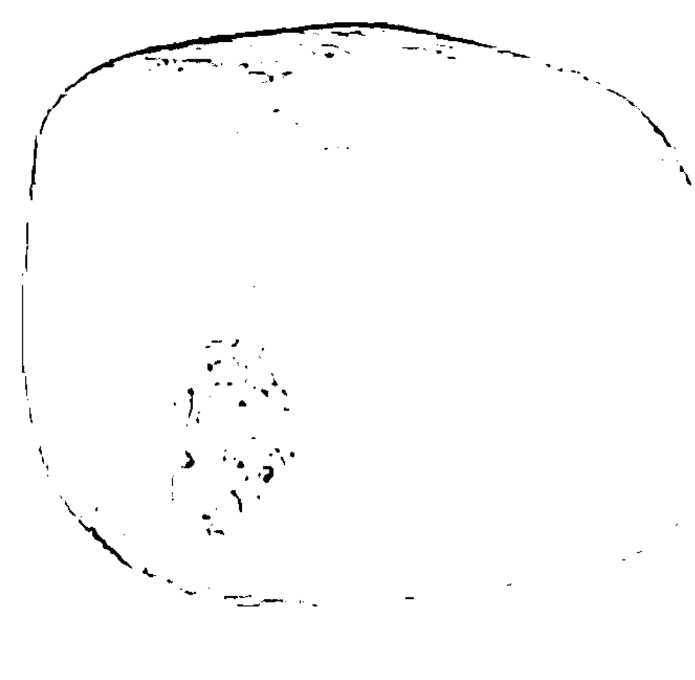

### 黑欧泊（棕色、黑色或灰蓝色等）

- 活化和平衡骶骨轮穴
- 缓解经前期紧张症和痛经

### 火欧泊（浓红橙色）

- 促进情绪低落或激情耗尽状态下的恢复

### 贵欧泊（纯净彩虹色）

- 有助于稳定情绪波动
- 利于身体能量在精微体内的流动

### 普通蛋白石（没有蛋白光或者火光，可见乳白色、灰色、绿色、紫色、棕色或无色）

- 能比其他种类的欧泊提供更多温和的能量
- 稳定情绪
- 增强自我价值感

### 白欧泊（乳白色略带点其他颜色）

- 为冠部轮穴提供能量
- 带来清晰的头脑

### 树突欧泊（普通蛋白白色带有类似于苔藓纹的包裹体）

- 加强组织能力
- 释放肺部、神经和血管的紧张感

## Tourmaline

## 电气石（碧玺）

Na(Mg,Fe,Li,Mn,Al)₃Al₆(BO₃)Si₆O₁₈(OH,F)₄

在电气石族矿物的晶体中，几乎所有的颜色以及颜色组合都能看到，然而，电气石常常结晶在坚硬的花岗伟晶岩或者石英中，这使得要得到完整的细长电气石晶体很不容易。滚圆的毛石和柱状晶体的切片通常不太贵，但带完整晶头能做魔棒的很难找，如果有丰富颜色变化的透明电气石晶体，那价钱通常是很昂贵的。

| 属性 | 描述 |
|---|---|
| 颜色 | 各种颜色都有 |
| 光泽 | 玻璃光泽 |
| 硬度 | 7 — 7.5 |
| 晶系 | 三方晶系 |

以下介绍的是一些比较有名的各种颜色的电气石亚种，不论其颜色如何，所有的电气石都有与晶体伸长方向平行的条纹，能加速能量流通，有助于清理脉搏障碍以及促使能量平衡。

### 蓝色电气石

- 能平衡咽喉轮穴，对甲状腺、肺部、喉咙以及颈骨有好处
- 激活额部轮穴，将洞察力、理解力和对信息的吸收发挥到极致

### 红电气石（红或者粉色）

- 红电气石既可以做一种刺激性的晶石，也可以成为一种镇定性的晶石，这取决于其颜色的深度
- 有助于改正过分好斗或者比较消极的个性
- 为骶骨轮穴补充能量，骶骨轮穴能激发各种形式的创造力

### 西瓜碧玺（绿色混杂粉色）

- 对心脏轮穴各个层面的能量的平衡效果都近乎完美

### 绿色电气石

- 增强免疫系统
- 休整骨骼和绷紧的肌肉系统
- 增强信心并帮我们建立归属感

其他电气石亚种包括：无色电气石（achroite）、颜色多变锂电气石（elbaite）、棕褐色镁电气石（dravite）、紫电气石（siberite）、黑电气石（schoul）以及有棕色、黑色和黄色的钙镁电气石（uvite）。

## Coral

## 珊瑚

CaCO₃

珊瑚由群居性细小海生动物的遗骸以及珊瑚虫形成，通常产出在温暖的浅水海域。红色的珊瑚亚种产自日本、非洲、马来西亚以及地中海和红海地区；澳大利亚和加勒比海地区产出黑色和金黄色珊瑚；蓝色珊瑚产在西非的喀麦隆。在中国西藏以及其他一些地区的大山顶上发现过红珊瑚化石，与之相伴的是贝壳化石，这些东西见证了地壳运动的历史和当地环境的沧桑变化。虽然除了珊瑚化石之外的珊瑚还不能算严格意义的晶石，但珊瑚几千年来一直是一种很受欢迎的有机宝石。尤其是红色的亚种，在印度、中国西藏和美洲印第安人中被认为是多产和丰富生命能量的载体。

- 颜色：红色、白色、粉色、金黄色、蓝色、黑色等
- 光泽：土状光泽至玻璃光泽
- 硬度：3
- 晶系：六方或三方

### 鉴定与养护

- 购买珊瑚化石和古董珊瑚珠子，相对于购买还在海中生长的活体珊瑚来说是道德行为，因为活体珊瑚大量被采挖有灭绝危险。
- 尽管硬度不是很低，但是束状的珊瑚很脆易损，手持或存放均需小心。

### 魔力

- 提高对他人需求的了解意识
- 帮助我们理解生命之间的联系
- 保护我们免受伤害

### 治疗功能

- 增强心脏、循环系统和骨骼的功能
- 平衡并稳定情绪
- 增强生育能力和动力以满足欲望

### 实践方法

- 把红色或者粉色的珊瑚放在脚部、骶骨和额部轮穴，可温和刺激以及温暖循环系统。
- 欲增强生育力，可尝试把红色珊瑚放在根部轮穴，粉色珊瑚放在骶骨轮穴，欧泊放在臀部两边，烟水晶放在两脚之间。

### 关键词

- 团体
- 力量
- 连通性

### 相似晶石

市面上可见塑料或者玻璃仿制品，但天然珊瑚可通过其谷粒状的纹路和斑点进行识别。

## Pearl

## 珍珠

CaCO₃ + 贝壳硬蛋白 + H₂O

像所有价值极高的东西一样，带彩虹光晕、有完美球形的高质量珍珠很难找到，需要坚持不懈地努力。珍珠产自海水或者淡水珍珠贝，由于珍珠贝内受到沙砾或者寄生虫刺激，从而分泌珍珠质液，后逐渐结晶而成，有些鲍鱼或其他贝类偶尔也能产出珍珠。像其他产自大海的宝石一样，珍珠有促进情绪流动、增强直觉和聚集月亮能量的特性。

颜色: 白色、粉色、棕色、黑色、蓝色、绿色等
光泽: 珍珠贝光泽
硬度: 2 — 2.5
晶系: 非晶态

### 鉴定与养护

- 不规则形状的淡水珠通常要便宜许多。
- 珍珠和珍珠贝都比较软，需分开储存。

### 魔力

- 镇住有点过激的形势
- 鼓励流动和变化

### 治疗功能

- 调节腺体功能
- 优化营养吸收
- 平衡情绪，增强忍耐力和服从性
- 给骶骨轮穴补充能量
- 减少担心、焦虑和挫败感
- 帮我们找回自我感，明白自己的定位

### 实践方法

- 欲放松关节和减轻腰疼，可尝试把珍珠放在骶骨轮穴、天然磁石放在颈底部、黑碧玺放在头顶或脚底部位。
- 释放压力和担忧或克服上瘾，可尝试把珍珠放在心口轮穴、白水晶放在头顶、烟水晶或者其他接地气的石头放在两脚之间。

| 关键词 |
|---|
| 敏感度 |
| 忍耐力 |
| 排序 |

| 相似晶石 |
|---|
| 月光石硬度比珍珠大很多，颜色没有珍珠丰富。 |
| 鲍鱼珠比珍珠的彩虹效应和光晕要强，它的彩虹色里的银色比较弱，但蓝、绿、粉色调更强。 |

## Pietersite

## 彼得石

SiO₂+Na₂(Mg,Fe,Al)₅(OH/Si₄O₁₁)₂

彼得石是一种新发现的晶石品种，它是泥土和天青石成分的特殊混合物，外观看起来就像是茶杯里有风暴一般，强对比色的图案如同旋涡，矛盾对比的有冷与暖、水与火的感觉，以及其近似金属般的冷酷光泽都混合到一起。彼得石由层状的砂粒或者泥浆与石英以蓝色鹰睛石或者金黄色虎睛石形成的方式胶结成型，但彼得石没有清晰的平行纤维纹，而是以相对随意的方式压缩和混合，并形成一种有着特殊能量的晶石。

颜色：棕色、黑色
光泽：玻璃光泽
硬度：7
晶系：三斜晶系、三方晶系或者非晶质

### 鉴定与养护

- 彼得石的色彩由金黄色、棕色、钴蓝色和白色相混融，每一种都有动感蜿蜒的纹路，这使得它很容易被识别。

### 魔力

- 创造性地改善不景气状况
- 帮助我们解决矛盾

### 相似晶石

古铜辉石看不到彼得石上蓝色的油底色。

### 治疗功能

- 放松背中部紧缩的肌肉
- 有助于释放掉由过往经历或处境带来的负面感觉
- 推动分析的习惯，以便按我们熟悉的方式处理和整合思路
- 在情绪变化的时候提供一个固定依靠

### 关键词

- 搅动
- 清理
- 锚定

### 实践方法

- 如果您觉得自己陷入了困境，可尝试放一些彼得石在骶骨轮穴（刚好在肚脐眼下面位置），并放一块虎睛石在心口以及一块紫水晶在额头。
- 放一块彼得石在额头，有助于用新方法去对待老问题。
- 放一块彼得石在心口有助于重新考虑对自己的认识。

## Unakite

## 绿帘花岗石

(Ca₂(Al, Fe³⁺)₃SiO₄)₃(OH)/Ca.Al₂Si₂O₈

绿帘花岗石是一种由肉红色长石、绿帘石和石英组成的混合物，和普通花岗岩的结构很像，不透明，绿色和粉色区域柔和混溶。这种颜色的组合尤其对心脏的能量有益，粉色能加强我们的身份认同感，有助于释放情绪压力，绿色能温和平衡地激励扩张和增长的感觉。

| 颜色 | 粉色和绿色 |
|---|---|
| 光泽 | 玻璃光泽 |
| 硬度 | 6 — 7 |
| 晶系 | 多矿物集合体 |

作为一种不透明的大块状颜色，绿色花岗石让我们不会太感情用事，在我们使用它进行晶石治疗时，能带给我们一种实实在在、脚踏实地的能量。

### 鉴定与养护

- 绿帘花岗石是一种含有粉色长石区域和浅绿色绿帘石区域的不透明岩石。
- 我们通常看到的是圆珠、弧形戒面或者是滚圆状。

### 魔力

- 有助于解决争议
- 放松我们生活中可能会感觉到的压抑感

### 治疗功能

- 平衡心脏和循环系统的物理性能量
- 抚慰骨盆部位的疼痛
- 增强自我价值感
- 缓和地消除情绪障碍
- 让我们远离过往的烦恼，活在当下
- 鼓励我们以一种超然的态度看待自己的生活、面对的问题和取得的成就

### 实践方法

欲镇定浮躁的心绪，处理好人际关系，或发展一种灵活的态度，可尝试放一块绿帘花岗石在心口部位，一块放在心脏中心部位，再加一块接地气的晶石在脚底下。

### 关键词

- 视角
- 平衡
- 自我价值

### 相似晶石

粉色花岗岩石通常没有绿色区域，并且其所含的晶体反光更强。

红绿宝（红刚玉与黝帘石的共生标本）上混合的绿色或者红色颜色会更深，并且有明显的色块界线。

## Fossils

## 化石

化石是我们这个星球上古代生命形态被石化的残骸，它混合了动物、植物和矿物的能量。化石由死去的动植物被沉积物覆盖而形成，通常在水中长时间隔绝氧气的环境下，其生物组织或器官慢慢被矿物质替代或者完全分解形成空腔，形成的空腔也常常会被其他矿物质充填。

许多种有醒目纹路或者造型的化石在几千年前就被人类当作功力强大的护身符。所有的化石不论外形如何都能被用于以下治疗法：

- 稳定生命力，并使之接地气和固定化
- 在不和谐状态下恢复秩序和正常模式
- 穿越时空回到久远记忆中
- 理解每个化石的独特个体生命的巨大延续性，包括我们以下将提及的那些，以及它们特殊的治疗功能。

### 菊石

（一种壳状的海洋生物，有缓慢膨胀的螺旋状外形，并有复杂的表面纹路）

- 加强经脉穴位系统
- 帮助我们接受变化和时间轮回

### 海胆

（头顶有五角星的一种心形化石）

- 鼓励协调活动
- 保护细微的敏感性

### 恐龙骨骼

- 带来信任和信心
- 赋予安全与力量
- 让我们能控制环境

### 植物化石

- 给我们提供持续的太阳能量
- 稳定腹腔神经丛
- 带来满足感
- 使我们能吸收生命能量
- 给我们喘息的机会

树皮皴化石

## Rocks and pebbles

## 岩石和卵石

不像矿物晶体有一致的化学结构（尽管有时结构中有其他杂质元素或包裹体混入），岩石和卵石是多种矿物的混合物，所有的岩石和卵石都有比较稳定和正常的治疗功效，以下是一些常见能用于晶石治疗的岩石。

### 花岗岩

（一种颗粒状集合体的岩浆岩类，由石英、长石、云母等矿物组成）

- 平衡精微体能量以及加速治疗进程（尤其是红色和粉色的花岗岩亚种），可尝试放几块花岗岩在喉咙旁边、脚边并握在两手中

### 石灰岩

（一种苍白色的碳酸钙质岩石，由富含方解石的贝壳和珊瑚等在古代温暖海域中沉积形成，它还能形成悬崖、峡谷和溶洞等自然风光）

- 为脚部和骶骨轮穴补充能量，促进创造性和敏感性
- 稳定情绪，减少紧张和恐惧
- 当被放置于骶骨轮穴或颅骨底部位时能产生良好效果

### 砂岩

（由沙子与硅石或方解石质矿物胶结而成）

- 有助于保持血管和皮肤的弹性和柔韧性等

### 玄武岩

（灰绿至黑色，常带有许多气泡或者晶洞的细颗粒岩石，由火山岩浆冷凝而成）

- 是一种用于稳定和维持能级很可靠的接地气石头

### 白垩岩

（一种白色比较软的多孔岩石，通常与燧石和化石一起产出，由微小的海洋生物遗骸沉积形成）

- 保护气场免遭消极性和破坏性能量影响

### 大理岩

（由石灰岩通过变质作用形成，常见多种颜色的脉状或者条带状）

- 非常冷静沉着
- 使心口轮穴的能量稳定
- 平衡行为的极端性

## Natural forms of quartz

## 水晶的天然形态

作为地球上最常见的矿物之一，石英有各异的结晶习性，造就了多种多样的晶体形态。以下描述的各种有名品种都有着独特的治疗特性。

### 双头水晶

（水晶的两端都有晶头，通常由于晶体结晶于松软的基岩或者液态条件中）

- 整合与联合
- 推动能量在身体内部流动
- 可手持任何一端辅助冥思

### 赫基蒙水晶

（一种晶体不大但很闪亮的双头水晶，最初产于美国纽约赫基蒙地下的软质岩石中）

- 除去各个层面的毒素或瘾性
- 能激励人在清醒状态下进入梦境，尤其当放在枕头底下时

### 骨干水晶

（通常是带有云母包裹体的烟水晶，有多个晶体堆积成阶梯状或者鳞片状外形）

- 对于深度治疗效果很好
- 把我们带入深层次的意识状态
- 接地气、清理和整合能量

### 幻影水晶

（含有漂亮的阴影或者幻影——通常是早期晶体生长的痕迹）

- 有助于理解隐藏的原因
- 提供很好的冥思焦点

### 板状水晶（呈细薄板状）

- 让身体能量无摩擦流动

### 激光魔棒水晶（逐渐变细的亚种）

（天然水晶的尖端略微弯曲并逐渐变细）

- 集中并浓缩能量，尤其适合精确或者深度的晶石治疗
- 让意识得到扩展

### 激光魔棒水晶（逐渐变宽的亚种）

（一个越朝魔棒顶部越扩张的稀有亚种）

- 释放和扩张能量，推动能量平滑流动，有点像板状水晶

### 缝合线水晶

（水晶的晶体曾经破裂成两部分，并在之后的地质过程中重新结晶到一起，这种结合处有一块云雾状比较模糊的区域并有明显的轴线变化，比较容易鉴别）

- 帮助我们理解疾病的成因
- 加速修复进程

### 发电水晶

（往尖部汇聚的六个面几乎完全一样）

- 为周边的事物补充能量
- 为治疗提供焦点
- 对群体工作或作为冥思的焦点很理想

### 渠道水晶

（这种水晶最大的面有七条边，这个面的背面是一个三角形的面）

- 适合用于冥思
- 抓住最大的面放在额头部位，能提高知觉并传递能量

### 发送器水晶

（有两个七条边的面，在这两个面之间有三角形的面将它们连接在一起）

- 从气场中接受信息并传送出去：在将个人能量接地气后，把明确界定的问题送入晶体中，并把它放在一个安静的地方不少于十二小时，然后将其取回，把它一个三角形的面朝向额头部位放置，以吸收与问题相关的信息。

### 纪录保持者水晶

（许多面上鼓出或者布满犬牙交错的小金字塔形凸起）

- 使和谐并一体化
- 有如蚀刻出的造型能激发美好的回忆和想象
- 对冥思很合适，能抓在手上并放在额头部位以破除对自我认知的障碍

### 教堂水晶

（看起来像几块水晶合并在一起，通常有一个主晶体，其他晶体围绕着主晶体）

- 教堂水晶被认为是准许出入能共享知识的身体，以有着人类集体心理的“阿卡西记录”而闻名
- 很适合作为个人或者集体冥思的焦点
- 有助于我们决定个人的精神道路或方向

### 天窗水晶

（水晶的大晶体面之间有很突出的钻石型小面）

- 有助于健康状态评估——晶石治疗师用天窗水晶扫描待治疗者的气场，然后抓住这块水晶放到他（她）自己的额头上去接收相关信息

### 时光隧道水晶

（一种有斜钻石状或平行四边形状天窗的水晶）

- 把意识转移到不同时间、地点和维度上去
- 如果晶体向左倾斜，被认为能揭示过去；如果晶体向右倾斜，则被认为能喻示潜在的未来

### 伊西斯水晶（最大的面有五条边）

- 伊西斯水晶得名于古埃及丰饶女神伊西斯，她辛苦地工作以寻找其亡夫所散落的尸块。这种水晶激励我们努力争取成功和拨乱反正
- 医治受创的情绪
- 让我们在帮助别人的同时不用太卷入其中

### 雷姆利亚种子水晶

（晶体外观光泽较暗淡，呈淡粉色，其中一个或两个晶面有明显的水平纹理延伸）

- 雷姆利亚种子水晶有一种与其他水晶迥异的能量，这使得它刚一开始被握住的时候有种令人不安的感觉
- 能激发地球与宇宙其他地方的联系
- 有助于我们察觉自己在某个宏伟计划中的位置

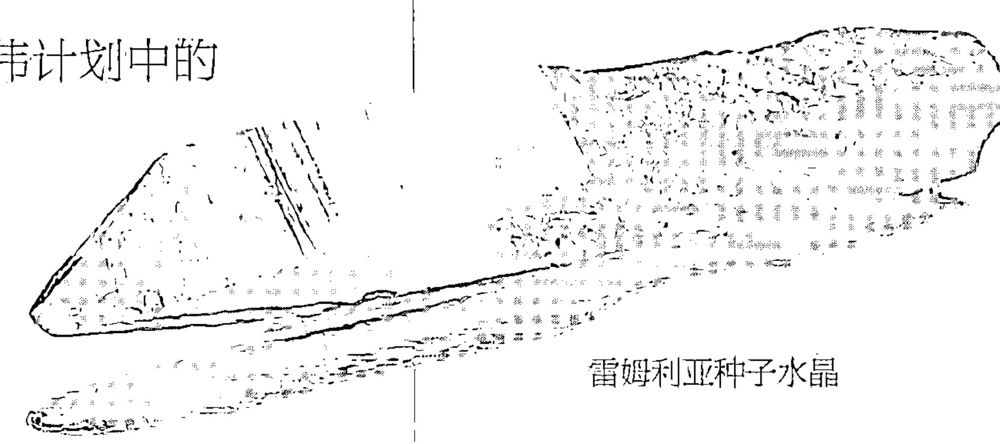

### 特殊切工的水晶

尽管各种晶石有其天然的结晶规律和结晶形态，但有些晶石治疗师仍需要根据其治疗目的把相应晶石切割成对应的形状。

### 巫师水晶

- 这是一种两端像金字塔的切法，其形状能和所有的要素相联系。在某些传统仪式上，巫师需要以之在祭拜天地时与水火土风四大要素相作用。

### 沃格尔水晶

- 这种水晶以科学家和精神治疗师马塞尔·沃格尔的名字命名，他曾致力于探究晶石如何与人体的精微层相互作用并设计能产生不同能量层级作用的晶石工具。他治疗所用的晶石工具是一个双头的水晶魔棒，其中一头比另一头要粗，魔棒上的晶面能激励能量通过水晶流通。这种水晶魔棒的功能可以通过对思想或者意图聚焦。沃格尔还设计了一种冥思用的水晶工具，只有一头有尖头，呈方尖碑形。

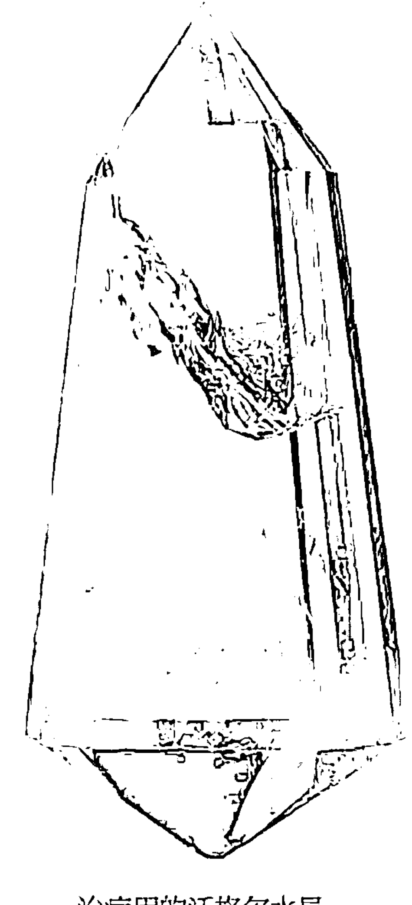

### 梅尔卡巴水晶

梅尔卡巴水晶被切割成两个相互穿插的金字塔形（双四面体），它象征着心与头脑和身体之间的联系。能激励能量和信息在身体各层面的顺畅流动。

### 柏拉图立体

水晶有时被切割成五种形状，柏拉图立体被认为最能代表物质的基本形态，也被认为与各基本要素和轮穴相关联（见下表）：

| 形状 | 晶面数 | 元素 | 轮穴 |
|---|---|---|---|
| 四面体 | 4 | 火 | 心口轮穴 |
| 立方体 | 6 | 土 | 根部轮穴 |
| 八面体 | 8 | 风 | 心脏轮穴 |
| 菱形十二面体 | 12 | 天 | 咽喉轮穴 |
| 四角三八面体 | 20 | 水 | 骶骨轮穴 |

将这五种柏拉图立体放在相应的轮穴上，梅尔卡巴水晶放在额部轮穴，再找一种球状的晶石放在冠部轮穴，可平衡轮穴能量。

### 人造水晶

现在几乎所有漂亮的天然晶石都能找到与之相对应的人工合成品，即便首饰用的合成晶石也很难与天然品进行区分鉴别。

人工合成水晶已有很长的历史，最早的合成水晶于1845年面世，然而直到20世纪70年代，其合成技术才取得突破，使得商业性的大规模生产成为可能。碳酸氢钠或者氢氧化钠溶液被放入高温高压中，溶液里的籽晶慢慢会长大。

尽管天然水晶的能量更强，通常更适合于晶石治疗，而合成水晶也有其内部晶体结构，也被认为有一定的治疗功效。相对来说，玻璃虽然化学成分和水晶差不多（SiO₂），但它是非晶质，完全没有晶体结构，这意味着奥地利水晶之类的人造玻璃对晶石治疗是没有多大作用的。

### 西伯利亚金黄水晶（心口轮穴）

- 平衡两极
- 赋予内在智慧

### 西伯利亚绿水晶（心脏轮穴）

- 镇静心绪并平衡能量

### 西伯利亚蓝水晶（额部轮穴）

- 建立直觉力、洞察力和超自然技能

### 西伯利亚紫水晶（冠部轮穴）

- 转移能量，释放能量梗阻

### 粉色琉璃（骶骨轮穴）

- 把消极的能量转换成积极的
- 有助于处理关于“自我”的问题，类似于低能级的自恋和自我耐受性

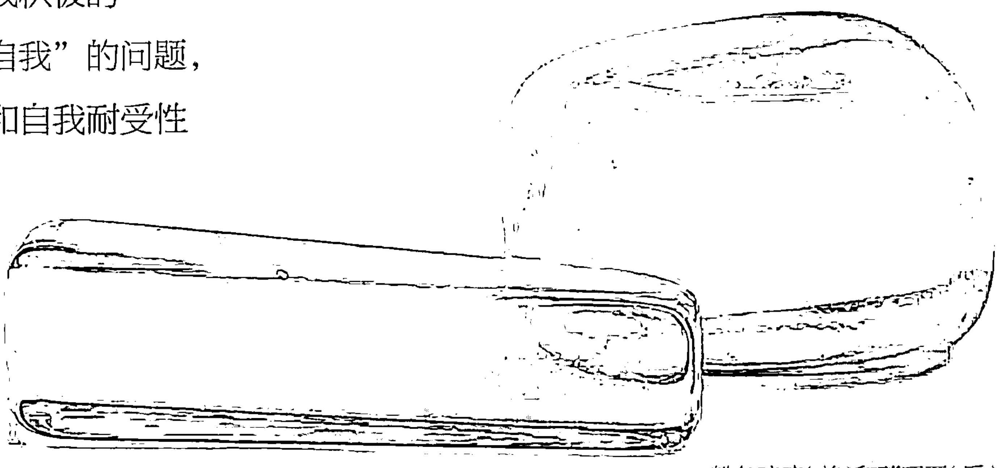

### 改善过的水晶

除了有完全合成的水晶外，市面上还能看到很多改善过的水晶——天然水晶被某种方法处理改变其外观和治疗功效。

最常见的改善方法是镀金属膜，白水晶被放入加压的真空容器中，在高温下用金属蒸汽喷涂，这样能在水晶表面形成几个原子那么厚的永久性金属膜。除了这种方法外，水晶还可以被染上炫目的颜色。

以下是一些常见的改善过的水晶。

### 水光水晶

（白水晶被金蒸汽喷涂，产生一种彩虹蓝色膜）

- 驾驭黄金和水晶的能量一起作用
- 刺激良好的思维和沟通

### 彩虹水晶

（白水晶用铂蒸汽喷涂，形成彩虹般的蛋白光，也被称为欧泊水晶、珍珠水晶或者天使水晶）

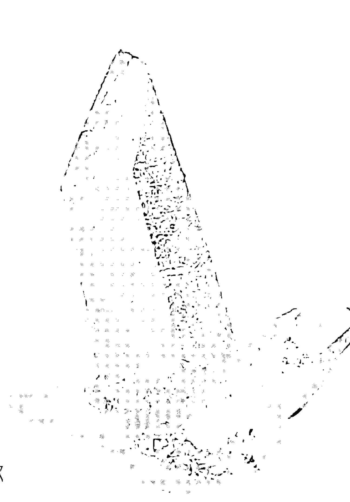

- 有助于清净心灵以便于冥思和深层的沟通
- 与冠部轮穴相关联，能给整个精微系统补充能量

### 红宝水晶

（白水晶由金和铂混合的蒸汽喷涂产生深红色调）

- 接地气并有保护作用
- 与根部轮穴关联，对背部、脊椎、臀部、大腿和脚部有益

### 阳光水晶

（白水晶由金和铂混合的蒸汽喷涂后产生亮黄色调）

- 与心口轮穴相关联，能增强消化能力和情绪稳定性

### 炸花水晶（也称星闪水晶）

（白水晶被加热和快速冷却形成裂缝，然后浸入一系列颜色中，颜色进入裂缝，产生炫目的外观）

- 能影响和其颜色对应的轮穴

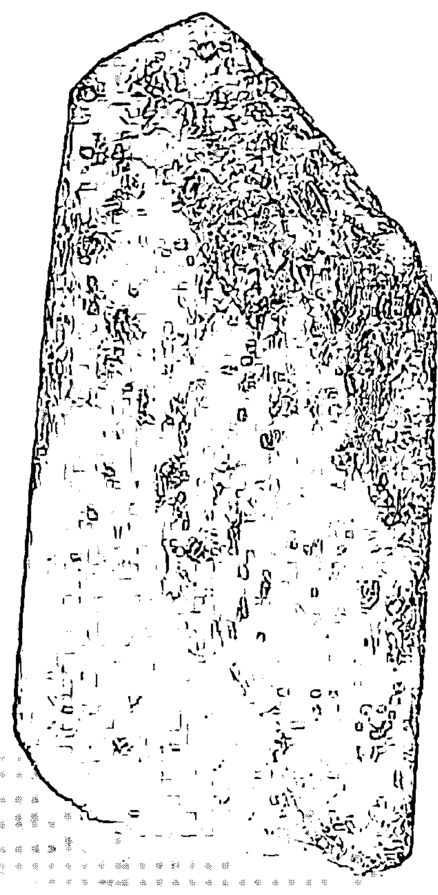

## 矿物学信息

### 摩氏硬度

矿物硬度划分标准来自德国矿物学家弗雷德里希·莫斯于 1812 年提出的矿物硬度划分法（见下表），这种方法把矿物的硬度划分成十个等级，每一个等级有一种对应的测试用矿物晶石，您可以通过这些标准测试您的晶石硬度。例如，如果一块晶石能划动萤石，而且它又能被磷灰石划动，那么这种晶石的摩氏硬度就介于 4—5 之间。

- 1 (最软) —— 滑石
- 2 —— 石膏
- 3 —— 方解石
- 4 —— 萤石
- 5 —— 磷灰石
- 6 —— 正长石
- 7 —— 石英
- 8 —— 黄玉
- 9 —— 刚玉
- 10 (最硬) —— 钻石

### 化学符号应用于晶体的指引

| 符号 | 名称 | 符号 | 名称 | 符号 | 名称 | 符号 | 名称 | 符号 | 名称 |
|---|---|---|---|---|---|---|---|---|---|
| Ag | 银 | C | 碳 | Fe | 铁 | Na | 钠 | Ti | 钛 |
| Al | 铝 | Ca | 钙 | H | 氢 | O | 氧 | Zn | 锌 |
| Au | 金 | Cl | 氯 | K | 钾 | P | 磷 | Zr | 锆 |
| B | 硼 | Cr | 铬 | Li | 锂 | S | 硫 | | |
| Ba | 钡 | Cu | 铜 | Mg | 镁 | Si | 硅 | | |
| Be | 铍 | F | 氟 | Mn | 锰 | Sr | 锶 | | |

## 参考书目

Geinger, Michael, Crystal Power, Crystal Healing, Cassell & Co. (London), 1998

Gerber, Richard, Vibrational Medicine, Bear & Co. (Santa Fe, New Mexico), 1988

Gurudas, Gem Elixirs and Vibrational Healing 1, Cassandra Press (Boulder, Colorado), 1989

Hankin, Rosie (ed.), Rocks, Crystals, Minerals, New Burlington (London), 1998

Korbel, Petr and Milan Novak, The Complete Encyclopedia of Minerals, Rebo (Lisse, Netherlands), 1999

Kourimsky, Dr J., The Illustrated Encyclopedia of Minerals and Rocks, Aventinum (Prague), 1977

Lilly, Simon, The Illustrated Elements of Crystal Healing, Harper Collins/Element (London), 2000 and 2002

Lilly, Simon and Sue, Crystal Doorways, Capall Bann (Milverton, Somerset), 1997

Lilly, Sue and Simon, Colour Healing, Lorenz (London), 2001

Lilly, Sue and Simon, Crystal Healing, Lorenz (London), 2001

Lilly, Sue, Crystal Decoder, Barron's (USA) and Fair Winds (UK), 2001

Raphael, Katrina, Crystal Enlightenment, Aurora (New York), 1985

## 索引

- 8 字形阵列，40
- 阿帕奇眼泪，67
- 阿育吠陀，11,16
- 安第斯欧泊，248
- 按摩疗法，35
- 澳大利亚玻璃陨石，68
- 八卦，32
- 巴黎煤精，56
- 白欧泊，249
- 白水晶，117，232—233，234
- 白铁矿，63
- 白羊座，17
- 白云石，117
- 柏拉图立体，271
- 斑铜矿，247
- 板状水晶，265
- 保护，27
- 鲍温石，146
- 鲍鱼珠，255
- 彼得石，256—257
- 碧玉，82，91，92—93
- 变质作用形成的晶石与岩石，20
- 冰长石，222
- 玻璃陨石，68—69，154，155
- 博茨瓦纳玛瑙，60，171
- 博吉石，80
- 彩虹轮穴平衡，39
- 彩虹水晶，274—275
- 彩虹月光石，223
- 草莓水晶，217，220
- 禅宗佛教，33
- 缠丝玛瑙，52
- 超越时间感阵列，41
- 辰砂，89,97
- 沉积作用形成的晶石和岩石，18
- 橙色方解石，101,107
- 赤铁矿，54，55，62—63，81，92
- 赤铜矿，102
- 处女座，17
- 传统治疗，10—11
- 吹气净化，25
- 磁黄铁矿，109
- 磁石，54—55
- 磁铁矿，54—55，243
- 雌黄，122
- 翠铬锂辉石，121,210
- 翠砷铜矿，141
- 存放晶石，24
- 大理石，227
- 单晶体，23
- 单斜晶系，21
- 灯塔阵列，41
- 骶骨轮穴，15
- 地质学，18—20
- 电气石，85，115，135，143，144，145，250—251
- 电气石水晶，113，230—231
- 电视石，229，240
- 对鼻子有用的晶石，36
- 对脖子有用的晶石，36
- 对肠道有用的晶石，36
- 对耳朵有用的晶石，36
- 对肺部有用的晶石，36
- 对骨骼有用的晶石，37
- 对喉咙有用的晶石，36
- 对肌肉有用的晶石，37
- 对免疫系统有用的晶石，37
- 对膀胱有用的晶石，36
- 对增强体能有用的晶石，37
- 对神经系统有用的晶石，37
- 对肾脏有用的晶石，36
- 对生殖器官有用的晶石，36
- 对头部有用的晶石，36
- 对心脏有用的石头，36
- 对胸部有用的晶石，36
- 对血液循环系统有用的晶石，37
- 对眼睛有用的晶石，36
- 额部轮穴，15
- 发送器水晶，266—267
- 方黄铜矿，109
- 方解石，74，100，105，116—117，121，168，199，225，234，278
- 方钠石，182—183，187，191
- 方铅矿，65，199
- 放松身体，40
- 翡翠，146
- 沸石，224—225，234
- 焚香，清洗晶石，25
- 粉色黄玉，114
- 粉色琉璃，273
- 粉水晶，74，208—209，211，215
- 风水，32
- 缝合线水晶，266
- 佛教，33
- 弗雷德里希·莫斯，278
- 符山石，72—73，145
- 改善过的水晶，274—275
- 钙铝榴石，73，146
- 钙镁电气石，251
- 橄榄石，58，59，124，149
- 刚玉，86，184，278
- 缟玛瑙，49，51，52—53，56
- 锆石，73，85，87，95，242—243
- 铬铁矿，55
- 根部轮穴，15，29
- 古铜辉石，76—77，102，109，256
- 骨干水晶，264—265
- 冠部轮穴，15
- 光谱石，99，223，245
- 干盐净化，25
- 硅化木，78，82—83
- 硅孔雀石，153，159，163，164—165，171
- 硅硼钙石，159，201
- 硅铍石，115
- 贵橄榄石，124—125，131，149，155
- 贵欧泊，249
- 滚圆石，23
- 海胆，261
- 海蓝宝石，115，135，160—161
- 海纹石，159，165，166—167
- 好望角橄榄石，130
- 好望角祖母绿，130
- 赫基蒙水晶，239，264
- 褐铁矿，78，80—81，92，109
- 黑电气石，48，51，52，56，251
- 黑欧泊，248
- 黑色月光石，142
- 黑曜石，49，50—51，52，68，143
- 黑月光石，142
- 红宝石，85，86—87，95，185，259
- 红宝水晶，275
- 红碧玉，92
- 红电气石（红色或粉色碧玺），87，211，212，215，251
- 红色宝石，86—87
- 红锌矿，88—89
- 红玉髓，91，93，96—97，101
- 虎睛石，70—71，113，256
- 虎铁石，119
- 琥珀，105，106—107，117
- 护身符，29
- 花岗岩，195，259，262
- 滑石，278
- 化石，260—261
- 欢乐赐予阵列，41
- 幻影水晶，265
- 黄色碧玉，119
- 黄水晶，67，97，101，104—105，107，117，121
- 黄铁矿，77，81，108—109，110，176，247
- 黄铜矿，102，109，110，246—247
- 黄玉，73，114—115，179，209，278
- 恢复晶石能量，25，29
- 辉沸石，224
- 辉绿岩，194
- 辉锑矿，65
- 火欧泊，249
- 火山弹，68
- 火山作用形成的晶石和岩石，18，20
- 火星，16
- 激光魔棒水晶，265
- 集中精神，27
- 计都，16
- 纪录保持者水晶，267
- 加工过的晶石，23
- 假象孔雀石，153
- 尖晶石，87，94—95，239，243
- 碱性正长石，245
- 角闪石，70
- 角石，60
- 教堂水晶，267—268
- 接地气，27
- 接地气晶石，29
- 金刚石，238—239
- 金红石，102，112，174
- 金红石发晶，112
- 金红石水晶，71，112—113，231
- 金绿宝石，121
- 金绿柱石，115，120—121
- 金牛座，17
- 金星，16
- 堇青石，204—205
- 晶簇，23
- 晶石护理，24
- 晶石精华液，34
- 晶石神灵冥想法，44
- 晶石水，34
- 晶石探索冥想法，45
- 晶石形成，18—20
- 晶系，20—21
- 晶石治疗，35
- 精灵石，78
- 精微体，14
- 净化晶石，25，29
- 净化阵列，38
- 菊石，260—261
- 巨蟹座，17
- 孔雀石，102，138，152—153，188，189
- 孔雀铜矿，246
- 恐龙骨骼，261
- 矿物，18
- 矿物标本，23
- 拉长石，99，244—245
- 蓝宝石，86，87，175，181，184—185，189，193，205
- 蓝电气石，193，205，250
- 蓝色黄玉，161，173，176，185，205
- 蓝晶石，179，191，192—193
- 蓝色方解石，176
- 蓝色砂金石，191,195
- 蓝色水晶，117，133，171，174—175，176，191，195
- 蓝铜矿，102，152，188—189
- 蓝纹玛瑙，165，170—171
- 蓝线石，175，183，187，190—191，195
- 雷姆利亚种子水晶，269
- 锂电气石，251
- 锂磷铝石，121
- 锂云母，212—213
- 立方体晶格，21
- 立方氧化锆，239
- 利比亚玻璃，68
- 磷灰石，135，178—179，185，193，278
- 灵气疗法，35
- 菱沸石，117
- 菱镁矿，117
- 菱锰矿，217，218—219
- 菱锌矿，168—169
- 硫黄石，122
- 六方晶格，121，210
- 炉渣，68
- 轮穴，14—15
- 轮穴冥想，42
- 罗睺（北交点），16
- 绿碧玉，136，137，157
- 绿玻璃陨石，68，154—155
- 绿电气石，155，251
- 绿帘花岗石，258—259
- 绿帘石，49，73，144—145，151，258
- 绿龙晶，138—139
- 绿泥石，92，129，138—139
- 绿石英（阳起石石英），126，128—129，145，231
- 绿松石，10，158—159，163，165，167
- 绿铜矿，140—141，143
- 绿玉髓，126—127，146
- 绿柱石，120，134，160，179，185，214
- 玛瑙，170—171
- 梅尔卡巴水晶，271
- 煤精，56—57，82
- 镁橄榄石，125
- 锰黝帘石，212，217，220—221
- 冥思，42—45
- 摩根石，209，211，214—215
- 摩羯座，17
- 摩凯石，118—119
- 魔棒，31
- 木星，16
- 穆哈石，156
- 钠长石，223, 225
- 能量平衡阵列，38
- 镍黄铁矿，247
- 镍矿石，59
- 欧泊，82, 248—249
- 佩戴用的晶石，29
- 硼钠钙石，229, 240—241
- 葡萄石，130—131, 146, 234
- 普拉纳，32
- 普雷塞利青石，194—195
- 普通蛋白石，249
- 普通辉石，145
- 蔷薇辉石，216—217, 219, 220
- 蔷薇石英，74, 208—209, 211, 215
- 器材箱，24
- 青金石，182, 183, 186—187, 191
- 青金石，182, 186
- 青石棉，70, 174
- 清洗晶石用的净化喷雾，25
- 情绪体，13
- 渠道水晶，266
- 人工合成水晶，272—273
- 乳石英，74, 226—227
- 软玉，85, 146
- 瑞替阶石，192
- 赛黄晶，117, 233, 234, 236—237
- 三方晶系，21
- 三斜晶系，21
- 色彩色疗法，35
- 砂金石，97, 126, 129, 132—133, 146, 163
- 砂岩，263
- 珊瑚，219, 252—253
- 蛇纹石，85, 150—151, 153
- 射手座，17
- 身体能量，32
- 砷铂矿，109
- 生辰石，17
- 生命能量，28
- 声音净化晶石，25
- 圣洁地，33
- 狮子座，17
- 十字石，78—79, 81
- 石膏，74, 176, 228, 278
- 石灰岩，262
- 石榴石，84—85, 87, 95
- 石棉，150
- 石墨，238
- 石铁陨石 (橄榄陨铁), 58
- 石盐，74—75, 199
- 石英，11, 58, 234, 258, 278
- 石英岩，60, 74, 99
- 石陨石，58
- 时光隧道水晶，268
- 收藏级晶石，22—25
- 舒俱来石，200—201, 202, 207
- 树纹玛瑙，157
- 树突欧泊，249
- 树枝状的石灰岩，157
- 树枝状砂岩，157
- 双头水晶，264

## 索引

- 双鱼座，17
- 双子座，17
- 水光水晶，161，173，274
- 水硅钙石，241
- 水蓝宝石，204
- 水瓶座，17
- 水净化晶石，25
- 水星，16
- 四方晶系，21
- 燧石，60—61
- 所罗门印章阵列，40
- 太阳，16
- 太阳石，98—99
- 坦桑石，180—181
- 碳，238
- 特殊切工的水晶，270—271
- 提神阵列，41
- 天秤座，17
- 天窗水晶，268
- 天河石，133，159，162—163，165
- 天青石，117，172—173，175，176
- 天然形态，264—269
- 天使石，175，176—177
- 天使发晶，112
- 天蝎座，17
- 条痕测试，12
- 铁橄榄石，125
- 铁矿石，59
- 铁镁橄榄石，125
- 铁石英，90
- 铁水晶，90—91，93
- 铁陨石，58
- 透辉石，142—143
- 透石膏，228—229，237，241
- 土星，16
- 网状，28
- 维纳斯发晶，112
- 温石棉，150
- 文石，100—101，117
- 沃格尔水晶，270
- 巫师水晶，270
- 无色电气石，251
- 无色方解石，234
- 无色锆石，239
- 无色黄玉，237
- 西伯利亚水晶，161
- 西瓜碧玺，251
- 矽线石，193
- 藓纹玛瑙，129，156—157
- 斜方晶系，21
- 榍石，148—149
- 心口轮穴，15
- 心脏轮穴，15
- 心中粉色星冥思，43
- 锌孔雀石，153
- 阿育吠陀星球，16
- 星闪水晶，275
- 星叶石，138
- 星座，17
- 星座体，13
- 雄黄，97
- 玄武岩，78，82，195，263
- 雪花石膏，82
- 血石，136—137
- 压力，26，27，28，38
- 亚特兰蒂斯石，166
- 咽喉轮穴，15
- 熏香净化，25
- 烟水晶，66—67
- 岩石，262—263
- 岩盐，74
- 盐净化晶石，25
- 颜色，12，14，15，29
- 阳光净化晶石，25
- 阳光水晶，275
- 阳起石包体水晶（参看绿石英）
- 氧化铁，90，96，136
- 伊斯兰，33
- 伊西斯水晶，269
- 异极矿，131，167，168
- 银金矿，110
- 银星石，131
- 印度教，33
- 樱桃欧泊，248
- 鹰睛石，70，256
- 萤石，74，196，198—199，278
- 影响情绪的晶石，37
- 映射疗法，35
- 硬度，278
- 硬石膏，176
- 黝帘石，259
- 鱼眼石，233，234—235，237
- 愚人金（参看黄铁矿）
- 玉石，85，126，133，143，146—147，151
- 玉髓，60，82，126，156，168
- 月光石，98，99，222—223，255
- 月亮，16
- 云母，262
- 陨石，58—59，68，124，154
- 炸花水晶，275
- 长石，162，222，223，225，244，258
- 爪哇玻璃陨石，68
- 沼铁矿，80
- 针钠钙石，166
- 针铁矿，113，231
- 珍珠，254—255
- 阵列，28，38—41
- 正长石，278
- 正长岩，200
- 植物化石，261
- 治疗技术，31
- 钟摆，30
- 重晶石，82，117
- 紫电气石，251
- 紫黄晶，196
- 紫锂辉石，210—211，215
- 紫磷铁锰矿，201，206—207
- 紫龙晶，201，202—203
- 紫水晶，181，196—197，199
- 自然金，109，110—111
- 自然硫，122—123
- 自然铜，77，102—103
- 自然银，64—65
- 祖母绿，126，133，134—135，163

## 致谢

作者的致谢

我们尤其要感谢 Crystals 公司（埃克塞特市巴德莱克路 3 号福莱希单元）的阿莱克斯·马松先生为我们这本书提供了如此漂亮的晶体来拍照。

我们也要感谢安吉拉·安德鲁、泰利·洛克耶尔、卡罗尔·桑德斯、哈立德·哈克、维罗妮卡·蒂奇菲尔德、海伦·琼斯、卢西亚娜·柯尔普、肯、曼蒂·罗宾逊和罗珊娜·斯坦康普亚诺，感谢他们的帮助和在辨别普雷塞利青石特性上付出的努力。

相关资源

晶石公司（Crystals）
www.crystalshop.co.uk

普雷塞利青石有限公司（Preseli Bluestone Limited）
www.stonehengestones.com

英国花精生产者协会（British Association of Flower Essence Producers）
www.bafep.com

绿人精华液公司（Green Man Essences）
www.greenmanessences.com

作为出版者，我们感谢以下朋友和图片库为我们复制相关材料提供许可：
第 10 页 尤尔根·利佩，柏林 / 埃及博物馆，开罗；
第 19 页 Photolibrary.com 网站 / 动态图像（英国）有限公司；
第 31 页 西蒙和苏·莉莉；
第 238 页 盖蒂图片社 / 摄影者之选杂志 / 斯蒂夫·科尔。

# THE ESSENTIAL GUIDE TO CRYSTALS
## 晶石的能量

这是一本关于晶石收藏和晶石功能的入门指南，配有精致华丽的彩图和特征讲述，也略述了各种晶石的魔力和治疗特性，并对驾驭晶石独特能量的方法进行了阐述。

- 超过 100 种晶石的详细资料，讲述其治疗特性和其他用途。
- 简述每种晶石的关键特性，方便您尽快找到适合自己需求的晶石。
- 对于某些特殊用途，如在家里创造一个神奇的空间来放松身体等，提供晶石选择和使用的实践方法。