# 曼陀罗思考法

## 推薦序

### 全面訓練腦力的實用方法

這是第二次幫胡老師寫序，距上回胡老師《心智圖超簡單》出版才短短幾個月的時間，胡老師的新作《曼陀羅思考法》就已經送到我手中了，胡老師教導學生有效地學習，胡老師自己也非常有效地創作出版。

為了很快了解胡老師這本《曼陀羅思考法》的內容，我試著用書中介紹的螺旋順時鐘排列法，將本書的重點整理成下頁的圖，發現曼陀羅思考法真的很好用，讓我在短時間內就能掌握到書中介紹的重要內容，也能在短期內學習到書中的精髓，希望這張圖也能協助所有讀者以見林再見樹的方式進入曼陀羅的殿堂。

曼陀羅是一種原生於印度的花，也是佛教對天圓地方宇宙模型的呈現方式，而曼陀羅思考法即是運用類似曼陀羅的圖形做圖像思考啟發的工具，九宮格是曼陀羅最常呈現的工具，胡老師特別要澄清曼陀羅不只是九宮格，它可以各式各樣的圖樣呈現，而且可以用在許多不同的領域。

這本書胡老師不但講心法也介紹工法，先簡介基本觀念，再說明運用的手法，讓讀者不只能「知道」，還要能活用曼陀羅思考法，胡老師將近十年來自己運用曼陀羅思考法的心得及學員回饋的意見整理成本書的內容，可想而知肯定是一本很實用的工具書。胡老師將曼陀羅稱為東方的心智圖；將心智圖稱為西方的曼陀羅，就可以知道曼陀羅和心智圖一樣，可以訓練水平思考與垂直思考，都是簡單有效的創意思考法，和TRIZ創新發明問題解決理論裡的九宮格問題分析思考法一樣，可以從時間和空間同時展開思考，可以運用放射型排列的水平思考，可以運用螺旋順時鐘排列進行垂直思考，也可以是十字型排列的八段論法，林林總總的用法讓它都能以結構化的方式，幫助使用者顯示思考的邏輯。

本書的重點擺在運用實例的介紹，讀者可以用在規劃建立人脈網路，可以用在目標設定，可以用來當行事曆，可以用來協助筆記，可以協助擬訂簡報及企劃的大綱，更可以用來做創意的訓練，這些書中都有實例可供參考，為了方便讀者的應用，隨書還附贈一本曼陀羅手冊，手冊中的表格設計各種類型供不同目的的使用，胡老師希望所有讀者都能活用「曼陀羅思考法」達到「快速學習、聰明運用、快樂生活」的目的。

> ——前聯華電子副總經理、中華系統性創新學會理事長 吳英志

| 胡老師把曼陀羅稱為東方的心智圖；將心智圖稱為西方的曼陀羅，顯示兩者都是簡單有效的創意思考法 | 它可以運用放射型排列的水平思考，可以運用螺旋順時鐘排列進行垂直思考，也可以是十字型排列的八段論法 | 讀者可以用在規劃建立人脈網路，可以用在目標設定，可以用來當行事曆，可以用來協助筆記，可以協助擬訂簡報及企劃的大綱，更可以用來做創意的訓練 |
| :--- | :--- | :--- |
| 曼陀羅思考可以導引水平思考加上垂直思考讓它目視化 | **《曼陀羅思考法》——胡雅茹老師繼《心智圖超簡單》後又一訓練腦力的實用工具書** | 為了方便讀者的應用，隨書還會附贈一本曼陀羅手冊，手冊中的表格設計各種類型供書中介紹的不同目的使用 |
| 日本顧問師今泉浩晃研發曼陀羅筆記學來訓練腦力 | 曼陀羅原是一種印度花名也是佛教對宇宙天圓地方的呈現 | 胡老師希望所有讀者都能活用曼陀羅思考法達到「快速學習、聰明運用、快樂生活」的目的 |

△瞭解《曼陀羅思考法》本書重點：
胡雅茹老師繼《心智圖超簡單》後又一訓練腦力的實用工具書

## 推薦序

### 發揮潛能的大腦實用軟體

在懵懂無知的年華，老師們教我們讀書，要求必須眼到、耳到、口到、手到、心到，能做到五到，學習才能事半功倍，所以我就慢慢養成讀書時，拿筆畫線作重點整理。除此之外也不懂什麼更好的方法。

教書時，常聽到學生會抱怨：「書都讀了卻很快就忘記了。」這是因為他沒有用正確的讀書方法，只是將課文強記下來。所以我在教學時，就將課文內容的重點，以最簡潔的文字，整理成各式各樣的圖表，如：科判表、關係圖、比較圖。希望幫助學生能在最短的時間內做好觀念統整，一目了然，掌握重點。更重要的是藉此教導學生要如何自己做功課，如何去蕪存菁，並且印象深刻，歷久難忘。所以我覺得不管讀書或做事都應該運用一些合適的方法，幫助自己更具組織力、思考力、理解力與創造力。

學校教育與生活教育給大腦輸入很多的資料，我們要如何將這些資料轉化成可用的能力？知識不等於能力。各種能力的養成都要不斷的進行腦力激盪，大腦愈用就愈靈活愈聰明。如同身體肌肉，用進廢退，年紀愈大愈有這種感覺。

在因緣際會下，我認識了雅茹老師，也聽過他精采的演講。他的思路很清晰，邏輯推理很周全，隨時能帶領聽講者的思緒，去做廣泛多元的思考。凡聽過課的人，都會折服於他的創意思維。後來我發現他所推廣的心智圖與我曾運用的教學方法謀而合，甚至比我用得更廣。現在他又出書介紹曼陀羅思考法，很榮幸的，我能先睹為快。從書中我了解到：曼陀羅思考法是兼容並蓄古今東西方的各種腦力訓練觀念與思考方法，包括水平思考、垂直思考、mind map心智圖法、文字邏輯力、創新發明解決理論、圖像化思考、圖解力、筆記術、舉一反三能力、溝通原理，是一套發揮大腦潛能的大腦應用軟體。

從雅茹老師的著作中，可以發現曼陀羅思考法有四大優點：整理思緒、深入思考、創意啟發、溝通互動。

- **整理思緒**——自我審視、自我了解、行程安排、工作進度、人脈網路、筆記技巧
- **深入思考**——企業管理、經營管理、生涯規劃、目標設定、企業診斷
- **創意啟發**——行銷規劃、活動企劃、商品開發
- **溝通互動**——協調交流、問題解決、聚焦與凝聚共識

大腦的思考模式，說簡單也很簡單，就像電腦或網頁，輸出＝輸入，以前不管表意識或潛意識吸收到什麼，現在顯露的行為表現就是什麼。說複雜也很複雜，如同大廚，給一樣的原料，煮一樣的湯，經由不同的大廚加加減減原料或是調整下鍋順序後，就得到不同風味的菜餚。所以曼陀羅思考法，可以比喻為一種做菜流程，每種菜餚有固定的下鍋順序，才會煮得熟又不至於熟透，也不會手忙腳亂；也是一種上菜的順序，開胃菜→湯→副菜→沙拉→主菜→甜品→飲料。依照曼陀羅思考法建議的順序去思考，才能獲得這四大優點，同時避免思考不周詳、偏離主題、方向錯誤等思考盲點。

現代人最大的資產是創造力，一旦缺乏創造力，常使人陷入生活、工作或學習上的困境；因為腦筋一直停留在過去原有的思考模式，很難突破學習的瓶頸。所以想要成功，就要學習一些激盪腦力的思考方法。曼陀羅思考法就是一種很好的方法。當然，任何一種思考方法都要經由不斷反覆地演練而至純熟，方能運用自如。只要熟練運用，成功便屬於這種深具行動力的人。

> ——台北市中山女高退休老師 林麗菊

## 推薦序

### 曼陀羅是人生的解決方案

很高興Monica又出新書了！看過《心智圖超簡單》的讀者大概都會好奇地想，同樣都是思考術，曼陀羅思考法跟心智圖究竟有何不同？看事情觀點向來犀利的Monica開宗明義給了一個很棒的答案，「曼陀羅是西方的心智圖」。現在到戲院流行看3D電影，原因不外乎3D帶來更多感官刺激，娛樂的效果更優化。同樣地，曼陀羅思考法與心智圖一樣，都是訓練大腦3D思考的能力，透過水平思考與垂直思考交織出立體的知識網絡，讓學習力Up Up。

曼陀羅思考法與心智圖的關連並非「換句話說」。如果說心智圖像是整理術，可以幫你整理大腦中原本雜亂無章的知識櫃，讓資訊像衣服一樣分門別類擺放，那麼透過曼陀羅思考法練習，你可以學會「穿搭術」，將看似不相干的配件做完美混搭，成就你個人的獨特創意。

心智圖可以不斷延伸、拓展，曼陀羅思考法的九宮格，乍看下為框架束縛，但當你開始跟著書中做放射性的跳tone練習，或是の字型的邏輯練習，透過「眼、耳、鼻、舌、身、意、天、地」八種思考角度的切換，你會訝異九宮格的框架竟然是無限創意的堅實地基。曼陀羅思考法運用範圍廣泛，最讓我驚豔的是書中提到的「虛實轉換」思考練習，我們常有許多人生夢想，卻不知道如何付諸實行。有了曼陀羅思考法，你可以將虛、遠的夢想，轉化成實際、具體的目標。學會曼陀羅思考，你可以輕鬆盤點人生資產，替夢想畫出一張清楚的路線圖。說曼陀羅思考是人生的解決方案（solution），一點都不為過。

曼陀羅思考法聽起來很玄嗎？一點也不。讓思考變「犀利」，你不能錯過這本工具書！

> ——民視新聞部國際中心英文編譯 譚淑君

## 前言

### 曼陀羅思考法是智慧結晶體

這幾年來在課堂中，我常用下頁這張圖來表示智慧養成過程。

發現了嗎？過去的學校測驗都是在講「資料」（註①）、「資訊」（註②），也多數只是測驗你知道不知道。過去幾年很多人高喊知識管理，但做的都是管理「資料」、「資訊」。都是在「知道」的領域。

「知識」（註③）是來自於「做到」、「使用」，也就是執行後的經驗，這才會是真正的知識。但是能「做到」不代表「做得好」，做得好就表示已經不需要依樣畫葫蘆地做，而能獨立去「運用」。

成為上班族後，公司老闆通常不管我們怎樣學習，老闆總是要求我們直接做運用。

二〇〇五年我在第一本書《超強學習力訓練法》一書中開始提到「聰明」與「智慧」的差異。我們通常會稱讚考試成績好的人聰明，而不是有智慧。學習不是把學科學得快、分數高，不是以學習時間跟結果來論斷好壞，而是透過「過程」的正確性來評估好壞的。

△智慧養成過程
（知識管理：管理你專業的那一塊。
A到A+：從優秀到卓越，沒有先達到優秀就進不了卓越領域。）

所以「知道」不能讓你更好，只有「做到」才會讓你更好。學習應該是把自己的思考能力提升，思考能力提升了，學什麼學科自然都能學得好。有智慧的人，自然也就是一個聰明人。

這幾年社會風氣傾向於強調高學歷是基本條件，許多企業招聘的最低學歷訂為碩士，但近十年社會新聞中陸陸續續出現一些高學歷、高聰明，但是低智慧的事情。因此，「聰明」、「智慧」，是兩種不一樣的學習目標。曼陀羅思考法，都可以滿足這兩種目標需求。

從事教育訓練行業十多年，曼陀羅思考法是我當初接觸腦力訓練時，所學習到的第一個方法。當時台灣開始重視來自西方的 mind map 心智圖，心智圖也比曼陀羅思考法容易上手，於是心智圖常是腦力訓練課程中所重視的一項工具。

早期我擔任全腦學習師資班的監考老師時，多是擔任心智圖教學的關主，我最喜歡考一個問題：mandala曼陀羅思考法與 mind map 心智圖有何不同？

歷屆師資班的學生，不管是碩士還是博士，不管是高階主管還是社會新鮮人，不管是擅長理工的工程師還是擅長文科的行政助理，都在我這一關打了一場敗仗。

於是，比較有小聰明的師資班學生開始會私下來問我答案是什麼，我都回答，「曼陀羅＝西方的心智圖」，「心智圖＝東方的曼陀羅」。於是這個「標準答案」就由這些學長姐教給學弟妹。

下一次通關考試時，就有師資班學生依樣畫葫蘆地回答我，然後我再問他：曼陀羅與心智圖相同點是什麼？相異點是什麼？

師資培訓班的學生又全數吃了一場敗仗！

所以師資班學生私下稱我是一個「殺手級」的監考老師。

雖然曼陀羅思考法是我在全腦學習領域的第一個方法，但我卻無法先出版這本書，因為：

- ① 曼陀羅思考法變化太多端了，它是一種亦是文字、亦是圖像的思考。
- ② 它可以堅持固有的形式，也可以完全擺脫刻版形式。
- ③ 要把抽象的概念、互動式的教學內容，用固定的文字清晰地寫出來，是一件艱難的事。
- ④ 曼陀羅思考法是佛教宇宙觀的呈現，其中的精妙之處，不是光曾經學過或是有高人一等的學歷就夠了，若無一定的社會經驗是難以窺見冰山之一角的。
- ⑤ 我不想寫一本理論書，僅是將各種理論列出，我想讀者應該想要知道怎麼運用在生活上。

當年我僅學到曼陀羅思考法如何啟動創意思考，這十年來我把曼陀羅思考法自行運用在各種生活上，再把心得轉化成教學內容，加上在各種課程中使用曼陀羅思考法的觀念，再加上學生不斷給予的正向回饋，現在我才敢戰戰兢兢地把各種運用方式寫下來出版成書，分享給大家。

心法是講觀念；工法是講方法，是一種工具。個人最早出版的書《超強學習力訓練法》是一本觀念書，強調缺少正確的學習觀念，就像沒有指南針一樣，不管再怎麼努力，都是拼命亂走、瞎貓碰上死耗子；《眼腦直映快讀法》是工具書，強調閱讀吸收能力、抓重點的能力；《心智圖超簡單》是工具書，提供心智圖運用於工作與生活的訣竅與落實方法。

現在《曼陀羅思考法》講心法也講工法，是一本工具書、操作手冊、也是一種大腦的應用軟體，購買這本書回家的人，可以先閱讀你現在需要的運用部分，照書中的做法運用在生活與工作中。至於現在暫時用不到的部分，就等以後有需要時再翻閱。

同時我希望這不僅是一本工具書，還可以結合正確大腦運用與訓練的觀念，讓大家能透過持續使用曼陀羅思考法來加強腦力。

本書最後設計了一本「【創造奇蹟】曼陀羅九宮格實用小手冊」。我針對這個部分想了很久，曼陀羅不只是九宮格而已，同時曼陀羅的運用範圍相當廣泛，於是我決定設計成B6大小的各種樣式，方便大家自行影印放大使用。

曾有一次帶領「從書中找到快樂人生的讀書會」時，一個臨時過來旁聽的人對當天討論的那本書提出了很多觀點，他覺得最重要的是有關情緒的部分，但當天那本書卻沒有把怎樣控制情緒的內容講清楚，因此他覺得這本書寫得不夠好。當時我的回答是一本書也不過是幾百頁而已，如果我們希望只看一本書就能得到所有問題的解答，這樣就太奢求了。每一個人適用的解決方法不一樣，每一本書都是拋磚引玉，藉此讓我們發現自己的不足，建立正確的心法後，接著就要靠我們自己去對症找各種方法、工法試試了。

曼陀羅思考法運用範圍廣泛，是一種圖像思考的能力，我僅是一個腦力教練，希望在此拋磚引玉，引發或是啟發大家能多多思考出各種不同的用法。

自從獲得（北京）中國教育學會一等獎後，深感到教育的論點與方法是因時、因地、因腦科學研究的新發現而改變的，於是我持續蒐集各種最新的腦力知識與訊息，放在網站分享給大家（www.thinksmart.com.tw），若有任何運用上的問題或是學習心得，歡迎來信分享。

下頁的圖是用曼陀羅思考法的概念所繪製出來的圖形，希望各位都能全面提升自己的競爭力。

> 小提醒：
平庸的老師敘述，好的老師講解。
優秀的老師示範，偉大的老師啟發。

△曼陀羅思考法幫你：加強腦力！提升競爭力！

① 資料：在社會科學中，指研究者對社會現象中某些事實所做的紀錄。在計算機中一切數值、記號和事實的概稱。通常指未加以處理者。

② 資訊：泛指一般資料和訊息，在計算機上指對使用者有用之資料和訊息的總稱，以別於未經處理過的資料。

③ 知識：學問、所知道的事理。

## 前言

### 在學習曼陀羅之前，曼陀羅思考法的常見問題

#### 一

#### 曼陀羅思考法能否真的幫助我？能否完全發揮我的大腦功能？

我用一個例子說明：Word軟體在每套Microsoft Office作業系統中都有，卻不是每一個人都能將Word軟體功能都發揮得淋漓盡致，原因在於使用者是否經常使用？用心使用？正確使用？

在前言中提到《曼陀羅思考法》是一本工具書，其實更嚴格來說應該是一本使用說明書或是操作手冊。因為曼陀羅思考法如同一種電腦應用軟體，應用軟體要有用處還需要腦中的知識，我們可透過曼陀羅思考法把腦中的資料重新整理規劃成好使用的輸出結果。

#### 二

曼陀羅思考法如同一種軟體應用程式的話，應該是全世界統一規格的套裝軟體？還是可以依照使用者個別設計使用方式的套裝軟體呢？

我期許各位不僅是一個軟體的使用者，還可以透過經常使用曼陀羅思考法而精進成爲一個軟體程式設計師，懂得如何爲自己量身訂做符合自己需求的曼陀羅使用方式。

以下就是我目前運用曼陀羅思考法來解決的問題：

- 整理思緒——自我審視、自我了解、行程安排、工作進度、人脈網路、筆記技巧
- 深入思考——企業管理、經營管理、生涯規劃、目標設定、企業診斷
- 創意啟發——行銷規劃、活動企劃、商品開發
- 溝通互動——協調交流、問題解決、聚焦與凝聚共識

在前言中我提到「曼陀羅＝東方的心智圖」，「心智圖＝東方的曼陀羅」，曼陀羅思考法的應用範圍幾乎跟心智圖一樣，在《心智圖超簡單》中已經提到的應用概念，我在本書中就不提了。

#### 為什麼「九宮格思考法」也稱爲「曼陀羅思考法」？

九宮格的曼陀羅是最常見的形式，是由日本人今泉浩晃所推廣的mandal-art，因爲推廣得太成功了，於是大家反而不知道曼陀羅不只是九宮格而已。

mandala曼陀羅在藏傳佛教中為「天圓地方」的概念，本身可以展現為圓形排列或是方格方式，自然也可以延伸曼陀羅的概念形成是不規則狀的表現方式。

紙張的大小，其實是看內容來決定，我個人比較喜歡用A4或B5尺寸（註①），因為這種大小的白紙最容易取得。（隨書後附的曼陀羅實用小手冊，是以B6大小設計，列出各種曼陀羅格式，方便大家影印放大使用。）

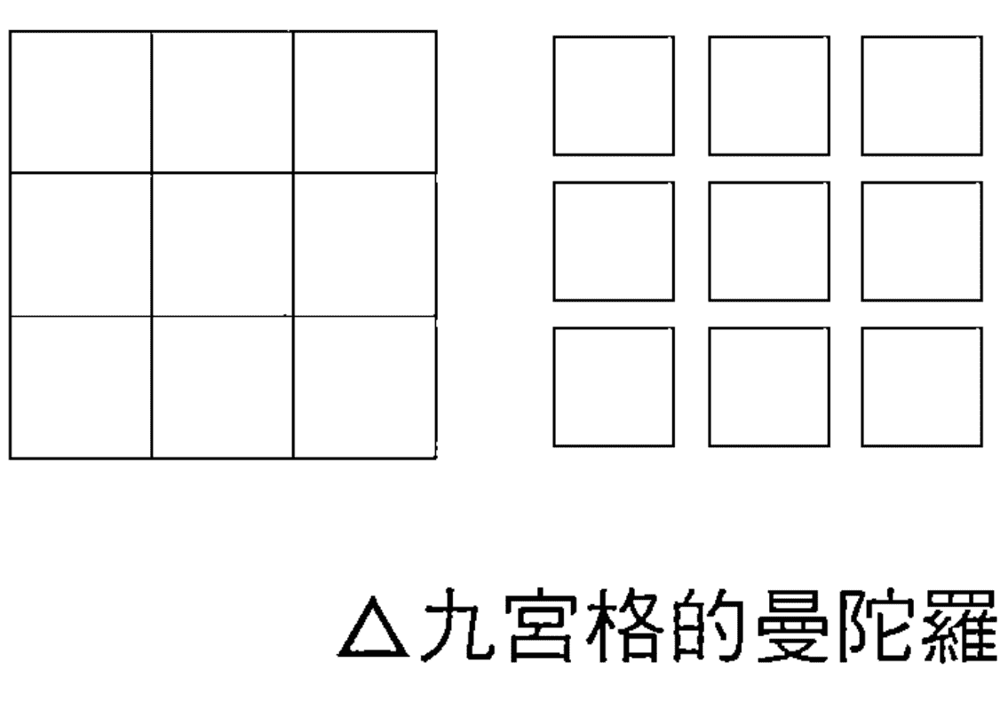

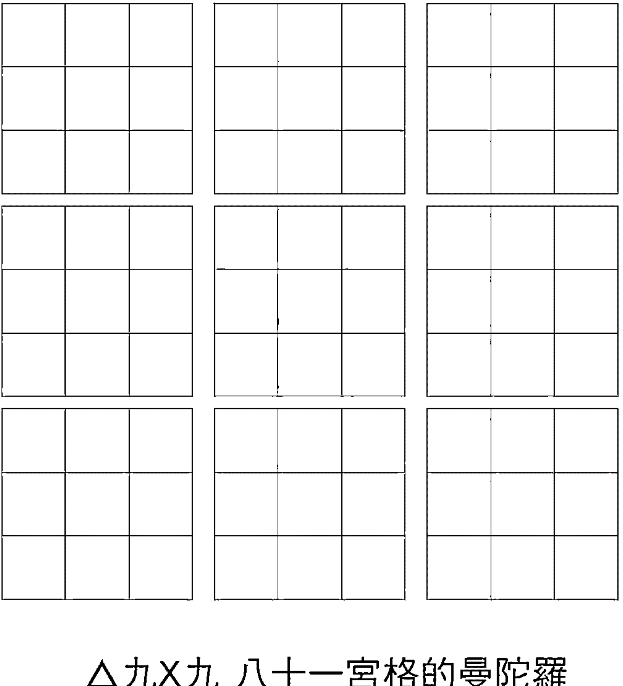

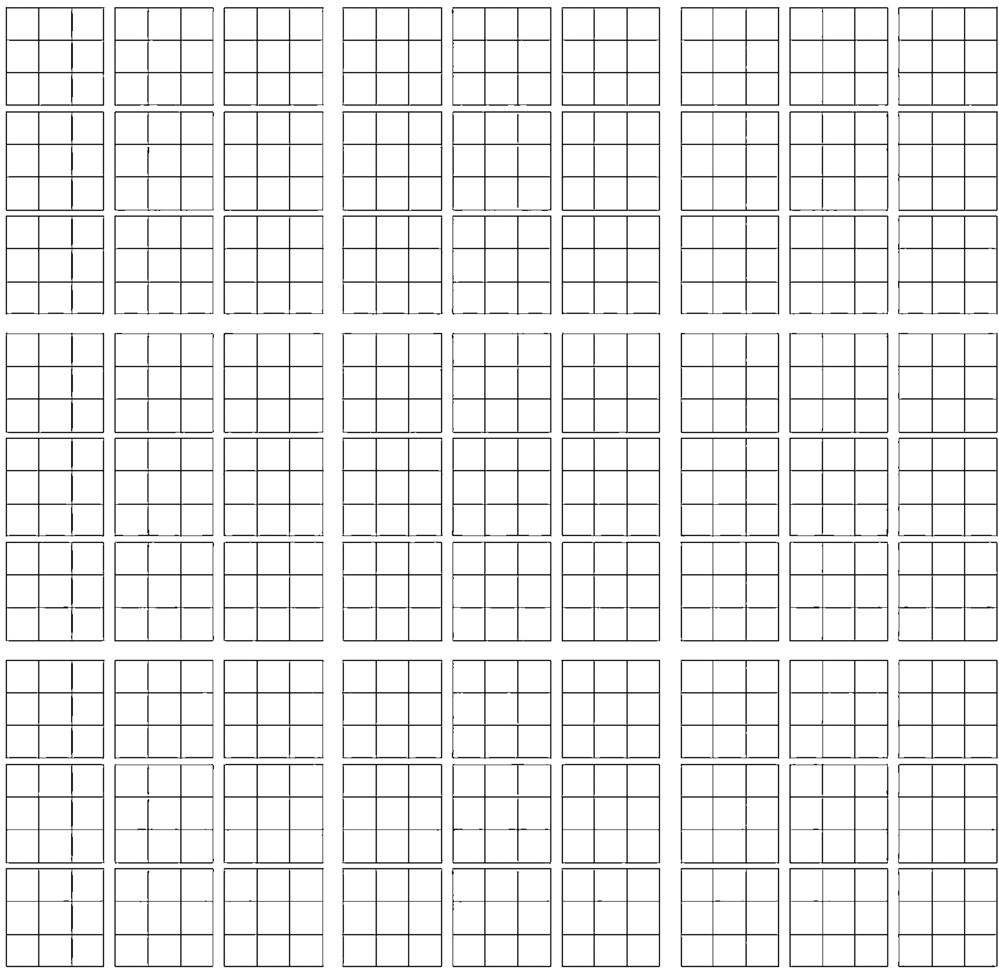

△九X九X九 七百二十九宮格的曼陀羅

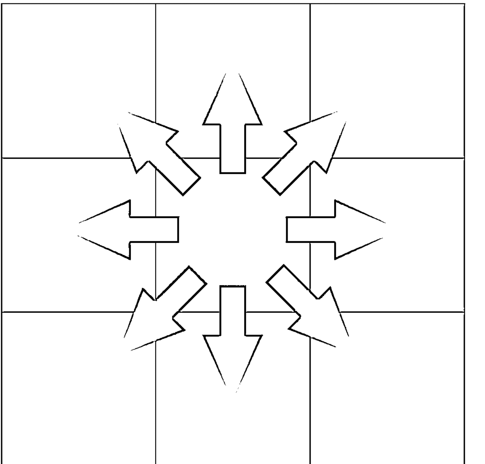

△「放射型排列」的曼陀羅

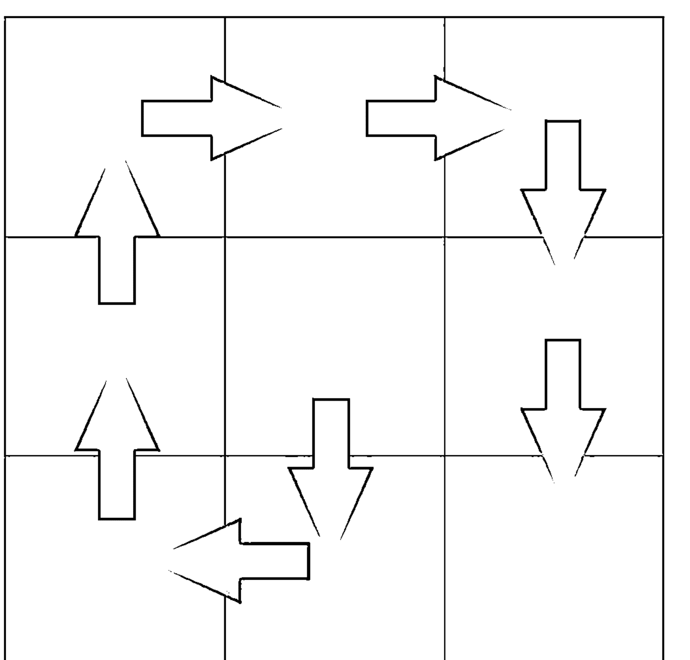

△「順時鐘排列」的曼陀羅（日文「の」字的順序）

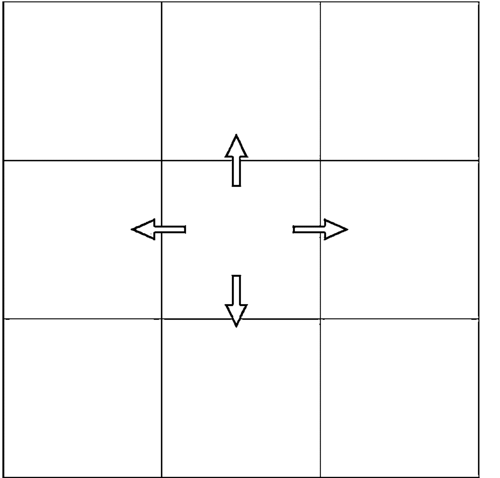

△「十字型排列」的曼陀羅

| 舌（味覺） | 身（觸覺） | 意（意義、涵義） |
| :--- | :--- | :--- |
| 鼻（嗅覺） | | 天（時間概念） |
| 耳（聽覺） | 眼（視覺） | 地（空間概念） |

△「八種思考角度」的曼陀羅

| Who (人) | What (事、物) | When (時) |
| --- | --- | --- |
| Where (地) | 重點 | Why (原因、結果) |
| How (如何進行、什麼方法) | How many或 How much (有形與無形成本) | 個人心得 |

| Who (人) | What (事、物) | When (時) |
| --- | --- | --- |
| Where (地) | 重點 | Why (原因) |
| How (如何進行、什麼方法、How many、How much) | Why (結果) | 個人心得 |

△「5W2H筆記術」的曼陀羅（不規則排列）

①用常見的A4空白紙來書寫，不會受到傳統筆記橫線的干擾，容易讓思考自由發想，也被日本人稱之為「A4思考法」。

> 小提醒：
想要讓自己更好，就要趕快行動去學習。
聰明人願意花錢買時間；為了想省錢就靠自己摸索方法，才是浪費大量時間的主因，會讓達成目標的那一天延後到來。

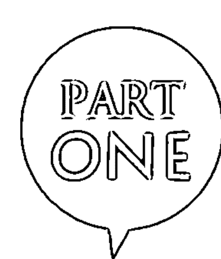

## 什麼是曼陀羅思考法

- 推薦序 全面訓練腦力的實用方法 ……………………………… 2
- 推薦序 發揮潛能的大腦實用軟體 ……………………………… 5
- 推薦序 曼陀羅是人生的解決方案 ……………………………… 8
- 前言 曼陀羅思考法是智慧結晶體 ……………………………… 10
- 前言 在學習曼陀羅之前，曼陀羅思考法的常見問題 ………… 18

# 第一章 曼陀羅思考法的由來

- 名稱源起 ………………………………………………………… 32
- 演變過程 ………………………………………………………… 36

# 第二章 訓練大腦的主要能力

- 聯想力訓練——網絡思考、水平思考、垂直思考 ………… 41

# C O N T E N T S

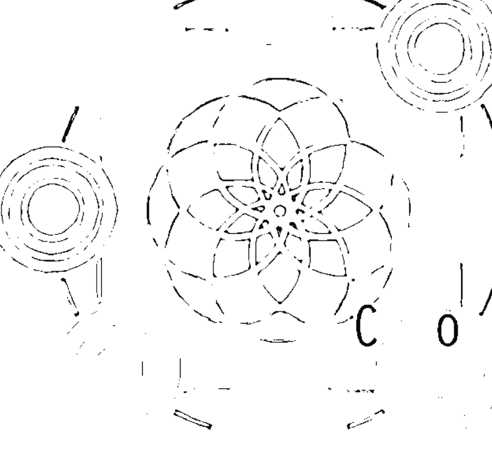

- 邏輯力訓練 …………………………………………………… 44
- 創意力訓練 …………………………………………………… 45
- 圖像化思考能力訓練——視覺化一目了然 …………………… 47

## 第三章 與曼陀羅思考法異曲同工的方法

- 九宮格思考法 ………………………………………………… 52
- 創新發明問題解決理論——九宮格問題分析思考法 ………… 54
- mind map 心智圖 ……………………………………………… 56

## 第四章 基本結構

- 中心——主題、問題 …………………………………………… 59
- 八種思考角度（八種思考方向）——眼、耳、鼻、舌、身、意、天、地 … 60
- 放射型排列 …………………………………………………… 62

# PART TWO

# 曼陀羅思考法——實際運用

## 第五章 運用實例

- 順時鐘排列（日文の字的順序） ………………………………………………… 65
- 十字型排列 ……………………………………………………………………… 67
- 規劃人脈網路 ………………………………………………………………… 74
- 【人脈（工作）分類表】 ……………………………………………………… 77
- 【關鍵人物（能力）分類表】 ………………………………………………… 78
- 【關鍵人物（工作能力）分類表】 …………………………………………… 79
- 【人脈（個性）分類表】 ……………………………………………………… 80
- 【關鍵人物（個性）分類表】 ………………………………………………… 81
- 【未來人脈分類表】 …………………………………………………………… 82

# 第六章 心靈成長的運用——具有藝術療癒的曼陀羅彩繪

- 【人物基本資料表】 ………………………………………………… 83
- 時間管理與生涯規劃 ………………………………………………… 85
- 【生涯規劃（我是誰？）】 …………………………………………… 85
- 【目標設定（一頁奇蹟）】 …………………………………………… 103
- 【行事曆記錄（我在哪裡？）】 ……………………………………… 111
- 創意訓練 ……………………………………………………………… 119
- 【訓練前的準備——了解虛與實】 …………………………………… 119
- 【商品設計】 ………………………………………………………… 134
- 筆記術 ………………………………………………………………… 147
- 思考的提綱 …………………………………………………………… 169
- 窮究事理 ……………………………………………………………… 175

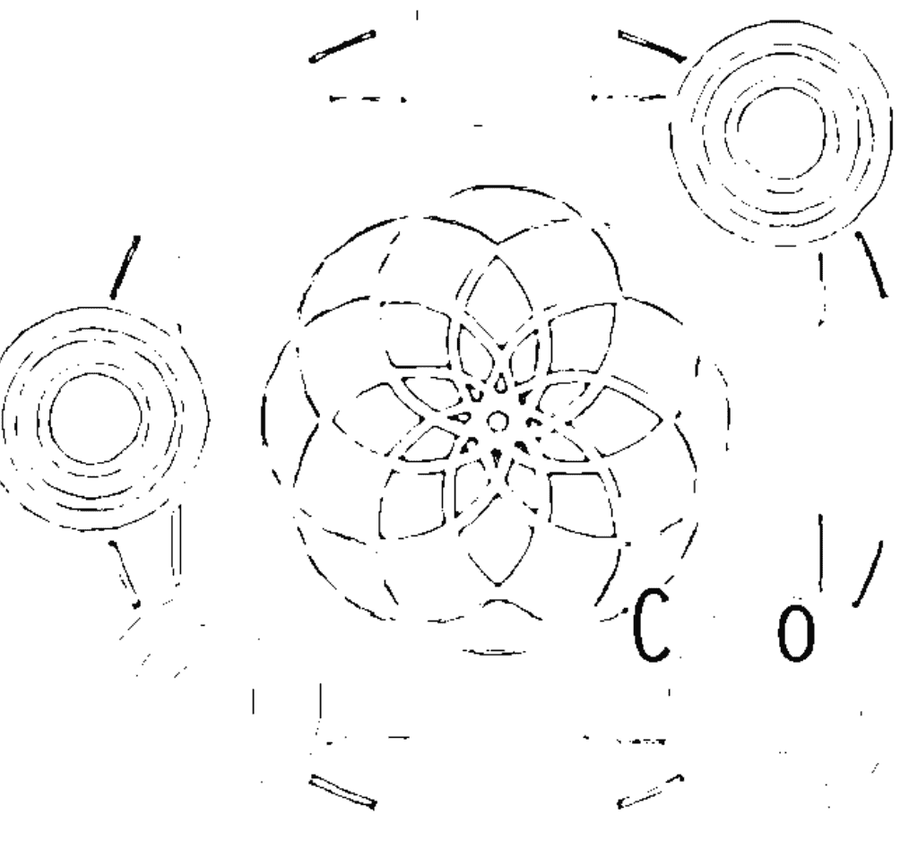

# CONTENTS

## 第七章 曼陀羅的電腦軟體哪裡有？

- 後記 關於學習這件事，常見的幾種問題 ……………………………… 187
- 後記 創意思考及時間管理的實用推薦 ……………………………… 200

【創造奇蹟】曼陀羅九宮格實用小手冊

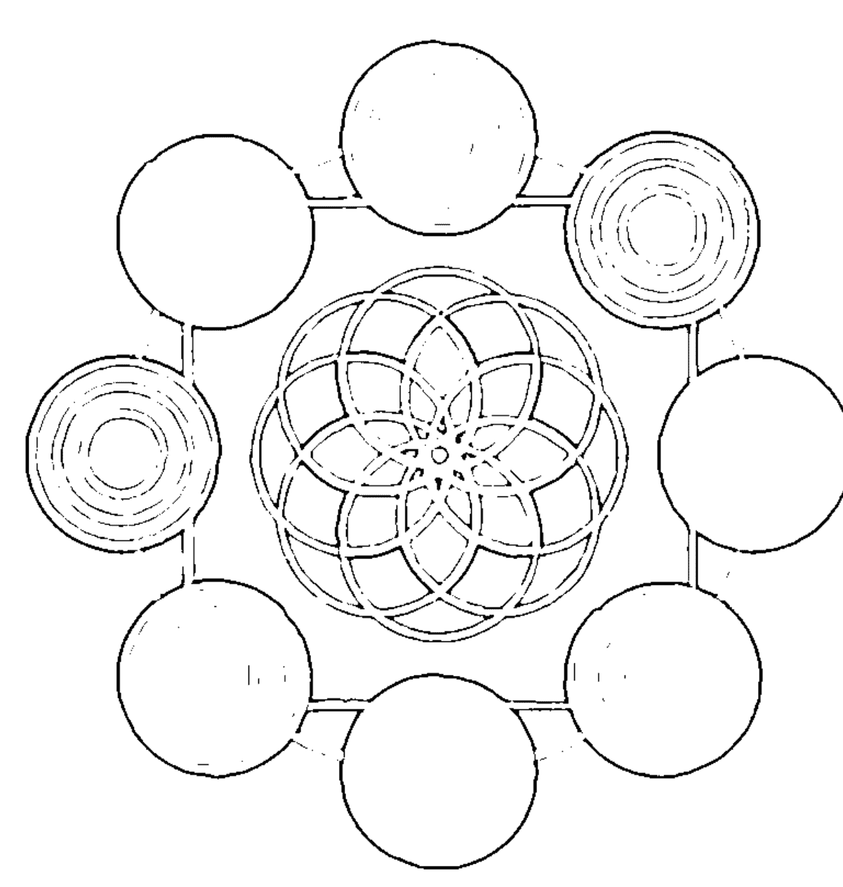

# Part One

## 什麼是曼陀羅思考法

# 第一章 曼陀羅思考法的由來

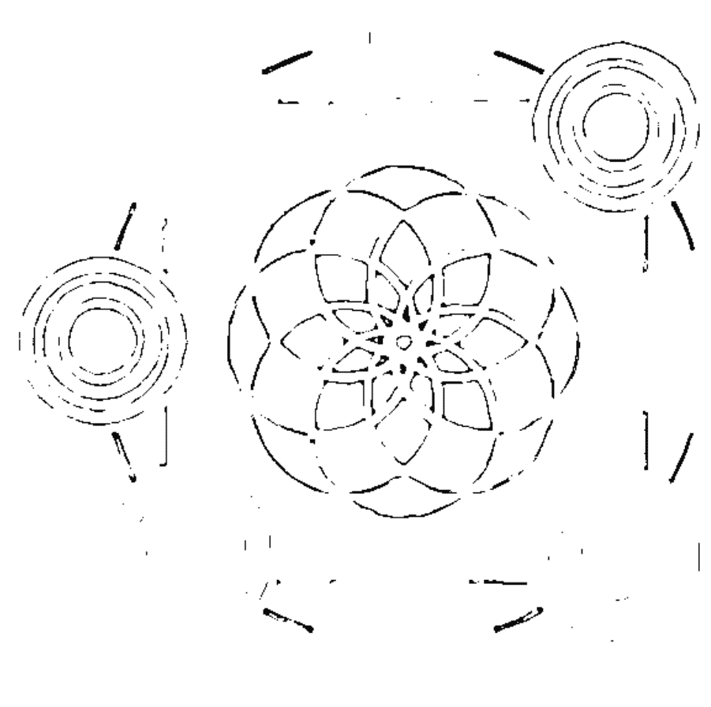

### 名稱源起

Mandala是由manda+la組合而來。Mandala是西元古梵文的音譯，中文翻譯為曼陀羅。日文漢字寫法是曼茶羅，今泉浩晃再將此漢字音譯回英文為Mandal。

manda是本質、真髓、了悟、已成就的事物。

la是得、所有、成就所有。

「Mandala曼陀羅」一詞的意思就是「獲得本質」或「具有本質之物」（註①）。是由約一千五百年前的藏傳佛教（密宗）用於冥想與儀式中，也是西藏佛教中的一種藝術。

佛教曼陀羅的表現形式就是一幅圖像，圓形沒有開始也沒有結束，象徵宇宙是超越時間的。

曼陀羅是佛教真理的一種象徵，曼陀羅用來稱呼人類「現實世界」與「聖方諸佛」融合為一體的場所，也用來稱呼天體大宇宙與人類體內微宇宙相互匯集的藝術極品，多數呈現圓形的世界觀。

目前全世界的曼陀羅圖譜，一共有四、五十種，多數在印度、尼泊爾、西藏廟宇的牆壁上發現，最富盛名的有二種：胎藏界曼陀羅及金剛界曼陀羅，如今均已完整保留在日本長谷寺中，列為國寶級古物。

胎藏界曼陀羅起源於西元七世紀前半段之印度，由大日經衍生出來，代表的是神佛的世界稱之為「理」，核心為大日如來，主要是彰顯智慧的本質，表示真理之神不斷地教導人類。胎藏界曼陀羅是由中央向外擴張，形成上下四重天、左右三重天，故稱四重曼陀羅或三重曼陀羅。

金剛界曼陀羅（金剛九會曼陀羅）起源於西元七世紀後半段之印度，由金剛經衍生出來，代表的是人間的世界，稱之為「智」，核心也是大日如來，主要是昭示眾人之開悟，表示人類為了追求真理，持續不斷地努力，由外向內凝聚、聚焦思考的趨勢十分明顯。

在曼陀羅中白色大日如來代表宇宙絕對的真理，黃色寶生佛代表真理的普遍性，紅色無量光佛代表真理的慈悲性，綠色不空成就佛代表真理的行動性。菩薩是啟發人類智慧的化身，並非要人類一味地頂禮膜拜。整體上設計是中央有一大佛端坐，四周環繞眾多佛像以有次序的、幾何狀方式排列，表達「世間萬物皆有佛性，所以事物都有其存在的道理」。

不透過文字而是透過視覺化的圖像來闡述世界真理，協助進行觀想，觀想曼陀羅圖時可由中心向四面八方擴散，亦可由外側向內以挖掘事物本質的深度及寬度。

密宗透過曼陀羅觀想的過程，加入時間概念形成四次元世界，再加入內心世界就形成五次元世界。曼陀羅將人的五個意識，包括感覺、思考、自我、潛在、無垢組合成金剛。故曼陀羅是「轉識成智」，把知識變成智慧的一種工具。（註②）

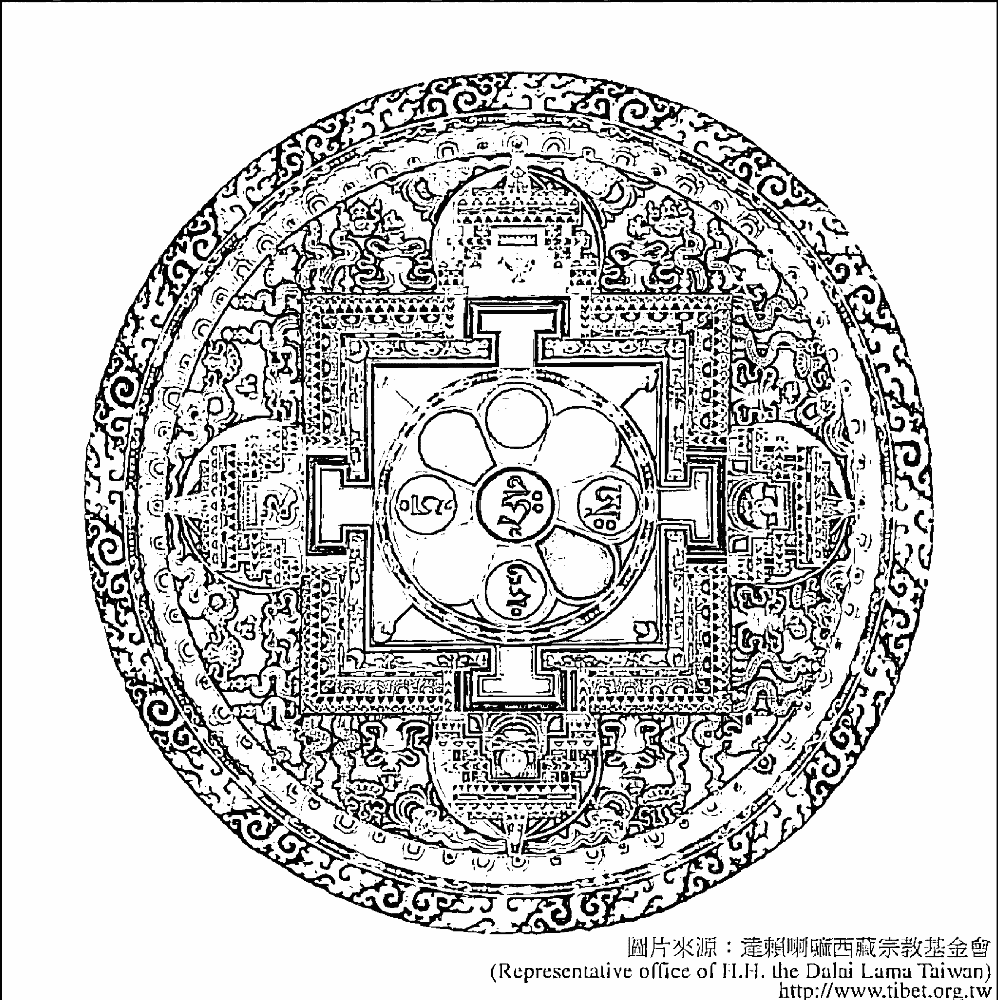

圖片來源：達賴喇嘛西藏宗教基金會 (Representative office of H.H. the Dalai Lama Taiwan) http://www.tibet.org.tw

△「曼陀羅（沙壇）圖」：表現出佛教宇宙觀，如同中國文化的「天圓地方」概念，也呈現方圓兩種形式。

### 西

| 四印會 | 一印會 | 理趣會 |
|---|---|---|
| 供養會 | 成身會 | 降三世會 |
| 微細會 | 三昧耶會 | 降三世三昧耶會 |

### 南

### 北

### 東

### 第一重

#### 四印會

| 佛 | 佛 | 佛 |
|---|---|---|
| 佛 | 佛 | 佛 |
| 佛 | 佛 | 佛 |

#### 一印會

| 佛 | 佛 | 佛 |
|---|---|---|
| 佛 | 佛 | 佛 |
| 佛 | 佛 | 佛 |

#### 理趣會

| 佛 | 佛 | 佛 |
|---|---|---|
| 佛 | 佛 | 佛 |
| 佛 | 佛 | 佛 |

#### 供養會

| 佛 | 佛 | 佛 |
|---|---|---|
| 佛 | 佛 | 佛 |
| 佛 | 佛 | 佛 |

#### 成身會

| 佛 | 佛 | 佛 |
|---|---|---|
| 佛 | 佛 | 佛 |
| 佛 | 佛 | 佛 |

#### 降三世會

| 佛 | 佛 | 佛 |
|---|---|---|
| 佛 | 佛 | 佛 |
| 佛 | 佛 | 佛 |

#### 微細會

| 佛 | 佛 | 佛 |
|---|---|---|
| 佛 | 佛 | 佛 |
| 佛 | 佛 | 佛 |

#### 三昧耶會

| 佛 | 佛 | 佛 |
|---|---|---|
| 佛 | 佛 | 佛 |
| 佛 | 佛 | 佛 |

#### 降三世三昧耶會

| 佛 | 佛 | 佛 |
|---|---|---|
| 佛 | 佛 | 佛 |
| 佛 | 佛 | 佛 |

△金剛界九會曼陀羅：
這裡僅列出兩個層次（兩重）八十一個宮格，實際上在成身會裡又可以細分成好幾重的九宮格，其他的也是如此。（註③）

### 演變過程

佛教密宗傳入日本後，曼陀羅思想也影響日本人的生活，觀想曼陀羅成為一種探求身心狀態與內心世界的工具，精神科醫生把曼陀羅繪畫用於精神病患與一般民眾的心理治療上，日本的正木晃教授以曼陀羅繪畫方式，研發出一系列幾何式的曼陀羅圖形，運用繪畫的結果來進行藝術治療。現在西方也運用曼陀羅彩繪方式來進行心靈治療。（註④）

日本設計顧問今泉浩晃提出mandal-art不只是一種啟動人類思考的工具，提出mandal本身也是一種大腦思維，運用曼陀羅無限延伸的思考特性、中國的九宮格形式、十字型曼陀羅形式，研發出特有的「mandal-art曼陀羅筆記學」用以訓練我們的腦力。（註⑤）

《曼陀羅思考法》是一本工具書、大腦的應用軟體，不是佛教專書，故本書所講述的內容為胡雅茹將曼陀羅思考法的心法運用在工作、學習、思考、企劃規劃、靜坐的經驗，重新發展出的一套運用方式（工法），希望能藉由曼陀羅思考法啟發大家開闊自己的思考與心境，能達成「快樂學習、聰明運用、快速生活」的目的。

| 正業：直接表達內心的行為 | 正命：以服務他人為天職，勸戒他人遵循正道、奉行眾善 | 正精進：勤勉修習佛法與身心靈解脫之道 |
| --- | --- | --- |
| 正悟：口語皆是法教之事 | 八正道 | 正念：專注當下，集中意志於日常生活之中的身、語、意 |
| 正思維：利他的動機，而不是自私 | 正見：見解與法教一致 | 正定：透過禪修佛陀的法教開展「心境」 |

△佛教中透過八正道達成悟道的經驗

| 忌妒 | 傲慢 | 侵略性 |
| --- | --- | --- |
| 恐懼 | 無明 | 冷酷無情 |
| 瞋恨 | 貪婪 | 官僚習氣 |

△佛教提到九種苦

①Mandala音譯，藏密中也稱之為「金廓」、「曼札」，本義是「壇」、「壇場」、「壇城」、「中圍」，指密宗本尊道場的圖畫或是佛的宮殿，含義十分豐富，有「圓輪」、「發生」、「攪搖」、「精粹」、「聚集」等不同釋義。也代表「神聖圓輪」、「圓輪眾德」、「圓輪具足」、「發生諸佛」，借喻佛大徹大悟的境界。只要在曼陀羅中間進行法事，其中就能聚集十方三世聖於一處。

「曼陀羅」這個詞，可以是指以下內容：

- 是古印度供奉神的地方，俗稱壇城。
- 是描述諸佛悟道的圖，俗稱唐卡。
- 是古印度城邦都市設計圖。
- 是個人實踐修行的圖。

> 小提醒：
「知道」不能讓你更好，只有「做到」才會讓你更好。

- 是眾生皈依、供奉、深入教化的地方。
- 是佛與人溝通的橋樑，是「現實世界」與「聖方諸佛」一體化的場所。
- 是從大宇宙到人體小宇宙，具體而微的圖。
- 是人世間所蘊含的真理智慧。

②曼陀羅表現出時輪金剛的意義，時輪金剛是梵語Kalachakra，字義為「時間之輪」，Kawa是時間，指過去、現在、未來所有事件的流動，chakra是時間，不只是時間的循環，而是一種悟道的大樂經驗。曼陀羅藝術有以彩沙進行宗教儀式時所呈現的「沙壇」（也稱之為曼陀羅），有以刺繡呈現的「唐卡」。西藏喇嘛們製作曼陀羅時，必須靜心來用細管一點一滴地製作，想知道沙壇曼陀羅長什麼樣子？可以閱讀《唐卡中的曼陀羅》（吉布·楊典著，達觀出版）。

③金剛界九會曼陀羅實際上表現出有七重以上，這裡僅舉例到第一重，實際圖形請見《唐卡中的曼陀羅》（吉布·楊典著，達觀出版）。

④《曼陀羅心靈彩繪》（正木晃著，非馬出版社）、《神奇的曼陀羅：心靈舒壓彩繪書》（瑪莎·芭特菲德著，華泰文化出版）。

⑤《曼陀羅筆記學：提高創造力的工具》、《個人生涯設計：曼陀羅思考訓練實用手冊》（今泉浩晃著，世茂出版）。

# 第二章 訓練大腦的主要能力

我們的大腦簡易來說可以分成左右腦，左右腦主要負責的功能不相同。

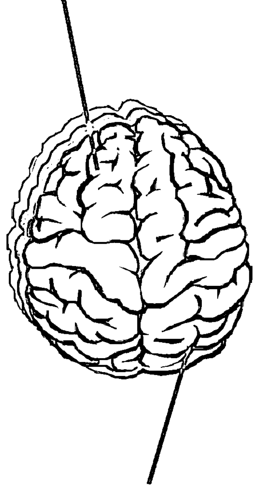

### 左腦

語言的、邏輯性的思考模式
分析、理論、文字、數字、
邏輯等理性活動

### 右腦

想像、直覺、創意、情緒、
感覺、音樂、空間、圖像、
顏色、韻律等感性活動

### 聯想力訓練——網絡思考、水平思考、垂直思考

「曼陀羅思考法可以訓練大腦什麼能力呢？」這個問題就等於是「使用曼陀羅思考法需要哪些大腦的基本能力呢？」

曼陀羅思考法是一種學習與思考的工具、技巧，運用及使用的過程就是訓練大腦的過程，有些人或許在剛開始會覺得思緒有點障礙，這是因為過去很少鍛鍊這些腦力，只要常常常用曼陀羅思考法，自然就會讓這些腦力愈來愈好。以下分節舉例說明。

垂直思考法最初是由希臘時期的哲學家亞里斯多德所提出，思考對象之間的關係必須是因果關係。（註①）

水平思考法則是由愛德華·迪波諾所提出，為了跟強調前因後果的思考模式區分而定名。關於人類的思考方式，迪波諾將之分為兩階段：第一階段稱為「知覺篩選」（perceptual choice），在腦中將資訊分門別類，把感知到的事物互相結合，產生各種概念與想法；再進入第二階段，運用邏輯有效地處理，驗證想法的正確性與可能性。（註②）

一旦決定採取何種方式看事情，垂直思考就派上用場，但垂直思考不能決定我們看事情的方式。因此，水平思考不是垂直思考的替代品，而是互補品。被日本喻為女性大前研一的勝間和代，所提出的七種商業思考力中，水平思考便是其中之一。（註③）

一個曼陀羅主題，要想出八種答案，每個答案都要跟中心主題有關連，這就運用了水平思考。（想了解曼陀羅如何呈現水平思考與垂直思考，可參考《心智圖超簡單》第52頁。或本書第五章運用實例——規劃人脈網路。）

△舉例：Thomas Armstrong提出的七種學習方式。

| 空間：影響、圖像 | 音樂：聲音、韻律 | 人際：與人互動、溝通 |
| 身體與運動感覺：感官、觸摸 | 七種學習方式（Thomas Armstrong） | 內心：內心感受 |
| 邏輯與數學：邏輯、類別、關係 | 語言：閱讀、寫作、講故事 | |

△「水平思考」舉例：Thomas Armstrong提出的七種學習方式（第一層次）

以上述舉例說明，第一層次我們先進行水平思考，將跟中心主題相關的八個答案填入曼陀羅九宮格中，接著進入第二層次的思考，將第一層次八個答案中的其中一項抽取出來，成為第二層次曼陀羅九宮格的中心主題，另外再填入八個答案，發展成一個新的曼陀羅，這樣的過程就屬於垂直思考了。
結合第一層次曼陀羅的水平思考，以及從第一層次進入第二層次的垂直思考，兩者相加組合成「立體狀的網絡思考」。
所以，透過使用2D的曼陀羅，能表現出大腦的3D思考。

| 我想要去做嗎？ | 我害怕去做嗎？ | 過程愉不愉快？ |
| :--- | :--- | :--- |
| 需要他人協助嗎？ | **內心：內心感受** | 會不會有人反對？ |
| 現在能做到嗎？ | 符合自己的道德觀？ | 做完之後我會怎麼樣？ |

△「垂直思考」舉例：
Thomas Armstrong提出的七種學習方式（第二層次）

#### ◎ 邏輯力訓練

曼陀羅並不一定非得是呈現放射狀的，下圖以「習慣」舉例，呈現另一種表現方式，分成三個類別：好習慣、不好不壞的習慣、壞習慣。每個習慣列出最重要的三項。這種表現形式也是一種水平狀與垂直狀的思考方式。

「習慣」這個大主題雖沒有明白寫出，但已隱含在其中，分出第一層次的好習慣、不好不壞的習慣、壞習慣，這是水平思考。

再由好習慣分出第二層次的笑臉迎人、事先規劃、尊重別人。「習慣」→「好習慣」→「笑臉迎人」，這是垂直思考。

| 好習慣 | 不好不壞的習慣 | 壞習慣 |
| :--- | :--- | :--- |
| 笑臉迎人 | 回家後先洗腳 | 負面思考 |
| 事先規劃 | 看書喜歡先看最後一頁版權頁 | 自卑心理 |
| 尊重別人的決定 | 洗澡時順便洗浴室 | 個性急躁 |

△「邏輯力訓練」舉例：「習慣」

好習慣的內容很多，如何挑選出最重要的三項？仰賴我們的邏輯分析判斷能力。曼陀羅有空間的限制，不像心智圖表現形式一樣幾乎毫無限制，所以常做曼陀羅思考法，可以訓練我們的邏輯力。

#### ◎ 創意力訓練

在腦中光想，常常會面臨思考卡住的現象，藉由書寫（視覺化）讓自己看到思考的軌跡，更能激發創意。

九宮格的曼陀羅周圍有八個格子，無形中強制我們要填滿所有的格子，刺激大腦努力去思索。（詳細訓練方式請見第五章運用實例——創意訓練。）

△舉例：激發創意腦的八種思考角度（第46頁上圖），以及由這八種角度得到下圖的八種答案（第46頁下圖）。

| 聯想 | 反向思考 | 問問題 |
| :---: | :---: | :---: |
| 轉換 | 激發創意腦八種角度 | 圖像思考 |
| 拆開 | 組合 | 情感 |

△「創造力訓練」舉例：激發創意腦的八種思考角度

| 直升機（模仿蜻蜓） | 下雨天傘便宜晴天傘貴 | 用雜誌蓋泡麵 |
| :---: | :---: | :---: |
| 用水蛭吸出病人的血 | 激發創意腦八種角度 | 畫畫/服裝設計 |
| 連載小說（分批給讀者） | 隨身聽（耳機+錄音機） | 雙B汽車代表身分 |

△「創造力訓練」舉例：由上圖八種思考角度所得的答案

#### ◎ 圖像化思考能力訓練——視覺化一目了然

曼陀羅結構化的方式，更能看出思考的邏輯。以下兩個舉例是將書的主要概念整理後，所製作的筆記。

| 4.變通隨順 | 5.滿足於少 | 6.溫柔敦厚 |
| 3.絕不放棄 | 內心快樂七訣 | 7.保持正念 |
| 2.緩慢從事 | 1.保持從容 | 個人心得 想再多都沒有用，做就對了 |

△「圖像化思考能力訓練」舉例：
內心快樂七訣（註④）

| 4.雙贏思維 培養大家都能獲益的態度 | 5.知彼解己 誠懇傾聽別人說話 | 6.統合綜效 跟別人一起努力，完成更大成果 |
| 3.要事第一 設定優先順序，先做最重要的事 | 年輕人的生活藍圖 | 7.不斷更新 定期讓自己日新又新 |
| 2.以終為始 界定你生活中的任務與目標 | 1.主動積極 為你的生活負責 | 個人心得 愈早思考人生要怎麼走，才能愈早達到目標 |

△「圖像化思考能力訓練」舉例：
年輕人的生活藍圖（註⑤）

有沒有發現一件很妙的事情？透過圖像化的呈現，內容看起來簡單明白易懂。
以上這些大腦能力又可以對應跟實際落到哪些生活能力中？這個部分在《心智圖超簡單》書中第42頁有完整的說明，於此不再贅述。
進入古代西方的大學，必須上知天文、下知地理廣泛地學習。現在碩博士多數僅精於自己那一小塊領域，除此之外的都馬馬虎虎，嚴格來說不能稱之為博士。
在此引述一篇小故事為本章做總結，期許大家透過曼陀羅思考法都能鍛鍊腦力、發揮能力。

一個教授講管理學基礎課，他說你們雖然都是研究生，但很多人本質上還是農民！大家驚愕，竊竊私語。
他說你們為什麼就讀研究院所課程？很多人是不是想找個好工作，找好工作為了什麼？為了找個好老婆，吃喝住行都不錯，然後生孩子，為了孩子的前途更光明，這些不就是農民的樸素想法嗎？
那個農民父母不希望自己的子女比自己更好？你們很多人是不是農民思想？什麼時候你能突破這種思維模式，你就超脫了。
當這個社會看重文憑的時候，假文憑就成為一種專業，即使是很有能力的人，也不得不弄個文憑，給自己臉上貼點金。

知識在一個人的架構是表象的東西，就相當於有些人可以在答卷上回答如何管理企業、如何解決棘手的問題、如何當好市長等等。
但是在現實面前，他們卻顯得毫無頭緒、不知所措，他們總是問為什麼會是這種情況，應該是哪種情況等等。他們的知識只是知識，而不能演化成能力，更不能通過能力來發掘他們的潛力。
現在很多企業都在研究能力模型，從能力的角度來觀察應聘者能否勝任崗位。當然，高能力不能和高績效直接比較，能力的發揮也是在一定的機制、環境、工作內容與職責之內的，沒有這些平台和環境，再高的能力也只能被塵封。

> 小提醒：
學習就是學著找尋樂趣。
郭台銘說：魔鬼藏在細節裡，我說：能力藏在運用知識裡。

①垂直思考：愛德華・迪波諾為了跟水平思考做區分而定名。台灣經理人雜誌將之翻譯為「邏輯思考」，因果關係是邏輯思考的一種。也有人稱之為「直線思考」。

②水平思考的用途：

- 想出各種可能的行動方案，並選出最適當的方案。
- 催生新產品、新（行銷）概念、新組織（概念）。
- 簡化那些逐漸變得很麻煩的想法（運用分割法）。
- 每隔一段時間，重新評估一些原本很適當的作法，例如降低成本、提出改善時。
- 提出假設、解決問題。
- 蒐集資訊。尤其是需要產生不同的角度和看法時。
- 用不同方法看數據資料，從中獲得最大量的洞見。
- 創意地回應別人提出的計畫、政策、想法。
- 預防尖銳的意見不合或兩極化，以及僵硬概念的產生。
- 斟酌各種決策的可能結果。

③勝間和代著作有《收入增加十倍的時間投資法》、《收入增加十倍的學習法》、《錢存銀行窮一輩子》、《效率增加十倍的「新・知識生產術」》，他在《培養商業腦的7種組織力》中寫到，「有效率地蒐集有限的資訊，巧妙地進行組合，在一定時間內導出與後續行動相關連的解答，這就是商業思考的基本。」在他提出的7種商業思考力中，水平思考便是其中之一。

④資料來源：《慢一步快樂法則：開發內心力量的烏龜七訣》（艾柳薩・史瓦茲、隆納德・史威普著，九周出版）。

⑤資料來源：《與青春有約：柯維給年輕人的生活藍圖》（西恩・柯維著，天下文化出版）。

51 第二章 訓練大腦的主要能力

## 第三章 與曼陀羅思考法異曲同工的方法

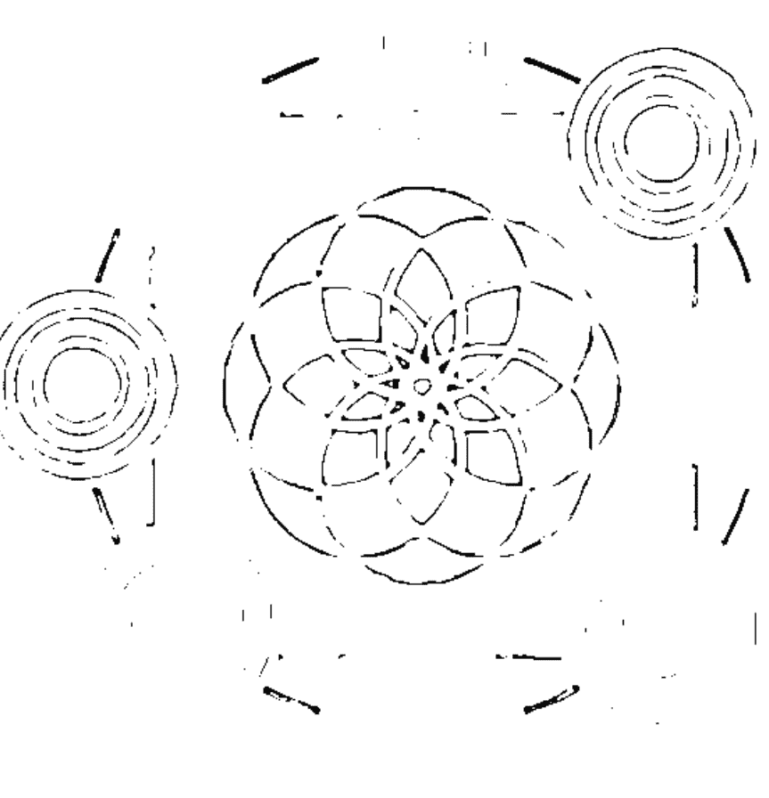

### 九宮格思考法

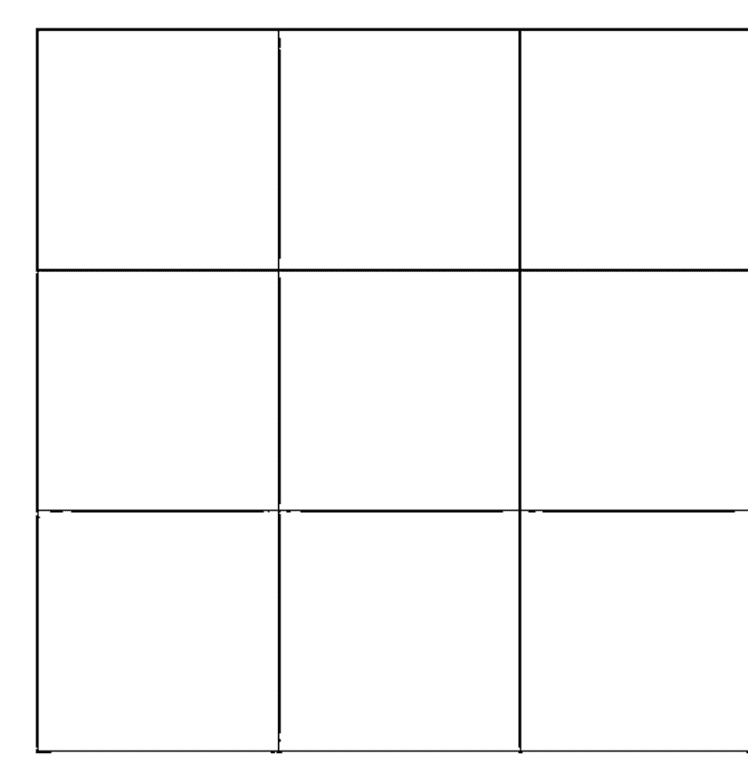

以上三種畫法都可以。

在構圖中最基礎的方法是九宮格法（攝影技術上稱為黃金分割法），就是把畫面平均分成九塊，在中心塊上四個角的點，將主體放在「九宮格」交叉點的位置上。這種構圖格式較為符合人們的視覺習慣，使主體自然成為視覺中心，具有突出主體，並使畫面趨向均衡的特點。

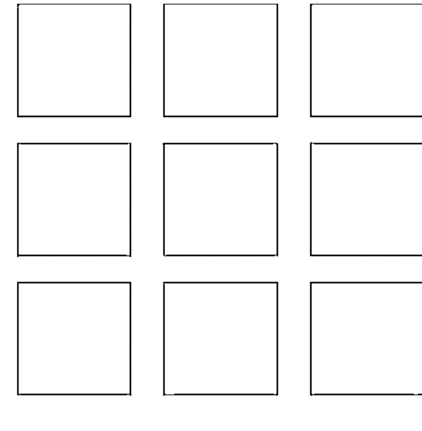

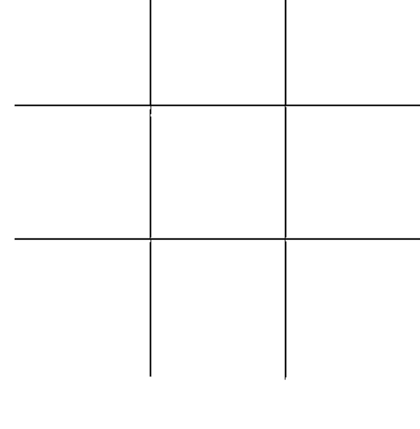

「河圖」、「洛書」是中國「五術」（山、醫、命、卜、相）的根源。其中已經呈現了九宮格的形式。

中國人書法的練習本中的「九宮格」到最近這幾年流行的腦力訓練「數獨」也是九宮格的形式，可見簡單的九宮格可以變幻出各式各樣的運用。於是也有人將「曼陀羅思考法」稱之為「九宮格思考法」。實際上曼陀羅思考法可不只有九個宮格而已喔！

在西式的創意訓練法裡面，也有九宮格這個名稱，針對想要達到的目標或是要解決的問題在九宮格的正中間，周圍的八種思考角度分別是組合、拆開、轉換、聯想、反向思考、問問題、圖像思考、情感考量，用各種角度看事情，藉此激發大腦的創意。

| 聯想 | 反向思考 | 問問題 |
| :---: | :---: | :---: |
| 轉換 | 激發創意腦八種角度 | 圖像思考 |
| 拆開 | 組合 | 情感 |

△「九宮格思考法」舉例：激發創意腦的八種思考角度

### 創新發明問題解決理論——九宮格問題分析思考法

創新發明問題解決理論（Theory of Inventive Problem Solving）。在一九四六年，由蘇俄人Mr. Genrich Altshuller（一九二六—一九九八）發想出來。其中就有「九宮格問題分析思考法」。這九個格子就是九種關係，分別是「系統、子系統、超系統」，乘上「過去、現在、未來」。（請參考下頁圖表說明。）

藉由對現在的物件一一分析，然後照此分析的邏輯去想像未來可以發展成什麼樣子，是一種創意思考的方式。

舉例來說，過去保溫飲水是使用保溫瓶，保溫瓶內部成分是水銀、玻璃，外部成分是塑膠，不用插電。現在保溫飲水則是使用飲水機，內部成分是不鏽鋼、橡膠墊，外部成分是塑膠，需要插電。想像未來的飲水設備是直接水龍頭打開來就有恆溫的熱水供應直接喝，內部成分是不鏽鋼水管，外部成分是保暖纖維包覆，不用插電。

我們可以把X軸看成是空間的概念，Y軸看成是時間的概念。九宮格問題分析思考法跟心智圖最大的差異性就是可以表現出時間和空間兩種概念的組合。

| | 子系統 (約等於內部概念) | 系統 (約等於本體概念) | 超系統 (約等於外部概念) |
|---|---|---|---|
| 過去 | | | |
| 現在 | | | |
| 未來 | | | |

△「創新發明問題解決理論」中的「九宮格問題分析思考法」：Mr. Genrich Altshuller所提出

| | 子系統 | 系統 | 超系統 |
|---|---|---|---|
| 過去 | 水銀 玻璃 | 保溫瓶 | 塑膠 |
| 現在 | 不鏽鋼 橡膠墊 | 飲水機 | 塑膠 |
| 未來 | 不鏽鋼水管 | 水龍頭 | 保暖纖維 |

△「九宮格問題分析思考法」舉例：保溫飲水的設備

### mind map 心智圖

之前我曾在《心智圖超簡單》書中簡略地介紹曼陀羅，我個人一直把曼陀羅稱之為東方的心智圖。心智圖稱之為西方的曼陀羅。

mind map 心智圖的第一層次等於是第一層（第一重）的曼陀羅，都是運用水準思考法。差異點在於心智圖並不像曼陀羅，受限於八個格子的限制，而曼陀羅不像心智圖那麼隨性，可以無限增加。（註①）

同一層的曼陀羅最多八個格子，製作曼陀羅的過程等於是在刺激大腦的聯想力、創造力。看似不自由，卻能鍛鍊大腦的邏輯力，協助我們盡可能地精簡，以呈現簡單明瞭的內容。

在曼陀羅思考法的使用上不需要侷限於表現形式，只要掌握曼陀羅概念，自由發揮出各式各樣的曼陀羅即可。

而以保溫飲水的設備舉例，mind map 心智圖得列出「系統、子系統、超系統」，乘上「過去、現在、未來」，繪製成下頁的圖，才能表現出心智圖完整的概念。

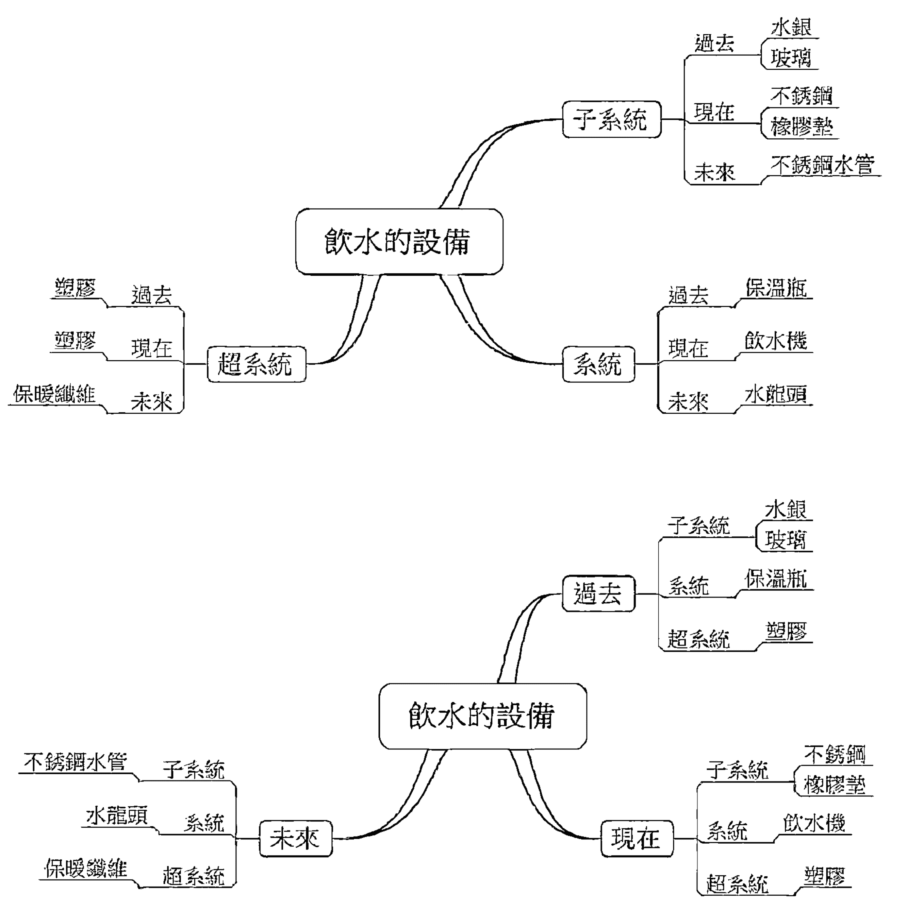

△「mind map心智圖」舉例：保溫飲水的設備

> 小提醒：
21世紀中，文盲並非不識字的人，而是不能再學習的人。
學習＝學＋習作，要成為終身學習者，而不是職業學生。

①晨星出版社出版一系列相關書籍：《心智圖超簡單》（胡雅茹著）、《心智圖筆記術》（威廉・羅得著）、《心智圖練習簿》（片岡俊行著）。

## 第四章 基本結構

### 中心——主題、問題

製作曼陀羅跟心智圖一樣，最重要的一件事情就是設定對的主題、對的問題，因為問對問題才能找到對的答案。別忘了，曼陀羅也是一種圖像化的思考模式，透過圖像化可以讓我們對於主題所延伸出來的內容一目了然與方便記憶。（註①）

「觀」是曼陀羅思考法的基礎，看著你面前的曼陀羅主題，將產生的想法逐一寫下來，如果出現過去沒有想到的念頭，那就表示你已經啟動了大腦思考，不再只是丟出隨著過去的習慣、習性而做出直覺性、反射性的念頭。

美國肯塔基大學把大學生分成看電視、睡覺、靜坐三組，再讓他們接受測驗，結果靜坐組的成績比其他兩組高出10％。指出靜坐能直接影響腦功能，延長注意力，讓大腦更敏銳及提高記憶力。靜靜地看著主題，進行觀想，只要你夠專注也能達到靜坐的效果。（註②）

#### ◎ 八種思考角度（八種思考方向）
眼、耳、鼻、舌、身、意、天、地

這裡提供一個佛教觀點，這八種角度已經涵蓋觀察世間萬物所有的切入角度了。佛教指出人透過五種感官來認識世界，基本的五種角度是眼（視覺）、耳（聽覺）、鼻（嗅覺）、舌（味覺）、身（觸覺）。

另外三個更深入思考的角度，我個人將之解釋成意（意義、涵義）、天（時間概念）、地（空間概念）。

八這個數字也符合大腦短期記憶寬度 7 ± 2。（註③）

> △舉例：看到「臭臭的」讓你想到什麼？透過八種思考角度，將想到的相關事物填入。

每個人所想出來的答案都不相同，因為每個人的背景經驗、邏輯觀念、聯想能力皆不同，例如 A 可能在嗅覺部分會想到廁所，B 可能在時間概念會想到廁所，這是沒有標準答案的。要求標準答案是一種封閉式的思考，在曼陀羅思考法中，思考愈開放愈好。（註④）

| 舌（味覺）：
臭豆腐 | 身（觸覺）：
沒洗澡 | 意（意義、涵義）：
老闆的臉 |
| --- | --- | --- |
| 鼻（嗅覺）：
榴槤 | 臭臭的 | 天（時間概念）：
夏天的垃圾堆 |
| 耳（聽覺）：
垃圾車 | 眼（視覺）：
糞便 | 地（空間概念）：
廁所 |

△「八種思考角度」舉例：看到「臭臭的」讓你想到什麼？

### 放射型排列

放射式填寫的曼陀羅可以隨意填上任一空格，不強調要依據「眼、耳、鼻、舌、身、意、天、地」的八種思考方向的固定位置來填寫。先想到哪一個答案都沒有關係，是一種發散式思考、是一種水平思考。

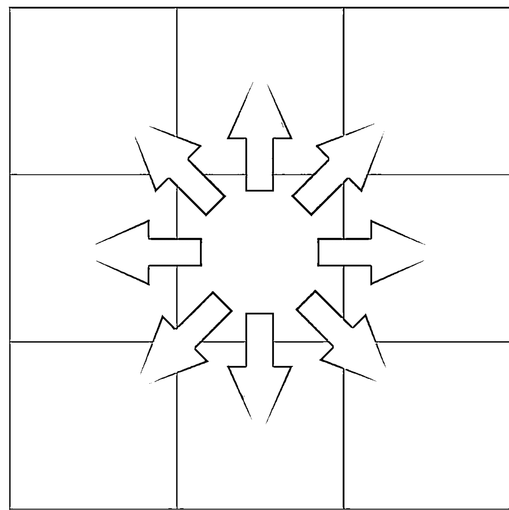

從天空這個曼陀羅來看，我們發現答案可以分成第一類，抽象概念類：夏天、自由、藍色、休閒。第二類，大自然類：鳥、雲、太陽、空氣。會發現思考的方向比較受到過去經驗的侷限，若讀者希望能激發自己的聯想力、想像力、創造力的話，建議多用眼、耳、鼻、舌、身、意、天、地這八種思考方向來刺激自己增加多種思考角度。

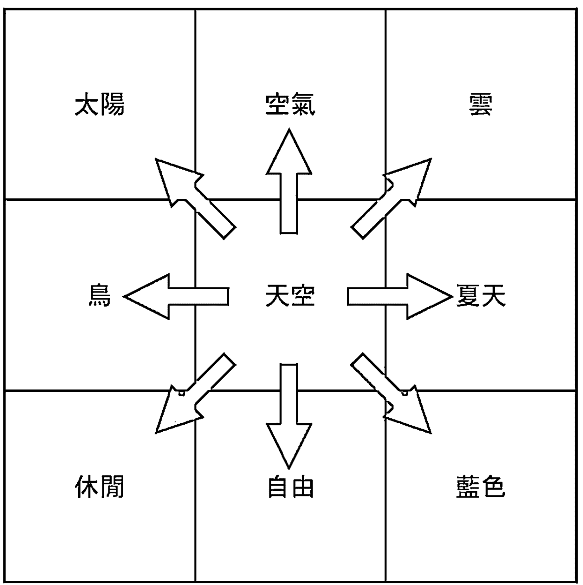

△「放射型排列」舉例：看到「天空」你會想到什麼？

從沙漠、太陽、炎熱、口渴、綠洲、水，你是不是發現了雖然這些答案都跟沙漠有直接關係，但是答案彼此之間似乎也是一種垂直思考的關係。
我們的思考很難說要完完全全的水平思考或是完完全全的垂直思考，因為人的一個觀念是由過去許多事件的相同點或是相異點所組合而成的。

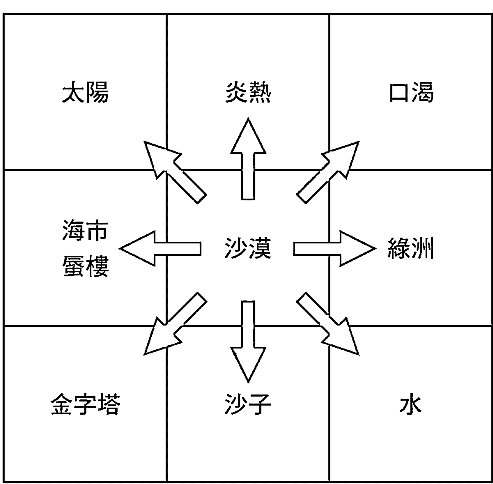

△「放射型排列」舉例：
看到「沙漠」你會想到什麼？

### 順時鐘排列（日文の字的順序）

這個順序是由今泉浩晃所提出，我發現透過這樣的填寫順序可以追蹤我們的思考意念。我們能透過順時鐘方向的填寫，進行垂直思考。

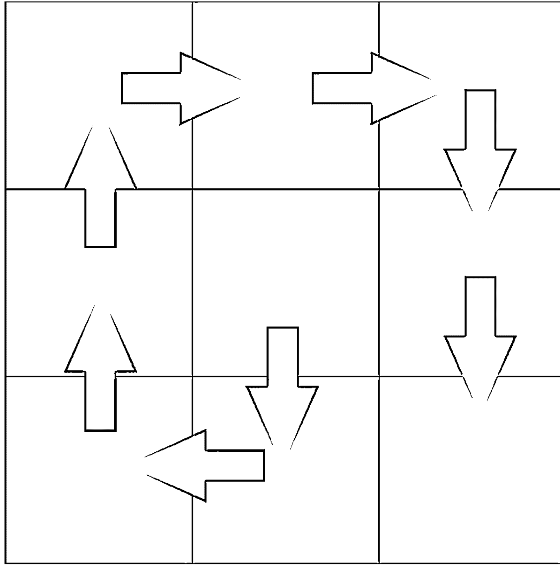

△ 舉例：「欣賞台北花博」的行動步驟，定參觀日期時間→約好同伴→查乘車路線→決定參觀路線→查氣象→準備外出用品→準備當天衣服→七點新生區集合。在填寫過程中，必須精簡成八個行動步驟，可以訓練我們整理歸納的能力。

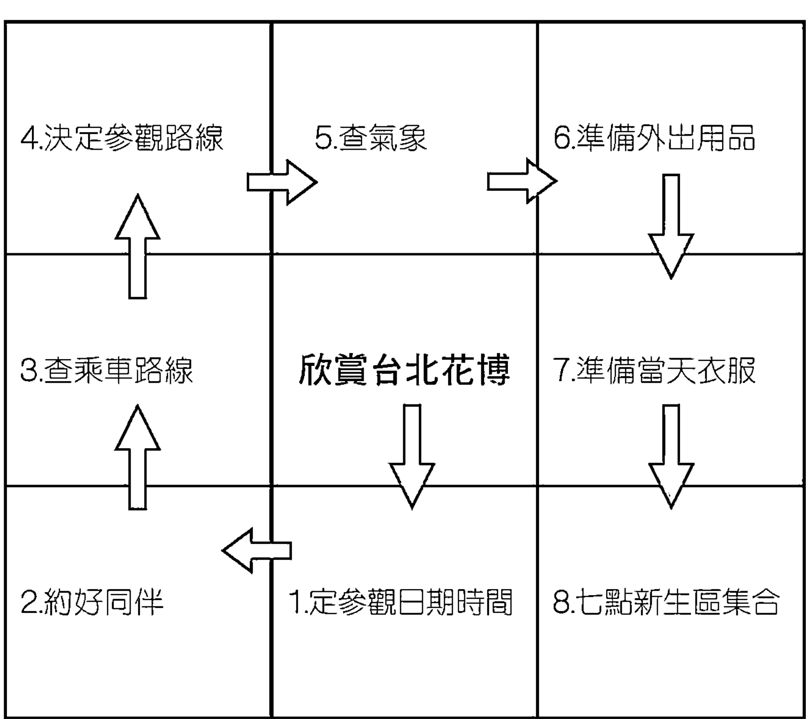

△ 「順時鐘排列」舉例：
「欣賞台北花博」的行動步驟

### 十字型排列

| | 事／物What（WA） 從下列角度思考： 事物、對象、流程 行動、行為 目標、遠景 | |
|---|---|---|
| 地Where（WR） 從下列角度思考： 地點、場所、人脈 環境、結構 構造、狀況 | 人Who （WO） | 時When（WN） 從下列角度思考： 時機、時期 期間、週期 順序、機會 |
| | 為何Why（WY） 從下列角度思考： 理由、理念、定義 原則、原理、術語 本質、意義 | |

△「十字型排列」的曼陀羅

十字型排列的曼陀羅是由今泉浩晃所提出的方式。我們還可以進一步將十字部分格子填上要達成的四個目標，在四周角落的格子填上達成目標的策略或方法，這就是八段論法。明白大腦的運作模式之後，下一章我們就要開始運用曼陀羅這項思考工具來鍛鍊我們的腦力了。

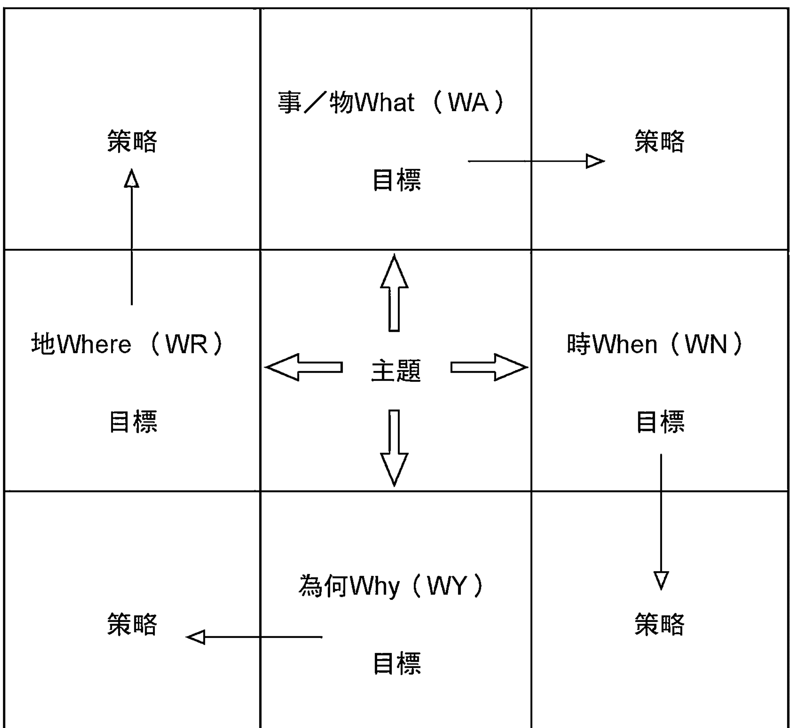

△「十字型排列」的曼陀羅：八段論法

①若想要了解怎樣問對問題的話，推薦《OPO：問題背後的問題》（約翰・米勒著，遠流出版）。在《畫個圖講得更清楚》（大衛・斯貝特著，時報出版）書中也提到曼陀羅圖的功能就是整合看法：「如果要讓團體在相同的基礎上，集中思考某個主題，並且希望面面俱到時，曼陀羅圖形是很好的選擇。曼陀羅圖是最複雜的形式，但可以包含一些簡單的形式，例如：可以包含清單、圖解群組，環繞中心的星座圖；可以像是標靶的方格圖；也可以像是地層的示意圖。當你從核心觀念逐漸衍生分支想法時，表示對問題的了解愈來愈深入。」

> 小提醒：
人應該相信自己，但不可過於執著。
態度決定成功，而不是成功之後改變態度。

②《改變大腦的靈性力量：神經學者的科學實證大發現》（安德魯·紐柏格、馬克·羅勃·瓦德門著，心靈工坊出版）書中證實了禪坐可以刺激大腦再成長！以科學家的研究證明禪坐的多項好處，例如提升專注力、心情愉悅、記憶力等等，及這些好處怎麼來的？也提到靜坐至少要三十～六十分鐘以上效果最大，且必須長期持續靜坐才會持續活化大腦與保有這些好處。傳統看法認為，人不可能隨意影響大腦中的無意識區域，但是神經學新近的研究卻徹底顛覆了這個觀點，因為科學證據顯示，靜觀修行以不同方式影響著大腦不同的部位。而且把宗教的概念從靜觀修行的儀式中拿掉，一樣能對大腦神經產生好處。

③短期記憶寬度7±2的詳細說明可見《超強學習力訓練法》第二部你需要補腦還是補心？

### ④開放式思考方式參考：

#### 六頂思考帽（思考時用的六種角度）

這是由愛德華·迪波諾所提出的，嚴格說並不能算是一種方法，是六種引導我們在創意思考時的立場與角度。

- 白色思考帽（事實與資料帽）：代表中立客觀，表客觀的事實與數字。
- 紅色思考帽（情感帽）：代表憤怒狂暴情感，表情緒上的感覺。
- 黑色思考帽（謹慎帽）：代表陰沉負面，表負面因素，為什麼不能做。
- 黃色思考帽（樂觀帽）：代表耀眼正面，表樂觀，希望正面。
- 綠色思考帽（創造力帽）：代表生意盎然，表創意與新想法。
- 藍色思考帽（指揮帽）：代表冷靜，代表思考過程的控制與組織。

#### 六雙行動鞋（行動時用的六種角度）

也是由愛德華·迪波諾所提出的，是六種引導我們在行動時的立場與角度。

深藍色皮鞋：行動模式包含著慣例和形式化的程序，依規章行事。

灰色運動鞋：行動模式和探索、調查、蒐集證據有關，行動的目的則是獲取資訊。

咖啡色厚底便鞋：作法包括採取主動、務實的行動，而且保持彈性。務實和實用主義。

橘色橡膠靴：行動模式是採取緊急行動，這時安全是最主要的考慮。

粉紅色拖鞋：行動模式代表關懷、同情、對人的感情投以注意力，而且具有敏感性。

紫色馬靴：適合具有官方角色或有正式權限的人使用。需有領導和命令的權利，執行行動的人並非表現他個人的能力，而是扮演組織正式的角色。

## Part TWO

## 曼陀羅思考法

—— 實際運用 ——

## 第五章 運用實例

#### 規劃人脈網路

規劃人脈網路的時候，我們需要使用八十一宮格或七百二十九宮格的曼陀羅。（可使用隨書後附的曼陀羅實用小手冊影印放大成B4使用。）

首先最需要了解的是「人脈網路圖」，第一層次先將自己的名字填寫於中間，然後把自己比較親近的八個人名填入周圍的八個格子中。（「人脈網路圖（第一層次）」舉例請參考第76頁。）

你可能會問：我的朋友很多，八個格子根本不夠耶！別忘了，我們是透過填寫曼陀羅的過程來審視自己的人脈關係與品質，請務必先篩選出對你而言最重要的八個人喔！

接著分別以第一層次的八個人—志明（爸爸）、春嬌（媽媽）、小花（太太）、小芳（女兒）、大華（大學同學）、大強（同事）、小義（同事）大林（當兵朋友）為中心主題，分別

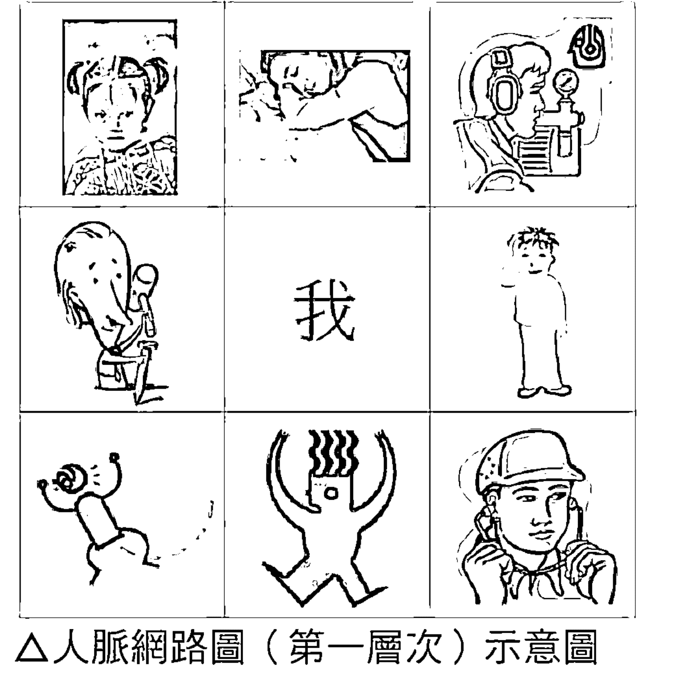

△人脈網路圖（第一層次）示意圖

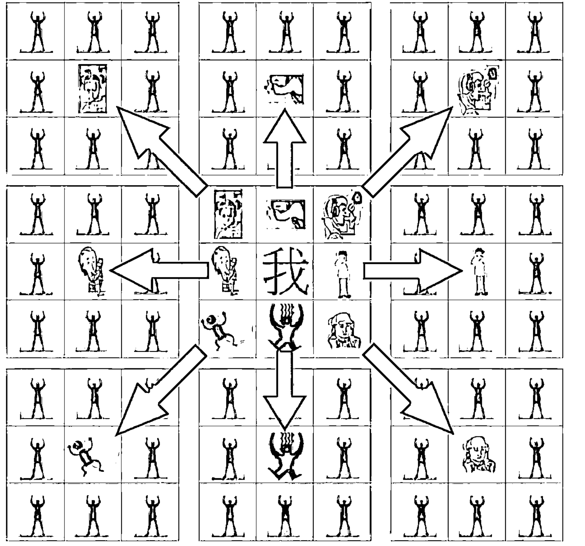

△人脈網路圖（第二層次）示意圖：透過人脈的第二層結果，我們應該可以看出自己的人脈圈是否有所偏廢。

製作八個「人脈網路圖（第二層次）」的曼陀羅。
填寫「人脈網路圖（第二層次）」的時候，用志明（爸爸）當主題，周圍八個格子就可以填寫跟志明（爸爸）相關又跟王小明（自己）相關的人。用同樣的方法可以繼續列出人脈的第三層次。

「人脈網路圖」有兩種填寫方式，第一種是單純的「人脈網路」，不分身分而是依照跟你的親疏遠近來填寫，單純的人脈網路圖能檢視自己人脈網路的規模大小及人脈關係是否有所偏廢（有些人的人脈關係偏向與家人及親戚有關的人，有些人則偏向學校同學或公司同事）；第二種則依照身分填寫，周圍八個格子只填寫在該身分中跟你最親近

| 志明（爸爸） | 春嬌（媽媽） | 小花（太太） |
| :---: | :---: | :---: |
| 小芳（女兒） | 王小明（自己） | 大華（大學同學） |
| 大強（同事） | 小義（同事） | 大林（當兵朋友） |

△「人脈網路圖（第一層次）」舉例：
不分身分，而是依照跟你的親疏遠近來填寫。

的人，這種填寫方式稱為「人脈（工作）分類表」。

#### 【人脈（工作）分類表】

填寫自己的「人脈（工作）分類表」的時候，周圍八個格子中各有不同身分主題，依照身分主題填寫，在該身分中找出跟你最親近的人，透過這個分類表可以瞭解，依照身分能如何拓展自己的人脈關係。

「人脈（工作）分類表」第二、第三層次的填寫方法跟人脈網路圖第二、第三層延伸的概念相同，可以使用八十一宮格或七百二十九宮格的曼陀羅延伸使用。

| 配偶／情人 | 子女 | 親戚／朋友 |
| :---: | :---: | :---: |
| 父母 | 王小明（自己） | 主管／師長 |
| 社團／志工 | 工作／客戶 | 同事／同學 |

△「人脈（工作）分類表（第一層次）」舉例：依照身分主題填寫，在該身分中找出跟你最親近的人。

#### 【關鍵人物（能力）分類表】

透過「關鍵人物（能力）分類表」我們能了解到「誰是能幫助我們能力提升的關鍵人物」，
所以在第一層次周圍的八個格子中，各自填入在不同領域能幫助你或是影響你的關鍵人物，註記這位關鍵人物的身分並簡單描述能幫助你提升的能力。

| 劉厲害（組長） 指出我的錯誤 | 張時髦（隔壁部門的主管） 教我服裝穿著 | 陳有力（部門主管） 影響我的考績 |
| --- | --- | --- |
| 李八卦（同事） 告訴我辦公室八卦 | 王小明（自己） 幫助能力提升的關鍵人物 | 趙芬芳（同事） 分享美食資訊給我 |
| 王有錢（同事） 教我理財知識 | 大強（同事） 教我電腦操作 | 蕭準備（同事） 教我如何準備資料 |

△「關鍵人物（能力）分類表」舉例

#### 【關鍵人物（工作能力）分類表】

接下來，以「關鍵人物（能力）分類表」延伸（以上頁的舉例延伸說明），我們挑選工作能力（電腦操作）為中央主題，周圍八個格子各自列出還有哪些人像大強一樣可以幫助我們提升工作能力（電腦操作）？從這個層次的曼陀羅可以看出：能幫助提升特定工作能力的關鍵人物人脈分布情況。

| 大強（同事） | 大林（當兵朋友） | |
| 小花（太太） | 幫助提升工作能力（電腦操作）的關鍵人物 | |

△「關鍵人物（工作能力）分類表」舉例

#### 【人脈（個性）分類表】

透過「人脈（個性）分類表」我們進一步了解「影響自己最大的人擁有怎樣的個性特徵」，在周圍八個格子中列出親近朋友的名字，註記他們的個性，接著檢視他們之間共同的個性特徵有哪些，這樣就能知道影響你最大的人，都是什麼樣個性的人。

| 大林（當兵朋友） 幽默、囉嗦、開朗 | 小花（太太） 嚴謹、認真、一板一眼、愛笑、善良 | 王有錢（同事） 嚴肅、不多話、不愛笑 |
|---|---|---|
| 大強（同事） 愛夜店、愛旅遊、愛講冷笑話 | 王小明（自己） 的人脈（個性） | 李八卦（同事） 愛講八卦、囉嗦、幽默、認真 |
| 賈英俊（同學） 愛買名牌、不愛笑 | 莊可愛（社團朋友） 善良、喜歡有毛的小動物、愛笑、開朗、認真 | 吳正義（同事） 愛抱不平、開朗、嚴肅、善良 |

△「人脈（個性）分類表」舉例

#### 【關鍵人物（個性）分類表】

接下來，以「人脈（個性）分類表」延伸，「人脈（個性）分類表」是先填名字，再註記個性，而「關鍵人物（個性）分類表」則是先填個性，再填具備這樣個性特徵的人名。

將「人脈（個性）分類表」中最常見、影響你較多的個性特徵填入「關鍵人物（個性）分類表」周圍八個格子中，並註記有哪些關鍵人物（個性）分類表這樣的個性，這樣就可以知道「希望自己成為擁有哪種個性特質的人，就要多多接近哪些關鍵人物」。

人是相當容易受到外界影響的，若希望自己開朗、活潑點，就要多交往具有這樣特質的朋友，潛移默化下就會變得開朗活潑。想想哪些人具備你想擁有的特質，趕緊跟他們成為朋友喔！

| 幽默
大林、李八卦 | 認真
莊可愛、李八卦 | |
| --- | --- | --- |
| 善良
莊可愛、小義、小花 | 王小明（自己）
的關鍵人物
（個性） | |
| 嚴肅
王有錢、小義、賈英俊、吳正義 | 開朗
莊可愛、大林、小花 | |

△「關鍵人物（個性）分類表」舉例
（寫的時候順序不拘）

#### 【未來人脈分類表】

從「關鍵人物（個性）分類表」延伸至未來，先思考未來自己想具備什麼能力，然後註記誰是你想要認識或學習的對象，以及透過什麼管道可以幫助你認識他或向他效法。

| 增加EQ能力：林志玲 多留意他上電視的談吐 | 增加閱讀能力：胡雅茹老師 多練習老師教的方法 | 創業能力：創業成功的老闆 多閱讀成功創業老闆的著作與報導 |
| 溝通能力：王有錢 儘量多約他一起午餐 | 王小明（自己）的人脈（未來） | 深入閱讀能力：愛讀書的朋友 參加「從書中找到快樂人生」讀書會 |
| 理財能力：懂理財的朋友 多看理財節目與講座、多跟懂得理財的朋友聊聊 | 投資能力：財經專家 多看財經新聞 | 舒壓能力：認識新朋友 多參加靜坐活動 |

△「未來人脈分類表」舉例（寫的時候順序不拘）

#### 【人物基本資料表】

針對客戶或是朋友建立基本資料卡，可以讓你對朋友的動向瞭若指掌喔！

現在很多人都使用社群網站管理朋友的資訊，像是照片、嗜好、興趣、生日、年齡等，朋友生日時社群網站也會主動通知你，手機隨時上網也很方便，所以這張資料卡上的內容可以填寫一些社群網站上沒有的資料來補齊。以下是參考例子，可以依實際使用情況修改。

| 喜歡網站： | 參加的社群網站： | 部落格： |
| --- | --- | --- |
| 喜歡活動： | 王小明（自己）
（此處可貼照片） | 特殊事蹟： |
| 父母： | 配偶： | 小孩： |

△「人物基本資料表」舉例

> 小提醒：
學習不是為了活著，是為了活得更有意義。
成功可招引朋友，挫敗可以考驗朋友。

#### 時間管理與生涯規劃

方向不對，再努力、再辛苦，你也很難成為你想成就的那種人。現在是講究績效的時代，公司、企業、政府，需要的是有能力且能與企業方向共同發展的人，而不是一味努力但卻南轅北轍的員工。

最新一代的時間管理，不僅是日常行事曆規劃，講求的是人生的管理。我們必須先定義「我是誰→目標設定→規劃行事曆」。

#### 【生涯規劃（我是誰？）】

談生涯規劃的角度很廣，也不是本書的重點，但要教大家怎麼把曼陀羅思考法運用在生涯規劃中，又不得不提醒大家某些觀念，我儘量簡短說明之。

生涯規劃要從認識自己開始，認識自己的成功定義、價值觀、信念，才能擬訂出適合自己的策略與規劃。

##### (1) 定義成功

當你感覺生產力最旺、創造力最豐富的時候，就是你用少數精力創造多數效果，輕輕鬆鬆成就自己的時候。這些以少創造多的時候都是發生什麼事情的時候？是不是都發生在一天的同一時段？行為有沒有共通點？總是發生在某件事情之後嗎？你是跟一群人在一起還是一個人的時候？是在輕鬆的時候還是匆忙的時候？

你能不能在不辭去正職的情況下，多撥點時間在你喜歡的事情上？你能不能讓你的喜好或是副業成為另一項事業？

少做事，多多動腦。在開始做之前，想想什麼事情你覺得最重要？沒有價值的事情、不會帶給你快樂的事情，都不要再做了，因為你只會把自己變成一個愛抱怨的人。

有一個孤獨的學生因為跟大家都格格不入被退學了，後來白天在一家公家機構當小職員，晚上花大量的時間閱讀科學書籍與做做白日夢，這個人就是愛因斯坦，他在三十歲之前發表了相對論。

華倫．巴菲特是我最崇拜的人，他成為首富的方法是不停地研究與不停地投資，他住在一個生活輕鬆的小鎮裡，吃的、用的、穿的都相當簡單樸素，他的投資心態不以賺錢為目的，而是想證實自己的眼光正確與否，輕鬆愉快帶給他充分的思考時間，所以他的決定都很正確。
他不為賺錢而賺錢，卻賺到大把金錢，這個作法跟「窮爸爸富爸爸」的作者清崎先生的「有錢人不為賺錢而工作」這一點的想法不謀而合。（註①）

所以你要用什麼來定義自己的成功？
像巴菲特用精準的投資眼光來定義自己的成功？
像台灣賣菜阿嬤陳樹菊用有能力的持續捐款來定義自己的成功？
像台灣藝人張小燕用提攜後進來定義自己的成功？
像台灣藝人孫越用幫助別人戒菸來定義自己的成功？
像某些首富用賺多少錢來定義自己的成功？
像某些貴婦用幾十個名牌包來定義自己的成功？

下頁開始，先透過表格幫助了解自己有多少項目是已經成功的，接下來，試著運用「十字型排列曼陀羅」、「人物基本資料表」、「八十一宮格曼陀羅」三種不一樣的曼陀羅思考法進行自我解析與審視。

##### △舉例：了解自己已經成功的項目

| 閱讀能力 | 分析能力 | 文字書寫 | 科技產品使用 | 數理運算 | 欣賞藝術 | 欣賞文學 | 欣賞音樂 | 欣賞電影 | 烹飪 | 虛張聲勢能力 | 找樂子的能力 | 賭博的能力 | 好客的能力 | 運動能力 | 創業能力 | 激勵自己 | 承認自己錯誤 |
| :---: | :---: | :---: | :---: | :---: | :---: | :---: | :---: | :---: | :---: | :---: | :---: | :---: | :---: | :---: | :---: | :---: | :---: |
| 普通 | | | | | | | | | | | | | | | | | |
| 還不錯 | | | | | | | | | | | | | | | | | |
| 優秀 | | | | | | | | | | | | | | | | | |
| 卓越 | | | | | | | | | | | | | | | | | |

| 口語溝通 | 冷靜鎮定 | 關心社會變化 | 下決定的勇氣 | 好奇心 | 追根究柢 | 激勵他人 | 教導他人 | 歸功他人能力 | 與人合作 | 被人信任 | 對人熱情 | 對事熱情 | 感同身受 | 公平公正 | 原諒寬恕 | 幽默風趣 | 堅持毅力 | 忍耐力 | 耐心等待 |
|---|---|---|---|---|---|---|---|---|---|---|---|---|---|---|---|---|---|---|---|
| | | | | | | | | | | | | | | | | | | | |
| | | | | | | | | | | | | | | | | | | | |
| | | | | | | | | | | | | | | | | | | | |
| | | | | | | | | | | | | | | | | | | | |

| 假日喜歡往大自然跑
喜歡室內靜態活動 | 事／物What（WA）
喜歡心靈啟發
喜歡微笑
喜歡捐款助人 | 討厭兩面人與猶豫不決的人
討厭慢吞吞的人
討厭講話邏輯弱的人 |
| --- | --- | --- |
| 地Where（WR）
愛山海大自然 | 人Who（WO）
王大明 | 時When（WN）
下班後喜歡看書 |
| 自律甚嚴
對親近的人開不了口要求他 | 為何Why（WY）
要求完美
手腳快 | 想增加與人交往機會
想增加自我進修時間
想增加運動時間 |

△「自我分析與審視」舉例：
運用「十字型排列曼陀羅」分析

| 喜歡網站：
宗教網站、新聞網站 | 參加的社群網站：
無 | 部落格：
無 |
| --- | --- | --- |
| 喜歡活動：
看書、大自然旅遊 | 王大明 | 特殊事蹟：
拿下二百萬大訂單、幫孩子完成科展作品 |
| 父母：
不喜歡浪費、節儉 | 配偶：
喜歡美食、愛做菜 | 小孩：
好動、不喜歡寫功課 |

△「自我分析與審視」舉例：
運用「人物基本資料表」分析

△舉例：「自我解析與審視」，不需要依賴別人提供的分析表格，我們也能用曼陀羅思考法來進行。這裡運用了三種模式，也可以參考選用本書提及的其他曼陀羅進行自我解析與審視。

| | | | | | | | | |
|---|---|---|---|---|---|---|---|---|
| 運動 | | | | | 不貪小便宜 | | | |
| 分析 | 專長 | | | 缺點 | 不佔人便宜 | 優點 | | |
| 邏輯 | 電腦 | | 不愛求人 | 愛說教 | 助人 | 善良 | | |
| 看電視 | 陪小孩 | | | | 讓孩子寫功課 | 增加進修機會 | | |
| 聊天 | 活動 | | | 王大明 | 孩子快樂 | 目標 | | |
| 看書 | 健行 | | | | 減少加班 | 生活輕鬆 | | |
| 自律甚嚴 | 要求完美 | | 聊天 | 喝茶 | 夫妻感情好 | | | |
| 愛惡分明 | 性格 | | 看書 | 喜好 | 父母高壽 | 期許 | | |
| 動作快 | 急躁 | | 看海 | 健行 | 孩子孝順 | 遺產捐出 | | |

△「自我分析與審視」舉例：
運用「八十一宮格曼陀羅」分析

##### (2) 價值觀

在決定怎麼做、決定做什麼之前，你一定要知道自己要去哪裡。就像從台北到高雄，你能選擇飛機、高鐵、台鐵、客運、自行開車、機車、單車、甚至走路。如果你的時間不夠，那麼多花一點錢坐上高鐵，沿途風光坦白講還真不怎麼樣，因為你要的是節省時間而不是欣賞沿途景色。如果你有的是時間，那你可能會選擇單車，那看到的風景就完全不一樣了。

你必須知道你想要達到什麼、不想要什麼，你想要什麼樣的生活、不想要什麼生活，你想成為什麼樣的人、不想成為什麼樣的人。

「條條大路通羅馬」，要達到一個目標總是有許多的路徑，大家總想要找到一條最好、最快、最多快樂、最少阻礙、最少力氣的路。這條路通常都是反直覺的，如果這條路是那麼容易被發現，大家都知道有這麼一條路，那裡早就塞車了，又轉變成一條充滿阻礙的路。

行動不見得要事前都規劃好，不是有人常講「計畫趕不上變化」嗎？

但是目標與慾望一定都要事先規劃好，開放心胸等待時機出現，做正確的解讀、適時地把握。

科技與社會腳步愈來愈快，我們已經習慣不要用太多的思考而直接照單全收，往往對眼前的經驗當做是唯一的路。要找到一條最好、最快、最多快樂、最少障礙、最少力氣的路，就要動腦筋去找。

廣告行銷人員不斷告訴我們擁有最新商品的快樂，讓我們養成一種思考習慣是：我要跑得快、我要賺得多、我要買得多，我才會快樂。我們需要更多的錢、更多的朋友、更多的物質、更多的愛情、更多的關心、更多的旅遊、更多的肯定，於是我們想辦法用更多的時間、更多的注意力、更多的能量、力氣去獲取上面的內容。

在心理上，有一點很重要：把收穫與付出分開來。不要為別人做你自己喜歡的事情。

最不划算的作法就是低估時間被工作耗損的程度，高估換到的金錢價值。

時間就是我們的生命動能，根據80／20法則（註②），80％的努力點創造20％的成果，20％的努力點創造80％的成果，我們需要全神貫注在我想要的結果上，要有效率但是也要充滿開心（註③）。否則我們就是為了賺錢而賣出時間，為了謀生而付出努力卻耗損了生命。

美國網路業者——線上美國曾經做了一項調查（註④），詢問對方：「你還需要多少錢？就可以不用再為錢煩惱？」結果是愈有錢的人需要的錢愈多。

中廣電台主持人夏韻芬也曾提到他當募款義工時，發現捐款愈多的人通常是經濟條件愈不好的人。難怪基督教說：「有錢人要進入天堂比駱駝穿過針眼還要難。」我不想引起大家對有錢人的批評，因為我們很多人不都是希望自己能盡快成為有錢人嗎？

這其實告訴我們一件事情，用世俗眼光去追求目標，我們一輩子也不會滿足。

過去有個同事家中環境不好，當時他白天擔任總機的收入不錯，於是申請上班到五點，好讓他可以趕去補習準備考插大，一年後順利考取，公司把他轉到會計部門工作，半工半讀念了一年夜大後，他告訴我雖然家裡需要他這份不錯的收入，但是工作內容跟他未來想做的事情相差太遠，於是他決定離職，找到了一份收入較差，但是可以跟他的未來有所連結的工作。

即使是相同的價值觀，但不同的排列順序也會影響我們的選擇。

如果我們選擇的未來是跟自己的價值觀相符的，那麼未來生活將充滿幸福感與快樂感。像是有些人愛錢，只要有錢他就快樂。有些人愛旅遊，只要能旅遊他就快樂。

觀念容易懂，但問題是很多人常常不清楚自己的價值觀與排序為何，只好用別人的價值觀當作自己的想法了。也有很多父母用自己的價值觀硬要孩子照單全收，親子之間不快樂是必然的結果。

一個人的行為是思想的結果，但我們常常心裡想這樣，卻是做那樣。所以下頁的表格請你自己填寫完第一欄後，再請你最信任且常常跟你相處的人幫你填寫第二欄（填寫時他不能看到你的答案），比較一下就可以知道自己的外在行為跟內在思想是否有落差。

### 練習：請從以下字詞中依序列出你覺得最重要的三個項目（自己填寫）
獨立性、受肯定、成就感、休閒時間、權力、聲望、金錢、壓力、自尊、家庭生活、安全感、個人成長。（測驗時你對該字詞的解釋是什麼就是什麼，不要問別人的解釋。）

| 1 |
|---|
| 2 |
| 3 |

### 練習：請以下字詞中依序列出你認為眼前的這個人覺得最重要的三個項目（給他人填寫）
獨立性、受肯定、成就感、休閒時間、權力、聲望、金錢、壓力、自尊、家庭生活、安全感、個人成長。（測驗時你對該字詞的解釋是什麼就是什麼，不要問別人的解釋。）

| 1 |
|---|
| 2 |
| 3 |

以上測驗能粗略地發現自己的想法，但不代表結果就是你內心深處真實的想法，還要進一步透過價值觀比較的方法來驗證。根據我們在曼陀羅時間管理法課程中的經驗，大約有一半的學生真的了解自己，有一半的學生對自己的認識不夠清楚。

價值觀的分類有很多種，你可以用下頁的九宮格曼陀羅來認識自己的價值觀。

當然你也可以用八十一宮格來填寫，別忘了曼陀羅是一種思考法，千萬不要執著於表面形式，你覺得哪種形式填寫順手，就先熟悉那種形式，以後再慢慢使用其他形式。

> △舉例：「認識自己的價值觀」。審視價值觀時，請依照表格內的八種價值觀，在每個價值觀內填上會帶給你快樂、帶給你滿足感、帶給你快樂的慾望有哪些。

> △舉例：怎樣挑選一個好老師／如何當一個好老師？

#### (3) 信念

80／20 法則的關鍵就是一個人的精力有限，所以我們要把最積極的行動放在少數的目標上，行動要精簡。

改變行動是比較簡單的，改變思考模式是比較難的。不過信念→思想→行動→結果→信念，是一連串的循環。只要我們開始想清楚，然後行動就對了。

| 人際 | 食物 | 物慾（金錢） |
| --- | --- | --- |
| 想交朋友 想要愛人 | 想吃美食 | 想過富裕生活 想要獨占一個房間 |
| 愛（感情） | **價值觀** | 名譽 |
| 享受喜愛 想被人家需要（幫助別人） 想結婚 想要小孩 | | 想要表現自信 想要突出 想要被肯定 |
| 知識 | 健康 | 創造（事業） |
| 想要更聰明 想要更有學問 想要理解力強 | 希望永遠年輕 希望不生病 | 想擁有成功的喜悅 想要創造一些事 |

△「價值觀」舉例：認識自己的價值觀

| 持續不斷投入該領域的研究，並不斷更新教學內容 | 保持不斷進修其他相關領域，並導入自己的教學內容 | 願意更新自己的教學技巧 |
| --- | --- | --- |
| 把學生的學習成果當成是自己的教學目標，不讓學生自生自滅 | **怎樣挑選一個好老師 / 如何當一個好老師？** | 不斷研究如何讓各種學生都能學得很好 |
| 不會老是提自己的當年勇，而是會讓學生青出於藍更勝於藍 | 不會光有碩博士學歷，卻鮮少實務上的經驗 | 上課中重視與學生的互動，不會讓學生覺得上課很無聊 |

△「價值觀」舉例：怎麼挑選一個好老師 / 如何當一個好老師？

如果我們每次看到別人都主動微笑打招呼，久而久之別人看到我們的時候也會主動微笑打招呼，我們那時一定覺得自己遇到的人都很友善、很熱情。但反之，我們覺得別人有可能很冷漠，於是我們不主動微笑也不主動打招呼，以後我們一定會覺得世間很冷漠。

所以我們的每一項信念所產生的行動，都會加強我們的信念。（註⑤）

要成為一個獨特的人必須要先有自覺。你需要先決定你是誰？你不是誰？你想變成誰？你不想要變成誰？透過刻意地決定與行動，用重複行動強化我們的表現，我們就能成為獨特的人。

（註⑥）

在成人全腦學習思考訓練的課程中，我發現很多人的學習是沒有目標的。不是說他們不想學，而是他們沒有想清楚自己「為什麼要學？」「要學什麼？」「要學到什麼程度？」所以學習遇到有一點難度或沒有立刻見到效果，就認為自己不適合該課程而立刻放棄該課程。這就是把學習當作是只求「知道」該知識，而沒有體認到學習其實是追求「做到」的過程。

對該領域知識的大量吸收，才能產生在該領域舉一反三、解決問題的能力。追求「做到」的學習心態，就能透過學習而成為一個真正深入該專業的人。

學習動機在我們開始動手學之前就必須要建立。找出哪些原因讓你覺得學會這件事情是很令人興奮的。我不要你寫非得這麼做的理由，因為這種不得不做的學習心態常常就是讓我們很快放棄的原因。我要你寫的是當你學到這個能力之後，你會用來做什麼？或是可以讓你達到什麼樣的境界？

寫多少理由不重要，重要的是發自內心的想法，要發掘自己是不是「真心想學好」。

不管想學什麼，如果不是真心想學而勉強自己學習，學習效果都會打折扣，常見反應是「學這個好像不錯」、「雖然想學但是……」一旦生活忙碌起來，就會首先放棄學習。

當你親自且真心寫下為什麼非要學好的理由後，在學習之後，還沒有看到效果之前，都不容易產生「學這個真的那麼好嗎？」、「能不能晚點再學？」一定要現在學完嗎？」這些意志薄弱、態度鬆懈的想法。

第一步：找出為什麼要學的意義、好處？學好之後自己可達到的境界、自己的生活會有什麼變化？（下頁起有三個舉例，「真心想學習」之前，試著用曼陀羅九宮格先思考看看。）

| 是一種讓左右腦平衡的訓練，腦力表現更好 | 可延緩失智症病發的一種腦力訓練 | 可以讓自己快速累積大量知識，解決問題能力會增強 |
| 思考反應速度會加快，觀察力會加強 | **為什麼要學ESI超強記憶術？** （學好超強記憶的意義） | 可以縮短學習時間，讓我生活更輕鬆 |
| 可以增加抓重點的能力，讓我提升思考效率、自信心 | 記憶力是創意力+邏輯力+想像力+專注力的整合 | 可以提升專注力，以提高加強心智抗壓力 |

△「信念」舉例：為什麼要學ESI超強記憶術？ （學好超強記憶的意義）

| 同步訓練左腦邏輯與右腦創意，幫助左右腦平衡，腦力表現更好 | 繪製過程後增加學習的理解效果，可以深度思考 | 快速做筆記的能力能減少學習時間 |
| --- | --- | --- |
| 可以加強讓自己想法更正確的能力，得到良好溝通效果 | **為什麼要學ESI心智圖特訓？** （學好心智圖的意義） | 容易覺察自己的思緒變化，增強覺察力 |
| 懶惰是學不好的，過程中可以鍛鍊自己的意志力 | 是一種用來鍛鍊腦力的技巧，可以讓自己更快掌握事物的關鍵 | 與超強記憶術搭配，可以解決任何學習問題，增強學習自信心 |

△「信念」舉例：為什麼要學ESI心智圖特訓？ （學好心智圖的意義）

| 閱讀是最便宜、最方便的學習方法 | 提升閱讀理解力後，自然也會提升聽講理解力 | 用最短時間讓自己見多而識廣的方法 |
| --- | --- | --- |
| 是一種用來鍛鍊腦力的技巧，不斷提升自己的邏輯能力 | **為什麼要學ESI全腦式速讀？** （學好眼腦直映快讀法的意義） | 閱讀是站在巨人肩上看事情的最佳方法，增加思考廣度 |
| 大量閱讀可以減少自己犯錯的機會 | 大量閱讀給大腦足夠的刺激，延緩失智症病發 | 正確練習能產生獨立思考的能力 |

△「信念」舉例：為什麼要學ESI全腦式速讀？ （學好眼腦直映快讀法的意義）

### 【目標設定（一頁奇蹟）】

這個階段我們要進行具體目標的設定，也就是你的夢想是什麼？達到你的夢想過程中需要做哪些事情？

想要達成目標，必須同時存在兩個重點：

- 可行的具體行動——「在五年後我要用投資股票賺到一百萬」優於「我要用投資股票賺到一百萬」，優於「我要賺到一百萬」，優於「我要賺到錢」。
- 視覺化——一定要寫出來讓自己看到，不能只在腦中想。

目標數過多，等於沒有聚焦行動，等於沒有設定目標。前面也說過短期記憶寬度是 7 ± 2，所以九宮格的曼陀羅是最佳選擇。

一般的生涯規劃都會告訴我們要做未來十年的計畫、五年計畫、一年計畫，這個比較適用在學生時代，因為環境變化 80% 是可以預期的。

若是就業之後，多數人總會發現計畫趕不上變化，十年計畫似乎充滿變數，近幾年連金融市場的景氣循環周期都縮短為三・七年了，五年計畫似乎是太長了。我以前都會教導學生要做好三～五年的具體計畫，現在我也修正了，我建議大家先擬定未來三年的計畫→未來一年的計畫比較實際。不管是三年計畫或是一年計畫中所列出的具體行為，都需要每年審視調整一下。

如果改成十年目標、五年目標、一年目標，這種時間分法也可以，因為目標可以是不具體的概念，而計畫則必須是寫下具體的行為。

小心！我們常常高估未來一年可以做到的事情，卻常常低估未來三年可以做到的成就。

製作時最好是一張紙上只有一個九宮格曼陀羅，避免思緒干擾。寫完後貼在書桌前或是廁所化妝鏡旁，天天提醒自己去做，三年後你就會發現自己已經在無形間達成這些好角色囉！我稱之為一頁奇蹟！

△舉例：未來三年內，我要做好這個角色，我要準備做的事情有什麼？寫計畫就是要寫出具體的行為，下頁舉例中，在括號內列的是非具體的目標，用以做為比較，讓大家清楚什麼才叫做是具體的行為。

| 每天告訴孩子一件他做得很好的事情 （培養孩子有榮譽感） | 針對孩子的生活習慣要嚴格規定 （培養他好家教） | 即使假日也要讓孩子十點前上床睡覺 （幫孩子健腦） |
| --- | --- | --- |
| 每天睡前讓孩子檢查完書包才能睡 （讓孩子不會丟三落四） | **未來三年內做到孩子眼中的好父母角色， 我現在要做什麼？** | 每天準備五穀與高蛋白早餐 （給孩子均衡營養） |
| 每周六晚上讓孩子與爺爺奶奶相處 （讓孩子孝順） | 每周日晚上二小時全家閱讀，不准任何人看電視 （培養孩子閱讀習慣） | 每天孩子念書時，自己也要在旁邊看書，不准任何人看電視 （培養孩子閱讀習慣） |

△「目標設定」舉例：未來三年內做到孩子眼中的好父母角色， 我現在要做什麼？

以下的舉例能幫助你思考具體目標，思考過自己想要設定的目標之後，在隨書後附的實用小手冊中選擇適合的樣式填寫。

| | | |
|---|---|---|
| | | |
| | 未來三年內做到父母眼中的好孩子角色，我現在要做什麼？ | |
| | | |

△「目標設定」舉例：未來三年內做到父母眼中的好孩子角色，我現在要做什麼？

| | | |
|---|---|---|
| | | |
| | 未來三年內做到配偶或情人眼中好角色，我現在要做什麼？ | |
| | | |

△「目標設定」舉例：未來三年內做到配偶或情人眼中的好角色，我現在要做什麼？

| | | |
|---|---|---|
| | 未來三年內做到親戚眼中的好角色，我現在要做什麼？ | |
| | | |

△「目標設定」舉例：未來三年內做到親戚眼中的好角色，我現在要做什麼？

| | | |
|---|---|---|
| | 未來三年內做到朋友眼中的好角色，我現在要做什麼？ | |
| | | |

△「目標設定」舉例：未來三年內做到朋友眼中的好角色，我現在要做什麼？

| | | |
|---|---|---|
| | 未來三年內做到主管眼中的好下屬角色，我現在要做什麼？ | |
| | | |

△「目標設定」舉例：未來三年內做到主管眼中的好下屬角色，我現在要做什麼？

| | | |
|---|---|---|
| | 未來三年內做到下屬眼中的好主管角色，我現在要做什麼？ | |
| | | |

△「目標設定」舉例：未來三年內做到下屬眼中的好主管角色，我現在要做什麼？

| | | |
|---|---|---|
| | 未來三年內做到同事眼中的好角色，我現在要做什麼？ | |
| | | |

△「目標設定」舉例：未來三年內做到同事眼中的好角色，我現在要做什麼？

| | | |
|---|---|---|
| | 未來三年內做到客戶眼中的好角色，我現在要做什麼？ | |
| | | |

△「目標設定」舉例：未來三年內做到客戶眼中的好角色，我現在要做什麼？

| | | |
|---|---|---|
| | 未來三年內做到社團團員眼中的好角色，我現在要做什麼？ | |
| | | |

△「目標設定」舉例：未來三年內做到社團團員眼中的好角色，我現在要做什麼？

| | | |
|---|---|---|
| | 未來三年內做到社會眼中的好志工角色，我現在要做什麼？ | |
| | | |

△「目標設定」舉例：未來三年內做到社會眼中的好志工角色，我現在要做什麼？

### 【行事曆記錄（我在哪裡？）】

這幾年台灣也跟日本一樣開始流行寫手帳（記事本）的技巧，現在手帳不光只是記錄行程而已，還要記錄自己生命中的每一刻，每個人都有自己的小訣竅，對我個人而言，我比較喜歡用一週一頁的記事本，比較能綜覽本周全局，決定怎樣安排時間。在此用九宮格曼陀羅教大家怎樣做你自己的手帳。

#### (1) 日計畫

建議用 B5 的紙張（也就是 B4 的一半）填寫日計畫，一天一頁，或是一張 B4 紙上下排可以寫兩天。適合給每天事情很多要寫的人使用。下頁開始的舉例是用順時針排列，你也可以改成自己看得順眼的排列方式。

本書中所附上的實用小手冊尺寸是 B6，若事情很多的人，請自行放大到適合尺寸使用。分享一個填寫的小技巧，可以用不同顏色的筆註記工作上的事與私事，這樣會更清楚。

| PM12:00 | PM2:00 | PM3:00 |
| AM11:00 | 年 月 日 | PM4:00 |
| AM10:00 | AM9:00 | PM5:00 |

△「行事曆」舉例：工作上的日計畫

△舉例：工作上的日計畫 （十二點～二點間的事情並不多，所以都填入左上角的格子內就好。）

| 15-17點 | 17-19點 | 19-21點 |
| 13-15點 | 年 月 日 | 21-23點 |
| 11-13點 | 9-11點 | 備註：這裡可以記帳、所見所聞、日記等 |

△「行事曆」舉例：生活上的日計畫（1）

△舉例：生活上的日計畫（1）

| 11點 | 13－15點 | 15－17點 |
| :--- | :--- | :--- |
| 10點 | 年 月 日 | 17－19點 |
| 9點 | 上班前 | 下班後 |

△ 舉例：生活上的日計畫（2） 一日之計在於晨，早上多一點思考的空間，把上班前後的時間視為兩個區塊。

△「行事曆」舉例：生活上的日計畫（2）

| 人際 12：00 與小芬用餐 | 食物 | 物慾 （金錢） |
| :--- | :--- | :--- |
| 愛（感情） 20：00 與孩子共讀 | 年 月 日 | 名譽 18：30 做飯當好媽媽 |
| 知識 22：00 閱讀 | 健康 21：00 運動三十分鐘 | 創造 （事業） |

△ 舉例：目標型日計畫

△「行事曆」舉例：目標型日計畫

#### (2) 周計畫

△ 舉例：目標型周計畫（1）

| 月 日（四） | 月 日（五） | 月 日（六） |
| 月 日（三） | 本周目標： | 月 日（日） |
| 月 日（二） | 月 日（一） | 本周心得： |

△「行事曆」舉例：目標型周計畫（1）

| 人際 2/8（二）12:00 與小芬用餐 | 食物 執行週一無肉日 多喝水 | 物慾（金錢） 買鞋一六八〇元 |
| 愛（感情） | 100年 2月7日 到 2月13日 | 名譽 幫小芬趕報告 被稱讚很會搭配衣服 |
| 知識 2/8（二）18:30 英文課 2/10（四）18:30 英文課 | 健康 2/7（一）21:00 運動三十分鐘 | 創造（事業） 發現報表有錯，避免了後續問題 |

△ 舉例：目標型周計畫（2）

△「行事曆」舉例：目標型周計畫（2）

| 月 日 (四) | 月 日 (五) | 月 日 (六) |
| :--- | :--- | :--- |
| 月 日 (三) | 本周見聞： | 月 日 (日) |
| 月 日 (二) | 月 日 (一) | 備註：這裡可以記帳、日記等 |

△「行事曆」舉例：隨意型周計畫（1）

| 月 日 (一) | 月 日 (二) | 月 日 (三) |
| :--- | :--- | :--- |
| 月 日 (四) | 月 日 (五) | 月 日 (六) |
| 月 日 (日) | 本周見聞： | 備註：這裡可以記帳、日記等 |

△「行事曆」舉例：隨意型周計畫（2）

> ① 《窮爸爸富爸爸》（菲勃特・T・清崎、莎朗・L・萊希特著，高寶出版）所提出財富自由的觀念，財富自由＝投資所得大於每月支出

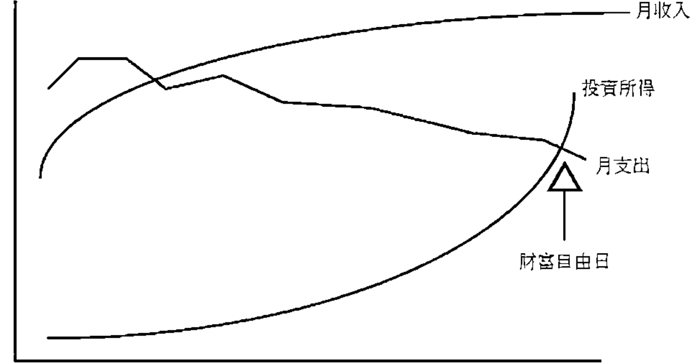

> 小提醒： 要往哪裡走，是看你想到哪裡去。 怎樣思想，就有怎樣的生活。成功者跟失敗者的差異在於， 面對人生的態度是不同的。 絕不接受挑戰的人，就是會永遠失敗的人。

② 80／20 法則最早是由義大利經濟學家 Vilfredo Pareto 帕列托（或是翻譯成柏拉圖）所提出，一九五〇年羅馬尼亞裔的美國工程師 Joseph Moses Juran 重新訂名為 80／20 法則。帕列托發現美國 20％ 人口擁有美國 80％ 的財富，全世界 20％ 人口擁有世界 80％ 的財富。

③ 心理學家 Mihaly Csikszentmihalyi 投入「心流」的研究。所謂的 flow 心流是指當你感覺時間好像靜止不動，而你趕到無比的快樂時刻，或是當你發現你自己正在做的事情就是你想要做的事，你心裡希望不要結束的時刻。

④ 《80／20 生活經》（理查．柯克著，大塊文化出版）說到，年所得超過十萬美元的人，需要的金錢比低於四萬美元的人還要多。高所得族群中，認為自己需要再增加九萬美元年薪才夠的人數，幾乎是低所得族群的五倍。

⑤ 你可以問自己： 生活中哪幾樣東西對你而言最重要。 哪些行動可以達到你想要的效果，同時壓力與緊張感最低？ 儘量發揮你跟別人不一樣的地方，因為這是你很難被別人取代的特色，專注在你擅長的地方，才能革新自己的生活，擺脫過去不滿意之處。

#### ⑥你必須做出這幾個決定：

你最關心的人？ 你最在意的事情？ 你的特質、情感、才能中的強項是什麼？ 你想要忠誠地與另一半共度一生嗎？他是誰？ 你想要生孩子嗎？ 你想要出類拔萃嗎？為什麼你想要出類拔萃？ 你想要創業嗎？ 你想要買房子嗎？ 你想要創造快樂給別人嗎？ 你想要擁有什麼樣的房子？為什麼你想要擁有這樣的房子？ 你是否把時間跟力量花在能帶給你快樂，但是其實不做也不會怎樣的事情上嗎？這些是哪些事情？

### 創意訓練

在本書前言中提到，未來要當老師的師資班學生都不免想要抄襲監考老師的「標準答案」，而不是親自真實體驗曼陀羅的好處及效果。這其實是台灣教育數十年來最大的兩個問題，所導致的思考習慣：

- 養成大家的學習目標是追求自己「已知道」而不是自己「已做到」。
- 上課習慣就是直接依賴並期望老師告訴我們答案，而不是接受老師的啟發，靠自己去找出答案。

以上兩種學習心態與思考習慣，只會讓我們的大腦愈來愈僵化。（註①）

這邊我另外提出幾種曼陀羅思考法的幾種基本練習，透過這些練習可以幫助我們把圖像思考力、概念思考力、隱喻能力、創意力磨練得更靈活。

### 【訓練前的準備——了解虛與實】

練習前我們必須要了解什麼叫做「虛」、「實」。佛教的說法中，有形有相，永恆不變的為實；無形無相，隨人事時地物而改變的為虛，如金剛經所述：如夢幻泡影，像霧、像電，隨時間過去就消失不見的，像情緒就是虛的，肉體也是虛的。

在這裡不講佛教，我將之調整為「實」是指有固定的形象的，虛是無固定形象的，簡單的說明如下：

#### (1) 實

①看得到、想像得到的「實體」物件。也就是多數名詞是實的。

也可以解釋為能用照相機拍下來的「實體」物件。舉例來說，當我們說到鴨子，我很確定大家腦海中的畫面一定是嘴巴扁扁的，腿短短、脖子短短，腳掌有蹼的鳥類，一定不會出現鵝或是雞的畫面。雖然白雲、太陽遠在天上我們看得到卻摸不到，但是我們一定可以想像得到，所以白雲、太陽是實的。也就是說大多數的名詞都是實的。

②同質性很高的物件可以定義為實。

塑膠杯是實的，鋼杯是實的，玻璃杯是實的，那麼杯子是虛的還是實的呢？

杯子依舊是實的。為什麼呢？雖然杯子是集合名詞，但因為是一個實體物件，並同質性很高，大家一看到這樣的造型，基本特色就是可以裝液體供飲用，並可以異口同聲地辨別出：這是個杯子，所以杯子是實的。就像襯衫一樣，雖然有長袖、短袖及不同材質，但是大家對於襯衫都有一種既定印象，馬上可以辨別出是不是襯衫，所以襯衫是實的。同質性很高的物件就是實的。

③有制服的職業。

警察、軍人、護士、醫生等，有制服的職業是實的。因為我們可以透過其制服辨別出職業來。

④可以聚焦在單一物件上。

#### (2) 虛

①動詞、形容詞、副詞、多數集合名詞是虛的。

但是當我們說到寒冷，大家腦中出現的畫面可能是冰箱、雪、聖誕老公公、圍巾、手套、暖爐、賣火柴的小女孩……等。大家腦中出現的物件都不一樣，所以寒冷沒有固定的形象，是虛的。

蘋果、香蕉、芭樂都是屬於水果類，蘋果、香蕉、芭樂都是實的，「水果」是虛的，因為水果品種太多了，一講到水果這個詞彙時，每個人腦中所出現的畫面都不盡相同，也就是說無法聚焦在單一物件上，選擇性太多了，因此集合名詞多數是虛的。

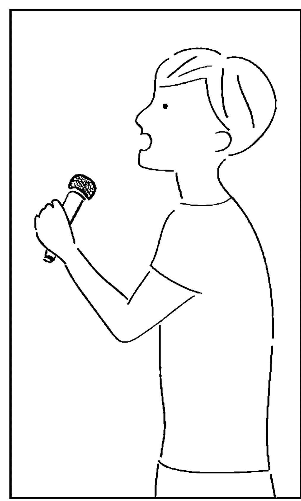

請問圖中這個人是在唱歌？是在講話？還是在演講？還是只是拿著麥克風而已？光看定格的畫面我們並無法辨別這個人在做什麼，所以動作、動詞都是虛的。

②多數職業是虛的。

請問老師是虛的還是實的呢？老師沒有固定一定是男的或女的，走在馬路上也沒有辦法分辨出誰是老師，誰不是老師，所以職業是虛的。

③地名都是虛的。

說到「日本」，這是真實存在的地方，但是我們腦中出現的畫面可能有壽司、相撲選手、日本國旗、生魚片、櫻花、富士山等，發現每個人選擇的代表物件都不一樣，沒有辦法聚焦在單一物件上，所以地名是虛的。

火車站又是虛的還是實的呢？雖然真的有車站這個具體的物件，但是說到火車站時，大家腦中又會出現火車車廂、月台、柵門、鐵軌、車票等物件，可以選擇的物件太多了，因為無法聚焦在單一物件上，所以火車站是虛的。

④顏色全部都是虛的。
顏色一定是虛的，因為沒有辦法單獨存在，一定要依附在某個物件上才能形成具體的畫面。

#### (3) 虛轉實——圖像化

圖像化思考就是把眼睛看到的文字或是腦中的文字思考，轉化成具體的畫面。我們講話時常會比手畫腳，或是看小說時，眼睛看到抽象的文字，腦中卻能把故事場景演一遍，這就是一種圖像化思考的能力。人的大腦想像力是無窮盡的，很多小孩子看了哈利波特的電影後很失望，因為電影畫面跟他想像的不一樣，自己想的畫面還更為生動與有趣，畢竟電影製作的技術跟不上人類大腦的想像能力。

透過曼陀羅的九宮格形式，我們要把中心主題的**抽象詞（虛）**，透過自我的聯想能力，寫出八個不同的**實體物件（實）**，這個使用方式叫做虛轉實，訓練我們圖像化的思考能力。寫的時候有兩種方式，一種是放射型的書寫，一種是順時鐘的書寫。

△練習：請以放射型填寫你所想像到的實體物件（實），想先填哪一個格子就填哪一個格子。

| | | |
|---|---|---|
| | | |
| | 愛情 | |
| | | |

△「虛轉實——圖像化」練習一：放射型

△練習：請以順時鐘方向填寫，答案請寫不一樣的，看看能否透過聯想力多寫一些不同的答案。

| | | |
|---|---|---|
| 4 | 5 | 6 |
| 3 | 愛情 | 7 |
| 2 | 1 | 8 |

△「虛轉實——圖像化」練習二：順時鐘

| 太陽 | 火焰 | 血液 |
| --- | --- | --- |
| 冰淇淋 | 愛情 | 皮膚 |
| 草原 | 巧克力 | 鈕扣 |

△「虛轉實——圖像化」舉例一：放射型

| 4.燭光 | 5.嘴唇 | 6.衣服 |
| --- | --- | --- |
| 3.糖果 | 愛情 | 7.臉 |
| 2.玫瑰花 | 1.巧克力 | 8.手 |

△「虛轉實——圖像化」舉例二：順時鐘

仔細觀察這兩個曼陀羅的答案，你會發現我們的思考其實會受到前一個答案的影響，這是因為我們的大腦本來就同時具備水平思考與垂直思考的能力。（註②）

從第二個曼陀羅，比較容易發現這個現象。巧克力誘發出玫瑰花答案，也誘發出糖果這個答案。

從第一個曼陀羅可以看到這八個答案中，其中太陽、火焰、是同一類的思考方向，血液、皮膚是同一類，冰淇淋、巧克力是同一類，所以一共可以分成五類，一般而言，沒有經過特別訓練的人，所聯想出來的答案差不多都是三～五類。類別愈多，表示我們的思考方向愈多元。

這個練習過程需要動用到我們平時的觀察力，因為腦中若沒有仔細觀察過生活周遭的事物，就不可能用聯想像到更多元化的答案。平時可以透過虛轉實的九宮格曼陀羅訓練自己的觀察敏銳力與聯想像力。虛轉實、實轉虛，同時也能訓練左腦與右腦之間快速轉換。

#### (4) 實轉虛——概念化

每一個人看到同一件事物，不見得會產生相同的概念與感受，有時候爭執只是因為我們的思考角度不同所造成的，這八種答案都是抽象的概念，常常練習訓練我們的思考廣度。思考廣度愈廣的人，就能愈容易感同身受，EQ自然就愈高。

△ 練習：請依照主題寫出你所聯想到的抽象概念。填寫方向不拘。

| | | |
|---|---|---|
| | | |
| | 巧克力 | |
| | | |

△「實轉虛——概念化」練習：放射型

| | | |
|---|---|---|
| 甜度 | 健康 | 愛情 |
| 顏色 | 巧克力 | 貼心 |
| 包裝 | 運動量 | 疼痛 |

△ 舉例：放射型的書寫

△「實轉虛——概念化」舉例：放射型

#### (5) 實轉實——創意化

△練習：請依照主題寫出你所聯想到的具體物件（實）。填寫方向不拘。

| | | |
|---|---|---|
| | | |
| | 咖啡杯 | |
| | | |

△「實轉實——創意化」練習：放射型

△舉例：放射型的書寫

| | | |
|---|---|---|
| 咖啡豆 | 餅乾 | 蛋糕 |
| 杯墊 | 咖啡杯 | 茶匙 |
| 冰淇淋 | 糖 | 奶精 |

△「實轉實——創意化」舉例：放射型

各位發現了嗎？以前的咖啡店只賣咖啡，現在的咖啡店不只賣咖啡，還賣蛋捲、茶具、咖啡豆、奶精等，同樣一家店賣的東西品項變多（但不能脫離原本的咖啡概念），經營的創意就在於你能不能想到別人沒有想到的。

創造＝創意＋可用方法，曾經有一陣子相當流行複合式商店，可能是咖啡廳＋服裝店，創意是很新，但難以持續經營，所以創意只是一個idea（點子），不代表能幫助我們創造出價值。也常常在各大學研究所畢業展中看到很有創意但不夠成熟的作品，成熟度來自執行經驗，這不是創意可以取代的。

所以我們必須把這樣的答案再進行第二層次的曼陀羅思考，也就是加入垂直思考的邏輯力進來，才能篩選出可用方法，結合創意力與邏輯力才能達到真正的創造力。

| Why：冰淇淋也是甜食也是消暑聖品 | Why：可吸引小孩與女人客戶數量 | Why：冰淇淋可搭下午茶點心，可增加女性下午茶人數 |
| When：夏天推出冬天不賣 | 加賣冰淇淋？ | Where：放置櫃檯旁？放置大門旁？ |
| Who：針對小孩與女人的喜好 | What：口味以草莓、香草、巧克力熱門口味為主，再搭兩種口味 | What：了解附近商圈女性與小孩顧客人數 |

△「實轉實——創意化」舉例：「加賣冰淇淋」

上表的舉例中，為什麼有三個Why？如果講不出三個Why，那表示執行的理由不夠充分。放了兩個What，因為考量愈多，執行時愈不容易出現意外狀況。
我們可以先用放射狀的曼陀羅，中間放上主題「加賣冰淇淋？」先想出各種方法後，再從中挑選可行的方法，然後進行順時鐘的曼陀羅，依序寫上執行的步驟。

#### (6) 虛轉虛——隱喻化

△練習：請依照主題寫出你所聯想到的抽象概念（虛）。填寫方向不拘。

| | | |
|---|---|---|
| | | |
| | 家庭 | |
| | | |

△「虛轉虛——隱喻化」練習：放射型

| | | |
|---|---|---|
| 情緒 | 金錢 | 親戚 |
| 保障 | 家庭 | 撫養 |
| 安全 | 溫馨 | 生活 |

△舉例：放射型的書寫

△「虛轉虛——隱喻化」舉例：放射型

試想一下，如果要各位拍一部影片，主題是「家庭」，一般都是透過影像畫面表現出這些抽象的要素嗎？所以用抽象的概念說明另一個抽象概念，這就是隱喻的手法。

我很喜歡看汽車廣告，廣告業被認為是一種非要創意不可的產業。賓士車有一年的廣告是一個小男孩手推一台模型車到鏡頭前，模型車由小變大，然後小男孩打開車門走進車中，隱喻從三、四歲開始玩玩具的小男孩，只認定賓士車。廣告不告訴你這幾個字：賓士車是男人心目中的唯一品牌，而透過小男孩玩賓士車玩具來表示。日系車廠喜歡傳達車子可以帶給我們家庭的感覺，上頁曼陀羅中的答案不就是常常在日系汽車廣告中看到的元素嗎？

除了電視廣告需要充滿想像力與創意之外，多看科幻電影也可以啟發我們的想像力。我記得在一九九○年代末有一部電影《美麗新世界》，改編自一九七○年代的同名小說，裡面描述的未來世界場景元素，已經在這二○○○年初期逐一發生。

最近一部電影《全面啟動》描述一群人可以潛入某一個人的夢境中，共同一起將意念植入他的潛意識中，並讓那個人以為是自己想到的。電影中可以做出夢中夢中夢中夢，四個層次的夢，深入潛意識創造出某些內容，人已經搞不清楚自己現在是處在真實世界中？還是在某一個層次的夢中？這些小說家的想像，讓我們的未來充滿著各種可能性，也讓科學家有各種努力的目標。

對未來沒有想像力，等於未來沒有發展性。我常常講創造力＝創意＋邏輯力，要能對未來有所想像，必須要先對過去有所觀察。創意不是一朝一夕養成的，還必須結合正確的邏輯才能發揮創造力喔！

曼陀羅思考法啟動創造力的關鍵在於「先觀想而後思考」，觀想是直覺性的，想到什麼就是什麼，思考是邏輯性的，要有所取捨。

先觀想自己看到這個主題的感覺，出現了什麼樣的念頭。思考就是將主題所產生的觀念，加以延伸擴張。思考是為了讓生活過得更充實，所以要經常思考怎樣做才能生活得更好。思考就是決定「創造性行動」的源頭。

從今天開始，持續不斷地每天填寫虛轉實、實轉虛、虛轉虛四種曼陀羅，當你不斷刺激自己的大腦到達臨界點時，腦力呈現拋物線狀的突飛猛進。那時你會發現很多人對你產生一種刮目相看的眼光，並常常問：你是怎麼做到的？

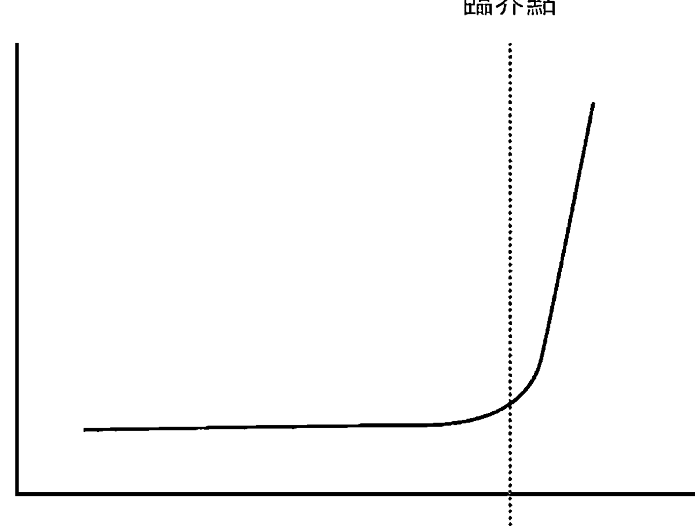

學好任何事情的學習關鍵在於超越臨界點之前，持續不斷地做就對了。

但可不要對自己太好，要給自己時間壓力，思考能力才會愈來愈靈活，剛開始我給學生的目標通常是第一週時每天做三個曼陀羅，一個曼陀羅必須在三分鐘內完成，第二週要進步到一．五分鐘內完成，第三週要進步到三十秒內完成。

另外我推薦一本《創造力激發訓練》（卡特．布利斯著，晨星出版社）在書中講授許多可以激發創意的思考方向，書中已經寫得相當完整，各位可以看過這本書後，搭配你認為適合的曼陀羅九宮格使用。

### 【商品設計】

最近政府開始大力重視文化創意產業，看到很多廣告公司躍躍欲試，想要接下這塊大餅，但很多廣告公司只是把商家舊有商品，換個又新又精緻的包裝盒子，編個商品故事，就稱之為文化創意。

我的記憶不禁拉回到大學時代，大學時就讀輔仁大學織品服裝學系，主修針織織布設計與毛衣設計，回想那時候老師常要我們看很多服裝設計雜誌、展覽、市面上的賣場服裝。

記得那時曾流行中國風一陣子，很多台灣設計師的作品都標榜中國元素，但都只是在西式的服裝結構上改放一些中國元素，例如把毛筆字用在衣服圖案上、或是改用盤釦、改成水袖，那時我總覺得怪怪的，用一些強而有力視覺元素，卻沒有加入元素的精髓，總覺得這樣的設計好像太偷懶了。

到了紡織業界工作後，發現創意設計不僅用在眼睛看得到的圖案設計或是款式，也用在看不到的製程或是材料設計上。那時我才真正感覺到創意設計無所不在。例如融合鯊魚皮的特性，開發出遊得快的泳裝。蝴蝶翅膀的特性，開發出隨光源變色的布料。中國視覺元素的服裝設計只流行了一、兩年，而紡織業十幾年前製程與材料的設計結果，這些商品到現在市面上還看得到。

另外一個例子是便利商店在二十年前賣美式咖啡（用美式咖啡壺煮好裝著等客人來買），賣到賠錢。現在賣義式咖啡（用義式咖啡機一次煮一杯），生意好得不得了。同樣賣咖啡，表面觀察的人會說那是現在台灣人開始有喝咖啡的習慣，深入觀察的人會說除了開始喝咖啡的習慣外，如果現在還是賣美式咖啡壺煮的咖啡，一樣會賣到賠錢，但賠錢原因不是台灣人比較喜歡義式咖啡，是因為義式咖啡機煮咖啡的過程讓人覺得物超所值。

今年我在台灣高鐵站的購物中心買了一個台幣一八○元的杯墊，杯墊正面是中國剪紙的吉祥設計，這樣的設計元素原本是吸引不了我的，吸引我的是杯墊本身是吸水性陶瓷，可以吸收杯子外側的水滴，但杯墊摸起來仍是乾燥的。一個杯墊要一八○元真的算貴，但它的設計感＋功能性讓我決定忍痛買下來。
所以，被大眾接受的創意設計，是來自對環境深入的觀察力。深入觀察一個文化、精神後所發掘出來的需求，並滿足那個需求的創意設計才能恆久。
回到剛剛的實轉虛、虛轉實、實轉實、虛轉虛，這個過程就是仰賴過去的觀察力所累積在腦中的訊息，加上現在大腦的聯想能力。平時多多使用這四種曼陀羅鍛鍊自己的觀察力、聯想力，日積月累下來就能培養出更勝於人的創意與設計力。
曼陀羅思考法本身就是一種文化創意產品，承接藏傳佛教的宇宙觀，不拘泥於固定的形式，你可以用九宮格、八十一宮格、七百二十九宮格，也可以一個宮格都不要用；你可以是圓的，也可以是方的，更可以是不規則的。
下頁舉例是運用十字型的創意發想方式來進行。中間十字部分請填上最重要的，四個角落請填上次重要的。透過這個方式也能在一個九宮格內做出兩種層次的內容。（今泉浩晃將之稱為四段論法。）

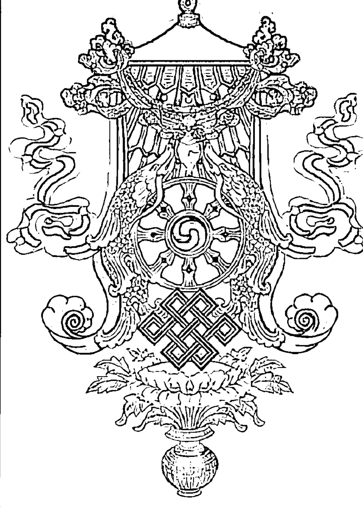

△藏傳佛教八吉祥圖（註③）

| Where
增加女性廁所的位置與空間 | 事／物What（WA）
服務員要真誠地笑
購票流程迅速 | What
高鐵代送行李服務 |
| 地Where（WR）
空間開闊明亮
站內座椅要夠多
車廂座椅要夠軟 | 人Who（WO）
高鐵旅客的需要？ | 時When（WN）
縮短停留站內時間
儘量捷運化 |
| Why
女性體力較小 | 為何Why（WY）
消除車程疲勞
減少趕時間的緊張感 | When
全程保持旅客們要的樂趣
全程保持商務客要的輕鬆 |

△「十字型創意發想」舉例：高鐵旅客的需要？

建議大家，增進創意與設計力的同時，平時多閱讀企業管理的書籍，因為企管論點講求合理的因果關係、重視邏輯性。創意思考與邏輯思考相互結合，自然而然能培養並產生比創意更進一步的解決問題能力。舉例來說，SWOT分析也能藉由十字型曼陀羅啟動思考。

| | 機會Opportunity 社會、科技、經濟、環境、政治、法律、道德、上游供應商、下游買家 | |
|---|---|---|
| Strength 生產、銷售、人力、研發＋技術取得、財務＋投資＋租稅、法務＋智權、商業模式、行政管理（本身強） | 本公司 | 劣勢Weakness 生產、銷售、人力、研發＋技術取得、財務＋投資＋租稅、法務＋智權、商業模式、行政管理（本身弱） |
| | 威脅Threat 社會、科技、經濟、環境、政治、法律、道德、上游供應商、下游買家 | |

△「十字型創意發想」舉例：SWOT分析

| | 政治Political | |
|---|---|---|
| 經濟Economic | 本公司 | 社會Social |
| | 技術 Technological | |

△「十字型創意發想」舉例：PEST分析

| | 政治Political | |
|---|---|---|
| 經濟Economic | 環境 Environment | 社會Social |
| | 技術 Technological | |

△「十字型創意發想」舉例：STEEP分析

| 環境 Environment | 法律Legal | 社會Social |
| --- | --- | --- |
| 經濟Economic | | 政治Political |
| 道德Ethical | 技術 Technological | |

△「十字型創意發想」舉例：PESTLE分析

△舉例：PESTLE分析
在此我將十字部分放上影響本業較大的，四個角落是影響較小的。

| | 收益力 企業獲利能力 分析 | |
| --- | --- | --- |
| 成長力 企業成長分析 | 安定力 企業信用分析 | 生產力 企業投入與 產出 |
| | 活動力 企業周轉能力 分析 | |

△「十字型創意發想」舉例：企業經營的五力分析

△舉例：企業經營的五力分析

### 十字型創意發想

△「十字型創意發想」舉例：企業競爭的波特五力分析

| 活化大腦、鍛鍊腦力 | 運用現有知識，強化思考效果 | 建立不後悔的人生目標與步驟 |
| --- | --- | --- |
| 小聰明風光一時，大智慧風光一輩子 | **為什麼非學曼陀羅思考法不可？** | 思緒靈活，不容易犯錯 |
| 增加思考深度與廣度 | 方便建立行動方案 | 節省學習時間 |

△「放射型創意發想」舉例：為什麼非學曼陀羅思考法不可？

△舉例：萬花筒行銷，盡可能寫下對方為什麼非要買我東西的理由。

> 小提醒：
書最大的影響力，就是可以刺激讀者自己思考。
克服怠惰，是生命中自助的方法。一切從遠處看、深處看，從近處著手起。

①常有人問我：如何培養獨立思考的能力？
很多人喜歡學習，但也很多人學完之後，不去運用自己學到的內容，把這些花時間學來的內容存放在自己的大腦裡，收藏起來。用一部很棒的影片，珊卓·布拉克主演的《攻其不備》來解說什麼才算是獨立思考。
這部電影的劇情很經典（或許你也可以说是老掉牙的劇情），一個人無私地幫助一個有才華的青年，最後青年果然發光發熱。這種例子在世界各地都有。老掉牙的觀念為何每隔幾年就能再次感動大家呢？這其中是不是有什麼永恆不變的真理隱藏在裡面呢？
或許是因為工作職業病的關係吧！我特別注意片中美式教育跟台灣人有何不同？
首先——美國教育教我們要看事情優點，然後就勇往直前地去做！

珊卓·布拉克在電影中說得很經典：過去說要幫忙他的人，最後都跑掉了，所以他不相信你們。每個人內心深處都有願意無條件幫助別人的心，片中很多人願意幫助青年，卻也很多人幫到一半就打退堂鼓了。主角的偉大就在於繼續無私地幫助青年。

珊卓的角色看到了青年的才華，沒有想這個青年會為珊卓帶來什麼好處，只是覺得如果這個青年的才華沒有被發揮出來，真是太可惜了！

很多人追求速效、速成，追求白吃的午餐，追求不費吹灰之力的事情。珊卓全家人主動願意幫青年一步符合社會的期望，讓他有機會能在社會的規範下發揮專長。

珊卓不是用負面思考的人，他沒有因為青年還有不能符合社會期望的行為，就認定他的未來無救了。他只是想辦法一關關陪青年克服，就像《秘密》影片中所說的：你就像在一片漆黑的道路上開車，你看不到前方任何的東西，但只要你的車頭燈能讓你看清楚前方十公尺的路，你就能一路開下去，直到你抵達目的地。

### 其次｜美國家長不會希望孩子只在學校裡面學習

《攻其不備》劇中珊卓·布拉克的小兒子還是個小學生，他完全就是一個獨立自主有思想的小學生，因為他沒有任何人給他指示或是暗示，完全自己想方法來幫助青年，例如發現青年缺乏抽象思考時，就用瓶瓶罐罐幫助青年把規則記熟；主動到場幫青年錄影，因為這樣可以讓青年回家後可以檢討；主動把錄影光碟片寄送到各地大學；主動幫青年跟各大學代表面談。

整個過程中，珊卓·布拉克沒有跟小兒子說：你趕緊去寫作業！也沒有說：你還小，這件事情是大人的事情，你不要插手！你把自己管好就好了！

但是台灣的家長就會給孩子這樣的觀念，只看重孩子在學校跟補習班的學習，只看重成績與學歷。只希望孩子拚命念到碩士或博士。所以孩子養成只重視學歷、不關心他人。

當電視上播出哪個青年又不讓坐時，其實記者應該要採訪他們的父母，而不是採訪青年為何不讓坐？

當電視上播出祖父母、父母當孫子的書僮時，這些祖父母、父母一句：沒辦法！就是因為疼小孩啊！甚至有祖父母跟父母還嗆聲記者說：等你自己有小孩時，你就知道了！台灣的家長忽略了，真正重要的學習是生活教育，影響孩子最大的教育是身教。如果有年輕人說：你們大人就是沒有做好榜樣，怎麼能怪我不學好呢？那這個年輕人就把所有的責任都往別人身上推，完全忘了自己才是自己的主人！

最後一看完了影片，我們自己會真正去做嗎？常常聽到大家講：善有善報、惡有惡報。又常常聽到人家講：在社會上工作就是要處處防小人。如果第一句話是真的，為何又有第二句話呢？如果第二句話是真的，為何又有第一句話呢？別忘了，別管別人怎麼說，自己才是自己的主人！你才能決定你自己要怎麼做！看到這裡你發現了嗎？養成獨立思考的能力就是要先有好的觀察力並不斷地對現狀提出問題。

② 水平思考與垂直思考的詳細解釋可見《心智圖超簡單》書中第47～49頁。

③ 八吉祥徵、八端瑞、吉祥八寶圖，藏語稱「扎西達吉」，是藏族民間傳統美術中最常見而又被賦予深刻內涵和吉祥喜慶喻意的一組組合裝飾圖。它由八種象徵吉祥、圓滿、幸福、智慧、財寶的標誌性圖樣組成，這八種象徵物是海螺、寶傘、寶幢、法輪、雙魚、金剛結、蓮花、寶瓶等，總稱為吉祥八清靜，也即俗稱的八寶圖。據說，它們分別表示如來佛的頭、眼、喉、舌、牙、心、身和足，其內涵除了寓意吉祥外，也與佛陀、佛法息息相關。

- 寶傘：代表頭部，傘可以保護眾生在輪迴中不受煩惱、痛苦和障礙，幫助眾生頭腦清晰，思緒清楚。
- 雙魚：象徵佛眼，雙魚眼睛常開，就像佛時時刻刻照顧眾生一樣，永不捨離眾生，幫助眾生的觀察力及判斷力正確。因為魚是在水裡自由活潑、自在生長的可愛動物，故用魚來象徵超越世間、自由解脫的修行者，亦是慧眼的象徵。
- 蓮花：代表佛的舌頭，象徵佛在說法時流利順暢燦爛，宛如金蓮一般，幫助眾生說好話，結善緣。藏語稱「白瑪」，亦稱妙蓮，是高尚純潔、開悟煩惱的菩薩德性和修成正果的象徵。
- 白海螺：代表聲音，佛的法音流遠，生生世世永不停止的度化眾生，使一切眾生都懂得佛的法語，幫助眾生遠離是非。
- 寶瓶：代表頸部，寶瓶的形狀像佛的頸子，藏傳佛教寺廟中用寶瓶象徵聚滿千萬甘露，包羅善業智慧、寶藏無盡、福智圓滿，成就勝義、妙善無窮。代表佛口中不斷的說法利益眾生，幫助眾生意志力堅強之意。
- 吉祥結：代表心臟，吉祥結象徵佛的心，佛心廣大圓滿，充滿智慧，幫助眾生心性安定平安。圖案組織成盤曲的沒有開頭和結尾的圖案。用它來表示佛法迴環貫徹，求無障礙，佛智圓滿，喻其永久常在的果位——解脫道。
- 勝利幢：代表身體。佛教用來做為治煩惱、得解脫、修成正果的勝利象徵。在藏傳佛教中認為它是「戒」、「定」、「慧」、解脫、大悲、緣起和脫離偏見的象徵。
- 法輪：代表足部，法輪象徵佛的足，佛足有法輪的圖案，表示佛廣度眾生，常轉法輪，幫助眾生加強行動力。為行動能力，意指行動力之強弱。關於法輪有兩說：其一為佛法能摧破眾生煩惱邪惡，摧伏怨敵，如轉輪王轉動輪寶，摧破山嶽岩石一樣；其二為佛之說法，不停滯於一人一輪，輾轉相傳，用來象徵佛法像輪子一樣永遠旋轉不停。「法輪常轉」即是這個意思。法輪上有八根輻條，象徵著釋迦一生傳教的八件大事，即「八正道」。

### 筆記術

這一兩年，台灣翻譯了很多教你如何做筆記的書，書中也列出了很多優秀的筆記，但不管筆記形式有多不一樣，做優秀筆記的兩個要素永遠不變：隨時記錄、記錄關鍵字。

### 【做筆記的常見問題】

#### (1) 好的筆記要包含哪些部分？

製作筆記也是一項技能，需要時間累積才能愈做愈好。任何一項技能要做到熟能生巧，必須持續不斷地練習，獲得義大利國際大獎的汽球藝術達人陳奕偉、中港台目前最紅的魔術師劉謙，在剛開始學習時也是每天練習六～八小時，才能生巧。

成績好的學生，筆記本都會有三個部分：A抄寫黑板上的內容，B老師的解說，C自己的疑問和想法。

日本人太田文提出考生製作筆記應該要有三個功能：記錄、整理、傳達。（註①）

若要適合用在各種不同的年齡層與各種不同的製作目的，我這樣建議，「做筆記應該要有三個功能：記錄、整理、確認。」

記錄是指把課堂上老師講的重點寫下來，方便自己複習使用。

整理是有系統地歸納重點，把熟的或不熟的部分都自己整理出來。

確認是把自己已經理解的部分反覆練習到純熟，可以透過一些問題的思考確認是否已經有自己獨有的一套理解。

#### (2) 哪種做筆記過程可以提升學習效率？

根據訪談東京理科大學共通教育中心筱原菊紀教授運用腦部掃描研究發現：

- A 筆記本記下黑板上內容＋說明：理解與記憶的腦部都很活躍，在做筆記的同時，腦部還在儲存上課的內容，這種狀態容易記住上課內容。
- B 筆記本只寫下黑板上內容：掌握理解的部分呈現活力，其餘部分沒甚麼活力，表示了解了內容卻沒不容易留在腦中。
- C 把黑板上的內容＋說明打字在電腦上：不管多用心，發現整個腦部都沒甚麼活力，表示不需要任何意識也能做筆記，腦部無法發揮理解與記憶功能。（註①）

如果你做很多的筆記，但是成績還是不好，或是總是記不住，就請多多注意上面講的內容，回頭檢討自己過去筆記過程哪裡出了問題，開始重視筆記的品質，當品質改變了，筆記的紀錄數量就算不多，你的學習效果也會增加的。

根據日本作家太田文的統計（註②），還有我自己在上課時看很多學生的筆記，發現很注重邏輯的人，常常筆記一行一行的都很整齊，而比較創意思考的人，常常筆記都不拘泥於固定規則。不管哪一種人，整體來看，讓人一眼感覺「漂亮」的筆記本人人都喜歡看。

#### (3) 現在的社會要求的是要能結合左腦邏輯思考與右腦創意思考的人，有沒有一種筆記可以同時訓練邏輯與創意呢？

答案就是：曼陀羅筆記術。（註③）

### 【如何做出好筆記？】

#### (1) 先掌握 5W2H

事件的發生一定有人、事、時、地、物、原因、結果、方法、成本。所以基本的閱讀原則就是掌握5W2H——Who（人）、What（事、物）、When（時）、Where（地）、Why（原因、結果）、How（如何進行、什麼方法）、How many或How much（有形與無形成本）。（註④）

| Who (人) | What (事、物) | When (時) |
| --- | --- | --- |
| Where (地) | 筆記重點 | Why (原因、結果) |
| How (如何進行、什麼方法) | How many或 How much (有形與無形成本) | 個人心得 |

△「5W2H筆記術」舉例：用法一

| Who (人) | What (事、物) | When (時) |
| --- | --- | --- |
| Where (地) | 筆記重點 | Why (原因) |
| How (如何進行、什麼方法、How many、How much) | Why (結果) | 個人心得 |

△「5W2H筆記術」舉例：用法二

我們在思考事情的時候有四個層次，掌握5W2H讓我們知道事情的基本要素，屬於「思考事情四個層次」中的第一與第二思考層次，需要的是分析能力。沒有第一個層次的理解，就沒有辦法累積出第二個層次的思考，以此類推，思考的訓練必須先從掌握最低層次的理解開始，逐步訓練到最高的層次。可惜的是，目前的學校教育通常只重視考第一個層次的問題，好一點的考試會考我們第二個層次。因為這兩種層次的問題幾乎都有標準答案。（註⑤）

舉例來說，國父孫中山先生十次革命的故事我們都學過，能夠講出國父為何要發動革命？如何發動革命？這是第一個層次的理解。

△思考事情四個層次

能夠講出國父十次革命之間相互的影響關係是什麼？如果中國沒有國父革命會怎樣？中國若是由別人來發動革命會怎樣？這是第二個層次的思考。

何謂革命？革命跟叛亂有何不同？革命也是成者為王、敗者為寇嗎？為何國父只能有一個？

國父革命這件事情帶給我的影響是什麼？這是第三個層次的思考。

我能如何運用國父革命的經驗來幫助我自己？我可以從國父身上學習什麼？這是第四個層次的思考。

以東西方文化差異來說，東方注重因果關係掌握，強調先了解事物的本源，注重Why，而西方文化注重事情發展過程，強調方法學，注重Who、What、Where、When、How。同樣是由一家公司發展成集團，鴻海傾向用併購方式，統一傾向用品牌代理，台塑傾向由自己開一家，西方文化會研究他們怎麼去併購、怎麼代理品牌、怎麼自己開公司，而東方文化會研究他們為什麼想要發展成集團。在一七七〇年工業革命之前，中國的繁榮勝過西方世界，工業革命後情況顛倒，於是清朝提出了「中學為體，西學為用」的概念，曼陀羅思考法正是連結「中學為體，西學為用」的最好工具。

注重第一跟第二層次思考的筆記是「多數的紀錄少數的整理」。若想要考好成績的人，必須先學會怎樣做筆記。做筆記剛開始可能不會漂漂亮亮的，從明白相信做筆記是很重要的，到感受到做筆記的樂趣是要時間累積的。別忘了，凡事「熟能生巧」。

回頭呼應一下我在前言中所提到的輸入 || 輸出概念，學生時代的筆記是以方便自己或是記錄自己的理解為主，以自己的立場來寫，目的是為了輸入大腦。就業之後做筆記，不是為了考試，而是需要運用自己的聯想力、創造力與整合自己的知識，把整理好的資訊傳達給別人、方便自己輸出、方便別人可以了解我的想法。（註⑥）

#### (2) 一定要寫出個人心得

小時候作文老師總愛叫我們寫閱讀心得，這個題目總是難倒 80 ％以上的學生。很多成人學生來找我學習時，私下常常反應講出個人心得是他最害怕的一件事。因為很多工作的場合不能說實話，實話可能會傷害他人或是引起爭執，更嚴重的是主管與老闆常常不是真心想聽員工的實話。所以上班族習慣了自我催眠，告訴自己不要想太多，反正就跟以前考試一樣，講出主管或是老闆心中的標準答案就是了。慢慢地，就喪失自己獨立思考的能力了。

但工作上的問題，卻又很需要我們不斷地做第二跟第四層次的思考，沒有標準答案的第三與第四層次通常是老闆出給我們的考題。這也是為什麼許多上班族或是高階主管會來找我教他們如何思考。要把抽象與動態的教學過程，以文字清晰表達，這本就是一件不容易的事，在這本書中，我會儘量想辦法做到的。
如果你想改變自己，如果你想要培養自己有更深入的思考能力，如果你不想變成一個人云亦云的人，請你從現在開始，在筆記的最後一定要加上一項「個人心得」。

### 【筆記術的運用】

#### (1) 第三與第四思考層次的筆記

想鍛鍊自己深入思考的能力，請多多閱讀寓言故事。寓言，就是「寓意於言」。透過故事情節，把自己認為正確的道理說給別人聽的時候，讓聽的人從故事中體會隱含的道理。看這類的故事步驟是：

① 故事情節的 5 W 2 H

寓言所說明的道理都是寄託在故事之中的，不能主觀臆斷。所以我們閱讀寓言時首先要瞭解這是一個什麼樣的故事。

很多人只有看故事，而沒有記錄故事的關鍵重點，看完故事後印象不深刻，這種情形的人就很適合一邊看故事，一邊用曼陀羅來做筆記。

做筆記是為自己寫的，以能讓自己看懂為主，抱持這種心態，透過不斷地做筆記，筆記術會愈來愈進步，甚至別人看你的筆記也會覺得很容易懂。

② 隱含什麼道理

△舉例：《一生必讀的100個睿智故事》書中提到一則西方傳說故事（註⑦）

宇宙剛開始的時候，神決定把自己隱藏在祂自己的創造物中。「我必須藏在一個不容易被發現的地方，因為當人類花心思去尋找我的時候，他們的精神跟智慧都會有所成長。」

正當神在思考怎麼做時，天使們問了：「為何不把自己藏在地底深處呢？」

神想了一下：「不行。他們很快就知道開挖土地來發現地底的寶藏。太快讓他們找到，他們不夠時間成長。」

天使又問：「神啊！那你問什麼不藏在月亮之中呢？」

神馬上說：「不行！雖然這會需要他們多花一點時間，不過不久後他們就能上了太空，登上月球。在他們沒有足夠的時間成長前，他們就會找到我。」

天使想不出到底藏哪裡比較好了。

一個最小的天使說：「我知道了！為什麼不把自己隱藏到人類的心中呢？他們不會想要去那裡尋找的！」

「就是那裡！」神很高興找到了理想的藏身之處了。

於是神就秘密隱身於人類的心中，直到人類的心靈跟智慧夠成熟了，他們才能開啟進入自我內心深處的偉大旅程。在那裡，人類會發現他們的神，然後在此與神在一起。

> （節錄自《一生必讀的100個睿智故事》瑪格麗特・斯爾夫著，晨星出版社）

透過下頁的曼陀羅圖，你或許已經發現，以曼陀羅方式填寫，形成一種圖像，變得一目了然，容易產生整體觀，故事本身的結構也被解析了，整個製作的過程是在鍛鍊我們的分析能力與邏輯能力，最後心得的填寫正是培養我們第三與第四層次的思考能力。

曾經有個擔任電子業主管的學生說到他自己的經驗：

有次跟同事一起去聽一場演講，中場休息時間時，同事問：「會不會覺得這個老師講的內容很亂？很沒有邏輯？」

我當時回答：「不會呀！我覺得他講得很清楚，他先講……再講……最後是……」

同事聽完後說：「為什麼我聽你講就很清楚？聽他講就覺得很亂？我好像邏輯不太好。」

這個同事能相當誠實面對自己的問題。在課堂上有這種問題的人其實不少，建議有這種問題的人可以用曼陀羅，一邊看書或是一邊聽故事，一邊動手做記錄，別忘了最後再看這個九宮格曼陀羅，填上自己的心得，才能幫助自己提升思考層次喔！

| 人：上帝、小天使 | 事、物： | 時： |
| --- | --- | --- |
| 地：1.藏在地裡 2.藏在月亮 3.藏在人心 | 上帝要藏在哪裡？ | 原因：透過尋找的過程去幫助人類增長精神與智慧 |
| 如何進行、什麼方法：1.上帝想要藏起來，讓人類花心思尋找 2.小天使提出躲藏地點的建議 | 結果：上帝藏在人心中 | 個人心得：1.本文透過基督教全能的上帝來代表所謂的智慧 2.智慧的產生不是來自於別人給你的，是要透過不斷往內在反省，才會開啟無限的智慧 |

△「5W2H筆記術」舉例：上帝要藏在哪裡？

| 人 | 事、物 | 時 |
| --- | --- | --- |
| | 黃、紅、藍、綠的螢光筆、顯目顏色的原子筆 | |
| 地 | Google前執行長的閱讀技巧 | 原因：1.真正需要的東西才記進腦子裡 2.分色標記重點，方便日後重讀 |
| 如何進行、什麼方法：步驟一、標示你要的，過濾不要的；步驟二、用色筆標記：1.黃色筆：要背的；2.紅色筆：要搞清楚推演模式的；3.藍色筆：看不懂的，要精讀的；4.綠色筆：要對答案的；步驟三、分析邏輯關係 | 結果：1.輕鬆掌握關鍵資訊；2.能順利回想；3.更有組織，也更成功 | 個人心得：如同我在速讀課堂上常提醒同學的：1.速讀是掌握重點在哪裡的一項技巧；2.重點在哪裡是因個人需求來決定的 |

△「5W2H筆記術」舉例：Google整理術——過濾你不需要的

在資訊爆炸的年代，我們每天接收的資訊琳瑯滿目，怎麼知道哪些不必理會？唯有真正需要的東西才記進腦子裡。要怎樣才能做到？靠「過濾」才行。

關於過濾，我是這麼做的：當我坐下來閱讀時，手邊一定會準備好四枝螢光筆和一支顏色醒目的原子筆（像是紫色）。接著，我很快逐頁瀏覽，找尋跟我目標相符、可能重要的資訊。

一旦我找到有興趣的文字，我會用醒目顏色的原子筆在一旁空白處標示星號。這時候我還不打算把這些文字跟其他資訊做連結。我只是單純的把看似重要的文字先標出來，也等於把其他不重要的東西先排除。

完成一章之後，我會從頭再讀一遍，但只讀那些由醒目顏色標示出星號的句子或段落。這一回重讀時，我會根據我的目標，將這些文字分成四類，分別用四種不同顏色的螢光筆標示。舉例來說，假設我正在讀數學教科書裡的某一章，我會把標示的文字分成以下四類、四種顏色：

①新名詞的定義與原理用黃色螢光筆標示，目的是提醒我要背下來。
②數學公式及衍生算式則用粉紅色標示，這表示我得搞清楚它們的模式。
③看不懂的部分則會標示成藍色，提醒我稍後得再仔細重讀。
④例題的解答過程則標示綠色，等我解完例題後，再回來核對答案。

隨後，等我第三次瀏覽同樣章節時，我一下就能挑出那些用螢光筆標示的部分。有些地方我會仔細再讀一遍，試著理解它的意思，並找出它跟其他螢光標示部分的關聯。這做是幫助我找出那一章裡重要資訊的共通模式，設法從中發展出故事。一旦這些資訊有了關聯與脈絡，編碼時就容易多了。有了這項過濾技巧，讓我的速讀水準變成世界一流，至今仍十分受用。

人腦記憶少量資訊的能力，要比記憶大量資訊好太多了。這不僅適用於資料，也適用在行動上。每當你遇上棘手的事，就試著把它拆解成獨立的小任務，各個擊破比較容易。對於管理我們每天接收的資訊，的確是不可或缺的方針。

任何文章做好過濾之後，日後不論過了多久，重讀時都能輕鬆掌握關鍵資訊。人的記憶實在非常不可靠。若你需要某份資料時，總是能順利回想起來，那麼你會更有組織，也更成功。（節錄自《Google時代一定要會的整理術：連結人腦、人性、科技，有效掌控資訊與思緒》，道格拉斯・梅瑞爾／Google前任資訊長著，天下文化）

### △舉例：畫個圖講得更清楚——開會要開好，畫的比說的有效

想到開會就沒力？請服用「視覺會議」工具！用塗鴉、便利貼、手勢，可專治打瞌睡、玩手機、沒意見等症頭，還能提神醒腦、活化腦力，並且增進發言、加強記憶。

在這幾項工具當中，最有效的就是你天生的畫圖能力。信不信由你，這種能力就深植於你的體內。我所謂的畫圖，就是指我們講話時比手畫腳的那個樣子，也就是各種表達我們意思的簡單動作。

把會開好的第二類有效工具，就是互動媒介，在本書我們以「便利貼」來做為主要象徵。概念和便利貼相近的，還有圖卡、心智圖軟體等可以隨意移動的小道具。電影等影像設計者在設計草稿的時候，就是像這樣將一小段一小段的資訊，不斷反覆組合，整合出不同劇情發展的分鏡圖。其實，我們也可以用這種方法來主持各種大大小小的會議，討論各種不同的議題，而不只是用在設計上。人類喜歡互動，讓大家可以直接「碰觸」到資訊，可以提升與會者的參與度。

我把第三類工具稱為「構想圖學習法」，主要是運用隱含在圖表或工作表中的視覺隱喻，促使團體成員透過視覺來思考。

我之所以對視覺會議這麼有信心，是因為打從我第一次拿起奇異筆，用視覺化的方式引導團體開會起，就感受到以下三個現象：

- 認真參與：當你將與會者所說的話，透過互動的方式以圖像記錄下來，與會者會感受到自己的意見受到傾聽和重視，對會議的投入程度也就會大大升高。
- 整體思考：如果能讓團體從整體的角度思考，去比較不同資訊、找出聚焦點，並把資訊彙整成構想圖，大家的頭腦會變得聰明許多。
- 團體記憶：創造令人印象深刻的媒介，能大幅提升團體記憶以及會議後的執行程度，這兩者都是團體效能的關鍵因素。

> （節錄自商業周刊第一二〇四期 二〇一〇年十二月二〇日，內容引用自《畫個圖講得更清楚》大衛．斯貝特著，時報出版）

| Who | What | When |
| --- | --- | --- |
| | 第一類工具：比手畫腳 第二類工具：便利貼、圖卡、心智圖軟體 第三類「構想圖學習法」：圖表、工作表、示意圖、草圖 | |
| Where 1.會議 2.團體討論 | **畫個圖講得更清楚** ——開會要開好， 畫的比說的有效 | Why 1.可治打瞌睡、玩手機、沒意見 2.提神醒腦、活化腦力、增進發言、加強記憶 3.大家認真參與：因為充滿互動 4.容易整體思考：容易比較與彙整資訊 5.提升團體記憶：以及會議後的執行程度 |
| How | How many或 How much | 個人心得 養成大家具備圖像思考的能力，自然大家就會用圖像來溝通 |

△「5W2H筆記術」舉例：開會要開好，畫的比說的有效

### (2) 預想式筆記

前述筆記可以說是（複習用的）提示筆記或是心得筆記。建議大家還要做讓未來創造用的「預想式筆記」。

也就是當我們想到什麼想法時，趕緊記錄下來，用曼陀羅方來記錄有一個好處，就是有大量的空白可以讓我們隨時補充。因為是現在提出問題與思考大綱，提供自己日後繼續思考使用的，所以我稱之為「預想式筆記」。

△ 舉例：「預想式筆記」（註⑧）

很多台灣人都被教育成「乖學生」，就是書上怎麼寫，我就怎麼寫，老師在黑板上寫什麼，我就照抄什麼。

| 1.敢於決斷 克服猶豫不定的習性 | 2.挑戰弱點 徹底改變自己的缺陷 | 3.突破困境 從失敗中獲得成功的資本 |
| 4.抓住機遇 善於選擇、善於創造 | 5.發揮強項 做自己最擅長的事情 | 6.調整心態 切忌讓情緒傷害自己 |
| 7.立即行動 只說不做，徒勞無益 | 8.善於交往 巧妙利用人力資源 | 9.重新規劃 站到更高的起點上 |

△「預想式曼陀羅筆記」舉例：成大事必備九種手段（註⑧）

在填寫預想式筆記曼陀羅時，請儘量用《眼腦直映快讀法》中如何抓重點的方式，不要照抄原文，而是經由自己思考後，儘量用更精簡的字詞，用自己的話來表現最好。

### (3) 十二宮格筆記

或許你會疑惑，十二宮格也叫曼陀羅思考法？

十二這個數字有其實務上的意義，因為古代人開始發展數學的過程中，分類是一項重要需求，十二可以分別被一、二、三、四、六整除，因此我們最早發展出來的進位方式是十二進位而不是十進位，例如一打

| 平衡 | 慈悲 | 行動 |
| :---: | :---: | :---: |
| 中庸之道 | 喚醒悲憫 | 做才是真理解 |
| 選擇 | 信心 | 循環 |
| 取回由我選擇的力量 | 相信我的心 | 物極必反周而復始 |
| 過程 | 期望 | 臣服 |
| 按部就班完成小目標 | 擴展我的實相 | 遵守更高的意志 |
| 現在 | 誠實 | 合一 |
| 活在當下 | 對自己誠實 | 我與世界是一體的 |

△「十二宮格筆記」舉例：《鹿智者的心靈法則》閱讀筆記（註⑨）

十二個，一年十二個月，一年二十四節氣，一天二十四小時。
其中跟時間相關的單位都是從觀察地球移動所造成的天象變化而來，天象周而復始、循環不斷的變化也就是曼陀羅思考中的宇宙觀「天圓地方」。因此，曼陀羅思考法可以是周而復始、放射狀、圓形的、方形的表現方式，故曼陀羅思考法不僅是九宮格而已。

另外，今泉浩晃所提出的mandal-art曼陀羅版本是5W1H，若對今泉浩晃版本有興趣的人可以參考《曼陀羅筆記學：提高創造力的工具》《個人生涯設計：曼陀羅思考訓練實用手冊》。

> 小提醒：
擁有聰明的心智還不夠，重要的是能好好運用心智。
成功不是用學位跟金錢來衡量的，是用人的思考能力。

①資料來源：《實現一生夢想的筆記本》（太田文著，聯經出版）。根據作者太田文的統計結果，東京大學生的條列式筆記有四種功能：上課筆記本、練習問題筆記本、整理筆記本、記憶計算筆記本。還提到有七個特色：

- 第一個字對齊。
- 一定要寫才動手寫，否則影印即可。
- 志在清晰，不怕大量留白。
- 願望快速實現靠索引。
- 筆記本的段落分明。
- 記筆記之前先有規劃。
- 本本字跡清楚工整。

我再進一步說明這七點：

- 保持版面整齊。
- 影印轉貼也可以。
- 保持清晰，不怕大量留白。
- 標題清楚。
- 段落分明。
- 先想清楚大綱與規劃，再動手寫。
- 字跡清楚工整。

② 日本作家太田文著有《考上第一志願的筆記本》、《實現一生夢想的筆記本》（聯經出版）。

③ 但其實只要是圖像式筆記都能結合左腦邏輯理解＋右腦圖像創意，像是 mind map 心智圖（大陸稱之為思維導圖）、魚骨圖、系統圖、組織圖等。

④ 平時常見的是「六何法」：何人（Who）、何時（When）、何地（Where）、何事（What）、為何（Why）、如何（How）。

⑤ 雖然有些學校教材會探討第三跟第四層次的思考問題，但是都給了學生「標準答案」，考試時必須寫出「老師的答案」，這種方式一樣是屬於第一跟第二層次的教學。

⑥康乃爾系統（Cornell System）是一個有效做筆記的技巧，使用隨筆或是簡單的格式記錄，在頁面右邊用簡短詞彙而非完整句子做筆記，除非是很重要的定義或觀念才完整寫出。在頁面的左邊寫下關鍵字或需要被定義的字詞。在這裡大家可以看到也是要求達到做筆記兩個要素：**隨時記錄、記錄關鍵字**。

⑦在ESI全腦式速讀訓練的課堂上，我常建議學生，想要提升自己的速讀理解能力，可以從《一生必讀的100個睿智故事》（瑪格麗特·斯爾夫著，晨星出版社）這一本書開始鍛鍊起。即使各位沒有學過全腦式速讀也一樣可以用這本書訓練自己抓重點、訓練自己寫學習心得。

⑧資料來源：《手段：成大事的各種手段》（王志剛著，海洋文化）。

⑨資料來源：《鹿智者的心靈法則》（丹·米爾頓著，心靈工坊）。

### ◎ 思考的提綱

這一段內容本來想訂為「作文大綱」，考量到有人會想「我又不用寫作文」，就跳過本章不看。本想訂為「發表的提綱」，也考量有人會說「我不用發表什麼」，也跳過本章不看。最後想到在輸出我們的思考和想法前，務必先審慎整理思緒，故訂為「思考的提綱」。

在現今電腦這麼發達的時代，整理與歸納的能力愈來愈重要！很多人蒐集資料，卻沒有記錄自己思考的過程。吸收後的資訊會隨意分散在大腦各處，當要使用的時候，必須要產生有意義的聯結，整合成單一的知識，整個思考過程必須透過書寫才能得到完整的紀錄。每個人必須依照自己的要求改變記錄的方法，也就是要做到有目的性地記錄。

很多人一聽到記錄、要寫東西就怕，其實語文能力是學習任何事物的基礎，以輸入角度來說，語文能力不好理解力就弱，聽不懂別人的意思。以輸出角度來看，語文能力不好，口語溝通能力就弱，無法用精煉的文字表達自己的意思。所以各位不要把文字記錄和書寫想得太難，其實寫作就只是把心中的想法寫下來而已，把你想講的改用寫的記錄下來，就這麼簡單。

學生時代很多人最害怕寫作文，工作後最害怕寫報告跟上台發表簡報，以大腦思考角度來說，這兩件事情其實是相同的，都得思考、書寫記錄整理過的提綱，之後再發表、傳達出去。

可能有人想問：發表演說、簡報、講話等口語表達常常是一來一往、彼此有互動，書寫文字進行記錄常常是一個人單方面的表達，要有先後順序，別人才能懂我們的意思，那要怎麼寫、怎麼記錄，才能夠完整運用出來呢？

還有人會問：我沒有很多時間可以好好寫下完整的內容，我應該怎樣用最少的時間記錄我的思考過程與整合後的知識呢？

另外，根據我的非正式統計經驗，在講授魅力演說與簡報的課堂上，來求教的人大約有 50 % 的人是內容的問題，50 % 是表現方式的問題。

以上大家曾提出的問題，都能用曼陀羅幫你擬定思考的大綱。想要安排完整的演

| 2. | 3. | 4. |
|---|---|---|
| 1. | | 總結／結論／建議 |
| 重點提要 | 開場 | Q&A |

△「思考的提綱」舉例：演說、簡報、企劃的思考提綱

說、簡報或企劃內容結構，除了運用心智圖外，曼陀羅絕對是一個相當好用的工具。在此建議使用九宮格或是八十一宮格的曼陀羅，這樣可以訓練我們的內容要精簡扼要、不要偏離主題。同時也容易看出自己的內容偏重與偏廢之處。

選擇用「順時鐘」的方向，在正式報告時比較方便閱讀。根據記憶寬度 7 ± 2，八段內容是極限，請勿超出才是好的演說與簡報。同時千萬不可以像以前老師教我們寫作文一樣，用起承轉合的方式擬訂演說與簡報大綱，這也是我在魅力演說與簡報課程中最常看見學生所犯的錯誤。

因為起承轉合的方式是屬於「我只管寫，不管你的想法」的單向溝通方式，跟演說、簡報這種講求互動的溝通原理是相違背的。

成功的簡報，以清晰架構為基礎。另外補充一點，厲害的企劃書是愈少頁數愈好，厚厚一疊的企劃或簡報簡直是在向別人說：千萬不要看，因為看完你就累了。

要將內容整理在一張 A4 紙內，就要取捨內容，並以最簡短的標題傳達訊息。這關係到內容精煉程度，也等於告訴對方自己具有消化資料、並精簡傳遞訊息的能力。

大家習以為常的起承轉合同樣也不適合來擬訂工具書類的書籍寫作，以本書做舉例，當初我在思考這本書要寫什麼時，我畫了下頁的兩個曼陀羅，先進行放射型的發散思考（水平思考），再進行順時鐘的垂直思考。

| 指出正確與錯誤的觀念 1.形式：九宮格、八十一宮格…… 2.結構 3.起源與演變 4.學習重視過程，而不是結果 | 各種運用舉例，方便了解 1.儘量舉例各種曼陀羅圖使用方法 2.儘量口語化，不要太學術口氣 | 它是一種紀錄 圖像筆記 行事曆 |
| --- | --- | --- |
| 它注重思考過程，可以從結果反推思考過程 1.生涯規劃、審視分析 2.目標設定 3.心靈治療、藝術治療 | 《曼陀羅思考法》 | 它方便隨時增減，提供反思 1.人脈管理（分類的重要） 2.寫作大綱 |
| 結合工法與心法，不僅是一本工具書，也要給予用在該領域時應具備的觀念 1.時間管理 2.商品設計（創意訓練） 3.筆記術（整理歸納） 4.窮究事理（深入分析） | 可訓練大腦哪些能力？用到大腦哪些能力？優點？ 1.創意訓練 2.邏輯力 3.圖像思考力 | 還有哪些異曲同工之妙的圖像化思考法？ 1.mind map心智圖 2.九宮格思考法 3.九宮格問題分析思考法 |

△「思考的提綱」舉例：本書《曼陀羅思考法》第一步規劃使用放射型水平思考

| 第三章 與曼陀羅異曲同工的方法 一、九宮格思考法 二、創新發明問題解決理論——九宮格問題分析思考法 三、mind map 心智圖 | 第四章 基本結構 一、中心——主題、問題 二、八種思考角度（八種思考方向） 三、放射型排列 四、順時鐘排列 五、十字型排列 | 第五章 運用實例 一、規劃人脈網路 二、時間管理與生涯規劃 三、創意訓練 四、筆記術 五、思考的提綱 六、窮究事理 |
| 第二章 訓練大腦的主要能力 一、聯想力訓練 二、邏輯力訓練 三、創意力訓練 四、圖像化思考能力訓練——視覺化一目了然 | 《曼陀羅思考法》 | 第六章 心靈成長的運用 具有藝術療癒的曼陀羅彩繪 |
| 第一章 曼陀羅思考法的由來 1.名稱源起 2.演變過程 | 學曼陀羅之前，先了解 1.推薦序 2.前言：作者序 3.前言：常見問題 | 第七章 電腦軟體 |

先進行第一步規劃，再由點至線，由線至面，獲得擴展，整理成左邊的曼陀羅。

△「思考的提綱」舉例：本書《曼陀羅思考法》第二步規劃使用順時鐘垂直思考

> 小提醒：
我們很容易將成果不如人的原因歸咎於運氣，而不是自己努力不夠。
理性、判斷是慢慢走過來，但偏見則是快速跑過來。

### 窮究事理

文字有侷限性。文字常常造成誤解。

舉例來說，中國人喜歡用各種不同的文學性語詞來描述月亮，光是透過教育部重編國語辭典修訂本，就查到：玉盤、玉輪、玉環、玉蟾、白兔、寶鑑、碧華、冰盤、冰壺、步蟾、魄、太陰、太陰星、兔魄、桂、桂魄、桂輪、桂月、廣寒十九個別稱，而依月亮的陰晴圓缺不同形態，或從古至今的詠月詩句，中文的月亮還有更多別稱，而西方人只有一個名稱moon。

因為中文很強調用字優美，有時以訛傳訛或不小心誤用，讓我們反而講不清楚本義為何。所以有時我們要探究文字的本義，透過英文同義字或是更嚴謹的法文同義字更能掌握事理本質。

△舉例：我在第一本觀念書《超強學習力訓練法》提出了學習五力的觀念，在分析建立學習能力的五種能力之前，先必須清楚學習是為了要更聰明？還是更有智慧？當時我用曼陀羅思考法分析聰明跟智慧有何不同？（請參考第176頁。）

有興趣的讀者請查詢當時的文字內容，一比之下，你就會很清楚曼陀羅思考法跟一般傳統條列式的思考方式，對產生靈光一現的啟動點在哪裡。

| Smart 聰敏的；伶俐的 | Clever 敏於學習和理解的；機伶的；伶俐的；靈巧的 | Ingenious （指人）善於用新的或簡單的方法解決複雜問題的；心靈手巧的；善於發明創造的。 |
| Intelligence 學習、理解和推理的能力 | 聰明 | |
| | | 結論：在於明察四方 |

△「窮究事理」舉例：思考「聰明」這個詞的意義是什麼？

| Wisdom 做決定或判斷時，表現出的經驗和知識；正確的判斷；明智；有鑑識的想法 | Wit 用措辭、構想等，產生巧妙幽默的能力；悟性；理解力 | |
| | 智慧 | |
| | | 結論：在於通達事理 |

△「窮究事理」舉例：思考「智慧」這個詞的意義是什麼？

接著，我們試著舉幾個例子，讓大家更了解如何運用曼陀羅思考法「窮究事理」。
在此提醒大家一件很重要的事情，進行「窮究事理」練習的時候，翻閱的字典請勿找網路字典或是太小本的字典，以免裡面寫的字義不完全。

△ 舉例：曼陀羅思考法探討思考訓練，那麼「思考」又是什麼呢？以下我們列舉幾個不同主題，請大家一起「思考」看看，這些文字的代表意義是什麼？

| Think over 仔細考慮 | Pondering 也可翻譯為思索。 仔細考慮、衡量、反思、回想、沉思、默想 | Reflect on 仔細考慮 |
|---|---|---|
| Deliberate 深思熟慮的、慎重的、謹慎的、商議 | 思考 （動詞） | Meditate 深思、沉思、冥想（指精神方面的） |
| Think 想、思考、認為、有意打算、計畫、朝某一方面想、專想某件事 | | 結論：針對某一件事情仔細不斷地想，具有邏輯性。 |

△「窮究事理」舉例：思考「思考（動詞）」這個詞的意義是什麼？

| Think deeply 深深地認為 | Pondering 也可翻譯為思索。 長時間針對某事仔細考慮以便做決定、反覆思考 | Speculate about 推測、推斷、投機 |
| Ruminate 沉思、反覆思考 | **思索** （動詞） | Consider 以做決定為目的，考慮某人某事、細想、認為、體諒 |
| | | 結論：針對某一件事情反覆不斷地想，希望能獲得某種決定 |

△「窮究事理」舉例：思考「思索（動詞）」這個詞的意義是什麼？

| Consider carefully 小心地考慮 | Contemplate 思量、仔細考慮、預料、盤算、考量某事物的可能性、深思熟慮某事物 | Deliberate 深思熟慮的、慎重的、謹慎的、仔細考慮、深思熟慮、商議 |
| Concernment 憂慮、焦慮、焦急、對某人來說是重要的或感興趣的事物 | **思慮** （動詞） | |
| | | 結論：針對某一件事情反覆不斷地考量各種情況，並且特別注意負面的結果 |

△「窮究事理」舉例：思考「思慮（動詞）」這個詞的意義是什麼？

| Thought 也可翻譯為思維。 思考的過程、沉思、考慮、關注、顧慮 | Thinking 也可翻譯為思維。 思想的、有理性的、有思考力的 | Idea 主意、計畫、印象、感想、臆測、意見、信念、觀念、目的目標、模糊的想法、想像、認為某事有可能發生的感覺 |
| Cerebration 大腦作用、精神活動 | 思想 （名詞） | |
| | | 結論：從理性的角度去考量，獲得某種抽象的結論 |

△「窮究事理」舉例：思考「思想（名詞）」這個詞的意義是什麼？

| Train of thought 思路 | Thinking 也可翻譯為思想。 思想的、有理性的、好思考的、意見、想法 | The source of feelings 感覺、看法、感想、預感、意識、感情、同情、體諒，以上字詞的來源 |
| Heart 內心、心腸、感情、勇氣、精神、心靈、衷心、某事物的中心 | 思緒 （名詞） | |
| | | 結論：從感性的角度去考量，獲得某種抽象的結論 |

△「窮究事理」舉例：思考「思考（動詞）」這個詞的意義是什麼？

思考過以上舉例之後，你發現了嗎？文字與語言的溝通過程，是需要輸出方與輸入方彼此的理解度是一致的，否則多麼容易造成誤解。（註①）

跟別人講話的時候，我常常在腦中畫心智圖或是曼陀羅圖來整理雙方對話內容，別人看不到我的腦部運作，只能從我的言語中來了解我在想什麼？故他人難以得知我的思考過程是怎樣的。

常有學生很訝異地問：「為什麼老師會想到這些事情呢？對一件事的分析這麼簡單且多元，是怎麼辦到的？聽別人講都講不清楚的事情，怎麼老師一說就變得很簡單？」我沒什麼訣竅，每天運用曼陀羅與心智圖而已。當臨界點的那一天到來時，你也會跟我一樣讓別人很訝異地問：你是怎麼想到的？

> 小提醒：
> 心愈用愈明，手愈用愈巧。
> 沒有什麼事情比一知半解的知識更危險。

①想要知道我們生活中有多少文字的定義錯誤與邏輯錯誤？建議你閱讀《邏輯思考防身術：別讓謊言跟謬論騙走你的選票、金錢跟熱情》（傑米．惠特著，漫遊者文化出版），書中作者是英國人，提出多項常見政治、宗教、社會議題上，被大家廣為接受卻充滿邏輯錯誤的論點。

## 第六章 心靈成長的運用

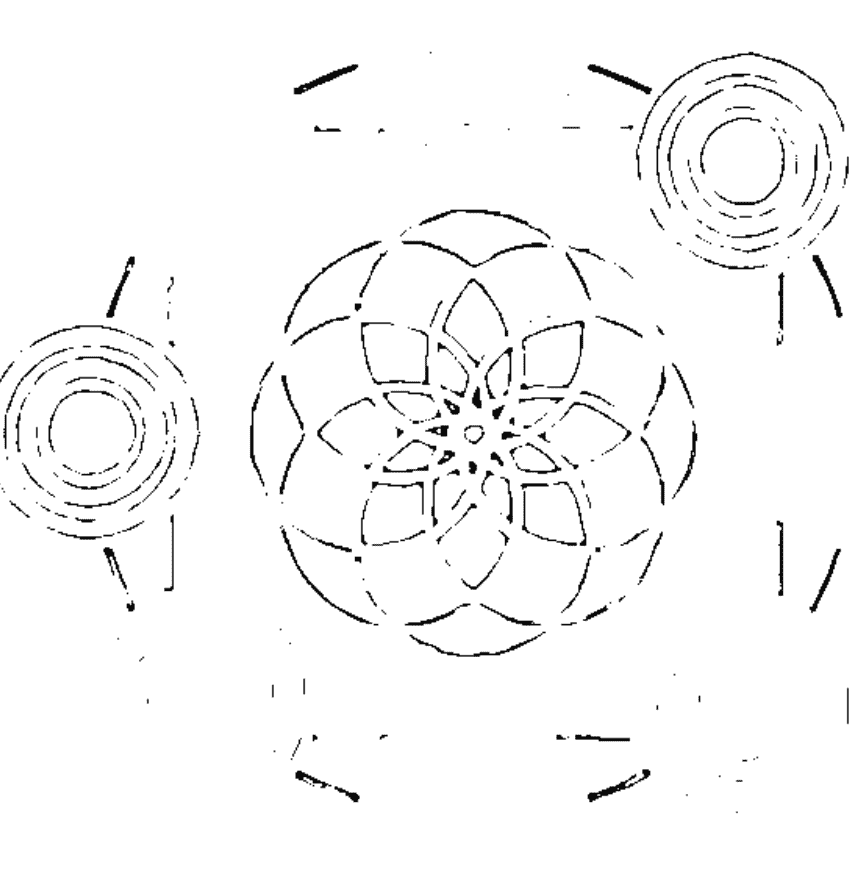

### 具有藝術療癒的曼陀羅彩繪

瑞士心理學家容格對曼陀羅很有興趣，主要關心的焦點一方面來自於容格自己的個人體驗，一方面是他治療精神病患時獲得的想法。容格對於曼陀羅的結論是：可以調和處於對立狀態下的熾烈糾葛，可以再度整合已經瓦解的秩序，或許是讓精神病患與世界達成和解的最有力手段。

曼陀羅為觀察宇宙大自然而來，藉由繪製大自然中具有圓形與放射型狀特質的物體，在繪製過程中達到安定身心的效果。藉著填上色彩、透過選色與色塊比例進一步解析內心中的想法。

運用彩繪曼陀羅進行心靈療癒屬於一種藝術治療。日本的正木晃教授以曼陀羅繪畫方式，研發出一系列幾何式的曼陀羅圖形，在《曼陀羅心靈彩繪》一書中也列出多款設計稿，提供給讀者自行影印彩繪使用。另可參考瑪莎・巴特菲德所著的《神奇的曼陀羅：心靈舒壓彩繪書》（華泰文化）。

藝術治療的表達，常運用心象做思考。此種心象思考，屬於直覺式的思考方式，往往能透露潛意識的內容。在日本與西方把曼陀羅繪畫用於精神病患與一般民眾，讓曼陀羅成為一種探求身心狀態與內心世界的一種工具。（註①）
我是一個腦力訓練教練，曼陀羅彩繪屬於心理學中的藝術治療層面，因並非這方面的專家，不方便隨意發表意見，避免誤導，建議想了解的人，請務必洽詢具有心理諮商師執照的藝術治療人員的意見。（註②）

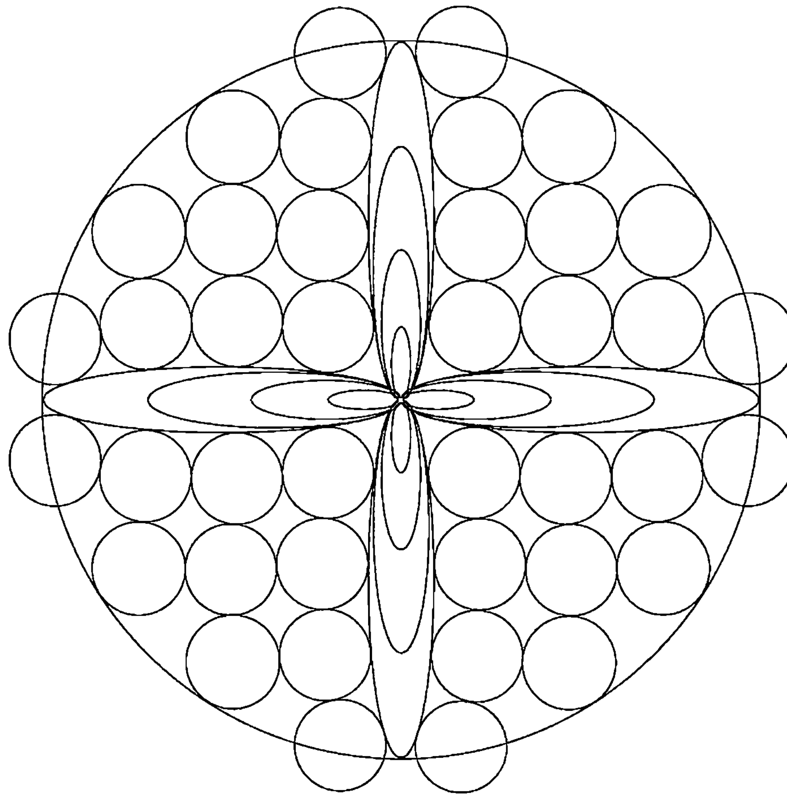

△「藝術治療曼陀羅圖」圖例

① 藝術治療領域裡有各種不同的理論及取向，是一種結合創造性藝術表達和心理治療的助人專業。藝術治療是利用視覺藝術幫助人格統整或再統整的嘗試。透過藝術媒材，從事視覺心象的創造性藝術表達，藉此心象表達，反映與統整個人的發展、能力、人格、興趣、意念、潛意識與內心的情感狀態。

② 台灣心理方面的證照發展是近幾年才開始進行的事情，目前不可避免有人並無臨床心理師、諮商心理師、精神科醫師、開業社工師執照（證照），卻使用心理諮詢、心靈諮詢、心靈輔導、心靈成長、心靈整合、心靈導師等名稱進行心理治療或心理諮商的行為。想嘗試曼陀羅藝術治療的人，別忘了要先親自確認對方是否擁有心理治療或是心理諮商的執照。收費從每小時六百到五千元之間都有，前往醫療機構可以享有健保給付，其餘機構就必須全額自付。提供藝術治療的機構，可分類如下：

- 醫療機構：精神科、復健科、小兒科、緩和醫療等。
- 非營利機構：基金會、中途之家、社會福利團體等。
- 社區機構：日間照顧中心、復健中心、老人照顧中心、護理之家、社區大學等。
- 學校體系：輔導室、資源班、早期療癒學園、矯治學校、啟智學校、特教學校等。
- 私人開業：開業診所或私人工作室等。
- 文化藝術教育發展機構：美術教室、藝術表演團體等。

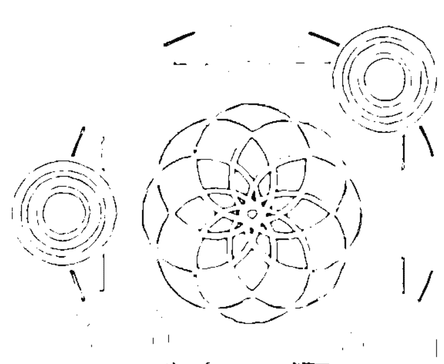

## 第七章 曼陀羅的電腦軟體哪裡有？

英國劍橋附近的桑格研究所研究小組證實，「神經突觸決定大腦的聰明與否，突觸是大腦中最重要的工作部分。」大腦需要思考引發刺激才會形成神經突觸，對大腦的刺激愈多，神經突觸愈緊密。

英國每日郵報在二〇一一年一月十六日發表一篇美國研究，指出民眾使用電子書閱讀器，反而較不容易吸收所閱讀的內容，因為這些資訊以清晰易讀的簡潔格式呈現，反而鼓勵大腦「偷懶」，較難記住資訊內容。這和字體的易讀性可讓閱讀者更容易學習和記住的傳統認知截然不同。研究結論就是「提高資料學習難度，可增進長程學習和記憶力，較多的認知參與活動會引導邁向更深層的過程」，讓讀者能更正確記住資訊。

但電子化時代，總是有科技狂人提出要把所有東西都電子化，連大腦的思考也想要電子化。

今泉浩晃的設計公司已開發一款適用於iPhone上的曼陀羅軟體，可以在iTune的網站上以日幣一千五百元買到，不過，就如同我在《心智圖超簡單》書中所提到的，用電腦軟體繪製心智圖只是求一個存檔及傳送方便，對大腦的刺激與幫助遠遠不如親自用手繪製，曼陀羅思考法也是一樣。

> 小提醒：
> 老師沒有教、公司沒有教，這句話是沒有解決問題能力者的藉口。

## 後記

### 關於學習這件事，常見的幾種問題

Q：我想要增加學習能力，要從何開始？

想要有好的學習效果，建議大家先建立四個學習觀念：

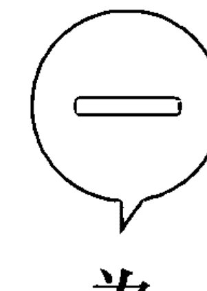

#### 一 為你的學習花錢。

從接受者的心態來說，不花錢的學習容易不被珍惜，很容易因為天氣不好、心情不好、身體不好等因素就放棄。

從給予者的心態來說，為什麼別人花費很多時間研究，卻免費告訴你研究結果呢？除非給予者不靠這個謀生，否則很多不花錢的學習只能教你皮毛而已。

「使用者付費」才是讓社會長長久久運作的道理。即使是政府提撥經費所辦的免費課程，經費其實是來自我們納稅人每年所繳納的稅金。
再說，強調知識經濟、強調軟實力的時代，付費學習才能讓「知識經濟」真正發展起來。

#### 二 養成固定閱讀的好習慣，一定要「買書」，而不是在書店翻書或是到圖書館借書回家看。

一本書是作者用數年甚至數十年的大量經驗，靜過努力研究整理後，濃縮成幾百頁的文字，而這樣的一本精華卻只需兩、三百元就到手了，買書你才會珍惜書中的知識，才會反覆閱讀，去深入分析作者的想法。

如果只是在書店翻翻看完，或是從圖書館借回家看，常常只是囫圇吞棗的學習，多數僅是理解在曼陀羅筆記術中所提到的閱讀第一跟第二層次，而缺少第三跟第四層次的深化思考。

閱讀的另一項好處就是隨時隨地都可以學習。但閱讀不一定是透過書，我常常講：「每個人都是一本書。」透過書面文字的理解訓練，漸漸地我們就能進步到具備閱讀「人」的能力。

#### 三 商業周刊、天下雜誌、各種財經周刊一定要看。

閱讀是有時效性的，科技翻新快速，在《超強學習力訓練法》書中提到很多例子是：過去是對的，可能現在已經變成是錯的；過去無法以科學證明的，已經一一被證明了。如果我們還是上圖書館翻閱舊書籍，那難怪我們的腦袋跟不上時代。透過我認為台灣最棒且最有深度的即時性週刊，可以幫助我們馬上更新腦中的資料。

商業週刊跟天下雜誌的報導比較是全面性的話題，而我推薦各種財經週刊的原因是透過各種財經上的變化，我們可以認識全世界。就像若沒有油價飆漲的現象，很多人一定都不知道非洲的利比亞原來可以影響全世界。

那麼，難道舊書就沒有閱讀價值了嗎？當然不是！若書中講述的觀念是恆久不變的道理、普世價值，這些當然可以看舊書。例如：孔孟思想、生物學、心理學等等。

再說，根據紐約哥倫比亞大學調查一千多位六十五歲以上的老人，分析他們所從事的休閒活動，結果發現，閱讀雜誌或報紙可以使罹患失智症的風險降低 51 %。

此外，最好能打破自己的閱讀喜好。老是看同樣類型的雜誌、書籍，無形中限制了獲取情報的來源，所以應盡量多閱讀和自己領域無關的讀物，例如：男性嘗試購買時尚、健康生活類雜誌，吸收較少接觸的資訊，增加大腦新鮮感，更有助了解社會趨勢，產生創意。

#### 四 固定上課、聽演講。

多多閱讀，是因為看書是吸收資料最便宜的方式，但看書畢竟牽涉到自己的邏輯理解程度。缺少老師的深入解說，若對該領域相當陌生，或是想要深入理解該領域的各種關鍵，最省時、最有效果的方式就是上課或聽演講了。

上課或聽演講一定能獲取跟自己看書不一樣的結果。一般知識性的課程，自己看懂或聽懂就夠了。

技能類／方法類的課程，看懂或聽懂不代表自己就能夠做得好，最好有老師在旁確認是否已做到正確的動作或是正確地進行練習，才能達到理想的效果。這一類的課程，一旦你去上課或聽演講，一定能獲取跟自己看書不一樣的結果。

> Q：看過書卻講不出內容？

有個學生曾問我：我看書沒有問題。在討論書中內容時，別人所描述的書中內容我曾看過，但就是講不出來，沒有辦法像其他人一樣侃侃而談書中的內容，到底應該要怎樣提升自己的表達能力才好呢？

閱讀是輸入，表達是輸出。針對這個問題有兩個原因：

①以為自己看過就算了解書中的內容，實際上卻是一種假懂的狀態，因為只是了解文字表面的意思；所以在講述心得的時候，只會在腦中不斷地搜尋書中作者所用的文字，卻沒有辦法抓出幾項大重點，接著用自己的文字語言或自己的描述方式，把重點說出來。

很多人說自己看過書後都忘了，但是別人一講就想起來，這種情況很多都是因為，不懂得從閱讀中抓出作者所要表達的重點所導致的結果。

閱讀不僅僅是讓我們學會認識字、懂得字義而已。很多人對閱讀的程度停留在學校考試的階段，以為把文章內容背下來，懂得引用作者的文字，就算是閱讀。

掌握文章的涵義，才算是閱讀到了精髓。

實際上，閱讀是讓我們了解作者的想法，並把作者的想法跟自身的生活經驗結合在一起，然後在自己的生活中去實踐或是運用作者的想法。

表達的時候，可以講述你心中特別有感覺的部分，這才是最動人的。如果你只是把書中的內容述說一遍，除非你是與從未看過這本書的人分享，不然對方應該會覺得你在浪費他的時間。

②不熟悉在眾人面前表達自己的想法，總是認為要把內容準備得很完美了，才能講給別人聽，所以很沒有自信地一直以為自己的表達能力有問題。

我對提出這個問題的同學了解不深，無法得知他的原因到底是哪一點，於是我先假定他的問題出在第二點（因為大多數人恐懼上台就是因為這一個原因所造成）。

於是我把他當成是魅力演說與簡報課堂上的學生，請他試講一小段他心中本來想要講的內容，果然他的問題根本不是說話內容的問題，而是出在於他不熟悉上台講話，所以一直覺得自己的表現不夠好。

這件事情讓我想到人有時候過於依賴自己過去的經驗，而忽略了每一項專業都是練習來的。

好幾次經驗，在課堂下課後總有人跑來跟我說，老師講課講得很好，簡單易懂，而且很有道理，我每次都回答：那是因為我很愛講話啦！多講幾次你也會講得很好啊！但我總從對方的眼神中，了解到他根本不相信這句話。（各位，這是真的，一定要相信我啊！）

舉個親身的實例，應該就可以讓大家相信，上台講話，把課講得生動活潑有趣，真的是練習來的。

我曾接受某個電台的採訪，主持人並沒有先說會問什麼題目，只跟我說大概會問哪一個方面的問題，主持人一問，我一答，也告知雖然這是錄音，不過希望一次完成，不要重錄或剪接，所以我必須一直講話不能有中斷。

結果開始錄音的時候，主持人一問完，我必須馬上講話，因為是面對麥克風，並不像平時上課那樣有真實的學生可以做互動，而且又不能中斷，要一直不停的講話，採訪的十幾分鐘內，我全程戰戰兢兢，內心相當緊張，腦中不斷地思考要講什麼。

說真的，錄音結束後，我根本不知道自己講了什麼內容，腦中一片混沌，嗡嗡作響了三十分鐘之久。

當然，主持人是相當資深而且專業的，針對我所回答的內容，他總會很快地做一點點總結歸納，以彌補我的「語無倫次」。

我想，像我這種來賓應該很多吧！因此而造就出主持人現在的功力。

真的是隔行如隔山，我習慣面對人講話，但是要我面對一支麥克風講話，缺少了肢體語言的表達，與觀眾眼神交流的回應，還是要多練習一下，調整自己的講話方式，讓看不到我的聽眾，也能很單純地就聲音了解我想表達的意思。

有句話說，「台上十分鐘，台下十年功。」各行各業都有專業，多練習就會變成專業。

我常跟人家說：我不是一個老師，我是一個教練！因為我所教授的內容，都是可以被實踐的方法，如果只是教授一個理論或觀念，卻沒有可以實踐的方法，那等於是浪費我跟學生的時間。

所以，上完課後，聽懂觀念，也要付諸行動去實踐，這樣才不會浪費時間，才能獲得想要的收穫。

Q：我喜歡看書，也看很多書，但我覺得理解力還是不好，怎樣提升閱讀理解力？

我們現在再複習一次下方這張圖，然後再解說理解力的步驟。

考試通常都是考第一跟第二層次，很多人對這部分的掌握也不會有太大問題，這個部分你可以透過各種做筆記的技巧，多多整理筆記就可達到。

而第三跟第四層次，牽涉到你自己的背景知識有多少，透過畫mind map心圖或是曼陀羅能很容易引發出這兩個層次的想法。不過，若是沒有

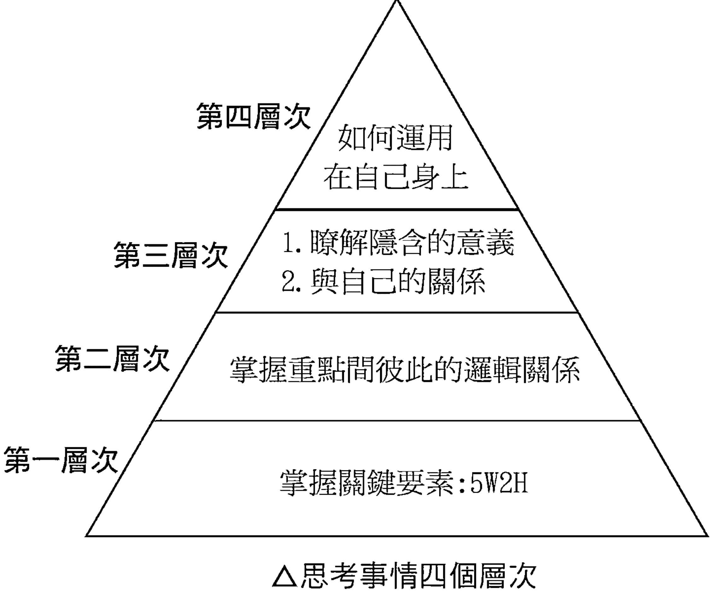

習慣進行第三跟第四層次思考的人，或是怎樣都想不到的人，就要透過閱讀後的分享才能達到。參加一個大家水準都差不多，整體水準又比你好一點的讀書，會對你會很有幫助的。

#### Q：坊間盛傳的錯誤左右腦測驗法之一

德國有個女孩天生只有左腦的半個腦子，但是卻雙眼都能看見。很多人覺得很神奇，怎麼可能？右眼不是左腦所管的嗎？沒有左腦為什麼右眼看得見？會這麼驚訝的人，多數受到過去某些所謂右腦開發的商業論調所影響。

手伸出來比個OK的手勢，拇指和食指圍起來的圈圈盡量圈小一點。兩隻眼睛一起透過小洞看遠方的某個小東西，保持眼睛能看到那個景物的狀態，慢慢把雙手收到眼前。如果雙手的小洞最後靠到左眼，那你的慣用眼就是左眼。

或是雙眼透過小圈圈看紙上的一個字或是遠方的景物。接著輪流閉上單眼，若是只用右眼看，就能看見和雙眼一樣的景物，那麼你的慣用眼就是右眼。

或是我們閉上右眼，用左眼望向遠方某物，用拇指把該物遮住，然後張開右眼，若你發現該物移動了，無法以拇指遮住時，就表示你的慣用眼在右眼，同樣地測試一下左眼。若兩次該物都移動了，請看一下哪一眼被遮起來時移動的距離比較多，就表示慣用眼在那一眼。
認為右眼的控制是在左腦，左眼的控制是在右腦，找出你的慣用眼是左眼或是右眼，就能知道你是左腦好還是右腦好的人，這個論點其實毫無科學依據，只是過去某些講右腦開發的書籍曾提到這個測驗方法。
如果對於大學普通生物學有研究的人就會發現，少了半個腦卻雙眼視力正常，這是很有可能發生的事情。
以下這張圖可以看出實際上正常人的眼睛視神經，不管是左眼或是右眼都是同時連結到左右腦的。
慣用眼根本不能當做測驗左右腦發達的依據，頂多只是影響兩隻眼睛哪個會近視度數比較深而已。
兩個大腦中間有個胼胝體，

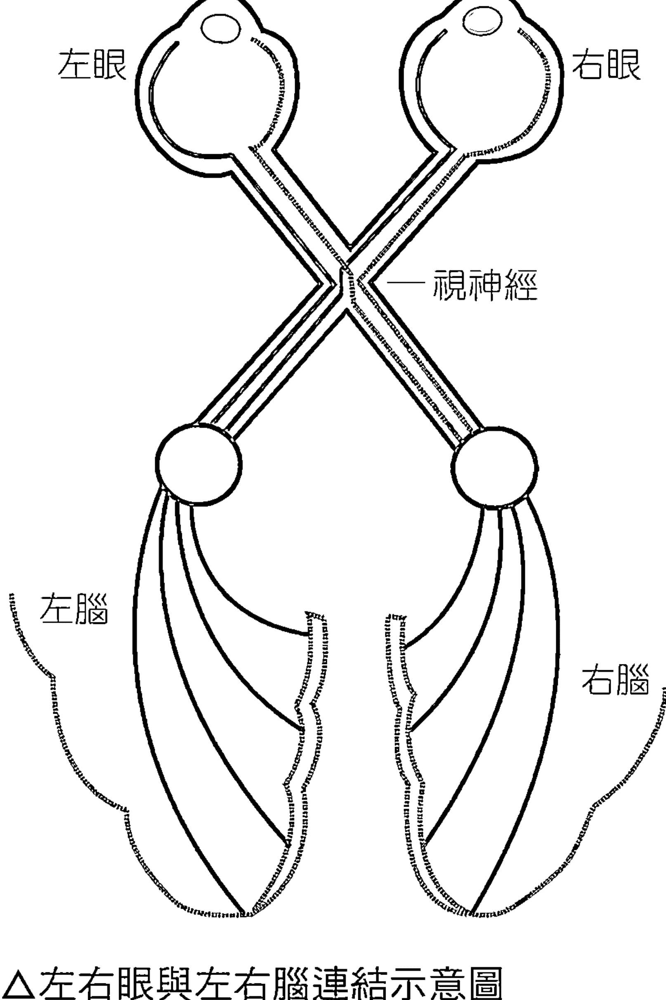

會不斷地把左腦正在做什麼事情告訴右腦，讓右腦也產生反應（反之亦然），然後整體大腦再做出反應，所以根本不可能單獨只訓練左腦或只訓練右腦，從小到大，我們的頭腦都是左右腦同時同步運作。

所以只有大腦的使用效率好不好的問題需要解決，沒有大腦還有多少部分沒有被使用的問題，因為人體不會長一個光消耗能量卻不工作的器官。

#### Q：坊間盛傳的錯誤大腦測驗法之二

人類大腦對「色與形」的直覺反應，是先「形」？還是「色」？

你可以在家裡試試看，用彩色筆由上到下依序寫出左列文字，請用黃筆寫出「紅」，藍筆寫出「綠」，黑筆寫出「藍」，紅筆寫出「黃」，綠筆寫出「黑」。或是把左列文字，依照上面所給的建議，依序填上顏色。

接著，看著你自己寫出來的這些字，照順序念出所有的文字。再照順序念出所有的顏色。

顏色是右腦，文字是左腦，原則上看顏色比看文字的反應要快，是先色後形，稱為史楚普效應（stroop effect）。這是美國實驗心理學家John Ridley Stroop在一九三五年提出的。

也就是**綠**，但是右腦卻更快辨別出藍色。

這是「看」顏色。如果要「唸」顏色，那就不一樣囉。

我們能快速念出字的意義，是因為「認字」、「寫字」、「閱讀」的過程，讓我們已經練習上千遍，變成自動化歷程，所以當改成要念「字的顏色」時，「字義」就會干擾我們的認知，使得我們的反應時間加長。

坊間卻有些一知半解的人，拿這個史楚普效應來測驗一個人是屬於左腦好？還是右腦好的人？

因為「唸」顏色的速度受到左腦字義的干擾現象，就斷定是一個左腦比較發達的人，這就有點妄下斷語了。

不管是左腦還是右腦，都同時負責多種的處理工作，不能光靠一個測驗顏色的實驗，就以偏概全的論斷整個半腦都比另外一個半腦還要發達。

實際上這個實驗是可以訓練的。只要你自己寫幾個練習題下來，然後常常「唸」，下一次測驗，你就能「唸」得更順口。

現在，讓我們進行另外一個實驗，請你把右手臂舉起來，手臂橫擺在胸前然後往前畫圈，持續這個動作後，然後把左手臂舉起來，左手臂橫擺在胸前然後往後畫圈，有沒有發現，你的動作好像沒有辦法一手往前畫圈，一手往後畫圈？如果可以做到的人，請你保持右手往前畫圈，左手往後畫圈，然後馬上轉換成右手往後畫圈，左手往前畫圈，是不是一樣動作流暢呢？

我們人體只有左手左腳是由右腦控制動作，右手右腳是由左腦控制動作，其它部分像是頭與軀幹處都是兩個大腦共同控制，所以上面的轉圈實驗僅能測出你的左右腦對於肢體的控制能力，無法用這個實驗來測試你的左右腦思考能力好不好的問題。這個實驗一樣是可以訓練的，平時多做幾次，你就可以達到流暢的轉圈與換方向轉圈的動作了。

我相信如果你真的好好練習上面的實驗，也獲得更好的測驗結果了，到時你會更懷疑，自己的另一個半腦真的因此變得比較發達嗎？

實際上我們的所有行為與思考是無時不刻都由左右腦一起共同運作，沒有辦法光訓練右腦或是光訓練左腦。

## 後記

### 創意思考及時間管理的實用推薦

#### 曼陀羅創意思考訓練

淑芳——中華職訓中心影音編導班學員

謝謝雅茹老師這四堂課，雖然課程有點短暫，但卻在自己心中投下了創意思維的種子，相信透過老師所說的一些方法，這創意的種子會在不久的將來結出創意的果子，甚至也成為下一個播種者。

「創意」說來容易，做起來卻沒這麼容易。串起來、整合、發想、樹枝的邏輯思考，都有一定的規則。之前，我滿堅持自己的創作想法，但發現就是生硬、不活潑、令人印象不深刻。人脈的經營，是我現階段最想了解的主題。經過這課程之後，有時在走路仍一直思考事物的關聯性。自己也發現同一件事物的不同的面向，或是自己與同學相同的地方，從同學和老師身上都學習到很多，很害怕消化不良。精準度，是我會多加磨練的重點。

##### 清華——中華職訓中心 影音編導班 學員

對於已過不惑之年的我，原以為腦筋已開始退化，步入等死之路，但幾堂課下來，不僅開始激活腦袋，對於接下來的人生方向，也受到啟發，知道創意無限延伸的可能性，但只恨時間太短，還有很多老師的真功夫沒能傳承，實為一大憾事。

##### 嘉謙——中華職訓中心 影音編導班 學員

創意本來就是我的精神糧食，除了自己的想像之外，別人的idea也是我的最愛，本來三餐的精神糧食只是白米、青菜，但是經過美麗的主廚老師指導之後，我的精神糧食更加豐富，宛如享用海陸大餐般地滿足我的胃口！謝謝老師的指導！

##### 遇玫——中華職訓中心 數位影像班 學員

頭一天看見老師，如此清秀年輕，課程精彩緊湊甚是令人佩服。但是大概腦部某個部分太久沒有啟動，重新啟動時似乎不太能運轉，漸漸地四堂課下來，對於創意的啟發，思維邏輯重新被重整，受益良多。因為老師的一句話，「腦部不會因為年齡因老化，腦部會新增細胞。」讓我對自己重建信心，對上課的內容更加認真。謝謝您，給我的人生增加營養劑。

- 讓我耳目一新。
- 教育小孩時所遇到難題，都能迎刃而解。
- 建立我在小孩面前腦筋靈活的形象。
- 從來沒有想過能如此運用大腦去想像事物，以後會多用心去看事物。
- 不怕有問題，只怕沒問題。

#### 曼陀羅時間管理

##### 華通——流通業

人生的確是自己規劃來的，透過曼陀羅思考法，我可以更聚焦在自己的目標上，比較不會受到外面媒體或是親朋好友的負面影響，不再想到哪裡做到哪裡，也不會「坐這山望那山」、「騎驢找馬」、「且戰且走」，老師還教我怎樣心想事成的方法，幫我散發出正面思考的力量。

##### 淑貞——中華職訓中心數位影像班學員

重整，受益良多。因為老師的一句話，「腦部不會因為年齡因老化，腦部會新增細胞。」讓我對自己重建信心，對上課的內容更加認真。謝謝您，給我的人生增加營養劑。

##### 乃慧——公務人員

原本以為是學習一般工作上的時間管理，其實學習的是我們人的一生管理，包括我們的工作家庭、學習精神，從以前自己每天浪費時間，不知好好地利用時間，也從課堂上的小測驗，了解自己屬於哪種類型的性格，可以更加了解自己，更能明白自己在時間管理上的盲點與缺點。

> 小提醒：
> 任何事情都是從一個決心開始。
> 過程中心態與思考的變化才是真正的學習。
> 做到才是真的知道！

#### 《心智圖活用術》

東尼·布贊◎著 曾明曾明鈺◎譯 定價250元

全球企業菁英所使用的革命性思考工具。
把工作做到最好，還能有時間玩耍！心智圖能激發你各種才能，全球已有知名大企業將心智圖當做訓練員工思考的工具。

#### 《心智圖超簡單》

胡雅茹◎著 定價250元

考試、做筆記、簡報、企劃的驚人效果。
從整理、分類、繪製進入全腦思考時代強力技術。運用於創意發想、活動企劃、分析、歸納、作文大綱、個人履歷、會議簡報。

#### 《NLP速讀術》

松島直也◎著 李毓昭◎譯 定價200元

一天輕鬆閱讀幾本書，在幾個月或幾年後達成驚人的目標！
NLP速腦術將腦力發揮到最大極限。快速解決堆積如山的書籍、吸收資訊量增加十倍、增進準備考試的讀書效率。

#### 《眼球視覺鍛鍊法》

內藤貴雄◎著 陳冠羽◎譯 定價199元

提升頭腦運轉速度、預防癡呆、提升眼睛功能！
同時鍛鍊「眼睛」和「腦」，只要用看的就能讓頭腦迅速活性化！提升學習力、記憶力、集中力、速讀，都有效！

#### 《用心智圖寫作文》

施翔程◎著 定價290元

基測、學測、指考、統測，作文拿高分秘笈。
35堂主題心智圖寫作課，利用心智圖，展開作文新思路，突破不知如何下筆的困境，迅速找到寫作方向。
