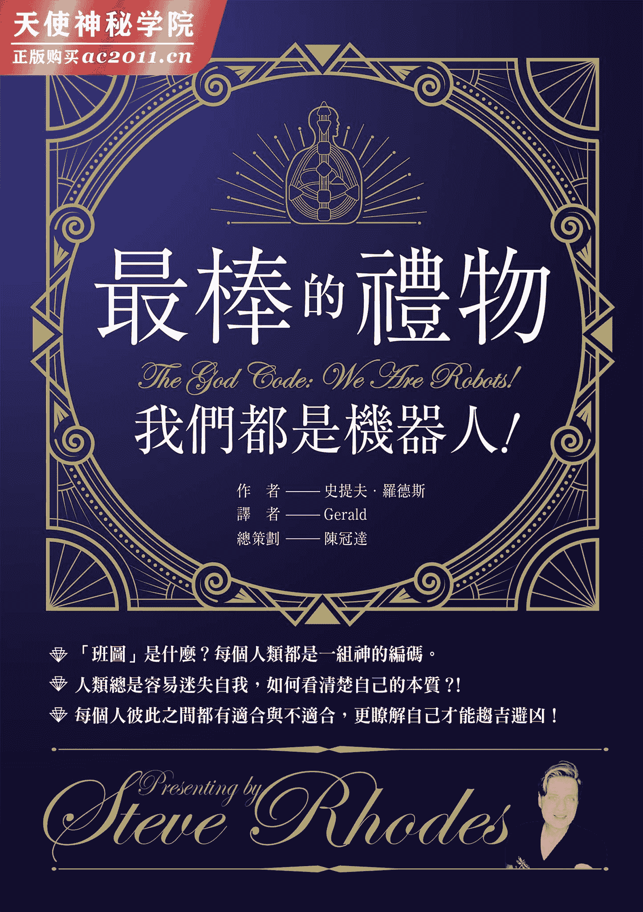

免责声明

本书目的为提供读者信息与激励。出版商贩售此书之立场非为提供心理、法律或任何其他专业建议，出版商及作者亦不对于任何身体、心理、情感、财务或商业损害负责，其中包括但不限于特殊、偶发性、间接引起之伤害或任何其他损害。我方之观点与权利主张相同：

你应该对自己的选择、行为与其后果负责。

「人与人之间的所有关联，

即便最恒久不变的感情关系，都不存在。」

# 序

我们的内在有些东西跟宇宙一样古老，它们来自「班」（Bhan）。班从来不具有生命，但却承载了所有生命的蓝图。

你认为你掌控了自己的生命？并非如此，造物主才是主宰。班在大霹雳时散裂成无数碎片，数量大到无法想象，这些就是你的造物主。班与其四散的分体并没有生命，而我们有；班无法思考，而我们可以。所有生命型态，包括每棵树、每条鱼、每只鸟、每只昆虫、哺乳类动物以及人类，都蕴含两种班的分体，但如此大量的班永远不会成形，它们并不会构筑成物理型态，而是成为意识的构筑者。所有的班都透过微中子相互沟通，没有班，就没有生命；没有班，一切只剩混沌。

宇宙是个生命，而你身在宇宙之中。现在想象一下你体内的所有细胞，它们的处境与你类似，它们并不知道发生了什么事，也不知道人体是什么，更不知道在浩瀚的未知世界中存在数十亿个人类。

生命就像俄罗斯套娃，每个俄罗斯娃娃中都住着另一个娃娃，无穷尽地层层相叠，差别只在于大小不同。

我们是唯一具有智慧的生命型态，这是恩赐，同时也是诅咒。智慧让我们成为宇宙中唯一察觉自身存在的生物，而我们的策略能力与贪婪则将我们推上食物链的顶端。但对于自身存在的知觉或自我反思的意识，同时也带来令人不悦的副作用：我们知道自己总有一天会消失。

我们试着用比较有趣且不理性的方式来应付这个小问题。在认知自己终将一死的情况下，我们做出奇怪的假设，主张「满足」又「长久」的生命能让死亡变得轻松或者更不枉此生，所以试图让我们在拥有的时间里变得更加圆满。而另一个有趣的解套方法，就是关于天堂与来世的神话故事。

有些人执着于科学与逻辑，但我在这些人的日常生活中常常看不见这两点，我以前会拿他们来开玩笑，不过现在不会了。因为不管你认为自己多么有逻辑又理性，也永远无法真正明白一切是怎么回事。「希望」对人类来说一直都很重要，如果剥夺了希望，又不找替代品让人类得以寄托生活，可说是百害而无一利。

著名的梅尔克修道院，座落在可以远眺多瑙河与奥地利瓦郝溪谷的岩石地上，我的童年时光都在修道院的寄宿学校中渡过。其实我很喜欢上学，但我在毕业的同时也退出了天主教会，这可不是奥地利人会做的事。我上了大学之后，数学将我折磨得很惨，但对于我现在崇尚虚无主义并拥抱生命中混沌理论的心灵而言，这门原用于计算概率的学科却正好能派上用场，我信的不是耶稣，而是高斯曲线。

当然，二十多岁时，你会认为死亡还是很久以后的事，死亡是别人的问题，不关你的事，所以为什么要烦恼死亡呢？你仍然怀抱着错觉，认为生命会成为你所想要的任何模样。希望是强力的春药，美国梦与上帝都建立在谎言之上，但它们带来希望，而希望就是一切。

往后三十年发生的一切与数据、偶发事件、上帝以及我在生命中的期望无关。过去与现在的我都拥有多采多姿的生活，我曾经见过、也体验过极端的高峰与低谷；我曾经与各行各业的人相处过，从著名的达官显贵到又脏又穷的市井小民都有。

为什么说我的生命与偶发事件无关？举个例子，我在九零年代末搬到伦敦，当时我不认识任何人，但我很坚信能在音乐产业中创造代表性的生涯表现。我一直想要与我的偶像所合作过的人物共事，也将此当成我靠一己之力无法成功的唯一理由。

当时伦敦这座城市拥有超过一千万居民，想要与这间小型菁英俱乐部的人碰面，机率微乎其微。我抵达伦敦时只是无名小卒，名不见经传。当时能上网的人寥寥无几，电子邮件算是很新潮的社交媒体，更没听过什么叫 YouTube 与实境电视节目，因为根本还没发明。

我唯一认识的人是位年轻的乐器商，他刚在伦敦郊区开了间小店，店里只有一间小房间能当作办公室，他卖给我一对扬声器，让我能在家里的小录音室使用。有天他打电话问我，能不能带另一个人来看看我的扬声器，十五分钟过后，某位我一直想见上一面的人（属于跟我的偶像共事的一小群菁英份子）已然站在我的房间里听着我的歌。我什么都没做，但梦想就这么实现了，这种机率能有多大？

几个月后，一种全新的音乐风格在伦敦萌芽，而我全心投入其中，也录制了几首相同风格的新歌，确信这就是我步入伦敦音乐殿堂的踏脚石。往后的六个月，我在书桌上放了一张同类型音乐中最顶尖歌手的唱片，他是伦敦人，而且出道首张专辑就夺下排行榜冠军，据说有间大型唱片公司花了一百万英镑把他签下来，我想要像他一样！

同样的，当时的网络还没有现在这么发达，也没有 eBay 这种拍卖网站，如果想要卖东西，就得在名叫「搜刮」（Loot）的二手拍卖报纸上刊登广告。某天我正等着别人来买我的二手货，当门铃响起来时，我能从小圆窗看见谁站在门外，他长得很像我书桌上那张专辑的歌手，但如果是这样也太荒谬了，所以我把他要的东西交给他，没有提到我是音乐人。他要离开时顺口问道：「你的工作是什么，史帝夫？」

我很不情愿地告诉他（我觉得他在浪费我的时间），我是音乐人。他回答说他也是玩音乐的（就这么刚好），而且刚刚跟一家大型唱片公司签约。我的头一阵晕，不会又来一次吧！一点都没错，他就是那张专辑的歌手。他带走我的歌，并且在他主持的 BBC 广播节目上播放。

这类奇迹在往后几年内不断上演，举个例子，就在几年前，我休息了好一段时间后，录制了几首新歌，正在研究要把歌曲寄给哪间唱片公司才会获得青睐。我的名单上有不少英国人，但想找些美国人来合作，就做了一点功课，找到名叫马丁．柯森鲍姆（Martin Kierszenbaum）的人，他曾经制作过一流的唱片，也是女神卡卡（Lady Gaga）大红大紫的幕后推手。当然，我当时没办法联络上这位来自美国的大人物。隔天，我走过我在伦敦那间小录音室的大楼接待处，此时大楼门铃正好响起，而我做了平常不会做的事。我走到接待柜台后方，拿起对讲机的话筒说：「哪位？」话筒另一边传来：「马丁．柯森鲍姆。」挂掉话筒后我立刻放声大笑，我当时觉得自己大概疯了。

先说明一下，我这十年来从没在这栋大楼见过任何一位唱片公司制作人，而且即便有遇过，也不可能是从美国来的。所以当我听见他的名字时，觉得一定是听错了，应该只是其他住户叫的哪间外送餐点。但我止不住好奇心，所以按钮帮他开门后就在接待处等着。一辆由司机驾驶的黑色加长型轿车开到门口，有个人步出车外向我走来，我询问他是不是新视镜唱片（Interscope Records）的马丁，果然是他。

不过，我并没有成为超级成功或者有名的巨星，我生命中的遭遇并没有跟我的期望与心愿接轨，我告诉你这些故事的原因并非如此，应该说我想强调的是，如果你相信宇宙万物都是偶发事件，或者以大多数人的逻辑思维来理解宇宙，那这些事情就不会发生。

混沌并不存在，一切都有秩序，但主宰秩序的是谁？我的心态在这几件事情之后有所转变。我们常用有信仰者与无信仰者来区分全世界，其实很愚蠢。第一种人，纵使没有证据显示万物的存在，仍然以最虔诚的心看待一切；而另一种人则确信万物并不存在，除非他们能看得见、摸得到，或者能亲身体验。这两种人对于自己的主张都提不出证明。我在伦敦的那阵子，经历过我所无法解释的体验过后，就已经跳脱这两种人之外。我的新座右铭是：「许多事物确实存在，但我对它们摸不着头绪。」我敞开心胸，但没有信仰，我知道有些超脱于世道之外的事物确实存在。不过我也发现，不同的事物会发生在不同的人身上，而且绝非偶然。我们的生命确实独一无二，我们各自具有独特的使命，也都有属于自己的故事。

我们所能认识与理解的一切只是个理论，也就是说我们无法对任何事情下定论，就算你是爱因斯坦、霍金或是罗德斯都一样。有些理论的可信度或许比其他理论还高，但理论终究会瓦解。科学实证的概念，只不过是能在一定程度内预测结果的实验，没有任何事物是坚不可破，万物也未必会有最真切的解释。

我们或许会相信「聪明人」所告诉我们的话，但也会相信并且依赖我们自己所做出的结论。万事万物都没有绝对的证据，想想科学与宗教之间有哪些确实存在的差异，其实并不多。这两者都能以不同的方式来抚慰我们，但到了最后，我们终究会步入死亡，而就算是比较睿智的人，也无法找到我们为何来此一游的解答，对于这一切，我们毫无概念。

假如你回头想想先前关于我们体内细胞的说法，它们同样也不知道自己为何存在，那它们又怎么会在正确的时间出现在正确的地方，并且克尽职责好好维持我们的生命？这就得提到细胞世界中令人无法想象的粗暴特质了，如果细胞的世界中一片祥和，我们早就失去生命了，毕竟你无法依赖善良美德维生。但如果细胞与我们都不了解生命的意义，万物又何以运行至此？

我的理论主张：世界上存在着看不见的「程序」。科学家告诉我们，宇宙中只有 4.9%是我们看得见的一般物质，其余都是暗物质，是黑暗的能量与微中子，这名称听起来很厉害，其实就是代表「我们不知道是什么，但确实存在」的意思。暗物质可以想象成宇宙的智慧或「软件」，就像蓝图一样；微中子则是将暗物质彼此连结的通路，可以用近乎光速的速度朝任何方向传递信息，并且能够穿越直线方向上的万物。它们诞生于恒星之中，具有微量的物质。班就是不具有生命的暗物质，只会改变微中子的信息，就像稜镜会使得穿过其中的光线改变一样。这种机制影响了具有生命的万物，你觉得鸟类为什么会在冬天与夏天飞往其他地方？其实并没有「本能」这种东西，而是程序在运作。「本能」只是代表「我们知道该怎么做，但不知道原因为何」的字眼。我在本书开宗明义提到，我们每个人体内都具有班，但事实上我们都蕴含了两种暗物质班的分体。这两者都是负责带来影响的组织者，不只影响了身体，也影响了心灵与爱。如果你想更深入了解班，建议你阅读我的另一本着作：《拉．乌卢．胡的人类大预言》（The Prophecy of Ra Uru Hu）。

科技界最新的术语是人工智能（A.I.）与机器学习，表示我们赋予机器或计算机一定程度的自主权，让它们能够靠自己解决问题，同时也能自我教育。它们能在不经过明确编码的情形下学习，这与它们过去所依循，由程序编码员所创造典型的循序渐进式规则有所不同。而我们从未想过，我们本身也是依照相同方式来运作，我们只不过是具有智慧的机器或机器人，由更大型的「程序」所操控，但这个程序同样也不具有生命，同样不了解自己的作用何在，它并不是留着胡子的白发老翁，也并非来自于世界中心或者更高等的境界。

我们拥有一定程度的自主权，你可以称之为即兴发挥，也就是人类所理解的自由意志。但透过班所运行的程序，它从大方向上掌控了我们将会采取的行为模式，并且在必要时加以干涉。这就像我们在管教孩子一样，你会对小孩设下界线，孩子可以在界线范围内自由活动，也能让你拥有自己的生活，否则就必须时时刻刻紧盯着他们不放，不符合效益。你也可以赋予孩子目标或任务，让他们自己找出解决方案。

生命也是如此掌控着我们，或者在更深的层面上，掌控着我们体内的细胞。细胞怎么知道自己应该位于膝盖上，而不是大脑里头？它并不知道，但程序替它安排好了。程序从混沌中创造秩序，并且以特定的条理组织起宇宙中的生命，就如同编出一支优美的舞步。

程序透过我们所具有的某些特性来影响我们，而我们经过编码后也会符合其他人的特质，这不代表会因此喜欢或爱上每个人（也不可能），或是能让所有人都喜欢或爱上你，而是用来寻找归属的指标。这并非从综观的方向评断，而是以个体为出发点。没有谁是绝对的好人或坏人，我们也无法找出放诸四海皆准的角度，口径一致地评断一个人的对与错。世界上并没有一体适用的定义能用来妄下评断，但多数人如今却日复一日地擅加批判。你在生命中的一切行为也是如此，包括每个人的饮食方式与食物在内，我们彼此各不相同，所具有的任务与需求也不一样。地球上除了你以外，没有任何人知道最适合你的是什么。

人类总是觉得迷失了自我，因此很容易成为自助系统、书籍以及各种新世纪实践课程与自我宣称的大师所锁定的对象。我们总是受到灌输，说我们有缺陷、我们是罪人，说我们从出生的那刻起就不完美，但这些型态的「助力」，其实是在剥夺我们自身的权力与能力（以及金钱）。事实在于我们都迷失了，但其实又没有迷失，纵使我们不了解一切是怎么回事，并不代表我们迷失了自我。

我的书并不是自助类书籍，而是要让你了解程序对你的期望是什么、如何影响你，又会如何支持你。本书能协助你认清自己真正的本质，使你能够摆脱以往所受到灌输、关于如何自我「认知」或自我「改变」的错误幻想。

但有一点相当重要：即便你可能更了解自我的本质以及真我，并不代表你能获得期望中的生活。这一切不只与你有关，更关乎于你所身处其中的大环境。我们多数人并不了解，其实我们属于更大的有机生物，无论你怎么想，「程序」都主宰了许多层面，不仅支配了你的生活，也控制了一切的可能与不可能。

同时，我们确实拥有自主权，可以即兴发挥。我们的生命是班所带来众多影响力的总和，也是我们生命中所发生一切事物的总和。我们从经验中学习，并且成为更有智慧的生物。我们透过自主与即兴来完成这项过程，但并不是生命中的一切都有剧本，剧本上只写了其中一部分。

我花了 15 年，试图了解这个程序的一部分，以及我们该如何加以译码。在进入音乐产业前的年轻岁月中，我是个计算机宅与码农。过了 20 年，我告别音乐产业，投身开发一套软件，让我能够参透这个「程序」所带来的影响。

我称之为，班图（BaanTu）。

# 本命图

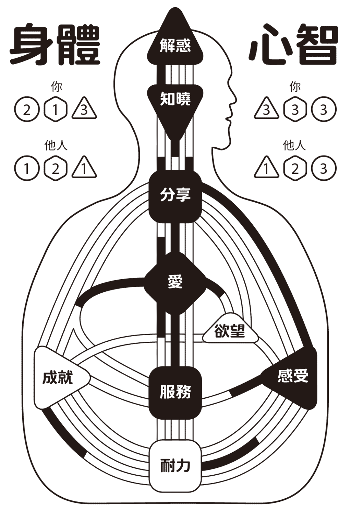

这是一张概略图，代表影响着你、我，以及每个人类的「程序」。上面这张是我的「本命图」，如果你也想算出自己或别人的本命图，可以到我的网站，网址是[baantu.com](http://baantu.com)，可以注册免费账号，藉此描绘出本命图。你也能看到其他超过一千人的本命图，其中包括许多作家、艺人、政治家与音乐家，当然还有运动明星、影星跟众多名人。

想要描绘出本命图，你需要相当精确的出生时间。我们大多数人的出生证明上都记载了出生时间，如果你的出生证明上面没有，可以致电咨询发证单位或者出生医院。班图软件能够告诉你本命图什么时候开始变化，可能会在你输入时间的前后，你应该至少每 76 分钟就会看见改变，可能很细微，也可能很显著。如果你完全没有自己的出生时间，那我就不建议你算本命图，因为每天都会发生许许多多的改变。

班图（Banntu）与脉轮（Chakra）能量系统没什么关连，只不过本命图的中心部分看起来有些类似。班图也跟古老的易经没有关系，虽然在曼陀罗轮的计算上有使用 64 卦，你可以在[baantu.com](http://baantu.com)按下「曼陀罗」（Wheel）钮观看。同样的，班图虽然也利用太阳系中 13 个天体的位置来计算，但其实也无关乎卡巴拉（Kabbalah）或者天文学。我不建议将这些领域的任何知识混用于班图之中。

班图能揭露程序所带来已然成为你一部分本质的影响力，同时也透露能让你产生兴趣的人格类型。其中最棒的特色就是，能表现出你与其他人建立了哪一种人际关系，以及你跟他们相处时的自在程度。班图可以看出每一种人际关系都具有的四项基本元素：

●你受到他人性格所吸引的程度

●你与他人融洽的程度

●你激励他人从事行为的程度

●你支配他人的程度

# 班图

如果班图不是自助系统，那应该是什么才对呢？「自助系统」是个矛盾名词，意味着你可以帮助自己，但却必须有其他人来告诉你该怎么做，而且通常会提供他人的一套准则与指示来让你依循。

班图像是一面镜子，能让你更加看清楚自己的本质。当你看向真正的镜子，镜面上只会显现出你的身体外表，不会对你的外貌提出看法，不会建议你该剪什么发型，或是教你怎么洗脸。会说话的镜子只存在童话故事里，班图并不会提供意见与指示，就像螺丝起子不会建议你该如何使用一样，它只是个工具。

地球上没有两个完全相同的人类，每个人都有些微不同的使命，也因为每个人都具有独一无二的 DNA，使得我们更具独特性。生命中的一切，至少都在一定程度上是独特的，这表示无论是我或者其他人，都不可能彻底了解你，或是能笃定对你最「好」的是什么，就连宇宙本身也无法回答。而宇宙就是神，你有想过自己住在神的体内吗？

先别想得太遥远，神的意志就是「程序」，是由所有班水晶与微中子所创造出来的意识。程序掌控了一切的发生，如果能更清楚窥见，程序到底想要干嘛，不是很好吗？

不管你现在有什么想法，班图并不是用来保证你可以拥有更好的生活，班图无法给你承诺，没有任何系统或任何指引能给你承诺。你是独有的个体，所以也必须做出独特的决定，并不是其他人或者班图帮不上忙，而是你必须认清，你才是做出决定的人，也必须为此负责。但同时你得了解，肩负这项职责的并不只有你，程序对你有所关注，因为宇宙需要你，也会提供你所需要的助力，万物彼此相互连结，你永远不是孤单一人，所以不要绝望。大多数的人身陷绝望之中，只因为他们的期望落空，别重蹈覆辙，你要经过生命的洗礼，藉此发掘宇宙（程序）对你的期待。接着，你必须面对这条路上的重重挑战，只求将自己的能力发挥到淋漓尽致，生命有时使你受伤，有时却又无限美好，这就是人生，生命中的一切并不一定都能扭转，痛苦也只是其中一环。班图是突破性的崭新哲学，是一门全新理论，探讨生命的组织条理，以及生命中更宏观层面上的运作模式，而这一切又将对你（个人的层面）带来何种影响。班图并非提供你捷径，让你从生命中快速获得期望的目标，而是帮助你找到自己在更宏观生物体中的位置，并与之和平共处。不是宇宙为你效力，而是由你为宇宙出力，如果你不了解这点，你的生命将满是挫折。

假如班图显示你难以与某人建立关系，并不会告诉你要避开对方，但你自然会花比较少时间在对方身上，毕竟那不会有「效果」。

如果本命图显示你生命中的批判点是「感受」，就不会有任何指示，那类的信息并没有什么用处，因为感受已经发生了。班图是一面镜子，能让你用更透澈的眼光明白生命中的一切为什么会如此发展，但最重要的是，能告诉你为什么自己与其他人不同，又是如何不同。

另一个必须了解的重点在于，程序并非一成不变，你也一样，你会不断发现自己跟其他人的本命图有所变化，也会发现自己并非恒久不变，有些日子你会充满动力地投入某些事，但其他时候又提不起劲，你没发现吗？这就是我们在班图中所说的行星移访，你可以按下网站本命图下方的移访（Trans）按钮观看。或者你也能按下系统中个人照片下方的周期按钮，包括 48 小时、一周、一个月或半年，本命图中「动力」（Motivation）量表与活跃程度将会自动改变。

你知道每天有多少人会祈祷，希望上帝对自己说话吗？如果上帝的话语迟迟没有传来，那本命图应该就是接下来的最佳选择。我总是要大家倾听生命对自己说的话，而不是听信自助书籍或所谓的大师。没错，生命会对你说话！生命会给你征兆，会透过你的环境与你对话，也会从你的内在发声。可是当你盯着智能型手机上那些与你的生命无关的人所留下的评论或意见时，就可能忽略生命的声音。即便这些人有数百万名追随者，他们也不知道对你最好的是什么，那根本毫无意义。为什么不当自己这场生命实境秀的主角？为什么不发挥智慧，对自己的生命负起责任？盲目追随其他与你生命毫不相关的人，其实不一定明智，你拥有独自做出正确决定所需要的所有信息，有时候光是一个「感受」就够了，根本不必非要合理不可。

# 身体&心智

在本命图中，分别有针对身体与心智的影响力，原因先前已经提过了，我们体内具有两种班的分体，一种控制着身体，另一种掌握心智。在我们开始探讨程序的影响之前，必须先厘清「心智」与「身体」在班图系统中的意义。

归类于心智类型的特性，属于程序中影响你如何使用心灵的部分，包括思考、谈话、观看、沟通、记忆，以及学习，也包括你如何判断，同时也左右着你会拥有哪些类型的想法，藉此塑造出你的目标，这些特性使我们洞见自己为什么会以特定方法从事特定行为。

身体层面则是指不属于心智的一切，其中大部分是关乎我们如何运用身体的影响力。本质上而言，是在探讨我们将身体用来做什么，但也关系到与物质层面有关的一切。心智的编码或许能带来想法，但关键在于我们的身体如何执行它。我们在生命中的多数行为，都是由心智与身体所结合而成。心智（在班图中也称为你的人格）通常会负责控制（具有概念），但也必须了解身体的能力以及可掌控范围，包括身体的界限何在。举例而言，身体可能对于与陌生人互动感到不自在或者惧怕，如果心智已经有此概念，身体或许就会自在地与已经认识的人共事，而不会冒险接触陌生人。当然，心智会察觉身体的不适，并且在未来将经验纳入考量，这就是心智的学习方式。

我们将探讨这些细微差异，好让你明白程序对你的影响。先来小试一下，前往[baantu.com](http://baantu.com)网站，注册并登录之后先查看「简易」页面，在你读完文字说明后，点选「简易」按钮切换到「图像」模式。

程序可能透过心智的影响力，使你成为相当有自信的演说者，对于激辩毫不畏惧，但同时也可能透过身体的影响力，使你不善于肢体表现，因而害怕从事危险行为或认识其他人。我们本质中的一切都区分为身体与心智层面，就社会观点上的推论，充满自信之人会在身体与心智两方面都自信满满，其实并不正确，由于这两者来自于两个不同分体（两种班），所以可能呈现两种极端，而许多人并不了解这点。

# 程序如何控制我们

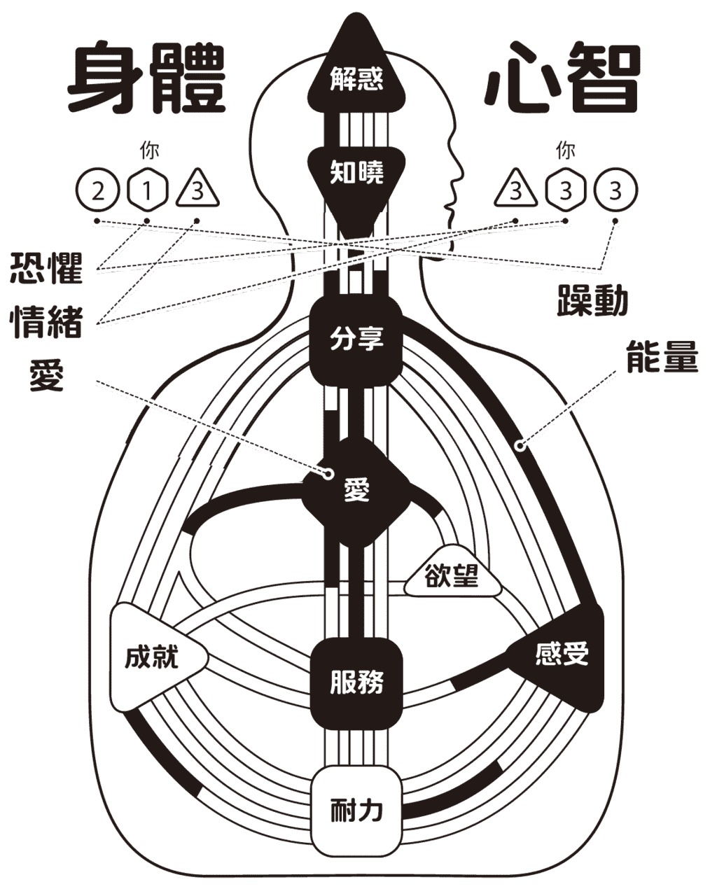

利用班图的协助，我们能看见程序巧妙地透过五项元素控制我们，其中四个层面是由两个班水晶来掌控，另一个则是由磁单极控制。

这是影响我们动力的五种方式。

我们无法看见或理解这些水晶与磁单极在暗物质领域中的作用，我们只知道它们透过微中子相互联系，而且除了它们本身所蕴含的特质之外，太阳系中 13 个天体的位置也会对它们带来巨大影响，你可以想成这些水晶与磁单极乘载了宇宙的「蓝图」。

在人类胚胎成形那一刻，就有一个班水晶开始在母亲的卵子内建构身体，而第二个班水晶会在出生前三个月左右才抵达，开始建构心智。为了建构心智，大脑必须成长到一定的完整度。第一个班水晶与磁单极一同出现，而在身体死亡的时刻，也会一起离开身体。

两个班水晶与磁单极控制我们大脑与身体中的化学物质释放，这些物质左右了我们的心情、向往、恐惧、躁动，以及能量的程度。

我们可以从许多理性层面来理解班以及它们的影响力，而磁单极的领域则全然是个谜，那是爱的领域。当人类在日常生活中提到「爱」这个字，通常会有几种不同的意思，但我们在班图中所理解的「爱」，都是对于某种状态或某个人的向往之心。不需要多做解释，是磁单极的力量引导我们往正确的方向思考，那是无可抗拒的吸引力，无法用我们所理解的逻辑来解释。

无论爱的中心是否启动，磁单极都活跃于我们每个人的体内，我们都能感受到爱的力量。

程序所使用的第二种控制机制是能量中心，有些人认为能量中心是用来表示一个人所拥有的能量多寡，这并不正确。能量中心并不是脉轮中心，而是让我们了解，程序对于我们每个人所注重的主轴是哪些，假如我们不遵从这些主轴，就会切断我们的能量流动，举例来说，如果某些人「爱」的能量中心有启动，一旦忽略了磁单极所引导的方向，能量中心就会逐渐切断他们的能量。换言之，假如他们持续从事自己讨厌的行为，并且与自己不喜欢的人相处，他们就会觉得能量枯竭，因为程序切断了他们的能量供给。假如某些人的「爱」能量中心没有定义，他们仍然知道自己所爱的是什么，也会受到吸引靠近特定场所、活动与人群，但假如他们不「遵守」磁单极的方向，并不会因此切断能量。

另外三种型态的控制力透过三种符号来表现，分别是三角形、六角形以及圆形。我们具有两组符号，分别属于心智与身体层面。其实我们有许多个三角形、圆形与六角形，位于图像顶端（本质／你）的符号是来自太阳／地球的位置，属于最主要的影响力，接下来位于图像第二排（欲望／其他）的是第二层稍弱的影响力。后面还有些更弱的影响力，并未标示在图像上，但都存在于班图软件里，只要你按下「班图」按钮就看得到。

班水晶透过这三个符号控制我们的情绪、躁动程度以及恐惧程度，许多人都有错误的假设，觉得没办法变得更加快乐，这只是短期效应，就像驴子面前有根棍子绑了胡萝卜一样，程序利用想变得更快乐的向往之心来控制我们的行为。你会在班图中发现，对不同的人而言，能够感到快乐的事物也不同，因为程序需要众人受不同的动力所驱使，有些人比较愿意牺牲奉献，并从事他人较不喜爱的活动，因为他们主要的情绪调控中心不是「感受」，而是「成就」。

我们也会发现，每个人的恐惧程度不同。有些人天不怕地不怕，其他人则步步为营；有些人总是冲劲十足，无时无刻都在挑战极限，其他人则倾向于轻松安逸。由于我们在身体与心灵两种层面的主轴各有不同，有的人可能内心无所畏惧又闲不下来，但身体却既被动又谨慎。

# 三种符号

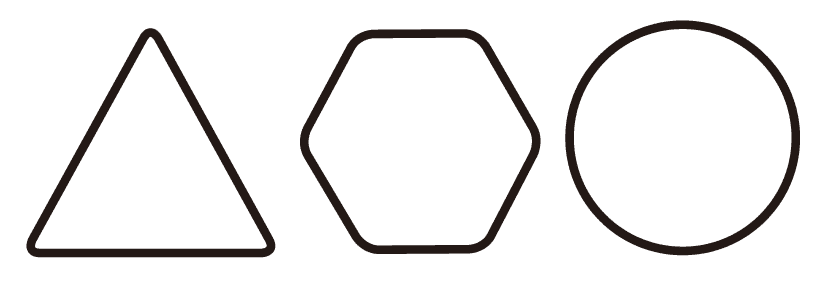

本命图中的三种符号各有三种可能的主轴，也就是说，你会在这些符号当中看见 1 到 3 的数字。

每个人会有两组由三角形、六角形与圆形构成的组合（一组代表心智层面，一组代表身体层面），标示着「你」的这排符号代表自己的本质，标示着「他人」的这排符号则代表我们喜欢什么样的人。

你一开始看见自己的本质上出现六个符号，可能以为会有多达 729 种组合。但根据程序的运作方式，其实只存在着 114 种可能的组合。举例来说，身体层面与心智层面的圆形中不会出现同样的数字。再举个例子，如果某人在心智这一侧出现圆形 3，而身体这一侧出现圆形 2，那么心智这一侧必定会有六角 3，而身体这一侧必定会有六角 1。程序大概是如此运作的，世界上只会出现特定类型的组合。

三种符号分别代表：

三角形：情绪调控（快乐）

六角形：弹性（恐惧）

圆形：躁动（活跃程度）

别忘了，在心智这一侧的三个符号，影响着你利用自己心智的行为，而在身体这一侧的符号，则影响你利用自己身体的行为，跟其他人的心智与身体无关，只跟你自己有关。

# 情绪调控

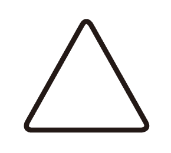

本命图左右两侧的上方，在「你」的标示下方会出现三角形，我们现在暂时先忽略「他人」的标示。程序的影响力可以区分成两组，第一组由三角形与六角形所构成，用来评估你所经历的事物。它们是你的意识，并且负责让你在「好」与「坏」或者「愉快」与「悲伤」之间做出评断，不过大部分时间都会介于两者之间，它们透过不同的痛苦与愉悦程度来判定你的情绪。三角形与六角形的作用象是感应器，用来评断你生命中所发生的一切，并且定义出你的舒适圈。

第二组影响力是圆形与人形图案内的九大能量中心构成，用来表示你以能量为基础的动力所在。三种符号（三角形、六角形、圆形）中的数字，负责掌管你在毕生之中都不会改变的本质部分。另一方面，代表你能量动力主轴所在的能量中心则随时都会改变。

就从三角形与其背后的意义开始谈起，你可以把三角形视为左右愉快或悲伤情绪的主宰，有趣的是，对于其他遇见你的人而言，他们首先见到的不一定是这个部分，通常会先注意到动力以及互动的种类。只有当他们深入了解你之后，才会了解你的情绪枢纽何在，也才知道你多么容易感到受伤。

这里有三种负责掌控你情绪的评断结果（三角形），分别以数字 1 到 3 来表示。

无论你的三角形内是哪个数字，都表示这个数字所代表的主轴，对你而言远比其他两个数字的涵义更为重要，只要在可以选择的情况下，你就会选择这个方向，因为能够让你感到愉悦。如果你的主轴是感受，表示与成功或者尊敬相比之下，你会更重视感受。

可能主轴：

1—成功

2—尊敬

3—感受

# 成功

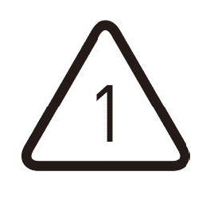

成功主轴是广义的描述，代表能够让你在生命中获得成功，或者更精确而言，让你能够改善境况的任何活动。这类型的人可能相当具有竞争心，无论是跟别人或是自己比较都很好胜，他们想要成为赢家，并且不计任何代价都要达成目标，他们可能勤奋工作而且纪律严明并喜欢艰难的挑战。

三角形揭露的，是三种可能让你感到喜乐或悲伤的主轴，它们控制了你的情绪。带着成功主轴的人，生来就具有能为了成功而承受牺牲的特质，因为感受并不是优先考量，但这不代表这类人永远不在乎自己的感受，只是能够忽略感受。

你在各行各业中都会发现具有这些才能的人：体育表现、政治或商业长才，许多这类人将职涯摆在其他需求或者情感福祉之前，这并不是他们自己的选择，而是程序加诸给他们的特性。为了达到成功，他们可以相当妥善地控制情绪，在适当情境中切断情感。他们与感受主轴的人相较之下，看起来比较冷漠，对于特定处境不容易展现出同情心，但他们还是有所感受，只是比较少产生反应。

我们在本书中所探讨的各个层面，都有「好」、「坏」两面。你必须了解，某些人所认为的「好」，在其他人眼中可能是「坏」的表现。同样的，放诸四海皆准的「好」是种迷思，并不存在。即便你试着当个「好」人，仍然会冒犯到某个人，我想表达的是，你耳朵里听起来很「糟糕」的事，对其他人而言可能反而相当正面。班图并不是要对人贴上「好」或「坏」的标签来加以评判，只是要告诉你，他们「为什么」这么做。

举个例子，具有三角形 1（简称三角 1）的人，可能会让尊敬（三角 2）主轴的人认为是在「作贱」自己，因为三角 2 的人相当在意他人的看法。三角 1 随时都能为了在生命中达到成就，而从事不讨喜、甚至有损形象的事物。某人认为「作贱」自己的事情，也可能在其他人眼中是「努力」或者「为成功而不择手段」的作法。我的意思并非所有三角 1 主轴的人都是奴性至上，但即便有谁确实如此，你也能理解他们为何这么做，他们比较不在乎别人的想法，不管别人对自己是否存有敬意，为了让生活更上一层楼，他们愿意接下「不讨喜」的工作。

首先，我们必须判断你的三角 1 主轴是出现在身体或心智层面，如果你在心智这一侧具有「成功」特性，那么你所花费的心思、你的所有言谈，以及你的所见、所学、所想，都是受到成功的需求所驱使。三角形是用来衡量你能透过心理活动满足成功主轴到什么程度，它会做判断。如果你耗费了心思却没能带来成功，你会开始感到悲伤，因此，对于改善生活无法带来远景的任何事物、任何人或任何处境，都会使你失去耐心。如果某项心理活动对于改善生活无法带来实际价值，你就不想继续瞎搅和，这些是很明显的例子（但非仅限于此）：赚更多钱、拥有更多、在竞争中获胜、找到更好的工作、升官、获得事业上的成功，以及拥有「舒适」的生活。可以说这类人比较目标导向，没那么在乎自己的感觉以及他人的看法，当他们赚到许多钱，也不会藉由与所有人分享（三角 2 的人就会）来获得喜悦。

当我们看到这项主轴出现在身体这一侧（你的三角 1 可能同时出现在两侧、其中一侧，或是两侧都没有），我们要探讨的是所有身体活动，也就是针对行为，而不是你的思维（谈吐、思考、记忆或观察）。是关于你利用身体所做的任何事，或是影响你身体的事物。你喜欢什么样的人，或是喜欢前往什么样的场所，这项重要特征从物理（身体）层面或许并非显而易见。

心智或许能提供概念，告诉你应该采取何种行为，但你要如何将概念化为实际的行动，还是需要靠身体层面来决定，这是心智所没有的特性。

三种主轴可能基于不同原因，分别具有特定的健康问题或优势，但彼此之间并没有优劣之分。有些人可能主张：具有成功主轴的人因为想要追求成就，所以比较愿意牺牲健康，但是其他两种人也有其他缺点。没错，这类型的人可能会牺牲健康来追求成就，也可能是为了经济因素，或者只为了想赢得运动比赛而有所牺牲。在此同时，如果他们体会到拥有健康的身体更可能成功，那他们也可能为了相同原因而开始注重健康。

整体而言，并没有哪一类型人的健康状况优于其他人，但第三类（「良好感受」类型）的人比较容易增加体重，因为他们觉得没必要为了形象或为了追求成功而受苦（挨饿）。

现在就上[baantu.com](http://baantu.com)网站搜寻几个你认识的人，找些例子来了解三角 1 是如何影响他们。

# 尊敬

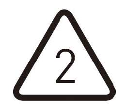

你仔细看看[baantu.com](http://baantu.com)网站上的三角形，会看到上面有个小点，可以指出在本命图中受到影响的区域。三角 1 指向「成就中心」，三角 3 指向「感受中心」，三角 2 指向「知晓中心」，当你在本命图中用虚构线条连接这三大能量中心，就会形成一个三角形。

尊敬和心智相连结，心智主掌了判断，对它而言「绝对」并不存在，它只能将两种以上的事物相互比较，如果你只呈现一项事物给它，它会毫无头绪。突然间，你会明白心智所了解的一切必定与其它事物有关，心智并不知道什么是绝对的真相。

为什么三角 2 会与心智相互连接，这是因为它透过心理判断来进行评估，但这项评估却又是来自其他人。具有这项主轴的人，极度在乎其他人对于自己的看法，而他们大多都希望其他人对自己抱持敬意。

获得敬意的方式有很多，先别太快下定论。首先，你可能因为工作、知识或能力而受到尊敬；另一种方式是创造虚构的表象或形象，让其他人对你抱持正面看法。我认识几位三角 2 主轴的人，他们其实是大骗子，或者会掩盖对于自己不利的事物。还有些三角 2 的人，会仗着具有权力的地位，强迫别人对自己怀抱敬意。当然，例子总是有「好」有「坏」。

你会发现有许多演员具有三角 2，当某人渴望掌声时，你觉得是什么原由？正是三角 2 这项主轴。受到观众的认可、赞美，以及令人愉悦的评判，能让这类人感到开心，但假如他们未受到其他人的尊敬，也可能会极其悲伤，因为别人对他们的敬意左右了他们的愉悦感，所以他们总是想抓住能替自己赢得尊敬的事物。「装模作样」与「撒谎」画上等号并不是巧合，演戏与撒谎之间存在着相似性。演员会隐藏自己真正的模样，因为他正在扮演某个角色，为什么要这么做？因为他要藉此取得另一个人的特定反应。具有三角 2 的人认为，如果没有观众，就没有演的必要。你必须了解，假如具有三角 2 的人无法将成就或热情展现给其他人，他们就失去了目标。有些这类型的人喜欢吹嘘自己的成就，最后可能变成在炫耀自己，你会不会陷入如此处境，与你的不安全感有关，我们将在探讨六角形的章节聊到这点。

当然，这项主轴出现在心智或是身体层面，同样会有所差异。

出现在心智这一侧时，会与我们利用心智所进行的各种活动有关，也就是说，当你谈论或分享你的知识时，是想要获得听众的尊敬，也代表你只想学习能让你赢得他人敬重的事物。光是你自己喜欢还不够，你还时常需要其他人赞美你对某件事情相当拿手。当然，心智也负责掌管概念，任何能让你获得其他人青睐的事物，就是「好」的想法。

如果在某件事情上取得成功并且获得大量财富，但是却默默无闻，是无法让这类型人感到满足的，如果这类人必须在变穷或者变得声名狼藉之间做出选择，他们可能宁愿选择变穷。

假如看的是身体这一侧，我们已经知道是与利用身体的活动有关，但这同时也影响着身体。对具有三角 2 的人而言，外表的重要性可说是不言而喻，每个人体现尊敬主轴的方式都不同，有些人着重于视觉表现，会试图保持「俊美」的外貌或者「良好」的形象；有些人则着重于透过掌权和地位来获得尊敬，他们可能是独裁者、君王，或是事业体的所有人。有许多不同方式都能将敬意付诸实现，但它们都有相同的动机：想要其他人把自己捧在高位，希望别人以崇敬的心意看待自己。

有些演员的三角 2 出现在心智以及／或身体层面，假如出现在心智这一侧，他们的动机可能是想学习扮演困难的角色或人物，藉此博得观众的敬意，这么做能让他们感到愉悦，同时，他们愿意下足功夫研究各种艰涩、有时会令人感到痛苦的角色，甚至接受训练成为演员，也是出于这番动机。我们都知道，成为演员并不保证能带来成功或者财务上的收获，具有三角 2 的人能够投入，是因为他们最看重的并不是成功或金钱，他们的主要目标，是让别人对于他们的作为抱持崇敬之意。假如演员在身体这一侧具有三角 2，这也意味着会影响到他们本身对外貌的要求，他们可以花费大把心力，透过锻鍊身体、整形手术或严格节食，来让自己看起来年轻貌美。

别忘了厘清与三角 2 无关的层面：与三角 3 不同，三角 2 并不注重「感觉良好」，所以他们能够有所牺牲。而且孤独的成功对这类人来说并不够，三角 2 需要观众的掌声，他们无时无刻都在注意自己对于他人的影响力，这也是左右他们在生命中感到悲伤或幸福的主因。

除了演员之外，你也能在许多舞者或者某些音乐人身上发现这项主轴，另外还包括各行各业的专业人士。虽然对音乐人（特别是作曲家）而言最常见的主轴是「感受」，但「尊敬」也是让人成为乐器大师的强烈动机，就拿全世界最顶尖的吉他达人，艾尔．迪．米欧拉（Al Di Meola）来说，他具有两个三角 2，要让技艺达到他的境界，需要认真的练习与牺牲，而这是三角 3 的人所难以达成的目标，能让迪．米欧拉感到愉悦并激励他的，或许就是来自听众的赞美。

尊敬的另一种解释或许是使他人感到「惧怕」，可以说是尊敬的「黑暗面」，贝尼托．墨索里尼（Benito Mussolini）也具有两个尊敬主轴。

三角 2 主轴可以从许多方面来解释，同样的，请上[baantu.com](http://baantu.com)网站搜寻有哪些你所认识的人或是名人具有这项主轴，可以让你更加了解，并且找到你自己的例子。想要学习并了解程序的影响力，最好的方法就是研究你所熟识的人，举例来说，初学者常误解只有三角 2 的人会进行整形手术，但其实所有类型的人都有可能，或许三角 2 的人会有比较强烈的整形动机，但班图告诉我们的是为什么他们会这么做，根据班图的解释，你可能基于三种原因进行整形手术：想要获得成功、赞许，或是提升自我观感。或者，你是在掩盖不安全感（六角形符号内数字较小）。

# 感受

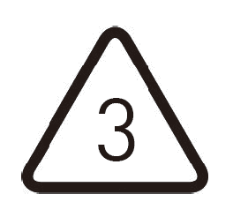

这项主轴使某些人将情感福祉（感受）看得比成功或尊敬更重要。

感受是「感觉良好」的简称，对于某些人而言是生命中最重要的事物，他们很希望能享受自我，藉此感到愉悦，其他东西都得排在后面。这项主轴是程序最晚加入的特质，没错，不只有你的计算机或手机需要更新，宇宙生命的程序也会更新！

最近一次的更新大约是在 200 年前，因此出现了「感受」主轴，也成为使我们感到快乐的元素之一。

审视我们的父母、祖父母以及普遍社会的价值，我们发现成功与尊敬在过去数千年以来都是塑造世界的主轴价值，而且影响力仍然持续发酵。长时间的努力工作会被视为美德，让人留下深刻的好印象，而整天享乐则会让人皱眉唾弃。社会大众往往对愿意牺牲奉献的人给予鼓励，为什么？

如果你回顾置身于社会中的我们有什么改变，特别是过去这 100 年来的变化，会发现我们愈来愈注重自身的感受，「感觉良好」的价值正在崛起，而且地位逐渐赶上其他两大主轴。第三类群体的立场日渐鲜明，并且将「感觉良好」视为生命中的首要价值，如果无法获得良好的感受，就算给他们世界上所有的钱也没有用，他们不掩饰自身的信念，而且可能把甘愿受苦以换取成功的人当作疯子。事实上，他们并不喜欢困难以及有挑战性的任务，而比较偏好能够一帆风顺并带来乐趣的事物。

想象你是位成功主轴的家长，而你的孩子是感受主轴，整天都在玩电动玩具或是玩乐。想让这类孩童整天上着无聊的课程，让他们的能力受到行为所改变，进而在生命中获得成就与保障，是行不通的。你不能以成功主轴的人可能怀抱的恐惧来威胁他们，也没办法在周遭邻居已经对他们的行为指指点点时，还对他们说教，他们不太在乎别人的看法。

具有三角 3 的人，重视当下的自我享受，较不考虑以投资换取未来的报酬，尤其不喜欢长期的艰困与挑战。你应该找到正确的诱因，让这种孩子立刻获得动机，而所谓的诱因只会是带来良好感受的事物。即使他们必须从事困难的行为，也要缩短让他们觉得有所牺牲的时间，并且以报酬让他们再次获得良好感受。你不能让他们离开「感觉良好」的因子太久，否则他们就会放弃。如果过程中缺少乐趣，就算享誉盛名的长春藤联盟大学能为生活开启康庄大道，他们也不在乎，而且他们并不太注重因此而获得的赞美或形象，重点在于生命中要时常出现有趣的事物，那他们自然也能获得成功。

感受主轴的人想要立刻吃掉眼前的蛋糕，他们不愿意以牺牲时间来投资更大的蛋糕。他们与三角 1 或三角 2 的人完全不同，你可以明白为什么有些人比较不合群，这类信息构成了[baantu.com](http://baantu.com)网站上的人际关系星等评价，让你了解与特定某人建立关系是多么容易或困难。

就心智层面而言，三角 3 表示利用心智进行有趣或是让你感觉良好的事务。同样的，当中包含交谈与观察，还有学习以及理解，许多具有这项特质的人本身就很好玩，或者会在谈话时挂着一抹笑容，他们不会在无聊的人事物上花时间，就算能带来极佳报酬也一样。虽然有些这类型的人可能觉得读法律很有趣，但我觉得这种人不太适合读法律。一般而言，你会发现具有三角 3 的人对于情绪变化有较强烈的反应，他们不太擅长隐藏情绪，算不上是最佳「演员」。

具有三角 3 的人，尽管一开始挂着友善的表情，却很容易理智断线，如果你干扰让他们感觉良好的事物，他们就会怒气冲天并且翻脸。「感觉良好」听起来可能讨人喜欢，但同样也具有「坏」的一面（与其他特性一样）。别忘了，成功与尊敬（他人的想法）对他们而言并不是首要考量，所以他们不会想控制自己的情绪，他们会被情绪牵着走，心情好的时候很好相处，当有人带给他们不好的感受时，就会变得讨人厌。与成功或者尊敬主轴的人不同，保障机制并不存在，在不对的时间脾气爆发，因而坏了职业生涯，对感受主轴的人而言并不奇怪，谁说正直坦荡一定能带来最好的结果？

三角 1 及三角 2 在情感受伤时比较善于隐藏情绪，也基于其他原因比较善于控制情绪，他们不会因为情绪不佳，就朝不对的人大吼大叫或在错误的场合发脾气而毁掉职涯发展或者形象。他们不会老是把情绪表现在脸上，假如事情可能对他们不利，他们也会隐藏自己欢愉的心情，毕竟这样可能会遭人嫉妒。

如果你在身体这一侧具有三角 3，你会想在生命中从事一些可以带来良好感受的事物，以及认识一些提供良好感受的人。具有三角 3 的人是生命中的寻欢者，有些这类人并不把成功的职涯当作生命中最重要的事，如果缺乏乐趣更难引起他们的兴趣。这类人不会一直注意腰围，也不想为了成就、美貌或他人的赞赏而饿肚子，我不是说他们全都是胖子，但你会发现具有三角 3 的人，在吃下能带来良好感受的食物时比较不在意外表。他们想要享受自我，他们要的是良好的生活质量，而不是长时间的折磨。对于讨人厌或者乏味又无聊的对象与场所，他们压根就不想接触，他们也不想从事不好玩、困难又容易受伤的运动，简而言之，他们想尽可能避免受苦。有些人可能会说他们过度敏感（别与不安全感搞混），你必须了解，感觉良好是他们生活的中心价值，痛苦则是大敌，能避就避。

话说回来，还有许多其他因子会影响你的行为，我们稍后再谈。三角形只是关于程序影响力如何塑造你的第一章节，这些主轴并不是非黑即白。当然，一个感觉主轴的人也可能想要获得成功，但透过程序带来的影响力，他们也许深陷艰难的战斗之中，而且面对的难题远超过成功主轴的人。我个人并不会限制自己参与各种活动，但我明白某些事物对我而言比其他人容易，尤其当我与别人比较时更是如此。总归一句话：我们要了解，你我都是不同的，每个人都不一样。但虽然你如此独特，不代表有哪件事绝对不适合你。

# 你喜欢的人

在本命图中，有一排标示着「你」，下方则有另一排标示着「他人」。两排都有三角形、六角形与圆形，但里头的数字可能不一样。

我们已经从左右两个三角形了解程序如何影响我们，显示出有哪些特质大幅左右着我们的情绪，使我们感到快乐或悲伤。

当你检视「他人」栏位的三角形时，它透露出你喜欢的是哪种人，也就是对你有吸引力的类型，也可以解释成你对于哪些特质的人容忍度较高。在上一章节所认识的特质在这里都适用，只不过这里关注的不是你，而是其他人的特质。或许你在生命中最重视成功，但可能不希望身边的人也整天把成功挂在嘴边，而对其他事情毫不在意。或许你比较喜欢身边围绕着有趣（感受主轴）、在生命中不会只汲汲营营于成就的人。如果你在「他人」栏位具有三角 3，表示程序透过他人来影响你，使感受主轴成为你生命中的一部分，这些关系其实没有合理的解释，我们不知道「为什么」会受到具有这些性格的人所吸引，这一切都是为了有利于宇宙那个我们毫不了解的有机体。「他人」是形成生命格局的机制，程序将人类（以及所有生命）排列成不同格局，它让特定的人们待在你身边，而他们旁边也会是特定的某些人。如果我们再拿体内细胞来比较，会看见细胞以相当独特的格局成群排列。

我们会偏好与自己相似的人，这种认知并不正确，对某些人确实如此，但并非一体适用。班图可以彻底分析，并且告诉你，你想要从其他人身上寻求什么特质，但还不只如此，你也能知道自己所认识的人是否在寻求你所拥有的特质。

有个重点你不能忽略，你身处于哪些类型的人群之中，会对你的生命带来实质影响力。

有两件事情左右着我们的生活：我们本身的性格，以及我们所身处的环境。我们的环境（围绕我们身边的人）跟我们与生俱来的特性一样，会塑造并影响我们。

想象你是个感受主轴（有趣）的人，如果你也偏好与感受主轴（跟自己一样）的人相处，那么与同样是感受主轴，但交友圈充满成功主轴的人相比，你们的生活会相当不同。

所以你在自己的本命图中所看到属于「他人」的特性，也会成为你的一小部分，因为这类人（与他们的主轴）比较常出现在你的生活中。

如果某人不具有「你」的栏位或「他人」栏位所显示的主轴，你对他就没什么兴趣，因为你既不了解、也不想寻求对方的主轴。跟其他人比起来，这种人很快就会惹恼你。

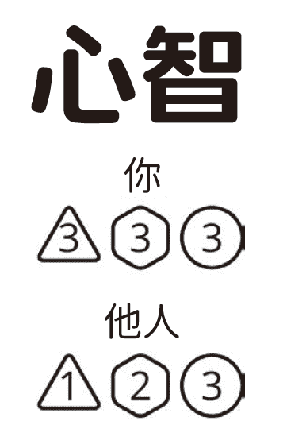

拿我本身的例子来说，我的心智属于感受主轴（三角 3），但我比较偏好心智属于成功主轴（三角 1）的人，代表我欣赏的，是将主要心思花在追求成功，而非追求感受或者尊敬的人。我喜欢自律而且在生命中透过努力追求成就的人，而比较不偏好像我这样只想要整天获得良好感受，而且当情况发展较为不利时就选择抽身的人，但我对他们还是能感同身受（融洽共处）。

我周围受到成功所驱策的人影响了我，使成功也成为我生命的一部分，甚至成为部分的自我，因为他们带来的影响，我可能会想努力地认真工作。

你也会发现上图的两个三角形中并没有三角 2（尊敬），无论在「你」或者「他人」的栏位都没有（不存在我自己跟我偏好的人身上），所以我不会留太多时间给固执（或者「追求」）于尊敬的人。我完全不在乎别人对我的看法，也不希望我周围的人一直担心别人对他们的看法，这对我的生命无关紧要。

记得留意图中所没有的数字，这代表你比较不喜欢或是不了解的特性，也表示这些主轴太过彰显时会让你觉得不舒服。

再次搜寻你所认识的人吧！你已经能在这个层面进行分析了。或许暂时先把书本放下，上[baantu.com](http://baantu.com)网站练习一下。问问熟人的生日，或者输入你比较熟悉的名人，你可能曾经看过关于他们的纪录片或者专访。

我们到目前为止只谈了三角形，不过你已经能透过它们在生命中的优先级来认识别人了，多么奇妙。但当你认识某个人时，三角形未必是最显著的特质，它可能会埋藏在其他性格之下，必须多花点时间才会显露。你首先见到的特质会在稍后章节中讨论（例如圆形以及本命图中受到启动的能量中心），但对于其他人而言，三角形代表了他们生命的中心价值，因为它掌管了他们的愉快与否。至于能量中心虽然掌管我们的行为，却无法控制我们的情绪，它们只会敦促我们采取行动、替我们指出焦点，也提供我们采取特定行动时所需的能量。

# 自信

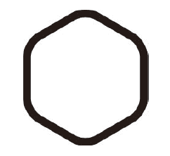

六角形是我们感官的第二部分，也代表我们衡量福祉的标准。我们已经从三角形了解自己最重视的是三种主轴中的哪一类，因为这是我们感到愉快的关键。六角形则提供了我们额外的性格，当情势不如预期时，它显示了我们的弹性高低，以及需要多久才能复原。假如你的弹性比较低，代表你更为敏感、羞怯，而且自信心不足，换言之你会比较容易受伤，与其他两种性格的人比起来，你的怨妒心维持时间比较长。

1—低（悲观主义者）

2—中（现实主义者）

3—高（乐观主义者）

别落入这三种主轴有优劣之分的成见中，对你而言，最好的就是你自己。你没办法改变你的六角形、三角形或圆形特质。假如你是敏感的人，你会比较容易受伤，弹性比较低，也比较脆弱，但正因为如此，你对于任何危险的警觉心比较强，这也是你比较敏感的原因；你也比较没有自信，但别急着认为自信心低落就「不好」，你应该看见背后的优点是什么，比如能够察觉可能失控的事物，是相当有用的特质。

别抵抗自我，而是要与自我合作，了解你为何会如此，使你做出适当或是不当反应的关键又是什么。我并不是要你避开或是改变任何事物，你可以顺随自己的意愿，但现在你可以用更宏观的体认来看待事物。你不会在漆黑的房间中盲目踉跄，重点在于了解你与其他人不同的原因，我们原本就不是一个模子刻出来的。

比较敏感又容易受伤的个体，会想要让自己远离「惊喜」，他们比较无法临机应变，会倾向掌握自己所接触的人事物。在身体层面，他们不允许会对身体造成问题的人接近自己，如此一来就没那么容易受伤。具有高弹性的人不会隐藏自己。在心智层面，则和「敞开心胸迎接事物」的程度高低有关。弹性较低的个体，会确保自己不受到任何挑战，而适应力高的心智，则不容易受其他人的想法威胁。

# 悲观主义者

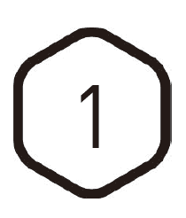

相较于其他两种六角形主轴，六角 1 所具有的弹性与自信心最低，这类型的人很容易受伤，但同时也相当敏感，他们知道场面总是会失控，所以没有安全感。他们不容易相信任何人或任何事，因此，他们开始在身旁筑起一道墙，让其他人无法伤害自己。他们相当重视隐私，也没那么好亲近。六角形代表我们会让别人靠得多近，如果你在身体这一侧具有六角 1，你可能对于陌生人的拥抱或亲吻感到不自在。

重要的是，你不应该将悲观主义者视为问题或者让你想要逃离的性格，如果这是你的六角形主轴，就把别人的闲话抛在脑后，没有谁是「好」人、「坏」人，或者「有缺陷」的人，没有谁的优缺点比较多。我们都是宇宙所期望我们成为的个体。我不在乎其他人「觉得」我应该怎么样才对，我不是别人的奴隶。

就如我先前多次提到的，我们在班图中所判断的每个特性都有「正」「反」两面，也透过我们产生不同体现，但不只如此：可能惹恼某个人的特质，或许会让另一个人心生愉悦。

如果某人的弹性比较低，表示脸皮比较「薄」，称不上坚强。我知道，听起来好像他们感受到的痛苦比较强烈，但实际上并非如此，他们只是需要更多时间来克服，要经过更长时间才能恢复，他们不容易忘掉曾经发生过的事。具有六角 3 的人能最快克服痛苦，而六角 1 的恢复速度最慢。如果你比较敏感，与其他六角形主轴的人相比，你对待其他人的方式也会有所区别。你必须看看六角 1 出现在哪一侧，如果是在心智这一侧，你会很容易因为与心智相关的事物而受伤，包括谈话在内，表示你对自己的心理能力缺乏自信，而且在受到攻击时，你也对自己的谈话技巧较没信心。这与你实际的智慧或心理状态没有任何关系，你只是更容易察觉风险以及可能失控的情势，这也是你会想完全避免特定情况的原因。

如果你在身体这一侧具有六角 1，你比较容易因为身体的行动，或者整体上与身体相关的事物而受伤，所以如果有人取笑你的身体，就算过了很久你也不会忘记。

具有六角 1 的人，有时候会难以忘怀仇恨。对某些六角 1 的人而言，生命中或许有某些事件造成严重创伤，使他们永远无法走出阴霾。要他们「有自信一点」，可能是最糟糕的建议，他们没办法提升自信，你那样建议等于是叫他们忽略危险，害他们伤得更重。他们保护自己的方式就是不让其他人接近、不被牵扯到各种使他们不自在的事物，这么做其实没问题。即便他们受到严重创伤，还有心理治疗能够帮上忙，但假如他们想要躲起来，就让他们躲吧，这并不代表他们永远不会探出头，只是他们想要选择让谁能够接近、触及自己。他们想要在别人接近之前先「过滤」人群，特别是潜在的麻烦人物。他们并不如六角 3 的人这么开放。如果他们已经神经质到令人无法忍受，最好的办法就是让他们觉得万事俱全，而且安全无虞。

当某人受伤时，并不只是身体上的伤害（发生意外），也包含情感上的创伤，就像受到排挤的时候，有的人或许拥有高弹性的心智与低弹性的身体，这代表他们不容易受到利用心智所进行的事物所伤害，他们可能会因为讲错话惹来麻烦，或是别人说他们很蠢，不过这些对他们的影响不大。但如果在身体这一侧具有六角 1，表示他们极度敏感，很容易受到与身体、肢体动作或物质层面相关的事物所伤害。这类人的（身体）举动或许相当保守，但仍然能够大胆地思考与交谈（心智）。

同时检视三角形主轴以了解你的弹性与哪些事物相关，这点很重要。六角形与三角形的关系密不可分，成对运作。如果你的三角形主轴是成功，那么具有六角 1 代表失败对你的打击很大。如果你属于尊敬主轴，当别人对你的看法不佳、让你丢脸或是对你失敬，你很容易因此受伤。所以六角 1 的作用在于确保这种人不会接近自己，六角 1 不轻易让所有人触及他们，只有被挑选过的少数个体才能获得恩准。

只要你看见六角 1，表示「恐惧」是此人生命中重要的一环，别将这点当作问题看待，而是使人作好万全准备的诱因。如果你具有六角 1，那么恐惧在你的生命中占有重要地位。

具有六角 1 的人总是担心个没完，这就是他们的个性。如果出现在心智层面，表示他们会担心自己所说的话；出现在身体层面时，代表他们会担心自己的行为。当然，他们一样会担心别人对自己所说的话以及所做的事。

稍后我们会聊聊几个有趣的例子，受到忧郁症或酗酒与吸毒问题所折磨的人并不少见，因为他们被迫面对尚未准备承担的处境。生活在大众眼皮底下的著名艺人特别容易受到「脸皮薄」的问题所影响，可能会因此将不自在与恐惧感诉诸于毒品与酒精。

同时，有些伟大的诗人、作曲家与歌手具有高度敏感性与天赋，能够以美妙的方式将自己的折磨与苦难分担出去。你可以了解我们为什么如此钟爱他们的创作，但你也看得出来，他们多么容易被名声给压垮，毕竟他们有时候并未强韧到足以承担事业。

我并非在影射六角 1 的人比较可能酗酒或者吸毒，他们不是这种人，但你可以了解为什么其中有些人会这样。并非所有喝酒或者吸毒的人都曾遇到问题，某些人其实只是觉得好玩，结果就上瘾了。对具有六角 1 的人而言，那或许跟某些三角形主轴的创伤有关，但即便是具有三角 3 的人也可能受伤，没有谁能刀枪不入。六角形与三角形可以指出伤人最深的原因，而且通常是跟物质的滥用有关。有些人感到忧郁时会将创伤往内吞，有些人则会发泄在他人身上，我们都有一套处理创伤的方法。不过三种六角形主轴都有各自的临界点，具有六角 3 的人只是恢复得比较快，也比较容易遗忘。

有些六角 1 的人可能比较不擅长与现实世界共处，两侧都有六角 1 更是如此。当然，主要还是取决于各自的生命轨迹与环境。

再次重申，并没有人可以让自己更具弹性，唯一有用的方法是提供工具，让他们能透过避免危险与导火线而更有安全感。心理咨询与治疗或许有助于排除某些深层创伤，但可能很困难，谘商师需要有高度的训练与付出大量心力。六角 1 一旦受到创伤，伤痕会长时间留存，我知道有方法能帮助他们，但我的重点在于：试图帮助他们成为无法实现的角色，只是徒劳无功，如果程序让某人具有敏感性格，就会一直敏感下去。

让他们远离不健康环境，并帮助他们克服造成创伤的过往，才是最佳方法。

两侧都有六角 1 的人会使周围的人感到苦恼，大家都觉得必须随时战战兢兢，因为无论说了什么或做了什么，看在六角 1 的人眼中好像永远都不对劲。

因为这类人大多会在身边筑起高墙，或是难以信任别人，所以在生活中的许多时候只能与孤独相伴，倒也不稀奇，这通常也符合他们的期望，所以你不必为他们感到悲伤。

如果某人比较敏感，通常也会以更高的敏感度来对待他人。如果六角 1 是在心智这一侧，你对于自己说出口的话会比较敏感；如果敏感主轴是在身体层面，则会对于自己对待他人的行为比较敏感。

六角 1 的人具有最强烈的羞耻心，而六角 3 的人则几乎不会感到羞愧。如果是在心智这一侧，就是关乎你所说的话；如果出现在身体这一侧，则是与你的行为以及呈现身体的方式有关。

另一项有趣的观察，具有六角 1 的人喜欢熟悉的事物与人群，这是理所当然的，因为熟悉的东西或人带来的风险比较低，正好符合六角 1 的偏好。他们喜欢熟悉胜过于陌生。我曾见过几位六角 1 的人，都喜欢看老电影，这就不太符合我这种六角 3 心智的喜好。我比较有冒险心，而且兴趣很广泛，我总喜欢探索新的事物，我的内心喜爱惊喜。身体层面具有六角 3 的人很爱认识新朋友，而六角 1 的人或许偏爱与熟识的人相处，「熟悉度」对于六角 1 主轴的人很重要，假如他们发现哪些事物很对胃口，可能一辈子都不会放手。

我在身体这一侧具有六角 1，讨厌吃我不了解的事物，但我很乐意享用少数我所熟悉的食物，好像一辈子都不会腻，我并不需要太多变化。

你可以发现，无论我将心思花在什么事物上，我都喜欢惊喜与新的花样（我不害怕自己不了解的事），但如果是关于身体或是会影响身体的事物，我反而偏爱以往所熟稔的选择。

# 现实主义者

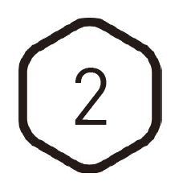

接下来要讨论的这类人，与六角 1 的人相比，有着更充足的准备去面对失败与他人的打击。这种人比较坚强不容易受到创伤，但也了解自己的极限所在。跟六角 1 的人相比，他们更能从容且轻松地面对失败与批评，不过也并非所向无敌，还是有些事情他们应付不来。可是正因为他们比较不会怕东怕西，所以比六角 1 的人容易亲近。他们不会过度隐藏，就连时常让六角 1 感到浑身不对劲的社交媒体，他们也毫不畏惧。

他们既非六角 1 这种悲观主义者，也不像六角 3 那么乐观主义，而是介于中间，属于我所称的现实主义者。他们会从实际的观点来看待生活，并不会老是杞人忧天，也不会一直做白日梦而把工作抛在脑后。他们会察觉风险与危难，但不会因而动弹不得。他们有自信，却不会自信过头。他们不会逃离任何事物，也不会对任何事都跃跃欲试。对于说出口的话以及想要或不想参与的事物，他们都有所选择，而且几乎达到算计的程度。

同样的，「现实主义」或许听起来象是比较「好」的妥协手段，或是相对比较「好」的六角形主轴，但其实与其他两者也没有优劣之分。你无法改变自己的弹性，也没办法让天性敏感的自己强韧起来。我们并非要透过班图改变自我，而是要让你体认自身的特质，使你更了解为什么自己会在特定处境中产生特定反应，为什么与你认识的其他人有所不同。假如你试着改变自我，可能使你遭遇挫折，而且只会让问题加剧。相反的，你应该想办法与真正的自我携手合作。

你的自信程度与疗愈所需要的时间，都是你无法改变的特性。如果你是六角 1 主轴的人，你唯一能做的就是让自己远离伤害，藉此排除生命中的危险，但这并不会提升你的自信心，而是透过尽可能排除威胁来管理恐惧，这才是最重要的。六角 2 是最实际的主轴，这类型的人不会太偏执，也不会过于乐观地看待生命，似乎总能够做出理性的决定。

正如先前所说，如果你在心智层面具有这项主轴，表示你对于与心理能力相关的任何事物，都能从实际角度来面对批评或者检讨失败。作为发言者的你自信程度适中，而且就自己在发想与智慧上的能力而言，你也很实际，你不会在场面失控的时候转身就跑，但或许也不会想面对「烫手山芋」，你可能抱持开放的心态，让某些特定的人能挑战自己。你不会像六角 1 的人，试图让每张苛薄的嘴闭上，你会竖起耳朵倾听其他人想说的话，但只能到某个程度为止。你能承受的还是有限，如果过了头，你就会觉得严重受伤，或是想在场面一发不可收拾之前离开现场。

在身体层面也一样，你可以在某种程度上处理与身体相关的非议，这使你的弹性胜过六角 1 主轴的人，而且面对其他人时也不那么偏执。你跟六角 1 的人相比，对于自己的身体与外表更有自信，但不会像六角 3 主轴的人，觉得自己完美无瑕，你还是相当明白缺点与极限所在。

别忘了，六角形主要是决定你能让其他人接近的程度。弹性较低的人，需要完全掌控让哪些人敲开自己的心房，他们并不信任任何人或任何事，需要最大程度的保护。六角 2 对于掌控全局的需求比较低，但也并非来者不拒，他们能够面对特定程度的意外，但也并非照单全收。六角 3 的人则是完全不担心，也不会「过滤」人群，他们对所有人敞开心胸，也对所有事物张开双臂。

你可以明白为什么六角 2 的人有时候看似比较势利，因为他们只让特定族群接近，而将其他人拒于门外。六角 1 几乎排斥所有不熟悉或者伴随风险的事物，就像一道窄门，反观六角 3 就像没有门一样，可以应付一切事物。另一方面，六角 2 的人有所选择，只对特定的人事物敞开胸怀。六角 2 具有盘算的特性，有些人可能称之为「风险评估」，在其他人眼中又叫作「势利眼」。在六角 1 对于大多数陌生事物说「不」，而六角 3 几乎对一切都说「好」（藉此了解到底怎么一回事）的时候，六角 2 可能只告诉你「或许吧、看情况」。

# 乐观主义者

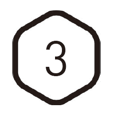

接着我们要聊聊最有自信的族群，他们不知道什么叫作恐惧，也不容易受到威胁。当然，在某些处境中的「优势」，也可能在其他情况中把你「害死」，他们完全无视于某些危险，你可以称他们为梦想家。同样的，跟其他六角形主轴一样，这无关于智力或者能力上的优劣，但假如有谁可以让梦想成真，那非他们莫属，因为他们不怕失败，在生命中拥有远大抱负。

你觉得自己充分准备好面对各种处境与人群了吗？或者你偏好侷限在某些特定范围中，让自己能够掌控即将面对的一切？六角 3 主轴的人觉得自己蓄势待发，足以迎接生活上即将面临的各种冲击（字面上看来是夸张了点）。同理，你必须看看六角 3 是出现在身体还是心智层面。六角 1 与六角 3 主轴的人，看在六角 2 的人眼里都有点不切实际。

六角 1 主轴的人总是杞人忧天，而六角 3 几乎不怎么担心，他们不觉得有什么事情会出差错，这让他们成为乐观主义者与梦想家。当他们受伤时，能够以不可思议的速度快速恢复，而且总有办法从「泥淖」中快步向前，迅速振作起来。

理所当然，我们都可能有心理与身体层面的「瓶颈」。六角 3 主轴的人，对于任何人都很难有长时间的嫌隙，至少在利用心思所进行的事物方面是如此。他们不会轻易失去沉着冷静，面对可能导致严重指控或人身攻击的激辩时，也不会转身逃跑。他们不太会感到威胁、也不会试图压抑他人的声音，不躲藏，而且随时都在备战状态。他们明白，要分辨心智与身体层面的差异，与别人是用言语或行为来伤害你无关，而是关乎于攻击你的部位。你受到攻击的目标，是与你利用身体进行的事物有关吗？或者是关于你利用心智所进行的事物？假如你在身体层面的弹性很高（身体那一侧具有六角 3），而有人对你的身体或是你利用身体进行的事物厉声批评时，对你造成伤害的时间并不长。但假如你在心智层面具有六角 1，而别人又取笑你的想法很「愚蠢」或开你说话方式的玩笑，就算过了很久你也不会忘记。

当然，没有人喜欢受到攻击，但与其他六角形主轴相比，六角 3 很快就能克服伤痛，与其他人相比恢复得更快。

谈到身体与心智敏感度的不同组合，可能得多花点时间熟悉。

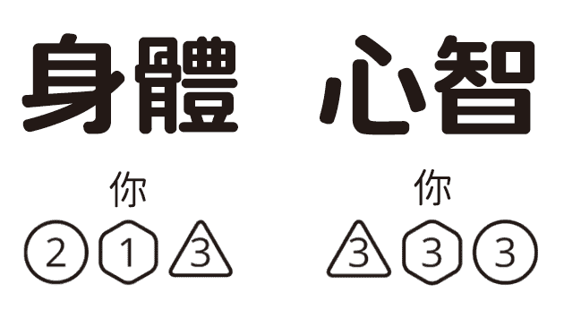

就拿我当例子，我在心智层面拥有最高的弹性（3），但在身体层面的敏感度（1）最高。

当别人取笑我的身体或是批评我喜爱的运动，我很容易受伤，我不擅长处理在身体能力或行为上所受到的批判，这使我吝于表现肢体，但我在心智层面正好极度相反，这方面我完全不担心。我从不觉得自己的心智毫无防备，而且总是认为我能够解决任何事，当别人对我的想法或者话语激烈争辩时，我从不害怕，这并不表示那是什么愉快的时光，但我很快就能恢复，不会在当下就此僵住。当与我心智活动相关的争论白热化时，我反而会因此受到激励，不会逃避。但如果关系到我的身体能力，我就很容易胆怯。

我是充满自信的公众发言者，「面对现场」吓不倒我。但我不喜欢别人在身体上毫无限制地接近我，他们可以挑战我的心智，但我不会让大部分的人靠我太近。我在距离上有所保留，不喜欢与别人见面或让人登门拜访，除非我也想见对方，我很注重隐私。六角 1 主轴的人就像隐士，我不让太多人接近我，也不喜欢太多肢体接触，喜欢在身体上保持距离。但六角 3 主轴的心智并没有太多祕密，这与隐不隐藏无关。在身体层面具有六角 3 的人也一样，他们很少或几乎没有肢体上的界线。

六角 3 主轴不只代表本身的敏感度较低，他们的行为也是如此。在心智层面具有六角 3 的人，可能对其他人说出乍听之下容易让对方受伤的话，你可以说他们大嘴巴，因为他们可能很粗鲁。身体层面具有六角 3 的人，则可能做出粗线条的行为，让其他人乍看之下觉得浑身不自在，也可能受到刻意解读。如果你具有六角 3 主轴，而某人具有六角 1，你很可能会让对方感到受伤，或觉得你是个大老粗。但是就整体互动而言，还是要看对方在「他人」栏位的六角形，可以透露他们对哪种人的容忍度比较高，又无法忍受哪种人。基本上，你能理解跟自己一样的人（与自己具有相同号码）并且感同身受，但能够让你忍受与赞扬的人，则是拥有在「他人」栏位号码的人。

因为六角 3 主轴比较不怕出差错，所以事前不会做太多准备，而是倾向于临场发挥，他们只会准备开场，之后就看着办。六角 1 主轴的人，要不是万事俱备，就是毫无准备，他们偏好与熟悉的人事物相处，藉此将失败的风险降至最低，也能替自己省去冗长的准备工作。六角 2 主轴的人，只会准备到合理的程度，而且很少过度备战，他们不会脑袋空空地来，却也不至于对所有可能的场面都战战兢兢，因此能在一定程度上即兴发挥。六角 3 主轴的人则完全不需要脚本，任何情况都难不倒他们。

而这不只关于你准备多么充分，更关系到你会多早开始准备。具有六角 1 的人最早备妥一切，六角 2 主轴的人会在适当时间点着手，具有六角 3 的人则非得到最后一分钟才动手准备（甚至毫不准备）。假如这项任务看起来太过吓人，六角 1 主轴的人甚至连试都不试，而六角 3 主轴的人比较喜欢「试试看、走着瞧」的桥段。

# 躁动

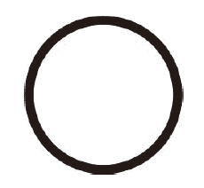

圆形关系到的不是意识，也不是你的情绪，而是你的能量与活动力。与其他符号一样，圆形也有三种能量层级，类似于足球（不是美式足球）比赛中的球员，我们有负责攻击的推进者，他们有远见，会发起并试图控制赛局；接下来是防御者，他们会对事物做出回应，等待事物上门后才有所反应；另外还有中场球员，属于回应与攻击之间的桥梁，他们等待着机会，与六角 2 主轴相似，总是骑墙观望，所以会有所选择。

1—反应者（被动）

2—机会主义者（选择性）

3—发起者（主动）

有趣的是，没有人会在身体或心智层面具有相同的互动「类型」，也就是说，没有人在两侧的圆形会是相同号码。如果你在心智层面是发起者（圆形 3），在身体层面就不会是发起者；假如你在身体层面是反应者（圆形 1），那心智层面就是其他类型。

反应者采取静观其变的手段，等待着生命中的事物上门并揭示生命旅途的方向，也等着其他人将可能性送上门。

正好相反的是发起者，希望能掌控全局而且有所期盼，他们明白自己的期望并起身追寻，讨厌别人对自己发号施令，想要掌握自己的命运。

反应者会张开双手迎接邀请与建议，但别误以为反应者在人生中不会有卓越成就，唯一的差异在于，有些人会在人生的后半段表示：「我从没想过会变成这样！」而发起者则可能告诉你：「我早在 15 岁就找到目标并且迈开脚步了！」

发起者极度想要掌握自己的方向，但正如我所说过，造物者不会让人同时在心智与身体层面都成为发起者。你的生命编码必定使你在某一侧的掌控能力较高，而在另一侧让你善于接纳，藉此探索命运的指引。

圆形数字分别是 2 与 3 或者 3 与 2 的组合，一般来说冲劲比较强，如果是 1 与 2 或者 2 与 1 的组合，则是最被动的类型。

# 反应者

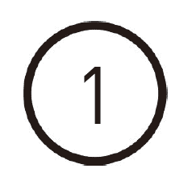

比起攻击或者发起，圆形 1 主轴（反应者）的人比较偏好被动反应。他们不喜欢打扰或麻烦别人，而是耐心等待其他人找上门，不会主动出击。他们的人生态度比较被动，也不会提早做好人生规划，而是等着让人生来指引路途。他们不会一直驱策自己，通常也不想扮演带头的角色。他们不是发起者，也不喜欢激励别人或突然提出点子来鼓动他人。相反的，他们喜欢受人请托或接受邀请，等待适当的邀请或大放异彩的时刻到来，对他们来说不是问题。但他们并不会像圆形 3 主轴（发起者）那样不请自来，或是成为不速之客。

一般而言，除非你先找上他们，否则反应者并不喜欢麻烦或打扰你。他们不是攻击者，而是负责做出回应。他们可能会在防守阶段采取主动，但还是取决于他们的六角形主轴（敏感度）。

一如往常，我们具有心理与生理两种元素，分别来自控制我们的两种班水晶。当你的心智层面属于反应者主轴（圆形 1）时，你不会无缘无故以话语来打扰其他人。你不会利用心智来发起行动，也不想说服他人认同某种想法，除非其他人询问你意见，或是请你发声。

身体层面的反应者主轴（圆形 1）则是相对应的生理模式，并不喜欢主动与他人有肢体接触，他们宁可让对方先出手，再做出回应。他们比较少尝试掌握命运，反倒愿意观察生命所带来的一切。他们会让自己蓄势待发，但别人是否容易「找上门」，就取决于六角形主轴。感觉起来，他们需要受到三顾茅庐般的邀约，才会开始挪动身子或进行与身体相关的行为。

要一探反应者的潜力，主要仰赖环境，以及能使他们现身的诱因。如果你不主动询问，就永远无法了解他们的实力，这不尽然代表他们不知道自己想要什么，他们或许有所见地，但时间点以及行动的时机才是关键，就这点而言，他们挺顺应人生的步调。被动，并不表示一个人驽钝懵懂或无所区别，反应者比较象是供人饮用的水井。

# 机会主义者

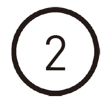

机会主义者相当擅长扭转乾坤，与足球比赛的中场队员相似，他们能够颠覆球的动向，不过一转眼工夫，他们就能从被动化为主动。

机会主义者能够耐心等待，但相较于反应者而言，他们并不是在等待邀请，而是等待机会。他们是观察者，凡事有所选择而且不停盘算。与六角 2 主轴很像，但他们并不是评估风险，而是评估前途。

就拿我当例子，我在身体层面具有六角 1 与圆形 2。

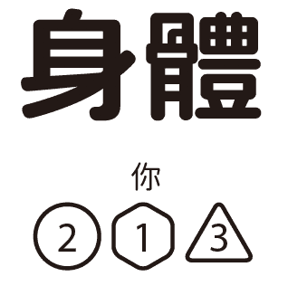

我注重隐私，而且不容易与别人有肢体接触，只对于极少数人例外。如果陌生人上门或是接触我，会使我感到不自在。我并不喜欢别人给我「惊喜」，也讨厌「被迫」面对其他人，我想完全主导能让哪些人接近我，我喜欢有一定的距离，这是我远离伤害的方式，因为我的弹性比较低（六角 1），所以我害怕肢体互动，也容易杞人忧天。我不会盲目信任别人、生命，或者我的身体能力。

但当我们看到圆形主轴时，我并不会呆坐着等待邀请。我是机会主义者，喜欢在一定程度上掌控自己物质层面的命运。但我讨厌麻烦「不对」的人，不想浪费时间在不对的事物上。一旦我对于面前的机会感到满意，我就可能接受邀请，甚至主动出击。然而我时常给人极度被动的印象，好像只会枯等，可是一旦机会上门，当足以触动「开关」的时机到来，别人就会对我的积极以及充满决心的动力感到惊讶。

# 发起者

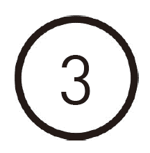

接下来要谈的，是希望能掌控全局的类型，他们不想等待生命，把钥匙交到别人手上，也没什么耐心，一旦他们设下目标，就会试图达成目标。他们会主动追求事物，但可能会用不同的方法，端看他们的自信心（六角形主轴）来决定。

发起者永远处于「攻击」模式，他们一直试着「推销」什么给你。如果他们在心智这一侧具有圆形 3，则可能会将他们的远景、计划或看法推销给你，而不会等待邀请或是坐等对的时刻到来。与另外两种主轴相比，他们可能时常打扰其他人，毫无来由地告诉别人自己的远见、行程或想法，无论对方想不想听都不重要，他们看起来总是有点没耐心，甚至可能到咄咄逼人的程度。

如果圆形 3 出现在身体这一侧，表示他们会利用身体来发起、催促与「攻击」。他们是冒险家，想要放眼世界，他们可能起床后就选定某个地方，接着立刻动身前往。他们是旅行家，他们不想等待邀请或者机会上门，而是想完全掌握生命所引领的方向。他们也会督促其他人，以言语化为动力，敲开其他人的心门。他们明白目标何在，也会想办法达成目标。但他们很讨厌听别人告诉自己能不能这么做，或是该怎么做才对。就像心智属于圆形 3 主轴的人一样，他们并不想听见其他人对自己的想法或说法发号施令。

他们不一定是最佳的倾听者，除非你要说的话与他们本身的计划相关，因为他们忙着发起一切，并不想要分心偏离自己的轨道。他们在倾听时没什么耐心，而且通常只是想逮到机会说出自己的意见，假如一直没机会，还会索性扭转话锋。

当你浏览社交媒体时也一样，有远见的人会发表言论，并且张贴各种内容，接着会有其他人对事情发表意见并回覆贴文，有点像足球比赛中的防守方与进攻方。具有圆形 3 的人并不想因为回应而牵扯太深（除非与他们想发起的事物有关），毕竟那会使他们无法专注于自己的目标。

圆形 3 主轴的人可能很热切，因为他们从来不想等待。当然，任何发动「攻击」或推动事物的人，都冒着受人排斥的风险，而六角形主轴将决定他们的蛮横程度。六角 1 主轴的脚步比较轻，但仍然会发起攻势，他们可能会先确认有哪些失败的可能性，或者先做好万全准备，但他们还是会发起行动，不会等着风向变得对自己有利。六角 3 主轴的人并不担心失败，他们会对所有人表达自己想说的话，也不管是否能够取悦对方。心智层面有两个 3 的人（如下图表示的心智主轴）是最有自信的思想家与发言者，他们最为敞开心胸，却也会在必要时最积极争辩。他们不会隐藏想法，而且也会在需要时出手干预。他们具有想法或远见，而且不会因为有「退而求其次」的机会而感到满足。他们对其他人的远见没什么兴趣，想提供建议给具有六角 3 的人，还不如建议六角 1 的人比较容易，只有与他们当下所忙碌的事情相关时，六角 3 主轴的人才会想听。

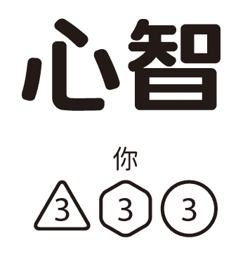

来看看我的完整资料（包括三角形），使我感到愉悦（决定我的心情）的主轴是感受，所以利用心智并透过言语获得良好的感受或乐趣，对我而言相当重要，而达成目标（三角 1）或者别人对我的看法（三角 2）相对没那么重要。你同时也能开始了解，如果有人很乏味或者让我感觉不佳时，我会有什么反应。就心智层面（六角 3）而言，我并不是最敏感的类型，所以我可能有点粗鲁或直言不讳，我不常压抑自己的看法，身为有趣（三角 3）与无惧（六角 3）结合而成的发起者，可能让我爱挖苦人，这是能带给我诸多乐趣的事，却可能伤害其他人，有时候我甚至不知道自己已经伤害了人。而且我也会为所欲为，因为我是发起者，我可能在你说话时打岔，讲个冷笑话，不少人知道我会因为擅自批评而得罪人。具有六角 1 的人很容易被我这种人所伤害，除非他们在「他人」栏位具有跟我一样的数字，代表他们能够容忍我的行为，甚至会因为某些奇怪的原因而受到吸引。幸好，我在身体层面的差异很大，这让某些人松了口气。所有在心智层面具有六角 3 与圆形 3 组合的人都是如此，他们在与身体相关的行为上都相当敏感，而且一定具有六角 1 主轴。

在身体层面，圆形 3 主轴善于在生理上对人事物展开「追求」。当然，在身体这一侧同时具有六角 3 与圆形 3 的人最有自信，但容我重申：最有自信的人不一定能获得最佳成果，别落入「具有愈多 3（六角形或圆形）就能在人生中愈有成就」的误解中。

有些人（也取决于在「他人」栏位的六角形与圆形主轴）可能会觉得某人过度自信，或是一直处于「攻击模式」而令人极度不悦或感到粗俗。身体层面属于圆形 3 主轴的人，对于物质层面具有极高的期望，他们知道要透过身体达成什么目标，而且不会坐等邀请上门，而是主动找寻场合以及对象。许多这类人时常旅行，有些则是很成功的方程式赛车手。当然啦，例子还有很多。

他们的共通点在于想要掌握并设定步调，根据圆形 3 所在的位置不同，他们可能会针对思考、说话，或是身体上的行为来确立步调与方向。这两种都是很厉害的引诱者，两者都具有计划，而且都需要处于掌控的地位。最重要的是，他们非常执着，他们对其他人倾听或者付出注意力的程度，也有很大程度取决于能量中心所在，我们将在本书稍后加以探讨。

圆形 3 并不会同时出现在某人的身体以及心智层面，程序不允许这种组合或结果。我猜那就有点太超过了！没有人在两侧的圆形会出现相同数字。根据我的观察，我发现在心智层面具有圆形 2，并且在身体层面具有圆形 3 的人，相当擅于吸引人。有些人的绯闻不断，有些人则是推销高手，从保险、不动产到车子都能卖，他们会从心智与身体两方面朝你下手。他们是生理上的发起者，也是心理上的机会主义者，能体现这种特质的例子也有很多。

在心智层面具有圆形 3，而身体层面具有圆形 2 的组合就不同了，他们不太会打开生理的大门，但在心理的国度俨然是冒险家，富有点子与想法。

圆形 3 主轴的心智总是会把想法脱口而出，你可能会说他们很爱抱怨，六角形主轴决定了他们在说话时的粗鲁以及挑衅程度。

身体主轴是圆形 3 的人，行为时常使人困扰，而圆形 3 的心智则是常因为想法与点子让人烦恼。

这些结果各自差异的格局使人着迷。与世俗的认定不同，这些组合的态样并非无穷无尽，如我稍早所说，每个 3／2（心智／身体）组合的心智发起者／身体机会主义者，必定具有自信（六角 3）的心智与不安全感（六角 1）的身体，但 2／3（心智／身体）组合的人并没有这种侷限，只有 3／2（心智／身体）的人才会必然如此。就数据而言，3／2 组合的人也比较罕见，只有大约 2.6%的人属于 3／2 组合，而 2／3 组合的人却高达 34%。此外，3／2 组合的人在心智层面也会有两个 3（六角形与圆形），使得他们在说话时就像个充满自信的梦想家，但可能在身体层面具有六角 1，让他们尽管在心智层面表现出来相当乐观，在肢体、物质层面却显得较为悲观。他们不太相信人，认为事情总是会出差错。他们也注重隐私，正是如此的缘故，让他们像个控制狂一样，却也因为这样在采取行动时，他们会有更高的敏锐度。不妨重看一次我的资料吧。

利用[baantu.com](http://baantu.com)网站，你可以搜寻并且浏览这些组合的例子。前往协助（help）页面了解该怎么搜寻在三角形、六角形与圆形具有特定数字的人。

# 九大能量中心

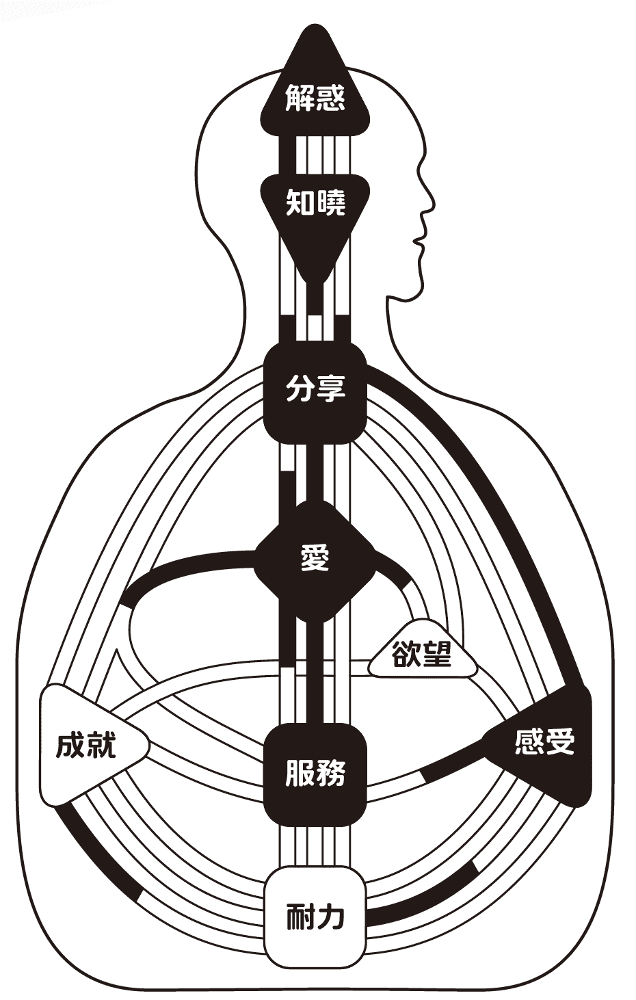

如同三角形与六角形主轴会相辅相成（两者都是衡量标准），我们也有与圆形主轴共同搭配的「伙伴」，称为能量中心。圆形主轴与能量中心都决定了程序希望你如何使用你的能量。我们总共有九大能量中心，而这些中心都是成对出现。

如同稍早章节所谈过，圆形代表一个人喜不喜欢主动发起，或是偏好等待适当的机会或邀请。但我们到底想做什么？是哪种类型的活动？本命图的人形轮廓中看似复杂的图案，代表连接九大能量中心的通道。它们能透露我们想要做什么，表现出我们对于特定事物的动机，也显现出我们的焦点何在。

你必须了解，能量中心与通道所表现的活动，不代表你只能唯命是从，我们并未受限于此，而是充分自主的存在。原则上，我们想做什么都可以，但程序会有所干预。通道与能量中心表现出程序对我们有所坚持的条件，举例而言，如果你看到「爱」处于启动状态，代表程序坚持要你从事自己所爱的活动，或希望你与自己所爱的人共处。如果你具有「解惑」中心，代表程序坚持要理解并且深入探究事物。你可以从事任何喜欢的事，除非有一个闸门开启时，另一端的闸门也处于开启状态，正好形成通道，才会对你的活动产生限制。

程序能透过两种方式达成这种作用，其中一种是你能感受到趋近于这些主轴的动力，另一方面假如你采取违背主轴的行为，程序会替你「拔掉插头」，让你的能量耗尽，使你开始感到精疲力竭。

别因此误会，以为假如某人的「解惑」中心未处于启动，他们就没有能力解决问题，他们当然可以，只不过没有必要，程序对他们的坚持并不在此。但具有解惑中心的人，会感受到持续驱策自己解决问题的推力。我们稍后将会谈到这些通道也有极为明确的主轴，通常是为了帮助这类人涉及的社群或群体追求更大的目的，那些通道并非个体人的属性。就本质而言，程序赋予你必须执行的职责，就像每天上班一样，但当你回到家中，就可以在闲暇时间自由从事喜欢的活动。

三大符号（三角形、六角形、圆形）跟通道搭配能量中心最大的差异在于，后者会根据行星位置或你所遇见的人，而随着时间不断改变。然而，你的三大符号主轴在你的人生中恒久不变。首先，我们先试着了解通道是什么。

通道图案有时候只会亮起一半，完整的通道是由两个闸门所组成，每个闸门都来自于一个能量中心。这些闸门会因为太阳系行星的位置而打开，每颗行星在天空中的特定位置，可以打开一个对应闸门。某些闸门打开后可以形成一条通道，但有些时候不会形成整条通道，只会打通半条通道。如果你想知道哪颗行星会打开哪一个闸门，可以按下[baantu.com](http://baantu.com)网站的「曼陀罗」（WHEEL）按钮。当你将鼠标移到曼陀罗中的任意行星上，在本命图中所对应启动的闸门就会亮起。你只要上网测试一下，很容易就能理解。

本章节开头图案中的通道与闸门，在我的生命中恒久处于启动状态，它们是根据我确切的出生时间所计算得来。但我们也有额外的通道与闸门，会随着相同行星的目前位置启动，不过这张图上看不出来。由于行星移动的速度各有不同，所以本命图中有些部分也随之改变。本书稍后将对此进一步详细说明。在班图软件中，这些额外的通道和闸门可以藉由「移访」或「周期」按钮（48 小时、周、月、半年）标示出来。

重要的是你必须了解，我们不会感受到因为星宿移访所开启的闸门，它们就像个触发器，并不是你能掌控的，只是用来启动通道另一端可能悬启中的闸门。

九大能量中心与通道，象征着一个人执行某些特定职责或活动的动力，再次重申，重点是在「行为」。有时候可能会容易搞混，例如以三角形表示的「成功」主轴以及能量中心所定义的「成功」，但你必须了解，你在人生中的确切行为，主要是根据启动的通道调整你的能量流动而导致的结果。三角形符号接下来会依据启动的通道为主轴观点进行判断，来更进一步设定你的情绪，接着你便会根据由此得来的情绪，改变做事情的方法，或者就极端例子而言，甚至会完全停下手边的工作，去寻找能符合当下启动通道所期望的其他目标。

启动的通道不只促使你进行特定类型的活动，也决定你能获得进行哪种活动所需的能量。你可以把通道与能量中心视为「能量调节器」，负责分配特定活动的可用能量给你，它们也会切断不符合启动通道的活动能量供给，例如若你在本命图的「感受」中心处于启动状态，当你的行为无法让自己或其他人感受良好时，你就会耗尽能量，那当然也会使你动力低落，耗尽能量与情绪不良并不一样。

假如你看见有个闸门悬启着，就像我的本命图中，位于「爱」左方的悬启闸门，那就不会有任何作用，我感觉不到，因为它并未启动。需要与另一边的闸门相互连接，才能启动这条通道，而只有连结通道才能带来效果与动力。单一闸门只是单纯的可能性，必须与其他闸门连通才有用。

有趣的是：不只星宿移访（行星目前的位置）能启动你的其中一个悬启闸门，你的悬启闸门也会受到其他人的影响而启动。假如你遇见的某人，正好可以与你的悬启闸门相连，那你们两人都会感受到相同的动力去共同进行某种活动，这种作用只会发生在双方各有一个闸门悬启，且不具有完整通道的情况。在我们进一步探讨细节前，先来谈谈不同能量中心与相连通道所代表的意义。

虽然观看某人的启动中心能带给你强烈的第一印象，但若要着手分析本命图，比较好的方法是检视图中相连的通道。每条启动通道的两端分别通往一个能量中心，这正是我稍早说它们成对作用的意思，举例来说，假如「爱」中心启动，代表必定有另一个中心与其相连（单一中心不可能独自启动）。拿我的例子来说（本章节开头的图），「爱」与「分享」相连，所以可以解释成：「与他人分享你所爱的事物。」

也可以解释成「与你所爱的人分享事物」或者「分享大家所爱的事物」。

※

闸门的颜色能告诉你某项活动是关于身体或心智层面，举例来说，你可以透过行为或者思维来解决问题，以身体颜色表现的闸门代表生理调节器，而以心智颜色表现的则是意识调节器。

想想随时都在运行的行星，以及在你生命中来来去去的人群，他们持续触动着你某些悬启中的闸门，这是个复杂的动态结构。班图（网站）将诸多面向分解成各种主轴，例如创意、社群与成就等，藉此帮助你更透澈地看清这个架构，你可以了解哪个人启动了哪些动力主轴，但现在先看你自己的资料就好。

你随时都能跨越通道与能量中心所表示的范围，它们并非要将其他事物排除，而比较象是在提醒你，告诉你哪些是必须做的。记住，我们都是独立自主的存在，我们可以自己做决定，但我们也受到更广大的程序所影响着，我们可以做想做的事，但也有我们必须完成的课题。

这张本命图只是告诉我们程序所坚持要完成的事，只要我们希望，同时又有能力，我们永远都能做任何事。但假如我们对于某些事情怀有强烈动机（程序提醒我们所需要做的事），可能就没有足够时间做其他的事，或者其他事物对我们变得比较不重要。你永远都能从事超越图面信息以外的活动，前提是我们不该失去对更远大目标的视野，忽略程序对我们的期望。程序不会巨细靡遗地指点我们，必须靠我们透过自己的智慧与生命体验，来解决大部分的人生课题。

# 解惑

这个中心和厘清事物的来龙去脉有关。跟这个中心一起运作的只有「知晓」中心（我们将于下个章节加以探讨），解惑的所有通道都与知晓相连，这是能量中心成对出现的例子，当你解惑某个问题，同时就会晓得某件事情。

你应该了解的是，某人的解惑中心未启动并不代表此人的智慧高低，只是单纯表示程序并不会给人持续施加「解决问题」的压力而已。虽然除了程序对你的期望以外，理论上你可以做任何其他事情（我们是独立自主的），但你可能会将大部分时间花在启动的能量主轴（中心与通道）上。

与解惑相关的压力有三种，代表连接到解惑中心的三条通道。我们会在回路章节探讨这些微妙细节，但现在你必须知道，对于你自身以外的更大格局而言，这三种压力都有其价值所在。社群或者集体就是很好的例子，必须解决问题来改善他人的生活，这种压力一直存在，这可不仅是为了自己的快乐而已。

谁都可以解决问题（即便这个中心没有启动），但更重要的是，他们会解决可能对其他人毫无价值的问题。

有 70%的人，解惑中心并未处于恒久启动的状态，所以很少人具有想厘清头绪的欲望或时间，多数人宁愿把解决与深究问题的工作交给其他人。这多多少少让你明白了这个世界的真相，以及人们为何如此容易受到操控的原因。

# 知晓

当你知道某件事，并不代表你本身一定了解事情的来龙去脉，因为你或许是从别人身上「借来」知识。这个中心可供两种知晓所用：你自己解决问题所得来的知晓，或是与他人分享而得来的知晓（知识）。知晓中心可能连结到上方的解惑中心，或是下方的分享中心。当你的知晓中心启动，意味着会有一股压力或强烈的动力（这是程序坚持要你做的）推着你去分享对其他人有价值的事物，或想要更理解（解惑）对其他人有价值的事物，因为分享同时也代表倾听。

并不是每个知识分子都认为，当他们相信自己的消息来源时，还需要全盘理解这些讯息。他们可能会在脑中塞满知识（在启动闸门呈现心智的颜色时），并且引述各种讯息，却一整天都不会去验证或透澈理解这些事。记住（知晓）不等于理解（解惑），而这两者各有其优点。在没有亲自理解的情况下借用别人的知识，可以快速获得成果。当然，假如解惑中心并未启动，也就更可能蒙受错误信息或出差错的风险。

从我的本命图可以看见解惑与知晓中心处于启动状态，代表假如有人提供我信息，我总觉得需要先经过验证才能利用或记下来。我有位同僚的解惑中心并未处于恒久启动状态，他有时候觉得我很烦，因为每当他发现利用计算机编码解决问题的方法时，会直接复制／贴上了事，但我无法接受，所以我会花点时间了解这段编码的作用以及运作方式，接着才会使用。

顺带一提，像这类互动也是[baantu.com](http://baantu.com)网站中人际关系页面计算「适应性」的一部分，可以告诉你与其他人相处时的耐心（或没耐心）程度。

当你在班图系统中看见像「知晓」这类字眼，必须尽可能从最广泛层面来解读，这并不是在学校念书时的那种学习事物方式，基本上，这代表你喜欢观察，而且很好奇。这也关系到学习如何动手「做」，例如：工艺品等。许多具有知晓中心（心理层面）的人并不一定是高智商的人，而是具有丰富的想象力，又非常好奇的人。有些人可能只是想知道其他人在做什么，或者喜欢聊八卦，或是总会打破砂锅问到底，他们喜欢获取信息。与某些这类型的人相处时，你可能觉得一直受到审问，就如我所说，通往知识的路可以有很多条。

# 分享

分享的型态有很多种，首先可以是言语上的分享，这种分享型态可能来自心智层面，分享你所知道的讯息，或者来自分享身体上的行为或感受。但你还能透过除了文字以外的方式来分享，举例来说，你可以让其他人同行，共同经历体验、共享财富，或分享你的物质所有。或者，与其他人分享能使他们获得在身体上感到愉悦的事物。

分享是种双向交流，不只是关于给予，同时也关乎于倾听与接收，是共同从事行为的概念。如果你的分享与知晓中心处于启动，你可能会透过他人与你分享的事物有所发现（知晓），或是把你知道的事情告诉其他人。

当你的分享中心启动时，只代表程序施加了压力，促使你与别人分享、与他人共度时光。如果你想知道你们花时间相处的目的何在，就要看通道的另一边连接到哪个能量中心。

与其他能量中心相似，如果分享中心没有启动，不代表某人永远不会分享，不是这么回事。应该说，程序并未对他们施加压力，不坚持要他们分享。他们可能会分享，也可能不分享，但他们没有必要分享。当某人的能量中心启动时，就不再是他所能决定的事，他们会感受到一股难以抗拒的冲动，所以采取行动的机会也大幅增加。

分享有时候也关系到慷慨的行为，但对于这些过度简化的论断，需要非常谨慎地看待，这些只是我们生活中能量中心以不同方式展现的例子，别因为道德偏见，而掉入武断评断能量中心意义的陷阱。每个能量中心都可能体现成「好」或「坏」的行为，着实取决于不同个体，以及伴随着时间及所处环境而改变的生命变化。

举个简单的例子，某个「成就」中心启动的人，有可能出卖祖母来实现欲望，还感觉良好吗？这样想太过武断，而且系统并非如此运作。万物都可能有「好」与「坏」的表现方式，不同的人会有不同的表现方式。某些情况可能惹恼某人，但对其他人来说或许不会这样觉得，甚至会感到愉悦。但如果你本身不具有某个中心，而你的三角形特质又不是对应的主轴，那你对这种特质的理解度比较低，与这类型的人也不容易融洽共处。

# 爱

如果这个能量中心没有启动，你也不必担心，这不代表你比较没有爱，或是其他人比较不爱你，或者你不讨人喜欢。

爱是个地方、是你的归属，是程序决定你与其他人相对位置的影响力。但爱也可能改变。

爱在本命图中代表的是你可能强烈渴望从事的爱好，或是想要专注于你所爱的人，而不想花时间在你不在乎或不喜欢的人身上，同时也代表你想从事其他人喜爱的活动。

爱不是根据逻辑的选择，而是我们不经选择就感受到的吸引力，是让我们感到自在的场所或人物，是我们内在的向往。我们能够为爱受苦，可以为爱付出伟大牺牲，无论我们所爱的是人或者任何事物。而且许多人都知道，爱不保证能带来良好感受。

当你看见某人的爱中心并未启动，代表他们对自己的活动或他人的选择比较不受限制，他们不必「爱」自己所做的一切或者与自己共处的人。他们的朋友圈通常比较大，但可能大多都是泛泛之交，而非亲密友人。爱中心未启动的人，比较可能会花时间在那些没那么喜欢，或是没什么感觉的人事物身上，容忍度也比较高。

让我举个例子：假设为了获得更高的成就，你必须与某个你无法忍受的人见面，或者必须从事不喜欢的工作来赚更多钱，对于爱中心未定义的人而言，会比爱中心启动的人容易得多。如果你的爱中心处于启动，要你与讨厌的人相处会相当困难，无论与他们搭上线能有什么好处都没用。爱中心未定义的人，能够比较自在地参与各种活动，而爱中心有启动的人，对于不喜欢的人事物比较无法忍受。

现在你了解，为什么我说班图的各个层面都有「好」与「坏」两种面向吧？一切事物都有优缺点，重点是要了解你的本性，避免根据他人灌输在你脑海中对自己的错误认知来对抗自我。毕竟，当内心想要看见什么景象，就会有强大的力量，使你相信虚构的幻象确实存在。

# 欲望

这个中心有定义的人可能极为固执。所有通道与能量中心都代表程序施加的压力，更精确而言，那是让你进行某些活动的动力。你的能量透过通道流向特定类型的活动。

要了解这个能量中心的最好方法就是否定它，这种方法也很适合用来分析班图中的许多讯息，当你看着某个字眼，别只着墨在它表面的意思，也要考量反面的涵义。你的欲望会聚焦于你所想要与期望的事物上，但也代表你不会被不想要的事物转移注意力。你可以自己转移焦点，但我们通常会因为别人对我们的期望而失去焦点，我的意思并非这样不好，有些人天生就比较容易受他人所动摇。

欲望中心启动的人很擅长说「不」，他们可能表现得相当固执，不管你如何进行说服，只要他们不想做，就会毫不动摇并且持续说「不」。有定义的欲望中心能帮你专注于对自己重要的事物，坦然面对自己的信念。

高达 65%的人，欲望中心并不处于恒久启动的状态，表示他们时常受到对自己不重要的事物转移焦点。尽管他们知道自己不应该做某件事，但仍然会行动。全球人口中，欲望中心没启动的人数排名第二，第一名是解惑中心。你也可以说，欲望中心没定义的人，缺乏对讨厌的事物说「不」的决心。如果你也是其中之一，别难过，这并不是你的错，也不会影响到你是否感到喜悦，只是你有时必然会从事违背喜好的事物。

对某些人而言，通往喜乐的方式是对我们不想做的事情说「不」，而其他人有转移焦点的倾向，因为程序并不在乎他们是否转移焦点，他们比较容易从喜好的事物上分心，但这不代表他们不快乐。只有当某人欲望中心启动时，我们才会发现程序有所干预，坚持他们好好遵循自己的期望。

# 服务

当这个中心启动时，你会有注意其他人期望的动力。服务在本命图中表示「帮助他人」，将焦点放在其他人身上，而不是自己，但这不代表你是他人的仆从。虽然你可能为他人做某件事，但在其他情况中，也许是可以察觉他人的期望，这让你做的任何事都与其他人的欲望或愿望有关，有些人可能形容成比较商业化。

同样的，通道的另一端当然有另一个中心，所以可能会产生服务与爱的组合，在此情况下，你会感受到「得专注在他人想要的事物上」的压力，有时，那恰好也是自己喜爱的东西。这同时也可能意味着，那可能是其他人的需要与喜爱的事物。你明白程序如何影响你的动力，藉此限缩你所拥有的选择了吗？同样的能量中心组合，可能也表示人们只针对他们真正在乎的对象，去从事他人所期望的行为。

启动的能量中心数目愈多，所受到的推力或压力就愈大，但同时能够选择的选项就愈来愈少，因为每个能量中心都有制约。

有 70%的人「服务」中心处于恒久启动的状态，表示他们多数时间都忙着替别人做事。他们代表了世界的建构者与商业劳动力。

服务中心在许多方面都与欲望中心恰恰相反，你可以说欲望是关于你的期望，而服务则是关于他人的期望。你或许会纳闷，如果有人同时启动这两个能量中心呢？出乎你意料之外，这其实没有问题。你还是能够找到某种活动不仅符合他人期望，也符合你的期望，这些主轴间并不会相互冲突。

# 成就

这是我们第二次见到「成就」这个主轴，差别在于，这里指的是你受到的驱策，为了获得成就而采取行动，并不是关于衡量与评判的标准。

主要掌管你所从事活动的并非三角形主轴，而是能量通道，其中伴随活动所发生的一切，则是透过三角形与六角形主轴来衡量，它们负责带来你所体验的痛苦与愉悦感——简而言之，就是你的快乐程度。

当某人在本命图中的成就中心因为通道接通而启动，表示他们会在日常行程中安排能够获得人生成就的事物，但不全然是为了自己的成就，也可能是帮助他人获得成就。有些成就中心和分享中心接通的人，可以成为协助你达成目标的导师。这里的成就与我们在三角形主轴所探讨的意义相同，仍然是关于如何在人生中拔得头筹、在职务上获得成就、赢得体育竞赛、赚更多钱，以及你所想要成就的任何事物，它和为了目标而努力工作有关。

与感受中心的重要区别在于，尽管面对难题与挑战，成就中心还是能持续奋斗，能够有所牺牲，只要成就的希望仍然存在，就不太介意眼前的难题有多大。

如果某人的三角形特性是感受主轴，那成就中心的能力就有所受限，他们必须找出能每隔一段时间就获得良好感受的方法，否则就可能放弃。

当你看见一个人在班图中同时出现琳琅满目的数字与主轴时，或许会纳闷这些特质怎么可能同时运作，但这正是我们多数人正在经历，却浑然不知的事情。我们都试着找到能让一切妥善运作的方法，而我们有时候会因为行不通就打退堂鼓。这么做并没有错，这是淘汰的过程。有些时候你无法预先明白这一切，之后才得知原因是程序所寻找的特质不存在，因此放弃并转而寻找其他事物。这种情况不只适用于活动或工作上，对于我们所共事或共同生活的人也是如此。生命就是为了满足程序对我们的期望而持续调整的过程。

我有两个感受主轴三角形。如果程序在我的生命中没有定期启动我的成就能量中心，我或许永远不会为了成就而进行任何事，也就是不会努力工作并付出牺牲。我当然也有几个通往成就中心的悬启闸门，表示我不一定非要作出牺牲与受苦不可。我也可以透过能满足爱中心的事物，让其他与我的爱中心闸门相连的人带动我的成就中心。

如果我的成就中心暂时受到行星（移访）所启动，我或许会付出巨大努力，将自己逼到三角形感受主轴的舒适区边缘。我可能无法像三角形成就主轴的人持续那么久，但至少会付诸一定的心力。如果成就中心没有启动，我或许只会整天自我感觉良好，却从未实际尝试。

# 感受

我们又见到另一位在三角形主轴曾经谈过的老朋友。「感受」在许多方面都象是「成功」的镜子。即便在本命图上，也像镜子一样位于彼此的另一侧。但如果认为这两者相互冲突，那可是天大的错误，没有人说成功与良好感受无法共存，只是可能需要多花点时间才能找到合适的活动，但这绝对是值得努力的。

有时候你会遇见像我一样，同时具有三角形感受主轴以及感受能量中心的人，此时你必须了解，在他们人生中占有重要地位的「良好感受」是什么。这些人相当情绪化又极度敏感，总是在寻找生命中的美好乐事。如果有什么改变了他们的感受，无论是好是坏，他们都会立刻有所反应。他们很容易流露情感，但也不会花太多时间在生命中的其他事物上，只想要从事能够获得良好感受的行为。

并不是每个人都有如此极端的组合，许多人都具有多元的主轴。我在本书的后续章节将提出一些例子，让你更容易理解；但当你在分析某人时，还是要从三角形主轴开始了解他们重视的是什么，这点很重要，因为这是左右他们感到悲伤或愉快的关键。尽管如此， 这项主轴并未掌控他们真正想做的事，而是种幻象。我们无法觉察程序是透过不同把戏让我们做某些事，其中之一是愉快的感受，另一种是动力。三角形主轴与通道并不相同，一者决定我们的情绪，另一者则调节我们的能量。

# 耐力

这个能量中心有点奇特，因为它不是大多人最初认为的那样。它无关于拥有更多能量，也跟弹性或敏感度无关。

耐力中心有启动的优点在于，这类型的人不会在场面失控的第一时间转身离开，他们有能力在发生挫败时继续坚持。六角形主轴告诉我们一个人的敏感度，三角形主轴告诉我们对于失败的定义，圆形主轴则表现出你如何将动力付诸实行。你是倾向于主动发起，或是会等待适当的机会上门？

无论你最后决定做什么，或如何执行，当你失败时，如果具有耐力中心的特性，那你会有较大的机率去再度尝试（但可能需要一段时间恢复）。

耐力中心没有启动的人，假如在过程中遇到困难，比较容易立刻放弃并尝试别的事物。

正如你在本命图中所见，耐力只与生命中的三种事物有关：成功、服务与感受。在情况发展不如预期时，程序会从这些层面再次给你机会，透过其他类型的主轴，让你尽快继续朝它对你的期望前进。程序没耐心透过爱、欲望或分享中心慢慢来，它不希望你在同样的地方跌倒两次。

# 三角形＆六角形

当你对班图更加熟练，你会开始能同时掌握数种元素的判读技巧。首先，当你对一切都很陌生时，会从单一元素开始独自解释；但当你可以整合地解读，明白各项元素是如何影响彼此时，本命图真正的乐趣才会开始浮现。这有点像抛接柳橙的杂耍表演，你得先从一颗开始，在稍微训练过后，就能熟练地在空中同时抛接五颗柳橙。

班图中的各项元素相互结合，可比单一元素要复杂得多。它们互相影响，就像两种物质之间的化学作用，会因此产生不同的、更大的产物。

在分别谈过三角形与六角形主轴之后，下一步该聊聊它们成对出现时的影响。

如果你具有三角 1（成功）与六角 1，代表你对于挫败的弹性比较低，所以比较有可能是个脆弱的失败者。不要单独解读六角形主轴，你必须从三角形主轴更仔细了解你对于什么比较敏感，或是在何种情况下比较脆弱。

因此，不同的人对于成功、尊敬或感受层面的敏感度也不同，有些人可能会受到「打击」，有些人不会。三角形主轴能表示你对什么事情具有或者缺乏弹性，因而影响你的自信以及对于其他人的敏感度。虽然无法透过这两个数字的结合明确预料他人的反应，但是在对方反应的时候，你可以开始了解导火线在哪里，也可以明白潜藏在后的原因。

六角形数字较小的人，总是试图控制自己暴露于外界的程度，他们对于冒险感到不自在，希望能有一个「门」把特定的人事物隔离在外。但他们想要掌控的事物取决于三角形，如果说得更精确些，他们会想要控制某个局面，因为在这种局面下，可能会受到某个三角形主轴的伤害。

# 埃弗尔．克尼维尔（EVEL KNIEVEL）

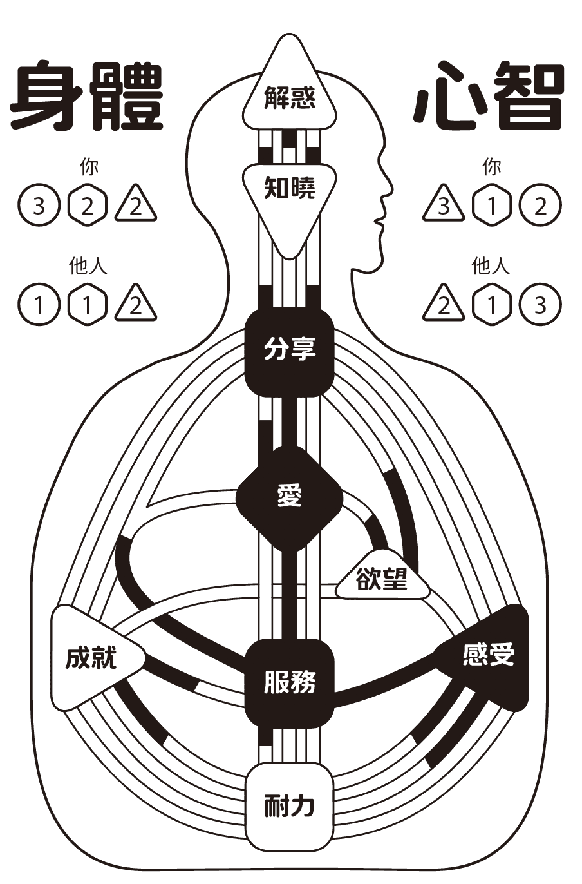

让我们看几个例子，将目前所学实际练习一下。我喜欢观赏名人的纪录片，尤其是我知道确切出生资料的人物。几个月前，我看了《我是埃弗尔．克尼维尔》（I am Evel Knievel），这部电影是关于一位美国特技演员、疯狂艺人，也是国际偶像的故事。我小时候就对他有印象，还在新闻节目上看到他骑机车飞越伦敦双层巴士，他曾经受伤过很多次，我对他在生理与心理上的决心感到印象深刻。

当我开始观看电影时（当时还不知道他的班图资料），我自己认为这家伙一定在身体层面是圆形 3，才能带来这番表现，因为圆形 3 主轴的人总是在挑战极限。很幸运地，我得知他精确的出生时间，而且他确实具有圆形 3 主轴，同时还有六角 2，这表示虽然他一直处于「攻击」模式，但他清楚了解可能有受伤的风险。我还记得电影中的几个时刻，有一幕他正要乘坐火箭动力车飞越峡谷，另一幕则是想在温布利球场打破飞越最多双层巴士的纪录。你可以看见他恐惧与犹豫的神情，就像内心有个声音对他说：「你确定要这么做吗？」

当然，六角 1 主轴的人会因此僵住，也或许打从一开始就不会从事这一行，因为持续的恐惧感令他们无法忍受，更可能在第一次意外后就留下创伤。

心智层面具有圆形 2，而身体层面具有圆形 3，代表他的内心属于机会主义者，但身体却会不断追求与突破极限，所以他一再寻求挑战。圆形 3 有一种躁动型态，他们觉得「等待」等于死亡。克尼维尔知道自己想要什么。听到他与许多女性传出绯闻，而且妻子对他相当生气，我并不意外。他对于物质层面也有很高的期望。

他在展开特技生涯之前，曾经是最佳保险销售员，但也是个大骗子，就具有圆形 2 与圆形 3 的组合来说也并不让人意外。他可以走近任何人，当眼前出现机会，就利用语言展开「攻击」并说服对方。

让我们分析他的资料，他在身体这一侧具有三角 2，所以形象与外表对他而言非常重要。你可以从他偶像般的穿着风格，还有他以埃弗尔．克尼维尔所开创的形象，以及往后令人追忆的名号看见这点。某间玩具公司推出了埃弗尔．克尼维尔特技机车，当时可是最畅销的玩具之一。这一切替他赚得数百万的财富，他也拥有诸多房产、汽车、直升机，甚至有自己的喷射机，完全符合圆形 3 主轴，高度重视物质层面的性格。

身体这一侧出现的三角 2 代表他想要赢得尊敬，也渴望掌声。但他并没有干坐着，等待生命将受人敬仰的机会送上门，他是位会自己朝向目标全速冲刺的发起者。在心智这一侧，他说话的方式（以及对他人的反应）取决于他当下的感受，他的著名事迹包括曾经在飞越峡谷活动中对记者暴怒，为此他的职业生涯毁于一旦，也失去所拥有的一切，他是情绪化的发言者与思想家。具有三角 3 而且脸皮薄（六角 1）的人，无法接受被那些让自己感受不佳的人批评，会因此展开猛烈反击。由于他并不具有三角形成功主轴，所以不会被任何事物所阻拦，当受到记者挑衅时，他并没有想到自己的生涯，而是纯粹情绪化的反应。但由于具有六角 1，所以他并不是真正有自信的发言者，这让情况雪上加霜，因为他在承受言语攻击时可能会倍感威胁。他讨厌记者询问自己没有把握的问题，对于记者的恐惧或许大过于特技表演。

接着看身体这一侧的「他人」栏位，他喜欢身边围绕着不像自己那么疯狂的人。恰好相反，他喜欢六角 1 与圆形 1 主轴的人，也就是被动又敏感，能够察觉所有危险的人。我直觉认为，这种组合在很多处境下救了他一命，他身边的人都符合他的喜好。

我们来看看他的能量中心，就可以了解推动他行为的主轴。首先看到的是爱与分享中心，而这两个中心之间的三条通道里，中间的那条在许多富有创意的表演者身上通常都有接通，这是对与人们分享自己所爱的强烈需求。他热爱骑乘机车，并且与众人分享这一点，但他也能提供众人所喜爱的事物。我们也能看见正下方的通道，恰好是相同主轴的延伸，同样出现在许多优秀的艺人身上。这条通道连结服务与爱，代表你会从事自己或他人所喜爱的行为，还有他人所期望或要求的事物。他相当明白众人想看见什么，也实现众人需求，所以擅于取得商业上的成功。最后看到的是服务与感受中心，代表他不只让自己感觉良好，也为其他人带来良好感受。由于是与服务中心相连，表示特别会依照他人的期望行动。这条通道同样是表演者的典型，不过还是有许多其他可能的例子。

有一点我们还没聊到，他具有两条属于领导者类型的通道，这并不代表他想成为领导者，而是他很容易受到其他人追随，这点解释了他脍炙人口的偶像地位。

# 强尼．诺克斯威尔（JOHNNY KNOXVILLE）

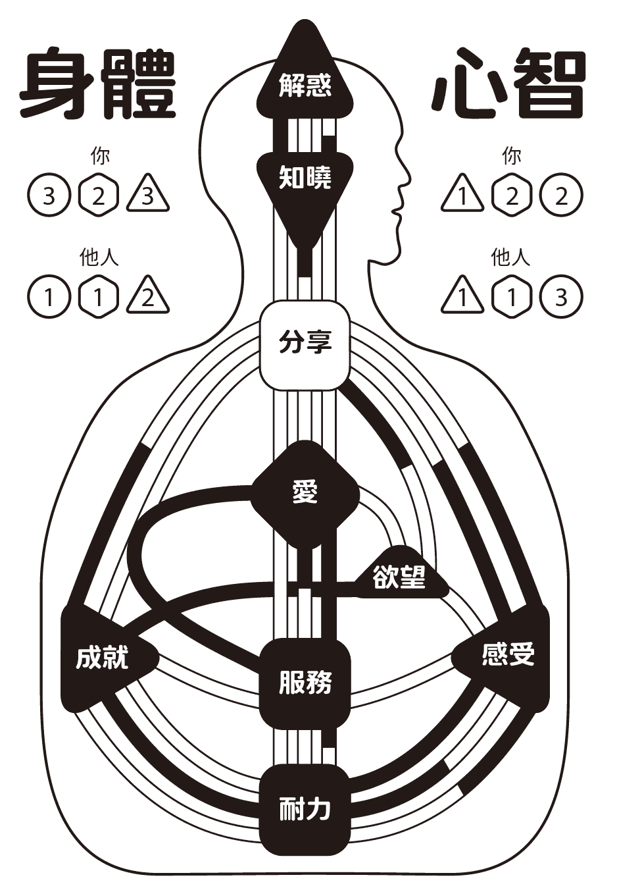

在我观赏关于埃弗尔．克尼维尔的电影时，我注意到这部纪录片的出品人，是出演《蠢蛋搞怪秀》（Jackass）系列电影的强尼．诺克斯威尔。我在克尼维尔电影结尾看见几幕关于诺克斯威尔的片段时，心想：这家伙跟埃弗尔．克尼维尔没什么两样！他肯定有类似的主轴数字，他们俩就像双胞胎一样。

同样，我幸运地找到他精确的出生时间。他们两人不只在身体层面具有相同的六角形与圆形主轴，在心智层面的圆形主轴也一样。但我看得出来，诺克斯威尔比较擅于控制言辞，没错！他在心智层面具有三角 1，也就是成功主轴，所以他不会说出有损生涯发展的话。他在心智层面的六角 2，代表他是比较有自信的发言者。

另外提件有趣的事，他（跟克尼维尔很像）喜欢置身于在身体层面具有六角 1 与圆形 2 的人群中，对于跟他们一样喜欢走狂野路线的人，可以发挥一点人寿保险的作用。

但强尼有个地方不太一样，他的创意性比较低，而且不太在意自己的形象，但却相当重视成就。关于创意，我们等到探讨回路的章节中再聊。他的三角形属于成功主轴，在本命图上也一样，再加上耐力与欲望，这种组合可不得了。对他而言，没有什么比成功的人生更重要，这点与克尼维尔不同。具有成就中心的人，不计代价想获得胜利的程度可能超乎他人所想象。他们几乎愿意为了成功忍辱负重。他们极为好胜，而且不在乎别人对自己的看法。相反的，对埃弗尔来说，外界对他的看法，才是使他感到愉快，最大的动力来源。

# 胡安．曼努埃尔．范吉奥（JUAN MANUEL FANGIO）

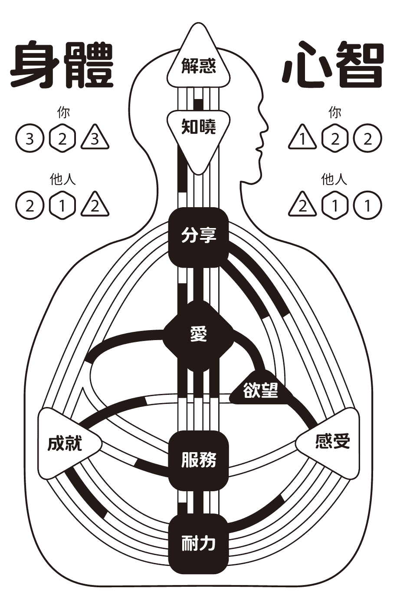

再找个大胆无惧的主轴来聊聊。胡安．曼努．范吉奥被奉为史上最伟大的一级方程式赛车手。我小时候见过他，因为奔驰车队赛事总监艾弗雷．纽鲍尔（Alfred Neubauer）与我的祖父是好朋友，同时也是早期 F1 赛车的代表性人物。祖父在奥地利瓦豪地区的山丘上有栋豪华避暑别墅，我记得有些著名 F1 车手曾经来此小住。纽鲍尔是我见过最厉害的说书人。现今多数人都不知道 F1 赛车以前有多危险，一个周末挂掉好几个人并不稀奇。这种车辆相当难以驾驭，而且马力极大，速度极快。赛车就像重量级怪兽，赛车场好比是死亡陷阱，一个小差错就能让你送命。

范吉奥被称为 El Maestro（西班牙语中的「大师」），主宰 F1 赛事的本领独一无二。他的世界冠军纪录保持了 47 年，只有麦可．舒马克（Michael Schumacher）曾经打破纪录。范吉奥仍然保有 F1 赛车史上的最高胜率，在 53 场出赛中获胜 24 场。

同样的，我们又在身体这一侧看见六角 2 与圆形 3 的组合，代表身体层面最积极发动攻势的性格（发起者），总是追求极限，也会实际评估风险所在。但我们也在心智这一侧看见三角 1 的成功主轴，这家伙渴望胜利，是他与生俱来的天性，而且跟所有圆形 2／3（心智／身体）组合的人一样，他很受女性欢迎，也是身边不缺女朋友的花心大少。你可以在[baantu.com](http://baantu.com)网站搜寻各种人物的数字组合，包括超过一千位名人。如果要搜寻圆形 3 的身体和圆形 2 心智的资料，你可以使用万用字元（*），在人物目录的搜寻栏位键入「3**-**2」。

# 尼基．劳达（NIKI LAUDA）

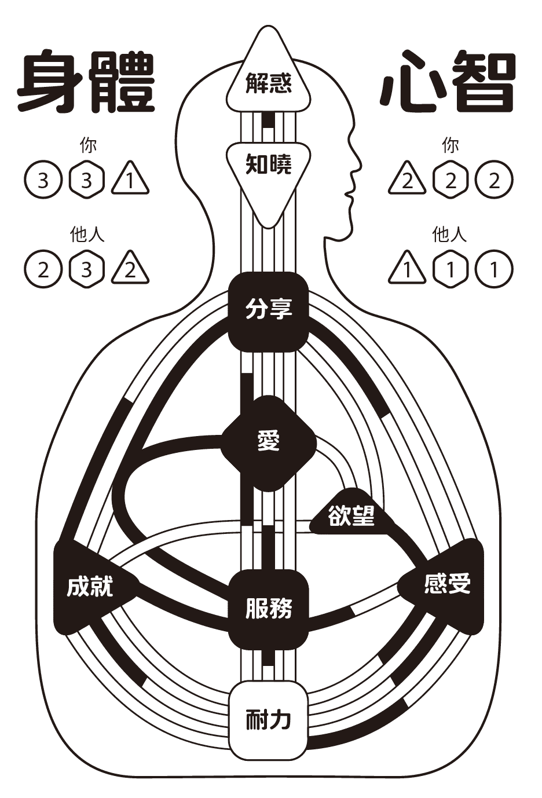

这是另一位伟大的 F1 赛车手，我选择他有几个原因。首先，他跟我一样来自奥地利，而且我曾见过他两次，我小时候的房间有张他的亲笔签名海报。更重要的是，他的生涯相当成功，曾经二度赢得世界冠军，而且在赛车的同时还与死亡奋战。我选择他的另一个原因，是因为《决战终点线》（Rush，2013）这部电影，主要讲述劳达与詹姆士．杭特（James Hunt，同样收录于班图数据库中）之间的竞争关系。电影提供绝佳的机会，让像你这样的读者能够研究我所选择的例子，并且学习你在班图中看到的信息，实际体会本命图中的各项数字与能量中心如何运作。

可以这么说，劳达赛车生涯中最令人难忘的事件是一次车祸，发生在德国恶名昭彰的纽柏林赛道，这里一度被称为「绿色地狱」。当时他是唯一在 7 分钟内跑完北环长达 22.8 公里赛道的人，而且他撞毁法拉利赛车时正是世界冠军。他的赛车陷入熊熊烈焰，而他被困在车内。当时把他救出来的，并不是远在漫长赛道之外、配备不齐全的赛道安全员，而是同行的其他车手。

他的头部严重灼伤，而且吸入炽热的有毒气体，因此损害他的肺部与血液。劳达当时头戴改装安全帽，泡沫塑胶在车祸后受到挤压，安全帽从头上滑落，使他的脸部直接接触火焰。虽然劳达当下还有意识，而且在事故后还能立刻起身，但不久后还是陷入昏迷。他的头部因为灼伤留下一大片疤痕，也失去大部分的右耳以及右侧头皮上的毛发，还包括眉毛与眼皮。事后他选择有限度地进行重建手术，以修复眼皮并使它们正常运作。自从车祸后，他总是戴着帽子来掩盖头上的疤痕。

他在医院里与死神搏斗了四天，生还的希望渺茫。除了严重灼伤、几根肋骨断裂以及颧骨骨折以外，更糟的是受到有毒气体灼伤的肺部。

你很难相信，他居然在短短六周后坐回赛车里头，将渗血的绷带从布满伤疤的头皮坑洞上剥下，这只有六角 3 主轴的人办得到。

我想你应该对此人有一定的认识了，就他在身体层面具有圆形 3 与六角 3 看来，确实不令人意外。他知道如何展开攻击，而且无所畏惧，这在有些人眼中可能太不切实际。你也了解这种性格可能让人陷入大麻烦，加上身体层面还有三角 1 主轴，这种类型的人天不怕地不怕，怀抱着必胜的决心，具有三角 1 的人甚至会在必要时切断自己的情感。

就心智层面而言，他希望获得尊敬（三角 2），而且渴望名声与赞赏。他在往后成为了飞行员，并且拥有两家商业航空公司。

另一方面，詹姆士．杭特则是花名在外的花花公子，他并不渴望受到赞扬。在[baantu.com](http://baantu.com)网站上，你可以看到他有两个三角 3 主轴。他希望在人生中享受自我，完全不在乎别人的想法，也没有巨大的求胜欲望，他只想要玩得开心。但你也可以发现他在身体这一侧具有六角 3，首先，这使他无所畏惧，而且对自己的身体相当自信。杭特有许多上半身裸体的照片，这家伙并不害臊，而且他利用自信来享乐。他踏入 F1 赛车界并不是为了成功，而是为了玩乐，他或许缺少像劳达那样的纪律。

劳达主要利用他的高度自信来取胜，而且比杭特更加努力。他的三角形属于成功主轴，加上成就能量中心也有启动。他也对于身体外貌很有信心（跟杭特一样），不过只在心智层面具有三角 2，身体层面并没有，所以他不在乎别人怎么看待他的伤疤与残缺，这解释了他为什么在事故之后不考虑进行大范围重建手术。顺带一提，他的绯闻在车祸后并没有因为外貌缺陷而减少，即便上了年纪还是绯闻不断。他是派对上的熟面孔，时常有人目击他上夜店，身边还围绕着女性。

# 艾尔顿．塞纳（AYRTON SENNA）

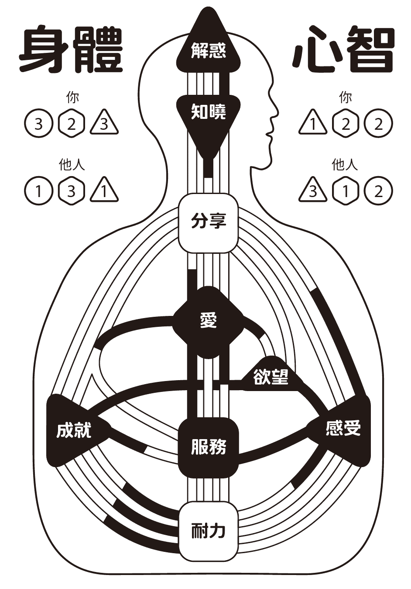

再来看另一位 F1 明星车手。他曾赢得三次世界冠军，并且被奉为史上最伟大车手之一，但在 1994 年因为机械故障发生车祸而丧生。

跟目前为止所看到的其他 F1 车手一样，我们又在身体这一侧看见圆形 3，代表在身体层次上有很高的期望，并且不断追寻目标。他的六角型主轴数字是 2，让他能实际评估可能发生的差错。但我们目前还没看见哪位车手具有六角 1 主轴，我推测若是太谨慎的个性，可能会过度拖慢他们的脚步。但最重要的是，我们在身体层面一直没看过除了圆形 3 以外的主轴。他们的行为必须相当主动，而且目标明确，他们不会坐等机会上门，而是创造机会。假如你想要获胜，就必须朝目标前进，永远处于攻击状态。你不能枯等其他人把奖杯交给你，一定要主动出击。

除此之外，我们还看见两个成功主轴，其中之一是心智层面的三角型主轴，另一个则是本命图中与欲望中心相连的成就中心，表示此人有强烈的获胜欲望，这使他感到愉悦，也是他的焦点与动力所在。同时，他也受到无畏之人所吸引，有些人可能称之为粗线条（六角 3）。

与受到女性爱戴的所有男性一样，他的圆形主轴是令人难以抗拒的 2／3 组合（心智／身体）。而身体的三角 3 则赋予他极度情绪化的性格与敏感度。这类型的人时常表现得温暖又友善，使他人能触及自己的情感，这也解释了此人为什么如此受欢迎，不只是因为他的成功，也与他的性格有关。

# 麦可．舒马克（Michael Schumacher）

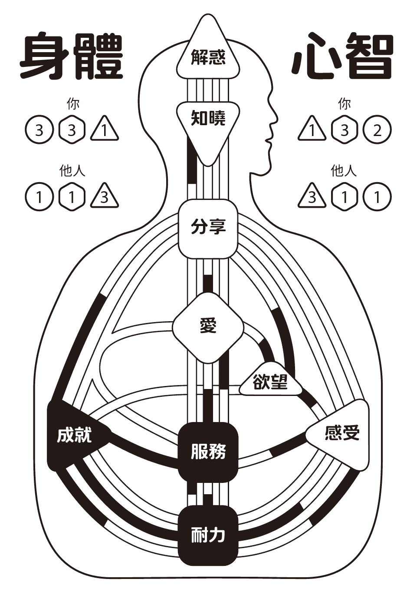

接下来是 F1 车手名人系列的最后一位，我想对许多人而言，应该不用再介绍舒马克是何方神圣了，他是史上唯一获得七座世界冠军的车手，因此被奉为体育史上最成功的车手。

与我们所聊过的尼基．劳达很像，他在身体这一侧也具有六角 3 与圆形 3。这类型的人不知道害怕是什么，谨慎行事不是他们的风格，而且怀抱着很高的期望，毕竟他们都知道目标在哪里，并且大步向前。我们在舒马克身上看见先前其他车手都没有的特点，他具有四重成功主轴，并且与耐力中心结合。

他的身体与心智都是三角 1，代表体内的每个细胞都想追求胜利。能否获胜，决定了他的快乐与否，我想你应该很难找到比他更好胜的人。此外（好像还不够似的），他在本命图中承受两条通往成就中心的通道所赋予的压力，其中一条与耐力中心相连，另一条则连接到服务中心（提供符合他人期望的事物）。当然，大家都希望他能获胜，因为他在乎自己的粉丝，他的拥护者遍布世界各地。

然而，如此充足（过度）的自信、好胜的压力，以及对于冒险的需求，通常会带来一定的代价。2013 年 12 月，舒马克在滑雪意外中受到脑部创伤。他穿越一处不安全的赛道外区域时不慎摔落，头部撞击岩石，因此头部严重受伤。他接受医疗但仍昏迷长达六个月，家人对于他的病情甚少对外透露。有些记者表示他陷入瘫痪，必须坐在轮椅上，无法说话，而且记忆力也有问题。

# 泰勒丝（Taylor Swift）

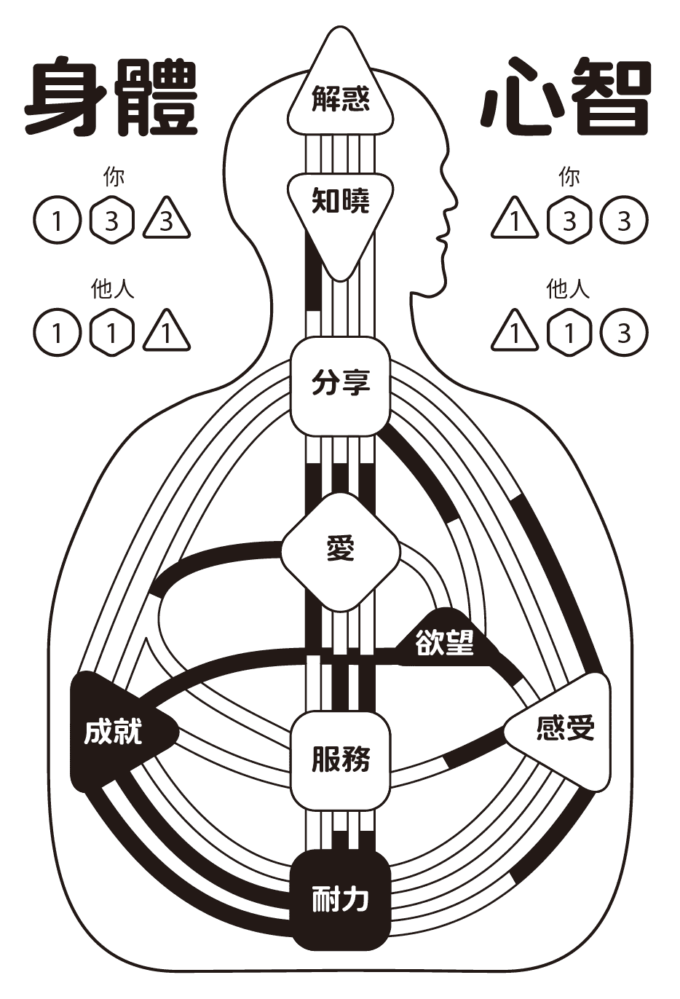

看完大胆无惧的名人，在我们继续探讨班图的运作原理之前，来看看不同风格的最后一个案例，也就是当今最成功的音乐人之一，泰勒丝。

我选择她的原因，是因为我曾在 YouTube 上看过《泰勒丝：只为了你》（Taylor Swift: Just For You）这部纪录片。我超爱纪录片，因为如果知道某人的精确出生时间，就能透过纪录片学到更多本命图中的信息。

泰勒丝不只是相当成功的年轻艺人与表演家，同时也是富有创造力的作曲家。你在许多音乐人，特别是歌手与作家身上，可以发现他们在身体这一侧是三角 3。基于对良好感受的需求，他们在情感上相当敏感，因此也有透过歌曲与歌声让其他人感觉良好的天赋。

但泰勒丝真正令人惊讶的，是成功主轴在本命图中全然的掌控性。首先，你能看到在心智层面的三角形主轴，接着是通往成就中心的三条通道，其中两条连接到耐力中心，另一条则连接到欲望中心。这或许是我所见过最强烈的成功主轴搭配，她也因此成为最投入于事业的类型。但彷彿这样还不够似的，她在「他人」栏位也有两个三角形成功主轴，代表她喜欢身边围绕着努力工作、将其余一切置之第二顺位的人。她对浪费时间的人不感兴趣，她希望身旁的人活在成功之中。更胜于此的是，她还具有最高度的自信心组合：两个六角 3。有趣的是她具有圆形 1，代表她倾向于回应，而不爱打扰或以肢体「攻击」别人。不过六角 3 让她不害怕他人，也不会躲藏，她喜欢受到邀请。她对别人很有耐心，能够等待正确的人前来。她不会追赶别人，而是让别人接近自己。她以喜欢跟粉丝互动著名，愿意花整天的时间来签名。她不会在身边筑起高墙，而且对于自己的身体与能力很有自信。

她在心智这一侧有两个 3，六角 3 与圆形 3，而这与身体层面不同。首先，圆形 3／六角 3 主轴的心智总是怀抱着远大梦想，他们知道自己想要什么，并且努力追寻，他们在生命中具有崇高的抱负。但她也可以很有说服力，何以见得，因为她在纳许维尔不断向唱片公司自我推荐，并且在年仅 15 岁时就试图说服对方签约。他们拒绝她，还赶她走，但是她不断找上门，这全仰赖她的双重耐力中心。但另一个重点在于她的双重六角 3，使她相当能够承受拒绝与批评。她的脸皮很厚，不会因为挫败而受伤。我们也知道，六角 3 主轴的感受可能比较迟钝，把前男友拿来写歌，也是她的著名事迹。

她曾经说过：「身处艺能界，就必须好胜又耐操。」了解她的人都说，她不让任何事物挡在通往梦想的道路上。她在自己的巡回巴士上签下「永不放弃」。

具有双重耐力中心与三重成就中心的人，就是会这么做。

还有一件有趣的事，她在解惑跟知晓中心之间没有任何通道或闸门。即便在知晓与分享中心之间，也只有一个悬启闸门。这让你了解，程序并未对泰勒丝施压，要她在人生中花大把时间了解事物或厘清来龙去脉。

# 人生闸门

本命图中闸门并非全部平等，有四个闸门的重要性高人一等，太阳与地球在你出生当下以及三个月前的位置，决定了这四个闸门。我们已经得知有 13 个天体会对应于身体与心智层面，形成一共 26 个闸门。

看看下页的示意图，有四个闸门在通道上被特别标示出来，这些闸门定义了一个人的人生角色，呈现出这些人的生命重点。这几个人生闸门所属的能量中心，同样以亮框标示。

此图的例子是伊雯．瑞秋．伍德（Evan Rachel Wood），她以饰演《西方极乐园》（Westworld）片中的朵罗瑞丝（Dolores）一角所知名。你可以在[baantu.com](http://baantu.com)网站上读取她的资料，确定细部的颜色。有趣的是，可以看到她有两个亮框闸门位于未启动的能量中心。在没有分析人生闸门前就对一个人妄下论断，等于是落入圈套，也太过疏忽。纵使你出生时的本命图中有某个能量中心并未启动，并不代表该中心不重要。恰恰相反的是，这只代表这项中心并非恒久启动。我们已经知道能透过几种其他方法来启动悬启闸门，而且其中一种可能性就是没有启动的能量中心。其他的方式包含星宿移访（13 个天体的当下位置），或是跟某个具有与你其中一个悬启闸门相对闸门的人互动。

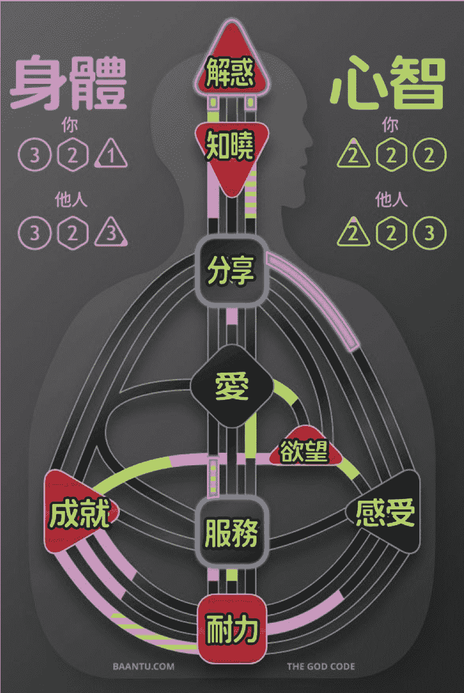

让我们看看伍德的资料，可以看到有两个人生闸门从解惑中心向下延伸，代表这是她生命中最重要的特质，另外，分享中心与服务中心也各有一个人生闸门。

服务中心与分享中心在她的本命图中并未启动，如果我们没有将她受到太阳与地球所启动的人生闸门特别标示出来，可能就会被忽略掉。

举例来说，当服务中心与分享中心没有启动，却被标示时，表示它们在你的生命中非常重要，只不过并非恒久启动。就好比程序在对你持续施压一段时间后，让你能稍微喘口气。如果要更了解这一点，你必须看看人生闸门是否形成完整通道，或仅止于悬启的状态。只要有人生闸门与另外一个闸门形成通道就够了，通道的两端不一定都得是人生闸门。在伍德的例子中，左上方从解惑中心向下延伸的闸门有形成通道，代表这条通道会一辈子启动。她不需要其他人来帮她开启，也不需要等待星宿移访（在「简易」页面中以红色闪电符号标示）。但她的其他三个人生闸门处于悬启状态，为了让她有机会体现这些闸门，她必须等待正确的时刻或人物来打开它们。

你可以清楚发现，伍德并不是盲目接收信息的人，她总会试图靠自己解决问题与思考。她有自己的想法，但由于具有欲望中心，她也可能极为固执。她的生命能量中心同时包含分享中心与服务中心，所以她相当乐于分享，也希望能了解其他人的需求。她或许会很固执，但这是让她可以只做想做的事的重要特质（你没办法强迫她）；不过她仍会注意其他人的期望，只是并非总是如此。她的服务与分享中心没有持续启动，但当它们启动时，她会感受到这些压力，而这些主轴也变得对她非常重要。

# 人际关系

这是[baantu.com](http://baantu.com)网站上最受欢迎的功能，我不认为目前世界上有任何其他系统，能提供你如此准确又一致的信息来解释两人之间的关系。（编按：后续章节中介绍的内容，有部分是付费会员才能使用的功能。）

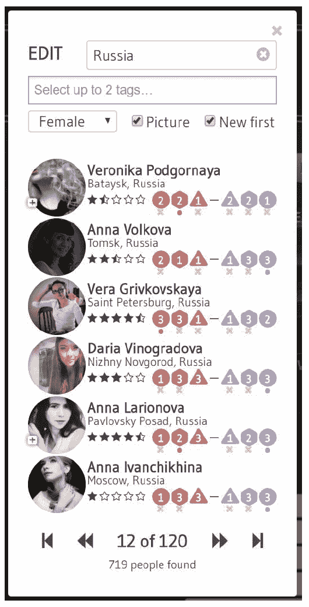

利用班图，你不只能浏览自己私人数据库中的对象，也能搜寻所有注册用户以及上千位名人。你可以透过姓名、城市、县区与国家来浏览注册用户。在你浏览时，这些人的照片旁边会自动出现人际关系的「星等评价」。除此之外，你还能透过标记看见其他人是否具有你所寻找的六大特质（对照你本命图的「他人」栏位）。圆形、六角形与三角形图案下方的圆点，代表此人具有你所寻找的哪种特质（取自你的「他人」栏位）。如果你看到叉叉，表示这项特质对你而言有点困扰，因为你既不想寻找这项特质，也无法与这种人相处（你本身缺少相同特质）。然而，圆点与叉叉只是人际关系计算中的一个面向，用来解释为什么你与圆点少的人获得较高的星等评价，却与具有许多圆点的人取得较低的星等评价。

人物数据库（上页图中浏览所有人的地方）中的星等评价，是由系统内所有账号持有人的数据库统计所得来结果。基于此原因，很重要的一点，不要任意改变自己的出生资料。

星等评价对你有什么意义？这并非在告诉你哪个对象适合你，这种事只有你自己知道。有许多其他因素能决定谁适合你，但那些细节都不是班图能探索得到的。的确，班图无法显示两人在生理层面的相互吸引程度，也无法挖掘「爱」的祕密。透过班图能看见的是，另一个人是否具有你大致上会喜欢的性格，也可以显示另一个人的特质是否能与你融洽共处，我们也会在本章节稍后探讨其他的要素。但首先要了解：星等评价到底用来做什么？

星等评价无关乎改变对方或改变自己。班图从来不是提供这样的用途，这不是生命或人际关系的「指导」系统，更不是提供修正方案的工具，你要记住，班图只是洞悉一个人本质的显微镜。你可以亲自见证，哪些事情是无可改变的，因为有特定因子并非人类所能掌控。经由「试图改变它们」的方式来度过此生，你可能会把人际关系破坏殆尽。你应该学习管理各种人际关系，学着与其共事，而不要与之对抗。你无法改变程序带来的影响，你无法改变暗物质的班分体掌控我们的方式。它们希望你与特定类型的人共处，使宇宙得以健全。生命是必须遵循特定格局的有机体，而人类无法干预格局。

星等评价本质上显示你希望花多少时间与特定对象相处。星等评价较低，并不代表世界末日，也不表示此人对你有「坏处」。只是代表程序在一段时间过后，会提醒你还有其他事情要做，这个人正在拖延你完成使命或活动的脚步。当别人对于你的星等评价较低，表示他们可能在一段时间后会造成你困扰，或是受到你的困扰，但别往心里去，也别太过黑白分明，没有所谓完美的人际关系。

如果某些人的星等评价较高，你或许可以多花点时间与对方相处，因为他们也许能协助你完成程序对你的期望。然而并非所有五颗星的人对你来说都是「对的人」。理论上，那只是代表你可能花更多时间与他们相处。决定你人生中遇见理想对象的控制机制，还有其他因子存在，例如磁单极。星等评价提供你的信息只有你在那些对象身上会花多少时间而已。

想要更进一步的了解人际关系，你必须按下「A」、「B」按钮，分别将某个人读取到「A」栏位，另一位读取到「B」栏位中。每当你登入[baantu.com](http://baantu.com)网站时候，系统就会将你的资料读取到「A」、「B」栏位。如果想要观察特定的人际关系，只需要将另一个人读取到已经启动的栏位，接着再把「」切换到人际关系模式「」，就能看见人际关系信息。

「A」、「B」按钮上方是切换「简易」与「图像」的开关，我建议你从「简易」模式开始，里头有必要的信息。

虽然你在人物数据库（清单）受限制，只能观看与自己相对星等的评价，你可以载入任何人的资料到「A」与「B」栏位， 读取任两人之间储存在[baantu.com](http://baantu.com)网站上的人际关系评分。当然你也可以把知道出生时间的人们的资料建档起来，透过「储存」按键建档的资料，并不会被其他人看见。只有主账号持有人的资料会被分享（但不会透露出生资料给其他使用者）。所有资料都不会受到像 Google 这类搜寻引擎编入索引，账号持有人的资料只会被其他注册用户看见，而这些用户同样也分享了自己的资料，就如这句格言：「你告诉我，我就告诉你。」

没有人需要对自己的资料感到羞愧，揭露资料也不会对自己不利。对某人「好」的东西，可能会对某人「不好」，反之亦然。我也认为如果大家都能更了解你、明白对你而言重要的是什么、知道什么会让你不开心或引起你的反应，是一件很美好的事。他们或许会因为知道你的喜好，而与你更融洽相处。这一切真的无关于让自己或其他人「改变」，而是在于了解与接纳自我。

在班图上最先看到的人际关系特质，是某人适应另一个人的程度，适应性并非总是最明显的特质，当你见到某人时所擦出的「火花」，通常来自于「吸引力」特质，班图中也会估量这一点。

另一方面，适应性是综观你的所有特质，包括四个六角形、四个圆形与四个三角形数字，将之与另一个人相互比较。我也会观看本命图中的其他面向，例如闸门、通道、能量中心与人生闸门，藉此分析两个人有多么相似。两人的相似程度愈高，愈能了解对方的行为与期望，尤其能得知彼此如何共同完成目标。

适应性并不是我们在另一个人身上所「寻找」的特质，吸引力才是。而这取决于双方本命图中位于「他人」栏位里的两个六角形、圆形与三角形特质，这会在「简易」中「」页面的「有吸引力」刻度表下方以绿灯表示。

最后，这两项特质（吸引力与适应性）并无法单独发挥最大效果。我认为同时具有一定程度的两者，对于关系会有所帮助。即便相互吸引的程度达到最高，如果双方完全无法适应彼此，未来也不会有太大进展；同样地，纵然彼此适应的程度绝佳，若对方并没有你所寻找的特质，也一样没戏唱。

在「A」与「B」下方，六角形、圆形与三角形旁边的几排亮灯，代表一个人是否具有对方所期望的特质。基本上显示一个人在本命图「他人」区域的特质，是否与对方在「你」区域的特质相互匹配。

与「适应性」相较之下，这部分显示的并不是双向的特质，某人可能对另一个人比较有吸引力，反之亦然。绿灯的数量影响了下方的吸引力刻度表，可以告诉你此人所具有的各项特质（六角形、三角形或圆形）是否吸引对方。

当亮灯是红色时，表示此人的这项特质不仅没有吸引力，也没有适应性（与另一人所具有的特质不同）。量表显示的他人特质，可能有三种情况：

1）对方具有你想在他人身上寻找的特质（绿灯）。

2）对方没有你所寻找的特质，但与你能够相互适应（无亮灯）。

3）对方没有你所寻找的特质，也无法与你相互适应（红灯）。

在人物数据库中，红灯项目会在六个符号下方以小 x 标示，绿灯项目则会以小点表示，让你能在浏览时得知概况。

让我们谈谈人际关系的另一个层面。你已经从书中章节得知，九大能量中心的通道可能透过三种方法形成。根据出生时的行星位置所形成的通道，已经「预设」在你的本命图中。

此外，我们还加入了行星的目前位置（星宿移访），这将启动更多闸门，并可能开通更多通道。

第三种可能的启动方法，来自闸门正好可以接通你的悬启闸门的其他人。无论启动的方式是哪种，都会让你觉得更有动力想从事特定行为。看看自己的本命图，上头有些未形成通道的悬启闸门，当两人见面时，如果彼此具有能够形成通道的悬启闸门，通道就会启动。此时会忽然感受到对于特定活动的压力或动力提升，这是双方都会有所感受的双向特质。

有趣的是，我们会在见到陌生人时有这种体认，我不知道天生本质是如何让我们有这种认知，但假如你见到的某人，能与你的悬启闸门形成大量连接，即便在人满为患的房间的相对两端，即便你还没有机会与对方交谈或者有所认识，此人都可能激起你的兴趣。

但有句话要说在前头：单纯站在对方身边，是无法启动通道的，你们必须共同从事某个活动，必须有所互动，才能够感受并展现通道的动力。人际关系通道的差别在于，派对的交流只会受到彼此各自的特点，也就是各自的能量中心驱动。但该中心只有在对方将通道另一端的闸门（以及另一边的能量中心）带进人际关系里头，例如分享某件工作时才会启动。

当你观看在「额外动力」区块中的「合计」刻度表时，可以看见一个人在人际关系中所感受到的额外动力，通常这是双向指标。

在此有一点必须注意：在稍早的章节中，我们曾经谈过人生闸门以及它们在我们人生中的重要性。

看看人际关系页面中的黑色方格里显示的红色数字，这代表人生闸门在人际关系中的影响力。

「额外动力」栏位显示你有多少个人生闸门受到对方启动。在一段关系中，两人通常会具有不同的人生闸门，所以这一项不一定是双向均等，有时候某人的动力可能大于另一人。透过红色数字，你可以看见是否其中一人的动力比对方大，假如数字相同，表示双方都能感受到相同动力。

在「合计」下方的刻度表将动力分解成不同主轴，我们将在下一章节「回路」中探讨。

最后，我们来谈谈「支配」刻度表。一般而言，支配并不是好现象，意味着有某个人一直无法顺心如意或经常受到忽视。支配的程度愈高，代表本命图中受到支配所影响的层面（闸门）愈多。

班图中的支配代表其中一人具有完整通道，而另一人在这条通道上只有悬启闸门，表示具有完整通道的这一方正掌控着一切，不让对方有机会体现自己的闸门，等于另一方的闸门受到剥夺。

支配并不是双向价值，因此，某人对于另一方的支配程度可能比较高，而反之非然。你并不一定会立刻注意到支配现象，尤其当吸引力较高，而且怀有强烈的印象与赞赏时更是如此。在师生关系中也许没问题。并非所有支配关系都是大问题，只有当双方期望相互平等或长时间共处的情况下才有问题。

在人际关系的初期，当我们刚认识时比较能相互包容。但支配好比人际关系中的一氧化碳，是无形的杀手。危险的地方在于，支配者通常不会察觉支配关系，甚至对于自身行为所带来的影响毫无头绪，因为支配并不是双向关系。班图在这方面就能派上用场，你可以了解自己是否正支配着某人，尽管不容易扭转这层关系，有时候你所能做的，也就是让对方在这段关系中拥有一点喘息的空间。

关于「支配」还有另一个典型误解，就是认为双方具有等量的支配项目就没问题，其实这个问题很大。这只代表双方在不同领域具有支配地位，而且会让关系更加恶化，支配是不会「平衡」的。这种情况下不只其中一人，而是两人都会抱怨受到对方轻视，无论何时其中一方受到支配，愤怒感都会不断增长，挫折感也会随着时间累积。

与「额外动力」相似，我们也能在「支配」下方看到我们重要的人生闸门如何受到影响。如果你的人生闸门在本命图中形成通道，你就不会在这项主轴上受到任何人支配，你也不需要其他人来体现你的人生闸门，不用靠其他人启动人生闸门，也不会因为他人的支配而受到阻挡。

当某人支配你的人生闸门（角色）时，通常是你所遇到最糟糕的情况，这发生在当你的人生闸门悬启，而对方却具有包括这个闸门在内的完整通道时。黑色方格中的红色数字，分别显示你在生命角色中的心智与身体层面有多少人生闸门受到对方支配。

我们在人际关系页面所看不见的是「爱」。如果你阅读我的另一本书《拉．乌卢．胡的人类大预言》，你会读到「爱」是磁单极的副产品，也与班水晶在大霹雳中四散成无数分体时所形成的阶层有关。

蕴含于生命型态中，并对生命带来影响力的所有班分体，与我们存在着看不见的关系。然而，我们所经历的「爱」，是由我们体内的磁单极所决定，可以告诉我们人生中所遇见「对」的人与场所。这项机制独立于[baantu.com](http://baantu.com)网站上的星等评价之外。首先，你需要在生命中拥有合适的人，也就是磁单极控制我们感受到「爱」的对象。接着，班分体所掌控我们在心智与身体层面的星等评价或影响力，则决定我们在人生中花多少时间与这些人相处。

# 回路

接着让我们谈谈本命图中关于通道的另一层信息。你可能曾觉得好奇，为什么有些能量中心之间有超过一条的可能连线（通道），例如：好几个能量中心都有三条连线，有些甚至多达四条，象是分享／爱以及服务／爱。

所谓的回路跟机器的回路一样，都是由多个元件所构成，每个元件负责不同的工作，但有些元件能共同完成更庞大的任务。

大多数通道都属于一组更大的回路，只有四条通道靠自己独立运作，它们不属于任何回路，也不用负责比本身特性更大的主轴。

为了更加了解回路，必须观察回路中的能量中心有没有启动。

四组回路分别是：

●集体感受

●集体成就

●创意

●社群

# 共有回路

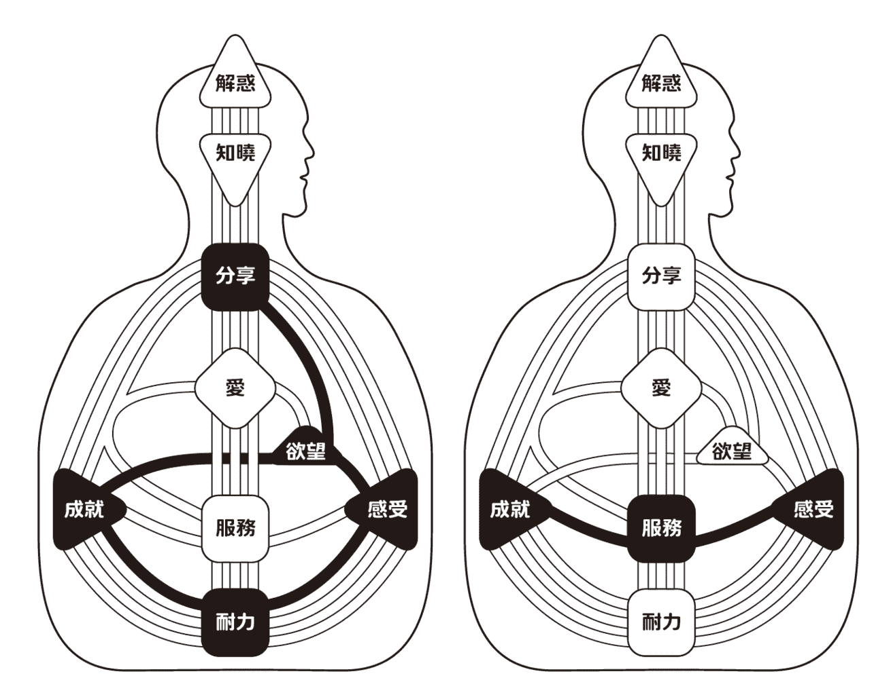

共有回路是任何社群的基础，无论是家庭、村落、工作，或是你在闲暇时间与一群人所从事的活动。共有回路是关于建立与维持社群，并且包含平常与熟识之人的个人接触在内。

共有回路由两个子回路构成，而这两个子回路的整体主轴当然是对社群的支持。每个社群都是建立在承诺、支持与协议之上，并且根据这一切来运作。共有回路好比契约，是形成任何社群的基础，可以理解成互利共生，如果你破坏契约，就会受到社群的惩罚或驱逐。

要理解本命图中的某条通道，最好先分辨它属于哪一组回路，才能摸清楚全貌。

回路确实描绘出行为活动的类型，但更重要的是，能告诉你自己的行为是为谁而做。一旦确立过后，你就能更深刻了解通道本身以及两端的能量中心。因此，真正的技巧在于一并检视，包括所有不同的通道、回路、能量中心、六角形、三角形与圆形特质。当你成为诠释的能手，故事自然浮现眼前。

当某人具有属于共有回路的通道时，行为活动一定会与社群中的他人相关，不会单独进行，也不会仅止于个人范畴。举例而言，我的本命图中没什么「共有」特质，对我而言，身为社群以及社群规范下的一份子，会让我觉得喘不过气。我不太在乎他人的个人问题，我不想成为每周聚会一次的乡村俱乐部会员，我算不上是「社交人」。社群有极为严苛的规范与义务，如果你不依循行事、不愿意交换条件，那你麻烦就大了，这点小至家庭或大至欧盟都一样。

看看共有回路开通的能量中心，里头没有知晓和解惑中心。观察回路中的能量中心开通与否，总能带来更佳的理解。但社群回路不太在意理不理解，那是其他回路的工作。共有回路是关于你的职责，以及满足他人的义务。共有回路也不在乎爱，也就是说他们无法只从事自己喜爱的事物。以前，社群会安排相亲，在世界上某些地区仍有这种习俗，你必须照料自己的家庭以及社群内患病的成员，无论你爱不爱他们，而社群也不在乎。身处于社群之内就像签署契约，重点在于支持，没有空间讨论你的想法或你的喜好，只有需要完成的事物以及其他人的需求，端看通道属于哪条子回路而定。某人可能重视欲望，其他人可能看重服务。

当你看见某人具有属于社群的通道时，不要过度解释，最好看看回路中具有（以及缺少）哪些能量中心，这能让你对通道本身以及相连的两个中心获得另一层理解。能同时解读各种不同层面，称得上一门艺术。

大部分的社群通道，是在社群中以帮社群赚钱及花钱为基础，其中一方受到成就中心所推动，另一方则由感受中心所驱使。它们能确保社群的成功，也能保证社群成员获得良好感受。

社群并不擅长分享，与其他回路相比，只有一条线路连接到分享中心，而且另一端通往欲望中心。这代表社群只会分享自己想要分享的事物，而且可能藏私，你没办法「叫」他们分享。真正的分享并非以讨价还价为基础，也不期望获得任何回报。社群也可能固执行事（欲望中心）。由于缺少知晓与解惑中心，所以行事可能并不理性。社群行事一切都是以「互助互利」为出发点，如果你拒绝，其他人就威胁要把你撵走。具有来自这组回路通道的人会期望你报恩，他们需要成为社群的一部份才能繁茂兴旺，他们不想在荒芜孤岛上独自生存。

# 集体回路

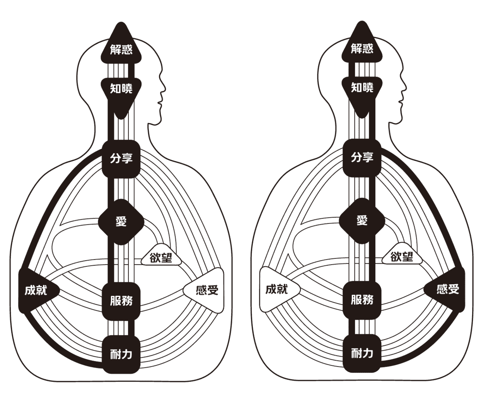

当你看着一组回路，通常会先知道自己是为了谁而付出，与通道所相关的活动目的何在。共有回路整体是关于支持、建立与维持社群。集体回路，顾名思义，是以大众为依归。很多时候你并不知道自己努力工作是为了哪一个人。你可能透过这些通道的其中之一来面对陌生人，但如果是在共有回路通道的情况下，通常会建立私交，并且频繁地见到对方。

想想国会议员，他们通常无法花时间与每位市民会面，并倾听每位市民的个人问题。他们主要着重在能够改善许多人生活的事物上，而非独善一人，但最重要的是，他们并不像社群一样斤斤计较讨价还价，集体回路并不会等待他人回报恩情。

若要强调共有回路与集体回路在班图中的差异，你必须了解，具有共有通道的人会受到奉献于社群的动力所驱使。为了建立并维系社群，成员必须遵守他们的规范、契约与协议。有许多义务都符合社群的要求与期望，也是让具有这些通道之人愿意「打勾」的方式。

具有集体通道的人不会如此紧密，并不像社群这么「亲密」。集体回路没有「互助互利」的心态，不想提供支持时也不会受罚。所谓的集体或许比较疏远，但也不会对于回报所有期待。集体回路比较像自由工作者，仍然怀抱着改善他人生活的意图。他们自由自在，但也因此少了点获得支持与助力的保证。相反的，社群的感觉比较像享有权利的受雇职员。

音乐家为了广大群众而举办音乐会，尤其在不认识观众的情况下，是提供了集体服务。对于各大报或电视台记者或书籍作者而言也是同样道理，他们是为了众人而努力。即便当他们与某人谈话时，通常也不只是想听一个人的故事，而是为了从对话中搜罗信息，藉此在造福集体的基础上分享受众，分享给广大的世界，不是为了一人量身订做。

看看本章开头图中的成功与感受集体回路，两者都缺少欲望，欲望中心并未启动、不在这组回路里。所以假如你有集体通道，通常无关于你的渴望。集体回路也与固执的性格无关。

集体回路这两组子回路的差异在于，其中一者受成就所驱动，另一者则以感受为出发点。

其实这相当容易理解。你可能帮助群体获得成就，或是确保大众取得良好感受。你也可以倒过来说，主张一个人能透过为众人付出努力而获得成就，或着进行某件事情或工作让人们感觉良好。总之，无论你做什么都与集体有关。

举例来说，看看连接解惑与知晓中心的三条通道，其中两条都与服务集体相关。其中一条连接到成就，另一条连接到良好感受。简而言之，这表示如果你想要解决问题，而且具有感受主轴的集体回路通道，你只能从心理层面解决问题，或是透过心理思考某件能为大众带来良好感受的事物。

# 创意回路

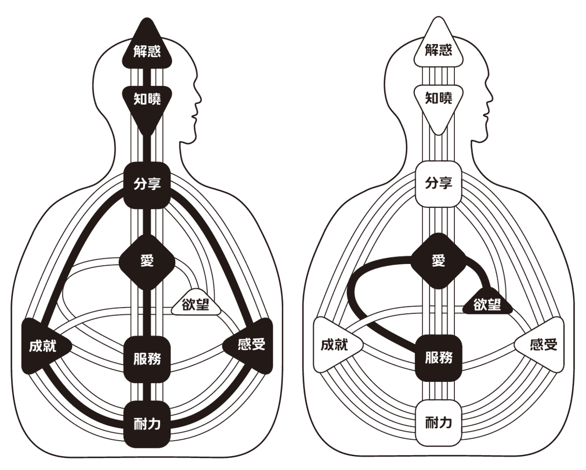

这组回路比较无关于我们为谁而做，而是我们做了什么，它负责将崭新事物带到世界上。这些通道主掌创新与创意，它们是突变的原动力。

共有回路或集体回路并不会开创新的事物，或许能够改善事物，但是并没有创造力。具有创意的人都知道，创造力是无法掌控的，它有自己的节奏与时机。忧郁是创造过程中重要的一部分。忧郁是等待的结果，这是由于过度沉溺于让新事物奇迹般地凭空出现造成的。只有本身缺乏创意通道的人，才可能把生理上的忧郁与情绪低落搞混，忧郁并不是悲伤。

自然界的突变并非循序渐进地发生，一直以来都是不期然地出现。可能长时间以来都没有异样，然后突然间就有新的事物出现，好比智人并非逐步演变而来，尼安德人并不是逐渐变化成智人。

创意回路相较于集体回路与共有回路并没有相同的责任。创意回路不是为他人，而是为了自己，所以有时候会成为社群或团体眼中「我行我素」或「无法预期」的个体。富有创意之人不会妄下承诺，这可能会触怒社群。同时，他们的发明对人类而言很重要。假如某人的分享中心被这组回路启动，他们会感受到想分享自身创意或发明的冲动。这组回路能确保（透过你所看到的启动中心）自己不只与其他人分享，还能让大家获得良好感受、帮助众人成功，并且留意他人的期望（服务中心）。

# 无回路

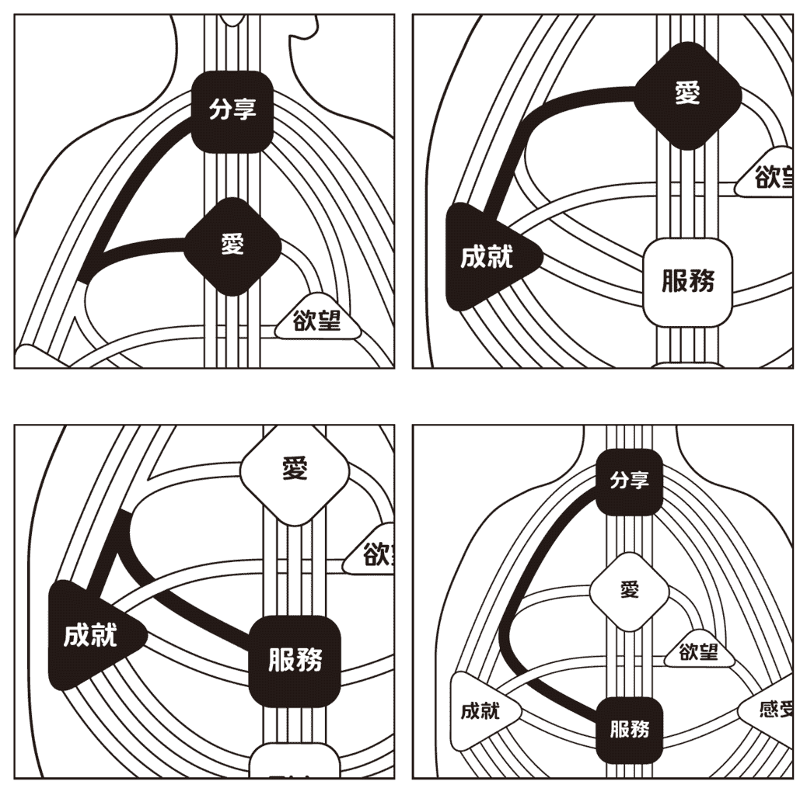

我们有四条通道完全不属于任何回路，它们并没有「更崇高的责任」。程序对他们要求的唯一责任，就是把自己给管好。这些通道是维系生存的机器，能确保人类这个物种不会在危机时期灭亡。

与连接到各组回路的通道相比，它们最大的不同在于，这些通路对社群、大众或创意并没有任何责任。这几条通道独立于这些较大主轴之外运作，也表示它们会将自身利益摆在第一位。

虽然这并不代表这类型的人不会帮助别人，但他们只有在安全并且自保富裕的前提下才会出手，或者也能说，他们只会在不损及自身生活质量的前提下伸出援手。

我们可以看到这些通道分别具有分享、爱与服务主轴，因此他们并非真的毫无贡献，而是你必须了解他们愿意提供贡献的附加条件。具有这些通道的人，尽管明白其他人的期望是什么，依旧会为了自我而行事。他们可能相当直率，偶尔会被其他回路的人形容成「自私」。他们想不通为什么要为了别人受苦，至少无法与具有其他回路通道的人牺牲到同等程度。即便他们要受苦，也必须为了自身的利益而受苦。

# 动力刻度表

你可以在「简易」页面看见自己「」或人际关系模式「」的动力刻度表。这些刻度表分析所有启动的通道，并将结果分成数个主轴。举例而言，可以看到本命图中有几条通道属于心理层面或身体层面，同时也有通道的合计数量。如果你将自己的刻度表与其他人比较，会发现有些人从事行为的动力比较高。但别忘了预设资料（仅使用出生时间）并无法显示全貌。有些人光看出生时间，并没有太多启动的通道，但当你加入星宿移访（行星目前位置）后，会看见动力显著增加。

若要加入星宿移访信息，按下标记 48 时、周、月、半年的按钮，班图会自动分析各条通道于所选择期间内，会在何时启动多长时间。在「图像」模式中按下这些按钮，你可以看到期间内的所有启动通道，启动时间较长的通道，颜色会比启动时间较短的通道更加明亮。你可以将鼠标移动到通道上，观看启动时间有多长。当显示为 100%时，代表在所选期间内会持续启动。

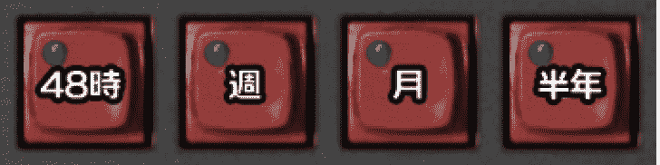

如果有通道属于特定回路，某些刻度表会因此跳动，也可以看到哪些能量中心受到通道所启动，就拿「感受」与「成就」量表为例。这两个刻度表看的是集体的成就与感受回路，但有多少通道连接至成就或感受中心，与其所属回路无关。

在人际关系页面「」中，你将看见两个人之间的额外动力刻度表，这是你在自我页面「」中所看不到的。

在单人模式的「简易」、「」页面，有个刻度表标示着「团队」，显示出有定义的通道与悬启闸门的比率。启动的通道愈多，代表你单打独斗的动力愈高。悬启闸门则会提升你寻求其他人的动力，使你得以运用悬启中的闸门。某些人具有许多悬启闸门，但启动的通道却很少，有些人则正好相反。当然，当你按下星宿移访的周期按钮时，或许会有更多通道被启动，此时你的团队合作动力就会下降。有些时候你会想要与其他人共事的动力，有些时候则会失去那份积极性，但显然也有某些人与其他人相较之下，会更愿意团队合作。

关于「领导」刻度表需要额外解释一下，因为可能跟你最初想的不一样。这里指的并不是你想成为领导者的动力，也并非显示某人是「好」或「坏」的领导者。再次重申，班图不会透露某人在某件事中是「好」或「坏」。而是帮助人们了解，领导有很多种途径。这个刻度表是本命图中央柱状部位的通道启动与否的副产品。在分享中心到服务中心之间的六条通道，如果有任何一条启动，其他人就会更倾向于追随此人，这种领导力不会强加在他人身上。某些拥有这些通道的人或许根本不想成为领导者，却仍然成为能激励众人的典范，其他人因此想要追随。这有时候会演变成极端处境，使其他人愿意为他们做任何事，甚至是赴汤蹈火。（下页图显示六条通道）

当某人的这六条通道至少有一条启动时，其他人会更倾向于信任此人的方向，几乎到达盲信的程度。然而这也可能造成反效果，当其他人稍后发现自己的盲信没有价值或是遭到滥用时，或许会因此愤怒。

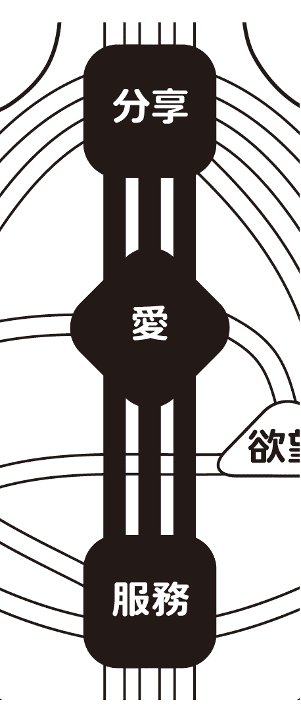

不具有这些领导能力通道的人，必须更努力说服其他人，但优点在于人们比较不会在之后感到失望，因为大家都知道自己为何信任此人。

# 其他人的特质

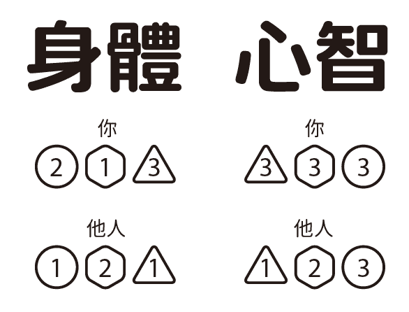

我们已经谈过「他人」层面的三角形特性，接着来聊聊其他符号透露了什么。它们显示我们会喜欢其他人具有什么特质、受到其他人哪些性格所吸引。如果某人本身的「你」栏位中具有许多你在「他人」栏位的特质，他们在人际关系页面的「吸引力」刻度表就会上升。当某人具有与你在「他人」栏位中相同的特质，你也会看见绿色灯号亮起。

在解释本书所收录其他几位名人的资料前，同样拿我本身的范例来说明这如何运作。

首先可以看到，我喜欢在身心两侧都有三角 1（成功）与六角 2（现实主义者）的人。这表示我喜欢的人应该会在获得成功时感到开心，也就是在身体与心智层面都努力打拚而且又有纪律，但同时也要怀抱实际的期望。我不喜欢爱做梦的人，也不喜欢总是杞人忧天的悲观主义者，我偏好有自信，却不过度自信的人。

我们看看圆形符号，你可以发现我喜欢在心智层面跟我同样具有圆形 3（发起者）的人。我喜欢了解自身期许并在人生中努力追寻的人。我喜欢能表达自己期望、怀抱愿景、在人生中有所期待的人。但在身体层面就不是这么回事。我们可以看见圆形 1，表示我偏好不会一直找事情打扰我的人。我不喜欢总是追着别人屁股的人，但我也不太喜欢跟我一样的机会主义者。我偏好坐等邀请上门的人，也就是虽然有能力，但愿意等待时机做出回应或反应的人。如果是蛮横强求而且马不停蹄的人，对我来说有点难以招架。我偏好在身体行为方面「被动」，但在心智与交谈方面又能「主动」的人。我喜欢在有具体想法时勇于发言，但不会实际上门打扰，只会在别人需要时采取行动的人。

就理想而言，你希望其他人具有在「他人」栏位显示的特质。但你真正无法忍受的，是某人的特质不只与「他人」栏位显示的不同，而且又跟「你」栏位显示的数字不同。这表示你通常不会觉得对方有吸引力，也无法适应对方。当对方的特质跟「你」与「他人」栏位都不同时，会引起你最差的反应。

# 目标

你会喜欢的其他人的特质（「他人」栏位显示的六个符号），其实是你自己想要拥有的特质。我之前说，本命图中的第二排符号代表我们所喜欢的人格类型，有点象是闹着玩。虽然这点没错，但那显示的是我们自己想要成为什么样的人，是我们的抱负。

如果你有想改变性格的目标或欲望，你当然也喜欢具有这些特质的人。所以「他人」栏位基本上告诉我们两件事：你想变成什么样子以及你喜欢什么样的人。

同样以我为例，我在心智层面具有圆形 3，而且我的目标也是圆形 3。表示我并没有想要改变的欲望，恰恰相反，我相当满意我的应对方式。我很乐意当个会在想说的时候把期望说出来的发起者。

不过当你看我的三角形主轴，我确实会把「乐趣」摆在人生中的优先顺位，然而我在「他人」栏位具有三角 1，意味着我有想要成功的欲望。你可以把「他人」这两个字换成「目标」。我或许不会一直获得成功，因为「乐趣」主轴总是会左右我的人生，但我会努力尝试。

再看看我的身体层面，圆形 1 表示我想要更加放松，但六角 2 这个目标，代表我想要比实际上拥有六角 1 的自己更有勇气。

如果某人在「你」栏位具有六角 3，而且在「他人」栏位具有六角 1，他或许会成为无畏／无耻之人，但也会致力于谨慎行事。

# 生命周期

当我们观察班图中的资料，可以看见两种区别。首先是决定你本质的特性，再者是能够吸引你的环境、你喜欢相处的人是什么类型。

「你是谁」跟「你的环境是什么模样」这两种因子是你生命的总合。想象你飘浮在太空中，周围空无一物。假如身边什么都没有，什么事情都不能做，什么也看不见，你又怎么知道你是谁？只有当你置身于特定环境中，才可能显现你各个部分的本质。是你身边的人与生命赋予你互动的机会。

两个人可能具有相同的特性，但假如将他们放在不同环境中，两人的生命或许截然不同。我们都知道环境塑造了你，这是种影响力，但也提供你特定的机会来体现自我，同时阻止你体现某些面向的自己。有许多电影与故事着墨于这项主题，例如《乞丐王子》（The Prince and the Pauper）以及《你整我，我整你》（Trading Places）。

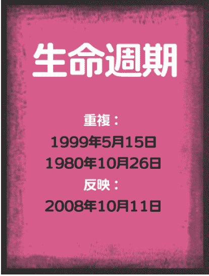

在班图页面中，有个像上图的小面版标示着「生命周期」，上面显示两个日期，分别是「重复」以及「反映」。我发现与我们环境相关的某些主轴有重复的周期。这些周期与月交点（Lunar Nodes）连结，持续时间大约是 18.6 年。每经过 18.6 年，你生命中的某项主轴就会重复。只要观察你的环境如何对待你、你所置身的场所特质，还有哪些类型的人出现在生活中或与你共事，就可以发现这件事。

有时候你会觉得这段时间过得相当艰困，有时候又觉得人生「轻松愉快」，而且环境也很友善，但无论哪种情况，大概每过 18.6 年就会重复一次。

想象你的人生道路跟火车轨道一样，景色有时候优美如画、晴空万里，有时候既无趣又下大雨，或者狂风大作。「重复」的日期显示以今日为基准的前两次重复周期，当你回顾这段往日时光，应该会与现在有类似的人生境况。别光看确切日期，应该以较大范围检视前后几个月的日子。当时生活过得如何呢？

看看重复周期的中间日期，大约经过 9.3 年的时间，也就是月交点半周期。这一天大概能反映你目前的人生遭遇，你也可以说一切从此刻开始上下颠倒。并不单纯是「好」与「坏」的转变，虽然可能真是如此，但二分法有点太过简化。你也许会发现，经过这些年的遭遇，当时悲观的自己，如今已经变得比较乐观。

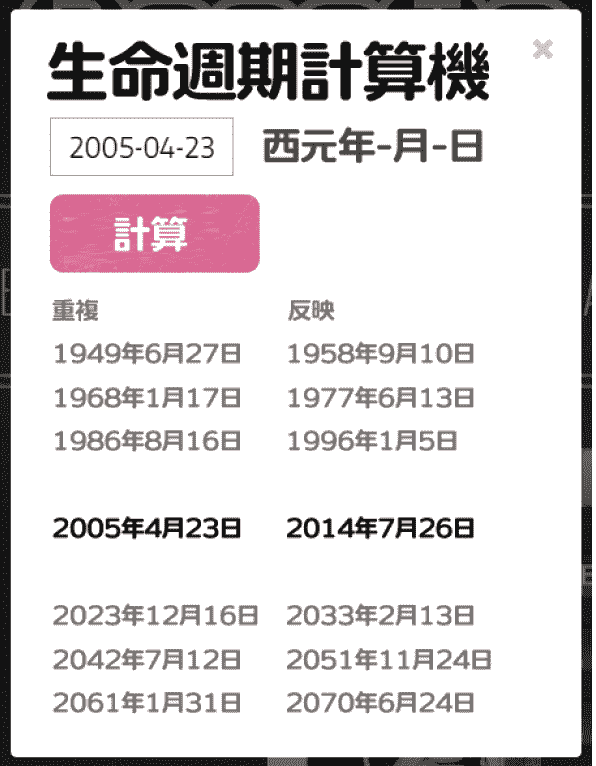

在班图选单中有个像上图的生命周期计算机，输入任何日期就能看到重复与反映的对应日期。假设过去曾经发生改变人生的事件，比如你换了新工作或者搬到新的城市，就可以输入相关日期观看对应的重复时间。虽然不一定会以相同方式发生，但是会为你带来相似感受。

「反映」是很好的指标，透露为什么一切事物会在你生命中的特定时间发生。举例来说，今天所发生的事情，很有可能是你在 9.3 年前的交点反映日期做了什么事而带来的结果。月交点周期的计算相当复杂，因为月交点具有奇特的移动路线，不过班图能够精确计算。因此，你可能注意到交点的移动速度有时极快、有时极慢。检视「反映」的其中一个方法，就是把它当成播下的种子，通常经过半个月交点周期后，你就会开始看见先前播下的成果。

# 乔治．麦可（GEORGE MICHAEL）

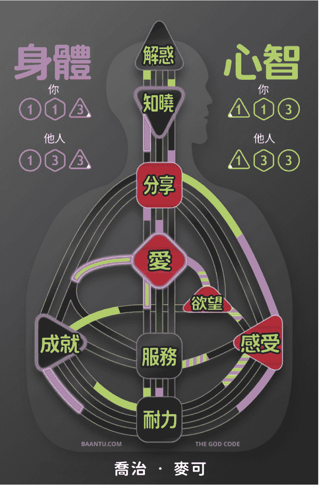

乔治．麦可是英国歌手，也是作曲家，以双人合唱团「轰！」（Wham!）成员身分走红，唱片销售超过 1 亿 1500 万张，是史上最畅销歌手之一。

我住在他伦敦的家附近长达十年，在街上看过他几次，也认识几位曾与他共事的伙伴，我许多年前还跟他待过同一间唱片公司。

我最近在电视上看到他过世前不久所参与制作的纪录片《自由》（Freedom），本片是由他的挚友与经纪人完成。你所听见关于他的人生与性格，证实了许多我们在班图中所见到的信息。

当我们看到他的三角形主轴，可以发现有两件事情能使他感到愉快，也左右了他的心情：成功与感受。更精确而言，他的心智是成功主轴，身体则属于感受主轴。这代表他会判断自己的想法与曾说过的话，是否能带来生命中的成功，这同时也决定他想从别人口中听到的话。他有勤奋努力的心智，但身体层面却不是这么回事，他的「行为」并不那么勤奋，而比较在乎享受自我。他的情绪决定他的行为与行动程度，更重要的是，决定了他想共事的对象，如果事情很费力或是令人不悦，他就会停手。

心智层面的圆形数字是 3，代表他属于发起者，这跟我所认识的他不谋而合。他想要完全掌控自己的生涯。有些人称他是控制狂，他甚至也如此称呼自己，所以我们知道他的目标远大，而且想要掌控一切，也想要成功，不会听从别人的指示。他曾经在受访时说过，他从 18 岁踏进唱片公司办公室的那一刻起，就了解到公司并不知道如何让他成为流行歌星，自此以后，他就不曾听过公司的任何指示。

我们再看他的人生闸门，可以看见知晓、成就与爱是他的重要主轴，简而言之，这是他的人生重点。成就主轴在他的图里再度出现。他曾多次表示，他在年轻时就决定要成为名人。爱中心表示他只从事自己喜爱的事物，而且无法与自己不在乎的人共事，这也是他日后与索尼唱片难以合作，因此与公司解约的原因。

启动的欲望中心代表他很固执，这点在纪录片中也受到艾尔顿．强（Elton John）所证实，他说：「乔治很顽固，他是我所认识最固执的人。」

你必须明白，他不只具有欲望中心，同时还是个不喜欢听命于他人指示的发起者。

然而让他惹上最多麻烦的，却是他的双重六角 1，这毁了他的人生。有些人比较幸运地只有一个六角 1，但如果你有两个六角 1 ，又有极高的曝光度（例如你是名人），一旦受了创伤，就很难以复元。

六角 1 不只是悲观主义者，而且很敏感，弹性比较低。这类型的人称不上坚强，而你必须要坚忍不拔才能成为世界上最大牌的艺人。詹姆士．柯登（James Cordon）在影片中说：「乔治的皮肤少了一层，他很容易受伤瘀青，所以他能写出这些令人惊艳的歌曲。」

麦可本人说过，当他在 25 岁达到生涯颠峰、成为世界上最优秀独唱歌手时，也是他最不开心的时刻，他无法应付这一切，这并不是他想要的，却已经来不及抽身。

在此之后他开始远离音乐产业，但当你在世界上最大的唱片公司成为最大牌艺人时，某些掌握大权的人可不允许你这么做，因为他们都靠你来赚钱。他相当不开心，而且不再想推销自己的音乐，因此导致与索尼音乐的严重冲突。

乔治说：「我想要成功，但并不想要成为别人。」他暗指玛丹娜与其他大牌歌手，觉得他们为了讨好业界而创造出另一种面貌或形象。某些具有三角 2 的人，比较愿意提供符合他人期望的形象。三角 2 主轴的人只有在其他人感到愉快时，自己才会愉快，他们是十足的演员。但乔治并没有三角 2。

他也说：「吸引太多注意力让我很困扰，宣传活动感觉像在卖身。」

纵使他的心智与言谈受到成功主轴所驱使，但在身体层面的三角 3（感受），控制了他根本性的一切行为。他的身体不愿意出卖自己或过着谎言般的生活。在此重提，三角 3 无法理解为什么要改变自我或是撒谎。他们只想获得良好感受，所以当事情变得棘手而且无法带来乐趣时，他们就想打退堂鼓。

只要问问任何曾进行巡回演唱或得到世界各地宣传唱片的艺人，你很快就会发现这种生活是多么辛苦、严苛，一点都不迷人也不好玩，三角 3 主轴的人最终必定无法接受这一切。

像乔治一样有双重六角 1 的人，会因为太受瞩目而感到困扰。有些人擅长面对这番处境，也能够控制风险，但乔治没办法，他甚至不曾尝试，结果伤得愈来愈重。

他身为同志又无法出柜的事实让情况更加恶化。你确实能够发现，他那具有三角形成功主轴的心智并不想拿生涯来冒险，但同时又对于戴上面具的现实生活彻底感到不自在，他欠佳的弹性让一切变得更糟。一方面，他害怕摧毁自己的事业，但另一方面，又因为事业而强烈地感到不愉快。他被困住了，无法解套。

★

当你观察身体这一侧，可以看见有两个数字 1。他是个具有不安全感（六角 1）的反应者（圆形 1）。他并不会追赶或催促其他人，他其实既害羞又喜好隐蔽。尽管他的心智是个发起者，但他却等待着其他人与事物上门，发起者的性格仅仅让他直言不讳，所以他会畅所欲言。

虽然他在身体与心智层面都有六角 1，但在「他人」栏位具有六角 3，所以他的人生目标是变得勇敢，并且克服与生俱来的内向与悲观。

他从未谈过恋爱或拥有伴侣，直到 1991 年在里约摇滚音乐节遇见了安索墨（Anselmo），安索墨只是在人群中望着他的「平凡」男性。我跟你说过，反应者不会好高骛远或者在人生中规划期望的蓝图，他们会等待事物上门，就如同他遇见安索墨的情境。他说过，自己一辈子都等着被人所爱，反应者会等待事物找上自己。身体层面能透露某人如何与他人相识。

自此，乔治的人生迈入幸福时光，但这却在几个月后发现安索墨患有艾滋病时转瞬即逝，这是他的另一次打击，他花了许多年才得以重新振作，偏偏母亲又在稍后过世，使他再度落入下一场危机之中。

对他唯一重要的事，就是享受自我并且获得成功，但他却感到痛苦，而且职业生涯也在与索尼的官司落败后一败涂地，他希望能够解除被他称为「奴役」的合约。

他说：「自从我发现安索墨的事开始，一直到我走出母亲的悲剧那天为止，我都持续活在恐惧之中。在母亲过世后，我的精神几近崩溃，而且觉得众神都在找我麻烦。我一直恐惧着死亡的到来，也害怕再次经历丧亲之痛。」

还记得我说过六角 1 受到恐惧所驱使吗？他具有双重六角 1，这类型的人在生命中经历创伤事件时会感到极度困顿，而且严重到几乎无法彻底走出伤痛。这可能让他们变得神经质，但我们不能将其视为普遍性的问题。有些人注定要经历创伤来改变生命，并从此过着不同的生活，他们的环境不应该逼迫他们回到从前的人生，否则情况会变得更糟。

纪录片中的每个人都说他注重隐私，这也是来自六角 1 主轴，这类型的人喜好隐蔽。他也在身体层面具有圆形 1，所以不只让其他人难以接近，也不爱追逐别人的脚步。乔治很内向，在人群互动方面总是等待着生命将对象送上门。他的心智就不一样，期望能具有掌控权、很固执，又没有安全感。

他大量使用毒品的行为也很有名，少数友人因此一直替他担心，这是他面对世俗的手段。大多时候他都坐在家中吃着冰淇淋或者看电视，也会一边抽大麻菸一边玩游戏。具有双重六角 1 的人很重视隐私，而且不爱交际，他们喜欢待在家里，讨厌人群。

在他的「他人」栏位特质中可以发现，他喜欢怀抱远大梦想以及极度自信的人，也就是在心智与身体层面都有六角 3 的人，这些人不会惹恼他。会激怒他的人应该是现实主义者，也就是不断告诫他负面与悲观想法会造成什么问题，同时又无法以美好观点来看待世界的人。他不希望别人逼他面对冷酷的现实。他不喜欢「爱算计」的人，他喜欢大胆的梦想家，如果无法如愿，就找个像自己一样内向、低调的悲观主义者。

他本身对于自信的缺憾以及曾经受过的创伤，都表现在他过世前留在影片里的遗言中：「我想要因为正直的个性与我的歌曲而受人怀念，但却非我所愿，我认为这些时间都浪费了，努力也白费了……」

# 玛丹娜（MADONNA）

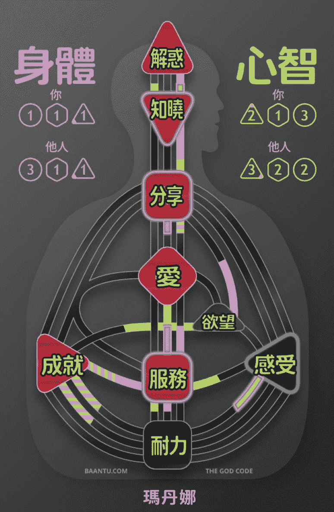

玛丹娜是另一位音乐界中的伟大传奇，我选择她的图，是想说明什么样的人会在有双重六角 1 主轴下，同时还能面对身为公众人物所带来的挑战。

当然，我们很难真正了解玛丹娜的心理世界，但我们知道她的控制欲接近神经质的程度。她并不像泰勒丝一样会让粉丝接近，玛丹娜将所有人保持在一定距离之外，当她接受访问时，所有人的提问都必须事先确认。她并不是交际花，会随时都跟其他人混在一起，事实上，她喜欢独处，周围或许也都是唯命是从的人。

虽然与乔治．麦可有些相似之处，但也存在大相迳庭的差异。两人的共同点是具有追求成功的动力，而且也需要透过成功获取快乐，而不同点在于，这些主轴出现在乔治的心智层面，对玛丹娜则在于身体层面。乔治想要利用心智行为获得成功，但玛丹娜的成功着重于身体行为。她有能力以乔治办不到的方式身体力行辛勤努力，这点显然呈现在两人的体态上，乔治时常体重过重，对于维持体重感到苦恼，玛丹娜则永远保持穠纤合度的良好身形。外界时常目睹她在慢跑或进行高强度的运动，这对身体层面具有三角形感受主轴的人而言相当困难。

但我想最大的差异在于玛丹娜心智层面的三角 2 主轴（尊敬）。她想要让所有人印象深刻，希望透过心智获取他人的赞赏，某些具有这项主轴的人，行事风格可能随着年纪增长变得特立独行。对他们而言，在赚够钱之后优雅地告别舞台还不够，他们需要持续获得掌声与关注。你可以看见玛丹娜如何努力地维持一切活动。假如评论或众人对她厉声批评，她会感到沮丧失意。她的弹性比较低，你看得出来这点如何在生涯中对她造成困扰。

她与乔治的共通点在于心智层面属于发起者，身体层面则属于反应者。她知道自己的期望，并且透过心智追寻目标。她在心智行为方面不喜欢听从他人的指示，这点在她的想法、言论与说出口的话语都看得出来。

但说到结识人群，她就比较内向，而且不爱紧逼他人。通常是让别人来接近她，而名声在这方面帮了不小的忙。同时，六角 1 主轴让她无法一次面对太多人。

与乔治相比，她有一个人生闸门在服务中心，而且处于恒久启动状态。这表示她适合从事商业活动，她会注意其他人的期望。她的爱与服务中心相连，而服务又与成就中心相连。

玛丹娜在身体层面偏爱「充满干劲」的人（发起者），她喜欢被征服，但乔治觉得这种人很烦。乔治在身体这侧的「他人」栏位具有圆形 1，偏好像自己一样的人，不会追逐他人的脚步，而且随时处于忙碌之中。而尽管玛丹娜喜欢在肢体上的主动发起者，但旁人还是必须搞清楚该如何发起行动。「他人」栏位的六角 1 与她自己在身体层面的六角形主轴相同，代表这方面不是大好就是大坏。如果别人不具有出现在「他人」以及「你」（她自己）栏位的主轴，就会惹怒她，中间没有灰色地带。他们要不是适合共处而且有吸引力的对象，就是讨厌的家伙。她无法忍受两种人：过度自信的人跟现实主义者。没错，她喜欢别人采取主动，但他们也必须收敛一点，稍微有自信，而且要敏锐行事，不然她很快就会觉得不自在。在心智层面，她偏好实际的思想家与发言者。虽然她富有同理心，而且能了解悲观主义者（她自己就是）与内向的发言者，她还是比较喜欢稍微有自信点的发言者。但她真正无法忍受，而且可能伤她最深、让她觉得最粗枝大叶的，是六角 3 主轴的人。她不喜欢过度乐观或过度自信的思想家或发言者。她不喜欢无法察觉出错风险，又认为不需要未雨绸缪的人。

看看她的目标（「他人」栏位），她想要克服身体层面的圆形 1，成为更有推动力与掌控能力（圆形 3）的人，同时更加强成功主轴（三角 1）。在心智层面，她想要变得更有趣、更直言不讳，但也想降低控制欲。

# 西尔维奥·贝鲁斯柯尼（SILVIO BERLUSCONI）

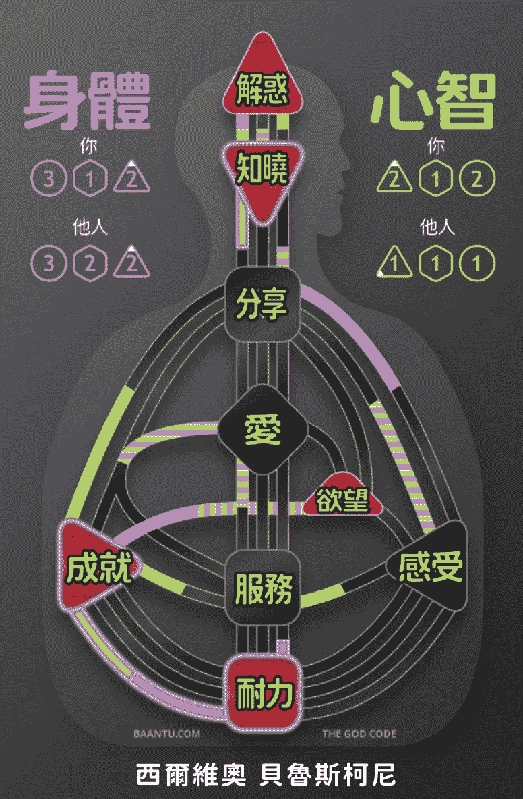

我看过《我的路：西尔维奥·贝鲁斯柯尼的崛起与沉寂》（My Way: The Rise and Fall of Silvio Berlusconi）这部纪录片，而且知道他的出生时间，可说是解析班图资料的又一次绝佳机会。

首先，我们看到圆形 2／3（心智／身体）的组合。我曾提过这类型的人在人生中可能有许多绯闻，但真正的意义在于，他们会利用身体来得到想要的。贝鲁斯柯尼不只会追求生命中所有喜欢的对象，还会利用他机会主义者的心智来说服对方。

他原本从事房地产销售工作，在拥有第一家公司时曾经说过自己相当擅长推销公寓。为了明白驱使贝鲁斯柯尼的动力以及他的一切事迹，也为了一窥左右他心情愉快与悲伤的因素，你必须分析他的三角形主轴。我们看见双重三角 2，一切都是关乎尊敬。他想要受人崇拜、想要获得尊敬，而且相当在乎别人对他的看法。

当我观看影片时，我的第一个想法是：「这辈子从没看过这么爱现的人！」

他的所有行为只有一个目的：他想使别人印象深刻。金钱对他而言只是让人敬佩的手段。他拥有超过 70 个房间的豪华别墅，而且许多房间内堆满了礼物、画作，以及其他熟识名人所赠送的纪念品。他很喜欢收集与陈列众人送给他的礼物、个人信件以及谢礼，藉此向大家展现自己的重要性，以及其他名流对他有多么爱戴，他的人生就象是战利品收藏大展（包括妻子在内）。

但你看见他有双重六角 1，而且对于让人敬佩的渴望已经突破天际，你可以发现他极度缺乏安全感。这位男性希望追求其他人的目光，但却内向又缺少安全感。当然，金钱、名声，以及他用来使人眼前一亮的收藏，有助于帮忙应付他的不安全感。

他人生中的一切都建立在谎言之上，就连头发都是假的，具有三角 2 主轴的人是最佳演员。但他并不笨，曾经就读大学的法律系，这完全符合他位于知晓中心的人生闸门，他必须知晓事物，而他也会花大把时间来「解决」问题，因为他的解惑中心有定义。你可能认为他为黑帮「解决」了诸多问题这件事值得争议，但这为他带来了个人的好处，使他拥有能开创不动产事业的资源。

接着我们看到启动的欲望中心，因此他很固执，而且还有人生闸门位于成就与耐力中心，应该不需要再解释这位男性的人生是什么模样了。

一开始让我感到困惑的，是在贪污以及在豪宅内与未成年女性传出性丑闻而使名声一败涂地之后，他为什么还接受影片制作人的访问，并允许他们拍摄自己的影片。法院判他有罪，这部影片只会让自己更难堪而已。

如果任何人拥有这种规模的财富，或许只会从大众眼皮底下消失并且享受人生，但他想要诉说自己的故事，事后看来这让情况变得更糟。因为他的名声已经毁了，他的情绪不佳，就算拥有财富也帮不上忙。假如他的三角主轴是 1 而不是 2，或许还没问题，但由于他拥有双重尊敬主轴，孤注一掷地试图透过影片制作人的邀约来挽救名声，然而却雪上加霜，因为这让所有人明白了他真正的性格。当他看见影片成品时气疯了，因为他以为影片制作人会对他歌功颂德，但事与愿违。

你也能看见影片背景中不断徘徊的人们，都在确保没有任何状况会毁了他的形象。他太过神经质，以致于雇用一大堆人来替他看前看后或者保护他。

纵使他在众人与女孩之间来来去去，但他还是注重隐私。具有双重六角 1 的他，完全掌控了要让哪些人接近自己，即使你想要靠近他也没办法。但你也不能批评他或提出未经许可的问题。每个人都必须遵照他的「脚本」，你可以看到他周围都是些唯唯诺诺的人。

他在本命图中未启动的能量中心，透露出他不在意哪些事物。分享、爱、服务与感受中心都不存在，他不在乎别人想要什么，为其他人带来良好感受什么的，根本不关他的事，而且他也吝于分享。

★

从贝鲁斯柯尼「他人」栏位的六角形主轴中，你可以立刻发现一件事。他不喜欢过度自信的人或者梦想家。他讨厌没有准备而且看不见危险的人。他本身没有六角 3，也不觉得这样的人有吸引力。他的性格中完全没有六角 3，所以这也是最容易激怒他的类型，他或许会称这种人感觉迟钝。

再看看他的目标与抱负（「他人」栏位），他对自己的行为不感到后悔，也不打算减缓他在身体层面的一意孤行。他具有受到强化的尊敬主轴，不过在心智层面，他则会努力寻求成功，并且倾向稍微消极一点。

# 唐纳．川普（DONALD TRUMP）

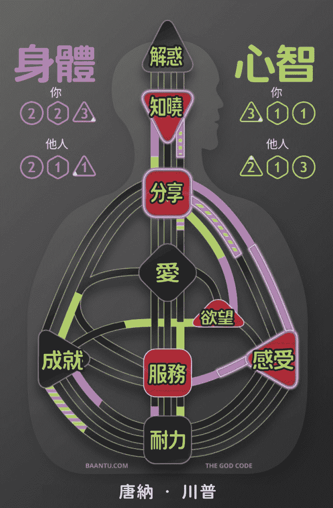

唐纳．川普是相当特殊的总统，因为他并不是职业政客。在班图中，身为非典型政客的性格表现在他的双重三角 3 乐趣主轴。就大多数政客而言，三角形主轴可能会是成功或尊敬的搭配。川普具有许多条通道（不需要其他人来推动自己），再加上启动的欲望中心，使他不喜欢参与大型团队，同时还很顽固。在需要仰赖他人支持与团队合作的政治生涯中，这些特性帮不上忙。

但川普不一样，因为他不需要财政后盾或是党派支援来参与竞选，他有自己的财富，这使像他这番性格的人也能有机会参政。

由于他具有许多感受性格，不只是三角形主轴，就连人生闸门也位于感受能量中心，所以他会把情绪挂在脸上。他深深受到自己的感受所驱使，他的所有反应都是以情绪为基础，他会做出任何带来良好感受的事。他的主要动力并不是追求成功或是他人对自己的想法，他想要享受自我，就这样而已。缺少三角 2（尊敬）主轴就是证明，他完全不在乎别人的看法。对于白宫办公室或是代表总统的「行为」方面，他并不想维持什么形象。如果能让他感觉良好，他就会把想法说出来，在推特上也畅所欲言。

看看他的圆形主轴 1／2 组合（心智／身体），他不爱咄咄逼人。他的心智会等待受到邀请，只有在真正的机会上门时，才会用身体实际行动。他并不是受愿景所驱使的男人，他也不是有自信的发言者（六角 1）。当你分析他的政策时，大部分都是情绪化的反应，重点不是北韩、ISIS 组织，或者中国抢走美国的工作机会。他会对造成不良感受的人事物做出反应。他想在墨西哥边界建立城墙，因为他对于美国人受非法移民所苦感到很不爽。

在心智这一侧的六角 1 显示他很敏感又容易受伤。当你分析他偏好哪种类型的人，你会发现他也喜欢具有六角 1 主轴的人，这类型的人在言谈时会展现出高度的灵敏性。他无法忍受粗俗之人。

他的人生闸门连接到分享、知晓与感受中心，这些是他的人生重点。他想要与大众分享，让大家与自己获得良好感受。同时他也喜欢把事情搞懂以及获取新知。

在掌控他的行为以及决定他想认识对象的身体层面，我们看见了机会主义者（圆形 2）与现实主义者（六角 2）主轴。当他决定要行动时，会相当实际地评估风险产生的可能性，而只有在看见机会上门了，他才会行动。他不会持续采取攻势，也不会枯等事情送到眼前，而是等待适当的时机与对象，在他们采取行动之前出现。他在身体方面的自信适中，不会过高或过低。他喜欢在心智层面属于发起者的人，他们会怀抱愿景并努力追寻，不过在言谈方面，他则会等待收到请求才开口，不会直言不讳。

就身体层面而言，他喜欢像自己的人。他喜欢机会主义者，但与自己相比，他偏好更内向、自信程度也较低的人。他欣赏对于每一件可能发生错误的事物有高度判断力的悲观主义者，同时也喜欢那些勤奋工作，并且在面对困难不轻言妥协的人。

他无法忍受在身体上过度自信，而且透过身体强迫他人的人（圆形 3）；或是另一种极端，总是等待生命前来敲门，太过被动的人（圆形 1）。他不喜欢单纯只为了成功而用尽心思（三角 1）的人，他的三角形主轴中找不到三角 1，无论在「你」或是「他人」中都没有。由于他在生命角色中具有分享与感受主轴，你可以了解他为什么这么爱推特。他不断与其他人分享他的感受，但也同时希望能让美国人获得良好感受。

他本身追求的目标（「他人」栏位）是想更受人尊敬与成功（三角 1 与三角 2），而不仅仅是追求乐趣，他也喜欢顺从自己的意愿开口，而并非只等着别人来问他，简而言之，他对自己的心智层面更具掌控力（圆形 3）。

# 弗拉基米尔．普丁（VLADIMIR PUTIN）

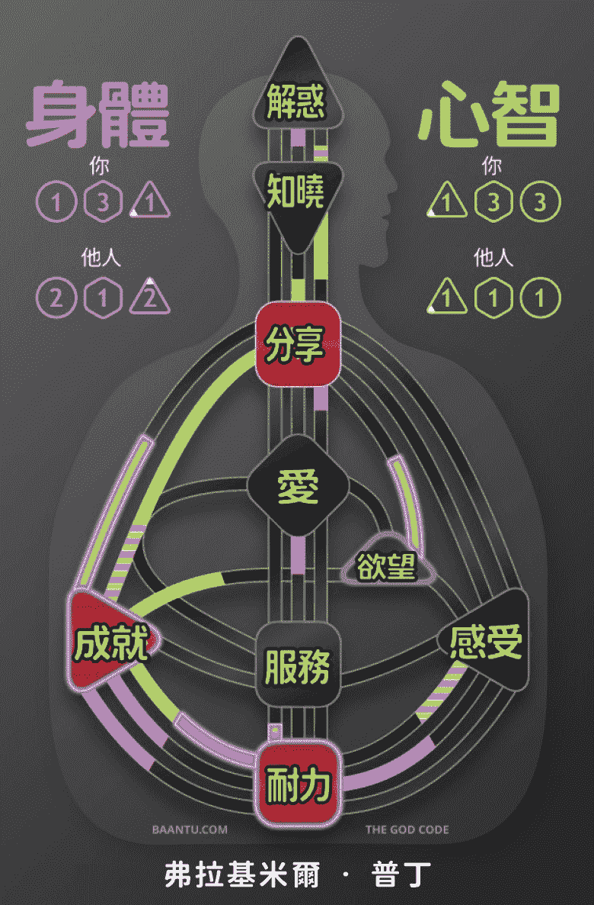

与川普相比，此人比较有远见，他知道自己的期望，并且会努力追求（圆形 3）。然而最大的差异在于，普丁是「典型」的政治家，他的成就主轴相当强烈，他有两个三角形是成功主轴，成就能量中心是启动的，而且他的其中一个人生闸门也在成就中心。他还有另一个人生闸门位于永久定义的耐力中心，加上他的脸皮很厚，在心智与身体层面也都极具自信心。你无法用任何手段威吓这种人，他什么都不怕。他不仅不会逃离实质上的威胁，也不会回避言语上的争辩。同时，他在「他人」栏位具有两个六角 1，所以他随时随地都保持谨慎，并且避免鲁莽行事。他也会努力压抑自己咄咄逼人的心思，却还是会保持身体上较高的主动性。

当你在[baantu.com](http://baantu.com)网站浏览他的资料时，也会发现他是团队合作型的人，这对于政治领域而言也相当重要。他不像川普一样顽固，因为他的欲望中心并未启动。尽管他会利用自己的才智去获得他想要的，但他并不会以实质行动去追逐人们，造成他们的困扰（身体层面属于圆形 1 主轴），而是让对方找上门来。他在身体行为方面扮演反应者的角色，让自己充分准备。但是谈到关于想法、言语以及心智行为方面，他倒是不请自来。他有张畅所欲言的大嘴巴，言谈可能粗俗无礼，也会插嘴。我也认为你不太容易找到比普丁更好胜的人，他就是想赢。

我们从他的资料可以发现，他不喜欢现实主义者。他本身在心智与身体层面都是乐观主义者，而对其他人他则比较偏好内向的悲观主义者。也可以说，他喜欢敏锐又能掌握所有可能风险的人。他认为现实主义者很无趣。普丁是梦想家，他的理想远大，而且无所畏惧，你也可以说他的行为有点粗线条。

在西尔维奥·贝鲁斯柯尼的影片中，可以看到普丁对他有好感，而且时常表示支持。当然，贝鲁斯柯尼拥有普丁在其他人身上所寻找的特质，他在身体层面具有六角 1 与三角 2，普丁喜欢那些为了使自己受人尊敬而有所行动的人。

可是你在[baantu.com](http://baantu.com)网站上分析普丁与贝鲁斯柯尼的人际关系资料时，会发现贝鲁斯柯尼不喜欢普丁拥有的全部特质，但由于普丁身为俄罗斯总统，而且确实对贝鲁斯柯尼有好感，所以贝鲁斯柯尼并不会表现或透露自己的反感，他只是以此自吹自擂。别忘了，贝鲁斯柯尼跟所有三角 2 主轴的人一样，是优秀的演员。他利用普丁向全世界展现两人的绝佳友谊，对具有双重三角 2（尊敬）的贝鲁斯柯尼而言，普丁也成为他的其中一尊「战利品」。

普丁其中一个人生闸门位于未启动的欲望中心，虽然他不会一直都很固执，但还是偶有一二，取决于当时的处境。不过你也能以这点将他视为有原则的男人，知道何时该说「不」。要让他表现出这种性格，就需要适当的伙伴或者星宿移访。他的人生角色定义在于成就、耐力与欲望，单凭这点，你大概就能了解他是如何爬到今天的地位。他的心智能量中心开放，里头也没有人生闸门，这也能让你明白他并不是高知识分子，对于研究解决手段也没太大兴趣。他比较象是「行动者」，而不是「思考者」。

# 卡莱．葛伦（CARY GRANT）

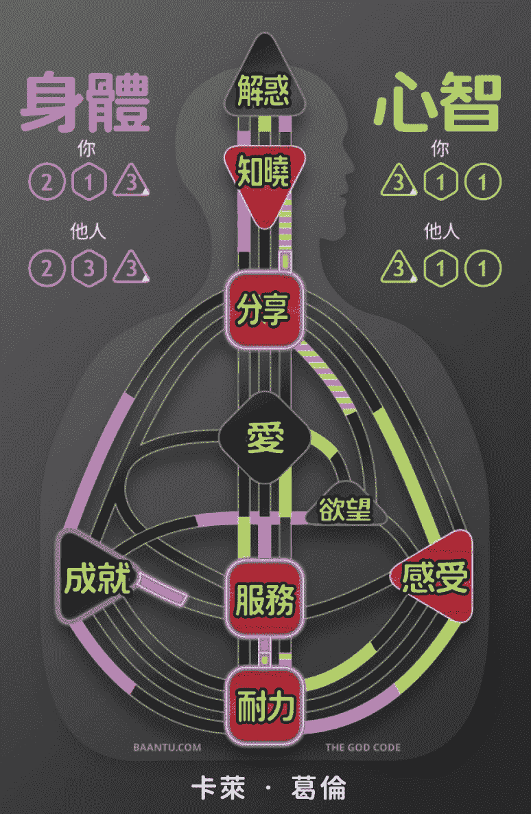

这位同样也具有双重六角 1 主轴，由此证明，即使没有安全感又内向的人，也可能非常成功。我曾经说过，认为只有过度自信的人能获得成就，是谬论性的假设。我甚至可以说，缺乏安全感的人正因为没有安全感，所以更有追求成功的动力。

我选择他的原因，同样是因为有部描述他生平的电影《成为卡莱．葛伦》（Becoming Cary Grant）问世。透过他在[baantu.com](http://baantu.com)数据库中的资料，我很好奇他的人生是不是与我们所看到的资料相呼应。我们通常很难透过演员扮演的角色与演出的电影来评断这个人，这些无法让你真正认识他们。事实上，他们的角色可能有所误导，并且掩盖他们真正的性格。有时在演员过世后，你才能听见他们的许多故事。

卡莱．葛伦这位电影明星的形象，出自于导演霍华．霍克斯（Howard Hawks）之手。他发现葛伦相当缺乏安全感，同时也具有幽默感。在此之前，葛伦只扮演绿叶的角色，需要开口的台词很少，而且个性也不鲜明。

他来自英国的布里斯托，在被学校开除（他具有两个三角形乐趣主轴，这点我不意外）之后，加入潘德巡回剧团（Pender Troupe）锻鍊演技。学校显然无法为他带来乐趣。潘德巡回剧团之后前往美国，到纽约的嘻伯朵姆（Hippodrome）剧场演出，这也是当时全世界最大的剧场。他当下决定留在美国，接下来的故事就如大家所知。他在身体层面的圆形 2 主轴发现了机会。葛伦并不属于发起者，但当机会上门时，他就会采取行动。具有 2／1 圆形主轴组合的他不会主动进逼，是个有耐心又行为端正的人。

他具有双重六角 1，所以既内向又敏感。他曾因为孩提时代的事件受到创伤（容易发生于六角 1 主轴的人），并且长时间接受精神科的迷幻剂（LSD）治疗。你可以发现，幼年时期的部分经历在他身上留下无法遗忘的深刻伤疤，对于六角 1 主轴的人，过去的事物可能会成为延续到未来的漫长阴影，会塑造他们的人格，带来巨大的影响。

电影中说到，他的身型修长，注重隐私。他不喜欢人群，也不是派对玩咖。他的女儿说，别人可能以为他们时常参加派对或者首映会，但其实他们整天待在家里看电视、打牌或者下西洋双陆棋。

他的前任妻子芭芭拉．珍妮（Barbara Jaynes）说，两人刚认识时他很内向，而且焦急地想知道她是不是他的真命天女。具有六角 1 主轴的人不容易建立信任。她也表示，葛伦不喜欢出席公开场合，也很讨厌必须公开发言的场合，在逼不得已时，他在活动前可能会无法进食，而且紧张得要命。

在年纪稍长后，他主持了名为《与卡莱．葛伦聊聊》（Conversations with Cary Grant）的电视节目，而他乐在其中，因为别人可以向他提问，接着他会先观赏以前的电影片段，再说个笑话来回应。

身为心智层面的反应者，他喜欢接受别人提问，这正是反应者擅长的模式。他们就像供人饮用的水井，会让自己做好应对准备。三角 3 主轴的心智通常很有趣，就他的例子而言，他是双重乐趣主轴的人，极度敏感，但同时内向又注重隐私。

当你分析他的人生闸门时，可以看见分享、成就、耐力与服务中心被特别标示出来，他的耐力与服务中心被接通，所以他能符合众人的期望，即便失败了，也不会轻言放弃努力。当然，分享与成就中心不用再多做解释，毕竟他将作品与全世界分享，也是世界上最成功的演员之一。

在他的资料中，有趣的是「你」与「他人」栏位之间的相似度，除了身体层面的六角形数字之外，每项主轴都相同。我们知道他喜欢比自己更勇敢无惧的人，但他也付出极大的努力让自己能变得勇敢——相信自己的身体能力且改掉内向性格。

看看在心智层面的两个六角 1（「你」与「他人」），显然他不喜欢鲁莽无礼或是会打扰别人的家伙，他偏好有耐心、会等待邀请的圆形 1 主轴。

像他这样具有双重三角 3 的人，当念书没有乐趣时，总是会有辍学的风险（他确实辍学了）。事实上，如果他不从事带来乐趣或良好感受的事物，心情就会不好，再多的金钱或特权都无法弥补这一点，这些不是首要条件。而且他也不想花时间与自负（三角 2）或是会为了成功而出卖家人（三角 1）的人相处。

# 贝克汉夫妻（THE BECKHAMS）

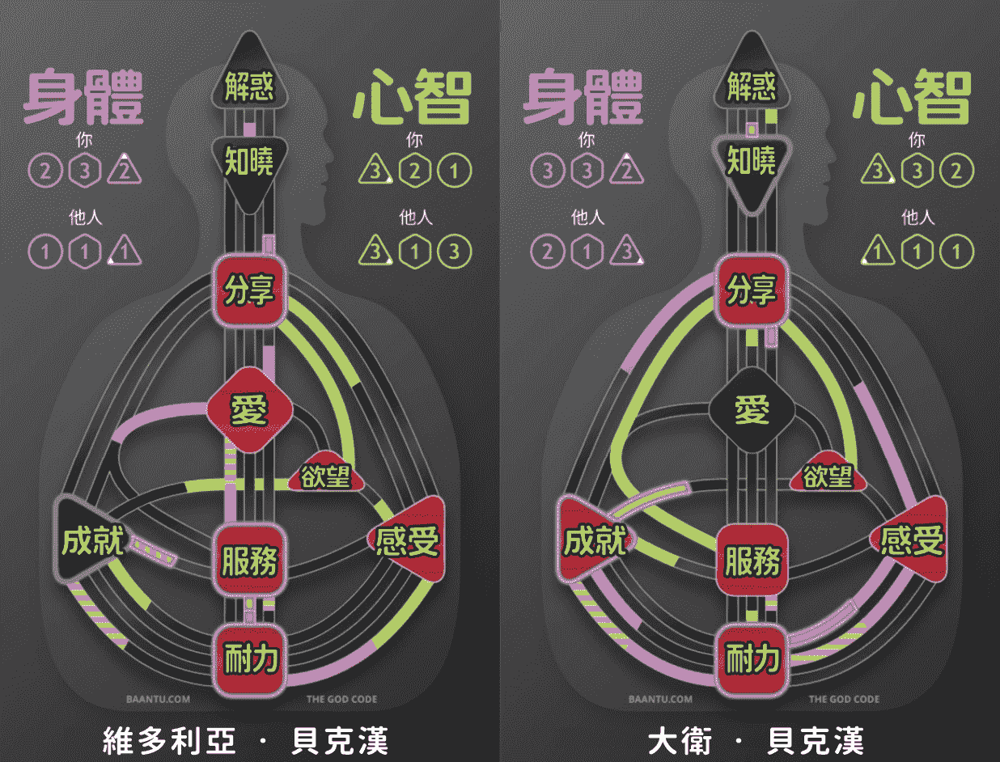

接着我们来聊聊这对举世闻名的明星夫妻，他们的婚姻历经了重重考验，所以就算你在下方图表看见两人的关系评价高达五星，也没什么好意外的。

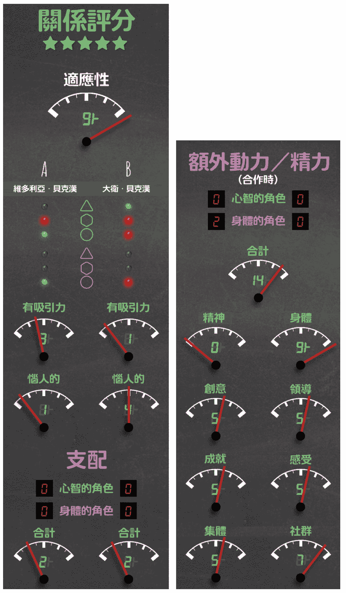

虽然星等评价高分并不保证关系能长久，但机会确实高得多。我还记得刚开始在[baantu.com](http://baantu.com)网站人际关系页面加入星等评价的状况时，布莱德．彼特（Brad Pitt）与安洁莉娜．裘莉（Angelina Jolie）还在一起，而且人气远胜贝克汉夫妇，是最受瞩目的夫妻，他们当时堪称模范夫妻，但班图给他们的星等评价却是零分。很多人跟我说，我的计算程序一定有问题，但当他们宣布已经分开长达一年，周围的人也为之震惊时，我却是挂着一抹微笑地说：「我就说吧！」

贝克汉夫妇特别的地方在于，彼此的适应程度极高，但相互吸引力并不特别高，这可能让感情有点无趣，不过却可以良好运作。

在两人的婚姻初期，街头小报曾经爆出几篇大卫的绯闻。我们从大卫的资料上可以看见熟悉的 2／3（心智／身体）圆形主轴组合，也就是情场浪子的性格。不只如此，他还有双重六角 3，这使他成为世界上最有自信的人。他对于自己的身体并不内向，也不会羞于发言。再看看维多利亚在「他人」栏位的资料，可以发现大卫的自信与追求目标的方式会令她不悦，这也对应大卫这一侧的所有红灯。

那他们为什么选择彼此？当大卫认识维多利亚时，她正处于辣妹合唱团（Spicy Girls）的事业巅峰，也就是当时世界上最著名的流行乐团。大卫只在足球圈具有名气，而她的名声也仅限于辣妹合唱团成员。两人都具有三角 2 主轴，想要变得出名又受人尊敬。当两人开始约会后，就从原本的小有名气跃升成为超级明星，这点使两人因此感到愉快。

两人感情另一个显著特点在于「额外动力」，彼此共处时可以完成更多人生目标。但你也能发现两人都不是「思想者」，他们「说」的不多，「做」的比较多。两人具有高度的社群动力，其中当然包括家庭在内，所以他们想要有很多小孩，两人都乐于花大把时间投入家庭。大卫本身的资料已经具有许多「社群」主轴，跟维多利亚结合更是锦上添花。足球俱乐部当然也是另一种型态的社群。大卫每天都离不开社群活动，如果把他丢在荒岛上可能会活不下去。

两人的支配程度较低。我都把支配称为关系杀手，但 2 分的程度不是大问题，最重要的是，我们可以看到并没有谁的支配程度凌驾另一方。

维多利亚启动大卫的两个人生闸门，大幅促进了他的人生角色。两人在一起时具有两条「领导」通道，使他们更受欢迎，也因此受到众人所追随。

# 哈利王子与公爵夫人梅根（PRINCE HARRY & MEGHAN）

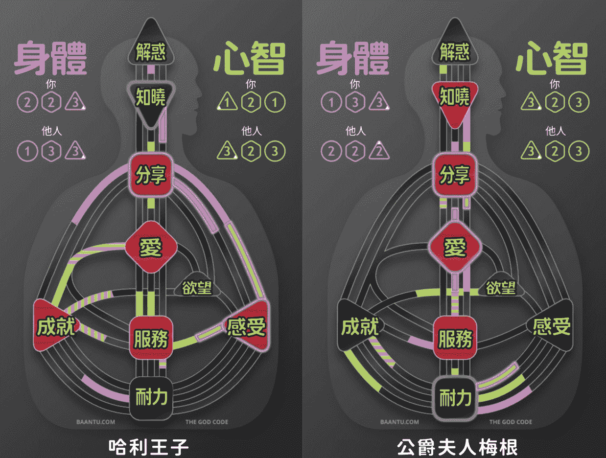

在我即将完成本书时，两人透过英国广播公司宣布订婚喜讯，同时接受英国广播主持人的长篇专访。我当然很好奇地想在班图上查看他们的资料。其实梅根是美国人，具有单纯背景与混合血统的她，对英国皇室而言是格外特别的选择。

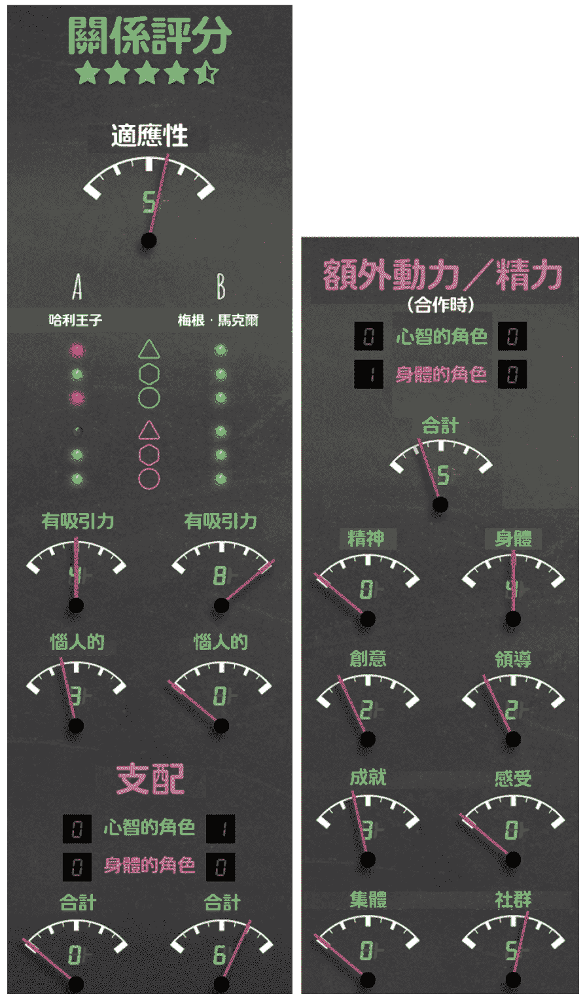

观察他们的关系资料，可以发现显然哈利王子确实「万中选一」。我从没看过有谁像梅根对哈利的互动，六颗绿色灯泡全都点亮，她符合哈利的所有条件。哈利说过，他在第一时间就知道梅根是「真命天女」。

两人的星等评价高达四颗半，但透过「恼人的」刻度表看来，哈利有时候会惹恼梅根，还有个更糟的问题，那就是梅根支配着哈利。不只如此，梅根支配了他其中一个人生闸门。在一段感情的初期，可能会忽略支配关系，但经过一段时间，受支配者就会开始感到困扰。支配关系可能经过较长时间的发酵，而或许在未来许多年后，当哈利某天突然「翻脸」时，梅根可能对突如其来的爆发完全摸不着头绪。这就是支配的运作方式，尤其像这种单方面的支配更是如此。

但总体来说，这是一段极为融洽的感情关系，彼此的适应性跟各方面都相当稳固。他们能够一起度过许多时光，这段感情也可以长时间维持。

# 威廉王子与公爵夫人凯特（PRINCE WILLIAM & KATE）

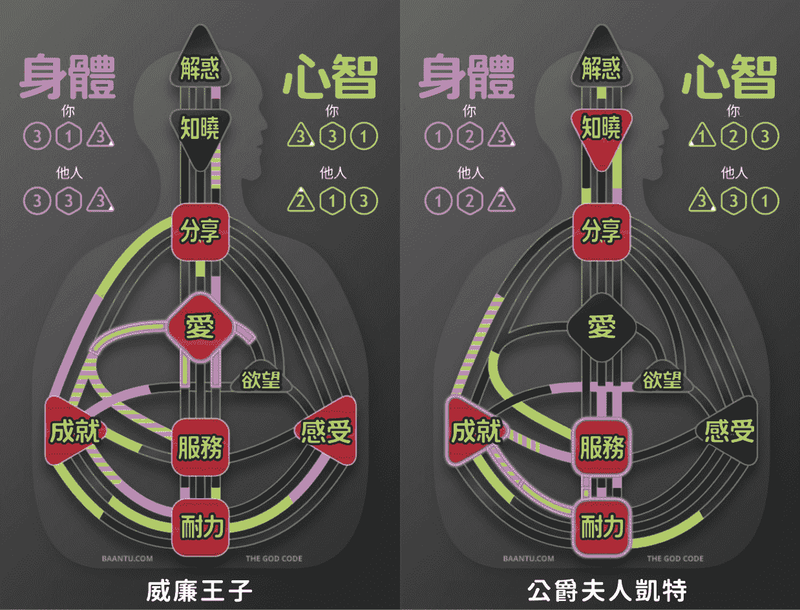

这对夫妻很有意思，让我想起查尔斯王子与黛安娜王妃（稍后再聊），不过没那么糟。

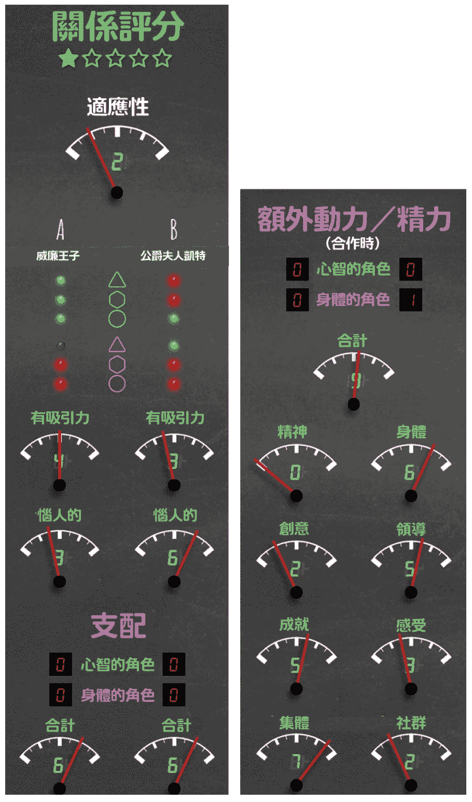

从凯特的资料看起，可以发现家庭对她非常重要，有两条通道从共有回路向外连接，所以他们生了好几个小孩。这点在初期有助于掩盖感情中的问题。

只有在双方给彼此较大的空间的前提下，才可能维持这段感情。但当你是皇室成员时，就成了问题所在，因为你们大部分的时间都黏在一起。

这段感情最大的难题在于缺乏适应性，双方并未真正了解彼此。当两人之间只有少许的吸引力（通常发生于迅速开始的感情），过了蜜月期并且把小孩养大后，两人之间会留下令人不快的疙瘩。

首先，我们可以看到两人对彼此的支配程度很高。如果你认为双方对彼此的支配程度相仿就可以消弭芥蒂，那可大错特错，问题并不会消失，反而对双方都有害。

凯特也比较容易激怒威廉或者对他失去吸引力（就性格而言，而非外表）。男方对于感情中这种负担的感受比较强烈，尤其威廉又具有双重三角形感受主轴，没什么比享受自我更重要。他并不想为了观众而演戏，或许还觉得包围在他这官方角色身边的华贵处境令自己罹患幽闭恐惧症。他也因此曾经抛下皇室的官方职责，跑到瑞士参加友人的滑雪后社交派对。他在心智层面具有六角 3 主轴，他的直言与冲劲程度或许超乎大众所认知。凯特在感情中的言语行为属于发起者，若换做身体行为（身体层面的圆形主轴）方面，则是由威廉主掌大局。

这段感情中的正向层面，在于两人共处时的动力会有所提升，但在适应性如此低落的前提下，这点几乎没什么帮助。你们刚开始相当乐于共同进行某件事，但每当其中一人说东，另一人就说西；或者其中一人提出建议，另一人心里就想：「明明有这么多选择，你到底为什么要这么做？」

欢迎来到感情世界，如果想要寻求慰藉，请再次翻阅本书开头的引言。

# 查尔斯王子与黛安娜王妃（PRINCE CHARLES & DIANA）

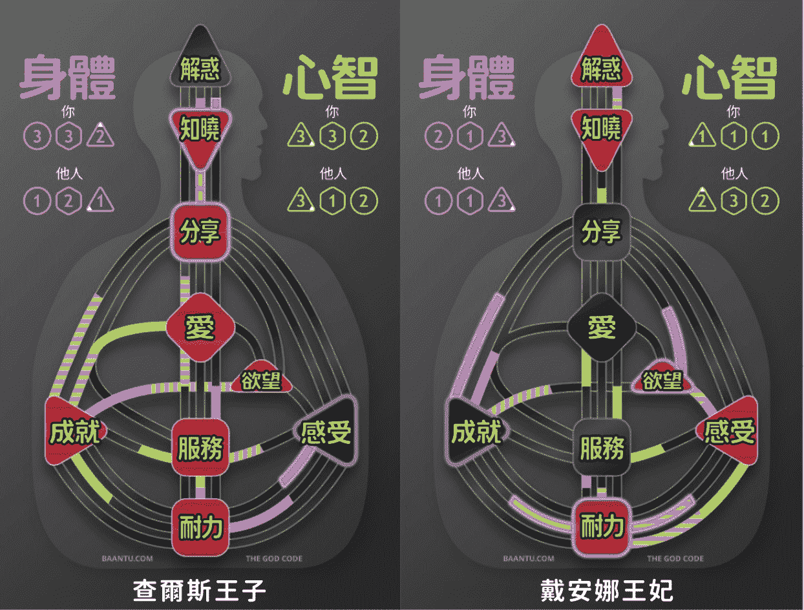

这就是那种你在报纸上读到相关新闻时，会思索：「这两人交往时到底是看见对方哪个优点？」的典型感情关系。

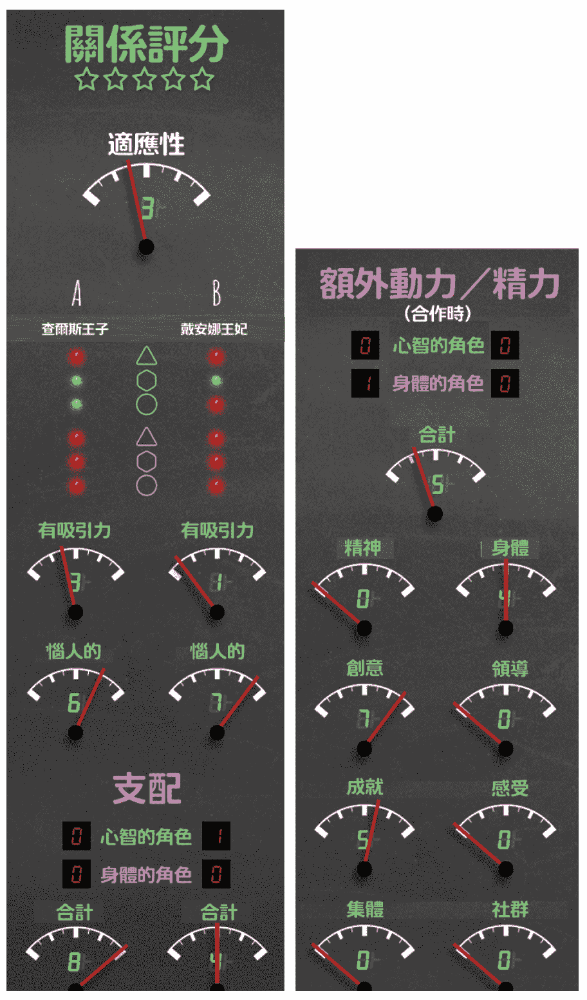

但我们现在知道他们比较象是相亲结合，星等评价零颗星也反映出这段皇室恋情为什么在大众眼皮底下会如此悲惨，最糟糕也不过如此。要他们在相处时没有任何不自在或避免发生争端，几乎是不可能的事。这两人对彼此的适应程度不佳，也表示他们并不了解彼此。

两人感情中的特殊点在于，黛安娜对查尔斯而言几乎完全缺乏吸引力，更糟的是，她很容易惹恼查尔斯。查尔斯比较吸引黛安娜，而且也比较不会惹恼她，但就各方面来说，仍然不利感情。

来自查尔斯的支配程度极高，就我所知，没有太多情感关系能承受这一点。而且虽然黛安娜的支配性比较低，但却不幸地支配了他其中一个人生闸门，这会使他非常不悦。尽管两人还是有共同进行少数行为的动力（虽然很稀少），但在彼此不适应、支配关系以及恼怒互动的影响下，仍然派不上用场。

查尔斯的圆形主轴数字较大，在感情关系中的推动性比较高，而且在身体与心智层面也极度有自信，但是黛安娜有两个六角 1 主轴，这代表她极度敏感，所以很容易被他伤害。我认为很可能是公众身分使她受到创伤，跟乔治．麦可的情况很像，他也无法应付自己的双重六角 1 主轴以及受到高度瞩目的身分。黛安娜甚至几度在遇到困难时与乔治．麦可通电话，我想他们两人或许合得来。

查尔斯与黛安娜都具有三角 2 主轴，代表他们可能都戴着面具太久了。也许当这段从未和鸣的感情关系画上句点，对彼此都会比较好。

# 查尔斯王子与公爵夫人卡蜜拉（PRINCE CHARLES & CAMILLA）

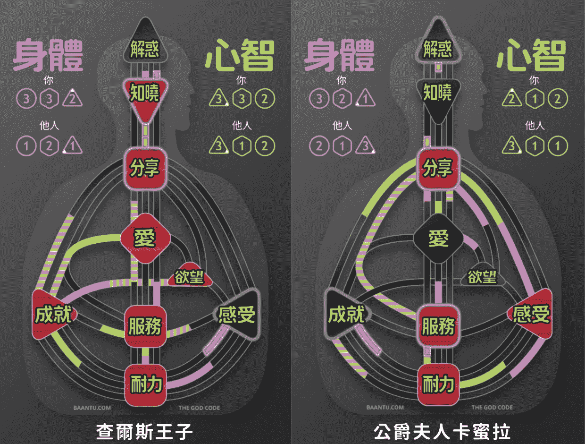

查尔斯与黛安娜的关系，跟查尔斯和卡蜜拉这段感情之间的差异大得令人咋舌，关系评价从零颗星直接跃升为五颗星满分。

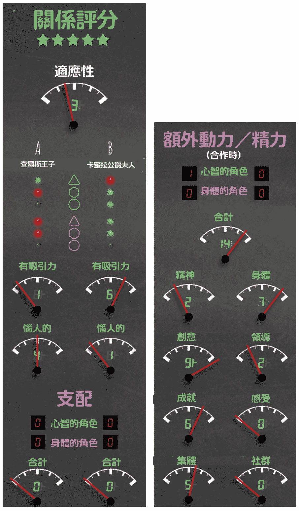

虽然对查尔斯而言，感觉或许就像白天与黑夜的差别，但你必须了解，没有任何感情关系是完美无缺的。他们两人或许获得五颗星评价，但你还是能发现这段感情中的脆弱之处。

两人的适应性相对较低，而且你能看到，卡蜜拉比较不受查尔斯的性格特质所吸引，有时候还会彻底被他惹恼。

但这段感情很棒的是，不存在任何支配关系。支配关系通常是导致深层愤怒开始随着时间累积的原因。

他们也有极高的动力共同从事活动，也因为两人并未相互支配，所以双方都能乐在其中。

卡蜜拉对于查尔斯或许不像他对自己那般着迷，但他能对于卡蜜拉所扮演的生命角色带来额外的动力，这算是不错。除此之外，卡蜜拉具有三角 2，所以她一定也很享受身为皇室成员所获得的尊敬。

与黛安娜相似，缺乏敏感度的查尔斯有时候可能会让卡蜜拉感到困扰。虽然她并不像黛安娜具有双重六角 1，而且比较坚强，但她还是偏好具有双重六角 1 的人。她喜欢敏感的人，而查尔斯并不是这种人。或许查尔斯有时候完全不知道自己有多迟钝，也忽略了自己的行为可能造成伤害。

我也确信查尔斯是风趣的人（心智具有三角 3 主轴），而卡蜜拉喜欢有趣的人，因为她在心智层面的「他人」栏位也有三角 3。

# 确认出生时间

当你输入出生资料时，也必须输入地区。确切地区与班图的计算无关，而我们需要地区资料的原因在于，美国太空总署（NASA）公布了行星根据世界协调时间（简称 UTC，与格林威治标准时间相似）的相对位置。所以为了了解行星在你出生时的位置所在，我们必须先将你的出生时间转换为世界协调时间。我们必须观察在你出生当时，你所在国家的时区规则，并且分析与世界协调时间的差异。同时也要了解当地是否实施日光节约时间。当你输入某个地区，就可以直接选择在相同时区内与你出生地最接近的城市。

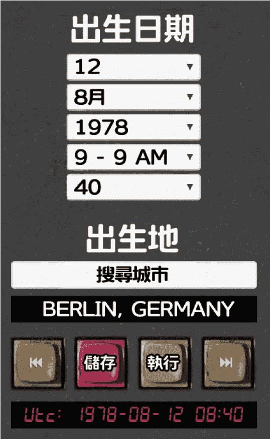

以往的时区资料只有少数提供者，主要供早期占星软件所使用。早期资料的问题在于，关于特定时间的特定位置信息会有所冲突或错误。尔后，我们有了 IANA 来维护时区数据库（tz 数据库）。这是关于全世界时区的合作汇编信息，主要目的是搭配计算机程序与作业系统使用。虽然并不完美，但却是目前最完善的数据库。举例而言，有些国家的时区规则会不断改变，有些国家甚至会透过将时区一分为二的方式，创造出新的时区，也有些国家会将两个时区合而为一。你可以明白要维护与计算所有历史资料有多么困难。过去 50 年来，俄罗斯具有世界上变化最大的时区资料，要完整纪录一切资料几乎不可能。目前在输入当地时间后，仍然有少数地区会出现错误的世界协调时间，例如：哈萨克、俄罗斯，甚至是美国的德州（1970 年以前）以及其他少数地区（1970 年以前）。

最好的方法是随时透过「执行」按钮下方以红色显示的世界协调时间（UTC），来确认 IANA 时区数据库是否将你的当地时间正确转换为世界协调时间。以上图例子而言，可以看见当地时间输入为早上 9:40，地区为德国柏林，而我们看到世界协调时间显示为 8:40，似乎不正确，可以推断当地在当时并未实施日光节约时间。下一步是在班图开始改变时进行核对。假设你的出生时间是 16:30，如果班图在 16:29 发生巨大变化呢？首先要找出在你输入的时间前后是否有任何改变。

在「储存」与「执行」按钮的左右两边，可以看见倒转与快转按钮。当你按下倒转时，班图会实时分析倒转后的改变。一旦发现变化，你会听见一声响铃，并且会以亮底标示发生改变的资料。这项功能在人际关系模式中无法作用，你必须位于单人模式。在「简易」页面，你会看见任何产生变化的文字以亮底标示。在「图像」页面，如果你看见 12 个符号与其中数字的任何一项以亮底标示，代表它们有所改变。当你观察出生日期，也能看见资料是在何时改变。

如果你想查询稍早的资料，可以按下另一个方向的按钮（在上面的例子中是指快转按钮），网页就会显示一分钟前的资料。你可以再按下倒转按钮好几次，系统会在发现另一项改变时停下来。

想回到最初你所输入的出生时间，可以按下「执行」。接下来，你就能确认另一个方向的资料，以我们的例子来说是代表快转后的资料。你随时可以按下「储存」按钮，接着以新的资料覆盖目前资料。

根据你出生资料的准确度，以及发生改变的时间有多相近，你或许可以从分析结果中排除某些资料，或至少提出质疑。

假设你的出生时间是 9:40，而你发现有个三角形主轴会在 9:38 从 2 变成 1，我们就能知道此人具有尊敬或成功主轴。尽管在大多数情况中，我倾向假设某人的确切出生时间会有所提前，比较少延后（护士可能在婴儿出生之后才看时钟），但你在这种情况下就不能如此推论。当讨论的目标是你自己或你所认识的人，目的应该是找出在生命中的重心所在，至于别人怎么想、对于目标什么看法，或者是否想要追求成功，甚至是其他外人的意见或想法，有那么重要吗？

如果你无法确定，还有个方法。你起码知道此人不具有三角 3 主轴，跟感受性格无关，所以至少能将范围缩小一点。有些人会请占星师协助改正出生时间，但我不爱这么做。这是非常不可靠的方法，而且通常在你找过几位占星师之后，他们算出来的时间都完全不同。

当你想利用班图计算某人的资料时，应该确定你拥有相当精确的时间，至少前后误差不超过 30 分钟，否则所取得的信息价值会大幅降低。如果你并未取得某人的出生时间，我就不建议你采用对方的资料。班图数据库中的所有名人，出生时间都有可信度相对较高的来源，否则我们不会储存任何人的资料。但同样的，仍然无法保证时间信息 100%完全准确。

我总是跟大家说，如果你不了解班图展现给你的信息，那就不要相信它说的话。把你对于其他人以及自己的确切认知摆在第一位。班图只是个工具，用来帮助你更加看清某人的性格特质，但千万不要盲信。

这里提供你一点概念，了解闸门、圆形、六角形或三角形主轴维持多久以后会发生下一次改变：

闸门 5.7 天

圆形 2 天以内

六角形 7.6 小时

三角形 76 分钟

# 结论

我们要时刻提醒自己班图的本质是什么，这也是其他人可能会问你的问题，所以把答案准备好总是有帮助。

班图是建立在「有个更大的程序组织了所有生命」的理解之上，而最佳的理解方式是把宇宙想象成生物。有一份建构蓝图存在，但那并不是更高等的核心存在或力量，而是碎裂成无数的暗物质分体，我们在班图系统中称之为「班水晶」。

地球上所有生命形态都具有两种班水晶，而且每个细胞都含有一个班水晶。举例而言，每个人类都具有心智层面的班与身体层面的班，前者影响你的言谈与思维，后者影响你如何实际运用身体——你的行为。

尽管生命形态具有自主权，但同时也受到影响。我们在生命中自我教导与学习，都会使我们会变得更有智慧，但同时也有更大的程序在影响我们，所以万物都经过组织成为更大的有机体。我们在不知情的情况下承载着诸多职责，就跟我们体内的细胞很像，它们同样也不了解自己确切的职责所在。

班图伴随着「人类在生命中具有一定程度的自由，但同时又有许多本质是不可变动的」的理解而来。如果程序持续发挥影响力，并没有人说你不能走上另一条路，但你会面对艰难的挑战，绝不会像顺着程序期望之人那样轻松。

班图使你能更了解自身的长处与限制。程序希望从你身上得到的，当然是你本质中的一部分，但那是你本质中不容易改变的部分。透过班图，你可以获得更透澈的理解。

班图并不是道德系统，不能告诉你「好」或「坏」。它不会指示你在生命中该怎么做，这是你自己的责任与人生。程序支持着你，让你能做出对的选择。

我们都透过生活来发现生命所指引的目标。条条大路通罗马，而班图是能提供检视自己与他人道路的放大镜，藉此揭露你背后的动力以及主宰你情绪的性格。班图的作用并不是带来更多快乐，这是不可能的。班图是要你理解自己的目标，并让你明白每个人都有所不同。

班图也不是教你该如何成为其他人。我们不应该活得像一只旅鼠，没有任何人应该去追求所谓「完美」。你已经成为程序期望中的样子，但你也还是个「『在』制品」。不要假设自己有哪些地方出错，非得重新塑造自己不可。

我们永远不知道下一步是什么。生命永远不会静止不动。无论你是不是个充满梦想、对于未来有明确构想的发起者，这不重要，你只要了解未来永远可能有不同面貌，我们只能在一定程度内掌握未来。就好比放牧的牛，虽然看似可以随处漫步，但终究还是在电篱笆或者牧场里头，从而限制与拘束着牠们的自由。

下次当你在人生中受伤时，不要立刻将之视为错误。如果你无法修补，或许是生命不希望你这么做。拿出智慧来，观察各种征兆，就跟人际关系一样，我们能透过班图看见许多美妙的事物，但它并不会告诉你命定之人是谁。我们只能看见你为什么会花更多或更少时间在某人身上。但即便你拥有五颗星满分的对象，对方也不见得就是真命天子。只不过当他们成为你生命中的一部分，你会比较容易花更多时间与他们相处。最后，决定命定之人的人还是你自己，但不代表你一定找得到，你只能朝着生命引领的方向继续前进。

如果你为人父母，而且与孩子的人际关系只有一颗星，别难过。这只代表彼此的关系需要空间，不要因此感到罪恶并逼迫自己适应孩子。孩子或许会在一阵子之后对你发出讯号，表示已经「受够」你了。但这并不是你的错，也不是大问题。

我们要完全掌握自己的人生，而且能够将自身本质改变成我们喜欢的样子，这是错误的想法。我们基于这番未经证实的假设，造成了许多人的苦难。没有人会去谈论数百万无法获得成功的人，但我们却会为了少数「幸运」之人而喝采。他们由于言过其实的事迹来赢得赞赏，通常也是这类型的人会写书教你如何像他们一样，并且上电视对众人的期望高谈阔论，透过制造更多不幸而变得更加富有。我并不反对分享自身故事或是提供自身成功秘诀的人。但告诉别人只要努力尝试或是遵循某人的建议（使其藉此得利），就能够成为自己所想要的一切，这是种犯罪。这些自大傲慢的人甚至还会把无法做到上述那些努力的人，称为全然的失败者。

生活在这颗星球上的所有人，基于某种原因以及我们未能理解的方式，都是不可或缺的存在。重点并不在于拥有多大的影响力以及多大的名声或财富。宇宙需要你的程度恰如其分。这个宇宙并非空前绝后，也不是唯一的存在。如果生命不需要某件事物，就会加以摆脱，一切是如此残酷。所以你存在于此的事实，表示你对于宇宙当下的生存绝对必要。某些人或许就像盐分一样，但我们都了解，对于完美的佳肴而言，正确的调味有多么重要。世间万物都有其重要性，无论是否对社会有所贡献皆同。

班图试着告诉你，没有人像你一样，也没有人知道什么对你最好，更重要的是你并不孤单。尽管你有些时候必须靠自己来理清头绪，但更大的程序正看顾着你人生中的每一步。

最后，地球上没有谁会比其他人更幸福。所以无论你获得多少财富与奖杯，你都不曾变得更加开心、更受人所爱，或是更举足轻重。总有一天，我们全都会归于尘土，这一切也将不再重要。我们都会回到使我们诞生的那片尘土中。

过好你自己的人生，让生命用明天为你带来惊喜。有时候人生会带着痛苦上门，但也只有痛苦能让愉悦萌芽，否则我们早已成为过往。而且我们很快就会步向死亡，所以就让我们为真正的自己庆贺，并且竭尽所能活得更好、更远，把握当下的每一天。

# 关于作者

史提夫．罗德斯（Steve Rhodes）是班图的创办人。他身兼英国音乐家、计算机程序设计师与作家，也是唱片公司所有人。他生于奥地利，主修机械工程管理，随后并移居伦敦。他在大学时曾赢得全国最佳音乐新人选拔，并签约进入哥伦比亚唱片公司，随后登上各大电视、广播节目与其他媒体版面。2010 年史蒂夫在伦敦拥有一间顶尖录音室「半人马座阿尔法星」（Alpha Centauri），曾在此录音的音乐人包括 U2 乐团、肯伊．威斯特（Kanye West）、米亚（M.I.A）以及流行尖端乐团（Depeche Mode）。欲聆听他的音乐，请上[marquii.net](http://marquii.net)网站。

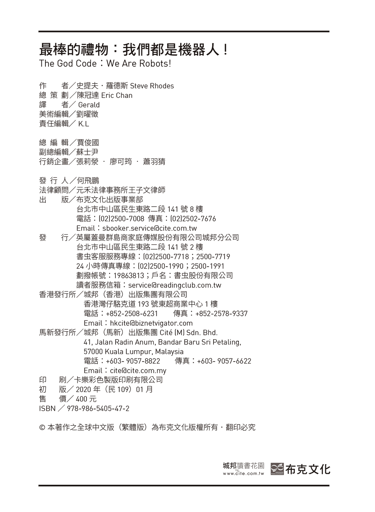