## 占星基礎研究 III — 月亮、土星、世代行星

新書導讀講座
10/28 (日) 下午兩點至四點 偉化人生
台北市羅斯福路三段325號6F
11/3 (六) 下午四點至六點 靜止點塔羅
新竹市中正路30-1號3F
11/4 (日) 下午兩點至四點 左西人文空間
(需入場費請洽04-2451-9187)
台中市西屯區上安路84巷3號
預約報名請洽尖端出版
(02) 2500-7600*1406
或洽詢各单位

the moon, Saturn, Jupiter and Modern planets, to pooled of the hidden life

神祕學教父 丹尼爾

## 【皇家圣学院】

- ※ 塔罗 / 占星 / 八字 / 风水 / 七政 / 茶道 / 芳疗 / 专业培训机构
- ※ 官方微博：@皇家圣学院（http://weibo.com/strc2011）
- ※ 官方淘宝：http://strc.taobao.com
- ※ 官方小站：http://site.douban.com/154927/
- ※ 官方微信公众平台：皇家圣学院（微信号：strc2011）

## 作者序

占星學的知識博大精深，從自然占星、世運占星、個人占星到事件占星及問卜占星，每樣都是很深奧的學問，再加上運用到很複雜的數學計算，因此長期以來星象知識經常給人神秘莫測的感覺；直到現代大眾媒體興起再加上電腦和網路技術的普及，讓占星學有了很好的基礎可以發展，現代人學習星象知識不用再與複雜的運算過程搏鬥，而能專心於意義的追求與內容的解釋，一般人即使數學不好也可以把占星學好，學習占星的門檻也因此降低許多。

任何知識的學習，應當從自身的經驗出發及累積，才能建立起穩固的基礎，因此一般人接觸星象知識大多是從個人占星開始，拜現代大眾媒體發達之賜，很多人都知道自己的太陽星座，對於星座特質也有很基礎的了解；但是由於對星象知識的研究不深，也經常對於占星學有許多誤解，例如有些人以為出生在星座交界日的人同時會有兩個太陽星座，就是非常典型的錯誤，其實每個人出生時只會有一個太陽星座，只是同時也受到其他行星的影響。

在西洋占星學當中基本上是以行星為研究的核心及解釋的主軸，出生時行星所落入的星座、宮位及行星之間的相位關係，都是個人占星學分析的基本項目，不過由於行星的運動方式複雜，因此一般人對於自己出生時的星象狀況並不是那麼容易掌握；現代受到歐洲文化的影響普遍使用太陽曆，而太陽曆本身就是依照太陽運行的規律來設計，因此只要知道自己的出生日期，就能大致推論出自己出生時太陽所在的位置，所以並不需要用到特殊的星象知識。

對於個人來說，出生時太陽落入的星座影響顯而易見，再加上只要知道自己的太陽星座，因此有關太陽星座的解釋就成為最容易普及的占星知識，但是除了太陽之外，其他不同的行星也會對於個人有很大的影響，當我們想要進一步了解星象知識的時候，就必須轉換以星座作為主要的概念架構，因此在深入到更專精的星象知識之前，去了解其他行星落入不同星座的解釋，是一個不錯的過渡方式。

在占星基礎學二當中，丹尼爾已經介紹過太陽、水星、金星、火星落入不同星座的表現；太陽代表有意識的行為模式，對於領導統御及戀愛方面的影響特別大，水星代表理性的溝通方法與學習狀況，金星代表我們的價值觀，會影響我們對於金錢的態度以及審美觀，同時也會影響到朋友關係及對婚姻和感情的需求，火星代表生存的危機感，與我們面對競爭和處理衝突的方式有關，對工作的能力與方式也有很大的影響。

但是在個人占星當中其他行星落入星座的作用就沒那麼容易觀察，例如月亮是與個人的氣質及情緒有關，因此出生時月亮所落入的星座經常變成我們無意識時展現的行為模式，只有在情緒激動失去理性的時候會比較明顯看到；木星與土星落入的星座則是可以幫助我們趨吉避凶的指標，透過後天的經驗與學習將會逐漸摸索出一條較為平順的道路，至於天王星、海王星及冥王星落入的星座則會標示出某個世代共同的性質，在個人身上更不容易分辨出來。

因此在本書當中，首先以月亮所在的星座為主軸，再談到月亮與土星的組合對健康的影響，接著以木星與土星的組合來談趨吉避凶之道，最後則是依天王星、海王星及冥王星的組合來看世代的差異；為了方便讀者查詢及比對，本書也附上一九五一至二〇〇〇這五十年的月亮星座星曆表，及一九三〇年到目前為止的外行星星曆表，讓大家可以快速地找到家人、同學、朋友、同事出生時各個行星所在的星座，由於星曆表是以台灣的時區為準，若是遇到出生在其他時區的人，在查詢表格時請先換算到東八區的日期和時間，才不會搞錯對方的星座。

丹尼爾在這裡要感謝尖端出版社的團隊，在你們努力的企劃及催稿之下，讓這本書能順利完成，也要謝謝在占星研究當中一路支持我的朋友及學生，沒有你們的幫助及鼓勵，也絕對不會有這本書誕生，特別是巨蟹一班的Ken同學，學及雙子二班的Sean同學，兩位詳細的課堂筆記在寫作當中提供很大的幫助；最後要謝謝我最愛的Jenny和映元，時時刻刻在精神上給我堅強的支持，由衷地謝謝大家。

丹尼爾

## 目錄

# 第一章 月亮在白羊座的深度解析

- 月亮白羊座的居家飲食
- 月亮白羊座的氣質表現
- 月亮白羊座的人相處
- 月亮白羊座的保健之道

008

# 第二章 月亮在金牛座的深度解析

- 月亮金牛座的居家飲食
- 月亮金牛座的氣質表現
- 月亮金牛座的人相處
- 月亮金牛座的保健之道

016

# 第三章 月亮在雙子座的深度解析

- 月亮雙子座的居家飲食
- 月亮雙子座的氣質表現
- 月亮雙子座的人相處
- 月亮雙子座的保健之道

024

# 第四章 月亮在巨蟹座的深度解析

- 月亮巨蟹座的居家飲食
- 月亮巨蟹座的氣質表現
- 月亮巨蟹座的人相處
- 月亮巨蟹座的保健之道

032

### 第五章 月亮在獅子座的深度解析

- 月亮獅子座的居家飲食
- 月亮獅子座的氣質表現
- 月亮獅子座的人相處
- 月亮獅子座的保健之道

040

### 第六章 月亮在處女座的深度解析

- 月亮處女座的居家飲食
- 月亮處女座的氣質表現
- 月亮處女座的人相處
- 月亮處女座的保健之道

048

# 第七章 月亮在天秤座的深度解析

- 月亮天秤座的居家飲食
- 月亮天秤座的氣質表現
- 月亮天秤座的人相處
- 月亮天秤座的保健之道

056

### 第八章 月亮在天蠍座的深度解析

- 月亮天蠍座的居家飲食
- 月亮天蠍座的氣質表現
- 與月亮天蠍座的人相處
- 月亮天蠍座的保健之道

064

# 第九章 月亮在射手座的深度解析

- 月亮射手座的居家飲食
- 月亮射手座的氣質表現
- 與月亮射手座的人相處
- 月亮射手座的保健之道

072

# 第十章 月亮在摩羯座的深度解析

- 月亮摩羯座的居家飲食
- 月亮摩羯座的氣質表現
- 與月亮摩羯座的人相處
- 月亮摩羯座的保健之道

080

# 第十一章 月亮在水瓶座的深度解析

- 月亮水瓶座的居家飲食
- 月亮水瓶座的氣質表現
- 與月亮水瓶座的人相處
- 月亮水瓶座的保健之道

088

### 第十二章 月亮在雙魚座的深度解析

- 月亮雙魚座的居家飲食
- 月亮雙魚座的氣質表現
- 與月亮雙魚座的人相處
- 月亮雙魚座的保健之道

096

# 第十三章 木星與土星的趨吉避凶之道

104

# 第十四章 世代行星的組合

158

# 第十五章 如何查詢各行星的星座位置

- 月亮轉換星座時間表
- 木星轉換星座時間表
- 土星轉換星座時間表
- 天王星轉換星座時間表
- 海王星轉換星座時間表
- 冥王星轉換星座時間表

176

## 月亮在白羊座的深度解析

## ♈月亮白羊座的幼年生活

出生時月亮在白羊座的人通常有個很獨立自主的母親，她們的行動力超強而且即知即行，凡事喜歡自己來而不願意假手他人，遇到任何難題都會正面迎戰毫不退縮，經常表現出勇敢果決的一面，這種類似於女戰士的形象會深深地植入孩子的心中；她們經常是扛起家計的職業婦女，或是還有其他重要的事情要忙，很難長期把注意力放在照顧孩子上面，因此作為她們的子女很小就要學會獨立，也要主動表達自己的意見和需求，否則就很容易被母親給忽略。

月亮在白羊座的人經常是在充滿競爭的環境當中成長，也常被拿來與兄弟姊妹或是親戚朋友的小孩們比較，所以需要很努力地表現才能受到注意和肯定，這可能會讓他們養成凡事爭先的習慣，無意識當中就有強烈的競爭性，若是在幼年階段受到比較多的壓抑，則會加強他們的防衛心，也更容易有自私自利的傾向，這時他們會像受傷的白羊般閃躲衝突，盡量避免與別人比較，其實內心當中還是有不服輸的一股氣，經常在大家都不意料不到的時候突然爆發出來。

## ♈月亮白羊座的氣質表現

月亮在白羊座的人反應非常快，這倒不是說他們的思慮敏捷、口才便給，而是他們在無意識當中經常會迫不及待地採取行動，因此無論如何都會透露出一些急性子的氣質，有時候他們會還沒想清楚之前就輕易許諾別人，然後為了達成任務再拚了命地趕工；當他們有熱情的時候效率非常高，常常很快就能完成好幾個人份的事情，但是遇到他們缺乏動力去做的事情，又會一動也不動地冷眼旁觀，這時通常激將法會加強他們的動力，但也不是每次都那麼有效。

一般來說月亮在白羊座的人情緒來得快去得也快，而且通常都會很直接地表現出來，所以他們不太會累積負面情緒，也很少長期陷入悲傷或憂鬱當中，但是他們在當下的情緒會非常強烈，經常會在無意之間傷害到四週的人，因此遇到他們大爆發的時候最好躲遠一點，免得被颱風尾掃到；另一方面，他們在壓力下很容易失去耐性，無論有沒有效果都會採取行動，而不願意消極被動地等待，有時候衝動會為他們惹出一些麻煩，或是忙於毫無意義的事情。

## ♈月亮白羊座的居家飲食

通常月亮在白羊座的人家中的佈置都比較傾向簡單，而不喜歡太過花俏的裝飾，方便省時是最高 的指導原則，相對來說就不是那麼重視美感與品味，他們會將常用的東西放在明顯伸手可 及的地方，所以通常看起來都會有一點混亂；如果可以選擇，他們大多會居住在熱鬧的市區，因為生活機能方便可以節省許多時間，但若是因為其他因素不得已要住在郊區，那麼就一定要有自己

## ♈與月亮白羊座的人相處

的交通工具並且備好專屬車位，否則每天花時間等公車或找車位會要了他們的命。而月亮在白羊座的人對於飲食並不那麼講究，對他們來說吃東西就只是為了不餓肚子，喝東西也只有解渴的功能而已，通常他們吃東西時又快又急，兩三下就把所有的東西一掃而空，然後又忙著去處理其他事情；因此在忙的時候他們可能天天都吃速食和泡麵，甚至忘了吃正餐，就靠各種零食和點心來補充體力，因此在他們的櫃子或抽屜裡面經常會發現許多乾糧和甜食，即使在家裡下廚也常選擇能快速上桌的冷凍食品，或是一次煮一週份量再每天熱一點來吃。

出生時月亮在白羊座的人很重視獨立與自主，非常討厭別人干涉自己的行為，他們內心深處總覺得自己是對的，而且很想用各種方法來證明自己是對的，因此當有人指出他們的錯誤，或是逼迫他們去做不願意做的事情，往往會引來他們激烈的反擊；他們需要有明確的努力目標，積極主動力求表現，若是整天閒閒沒事反而會讓他們覺得徬徨不安，因此他們經常把行事曆排得很滿，從早到晚忙個不停，這樣他們才會感到比較踏實，慶幸自己沒有浪費時間。

而基本上月亮在白羊座的人是救急不救窮，如果你是一時的急難而需要幫助，他們通常會很主動熱心地幫助你，但若是你不知改進，一而再、再而三地犯相同的錯誤，那麼月亮在白羊座的人就不會幫忙你，即使你苦苦哀求也沒有用；他們會用自己覺得最好的方式去幫助和照顧對方，但是並不一定會符合對方的想法和需求，有時候熱心助人反而會引發衝突，甚至沒幫到忙還

## ♈月亮白羊座的保健之道

吵得不可開交，因此這會讓他們覺得他們過於主觀和任性，對別人不夠細心、體貼。

### 月亮在白羊座 & 土星在白羊座

月亮與土星同在白羊座的人很容易有胃痛的狀況發生，嚴重的時候甚至還會出現胃瘍和慢性胃炎的問題，他們比較年輕的時候容易在臉部長青春痘、雀斑，頭皮屑也會特別多，年長一些則容易有頭痛、骨質疏鬆等狀況出現，若是不幸骨折需要較長的時間才能恢復，所以要特別注意運動傷害；吃飯時最好能有意識地提醒自己細嚼慢嚥，可以減輕胃部的不適，另一方面也可以藉助瑜伽、太極拳之類的運動，讓自己更加有耐性與放鬆，能夠減緩發生頭痛的狀況。

### 月亮在白羊座 & 土星在金牛座

土星在金牛座而月亮在白羊座的人很容易有偏頭痛的狀況發生，甲狀腺腫大或是甲狀腺機能亢進也是常見的問題，他們年輕的時候可能會有經常性的喉嚨痛、咳嗽、甚至是低燒持續不退的現象，年長一些則是容易遇到聲帶長繭或是吞嚥困難的問題，消化不良及吸收不良的狀況也很常見；平時要有意識地提醒自己早點睡覺，對於偏頭痛的問題會很有幫助，若是能借助於精油按摩、刮痧、拔罐等方式補充身體的能量，通常都可以減輕喉嚨不舒服的狀況。

### 月亮在白羊座 & 土星在双子座

月亮在白羊座同时土星在双子座的人容易发生头痛的问题，有些人则是会有鼻子过敏或是气喘的状况，他们在比较年轻的时候容易有胸闷、呼吸不顺畅的现象，年长一些则容易有听力及记忆力衰退的问题，经常在手部出现骨刺或关节炎，若是长时间写字或使用电脑则很容易出现腕隧道症候群；提醒你们，工作时要有意识地让自己休息并吃点东西，可以减少头痛及手部不适的状况，有空时多到户外走走，接近大自然，呼吸新鲜空气对于呼吸道的状况也很有帮助。

### 月亮在白羊座 & 土星在巨蟹座

土星在巨蟹座让月亮在白羊座的人胃特别不好，不但经常会胃胀气、胃痛，还可能有胃溃疡甚至是胃癌等问题，他们年轻的时候容易有皮肤过敏的状况，脸部常会长青春痘，年长一些则会有胸闷、胸痛的状况，女性则要特别小心乳房的病发甚至是肿瘤，记得定期去医院检查；平时要特别注意饮食，尽量少吃刺激性及生冷的食物，同时最好改掉喝冷饮的习惯，以减轻胃部不适的状况，记得吃东西的质比量还要重要，若是能避开海鲜与奶蛋类则会更好。

### 月亮在白羊座 & 土星在狮子座

月亮在白羊座而土星在狮子座的人皮肤特别敏感，不但很容易咬伤，乾癣或湿疹也是常见的问题，他们比较年轻的时候容易有异位性皮肤炎，或是长鸡眼、肉疣等状况，年长一些则很容易

### 月亮在白羊座 & 土星在處女座

發生背部和脊椎方面的問題，經常會覺得腰酸背痛，另一些人則是要心臟方面的問題，所以出門在夏天防曬、冬天保濕的功夫絕不可少，由於皮膚較弱的關係，要選用品質較好的化妝品及保養品，臉部的卸妝及清潔工作絕對要確實，否則很容易長疹子、冒痘痘。

### 月亮在白羊座 & 土星在天秤座

土星在處女座讓月亮在白羊座的人消化系統特別不好，甚至可能因此容易發生營養不良的問題，他們在年輕的時候容易有胃脹、腹痛及經常性腹瀉等問題，有些人則會相反地有便秘的困擾，年長一些則容易有精神不繼、體力耗弱的現象，檢查不出什麼大病但身體總是不舒服；在工作時要有意識地提醒自己休息，以避免過度消耗身體的能量，減少肉類及蛋白質的攝取並多吃蔬菜、水果會有一些幫助，也可以嘗試排毒餐或是斷食的方法來強化消化系統。

### 月亮在白羊座 & 土星在天蠍座

月亮在白羊座同時土星在天秤座的人特別容易有腰痛的問題，脊椎側彎或長骨刺也是很常見的狀況，他們在年輕時容易有消化不良的問題，同時也會有不明原因的頭痛及偏頭痛，年長一些則要小心腎臟方面的問題，有些人同時是糖尿病的高危險群；對你來說思慮過度是健康最大的殺手，所以如果能利用靜心、冥想、打坐等方法幫助自己放下妄念，就能減少頭痛發作的頻率，在忙碌時要有意識地提醒自己多喝水及上廁所，對於腎臟的狀況會有一些幫助。

### 月亮在白羊座 & 土星在射手座

月亮在白羊座而土星在天蠍座的人體質特別虛弱，貧血甚至頭暈都是常見的狀況，女性則要特別注意子宮及卵巢方面的問題，在年輕時他們就體力比較差，有些人會特別瘦弱，另一些則相反地有虛胖的現象，年長一些則容易有便秘的狀況，腎臟及膀胱也可能有結石的問題；壓抑隱藏的情緒是你健康最大的殺手，所以最好利用心理諮商、心靈成長課程或是其他修行法門，幫助自己走出負面的情緒，健康問題自然不藥而癒，此外，良好的睡眠習慣也會很有幫助。

### 月亮在白羊座 & 土星在摩羯座

月亮在白羊座同時土星在射手座的人一般來說身體都很強健，但是各種類型的運動傷害在所難免，他們在年輕的時候容易發燒和頭痛，這是因為經常已經過勞了而不自知，通常要等到年長一些才發現自己已經過度消耗，因此很容易得到肝病、腫瘤甚至是癌症；盡量減少熬夜是最有效的養生方法，其次則是避免喝酒和少吃刺激性的食物，遇到跌打損傷的狀況要先充分休息，千萬不要逞強而過度勞動，否則一旦沒有痊癒成為痼疾，累積到後來會越來越難處理。

### 月亮在白羊座 & 土星在水瓶座

土星在摩羯座讓月亮在白羊座的人體力變得較差，經常會有失眠的狀況發生，有些人則是有平衡感或是聽力方面的問題，他們在年輕的時候很容易有頭痛的問題，年長時則經常受到關節炎

### 月亮在白羊座 & 土星在雙魚座

月亮在白羊座而土星在水瓶座的人容易遇到內分泌或免疫系統失調的問題，他們在年輕的時候經常會有頭痛甚至是失眠的問題，甚至有可能滿臉長滿青春痘，女性則容易有生理痛或是經期不固定的困擾，年紀漸長時體力下滑的速度較快，也容易有跌倒或扭傷腳踝的狀況發生；讓自己生活規律是維持健康的基礎，因此一定要避免工時過長，並且盡量減少熬夜的頻率，瑜伽或是太極拳等緩和的運動比較適合你，太激烈的競賽型運動則容易發生運動傷害。

月亮在白羊座同時土星在雙魚座的人經常會有失眠的狀況，所以一般來說抵抗力也會比較差一點，在天氣交替的季節很容易受寒而頭痛，在年輕時經常是小病不斷，但是並不會有太嚴重的大病痛，年長一些則會發現動作變得比較不靈活，也經常會有手腳冰冷的狀況；在睡前用熱水泡腳是很有效的作法，通常都可以改善睡眠的品質，有助於驅除身體中的寒氣，再來則是要有意識地避開酒精的誘惑，減少對於神經系統的干擾和傷害，才能保持身體的健康。

## 月亮在金牛座的深度解析

## ♉月亮金牛座的幼年生活

月亮在金牛座的人通常有個很穩定務實的母親，她們對於金錢及物質方面特別敏感，總是默默付出而且甚少抱怨，不論遇到多大的變故都能冷靜以對，因此經常扮演安定人心的關鍵角色，這種不動如山的形象會帶給孩子很穩固的安全感；因為她們會努力保護和照顧孩子，儘量提供良好的物質生活及安全保障，也會認真地對待孩子提出的各種要求，並且以自己認為最好的方式來回應，因此她們的子女通常很早就能清楚表達自己的需求，同時也很懂得享受生活。

出生時月亮在金牛座的人通常是在一個被保護的環境下長大，因此對於各種危險的敏感度較低，對於變化的反應也會比較慢一點，有些人會誤以為他們的膽量特別大，其實他們只是還來不及反應而已；若是他們曾經在幼年時經歷過物質生活匱乏的狀況，就有可能會不自覺地拼命積累金錢，在行為上會顯得較貪財和吝嗇，但是整體來說他們並不會每件小事情都斤斤計較，只是會從很實際的角度來衡量事情，因此有時候也會讓人覺得比較缺乏人情味。

# 月亮金牛座的氣質表現

通常月亮在金牛座的人都有一種保守的氣質，總是依照自己的步調不慌不忙地走著，即使遇到任何外在的干擾也大多都能保持專注，默默做著自己覺得重要的事情，所以雖然他們不會急切地去做任何事情，但是只要他們開始進行，耐力就非常驚人；原則上他們不喜歡快速或重大的變動，因此在大部分狀況下維持現狀會是他們的優先選擇，即使面對不得不改變的狀況，移動的速度也會非常緩慢，經常要別人催一下才動一下，反映出在內心深處的牛脾氣。

一般來說月亮在金牛座的人不太會感覺到焦慮不安，也很少有激烈的情緒反應，由於他們不容易與別人的情緒起共鳴，即使在激動狂熱的人群當中，他們仍然可以保持冷靜，因此在傳統的占星書中常會提到月亮在金牛座的人是脾氣最好的一群人；當然他們也會遇到心情不好的狀況，這時候他們可能會選擇去逛街購物，或是去享受一頓豐盛美味的大餐，再不然到郊外走走也是常見的方法，總之他們自有一套化解負面情緒的儀式，很少會干擾到別人。

# 月亮金牛座的居家飲食

通常月亮在金牛座的人，家中的佈置都很講究，他們對於美感有強烈的要求，也會精挑細選有質感的家用用品，整體搭配起來很賞心悅目又有強烈的個人風格，雖然大部分的東西都具有實用的功能，但是其間也會點綴一些有收藏價值的藝術品；比較安靜的社區或是他們的首選，如果有個小花園或陽臺可以種種花草就更完美了，一般來說他們並不喜歡經常搬家，所以很可能會因此選擇待在老家與父母同住，或是盡早想辦法買一間自己喜歡的房子。

出生時月亮在金牛座的人是天生的美食家，對於食物的用料和烹調都很有心得，他們通常會有一份自己的美食餐廳排行榜，為了品嚐美食也會願意花時間到現場排隊，如果在外用餐遇到不好吃的東西，他們寧可餓肚子也不願意委屈自己，因此也有為數不少的人會自己煮飯帶便當，不但省錢也可以避免踩到地雷；蛋糕、巧克力或其他甜食對於他們來說有著致命的吸引力，特別在心情不佳時他們可能會選擇狂吃零食發洩情緒，因此也增加了發胖的風險。

月亮在金牛座的人內心渴望固定的模式及規律，只要維持住他們已經習慣的秩序與結構，就能在當中愉快地生活，不過一旦有人破壞了這樣穩定的狀態，就會引起他們負面的情緒，他們經常會頑固地抵抗不願意合作，並且採取相應的焦慮策略；他們很重視所有權及支配權的觀念，沒有經過他們同意千萬不要去動他們的東西，也別想在金錢上佔他們的便宜，同時他們內心當中對於人際關係的級數劃分得很清楚，不熟的人裝熟會讓他們覺得受到侵犯。

月亮在金牛座的人相信日久見人心，他們不太容易信任剛認識不久的人，但是相處的經驗日積月累下來，往往能留住不少真心的知己，他們非常珍惜這些一路相挺的老朋友，當對方有需要的時候他們總是在一旁默默地陪伴；他們基本上抱持著人不犯我、我不犯人的信念，並不積極介入別人的事情或是主動去指導別人，相對而言他們也不喜歡別人管東管西，所以彼此相互尊重，留點空間才能維持長久的關係，太緊密黏膩反而會讓他們覺得不自在。

## ♉月亮金牛座的身心健康之道

月亮在金牛座&土星在白羊座
月亮在金牛座而土星在白羊座的人很容易有頭痛的問題，特別是在壓力大的狀況之下經常會犯這樣的毛病，他們在年輕時較容易有皮膚過敏的問題，年長一些則要注意骨質疏鬆及掉髮嚴重的狀況，另外一些人則會聽力退化特別快，甚至到中年就已經嚴重到要戴助聽器的程度，固執己見是所有健康問題的總源頭，所以平時除了自己一個人埋頭苦幹之外，也要多多參考別人的意見，這樣做不但對於頭痛的問題很有幫助，也可以延緩聽力退化的發生時間。

月亮在金牛座&土星在金牛座
月亮與土星同在金牛座的人喉嚨特別脆弱，很容易就會扁桃腺發炎造成喉嚨痛，也經常會趕上流行性感冒，他們在比較年輕時容易覺得喉嚨有痰不舒服，嚴重的還可能會一天到晚咳個不停，年紀漸長之後很容易有平衡感方面的問題，要特別小心跌倒等運動傷害，女性朋友則要注意婦科方面的問題；在季節轉換的時候要特別注意保暖，經常使用圍巾和帽子可以有效減輕喉嚨不適的狀況，同時要避免吃太辣及刺激性的食物，並最好改掉吃冰及喝冷飲的習慣。

### 月亮在金牛座 & 土星在雙子座

月亮在金牛座而土星在雙子座的人特別容易有呼吸道方面的問題，只要有流行性感冒不論是哪一型都很容易被感染，他們在比較年輕時容易有鼻子過敏甚至是氣喘的問題，年紀大一點時則容易有聽力退化或語言表達困難的問題，有些人則會特別容易覺得肩頸僵硬或是痠痛；過勞是身體健康的大敵，所以努力工作之餘還是要找機會休息，多到郊外走走，親近大自然會是很不錯的保養方式，在季節交替的時候少到人多的公眾場所，以減少感染流行感冒的機會。

### 月亮在金牛座 & 土星在巨蟹座

土星在巨蟹座讓月亮在金牛座的人特別容易發胖，而且即使節食外加運動也很難瘦下來，他們在比較年輕時容易有胸悶、胸痛的狀況，女性則要特別小心乳房的病變甚至是腫瘤，年紀較長時則很可能有骨質疏鬆的問題，有些人會變得很胃脹氣、胃痛，甚至是演變成虛胖水腫的狀況；飲食的習慣對你的健康影響最大，除了美味之外也要注重營養均衡，吃冰和喝冷飲要盡量減少，此外若是能減少對物質佔有的慾望，則能減輕胸悶及胸痛發生的頻率。

### 月亮在金牛座 & 土星在獅子座

月亮在金牛座同時土星在獅子座的人容易有心臟方面的問題，女性朋友貧血的比例也偏高，他們在比較年輕時容易遇到皮膚過敏的問題，由於皮膚較為脆弱所以要特別注意防曬，年紀較長則很容易發生背部和脊椎方面的問題，經常會覺得腰痠背痛，甚至會有骨刺增生等狀況發生；溫和的運動會對你的健康很有幫助，特別是瑜伽、皮拉提斯或是簡單的伸展運動、柔軟體操都很適合你，最好不要做過份劇烈的運動，以免發生肌肉拉傷或是骨折的狀況。

### 月亮在金牛座＆土星在處女座

月亮在金牛座同時土星在處女座的人一般來說身體都很健康，但是要特別小心積勞成疾的問題，若是仗著自己體力好，一直拚命而沒有休息，可能會因為過度消耗而提早出現老化的現象，大量落髮或是皮膚變得很嚴重的警訊；在工作當中有意識地提醒自己休息是很重要的一件事，同時要盡量避免過度熬夜傷害身體，在飲食方面最好多吃蔬菜水果，每天早上來杯精力湯也是很好的習慣，若是能減少動物性蛋白質的攝取會讓身體狀況有明顯的改善。

### 月亮在金牛座＆土星在天秤座

月亮在金牛座而土星在天秤座的人特別容易有糖尿病的問題，同時腎臟與泌尿系統也比較脆弱，他們在比較年輕時就比較難控制體重，若是懶得運動就很容易身材走樣甚至是暴肥，年紀較長之後則容易有骨頭方面的問題，可能會受腰背痠痛甚至是骨刺的困擾，調整飲食會對身體健康起關鍵的作用，吃東西要減少鹽份及油脂的攝取，盡量喝水而不要喝茶或咖啡，汽水或奶昔等高熱量的含糖飲料也最好都不要碰，再加上適量的運動就可以保持身體的活力。

### 月亮在金牛座&土星在天蠍座

月亮在金牛座而土星在天蠍座的人天生體力就比較差，女性朋友常會有貧血的狀況，同時也要注意子宮及卵巢方面的問題，他們在比較年輕時容易有消化不良及腹瀉的狀況，年紀漸長則可能會相反地出現便秘的困擾，特別需要注意大腸及直腸方面的問題；過於執著鑽牛角尖是健康的大敵，透過參加宗教及各種靈修活動可以改善這種習氣，對於健康會很有幫助，也可以利用秋冬時多吃一些溫補的東西，要記得食補優於藥補，吃補藥有時候反而會有副作用。

### 月亮在金牛座&土星在射手座

月亮在金牛座同時土星在射手座的人特別容易發生運動傷害，若是沒有及時處理並且充份休養，很容易會變成慢性的問題跟著一輩子，所以在這部分千萬不要逞強，年紀較長之後容易有消化不良的問題，也要注意消化道出現腫瘤的可能；正常的生活作息是維持健康最有效的方法，早睡早起避免熬夜，飲食有節制定量，並且選擇一兩項有興趣的運動持之以恆，就比較不會出什麼大問題，若是長時間坐著讀書或工作要記得提醒自己起來走動走動。

### 月亮在金牛座&土星在摩羯座

月亮在金牛座同時土星在摩羯座的人通常身體沒有什麼明顯的大問題，但若是沒有在年輕時就養成運動的習慣，到年紀比較大一點之後就很容易發胖導致身材變形，也可能有心血管方面的問題，最好從年輕時就注意飲食的均衡與清淡，並且培養運動的習慣，保持標準體重才是健康的保障。另一些人則是會有痛風或是關節炎，導致行動不是那麼靈活；因此選擇自己有興趣的運動，持之以恆進行會是對健康最好的投資，練習氣功、太極拳、瑜伽等也會對身體的氣血循環有很大的幫助，同時要注意控制飲食的量，吃得少一點可以減輕身體的負擔。

### 月亮在金牛座＆土星在水瓶座

土星在水瓶座讓月亮在金牛座的人新陳代謝率降低，因此下半身會特別容易發胖，他們在比較年輕時可能會經常扭傷腳踝，或是因為跌倒而有其他的運動傷害，年紀較長之後要注意心血管方面的問題，天氣變化時要小心血壓突然升高或是降低；通常緩和的運動會比較適合你，包括伸展體操、瑜伽、皮拉提斯等等都很不錯，其次則是要透過飲食來調養身體，盡量少吃生冷的食物，減少喝冷飲及吃冰的頻率，注意太激烈的運動競賽容易造成的運動傷害。

### 月亮在金牛座＆土星在雙魚座

月亮在金牛座而土星在雙魚座的人很容易得到流行性感冒，腸病毒等消化道的傳染病也很難避免，幾乎可以說現在流行什麼就容易得什麼病，不過相對來說比較不容易有什麼嚴重的慢性病，只是年紀較長之後比較容易發胖導致身材變形；所以出入人多的公眾場所最好能配戴口罩，同時要注意食品的衛生及安全，以減少流行疾病感染的狀況，在秋冬之時可以多吃一點溫補的東西，這樣身體的抵抗力也會比較好一些。

# 月亮在雙子座的深度解析

## Ⅱ月亮雙子座的幼年生活

出生時月亮在雙子座的人通常都有個很多才多藝的母親，她們總是好學不倦、整天忙東忙西，經常是一邊工作同時又帶小孩的職業婦女，即使是全職的家庭主婦也有很精彩豐富的生活，這種靈活而充實的形象會讓孩子不自覺地嚮往；她們非常重視孩子的教育，也很喜歡和孩子聊天、講話，她們會很認真地回答孩子提出的各種問題，也會提出許多問題讓孩子去思考，因此作為他們的子女自然就很習慣於去思考各種問題，而且通常都很善於表達自己的意見。

月亮在雙子座的人經常是在比較活潑吵雜的環境下長大，若不是家中的兄弟姊妹眾多，就是經常有不同的訪客在家裡聚會聊天，不自覺當中就養成他們能同時處理各種不同訊息的能力，太過安靜的地方反而會讓他們覺得不安；若是在童年遭受比較多的批評和責備，則會讓他們學會油腔滑調以求自保，他們會迎合別人的喜好裝作別人會認同的樣子，因此經常見人說人話、見鬼說鬼話，讓人覺得是牆頭草兩邊倒，其實這種行為只是反映出他們經歷過的傷痛。

## Ⅱ月亮雙子座的氣質表現

出生時月亮在雙子座的人不喜歡一個孤單的感覺，並且十分痛恨單調無聊的生活，因此他們經常會在無意識當中就把自己的時間塞滿，甚至在同一時間做好幾件事情，從正面來看你可以說他們有一心多用的能力，但是從負面來看他們也比較無法專心集中注意力；他們有一種喜新厭舊的傾向，做事情經常是三分鐘熱度且缺乏耐力，對於重複不變的例行性事務更是興趣缺缺，不過由於腦袋一直運轉停不下來，所以也常有神經過份緊張甚至是失眠的問題。

一般來說月亮在雙子座的人總是理性多於感性，當他們出現情緒的時候往往不會在第一時間就反應出來，而是會去思考自己為什麼有這些情緒，經常變成自己與自己對話的內心戲，他們在心情不好的時候會喜歡找人聊聊，透過講話的方式來整理與抒發自己的情緒；不過他們的情緒變化也很快，前一秒鐘還高高興興地有說有笑，立刻就可以翻臉不認人，很容易給人喜怒無常的感覺，在盛怒之下他們可能會大罵或是譏諷對方，基本上是屬於動口不動手的類型。

## Ⅱ月亮雙子座的居家飲食

合，比較少訂製需要施工固定在牆面上的系統櫃，因為對他們來說經常更換擺放的位置會帶來煥然一新的感覺，也方便搬家時可以把所有的東西都帶走；一般他們比較喜歡住在交通便利的地方，若是能臨近捷運站、交流道、火車站或機場等交通樞紐就更好了，不過同時他們也是很喜歡搬家的一群，若是沒有經濟實力可以不斷地購屋、換屋，也可能乾脆選擇一直租房子。

出生時月亮在雙子座的人喜歡嘗試各種不同口味的食物，他們會花很多時間收集美食資訊，甚至還會自己寫美食部落格，一般來說他們外食的比例偏高，因為如此才能吃到各種不同的菜色，即使選擇自己在家裡開伙，也經常會實驗各式各樣的食譜，絕不會讓自己吃得單調寒酸；另一方面他們吃飯的時間也不太固定，有時候一忙起來就忘了吃晚餐，往往到忙完之後才去吃豐盛的宵夜，或是因為睡太晚就早午餐一起解決，經常不是在固定的時間進食。

## Ⅱ 與月亮雙子座的人相處

月亮在雙子座的人對於環境的變化特別敏感，任何風吹草動都會激發他們的好奇心，他們不喜歡混沌不明的狀態，唯有一件事情才能讓他們覺得安心，因此他們對於資訊與新知的飢渴十分強烈，有些人一天會看好幾份報紙，或是在做事情時又同時收聽廣播新聞，遇到有趣的事情可能一整天都掛在網路上蒐集資訊，並且透過轉寄與轉貼把這些訊息分享出去，他們可以一邊看電視一邊和別人講電話，甚至在網路上同時和好幾個不同的人聊天。

一般來說月亮在雙子座的人不太可能濫用同情心，當遇到問題時他們會很歡迎你和他們聊聊天，也會提供分析意見和解決方案，不過要他們動手幫忙就比較困難了，他們會覺得自己的問題應該要自己解決，這個部分的界線他們倒是非常清楚；他們不太喜歡給人確切的承諾，一方面他們害怕被限制而失去彈性，同時他們也很清楚自己有喜新厭舊的毛病，與其答應了別人後來又做不到，還不如一開始就不要給任何承諾，因此有時候會給人比較飄泊與疏離的感覺。

## II 月亮雙子座的身心保健之道

### 月亮在雙子座 & 土星在白羊座

土星在白羊座讓月亮在雙子座的人特別容易頭痛，尤其是睡眠狀況不好時更是如此，他們在年輕時經常有皮膚方面的問題，特別是手部容易有乾癬或富貴手，年長一些很容易遇到聽力退化的問題，有一些人則會出現失眠或淺眠的狀況；整體而言思慮過度與神經緊張是健康最主要的問題，所以最好能學習一些幫助身心放鬆的技巧，例如禪修、打坐、冥想、氣功等等都會對健康狀況有很大的助益，利用休假時間多到戶外親近大自然也是很不錯的方式。

### 月亮在雙子座 & 土星在金牛座

月亮在雙子座而土星在金牛座的人經常有喉嚨不舒服的問題，一方面是因為他們講了太多話可能造成發炎、喉嚨痛，另一方面他們也比較容易感冒咳嗽，年紀較大一點常會感覺肩頸痠痛，有些人則會出現聽力退化的問題；喉嚨的保養對他們來說是最重要的的一件事，平時儘量飲用溫水或清茶，改掉吃冰及喝冷飲的習慣，當喉嚨不舒服的時候最好多睡覺、多休息，避免對喉糖及感冒藥等藥物過度依賴，其他如聲音療法及音樂療法等方式對你也有很好的效果。

### 月亮在雙子座＆土星在雙子座

月亮與土星同在雙子座的人經常會有呼吸道方面的問題，有些人從小就有氣喘的毛病，呼吸短淺及肺活量不足也是常見的狀況，另外有一些人則是經常為胃痛所苦，年紀大一點則會容易遇到聽力退化的問題，若是長時間寫字或使用電腦也很容易出現腕隧道症候群；游泳或是太極拳等運動對於呼吸道方面的問題很有幫助，慢跑及騎腳踏車也是不錯的選擇，最好能多多利用時間到戶外走走呼吸新鮮空氣，經常待在密閉的冷氣房裡很容易悶出病來。

### 月亮在雙子座＆土星在巨蟹座

月亮在雙子座同時土星在巨蟹座的人天生肺部就比較脆弱，肺活量也比較不足，有些人從小就有氣喘的問題，若是有吸菸的習慣更可能會整天咳個不停，年紀漸長之後體力下降的速度會比較快，還可能有肺泡纖維化等病變產生，女性則要特別小心乳房的病變甚至是腫瘤；為了自己的健康有幫助，最好能避免染上吸菸的習慣，否則很可能會變成肺癌的高危險群，任何戶外運動都對健康有幫助，但要選擇空氣品質比較好的地方，避免居住在濕氣太重的地區。

### 月亮在雙子座＆土星在獅子座

土星在獅子座讓月亮在雙子座的人特別容易有皮膚方面的問題，有些人經常會曬傷脫皮，平時也容易出現過敏起紅疹的狀況，他們在年輕時總覺得自己的身體很好，到年紀較長時才漸漸出現骨頭及關節的問題，特別容易覺得腰背痠痛；其實身體有很多問題都是因為不良的習慣慢慢累積而成，要注意盡量少吃會引起皮膚發癢過敏的食物，若是長時間坐著工作則要注意姿勢的問題，選擇符合人體工學的座椅、鍵盤、滑鼠及滑鼠墊可以減少身體痠痛的狀況。

### 月亮在雙子座 & 土星在處女座

土星在處女座讓月亮在雙子座的人特別容易神經緊張，進而造成失眠、消化不良等問題，他們在較年輕時可能常拉肚子，若是飲食不均衡還會有營養不良的狀況，年紀漸長之後腸胃道的問題會越來越嚴重，甚至還可能出現腫瘤和癌症；優質的食物對於健康會很有幫助，盡量選擇天然有機的食材，避免油炸及微波食品，良好的睡眠品質是健康另一個重要的基礎，可以運用打坐、冥想、瑜伽等方式來幫助自己放鬆，在睡前用熱水泡腳則可以幫助入眠。

### 月亮在雙子座 & 土星在天秤座

月亮在雙子座而土星在天秤座的人通常健康狀況都還不錯，但是想太多仍然可能造成失眠的問題，他們在年輕的時候比較容易有頭痛的狀況，年紀較長之後則會有腰痠背痛的困擾，有些人同時也是糖尿病的高危險群；缺乏運動是健康狀況惡化的主因，所以從年輕時就要養成運動的習慣，如果覺得競賽型的運動過於激烈，也可以試試慢跑、騎自行車或跳舞等方式，工作或讀書一陣子之後也要提醒自己起身走動走動，整天坐著不動也會對健康有不利影響。

### 月亮在雙子座＆土星在天蠍座

土星在天蠍座讓月亮在雙子座的人體力變得比較差，他們經常有呼吸道或肺部的疾病，女性朋友比較容易有貧血的問題，他們在年輕時就容易消化不良及脹氣，年紀較長一些則容易出現結石的狀況，有些人則為便秘的問題所苦；均衡的飲食是健康的基礎，減少大魚大肉增加蔬果的攝取是比較好的大方向，同時盡量養成在固定時間吃三餐的習慣，這樣身體的能量運作會比較平衡，如果能養成早睡早起的習慣避免熬夜，體力比較好一點。

### 月亮在雙子座＆土星在射手座

月亮在雙子座而土星在射手座的人很容易有運動傷害，骨折或扭傷的狀況也會比一般人多一些，他們在年輕時常會有胃痛或是拉肚子的狀況發生，年長一點很容易有坐骨神經痛的問題，若是長時間寫字或是使用電腦則常會發生腕隧道症候群；所以在做任何劇烈運動之前都要先充分熱身，使用運動器材最好都能先請教練指導，自己亂玩還是容易出問題，選擇舒適並且符合身體工學的鞋子對於健康很有幫助，建議女性朋友最好盡量減少穿高跟鞋的時間。

### 月亮在雙子座＆土星在摩羯座

月亮在雙子座同時土星在摩羯座的人常會有過勞的問題，他們年輕時呼吸道比較容易受到感染，若是長久時間不處理也可能變成慢性的問題，若是長時間寫字或是使用電腦經常會出現腕隧道症候群，他們在工作中很容易過勞而引發心臟或肺部的問題，建議要避免長時間坐在電腦前，偶爾起來走動一下，平時可以多做有氧運動，工作之餘也要找時間放鬆休息，若是發現自己有過勞的傾向最好立即處理，以免引發其他更嚴重的健康問題。道症候群，年紀較長之後則可能會受到風濕及關節炎所苦，有些人則是會有痛風的問題；練習氣功、瑜伽或皮拉提斯等都會讓你比較容易放鬆，對健康狀況也會很有幫助，在工作一段時間之後也要有意識地提醒自己該休息了，超時加班熬夜是健康的大敵，要盡量避免。

### 月亮在雙子座&土星在水瓶座

月亮在雙子座而土星在水瓶座的人通常身體沒什麼大問題，但是肌力及體能不足是很常見的狀況，他們在年輕時可能會有頭痛及失眠的問題，另一些人則是會有便祕的問題；養成經常運動的習慣對健康有極大的幫助，團隊的球類運動比較容易吸引你，像是籃球、棒球、足球、排球等都很不錯，但是要注意練過頭了反而會有過勞的問題，要適可而止休息，再來則是要維持規律的正常作息，避免熬夜過度消耗身體的能量。

### 月亮在雙子座&土星在雙魚座

土星在雙魚座讓月亮在雙子座的人特別容易失眠，他們可能從小就有氣喘的問題，也特別容易感冒咳嗽，若是不小心處理的話還可能變成急性肺炎，年紀較長則容易有精神不集中及健忘的問題，體力的下降衰退也會比一般人快；在睡前用熱水泡腳通常都可以改善失眠的狀況，也可以同時聽一點輕柔的音樂幫助入睡，但是最好避免喝酒，減少對於神經系統的干擾，在季節變換時要特別注意保暖，出門若是能使用帽子、圍巾及口罩就能減輕不舒服的狀況。

## ♋ 月亮在巨蟹座的深度解析

## ♋ 月亮巨蟹座的幼年生活

月亮在巨蟹座的人通常都有个情感丰富的母亲，她们对于家人有强烈的爱心，也会将家人照顾得无微不至，如果有任何人、事、物威胁到家人的安全和幸福，她们绝对会全力反击捍卫到底，这种保护者的形象能带给孩子温暖的安全感，她们会给孩子最好的照顾，尽量在情感和物质方面都满足孩子的需要，因此作为他们的孩子通常都过得很幸福，也可以自由抒发自己情绪，但是过度保护也可能养成孩子依赖的习惯，总是期待有人能帮助自己解决问题。出生时月亮在巨蟹座的人受到幼年环境的影响特别大，若是家中的经济很富裕，可能会让他们养尊处优变得好吃懒做，但若是成长在比较贫困的家庭，则会激发他们力争上游的意愿，立志要让家人过好日子；若是在幼年时家中发生变故，导致他们无法受到良好的照顾，则有可能让他们特别缺乏安全感，对人无法信任而有很强的防卫心，甚至变得疑神疑鬼或异常挑剔，其实他们内心仍然有温暖柔情的一面，只是对于大部分人都只显示出自我保护的武装。

## ♋月亮巨蟹座的氣質表現

月亮在巨蟹座的人內心戲特別多，即使一件看似再普通的事情，也可能勾起他們一大堆的回憶，造成情緒翻騰起伏久久不能平復，由於他們有超強的記憶力，甚至可以像播放影片般把過去發生的事情巨細靡遺地重述一次，因此若是遇到不愉快的經驗，就很容易變成揮之不去的陰影；一般來說他們總是感性多於理性，對於自己有感覺的事情可以全心投入廢寢忘食，但是對於沒感覺的事情則會保持距離甚至逃得遠遠的，很難用講道理的方式說服他們改變。

## ♋月亮巨蟹座的居家飲食

通常月亮在巨蟹座的人家中的佈置都有一種溫馨的氣氛，餐廳和廚房則是他們最重視的地方，由於他們十分念舊又喜歡收藏各種有紀念性質的東西，所以對於收納空間的需求也很大；他們在選擇居住環境時很重視採買的便利性，最好能鄰近傳統市場、夜市或小吃店的商圈，不然至少巷口也要有超市、五金行和雜貨店，否則只是想要買個東西還得跑到大老遠去就太累了。有時候他們會為了照顧家人而選擇與家人同住，或是住在親戚們的附近以方便互相照顧。他們的食量通常都會比一般人稍大，而且用餐時間到了就會餓得受不了，他們常會懷念所謂「媽媽的味道」，原生家庭的飲食風格也會造成根深蒂固的影響，若是人到外地唸書或工作，就會特別去尋找家鄉味的小吃；整體來說他們會比較喜歡在家用餐，通常本身也會有不錯的手藝，即使用外食也經常都是吃固定的那幾家，因而很容易與餐廳的工作人員成為好朋友。月亮在巨蟹座的人非常念舊，同時也會執著於自己熟悉的事物，他們很喜歡窩在自己家裡，在熟悉的環境中會讓他們特別有安全感，所以若是搬家或換了新的環境，就很容易讓他們覺得不安；他們對別人的情緒變化特別敏感，有時候會不由自主地被別人的情緒干擾，但是反過來他們的情緒也會對別人的情緒有感染力，同時食物對於他們的情緒會有很大的影響，若是吃得好可以讓他們整天心情愉快，但若口腹之慾無法得到滿足那也可能使得他們心情低落一整天。月亮在巨蟹座的人經常會在無意識之間去區分自己人和外人，他們對於自己人會主動關心和照顧，也很會為對方著想，但是有時候會太過積極而管東管西的，反而讓對方感覺有壓力，但是對於外人就明顯冷淡許多，即使你找他們幫忙也不一定會理你；他們在自己人面前會很自然地表達自己的情緒，與在外人面前比較含蓄或害羞的反應完全不同，其實他們內心當中也很渴望被別人保護和照顧，如果有人對他們好，他們絕對會記在心裡並且找機會報答。

## # 月亮巨蟹座的身心保健之道

### ## 月亮在巨蟹座 & 土星在白羊座

月亮在巨蟹座同时土星在白羊座的人经常为头痛的问题所苦，特别是当遇到烦心的事情时会特别严重，他们在年轻的时候脸部经常会长雀斑或青春痘，也可能有皮肤过敏的问题，女性朋友则容易有月经不顺或经前症候群的状况，年长一些则容易出现胃部的问题，慢性胃炎甚至是胃溃疡都有可能；吃东西时要有意识地避开过敏原，这样就可以改善皮肤的问题，再来则是要学习一些平衡情绪的技巧，透过情绪的释放经常都可以减轻头痛及消化不良的状况。

### ## 月亮在巨蟹座 & 土星在金牛座

月亮在巨蟹座而土星在金牛座的人特别容易有喉咙痛的问题，有些人则是经常有胸闷或胸痛的状况，他们在年轻时容易觉得胃不舒服，也比较容易有消化不良的问题，年长一些则是容易有体重过重的问题，成为高血压、高血糖、高血脂的三高危险群；健康的饮食是最基本也最重要的一件事，尽量以蔬食为主，减少奶、蛋及肉类的摄取，避免过份辛辣及刺激性的食物，这样不但可以保养好自己的消化系统，对于情绪及胸闷、胸痛的问题也会有一些帮助。

### 月亮在巨蟹座 & 土星在双子座

土星在双子座让巨蟹座的人特别容易有呼吸系统的问题，他们很容易染上流行性感冒，有些人则是从小为气喘的问题所苦，肺活量小也是很常见的状况，因此到了空气不好的地方就可能会喘不过气来，年纪稍长一些则会有听力衰退的问题，手脚活动也会比较不灵活；呼吸道及肺部的保养是健康的关键，气温变化大的时候记得配戴口罩，秋冬时节则要特别注意脖子的保暖，同时尽量少到人多又拥挤的室内公共场所，这样可以减少呼吸道被感染的机会。

### 月亮在巨蟹座 & 土星在巨蟹座

月亮与土星同在巨蟹座的人特别体弱多病，他们胃部很不舒服，消化不良也是很常见的问题，年轻的时候常有皮肤方面的问题，女性朋友则容易有月事不顺的状况，年长一些则比较容易觉得胸闷、胸痛，女性朋友特别要注意胸部有肿瘤的问题，在身体检查时千万不可忽视这个部位；吃东西的时候要尽量挑选健康干净的食材，以避免食物过敏造成皮肤不适的状况，同时最好能经常找人聊聊天说话，否则情绪都一直闷在心里也会影响到身体健康。

### 月亮在巨蟹座 & 土星在狮子座

月亮在巨蟹座 & 土星在狮子座的人皮肤都很敏感，特别是当吃到不适合的食物时就会过敏，变得非常严重，他们年轻时经常觉得腰背酸痛，年纪较长则是容易有心脏方面的问题，有些人则是会发生骨质疏松甚至容易骨折的状况；太过于执着与记恨是健康最大的敌人，所以要学着站在别人的角度来看待事情，透过宗教或心灵成长课程来帮助自己培养慈悲心，对于健康会很有帮助，其次则是要选择优质的饮食，一方面可以避免过敏，此外也有助于控制体重。

### 月亮在巨蟹座 & 土星在处女座

土星在处女座让月亮在巨蟹座的人消化道特别敏感，吃到不适合的东西很容易上吐下泻，不小心就会对生活造成干扰，他们年轻时可能会有紧张失眠的问题，年长一些则要小心癌症及肿瘤的问题，腹部是特别常发生的，健康检查时要注意这个部位，整体来说饮食对你的健康影响最大，所以有机蔬食是你的第一选择，同时要避免油炸及过份刺激性的食物，少吃盐酥鸡、麻辣锅之类的东西，其次则是要养成规律生活的习惯，最好能够避免熬夜。

### 月亮在巨蟹座 & 土星在天秤座

月亮在巨蟹座同时土星在天秤座的人经常会有腰痛的问题，也很容易发生关节扭伤或是脱臼的状况，他们年轻时容易有偏头痛的问题，有些人则是容易有反胃或胃胀的状况，年长一些很容易有消化不良的情况，女性则要比较小心更年期的问题；想太多是你健康遇到问题最主要的原因，因此学习打坐、禅修、冥想等等都会有很大的帮助，可以减轻腰痛及胃部的问题，再来则是要养成规律的生活习惯，时候到了就要吃饭、喝水，排便及排尿正常也很重要。

### ## 月亮在巨蟹座 & 土星在天蝎座

月亮在巨蟹座而土星在天蝎座的人一般来说健康没什么大问题，但若是有压抑情绪的状况，则容易会感觉到胃部不舒服，女性朋友则是容易有妇科方面的问题，年长一些要小心泌尿系统出状况，可能会有频尿的问题；你的健康问题几乎都与情绪有关，因此让情绪能够顺利地抒发就是最重要的一件事情，你可以透过心灵成长课程或是宗教活动来加强正向的情绪，同时要定期地去做一些让自己觉得快乐的事情，培养与别人分享心事的习惯也会很有帮助。

### ## 月亮在巨蟹座 & 土星在射手座

土星在射手座让月亮在巨蟹座的人很容易发生运动伤害，如果没有及时处理并且充分休养好，经常就会成为慢性的痼疾，他们在年轻的时候可能会有贫血的状况，一般来说体力也比较不好，年纪较长之后则要小心癌症及肿瘤的问题，特别是肝、胆、脾、胃的状况会比较多一些；补充营养的食物及养成规律的生活习惯是保健的不二法门，其中熬夜更是健康最大的杀手，如果因为晚睡肚子饿又狂吃宵夜，就会对身体造成不利影响，早睡早起才是健康之道。

### ## 月亮在巨蟹座 & 土星在摩羯座

月亮在巨蟹座而土星在摩羯座的人特别容易有消化不良的状况，胃痛、胃胀也是常见的问题，他们在年轻时很容易有过劳的现象，女性朋友则常有月经不规律的问题，年长一些则要小心关节炎的问题，特别是膝盖部分若是有旧伤就容易变成痼疾；太紧张不容易放松是健康问题主要的来源，所以可以透过学习静坐、瑜伽、太极拳等，帮助自己释放过多的压力，太激烈的运动反而容易让你产生运动伤害，同时养成规律的生活习惯也会对健康很有帮助。

### 月亮在巨蟹座 & 土星在水瓶座

月亮在巨蟹座同时土星在水瓶座的人通常身体都比较虚弱，甚至可能因为新陈代谢率过低而容易有虚胖的状况发生，他们在年轻时就会比较容易觉得累，年纪渐长之后体力的下降速度更是特别快，消化系统也比较容易出问题；养成固定的运动习惯对于你的健康会有很大的帮助，但是最好选择自己一个人即可完成的运动，免得要找别人配合反而不容易达成，天冷时也可以在睡前用热水泡泡脚，不但可以帮助血液循环，也有助于改善睡眠品质培养更好的体力。

### 月亮在巨蟹座 & 土星在双鱼座

月亮在巨蟹座而土星在双鱼座的人通常都还满健康的，但若是有什么未解的情绪问题，则可能会有失眠的状况发生，他们在年轻时消化道会比较敏感，要特别注意食物清洁的问题，年长一些则容易有末梢循环不良的状况，天气冷时容易会手脚冰冷；正常的作息对你的健康最有帮助，而定时吃饭是很重要的事情，其次则是要注意保暖的状况，在秋冬时最好能避免穿拖鞋或凉鞋在外面走，出门时最好也能使用帽子及手套，泡澡或是用热水泡脚对你都很好。

## ♌ 月亮在狮子座的深度解析

## ♌ 月亮狮子座的幼年生活

出生时月亮在狮子座的人通常都有个很坚强而优雅的母亲，她们做事情总是从容不迫，无论遇到什么问题都可以勇敢面对，她们有威严和固执的一面，同时 in 举手投足之间自然展现出一股高贵迷人的风采，这种类似于女王的形象会深植于孩子的心中；她们会培养孩子的自信心，也很鼓励她们自我表现，她们会以孩子的表现为荣，并且提供必要的协助及训练让她们能好好发展，但是如果小孩受到任何威胁或委屈，她们也会立刻反击保护孩子不受伤害。月亮在狮子座的人经常是在比较热闹甚至是喧嚣的环境中长大，若不是家中人口众多，就是各种访客不断，所以他们很小就得学会表现自己，否则不知不觉就会被置之不理，这也会养成他们比较主动积极的习惯；但若是他们在幼年阶段的表现不受到重视，甚至是被压抑和剥夺了表现的机会，也可能变得特别缺乏自信，他们可能会以自大的表现来掩饰内心的自卑，或是用夸张古怪的行径来吸引别人的注意，其实他们的内心很期待得到别人的注目和肯定。

## ♌ 月亮狮子座的气质表现

月亮在狮子座的人在意识当中总觉得自己高人一等，他们习惯于表现好的一面让别人看到，尽量把消极负面的感觉都隐藏起来，所以一般人总是觉得他们带有阳光和温暖的特质，很少对别人乱发脾气；他们的直觉敏锐而且反应很快，觉得应该要做的事情就会立刻去执行，也有信心可以做得比别人更好，但是他们也有专断独裁的一面，不喜欢别人质疑或是唱反调，他们在突发状况下反而更冷静，可以很有效率地处理问题，显示出领导与组织的才能。月亮在狮子座的人有很强的自尊心，不能忍受自己被别人忽略或是看不起，从好的角度来看这会激励他们更努力向上，但是有时候当他们觉得自己不受到尊重，也很可能会突然发飙，让身边的人完全措手不及；他们比较少一个人生闷气，有什么不爽的事情通常都会直接爆发出来，心情好坏全都写在脸上，他们开心激昂的时候对身边的人很有感染力，也很能带动团体的气氛，不过若是他们真的生气身旁的人也很难逃过，激动起来甚至还会失控动手打人！

## ♌ 月亮狮子座的居家饮食

通常月亮在狮子座的人家中的布置常有一种华丽气派的感觉，他们非常重视大门及客厅，希望能给访客留下深刻的印象，如果有能力甚至会请知名设计师来规划，或是购买全套的家具增加整体感，与外观相比实用性反而没那么重要；他们最希望能在高级的精华地段居住，如果没有能力负担，那么郊区的独栋别墅也是不错的选择，电梯华厦绝对优先于老旧公寓，他们很容易被气派门厅、健身房、游泳池等公共设施吸引，如果社区能有饭店式管理就更好了。出生时月亮在狮子座的人一般来说食量都很大，而且吃饱了特别会显得精神奕奕，但是真的忙起来他们也可以一整天都不吃东西，全神贯注在自己觉得重要的事情上，他们平常自己吃东西对于口味并不是那么讲究，但是很喜欢享受大餐的感觉，因此如果要和亲朋好友们一起用餐，就会精挑细选特色小吃或是高级餐厅，并且热心地介绍店家的招牌菜，好让大家都有宾至如归的感觉；他们自己在家开伙通常偏向省时方便，也很喜欢买现成的熟食回家享用。

## ♉ 与月亮狮子座的人相处

月亮在狮子座的人内心当中总觉得自己很重要，绝对不只是跑龙套的无名小卒，他们强烈希望得到别人的重视与认可，同时也很会找机会表现，但是在在此之前他们也知道充分准备的重要，否则若是不小心在大家面前出糗就太没面子了，不过他们对于别人的情绪就不太敏感，即使把对方惹火了也没什么感觉；通常稳固地站在发号施令的位置会让他们有安全感，容易下意识地抗拒和排斥别人的建议，他们在内心当中有很顽固的部分，很难劝说他们改变。其实月亮在狮子座的人常会主动照顾别人与帮助别人，并且藉此得到对方的感谢与肯定，至于对方是否回报并不是他们考量的重点，相对而言他们很少要求别人的帮助或是施舍，因为他们并不喜欢在别人的面前示弱，有时候会为了面子问题而一个人撑得很辛苦，但若是对方主动帮助他们，他们就会比较愿意接受；他们的关怀经常带有积极正向的力量，能够激发畏缩感和提升自信心，在对方陷入低潮时鼓舞他们重新站起来，在团体中特别容易发挥影响力。

## ♌ 月亮狮子座的身心保健之道

### 月亮在狮子座 & 土星在白羊座

月亮在狮子座而土星在白羊座的人通常身体状况还不错，他们在年轻的时候比较容易有头痛的问题，或是经常发生运动伤害，年长一些则容易有骨质疏松的状况，有些人则是在脊椎和背部的问题，或是经常感觉不适，甚至会有关节炎或是长骨刺的问题；因此日常生活中的动作与姿势都要尽量保持端正，平时千万不要弯腰驼背，并且挑选合脚的鞋子，女生最好避免长时间穿高跟鞋，都是保护脊椎的基本方法，再来则是要避免过劳，工作累了就要休息，千万不要硬撑。

### 月亮在狮子座 & 土星在金牛座

土星在金牛座让月亮在狮子座的人容易腰背酸痛，甚至还会有椎间盘突出的问题，他们在年轻时容易有喉咙痛的问题，肩颈僵硬也是很常见的状况，年长一些则可能有消化不良的问题，严重一点的还可能有胃溃疡的状况发生；固执不通是健康最大的敌人，如果能通过学习柔软体操、瑜伽或太极拳帮助放松，不但能改善腰背酸痛的状况，对于肩颈僵硬的问题也会很有帮助，再来则是要通过优质的饮食增进消化道的健康，尽量减少肉类的摄取会很有帮助。

### # 月亮在狮子座 & 土星在双子座

月亮在狮子座同时土星在双子座的人经常会有胸闷甚至胸痛的状况发生，他们在年轻时比较容易有呼吸道感染的问题，若是感冒不处理还可能演变成肺炎，年长一些则要注意听力退化的状况，甚至有可能严重到要配戴助听器才能正常生活；良好的居住环境对健康有很大的影响，最好能避开空气品质不好的城市，同时加装空气滤清设备，这会有助于减轻呼吸道的负担，再来则是选择比较安静的社区居住，减少生活中的噪音干扰，对健康状况也会有帮助。

### # 月亮在狮子座 & 土星在巨蟹座

土星在巨蟹座让月亮在狮子座的人消化系统特别弱，吃到不适合的东西很容易会上吐下泻，他们在年轻时常有胸闷、胸痛的问题，年纪渐长则容易在背部及脊椎感到不适，骨骼及关节也经常出问题，另一些人则是会有严重的睡眠障碍，失眠或浅眠造成精神与体力的快速衰退；健康的饮食对你来说特别重要，减少蛋白质摄取是基本的方针，同时也要找出容易过敏的食物尽量避开，选择符合人体工学的寝具可以帮助睡眠，在全黑的房间睡觉也会比较健康。

### # 月亮在狮子座 & 土星在狮子座

月亮与土星同在狮子座的人特别容易有心脏方面的问题，很多人都有先天性的心脏病，或是其他与血液有关的遗传性疾病，他们在年轻时容易有皮肤过敏的问题，年纪大一些则经常有骨质疏松的状况，椎间盘突出也是常见的问题；温和的运动会对健康状况有很大的帮助，不但能有效舒解压力，对于心脏方面的问题也会很有帮助，但是相反地激烈运动容易对你的身体造成伤害，另一方面，如果能够勇敢地去实践人生的理想，也有助于维持身体健康。

### 月亮在狮子座 & 土星在处女座

月亮在狮子座同时土星在处女座的人经常得面对过劳的问题，他们年轻时就比较容易觉得累，胃肠也可能经常会出现一些小问题，女性朋友则特别容易有贫血的状况，年纪较长之后很可能会发现心血管疾病，另外一些人则是容易有驼背的问题；保持生活规律作息是健康的不二法门，当中最重要的是定时吃饭和睡觉，尽量避免熬夜，同时配合饮食控制也有不错的辅助效果，记得以蔬食为主并尽量减少蛋白质的摄取，并且以糙米和全麦来代替白米和白面制品。

### 月亮在狮子座 & 土星在天秤座

月亮在狮子座而土星在天秤座的人很容易有腰酸背痛的问题，他们天生脊椎特别脆弱，可能年纪轻轻就有脊椎侧弯或是椎间盘突出的状况，同时也常有头痛的问题，维持姿势端正是一件很重要的事，年长一点则容易为骨刺所苦，脱臼或是闪到腰也是很常见的问题；平常在走路时最好能穿合脚的平底鞋，长时间穿高跟鞋只会让健康状况更快恶化，最好避免太剧烈的运动，否则很容易发生运动伤害。

### # 月亮在狮子座 & 土星在天蝎座

土星在天蝎座让月亮在狮子座的人体力特别差，不论性别都可能有贫血的问题，女性朋友则要小心妇科方面的问题，他们在年轻时经常有胃痛及胃胀的状况，若是吃到不合适的东西也容易反胃甚至呕吐，年长一些则要小心排便不顺的问题，便秘或是腹泻都是很常见的状况；过于固执是健康最大的敌人，可以透过参加宗教活动或是心灵成长课程来帮助自己放松，可以减轻胃部不适的状况，其次规律地运动有助于舒解情绪和压力，对维持体力也有帮助。

### # 月亮在狮子座 & 土星在射手座

月亮在狮子座同时土星在射手座的人一般来说身体都没什么大问题，但他们在年轻的时候若是不知节制拼了命熬夜，就可能发生过劳伤身的状况，年长一些之后会觉得体力衰退特别快，甚至有可能染上肝病或是心血管疾病，所以尽量减少熬夜避免过劳是养生最重要的关键，工作或读书当中也要有意识地提醒自己该休息了，在开始运动前要先充分热身，结束之后也要有足够的缓和与休息，一方面可以减轻心脏的负担，同时也能减少发生心血管疾病的机会。

### # 月亮在狮子座 & 土星在摩羯座

土星在摩羯座让月亮在狮子座的人容易有过劳的问题，他们可能有先天性的心脏疾病，贫血也是很常见的状况，他们在年轻时比较容易有运动伤害，年纪较长则要小心脊椎出问题，脊椎侧弯或是椎间盘突出都是常见的状况，膝盖退化或是关节炎也是可能发生的；太过于紧张与焦虑是健康最大的敌人，因此可以透过静坐、冥想等方式来学习放松，对于健康会有很大的帮助，再来则是要避免过劳与承受太大的压力，工作或读书一段时间就要记得起来活动一下，同时养成规律的运动习惯也很重要。

彎或是椎間盤突出都是很常見的狀況，有些人則是為骨刺及關節炎所苦；正常的生活作息是最重要的保健手段，千萬不要經常熬夜以免過度消耗身體的能量，同時也要注意姿勢端正，最好能選擇符合人體工學的桌椅，或是使用護腰的坐墊，都可以減少脊椎不適的狀況。

## 月亮在獅子座&土星在水瓶座

土星在水瓶座讓月亮在獅子座的人胃特別不好，他們經常有胃痛甚至是反胃嘔吐的狀況，嚴重的還可能遇到胃潰瘍、胃穿孔的問題，他們年輕時比較容易跌倒或扭傷，腳踝是最脆弱的地方，年長一些則可能有心臟無力的問題，血液循環不良也可能造成手腳冰冷的狀況；溫和的運動對於你的健康會很有幫助，但是太過劇烈的運動反而會有害，建議你能選擇一兩項自己有興趣的運動持之以恆，再來則是要從飲食控制，減少肉類及油脂的攝取對身體比較好。

## 月亮在獅子座&土星在雙魚座

月亮在獅子座同時土星在雙魚座的人經常會有貧血的問題，末稍循環不良也可能造成手腳冰冷的狀況，他們在年輕時比較容易有失眠的問題，睡得不好自然體力也會比較差，年長一些在脊椎方面就容易出問題，脊椎側彎或是骨刺都是常見的狀況；尋找合格的整脊醫師或是整骨師幫忙可以減少身體不適的狀況，在睡前用熱水泡腳或泡澡則可以幫助入眠，人生缺乏努力的奮鬥目標會讓你的體力快速衰退，如果能勇敢地去實現人生的理想對健康也很有帮助。

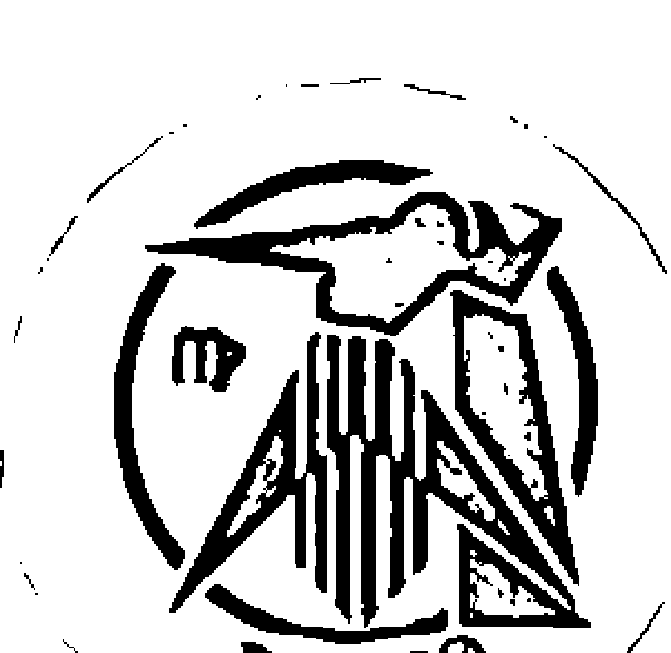

## 月亮在处女座的深度解析

### 月亮处女座的幼年生活

通常出生時月亮在處女座的人都有個認真負責的母親，她們會盡心盡力地把自己份內的事情做好，即使再忙再累也要堅持原則，她們經常是家中主要的照顧者，除了照顧自己的孩子之外，還可能要照顧家中的長輩或其他小孩，這種任勞任怨的形象會深植於孩子的心中；她們非常重視生活常規的教育，會不厭其煩地叮嚀孩子遵守各種規定，因此作為她們的子女從小就被教育成有禮貌、守規矩的小孩，良好的家教也讓他們容易得到老師及其他長輩的歡心。

月亮在處女座的人通常是在比較知性及理性的環境下長大，家裡面的人都很會講道理，因此不知不覺當中就學會了聆聽與分析訊息，對於不符合邏輯的事情特別敏感，也經常會有語言表達及文學方面的天份；但若是在幼年階段受到過多的批評與責罵，則會讓他們趨於悲觀，變得缺乏自信而不願意去嘗試，有些人則會比較容易神經緊張，甚至是對身邊的人過份挑剔，其實他們也很需要正面的肯定及鼓勵，比較尖酸刻薄的批評只是他們內心不安的保護色。

### 月亮处女座的氣質表現

一般來說月亮在處女座的人都有一種溫和謙遜的氣質，他們不與別人爭功委過，只是努力扮演好自己的角色，他們本身有很強的責任感，會盡可能把自己份內的事情好好完成，非不得已絕對不會麻煩別人，因此很容易給人一種穩定的信賴感，他們不論做任何事情都要條理分明，即使是很小的細節也不輕易放過，雖然有時候會讓身邊的人覺得過於嚴苛，不過他們每件事情都能講出一番為什麼要這麼做的道理，想要正面反駁他們也不是那麼容易。

月亮在處女座的人很善於分析自己的情緒反應，因此他們很少在第一時間大發雷霆，反而比較容易事後一個人生悶氣，經常不知不覺就陷入覺得受到委屈的情緒當中，他們心情不好的時候經常會寄情於工作或是學業，做正事的成就會幫助他們脫離低潮，若是個人閒閒沒事幹反而會讓他們一直鑽牛角尖。

### 月亮處女座的居家飲食

通常月亮在處女座的人家中的佈置都很有邏輯性，所有空間都得到充分的利用，完全沒有任何浪費，雖然不是每個人家中都打掃得一塵不染，不過總是會發現一些實用有效率的設計，許多生活智慧的巧思自然融入其中；通常他們比較喜歡安靜的純住宅區，獨棟的別墅或是住戶簡單的公寓會比大型社區來得好，他們希望居住的環境盡量單純，同時保持一定的隱密性及獨立性，如果他們對於現在的居住環境不甚滿意，還是會想盡辦法找到更好的地方搬過去。

月亮在處女座的人非常重視飲食衛生，原則上他們是為了健康而吃，因此不但強調定時定量、營養均衡，有些人還會長期固定服用營養補充品，如果走得極端一點甚至會非有機食品不吃，或是為了健康理由而吃純素，就一般人的標準來看他們已經算得上是挑食的一群人，不過他們自己倒是覺得這些堅持沒什麼不好，他們有空的話通常都會自己下廚，這樣才能保證食物的來源及品質，即使不得已要外食也只挑選幾間信得過的餐廳，很少會隨便找東西吃。

## ♍與月亮處女座的人相處

出生時月亮在處女座的人非常重視規則與秩序，他們很難忍受混亂和不確定性，在這種狀況之下他們會變得非常挑剔和神經質，甚至到了吹毛求疵的程度，因此千萬不要去弄亂他們的東西，否則就得忍受他們整天不斷地抱怨；他們無意識當中就覺得自己應該要是個有用的人，所以不論是達到某個工作的里程碑或是對其他人有什麼貢獻，都會讓他們的內心覺得欣慰，因此他們常常會在不知不覺當中就把自己弄得超忙，甚至可以說他們是閒不下來的勞碌命。

月亮在處女座的人觀察力十分敏銳，對於他人的需求也很敏感，因此經常可以提供很貼心又及時的幫助，不過他們本身擅長於分析問題，並且提供實際的支援及解決方案，比較偏向感性的情緒撫慰就不是他們拿手的項目；雖然他們本身並不希望對方過度依賴他們，但是同時又很難拒絕別人的請求，因此經常會陷入自我矛盾當中，不過只要是他們答應的事情就一定會負責到底，絕對不會中途跑掉留下你一個人去面對問題，因此算是十分值得信賴的伙伴。

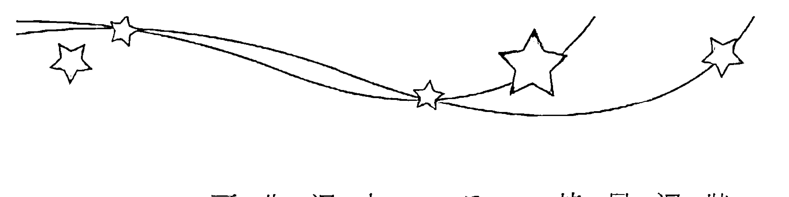

## 月亮处女座的身心保健之道

### 月亮在处女座&土星在白羊座

土星在白羊座讓月亮在處女座的人容易有頭痛的困擾，特別當他們自己一個人生悶氣的時候狀況會特別嚴重，他們年輕的時候經常會遇到皮膚過敏的問題，年長一些則容易有消化不良的狀況，也要小心消化道出現腫瘤甚至癌症的問題；在飲食上要盡量避開會引發過敏反應的東西，及早建立自己的清單並確實忌口能有效減輕皮膚不適的狀況，再來則是要學習讓自己放鬆的技巧，培養固定運動的習慣是很有效的作法，通常都可以減少頭痛發生的頻率。

### 月亮在处女座&土星在金牛座

月亮在處女座而土星在金牛座的人通常身體沒有什麼急性的大問題，但若因此就拼了命地努力工作不知節制，累積下來難免會有過勞的問題發生，通常身體的警訊會開始於發生便秘的狀況，年長一些也容易覺得喉嚨有痰不舒服，嚴重的甚至可能一天到晚咳個不停；因此養成規律的生活習慣是健康的不二法門，早睡早起避免熬夜才能長治久安，若是能固定做比較溫和的運動也可以增加你的體力，但是太過激烈的競賽型運動反而容易讓你受一些運動傷害。

### 月亮在处女座&土星在巨蟹座

月亮在處女座同時土星在巨蟹座的人胃部特別脆弱，經常會有不明原因的胃痛，吃到不好的東西還可能整天上吐下瀉，連喝水都很困難，他們年輕的時候很容易遇到皮膚過敏的問題，年長一些則要注意家族的遺傳病史，幾乎都會和家族的長輩們得到相同的疾病；壓抑隱藏的情緒是你健康最大的殺手，所以要學著釋放自己的情緒，參加一些宗教活動或心靈成長課程都是很不錯的方法，這不但可以減輕胃部不適的狀況，對於皮膚過敏的問題也有很大幫助。

### 月亮在处女座&土星在狮子座

月亮在處女座而土星在獅子座的人很容易有皮膚過敏的問題，特別是吃到不合適的東西時可能引發激烈的過敏反應，他們年輕時容易有消化不良的狀況，年紀漸長則可能有駝背、骨刺或椎間盤突出的問題，另一些人則是為心血管疾病所苦；在飲食上多注意是養生保健的第一步，避開自己會有過敏反應的食物就能減少皮膚不適的狀況，再來則是要培養勇氣與自信心，如果能積極實踐自己人生的理想，即使年紀較大一些仍然可以保持很好的精神與體力。

### 月亮在处女座&土星在双子座

土星在雙子座讓月亮在處女座的人容易有睡眠障礙的困擾，失眠或是淺眠都是很常見的狀況，他們年輕的時候很容易得到流行性感冒，同時經常會伴隨拉肚子的症狀，年長一些則容易遇到神經系統退化的疾病，手腳的活動比較不靈活，記憶力的退化也比較快；過多的思緒是健康最大的敵人，所以可以透過學習靜坐、禪修或是其他心靈成長課程來幫助自己放下不必要的煩惱，晚上自然比較容易入眠，若是能有好的睡眠品質，神清氣爽就不容易生病了。

### 月亮在處女座&土星在處女座

月亮與土星同在處女座的人特別容易神經緊張，一不小心就可能延伸出睡眠障礙及過勞的問題，他們在年輕時容易有消化道方面的問題，胃痛、腹脹甚至腸胃道潰瘍都是常見的狀況，年長一些則要留心家族的遺傳病史，經常會和家裡長輩得到相同的慢性病；要保持身體健康首先就得以處理過於容易神經緊張的問題，透過瑜伽、太極拳、皮拉提斯等運動都可以幫助你放鬆，要有意識地提醒自己減少熬夜，同時在睡前用熱水泡澡或是泡腳都可以幫助你入睡。

### 月亮在處女座&土星在天秤座

月亮在處女座而土星在天秤座的人容易有腰痛的問題，脊椎側彎或是椎間盤突出也是常見的狀況，他們在年輕時容易有消化不良的問題，腹部脹痛或拉肚子的狀況特別多，年長一些則要小心腹部有腫瘤甚至是癌症的狀況，身體檢查時千萬不要忽略這一塊；想太多是你身體健康的大敵，養成規律運動的習慣會對健康有很大的幫助，不過最好選擇一個人就能做的運動，否則還要配合別人的時間就不容易達成，吃東西時盡量減少蛋白質攝取也很有幫助。

### 月亮在处女座&土星在天蝎座

月亮在處女座同時土星在天蠍座的人特別容易有便秘的問題，消化道的腫瘤或癌症也是很常見的狀況，他們在年輕時容易有不明原因的胃痛，年紀較長時則經常會有貧血的現象，體力下滑的速度也會比較快一點；在飲食當中增加蔬食的比例是很好的方向，也可以透過斷食療法來淨化腸胃道，對於身體健康及體力都會很有幫助，其次就是要學習放下過於執著的情緒，運用禪修、靜坐或是參加心靈成長課程把過多的情緒投射放下，可以改善消化道的狀況。

### 月亮在处女座&土星在射手座

土星在射手座讓月亮在處女座的人容易遇到消化道方面的問題，從食道、胃腸到肛門都可能出狀況，他們在年輕時比較容易感覺到胃部不適，年紀較長一些則容易有拉肚子的現象，腹部也比較容易有腫瘤甚至是癌症；健康的食物對於身體非常重要，因此要細心觀察並記錄自己對於不同食物的反應，避開容易引起消化道不適的東西，生冷的食物更是健康的大忌，同時也要維持生活作息正常，盡量避免熬夜，吃東西定時定量，就能維持比較好的精神和體力。

### 月亮在处女座&土星在摩羯座

月亮在處女座而土星在摩羯座的人通常身體沒什麼大問題，但若是年輕的時候過於拼命缺乏休息，年紀較長之後體力就會下滑特別快，並且有容易發胖的現象，另一些人則是容易受到風濕、關節、骨頭、牙齒方面問題的影響，對於他們來說，工作與休息的平衡、飲食的節制是非常重要的。

### 月亮在處女座＆土星在水瓶座

土星在水瓶座讓月亮在處女座的人消化道常出問題，消化不良也可能連帶造成營養不良的狀況，他們在年輕時就容易有腹脹及便秘的困擾，年紀較長之後則要小心腹部有結石的問題，嚴重的還可能有腫瘤甚至是癌症的狀況；規律的生活作息對於健康有最大的幫助，能夠養成早睡早起的習慣，並且在飲食上注意定時定量，才能把身體的基礎打好，再來則是要學習放鬆的技巧，不論是透過靜坐、禪修或是瑜伽的方式，都是改善睡眠及有助於消化道順暢的方法。

### 月亮在處女座＆土星在雙魚座

土星在雙魚座讓月亮在處女座的人特別容易得到胃腸方面的傳染病，腸胃型的感冒也是常見的狀況，他們在年輕時經常發生各種的運動傷害，年紀較大則容易有睡眠障礙，失眠或是淺眠的狀況會讓他們的精神體力變差；所以一定要養成良好的衛生習慣，回到家及吃飯前一定要洗手，同時也要特別注意食品的衛生安全，再來則是要選擇符合人體工學的寢具，並且養成在固定時間上床的習慣，這樣不但能改善睡眠品質，對於維持身體的抵抗力也很有幫助。

## 月亮在天秤座的深度解析

## ♎月亮天秤座的幼年生活

月亮在天秤座的人通常有個很溫柔善體人意的母親，她們總是表現得成熟而識大體，即使受到任何委屈仍然展現出優雅平和的風範，在人群之中經常受到大家的喜愛，這種修養及處世態度會讓孩子不自覺地去模仿；一般來說她們重視夫妻關係甚於親子關係，經常會壓抑自己的需求去成全另外一半，若是不幸婚姻破裂，則會將所有的心力投注在孩子身上，即使犧牲自己也要讓孩子過得好，因此她們的子女常會覺得一定要乖乖聽話，否則就太不孝順了。

出生時月亮在天秤座的人經常是在人際關係複雜的環境下長大，因此他們很小就學會察顏觀色，對他人的想法及情緒特別敏感，在兄弟姊妹甚至是父母親發生爭吵時，他們也會跳出來擔任調停者，自然而然就練成了八面玲瓏的交際手腕；但若是在幼年階段經常受到暴力對待，或是發生父母離異的狀況，就可能讓他們變得缺乏自信心，甚至經常優柔寡斷、猶豫不決，也不敢表達自己心中真正的想法，這種過於退縮的表現其實真正反映出他們經歷過的傷痛。

## ♎月亮天秤座的气质表现

月亮在天秤座的人經常展現出有點慵懶的氣質，他們很少會衝動行事，即使展開行動也是不急不徐，有時候會讓身邊的人覺得他們慢半拍，其實很多狀況他們都看在眼裡，只是還沒決定該怎麼做之前很習慣先按兵不動；他們內心深處總認為以和為貴，所以只要遇到不同的意見出現，就會盡量去尋找大家都可以接受的折衷方案，避免與別人發生正面衝突，如果可以處理得好當然就皆大歡喜，最怕就是大家都不滿意妥協的結果，反而變成裡外不是人。

## ♎月亮天秤座的居家饮食

月亮在天秤座的人會花很多心思佈置家裡，因此在餐廳及客廳等公共場所總是散發出讓人覺得放鬆的簡約風格，但是在房間裡面則是以方便為主，通常會看起來比較凌亂，由於他們很喜歡買衣服、鞋子、飾品及配件，所以常常要很大的衣櫥甚至是專屬的衣帽間才能放得下；他們對於居住的環境和硬體設備比較沒那麼要求，主要的考量通常都是距離上班的地方近，或是附近有許多親朋好友們居住，這樣可以方便他們去串門子，出了什麼事情也有人照應。

### ♉與月亮天秤座的人相處

月亮在天秤座的人往往把吃東西當成重要的社交機會，他們經常會約好親朋好友或是同事們一起吃飯，大家一邊吃飯一邊聊天，如果能夠同時喝酒助興就更棒了！但是他們自己一個人用餐，那麼就會重視外觀甚於味道，擺盤好看或是使用高級餐具的餐廳會特別吸引他們，裝飾精美的蛋糕及甜品更是對他們有致命的吸引力，他們不太喜歡自己在家下廚，寧可買便當或現成的熟食回家吃，但是他們又十分嘴饞，在抽屜或櫃子裡通常都會準備一些零食。

月亮在天秤座的人不論做什麼事情都很需要有人陪伴，單獨一個人會讓他們覺得沒有安全感，他們非常重視別人的想法和感受，同時也會不由自主地希望別人能夠重視他們，因此他們的心情很容易受到別人的反應影響；他們非常重視人際關係的平衡及和諧，如果你對他們很用心，他們也會用同等的心意來回報你，但若是有人得罪了他們，通常他們只會默默疏遠對方，很少有激烈的報復行為，因為他們覺得完全不理會一個人就是對他最大的懲罰。

月亮在天秤座的人是非常好的陪伴者，他們具備高度的同理心，能夠從對方的角度來看事情，設身處地為對方著想，因此經常成為親朋好友們訴苦的垃圾桶，但是他們往往一面倒地附和親朋好友的抱怨，不願意直接指出他們的錯誤，也很少能提出客觀中立的評論；雖然他們能夠體恤你的困難，但是很少積極地伸出援手，可能招致口惠實不惠的批評，同時他們也極不願意介入各種爭端，很少會在公開對立的狀況下選邊站，有時候會讓人覺得冷漠或疏離。

### ♎ 月亮天秤座的身心保健之道

### 月亮在天秤座 & 土星在白羊座

土星在白羊座讓月亮在天秤座的人天生皮膚就不太好，很容易遇到皮膚過敏或是發炎的狀況，他們在年輕的時候容易有頭痛的困擾，另一些人則是有不明原因胃痛的問題，年紀較長則是經常為腰痛所苦，脊椎側彎、椎間盤突出及長骨刺都是很常見的狀況，壓抑的情緒是大部分健康問題的關鍵，所以可以透過參加宗教活動或是心靈成長課程來幫助你轉化情緒，找專業的心理諮詢師談談也會很有幫助，再來則是要注重姿勢端正，女性朋友最好少穿高跟鞋。

### 月亮在天秤座 & 土星在金牛座

月亮在天秤座而土星在金牛座的人天生腎臟特別不好，也很容易成為高血糖、高血壓、高血脂的三高危險群，他們在年輕時就很容易發胖，年紀較長則容易覺得喉嚨不舒服，比較嚴重的還可能成天咳個不停，對生活造成很大的困擾，從飲食控制下手會對你的健康最有幫助，記得少吃零食及甜點，少鹽、少油、少糖之外，最重要的是少吃零食及甜點，這樣就可以維持還不錯的活力，再來則是要記得盡量多喝溫開水，避開咖啡、茶及所有的冷飲，對喉嚨的狀況會很有幫助。

### 月亮在天秤座 & 土星在双子座

月亮在天秤座同時土星在雙子座的人通常身體沒有什麼嚴重的問題，但是在壓力大時容易有失眠的狀況，他們在較年輕時容易有肩頸痠痛的問題，年紀漸長則常會有不明原因的腰痛，若是長時間寫字或是使用電腦則可能出現腕隧道症候群；思慮過度是你健康最大的殺手，因此可以透過運動或舞蹈來幫助自己放鬆，或是找專業的心理諮商師聊聊，都可以改善睡眠品質，有空最好多到戶外親近大自然，經常呼吸新鮮空氣會對你的健康狀況有很大的幫助。

### 月亮在天秤座 & 土星在巨蟹座

土星在巨蟹座讓月亮在天秤座的人胃部問題特別多，他們經常會遇到胃脹想吐的狀況，胃部發炎甚至胃潰瘍也是常見的問題，他們在比較年輕時臉部容易長青春痘、雀斑，年長一些則可能有胸悶、胸痛的問題，另一些人則是為頻尿的問題所苦；情緒問題是造成你健康受損的主因，所以最好能參加一些宗教活動或是心靈成長課程，幫助自己釋放不必要的情緒，同時盡量少吃刺激性及生冷的食物，吃冰和喝冷飲也要盡量減少，也可以減輕胃部不適的狀況。

### 月亮在天秤座 & 土星在獅子座

月亮在天秤座而土星在獅子座的人天生脊椎就特別脆弱，他們在年紀很輕時可能就有脊椎側彎或是椎間盤突出的狀況，年紀漸長腰痠背痛的狀況會越來越嚴重，很可能同時還有駝背的問題，另一些人則是為心血管的疾病所苦；維持姿勢端正是最重要的一件事，若是很不舒服時也可以尋求合格的整脊醫師或是整骨師幫忙處理一下，平時最好能選用符合人體工學的桌椅，使用護腰的坐墊及靠墊，女性朋友盡量減少穿高跟鞋的時間，都是很基本的保養方法。

### 月亮在天秤座 & 土星在天秤座

月亮與土星同在天秤座的人天生腰部特別脆弱，脊椎側彎和椎間盤突出都是很常見的問題，他們年輕時會容易感覺到胃痛，年長一些則要小心腎臟方面的問題，有些則是容易成為高血壓、高血糖、高血脂的三高危險群；保持姿勢端正是最基本的防護，同時也要避免長時間提重物，東西若是太重可以改用推車或有輪子的拉桿箱，以免腰部長期承受過大的壓力，另一方面還要注意飲食控制，記得少鹽、少油、少糖之外，多吃蔬菜水果也是很重要的事情。

### 月亮在天秤座 & 土星在處女座

月亮在天秤座同時土星在處女座的人常會遇到不明原因的肚子痛，有些人則是會有睡眠障礙的問題，他們在年輕時就開始會有腰痛的狀況，年紀較長則很容易有頻尿的問題，同時也要小心腹部的結石及腫瘤問題，嚴重的還可能在這些部位出現癌症，過度緊張是所有健康問題的總源頭，所以最好能夠透過運動或是舞蹈的方式來放鬆，在睡前用熱水泡腳或是泡澡會讓你更容易入睡，此外精油按摩或是整脊都會有不錯的效果，同時最好盡量減少熬夜以免過勞。

### 月亮在天秤座&土星在天蝎座

月亮在天秤座同时土星在天蝎座的人泌尿系统特别容易出状况，要注意肾脏及膀胱结石的问题，他们年轻时常会有贫血的状况，年纪渐长体力下滑的速度会特别快，也很容易有频尿的困扰，女性朋友则是要小心妇科相关的问题；饮食控制是最简单有效的方式，记得平时多喝水，少吃太油、太咸及油炸类的食物，就能维持比较好的体力，再来则是要配合适量的运动，最好可以找几个同伴一起去运动，不但能聊天舒解压力，互相督促也比较容易持之以恒。

### 月亮在天秤座&土星在射手座

月亮在天秤座同时土星在射手座的人经常会发生运动伤害，若是伤到腰部就很难根治而容易复发，所以要充分休养小心处理，他们在年轻时可能会有贫血的问题，年纪渐长则要小心泌尿道系统方面出状况，另一些人则是经常为便秘所苦；规律的生活对于身体健康会有最大的帮助，切忌过度熬夜消耗身体的元气，定时吃饭也有很好的保健效果，另一方面则要配合食物的调整，减少油炸、辛辣等刺激性的食物，同时多吃蔬菜水果，会让精神体力更好一些。

### 月亮在天秤座&土星在摩羯座

土星在摩羯座让月亮在天秤座的人体力比较差一点，他们非常容易腰酸背痛，脊椎侧弯及椎间盘突出都是很常见的状况，他们在年轻时经常会有胃痛的问题，年纪较大则容易发生关节炎，同时比较容易有驼背的现象；为了你的健康最好能及早养成规律运动的习惯，任何和缓的运动都很适合你，不论是练太极拳、气功或作瑜伽、皮拉提斯，都会让你的精神与体力更好，同时也可以寻求合格的整脊医师或是整骨师帮忙，通常都可以减轻腰部不适的状况。

### 月亮在天秤座&土星在水瓶座

月亮在天秤座而土星在水瓶座的人通常身体不会出什么大状况，不过体能还是比较弱一点，他们在年轻时比较容易有失眠的问题，年纪较长之后则容易觉得腰背酸痛，或是因为跌倒而有一些运动伤害；养成运动的习惯对健康有很大的帮助，可以选择舞蹈或是球类运动比较容易持之以恒，但是要记得在开始前先充分热身以免发生运动伤害，也要避免熬夜过度消耗体力，在睡前用热水泡脚或泡澡都可以帮助你入眠，同时也会有助于改善腰背酸痛的状况。

### 月亮在天秤座&土星在双鱼座

月亮在天秤座同时土星在双鱼座的人常会有腰痛的状况，他们在年轻时比较容易有失眠的问题，睡不好自然体力也会比较差，年长一些则容易有消化道方面的问题，吃到不合适的东西就可能会上吐下泻，有些人则是有末梢循环不良的状况，天气冷时容易手脚冰冷；想太多是健康最大的敌人，所以可以透过参加宗教活动或是心灵成长课程，帮助自己放下过多的妄念，同时也可以在睡前用热水泡脚或是泡澡，通常都会更容易入眠，精神体力也会更好。

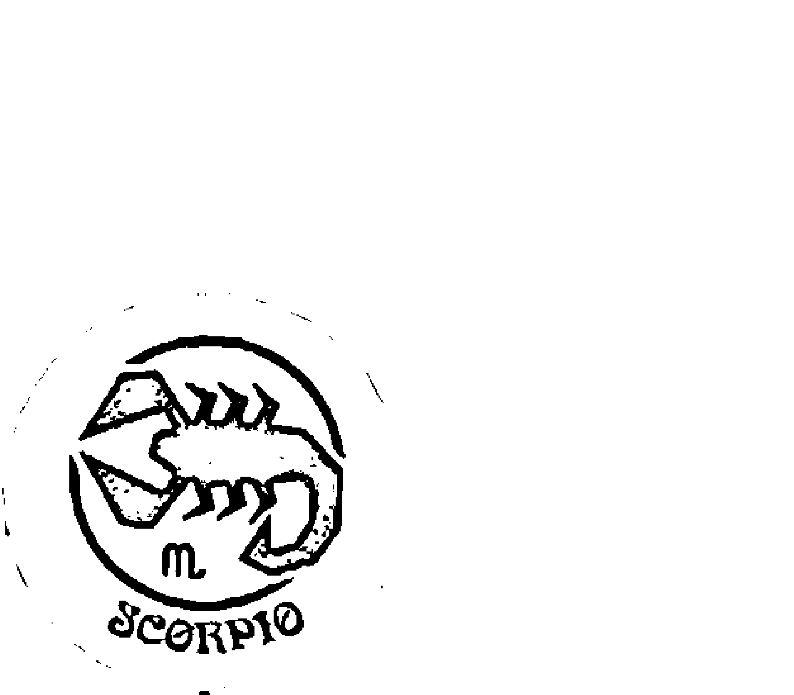

## 月亮在天蝎座的深度解析

### ♏ 月亮天蝎座的幼年生活

出生时月亮在天蝎座的人通常都有个很强悍的母亲，她们很少对人表露出自己的情绪，只是自顾自地专心做自己的事情，即使作为她们的小孩也觉得很难亲近，这种神秘又带有距离感的形象很容易让孩子从小就缺乏安全感；她们非常讨厌子女干扰自己做事情，因此可能会对子女比较冷漠一些，但是同时她们又不容许孩子违背自己的旨意，希望孩子都可以乖乖听话，作为她们的子女只好把自己的想法都藏在心里，亲子之间也可能因此产生一些疏离感。
月亮在天蝎座的人经常是在比较艰困的环境下长大，通常家里经济状况并不是很好，有些人幼年时就经历丧父或丧母之痛，或是父母为了某些因素而将孩子完全交给亲戚或保姆带大，因此可能会在内心深处藏着被遗弃的恐惧；艰困的环境可能会锻炼出他们坚强的意志力及耐力，展现出超龄的成熟态度，但若是童年的创伤超过了他们所能负荷的程度，也可能让他们变得非常敏感及多疑，时时刻刻都保持强烈的防卫心，或是变得有罪恶感而自我否定。

### ♏ 月亮天蝎座的气质表现

月亮在天蝎座的人喜怒不形于色，因此常会给人一种深不可测的感觉，他们能够不动声色地默默在旁观察，再配合敏锐的直觉作出精确的判断，不仅能够见微知著，对于整体趋势的评估通常也很正确；他们的内在有非常强烈的野心，无论如何都想要获得成功，因此当他们对一件事情燃起热情，就会很专注地全心全意投入，他们的意志力超强，同时能够忍人所不能忍，即使遇到再坏的状况仍然会继续坚持下去，必要时甚至可以为了达到目的而不择手段。
月亮在天蝎座的人内心深处经常波涛汹涌，当他们特别沉默时往往就是在压抑自己的情绪，千万不要误以为他们没有脾气，通常都要等到他们忍耐超过极限才会一次爆发出来，激烈的程度往往会让四周的人吓一大跳；他们的自尊心非常强，当被别人看轻或忽视的时候通常都会激起他们的斗志，被嘲笑或是被背叛的经验则会让他们燃起复仇之火，即使无法彻底打败对方，也要与对方玉石俱焚！就算对方事后道歉寻求他们的原谅，他们仍然会记得一辈子。

### ♏ 月亮天蝎座的居家饮食

通常月亮在天蝎座的人家中的布置都很重视安全性及隐密性，不仅经常可以看到厚重的防火大门、多重的防盗门锁，防盗铁窗及密实的防偷窥窗帘也经常紧闭，甚至还会在家中隐密处设置保险箱，简直把家当作城堡一样装潢；如果可以负担，私密性佳的豪宅社区是他们的最爱，有保全及饭店式管理的小套房也不错，不然也可能选择比较偏远地区的独栋别墅，因为他们不太喜欢让人知道他们住在哪里，也不太爱与左邻右舍串门子，纯粹想要当个隐居者。
月亮在天蝎座的人对于日常三餐并不是那么重视，他们往往都是等到肚子饿了才去找东西吃，若是觉得有更重要的事情，忙起来也可以一整天都不吃东西，不过他们通常都会有吃宵夜的习惯，甚至一天只吃宵夜这一餐；一般来说他们比较懒得自己下厨，要不是在外面随便找东西吃，就是买熟食回家享用，不过他们对于喝东西反而比较讲究，有些人会钟情于美酒，另一些人则是对咖啡特别有研究，连带对于佐酒的小菜以及配咖啡的甜点也有独到的品味。

## ♏与月亮天蝎座的人相处

月亮在天蝎座的人非常重视隐私，他们不喜欢别人打听或窥伺自己的私生活，更讨厌别人干涉他们的决定，他们内心当中有很强烈的控制欲，唯有掌控全局才能让他们觉得安心，因此他们很容易就会对权势着迷，或是积极努力地囤积金钱；他们对于人心及人性有深刻的洞察力，很容易就看穿别人行为背后的真正动机，因此他们从不轻易相信别人，还有很强烈的敌我意识，无意识当中就会把人区分成敌人或朋友，对于不熟的人则会保持距离先观察再说。
月亮在天蝎座的人对朋友的期待及要求非常高，因此能被他们认定是朋友的人并不多，不过他们对于朋友十分忠诚，无论朋友出了什么事情一定会力挺到底，他们不只能提供很好的分析及建议，鼓励你好好努力，必要时还会亲自上阵替你挡子弹！但是他们并不是那种喜欢别人依赖他们的人，如果你自己不知长进连续犯下大错，他们也不会一直无条件地帮你擦屁股，等到他们失去耐性就会把你列为拒绝往来户，这时候再怎么苦苦哀求他们也不会帮忙你。

### ♏ 月亮天蝎座的身心保健之道

月亮在天蝎座 & 土星在白羊座

土星在白羊座让月亮在天蝎座的人特别容易胃痛，男性朋友则要注意胯下及臀部容易感染皮肤病，女性朋友则要小心妇科方面的问题，他们在年轻时经常会有头痛的状况，年纪较长消化道方面问题很可能会越来越严重，甚至因为消化不良而产生营养不良的结果；整体来说过度的好胜心是你健康最大的敌人，因此可以借助宗教活动或心灵成长课程来帮助自己超越，如果能多站在别人的立场替对方想想，同时不要给自己那么大的压力，健康状况自然就会改善。

### 月亮在天蝎座 & 土星在金牛座

月亮在天蝎座同时土星在金牛座的人消化道特别容易出问题，如果吃到不对的东西很容易会上吐下泻，他们在年轻时经常会有反胃想吐的状况，年长一些则是容易有偏头痛的问题，同时女性朋友要特别注意妇科方面的问题；过于固执是你所有健康问题的总源头，如果可以透过学习瑜珈、皮拉提斯或太极拳等帮助自己的身体放松，消化道不适及头痛的问题都可以获得改善，再来则是要养成规律的生活习惯，早睡早起同时三餐定时定量对健康也很有帮助。

### 月亮在天蝎座&土星在双子座

月亮在天蝎座而土星在双子座的人经常会有肩颈酸痛的问题，若是长时间写字或是使用电脑也可能有腕隧道症候群，他们在年轻时很容易鼻子过敏，年长一些听力可能会退化得特别快，女性朋友则容易为更年期问题所苦；思虑过度是你健康问题最主要的来源，如果能透过禅修、打坐、冥想等方式让自己放下不必要的妄念，健康状况就会有很大的改善，同时要避免一直待在冷气房里面工作，多利用机会到户外走走，呼吸新鲜空气对健康也有很大的帮助。

### 月亮在天蝎座&土星在巨蟹座

月亮在天蝎座同时土星在巨蟹座的人通常胃都不太好，经常会有消化不良的问题，他们在较年轻时容易有胸闷、胸痛的状况，年长一些则要小心胸部或乳房有肿瘤甚至是癌症，健康检查千万不要忽略了这个区块，压抑的情绪是你健康问题最主要的来源，如果能透过参加宗教活动或是心灵成长课程帮助自己释放情绪，通常都能改善胸闷与胸痛的问题，再来则是要有意识地培养规律的饮食习惯，并且少吃生冷及刺激性的食物，胃部不适的状况会好很多。

### 月亮在天蝎座&土星在狮子座

土星在狮子座让月亮在天蝎座的人容易有心血管方面的问题，男性朋友要注意膀下及臀部容易感染皮肤病，女性朋友则是经常会有贫血及妇科方面的问题，年纪渐长经常会觉得腰酸背痛，很容易发生背部和脊椎方面的问题；过度执着与自我中心是健康最大的敌人，如果能透过宗教活动认识到众生平等的真义，放下不必要的好胜心及优越感，健康问题自然就能减轻大半，再来也可以进行比较温和的运动，瑜伽、皮拉提斯或是简单的伸展运动都很适合你。

### 月亮在天蝎座&土星在处女座

月亮在天蝎座同时土星在处女座的人特别容易有过劳的问题，他们年轻时就经常会有肠胃方面的问题，消化不良也可能连带造成营养不良的状况，年纪渐长则要小心腹部出现肿瘤甚至是癌症的问题，而且体力下滑的速度也会特别快；保持生活规律并且有意识地提醒自己休息是养生保健的基本功，熬夜是严重伤害身体的行为千万要尽量避免，同时也要养成三餐定时的习惯，再怎么忙都要强迫自己在用餐时间吃东西，这样对于消化道的状况会特别有帮助。

### 月亮在天蝎座&土星在天秤座

月亮在天蝎座而土星在天秤座的人很容易有腰痛的问题，脊椎侧弯或是椎间盘突出也是常见的状况，他们在年轻时胃部就比较弱，年长一些则要注意泌尿系统方面的问题，肾脏、膀胱结石或是晚上频尿都是很常见的困扰；想太多是你健康遇到问题的主要来源，因此可以透过学习打坐、冥想或禅修等方式，帮助自己澄清思虑，通常都可以减轻胃部不适的状况，如果能多一些同理心，站在别人的立场想一想，不但能改善人际关系，也能减少腰痛的频率。

### 月亮在天蝎座 & 土星在天蝎座

月亮与土星同在天蝎座的人很容易有贫血的问题，男性朋友要小心胯下及臀部容易感染皮肤病，女性朋友则经常会有妇科方面的困扰，他们在年轻的时候就比较容易觉得累，年长一些则要小心尿道及膀胱感染的问题；压抑情感及过度执着是你健康最大的敌人，可以透过参加宗教活动或是心灵成长课程，帮助自己释放情绪，减少一个人在那里钻牛角尖的状况，就可以大幅改善你的健康状况，再来则是要养成规律生活的习惯，减少熬夜对健康也非常重要。

### 月亮在天蝎座 & 土星在射手座

月亮在天蝎座同时土星在射手座的人很容易有运动伤害，若是不及时处理并且充分休养，很容易变成慢性的问题，他们在年轻时会比较容易累，整体来说肝的状况并不是很好，年纪渐长则是胃部比较容易出问题，也可能会受坐骨神经痛的困扰；规律的生活是养生保健的基础，尽量减少熬夜才能守住元气避免过劳，养成在三餐的时间吃东西则可以改善胃部的状况，同时也要选用合脚的鞋子，女性朋友尽量减少穿高跟鞋，才能减少跌倒和运动伤害的发生。

### 月亮在天蝎座 & 土星在摩羯座

月亮在天蝎座而土星在摩羯座的人先天胃就比较弱，也可能因为消化不良而经常出现胃胀腹痛的现象，他们在年轻时很容易因为工作而过劳，年纪渐长要小心风湿及关节炎的问题，女性朋友要小心下背痛的现象，男性朋友比较容易有贫血的状况；过度地竞争与求胜是你健康问题的主要来源，如果能够透过参加宗教活动或心灵成长课程，解除以自我为中心的习惯多为别人着想，会对健康有最大的帮助，同时在工作中要有意识地提醒自己该休息了，避免熬夜过劳对身体健康也非常重要。

### 月亮在天蝎座 & 土星在水瓶座

土星在水瓶座让月亮在天蝎座的人很容易有贫血的状况，内分泌或免疫系统失调的问题也很常见，他们在年轻时容易有胃痛的状况，女性朋友则要小心妇科方面的问题，年纪渐长体力下滑的速度会特别快，有些人会有频尿影响到睡眠的困扰；过于执着是你身体出现问题的主因，可以透过学习太极拳、瑜伽、皮拉提斯或伸展体操，帮助自己的身心保持弹性，可以改善胃痛及妇科方面的问题，同时要养成规律的生活习惯，对内分泌及免疫系统会很有帮助。

### 月亮在天蝎座 & 土星在双鱼座

月亮在天蝎座同时土星在双鱼座的人很容易失眠，女性朋友比较常有贫血的状况，男性朋友则要小心膀胱及臀部容易感染皮肤病，他们在年轻时消化道就比较敏感，吃到不适合的东西很容易觉得不舒服，年纪渐长会发现动作变得比较不灵活，天冷也经常有手脚冰冷的状况；保持规律的饮食习惯是养生保健的第一步，少喝冷饮和吃生冷的食物可以改善消化道的不适，在睡前可以用热水泡脚或泡澡，不但能帮助你更容易入眠，也可以改善末梢循环的状况。

## 月亮在射手座的深度解析

### 月亮射手座的幼年生活

出生时月亮在射手座的人通常都有个很积极正向的母亲，她们有很强大的信心，不论遇到任何挫折打击仍然能够乐观面对，努力朝向自己觉得正确的目标前进，这种天不怕、地不怕的坚强形象会深植于孩子的心中；虽然她们本身十分忙碌，但是仍然很注重孩子的教育，他们会让孩子自己去思考找答案，而不会强迫孩子接受任何形式的标准答案，因此作为他们的孩子很小就有机会学习如何独立思考，甚至从小就会对一些宗教或哲学问题产生浓厚兴趣。
月亮在射手座的人经常是在比较自由的环境下长大，从小就有各种不同的尝试，有些人会因此而变得特别主动积极，但是也有人走上逍遥散仙的路线，不过共通之处在于他们都不喜欢被别人强迫和限制，同时也很有自己的主见；不过若是在幼年时受到比较多的压抑和限制，也有可能让他们变得十分偏激，对身边所有的事情都看不顺眼，甚至对人会有强烈的攻击性，事实上这些过度的反应只是他们的防卫机制，以免个人自由受到外力侵害。

### ℳ月亮射手座的气质表现

月亮在射手座的人不拘小节，经常给人一种自然洒脱的感觉，他们很少被细节及规则所困扰，不管事前有没有周详的规划和预备，只要看准了大方向是对的，就会勇敢地采取行动，常会觉得他们的胆子真是太大了；他们经常会忽略别人的建议及警告，全力投入他们想做的事情，深入钻研自己有兴趣的东西，不断追求自我超越而不在意别人的眼光，他们常会不知不觉就将自己投入十分具有挑战性的状况，甚至会觉得一直做容易的事情是在浪费生命。
月亮在射手座的人情绪反应通常都很激烈，他们开心的时候经常会夸张地狂笑不止，屡屡引来旁人侧目，而生气的时候总像狂风暴雨般地激烈，他们在发脾气的时候通常都会认清冤有头债有主，因此很少会不小心迁怒或波及到无辜的人；不过他们倒是很少会沉溺于负面的情绪当中，虽然他们也会遇到悲伤或痛苦的事情，但是只要能去做做运动或是到户外散散心，很快就会恢复正面积极的态度，好像什么事都没发生一样，所以经常给人很乐观的印象。

### ℳ月亮射手座的居家饮食

月亮在射手座的人家中的布置通常是走自然风，他们非常重视通风及采光，如果空间许可还会在前庭、后院、阳台及窗台种一些植物，他们会把大部分东西都收进橱柜当中创造一种空旷的感觉，但是柜子里通常都是塞得一团乱；他们经常会选择寺庙、教堂附近宗教气氛浓厚的地区居住，有些人则偏好学校森立的文教区，不过从另一个角度来看他们也可能经常搬家，甚至是移民到外国居住，因此他们通常喜欢租房子甚于买房子，以免到时候要处理麻烦。
月亮在射手座的人通常喜欢异国美食甚于家乡口味，虽然他们很勇于尝试各种不同的食物，但是同时也会坚持绝不吃某些东西，有时候这些坚持会来自于宗教信仰或是家族传承，不过也可能只是个人喜好而没有任何理由；他们平常的饮食并不是很规律，忙起来也常一整天都不吃东西，但是另一方面他们遇到自己喜欢吃的东西食量会变得特别大，同时也愿意花费很多时间精力专程去找自己想吃的东西，如果在当地不容易买到还可能会自己研究作法下厨。

### ╳ 与月亮射手座的人相处

月亮在射手座的人不喜欢被固定的规则绑住，也不太愿意做长期的承诺，他们需要保有自由的空间和弹性才会觉得安心，当他们觉得有人想要控制他们的时候会被激起强烈的反弹，所以千万别强迫他们去做任何他们不想做的事情；他们的内心渴望透过学习而成长，也很喜欢到处旅行体验不同的生活与文化，对他们来说这些追寻的过程远比结果来得重要，他们经常带有理想主义的倾向，在某些事情上可能会过于坚持原则而显得太天真和不切实际。
通常月亮在射手座的人本身没有什么心机，也很容易相信别人，因此只要找他们帮忙，他们通常都会答应，但是他们对别人的情绪非常迟钝，总觉得事情并没有那么严重，干嘛大惊小怪的？有时这样的态度往往能鼓舞对方的信心，勇敢地面对困难与挑战，但是有时候也会让人觉得少一根筋或是不够贴心；他们比较喜欢直来直往的人，拐弯抹角或是在背后暗箭伤人则是犯了他们的大忌，因为他们觉得道不同不相为谋，只有相同理想与看法的人值得深交。

## 月亮射手座的身心保健之道

月亮在射手座同时土星在白羊座的人通常身体本身没什么大问题，但是比较容易有运动伤害，若是没有彻底休养好可能会变成慢性的问题，他们在年轻时可能会有过敏的状况，年长一些则容易有头痛的困扰，另一些人则是有骨质疏松的问题，所以在开始运动之前一定要先充分热身，平时也要有意识地提醒自己不要急、放慢脚步，这样就可以减少运动伤害的发生，同时也要注意自己吃的东西，尽量避开会引起过敏反应的食物以降低皮肤不适的状况。

### 月亮在射手座&土星在白羊座

月亮在射手座&土星在金牛座的人经常会有甲状腺方面的问题，甲状腺机能亢进或是肿大都是很常见的状况，他们年轻的时候很容易有偏头痛的问题，有些人还会加上胃痛的困扰，年纪渐长，喉咙会变得特别敏感，有些人会整天咳个不停，或是觉得有痰不舒服，另一些人则是有平衡感方面的问题；学习瑜伽、皮拉提斯或练习太极拳、气功会帮助你放松，通常都可以减轻头痛及胃部的不适，同时尽量要改掉吃冰及喝冷饮的习惯，可以减少喉咙方面的问题。

### 月亮在射手座&土星在金牛座

### 月亮在射手座 & 土星在双子座

土星在双子座让月亮在射手座的人呼吸道比较敏感，容易有过敏甚至是气喘的问题，他们年轻时可能会经常会有不明原因的胃痛，年纪较长则容易有坐骨神经痛的问题，脚力变得较差同时也可能行动不太灵活，另一些人则是听力退化较快；所以在天气变化大时要特别注意保暖，进入人多的公众场所最好配戴口罩，都可以减轻呼吸道方面的不适，有空多到户外走走，呼吸新鲜空气对于身体健康会很有帮助，同时也可以帮助你放松，减少胃痛发生的频率。

### 月亮在射手座 & 土星在巨蟹座

土星在巨蟹座让月亮在射手座的人消化系统比较脆弱，同时也要小心胸部出现肿瘤或癌症的问题，他们在年轻时就很容易皮肤过敏，年纪较长则要小心肝脏方面的疾病，若是不幸发生骨折复原的时间也比较长，所以特别注意避免运动伤害；平时注意饮食是养生保健的第一步，尽量避免会引起身体过敏反应的食物，不但能减轻消化系统的负担，也可以改善皮肤过敏的状况，同时要养成早睡早起规律的作息，减少熬夜过劳的状况才能减少肝脏方面的问题。

### 月亮在射手座 & 土星在狮子座

月亮在射手座同时土星在狮子座的人一般来说身体都很健康，但是他们的皮肤比较敏感，容易有晒伤或起红疹的困扰，他们年轻时可能就有脊椎侧弯的问题，不过往往要到年纪较长之后才会发现。

### 月亮在射手座 & 土星在处女座

月亮在射手座同時土星在處女座的人通常消化道都非常敏感，若是吃到不適合的東西很容易會上吐下瀉，他們在年輕時比較容易感覺到胃痛、肚子痛，年紀較長則要小心肝臟方面的問題，在健康檢查時千萬不要忽視這方面的情況；在工作時要有意識地提醒自己休息，同時盡量避免熬夜過勞，是保護肝臟的基本功夫，再來則是要減少蛋白質及肉類的攝取，多吃蔬菜水果，同時也可以嘗試排毒餐或是用斷食的方法來強化消化系統，對健康會有很大的幫助。

### 月亮在射手座 & 土星在天秤座

月亮在射手座而土星在天秤座的人腰部特別脆弱，脊椎側彎或是椎間盤突出都是很常見的狀況，他們在年輕時比較容易發生運動傷害，年紀較長則要注意肝腎方面的功能出問題，在健康檢查時要特別詳細檢查這些部位的狀況；平時維持姿勢端正是保護腰部最好的方法，女性朋友則要盡量減少穿高跟鞋，有意識地提醒自己早睡才能養肝護腎，再來則是要調整飲食，盡量避免高油、高鹽、高糖的食物，少喝冷飲、咖啡和酒類，都會對健康有很正面的幫助。

### 月亮在射手座 & 土星在天蝎座

月亮在射手座而土星在天蝎座的人很容易有贫血的问题，他们在年轻时体力就比较差，如果不知节制拼命工作或念书还可能会突然昏倒，年纪较长则要小心肝胆结石的问题，另一些人则是会有便秘或是痔疮的状况；早睡避免熬夜是养生保健的第一步，如果能养成中午小睡一下的习惯，对于体力会很有帮助，再来则是要尽量在三餐时间吃东西，规律的饮食习惯可以让消化系统更有效运作，如果身体有任何不适最好及早就医，千万不要过度乐观不当一回事。

### 月亮在射手座 & 土星在射手座

月亮与土星同在射手座的人通常消化系统都不是很好，容易有胃痛或是拉肚子的问题，他们在年轻时容易有运动伤害，年纪较长肝脏很容易出状况，体力下滑的速度也会比较快，有些人则会为坐骨神经痛所苦；早睡避免过劳是保护肝脏的基本功夫，再来则是减少吸烟及饮酒，对身体状况会很有帮助，规律作息及饮食能够帮助你改善消化系统的状况，尽量能够维持固定的三餐时间，多吃蔬菜水果并避免油炸、辛辣的东西，通常都可以减轻消化道的不适。

### 月亮在射手座 & 土星在摩羯座

月亮在射手座而土星在摩羯座的人容易有过劳的问题，他们年轻时若是过度工作不知节制，年纪渐长体力下滑的速度会特别快，一般来说肝脏比较容易出问题，同时也可能会遇到关节炎或

月亮在射手座同時土星在水瓶座的人身體比較虛弱，女性朋友則容易有貧血的問題，他們在年輕時可能會有不明原因的頭痛，年紀漸長則容易有手腳冰冷的狀況，有些人有嚴重的坐骨神經痛，甚至會嚴重到影響日常生活行動的程度，練習氣功、太極拳或是瑜伽等都可以改善血液循環，改善手腳冰冷的問題，太劇烈的運動容易發生運動傷害，若是扭傷腳踝反而對身體更不好，再來則是要盡量維持生活作息正常，早睡早起避免熬夜，才能養足精神和體力。

月亮在射手座 & 土星在雙魚座

土星在雙魚座讓月亮在射手座的人特別容易得到肝病，甚至有可能因為猛暴性肝炎而面臨死亡的威脅，他們在年輕時可能就是肝炎病毒帶原者，年紀漸長之後體力會下降很快，有些人會變得特別健忘，天氣冷時也比較容易手腳冰冷；減少抽菸並避免喝酒是維持健康與體力的第一步，同時在身體檢查時要特別注意肝功能指數的狀況，身體不適最好能及早就醫，千萬不要過度樂觀不當一回事，睡前用熱水泡腳或泡澡可以改善睡眠的品質，精神體力也會更好。

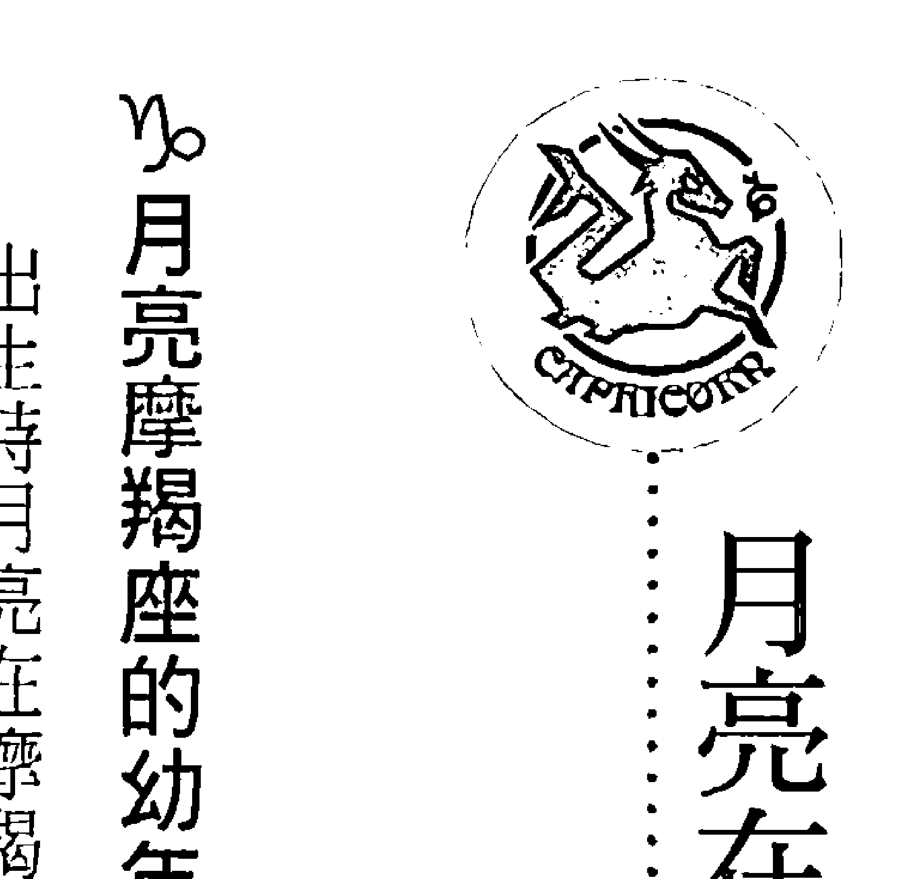

## 月亮在摩羯座的深度解析

## ♑月亮摩羯座的幼年生活

出生時月亮在摩羯座的人通常都有個精明幹練的母親，她們通常是事業有成的職業婦女，作事情按部就班、一板一眼，只要是自己份內的事情絕不推拖敷衍，而且大多數在家中都可以發號施令掌握大權，這種女強人的形象會深植於孩子的心中；她們對子女的期待非常高，十分渴望有一天能以孩子為榮，因此通常她們對孩子的教育訓練會比較嚴格，如果覺得子女的表現不夠好則會讓她們感到失望，作為她們的子女只好拼命努力追求好的表現以討得媽媽的歡心。

月亮在摩羯座的人通常是在壓力沈重的環境下長大，有可能是家庭經濟不好有匱乏的感覺，或是父母親高標準的要求產生很大的壓力，他們總覺得自己是從小吃苦長大的，沒有享受過輕鬆歡樂的童年時光，因此也很容易有一種少年老成的氣質，但若是在幼年遭受了過多的挫折和打擊，也可能讓他們變得傾向悲觀和缺乏自信心，遇到反對或質疑就畏首畏尾，或是習慣逃避不面對問題，其實他們仍然很想有好的表現，消極退縮只是反映出他們受過的創傷。

### ♑ 月亮摩羯座的氣質表現

月亮在摩羯座的人容易給人比較嚴肅的印象，他們相當自我克制而且謹守本份，常會不自覺就緊抓住傳統和規則不放，他們寧可花比較多的時間精力穩紮穩打，也不願意冒險走捷徑，他們做事情非常有計劃，很少在自己沒有把握的狀況之下匆忙地做決定；他們內心當中有很強烈的成就動機，經常會不計代價去追求自己的理想，即使要犧牲眼前的利益和生活享受也一定要達到目標，而且他們本身非常有責任感，只要是答應的事情一定會盡全力去完成。

出生時月亮在摩羯座的人很少有激烈的情緒反應，你幾乎不會看到他們失控暴怒，也很難發現他們開懷大笑，他們對於自己的情緒有過度壓抑控制的傾向，反而容易一個人陷入憂鬱、沮喪、自責等負面的情緒當中；他們心情不好的時候四周將會籠罩一種悲傷沈重的氣氛，稍微長點眼的人都知道該遠遠地躲開，如果你熱切地關心他們，問他們是否需要什麼幫助，通常只會得到很冷淡的反應，真的就是拿熱臉去貼冷屁股，還是讓他們自己一個人生悶氣好了。

### ♑ 月亮摩羯座的居家飲食

月亮在摩羯座的人家中的佈置通常看不出什麼統一的風格，不過他們放在家中的每樣東西都有實用性，鮮少會有純粹為了美感的裝飾，許多人會偏好像木製品及有復古風格的傢俱，但是其堅固耐用才是他們覺得最重要的事；他們非常重視居家安全，通常都會避開容易淹水及受到土石流波及的地區，附近也不可以有加油站、高壓電塔、變電所等建築，如果可能他們通常比較傾向住在有警衛的社區，向住在獨門獨院的別墅，在都市當中則會特別挑選住戶品質較高的優質社區。

通常月亮在摩羯座的人對於飲食比較沒那麼重視，他們吃東西就只是為了活下去，本身的食物也沒有特別大，不過通常習慣會發揮很關鍵的影響力，如果他們中午習慣吃某一家排骨便當，那麼很可能會數十年如一日，天天都吃一樣的東西，即使是自己下廚也都是那幾樣菜，很少會想新花招變化菜單；不過若是他們有重要的約會要招待客人，則會選擇特別氣派的高級餐廳，一方面可以展現自己的誠意，同時也是藉此機會順便享受一下被別人服務的感覺。

### ♑ 與月亮摩羯座的人相處

月亮在摩羯座的人很習慣在事前先做週詳的計劃，依循著既有的組織架構行事，但是同時他們也很容易盡地而自限而缺乏彈性，按部就班、努力向上的生活方式會帶給他們安全感，當狀況改變與計劃不符時經常會讓他們不知所措，若是太過悠閒、無所是事就很容易胡思亂想；他們非常需要被別人尊重及認真對待，所以經常會藉由外在的成就來肯定自己，輕忽他們的努力通常都會引起他們的不快，若是有人膽敢否定他們的成就，則會被視為最嚴重的污辱。

月亮在摩羯座的人很少感情用事，當別人向他們求助時往往表現得比較冷漠，絕不輕易承諾幫忙任何事情，他們會幫你分析整體的情勢，讓你有機會看清楚現實的狀況，並且會鼓勵你負起責任自己去解決問題，他們總覺得凡事靠自己是最穩當的路線，接受別人的幫助則是一種軟弱無能的表現，因此他們經常都是一個人拼命而不喜歡接受別人的幫助；他們本身自視甚高而且很重視自我保護，因此經常會讓人覺得有距離感，很難接觸到他們的內心世界。

## ♑月亮摩羯座的身心保健之道

### 月亮在摩羯座＆土星在白羊座

月亮在摩羯座同時土星在白羊座的人皮膚特別敏感，他們年輕的時候臉部很容易長青春痘、雀斑，而且經常會有胃痛的困擾，年紀漸長則要小心骨質疏鬆的問題，若是不幸骨折要花很多時間才能復原，有些人則會特別容易頭痛，同時也可能有落髮嚴重狀況，過於固執是健康的大敵，若是能透過宗教信仰或心靈成長課程，幫助自己放下不必要的執著，不但能改善胃痛及頭痛的問題，對於皮膚過敏的狀況也很有幫助，同時最好能減少熬夜避免過勞的狀況。

### 月亮在摩羯座＆土星在金牛座

月亮在摩羯座而土星在金牛座的人身體不太會有急性的大問題，不過若是缺乏運動，可能年輕時就會有虛胖的狀況出現，年紀較長之後則容易變成高血壓、高血糖、高血脂的三高危險群，另一些人則是容易因為偏食引起營養不良的狀況，所以盡早養成運動的習慣對於健康會有很大的幫助，一般來說溫和的運動比較適合你，太激烈的運動反而容易造成運動傷害，再來則是要刻意提醒自己維持飲食均衡，並且減少喝冷飲及吃冰，對身體健康會很有幫助。

### 月亮在摩羯座＆土星在双子座

土星在双子座让月亮在摩羯座的人呼吸道比较敏感，他们年轻时很容易有胸闷及呼吸不顺畅的状况，年长一些则容易出现肩颈痠痛的问题，也经常有关节炎的状况，若是长时间写字或使用电脑则很可能有腕隧道症候群；多到户外走走呼吸新鲜空气对于健康会有很大的帮助，在工作时也要有意识地提醒自己要适时地休息，不要经常熬夜造成过劳，就可以减轻肩颈痠痛及关节炎的问题，如果真的很不舒服也可以借助按摩、刮痧、拔罐等方式帮助自己放松。

### 月亮在摩羯座＆土星在巨蟹座

土星在巨蟹座让月亮在摩羯座的人皮肤特别敏感，很容易有过敏起红疹的状况，他们在年轻时就很容易有胃痛、甚至是胃溃疡的状况，女性朋友则要特别注意妇科方面的问题，年纪较大之后则要注意消化不良造成营养不良的状况；而过度压抑的情绪是所有健康问题的总源头，可以透过专业心理谘商师或是参加心灵成长课程，帮助自己释放情绪，对于改善胃痛及女性妇科方面的问题都很有帮助，同时要尽量避开容易引起过敏反应的食物以减少皮肤不适的状况。

### 月亮在摩羯座＆土星在狮子座

月亮在摩羯座同时土星在狮子座的人很容易有腰背痠痛的问题，脊椎侧弯及椎间盘突出也是很常见的状况，他们年轻时容易遇到皮肤方面的问题，年纪较大则经常会有肩、颈、背部僵硬的状况，也有些人会出现驼背的现象；给自己过大的压力是健康的最大敌人，可以透过参加宗教活动或是心灵成长课程，帮助自己放下好胜心及过多的责任感，不但能减少肩、颈、背部的不适，皮肤问题也会改善很多，寻求合格的整脊医师或整骨医师帮忙也有不错的效果。

### 月亮在摩羯座 & 土星在天秤座

土星在天秤座让月亮在摩羯座的人胃部比较虚弱，吃到不适合的东西就容易有胃胀或反胃的现象，他们在年轻时就容易有腰背痠痛的问题，年纪较长之后则要注意泌尿系统容易出问题，甚至有可能因为频尿而影响到睡眠品质，女性朋友同时要注意更年期的问题；维持姿势端正很基本的防护，最好能使用符合人体工学的桌椅，女性朋友则要尽量避免长时间穿高跟鞋，可以减轻背痠痛的不适，再来则是避免吃冰及喝冷饮，对胃部及妇科问题会很有帮助。

### 月亮在摩羯座 & 土星在处女座

月亮在摩羯座而土星在处女座的人本来身体的状况都还不错，但若是年轻时太过拼命忽略适当地休息，也可能出现过劳而提早老化的现象，年纪渐长则容易有胃肠方面的问题，消化不良也可能造成营养不良的结果；所以在工作时要有意识地提醒自己该休息了，避免经常熬夜过度消耗身体的精力，同时也要注意饮食均衡并且要定时定量，规律的饮食可以帮助你减轻肠胃道的负担，让精神体力更好，相反地摄取过多的肉类、甜食则会破坏身体的能量平衡。

### 月亮在摩羯座 & 土星在天蠍座

月亮在摩羯座同時土星在天蠍座的人通常體力會比較差一些，女性朋友則容易有貧血及婦科方面的問題，他們在年輕時容易有消化不良及脹氣的問題，年紀漸長體力下滑的速度會比較快，有些人則是容易有便秘的困擾；過度的競爭性及求勝心是健康發生問題的主因，如果能透過參加宗教活動或心靈成長課程幫助自己培養慈悲心，多站在別人的立場想一想，通常消化系統問題都可以有一些改善，再來則是要注意飲食的營養均衡，以免偏食造成營養不良。

### 月亮在摩羯座 & 土星在射手座

月亮在摩羯座而土星在射手座的人比較容易發生運動傷害，若是沒有及時處理並且徹底休養好，過一段時間就很容易舊傷復發，有外傷的地方經常會留下疤痕，年紀較長經常會有關節炎的問題，同時也要特別注意是否有腫瘤或癌症的狀況；所以做任何運動之前都要先充份熱身，一般來說溫和的運動比較適合你，從事劇烈運動通常都有比較大的風險，再來則是要盡量避免熬夜，早睡早起才能養足精神體力，在睡前用熱水泡腳或是泡澡則能改善睡眠品質。

### 月亮在摩羯座 & 土星在摩羯座

月亮與土星同在摩羯座的人通常皮膚都很敏感，他們在年輕時皮膚就很容易曬傷或是起紅疹，也可能有異位性皮膚炎的困擾，年紀漸長胃部會比較容易出狀況，女性朋友則要注意婦科方面的問題，另外，他們的骨骼與牙齒也比較容易出問題，年輕時就要特別注意補充鈣質，年紀大則是比較容易有關節退化的問題，建議不要從事太劇烈的運動，以免加速關節的磨損。

月亮在摩羯座 & 土星在水瓶座

月亮在摩羯座而土星在水瓶座的人經常會有皮膚方面的問題，女性朋友則要小心婦科方面出狀況，他們在年輕時就比較容易跌倒而發生運動傷害，其中最常會扭傷腳踝，年紀較長之後則容易有血液循環不良的問題，可能會特別畏寒及手腳冰冷，內在矛盾與不確定的情緒是健康的大敵，可以透過靜坐、禪修或是參加心靈成長課程，幫助自己整合內在的矛盾，不但能改善皮膚問題，跌倒及扭傷的狀況也可以減少，盡量早睡避免熬夜對健康也有很大的幫助。

月亮在摩羯座 & 土星在雙魚座

月亮在摩羯座同時土星在雙魚座的人容易有關節炎或是痛風的問題，他們在年輕時很容易得到皮膚病，其中最常見的是香港腳及灰指甲，年紀較大則很可能經常失眠，關節僵硬造成動作不靈活也是常見的問題，有些人則是會有手腳冰冷的狀況；過度的擔心憂慮是健康出問題的主要原因，可以透過參加宗教活動或是心靈成長課程，幫助自己放下無謂的煩惱，不但能改善關節及皮膚的問題，也會讓你更好睡，同時也要注意皮膚清潔以免得到皮膚的傳染病。

過於執著是所有健康問題的總源頭，所以可以透過學習瑜伽、皮拉提斯或是練習太極拳及氣功，幫助自己更柔軟更放鬆，不但有助於皮膚方面的問題，也可以減輕胃部不適的狀況，再來則是要避免熬夜，早睡才能養足精神體力。

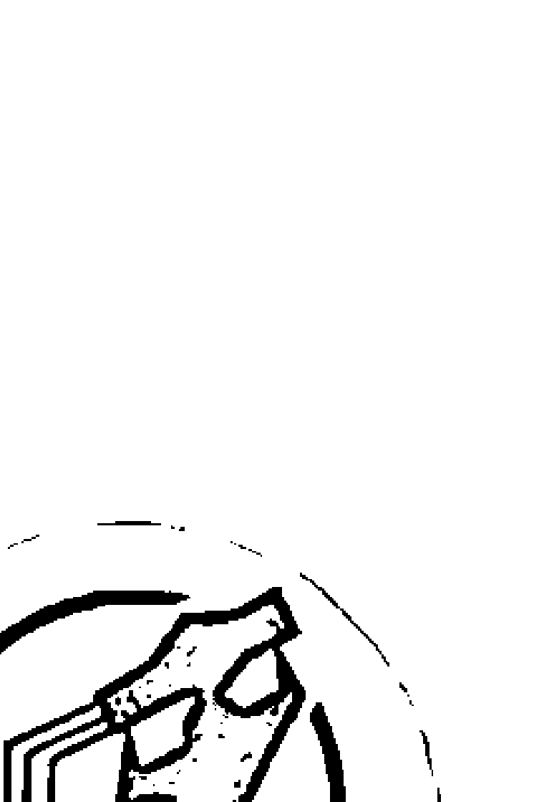

## 月亮在水瓶座的深度解析

### 月亮水瓶座的幼年生活

通常月亮在水瓶座的人都有個思想先進開明的母親，她們並不想扮演傳統婦女的角色，經常是工作又同時帶小孩的職業婦女，即使沒有全職工作也會活躍於社區活動、家長會或是公益團體，這種勇於突破傳統的進步形象會深植於孩子的心中；她們很尊重孩子的基本權利與獨特個性，經常把孩子當成朋友一樣來對待，很少使用權威壓迫的教養方式，因此作為她們的孩子從小就有很大的自由發展空間，同時也會習慣用平等溝通的方式與別人協商解決問題。

月亮在水瓶座的人通常是在比較不穩定的環境下長大，他們幼年時可能經常搬家，家境狀況時好時壞，甚至會歷經父母離異或家道中落等重大變故，讓他們很小就體會了世事無常的道理，因此在人情上會比較淡泊，不喜歡與別人有太深的情感牽扯；但若是幼年時期得不到必要的關心，可能就會展現出十分叛逆不受拘束的樣子，其實他們的內心當中仍然有需要別人注意與肯定的部分，特立獨行的表現是一種無聲的抗議，無意識當中想要引起別人的注意。

### 🌊月亮水瓶座的氣質表現

月亮在水瓶座的人能輕易看清整體的情勢，做出十分精準的判斷和預測，即使與自己切身相關的事情也不會有當局者迷的狀況，因此他們經常都是謀定而後動，也願意為了顧全大局而作出某種犧牲或妥協，但是其實他們的內心十分固執，從不輕易改變自己的想法；他們很喜歡在人群當中觀察人家的反應，同時又展現一副事不關己的樣子，客觀超然的態度常會讓四週的人覺得有距離感，事實上他們內心當中有種自然的防衛機制，並不希望別人太過靠近。

一般來說月亮在水瓶座的人很少激烈地發脾氣，他們能夠與自己的情緒保持安全距離，以比較溫和理性的方式表現出來，即使遇到令人開心的事情也只有淺淺的微笑，心情不好的時候或許會擺個臉色，但是絕對不會影響到理性的判斷，因此有時候也會讓人覺得他們比較冷酷無情一點；雖然他們偶爾也有失控抓狂的時候，不過基本上他們還是動口不動手，而且絕少使用情緒性的字眼謾罵，而是會搬出一堆大道理，義正詞嚴地把對方教訓得像龜孫子一樣。

### 🌊月亮水瓶座的居家飲食

通常月亮在水瓶座的人家中的佈置有很強烈的個人風格，寬敞的客廳是他們待客與展示個人喜好興趣的地方，甚至會讓人有進入了主題博物館的感覺，至於其他的房間就不會有統一的風格，基本上是以簡單、大方、好整理為主；他們很重視鄰居與四週的環境，若是選擇了特定的生活圈就很少會搬家離開，即使需要花費較多時間通勤也在所不惜，同時他們也非常重視房子的採

### ♒ 與月亮水瓶座的人相處

月亮在水瓶座的人不是那麼重視吃，基本上只要省時方便就好，如果公司樓下就有一家速食店，他們也可以每天都吃同樣的東西，一群人出去吃飯他們通常都是最沒意見的人，大家要吃什麼他們就吃什麼，不過他們是屬於少量多餐的類型，除了正常的三餐之外，經常也有下午茶、點心與吃宵夜的習慣；他們並不是經常自己下廚，不過若是為了有朋友要來家中作客，也能變出一桌子菜來招待大家，但是他們拿手的菜就是那幾樣，不會不斷求新求變換菜單。

月亮在水瓶座的人對於人權、環保等理念有獨特的堅持，只要是他們覺得有道理的事情就會義無反顧地支持，若是做了違反這些普世價值的事情，則容易讓他們產生罪惡感，他們不願意做的事情一定有堅強的理念在背後支撐，所以千萬別想說服他們改變原則，否則很可能連朋友都作不成了；他們需要很多的自由與空間，沒辦法忍受被壓迫與限制，權威式地命令口氣會讓他們的內心反感，甚至會故意唱反調來抗議，平等合作才是他們比較能接受的模式。

月亮在水瓶座的人很能夠體諒別人的難處，有很大的肚量包容別人犯錯，當你遇到問題向他們救助時，他們會很實際地提供你必要的援助，同時他們也非常善於聆聽與分析，可以幫助你看清楚問題的關鍵點，釐清可能混淆或迷惑的地方；但是他們並不喜歡別人依賴，當他們發現對方並不想自己面對問題、解決問題，只是不斷地利用他的善心來逃避問題，也有可能選擇與對方保持距離，甚至很不留情面地直接指出對方的錯誤，讓對方覺得很受傷。

## ～月亮水瓶座的身心保健之道

### 月亮在水瓶座&土星在白羊座

月亮在水瓶座而土星在白羊座的人經常會有頭痛的問題，特別是在壓力大的時候狀況會比較明顯，他們年輕時很容易在臉部長青春痘、雀斑，同時還可能遇到皮膚過敏的問題，年紀漸長一些則要小心跌倒或扭傷腳踝，如果不骨折要花費較多的時間才能復原；過於固執是你所有健康問題的總源頭，學習太極拳、瑜伽、皮拉提斯或是柔軟伸展體操可以讓你的身心更柔軟，對於頭痛的問題會很有幫助，吃東西則要小心避開過敏原，可以減少皮膚不適的狀況。

### 月亮在水瓶座&土星在金牛座

土星在金牛座讓月亮在水瓶座的人容易有甲狀腺腫大或是甲狀腺機能亢進的問題，他們比較年輕的時候可能會有經常性的喉嚨痛、咳嗽、及喉嚨發炎的現象，年紀較長之後則是容易出現消化道方面的問題，女性朋友則要特別注意婦科方面及更年期的問題；規律的生活是改善健康最重要的一件事，如果能夠三餐定時同時避免經常熬夜，不但可以減輕喉嚨不適的狀況，對於消化道的問題也有所幫助，最好能改掉吃冰及喝冷飲的習慣，精神體力也會比較好。

### 月亮在水瓶座&土星在双子座

月亮在水瓶座同时土星在双子座的人通常身体没有什么大问题，但是想太多的时候也容易发生偏头痛的状况，他们年轻时可能会有过敏的问题，年纪较长则容易有听觉老化及内分泌失调的状况，有些人则会因为手脚变得比较不灵活而造成行动缓慢；养成经常运动的习惯对于身体健康会有很大的帮助，团体的运动有伴比较不会觉得无聊，自己一个人运动就不容易持之以恒，有空的时候可以多到户外走走，呼吸新鲜空气可以减轻呼吸道不适的状况。

### 月亮在水瓶座&土星在巨蟹座

月亮在水瓶座而土星在巨蟹座的人容易有胸闷、胸痛的问题，女性朋友则要特别注意胸部出现肿瘤甚至是癌症的状况，他们在年轻时经常会有胃部不适的问题，年纪渐长则比较容易出现关节炎或是骨质疏松的状况，有些人则是因为消化不良造成营养不良的问题；压抑的情绪是健康的大敌，参加宗教活动或心灵成长课程可以帮助你释放情绪，对于胸闷、胸痛的问题会很有帮助，再来则是要养成三餐定时的习惯，减少吃冰及喝冷饮对于健康也很有帮助。

### 月亮在水瓶座&土星在狮子座

土星在狮子座让月亮在水瓶座的人特别容易有骨头及关节方面的问题，脊椎侧弯、椎间盘突出及长骨刺都是很常见的状况，他们在年轻时就很容易觉得腰背痠痛，甚至还会有关节炎的问题，年紀較長則要小心跌倒或扭傷腳踝，如果不幸骨折要花費很多時間才能復原；所以平時就要注意維持姿勢端正，選用符合人體工學的桌椅及器具，女性朋友要盡量減少穿高跟鞋，都是很基本的保健方式，若是很不舒服也可以尋求合格的整脊醫師或是整骨師幫忙處理。

### 月亮在水瓶座&土星在處女座

月亮在水瓶座同時土星在處女座的人容易有消化不良的問題，若是吃到不適合的東西，可能會有胃脹、胃痛的狀況，或是連續拉肚子好幾天，他們年輕時容易因為神經緊張造成失眠的問題，年紀較長則要注意秘及腸胃道出現腫瘤的狀況；想太多是健康出現問題的最主要原因，可以透過運動來幫助自己放鬆，其中球類運動最適合你，再來則是要養成定時用餐的習慣，並且注意避開不容易消化以及會引起過敏反應的食物，對於腸胃道的狀況會很有幫助。

### 月亮在水瓶座&土星在天秤座

月亮在水瓶座而土星在天秤座的人通常健康狀況都還不錯，但是想太多仍然容易造成神經緊張及偏頭痛的問題，嚴重的甚至還會影響到睡眠品質，他們在年輕時就可能有腰痛的狀況，年紀較長則要小心內分泌失調的問題，女性朋友要特別注意更年期的狀況；太過於在意別人的想法是健康的大敵，如果能透過心靈成長課程或專業心理諮商師的幫助讓自己更有信心，就可以減輕腰痛的不適。打坐、禪修及靜心冥想可以幫助你放鬆，改善頭痛及失眠的狀況。

### 月亮在水瓶座&土星在天蠍座

土星在天蠍座讓月亮在水瓶座的人身體特別虛弱，很可能有內分泌失調及貧血的狀況，女性朋友則要特別小心子宮及卵巢方面出問題，他們在年輕時經常會有胃痛的問題，年紀漸長則可能出現便秘的困擾，特別需要注意大腸及直腸方面的問題；規律的飲食對於健康會有很大的幫助，特別是養成三餐定時的習慣，能有效改善消化道的問題，也可以減少內分泌失調的狀況，同時要注意食物的營養均衡，利用秋冬時多吃一些溫補的東西，精神體力會比較好。

### 月亮在水瓶座&土星在射手座

月亮在水瓶座而土星在射手座的人很容易有運動傷害，特別容易發生跌倒骨折或扭傷腳踝的狀況，若是沒有及時處理並且充分休養好，就會變成慢性的痼疾，年紀大了之後甚至還會造成行動不便的困擾，另一方面也可能有內分泌失調及淋巴系統病變的問題；所以在運動之前一定要先充分熱身，並且選擇符合人體工作的鞋子，女性朋友則要盡量減少穿高跟鞋，以避免發生運動傷害，規律的作息避免過度熬夜對身體健康會很有幫助，精神體力也會好很多。

### 月亮在水瓶座&土星在摩羯座

月亮在水瓶座而土星在摩羯座的人關節特別脆弱，他們很年輕時就可能有關節炎的狀況，膝關節及腳踝是其中最容易出問題的地方，他們年輕時容易有頭痛及睡眠障礙的問題，年長一些則

## 月亮在水瓶座

月亮與土星同在水瓶座的人很容易遇到內分泌失調或是免疫系統方面的問題，他們在年輕時體力就比較弱，有些人會有皮膚過敏的問題，年紀漸長則容易有消化不良的狀況，甚至有可能在腸胃道出現腫瘤或癌症，女性朋友特別注意更年期的問題；規律的作息是調養身體健康的基礎，除了三餐要定時吃之外，早睡避免熬夜也是很重要的事，這樣不但能改善消化道的問題，對於內分泌及免疫系統也會有幫助，溫和而規律的運動習慣會讓你的精神體力更好。

### 月亮在水瓶座&土星在雙魚座

月亮在水瓶座而土星在雙魚座的人容易有內分泌失調的問題，女性朋友則經常會有月事不定及更年期問題的困擾，他們年輕時容易有失眠的狀況，年紀漸長則要特別小心皮膚及呼吸道方面的傳染病，有些人還有動作不靈活及手腳冰冷的狀況；規律的作息是邁向健康的第一步，可以在睡前用熱水泡腳或泡澡，可以幫助你早點入睡，也能改善手腳冰冷的問題，其次則是要注意自身的清潔衛生，同時盡量避免到人多的公眾場所，以減少被傳染疾病的機會。

要小心血液循環不良及淋巴系統出問題，適度溫和的運動對於健康會很有幫助，特別是瑜伽、太極拳或是氣功特別適合你，不但能改善頭痛及失眠的問題，也可以減少關節出問題的狀況，同時也可以學習靜坐、冥想或參加心靈成長課程，幫助自己放鬆以改善健康狀況。

## 月亮在双鱼座的深度解析

### 月亮双鱼座的幼年生活

月亮在双鱼座的人通常都有个很温柔婉约的母亲，她们很懂得察言观色，也会尽心尽力为别人付出，即使受了委屈还是继续任劳任怨，有时候甚至会牺牲自己成全别人，这种无私无我的形象会深深地印在孩子的心中；她们对于孩子的情绪非常敏感，也会尽量去满足孩子的情感需求，因此作为她们的子女与母亲的情感连结会特别深，但是也很容易养成依赖的习惯，若是过度溺爱还可能让他们的内心变得格外脆弱，稍有不顺就逃避退缩而不愿意面对现实。

通常月亮在双鱼座的人是在一个温馨和谐的环境中成长，因此可能会比较浪漫和不切实际，他们对于压力与冲突特别敏感，常会不自觉地避开过重的压力，并且透过伪装避免涉入各种冲突状况，很少把自己暴露在危险的情境当中，所以有时候会让人觉得他们比较软弱；不过若是父母因为某些不得己的状况无法亲自照顾他们，则会让他们变得特别坚强，不但能把自己的事情都处理好，甚至还会反过来照顾家人，即使自己再怎么辛苦也要给家人过好日子。

### 月亮双鱼座的气质表现

月亮在双鱼座的人能够很自然地融入任何环境，演什么就像什么，他们抱持着随遇而安的态度，做事情也都比较凭感觉，有时候难免会让人觉得有点糊涂甚至是漫不经心，不过他们有很强的直觉力，也常会让他们在不知不觉当中就做出非常睿智的选择；他们有非常丰富的想像力，心中也常抱持著高远的理想，但是当客观状况不如预期时，他们往往会选择妥协而非据理力争，内外的矛盾会让他们的内心觉得苦闷，以致于有些人会去寻求菸酒的慰藉。

### 月亮双鱼座的居家饮食

月亮在双鱼座的人家中的布置常会带有梦幻的异国情调，运用灯光及帘幕创造出柔和的气氛，不过同时他们也很重视精神生活，常会有一间专属的房间作为佛堂、打坐的禅房或是祷告诵经室，依照不同信仰也会出现十字架、圣母像、佛像或上师的照片；他们对于居住环境的要求并不是很高，但是很可能会因为人生的际遇而经常迁移，他们会不自觉地被吸引到临近河流、湖泊

## ※ 與月亮雙魚座的人相處

通常月亮在雙魚座的人並不偏食，但是也不會特別注意營養均衡，他們興頭一來可能會去嘗試各種稀奇古怪的特色食物，不過平常倒是吃得很隨性，有什麼就吃什麼，即使天天吃同一家的便當也甘之如飴，有趣的是他們通常會有一兩樣特別害怕的食材，不但自己下廚絕對不會使用，若是在外食當中遇到也會特別挑出來不吃；一般來說他們的食量並不會特別大，不過甜點及零食對他們來說與正餐同樣重要，所以如果飲食不稍加節制的話也很容易發胖。

月亮在雙魚座的人內心當中對於生命的意義與價值常會有不確定感，所以往往需要依靠某種宗教信仰作為精神的寄託，有時候他們會對自己的判斷缺乏信心，反而希望長輩、老師或上司等權威角色可以幫他們做決定，他們常會不由自主地崇拜權威角色，也願意扮演聽話的乖乖牌；由於他們對於環境特別敏感，也很容易受到別人的影響，因此有時候他們會想要遠離人群，自己一個人才能獲得真正的平靜，所以當他們偶爾消失跑去閉關也不要覺得太驚訝。 月亮在雙魚座的人對人十分有同理心，也很會安慰別人，他們總是不自覺地想要做個好人，所以很難拒絕別人要求，甚至會為了幫助別人而搞砸了自己的事情，因為他們太容易相信別人，所以很有可能會被對方欺騙或利用，同時由於他們太過心軟而無法與依賴自己的人畫清界限，因此常會變成被情緒勒索的對象；有時候他們會為了避免傷害對方而說出善意的謊言，但是真相

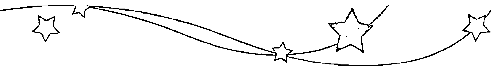

被揭發之後往往會對彼此造成更嚴重的傷害，最後還可能因此失去對方的信任。

## ☆月亮雙魚座的身心保健之道

### 月亮在雙魚座&土星在白羊座

月亮在雙魚座同時土星在白羊座的人很容易有皮膚病的困擾，有些人是臉部常會長雀斑或青春痘，另一些人則是會遇到香港腳的問題，他們年輕時很容易有頭痛的狀況，年紀漸長則會出現睡眠障礙的問題，失眠或是淺眠多夢都是很常見的困擾，想太多是你健康遇到問題的最主要原因，如果能透過參加宗教活動或是心靈成長課程，幫助自己放下不必要的煩惱，健康狀況會很明顯地改善，再來則是要特別注意皮膚清潔，同時也要選擇品質比較好的化妝品。

### 月亮在雙魚座&土星在金牛座

月亮在雙魚座而土星在金牛座的人很容易發胖，也經常成為高血壓、高血糖、高血脂的三高危險群，他們在年輕時容易有扁桃腺發炎、喉嚨痛、甲狀腺腫大等問題，年紀較長一些則容易遇到糖尿病、腳部水腫、聽力退化等問題，嚴重的甚至要配戴助聽器才能正常生活；均衡的飲食是維持健康的第一步，最好能有意識地減少奶、蛋及肉類的攝取，並且改掉喝冷飲及吃冰的習慣，身體狀況就會好很多，再來則是要養成運動的習慣，溫和的運動比較適合你。

### 月亮在雙魚座&土星在雙子座

土星在雙子座讓月亮在雙魚座的人容易有胃痛的問題，若是吃到不適合的東西很可能會上吐下瀉，或是引起嚴重的過敏反應，他們在年輕時很容易得到流行性感冒，年長一些則經常遇到神經痛的問題，嚴重的甚至還會手腳變得特別不靈活，影響到正常的生活作息；過多的思緒是你健康最大的殺手，可以透過學習打坐、禪修或是靜心冥想，幫助自己放掉不必要的念頭，可以改善胃痛的問題，有空不妨到郊外走走，多呼吸新鮮空氣對身體健康也很有幫助。

### 月亮在雙魚座&土星在巨蟹座

月亮在雙魚座同時土星在巨蟹座的人通常身體沒有什麼急性的大問題，但是由於新陳代謝較慢的關係會比較容易發胖，也可能會因此而引發心血管疾病，他們在年輕時可能會容易有胸悶、胸痛的現象，年紀漸長則可能出現消化不良及水腫的問題；過於豐沛的情緒是你健康問題的主要來源，可以透過心理諮商、參加宗教活動或是心靈成長課程來幫助自己釋放情緒，再來則是要養成規律運動的習慣，記得在運動之前一定要先充分熱身，以免發生運動傷害。

### 月亮在雙魚座&土星在獅子座

月亮在雙魚座而土星在獅子座的人容易有脊椎方面的問題，他們在年輕時可能就有脊椎側彎或是椎間盤突出的狀況，年紀漸長也很容易出現駝背的現象，也有一些人是為心血管疾病所苦，

### 月亮在雙魚座&土星在處女座

土星在處女座讓月亮在雙魚座的人消化道特別敏感，吃到不適合的東西很可能會上吐下瀉，腹脹及胃痛的狀況也很容易發生，他們年輕時可能經常有頭痛及失眠的狀況，年長一些則容易出現發胖及水腫的現象，體力下滑的速度也會比較快；規律的飲食是養生保健的第一步，記得三餐定時定量，重視營養均衡，同時也要小心避開會引起過敏反應的東西，健康狀況就會明顯改善。

### 月亮在雙魚座&土星在處女座

另一方面也要儘量減少熬夜以免過份消耗體力，適度運動對健康也會有幫助。

### 月亮在雙魚座&土星在天秤座

月亮在雙魚座同時土星在天秤座的人經常會有腰痛的問題，同時很容易有脊椎側彎或是椎間盤突出的狀況，他們很年輕時可能就已經有腎臟及泌尿系統的問題，年紀漸長體重會比較難控制，經常會變成高血壓、高血糖、高血脂的三高危險群；太過在意別人的想法而猶豫不決是你健康最大的敵人，如果能勇敢地追求自己的理想，健康狀況會好非常多，再來則是由飲食控制下手，平時要多喝水上廁所，少喝咖啡和冷飲，並且避開高油、高鹽、高糖的食物。

經常會有手腳冰冷的狀況；內心的矛盾是所有健康問題的總源頭，如果能積極實踐自己人生的理想，即使年紀較大仍然可以保持不錯的精神體力，平時也要注意維持端正的姿勢，選擇符合人體工學的鞋子，求助於合格的整脊醫師或整骨師通常可以減輕脊椎不適的狀況。

### 月亮在雙魚座 & 土星在天蠍座

月亮在雙魚座而土星在天蠍座的人一般來說健康沒有什麼大問題，但是仍然可能有貧血及循環不良的狀況，他們年輕時容易有腳拇趾外翻或腳掌變形的困擾，年紀較長則容易有下肢水腫的現象，女性朋友同時要注意婦科方面及更年期的問題；過於強烈的情緒反應是你健康出現問題的主要原因，可以透過靜坐、冥想和禪修來馴服浮動的心，參加宗教活動或是心靈成長課程也會很有幫助，同時在秋冬時節可以多吃一些溫補的食物，精神與體力都會比較好。

### 月亮在雙魚座 & 土星在射手座

土星在射手座讓月亮在雙魚座的人肝特別不好，他們年輕時很可能就是肝炎病毒帶原者，甚至還可能發生急性肝炎的狀況，年長一些消化系統很容易出問題，甚至會因為消化不良而產生營養不良的狀況，體力下滑的速度也會比較快；養成早睡的習慣避免過勞是保護肝臟的基本功夫，減少吸菸及飲酒也會對精神體力很有幫助，規律的飲食能夠改善消化系統的狀況，記得三餐定時並且注意營養均衡，避開油炸及生冷的食物，最好改掉喝冷飲及吃冰的習慣。

### 月亮在雙魚座 & 土星在摩羯座

月亮在雙魚座同時土星在摩羯座的人常會有過勞的問題，他們年輕時很容易得到各種傳染病，也可能是失眠或是淺眠多夢的狀況，年紀漸長容易有腳拇趾外翻或腳掌變形的困擾，甚至有

### 月亮在双鱼座 & 土星在水瓶座

月亮在双鱼座而土星在水瓶座的人容易有下肢水肿及新陈代谢不良的问题，他们在年轻时就很容易因为跌倒而发生运动伤害，扭伤脚踝的状况特别常见，年长一些则要注意心血管方面的疾病，血压太高或太低都不是好现象；通常缓和的运动会比较适合你，包括瑜伽、皮拉提斯、太极、拳、气功等都很不错，若是要从事比较剧烈的运动，开始之前一定要记得热身以免发生运动伤害，其次则是要调整饮食，尽量减少吃生冷的食物，改掉喝冷饮及吃冰的习惯。

### 月亮在双鱼座 & 土星在双鱼座

月亮与土星都在双鱼座的人很容易得到各种传染病，他们年轻时很常会有香港脚、肝炎、流行性感冒及急性肠胃炎的经验，年长一些则容易有睡眠障碍的困扰，失眠及浅眠、多梦都是很常见的状况，另一些人则是经常会有腹胀及胃痛的问题；养成良好的个人卫生习惯是保持健康的关键，到人多的公共场所最好配戴口罩，回家及用餐之前记得要洗手，同时也要注意食品的卫生及安全，以减少被传染的状况，在睡前用热水泡脚或泡澡则有助于改善睡眠品质。

可能因为关节炎而造成行动不便的状况，在工作当中有意识地提醒自己休息，避免熬夜过度消耗精力是养生保健的第一步，再来则是要选择符合人体工学的鞋子，女性朋友尽量减少穿高跟鞋，可以减轻脚部不适的状况，在睡前用热水泡脚或是泡澡通常会帮助你放松入眠。

## 木星與土星的趨吉避凶之道

在傳統西洋占星當中木星被視為大吉星，同時會影響到個人的宗教信仰，而土星則被認為是大凶星，經常會帶來責任、壓力與考驗，因此木星星座與土星星座的組合就成了我們趨吉避凶的重要指引；木星大約每年經過一個星座，要十二年才會走完黃道一週，同年出生的人往往都會有相同的木星星座，有一點類似於東方命理當中生肖的概念，土星通過一個星座則要大約兩年半，需要二十九年半才會走完十二個星座，相同土星星座的人比較不容易有代溝。

由於木星與土星合會的週期為二十年，因此每二十年就會有一批木星與土星同星座的人出生，雖然就理論上而言木星與土星落入的星座組合可以有一百四十四種（12×12），但是由於木星與土星運行的速度成固定比例，因此在二十世紀當中就只有出現一百一十一種組合而已，若要出現所有可能的組合則要超過六百年以上，以下將以木星所落入的星座為主軸，合併討論土星座可能造成的影響，為了節省篇幅將略過百年內不會出現的組合。

註：請對照 P.253 P.254 找出自己的木星與土星。

## ♈木星在白羊座對個人的影響

木星在白羊座的人需要有明確的奮鬥目標，並且快速地朝向目標前進，才能把自己的實力發揮出來，他們必須靠自己的努力去獲得成就，想要攀親帶故靠關係得利則是不切實際的幻想，當他們願意開創一條前無古人的新道路，將會獲得最豐厚的回報；有時候他們會對宗教有強烈的狂熱，但是這種熱情也會消退得很快，宗教不容易成為他們生活的重心，他們認為宗教信仰是很個人的事情，外在的宗教組織與團體並不重要，也不會受到別人的影響而改變。

### 木星在白羊座 & 土星在白羊座

木星與土星同在白羊座的人經常會有一種內在的矛盾，若是他們能積極地行動通常都會很快獲得成果，但是同時又會產生很大的責任與壓力，讓他們想要退縮或逃開，其實只要他們能放下以自我為中心的執著，預留改變的彈性與空間，自然就能找到適當的平衡點；當他們有機會成為領導者，則要提醒自己避免與別人無意義的比較與競爭，唯有自己不斷地學習成長才是正道，千萬不要想透過打壓別人來突顯自己，否則到頭來必定會遭到反撲而摔得更重。

### 木星在白羊座 & 土星在金牛座

木星在白羊座而土星在金牛座的人會發現，當他們願意探索嘗試時環境當中往往有各式各樣的機會，但是若只求穩定守成反而容易讓自己陷入困境，緩慢的動作經常會帶來更多的責任壓力，猶豫不決只會無意義地消耗能量，唯有全力向前衝刺才能夠開創新局；當他們有機會成為領導者，則要提醒自己不要太過執著，在錯誤的方向上持續努力只會離成功越來越遠，在金錢上斤斤計較反而會把格局越做越小，要帶有理想性才能幫你突破現實與環境的限制。

### 木星在白羊座 & 土星在巨蟹座

土星在巨蟹座可能會讓木星在白羊座的人產生強烈的內在衝突，消極與悲觀的態度會讓他們的行動受阻，想要選擇安全穩定的道路反而很可能一事無成，所以積極主動才會通往成功的大道，不要讓過度情緒化的反應影響到自己的行動力；當他們有機會成為領導者，則要提醒自己不要被主觀的好惡所朦蔽，固定的班底與派系容易侷限住視野，若是不幸誤信小人還可能把辛苦建立的基業給毀了，要勇於突破出去看看外面的世界，才能有持續地進步與成長。

### 木星在白羊座 & 土星在獅子座

木星在白羊座而土星在獅子座的人雖然很適合快速地向前衝，但是同時要小心避免太出鋒頭而成為箭靶，這可能會遇到很大的阻力，如果遇到勢不可為的狀況，千萬不要為了面子問題而死撐活撐，願意放下，另起爐灶才能避免能量無謂的浪費；當他們有機會成為領導者，則要提醒自己避免用權威或獨裁的方式來決策，以免因為自身的盲點而發生重大失誤，重要的是看清楚大方向，在組織及實際執行上則可以適當授權，才不會讓自己累個半死。

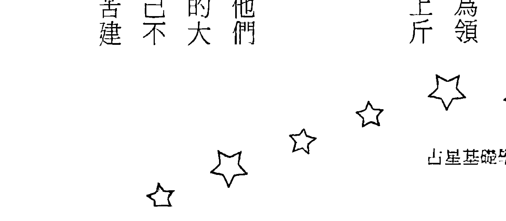

## **木星在白羊座&土星在处女座**

木星在白羊座同时土星在处女座的人会发现，当他们拘泥于规则与架构就很容易陷入困境，但是若能勇于创新突破则会有比较好的结果，过份重视细节经常会衍生出更多的责任与压力，但无法解决问题事情还会越做越多，所以千万别被琐碎的小事给困住了；当他们有机会成为领导者，则要提醒自己要对自己有信心，同时学习适当的授权，不要把所有的事情都揽在自己身上，当他们能够把重心从执行层面提升到决策层面，就会有更多的能量向上发展。

## **木星在白羊座&土星在天秤座**

土星在天秤座让木星在白羊座的人容易陷入进退维谷的状况当中，犹豫不决经常让他们错失先机，若是太在意别人的想法和立场则会增加许多不必要的责任与压力，所以当自己觉得该做的时候就要勇敢去做，瞻前顾后只会无意义地消耗能量；当他们有机会成为领导者，则要提醒自己不可能做到百分之百的公平，想要面面俱到讨好每个人是不可能的一件事，刻意维持表面的和谐反而容易把事情推向真正的危机，制订细密的规范还不如以身作则来得有效。

## **木星在白羊座&土星在射手座**

木星在白羊座同时土星在射手座的人本身很适合开创，但是太过冒险而缺乏计划则有可能让他们吞下失败的苦果，若是太在意别人的眼光就容易遇到困境，与其被外在的伦理道德规范给绑住，不如倾听内心真正的声音，朝向自己认同的方向前进；当他们有机会成为领导者，则要提醒自己不要过度乐观、好高骛远，记得登高必自卑、行远必自迩的道理，不要一下子就把理想与标准提得太高，从现实状况出发一步一脚印地前进，才能真正达到自己的目标。

## **木星在白羊座&土星在摩羯座**

土星在摩羯座可能会让木星在白羊座的人有一些内在的冲突，保守传统的作法会带给他们很多责任与压力，若是有太大的野心则容易产生过劳的现象，因此要学会保持灵活性与开创性，不要被既有的组织架构和成就所限制，同时也要记得见好就收、适可而止；当他们有机会成为领导者，则要提醒自己不要执着于权位名利，为了达成目的而不择手段经常会自食恶果，如果能放下过多的权谋与算计，专心致志地朝向目标前进，反而会更快达到成功的境界。

## **木星在白羊座&土星在水瓶座**

木星在白羊座同时土星在水瓶座的人很适合带着大家往前冲，但是太过讲义气也可能会为他们带来不少麻烦，所以千万别把亲朋好友们的事情全揽在身上，专注于自己该做的事情才是正道，若是个人的理想被群体的意见所淹没就很容易会陷入困境；当他们有机会成为领导者，则要提醒自己不要被属下的意见给绑架了，太过顾虑别人的立场与反应常会让自己动弹不得，凡事想太多只会让自己失去行动力与热情，勇敢地朝向自己的理想前进才能获得成功。

## **木星在白羊座&土星在双鱼座**

木星在白羊座而土星在双鱼座的人会发现，当他们愿意主动积极奋斗的时候事情往往都会进行得很顺利，但若是消极被动或是随波逐流则会让自己陷入不利的局面，在原地不动常会让自己被各种胡思乱想所淹没，唯有坚强的行动力才能消除烦恼开创新局；当他们有机会成为领导者，则要提醒自己要坚持理想，不要因为环境的限制就做出违背自己初衷的事情，太在意别人的反应只会让自己绑手绑脚，唯有相信自己并且坚定地朝向目标前进才能有所成就。

## ♉ **木星在金牛座对个人的影响**

木星在金牛座的人需要慢慢酝酿，经过一段时间的实际演练之后，实力才会逐渐发挥出来，所以他们需要培养耐心和毅力，尽量走稳健踏实的道路而避免过份冒进的行为，当他们能以实际的观点不断地累积自己的经验与实力，就能得到很丰硕的成果；他们的宗教信仰十分坚定，无论遇到任何阻碍和考验也不会影响他们的信心，参加宗教活动很自然地成为一种习惯，他们认为宗教信仰能带给人安全感，对宗教团体或上师的奉献让他们觉得自己很有价值。

## **木星在金牛座 & 土星在金牛座**

木星与土星同在金牛座的人常会有一种内在的矛盾，认真踏实帮助他们迈向成功，但是有了成就之后又觉得处处受限压力沈重，对于物质与金钱的执着是他们卡住的主要原因，如果能够学着不要太贪心，该是自己的就要勇敢争取，但是该放给别人的利益也不要小气，这样才不会在彼此心中留下心结，同时也要认真参考专业的意见，太过固执很容易会陷入困境。

## **木星在金牛座 & 土星在巨蟹座**

木星在金牛座而土星在巨蟹座的人是适合走保守路线没错，但是过度自我保护常会让他们陷入困境，若是感情用事则会带来许多不必要的责任与压力，因此最好还是从务实的角度出发，不要对外在的人事物投注太多认同或是反感的情绪；当他们有机会成为领导者，则要提醒自己尽量对事不对人，搞派系和小团体只会把自己的格局做小，心软护短更会带来不少麻烦，若是识人不明还可能会被出卖，但如果能秉公处理赏罚分明，自然能得到更多人的支持。

## **木星在金牛座&土星在狮子座**

土星在狮子座经常让木星在金牛座的人产生严重的内在冲突，做事情积极主动很容易引来批评与抵制，太在意别人的眼光及评价则会增加许多不必要的责任与压力，因此最好还是走低调务实路线，追求外在的虚名及权力只会把妳导向挫折与困境；当他们有机会成为领导者，则要提醒自己不要好大喜功、得意忘形，爬到越高的位置越要戒慎恐惧，若是不小心由傲慢产生偏见则会把他们推向危机，冲动做的决定往往并不可靠，从长计议才能立于不败之地。

## **木星在金牛座&土星在天秤座**

木星在金牛座而土星在天秤座的人会发现，当他们太在意别人的想法和立场就很容易让自己卡住，但若从头到尾坚持自己的想法和作法则会比较顺利，高谈公平正义的理想常会带来很多不必要的责任与压力，只重视实际的利害关系反而会比较轻松自在；当他们有机会成为领导者，则要提醒自己不要总是想当好人，也不可能达到绝对的公平，在原地空想只会无意义地消耗能量，太过犹豫不决也容易让他们错失先机，还是要有实践力才能达到自己的理想。

## **木星在金牛座&土星在射手座**

木星在金牛座而土星在射手座的人会发现，当他们心存侥幸冒险尝试往往会弄得灰头土脸，事前有充分的计划与准备才能得到自己想要的成果，过高的理想经常会带来沈重的责任与压力，若是到头来无法实现还会严重打击信心，所以千万不要过度乐观、好高骛远；当他们有机会成为领导者，则要提醒自己小心谨慎，忽略细节与可行性评估经常会成为致命伤，即使大方向正确也很难成功，重视外在的虚名只会让你绑手绑脚，放手去做才能得到实际利益。

## **木星在金牛座&土星在摩羯座**

木星在金牛座同时土星在摩羯座的人是需要地慢慢累积经验，但是太大的野心往往会带来过多的责任与压力，若是受制于既有的传统与组织架构则容易让他们身陷困境，如果能放下必须刻苦奋斗才能成功的错误想法，就可以用更轻松优雅的方式达成目标；当他们有机会成为领导者，则要提醒自己不要让无谓的责任感造成过劳的苦果，与其追求虚名不如好好把握实利，当你能够完全不在意别人的评价及外在的名声，反而能够更专注地把自己的事情做好。

## **木星在金牛座&土星在水瓶座**

土星在水瓶座让木星在金牛座的人容易有一些内在的冲突，求新求变的作法经常将他们导向困境，过于讲义气也会增加许多无谓的责任和压力，因此最好还是先把自己的事情搞定，稳健务实地采取行动，千万不要让其他人的意见干扰了自己的决定；当他们有机会成为领导者，则要提醒自己避免突然地政策急转弯，朝令有错也要缓慢地改革才不会造成一度伤害，过高的理想只会让自己陷入孤立，若是以现实状况为基础去评估自然能找到成功的道路。

## **木星在金牛座&土星在双鱼座**

木星在金牛座同时土星在双鱼座的人会发现，当他们被环境或别人推着走时通常都比较坎坷，但若是能坚持自己的想法去做则会顺利得多，想要逃避退缩时往往会带来更多的困难与压力，勇敢面对问题承担责任，才能达到自己想要的目标；当他们有机会成为领导者，则要提醒自己事先订好计划并确实去执行，只是在原地空想哪里也去不了，太过随性而不稳定的决策容易让他们陷入困境，特别是在财务及资源配置上一定要精打细算，才能立于不败之地。

## Ⅱ **木星在双子座对个人的影响**

木星在双子座的人需要不断地吸收新知，并且透过与别人沟通交流，才能表现出最好的一面，他们必须经常变化与创新，重复相同的东西则会遇到越来越大的阻力，当他们能发挥灵活敏捷的特性，并且保持弹性去应付不同的状况，就能立于不败之地；他们对于所有的宗教都很好奇，也会用很理性的态度来研究各家各派的学说，不过他们很少会坚信特定宗派，而是经常游走于各个不同的教派之间，他们虽然对教义很有研究，但是本身并不一定那么相信。

## **木星在双子座 & 土星在金牛座**

木星在双子座而土星在金牛座的人会发现，愿意尝试各种新鲜的事物常会为他们带来很多机会，但若是为了安全感去走保守稳定的路线，反而容易让自己陷入困境，过于坚持不知变通经常带来更多的责任与压力，犹豫与拖延总是会产生负面的影响；当他们有机会成为领导者，则要提醒自己不要在金钱上斤斤计较，过于贪心与物质化常会把他们带向失败的道路，保持弹性不断学习才能做出正确的决策，千万不要误以为一套模式就能应付各种不同的状况。

## **木星在双子座 & 土星在双子座**

木星在双子座 & 土星在双子座 木星与土星同在双子座的人常会有一种内在的矛盾，创新的作法总是带给他们很多机会，但是经常变动也会造成他们无法累积的遗憾，其实理性评估是找到平衡点最重要的标准，谋定而后动才不会让自己反复陷入困境，同时也可以掌握住适当的机会；当他们有机会成为领导者，则要提醒自己不要过度地怀疑和猜忌，避免因为想太多而陷入无法决定的困境，很多事情需要适当地授权才能顺利进行，同时也要培养耐性，看到执行的成效之前不要急着改变。

## **木星在双子座&土星在处女座**

土星在处女座让木星在双子座的人有一种内在冲突，想得太多容易让他们陷入进退维谷的困境，钻进细节出不来常会让事情越做越多，努力勤奋追求完美则会带来更多的责任与压力，但是只要能依照现实的状况寻找变通之道，大部分问题都可以迎刃而解；当他们有机会成为领导者，则要提醒自己不要拘泥于标准作业流程，否则到头来很可能一事无成，同时最好尽量把事情交代给下面的人去做，避免身陷执行的细节才能看清楚情势作出正确的决策。

## **木星在双子座&土星在狮子座**

木星在双子座同时土星在狮子座的人会发现，以自我为中心的角度做的决定往往会遇到很大的压力，但若是能在事前充分沟通状况就会顺利得多，太重视面子问题经常会带来更多的责任与压力，若是爱出锋头则很容易成为箭靶；当他们有机会成为领导者，则要提醒自己不要因为好大喜功而走上错误的道路，努力追求外在的虚名很容易产生挫折感，独裁专制的决策模式经常把他们带入困境，所以要尽量避免固执己见，保持弹性才能应付各种不同的状况。

## **木星在双子座 & 土星在天秤座**

木星在双子座同时土星在天秤座的人适合多与别人沟通交流，但是太在意对方的看法就容易让自己卡住，强调公平则会增加许多不必要的责任与压力，若是试图去说服对方更会浪费许多时间精力，所以保持安全距离不要涉入太深才是比较好的作法；当他们有机会成为领导者，则要提醒自己不要想面面俱到，也不可能找到所有人都满意的解决方案，犹豫不决只会让他们陷入困境，还不如先去尝试自己觉得适当的解决方案，遇到问题再来修正就可以了。

## **木星在双子座 & 土星在天蝎座**

木星在双子座而土星在天蝎座的人会发现，自己越是害怕与隐藏就越容易陷入困境，但若是能开诚布公好好沟通，事情往往都能获得很好的解决，强烈的情感投射与情绪化的反应经常带来许多不必要的责任与压力，太过固执己见只会不断地树立敌人；当他们有机会成为领导者，则要提醒自己不要刚愎自用，在关键时刻多听听别人的想法，才能避免主观的偏见造成伤害，若是发现此路不通也要勇于认错改变方向，在错误的道路上坚持绝对无法迈向成功。

## **木星在双子座 & 土星在射手座**

木星在双子座而土星在射手座的人陷入进退两难的状况，太过介意外在的名声与评价容易带来许多责任与压力，高举理想的冒险行为则会让他们陷入困境，因此死守着高远的理想及道德规范只会让事情越来越复杂，最好还是脚踏实地去执行可行性高的方案，同时也要避免因为理想过高而失望，培养务实的态度才能真正掌握住成功的机会。

## **木星在双子座＆土星在摩羯座**

木星在双子座同时土星在摩羯座的人会发现，强烈的责任感往往会让事情越做越多，拘泥于传统与规则的框架经常带来更大的责任与压力，过份迷信经验法则也会造成许多不必要的限制，在这个时候通常创新的想法都能帮助他们突破僵局找到另一条路；当他们有机会成为领导者，则要提醒自己不要被权力欲望冲昏了头，越是想要保住自己的名、利、地位就越容易遇到困难和挑战，若是能看清世俗名利无常的性质，在遇到重大变动的时候才能从容应付。

## **木星在双子座＆土星在水瓶座**

木星在双子座同时土星在水瓶座的人是很适合发挥创意没错，但是太过怪异特立独行则会带来不必要的困扰，还是要顾及社会观感，复杂的人际关系及团体动力容易增加很多责任与压力，所以千万不要误把别人的事情都背在自己身上；当他们有机会成为领导者，则要提醒自己不要太过固执，高举理想容易让他们陷入困境，还是要保持弹性才能应付各种的突发状况，也要避免被属下的意见给迷惑了，广纳各种意见的同时还是要有自己的逻辑及判断标准。

## **木星在双子座 & 土星在双鱼座**

土星在双鱼座经常让木星在双子座的人产生严重的内在冲突，总是回忆过去让他们在原地动弹不得，若是被环境推着走又容易陷入困境，太过感情用事更会带来许多不必要的责任与压力，所以还是要运用逻辑的思维才能帮助自己突破幻象迈向成功；当他们有机会成为领导者，则要提醒自己依靠客观的讯息理性地决策，只凭感觉随性地决定往往会走进死胡同，太过心软不愿意伤害别人反而容易造成对自己不利的结果，回归现实就事论事才是最好的方法。

## **木星在巨蟹座对个人的影响**

木星在巨蟹座的人需要相信自己的直觉，并且坚定地朝向自己的目标前进，才能把自己的实力展现出来，他们适合走传统或是自己比较熟悉的路线，标新立异的做法到头来往往不了了之，当他们能学会照顾保护别人，并且不断从经验中学习，就会得到最好的结果；他们对于宗教信仰有持续的热情，特别是当他们亲身参与宗教活动而被感动之后，就很容易成为非常狂热的信徒，他们会积极地捍卫自己相信的宗派，遇到批评或反对的意见则会引发他们激烈的反击。

## **木星在巨蟹座&土星在白羊座**

土星在白羊座经常让木星在巨蟹座的人产生严重的内在冲突，当他们快速、急切地投入往往会陷入困境，不断想要和别人比较与竞争则会带来许多不必要的责任与压力，但若是能站在别人的立场想想并且谋定而后动，就容易找到彼此双赢的策略；当他们有机会成为领导者，则要提醒自己事缓则圆，千万不要第一个当炮灰，在行动之前要先想好各种防范措施与应变计划，同时培养能信任的班底尽量把工作交办下去，所有事情都自己来只会让他们累死。

## **木星在巨蟹座&土星在双子座**

木星在巨蟹座同时土星在双子座的人会发现，当他们不断尝试而经常变动就很容易一事无成，但是如果愿意定下来慢慢累积反而会明显地看到成绩，多疑猜忌总是把他们导向困境当中，想太多会让他们停滞不前，要相信自己的直觉才能走向成功的大道；当他们有机会成为领导者，则要提醒自己并不是理论上正确的事情就一定可以做到，找到适当的人来执行也是很重要的关键因素，若是能培养自己能信任的班底，遇到困难挑战时才能找到人共同奋斗。

## **木星在巨蟹座&土星在狮子座**

木星在巨蟹座而土星在狮子座的人会发现，当他们想出锋头争取表现的机会，事情往往不会进行得很顺利，反而是一个人默默地努力，坚持到最后才能获得成功，太在意别人的看法与评价经常会带来许多的责任及压力，最好还是回归到自己内心的判断；当他们有机会成为领导者，则要提醒自己避免走上专制、独裁的路线，强势与权威的作法只会造成众叛亲离，要真诚地关心照顾下属才能有稳固的领导地位，与其追求虚名还不如选择实际的利益比较轻松。

## **木星在巨蟹座&土星在处女座**

木星在巨蟹座同时土星在处女座的人会发现，当他们努力分析想要找出最佳的解决方案往往就会卡在原地不动，过度要求精确经常会带来做不完的事情，强烈的责任感容易产生过劳的现象，反而是顺着内心的直觉去走自然就能突破困境；当他们有机会成为领导者，则要提醒自己不要太過嚴格挑剔，以免造成眾叛親離的後果。同時不要執著於標準作業流程，有能力的人依照經驗往往能做出更好的決定，因此找到對的人來做事會比訂定各種規則來得重要。

## **木星在巨蟹座&土星在天蝎座**

木星在巨蟹座而土星在天蝎座的人是很适合凭直觉来作决定没有错，但是不安全感及防卫心容易限制了他们的发展，强烈的情感投射则会为他们带来许多不必要的责任与压力，强调比较与竞争只会不断树立敌人，真心关怀并且设身处地为别人着想才能有贵人相助；当他们有机会成为领导者，则要提醒自己不要太多疑，把事情都紧抓在自己手上只能原地踏步，要培养属下、提携后进才有机会更上层楼，若是太执着于追求权力则有可能走上错误的道路。

## **木星在巨蟹座&土星在摩羯座**

土星在摩羯座经常让木星在巨蟹座的人陷入进退两难的状况，保守稳定的作法带来许多机会，不过既有规则与传统又会造成许多限制，强烈的责任感经常让事情越做越多，过大的野心则会增加许多不必要的责任与压力，唯有放下对名利的欲望才能得到自由；当他们有机会成为领导者，则要提醒自己不要过度迷信规则与组织的作用，标准作业流程也只能防止属下犯错，要获得属下的尊敬和信任才能真正领导他们，冷酷无情的作法只会众叛亲离导致失败。

## **木星在巨蟹座&土星在双鱼座**

木星在巨蟹座同时土星在双鱼座的人是可以顺着内心的感觉走，但是要小心过多的情绪与内心戏可能会把他们困在原地，若是消极被动而随波逐流则会带来许多不必要的责任与压力，所以要学会坚持人我、内外的界线，才能摆脱不利的状况开创新局，当他们有机会成为领导者，则要提醒自己不要过于心软，一天到晚帮下属收拾烂摊子只会让自己耗尽精力，太在意别人的看法也很难做出正确的决策，要坚定自己的立场朝向既定的目标前进才能获得成功。

## Ω **木星在狮子座对个人的影响**

木星在狮子座的人要找到一个适合自己的舞台，让大家都看到他的表现，才能把自己的实力完全发挥出来，他们能把自己认同的事情做到最好，但是被强迫做的事情往往就不容易成功，当他们能展现魄力，同时负起组织与领导的责任，就能获得最丰盛的成果；他们对于宗教信仰有很主观的评价，而不愿意花太多时间去研究教义，盛大的宗教庆典或庄严的宗教仪式很容易吸引他们，他们也可能热心地投入宗教活动。

## **木星在狮子座 & 土星在白羊座**

木星在狮子座同时土星在白羊座的人是要主动积极没错，但是仍然要小心避免冲太快而陷入孤军奋战的状况，若是后继无力反而会留下一堆烂摊子，事前要有周详的计划才能立于不败之地，除了自己的主观意愿之外也要同时考虑到客观环境的条件；当他们有机会成为领导者，则要提醒自己保持耐性，愿意承担责任并且持续努力才能迈向成功，一时冲动下的决定很容易导向错误的方向，尽量避免与别人无谓的比较与竞争，团队合作才能发挥最大的力量。

## **木星在狮子座 & 土星在双子座**

木星在狮子座而土星在双子座的人会发现，当他们一直变来变去拿不定主意，就会遇到非常多的阻碍，但若是能下定决心积极主动去做，事情往往就会顺利得多，空谈理论通常都没办法解决问题，必须付诸行动才能验证想法是否可行；当他们有机会成为领导者，则要提醒自己不要过度分散精力，专精于某个特定领域反而更容易取得成功，同时也要培养下属独立作业的能力，不要事事都亲自插手，才能把有限的精力用在刀口上。

決問題，唯有勇於承擔責任並且展現魄力才能打開僵局；當他們有機會成為領導者，則要提醒自己堅持立場，不要被其他人的意見給左右了，收集太多訊息只會讓他們感到迷惑和混亂，倒不如按照自己主觀的看法來決定大方向，至於處理的細節就交給下面的人去發揮。

### 木星在獅子座 & 土星在巨蟹座

木星在獅子座同時土星在巨蟹座的人會發現，擔心與憂慮經常將他們困在原地一事無成，若是有情緒化的反應就很容易陷入困境，刻意選擇看似安全的保守路線反而會帶來許多不必要的責任與壓力，還是要勇敢去做心中真正想做的事情才能掃除障礙開創新局；當他們有機會成為領導者，則要提醒自己不可以包庇護短，對屬下太過心軟只會自失立場，要強勢領導才能建立威信，當他們能有多一點自信心並且建立起自己的名聲，就很容易走上成功的大道。

## 木星在獅子座

木星與土星同在獅子座的人常會有一種內在的矛盾，積極主動勇於表現通常都能很快獲得成果，不過同時也會帶來很大的責任與壓力，若是太鋒頭就很容易成為箭靶，但是壓抑自己又會覺得不滿，其實判斷的標準在於自己是否覺得開心，不要被外在的名利地位所迷惑了；當他們有機會成為領導者，則要提醒自己不要好大喜功，同時避免因為屬下奉承就得意忘形，只要他們能踏實地堅持自己的理想並且勇敢地承擔責任，還是能獲得應有的回報及名聲。

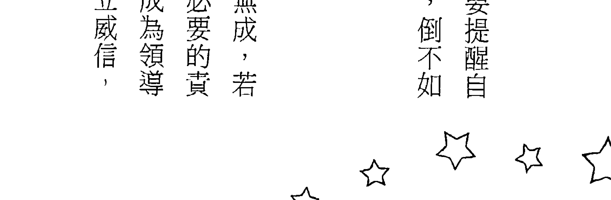

### 木星在獅子座 & 土星在處女座

木星在獅子座同時土星在處女座的人會發現，當他們畏首畏尾缺乏自信很容易會陷入困境，相反地若是勇敢地秀出自己就能創造許多機會，過度重視細節往往會增加許多不必要的責任與壓力，找到正確的方向才能讓他們邁向成功的大道；當他們有機會成為領導者，則要提醒自己不要太過嚴肅，緊迫盯人要求完美只會離心離德，每天管瑣碎的小事容易效率低落，盡量用輕鬆正面的方式去鼓勵員工，並且給予更多發揮的空間，大家才能支持你更上一層樓。

### 木星在獅子座 & 土星在天蠍座

土星在天蠍座經常讓木星在獅子座的人產生嚴重的內在衝突，當他們很在意別人的表現並且想要贏過別人往往會遇到很多挫折，若是專心做自己覺得開心的事情就很容易獲得成功，越是想要隱藏反而會引來更多的責任與壓力，還不如一開始就勇敢地表現自己；當他們有機會成為領導者，則要提醒自己用人不疑、疑人不用，花太多力氣去防範下註定會一事無成，如果能公開明確地提出願景並且充分授權下面的人去發揮，就能幫助他們邁向成功的大道。

### 木星在獅子座 & 土星在射手座

木星在獅子座同時土星在射手座的人是需要鎖定目標努力沒有錯，但若是訂定了過高的目標則容易讓自己感到挫折，過份樂觀的評估經常讓他們陷入困境，堅持理想主義則會帶來許多不必要的責任與壓力，所以重點在於找到適合自己發揮的舞臺；當他們有機會成為領導者，則要提醒自己不要太過衝動，即使目標正確仍然需要準備好之後再行動，心存僥倖冒險通常都會走向失敗的結果，在事前先做好週詳的計劃並且依照現實狀況調整才能立於不敗之地。

### 木星在獅子座&土星在摩羯座

土星在摩羯座容易讓木星在獅子座的人出現嚴重的內在衝突，謹慎小心的態度經常讓他們卡住，保守傳統的作法反而會帶來更多的責任與壓力，但若是能放下不必要的顧慮與算計，輕鬆地面對往往會處理得更好，只要自己做得開心就很容易成功；當他們有機會成為領導者，則要提醒自己有所為、有所不為，千萬不要被權力欲望沖昏了頭，為達目的不擇手段到最後必然會被反噬，記得堅守自己的原則開大門走大路，光明正大的作法才能讓他們邁向成功。

### 木星在獅子座&土星在水瓶座

土星在水瓶座經常讓木星在獅子座的人陷入進退兩難的狀況，當他們在意別人的看法並且考量到大家的立場就很容易遇到阻礙，過於講義氣則會帶來許多不必要的責任與壓力，相反地若是全心全意朝向自己設定的目標前進通常會比較輕鬆自在；當他們有機會成為領導者，則要提醒自己保持權威感，太過平易近人的作風很容易讓屬下沒大沒小，甚至還可能故意唱反調造成指揮調度的困難，恩威並施讓屬下清楚地知道誰是老大才能讓組織發揮應有的功能。

### 木星在獅子座 & 土星在雙魚座

木星在獅子座同時土星在雙魚座的人會發現，當他們消極被動、隨波逐流時總會遇到很多的困難和挑戰，但是只要願意立定目標並且積極奮鬥就有很多機會和貴人，心軟而過於在意別人的狀況經常帶來許多不必要的責任與壓力，感情用事的決定很容易讓他們陷入困境；當他們有機會成為領導者，則要提醒自己要有信心與決心，不要被外在的情勢或是他人的意見影響自己的決定，只要他們能勇敢果決落實自己的計劃，就能得到更多的支持邁向成功之路。

# 木星在处女座对个人的影响

木星在处女座的人需要在事前做好详尽的研究规划，把所有的步骤与细节都确定之后，才能充份发挥自己的实力，他们比较适合走勤务务实路线，几乎没有遇到过不劳而获的状况，当他们能条理分明地处理事情，并且负起责任亲力亲为，就能得到应有的回报；他们总是站在批判的角度来看宗教，从不轻易相信任何的教义，也很少会有宗教狂热的感动，他们重视宗教团体的社会服务功能甚至于心灵方面的滋养，因此也可能会藉着参加宗教团体来帮助别人。

### 木星在处女座&土星在白羊座

土星在白羊座经常让木星在处女座的人产生严重的内在冲突，当他们冲动行事往往会陷入困境，但若是谋定而后动状况就会比较顺利，抱持著与别人比较及竞争的心态只会带来更多的责任和压力，不如全心全意去完成自己份内的事情会比较轻松；当他们有机会成为领导者，则要提醒自己千万不要过度理想化，在行动之前一定要先做可行性评估，并且安排好应变计划以防万一，同时要尽量依照标准作业流程去做，以避免一时随性的作法带来不利的影响。

### 木星在处女座&土星在金牛座

木星在处女座同时土星在金牛座的人是很适合走安全保守路线没错，但是动作太慢仍然可能会错失良机，固执不通的作法经常带来许多不必要的责任与压力，若是想要偷懒反而容易让自己

### 木星在處女座 & 土星在巨蟹座

木星在處女座而土星在巨蟹座的人會發現，當他們陷入擔心或回憶之中就很容易在原地動彈不得，不過若是能針對當下的狀況理性分析，又會很快找到好的解決方案，情緒化的反應經常帶來許多麻煩事，想要逃避責任反而會造成更大的壓力；當他們有機會成為領導者，則要提醒自己確實遵守規定和紀律，包庇護短只會讓屬下散漫沒有效率，用標準作業流程去要求才能快點把事情搞定，當他們願意負起責任並且持續踏實努力，自然就會通往成功的大道。

### 木星在處女座 & 土星在處女座

木星與土星同在處女座的人常會有一種內在的矛盾，勤奮踏實容易開創出新的機會，但是同時也會帶來很多的責任與壓力，其實重點在於自己是否有實質的累積與成長，若是能理性地評估避免過勞的狀況，就能持續努力逐步邁向成功；當他們有機會成為領導者，則要提醒自己不要過度追求完美，標準作業流程只能防止出錯，很多事情還是要依照實際狀況做調整才行，最重要的 是透過實作過程找到可行的解決方案，實際的績效可以幫助他們建立自信心。

### 木星在处女座&土星在天秤座

木星在处女座同时土星在天秤座的人会发现，处理复杂的人际关系经常让他们觉得精疲力尽，太在意别人的看法与立场容易让自己卡住，坚持公平正义的原则往往带来许多不必要的责任与压力，还不如专心处理自己份内的事情比较轻松自在；当他们有机会成为领导者，则要提醒自己不可能找到所有人都满意的方案，千万不要丧失立场而不断地退让与妥协，犹豫不决只会让他们陷入困境，依照标准作业程序要求应该达到的工作品质才能一步步迈向成功。

### 木星在处女座&土星在天蝎座

木星在处女座而土星在天蝎座的人会发现，固执不通的想法往往把他们导向困境，抱持着竞争与复仇的心态只会让路越走越窄，投射强烈的感情经常会带来许多不必要的责任与压力，还不如就事论事、公事公办反而比较容易把事情搞定；当他们有机会成为领导者，则要提醒自己最好对事不对人，按部就班把份内的事情做好才是正途，卷入派系斗争通常都对他们没什么好处，若是愿意依照现实状况逐步调整自己的做法，就能帮助他们走上成功的大道。

### 木星在处女座&土星在射手座

土星在射手座经常让木星在处女座的人处于严重的内在冲突，大胆冒险常会让他们灰头土脸，粗心大意很可能会成为他们的致命伤，但若是能事前充分计划并且谨慎行事则会让事情顺利得多，太在意别人的评价就容易造成限制，还不如专心把自己份内的事情做好；当他们有机会成为领导者，则要提醒自己不要好高骛远，一步登天是不会发生的幻想，还是要靠务实地努力才能成功，看清楚现实是领导的基本功夫，衡量实力说到做到才能建立领导的威信。

### 木星在處女座 & 土星在摩羯座

木星在處女座而土星在摩羯座的人是需要在事前先充分計劃，但是害怕失敗容易造成他們猶豫不前，過於保守的心態和作法反而會讓他們陷入困境，若是野心太大則會帶來過重的責任與壓力，因此還是要從務實的角度以理性的分析方法去尋找平衡點；當他們有機會成為領導者，則要提醒自己不要被權力與地位沖昏了頭，過份權謀與勢利只能在鬥爭中獲得一時的勝利，唯有把事情一件一件做好才是紮實的累積，同時要堅守道德的底線才能立於不敗之地。

### 木星在處女座 & 土星在水瓶座

土星在水瓶座容易讓木星在處女座的人出現嚴重的內在衝突，標新立異的作法經常導致他們身陷困境，但是走傳統保守路線則會安全得多，處理複雜的人際關係容易讓他們感到精疲力竭，太講義氣總是會增加不必要的責任與壓力，還不如專注地把事情做好比較輕鬆；當他們有機會成為領導者，則要提醒自己堅持分層負責的組織架構，訂定做事情的標準作業程序，這樣下面的人就會規規矩矩地辦事，若是彼此打成一片沒大沒小，就容易因為輕忽而出錯。

# 木星在天秤座對個人的影響

木星在天秤座的人需要事先仔細衡量各種狀況，並且最好透過與別人分工合作，才能把自己實力發揮出來，他們比較適合走與人為善的路線，過度的競爭和衝突只會削弱自己的優勢，當他們能找到適當的平衡點，並且創造出雙贏的策略，就能得到最豐厚的回報；他們非常重視宗教的教義與理念，並且視宗教為社會倫理道德的重要堡壘，也會盡量遵守教義與戒律的規範，但是他們本身很難下定決心選擇哪個宗派，經常會受到親朋好友以及配偶的影響。

### 木星在天秤座 & 土星在白羊座

土星在白羊座經常讓木星在天秤座的人陷入進退兩難的狀況，衝動的決定往往讓他們陷入困境，高舉理想反而會帶來更多的責任與壓力，執著於比較與競爭的概念則會帶來許多不必要的責任與壓力，但若是能發揮同理心並且與別人合作事情就會順利得多；當他們有機會成為領導者，要提醒自己不要衝太快，在行動之前要先收集充足的資訊才能做出正確的判斷，同時要建立起公開透明的賞罰標準，擺脫個人的主觀好惡公平地處理事情就能邁向成功。

### 木星在天秤座 & 土星在金牛座

木星在天秤座同時土星在金牛座的人是應該謀定而後動，但是固執不通仍然有可能會讓他們走入困境，一心一意追求穩定容易帶來許多責任與壓力，若是沈迷於感官享受則會阻礙他們的發展，還是要運用理性與邏輯來判斷才能找到適當的作法與平衡點；當他們有機會成為領導者，則要提醒自己不能只從成本效益的角度來看事情，太重視物質與金錢容易引導你走上失敗的道路，反而是應該要考量到人的立場與需要，把人的狀況搞定了事情自然就能解決。

### 木星在天秤座&土星在巨蟹座

土星在巨蟹座容易讓木星在天秤座的人產生嚴重的內在衝突，情緒化的反應容易讓他們陷入困境，理性思考判斷才能幫助他們解決問題，執著於主觀的看法經常會帶來許多不必要的責任與壓力，若是能站在客觀的角度往往能更輕鬆地把事情搞定；當他們有機會成為領導者，則要提醒自己千萬不要徇私護短，不公平的決策很容易摧毀領導威信，還是要有一致的賞罰標準才能服人，執迷於派系鬥爭只會無意義地耗費力氣，合作創造雙贏才能邁向成功的大道。

### 木星在天秤座&土星在獅子座

木星在天秤座&土星在獅子座的人會發現，當他們從自己的立場出發一意孤行很容易會陷入困境，若是能同時考量別人的需要反而就比較順利，抱持英雄主義只想突顯個人的表現往往會帶來很多不必要的責任與壓力，還不如放下身段與大家合作比較輕鬆自在；當他們有機會成為領導者，則要提醒自己避免專制獨裁的決策方式，多聽聽大家的說法才不會因為主觀的偏見而走上錯誤的道路，若是能依照公平的原則信賞必罰，自然就可以建立起領導的威信。

### 木星在天秤座&土星在处女座

木星在天秤座同時土星在處女座的人會發現，當他們一個人埋頭苦幹往往會帶來更多的責任與壓力，但若是能找人分工合作事情就比較容易解決，過份重視細節常會把自己卡住，要求完美反而會讓他們身陷困境，要站在客觀的角度判斷才能找到平衡點；當他們有機會成為領導者，則要提醒自己不要迷信標準作業流程，做事的人與方法都很重要，若是不能找到適合的人來做事，完美的分工與職位也是枉然，要找到工作與生活的平衡點才是邁向成功之道。

### 木星在天秤座&土星在天秤座

木星與土星同在天秤座的人常會有一種內在的矛盾，與人共同合作是容易創造很多機會，不過同時也會帶來許多的責任與壓力，盲目堅持公平正義的原則往往會讓事情卡住，還是要兼顧可行性的考量，並且運用理性與邏輯的標準去評估；當他們有機會成為領導者，則要提醒自己不要被屬下的不同意見給綁架了，由於不可能找到所有人都滿意的解決方案，所以只要對受到傷害的人適當地補償即可，沒必要因為有人反對就原地踏步，那會失去領導的效能。

### 木星在天秤座&土星在射手座

木星在天秤座同時土星在射手座的人會發現，當他們抱持著僥倖的心態冒險嘗試往往很容易陷入困境，但若是能在事前多想想狀況就會順利得多，過高的雄心壯志經常造成許多不必要的責任與壓力

### 木星在天秤座 & 土星在水瓶座

木星在天秤座而土星在水瓶座的人是要考量到大家的意見沒錯，但若是把太多的責任往自己身上攬就很容易陷入困境，標新立異的作法很難得到別人的認同，所以還是要盡量依照合理性的標準來判斷，才能找到大家都可以接受的平衡點；當他們有機會成為領導者，則要提醒自己人性化管理仍然要有公平的賞罰標準，否則就容易變成散漫無效率的狀況，同時要建立順暢的溝通管道，盡量用道理來說服屬下，長久累積下來必然能走上成功的大道。

### 木星在天秤座 & 土星在雙魚座

木星在天秤座同時土星在雙魚座的人是平時應該要與人為善沒錯，但若是太遷就外在的條件而失去自己的立場，往往會帶來許多不必要的責任與壓力，消極逃避的態度很容易讓他們一事無成，無法堅持自己的理念就很容易走上錯誤的道路；當他們有機會成為領導者，則要提醒自己盡量訂出明確的目標、計劃與賞罰標準，這樣屬下辦事情才能有所依循，太隨性及不穩定的決策容易把他們導向錯誤的方向，還是要依照理性與邏輯的標準才能找到適當的平衡點。

### 責任與壓力

遇到困難不妨找人合作會比較輕鬆；當他們有機會成為領導者，則要提醒自己不要過度樂觀，多聽聽下的意見可以幫助他們做出更正確的決策，同時也要維持一致的賞罰標準，隨性決策很容易引起屬下反彈，還是要符合理性邏輯的判斷才能走向成功之道。

# 木星在天蠍座對個人的影響

木星在天蠍座的人需要本身對這件事情感到強烈的興趣，並且有熱情全心全意地投入，才能把自己的實力發揮出來，他們適合走深入專精的路線，力量分散往往成就不了大事，當他們能發揮堅強的意志力並且相信內心的直覺，就能得到最豐盛的成果；他們對於宗教信仰的認識與反省都十分深入，一旦選擇了某個宗派通常都能堅定不移，他們認為宗教最重要的是能幫助我們了解死後世界及靈魂方面的議題，至於宗教團體及外在的儀式反而不是那麼重視。

### 木星在天蠍座＆土星在白羊座

木星在天蠍座而土星在白羊座的人是你們要知道處事需要投入熱情沒錯，不過若是在還沒設計好之前就貿然行動很容易陷入困境，無法持之以恆往往會功虧一簣，太出鋒頭經常會帶來許多不必要的責任與壓力，所以最好還是要謀定而後動，保持低調行事會比較安全；當他們有機會成為領導者，則要提醒自己不能只是一個人在前面衝，後勤的補給與支援也很重要，所以最好先建立起自己能信任的基本班底會比較安全，當他們多一點耐心持續努力就可以走上成功的大道。

### 木星在天蠍座＆土星在金牛座

土星在金牛座經常讓木星在天蠍座的人陷入進退兩難的狀況，當他們缺乏安全感而採取保守的作法往往很容易被困住，猶豫不決經常會帶來許多不必要的責任與壓力，但若是能聽從自己內在的直覺勇敢果決地前進就能突破困境開創新局；當他們有機會成為領導者，則要提醒自己不要被金錢與物質所迷惑，為了財富出賣自己的靈魂必定得不償失，反倒是堅持自己的想法會帶來更豐盛的成果，同時要主動去把握各種機會，被動地等待最後必定一事無成。

### 木星在天蠍座 & 土星在雙子座

木星在天蠍座而土星在雙子座的人會發現，當自己想要多方嘗試而變來變去往往很容易陷入困境，但若是能堅持自己心中的想法一路走下去狀況就會比較順利，同時想要兼顧幾件不同的事情很容易兩頭落空，最好還是一次只專心處理一件事情才能成功；當他們有機會成為領導者，則要提醒自己不要被外面混亂矛盾的資訊所混淆了，相信自己的直覺果斷地決策才不會錯失良機，他們能在一個專業上不斷累積自己的實力，就有機會可以走上成功的大道。

### 木星在天蠍座 & 土星在獅子座

土星在獅子座容易讓木星在天蠍座的人產生嚴重的內在衝突，當他們愛出鋒頭在人前積極求表現就會遇到很大的阻力，但若是能低調地默默努力狀況反而會順利得多，太在意面子問題往往會帶來許多不必要的責任與壓力，放下外在的虛名才能輕鬆自在；當他們有機會成為領導者，則要提醒自己不要盲目追求看起來漂亮的資歷與頭銜，否則很容易成為被攻擊的箭靶，當他們能學會不在意別人的眼光只專注於自己有熱情的事情，就有機會邁向成功的大道。

### 木星在天蠍座&土星在天秤座

木星在天蠍座同時土星在天秤座的人會發現，當他們太在意別人的立場和想法就很容易帶來許多不必要的責任與壓力，反倒是相信自己的直覺去做事情都會比較順利，想太多猶豫不決經常讓他們錯失良機，還是要勇敢果決才能把握住機會好好發揮；當他們有機會成為領導者，則要提醒自己不可能做到絕對的公平，處處委曲妥協只會自失立場，勇敢地表現出自己的好惡才能建立領導威信，堅持自己的想法並且採取一致的標準，自然就能邁向成功的大道。

### 木星在天蠍座&土星在天蠍座

木星與土星同在天蠍座的人常會有一種內在的矛盾，當他們全心熱情地投入往往會創造很多機會，不過同時也會帶來許多責任與壓力，比較與競爭的心態讓他們努力向上，但是也很容易因此而樹立很多的敵人，其實只要能誠實面對自己內心的慾望就可以找到平衡點；當他們有機會成為領導者，則要提醒自己不要陷入無意義的權力鬥爭當中，只為爭一口氣而付出那麼多代價是不值得的，因為重點並不是在與別人比較高下，而是在於自己能不能超越自己。

### 木星在天蠍座&土星在射手座

木星在天蠍座而土星在射手座的人會發現，當他們很在意別人的眼光與評價，就會帶來許多不必要的責任與壓力，但若是專注於自己想做的事情反而會很輕鬆自在，衝動行事總是會遇到困難難險阻，還是要謀定而後動才是比較安全的作法；當他們有機會成為領導者，則要提醒自己不要過度樂觀，計劃不足就去挑戰困難的事情通常都會失敗，放任屬下自由發揮往往會變成散漫無效率的狀況，所以最好還是要培養自己可以信任的班底並且適度地節制與監督。

### 木星在天蝎座 & 土星在摩羯座

土星在摩羯座容易讓木星在天蝎座的人產生嚴重的內在衝突，強烈的責任感經常讓他們承擔過多的責任與壓力，若是選擇了傳統保守的路線又會處處受限，不過他們若是能經常自我反省並且勇於改變，就不會發生被卡住的狀況；當他們有機會成為領導者，則要提醒自己不要被地位及頭銜給迷惑了，若是不合自己的志向爬到再高的位置都不會得到滿足，重點在於拿到權利之後能不能做自己想做的事情，花費太多時間精力在權力鬥爭當中並沒有意義。

### 木星在天蝎座 & 土星在水瓶座

土星在水瓶座容易讓木星在天蝎座的人產生嚴重的內在衝突，很容易卡在原地動彈不得，但若是能順從內心的直覺去做事情往往會順利得多，太講義氣容易背負許多不必要的責任與壓力，專注於自己有熱情的事情才能邁向成功；當他們有機會成為領導者，則要提醒自己不要被屬下的意見給迷惑了，也不要想去幫大家扛責任，最重要的是以身作則把事情做好，當他們贏得屬下的尊敬及信任，自然就能順利地推動該做的事情。

### 木星在天蠍座 & 土星在雙魚座

木星在天蠍座而土星在雙魚座的人是很適合憑直覺去做事，但是仍然要小心過於隨性決定而陷入困境，當他們受到環境的影響而搖擺不定就很容易帶來許多不必要的責任與壓力，但若是能堅持自己心中想要的方向及方法，事情往往就會順利得多；當他們有機會成為領導者，則要提醒自己要勇敢表達自己的立場及好惡，模糊不清很容易讓屬下無所適從，太過心軟就會失去領導威信，嚴重的話甚至還會被屬下騎到頭上來，要堅守自己的原則才能邁向成功。

# ☆ 射手座木星对个人的影响

木星在射手座的人需要感觉开心，并且自由自在不受拘束地行动，才能把自己的实力发挥出来，他们适合从整体与长期的视野去评估，太多琐碎的细节则会削弱他们的表现，当他们能勇于挑战冒险犯难，直接朝向自己的目标前进，就会获得最大的成就；他们非常重视宗教当中的哲学与道德，也会深入探究宗教背后所代表的理念，不但本身的信仰十分虔诚，甚至还会很热心地投入传教活动，不过他们也能容忍其他不同的宗派，并且尊重别人的选择。

### 木星在射手座&土星在金牛座

木星在射手座同时土星在金牛座的人会发现，追求稳定与安全感常会让他们错失良机，反而是冒险犯难勇于突破才能掌握机会开创新局，固执己见很容易带来许多不必要的责任与压力，保持弹性与自由才能帮助他们走上成功的大道；当他们有机会成为领导者，则要提醒自己不要被眼前的物质享乐与金钱所迷惑，朝向自己的理想前进才是正途，成功之后必然带来更多的回报，快速地决策与行动能帮助他们建立起领导威信，犹豫不决则容易会陷入困境。

### 木星在射手座&土星在双子座

木星在射手座同时土星在双子座的人会发现，土星在双子座经常让木星在射手座的人陷入进退两难的状况，想太多往往让他们不知如何是好，不断变动多方尝试反而容易陷入困境，不过若是能脱开理性思考与逻辑的限制，从整体与长期的视野去评估，太多琐碎的细节则会削弱他们的表现，当他们能勇于挑战冒险犯难，直接朝向自己的目标前进，就会获得最大的成就；他们非常重视宗教当中的哲学与道德，也会深入探究宗教背后所代表的理念，不但本身的信仰十分虔诚，甚至还会很热心地投入传教活动，不过他们也能容忍其他不同的宗派，并且尊重别人的选择。

### 木星在射手座＆土星在獅子座

木星在射手座同时土星在獅子座的人是应该要主动积极没错，但是爱出锋头很容易让他们变成箭靶，在错误的路线上盲目地坚持反而会离成功越来越远，所以还是要因应环境的状况作出调整，先找到正确的方向才能燃烧热情迈向成功；当他们有机会成为领导者，则要提醒自己不要落入权威独裁的决策模式，以免自身的言点造成重大的错误，同时也要给属下比较大的发挥空间，并且用积极正向的方式鼓励大家努力，压抑限制的作法只会引起反弹和冲突。

### 木星在處女座＆土星在射手座

木星在處女座容易让木星在射手座的人产生严重的内在冲突，当他们瞻前顾后小心翼翼经常会陷入困境，反而是勇敢冒险突破现状才能开创新局，太执著于细节经常带给他们不必要的责任与压力，还不如确定大方向就直接去尝试容易成功；当他们有机会成为领导者，则要提醒自己尽量从整体与长期的角度去决策评估，拘泥于传统、惯例与规则只会让你动弹不得，订定标准作业流程虽然能防止属下犯重大错误，但是给下属发挥的空间才是迈向成功之道。

### 木星在射手座 & 土星在天秤座

木星在射手座而土星在天秤座的人是要坚持自己的理想没有错，但若是因此而想太多犹豫不决就很容易陷入困境，太在意别人的立场和反应经常会带来许多不必要的责任与压力，专心去做自己想做的事情才能迈向成功的大道；当他们有机会成为领导者，则要提醒自己不可能做到绝对的公平，也没有任何一个完美的方案能让所有人都满意，所以只要看准了方向，觉得是对的就要勇敢去做，同时尽量用积极正向的鼓励取代处罚，这样才能发挥团队最大的战斗力。

### 木星在射手座 & 土星在天蠍座

木星在射手座同时土星在天蠍座的人是需要先设立好努力的目标没错，但若是太过固执，钻牛角尖还是很容易陷入困境，强烈的竞争性与得失心常会带给他们许多不必要的责任与压力，反而是放轻松，自由自在地发挥才比较容易成功；当他们有机会成为领导者，则要提醒自己不要犯了过度控制的错误，紧迫盯人的方式只会让属下变成应声虫，要给下面的人多一些自由的空间才能发挥潜力，当他们能让大家齐心一志地向目标前进就可以走上成功之道。

### 木星在射手座 & 土星在射手座

木星与土星同在射手座的人常会有一种内在的矛盾，冒险进取的作法通常都能创造许多机会，但是同时也会带来很大的责任与压力，这反而会让他们觉得不自由，其实重点在于这些经历期的视野去观照，就能找到一条迈向成功的大道；当他们有机会成为领导者，则要提醒自己不要被属下的意见所左右，收集过多的资讯只会让他们觉得混乱，反而很容易让他们陷入怀疑与犹豫当中，重要的是抱持着一致的理念决策，订出明确的目标才能激励大家前进。

### 木星在射手座&土星在摩羯座

木星在射手座而土星在摩羯座的人会发现，当他们处心积虑算计谋划事情经常会陷入僵局，反倒是看准目标就大胆尝试比较容易成功，若是选择传统保守路线往往让他们承担过重的责任与压力，还是要自由自在的过日子比较轻松；当他们有机会成为领导者，则要提醒自己不要太重视外在的外声与评价，勇敢去做自己想做的事情才能迈向成功，规则与制度往往只能让下属达到最低的标准，还是要提出理想正向地激励大家向前，才能让下属有更好的表现。

### 木星在射手座&土星在双鱼座

土星在双鱼座容易让木星在射手座的人产生严重的内在冲突，消极被动的作法经常让他们背负越来越多的责任与压力，在原地空想哪里也不能去，只有冒险进取的精神能帮助他们突破负面回忆的限制，若是他们愿意主动积极往往就能突破僵局；当他们有机会成为领导者，则要提醒自己要坚持理想，勇敢表达自己的立场并且指出努力的方向才能建立领导威信，若是他们本身随波逐流或是摇摆不定就很难激励属下前进，失去目标与动力就不可能迈向成功。

# 木星在摩羯座对个人的影响

木星在摩羯座的人需要不断努力累积经验，并且严守纪律实践自己的计划，才能把自己的实力发挥出来，他们最好是走保守稳健的道路，太积极冒进想要一步登天则是不切实际的幻想，当他们能依循着既有的组织与规则，一步一脚印地向前，自然可以得到应有的回报；他们并不认为宗教有任何特别神圣之处，选择信仰的标准端看这能不能带来实际的利益或是帮助，因此他们常常会选择最有势力的主流宗派，甚至只是把宗教活动当成工具而非真正地相信。

### 木星在摩羯座&土星在白羊座

土星在白羊座容易让木星在摩羯座的人产生严重的内在冲突，当他们没想清楚就冲第一个往往会陷入困境，若是没有耐性坚持到底又容易功亏一篑浪费力气，所以在行动之前最好能有充分的时间好好计划，并且要确实按照计划进行才容易成功；当他们有机会成为领导者，则要提醒自己不能只是抱持着高远的理想一头热，还要有组织与规则的配合才可能实践，当他们能清楚衡量现实环境的状况，尽职负责地累积经验与实力，自然就可以迈向成功的大道。

### 木星在摩羯座&土星在金牛座

木星在摩羯座同时土星在金牛座的人是适合走保守稳定路线没错，不过固执己见还是容易让他们陷入困境，若是想要享乐与偷懒反而会带来更多的责任与压力，所以最好还是要依照现实状况进行调整，踏实勤奋地努力才是比较安全的作法；当他们有机会成为领导者，则要提醒自己不能放任属下乱搞，订定适当的规范并且确实进行监督才能防止下面的人出错，当他们能负起领导的责任，指出大家共同努力的目标与方向，自然就能逐步完成任务开创新局。

### 木星在摩羯座 & 土星在雙子座

木星在摩羯座而土星在雙子座的人会发现，当他们不断改变做各种尝试往往很容易陷入困境，但是坚持在一条道路上慢慢累积反而更快看到成果，因为怀疑猜忌而想太多经常让他们卡在原地不动，若是能放下过多的思虑专注于执行层面就能进行得比较顺利；当他们有机会成为领导者，则要提醒自己不要被外界纷乱的讯息给迷惑了，领导者应该在内心当中有明确的蓝图与定见，当他们能坚持理想并且做出符合现实状况的判断，就有机会走上成功的大道。

### 木星在摩羯座 & 土星在獅子座

土星在獅子座容易让木星在摩羯座的人产生严重的内在冲突，当他们追求外在的名声与表现往往会成为箭靶，但若是默默地做好自己份内的事情就很容易得到成果，重视面子问题经常会带来许多不必要的责任与压力，放下虚名追求实利就会比较轻松；当他们有机会成为领导者，则要提醒自己不要好大喜功，与属下争功委过最容易失去领导威信，当他们建立一套公开透明的制度，让下面的人可以安心地把份内的事情做好，就能带领大家走向成功的大道。

### 木星在摩羯座 & 土星在处女座

木星在摩羯座而土星在处女座的人是适合在事前先做充分的规划没错，但是标准过高追求完美容易带来许多不必要的责任与压力，若是缺乏自信而思虑过度可能会让他们卡在原地，所以最好尽快开始执行并且用实际的成绩来鼓励自己，遇到问题再来改进就好；当他们有机缘成为领导者，则要提醒自己不要被过多的细节卡住了，尽量运用组织的力量分摊负责，事必躬亲只会把自己累死，当他们能够以整体的角度去评估决策，就很容易走向成功的大道。

### 木星在摩羯座 & 土星在天蝎座

木星在天蝎座容易让木星在摩羯座的人产生严重的内在冲突，情绪化的反应经常让他们陷入困境，过于固执己见钻牛角尖容易带来许多不必要的责任与压力，但是只要能冷静地思考与计划就可以找到解决方案，强烈的情感投射反而会让他们看不清楚状况；当他们有机缘成为领导者，则要提醒自己不要陷入无意义的权力斗争，依循着传统及制度是比较安全的作法，当他们能学会运用组织的力量，并且提出完善的行动方案，自然就能突破现状开创新局。

### 木星在摩羯座 & 土星在射手座

木星在摩羯座而土星在射手座的人会发现，当他们大胆冒险勇敢尝试事情往往并不是那么顺利，唯有在事前先做好详细的规划与评估才会容易成功，高举理想及道德标准经常会带来许多不必要的责任与压力，但是若能从整体与长期的视野去观照，就能找到一条迈向成功的大道；当他们有机会成为领导者，则要提醒自己不要被属下的意见所左右，收集过多的资讯只会让他们觉得混乱，反而很容易让他们陷入怀疑与犹豫当中，重要的是抱持着一致的理念决策，订出明确的目标才能激励大家前进。

### 木星在摩羯座 & 土星在摩羯座

木星与土星同在摩羯座的人常会有一种内在的矛盾，保守稳定的路线很容易带来许多机会，但是同时也要承担很大的责任与压力，其实重点在于是否与自己长期的目标相符，如果这些过程能够帮助自己达到理想，那么辛苦一点也是值得的；当他们有机会成为领导者，则要提醒自己经验累积是一条永无止境的道路，千万不要因为看到初步的成绩就自满起来，当他们能提出完善可行的计划，并且认真用心地去执行，就可以带领大家一起走上成功的大道。

### 木星在摩羯座 & 土星在雙魚座

木星在摩羯座同时土星在雙魚座的人会发现，当他们随波逐流率性而为很容易会陷入困境，但是如果能在事前先做好完备的计划事情就会进行得比较顺利，消极被动经常会被加诸许多不必要的责任与压力，反倒是主动负起责任时界线范围清楚才会比较轻松；当他们有机会成为领导者，则要提醒自己不要花时间在担心忧虑上面，还是要实际去执行才能看清楚状况和问题，要有主见并且勇于捍卫自己的看法才能建立领导威信，千万不要被属下率着鼻子走。

# ≋ 木星在水瓶座对个人的影响

木星在水瓶座的人需要怀抱理想，并且找到一群志同道合的伙伴，大家一起努力才能把实力展现出来，他们需要自由的空间来发挥创意，传统保守的环境只会窒息了他们的灵感，当他们能从整体的观点出发帮助四周的人，自己也可以因此得到最多的回报；他们认为在信仰当中应该人人平等，反对宗教团体当中的阶层组织，倾向加入没有阶级差异的共修团体或是团体，他们不喜欢被教条约束，并且强烈痛恨任何以宗教之名进行的压迫与剥削。

### 木星在水瓶座 & 土星在白羊座

木星在水瓶座而土星在白羊座的人会发现，当他们以自我为中心去决策时往往很容易陷入困境，但若是能同时考量到大家的状况和立场事情就会顺利得多，冲动行事经常会带来许多不必要的责任与压力，还是要从整体与长期的角度冷静判断才会找到最有效率的路线；当他们有机会成为领导者，则要提醒自己不要急功近利，一时的争胜并不能代表什么，甚至还可能树立许多敌人，让自己变得孤立，与其陷入无意义的比较与竞争不如去寻找双赢共存的策略。

### 木星在水瓶座 & 土星在双子座

木星在水瓶座同时土星在双子座的人是很需要发挥创意没错，不过若是经常变来变去就很容易一事无成，听到各种不同的意见而想太多则会在无形当中造成许多责任与压力，但是只要他们能有定见朝向自己的目标持续挺进就会比较容易成功；当他们有机会成为领导者，则要提醒自己不要因为一点风吹草动就急着改变，保持耐性看清楚整体的情势之后再作决定，只要他们能与属下打成一片并且让大家都认同他们的理念，自然就能领导大家走上成功之道。

### 木星在水瓶座&土星在巨蟹座

木星在水瓶座同时土星在巨蟹座的人会发现，当他们走比较传统保守的路线往往会陷入困境，不过若是能发挥创意勇于突破现状就比较容易成功，情绪化的反应经常会带给他们许多不必要的责任与压力，还是要保持理性作出判断才能轻松自在；当他们有机会成为领导者，则要提醒自己不要妇人之仁，对属下太过心软而护短只会把整体的士气拖垮，还是要负起领导的责任公平地赏罚才能长治久安，若是愿意广纳各种不同的人才就能走上成功的大道。

### 木星在水瓶座&土星在獅子座

土星在獅子座容易让木星在水瓶座的人陷入进退两难的状况，抱持着英雄主义只求个人的表现和发展经常会陷入困境，反而是考量到大家的需要共同努力会比较容易成功，爱出锋头突显个人的成就很容易成为箭靶，放下个人荣辱专心把事情做好才是正道；当他们有机会成为领导者，则要提醒自己不要落入专制独裁的决策模式，以免因为个人的私欲和偏见造成重大的错误，若是能多听听属下的意见，从整体与长期的角度来考量，就可以做出最好的决定。

### 木星在水瓶座&土星在处女座

木星在水瓶座同时土星在处女座的人会发现，当他们拘泥于规则与制度就会承受很多的责任与压力，但若是能发挥创意突破限制则会轻松自在得多，锁进细节当中往往会让他们卡在原地不动，从整体与长期的角度来评估才能找到成功的大道；当他们有机会成为领导者，则要提醒自己不要陷入追求完美的陷阱，标准作业流程只能防止属下犯错，但是要让属下发挥自己的专长与创意才能产生最大的效益，与其花费许多心力防弊不如好好想想如何才能兴利。

### 木星在水瓶座&土星在天秤座

木星在水瓶座而土星在天秤座的人是需要考量大家的意见没错，但是犹豫不决经常会让他们卡在原地不动，过份追求公平反而容易背负许多不必要的责任与压力，所以还是要留下一些创意的空间，让自己能够自由地发挥才能突破困境开创新局；当他们有机会成为领导者，则要提醒自己已尽量采取人事分离的原则，就事论事避免对人的善恶影响到决策，并且从整体的角度务实地评估，减少私人情谊与派系问题的牵扯，就可以带领大家一起走上成功的大道。

### 木星在水瓶座&土星在天蠍座

木星在水瓶座而土星在天蠍座的人产生严重的内在冲突，当他们感情用事或是出现情绪化的反应往往会让自己陷入困境，强烈的竞争性与复仇心经常会带来许多不必要的责任与压力，但是只要能冷静地思考与计划就可以找到解决方案，强烈的情感投射反而会让他们看不清楚状况；当他们有机会成为领导者，则要提醒自己不要陷入无意义的权力斗争，依循着传统及制度是比较安全的作法，当他们能学会运用组织的力量，并且提出完善的行动方案，自然就能突破现状开创新局。

### 木星在水瓶座 & 土星在射手座

木星在水瓶座同时土星在射手座的人是需要自由的空间没错，但是仍然要小心过高的标准与理想可能会让他们陷入困境，冒险挑战过于困难的事情很容易带来许多责任与压力，所以在事前冷静务实地评估才能避免不必要的纷争与难题；当他们有机会成为领导者，则要提醒自己不要太在意别人的观点和看法，朝着自己心里想要的方向去做就对了，当他们能放下外在的虚名勇于突破，并且组成战斗力坚强的团队，自然就能发挥创意带领大家走向成功之路。

### 木星在水瓶座 & 土星在摩羯座

土星在摩羯座容易让木星在水瓶座的人产生严重的内在冲突，当他们过于在意传统与既有的组织经常会背负许多不必要的责任与压力，但若是能放下担忧创新突破往往就会比较顺利，自私自利的考量只会让他们陷入困境，同时要顾及大家的需要才能成功，当他们有机会成为领导者，则要提醒自己不要为了达成目的而不择手段，汲汲营营于权力地位到头来只会离理想越来越远，要看清全局以大家的团体利益为重，最后才能与大家共同享受成功的荣耀。

### 木星在摩羯座

组织经常会背负许多不必要的责任与压力，但若是能放下担忧创新突破往往就会比较顺利，自私自利的考量只会让他们陷入困境，同时要顾及大家的需要才能成功，当他们有机会成为领导者，则要提醒自己不要为了达成目的而不择手段，汲汲营营于权力地位到头来只会离理想越来越远，要看清全局以大家的团体利益为重，最后才能与大家共同享受成功的荣耀。

### 木星在水瓶座 & 土星在水瓶座

木星与土星同在水瓶座的人常会有一种内在的矛盾，当他们重朋友、讲义气往往会创造许多的机会，但是同时也会背负很重的责任与压力，其实重点在于彼此是不是有共同的理想，如果大家的目标一致那么即使压力较重义气相挺还是值得；当他们有机会成为领导者，则要提醒自己量力而为，自己扛得动的责任当然要尽呈承担下来，但是超过木份的事情还是闪远一点为妙，当他们能看清整体的情势，找到自己应有的份际与角色，就能一步一步迈向成功。

### 木星在水瓶座 & 土星在双鱼座

木星在水瓶座同时土星在双鱼座的人会发现，当他们因为担心忧虑而消机被动往往会带来更多的责任与压力，但若是能专注在自己喜欢的事情上反而会比较轻松，沈溺于过去的回忆只会让他们卡在原地动弹不得，要放眼未来才能开创新局迎向胜利；当他们有机会成为领导者，则要提醒自己保有主见与创意，千万不要被环境所限制而随波逐流，若是他们能从整体的角度去评估，并提出切实可行的远景和计划，那么就有机会带领大家一同走向成功的道路。

# ★ 木星在双鱼座对个人的影响

木星在双鱼座的人需要自己觉得适合去做，并且在对的环境下遇到对的人，才能把实力充分发挥出来，因此经常是时势造英雄，必须等待因缘俱足而没办法强求，当他们能抱着随遇而安的心态，不计较利害关系而全心全意为别人付出，自然就能得到最好的结果；他们的信仰非常虔诚，很容易在参加宗教活动时被感动，他们比较重视信仰所带来的灵性成长与精神启发，因此觉得各个宗派之间仪式与教义的差别并不是那么重要，也能包容各种不同的宗教。

### 木星在双鱼座&土星在白羊座

木星在双鱼座同时土星在白羊座的人会发现，当他们以自我为中心不断地与别人比较竞争往往很容易陷入困境，但若是能因势利导不强求地进行状况反而会比较顺利，急性子冲太快经常会带来许多不必要的责任与压力，多一点耐性等待时机成熟自然水到渠成，当他们有机会成为领导者，则要提醒自己不要强出头，只靠自己一个人在前面冲锋通常都会很快阵亡，让有能力的人去发挥自己在幕后操盘比较安全，多照顾底下的需要才能帮助他们迈向成功之道。

### 木星在双鱼座&土星在金牛座

木星在双鱼座而土星在金牛座的人会发现，当他们固执己见钻牛角尖往往会陷入困境，但是保持弹性相信直觉反而容易突破僵局，执著于金钱与物质享受经常会带来许多的责任与压力，还是要依照现实状况进行调整，踏实勤奋地努力才是比较安全的作法。

The request was rejected because it was considered high risk# 天王星在水瓶座

上回天王星进入守護位置水瓶座的同時海王星是在摩羯座，冥王星仍然在守護位置天蠍座與射手座之間徘徊，之後海王星也進入水瓶座。

## 天王星在水瓶座——海王星在摩羯座——冥王星在天蝎座（一九九五）

只有極少數人出生時具有這種特殊的星象組合，他們具有高度的創意同時也非常固執，能夠洞察事物背後的原理原則，他們很想追求功成名就，但是並不想為了名利而犧牲個人的自由，他們對於能夠通過歷史考驗而流傳下來的經典特別感興趣；由於他們經歷了全球氣候異常與生態危機，激發他們改變世界的決心，他們會提出遠景與理想的解決方案，幫助人類邁向新的文明，他們當中可能會出現激進的社會改革者，將大家團結在一起共同朝向目標前進。

## 天王星在水瓶座——海王星在摩羯座——冥王星在射手座（一九九五至一九九八）

出生在這種星象組合下的一代具有獨立的精神並且能提出革命性的想法，往往可以突破傳統創造發明出許多新鮮的事物，他們內心渴望自己的成就能被其他人肯定，因此也可能會因為爭權奪利而引發許多競爭和衝突；由於經歷了世界秩序的重大變化，他們將會重新發掘在地的本土特色，而不再盲目地追求全球化與統一化，透過對於傳統精神進行現代化的創意詮釋，幫助我們認清文明的理想與發展方向，不論遇到多大的困難還是可以保持理性繼續前進。

## 天王星在水瓶座—海王星在水瓶座—冥王星在射手座（一九九八至二〇〇三）

出生时具有这个星象组合的一代充满了叛逆的精神，可以突破传统去挑战任何不合理的事情，他们怀抱着人道主义的理想，很重视平等与友爱的美德，同时他们对于各种新发明的科技产品都很有兴趣；由于他们经历了世界秩序的重大变化，传统的宗教团体与教会组织已经无法满足人类对于灵性的渴望，因此会由他们掀起新一波的宗教改革风潮，信仰与灵修将变得更个人化，宗教团体也会在他们的努力之下变得更平等和开放，不再有阶级的区分与压迫。

# ※天王星在双鱼座

上回天王星进入双鱼座的期间海王星一直待在水瓶座，冥王星则是从射手座转换到摩羯座。

## 天王星在双鱼座—海王星在水瓶座—冥王星在射手座（二〇〇三至二〇〇八）

出生在这种星象组合的一代非常具有灵性，能够突破传统走出符合自己生命蓝图的灵性道路，他们深信在灵性的层面上每个人都是平等的，并且渴望找到志同道合的伙伴共同合作，他们不需要依附在任何宗教派别底下，信仰与灵修对他们来说完全是个人的事情，也促使大型宗教团体萎缩甚至瓦解，他们为灵性生活创造了新的典范，也能完全无碍地生活在新文明当中。

## 天王星在双鱼座—海王星在水瓶座—冥王星在摩羯座（二〇〇八至二〇一一）

出生时具有这个星象组合的一代对于地球生态及环境保护有新的看法，能够突破物质主义的传统由灵性的角度出发去疗愈地球，他们抱持着万物众生皆平等的观念，反对无谓的竞争与杀戮，只会服从内在的权威去做该做的事情，由于他们经历了新文明的开始与世界秩序的重建，对于组织及权力集中的状况怀有戒心，反对任何人利用组织及制度进行压迫与宰制，他们会努力促进各种不公不义的组织崩解，为新文明的政治经济制度扫除大部分障碍。

## 如何查詢各行星的星座位置

## 星曆表計算基準的時區

基本上個人占星是以每個人出生時的天象進行分析及研究，要知道自己出生時各個行星落入的星座，就要查詢占星專用的星曆表，本書所附的簡易星曆表是以「臺灣時間」為基準來計算，適用所有東八區時區（UTC+8）的地方，出生於其他時區的人請換算時差。若是你要查詢的人出生在日本，由於當地是屬於東九區，與東八區有一個小時的時差，因此在日本早上八點出生的人，換算到臺灣時間將會變成早上七點出生，要以這個時間為基準來查詢。

## 日光節約時間的影響

在夏天由於日出較早，陽光較為充足，為了配合生活作息及節省能源，常會由政府統一規定在夏天將時鐘調快一個小時，這在中高緯度的歐美國家已行之有年，一般稱之為日光節約時間（Daylight Saving Time），也俗稱為夏日時間（Summer Time）。由於日光節約時間是一種人為的規定，因此在當中人們作息的時間與自然的時間並不相同，而星曆表的制作是以自然的規律為基準，所以遇到出生在日光節約時間內的人，在查詢時就要調回自然的時間。

## 臺灣地區實施日光節約時間

在臺灣地區也曾因為能源供應的關係，實施過幾年的日光節約時間，如果有在下表時間內出生的人，在查星曆表時別忘了要減去一個小時。例如你要查詢的人出生時證明上記載是在一九七四年八月二十日下午七點二十分出生，那麼他真實的出生時間應該是落在一九七四年八月二十日下午六點二十分，在查表的時候要以符合自然規律的真實出生時間為準。在本書所附的表格當中會將臺灣地區有實施日光節約時間的年度及月份特別標示出來，提醒大家注意。

| 西元 | 實施日期 |
| :--- | :--- |
| 1945 | 5月1日~9月30日 |
| 1946 | 5月1日~9月30日 |
| 1947 | 5月1日~9月30日 |
| 1948 | 5月1日~9月30日 |
| 1949 | 5月1日~9月30日 |
| 1950 | 5月1日~9月30日 |
| 1951 | 5月1日~9月30日 |
| 1952 | 3月1日~10月31日 |
| 1953 | 4月1日~10月31日 |
| 1954 | 4月1日~10月31日 |
| 1955 | 4月1日~9月30日 |
| 1956 | 4月1日~9月30日 |
| 1957 | 4月1日~9月30日 |
| 1958 | 4月1日~9月30日 |
| 1959 | 4月1日~9月30日 |
| 1960 | 6月1日~9月30日 |
| 1961 | 6月1日~9月30日 |
| 1974 | 4月1日~9月30日 |
| 1975 | 4月1日~9月30日 |
| 1979 | 7月1日~9月30日 |

## 臺灣時間月亮轉換星座時間表（一九五一－二〇〇〇）

| 日期 | 時間 | 星座 |
| :--- | :--- | :--- |
| 1951年 01月02日 | 11:57pm | 天蠍座 |
| 1951年 01月05日 | 01:37am | 射手座 |
| 1951年 01月07日 | 01:31am | 摩羯座 |
| 1951年 01月09日 | 01:36am | 水瓶座 |
| 1951年 01月11日 | 03:59am | 雙魚座 |
| 1951年 01月13日 | 10:10am | 白羊座 |
| 1951年 01月15日 | 08:12pm | 金牛座 |
| 1951年 01月18日 | 08:35am | 雙子座 |
| 1951年 01月20日 | 09:05pm | 巨蟹座 |
| 1951年 01月23日 | 08:09am | 獅子座 |
| 1951年 01月25日 | 05:23pm | 處女座 |
| 1951年 01月28日 | 12:45am | 天秤座 |
| 1951年 01月30日 | 06:01am | 天蠍座 |
| 1951年 02月01日 | 09:13am | 射手座 |
| 1951年 02月03日 | 10:51am | 摩羯座 |
| 1951年 02月05日 | 12:05pm | 水瓶座 |
| 1951年 02月07日 | 02:33pm | 雙魚座 |
| 1951年 02月09日 | 07:45pm | 白羊座 |
| 1951年 02月12日 | 04:35am | 金牛座 |
| 1951年 02月14日 | 04:19pm | 雙子座 |
| 1951年 02月17日 | 04:50am | 巨蟹座 |
| 1951年 02月19日 | 03:57pm | 獅子座 |
| 1951年 02月22日 | 12:42am | 處女座 |
| 1951年 02月24日 | 06:58am | 天秤座 |
| 1951年 02月26日 | 11:29am | 天蠍座 |
| 1951年 02月28日 | 02:48pm | 射手座 |
| 1951年 03月02日 | 05:29pm | 摩羯座 |
| 1951年 03月04日 | 08:11pm | 水瓶座 |
| 1951年 03月06日 | 11:45pm | 雙魚座 |
| 1951年 03月09日 | 05:18am | 白羊座 |
| 1951年 03月11日 | 01:36pm | 金牛座 |
| 1951年 03月14日 | 12:36am | 雙子座 |
| 1951年 03月16日 | 01:04pm | 巨蟹座 |
| 1951年 03月19日 | 12:43am | 獅子座 |
| 1951年 03月21日 | 09:34am | 處女座 |
| 1951年 03月23日 | 03:17pm | 天秤座 |
| 1951年 03月25日 | 06:34pm | 天蠍座 |
| 1951年 03月27日 | 08:40pm | 射手座 |
| 1951年 03月29日 | 10:51pm | 摩羯座 |
| 1951年 04月01日 | 02:02am | 水瓶座 |
| 1951年 04月03日 | 06:46am | 雙魚座 |
| 1951年 04月05日 | 01:18pm | 白羊座 |
| 1951年 04月07日 | 09:53pm | 金牛座 |
| 1951年 04月10日 | 08:42am | 雙子座 |
| 1951年 04月12日 | 09:04pm | 巨蟹座 |
| 1951年 04月15日 | 09:14am | 獅子座 |
| 1951年 04月17日 | 07:03pm | 處女座 |
| 1951年 04月20日 | 01:12am | 天秤座 |
| 1951年 04月22日 | 03:53am | 天蠍座 |
| 1951年 04月24日 | 04:39am | 射手座 |
| 1951年 04月26日 | 05:21am | 摩羯座 |
| 1951年 04月28日 | 07:35am | 水瓶座 |
| 1951年 04月30日 | 12:16pm | 雙魚座 |
| 1951年 05月02日 | 07:27pm | 白羊座 |
| 1951年 05月05日 | 04:47am | 金牛座 |
| 1951年 05月07日 | 03:52pm | 雙子座 |
| 1951年 05月10日 | 04:13am | 巨蟹座 |
| 1951年 05月12日 | 04:47pm | 獅子座 |
| 1951年 05月15日 | 03:11am | 處女座 |
| 1951年 05月17日 | 10:58am | 天秤座 |
| 1951年 05月19日 | 02:17pm | 天蠍座 |
| 1951年 05月21日 | 02:41pm | 射手座 |
| 1951年 05月23日 | 02:09pm | 摩羯座 |
| 1951年 05月25日 | 02:46pm | 水瓶座 |
| 1951年 05月27日 | 06:09pm | 雙魚座 |
| 1951年 05月30日 | 12:53am | 白羊座 |
| 1951年 06月01日 | 10:35am | 金牛座 |
| 1951年 06月03日 | 10:03pm | 雙子座 |
| 1951年 06月06日 | 10:31am | 巨蟹座 |
| 1951年 06月08日 | 11:11pm | 獅子座 |
| 1951年 06月11日 | 10:42am | 處女座 |
| 1951年 06月13日 | 07:27pm | 天秤座 |
| 1951年 06月16日 | 12:16am | 天蠍座 |
| 1951年 06月18日 | 01:25am | 射手座 |
| 1951年 06月20日 | 12:37am | 摩羯座 |
| 1951年 06月22日 | 12:03am | 水瓶座 |
| 1951年 06月24日 | 01:50am | 雙魚座 |
| 1951年 06月26日 | 07:17am | 白羊座 |
| 1951年 06月28日 | 04:20pm | 金牛座 |
| 1951年 07月01日 | 03:51am | 雙子座 |
| 1951年 07月03日 | 04:27pm | 巨蟹座 |
| 1951年 07月06日 | 04:59am | 獅子座 |
| 1951年 07月08日 | 04:33pm | 處女座 |
| 1951年 07月11日 | 02:02am | 天秤座 |
| 1951年 07月13日 | 08:13am | 天蠍座 |
| 1951年 07月15日 | 10:58am | 射手座 |
| 1951年 07月17日 | 11:12am | 摩羯座 |
| 1951年 07月19日 | 10:43am | 水瓶座 |
| 1951年 07月21日 | 11:33am | 雙魚座 |
| 1951年 07月23日 | 03:26pm | 白羊座 |
| 1951年 07月25日 | 11:07pm | 金牛座 |
| 1951年 07月28日 | 10:09am | 雙子座 |
| 1951年 07月30日 | 10:42pm | 巨蟹座 |
| 1951年 08月02日 | 11:05am | 獅子座 |
| 1951年 08月04日 | 10:17pm | 處女座 |
| 1951年 08月07日 | 07:31am | 天秤座 |
| 1951年 08月09日 | 02:19pm | 天蠍座 |
| 1951年 08月11日 | 06:28pm | 射手座 |
| 1951年 08月13日 | 08:16pm | 摩羯座 |
| 1951年 08月15日 | 08:53pm | 水瓶座 |
| 1951年 08月17日 | 09:53pm | 雙魚座 |
| 1951年 08月20日 | 12:59am | 白羊座 |
| 1951年 08月22日 | 07:30am | 金牛座 |
| 1951年 08月24日 | 05:29pm | 雙子座 |
| 1951年 08月27日 | 05:44am | 巨蟹座 |
| 1951年 08月29日 | 06:08pm | 獅子座 |
| 1951年 09月01日 | 04:57am | 處女座 |
| 1951年 09月03日 | 01:28pm | 天秤座 |
| 1951年 09月05日 | 07:47pm | 天蠍座 |
| 1951年 09月08日 | 12:10am | 射手座 |
| 1951年 09月10日 | 03:05am | 摩羯座 |
| 1951年 09月12日 | 05:11am | 水瓶座 |
| 1951年 09月14日 | 07:23am | 雙魚座 |
| 1951年 09月16日 | 10:51am | 白羊座 |
| 1951年 09月18日 | 04:45pm | 金牛座 |
| 1951年 09月21日 | 01:47am | 雙子座 |
| 1951年 09月23日 | 01:35pm | 巨蟹座 |
| 1951年 09月26日 | 02:06am | 獅子座 |
| 1951年 09月28日 | 01:01pm | 處女座 |
| 1951年 09月30日 | 09:06pm | 天秤座 |
| 1951年 10月03日 | 02:22am | 天蠍座 |
| 1951年 10月05日 | 05:47am | 射手座 |
| 1951年 10月07日 | 08:30am | 摩羯座 |
| 1951年 10月09日 | 11:20am | 水瓶座 |
| 1951年 10月11日 | 02:47pm | 雙魚座 |
| 1951年 10月13日 | 07:20pm | 白羊座 |
| 1951年 10月16日 | 01:37am | 金牛座 |
| 1951年 10月18日 | 10:25am | 雙子座 |
| 1951年 10月20日 | 09:43pm | 巨蟹座 |
| 1951年 10月23日 | 10:23am | 獅子座 |
| 1951年 10月25日 | 10:00pm | 處女座 |
| 1951年 10月28日 | 06:20am | 天秤座 |
| 1951年 10月30日 | 11:05am | 天蠍座 |
| 1951年 11月01日 | 01:18pm | 射手座 |
| 1951年 11月03日 | 02:40pm | 摩羯座 |
| 1951年 11月05日 | 04:45pm | 水瓶座 |
| 1951年 11月07日 | 08:24pm | 雙魚座 |
| 1951年 11月10日 | 01:53am | 白羊座 |
| 1951年 11月12日 | 09:09am | 金牛座 |
| 1951年 11月14日 | 06:17pm | 雙子座 |
| 1951年 11月17日 | 05:28am | 巨蟹座 |
| 1951年 11月19日 | 06:11pm | 獅子座 |
| 1951年 11月22日 | 06:32am | 處女座 |
| 1951年 11月24日 | 04:03pm | 天秤座 |
| 1951年 11月26日 | 09:29pm | 天蠍座 |
| 1951年 11月28日 | 11:19pm | 射手座 |
| 1951年 11月30日 | 11:22pm | 摩羯座 |
| 1951年 12月02日 | 11:44pm | 水瓶座 |
| 1951年 12月05日 | 02:09am | 雙魚座 |
| 1951年 12月07日 | 07:21am | 白羊座 |
| 1951年 12月09日 | 03:06pm | 金牛座 |
| 1951年 12月12日 | 12:54am | 雙子座 |
| 1951年 12月14日 | 12:23pm | 巨蟹座 |
| 1951年 12月17日 | 01:04am | 獅子座 |
| 1951年 12月19日 | 01:49pm | 處女座 |
| 1951年 12月22日 | 12:39am | 天秤座 |
| 1951年 12月24日 | 07:32am | 天蠍座 |
| 1951年 12月26日 | 10:21am | 射手座 |
| 1951年 12月28日 | 10:22am | 摩羯座 |
| 1951年 12月30日 | 08:38am | 水瓶座 |

查詢出生時行星落入的星座

本書所附的表格詳細記載了月亮、木星、土星、天王星、海王星和冥王星運行轉換星座的日期和時間，只要你能找到一個人的出生日期及時間，並且換算到東八區的地區時間，就可以查詢到這個人在出生時各個行星所落入的星座。其中月亮的運行速度較快，每兩天半就會轉換一個星座，因此若是一個人的出生日期，經常會遇到無法確定月亮星座的狀況，但是其他行星運| 日期 | 时间 | 星座 | DST |
|------|------|------|-----|
| 1952年 05月01日 | 12:13pm | 狮子座 | DST |
| 1952年 05月04日 | 12:56am | 处女座 | DST |
| 1952年 05月06日 | 11:33am | 天秤座 | DST |
| 1952年 05月08日 | 06:45pm | 天蝎座 | DST |
| 1952年 05月10日 | 10:49pm | 射手座 | DST |
| 1952年 05月13日 | 01:08am | 摩羯座 | DST |
| 1952年 05月15日 | 03:14am | 水瓶座 | DST |
| 1952年 05月17日 | 06:06am | 双鱼座 | DST |
| 1952年 05月19日 | 10:08am | 白羊座 | DST |
| 1952年 05月21日 | 03:31pm | 金牛座 | DST |
| 1952年 05月23日 | 10:37pm | 双子座 | DST |
| 1952年 05月26日 | 08:08am | 巨蟹座 | DST |
| 1952年 05月28日 | 08:00pm | 狮子座 | DST |
| 1952年 05月31日 | 08:55am | 处女座 | DST |

| 日期 | 时间 | 星座 |
|------|------|------|
| 1952年 01月01日 | 10:15am | 双鱼座 |
| 1952年 01月03日 | 01:47pm | 白羊座 |
| 1952年 01月05日 | 08:45pm | 金牛座 |
| 1952年 01月08日 | 06:43am | 双子座 |
| 1952年 01月10日 | 06:34pm | 巨蟹座 |
| 1952年 01月13日 | 07:18am | 狮子座 |
| 1952年 01月15日 | 07:59pm | 处女座 |
| 1952年 01月18日 | 07:15am | 天秤座 |
| 1952年 01月20日 | 03:38pm | 天蝎座 |
| 1952年 01月22日 | 08:18pm | 射手座 |
| 1952年 01月24日 | 09:37pm | 摩羯座 |
| 1952年 01月26日 | 09:06pm | 水瓶座 |
| 1952年 01月28日 | 08:46pm | 双鱼座 |
| 1952年 01月30日 | 10:33pm | 白羊座 |

| 日期 | 时间 | 星座 | DST |
|------|------|------|-----|
| 1952年 06月02日 | 08:23pm | 天秤座 | DST |
| 1952年 06月05日 | 04:15am | 天蝎座 | DST |
| 1952年 06月07日 | 08:16am | 射手座 | DST |
| 1952年 06月09日 | 09:44am | 摩羯座 | DST |
| 1952年 06月11日 | 10:28am | 水瓶座 | DST |
| 1952年 06月13日 | 12:03pm | 双鱼座 | DST |
| 1952年 06月15日 | 03:31pm | 白羊座 | DST |
| 1952年 06月17日 | 09:11pm | 金牛座 | DST |
| 1952年 06月20日 | 05:05am | 双子座 | DST |
| 1952年 06月22日 | 03:06pm | 巨蟹座 | DST |
| 1952年 06月25日 | 03:02am | 狮子座 | DST |
| 1952年 06月27日 | 04:05pm | 处女座 | DST |
| 1952年 06月30日 | 04:15am | 天秤座 | DST |

| 日期 | 时间 | 星座 | DST |
|------|------|------|-----|
| 1952年 02月02日 | 03:53am | 金牛座 | DST |
| 1952年 02月04日 | 12:58pm | 双子座 | DST |
| 1952年 02月07日 | 12:44am | 巨蟹座 | DST |
| 1952年 02月09日 | 01:35pm | 狮子座 | DST |
| 1952年 02月12日 | 02:01am | 处女座 | DST |
| 1952年 02月14日 | 12:57pm | 天秤座 | DST |
| 1952年 02月16日 | 09:43pm | 天蝎座 | DST |
| 1952年 02月19日 | 03:39am | 射手座 | DST |
| 1952年 02月21日 | 06:46am | 摩羯座 | DST |
| 1952年 02月23日 | 07:47am | 水瓶座 | DST |
| 1952年 02月25日 | 08:02am | 双鱼座 | DST |
| 1952年 02月27日 | 09:15am | 白羊座 | DST |
| 1952年 02月29日 | 01:07pm | 金牛座 | DST |

| 日期 | 时间 | 星座 | DST |
|------|------|------|-----|
| 1952年 07月02日 | 01:19pm | 天蝎座 | DST |
| 1952年 07月04日 | 06:22pm | 射手座 | DST |
| 1952年 07月06日 | 08:00pm | 摩羯座 | DST |
| 1952年 07月08日 | 07:54pm | 水瓶座 | DST |
| 1952年 07月10日 | 08:00pm | 双鱼座 | DST |
| 1952年 07月12日 | 09:57pm | 白羊座 | DST |
| 1952年 07月15日 | 02:46am | 金牛座 | DST |
| 1952年 07月17日 | 10:40am | 双子座 | DST |
| 1952年 07月19日 | 09:05pm | 巨蟹座 | DST |
| 1952年 07月22日 | 09:20am | 狮子座 | DST |
| 1952年 07月24日 | 10:24pm | 处女座 | DST |
| 1952年 07月27日 | 10:50am | 天秤座 | DST |
| 1952年 07月29日 | 09:02pm | 天蝎座 | DST |

| 日期 | 时间 | 星座 | DST |
|------|------|------|-----|
| 1952年 03月02日 | 08:38pm | 双子座 | DST |
| 1952年 03月05日 | 07:42am | 巨蟹座 | DST |
| 1952年 03月07日 | 08:29pm | 狮子座 | DST |
| 1952年 03月10日 | 08:49am | 处女座 | DST |
| 1952年 03月12日 | 07:14pm | 天秤座 | DST |
| 1952年 03月15日 | 03:19am | 天蝎座 | DST |
| 1952年 03月17日 | 09:12am | 射手座 | DST |
| 1952年 03月19日 | 01:16pm | 摩羯座 | DST |
| 1952年 03月21日 | 03:53pm | 水瓶座 | DST |
| 1952年 03月23日 | 05:38pm | 双鱼座 | DST |
| 1952年 03月25日 | 07:35pm | 白羊座 | DST |
| 1952年 03月27日 | 11:05pm | 金牛座 | DST |
| 1952年 03月30日 | 05:39am | 双子座 | DST |

| 日期 | 时间 | 星座 | DST |
|------|------|------|-----|
| 1952年 08月01日 | 03:34am | 射手座 | DST |
| 1952年 08月03日 | 06:23am | 摩羯座 | DST |
| 1952年 08月05日 | 06:39am | 水瓶座 | DST |
| 1952年 08月07日 | 06:06am | 双鱼座 | DST |
| 1952年 08月09日 | 06:37am | 白羊座 | DST |
| 1952年 08月11日 | 09:51am | 金牛座 | DST |
| 1952年 08月13日 | 04:40pm | 双子座 | DST |
| 1952年 08月16日 | 02:53am | 巨蟹座 | DST |
| 1952年 08月18日 | 03:19pm | 狮子座 | DST |
| 1952年 08月21日 | 04:21am | 处女座 | DST |
| 1952年 08月23日 | 04:39pm | 天秤座 | DST |
| 1952年 08月26日 | 03:08am | 天蝎座 | DST |
| 1952年 08月28日 | 10:48am | 射手座 | DST |
| 1952年 08月30日 | 03:19pm | 摩羯座 | DST |

| 日期 | 时间 | 星座 | DST |
|------|------|------|-----|
| 1952年 04月01日 | 03:41pm | 巨蟹座 | DST |
| 1952年 04月04日 | 04:09am | 狮子座 | DST |
| 1952年 04月06日 | 04:37pm | 处女座 | DST |
| 1952年 04月09日 | 02:53am | 天秤座 | DST |
| 1952年 04月11日 | 10:09am | 天蝎座 | DST |
| 1952年 04月13日 | 03:05pm | 射手座 | DST |
| 1952年 04月15日 | 06:40pm | 摩羯座 | DST |
| 1952年 04月17日 | 09:43pm | 水瓶座 | DST |
| 1952年 04月20日 | 12:40am | 双鱼座 | DST |
| 1952年 04月22日 | 03:57am | 白羊座 | DST |
| 1952年 04月24日 | 08:17am | 金牛座 | DST |
| 1952年 04月26日 | 02:44pm | 双子座 | DST |
| 1952年 04月29日 | 12:05am | 巨蟹座 | DST |

| 年 | 月日 | 时间 | 星座 | DST |
|---|---|---|---|---|
| 1953年 | 01月02日 | 05:18am | 狮子座 |  |
| 1953年 | 01月04日 | 05:41pm | 处女座 |  |
| 1953年 | 01月07日 | 06:34am | 天秤座 |  |
| 1953年 | 01月09日 | 05:40pm | 天蝎座 |  |
| 1953年 | 01月12日 | 01:12am | 射手座 |  |
| 1953年 | 01月14日 | 04:52am | 摩羯座 |  |
| 1953年 | 01月16日 | 05:55am | 水瓶座 |  |
| 1953年 | 01月18日 | 06:08am | 双鱼座 |  |
| 1953年 | 01月20日 | 07:11am | 白羊座 |  |
| 1953年 | 01月22日 | 10:24am | 金牛座 |  |
| 1953年 | 01月24日 | 04:24pm | 双子座 |  |
| 1953年 | 01月27日 | 01:07am | 巨蟹座 |  |
| 1953年 | 01月29日 | 12:07pm | 狮子座 |  |

| 年 | 月日 | 时间 | 星座 | DST |
|---|---|---|---|---|
| 1952年 | 09月01日 | 04:59pm | 水瓶座 | DST |
| 1952年 | 09月03日 | 04:59pm | 双鱼座 | DST |
| 1952年 | 09月05日 | 04:59pm | 白羊座 | DST |
| 1952年 | 09月07日 | 06:51pm | 金牛座 | DST |
| 1952年 | 09月10日 | 12:06am | 双子座 | DST |
| 1952年 | 09月12日 | 09:27am | 巨蟹座 | DST |
| 1952年 | 09月14日 | 09:38pm | 狮子座 | DST |
| 1952年 | 09月17日 | 10:40am | 处女座 | DST |
| 1952年 | 09月19日 | 10:40pm | 天秤座 | DST |
| 1952年 | 09月22日 | 08:40am | 天蝎座 | DST |
| 1952年 | 09月24日 | 04:29pm | 射手座 | DST |
| 1952年 | 09月26日 | 10:04pm | 摩羯座 | DST |
| 1952年 | 09月29日 | 01:23am | 水瓶座 | DST |

| 年 | 月日 | 时间 | 星座 | DST |
|---|---|---|---|---|
| 1953年 | 02月01日 | 12:35am | 处女座 |  |
| 1953年 | 02月03日 | 01:30pm | 天秤座 |  |
| 1953年 | 02月06日 | 01:19am | 天蝎座 |  |
| 1953年 | 02月08日 | 10:14am | 射手座 |  |
| 1953年 | 02月10日 | 03:26pm | 摩羯座 |  |
| 1953年 | 02月12日 | 05:13pm | 水瓶座 |  |
| 1953年 | 02月14日 | 04:57pm | 双鱼座 |  |
| 1953年 | 02月16日 | 04:33pm | 白羊座 |  |
| 1953年 | 02月18日 | 05:54pm | 金牛座 |  |
| 1953年 | 02月20日 | 10:28pm | 双子座 |  |
| 1953年 | 02月23日 | 06:50am | 巨蟹座 |  |
| 1953年 | 02月25日 | 06:06pm | 狮子座 |  |
| 1953年 | 02月28日 | 06:50am | 处女座 |  |

| 年 | 月日 | 时间 | 星座 | DST |
|---|---|---|---|---|
| 1952年 | 10月01日 | 02:51am | 双鱼座 | DST |
| 1952年 | 10月03日 | 03:34am | 白羊座 | DST |
| 1952年 | 10月05日 | 05:08am | 金牛座 | DST |
| 1952年 | 10月07日 | 09:20am | 双子座 | DST |
| 1952年 | 10月09日 | 05:19pm | 巨蟹座 | DST |
| 1952年 | 10月12日 | 04:50am | 狮子座 | DST |
| 1952年 | 10月14日 | 05:49pm | 处女座 | DST |
| 1952年 | 10月17日 | 05:41am | 天秤座 | DST |
| 1952年 | 10月19日 | 03:06pm | 天蝎座 | DST |
| 1952年 | 10月21日 | 10:11pm | 射手座 | DST |
| 1952年 | 10月24日 | 03:27am | 摩羯座 | DST |
| 1952年 | 10月26日 | 07:26am | 水瓶座 | DST |
| 1952年 | 10月28日 | 10:21am | 双鱼座 | DST |
| 1952年 | 10月30日 | 12:34pm | 白羊座 | DST |

| 年 | 月日 | 时间 | 星座 | DST |
|---|---|---|---|---|
| 1953年 | 03月02日 | 07:40pm | 天秤座 |  |
| 1953年 | 03月05日 | 07:28am | 天蝎座 |  |
| 1953年 | 03月07日 | 05:16pm | 射手座 |  |
| 1953年 | 03月10日 | 12:09am | 摩羯座 |  |
| 1953年 | 03月12日 | 03:34am | 水瓶座 |  |
| 1953年 | 03月14日 | 04:15am | 双鱼座 |  |
| 1953年 | 03月16日 | 03:39am | 白羊座 |  |
| 1953年 | 03月18日 | 03:47am | 金牛座 |  |
| 1953年 | 03月20日 | 06:40am | 双子座 |  |
| 1953年 | 03月22日 | 01:34pm | 巨蟹座 |  |
| 1953年 | 03月25日 | 12:14am | 狮子座 |  |
| 1953年 | 03月27日 | 01:03pm | 处女座 |  |
| 1953年 | 03月30日 | 01:50am | 天秤座 |  |

| 年 | 月日 | 时间 | 星座 | DST |
|---|---|---|---|---|
| 1952年 | 11月01日 | 03:00pm | 金牛座 |  |
| 1952年 | 11月03日 | 07:04pm | 双子座 |  |
| 1952年 | 11月06日 | 02:13am | 巨蟹座 |  |
| 1952年 | 11月08日 | 12:58pm | 狮子座 |  |
| 1952年 | 11月11日 | 01:46am | 处女座 |  |
| 1952年 | 11月13日 | 01:53pm | 天秤座 |  |
| 1952年 | 11月15日 | 11:17pm | 天蝎座 |  |
| 1952年 | 11月18日 | 05:30am | 射手座 |  |
| 1952年 | 11月20日 | 09:38am | 摩羯座 |  |
| 1952年 | 11月22日 | 12:51pm | 水瓶座 |  |
| 1952年 | 11月24日 | 03:54pm | 双鱼座 |  |
| 1952年 | 11月26日 | 07:09pm | 白羊座 |  |
| 1952年 | 11月28日 | 10:54pm | 金牛座 |  |

| 年 | 月日 | 时间 | 星座 | DST |
|---|---|---|---|---|
| 1953年 | 04月01日 | 01:17pm | 天蝎座 | DST |
| 1953年 | 04月03日 | 10:57pm | 射手座 | DST |
| 1953年 | 04月06日 | 06:25am | 摩羯座 | DST |
| 1953年 | 04月08日 | 11:22am | 水瓶座 | DST |
| 1953年 | 04月10日 | 01:45pm | 双鱼座 | DST |
| 1953年 | 04月12日 | 02:18pm | 白羊座 | DST |
| 1953年 | 04月14日 | 02:34pm | 金牛座 | DST |
| 1953年 | 04月16日 | 04:31pm | 双子座 | DST |
| 1953年 | 04月18日 | 09:54pm | 巨蟹座 | DST |
| 1953年 | 04月21日 | 07:29am | 狮子座 | DST |
| 1953年 | 04月23日 | 07:52pm | 处女座 | DST |
| 1953年 | 04月26日 | 08:38am | 天秤座 | DST |
| 1953年 | 04月28日 | 07:50pm | 天蝎座 | DST |

| 年 | 月日 | 时间 | 星座 | DST |
|---|---|---|---|---|
| 1952年 | 12月01日 | 03:54am | 双子座 |  |
| 1952年 | 12月03日 | 11:12am | 巨蟹座 |  |
| 1952年 | 12月05日 | 09:23pm | 狮子座 |  |
| 1952年 | 12月08日 | 09:57am | 处女座 |  |
| 1952年 | 12月10日 | 10:34pm | 天秤座 |  |
| 1952年 | 12月13日 | 08:33am | 天蝎座 |  |
| 1952年 | 12月15日 | 02:55pm | 射手座 |  |
| 1952年 | 12月17日 | 06:14pm | 摩羯座 |  |
| 1952年 | 12月19日 | 08:01pm | 水瓶座 |  |
| 1952年 | 12月21日 | 09:46pm | 双鱼座 |  |
| 1952年 | 12月24日 | 12:29am | 白羊座 |  |
| 1952年 | 12月26日 | 04:47am | 金牛座 |  |
| 1952年 | 12月28日 | 10:50am | 双子座 |  |
| 1952年 | 12月30日 | 06:55pm | 巨蟹座 |  || 年份 | 月日 | 时间 | 星座 | DST |
| --- | --- | --- | --- | --- |
| 1953年 | 09月02日 | 11:34am | 巨蟹座 | DST |
| 1953年 | 09月04日 | 09:05pm | 狮子座 | DST |
| 1953年 | 09月07日 | 08:48am | 处女座 | DST |
| 1953年 | 09月09日 | 09:27pm | 天秤座 | DST |
| 1953年 | 09月12日 | 10:03am | 天蝎座 | DST |
| 1953年 | 09月14日 | 09:30pm | 射手座 | DST |
| 1953年 | 09月17日 | 06:16am | 摩羯座 | DST |
| 1953年 | 09月19日 | 11:23am | 水瓶座 | DST |
| 1953年 | 09月21日 | 01:02pm | 双鱼座 | DST |
| 1953年 | 09月23日 | 12:29pm | 白羊座 | DST |
| 1953年 | 09月25日 | 11:48am | 金牛座 | DST |
| 1953年 | 09月27日 | 01:06pm | 双子座 | DST |
| 1953年 | 09月29日 | 06:00pm | 巨蟹座 | DST |

| 年份 | 月日 | 时间 | 星座 | DST |
| --- | --- | --- | --- | --- |
| 1953年 | 05月01日 | 04:50am | 射手座 | DST |
| 1953年 | 05月03日 | 11:52am | 摩羯座 | DST |
| 1953年 | 05月05日 | 05:10pm | 水瓶座 | DST |
| 1953年 | 05月07日 | 08:44pm | 双鱼座 | DST |
| 1953年 | 05月09日 | 10:48pm | 白羊座 | DST |
| 1953年 | 05月12日 | 12:12am | 金牛座 | DST |
| 1953年 | 05月14日 | 02:28am | 双子座 | DST |
| 1953年 | 05月16日 | 07:20am | 巨蟹座 | DST |
| 1953年 | 05月18日 | 03:50pm | 狮子座 | DST |
| 1953年 | 05月21日 | 03:31am | 处女座 | DST |
| 1953年 | 05月23日 | 04:14pm | 天秤座 | DST |
| 1953年 | 05月26日 | 03:30am | 天蝎座 | DST |
| 1953年 | 05月28日 | 12:04pm | 射手座 | DST |
| 1953年 | 05月30日 | 06:14pm | 摩羯座 | DST |

| 年份 | 月日 | 时间 | 星座 | DST |
| --- | --- | --- | --- | --- |
| 1953年 | 10月02日 | 02:54am | 狮子座 | DST |
| 1953年 | 10月04日 | 02:41pm | 处女座 | DST |
| 1953年 | 10月07日 | 03:27am | 天秤座 | DST |
| 1953年 | 10月09日 | 03:54pm | 天蝎座 | DST |
| 1953年 | 10月12日 | 03:18am | 射手座 | DST |
| 1953年 | 10月14日 | 12:47pm | 摩羯座 | DST |
| 1953年 | 10月16日 | 07:31pm | 水瓶座 | DST |
| 1953年 | 10月18日 | 10:54pm | 双鱼座 | DST |
| 1953年 | 10月20日 | 11:26pm | 白羊座 | DST |
| 1953年 | 10月22日 | 10:40pm | 金牛座 | DST |
| 1953年 | 10月24日 | 11:04pm | 双子座 | DST |
| 1953年 | 10月27日 | 02:25am | 巨蟹座 | DST |
| 1953年 | 10月29日 | 09:59am | 狮子座 | DST |
| 1953年 | 10月31日 | 09:05pm | 处女座 | DST |

| 年份 | 月日 | 时间 | 星座 | DST |
| --- | --- | --- | --- | --- |
| 1953年 | 06月01日 | 10:44pm | 水瓶座 | DST |
| 1953年 | 06月04日 | 02:11am | 双鱼座 | DST |
| 1953年 | 06月06日 | 05:00am | 白羊座 | DST |
| 1953年 | 06月08日 | 07:42am | 金牛座 | DST |
| 1953年 | 06月10日 | 11:05am | 双子座 | DST |
| 1953年 | 06月12日 | 04:21pm | 巨蟹座 | DST |
| 1953年 | 06月15日 | 12:27am | 狮子座 | DST |
| 1953年 | 06月17日 | 11:38am | 处女座 | DST |
| 1953年 | 06月20日 | 12:16am | 天秤座 | DST |
| 1953年 | 06月22日 | 11:53am | 天蝎座 | DST |
| 1953年 | 06月24日 | 08:45pm | 射手座 | DST |
| 1953年 | 06月27日 | 02:27am | 摩羯座 | DST |
| 1953年 | 06月29日 | 05:50am | 水瓶座 | DST |

| 年份 | 月日 | 时间 | 星座 | DST |
| --- | --- | --- | --- | --- |
| 1953年 | 11月03日 | 09:50am | 天秤座 |  |
| 1953年 | 11月05日 | 10:11pm | 天蝎座 |  |
| 1953年 | 11月08日 | 09:04am | 射手座 |  |
| 1953年 | 11月10日 | 06:16pm | 摩羯座 |  |
| 1953年 | 11月13日 | 01:29am | 水瓶座 |  |
| 1953年 | 11月15日 | 06:13am | 双鱼座 |  |
| 1953年 | 11月17日 | 08:32am | 白羊座 |  |
| 1953年 | 11月19日 | 09:14am | 金牛座 |  |
| 1953年 | 11月21日 | 09:58am | 双子座 |  |
| 1953年 | 11月23日 | 12:37pm | 巨蟹座 |  |
| 1953年 | 11月25日 | 08:44pm | 狮子座 |  |
| 1953年 | 11月28日 | 04:42am | 处女座 |  |
| 1953年 | 11月30日 | 05:05pm | 天秤座 |  |

| 年份 | 月日 | 时间 | 星座 | DST |
| --- | --- | --- | --- | --- |
| 1953年 | 07月01日 | 08:08am | 双鱼座 | DST |
| 1953年 | 07月03日 | 10:24am | 白羊座 | DST |
| 1953年 | 07月05日 | 01:25pm | 金牛座 | DST |
| 1953年 | 07月07日 | 05:44pm | 双子座 | DST |
| 1953年 | 07月09日 | 11:54pm | 巨蟹座 | DST |
| 1953年 | 07月12日 | 08:30am | 狮子座 | DST |
| 1953年 | 07月14日 | 07:29pm | 处女座 | DST |
| 1953年 | 07月17日 | 08:03am | 天秤座 | DST |
| 1953年 | 07月19日 | 08:15pm | 天蝎座 | DST |
| 1953年 | 07月22日 | 05:55am | 射手座 | DST |
| 1953年 | 07月24日 | 12:01pm | 摩羯座 | DST |
| 1953年 | 07月26日 | 02:59pm | 水瓶座 | DST |
| 1953年 | 07月28日 | 04:06pm | 双鱼座 | DST |
| 1953年 | 07月30日 | 04:57pm | 白羊座 | DST |

| 年份 | 月日 | 时间 | 星座 | DST |
| --- | --- | --- | --- | --- |
| 1953年 | 12月03日 | 05:28am | 天蝎座 |  |
| 1953年 | 12月05日 | 04:05pm | 射手座 |  |
| 1953年 | 12月08日 | 12:32am | 摩羯座 |  |
| 1953年 | 12月10日 | 06:57am | 水瓶座 |  |
| 1953年 | 12月12日 | 11:43am | 双鱼座 |  |
| 1953年 | 12月14日 | 03:04pm | 白羊座 |  |
| 1953年 | 12月16日 | 05:21pm | 金牛座 |  |
| 1953年 | 12月18日 | 07:28pm | 双子座 |  |
| 1953年 | 12月20日 | 10:40pm | 巨蟹座 |  |
| 1953年 | 12月23日 | 04:25am | 狮子座 |  |
| 1953年 | 12月25日 | 01:27pm | 处女座 |  |
| 1953年 | 12月28日 | 01:10am | 天秤座 |  |
| 1953年 | 12月30日 | 01:40pm | 天蝎座 |  |

| 年份 | 月日 | 时间 | 星座 | DST |
| --- | --- | --- | --- | --- |
| 1953年 | 08月01日 | 06:59pm | 金牛座 | DST |
| 1953年 | 08月03日 | 11:10pm | 双子座 | DST |
| 1953年 | 08月06日 | 06:02am | 巨蟹座 | DST |
| 1953年 | 08月08日 | 03:18pm | 狮子座 | DST |
| 1953年 | 08月11日 | 02:33am | 处女座 | DST |
| 1953年 | 08月13日 | 03:08pm | 天秤座 | DST |
| 1953年 | 08月16日 | 03:42am | 天蝎座 | DST |
| 1953年 | 08月18日 | 02:25pm | 射手座 | DST |
| 1953年 | 08月20日 | 09:51pm | 摩羯座 | DST |
| 1953年 | 08月23日 | 01:27am | 水瓶座 | DST |
| 1953年 | 08月25日 | 02:11am | 双鱼座 | DST |
| 1953年 | 08月27日 | 01:46am | 白羊座 | DST |
| 1953年 | 08月29日 | 02:11am | 金牛座 | DST |
| 1953年 | 08月31日 | 05:10am | 双子座 | DST |

| 年 | 月日 | 时间 | 星座 | DST |
| --- | --- | --- | --- | --- |
| 1954年 | 05月02日 | 09:42am | 金牛座 | DST |
| 1954年 | 05月04日 | 09:10am | 双子座 | DST |
| 1954年 | 05月06日 | 10:36am | 巨蟹座 | DST |
| 1954年 | 05月08日 | 03:34pm | 狮子座 | DST |
| 1954年 | 05月11日 | 12:22am | 处女座 | DST |
| 1954年 | 05月13日 | 12:04pm | 天秤座 | DST |
| 1954年 | 05月16日 | 12:41am | 天蝎座 | DST |
| 1954年 | 05月18日 | 12:51pm | 射手座 | DST |
| 1954年 | 05月20日 | 11:48pm | 摩羯座 | DST |
| 1954年 | 05月23日 | 08:44am | 水瓶座 | DST |
| 1954年 | 05月25日 | 03:04pm | 双鱼座 | DST |
| 1954年 | 05月27日 | 06:28pm | 白羊座 | DST |
| 1954年 | 05月29日 | 07:32pm | 金牛座 | DST |
| 1954年 | 05月31日 | 07:41pm | 双子座 | DST |

| 年 | 月日 | 时间 | 星座 | DST |
| --- | --- | --- | --- | --- |
| 1954年 | 01月02日 | 12:38am | 射手座 |  |
| 1954年 | 01月04日 | 08:41am | 摩羯座 |  |
| 1954年 | 01月06日 | 02:06pm | 水瓶座 |  |
| 1954年 | 01月08日 | 05:41pm | 双鱼座 |  |
| 1954年 | 01月10日 | 08:26pm | 白羊座 |  |
| 1954年 | 01月12日 | 11:09pm | 金牛座 |  |
| 1954年 | 01月15日 | 02:29am | 双子座 |  |
| 1954年 | 01月17日 | 07:03am | 巨蟹座 |  |
| 1954年 | 01月19日 | 01:27pm | 狮子座 |  |
| 1954年 | 01月21日 | 10:14pm | 处女座 |  |
| 1954年 | 01月24日 | 09:31am | 天秤座 |  |
| 1954年 | 01月26日 | 10:03pm | 天蝎座 |  |
| 1954年 | 01月29日 | 09:38am | 射手座 |  |
| 1954年 | 01月31日 | 06:22pm | 摩羯座 |  |

| 年 | 月日 | 时间 | 星座 | DST |
| --- | --- | --- | --- | --- |
| 1954年 | 06月02日 | 08:47pm | 巨蟹座 | DST |
| 1954年 | 06月05日 | 12:34am | 狮子座 | DST |
| 1954年 | 06月07日 | 08:10am | 处女座 | DST |
| 1954年 | 06月09日 | 07:00pm | 天秤座 | DST |
| 1954年 | 06月12日 | 07:28am | 天蝎座 | DST |
| 1954年 | 06月14日 | 07:35pm | 射手座 | DST |
| 1954年 | 06月17日 | 06:02am | 摩羯座 | DST |
| 1954年 | 06月19日 | 02:23pm | 水瓶座 | DST |
| 1954年 | 06月21日 | 08:35pm | 双鱼座 | DST |
| 1954年 | 06月24日 | 12:43am | 白羊座 | DST |
| 1954年 | 06月26日 | 03:08am | 金牛座 | DST |
| 1954年 | 06月28日 | 04:41am | 双子座 | DST |
| 1954年 | 06月30日 | 06:37am | 巨蟹座 | DST |

| 年 | 月日 | 时间 | 星座 | DST |
| --- | --- | --- | --- | --- |
| 1954年 | 02月02日 | 11:37pm | 水瓶座 |  |
| 1954年 | 02月05日 | 02:02am | 双鱼座 |  |
| 1954年 | 02月07日 | 03:14am | 白羊座 |  |
| 1954年 | 02月09日 | 04:48am | 金牛座 |  |
| 1954年 | 02月11日 | 07:57am | 双子座 |  |
| 1954年 | 02月13日 | 01:13pm | 巨蟹座 |  |
| 1954年 | 02月15日 | 08:36pm | 狮子座 |  |
| 1954年 | 02月18日 | 06:01am | 处女座 |  |
| 1954年 | 02月20日 | 05:15pm | 天秤座 |  |
| 1954年 | 02月23日 | 05:42am | 天蝎座 |  |
| 1954年 | 02月25日 | 05:58pm | 射手座 |  |
| 1954年 | 02月28日 | 03:54am | 摩羯座 |  |

| 年 | 月日 | 时间 | 星座 | DST |
| --- | --- | --- | --- | --- |
| 1954年 | 07月02日 | 10:20am | 狮子座 | DST |
| 1954年 | 07月04日 | 04:59pm | 处女座 | DST |
| 1954年 | 07月07日 | 02:54am | 天秤座 | DST |
| 1954年 | 07月09日 | 03:03pm | 天蝎座 | DST |
| 1954年 | 07月12日 | 03:17am | 射手座 | DST |
| 1954年 | 07月14日 | 01:36pm | 摩羯座 | DST |
| 1954年 | 07月16日 | 09:17pm | 水瓶座 | DST |
| 1954年 | 07月19日 | 02:31am | 双鱼座 | DST |
| 1954年 | 07月21日 | 06:06am | 白羊座 | DST |
| 1954年 | 07月23日 | 08:52am | 金牛座 | DST |
| 1954年 | 07月25日 | 11:31am | 双子座 | DST |
| 1954年 | 07月27日 | 02:42pm | 巨蟹座 | DST |
| 1954年 | 07月29日 | 07:12pm | 狮子座 | DST |

| 年 | 月日 | 时间 | 星座 | DST |
| --- | --- | --- | --- | --- |
| 1954年 | 03月02日 | 10:00am | 水瓶座 |  |
| 1954年 | 03月04日 | 12:28pm | 双鱼座 |  |
| 1954年 | 03月06日 | 12:39pm | 白羊座 |  |
| 1954年 | 03月08日 | 12:35pm | 金牛座 |  |
| 1954年 | 03月10日 | 02:10pm | 双子座 |  |
| 1954年 | 03月12日 | 06:40pm | 巨蟹座 |  |
| 1954年 | 03月15日 | 02:17am | 狮子座 |  |
| 1954年 | 03月17日 | 12:22pm | 处女座 |  |
| 1954年 | 03月19日 | 11:57pm | 天秤座 |  |
| 1954年 | 03月22日 | 12:26pm | 天蝎座 |  |
| 1954年 | 03月25日 | 12:55am | 射手座 |  |
| 1954年 | 03月27日 | 11:50am | 摩羯座 |  |
| 1954年 | 03月29日 | 07:33pm | 水瓶座 |  |
| 1954年 | 03月31日 | 11:15pm | 双鱼座 |  |

| 年 | 月日 | 时间 | 星座 | DST |
| --- | --- | --- | --- | --- |
| 1954年 | 08月01日 | 01:50am | 处女座 | DST |
| 1954年 | 08月03日 | 11:16am | 天秤座 | DST |
| 1954年 | 08月05日 | 11:02pm | 天蝎座 | DST |
| 1954年 | 08月08日 | 11:30am | 射手座 | DST |
| 1954年 | 08月10日 | 10:19pm | 摩羯座 | DST |
| 1954年 | 08月13日 | 05:50am | 水瓶座 | DST |
| 1954年 | 08月15日 | 10:13am | 双鱼座 | DST |
| 1954年 | 08月17日 | 12:36pm | 白羊座 | DST |
| 1954年 | 08月19日 | 02:27pm | 金牛座 | DST |
| 1954年 | 08月21日 | 04:57pm | 双子座 | DST |
| 1954年 | 08月23日 | 08:50pm | 巨蟹座 | DST |
| 1954年 | 08月26日 | 02:23am | 狮子座 | DST |
| 1954年 | 08月28日 | 09:46am | 处女座 | DST |
| 1954年 | 08月30日 | 07:13pm | 天秤座 | DST |

| 年 | 月日 | 时间 | 星座 | DST |
| --- | --- | --- | --- | --- |
| 1954年 | 04月02日 | 11:39pm | 白羊座 | DST |
| 1954年 | 04月04日 | 10:42pm | 金牛座 | DST |
| 1954年 | 04月06日 | 10:40pm | 双子座 | DST |
| 1954年 | 04月09日 | 01:29am | 巨蟹座 | DST |
| 1954年 | 04月11日 | 08:09am | 狮子座 | DST |
| 1954年 | 04月13日 | 06:04pm | 处女座 | DST |
| 1954年 | 04月16日 | 05:58am | 天秤座 | DST |
| 1954年 | 04月18日 | 06:31pm | 天蝎座 | DST |
| 1954年 | 04月21日 | 06:53am | 射手座 | DST |
| 1954年 | 04月23日 | 06:08pm | 摩羯座 | DST |
| 1954年 | 04月26日 | 02:59am | 水瓶座 | DST |
| 1954年 | 04月28日 | 08:15am | 双鱼座 | DST |
| 1954年 | 04月30日 | 10:04am | 白羊座 | DST || 日期          | 时间     | 星座     | 标志   |
|---------------|----------|----------|--------|
| 1955年 01月01日 | 09:52am | 白羊座   |        |
| 1955年 01月03日 | 01:20pm | 金牛座   |        |
| 1955年 01月05日 | 03:02pm | 雙子座   |        |
| 1955年 01月07日 | 04:01pm | 巨蟹座   |        |
| 1955年 01月09日 | 05:43pm | 獅子座   |        |
| 1955年 01月11日 | 09:44pm | 處女座   |        |
| 1955年 01月14日 | 05:17am | 天秤座   |        |
| 1955年 01月16日 | 04:15pm | 天蠍座   |        |
| 1955年 01月19日 | 05:00am | 射手座   |        |
| 1955年 01月21日 | 05:06pm | 摩羯座   |        |
| 1955年 01月24日 | 02:56am | 水瓶座   |        |
| 1955年 01月26日 | 10:07am | 雙魚座   |        |
| 1955年 01月28日 | 03:17pm | 白羊座   |        |
| 1955年 01月30日 | 07:05pm | 金牛座   |        |

| 日期          | 时间     | 星座     | 标志   |
|---------------|----------|----------|--------|
| 1954年 09月02日 | 06:49am | 天蠍座   | DST    |
| 1954年 09月04日 | 07:31pm | 射手座   | DST    |
| 1954年 09月07日 | 07:06am | 摩羯座   | DST    |
| 1954年 09月09日 | 03:25pm | 水瓶座   | DST    |
| 1954年 09月11日 | 07:51pm | 雙魚座   | DST    |
| 1954年 09月13日 | 09:21pm | 白羊座   | DST    |
| 1954年 09月15日 | 09:44pm | 金牛座   | DST    |
| 1954年 09月17日 | 10:55pm | 雙子座   | DST    |
| 1954年 09月20日 | 02:14am | 巨蟹座   | DST    |
| 1954年 09月22日 | 08:06am | 獅子座   | DST    |
| 1954年 09月24日 | 04:12pm | 處女座   | DST    |
| 1954年 09月27日 | 02:11am | 天秤座   | DST    |
| 1954年 09月29日 | 01:53pm | 天蠍座   | DST    |

| 日期          | 时间     | 星座     | 标志   |
|---------------|----------|----------|--------|
| 1955年 02月01日 | 10:02pm | 雙子座   |        |
| 1955年 02月04日 | 12:36am | 巨蟹座   |        |
| 1955年 02月06日 | 03:29am | 獅子座   |        |
| 1955年 02月08日 | 07:46am | 處女座   |        |
| 1955年 02月10日 | 02:37pm | 天秤座   |        |
| 1955年 02月13日 | 12:38am | 天蠍座   |        |
| 1955年 02月15日 | 01:06pm | 射手座   |        |
| 1955年 02月18日 | 01:33am | 摩羯座   |        |
| 1955年 02月20日 | 11:28am | 水瓶座   |        |
| 1955年 02月22日 | 06:06pm | 雙魚座   |        |
| 1955年 02月24日 | 10:05pm | 白羊座   |        |
| 1955年 02月27日 | 12:46am | 金牛座   |        |

| 日期          | 时间     | 星座     | 标志   |
|---------------|----------|----------|--------|
| 1954年 10月02日 | 02:40am | 射手座   | DST    |
| 1954年 10月04日 | 03:01pm | 摩羯座   | DST    |
| 1954年 10月07日 | 12:44am | 水瓶座   | DST    |
| 1954年 10月09日 | 06:11am | 雙魚座   | DST    |
| 1954年 10月11日 | 07:54am | 白羊座   | DST    |
| 1954年 10月13日 | 07:32am | 金牛座   | DST    |
| 1954年 10月15日 | 07:31am | 雙子座   | DST    |
| 1954年 10月17日 | 08:54am | 巨蟹座   | DST    |
| 1954年 10月19日 | 01:45pm | 獅子座   | DST    |
| 1954年 10月21日 | 09:45pm | 處女座   | DST    |
| 1954年 10月24日 | 08:13am | 天秤座   | DST    |
| 1954年 10月26日 | 08:11pm | 天蠍座   | DST    |
| 1954年 10月29日 | 08:58am | 射手座   | DST    |
| 1954年 10月31日 | 09:35pm | 摩羯座   | DST    |

| 日期          | 时间     | 星座     | 标志   |
|---------------|----------|----------|--------|
| 1955年 03月01日 | 03:24am | 雙子座   |        |
| 1955年 03月03日 | 06:40am | 巨蟹座   |        |
| 1955年 03月05日 | 10:50am | 獅子座   |        |
| 1955年 03月07日 | 04:11pm | 處女座   |        |
| 1955年 03月09日 | 11:20pm | 天秤座   |        |
| 1955年 03月12日 | 09:07am | 天蠍座   |        |
| 1955年 03月14日 | 09:13pm | 射手座   |        |
| 1955年 03月17日 | 09:58am | 摩羯座   |        |
| 1955年 03月19日 | 03:44pm | 水瓶座   |        |
| 1955年 03月22日 | 03:42am | 雙魚座   |        |
| 1955年 03月24日 | 07:06am | 白羊座   |        |
| 1955年 03月26日 | 08:31am | 金牛座   |        |
| 1955年 03月28日 | 09:43am | 雙子座   |        |
| 1955年 03月30日 | 12:08pm | 巨蟹座   |        |

| 日期          | 时间     | 星座     | 标志   |
|---------------|----------|----------|--------|
| 1954年 11月03日 | 08:17am | 水瓶座   |        |
| 1954年 11月05日 | 03:28pm | 雙魚座   |        |
| 1954年 11月07日 | 06:38pm | 白羊座   |        |
| 1954年 11月09日 | 06:46pm | 金牛座   |        |
| 1954年 11月11日 | 05:51pm | 雙子座   |        |
| 1954年 11月13日 | 06:03pm | 巨蟹座   |        |
| 1954年 11月15日 | 09:05pm | 獅子座   |        |
| 1954年 11月18日 | 03:54am | 處女座   |        |
| 1954年 11月20日 | 02:04pm | 天秤座   |        |
| 1954年 11月23日 | 02:13am | 天蠍座   |        |
| 1954年 11月25日 | 03:00pm | 射手座   |        |
| 1954年 11月28日 | 03:23am | 摩羯座   |        |
| 1954年 11月30日 | 02:15pm | 水瓶座   |        |

| 日期          | 时间     | 星座     | 标志   |
|---------------|----------|----------|--------|
| 1955年 04月01日 | 04:23pm | 獅子座   | DST    |
| 1955年 04月03日 | 10:31pm | 處女座   | DST    |
| 1955年 04月06日 | 06:35am | 天秤座   | DST    |
| 1955年 04月08日 | 04:40pm | 天蠍座   | DST    |
| 1955年 04月11日 | 04:41am | 射手座   | DST    |
| 1955年 04月13日 | 05:39pm | 摩羯座   | DST    |
| 1955年 04月16日 | 05:16am | 水瓶座   | DST    |
| 1955年 04月18日 | 01:21pm | 雙魚座   | DST    |
| 1955年 04月20日 | 05:24pm | 白羊座   | DST    |
| 1955年 04月22日 | 06:27pm | 金牛座   | DST    |
| 1955年 04月24日 | 06:24pm | 雙子座   | DST    |
| 1955年 04月26日 | 07:11pm | 巨蟹座   | DST    |
| 1955年 04月28日 | 10:09pm | 獅子座   | DST    |

| 日期          | 时间     | 星座     | 标志   |
|---------------|----------|----------|--------|
| 1954年 12月02日 | 10:37pm | 雙魚座   |        |
| 1954年 12月05日 | 03:32am | 白羊座   |        |
| 1954年 12月07日 | 05:20am | 金牛座   |        |
| 1954年 12月09日 | 05:16am | 雙子座   |        |
| 1954年 12月11日 | 05:08am | 巨蟹座   |        |
| 1954年 12月13日 | 06:53am | 獅子座   |        |
| 1954年 12月15日 | 11:59am | 處女座   |        |
| 1954年 12月17日 | 08:52pm | 天秤座   |        |
| 1954年 12月20日 | 08:44am | 天蠍座   |        |
| 1954年 12月22日 | 09:34pm | 射手座   |        |
| 1954年 12月25日 | 09:38am | 摩羯座   |        |
| 1954年 12月27日 | 07:58pm | 水瓶座   |        |
| 1954年 12月30日 | 04:07am | 雙魚座   |        |

| 日期 | 时间 | 星座 | 标记 |
|---|---|---|---|
| 1955年 09月01日 | 11:22pm | 雙魚座 | DST |
| 1955年 09月04日 | 05:21am | 白羊座 | DST |
| 1955年 09月06日 | 09:35am | 金牛座 | DST |
| 1955年 09月08日 | 12:57pm | 雙子座 | DST |
| 1955年 09月10日 | 04:00pm | 巨蟹座 | DST |
| 1955年 09月12日 | 07:02pm | 獅子座 | DST |
| 1955年 09月14日 | 10:33pm | 處女座 | DST |
| 1955年 09月17日 | 03:37am | 天秤座 | DST |
| 1955年 09月19日 | 11:22am | 天蠍座 | DST |
| 1955年 09月21日 | 10:11pm | 射手座 | DST |
| 1955年 09月24日 | 10:59am | 摩羯座 | DST |
| 1955年 09月26日 | 11:06pm | 水瓶座 | DST |
| 1955年 09月29日 | 08:07am | 雙魚座 | DST |

| 日期 | 时间 | 星座 | 标记 |
|---|---|---|---|
| 1955年 05月01日 | 03:59am | 處女座 | DST |
| 1955年 05月03日 | 12:28pm | 天秤座 | DST |
| 1955年 05月05日 | 11:04pm | 天蠍座 | DST |
| 1955年 05月08日 | 11:19am | 射手座 | DST |
| 1955年 05月11日 | 12:18am | 摩羯座 | DST |
| 1955年 05月13日 | 12:25pm | 水瓶座 | DST |
| 1955年 05月15日 | 09:51pm | 雙魚座 | DST |
| 1955年 05月18日 | 03:17am | 白羊座 | DST |
| 1955年 05月20日 | 05:09am | 金牛座 | DST |
| 1955年 05月22日 | 04:56am | 雙子座 | DST |
| 1955年 05月24日 | 04:34am | 巨蟹座 | DST |
| 1955年 05月26日 | 05:56am | 獅子座 | DST |
| 1955年 05月28日 | 10:20am | 處女座 | DST |
| 1955年 05月30日 | 06:10pm | 天秤座 | DST |

| 日期 | 时间 | 星座 |
|---|---|---|
| 1955年 10月01日 | 01:42pm | 白羊座 |
| 1955年 10月03日 | 04:50pm | 金牛座 |
| 1955年 10月05日 | 06:59pm | 雙子座 |
| 1955年 10月07日 | 09:23pm | 巨蟹座 |
| 1955年 10月10日 | 12:41am | 獅子座 |
| 1955年 10月12日 | 05:12am | 處女座 |
| 1955年 10月14日 | 11:16am | 天秤座 |
| 1955年 10月16日 | 07:25pm | 天蠍座 |
| 1955年 10月19日 | 06:09am | 射手座 |
| 1955年 10月21日 | 06:51pm | 摩羯座 |
| 1955年 10月24日 | 07:29am | 水瓶座 |
| 1955年 10月26日 | 05:32pm | 雙魚座 |
| 1955年 10月28日 | 11:45pm | 白羊座 |
| 1955年 10月31日 | 02:28am | 金牛座 |

| 日期 | 时间 | 星座 | 标记 |
|---|---|---|---|
| 1955年 06月02日 | 04:54am | 天蠍座 | DST |
| 1955年 06月04日 | 05:24pm | 射手座 | DST |
| 1955年 06月07日 | 06:20am | 摩羯座 | DST |
| 1955年 06月09日 | 06:28pm | 水瓶座 | DST |
| 1955年 06月12日 | 04:29am | 雙魚座 | DST |
| 1955年 06月14日 | 11:18am | 白羊座 | DST |
| 1955年 06月16日 | 02:45pm | 金牛座 | DST |
| 1955年 06月18日 | 03:34pm | 雙子座 | DST |
| 1955年 06月20日 | 03:16pm | 巨蟹座 | DST |
| 1955年 06月22日 | 03:40pm | 獅子座 | DST |
| 1955年 06月24日 | 06:30pm | 處女座 | DST |
| 1955年 06月27日 | 12:55am | 天秤座 | DST |
| 1955年 06月29日 | 11:07am | 天蠍座 | DST |

| 日期 | 时间 | 星座 |
|---|---|---|
| 1955年 11月02日 | 03:22am | 雙子座 |
| 1955年 11月04日 | 04:12am | 巨蟹座 |
| 1955年 11月06日 | 06:22am | 獅子座 |
| 1955年 11月08日 | 10:39am | 處女座 |
| 1955年 11月10日 | 05:17pm | 天秤座 |
| 1955年 11月13日 | 02:12am | 天蠍座 |
| 1955年 11月15日 | 01:18pm | 射手座 |
| 1955年 11月18日 | 01:59am | 摩羯座 |
| 1955年 11月20日 | 02:56pm | 水瓶座 |
| 1955年 11月23日 | 02:08am | 雙魚座 |
| 1955年 11月25日 | 09:41am | 白羊座 |
| 1955年 11月27日 | 01:21pm | 金牛座 |
| 1955年 11月29日 | 02:08pm | 雙子座 |

| 日期 | 时间 | 星座 | 标记 |
|---|---|---|---|
| 1955年 07月01日 | 11:34pm | 射手座 | DST |
| 1955年 07月04日 | 12:27pm | 摩羯座 | DST |
| 1955年 07月07日 | 12:18am | 水瓶座 | DST |
| 1955年 07月09日 | 10:05am | 雙魚座 | DST |
| 1955年 07月11日 | 05:29pm | 白羊座 | DST |
| 1955年 07月13日 | 10:19pm | 金牛座 | DST |
| 1955年 07月16日 | 12:42am | 雙子座 | DST |
| 1955年 07月18日 | 01:29am | 巨蟹座 | DST |
| 1955年 07月20日 | 02:04am | 獅子座 | DST |
| 1955年 07月22日 | 04:09am | 處女座 | DST |
| 1955年 07月24日 | 09:21am | 天秤座 | DST |
| 1955年 07月26日 | 06:21pm | 天蠍座 | DST |
| 1955年 07月29日 | 06:24am | 射手座 | DST |
| 1955年 07月31日 | 07:17pm | 摩羯座 | DST |

| 日期 | 时间 | 星座 |
|---|---|---|
| 1955年 12月01日 | 01:47pm | 巨蟹座 |
| 1955年 12月03日 | 02:11pm | 獅子座 |
| 1955年 12月05日 | 04:54pm | 處女座 |
| 1955年 12月07日 | 10:48pm | 天秤座 |
| 1955年 12月10日 | 08:02am | 天蠍座 |
| 1955年 12月12日 | 07:34pm | 射手座 |
| 1955年 12月15日 | 08:23am | 摩羯座 |
| 1955年 12月17日 | 09:18pm | 水瓶座 |
| 1955年 12月20日 | 08:58am | 雙魚座 |
| 1955年 12月22日 | 06:01pm | 白羊座 |
| 1955年 12月24日 | 11:32pm | 金牛座 |
| 1955年 12月27日 | 01:32am | 雙子座 |
| 1955年 12月29日 | 01:17am | 巨蟹座 |
| 1955年 12月31日 | 12:36am | 獅子座 |

| 日期 | 时间 | 星座 | 标记 |
|---|---|---|---|
| 1955年 08月03日 | 06:49am | 水瓶座 | DST |
| 1955年 08月05日 | 04:01pm | 雙魚座 | DST |
| 1955年 08月07日 | 10:59pm | 白羊座 | DST |
| 1955年 08月10日 | 04:01am | 金牛座 | DST |
| 1955年 08月12日 | 07:31am | 雙子座 | DST |
| 1955年 08月14日 | 09:49am | 巨蟹座 | DST |
| 1955年 08月16日 | 11:35am | 獅子座 | DST |
| 1955年 08月18日 | 02:00pm | 處女座 | DST |
| 1955年 08月20日 | 06:37pm | 天秤座 | DST |
| 1955年 08月23日 | 02:38am | 天蠍座 | DST |
| 1955年 08月25日 | 02:05pm | 射手座 | DST |
| 1955年 08月28日 | 02:55am | 摩羯座 | DST |
| 1955年 08月30日 | 02:31pm | 水瓶座 | DST |

| 日期 | 时间 | 星座 | 标志 |
|---|---|---|---|
| 1956年05月02日 | 09:26am | 水瓶座 | DST |
| 1956年05月04日 | 09:13pm | 双鱼座 | DST |
| 1956年05月07日 | 06:01am | 白羊座 | DST |
| 1956年05月09日 | 11:19am | 金牛座 | DST |
| 1956年05月11日 | 01:58pm | 双子座 | DST |
| 1956年05月13日 | 03:20pm | 巨蟹座 | DST |
| 1956年05月15日 | 04:53pm | 狮子座 | DST |
| 1956年05月17日 | 07:41pm | 处女座 | DST |
| 1956年05月20日 | 12:25am | 天秤座 | DST |
| 1956年05月22日 | 07:29am | 天蝎座 | DST |
| 1956年05月24日 | 04:48pm | 射手座 | DST |
| 1956年05月27日 | 04:11am | 摩羯座 | DST |
| 1956年05月29日 | 04:51pm | 水瓶座 | DST |

| 日期 | 时间 | 星座 |
|---|---|---|
| 1956年01月02日 | 01:32am | 处女座 |
| 1956年01月04日 | 05:48am | 天秤座 |
| 1956年01月06日 | 02:04pm | 天蝎座 |
| 1956年01月09日 | 01:32am | 射手座 |
| 1956年01月11日 | 02:33pm | 摩羯座 |
| 1956年01月14日 | 03:18am | 水瓶座 |
| 1956年01月16日 | 02:44pm | 双鱼座 |
| 1956年01月19日 | 12:16am | 白羊座 |
| 1956年01月21日 | 07:07am | 金牛座 |
| 1956年01月23日 | 11:00am | 双子座 |
| 1956年01月25日 | 12:16pm | 巨蟹座 |
| 1956年01月27日 | 12:06pm | 狮子座 |
| 1956年01月29日 | 12:21pm | 处女座 |
| 1956年01月31日 | 03:01pm | 天秤座 |

| 日期 | 时间 | 星座 | 标志 |
|---|---|---|---|
| 1956年06月01日 | 05:07am | 双鱼座 | DST |
| 1956年06月03日 | 02:59pm | 白羊座 | DST |
| 1956年06月05日 | 09:19pm | 金牛座 | DST |
| 1956年06月08日 | 12:09am | 双子座 | DST |
| 1956年06月10日 | 12:41am | 巨蟹座 | DST |
| 1956年06月12日 | 12:44am | 狮子座 | DST |
| 1956年06月14日 | 02:04am | 处女座 | DST |
| 1956年06月16日 | 06:02am | 天秤座 | DST |
| 1956年06月18日 | 01:06pm | 天蝎座 | DST |
| 1956年06月20日 | 10:55pm | 射手座 | DST |
| 1956年06月23日 | 10:44am | 摩羯座 | DST |
| 1956年06月25日 | 11:25pm | 水瓶座 | DST |
| 1956年06月28日 | 11:52am | 双鱼座 | DST |
| 1956年06月30日 | 10:41pm | 白羊座 | DST |

| 日期 | 时间 | 星座 |
|---|---|---|
| 1956年02月02日 | 09:35pm | 天蝎座 |
| 1956年02月05日 | 08:15am | 射手座 |
| 1956年02月07日 | 09:08pm | 摩羯座 |
| 1956年02月10日 | 09:49am | 水瓶座 |
| 1956年02月12日 | 08:50pm | 双鱼座 |
| 1956年02月15日 | 05:46am | 白羊座 |
| 1956年02月17日 | 12:45pm | 金牛座 |
| 1956年02月19日 | 05:47pm | 双子座 |
| 1956年02月21日 | 08:48pm | 巨蟹座 |
| 1956年02月23日 | 10:10pm | 狮子座 |
| 1956年02月25日 | 11:05pm | 处女座 |
| 1956年02月28日 | 01:21am | 天秤座 |

| 日期 | 时间 | 星座 | 标志 |
|---|---|---|---|
| 1956年07月03日 | 06:21am | 金牛座 | DST |
| 1956年07月05日 | 10:20am | 双子座 | DST |
| 1956年07月07日 | 11:16am | 巨蟹座 | DST |
| 1956年07月09日 | 10:42am | 狮子座 | DST |
| 1956年07月11日 | 10:38am | 处女座 | DST |
| 1956年07月13日 | 01:00pm | 天秤座 | DST |
| 1956年07月15日 | 06:59pm | 天蝎座 | DST |
| 1956年07月18日 | 04:39am | 射手座 | DST |
| 1956年07月20日 | 04:41pm | 摩羯座 | DST |
| 1956年07月23日 | 05:27am | 水瓶座 | DST |
| 1956年07月25日 | 05:48pm | 双鱼座 | DST |
| 1956年07月28日 | 04:51am | 白羊座 | DST |
| 1956年07月30日 | 01:35pm | 金牛座 | DST |

| 日期 | 时间 | 星座 |
|---|---|---|
| 1956年03月01日 | 06:49am | 天蝎座 |
| 1956年03月03日 | 04:12pm | 射手座 |
| 1956年03月06日 | 04:32am | 摩羯座 |
| 1956年03月08日 | 05:17pm | 水瓶座 |
| 1956年03月11日 | 04:09am | 双鱼座 |
| 1956年03月13日 | 12:22pm | 白羊座 |
| 1956年03月15日 | 06:30pm | 金牛座 |
| 1956年03月17日 | 11:11pm | 双子座 |
| 1956年03月20日 | 02:46am | 巨蟹座 |
| 1956年03月22日 | 05:30am | 狮子座 |
| 1956年03月24日 | 07:54am | 处女座 |
| 1956年03月26日 | 11:03am | 天秤座 |
| 1956年03月28日 | 04:22pm | 天蝎座 |
| 1956年03月31日 | 12:56am | 射手座 |

| 日期 | 时间 | 星座 | 标志 |
|---|---|---|---|
| 1956年08月01日 | 07:12pm | 双子座 | DST |
| 1956年08月03日 | 09:30pm | 巨蟹座 | DST |
| 1956年08月05日 | 09:26pm | 狮子座 | DST |
| 1956年08月07日 | 06:50pm | 处女座 | DST |
| 1956年08月09日 | 09:52pm | 天秤座 | DST |
| 1956年08月12日 | 02:22am | 天蝎座 | DST |
| 1956年08月14日 | 11:03am | 射手座 | DST |
| 1956年08月16日 | 10:47pm | 摩羯座 | DST |
| 1956年08月19日 | 11:36am | 水瓶座 | DST |
| 1956年08月21日 | 11:47pm | 双鱼座 | DST |
| 1956年08月24日 | 10:27am | 白羊座 | DST |
| 1956年08月26日 | 07:21pm | 金牛座 | DST |
| 1956年08月29日 | 01:57am | 双子座 | DST |
| 1956年08月31日 | 05:48am | 巨蟹座 | DST |

| 日期 | 时间 | 星座 | 标志 |
|---|---|---|---|
| 1956年04月02日 | 12:38pm | 摩羯座 | DST |
| 1956年04月05日 | 01:23am | 水瓶座 | DST |
| 1956年04月07日 | 12:33pm | 双鱼座 | DST |
| 1956年04月09日 | 08:44pm | 白羊座 | DST |
| 1956年04月12日 | 02:02am | 金牛座 | DST |
| 1956年04月14日 | 05:29am | 双子座 | DST |
| 1956年04月16日 | 08:14am | 巨蟹座 | DST |
| 1956年04月18日 | 11:01am | 狮子座 | DST |
| 1956年04月20日 | 02:18pm | 处女座 | DST |
| 1956年04月22日 | 06:38pm | 天秤座 | DST |
| 1956年04月25日 | 12:44am | 天蝎座 | DST |
| 1956年04月27日 | 09:28am | 射手座 | DST |
| 1956年04月29日 | 08:45pm | 摩羯座 | DST |

| 日期 | 时间 | 星座 |
|---|---|---|
| 1957年01月03日 | 01:24am | 水瓶座 |
| 1957年01月05日 | 02:04pm | 双鱼座 |
| 1957年01月08日 | 02:21am | 白羊座 |
| 1957年01月10日 | 12:21pm | 金牛座 |
| 1957年01月12日 | 06:39pm | 双子座 |
| 1957年01月14日 | 09:03pm | 巨蟹座 |
| 1957年01月16日 | 08:49pm | 狮子座 |
| 1957年01月18日 | 08:04pm | 处女座 |
| 1957年01月20日 | 08:57pm | 天秤座 |
| 1957年01月23日 | 01:03am | 天蝎座 |
| 1957年01月25日 | 08:55am | 射手座 |
| 1957年01月27日 | 07:33pm | 摩羯座 |
| 1957年01月30日 | 07:42am | 水瓶座 |

| 日期 | 时间 | 星座 | 标志 |
|---|---|---|---|
| 1956年09月02日 | 07:12am | 狮子座 | DST |
| 1956年09月04日 | 07:21am | 处女座 | DST |
| 1956年09月06日 | 08:08am | 天秤座 | DST |
| 1956年09月08日 | 11:32am | 天蝎座 | DST |
| 1956年09月10日 | 06:49pm | 射手座 | DST |
| 1956年09月13日 | 05:47am | 摩羯座 | DST |
| 1956年09月15日 | 06:27pm | 水瓶座 | DST |
| 1956年09月18日 | 06:31am | 双鱼座 | DST |
| 1956年09月20日 | 04:45pm | 白羊座 | DST |
| 1956年09月23日 | 01:00am | 金牛座 | DST |
| 1956年09月25日 | 07:22am | 双子座 | DST |
| 1956年09月27日 | 11:56am | 巨蟹座 | DST |
| 1956年09月29日 | 02:46pm | 狮子座 | DST |

| 日期 | 时间 | 星座 |
|---|---|---|
| 1957年02月01日 | 08:20pm | 双鱼座 |
| 1957年02月04日 | 08:40am | 白羊座 |
| 1957年02月06日 | 07:34pm | 金牛座 |
| 1957年02月09日 | 03:31am | 双子座 |
| 1957年02月11日 | 07:33am | 巨蟹座 |
| 1957年02月13日 | 08:15am | 狮子座 |
| 1957年02月15日 | 07:17am | 处女座 |
| 1957年02月17日 | 06:53am | 天秤座 |
| 1957年02月19日 | 09:11am | 天蝎座 |
| 1957年02月21日 | 03:27pm | 射手座 |
| 1957年02月24日 | 01:27am | 摩羯座 |
| 1957年02月26日 | 01:42pm | 水瓶座 |

| 日期 | 时间 | 星座 |
|---|---|---|
| 1956年10月01日 | 04:24pm | 处女座 |
| 1956年10月03日 | 06:03pm | 天秤座 |
| 1956年10月05日 | 09:20pm | 天蝎座 |
| 1956年10月08日 | 03:48am | 射手座 |
| 1956年10月10日 | 01:50pm | 摩羯座 |
| 1956年10月13日 | 02:09am | 水瓶座 |
| 1956年10月15日 | 02:22pm | 双鱼座 |
| 1956年10月18日 | 12:34am | 白羊座 |
| 1956年10月20日 | 08:04am | 金牛座 |
| 1956年10月22日 | 01:26pm | 双子座 |
| 1956年10月24日 | 05:22pm | 巨蟹座 |
| 1956年10月26日 | 08:25pm | 狮子座 |
| 1956年10月28日 | 11:09pm | 处女座 |
| 1956年10月31日 | 02:10am | 天秤座 |

| 日期 | 时间 | 星座 |
|---|---|---|
| 1957年03月01日 | 02:24am | 双鱼座 |
| 1957年03月03日 | 02:29pm | 白羊座 |
| 1957年03月06日 | 01:19am | 金牛座 |
| 1957年03月08日 | 09:59am | 双子座 |
| 1957年03月10日 | 03:40pm | 巨蟹座 |
| 1957年03月12日 | 06:08pm | 狮子座 |
| 1957年03月14日 | 06:18pm | 处女座 |
| 1957年03月16日 | 06:00pm | 天秤座 |
| 1957年03月18日 | 07:18pm | 天蝎座 |
| 1957年03月20日 | 11:53pm | 射手座 |
| 1957年03月23日 | 08:37am | 摩羯座 |
| 1957年03月25日 | 08:17pm | 水瓶座 |
| 1957年03月28日 | 08:58am | 双鱼座 |
| 1957年03月30日 | 08:53pm | 白羊座 |

| 日期 | 时间 | 星座 |
|---|---|---|
| 1956年11月02日 | 06:27am | 天蝎座 |
| 1956年11月04日 | 01:00pm | 射手座 |
| 1956年11月06日 | 10:24pm | 摩羯座 |
| 1956年11月09日 | 10:20am | 水瓶座 |
| 1956年11月11日 | 10:50pm | 双鱼座 |
| 1956年11月14日 | 09:32am | 白羊座 |
| 1956年11月16日 | 05:08pm | 金牛座 |
| 1956年11月18日 | 09:43pm | 双子座 |
| 1956年11月21日 | 12:17am | 巨蟹座 |
| 1956年11月23日 | 02:10am | 狮子座 |
| 1956年11月25日 | 04:33am | 处女座 |
| 1956年11月27日 | 08:13am | 天秤座 |
| 1956年11月29日 | 01:37pm | 天蝎座 |

| 日期 | 时间 | 星座 | 标志 |
|---|---|---|---|
| 1957年04月02日 | 07:08am | 金牛座 | DST |
| 1957年04月04日 | 03:27pm | 双子座 | DST |
| 1957年04月06日 | 09:36pm | 巨蟹座 | DST |
| 1957年04月09日 | 01:23am | 狮子座 | DST |
| 1957年04月11日 | 03:12am | 处女座 | DST |
| 1957年04月13日 | 04:09am | 天秤座 | DST |
| 1957年04月15日 | 05:48am | 天蝎座 | DST |
| 1957年04月17日 | 09:47am | 射手座 | DST |
| 1957年04月19日 | 05:11pm | 摩羯座 | DST |
| 1957年04月22日 | 03:54am | 水瓶座 | DST |
| 1957年04月24日 | 04:22pm | 双鱼座 | DST |
| 1957年04月27日 | 04:20am | 白羊座 | DST |
| 1957年04月29日 | 02:14pm | 金牛座 | DST |

| 日期 | 时间 | 星座 |
|---|---|---|
| 1956年12月01日 | 09:00pm | 射手座 |
| 1956年12月04日 | 06:38am | 摩羯座 |
| 1956年12月06日 | 06:17pm | 水瓶座 |
| 1956年12月09日 | 06:55am | 双鱼座 |
| 1956年12月11日 | 06:34pm | 白羊座 |
| 1956年12月14日 | 03:12am | 金牛座 |
| 1956年12月16日 | 08:01am | 双子座 |
| 1956年12月18日 | 09:49am | 巨蟹座 |
| 1956年12月20日 | 10:11am | 狮子座 |
| 1956年12月22日 | 10:59am | 处女座 |
| 1956年12月24日 | 01:43pm | 天秤座 |
| 1956年12月26日 | 07:11pm | 天蝎座 |
| 1956年12月29日 | 03:21am | 射手座 |
| 1956年12月31日 | 01:38pm | 摩羯座 |

| 年份 | 日期 | 时间 | 星座 | DST |
|------|------|------|------|-----|
| 1957年 | 09月03日 | 08:07am | 摩羯座 | DST |
| 1957年 | 09月05日 | 03:51pm | 水瓶座 | DST |
| 1957年 | 09月08日 | 04:03am | 双鱼座 | DST |
| 1957年 | 09月10日 | 04:44pm | 白羊座 | DST |
| 1957年 | 09月13日 | 04:55am | 金牛座 | DST |
| 1957年 | 09月15日 | 03:22pm | 双子座 | DST |
| 1957年 | 09月17日 | 10:48pm | 巨蟹座 | DST |
| 1957年 | 09月20日 | 02:28am | 狮子座 | DST |
| 1957年 | 09月22日 | 03:10am | 处女座 | DST |
| 1957年 | 09月24日 | 02:33am | 天秤座 | DST |
| 1957年 | 09月26日 | 02:42am | 天蝎座 | DST |
| 1957年 | 09月28日 | 05:31am | 射手座 | DST |
| 1957年 | 09月30日 | 12:04pm | 摩羯座 | DST |

| 年份 | 日期 | 时间 | 星座 | DST |
|------|------|------|------|-----|
| 1957年 | 10月02日 | 10:04pm | 水瓶座 | |
| 1957年 | 10月05日 | 10:17am | 双鱼座 | |
| 1957年 | 10月07日 | 10:56pm | 白羊座 | |
| 1957年 | 10月10日 | 10:45am | 金牛座 | |
| 1957年 | 10月12日 | 08:59pm | 双子座 | |
| 1957年 | 10月15日 | 04:51am | 巨蟹座 | |
| 1957年 | 10月17日 | 09:55am | 狮子座 | |
| 1957年 | 10月19日 | 12:20pm | 处女座 | |
| 1957年 | 10月21日 | 01:02pm | 天秤座 | |
| 1957年 | 10月23日 | 01:33pm | 天蝎座 | |
| 1957年 | 10月25日 | 03:37pm | 射手座 | |
| 1957年 | 10月27日 | 08:43pm | 摩羯座 | |
| 1957年 | 10月30日 | 05:34am | 水瓶座 | |

| 年份 | 日期 | 时间 | 星座 | DST |
|------|------|------|------|-----|
| 1957年 | 11月01日 | 05:19pm | 双鱼座 | |
| 1957年 | 11月04日 | 05:58am | 白羊座 | |
| 1957年 | 11月06日 | 05:35pm | 金牛座 | |
| 1957年 | 11月09日 | 03:07am | 双子座 | |
| 1957年 | 11月11日 | 10:20am | 巨蟹座 | |
| 1957年 | 11月13日 | 03:33pm | 狮子座 | |
| 1957年 | 11月15日 | 07:05pm | 处女座 | |
| 1957年 | 11月17日 | 09:24pm | 天秤座 | |
| 1957年 | 11月19日 | 11:17pm | 天蝎座 | |
| 1957年 | 11月22日 | 01:52am | 射手座 | |
| 1957年 | 11月24日 | 06:32am | 摩羯座 | |
| 1957年 | 11月26日 | 02:20pm | 水瓶座 | |
| 1957年 | 11月29日 | 01:16am | 双鱼座 | |

| 年份 | 日期 | 时间 | 星座 | DST |
|------|------|------|------|-----|
| 1957年 | 12月01日 | 01:55pm | 白羊座 | |
| 1957年 | 12月04日 | 01:46am | 金牛座 | |
| 1957年 | 12月06日 | 10:55am | 双子座 | |
| 1957年 | 12月08日 | 05:13pm | 巨蟹座 | |
| 1957年 | 12月10日 | 09:22pm | 狮子座 | |
| 1957年 | 12月13日 | 12:28am | 处女座 | |
| 1957年 | 12月15日 | 03:22am | 天秤座 | |
| 1957年 | 12月17日 | 06:36am | 天蝎座 | |
| 1957年 | 12月19日 | 10:32am | 射手座 | |
| 1957年 | 12月21日 | 03:49pm | 摩羯座 | |
| 1957年 | 12月23日 | 11:19pm | 水瓶座 | |
| 1957年 | 12月26日 | 09:43am | 双鱼座 | |
| 1957年 | 12月28日 | 10:12pm | 白羊座 | |
| 1957年 | 12月31日 | 10:33am | 金牛座 | |

| 年份 | 日期 | 时间 | 星座 | DST |
|------|------|------|------|-----|
| 1957年 | 05月01日 | 09:45pm | 双子座 | DST |
| 1957年 | 05月04日 | 03:06am | 巨蟹座 | DST |
| 1957年 | 05月06日 | 06:52am | 狮子座 | DST |
| 1957年 | 05月08日 | 09:36am | 处女座 | DST |
| 1957年 | 05月10日 | 11:58am | 天秤座 | DST |
| 1957年 | 05月12日 | 02:50pm | 天蝎座 | DST |
| 1957年 | 05月14日 | 07:15pm | 射手座 | DST |
| 1957年 | 05月17日 | 02:14am | 摩羯座 | DST |
| 1957年 | 05月19日 | 12:14pm | 水瓶座 | DST |
| 1957年 | 05月22日 | 12:20am | 双鱼座 | DST |
| 1957年 | 05月24日 | 12:31pm | 白羊座 | DST |
| 1957年 | 05月26日 | 10:42pm | 金牛座 | DST |
| 1957年 | 05月29日 | 05:43am | 双子座 | DST |
| 1957年 | 05月31日 | 10:02am | 巨蟹座 | DST |

| 年份 | 日期 | 时间 | 星座 | DST |
|------|------|------|------|-----|
| 1957年 | 06月02日 | 12:44pm | 狮子座 | DST |
| 1957年 | 06月04日 | 02:59pm | 处女座 | DST |
| 1957年 | 06月06日 | 05:46pm | 天秤座 | DST |
| 1957年 | 06月08日 | 09:41pm | 天蝎座 | DST |
| 1957年 | 06月11日 | 03:10am | 射手座 | DST |
| 1957年 | 06月13日 | 10:39am | 摩羯座 | DST |
| 1957年 | 06月15日 | 08:24pm | 水瓶座 | DST |
| 1957年 | 06月18日 | 08:15am | 双鱼座 | DST |
| 1957年 | 06月20日 | 08:44pm | 白羊座 | DST |
| 1957年 | 06月23日 | 07:33am | 金牛座 | DST |
| 1957年 | 06月25日 | 03:01pm | 双子座 | DST |
| 1957年 | 06月27日 | 06:57pm | 巨蟹座 | DST |
| 1957年 | 06月29日 | 08:30pm | 狮子座 | DST |

| 年份 | 日期 | 时间 | 星座 | DST |
|------|------|------|------|-----|
| 1957年 | 07月01日 | 09:23pm | 处女座 | DST |
| 1957年 | 07月03日 | 11:16pm | 天秤座 | DST |
| 1957年 | 07月06日 | 03:11am | 天蝎座 | DST |
| 1957年 | 07月08日 | 09:22am | 射手座 | DST |
| 1957年 | 07月10日 | 05:36pm | 摩羯座 | DST |
| 1957年 | 07月13日 | 03:43am | 水瓶座 | DST |
| 1957年 | 07月15日 | 03:33pm | 双鱼座 | DST |
| 1957年 | 07月18日 | 04:13am | 白羊座 | DST |
| 1957年 | 07月20日 | 03:54pm | 金牛座 | DST |
| 1957年 | 07月23日 | 12:33am | 双子座 | DST |
| 1957年 | 07月25日 | 05:01am | 巨蟹座 | DST |
| 1957年 | 07月27日 | 06:14am | 狮子座 | DST |
| 1957年 | 07月29日 | 06:00am | 处女座 | DST |
| 1957年 | 07月31日 | 06:23am | 天秤座 | DST |

| 年份 | 日期 | 时间 | 星座 | DST |
|------|------|------|------|-----|
| 1957年 | 08月02日 | 09:05am | 天蝎座 | DST |
| 1957年 | 08月04日 | 02:51pm | 射手座 | DST |
| 1957年 | 08月06日 | 11:23pm | 摩羯座 | DST |
| 1957年 | 08月09日 | 10:03am | 水瓶座 | DST |
| 1957年 | 08月11日 | 10:02pm | 双鱼座 | DST |
| 1957年 | 08月14日 | 10:45am | 白羊座 | DST |
| 1957年 | 08月16日 | 10:59pm | 金牛座 | DST |
| 1957年 | 08月19日 | 08:45am | 双子座 | DST |
| 1957年 | 08月21日 | 02:42pm | 巨蟹座 | DST |
| 1957年 | 08月23日 | 04:46pm | 狮子座 | DST |
| 1957年 | 08月25日 | 04:24pm | 处女座 | DST |
| 1957年 | 08月27日 | 03:44pm | 天秤座 | DST |
| 1957年 | 08月29日 | 04:50pm | 天蝎座 | DST |
| 1957年 | 08月31日 | 09:09pm | 射手座 | DST |

| 日期 | 时间 | 星座 | DST |
|------|------|------|-----|
| 1958年 05月01日 | 12:06am | 天秤座 | DST |
| 1958年 05月03日 | 12:14am | 天蝎座 | DST |
| 1958年 05月05日 | 12:43am | 射手座 | DST |
| 1958年 05月07日 | 03:23am | 摩羯座 | DST |
| 1958年 05月09日 | 09:34am | 水瓶座 | DST |
| 1958年 05月11日 | 07:28pm | 双鱼座 | DST |
| 1958年 05月14日 | 07:57am | 白羊座 | DST |
| 1958年 05月16日 | 08:48pm | 金牛座 | DST |
| 1958年 05月19日 | 08:11am | 双子座 | DST |
| 1958年 05月21日 | 05:20pm | 巨蟹座 | DST |
| 1958年 05月24日 | 12:14am | 狮子座 | DST |
| 1958年 05月26日 | 04:57am | 处女座 | DST |
| 1958年 05月28日 | 07:53am | 天秤座 | DST |
| 1958年 05月30日 | 09:32am | 天蝎座 | DST |

| 日期 | 时间 | 星座 |
|------|------|------|
| 1958年 01月02日 | 08:18pm | 双子座 |
| 1958年 01月05日 | 02:19am | 巨蟹座 |
| 1958年 01月07日 | 05:19am | 狮子座 |
| 1958年 01月09日 | 06:59am | 处女座 |
| 1958年 01月11日 | 08:53am | 天秤座 |
| 1958年 01月13日 | 12:04pm | 天蝎座 |
| 1958年 01月15日 | 04:51pm | 射手座 |
| 1958年 01月17日 | 11:12pm | 摩羯座 |
| 1958年 01月20日 | 07:24am | 水瓶座 |
| 1958年 01月22日 | 05:43pm | 双鱼座 |
| 1958年 01月25日 | 06:03am | 白羊座 |
| 1958年 01月27日 | 06:54pm | 金牛座 |
| 1958年 01月30日 | 05:43am | 双子座 |

| 日期 | 时间 | 星座 | DST |
|------|------|------|-----|
| 1958年 06月01日 | 10:55am | 射手座 | DST |
| 1958年 06月03日 | 01:26pm | 摩羯座 | DST |
| 1958年 06月05日 | 06:37pm | 水瓶座 | DST |
| 1958年 06月08日 | 03:25am | 双鱼座 | DST |
| 1958年 06月10日 | 03:21pm | 白羊座 | DST |
| 1958年 06月13日 | 04:11am | 金牛座 | DST |
| 1958年 06月15日 | 03:27pm | 双子座 | DST |
| 1958年 06月18日 | 12:03am | 巨蟹座 | DST |
| 1958年 06月20日 | 06:01am | 狮子座 | DST |
| 1958年 06月22日 | 10:20am | 处女座 | DST |
| 1958年 06月24日 | 01:41pm | 天秤座 | DST |
| 1958年 06月26日 | 04:30pm | 天蝎座 | DST |
| 1958年 06月28日 | 07:12pm | 射手座 | DST |
| 1958年 06月30日 | 10:32pm | 摩羯座 | DST |

| 日期 | 时间 | 星座 |
|------|------|------|
| 1958年 02月01日 | 12:34pm | 巨蟹座 |
| 1958年 02月03日 | 03:33pm | 狮子座 |
| 1958年 02月05日 | 04:09pm | 处女座 |
| 1958年 02月07日 | 04:25pm | 天秤座 |
| 1958年 02月09日 | 06:06pm | 天蝎座 |
| 1958年 02月11日 | 10:12pm | 射手座 |
| 1958年 02月14日 | 04:57am | 摩羯座 |
| 1958年 02月16日 | 01:53pm | 水瓶座 |
| 1958年 02月19日 | 12:39am | 双鱼座 |
| 1958年 02月21日 | 01:02pm | 白羊座 |
| 1958年 02月24日 | 02:04am | 金牛座 |
| 1958年 02月26日 | 01:48pm | 双子座 |
| 1958年 02月28日 | 10:15pm | 巨蟹座 |

| 日期 | 时间 | 星座 | DST |
|------|------|------|-----|
| 1958年 07月03日 | 03:46am | 水瓶座 | DST |
| 1958年 07月05日 | 12:01pm | 双鱼座 | DST |
| 1958年 07月07日 | 11:17pm | 白羊座 | DST |
| 1958年 07月10日 | 12:07pm | 金牛座 | DST |
| 1958年 07月12日 | 11:46pm | 双子座 | DST |
| 1958年 07月15日 | 08:11am | 巨蟹座 | DST |
| 1958年 07月17日 | 01:27pm | 狮子座 | DST |
| 1958年 07月19日 | 04:40pm | 处女座 | DST |
| 1958年 07月21日 | 07:11pm | 天秤座 | DST |
| 1958年 07月23日 | 09:57pm | 天蝎座 | DST |
| 1958年 07月26日 | 01:25am | 射手座 | DST |
| 1958年 07月28日 | 05:54am | 摩羯座 | DST |
| 1958年 07月30日 | 11:55am | 水瓶座 | DST |

| 日期 | 时间 | 星座 |
|------|------|------|
| 1958年 03月03日 | 02:24am | 狮子座 |
| 1958年 03月05日 | 03:13am | 处女座 |
| 1958年 03月07日 | 02:35am | 天秤座 |
| 1958年 03月09日 | 02:36am | 天蝎座 |
| 1958年 03月11日 | 04:59am | 射手座 |
| 1958年 03月13日 | 10:40am | 摩羯座 |
| 1958年 03月15日 | 07:29pm | 水瓶座 |
| 1958年 03月18日 | 06:42am | 双鱼座 |
| 1958年 03月20日 | 07:17pm | 白羊座 |
| 1958年 03月23日 | 08:14am | 金牛座 |
| 1958年 03月25日 | 08:18pm | 双子座 |
| 1958年 03月28日 | 05:48am | 巨蟹座 |
| 1958年 03月30日 | 11:39am | 狮子座 |

| 日期 | 时间 | 星座 | DST |
|------|------|------|-----|
| 1958年 08月01日 | 08:13pm | 双鱼座 | DST |
| 1958年 08月04日 | 07:16am | 白羊座 | DST |
| 1958年 08月06日 | 08:03pm | 金牛座 | DST |
| 1958年 08月09日 | 08:12am | 双子座 | DST |
| 1958年 08月11日 | 05:20pm | 巨蟹座 | DST |
| 1958年 08月13日 | 10:42pm | 狮子座 | DST |
| 1958年 08月16日 | 01:06am | 处女座 | DST |
| 1958年 08月18日 | 02:17am | 天秤座 | DST |
| 1958年 08月20日 | 03:50am | 天蝎座 | DST |
| 1958年 08月22日 | 06:50am | 射手座 | DST |
| 1958年 08月24日 | 11:41am | 摩羯座 | DST |
| 1958年 08月26日 | 06:29pm | 水瓶座 | DST |
| 1958年 08月29日 | 03:26am | 双鱼座 | DST |
| 1958年 08月31日 | 02:37pm | 白羊座 | DST |

| 日期 | 时间 | 星座 | DST |
|------|------|------|-----|
| 1958年 04月01日 | 01:56pm | 处女座 | DST |
| 1958年 04月03日 | 01:52pm | 天秤座 | DST |
| 1958年 04月05日 | 01:19pm | 天蝎座 | DST |
| 1958年 04月07日 | 02:11pm | 射手座 | DST |
| 1958年 04月09日 | 06:04pm | 摩羯座 | DST |
| 1958年 04月12日 | 01:42am | 水瓶座 | DST |
| 1958年 04月14日 | 12:40pm | 双鱼座 | DST |
| 1958年 04月17日 | 01:22am | 白羊座 | DST |
| 1958年 04月19日 | 02:14pm | 金牛座 | DST |
| 1958年 04月22日 | 02:02am | 双子座 | DST |
| 1958年 04月24日 | 11:42am | 巨蟹座 | DST |
| 1958年 04月26日 | 06:40pm | 狮子座 | DST |
| 1958年 04月28日 | 10:39pm | 处女座 | DST || 年份 | 月日 | 时间 | 星座 |
|------|------|------|------|
| 1959年 | 01月01日 | 11:20pm | 天秤座 |
| 1959年 | 01月04日 | 02:41am | 天蝎座 |
| 1959年 | 01月06日 | 04:55am | 射手座 |
| 1959年 | 01月08日 | 06:51am | 摩羯座 |
| 1959年 | 01月10日 | 09:55am | 水瓶座 |
| 1959年 | 01月12日 | 03:44pm | 双鱼座 |
| 1959年 | 01月15日 | 01:10am | 白羊座 |
| 1959年 | 01月17日 | 01:33pm | 金牛座 |
| 1959年 | 01月20日 | 02:14am | 双子座 |
| 1959年 | 01月22日 | 12:42pm | 巨蟹座 |
| 1959年 | 01月24日 | 06:11pm | 狮子座 |
| 1959年 | 01月27日 | 01:12am | 处女座 |
| 1959年 | 01月29日 | 04:53am | 天秤座 |
| 1959年 | 01月31日 | 08:05am | 天蝎座 |

| 年份 | 月日 | 时间 | 星座 |
|------|------|------|------|
| 1959年 | 02月02日 | 11:10am | 射手座 |
| 1959年 | 02月04日 | 02:29pm | 摩羯座 |
| 1959年 | 02月06日 | 06:42pm | 水瓶座 |
| 1959年 | 02月09日 | 12:50am | 双鱼座 |
| 1959年 | 02月11日 | 09:58am | 白羊座 |
| 1959年 | 02月13日 | 09:47pm | 金牛座 |
| 1959年 | 02月16日 | 10:37am | 双子座 |
| 1959年 | 02月18日 | 09:49pm | 巨蟹座 |
| 1959年 | 02月21日 | 05:34am | 狮子座 |
| 1959年 | 02月23日 | 10:02am | 处女座 |
| 1959年 | 02月25日 | 12:27pm | 天秤座 |
| 1959年 | 02月27日 | 02:15pm | 天蝎座 |

| 年份 | 月日 | 时间 | 星座 |
|------|------|------|------|
| 1959年 | 03月01日 | 04:34pm | 射手座 |
| 1959年 | 03月03日 | 08:06pm | 摩羯座 |
| 1959年 | 03月06日 | 01:16am | 水瓶座 |
| 1959年 | 03月08日 | 08:28am | 双鱼座 |
| 1959年 | 03月10日 | 05:55pm | 白羊座 |
| 1959年 | 03月13日 | 05:37am | 金牛座 |
| 1959年 | 03月15日 | 06:29pm | 双子座 |
| 1959年 | 03月18日 | 06:24am | 巨蟹座 |
| 1959年 | 03月20日 | 03:17pm | 狮子座 |
| 1959年 | 03月22日 | 08:24pm | 处女座 |
| 1959年 | 03月24日 | 10:26pm | 天秤座 |
| 1959年 | 03月26日 | 10:53pm | 天蝎座 |
| 1959年 | 03月28日 | 11:31pm | 射手座 |
| 1959年 | 03月31日 | 01:50am | 摩羯座 |

| 年份 | 月日 | 时间 | 星座 | DST |
|------|------|------|------|-----|
| 1959年 | 04月02日 | 06:44am | 水瓶座 | DST |
| 1959年 | 04月04日 | 02:26pm | 双鱼座 | DST |
| 1959年 | 04月07日 | 12:32am | 白羊座 | DST |
| 1959年 | 04月09日 | 12:32pm | 金牛座 | DST |
| 1959年 | 04月12日 | 01:24am | 双子座 | DST |
| 1959年 | 04月14日 | 01:44pm | 巨蟹座 | DST |
| 1959年 | 04月16日 | 11:54pm | 狮子座 | DST |
| 1959年 | 04月19日 | 06:22am | 处女座 | DST |
| 1959年 | 04月21日 | 09:14am | 天秤座 | DST |
| 1959年 | 04月23日 | 09:32am | 天蝎座 | DST |
| 1959年 | 04月25日 | 09:01am | 射手座 | DST |
| 1959年 | 04月27日 | 09:37am | 摩羯座 | DST |
| 1959年 | 04月29日 | 01:01pm | 水瓶座 | DST |

| 年份 | 月日 | 时间 | 星座 | DST |
|------|------|------|------|-----|
| 1958年 | 09月03日 | 03:23am | 金牛座 | DST |
| 1958年 | 09月05日 | 04:04pm | 双子座 | DST |
| 1958年 | 09月08日 | 02:20am | 巨蟹座 | DST |
| 1958年 | 09月10日 | 08:36am | 狮子座 | DST |
| 1958年 | 09月12日 | 11:15am | 处女座 | DST |
| 1958年 | 09月14日 | 11:43am | 天秤座 | DST |
| 1958年 | 09月16日 | 11:51am | 天蝎座 | DST |
| 1958年 | 09月18日 | 01:20pm | 射手座 | DST |
| 1958年 | 09月20日 | 05:16pm | 摩羯座 | DST |
| 1958年 | 09月23日 | 12:03am | 水瓶座 | DST |
| 1958年 | 09月25日 | 09:35am | 双鱼座 | DST |
| 1958年 | 09月27日 | 09:08pm | 白羊座 | DST |
| 1958年 | 09月30日 | 09:57am | 金牛座 | DST |

| 年份 | 月日 | 时间 | 星座 |
|------|------|------|------|
| 1958年 | 10月02日 | 10:50pm | 双子座 |
| 1958年 | 10月05日 | 09:55am | 巨蟹座 |
| 1958年 | 10月07日 | 05:46pm | 狮子座 |
| 1958年 | 10月09日 | 09:47pm | 处女座 |
| 1958年 | 10月11日 | 10:42pm | 天秤座 |
| 1958年 | 10月13日 | 10:11pm | 天蝎座 |
| 1958年 | 10月15日 | 10:09pm | 射手座 |
| 1958年 | 10月18日 | 12:23am | 摩羯座 |
| 1958年 | 10月20日 | 06:07am | 水瓶座 |
| 1958年 | 10月22日 | 03:22pm | 双鱼座 |
| 1958年 | 10月25日 | 03:10am | 白羊座 |
| 1958年 | 10月27日 | 04:07pm | 金牛座 |
| 1958年 | 10月30日 | 04:48am | 双子座 |

| 年份 | 月日 | 时间 | 星座 |
|------|------|------|------|
| 1958年 | 11月01日 | 04:05pm | 巨蟹座 |
| 1958年 | 11月04日 | 01:01am | 狮子座 |
| 1958年 | 11月06日 | 06:41am | 处女座 |
| 1958年 | 11月08日 | 09:12am | 天秤座 |
| 1958年 | 11月10日 | 09:20am | 天蝎座 |
| 1958年 | 11月12日 | 09:05am | 射手座 |
| 1958年 | 11月14日 | 09:59am | 摩羯座 |
| 1958年 | 11月16日 | 01:58pm | 水瓶座 |
| 1958年 | 11月18日 | 09:57pm | 双鱼座 |
| 1958年 | 11月21日 | 09:29am | 白羊座 |
| 1958年 | 11月23日 | 10:30pm | 金牛座 |
| 1958年 | 11月26日 | 10:58am | 双子座 |
| 1958年 | 11月28日 | 09:50pm | 巨蟹座 |

| 年份 | 月日 | 时间 | 星座 |
|------|------|------|------|
| 1958年 | 12月01日 | 06:38am | 狮子座 |
| 1958年 | 12月03日 | 01:14pm | 处女座 |
| 1958年 | 12月05日 | 05:27pm | 天秤座 |
| 1958年 | 12月07日 | 07:26pm | 天蝎座 |
| 1958年 | 12月09日 | 08:01pm | 射手座 |
| 1958年 | 12月11日 | 08:47pm | 摩羯座 |
| 1958年 | 12月13日 | 11:37pm | 水瓶座 |
| 1958年 | 12月16日 | 06:16am | 双鱼座 |
| 1958年 | 12月18日 | 04:48pm | 白羊座 |
| 1958年 | 12月21日 | 05:37am | 金牛座 |
| 1958年 | 12月23日 | 06:06pm | 双子座 |
| 1958年 | 12月26日 | 04:30am | 巨蟹座 |
| 1958年 | 12月28日 | 12:30pm | 狮子座 |
| 1958年 | 12月30日 | 06:30pm | 处女座 |

| 日期 | 时间 | 星座 | DST |
| --- | --- | --- | --- |
| 1959年 09月02日 | 04:27pm | 处女座 | DST |
| 1959年 09月04日 | 08:55pm | 天秤座 | DST |
| 1959年 09月06日 | 11:52pm | 天蝎座 | DST |
| 1959年 09月09日 | 02:20am | 射手座 | DST |
| 1959年 09月11日 | 05:05am | 摩羯座 | DST |
| 1959年 09月13日 | 08:45am | 水瓶座 | DST |
| 1959年 09月15日 | 01:57pm | 双鱼座 | DST |
| 1959年 09月17日 | 09:17pm | 白羊座 | DST |
| 1959年 09月20日 | 07:14am | 金牛座 | DST |
| 1959年 09月22日 | 07:16pm | 双子座 | DST |
| 1959年 09月25日 | 07:47am | 巨蟹座 | DST |
| 1959年 09月27日 | 06:33pm | 狮子座 | DST |
| 1959年 09月30日 | 02:02am | 处女座 | DST |

| 日期 | 时间 | 星座 | DST |
| --- | --- | --- | --- |
| 1959年 05月01日 | 08:01pm | 双鱼座 | DST |
| 1959年 05月04日 | 06:20am | 白羊座 | DST |
| 1959年 05月06日 | 06:39pm | 金牛座 | DST |
| 1959年 05月09日 | 07:33am | 双子座 | DST |
| 1959年 05月11日 | 07:55pm | 巨蟹座 | DST |
| 1959年 05月14日 | 06:37am | 狮子座 | DST |
| 1959年 05月16日 | 02:32pm | 处女座 | DST |
| 1959年 05月18日 | 07:02pm | 天秤座 | DST |
| 1959年 05月20日 | 08:22pm | 天蝎座 | DST |
| 1959年 05月22日 | 07:50pm | 射手座 | DST |
| 1959年 05月24日 | 07:26pm | 摩羯座 | DST |
| 1959年 05月26日 | 09:11pm | 水瓶座 | DST |
| 1959年 05月29日 | 02:44am | 双鱼座 | DST |
| 1959年 05月31日 | 12:21pm | 白羊座 | DST |

| 日期 | 时间 | 星座 |
| --- | --- | --- |
| 1959年 10月02日 | 06:05am | 天秤座 |
| 1959年 10月04日 | 07:52am | 天蝎座 |
| 1959年 10月06日 | 08:55am | 射手座 |
| 1959年 10月08日 | 10:41am | 摩羯座 |
| 1959年 10月10日 | 02:15pm | 水瓶座 |
| 1959年 10月12日 | 08:07pm | 双鱼座 |
| 1959年 10月15日 | 04:21am | 白羊座 |
| 1959年 10月17日 | 02:41pm | 金牛座 |
| 1959年 10月20日 | 02:40am | 双子座 |
| 1959年 10月22日 | 03:21pm | 巨蟹座 |
| 1959年 10月25日 | 03:01am | 狮子座 |
| 1959年 10月27日 | 11:42am | 处女座 |
| 1959年 10月29日 | 04:36pm | 天秤座 |
| 1959年 10月31日 | 06:11pm | 天蝎座 |

| 日期 | 时间 | 星座 | DST |
| --- | --- | --- | --- |
| 1959年 06月03日 | 12:36am | 金牛座 | DST |
| 1959年 06月05日 | 01:34pm | 双子座 | DST |
| 1959年 06月08日 | 01:43am | 巨蟹座 | DST |
| 1959年 06月10日 | 12:16pm | 狮子座 | DST |
| 1959年 06月12日 | 08:48pm | 处女座 | DST |
| 1959年 06月15日 | 02:39am | 天秤座 | DST |
| 1959年 06月17日 | 05:35am | 天蝎座 | DST |
| 1959年 06月19日 | 06:13am | 射手座 | DST |
| 1959年 06月21日 | 06:03am | 摩羯座 | DST |
| 1959年 06月23日 | 07:05am | 水瓶座 | DST |
| 1959年 06月25日 | 11:15am | 双鱼座 | DST |
| 1959年 06月27日 | 07:30pm | 白羊座 | DST |
| 1959年 06月30日 | 07:11am | 金牛座 | DST |

| 日期 | 时间 | 星座 |
| --- | --- | --- |
| 1959年 11月02日 | 06:01pm | 射手座 |
| 1959年 11月04日 | 06:07pm | 摩羯座 |
| 1959年 11月06日 | 08:16pm | 水瓶座 |
| 1959年 11月09日 | 01:36am | 双鱼座 |
| 1959年 11月11日 | 10:12am | 白羊座 |
| 1959年 11月13日 | 09:04pm | 金牛座 |
| 1959年 11月16日 | 09:16am | 双子座 |
| 1959年 11月18日 | 09:56pm | 巨蟹座 |
| 1959年 11月21日 | 10:01am | 狮子座 |
| 1959年 11月23日 | 08:05pm | 处女座 |
| 1959年 11月26日 | 02:38am | 天秤座 |
| 1959年 11月28日 | 05:18am | 天蝎座 |
| 1959年 11月30日 | 05:10am | 射手座 |

| 日期 | 时间 | 星座 | DST |
| --- | --- | --- | --- |
| 1959年 07月02日 | 08:04pm | 双子座 | DST |
| 1959年 07月05日 | 08:01am | 巨蟹座 | DST |
| 1959年 07月07日 | 08:05pm | 狮子座 | DST |
| 1959年 07月10日 | 02:14am | 处女座 | DST |
| 1959年 07月12日 | 08:23am | 天秤座 | DST |
| 1959年 07月14日 | 12:29pm | 天蝎座 | DST |
| 1959年 07月16日 | 02:39pm | 射手座 | DST |
| 1959年 07月18日 | 03:41pm | 摩羯座 | DST |
| 1959年 07月20日 | 05:07pm | 水瓶座 | DST |
| 1959年 07月22日 | 08:43pm | 双鱼座 | DST |
| 1959年 07月25日 | 03:55am | 白羊座 | DST |
| 1959年 07月27日 | 02:45pm | 金牛座 | DST |
| 1959年 07月30日 | 03:22am | 双子座 | DST |

| 日期 | 时间 | 星座 |
| --- | --- | --- |
| 1959年 12月02日 | 04:12am | 摩羯座 |
| 1959年 12月04日 | 04:38am | 水瓶座 |
| 1959年 12月06日 | 08:21am | 双鱼座 |
| 1959年 12月08日 | 04:03pm | 白羊座 |
| 1959年 12月11日 | 02:56am | 金牛座 |
| 1959年 12月13日 | 03:24pm | 双子座 |
| 1959年 12月16日 | 03:59am | 巨蟹座 |
| 1959年 12月18日 | 03:56pm | 狮子座 |
| 1959年 12月21日 | 02:28am | 处女座 |
| 1959年 12月23日 | 10:23am | 天秤座 |
| 1959年 12月25日 | 02:55pm | 天蝎座 |
| 1959年 12月27日 | 04:12pm | 射手座 |
| 1959年 12月29日 | 03:37pm | 摩羯座 |
| 1959年 12月31日 | 03:18pm | 水瓶座 |

| 日期 | 时间 | 星座 | DST |
| --- | --- | --- | --- |
| 1959年 08月01日 | 03:20pm | 巨蟹座 | DST |
| 1959年 08月04日 | 01:08am | 狮子座 | DST |
| 1959年 08月06日 | 08:26am | 处女座 | DST |
| 1959年 08月08日 | 01:54pm | 天秤座 | DST |
| 1959年 08月10日 | 05:58pm | 天蝎座 | DST |
| 1959年 08月12日 | 08:57pm | 射手座 | DST |
| 1959年 08月14日 | 11:18pm | 摩羯座 | DST |
| 1959年 08月17日 | 01:54am | 水瓶座 | DST |
| 1959年 08月19日 | 06:02am | 双鱼座 | DST |
| 1959年 08月21日 | 12:55pm | 白羊座 | DST |
| 1959年 08月23日 | 10:58pm | 金牛座 | DST |
| 1959年 08月26日 | 11:18am | 双子座 | DST |
| 1959年 08月28日 | 11:33pm | 巨蟹座 | DST |
| 1959年 08月31日 | 09:29am | 狮子座 | DST |

| 年 | 月日 | 时间 | 星座 |
|------|------|------|------|
| 1960年 | 05月03日 | 05:57am | 狮子座 |
| 1960年 | 05月05日 | 04:55pm | 处女座 |
| 1960年 | 05月08日 | 12:29am | 天秤座 |
| 1960年 | 05月10日 | 04:03am | 天蝎座 |
| 1960年 | 05月12日 | 04:54am | 射手座 |
| 1960年 | 05月14日 | 04:51am | 摩羯座 |
| 1960年 | 05月16日 | 05:54am | 水瓶座 |
| 1960年 | 05月18日 | 09:27am | 双鱼座 |
| 1960年 | 05月20日 | 03:58pm | 白羊座 |
| 1960年 | 05月23日 | 01:00am | 金牛座 |
| 1960年 | 05月25日 | 11:56am | 双子座 |
| 1960年 | 05月28日 | 12:06am | 巨蟹座 |
| 1960年 | 05月30日 | 12:49pm | 狮子座 |

| 年 | 月日 | 时间 | 星座 |
|------|------|------|------|
| 1960年 | 01月02日 | 05:23pm | 双鱼座 |
| 1960年 | 01月04日 | 11:21pm | 白羊座 |
| 1960年 | 01月07日 | 09:25am | 金牛座 |
| 1960年 | 01月09日 | 09:45pm | 双子座 |
| 1960年 | 01月12日 | 10:22am | 巨蟹座 |
| 1960年 | 01月14日 | 09:58pm | 狮子座 |
| 1960年 | 01月17日 | 08:01am | 处女座 |
| 1960年 | 01月19日 | 04:11pm | 天秤座 |
| 1960年 | 01月21日 | 09:57pm | 天蝎座 |
| 1960年 | 01月24日 | 01:01am | 射手座 |
| 1960年 | 01月26日 | 01:59am | 摩羯座 |
| 1960年 | 01月28日 | 02:19am | 水瓶座 |
| 1960年 | 01月30日 | 03:59am | 双鱼座 |

| 年 | 月日 | 时间 | 星座 | DST |
|------|------|------|------|-----|
| 1960年 | 06月02日 | 12:37am | 处女座 | DST |
| 1960年 | 06月04日 | 09:25am | 天秤座 | DST |
| 1960年 | 06月06日 | 02:13pm | 天蝎座 | DST |
| 1960年 | 06月08日 | 03:27pm | 射手座 | DST |
| 1960年 | 06月10日 | 02:48pm | 摩羯座 | DST |
| 1960年 | 06月12日 | 02:26pm | 水瓶座 | DST |
| 1960年 | 06月14日 | 04:22pm | 双鱼座 | DST |
| 1960年 | 06月16日 | 09:44pm | 白羊座 | DST |
| 1960年 | 06月19日 | 06:35am | 金牛座 | DST |
| 1960年 | 06月21日 | 05:47pm | 双子座 | DST |
| 1960年 | 06月24日 | 06:09am | 巨蟹座 | DST |
| 1960年 | 06月26日 | 06:50pm | 狮子座 | DST |
| 1960年 | 06月29日 | 06:50am | 处女座 | DST |

| 年 | 月日 | 时间 | 星座 |
|------|------|------|------|
| 1960年 | 02月01日 | 08:44am | 白羊座 |
| 1960年 | 02月03日 | 05:19pm | 金牛座 |
| 1960年 | 02月06日 | 04:59am | 双子座 |
| 1960年 | 02月08日 | 05:36pm | 巨蟹座 |
| 1960年 | 02月11日 | 05:06am | 狮子座 |
| 1960年 | 02月13日 | 02:31pm | 处女座 |
| 1960年 | 02月15日 | 09:54pm | 天秤座 |
| 1960年 | 02月18日 | 03:22am | 天蝎座 |
| 1960年 | 02月20日 | 07:09am | 射手座 |
| 1960年 | 02月22日 | 09:38am | 摩羯座 |
| 1960年 | 02月24日 | 11:33am | 水瓶座 |
| 1960年 | 02月26日 | 02:06pm | 双鱼座 |
| 1960年 | 02月28日 | 06:40pm | 白羊座 |

| 年 | 月日 | 时间 | 星座 | DST |
|------|------|------|------|-----|
| 1960年 | 07月01日 | 04:42pm | 天秤座 | DST |
| 1960年 | 07月03日 | 11:07pm | 天蝎座 | DST |
| 1960年 | 07月06日 | 01:41am | 射手座 | DST |
| 1960年 | 07月08日 | 01:34am | 摩羯座 | DST |
| 1960年 | 07月10日 | 12:43am | 水瓶座 | DST |
| 1960年 | 07月12日 | 01:20am | 双鱼座 | DST |
| 1960年 | 07月14日 | 05:10am | 白羊座 | DST |
| 1960年 | 07月16日 | 12:52pm | 金牛座 | DST |
| 1960年 | 07月18日 | 11:40pm | 双子座 | DST |
| 1960年 | 07月21日 | 12:08pm | 巨蟹座 | DST |
| 1960年 | 07月24日 | 12:45am | 狮子座 | DST |
| 1960年 | 07月26日 | 12:29pm | 处女座 | DST |
| 1960年 | 07月28日 | 10:32pm | 天秤座 | DST |
| 1960年 | 07月31日 | 05:51am | 天蝎座 | DST |

| 年 | 月日 | 时间 | 星座 |
|------|------|------|------|
| 1960年 | 03月02日 | 02:19am | 金牛座 |
| 1960年 | 03月04日 | 01:09pm | 双子座 |
| 1960年 | 03月07日 | 01:36am | 巨蟹座 |
| 1960年 | 03月09日 | 01:21pm | 狮子座 |
| 1960年 | 03月11日 | 10:46pm | 处女座 |
| 1960年 | 03月14日 | 05:17am | 天秤座 |
| 1960年 | 03月16日 | 09:35am | 天蝎座 |
| 1960年 | 03月18日 | 12:36pm | 射手座 |
| 1960年 | 03月20日 | 03:14pm | 摩羯座 |
| 1960年 | 03月22日 | 06:11pm | 水瓶座 |
| 1960年 | 03月24日 | 10:02pm | 双鱼座 |
| 1960年 | 03月27日 | 03:31am | 白羊座 |
| 1960年 | 03月29日 | 11:16am | 金牛座 |
| 1960年 | 03月31日 | 09:32pm | 双子座 |

| 年 | 月日 | 时间 | 星座 | DST |
|------|------|------|------|-----|
| 1960年 | 08月02日 | 09:59am | 射手座 | DST |
| 1960年 | 08月04日 | 11:22am | 摩羯座 | DST |
| 1960年 | 08月06日 | 11:21am | 水瓶座 | DST |
| 1960年 | 08月08日 | 11:46am | 双鱼座 | DST |
| 1960年 | 08月10日 | 02:26pm | 白羊座 | DST |
| 1960年 | 08月12日 | 08:38pm | 金牛座 | DST |
| 1960年 | 08月15日 | 06:31am | 双子座 | DST |
| 1960年 | 08月17日 | 06:43pm | 巨蟹座 | DST |
| 1960年 | 08月20日 | 07:16am | 狮子座 | DST |
| 1960年 | 08月22日 | 06:39pm | 处女座 | DST |
| 1960年 | 08月25日 | 04:07am | 天秤座 | DST |
| 1960年 | 08月27日 | 11:20am | 天蝎座 | DST |
| 1960年 | 08月29日 | 04:15pm | 射手座 | DST |
| 1960年 | 08月31日 | 07:06pm | 摩羯座 | DST |

| 年 | 月日 | 时间 | 星座 |
|------|------|------|------|
| 1960年 | 04月03日 | 09:45am | 巨蟹座 |
| 1960年 | 04月05日 | 10:00pm | 狮子座 |
| 1960年 | 04月08日 | 07:57am | 处女座 |
| 1960年 | 04月10日 | 02:30pm | 天秤座 |
| 1960年 | 04月12日 | 05:58pm | 天蝎座 |
| 1960年 | 04月14日 | 07:37pm | 射手座 |
| 1960年 | 04月16日 | 09:01pm | 摩羯座 |
| 1960年 | 04月18日 | 11:32pm | 水瓶座 |
| 1960年 | 04月21日 | 03:57am | 双鱼座 |
| 1960年 | 04月23日 | 10:25am | 白羊座 |
| 1960年 | 04月25日 | 06:52pm | 金牛座 |
| 1960年 | 04月28日 | 05:17am | 双子座 |
| 1960年 | 04月30日 | 05:23pm | 巨蟹座 |

| 年 | 月日 | 时间 | 星座 |
|------|------|------|------|
| 1961年 | 01月01日 | 08:22am | 巨蟹座 |
| 1961年 | 01月03日 | 08:54pm | 狮子座 |
| 1961年 | 01月06日 | 09:46am | 处女座 |
| 1961年 | 01月08日 | 09:29pm | 天秤座 |
| 1961年 | 01月11日 | 06:03am | 天蝎座 |
| 1961年 | 01月13日 | 10:34am | 射手座 |
| 1961年 | 01月15日 | 11:37am | 摩羯座 |
| 1961年 | 01月17日 | 10:56am | 水瓶座 |
| 1961年 | 01月19日 | 10:36am | 双鱼座 |
| 1961年 | 01月21日 | 12:32pm | 白羊座 |
| 1961年 | 01月23日 | 05:55pm | 金牛座 |
| 1961年 | 01月26日 | 02:51am | 双子座 |
| 1961年 | 01月28日 | 02:23pm | 巨蟹座 |
| 1961年 | 01月31日 | 03:04am | 狮子座 |

| 年 | 月日 | 时间 | 星座 | DST |
|------|------|------|------|-----|
| 1960年 | 09月02日 | 08:34pm | 水瓶座 | DST |
| 1960年 | 09月04日 | 09:51pm | 双鱼座 | DST |
| 1960年 | 09月07日 | 12:26am | 白羊座 | DST |
| 1960年 | 09月09日 | 05:48am | 金牛座 | DST |
| 1960年 | 09月11日 | 02:34pm | 双子座 | DST |
| 1960年 | 09月14日 | 02:10am | 巨蟹座 | DST |
| 1960年 | 09月16日 | 02:44pm | 狮子座 | DST |
| 1960年 | 09月19日 | 02:05am | 处女座 | DST |
| 1960年 | 09月21日 | 10:54am | 天秤座 | DST |
| 1960年 | 09月23日 | 05:15pm | 天蝎座 | DST |
| 1960年 | 09月25日 | 09:41pm | 射手座 | DST |
| 1960年 | 09月28日 | 12:53am | 摩羯座 | DST |
| 1960年 | 09月30日 | 03:32am | 水瓶座 | DST |

| 年 | 月日 | 时间 | 星座 |
|------|------|------|------|
| 1961年 | 02月02日 | 03:47pm | 处女座 |
| 1961年 | 02月05日 | 03:25am | 天秤座 |
| 1961年 | 02月07日 | 12:46pm | 天蝎座 |
| 1961年 | 02月09日 | 06:57pm | 射手座 |
| 1961年 | 02月11日 | 09:48pm | 摩羯座 |
| 1961年 | 02月13日 | 10:13pm | 水瓶座 |
| 1961年 | 02月15日 | 09:53pm | 双鱼座 |
| 1961年 | 02月17日 | 10:41pm | 白羊座 |
| 1961年 | 02月20日 | 02:23am | 金牛座 |
| 1961年 | 02月22日 | 09:55am | 双子座 |
| 1961年 | 02月24日 | 08:49pm | 巨蟹座 |
| 1961年 | 02月27日 | 09:34am | 狮子座 |

| 年 | 月日 | 时间 | 星座 |
|------|------|------|------|
| 1960年 | 10月02日 | 06:15am | 双鱼座 |
| 1960年 | 10月04日 | 09:49am | 白羊座 |
| 1960年 | 10月06日 | 03:12pm | 金牛座 |
| 1960年 | 10月08日 | 11:16pm | 双子座 |
| 1960年 | 10月11日 | 10:20am | 巨蟹座 |
| 1960年 | 10月13日 | 10:54pm | 狮子座 |
| 1960年 | 10月16日 | 10:36am | 处女座 |
| 1960年 | 10月18日 | 07:29pm | 天秤座 |
| 1960年 | 10月21日 | 01:05am | 天蝎座 |
| 1960年 | 10月23日 | 04:14am | 射手座 |
| 1960年 | 10月25日 | 06:28am | 摩羯座 |
| 1960年 | 10月27日 | 08:58am | 水瓶座 |
| 1960年 | 10月29日 | 12:28pm | 双鱼座 |
| 1960年 | 10月31日 | 05:12pm | 白羊座 |

| 年 | 月日 | 时间 | 星座 |
|------|------|------|------|
| 1961年 | 03月01日 | 10:11pm | 处女座 |
| 1961年 | 03月04日 | 09:18am | 天秤座 |
| 1961年 | 03月06日 | 06:21pm | 天蝎座 |
| 1961年 | 03月09日 | 01:03am | 射手座 |
| 1961年 | 03月11日 | 05:16am | 摩羯座 |
| 1961年 | 03月13日 | 07:27am | 水瓶座 |
| 1961年 | 03月15日 | 08:26am | 双鱼座 |
| 1961年 | 03月17日 | 09:35am | 白羊座 |
| 1961年 | 03月19日 | 12:30pm | 金牛座 |
| 1961年 | 03月21日 | 06:35pm | 双子座 |
| 1961年 | 03月24日 | 04:24am | 巨蟹座 |
| 1961年 | 03月26日 | 04:48pm | 狮子座 |
| 1961年 | 03月29日 | 05:27am | 处女座 |
| 1961年 | 03月31日 | 04:18pm | 天秤座 |

| 年 | 月日 | 时间 | 星座 |
|------|------|------|------|
| 1960年 | 11月02日 | 11:27pm | 金牛座 |
| 1960年 | 11月05日 | 07:47am | 双子座 |
| 1960年 | 11月07日 | 06:27pm | 巨蟹座 |
| 1960年 | 11月10日 | 06:59am | 狮子座 |
| 1960年 | 11月12日 | 07:21pm | 处女座 |
| 1960年 | 11月15日 | 05:03am | 天秤座 |
| 1960年 | 11月17日 | 10:47am | 天蝎座 |
| 1960年 | 11月19日 | 01:13pm | 射手座 |
| 1960年 | 11月21日 | 02:02pm | 摩羯座 |
| 1960年 | 11月23日 | 03:07pm | 水瓶座 |
| 1960年 | 11月25日 | 05:52pm | 双鱼座 |
| 1960年 | 11月27日 | 10:51pm | 白羊座 |
| 1960年 | 11月30日 | 06:01am | 金牛座 |

| 年 | 月日 | 时间 | 星座 |
|------|------|------|------|
| 1961年 | 04月03日 | 12:36am | 天蝎座 |
| 1961年 | 04月05日 | 06:31am | 射手座 |
| 1961年 | 04月07日 | 10:50am | 摩羯座 |
| 1961年 | 04月09日 | 02:01pm | 水瓶座 |
| 1961年 | 04月11日 | 04:31pm | 双鱼座 |
| 1961年 | 04月13日 | 05:56pm | 白羊座 |
| 1961年 | 04月15日 | 10:17pm | 金牛座 |
| 1961年 | 04月18日 | 03:57am | 双子座 |
| 1961年 | 04月20日 | 12:53pm | 巨蟹座 |
| 1961年 | 04月23日 | 12:43am | 狮子座 |
| 1961年 | 04月25日 | 01:28pm | 处女座 |
| 1961年 | 04月28日 | 12:33am | 天秤座 |
| 1961年 | 04月30日 | 08:22am | 天蝎座 |

| 年 | 月日 | 时间 | 星座 |
|------|------|------|------|
| 1960年 | 12月02日 | 03:02pm | 双子座 |
| 1960年 | 12月05日 | 01:52am | 巨蟹座 |
| 1960年 | 12月07日 | 02:21pm | 狮子座 |
| 1960年 | 12月10日 | 03:11am | 处女座 |
| 1960年 | 12月12日 | 02:05pm | 天秤座 |
| 1960年 | 12月14日 | 09:10pm | 天蝎座 |
| 1960年 | 12月17日 | 12:06am | 射手座 |
| 1960年 | 12月19日 | 12:16am | 摩羯座 |
| 1960年 | 12月20日 | 11:48pm | 水瓶座 |
| 1960年 | 12月23日 | 12:47am | 双鱼座 |
| 1960年 | 12月25日 | 04:37am | 白羊座 |
| 1960年 | 12月27日 | 11:33am | 金牛座 |
| 1960年 | 12月29日 | 09:02pm | 双子座 |

| 日期 | 时间 | 星座 | 标记 |
|------|------|------|------|
| 1961年 09月01日 | 01:57pm | 双子座 | DST |
| 1961年 09月03日 | 11:00pm | 巨蟹座 | DST |
| 1961年 09月06日 | 11:01am | 狮子座 | DST |
| 1961年 09月09日 | 12:04am | 处女座 | DST |
| 1961年 09月11日 | 12:31pm | 天秤座 | DST |
| 1961年 09月13日 | 11:22pm | 天蝎座 | DST |
| 1961年 09月16日 | 07:50am | 射手座 | DST |
| 1961年 09月18日 | 01:37pm | 摩羯座 | DST |
| 1961年 09月20日 | 04:39pm | 水瓶座 | DST |
| 1961年 09月22日 | 05:34pm | 双鱼座 | DST |
| 1961年 09月24日 | 05:40pm | 白羊座 | DST |
| 1961年 09月26日 | 06:44pm | 金牛座 | DST |
| 1961年 09月28日 | 10:32pm | 双子座 | DST |

| 日期 | 时间 | 星座 | 标记 |
|------|------|------|------|
| 1961年 05月02日 | 01:21pm | 射手座 |  |
| 1961年 05月04日 | 04:38pm | 摩羯座 |  |
| 1961年 05月06日 | 07:24pm | 水瓶座 |  |
| 1961年 05月08日 | 10:22pm | 双鱼座 |  |
| 1961年 05月11日 | 01:56am | 白羊座 |  |
| 1961年 05月13日 | 06:26am | 金牛座 |  |
| 1961年 05月15日 | 12:37pm | 双子座 |  |
| 1961年 05月17日 | 09:18pm | 巨蟹座 |  |
| 1961年 05月20日 | 08:46am | 狮子座 |  |
| 1961年 05月22日 | 09:37pm | 处女座 |  |
| 1961年 05月25日 | 09:13am | 天秤座 |  |
| 1961年 05月27日 | 05:30pm | 天蝎座 |  |
| 1961年 05月29日 | 10:09pm | 射手座 |  |

| 日期 | 时间 | 星座 | 标记 |
|------|------|------|------|
| 1961年 10月01日 | 06:22am | 巨蟹座 |  |
| 1961年 10月03日 | 05:45pm | 狮子座 |  |
| 1961年 10月06日 | 06:44am | 处女座 |  |
| 1961年 10月08日 | 07:01pm | 天秤座 |  |
| 1961年 10月11日 | 05:16am | 天蝎座 |  |
| 1961年 10月13日 | 01:17pm | 射手座 |  |
| 1961年 10月15日 | 07:21pm | 摩羯座 |  |
| 1961年 10月17日 | 11:36pm | 水瓶座 |  |
| 1961年 10月20日 | 02:09am | 双鱼座 |  |
| 1961年 10月22日 | 03:35am | 白羊座 |  |
| 1961年 10月24日 | 05:08am | 金牛座 |  |
| 1961年 10月26日 | 08:29am | 双子座 |  |
| 1961年 10月28日 | 03:07pm | 巨蟹座 |  |
| 1961年 10月31日 | 01:30am | 狮子座 |  |

| 日期 | 时间 | 星座 | 标记 |
|------|------|------|------|
| 1961年 06月01日 | 12:19am | 摩羯座 | DST |
| 1961年 06月03日 | 01:44am | 水瓶座 | DST |
| 1961年 06月05日 | 03:51am | 双鱼座 | DST |
| 1961年 06月07日 | 07:25am | 白羊座 | DST |
| 1961年 06月09日 | 12:40pm | 金牛座 | DST |
| 1961年 06月11日 | 07:41pm | 双子座 | DST |
| 1961年 06月14日 | 04:51am | 巨蟹座 | DST |
| 1961年 06月16日 | 04:17pm | 狮子座 | DST |
| 1961年 06月19日 | 05:11am | 处女座 | DST |
| 1961年 06月21日 | 05:28pm | 天秤座 | DST |
| 1961年 06月24日 | 02:48am | 天蝎座 | DST |
| 1961年 06月26日 | 08:00am | 射手座 | DST |
| 1961年 06月28日 | 09:56am | 摩羯座 | DST |
| 1961年 06月30日 | 10:18am | 水瓶座 | DST |

| 日期 | 时间 | 星座 | 标记 |
|------|------|------|------|
| 1961年 11月02日 | 02:16pm | 处女座 |  |
| 1961年 11月05日 | 02:40am | 天秤座 |  |
| 1961年 11月07日 | 12:36pm | 天蝎座 |  |
| 1961年 11月09日 | 07:48pm | 射手座 |  |
| 1961年 11月12日 | 12:59am | 摩羯座 |  |
| 1961年 11月14日 | 04:58am | 水瓶座 |  |
| 1961年 11月16日 | 08:17am | 双鱼座 |  |
| 1961年 11月18日 | 11:10am | 白羊座 |  |
| 1961年 11月20日 | 02:04pm | 金牛座 |  |
| 1961年 11月22日 | 06:01pm | 双子座 |  |
| 1961年 11月25日 | 12:20am | 巨蟹座 |  |
| 1961年 11月27日 | 10:04am | 狮子座 |  |
| 1961年 11月29日 | 10:25pm | 处女座 |  |

| 日期 | 时间 | 星座 | 标记 |
|------|------|------|------|
| 1961年 07月02日 | 10:55am | 双鱼座 | DST |
| 1961年 07月04日 | 01:15pm | 白羊座 | DST |
| 1961年 07月06日 | 06:04pm | 金牛座 | DST |
| 1961年 07月09日 | 01:27am | 双子座 | DST |
| 1961年 07月11日 | 11:15am | 巨蟹座 | DST |
| 1961年 07月13日 | 10:56pm | 狮子座 | DST |
| 1961年 07月16日 | 11:54am | 处女座 | DST |
| 1961年 07月19日 | 12:38am | 天秤座 | DST |
| 1961年 07月21日 | 10:59am | 天蝎座 | DST |
| 1961年 07月23日 | 05:37pm | 射手座 | DST |
| 1961年 07月25日 | 08:26pm | 摩羯座 | DST |
| 1961年 07月27日 | 08:40pm | 水瓶座 | DST |
| 1961年 07月29日 | 08:13pm | 双鱼座 | DST |
| 1961年 07月31日 | 08:57pm | 白羊座 | DST |

| 日期 | 时间 | 星座 | 标记 |
|------|------|------|------|
| 1961年 12月02日 | 11:04am | 天秤座 |  |
| 1961年 12月04日 | 09:28pm | 天蝎座 |  |
| 1961年 12月07日 | 04:22am | 射手座 |  |
| 1961年 12月09日 | 08:28am | 摩羯座 |  |
| 1961年 12月11日 | 11:11am | 水瓶座 |  |
| 1961年 12月13日 | 01:42pm | 双鱼座 |  |
| 1961年 12月15日 | 04:45pm | 白羊座 |  |
| 1961年 12月17日 | 08:39pm | 金牛座 |  |
| 1961年 12月20日 | 01:48am | 双子座 |  |
| 1961年 12月22日 | 08:52am | 巨蟹座 |  |
| 1961年 12月24日 | 06:27pm | 狮子座 |  |
| 1961年 12月27日 | 06:30am | 处女座 |  |
| 1961年 12月29日 | 07:25pm | 天秤座 |  |

| 日期 | 时间 | 星座 | 标记 |
|------|------|------|------|
| 1961年 08月03日 | 12:18am | 金牛座 | DST |
| 1961年 08月05日 | 07:07am | 双子座 | DST |
| 1961年 08月07日 | 04:58pm | 巨蟹座 | DST |
| 1961年 08月10日 | 04:59am | 狮子座 | DST |
| 1961年 08月12日 | 06:00pm | 处女座 | DST |
| 1961年 08月15日 | 06:41am | 天秤座 | DST |
| 1961年 08月17日 | 05:41pm | 天蝎座 | DST |
| 1961年 08月20日 | 01:42am | 射手座 | DST |
| 1961年 08月22日 | 06:03am | 摩羯座 | DST |
| 1961年 08月24日 | 07:22am | 水瓶座 | DST |
| 1961年 08月26日 | 07:02am | 双鱼座 | DST |
| 1961年 08月28日 | 06:51am | 白羊座 | DST |
| 1961年 08月30日 | 08:41am | 金牛座 | DST |

| 日期 | 时间 | 星座 |
|------|------|------|
| 1962年 05月01日 | 02:10pm | 白羊座 |
| 1962年 05月03日 | 02:50pm | 金牛座 |
| 1962年 05月05日 | 04:20pm | 双子座 |
| 1962年 05月07日 | 08:30pm | 巨蟹座 |
| 1962年 05月10日 | 04:38am | 狮子座 |
| 1962年 05月12日 | 04:12pm | 处女座 |
| 1962年 05月15日 | 05:01am | 天秤座 |
| 1962年 05月17日 | 04:40pm | 天蝎座 |
| 1962年 05月20日 | 02:01am | 射手座 |
| 1962年 05月22日 | 09:05am | 摩羯座 |
| 1962年 05月24日 | 02:28pm | 水瓶座 |
| 1962年 05月26日 | 06:27pm | 双鱼座 |
| 1962年 05月28日 | 09:14pm | 白羊座 |
| 1962年 05月30日 | 11:16pm | 金牛座 |

| 日期 | 时间 | 星座 |
|------|------|------|
| 1962年 01月01日 | 06:37am | 天蝎座 |
| 1962年 01月03日 | 02:17pm | 射手座 |
| 1962年 01月05日 | 06:20pm | 摩羯座 |
| 1962年 01月07日 | 07:59pm | 水瓶座 |
| 1962年 01月09日 | 08:53pm | 双鱼座 |
| 1962年 01月11日 | 10:34pm | 白羊座 |
| 1962年 01月14日 | 02:02am | 金牛座 |
| 1962年 01月16日 | 07:44am | 双子座 |
| 1962年 01月18日 | 03:42pm | 巨蟹座 |
| 1962年 01月21日 | 01:50am | 狮子座 |
| 1962年 01月23日 | 01:54pm | 处女座 |
| 1962年 01月26日 | 02:51am | 天秤座 |
| 1962年 01月28日 | 02:50pm | 天蝎座 |
| 1962年 01月30日 | 11:59pm | 射手座 |

| 日期 | 时间 | 星座 |
|------|------|------|
| 1962年 06月02日 | 01:41am | 双子座 |
| 1962年 06月04日 | 06:00am | 巨蟹座 |
| 1962年 06月06日 | 01:27pm | 狮子座 |
| 1962年 06月09日 | 12:12am | 处女座 |
| 1962年 06月11日 | 12:49pm | 天秤座 |
| 1962年 06月14日 | 12:44am | 天蝎座 |
| 1962年 06月16日 | 09:59am | 射手座 |
| 1962年 06月18日 | 04:26pm | 摩羯座 |
| 1962年 06月20日 | 08:47pm | 水瓶座 |
| 1962年 06月22日 | 11:58pm | 双鱼座 |
| 1962年 06月25日 | 02:43am | 白羊座 |
| 1962年 06月27日 | 05:35am | 金牛座 |
| 1962年 06月29日 | 09:11am | 双子座 |

| 日期 | 时间 | 星座 |
|------|------|------|
| 1962年 02月02日 | 05:05am | 摩羯座 |
| 1962年 02月04日 | 06:54am | 水瓶座 |
| 1962年 02月06日 | 06:52am | 双鱼座 |
| 1962年 02月08日 | 06:53am | 白羊座 |
| 1962年 02月10日 | 08:39am | 金牛座 |
| 1962年 02月12日 | 01:22pm | 双子座 |
| 1962年 02月14日 | 09:21pm | 巨蟹座 |
| 1962年 02月17日 | 08:05am | 狮子座 |
| 1962年 02月19日 | 08:26pm | 处女座 |
| 1962年 02月22日 | 09:20am | 天秤座 |
| 1962年 02月24日 | 09:35pm | 天蝎座 |
| 1962年 02月27日 | 07:42am | 射手座 |

| 日期 | 时间 | 星座 |
|------|------|------|
| 1962年 07月01日 | 02:22pm | 巨蟹座 |
| 1962年 07月03日 | 09:56pm | 狮子座 |
| 1962年 07月06日 | 08:24am | 处女座 |
| 1962年 07月08日 | 08:47pm | 天秤座 |
| 1962年 07月11日 | 09:02am | 天蝎座 |
| 1962年 07月13日 | 06:57pm | 射手座 |
| 1962年 07月16日 | 01:30am | 摩羯座 |
| 1962年 07月18日 | 05:05am | 水瓶座 |
| 1962年 07月20日 | 06:59am | 双鱼座 |
| 1962年 07月22日 | 08:35am | 白羊座 |
| 1962年 07月24日 | 10:59am | 金牛座 |
| 1962年 07月26日 | 02:59pm | 双子座 |
| 1962年 07月28日 | 09:01pm | 巨蟹座 |
| 1962年 07月31日 | 05:22am | 狮子座 |

| 日期 | 时间 | 星座 |
|------|------|------|
| 1962年 03月01日 | 02:32pm | 摩羯座 |
| 1962年 03月03日 | 05:47pm | 水瓶座 |
| 1962年 03月05日 | 06:14pm | 双鱼座 |
| 1962年 03月07日 | 05:32pm | 白羊座 |
| 1962年 03月09日 | 05:43pm | 金牛座 |
| 1962年 03月11日 | 08:37pm | 双子座 |
| 1962年 03月14日 | 03:27am | 巨蟹座 |
| 1962年 03月16日 | 01:58pm | 狮子座 |
| 1962年 03月19日 | 02:32am | 处女座 |
| 1962年 03月21日 | 03:27pm | 天秤座 |
| 1962年 03月24日 | 03:27am | 天蝎座 |
| 1962年 03月26日 | 01:45pm | 射手座 |
| 1962年 03月28日 | 09:44pm | 摩羯座 |
| 1962年 03月31日 | 02:41am | 水瓶座 |

| 日期 | 时间 | 星座 |
|------|------|------|
| 1963年01月02日 | 12:46pm | 白羊座 |
| 1963年01月04日 | 03:33pm | 金牛座 |
| 1963年01月06日 | 06:14pm | 双子座 |
| 1963年01月08日 | 09:42pm | 巨蟹座 |
| 1963年01月11日 | 03:02am | 狮子座 |
| 1963年01月13日 | 11:10am | 处女座 |
| 1963年01月15日 | 10:05pm | 天秤座 |
| 1963年01月18日 | 10:34am | 天蝎座 |
| 1963年01月20日 | 10:19pm | 射手座 |
| 1963年01月23日 | 07:19am | 摩羯座 |
| 1963年01月25日 | 01:09pm | 水瓶座 |
| 1963年01月27日 | 04:33pm | 双鱼座 |
| 1963年01月29日 | 06:43pm | 白羊座 |
| 1963年01月31日 | 08:55pm | 金牛座 |

| 日期 | 时间 | 星座 |
|------|------|------|
| 1962年09月01日 | 11:01am | 天秤座 |
| 1962年09月03日 | 11:46pm | 天蝎座 |
| 1962年09月06日 | 11:22am | 射手座 |
| 1962年09月08日 | 08:16pm | 摩羯座 |
| 1962年09月11日 | 01:24am | 水瓶座 |
| 1962年09月13日 | 03:00am | 双鱼座 |
| 1962年09月15日 | 02:32am | 白羊座 |
| 1962年09月17日 | 02:01am | 金牛座 |
| 1962年09月19日 | 03:31am | 双子座 |
| 1962年09月21日 | 08:30am | 巨蟹座 |
| 1962年09月23日 | 05:09pm | 狮子座 |
| 1962年09月26日 | 04:31am | 处女座 |
| 1962年09月28日 | 05:08pm | 天秤座 |

| 日期 | 时间 | 星座 |
|------|------|------|
| 1963年02月03日 | 12:02am | 双子座 |
| 1963年02月05日 | 04:42am | 巨蟹座 |
| 1963年02月07日 | 11:08am | 狮子座 |
| 1963年02月09日 | 07:37pm | 处女座 |
| 1963年02月12日 | 06:19am | 天秤座 |
| 1963年02月14日 | 06:38pm | 天蝎座 |
| 1963年02月17日 | 06:54am | 射手座 |
| 1963年02月19日 | 04:55pm | 摩羯座 |
| 1963年02月21日 | 11:22pm | 水瓶座 |
| 1963年02月24日 | 02:16am | 双鱼座 |
| 1963年02月26日 | 03:04am | 白羊座 |
| 1963年02月28日 | 03:39am | 金牛座 |

| 日期 | 时间 | 星座 |
|------|------|------|
| 1962年10月01日 | 05:47am | 天蝎座 |
| 1962年10月03日 | 05:37pm | 射手座 |
| 1962年10月06日 | 03:32am | 摩羯座 |
| 1962年10月08日 | 10:15am | 水瓶座 |
| 1962年10月10日 | 01:23pm | 双鱼座 |
| 1962年10月12日 | 01:38pm | 白羊座 |
| 1962年10月14日 | 12:45pm | 金牛座 |
| 1962年10月16日 | 12:55pm | 双子座 |
| 1962年10月18日 | 04:10pm | 巨蟹座 |
| 1962年10月20日 | 11:30pm | 狮子座 |
| 1962年10月23日 | 10:32am | 处女座 |
| 1962年10月25日 | 11:13pm | 天秤座 |
| 1962年10月28日 | 11:47am | 天蝎座 |
| 1962年10月30日 | 11:19pm | 射手座 |

| 日期 | 时间 | 星座 |
|------|------|------|
| 1963年03月02日 | 05:41am | 双子座 |
| 1963年03月04日 | 10:11am | 巨蟹座 |
| 1963年03月06日 | 05:17pm | 狮子座 |
| 1963年03月09日 | 02:34am | 处女座 |
| 1963年03月11日 | 01:36pm | 天秤座 |
| 1963年03月14日 | 01:51am | 天蝎座 |
| 1963年03月16日 | 02:25pm | 射手座 |
| 1963年03月19日 | 01:33am | 摩羯座 |
| 1963年03月21日 | 09:15am | 水瓶座 |
| 1963年03月23日 | 12:58pm | 双鱼座 |
| 1963年03月25日 | 01:35pm | 白羊座 |
| 1963年03月27日 | 12:58pm | 金牛座 |
| 1963年03月29日 | 01:17pm | 双子座 |
| 1963年03月31日 | 04:18pm | 巨蟹座 |

| 日期 | 时间 | 星座 |
|------|------|------|
| 1962年11月02日 | 09:14am | 摩羯座 |
| 1962年11月04日 | 04:58pm | 水瓶座 |
| 1962年11月06日 | 09:50pm | 双鱼座 |
| 1962年11月08日 | 11:45pm | 白羊座 |
| 1962年11月10日 | 11:44pm | 金牛座 |
| 1962年11月12日 | 11:43pm | 双子座 |
| 1962年11月15日 | 01:50am | 巨蟹座 |
| 1962年11月17日 | 07:44am | 狮子座 |
| 1962年11月19日 | 05:35pm | 处女座 |
| 1962年11月22日 | 05:57am | 天秤座 |
| 1962年11月24日 | 06:31pm | 天蝎座 |
| 1962年11月27日 | 05:41am | 射手座 |
| 1962年11月29日 | 02:57pm | 摩羯座 |

| 日期 | 时间 | 星座 |
|------|------|------|
| 1963年04月02日 | 10:46pm | 狮子座 |
| 1963年04月05日 | 08:22am | 处女座 |
| 1963年04月07日 | 07:50pm | 天秤座 |
| 1963年04月10日 | 08:13am | 天蝎座 |
| 1963年04月12日 | 08:47pm | 射手座 |
| 1963年04月15日 | 08:23am | 摩羯座 |
| 1963年04月17日 | 06:29pm | 水瓶座 |
| 1963年04月19日 | 10:52pm | 双鱼座 |
| 1963年04月22日 | 12:29am | 白羊座 |
| 1963年04月23日 | 11:50pm | 金牛座 |
| 1963年04月25日 | 11:06pm | 双子座 |
| 1963年04月28日 | 12:27am | 巨蟹座 |
| 1963年04月30日 | 05:28am | 狮子座 |

| 日期 | 时间 | 星座 |
|------|------|------|
| 1962年12月01日 | 10:24pm | 水瓶座 |
| 1962年12月04日 | 03:51am | 双鱼座 |
| 1962年12月06日 | 07:14am | 白羊座 |
| 1962年12月08日 | 08:58am | 金牛座 |
| 1962年12月10日 | 10:09am | 双子座 |
| 1962年12月12日 | 12:25pm | 巨蟹座 |
| 1962年12月14日 | 05:24pm | 狮子座 |
| 1962年12月17日 | 02:00am | 处女座 |
| 1962年12月19日 | 01:42pm | 天秤座 |
| 1962年12月22日 | 02:17am | 天蝎座 |
| 1962年12月24日 | 01:29pm | 射手座 |
| 1962年12月26日 | 10:17pm | 摩羯座 |
| 1962年12月29日 | 04:40am | 水瓶座 |
| 1962年12月31日 | 09:18am | 双鱼座 || 年份 | 日期 | 时间 | 星座 |
|------|------|------|------|
| 1963年 | 09月01日 | 04:33am | 水瓶座 |
| 1963年 | 09月03日 | 09:32am | 双鱼座 |
| 1963年 | 09月05日 | 11:50am | 白羊座 |
| 1963年 | 09月07日 | 01:02pm | 金牛座 |
| 1963年 | 09月09日 | 02:48pm | 双子座 |
| 1963年 | 09月11日 | 06:09pm | 巨蟹座 |
| 1963年 | 09月13日 | 11:29pm | 狮子座 |
| 1963年 | 09月16日 | 06:49am | 处女座 |
| 1963年 | 09月18日 | 04:01pm | 天秤座 |
| 1963年 | 09月21日 | 03:11am | 天蝎座 |
| 1963年 | 09月23日 | 03:49pm | 射手座 |
| 1963年 | 09月26日 | 04:13am | 摩羯座 |
| 1963年 | 09月28日 | 01:57pm | 水瓶座 |
| 1963年 | 09月30日 | 07:42pm | 双鱼座 |

| 年份 | 日期 | 时间 | 星座 |
|------|------|------|------|
| 1963年 | 05月02日 | 02:16pm | 处女座 |
| 1963年 | 05月05日 | 01:42am | 天秤座 |
| 1963年 | 05月07日 | 02:15pm | 天蝎座 |
| 1963年 | 05月10日 | 02:41am | 射手座 |
| 1963年 | 05月12日 | 02:11pm | 摩羯座 |
| 1963年 | 05月14日 | 11:51pm | 水瓶座 |
| 1963年 | 05月17日 | 06:27am | 双鱼座 |
| 1963年 | 05月19日 | 09:42am | 白羊座 |
| 1963年 | 05月21日 | 10:19am | 金牛座 |
| 1963年 | 05月23日 | 09:55am | 双子座 |
| 1963年 | 05月25日 | 10:33am | 巨蟹座 |
| 1963年 | 05月27日 | 02:04pm | 狮子座 |
| 1963年 | 05月29日 | 09:23pm | 处女座 |

| 年份 | 日期 | 时间 | 星座 |
|------|------|------|------|
| 1963年 | 10月02日 | 09:46pm | 白羊座 |
| 1963年 | 10月04日 | 09:49pm | 金牛座 |
| 1963年 | 10月06日 | 09:58pm | 双子座 |
| 1963年 | 10月09日 | 12:00am | 巨蟹座 |
| 1963年 | 10月11日 | 04:56am | 狮子座 |
| 1963年 | 10月13日 | 12:36pm | 处女座 |
| 1963年 | 10月15日 | 10:24pm | 天秤座 |
| 1963年 | 10月18日 | 09:53am | 天蝎座 |
| 1963年 | 10月20日 | 10:32pm | 射手座 |
| 1963年 | 10月23日 | 11:18am | 摩羯座 |
| 1963年 | 10月25日 | 10:18pm | 水瓶座 |
| 1963年 | 10月28日 | 05:31am | 双鱼座 |
| 1963年 | 10月30日 | 08:35am | 白羊座 |

| 年份 | 日期 | 时间 | 星座 |
|------|------|------|------|
| 1963年 | 06月01日 | 08:10am | 天秤座 |
| 1963年 | 06月03日 | 08:38pm | 天蝎座 |
| 1963年 | 06月06日 | 08:59am | 射手座 |
| 1963年 | 06月08日 | 08:05pm | 摩羯座 |
| 1963年 | 06月11日 | 05:19am | 水瓶座 |
| 1963年 | 06月13日 | 12:16pm | 双鱼座 |
| 1963年 | 06月15日 | 04:43pm | 白羊座 |
| 1963年 | 06月17日 | 06:52pm | 金牛座 |
| 1963年 | 06月19日 | 07:43pm | 双子座 |
| 1963年 | 06月21日 | 08:47pm | 巨蟹座 |
| 1963年 | 06月23日 | 11:44pm | 狮子座 |
| 1963年 | 06月26日 | 05:59am | 处女座 |
| 1963年 | 06月28日 | 03:43pm | 天秤座 |

| 年份 | 日期 | 时间 | 星座 |
|------|------|------|------|
| 1963年 | 11月01日 | 08:40am | 金牛座 |
| 1963年 | 11月03日 | 07:50am | 双子座 |
| 1963年 | 11月05日 | 08:12am | 巨蟹座 |
| 1963年 | 11月07日 | 11:29am | 狮子座 |
| 1963年 | 11月09日 | 06:17pm | 处女座 |
| 1963年 | 11月12日 | 04:08am | 天秤座 |
| 1963年 | 11月14日 | 03:57pm | 天蝎座 |
| 1963年 | 11月17日 | 04:39am | 射手座 |
| 1963年 | 11月19日 | 05:21pm | 摩羯座 |
| 1963年 | 11月22日 | 04:48am | 水瓶座 |
| 1963年 | 11月24日 | 01:26pm | 双鱼座 |
| 1963年 | 11月26日 | 06:20pm | 白羊座 |
| 1963年 | 11月28日 | 07:46pm | 金牛座 |
| 1963年 | 11月30日 | 07:14pm | 双子座 |

| 年份 | 日期 | 时间 | 星座 |
|------|------|------|------|
| 1963年 | 07月01日 | 03:47am | 天蝎座 |
| 1963年 | 07月03日 | 04:09pm | 射手座 |
| 1963年 | 07月06日 | 03:01am | 摩羯座 |
| 1963年 | 07月08日 | 11:32am | 水瓶座 |
| 1963年 | 07月10日 | 05:50pm | 双鱼座 |
| 1963年 | 07月12日 | 10:15pm | 白羊座 |
| 1963年 | 07月15日 | 01:14am | 金牛座 |
| 1963年 | 07月17日 | 03:27am | 双子座 |
| 1963年 | 07月19日 | 05:46am | 巨蟹座 |
| 1963年 | 07月21日 | 09:18am | 狮子座 |
| 1963年 | 07月23日 | 03:10pm | 处女座 |
| 1963年 | 07月26日 | 12:02am | 天秤座 |
| 1963年 | 07月28日 | 11:39am | 天蝎座 |
| 1963年 | 07月31日 | 12:07am | 射手座 |

| 年份 | 日期 | 时间 | 星座 |
|------|------|------|------|
| 1963年 | 12月02日 | 06:46pm | 巨蟹座 |
| 1963年 | 12月04日 | 06:22pm | 狮子座 |
| 1963年 | 12月07日 | 01:27am | 处女座 |
| 1963年 | 12月09日 | 10:24am | 天秤座 |
| 1963年 | 12月11日 | 10:04pm | 天蝎座 |
| 1963年 | 12月14日 | 10:52am | 射手座 |
| 1963年 | 12月16日 | 11:21pm | 摩羯座 |
| 1963年 | 12月19日 | 10:26am | 水瓶座 |
| 1963年 | 12月21日 | 07:26pm | 双鱼座 |
| 1963年 | 12月24日 | 01:39am | 白羊座 |
| 1963年 | 12月26日 | 04:54am | 金牛座 |
| 1963年 | 12月28日 | 05:57am | 双子座 |
| 1963年 | 12月30日 | 06:08am | 巨蟹座 |

| 年份 | 日期 | 时间 | 星座 |
|------|------|------|------|
| 1963年 | 08月02日 | 11:08am | 摩羯座 |
| 1963年 | 08月04日 | 07:22pm | 水瓶座 |
| 1963年 | 08月07日 | 12:45am | 双鱼座 |
| 1963年 | 08月09日 | 04:05am | 白羊座 |
| 1963年 | 08月11日 | 06:37am | 金牛座 |
| 1963年 | 08月13日 | 09:16am | 双子座 |
| 1963年 | 08月15日 | 12:41pm | 巨蟹座 |
| 1963年 | 08月17日 | 05:18pm | 狮子座 |
| 1963年 | 08月19日 | 11:40pm | 处女座 |
| 1963年 | 08月22日 | 06:28am | 天秤座 |
| 1963年 | 08月24日 | 07:39pm | 天蝎座 |
| 1963年 | 08月27日 | 08:13am | 射手座 |
| 1963年 | 08月29日 | 07:55pm | 摩羯座 |

| 年份 | 日期 | 时间 | 星座 |
|------|------|------|------|
| 1964年 | 05月01日 | 01:41pm | 摩羯座 |
| 1964年 | 05月04日 | 02:05am | 水瓶座 |
| 1964年 | 05月06日 | 11:37am | 双鱼座 |
| 1964年 | 05月08日 | 05:10pm | 白羊座 |
| 1964年 | 05月10日 | 07:06pm | 金牛座 |
| 1964年 | 05月12日 | 07:01pm | 双子座 |
| 1964年 | 05月14日 | 06:55pm | 巨蟹座 |
| 1964年 | 05月16日 | 08:33pm | 狮子座 |
| 1964年 | 05月19日 | 01:03am | 处女座 |
| 1964年 | 05月21日 | 08:44am | 天秤座 |
| 1964年 | 05月23日 | 06:59pm | 天蝎座 |
| 1964年 | 05月26日 | 07:03am | 射手座 |
| 1964年 | 05月28日 | 07:59pm | 摩羯座 |
| 1964年 | 05月31日 | 08:30am | 水瓶座 |

| 年份 | 日期 | 时间 | 星座 |
|------|------|------|------|
| 1964年 | 01月01日 | 07:12am | 狮子座 |
| 1964年 | 01月03日 | 10:53am | 处女座 |
| 1964年 | 01月05日 | 06:13pm | 天秤座 |
| 1964年 | 01月08日 | 05:05am | 天蝎座 |
| 1964年 | 01月10日 | 05:48pm | 射手座 |
| 1964年 | 01月13日 | 06:11am | 摩羯座 |
| 1964年 | 01月15日 | 04:45pm | 水瓶座 |
| 1964年 | 01月18日 | 01:03am | 双鱼座 |
| 1964年 | 01月20日 | 07:07am | 白羊座 |
| 1964年 | 01月22日 | 11:20am | 金牛座 |
| 1964年 | 01月24日 | 02:02pm | 双子座 |
| 1964年 | 01月26日 | 03:51pm | 巨蟹座 |
| 1964年 | 01月28日 | 05:46pm | 狮子座 |
| 1964年 | 01月30日 | 09:10pm | 处女座 |

| 年份 | 日期 | 时间 | 星座 |
|------|------|------|------|
| 1964年 | 06月02日 | 06:58pm | 双鱼座 |
| 1964年 | 06月05日 | 02:00am | 白羊座 |
| 1964年 | 06月07日 | 05:16am | 金牛座 |
| 1964年 | 06月09日 | 05:48am | 双子座 |
| 1964年 | 06月11日 | 05:17am | 巨蟹座 |
| 1964年 | 06月13日 | 05:38am | 狮子座 |
| 1964年 | 06月15日 | 08:32am | 处女座 |
| 1964年 | 06月17日 | 02:58pm | 天秤座 |
| 1964年 | 06月20日 | 12:49am | 天蝎座 |
| 1964年 | 06月22日 | 01:04pm | 射手座 |
| 1964年 | 06月25日 | 02:01am | 摩羯座 |
| 1964年 | 06月27日 | 02:19pm | 水瓶座 |
| 1964年 | 06月30日 | 12:55am | 双鱼座 |

| 年份 | 日期 | 时间 | 星座 |
|------|------|------|------|
| 1964年 | 02月02日 | 03:27am | 天秤座 |
| 1964年 | 02月04日 | 01:15pm | 天蝎座 |
| 1964年 | 02月07日 | 01:35am | 射手座 |
| 1964年 | 02月09日 | 02:08pm | 摩羯座 |
| 1964年 | 02月12日 | 12:38am | 水瓶座 |
| 1964年 | 02月14日 | 08:05am | 双鱼座 |
| 1964年 | 02月16日 | 01:07pm | 白羊座 |
| 1964年 | 02月18日 | 04:44pm | 金牛座 |
| 1964年 | 02月20日 | 07:47pm | 双子座 |
| 1964年 | 02月22日 | 10:49pm | 巨蟹座 |
| 1964年 | 02月25日 | 02:11am | 狮子座 |
| 1964年 | 02月27日 | 06:32am | 处女座 |
| 1964年 | 02月29日 | 12:50pm | 天秤座 |

| 年份 | 日期 | 时间 | 星座 |
|------|------|------|------|
| 1964年 | 07月02日 | 08:47am | 白羊座 |
| 1964年 | 07月04日 | 01:37pm | 金牛座 |
| 1964年 | 07月06日 | 03:39pm | 双子座 |
| 1964年 | 07月08日 | 03:56pm | 巨蟹座 |
| 1964年 | 07月10日 | 04:03pm | 狮子座 |
| 1964年 | 07月12日 | 05:48pm | 处女座 |
| 1964年 | 07月14日 | 10:42pm | 天秤座 |
| 1964年 | 07月17日 | 07:35am | 天蝎座 |
| 1964年 | 07月19日 | 07:28pm | 射手座 |
| 1964年 | 07月22日 | 06:25am | 摩羯座 |
| 1964年 | 07月24日 | 08:29pm | 水瓶座 |
| 1964年 | 07月27日 | 06:33am | 双鱼座 |
| 1964年 | 07月29日 | 02:22pm | 白羊座 |
| 1964年 | 07月31日 | 07:58pm | 金牛座 |

| 年份 | 日期 | 时间 | 星座 |
|------|------|------|------|
| 1964年 | 03月02日 | 09:55pm | 天蝎座 |
| 1964年 | 03月05日 | 09:47am | 射手座 |
| 1964年 | 03月07日 | 10:34pm | 摩羯座 |
| 1964年 | 03月10日 | 09:30am | 水瓶座 |
| 1964年 | 03月12日 | 05:00pm | 双鱼座 |
| 1964年 | 03月14日 | 09:13pm | 白羊座 |
| 1964年 | 03月16日 | 11:29pm | 金牛座 |
| 1964年 | 03月19日 | 01:26am | 双子座 |
| 1964年 | 03月21日 | 04:12am | 巨蟹座 |
| 1964年 | 03月23日 | 08:16am | 狮子座 |
| 1964年 | 03月25日 | 01:44pm | 处女座 |
| 1964年 | 03月27日 | 08:49pm | 天秤座 |
| 1964年 | 03月30日 | 06:05am | 天蝎座 |

| 年份 | 日期 | 时间 | 星座 |
|------|------|------|------|
| 1964年 | 08月02日 | 11:27pm | 双子座 |
| 1964年 | 08月05日 | 01:12am | 巨蟹座 |
| 1964年 | 08月07日 | 02:11am | 狮子座 |
| 1964年 | 08月09日 | 03:52am | 处女座 |
| 1964年 | 08月11日 | 07:56am | 天秤座 |
| 1964年 | 08月13日 | 03:35pm | 天蝎座 |
| 1964年 | 08月16日 | 02:44am | 射手座 |
| 1964年 | 08月18日 | 03:37pm | 摩羯座 |
| 1964年 | 08月21日 | 03:37am | 水瓶座 |
| 1964年 | 08月23日 | 01:09pm | 双鱼座 |
| 1964年 | 08月25日 | 08:13pm | 白羊座 |
| 1964年 | 08月28日 | 01:23am | 金牛座 |
| 1964年 | 08月30日 | 05:14am | 双子座 |

| 年份 | 日期 | 时间 | 星座 |
|------|------|------|------|
| 1964年 | 04月01日 | 05:42pm | 射手座 |
| 1964年 | 04月04日 | 06:34am | 摩羯座 |
| 1964年 | 04月06日 | 06:21pm | 水瓶座 |
| 1964年 | 04月09日 | 02:44am | 双鱼座 |
| 1964年 | 04月11日 | 07:04am | 白羊座 |
| 1964年 | 04月13日 | 08:35am | 金牛座 |
| 1964年 | 04月15日 | 09:07am | 双子座 |
| 1964年 | 04月17日 | 10:26am | 巨蟹座 |
| 1964年 | 04月19日 | 01:43pm | 狮子座 |
| 1964年 | 04月21日 | 07:19pm | 处女座 |
| 1964年 | 04月24日 | 03:09am | 天秤座 |
| 1964年 | 04月26日 | 01:03pm | 天蝎座 |
| 1964年 | 04月29日 | 12:45am | 射手座 |

| 年份 | 日期 | 时间 | 星座 |
|------|------|------|------|
| 1965年 | 01月02日 | 04:06am | 摩羯座 |
| 1965年 | 01月04日 | 05:03pm | 水瓶座 |
| 1965年 | 01月07日 | 05:04am | 双鱼座 |
| 1965年 | 01月09日 | 03:04pm | 白羊座 |
| 1965年 | 01月11日 | 10:08pm | 金牛座 |
| 1965年 | 01月14日 | 01:46am | 双子座 |
| 1965年 | 01月16日 | 02:33am | 巨蟹座 |
| 1965年 | 01月18日 | 01:57am | 狮子座 |
| 1965年 | 01月20日 | 01:56am | 处女座 |
| 1965年 | 01月22日 | 04:31am | 天秤座 |
| 1965年 | 01月24日 | 11:06am | 天蝎座 |
| 1965年 | 01月26日 | 09:33pm | 射手座 |
| 1965年 | 01月29日 | 10:21am | 摩羯座 |
| 1965年 | 01月31日 | 11:17pm | 水瓶座 |

| 年份 | 日期 | 时间 | 星座 |
|------|------|------|------|
| 1964年 | 09月01日 | 08:12am | 巨蟹座 |
| 1964年 | 09月03日 | 10:36am | 狮子座 |
| 1964年 | 09月05日 | 01:14pm | 处女座 |
| 1964年 | 09月07日 | 05:22pm | 天秤座 |
| 1964年 | 09月10日 | 12:19am | 天蝎座 |
| 1964年 | 09月12日 | 10:50am | 射手座 |
| 1964年 | 09月14日 | 11:30pm | 摩羯座 |
| 1964年 | 09月17日 | 11:43am | 水瓶座 |
| 1964年 | 09月19日 | 09:20pm | 双鱼座 |
| 1964年 | 09月22日 | 03:41am | 白羊座 |
| 1964年 | 09月24日 | 07:44am | 金牛座 |
| 1964年 | 09月26日 | 10:45am | 双子座 |
| 1964年 | 09月28日 | 01:39pm | 巨蟹座 |
| 1964年 | 09月30日 | 04:53pm | 狮子座 |

| 年份 | 日期 | 时间 | 星座 |
|------|------|------|------|
| 1965年 | 02月03日 | 10:53am | 双鱼座 |
| 1965年 | 02月05日 | 08:41pm | 白羊座 |
| 1965年 | 02月08日 | 04:21am | 金牛座 |
| 1965年 | 02月10日 | 09:32am | 双子座 |
| 1965年 | 02月12日 | 12:10pm | 巨蟹座 |
| 1965年 | 02月14日 | 12:53pm | 狮子座 |
| 1965年 | 02月16日 | 01:07pm | 处女座 |
| 1965年 | 02月18日 | 02:50pm | 天秤座 |
| 1965年 | 02月20日 | 07:48pm | 天蝎座 |
| 1965年 | 02月23日 | 04:59am | 射手座 |
| 1965年 | 02月25日 | 05:17pm | 摩羯座 |
| 1965年 | 02月28日 | 06:12am | 水瓶座 |

| 年份 | 日期 | 时间 | 星座 |
|------|------|------|------|
| 1964年 | 10月02日 | 08:43pm | 处女座 |
| 1964年 | 10月05日 | 01:45am | 天秤座 |
| 1964年 | 10月07日 | 09:00am | 天蝎座 |
| 1964年 | 10月09日 | 07:04pm | 射手座 |
| 1964年 | 10月12日 | 07:31am | 摩羯座 |
| 1964年 | 10月14日 | 08:13pm | 水瓶座 |
| 1964年 | 10月17日 | 06:28am | 双鱼座 |
| 1964年 | 10月19日 | 12:59pm | 白羊座 |
| 1964年 | 10月21日 | 04:21pm | 金牛座 |
| 1964年 | 10月23日 | 00:03pm | 双子座 |
| 1964年 | 10月25日 | 07:38pm | 巨蟹座 |
| 1964年 | 10月27日 | 10:14pm | 狮子座 |
| 1964年 | 10月30日 | 02:26am | 处女座 |

| 年份 | 日期 | 时间 | 星座 |
|------|------|------|------|
| 1965年 | 03月02日 | 05:35pm | 双鱼座 |
| 1965年 | 03月05日 | 02:43am | 白羊座 |
| 1965年 | 03月07日 | 09:47am | 金牛座 |
| 1965年 | 03月09日 | 03:11pm | 双子座 |
| 1965年 | 03月11日 | 07:01pm | 巨蟹座 |
| 1965年 | 03月13日 | 09:22pm | 狮子座 |
| 1965年 | 03月15日 | 10:55pm | 处女座 |
| 1965年 | 03月18日 | 01:04am | 天秤座 |
| 1965年 | 03月20日 | 05:35am | 天蝎座 |
| 1965年 | 03月22日 | 01:41pm | 射手座 |
| 1965年 | 03月25日 | 01:07am | 摩羯座 |
| 1965年 | 03月27日 | 01:57pm | 水瓶座 |
| 1965年 | 03月30日 | 01:30am | 双鱼座 |

| 年份 | 日期 | 时间 | 星座 |
|------|------|------|------|
| 1964年 | 11月01日 | 08:26am | 天秤座 |
| 1964年 | 11月03日 | 04:27pm | 天蝎座 |
| 1964年 | 11月06日 | 02:44am | 射手座 |
| 1964年 | 11月08日 | 03:06pm | 摩羯座 |
| 1964年 | 11月11日 | 04:06am | 水瓶座 |
| 1964年 | 11月13日 | 03:23pm | 双鱼座 |
| 1964年 | 11月15日 | 11:09pm | 白羊座 |
| 1964年 | 11月18日 | 02:54am | 金牛座 |
| 1964年 | 11月20日 | 03:57am | 双子座 |
| 1964年 | 11月22日 | 04:04am | 巨蟹座 |
| 1964年 | 11月24日 | 05:01am | 狮子座 |
| 1964年 | 11月26日 | 08:06am | 处女座 |
| 1964年 | 11月28日 | 01:57pm | 天秤座 |
| 1964年 | 11月30日 | 10:31pm | 天蝎座 |

| 年份 | 日期 | 时间 | 星座 |
|------|------|------|------|
| 1965年 | 04月01日 | 10:15am | 白羊座 |
| 1965年 | 04月03日 | 04:26pm | 金牛座 |
| 1965年 | 04月05日 | 08:53pm | 双子座 |
| 1965年 | 04月08日 | 12:24am | 巨蟹座 |
| 1965年 | 04月10日 | 03:23am | 狮子座 |
| 1965年 | 04月12日 | 06:15am | 处女座 |
| 1965年 | 04月14日 | 09:40am | 天秤座 |
| 1965年 | 04月16日 | 02:45pm | 天蝎座 |
| 1965年 | 04月18日 | 10:32pm | 射手座 |
| 1965年 | 04月21日 | 09:25am | 摩羯座 |
| 1965年 | 04月23日 | 10:03pm | 水瓶座 |
| 1965年 | 04月26日 | 09:58am | 双鱼座 |
| 1965年 | 04月28日 | 07:08pm | 白羊座 |

| 年份 | 日期 | 时间 | 星座 |
|------|------|------|------|
| 1964年 | 12月03日 | 09:25am | 射手座 |
| 1964年 | 12月05日 | 09:53pm | 摩羯座 |
| 1964年 | 12月08日 | 10:56am | 水瓶座 |
| 1964年 | 12月10日 | 10:59pm | 双鱼座 |
| 1964年 | 12月13日 | 08:06am | 白羊座 |
| 1964年 | 12月15日 | 01:26pm | 金牛座 |
| 1964年 | 12月17日 | 03:17pm | 双子座 |
| 1964年 | 12月19日 | 03:01pm | 巨蟹座 |
| 1964年 | 12月21日 | 02:33pm | 狮子座 |
| 1964年 | 12月23日 | 03:46pm | 处女座 |
| 1964年 | 12月25日 | 08:07pm | 天秤座 |
| 1964年 | 12月28日 | 04:13am | 天蝎座 |
| 1964年 | 12月30日 | 03:22pm | 射手座 |

| 年 | 日期 | 时间 | 星座 |
| --- | --- | --- | --- |
| 1965年 | 09月02日 | 08:04am | 射手座 |
| 1965年 | 09月04日 | 06:52pm | 摩羯座 |
| 1965年 | 09月07日 | 07:33am | 水瓶座 |
| 1965年 | 09月09日 | 07:55pm | 双鱼座 |
| 1965年 | 09月12日 | 06:47am | 白羊座 |
| 1965年 | 09月14日 | 03:53pm | 金牛座 |
| 1965年 | 09月16日 | 11:05pm | 双子座 |
| 1965年 | 09月19日 | 03:58am | 巨蟹座 |
| 1965年 | 09月21日 | 06:32am | 狮子座 |
| 1965年 | 09月23日 | 07:29am | 处女座 |
| 1965年 | 09月25日 | 08:18am | 天秤座 |
| 1965年 | 09月27日 | 10:52am | 天蝎座 |
| 1965年 | 09月29日 | 04:46pm | 射手座 |

| 年 | 日期 | 时间 | 星座 |
| --- | --- | --- | --- |
| 1965年 | 05月01日 | 01:02am | 金牛座 |
| 1965年 | 05月03日 | 04:25am | 双子座 |
| 1965年 | 05月05日 | 06:38am | 巨蟹座 |
| 1965年 | 05月07日 | 08:50am | 狮子座 |
| 1965年 | 05月09日 | 11:49am | 处女座 |
| 1965年 | 05月11日 | 04:06pm | 天秤座 |
| 1965年 | 05月13日 | 10:10pm | 天蝎座 |
| 1965年 | 05月16日 | 06:34am | 射手座 |
| 1965年 | 05月18日 | 05:21pm | 摩羯座 |
| 1965年 | 05月21日 | 05:50am | 水瓶座 |
| 1965年 | 05月23日 | 06:12pm | 双鱼座 |
| 1965年 | 05月26日 | 04:15am | 白羊座 |
| 1965年 | 05月28日 | 10:43am | 金牛座 |
| 1965年 | 05月30日 | 01:54pm | 双子座 |

| 年 | 日期 | 时间 | 星座 |
| --- | --- | --- | --- |
| 1965年 | 10月02日 | 02:29am | 摩羯座 |
| 1965年 | 10月04日 | 02:48pm | 水瓶座 |
| 1965年 | 10月07日 | 03:12am | 双鱼座 |
| 1965年 | 10月09日 | 01:50pm | 白羊座 |
| 1965年 | 10月11日 | 10:15pm | 金牛座 |
| 1965年 | 10月14日 | 04:38am | 双子座 |
| 1965年 | 10月16日 | 09:24am | 巨蟹座 |
| 1965年 | 10月18日 | 12:49pm | 狮子座 |
| 1965年 | 10月20日 | 03:12pm | 处女座 |
| 1965年 | 10月22日 | 05:22pm | 天秤座 |
| 1965年 | 10月24日 | 08:33pm | 天蝎座 |
| 1965年 | 10月27日 | 02:10am | 射手座 |
| 1965年 | 10月29日 | 11:08am | 摩羯座 |
| 1965年 | 10月31日 | 10:49pm | 水瓶座 |

| 年 | 日期 | 时间 | 星座 |
| --- | --- | --- | --- |
| 1965年 | 06月01日 | 03:04pm | 巨蟹座 |
| 1965年 | 06月03日 | 03:48pm | 狮子座 |
| 1965年 | 06月05日 | 05:35pm | 处女座 |
| 1965年 | 06月07日 | 09:30pm | 天秤座 |
| 1965年 | 06月10日 | 04:05am | 天蝎座 |
| 1965年 | 06月12日 | 01:12pm | 射手座 |
| 1965年 | 06月15日 | 12:20am | 摩羯座 |
| 1965年 | 06月17日 | 12:51pm | 水瓶座 |
| 1965年 | 06月20日 | 01:28am | 双鱼座 |
| 1965年 | 06月22日 | 12:24pm | 白羊座 |
| 1965年 | 06月24日 | 08:13pm | 金牛座 |
| 1965年 | 06月27日 | 12:17am | 双子座 |
| 1965年 | 06月29日 | 01:19am | 巨蟹座 |

| 年 | 日期 | 时间 | 星座 |
| --- | --- | --- | --- |
| 1965年 | 11月03日 | 11:20am | 双鱼座 |
| 1965年 | 11月05日 | 10:20pm | 白羊座 |
| 1965年 | 11月08日 | 06:26am | 金牛座 |
| 1965年 | 11月10日 | 11:51am | 双子座 |
| 1965年 | 11月12日 | 03:27pm | 巨蟹座 |
| 1965年 | 11月14日 | 06:13pm | 狮子座 |
| 1965年 | 11月16日 | 08:54pm | 处女座 |
| 1965年 | 11月19日 | 12:10am | 天秤座 |
| 1965年 | 11月21日 | 04:38am | 天蝎座 |
| 1965年 | 11月23日 | 11:00am | 射手座 |
| 1965年 | 11月25日 | 07:47pm | 摩羯座 |
| 1965年 | 11月28日 | 07:04am | 水瓶座 |
| 1965年 | 11月30日 | 07:39pm | 双鱼座 |

| 年 | 日期 | 时间 | 星座 |
| --- | --- | --- | --- |
| 1965年 | 07月01日 | 12:58am | 狮子座 |
| 1965年 | 07月03日 | 01:11am | 处女座 |
| 1965年 | 07月05日 | 03:45am | 天秤座 |
| 1965年 | 07月07日 | 09:42am | 天蝎座 |
| 1965年 | 07月09日 | 06:55pm | 射手座 |
| 1965年 | 07月12日 | 06:29am | 摩羯座 |
| 1965年 | 07月14日 | 07:07pm | 水瓶座 |
| 1965年 | 07月17日 | 07:43am | 双鱼座 |
| 1965年 | 07月19日 | 07:10pm | 白羊座 |
| 1965年 | 07月22日 | 04:10am | 金牛座 |
| 1965年 | 07月24日 | 09:42am | 双子座 |
| 1965年 | 07月26日 | 11:48am | 巨蟹座 |
| 1965年 | 07月28日 | 11:36am | 狮子座 |
| 1965年 | 07月30日 | 10:57am | 处女座 |

| 年 | 日期 | 时间 | 星座 |
| --- | --- | --- | --- |
| 1965年 | 12月03日 | 07:19am | 白羊座 |
| 1965年 | 12月05日 | 04:06pm | 金牛座 |
| 1965年 | 12月07日 | 09:25pm | 双子座 |
| 1965年 | 12月09日 | 11:56pm | 巨蟹座 |
| 1965年 | 12月12日 | 01:08am | 狮子座 |
| 1965年 | 12月14日 | 02:36am | 处女座 |
| 1965年 | 12月16日 | 05:35am | 天秤座 |
| 1965年 | 12月18日 | 10:43am | 天蝎座 |
| 1965年 | 12月20日 | 06:03pm | 射手座 |
| 1965年 | 12月23日 | 03:27am | 摩羯座 |
| 1965年 | 12月25日 | 02:45pm | 水瓶座 |
| 1965年 | 12月28日 | 03:17am | 双鱼座 |
| 1965年 | 12月30日 | 03:37pm | 白羊座 |

| 年 | 日期 | 时间 | 星座 |
| --- | --- | --- | --- |
| 1965年 | 08月01日 | 12:00pm | 天秤座 |
| 1965年 | 08月03日 | 04:25pm | 天蝎座 |
| 1965年 | 08月06日 | 12:49am | 射手座 |
| 1965年 | 08月08日 | 12:23pm | 摩羯座 |
| 1965年 | 08月11日 | 01:08am | 水瓶座 |
| 1965年 | 08月13日 | 01:36pm | 双鱼座 |
| 1965年 | 08月16日 | 12:56am | 白羊座 |
| 1965年 | 08月18日 | 10:23am | 金牛座 |
| 1965年 | 08月20日 | 05:16pm | 双子座 |
| 1965年 | 08月22日 | 09:02pm | 巨蟹座 |
| 1965年 | 08月24日 | 10:00pm | 狮子座 |
| 1965年 | 08月26日 | 09:36pm | 处女座 |
| 1965年 | 08月28日 | 09:53pm | 天秤座 |
| 1965年 | 08月31日 | 12:54am | 天蝎座 |

| 年份 | 日期 | 时间 | 星座 |
|------|------|------|------|
| 1966年 | 05月02日 | 03:31am | 天秤座 |
| 1966年 | 05月04日 | 05:25am | 天蝎座 |
| 1966年 | 05月06日 | 08:56am | 射手座 |
| 1966年 | 05月08日 | 03:16pm | 摩羯座 |
| 1966年 | 05月11日 | 12:52am | 水瓶座 |
| 1966年 | 05月13日 | 12:55pm | 双鱼座 |
| 1966年 | 05月16日 | 01:14am | 白羊座 |
| 1966年 | 05月18日 | 11:45am | 金牛座 |
| 1966年 | 05月20日 | 07:37pm | 双子座 |
| 1966年 | 05月23日 | 12:59am | 巨蟹座 |
| 1966年 | 05月25日 | 04:36am | 狮子座 |
| 1966年 | 05月27日 | 07:21am | 处女座 |
| 1966年 | 05月29日 | 10:00am | 天秤座 |
| 1966年 | 05月31日 | 01:12pm | 天蝎座 |

| 年份 | 日期 | 时间 | 星座 |
|------|------|------|------|
| 1966年 | 01月02日 | 01:44am | 金牛座 |
| 1966年 | 01月04日 | 08:00am | 双子座 |
| 1966年 | 01月06日 | 10:35am | 巨蟹座 |
| 1966年 | 01月08日 | 10:48am | 狮子座 |
| 1966年 | 01月10日 | 10:37am | 处女座 |
| 1966年 | 01月12日 | 11:57am | 天秤座 |
| 1966年 | 01月14日 | 04:12pm | 天蝎座 |
| 1966年 | 01月16日 | 11:39pm | 射手座 |
| 1966年 | 01月19日 | 09:46am | 摩羯座 |
| 1966年 | 01月21日 | 09:26pm | 水瓶座 |
| 1966年 | 01月24日 | 09:58am | 双鱼座 |
| 1966年 | 01月26日 | 10:32pm | 白羊座 |
| 1966年 | 01月29日 | 09:38am | 金牛座 |
| 1966年 | 01月31日 | 05:38pm | 双子座 |

| 年份 | 日期 | 时间 | 星座 |
|------|------|------|------|
| 1966年 | 06月02日 | 05:40pm | 射手座 |
| 1966年 | 06月05日 | 12:10am | 摩羯座 |
| 1966年 | 06月07日 | 09:23am | 水瓶座 |
| 1966年 | 06月09日 | 08:57pm | 双鱼座 |
| 1966年 | 06月12日 | 09:24am | 白羊座 |
| 1966年 | 06月14日 | 08:27pm | 金牛座 |
| 1966年 | 06月17日 | 04:22am | 双子座 |
| 1966年 | 06月19日 | 09:01am | 巨蟹座 |
| 1966年 | 06月21日 | 11:27am | 狮子座 |
| 1966年 | 06月23日 | 01:08pm | 处女座 |
| 1966年 | 06月25日 | 03:24pm | 天秤座 |
| 1966年 | 06月27日 | 07:05pm | 天蝎座 |
| 1966年 | 06月30日 | 12:31am | 射手座 |

| 年份 | 日期 | 时间 | 星座 |
|------|------|------|------|
| 1966年 | 02月02日 | 09:38pm | 巨蟹座 |
| 1966年 | 02月04日 | 10:12pm | 狮子座 |
| 1966年 | 02月06日 | 09:11pm | 处女座 |
| 1966年 | 02月08日 | 08:52pm | 天秤座 |
| 1966年 | 02月10日 | 11:15pm | 天蝎座 |
| 1966年 | 02月13日 | 05:36am | 射手座 |
| 1966年 | 02月15日 | 03:28pm | 摩羯座 |
| 1966年 | 02月18日 | 03:25am | 水瓶座 |
| 1966年 | 02月20日 | 04:04pm | 双鱼座 |
| 1966年 | 02月23日 | 04:29am | 白羊座 |
| 1966年 | 02月25日 | 03:50pm | 金牛座 |
| 1966年 | 02月28日 | 01:01am | 双子座 |

| 年份 | 日期 | 时间 | 星座 |
|------|------|------|------|
| 1966年 | 07月02日 | 07:53am | 摩羯座 |
| 1966年 | 07月04日 | 05:16pm | 水瓶座 |
| 1966年 | 07月07日 | 04:40am | 双鱼座 |
| 1966年 | 07月09日 | 05:14pm | 白羊座 |
| 1966年 | 07月12日 | 05:00am | 金牛座 |
| 1966年 | 07月14日 | 01:45pm | 双子座 |
| 1966年 | 07月16日 | 06:40pm | 巨蟹座 |
| 1966年 | 07月18日 | 08:25pm | 狮子座 |
| 1966年 | 07月20日 | 08:46pm | 处女座 |
| 1966年 | 07月22日 | 09:39pm | 天秤座 |
| 1966年 | 07月25日 | 12:32am | 天蝎座 |
| 1966年 | 07月27日 | 06:07am | 射手座 |
| 1966年 | 07月29日 | 02:06pm | 摩羯座 |

| 年份 | 日期 | 时间 | 星座 |
|------|------|------|------|
| 1966年 | 03月02日 | 06:43am | 巨蟹座 |
| 1966年 | 03月04日 | 08:52am | 狮子座 |
| 1966年 | 03月06日 | 08:35am | 处女座 |
| 1966年 | 03月08日 | 07:51am | 天秤座 |
| 1966年 | 03月10日 | 08:52am | 天蝎座 |
| 1966年 | 03月12日 | 01:24pm | 射手座 |
| 1966年 | 03月14日 | 09:56pm | 摩羯座 |
| 1966年 | 03月17日 | 09:35am | 水瓶座 |
| 1966年 | 03月19日 | 10:18pm | 双鱼座 |
| 1966年 | 03月22日 | 10:31am | 白羊座 |
| 1966年 | 03月24日 | 09:30pm | 金牛座 |
| 1966年 | 03月27日 | 06:38am | 双子座 |
| 1966年 | 03月29日 | 01:18pm | 巨蟹座 |
| 1966年 | 03月31日 | 05:08pm | 狮子座 |

| 年份 | 日期 | 时间 | 星座 |
|------|------|------|------|
| 1966年 | 08月01日 | 12:01am | 水瓶座 |
| 1966年 | 08月03日 | 11:36am | 双鱼座 |
| 1966年 | 08月06日 | 12:14am | 白羊座 |
| 1966年 | 08月08日 | 12:34pm | 金牛座 |
| 1966年 | 08月10日 | 10:37pm | 双子座 |
| 1966年 | 08月13日 | 04:37am | 巨蟹座 |
| 1966年 | 08月15日 | 06:46am | 狮子座 |
| 1966年 | 08月17日 | 05:34am | 处女座 |
| 1966年 | 08月19日 | 06:07am | 天秤座 |
| 1966年 | 08月21日 | 07:28am | 天蝎座 |
| 1966年 | 08月23日 | 11:55am | 射手座 |
| 1966年 | 08月25日 | 07:39pm | 摩羯座 |
| 1966年 | 08月28日 | 05:57am | 水瓶座 |
| 1966年 | 08月30日 | 05:48pm | 双鱼座 |

| 年份 | 日期 | 时间 | 星座 |
|------|------|------|------|
| 1966年 | 04月02日 | 06:29pm | 处女座 |
| 1966年 | 04月04日 | 06:40pm | 天秤座 |
| 1966年 | 04月06日 | 07:32pm | 天蝎座 |
| 1966年 | 04月08日 | 10:54pm | 射手座 |
| 1966年 | 04月11日 | 06:05am | 摩羯座 |
| 1966年 | 04月13日 | 04:44pm | 水瓶座 |
| 1966年 | 04月16日 | 05:12am | 双鱼座 |
| 1966年 | 04月18日 | 05:25pm | 白羊座 |
| 1966年 | 04月21日 | 03:58am | 金牛座 |
| 1966年 | 04月23日 | 12:23pm | 双子座 |
| 1966年 | 04月25日 | 06:45pm | 巨蟹座 |
| 1966年 | 04月27日 | 11:08pm | 狮子座 |
| 1966年 | 04月30日 | 01:49am | 处女座 |

| 年份 | 日期 | 时间 | 星座 |
|---|---|---|---|
| 1967年 | 01月03日 | 01:03am | 天秤座 |
| 1967年 | 01月05日 | 04:16am | 天蝎座 |
| 1967年 | 01月07日 | 08:29am | 射手座 |
| 1967年 | 01月09日 | 01:55pm | 摩羯座 |
| 1967年 | 01月11日 | 09:06pm | 水瓶座 |
| 1967年 | 01月14日 | 06:47am | 双鱼座 |
| 1967年 | 01月16日 | 06:48pm | 白羊座 |
| 1967年 | 01月19日 | 07:37am | 金牛座 |
| 1967年 | 01月21日 | 06:34pm | 双子座 |
| 1967年 | 01月24日 | 01:49am | 巨蟹座 |
| 1967年 | 01月26日 | 05:17am | 狮子座 |
| 1967年 | 01月28日 | 06:35am | 处女座 |
| 1967年 | 01月30日 | 07:34am | 天秤座 |
| 1966年 | 09月02日 | 06:27am | 白羊座 |
| 1966年 | 09月04日 | 06:57pm | 金牛座 |
| 1966年 | 09月07日 | 05:48am | 双子座 |
| 1966年 | 09月09日 | 01:20pm | 巨蟹座 |
| 1966年 | 09月11日 | 04:56pm | 狮子座 |
| 1966年 | 09月13日 | 05:23pm | 处女座 |
| 1966年 | 09月15日 | 04:34pm | 天秤座 |
| 1966年 | 09月17日 | 04:37pm | 天蝎座 |
| 1966年 | 09月19日 | 07:24pm | 射手座 |
| 1966年 | 09月22日 | 01:53am | 摩羯座 |
| 1966年 | 09月24日 | 11:50am | 水瓶座 |
| 1966年 | 09月26日 | 11:48pm | 双鱼座 |
| 1966年 | 09月29日 | 12:28pm | 白羊座 |
| 1967年 | 02月01日 | 09:46am | 天蝎座 |
| 1967年 | 02月03日 | 01:58pm | 射手座 |
| 1967年 | 02月05日 | 08:11pm | 摩羯座 |
| 1967年 | 02月08日 | 04:18am | 水瓶座 |
| 1967年 | 02月10日 | 02:21pm | 双鱼座 |
| 1967年 | 02月13日 | 02:17am | 白羊座 |
| 1967年 | 02月15日 | 03:17pm | 金牛座 |
| 1967年 | 02月18日 | 03:13am | 双子座 |
| 1967年 | 02月20日 | 11:41am | 巨蟹座 |
| 1967年 | 02月22日 | 03:59pm | 狮子座 |
| 1967年 | 02月24日 | 05:01pm | 处女座 |
| 1967年 | 02月26日 | 04:45pm | 天秤座 |
| 1967年 | 02月28日 | 05:12pm | 天蝎座 |
| 1966年 | 10月02日 | 12:46am | 金牛座 |
| 1966年 | 10月04日 | 11:40am | 双子座 |
| 1966年 | 10月06日 | 08:09pm | 巨蟹座 |
| 1966年 | 10月09日 | 01:23am | 狮子座 |
| 1966年 | 10月11日 | 03:25am | 处女座 |
| 1966年 | 10月13日 | 03:29am | 天秤座 |
| 1966年 | 10月15日 | 03:22am | 天蝎座 |
| 1966年 | 10月17日 | 05:02am | 射手座 |
| 1966年 | 10月19日 | 10:00am | 摩羯座 |
| 1966年 | 10月21日 | 06:43pm | 水瓶座 |
| 1966年 | 10月24日 | 06:21am | 双鱼座 |
| 1966年 | 10月26日 | 07:02pm | 白羊座 |
| 1966年 | 10月28日 | 07:03am | 金牛座 |
| 1966年 | 10月31日 | 05:25pm | 双子座 |
| 1967年 | 03月02日 | 07:55pm | 射手座 |
| 1967年 | 03月05日 | 01:35am | 摩羯座 |
| 1967年 | 03月07日 | 10:06am | 水瓶座 |
| 1967年 | 03月09日 | 08:41pm | 双鱼座 |
| 1967年 | 03月12日 | 08:53am | 白羊座 |
| 1967年 | 03月14日 | 09:53pm | 金牛座 |
| 1967年 | 03月17日 | 10:15am | 双子座 |
| 1967年 | 03月19日 | 08:06pm | 巨蟹座 |
| 1967年 | 03月22日 | 02:01am | 狮子座 |
| 1967年 | 03月24日 | 04:05am | 处女座 |
| 1967年 | 03月26日 | 03:49am | 天秤座 |
| 1967年 | 03月28日 | 03:12am | 天蝎座 |
| 1967年 | 03月30日 | 04:11am | 射手座 |
| 1966年 | 11月03日 | 01:41am | 巨蟹座 |
| 1966年 | 11月05日 | 07:32am | 狮子座 |
| 1966年 | 11月07日 | 11:06am | 处女座 |
| 1966年 | 11月09日 | 12:52pm | 天秤座 |
| 1966年 | 11月11日 | 01:54pm | 天蝎座 |
| 1966年 | 11月13日 | 03:39pm | 射手座 |
| 1966年 | 11月15日 | 07:39pm | 摩羯座 |
| 1966年 | 11月18日 | 03:04am | 水瓶座 |
| 1966年 | 11月20日 | 01:55pm | 双鱼座 |
| 1966年 | 11月23日 | 02:30am | 白羊座 |
| 1966年 | 11月25日 | 02:34pm | 金牛座 |
| 1966年 | 11月28日 | 12:30am | 双子座 |
| 1966年 | 11月30日 | 07:46am | 巨蟹座 |
| 1967年 | 04月01日 | 08:15am | 摩羯座 |
| 1967年 | 04月03日 | 03:52pm | 水瓶座 |
| 1967年 | 04月06日 | 02:29am | 双鱼座 |
| 1967年 | 04月08日 | 02:57pm | 白羊座 |
| 1967年 | 04月11日 | 03:55am | 金牛座 |
| 1967年 | 04月13日 | 04:12pm | 双子座 |
| 1967年 | 04月16日 | 02:34am | 巨蟹座 |
| 1967年 | 04月18日 | 09:48am | 狮子座 |
| 1967年 | 04月20日 | 01:37pm | 处女座 |
| 1967年 | 04月22日 | 02:38pm | 天秤座 |
| 1967年 | 04月24日 | 02:19pm | 天蝎座 |
| 1967年 | 04月26日 | 02:30pm | 射手座 |
| 1967年 | 04月28日 | 04:58pm | 摩羯座 |
| 1967年 | 04月30日 | 10:58pm | 水瓶座 |
| 1966年 | 12月02日 | 12:59pm | 狮子座 |
| 1966年 | 12月04日 | 04:46pm | 处女座 |
| 1966年 | 12月06日 | 07:42pm | 天秤座 |
| 1966年 | 12月08日 | 10:17pm | 天蝎座 |
| 1966年 | 12月11日 | 01:13am | 射手座 |
| 1966年 | 12月13日 | 05:33am | 摩羯座 |
| 1966年 | 12月15日 | 12:23pm | 水瓶座 |
| 1966年 | 12月17日 | 10:18pm | 双鱼座 |
| 1966年 | 12月20日 | 10:39am | 白羊座 |
| 1966年 | 12月22日 | 11:06pm | 金牛座 |
| 1966年 | 12月25日 | 09:09am | 双子座 |
| 1966年 | 12月27日 | 03:54pm | 巨蟹座 |
| 1966年 | 12月29日 | 07:55pm | 狮子座 |
| 1966年 | 12月31日 | 10:32pm | 处女座 |

| 日期 | 时间 | 星座 |
|---|---|---|
| 1967年 09月01日 | 10:06pm | 狮子座 |
| 1967年 09月04日 | 01:06am | 处女座 |
| 1967年 09月06日 | 02:02am | 天秤座 |
| 1967年 09月08日 | 02:44am | 天蝎座 |
| 1967年 09月10日 | 04:42am | 射手座 |
| 1967年 09月12日 | 08:45am | 摩羯座 |
| 1967年 09月14日 | 03:11pm | 水瓶座 |
| 1967年 09月16日 | 11:52pm | 双鱼座 |
| 1967年 09月19日 | 10:48am | 白羊座 |
| 1967年 09月21日 | 11:20pm | 金牛座 |
| 1967年 09月24日 | 12:19pm | 双子座 |
| 1967年 09月26日 | 11:45pm | 巨蟹座 |
| 1967年 09月29日 | 07:35am | 狮子座 |

| 日期 | 时间 | 星座 |
|---|---|---|
| 1967年 05月03日 | 08:49am | 双鱼座 |
| 1967年 05月05日 | 09:10pm | 白羊座 |
| 1967年 05月08日 | 10:08am | 金牛座 |
| 1967年 05月10日 | 10:07pm | 双子座 |
| 1967年 05月13日 | 08:07am | 巨蟹座 |
| 1967年 05月15日 | 03:45pm | 狮子座 |
| 1967年 05月17日 | 08:50pm | 处女座 |
| 1967年 05月19日 | 11:30pm | 天秤座 |
| 1967年 05月22日 | 12:29am | 天蝎座 |
| 1967年 05月24日 | 01:06am | 射手座 |
| 1967年 05月26日 | 03:00am | 摩羯座 |
| 1967年 05月28日 | 07:48am | 水瓶座 |
| 1967年 05月30日 | 04:21pm | 双鱼座 |

| 日期 | 时间 | 星座 |
|---|---|---|
| 1967年 10月01日 | 11:33am | 处女座 |
| 1967年 10月03日 | 12:31pm | 天秤座 |
| 1967年 10月05日 | 12:15pm | 天蝎座 |
| 1967年 10月07日 | 12:35pm | 射手座 |
| 1967年 10月09日 | 03:08pm | 摩羯座 |
| 1967年 10月11日 | 08:47pm | 水瓶座 |
| 1967年 10月14日 | 05:39am | 双鱼座 |
| 1967年 10月16日 | 04:59pm | 白羊座 |
| 1967年 10月19日 | 05:41am | 金牛座 |
| 1967年 10月21日 | 06:37pm | 双子座 |
| 1967年 10月24日 | 06:24am | 巨蟹座 |
| 1967年 10月26日 | 03:35pm | 狮子座 |
| 1967年 10月28日 | 09:16pm | 处女座 |
| 1967年 10月30日 | 11:30pm | 天秤座 |

| 日期 | 时间 | 星座 |
|---|---|---|
| 1967年 06月02日 | 04:07am | 白羊座 |
| 1967年 06月04日 | 05:02pm | 金牛座 |
| 1967年 06月07日 | 04:49am | 双子座 |
| 1967年 06月09日 | 02:14pm | 巨蟹座 |
| 1967年 06月11日 | 09:17pm | 狮子座 |
| 1967年 06月14日 | 02:22am | 处女座 |
| 1967年 06月16日 | 05:56am | 天秤座 |
| 1967年 06月18日 | 08:24am | 天蝎座 |
| 1967年 06月20日 | 10:20am | 射手座 |
| 1967年 06月22日 | 12:49pm | 摩羯座 |
| 1967年 06月24日 | 05:14pm | 水瓶座 |
| 1967年 06月27日 | 12:49am | 双鱼座 |
| 1967年 06月29日 | 11:54am | 白羊座 |

| 日期 | 时间 | 星座 |
|---|---|---|
| 1967年 11月01日 | 11:25pm | 天蝎座 |
| 1967年 11月03日 | 10:51pm | 射手座 |
| 1967年 11月05日 | 11:44pm | 摩羯座 |
| 1967年 11月08日 | 03:46am | 水瓶座 |
| 1967年 11月10日 | 11:46am | 双鱼座 |
| 1967年 11月12日 | 10:58pm | 白羊座 |
| 1967年 11月15日 | 11:52am | 金牛座 |
| 1967年 11月18日 | 12:39am | 双子座 |
| 1967年 11月20日 | 12:10pm | 巨蟹座 |
| 1967年 11月22日 | 09:45pm | 狮子座 |
| 1967年 11月25日 | 04:42am | 处女座 |
| 1967年 11月27日 | 08:43am | 天秤座 |
| 1967年 11月29日 | 10:10am | 天蝎座 |

| 日期 | 时间 | 星座 |
|---|---|---|
| 1967年 07月02日 | 12:42am | 金牛座 |
| 1967年 07月04日 | 12:34pm | 双子座 |
| 1967年 07月06日 | 09:45pm | 巨蟹座 |
| 1967年 07月09日 | 03:56am | 狮子座 |
| 1967年 07月11日 | 08:06am | 处女座 |
| 1967年 07月13日 | 11:19am | 天秤座 |
| 1967年 07月15日 | 02:17pm | 天蝎座 |
| 1967年 07月17日 | 05:22pm | 射手座 |
| 1967年 07月19日 | 08:59pm | 摩羯座 |
| 1967年 07月22日 | 02:00am | 水瓶座 |
| 1967年 07月24日 | 09:32am | 双鱼座 |
| 1967年 07月26日 | 08:01pm | 白羊座 |
| 1967年 07月29日 | 08:39am | 金牛座 |
| 1967年 07月31日 | 08:59pm | 双子座 |

| 日期 | 时间 | 星座 |
|---|---|---|
| 1967年 12月01日 | 10:10am | 射手座 |
| 1967年 12月03日 | 10:28am | 摩羯座 |
| 1967年 12月05日 | 01:02pm | 水瓶座 |
| 1967年 12月07日 | 07:22pm | 双鱼座 |
| 1967年 12月10日 | 05:45am | 白羊座 |
| 1967年 12月12日 | 06:31pm | 金牛座 |
| 1967年 12月15日 | 07:16am | 双子座 |
| 1967年 12月17日 | 06:20pm | 巨蟹座 |
| 1967年 12月20日 | 03:10am | 狮子座 |
| 1967年 12月22日 | 10:18am | 处女座 |
| 1967年 12月24日 | 03:23pm | 天秤座 |
| 1967年 12月26日 | 06:33pm | 天蝎座 |
| 1967年 12月28日 | 08:08pm | 射手座 |
| 1967年 12月30日 | 09:11pm | 摩羯座 |

| 日期 | 时间 | 星座 |
|---|---|---|
| 1967年 08月03日 | 06:27am | 巨蟹座 |
| 1967年 08月05日 | 12:21pm | 狮子座 |
| 1967年 08月07日 | 03:33pm | 处女座 |
| 1967年 08月09日 | 05:34pm | 天秤座 |
| 1967年 08月11日 | 07:44pm | 天蝎座 |
| 1967年 08月13日 | 10:52pm | 射手座 |
| 1967年 08月16日 | 03:19am | 摩羯座 |
| 1967年 08月18日 | 09:19am | 水瓶座 |
| 1967年 08月20日 | 05:20pm | 双鱼座 |
| 1967年 08月23日 | 03:48am | 白羊座 |
| 1967年 08月25日 | 04:21pm | 金牛座 |
| 1967年 08月28日 | 05:05am | 双子座 |
| 1967年 08月30日 | 03:29pm | 巨蟹座 |

| 日期 | 时间 | 星座 |
|---|---|---|
| 1968年 05月02日 | 09:47am | 巨蟹座 |
| 1968年 05月04日 | 08:52pm | 狮子座 |
| 1968年 05月07日 | 04:54am | 处女座 |
| 1968年 05月09日 | 09:15am | 天秤座 |
| 1968年 05月11日 | 10:26am | 天蝎座 |
| 1968年 05月13日 | 09:53am | 射手座 |
| 1968年 05月15日 | 09:34am | 摩羯座 |
| 1968年 05月17日 | 11:27am | 水瓶座 |
| 1968年 05月19日 | 04:57pm | 双鱼座 |
| 1968年 05月22日 | 02:15am | 白羊座 |
| 1968年 05月24日 | 02:16pm | 金牛座 |
| 1968年 05月27日 | 03:11am | 双子座 |
| 1968年 05月29日 | 03:41pm | 巨蟹座 |

| 日期 | 时间 | 星座 |
|---|---|---|
| 1968年 01月01日 | 11:23pm | 水瓶座 |
| 1968年 01月04日 | 04:38am | 双鱼座 |
| 1968年 01月06日 | 01:49pm | 白羊座 |
| 1968年 01月09日 | 02:02am | 金牛座 |
| 1968年 01月11日 | 02:52pm | 双子座 |
| 1968年 01月14日 | 01:52am | 巨蟹座 |
| 1968年 01月16日 | 10:06am | 狮子座 |
| 1968年 01月18日 | 04:08pm | 处女座 |
| 1968年 01月20日 | 08:46pm | 天秤座 |
| 1968年 01月23日 | 12:27am | 天蝎座 |
| 1968年 01月25日 | 03:23pm | 射手座 |
| 1968年 01月27日 | 05:57am | 摩羯座 |
| 1968年 01月29日 | 09:08am | 水瓶座 |
| 1968年 01月31日 | 02:20pm | 双鱼座 |

| 日期 | 时间 | 星座 |
|---|---|---|
| 1968年 06月01日 | 02:52am | 狮子座 |
| 1968年 06月03日 | 11:47am | 处女座 |
| 1968年 06月05日 | 05:45pm | 天秤座 |
| 1968年 06月07日 | 08:28pm | 天蝎座 |
| 1968年 06月09日 | 08:41pm | 射手座 |
| 1968年 06月11日 | 08:06pm | 摩羯座 |
| 1968年 06月13日 | 08:48pm | 水瓶座 |
| 1968年 06月16日 | 12:42am | 双鱼座 |
| 1968年 06月18日 | 08:53am | 白羊座 |
| 1968年 06月20日 | 08:25pm | 金牛座 |
| 1968年 06月23日 | 09:21am | 双子座 |
| 1968年 06月25日 | 09:42pm | 巨蟹座 |
| 1968年 06月28日 | 08:28am | 狮子座 |
| 1968年 06月30日 | 05:23pm | 处女座 |

| 日期 | 时间 | 星座 |
|---|---|---|
| 1968年 02月02日 | 10:40pm | 白羊座 |
| 1968年 02月05日 | 10:16am | 金牛座 |
| 1968年 02月07日 | 11:08pm | 双子座 |
| 1968年 02月10日 | 10:30am | 巨蟹座 |
| 1968年 02月12日 | 06:46pm | 狮子座 |
| 1968年 02月15日 | 12:02am | 处女座 |
| 1968年 02月17日 | 03:20am | 天秤座 |
| 1968年 02月19日 | 05:59am | 天蝎座 |
| 1968年 02月21日 | 08:48am | 射手座 |
| 1968年 02月23日 | 12:13pm | 摩羯座 |
| 1968年 02月25日 | 04:38pm | 水瓶座 |
| 1968年 02月27日 | 10:42pm | 双鱼座 |

| 日期 | 时间 | 星座 |
|---|---|---|
| 1968年 07月03日 | 12:09am | 天秤座 |
| 1968年 07月05日 | 04:17am | 天蝎座 |
| 1968年 07月07日 | 06:02am | 射手座 |
| 1968年 07月09日 | 06:24am | 摩羯座 |
| 1968年 07月11日 | 07:06am | 水瓶座 |
| 1968年 07月13日 | 10:08am | 双鱼座 |
| 1968年 07月15日 | 04:55pm | 白羊座 |
| 1968年 07月18日 | 03:31am | 金牛座 |
| 1968年 07月20日 | 04:12pm | 双子座 |
| 1968年 07月23日 | 04:29am | 巨蟹座 |
| 1968年 07月25日 | 02:52pm | 狮子座 |
| 1968年 07月27日 | 11:09pm | 处女座 |
| 1968年 07月30日 | 05:30am | 天秤座 |

| 日期 | 时间 | 星座 |
|---|---|---|
| 1968年 03月01日 | 07:17am | 白羊座 |
| 1968年 03月03日 | 06:29pm | 金牛座 |
| 1968年 03月06日 | 07:15am | 双子座 |
| 1968年 03月08日 | 07:18pm | 巨蟹座 |
| 1968年 03月11日 | 04:23am | 狮子座 |
| 1968年 03月13日 | 09:46am | 处女座 |
| 1968年 03月15日 | 12:20pm | 天秤座 |
| 1968年 03月17日 | 01:33pm | 天蝎座 |
| 1968年 03月19日 | 02:55pm | 射手座 |
| 1968年 03月21日 | 05:37pm | 摩羯座 |
| 1968年 03月23日 | 10:17pm | 水瓶座 |
| 1968年 03月26日 | 05:17am | 双鱼座 |
| 1968年 03月28日 | 02:34pm | 白羊座 |
| 1968年 03月31日 | 01:55am | 金牛座 |

| 日期 | 时间 | 星座 |
|---|---|---|
| 1968年 08月01日 | 10:08am | 天蝎座 |
| 1968年 08月03日 | 01:08pm | 射手座 |
| 1968年 08月05日 | 02:56pm | 摩羯座 |
| 1968年 08月07日 | 04:39pm | 水瓶座 |
| 1968年 08月09日 | 07:48pm | 双鱼座 |
| 1968年 08月12日 | 01:54am | 白羊座 |
| 1968年 08月14日 | 11:30am | 金牛座 |
| 1968年 08月16日 | 11:51pm | 双子座 |
| 1968年 08月19日 | 12:12pm | 巨蟹座 |
| 1968年 08月21日 | 10:39pm | 狮子座 |
| 1968年 08月24日 | 06:18am | 处女座 |
| 1968年 08月26日 | 11:42am | 天秤座 |
| 1968年 08月28日 | 03:36pm | 天蝎座 |
| 1968年 08月30日 | 06:39pm | 射手座 |

| 日期 | 时间 | 星座 |
|---|---|---|
| 1968年 04月02日 | 02:40pm | 双子座 |
| 1968年 04月05日 | 03:11am | 巨蟹座 |
| 1968年 04月07日 | 01:23pm | 狮子座 |
| 1968年 04月09日 | 08:00pm | 处女座 |
| 1968年 04月11日 | 11:00pm | 天秤座 |
| 1968年 04月13日 | 11:31pm | 天蝎座 |
| 1968年 04月15日 | 11:23pm | 射手座 |
| 1968年 04月18日 | 12:22am | 摩羯座 |
| 1968年 04月20日 | 03:59am | 水瓶座 |
| 1968年 04月22日 | 10:49am | 双鱼座 |
| 1968年 04月24日 | 08:33pm | 白羊座 |
| 1968年 04月27日 | 08:23am | 金牛座 |
| 1968年 04月29日 | 09:10pm | 双子座 |

| 年份 | 月日 | 时间 | 星座 |
|------|------|------|------|
| 1969年 | 01月02日 | 11:52pm | 巨蟹座 |
| 1969年 | 01月05日 | 11:53am | 狮子座 |
| 1969年 | 01月07日 | 10:41pm | 处女座 |
| 1969年 | 01月10日 | 07:28am | 天秤座 |
| 1969年 | 01月12日 | 01:26pm | 天蝎座 |
| 1969年 | 01月14日 | 04:14pm | 射手座 |
| 1969年 | 01月16日 | 04:37pm | 摩羯座 |
| 1969年 | 01月18日 | 04:18pm | 水瓶座 |
| 1969年 | 01月20日 | 05:24pm | 双鱼座 |
| 1969年 | 01月22日 | 09:45pm | 白羊座 |
| 1969年 | 01月25日 | 08:15am | 金牛座 |
| 1969年 | 01月27日 | 05:54pm | 双子座 |
| 1969年 | 01月30日 | 06:35am | 巨蟹座 |

| 年份 | 月日 | 时间 | 星座 |
|------|------|------|------|
| 1968年 | 09月01日 | 09:21pm | 摩羯座 |
| 1968年 | 09月04日 | 12:19am | 水瓶座 |
| 1968年 | 09月06日 | 04:29am | 双鱼座 |
| 1968年 | 09月08日 | 10:53am | 白羊座 |
| 1968年 | 09月10日 | 08:07pm | 金牛座 |
| 1968年 | 09月13日 | 07:55am | 双子座 |
| 1968年 | 09月15日 | 08:27pm | 巨蟹座 |
| 1968年 | 09月18日 | 07:21am | 狮子座 |
| 1968年 | 09月20日 | 03:11pm | 处女座 |
| 1968年 | 09月22日 | 07:57pm | 天秤座 |
| 1968年 | 09月24日 | 10:38pm | 天蝎座 |
| 1968年 | 09月27日 | 12:30am | 射手座 |
| 1968年 | 09月29日 | 02:45am | 摩羯座 |

| 年份 | 月日 | 时间 | 星座 |
|------|------|------|------|
| 1969年 | 02月01日 | 06:27pm | 狮子座 |
| 1969年 | 02月04日 | 04:38am | 处女座 |
| 1969年 | 02月06日 | 12:57pm | 天秤座 |
| 1969年 | 02月08日 | 07:16pm | 天蝎座 |
| 1969年 | 02月10日 | 11:22pm | 射手座 |
| 1969年 | 02月13日 | 01:27am | 摩羯座 |
| 1969年 | 02月15日 | 02:30am | 水瓶座 |
| 1969年 | 02月17日 | 04:05am | 双鱼座 |
| 1969年 | 02月19日 | 07:53am | 白羊座 |
| 1969年 | 02月21日 | 03:06pm | 金牛座 |
| 1969年 | 02月24日 | 01:41am | 双子座 |
| 1969年 | 02月26日 | 02:10pm | 巨蟹座 |

| 年份 | 月日 | 时间 | 星座 |
|------|------|------|------|
| 1968年 | 10月01日 | 06:12am | 水瓶座 |
| 1968年 | 10月03日 | 11:23am | 双鱼座 |
| 1968年 | 10月05日 | 06:37pm | 白羊座 |
| 1968年 | 10月08日 | 04:07am | 金牛座 |
| 1968年 | 10月10日 | 03:44pm | 双子座 |
| 1968年 | 10月13日 | 04:22am | 巨蟹座 |
| 1968年 | 10月15日 | 04:04pm | 狮子座 |
| 1968年 | 10月18日 | 12:57am | 处女座 |
| 1968年 | 10月20日 | 06:01am | 天秤座 |
| 1968年 | 10月22日 | 08:03am | 天蝎座 |
| 1968年 | 10月24日 | 08:32am | 射手座 |
| 1968年 | 10月26日 | 09:16am | 摩羯座 |
| 1968年 | 10月28日 | 11:47am | 水瓶座 |
| 1968年 | 10月30日 | 04:57pm | 双鱼座 |

| 年份 | 月日 | 时间 | 星座 |
|------|------|------|------|
| 1969年 | 03月01日 | 02:10am | 狮子座 |
| 1969年 | 03月03日 | 12:03pm | 处女座 |
| 1969年 | 03月05日 | 07:31pm | 天秤座 |
| 1969年 | 03月08日 | 12:55am | 天蝎座 |
| 1969年 | 03月10日 | 04:46am | 射手座 |
| 1969年 | 03月12日 | 07:39am | 摩羯座 |
| 1969年 | 03月14日 | 10:09am | 水瓶座 |
| 1969年 | 03月16日 | 01:05pm | 双鱼座 |
| 1969年 | 03月18日 | 05:29pm | 白羊座 |
| 1969年 | 03月21日 | 12:20am | 金牛座 |
| 1969年 | 03月23日 | 10:15am | 双子座 |
| 1969年 | 03月25日 | 10:18pm | 巨蟹座 |
| 1969年 | 03月28日 | 10:34am | 狮子座 |
| 1969年 | 03月30日 | 08:51pm | 处女座 |

| 年份 | 月日 | 时间 | 星座 |
|------|------|------|------|
| 1968年 | 11月02日 | 12:50am | 白羊座 |
| 1968年 | 11月04日 | 11:03am | 金牛座 |
| 1968年 | 11月06日 | 10:47pm | 双子座 |
| 1968年 | 11月09日 | 11:26am | 巨蟹座 |
| 1968年 | 11月11日 | 11:44pm | 狮子座 |
| 1968年 | 11月14日 | 09:49am | 处女座 |
| 1968年 | 11月16日 | 04:20pm | 天秤座 |
| 1968年 | 11月18日 | 07:02pm | 天蝎座 |
| 1968年 | 11月20日 | 07:02pm | 射手座 |
| 1968年 | 11月22日 | 06:21pm | 摩羯座 |
| 1968年 | 11月24日 | 07:05pm | 水瓶座 |
| 1968年 | 11月26日 | 10:53pm | 双鱼座 |
| 1968年 | 11月29日 | 06:28am | 白羊座 |

| 年份 | 月日 | 时间 | 星座 |
|------|------|------|------|
| 1969年 | 04月02日 | 04:00am | 天秤座 |
| 1969年 | 04月04日 | 08:19am | 天蝎座 |
| 1969年 | 04月06日 | 10:56am | 射手座 |
| 1969年 | 04月08日 | 01:05pm | 摩羯座 |
| 1969年 | 04月10日 | 03:47pm | 水瓶座 |
| 1969年 | 04月12日 | 07:42pm | 双鱼座 |
| 1969年 | 04月15日 | 01:13am | 白羊座 |
| 1969年 | 04月17日 | 08:45am | 金牛座 |
| 1969年 | 04月19日 | 06:30pm | 双子座 |
| 1969年 | 04月22日 | 08:17am | 巨蟹座 |
| 1969年 | 04月24日 | 06:49pm | 狮子座 |
| 1969年 | 04月27日 | 05:53am | 处女座 |
| 1969年 | 04月29日 | 01:37pm | 天秤座 |

| 年份 | 月日 | 时间 | 星座 |
|------|------|------|------|
| 1968年 | 12月01日 | 04:59pm | 金牛座 |
| 1968年 | 12月04日 | 05:05am | 双子座 |
| 1968年 | 12月06日 | 05:43pm | 巨蟹座 |
| 1968年 | 12月09日 | 06:01am | 狮子座 |
| 1968年 | 12月11日 | 04:56pm | 处女座 |
| 1968年 | 12月14日 | 01:07am | 天秤座 |
| 1968年 | 12月16日 | 05:27am | 天蝎座 |
| 1968年 | 12月18日 | 06:24am | 射手座 |
| 1968年 | 12月20日 | 05:33am | 摩羯座 |
| 1968年 | 12月22日 | 05:02am | 水瓶座 |
| 1968年 | 12月24日 | 07:06am | 双鱼座 |
| 1968年 | 12月26日 | 01:07pm | 白羊座 |
| 1968年 | 12月28日 | 10:57pm | 金牛座 |
| 1968年 | 12月31日 | 11:11am | 双子座 |

| 年份 | 月日 | 时间 | 星座 |
|------|------|------|------|
| 1969年 | 09月03日 | 03:25am | 双子座 |
| 1969年 | 09月05日 | 02:58pm | 巨蟹座 |
| 1969年 | 09月08日 | 03:35am | 狮子座 |
| 1969年 | 09月10日 | 03:17pm | 处女座 |
| 1969年 | 09月13日 | 01:01am | 天秤座 |
| 1969年 | 09月15日 | 08:22am | 天蝎座 |
| 1969年 | 09月17日 | 01:39pm | 射手座 |
| 1969年 | 09月19日 | 05:11pm | 摩羯座 |
| 1969年 | 09月21日 | 07:30pm | 水瓶座 |
| 1969年 | 09月23日 | 09:22pm | 双鱼座 |
| 1969年 | 09月25日 | 11:55pm | 白羊座 |
| 1969年 | 09月28日 | 04:31am | 金牛座 |
| 1969年 | 09月30日 | 12:09pm | 双子座 |

| 年份 | 月日 | 时间 | 星座 |
|------|------|------|------|
| 1969年 | 05月01日 | 05:45pm | 天秤座 |
| 1969年 | 05月03日 | 07:17pm | 射手座 |
| 1969年 | 05月05日 | 07:57pm | 摩羯座 |
| 1969年 | 05月07日 | 09:28pm | 水瓶座 |
| 1969年 | 05月10日 | 01:04am | 双鱼座 |
| 1969年 | 05月12日 | 07:11am | 白羊座 |
| 1969年 | 05月14日 | 03:30pm | 金牛座 |
| 1969年 | 05月17日 | 01:41am | 双子座 |
| 1969年 | 05月19日 | 01:31pm | 巨蟹座 |
| 1969年 | 05月22日 | 02:11am | 狮子座 |
| 1969年 | 05月24日 | 02:03pm | 处女座 |
| 1969年 | 05月26日 | 11:06pm | 天秤座 |
| 1969年 | 05月29日 | 04:01am | 天蝎座 |
| 1969年 | 05月31日 | 05:27am | 射手座 |

| 年份 | 月日 | 时间 | 星座 |
|------|------|------|------|
| 1969年 | 10月02日 | 10:52pm | 巨蟹座 |
| 1969年 | 10月05日 | 11:24am | 狮子座 |
| 1969年 | 10月07日 | 11:20pm | 处女座 |
| 1969年 | 10月10日 | 08:44am | 天秤座 |
| 1969年 | 10月12日 | 03:15pm | 天蝎座 |
| 1969年 | 10月14日 | 07:31pm | 射手座 |
| 1969年 | 10月16日 | 10:35pm | 摩羯座 |
| 1969年 | 10月19日 | 01:21am | 水瓶座 |
| 1969年 | 10月21日 | 04:26am | 双鱼座 |
| 1969年 | 10月23日 | 06:19am | 白羊座 |
| 1969年 | 10月25日 | 01:35pm | 金牛座 |
| 1969年 | 10月27日 | 09:01pm | 双子座 |
| 1969年 | 10月30日 | 07:14am | 巨蟹座 |

| 年份 | 月日 | 时间 | 星座 |
|------|------|------|------|
| 1969年 | 06月02日 | 05:07am | 摩羯座 |
| 1969年 | 06月04日 | 05:06am | 水瓶座 |
| 1969年 | 06月06日 | 07:17am | 双鱼座 |
| 1969年 | 06月08日 | 12:40pm | 白羊座 |
| 1969年 | 06月10日 | 09:07pm | 金牛座 |
| 1969年 | 06月13日 | 07:49am | 双子座 |
| 1969年 | 06月15日 | 07:52pm | 巨蟹座 |
| 1969年 | 06月18日 | 08:34am | 狮子座 |
| 1969年 | 06月20日 | 08:52pm | 处女座 |
| 1969年 | 06月23日 | 06:59am | 天秤座 |
| 1969年 | 06月25日 | 01:24pm | 天蝎座 |
| 1969年 | 06月27日 | 03:55pm | 射手座 |
| 1969年 | 06月29日 | 03:42pm | 摩羯座 |

| 年份 | 月日 | 时间 | 星座 |
|------|------|------|------|
| 1969年 | 11月01日 | 07:34pm | 狮子座 |
| 1969年 | 11月04日 | 07:57am | 处女座 |
| 1969年 | 11月06日 | 05:54pm | 天秤座 |
| 1969年 | 11月09日 | 12:17am | 天蝎座 |
| 1969年 | 11月11日 | 03:28am | 射手座 |
| 1969年 | 11月13日 | 05:08am | 摩羯座 |
| 1969年 | 11月15日 | 06:54am | 水瓶座 |
| 1969年 | 11月17日 | 09:54am | 双鱼座 |
| 1969年 | 11月19日 | 02:34pm | 白羊座 |
| 1969年 | 11月21日 | 08:53pm | 金牛座 |
| 1969年 | 11月24日 | 05:00am | 双子座 |
| 1969年 | 11月26日 | 03:12pm | 巨蟹座 |
| 1969年 | 11月29日 | 03:22am | 狮子座 |

| 年份 | 月日 | 时间 | 星座 |
|------|------|------|------|
| 1969年 | 07月01日 | 02:51pm | 水瓶座 |
| 1969年 | 07月03日 | 03:31pm | 双鱼座 |
| 1969年 | 07月05日 | 07:19pm | 白羊座 |
| 1969年 | 07月08日 | 02:54am | 金牛座 |
| 1969年 | 07月10日 | 01:32pm | 双子座 |
| 1969年 | 07月13日 | 01:47am | 巨蟹座 |
| 1969年 | 07月15日 | 02:28pm | 狮子座 |
| 1969年 | 07月18日 | 02:41am | 处女座 |
| 1969年 | 07月20日 | 01:15pm | 天秤座 |
| 1969年 | 07月22日 | 09:01pm | 天蝎座 |
| 1969年 | 07月25日 | 01:09am | 射手座 |
| 1969年 | 07月27日 | 02:08am | 摩羯座 |
| 1969年 | 07月29日 | 01:34am | 水瓶座 |
| 1969年 | 07月31日 | 01:31am | 双鱼座 |

| 年份 | 月日 | 时间 | 星座 |
|------|------|------|------|
| 1969年 | 12月01日 | 04:11pm | 处女座 |
| 1969年 | 12月04日 | 03:14am | 天秤座 |
| 1969年 | 12月06日 | 10:23am | 天蝎座 |
| 1969年 | 12月08日 | 01:37pm | 射手座 |
| 1969年 | 12月10日 | 02:19pm | 摩羯座 |
| 1969年 | 12月12日 | 02:29pm | 水瓶座 |
| 1969年 | 12月14日 | 04:00pm | 双鱼座 |
| 1969年 | 12月16日 | 07:58pm | 白羊座 |
| 1969年 | 12月19日 | 02:36am | 金牛座 |
| 1969年 | 12月21日 | 11:29am | 双子座 |
| 1969年 | 12月23日 | 10:09pm | 巨蟹座 |
| 1969年 | 12月26日 | 10:22am | 狮子座 |
| 1969年 | 12月28日 | 11:19pm | 处女座 |
| 1969年 | 12月31日 | 11:13am | 天秤座 |

| 年份 | 月日 | 时间 | 星座 |
|------|------|------|------|
| 1969年 | 08月02日 | 03:57am | 白羊座 |
| 1969年 | 08月04日 | 10:06am | 金牛座 |
| 1969年 | 08月06日 | 07:51pm | 双子座 |
| 1969年 | 08月09日 | 07:57am | 巨蟹座 |
| 1969年 | 08月11日 | 08:37pm | 狮子座 |
| 1969年 | 08月14日 | 08:30am | 处女座 |
| 1969年 | 08月16日 | 06:48pm | 天秤座 |
| 1969年 | 08月19日 | 02:52am | 天蝎座 |
| 1969年 | 08月21日 | 08:07am | 射手座 |
| 1969年 | 08月23日 | 10:45am | 摩羯座 |
| 1969年 | 08月25日 | 11:35am | 水瓶座 |
| 1969年 | 08月27日 | 12:05pm | 双鱼座 |
| 1969年 | 08月29日 | 02:02pm | 白羊座 |
| 1969年 | 08月31日 | 06:53pm | 金牛座 |

| 日期 | 时间 | 星座 |
|------|------|------|
| 1970年 05月02日 | 05:32pm | 白羊座 |
| 1970年 05月04日 | 09:05pm | 金牛座 |
| 1970年 05月07日 | 02:18am | 双子座 |
| 1970年 05月09日 | 10:20am | 巨蟹座 |
| 1970年 05月11日 | 09:22pm | 狮子座 |
| 1970年 05月14日 | 10:09am | 处女座 |
| 1970年 05月16日 | 10:01pm | 天秤座 |
| 1970年 05月19日 | 06:45am | 天蝎座 |
| 1970年 05月21日 | 12:07pm | 射手座 |
| 1970年 05月23日 | 03:11pm | 摩羯座 |
| 1970年 05月25日 | 05:25pm | 水瓶座 |
| 1970年 05月27日 | 07:59pm | 双鱼座 |
| 1970年 05月29日 | 11:26pm | 白羊座 |

| 日期 | 时间 | 星座 |
|------|------|------|
| 1970年 01月02日 | 07:59pm | 天蝎座 |
| 1970年 01月05日 | 12:32am | 射手座 |
| 1970年 01月07日 | 01:29am | 摩羯座 |
| 1970年 01月09日 | 12:47am | 水瓶座 |
| 1970年 01月11日 | 12:36am | 双鱼座 |
| 1970年 01月13日 | 02:50am | 白羊座 |
| 1970年 01月15日 | 08:24am | 金牛座 |
| 1970年 01月17日 | 05:09pm | 双子座 |
| 1970年 01月20日 | 04:14am | 巨蟹座 |
| 1970年 01月22日 | 04:40pm | 狮子座 |
| 1970年 01月25日 | 05:32am | 处女座 |
| 1970年 01月27日 | 05:40pm | 天秤座 |
| 1970年 01月30日 | 03:31am | 天蝎座 |

| 日期 | 时间 | 星座 |
|------|------|------|
| 1970年 06月01日 | 04:04am | 金牛座 |
| 1970年 06月03日 | 10:12am | 双子座 |
| 1970年 06月05日 | 06:27pm | 巨蟹座 |
| 1970年 06月08日 | 05:18am | 狮子座 |
| 1970年 06月10日 | 06:01pm | 处女座 |
| 1970年 06月13日 | 06:24am | 天秤座 |
| 1970年 06月15日 | 03:56pm | 天蝎座 |
| 1970年 06月17日 | 09:36pm | 射手座 |
| 1970年 06月20日 | 12:04am | 摩羯座 |
| 1970年 06月22日 | 01:00am | 水瓶座 |
| 1970年 06月24日 | 02:12am | 双鱼座 |
| 1970年 06月26日 | 04:53am | 白羊座 |
| 1970年 06月28日 | 09:37am | 金牛座 |
| 1970年 06月30日 | 04:26pm | 双子座 |

| 日期 | 时间 | 星座 |
|------|------|------|
| 1970年 02月01日 | 09:43am | 射手座 |
| 1970年 02月03日 | 12:16pm | 摩羯座 |
| 1970年 02月05日 | 12:18pm | 水瓶座 |
| 1970年 02月07日 | 11:39am | 双鱼座 |
| 1970年 02月09日 | 12:22pm | 白羊座 |
| 1970年 02月11日 | 04:04pm | 金牛座 |
| 1970年 02月13日 | 11:29pm | 双子座 |
| 1970年 02月16日 | 10:18am | 巨蟹座 |
| 1970年 02月18日 | 10:53pm | 狮子座 |
| 1970年 02月21日 | 11:40am | 处女座 |
| 1970年 02月23日 | 11:29pm | 天秤座 |
| 1970年 02月26日 | 09:19am | 天蝎座 |
| 1970年 02月28日 | 04:34pm | 射手座 |

| 日期 | 时间 | 星座 |
|------|------|------|
| 1970年 07月03日 | 01:21am | 巨蟹座 |
| 1970年 07月05日 | 12:27pm | 狮子座 |
| 1970年 07月08日 | 01:10am | 处女座 |
| 1970年 07月10日 | 01:59pm | 天秤座 |
| 1970年 07月13日 | 12:39am | 天蝎座 |
| 1970年 07月15日 | 07:20am | 射手座 |
| 1970年 07月17日 | 10:14am | 摩羯座 |
| 1970年 07月19日 | 10:43am | 水瓶座 |
| 1970年 07月21日 | 10:38am | 双鱼座 |
| 1970年 07月23日 | 11:46am | 白羊座 |
| 1970年 07月25日 | 03:22pm | 金牛座 |
| 1970年 07月27日 | 09:54pm | 双子座 |
| 1970年 07月30日 | 07:15am | 巨蟹座 |

| 日期 | 时间 | 星座 |
|------|------|------|
| 1970年 03月02日 | 08:51pm | 摩羯座 |
| 1970年 03月04日 | 10:33pm | 水瓶座 |
| 1970年 03月06日 | 10:48pm | 双鱼座 |
| 1970年 03月08日 | 11:16pm | 白羊座 |
| 1970年 03月11日 | 01:44am | 金牛座 |
| 1970年 03月13日 | 07:41am | 双子座 |
| 1970年 03月15日 | 05:21pm | 巨蟹座 |
| 1970年 03月18日 | 05:39am | 狮子座 |
| 1970年 03月20日 | 06:28pm | 处女座 |
| 1970年 03月23日 | 05:54am | 天秤座 |
| 1970年 03月25日 | 03:06pm | 天蝎座 |
| 1970年 03月27日 | 10:05pm | 射手座 |
| 1970年 03月30日 | 02:58am | 摩羯座 |

| 日期 | 时间 | 星座 |
|------|------|------|
| 1970年 08月01日 | 06:45pm | 狮子座 |
| 1970年 08月04日 | 07:34am | 处女座 |
| 1970年 08月06日 | 08:31pm | 天秤座 |
| 1970年 08月09日 | 07:52am | 天蝎座 |
| 1970年 08月11日 | 04:01pm | 射手座 |
| 1970年 08月13日 | 08:21pm | 摩羯座 |
| 1970年 08月15日 | 09:29pm | 水瓶座 |
| 1970年 08月17日 | 09:01pm | 双鱼座 |
| 1970年 08月19日 | 08:51pm | 白羊座 |
| 1970年 08月21日 | 10:46pm | 金牛座 |
| 1970年 08月24日 | 04:06am | 双子座 |
| 1970年 08月26日 | 01:01pm | 巨蟹座 |
| 1970年 08月29日 | 12:38am | 狮子座 |
| 1970年 08月31日 | 01:35pm | 处女座 |

| 日期 | 时间 | 星座 |
|------|------|------|
| 1970年 04月01日 | 06:06am | 水瓶座 |
| 1970年 04月03日 | 08:00am | 双鱼座 |
| 1970年 04月05日 | 09:33am | 白羊座 |
| 1970年 04月07日 | 12:05pm | 金牛座 |
| 1970年 04月09日 | 05:06pm | 双子座 |
| 1970年 04月12日 | 01:34am | 巨蟹座 |
| 1970年 04月14日 | 01:16pm | 狮子座 |
| 1970年 04月17日 | 02:06am | 处女座 |
| 1970年 04月19日 | 01:31pm | 天秤座 |
| 1970年 04月21日 | 10:14pm | 天蝎座 |
| 1970年 04月24日 | 04:13am | 射手座 |
| 1970年 04月26日 | 08:24pm | 摩羯座 |
| 1970年 04月28日 | 11:42am | 水瓶座 |
| 1970年 04月30日 | 02:37pm | 双鱼座 |

| 年份 | 日期 | 时间 | 星座 |
|------|------|------|------|
| 1971年 | 01月01日 | 12:08pm | 双鱼座 |
| 1971年 | 01月03日 | 02:28pm | 白羊座 |
| 1971年 | 01月05日 | 06:01pm | 金牛座 |
| 1971年 | 01月07日 | 11:08pm | 双子座 |
| 1971年 | 01月10日 | 06:11am | 巨蟹座 |
| 1971年 | 01月12日 | 03:26pm | 狮子座 |
| 1971年 | 01月15日 | 02:58am | 处女座 |
| 1971年 | 01月17日 | 03:52pm | 天秤座 |
| 1971年 | 01月20日 | 04:01am | 天蝎座 |
| 1971年 | 01月22日 | 01:09pm | 射手座 |
| 1971年 | 01月24日 | 06:28pm | 摩羯座 |
| 1971年 | 01月26日 | 08:34pm | 水瓶座 |
| 1971年 | 01月28日 | 09:01pm | 双鱼座 |
| 1971年 | 01月30日 | 09:36pm | 白羊座 |
| 1971年 | 02月01日 | 11:48pm | 金牛座 |
| 1971年 | 02月04日 | 04:36am | 双子座 |
| 1971年 | 02月06日 | 12:10pm | 巨蟹座 |
| 1971年 | 02月08日 | 10:06pm | 狮子座 |
| 1971年 | 02月11日 | 09:58am | 处女座 |
| 1971年 | 02月13日 | 10:49pm | 天秤座 |
| 1971年 | 02月16日 | 11:18am | 天蝎座 |
| 1971年 | 02月18日 | 09:43pm | 射手座 |
| 1971年 | 02月21日 | 04:33am | 摩羯座 |
| 1971年 | 02月23日 | 07:38am | 水瓶座 |
| 1971年 | 02月25日 | 08:03am | 双鱼座 |
| 1971年 | 02月27日 | 07:31am | 白羊座 |
| 1971年 | 03月01日 | 07:58am | 金牛座 |
| 1971年 | 03月03日 | 11:07am | 双子座 |
| 1971年 | 03月05日 | 05:50pm | 巨蟹座 |
| 1971年 | 03月08日 | 03:56am | 狮子座 |
| 1971年 | 03月10日 | 04:11pm | 处女座 |
| 1971年 | 03月13日 | 05:05am | 天秤座 |
| 1971年 | 03月15日 | 05:29pm | 天蝎座 |
| 1971年 | 03月18日 | 04:21am | 射手座 |
| 1971年 | 03月20日 | 12:32pm | 摩羯座 |
| 1971年 | 03月22日 | 05:24pm | 水瓶座 |
| 1971年 | 03月24日 | 07:04pm | 双鱼座 |
| 1971年 | 03月26日 | 06:44pm | 白羊座 |
| 1971年 | 03月28日 | 06:17pm | 金牛座 |
| 1971年 | 03月30日 | 07:46pm | 双子座 |
| 1971年 | 04月02日 | 12:51am | 巨蟹座 |
| 1971年 | 04月04日 | 10:08am | 狮子座 |
| 1971年 | 04月06日 | 10:16pm | 处女座 |
| 1971年 | 04月09日 | 11:15am | 天秤座 |
| 1971年 | 04月11日 | 11:27pm | 天蝎座 |
| 1971年 | 04月14日 | 10:00am | 射手座 |
| 1971年 | 04月16日 | 06:35pm | 摩羯座 |
| 1971年 | 04月19日 | 12:45am | 水瓶座 |
| 1971年 | 04月21日 | 04:05am | 双鱼座 |
| 1971年 | 04月23日 | 05:07am | 白羊座 |
| 1971年 | 04月25日 | 05:07am | 金牛座 |
| 1971年 | 04月27日 | 06:02am | 双子座 |
| 1971年 | 04月29日 | 09:49am | 巨蟹座 |
| 1971年 | 05月01日 | 05:38pm | 狮子座 |
| 1971年 | 05月04日 | 05:03am | 处女座 |
| 1971年 | 05月06日 | 05:58pm | 天秤座 |
| 1971年 | 05月09日 | 06:01am | 天蝎座 |
| 1971年 | 05月11日 | 04:05pm | 射手座 |
| 1971年 | 05月14日 | 12:08am | 摩羯座 |
| 1971年 | 05月16日 | 06:17am | 水瓶座 |
| 1971年 | 05月18日 | 10:36am | 双鱼座 |
| 1971年 | 05月20日 | 01:08pm | 白羊座 |
| 1971年 | 05月22日 | 02:31pm | 金牛座 |
| 1971年 | 05月24日 | 04:03pm | 双子座 |
| 1971年 | 05月26日 | 07:29pm | 巨蟹座 |
| 1971年 | 05月29日 | 02:17am | 狮子座 |
| 1971年 | 05月31日 | 12:50pm | 处女座 |
| 1971年 | 06月03日 | 01:26am | 天秤座 |
| 1971年 | 06月05日 | 01:33pm | 天蝎座 |
| 1971年 | 06月07日 | 11:27pm | 射手座 |
| 1971年 | 06月10日 | 06:42am | 摩羯座 |
| 1971年 | 06月12日 | 12:00pm | 水瓶座 |
| 1971年 | 06月14日 | 03:59pm | 双鱼座 |
| 1971年 | 06月16日 | 07:04pm | 白羊座 |
| 1971年 | 06月18日 | 09:38pm | 金牛座 |
| 1971年 | 06月21日 | 12:23am | 双子座 |
| 1971年 | 06月23日 | 04:32am | 巨蟹座 |
| 1971年 | 06月25日 | 11:16am | 狮子座 |
| 1971年 | 06月27日 | 09:07pm | 处女座 |
| 1971年 | 06月30日 | 09:22am | 天秤座 |
| 1971年 | 07月02日 | 09:44pm | 天蝎座 |
| 1971年 | 07月05日 | 07:54am | 射手座 |
| 1971年 | 07月07日 | 02:59pm | 摩羯座 |
| 1971年 | 07月09日 | 07:24pm | 水瓶座 |
| 1971年 | 07月11日 | 10:13pm | 双鱼座 |
| 1971年 | 07月14日 | 12:32am | 白羊座 |
| 1971年 | 07月16日 | 03:11am | 金牛座 |
| 1971年 | 07月18日 | 06:48am | 双子座 |
| 1971年 | 07月20日 | 11:59am | 巨蟹座 |
| 1971年 | 07月22日 | 07:18pm | 狮子座 |
| 1971年 | 07月25日 | 05:10am | 处女座 |
| 1971年 | 07月27日 | 05:12pm | 天秤座 |
| 1971年 | 07月30日 | 05:48am | 天蝎座 |
| 1971年 | 08月01日 | 04:45pm | 射手座 |
| 1971年 | 08月04日 | 12:31am | 摩羯座 |
| 1971年 | 08月06日 | 04:44am | 水瓶座 |
| 1971年 | 08月08日 | 06:33am | 双鱼座 |
| 1971年 | 08月10日 | 07:27am | 白羊座 |
| 1971年 | 08月12日 | 08:58am | 金牛座 |
| 1971年 | 08月14日 | 12:14pm | 双子座 |
| 1971年 | 08月16日 | 05:52pm | 巨蟹座 |
| 1971年 | 08月19日 | 01:58am | 狮子座 |
| 1971年 | 08月21日 | 12:20pm | 处女座 |
| 1971年 | 08月24日 | 12:22am | 天秤座 |
| 1971年 | 08月26日 | 01:07pm | 天蝎座 |
| 1971年 | 08月29日 | 12:55am | 射手座 |
| 1971年 | 08月31日 | 09:48am | 摩羯座 |
| 1971年 | 09月02日 | 02:58pm | 水瓶座 |
| 1971年 | 09月04日 | 04:47pm | 双鱼座 |
| 1971年 | 09月06日 | 04:42pm | 白羊座 |
| 1971年 | 09月08日 | 04:40pm | 金牛座 |
| 1971年 | 09月10日 | 06:28pm | 双子座 |
| 1971年 | 09月12日 | 11:21pm | 巨蟹座 |
| 1971年 | 09月15日 | 07:40am | 狮子座 |
| 1971年 | 09月17日 | 06:30pm | 处女座 |
| 1971年 | 09月20日 | 06:47am | 天秤座 |
| 1971年 | 09月22日 | 07:32pm | 天蝎座 |
| 1971年 | 09月25日 | 07:40am | 射手座 |
| 1971年 | 09月27日 | 05:49pm | 摩羯座 |
| 1971年 | 09月30日 | 12:38am | 水瓶座 |
| 1971年 | 10月02日 | 03:34am | 双鱼座 |
| 1971年 | 10月04日 | 03:39am | 白羊座 |
| 1971年 | 10月06日 | 02:42am | 金牛座 |
| 1971年 | 10月08日 | 02:55am | 双子座 |
| 1971年 | 10月10日 | 06:15am | 巨蟹座 |
| 1971年 | 10月12日 | 01:34pm | 狮子座 |
| 1971年 | 10月15日 | 12:16am | 处女座 |
| 1971年 | 10月17日 | 12:47pm | 天秤座 |
| 1971年 | 10月20日 | 01:30am | 天蝎座 |
| 1971年 | 10月22日 | 01:29pm | 射手座 |
| 1971年 | 10月25日 | 12:05am | 摩羯座 |
| 1971年 | 10月27日 | 08:06am | 水瓶座 |
| 1971年 | 10月29日 | 12:51pm | 双鱼座 |
| 1971年 | 10月31日 | 02:22pm | 白羊座 |
| 1971年 | 11月02日 | 01:55pm | 金牛座 |
| 1971年 | 11月04日 | 01:31pm | 双子座 |
| 1971年 | 11月06日 | 03:20pm | 巨蟹座 |
| 1971年 | 11月08日 | 08:59pm | 狮子座 |
| 1971年 | 11月11日 | 06:46am | 处女座 |
| 1971年 | 11月13日 | 07:05pm | 天秤座 |
| 1971年 | 11月16日 | 07:48am | 天蝎座 |
| 1971年 | 11月18日 | 07:28pm | 射手座 |
| 1971年 | 11月21日 | 05:34am | 摩羯座 |
| 1971年 | 11月23日 | 01:48pm | 水瓶座 |
| 1971年 | 11月25日 | 07:45pm | 双鱼座 |
| 1971年 | 11月27日 | 11:02pm | 白羊座 |
| 1971年 | 11月30日 | 12:08am | 金牛座 |
| 1971年 | 12月02日 | 12:25am | 双子座 |
| 1971年 | 12月04日 | 01:52am | 巨蟹座 |
| 1971年 | 12月06日 | 06:21am | 狮子座 |
| 1971年 | 12月08日 | 02:44pm | 处女座 |
| 1971年 | 12月11日 | 02:19am | 天秤座 |
| 1971年 | 12月13日 | 03:00pm | 天蝎座 |
| 1971年 | 12月16日 | 02:36am | 射手座 |
| 1971年 | 12月18日 | 12:04pm | 摩羯座 |
| 1971年 | 12月20日 | 07:30pm | 水瓶座 |
| 1971年 | 12月23日 | 01:09am | 双鱼座 |
| 1971年 | 12月25日 | 05:07am | 白羊座 |
| 1971年 | 12月27日 | 07:43am | 金牛座 |
| 1971年 | 12月29日 | 09:39am | 双子座 |
| 1971年 | 12月31日 | 12:04pm | 巨蟹座 |
| 1970年 | 09月03日 | 02:24am | 天秤座 |
| 1970年 | 09月05日 | 01:51pm | 天蝎座 |
| 1970年 | 09月07日 | 10:57pm | 射手座 |
| 1970年 | 09月10日 | 04:48am | 摩羯座 |
| 1970年 | 09月12日 | 07:29am | 水瓶座 |
| 1970年 | 09月14日 | 07:55am | 双鱼座 |
| 1970年 | 09月16日 | 07:36am | 白羊座 |
| 1970年 | 09月18日 | 08:25am | 金牛座 |
| 1970年 | 09月20日 | 12:07pm | 双子座 |
| 1970年 | 09月22日 | 07:43pm | 巨蟹座 |
| 1970年 | 09月25日 | 06:55am | 狮子座 |
| 1970年 | 09月27日 | 07:53pm | 处女座 |
| 1970年 | 09月30日 | 08:31am | 天秤座 |
| 1970年 | 10月02日 | 07:33pm | 天蝎座 |
| 1970年 | 10月05日 | 04:29am | 射手座 |
| 1970年 | 10月07日 | 11:06am | 摩羯座 |
| 1970年 | 10月09日 | 03:22pm | 水瓶座 |
| 1970年 | 10月11日 | 05:27pm | 双鱼座 |
| 1970年 | 10月13日 | 08:11pm | 白羊座 |
| 1970年 | 10月15日 | 07:01pm | 金牛座 |
| 1970年 | 10月17日 | 09:44pm | 双子座 |
| 1970年 | 10月20日 | 04:01am | 巨蟹座 |
| 1970年 | 10月22日 | 02:15pm | 狮子座 |
| 1970年 | 10月25日 | 02:56am | 处女座 |
| 1970年 | 10月27日 | 03:34pm | 天秤座 |
| 1970年 | 10月30日 | 02:13am | 天蝎座 |
| 1970年 | 11月01日 | 10:21am | 射手座 |
| 1970年 | 11月03日 | 04:30pm | 摩羯座 |
| 1970年 | 11月05日 | 09:10pm | 水瓶座 |
| 1970年 | 11月08日 | 12:32am | 双鱼座 |
| 1970年 | 11月10日 | 02:51am | 白羊座 |
| 1970年 | 11月12日 | 04:51am | 金牛座 |
| 1970年 | 11月14日 | 07:51am | 双子座 |
| 1970年 | 11月16日 | 01:28pm | 巨蟹座 |
| 1970年 | 11月18日 | 10:36pm | 狮子座 |
| 1970年 | 11月21日 | 10:50am | 处女座 |
| 1970年 | 11月23日 | 11:38pm | 天秤座 |
| 1970年 | 11月26日 | 10:20am | 天蝎座 |
| 1970年 | 11月28日 | 05:59pm | 射手座 |
| 1970年 | 11月30日 | 11:05pm | 摩羯座 |
| 1970年 | 12月03日 | 02:44am | 水瓶座 |
| 1970年 | 12月05日 | 05:55am | 双鱼座 |
| 1970年 | 12月07日 | 09:03am | 白羊座 |
| 1970年 | 12月09日 | 12:25pm | 金牛座 |
| 1970年 | 12月11日 | 04:35pm | 双子座 |
| 1970年 | 12月13日 | 10:32pm | 巨蟹座 |
| 1970年 | 12月16日 | 07:24am | 狮子座 |
| 1970年 | 12月18日 | 07:05pm | 处女座 |
| 1970年 | 12月21日 | 07:59am | 天秤座 |
| 1970年 | 12月23日 | 07:24pm | 天蝎座 |
| 1970年 | 12月26日 | 03:24am | 射手座 |
| 1970年 | 12月28日 | 07:58am | 摩羯座 |
| 1970年 | 12月30日 | 10:22am | 水瓶座 |
| 1972年 | 01月02日 | 04:25pm | 狮子座 |
| 1972年 | 01月04日 | 11:50pm | 处女座 |
| 1972年 | 01月07日 | 10:35am | 天秤座 |
| 1972年 | 01月09日 | 11:03pm | 天蝎座 |
| 1972年 | 01月12日 | 10:54am | 射手座 |
| 1972年 | 01月14日 | 08:23pm | 摩羯座 |
| 1972年 | 01月17日 | 03:02am | 水瓶座 |
| 1972年 | 01月19日 | 07:26am | 双鱼座 |
| 1972年 | 01月21日 | 10:34am | 白羊座 |
| 1972年 | 01月23日 | 01:17pm | 金牛座 |
| 1972年 | 01月25日 | 04:14pm | 双子座 |
| 1972年 | 01月27日 | 08:02pm | 巨蟹座 |
| 1972年 | 01月30日 | 01:21am | 狮子座 |
| 1972年 | 02月01日 | 08:58am | 处女座 |
| 1972年 | 02月03日 | 07:08pm | 天秤座 |
| 1972年 | 02月06日 | 07:17am | 天蝎座 |
| 1972年 | 02月08日 | 07:36pm | 射手座 |
| 1972年 | 02月11日 | 05:46am | 摩羯座 |
| 1972年 | 02月13日 | 12:31pm | 水瓶座 |
| 1972年 | 02月15日 | 04:07pm | 双鱼座 |
| 1972年 | 02月17日 | 05:50pm | 白羊座 |
| 1972年 | 02月19日 | 07:12pm | 金牛座 |
| 1972年 | 02月21日 | 09:36pm | 双子座 |
| 1972年 | 02月24日 | 01:53am | 巨蟹座 |
| 1972年 | 02月26日 | 08:17am | 狮子座 |
| 1972年 | 02月28日 | 04:41pm | 处女座 |
| 1972年 | 03月02日 | 03:00am | 天秤座 |
| 1972年 | 03月04日 | 03:00pm | 天蝎座 |
| 1972年 | 03月07日 | 03:35am | 射手座 |
| 1972年 | 03月09日 | 02:45pm | 摩羯座 |
| 1972年 | 03月11日 | 10:41pm | 水瓶座 |
| 1972年 | 03月14日 | 02:37am | 双鱼座 |
| 1972年 | 03月16日 | 03:36am | 白羊座 |
| 1972年 | 03月18日 | 03:28am | 金牛座 |
| 1972年 | 03月20日 | 04:15am | 双子座 |
| 1972年 | 03月22日 | 07:30am | 巨蟹座 |
| 1972年 | 03月24日 | 01:49pm | 狮子座 |
| 1972年 | 03月26日 | 10:48pm | 处女座 |
| 1972年 | 03月29日 | 09:43am | 天秤座 |
| 1972年 | 03月31日 | 09:48pm | 天蝎座 |
| 1972年 | 04月03日 | 10:26am | 射手座 |
| 1972年 | 04月05日 | 10:19pm | 摩羯座 |
| 1972年 | 04月08日 | 07:32am | 水瓶座 |
| 1972年 | 04月10日 | 12:51pm | 双鱼座 |
| 1972年 | 04月12日 | 02:28pm | 白羊座 |
| 1972年 | 04月14日 | 01:54pm | 金牛座 |
| 1972年 | 04月16日 | 01:20pm | 双子座 |
| 1972年 | 04月18日 | 02:51pm | 巨蟹座 |
| 1972年 | 04月20日 | 07:49pm | 狮子座 |
| 1972年 | 04月23日 | 04:26am | 处女座 |
| 1972年 | 04月25日 | 03:35pm | 天秤座 |
| 1972年 | 04月28日 | 03:55am | 天蝎座 |
| 1972年 | 04月30日 | 04:30pm | 射手座 |
| 1972年 | 05月03日 | 04:27am | 摩羯座 |
| 1972年 | 05月05日 | 02:30pm | 水瓶座 |
| 1972年 | 05月07日 | 09:25pm | 双鱼座 |
| 1972年 | 05月10日 | 12:34am | 白羊座 |
| 1972年 | 05月12日 | 12:47am | 金牛座 |
| 1972年 | 05月13日 | 11:57pm | 双子座 |
| 1972年 | 05月16日 | 12:16am | 巨蟹座 |
| 1972年 | 05月18日 | 03:40am | 狮子座 |
| 1972年 | 05月20日 | 11:00am | 处女座 |
| 1972年 | 05月22日 | 09:37pm | 天秤座 |
| 1972年 | 05月25日 | 10:00am | 天蝎座 |
| 1972年 | 05月27日 | 10:32pm | 射手座 |
| 1972年 | 05月30日 | 10:10am | 摩羯座 |
| 1972年 | 06月01日 | 08:13pm | 水瓶座 |
| 1972年 | 06月04日 | 03:49am | 双鱼座 |
| 1972年 | 06月06日 | 08:23am | 白羊座 |
| 1972年 | 06月08日 | 10:11am | 金牛座 |
| 1972年 | 06月10日 | 10:24am | 双子座 |
| 1972年 | 06月12日 | 10:48am | 巨蟹座 |
| 1972年 | 06月14日 | 01:15pm | 狮子座 |
| 1972年 | 06月16日 | 07:06pm | 处女座 |
| 1972年 | 06月19日 | 04:40am | 天秤座 |
| 1972年 | 06月21日 | 04:43pm | 天蝎座 |
| 1972年 | 06月24日 | 05:13am | 射手座 |
| 1972年 | 06月26日 | 04:34pm | 摩羯座 |
| 1972年 | 06月29日 | 02:01am | 水瓶座 |
| 1972年 | 07月01日 | 09:15am | 双鱼座 |
| 1972年 | 07月03日 | 02:18pm | 白羊座 |
| 1972年 | 07月05日 | 05:22pm | 金牛座 |
| 1972年 | 07月07日 | 07:04pm | 双子座 |
| 1972年 | 07月09日 | 08:30pm | 巨蟹座 |
| 1972年 | 07月11日 | 11:05pm | 狮子座 |
| 1972年 | 07月14日 | 04:18am | 处女座 |
| 1972年 | 07月16日 | 12:52pm | 天秤座 |
| 1972年 | 07月19日 | 12:15am | 天蝎座 |
| 1972年 | 07月21日 | 12:44pm | 射手座 |
| 1972年 | 07月24日 | 12:09am | 摩羯座 |
| 1972年 | 07月26日 | 09:03am | 水瓶座 |
| 1972年 | 07月28日 | 03:25pm | 双鱼座 |
| 1972年 | 07月30日 | 07:48pm | 白羊座 |
| 1972年 | 08月01日 | 10:57pm | 金牛座 |
| 1972年 | 08月04日 | 01:33am | 双子座 |
| 1972年 | 08月06日 | 04:18am | 巨蟹座 |
| 1972年 | 08月08日 | 07:58am | 狮子座 |
| 1972年 | 08月10日 | 01:26pm | 处女座 |
| 1972年 | 08月12日 | 09:26pm | 天秤座 |
| 1972年 | 08月15日 | 08:21am | 天蝎座 |
| 1972年 | 08月17日 | 08:48pm | 射手座 |
| 1972年 | 08月20日 | 08:34am | 摩羯座 |
| 1972年 | 08月22日 | 05:39pm | 水瓶座 |
| 1972年 | 08月24日 | 11:28pm | 双鱼座 |
| 1972年 | 08月27日 | 02:39am | 白羊座 |
| 1972年 | 08月29日 | 04:43am | 金牛座 |
| 1972年 | 08月31日 | 06:57am | 双子座 |

| 年份 | 月日 | 时间 | 星座 |
|------|------|------|------|
| 1973年 | 01月01日 | 06:51am | 射手座 |
| 1973年 | 01月03日 | 07:29pm | 摩羯座 |
| 1973年 | 01月06日 | 06:44am | 水瓶座 |
| 1973年 | 01月08日 | 03:59pm | 双鱼座 |
| 1973年 | 01月10日 | 10:56pm | 白羊座 |
| 1973年 | 01月13日 | 03:22am | 金牛座 |
| 1973年 | 01月15日 | 05:39am | 双子座 |
| 1973年 | 01月17日 | 06:38am | 巨蟹座 |
| 1973年 | 01月19日 | 07:42am | 狮子座 |
| 1973年 | 01月21日 | 10:28am | 处女座 |
| 1973年 | 01月23日 | 04:20pm | 天秤座 |
| 1973年 | 01月26日 | 01:52am | 天蝎座 |
| 1973年 | 01月28日 | 02:10pm | 射手座 |
| 1973年 | 01月31日 | 02:52am | 摩羯座 |

| 年份 | 月日 | 时间 | 星座 |
|------|------|------|------|
| 1972年 | 09月02日 | 10:13am | 巨蟹座 |
| 1972年 | 09月04日 | 02:55pm | 狮子座 |
| 1972年 | 09月06日 | 09:16pm | 处女座 |
| 1972年 | 09月09日 | 05:38am | 天秤座 |
| 1972年 | 09月11日 | 04:17pm | 天蝎座 |
| 1972年 | 09月14日 | 04:41am | 射手座 |
| 1972年 | 09月16日 | 05:04pm | 摩羯座 |
| 1972年 | 09月19日 | 03:01am | 水瓶座 |
| 1972年 | 09月21日 | 09:03am | 双鱼座 |
| 1972年 | 09月23日 | 11:41am | 白羊座 |
| 1972年 | 09月25日 | 12:27pm | 金牛座 |
| 1972年 | 09月27日 | 01:17pm | 双子座 |
| 1972年 | 09月29日 | 03:42pm | 巨蟹座 |

| 年份 | 月日 | 时间 | 星座 |
|------|------|------|------|
| 1973年 | 02月02日 | 01:51pm | 水瓶座 |
| 1973年 | 02月04日 | 10:21pm | 双鱼座 |
| 1973年 | 02月07日 | 04:27am | 白羊座 |
| 1973年 | 02月09日 | 08:51am | 金牛座 |
| 1973年 | 02月11日 | 12:08pm | 双子座 |
| 1973年 | 02月13日 | 02:43pm | 巨蟹座 |
| 1973年 | 02月15日 | 05:12pm | 狮子座 |
| 1973年 | 02月17日 | 08:32pm | 处女座 |
| 1973年 | 02月20日 | 01:59am | 天秤座 |
| 1973年 | 02月22日 | 10:38am | 天蝎座 |
| 1973年 | 02月24日 | 10:14pm | 射手座 |
| 1973年 | 02月27日 | 11:01am | 摩羯座 |

| 年份 | 月日 | 时间 | 星座 |
|------|------|------|------|
| 1972年 | 10月01日 | 08:26pm | 狮子座 |
| 1972年 | 10月04日 | 03:31am | 处女座 |
| 1972年 | 10月06日 | 12:36pm | 天秤座 |
| 1972年 | 10月08日 | 11:27pm | 天蝎座 |
| 1972年 | 10月11日 | 11:53am | 射手座 |
| 1972年 | 10月14日 | 12:43am | 摩羯座 |
| 1972年 | 10月16日 | 11:45am | 水瓶座 |
| 1972年 | 10月18日 | 07:08pm | 双鱼座 |
| 1972年 | 10月20日 | 10:21pm | 白羊座 |
| 1972年 | 10月22日 | 10:36pm | 金牛座 |
| 1972年 | 10月24日 | 10:02pm | 双子座 |
| 1972年 | 10月26日 | 10:45pm | 巨蟹座 |
| 1972年 | 10月29日 | 02:15am | 狮子座 |
| 1972年 | 10月31日 | 09:02am | 处女座 |

| 年份 | 月日 | 时间 | 星座 |
|------|------|------|------|
| 1973年 | 03月01日 | 10:21pm | 水瓶座 |
| 1973年 | 03月04日 | 06:27am | 双鱼座 |
| 1973年 | 03月06日 | 11:33am | 白羊座 |
| 1973年 | 03月08日 | 02:49pm | 金牛座 |
| 1973年 | 03月10日 | 05:31pm | 双子座 |
| 1973年 | 03月12日 | 08:29pm | 巨蟹座 |
| 1973年 | 03月15日 | 12:07am | 狮子座 |
| 1973年 | 03月17日 | 04:43am | 处女座 |
| 1973年 | 03月19日 | 10:51am | 天秤座 |
| 1973年 | 03月21日 | 07:17pm | 天蝎座 |
| 1973年 | 03月24日 | 06:27am | 射手座 |
| 1973年 | 03月26日 | 07:15pm | 摩羯座 |
| 1973年 | 03月29日 | 07:08am | 水瓶座 |
| 1973年 | 03月31日 | 03:49pm | 双鱼座 |

| 年份 | 月日 | 时间 | 星座 |
|------|------|------|------|
| 1972年 | 11月02日 | 06:28pm | 天秤座 |
| 1972年 | 11月05日 | 05:47am | 天蝎座 |
| 1972年 | 11月07日 | 06:16pm | 射手座 |
| 1972年 | 11月10日 | 07:09am | 摩羯座 |
| 1972年 | 11月12日 | 06:59pm | 水瓶座 |
| 1972年 | 11月15日 | 03:52am | 双鱼座 |
| 1972年 | 11月17日 | 08:38am | 白羊座 |
| 1972年 | 11月19日 | 09:49am | 金牛座 |
| 1972年 | 11月21日 | 09:05am | 双子座 |
| 1972年 | 11月23日 | 08:34am | 巨蟹座 |
| 1972年 | 11月25日 | 10:17am | 狮子座 |
| 1972年 | 11月27日 | 03:29pm | 处女座 |
| 1972年 | 11月30日 | 12:14am | 天秤座 |

| 年份 | 月日 | 时间 | 星座 |
|------|------|------|------|
| 1973年 | 04月02日 | 08:45pm | 白羊座 |
| 1973年 | 04月04日 | 10:57pm | 金牛座 |
| 1973年 | 04月07日 | 12:11am | 双子座 |
| 1973年 | 04月09日 | 02:05am | 巨蟹座 |
| 1973年 | 04月11日 | 05:33am | 狮子座 |
| 1973年 | 04月13日 | 10:49am | 处女座 |
| 1973年 | 04月15日 | 05:51pm | 天秤座 |
| 1973年 | 04月18日 | 02:52am | 天蝎座 |
| 1973年 | 04月20日 | 02:03pm | 射手座 |
| 1973年 | 04月23日 | 02:48am | 摩羯座 |
| 1973年 | 04月25日 | 03:17pm | 水瓶座 |
| 1973年 | 04月28日 | 01:08am | 双鱼座 |
| 1973年 | 04月30日 | 06:48am | 白羊座 |

| 年份 | 月日 | 时间 | 星座 |
|------|------|------|------|
| 1972年 | 12月02日 | 11:43am | 天蝎座 |
| 1972年 | 12月05日 | 12:22am | 射手座 |
| 1972年 | 12月07日 | 01:05pm | 摩羯座 |
| 1972年 | 12月10日 | 12:52am | 水瓶座 |
| 1972年 | 12月12日 | 10:28am | 双鱼座 |
| 1972年 | 12月14日 | 04:54pm | 白羊座 |
| 1972年 | 12月16日 | 07:56pm | 金牛座 |
| 1972年 | 12月18日 | 08:23pm | 双子座 |
| 1972年 | 12月20日 | 07:57pm | 巨蟹座 |
| 1972年 | 12月22日 | 08:36pm | 狮子座 |
| 1972年 | 12月25日 | 12:02am | 处女座 |
| 1972年 | 12月27日 | 07:25am | 天秤座 |
| 1972年 | 12月29日 | 06:11pm | 天蝎座 |

| 年份 | 月日 | 时间 | 星座 |
|------|------|------|------|
| 1973年 | 09月01日 | 01:22pm | 天秤座 |
| 1973年 | 09月03日 | 11:24pm | 射手座 |
| 1973年 | 09月06日 | 12:00pm | 摩羯座 |
| 1973年 | 09月09日 | 12:30am | 水瓶座 |
| 1973年 | 09月11日 | 10:36am | 双鱼座 |
| 1973年 | 09月13日 | 05:53pm | 白羊座 |
| 1973年 | 09月15日 | 10:58pm | 金牛座 |
| 1973年 | 09月18日 | 02:47am | 双子座 |
| 1973年 | 09月20日 | 06:00am | 巨蟹座 |
| 1973年 | 09月22日 | 08:56am | 狮子座 |
| 1973年 | 09月24日 | 11:59am | 处女座 |
| 1973年 | 09月26日 | 04:03pm | 天秤座 |
| 1973年 | 09月28日 | 10:19pm | 天蝎座 |

| 年份 | 月日 | 时间 | 星座 |
|------|------|------|------|
| 1973年 | 05月02日 | 08:58am | 金牛座 |
| 1973年 | 05月04日 | 09:15am | 双子座 |
| 1973年 | 05月06日 | 09:37am | 巨蟹座 |
| 1973年 | 05月08日 | 11:40am | 狮子座 |
| 1973年 | 05月10日 | 04:16pm | 处女座 |
| 1973年 | 05月12日 | 11:30pm | 天秤座 |
| 1973年 | 05月15日 | 09:11am | 天蝎座 |
| 1973年 | 05月17日 | 08:42pm | 射手座 |
| 1973年 | 05月20日 | 09:29am | 摩羯座 |
| 1973年 | 05月22日 | 10:16pm | 水瓶座 |
| 1973年 | 05月25日 | 09:00am | 双鱼座 |
| 1973年 | 05月27日 | 04:08pm | 白羊座 |
| 1973年 | 05月29日 | 07:24pm | 金牛座 |
| 1973年 | 05月31日 | 07:51pm | 双子座 |

| 年份 | 月日 | 时间 | 星座 |
|------|------|------|------|
| 1973年 | 10月01日 | 07:50am | 射手座 |
| 1973年 | 10月03日 | 08:02pm | 摩羯座 |
| 1973年 | 10月06日 | 08:45am | 水瓶座 |
| 1973年 | 10月08日 | 07:20pm | 双鱼座 |
| 1973年 | 10月11日 | 02:27am | 白羊座 |
| 1973年 | 10月13日 | 06:33am | 金牛座 |
| 1973年 | 10月15日 | 09:08am | 双子座 |
| 1973年 | 10月17日 | 11:29am | 巨蟹座 |
| 1973年 | 10月19日 | 02:26pm | 狮子座 |
| 1973年 | 10月21日 | 06:19pm | 处女座 |
| 1973年 | 10月23日 | 11:28pm | 天秤座 |
| 1973年 | 10月26日 | 06:30am | 天蝎座 |
| 1973年 | 10月28日 | 04:00pm | 射手座 |
| 1973年 | 10月31日 | 03:57am | 摩羯座 |

| 年份 | 月日 | 时间 | 星座 |
|------|------|------|------|
| 1973年 | 06月02日 | 07:21pm | 巨蟹座 |
| 1973年 | 06月04日 | 07:51pm | 狮子座 |
| 1973年 | 06月06日 | 10:52pm | 处女座 |
| 1973年 | 06月09日 | 05:18am | 天秤座 |
| 1973年 | 06月11日 | 02:54pm | 天蝎座 |
| 1973年 | 06月14日 | 02:43am | 射手座 |
| 1973年 | 06月16日 | 03:36pm | 摩羯座 |
| 1973年 | 06月19日 | 04:17am | 水瓶座 |
| 1973年 | 06月21日 | 03:25pm | 双鱼座 |
| 1973年 | 06月23日 | 11:48pm | 白羊座 |
| 1973年 | 06月26日 | 04:33am | 金牛座 |
| 1973年 | 06月28日 | 06:15am | 双子座 |
| 1973年 | 06月30日 | 06:08am | 巨蟹座 |

| 年份 | 月日 | 时间 | 星座 |
|------|------|------|------|
| 1973年 | 11月02日 | 04:56pm | 水瓶座 |
| 1973年 | 11月05日 | 04:22am | 双鱼座 |
| 1973年 | 11月07日 | 12:13pm | 白羊座 |
| 1973年 | 11月09日 | 04:21pm | 金牛座 |
| 1973年 | 11月11日 | 05:58pm | 双子座 |
| 1973年 | 11月13日 | 06:47pm | 巨蟹座 |
| 1973年 | 11月15日 | 08:21pm | 狮子座 |
| 1973年 | 11月17日 | 11:41pm | 处女座 |
| 1973年 | 11月20日 | 05:17am | 天秤座 |
| 1973年 | 11月22日 | 01:09pm | 天蝎座 |
| 1973年 | 11月24日 | 11:10pm | 射手座 |
| 1973年 | 11月27日 | 11:13am | 摩羯座 |
| 1973年 | 11月30日 | 12:17am | 水瓶座 |

| 年份 | 月日 | 时间 | 星座 |
|------|------|------|------|
| 1973年 | 07月02日 | 05:57am | 狮子座 |
| 1973年 | 07月04日 | 07:35am | 处女座 |
| 1973年 | 07月06日 | 12:29pm | 天秤座 |
| 1973年 | 07月08日 | 09:06pm | 天蝎座 |
| 1973年 | 07月11日 | 08:48am | 射手座 |
| 1973年 | 07月13日 | 09:45pm | 摩羯座 |
| 1973年 | 07月16日 | 10:12am | 水瓶座 |
| 1973年 | 07月18日 | 09:06pm | 双鱼座 |
| 1973年 | 07月21日 | 05:40am | 白羊座 |
| 1973年 | 07月23日 | 11:36am | 金牛座 |
| 1973年 | 07月25日 | 02:54pm | 双子座 |
| 1973年 | 07月27日 | 04:08pm | 巨蟹座 |
| 1973年 | 07月29日 | 04:29pm | 狮子座 |
| 1973年 | 07月31日 | 05:37pm | 处女座 |

| 年份 | 月日 | 时间 | 星座 |
|------|------|------|------|
| 1973年 | 12月02日 | 12:28pm | 双鱼座 |
| 1973年 | 12月04日 | 09:48pm | 白羊座 |
| 1973年 | 12月07日 | 03:05am | 金牛座 |
| 1973年 | 12月09日 | 04:55am | 双子座 |
| 1973年 | 12月11日 | 04:51am | 巨蟹座 |
| 1973年 | 12月13日 | 04:46am | 狮子座 |
| 1973年 | 12月15日 | 06:24am | 处女座 |
| 1973年 | 12月17日 | 10:58am | 天秤座 |
| 1973年 | 12月19日 | 05:46pm | 天蝎座 |
| 1973年 | 12月22日 | 05:21am | 射手座 |
| 1973年 | 12月24日 | 05:41pm | 摩羯座 |
| 1973年 | 12月27日 | 06:42am | 水瓶座 |
| 1973年 | 12月29日 | 07:08pm | 双鱼座 |

| 年份 | 月日 | 时间 | 星座 |
|------|------|------|------|
| 1973年 | 08月02日 | 09:14pm | 天秤座 |
| 1973年 | 08月05日 | 04:38am | 天蝎座 |
| 1973年 | 08月07日 | 03:38pm | 射手座 |
| 1973年 | 08月10日 | 04:29am | 摩羯座 |
| 1973年 | 08月12日 | 04:50pm | 水瓶座 |
| 1973年 | 08月15日 | 03:12am | 双鱼座 |
| 1973年 | 08月17日 | 11:12am | 白羊座 |
| 1973年 | 08月19日 | 05:11pm | 金牛座 |
| 1973年 | 08月21日 | 09:25pm | 双子座 |
| 1973年 | 08月24日 | 12:07am | 巨蟹座 |
| 1973年 | 08月26日 | 01:48am | 狮子座 |
| 1973年 | 08月28日 | 03:34am | 处女座 |
| 1973年 | 08月30日 | 06:56am | 天秤座 |

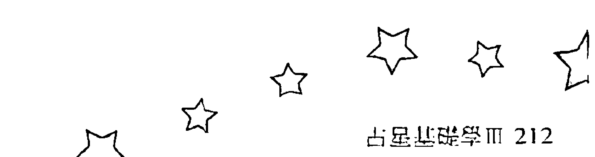

| 年份 | 日期 | 时间 | 星座 | 标签 |
|------|------|------|------|------|
| 1974年 | 05月01日 | 04:00am | 处女座 | DST |
| 1974年 | 05月03日 | 07:40am | 天秤座 | DST |
| 1974年 | 05月05日 | 12:46pm | 天蝎座 | DST |
| 1974年 | 05月07日 | 08:07pm | 射手座 | DST |
| 1974年 | 05月10日 | 06:16am | 摩羯座 | DST |
| 1974年 | 05月12日 | 06:34pm | 水瓶座 | DST |
| 1974年 | 05月15日 | 07:00am | 双鱼座 | DST |
| 1974年 | 05月17日 | 05:15pm | 白羊座 | DST |
| 1974年 | 05月20日 | 12:09am | 金牛座 | DST |
| 1974年 | 05月22日 | 03:52am | 双子座 | DST |
| 1974年 | 05月24日 | 05:45am | 巨蟹座 | DST |
| 1974年 | 05月26日 | 07:13am | 狮子座 | DST |
| 1974年 | 05月28日 | 09:27am | 处女座 | DST |
| 1974年 | 05月30日 | 01:18pm | 天秤座 | DST |

| 年份 | 日期 | 时间 | 星座 |
|------|------|------|------|
| 1974年 | 01月01日 | 05:30am | 白羊座 |
| 1974年 | 01月03日 | 12:31pm | 金牛座 |
| 1974年 | 01月05日 | 03:55pm | 双子座 |
| 1974年 | 01月07日 | 04:25pm | 巨蟹座 |
| 1974年 | 01月09日 | 03:43pm | 狮子座 |
| 1974年 | 01月11日 | 03:45pm | 处女座 |
| 1974年 | 01月13日 | 06:25pm | 天秤座 |
| 1974年 | 01月16日 | 12:54am | 天蝎座 |
| 1974年 | 01月18日 | 11:14pm | 射手座 |
| 1974年 | 01月20日 | 11:47pm | 摩羯座 |
| 1974年 | 01月23日 | 12:48pm | 水瓶座 |
| 1974年 | 01月26日 | 01:00am | 双鱼座 |
| 1974年 | 01月28日 | 11:28am | 白羊座 |
| 1974年 | 01月30日 | 07:38pm | 金牛座 |

| 年份 | 日期 | 时间 | 星座 | 标签 |
|------|------|------|------|------|
| 1974年 | 06月01日 | 07:12pm | 天蝎座 | DST |
| 1974年 | 06月04日 | 03:22am | 射手座 | DST |
| 1974年 | 06月06日 | 01:50pm | 摩羯座 | DST |
| 1974年 | 06月09日 | 02:02am | 水瓶座 | DST |
| 1974年 | 06月11日 | 02:41pm | 双鱼座 | DST |
| 1974年 | 06月14日 | 01:50am | 白羊座 | DST |
| 1974年 | 06月16日 | 09:40am | 金牛座 | DST |
| 1974年 | 06月18日 | 01:53pm | 双子座 | DST |
| 1974年 | 06月20日 | 03:18pm | 巨蟹座 | DST |
| 1974年 | 06月22日 | 03:30pm | 狮子座 | DST |
| 1974年 | 06月24日 | 04:14pm | 处女座 | DST |
| 1974年 | 06月26日 | 07:00pm | 天秤座 | DST |
| 1974年 | 06月29日 | 12:40am | 天蝎座 | DST |

| 年份 | 日期 | 时间 | 星座 |
|------|------|------|------|
| 1974年 | 02月02日 | 12:52am | 双子座 |
| 1974年 | 02月04日 | 03:03am | 巨蟹座 |
| 1974年 | 02月06日 | 03:11am | 狮子座 |
| 1974年 | 02月08日 | 02:53am | 处女座 |
| 1974年 | 02月10日 | 04:13am | 天秤座 |
| 1974年 | 02月12日 | 09:03am | 天蝎座 |
| 1974年 | 02月14日 | 06:04pm | 射手座 |
| 1974年 | 02月17日 | 06:16am | 摩羯座 |
| 1974年 | 02月19日 | 07:19pm | 水瓶座 |
| 1974年 | 02月22日 | 07:12am | 双鱼座 |
| 1974年 | 02月24日 | 05:10pm | 白羊座 |
| 1974年 | 02月27日 | 01:10am | 金牛座 |

| 年份 | 日期 | 时间 | 星座 | 标签 |
|------|------|------|------|------|
| 1974年 | 07月01日 | 09:23am | 射手座 | DST |
| 1974年 | 07月03日 | 08:19pm | 摩羯座 | DST |
| 1974年 | 07月06日 | 08:41am | 水瓶座 | DST |
| 1974年 | 07月08日 | 09:25pm | 双鱼座 | DST |
| 1974年 | 07月11日 | 09:07am | 白羊座 | DST |
| 1974年 | 07月13日 | 06:17pm | 金牛座 | DST |
| 1974年 | 07月15日 | 11:53pm | 双子座 | DST |
| 1974年 | 07月18日 | 01:54am | 巨蟹座 | DST |
| 1974年 | 07月20日 | 01:42am | 狮子座 | DST |
| 1974年 | 07月22日 | 01:10am | 处女座 | DST |
| 1974年 | 07月24日 | 02:20am | 天秤座 | DST |
| 1974年 | 07月26日 | 06:49am | 天蝎座 | DST |
| 1974年 | 07月28日 | 03:03pm | 射手座 | DST |
| 1974年 | 07月31日 | 02:11am | 摩羯座 | DST |

| 年份 | 日期 | 时间 | 星座 |
|------|------|------|------|
| 1974年 | 03月01日 | 07:07am | 双子座 |
| 1974年 | 03月03日 | 10:56am | 巨蟹座 |
| 1974年 | 03月05日 | 12:46pm | 狮子座 |
| 1974年 | 03月07日 | 01:33pm | 处女座 |
| 1974年 | 03月09日 | 02:55pm | 天秤座 |
| 1974年 | 03月11日 | 06:43pm | 天蝎座 |
| 1974年 | 03月14日 | 02:21am | 射手座 |
| 1974年 | 03月16日 | 01:43pm | 摩羯座 |
| 1974年 | 03月19日 | 02:37am | 水瓶座 |
| 1974年 | 03月21日 | 02:30pm | 双鱼座 |
| 1974年 | 03月24日 | 12:02am | 白羊座 |
| 1974年 | 03月26日 | 07:07am | 金牛座 |
| 1974年 | 03月28日 | 12:30pm | 双子座 |
| 1974年 | 03月30日 | 04:38pm | 巨蟹座 |

| 年份 | 日期 | 时间 | 星座 | 标签 |
|------|------|------|------|------|
| 1974年 | 08月02日 | 02:46pm | 水瓶座 | DST |
| 1974年 | 08月05日 | 03:25am | 双鱼座 | DST |
| 1974年 | 08月07日 | 03:12pm | 白羊座 | DST |
| 1974年 | 08月10日 | 01:11am | 金牛座 | DST |
| 1974年 | 08月12日 | 08:09am | 双子座 | DST |
| 1974年 | 08月14日 | 11:43am | 巨蟹座 | DST |
| 1974年 | 08月16日 | 12:23pm | 狮子座 | DST |
| 1974年 | 08月18日 | 11:43am | 处女座 | DST |
| 1974年 | 08月20日 | 11:49am | 天秤座 | DST |
| 1974年 | 08月22日 | 02:43pm | 天蝎座 | DST |
| 1974年 | 08月24日 | 09:35pm | 射手座 | DST |
| 1974年 | 08月27日 | 08:16am | 摩羯座 | DST |
| 1974年 | 08月29日 | 08:52pm | 水瓶座 | DST |

| 年份 | 日期 | 时间 | 星座 | 标签 |
|------|------|------|------|------|
| 1974年 | 04月01日 | 07:39pm | 狮子座 | DST |
| 1974年 | 04月03日 | 09:56pm | 处女座 | DST |
| 1974年 | 04月06日 | 12:22am | 天秤座 | DST |
| 1974年 | 04月08日 | 04:27am | 天蝎座 | DST |
| 1974年 | 04月10日 | 11:31am | 射手座 | DST |
| 1974年 | 04月12日 | 09:57pm | 摩羯座 | DST |
| 1974年 | 04月15日 | 10:33am | 水瓶座 | DST |
| 1974年 | 04月17日 | 10:43pm | 双鱼座 | DST |
| 1974年 | 04月20日 | 08:16am | 白羊座 | DST |
| 1974年 | 04月22日 | 02:50pm | 金牛座 | DST |
| 1974年 | 04月24日 | 07:09pm | 双子座 | DST |
| 1974年 | 04月26日 | 10:17pm | 巨蟹座 | DST |
| 1974年 | 04月29日 | 01:03am | 狮子座 | DST |

## 古星斗阵学II 212| 年份 | 日期 | 时间 | 星座 |
|------|------|------|------|
| 1975年 | 01月02日 | 01:33am | 处女座 |
| 1975年 | 01月04日 | 03:23am | 天秤座 |
| 1975年 | 01月06日 | 07:42am | 天蝎座 |
| 1975年 | 01月08日 | 02:42pm | 射手座 |
| 1975年 | 01月10日 | 11:58pm | 摩羯座 |
| 1975年 | 01月13日 | 11:04am | 水瓶座 |
| 1975年 | 01月15日 | 11:23pm | 双鱼座 |
| 1975年 | 01月18日 | 12:01pm | 白羊座 |
| 1975年 | 01月20日 | 11:20pm | 金牛座 |
| 1975年 | 01月23日 | 07:17am | 双子座 |
| 1975年 | 01月25日 | 11:14am | 巨蟹座 |
| 1975年 | 01月27日 | 11:57am | 狮子座 |
| 1975年 | 01月29日 | 11:15am | 处女座 |
| 1975年 | 01月31日 | 11:18am | 天秤座 |

| 年份 | 日期 | 时间 | 星座 | 标记 |
|------|------|------|------|------|
| 1974年 | 09月01日 | 09:27am | 双鱼座 | DST |
| 1974年 | 09月03日 | 08:56pm | 白羊座 | DST |
| 1974年 | 09月06日 | 06:47am | 金牛座 | DST |
| 1974年 | 09月08日 | 02:32pm | 双子座 | DST |
| 1974年 | 09月10日 | 07:36pm | 巨蟹座 | DST |
| 1974年 | 09月12日 | 09:52pm | 狮子座 | DST |
| 1974年 | 09月14日 | 10:11pm | 处女座 | DST |
| 1974年 | 09月16日 | 10:17pm | 天秤座 | DST |
| 1974年 | 09月19日 | 12:13am | 天蝎座 | DST |
| 1974年 | 09月21日 | 05:50am | 射手座 | DST |
| 1974年 | 09月23日 | 03:24pm | 摩羯座 | DST |
| 1974年 | 09月26日 | 03:38am | 水瓶座 | DST |
| 1974年 | 09月28日 | 04:12pm | 双鱼座 | DST |

| 年份 | 日期 | 时间 | 星座 |
|------|------|------|------|
| 1975年 | 02月02日 | 01:58pm | 天蝎座 |
| 1975年 | 02月04日 | 08:12pm | 射手座 |
| 1975年 | 02月07日 | 09:43am | 摩羯座 |
| 1975年 | 02月09日 | 05:17pm | 水瓶座 |
| 1975年 | 02月12日 | 05:45am | 双鱼座 |
| 1975年 | 02月14日 | 06:21pm | 白羊座 |
| 1975年 | 02月17日 | 06:06am | 金牛座 |
| 1975年 | 02月19日 | 03:29pm | 双子座 |
| 1975年 | 02月21日 | 09:15pm | 巨蟹座 |
| 1975年 | 02月23日 | 11:12pm | 狮子座 |
| 1975年 | 02月25日 | 10:36pm | 处女座 |
| 1975年 | 02月27日 | 09:39pm | 天秤座 |

| 年份 | 日期 | 时间 | 星座 |
|------|------|------|------|
| 1974年 | 10月01日 | 03:24am | 白羊座 |
| 1974年 | 10月03日 | 12:36pm | 金牛座 |
| 1974年 | 10月05日 | 07:58pm | 双子座 |
| 1974年 | 10月08日 | 01:29am | 巨蟹座 |
| 1974年 | 10月10日 | 05:00am | 狮子座 |
| 1974年 | 10月12日 | 06:55am | 处女座 |
| 1974年 | 10月14日 | 08:12am | 天秤座 |
| 1974年 | 10月16日 | 10:27am | 天蝎座 |
| 1974年 | 10月18日 | 03:19pm | 射手座 |
| 1974年 | 10月20日 | 11:43pm | 摩羯座 |
| 1974年 | 10月23日 | 11:21am | 水瓶座 |
| 1974年 | 10月25日 | 11:56pm | 双鱼座 |
| 1974年 | 10月28日 | 11:09am | 白羊座 |
| 1974年 | 10月30日 | 07:57pm | 金牛座 |

| 年份 | 日期 | 时间 | 星座 |
|------|------|------|------|
| 1975年 | 03月01日 | 10:34pm | 天蝎座 |
| 1975年 | 03月04日 | 03:07am | 射手座 |
| 1975年 | 03月06日 | 11:43am | 摩羯座 |
| 1975年 | 03月08日 | 11:09pm | 水瓶座 |
| 1975年 | 03月11日 | 11:48am | 双鱼座 |
| 1975年 | 03月14日 | 12:18am | 白羊座 |
| 1975年 | 03月16日 | 11:50am | 金牛座 |
| 1975年 | 03月18日 | 09:41pm | 双子座 |
| 1975年 | 03月21日 | 04:44am | 巨蟹座 |
| 1975年 | 03月23日 | 08:26am | 狮子座 |
| 1975年 | 03月25日 | 09:18am | 处女座 |
| 1975年 | 03月27日 | 08:52am | 天秤座 |
| 1975年 | 03月29日 | 09:12am | 天蝎座 |
| 1975年 | 03月31日 | 12:15pm | 射手座 |

| 年份 | 日期 | 时间 | 星座 |
|------|------|------|------|
| 1974年 | 11月02日 | 02:21am | 双子座 |
| 1974年 | 11月04日 | 06:59am | 巨蟹座 |
| 1974年 | 11月06日 | 10:28am | 狮子座 |
| 1974年 | 11月08日 | 01:17pm | 处女座 |
| 1974年 | 11月10日 | 03:59pm | 天秤座 |
| 1974年 | 11月12日 | 07:24pm | 天蝎座 |
| 1974年 | 11月15日 | 12:39am | 射手座 |
| 1974年 | 11月17日 | 06:45am | 摩羯座 |
| 1974年 | 11月19日 | 07:39pm | 水瓶座 |
| 1974年 | 11月22日 | 08:10am | 双鱼座 |
| 1974年 | 11月24日 | 07:56pm | 白羊座 |
| 1974年 | 11月27日 | 05:01am | 金牛座 |
| 1974年 | 11月29日 | 10:53am | 双子座 |

| 年份 | 日期 | 时间 | 星座 | 标记 |
|------|------|------|------|------|
| 1975年 | 04月02日 | 07:11pm | 摩羯座 | DST |
| 1975年 | 04月05日 | 05:46am | 水瓶座 | DST |
| 1975年 | 04月07日 | 06:16pm | 双鱼座 | DST |
| 1975年 | 04月10日 | 06:42am | 白羊座 | DST |
| 1975年 | 04月12日 | 05:51pm | 金牛座 | DST |
| 1975年 | 04月15日 | 03:12am | 双子座 | DST |
| 1975年 | 04月17日 | 10:23am | 巨蟹座 | DST |
| 1975年 | 04月19日 | 03:10pm | 狮子座 | DST |
| 1975年 | 04月21日 | 05:40pm | 处女座 | DST |
| 1975年 | 04月23日 | 06:41pm | 天秤座 | DST |
| 1975年 | 04月25日 | 07:41pm | 天蝎座 | DST |
| 1975年 | 04月27日 | 10:20pm | 射手座 | DST |
| 1975年 | 04月30日 | 04:11am | 摩羯座 | DST |

| 年份 | 日期 | 时间 | 星座 |
|------|------|------|------|
| 1974年 | 12月01日 | 02:19pm | 巨蟹座 |
| 1974年 | 12月03日 | 04:31pm | 狮子座 |
| 1974年 | 12月05日 | 06:40pm | 处女座 |
| 1974年 | 12月07日 | 09:43pm | 天秤座 |
| 1974年 | 12月10日 | 02:14am | 天蝎座 |
| 1974年 | 12月12日 | 08:37am | 射手座 |
| 1974年 | 12月14日 | 05:06pm | 摩羯座 |
| 1974年 | 12月17日 | 03:48am | 水瓶座 |
| 1974年 | 12月19日 | 04:11pm | 双鱼座 |
| 1974年 | 12月22日 | 04:33am | 白羊座 |
| 1974年 | 12月24日 | 02:39pm | 金牛座 |
| 1974年 | 12月26日 | 09:13pm | 双子座 |
| 1974年 | 12月29日 | 12:15am | 巨蟹座 |
| 1974年 | 12月31日 | 01:04am | 狮子座 |

| 年份 | 日期 | 时间 | 星座 | DST |
|------|------|------|------|------|
| 1975年 | 09月01日 | 03:31am | 巨蟹座 | DST |
| 1975年 | 09月03日 | 07:03am | 狮子座 | DST |
| 1975年 | 09月05日 | 07:27am | 处女座 | DST |
| 1975年 | 09月07日 | 06:39am | 天秤座 | DST |
| 1975年 | 09月09日 | 06:49am | 天蝎座 | DST |
| 1975年 | 09月11日 | 09:46am | 射手座 | DST |
| 1975年 | 09月13日 | 04:14pm | 摩羯座 | DST |
| 1975年 | 09月16日 | 01:51am | 水瓶座 | DST |
| 1975年 | 09月18日 | 01:32pm | 双鱼座 | DST |
| 1975年 | 09月21日 | 02:06am | 白羊座 | DST |
| 1975年 | 09月23日 | 02:41pm | 金牛座 | DST |
| 1975年 | 09月26日 | 02:11am | 双子座 | DST |
| 1975年 | 09月28日 | 11:01am | 巨蟹座 | DST |
| 1975年 | 09月30日 | 04:15pm | 狮子座 | DST |

| 年份 | 日期 | 时间 | 星座 | DST |
|------|------|------|------|------|
| 1975年 | 05月02日 | 01:36pm | 水瓶座 | DST |
| 1975年 | 05月05日 | 01:34am | 双鱼座 | DST |
| 1975年 | 05月07日 | 02:00pm | 白羊座 | DST |
| 1975年 | 05月10日 | 01:02am | 金牛座 | DST |
| 1975年 | 05月12日 | 09:40am | 双子座 | DST |
| 1975年 | 05月14日 | 04:05pm | 巨蟹座 | DST |
| 1975年 | 05月16日 | 08:37pm | 狮子座 | DST |
| 1975年 | 05月18日 | 11:45pm | 处女座 | DST |
| 1975年 | 05月21日 | 02:04am | 天秤座 | DST |
| 1975年 | 05月23日 | 04:26am | 天蝎座 | DST |
| 1975年 | 05月25日 | 07:54am | 射手座 | DST |
| 1975年 | 05月27日 | 01:34pm | 摩羯座 | DST |
| 1975年 | 05月29日 | 10:10pm | 水瓶座 | DST |

| 年份 | 日期 | 时间 | 星座 | DST |
|------|------|------|------|------|
| 1975年 | 10月02日 | 05:59pm | 处女座 | DST |
| 1975年 | 10月04日 | 05:38pm | 天秤座 | DST |
| 1975年 | 10月06日 | 05:11pm | 天蝎座 | DST |
| 1975年 | 10月08日 | 06:39pm | 射手座 | DST |
| 1975年 | 10月10日 | 11:29pm | 摩羯座 | DST |
| 1975年 | 10月13日 | 08:12am | 水瓶座 | DST |
| 1975年 | 10月15日 | 07:40pm | 双鱼座 | DST |
| 1975年 | 10月18日 | 08:19am | 白羊座 | DST |
| 1975年 | 10月20日 | 06:42pm | 金牛座 | DST |
| 1975年 | 10月23日 | 07:48am | 双子座 | DST |
| 1975年 | 10月25日 | 04:53pm | 巨蟹座 | DST |
| 1975年 | 10月27日 | 11:19pm | 狮子座 | DST |
| 1975年 | 10月30日 | 02:45am | 处女座 | DST |

| 年份 | 日期 | 时间 | 星座 | DST |
|------|------|------|------|------|
| 1975年 | 06月01日 | 09:33am | 双鱼座 | DST |
| 1975年 | 06月03日 | 10:00pm | 白羊座 | DST |
| 1975年 | 06月06日 | 09:15am | 金牛座 | DST |
| 1975年 | 06月08日 | 05:45pm | 双子座 | DST |
| 1975年 | 06月10日 | 11:21pm | 巨蟹座 | DST |
| 1975年 | 06月13日 | 02:44am | 狮子座 | DST |
| 1975年 | 06月15日 | 05:10am | 处女座 | DST |
| 1975年 | 06月17日 | 07:41am | 天秤座 | DST |
| 1975年 | 06月19日 | 11:00am | 天蝎座 | DST |
| 1975年 | 06月21日 | 03:36pm | 射手座 | DST |
| 1975年 | 06月23日 | 09:56pm | 摩羯座 | DST |
| 1975年 | 06月26日 | 06:35am | 水瓶座 | DST |
| 1975年 | 06月28日 | 05:34pm | 双鱼座 | DST |

| 年份 | 日期 | 时间 | 星座 | DST |
|------|------|------|------|------|
| 1975年 | 11月01日 | 03:54am | 天秤座 | DST |
| 1975年 | 11月03日 | 04:08am | 天蝎座 | DST |
| 1975年 | 11月05日 | 05:12am | 射手座 | DST |
| 1975年 | 11月07日 | 08:50am | 摩羯座 | DST |
| 1975年 | 11月09日 | 04:03pm | 水瓶座 | DST |
| 1975年 | 11月12日 | 02:42am | 双鱼座 | DST |
| 1975年 | 11月14日 | 03:16pm | 白羊座 | DST |
| 1975年 | 11月17日 | 03:36am | 金牛座 | DST |
| 1975年 | 11月19日 | 02:11pm | 双子座 | DST |
| 1975年 | 11月21日 | 10:35pm | 巨蟹座 | DST |
| 1975年 | 11月24日 | 04:45am | 狮子座 | DST |
| 1975年 | 11月26日 | 09:01am | 处女座 | DST |
| 1975年 | 11月28日 | 11:46am | 天秤座 | DST |
| 1975年 | 11月30日 | 01:36pm | 天蝎座 | DST |

| 年份 | 日期 | 时间 | 星座 | DST |
|------|------|------|------|------|
| 1975年 | 07月01日 | 06:01am | 白羊座 | DST |
| 1975年 | 07月03日 | 05:51pm | 金牛座 | DST |
| 1975年 | 07月06日 | 02:56am | 双子座 | DST |
| 1975年 | 07月08日 | 08:18am | 巨蟹座 | DST |
| 1975年 | 07月10日 | 10:47am | 狮子座 | DST |
| 1975年 | 07月12日 | 11:55am | 处女座 | DST |
| 1975年 | 07月14日 | 01:23pm | 天秤座 | DST |
| 1975年 | 07月16日 | 04:25pm | 天蝎座 | DST |
| 1975年 | 07月18日 | 09:33pm | 射手座 | DST |
| 1975年 | 07月21日 | 04:47am | 摩羯座 | DST |
| 1975年 | 07月23日 | 01:58pm | 水瓶座 | DST |
| 1975年 | 07月26日 | 12:58am | 双鱼座 | DST |
| 1975年 | 07月28日 | 01:27pm | 白羊座 | DST |
| 1975年 | 07月31日 | 01:52am | 金牛座 | DST |

| 年份 | 日期 | 时间 | 星座 | DST |
|------|------|------|------|------|
| 1975年 | 12月02日 | 03:35pm | 射手座 | DST |
| 1975年 | 12月04日 | 07:01pm | 摩羯座 | DST |
| 1975年 | 12月07日 | 01:12am | 水瓶座 | DST |
| 1975年 | 12月09日 | 10:54am | 双鱼座 | DST |
| 1975年 | 12月11日 | 11:06pm | 白羊座 | DST |
| 1975年 | 12月14日 | 11:36am | 金牛座 | DST |
| 1975年 | 12月16日 | 10:11pm | 双子座 | DST |
| 1975年 | 12月19日 | 05:46am | 巨蟹座 | DST |
| 1975年 | 12月21日 | 10:51am | 狮子座 | DST |
| 1975年 | 12月23日 | 02:26pm | 处女座 | DST |
| 1975年 | 12月25日 | 05:27pm | 天秤座 | DST |
| 1975年 | 12月27日 | 08:28pm | 天蝎座 | DST |
| 1975年 | 12月29日 | 11:52pm | 射手座 | DST |

| 年份 | 日期 | 时间 | 星座 | DST |
|------|------|------|------|------|
| 1975年 | 08月02日 | 11:56am | 双子座 | DST |
| 1975年 | 08月04日 | 06:12pm | 巨蟹座 | DST |
| 1975年 | 08月06日 | 08:41pm | 狮子座 | DST |
| 1975年 | 08月08日 | 08:52pm | 处女座 | DST |
| 1975年 | 08月10日 | 08:51pm | 天秤座 | DST |
| 1975年 | 08月12日 | 10:30pm | 天蝎座 | DST |
| 1975年 | 08月15日 | 03:01am | 射手座 | DST |
| 1975年 | 08月17日 | 10:27am | 摩羯座 | DST |
| 1975年 | 08月19日 | 08:10pm | 水瓶座 | DST |
| 1975年 | 08月22日 | 07:33am | 双鱼座 | DST |
| 1975年 | 08月24日 | 08:02pm | 白羊座 | DST |
| 1975年 | 08月27日 | 08:42am | 金牛座 | DST |
| 1975年 | 08月29日 | 07:50pm | 双子座 | DST || 年份 | 日期 | 时间 | 星座 |
|------|------|------|------|
| 1976年 | 05月01日 | 12:02pm | 双子座 |
| 1976年 | 05月03日 | 10:52pm | 巨蟹座 |
| 1976年 | 05月06日 | 07:05am | 狮子座 |
| 1976年 | 05月08日 | 12:16pm | 处女座 |
| 1976年 | 05月10日 | 02:35pm | 天秤座 |
| 1976年 | 05月12日 | 03:01pm | 天蝎座 |
| 1976年 | 05月14日 | 03:06pm | 射手座 |
| 1976年 | 05月16日 | 04:35pm | 摩羯座 |
| 1976年 | 05月18日 | 09:04pm | 水瓶座 |
| 1976年 | 05月21日 | 05:29am | 双鱼座 |
| 1976年 | 05月23日 | 05:08pm | 白羊座 |
| 1976年 | 05月26日 | 06:06am | 金牛座 |
| 1976年 | 05月28日 | 06:20pm | 双子座 |
| 1976年 | 05月31日 | 04:36am | 巨蟹座 |

| 年份 | 日期 | 时间 | 星座 |
|------|------|------|------|
| 1976年 | 01月01日 | 04:18am | 摩羯座 |
| 1976年 | 01月03日 | 10:36am | 水瓶座 |
| 1976年 | 01月05日 | 07:37pm | 双鱼座 |
| 1976年 | 01月08日 | 07:21am | 白羊座 |
| 1976年 | 01月10日 | 08:08pm | 金牛座 |
| 1976年 | 01月13日 | 07:15am | 双子座 |
| 1976年 | 01月15日 | 02:55pm | 巨蟹座 |
| 1976年 | 01月17日 | 07:12pm | 狮子座 |
| 1976年 | 01月19日 | 09:24pm | 处女座 |
| 1976年 | 01月21日 | 11:10pm | 天秤座 |
| 1976年 | 01月24日 | 01:48am | 天蝎座 |
| 1976年 | 01月26日 | 05:52am | 射手座 |
| 1976年 | 01月28日 | 11:26am | 摩羯座 |
| 1976年 | 01月30日 | 06:35pm | 水瓶座 |

| 年份 | 日期 | 时间 | 星座 |
|------|------|------|------|
| 1976年 | 06月02日 | 12:34pm | 狮子座 |
| 1976年 | 06月04日 | 06:18pm | 处女座 |
| 1976年 | 06月06日 | 09:58pm | 天秤座 |
| 1976年 | 06月08日 | 11:58pm | 天蝎座 |
| 1976年 | 06月11日 | 01:06am | 射手座 |
| 1976年 | 06月13日 | 02:46am | 摩羯座 |
| 1976年 | 06月15日 | 06:35am | 水瓶座 |
| 1976年 | 06月17日 | 01:48pm | 双鱼座 |
| 1976年 | 06月20日 | 12:32am | 白羊座 |
| 1976年 | 06月22日 | 01:20pm | 金牛座 |
| 1976年 | 06月25日 | 01:35am | 双子座 |
| 1976年 | 06月27日 | 11:25am | 巨蟹座 |
| 1976年 | 06月29日 | 06:37pm | 狮子座 |

| 年份 | 日期 | 时间 | 星座 |
|------|------|------|------|
| 1976年 | 02月02日 | 03:48am | 双鱼座 |
| 1976年 | 02月04日 | 03:18pm | 白羊座 |
| 1976年 | 02月07日 | 04:12am | 金牛座 |
| 1976年 | 02月09日 | 04:12pm | 双子座 |
| 1976年 | 02月12日 | 12:57am | 巨蟹座 |
| 1976年 | 02月14日 | 05:28am | 狮子座 |
| 1976年 | 02月16日 | 06:57am | 处女座 |
| 1976年 | 02月18日 | 07:15am | 天秤座 |
| 1976年 | 02月20日 | 08:16am | 天蝎座 |
| 1976年 | 02月22日 | 11:22am | 射手座 |
| 1976年 | 02月24日 | 04:56pm | 摩羯座 |
| 1976年 | 02月27日 | 12:48am | 水瓶座 |
| 1976年 | 02月29日 | 10:43am | 双鱼座 |

| 年份 | 日期 | 时间 | 星座 |
|------|------|------|------|
| 1976年 | 07月01日 | 11:46pm | 处女座 |
| 1976年 | 07月04日 | 03:33am | 天秤座 |
| 1976年 | 07月06日 | 05:32am | 天蝎座 |
| 1976年 | 07月08日 | 09:05am | 射手座 |
| 1976年 | 07月10日 | 11:51am | 摩羯座 |
| 1976年 | 07月12日 | 03:56pm | 水瓶座 |
| 1976年 | 07月14日 | 10:36pm | 双鱼座 |
| 1976年 | 07月17日 | 08:42am | 白羊座 |
| 1976年 | 07月19日 | 09:11pm | 金牛座 |
| 1976年 | 07月22日 | 09:37am | 双子座 |
| 1976年 | 07月24日 | 07:36pm | 巨蟹座 |
| 1976年 | 07月27日 | 02:17am | 狮子座 |
| 1976年 | 07月29日 | 06:21am | 处女座 |
| 1976年 | 07月31日 | 09:13am | 天秤座 |

| 年份 | 日期 | 时间 | 星座 |
|------|------|------|------|
| 1976年 | 03月02日 | 10:22pm | 白羊座 |
| 1976年 | 03月05日 | 11:17am | 金牛座 |
| 1976年 | 03月07日 | 11:55pm | 双子座 |
| 1976年 | 03月10日 | 09:52am | 巨蟹座 |
| 1976年 | 03月12日 | 03:49pm | 狮子座 |
| 1976年 | 03月14日 | 05:55pm | 处女座 |
| 1976年 | 03月16日 | 05:43pm | 天秤座 |
| 1976年 | 03月18日 | 05:19pm | 天蝎座 |
| 1976年 | 03月20日 | 06:37pm | 射手座 |
| 1976年 | 03月22日 | 10:49pm | 摩羯座 |
| 1976年 | 03月25日 | 06:22am | 水瓶座 |
| 1976年 | 03月27日 | 04:35pm | 双鱼座 |
| 1976年 | 03月30日 | 04:37am | 白羊座 |

| 年份 | 日期 | 时间 | 星座 |
|------|------|------|------|
| 1976年 | 08月02日 | 11:56am | 天蝎座 |
| 1976年 | 08月04日 | 03:04pm | 射手座 |
| 1976年 | 08月06日 | 06:55pm | 摩羯座 |
| 1976年 | 08月08日 | 11:56pm | 水瓶座 |
| 1976年 | 08月11日 | 07:03am | 双鱼座 |
| 1976年 | 08月13日 | 04:51pm | 白羊座 |
| 1976年 | 08月16日 | 05:05am | 金牛座 |
| 1976年 | 08月18日 | 05:52pm | 双子座 |
| 1976年 | 08月21日 | 04:30am | 巨蟹座 |
| 1976年 | 08月23日 | 11:25am | 狮子座 |
| 1976年 | 08月25日 | 03:00pm | 处女座 |
| 1976年 | 08月27日 | 04:41pm | 天秤座 |
| 1976年 | 08月29日 | 06:06pm | 天蝎座 |
| 1976年 | 08月31日 | 08:29pm | 射手座 |

| 年份 | 日期 | 时间 | 星座 |
|------|------|------|------|
| 1976年 | 04月01日 | 05:33pm | 金牛座 |
| 1976年 | 04月04日 | 06:13am | 双子座 |
| 1976年 | 04月06日 | 05:02pm | 巨蟹座 |
| 1976年 | 04月09日 | 12:35am | 狮子座 |
| 1976年 | 04月11日 | 04:12am | 处女座 |
| 1976年 | 04月13日 | 04:52am | 天秤座 |
| 1976年 | 04月15日 | 04:15am | 天蝎座 |
| 1976年 | 04月17日 | 04:17am | 射手座 |
| 1976年 | 04月19日 | 06:48am | 摩羯座 |
| 1976年 | 04月21日 | 12:52pm | 水瓶座 |
| 1976年 | 04月23日 | 10:28pm | 双鱼座 |
| 1976年 | 04月26日 | 10:37am | 白羊座 |
| 1976年 | 04月28日 | 11:37pm | 金牛座 |

| 日期 | 时间 | 星座 |
|------|------|------|
| 1977年01月02日 | 03:41am | 双子座 |
| 1977年01月04日 | 03:09pm | 巨蟹座 |
| 1977年01月07日 | 12:20am | 狮子座 |
| 1977年01月09日 | 07:21am | 处女座 |
| 1977年01月11日 | 12:45pm | 天秤座 |
| 1977年01月13日 | 04:12pm | 天蝎座 |
| 1977年01月15日 | 07:16pm | 射手座 |
| 1977年01月17日 | 09:01pm | 摩羯座 |
| 1977年01月19日 | 11:12pm | 水瓶座 |
| 1977年01月22日 | 03:32am | 双鱼座 |
| 1977年01月24日 | 11:24am | 白羊座 |
| 1977年01月26日 | 10:41pm | 金牛座 |
| 1977年01月29日 | 11:35am | 双子座 |
| 1977年01月31日 | 11:19pm | 巨蟹座 |

| 日期 | 时间 | 星座 |
|------|------|------|
| 1976年09月03日 | 12:29am | 摩羯座 |
| 1976年09月05日 | 06:22am | 水瓶座 |
| 1976年09月07日 | 02:14pm | 双鱼座 |
| 1976年09月10日 | 12:18am | 白羊座 |
| 1976年09月12日 | 12:30pm | 金牛座 |
| 1976年09月15日 | 01:31am | 双子座 |
| 1976年09月17日 | 01:01pm | 巨蟹座 |
| 1976年09月19日 | 09:08pm | 狮子座 |
| 1976年09月22日 | 01:15am | 处女座 |
| 1976年09月24日 | 02:27am | 天秤座 |
| 1976年09月26日 | 02:34am | 天蝎座 |
| 1976年09月28日 | 03:23am | 射手座 |
| 1976年09月30日 | 06:16am | 摩羯座 |

| 日期 | 时间 | 星座 |
|------|------|------|
| 1977年02月03日 | 03:07am | 狮子座 |
| 1977年02月05日 | 02:14pm | 处女座 |
| 1977年02月07日 | 06:34pm | 天秤座 |
| 1977年02月09日 | 10:03pm | 天蝎座 |
| 1977年02月12日 | 01:10am | 射手座 |
| 1977年02月14日 | 04:14am | 摩羯座 |
| 1977年02月16日 | 07:46am | 水瓶座 |
| 1977年02月18日 | 12:48pm | 双鱼座 |
| 1977年02月20日 | 08:24pm | 白羊座 |
| 1977年02月23日 | 07:08am | 金牛座 |
| 1977年02月25日 | 07:49pm | 双子座 |
| 1977年02月28日 | 07:58am | 巨蟹座 |

| 日期 | 时间 | 星座 |
|------|------|------|
| 1976年10月02日 | 11:53am | 水瓶座 |
| 1976年10月04日 | 08:11pm | 双鱼座 |
| 1976年10月07日 | 06:51am | 白羊座 |
| 1976年10月09日 | 07:11pm | 金牛座 |
| 1976年10月12日 | 08:13am | 双子座 |
| 1976年10月14日 | 08:22pm | 巨蟹座 |
| 1976年10月17日 | 05:45am | 狮子座 |
| 1976年10月19日 | 11:18am | 处女座 |
| 1976年10月21日 | 01:22pm | 天秤座 |
| 1976年10月23日 | 01:16pm | 天蝎座 |
| 1976年10月25日 | 12:51pm | 射手座 |
| 1976年10月27日 | 02:00pm | 摩羯座 |
| 1976年10月29日 | 06:09pm | 水瓶座 |

| 日期 | 时间 | 星座 |
|------|------|------|
| 1977年03月02日 | 05:20pm | 狮子座 |
| 1977年03月04日 | 11:18pm | 处女座 |
| 1977年03月07日 | 02:33am | 天秤座 |
| 1977年03月09日 | 04:36am | 天蝎座 |
| 1977年03月11日 | 06:43am | 射手座 |
| 1977年03月13日 | 09:41am | 摩羯座 |
| 1977年03月15日 | 02:02pm | 水瓶座 |
| 1977年03月17日 | 08:07pm | 双鱼座 |
| 1977年03月20日 | 04:24am | 白羊座 |
| 1977年03月22日 | 03:07pm | 金牛座 |
| 1977年03月25日 | 03:38am | 双子座 |
| 1977年03月27日 | 04:14pm | 巨蟹座 |
| 1977年03月30日 | 02:38am | 狮子座 |

| 日期 | 时间 | 星座 |
|------|------|------|
| 1976年11月01日 | 01:54am | 双鱼座 |
| 1976年11月03日 | 12:47pm | 白羊座 |
| 1976年11月06日 | 01:22am | 金牛座 |
| 1976年11月08日 | 02:19pm | 双子座 |
| 1976年11月11日 | 02:26am | 巨蟹座 |
| 1976年11月13日 | 12:32pm | 狮子座 |
| 1976年11月15日 | 07:43pm | 处女座 |
| 1976年11月17日 | 11:33pm | 天秤座 |
| 1976年11月20日 | 12:31am | 天蝎座 |
| 1976年11月22日 | 12:03am | 射手座 |
| 1976年11月24日 | 12:03am | 摩羯座 |
| 1976年11月26日 | 02:32am | 水瓶座 |
| 1976年11月28日 | 08:52am | 双鱼座 |
| 1976年11月30日 | 07:03pm | 白羊座 |

| 日期 | 时间 | 星座 |
|------|------|------|
| 1977年04月01日 | 09:19am | 处女座 |
| 1977年04月03日 | 12:34pm | 天秤座 |
| 1977年04月05日 | 01:38pm | 天蝎座 |
| 1977年04月07日 | 02:10pm | 射手座 |
| 1977年04月09日 | 03:43pm | 摩羯座 |
| 1977年04月11日 | 07:26pm | 水瓶座 |
| 1977年04月14日 | 01:50am | 双鱼座 |
| 1977年04月16日 | 10:54am | 白羊座 |
| 1977年04月18日 | 10:02pm | 金牛座 |
| 1977年04月21日 | 10:37am | 双子座 |
| 1977年04月23日 | 11:24pm | 巨蟹座 |
| 1977年04月26日 | 10:38am | 狮子座 |
| 1977年04月28日 | 06:48pm | 处女座 |
| 1977年04月30日 | 11:11pm | 天秤座 |

| 日期 | 时间 | 星座 |
|------|------|------|
| 1976年12月03日 | 07:41am | 金牛座 |
| 1976年12月05日 | 08:37pm | 双子座 |
| 1976年12月08日 | 08:18am | 巨蟹座 |
| 1976年12月10日 | 06:09pm | 狮子座 |
| 1976年12月13日 | 01:53am | 处女座 |
| 1976年12月15日 | 07:09am | 天秤座 |
| 1976年12月17日 | 09:57am | 天蝎座 |
| 1976年12月19日 | 10:52am | 射手座 |
| 1976年12月21日 | 11:13am | 摩羯座 |
| 1976年12月23日 | 12:53pm | 水瓶座 |
| 1976年12月25日 | 05:40pm | 双鱼座 |
| 1976年12月28日 | 02:33am | 白羊座 |
| 1976年12月30日 | 02:44pm | 金牛座 |

| 年份 | 日期 | 时间 | 星座 |
|------|------|------|------|
| 1977年 | 09月02日 | 08:55am | 金牛座 |
| 1977年 | 09月04日 | 08:27pm | 双子座 |
| 1977年 | 09月07日 | 09:01am | 巨蟹座 |
| 1977年 | 09月09日 | 08:11pm | 狮子座 |
| 1977年 | 09月12日 | 04:31am | 处女座 |
| 1977年 | 09月14日 | 10:04am | 天秤座 |
| 1977年 | 09月16日 | 01:43pm | 天蝎座 |
| 1977年 | 09月18日 | 04:27pm | 射手座 |
| 1977年 | 09月20日 | 07:04pm | 摩羯座 |
| 1977年 | 09月22日 | 10:12pm | 水瓶座 |
| 1977年 | 09月25日 | 02:30am | 双鱼座 |
| 1977年 | 09月27日 | 08:43am | 白羊座 |
| 1977年 | 09月29日 | 05:23pm | 金牛座 |

| 年份 | 日期 | 时间 | 星座 |
|------|------|------|------|
| 1977年 | 05月03日 | 12:23am | 天蝎座 |
| 1977年 | 05月04日 | 11:58pm | 射手座 |
| 1977年 | 05月06日 | 11:54pm | 摩羯座 |
| 1977年 | 05月09日 | 02:01am | 水瓶座 |
| 1977年 | 05月11日 | 07:33am | 双鱼座 |
| 1977年 | 05月13日 | 04:32pm | 白羊座 |
| 1977年 | 05月16日 | 04:04am | 金牛座 |
| 1977年 | 05月18日 | 04:50pm | 双子座 |
| 1977年 | 05月21日 | 05:34am | 巨蟹座 |
| 1977年 | 05月23日 | 05:10pm | 狮子座 |
| 1977年 | 05月26日 | 02:29am | 处女座 |
| 1977年 | 05月28日 | 08:23am | 天秤座 |
| 1977年 | 05月30日 | 10:52am | 天蝎座 |

| 年份 | 日期 | 时间 | 星座 |
|------|------|------|------|
| 1977年 | 10月02日 | 04:34am | 双子座 |
| 1977年 | 10月04日 | 05:08pm | 巨蟹座 |
| 1977年 | 10月07日 | 04:55am | 狮子座 |
| 1977年 | 10月09日 | 01:53pm | 处女座 |
| 1977年 | 10月11日 | 07:26pm | 天秤座 |
| 1977年 | 10月13日 | 10:09pm | 天蝎座 |
| 1977年 | 10月15日 | 11:27pm | 射手座 |
| 1977年 | 10月18日 | 12:50am | 摩羯座 |
| 1977年 | 10月20日 | 03:37am | 水瓶座 |
| 1977年 | 10月22日 | 08:29am | 双鱼座 |
| 1977年 | 10月24日 | 03:36pm | 白羊座 |
| 1977年 | 10月27日 | 12:53am | 金牛座 |
| 1977年 | 10月29日 | 12:09pm | 双子座 |

| 年份 | 日期 | 时间 | 星座 |
|------|------|------|------|
| 1977年 | 06月01日 | 10:52am | 射手座 |
| 1977年 | 06月03日 | 10:09am | 摩羯座 |
| 1977年 | 06月05日 | 10:49am | 水瓶座 |
| 1977年 | 06月07日 | 02:41pm | 双鱼座 |
| 1977年 | 06月09日 | 10:35pm | 白羊座 |
| 1977年 | 06月12日 | 09:58am | 金牛座 |
| 1977年 | 06月14日 | 10:49pm | 双子座 |
| 1977年 | 06月17日 | 11:26am | 巨蟹座 |
| 1977年 | 06月19日 | 10:52pm | 狮子座 |
| 1977年 | 06月22日 | 08:25am | 处女座 |
| 1977年 | 06月24日 | 03:31pm | 天秤座 |
| 1977年 | 06月26日 | 07:39pm | 天蝎座 |
| 1977年 | 06月28日 | 09:00pm | 射手座 |
| 1977年 | 06月30日 | 08:48pm | 摩羯座 |

| 年份 | 日期 | 时间 | 星座 |
|------|------|------|------|
| 1977年 | 11月01日 | 12:39am | 巨蟹座 |
| 1977年 | 11月03日 | 01:00pm | 狮子座 |
| 1977年 | 11月05日 | 11:16pm | 处女座 |
| 1977年 | 11月08日 | 05:46am | 天秤座 |
| 1977年 | 11月10日 | 08:37am | 天蝎座 |
| 1977年 | 11月12日 | 09:02am | 射手座 |
| 1977年 | 11月14日 | 08:52am | 摩羯座 |
| 1977年 | 11月16日 | 10:04am | 水瓶座 |
| 1977年 | 11月18日 | 02:03pm | 双鱼座 |
| 1977年 | 11月20日 | 09:14pm | 白羊座 |
| 1977年 | 11月23日 | 07:11am | 金牛座 |
| 1977年 | 11月25日 | 06:49pm | 双子座 |
| 1977年 | 11月28日 | 07:19am | 巨蟹座 |
| 1977年 | 11月30日 | 07:51pm | 狮子座 |

| 年份 | 日期 | 时间 | 星座 |
|------|------|------|------|
| 1977年 | 07月02日 | 08:57pm | 水瓶座 |
| 1977年 | 07月04日 | 11:31pm | 双鱼座 |
| 1977年 | 07月07日 | 06:07am | 白羊座 |
| 1977年 | 07月09日 | 04:35pm | 金牛座 |
| 1977年 | 07月12日 | 05:14am | 双子座 |
| 1977年 | 07月14日 | 05:48pm | 巨蟹座 |
| 1977年 | 07月17日 | 04:49am | 狮子座 |
| 1977年 | 07月19日 | 01:55pm | 处女座 |
| 1977年 | 07月21日 | 09:08pm | 天秤座 |
| 1977年 | 07月24日 | 02:12am | 天蝎座 |
| 1977年 | 07月26日 | 05:02am | 射手座 |
| 1977年 | 07月28日 | 06:14am | 摩羯座 |
| 1977年 | 07月30日 | 07:06am | 水瓶座 |

| 年份 | 日期 | 时间 | 星座 |
|------|------|------|------|
| 1977年 | 12月03日 | 07:01am | 处女座 |
| 1977年 | 12月05日 | 03:12pm | 天秤座 |
| 1977年 | 12月07日 | 07:29pm | 天蝎座 |
| 1977年 | 12月09日 | 06:19pm | 射手座 |
| 1977年 | 12月11日 | 07:26pm | 摩羯座 |
| 1977年 | 12月13日 | 07:02pm | 水瓶座 |
| 1977年 | 12月15日 | 09:11pm | 双鱼座 |
| 1977年 | 12月18日 | 03:13am | 白羊座 |
| 1977年 | 12月20日 | 12:56pm | 金牛座 |
| 1977年 | 12月23日 | 12:51am | 双子座 |
| 1977年 | 12月25日 | 01:29pm | 巨蟹座 |
| 1977年 | 12月28日 | 01:51am | 狮子座 |
| 1977年 | 12月30日 | 01:10pm | 处女座 |

| 年份 | 日期 | 时间 | 星座 |
|------|------|------|------|
| 1977年 | 08月01日 | 09:28am | 双鱼座 |
| 1977年 | 08月03日 | 02:59pm | 白羊座 |
| 1977年 | 08月06日 | 12:17am | 金牛座 |
| 1977年 | 08月08日 | 12:29pm | 双子座 |
| 1977年 | 08月11日 | 01:03am | 巨蟹座 |
| 1977年 | 08月13日 | 11:53am | 狮子座 |
| 1977年 | 08月16日 | 08:24pm | 处女座 |
| 1977年 | 08月18日 | 02:47am | 天秤座 |
| 1977年 | 08月20日 | 07:33am | 天蝎座 |
| 1977年 | 08月22日 | 11:00am | 射手座 |
| 1977年 | 08月24日 | 01:29pm | 摩羯座 |
| 1977年 | 08月26日 | 03:41pm | 水瓶座 |
| 1977年 | 08月28日 | 06:48pm | 双鱼座 |
| 1977年 | 08月31日 | 12:11am | 白羊座 |

| 年份 | 日期 | 时间 | 星座 |
|---|---|---|---|
| 1978年 | 05月01日 | 05:02pm | 双鱼座 |
| 1978年 | 05月03日 | 10:27pm | 白羊座 |
| 1978年 | 05月06日 | 05:54am | 金牛座 |
| 1978年 | 05月08日 | 03:20pm | 双子座 |
| 1978年 | 05月11日 | 02:41am | 巨蟹座 |
| 1978年 | 05月13日 | 03:16pm | 狮子座 |
| 1978年 | 05月16日 | 03:12am | 处女座 |
| 1978年 | 05月18日 | 12:18pm | 天秤座 |
| 1978年 | 05月20日 | 05:34pm | 天蝎座 |
| 1978年 | 05月22日 | 07:28pm | 射手座 |
| 1978年 | 05月24日 | 07:41pm | 摩羯座 |
| 1978年 | 05月26日 | 08:11pm | 水瓶座 |
| 1978年 | 05月28日 | 10:37pm | 双鱼座 |
| 1978年 | 05月31日 | 03:54am | 白羊座 |

| 年份 | 日期 | 时间 | 星座 |
|---|---|---|---|
| 1978年 | 01月01日 | 10:30pm | 天秤座 |
| 1978年 | 01月04日 | 04:31am | 天蝎座 |
| 1978年 | 01月06日 | 06:59am | 射手座 |
| 1978年 | 01月08日 | 06:53am | 摩羯座 |
| 1978年 | 01月10日 | 06:07am | 水瓶座 |
| 1978年 | 01月12日 | 06:55am | 双鱼座 |
| 1978年 | 01月14日 | 11:11am | 白羊座 |
| 1978年 | 01月16日 | 07:32pm | 金牛座 |
| 1978年 | 01月19日 | 07:07am | 双子座 |
| 1978年 | 01月21日 | 07:50pm | 巨蟹座 |
| 1978年 | 01月24日 | 08:00am | 狮子座 |
| 1978年 | 01月26日 | 06:54pm | 处女座 |
| 1978年 | 01月29日 | 04:05am | 天秤座 |
| 1978年 | 01月31日 | 10:59am | 天蝎座 |

| 年份 | 日期 | 时间 | 星座 |
|---|---|---|---|
| 1978年 | 06月02日 | 11:52am | 金牛座 |
| 1978年 | 06月04日 | 09:54pm | 双子座 |
| 1978年 | 06月07日 | 09:31am | 巨蟹座 |
| 1978年 | 06月09日 | 10:07pm | 狮子座 |
| 1978年 | 06月12日 | 10:32am | 处女座 |
| 1978年 | 06月14日 | 08:53pm | 天秤座 |
| 1978年 | 06月17日 | 03:25am | 天蝎座 |
| 1978年 | 06月19日 | 05:57am | 射手座 |
| 1978年 | 06月21日 | 05:51am | 摩羯座 |
| 1978年 | 06月23日 | 05:09am | 水瓶座 |
| 1978年 | 06月25日 | 06:00am | 双鱼座 |
| 1978年 | 06月27日 | 09:58am | 白羊座 |
| 1978年 | 06月29日 | 05:23pm | 金牛座 |

| 年份 | 日期 | 时间 | 星座 |
|---|---|---|---|
| 1978年 | 02月02日 | 03:09pm | 射手座 |
| 1978年 | 02月04日 | 04:47pm | 摩羯座 |
| 1978年 | 02月06日 | 05:04pm | 水瓶座 |
| 1978年 | 02月08日 | 05:50pm | 双鱼座 |
| 1978年 | 02月10日 | 08:58pm | 白羊座 |
| 1978年 | 02月13日 | 03:52am | 金牛座 |
| 1978年 | 02月15日 | 02:26pm | 双子座 |
| 1978年 | 02月18日 | 02:55am | 巨蟹座 |
| 1978年 | 02月20日 | 03:07pm | 狮子座 |
| 1978年 | 02月23日 | 01:38am | 处女座 |
| 1978年 | 02月25日 | 10:00am | 天秤座 |
| 1978年 | 02月27日 | 04:25pm | 天蝎座 |

| 年份 | 日期 | 时间 | 星座 |
|---|---|---|---|
| 1978年 | 07月02日 | 03:38am | 双子座 |
| 1978年 | 07月04日 | 03:34pm | 巨蟹座 |
| 1978年 | 07月07日 | 04:12am | 狮子座 |
| 1978年 | 07月09日 | 04:43pm | 处女座 |
| 1978年 | 07月12日 | 03:45am | 天秤座 |
| 1978年 | 07月14日 | 11:40am | 天蝎座 |
| 1978年 | 07月16日 | 03:44pm | 射手座 |
| 1978年 | 07月18日 | 04:30pm | 摩羯座 |
| 1978年 | 07月20日 | 03:42pm | 水瓶座 |
| 1978年 | 07月22日 | 03:30pm | 双鱼座 |
| 1978年 | 07月24日 | 05:50pm | 白羊座 |
| 1978年 | 07月26日 | 11:50pm | 金牛座 |
| 1978年 | 07月29日 | 09:33am | 双子座 |
| 1978年 | 07月31日 | 09:28pm | 巨蟹座 |

| 年份 | 日期 | 时间 | 星座 |
|---|---|---|---|
| 1978年 | 03月01日 | 09:00pm | 射手座 |
| 1978年 | 03月03日 | 11:57pm | 摩羯座 |
| 1978年 | 03月06日 | 01:50am | 水瓶座 |
| 1978年 | 03月08日 | 03:46am | 双鱼座 |
| 1978年 | 03月10日 | 07:11am | 白羊座 |
| 1978年 | 03月12日 | 01:22pm | 金牛座 |
| 1978年 | 03月14日 | 10:48pm | 双子座 |
| 1978年 | 03月17日 | 10:49am | 巨蟹座 |
| 1978年 | 03月19日 | 11:11pm | 狮子座 |
| 1978年 | 03月22日 | 09:45am | 处女座 |
| 1978年 | 03月24日 | 05:38pm | 天秤座 |
| 1978年 | 03月26日 | 11:00pm | 天蝎座 |
| 1978年 | 03月29日 | 02:36am | 射手座 |
| 1978年 | 03月31日 | 05:23am | 摩羯座 |

| 年份 | 日期 | 时间 | 星座 |
|---|---|---|---|
| 1978年 | 08月03日 | 10:09am | 狮子座 |
| 1978年 | 08月05日 | 10:28pm | 处女座 |
| 1978年 | 08月08日 | 09:26am | 天秤座 |
| 1978年 | 08月10日 | 06:07pm | 天蝎座 |
| 1978年 | 08月12日 | 11:42pm | 射手座 |
| 1978年 | 08月15日 | 02:01am | 摩羯座 |
| 1978年 | 08月17日 | 02:14am | 水瓶座 |
| 1978年 | 08月19日 | 02:05am | 双鱼座 |
| 1978年 | 08月21日 | 03:32am | 白羊座 |
| 1978年 | 08月23日 | 08:10am | 金牛座 |
| 1978年 | 08月25日 | 04:34pm | 双子座 |
| 1978年 | 08月28日 | 03:59am | 巨蟹座 |
| 1978年 | 08月30日 | 04:39pm | 狮子座 |

| 年份 | 日期 | 时间 | 星座 |
|---|---|---|---|
| 1978年 | 04月02日 | 08:05am | 水瓶座 |
| 1978年 | 04月04日 | 11:22am | 双鱼座 |
| 1978年 | 04月06日 | 03:53pm | 白羊座 |
| 1978年 | 04月08日 | 10:22pm | 金牛座 |
| 1978年 | 04月11日 | 07:30am | 双子座 |
| 1978年 | 04月13日 | 06:59pm | 巨蟹座 |
| 1978年 | 04月16日 | 07:28am | 狮子座 |
| 1978年 | 04月18日 | 06:41pm | 处女座 |
| 1978年 | 04月21日 | 02:50am | 天秤座 |
| 1978年 | 04月23日 | 07:35am | 天蝎座 |
| 1978年 | 04月25日 | 09:58am | 射手座 |
| 1978年 | 04月27日 | 11:28am | 摩羯座 |
| 1978年 | 04月29日 | 01:30pm | 水瓶座 |

| 年份 | 日期 | 时间 | 星座 |
|---|---|---|---|
| 1979年 | 01月02日 | 03:11pm | 双鱼座 |
| 1979年 | 01月04日 | 05:45pm | 白羊座 |
| 1979年 | 01月06日 | 11:17pm | 金牛座 |
| 1979年 | 01月09日 | 07:44am | 双子座 |
| 1979年 | 01月11日 | 06:15pm | 巨蟹座 |
| 1979年 | 01月14日 | 06:16am | 狮子座 |
| 1979年 | 01月16日 | 07:09pm | 处女座 |
| 1979年 | 01月19日 | 07:37am | 天秤座 |
| 1979年 | 01月21日 | 05:46pm | 天蝎座 |
| 1979年 | 01月24日 | 12:07am | 射手座 |
| 1979年 | 01月26日 | 02:25am | 摩羯座 |
| 1979年 | 01月28日 | 02:11am | 水瓶座 |
| 1979年 | 01月30日 | 01:25am | 双鱼座 |

| 年份 | 日期 | 时间 | 星座 |
|---|---|---|---|
| 1978年 | 09月02日 | 04:44am | 处女座 |
| 1978年 | 09月04日 | 03:12pm | 天秤座 |
| 1978年 | 09月06日 | 11:37pm | 天蝎座 |
| 1978年 | 09月09日 | 05:36am | 射手座 |
| 1978年 | 09月11日 | 09:16am | 摩羯座 |
| 1978年 | 09月13日 | 11:07am | 水瓶座 |
| 1978年 | 09月15日 | 12:10pm | 双鱼座 |
| 1978年 | 09月17日 | 01:53pm | 白羊座 |
| 1978年 | 09月19日 | 05:46pm | 金牛座 |
| 1978年 | 09月22日 | 12:56am | 双子座 |
| 1978年 | 09月24日 | 11:33am | 巨蟹座 |
| 1978年 | 09月27日 | 12:01am | 狮子座 |
| 1978年 | 09月29日 | 12:08pm | 处女座 |

| 年份 | 日期 | 时间 | 星座 |
|---|---|---|---|
| 1979年 | 02月01日 | 02:13am | 白羊座 |
| 1979年 | 02月03日 | 06:07am | 金牛座 |
| 1979年 | 02月05日 | 01:36pm | 双子座 |
| 1979年 | 02月08日 | 12:05am | 巨蟹座 |
| 1979年 | 02月10日 | 12:25pm | 狮子座 |
| 1979年 | 02月13日 | 01:17am | 处女座 |
| 1979年 | 02月15日 | 01:34pm | 天秤座 |
| 1979年 | 02月18日 | 12:11am | 天蝎座 |
| 1979年 | 02月20日 | 07:46am | 射手座 |
| 1979年 | 02月22日 | 11:55am | 摩羯座 |
| 1979年 | 02月24日 | 01:09pm | 水瓶座 |
| 1979年 | 02月26日 | 12:52pm | 双鱼座 |
| 1979年 | 02月28日 | 12:57pm | 白羊座 |

| 年份 | 日期 | 时间 | 星座 |
|---|---|---|---|
| 1978年 | 10月01日 | 10:15pm | 天秤座 |
| 1978年 | 10月04日 | 05:45am | 天蝎座 |
| 1978年 | 10月06日 | 11:04am | 射手座 |
| 1978年 | 10月08日 | 02:50pm | 摩羯座 |
| 1978年 | 10月10日 | 05:41pm | 水瓶座 |
| 1978年 | 10月12日 | 08:12pm | 双鱼座 |
| 1978年 | 10月14日 | 11:06pm | 白羊座 |
| 1978年 | 10月17日 | 03:23am | 金牛座 |
| 1978年 | 10月19日 | 10:09am | 双子座 |
| 1978年 | 10月21日 | 07:54pm | 巨蟹座 |
| 1978年 | 10月24日 | 08:04am | 狮子座 |
| 1978年 | 10月26日 | 08:30pm | 处女座 |
| 1978年 | 10月29日 | 06:46am | 天秤座 |
| 1978年 | 10月31日 | 01:48pm | 天蝎座 |

| 年份 | 日期 | 时间 | 星座 |
|---|---|---|---|
| 1979年 | 03月02日 | 03:14pm | 金牛座 |
| 1979年 | 03月04日 | 09:00pm | 双子座 |
| 1979年 | 03月07日 | 06:36am | 巨蟹座 |
| 1979年 | 03月09日 | 06:47pm | 狮子座 |
| 1979年 | 03月12日 | 07:41am | 处女座 |
| 1979年 | 03月14日 | 07:40pm | 天秤座 |
| 1979年 | 03月17日 | 05:46am | 天蝎座 |
| 1979年 | 03月19日 | 01:34pm | 射手座 |
| 1979年 | 03月21日 | 06:53pm | 摩羯座 |
| 1979年 | 03月23日 | 09:50pm | 水瓶座 |
| 1979年 | 03月25日 | 11:04pm | 双鱼座 |
| 1979年 | 03月27日 | 11:47pm | 白羊座 |
| 1979年 | 03月30日 | 01:37am | 金牛座 |

| 年份 | 日期 | 时间 | 星座 |
|---|---|---|---|
| 1978年 | 11月02日 | 06:01pm | 射手座 |
| 1978年 | 11月04日 | 08:40pm | 摩羯座 |
| 1978年 | 11月06日 | 11:03pm | 水瓶座 |
| 1978年 | 11月09日 | 02:06am | 双鱼座 |
| 1978年 | 11月11日 | 06:12am | 白羊座 |
| 1978年 | 11月13日 | 11:37am | 金牛座 |
| 1978年 | 11月15日 | 06:46pm | 双子座 |
| 1978年 | 11月18日 | 04:17am | 巨蟹座 |
| 1978年 | 11月20日 | 04:09pm | 狮子座 |
| 1978年 | 11月23日 | 04:55am | 处女座 |
| 1978年 | 11月25日 | 04:02pm | 天秤座 |
| 1978年 | 11月27日 | 11:38pm | 天蝎座 |
| 1978年 | 11月30日 | 03:21am | 射手座 |

| 年份 | 日期 | 时间 | 星座 |
|---|---|---|---|
| 1979年 | 04月01日 | 06:12am | 双子座 |
| 1979年 | 04月03日 | 02:27pm | 巨蟹座 |
| 1979年 | 04月06日 | 01:57am | 狮子座 |
| 1979年 | 04月08日 | 02:50pm | 处女座 |
| 1979年 | 04月11日 | 02:43am | 天秤座 |
| 1979年 | 04月13日 | 12:12pm | 天蝎座 |
| 1979年 | 04月15日 | 07:16pm | 射手座 |
| 1979年 | 04月18日 | 12:22am | 摩羯座 |
| 1979年 | 04月20日 | 04:01am | 水瓶座 |
| 1979年 | 04月22日 | 06:40am | 双鱼座 |
| 1979年 | 04月24日 | 06:51am | 白羊座 |
| 1979年 | 04月26日 | 11:30am | 金牛座 |
| 1979年 | 04月28日 | 03:52pm | 双子座 |
| 1979年 | 04月30日 | 11:11pm | 巨蟹座 |

| 年份 | 日期 | 时间 | 星座 |
|---|---|---|---|
| 1978年 | 12月02日 | 04:43am | 摩羯座 |
| 1978年 | 12月04日 | 05:36am | 水瓶座 |
| 1978年 | 12月06日 | 07:39am | 双鱼座 |
| 1978年 | 12月08日 | 11:42am | 白羊座 |
| 1978年 | 12月10日 | 05:52pm | 金牛座 |
| 1978年 | 12月13日 | 01:55am | 双子座 |
| 1978年 | 12月15日 | 11:52am | 巨蟹座 |
| 1978年 | 12月17日 | 11:37pm | 狮子座 |
| 1978年 | 12月20日 | 12:33pm | 处女座 |
| 1978年 | 12月23日 | 12:39am | 天秤座 |
| 1978年 | 12月25日 | 09:25am | 天蝎座 |
| 1978年 | 12月27日 | 02:01pm | 射手座 |
| 1978年 | 12月29日 | 03:12pm | 摩羯座 |
| 1978年 | 12月31日 | 02:53pm | 水瓶座 || 年份 | 月日 | 时间 | 星座 | DST |
|------|------|------|------|-----|
| 1979年 | 09月01日 | 07:30pm | 摩羯座 | DST |
| 1979年 | 09月03日 | 09:57pm | 水瓶座 | DST |
| 1979年 | 09月05日 | 10:02pm | 双鱼座 | DST |
| 1979年 | 09月07日 | 09:29pm | 白羊座 | DST |
| 1979年 | 09月09日 | 10:13pm | 金牛座 | DST |
| 1979年 | 09月12日 | 01:55am | 双子座 | DST |
| 1979年 | 09月14日 | 09:31am | 巨蟹座 | DST |
| 1979年 | 09月16日 | 08:26pm | 狮子座 | DST |
| 1979年 | 09月19日 | 09:15am | 处女座 | DST |
| 1979年 | 09月21日 | 10:10pm | 天秤座 | DST |
| 1979年 | 09月24日 | 09:51am | 天蝎座 | DST |
| 1979年 | 09月26日 | 07:33pm | 射手座 | DST |
| 1979年 | 09月29日 | 02:37am | 摩羯座 | DST |

| 年份 | 月日 | 时间 | 星座 |
|------|------|------|------|
| 1979年 | 05月03日 | 09:58am | 狮子座 |
| 1979年 | 05月05日 | 10:41pm | 处女座 |
| 1979年 | 05月08日 | 10:43am | 天秤座 |
| 1979年 | 05月10日 | 08:07pm | 天蝎座 |
| 1979年 | 05月13日 | 02:23am | 射手座 |
| 1979年 | 05月15日 | 06:24am | 摩羯座 |
| 1979年 | 05月17日 | 09:25am | 水瓶座 |
| 1979年 | 05月19日 | 12:18pm | 双鱼座 |
| 1979年 | 05月21日 | 03:30pm | 白羊座 |
| 1979年 | 05月23日 | 07:21pm | 金牛座 |
| 1979年 | 05月26日 | 12:28am | 双子座 |
| 1979年 | 05月28日 | 07:54am | 巨蟹座 |
| 1979年 | 05月30日 | 06:10pm | 狮子座 |

| 年份 | 月日 | 时间 | 星座 |
|------|------|------|------|
| 1979年 | 10月01日 | 06:45am | 水瓶座 |
| 1979年 | 10月03日 | 08:20am | 双鱼座 |
| 1979年 | 10月05日 | 08:28am | 白羊座 |
| 1979年 | 10月07日 | 08:48am | 金牛座 |
| 1979年 | 10月09日 | 11:12am | 双子座 |
| 1979年 | 10月11日 | 05:13pm | 巨蟹座 |
| 1979年 | 10月14日 | 03:12am | 狮子座 |
| 1979年 | 10月16日 | 03:51pm | 处女座 |
| 1979年 | 10月19日 | 04:42am | 天秤座 |
| 1979年 | 10月21日 | 03:59pm | 天蝎座 |
| 1979年 | 10月24日 | 01:08am | 射手座 |
| 1979年 | 10月26日 | 08:08am | 摩羯座 |
| 1979年 | 10月28日 | 01:13pm | 水瓶座 |
| 1979年 | 10月30日 | 04:26pm | 双鱼座 |

| 年份 | 月日 | 时间 | 星座 |
|------|------|------|------|
| 1979年 | 06月02日 | 06:40am | 处女座 |
| 1979年 | 06月04日 | 07:09pm | 天秤座 |
| 1979年 | 06月07日 | 05:01am | 天蝎座 |
| 1979年 | 06月09日 | 11:09am | 射手座 |
| 1979年 | 06月11日 | 02:20pm | 摩羯座 |
| 1979年 | 06月13日 | 04:06pm | 水瓶座 |
| 1979年 | 06月15日 | 05:57pm | 双鱼座 |
| 1979年 | 06月17日 | 08:53pm | 白羊座 |
| 1979年 | 06月20日 | 01:18am | 金牛座 |
| 1979年 | 06月22日 | 07:24am | 双子座 |
| 1979年 | 06月24日 | 03:27pm | 巨蟹座 |
| 1979年 | 06月27日 | 01:47am | 狮子座 |
| 1979年 | 06月29日 | 02:14pm | 处女座 |

| 年份 | 月日 | 时间 | 星座 |
|------|------|------|------|
| 1979年 | 11月01日 | 06:07pm | 白羊座 |
| 1979年 | 11月03日 | 07:16pm | 金牛座 |
| 1979年 | 11月05日 | 09:27pm | 双子座 |
| 1979年 | 11月08日 | 02:25am | 巨蟹座 |
| 1979年 | 11月10日 | 11:18am | 狮子座 |
| 1979年 | 11月12日 | 11:20pm | 处女座 |
| 1979年 | 11月15日 | 12:14pm | 天秤座 |
| 1979年 | 11月17日 | 11:29pm | 天蝎座 |
| 1979年 | 11月20日 | 07:53am | 射手座 |
| 1979年 | 11月22日 | 01:59pm | 摩羯座 |
| 1979年 | 11月24日 | 06:35pm | 水瓶座 |
| 1979年 | 11月26日 | 10:16pm | 双鱼座 |
| 1979年 | 11月29日 | 01:16am | 白羊座 |

| 年份 | 月日 | 时间 | 星座 | DST |
|------|------|------|------|-----|
| 1979年 | 07月02日 | 03:06am | 天秤座 | DST |
| 1979年 | 07月04日 | 01:51pm | 天蝎座 | DST |
| 1979年 | 07月06日 | 08:52pm | 射手座 | DST |
| 1979年 | 07月09日 | 12:07am | 摩羯座 | DST |
| 1979年 | 07月11日 | 12:58am | 水瓶座 | DST |
| 1979年 | 07月13日 | 01:23am | 双鱼座 | DST |
| 1979年 | 07月15日 | 02:58am | 白羊座 | DST |
| 1979年 | 07月17日 | 06:45am | 金牛座 | DST |
| 1979年 | 07月19日 | 01:02pm | 双子座 | DST |
| 1979年 | 07月21日 | 09:41pm | 巨蟹座 | DST |
| 1979年 | 07月24日 | 08:31am | 狮子座 | DST |
| 1979年 | 07月26日 | 09:01pm | 处女座 | DST |
| 1979年 | 07月29日 | 10:04am | 天秤座 | DST |
| 1979年 | 07月31日 | 09:44pm | 天蝎座 | DST |

| 年份 | 月日 | 时间 | 星座 |
|------|------|------|------|
| 1979年 | 12月01日 | 03:54am | 金牛座 |
| 1979年 | 12月03日 | 07:04am | 双子座 |
| 1979年 | 12月05日 | 12:06pm | 巨蟹座 |
| 1979年 | 12月07日 | 08:11pm | 狮子座 |
| 1979年 | 12月10日 | 07:34am | 处女座 |
| 1979年 | 12月12日 | 08:28pm | 天秤座 |
| 1979年 | 12月15日 | 08:03am | 天蝎座 |
| 1979年 | 12月17日 | 04:32pm | 射手座 |
| 1979年 | 12月19日 | 09:53pm | 摩羯座 |
| 1979年 | 12月22日 | 01:12am | 水瓶座 |
| 1979年 | 12月24日 | 03:50am | 双鱼座 |
| 1979年 | 12月26日 | 06:40am | 白羊座 |
| 1979年 | 12月28日 | 10:09am | 金牛座 |
| 1979年 | 12月30日 | 02:34pm | 双子座 |

| 年份 | 月日 | 时间 | 星座 | DST |
|------|------|------|------|-----|
| 1979年 | 08月03日 | 06:00am | 射手座 | DST |
| 1979年 | 08月05日 | 10:17am | 摩羯座 | DST |
| 1979年 | 08月07日 | 11:25am | 水瓶座 | DST |
| 1979年 | 08月09日 | 11:06am | 双鱼座 | DST |
| 1979年 | 08月11日 | 11:13am | 白羊座 | DST |
| 1979年 | 08月13日 | 01:26pm | 金牛座 | DST |
| 1979年 | 08月15日 | 06:44pm | 双子座 | DST |
| 1979年 | 08月18日 | 03:18am | 巨蟹座 | DST |
| 1979年 | 08月20日 | 02:30pm | 狮子座 | DST |
| 1979年 | 08月23日 | 03:11am | 处女座 | DST |
| 1979年 | 08月25日 | 04:12pm | 天秤座 | DST |
| 1979年 | 08月28日 | 04:10am | 天蝎座 | DST |
| 1979年 | 08月30日 | 01:34pm | 射手座 | DST |

| 年份 | 日期 | 时间 | 星座 |
|---|---|---|---|
| 1980年 | 05月02日 | 06:19am | 射手座 |
| 1980年 | 05月04日 | 03:11pm | 摩羯座 |
| 1980年 | 05月06日 | 10:02pm | 水瓶座 |
| 1980年 | 05月09日 | 02:31am | 双鱼座 |
| 1980年 | 05月11日 | 04:42am | 白羊座 |
| 1980年 | 05月13日 | 05:24am | 金牛座 |
| 1980年 | 05月15日 | 06:10am | 双子座 |
| 1980年 | 05月17日 | 08:57am | 巨蟹座 |
| 1980年 | 05月19日 | 03:19pm | 狮子座 |
| 1980年 | 05月22日 | 01:33am | 处女座 |
| 1980年 | 05月24日 | 02:10pm | 天秤座 |
| 1980年 | 05月27日 | 02:35am | 天蝎座 |
| 1980年 | 05月29日 | 01:01pm | 射手座 |
| 1980年 | 05月31日 | 09:13pm | 摩羯座 |

| 年份 | 日期 | 时间 | 星座 |
|---|---|---|---|
| 1980年 | 01月01日 | 08:30pm | 巨蟹座 |
| 1980年 | 01月04日 | 04:49am | 狮子座 |
| 1980年 | 01月06日 | 03:50pm | 处女座 |
| 1980年 | 01月09日 | 04:37am | 天秤座 |
| 1980年 | 01月11日 | 04:52pm | 天蝎座 |
| 1980年 | 01月14日 | 02:15am | 射手座 |
| 1980年 | 01月16日 | 07:46am | 摩羯座 |
| 1980年 | 01月18日 | 10:22am | 水瓶座 |
| 1980年 | 01月20日 | 11:33am | 双鱼座 |
| 1980年 | 01月22日 | 12:53pm | 白羊座 |
| 1980年 | 01月24日 | 03:34pm | 金牛座 |
| 1980年 | 01月26日 | 08:12pm | 双子座 |
| 1980年 | 01月29日 | 03:03am | 巨蟹座 |
| 1980年 | 01月31日 | 12:10pm | 狮子座 |

| 年份 | 日期 | 时间 | 星座 |
|---|---|---|---|
| 1980年 | 06月03日 | 03:28am | 水瓶座 |
| 1980年 | 06月05日 | 08:07am | 双鱼座 |
| 1980年 | 06月07日 | 11:21am | 白羊座 |
| 1980年 | 06月09日 | 01:29pm | 金牛座 |
| 1980年 | 06月11日 | 03:24pm | 双子座 |
| 1980年 | 06月13日 | 06:32pm | 巨蟹座 |
| 1980年 | 06月16日 | 12:22am | 狮子座 |
| 1980年 | 06月18日 | 09:50am | 处女座 |
| 1980年 | 06月20日 | 09:55pm | 天秤座 |
| 1980年 | 06月23日 | 10:23am | 天蝎座 |
| 1980年 | 06月25日 | 08:59pm | 射手座 |
| 1980年 | 06月28日 | 04:43am | 摩羯座 |
| 1980年 | 06月30日 | 10:01am | 水瓶座 |

| 年份 | 日期 | 时间 | 星座 |
|---|---|---|---|
| 1980年 | 02月02日 | 11:21pm | 处女座 |
| 1980年 | 02月05日 | 12:04pm | 天秤座 |
| 1980年 | 02月08日 | 12:45am | 天蝎座 |
| 1980年 | 02月10日 | 11:14am | 射手座 |
| 1980年 | 02月12日 | 06:07pm | 摩羯座 |
| 1980年 | 02月14日 | 09:17pm | 水瓶座 |
| 1980年 | 02月16日 | 09:53pm | 双鱼座 |
| 1980年 | 02月18日 | 09:43pm | 白羊座 |
| 1980年 | 02月20日 | 10:35pm | 金牛座 |
| 1980年 | 02月23日 | 01:59am | 双子座 |
| 1980年 | 02月25日 | 08:38am | 巨蟹座 |
| 1980年 | 02月27日 | 06:12pm | 狮子座 |

| 年份 | 日期 | 时间 | 星座 |
|---|---|---|---|
| 1980年 | 07月02日 | 01:47pm | 双鱼座 |
| 1980年 | 07月04日 | 04:45pm | 白羊座 |
| 1980年 | 07月06日 | 07:30pm | 金牛座 |
| 1980年 | 07月08日 | 10:33pm | 双子座 |
| 1980年 | 07月11日 | 02:45am | 巨蟹座 |
| 1980年 | 07月13日 | 09:06am | 狮子座 |
| 1980年 | 07月15日 | 00:13pm | 处女座 |
| 1980年 | 07月18日 | 05:55am | 天秤座 |
| 1980年 | 07月20日 | 06:31pm | 天蝎座 |
| 1980年 | 07月23日 | 05:38am | 射手座 |
| 1980年 | 07月25日 | 01:39pm | 摩羯座 |
| 1980年 | 07月27日 | 06:31pm | 水瓶座 |
| 1980年 | 07月29日 | 09:09pm | 双鱼座 |
| 1980年 | 07月31日 | 10:53pm | 白羊座 |

| 年份 | 日期 | 时间 | 星座 |
|---|---|---|---|
| 1980年 | 03月01日 | 05:53am | 处女座 |
| 1980年 | 03月03日 | 06:39pm | 天秤座 |
| 1980年 | 03月06日 | 07:20am | 天蝎座 |
| 1980年 | 03月08日 | 06:35pm | 射手座 |
| 1980年 | 03月11日 | 02:59am | 摩羯座 |
| 1980年 | 03月13日 | 07:40am | 水瓶座 |
| 1980年 | 03月15日 | 09:07am | 双鱼座 |
| 1980年 | 03月17日 | 08:41am | 白羊座 |
| 1980年 | 03月19日 | 08:16am | 金牛座 |
| 1980年 | 03月21日 | 09:53am | 双子座 |
| 1980年 | 03月23日 | 03:00pm | 巨蟹座 |
| 1980年 | 03月25日 | 11:58pm | 狮子座 |
| 1980年 | 03月28日 | 11:53am | 处女座 |
| 1980年 | 03月31日 | 12:48am | 天秤座 |

| 年份 | 日期 | 时间 | 星座 |
|---|---|---|---|
| 1980年 | 08月03日 | 12:55am | 金牛座 |
| 1980年 | 08月05日 | 04:11am | 双子座 |
| 1980年 | 08月07日 | 09:15am | 巨蟹座 |
| 1980年 | 08月09日 | 04:26pm | 狮子座 |
| 1980年 | 08月12日 | 01:55am | 处女座 |
| 1980年 | 08月14日 | 01:33pm | 天秤座 |
| 1980年 | 08月17日 | 02:14am | 天蝎座 |
| 1980年 | 08月19日 | 02:01pm | 射手座 |
| 1980年 | 08月21日 | 11:10pm | 摩羯座 |
| 1980年 | 08月24日 | 04:29am | 水瓶座 |
| 1980年 | 08月26日 | 06:40am | 双鱼座 |
| 1980年 | 08月28日 | 07:11am | 白羊座 |
| 1980年 | 08月30日 | 07:43am | 金牛座 |

| 年份 | 日期 | 时间 | 星座 |
|---|---|---|---|
| 1980年 | 04月02日 | 01:19pm | 天蝎座 |
| 1980年 | 04月05日 | 12:34am | 射手座 |
| 1980年 | 04月07日 | 09:38am | 摩羯座 |
| 1980年 | 04月09日 | 03:55pm | 水瓶座 |
| 1980年 | 04月11日 | 07:03pm | 双鱼座 |
| 1980年 | 04月13日 | 07:38pm | 白羊座 |
| 1980年 | 04月15日 | 07:11pm | 金牛座 |
| 1980年 | 04月17日 | 07:43pm | 双子座 |
| 1980年 | 04月19日 | 11:12pm | 巨蟹座 |
| 1980年 | 04月22日 | 06:55am | 狮子座 |
| 1980年 | 04月24日 | 06:13pm | 处女座 |
| 1980年 | 04月27日 | 07:08am | 天秤座 |
| 1980年 | 04月29日 | 07:33pm | 天蝎座 |

| 日期 | 时间 | 星座 |
|------|------|------|
| 1981年 01月02日 | 11:41pm | 射手座 |
| 1981年 01月05日 | 09:37am | 摩羯座 |
| 1981年 01月07日 | 05:09pm | 水瓶座 |
| 1981年 01月09日 | 10:41pm | 双鱼座 |
| 1981年 01月12日 | 02:42am | 白羊座 |
| 1981年 01月14日 | 05:44am | 金牛座 |
| 1981年 01月16日 | 08:17am | 双子座 |
| 1981年 01月18日 | 11:09am | 巨蟹座 |
| 1981年 01月20日 | 03:24pm | 狮子座 |
| 1981年 01月22日 | 10:03pm | 处女座 |
| 1981年 01月25日 | 07:47am | 天秤座 |
| 1981年 01月27日 | 07:48pm | 天蝎座 |
| 1981年 01月30日 | 08:09am | 射手座 |

| 日期 | 时间 | 星座 |
|------|------|------|
| 1981年 02月01日 | 06:33pm | 摩羯座 |
| 1981年 02月04日 | 01:53am | 水瓶座 |
| 1981年 02月06日 | 06:19am | 双鱼座 |
| 1981年 02月08日 | 09:00am | 白羊座 |
| 1981年 02月10日 | 11:11am | 金牛座 |
| 1981年 02月12日 | 01:52pm | 双子座 |
| 1981年 02月14日 | 05:44pm | 巨蟹座 |
| 1981年 02月16日 | 11:10pm | 狮子座 |
| 1981年 02月19日 | 06:36am | 处女座 |
| 1981年 02月21日 | 04:14pm | 天秤座 |
| 1981年 02月24日 | 03:54am | 天蝎座 |
| 1981年 02月26日 | 04:27pm | 射手座 |

| 日期 | 时间 | 星座 |
|------|------|------|
| 1981年 03月01日 | 03:43am | 摩羯座 |
| 1981年 03月03日 | 11:44am | 水瓶座 |
| 1981年 03月05日 | 04:07pm | 双鱼座 |
| 1981年 03月07日 | 05:46pm | 白羊座 |
| 1981年 03月09日 | 06:23pm | 金牛座 |
| 1981年 03月11日 | 07:44pm | 双子座 |
| 1981年 03月13日 | 11:06pm | 巨蟹座 |
| 1981年 03月16日 | 05:04am | 狮子座 |
| 1981年 03月18日 | 01:22pm | 处女座 |
| 1981年 03月20日 | 11:30pm | 天秤座 |
| 1981年 03月23日 | 11:15am | 天蝎座 |
| 1981年 03月25日 | 11:50pm | 射手座 |
| 1981年 03月28日 | 11:48am | 摩羯座 |
| 1981年 03月30日 | 09:13pm | 水瓶座 |

| 日期 | 时间 | 星座 |
|------|------|------|
| 1981年 04月02日 | 02:38am | 双鱼座 |
| 1981年 04月04日 | 04:22am | 白羊座 |
| 1981年 04月06日 | 04:04am | 金牛座 |
| 1981年 04月08日 | 03:49am | 双子座 |
| 1981年 04月10日 | 05:37am | 巨蟹座 |
| 1981年 04月12日 | 10:41am | 狮子座 |
| 1981年 04月14日 | 06:58pm | 处女座 |
| 1981年 04月17日 | 05:38am | 天秤座 |
| 1981年 04月19日 | 05:39pm | 天蝎座 |
| 1981年 04月22日 | 06:14am | 射手座 |
| 1981年 04月24日 | 06:29pm | 摩羯座 |
| 1981年 04月27日 | 04:53am | 水瓶座 |
| 1981年 04月29日 | 11:49am | 双鱼座 |

| 日期 | 时间 | 星座 |
|------|------|------|
| 1980年 09月01日 | 09:54am | 双子座 |
| 1980年 09月03日 | 02:43pm | 巨蟹座 |
| 1980年 09月05日 | 10:22pm | 狮子座 |
| 1980年 09月08日 | 08:32am | 处女座 |
| 1980年 09月10日 | 08:22pm | 天秤座 |
| 1980年 09月13日 | 09:05am | 天蝎座 |
| 1980年 09月15日 | 09:26pm | 射手座 |
| 1980年 09月18日 | 07:40am | 摩羯座 |
| 1980年 09月20日 | 02:24pm | 水瓶座 |
| 1980年 09月22日 | 05:22pm | 双鱼座 |
| 1980年 09月24日 | 05:35pm | 白羊座 |
| 1980年 09月26日 | 04:54pm | 金牛座 |
| 1980年 09月28日 | 05:24pm | 双子座 |
| 1980年 09月30日 | 08:49pm | 巨蟹座 |

| 日期 | 时间 | 星座 |
|------|------|------|
| 1980年 10月03日 | 03:59am | 狮子座 |
| 1980年 10月05日 | 02:21pm | 处女座 |
| 1980年 10月08日 | 02:30am | 天秤座 |
| 1980年 10月10日 | 03:14pm | 天蝎座 |
| 1980年 10月13日 | 03:36am | 射手座 |
| 1980年 10月15日 | 02:33pm | 摩羯座 |
| 1980年 10月17日 | 10:52pm | 水瓶座 |
| 1980年 10月20日 | 03:28am | 双鱼座 |
| 1980年 10月22日 | 04:40am | 白羊座 |
| 1980年 10月24日 | 03:55am | 金牛座 |
| 1980年 10月26日 | 03:18am | 双子座 |
| 1980年 10月28日 | 05:04am | 巨蟹座 |
| 1980年 10月30日 | 10:44am | 狮子座 |

| 日期 | 时间 | 星座 |
|------|------|------|
| 1980年 11月01日 | 08:20pm | 处女座 |
| 1980年 11月04日 | 08:31am | 天秤座 |
| 1980年 11月06日 | 09:18pm | 天蝎座 |
| 1980年 11月09日 | 09:24am | 射手座 |
| 1980年 11月11日 | 08:13pm | 摩羯座 |
| 1980年 11月14日 | 05:07am | 水瓶座 |
| 1980年 11月16日 | 11:15am | 双鱼座 |
| 1980年 11月18日 | 02:17pm | 白羊座 |
| 1980年 11月20日 | 02:48pm | 金牛座 |
| 1980年 11月22日 | 02:29pm | 双子座 |
| 1980年 11月24日 | 03:23pm | 巨蟹座 |
| 1980年 11月26日 | 07:27pm | 狮子座 |
| 1980年 11月29日 | 03:39am | 处女座 |

| 日期 | 时间 | 星座 |
|------|------|------|
| 1980年 12月01日 | 03:14pm | 天秤座 |
| 1980年 12月04日 | 03:59am | 天蝎座 |
| 1980年 12月06日 | 03:55pm | 射手座 |
| 1980年 12月09日 | 02:10am | 摩羯座 |
| 1980年 12月11日 | 10:32am | 水瓶座 |
| 1980年 12月13日 | 05:00pm | 双鱼座 |
| 1980年 12月15日 | 09:19pm | 白羊座 |
| 1980年 12月17日 | 11:35pm | 金牛座 |
| 1980年 12月20日 | 12:39am | 双子座 |
| 1980年 12月22日 | 02:04am | 巨蟹座 |
| 1980年 12月24日 | 05:37am | 狮子座 |
| 1980年 12月26日 | 12:37pm | 处女座 |
| 1980年 12月28日 | 11:05pm | 天秤座 |
| 1980年 12月31日 | 11:35am | 天蝎座 |

| 年份 | 月日 | 时间 | 星座 |
| --- | --- | --- | --- |
| 1981年 | 09月03日 | 05:11am | 天蝎座 |
| 1981年 | 09月05日 | 05:23pm | 射手座 |
| 1981年 | 09月08日 | 05:46am | 摩羯座 |
| 1981年 | 09月10日 | 03:54pm | 水瓶座 |
| 1981年 | 09月12日 | 10:32pm | 双鱼座 |
| 1981年 | 09月15日 | 01:54am | 白羊座 |
| 1981年 | 09月17日 | 03:30am | 金牛座 |
| 1981年 | 09月19日 | 05:00am | 双子座 |
| 1981年 | 09月21日 | 07:42am | 巨蟹座 |
| 1981年 | 09月23日 | 12:11pm | 狮子座 |
| 1981年 | 09月25日 | 06:30pm | 处女座 |
| 1981年 | 09月28日 | 02:41am | 天秤座 |
| 1981年 | 09月30日 | 12:55pm | 天蝎座 |

| 年份 | 月日 | 时间 | 星座 |
| --- | --- | --- | --- |
| 1981年 | 05月01日 | 02:52pm | 白羊座 |
| 1981年 | 05月03日 | 02:57pm | 金牛座 |
| 1981年 | 05月05日 | 02:03pm | 双子座 |
| 1981年 | 05月07日 | 02:22pm | 巨蟹座 |
| 1981年 | 05月09日 | 05:44pm | 狮子座 |
| 1981年 | 05月12日 | 12:55am | 处女座 |
| 1981年 | 05月14日 | 11:26am | 天秤座 |
| 1981年 | 05月16日 | 11:37pm | 天蝎座 |
| 1981年 | 05月19日 | 12:13pm | 射手座 |
| 1981年 | 05月22日 | 12:19am | 摩羯座 |
| 1981年 | 05月24日 | 10:57am | 水瓶座 |
| 1981年 | 05月26日 | 07:01pm | 双鱼座 |
| 1981年 | 05月28日 | 11:43pm | 白羊座 |
| 1981年 | 05月31日 | 01:09am | 金牛座 |

| 年份 | 月日 | 时间 | 星座 |
| --- | --- | --- | --- |
| 1981年 | 10月03日 | 12:59am | 射手座 |
| 1981年 | 10月05日 | 01:47pm | 摩羯座 |
| 1981年 | 10月08日 | 01:00am | 水瓶座 |
| 1981年 | 10月10日 | 08:26am | 双鱼座 |
| 1981年 | 10月12日 | 11:55am | 白羊座 |
| 1981年 | 10月14日 | 12:41pm | 金牛座 |
| 1981年 | 10月16日 | 12:43pm | 双子座 |
| 1981年 | 10月18日 | 01:56pm | 巨蟹座 |
| 1981年 | 10月20日 | 05:37pm | 狮子座 |
| 1981年 | 10月23日 | 12:04am | 处女座 |
| 1981年 | 10月25日 | 08:58am | 天秤座 |
| 1981年 | 10月27日 | 07:39pm | 天蝎座 |
| 1981年 | 10月30日 | 07:49am | 射手座 |

| 年份 | 月日 | 时间 | 星座 |
| --- | --- | --- | --- |
| 1981年 | 06月02日 | 12:48am | 双子座 |
| 1981年 | 06月04日 | 12:38am | 巨蟹座 |
| 1981年 | 06月06日 | 02:45am | 狮子座 |
| 1981年 | 06月08日 | 08:30am | 处女座 |
| 1981年 | 06月10日 | 05:57pm | 天秤座 |
| 1981年 | 06月13日 | 05:54am | 天蝎座 |
| 1981年 | 06月15日 | 06:30pm | 射手座 |
| 1981年 | 06月18日 | 06:19am | 摩羯座 |
| 1981年 | 06月20日 | 04:33pm | 水瓶座 |
| 1981年 | 06月23日 | 12:43am | 双鱼座 |
| 1981年 | 06月25日 | 06:14am | 白羊座 |
| 1981年 | 06月27日 | 09:13am | 金牛座 |
| 1981年 | 06月29日 | 10:20am | 双子座 |

| 年份 | 月日 | 时间 | 星座 |
| --- | --- | --- | --- |
| 1981年 | 11月01日 | 08:45pm | 摩羯座 |
| 1981年 | 11月04日 | 08:46am | 水瓶座 |
| 1981年 | 11月06日 | 05:47pm | 双鱼座 |
| 1981年 | 11月08日 | 10:37pm | 白羊座 |
| 1981年 | 11月10日 | 11:44pm | 金牛座 |
| 1981年 | 11月12日 | 10:59pm | 双子座 |
| 1981年 | 11月14日 | 10:37pm | 巨蟹座 |
| 1981年 | 11月17日 | 12:32am | 狮子座 |
| 1981年 | 11月19日 | 05:56am | 处女座 |
| 1981年 | 11月21日 | 02:35pm | 天秤座 |
| 1981年 | 11月24日 | 01:36am | 天蝎座 |
| 1981年 | 11月26日 | 02:00pm | 射手座 |
| 1981年 | 11月29日 | 02:52am | 摩羯座 |

| 年份 | 月日 | 时间 | 星座 |
| --- | --- | --- | --- |
| 1981年 | 07月01日 | 10:59am | 巨蟹座 |
| 1981年 | 07月03日 | 12:51pm | 狮子座 |
| 1981年 | 07月05日 | 05:30pm | 处女座 |
| 1981年 | 07月08日 | 01:43am | 天秤座 |
| 1981年 | 07月10日 | 01:03pm | 天蝎座 |
| 1981年 | 07月13日 | 01:34am | 射手座 |
| 1981年 | 07月15日 | 01:16pm | 摩羯座 |
| 1981年 | 07月17日 | 11:01pm | 水瓶座 |
| 1981年 | 07月20日 | 06:23am | 双鱼座 |
| 1981年 | 07月22日 | 11:40am | 白羊座 |
| 1981年 | 07月24日 | 03:16pm | 金牛座 |
| 1981年 | 07月26日 | 05:41pm | 双子座 |
| 1981年 | 07月28日 | 07:41pm | 巨蟹座 |
| 1981年 | 07月30日 | 10:21pm | 狮子座 |

| 年份 | 月日 | 时间 | 星座 |
| --- | --- | --- | --- |
| 1981年 | 12月01日 | 03:06pm | 水瓶座 |
| 1981年 | 12月04日 | 01:14am | 双鱼座 |
| 1981年 | 12月06日 | 07:43am | 白羊座 |
| 1981年 | 12月08日 | 10:26am | 金牛座 |
| 1981年 | 12月10日 | 10:28am | 双子座 |
| 1981年 | 12月12日 | 09:43am | 巨蟹座 |
| 1981年 | 12月14日 | 10:13am | 狮子座 |
| 1981年 | 12月16日 | 01:43pm | 处女座 |
| 1981年 | 12月18日 | 09:00pm | 天秤座 |
| 1981年 | 12月21日 | 07:40am | 天蝎座 |
| 1981年 | 12月23日 | 08:11pm | 射手座 |
| 1981年 | 12月26日 | 08:58am | 摩羯座 |
| 1981年 | 12月28日 | 08:52pm | 水瓶座 |
| 1981年 | 12月31日 | 06:57am | 双鱼座 |

| 年份 | 月日 | 时间 | 星座 |
| --- | --- | --- | --- |
| 1981年 | 08月02日 | 02:56am | 处女座 |
| 1981年 | 08月04日 | 10:27am | 天秤座 |
| 1981年 | 08月06日 | 08:59pm | 天蝎座 |
| 1981年 | 08月09日 | 09:21am | 射手座 |
| 1981年 | 08月11日 | 09:19pm | 摩羯座 |
| 1981年 | 08月14日 | 06:52am | 水瓶座 |
| 1981年 | 08月16日 | 01:30pm | 双鱼座 |
| 1981年 | 08月18日 | 05:47pm | 白羊座 |
| 1981年 | 08月20日 | 08:43pm | 金牛座 |
| 1981年 | 08月22日 | 11:18pm | 双子座 |
| 1981年 | 08月25日 | 02:17am | 巨蟹座 |
| 1981年 | 08月27日 | 06:11am | 狮子座 |
| 1981年 | 08月29日 | 11:34am | 处女座 |
| 1981年 | 08月31日 | 07:04pm | 天秤座 |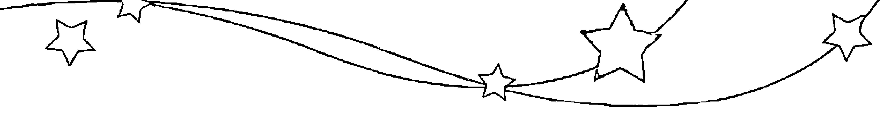

1982年 05月02日 07:47am 处女座
1982年 05月04日 02:35pm 天秤座
1982年 05月06日 11:24pm 天蝎座
1982年 05月09日 10:18am 射手座
1982年 05月11日 10:49pm 摩羯座
1982年 05月14日 11:41am 水瓶座
1982年 05月16日 10:45pm 双鱼座
1982年 05月19日 05:59am 白羊座
1982年 05月21日 09:17am 金牛座
1982年 05月23日 09:53am 双子座
1982年 05月25日 09:40am 巨蟹座
1982年 05月27日 10:31am 狮子座
1982年 05月29日 01:47pm 处女座
1982年 05月31日 08:04pm 天秤座

1982年 01月02日 02:28pm 白羊座
1982年 01月04日 06:59pm 金牛座
1982年 01月06日 08:47pm 双子座
1982年 01月08日 09:00pm 巨蟹座
1982年 01月10日 09:22pm 狮子座
1982年 01月12日 11:37pm 处女座
1982年 01月15日 05:20am 天秤座
1982年 01月17日 02:49pm 天蝎座
1982年 01月20日 03:00am 射手座
1982年 01月22日 03:49pm 摩羯座
1982年 01月25日 03:23am 水瓶座
1982年 01月27日 12:46pm 双鱼座
1982年 01月29日 07:56pm 白羊座

1982年 06月03日 05:13am 天蝎座
1982年 06月05日 04:32pm 射手座
1982年 06月08日 05:12am 摩羯座
1982年 06月10日 06:06pm 水瓶座
1982年 06月13日 05:40am 双鱼座
1982年 06月15日 02:14pm 白羊座
1982年 06月17日 07:02pm 金牛座
1982年 06月19日 08:32pm 双子座
1982年 06月21日 08:12pm 巨蟹座
1982年 06月23日 07:56pm 狮子座
1982年 06月25日 09:37pm 处女座
1982年 06月28日 02:32am 天秤座
1982年 06月30日 11:05am 天蝎座

1982年 02月01日 01:02am 金牛座
1982年 02月03日 04:18am 双子座
1982年 02月05日 06:17am 巨蟹座
1982年 02月07日 07:51am 狮子座
1982年 02月09日 10:18am 处女座
1982年 02月11日 03:06pm 天秤座
1982年 02月13日 11:16pm 天蝎座
1982年 02月16日 10:46am 射手座
1982年 02月18日 11:35pm 摩羯座
1982年 02月21日 11:11am 水瓶座
1982年 02月23日 08:06pm 双鱼座
1982年 02月26日 02:16am 白羊座
1982年 02月28日 06:30am 金牛座

1982年 07月02日 10:25pm 射手座
1982年 07月05日 11:14am 摩羯座
1982年 07月08日 12:02am 水瓶座
1982年 07月10日 11:32am 双鱼座
1982年 07月12日 08:47pm 白羊座
1982年 07月15日 02:57am 金牛座
1982年 07月17日 06:00am 双子座
1982年 07月19日 06:44am 巨蟹座
1982年 07月21日 06:36am 狮子座
1982年 07月23日 07:23am 处女座
1982年 07月25日 10:50am 天秤座
1982年 07月27日 06:01pm 天蝎座
1982年 07月30日 04:49am 射手座

1982年 03月02日 09:49am 双子座
1982年 03月04日 12:48pm 巨蟹座
1982年 03月06日 03:50pm 狮子座
1982年 03月08日 07:28pm 处女座
1982年 03月11日 12:34am 天秤座
1982年 03月13日 08:20am 天蝎座
1982年 03月16日 07:04pm 射手座
1982年 03月18日 07:46am 摩羯座
1982年 03月20日 07:50pm 水瓶座
1982年 03月23日 04:57am 双鱼座
1982年 03月25日 10:32am 白羊座
1982年 03月27日 01:37pm 金牛座
1982年 03月29日 03:44pm 双子座
1982年 03月31日 06:10pm 巨蟹座

1982年 08月01日 05:35pm 摩羯座
1982年 08月04日 06:15am 水瓶座
1982年 08月06日 05:21pm 双鱼座
1982年 08月09日 02:19am 白羊座
1982年 08月11日 08:56am 金牛座
1982年 08月13日 01:18pm 双子座
1982年 08月15日 03:38pm 巨蟹座
1982年 08月17日 04:39pm 狮子座
1982年 08月19日 05:41pm 处女座
1982年 08月21日 08:24pm 天秤座
1982年 08月24日 02:22am 天蝎座
1982年 08月26日 12:14pm 射手座
1982年 08月29日 12:41am 摩羯座
1982年 08月31日 01:21pm 水瓶座

1982年 04月02日 09:37pm 狮子座
1982年 04月05日 02:18am 处女座
1982年 04月07日 08:29am 天秤座
1982年 04月09日 04:35pm 天蝎座
1982年 04月12日 03:07am 射手座
1982年 04月14日 03:41pm 摩羯座
1982年 04月17日 04:15am 水瓶座
1982年 04月19日 02:14pm 双鱼座
1982年 04月21日 08:19pm 白羊座
1982年 04月23日 10:58pm 金牛座
1982年 04月25日 11:48pm 双子座
1982年 04月28日 12:43am 巨蟹座
1982年 04月30日 03:10am 狮子座

| 年 | 月日 | 时间 | 星座 |
| --- | --- | --- | --- |
| 1983年 | 01月01日 | 05:34am | 狮子座 |
| 1983年 | 01月03日 | 05:52am | 处女座 |
| 1983年 | 01月05日 | 08:49am | 天秤座 |
| 1983年 | 01月07日 | 03:20pm | 天蝎座 |
| 1983年 | 01月10日 | 01:14am | 射手座 |
| 1983年 | 01月12日 | 01:26pm | 摩羯座 |
| 1983年 | 01月15日 | 02:25am | 水瓶座 |
| 1983年 | 01月17日 | 03:00pm | 双鱼座 |
| 1983年 | 01月20日 | 02:06am | 白羊座 |
| 1983年 | 01月22日 | 10:30am | 金牛座 |
| 1983年 | 01月24日 | 03:34pm | 双子座 |
| 1983年 | 01月26日 | 05:25pm | 巨蟹座 |
| 1983年 | 01月28日 | 05:09pm | 狮子座 |
| 1983年 | 01月30日 | 04:37pm | 处女座 |

| 年 | 月日 | 时间 | 星座 |
| --- | --- | --- | --- |
| 1982年 | 09月03日 | 12:10am | 双鱼座 |
| 1982年 | 09月05日 | 08:20am | 白羊座 |
| 1982年 | 09月07日 | 02:24pm | 金牛座 |
| 1982年 | 09月09日 | 06:56pm | 双子座 |
| 1982年 | 09月11日 | 10:17pm | 巨蟹座 |
| 1982年 | 09月14日 | 12:45am | 狮子座 |
| 1982年 | 09月16日 | 02:58am | 处女座 |
| 1982年 | 09月18日 | 06:05am | 天秤座 |
| 1982年 | 09月20日 | 11:37am | 天蝎座 |
| 1982年 | 09月22日 | 08:32pm | 射手座 |
| 1982年 | 09月25日 | 08:32am | 摩羯座 |
| 1982年 | 09月27日 | 09:20pm | 水瓶座 |
| 1982年 | 09月30日 | 08:14am | 双鱼座 |

| 年 | 月日 | 时间 | 星座 |
| --- | --- | --- | --- |
| 1983年 | 02月01日 | 05:51pm | 天秤座 |
| 1983年 | 02月03日 | 10:33pm | 天蝎座 |
| 1983年 | 02月06日 | 07:31am | 射手座 |
| 1983年 | 02月08日 | 07:34pm | 摩羯座 |
| 1983年 | 02月11日 | 08:39am | 水瓶座 |
| 1983年 | 02月13日 | 09:00pm | 双鱼座 |
| 1983年 | 02月16日 | 07:43am | 白羊座 |
| 1983年 | 02月18日 | 04:27pm | 金牛座 |
| 1983年 | 02月20日 | 10:50pm | 双子座 |
| 1983年 | 02月23日 | 02:29am | 巨蟹座 |
| 1983年 | 02月25日 | 03:45am | 狮子座 |
| 1983年 | 02月27日 | 03:49am | 处女座 |

| 年 | 月日 | 时间 | 星座 |
| --- | --- | --- | --- |
| 1982年 | 10月02日 | 04:02pm | 白羊座 |
| 1982年 | 10月04日 | 09:07pm | 金牛座 |
| 1982年 | 10月07日 | 12:38am | 双子座 |
| 1982年 | 10月09日 | 03:39am | 巨蟹座 |
| 1982年 | 10月11日 | 06:44am | 狮子座 |
| 1982年 | 10月13日 | 10:10am | 处女座 |
| 1982年 | 10月15日 | 02:25pm | 天秤座 |
| 1982年 | 10月17日 | 08:22pm | 天蝎座 |
| 1982年 | 10月20日 | 05:04am | 射手座 |
| 1982年 | 10月22日 | 04:39pm | 摩羯座 |
| 1982年 | 10月25日 | 05:34am | 水瓶座 |
| 1982年 | 10月27日 | 05:08pm | 双鱼座 |
| 1982年 | 10月30日 | 01:23am | 白羊座 |

| 年 | 月日 | 时间 | 星座 |
| --- | --- | --- | --- |
| 1983年 | 03月01日 | 04:33am | 天秤座 |
| 1983年 | 03月03日 | 07:56am | 天蝎座 |
| 1983年 | 03月05日 | 03:19pm | 射手座 |
| 1983年 | 03月08日 | 02:29am | 摩羯座 |
| 1983年 | 03月10日 | 03:29pm | 水瓶座 |
| 1983年 | 03月13日 | 03:45am | 双鱼座 |
| 1983年 | 03月15日 | 01:57pm | 白羊座 |
| 1983年 | 03月17日 | 10:03pm | 金牛座 |
| 1983年 | 03月20日 | 04:18am | 双子座 |
| 1983年 | 03月22日 | 08:49am | 巨蟹座 |
| 1983年 | 03月24日 | 11:40am | 狮子座 |
| 1983年 | 03月26日 | 01:17pm | 处女座 |
| 1983年 | 03月28日 | 02:50pm | 天秤座 |
| 1983年 | 03月30日 | 06:00pm | 天蝎座 |

| 年 | 月日 | 时间 | 星座 |
| --- | --- | --- | --- |
| 1982年 | 11月01日 | 06:00am | 金牛座 |
| 1982年 | 11月03日 | 08:21am | 双子座 |
| 1982年 | 11月05日 | 09:59am | 巨蟹座 |
| 1982年 | 11月07日 | 12:12pm | 狮子座 |
| 1982年 | 11月09日 | 03:42pm | 处女座 |
| 1982年 | 11月11日 | 08:46pm | 天秤座 |
| 1982年 | 11月14日 | 03:43am | 天蝎座 |
| 1982年 | 11月16日 | 12:54pm | 射手座 |
| 1982年 | 11月19日 | 12:21am | 摩羯座 |
| 1982年 | 11月21日 | 01:19pm | 水瓶座 |
| 1982年 | 11月24日 | 01:41am | 双鱼座 |
| 1982年 | 11月26日 | 11:01am | 白羊座 |
| 1982年 | 11月28日 | 04:26pm | 金牛座 |
| 1982年 | 11月30日 | 06:33pm | 双子座 |

| 年 | 月日 | 时间 | 星座 |
| --- | --- | --- | --- |
| 1983年 | 04月02日 | 12:19am | 射手座 |
| 1983年 | 04月04日 | 10:32am | 摩羯座 |
| 1983年 | 04月06日 | 11:06pm | 水瓶座 |
| 1983年 | 04月09日 | 11:27am | 双鱼座 |
| 1983年 | 04月11日 | 09:35pm | 白羊座 |
| 1983年 | 04月14日 | 04:56am | 金牛座 |
| 1983年 | 04月16日 | 10:12am | 双子座 |
| 1983年 | 04月18日 | 02:12pm | 巨蟹座 |
| 1983年 | 04月20日 | 05:25pm | 狮子座 |
| 1983年 | 04月22日 | 08:11pm | 处女座 |
| 1983年 | 04月24日 | 11:03pm | 天秤座 |
| 1983年 | 04月27日 | 03:06am | 天蝎座 |
| 1983年 | 04月29日 | 09:32am | 射手座 |

| 年 | 月日 | 时间 | 星座 |
| --- | --- | --- | --- |
| 1982年 | 12月02日 | 06:57pm | 巨蟹座 |
| 1982年 | 12月04日 | 07:27pm | 狮子座 |
| 1982年 | 12月06日 | 09:33pm | 处女座 |
| 1982年 | 12月09日 | 02:11am | 天秤座 |
| 1982年 | 12月11日 | 09:37am | 天蝎座 |
| 1982年 | 12月13日 | 07:28pm | 射手座 |
| 1982年 | 12月16日 | 07:16am | 摩羯座 |
| 1982年 | 12月18日 | 08:12pm | 水瓶座 |
| 1982年 | 12月21日 | 08:53am | 双鱼座 |
| 1982年 | 12月23日 | 07:31pm | 白羊座 |
| 1982年 | 12月26日 | 02:34am | 金牛座 |
| 1982年 | 12月28日 | 05:44am | 双子座 |
| 1982年 | 12月30日 | 06:10am | 巨蟹座 |

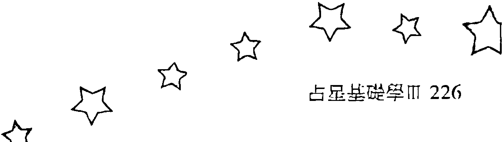

| 年 | 月日 | 时间 | 星座 |
| --- | --- | --- | --- |
| 1983年 | 09月02日 | 10:47am | 巨蟹座 |
| 1983年 | 09月04日 | 12:43pm | 狮子座 |
| 1983年 | 09月06日 | 12:35pm | 处女座 |
| 1983年 | 09月08日 | 12:16pm | 天秤座 |
| 1983年 | 09月10日 | 01:55pm | 天蝎座 |
| 1983年 | 09月12日 | 07:11pm | 射手座 |
| 1983年 | 09月15日 | 04:35am | 摩羯座 |
| 1983年 | 09月17日 | 04:46pm | 水瓶座 |
| 1983年 | 09月20日 | 05:28am | 双鱼座 |
| 1983年 | 09月22日 | 05:08pm | 白羊座 |
| 1983年 | 09月25日 | 03:11am | 金牛座 |
| 1983年 | 09月27日 | 11:21am | 双子座 |
| 1983年 | 09月29日 | 05:21pm | 巨蟹座 |

| 年 | 月日 | 时间 | 星座 |
| --- | --- | --- | --- |
| 1983年 | 05月01日 | 07:03pm | 摩羯座 |
| 1983年 | 05月04日 | 07:09am | 水瓶座 |
| 1983年 | 05月06日 | 07:42pm | 双鱼座 |
| 1983年 | 05月09日 | 06:13am | 白羊座 |
| 1983年 | 05月11日 | 01:31pm | 金牛座 |
| 1983年 | 05月13日 | 06:01pm | 双子座 |
| 1983年 | 05月15日 | 08:47pm | 巨蟹座 |
| 1983年 | 05月17日 | 11:00pm | 狮子座 |
| 1983年 | 05月20日 | 01:36am | 处女座 |
| 1983年 | 05月22日 | 05:13am | 天秤座 |
| 1983年 | 05月24日 | 10:20am | 天蝎座 |
| 1983年 | 05月26日 | 05:30pm | 射手座 |
| 1983年 | 05月29日 | 03:07am | 摩羯座 |
| 1983年 | 05月31日 | 03:00pm | 水瓶座 |

| 年 | 月日 | 时间 | 星座 |
| --- | --- | --- | --- |
| 1983年 | 10月01日 | 08:52pm | 狮子座 |
| 1983年 | 10月03日 | 10:14pm | 处女座 |
| 1983年 | 10月05日 | 10:41pm | 天秤座 |
| 1983年 | 10月08日 | 12:05am | 天蝎座 |
| 1983年 | 10月10日 | 04:24am | 射手座 |
| 1983年 | 10月12日 | 12:34pm | 摩羯座 |
| 1983年 | 10月14日 | 11:59pm | 水瓶座 |
| 1983年 | 10月17日 | 12:39pm | 双鱼座 |
| 1983年 | 10月20日 | 12:18am | 白羊座 |
| 1983年 | 10月22日 | 09:44am | 金牛座 |
| 1983年 | 10月24日 | 05:07pm | 双子座 |
| 1983年 | 10月26日 | 10:46pm | 巨蟹座 |
| 1983年 | 10月29日 | 02:49am | 狮子座 |
| 1983年 | 10月31日 | 05:31am | 处女座 |

| 年 | 月日 | 时间 | 星座 |
| --- | --- | --- | --- |
| 1983年 | 06月03日 | 03:40am | 双鱼座 |
| 1983年 | 06月05日 | 02:55pm | 白羊座 |
| 1983年 | 06月07日 | 11:03pm | 金牛座 |
| 1983年 | 06月10日 | 03:35am | 双子座 |
| 1983年 | 06月12日 | 05:31am | 巨蟹座 |
| 1983年 | 06月14日 | 06:22am | 狮子座 |
| 1983年 | 06月16日 | 07:40am | 处女座 |
| 1983年 | 06月18日 | 10:40am | 天秤座 |
| 1983年 | 06月20日 | 04:02pm | 天蝎座 |
| 1983年 | 06月22日 | 11:55pm | 射手座 |
| 1983年 | 06月25日 | 10:10am | 摩羯座 |
| 1983年 | 06月27日 | 10:06pm | 水瓶座 |
| 1983年 | 06月30日 | 10:50am | 双鱼座 |

| 年 | 月日 | 时间 | 星座 |
| --- | --- | --- | --- |
| 1983年 | 11月02日 | 07:31am | 天秤座 |
| 1983年 | 11月04日 | 09:56am | 天蝎座 |
| 1983年 | 11月06日 | 02:13pm | 射手座 |
| 1983年 | 11月08日 | 09:32pm | 摩羯座 |
| 1983年 | 11月11日 | 08:12am | 水瓶座 |
| 1983年 | 11月13日 | 08:40pm | 双鱼座 |
| 1983年 | 11月16日 | 08:33am | 白羊座 |
| 1983年 | 11月18日 | 06:03pm | 金牛座 |
| 1983年 | 11月21日 | 12:44am | 双子座 |
| 1983年 | 11月23日 | 05:09am | 巨蟹座 |
| 1983年 | 11月25日 | 08:18am | 狮子座 |
| 1983年 | 11月27日 | 11:02am | 处女座 |
| 1983年 | 11月29日 | 01:57pm | 天秤座 |

| 年 | 月日 | 时间 | 星座 |
| --- | --- | --- | --- |
| 1983年 | 07月02日 | 10:46pm | 白羊座 |
| 1983年 | 07月05日 | 08:00am | 金牛座 |
| 1983年 | 07月07日 | 01:35pm | 双子座 |
| 1983年 | 07月09日 | 03:46pm | 巨蟹座 |
| 1983年 | 07月11日 | 03:53pm | 狮子座 |
| 1983年 | 07月13日 | 03:45pm | 处女座 |
| 1983年 | 07月15日 | 05:14pm | 天秤座 |
| 1983年 | 07月17日 | 09:39pm | 天蝎座 |
| 1983年 | 07月20日 | 05:33am | 射手座 |
| 1983年 | 07月22日 | 04:12pm | 摩羯座 |
| 1983年 | 07月25日 | 04:20am | 水瓶座 |
| 1983年 | 07月27日 | 05:10pm | 双鱼座 |
| 1983年 | 07月30日 | 05:18am | 白羊座 |

| 年 | 月日 | 时间 | 星座 |
| --- | --- | --- | --- |
| 1983年 | 12月01日 | 05:42pm | 天蝎座 |
| 1983年 | 12月03日 | 10:56pm | 射手座 |
| 1983年 | 12月06日 | 06:30am | 摩羯座 |
| 1983年 | 12月08日 | 04:41pm | 水瓶座 |
| 1983年 | 12月11日 | 04:52am | 双鱼座 |
| 1983年 | 12月13日 | 05:14pm | 白羊座 |
| 1983年 | 12月16日 | 03:30am | 金牛座 |
| 1983年 | 12月18日 | 10:18am | 双子座 |
| 1983年 | 12月20日 | 01:58pm | 巨蟹座 |
| 1983年 | 12月22日 | 03:42pm | 狮子座 |
| 1983年 | 12月24日 | 05:02pm | 处女座 |
| 1983年 | 12月26日 | 07:20pm | 天秤座 |
| 1983年 | 12月28日 | 11:26pm | 天蝎座 |
| 1983年 | 12月31日 | 05:45am | 射手座 |

| 年 | 月日 | 时间 | 星座 |
| --- | --- | --- | --- |
| 1983年 | 08月01日 | 03:32pm | 金牛座 |
| 1983年 | 08月03日 | 10:41pm | 双子座 |
| 1983年 | 08月06日 | 02:07am | 巨蟹座 |
| 1983年 | 08月08日 | 02:36am | 狮子座 |
| 1983年 | 08月10日 | 01:49am | 处女座 |
| 1983年 | 08月12日 | 01:52am | 天秤座 |
| 1983年 | 08月14日 | 04:47am | 天蝎座 |
| 1983年 | 08月16日 | 11:38am | 射手座 |
| 1983年 | 08月18日 | 10:00pm | 摩羯座 |
| 1983年 | 08月21日 | 10:25am | 水瓶座 |
| 1983年 | 08月23日 | 11:09pm | 双鱼座 |
| 1983年 | 08月26日 | 11:06am | 白羊座 |
| 1983年 | 08月28日 | 09:36pm | 金牛座 |
| 1983年 | 08月31日 | 05:45am | 双子座 || 年份 | 日期 | 时间 | 星座 |
|---|---|---|---|
| 1984年 | 05月03日 | 12:01am | 双子座 |
| 1984年 | 05月05日 | 07:23am | 巨蟹座 |
| 1984年 | 05月07日 | 12:39pm | 狮子座 |
| 1984年 | 05月09日 | 03:59pm | 处女座 |
| 1984年 | 05月11日 | 05:53pm | 天秤座 |
| 1984年 | 05月13日 | 07:22pm | 天蝎座 |
| 1984年 | 05月15日 | 09:50pm | 射手座 |
| 1984年 | 05月18日 | 02:45am | 摩羯座 |
| 1984年 | 05月20日 | 10:59am | 水瓶座 |
| 1984年 | 05月22日 | 10:09pm | 双鱼座 |
| 1984年 | 05月25日 | 10:38am | 白羊座 |
| 1984年 | 05月27日 | 10:12pm | 金牛座 |
| 1984年 | 05月30日 | 07:19am | 双子座 |

| 年份 | 日期 | 时间 | 星座 |
|---|---|---|---|
| 1984年 | 06月01日 | 01:50pm | 巨蟹座 |
| 1984年 | 06月03日 | 06:17pm | 狮子座 |
| 1984年 | 06月05日 | 09:26pm | 处女座 |
| 1984年 | 06月08日 | 12:03am | 天秤座 |
| 1984年 | 06月10日 | 02:48am | 天蝎座 |
| 1984年 | 06月12日 | 06:28am | 射手座 |
| 1984年 | 06月14日 | 11:51am | 摩羯座 |
| 1984年 | 06月16日 | 07:43pm | 水瓶座 |
| 1984年 | 06月19日 | 06:19am | 双鱼座 |
| 1984年 | 06月21日 | 06:39pm | 白羊座 |
| 1984年 | 06月24日 | 06:35am | 金牛座 |
| 1984年 | 06月26日 | 03:59pm | 双子座 |
| 1984年 | 06月28日 | 10:07pm | 巨蟹座 |

| 年份 | 日期 | 时间 | 星座 |
|---|---|---|---|
| 1984年 | 07月01日 | 01:29am | 狮子座 |
| 1984年 | 07月03日 | 03:27am | 处女座 |
| 1984年 | 07月05日 | 05:27am | 天秤座 |
| 1984年 | 07月07日 | 08:30am | 天蝎座 |
| 1984年 | 07月09日 | 01:05pm | 射手座 |
| 1984年 | 07月11日 | 07:24pm | 摩羯座 |
| 1984年 | 07月14日 | 03:42am | 水瓶座 |
| 1984年 | 07月16日 | 02:12pm | 双鱼座 |
| 1984年 | 07月19日 | 02:25am | 白羊座 |
| 1984年 | 07月21日 | 02:49pm | 金牛座 |
| 1984年 | 07月24日 | 01:09am | 双子座 |
| 1984年 | 07月26日 | 07:38am | 巨蟹座 |
| 1984年 | 07月28日 | 10:37am | 狮子座 |
| 1984年 | 07月30日 | 11:28am | 处女座 |

| 年份 | 日期 | 时间 | 星座 |
|---|---|---|---|
| 1984年 | 08月01日 | 12:05pm | 天秤座 |
| 1984年 | 08月03日 | 02:07pm | 天蝎座 |
| 1984年 | 08月06日 | 06:32pm | 射手座 |
| 1984年 | 08月08日 | 01:25am | 摩羯座 |
| 1984年 | 08月10日 | 10:27am | 水瓶座 |
| 1984年 | 08月12日 | 09:13pm | 双鱼座 |
| 1984年 | 08月15日 | 09:28am | 白羊座 |
| 1984年 | 08月17日 | 10:12pm | 金牛座 |
| 1984年 | 08月20日 | 09:26am | 双子座 |
| 1984年 | 08月22日 | 05:15pm | 巨蟹座 |
| 1984年 | 08月24日 | 08:57pm | 狮子座 |
| 1984年 | 08月26日 | 09:31pm | 处女座 |
| 1984年 | 08月28日 | 08:57pm | 天秤座 |
| 1984年 | 08月30日 | 09:24pm | 天蝎座 |

| 年份 | 日期 | 时间 | 星座 |
|---|---|---|---|
| 1984年 | 01月02日 | 02:09pm | 摩羯座 |
| 1984年 | 01月05日 | 12:30am | 水瓶座 |
| 1984年 | 01月07日 | 12:35pm | 双鱼座 |
| 1984年 | 01月10日 | 01:14am | 白羊座 |
| 1984年 | 01月12日 | 12:31pm | 金牛座 |
| 1984年 | 01月14日 | 08:37pm | 双子座 |
| 1984年 | 01月17日 | 12:46am | 巨蟹座 |
| 1984年 | 01月19日 | 01:48am | 狮子座 |
| 1984年 | 01月21日 | 01:35am | 处女座 |
| 1984年 | 01月23日 | 02:08am | 天秤座 |
| 1984年 | 01月25日 | 05:07am | 天蝎座 |
| 1984年 | 01月27日 | 11:16am | 射手座 |
| 1984年 | 01月29日 | 08:13pm | 摩羯座 |

| 年份 | 日期 | 时间 | 星座 |
|---|---|---|---|
| 1984年 | 02月01日 | 07:12am | 水瓶座 |
| 1984年 | 02月03日 | 07:22pm | 双鱼座 |
| 1984年 | 02月06日 | 08:02am | 白羊座 |
| 1984年 | 02月08日 | 08:03pm | 金牛座 |
| 1984年 | 02月11日 | 05:35am | 双子座 |
| 1984年 | 02月13日 | 11:13am | 巨蟹座 |
| 1984年 | 02月15日 | 01:04pm | 狮子座 |
| 1984年 | 02月17日 | 12:31pm | 处女座 |
| 1984年 | 02月19日 | 11:43am | 天秤座 |
| 1984年 | 02月21日 | 12:50pm | 天蝎座 |
| 1984年 | 02月23日 | 05:26pm | 射手座 |
| 1984年 | 02月26日 | 01:50am | 摩羯座 |
| 1984年 | 02月28日 | 01:03pm | 水瓶座 |

| 年份 | 日期 | 时间 | 星座 |
|---|---|---|---|
| 1984年 | 03月02日 | 01:29am | 双鱼座 |
| 1984年 | 03月04日 | 02:06pm | 白羊座 |
| 1984年 | 03月07日 | 02:07am | 金牛座 |
| 1984年 | 03月09日 | 12:25pm | 双子座 |
| 1984年 | 03月11日 | 07:44pm | 巨蟹座 |
| 1984年 | 03月13日 | 11:20pm | 狮子座 |
| 1984年 | 03月15日 | 11:46pm | 处女座 |
| 1984年 | 03月17日 | 10:51pm | 天秤座 |
| 1984年 | 03月19日 | 10:49pm | 天蝎座 |
| 1984年 | 03月22日 | 01:42am | 射手座 |
| 1984年 | 03月24日 | 08:40am | 摩羯座 |
| 1984年 | 03月26日 | 07:10pm | 水瓶座 |
| 1984年 | 03月29日 | 07:37am | 双鱼座 |
| 1984年 | 03月31日 | 08:13pm | 白羊座 |

| 年份 | 日期 | 时间 | 星座 |
|---|---|---|---|
| 1984年 | 04月03日 | 07:53am | 金牛座 |
| 1984年 | 04月05日 | 06:02pm | 双子座 |
| 1984年 | 04月08日 | 01:58am | 巨蟹座 |
| 1984年 | 04月10日 | 06:57am | 狮子座 |
| 1984年 | 04月12日 | 09:07am | 处女座 |
| 1984年 | 04月14日 | 09:29am | 天秤座 |
| 1984年 | 04月16日 | 09:44am | 天蝎座 |
| 1984年 | 04月18日 | 11:49am | 射手座 |
| 1984年 | 04月20日 | 05:14pm | 摩羯座 |
| 1984年 | 04月23日 | 02:28am | 水瓶座 |
| 1984年 | 04月25日 | 02:26pm | 双鱼座 |
| 1984年 | 04月28日 | 03:01am | 白羊座 |
| 1984年 | 04月30日 | 02:28pm | 金牛座 |

| 年份 | 日期 | 时间 | 星座 |
|---|---|---|---|
| 1985年 | 01月01日 | 08:34am | 金牛座 |
| 1985年 | 01月03日 | 07:57pm | 双子座 |
| 1985年 | 01月06日 | 04:14am | 巨蟹座 |
| 1985年 | 01月08日 | 09:25am | 狮子座 |
| 1985年 | 01月10日 | 12:38pm | 处女座 |
| 1985年 | 01月12日 | 03:13pm | 天秤座 |
| 1985年 | 01月14日 | 06:08pm | 天蝎座 |
| 1985年 | 01月16日 | 09:48pm | 射手座 |
| 1985年 | 01月19日 | 02:29am | 摩羯座 |
| 1985年 | 01月21日 | 08:41am | 水瓶座 |
| 1985年 | 01月23日 | 05:04pm | 双鱼座 |
| 1985年 | 01月26日 | 04:06am | 白羊座 |
| 1985年 | 01月28日 | 04:52pm | 金牛座 |
| 1985年 | 01月31日 | 04:57am | 双子座 |

| 年份 | 日期 | 时间 | 星座 |
|---|---|---|---|
| 1984年 | 09月02日 | 12:29am | 射手座 |
| 1984年 | 09月04日 | 06:57am | 摩羯座 |
| 1984年 | 09月06日 | 04:13pm | 水瓶座 |
| 1984年 | 09月09日 | 03:24am | 双鱼座 |
| 1984年 | 09月11日 | 03:47pm | 白羊座 |
| 1984年 | 09月14日 | 04:32am | 金牛座 |
| 1984年 | 09月16日 | 04:22pm | 双子座 |
| 1984年 | 09月19日 | 01:34am | 巨蟹座 |
| 1984年 | 09月21日 | 06:43am | 狮子座 |
| 1984年 | 09月23日 | 08:15am | 处女座 |
| 1984年 | 09月25日 | 07:41am | 天秤座 |
| 1984年 | 09月27日 | 07:07am | 天蝎座 |
| 1984年 | 09月29日 | 08:37am | 射手座 |

| 年份 | 日期 | 时间 | 星座 |
|---|---|---|---|
| 1985年 | 02月02日 | 01:53pm | 巨蟹座 |
| 1985年 | 02月04日 | 06:58pm | 狮子座 |
| 1985年 | 02月06日 | 09:08pm | 处女座 |
| 1985年 | 02月08日 | 10:10pm | 天秤座 |
| 1985年 | 02月10日 | 11:48pm | 天蝎座 |
| 1985年 | 02月13日 | 03:10am | 射手座 |
| 1985年 | 02月15日 | 08:29am | 摩羯座 |
| 1985年 | 02月17日 | 03:38pm | 水瓶座 |
| 1985年 | 02月20日 | 12:38am | 双鱼座 |
| 1985年 | 02月22日 | 11:44am | 白羊座 |
| 1985年 | 02月25日 | 12:27am | 金牛座 |
| 1985年 | 02月27日 | 01:08pm | 双子座 |

| 年份 | 日期 | 时间 | 星座 |
|---|---|---|---|
| 1984年 | 10月01日 | 01:33pm | 摩羯座 |
| 1984年 | 10月03日 | 10:04pm | 水瓶座 |
| 1984年 | 10月06日 | 09:20am | 双鱼座 |
| 1984年 | 10月08日 | 09:50pm | 白羊座 |
| 1984年 | 10月11日 | 10:27am | 金牛座 |
| 1984年 | 10月13日 | 10:13pm | 双子座 |
| 1984年 | 10月16日 | 07:56am | 巨蟹座 |
| 1984年 | 10月18日 | 02:35pm | 狮子座 |
| 1984年 | 10月20日 | 05:52pm | 处女座 |
| 1984年 | 10月22日 | 06:30pm | 天秤座 |
| 1984年 | 10月24日 | 06:08pm | 天蝎座 |
| 1984年 | 10月26日 | 06:46pm | 射手座 |
| 1984年 | 10月28日 | 10:06pm | 摩羯座 |
| 1984年 | 10月31日 | 05:16am | 水瓶座 |

| 年份 | 日期 | 时间 | 星座 |
|---|---|---|---|
| 1985年 | 03月01日 | 11:22pm | 巨蟹座 |
| 1985年 | 03月04日 | 05:23am | 狮子座 |
| 1985年 | 03月06日 | 07:39am | 处女座 |
| 1985年 | 03月08日 | 07:47am | 天秤座 |
| 1985年 | 03月10日 | 07:49am | 天蝎座 |
| 1985年 | 03月12日 | 09:33am | 射手座 |
| 1985年 | 03月14日 | 01:58pm | 摩羯座 |
| 1985年 | 03月16日 | 09:12pm | 水瓶座 |
| 1985年 | 03月19日 | 06:52am | 双鱼座 |
| 1985年 | 03月21日 | 06:21pm | 白羊座 |
| 1985年 | 03月24日 | 07:06am | 金牛座 |
| 1985年 | 03月26日 | 08:00pm | 双子座 |
| 1985年 | 03月29日 | 07:09am | 巨蟹座 |
| 1985年 | 03月31日 | 02:45pm | 狮子座 |

| 年份 | 日期 | 时间 | 星座 |
|---|---|---|---|
| 1984年 | 11月02日 | 03:51pm | 双鱼座 |
| 1984年 | 11月05日 | 04:20am | 白羊座 |
| 1984年 | 11月07日 | 04:51pm | 金牛座 |
| 1984年 | 11月10日 | 04:08am | 双子座 |
| 1984年 | 11月12日 | 01:27pm | 巨蟹座 |
| 1984年 | 11月14日 | 08:31pm | 狮子座 |
| 1984年 | 11月17日 | 01:07am | 处女座 |
| 1984年 | 11月19日 | 03:28am | 天秤座 |
| 1984年 | 11月21日 | 04:30am | 天蝎座 |
| 1984年 | 11月23日 | 05:36am | 射手座 |
| 1984年 | 11月25日 | 08:21am | 摩羯座 |
| 1984年 | 11月27日 | 02:11pm | 水瓶座 |
| 1984年 | 11月29日 | 11:33pm | 双鱼座 |

| 年份 | 日期 | 时间 | 星座 |
|---|---|---|---|
| 1985年 | 04月02日 | 06:20pm | 处女座 |
| 1985年 | 04月04日 | 06:51pm | 天秤座 |
| 1985年 | 04月06日 | 06:11pm | 天蝎座 |
| 1985年 | 04月08日 | 06:20pm | 射手座 |
| 1985年 | 04月10日 | 08:59pm | 摩羯座 |
| 1985年 | 04月13日 | 03:05am | 水瓶座 |
| 1985年 | 04月15日 | 12:33pm | 双鱼座 |
| 1985年 | 04月18日 | 12:18am | 白羊座 |
| 1985年 | 04月20日 | 01:12pm | 金牛座 |
| 1985年 | 04月23日 | 01:59am | 双子座 |
| 1985年 | 04月25日 | 01:22pm | 巨蟹座 |
| 1985年 | 04月27日 | 10:08pm | 狮子座 |
| 1985年 | 04月30日 | 03:21am | 处女座 |

| 年份 | 日期 | 时间 | 星座 |
|---|---|---|---|
| 1984年 | 12月02日 | 11:42am | 白羊座 |
| 1984年 | 12月05日 | 12:20am | 金牛座 |
| 1984年 | 12月07日 | 11:20am | 双子座 |
| 1984年 | 12月09日 | 07:54pm | 巨蟹座 |
| 1984年 | 12月12日 | 02:07am | 狮子座 |
| 1984年 | 12月14日 | 06:33am | 处女座 |
| 1984年 | 12月16日 | 09:50am | 天秤座 |
| 1984年 | 12月18日 | 12:27pm | 天蝎座 |
| 1984年 | 12月20日 | 02:59pm | 射手座 |
| 1984年 | 12月22日 | 06:22pm | 摩羯座 |
| 1984年 | 12月24日 | 11:47pm | 水瓶座 |
| 1984年 | 12月27日 | 08:21am | 双鱼座 |
| 1984年 | 12月29日 | 07:50pm | 白羊座 |

1985年 | 09月01日 | 01:44pm | 白羊座
1985年 | 09月04日 | 01:27am | 金牛座
1985年 | 09月06日 | 02:25pm | 双子座
1985年 | 09月09日 | 02:08am | 巨蟹座
1985年 | 09月11日 | 10:21am | 狮子座
1985年 | 09月13日 | 02:47pm | 处女座
1985年 | 09月15日 | 04:31pm | 天秤座
1985年 | 09月17日 | 05:17pm | 天蝎座
1985年 | 09月19日 | 06:42pm | 射手座
1985年 | 09月21日 | 09:50pm | 摩羯座
1985年 | 09月24日 | 03:12am | 水瓶座
1985年 | 09月26日 | 10:53am | 双鱼座
1985年 | 09月28日 | 08:43pm | 白羊座

1985年 | 05月02日 | 05:19am | 天秤座
1985年 | 05月04日 | 05:16am | 天蝎座
1985年 | 05月06日 | 04:57am | 射手座
1985年 | 05月08日 | 06:15am | 摩羯座
1985年 | 05月10日 | 10:43am | 水瓶座
1985年 | 05月12日 | 06:58pm | 双鱼座
1985年 | 05月15日 | 06:26am | 白羊座
1985年 | 05月17日 | 07:23pm | 金牛座
1985年 | 05月20日 | 07:59am | 双子座
1985年 | 05月22日 | 07:02pm | 巨蟹座
1985年 | 05月25日 | 03:51am | 狮子座
1985年 | 05月27日 | 10:02am | 处女座
1985年 | 05月29日 | 01:36pm | 天秤座
1985年 | 05月31日 | 03:05pm | 天蝎座

1985年 | 10月01日 | 08:36am | 金牛座
1985年 | 10月03日 | 09:36pm | 双子座
1985年 | 10月06日 | 09:55am | 巨蟹座
1985年 | 10月08日 | 07:30pm | 狮子座
1985年 | 10月11日 | 01:08am | 处女座
1985年 | 10月13日 | 03:10am | 天秤座
1985年 | 10月15日 | 03:12am | 天蝎座
1985年 | 10月17日 | 03:06am | 射手座
1985年 | 10月19日 | 04:38am | 摩羯座
1985年 | 10月21日 | 08:59am | 水瓶座
1985年 | 10月23日 | 04:30pm | 双鱼座
1985年 | 10月26日 | 02:48am | 白羊座
1985年 | 10月28日 | 03:00pm | 金牛座
1985年 | 10月31日 | 03:58am | 双子座

1985年 | 06月02日 | 03:34pm | 射手座
1985年 | 06月04日 | 04:37pm | 摩羯座
1985年 | 06月06日 | 07:54pm | 水瓶座
1985年 | 06月09日 | 02:48am | 双鱼座
1985年 | 06月11日 | 01:26pm | 白羊座
1985年 | 06月14日 | 02:11am | 金牛座
1985年 | 06月16日 | 02:42pm | 双子座
1985年 | 06月19日 | 01:21am | 巨蟹座
1985年 | 06月21日 | 09:29am | 狮子座
1985年 | 06月23日 | 03:30pm | 处女座
1985年 | 06月25日 | 07:46pm | 天秤座
1985年 | 06月27日 | 10:36pm | 天蝎座
1985年 | 06月30日 | 12:30am | 射手座

1985年 | 11月02日 | 04:28pm | 巨蟹座
1985年 | 11月05日 | 03:01am | 狮子座
1985年 | 11月07日 | 10:12am | 处女座
1985年 | 11月09日 | 01:46pm | 天秤座
1985年 | 11月11日 | 02:28pm | 天蝎座
1985年 | 11月13日 | 01:53pm | 射手座
1985年 | 11月15日 | 01:57pm | 摩羯座
1985年 | 11月17日 | 04:30pm | 水瓶座
1985年 | 11月19日 | 10:43pm | 双鱼座
1985年 | 11月22日 | 06:45am | 白羊座
1985年 | 11月24日 | 09:07pm | 金牛座
1985年 | 11月27日 | 10:06am | 双子座
1985年 | 11月29日 | 10:22pm | 巨蟹座

1985年 | 07月02日 | 02:22am | 摩羯座
1985年 | 07月04日 | 05:39am | 水瓶座
1985年 | 07月06日 | 11:45am | 双鱼座
1985年 | 07月08日 | 09:21pm | 白羊座
1985年 | 07月11日 | 09:44am | 金牛座
1985年 | 07月13日 | 10:22pm | 双子座
1985年 | 07月16日 | 08:50am | 巨蟹座
1985年 | 07月18日 | 04:21pm | 狮子座
1985年 | 07月20日 | 09:28pm | 处女座
1985年 | 07月23日 | 01:09am | 天秤座
1985年 | 07月26日 | 04:15am | 天蝎座
1985年 | 07月27日 | 07:12am | 射手座
1985年 | 07月29日 | 10:22am | 摩羯座
1985年 | 07月31日 | 02:28pm | 水瓶座

1985年 | 12月02日 | 08:56am | 狮子座
1985年 | 12月04日 | 05:10pm | 处女座
1985年 | 12月06日 | 10:32pm | 天秤座
1985年 | 12月09日 | 12:55am | 天蝎座
1985年 | 12月11日 | 01:13am | 射手座
1985年 | 12月13日 | 01:00am | 摩羯座
1985年 | 12月15日 | 02:16am | 水瓶座
1985年 | 12月17日 | 06:54am | 双鱼座
1985年 | 12月19日 | 03:40pm | 白羊座
1985年 | 12月22日 | 03:41am | 金牛座
1985年 | 12月24日 | 04:43pm | 双子座
1985年 | 12月27日 | 04:42am | 巨蟹座
1985年 | 12月29日 | 02:41pm | 狮子座
1985年 | 12月31日 | 10:42pm | 处女座

1985年 | 08月02日 | 08:35pm | 双鱼座
1985年 | 08月05日 | 05:45am | 白羊座
1985年 | 08月07日 | 05:42pm | 金牛座
1985年 | 08月10日 | 06:29am | 双子座
1985年 | 08月12日 | 05:24pm | 巨蟹座
1985年 | 08月15日 | 12:56am | 狮子座
1985年 | 08月17日 | 05:12am | 处女座
1985年 | 08月19日 | 07:43am | 天秤座
1985年 | 08月21日 | 09:52am | 天蝎座
1985年 | 08月23日 | 12:37pm | 射手座
1985年 | 08月25日 | 04:26pm | 摩羯座
1985年 | 08月27日 | 09:32pm | 水瓶座
1985年 | 08月30日 | 04:26am | 双鱼座

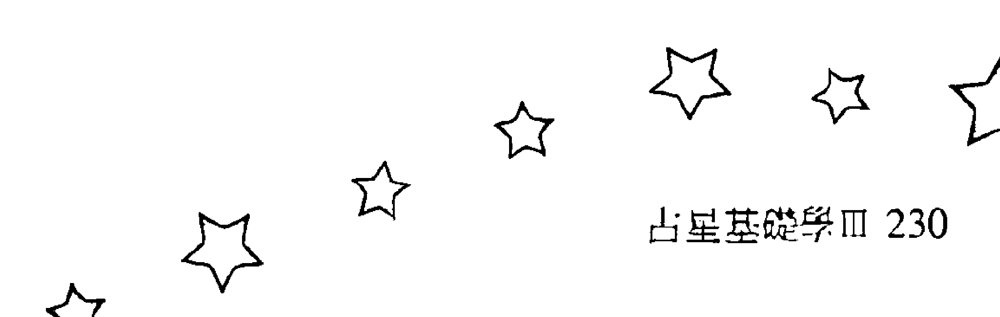| 日期       | 时间     | 星座   |
|------------|----------|--------|
| 1986年05月02日 | 10:31pm  | 双鱼座 |
| 1986年05月05日 | 07:03am  | 白羊座 |
| 1986年05月07日 | 06:00pm  | 金牛座 |
| 1986年05月10日 | 06:26am  | 双子座 |
| 1986年05月12日 | 07:17pm  | 巨蟹座 |
| 1986年05月15日 | 07:12am  | 狮子座 |
| 1986年05月17日 | 04:40pm  | 处女座 |
| 1986年05月19日 | 10:39pm  | 天秤座 |
| 1986年05月22日 | 01:01am  | 天蝎座 |
| 1986年05月24日 | 12:56am  | 射手座 |
| 1986年05月26日 | 12:14am  | 摩羯座 |
| 1986年05月28日 | 01:00am  | 水瓶座 |
| 1986年05月30日 | 04:58am  | 双鱼座 |

| 日期       | 时间     | 星座   |
|------------|----------|--------|
| 1986年01月03日 | 04:43am  | 天秤座 |
| 1986年01月05日 | 08:40am  | 天蝎座 |
| 1986年01月07日 | 10:44am  | 射手座 |
| 1986年01月09日 | 11:42am  | 摩羯座 |
| 1986年01月11日 | 01:05pm  | 水瓶座 |
| 1986年01月13日 | 04:43pm  | 双鱼座 |
| 1986年01月16日 | 12:03am  | 白羊座 |
| 1986年01月18日 | 11:15am  | 金牛座 |
| 1986年01月21日 | 12:11am  | 双子座 |
| 1986年01月23日 | 12:11pm  | 巨蟹座 |
| 1986年01月25日 | 09:46pm  | 狮子座 |
| 1986年01月28日 | 04:49am  | 处女座 |
| 1986年01月30日 | 10:08am  | 天秤座 |

| 日期       | 时间     | 星座   |
|------------|----------|--------|
| 1986年06月01日 | 12:46pm  | 白羊座 |
| 1986年06月03日 | 11:45pm  | 金牛座 |
| 1986年06月06日 | 12:26pm  | 双子座 |
| 1986年06月09日 | 01:15am  | 巨蟹座 |
| 1986年06月11日 | 01:09pm  | 狮子座 |
| 1986年06月13日 | 11:17pm  | 处女座 |
| 1986年06月16日 | 06:33am  | 天秤座 |
| 1986年06月18日 | 10:31am  | 天蝎座 |
| 1986年06月20日 | 11:32am  | 射手座 |
| 1986年06月22日 | 11:00am  | 摩羯座 |
| 1986年06月24日 | 10:54am  | 水瓶座 |
| 1986年06月26日 | 01:18pm  | 双鱼座 |
| 1986年06月28日 | 07:37pm  | 白羊座 |

| 日期       | 时间     | 星座   |
|------------|----------|--------|
| 1986年02月01日 | 02:17pm  | 天蝎座 |
| 1986年02月03日 | 05:30pm  | 射手座 |
| 1986年02月05日 | 08:01pm  | 摩羯座 |
| 1986年02月07日 | 10:35pm  | 水瓶座 |
| 1986年02月10日 | 02:33am  | 双鱼座 |
| 1986年02月12日 | 09:25am  | 白羊座 |
| 1986年02月14日 | 07:40pm  | 金牛座 |
| 1986年02月17日 | 08:16am  | 双子座 |
| 1986年02月19日 | 08:37pm  | 巨蟹座 |
| 1986年02月22日 | 06:21am  | 狮子座 |
| 1986年02月24日 | 12:54pm  | 处女座 |
| 1986年02月26日 | 05:05pm  | 天秤座 |
| 1986年02月28日 | 08:05pm  | 天蝎座 |

| 日期       | 时间     | 星座   |
|------------|----------|--------|
| 1986年07月01日 | 05:56am  | 金牛座 |
| 1986年07月03日 | 06:32pm  | 双子座 |
| 1986年07月06日 | 07:17am  | 巨蟹座 |
| 1986年07月08日 | 06:54pm  | 狮子座 |
| 1986年07月11日 | 04:47am  | 处女座 |
| 1986年07月13日 | 12:36pm  | 天秤座 |
| 1986年07月15日 | 05:54pm  | 天蝎座 |
| 1986年07月17日 | 08:32pm  | 射手座 |
| 1986年07月19日 | 09:09pm  | 摩羯座 |
| 1986年07月21日 | 09:18pm  | 水瓶座 |
| 1986年07月23日 | 10:59pm  | 双鱼座 |
| 1986年07月26日 | 04:05am  | 白羊座 |
| 1986年07月28日 | 01:14pm  | 金牛座 |
| 1986年07月31日 | 01:19am  | 双子座 |

| 日期       | 时间     | 星座   |
|------------|----------|--------|
| 1986年03月02日 | 10:51pm  | 射手座 |
| 1986年03月05日 | 01:56am  | 摩羯座 |
| 1986年03月07日 | 05:44am  | 水瓶座 |
| 1986年03月09日 | 10:51am  | 双鱼座 |
| 1986年03月11日 | 06:06pm  | 白羊座 |
| 1986年03月14日 | 04:05am  | 金牛座 |
| 1986年03月16日 | 04:23pm  | 双子座 |
| 1986年03月19日 | 05:02am  | 巨蟹座 |
| 1986年03月21日 | 03:34pm  | 狮子座 |
| 1986年03月23日 | 10:38pm  | 处女座 |
| 1986年03月26日 | 02:21am  | 天秤座 |
| 1986年03月28日 | 04:04am  | 天蝎座 |
| 1986年03月30日 | 05:21am  | 射手座 |

| 日期       | 时间     | 星座   |
|------------|----------|--------|
| 1986年08月02日 | 02:02pm  | 巨蟹座 |
| 1986年08月05日 | 01:25am  | 狮子座 |
| 1986年08月07日 | 10:41am  | 处女座 |
| 1986年08月09日 | 06:02pm  | 天秤座 |
| 1986年08月11日 | 11:35pm  | 天蝎座 |
| 1986年08月14日 | 03:15am  | 射手座 |
| 1986年08月16日 | 05:21am  | 摩羯座 |
| 1986年08月18日 | 06:45am  | 水瓶座 |
| 1986年08月20日 | 00:55am  | 双鱼座 |
| 1986年08月22日 | 01:32pm  | 白羊座 |
| 1986年08月24日 | 09:37pm  | 金牛座 |
| 1986年08月27日 | 09:01am  | 双子座 |
| 1986年08月29日 | 09:39pm  | 巨蟹座 |

| 日期       | 时间     | 星座   |
|------------|----------|--------|
| 1986年04月01日 | 07:27am  | 摩羯座 |
| 1986年04月03日 | 11:14am  | 水瓶座 |
| 1986年04月05日 | 05:06pm  | 双鱼座 |
| 1986年04月08日 | 01:12am  | 白羊座 |
| 1986年04月10日 | 11:38am  | 金牛座 |
| 1986年04月12日 | 11:50pm  | 双子座 |
| 1986年04月15日 | 12:40pm  | 巨蟹座 |
| 1986年04月18日 | 12:09am  | 狮子座 |
| 1986年04月20日 | 08:18am  | 处女座 |
| 1986年04月22日 | 12:44pm  | 天秤座 |
| 1986年04月24日 | 02:12pm  | 天蝎座 |
| 1986年04月26日 | 02:16pm  | 射手座 |
| 1986年04月28日 | 02:44pm  | 摩羯座 |
| 1986年04月30日 | 05:09pm  | 水瓶座 |

| 年份 | 日期 | 时间 | 星座 |  | 年份 | 日期 | 时间 | 星座 |
| :--- | :--- | :--- | :--- | :- | :--- | :--- | :--- | :--- |
| 1987年 | 01月01日 | 07:55pm | 水瓶座 |  | 1986年 | 09月01日 | 09:05am | 双子座 |
| 1987年 | 01月03日 | 08:38pm | 双鱼座 |  | 1986年 | 09月03日 | 06:03pm | 处女座 |
| 1987年 | 01月06日 | 12:51am | 白羊座 |  | 1986年 | 09月06日 | 12:33am | 天秤座 |
| 1987年 | 01月08日 | 09:16am | 金牛座 |  | 1986年 | 09月08日 | 05:10am | 天蝎座 |
| 1987年 | 01月10日 | 08:40pm | 双子座 |  | 1986年 | 09月10日 | 08:39am | 射手座 |
| 1987年 | 01月13日 | 09:18am | 巨蟹座 |  | 1986年 | 09月12日 | 11:27am | 摩羯座 |
| 1987年 | 01月15日 | 09:44pm | 狮子座 |  | 1986年 | 09月14日 | 02:07pm | 水瓶座 |
| 1987年 | 01月18日 | 09:12am | 处女座 |  | 1986年 | 09月16日 | 05:28pm | 双鱼座 |
| 1987年 | 01月20日 | 07:06pm | 天秤座 |  | 1986年 | 09月18日 | 10:34pm | 白羊座 |
| 1987年 | 01月23日 | 02:28am | 天蝎座 |  | 1986年 | 09月21日 | 06:28am | 金牛座 |
| 1987年 | 01月25日 | 06:31am | 射手座 |  | 1986年 | 09月23日 | 05:15pm | 双子座 |
| 1987年 | 01月27日 | 07:39am | 摩羯座 |  | 1986年 | 09月26日 | 05:43am | 巨蟹座 |
| 1987年 | 01月29日 | 07:18am | 水瓶座 |  | 1986年 | 09月28日 | 05:36pm | 双子座 |
| 1987年 | 01月31日 | 07:28am | 双鱼座 |  |  |  |  |  |
| 1987年 | 02月02日 | 10:15am | 白羊座 |  | 1986年 | 10月01日 | 02:55am | 处女座 |
| 1987年 | 02月04日 | 04:57pm | 金牛座 |  | 1986年 | 10月03日 | 08:59am | 天秤座 |
| 1987年 | 02月07日 | 03:24am | 双子座 |  | 1986年 | 10月05日 | 12:32pm | 天蝎座 |
| 1987年 | 02月09日 | 03:55pm | 巨蟹座 |  | 1986年 | 10月07日 | 02:47pm | 射手座 |
| 1987年 | 02月12日 | 04:20am | 狮子座 |  | 1986年 | 10月09日 | 04:53pm | 摩羯座 |
| 1987年 | 02月14日 | 03:23pm | 处女座 |  | 1986年 | 10月11日 | 07:46pm | 水瓶座 |
| 1987年 | 02月17日 | 12:44am | 天秤座 |  | 1986年 | 10月14日 | 12:03am | 双鱼座 |
| 1987年 | 02月19日 | 08:01am | 天蝎座 |  | 1986年 | 10月16日 | 06:15am | 白羊座 |
| 1987年 | 02月21日 | 01:05pm | 射手座 |  | 1986年 | 10月18日 | 02:38pm | 金牛座 |
| 1987年 | 02月23日 | 03:54pm | 摩羯座 |  | 1986年 | 10月21日 | 01:15am | 双子座 |
| 1987年 | 02月25日 | 05:07pm | 水瓶座 |  | 1986年 | 10月23日 | 01:37pm | 巨蟹座 |
| 1987年 | 02月27日 | 06:08pm | 双鱼座 |  | 1986年 | 10月26日 | 02:01am | 双子座 |
|  |  |  |  |  | 1986年 | 10月28日 | 12:15pm | 处女座 |
|  |  |  |  |  | 1986年 | 10月30日 | 07:00pm | 天秤座 |
| 1987年 | 03月01日 | 08:30pm | 白羊座 |  | 1986年 | 11月01日 | 10:18pm | 天蝎座 |
| 1987年 | 03月04日 | 02:13am | 金牛座 |  | 1986年 | 11月03日 | 11:18pm | 射手座 |
| 1987年 | 03月06日 | 11:29am | 双子座 |  | 1986年 | 11月05日 | 11:48pm | 摩羯座 |
| 1987年 | 03月08日 | 11:24pm | 巨蟹座 |  | 1986年 | 11月08日 | 01:29am | 水瓶座 |
| 1987年 | 03月11日 | 11:52am | 狮子座 |  | 1986年 | 11月10日 | 05:32am | 双鱼座 |
| 1987年 | 03月13日 | 10:54pm | 处女座 |  | 1986年 | 11月12日 | 12:17pm | 白羊座 |
| 1987年 | 03月16日 | 07:31am | 天秤座 |  | 1986年 | 11月14日 | 09:25pm | 金牛座 |
| 1987年 | 03月18日 | 01:54pm | 天蝎座 |  | 1986年 | 11月17日 | 08:27am | 双子座 |
| 1987年 | 03月20日 | 06:30pm | 射手座 |  | 1986年 | 11月19日 | 08:45pm | 巨蟹座 |
| 1987年 | 03月22日 | 09:47pm | 摩羯座 |  | 1986年 | 11月22日 | 09:23am | 双子座 |
| 1987年 | 03月25日 | 12:18am | 水瓶座 |  | 1986年 | 11月24日 | 08:44pm | 处女座 |
| 1987年 | 03月27日 | 02:46am | 双鱼座 |  | 1986年 | 11月27日 | 04:54am | 天秤座 |
| 1987年 | 03月29日 | 06:14am | 白羊座 |  | 1986年 | 11月29日 | 09:07am | 天蝎座 |
| 1987年 | 03月31日 | 11:50am | 金牛座 |  |  |  |  |  |
| 1987年 | 04月02日 | 06:18pm | 双子座 |  | 1986年 | 12月01日 | 10:05am | 射手座 |
| 1987年 | 04月05日 | 07:34am | 巨蟹座 |  | 1986年 | 12月03日 | 09:29am | 摩羯座 |
| 1987年 | 04月07日 | 08:03pm | 双子座 |  | 1986年 | 12月05日 | 09:27am | 水瓶座 |
| 1987年 | 04月10日 | 07:24am | 处女座 |  | 1986年 | 12月07日 | 11:54am | 双鱼座 |
| 1987年 | 04月12日 | 04:01pm | 天秤座 |  | 1986年 | 12月09日 | 05:52pm | 白羊座 |
| 1987年 | 04月14日 | 09:39pm | 天蝎座 |  | 1986年 | 12月12日 | 03:11am | 金牛座 |
| 1987年 | 04月17日 | 01:01am | 射手座 |  | 1986年 | 12月14日 | 02:42pm | 双子座 |
| 1987年 | 04月19日 | 03:20am | 摩羯座 |  | 1986年 | 12月17日 | 03:09am | 巨蟹座 |
| 1987年 | 04月21日 | 05:46am | 水瓶座 |  | 1986年 | 12月19日 | 03:43pm | 双子座 |
| 1987年 | 04月23日 | 09:03am | 双鱼座 |  | 1986年 | 12月22日 | 03:28am | 处女座 |
| 1987年 | 04月26日 | 01:43pm | 白羊座 |  | 1986年 | 12月24日 | 12:59pm | 天秤座 |
| 1987年 | 04月27日 | 08:07pm | 金牛座 |  | 1986年 | 12月26日 | 07:02pm | 天蝎座 |
| 1987年 | 04月30日 | 04:44am | 双子座 |  | 1986年 | 12月28日 | 09:17pm | 射手座 |
|  |  |  |  |  | 1986年 | 12月30日 | 08:53pm | 摩羯座 |

| 日期 | 时间 | 星座 |
|---|---|---|
| 1987年09月03日 | 01:03am | 摩羯座 |
| 1987年09月05日 | 02:21am | 水瓶座 |
| 1987年09月07日 | 02:37am | 双鱼座 |
| 1987年09月09日 | 03:36am | 白羊座 |
| 1987年09月11日 | 07:01am | 金牛座 |
| 1987年09月13日 | 01:59pm | 双子座 |
| 1987年09月16日 | 12:22am | 巨蟹座 |
| 1987年09月18日 | 12:50pm | 狮子座 |
| 1987年09月21日 | 01:12am | 处女座 |
| 1987年09月23日 | 11:55am | 天秤座 |
| 1987年09月25日 | 08:28pm | 天蝎座 |
| 1987年09月28日 | 02:47am | 射手座 |
| 1987年09月30日 | 07:05am | 摩羯座 |

| 日期 | 时间 | 星座 |
|---|---|---|
| 1987年05月02日 | 03:40pm | 巨蟹座 |
| 1987年05月05日 | 04:05am | 狮子座 |
| 1987年05月07日 | 04:04pm | 处女座 |
| 1987年05月10日 | 01:27am | 天秤座 |
| 1987年05月12日 | 07:04am | 天蝎座 |
| 1987年05月14日 | 09:38am | 射手座 |
| 1987年05月16日 | 10:36am | 摩羯座 |
| 1987年05月18日 | 11:45am | 水瓶座 |
| 1987年05月20日 | 02:27pm | 双鱼座 |
| 1987年05月22日 | 07:25pm | 白羊座 |
| 1987年05月25日 | 02:39am | 金牛座 |
| 1987年05月27日 | 11:57am | 双子座 |
| 1987年05月29日 | 10:59pm | 巨蟹座 |

| 日期 | 时间 | 星座 |
|---|---|---|
| 1987年10月02日 | 09:49am | 水瓶座 |
| 1987年10月04日 | 11:39am | 双鱼座 |
| 1987年10月06日 | 01:37pm | 白羊座 |
| 1987年10月08日 | 05:00pm | 金牛座 |
| 1987年10月10日 | 11:04pm | 双子座 |
| 1987年10月13日 | 08:33am | 巨蟹座 |
| 1987年10月15日 | 08:34pm | 狮子座 |
| 1987年10月18日 | 09:03am | 处女座 |
| 1987年10月20日 | 07:47pm | 天秤座 |
| 1987年10月23日 | 03:39am | 天蝎座 |
| 1987年10月25日 | 08:54am | 射手座 |
| 1987年10月27日 | 12:31pm | 摩羯座 |
| 1987年10月29日 | 03:26pm | 水瓶座 |
| 1987年10月31日 | 06:19pm | 双鱼座 |

| 日期 | 时间 | 星座 |
|---|---|---|
| 1987年06月01日 | 11:25am | 狮子座 |
| 1987年06月03日 | 11:56pm | 处女座 |
| 1987年06月06日 | 10:19am | 天秤座 |
| 1987年06月08日 | 05:01pm | 天蝎座 |
| 1987年06月10日 | 07:50pm | 射手座 |
| 1987年06月12日 | 08:03pm | 摩羯座 |
| 1987年06月14日 | 07:46pm | 水瓶座 |
| 1987年06月16日 | 08:56pm | 双鱼座 |
| 1987年06月19日 | 12:56am | 白羊座 |
| 1987年06月21日 | 08:11am | 金牛座 |
| 1987年06月23日 | 05:56pm | 双子座 |
| 1987年06月26日 | 05:22am | 巨蟹座 |
| 1987年06月28日 | 05:52pm | 狮子座 |

| 日期 | 时间 | 星座 |
|---|---|---|
| 1987年11月02日 | 09:40pm | 白羊座 |
| 1987年11月05日 | 02:02am | 金牛座 |
| 1987年11月07日 | 08:19am | 双子座 |
| 1987年11月09日 | 05:12pm | 巨蟹座 |
| 1987年11月12日 | 04:45am | 狮子座 |
| 1987年11月14日 | 05:28pm | 处女座 |
| 1987年11月17日 | 04:45am | 天秤座 |
| 1987年11月19日 | 12:41pm | 天蝎座 |
| 1987年11月21日 | 05:13pm | 射手座 |
| 1987年11月23日 | 07:30pm | 摩羯座 |
| 1987年11月25日 | 09:13pm | 水瓶座 |
| 1987年11月27日 | 11:40pm | 双鱼座 |
| 1987年11月30日 | 03:37am | 白羊座 |

| 日期 | 时间 | 星座 |
|---|---|---|
| 1987年07月01日 | 06:32am | 处女座 |
| 1987年07月03日 | 05:51pm | 天秤座 |
| 1987年07月06日 | 02:00am | 天蝎座 |
| 1987年07月08日 | 06:00am | 射手座 |
| 1987年07月10日 | 06:41am | 摩羯座 |
| 1987年07月12日 | 05:50am | 水瓶座 |
| 1987年07月14日 | 05:39am | 双鱼座 |
| 1987年07月16日 | 08:05am | 白羊座 |
| 1987年07月18日 | 02:09pm | 金牛座 |
| 1987年07月20日 | 11:32pm | 双子座 |
| 1987年07月23日 | 11:14am | 巨蟹座 |
| 1987年07月25日 | 11:49pm | 狮子座 |
| 1987年07月28日 | 12:24pm | 处女座 |
| 1987年07月30日 | 11:59pm | 天秤座 |

| 日期 | 时间 | 星座 |
|---|---|---|
| 1987年12月02日 | 09:07am | 金牛座 |
| 1987年12月04日 | 04:15pm | 双子座 |
| 1987年12月07日 | 01:20am | 巨蟹座 |
| 1987年12月09日 | 12:42pm | 狮子座 |
| 1987年12月12日 | 01:29am | 处女座 |
| 1987年12月14日 | 01:35pm | 天秤座 |
| 1987年12月16日 | 10:39pm | 天蝎座 |
| 1987年12月19日 | 03:30am | 射手座 |
| 1987年12月21日 | 05:06am | 摩羯座 |
| 1987年12月23日 | 05:20am | 水瓶座 |
| 1987年12月25日 | 06:13am | 双鱼座 |
| 1987年12月27日 | 09:09am | 白羊座 |
| 1987年12月29日 | 02:39pm | 金牛座 |
| 1987年12月31日 | 10:29pm | 双子座 |

| 日期 | 时间 | 星座 |
|---|---|---|
| 1987年08月02日 | 09:04am | 天蝎座 |
| 1987年08月04日 | 02:41pm | 射手座 |
| 1987年08月06日 | 04:47pm | 摩羯座 |
| 1987年08月08日 | 04:35pm | 水瓶座 |
| 1987年08月10日 | 04:03pm | 双鱼座 |
| 1987年08月12日 | 05:13pm | 白羊座 |
| 1987年08月14日 | 09:40pm | 金牛座 |
| 1987年08月17日 | 06:01am | 双子座 |
| 1987年08月19日 | 05:20pm | 巨蟹座 |
| 1987年08月22日 | 05:57am | 狮子座 |
| 1987年08月24日 | 06:22pm | 处女座 |
| 1987年08月27日 | 05:33am | 天秤座 |
| 1987年08月29日 | 02:45pm | 天蝎座 |
| 1987年08月31日 | 09:22pm | 射手座 |

| 年份 | 日期 | 时间 | 星座 |
|------|------|------|------|
| 1988年 | 01月03日 | 08:18am | 巨蟹座 |
| 1988年 | 01月05日 | 07:48pm | 狮子座 |
| 1988年 | 01月08日 | 08:34am | 处女座 |
| 1988年 | 01月10日 | 09:16pm | 天秤座 |
| 1988年 | 01月13日 | 07:34am | 天蝎座 |
| 1988年 | 01月15日 | 01:51pm | 射手座 |
| 1988年 | 01月17日 | 04:11pm | 摩羯座 |
| 1988年 | 01月19日 | 04:01pm | 水瓶座 |
| 1988年 | 01月21日 | 03:29pm | 双鱼座 |
| 1988年 | 01月23日 | 04:35pm | 白羊座 |
| 1988年 | 01月25日 | 08:38pm | 金牛座 |
| 1988年 | 01月28日 | 04:04am | 双子座 |
| 1988年 | 01月30日 | 02:13pm | 巨蟹座 |
| 1988年 | 02月02日 | 02:06am | 狮子座 |
| 1988年 | 02月04日 | 02:54pm | 处女座 |
| 1988年 | 02月07日 | 03:34am | 天秤座 |
| 1988年 | 02月09日 | 02:37pm | 天蝎座 |
| 1988年 | 02月11日 | 10:34pm | 射手座 |
| 1988年 | 02月14日 | 02:34am | 摩羯座 |
| 1988年 | 02月16日 | 03:23am | 水瓶座 |
| 1988年 | 02月18日 | 02:44am | 双鱼座 |
| 1988年 | 02月20日 | 02:36am | 白羊座 |
| 1988年 | 02月22日 | 04:54am | 金牛座 |
| 1988年 | 02月24日 | 10:47am | 双子座 |
| 1988年 | 02月26日 | 08:13pm | 巨蟹座 |
| 1988年 | 02月29日 | 08:12am | 狮子座 |
| 1988年 | 03月02日 | 09:06pm | 处女座 |
| 1988年 | 03月05日 | 09:30am | 天秤座 |
| 1988年 | 03月07日 | 08:25pm | 天蝎座 |
| 1988年 | 03月10日 | 04:55am | 射手座 |
| 1988年 | 03月12日 | 10:26am | 摩羯座 |
| 1988年 | 03月14日 | 01:04pm | 水瓶座 |
| 1988年 | 03月16日 | 01:40pm | 双鱼座 |
| 1988年 | 03月18日 | 01:47pm | 白羊座 |
| 1988年 | 03月20日 | 03:09pm | 金牛座 |
| 1988年 | 03月22日 | 07:24pm | 双子座 |
| 1988年 | 03月25日 | 03:29am | 巨蟹座 |
| 1988年 | 03月27日 | 02:55pm | 狮子座 |
| 1988年 | 03月30日 | 03:48am | 处女座 |
| 1988年 | 04月01日 | 04:02pm | 天秤座 |
| 1988年 | 04月04日 | 02:24am | 天蝎座 |
| 1988年 | 04月06日 | 10:25am | 射手座 |
| 1988年 | 04月08日 | 04:16pm | 摩羯座 |
| 1988年 | 04月10日 | 08:08pm | 水瓶座 |
| 1988年 | 04月12日 | 10:23pm | 双鱼座 |
| 1988年 | 04月14日 | 11:46pm | 白羊座 |
| 1988年 | 04月17日 | 01:31am | 金牛座 |
| 1988年 | 04月19日 | 05:13am | 双子座 |
| 1988年 | 04月21日 | 12:09pm | 巨蟹座 |
| 1988年 | 04月23日 | 10:34pm | 狮子座 |
| 1988年 | 04月26日 | 11:15am | 处女座 |
| 1988年 | 04月28日 | 11:37pm | 天秤座 |
| 1988年 | 05月01日 | 09:35am | 天秤座 |
| 1988年 | 05月03日 | 04:49pm | 射手座 |
| 1988年 | 05月05日 | 09:53pm | 摩羯座 |
| 1988年 | 05月08日 | 01:36am | 水瓶座 |
| 1988年 | 05月10日 | 04:38am | 双鱼座 |
| 1988年 | 05月12日 | 07:23am | 白羊座 |
| 1988年 | 05月14日 | 10:23am | 金牛座 |
| 1988年 | 05月16日 | 02:34pm | 双子座 |
| 1988年 | 05月18日 | 09:07pm | 巨蟹座 |
| 1988年 | 05月21日 | 06:54am | 狮子座 |
| 1988年 | 05月23日 | 07:12pm | 处女座 |
| 1988年 | 05月26日 | 07:46am | 天秤座 |
| 1988年 | 05月28日 | 06:02pm | 天蝎座 |
| 1988年 | 05月31日 | 12:50am | 射手座 |
| 1988年 | 06月02日 | 04:57am | 摩羯座 |
| 1988年 | 06月04日 | 07:33am | 水瓶座 |
| 1988年 | 06月06日 | 10:01am | 双鱼座 |
| 1988年 | 06月08日 | 01:05pm | 白羊座 |
| 1988年 | 06月10日 | 05:03pm | 金牛座 |
| 1988年 | 06月12日 | 10:15pm | 双子座 |
| 1988年 | 06月15日 | 05:21am | 巨蟹座 |
| 1988年 | 06月17日 | 03:00pm | 狮子座 |
| 1988年 | 06月20日 | 03:03am | 处女座 |
| 1988年 | 06月22日 | 03:55pm | 天秤座 |
| 1988年 | 06月25日 | 02:56am | 天蝎座 |
| 1988年 | 06月27日 | 10:12am | 射手座 |
| 1988年 | 06月29日 | 01:55pm | 摩羯座 |
| 1988年 | 07月01日 | 03:28pm | 水瓶座 |
| 1988年 | 07月03日 | 04:34pm | 双鱼座 |
| 1988年 | 07月05日 | 06:38pm | 白羊座 |
| 1988年 | 07月07日 | 10:27pm | 金牛座 |
| 1988年 | 07月10日 | 04:17am | 双子座 |
| 1988年 | 07月12日 | 12:11pm | 巨蟹座 |
| 1988年 | 07月14日 | 10:11pm | 狮子座 |
| 1988年 | 07月17日 | 10:18am | 处女座 |
| 1988年 | 07月19日 | 11:21pm | 天秤座 |
| 1988年 | 07月22日 | 11:08am | 天蝎座 |
| 1988年 | 07月24日 | 07:38pm | 射手座 |
| 1988年 | 07月27日 | 12:06am | 摩羯座 |
| 1988年 | 07月29日 | 01:24am | 水瓶座 |
| 1988年 | 07月31日 | 01:23am | 双鱼座 |
| 1988年 | 08月02日 | 01:54am | 白羊座 |
| 1988年 | 08月04日 | 04:26am | 金牛座 |
| 1988年 | 08月06日 | 09:46am | 双子座 |
| 1988年 | 08月08日 | 05:54pm | 巨蟹座 |
| 1988年 | 08月11日 | 04:27am | 狮子座 |
| 1988年 | 08月13日 | 04:46pm | 处女座 |
| 1988年 | 08月16日 | 05:50am | 天秤座 |
| 1988年 | 08月18日 | 06:09pm | 天蝎座 |
| 1988年 | 08月21日 | 03:51am | 射手座 |
| 1988年 | 08月23日 | 09:43am | 摩羯座 |
| 1988年 | 08月25日 | 12:00pm | 水瓶座 |
| 1988年 | 08月27日 | 12:00pm | 双鱼座 |
| 1988年 | 08月29日 | 11:31am | 白羊座 |
| 1988年 | 08月31日 | 12:27pm | 金牛座 |
| 1988年 | 09月02日 | 04:16pm | 双子座 |
| 1988年 | 09月04日 | 11:37pm | 巨蟹座 |
| 1988年 | 09月07日 | 10:16am | 狮子座 |
| 1988年 | 09月09日 | 10:47pm | 处女座 |
| 1988年 | 09月12日 | 11:50am | 天秤座 |
| 1988年 | 09月15日 | 12:07am | 天蝎座 |
| 1988年 | 09月17日 | 10:21am | 射手座 |
| 1988年 | 09月19日 | 05:41pm | 摩羯座 |
| 1988年 | 09月21日 | 09:41pm | 水瓶座 |
| 1988年 | 09月23日 | 10:50pm | 双鱼座 |
| 1988年 | 09月25日 | 10:29pm | 白羊座 |
| 1988年 | 09月27日 | 10:29pm | 金牛座 |
| 1988年 | 09月30日 | 12:43am | 双子座 |
| 1988年 | 10月02日 | 06:42am | 巨蟹座 |
| 1988年 | 10月04日 | 04:33pm | 狮子座 |
| 1988年 | 10月07日 | 05:01am | 处女座 |
| 1988年 | 10月09日 | 06:02pm | 天秤座 |
| 1988年 | 10月12日 | 05:56am | 天蝎座 |
| 1988年 | 10月14日 | 03:55pm | 射手座 |
| 1988年 | 10月16日 | 11:44pm | 摩羯座 |
| 1988年 | 10月19日 | 05:02am | 水瓶座 |
| 1988年 | 10月21日 | 07:55am | 双鱼座 |
| 1988年 | 10月23日 | 08:57am | 白羊座 |
| 1988年 | 10月25日 | 09:24am | 金牛座 |
| 1988年 | 10月27日 | 11:00am | 双子座 |
| 1988年 | 10月29日 | 03:33pm | 巨蟹座 |
| 1988年 | 11月01日 | 12:03am | 狮子座 |
| 1988年 | 11月03日 | 12:02pm | 处女座 |
| 1988年 | 11月06日 | 01:03am | 天秤座 |
| 1988年 | 11月08日 | 12:43pm | 天蝎座 |
| 1988年 | 11月10日 | 10:04pm | 射手座 |
| 1988年 | 11月13日 | 05:10am | 摩羯座 |
| 1988年 | 11月15日 | 10:34am | 水瓶座 |
| 1988年 | 11月17日 | 02:31pm | 双鱼座 |
| 1988年 | 11月19日 | 06:11pm | 白羊座 |
| 1988年 | 11月21日 | 07:02pm | 金牛座 |
| 1988年 | 11月23日 | 09:12pm | 双子座 |
| 1988年 | 11月26日 | 01:20am | 巨蟹座 |
| 1988年 | 11月28日 | 08:56am | 狮子座 |
| 1988年 | 11月30日 | 08:00pm | 处女座 |
| 1988年 | 12月03日 | 08:54am | 天秤座 |
| 1988年 | 12月05日 | 08:49pm | 天蝎座 |
| 1988年 | 12月08日 | 05:52am | 射手座 |
| 1988年 | 12月10日 | 12:03pm | 摩羯座 |
| 1988年 | 12月12日 | 04:24pm | 水瓶座 |
| 1988年 | 12月14日 | 07:52pm | 双鱼座 |
| 1988年 | 12月16日 | 11:03pm | 白羊座 |
| 1988年 | 12月19日 | 02:11am | 金牛座 |
| 1988年 | 12月21日 | 05:44am | 双子座 |
| 1988年 | 12月23日 | 10:38am | 巨蟹座 |
| 1988年 | 12月25日 | 06:00pm | 狮子座 |
| 1988年 | 12月28日 | 04:28am | 处女座 |
| 1988年 | 12月30日 | 05:09pm | 天秤座 |
| 1989年 | 01月02日 | 05:31am | 天秤座 |
| 1989年 | 01月04日 | 03:06pm | 射手座 |
| 1989年 | 01月06日 | 09:12pm | 摩羯座 |
| 1989年 | 01月09日 | 12:30am | 水瓶座 |
| 1989年 | 01月11日 | 02:30am | 双鱼座 |
| 1989年 | 01月13日 | 04:36am | 白羊座 |
| 1989年 | 01月15日 | 07:37am | 金牛座 |
| 1989年 | 01月17日 | 11:59am | 双子座 |
| 1989年 | 01月19日 | 05:59pm | 巨蟹座 |
| 1989年 | 01月22日 | 02:03am | 狮子座 |
| 1989年 | 01月24日 | 12:34pm | 处女座 |
| 1989年 | 01月27日 | 01:01am | 天秤座 |
| 1989年 | 01月29日 | 01:46pm | 天蝎座 |
| 1989年 | 02月01日 | 12:29am | 射手座 |
| 1989年 | 02月03日 | 07:24am | 摩羯座 |
| 1989年 | 02月05日 | 10:46am | 水瓶座 |
| 1989年 | 02月07日 | 11:50am | 双鱼座 |
| 1989年 | 02月09日 | 12:19pm | 白羊座 |
| 1989年 | 02月11日 | 01:48pm | 金牛座 |
| 1989年 | 02月13日 | 05:25pm | 双子座 |
| 1989年 | 02月15日 | 11:40pm | 巨蟹座 |
| 1989年 | 02月18日 | 08:35am | 狮子座 |
| 1989年 | 02月20日 | 07:35pm | 处女座 |
| 1989年 | 02月23日 | 08:05am | 天秤座 |
| 1989年 | 02月25日 | 08:56pm | 天蝎座 |
| 1989年 | 02月28日 | 08:25am | 射手座 |
| 1989年 | 03月02日 | 04:53pm | 摩羯座 |
| 1989年 | 03月04日 | 09:34pm | 水瓶座 |
| 1989年 | 03月06日 | 10:58pm | 双鱼座 |
| 1989年 | 03月08日 | 10:36pm | 白羊座 |
| 1989年 | 03月10日 | 10:25pm | 金牛座 |
| 1989年 | 03月13日 | 12:16am | 双子座 |
| 1989年 | 03月15日 | 05:30am | 巨蟹座 |
| 1989年 | 03月17日 | 02:16pm | 狮子座 |
| 1989年 | 03月20日 | 01:39am | 处女座 |
| 1989年 | 03月22日 | 02:23pm | 天秤座 |
| 1989年 | 03月25日 | 03:09am | 天蝎座 |
| 1989年 | 03月27日 | 02:51pm | 射手座 |
| 1989年 | 03月30日 | 12:25am | 摩羯座 |
| 1989年 | 04月01日 | 06:40am | 水瓶座 |
| 1989年 | 04月03日 | 09:32am | 双鱼座 |
| 1989年 | 04月05日 | 09:49am | 白羊座 |
| 1989年 | 04月07日 | 09:09am | 金牛座 |
| 1989年 | 04月09日 | 09:36am | 双子座 |
| 1989年 | 04月11日 | 01:04pm | 巨蟹座 |
| 1989年 | 04月13日 | 06:33pm | 狮子座 |
| 1989年 | 04月16日 | 07:40am | 处女座 |
| 1989年 | 04月18日 | 06:31pm | 天秤座 |
| 1989年 | 04月21日 | 06:11am | 天蝎座 |
| 1989年 | 04月23日 | 08:37pm | 射手座 |
| 1989年 | 04月26日 | 06:12am | 摩羯座 |
| 1989年 | 04月28日 | 01:28pm | 水瓶座 |
| 1989年 | 04月30日 | 05:59pm | 双鱼座 |

| 年 | 月 | 日 | 时间 | 星座 |
|---|---|---|---|---|
| 1989年 | 09月02日 | 09:48am | 天秤座 |
| 1989年 | 09月04日 | 10:23pm | 天蝎座 |
| 1989年 | 09月07日 | 10:47am | 射手座 |
| 1989年 | 09月09日 | 09:11pm | 摩羯座 |
| 1989年 | 09月12日 | 03:58am | 水瓶座 |
| 1989年 | 09月14日 | 07:03am | 双鱼座 |
| 1989年 | 09月16日 | 07:37am | 白羊座 |
| 1989年 | 09月18日 | 07:24am | 金牛座 |
| 1989年 | 09月20日 | 08:20am | 双子座 |
| 1989年 | 09月22日 | 11:55am | 巨蟹座 |
| 1989年 | 09月24日 | 06:46pm | 狮子座 |
| 1989年 | 09月27日 | 04:33am | 处女座 |
| 1989年 | 09月29日 | 04:15pm | 天秤座 |

| 年 | 月 | 日 | 时间 | 星座 |
|---|---|---|---|---|
| 1989年 | 05月02日 | 07:48pm | 白羊座 |
| 1989年 | 05月04日 | 07:54pm | 金牛座 |
| 1989年 | 05月06日 | 08:05pm | 双子座 |
| 1989年 | 05月08日 | 10:20pm | 巨蟹座 |
| 1989年 | 05月11日 | 04:26am | 狮子座 |
| 1989年 | 05月13日 | 02:33pm | 处女座 |
| 1989年 | 05月16日 | 03:07am | 天秤座 |
| 1989年 | 05月18日 | 03:45pm | 天蝎座 |
| 1989年 | 05月21日 | 02:50am | 射手座 |
| 1989年 | 05月23日 | 11:51am | 摩羯座 |
| 1989年 | 05月25日 | 06:59pm | 水瓶座 |
| 1989年 | 05月28日 | 12:12am | 双鱼座 |
| 1989年 | 05月30日 | 03:23am | 白羊座 |

| 年 | 月 | 日 | 时间 | 星座 |
|---|---|---|---|---|
| 1989年 | 10月02日 | 04:52am | 天秤座 |
| 1989年 | 10月04日 | 05:28pm | 射手座 |
| 1989年 | 10月07日 | 04:42am | 摩羯座 |
| 1989年 | 10月09日 | 01:00pm | 水瓶座 |
| 1989年 | 10月11日 | 05:32pm | 双鱼座 |
| 1989年 | 10月13日 | 06:38pm | 白羊座 |
| 1989年 | 10月15日 | 05:52pm | 金牛座 |
| 1989年 | 10月17日 | 05:22pm | 双子座 |
| 1989年 | 10月19日 | 07:13pm | 巨蟹座 |
| 1989年 | 10月22日 | 12:48am | 狮子座 |
| 1989年 | 10月24日 | 10:17am | 处女座 |
| 1989年 | 10月26日 | 10:11pm | 天秤座 |
| 1989年 | 10月29日 | 10:55am | 天蝎座 |
| 1989年 | 10月31日 | 11:22pm | 射手座 |

| 年 | 月 | 日 | 时间 | 星座 |
|---|---|---|---|---|
| 1989年 | 06月01日 | 04:58am | 金牛座 |
| 1989年 | 06月03日 | 06:04am | 双子座 |
| 1989年 | 06月05日 | 08:21am | 巨蟹座 |
| 1989年 | 06月07日 | 01:33pm | 狮子座 |
| 1989年 | 06月09日 | 10:30pm | 处女座 |
| 1989年 | 06月12日 | 10:31am | 天秤座 |
| 1989年 | 06月14日 | 11:10pm | 天蝎座 |
| 1989年 | 06月17日 | 10:08am | 射手座 |
| 1989年 | 06月19日 | 06:39pm | 摩羯座 |
| 1989年 | 06月22日 | 12:56am | 水瓶座 |
| 1989年 | 06月24日 | 05:34am | 双鱼座 |
| 1989年 | 06月26日 | 09:04am | 白羊座 |
| 1989年 | 06月28日 | 11:44am | 金牛座 |
| 1989年 | 06月30日 | 02:09pm | 双子座 |

| 年 | 月 | 日 | 时间 | 星座 |
|---|---|---|---|---|
| 1989年 | 11月03日 | 10:44am | 摩羯座 |
| 1989年 | 11月05日 | 08:06pm | 水瓶座 |
| 1989年 | 11月08日 | 02:22am | 双鱼座 |
| 1989年 | 11月10日 | 05:04am | 白羊座 |
| 1989年 | 11月12日 | 05:08am | 金牛座 |
| 1989年 | 11月14日 | 04:20am | 双子座 |
| 1989年 | 11月16日 | 04:55am | 巨蟹座 |
| 1989年 | 11月18日 | 08:51am | 狮子座 |
| 1989年 | 11月20日 | 04:58pm | 处女座 |
| 1989年 | 11月23日 | 04:25am | 天秤座 |
| 1989年 | 11月25日 | 05:12pm | 天蝎座 |
| 1989年 | 11月28日 | 05:28am | 射手座 |
| 1989年 | 11月30日 | 04:24pm | 摩羯座 |

| 年 | 月 | 日 | 时间 | 星座 |
|---|---|---|---|---|
| 1989年 | 07月02日 | 05:21pm | 巨蟹座 |
| 1989年 | 07月04日 | 10:38pm | 狮子座 |
| 1989年 | 07月07日 | 07:07am | 处女座 |
| 1989年 | 07月09日 | 06:31pm | 天秤座 |
| 1989年 | 07月12日 | 07:07am | 天蝎座 |
| 1989年 | 07月14日 | 06:28pm | 射手座 |
| 1989年 | 07月17日 | 02:59am | 摩羯座 |
| 1989年 | 07月19日 | 08:32am | 水瓶座 |
| 1989年 | 07月21日 | 12:05pm | 双鱼座 |
| 1989年 | 07月23日 | 02:40pm | 白羊座 |
| 1989年 | 07月25日 | 05:10pm | 金牛座 |
| 1989年 | 07月27日 | 08:15pm | 双子座 |
| 1989年 | 07月30日 | 12:31am | 巨蟹座 |

| 年 | 月 | 日 | 时间 | 星座 |
|---|---|---|---|---|
| 1989年 | 12月03日 | 01:41am | 水瓶座 |
| 1989年 | 12月05日 | 08:43am | 双鱼座 |
| 1989年 | 12月07日 | 01:06pm | 白羊座 |
| 1989年 | 12月09日 | 02:56pm | 金牛座 |
| 1989年 | 12月11日 | 03:15pm | 双子座 |
| 1989年 | 12月13日 | 03:52pm | 巨蟹座 |
| 1989年 | 12月15日 | 06:45pm | 狮子座 |
| 1989年 | 12月18日 | 01:20am | 处女座 |
| 1989年 | 12月20日 | 11:47am | 天秤座 |
| 1989年 | 12月23日 | 12:18am | 天蝎座 |
| 1989年 | 12月25日 | 12:34pm | 射手座 |
| 1989年 | 12月27日 | 11:09pm | 摩羯座 |
| 1989年 | 12月30日 | 07:35am | 水瓶座 |

| 年 | 月 | 日 | 时间 | 星座 |
|---|---|---|---|---|
| 1989年 | 08月01日 | 06:43am | 狮子座 |
| 1989年 | 08月03日 | 03:21pm | 处女座 |
| 1989年 | 08月06日 | 02:28am | 天秤座 |
| 1989年 | 08月08日 | 03:04pm | 天蝎座 |
| 1989年 | 08月11日 | 03:00am | 射手座 |
| 1989年 | 08月13日 | 12:11pm | 摩羯座 |
| 1989年 | 08月15日 | 05:55pm | 水瓶座 |
| 1989年 | 08月17日 | 08:44pm | 双鱼座 |
| 1989年 | 08月19日 | 09:58pm | 白羊座 |
| 1989年 | 08月21日 | 11:10pm | 金牛座 |
| 1989年 | 08月24日 | 01:39am | 双子座 |
| 1989年 | 08月26日 | 06:15am | 巨蟹座 |
| 1989年 | 08月28日 | 01:14pm | 狮子座 |
| 1989年 | 08月30日 | 10:29pm | 处女座 |

| 年 | 日期 | 时间 | 星座 |
|---|---|---|---|
| 1990年 | 05月01日 | 08:13am | 狮子座 |
| 1990年 | 05月03日 | 03:21pm | 处女座 |
| 1990年 | 05月06日 | 01:28am | 天秤座 |
| 1990年 | 05月08日 | 01:23pm | 天蝎座 |
| 1990年 | 05月11日 | 01:56am | 射手座 |
| 1990年 | 05月13日 | 02:19pm | 摩羯座 |
| 1990年 | 05月16日 | 01:29am | 水瓶座 |
| 1990年 | 05月18日 | 09:48am | 双鱼座 |
| 1990年 | 05月20日 | 02:25pm | 白羊座 |
| 1990年 | 05月22日 | 03:38pm | 金牛座 |
| 1990年 | 05月24日 | 03:00pm | 双子座 |
| 1990年 | 05月26日 | 02:37pm | 巨蟹座 |
| 1990年 | 05月28日 | 04:34pm | 狮子座 |
| 1990年 | 05月30日 | 10:09pm | 处女座 |

| 年 | 日期 | 时间 | 星座 |
|---|---|---|---|
| 1990年 | 01月01日 | 02:07pm | 双鱼座 |
| 1990年 | 01月03日 | 06:54pm | 白羊座 |
| 1990年 | 01月05日 | 10:03pm | 金牛座 |
| 1990年 | 01月08日 | 12:01am | 双子座 |
| 1990年 | 01月10日 | 01:52am | 巨蟹座 |
| 1990年 | 01月12日 | 05:05am | 狮子座 |
| 1990年 | 01月14日 | 11:02am | 处女座 |
| 1990年 | 01月16日 | 08:19pm | 天秤座 |
| 1990年 | 01月19日 | 08:10am | 天蝎座 |
| 1990年 | 01月21日 | 08:42pm | 射手座 |
| 1990年 | 01月24日 | 07:24am | 摩羯座 |
| 1990年 | 01月26日 | 03:21pm | 水瓶座 |
| 1990年 | 01月28日 | 08:49pm | 双鱼座 |
| 1990年 | 01月31日 | 12:33am | 白羊座 |

| 年 | 日期 | 时间 | 星座 |
|---|---|---|---|
| 1990年 | 06月02日 | 07:33am | 天秤座 |
| 1990年 | 06月04日 | 07:22pm | 天蝎座 |
| 1990年 | 06月07日 | 07:58am | 射手座 |
| 1990年 | 06月09日 | 08:10pm | 摩羯座 |
| 1990年 | 06月12日 | 07:06am | 水瓶座 |
| 1990年 | 06月14日 | 03:56pm | 双鱼座 |
| 1990年 | 06月16日 | 09:53pm | 白羊座 |
| 1990年 | 06月19日 | 12:42am | 金牛座 |
| 1990年 | 06月21日 | 01:14am | 双子座 |
| 1990年 | 06月23日 | 01:10am | 巨蟹座 |
| 1990年 | 06月25日 | 02:26am | 狮子座 |
| 1990年 | 06月27日 | 06:46am | 处女座 |
| 1990年 | 06月29日 | 02:50pm | 天秤座 |

| 年 | 日期 | 时间 | 星座 |
|---|---|---|---|
| 1990年 | 02月02日 | 03:26am | 金牛座 |
| 1990年 | 02月04日 | 06:12am | 双子座 |
| 1990年 | 02月06日 | 09:28am | 巨蟹座 |
| 1990年 | 02月08日 | 01:54pm | 狮子座 |
| 1990年 | 02月10日 | 08:14pm | 处女座 |
| 1990年 | 02月13日 | 05:11am | 天秤座 |
| 1990年 | 02月15日 | 04:35pm | 天蝎座 |
| 1990年 | 02月18日 | 05:05am | 射手座 |
| 1990年 | 02月20日 | 04:26pm | 摩羯座 |
| 1990年 | 02月23日 | 12:51am | 水瓶座 |
| 1990年 | 02月25日 | 05:46am | 双鱼座 |
| 1990年 | 02月27日 | 08:14am | 白羊座 |

| 年 | 日期 | 时间 | 星座 |
|---|---|---|---|
| 1990年 | 07月02日 | 02:01am | 天蝎座 |
| 1990年 | 07月04日 | 02:34pm | 射手座 |
| 1990年 | 07月07日 | 02:38am | 摩羯座 |
| 1990年 | 07月09日 | 01:03pm | 水瓶座 |
| 1990年 | 07月11日 | 09:28pm | 双鱼座 |
| 1990年 | 07月14日 | 03:34am | 白羊座 |
| 1990年 | 07月16日 | 07:25am | 金牛座 |
| 1990年 | 07月18日 | 09:30am | 双子座 |
| 1990年 | 07月20日 | 10:44am | 巨蟹座 |
| 1990年 | 07月22日 | 12:32pm | 狮子座 |
| 1990年 | 07月24日 | 04:21pm | 处女座 |
| 1990年 | 07月26日 | 11:18pm | 天秤座 |
| 1990年 | 07月29日 | 09:41am | 天蝎座 |
| 1990年 | 07月31日 | 09:59pm | 射手座 |

| 年 | 日期 | 时间 | 星座 |
|---|---|---|---|
| 1990年 | 03月01日 | 09:43am | 金牛座 |
| 1990年 | 03月03日 | 11:40am | 双子座 |
| 1990年 | 03月05日 | 03:05pm | 巨蟹座 |
| 1990年 | 03月07日 | 08:26pm | 狮子座 |
| 1990年 | 03月10日 | 03:48am | 处女座 |
| 1990年 | 03月12日 | 01:11pm | 天秤座 |
| 1990年 | 03月15日 | 12:24am | 天蝎座 |
| 1990年 | 03月17日 | 12:55pm | 射手座 |
| 1990年 | 03月20日 | 01:00am | 摩羯座 |
| 1990年 | 03月22日 | 10:25am | 水瓶座 |
| 1990年 | 03月24日 | 04:03pm | 双鱼座 |
| 1990年 | 03月26日 | 06:12pm | 白羊座 |
| 1990年 | 03月28日 | 06:26pm | 金牛座 |
| 1990年 | 03月30日 | 06:44pm | 双子座 |

| 年 | 日期 | 时间 | 星座 |
|---|---|---|---|
| 1990年 | 08月03日 | 10:06am | 摩羯座 |
| 1990年 | 08月05日 | 08:17pm | 水瓶座 |
| 1990年 | 08月08日 | 03:52am | 双鱼座 |
| 1990年 | 08月10日 | 09:10am | 白羊座 |
| 1990年 | 08月12日 | 12:53pm | 金牛座 |
| 1990年 | 08月14日 | 03:40pm | 双子座 |
| 1990年 | 08月16日 | 06:12pm | 巨蟹座 |
| 1990年 | 08月18日 | 09:11pm | 狮子座 |
| 1990年 | 08月21日 | 01:33am | 处女座 |
| 1990年 | 08月23日 | 08:20am | 天秤座 |
| 1990年 | 08月25日 | 05:58pm | 天蝎座 |
| 1990年 | 08月28日 | 05:57am | 射手座 |
| 1990年 | 08月30日 | 06:21pm | 摩羯座 |

| 年 | 日期 | 时间 | 星座 |
|---|---|---|---|
| 1990年 | 04月01日 | 08:51pm | 巨蟹座 |
| 1990年 | 04月04日 | 01:50am | 狮子座 |
| 1990年 | 04月06日 | 09:44am | 处女座 |
| 1990年 | 04月08日 | 07:45pm | 天秤座 |
| 1990年 | 04月11日 | 07:18am | 天蝎座 |
| 1990年 | 04月13日 | 07:47pm | 射手座 |
| 1990年 | 04月16日 | 08:12am | 摩羯座 |
| 1990年 | 04月18日 | 06:49pm | 水瓶座 |
| 1990年 | 04月21日 | 01:54am | 双鱼座 |
| 1990年 | 04月23日 | 04:54am | 白羊座 |
| 1990年 | 04月25日 | 05:01am | 金牛座 |
| 1990年 | 04月27日 | 04:13am | 双子座 |
| 1990年 | 04月29日 | 04:42am | 巨蟹座 || 年份 | 日期 | 时间 | 星座 |
|------|------|------|------|
| 1991年 | 01月02日 | 10:58am | 狮子座 |
| 1991年 | 01月04日 | 01:02pm | 处女座 |
| 1991年 | 01月06日 | 06:37pm | 天秤座 |
| 1991年 | 01月09日 | 04:00am | 天蝎座 |
| 1991年 | 01月11日 | 04:07pm | 射手座 |
| 1991年 | 01月14日 | 04:59am | 摩羯座 |
| 1991年 | 01月16日 | 05:02pm | 水瓶座 |
| 1991年 | 01月19日 | 03:21am | 双鱼座 |
| 1991年 | 01月21日 | 11:23am | 白羊座 |
| 1991年 | 01月23日 | 04:57pm | 金牛座 |
| 1991年 | 01月25日 | 08:04pm | 双子座 |
| 1991年 | 01月27日 | 09:22pm | 巨蟹座 |
| 1991年 | 01月29日 | 10:03pm | 狮子座 |
| 1991年 | 01月31日 | 11:44pm | 处女座 |
| 1990年 | 09月02日 | 04:47am | 水瓶座 |
| 1990年 | 09月04日 | 12:01pm | 双鱼座 |
| 1990年 | 09月06日 | 04:20pm | 白羊座 |
| 1990年 | 09月08日 | 06:54pm | 金牛座 |
| 1990年 | 09月10日 | 09:04pm | 双子座 |
| 1990年 | 09月12日 | 11:52pm | 巨蟹座 |
| 1990年 | 09月15日 | 03:53am | 狮子座 |
| 1990年 | 09月17日 | 09:21am | 处女座 |
| 1990年 | 09月19日 | 04:36pm | 天秤座 |
| 1990年 | 09月22日 | 02:06am | 天蝎座 |
| 1990年 | 09月24日 | 01:53pm | 射手座 |
| 1990年 | 09月27日 | 02:35am | 摩羯座 |
| 1990年 | 09月29日 | 01:49pm | 水瓶座 |
| 1991年 | 02月03日 | 04:05am | 天秤座 |
| 1991年 | 02月05日 | 12:05pm | 天蝎座 |
| 1991年 | 02月07日 | 11:23pm | 射手座 |
| 1991年 | 02月10日 | 12:14pm | 摩羯座 |
| 1991年 | 02月13日 | 12:16am | 水瓶座 |
| 1991年 | 02月15日 | 09:55am | 双鱼座 |
| 1991年 | 02月17日 | 05:09pm | 白羊座 |
| 1991年 | 02月19日 | 10:23pm | 金牛座 |
| 1991年 | 02月22日 | 02:09am | 双子座 |
| 1991年 | 02月24日 | 04:55am | 巨蟹座 |
| 1991年 | 02月26日 | 07:13am | 狮子座 |
| 1991年 | 02月28日 | 09:52am | 处女座 |
| 1990年 | 10月01日 | 09:40pm | 双鱼座 |
| 1990年 | 10月04日 | 01:40am | 白羊座 |
| 1990年 | 10月06日 | 03:05am | 金牛座 |
| 1990年 | 10月08日 | 03:48am | 双子座 |
| 1990年 | 10月10日 | 05:31am | 巨蟹座 |
| 1990年 | 10月12日 | 09:19am | 狮子座 |
| 1990年 | 10月14日 | 03:23pm | 处女座 |
| 1990年 | 10月16日 | 11:26pm | 天秤座 |
| 1990年 | 10月19日 | 09:26am | 天蝎座 |
| 1990年 | 10月21日 | 09:09pm | 射手座 |
| 1990年 | 10月24日 | 10:02am | 摩羯座 |
| 1990年 | 10月26日 | 10:13pm | 水瓶座 |
| 1990年 | 10月29日 | 07:16am | 双鱼座 |
| 1990年 | 10月31日 | 12:08pm | 白羊座 |
| 1991年 | 03月02日 | 02:07pm | 天秤座 |
| 1991年 | 03月04日 | 09:10pm | 天蝎座 |
| 1991年 | 03月07日 | 07:37am | 射手座 |
| 1991年 | 03月09日 | 08:13pm | 摩羯座 |
| 1991年 | 03月12日 | 08:27am | 水瓶座 |
| 1991年 | 03月14日 | 06:07pm | 双鱼座 |
| 1991年 | 03月17日 | 12:37am | 白羊座 |
| 1991年 | 03月19日 | 04:39am | 金牛座 |
| 1991年 | 03月21日 | 07:36am | 双子座 |
| 1991年 | 03月23日 | 10:28am | 巨蟹座 |
| 1991年 | 03月25日 | 01:44pm | 狮子座 |
| 1991年 | 03月27日 | 05:42pm | 处女座 |
| 1991年 | 03月29日 | 10:49pm | 天秤座 |
| 1990年 | 11月02日 | 01:28pm | 金牛座 |
| 1990年 | 11月04日 | 01:06pm | 双子座 |
| 1990年 | 11月06日 | 01:11pm | 巨蟹座 |
| 1990年 | 11月08日 | 03:28pm | 狮子座 |
| 1990年 | 11月10日 | 08:50pm | 处女座 |
| 1990年 | 11月13日 | 05:10am | 天秤座 |
| 1990年 | 11月15日 | 03:40pm | 天蝎座 |
| 1990年 | 11月18日 | 03:39am | 射手座 |
| 1990年 | 11月20日 | 04:31pm | 摩羯座 |
| 1990年 | 11月23日 | 05:05am | 水瓶座 |
| 1990年 | 11月25日 | 03:26pm | 双鱼座 |
| 1990年 | 11月27日 | 10:04pm | 白羊座 |
| 1990年 | 11月30日 | 12:36am | 金牛座 |
| 1991年 | 04月01日 | 06:03am | 天蝎座 |
| 1991年 | 04月03日 | 04:01pm | 射手座 |
| 1991年 | 04月06日 | 04:19am | 摩羯座 |
| 1991年 | 04月08日 | 04:57pm | 水瓶座 |
| 1991年 | 04月11日 | 03:14am | 双鱼座 |
| 1991年 | 04月13日 | 09:44am | 白羊座 |
| 1991年 | 04月15日 | 01:02pm | 金牛座 |
| 1991年 | 04月17日 | 02:41pm | 双子座 |
| 1991年 | 04月19日 | 04:19pm | 巨蟹座 |
| 1991年 | 04月21日 | 07:05pm | 狮子座 |
| 1991年 | 04月23日 | 11:29pm | 处女座 |
| 1991年 | 04月26日 | 05:37am | 天秤座 |
| 1991年 | 04月28日 | 01:36pm | 天蝎座 |
| 1991年 | 04月30日 | 11:42pm | 射手座 |
| 1990年 | 12月02日 | 12:22am | 双子座 |
| 1990年 | 12月03日 | 11:27pm | 巨蟹座 |
| 1990年 | 12月05日 | 11:59pm | 狮子座 |
| 1990年 | 12月08日 | 03:41am | 处女座 |
| 1990年 | 12月10日 | 11:04am | 天秤座 |
| 1990年 | 12月12日 | 09:28pm | 天蝎座 |
| 1990年 | 12月15日 | 09:44am | 射手座 |
| 1990年 | 12月17日 | 10:34pm | 摩羯座 |
| 1990年 | 12月20日 | 10:57am | 水瓶座 |
| 1990年 | 12月22日 | 09:46pm | 双鱼座 |
| 1990年 | 12月25日 | 05:41am | 白羊座 |
| 1990年 | 12月27日 | 10:03am | 金牛座 |
| 1990年 | 12月29日 | 11:22am | 双子座 |
| 1990年 | 12月31日 | 11:02am | 巨蟹座 |
| 1991年 | 09月01日 | 10:59am | 双子座 |
| 1991年 | 09月03日 | 02:17pm | 巨蟹座 |
| 1991年 | 09月05日 | 04:12pm | 狮子座 |
| 1991年 | 09月07日 | 05:36pm | 处女座 |
| 1991年 | 09月09日 | 07:53pm | 天秤座 |
| 1991年 | 09月12日 | 12:42am | 天蝎座 |
| 1991年 | 09月14日 | 09:18am | 射手座 |
| 1991年 | 09月16日 | 09:04pm | 摩羯座 |
| 1991年 | 09月19日 | 09:55am | 水瓶座 |
| 1991年 | 09月21日 | 09:18pm | 双鱼座 |
| 1991年 | 09月24日 | 05:52am | 白羊座 |
| 1991年 | 09月26日 | 11:56am | 金牛座 |
| 1991年 | 09月28日 | 04:24pm | 双子座 |
| 1991年 | 09月30日 | 07:57pm | 巨蟹座 |
| 1991年 | 05月03日 | 11:55am | 摩羯座 |
| 1991年 | 05月06日 | 12:50am | 水瓶座 |
| 1991年 | 05月08日 | 11:50am | 双鱼座 |
| 1991年 | 05月10日 | 07:30pm | 白羊座 |
| 1991年 | 05月12日 | 11:06pm | 金牛座 |
| 1991年 | 05月15日 | 12:01am | 双子座 |
| 1991年 | 05月17日 | 12:13am | 巨蟹座 |
| 1991年 | 05月19日 | 01:30am | 狮子座 |
| 1991年 | 05月21日 | 05:02am | 处女座 |
| 1991年 | 05月23日 | 11:11am | 天秤座 |
| 1991年 | 05月25日 | 07:42pm | 天蝎座 |
| 1991年 | 05月28日 | 08:22am | 射手座 |
| 1991年 | 05月30日 | 06:41pm | 摩羯座 |
| 1991年 | 10月02日 | 10:58pm | 狮子座 |
| 1991年 | 10月05日 | 01:44am | 处女座 |
| 1991年 | 10月07日 | 05:02am | 天秤座 |
| 1991年 | 10月09日 | 10:04am | 天蝎座 |
| 1991年 | 10月11日 | 06:01pm | 射手座 |
| 1991年 | 10月14日 | 05:11am | 摩羯座 |
| 1991年 | 10月16日 | 06:03pm | 水瓶座 |
| 1991年 | 10月19日 | 05:49am | 双鱼座 |
| 1991年 | 10月21日 | 02:28pm | 白羊座 |
| 1991年 | 10月23日 | 07:53pm | 金牛座 |
| 1991年 | 10月25日 | 11:08pm | 双子座 |
| 1991年 | 10月28日 | 01:37am | 巨蟹座 |
| 1991年 | 10月30日 | 04:20am | 狮子座 |
| 1991年 | 06月02日 | 07:40am | 水瓶座 |
| 1991年 | 06月04日 | 07:33pm | 双鱼座 |
| 1991年 | 06月07日 | 04:21am | 白羊座 |
| 1991年 | 06月09日 | 09:07am | 金牛座 |
| 1991年 | 06月11日 | 10:33am | 双子座 |
| 1991年 | 06月13日 | 10:17am | 巨蟹座 |
| 1991年 | 06月15日 | 10:14am | 狮子座 |
| 1991年 | 06月17日 | 12:08pm | 处女座 |
| 1991年 | 06月19日 | 05:05pm | 天秤座 |
| 1991年 | 06月22日 | 01:19am | 天蝎座 |
| 1991年 | 06月24日 | 12:17pm | 射手座 |
| 1991年 | 06月27日 | 12:49am | 摩羯座 |
| 1991年 | 06月29日 | 01:46pm | 水瓶座 |
| 1991年 | 11月01日 | 07:47am | 处女座 |
| 1991年 | 11月03日 | 12:14pm | 天秤座 |
| 1991年 | 11月05日 | 06:10pm | 天蝎座 |
| 1991年 | 11月08日 | 02:22am | 射手座 |
| 1991年 | 11月10日 | 01:18pm | 摩羯座 |
| 1991年 | 11月13日 | 02:05am | 水瓶座 |
| 1991年 | 11月15日 | 02:20pm | 双鱼座 |
| 1991年 | 11月18日 | 12:07am | 白羊座 |
| 1991年 | 11月20日 | 05:45am | 金牛座 |
| 1991年 | 11月22日 | 08:20am | 双子座 |
| 1991年 | 11月24日 | 09:25am | 巨蟹座 |
| 1991年 | 11月26日 | 10:39am | 狮子座 |
| 1991年 | 11月28日 | 01:15pm | 处女座 |
| 1991年 | 11月30日 | 05:49pm | 天秤座 |
| 1991年 | 07月02日 | 01:49am | 双鱼座 |
| 1991年 | 07月04日 | 11:28am | 白羊座 |
| 1991年 | 07月06日 | 05:47pm | 金牛座 |
| 1991年 | 07月08日 | 08:39pm | 双子座 |
| 1991年 | 07月10日 | 09:01pm | 巨蟹座 |
| 1991年 | 07月12日 | 08:35pm | 狮子座 |
| 1991年 | 07月14日 | 09:13pm | 处女座 |
| 1991年 | 07月17日 | 12:34am | 天秤座 |
| 1991年 | 07月19日 | 07:44am | 天蝎座 |
| 1991年 | 07月21日 | 06:18pm | 射手座 |
| 1991年 | 07月24日 | 06:55am | 摩羯座 |
| 1991年 | 07月26日 | 07:48pm | 水瓶座 |
| 1991年 | 07月29日 | 07:32am | 双鱼座 |
| 1991年 | 07月31日 | 05:17pm | 白羊座 |
| 1991年 | 12月03日 | 12:33am | 天蝎座 |
| 1991年 | 12月05日 | 09:35am | 射手座 |
| 1991年 | 12月07日 | 08:41pm | 摩羯座 |
| 1991年 | 12月10日 | 09:26am | 水瓶座 |
| 1991年 | 12月12日 | 10:18pm | 双鱼座 |
| 1991年 | 12月15日 | 09:01am | 白羊座 |
| 1991年 | 12月17日 | 04:04pm | 金牛座 |
| 1991年 | 12月19日 | 07:18pm | 双子座 |
| 1991年 | 12月21日 | 07:53pm | 巨蟹座 |
| 1991年 | 12月23日 | 07:39pm | 狮子座 |
| 1991年 | 12月25日 | 08:25pm | 处女座 |
| 1991年 | 12月27日 | 11:37pm | 天秤座 |
| 1991年 | 12月30日 | 06:06am | 天蝎座 |
| 1991年 | 08月03日 | 12:31am | 金牛座 |
| 1991年 | 08月05日 | 04:51am | 双子座 |
| 1991年 | 08月07日 | 08:44am | 巨蟹座 |
| 1991年 | 08月09日 | 07:09am | 狮子座 |
| 1991年 | 08月11日 | 07:37am | 处女座 |
| 1991年 | 08月13日 | 09:57am | 天秤座 |
| 1991年 | 08月15日 | 03:38pm | 天蝎座 |
| 1991年 | 08月18日 | 01:11am | 射手座 |
| 1991年 | 08月20日 | 01:34pm | 摩羯座 |
| 1991年 | 08月23日 | 02:25am | 水瓶座 |
| 1991年 | 08月25日 | 01:48pm | 双鱼座 |
| 1991年 | 08月27日 | 11:00pm | 白羊座 |
| 1991年 | 08月30日 | 05:57am | 金牛座 |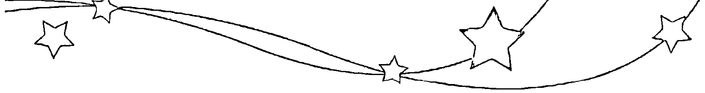

| 年份 | 日期 | 时间 | 星座 |
| --- | --- | --- | --- |
| 1992年 | 05月02日 | 03:07am | 金牛座 |
| 1992年 | 05月04日 | 08:25am | 双子座 |
| 1992年 | 05月06日 | 12:08pm | 巨蟹座 |
| 1992年 | 05月08日 | 03:06pm | 狮子座 |
| 1992年 | 05月10日 | 05:56pm | 处女座 |
| 1992年 | 05月12日 | 09:05pm | 天秤座 |
| 1992年 | 05月15日 | 01:15am | 天蝎座 |
| 1992年 | 05月17日 | 07:25am | 射手座 |
| 1992年 | 05月19日 | 04:15pm | 摩羯座 |
| 1992年 | 05月22日 | 03:44am | 水瓶座 |
| 1992年 | 05月24日 | 04:23pm | 双鱼座 |
| 1992年 | 05月27日 | 03:50am | 白羊座 |
| 1992年 | 05月29日 | 12:11pm | 金牛座 |
| 1992年 | 05月31日 | 05:15pm | 双子座 |
| 1992年 | 01月01日 | 03:32pm | 射手座 |
| 1992年 | 01月04日 | 03:09am | 摩羯座 |
| 1992年 | 01月06日 | 03:59pm | 水瓶座 |
| 1992年 | 01月09日 | 04:50am | 双鱼座 |
| 1992年 | 01月11日 | 04:19pm | 白羊座 |
| 1992年 | 01月14日 | 12:59am | 金牛座 |
| 1992年 | 01月16日 | 05:50am | 双子座 |
| 1992年 | 01月18日 | 07:22am | 巨蟹座 |
| 1992年 | 01月20日 | 06:56am | 狮子座 |
| 1992年 | 01月22日 | 06:24am | 处女座 |
| 1992年 | 01月24日 | 07:47am | 天秤座 |
| 1992年 | 01月26日 | 12:37pm | 天蝎座 |
| 1992年 | 01月28日 | 09:21pm | 射手座 |
| 1992年 | 01月31日 | 09:08am | 摩羯座 |
| 1992年 | 06月02日 | 07:56pm | 巨蟹座 |
| 1992年 | 06月04日 | 09:34pm | 狮子座 |
| 1992年 | 06月06日 | 11:27pm | 处女座 |
| 1992年 | 06月09日 | 02:34am | 天秤座 |
| 1992年 | 06月11日 | 07:29am | 天蝎座 |
| 1992年 | 06月13日 | 02:31pm | 射手座 |
| 1992年 | 06月15日 | 11:49pm | 摩羯座 |
| 1992年 | 06月18日 | 11:20am | 水瓶座 |
| 1992年 | 06月20日 | 11:59pm | 双鱼座 |
| 1992年 | 06月23日 | 11:59am | 白羊座 |
| 1992年 | 06月25日 | 09:26pm | 金牛座 |
| 1992年 | 06月28日 | 03:11am | 双子座 |
| 1992年 | 06月30日 | 05:39am | 巨蟹座 |
| 1992年 | 02月02日 | 10:08pm | 水瓶座 |
| 1992年 | 02月05日 | 10:49am | 双鱼座 |
| 1992年 | 02月07日 | 10:14pm | 白羊座 |
| 1992年 | 02月10日 | 07:32am | 金牛座 |
| 1992年 | 02月12日 | 02:03pm | 双子座 |
| 1992年 | 02月14日 | 05:26pm | 巨蟹座 |
| 1992年 | 02月16日 | 06:13pm | 狮子座 |
| 1992年 | 02月18日 | 05:47pm | 处女座 |
| 1992年 | 02月20日 | 06:07pm | 天秤座 |
| 1992年 | 02月22日 | 09:13pm | 天蝎座 |
| 1992年 | 02月25日 | 04:29am | 射手座 |
| 1992年 | 02月27日 | 03:35pm | 摩羯座 |
| 1992年 | 07月02日 | 06:14am | 狮子座 |
| 1992年 | 07月04日 | 06:39am | 处女座 |
| 1992年 | 07月06日 | 08:31am | 天秤座 |
| 1992年 | 07月08日 | 12:57pm | 天蝎座 |
| 1992年 | 07月10日 | 08:19pm | 射手座 |
| 1992年 | 07月13日 | 06:17am | 摩羯座 |
| 1992年 | 07月15日 | 06:03pm | 水瓶座 |
| 1992年 | 07月18日 | 06:43am | 双鱼座 |
| 1992年 | 07月20日 | 07:05pm | 白羊座 |
| 1992年 | 07月23日 | 05:32am | 金牛座 |
| 1992年 | 07月25日 | 12:38pm | 双子座 |
| 1992年 | 07月27日 | 04:03pm | 巨蟹座 |
| 1992年 | 07月29日 | 04:37pm | 狮子座 |
| 1992年 | 07月31日 | 04:02pm | 处女座 |
| 1992年 | 03月01日 | 04:33am | 水瓶座 |
| 1992年 | 03月03日 | 05:09pm | 双鱼座 |
| 1992年 | 03月06日 | 04:05am | 白羊座 |
| 1992年 | 03月08日 | 01:02pm | 金牛座 |
| 1992年 | 03月10日 | 08:01pm | 双子座 |
| 1992年 | 03月13日 | 12:49am | 巨蟹座 |
| 1992年 | 03月15日 | 03:19am | 狮子座 |
| 1992年 | 03月17日 | 04:13am | 处女座 |
| 1992年 | 03月19日 | 04:56am | 天秤座 |
| 1992年 | 03月21日 | 07:24am | 天蝎座 |
| 1992年 | 03月23日 | 01:18pm | 射手座 |
| 1992年 | 03月25日 | 11:08pm | 摩羯座 |
| 1992年 | 03月28日 | 11:44am | 水瓶座 |
| 1992年 | 03月31日 | 12:22am | 双鱼座 |
| 1992年 | 08月02日 | 04:21pm | 天秤座 |
| 1992年 | 08月04日 | 07:19pm | 天蝎座 |
| 1992年 | 08月07日 | 01:58am | 射手座 |
| 1992年 | 08月09日 | 12:02pm | 摩羯座 |
| 1992年 | 08月12日 | 12:06am | 水瓶座 |
| 1992年 | 08月14日 | 12:50pm | 双鱼座 |
| 1992年 | 08月17日 | 01:10am | 白羊座 |
| 1992年 | 08月19日 | 12:06pm | 金牛座 |
| 1992年 | 08月21日 | 08:33pm | 双子座 |
| 1992年 | 08月24日 | 01:35am | 巨蟹座 |
| 1992年 | 08月26日 | 03:13am | 狮子座 |
| 1992年 | 08月28日 | 02:46am | 处女座 |
| 1992年 | 08月30日 | 02:11am | 天秤座 |
| 1992年 | 04月02日 | 11:00am | 白羊座 |
| 1992年 | 04月04日 | 07:16pm | 金牛座 |
| 1992年 | 04月07日 | 01:32am | 双子座 |
| 1992年 | 04月09日 | 06:16am | 巨蟹座 |
| 1992年 | 04月11日 | 09:44am | 狮子座 |
| 1992年 | 04月13日 | 12:08pm | 处女座 |
| 1992年 | 04月15日 | 02:11pm | 天秤座 |
| 1992年 | 04月17日 | 05:12pm | 天蝎座 |
| 1992年 | 04月19日 | 10:41pm | 射手座 |
| 1992年 | 04月22日 | 07:43am | 摩羯座 |
| 1992年 | 04月24日 | 07:39pm | 水瓶座 |
| 1992年 | 04月27日 | 08:17am | 双鱼座 |
| 1992年 | 04月29日 | 07:10pm | 白羊座 |
| 1993年 | 01月03日 | 01:28am | 金牛座 |
| 1993年 | 01月05日 | 09:36am | 双子座 |
| 1993年 | 01月07日 | 02:05pm | 巨蟹座 |
| 1993年 | 01月09日 | 03:47pm | 狮子座 |
| 1993年 | 01月11日 | 04:21pm | 处女座 |
| 1993年 | 01月13日 | 05:32pm | 天秤座 |
| 1993年 | 01月15日 | 08:43pm | 天蝎座 |
| 1993年 | 01月18日 | 02:31am | 射手座 |
| 1993年 | 01月20日 | 10:48am | 摩羯座 |
| 1993年 | 01月22日 | 09:01pm | 水瓶座 |
| 1993年 | 01月25日 | 08:48am | 双鱼座 |
| 1993年 | 01月27日 | 09:27pm | 白羊座 |
| 1993年 | 01月30日 | 09:33am | 金牛座 |
| 1992年 | 09月01日 | 03:41am | 天秤座 |
| 1992年 | 09月03日 | 08:55am | 射手座 |
| 1992年 | 09月05日 | 06:08pm | 摩羯座 |
| 1992年 | 09月08日 | 06:08am | 水瓶座 |
| 1992年 | 09月10日 | 06:55pm | 双鱼座 |
| 1992年 | 09月13日 | 07:00am | 白羊座 |
| 1992年 | 09月15日 | 05:45pm | 金牛座 |
| 1992年 | 09月18日 | 02:38am | 双子座 |
| 1992年 | 09月20日 | 08:54am | 巨蟹座 |
| 1992年 | 09月22日 | 12:14pm | 狮子座 |
| 1992年 | 09月24日 | 01:05pm | 处女座 |
| 1992年 | 09月26日 | 12:57pm | 天秤座 |
| 1992年 | 09月28日 | 01:49pm | 天蝎座 |
| 1992年 | 09月30日 | 05:38pm | 射手座 |
| 1993年 | 02月01日 | 07:11pm | 双子座 |
| 1993年 | 02月04日 | 12:55am | 巨蟹座 |
| 1993年 | 02月06日 | 02:49am | 狮子座 |
| 1993年 | 02月08日 | 02:29am | 处女座 |
| 1993年 | 02月10日 | 01:59am | 天秤座 |
| 1993年 | 02月12日 | 03:26am | 天蝎座 |
| 1993年 | 02月14日 | 08:12am | 射手座 |
| 1993年 | 02月16日 | 04:23pm | 摩羯座 |
| 1993年 | 02月19日 | 03:05am | 水瓶座 |
| 1993年 | 02月21日 | 03:12pm | 双鱼座 |
| 1993年 | 02月24日 | 03:50am | 白羊座 |
| 1993年 | 02月26日 | 04:09pm | 金牛座 |
| 1992年 | 10月03日 | 01:29am | 摩羯座 |
| 1992年 | 10月05日 | 12:54pm | 水瓶座 |
| 1992年 | 10月08日 | 01:37am | 双鱼座 |
| 1992年 | 10月10日 | 01:33pm | 白羊座 |
| 1992年 | 10月12日 | 11:48pm | 金牛座 |
| 1992年 | 10月15日 | 08:05am | 双子座 |
| 1992年 | 10月17日 | 02:32pm | 巨蟹座 |
| 1992年 | 10月19日 | 06:58pm | 狮子座 |
| 1992年 | 10月21日 | 09:26pm | 处女座 |
| 1992年 | 10月23日 | 10:39pm | 天秤座 |
| 1992年 | 10月26日 | 12:04am | 天蝎座 |
| 1992年 | 10月28日 | 03:31am | 射手座 |
| 1992年 | 10月30日 | 10:22am | 摩羯座 |
| 1993年 | 03月01日 | 02:50am | 双子座 |
| 1993年 | 03月03日 | 10:10am | 巨蟹座 |
| 1993年 | 03月05日 | 01:34pm | 狮子座 |
| 1993年 | 03月07日 | 01:49pm | 处女座 |
| 1993年 | 03月09日 | 12:48pm | 天秤座 |
| 1993年 | 03月11日 | 12:45pm | 天蝎座 |
| 1993年 | 03月13日 | 03:39pm | 射手座 |
| 1993年 | 03月15日 | 10:29pm | 摩羯座 |
| 1993年 | 03月18日 | 08:54am | 水瓶座 |
| 1993年 | 03月20日 | 09:10pm | 双鱼座 |
| 1993年 | 03月23日 | 09:50am | 白羊座 |
| 1993年 | 03月25日 | 09:58pm | 金牛座 |
| 1993年 | 03月28日 | 08:44am | 双子座 |
| 1993年 | 03月30日 | 05:10pm | 巨蟹座 |
| 1992年 | 11月01日 | 08:44pm | 水瓶座 |
| 1992年 | 11月04日 | 09:11am | 双鱼座 |
| 1992年 | 11月06日 | 09:18pm | 白羊座 |
| 1992年 | 11月09日 | 07:15am | 金牛座 |
| 1992年 | 11月11日 | 02:46pm | 双子座 |
| 1992年 | 11月13日 | 08:17pm | 巨蟹座 |
| 1992年 | 11月16日 | 12:22am | 狮子座 |
| 1992年 | 11月18日 | 03:27am | 处女座 |
| 1992年 | 11月20日 | 06:02am | 天秤座 |
| 1992年 | 11月22日 | 08:53am | 天蝎座 |
| 1992年 | 11月24日 | 01:04pm | 射手座 |
| 1992年 | 11月26日 | 07:40pm | 摩羯座 |
| 1992年 | 11月29日 | 05:20am | 水瓶座 |
| 1993年 | 04月01日 | 10:19pm | 双子座 |
| 1993年 | 04月04日 | 12:10am | 处女座 |
| 1993年 | 04月05日 | 11:54pm | 天秤座 |
| 1993年 | 04月07日 | 11:32pm | 天蝎座 |
| 1993年 | 04月10日 | 01:10am | 射手座 |
| 1993年 | 04月12日 | 06:28am | 摩羯座 |
| 1993年 | 04月14日 | 03:39pm | 水瓶座 |
| 1993年 | 04月17日 | 03:32am | 双鱼座 |
| 1993年 | 04月19日 | 04:13pm | 白羊座 |
| 1993年 | 04月22日 | 04:06am | 金牛座 |
| 1993年 | 04月24日 | 02:24pm | 双子座 |
| 1993年 | 04月26日 | 10:44pm | 巨蟹座 |
| 1993年 | 04月29日 | 04:36am | 狮子座 |
| 1992年 | 12月01日 | 05:23pm | 双鱼座 |
| 1992年 | 12月04日 | 05:46am | 白羊座 |
| 1992年 | 12月06日 | 04:12pm | 金牛座 |
| 1992年 | 12月08日 | 11:36pm | 双子座 |
| 1992年 | 12月11日 | 04:03am | 巨蟹座 |
| 1992年 | 12月13日 | 06:46am | 狮子座 |
| 1992年 | 12月15日 | 08:56am | 处女座 |
| 1992年 | 12月17日 | 11:35am | 天秤座 |
| 1992年 | 12月19日 | 03:21pm | 天蝎座 |
| 1992年 | 12月21日 | 08:43pm | 射手座 |
| 1992年 | 12月24日 | 04:06am | 摩羯座 |
| 1992年 | 12月26日 | 01:45pm | 水瓶座 |
| 1992年 | 12月29日 | 01:28am | 双鱼座 |
| 1992年 | 12月31日 | 02:05pm | 白羊座 |

| 日期 | 时间 | 星座 |
|------|------|------|
| 1993年05月01日 | 07:56am | 处女座 |
| 1993年05月03日 | 09:18am | 天秤座 |
| 1993年05月05日 | 09:59am | 天蝎座 |
| 1993年05月07日 | 11:39am | 射手座 |
| 1993年05月09日 | 03:55pm | 摩羯座 |
| 1993年05月11日 | 11:44pm | 水瓶座 |
| 1993年05月14日 | 10:52am | 双鱼座 |
| 1993年05月16日 | 11:24pm | 白羊座 |
| 1993年05月19日 | 11:13am | 金牛座 |
| 1993年05月21日 | 09:05pm | 双子座 |
| 1993年05月24日 | 04:36am | 巨蟹座 |
| 1993年05月26日 | 10:00am | 狮子座 |
| 1993年05月28日 | 01:44pm | 处女座 |
| 1993年05月30日 | 04:17pm | 天秤座 |

| 日期 | 时间 | 星座 |
|------|------|------|
| 1993年06月01日 | 06:22pm | 天蝎座 |
| 1993年06月03日 | 09:02pm | 射手座 |
| 1993年06月06日 | 01:27am | 摩羯座 |
| 1993年06月08日 | 08:43am | 水瓶座 |
| 1993年06月10日 | 06:58pm | 双鱼座 |
| 1993年06月13日 | 07:13am | 白羊座 |
| 1993年06月15日 | 07:17pm | 金牛座 |
| 1993年06月18日 | 05:08am | 双子座 |
| 1993年06月20日 | 12:01pm | 巨蟹座 |
| 1993年06月22日 | 04:24pm | 狮子座 |
| 1993年06月24日 | 07:17pm | 处女座 |
| 1993年06月26日 | 09:45pm | 天秤座 |
| 1993年06月29日 | 12:37am | 天蝎座 |

| 日期 | 时间 | 星座 |
|------|------|------|
| 1993年07月01日 | 04:29am | 射手座 |
| 1993年07月03日 | 09:51am | 摩羯座 |
| 1993年07月05日 | 05:16pm | 水瓶座 |
| 1993年07月08日 | 03:10am | 双鱼座 |
| 1993年07月10日 | 03:11pm | 白羊座 |
| 1993年07月13日 | 03:35am | 金牛座 |
| 1993年07月15日 | 02:01pm | 双子座 |
| 1993年07月17日 | 09:05pm | 巨蟹座 |
| 1993年07月20日 | 12:46am | 狮子座 |
| 1993年07月22日 | 02:23am | 处女座 |
| 1993年07月24日 | 03:40am | 天秤座 |
| 1993年07月26日 | 06:02am | 天蝎座 |
| 1993年07月28日 | 10:15am | 射手座 |
| 1993年07月30日 | 04:28pm | 摩羯座 |

| 日期 | 时间 | 星座 |
|------|------|------|
| 1993年08月02日 | 12:36am | 水瓶座 |
| 1993年08月04日 | 10:45am | 双鱼座 |
| 1993年08月06日 | 10:39pm | 白羊座 |
| 1993年08月09日 | 11:20am | 金牛座 |
| 1993年08月11日 | 10:45pm | 双子座 |
| 1993年08月14日 | 06:41am | 巨蟹座 |
| 1993年08月16日 | 10:38am | 狮子座 |
| 1993年08月18日 | 11:38am | 处女座 |
| 1993年08月20日 | 11:36am | 天秤座 |
| 1993年08月22日 | 12:31pm | 天蝎座 |
| 1993年08月24日 | 03:49pm | 射手座 |
| 1993年08月26日 | 09:58pm | 摩羯座 |
| 1993年08月29日 | 06:43am | 水瓶座 |
| 1993年08月31日 | 05:19pm | 双鱼座 |

| 日期 | 时间 | 星座 |
|------|------|------|
| 1993年09月03日 | 05:21am | 白羊座 |
| 1993年09月05日 | 06:08pm | 金牛座 |
| 1993年09月08日 | 06:13am | 双子座 |
| 1993年09月10日 | 03:31pm | 巨蟹座 |
| 1993年09月12日 | 08:48pm | 狮子座 |
| 1993年09月14日 | 10:18pm | 处女座 |
| 1993年09月16日 | 09:43pm | 天秤座 |
| 1993年09月18日 | 09:15pm | 天蝎座 |
| 1993年09月20日 | 10:54pm | 射手座 |
| 1993年09月23日 | 03:56am | 摩羯座 |
| 1993年09月25日 | 12:21pm | 水瓶座 |
| 1993年09月27日 | 11:13pm | 双鱼座 |
| 1993年09月30日 | 11:29am | 白羊座 |

| 日期 | 时间 | 星座 |
|------|------|------|
| 1993年10月03日 | 12:13am | 金牛座 |
| 1993年10月05日 | 12:24pm | 双子座 |
| 1993年10月07日 | 10:41pm | 巨蟹座 |
| 1993年10月10日 | 05:29am | 狮子座 |
| 1993年10月12日 | 08:31am | 处女座 |
| 1993年10月14日 | 08:45am | 天秤座 |
| 1993年10月16日 | 08:02am | 天蝎座 |
| 1993年10月18日 | 08:28am | 射手座 |
| 1993年10月20日 | 11:47am | 摩羯座 |
| 1993年10月22日 | 06:52pm | 水瓶座 |
| 1993年10月25日 | 05:18am | 双鱼座 |
| 1993年10月27日 | 05:39pm | 白羊座 |
| 1993年10月30日 | 06:19am | 金牛座 |

| 日期 | 时间 | 星座 |
|------|------|------|
| 1993年11月01日 | 06:11pm | 双子座 |
| 1993年11月04日 | 04:22am | 巨蟹座 |
| 1993年11月06日 | 12:01pm | 狮子座 |
| 1993年11月08日 | 04:43pm | 处女座 |
| 1993年11月10日 | 06:40pm | 天秤座 |
| 1993年11月12日 | 06:59pm | 天蝎座 |
| 1993年11月14日 | 07:22pm | 射手座 |
| 1993年11月16日 | 09:35pm | 摩羯座 |
| 1993年11月19日 | 03:10am | 水瓶座 |
| 1993年11月21日 | 12:30pm | 双鱼座 |
| 1993年11月24日 | 12:30am | 白羊座 |
| 1993年11月26日 | 01:12pm | 金牛座 |
| 1993年11月29日 | 12:47am | 双子座 |

| 日期 | 时间 | 星座 |
|------|------|------|
| 1993年12月01日 | 10:13am | 巨蟹座 |
| 1993年12月03日 | 05:30pm | 狮子座 |
| 1993年12月05日 | 10:42pm | 处女座 |
| 1993年12月08日 | 02:02am | 天秤座 |
| 1993年12月10日 | 04:03am | 天蝎座 |
| 1993年12月12日 | 05:40am | 射手座 |
| 1993年12月14日 | 08:09am | 摩羯座 |
| 1993年12月16日 | 12:56pm | 水瓶座 |
| 1993年12月18日 | 09:00pm | 双鱼座 |
| 1993年12月21日 | 08:20am | 白羊座 |
| 1993年12月23日 | 09:04pm | 金牛座 |
| 1993年12月26日 | 08:42am | 双子座 |
| 1993年12月28日 | 05:42pm | 巨蟹座 |
| 1993年12月30日 | 11:59pm | 狮子座 |

| 日期 | 时间 | 星座 |
|------|------|------|
| 1994年01月02日 | 04:13am | 处女座 |
| 1994年01月04日 | 07:30am | 天秤座 |
| 1994年01月06日 | 10:28am | 天蝎座 |
| 1994年01月08日 | 01:34pm | 射手座 |
| 1994年01月10日 | 05:17pm | 摩羯座 |
| 1994年01月12日 | 10:25pm | 水瓶座 |
| 1994年01月15日 | 06:06am | 双鱼座 |
| 1994年01月17日 | 04:44pm | 白羊座 |
| 1994年01月20日 | 05:21am | 金牛座 |
| 1994年01月22日 | 05:31pm | 双子座 |
| 1994年01月25日 | 02:52am | 巨蟹座 |
| 1994年01月27日 | 08:34am | 狮子座 |
| 1994年01月29日 | 11:36am | 处女座 |
| 1994年01月31日 | 01:34pm | 天秤座 |

| 日期 | 时间 | 星座 |
|------|------|------|
| 1994年02月02日 | 03:51pm | 天蝎座 |
| 1994年02月04日 | 07:15pm | 射手座 |
| 1994年02月07日 | 12:01am | 摩羯座 |
| 1994年02月09日 | 06:18am | 水瓶座 |
| 1994年02月11日 | 02:25pm | 双鱼座 |
| 1994年02月14日 | 12:49am | 白羊座 |
| 1994年02月16日 | 01:20pm | 金牛座 |
| 1994年02月19日 | 02:04am | 双子座 |
| 1994年02月21日 | 12:21pm | 巨蟹座 |
| 1994年02月23日 | 06:43pm | 狮子座 |
| 1994年02月25日 | 09:25pm | 处女座 |
| 1994年02月27日 | 10:05pm | 天秤座 |

| 日期 | 时间 | 星座 |
|------|------|------|
| 1994年03月01日 | 10:43pm | 天蝎座 |
| 1994年03月04日 | 12:54am | 射手座 |
| 1994年03月06日 | 05:26am | 摩羯座 |
| 1994年03月08日 | 12:17pm | 水瓶座 |
| 1994年03月10日 | 09:10pm | 双鱼座 |
| 1994年03月13日 | 08:00am | 白羊座 |
| 1994年03月15日 | 08:27pm | 金牛座 |
| 1994年03月18日 | 09:27am | 双子座 |
| 1994年03月20日 | 08:51pm | 巨蟹座 |
| 1994年03月23日 | 04:35am | 狮子座 |
| 1994年03月25日 | 08:09am | 处女座 |
| 1994年03月27日 | 08:44am | 天秤座 |
| 1994年03月29日 | 08:16am | 天蝎座 |
| 1994年03月31日 | 08:45am | 射手座 |

| 日期 | 时间 | 星座 |
|------|------|------|
| 1994年04月02日 | 11:42am | 摩羯座 |
| 1994年04月04日 | 05:48pm | 水瓶座 |
| 1994年04月07日 | 02:52am | 双鱼座 |
| 1994年04月09日 | 02:10pm | 白羊座 |
| 1994年04月12日 | 02:47am | 金牛座 |
| 1994年04月14日 | 03:46pm | 双子座 |
| 1994年04月17日 | 03:39am | 巨蟹座 |
| 1994年04月19日 | 12:39pm | 狮子座 |
| 1994年04月21日 | 05:53pm | 处女座 |
| 1994年04月23日 | 07:37pm | 天秤座 |
| 1994年04月25日 | 07:17pm | 天蝎座 |
| 1994年04月27日 | 06:50pm | 射手座 |
| 1994年04月29日 | 08:07pm | 摩羯座 |

| 日期 | 时间 | 星座 |
|------|------|------|
| 1994年05月02日 | 12:34am | 水瓶座 |
| 1994年05月04日 | 08:50am | 双鱼座 |
| 1994年05月06日 | 08:02pm | 白羊座 |
| 1994年05月09日 | 08:50am | 金牛座 |
| 1994年05月11日 | 09:43pm | 双子座 |
| 1994年05月14日 | 09:24am | 巨蟹座 |
| 1994年05月16日 | 06:55pm | 狮子座 |
| 1994年05月19日 | 01:29am | 处女座 |
| 1994年05月21日 | 04:51am | 天秤座 |
| 1994年05月23日 | 05:49am | 天蝎座 |
| 1994年05月25日 | 05:44am | 射手座 |
| 1994年05月27日 | 06:20am | 摩羯座 |
| 1994年05月29日 | 09:24am | 水瓶座 |
| 1994年05月31日 | 04:07pm | 双鱼座 |

| 日期 | 时间 | 星座 |
|------|------|------|
| 1994年06月03日 | 02:32am | 白羊座 |
| 1994年06月05日 | 03:14pm | 金牛座 |
| 1994年06月08日 | 04:01am | 双子座 |
| 1994年06月10日 | 03:19pm | 巨蟹座 |
| 1994年06月13日 | 12:28am | 狮子座 |
| 1994年06月15日 | 07:13am | 处女座 |
| 1994年06月17日 | 11:44am | 天秤座 |
| 1994年06月19日 | 02:17pm | 天蝎座 |
| 1994年06月21日 | 03:31pm | 射手座 |
| 1994年06月23日 | 04:38pm | 摩羯座 |
| 1994年06月25日 | 07:12pm | 水瓶座 |
| 1994年06月28日 | 12:44am | 双鱼座 |
| 1994年06月30日 | 10:10am | 白羊座 |

| 日期 | 时间 | 星座 |
|------|------|------|
| 1994年07月02日 | 10:23pm | 金牛座 |
| 1994年07月05日 | 11:10am | 双子座 |
| 1994年07月07日 | 10:16pm | 巨蟹座 |
| 1994年07月10日 | 06:40am | 狮子座 |
| 1994年07月12日 | 12:45pm | 处女座 |
| 1994年07月14日 | 05:13pm | 天秤座 |
| 1994年07月16日 | 08:34pm | 天蝎座 |
| 1994年07月18日 | 11:09pm | 射手座 |
| 1994年07月21日 | 01:30am | 摩羯座 |
| 1994年07月23日 | 04:40am | 水瓶座 |
| 1994年07月25日 | 10:00am | 双鱼座 |
| 1994年07月27日 | 06:33pm | 白羊座 |
| 1994年07月30日 | 06:13am | 金牛座 |

| 日期 | 时间 | 星座 |
|------|------|------|
| 1994年08月01日 | 07:03pm | 双子座 |
| 1994年08月04日 | 06:18am | 巨蟹座 |
| 1994年08月06日 | 02:26pm | 狮子座 |
| 1994年08月08日 | 07:40pm | 处女座 |
| 1994年08月10日 | 11:06pm | 天秤座 |
| 1994年08月13日 | 01:55am | 天蝎座 |
| 1994年08月15日 | 04:53am | 射手座 |
| 1994年08月17日 | 08:19am | 摩羯座 |
| 1994年08月19日 | 12:36pm | 水瓶座 |
| 1994年08月21日 | 06:29pm | 双鱼座 |
| 1994年08月24日 | 02:56am | 白羊座 |
| 1994年08月26日 | 02:15pm | 金牛座 |
| 1994年08月29日 | 03:06am | 双子座 |
| 1994年08月31日 | 02:55pm | 巨蟹座 |

| 年份 | 日期 | 时间 | 星座 |
|---|---|---|---|
| 1995年 | 01月01日 | 01:57am | 摩羯座 |
| 1995年 | 01月03日 | 02:40am | 水瓶座 |
| 1995年 | 01月05日 | 05:53am | 双鱼座 |
| 1995年 | 01月07日 | 01:01pm | 白羊座 |
| 1995年 | 01月09日 | 11:58pm | 金牛座 |
| 1995年 | 01月12日 | 12:50pm | 双子座 |
| 1995年 | 01月15日 | 01:19am | 巨蟹座 |
| 1995年 | 01月17日 | 11:33am | 狮子座 |
| 1995年 | 01月19日 | 07:37pm | 处女座 |
| 1995年 | 01月22日 | 01:52am | 天秤座 |
| 1995年 | 01月24日 | 06:30am | 天蝎座 |
| 1995年 | 01月26日 | 09:34am | 射手座 |
| 1995年 | 01月28日 | 11:25am | 摩羯座 |
| 1995年 | 01月30日 | 01:05pm | 水瓶座 |

| 年份 | 日期 | 时间 | 星座 |
|---|---|---|---|
| 1994年 | 09月02日 | 11:36pm | 狮子座 |
| 1994年 | 09月05日 | 04:30am | 处女座 |
| 1994年 | 09月07日 | 06:55am | 天秤座 |
| 1994年 | 09月09日 | 08:26am | 天蝎座 |
| 1994年 | 09月11日 | 10:27am | 射手座 |
| 1994年 | 09月13日 | 01:46pm | 摩羯座 |
| 1994年 | 09月15日 | 06:44pm | 水瓶座 |
| 1994年 | 09月18日 | 01:31am | 双鱼座 |
| 1994年 | 09月20日 | 10:32am | 白羊座 |
| 1994年 | 09月22日 | 09:48pm | 金牛座 |
| 1994年 | 09月25日 | 10:40am | 双子座 |
| 1994年 | 09月27日 | 11:11pm | 巨蟹座 |
| 1994年 | 09月30日 | 08:49am | 狮子座 |

| 年份 | 日期 | 时间 | 星座 |
|---|---|---|---|
| 1995年 | 02月01日 | 04:09pm | 双鱼座 |
| 1995年 | 02月03日 | 10:13pm | 白羊座 |
| 1995年 | 02月06日 | 08:11am | 金牛座 |
| 1995年 | 02月08日 | 08:43pm | 双子座 |
| 1995年 | 02月11日 | 09:13am | 巨蟹座 |
| 1995年 | 02月13日 | 07:28pm | 狮子座 |
| 1995年 | 02月16日 | 02:50am | 处女座 |
| 1995年 | 02月18日 | 07:58am | 天秤座 |
| 1995年 | 02月20日 | 11:54am | 天蝎座 |
| 1995年 | 02月22日 | 03:12pm | 射手座 |
| 1995年 | 02月24日 | 06:10pm | 摩羯座 |
| 1995年 | 02月26日 | 09:14pm | 水瓶座 |

| 年份 | 日期 | 时间 | 星座 |
|---|---|---|---|
| 1994年 | 10月02日 | 02:33pm | 处女座 |
| 1994年 | 10月04日 | 04:53pm | 天秤座 |
| 1994年 | 10月06日 | 05:21pm | 天蝎座 |
| 1994年 | 10月08日 | 05:48pm | 射手座 |
| 1994年 | 10月10日 | 07:46pm | 摩羯座 |
| 1994年 | 10月13日 | 12:09am | 水瓶座 |
| 1994年 | 10月15日 | 07:20am | 双鱼座 |
| 1994年 | 10月17日 | 04:58pm | 白羊座 |
| 1994年 | 10月20日 | 04:35am | 金牛座 |
| 1994年 | 10月22日 | 05:27pm | 双子座 |
| 1994年 | 10月25日 | 06:13am | 巨蟹座 |
| 1994年 | 10月27日 | 05:00pm | 狮子座 |
| 1994年 | 10月30日 | 12:20am | 处女座 |

| 年份 | 日期 | 时间 | 星座 |
|---|---|---|---|
| 1995年 | 03月01日 | 01:16am | 双鱼座 |
| 1995年 | 03月03日 | 07:33am | 白羊座 |
| 1995年 | 03月05日 | 04:53pm | 金牛座 |
| 1995年 | 03月08日 | 04:55am | 双子座 |
| 1995年 | 03月10日 | 05:38pm | 巨蟹座 |
| 1995年 | 03月13日 | 04:25am | 狮子座 |
| 1995年 | 03月15日 | 11:49am | 处女座 |
| 1995年 | 03月17日 | 04:14pm | 天秤座 |
| 1995年 | 03月19日 | 06:51pm | 天蝎座 |
| 1995年 | 03月21日 | 08:57pm | 射手座 |
| 1995年 | 03月23日 | 11:31pm | 摩羯座 |
| 1995年 | 03月26日 | 03:10am | 水瓶座 |
| 1995年 | 03月28日 | 08:20am | 双鱼座 |
| 1995年 | 03月30日 | 03:28pm | 白羊座 |

| 年份 | 日期 | 时间 | 星座 |
|---|---|---|---|
| 1994年 | 11月01日 | 03:43am | 天秤座 |
| 1994年 | 11月03日 | 04:18am | 天蝎座 |
| 1994年 | 11月05日 | 03:46am | 射手座 |
| 1994年 | 11月07日 | 04:04am | 摩羯座 |
| 1994年 | 11月09日 | 06:52am | 水瓶座 |
| 1994年 | 11月11日 | 01:08pm | 双鱼座 |
| 1994年 | 11月13日 | 10:44pm | 白羊座 |
| 1994年 | 11月16日 | 10:44am | 金牛座 |
| 1994年 | 11月18日 | 11:41pm | 双子座 |
| 1994年 | 11月21日 | 12:19pm | 巨蟹座 |
| 1994年 | 11月23日 | 11:32pm | 狮子座 |
| 1994年 | 11月26日 | 08:04am | 处女座 |
| 1994年 | 11月28日 | 01:16pm | 天秤座 |
| 1994年 | 11月30日 | 03:17pm | 天蝎座 |

| 年份 | 日期 | 时间 | 星座 |
|---|---|---|---|
| 1995年 | 04月02日 | 12:59am | 金牛座 |
| 1995年 | 04月04日 | 12:50pm | 双子座 |
| 1995年 | 04月07日 | 01:39am | 巨蟹座 |
| 1995年 | 04月09日 | 01:11pm | 狮子座 |
| 1995年 | 04月11日 | 09:36pm | 处女座 |
| 1995年 | 04月14日 | 02:18am | 天秤座 |
| 1995年 | 04月16日 | 04:11am | 天蝎座 |
| 1995年 | 04月18日 | 04:52am | 射手座 |
| 1995年 | 04月20日 | 05:55am | 摩羯座 |
| 1995年 | 04月22日 | 08:41am | 水瓶座 |
| 1995年 | 04月24日 | 01:54pm | 双鱼座 |
| 1995年 | 04月26日 | 09:42pm | 白羊座 |
| 1995年 | 04月29日 | 07:54am | 金牛座 |

| 年份 | 日期 | 时间 | 星座 |
|---|---|---|---|
| 1994年 | 12月02日 | 03:11pm | 射手座 |
| 1994年 | 12月04日 | 02:45pm | 摩羯座 |
| 1994年 | 12月06日 | 03:56pm | 水瓶座 |
| 1994年 | 12月08日 | 08:27pm | 双鱼座 |
| 1994年 | 12月11日 | 05:06am | 白羊座 |
| 1994年 | 12月13日 | 04:57pm | 金牛座 |
| 1994年 | 12月16日 | 05:59am | 双子座 |
| 1994年 | 12月18日 | 06:23pm | 巨蟹座 |
| 1994年 | 12月21日 | 05:11am | 狮子座 |
| 1994年 | 12月23日 | 01:57pm | 处女座 |
| 1994年 | 12月25日 | 08:25pm | 天秤座 |
| 1994年 | 12月28日 | 12:16am | 天蝎座 |
| 1994年 | 12月30日 | 01:44am | 射手座 |

| 年份 | 日期 | 时间 | 星座 |
|---|---|---|---|
| 1995年 | 09月02日 | 12:56am | 射手座 |
| 1995年 | 09月04日 | 03:14am | 摩羯座 |
| 1995年 | 09月06日 | 05:47am | 水瓶座 |
| 1995年 | 09月08日 | 08:10am | 双鱼座 |
| 1995年 | 09月10日 | 12:18pm | 白羊座 |
| 1995年 | 09月12日 | 07:24pm | 金牛座 |
| 1995年 | 09月15日 | 05:49am | 双子座 |
| 1995年 | 09月17日 | 06:15pm | 巨蟹座 |
| 1995年 | 09月20日 | 06:16am | 狮子座 |
| 1995年 | 09月22日 | 03:57pm | 处女座 |
| 1995年 | 09月24日 | 10:48pm | 天秤座 |
| 1995年 | 09月27日 | 03:19am | 天蝎座 |
| 1995年 | 09月29日 | 06:29am | 射手座 |

| 年份 | 日期 | 时间 | 星座 |
|---|---|---|---|
| 1995年 | 05月01日 | 07:53pm | 双子座 |
| 1995年 | 05月04日 | 08:44am | 巨蟹座 |
| 1995年 | 05月06日 | 08:53pm | 狮子座 |
| 1995年 | 05月09日 | 06:29am | 处女座 |
| 1995年 | 05月11日 | 12:24pm | 天秤座 |
| 1995年 | 05月13日 | 02:49pm | 天蝎座 |
| 1995年 | 05月15日 | 02:57pm | 射手座 |
| 1995年 | 05月17日 | 02:38pm | 摩羯座 |
| 1995年 | 05月19日 | 03:43pm | 水瓶座 |
| 1995年 | 05月21日 | 07:43pm | 双鱼座 |
| 1995年 | 05月24日 | 03:14am | 白羊座 |
| 1995年 | 05月26日 | 01:48pm | 金牛座 |
| 1995年 | 05月29日 | 02:07am | 双子座 |
| 1995年 | 05月31日 | 02:58pm | 巨蟹座 |

| 年份 | 日期 | 时间 | 星座 |
|---|---|---|---|
| 1995年 | 10月01日 | 09:10am | 摩羯座 |
| 1995年 | 10月03日 | 12:00pm | 水瓶座 |
| 1995年 | 10月05日 | 03:37pm | 双鱼座 |
| 1995年 | 10月07日 | 08:43pm | 白羊座 |
| 1995年 | 10月10日 | 04:07am | 金牛座 |
| 1995年 | 10月12日 | 02:12pm | 双子座 |
| 1995年 | 10月15日 | 02:20am | 巨蟹座 |
| 1995年 | 10月17日 | 02:43pm | 狮子座 |
| 1995年 | 10月20日 | 01:10am | 处女座 |
| 1995年 | 10月22日 | 08:10am | 天秤座 |
| 1995年 | 10月24日 | 12:03pm | 天蝎座 |
| 1995年 | 10月26日 | 01:55pm | 射手座 |
| 1995年 | 10月28日 | 03:15pm | 摩羯座 |
| 1995年 | 10月30日 | 05:25pm | 水瓶座 |

| 年份 | 日期 | 时间 | 星座 |
|---|---|---|---|
| 1995年 | 06月03日 | 03:15am | 狮子座 |
| 1995年 | 06月05日 | 01:42pm | 处女座 |
| 1995年 | 06月07日 | 09:10pm | 天秤座 |
| 1995年 | 06月10日 | 01:02am | 天蝎座 |
| 1995年 | 06月12日 | 01:49am | 射手座 |
| 1995年 | 06月14日 | 01:05am | 摩羯座 |
| 1995年 | 06月16日 | 12:52am | 水瓶座 |
| 1995年 | 06月18日 | 03:15am | 双鱼座 |
| 1995年 | 06月20日 | 09:34am | 白羊座 |
| 1995年 | 06月22日 | 07:37pm | 金牛座 |
| 1995年 | 06月25日 | 08:02am | 双子座 |
| 1995年 | 06月27日 | 08:55pm | 巨蟹座 |
| 1995年 | 06月30日 | 08:59am | 狮子座 |

| 年份 | 日期 | 时间 | 星座 |
|---|---|---|---|
| 1995年 | 11月01日 | 09:18pm | 双鱼座 |
| 1995年 | 11月04日 | 03:22am | 白羊座 |
| 1995年 | 11月06日 | 11:37am | 金牛座 |
| 1995年 | 11月08日 | 09:55pm | 双子座 |
| 1995年 | 11月11日 | 09:57am | 巨蟹座 |
| 1995年 | 11月13日 | 10:36pm | 狮子座 |
| 1995年 | 11月16日 | 09:58am | 处女座 |
| 1995年 | 11月18日 | 06:13pm | 天秤座 |
| 1995年 | 11月20日 | 10:39pm | 天蝎座 |
| 1995年 | 11月22日 | 11:56pm | 射手座 |
| 1995年 | 11月24日 | 11:48pm | 摩羯座 |
| 1995年 | 11月27日 | 12:15am | 水瓶座 |
| 1995年 | 11月29日 | 03:01am | 双鱼座 |

| 年份 | 日期 | 时间 | 星座 |
|---|---|---|---|
| 1995年 | 07月02日 | 07:33pm | 处女座 |
| 1995年 | 07月05日 | 03:52am | 天秤座 |
| 1995年 | 07月07日 | 09:13am | 天蝎座 |
| 1995年 | 07月09日 | 11:33am | 射手座 |
| 1995年 | 07月11日 | 11:42am | 摩羯座 |
| 1995年 | 07月13日 | 11:23am | 水瓶座 |
| 1995年 | 07月15日 | 12:42pm | 双鱼座 |
| 1995年 | 07月17日 | 05:27pm | 白羊座 |
| 1995年 | 07月20日 | 02:21am | 金牛座 |
| 1995年 | 07月22日 | 02:24pm | 双子座 |
| 1995年 | 07月25日 | 03:15am | 巨蟹座 |
| 1995年 | 07月27日 | 03:04pm | 狮子座 |
| 1995年 | 07月30日 | 01:11am | 处女座 |

| 年份 | 日期 | 时间 | 星座 |
|---|---|---|---|
| 1995年 | 12月01日 | 08:54am | 白羊座 |
| 1995年 | 12月03日 | 05:42pm | 金牛座 |
| 1995年 | 12月06日 | 04:35am | 双子座 |
| 1995年 | 12月08日 | 04:44pm | 巨蟹座 |
| 1995年 | 12月11日 | 05:23am | 狮子座 |
| 1995年 | 12月13日 | 05:24pm | 处女座 |
| 1995年 | 12月16日 | 03:06am | 天秤座 |
| 1995年 | 12月18日 | 09:00am | 天蝎座 |
| 1995年 | 12月20日 | 11:08am | 射手座 |
| 1995年 | 12月22日 | 10:45am | 摩羯座 |
| 1995年 | 12月24日 | 09:55am | 水瓶座 |
| 1995年 | 12月26日 | 10:50am | 双鱼座 |
| 1995年 | 12月28日 | 03:11pm | 白羊座 |
| 1995年 | 12月30日 | 11:21pm | 金牛座 |

| 年份 | 日期 | 时间 | 星座 |
|---|---|---|---|
| 1995年 | 08月01日 | 09:20am | 天秤座 |
| 1995年 | 08月03日 | 03:25pm | 天蝎座 |
| 1995年 | 08月05日 | 07:11pm | 射手座 |
| 1995年 | 08月07日 | 08:50pm | 摩羯座 |
| 1995年 | 08月09日 | 09:27pm | 水瓶座 |
| 1995年 | 08月11日 | 10:46pm | 双鱼座 |
| 1995年 | 08月14日 | 02:43am | 白羊座 |
| 1995年 | 08月16日 | 10:29am | 金牛座 |
| 1995年 | 08月18日 | 09:40pm | 双子座 |
| 1995年 | 08月21日 | 10:22am | 巨蟹座 |
| 1995年 | 08月23日 | 10:11pm | 狮子座 |
| 1995年 | 08月26日 | 07:47am | 处女座 |
| 1995年 | 08月28日 | 03:12pm | 天秤座 |
| 1995年 | 08月30日 | 08:50pm | 天蝎座 |

| 年份 | 日期 | 时间 | 星座 |
|---|---|---|---|
| 1996年 | 05月02日 | 06:40pm | 天蝎座 |
| 1996年 | 05月05日 | 12:04am | 射手座 |
| 1996年 | 05月07日 | 01:53am | 摩羯座 |
| 1996年 | 05月09日 | 03:39am | 水瓶座 |
| 1996年 | 05月11日 | 06:31am | 双鱼座 |
| 1996年 | 05月13日 | 11:03am | 白羊座 |
| 1996年 | 05月15日 | 05:26pm | 金牛座 |
| 1996年 | 05月18日 | 01:48am | 双子座 |
| 1996年 | 05月20日 | 12:18pm | 巨蟹座 |
| 1996年 | 05月23日 | 12:27am | 狮子座 |
| 1996年 | 05月25日 | 12:56pm | 处女座 |
| 1996年 | 05月27日 | 11:33pm | 天秤座 |
| 1996年 | 05月30日 | 06:25am | 天蝎座 |

| 年份 | 日期 | 时间 | 星座 |
|---|---|---|---|
| 1996年 | 01月02日 | 10:30am | 双子座 |
| 1996年 | 01月04日 | 10:56pm | 巨蟹座 |
| 1996年 | 01月07日 | 11:29am | 狮子座 |
| 1996年 | 01月09日 | 11:29pm | 处女座 |
| 1996年 | 01月12日 | 09:51am | 天秤座 |
| 1996年 | 01月14日 | 05:25pm | 天蝎座 |
| 1996年 | 01月16日 | 09:22pm | 射手座 |
| 1996年 | 01月18日 | 10:05pm | 摩羯座 |
| 1996年 | 01月20日 | 09:14pm | 水瓶座 |
| 1996年 | 01月22日 | 09:03pm | 双鱼座 |
| 1996年 | 01月24日 | 11:36pm | 白羊座 |
| 1996年 | 01月27日 | 06:20am | 金牛座 |
| 1996年 | 01月29日 | 04:44pm | 双子座 |

| 年份 | 日期 | 时间 | 星座 |
|---|---|---|---|
| 1996年 | 06月01日 | 09:38am | 射手座 |
| 1996年 | 06月03日 | 10:28am | 摩羯座 |
| 1996年 | 06月05日 | 10:47am | 水瓶座 |
| 1996年 | 06月07日 | 12:23pm | 双鱼座 |
| 1996年 | 06月09日 | 04:26pm | 白羊座 |
| 1996年 | 06月11日 | 11:11pm | 金牛座 |
| 1996年 | 06月14日 | 08:17am | 双子座 |
| 1996年 | 06月16日 | 07:09pm | 巨蟹座 |
| 1996年 | 06月19日 | 07:22am | 狮子座 |
| 1996年 | 06月21日 | 08:05pm | 处女座 |
| 1996年 | 06月24日 | 07:33am | 天秤座 |
| 1996年 | 06月26日 | 03:47pm | 天蝎座 |
| 1996年 | 06月28日 | 07:57pm | 射手座 |
| 1996年 | 06月30日 | 08:45pm | 摩羯座 |

| 年份 | 日期 | 时间 | 星座 |
|---|---|---|---|
| 1996年 | 02月01日 | 05:10am | 巨蟹座 |
| 1996年 | 02月03日 | 05:44pm | 狮子座 |
| 1996年 | 02月06日 | 05:20am | 处女座 |
| 1996年 | 02月08日 | 03:27pm | 天秤座 |
| 1996年 | 02月10日 | 11:34pm | 天蝎座 |
| 1996年 | 02月13日 | 04:54am | 射手座 |
| 1996年 | 02月15日 | 07:26am | 摩羯座 |
| 1996年 | 02月17日 | 07:59am | 水瓶座 |
| 1996年 | 02月19日 | 08:11am | 双鱼座 |
| 1996年 | 02月21日 | 10:03am | 白羊座 |
| 1996年 | 02月23日 | 03:13pm | 金牛座 |
| 1996年 | 02月26日 | 12:13am | 双子座 |
| 1996年 | 02月28日 | 12:11pm | 巨蟹座 |

| 年份 | 日期 | 时间 | 星座 |
|---|---|---|---|
| 1996年 | 07月02日 | 08:05pm | 水瓶座 |
| 1996年 | 07月04日 | 08:09pm | 双鱼座 |
| 1996年 | 07月06日 | 10:42pm | 白羊座 |
| 1996年 | 07月09日 | 04:45am | 金牛座 |
| 1996年 | 07月11日 | 01:55pm | 双子座 |
| 1996年 | 07月14日 | 01:07am | 巨蟹座 |
| 1996年 | 07月16日 | 01:31pm | 狮子座 |
| 1996年 | 07月19日 | 02:16am | 处女座 |
| 1996年 | 07月21日 | 02:10pm | 天秤座 |
| 1996年 | 07月23日 | 11:42pm | 天蝎座 |
| 1996年 | 07月26日 | 05:19am | 射手座 |
| 1996年 | 07月28日 | 07:13am | 摩羯座 |
| 1996年 | 07月30日 | 08:47am | 水瓶座 |

| 年份 | 日期 | 时间 | 星座 |
|---|---|---|---|
| 1996年 | 03月02日 | 12:46am | 狮子座 |
| 1996年 | 03月04日 | 12:10pm | 处女座 |
| 1996年 | 03月06日 | 09:39pm | 天秤座 |
| 1996年 | 03月09日 | 05:03am | 天蝎座 |
| 1996年 | 03月11日 | 10:29am | 射手座 |
| 1996年 | 03月13日 | 02:05pm | 摩羯座 |
| 1996年 | 03月15日 | 04:14pm | 水瓶座 |
| 1996年 | 03月17日 | 05:51pm | 双鱼座 |
| 1996年 | 03月19日 | 08:17pm | 白羊座 |
| 1996年 | 03月22日 | 12:59am | 金牛座 |
| 1996年 | 03月24日 | 08:03am | 双子座 |
| 1996年 | 03月26日 | 08:06pm | 巨蟹座 |
| 1996年 | 03月29日 | 08:35am | 狮子座 |
| 1996年 | 03月31日 | 08:12pm | 处女座 |

| 年份 | 日期 | 时间 | 星座 |
|---|---|---|---|
| 1996年 | 08月01日 | 06:03am | 双鱼座 |
| 1996年 | 08月03日 | 07:09am | 白羊座 |
| 1996年 | 08月05日 | 11:38am | 金牛座 |
| 1996年 | 08月07日 | 07:51pm | 双子座 |
| 1996年 | 08月10日 | 06:58am | 巨蟹座 |
| 1996年 | 08月12日 | 07:28pm | 狮子座 |
| 1996年 | 08月15日 | 08:06am | 处女座 |
| 1996年 | 08月17日 | 07:53pm | 天秤座 |
| 1996年 | 08月20日 | 05:47am | 天蝎座 |
| 1996年 | 08月22日 | 12:42pm | 射手座 |
| 1996年 | 08月24日 | 04:17pm | 摩羯座 |
| 1996年 | 08月26日 | 05:08pm | 水瓶座 |
| 1996年 | 08月28日 | 04:49pm | 双鱼座 |
| 1996年 | 08月30日 | 05:18pm | 白羊座 |

| 年份 | 日期 | 时间 | 星座 |
|---|---|---|---|
| 1996年 | 04月03日 | 05:23am | 天秤座 |
| 1996年 | 04月05日 | 11:53am | 天蝎座 |
| 1996年 | 04月07日 | 04:19pm | 射手座 |
| 1996年 | 04月09日 | 07:29pm | 摩羯座 |
| 1996年 | 04月11日 | 10:09pm | 水瓶座 |
| 1996年 | 04月14日 | 01:00am | 双鱼座 |
| 1996年 | 04月16日 | 04:44am | 白羊座 |
| 1996年 | 04月18日 | 10:08am | 金牛座 |
| 1996年 | 04月20日 | 05:56pm | 双子座 |
| 1996年 | 04月23日 | 04:26am | 巨蟹座 |
| 1996年 | 04月25日 | 04:44pm | 狮子座 |
| 1996年 | 04月28日 | 04:46am | 处女座 |
| 1996年 | 04月30日 | 02:22pm | 天秤座 |

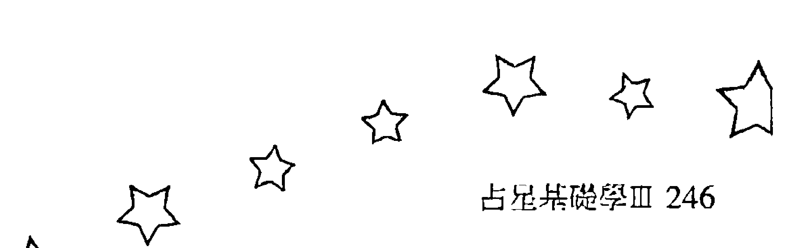| 年 | 月 | 日 | 时间 | 星座 |
|---|---|---|------|------|
| 1997 | 01 | 01 | 10:28am | 天秤座 |
| 1997 | 01 | 03 | 08:59pm | 天蝎座 |
| 1997 | 01 | 06 | 03:24am | 射手座 |
| 1997 | 01 | 08 | 05:51am | 摩羯座 |
| 1997 | 01 | 10 | 05:59am | 水瓶座 |
| 1997 | 01 | 12 | 06:53am | 双鱼座 |
| 1997 | 01 | 14 | 07:25am | 白羊座 |
| 1997 | 01 | 16 | 11:44am | 金牛座 |
| 1997 | 01 | 18 | 06:55pm | 双子座 |
| 1997 | 01 | 21 | 04:29am | 巨蟹座 |
| 1997 | 01 | 23 | 03:51pm | 狮子座 |
| 1997 | 01 | 26 | 04:26am | 处女座 |
| 1997 | 01 | 28 | 05:19pm | 天秤座 |
| 1997 | 01 | 31 | 04:44am | 天蝎座 |

| 年 | 月 | 日 | 时间 | 星座 |
|---|---|---|------|------|
| 1997 | 02 | 02 | 12:44pm | 射手座 |
| 1997 | 02 | 04 | 04:39pm | 摩羯座 |
| 1997 | 02 | 06 | 05:18pm | 水瓶座 |
| 1997 | 02 | 08 | 04:34pm | 双鱼座 |
| 1997 | 02 | 10 | 04:33pm | 白羊座 |
| 1997 | 02 | 12 | 06:59pm | 金牛座 |
| 1997 | 02 | 15 | 12:53am | 双子座 |
| 1997 | 02 | 17 | 10:15am | 巨蟹座 |
| 1997 | 02 | 19 | 09:52pm | 狮子座 |
| 1997 | 02 | 22 | 10:38am | 处女座 |
| 1997 | 02 | 24 | 11:22pm | 天秤座 |
| 1997 | 02 | 27 | 10:53am | 天蝎座 |

| 年 | 月 | 日 | 时间 | 星座 |
|---|---|---|------|------|
| 1997 | 03 | 01 | 07:58pm | 射手座 |
| 1997 | 03 | 04 | 01:37am | 摩羯座 |
| 1997 | 03 | 06 | 03:52am | 水瓶座 |
| 1997 | 03 | 08 | 03:56am | 双鱼座 |
| 1997 | 03 | 10 | 03:34am | 白羊座 |
| 1997 | 03 | 12 | 04:40am | 金牛座 |
| 1997 | 03 | 14 | 08:53am | 双子座 |
| 1997 | 03 | 16 | 04:54pm | 巨蟹座 |
| 1997 | 03 | 19 | 04:09am | 狮子座 |
| 1997 | 03 | 21 | 04:59pm | 处女座 |
| 1997 | 03 | 24 | 05:33am | 天秤座 |
| 1997 | 03 | 26 | 04:39pm | 天蝎座 |
| 1997 | 03 | 29 | 01:38am | 射手座 |
| 1997 | 03 | 31 | 08:03am | 摩羯座 |

| 年 | 月 | 日 | 时间 | 星座 |
|---|---|---|------|------|
| 1997 | 04 | 02 | 11:55am | 水瓶座 |
| 1997 | 04 | 04 | 01:40pm | 双鱼座 |
| 1997 | 04 | 06 | 02:19pm | 白羊座 |
| 1997 | 04 | 08 | 03:23pm | 金牛座 |
| 1997 | 04 | 10 | 06:31pm | 双子座 |
| 1997 | 04 | 13 | 01:04am | 巨蟹座 |
| 1997 | 04 | 15 | 11:24am | 狮子座 |
| 1997 | 04 | 18 | 12:00am | 处女座 |
| 1997 | 04 | 20 | 12:34pm | 天秤座 |
| 1997 | 04 | 22 | 11:18pm | 天蝎座 |
| 1997 | 04 | 25 | 07:29am | 射手座 |
| 1997 | 04 | 27 | 01:29pm | 摩羯座 |
| 1997 | 04 | 29 | 05:48pm | 水瓶座 |

| 年 | 月 | 日 | 时间 | 星座 |
|---|---|---|------|------|
| 1996 | 09 | 01 | 08:22pm | 金牛座 |
| 1996 | 09 | 04 | 03:10am | 双子座 |
| 1996 | 09 | 06 | 01:31pm | 巨蟹座 |
| 1996 | 09 | 09 | 01:53am | 狮子座 |
| 1996 | 09 | 11 | 02:26pm | 处女座 |
| 1996 | 09 | 14 | 01:50am | 天秤座 |
| 1996 | 09 | 16 | 11:16am | 天蝎座 |
| 1996 | 09 | 18 | 06:27pm | 射手座 |
| 1996 | 09 | 20 | 11:11pm | 摩羯座 |
| 1996 | 09 | 23 | 01:38am | 水瓶座 |
| 1996 | 09 | 25 | 02:43am | 双鱼座 |
| 1996 | 09 | 27 | 03:47am | 白羊座 |
| 1996 | 09 | 29 | 06:27am | 金牛座 |

| 年 | 月 | 日 | 时间 | 星座 |
|---|---|---|------|------|
| 1996 | 10 | 01 | 12:06pm | 双子座 |
| 1996 | 10 | 03 | 09:15pm | 巨蟹座 |
| 1996 | 10 | 06 | 09:12am | 狮子座 |
| 1996 | 10 | 08 | 09:48pm | 处女座 |
| 1996 | 10 | 11 | 08:57am | 天秤座 |
| 1996 | 10 | 13 | 05:42pm | 天蝎座 |
| 1996 | 10 | 16 | 12:07am | 射手座 |
| 1996 | 10 | 18 | 04:35am | 摩羯座 |
| 1996 | 10 | 20 | 07:49am | 水瓶座 |
| 1996 | 10 | 22 | 10:21am | 双鱼座 |
| 1996 | 10 | 24 | 12:51pm | 白羊座 |
| 1996 | 10 | 26 | 04:14pm | 金牛座 |
| 1996 | 10 | 28 | 09:36pm | 双子座 |
| 1996 | 10 | 31 | 05:59am | 巨蟹座 |

| 年 | 月 | 日 | 时间 | 星座 |
|---|---|---|------|------|
| 1996 | 11 | 02 | 05:17pm | 狮子座 |
| 1996 | 11 | 05 | 05:55am | 处女座 |
| 1996 | 11 | 07 | 05:25pm | 天秤座 |
| 1996 | 11 | 10 | 02:00am | 天蝎座 |
| 1996 | 11 | 12 | 07:23am | 射手座 |
| 1996 | 11 | 14 | 10:42am | 摩羯座 |
| 1996 | 11 | 16 | 01:14pm | 水瓶座 |
| 1996 | 11 | 18 | 04:01pm | 双鱼座 |
| 1996 | 11 | 20 | 07:34pm | 白羊座 |
| 1996 | 11 | 23 | 12:11am | 金牛座 |
| 1996 | 11 | 25 | 06:22am | 双子座 |
| 1996 | 11 | 27 | 02:40pm | 巨蟹座 |
| 1996 | 11 | 30 | 01:30am | 狮子座 |

| 年 | 月 | 日 | 时间 | 星座 |
|---|---|---|------|------|
| 1996 | 12 | 02 | 02:10pm | 处女座 |
| 1996 | 12 | 05 | 02:21am | 天秤座 |
| 1996 | 12 | 07 | 11:32am | 天蝎座 |
| 1996 | 12 | 09 | 04:54pm | 射手座 |
| 1996 | 12 | 11 | 07:12pm | 摩羯座 |
| 1996 | 12 | 13 | 08:14pm | 水瓶座 |
| 1996 | 12 | 15 | 09:44pm | 双鱼座 |
| 1996 | 12 | 18 | 12:55am | 白羊座 |
| 1996 | 12 | 20 | 06:11am | 金牛座 |
| 1996 | 12 | 22 | 01:19pm | 双子座 |
| 1996 | 12 | 24 | 10:14pm | 巨蟹座 |
| 1996 | 12 | 27 | 09:10am | 狮子座 |
| 1996 | 12 | 29 | 09:44pm | 处女座 |

| 年 | 月 | 日 | 时间 | 星座 |
|---|---|---|------|------|
| 1997 | 09 | 01 | 12:27pm | 处女座 |
| 1997 | 09 | 04 | 01:29am | 天秤座 |
| 1997 | 09 | 06 | 02:07pm | 天蝎座 |
| 1997 | 09 | 09 | 12:53am | 射手座 |
| 1997 | 09 | 11 | 08:17am | 摩羯座 |
| 1997 | 09 | 13 | 12:04pm | 水瓶座 |
| 1997 | 09 | 15 | 12:56pm | 双鱼座 |
| 1997 | 09 | 17 | 12:25pm | 白羊座 |
| 1997 | 09 | 19 | 12:25pm | 金牛座 |
| 1997 | 09 | 21 | 02:44pm | 双子座 |
| 1997 | 09 | 23 | 08:35pm | 巨蟹座 |
| 1997 | 09 | 26 | 06:14am | 狮子座 |
| 1997 | 09 | 28 | 06:28pm | 处女座 |

| 年 | 月 | 日 | 时间 | 星座 |
|---|---|---|------|------|
| 1997 | 05 | 01 | 08:49pm | 双鱼座 |
| 1997 | 05 | 03 | 10:58pm | 白羊座 |
| 1997 | 05 | 06 | 01:04am | 金牛座 |
| 1997 | 05 | 08 | 04:23am | 双子座 |
| 1997 | 05 | 10 | 10:17am | 巨蟹座 |
| 1997 | 05 | 12 | 07:35pm | 狮子座 |
| 1997 | 05 | 15 | 07:43am | 处女座 |
| 1997 | 05 | 17 | 08:25pm | 天秤座 |
| 1997 | 05 | 20 | 07:07am | 天蝎座 |
| 1997 | 05 | 22 | 02:46pm | 射手座 |
| 1997 | 05 | 24 | 07:49pm | 摩羯座 |
| 1997 | 05 | 26 | 11:20pm | 水瓶座 |
| 1997 | 05 | 29 | 02:17am | 双鱼座 |
| 1997 | 05 | 31 | 05:18am | 白羊座 |

| 年 | 月 | 日 | 时间 | 星座 |
|---|---|---|------|------|
| 1997 | 10 | 01 | 07:31am | 天秤座 |
| 1997 | 10 | 03 | 07:56pm | 天蝎座 |
| 1997 | 10 | 06 | 06:40am | 射手座 |
| 1997 | 10 | 08 | 02:59pm | 摩羯座 |
| 1997 | 10 | 10 | 08:26pm | 水瓶座 |
| 1997 | 10 | 12 | 10:58pm | 双鱼座 |
| 1997 | 10 | 14 | 11:24pm | 白羊座 |
| 1997 | 10 | 16 | 11:15pm | 金牛座 |
| 1997 | 10 | 19 | 12:26am | 双子座 |
| 1997 | 10 | 21 | 04:49am | 巨蟹座 |
| 1997 | 10 | 23 | 01:14pm | 狮子座 |
| 1997 | 10 | 26 | 12:59am | 处女座 |
| 1997 | 10 | 28 | 02:03pm | 天秤座 |
| 1997 | 10 | 31 | 02:14am | 天蝎座 |

| 年 | 月 | 日 | 时间 | 星座 |
|---|---|---|------|------|
| 1997 | 06 | 02 | 08:40am | 金牛座 |
| 1997 | 06 | 04 | 12:57pm | 双子座 |
| 1997 | 06 | 06 | 07:04pm | 巨蟹座 |
| 1997 | 06 | 09 | 03:59am | 狮子座 |
| 1997 | 06 | 11 | 03:44pm | 处女座 |
| 1997 | 06 | 14 | 04:33am | 天秤座 |
| 1997 | 06 | 16 | 03:46pm | 天蝎座 |
| 1997 | 06 | 18 | 11:38pm | 射手座 |
| 1997 | 06 | 21 | 04:00am | 摩羯座 |
| 1997 | 06 | 23 | 06:19am | 水瓶座 |
| 1997 | 06 | 25 | 08:10am | 双鱼座 |
| 1997 | 06 | 27 | 10:40am | 白羊座 |
| 1997 | 06 | 29 | 02:25pm | 金牛座 |

| 年 | 月 | 日 | 时间 | 星座 |
|---|---|---|------|------|
| 1997 | 11 | 02 | 12:23pm | 射手座 |
| 1997 | 11 | 04 | 08:29pm | 摩羯座 |
| 1997 | 11 | 07 | 02:32am | 水瓶座 |
| 1997 | 11 | 09 | 08:32am | 双鱼座 |
| 1997 | 11 | 11 | 08:41am | 白羊座 |
| 1997 | 11 | 13 | 09:45am | 金牛座 |
| 1997 | 11 | 15 | 11:08am | 双子座 |
| 1997 | 11 | 17 | 02:37pm | 巨蟹座 |
| 1997 | 11 | 19 | 09:39pm | 狮子座 |
| 1997 | 11 | 22 | 08:34am | 处女座 |
| 1997 | 11 | 24 | 09:29pm | 天秤座 |
| 1997 | 11 | 27 | 09:39am | 天蝎座 |
| 1997 | 11 | 29 | 07:26pm | 射手座 |

| 年 | 月 | 日 | 时间 | 星座 |
|---|---|---|------|------|
| 1997 | 07 | 01 | 07:36pm | 双子座 |
| 1997 | 07 | 04 | 02:33am | 巨蟹座 |
| 1997 | 07 | 06 | 11:48am | 狮子座 |
| 1997 | 07 | 08 | 11:21pm | 处女座 |
| 1997 | 07 | 11 | 12:19pm | 天秤座 |
| 1997 | 07 | 14 | 12:20am | 天蝎座 |
| 1997 | 07 | 16 | 08:56am | 射手座 |
| 1997 | 07 | 18 | 01:40pm | 摩羯座 |
| 1997 | 07 | 20 | 03:26pm | 水瓶座 |
| 1997 | 07 | 22 | 04:00pm | 双鱼座 |
| 1997 | 07 | 24 | 05:05pm | 白羊座 |
| 1997 | 07 | 26 | 07:55pm | 金牛座 |
| 1997 | 07 | 29 | 01:04am | 双子座 |
| 1997 | 07 | 31 | 08:40am | 巨蟹座 |

| 年 | 月 | 日 | 时间 | 星座 |
|---|---|---|------|------|
| 1997 | 12 | 02 | 02:37am | 摩羯座 |
| 1997 | 12 | 04 | 07:56am | 水瓶座 |
| 1997 | 12 | 06 | 12:05pm | 双鱼座 |
| 1997 | 12 | 08 | 03:22pm | 白羊座 |
| 1997 | 12 | 10 | 05:59pm | 金牛座 |
| 1997 | 12 | 12 | 08:35pm | 双子座 |
| 1997 | 12 | 15 | 12:25am | 巨蟹座 |
| 1997 | 12 | 17 | 07:01am | 狮子座 |
| 1997 | 12 | 19 | 05:02pm | 处女座 |
| 1997 | 12 | 22 | 05:34am | 天秤座 |
| 1997 | 12 | 24 | 06:04pm | 天蝎座 |
| 1997 | 12 | 27 | 04:04am | 射手座 |
| 1997 | 12 | 29 | 10:44am | 摩羯座 |
| 1997 | 12 | 31 | 02:56pm | 水瓶座 |

| 年 | 月 | 日 | 时间 | 星座 |
|---|---|---|------|------|
| 1997 | 08 | 02 | 06:28pm | 狮子座 |
| 1997 | 08 | 05 | 06:16am | 处女座 |
| 1997 | 08 | 07 | 07:16pm | 天秤座 |
| 1997 | 08 | 10 | 07:47am | 天蝎座 |
| 1997 | 08 | 12 | 05:40pm | 射手座 |
| 1997 | 08 | 14 | 11:41pm | 摩羯座 |
| 1997 | 08 | 17 | 01:57am | 水瓶座 |
| 1997 | 08 | 19 | 02:00am | 双鱼座 |
| 1997 | 08 | 21 | 01:45am | 白羊座 |
| 1997 | 08 | 23 | 02:59am | 金牛座 |
| 1997 | 08 | 25 | 07:00am | 双子座 |
| 1997 | 08 | 27 | 02:14pm | 巨蟹座 |
| 1997 | 08 | 30 | 12:18pm | 处女座 |

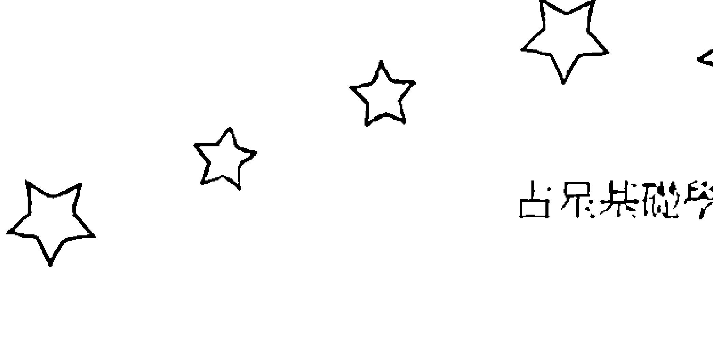| 日期 | 时间 | 星座 |
|------|------|------|
| 1998年05月02日 | 05:53pm | 狮子座 |
| 1998年05月05日 | 03:48am | 处女座 |
| 1998年05月07日 | 04:19pm | 天秤座 |
| 1998年05月10日 | 05:09am | 天蝎座 |
| 1998年05月12日 | 04:46pm | 射手座 |
| 1998年05月15日 | 02:37am | 摩羯座 |
| 1998年05月17日 | 10:27am | 水瓶座 |
| 1998年05月19日 | 03:59pm | 双鱼座 |
| 1998年05月21日 | 07:03pm | 白羊座 |
| 1998年05月23日 | 08:05pm | 金牛座 |
| 1998年05月25日 | 08:26pm | 双子座 |
| 1998年05月27日 | 09:59pm | 巨蟹座 |
| 1998年05月30日 | 02:40am | 狮子座 |
| 1998年01月02日 | 05:55pm | 双鱼座 |
| 1998年01月04日 | 08:43pm | 白羊座 |
| 1998年01月06日 | 11:52pm | 金牛座 |
| 1998年01月09日 | 03:43am | 双子座 |
| 1998年01月11日 | 08:45am | 巨蟹座 |
| 1998年01月13日 | 03:48pm | 狮子座 |
| 1998年01月16日 | 01:31am | 处女座 |
| 1998年01月18日 | 01:44pm | 天秤座 |
| 1998年01月21日 | 02:33am | 天蝎座 |
| 1998年01月23日 | 01:20pm | 射手座 |
| 1998年01月25日 | 08:36pm | 摩羯座 |
| 1998年01月28日 | 12:26am | 水瓶座 |
| 1998年01月30日 | 02:08am | 双鱼座 |
| 1998年06月01日 | 11:24am | 处女座 |
| 1998年06月03日 | 11:17pm | 天秤座 |
| 1998年06月06日 | 12:03pm | 天蝎座 |
| 1998年06月08日 | 11:34pm | 射手座 |
| 1998年06月11日 | 08:47am | 摩羯座 |
| 1998年06月13日 | 04:00pm | 水瓶座 |
| 1998年06月15日 | 09:30pm | 双鱼座 |
| 1998年06月18日 | 01:22am | 白羊座 |
| 1998年06月20日 | 03:46am | 金牛座 |
| 1998年06月22日 | 05:27am | 双子座 |
| 1998年06月24日 | 07:42am | 巨蟹座 |
| 1998年06月26日 | 12:08pm | 狮子座 |
| 1998年06月28日 | 07:56pm | 处女座 |
| 1998年02月01日 | 03:21am | 白羊座 |
| 1998年02月03日 | 05:26am | 金牛座 |
| 1998年02月05日 | 09:12am | 双子座 |
| 1998年02月07日 | 03:00pm | 巨蟹座 |
| 1998年02月09日 | 10:57pm | 狮子座 |
| 1998年02月12日 | 09:11am | 处女座 |
| 1998年02月14日 | 09:17pm | 天秤座 |
| 1998年02月17日 | 10:11am | 天蝎座 |
| 1998年02月19日 | 09:54pm | 射手座 |
| 1998年02月22日 | 06:24am | 摩羯座 |
| 1998年02月24日 | 11:04pm | 水瓶座 |
| 1998年02月26日 | 12:39pm | 双鱼座 |
| 1998年02月28日 | 12:42pm | 白羊座 |
| 1998年07月01日 | 07:06am | 天秤座 |
| 1998年07月03日 | 07:44pm | 天蝎座 |
| 1998年07月06日 | 07:20am | 射手座 |
| 1998年07月08日 | 04:24pm | 摩羯座 |
| 1998年07月10日 | 10:51pm | 水瓶座 |
| 1998年07月13日 | 03:21am | 双鱼座 |
| 1998年07月15日 | 06:44am | 白羊座 |
| 1998年07月17日 | 09:33am | 金牛座 |
| 1998年07月19日 | 12:19pm | 双子座 |
| 1998年07月21日 | 03:45pm | 巨蟹座 |
| 1998年07月23日 | 08:50pm | 狮子座 |
| 1998年07月26日 | 04:35am | 处女座 |
| 1998年07月28日 | 03:16pm | 天秤座 |
| 1998年07月31日 | 03:44am | 天蝎座 |
| 1998年03月02日 | 01:03pm | 金牛座 |
| 1998年03月04日 | 03:19pm | 双子座 |
| 1998年03月06日 | 09:28pm | 巨蟹座 |
| 1998年03月09日 | 04:47am | 狮子座 |
| 1998年03月11日 | 03:36pm | 处女座 |
| 1998年03月14日 | 03:58am | 天秤座 |
| 1998年03月16日 | 04:49pm | 天蝎座 |
| 1998年03月19日 | 04:54am | 射手座 |
| 1998年03月21日 | 02:38pm | 摩羯座 |
| 1998年03月23日 | 08:58pm | 水瓶座 |
| 1998年03月25日 | 11:42pm | 双鱼座 |
| 1998年03月27日 | 11:48pm | 白羊座 |
| 1998年03月29日 | 11:06pm | 金牛座 |
| 1998年03月31日 | 11:37pm | 双子座 |
| 1998年08月02日 | 03:44pm | 射手座 |
| 1998年08月05日 | 01:16am | 摩羯座 |
| 1998年08月07日 | 07:27am | 水瓶座 |
| 1998年08月09日 | 11:01am | 双鱼座 |
| 1998年08月11日 | 01:09pm | 白羊座 |
| 1998年08月13日 | 03:05pm | 金牛座 |
| 1998年08月15日 | 05:47pm | 双子座 |
| 1998年08月17日 | 09:56pm | 巨蟹座 |
| 1998年08月20日 | 04:02am | 狮子座 |
| 1998年08月22日 | 12:24pm | 处女座 |
| 1998年08月24日 | 11:02pm | 天秤座 |
| 1998年08月27日 | 11:25am | 天蝎座 |
| 1998年08月29日 | 11:55pm | 射手座 |
| 1998年04月03日 | 03:12am | 巨蟹座 |
| 1998年04月05日 | 10:40am | 狮子座 |
| 1998年04月07日 | 09:26pm | 处女座 |
| 1998年04月10日 | 10:04am | 天秤座 |
| 1998年04月12日 | 10:55pm | 天蝎座 |
| 1998年04月15日 | 10:50am | 射手座 |
| 1998年04月17日 | 09:03pm | 摩羯座 |
| 1998年04月20日 | 04:38am | 水瓶座 |
| 1998年04月22日 | 09:00am | 双鱼座 |
| 1998年04月24日 | 10:27am | 白羊座 |
| 1998年04月26日 | 10:09am | 金牛座 |
| 1998年04月28日 | 09:59am | 双子座 |
| 1998年04月30日 | 12:03pm | 巨蟹座 |
| 1999年01月01日 | 04:16pm | 巨蟹座 |
| 1999年01月03日 | 06:34pm | 双子座 |
| 1999年01月05日 | 11:49pm | 处女座 |
| 1999年01月08日 | 08:56am | 天秤座 |
| 1999年01月10日 | 08:49pm | 天蝎座 |
| 1999年01月13日 | 09:21am | 射手座 |
| 1999年01月15日 | 08:27pm | 摩羯座 |
| 1999年01月18日 | 05:09am | 水瓶座 |
| 1999年01月20日 | 11:37am | 双鱼座 |
| 1999年01月22日 | 04:22pm | 白羊座 |
| 1999年01月24日 | 07:51pm | 金牛座 |
| 1999年01月26日 | 10:29pm | 双子座 |
| 1999年01月29日 | 12:57am | 巨蟹座 |
| 1999年01月31日 | 04:17am | 双子座 |
| 1998年09月01日 | 10:18am | 摩羯座 |
| 1998年09月03日 | 05:16pm | 水瓶座 |
| 1998年09月05日 | 08:45pm | 双鱼座 |
| 1998年09月07日 | 09:51pm | 白羊座 |
| 1998年09月09日 | 10:16pm | 金牛座 |
| 1998年09月11日 | 11:40pm | 双子座 |
| 1998年09月14日 | 03:22am | 巨蟹座 |
| 1998年09月16日 | 09:51am | 双子座 |
| 1998年09月18日 | 06:53pm | 处女座 |
| 1998年09月21日 | 05:58am | 天秤座 |
| 1998年09月23日 | 05:22pm | 天蝎座 |
| 1998年09月26日 | 07:03am | 射手座 |
| 1998年09月28日 | 06:27pm | 摩羯座 |
| 1999年02月02日 | 09:41am | 处女座 |
| 1999年02月04日 | 05:58pm | 天秤座 |
| 1999年02月07日 | 05:07am | 天蝎座 |
| 1999年02月09日 | 05:37pm | 射手座 |
| 1999年02月12日 | 06:07am | 摩羯座 |
| 1999年02月14日 | 01:52pm | 水瓶座 |
| 1999年02月16日 | 07:37pm | 双鱼座 |
| 1999年02月18日 | 11:06pm | 白羊座 |
| 1999年02月21日 | 01:28am | 金牛座 |
| 1999年02月23日 | 03:54am | 双子座 |
| 1999年02月25日 | 07:10am | 巨蟹座 |
| 1999年02月27日 | 11:46am | 双子座 |
| 1998年10月01日 | 02:50am | 水瓶座 |
| 1998年10月03日 | 07:18am | 双鱼座 |
| 1998年10月05日 | 08:29am | 白羊座 |
| 1998年10月07日 | 07:58am | 金牛座 |
| 1998年10月09日 | 07:47am | 双子座 |
| 1998年10月11日 | 09:54am | 巨蟹座 |
| 1998年10月13日 | 03:29pm | 双子座 |
| 1998年10月16日 | 12:32am | 处女座 |
| 1998年10月18日 | 12:03pm | 天秤座 |
| 1998年10月21日 | 12:36am | 天蝎座 |
| 1998年10月23日 | 01:15pm | 射手座 |
| 1998年10月26日 | 01:04am | 摩羯座 |
| 1998年10月28日 | 10:39am | 水瓶座 |
| 1998年10月30日 | 04:53pm | 双鱼座 |
| 1999年03月01日 | 06:06pm | 处女座 |
| 1999年03月04日 | 02:35am | 天秤座 |
| 1999年03月06日 | 01:24pm | 天蝎座 |
| 1999年03月09日 | 01:45am | 射手座 |
| 1999年03月11日 | 01:50pm | 摩羯座 |
| 1999年03月13日 | 11:31pm | 水瓶座 |
| 1999年03月16日 | 05:26am | 双鱼座 |
| 1999年03月18日 | 08:10am | 白羊座 |
| 1999年03月20日 | 09:08am | 金牛座 |
| 1999年03月22日 | 10:07am | 双子座 |
| 1999年03月24日 | 12:37pm | 巨蟹座 |
| 1999年03月26日 | 05:25pm | 双子座 |
| 1999年03月29日 | 12:34am | 处女座 |
| 1999年03月31日 | 09:51am | 天秤座 |
| 1998年11月01日 | 07:23pm | 白羊座 |
| 1998年11月03日 | 07:10pm | 金牛座 |
| 1998年11月05日 | 06:12pm | 双子座 |
| 1998年11月07日 | 06:43pm | 巨蟹座 |
| 1998年11月09日 | 10:34pm | 双子座 |
| 1998年11月12日 | 06:40am | 处女座 |
| 1998年11月14日 | 05:58pm | 天秤座 |
| 1998年11月17日 | 06:40am | 天蝎座 |
| 1998年11月19日 | 07:11pm | 射手座 |
| 1998年11月22日 | 06:43am | 摩羯座 |
| 1998年11月24日 | 04:40pm | 水瓶座 |
| 1998年11月27日 | 12:14am | 双鱼座 |
| 1998年11月29日 | 04:30am | 白羊座 |
| 1999年04月02日 | 08:49pm | 天蝎座 |
| 1999年04月05日 | 09:07am | 射手座 |
| 1999年04月07日 | 09:38pm | 摩羯座 |
| 1999年04月10日 | 08:19am | 水瓶座 |
| 1999年04月12日 | 03:29pm | 双鱼座 |
| 1999年04月14日 | 06:42pm | 白羊座 |
| 1999年04月16日 | 07:05pm | 金牛座 |
| 1999年04月18日 | 06:40pm | 双子座 |
| 1999年04月20日 | 07:30pm | 巨蟹座 |
| 1999年04月22日 | 11:06pm | 双子座 |
| 1999年04月25日 | 06:06am | 处女座 |
| 1999年04月27日 | 03:48pm | 天秤座 |
| 1999年04月30日 | 03:13am | 天蝎座 |
| 1998年12月01日 | 05:50am | 金牛座 |
| 1998年12月03日 | 05:30am | 双子座 |
| 1998年12月05日 | 05:31am | 巨蟹座 |
| 1998年12月07日 | 08:01am | 双子座 |
| 1998年12月09日 | 02:26pm | 处女座 |
| 1998年12月12日 | 12:43am | 天秤座 |
| 1998年12月14日 | 01:16pm | 天蝎座 |
| 1998年12月17日 | 01:46am | 射手座 |
| 1998年12月19日 | 12:52pm | 摩羯座 |
| 1998年12月21日 | 10:15pm | 水瓶座 |
| 1998年12月24日 | 05:42am | 双鱼座 |
| 1998年12月26日 | 10:59am | 白羊座 |
| 1998年12月28日 | 02:01pm | 金牛座 |
| 1998年12月30日 | 03:21pm | 双子座 |
| 1999年09月02日 | 01:24pm | 双子座 |
| 1999年09月04日 | 04:10pm | 巨蟹座 |
| 1999年09月06日 | 07:29pm | 狮子座 |
| 1999年09月08日 | 11:56pm | 处女座 |
| 1999年09月11日 | 06:18am | 天秤座 |
| 1999年09月13日 | 03:11pm | 天蝎座 |
| 1999年09月16日 | 02:36am | 射手座 |
| 1999年09月18日 | 03:12pm | 摩羯座 |
| 1999年09月21日 | 02:36am | 水瓶座 |
| 1999年09月23日 | 10:46am | 双鱼座 |
| 1999年09月25日 | 03:29pm | 白羊座 |
| 1999年09月27日 | 05:49pm | 金牛座 |
| 1999年09月29日 | 07:21pm | 双子座 |
| 1999年05月02日 | 03:36pm | 射手座 |
| 1999年05月05日 | 04:10am | 摩羯座 |
| 1999年05月07日 | 03:37pm | 水瓶座 |
| 1999年05月10日 | 12:15am | 双鱼座 |
| 1999年05月12日 | 04:49am | 白羊座 |
| 1999年05月14日 | 05:53am | 金牛座 |
| 1999年05月16日 | 05:08am | 双子座 |
| 1999年05月18日 | 04:42am | 巨蟹座 |
| 1999年05月20日 | 06:41am | 狮子座 |
| 1999年05月22日 | 12:20pm | 处女座 |
| 1999年05月24日 | 09:30pm | 天秤座 |
| 1999年05月27日 | 09:05am | 天蝎座 |
| 1999年05月29日 | 09:37pm | 射手座 |
| 1999年10月01日 | 09:32pm | 巨蟹座 |
| 1999年10月04日 | 01:13am | 狮子座 |
| 1999年10月06日 | 06:41am | 处女座 |
| 1999年10月08日 | 01:54pm | 天秤座 |
| 1999年10月10日 | 11:01pm | 天蝎座 |
| 1999年10月13日 | 10:20am | 射手座 |
| 1999年10月15日 | 11:03pm | 摩羯座 |
| 1999年10月18日 | 11:13am | 水瓶座 |
| 1999年10月20日 | 08:29pm | 双鱼座 |
| 1999年10月23日 | 01:40am | 白羊座 |
| 1999年10月25日 | 03:23am | 金牛座 |
| 1999年10月27日 | 03:34am | 双子座 |
| 1999年10月29日 | 04:11am | 巨蟹座 |
| 1999年10月31日 | 06:50am | 狮子座 |
| 1999年06月01日 | 10:04am | 摩羯座 |
| 1999年06月03日 | 09:35pm | 水瓶座 |
| 1999年06月06日 | 06:56am | 双鱼座 |
| 1999年06月08日 | 01:02pm | 白羊座 |
| 1999年06月10日 | 03:39pm | 金牛座 |
| 1999年06月12日 | 03:46pm | 双子座 |
| 1999年06月14日 | 03:16pm | 巨蟹座 |
| 1999年06月16日 | 04:11pm | 狮子座 |
| 1999年06月18日 | 08:15pm | 处女座 |
| 1999年06月21日 | 04:12am | 天秤座 |
| 1999年06月23日 | 03:19pm | 天蝎座 |
| 1999年06月26日 | 03:50am | 射手座 |
| 1999年06月28日 | 04:10pm | 摩羯座 |
| 1999年11月02日 | 12:10pm | 处女座 |
| 1999年11月04日 | 07:58pm | 天秤座 |
| 1999年11月07日 | 05:47am | 天蝎座 |
| 1999年11月09日 | 05:16pm | 射手座 |
| 1999年11月12日 | 06:00am | 摩羯座 |
| 1999年11月14日 | 06:43pm | 水瓶座 |
| 1999年11月17日 | 05:16am | 双鱼座 |
| 1999年11月19日 | 11:50am | 白羊座 |
| 1999年11月21日 | 02:21pm | 金牛座 |
| 1999年11月23日 | 02:12pm | 双子座 |
| 1999年11月25日 | 01:31pm | 巨蟹座 |
| 1999年11月27日 | 02:23pm | 狮子座 |
| 1999年11月29日 | 06:14pm | 处女座 |
| 1999年07月01日 | 03:18am | 水瓶座 |
| 1999年07月03日 | 12:31pm | 双鱼座 |
| 1999年07月05日 | 07:18pm | 白羊座 |
| 1999年07月07日 | 11:21pm | 金牛座 |
| 1999年07月10日 | 12:59am | 双子座 |
| 1999年07月12日 | 01:27am | 巨蟹座 |
| 1999年07月14日 | 02:27am | 狮子座 |
| 1999年07月16日 | 05:42am | 处女座 |
| 1999年07月18日 | 12:24pm | 天秤座 |
| 1999年07月20日 | 10:30pm | 天蝎座 |
| 1999年07月23日 | 10:48am | 射手座 |
| 1999年07月25日 | 11:08pm | 摩羯座 |
| 1999年07月28日 | 09:51am | 水瓶座 |
| 1999年07月30日 | 06:24pm | 双鱼座 |
| 1999年12月02日 | 01:30am | 天秤座 |
| 1999年12月04日 | 11:37am | 天蝎座 |
| 1999年12月06日 | 11:27pm | 射手座 |
| 1999年12月09日 | 12:13pm | 摩羯座 |
| 1999年12月12日 | 12:58am | 水瓶座 |
| 1999年12月14日 | 12:13pm | 双鱼座 |
| 1999年12月16日 | 08:27pm | 白羊座 |
| 1999年12月19日 | 12:44am | 金牛座 |
| 1999年12月21日 | 01:38am | 双子座 |
| 1999年12月23日 | 12:52am | 巨蟹座 |
| 1999年12月25日 | 12:32am | 狮子座 |
| 1999年12月27日 | 02:36am | 处女座 |
| 1999年12月29日 | 08:19am | 天秤座 |
| 1999年12月31日 | 05:39pm | 天蝎座 |
| 1999年08月02日 | 12:46am | 白羊座 |
| 1999年08月04日 | 05:06am | 金牛座 |
| 1999年08月06日 | 07:55am | 双子座 |
| 1999年08月08日 | 09:52am | 巨蟹座 |
| 1999年08月10日 | 11:57am | 狮子座 |
| 1999年08月12日 | 03:25pm | 处女座 |
| 1999年08月14日 | 09:25pm | 天秤座 |
| 1999年08月17日 | 06:42am | 天蝎座 |
| 1999年08月19日 | 06:32pm | 射手座 |
| 1999年08月22日 | 06:57am | 摩羯座 |
| 1999年08月24日 | 05:46pm | 水瓶座 |
| 1999年08月27日 | 01:48am | 双鱼座 |
| 1999年08月29日 | 07:06am | 白羊座 |
| 1999年08月31日 | 10:39am | 金牛座 |# 臺灣時間木星轉換星座時間表（一九五一—二〇〇〇）

| 年份 | 日期 | 时间 | 星座 |
|---|---|---|---|
| 2000年 | 05月01日 | 08:49am | 白羊座 |
| 2000年 | 05月03日 | 12:49pm | 金牛座 |
| 2000年 | 05月05日 | 02:22pm | 双子座 |
| 2000年 | 05月07日 | 03:15pm | 巨蟹座 |
| 2000年 | 05月09日 | 05:03pm | 狮子座 |
| 2000年 | 05月11日 | 08:42pm | 处女座 |
| 2000年 | 05月14日 | 02:28am | 天秤座 |
| 2000年 | 05月16日 | 10:19am | 天蝎座 |
| 2000年 | 05月18日 | 08:10pm | 射手座 |
| 2000年 | 05月21日 | 08:02am | 摩羯座 |
| 2000年 | 05月23日 | 08:59pm | 水瓶座 |
| 2000年 | 05月26日 | 09:03am | 双鱼座 |
| 2000年 | 05月28日 | 06:03pm | 白羊座 |
| 2000年 | 05月30日 | 11:01pm | 金牛座 |
| 2000年 | 01月03日 | 05:32am | 射手座 |
| 2000年 | 01月05日 | 06:23pm | 摩羯座 |
| 2000年 | 01月08日 | 06:51am | 水瓶座 |
| 2000年 | 01月10日 | 05:57pm | 双鱼座 |
| 2000年 | 01月13日 | 02:46am | 白羊座 |
| 2000年 | 01月15日 | 08:33am | 金牛座 |
| 2000年 | 01月17日 | 11:20am | 双子座 |
| 2000年 | 01月19日 | 11:59am | 巨蟹座 |
| 2000年 | 01月21日 | 12:00pm | 狮子座 |
| 2000年 | 01月23日 | 01:12pm | 处女座 |
| 2000年 | 01月25日 | 05:13pm | 天秤座 |
| 2000年 | 01月28日 | 01:01am | 天蝎座 |
| 2000年 | 01月30日 | 12:19pm | 射手座 |
| 2000年 | 06月02日 | 12:34am | 双子座 |
| 2000年 | 06月04日 | 12:29am | 巨蟹座 |
| 2000年 | 06月06日 | 12:45am | 狮子座 |
| 2000年 | 06月08日 | 02:59am | 处女座 |
| 2000年 | 06月10日 | 08:02am | 天秤座 |
| 2000年 | 06月12日 | 03:57pm | 天蝎座 |
| 2000年 | 06月15日 | 02:18am | 射手座 |
| 2000年 | 06月17日 | 02:27pm | 摩羯座 |
| 2000年 | 06月20日 | 03:25am | 水瓶座 |
| 2000年 | 06月22日 | 03:49pm | 双鱼座 |
| 2000年 | 06月25日 | 01:53am | 白羊座 |
| 2000年 | 06月27日 | 08:13am | 金牛座 |
| 2000年 | 06月29日 | 10:54am | 双子座 |
| 2000年 | 02月02日 | 01:09am | 摩羯座 |
| 2000年 | 02月04日 | 01:28pm | 水瓶座 |
| 2000年 | 02月07日 | 12:01am | 双鱼座 |
| 2000年 | 02月09日 | 08:14am | 白羊座 |
| 2000年 | 02月11日 | 02:17pm | 金牛座 |
| 2000年 | 02月13日 | 06:20pm | 双子座 |
| 2000年 | 02月15日 | 08:44pm | 巨蟹座 |
| 2000年 | 02月17日 | 10:11pm | 狮子座 |
| 2000年 | 02月19日 | 11:53pm | 处女座 |
| 2000年 | 02月22日 | 03:23am | 天秤座 |
| 2000年 | 02月24日 | 10:02am | 天蝎座 |
| 2000年 | 02月26日 | 08:11pm | 射手座 |
| 2000年 | 02月29日 | 08:44am | 摩羯座 |
| 2000年 | 07月01日 | 11:08am | 巨蟹座 |
| 2000年 | 07月03日 | 10:40am | 狮子座 |
| 2000年 | 07月05日 | 11:23am | 处女座 |
| 2000年 | 07月07日 | 02:52pm | 天秤座 |
| 2000年 | 07月09日 | 09:49pm | 天蝎座 |
| 2000年 | 07月12日 | 08:07am | 射手座 |
| 2000年 | 07月14日 | 08:27pm | 摩羯座 |
| 2000年 | 07月17日 | 09:25am | 水瓶座 |
| 2000年 | 07月19日 | 09:43pm | 双鱼座 |
| 2000年 | 07月22日 | 08:05am | 白羊座 |
| 2000年 | 07月24日 | 03:39pm | 金牛座 |
| 2000年 | 07月26日 | 07:58pm | 双子座 |
| 2000年 | 07月28日 | 09:28pm | 巨蟹座 |
| 2000年 | 07月30日 | 09:23pm | 狮子座 |
| 2000年 | 03月02日 | 09:13pm | 水瓶座 |
| 2000年 | 03月05日 | 07:26am | 双鱼座 |
| 2000年 | 03月07日 | 02:51pm | 白羊座 |
| 2000年 | 03月09日 | 07:59pm | 金牛座 |
| 2000年 | 03月11日 | 11:45pm | 双子座 |
| 2000年 | 03月14日 | 02:51am | 巨蟹座 |
| 2000年 | 03月16日 | 05:43am | 狮子座 |
| 2000年 | 03月18日 | 08:50am | 处女座 |
| 2000年 | 03月20日 | 01:00pm | 天秤座 |
| 2000年 | 03月22日 | 07:20pm | 天蝎座 |
| 2000年 | 03月25日 | 04:45am | 射手座 |
| 2000年 | 03月27日 | 04:51pm | 摩羯座 |
| 2000年 | 03月30日 | 05:32am | 水瓶座 |
| 2000年 | 08月01日 | 09:28pm | 处女座 |
| 2000年 | 08月03日 | 11:31pm | 天秤座 |
| 2000年 | 08月06日 | 05:07am | 天蝎座 |
| 2000年 | 08月08日 | 02:33pm | 射手座 |
| 2000年 | 08月11日 | 02:43am | 摩羯座 |
| 2000年 | 08月13日 | 03:41pm | 水瓶座 |
| 2000年 | 08月16日 | 03:39am | 双鱼座 |
| 2000年 | 08月18日 | 01:40pm | 白羊座 |
| 2000年 | 08月20日 | 09:29pm | 金牛座 |
| 2000年 | 08月23日 | 02:53am | 双子座 |
| 2000年 | 08月25日 | 05:57am | 巨蟹座 |
| 2000年 | 08月27日 | 07:15am | 狮子座 |
| 2000年 | 08月29日 | 07:56am | 处女座 |
| 2000年 | 08月31日 | 09:37am | 天秤座 |
| 2000年 | 04月01日 | 04:08pm | 双鱼座 |
| 2000年 | 04月03日 | 11:21pm | 白羊座 |
| 2000年 | 04月06日 | 03:27am | 金牛座 |
| 2000年 | 04月08日 | 05:58am | 双子座 |
| 2000年 | 04月10日 | 08:17am | 巨蟹座 |
| 2000年 | 04月12日 | 11:17am | 狮子座 |
| 2000年 | 04月14日 | 03:20pm | 处女座 |
| 2000年 | 04月16日 | 08:36pm | 天秤座 |
| 2000年 | 04月19日 | 03:37am | 天蝎座 |
| 2000年 | 04月21日 | 01:00pm | 射手座 |
| 2000年 | 04月24日 | 12:47am | 摩羯座 |
| 2000年 | 04月26日 | 01:40pm | 水瓶座 |
| 2000年 | 04月29日 | 01:05am | 双鱼座 |
| 1951年 | 04月21日 | 10:57pm | 白羊座 |
| 1952年 | 04月29日 | 04:50am | 金牛座 DST |
| 1953年 | 05月09日 | 11:33pm | 双子座 DST |
| 1954年 | 05月24日 | 12:43pm | 巨蟹座 DST |
| 1955年 | 06月13日 | 08:06am | 狮子座 DST |
| 1955年 | 11月17日 | 12:05pm | 处女座 |
| 1956年 | 01月18日 | 09:57am | 逆行天秤座 |
| 1956年 | 07月08日 | 03:02am | 处女座 DST |
| 1956年 | 12月13日 | 10:22am | 天秤座 |
| 1957年 | 02月19日 | 11:35pm | 逆行处女座 |
| 1957年 | 08月07日 | 10:10am | 天秤座 DST |
| 1958年 | 01月13日 | 08:54pm | 天蝎座 |
| 1958年 | 03月21日 | 03:10am | 逆行天秤座 |
| 1958年 | 09月07日 | 04:51pm | 天蝎座 DST |
| 1959年 | 02月10日 | 09:47pm | 射手座 |
| 1959年 | 04月24日 | 10:08pm | 逆行天蝎座 DST |
| 1959年 | 10月05日 | 10:40pm | 射手座 |
| 1960年 | 03月01日 | 09:11pm | 摩羯座 |
| 1960年 | 06月10日 | 09:49am | 逆行射手座 DST |
| 1960年 | 10月26日 | 11:00am | 摩羯座 |
| 1961年 | 03月15日 | 04:03pm | 水瓶座 |
| 1961年 | 08月12日 | 04:53pm | 逆行摩羯座 DST |
| 1961年 | 11月04日 | 10:47am | 水瓶座 |
| 1962年 | 03月26日 | 06:08am | 双鱼座 |
| 1963年 | 04月04日 | 11:20am | 白羊座 |
| 1964年 | 04月12日 | 02:53pm | 金牛座 |
| 1965年 | 04月22日 | 10:33pm | 双子座 |
| 1965年 | 09月21日 | 12:40pm | 巨蟹座 |
| 1965年 | 11月17日 | 11:01am | 逆行双子座 |
| 1966年 | 05月05日 | 10:52pm | 巨蟹座 |
| 1966年 | 09月27日 | 09:20pm | 狮子座 |
| 1967年 | 01月16日 | 11:47am | 逆行巨蟹座 |
| 1967年 | 05月23日 | 04:20pm | 狮子座 |
| 1967年 | 10月19日 | 08:52pm | 处女座 |
| 1968年 | 02月27日 | 11:31am | 逆行狮子座 |
| 1968年 | 06月15日 | 10:44pm | 处女座 |
| 1968年 | 11月16日 | 06:45am | 天秤座 |
| 1969年 | 03月31日 | 05:35am | 逆行处女座 |
| 1969年 | 07月15日 | 09:30pm | 天秤座 |
| 1969年 | 12月16日 | 11:56pm | 天蝎座 |
| 1970年 | 04月30日 | 02:42pm | 逆行天秤座 |
| 1970年 | 08月16日 | 01:59am | 天蝎座 |
| 2000年 | 09月02日 | 02:00pm | 天秤座 |
| 2000年 | 09月04日 | 10:09pm | 射手座 |
| 2000年 | 09月07日 | 09:48am | 摩羯座 |
| 2000年 | 09月09日 | 10:44pm | 水瓶座 |
| 2000年 | 09月12日 | 10:30am | 双鱼座 |
| 2000年 | 09月14日 | 07:58pm | 白羊座 |
| 2000年 | 09月17日 | 03:04am | 金牛座 |
| 2000年 | 09月19日 | 08:20am | 双子座 |
| 2000年 | 09月21日 | 12:13pm | 巨蟹座 |
| 2000年 | 09月23日 | 02:58pm | 狮子座 |
| 2000年 | 09月25日 | 05:02pm | 处女座 |
| 2000年 | 09月27日 | 07:23pm | 天秤座 |
| 2000年 | 09月29日 | 11:29pm | 天蝎座 |
| 2000年 | 10月02日 | 06:53am | 射手座 |
| 2000年 | 10月04日 | 05:44pm | 摩羯座 |
| 2000年 | 10月07日 | 06:32am | 水瓶座 |
| 2000年 | 10月09日 | 06:33pm | 双鱼座 |
| 2000年 | 10月12日 | 03:48am | 白羊座 |
| 2000年 | 10月14日 | 10:03am | 金牛座 |
| 2000年 | 10月16日 | 02:17pm | 双子座 |
| 2000年 | 10月18日 | 05:36pm | 巨蟹座 |
| 2000年 | 10月20日 | 08:42pm | 狮子座 |
| 2000年 | 10月22日 | 11:52pm | 处女座 |
| 2000年 | 10月25日 | 03:30am | 天秤座 |
| 2000年 | 10月27日 | 08:26am | 天蝎座 |
| 2000年 | 10月29日 | 03:44pm | 射手座 |
| 2000年 | 11月01日 | 02:02am | 摩羯座 |
| 2000年 | 11月03日 | 02:40pm | 水瓶座 |
| 2000年 | 11月06日 | 03:10am | 双鱼座 |
| 2000年 | 11月08日 | 12:57pm | 白羊座 |
| 2000年 | 11月10日 | 07:08pm | 金牛座 |
| 2000年 | 11月12日 | 10:26pm | 双子座 |
| 2000年 | 11月15日 | 12:20am | 巨蟹座 |
| 2000年 | 11月17日 | 02:19am | 狮子座 |
| 2000年 | 11月19日 | 05:16am | 处女座 |
| 2000年 | 11月21日 | 09:37am | 天秤座 |
| 2000年 | 11月23日 | 03:35pm | 天蝎座 |
| 2000年 | 11月25日 | 11:33pm | 射手座 |
| 2000年 | 11月28日 | 09:59am | 摩羯座 |
| 2000年 | 11月30日 | 10:26pm | 水瓶座 |
| 2000年 | 12月03日 | 11:20am | 双鱼座 |
| 2000年 | 12月05日 | 10:16pm | 白羊座 |
| 2000年 | 12月08日 | 05:22am | 金牛座 |
| 2000年 | 12月10日 | 08:46am | 双子座 |
| 2000年 | 12月12日 | 09:47am | 巨蟹座 |
| 2000年 | 12月14日 | 10:10am | 狮子座 |
| 2000年 | 12月16日 | 11:33am | 处女座 |
| 2000年 | 12月18日 | 03:04pm | 天秤座 |
| 2000年 | 12月20日 | 09:13pm | 天蝎座 |
| 2000年 | 12月23日 | 05:59am | 射手座 |
| 2000年 | 12月25日 | 04:55pm | 摩羯座 |
| 2000年 | 12月28日 | 05:25am | 水瓶座 |
| 2000年 | 12月30日 | 06:26pm | 双鱼座 |
| 1951年 | 03月07日 | 08:08pm | 处女座 | |
| 1951年 | 08月14日 | 12:46am | 天秤座 | DST |
| 1953年 | 10月22日 | 11:37pm | 天蝎座 | DST |
| 1956年 | 01月13日 | 02:48am | 射手座 | |
| 1956年 | 05月14日 | 11:40am | 逆行天秤座 | DST |
| 1956年 | 10月10日 | 11:13pm | 射手座 | |
| 1959年 | 01月05日 | 09:35pm | 摩羯座 | |
| 1962年 | 01月04日 | 03:04am | 水瓶座 | |
| 1964年 | 03月24日 | 12:22pm | 双鱼座 | |
| 1964年 | 09月17日 | 04:57am | 逆行水瓶座 | |
| 1964年 | 12月16日 | 01:41pm | 双鱼座 | |
| 1967年 | 03月04日 | 05:34am | 白羊座 | |
| 1969年 | 04月30日 | 06:25am | 金牛座 | |
| 1971年 | 01月14日 | 04:51pm | 射手座 | |
| 1971年 | 06月05日 | 10:10am | 逆行天蝎座 | |
| 1971年 | 09月11日 | 11:35pm | 射手座 | |
| 1972年 | 02月07日 | 03:38am | 摩羯座 | |
| 1972年 | 07月25日 | 12:38am | 逆行射手座 | |
| 1972年 | 09月26日 | 02:21am | 摩羯座 | |
| 1973年 | 02月23日 | 05:29pm | 水瓶座 | |
| 1974年 | 03月08日 | 07:12pm | 双鱼座 | |
| 1975年 | 03月19日 | 12:48am | 白羊座 | |
| 1976年 | 03月26日 | 06:25pm | 金牛座 | |
| 1976年 | 08月23日 | 06:29pm | 双子座 | |
| 1976年 | 10月17日 | 04:19am | 逆行金牛座 | |
| 1977年 | 04月03日 | 11:43pm | 双子座 | |
| 1977年 | 08月20日 | 08:43pm | 巨蟹座 | |
| 1977年 | 12月31日 | 07:48am | 逆行双子座 | |
| 1978年 | 04月17日 | 08:11am | 巨蟹座 | |
| 1978年 | 09月05日 | 04:32pm | 狮子座 | |
| 1979年 | 03月01日 | 07:35am | 逆行巨蟹座 | |
| 1979年 | 04月20日 | 04:28pm | 狮子座 | |
| 1979年 | 09月29日 | 06:25pm | 处女座 | DST |
| 1980年 | 10月27日 | 06:11pm | 天秤座 | |

## 臺灣時間土星轉換星座時間表（一九五一～二〇〇〇）

| 年份 | 日期 | 时间 | 星座 | 备注 |
| :--- | :--- | :--- | :--- | :--- |
| 1971年 | 06月19日 | 12:10am | 双子座 | |
| 1972年 | 01月10日 | 11:39am | 逆行金牛座 | |
| 1972年 | 02月21日 | 11:02pm | 双子座 | |
| 1973年 | 08月02日 | 06:23am | 巨蟹座 | |
| 1974年 | 01月08日 | 04:22am | 逆行双子座 | |
| 1974年 | 04月19日 | 06:36am | 巨蟹座 | DST |
| 1975年 | 09月17日 | 01:01pm | 狮子座 | DST |
| 1976年 | 01月14日 | 09:10pm | 逆行巨蟹座 | |
| 1976年 | 06月05日 | 01:10pm | 狮子座 | |
| 1977年 | 11月17日 | 10:55am | 处女座 | |
| 1978年 | 01月05日 | 08:31am | 逆行狮子座 | |
| 1978年 | 07月26日 | 08:05pm | 处女座 | |
| 1980年 | 09月21日 | 06:51pm | 天秤座 | |
| 1981年 | 11月27日 | 10:20am | 天蝎座 | |
| 1982年 | 12月26日 | 09:59am | 射手座 | |
| 1984年 | 01月19日 | 11:04pm | 摩羯座 | |
| 1985年 | 02月06日 | 11:35pm | 水瓶座 | |
| 1986年 | 02月21日 | 12:05am | 双鱼座 | |
| 1987年 | 03月03日 | 02:41am | 白羊座 | |
| 1988年 | 03月08日 | 11:44pm | 金牛座 | |
| 1988年 | 07月22日 | 08:00am | 双子座 | |
| 1988年 | 12月01日 | 04:54am | 逆行金牛座 | |
| 1989年 | 03月11日 | 11:23am | 双子座 | |
| 1989年 | 07月31日 | 07:51am | 巨蟹座 | |
| 1990年 | 08月18日 | 03:30pm | 狮子座 | |
| 1982年 | 11月29日 | 06:33pm | 天蝎座 | |
| 1983年 | 05月07日 | 03:22am | 逆行天秤座 | |
| 1983年 | 08月24日 | 07:58pm | 天蝎座 | |
| 1985年 | 11月17日 | 10:13am | 射手座 | |
| 1988年 | 02月14日 | 07:57am | 摩羯座 | |
| 1988年 | 06月10日 | 01:14pm | 逆行射手座 | |
| 1988年 | 11月12日 | 05:29pm | 摩羯座 | |
| 1991年 | 02月07日 | 02:55am | 水瓶座 | |
| 1993年 | 05月21日 | 01:21pm | 双鱼座 | |
| 1993年 | 06月30日 | 04:04pm | 逆行水瓶座 | |
| 1994年 | 01月29日 | 07:47am | 双鱼座 | |
| 1996年 | 04月07日 | 04:54pm | 白羊座 | |
| 1998年 | 06月09日 | 02:14pm | 金牛座 | |
| 1998年 | 10月26日 | 02:32am | 逆行白羊座 | |
| 1999年 | 03月01日 | 09:31am | 金牛座 | |
| 2000年 | 08月10日 | 10:41am | 双子座 | |
| 2000年 | 10月16日 | 08:30am | 逆行金牛座 | |
| 1991年 | 09月12日 | 02:01pm | 处女座 | |
| 1992年 | 10月10日 | 09:27pm | 天秤座 | |
| 1993年 | 11月10日 | 04:17pm | 天蝎座 | |
| 1994年 | 12月09日 | 06:55pm | 射手座 | |
| 1996年 | 01月03日 | 03:23pm | 摩羯座 | |
| 1997年 | 01月21日 | 11:13pm | 水瓶座 | |
| 1998年 | 02月04日 | 06:52pm | 双鱼座 | |
| 1999年 | 02月13日 | 09:22am | 白羊座 | |
| 1999年 | 06月28日 | 05:30pm | 金牛座 | |
| 1999年 | 10月23日 | 01:48pm | 逆行白羊座 | |
| 2000年 | 02月15日 | 05:38am | 金牛座 | |
| 2000年 | 06月30日 | 03:35pm | 双子座 | |臺灣時間海王星轉換星座時間表（一九四二〜二〇一二）

| 年份 | 日期 | 時間 | 星座 |
| --- | --- | --- | --- |
| 1942年 | 10月04日 | 12:58am | 天秤座 |
| 1943年 | 04月17日 | 06:57pm | 處女座 |
| 1943年 | 08月03日 | 03:10am | 天秤座 |
| 1955年 | 12月24日 | 10:52pm | 天蠍座 |
| 1956年 | 03月12日 | 10:20am | 逆行天秤座 |
| 1956年 | 10月19日 | 05:12pm | 天蠍座 |
| 1957年 | 06月16日 | 04:51am | 逆行天秤座 DST |
| 1957年 | 08月06日 | 03:41pm | 天蠍座 DST |
| 1970年 | 01月05日 | 02:59am | 射手座 |
| 1970年 | 05月03日 | 10:36am | 逆行天蠍座 |
| 1970年 | 11月06日 | 11:48pm | 射手座 |
| 1984年 | 01月19日 | 09:23am | 摩羯座 |
| 1984年 | 06月23日 | 11:15am | 逆行射手座 |
| 1984年 | 11月21日 | 07:45pm | 摩羯座 |
| 1998年 | 01月29日 | 08:34am | 水瓶座 |
| 1998年 | 08月23日 | 12:18pm | 逆行摩羯座 |
| 1998年 | 11月28日 | 05:46am | 水瓶座 |
| 2011年 | 04月04日 | 05:33pm | 雙魚座 |
| 2011年 | 08月05日 | 04:02pm | 逆行水瓶座 |
| 2012年 | 02月03日 | 11:41pm | 雙魚座 |

臺灣時間天王星轉換星座時間表（一九三四〜二〇一一）

| 年份 | 日期 | 時間 | 星座 |
| --- | --- | --- | --- |
| 1934年 | 05月06日 | 11:43pm | 金牛座 |
| 1934年 | 10月10日 | 08:31am | 白羊座 |
| 1935年 | 03月28日 | 11:00am | 金牛座 |
| 1941年 | 08月07日 | 11:41pm | 雙子座 |
| 1941年 | 10月05日 | 09:53am | 金牛座 |
| 1942年 | 05月15日 | 12:00pm | 雙子座 |
| 1948年 | 08月30日 | 11:47pm | 巨蟹座 DST |
| 1948年 | 11月12日 | 09:16pm | 雙子座 |
| 1949年 | 06月10日 | 12:12pm | 巨蟹座 DST |
| 1955年 | 08月25日 | 02:06am | 獅子座 DST |
| 1956年 | 01月28日 | 09:51am | 逆行巨蟹座 |
| 1956年 | 06月10日 | 09:51am | 獅子座 DST |
| 1961年 | 11月02日 | 12:00am | 處女座 |
| 1962年 | 01月10日 | 01:46pm | 逆行獅子座 |
| 1962年 | 08月10日 | 09:20am | 處女座 |
| 1968年 | 09月29日 | 12:08am | 天秤座 |
| 1969年 | 05月21日 | 04:55am | 逆行處女座 |
| 1969年 | 06月24日 | 06:30pm | 天秤座 |
| 1974年 | 11月21日 | 05:32pm | 天蠍座 |
| 1975年 | 05月02日 | 01:44am | 逆行天秤座 DST |
| 1975年 | 09月08日 | 01:16pm | 天蠍座 DST |
| 1981年 | 02月17日 | 05:36pm | 射手座 |
| 1981年 | 03月21日 | 06:39am | 逆行天蠍座 |
| 1981年 | 11月16日 | 08:12pm | 射手座 |
| 1988年 | 02月15日 | 08:35am | 摩羯座 |
| 1988年 | 05月27日 | 08:48am | 逆行射手座 |
| 1988年 | 12月02日 | 11:51pm | 摩羯座 |

臺灣時間冥王星轉換星座時間表（一九三七〜二〇〇八）

| 年份 | 日期 | 時間 | 星座 |
| --- | --- | --- | --- |
| 1937年 | 10月07日 | 08:09pm | 獅子座 |
| 1937年 | 11月25日 | 05:07pm | 巨蟹座 |
| 1938年 | 08月04日 | 01:57am | 獅子座 |
| 1939年 | 02月07日 | 08:53pm | 巨蟹座 |
| 1939年 | 06月14日 | 12:47pm | 獅子座 |
| 1956年 | 10月20日 | 02:23pm | 處女座 |
| 1957年 | 01月15日 | 10:28am | 逆行獅子座 |
| 1957年 | 08月19日 | 12:31pm | 處女座 DST |
| 1958年 | 04月11日 | 10:34pm | 逆行獅子座 DST |
| 1958年 | 06月11日 | 03:09am | 處女座 DST |
| 1971年 | 10月05日 | 02:30pm | 天秤座 |
| 1972年 | 04月17日 | 03:22pm | 逆行處女座 |
| 1972年 | 07月30日 | 08:04pm | 天秤座 |
| 1983年 | 11月06日 | 05:40am | 天蠍座 |
| 1984年 | 05月18日 | 09:31pm | 逆行天秤座 |
| 1984年 | 08月28日 | 01:37pm | 天蠍座 |
| 1995年 | 01月17日 | 06:52pm | 射手座 |
| 1995年 | 04月21日 | 09:03am | 逆行天蠍座 |
| 1995年 | 11月11日 | 04:13am | 射手座 |
| 2008年 | 01月26日 | 12:35pm | 摩羯座 |
| 2008年 | 06月14日 | 10:41am | 逆行射手座 |
| 2008年 | 11月27日 | 10:50am | 摩羯座 |

占星基礎學III
月亮·土星·木星
世代行星
匯集的隱藏版人生

國家圖書館出版品預行編目資料

占星基礎學3：月亮、土星、木星、世代行星匯集的隱藏版人生 / 丹尼爾作.-- 初版.-- 臺北市：尖端，2012.10
面； 公分
ISBN 978-957-10-5036-2(平裝)
1. 占星術
292.22 101017855

作 者／丹尼爾
發 行 人／黃鎮隆
監 理／張偉銘
總 編 輯／潘玫均
責任編輯／張景威
美術總監／徐祺鈞
封面設計／耶麗米工作室

出 版／城邦文化事業股份有限公司 尖端出版
台北市民生東路二段141號10樓
電話：(02)2500-7600 傳真：(02)2500-1971
讀者服務信箱：Momoko_Chang@mail2.spp.com.tw

發 行／英屬蓋曼群島商家庭傳媒股份有限公司
城邦分公司 尖端出版行銷業務部
台北市民生東路二段141號10樓
電話：(02)2500-7600(代表號) 傳真：(02)2500-1979
郵撥專線：(03)312-4212
郵撥戶名：英屬蓋曼群島商家庭傳媒(股)公司城邦分公司
郵撥帳號：50003021
◎郵撥金額未滿500元，請加付掛號郵資50元◎

法律顧問／通律機構 台北市重慶南路二段59號11樓

台灣地區總經銷／中彰投以北(含宜花東)高見文化行銷股份有限公司
電話：0800-055-365 傳真：(02)2668-6220
雲嘉以南 威信圖書有限公司
(嘉義公司)電話：0800-028-028 傳真：(05)233-3863
(高雄公司)電話：0800-028-028 傳真：(07)373-0087

馬新地區總經銷／城邦(馬新)出版集團 Cite(M) SdnBhd.(458372U)
電話：(603)9057-8822 傳真：(603)9057-6622
E-mail：cite@cite.com.my

香港地區總經銷／城邦(香港)出版集團 Cite(H.K.)Publishing Group Limited
電話：(852)2508-6231 傳真：(852)2578-9337
E-mail：hkcite@biznetvigator.com

2012年10月初版 Printed in Taiwan

版權所有·侵權必究
本書若有破損或缺頁，請寄回本公司更換

☆ 占星基礎三部曲：
## ☆ 占星源流、外顯人生、隱藏版自我

經由占星源流解析與外在太陽、水星、金星、火星探討每個人的表象之後，此次我們要關照內心的自我。運用月亮星座找到隱藏版的自己，深度了解月亮星座帶給我們的影響力，找到無意識時所展現的潛在行為模式，更從土星與木星告知我們人生趨吉避凶的妙計，與透過天海冥了解世代的輪轉，晉升占星的更高層次。

ISBN 978-957-10-5036-2
00260
尖端出版
http://www.spp.com.tw
cite城邦
[ 閱讀尖端 樂趣無限 ]
尖端書碼：35010075 類別：占星
NT$.260 | HK$.87