# 月亮魔法大全

**献辞**

我将此书献给手中持有这本书的所有读者——献给那些相信我们体验到的不仅是物质世界的一切，也献给勇于冒险和受月亮和她的正能量影响的人。你们是探险家，你们是开拓者，不论你们的年龄为何，你们都是新时代的声音……你们是生活中真正的魔法师。

# 谢辞 Acknowledgments

有些人我无论说多少次感谢都不够，其中一个人就是我的编辑克莱儿．格洛斯（Claire Gerus）。我想对她表达我的感谢和挚爱。还有萝拉．麦克劳格林（Laura MacLaughlin）、凯特．麦布莱德（Kate McBride），以及亚当媒体（Adams Media）的全体同仁，感谢他们的努力让这本书能回应读者的需求。

当然，还要感谢我的母亲萝丝玛莉，她总是认为我很棒又与众不同！

还有我的姊妹玛莉，谢谢她对形而上学的研究和洞见。感谢我的外甥丹尼尔和强尼．法兰登，谢谢他们善意的祝福。

献给安卓安．沃尼（Adrian Volney），感谢他在我追求个人兴趣时，对我充满耐心和体贴，并了解我为什么要在我们家的后院建一个月光圈！还要感谢沃尼家的孩子们，谢谢他们微笑的脸庞和快乐的性情。

我要特别感谢一位亲爱的朋友派蒂．沃兹（Patty Volz），感谢她无私的为这些书页奉献了她的绘画作品。这些都是很棒的艺术品，我很高兴你追求了这个上帝恩赐的天赋。

丹尼斯．赛特（Denise Satter）……封面设计棒极了！你让这本书变得鲜活生动。

萝拉．奈尔森（Laura Nelson）……二十年前，我认为你是我遇过最棒的人，直至今天，这仍是事实。

而且，还要感谢……

戴文．史特恩（Dave Stern）……你一直是我在人生中遇到风雨时的灯塔。

黛比．阿尔伯特（Debi Albert），一位无条件支持我的朋友，总是祝愿我成功。

罗杰．高夫（Roger Goff），一如既往，你的智慧之语和知识带给我巨大的影响力。

凯西．桂格（Kathy Greager）……一位真正的月亮拥护者，也是我最爱的双鱼座朋友。

英格．史文森（Inger Svenson）……你瑞典的能量和洞见启发了我。

派特．山谬尔（Pat Samuels）……感谢你宝贵的意见和对新鲜事物感兴趣。

瑞贺利欧（Rahelio）……谢谢你提醒我把所有东西放在圆圈阵法内。

乔．路鲍（Joe Lubow）……跟你谈话激励了我，让我对我所做的事情充满自信。

卡洛琳．卓根（Carolyn Drogan）……我想到你的次数比你知道的还多，我要向你鞠躬。

布兰迪．寇恩（Brandi Keown）……你让弗吉尼亚州阳光普照。

法兰克．史密斯（Frank Smith）……我写这本书时经常待在他的船屋里。

祝福：罗伯特．艾尔文（Robert Irwin）、布兰达．柏克（Brenda Brock）和夏洛特（Charlotte）、德斯蒙（Desmond）和安德鲁．坎培尔（Andrew Campbell）。

若非篇幅有限，我会对所有的客户和朋友一一列名感谢。

最后，感谢所有扬升大师每天在我冥想时带给我指引。

# 简介 Introduction

我的名字是依月亮女神黛安娜命名的，即使如此，在我成长期间，我也没有比其他小孩更注意离我们最近的天体。后来，大约十年前，有一位在警察局工作的朋友指出，她在满月期间接到的紧急求救电话比平常更多。这不禁让我好奇月亮对我们生活的影响力。

多年来我一直有写日记的习惯，有一天我心血来潮查看以前的记事资料，惊讶的发现，我过去发生的重要事件都跟月相有密切的关系。在新月开始的计划或恋爱都会“成功”，我生命中不好的事件都是在满月期间发生的。在渐盈月期间开始节食减重都不管用，但开始新事业却欣欣向荣。

我的离婚程序（过程没有发生任何冲突或恶劣的情绪）是在渐亏月期间开始的。我的直觉在满月时更准确，暗月期间我的精力值最低。我为此深深着迷，开始研究这个新发现，并用各种不同的技巧实验如何利用这个优势。当我发现某些技巧对我很管用时，下一个步骤显然就是要试验看看，对别人是否也管用。

我至今已经做了二十多年的“直觉辅导”工作。在这么多年的时间里，我发现我经常使用月相来帮助客户重新掌握他们的生活。我为他们提供可行的仪式，帮他们全面改善自我，又不会妨碍任何人。理论上，我虽然从没提过这些仪式是什么，但有些人认为这些是魔法……月亮魔法。

很怀疑吗？

让我告诉你其中一位客户的经验……还有她弟弟的经验，有一天晚上，我和我的客户以及她弟弟共进晚餐。

这位男士整个晚上都在讲他自己的事情。他显然很不快乐，而且对他的失业情况感到极度挫败。

我问他说，他以前找工作的面试都安排在哪一个月相。

他翻了翻白眼。“看月亮是不可能帮我找到工作的。”他低吼着说道。

我微笑起来。“我看到你随身带了行事历，”我说：“纯粹为了趣味，我们何不来看看你过去三个月安排的面试日期？”他才心不甘情不愿的同意了。

当他给我看他的行事历时，我发现他之前所有的面试都安排在渐亏月期间，这一点都不令我惊讶。渐亏月是释放和放下的时期……不适合开始新事业。当我解释这个给他听时，他还是满腹怀疑，而且也不感兴趣。

后来，他提到就在那个礼拜，他还有一个面试。我知道这又是在渐亏月期间。我问他是不是可以把面试延后一些，直到月相变成渐盈月时（这是找工作的最佳时间）。

在他姊姊的怂恿下，他默许了。后来，在他新面试日的前一天（又是他姊姊促成的），我们三个为了让他获得录取机会，举行了一场团体魔法仪式（稍后你会在本书中找到这个魔法）。

面试后的隔天，那个公司的人告诉他说，他不具备这个职位的资格。他马上冲回家打电话给我，口气还很高兴的样子。“你真是满口胡言！”他这样告诉我（或类似的话）“月亮和那些魔法根本就没有什么特殊的力量。”

隔天早上，前一天面试他的那位男士突然联络他，说另一个薪资更高的职位刚好有空缺。于是他接受了这个工作……但还是不肯承认这跟我们举行的魔法仪式有任何关系。

然而，他却突然提出这件事，说他已经两年多没有女朋友了。我心想，难道他是在暗示询问有没有魔法能帮他找到女朋友？不，怀疑论先生应该不会这样！

我微笑着告诉他关于爱情魔法的事情，他同意再次试试看——但只是“为了再次证明这一切都是无稽之谈。”

他等到新月时（最适合寻找新恋爱对象的月相），在他独自一人时念诵咒语。

隔天晚上，我在答录机里接到另一个讽刺的留言，说他没遇到他生命中的爱人，这些魔法只是浪费时间和精力而已。我回电解释说，魔法通常要花超过一天的时间才会生效。既然他自己都已经等了两年了，我叫他再多等两天也不算过分，结果他等了两个星期。

怀疑论先生在一个庭院拍卖会中遇到一位女士，后来跟她结婚了。我最后一次听到的消息是，他们过得很幸福，而且还想知道我是否能建议一个买新房子和创建新家庭的魔法呢！

你手中的这本书描述了跟帮助这位怀疑论先生达成人生目标一样简单的魔法和技巧。运用五种基本月相（新月、渐盈月、满月、渐亏月和暗月）所提供的能量，这些“月亮魔法”能帮你战胜人生中所遭遇的各种挑战。

古代文明非常敬重月亮的力量：他们会根据月相来栽种农作物、以无数的仪式来表达对月亮的敬意，以最重要的节日假日来礼拜月神。

即使在现代，我们已经知道月亮在更现实层面所产生的影响力（造成海潮的原因和对女人月经的影响力），我们仍会对夜空中满月的神秘和美丽感到着迷和好奇。

时至今日，若不是业余的占星学家，几乎不可能会去读任何关于运用月相的刊物。我非常尊重黄道星座和它提供的丰富信息，但不是每个人都有时间研究或奉行占星术。

与其倚赖占星学，不如看本书如何着重在五种基本月相和如何将这些月相运用在你日常生活的方法。这些魔法能让你放松，并让你以非常清晰的头脑去看待人生中的各种挑战，达到一种意识转变状态（Altered state of consciousness）。接通这种层次的意识状态后，你会发现有很多丰富的信息会来引导你，带给你某些人称为“魔法”的能力。

仍然感到怀疑吗？

为了得到安定和幸福的机会，我认为尝试一下本书中的技巧是很值得的。或许这些魔法能改变你的人生，最差的情况下，你顶多也只是花了几个晚上凝望我们美丽的月亮而已。

### 如何使用本书

在开始任何魔法之前，请先读“准备”的部分，然后再读何时、何地和如何举行魔法的部分，以便让自己熟悉魔法的一般概念，也可以浏览一下强化物的段落，这部分能帮助你放松身心，而且更容易达到意识转变的状态。

图表会展示在个人或团体仪式中每个人坐或立的不同位置。如果你想做团体的魔法，那这一段就格外重要：请将这些部分全部读完，花点时间去了解这些段落中的执行方式。当你引导其他人时，你必须非常清楚自己在做什么，否则这个过程会出现虚弱和混乱的能量，这个团体里的其他人也会对你失去信心。

然后翻到目录去寻找最吸引你的魔法。每一个魔法都会建议最合适的强化物、阵法和施展这种魔法最合适的月相。

如果你发现其中一个魔法让你感觉不太对，即使只是一个字或一个句子，那就自行修改到让你觉得更舒服为止。

阴历（Lunar Calendar，亦称月亮历，指按月亮的月相周期来安排的历法，而中国的农历实际上属于阴阳合历）能提供从满月开始，每天位在哪个月相的图表。为了避免月历过期，我们使用了月相行经路线的通用格式，从满月开始，顺着它经过的周期变化前进。

不要给自己压力强行去记忆这些细节，比方说，要使用什么颜色的蜡烛，或是什么样的宝石最适合你的情况。这本书就是为了给你参考用的，你可以经常回来翻阅它。也不需要背诵你喜欢的魔法，如果你不想随身携带整本书，可以拷贝你最常使用的魔法带在身边。最重要的是，慢慢来，不要急着完成魔法的过程。

本书没有提倡任何特殊的信仰系统，也不需要具备丰富的魔法知识。这是一种无教派的灵修方式。唯一的要求是，你要相信神、一种高层存有的力量或大自然的平衡。这些咒语或仪式混合了许多不同的信仰系统和不同的仪式。然而，对那些不相信这种混合信仰的人，我发现从不同哲理混合的振动频率也能带来强大的效果。事实上，你现在手中会拿着这本书就是我举行月亮魔法仪式所产生的效果！

现代市面上跟月亮仪式和月亮力量有关的其他书籍可分为两大类：依赖占星学和奉行自然信仰威卡教的人写的书。

要充分了解占星学的星座如何运用在月相上，需要了解占星学本身广泛的诠释和相信它的指导原则。那些从这种观点看待月亮的书基本上分成两半：首先重点放在占星学，其次放在月亮上。

其他描述月亮的书籍把重心放在某种异教或威卡教信仰也可分成两种性质，他们还是得分开解释月亮和宗教信仰这两大主题。这种信仰当然没什么不对——他们的灵性根源、着重在大自然，着重在他们的企图都是好的。虽然你在书中会发现一些类似威卡教信仰的东西，但这本书并不是威卡教，也不是关于巫术的书。事实上，我把这些仪式说成“魔法”应该不会让人紧张或感觉受到冒犯才对。这只是一种方便解释向宇宙或你认识的神祈求一些额外帮助的字眼罢了。“魔法”这个词也可以用别的词语取代，像是：月亮祭典、月亮观察或神圣的月亮仪式。

许多宗教信仰都有他们自己的仪式类型，例如使用蜡烛、香品、雕像和圣水之类的器具。使用颜色和象征对某些宗教团体也很重要。所以举行我说的魔法仪式，跟别人点蜡烛或放圣水，对着家中祭坛上他们喜爱的圣人祈祷并没什么不同。

我从不批评别人的信仰，我感觉所有比别人更相信高层存有力量的人对彼此和对这个星球都有高度的尊重，相信我们不该故意伤害他人，大家都信奉同样的神性本源。我希望并祈祷将来有一天所有的宗教都会尊重其他的宗教系统，体认到相信某个特定的宗教是这个世界唯一真正的宗教是没有意义的。让我们团结起来，珍爱彼此，难道这不是世上每个宗教的准则吗？至少我们有这个共通点。

以我的观点来说，举行这些魔法仪式并不违背任何人的宗教或信仰。这些仪式是实验振动频率、能量、元素，祈求潜意识中的内在本性。这些行为是向某个你信仰的造物主或某个神圣力量强烈祈求协助的方式。

任何拿到本书的人都可以立刻开始用它来接通月亮力量的源头，转化到更正面的生活方式。在本书中强调的五个基本月相，我们大部分的人差不多都很熟悉，这些跟其他讨论这个主题的书籍有些不同。这些月相是：满月、渐亏月、暗月、新月和渐盈月。关于这些月相的详细资料可在“何时举行魔法仪式”中找到。

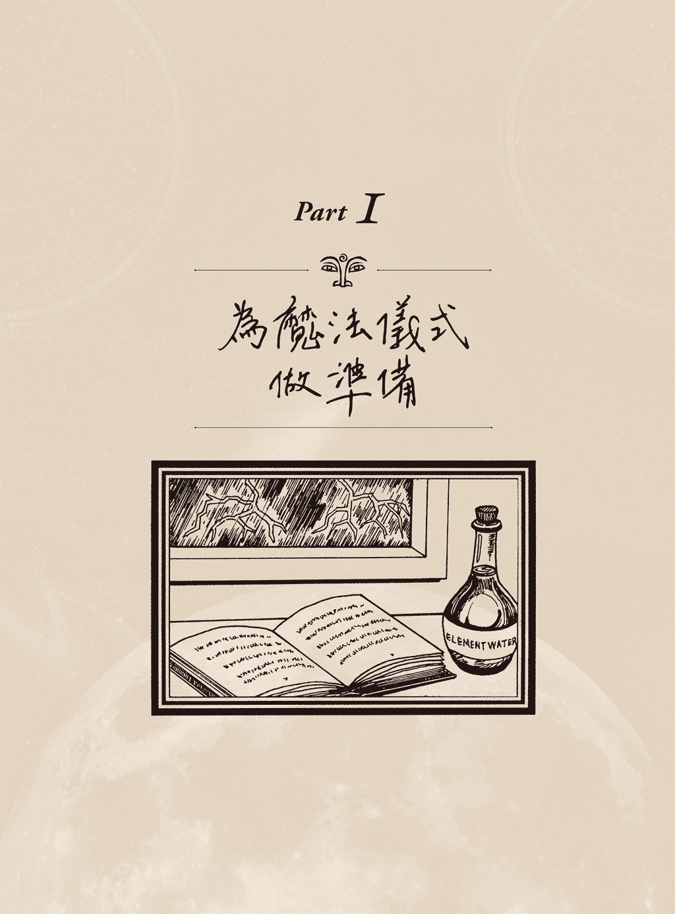

简介

魔法需要思考、准备和了解适当的使用方法，这样你才能为召唤的魔法点燃火花。组织良好的仪式是成功的仪式。配合大自然的元素、时机和特定的行星方位能让我们跟宇宙生命力能量同步链接。有智慧的施法者会等到一切都准备就绪后才开始，不会催促宛如隐形流水般的自然能量流。当你跟准备的细节工作达到协调合一时，你会体会到它们召唤出来的奇异神秘的特性。你努力做出有效率的行动后，你的努力就会得到良好的回报。

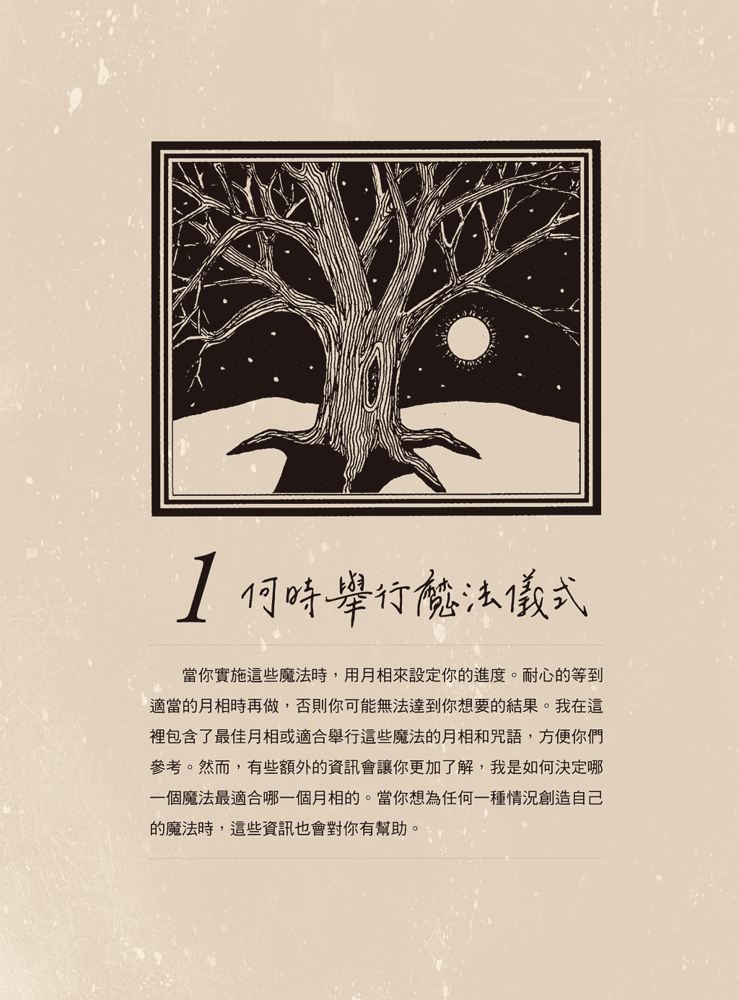

### 月相

★ 新月

当你看到空中刚显露出一道银白色的光芒时就是新月期，新月有时候也被称为峨嵋月。这个月相能促进新的开始、新事业和新的人际关系。这时适合做正向的改变，寻找事业的新机会，植入新观念的种子，等待未来得到收获。

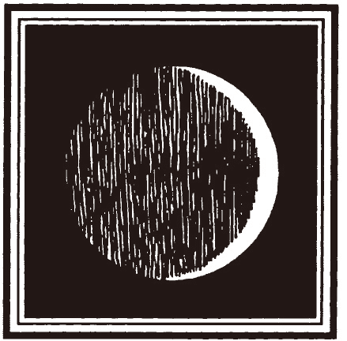

★ 渐盈月

在这个月相中，月亮看起来会越变越大，从新月变成满月，它好像逐渐得到力量。这样说很有道理，这时适合专注在增加你自己的事物——你的知识、银行帐户、人际关系。这时也适合考虑怀孕、增加所有类型的沟通，不论是生意上或是私人生活上的事务。如果你想在财务上获利，就要在此时处理这类的法律问题。这个月相也能促进疗愈。

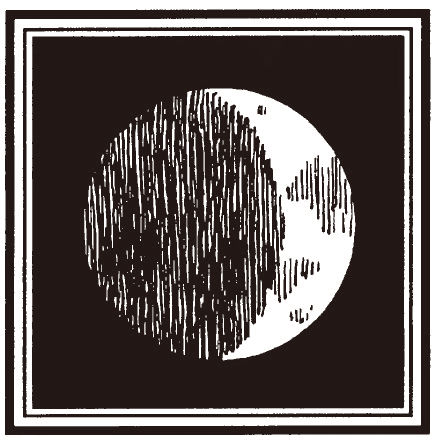

★ 满月

当我们看到她整张脸发亮时，这是月亮最强大的时期。这时是实现、活动、增强通灵力、改善点子、“调整改善你生活中的一切”、庆祝或是对某人或某个企划延续承诺的时期。这个月相适合任何一种魔法。

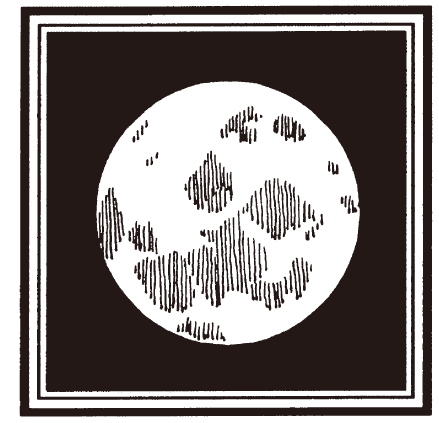

★ 渐亏月

月亮从满月变成暗月时会越来越小。渐亏月时期适合减少、释放、放下和完成。这是开始减重、改掉坏习惯、结束亲密关系或处理法律问题的最佳时期。

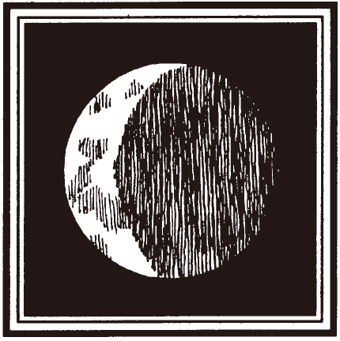

★ 暗月

这两三天在空中完全看不到月亮。暗月和新月经常被视为同一个月相，但为了配合我们的目的，我把它分为两个月相。在一般的月历上，暗月通常以黑点来表示。然而，从黑点的前一天开始持续到黑点的后一天都可以算是暗月期。这时适合丢弃生活中不想要的东西，深思你已经完成的事情，还有你将来想要完成的事情。周期中的这个时段适合找时间让自己独处，如果你有兴趣的话，这时也是闭关隐居的最佳时机。

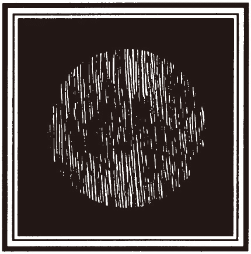

### 每年的月亮

每个月都有一个满月，若是某一个月出现第二个满月时，就被称为蓝月（Blue Moon）。每一个公历年都会有一个蓝月，古人为每个月的满月取了不同的名字。

不同的文化给了月亮不同的名称，表达月亮在那个月对他们的意义。有些月亮的名字很合乎一般常识，有的名字除非你了解它背后的逻辑，否则会觉得毫无道理可言。

│一月│

常见的名称：狼月（Wolf Moon）

不常见的名称：洁月（Chaste Moon）——新的一年开始时需要清洁和更新；这时适合从头开始，洗掉过去和迎接崭新的开始。

│二月│

常见的名称：冰月（Ice Moon）

不常见的名称：猎人月（Hunger Moon）——冬天的库存快用完了，猎人的灵魂和肚皮都在渴望春天的到来。

│三月│

常见的名称：暴风雨月（Storm Moon）

不常见的名称：虫月（Worm Moon）——地面的冰雪融化后带来新生命，蚯蚓松开土，在月光下从湿软的土里冒出来。

│四月│

常见的名称：成长月（Growing Moon）

不常见的名称：粉红月（Pink Moon）——春天的草地上布满粉红色的野花和嫩草。

│五月│

常见的名称：野兔月（Hare Moon）

不常见的名称：牛奶月（Milk Moon）——家畜和野生动物出生会带来母奶、生命的给予者，人类和动物的第一种食物。

│六月│

常见的名称：蜜酒月（Mead Moon）

不常见的名称：双子月（Dyad Moon）——这是属于双子座的月亮，这段时间是为了纪念双胞胎、天神和女神的神圣婚姻，让两者合而为一。

│七月│

常见的名称：干草月（Hay Moon）

不常见的名称：药草月（Wort Moon）——Wort 是代表药草的古字，这个月适合采集药草，为药草店补货。在炎热的夏天将药草晒干，储备给即将到来的漫长冬天使用。

│八月│

常见的名称：玉米月（Corn Moon）

不常见的名称：争执月（Dispute Moon）——大地之母生长出丰盛的食物，填饱了肚皮后，让人对持续生存满怀希望，我们可以结束争端，放下旧仇怨，展望即将到来的漫长和平的冬天。

│九月│

常见的名称：收获月（Harvest Moon）

不常见的名称：葡萄藤月（Vine Moon）——凯尔特最开心的月份，勤奋的工作得到丰收的成果，制作葡萄酒和对未来的展望。

│十月│

常见的名称：血月（Blood Moon）（打猎时期）

不常见的名称：脱落月（Shedding Moon）——这个月公鹿的角会脱落，开始往昔固定的习惯——创造新生命的冲动取代死寂的冬天。

│十一月│

常见的名称：雪月（Snow Moon）

不常见的名称：树月（Tree Moon）——凯尔特的芦苇树（译注：凯尔特人把高大的芦苇草当成树）和接骨木树（Elder tree）同时出现代表这个月是静默之月，适合做内心的功课和增强力量，接骨木树代表完成之月；一年到了尾声时，白昼也变短了。

│十二月│

常见的名称：冷月（Cold Moon）

不常见的名称：橡树月（Oak Moon）——古人的圣树，这种强壮的树木能够抵御最酷寒的冬天，新的一年重新开始，横跨故旧、阴暗的一年和崭新光明的一年这两个世界，正如橡树的根深入阴暗的地底，而树干和树枝都在天空中。

### 一周中适合举行仪式的日子

你在一周中的哪一天执行魔法也会对你的仪式产生某种影响力。一周的日子不像月相那么重要，然而，如果你能以正确的日子配合正确的月相会让一切变得更强大。举例来说，吸引爱人的魔法最好在满月、新月或渐盈月的星期五来做。但是，如果适合感情关系的月相不在星期五，也不要过度担心。你仍然可以举行这个魔法仪式，不要管那天是星期几。星期几就相当于在炖菜里加一小撮盐，可能会让菜更美味一点，但不会有什么太大的不同。不要为了等一切都完美就绪，结果等了好几个月。如果其他的事情基本上都很完美，你希望的那星期的日子却因为你那天刚好有更重要的事情要做而不方便。你能举行魔法仪式的那天对你就是最完美的日子。

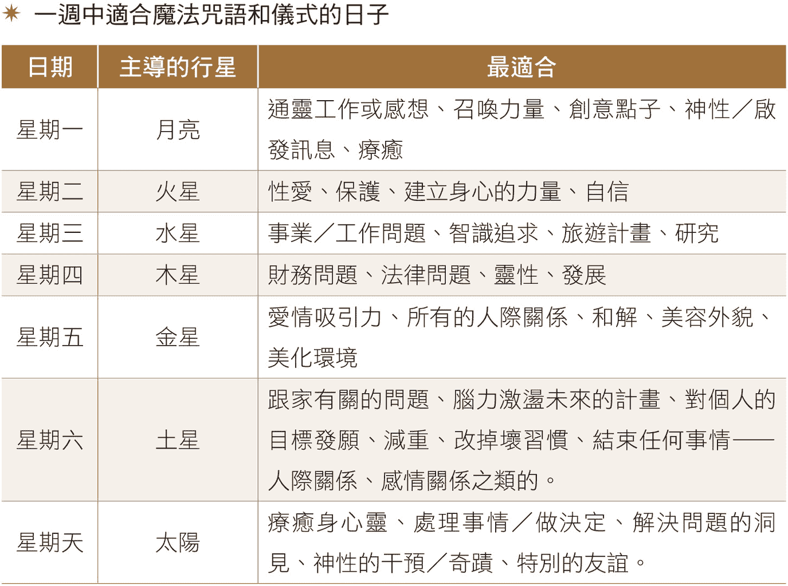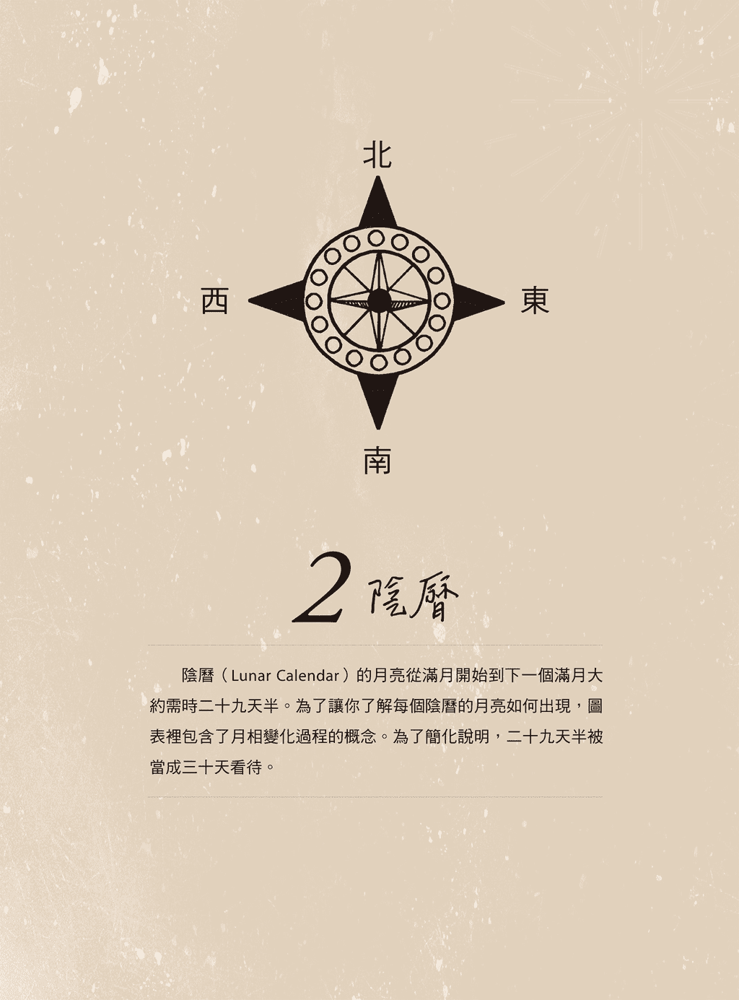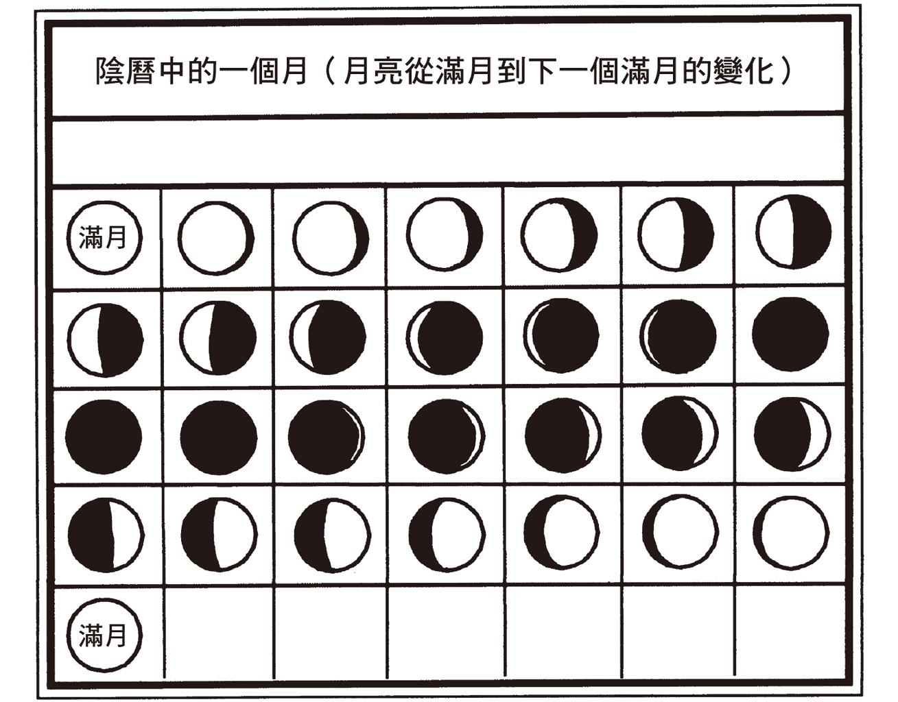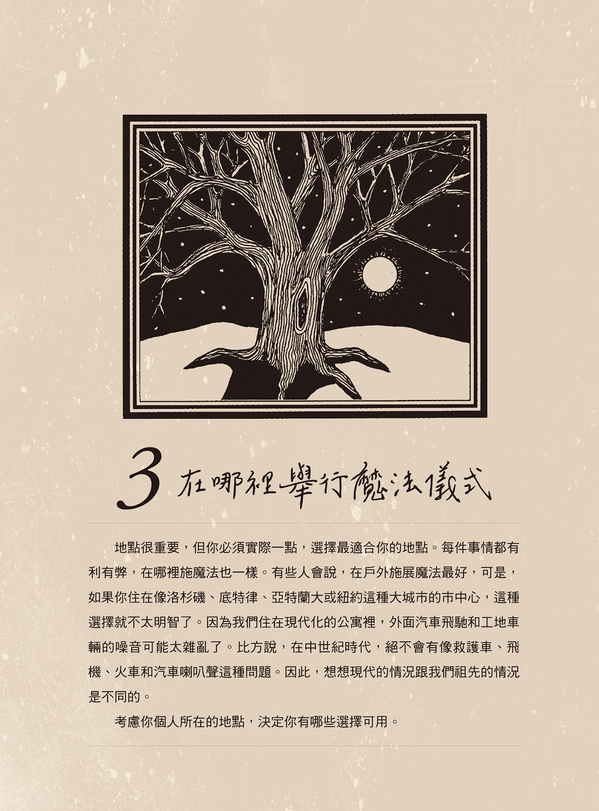

### 室内

在室内举行魔法仪式比较容易，因为不会有风老是吹熄蜡烛、你有电力可以播放音乐、有个人隐私，而且也很安全。

如果可能的话，当你要接通月亮的力量时，试着找一个能看得到月亮的地点。但最重要的是，保持舒适就好。如果你家有一个房间能让你看到月亮，但你在那里无法放松，那就不要使用那个房间。

如果你在某一天要举行魔法仪式，那个地方没有窗户或看不到天空，那就用代表月亮的代替品。用一张月亮的图片也很好（也可以自己画），或是任何能代表月亮的东西都可以。

你可以在大部分的园艺中心买到陶瓷做的月亮装饰品，或是用厚纸板自己做一个，任何你能拿到的东西都可以。一个月亮形的项链坠子或别针也可以。有创意一点，任何你感觉能代表月亮的东西对你都是完美的。

记住，你的隐私是必要的。除非是直接参与这个仪式的人，否则不要有其他人在场。如果你有一个大家庭，很难找到独处的空间，你可以使用浴室或厕所。这样说可能很荒谬，但我举行过最好的其中一个魔法仪式就是在假期旅馆的浴室里做的，当时我跟一个没有这类嗜好的朋友同住一间旅馆房间。

### 户外

在户外举行魔法仪式很棒，因为你的四周有大自然围绕。然而，大部分的人都没有能确保隐私的户外土地。即使在公园或海边，你也可能会吸引一些旁观者或路人。

在后院举行仪式是可行的，但如果你有很吵的邻居、爱吠叫的狗或可能会突然出现的送货员，那就不是好主意了。记住，你不应该吸引别人的注意力，谨慎一点，这样魔法的力量会比较有效。

如果你运气好，有能保护隐私的围墙或四周有很大片的土地，那你可以试试看。若是碰到风大的日子，可能不适合使用蜡烛。（详细资料请参考描述蜡烛的段落，看看要如何处理这种情况。）

不管你怎么做，请确保你一直都是安全的。如果你在晚上举行魔法仪式，老是担心有人会偷偷跑到你身边，这样就会打击这个目的。为什么要给你的魔法增加压力呢？

通常若有一群人参加的话，会比较适合做户外魔法仪式，可以衡量利弊之后再做决定。我在户外和室内都曾举行过魔法仪式，没有说哪一种会比较容易成功。不过，我不得不承认，如果你有机会在大自然中举行魔法仪式，那就去做，这个经验是很迷人的。

### 树魔法

对可以运用户外神奇世界中的树木的人，你可能会想在树底下或一棵特别的树附近举行仪式。有可能是一棵让你有“好感”的树，或是你找到具有独特性质的树木。我在我家后院的一棵橘子树下就举行过很多次魔法仪式。

许多文化的人认为树木具有治病的功能，能消除人类身上的负能量又不会伤害树木。因此有时候只是在国家森林公园或是当地的公园里散散步就能让人平静下来。

如果你在一棵特别的树附近举行魔法仪式，先感谢这棵树给你这种振动能量。美国原住民和其他文化的人相信一棵树是一个生命灵魂的化身。

不要觉得惊讶，但拥抱树木并没有一般人想像的那么不寻常。有时候一棵树具有我们需要的独特物质，像是我们体内耗尽的某些东西。因此，我们需要补充那种生命力。通常那些吸引我们的树木能够让我们恢复体力，又不会夺走它们自己的能量。

例如：如果你对爱情几乎完全失去了兴趣，因为你平常的生活经常工作过劳、常常出差旅行或是没有伴侣，你也许需要让自己多接近一下树木，甚至拥抱一棵橡树。据说橡树能增加人们的性能力！

“没有冒险就没有收获。”

以下是一张关于树木表达其特性和精华的小清单，据说这些是它们天生的本性。

．白蜡树（Ash）：祥和、保护、兴旺、实力。

．白桦树（Birch）：新的开始、疗愈伤口和烧烫伤。

．雪松（Cedar）：勇气、长寿、富裕、自信、净化。

．椰子树（Coconut Palm）：纯洁、荣誉、放松。

．柏树（Cypress）：前世的问题、舒适、保护、减轻失去任何人事物的伤痛。

．接骨木树（Elder）：转化和改变、安详的睡眠、自信。

．榆树（Elm）：保护和冥想、阻止诽谤。

．尤加利树（Eucalyptus）：疗愈、保护、月亮的协调性。

．紫丁香树（Lilac）：启动脉轮（能量中心）、治疗背痛。

．莱姆树（Lime）：占卜、发展、清洁。

．木兰花树（Magnolia）：忠贞、改变、放松和镇定。

．枫树（Maple）：长寿、爱、金钱。

．香桃木（Myrtle）：生殖、平衡、青春、富裕。

．橡树（Oak）：增加性能力、幸运、实力。

．梨树（Pear）：头脑清明、精力、自信、减少压力。

．胡桃树（Pecan）：事业问题和找工作、金钱、纪律。

．松树（Pine）：兴旺、净化、健康、驱邪。

．李树（Plum）：爱和疗愈、自信。

．白杨树（Poplar）：灵魂出窍、智慧、心理治疗、重新开始。

．核桃树（Walnut）：忧郁症、疗愈、治疗不孕症。

．柳树（Willow）：梦想成真、诱惑力、保护、为病人增加体力。

不一定要举行魔法仪式才能启动树木的魔法，你随时都能接触树木，把它们当作为你身心灵提供天然丰富的精神和体力的恢复剂。每次都要默默的点头向树木表达谢意，感谢它让你得到它特别的精华属性，感谢它吸收你的负能量。顺便一提，树木不会在这个过程中受到伤害——它能透过某些元素消除你的负能量，几秒钟就能让你神清气爽，活力充沛。

### 面对哪一个方向？

当你开始月亮魔法仪式时，另一个大自然的礼物和要考虑的重要因素就是要面对哪一个方向。施行魔法时，注意罗盘上的东、西、南、北方向非常重要。面对适当的方向时，你就能利用它提供的振动频率或能量。这四个方向的免费力量是经常被忽略的大自然礼物。

你也可以把四个方向当成四种风。你可以从东、西、南、北“激起这些风”。这表示你仍然站在面对某个罗经方位点的方向，但会召唤能量以一阵风的形式吹向你这边。若没有激起这些风吹动的话，生命力流动的力道会温和许多，通常这也是必要的。这得看是哪一种形式的魔法，看你只是面对某个特定的方向，还是面对那个方向同时又激起一些风动。你可以把它当成电风扇的两种段速来比较，虽然气流来自同一个源头，但你可以控制它吹到你这边的速度快或慢。

而且，记住，你其实很可能感觉不到你召唤来的风。然而，气流中无形的活动会来到你举行魔法的地点，带给你远超过你思想境界的力量。空气中其实充满了魔力！

我在本书的每一个魔法中会给你面对哪一个方向的提示。我也会建议你要不要激起这些风， 并提供如何祈愿的方式。此外，针对你自己创造的魔法，也有提供一般信息，我也会把来自每一个罗经方位点散发的振动频率细节包括进来。

北方（North） 跟地元素相应。健康问题、治疗身体和精神、增强或发展你的直觉力，使用某种形式的占卜，超越物质世界，尝试以心灵感应的方式与某人沟通、向你召唤的高层力量（某人或某物）寻求指引都可面向北方，这是最强大的方向。

南方（South） 跟火元素相应。爱情问题、任何一种人际关系、创意和艺术的追求、跟爱情或情绪有关的任何事情都可以面向南方。

东方（East） 跟风元素相应。事业问题、实力、头脑清晰、新的生意机会、财务问题和任何需要额外精力的事情、疗愈心智、新的开始，这些问题都可面向东方。

西方（West） 跟水元素相应。要放下过去和往前迈进、增加自信、原谅自己或别人、净化和无条件的爱可面向西方。

特别注意事项：若是心中有疑惑，不知道要面对哪一个方向时，那就面向北方，因为它是所有事务的根基。

如果罗盘指示的方向让你看不到月亮，不要担心，即使你背向她，月亮的能量仍然可以从你周围进入。尽量面向我在魔法中建议的方向，即使没有面向月亮也没关系。你只需要知道这个能量来自月亮即可。

在户外举行魔法仪式时，月亮在头顶上或几乎在头顶上方，对物质世界和魔法世界都比较好。这样一来，你从任何方向都能看见月亮。

我经常做的另一个建议是：有时候我在室内施展魔法时，我会从门口探出头几秒钟，看一下月亮，感觉跟她的联系感，然后再回到室内举行我的仪式。别担心……月亮的振动频率会透过屋顶、山脉、云层、雨水、白雪，甚至通过住在你楼上的那些人渗透下来。

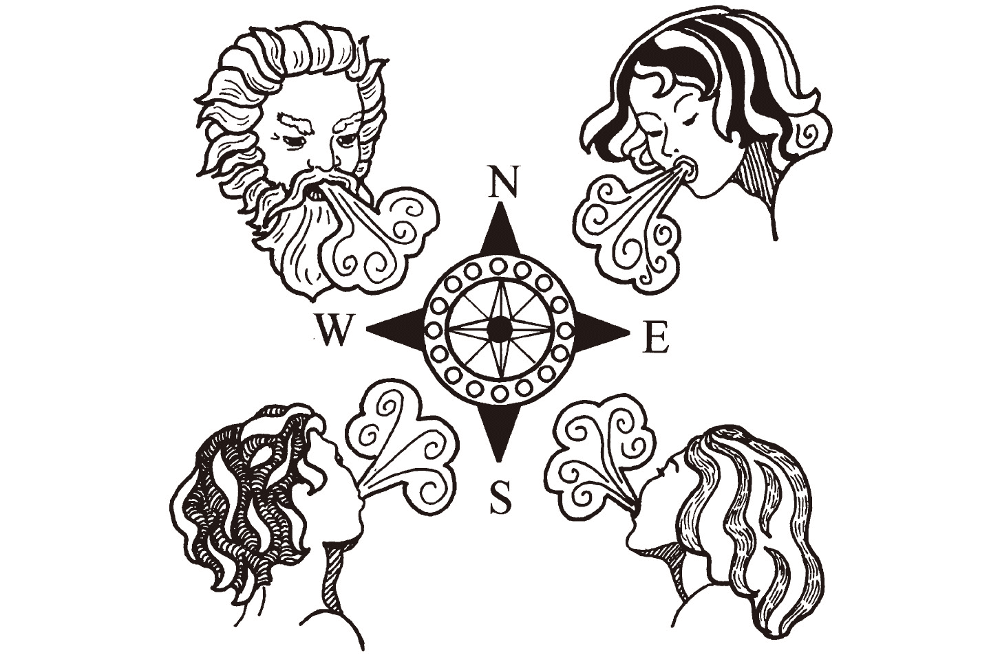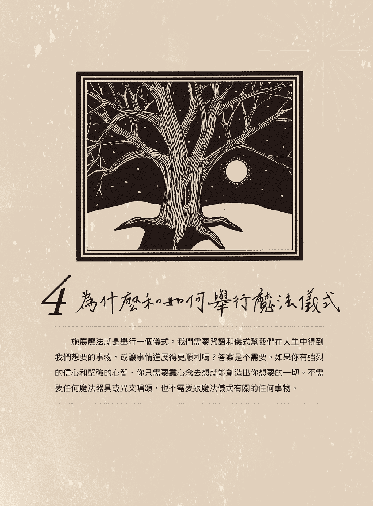

那为什么我们还要这么做呢？有很多种原因。举行仪式是向我们的潜意识求助，这个动作本身会让我们慢慢进入一种警醒或是入神的状态，能让我们对自己想要的事物进入一种更专注的心智状态。这样能创建一种渐进渐强的企图心和意志力。

魔法仪式从准备我们的魔法器具开始，比方说准备蜡烛、香品和其他的必需品。这些器具或强化物是象征性的——它们会配合你的潜意识，告诉你何时要从物质世界进入魔法世界。当我拿起仪式用的刀子时（威卡教称它为仪式刀 Athame），我能感觉到自己进入到一个神秘的境界。当我摆放蜡烛时，我可以感觉到室内的能量在改变。你一定要从头到尾都能体会到每一种感受和情绪。你在仪式中做的每一件事背后都有某种意图，你一定要明白你正在创造一个让你施展咒语的魔法领域。

当你创建出某个阵法时，你会进入更深层的潜意识中。每一步都会带你进入越来越深、脱离了世俗界的境界。在你为仪式念诵咒语时，你“强大的力量”会提升到一种能产生巨大能量的高峰点，精神完全聚焦于你想要的事物上。

举例来说，为了找一个想要的工作而举行魔法仪式，远比坐在家里空想着：“天啊！要是我明天能得到那个工作就好了。”的效果好多了。你其实是将这种振动频率传送出去，让它飞到宇宙太空中，将现实物质带回来给你。你是在提升自己的能量。

再说，举行魔法仪式能让你做一些具有建设性的事情，而不是在为某件事情烦恼担忧。我认识一位来自北卡罗莱纳州艾希维尔市的女士就证明了这点。她向一间银行申请贷款，成功的机会可说是“极为渺茫”。那天是星期五，她要等到星期一才能知道结果。她星期五晚上打电话给我，说她正在不停地来回踱步，吃了好多东西，感觉神经紧张到极点。我推荐一个魔法给她。她星期六整天都在准备仪式需要用到的东西，到了星期天下午时，她举行了这个魔法仪式。整个周末就在不知不觉中过去了。

与其不停的烦恼忧心当前的处境，她感觉自己在做能增加贷款机会的事情。她说她不确定自己真的相信这样做会管用，但感觉值得为此付出这些精力，因为反正她也无法专心做其他事情。光这个就足以做为举行仪式的好理由。

星期一下午，负责这笔银行贷款的人打电话告诉她，她得到贷款了，因为他们决定要给她开一个特例。是这个魔法生效了，还是事情本来就会这样？她说，不管怎么样，做这个魔法仪式显然不会有坏处。而且，如果你太过担心，认为很可能会失败，那你就会创造出失败的结果。她将紧张的能量转到创造她想要的结果上。

有些人举行魔法仪式纯粹是为了好玩。如果你是跟团体一起举行魔法仪式，这是聚会社交和运用创意才能的绝佳理由。这也是一种能让人联系感情的方式。以个人来说，我把魔法看成很严肃的事情，不只是为了好玩才这么做，但我并不常举行魔法仪式。当你决定要施展一个月亮魔法时，应该是因为现实的需要才做。

不要太常举行魔法仪式，如果你很认真看待它的话，应该是为了特殊情况和特殊的理由才做。

正如先前提到过的，学习何时举行月亮魔法是最重要的。预先做好计划，让自己拥有所有的优势。

### 如何举行魔法仪式：事前的准备工作

．决定你要使用哪一种魔法咒语。如果你要写自己的咒语，那就在施法的前一天写下来，万一你考虑了一两天后想改变，还有时间可以修改它。

．检查一下，确定你是否已准备了所有的器具或强化物。你不会想在举行这些仪式当天的一小时前，突然跑去外面的店里买东西。在举行仪式的当天，你应该尽量放轻松。

．事先找好你要创建阵法的地点。

．选好你当天要穿的衣服，并确定衣物已洗干净，随时可以穿戴。

．在你的行程表中清出一个空档，这样你才不会太匆忙。

．如果这个魔法仪式是要在家中举行，先把这个地方清扫干净，这样你就不会太紧张，或是担心稍后还要做家事。

### 举行月亮魔法的当天：基本程序

1\. 关掉所有电话、传呼器和任何会干扰你的东西。

2\. 把会打断仪式的宠物放到另一个房间。

3. 如果你事先安排了保母，那就把小孩送去保母家，或者请家人在你预计仪式可能使用的时间内，不要来打扰你。至少要半小时的时间。

4\. 冲澡或泡澡。

5. 拿出你的器具和强化物，走到你要举行魔法仪式的地方，要确定你有准备好你的魔法。

6\. 如果你要使用音乐的话，你可能会想在做准备工作时开始播放。

7\. 移动家具，给自己所需的空间。

8\. 把所有的器具都放在你准备使用的空间内。

9\. 根据指示创建你的阵法，根据图表摆放你的蜡烛和宝石。

10. 放轻松，观想你的身体受到明亮的白光保护，看到白光从你的脚趾往上流到你的头顶上。不仅阵法能保护你，白光也是让你不受负能量影响的额外防护罩。

11. 坐下来，当你觉得情况合适时，念诵你的咒语。你可能想在念诵咒语之前听一下音乐，也许你想安静的坐一下，做好心理准备。

魔法特定的指示会引导你，可能要在纸上写某些东西、或从圣杯中喝葡萄酒或果汁之类的。

1. 等你完成魔法仪式之后，静坐一段时间，你想静坐多久都可以。熄灭所有蜡烛，打开你的阵法，解除它，立刻离开。（请参考阵法的段落，查看如何打开和解除阵法的方法。）

2\. 拿走所有的强化物品，按照次序把东西放回原位。

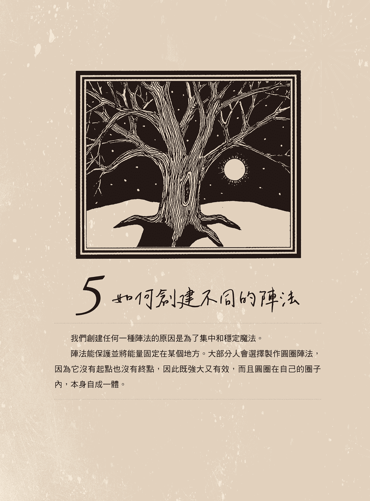

然而，我发现先制作圆圈阵法，然后在里面画三角形或正方形也很强大，圆圈能保护不同类型的魔法。因此，我会为每一个魔法建议使用三种阵法之一。如果你对在圆圈内使用三角形或正方形觉得不自在，那就只要使用圆圈就好。记住，绝对不要只使用正方形或三角型，一定要在你的圆圈内使用。

正如我先前说过的，这一切都由你自己选择，如果你感觉不对，那就不应该强迫自己去做任何事。如果你不确定哪一种阵法最适合你，那就实验看看。让你内在的高我来引导你，遵从你收到的指示去做。在本书中的魔法部分，我为每一个特定的魔法推荐了适用的阵法。然而，你可以改变它，记住，这是你的魔法，所以应该按照你的意思去做。

### 用有形的物品创建阵法

你的目标是要创建一个圆圈、三角形或正方形，让你自己，或者你和其他人可以坐下的地方。其中一种方式是使用有形的物品制作看得见的阵法。有些人喜欢使用看得见的东西以有形的方式来界定一个区域。盐巴是很棒的选择，因为它代表保存、净化和强化魔法。像是鹅卵石、贝壳、石头、树枝、花朵和沙子这类大自然的礼物都是创建阵法的迷人物品。我也见过有人使用塔罗牌、水晶和蜡烛来做。如果你在室内举行仪式，你可能不想使用任何会弄脏地板或地毯的东西。在户外时，最好使用不会被风吹走的东西比较好。我在冥想园中有一个用砖块做成的固定圆圈，我常用它来举行仪式，当我施展魔法时，只要召唤能量就好，这个我稍后会在章节中再详细讨论。

### 用观想的方式创建阵法

如果你不想选用任何有形的物品，你可以用想像的方式创建阵法，画出无形的界线。

以这种方式创造阵法，是用某种可以让你从身体延伸出去指引画线的物品，例如魔法棒、水晶或刀子。基本上来说，你是使用某种神秘的绘画铅笔。如果你使用刀子，这把刀不能用来切任何有形物质，只能当作仪式的用途。如果想到刀子、匕首或长剑会让你产生任何不舒服的感觉，那就不要使用它。而且记住，这把刀可以是一把钝刀，因为它只需要用来导引能量。

我有一位朋友用一把很漂亮的拆信刀来创造魔法的阵法，有人可能会觉得很好笑，但她用这把拆信刀做了一些很棒的魔法工作，就算拿兰斯洛特爵士的宝剑跟她交换，她也不愿意换！你也可以试着使用长条形的水晶，或将水晶固定在一根棒子上或一根铜管上（铜管是一种导体），制作你自己的魔法棒。

如果你觉得找工具（例如剑）来指引能量让你觉得不舒服，那就伸出手臂来画阵法。比出你的食指和中指来导引能量，画出想像的隐形阵法。

你也可以合并两种不同的方法，用观想创造出一个圆圈，然后用像盐巴或石头之类的有形物质来创建内层的阵法。或者，用实质的物件来创建圆圈，用观想来画内层的阵法。

有很多不同类型的工具可以帮你创造出隐形的结界。如果你决定要使用工具，而不是伸出的手臂，那就要把这些工具放在一个安全的地方，一个让你保持恭敬庄严的地方。如果你喜欢的话，在你使用工具之前，先用元素水祝福它，或放在满月的月光下吸收能量并净化。

### 如何创建阵法

当你决定好要使用哪种物品来创建你的阵法后，你可以开始创造圆圈、三角形或方形。将你的魔法仪式需要的所有器具和强化物放在附近，一切都要事先做好规划，开始前都要先想好。当你制作好阵法之后，最好不要因为忘了某个东西而离开圈子。如果你要坐在椅子上，椅子就应该事先放在你要创建阵法的地方。如果你使用器具或强化物品，这些东西应该放在桌子上或放在随后要制作阵法的地面上。

★ 白光防护

在你创建阵法之前，先运用“白光”防护法，观想你的四周有一团保护你的白光。这团白光会保护你不让负能量侵入你的体内，看起来可能像一团云、一个灯塔的光、一个椭圆形，或任何你感觉白光应该是什么形象都可以。

白光应该包围你的整个活动范围，至少是你将要创建阵法那个区域的尺寸。例如，如果你要制作一个大约六英呎乘六英呎的方形阵法，你的白光防护罩应该要包含你全身周围六英呎内的范围。如果圆圈是九英呎，里面若要坐五个人，那你的白光护罩应该要从每个人的身体往外延伸九英呎。

要接引白光防护罩时，站在你的魔法仪式地点，闭上眼睛，观想白光从你头顶上方流下来，最后包围你的全身。它进入你的头顶，慢慢的往下流到你的脚趾，再往外扩散。它应该要扩散到阵法的最外缘，如果跟别人一起做时，他们都应该使用这个白光防护法来保护自己。

★ 画阵法

接下来，朝你最后要举行魔法仪式的方向站立，以顺时针方向进行，每次要创造阵法时都要先做一个圆圈。然后也是以顺时钟方向制造三角形或正方形，撒盐巴、摆放石头或你选择制作阵法的任何物品，直到你画出完整的阵法，同时回到起点为止。如果阵法不是很完美，不用担心，可能有一两个地方线条歪了点，但这不会有影响。选一个人当施法者（制作阵法的人）或引导员，其他人则各自找地方或站或坐，直到阵法完成为止。要示意阵法已经完成时，请每个人提升这个空间的能量，此时会念诵某个文句表示这个程序已经完成。

当你念下列的句子时，保持站姿，举起双臂，手掌向上，仿佛要将地上的能量往上托起来那样。

说“这个 ________（填上圆圈、三角形或正方形）以全知的眼睛施法，能带来力量，愿能量升起。”如果你想缩短句子的话，只要说“愿能量升起。”

这个时候你可以坐下，按照指示开始你的魔法仪式。

★ 在你需要离开时，打开和关闭阵法

如果因为某些原因，在魔法仪式结束之前，你不得不离开阵法，那你必须制造一个隐形的出入口让你离开。不管你是用石头还是魔法棒，都应该制造一个出入口才能离开。举例来说，如果使用贝壳制作圆圈阵法，站着伸出右手的食指和中指（像在祝福的样子），在贝壳的上方以你觉得舒服的高度和足以让你通过的大小宽度画出一个出入口。

你已经做出一个隐形的门后，就从贝壳上方跨过去离开。

不要踩到任何你用来制作阵法的东西——每次都要从上方跨过去。走到外面之后，立刻以同样的方式把圈子关起来。当你要再次进入，回到圈子内时，以同样的方式打开和关上圈子。

这个动作应该只会花几秒钟，因为只要挥一下手臂就能制造出隐形的出入口。

虽然不建议你在中途离开，但这种事情难免会发生。有时候我们忘了拿点蜡烛的打火机或是忘了拿写好的咒语等等。或者门铃响了，我们别无选择，只能去开门。然而，如果你离开超过十分钟的话，你这个区域的能量会消失，你应该重新开始。记住，你是这个阵法的能量之一，你不在这里的话，它无法呼吸太久。如果发生这种事，也不会有什么坏处，就像壁炉里的木柴烧完了那样，它只是自然消散了。

★ 结束时解除你的阵法

每件事情完成后都需要关闭起来，阵法也一样。当你完成魔法仪式之后，你必须解除这个阵法的能量。要做到这点，举起双臂，手掌向下朝向你的肩膀上方（好像准备要跳水的样子），以温和推压的动作，慢慢放低你的手臂，观想能量向下回到地底。

说“能量解除了”或是像这类的结束字句，“完毕”或“结束”。

### 圆圈

圆圈是最重要的阵法，因此其他所有的阵法都是在圆圈内才能施展。这是有原因的，因为这样才会成功！它能完成任何魔法的需要，以美丽卓越的方式达成必要的工作。

它提供防护罩，也是一个能联系你所知的上帝、天神／女神、宇宙生命力能量、指导灵、天使或扬升大师的地方。它也适合纯粹当作平衡和接收灵性或来自你内在自我讯息的地方，不需要使用任何咒语。有时候我不为任何理由制作了一个圈子，只是想坐下来放松一下，不是要释放任何能量或汲取任何能量。我不想要给或取……我只想“单纯坐在那里”。

（请在本书的 P.181 找“用于任何目的的魔法仪式”。）

注意：当你有疑虑不知道该用哪一种阵法时，那就使用圆圈阵法。

圆圈代表：圆满、宇宙的生命力、力量、成就、平衡和情绪。

单人定位：坐在圆圈中央，面对魔法建议的方向，或是你觉得舒适的方向。

团体定位：一定要朝圈子内，面向彼此。如果只有两个人，那就两人面对面。如果有三个人，就在圈子里成三角形定位，你们自己决定谁要坐在哪个位置。四人或四人以上，每个罗经方位点坐一个人，其他人填入中间的位置。如果人数允许的话，可一男一女穿插着坐。没有任何人可以坐在正中间，背对其他人。引导人或是团体领导的位置也应该跟其他人一样。

### 三角形

金字塔是三角形，身心灵是三个一组，基督教的三位一体是“圣父、圣子和圣灵”。在不同的信仰系统中，月亮的三个月相是女神的三种面貌：“少女、母亲和老妇”。少女是渐盈月，母亲是满月，老妇是渐亏月。

我们能看到从古代文化到现代的象征学中，三这个数字的力量。三代表多数和丰富的意思。

古希腊的数学家毕达哥拉斯（Pythagoras）说，三是一个完美的数字……有开始、中间和结束。

在神话学中，与一组三位有关的神被称为三合一神（triad），例如神话中的三联神、三相神等。

在日常的对话中，我们也会自己组成三合一的字串，使用这类的字串：动物、植物、矿物——土地、空气和大海——宽度、深度和高度——这里有说不完的例子。三真的是一个神秘的数字，运用在魔法时，它的力量很强大。

三角形代表：自我创意表达和艺术追求、灵性、力量和高级能量、通灵力、灵体出游和占卜。

单人定位：坐在三角型的基座，面对魔法建议的方向，或是你觉得舒适的方向。

团体定位：一定要朝圈子内，面向彼此。如果有两个人在场，一个应该坐在三角型的基座左边，另一个坐在右边，让三角形的尖点留空。如果有三个人，每个人应该坐在三角型的其中一个位点上。如果超过三个，这三个位点坐满后，其他人选择自己舒服的地方穿插其中。

### 正方形

建筑物是四边形，一张桌子有四支脚，地图上有四个罗经方位点。所有的四代表稳定。用正方形举行魔法仪式的力量虽然不如圆圈和三角形，然而，当你为了例如工作或事业的问题举行魔法仪式时，用正方形最好。这是一个非常特定的阵法，我把它当成一种“严肃”的阵法。

如果你想要爱情，绝对不要使用正方形。虽然感情关系中也有稳定的因素，但正方形大部分都属于事业工作。正方形是建筑的上好根基，对买房子或建筑有关的魔法，正方形是最理想的选择。

如果你想让某个想法变得稳固牢靠，这是你应该选择的阵法。

有时候画正方形阵法的人容易成为工作狂：很实际、效率高和组织力强。所以如果你在人生中不容易成功，或者有点偏向懒惰类型的人，正方形的能量或许能帮你达到平衡。如果你是野心很大、精力旺盛和勤奋工作，但财务却很空虚，“运气”似乎不太好的人，那正方形也是个好选择。

正方形代表：稳定、工作和事业，所有跟生意有关的事、法律问题、金钱问题和组织的事情。

单人定位：坐在正方形中央，面对魔法建议的方向，或是你觉得舒适的方向。

团体定位：一定要朝圈子内，面向彼此。如果只有两个人，应该相对而坐，一个面向北边，一个面向南边。如果有三个人，在正方形内的三角点坐下。两个坐在三角型的基座点，第三个人坐在三角型的尖角点。如果有四个人，每一个人分别坐在一个罗经方位点上，而不是四个角的位置。如果超过四个人，罗经方位点坐完后，在穿插其中，如果人数许可的话，男女穿插着坐。

不管你是制造圆圈、三角形、正方形阵法，或是你自己的阵法，如果你坐的时候充满信念，具有认真的意图和严肃的心态，你应该能感觉到这个区域内有不同的能量。你创造了一个自己的神秘地点，一个属于你的独特地点——一个别人无法占领或复制的地方。如果你跟别人在一起，你们合力创造了一个任何团体都无法匹敌的地方。这对你们来说就是最完美的地方。

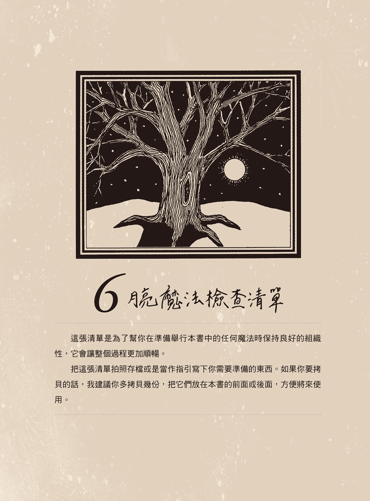

请不要在这一页上写字

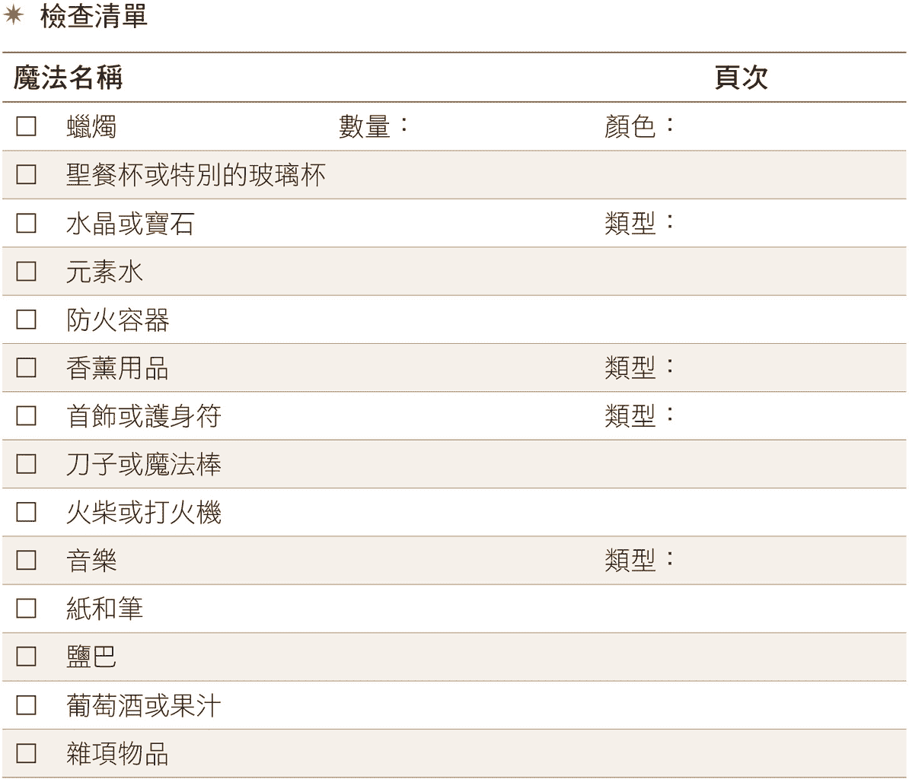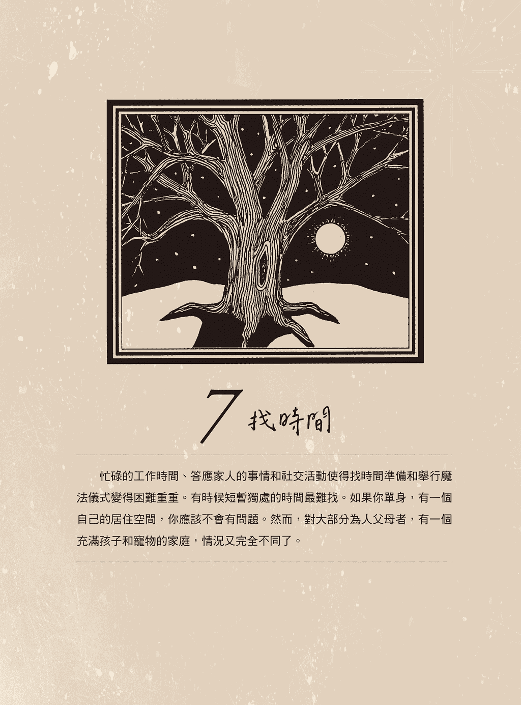

晚上的时间是最佳的选择，也许，当家人都入睡后，你可以多花点心力在某个时间起床，比如说，凌晨两点钟，自己起来举行你的魔法仪式。清晨的时候，地球上的能量较低，因为大部分人都睡觉了，混乱的能量是最低的。事实上，研究报告显示，因为这个原因，我们在大约清晨四点钟时，通灵力是最强的。如果你容易在半夜睡觉时因预感和直觉兴起的念头醒来的话……查看一下你的时钟，那时很可能在清晨四点钟左右。

如果你不太可能大清早起来，那你可能得在白天或晚上牺牲一些与人约会的时间来举行魔法仪式了。举例来说，如果你每个礼拜都会跟某个特别的朋友吃午餐，或是去上陶艺课，你可能得牺牲这个约会，利用这个时间来施展你的魔法了。

本来花半小时准备家人的餐点，这时可改叫外卖或用微波炉加热冷冻食品。一般的魔法仪式大约花三十分钟到一个小时，看你想做得多复杂，还有你想花多少时间静坐冥想和完成魔法仪式后想花多少时间回顾反思。做任何事情都不要太匆忙，施行魔法不像赶着去超市匆匆忙忙地买东西，以最快的速度准备食物，只是为了填饱肚子。这是一种神秘的、魔法的、灵性的仪式，你可能会因此获得超越你想像的好结果，像这样的好运气是不能赶的。

我最近做了一个安排，准备跟一位朋友在下周举行一个魔法仪式。结果他却出乎意料的突然送东西到我家，然后问道：“既然我人在这里了，我们能不能花个十分钟做那个魔法？”他一点都不了解这个过程。你必须慢慢的累积能量到举行魔法仪式的当天。这种期待和准备都是创造你想要的事物并将它变成结果的其中一个过程。

部分的力量来自于培养上升的能量，当你做好决定要举行哪一种类型的魔法仪式时，这个过程就开始了。

若有必要的话，请一位保母或找一个朋友帮你照顾小孩或宠物一段时间——做这样的努力是值得的。有人还会为了举行一个魔法仪式而跟公司请假。

如果你没去上班，我不保证你失去的金钱会因使用一个魔法而赚回来，但如果你对这件事情很认真，你就会找时间去做。我见过有人租汽车旅馆房间，就为了离开个人的生活环境，不被旁人打扰。如果你别无选择的话，也可以问问朋友，看他们能不能把他们家借你一个小时左右，这样趁他们去逛街的时候，你就可以举行魔法仪式。

你会有办法找到时间的。

你的情况可能没办法关掉手机或电话，找到完全安静的时间。如果是这种情形，你一定要多使用右脑来运用你的创造力。正如我在前面“在哪里举行魔法仪式”这个章节里提到的，如果你家的卫浴是你唯一能独处的地方，那你就只能在这里做了。如果无论如何你只有这个选择的话，宇宙是不会觉得受侮辱的。有时候也可以使用车库、地下室或阁楼，除非有人找你，想知道你在干什么，不然应该是没有人会去打扰你的。

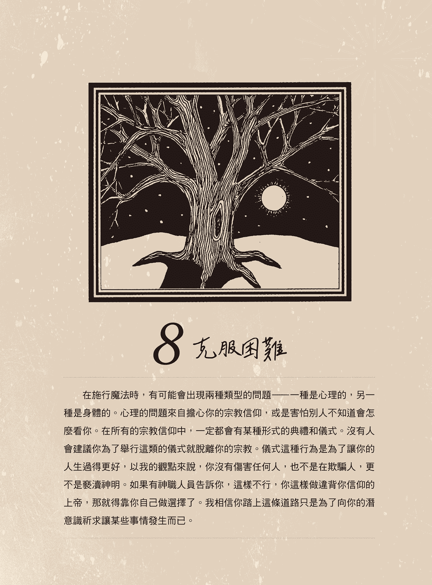

我有一些好朋友和客户奉行犹太教、天主教、佛教，什么宗教都有，他们都在使用魔法来改善他们的生活。不过，他们不会走到镇上的临时表演台，对全世界宣布他们私人的活动。他们在心中明白了其中的道理，也不会为此感到罪恶或愧疚。

这也就是说，要不要跟别人讨论这种事情由你决定，不过，如果你跟一些会嘲笑这种事的人住在一起，我就不建议你跟他们谈论此事。这不是因为做这些事情有什么不对，而是因为有些人会害怕他们不了解的事物。

这种玄学的事情具有争议性。我听到有些施行这种魔法的人碰到的最大困难是，他们的配偶或家人不赞成这种活动。有时候这些人希望你跟他们有同样的看法，不想要你去实验和尝试不同的事情。碰到这种状况不太容易处理，我曾见过有人因为奉行这种玄学的信仰而离婚的。可以运用一般常识去处理，正如人们常说的：“让你的良心来引导你。”

信仰系统和生活方式是属于个人的，在同一张地图上找不到两条通往同一个目的地的道路，因此，尊重别人的观点，不要试图说服别人改变他们的信念，转而相信你的哲理。对你个人的灵魂探索保持沉默，寻找其他能让你创造一个成功和圆满人生的方法。何必大肆宣扬这种事情呢？

我们都有权利去探究新的兴趣，如果你身边的人不同意，你也许要考虑到别的地方去举行你的魔法仪式，或是对你做的事情保持隐密。最重要的是，不要去做伤害别人肉体、心理、情绪或灵性层面的事情。

以前我在亚利桑那州塞多纳市（Sedona, Arizona）租屋时，我遇到一位住在同一条巷子的七十几岁老太太。她是个很亲切迷人的女士，我们很快就成了朋友。我告诉她说，我是个作家，她问我写什么书。当时我正在写一本关于祈祷和精神力量的书。我总结这个题目，说我在写一本关于灵性的书籍，事实上，这也是事实。不过，我并没有透露，我是第三代的灵媒或我相信玄学这种事情。

当我们开车经过塞多纳漩涡时，她开始谈论她所谓的“新时代（New age）”事物，以这个定义来说，我绝对是她形容的这种人。我很喜欢她，所以没有做出任何评论，也没有捍卫新时代的想法。

我感觉这样最好，我发表评论能证明什么？又能得到什么结果呢？我并没有说谎，我只是选择不予置评，既不说好也不说坏。我最大的优点就是知道何时可以跟哪些人讨论哪些事，何时不要讨论。我不希望别人说服我相信他们的信仰是最好的，而且除非别人问我和表示感兴趣，否则我也不会跟别人讨论我的信仰。

不管怎么样，尽量谨慎对待这种敏感话题。如果你住在一个会看不起施展魔法这种事情的家庭中，那就敏锐观察情况，尊重别人。以有格调的方式处理这种情况，并向别人展示，你跟他们不一样，不会像他们评判你那样的评判他们。

如果你对使用魔法开始觉得不自在，这不值得你牺牲内心的平静，我会建议立刻停止。如果你喜欢这种想法、仪式和结果，请继续做下去。只要你不伤害别人，你可以尽量忠实自己。如果这些魔法为你带来好处，你可能会想跟志同道合的人分享它。

当你使用魔法时，另一个你可能需要克服的困难是，如何在物质层面让事情更成功。如果你住的地方很小，认为你没办法创造一个圆圈，因为衣柜或床挡住了你，这也不是问题，你可以在任何障碍物上方创造阵法。当然，你得使用观想法的技巧来创造阵法，而不是使用像盐巴之类这种有形的东西了。在某些地方你可能可以使用蜡烛或其他物品，但改用别的方式，你会惊讶的发现自己能完成的事情蛮多的。

当你在户外举行魔法仪式时，天气也是一个问题。我在堪萨斯市演讲时，有人对我提出一个问题。下雨时可以在户外举行魔法仪式吗？

我的答案呢？如果没有闪电，为什么不行呢？如果你想在微雨飘落的时候坐在户外，你可以把它当作在为你的魔法添加水元素，增添了额外的能量。有人可能会把雨水当作一种净化和清洁的方式。

对我来说，下雨时坐在椅子上或坐在地上努力集中注意力时，如果淋雨不太能让我感到平静，我宁愿进屋去，或将整个计划改期。这是个人喜好，你要记住的基本原则是，如果有什么事物会打扰你专心，这样只会徒增自己的压力，那又何必呢？

关于宠物：举行仪式时，不是每个人都有单独的房间可以放宠物。你可能会觉得在举行魔法仪式时把宠物关起来是不对的。有时候动物会抓东西、吠叫，或做它们不高兴时会做的动作来跟你抗议。如果你的宠物是安静型，会静静地坐在一旁，你觉得你想要这个安静的宠物成为你仪式的一部分，那就让它们加入。最重要的是，如果有动物在你身旁会比跑来跑去，在你的阵法中进进出出容易的话，那还是让它待在阵法内比较好。

你可以将你最喜欢的宠物取代一个人的位置吗？这样是不是就有一个团体仪式了？不，除非它了解这个仪式是要做什么的，而且能专心去想同样的意图。

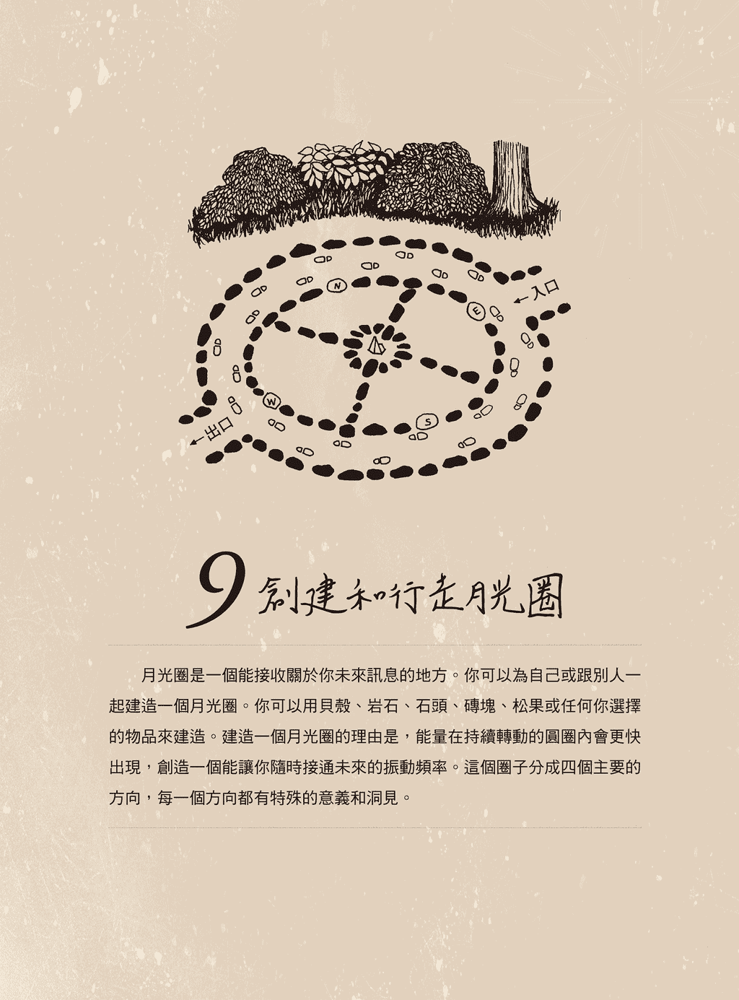

月光圈能提供一个让心诚的人可以解决问题的地方，让人能更加了解某个情况，同时也能预知未来的事件。在月光圈中，你可以吸引宇宙生命力能量，接收讯息，预防不和谐的事物进入你的生命中。它就像一面魔法的镜子，能让你看见未来。

美国原住民传统教我们使用医药轮（Medicine wheel），基本上有一些相似之处，但却极为不同。我非常尊重医药轮，感觉它是疗愈和平衡的强大工具，然而，不应该将这两种东西混为一谈——医药轮比较复杂，需要对美国原住民的信仰有更深入的了解。

### 如何建造月光圈

你可以做一个临时的月光圈，如果你住的地方有宽敞的土地，也可以做一个永久固定的月光圈。如果你有能力在户外的大自然中制作月光圈的话，你会跟大地取得额外的联系。然而，如果你没有这个机会，你也可以在你的客厅或另一个合适的室内空间建一个月光圈。

选择你要建造月光圈的地点，可以只是一个让你“感觉良好”的地方，你可以用某种石头或标示物标出四个罗经方位点——东、西、南、北。接下来在中央制造第二个小圈子包围你的水晶、石头之类的东西。中央的圈子是能量的中心点，你也可以制造第三个最大的圈子，这个包围两个内圈的大圈子能提供一个环绕内圈的走道，将能量保留在那里。按照第 61 页的图示指示，记得要在东边留一个入口或开口，让你进入，在西边留一个出口，让你离开。

若是要制造临时的月光圈，你需要用到五颗石子、水晶、贝壳、砖块或是你手上可用来标示这个地点的任何东西。

首先，在每一个罗经方位点上各放一颗石子，一颗放在中央。虽然这个看起来可能会像十字架，但你一定要观想有一个乙太的圈子链接外面的这些石子。

在你心中记住这个圈子的大小，如果你打算独自施展魔法，一个小圈子就可以了。如果你打算跟某人或其他人一起施展，那你就需要制造足以容纳所有参与者的大圈子。同时你也要考虑到你们怎么安排座位的问题。不是每个人都能盘腿坐下或自在的活动。若有必要的话，可以实际点，在你开始举行仪式之前，在圈子内放几张椅子、凳子或坐埝。在户外时，我有时会使用大型的原木块当作椅子。

### 如何绕月光圈行走

当你的月光圈建好之后，从东边进入月光圈，因为这是太阳升起的方向，这个方向能打开所有的信道。你将从西边出去，因为这是太阳下山的方向。如果使用三个圈子的构图，那你应该已经制造了一个能通过的出入口。

接下来，你应该净化自己和这个圈子。你可能会想使用白鼠尾草做的烟熏棒作为净化的方式。在大部分的健康食品店或新时代商店都能买到白鼠尾草烟熏棒。点燃鼠尾草烟熏棒，熄火后让它冒烟。当它开始冒烟时，在你身体的前后和四周移动，当作清洗的方式，你是用烟来沐浴自己。如果有其他的参与者，也要为他们烟熏，让烟在他们四周环绕一圈。有人会使用散装的鼠尾草，放在贝壳上点燃，用羽毛来吹散烟雾。然而，使用鼠尾草棒通常很容易，因为它不需要使用其他的工具。然后以同样的方式烟熏这个圈子，让烟雾弥漫整个圈子，消除负能量。

如果你没有鼠尾草，或者不想用烟熏法，只要用手在圈子上方做扫除的动作，观想任何残留的负能量离开这个圈子。要净化自己，可在身前甩动双手，好像要将负能量赶出你的身体那样。这是一种快速又简单的方式，不过，若有可能的话，我还是会建议使用烟熏棒。

现在你已经准备好要行走月光圈了。从东边开始，以顺时钟方向至少走三圈。需要绕三圈才能引起这个圈子的能量，因为三这个数字是多数的意思。如果走了三圈之后，你感觉到圈子里的能量没有变化，那就继续走到你感觉可以之后再停下来。

如果有其他人跟着你，他们应该继续跟着走。当你要停下来时，在你要领导仪式的地点停下并坐下。

有其他人一起举行仪式时，他们可能会选择在同一个方向停下来，或继续走到他们被指定的特别地点坐下。有人可能会选择跟你面对同一个方向，有人可能会坐在与你相对的位置，因为那是他们被指定的位置。这没有对与错，跟别人共享一个地点不会将能量从你这里带走，也不会减少你接收到的讯息。

你坐着时可以手掌朝上呈现接收的姿势，或者你也可能想要交握双手，以一种克制的态度集中注意力。有人觉得冥想或与宇宙力量合一时，交握双手或盘腿的姿势不好。这两种方式我都做过，我认为你的舒适与否最重要，因为你需要为这个特别的仪式保持放松和舒适的姿态。

一定要面向圈子内，朝向中央力量点坐下。换句话说，你可能是坐在北边的方位点，但若是坐在北区，你其实是转过来面向南方的。你收到的本来是南方的讯息却又交叉混合了来自北方的能量。你不必知道你最后得到的是哪一个方向的讯息，因为你可以稍后再来做决定。

当你面对你的方向或在接收讯息的方位点坐好之后，静下心来，放松自己，让讯息来找你。如果你愿意的话，可在心中默念你的问题，看看你的直觉会收到什么答案。当你感觉已经从集体意识那里收到你的讯息或答案后，不要着急，慢慢地站起来。

对自己说，或出声说这类的话：“我感谢大地和生命能量的指引。”借此感谢这个圈子提供的能量。你可以编写自己喜欢的句子，也可以简单的直接说谢谢你，并低头致意。认知高层的力量曾下凡来帮助和指引你，然后从太阳下山的西方离开这个圈子，这个仪式就结束了。

### 四个方向的意义

★ 北方

北方会涌现出圆满和智慧。这是一段从我们生活的艰难挑战中获得解放和自由的时间。这是在呼叫希望一切事物获得平衡，它的讯息是要我们在此时此刻使用实际的解决方法和常识来寻找答案。

当我们努力向上，朝北边的方向前进时，我们的旅程可能会变得越来越艰难，因为我们快要来到某个周期的终点。这个方向指示我们，我们已经很接近完成阶段，这时不要放弃。这个方向可能会有困难，但最终的结果很值得我们做这趟旅行。

事情到了这里会有结论，你可能觉得非常的平衡。北边代表力量、有组织性、洞察力和公正，当你心中有疑虑时，那就朝向北边。

★ 南方

所有关于情绪的东西都来自南方，南方象征一段为未来做准备的时间。这是处理情绪和心灵事务的地方。这个方位代表热情和丰富，提醒我们要学习控制自己的身体。我们在这里学习控制我们的自我情绪，在不伤害别人的情况下表达自己的感觉。南方也是我们学习释放创伤和愤怒情绪的地方。

创意也来自南方，我们可以将艺术的追求和处理想像力和创造力的问题归属于南方。

★ 东方

一日之始在于东，它代表更新、诞生和重生。在这个方向我们可以找到随兴、天真、希望和信任。当第一道曙光从东方出现时，它会提供领导力和指引。我们从东方的讯息中学到很多功课，学到要相信我们看不见、感觉不到或摸不到的东西。我们学习以更开放的心胸去接纳我们不了解的事物。这是一个展开新冒险的地方，或者可能会唤醒不同的人生道路。

从这个方向我们也一定会体认到，为了能继续向未来迈进，我们一定得接纳和处理现在的问题。当我们完成这件事后，我们才能朝不同的方向前进。这是要完成一切事务的概念，包括爱情、事业、健康、灵性和平衡。你可能已经体验到人生的众多考验，但当灵魂要你再次尝试，或踏出新的旅程时，你会发现自己面朝东方。

★ 西方

太阳在西方降落，带来夜晚、神秘和梦；这是通往未知的出入口。西方象征完成某个情况或某个目标。

它可能会建议你，现在是完成你一直在拖延的某事的时候了。西方产生力量和精力，这个罗经方位点所开的处方是决心和发展。西方告诉我们，要向自己内心寻求指引，那里的能量更平静，你的紧张程度会像太阳那样沉落下来。我们会学着接纳自我的本性，如果我们不喜欢自己发现的自我，那就要想办法改变它。

如果你不想在月光圈内寻找某个特定的讯息或答案，但感觉需要链接某个特定的方向，那就在圈子内行走，下意识地在你感觉需要吸引某个方向指示的地点坐下来，透过冥想来吸收这个方向的能量。例如：如果你不知道该不该去应征某个新工作，那就朝东方坐下来，专心冥想。

注意不要朝北方罗经方位点冥想太久，因为它就像冬天，你可能会失去自己的暖意。请适度的使用所有的方向。

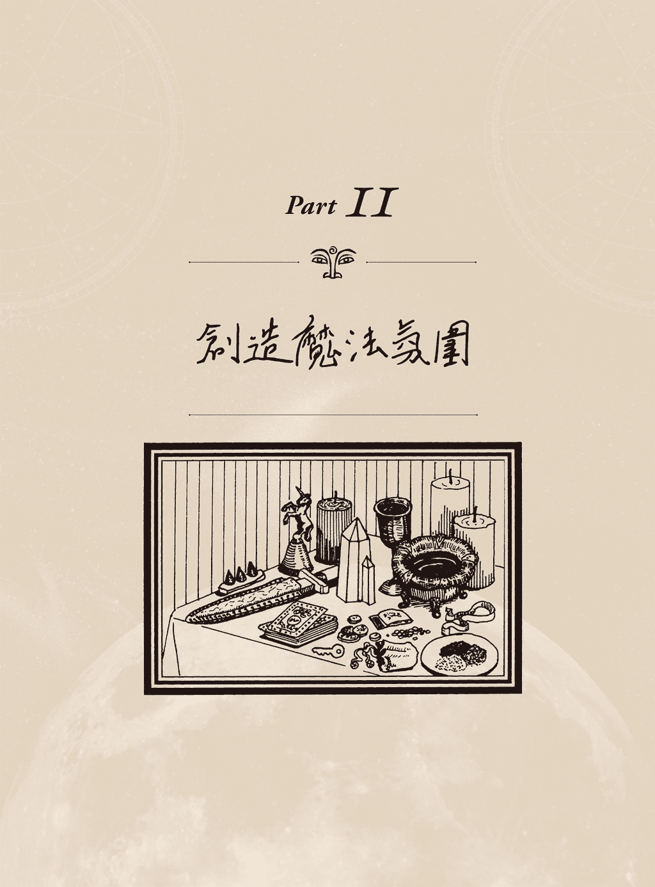

简介

一个成功的魔法最重要的莫过于创造正确的氛围，同时具有启发性和令人放松的心情。有些加强这种氛围的想法和魔法器具就像魔法的零件那样不可或缺，有些则是选择性可有可无的。每一种魔法说明都会注明哪些是必要的，哪些是非必要的东西。你不用一次尝试完所有的点子——只要实验看看就好。

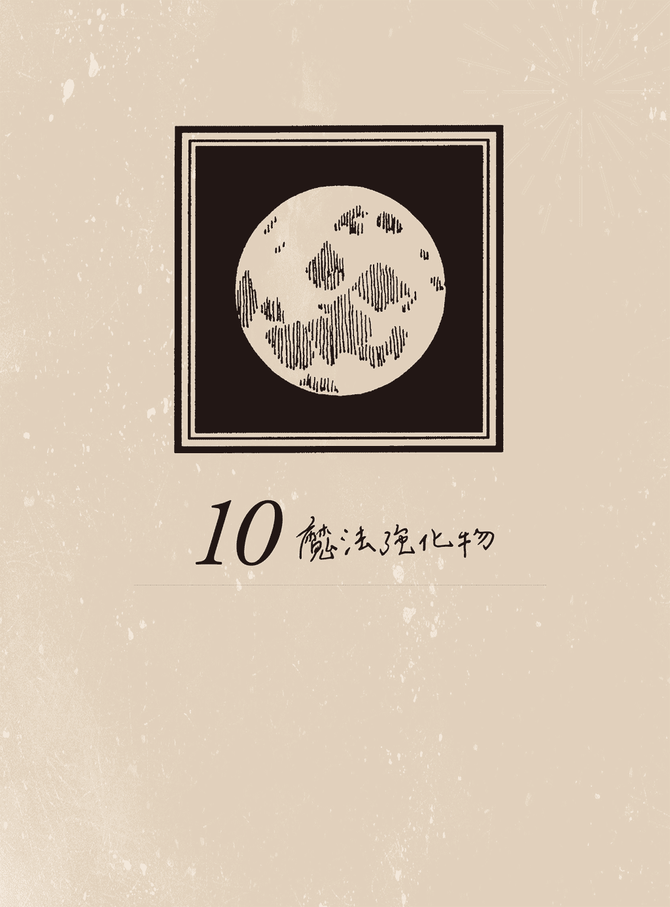

### 食物和饮料

简单三个字：少一点！不推荐举行魔法仪式时吃得太饱。份量多的餐食会让你打瞌睡或不舒服。若可以的话，举行魔法仪式当天避免吃肉，尽可能多吃蔬菜水果。吃鱼是不错的选择，但要用烤的，不要用油炸的，也不要加太多酱料。吃完后至少要等两个小时再开始你的魔法仪式。

尽量避免咖啡因或碳水化合物饮料；蒸馏水或纯水是最佳的选择，因为它已经去除了杂质。一杯不含咖啡因的香草茶能让人放松和纾解压力。试着泡一杯洋甘菊和百香果花茶（又称西番莲）。虽然有些魔法会在举行仪式时喝一点葡萄酒或果汁，但不要喝太多。

### 服装

这个也跟食物和饮料一样，可用三个简单的词语为原则：自然、宽松和干净。百分之百纯棉衣物是明智的选择。一件白色薄纱衣物感觉不拘束，又能给人干净和纯洁的感觉。有些人喜欢花点时间为特别的魔法仪式寻找特定颜色的衣服，可以使用跟蜡烛颜色列表（请看第 77 页）同样颜色的衣服。

如果你没有棉制衣物，请选择接近棉制的，像是混棉的衣服。舒适最重要：紧身牛仔裤和皮带无法让你的身体放松。然而，如果这是你拥有的最舒适的衣服，那就穿牛仔裤好了——大部分的牛仔裤都是百分之百纯棉的。如果你在一个私密的地方，你可能会想要穿睡袍、浴袍或宽松的 T 恤。你甚至可能会想裸体，你想怎么选择都可以。在你穿这套衣服之前，花点时间泡澡或冲澡，有个清爽和干净的开始。在你冲澡或泡澡的时候，想着把你身上所有的负能量都洗干净。泡澡是个很棒的点子，尤其是使用音乐和蜡烛的时候泡澡更好。

如果你要做团体魔法仪式，在离家出门前或在其他人到来之前泡澡或冲澡。如果你没办法冲澡，至少要洗手和洗脸，如果可以洗脚的话会更好。如果你没办法找到水，那就甩甩手，观想负能量已经被清除。

### 音乐

音乐有创造宁静氛围的能力——前提是对的音乐。

既然你已经在读这本书了，我应该可以说，你很可能是喜欢寻求宁静和喜乐的人，很可能已经拥有能放松静心的音乐。慢板的古典乐或新世纪音乐（New Age music）似乎是最受欢迎的选择，鼓乐和吟诵的唱片也可以考虑。在大部分的百货公司或音乐行都能找到提供柔和背景音乐的大自然环境录音。

买了任何一种新的录音带或 CD 之后，用它做魔法仪式的音乐之前一定要全部先听一遍。也许前面两首曲子很理想，可是如果第三段提高了三十分贝，或者有只狼开始嚎叫，这可能会破坏你调整好的心境。

如果你有时间，那就去当地的音乐行或新时代商店，大部分的店面都会提供耳机和示范带，让你在买之前试听。你所选择的音乐长度应该要足够让你做完整个魔法仪式。

在仪式半途中音乐突然停掉也会打断你的情绪，如果你别无选择，就翻面重播一次，至少你的播放机应该离你很近，这样你才不必离开魔法仪式的区域。音乐是灵魂的声音：如果你可以在仪式中加入音乐的话，一切都会变得更好。

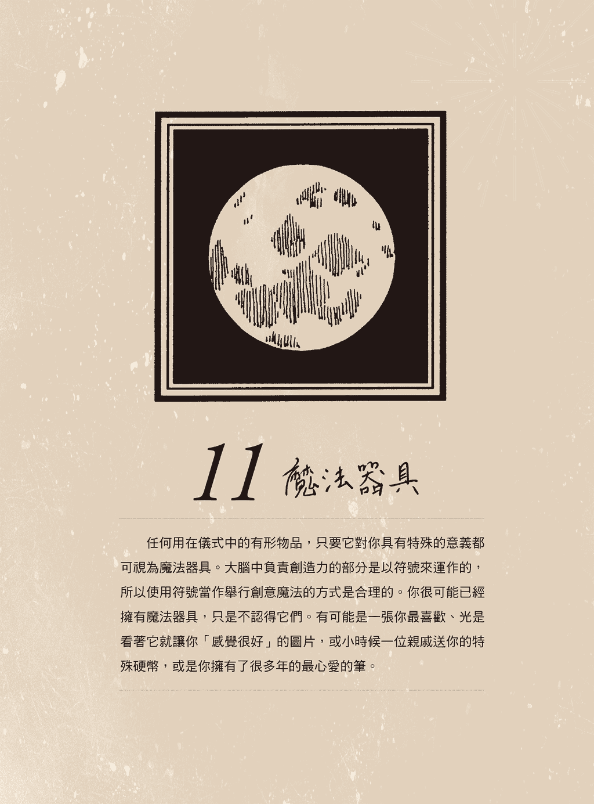

### 蜡烛

蜡烛能将光明带进我们的生活中——包括字义上和象征性的涵义。它们能驱逐黑暗，让新的企划、思想和人际关系出现。在魔法仪式前点蜡烛能创造出强大的能量。

蜡烛也代表我们存在的三个层面。蜡对应我们的肉身，烛芯代表我们的心智，火焰代表我们的灵魂或灵性。

蜡烛有很多种颜色、形状和尺寸。有的有添加香味，有的无香味。对我们的用途来说，形状和香味（或是无香味）并不重要，不过要考虑蜡蠋的大小，如果你认为你的魔法仪式需要花一个小时，那就不要点一支只能燃烧三十分钟的蜡烛。

颜色对燃烧什么样的蜡蠋具有很重要的意义，不同的颜色代表不同的振动频率。当蜡烛燃烧时，它会散发那个颜色的振动频率。请参考颜色图表来确定哪种颜色最适合你的需要，你可能只要使用一支蜡烛或需要搭配不同的蜡蠋。

如果你手中没有理想颜色的蜡蠋，那就用白色。燃烧白色蜡烛时，把注意力放在烟雾上，当它开始冒烟时，会清除这个区域的负能量。等烟雾消散后，这个区域的能量就已经获得清理和净化了。

购买太便宜的白蜡蠋时要小心，便宜的白蜡蠋很容易冒烟，会让你感到困惑。然而，我也不建议太极端的去买最高级的蜡烛，用一般常识适度的购买即可。使用蜡蠋时，一定要小心谨慎，不要在无人照看时任由蜡蠋自行燃烧。

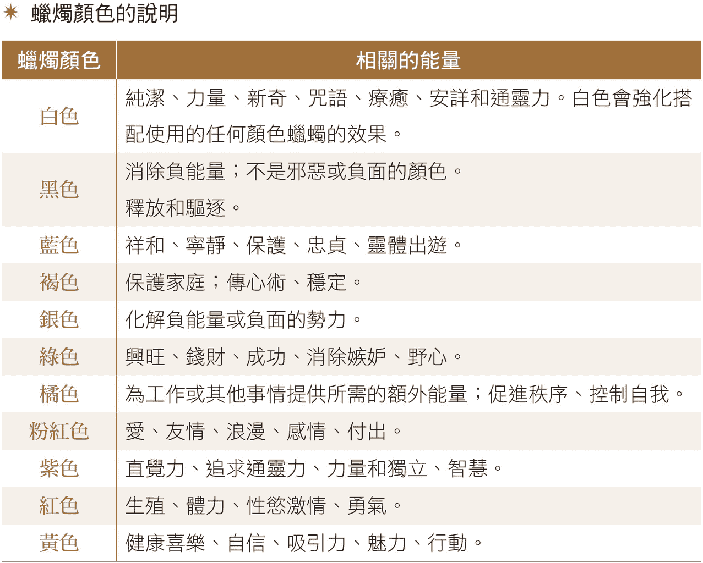

正如先前提过的，这个图表也能用来当作选择衣服的指南。

### 香熏和香气

以我的经验来说，有些人很爱香熏，有些人则非常反感。

香熏用品也有不同的尺寸、形状和形式。有些类型的香熏用品已经标示名称，注明了他们期望达到的效果：有纾解压力的香品、提振精力的香品、催情香品，诸如此类的。

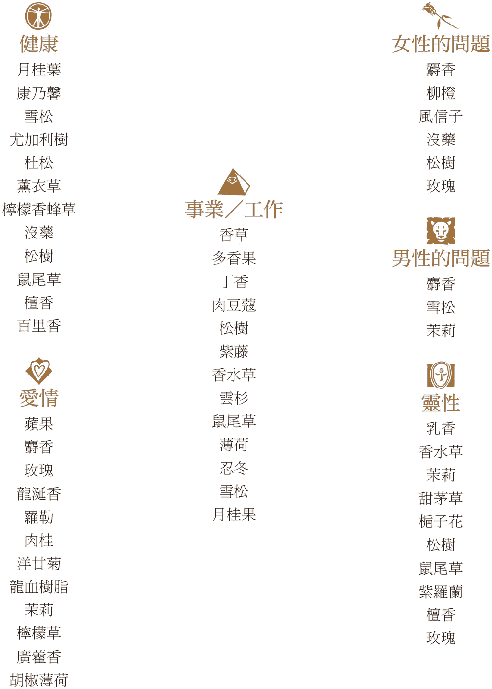

有人比较偏爱燃烧干燥香药草或精油。在常见的仪式中使用香熏的其中一个目的是尽可能让你进入一种最宁静祥和的意识状态。如果鼠尾草或檀香的味道能让你平静，那就使用它。但如果你的鼻窦不喜欢，那就尊重你的鼻子。

不要让别人帮你决定哪种香味最适合你。举例来说，根据研究显示，柑橘类的香气能提振精神，紫丁香的味道能让我们平静。但不要因为标签上写“适合催情的香品”就强迫自己吸入你不喜欢的香味，一定要买你喜欢的东西。

多实验几种新的香味也很有趣，大部分的香品都不贵，有时候是算几支来贩卖的。其中一件要注意的事情是：如果你要在室内或在小型空间举行魔法仪式时，在实际使用香品前最好先试用一下新购买的香品。否则，你可能得忍受你不喜欢的味道好几个小时，说不定甚至好几天。香熏的味道要一阵子才会散掉，也可能在空气中留存很长一段时间。

左页推荐几种你可能会想尝试，能对应特定魔法工作的香味和香草。记住：这些只是建议而已，并不是必要的。

### 水晶和宝石

水晶为我们的石英表带来生命，它们会接收和传送无线电波。没有石英水晶，电脑时代永远不会来临：石英水晶是构成电路和电子晶片的组件。

水晶的力量远超过我们借由它所创造出来的产品，它是魔法的重要工具，能够聚集和传导能量给特定的念力意图。有人说水晶对身、心、灵具有疗愈的力量。

很多其他的宝石也具有协助魔法的特殊能量。我在下面列出几种作为简要的参考，但这是一个可以让人深度探索的广大领域，如果你想了解更多，你的当地的书店或图书馆里一定能找到很多关于这个主题的书籍。

★ 宝石属性

关于水晶有个特别的注解：在天然产品店、宝石店和大多数的新时代商店都能买到原始或雕琢过的宝石和水晶。你不需要花很多钱去买水晶，刚开始可以买小块的，当你觉得有必要的时候再去买大尺寸的。如果你不确定哪一种宝石最能强化你的魔法，那就用白水晶。

．白水晶（Clear quartz crystal）——刺激疗愈、平衡各种能让我们圆满和完整的元素。协助发展通灵力。

．紫水晶（Amethyst）——一种非常强大的魔法水晶。多年来有很多灵媒和治疗师都会用它的疗愈属性来治病。对消除愤怒和焦虑很有帮助，能让人感觉心思比较不会散漫杂乱。

．红玉髓（Carnelian）——经常被称为幸运之石，据说能净化血液、刺激性欲和协助性功能。

．青金石（Lapis lazuli）——能将爱吸引到我们身边。据说它对治疗头痛、高血压、忧郁症、失眠和诸如此类的疾病很管用。

．孔雀石（Malachite）——增加能量，跟改变和创造力有关。埃及人将孔雀石磨成粉当作眼影擦在眼睑上，防止恶魔之眼（evil eye）的伤害。

．月光石（Moonstone）——据说它是魔法石，能增加通灵力，在魔法仪式中被广泛使用。使用月光石也能促进灵体出窍。

．粉水晶（Rose quartz）——也是俗称的爱情水晶。这种水晶能处理所有情绪的能量。

．绿松石（Turquoise）——增强体力、提供保护。它是美国原住民的圣石，是一种保护马匹和骑士的宝石。在阿拉伯，它是冥想宝石，具有吸收负能量的属性。

当你购买时，请在店里仔细的触摸水晶。水晶／宝石会选择你，不是你选择它。你可能只是觉得拥有别人没有的东西“感觉很好”。请用你的直觉去选择，宝石会跟你沟通。

★ 为你的水晶补充能量

当你找到你的水晶之后，它需要“清除、补充能量和设定”。用冷水清洗或将它泡在一碗水中，以便清除前一位拥有者的能量，或是别人检视它时所留下的能量。

接下来，用月亮来为你的水晶补充能量。在下列的其中一个月相出现时，让水晶放在月光下一个晚上。

．新月——在这个月相中补充能量的水晶主要能提供新的开始、自信、希望和增加任何事物的能量。

．满月——在这个月相中补充能量的水晶所带来的能量能支持你达成你想要的任何事情。这其实是最适合我们利用的全方位月相。

当你为你的水晶净化和补充能量后，最后一个步骤是设定它。把它握在你的手里，将你想要完成的目标的振动能量集中投射到水晶上。观想你的终极目标，而不是想着你要达成目标的方式。

举例来说：如果你想减掉二十磅的体重，就观想你自己瘦了二十磅站在体重机上的样子。不要尝试去分析怎么达到这个目标的方式，这个问题最好留给你的高层力量去解决。

如果你希望的话，你可以设定其他任何一种宝石。

### 元素水

在本书的许多魔法中，你会看到需要使用我说的元素水的地方。元素水基本上就是在大雷雨中补充了大自然能量的水，能帮助你使用魔法。

它代表地、水、火、风四大元素，混合了各种元素最强大的效力。闪电代表火，它对应力量、能量、魔法和强烈的欲望。雷代表风，对应灵性、健康和知识。暴风雨的力量代表地，对应大自然、接地能量、智慧和所有物质的东西。雨本身代表水，对应情绪、反思、爱、创意和净化。

★ 如何制作元素水

基本上你是带着某种意图去收集雨水，首先你需要装水的容器。我使用过玻璃、塑胶、陶瓷，几乎任何一种材质的容器都可以使用，我觉得没什么差别。你可能觉得用天然制品的容器会比较好，或者你感觉特别的东西会更有效果。如果你的想法是这样，那就去找特别的容器，我个人会使用两或三个圣餐杯。

最重要的是，这个容器必须是全新的或是非常干净，如果是玻璃制品，必须在洗碗机里高温消毒过或用开水煮过。就算这个容器是全新的，还是要清洁它，消除碰过它的人所留下的能量。因为大雷雨并不常见，所以我建议尽可能多收集一点水，这样你手边随时都会有可用的元素水。

如果你知道有暴风雷雨快要来了，就把你的容器拿出去，放在一个能收集到水的地方。有些人为了以防万一，会把容器一直放在户外，有些人只在几乎肯定会有暴风雨来临时才把容器拿出去。

暴风雷雨过去，你收集到水之后，应该施展“手祝福法”。把双手放在容器上方，手掌朝下说道：“祝福这些水，愿它能强化我的意图。”

现在，如果你不是要立刻使用它，那就把你的元素水装进实用的容器中方便日后使用。有盖子的玻璃罐或塑胶水壶或瓶子是不错的选择。

这种水不限于仪式中使用，也可以用来祝福某些东西。你可随意将水装到较小的瓶子中，方便出门时使用，甚至送一小瓶给朋友。对志同道合的朋友来说，这是个完美的礼物，因为它来自大自然，而且你已经将你个人的良好的心念和祝福的能量灌输进去了。

节日将近时，我常会将元素水放进小塑胶瓶里，贴上写“元素水”的小标签。然后在瓶颈处绑条缎带，把它们送给特别的朋友，万一他们想要祝福某些东西时就有元素水可使用。我曾用我的元素水来祝福我的车子、电脑、办公室、住家和隔壁邻居的车子呢！

请在本书的杂项魔法区寻找“元素水祝福法”（参考“旅途平安”魔法），这是一种简短又强大的祝福仪式。

★ 特别备注

．只有在下雨、闪电和打雷的情况下收集到的元素水才会有强大的力量，一般的雨水没有用。

．不要使用流经屋檐槽沟的水！当你想要快速收集大量的雨水时，可能会觉得这是最简易的解决办法。然而，经由屋檐槽沟流下来的雨水并不像直接从天上掉下来的水那么纯净，因为它会沾染到垃圾杂质。

．当你收集水时，不要担心污染的问题。你的祝福会净化这些水。

．不要喝这种水，因为它不是给你内服的。

．如果你居住的地区无法收集到这种水，那就请一位朋友帮你收集。不过，当你拿到水之后，一定要做“手祝福法”。

．在大雷雨中行动要小心，不要在有闪电的时候出去。为了安全起见，等到雷雨过后再出去把你收集到的水搬进来。

### 额外的魔法器具

我在 PARTⅢ的魔法中会提到包括下列的魔法器具。请自行改用你手中现有的或对你有效的东西取代。

◆魔法棒或刀子：剑、仪式刀、拆信刀或任何一种魔法棒或长条状水晶。任何有尖头的、能充当指示物的东西都可以使用。你可以在新时代商店、奇幻用品店或网站商店买到那种有宝石和水晶装饰的魔法棒。在这些店面中也能买到双面刃。

◆烧东西的容器：铁锅、迷你型墨西哥式的小火炉、烟灰缸、铁制的垃圾桶、大汽锅等等。

任何能在安全的范围内燃烧一张纸的容器都可以。

◆特别的饮料杯：任何能装葡萄酒或葡萄汁的容器：玻璃酒杯、杯子、碗、圣餐杯或你喜爱的高脚杯都可以。

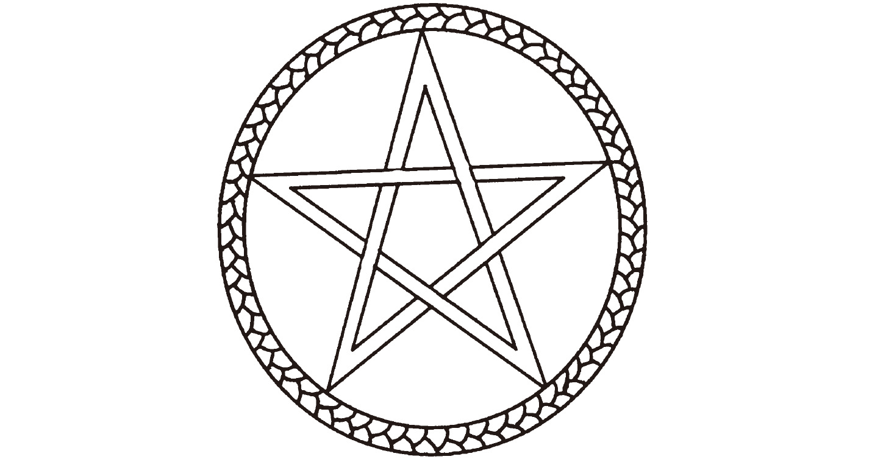

◆非必要的器具：

．花和水果

．宗教雕像或圣卡

．塔罗牌或卢恩符文（或其他占卜未来的器具；占卜用的通灵方式）

．灵摆（在第十八章中可以找到关于如何使用灵摆做决定的信息。）

．五角星圈或五角星符号（五角星圈是有五个尖角的星星，外面有一个圆圈环绕它。五角星符号是同样的五角星，但没有圆圈。这个图案代表地、风、火、水的元素，有时候也包含了第五元素灵性。五角星圈或五角星符号也代表人类的身体张开双臂和双腿时的样子。这个符号经常在仪式进行中当作一种保护形式来使用。这个星星应该永远摆正，颠倒摆被视为负向。）

．十字架——任何一种都可以（十字架是世界共通的符号，代表将众多的二元物结合成一个完整的团体。它可以代表人类张开双臂，也代表你人生中的十字路。十字架具有很多宗教和灵性的意义。）

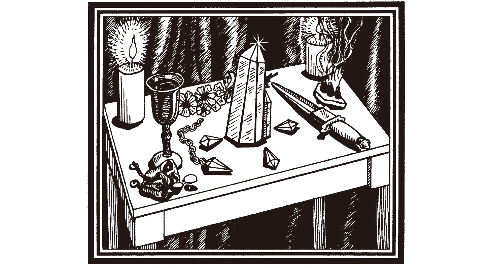

．钟铃（发出钟铃的声音召唤宇宙的力量，表示仪式的开始。有些人会把钟铃当成一种防止恶灵接近的保护法。）

谁知道哪些东西对哪个人具有魔法和爱？但我知道，如果你有这类的东西，你应该好好收藏，用它们来协助你。

### 私人祭坛

拥有私人祭坛绝不是举行魔法仪式必要的选项，但这是一个能让你摆放魔法器具和你选择礼拜的神像的绝佳地点。不仅可把它当作摆放特殊物品的储物区，同时也是一个让你祈祷、冥想和从高我那里接收讯息的地方。

祭坛可以是任何平坦的地方，可以是单独一张小桌子或你衣柜的任何地方。大型音响喇叭上、书柜或是在两个水泥砖块上面放一块木板也可以。再次重复，你可以动动脑筋自己创造。

也许你并不想要一个固定的祭坛，而是在你想做魔法仪式时再设立一个临时的祭坛。典型的祭坛通常会陈列蜡烛、香熏物品、魔法棒、刀子、宝石、雕像、圣餐杯、元素水或圣水之类的东西，任何具有灵性和魔法属性，或被你当作特殊物件使用的东西都可以。我感觉设立祭坛没什么特别的方式，摆放物品时随便你把东西怎么移动，只要你感觉舒服好看就可以了。

若有可能的话，在户外设立一个祭坛也很不错。可以用石头和砖块在你喜欢的树木附近设立祭坛。你可能想制作一张户外用的特殊木桌，直接找一个原木块或比较平坦的岩石可能更简单。

当你设计祭坛时，尽量不要使用有太多金属的桌子，天然的材料是最好的。然而，如果你唯一能选择用来当作祭坛的桌子有很多金属，那就尽量盖住它。用天然的布料或在上面放一块木板，尽量让一切都是天然的。

至于祭坛面对的方向，有很多学派的说法。有人建议面向北边，因为这是最沉稳的方向。有人会建议祭坛朝向东边，因为它是太阳和月亮升起的方向。每个方向都有它的特殊意义和地位。因此，我觉得应该放在你觉得实用的任何地方。

我见过移动式的祭坛，有人在有轮子的推车上面设立祭坛，这样他们可以在房间内将祭坛移动到他们在举行特定的魔法仪式或冥想时感觉需要面对的方向。如果你的空间有限的话，移动式的祭坛也可以推进橱柜里，免得平时阻碍你。

祭坛是极度私人的东西，而且也非常有趣，在祭坛上面摆放的圣物也没有对与错之分。

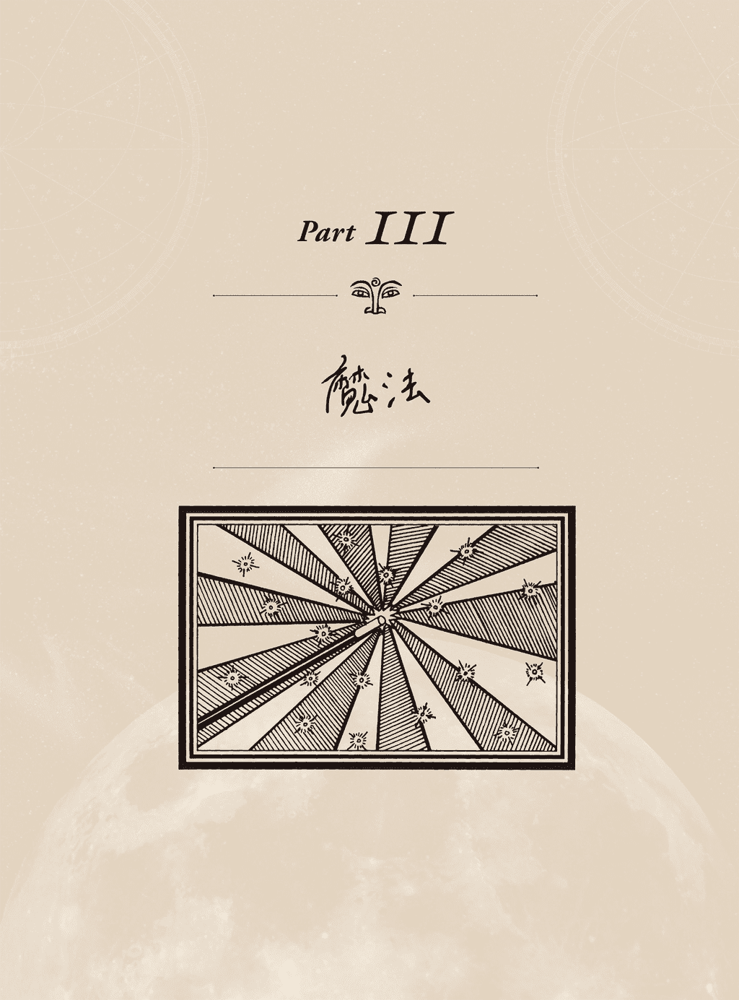

简介

身为魔法奉行者，你应该以非常认真的态度来看待这些魔法。如果这些仪式在你碰到麻烦的问题时帮你解决了问题，那我分享这些东西的目的就已经达到了。记住，你的意图必须是好的，不要在任何程度伤害自己和任何人。这些魔法仪式的技巧主要是以一般的常识和合理的努力来完成你的愿望。当你祈求无形的力量帮你达到有形的结果时，请耐心点。如果经过几次努力之后，你还是没有达到你想要的目标，那就接受宇宙可能已为你准备了更好的结果。至少，宇宙已经感知到你了，宇宙对你的关注将会在你生命中促进正向和显著的变化。

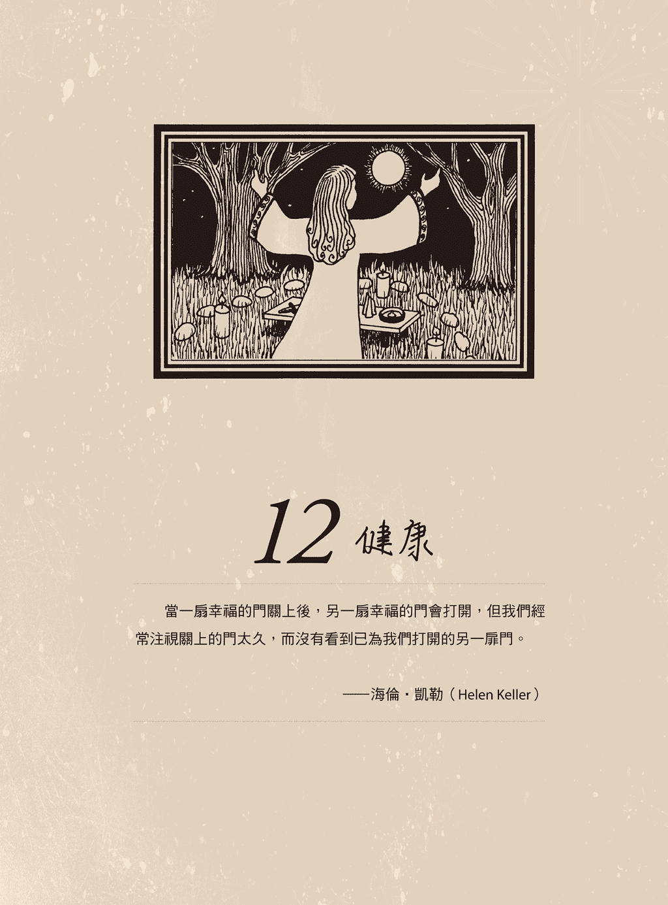

好的健康魔法能让精神产生神奇的效果，然而，这些仪式并不是为了取代传统医学或心理治疗。应该把这些魔法当成专家建议的必要治疗或健康疗法的额外辅助方式。

心是疗愈肉体的工具，这些仪式是向潜意识和肉体本身提出请求，要求它从任何可能具有的疾病中康复。

透过专注和决心让心集中注意力发出指令，来自内心的指示会产生一个清晰的念头，因而让我们有能力创造一个进入独特有效境界的入口——来自这个境界的疗愈和正向转变力量就能为我们所用。举行疗愈魔法或仪式就像是跟宇宙的生命力量祈求协助。

当魔法起作用时，所产生的可能性或许是很惊人的。你确实有能力控制自己的身体和心智。你所面对的挑战就是要考虑新的途径，探索可能跟以前完全不同的领域。

### 良好的健康

★ 必要的强化物和魔法器具

这个魔法必要的器具包括如下描述中你为阵法选择的所有器具。

你会需要：

．元素水——在有闪电和打雷的风雨中收集到，具有强大能量的雨水。（请看第十一章如何收集元素水的指示。）

．小碗

蜡烛

你需要一支蓝色蜡烛、一支红色蜡烛和一支白色蜡烛。把这些蜡烛在你面前排成一排，左边是蓝色，中间是白色，右边是红色。

阵法

所有的魔法仪式刚开始都应该画一个圆圈，这是你的防护罩。如果你要使用三角形或正方形，先造一个圆圈，然后在里面制作你的阵法。

最适合这个魔法的阵法是圆圈。请使用本书第五章中描述的方法创造你的阵法，用魔法棒、刀子，伸出手臂比出食指和中指来画阵法，你也可以选择用盐巴或其他的东西来制作阵法。

面对的方向

如果你面向北方，这个魔法会最有效。在你的阵法中摆放好你的蜡烛和任何器具或强化物，这样当你面向北边坐下时，这些东西会放在你的面前。

月相

这个魔法仪式在渐盈月时举行最有效，因为我们希望能增进好的健康，就像月亮在渐盈月时会逐渐增大那样。

一周中的哪一天

这个魔法在任何一天都可以举行。

★ 非必要的魔法强化物

下列这些东西能为你的魔法增加深度，并且帮助自己更加专注，但这些都不是必要的，即使你没有这些东西也可以施行魔法。

宝石

最适合这个魔法的宝石是白水晶和紫水晶。如果要在你的阵法中使用除了我建议的这两种水晶以外的宝石，请将它们放在你面前。

香熏

能强化这个魔法的香品是柠檬香蜂草（Lemon balm）或百里香（Thyme）。如果你喜欢的话，将这些香品放在你阵法内一个安全的地方。然而，如果你想在准备你的魔法工作时享受这个香气，要在阵法外开始使用香熏也没关系。

音乐

如果你喜欢音乐，觉得它不会让你分心，你可能会想要播放新世纪音乐、冥想乐或古典乐；考虑对你的健康平衡具有舒心和协调效果的音乐，只要你觉得舒服的音乐都是最好的音乐。

★ 在你开始魔法仪式之前

请确定不会有让你分心的事情。

可能的话，关掉所有电话。

播放静心的音乐。

把灯光调暗一点。

在你开始前洗手或洗澡。

如果你要香熏的话，可以先点香。

准备你需要的所有东西，放在附近拿得到的地方。

画你的阵法。

请求你的高层力量允许将讯息传给你。

★ 肯定语

在正式开始你的魔法之前，先在阵法内读诵肯定语。

我不会把任何事情视为理所当然，尤其是我的健康。当我的身、心、灵都协调一致时，我就拥有了一切。我周身环绕着健康和疗愈的灵气。愿我现在体验的最佳健康状态持续下去。我赞赏并感谢我的高层力量将这种能量集中传送给我。

那就这样吧！

★ 如何举行魔法仪式

将手指伸进元素水中，然后碰触你的胸口说：“我的身体是健康的。”

将手指在伸进元素水中，然后碰触你的额头说：“我的心是安稳的。”

最后，将手指放回元素水中，然后碰触你的头顶说：“我的灵魂是良好的。”

在你的心中以象征结束仪式的声明来做总结，像是“那就这样吧！”“祝福”或“阿门”。这时熄灭你的蜡烛，观想它飘离地面，穿过屋顶，进入天空，最后进入太空，消失在太空中，用这个方式来解除阵法。

仪式完成之后，可能的话，把剩下的元素水倒在户外或拿来浇植物。不要把剩余的元素水存起来。如果你没办法把水倒到户外，那就缓缓地倒进水槽里，让水经过你的手，流到排水管时说：“回归大地。”

### 控制怒气

为这个魔法多准备一点时间，因为需要花时间写东西。

★ 必要的强化物和魔法器具

这个魔法必要的器具包括如下描述中你为阵法选择的所有器具。

你会需要：

．纸张

．一支原子笔或铅笔

．火柴或打火机

．烧东西的容器

蜡烛

你需要黑色的蜡烛，或者可以使用三支蜡烛：黑色、蓝色和银／灰色。把蜡烛放在你前面，只有黑色蜡烛就放在正中央，或是将三支蜡烛排成一排，左边是蓝色、中间是黑色、右边是银灰色。

阵法

所有的魔法仪式刚开始都应该画一个圆圈，这是你的防护罩。如果你要使用三角形或正方形，先造一个圆圈，然后在里面制作你的阵法。

最适合这个魔法的阵法是圆圈。请使用本书第五章中描述的方法创造你的阵法，用魔法棒、刀子，伸出手臂比出食指和中指来画阵法，你也可以选择用盐巴或其他的东西来制作阵法。

面对的方向

如果你面向西方，这个魔法会最有效。在你的阵法中摆放好你的蜡烛和任何器具或强化物，这样当你面向西方坐下时，这些东西会放在你的面前。

月相

这个魔法在渐亏月或暗月时举行最有效，因为我们希望能消除怒气，就像月亮在渐亏月时逐渐变小那样。

一周中的哪一天

这个魔法除了星期三和星期四这两天比较不好之外，任何一天都可以举行。

★ 非必要的魔法强化物

下列这些东西能为你的魔法增加深度，并且帮助自己更加专注，但这些都不是必要的，即使你没有这些东西也可以施行魔法。

宝石

最适合这个魔法的宝石是虎眼石（Tigger’s eye）和黑曜石（Obsidian）。如果要在你的阵法中使用除了我建议的这两种以外的宝石，请将它们放在你面前。

香熏

能强化这个魔法的香品是松树（Pine）或月桂（Bay）。如果你喜欢的话，将这些香品放在你阵法内一个安全的地方。然而，想在阵法外开始使用香熏也没关系。

音乐

如果你喜欢音乐，觉得它不会让你分心，你可能会想要播放新世纪音乐、冥想乐或古典乐；可考虑能镇定内在混乱情绪的静心和协调的音乐。

★ 在你开始魔法仪式之前

请确定不会有让你分心的事情。

可能的话，关掉所有电话。

播放静心的音乐。

把灯光调暗一点。

在你开始前洗手或洗澡。

如果你要香熏的话，可以先点香。

准备你需要的所有东西，放在附近拿得到的地方。

画你的阵法。

请求你的高层力量允许将讯息传给你。

★ 肯定语

在正式开始你的魔法之前，先在阵法内读诵肯定语。

我要释放我对（某人的名字或某个事件）的怒气。愤怒对我没有好处，我的愤怒是一种选择，我选择不再生气了。愤怒会毒化我的身心系统，我认知到当我生气时，是因为我感到很挫折，我不了解别人的思想或行为为什么跟我不一样。请给我有智慧的洞察力，接受我无法控制别人的行为。我不会再让别人的行为让我不快乐了。

下一次我生气时，请提醒我这点，愤怒是一种选择。我会试着做几次深呼吸，延缓我的愤怒。在这次以后，我会延缓更久，然后延长更多的时间不让自己发怒。我迟早会明白，我可以控制这个怒气。到时我会感觉到一种成就感和自豪感。我会变得更坚强，有了这种新的自制力，我会有能力完成任何事情。请让这种振动能量围绕我。

那就这样吧！

★ 如何举行魔法仪式

首先，点燃你的蜡烛，然后拿出你的纸和笔，写一封短信给某人或你生气的某个情况。如果你在生自己的气，那就写信给自己。

如果你在生某个已死之人的气，还是写下来。如果你在气某件过去让你痛苦的事情，那就写给这个事件。如果你在气某个伤害你或伤害某人的东西，那就写给它。

如果你不喜欢写信，那就简单的写几个字，提个重点就好。举例来说：瑞克，我很气你为了去波士顿工作而离开我。疾病：我很气你在我没有医疗保险的时候迫使我去动手术。

如果你写长信不会有困难，那就告诉他／她或它，你的感觉和你为什么生他们的气。诚实的描述细节，反正没有人会看到这封信，这是你的秘密信件。事实上，如果你真的想仔细描述的话，你可能会想坐在桌子或书桌前，好好的写信，然后再进入你的魔法仪式区域。写这封信背后的意义是，将你的思想化成实际的形式，从你的潜意识中消除它们。

接下来，把你的信或字条放在容器中烧掉。如果有一小块纸片没烧完也没关系，只要你无法读出特别的字句或某人的名字就行了。

如果你因为某些原因不想烧掉它，你可以将它撕成碎片，放进水里，彻底摧毁它，以后再丢掉它。有很多人感觉做完这个仪式之后，就有了新的开始，因为这是一种解放的感觉。

在你烧掉纸条之后，说下列这个咒语：

我今天做了一个有力的选择，

为了能好好生活，我要欢喜雀跃。

我的愤怒离开了，祝福我，

我恢复生机了，我自由了。

在你的心中以象征结束仪式的声明来做总结，像是“那就这样吧！”“祝福”或“阿门”。接下来熄灭蜡烛，解除你的阵法。

### 戒除成瘾症

如果可能的话，在你准备举行这个魔法仪式的当天不要吃肉类、鸡肉或鱼类。肉类会让你感觉身心沉重，你需要感觉明亮、轻盈才能轻易打开通灵的门户，消除和释放你的意图。而且吃肉会让你体内存有死亡的动物，你要尽可能减少负能量。

★ 必要的强化物和魔法器具

这个魔法必要的器具包括如下描述中你为阵法选择的器具。

你会需要：

．剪刀

．一条黑线、绳子、绝缘电线、缎带、毛线或任何可以轻易被剪断的东西。如果你找不到任何黑色的东西，其他颜色的绳子也可以。

．一碗冷水

．一小块白水晶

蜡烛

你会需要蜡烛在你面前摆成一排，银色／灰色放左边，白色放中间，黑色放右边。

阵法

所有的魔法仪式刚开始都应该画一个圆圈，这是你的防护罩。如果你要使用三角形或正方形，先造一个圆圈，然后在里面制作你的阵法。

这个魔法最佳的阵法是圆圈。使用第五章描述的方式创建你的阵法，用魔法棒、刀子、伸长手臂比出手指、盐巴或其他你选择的有形物品。

面对的方向

如果你面向东方，这个魔法会最有效。把你的蜡烛和任何器具或强化物摆在你的阵法内，这样当你要面向东方坐下时，它们会在你面前。

月相

这个魔法仪式在渐亏月或暗月时举行最好，因为你希望消除和减少某种冲动，就像月亮在渐亏月时会减少和消失那样。

一周中的哪一天

适合施展这个魔法的日子是星期天、星期五或星期六，星期天是最好的。

★ 非必要的魔法强化物

下面的这些物品能为你的魔法增加深度，并且帮助自己更加专注，但这些不是必要的，就算你没有这些东西也可以施展魔法。

宝石

最适合这个魔法的宝石是橄榄石（Chrysolite）。如果要在你的阵法中使用除了我建议的这种以外的宝石，请将它们放在你面前。

香熏

能加强这个魔法的香品是忍冬（Honeysuckle），把香品放在你阵法内安全的地方；然而，你也可以在阵法外就开始点香。

音乐

如果你喜欢音乐，觉得它不会让你分心，你可能会想播放一些祥和、缓慢、低频的音乐，像是钢琴或笛子，只要你觉得舒服的音乐都好。

★ 在你开始魔法仪式之前

请确定不会有让你分心的事情。

可能的话，关掉所有电话。

播放静心的音乐。

把灯光调暗一点。

在你开始前洗手或洗澡。

如果你要香熏的话，可以先点香。

准备你需要的所有东西，放在附近拿得到的地方。

画你的阵法。

请求你的高层力量允许将讯息传给你。

★ 肯定语

在正式开始你的魔法之前，先在阵法内读诵肯定语。

这一天，我终于选择要为我的人生做出改变。我这么做不是因为受了他人的影响，而是因为我不喜欢这部分的自己。这个时候到了，因为我说是时候了。这是我人生进化的一部分，我已经历过这件事，也知道我不想要一辈子这样。当月亮提供我需要的正向力量和能量时，我的高层力量为我做见证：我要戒除我对（某种上瘾情况）的成瘾症。

我过去老是问自己为什么会有这种过分的行为，但我不需要知道所有的答案。在我人生的这个阶段，我要让自己接受正向的改变。我会让自己避开会诱惑我继续做过去这种行为的人和情况。我知道当我做出这种上瘾的行为时，我会感觉空虚。

我很高兴当宇宙看到一个空虚处时，会以正向的东西去填补它。这个新的正面影响力会是什么呢？我能体认到它比我上瘾的东西好了三倍以上。它不会让人上瘾，它会为我带来快乐和骄傲。我不会试着去猜想这个礼物是什么，但我知道当我的成瘾症离我越来越远时，这个礼物会越来越近。如果我没办法完全自助，我会去找以前处理过这种事情的专业人士帮忙。

我今天这个意图有天上强大的月亮为证，月亮已经开始产生某种能量来协助减少这种过分的行为和不智的危险。下一次当我感觉需要（陈述上瘾的事情）时，我会寻找这个指引，不管是白天或黑夜，晴天或雨天，如果我迷失了，我会记起月亮会带领我坚持更长的时间，接受宇宙送给我的美丽礼物。

我要戒除我的成瘾症：（陈述上瘾的事情）。重复三遍。

★ 如何举行魔法仪式

1\. 拿出你的绳子，用它绑一个绳结。这个结代表束缚你的成瘾症。

2. 看着这个结，想着这个成瘾症让你和别人产生多少辛苦和麻烦。如果你愿意的话，静思回想片刻。

3. 当你觉得准备好之后，用剪刀剪断这条绳子，让这个绳结留在其中一端。不管你剪掉绳结的左边或右边都没关系，但不要剪到绳结的正中央。

4\. 拿起这条绳子，放进你的信封里，然后密封它。

5. 让双手跟身体保持一段距离，然后连续甩手三下，好像要把这个成瘾症从你身上甩掉那样。

现在说下列这个咒语：

我每天在这里找到更多的力量

我这么说时，我的意志力也获得了力量，

请带走这个恼人的东西，它现在解脱了束缚，

我得到了自由，也找到了我的灵魂。

在你的心中以象征结束仪式的声明来做总结，像是“那就这样吧！”“祝福”或“阿门”。接下来熄灭蜡烛，解除你的阵法。

等你解除阵法之后，以你选择的任何方式丢掉装着这条断绳的信封。把它丢到垃圾桶或火炉里，埋掉它或丢进海里都可以。

### 消除恐惧

若是可能的话，在你打算施行这个魔法的当天不要吃肉。

★ 必要的强化物和魔法器具

这个魔法必要的器具包括如下描述中你为阵法选择的所有器具。

你会需要：

．一把刀子

．大的别针

．笔或其他能在蜡烛上刻字的东西。

蜡烛

你会需要一支黑色或蓝色的蜡烛，放在你前面正中央。

阵法

所有的魔法仪式刚开始都应该画一个圆圈，这是你的防护罩。如果你要使用三角形或正方形，先造一个圆圈，然后在里面制作你的阵法。

最适合这个魔法的阵法是圆圈。

请使用本书第五章中描述的方法创造你的阵法，用魔法棒、刀子，伸出手臂比出食指和中指来画阵法，你也可以选择用盐巴或其他有形的东西来制作阵法。

面对的方向

如果你面向西方，这个魔法会最有效。在你的阵法中摆放好你的蜡烛和任何器具或强化物，这样当你面向西方坐下时，这些东西会放在你的面前。

月相

这个魔法在渐亏月或暗月举行效果最好，因为我们希望能消除和减少恐惧，就像月亮在渐亏月时那样减少和消失。

一周中的哪一天

这个魔法适合在星期天、星期五或星期六举行，但星期天最好。

★ 非必要的魔法强化物

下面的这些物品能为你的魔法增加深度，并且帮助自己更加专注，但这些不是必要的，就算你没有这些东西也可以施展魔法。

宝石

这个魔法最适合的宝石是海蓝宝石（Aquamarine）。如果要在你的阵法中使用除了我建议的这种以外的宝石，请将它们放在你面前。

香熏

能强化这个魔法的香品是迷迭香（Rosemary）或紫丁香（Lilac）。如果你喜欢的话，将这些香品放在你阵法内一个安全的地方。然而，想在阵法外开始使用香熏也没关系。

音乐

如果你喜欢音乐，觉得它不会让你分心，你可能会想播放一些祥和、缓慢的音乐，像是钢琴、笛子或原声吉他／木吉他，只要你觉得舒服的音乐都好。

★ 在你开始魔法仪式之前

请确定不会有让你分心的事情。

可能的话，关掉所有电话。

播放静心的音乐。

把灯光调暗一点。

在你开始前洗手或洗澡。

如果你要香熏的话，可以先点香。

准备你需要的所有东西，放在附近拿得到的地方。

画你的阵法。

请求你的高层力量允许将讯息传给你。

★ 肯定语

在正式开始你的魔法之前，先在阵法内读诵肯定语。

今天我要选择平静而不是恐惧，我知道这不是能否控制我的恐惧感的问题，而是我要不要选择它的问题。我要受苦多久才肯做这种选择呢？我现在就要做这个选择，这是为了放松和健康。情况、人们、事情、地方或动物并不会让我觉得恐惧，造成这种情绪的是我自己。我知道我能控制的部分比我能觉察到的更多，我会努力减少恐惧，知道我能掌控自己。

那就这样吧！

★ 如何举行魔法仪式

举起你的黑色或蓝色的蜡烛。（黑色是驱逐，蓝色是疗愈；因为我们要同时驱逐和疗愈，这两种的任何一种颜色都会有良好的效果。）

在你的蜡烛顶端靠近烛芯的地方，刻一个字或一个字母代表你要消除的这个恐惧。比方说，如果你想克服飞行（Flying）的恐惧，那就刻 F 这个字母或整个字。

点燃蜡烛，让它烧到你刻的字上，让蜡熔化到你再也看不见这个字为止。（注意：不要刻在蜡烛的侧面，要刻在顶端。）

在你等待蜡烛的蜡液覆盖住这个字的时候，说下列这个咒语：

蜡烛在燃烧，我的恐惧也在燃烧，

请神性聆听我的请求，

保护我不再产生这种恐惧，

当这个魔法结束后，一切都会如愿完成！

在你的心中以象征结束仪式的声明来做总结，像是“那就这样吧！”“祝福”或“阿门”。接下来熄灭蜡烛，解除你的阵法。

### 塔拉希（Tarash）——一种特别的疗法

塔拉希是我为自己和一些客户开发的一种疗法。这是向我们的潜意识心智请求协助的观想疗法，这个疗法对我个人和很多曾经尝试过的客户都很有效。

这个名字是混合“柏油（tar）”和“灰烬（ash）”这两个字而来。这个原则就是把你体内任何疾病或不适的地方都观想成黑色柏油，这包括忧郁症、体重过重，或是你想从本我中移除的身体或心理的任何东西都可以。你观想黑色柏油离开你的身体，慢慢变成看起来像灰烬，从原来的黑色柏油颜色变成越来越淡的灰烬色。

灰烬色变成浅灰色后，还在继续变淡，最后你只看到白光在你体内流窜，这时你已经将毒化你身体系统的东西净化了。对你来说，它看起来可能像是阻塞的水管，你开始把黑色或深色的污水排放出来，最后只剩下干净的清水在你体内流动。

注意：这个方法的目的只是为了强化，并不能取代传统疗法或另类疗法。我无意让这个方法变成任何一种处方签或疾病疗法。

★ 必要的强化物和魔法器具

这个魔法必要的器具包括如下描述中你为阵法选择的所有器具。

蜡烛

你会需要一支黑色蜡烛摆在你右边，一支白色蜡烛摆在你的左边。

阵法

所有的魔法仪式刚开始都应该画一个圆圈，这是你的防护罩。如果你要使用三角形或正方形，先造一个圆圈，然后在里面制作你的阵法。

最适合这个魔法的阵法是圆圈。请使用本书第五章中描述的方法创造你的阵法，用魔法棒、刀子，伸出手臂比出食指和中指来画阵法，你也可以选择用盐巴或其他有形的东西来制作阵法。

面对的方向

如果你面向北方，这个魔法会最有效。在你的阵法中摆放好你的蜡烛和任何器具或强化物，这样当你面向北方坐下时，这些东西会放在你的面前。

月相

这个魔法在渐亏月或暗月举行效果最好。

一周中的哪一天

最适合这个魔法的日子是星期一或星期六。

★ 非必要的魔法强化物

下面的这些物品能为你的魔法增加深度，并且帮助自己更加专注，但这些不是必要的，就算你没有这些东西也可以施展魔法。

宝石

这个魔法最适合的宝石是白水晶。如果要在你的阵法中使用除了我建议的这种以外的宝石，请将它们放在你面前。

音乐

如果你喜欢音乐，觉得它不会让你分心，你可能会想播放一些对你具有象征疗愈性质的音乐。这个魔法可以使用有歌声的背景音乐，例如恩雅的音乐。只要你觉得舒服的音乐都好。

★ 在你开始做塔拉希魔法仪式之前

请确定不会有让你分心的事情。

可能的话，关掉所有电话。

播放静心的音乐。

把灯光调暗一点。

在你开始前洗手或洗澡。

如果你要香熏的话，可以先点香。

准备你需要的所有东西，放在附近拿得到的地方。

画你的阵法。

这时可以点蜡烛。

请求你的高层力量允许将讯息传给你。

★ 如何准备塔拉希疗愈魔法仪式

1. 在你开始仪式之前，甚至在开始制作圆圈阵法之前，先观想你身体有问题的地方：把这个不适的地方观想成黑色柏油。如果你不确定你的身体哪个地方有问题，那就观想全身充满黑色柏油。你一定要在魔法仪式开始之前找到这个充满负能量的位置。

2. 决定你要把身体的哪一个地方当作释放的宣泄口，你的宣泄口就类似一种天窗、洞、管子、排水管或是你喜欢的任何一种形象。这个观想法背后的含意是，你要把有毒的柏油从这个宣泄口排放出去。

用你自己的点子，做你觉得最适合的方式。举例来说，可以把它看成一种充满热蒸气的加盖水壶。当你打开盖子时，蒸气会往上升。我们这里也是同样的概念。你一定要在你身体的某处找一个释放负能量的宣泄口。

3. 当你完成这个程序之后，一定要关上宣泄口，自己决定哪一种方式最适合关上这个地方。举例来说，观想一个天窗往下拉时，盖子就盖回去了，用你的手或天使的手，或是你心中的上帝的手做出关上某个东西的动作，只要是你觉得适合这种情况的任何方式都可以。

当你清除了脑中的思绪之后，就可以正式开始魔法仪式。

★ 开始塔拉希疗愈魔法仪式

1. 在你的冥想区静止不动，闭上眼睛，做几分钟深呼吸。当你觉得放松后，观想宣泄点的开口，想像黑色的柏油从你体内像溪流般慢慢释放出去。给它一点时间，这个过程不会很快。观想柏油流经你的身体各处，来到你的宣泄口。让它以自己的速度排出体外。

2. 最后黑色柏油会变成灰烬的颜色，这表示你体内这个不舒服的地方已经淡化了，但尚未完全清除掉。灰色会变得越来越淡，你看着它离开身体。当这个灰烬从你的宣泄口离开时，观想你身体的这个地方被清干净了。让白光充满它，白光进入原本充满黑色柏油的区域。当所有的灰烬离开你的身体后，你会开始看到白光露出来，这表示你已经充满洁净的能量，现在你随时可以选择关闭宣泄口。

3. 当你关上宣泄口之后，在你冥想的地方休息一下，说：“我感谢你，就这样吧！”

注意：要花多少时间得看你的问题有多大。你可能要做好几次才会开始看到灰烬。换句话说，对比较不严重的问题，做一次就能清除了。你的直觉会告诉你需要做多少次。

当你结束后，熄灭蜡烛，解除你的圆圈阵法。

### 为他人祈求健康幸福

★ 必要的强化物和魔法器具

这个魔法必要的器具包括如下描述中你为阵法选择的所有器具。

你会需要：

．元素水

．一个装水的碗或杯子

．人像——代表那个人的东西，像是照片，或是某个属于他们或他们曾碰触过的东西，比如说名片或项链。如果你没有任何东西可以代表他们，那就在一张纸上写下他们的全名，或是制作布娃娃、树枝娃娃之类的东西来代表他们，你也可以用一条白水晶当作代表物。

蜡烛

你需要四支蜡烛在你前面排成一横排：左边是紫色，然后依序是白色，接着是褐色，最右边是粉红色。

阵法

所有的魔法仪式刚开始都应该画一个圆圈，这是你的防护罩。如果你要使用三角形或正方形，先造一个圆圈，然后在里面制作你的阵法。

最适合这个魔法的阵法是圆圈。请使用本书第五章中描述的方法创造你的阵法，用魔法棒、刀子，伸出手臂比出食指和中指来画阵法，你也可能选择用盐巴或其他有形的东西来制作阵法。

面对的方向

如果你面向北方，这个魔法会最有效。在你的阵法中摆放好你的蜡烛和任何器具或强化物，这样当你面向北方坐下时，这些东西会放在你的面前。

月相

这个魔法在新月或渐盈月举行效果最好，因为你想要增加某些东西，就像月亮渐增到满月那样。

一周中的哪一天

这个魔法在任何一天做都合适。

★ 非必要的魔法强化物

下面的这些物品能为你的魔法增加深度，并且帮助自己更加专注，但这些不是必要的，就算你没有这些东西也可以施展魔法。

宝石

这个魔法最适合的宝石是粉水晶、月光石和黄玉／黄宝石（Topaz，也称托帕石）。如果要在你的阵法中使用除了我建议的这种以外的宝石，请将它们放在你面前。

香熏

能强化这个魔法的香品是洋甘菊（Chamomile）、栀子花（Gardenia）和胡椒薄荷（Peppermint）。如果你喜欢的话，将这些香品放在你阵法内一个安全的地方。然而，想在阵法外开始使用香熏也没关系。

音乐

如果你喜欢音乐，觉得它不会让你分心，你可能会想播放一些轻快和振奋的乐器演奏音乐。只要你觉得舒服的音乐都好。

★ 在你开始魔法仪式之前

请确定不会有让你分心的事情。

可能的话，关掉所有电话。

播放音乐。

把灯光调暗一点。

在你开始前洗手或洗澡。

如果你要香熏的话，可以先点香。

准备你需要的所有东西，放在附近拿得到的地方。

画你的阵法。

请求你的高层力量允许将讯息传给你。

★ 肯定语

在正式开始你的魔法之前，先在阵法内读诵肯定语。

愿（某人的名字）始终都走在安全的道路上，愿幸福围绕他。愿（某人的名字）的人生路上充满喜乐和满足。不管你在哪里，不管你在做什么，愿你能感受到我透过宇宙白光传送给你的爱的能量。即使你并不知道，但当你祈祷或寻求神性帮助时，我都会与你同在。每当你想起我时，即使只是很短暂的时间，我都会在你身边。

那就这样吧！

★ 如何举行魔法仪式

将你准备传送正向思想的那个人的人像或代表物放在你面前。把手放在它的上方，念诵下列的咒语：

透过所有的宇宙力量，

愿你此时能感觉到我的存在，

我愿你平安，愿你喜乐，

感觉我，看见我，我在这里。

拿出元素水，喷洒在人像上。

在你的心中以象征结束仪式的声明来做总结，像是“那就这样吧！”“祝福”或“阿门”。现在熄灭蜡烛，解除你的阵法。

把剩余的元素水倒在户外或盆栽里。如果你一定得倒进水槽里，那就慢慢地倒，让水经过你的手之后再流到排水管，同时说道：“回归大地。”

你想怎么处理人像都可以，这没有对与错，因为它已经完成它的目的了。

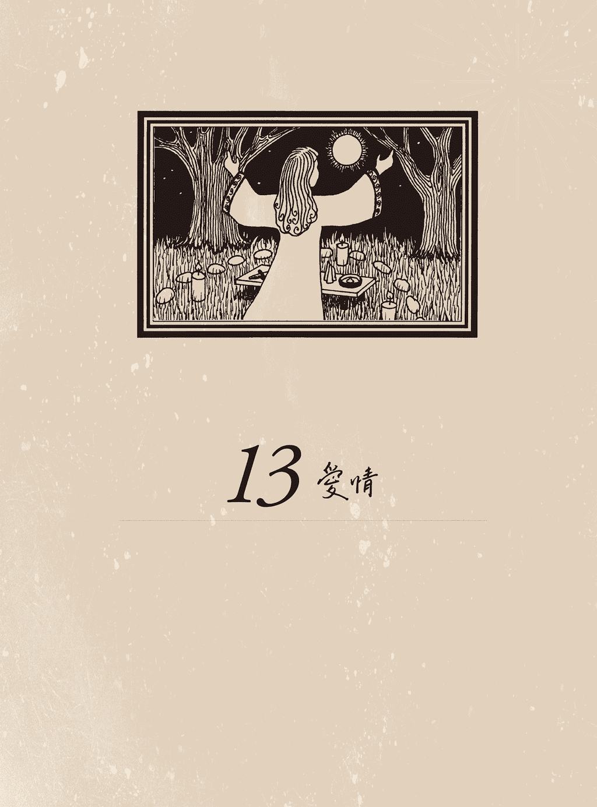

### 婚礼或亲密伴侣关系

这是在两人之间形成一种爱的定情魔法（love-binding spell）最好的方式。

任何一种亲密伴侣关系都可以举行这种魔法仪式，你喜欢的话也可以经常举行，以便经常更新两人对彼此许下的承诺，或是在两人刚开始许下承诺时举行。

★ 必要的强化物和魔法器具

这个魔法必要的器具包括如下描述中你为阵法选择的所有器具。

你会需要：

．一个圣餐杯或葡萄酒杯

．葡萄酒或果汁（只能用红色），象征两人的血混合在一起

．熏衣草精油

．小剪刀，比如修剪胡子或修指甲的小剪刀

．信封

．两条缎带、绳子或毛线（红色或白色），或是黑色皮线，大约 6 英吋长(约 15 公分)——这个尺寸是能绑在彼此手腕上的长度。如果你能找到的话，用皮制的手环也很好。

蜡烛

你需要一支粉红色蜡烛、一支白色蜡烛和一支红色蜡烛。

阵法

所有的魔法仪式刚开始都应该画一个圆圈，这是你的防护罩。如果你要使用三角形或正方形，先造一个圆圈，然后在里面制作你的阵法。

最适合这个魔法的阵法是圆圈。请使用本书第五章中描述的方法创造你的阵法，用魔法棒、刀子，伸出手臂比出食指和中指来画阵法，你也可以选择用盐巴或其他有形的东西来制作阵法。

面对的方向

这个魔法最有效的方式是你们面向彼此，一个人面向南方，另一个人面向北方。把所有的蜡烛摆在你们的右边，任何器具或强化物摆在阵法内让你们觉得舒服的地方。

月相

这个魔法在满月、新月或渐盈月举行效果最好，因为你想要增加爱情，让它达到圆满，就像月亮渐盈到满月那样。

一周中的哪一天

最适合举行这个魔法的日子是星期一、星期二、星期四、星期五和星期六。

★ 非必要的魔法强化物

下面的这些物品能为你的魔法增加深度，并且帮助自己更加专注，但这些不是必要的，就算你没有这些东西也可以施展魔法。

宝石

这个魔法最适合的宝石是粉水晶。如果要在你的阵法中使用除了我建议的这种以外的宝石，请将它们放在你面前。

香熏

能强化这个魔法的香品是广藿香（Patchouli）、肉桂（Cinnamon）和茉莉花（Jasmine）。如果你喜欢的话，将这些香品放在你阵法内一个安全的地方。然而，想在阵法外开始使用香熏也没关系。

音乐

如果你喜欢音乐，觉得它不会让你分心，你可能会想播放一些浪漫或静心的乐器演奏音乐。只要你觉得舒服的音乐都好。

★ 在你开始魔法仪式之前

请确定不会有让你分心的事情。

可能的话，关掉所有电话。

播放静心的音乐。

把灯光调暗一点。

在你开始前洗手或洗澡。

如果你要香熏的话，可以先点香。

准备你需要的所有东西，放在附近拿得到的地方。

画你的阵法。

请求你的高层力量允许将讯息传给你。

★ 肯定语

在正式开始你的魔法之前，先在阵法内读诵肯定语。

今天我们选择要许下诺言，我们会尽一切努力珍爱和尊重彼此。我们会在月亮的力量之下结成亲密伴侣，承诺创造一个充满爱情和谅解的结合。

★ 如何举行魔法仪式

1. 坐着面向彼此，其中一个人面向北方，另一个人面向南方。谁面向哪一个方向都没关系。面向北方的这个人要先喝一口葡萄酒，然后说：“愿你永不口渴。”

然后把杯子交给伴侣，这个人从同一个杯子喝葡萄酒，说：“愿你永不口渴。”

2. 两个人都要用熏衣草精油涂抹每一支蜡烛，从底部开始往上涂到蜡烛顶端，直到整支蜡烛都涂满精油为止。

3\. 现在面向南方的人喝一口葡萄酒，说：“你是我的火光。”

另一个人也一样喝葡萄酒，说：“你是我的火光。”

4. 从彼此的头上剪一小段头发，把两人的头发一起放进同一个信封里。（先摆到旁边。）

5. 面向北方的人喝一口葡萄酒，说：“我们是一体的。”另一个人也一样这么做。

6. 把线或绳子绑在你伴侣的手腕上，不管是谁先绑都没关系。面向南方的人喝一口葡萄酒说：“你跟我绑在一起了。”

另一个人也喝酒并说同样的话。

7\. 亲吻彼此，一起念咒语：我们今晚在此为爱结合。

8. 各自从信封里拿出几根头发，丢到风中。如果你们的头发不够丢，只要碰一下黏到你手指上的几根头发，对着天空甩一下你们的手。

在你的心中以象征结束仪式的声明来做总结，像是“那就这样吧！”“祝福”或“阿门”。接下来熄灭蜡烛，解除你们的阵法。

### 吸引一个爱人

这个魔法通常是在你想偶尔跟人分享亲密时刻，但又不一定是要寻找长期的亲密伴侣时使用。

★ 必要的强化物和魔法器具

这个魔法必要的器具包括如下描述中你为阵法选择的所有器具。

你会需要：

．用硬纸板剪出两个人像（其中一个人像代表你，另一个代表你想寻找的那个人性别的人像。）

．广藿香精油

．熏衣草精油

．纸和笔

．一个粉红色的信封

蜡烛

你需要一支黄色蜡烛放在你前面的左边，一支粉红色蜡烛放在你前面的右边。

阵法

所有的魔法仪式刚开始都应该画一个圆圈，这是你的防护罩。如果你要使用三角形或正方形，先造一个圆圈，然后在里面制作你的阵法。

最适合这个魔法的阵法是圆圈。请使用本书第五章中描述的方法创造你的阵法，用魔法棒、刀子，伸出手臂比出食指和中指来画阵法，你也可以选择用盐巴或其他有形的东西来制作阵法。

面对的方向

如果你面向南方，这个魔法会最有效。在你的阵法中摆放好你的蜡烛和任何器具或强化物，这样当你面向南方坐下时，这些东西会放在你的面前。

月相

这个魔法在满月或渐盈月举行效果最好，因为你想要增加爱情的机会，让它达到圆满，就像月亮渐盈到满月那样。

一周中的哪一天

最适合举行这个魔法的日子是星期五，但这个魔法除了星期三和星期六比较不好之外，任何一天都可以。

★ 非必要的魔法强化物

下面的这些物品能为你的魔法增加深度，并且帮助自己更加专注，但这些不是必要的，就算你没有这些东西也可以施展魔法。

宝石

这个魔法最适合的宝石是粉水晶和粉红碧玺（Pink tourmaline）。如果要在你的阵法中使用除了我建议的这两种以外的宝石，请将它们放在你面前。

香熏

能强化这个魔法的香品是麝香（Musk）和龙涎香（Ambergris）。如果你喜欢的话，将这些香品放在你阵法内一个安全的地方。然而，想在阵法外开始使用香熏也没关系。

音乐

如果你喜欢音乐，觉得它不会让你分心，你可能会想播放一些舒心或挑动情欲的音乐，像是印地安原住民的鼓乐、笛子，或是拉威尔的《波丽露》（“Bolero” by Ravel）。让你觉得舒服的任何音乐都好。

★ 在你开始魔法仪式之前

请确定不会有让你分心的事情。

可能的话，关掉所有电话。

播放音乐。

把灯光调暗一点。

在你开始前洗手或洗澡。

如果你要香熏的话，可以先点香。

准备你需要的所有东西，放在附近拿得到的地方。

画你的阵法。

这时可以点蜡烛。

请求你的高层力量允许将讯息传给你。

★ 肯定语

在正式开始你的魔法之前，先在阵法内读诵肯定语。

在人生的这个时刻，我并不想有长期的亲密关系，但我想有个志同道合的亲密伴侣。我知道我们会共度一段特别的时光，当缘份结束时，我们将会各走各的路，但仍然保持友谊，相互谅解。

那就这样吧！

★ 如何举行魔法仪式

当你创建好圆圈阵法之后，把两个纸板做的人像拿出来，在上面沾一点广藿香精油，让它们面面相对——一个面向南方，另一个面向北方。哪一个人像朝向哪一方并不重要，用你的直觉去佈置就好。

现在说下列的咒语：

我要吸引你一天天的靠近我，

直到有一天，你终于来到我身边。

我们相聚的时光很短暂，也有终点，

但我们两个都知道这点，不必假装。

所以你快来吧！亲爱的你，

我施展这个魔法，好让我们彼此能相遇！

在你的心中以象征结束仪式的声明来做总结，像是“那就这样吧！”“祝福”或“阿门”。接下来熄灭蜡烛，解除你的阵法，把你的纸板人像放在你选择的某个房间的两个不同角落。

在接下来的九天里，以你觉得适合的方式移动它们，让它们逐渐接近彼此。到了第九天，把这两个人像一起放进同一个信封里。你可以用一条绳子或缎带把它们绑在一起，想办法让这两个人像能碰触彼此，但不要用钉书机钉它们。把这个信封放在你的床边，直到那个人走进你的生活为止。当你们的亲密关系结束之后，把这两个人像烧掉，这样你们两人又恢复自由了。

### 灵魂伴侣

使用这个魔法召唤情投意合，在所有层面都能吸引你的人：肉体、心理和灵性。记住，没有一个人是完美的，或是拥有我们想要的一切。你一定要耐心等待，心中不要设定任何一个特定的人，让宇宙给你一个惊喜。

★ 必要的强化物和魔法器具

这个魔法必要的器具包括如下描述中你为阵法选择的所有器具。

你会需要：

．两片玫瑰刺（这两片玫瑰刺代表一朵爱情之花，了解有时候想要得到美丽的事物时，我们可能会碰到一点刺，像是等待本身就有点刺人。手边请多准备几片玫瑰刺，以防万一你想将刺固定在蜡烛上时，不小心弄断了它。）

蜡烛

你需要一支粉红色蜡烛。

阵法

所有的魔法仪式刚开始都应该画一个圆圈，这是你的防护罩。如果你要使用三角形或正方形，先造一个圆圈，然后在里面制作你的阵法。

最适合这个魔法的阵法是圆圈。请使用本书第五章中描述的方法创造你的阵法，用魔法棒、刀子，伸出手臂比出食指和中指来画阵法，你也可以选择用盐巴或其他有形的东西来制作阵法。

面对的方向

如果你面向南方，这个魔法会最有效。在你的阵法中摆放好你的蜡烛和任何器具或强化物，这样当你面向南方坐下时，这些东西会放在你的面前。

月相

这个魔法在满月或新月举行效果最好。

一周中的哪一天

最适合举行这个魔法的日子是星期天、星期二和星期五。

★ 非必要的魔法强化物

下面的这些物品能为你的魔法增加深度，并且帮助自己更加专注，但这些不是必要的，就算你没有这些东西也可以施展魔法。

宝石

这个魔法最适合的宝石是粉水晶和粉红碧玺。如果要在你的阵法中使用除了我建议的这两种以外的宝石，请将它们放在你面前。

香熏

能强化这个魔法的香品是苹果花（Apple blossom）和广藿香。如果你喜欢的话，将这些香品放在你阵法内一个安全的地方。然而，想在阵法外开始使用香熏也没关系。

音乐

如果你喜欢音乐，觉得它不会让你分心，你可能会想播放一些新世纪音乐、古典乐或巴洛克音乐，或是任何你觉得浪漫的乐器所演奏的音乐，也许是竖琴或笛子。只要你觉得舒服的音乐都好。

★ 在你开始魔法仪式之前

请确定不会有让你分心的事情。

可能的话，关掉所有电话。

播放静心的音乐。

把灯光调暗一点。

在你开始前洗手或洗澡。

如果你要香熏的话，可以先点香。

准备你需要的所有东西，放在附近拿得到的地方。

画你的阵法。

请求你的高层力量允许将讯息传给你。

★ 肯定语

在正式开始你的魔法之前，先在阵法内读诵肯定语。

我了解在寻找真爱时我必须耐心一点，宇宙的力量不会按照我想要的时间让真爱出现，而是根据最适合我的时机。我也了解如果有人出现的话，我会假定对方是我的灵魂伴侣，我会花时间去查看，这个人是不是我在寻找的那个人。如果不是的话，我不会勉强跟不适合的人发展亲密关系，我会带着尊严和新希望继续寻找。

把两片玫瑰刺插进粉红色蜡烛中央，然后点燃蜡烛。念下列这段咒语：

我凝望月亮，

我凝望太阳，

我们将会合而为一。

不论寒暑，我都将日日等待，

直到我们相遇，直到我们的唇瓣相触的那一天。

在你的心中以象征结束仪式的声明来做总结，像是“那就这样吧！”“祝福”或“阿门”。接下来熄灭蜡烛，解除你的阵法。

### 我可以感觉到你，你在哪里？

★ 必要的强化物和魔法器具

这个魔法必要的器具包括如下描述中你为阵法选择的所有器具。

你会需要：

．葡萄酒或果汁（白色或红色）

．圣餐杯或特别的杯子

．一小块打磨过或原矿的粉水晶

蜡烛

你也需要红色、黄色、白色和粉红色的蜡烛，在魔法仪式开始之后点燃它们，在你前面排成一排。

阵法

所有的魔法仪式刚开始都应该画一个圆圈，这是你的防护罩。如果你要使用三角形或正方形，先造一个圆圈，然后在里面制作你的阵法。

最适合这个魔法的阵法是三角形。请使用本书第五章中描述的方法创造你的阵法，用魔法棒、刀子，伸出手臂比出食指和中指来画阵法，你也可以选择用盐巴或其他有形的东西来制作阵法。

面对的方向

如果你面向北方，这个魔法会最有效。在你的阵法中摆放好你的蜡烛和任何器具或强化物，这样当你面向北方坐下时，这些东西会放在你的面前。

月相

这个魔法在满月时举行效果最好，因为我们希望增加找到那个人的机会，你会感觉到适合你的人就在某处。

一周中的哪一天

最适合举行这个魔法的日子是星期一、星期二和星期五，但这个魔法在任何一天施行都可以。

★ 非必要的魔法强化物

下面的这些物品能为你的魔法增加深度，并且帮助自己更加专注，但这些不是必要的，就算你没有这些东西也可以施展魔法。

宝石

这个魔法最适合的宝石是红玉髓和青金石。如果要在你的阵法中使用除了我建议的这两种以外的宝石，请将它们放在你面前。

香熏

能强化这个魔法的香品是麝香和龙血树脂（Dragon’s blood）。如果你喜欢的话，将这些香品放在你阵法内一个安全的地方。然而，想在阵法外开始使用香熏也没关系。

音乐

如果你喜欢音乐，觉得它不会让你分心，你可能会想播放一些静心或挑动情欲的音乐，像是美国原住民的鼓乐、笛子、吟唱或某种你觉得浪漫的音乐。只要你觉得舒服的音乐都好。

★ 在你开始魔法仪式之前

请确定不会有让你分心的事情。

可能的话，关掉所有电话。

播放静心的音乐。

把灯光调暗一点。

在你开始前洗手或洗澡。

如果你要香熏的话，可以先点香。

准备你需要的所有东西，放在附近拿得到的地方。

画你的阵法。

请求你的高层力量允许将讯息传给你。

★ 肯定语

在正式开始你的魔法之前，先在阵法内读诵肯定语。

今晚聆听月亮的低语声，我感觉到你，但却不知道你是谁，也不知道你在哪里。我的心不禁想到你。我们注定会在一起吗？或者我现在感觉到的只是前世的一部分，如今已经不再了？你只是一个幻梦，或是真实存在的人？哦，月亮的能量啊！感受我的沮丧。为什么想到我不曾遇见的那个人的念头会这么让我困惑？是什么阻碍我们找到彼此？借着上天的恩典，如果这个人是我的爱人，那就不要让我们再分离。

★ 如何举行魔法仪式

1\. 点燃黄色蜡烛说：“我在这里，快来我身边。”

2\. 喝一口葡萄酒。

3\. 点燃红色蜡烛说：“感觉我的呼吸。”

4\. 点燃白色蜡烛说：“愿火光能让我们找到彼此。”

5. 拿起你的粉水晶，在三支蜡烛的火焰上方滑过，保持一定的高度，不要烫到自己。

6. 现在把粉水晶握在心口处，闭上眼睛，试着想像某人的剪影轮廓，但没有脸孔。如果心中没有出现任何画面，也不要强求，暂时放下吧！

最后点燃粉红色蜡烛，念下列这段咒语：

我凝望着那有魔法力量的月亮，

此时此刻你是否也在凝望明月呢？

我不认识你，我们也不曾说过话，

现在魔法已经成立，不会被打破。

在你的心中以象征结束仪式的声明来做总结，像是“那就这样吧！”“祝福”或“阿门”。接下来熄灭蜡烛，解除你的阵法。

在你离开阵法之后，拿起你的粉水晶，如果可能的话，把它放在你每天看得到的地方。下一次你看到另一块粉水晶的时候，把它买下来，放在你看不到的地方。知道某一天你会把它送给注定要跟你在一起的那个人。最后这两块水晶会并排摆放在一起。

### 跟某人分手

这个魔法可能会帮助你找到向前迈进的力量，走向一个新的生活。

★ 必要的强化物和魔法器具

这个魔法必要的器具包括如下描述中你为阵法选择的所有器具。

蜡烛

你也需要在你面前放一支黑色的蜡烛，一个烧东西的容器，还有火柴或打火机。

阵法

所有的魔法仪式刚开始都应该画一个圆圈，这是你的防护罩。如果你要使用三角形或正方形，先造一个圆圈，然后在里面制作你的阵法。

最适合这个魔法的阵法是圆圈，但这个魔法在创建阵法时要以逆时钟方向，而不是顺时钟方向，因为你要将时光回溯到这个人尚未进入你生命中的时候。请使用本书第五章中描述的方法创造你的阵法，用魔法棒、刀子，伸出手臂比出食指和中指来画阵法，你也可以选择用盐巴或其他有形的东西来制作阵法。

面对的方向

如果你面向北方，这个魔法会最有效。在你的阵法中摆放好你的蜡烛和任何器具或强化物，这样当你面向北方坐下时，这些东西会放在你的面前。

月相

这个魔法在渐亏月或暗月时举行效果最好，因为我们希望减少爱情的机会，就像月亮从满月渐渐消减到暗月那样。

一周中的哪一天

最适合举行这个魔法的日子是星期天和星期六，但这个魔法在任何一天施行都可以。

★ 非必要的魔法强化物

下面的这些物品能为你的魔法增加深度，并且帮助自己更加专注，但这些不是必要的，就算你没有这些东西也可以施展魔法。

宝石

最适合这个魔法的宝石是像缟玛瑙（Onyx）、黑曜石或黑玉（Jet）之类的黑色宝石。如果要在你的阵法中使用除了我建议的这三种以外的宝石，请将它们放在你面前。

香熏

能强化这个魔法的香品是熏衣草、雪松（Ceder）和柑橘类。如果你喜欢的话，将这些香品放在你阵法内一个安全的地方。然而，想在阵法外开始使用香熏也没关系。

音乐

如果你喜欢音乐，觉得它不会让你分心，你可能会想播放一些吟唱、鼓乐或是轻柔和弦的音乐。只要你觉得舒服的音乐都好。

★ 在你开始魔法仪式之前

请确定不会有让你分心的事情。

可能的话，关掉所有电话。

播放静心的音乐。

把灯光调暗一点。

在你开始前洗手或洗澡。

如果你要香熏的话，可以先点香。

准备你需要的所有东西，放在附近拿得到的地方。

画你的阵法。

请求你的高层力量允许将讯息传给你。

★ 肯定语

在正式开始你的魔法之前，先在阵法内读诵肯定语。

我现在身在这个地方，很想寻找答案，我感觉得到我的指导灵和我内在的智慧。我感觉得到所有生命的源头。我对我应该走的旅程感到越来越疲惫，我对（某人的名字）（有爱或曾经有爱），但我感觉过去强烈的结合已经结束了。请帮我克服这个弱点，让我能彻底执行分手这个选择。我用理智和清晰的头脑认真考虑过分手这个想法。我会为这件事情难过一阵子，然后我会带着新希望和积极的态度迈向未来。这个情况是我进化的另一步，是我注定要体验的一段历程。当这扇门关上时，我将不再长久注视这扇关上的门，而会往前看另一扇即将打开的门。

那就这样吧！

注视你的黑色蜡烛，观想你要分手的那个人变得越来越小，最后消失在火焰中。

★ 如何举行魔法仪式

念诵下列的咒语：

我们要分手了，愿你一切安好，

我顺从我的心愿，

你我各走各的路，

从此以后，我们的缘分就结束了。

在你的心中以象征结束仪式的声明来做总结，像是“那就这样吧！”“祝福”或“阿门”。接下来熄灭蜡烛，解除你的阵法。

### 性欲

这个魔法会为现有的亲密关系增添一点魔法的火花。

★ 必要的强化物和魔法器具

这个魔法必要的器具包括如下描述中你为阵法选择的所有器具。

你会需要：

．红色亮片（代表刺激的事物和闪亮的热情）

．广藿香精油

．香草（Vanilla）

（如果你要在地上进行，你可能会想要用一块硬纸板或防护布遮住地面，这样魔法仪式结束之后，亮片才不会黏到地毯上。）

蜡烛

你需要放两支红色的蜡烛在你面前。

阵法

所有的魔法仪式刚开始都应该画一个圆圈，这是你的防护罩。如果你要使用三角形或正方形，先造一个圆圈，然后在里面制作你的阵法。

最适合这个魔法的阵法是圆圈。请使用本书第五章中描述的方法创造你的阵法，用魔法棒、刀子，伸出手臂比出食指和中指来画阵法，你也可以选择用盐巴或其他有形的东西来制作阵法。

面对的方向

如果你面向南方，这个魔法会最有效。在你的阵法中摆放好你的蜡烛和任何器具或强化物，这样当你面向南方坐下时，这些东西会放在你的面前。

月相

这个魔法在满月或渐盈月时举行效果最好，因为我们希望增加爱情的机会，就像月亮渐盈到满月那样。

一周中的哪一天

最适合举行这个魔法仪式的日子是星期一、星期二、星期四和星期五，但这个魔法除了星期三和星期六比较不好之外，在任何一天举行都可以。

★ 非必要的魔法强化物

下面的这些物品能为你的魔法增加深度，并且帮助自己更加专注，但这些不是必要的，就算你没有这些东西也可以施展魔法。

宝石

这个魔法最适合的宝石是红玉髓、粉水晶和孔雀石。如果要在你的阵法中使用除了我建议的这三种以外的宝石，请将它们放在你面前。

香熏

能强化这个魔法的香品是苹果、龙涎香（Ambergris）和茉莉花。如果你喜欢的话，将这些香品放在你阵法内一个安全的地方。然而，想在阵法外开始使用香熏也没关系。

音乐

如果你喜欢音乐，觉得它不会让你分心，你可能会想播放一些浪漫和挑动情欲，可能还有些逐渐增强的音乐。只要你觉得舒服的音乐都好。

★ 在你开始魔法仪式之前

请确定不会有让你分心的事情。

可能的话，关掉所有电话。

播放音乐。

把灯光调暗一点。

在你开始前洗手或洗澡。

如果你要香熏的话，可以先点香。

准备你需要的所有东西，放在附近拿得到的地方。

画你的阵法。

请求你的高层力量允许将讯息传给你。

★ 肯定语

在正式开始你的魔法之前，先在阵法内读诵肯定语。

我们都有人类的需求，有时候肉体想要更多的热情，今天我会主动跟我的伴侣为我的生活带来更多的刺激。我也会考虑在物质上做其他不同的改变，像是下一次我跟伴侣在一起时，穿更具挑逗性的服装，创造一种浪漫和引人遐思的氛围。

★ 如何举行魔法仪式

在点蜡烛之前，先在蜡烛上涂抹广藿香精油和香草。从蜡烛底部慢慢往上涂，一次涂薄薄的一层精油，你想涂多少次都没关系。

在你的蜡烛上撒一点亮片（不需要太多）。

点燃蜡烛，念诵下列的咒语：

愿你想到我时会绽放热情之光，

愿这热情增强增大到三倍之多。

当你看着我时会感到欲火焚身，

我们将抚慰内心深处的欲望。

在你的心中以象征结束仪式的声明来做总结，像是“那就这样吧！”“祝福”或“阿门”。接下来熄灭蜡烛，解除你的阵法。

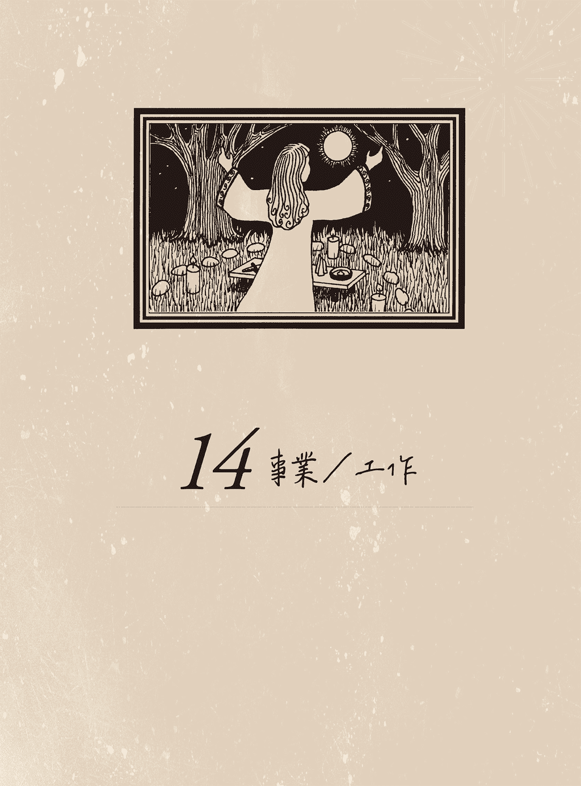

### 自己开业做生意

★ 必要的强化物和魔法器具

这个魔法必要的器具包括如下描述中你为阵法选择的所有器具。

你会需要：

．一个信封

．一支笔

．三颗小种子——例如罂粟花种子或是青草的种子

蜡烛

你需要两支白色和两支绿色的蜡烛，把他们放在正方形的四面，而不是四个角落。把放在你面前的一支白色蜡烛朝向东方，一支绿色蜡烛朝向北方，一支朝向南方，另一支白色蜡烛放在你身后，朝向西方。

阵法

所有的魔法仪式刚开始都应该画一个圆圈，这是你的防护罩。如果你要使用三角形或正方形，先造一个圆圈，然后在里面制作你的阵法。

最适合这个魔法的阵法是正方形。请使用本书第五章中描述的方法创造你的阵法，用魔法棒、刀子，伸出手臂比出食指和中指来画阵法，你也可以选择用盐巴或其他有形的东西来制作阵法。

面对的方向

如果你面向东方，这个魔法会最有效。在你的阵法中摆放好你的蜡烛和任何器具或强化物，这样当你面向东方坐下时，这些东西会放在你的面前。

月相

这个魔法在新月时举行效果最好，因为我们希望增加生意的机会，就像月亮渐盈到满月那样。

一周中的哪一天

最适合举行这个魔法的日子是星期一、星期二、星期三、星期四和星期六。

★ 非必要的魔法强化物

下面的这些物品能为你的魔法增加深度，并且帮助自己更加专注，但这些不是必要的，就算你没有这些东西也可以施展魔法。

宝石

这个魔法最适合的宝石是黄水晶（Citrine）。

香熏

能强化这个魔法的香品是紫藤（Wisteria）。如果你喜欢的话，将香品放在你阵法内一个安全的地方。然而，想在阵法外开始使用香熏也没关系。

音乐

如果你喜欢音乐，觉得它不会让你分心，你可能会想播放一些像美国原住民强力敲击的鼓乐。只要你觉得舒服的音乐都好。

★ 在你开始魔法仪式之前

请确定不会有让你分心的事情。

可能的话，关掉所有电话。

播放音乐。

把灯光调暗一点。

在你开始前洗手或洗澡。

如果你要香熏的话，可以先点香。

准备你需要的所有东西，放在附近拿得到的地方。

画你的阵法。

请求你的高层力量允许将讯息传给你。

★ 肯定语

在正式开始你的魔法之前，先在阵法内读诵肯定语。

我体认到要在自营的生意上获得成功，我必须对自己所做的事情充满热情和干劲。我会花时间去全盘研究我的事业的优点和缺点。

我能了解，如果我抓住这个机会，顺从我的运气，就会得到物质上的收获。当我充满热情的为某个事业努力时，我便跟宇宙同步合作。

我知道当宇宙发送要我对某事采取行动的积极念头时，我不应该忽视它。这是一个直接的讯息，不管它是不是我真正的方向，它都会为我带来深层的领悟。

如果我决定这是我通往幸福的道路，我会向前迈进，不会预期失败。负面的思想、愤怒、恐惧和自怜会阻碍能量的流动。我会带着正向能量，调整自己接通成功的振动频率。

那就这样吧！

★ 如何举行魔法仪式

当你建好阵法之后，点燃蜡烛，放轻松。把你的公司名称写在信封上。如果你还没决定名字，那就在信封上写“我的新生意”。把三颗种子放进信封里，密封黏好。

现在，念诵下列的咒语：

新的生意将从此开始，

一整年都会茁壮兴旺，

没有压力和冲突能消减我的动力，

去吧！你现在已经充满活力。

在你的心中以象征结束仪式的声明来做总结，像是“那就这样吧！”“祝福”或“阿门”。

专心想着你想要你的生意达到什么样的目标，当你感觉已经做完仪式后，就熄灭蜡烛，解除你的阵法。

做完魔法仪式之后，把信封放在你家或办公室内不会被丢弃的地方。抽屉或档案柜是不错的选择。三个月后，把这个信封丢掉，重复整个魔法仪式。只不过这一次要放进更大的种子（玉米、苹果籽、整颗干的碗豆）。三个月后，再做一次仪式，这次又换更大的种子（南瓜籽、向日葵籽、西瓜籽），等于在一年中举行三次魔法仪式。

### 找工作

★ 必要的强化物和魔法器具

这个魔法必要的器具包括如下描述中你为阵法选择的所有器具。

你会需要：

．木汤匙或棒子、冰棒木片、咖啡搅拌匙之类的。

．药草：肉桂、罗勒叶、姜、丁香（分别放在四个不同的容器内或四个不同的信封里。）

．可能的话，找玻璃制或木制的碗，或是你感觉特别的、可以装药草的任何一种容器。

蜡烛

你需要四支蜡烛：绿色、黄色、橘色和白色。把它们放在正方形的四面，而不是四个角落。把一支黄色蜡烛放在你面前，朝向东方，一支绿色蜡烛朝向北方，一支橘色朝向南方，另一支白色蜡烛放在你身后，朝向西方。

阵法

所有的魔法仪式刚开始都应该画一个圆圈，这是你的防护罩。如果你要使用三角形或正方形，先造一个圆圈，然后在里面制作你的阵法。

最适合这个魔法的阵法是正方形。请使用本书第五章中描述的方法创造你的阵法，用魔法棒、刀子，伸出手臂比出食指和中指来画阵法，你也可以选择用盐巴或其他有形的东西来制作阵法。

面对的方向

如果你面向东方，这个魔法会最有效。在阵法中摆放好你的蜡烛和任何器具或强化物，这样当你面向东方坐下时，这些东西会放在你的面前。

月相

这个魔法在新月或渐盈月时举行效果最好，因为我们希望增加工作的机会，就像月亮渐盈到满月那样。

一周中的哪一天

最适合举行这个魔法的日子是除了星期五的任何一天。

★ 非必要的魔法强化物

下面的这些物品能为你的魔法增加深度，并且帮助自己更加专注，但这些不是必要的，就算你没有这些东西也可以施展魔法。

宝石

这个魔法最适合的宝石是蓝铜矿（Azurite）。如果要在你的阵法中使用除了我建议的这种以外的宝石，请将它们放在你面前，或是你内心想要的任何一个位置。

香熏

能强化这个魔法的香品是香水草（Heliotrope）和紫藤。如果你喜欢的话，将这些香品放在你阵法内一个安全的地方。然而，想在阵法外开始使用香熏也没关系。

音乐

如果你喜欢音乐，觉得它不会让你分心，你可能会想播放一些乐器演奏的大胆、有节奏感，具有强力节拍的音乐。只要你觉得舒服的音乐都好。

★ 在你开始魔法仪式之前

请确定不会有让你分心的事情。

可能的话，关掉所有电话。

播放音乐。

把灯光调暗一点。

在你开始前洗手或洗澡。

如果你要香熏的话，可以先点香。

准备你需要的所有东西，放在附近拿得到的地方。

画你的阵法。

请求你的高层力量允许将讯息传给你。

★ 肯定语

在正式开始你的魔法之前，先在阵法内读诵肯定语。

我要求改变，请给我一个清晰的影像，这样我才不会错过对我有利的机会。我知道成功不只靠才能，还跟决心有关，这就是我的力量。我会聆听我的直觉并听从它的指引。如果某种方法不管用，我会了解这个“讯息”的含意，并尝试新的方法。这一次我请求宇宙送来额外的力量。借着宇宙生命能量的力量，我会找到进取心。等到下一个阴历月，愿我能为我的新事业献出感谢之意。

那就这样吧！

★ 如何举行魔法仪式

当你建好阵法之后，点燃蜡烛，放轻松，让自己集中精神。从左到右，一支一支的点燃蜡烛。把你的药草逐一放进碗里（次序并不重要），用木汤匙或搅拌器将它们混合，然后放到一旁。

现在，念诵下列的咒语：

此时此刻我要做一个改变，

我现在要为人生做良好的安排，

我知道幸运和好命是属于我的，

现在正是时候，快来我这里吧！

如果你在户外，那就站起来，把药草抛到你前方的空中。

如果你在室内，熄灭你的蜡烛，解除你的阵法。在二十分钟内去到户外，把混合的药草抛到空中。把它们丢出窗外也可以。

在你丢掉混合物之后说：“我的召唤已经释放到天空中，仪式完成了。”

在你的心中以象征结束仪式的声明来做总结，像是“那就这样吧！”“祝福”或“阿门”。

### 接受失业

★ 必要的强化物和魔法器具

这个魔法必要的器具包括如下描述中你为阵法选择的所有器具。

你会需要：

．某种可以燃烧、代表你的旧工作或旧职位的东西：公司名片、文具或某种纸制的物品（你甚至可以从广告黄页电话簿中撕下旧公司的广告。如果你什么东西都没有，可在一张纸上写下那个公司的名称或你的职位。）

．可以烧东西的耐热容器

．火柴或打火机

蜡烛

你需要三支蜡烛：黑色、银色／灰色和白色。把它们放在你的阵法内，在你周围呈三角形的方式摆放。黑色蜡烛放在左边的三角形基座点，银色／灰色蜡烛放在右边的基座点，白色放在你前面尖角的地方。

阵法

所有的魔法仪式刚开始都应该画一个圆圈，这是你的防护罩。如果你要使用三角形或正方形，先造一个圆圈，然后在里面制作你的阵法。

最适合这个魔法的阵法是圆圈。请使用本书第五章中描述的方法创造你的阵法，用魔法棒、刀子，伸出手臂比出食指和中指来画阵法，你也可以选择用盐巴或其他有形的东西来制作阵法。

面对的方向

如果你面向西方，这个魔法会最有效。在你的阵法中摆放好你的蜡烛和任何器具或强化物，这样当你面向西方坐下时，这些东西会放在你的面前。

月相

这个魔法在渐亏月或暗月时举行效果最好。

一周中的哪一天

最适合举行这个魔法的日子是星期二、星期三、星期四和星期六。

★ 非必要的魔法强化物

下面的这些物品能为你的魔法增加深度，并且帮助自己更加专注，但这些不是必要的，就算你没有这些东西也可以施展魔法。

宝石

这个魔法最适合的宝石是银。如果要在你的阵法中使用除了我建议的这种以外的宝石，请将它们放在你面前，或是你内心喜欢的任何一个位置。

香熏

能强化这个魔法的香品是鼠尾草（Sage）。如果你喜欢的话，将香品放在你阵法内一个安全的地方。然而，想在阵法外开始使用香熏也没关系。

音乐

如果你喜欢音乐，觉得它不会让你分心，你可能会想播放一些古典乐、新世纪音乐或任何大自然的声音。只要你觉得舒服的音乐都好。

★ 在你开始魔法仪式之前

请确定不会有让你分心的事情。

可能的话，关掉所有电话。

播放静心的音乐。

把灯光调暗一点。

在你开始前洗手或洗澡。

如果你要香熏的话，可以先点香。

准备你需要的所有东西，放在附近拿得到的地方。

画你的阵法。

请求你的高层力量允许将讯息传给你。

★ 肯定语

在正式开始你的魔法之前，先在阵法内读诵肯定语。

虽然我的工作被夺走了，但我体认到这样也有好处。我会分析这个情况，然后放下它。我会拥抱这个重新开始和成长的机会。我不会再活在负面的思绪中，现在那些已成为过去的一部分了。我会将精力用在思考如何在我选择的新领域中取得成功。我不会再表现得像受害者，不会再自哀自怜。我不会再跟别人抱怨或寻求同情。我获得了一个天赐的礼物，我将会用它来改善自己。大自然具有一定的平衡力，所以，如果有空缺产生时，很快就会被补上。我将带着喜悦和热情，认真注意所有潜在的工作机会。我表达感谢之情，请以成功和幸福的振动频率包围我。

那就这样吧！

★ 如何举行魔法仪式

当你建好阵法之后，从左到右，依序点燃蜡烛。把你的宝石（如果有使用宝石的话）放在你内心想放的任何位置。

接下来把代表你的旧工作或职位的纸制物品拿出来，放在烧东西的容器内烧掉它。

然后念诵下列的咒语：

我放下这个工作，它的服务期已满，

现在是我新的开始。

灰烬过后，新生即将到来，

我等待着下一个满月出现。

在你的心中以象征结束仪式的声明来做总结，像是“那就这样吧！”“祝福”或“阿门”。现在熄灭蜡烛，解除你的圆圈阵法。

### 升迁／加薪

★ 必要的强化物和魔法器具

这个魔法必要的器具包括如下描述中你为阵法选择的所有器具。

你会需要：

．九个硬币

蜡烛

你需要一支黄色蜡烛、一支绿色蜡烛和一支白色蜡烛。把它们放在你面前，黄色在左边，绿色在中间，白色在右边。

阵法

所有的魔法仪式刚开始都应该画一个圆圈，这是你的防护罩。如果你要使用三角形或正方形，先造一个圆圈，然后在里面制作你的阵法。

最适合这个魔法的阵法是正方形。请使用本书第五章中描述的方法创造你的阵法，用魔法棒、刀子，伸出手臂比出食指和中指来画阵法，你也可以选择用盐巴或其他有形的东西来制作阵法。

面对的方向

如果你面向东方，这个魔法会最有效。在你的阵法中摆放好你的蜡烛和任何器具或强化物，这样当你面向东方坐下时，这些东西会放在你的面前。

月相

这个魔法在渐盈月时举行效果最好，因为我们希望增加工作上的机会，就像增大的月亮渐盈到满月那样。

一周中的哪一天

最适合举行这个魔法的日子是除了星期五之外的任何一天。

★ 非必要的魔法强化物

下面的这些物品能为你的魔法增加深度，并且帮助自己更加专注，但这些不是必要的，就算你没有这些东西也可以施展魔法。

宝石

这个魔法最适合的宝石是橄榄石和血石（Bloodstone）。如果要在你的阵法中使用除了我建议的这两种以外的宝石，请将它们放在你面前，或是你喜欢的任何一个位置。

香熏

能强化这个魔法的香品是云杉木（Spruce）。如果你喜欢的话，将这个香品放在你阵法内一个安全的地方。然而，想在阵法外开始使用香熏也没关系。

音乐

如果你喜欢音乐，觉得它不会让你分心，你可能会想播放一些有笛子、竖琴和鼓乐的振奋人心的音乐。只要你觉得舒服的音乐都好。

★ 在你开始魔法仪式之前

请确定不会有让你分心的事情。

可能的话，关掉所有电话。

播放音乐。

把灯光调暗一点。

在你开始前洗手或洗澡。

如果你要香熏的话，可以先点香。

准备你需要的所有东西，放在附近拿得到的地方。

画你的阵法。

请求你的高层力量允许将讯息传给你。

★ 肯定语

在正式开始你的魔法之前，先在阵法内读诵肯定语。

透过月亮光耀的振动频率，今天我向宇宙祈求帮助，愿我的努力和耐心获得认可。我不是贪婪的人，但我相信能量的公平交易。我在我的职位中所付出的精力比获得的回报更多。在接下来的九天中，公正的天平将取得平衡。如果我遇到了不如我预期的事情，我会重新思考我的情况，以不同的角度切入。我感觉月亮的能量接纳了我的需要，认可了这个请求。我是宇宙的孩子，我知道宇宙会供应我一切的需求。

那就这样吧！

★ 如何举行魔法仪式

点燃除了绿色之外的其他蜡烛。把九枚硬币在绿色蜡烛四周摆成一个圆圈。摆放好之后，点燃这支蜡烛。

然后念诵下列的咒语：

就这样，以三乘三的倍数，

我的金钱会逐渐增加，

不会太少，也不会太迟，

九天之内，我就会知道结果。

在你的心中以象征结束仪式的声明来做总结，像是“那就这样吧！”“祝福”或“阿门”。

在接下来的九天中，多注意在你的工作场所中所发生的事情。

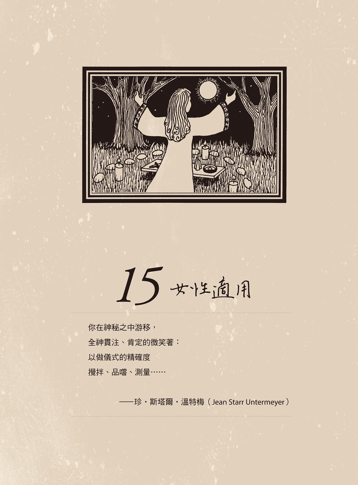

我们常觉得女性有一些问题或感受只有其他的女性能够了解。一般来说，我感觉女性的情绪表达比男人更明显易见，这也是因为我们的思想和感受比较强烈，让我感觉我们也比男性更快产生正面或负面的效果。因此，身为女性，我们一定要记住，如果你贬低自己，感觉自己在人生的任何领域中都是失败者，这很可能会成为一种“自证预言”（Self-fulfilling prophecy），这是我们应该防止发生的事情。举行一个仪式可以帮你平衡和集中混乱的能量，打开你的意识和潜意识的心去接收同样的讯息。

### 生育

★ 必要的强化物和魔法器具

这个魔法必要的器具包括如下描述中你为阵法选择的所有器具。

你会需要：

．罂粟花、鼠尾草和紫锥花（Echinacea），每种材料分别放在不同的容器或信封里。

．附系绳的袋子

．独角兽雕像、相片或某个象征性的物品（代表生育）

蜡烛

你需要三支蜡烛：黄色、红色和粉红色。

把它们放在你面前，在阵法内排成横排，黄色在左边，红色在中间，粉红色在右边。

阵法

所有的魔法仪式刚开始都应该画一个圆圈，这是你的防护罩。如果你要使用三角形或正方形，先造一个圆圈，然后在里面制作你的阵法。

最适合这个魔法的阵法是圆圈。请使用本书第五章中描述的方法创造你的阵法，用魔法棒、刀子，伸出手臂比出食指和中指来画阵法，你也可以选择用盐巴或其他有形的东西来制作阵法。

面对的方向

如果你面向西方，这个魔法会最有效。在你的阵法中摆放好你的蜡烛和任何器具或强化物，这样当你面向西方坐下时，这些东西会放在你的面前。

月相

这个魔法在满月或渐盈月时举行效果最好，因为我们希望增加生育的机会，就像月亮渐盈到满月那样。

一周中的哪一天

最适合举行这个魔法的日子是除了星期三的任何一天。

★ 非必要的魔法强化物

下面的这些物品能为你的魔法增加深度，并且帮助自己更加专注，但这些不是必要的，就算你没有这些东西也可以施展魔法。

宝石

这个魔法最适合的宝石是粉水晶和绿松石。如果要在你的阵法中使用除了我建议的这两种以外的宝石，请将它们放在你面前。

香熏

能强化这个魔法的香品是风信子（Hyacinth）、没药（Myrrh）和松树。如果你喜欢的话，将这些香品放在你阵法内一个安全的地方。然而，想在阵法外开始使用香熏也没关系。

音乐

如果你喜欢音乐，觉得它不会让你分心，你可能会想播放一些祥和、冥想和低频的宁静音乐。只要你觉得舒服的音乐都好。

★ 在你开始魔法仪式之前

请确定不会有让你分心的事情。

可能的话，关掉所有电话。

播放静心的音乐。

把灯光调暗一点。

在你开始前洗手或洗澡。

如果你要香熏的话，可以先点香。

准备你需要的所有东西，放在附近拿得到的地方。

画你的阵法。

请求你的高层力量允许将讯息传给你。

★ 肯定语

在正式开始你的魔法之前，先在阵法内读诵肯定语。

我坐在这个圆圈中央，请求能获得赐福，希望有个孩子能进入我的生命中。愿我的爱延伸出去，包围这个尚未出生的孩子。

我看到我提供无条件的爱包围着一个健康快乐的孩子。

愿这个圆圈的能量给我坚强的力量和健康的身体，让我能怀着这个孩子直到他进入他的人生。

那就这样吧！

★ 如何举行魔法仪式

坐在你的圆圈中，拿出三种药草，逐一（任何一种次序都可以）倒进附系绳的袋子里。让这个袋子触碰你的肚子几秒钟，观想你怀孕的样子（但不要观想孩子的性别）。

把袋子放在独角兽面前，念诵下列的咒语：

在明月中有个生命在成长，

我知道有个孩子在靠近我。

快乐、健康、充满迷人的特质

我会把这个孩子抱在怀里。

在你的心中以象征结束仪式的声明来做总结，像是“那就这样吧！”“祝福”或“阿门”。现在熄灭蜡烛，解除你的阵法。

注意：在接下来的九天中每天做一次，在睡前躺下来时，把这个袋子放在你的肚子上，观想自己怀孕的样子。当你怀孕后，保留这个袋子直到孩子出生为止。

### 生产顺利

★ 必要的强化物和魔法器具

这个魔法必要的器具包括如下描述中你为阵法选择的所有器具。

你会需要：

．元素水

．装水的杯子（这个魔法最好用大杯子，因为杯子象征生育和女性特质。）

蜡烛

你需要三支蜡烛：蓝色、粉红色和橘色。把它们放在你面前，在阵法内排成一排，蓝色在左边，粉红色在中间，橘色在右边。

阵法

所有的魔法仪式刚开始都应该画一个圆圈，这是你的防护罩。如果你要使用三角形或正方形，先造一个圆圈，然后在里面制作你的阵法。

最适合这个魔法的阵法是圆圈。请使用本书第五章中描述的方法创造你的阵法，用魔法棒、刀子，伸出手臂比出食指和中指来画阵法，你也可以选择用盐巴或其他有形的东西来制作阵法。

面对的方向

如果你面向南方，这个魔法会最有效。在你的阵法中摆放好你的蜡烛和任何器具或强化物，这样当你面向南方坐下时，这些东西会放在你的面前。

月相

这个魔法在满月、新月或渐盈月时举行效果最好，因为我们希望增加良好的可能性，就像月亮渐盈到满月那样。

一周中的哪一天

举行这个魔法的日子是任何一天都可以。

★ 非必要的魔法强化物

下面的这些物品能为你的魔法增加深度，并且帮助自己更加专注，但这些不是必要的，就算你没有这些东西也可以施展魔法。

宝石

这个魔法最适合的宝石是粉水晶、绿松石和白水晶。如果要在你的阵法中使用除了我建议的这三种以外的宝石，请将它们放在你面前。

香熏

能强化这个魔法的香品是玫瑰和柳橙。如果你喜欢的话，将这些香品放在你阵法内一个安全的地方。然而，想在阵法外开始使用香熏也没关系。

音乐

如果你喜欢音乐，觉得它不会让你分心，你可能会想播放一些祥和、平稳和静心的音乐，像是有安眠曲性质，让你觉得有疗愈作用的音乐。只要你觉得舒服的音乐都好。

★ 在你开始魔法仪式之前

请确定不会有让你分心的事情。

可能的话，关掉所有电话。

播放静心的音乐。

把灯光调暗一点。

在你开始前洗手或洗澡。

如果你要香熏的话，可以先点香。

准备你需要的所有东西，放在附近拿得到的地方。

画你的阵法。

请求你的高层力量允许将讯息传给你。

★ 肯定语

在正式开始你的魔法之前，先在阵法内读诵肯定语。

我感觉到这个圣洁的心灵之爱，我心中充满正念的思想和正向的希望，希望这个尚未出生的孩子会深入我的生活中，这个宝贝将会感受到奉献的母爱。上天高层的力量会保佑和指引这个新生命的灵魂，轻松无障碍的进入这个世界。

那就这样吧！

★ 如何举行魔法仪式

当你坐在圆圈内时，双手伸进元素水中，带着水碰触你肚子上的皮肤，念诵下列的咒语：

借着此处的所有元素，

你的灵魂穿越时空到来。

你很高兴来到这里，你是个强壮的新生命，

我这么说之后，它就会成为事实。

在你的心中以象征结束仪式的声明来做总结，像是“那就这样吧！”“祝福”或“阿门”。现在熄灭蜡烛，解除你的阵法。

把你的元素水倒在盆栽里或倒到户外。如果不得已，也可以把剩余的水倒进水槽里。让水流经你的手，倒进排水管里时说：“回归大地。”

### 爱（限女性）

★ 必要的强化物和魔法器具

这个魔法必要的器具包括如下描述中你为阵法选择的所有器具。

你会需要：

．一个插着你喜欢的花的盘子或插花用具，摆在你面前（用真花最好，但干净漂亮的人造花也可以。）

蜡烛

你需要在你面前放一支粉红色的蜡烛。

阵法

所有的魔法仪式刚开始都应该画一个圆圈，这是你的防护罩。如果你要使用三角形或正方形，先造一个圆圈，然后在里面制作你的阵法。

最适合这个魔法的阵法是圆圈。请使用本书第五章中描述的方法创造你的阵法，用魔法棒、刀子，伸出手臂比出食指和中指来画阵法，你也可以选择用盐巴或其他有形的东西来制作阵法。

面对的方向

如果你面向南方，这个魔法会最有效。在阵法中摆放好你的蜡烛和任何器具或强化物，这样当你面向南方坐下时，这些东西会放在你的面前。

月相

这个魔法在满月、新月或渐盈月时举行效果最好，因为我们希望增加良好的可能性，就像增大的月亮渐盈到满月那样。

一周中的哪一天

最适合举行这个魔法的日子是星期天、星期二、星期五或星期六。

★ 非必要的魔法强化物

下面的这些物品能为你的魔法增加深度，并且帮助自己更加专注，但这些不是必要的，就算你没有这些东西也可以施展魔法。

宝石

这个魔法最适合的宝石是粉水晶、红玉髓和白水晶。如果要在你的阵法中使用除了我建议的这三种以外的宝石，请将它们放在你面前。

香熏

能强化这个魔法的香品是麝香、没药、玫瑰和松树。如果你喜欢的话，将这些香品放在你阵法内一个安全的地方。然而，想在阵法外开始使用香熏也没关系。

音乐

如果你喜欢音乐，觉得它不会让你分心，你可能会想播放一些慢板、冥想的、安详的乐器演奏音乐。只要你觉得舒服的音乐都好。

★ 在你开始魔法仪式之前

请确定不会有让你分心的事情。

可能的话，关掉所有电话。

播放静心的音乐。

把灯光调暗一点。

在你开始前洗手或洗澡。

如果你要香熏的话，可以先点香。

准备你需要的所有东西，放在附近拿得到的地方。

画你的阵法。

请求你的高层力量允许将讯息传给你。

★ 肯定语

在正式开始你的魔法之前，先在阵法内读诵肯定语。

当我想到在人生中我不只接受爱，也给予他人爱时，我全身就充满能量。我欢迎额外的爱的能量进入我的生命中，期待能付出更多的爱给他人。

不管我是独处或是有一整群的人支持我，我永远是被爱的，也有爱人的能力。我爱花草树木，爱大自然的一切。我爱无条件爱我的天上的高层力量。

我爱我的女性直觉，当我聆听它的声音时，它总是给我很多帮助。

那些已经克服了某些困难的人爱我，他们至今仍在指引我、帮助我。

爱是让我克服所有弱点的解毒剂。

那就这样吧！

★ 如何举行魔法仪式

念诵下列的咒语：

愿爱有如疗愈之流般流动不息，

有了爱就会有智慧，就能了解

每一天和每一个小时

我都在吸引着女性阴柔的能量。

在你的心中以象征结束仪式的声明来做总结，像是“那就这样吧！”“祝福”或“阿门”。现在熄灭蜡烛，解除你的阵法。

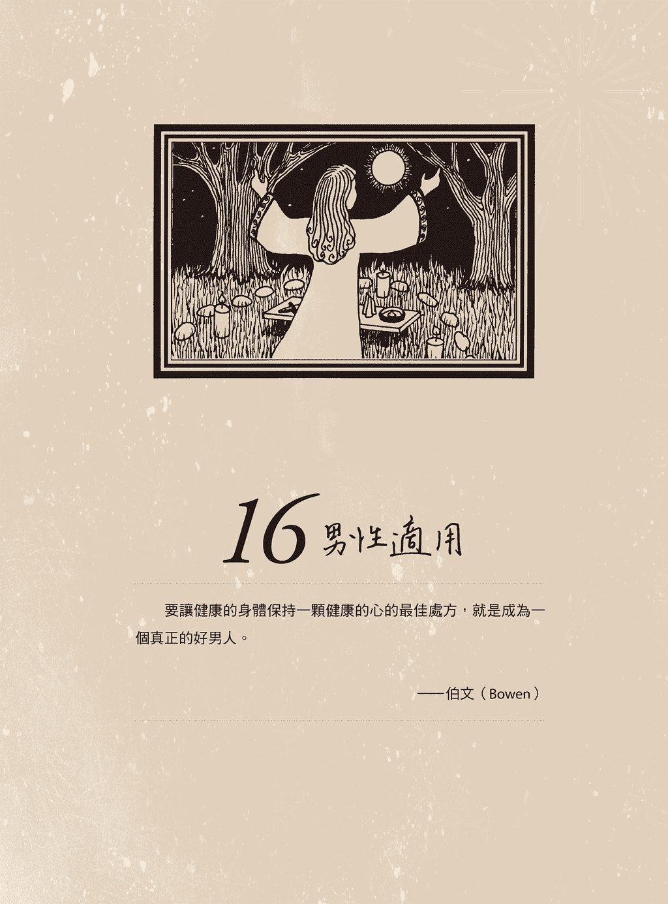

世上有很多帮助护持女性的团体和同情女性的意见，但支持男性的这类团体却很少。身为女性，我不得不承认，男性没办法在所有人面前扮演好每一种角色，像人们期望的那样既坚强又不情绪化。男性有时候甚至不像女性那样有选择的余地。女性有决定她要不要当妈妈的合法权利，可是男性却没有这样的选择。如果女性决定她想要小孩，理论上，不管男性要不要，他都是爸爸。

这是一个很有争议性的问题；我最近读到一篇有趣的观点说，将来有一天，男性若不想当爸爸的话，他可以自由离开，就像女性可以选择堕胎那样是合法的。

也就是说，下列的这些魔法是给想当爸爸，而且觉得为人父对他们具有重要意义的男性，不管他们是全职爸爸或者偶尔出现的父亲。不过，我不会批评别人，我能了解双方的论点。

这些爱的魔法能让人达到真正的情绪觉醒并带来祝福与和谐，所有的男性都可以考虑使用这些魔法。

### 为人父

★ 必要的强化物和魔法器具

这个魔法必要的器具包括如下描述中你为阵法选择的所有器具。

蜡烛

你需要在你面前放一支粉红色的蜡烛。

阵法

所有的魔法仪式刚开始都应该画一个圆圈，这是你的防护罩。如果你要使用三角形或正方形，先造一个圆圈，然后在里面制作你的阵法。

最适合这个魔法的阵法是圆圈。请使用本书第五章中描述的方法创造你的阵法，用魔法棒、刀子，伸出手臂比出食指和中指来画阵法，你也可以选择用盐巴或其他有形的东西来制作阵法。

面对的方向

如果你面向南方，这个魔法会最有效。在你的阵法中摆放好你的蜡烛和任何器具或强化物，这样当你面向南方坐下时，这些东西会放在你的面前。

月相

这个魔法在满月、新月或渐盈月时举行效果最好，因为我们希望增加良好事物的可能性，就像月亮渐盈到满月那样。

一周中的哪一天

最适合举行这个魔法的日子是星期天、星期二、星期五或星期六。

★ 非必要的魔法强化物

下面的这些物品能为你的魔法增加深度，并且帮助自己更加专注，但这些不是必要的，就算你没有这些东西也可以施展魔法。

宝石

这个魔法最适合的宝石是粉水晶和红玉髓。

如果要在你的阵法中使用除了我建议的这两种以外的宝石，请将它们放在你面前。

香熏

能强化这个魔法的香品是迷迭香和紫丁香。如果你喜欢的话，将这些香品放在你阵法内一个安全的地方。然而，想在阵法外开始使用香熏也没关系。

音乐

如果你喜欢音乐，觉得它不会让你分心，你可能会想播放一些竹笛或排笛之类的音乐。只要你觉得舒服的音乐都好。

★ 在你开始魔法仪式之前

请确定不会有让你分心的事情。

可能的话，关掉所有电话。

播放静心的音乐。

把灯光调暗一点。

在你开始前洗手或洗澡。

如果你要香熏的话，可以先点香。

准备你需要的所有东西，放在附近拿得到的地方。

画你的阵法。

请求你的高层力量允许将讯息传给你。

肯定语

在正式开始你的魔法之前，先在阵法内读诵肯定语。

身为父亲会提醒我，要对我的孩子付出我的时间和关心，这样他们才永远不会有被抛弃的感觉。虽然有时候很难做到这点，因为我们的孩子是他们自身体验的产物；愿我的孩子跟我在一起时能体验到爱和情感共鸣。支持他们自由的表达对我很重要，因为这样会提升自我价值。我会爱我的孩子与生俱来的天性，而不是认为他们应该成为符合我期待的人，我也会认可他们所有微小的成就。当我付出时间和支持时，表示我能给孩子更多的爱——除此之外没有其他的代替物。

那就这样吧！

★ 如何举行魔法仪式

念诵下列的咒语：

我是一个父亲，事实如此，

我心中会自然涌起爱和了解。

愿宇宙能向我的孩子透露

我心中的爱，就跟我的感觉一样。

闭上你的眼睛，观想你的孩子健康快乐的微笑着。

在你的心中以象征结束仪式的声明来做总结，像是“那就这样吧！”“祝福”或“阿门”。现在熄灭蜡烛，解除你的阵法。

### 爱（限男性）

★ 必要的强化物和魔法器具

这个魔法必要的器具包括如下描述中你为阵法选择的所有器具。

蜡烛

你需要在你面前放一支粉红色的蜡烛。

阵法

所有的魔法仪式刚开始都应该画一个圆圈，这是你的防护罩。如果你要使用三角形或正方形，先造一个圆圈，然后在里面制作你的阵法。

最适合这个魔法的阵法是圆圈。请使用本书第五章中描述的方法创造你的阵法，用魔法棒、刀子，伸出手臂比出食指和中指来画阵法，你也可以选择用盐巴或其他有形的东西来制作阵法。

面对的方向

如果你面向南方，这个魔法会最有效。在你的阵法中摆放好你的蜡烛和任何器具或强化物，这样当你面向南方坐下时，这些东西会放在你的面前。

月相

这个魔法在满月、新月或渐盈月时举行效果最好，因为我们希望增加良好事物的可能性，就像月亮渐盈到满月那样。

一周中的哪一天

最适合举行这个魔法的日子是星期天、星期二、星期五或星期六。

★ 非必要的魔法强化物

下面的这些物品能为你的魔法增加深度，并且帮助自己更加专注，但这些不是必要的，就算你没有这些东西也可以施展魔法。

宝石

这个魔法最适合的宝石是粉水晶、红玉髓和白水晶。如果要在你的阵法中使用除了我建议的这三种以外的宝石，请将它们放在你面前。

香熏

能强化这个魔法的香品是迷迭香和紫丁香。如果你喜欢的话，将这些香品放在你阵法内一个安全的地方。然而，想在阵法外开始使用香熏也没关系。

音乐

如果你喜欢音乐，觉得它不会让你分心，你可能会想播放一些有竹笛或排笛之类的浪漫音乐。只要你觉得舒服的音乐都好。

★ 在你开始魔法仪式之前

请确定不会有让你分心的事情。

可能的话，关掉所有电话。

播放静心的音乐。

把灯光调暗一点。

在你开始前洗手或洗澡。

如果你要香熏的话，可以先点香。

准备你需要的所有东西，放在附近拿得到的地方。

画你的阵法。

请求你的高层力量允许将讯息传给你。

★ 肯定语

在正式开始你的魔法之前，先在阵法内读诵肯定语。

我对他人更有爱，就会有更多的爱回报给我。不过，我付出爱并不是为了得到回报，只是单纯因为付出我的时间和自己就足以让我感到很快乐。

我会敞开心扉接纳正向和负向的人。当我为爱我的人或我爱的人担忧时，除了会让我觉得无助之外，毫无益处。

所以，我选择传达爱的意念和强大的祝福给他们，我知道他们会立刻收到。

当我伤心或悲痛时，我不会觉得哭泣是丢脸的事情，因为我知道所有的人类都应该利用这种方式发泄情绪。如果我没有爱人的能力，我就不会有这些情绪。是爱让我能朝更高的目标继续前进。我走的道路可能不适合别人，但如果我走在爱与光明之中，我就会成为别人的爱与光明。

★ 如何举行魔法仪式

念诵下列的咒语：

天上的月亮，请赐给我光明，

让我在白天或晚上都能看到爱。

我会抱紧爱，深深了解它，

爱会保护我，我无所畏惧。

在你的心中以象征结束仪式的声明来做总结，像是“那就这样吧！”“祝福”或“阿门”。现在熄灭蜡烛，解除你的阵法。

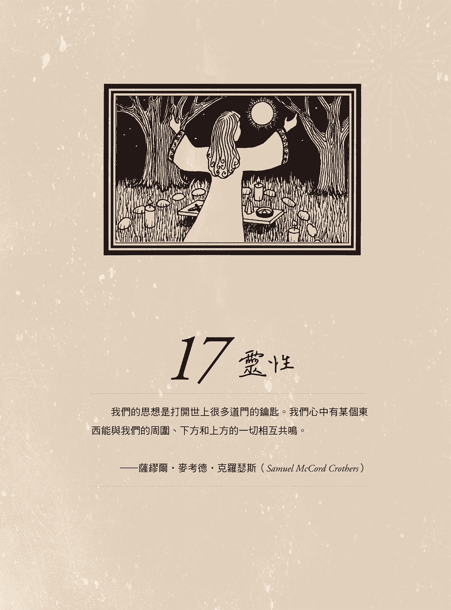

灵性的魔法是我个人最爱的项目，因为它们总是很神秘又启发人心。“当我们祈祷时，我们询问；当我们冥想时，我们聆听。”但当我们施展咒语或仪式时，我们询问，我们聆听，而且我们会行动。这是三合一的信息和实践。如果你在这本书中只想选一种魔法仪式，我会建议“神圣的讯息”这个魔法；在这里，所有的事情都可能会变得清晰可见。

### 寻找人生的目的

★ 必要的强化物和魔法器具

这个魔法必要的器具包括如下描述中你为阵法选择的所有器具。

你会需要：

．一小块白水晶和一小块紫水晶

．附系绳的袋子或某种能把它们收在一起的东西（一块手帕或一块布就可以了，不过先不要把它们放进袋子里。）

蜡烛

你需要在你面前放一支紫色的蜡烛。

阵法

所有的魔法仪式刚开始都应该画一个圆圈，这是你的防护罩。如果你要使用三角形或正方形，先造一个圆圈，然后在里面制作你的阵法。

最适合这个魔法的阵法是三角形或圆圈。请使用本书第五章中描述的方法创造你的阵法，用魔法棒、刀子，伸出手臂比出食指和中指来画阵法，你也可以选择用盐巴或其他有形的东西来制作阵法。

面对的方向

如果你面向东方，这个魔法会最有效。在你的阵法中摆放好你的蜡烛和任何器具或强化物，这样当你面向东方坐下时，这些东西会放在你的面前。

月相

这个魔法在满月或渐盈月时举行效果最好，因为我们希望增加良好事物的可能性，就像月亮渐盈到满月那样。

一周中的哪一天

最适合举行这个魔法的日子是星期天、星期一或星期四。

★ 非必要的魔法强化物

下面的这些物品能为你的魔法增加深度，并且帮助自己更加专注，但这些不是必要的，就算你没有这些东西也可以施展魔法。

宝石

这个魔法最适合的宝石是紫水晶和白水晶。如果要在你的阵法中使用除了我建议的这两种以外的宝石，请将它们放在你面前。

香熏

能强化这个魔法的香品是乳香（Frankincense）、甜茅草（Sweetgrass）或鼠尾草。如果你喜欢的话，将这些香品放在你阵法内一个安全的地方。然而，想在阵法外开始使用香熏也没关系。

音乐

如果你喜欢音乐，觉得它不会让你分心，你可能会想播放一些冥想或安详的音乐，或许是海洋的声音之类的。只要你觉得舒服的音乐都好。

★ 在你开始魔法仪式之前

请确定不会有让你分心的事情。

可能的话，关掉所有电话。

播放静心的音乐。

把灯光调暗一点。

在你开始前洗手或洗澡。

如果你要香熏的话，可以先点香。

准备你需要的所有东西，放在附近拿得到的地方。

画你的阵法。

请求你的高层力量允许将讯息传给你。

★ 肯定语

在正式开始你的魔法之前，先在阵法内读诵肯定语。

在明亮的月光中，我有点挫败的询问：我为什么来这里？我的人生目的是什么？我是否具有应该要追求的特殊地位或目标？

我是不是因为还没达到我出生于此的特别成就感到焦虑？我是不是在强求一些尚未能揭露给我知道的答案？年复一年的过去，我是不是感觉这个时候该到了，因为我说现在也该是时候了？我不知道，请告诉我，帮助我，给我一个清晰的思维。

或许我已经做了我人生中该做的事情，或许我的虚荣心认为我应该做出更伟大的贡献。每个人都有他自己的目标；我观察大自然，蚂蚁有它们的地位，老鹰也一样。

我将来会改变世界吗？我是否注定应该在幕后护持他人？每次我给人温暖的笑容和对陌生人点头致意时，我是否有在帮助这个星球？我们所做的每件事情都要很伟大才算吗？要让所有人看到我们所做的好事并认可这些事情才可以吗？也许我已经完成了我出生的目的，只是自己不知道而已。请透过全知存有的智慧和能量为我带来指引，让我知道我是否已经完成了我的人生目标，或者我正在踏上通往这个目标的路上？

我的年龄和欲望与此无关，我信仰的高层力量知道路该怎么走。

我会耐心的等待，我会耐心的学习我真正的人生目标是什么。我会放下想知道的欲望，接受一切，将会依宇宙的计划进化。我在这里，我已经准备好了。

那就这样吧！

★ 如何举行魔法仪式

拿起你的水晶，把它们放进袋子里或用布包起来。手拿着袋子，念诵下列的咒语：

我手中的水晶也是导体，

答案和谕示会透过它们传送过来。

在我的梦中，我会看见什么是真实的，

梦境会揭示我的命运。

在你的心中以象征结束仪式的声明来做总结，像是“那就这样吧！”“祝福”或“阿门”。现在熄灭蜡烛，解除你的阵法。

把装水晶的袋子放在枕头下或床边，让它们伴你入睡。

接下来的三天，多注意你的梦境。在你的梦境中寻找象征性的意义，那里会有你想要的答案。

### 神圣的讯息

★ 必要的强化物和魔法器具

这个魔法必要的器具包括如下描述中你为阵法选择的所有器具。

你会需要：

．塔罗牌

．或是灵视占卜用的镜子（能映照影像的黑色镜面）、水晶或任何你可以凝视观想的东西（如果这些占卜的东西你都没有，那就用一个碗，装半碗的水）。你可以利用水中的倒影来挑选影像。）

蜡烛

你需要在你面前的左边放一支紫色的蜡烛，右边放一支黄色的蜡烛。

阵法

所有的魔法仪式刚开始都应该画一个圆圈，这是你的防护罩。如果你要使用三角形或正方形，先造一个圆圈，然后在里面制作你的阵法。

最适合这个魔法的阵法是三角形或圆圈。请使用本书第五章中描述的方法创造你的阵法，用魔法棒、刀子，伸出手臂比出食指和中指来画阵法，你也可以选择用盐巴或其他有形的东西来制作阵法。

面对的方向

如果你面向南方，这个魔法会最有效。在你的阵法中摆放好你的蜡烛和任何器具或强化物，这样当你面向南方坐下时，这些东西会放在你的面前。

月相

这个魔法在满月或渐盈月时举行效果最好，因为我们希望增加良好事物的可能性，就像月亮渐盈到满月那样。

一周中的哪一天

最适合举行这个魔法的日子是星期天、星期一、星期四或星期五。

★ 非必要的魔法强化物

下面的这些物品能为你的魔法增加深度，并且帮助自己更加专注，但这些不是必要的，就算你没有这些东西也可以施展魔法。

宝石

这个魔法最适合的宝石是绿碧玺（Green tourmaline）。如果要在你的阵法中使用除了我建议的这种以外的宝石，请将它们放在你面前。

香熏

能强化这个魔法的香品是紫藤。如果你喜欢的话，将香品放在你阵法内一个安全的地方。然而，想在阵法外开始使用香熏也没关系。

音乐

如果你喜欢音乐，觉得它不会让你分心，你可能会想播放一些像竖琴或笛子这类乐器演奏的冥想或静心的音乐。只要你觉得舒服的音乐都好。

★ 在你开始魔法仪式之前

请确定不会有让你分心的事情。

可能的话，关掉所有电话。

播放静心的音乐。

把灯光调暗一点。

在你开始前洗手或洗澡。

如果你要香熏的话，可以先点香。

准备你需要的所有东西，放在附近拿得到的地方。

画你的阵法。

请求你的高层力量允许将讯息传给你。

★ 肯定语

在正式开始你的魔法之前，先在阵法内读诵肯定语。

我安详满足的坐在此地，准备接收即将传给我的所有讯息。我会对今晚即将接收到的信息信受奉行。我并没有刻意要追寻什么，我会调整自己，接收高层力量选择要分享给我的任何事。我不会去猜测到底是什么事，请将讯息以强烈、响亮和清晰的方式传给我吧！我会仔细聆听，因为我已经接通了宇宙生命力能量的频道。让它流过来吧！我在倾听，我能了解，我想看到光明、看见道路和平衡。我现在会安静坐着，专心聆听。

我呼唤这些讯息来找我。

★ 如何举行魔法仪式

现在念诵下列的咒语：

这个频道传来一个景象，

让这个信息明亮和真实吧！

视觉的影像在黑夜中起舞，

我的信息现在已经出现了。

如果你想使用塔罗牌或一般的扑克牌，只要抽出三张，以你学到的占卜解读方式去选择讯息。如果你选择用灵视占卜的镜子、水晶或一碗水，那就注视它。试着让你眼睛的视焦几乎全部模煳，看看你是否能收到任何影像。（除非你已经使用这个方式一段时间了，否则需要花点时间练习，所以，如果你一开始没看到任何影像，那就改天再举行一次魔法仪式，再试一次。）如果这些“灵视”的方法对你都不管用，那就说：“请在下次满月时将讯息传到我的梦境中。”

在你的心中以象征结束仪式的声明来做总结，像是“那就这样吧！”“祝福”或“阿门”。现在熄灭蜡烛，解除你的阵法。

### 团体冥想／用于任何目的的魔法仪式

★ 必要的强化物和魔法器具

除非这个团体中有人决定要使用某些东西，否则任何器具都不是必要的。

一周中的哪一天

满月时的任何一天都适合举行这个魔法。

阵法

所有的魔法仪式刚开始都应该画一个圆圈，这是你们的防护罩。如果你要使用三角形或正方形，先造一个圆圈，然后在里面制作你们的阵法。

最适合这个魔法的阵法是圆圈。请使用本书第五章中描述的方法创造你们的阵法，用魔法棒、刀子，伸出手臂比出食指和中指来画阵法，你们也可以选择用盐巴或其他有形的东西来制作阵法。

月相

这个魔法在满月时举行效果最好。

面对的方向

任何方向都好。

★ 如何举行团体冥想／魔法仪式

团体冥想至少要两人以上。

跟团体合作时，最好请每个人都事先安排好时间，把当天晚上的其他事情全部排开：事先做好规划很重要。然而，我们的生活都很忙碌，我们有家庭的义务、工作和其他答应要办的事情是可以理解的。因此，我们可能没有充足的时间花一整个晚上来举行这个仪式。如果是这种情况的话，从开始到结束的时间起码要预先准备三个小时，若有必要的话，还要加上交通时间。

事先决定好，你们为什么要做这个团聚，比方说，为了世界和平或希望让某个特别的人身心痊愈之类的事情。一定要指定团体中的某个人担任领导人或引导员。这个人要负责安排每件事，让一切准备就绪。这些事应该在仪式开始前就准备好。

而且团体的领导人或另一个人应该创作咒语，把它写在纸张上让领导人念诵。可能是像这个简单的句子：“我们今晚聚在此处是为了替全球提升世界和平的振动频率，那就这样吧！”或者也可以写得更复杂一些。

不管你是要站着或坐着，或是要举起双手，全看这个团体或是组织干部怎么决定。在这个团体冥想／魔法仪式中，有时候坐着最好，因为你会处于身心转变的状态中，可能会失去平衡。不管你们的决定是什么，应事先做好选择。等每个人都走到各自的位置后，引导员应该要来到团体中的主导位置，以平静缓慢的声音说话，开始冥想／魔法仪式。这个人不应该站在中央背对任何人，而是圆圈中的一员。

★ 如何举行魔法仪式

引导员以正常的方式施展圆圈阵法，团体的领导人说：

“闭上你的眼睛，当我从一数到十的时候，想像你离开自己的肉身，越来越靠近月亮。

一——深呼吸，慢慢吐气。

二——深呼吸，再次慢慢吐气。

三——感觉你朝月亮的光芒中慢慢飞升。

四——感觉月亮的能量越来越靠近。

五——继续闭着眼睛，慢慢吐气。

六——当你吐气时，想像你现在身上的，或是从过去到现在的负能量离开你。

七——感觉月光的振动频率，大地在下方，你很安全，有一团白光包围着你。

八——你现在接通了月亮的正能量。观想你在这个发亮的星球上，你是坐着、站着、走着，或只是在它旁边？想像你位在哪里。

九——仍然闭着眼睛。吸收这个力量，吸收生命力。你现在是这个生命力能量的一部分，不只是一个旁观者。你跟宇宙合而为一。花点时间停留在这个境界中，尽量不要想任何事或想像任何东西。

（引导员应该保持沉默五到十秒钟。）

十——眼睛继续闭着，我现在要念冥想的句子了，请注意听。”

（这时引导员念诵咒语／冥想。冥想结束后，引导员说：“那就这样吧！”团体中的其他人也可以重复这句话。）

引导员现在念诵：

“我们现在应该慢慢从这个心境中返回，当我从十倒数到一时，你会看到自己慢慢下降回到地面。

十、九、八、七——月亮的能量仍跟你在一起……六、五、四——观想我们的团体在下方。三、二——你现在已经回到自己的身体里了。一——张开你的眼睛。”

这时候引导员让大家做自己想做的事情。有人会留在自己的位置上凝望月亮。有些团体会留在各自的位置，讨论他们刚才的体验。这种情况下，应该鼓励大家谈话。所有人应该事先说好，他们认为该怎么做比较合适。

离开时记得要解除阵法，熄灭所有的蜡烛，让这个区域保持干净。一定要尊重自己、他人和这个星球。

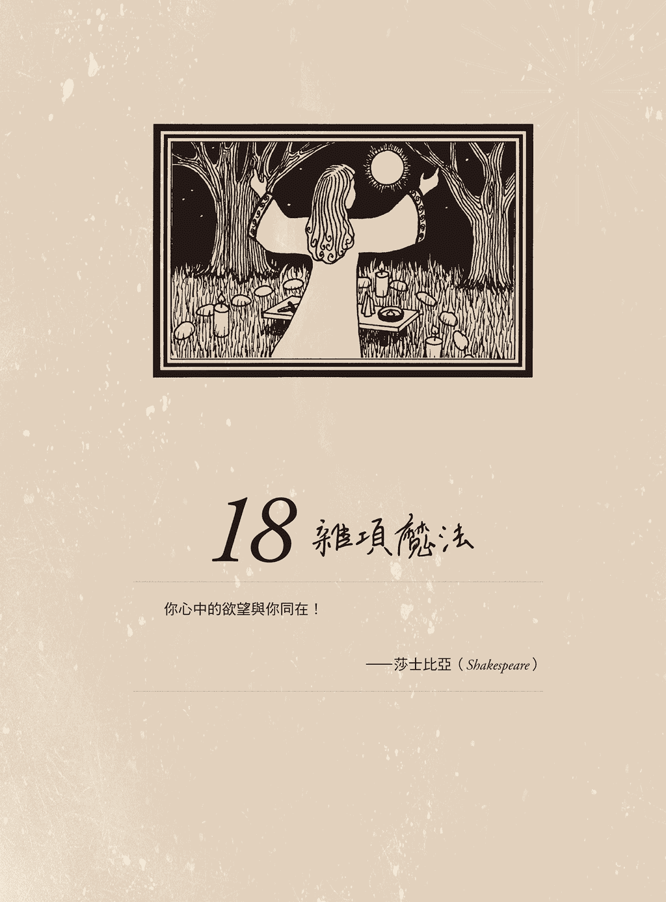

这个章节所收录的魔法无法放进本书中的任何一个特定类别，但又是一些很强大，应该要仔细检视的魔法。除了“束缚魔法”是为了情有可原的情况之外，在这个段落中的每个魔法都经过很多人接受并验证过，而且得到极好的回应。如果你对其他领域没有特殊的需要，但又喜欢施展魔法，可以利用这些魔法体验一种魔法先驱者的感觉！

### 改善沟通

★ 必要的强化物和魔法器具

这个魔法必要的器具包括如下描述中你为阵法选择的所有器具。

你会需要：

．一支笔

．一个碗

．完整的月桂叶（你可以在任何杂货店的香料区买到整罐的月桂叶。你应该在你的阵法内多准备一些叶子放在手边备用。当你结束魔法仪式时，可能会想要有个可以绞碎叶子的东西，像是研钵和杵，或是辣椒研磨机，这得看你的叶子有多松脆易碎。）

蜡烛

你需要四支蜡烛，放在正方形的四面。一支蓝色蜡烛放在东边，褐色放在北边，银色／灰色放在西边，白色放在你面前的南边。

阵法

所有的魔法仪式刚开始都应该画一个圆圈，这是你的防护罩。如果你要使用三角形或正方形，先造一个圆圈，然后在里面制作你的阵法。

最适合这个魔法的阵法是正方形。请使用本书第五章中描述的方法创造你的阵法，用魔法棒、刀子，伸出手臂比出食指和中指来画阵法，你也可以选择用盐巴或其他有形的东西来制作阵法。

面对的方向

如果你面向南方，这个魔法最有效。在你的阵法中摆放好你的蜡烛和任何器具或强化物，这样当你面向南方坐下时，这些东西会放在你的面前。

月相

这个魔法在渐盈月时举行效果最好，因为我们希望增加某种事物，就像月亮渐盈到满月那样。

一周中的哪一天

任何一天都可以举行这个魔法。

★ 非必要的魔法强化物

下面的这些物品能为你的魔法增加深度，并且帮助自己更加专注，但这些不是必要的，就算你没有这些东西也可以施展魔法。

宝石

这个魔法最适合的宝石是蓝宝石（Sapphire）、绿碧玺和绿柱石（Beryl）。如果要在你的阵法中使用除了我建议的这三种以外的宝石，请将它们放在你面前。

香熏

能强化这个魔法的香品是紫藤。如果你喜欢的话，将香品放在你阵法内一个安全的地方。然而，想在阵法外开始使用香熏也没关系。

音乐

如果你喜欢音乐，觉得它不会让你分心，你可能会想播放一些古典乐、自然原声乐或新世纪音乐。只要你觉得舒服的音乐都好。

★ 在你开始魔法仪式之前

请确定不会有让你分心的事情。

可能的话，关掉所有电话。

播放静心的音乐。

把灯光调暗一点。

在你开始前洗手或洗澡。

如果你要香熏的话，可以先点香。

准备你需要的所有东西，放在附近拿得到的地方。

画你的阵法。

请求你的高层力量允许将讯息传给你。

★ 肯定语

在正式开始你的魔法之前，先在阵法内读诵肯定语。

我今天在这里想寻求答案，我感觉到我的指导灵和高层力量的智慧。我感觉到所有生命的源头。我因为某个问题心生困扰，改善沟通能力或许可以帮我解决这个问题。请传给我想法，传给我语言，传给我力量去做与此事有关的每个人都有利的事情。

我会尽一切努力去告诉（某人的名字）我的担忧，这件事是（形容担忧的事情）。

我去面对他／她时，会让心调整到平静的情绪，没有别的干扰会强烈影响我们。我会平静地表达我的感觉，不会使用听起来具有批判和批评的文字。我不会去伤害人，或让（某人的名字）感到愧疚。我想改善这个情况，请帮助我说出需要说的话。如果（某人的名字）选择不要回应或不跟我合作，到时我一定要做出一个选择。我会竭尽所能来解决这个问题，但现在这件事需要我们两个一起合作才能获得双赢。

我感觉真实的洞见包围我，我接受你，请告诉我新的道路，为我带来清明。帮我克服无法说出心声的弱点。我会主动开始沟通，如果这样无法带来解决之道，那也许这件事就注定无法解决了。

请在下一轮的月相周期传给我答案，让我心中充满新的想法和指引。

那就这样吧！

★ 如何举行魔法仪式

拿起你的月桂叶，尽你所能在这片叶子上写上那个人的名字。如果这片叶子碎掉了，那就用另一片叶子重写，只要写那个人名字的缩写字母。记得一定要轻轻地写！

把月桂叶揉碎放进碗里，或用你手边方便研磨香药草的厨房用具磨碎它。

然后念诵下列的咒语：

愿各界的风和空气传送我的祈求，

感觉我的思绪飞向你。

以光的速度飞越而去，

听到它，感受它，今晚就在此处。

拿着你揉碎的月桂叶，如果你在户外的话，将它从你手中吹到风中。

如果你在室内的话，魔法仪式完成后，走到户外一会儿，或是打开门或窗户，将它从你手中吹到风中。

在你的心中以象征结束仪式的声明来做总结，像是“那就这样吧！”“祝福”或“阿门”。现在熄灭蜡烛，解除你的阵法。

### 生日魔法

你生日这一天当然是认识你自己的力量和为当年度的健康福社施展魔法的好时机。这个魔法可以在你生日当天举行或是你出生的那一个月份举行。

★ 必要的强化物和魔法器具

这个魔法必要的器具包括如下描述中你为阵法选择的所有器具。

你会需要：

．燃烧物品的容器和火柴

．一小块你最喜欢吃的甜点（你可能会选择蛋糕、派、酥皮点心或一块软糖。如果你不能吃甜食，那就用一块乾酪或一小块你喜欢的食物代替。）

．水

．葡萄酒或果汁（颜色不重要）

．三张纸和一支笔或铅笔

．一块砖块、石头或一块木头（大小不重要）

蜡烛

你需要三支蜡烛：红色、白色和黄色。把蜡烛放在你前面排列成三角形，三角形左下方是红色，中间是白色（三角形的尖角朝向北方），右下角放黄色。

阵法

所有的魔法仪式刚开始都应该画一个圆圈，这是你的防护罩。如果你要使用三角形或正方形，先造一个圆圈，然后在里面制作你的阵法。

最适合这个魔法的阵法是圆圈。请使用本书第五章中描述的方法创造你的阵法，用魔法棒、刀子，伸出手臂比出食指和中指来画阵法，你也可以选择用盐巴或其他有形的东西来制作阵法。

面对的方向

如果你面向北方，这个魔法会最有效。在你的阵法中摆放好你的蜡烛和任何器具或强化物，这样当你面向北方坐下时，这些东西会放在你的面前。

月相

这个魔法任何时间的月相都可以举行（毕竟，这是你的生日！）。

一周中的哪一天

任何一天都可以举行这个魔法仪式。

★ 非必要的魔法强化物

下面的这些物品能为你的魔法增加深度，并且帮助自己更加专注，但这些不是必要的，就算你没有这些东西也可以施展魔法。

宝石

这个魔法最适合的宝石是你的诞生石。下面有个清单列出每种宝石的涵义，还有生日花的涵义，这个魔法仪式也可以使用生日花。

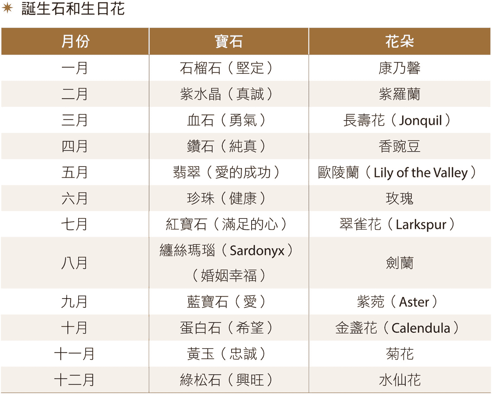

不同派别对诞生石的看法可能略有不同，看你参考的资料源头出自哪里，但我认为这是蛮常见的分类。如果你喜欢的话，也可以进一步去寻找其他的资料。

香熏

能强化这个魔法的香品是柑橘类。如果你喜欢的话，将香品放在你阵法内一个安全的地方。然而，想在阵法外开始使用香熏也没关系。

音乐

如果你喜欢音乐，觉得它不会让你分心，你可能会想播放一些快乐和祥和的音乐。只要你觉得舒服的音乐都好。

★ 在你开始魔法仪式之前

请确定不会有让你分心的事情。

可能的话，关掉所有电话。

播放静心的音乐。

把灯光调暗一点。

在你开始前洗手或洗澡。

如果你要香熏的话，可以先点香。

准备你需要的所有东西，放在附近拿得到的地方。

画你的阵法。

请求你的高层力量允许将讯息传给你。

★ 如何举行魔法仪式

在三张不同的纸上写下三个目标、希望或欲望。（如果你想要事先用打字的也可以。）我们利用三这个数字的振动能量，因为三代表丰富和多数。

把这些写着你的希望的纸张拿在手上，一张张地念出来，或是对自己说出来。读完每一个欲望之后，把它们放在烧东西的容器内烧掉。

当你烧完所有的三张纸后，念诵下列的咒语：

我传送我的愿望……三个欲望，

愿它们散布出去，再回到我身边。

接下来：

说：“愿我永不饥饿。”吃一口蛋糕。

说：“愿我永不口渴。”喝一口水。

说：“愿我永远不会无家可归。”用手轻敲你的砖块、木头或石头三下。

点燃红色蜡烛说：“愿我永远有福气得到身体健康。”

点燃黄色蜡烛说：“愿我永远有福气得到心理健康。”

点燃白色蜡烛说：“愿我永远有福气得到精神健康。”

喝一口葡萄酒或果汁说：

今天我为自己庆祝，

今天我获得重生，

今天我追随神性指引的道路。

在你的心中以象征结束仪式的声明来做总结，像是“那就这样吧！”“祝福”或“阿门”。现在熄灭蜡烛，解除你的阵法。

以你觉得适当的任何方式处理灰烬，因为这个讯息已经在燃烧时透过烟雾传送出去了。

### 摆脱某人（束缚魔法）

警告读者：这个魔法无法撤销，请谨慎使用。人生经验中若是不具备一些成熟的智慧和对人生有深刻了解的人不适合使用这个魔法。束缚魔法具有很大的争议性，我认真考虑了很久，到底要不要把束缚魔法放进这本书里，然而，经过静坐冥想和得到神性的忠告后，我决定把这个魔法加进来。

这个魔法的目的是为了阻止想要在心理、肉体和灵性方面伤害你的人，或者可能是企图伤害他们自己的人。不过，有些人反对使用这个魔法的理由也是合理的，因为你有可能误解别人。如果你不确定要不要举行束缚魔法仪式……那就不要使用。改用这个章节里面的白光防护魔法可能比较合适。

一定要完全、彻底地了解这个魔法无法取代专业的执法人员、律师或顾问的协助。不要把这个魔法当成某种保护，否则你可能会产生虚假的安全感！这个魔法的目的是为了在你已经采取一般常识的预防措施之后，再增加额外的力量和能量。只有当你竭尽一切所能找过执法人员和社会协助来阻止这个人接近你之后，你才举行这个魔法仪式。这个魔法的目的并不是为了阻止骚扰电话、讨人厌的访客，或只是想赶走让你厌烦或非常生气的人……因为这个魔法的威力太强大了。

★ 必要的强化物和魔法器具

这个魔法必要的器具包括如下描述中你为阵法选择的所有器具。

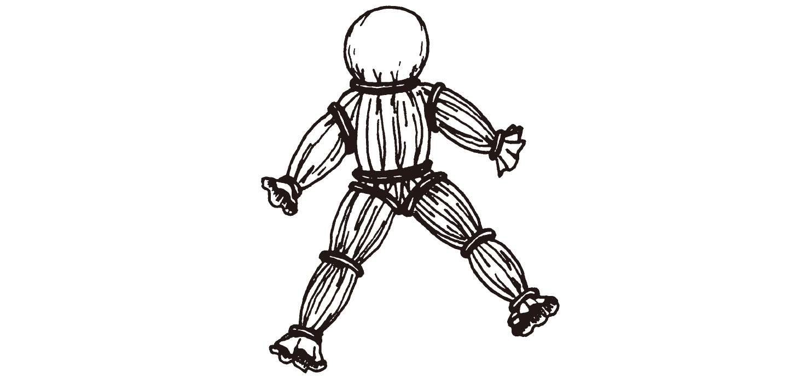

你会需要：

．人像或人偶✽（请看上图）

．绳索、细绳、毛线或是某种能让你绑住人偶的东西

．盐巴

✽在这个部分，你应该制作一个有两条手臂、两条腿和一个头的人偶。你可以亲手缝一个人偶，然后在里面塞填充物，你也可以用硬纸板或某种坚硬的东西剪个人像。在这个人偶上面写那个人的名字，或是用某种方式把他们的相片贴在人偶上。你也可以用玉米皮或其他的材料做一个看起来像人形的人偶。

人偶或娃娃人像可能会让某些人觉得紧张，因为他们会把这个联想到巫术。这不是巫术，只是这个魔法使用人形娃娃，而巫术也使用这种人偶，所以有这种担忧是可以理解的。然而，你使用它是为了保护自己，并不是为了伤害别人。你束缚他们是为了让他们不伤害你或伤害他们自己。

（如果看到这里，束缚魔法仍然让你觉得不舒服，那就不要使用它。）

蜡烛

你需要在你面前放一支黑色蜡烛。

阵法

所有的魔法仪式刚开始都应该画一个圆圈，这是你的防护罩。如果你要使用三角形或正方形，先造一个圆圈，然后在里面制作你的阵法。

最适合这个魔法的阵法是三角形。请使用本书第五章中描述的方法创造你的阵法，用魔法棒、刀子，伸出手臂比出食指和中指来画阵法，你也可以选择用盐巴或其他有形的东西来制作阵法。

面对的方向

如果你面向西方，这个魔法会最有效。在你的阵法中摆放好你的蜡烛和任何器具或强化物，这样当你面向西方坐下时，这些东西会放在你的面前。

月相

这个魔法在渐亏月或暗月时举行效果最好。

一周中的哪一天

最适合举行这个魔法仪式的日子是星期天或星期六。

★ 非必要的魔法强化物

下面的这些物品能为你的魔法增加深度，并且帮助自己更加专注，但这些不是必要的，就算你没有这些东西也可以施展魔法。

宝石

这个魔法最适合的宝石是黑玉、黑曜石和白水晶。如果要在你的阵法中使用除了我建议的这三种以外的宝石，请将它们放在你面前。

香熏

能强化这个魔法的香品是花梨木（Rosewood）和熏衣草。如果你喜欢的话，将这些香品放在你阵法内一个安全的地方。然而，想在阵法外开始使用香熏也没关系。

音乐

如果你喜欢音乐，觉得它不会让你分心，你可能会想播放一些低频率的安详和静心的乐器演奏音乐。只要你觉得舒服的音乐都好。

★ 在你开始魔法仪式之前

请确定不会有让你分心的事情。

可能的话，关掉所有电话。

播放静心的音乐。

把灯光调暗一点。

在你开始前洗手或洗澡。

如果你要香熏的话，可以先点香。

准备你需要的所有东西，放在附近拿得到的地方。

画你的阵法。

请求你的高层力量允许将讯息传给你。

★ 肯定语

在正式开始你的魔法之前，先在阵法内读诵肯定语。

我选择施展这个特别魔法的原因，是因为我觉得我检视过所有其他的可能性，现在已经别无选择了。在我举行这个无法撤销的魔法仪式之前，我会仔细深思，看这是不是一个正确的选择。如果我改变主意的话，我会改用另一种防护魔法。现在我将决定是否执行这个威力强大的行动。（如果你决定不做的话，也许是最好的选择。）

★ 如何举行魔法仪式

1\. 现在点燃黑色蜡烛。

2. 拿起你的人偶，用绳索、细绳或缎带绑住它。当你缠绕绳子时说：“我绑住你（某人的名字），让你不再伤害自己或他人。”你一定要把双臂和双腿绑起来，用绳子把整个头部覆盖住，这表示任何可能伤害人的部分都不能放任它自由活动。

3\. 在人偶上撒盐。

4. 现在再说一次：“我绑住你（某人的名字），让你不再伤害自己或他人。”

然后念诵下列的咒语：

当这个绳子缠好时，

你就被绑住了。

我展现了我的力量，

你已被我封印，

这不会伤害你，只会让你远离我，

从今天开始你就无法伤害人了。

在你的心中以象征结束仪式的声明来做总结，像是“那就这样吧！”“祝福”或“阿门”。现在熄灭蜡烛，解除你的阵法。

把人偶拿起来，埋在你住家土地的地底下，或者如果你有壁炉或户外的火炉，你可以烧掉它。记住，你没有伤害任何人，只是为了阻止未来可能发生的事情。

### 增强通灵力／激发内在力量

这个魔法会让你更有信心深入探索和提升你的通灵能力。它也能增加你想体验新的占卜形式的意愿。它有助于打开你的第三眼，这是你的直觉之眼，也是通灵力的中心，来自灵界的信息就是从这里接收的。它属于乙太，而且显然肉眼是看不见的。第三眼也是你的第六脉轮，是体内一种看不见、旋转的能量漩涡。

如果你想让直觉更灵敏，举行这个魔法仪式能唤起通灵力。你的天赋就是召唤／唤起。你通灵力会应召而来。

举行这个魔法仪式时不要急，慢慢来，可以独自一人或与一位异性共同举行仪式，这样就能使用男性和女性，阴与阳两者的重要力量。

★ 必要的强化物和魔法器具

这个魔法必要的器具包括如下描述中你为阵法选择的所有器具。

所有的器具都应该放在人前面的地板上、桌子上或祭坛上。

你会需要：

．葡萄酒或果汁（白色或红色）

．特别的玻璃杯或圣餐杯（如果你跟另一个人一起举行这个魔法仪式，你可以选择从同一个圣餐杯里喝，混合两人的能量。）

．香熏、古龙水、香水或你认为在这个仪式中一定要闻到的味道（如果你不喜欢这里建议的香品，可使用你觉得舒服的任何东西。）

．深紫色的衣服（丝绸、天鹅绒、毛毡或其他柔软的布料），任何尺寸都可以。

．钟、铜锣或铃（如果你没有单独的钟铃，有时候用风铃也可以。提示：如果你使用大型的风铃，在你的圆圈中找不到地方挂的话，你可能得放在地面上。你只需要确定你可以让两个风铃互相敲击，或是用某个东西敲击它，以便发出铃声即可。建议直接在风铃下方创建阵法，这样你只要站起来就能敲打它。）

蜡烛

你需要三支蜡烛：紫色、橘色和白色。把它们在你面前排成一排，紫色在左边，白色在中间，橘色在右边。

阵法

所有的魔法仪式刚开始都应该画一个圆圈，这是你的防护罩。如果你要使用三角形或正方形，先造一个圆圈，然后在里面制作你的阵法。

最适合这个魔法的阵法是三角形。请使用本书第五章中描述的方法创造你的阵法，用魔法棒、刀子，伸出手臂比出食指和中指来画阵法，你也可以选择用盐巴或其他有形的东西来制作阵法。

面对的方向

如果你面向北方，这个魔法会最有效。在你的阵法中摆放好你的蜡烛和任何器具或强化物，这样当你面向北方坐下时，这些东西会放在你的面前。

月相

这个魔法在满月时举行效果最好，因为我们想让某件事情变得圆满和清晰，就像月亮渐盈到圆满和清澈那样。

一周中的哪一天

最适合举行这个魔法仪式的日子是星期天、星期一或星期四，但任何一天举行仪式都可以。

★ 非必要的魔法强化物

下面的这些物品能为你的魔法增加深度，并且帮助自己更加专注，但这些不是必要的，就算你没有这些东西也可以施展魔法。

宝石

这个魔法最适合的宝石是紫水晶、月光石和白水晶。如果要在你的阵法中使用除了我建议的这三种以外的宝石，请将它们放在你面前。

香熏

能强化这个魔法的香品是乳香、丁香（Clove）和松树。如果你喜欢的话，将这些香品放在你阵法内一个安全的地方。然而，想在阵法外开始使用香熏也没关系。

音乐

如果你喜欢音乐，觉得它不会让你分心，你可能会想播放一些冥想和安详的音乐，例如大自然的声音。只要你觉得舒服的音乐都好。

★ 在你开始魔法仪式之前

请确定不会有让你分心的事情。

可能的话，关掉所有电话。

播放静心的音乐。

把灯光调暗一点。

在你开始前洗手或洗澡。

如果你要香熏的话，可以先点香。

准备你需要的所有东西，放在附近拿得到的地方。

画你的阵法。

请求你的高层力量允许将讯息传给你。

★ 肯定语

在正式开始你的魔法之前，先在阵法内读诵肯定语。

我愿意打开我的心让我的通灵力成长，我为了良好和正向的目的召唤内在的力量来改善我的人生。愿我的直觉达到最佳的状态，我确认要跟宇宙生命力合而为一。我会仔细注意我收到的讯息，会检视我的直觉，看看我的直觉有多准确。请用额外的振动频率包围我，增强我的通灵潜力。

那就这样吧！

★ 如何举行魔法仪式

1\. 点燃你的蜡烛，但先不要香熏。

2. 敲钟或摇铃，说：“我听到了力量。”（如果是两个人，应该由女性来敲钟。）

3. 喝一口葡萄酒，说：“我尝到了力量。”（如果是两个人，应该由男性先喝并说“我尝到了力量。”然后把圣杯传给女性，她重复说：“我尝到了力量。”

4. 点燃你的香品或从瓶中嗅闻香水或古龙水的味道，说：“我闻到了力量。”（如果是两个人，应该由女性来点香。）

5\. 闭上你的眼睛几秒钟后，睁开眼睛，说：“我看到了力量。”

6\. 拿起你的布料，用双手夹在中间轻压，说：“我感觉到了力量。”

（如果是两个人，男女两人都应该有自己的一块布，让这两块布持有各自的能量。）

现在念诵下列的咒语：

借着地、水、火、风之力，

我的力量提升到更高的境界。

今晚我在此召唤这个力量，

我听到了召唤，这是我的权利。

如果是一个人，就对着天空张开手臂说：“我就是力量。”

如果是两个人，两人手牵着手，手臂伸向天空说：“我就是力量。”（四只手臂都要伸出去。）

结束的咒语：

一切都是为了善意，不伤害任何人，

我现在宣布仪式已经完成了！

在你的心中以象征结束仪式的声明来做总结，像是“那就这样吧！”“祝福”或“阿门”。现在熄灭蜡烛，解除你的阵法。

再喝一口葡萄酒庆贺，如果你喜欢的话，可以坐在你的阵法中一会儿，回想或举行某种类型的魔法。也许是用牌卡占卜、注视水晶或是使用你喜欢魔法器具。祝好运！

### 做决定——灵摆魔法

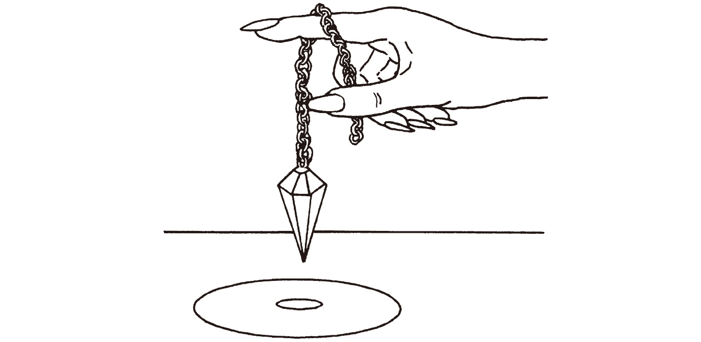

★ 关于灵摆

在本书中的目的，灵摆只是用来接收来自你的内在自我或潜意识心智的“是”与“不是”的答案，以协助你做决定，得到更清晰的思维。然而，灵摆的用法不只为了得到答案这一种方式，治疗师经常使用灵摆寻找肉身和乙太体（能量场）上不和谐的位置。

有人用灵摆来做探测术（dowsing），是寻找隐藏的物品，例如水源或金属的古老技术。灵摆探测术也可以用来找人或寻找失物。当我在屋子里遗失了某样东西时，我会拿出一个灵摆，问它失物在哪里。它会指向失物的方向，大部分的时候，它都出奇的准确。如果我在家中找不到这个东西时，我会站到窗边。如果它指向窗外的方向，我就会知道失物在屋外。

若想知道某人对某个情况是不是对你说了实话，这个方法也很棒。它最大的目的是用来询问关于现在的问题，不是未来的问题。

你可以独自使用灵摆或跟另一个人一起使用。如果你要帮某人找答案，你的潜意识就会用心灵感应到那个人的潜意识心智。

适合使用灵摆的问题类型如下：

．我不知道现在跟我交往的这个男人是不是认真看待我们的亲密关系，他是认真的吗？

．我应该从我现在住的地方搬到别处吗？

．我接受另一个工作会快乐吗？

．开始这段新的冒险对我有利吗？

．我在人生的这个阶段应该要追求更有灵性的道路吗？

记住，只能问“是”与“不是”这两种答案的问题。

记住，你是要接通你的潜意识，找出你人生真正想要的是什么，什么事会带给你真正的快乐和满足。灵摆对现在的情况、事件和一般需要做抉择的问题具有丰富的信息，知道答案后你会安心许多。你不会对关于某些人和某些选择太过烦恼。

总而言之，当你对某件事情无法决定到底该怎么做时，或是你不知道某人对某个情况是否有对你说出全盘的事实，这时你就可以用灵摆了。如果你问了关于未来的问题，灵摆只会告诉你，你的潜意识想要发生的事情，不是将来真的会发生的事情，你可能会感到失望。请适当的使用它，你会发现它巨大的价值和潜力。

★ 保护这个魔法器具

当你没在使用你的灵摆时，把它放在一个小布袋或某个容器里。让它暴露在其他的能量或振动频率中不是好事。偶尔用冷水清洗灵摆，清除和消除上一次使用时留下的能量。我建议当你觉得它的能量开始变得混乱、沉重或你感应到不舒服的能量时就要清洗，但最好用你自己的直觉来判断。

有些人从来不清洗他们的灵摆，因为他们觉得每次使用灵摆，它就会聚积使用者自己的能量，因此威力会变得更强大。如果有人跟你借用它，对方使用过后你一定要净化它，可以放在阳光下或月光下（新月、渐盈月或满月）来消除别人的能量。

跟别人一起使用灵摆也没有关系，只要每个人都专注在相同的问题，而不是关注轮到别人时他们会问什么问题。有别人在场可能会很刺激很有趣，不过，碰到真正严肃的事情，还是建议自己一个人使用。两种方法都可以尝试，看看哪一种方式最适合你。

有人问说，在户外还是在室内使用比较好。这个问题得由你自己决定，不过，我得告诉你，满月之夜使用的效果很神奇！灵摆真的会“唱歌”，满月时你不需要坐在户外……只要感觉月亮的能量就知道了。

★ 制作灵摆

你可以在新时代商店或网站上买到平价的灵摆，或者你也可以自己制作。基本上它就是由一个有重量的东西悬挂在一条绳子或链子上的器具，它会在目标物或固定点的上方（请看 P.204 页的图像），在重力的影响下前后摆动。

通常是由水晶或宝石制成，例如紫水晶或白水晶，也有用玻璃、木头、青铜和其他种金属做的灵摆。你可以用项链加一块尖角的宝石或水晶，当作灵摆来使用。你可能也会想用十字架、戒指或软木塞（粗头在上方）绑在一条链子或绳子上。

★ 必要的强化物和魔法器具

这个魔法必要的器具包括如下描述中你为阵法选择的所有器具。

你会需要：

．一个灵摆

．一张纸或硬纸板，上面画一个圆圈当作标靶。

可以利用任何一种能代表标靶，能平放在桌上或地上的东西。我曾见过有人使用硬币、纽扣，甚至是有孔的光碟呢！

蜡烛

你需要三支蜡烛：一支白色和两支紫色。把白色蜡烛放在你前面的三角形中心点和靶心的位置，另外两支蜡烛放在你身后，也就是三角形两个基座点的边角处。

阵法

所有的魔法仪式刚开始都应该画一个圆圈，这是你的防护罩。如果你要使用三角形或正方形，先造一个圆圈，然后在里面制作你的阵法。

最适合这个魔法的阵法是三角形。请使用本书第五章中描述的方法创造你的阵法，用魔法棒、刀子，伸出手臂比出食指和中指来画阵法，你也可以选择用盐巴或其他有形的东西来制作阵法。

面对的方向

如果你面向北方，这个魔法会最有效。在你的阵法中摆放好你的蜡烛和任何器具或强化物，这样当你面向北方坐下时，这些东西会放在你的面前。

月相

这个魔法在满月或渐盈月时举行效果最好，因为你正试着将某个事物带向圆满，如同月亮走向圆满丰盛，而且清澈。

一周中的哪一天

最适合举行这个魔法仪式的日子是星期天或星期一，但任何一天举行仪式都可以。

★ 非必要的魔法强化物

下面的这些物品能为你的魔法增加深度，并且帮助自己更加专注，但这些不是必要的，就算你没有这些东西也可以施展魔法。

宝石

这个魔法最适合的宝石是紫水晶和白水晶。如果要在你的阵法中使用除了我建议的这两种以外的宝石，请将它们放在你面前。

香熏

能强化这个魔法的香品是乳香、茉莉花和鼠尾草。如果你喜欢的话，将这些香品放在你阵法内一个安全的地方。然而，想在阵法外开始使用香熏也没关系。

音乐

如果你喜欢音乐，觉得它不会让你分心，你可能会想播放一些低频率、安详和静心的乐器演奏音乐。只要你觉得舒服的音乐都好。

★ 在你开始魔法仪式之前

请确定不会有让你分心的事情。

可能的话，关掉所有电话。

播放静心的音乐。

把灯光调暗一点。

在你开始前洗手或洗澡。

如果你要香熏的话，可以先点香。

准备你需要的所有东西，放在附近拿得到的地方。

画你的阵法。

这时可以点燃蜡烛了。如果使用两支蜡烛，可在纸板标靶的两边各放一支蜡烛。如果使用三支蜡烛，可在你四周制作一个三角形（如果你坐在地板上），或用蜡烛放在你前面的桌子或平台上制作三角形。 三是威力强大的数字，三角形的尖角必须放在你前面。

请求你的高层力量允许将讯息传给你。

★ 如何举行魔法仪式

把你的纸板标靶放在前面。

一手拿着悬吊的灵摆，灵摆的尖角距离你的纸板圆形标靶的中心点大约一英吋高（约 2.54 公分）。你可以弯曲手肘或是让手臂伸直，弯曲手肘会比较容易。让灵摆“静止”，不要让它移动。有时候可以试着说“安静”、“静止”或“不要动”就有用了。你可以大声、小声说或在心中对自己说。

等你让灵摆静止不动后，你现在可以决定“是”与“不是”在哪个方向。每次的决定都不一样，因此，我不会把“是”与“不是”写在纸板标靶上。询问你知道答案一定是“是”的问题，例如我的名字是 ______ 吗？如果你说出你的真名，它会指向你指定为“是”的方向。接下来，问一个你知道答案是“不是”的问题。它应该会朝“是”的反方向摆动。如果没有的话，再试一次，直到你弄清楚“是”与“不是”的方向为止。

现在你已经为这一天或这个晚上决定了“是”与“不是”的方向。你的方向可能每天都不一样，所以每次都要做这个程序。不用每问一个问题就重复这个步骤，只要每隔二十四小时以上做一次即可。

当你做完这个设定的程序之后，你可以询问你想问的所有问题。(不过，不要问太多问题！)如果你发现灵摆的尖角在绕圈子，或摆动的方向毫无道理，那就停下来，重新开始。如果它还是继续这样，那就放下它，改天再试。大部分的情况下，你应该不会碰到这种问题。

如果你发现你的手会发抖，或者会稍微乱动，不要担心，这是你的潜意识促使大脑产生一种电脉冲传到你的手上，因此让灵摆移动了。记住，这个器具是要协助你接通你的潜意识。如果你想要某个事物，灵摆却告诉你不同的答案，你需要仔细想像你的内在自我想传达给你的讯息是什么。举例来说：我交往了三年的这个男人“天生爱好自由”，他不爱工作、毫无野心、利用我，而且我认为他有时候也会跟别的女人私下交往。可是，我还是很爱他，我也没办法。他将来会改变吗？这个男人适合我吗？

如果你想要灵摆说“是”，但它却说“不是”，那就要从不同的观点来考虑它的道理。也许你不愿意承认，但有些事情你却不得不去处理它。我想你应该了解我的意思！

在你的心中以象征结束仪式的声明来做总结，像是“那就这样吧！”“祝福”或“阿门”。现在熄灭蜡烛，解除你的阵法。

### 兴旺

★ 必要的强化物和魔法器具

这个魔法必要的器具包括如下描述中你为阵法选择的所有器具。

你会需要：

．你的钱包

．一把不能打开任何东西的钥匙（去五金行或有卖空白钥匙的地方，买一把金色的钥匙。如果店员觉得这样很奇怪，你不要告诉他们细节，说你是要用这把钥匙来举行仪式。不要把这种私事告诉别人，这样才能增强魔法的力量。记住，一定要一把新的钥匙，不要用放在家里的旧钥匙。）

蜡烛

你需要四支绿色的蜡烛，放在正方形阵法的四面，东、西、南、北各一支。

阵法

所有的魔法仪式刚开始都应该画一个圆圈，这是你的防护罩。如果你要使用三角形或正方形，先造一个圆圈，然后在里面制作你的阵法。

最适合这个魔法的阵法是正方形。请使用本书第五章中描述的方法创造你的阵法，用魔法棒、刀子，伸出手臂比出食指和中指来画阵法，你也可以选择用盐巴或其他有形的东西来制作阵法。

面对的方向

如果你面向东方，这个魔法会最有效。在你的阵法中摆放好你的蜡烛和任何器具或强化物，这样当你面向东方坐下时，这些东西会放在你的面前。

月相

这个魔法在满月、新月或渐盈月时举行效果最好，因为你想增长某些事物，就像月亮渐盈到圆满那样。

一周中的哪一天

最适合举行这个魔法仪式的日子是星期天、星期三或星期四。

★ 非必要的魔法强化物

下面的这些物品能为你的魔法增加深度，并且帮助自己更加专注，但这些不是必要的，就算你没有这些东西也可以施展魔法。

宝石

这个魔法最适合的宝石是黄铁矿（Pyrite）、绿碧玺和白水晶。如果要在你的阵法中使用除了我建议的这三种以外的宝石，请将它们放在你面前。

香熏

能强化这个魔法的香品是香草、薄荷和多香果（Allspice）。如果你喜欢的话，将这些香品放在你阵法内一个安全的地方。然而，想在阵法外开始使用香熏也没关系。

音乐

如果你喜欢音乐，觉得它不会让你分心，你可能会想播放一些振奋精神的音乐。只要你觉得舒服的音乐都好。

★ 在你开始魔法仪式之前

请确定不会有让你分心的事情。

可能的话，关掉所有电话。

播放音乐。

把灯光调暗一点。

在你开始前洗手或洗澡。

如果你要香熏的话，可以先点香。

准备你需要的所有东西，放在附近拿得到的地方。

画你的阵法。

请求你的高层力量允许将讯息传给你。

点燃除了你前面的其他三支蜡烛。

★ 肯定语

在正式开始你的魔法之前，先在阵法内读诵肯定语。

我允许自己获得财务上的安全，我放下我人生道路上的任何障碍和阻碍。我知道我不需要过一个贫穷的人生也能获得灵性的成就。

我释放任何会让我产生不值得拥有富足生活的感觉。愿丰足和兴旺从此刻开始与我产生共鸣。

那就这样吧！

★ 如何举行魔法仪式

拿起你的钥匙，把它当作工具，在你前面的这支绿色蜡烛侧边上刻“旺（Prosperity）”这个字。

点燃蜡烛。

把钥匙放进你的钱包里。

现在念诵下列的咒语：

大地、微风、太阳、海洋，

请将魔法注入这把特别的钥匙中。

我的钱财会跟月亮一样逐渐增长，

兴旺很快就会来临。

在你的心中以象征结束仪式的声明来做总结，像是“那就这样吧！”“祝福”或“阿门”。现在熄灭蜡烛，解除你的阵法。

### 旅途平安

在天气情况许可下，这个魔法需要花两天以上的时间，而且需要分两阶段进行。

最适合举行这个魔法仪式的时间是天气温和晴朗的时候。

★ 必要的强化物和魔法器具

这个魔法必要的器具包括如下描述中你为阵法选择的所有器具。

你会需要：

．一个护身符（可以是对你有意义，能挂在项链上佩戴的任何物件或宝石。你或许会想使用十字架、五角星、水晶，甚至是一块动物身上的部件也可以。你可能已经有一条随身佩戴的项链了，你也可以把现有的项链设定为护身符。）

．元素水

．能放护身符的碗、杯子或圣餐杯。

蜡烛

你的第一天需要三支蜡烛：银色／灰色、褐色和红色。把它们放在你前面排成一排，银色／灰色在左边，褐色在中间，红色在右边。第二天你会需要一支白色蜡烛放在你面前。

阵法

所有的魔法仪式刚开始都应该画一个圆圈，这是你的防护罩。如果你要使用三角形或正方形，先造一个圆圈，然后在里面制作你的阵法。

最适合这个魔法的阵法是圆圈。请使用本书第五章中描述的方法创造你的阵法，用魔法棒、刀子，伸出手臂比出食指和中指来画阵法，你也可以选择用盐巴或其他有形的东西来制作阵法。

面对的方向

如果你面向北方，这个魔法会最有效。在你的阵法中摆放好你的蜡烛和任何器具或强化物，这样当你面向北方坐下时，这些东西会放在你的面前。

月相

这个魔法在新月或渐盈月时举行效果最好，因为你想增加某些事物，就像月亮渐盈到圆满那样。

一周中的哪一天

这个魔法仪式在任何一天举行都可以。

★ 非必要的魔法强化物

下面的这些物品能为你的魔法增加深度，并且帮助自己更加专注，但这些不是必要的，就算你没有这些东西也可以施展魔法。

宝石

这个魔法最适合的宝石是绿松石和虎眼石。如果要在你的阵法中使用除了我建议的这两种以外的宝石，请将它们放在你面前。

香熏

能强化这个魔法的香品是檀香（Sandawood）、肉桂和熏衣草。如果你喜欢的话，将这些香品放在你阵法内一个安全的地方。然而，想在阵法外开始使用香熏也没关系。

音乐

如果你喜欢音乐，觉得它不会让你分心，你可能会想播放一些宁静和静心的乐器演奏音乐。只要你觉得舒服的音乐都好。

★ 在你开始魔法仪式之前

请确定不会有让你分心的事情。

可能的话，关掉所有电话。

播放静心的音乐。

把灯光调暗一点。

在你开始前洗手或洗澡。

如果你要香熏的话，可以先点香。

准备你需要的所有东西，放在附近拿得到的地方。

画你的阵法。

请求你的高层力量允许将讯息传给你。

★ 肯定语

在正式开始你的魔法之前，先在阵法内读诵肯定语。

当我旅行时，感觉安全对我非常重要。当我出门旅行时，不管是长途或短途的旅行，只要想到有额外的保护就会让我觉得格外安心。不管我是在白天活动或是晚上睡觉时，我知道（填上上帝或你祈祷的高层力量的名字）都会保护我。

我知道我得到了关爱和善意的照顾，因此很安心。

★ 如何举行魔法仪式

第一阶段：首先你要在你的首饰上施展魔法，制造出一个护身符：

拿起你的首饰或水晶，放在碗中。

把元素水倒在首饰上，让它整个浸泡到水。

把你的手放在这碗水上方，但不要碰到它，手掌向下，说道：“愿水中所有的元素现在将保护的力量灌输进这个护身符里。”

现在解除你的圆圈阵法，熄灭蜡烛，说：“暂时做到这里。”

把这个护身符放在窗台、阳台或某个阳光和月光照射得到的室内或户外的地方，让它补充能量。这个步骤至少要花二十四个小时，你需要月光和日光——多云的日子不管用。如果天气不好无法传导能量，你一定要把护身符继续放在可以照到至少八小时阳光和八小时月光的地方。宁愿补充太多能量也不能太少，不过就算下一点小雨也不要担心。

第二阶段：当你觉得你的护身符已经补充了足够的日光和月光后，尽快找个时间，再次把你的护身符放在水中，并且创建圆圈阵法。

点燃一支白色蜡烛，把护身符放在你面前，让它浸泡在水里。

现在念诵下列的咒语：

大自然已经祝福了这个护身符，

我的安全得到保障，所有的恐惧都消散了。

我会让这个护身符保持强大和洁净，

我一整年的旅行都会平安无事。

在你的心中以象征结束仪式的声明来做总结，像是“那就这样吧！”“祝福”或“阿门”。现在熄灭蜡烛，解除你的阵法。

你可以只在旅行时佩戴它、每天戴它或是当你有需要时戴它，你可以自由选择。如果你一直佩戴同样的护身符或水晶，就每年举行这个仪式一次。

### 特别意图

这个魔法是支援其他本书中未包含的所有魔法。请把你自己的意图灌输进去。

★ 必要的强化物和魔法器具

这个魔法必要的器具包括如下描述中你为阵法选择的所有器具。

蜡烛

你会需要一支白色蜡烛。

阵法

所有的魔法仪式刚开始都应该画一个圆圈，这是你的防护罩。如果你要使用三角形或正方形，先造一个圆圈，然后在里面制作你的阵法。

最适合这个魔法的阵法是圆圈。请使用本书第五章中描述的方法创造你的阵法，用魔法棒、刀子，伸出手臂比出食指和中指来画阵法，你也可以选择用盐巴或其他有形的东西来制作阵法。

面对的方向

如果你面向北方，这个魔法会最有效。在你的阵法中摆放好你的蜡烛和任何器具或强化物，这样当你面向北方坐下时，这些东西会放在你的面前。

月相

这个魔法在满月、新月或渐盈月时举行效果最好。

一周中的哪一天

这个魔法仪式在任何一天举行都可以。

★ 非必要的魔法强化物

下面的这些物品能为你的魔法增加深度，并且帮助自己更加专注，但这些不是必要的，就算你没有这些东西也可以施展魔法。

宝石

这个魔法最适合的宝石是白水晶。如果要在你的阵法中使用除了我建议的这种以外的宝石，请将它们放在你面前。

香熏

能强化这个魔法的香品是茉莉花。如果你喜欢的话，将香品放在你阵法内一个安全的地方。然而，想在阵法外开始使用香熏也没关系。

音乐

如果你喜欢音乐，觉得它不会让你分心，你可能会想播放一些古典乐、自然原声乐或新世纪音乐。只要你觉得舒服的音乐都好。

★ 在你开始魔法仪式之前

请确定不会有让你分心的事情。

可能的话，关掉所有电话。

播放静心的音乐。

把灯光调暗一点。

在你开始前洗手或洗澡。

如果你要香熏的话，可以先点香。

准备你需要的所有东西，放在附近拿得到的地方。

画你的阵法。

请求你的高层力量允许将讯息传给你。

★ 肯定语

在正式开始你的魔法之前，先在阵法内读诵肯定语。

今晚我将我的能量引向某个特定的愿望，这个愿望是……（说出你的愿望）。

这个可用的力量会将我的愿望化为现实，我感谢这个力量的源头。

愿这个特别意图涌入我的潜意识中，让我充满信心的知道，神性的力量会以最适合我的方式在这个情况中帮助我，让这个愿望得以实现。

★ 如何举行魔法仪式

出声说或暗自对自己说：“在宇宙至高力量的授权下，我请求……（填入你的要求）。感谢你，就这样。”

现在念诵下列的咒语：

月亮啊！月亮，请听我祈求的愿望，

地和水，火和风，

我一次的请求，具有三倍的力量，

请以和谐的方式回应我的请求吧！

在你的心中以象征结束仪式的声明来做总结，像是“那就这样吧！”“祝福”或“阿门”。现在熄灭蜡烛，解除你的阵法。

### 白光防护魔法

正如我先前在本书中提过的，在你施展任何魔法之前，你应该用白光保护自己和你的阵法。这是正确的，不过，这个特别的魔法超越了这种防护。当你害怕或想要某人或某事远离你时就可以施展这个魔法。可以是有生命的人或无生命的事物，包括八卦、霉运、金钱损失或任何你认为即将进入你的生活或已经在你生活中的负面人、事、物。

这是一个威力强大的魔法，所以我会仔细描述这些要求背后的目的。圆圈阵法是最佳阵法，是因为圆圈阵法不会让任何东西飘进来，因为圆圈会防止所有东西再次进入。

你面向东方是因为东方的振动频率代表新的开始和创建的力量。太阳从东方升起，它会取代黑暗。

★ 必要的强化物和魔法器具

这个魔法必要的器具包括如下描述中你为阵法选择的所有器具。

蜡烛

你会需要三支白色蜡烛，在你面前排成一横排。

阵法

所有的魔法仪式刚开始都应该画一个圆圈，这是你的防护罩。如果你要使用三角形或正方形，先造一个圆圈，然后在里面制作你的阵法。

最适合这个魔法的阵法是圆圈。请使用本书第五章中描述的方法创造你的阵法，用魔法棒、刀子，伸出手臂比出食指和中指来画阵法，你也可以选择用盐巴或其他有形的东西来制作阵法。

面对的方向

如果你面向东方，这个魔法会最有效。在你的阵法中摆放好你的蜡烛和任何器具或强化物，这样当你面向东方坐下时，这些东西会放在你的面前。

月相

这个魔法在暗月或渐亏月时举行效果最好，因为这是一种驱逐的魔法。

一周中的哪一天

这个魔法仪式在任何一天举行都可以。

★ 非必要的魔法强化物

下面的这些物品能为你的魔法增加深度，并且帮助自己更加专注，但这些不是必要的，就算你没有这些东西也可以施展魔法。

宝石

这个魔法最适合的宝石是黑曜石。如果要在你的阵法中使用除了我建议的这种以外的宝石，请将它们放在你面前。

香熏

能强化这个魔法的香品是乳香。如果你喜欢的话，将香品放在你阵法内一个安全的地方。然而，想在阵法外开始使用香熏也没关系。

音乐

如果你喜欢音乐，觉得它不会让你分心，你可能会想播放一些古典乐、自然原声乐或新世纪音乐。只要你觉得舒服的音乐都好。

★ 在你开始魔法仪式之前

请确定不会有让你分心的事情。

可能的话，关掉所有电话。

播放静心的音乐。

把灯光调暗一点。

在你开始前洗手或洗澡。

如果你要香熏的话，可以先点香。

准备你需要的所有东西，放在附近拿得到的地方。

画你的阵法。

请求你的高层力量允许将讯息传给你。

★ 如何举行魔法仪式

当你坐在圆圈阵法内时，观想一团圆形白光围绕着你，从地面穿过天花板，进入空中，完全包围了你的魔法区域，并上升到没有人触摸得到的宇宙中。保持这种白光围绕的观想几秒钟，然后放松，观想这个圆圈消失散去，白光的强大能量仍会继续存在。

现在念诵下列的咒语：

我随身带着强大的白光防护罩，

现在任何恶念或恶事都无法接近我。

你无法伤害我，也不能弱化我的灵魂，

我的白光就是我的武器，安详是我的目标。

在你的心中以象征结束仪式的声明来做总结，像是“那就这样吧！”“祝福”或“阿门”。现在熄灭蜡烛，解除你的阵法。

每个礼拜至少更新一次这种白光防护魔法，如果你觉得人生碰到困难，需要特别的协助时也可以多做几次。

### 结语

当我们学会导引月亮的能量，熟悉每一个月相的力量时，我们就会开始转化这种活力，让它进入我们的生活中。

把使用魔法当作一种投射你思维的跳板，你可以把自己的想法化为有秩序的行动。魔法会在你心中创造一种整体的环境，这只是一个起点，让你集中注意力得到你想要的一切。对那些比较认真，又能接受物质世界之外还有别的事物的人来说，这些魔法会很成功，因为它们对我和跟我志同道合的人都很有效。亨利．福特（Henry Ford）曾经说过：“如果你认为你行，或认为你不行，你都是对的！”

### 资料来源

Abell, George O., and Barry Singer. Science and the Paranormal. New York: Charles Scribner’s Sons, 1981.

Arnold, Larry, and Sandy Nevius. The Reiki Handbook. Harrisburg, PA: ParaScience International, 1982.

Biedermann, Hans. Dictionary of Symbolism. New York: Facts on File, Inc., 1989.

Cayce, Hugh Lynn. Venture Inward. New York: Paperback Library, 1964.

Dunwich, Gerina. The Magick of Candle Burning. Secaucus, NJ: Carol Publishing Group, 1989.

Greenhouse, Herbert B. The Book of Psychic Knowledge. New York: Taplinger Publishing Co., 1973.

Hewitt, William W. Astrology for Beginners. St. Paul, MN: Lewellyn Publications, 1993.

Hoffman, Enid. Develop Your Psychic Skills. Gloucester, MA: Para Research, 1981.

Hope, Murry. Practical Techniques of Psychic Self-Defense. New York: St. Martin’s Press, 1983.

Howard, Jane M. Commune with the Angels. Virginia Beach, VA: A.R.E. Press, 1992.

Kennedy, David Daniel. Feng Shui for Dummies. Foster City, CA: IDG Books Worldwide, Inc., 2001.

Talesco, Patricia. Love Magic. Freedom, CA: The Crossing Press, 1999.

Silbey, Uma. The Complete Crystal Guidebook. San Francisco, CA: URead Publications, 1986.

Sullivan, Kevin. The Crystal Handbook. New York: Penguin Group, 1987.

Time Life Books. Search for the Soul. Alexandria, VA: 1989.
