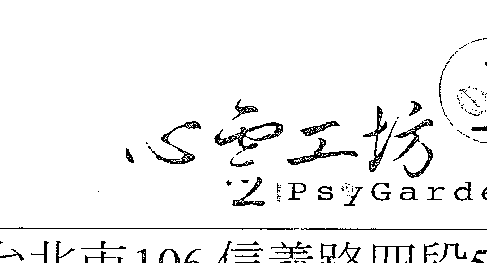

# 心靈工坊
PsyGarden

# Holistic

探索身體，追求智性，呼喊靈性
攀向更高遠的意義與價值
是幸福，是恩典，更是內在心靈的基本需求
企求穿越回歸真我的旅程

# 有求必應——22個吸引力法則

Ask and It Is Given: Learning to Manifest Your Desires

作者／伊絲特與傑瑞·希克斯（Esther and Jerry Hicks）

譯者／鄧伯宸

# 目錄

- 中文推薦序 喜悅自在 5
- 中文推薦序 信念創造實相 7
- 譯序 只要願望的種子不死 10
- 作者序 匯集喜樂的思想 13
- 推薦序 愛與圓滿的人生 17
- 前言 認識亞伯拉罕 21
- 卷一 當下自在的力量 34
- 1. 我們承諾——讓你找回真正的自己 37
- 2. 創造自己的現實 41
- 3. 如何才能如願以償 45
- 4. 基本的道理——水到自然渠成 50
- 5. 吸引力法則——宇宙最強大的法則 53
- 6. 你站在思維的尖端 60
- 7. 你既是振動的傳遞者，也是接收者 65
- 8. 隱藏在情緒反應背後的價值 69
- 9. 心想事成的三個步驟 72
- 10. 修持將使你成為喜樂自在的創造者 78
- 11. 情緒設定點全掌握在自己 83
- 12. 涵容感受作為你的導引 88
- 13. 在此之前，你早就瞭然於胸 94
- 14. 在一個完美且擴充的世界， 99
- 15. 你是一個同等的存在 102
- 16. 在多元的宇宙中，你參與共同的創造 108
- 17. 你身在何處？又將何往？ 112
- 18. 你能夠逐漸改變自己的振動頻率 114
- 19. 唯有你知道自己的感受 117
- 20. 妨礙別人的自由是要付出代價的 127
- 21. 68秒可以功德圓滿，你只差那17秒而已 129
- 22. 情緒導引量表上的不同度數

## 卷一

- 介紹22個吸引力法則 142
- 你戴著一張笑臉嗎？ 147
- 心法1 靜觀欣賞 154
- 心法2 創造魔法盒 162
- 心法3 創造工作坊 166
- 心法4 虛擬實境 179
- 心法5 財富遊戲 187
- 心法6 靜坐心法 191
- 心法7 夢的鑑定 199
- 心法8 正面觀想之書 205
- 心法9 劇本寫作 212
- 心法10 桌巾心法 216
- 心法11 時段定向 220
- 心法12 如果……該有多好？ 227
- 心法13 哪種想法讓你更自在？ 231
- 心法14 去燕存菁 238
- 心法15 錢包心法 245
- 心法16 重心移轉 248
- 心法17 專注之輪 256
- 心法18 找到感受點 266
- 心法19 解除抗拒，免於負債 269
- 心法20 交給經理人 275
- 心法21 回歸本然健康 278
- 心法22 提升情緒位階 286
- 最後的叮嚀 297
- 附錄：專有名詞 298

## 【中文推薦序】喜悦自在

### 中华新时代协会创办人
王季庆

这是个南风徐来的暮春午后，令人有些微醺的慵懒，我却似由梦中醒来，重新以清澈的眼和柔软的心迎接生命的一个新季节。

从事新时代新思维的典籍之翻译，会通东方西方哲理已二三十年，深感古往今来的智慧是同源相通的。大道无名，但好思辨、喜钻研的人类数千年来仍乐此不疲地追求，且各执一端，唯我独尊。

拿我自己来说，这半生研读的中西著作虽没有「等身著作」，但则不知等于几倍的身长了。最推崇的当然就是「赛斯（系列）资料」，因为他完全没有偏见及偏执地说出宇宙和人生的「真实」、「事实」，而并无意成为开宗之教。他当年影响了许多后来颇有建树的大师，而最经典、也最常被人引用的，就是「你创造你自己的实相（现实）」。在本书41页里也特别提到这句「既令人兴奋又让人苦恼」的名言。

这句话不止道出了你是个创造者而非受害者，并且也将责任与力量归还给每个人本身。

宗教人士常以慈悲为怀，想要教人「离苦得乐」。不过，因此先灌输「人间即苦」和「积善消业」的概念，没能正本清源，反而将所谓的苦和业建立在错误的认知上。

而现在坊间的各种心理治疗，他们不去批判，而是要「观」出心身问题的来龙去脉，使意识中的种种，即「觉知」，变成有意识，然后将之放下。「放下」的过程，又与所谓的「修行」结合。而最后我们期盼的整合超越了健全，也就是本书说的「圆满」人生。

正如古往今来多少道，「进道」的方式，或各有长，也各有影响，并且是「信」则实。

多少教人修行的方法，彼此呼应、相辅相成，不一定得非此即彼，而是好心的引导，向内与自己内在的神连接。

本书是非常简明的好书，可以解许多求道者的惑。运用二项步骤及辅以22个吸引力法则，便可以游戏性地用心创造自己想要的人生，落实了「你创造你自己的实相」，而达到自在、感恩的最高情绪位阶，过着喜悦与爱的日子！

## 【中文推薦序】信念創造實相

### 中華新時代協會理事長暨賽斯學派心靈輔導師 張鴻玉

作为一个从事身心健康整合的研究者，过去几年来，我经常有机会与一些身心遭受痛苦的朋友们谈心。我发现许多人对生命的看法充满了悲观，而且在现实生活中，也的确遭受到了许多无奈与无助。他们对于命运的乖戾，造化的弄人，简直无计可施。他们真的很想知道：为什么我的梦想，总是难以成真？为什么我渴望成功，却一直遭受失败？为什么我盼望能享有财富，却始终一贫如洗？为什么我孤寂一生，难有亲密的伴侣？为什么我极尽所能地为人服务，却总是好心没有好报？为什么我细心地照顾自己，身体却老是出问题？难道上帝真的是不公平的？难道我真的苦命的人？我该如何才能美梦成真？我该怎么做才能创造出自己想要的生活？

所谓新时代，指的就是新人类，新意识。新意识所强调的，在于个人意识的觉醒。觉醒什么？觉醒到「心灵是不灭的本体」，而「每个人都是自己命运的主宰」。在新时代的思想中，最经典的概念就是赛斯所说的：「你的信念，创造出你自己的实相」（Your beliefs create your own reality）。也就是说，你自己的思想与信念，创造出你的命运、你的世界。这也就是佛经中所说的：「万法唯心造」，发生在你身上的一切，皆是由你自己的心念所引起的。这样的思想，让我们再也无法怨天尤人，因为每个人都有一颗心，而你的「心」就是命运的创造工具，如果你不为自己负责，又有谁能帮得了你？

作为新时代「赛斯资料」的热爱者，我以喜悦的心情，将这本书介绍给所有喜欢新时代思想的读者们。因为在这本书中，你将会看到作者伊丝特·希克斯，由她所接收、并记录，来自非物质界存在（being）的精彩发声。这个自称是「亚伯拉罕」的高灵，以充满了慈悲、爱与喜悦的口吻，传达了他来自更高层面极为宝贵教导与讯息。让我欣喜的是，亚伯拉罕采用了极为简单易懂的语言，却说出了宇宙至深的真理，让我们能够很容易就了解，该如何藉由思考、情绪与行动，来使生活变得更乐观、更喜悦、更精彩。

在这本书中，「亚伯拉罕」与其他新时代的大师们一样，他谈到了，如果想要「创造自己的命运」，就必须要重新地「认识自己」，而这正是人类在迈入更高层心灵意识前，所必须具备的基础概念。譬如：我们来自圆满（Well-Being）自由，我们本来就自由的，而且我们始终都是圆满自由的。

我不想在这儿透露本书中所提到的种种「先机」与「秘密」，因为我想要让你品尝阅读本书时的惊喜与珍惜感。如果你够幸运，你就会读到这本书，而如果你已经将本书握在手中，那么你就已经取得了先机，你将知晓宇宙的秘密，你注定是个幸运儿，你会心想事成，你会万事如意，你将会是世界上最快乐的人。

同为地球的旅行者，我为我们的幸运欢欣鼓舞！

## 【譯序】只要願望的種子不死

愿望得不到满足，正是想像的原动力，每个想像都是要实现一个愿望，是要修正一个不满意的现实。
这段出于精神分析开山祖师佛洛伊德的话，一语道破了人类之为万物之灵的关键。人之所以为人，注定了从来不会满于现状，永远都在追求更好。普天之下，人的渴望，从多食、多金到天下太平，可说无所不有。如果人也像昆虫一样，天生设定的程式就能够几近完美地适应环境，那就大可不需要愿望了。因此，个人、家庭、团体乃至整个社会，愿望乃是一切进步的源头，甚至可以说是一个人活着的一个指标。因为，即使是万念俱灰，只要愿望的种子不死，生命的火焰终将不熄。

佛洛伊德点出来了，愿望激发想像，想像推动作为，透过学习、发明、吸收新事物，进而修正现实，创造各式各样的可能。但是，愿望如何开展，如何落实，以佛洛伊德的天才来说，那只不过是想当然耳的事，无庸多言。至于一般的老生常谈，说到如何实现愿望，总不外乎努力、奋斗、用心、有计划、有步骤等等，说教有余，动能不足，心想事成几人能够？

关键在于多数人空有愿望而不了解愿望。愿望究竟是什么？其本质为何？其动能为何？为什么？为什么有些人的愿望水到渠成，有些人的愿望却总是落空？如何才能知道自己的愿望是能够开展、能够实现的？还有，用什么方法才可以知道自己的愿望并非只是空想？所有这些问题，在《有求必应》这本书中都可以找到答案！

这是一本奇妙的好书。全书虽然以愿望为核心，但实际上却是为我们身为一个「物质界」的「存在」定位，告诉我们什么是自己的「真我」，了解自己的本质是与宇宙一体的「能量」，用自己的「想法」发出「振动」，用自己的「情绪」或「感受」检查自己的振动是否与宇宙本有的「圆满」相契合，从而调整想法，改变振动，便能够吸纳天地中源源不绝的能量，使愿望得以开展，得以落实。

《有求必应》其实是一套完整而周延的思想体系，但绝不深奥、复杂，而是从简简单单的概念出发，用明明白白的语言阐述，落实到实实在在的人生。全书分成两大部分，前一部分是「体」，亦即宇宙与人生的本质，后一部分是「用」，亦即愿望开展与落实的方法。书中重要的概念，全都收在附录的「专有名词」，阅读本文之前，请先用心参详，就好像参观展览之前先看展出内容的目录，以收初步认知之功。

但是，整本书中最核心的概念端在于「想法」、「情绪」与「专注」。因为想法决定愿望，情绪检查愿望，专注则开展愿望。能够掌握这三个概念，也就掌握了全书的锁钥。因为，这三者都是存乎一心，完全可以由自己做主。

环绕着这三者的则是整个宇宙，一个本来圆满的能量本源。每个人透过自己的想法、情绪与专注，吸引、收纳无尽的能量，不断扩充，成就自己也成就这个世界。

完全不同于现今许多强调灵修的书籍，《有求必应》最大的特点在于入世，在于拥抱本来圆满的人生。作者要求我们放空自己，但放空的目的是要收纳更多；要求我们以欣赏的态度去看待世界，但欣赏的目的是要使自己得到自在；要求我们用心创造，但创造的目的是要达成自己的愿望；鼓励我们生气，但生气的目的是要改善自己的情绪；甚至鼓励我们自私，但自私的目的是要与真我契合。

总之，无论放空自己或收纳更多、欣赏世界或得到自在、用心创造或达成愿望、生气以改善情绪，还是自私以与真我契合，最终都是要找到真我，回归真我，一切自在，一切圆满。因为，无论我们所愿望的是物质与金钱、身体与健康、一种人际关系、地位与处境，愿望的核心都是愿望得到自在，因此，成功的标准非他，得使人生得到自在与喜乐而已。

一切都是从一个「我」出发，但每一个我都成就了，一切也就成就。

在翻译的过程中，书中的话语有如一汪清水，仿佛在其中看到自己的人生倒影，发人深省。

这是一本人生之书。

> 佛洛伊德曾说，能爱、能工作的人就是心理健康。而了解愿望、知所愿望，并使愿望得以实现，那必定是一个快乐的人。这是一本快乐手册。

## 【作者序】匯集喜樂的思想

### 傑瑞·希克斯 (Jerry Hicks)

执笔写这篇序文时，阳光刚刚遍洒马利布（Malibu）的海岸线。沐浴晨光中的我，内心深处的喜悦仿佛太平洋的湛蓝，只因为我琢磨着大家将从这本书得到珍贵的启发。

《有求必应》这本书所谈的，乃是我们心中有所「问求」时，「本来实体」（All-That-Is）所做出的应答，也可以说是第一本书，用如此清晰的语词，对于我们该如何问求、如何接受，无论我们想要成为什么样的人、想做什么样的事、想拥有什么，所给出的简单可行的公式。

我一直在问自己一个问题，「它」（It）到底是什么？数十年前，当我还在为这个问题寻找一个可靠的答案时，发现这个字根本就无可名状（意思是「无法以言语形容」）。无可名状与我为它所下的结论完全吻合。当时我心里有数，越是明了「非物质界」（Non-physical）时，就越不可能用三言两语表达清楚。既然是这样，对「非物质界」状态完全完全的了解，同样也是无可名状。

换句话说，在我们的时空现实当中，「非物质界」是无法用物质界的语言文字加以清楚说明的。在整个物质界的历史中，发展出无以数计的哲学、宗教、观念与信念。然而，尽管有千千万万的哲人绞尽心思，并将信念传诸后世，我们却仍然无法找到足以表达「非物质界」的物质界文字。至少没有任何说法是我们一致同意的。

历史上一直不乏某些文献，但毕竟只是少数人，记载他们与非物质界智慧的有意识沟通。有些人则反其道而行，尽管因此而遭到谴责。无论如何，这些曾经与「非物质界」做过有意识沟通的人，或许是害怕遭到谴责甚或被当成疯子，到头来都决定秘而不宣自己所得的启示。

在英语世界比较为人所熟知的，如摩西、耶稣、穆罕默德、圣女贞德、约瑟·史密斯（Joseph Smith，译注：美国宗教领袖，摩门教创始人，1805-1844）……都说自己是非物质界智慧的领受者，然而大部分都生不逢时甚至惨遭折磨以终。正因如此，尽管我们可以领受某些形式的非物质界指导，却只有极少数人接受了够多且够清楚的非物质界思想，并将之转译成为物质界的语言文字，但这些极少数人还是愿意分享他们的经验。

我之所以这样讲，并将之作为你们将要读到的这本书的序言，是因为我的妻子伊丝特就是这极少数的人之一，能随意敞开自己意识心，领受非物质界的应答，而且不论所问的是什么。总之，恰如将西班牙语转译成英语的译者，听到以西班牙语讲出来的思想然后将之转译出来，伊丝特当下就能够将她所领受的非物质界思想（非语言文字）转译成为最贴切的物质界语言。

这里要提醒大家的是，由于伊丝特所领受的非物质界思想并不是物质界语言所能完美表达，因此，有的时候会创造出一些新的组合字，同时也会以新的方式使用一般的标准字（譬如说，一般不是大写的字用大写表示），以便用新的方式来看人生。基于这个理由，我们在书中列了一份专有名词词汇，以便厘清某些一般字词的非一般性用法。换句话说，拿 well-being 这个一般性的词来说，意思是健康、快乐、充裕的状态，但在将亚伯拉罕的思想转译成英文时，则是用 Well-Being 来表示（译注：本书译为「圆满」），是一种更广大、遍在的非物质界圆满状态，自然而然流向我们，除非我们做了某些事使之断绝。（此外，在本书中有某些合成字，是在字典中查不到的，但其意义却是再明白不过，在第一次用到时都会加上引号，譬如「overwhelment」或「endedness」）

一九八六年以来，伊丝特和我一年当中总要旅行五十余个城市，举办工作坊以及任何让参与者能够讨论或提出各种问题的聚会，任何主题都来者不拒。来的人动辄数以千计，不同族群、不同阶层、不同思想背景……全都是想要改善生活，有的是为了自己，有的是为了帮助别人。问题问得再多，透过伊丝特，都可以得到来自非物质界智慧的答案。

为了回应那些想要知道更多的人所提出的问题，这一喜乐的思想乃逐渐汇集而成此书。这些教导乃是世间最有力的法则，亦即吸引力法则（Law of Attraction）。过去十年来，在我们所出版的季刊《用心创造》（The Science of Deliberate Creation）中，发表了许多亚伯拉罕的教导，并将参加我们「涵容艺术工作坊」（Art of Allowing Workshop）的人所提出来的问题一一加以过滤，突显最新的角度。随着你们所提出越来越多的新问题与新角度，引起我们的注意，这一思想乃得以持续发展。

这是一本启蒙书，教你们如何做到心想事成的书，无论是想成为什么样的人、想做什么样的事，或想拥有什么；同时也教导你们，如何不会成为自己不愿意变成的样子、不会做自己不愿意做的事，以及不会拥有自己不想要的东西，使各位方便习得一门灵性修持的功课。

有求必应——22个吸引力法则——16

## 【推薦序】愛與圓滿的人生

### 偉恩・戴爾博士（Dr. Wayne W. Dyer，著有暢銷書《意念的力量》（The Power of Intention））

你此刻捧在手中的书，包含了今日世间最有力量的教导。亚伯拉罕（Abraham）在本书中的话语，以及过去十八年来伊丝特与杰瑞所发行的录音带，一直深刻地感动并影响我。今天这本书的出版，堪称新的里程碑，而亚伯拉罕要我为之作序，无疑是莫大的荣幸。此书之付梓殊为盛事，使我们得以亲炙那些常与本源能量（source energy）须臾不离的人。更重要的是，书中的话语浅显易懂，当下即可化成行动，不啻一幅蓝图，指引我们通晓世路，落实命运。

我的第一个念头是，如果你还没有准备好阅读并应用此一了不起的智慧，那么我就要敦促你，不妨让此书一连几个星期与你寸步不离，好让书中的能量扩张，化除你身心的滞碍，回响于那无形无界的内心世界——灵魂，或亚伯拉罕所讲的与本源共振的振动（vibrational connection to your source）。

> 诚如爱因斯坦所说：「凡事皆成于另一事之所以动。」

这是一个振动的宇宙。也就是说，凡事都会与某一特定的频率共振。若将这个实在的世界打破为极细微的成份，你将看见一个跃动的微粒与虚空的空间。只要去看看这些最微小的量子微粒，将会发现，它是来自于一个本源，而这个本源以极高的速度振动，完全不受天地生灭的支配。这种最高远的能量就是所谓的本源能量。你我与万事万物都是源自于此一振动，然后转而进入这个事物、肉身、心灵与自我的世界。一旦离开了身心之中的这个本源，也就承接了烦恼、病痛、匮乏与恐惧的世界。

亚伯拉罕的开示基本上是要帮助我们全方位地回归到那个本源，那个我们之所自来同时也终将回归的本源。我在著作《意念的力量》中，曾就这种本源能量谈过自己的印象与心得。然而，由于亚伯拉罕得天独厚，能够百分之百与那个本源契合，而且从不疑惑，故能将这种启蒙的智慧揭露于众人，在本书的字里行间随处看见。

你，你来自于一个喜乐的本源，也能够为自己吸引更高的振动能量，并使其无碍地流通于生活的每一面向，或者你也可以抗拒它，但如此一来，便是拒绝那无所不备而又无微不至的本源。

书中传达的讯息极其惊人又极其简单，不过就是我们皆来自于一个爱与圆满的本源。一旦你如愿拥有那种宁静与爱的能量，也就重新获得了来自于自己本源的力量，亦即使愿望成真、使喜乐俱来、使曾经匮乏的丰沛、以及得以亲近好人与优质环境的力量。这一切都是本源所成就的，而且因为你本来就是来自于那个本源，你当然也可以做得到。

我曾与亚伯拉罕相处整整一天，和伊丝特、杰瑞一同用餐，听过数百次亚伯拉罕的录音，因为此，你可以信任我，你即将踏上一条改变一生的旅程，而促成这趟旅程的，则是我所遇到的人当中，最觉舒畅、最感契合的一位。

## 【重要推荐】

- 「亞伯拉罕的教導，素為我所敬服，十年來於我自己與家人助益極大。」
  《女人的身體與智慧》（Women's Body and Women's Wisdom）作者——克莉絲汀·諾爾斯皮（Christiane Northrup）

- 「亞伯拉罕的教導啟發我，開導我，使我達到一個清明、自信、毅力與熱誠的新高度。其理念與我常相左右，願意推薦給每一個人。其感化力量之強大，為我生平僅見。以其為師，人生可以因而嶄新、幸福。」
  《生命的深呼吸》（A Deep Breath of Live）作者——艾倫·柯恩（Alan Cohen）

- 「亞伯拉罕的教導深刻中見其易行與實際，將可使我們重拾自我指引的信心，踏上無比擬的提升之路。《有求必應》乃是一幅自我提升與享受人生的路線圖。」
  《心靈雞湯》系列作者——傑克·坎菲爾（Jack Canfield）

- 「關於人生的開展，許久以來，此書是我讀過的最好作品。最令我佩服的是，暢銷書此書深入淺出，點出深刻的人生至理。」
  《天使療法》（Angel Medicine）作者——朵琳·芙秋博士（Doreen Virtue, Ph.D.）

- 「真的很很高興希克斯夫婦的《有求必應》這本書將在台灣出版了！在「心想事成」這個話題熱門炒作的眾多書籍中，他們傳達的訊息獨樹一格，而且書中的22個心法真的很實用，以你當時所在的不同的情緒層次，來決定使用那一種，我自己就常常運用他們的心法來調整狀況，非常好用！強力推薦！」
  ——身心靈作家 張德芬

## 【前言】認識亞伯拉罕

伊絲特·希克斯 (Esther Hicks)

「她說的話很靈！」我們的朋友們都說。「她下個星期會來這裡，何不約她見個面，想問什麼都可以！」

我心裡想著，那大概是天底下我最不可能去做的事，同時，我卻聽到我的丈夫說：「我們真的很想約個時間，怎麼才辦得到呢？」

一九八四年，我們結婚的第四年。從來不曾吵過架甚至鬥過嘴，我們是兩個快樂的人，形影不離歡喜過日，幾乎什麼事情都一拍即合。唯一讓我耿耿於懷的，就是每當傑瑞要跟他的朋友分享他二十年前的往事，大談他玩西洋碟仙占卜板的經驗時，要是正好在餐廳或公共場所，只要我意識到他又要發作了，便客客氣氣（有時候可沒那麼客氣）找個理由，躲到女賓室，找張桌子坐下，要不然就開車兜個風，直到我估量時間差不多了，帳也付清了。真高興，轉了一大圈，傑瑞總算不再談那些老故事了。我並不是你們所說的那種虔誠女生，但卻上過太多的主日學，養成了一種習慣，十分懼怕邪惡與魔鬼。回想起來，我不太能確定，主日學的老師真的花了很大的工夫教我們要懼怕魔鬼，或者只是因為我心理作祟。但大體上來說，在那些日子裡，我記得的就是那樣。總之，如我被教導的，我小心地避開任何與魔鬼有關的事。我還年輕的時候，有一次開進一家汽車戲院，無意間從後車窗看到電影「大法師」中可怕的一幕（一部我存心要避開的電影），雖然沒有聽到聲音，但光是眼睛瞄到的景象，就讓我連續做了一個星期的惡夢。

> >「她名叫席拉。」朋友跟傑瑞說。「我先幫你們約她，再告訴你們。」

接下來，傑瑞花了幾天時間列出他的問題。他說，他心裡始終有些問題，是從小就有的。我可沒有寫出自己的問題，反倒是掙扎著要不要去。亞利桑那鳳凰城市中心，當我們開進一棟華宅的車道時，我心裡還在想，我這是所為何來？我們走向前門，一位十分體面的婦人引導我們進入一間客廳，等待著安排好的會面。房間很大，裝潢得極美，而且很安靜。我記得，有一種肅然的感覺，彷彿身在教堂。接著，一扇大門打開，兩個美麗婦人進來，一身光鮮的棉布衣裙。很顯然地，我們是午餐後第一批會面的人，兩人看來都心情愉悅，神采奕奕。我稍微寬心，事情或許沒那麼怪異。沒有多久，我們受邀進入一間溫馨的臥室，靠近床腳的地方放著三張椅子。席拉坐在床緣，她的助理坐在其中一張椅子上，旁邊桌上放著一台小錄音機。傑瑞和我在另外兩張椅子坐下，我繃緊精神，準備應付接下來發生的事情。助理為我們說明，席拉即將敞開並放鬆她的意識，接下來，一個非物質界的實體，迪奧 (Theo)，曾對我們講話。一旦開始，我們就可以隨心所欲談任何事情。席拉在床緣躺下，距我們的座位不過幾呎，呼吸深沉。不多久，一個頗不尋常的聲音突然說道：「要開始了，是不是？你們有問題要問嗎？」我看著傑瑞，希望他準備好了，因為我壓根不打算講什麼，管他是誰在跟我們講話。傑瑞身體前傾，迫不及待要問他的第一個問題。當迪奧的言語緩緩透過席拉的嘴發出來時，我放鬆了下來。雖然我們聽到的聲音是席拉的，不知怎地卻明白，有某種完全不同於席拉的東西才是這些神奇答案的來源。傑瑞說，從五歲起，他就一直藏著他的問題，並儘可能快速地都講了出來。三十分鐘很快就過去了，不知怎地，儘管我未發一言，對於這次奇異經驗的恐懼卻消失了，反而充滿了一種從所未有的幸福感。一回到車裡，我就告訴傑瑞：「我真的很想明天再來。現在我有些事情想要問了。」傑瑞很開心，因為我們馬上又約了另一次的會面，他同樣還有更多來不及問的問題。次日，我們分配到的時間大約進行到一半，傑瑞卻不願意將剩下的時間讓給我，於是我問迪奧：「我們要怎樣才能更有效地達成目標？」答案出來了：「靜坐與正面思考。」靜坐，我一點興趣都沒有，也從未注意有誰曾經學過靜坐。事實上，每想到這個詞，在我的心目中，無非是躺釘床、走火炭、單腳獨立一整年、或在機場乞求施捨之類的。於是我又問：「你所謂的靜坐是什麼意思？」

回答很短，話聽在耳朵裡卻很舒服：「坐在安靜的房間裡，穿寬鬆的衣服，專注於自己的呼吸。心思若動，任其自然，放掉念頭，專注呼吸。兩個人一起做更好，會更有力量。」

「可不可以給我們一個對我們有幫助的正面思考呢？」我問。

「我（唸自己的名字）看見尋求啟蒙的眾生，透過神的愛，經由我的作為靠近我。共同的意願使我們彼此都獲得提升。」

當話語自席拉／迪奧之口流出，我覺得它們穿透了我的存在核心。一種愛意遍流全身，非以前的任何感受所能比擬。恐懼消失無蹤，傑瑞和我都覺得渾身舒暢。

「我可以帶女兒崔西來見妳嗎？」我問。

「那要她自己想來，但沒有必要，因為你們（傑瑞和我）也都是通路。」

這番話對我完全沒有意義，都三十好幾了，就算是真有其事，卻是聞所未聞，我不相信自己有這份能耐。

錄音帶喀噠一聲停了下來，我們不免若有所失，奇妙的經驗到此結束。席拉的助理問我們，是否還要問最後一個問題。她說道：“想不想知道你們的靈性嚮導是誰？”

我哪會問這樣的問題，因為，靈性嚮導，我還是第一次聽說，但是似乎是個蠻有意思的問題，守護天使的概念我喜歡。因此便說：「好呀，請告訴我，誰是我的靈性嚮導？」迪奧說：「按照規矩，時候到了你自然會知道。一旦擁有靈聽，你就知道了。」靈聽又是什麼呢？我納悶著，但還來不及問，迪奧已經用一種送客的口吻說道：「上帝之愛降臨於你。」席拉也睜開眼睛坐了起來。我們跟迪奧神奇的對話也隨之結束。

離別後，我們把車開到鳳凰城山上，靠著車子，眺望落日，完全不知道自己的內在已經發生了轉變，唯一知道的，就是我們覺得很舒暢。回到家，兩個新的意念很強烈地升起。我要開始靜坐，不管它有什麼作用，同時，還要弄清楚我的靈性嚮導的大名。

於是，我們換上罩袍，拉上臥室的簾子，坐在一張寬大的靠椅上，拿一塊隔板放在我們中間。既然要我們一起做，卻又覺得怪怪的，只好用隔板擋起來，意思到了。我記得迪奧的指示：坐在安靜的房間裡，穿寬鬆的衣服，專注於自己的呼吸，於是，我閉上眼睛，開始注意呼吸，並在心裡問：誰是我的靈性嚮導？然後開始數息，一吸一吐，一吸一吐。沒多久，我就覺得全身酥麻，從鼻子一直麻到腳趾，感覺很怪但卻舒服。儘管知道自己是坐在椅子上，卻覺得身體在緩緩旋轉。定時器響了，我說：「我們再來過。」

再一次，閉眼，數息，覺得從頭酥麻到腳趾。定時器再度響起。「再來一次。」我說。於是，我們又定了十五分鐘，又一次，酥麻感佔領我的全身。但這一次彷彿有什麼東西或什麼人，開始「呼吸我的身體」，我覺得滾滾愛意湧起，從極深的內在向外湧出，何等美妙的感覺呀！傑瑞聽到我發出歡喜的柔聲，事後形容說，我彷彿陷在性的狂喜當中。

定時器停止，我從靜坐中出來，牙齒從未有過地顫抖不停。那種情形我無以名之，只能用「颤切切」來形容。將近一個小時，牙齒颤颤切切不已，我則拼命想要放鬆恢復平常的清醒狀態。

當時我並不明白發生了什麼事，但現在我知道了，那是我與亞伯拉罕的首度邂逅。雖然對當時的情形一無所知，卻清楚知道那是好現象！並希望會再度發生。

於是，傑瑞和我決定每天靜坐十五分鐘，接下來的九個月，一天都沒有放過。每一次都感覺到那種酥麻感，或出竅的感覺，但靜坐中也不再有其他特殊的事情發生。直到一九八五年，感恩節前，一次靜坐中，我的頭開始輕緩地左右搖晃。接下來的幾天，靜坐的時候，頭都會那樣輕緩晃動，那感覺真好，彷彿在體驗飛翔。這種靜坐中新發生的情形，大約是到了第三天，我明白，頭部的晃動並非沒有目的，而是我的鼻子在動，彷彿是在空氣中拼字。我了解拼的是M、N、O、P。

> 「傑瑞，」我喊道，“我在用我的鼻子拼字！”而隨著這些字，那種狂喜的感覺又回來了。

當我的鼻子在空中書寫時，傑瑞趕緊拿出筆記本，寫下那些字：「我是亞伯拉罕，你的靈性嚮導。」

當這種非物質界的能量滲透整個身體時，從頭到腳都起雞皮疙瘩。

從那時起，亞伯拉罕告訴我們，其實「他們」有很多，之所以用複數，是因為他們是「集體意識」。按照他們的說法：開始時，透過我說出「我是亞伯拉罕」，之所以是「我」而非「我們」，是因為在我的期望中，我的靈性嚮導是單一的，但實際上他們卻有許多，發言則是出自一個聲音或一個思想意識。

這裡引述亞伯拉罕的話：亞伯拉罕並非一個單一意識，不像妳是以單一的身體感覺到自己。亞伯拉罕是個集體意識。有一個非物質界意識流，當你們當中有一個人提問時，是許多的意識點穿過單一的管道在發言（因為，以這種情形來說，只有一個人，伊絲特，在詮釋、在發聲），因此，對妳來說，是單一的。我們是多重面向，當然也就是多重意識。

亞伯拉罕又說明，他們並非以喃喃低語對我講話，然後我再轉述內容，他們給我的是完整的想法，就像無線電信號，我則在類似潛意識的層面接收，再轉譯成相當於物質界的語言。我「聽到」他們對我所說的話語，但在轉譯的過程中，我卻不會意識到進來的是什麼，也沒有時間蒐集已經進來的東西。

亞伯拉罕又說，他們對我供輸想法已經有一段時間，但我卻堅守迪奧的教導：「心思若動，任其自然，放掉念頭，專注呼吸」，以致這些想法一動起來，我就馬上放下，回到我的呼吸上去。

因此我猜想，他們只有讓我用鼻子在空中拼字才跟我接了上頭。亞伯拉罕說，當我知道自己在拼字時，那種遍流全身的奇妙感覺，是因為我認知到我們之間的聯繫，也是他們所感到的歡喜。

接下來的那個星期，我們的溝通進展得很快。用鼻子在空中拼字是一種非常緩慢的過程，但到後來，一天晚上，傑瑞和我躺在床上看電視，突然有一種很強烈的感覺，通過我的臂、手和手指，使我不由自主戳著傑瑞的胸口，就在那當下，有一股強烈的衝動，拉著我朝向打字機那兒，手指才碰到鍵盤，便飛快地上下移動，彷彿有某個人一下子發現了打字機的作用，知道哪裡有些特定的字存在那兒。我雙手齊飛，打在每個字母、每個數字上，欲罷不能，然後，文字在紙上成形：我是亞伯拉罕，妳的靈性嚮導，我將在這裡與妳一同工作，一起寫一本書。

我們發現，我可以將雙手放在鍵盤上，然後又放鬆，情形就像我在靜坐時那樣，亞伯拉罕（從現在起，提到他，我們將用「他們」）會馬上回答傑瑞問的任何事情。這種經驗真是驚人，他們真是聰明、慈愛、有求必應！任何時候，他們都跟我們談到我們想要討論的任何事。

一天下午，傑瑞與我正在鳳凰城的一條高速公路上開車，我突然在嘴巴、臉頰與脖子上出現一種感覺，就像要大喊出來的一股衝動，強烈到我控制不住。當時我們正夾在兩輛大卡車之間要轉彎，兩輛車好像同時都越線進入我們的車道，一時之間我還以為它們就要泰山壓頂而來。就在那一瞬間，亞伯拉罕第一次透過我的嘴衝出話語：「走下一個出口！」

下了高速公路，把車停在一處高架橋下的停車場，傑瑞與亞伯拉罕聊了幾個鐘頭。當亞伯拉罕回答傑瑞滔滔不絕的問題時，我緊閉雙眼，頭部有節奏地上下移動。

這樣奇妙的事情怎麼會發生在我身上呢？總覺得不可思議，看起來簡直就像神仙故事，有如許願望擦神燈一般。換個角度看，卻又是世上最自然、最合邏輯的事。

## 亞伯拉罕進入我們生活之前的情形

有的時候我幾乎不記得。大體上來說，我是一個快樂的人。童年生活美好，沒有重大的創傷，有兩個姐妹，父母慈祥和藹。我已經提過，傑瑞和我結婚約四年，無論從哪方面講，生活美滿。談到自己，我從不覺得自己是個充滿無解問題的人。事實上，我根本沒什麼問題要問，對於大多數的事情，也很少有太強烈的意見。

傑瑞卻正好相反，他問題多，且多是出於熱心。嗜讀之餘，總是在尋找各種工具與技術，想要幫助別人使他們生活得更愉快。就我所知，在我所認識的人當中，像他那樣熱心的，還找不出第二個。

亞伯拉罕解釋過，傑瑞和我之所以是這項工作的完美搭檔，關鍵就在於傑瑞的熱心腸可以召喚亞伯拉罕，而我的不懷己見或為別人設想，則使我成了一個良好的容器，裝得下傑瑞所導引出來的訊息。

傑瑞的熱忱甚至在第一次與亞伯拉罕互動時就表現了出來，因為，他了解他們智慧的深度與無所保留。這麼多年下來，對於亞伯拉罕的話語，他的熱忱絲毫未減。整個屋子裡，對於亞伯拉罕所說的一切，真正能夠知其可貴的，無人能及傑瑞。

剛開始與亞伯拉罕互動時，對於所發生的一切，我們的確不甚理解，也無法真正知道究竟是誰在跟傑瑞談話，但這一切總令我們感到驚喜交織，既美妙又神秘。我所認識的人當中，絕大部分都不會了解我的所作所為，甚至根本不會想去了解。正因為如此，我要傑瑞保證，不對任何人提起我們這種驚世駭俗的秘密。

我猜，傑瑞的這個保證如今是黃牛了，但我也不在意。就我們兩個來說，房間裡塞滿了人，個個都想跟亞伯拉罕討論事情，就是我們最想要做的事。從那些透過我們的書籍、錄影帶、錄音帶、工作坊或網路接觸到亞伯拉罕的人，我們最常聽到的是：「謝謝你們，多虧你們的幫助，我才記起了我本來就已經知道的事。」以及「一路走來，我所找到的真理都是零零碎碎，多虧你們，我才將它們集合起來，如此一來，每件事情都有意義了。」

不像那些算命占卜的人，對於預知未來這種事，亞伯拉罕似乎興趣缺缺，儘管我相信他們知道我們的未來，但他們卻有所不為，只是教導我們如何從當下到我們想去的地方。他們告訴我們，決定我們的願望，並非他們的事，他們的工作在於幫助我們達成願望。用亞伯拉罕的話來說：亞伯拉罕並不是在指導任何人的趨吉避凶，我們要的是，你當為自己的願望做一切決定。我們所盼見的是，你要自己設法去達成自己的願望。

人們談論亞伯拉罕，傳到我們的耳裡，其中我最喜歡一個青少年所說的。那孩子剛聽過一卷錄音帶，是亞伯拉罕針對青少年常見的一些問題所說的話語。他說：「最初，我並不相信伊絲特是在替亞伯拉罕發言，但聽過帶子後，聽了亞伯拉罕的回答，才知道真的有亞伯拉罕，因為他不斷論對錯而能叫人心服口服，我不相信有人能夠做到。」

對我來說，與亞伯拉罕結伴同行，其美妙絕非言語所能道盡。從他們那兒所學到的，讓我喜樂，我也慶幸他們的諄諄教導使我覺得堅強。看到那麼多好朋友（以及新朋友）因著亞伯拉罕的教導而改善了人生，我感到歡喜，也歡喜這些有智慧的、有愛心的生命在我有所求時進入我的腦中，隨時幫助我們了解某些事情。

> 「迪奧的意思就是神」

（一段題外話，遇見席拉的數年之後，傑瑞在字典上查到迪奧（Theo）這個字，開心地告訴我：多奇妙呀！含笑回首那美好的一天，對我們來說，那真是意義非凡的轉捩點。當時我還害怕自己是要去跟魔鬼打交道，然而，事實上是踏上了與神對話的路。）

> 「你們是如何遇上的？如何維持你們的關係？他們為何選上你們？作為這樣一個大智慧的發言人是什麼樣的感受？」

早期剛開始與亞伯拉罕一同工作時，聽眾往往會要求我們說明與亞伯拉罕的關係。因此，每次在會面或廣播與電視訪問之前，我們都會花幾分鐘時間盡量滿足這些問題。但是，對於這一類的說明，我畢竟覺得煩了，只希望放鬆自己，讓亞伯拉罕的意識開始流動，使傑瑞和我能夠在那兒開始我們真正想要做的事。最後，我們終於製作了一卷免費的錄音帶——「認識亞伯拉罕」，詳細說明與亞伯拉罕互動的來龍去脈，好讓人們在有空的時候聽（我們也製作了七十四分鐘的「介紹」，讓人免費下載，網址是 www.abraham-hicks.com ，也有互動網站介紹我們的生平）。將亞伯拉罕的語言作成電腦格式，讓人聽用，是我們歡喜以赴的份內工作，但對我們來說，亞伯拉罕的話語才是真正的重點。

今天早晨，亞伯拉罕對我說，伊絲特，我們察覺到了你們星球上的大眾意識所放射出來的問題。現在，我們樂於透過妳提供答案。放鬆下來，好好享受這本書的開展。

於是我放鬆，讓亞伯拉罕放手寫這本書。我想他們將會從他們的角度向你們說明他們是誰，但更重要的是，我相信他們將會幫助你們認識自己，讓你們了解自己是誰。我所希望的是，如同我們的際遇，你們與亞伯拉罕的相遇也是有意義的。

# 【卷一】

我們知道，
有些事情對你們極為重要，
而你們卻已忘失，
你們當找回來。

## 1 當下自在的力量

我們叫作亞伯拉罕，自非物質界向你們發聲。當然，你們也是來自非物質界，因此，你我並沒有太大的差別。你的物質界是來自非物質界的投射，事實上，乃是是非物質界本源能量的延伸。

在這個非物質界的領域，我們不使用文字，因為我們不需要語言。我們沒有講話所仰賴的舌，沒有聽聞所仰賴的耳，但彼此卻能完美溝通。非物質界的語言是一種振動，我們這個非物質界共同體或家族則是意念一族。換句話說，我們以振動輻射我們的存在，而對方則專注收訊。其實你們的物質界也是如此，只不過絕大多數的人都忘失了這種能力。

亞伯拉罕是非物質界存在的自然聚合，藉著強大的意念，向你——我們在物質界的延伸——提示統攝萬物的宇宙法則。在我們的意念協助下，讓你想起你乃是本源能量的擴充，受到祝福和恩寵，來到這個物質界歡喜創造。

所有由物質界聚合而成的生命都有非物質界的對等體，無一例外；所有由物質界聚合而成的生命都可以開啟更開闊的非物質界展望，這也無一例外。但是，在你的星球上，絕大部分的物質界生命受到物質界本質的牽引，發展出強大的抗拒，阻礙了你與本源的契合。我們的目的就是要幫助那些想要找回這種聯繫的人。

所有物質界的人，雖然都可以跟非物質界溝通無礙，但絕大部分卻無法自覺這種能力。縱有自覺，卻因爲習慣性的思考方式，又阻礙了有意識的溝通能力。

然而，有時候，只要溝通的管道開啟，我們便能夠以振動的方式，將我們所理解的東西傳給某個能夠清楚接收的人，再將之轉譯出來。伊絲特的情形就是如此。我們以振動提供所知，其方式有如你所了解的無線電信號，伊絲特就是接收這些振動再轉譯成爲物質界的語言。然而，以目前來說，由於物質界的語言有限，我們還不能隨心所欲地提供所知。

無論你身在何處，我們衷心希望你能安身立命。我們了解，如果你所在的地方並不合你的意，說這話似乎也就沒有意義了。但我們絕對保證，當你了解什麼是使當下得以自在的力量時，不論如何，你都將得到一支鑰匙，開啟一扇門，成就任何你想要的生存狀況，包括健康、財富等各方面。

寫這本書的目的是要讓你更了解自己以及周遭的人，使你知道什麼是對你有幫助的，但這些話語絕不是說教。真正的知識來自於生命的經驗。若能持之以恆吸收經驗與知識，生命就絕不止於生活，而是充實、滿足與歡喜。生活也將是真我的一貫表現。

接收你只準備好要接收的東西。在同一時間內，我們會跟你談許許多多的認知層面，但你只會接收到你已經準備好要接收的。

東西。從這本書，每個人所得到的都不相同，但每次讀了都會有更多的收穫。了解了這本書的力量，就會一讀再讀。這本書將幫助物質界的生命了解他們與神以及一切本來實體（All-They-Really-Are）的關係。

這本書將幫助你了解本來的你、過去的你、現在的你、以及未來的你。

這本書將幫助你了解，你永遠都不會耗盡，也幫助你了解自己與過去和未來的關係，但最重要的是，喚醒你認知自己當下所具備的強大能量。

你將會明白，你就是自己人生的創造者，以及為什麼你全部的力量都落在當下。最後，這本書將引導你了解自己的情緒導引系統（Emotional Guidance System）以及振動設定點（Vibrational set-point）。

本書也將提供一系列心法，幫助你與自己的「非物質界」部分重新契合。一旦運用這些心法，喚醒你對宇宙法則的記憶，你便將重拾生命發自內心的喜悅。

## 2 我們承諾——讓你找回真正的自己

你知道自己要的是什麼嗎？知道你的人生是自己一手創造出來的嗎？你滿意自己的願望進展嗎？當新的願望在內心躍動時，你還感覺得到活力嗎？

有人或許會回答：「是的，我滿意自己的願望進展，到目前為止，我覺得很自在，雖然還有許多願望沒有實現。」如果你是屬於這種為數不多的人之一，那麼，你就是了解真正的自己。

但是，如果你和大部分人一樣，因為未實現的願望而感到不快樂；希望自己有更多的錢，卻總覺得錢不夠用；不滿意自己的工作情況，卻一籌莫展；不滿意自己的際遇，卻一直夢想的關係始終遙不可及……那麼，有一些極為重要卻不難了解的事，現在就讓我們跟你溝通吧。

我們之所以要跟你談這些，無非是希望你能找到出路，如願以償。但老實說，這只是一小部分的理由，因為我們了解，就算你眼前一長串的願望都達成了，又會有另外一長串取而代之，甚至更長更難滿足。因此，話說回來，寫這本書不是要幫助你逐項完成自己的願望，因為我們了解，再怎麼努力，本質上，那是不可能的。

我們寫這本書是要重新喚醒你記憶中的力量與成就，在真正的核心中，正是這種記憶一直在鼓舞不息。這本書是要幫助你重新回到你原有的樂觀、積極與進取，並讓你回想，無論是要成為什麼樣的人、做什麼樣的事或擁有些什麼樣的東西，都不是做不到的。因為我們做了承諾才寫這本書。現在，書已經握在你的手中，同樣地，該你履行承諾了。

對你自己說：「我會活得很有自在！」

對你自己說：「我會走入物質界的時空現實，走入芸芸眾生，以清晰而明確的想法承擔一個角色，並從那個角度看待自己，也欣然接受別人從那個角度看待我。」

對你自己說：「我會觀照周遭的人事物，並回應自己的觀照，從而肯定自己生為人的價值。」

對你自己說：「我明白自己所肯定的價值，也知道自己所追求的價值。」

然後再對你自己說（這才是最重要的部分）：「對於自己想法的力量與價值，我將一以貫之，因為，每個動心起念與決定，創造這個世界的『非物質界能量』都將滲入其中，從我自己的想法出發，我的所作所為，無非就是要創造。」

既然你已經明白，在身體出世之前，你本是「本源能量」匯集於此一身體之內，同時也明白，你將長成的那個物質界的存在，從來就沒有與你的本源分開過，因此也了解，你與那個本源能量永遠都是一體的。

對你自己說：「我樂於將自己傾注於此一物質界的身體，投身於物質界的時空現實，因為，這個環境將使我所化身的強大能量灌注到某些特定的事情上，其中有強大的動力和歡喜。」

### 我們知道你是誰

因此，你雖然進入了這個美妙的身體，卻還記得你那喜樂而強有力的本質，也知道自己始終都會記得你的本源，知道自己永遠也不會與本源失去聯繫。

正因為如此，不論你現在有多好，我們才會在這裡，幫助你回想，因為你是不可能失去與那個本源的聯繫的。

我們在此，幫助你回想，現在的你就是那個強大的本質，並協助你重新回到那個自信、喜樂、永遠在追尋新的美好並關心別人的你。

由於我們了解真正的你，很輕易就能幫你找回真正的你。

由於我們是你本源的所在，很容易就能讓你回想起自己的本源。

由於我們了解你的願望，很容易就能引導幫助你達成願望。

你可以無所不是、不為、不有。

我們要讓你回想起來，你可以無所不是、不為、不有，並幫助你做到這一點。你現在之所以在，縱使你並不喜歡，我們卻很珍惜，因為，我們了解這趟旅程（從現在的你到你想要的你）是可喜的。

你在物質界一路走來所沾染的認知，滯礙了喜樂與力量，我們會幫助你將之拋諸身後，並重新創造強有力的認知來推動你的核心。

因此，放鬆下來，享受這趟輕鬆之旅，重新發現真正的你。我們的願望是，有朝一日你到達了這本書的終點，你將會如我們一般了解自己，會如我們一般珍惜自己，並將如我們欣賞你的生命一般欣賞自己。

## 3 創造自己的現實

不久之前，我們的朋友傑瑞與伊絲特讀到這樣一句話：「你就是自己的現實的創造者。」（這是他們在珍・羅勃茲（Jane Roberts）所寫的賽斯系列（Seth）書中讀到的）。對他們來說，這個看法既令人興奮又讓人苦惱，因為，就像許多物質界的朋友，他們固然希望掌握自己的人生，但卻也受到一些基本問題的困擾：「就此選擇自己所造成的現實，真的是正確的嗎？」以及「這樣做，如果確實是好的，我們又該如何著手呢？」

## 生命的根本是絕對的自由

你一出生就具有一種內在的覺知：自己的現實是自己創造的。事實上，正因為這種覺知是一種天賦，只要有人妨礙了自主創造，內心立刻會跟自己作對。因為你知道，自己就是創造者。儘管有這種願望在內心強烈鼓動，一旦與社會開始整合，卻要開始接受別人的看法，因為只有這樣才能開展自己的人生。但是，你才是自己人生的創造者，這個內在的覺知到今天還是不變的，人生的根本在於絕對的自由，人生的創造完全在乎於自己。

自己該做什麼卻要聽別人的，你從來就不喜歡。自己強烈想要做的卻受到勸阻，你同樣也不歡喜。但長久以來，周遭人給你莫大的壓力，總讓你相信，他們的辦法比你的有用（因此也就是比較好的），漸漸地，你開始放掉人生的決定權。你發覺，順應別人的意見總比自己傷腦筋要來得輕鬆。但是，一味順應社會的期望，省卻了麻煩，卻也不知不覺放棄了最根本的基礎：創造的絕對自由。

然而，事實上，你不會輕易放棄這種自由的，也不可能就此將之釋出，因為，這種自由之存在是人生在世的基本信念。但有時候為了生活，還是會想要將之釋出，有時候又迫於形勢別無選擇，只好放棄自主性……這種掙扎，你曾碰過，你不得不跟自己的靈魂唱反調。

## 別人無法幫你創造你的人生

這本書談的是如何與你的本源能量重新契合，喚醒真我中的清明、完整與力量。這本書的目的是要幫助你有意識地回歸到一種認知：你本來就是自由的，你始終都是自由的，而且，做選擇時，你永遠都是自由的。讓別人來創造你的現實，是不完滿的。事實上，不論是誰，要插手創造你的人生也是不可能的。

一旦與永恆的自然力相結合，與宇宙法則（Universal Laws）相結合，與你的本源相接合，等待著你的就是無可言喻的喜悅創造，因為，你是自己人生的創造者，導引自己的生活，有方向、有目標，何等愜意。

## 你以物質界的形式存在，卻是恆常的存在

你是永恆的存在，基於許多很好的理由，選擇並參與了這個物質界的生活經驗，而這個地球上的時空現時是一個平台，在那裡，你大可以專注自己的眼光，追求特定的創造。
你就是恆常的覺性（Eternal Consciousness），暫時寄住這個美妙的物質界身體，無非是要盡情專注與創造自己。那個界定為「你」的物質界存在，是站在思維的尖端，而你真正的本源——意識——則充滿著你。你敞開自己，讓本源透過你盡興表現時，那一刻的喜悅將是無可言喻的。
有的時候，你會讓自己的本性充分流動，有時候卻予以阻塞。本書的目的就是要幫助你了解，可以將自己敞開，任本性流通，而當你能夠有意識地與本源相結合時，你將體驗到絕對的喜樂。一旦你能夠選擇思維的方向，也能夠與本源能量、神、喜樂以及一切你心中的美好保持恆常的聯繫。

## 6 你的宇宙建立於絕對的圓滿

圓滿乃是宇宙的根本。圓滿也是本來實體的根本。圓滿流向你也遍在於你。你當順其自然，如你呼吸之空氣，只要敞開、放鬆、吸納就夠了。
本書旨在讓你的本性與圓滿之流匯合；使你找回真我，如你在進入這個物質界的身體之前那樣的圓滿。
樣，著手創造人生，並進入這種神奇的尖端體驗……到了那個境界，你就能夠不停地、喜樂地表達自己的自由並和他人攜手共同創造。 有多大的圓滿正流向你，你知道嗎？環境中、世事中，有多大的和諧是為你所需而存在，你了解嗎？你知道自己受到何等鐘愛嗎？這個星球和這個宇宙的誕生，皆是為你的人生而配合得天衣無縫。 集鐘愛、祝福、敬慕於一身，在這個創造的過程中，你是何等完整的一部分，你了解嗎？希望你開始了解，你的存在受到極大的呵護，並能夠加以驗證，因為，我們時時刻刻都在向你顯示，你可以讓自己看見這一切：愛人、金錢、成就與美好事物，以及許多純粹成就、滿足、取悅自己並使自己感到快樂而與他人攜手創造出來的驚人舉動。 你力爭上游，那是必然的。但你之所以在這裡，並不是為力爭上游而來，而是要來體驗非比尋常的喜樂。這，才是你在這裡的原因。

## 4 如何才能如願以償

物質界的朋友最常問的問題或許就是：我想要的，為什麼需要花那麼久的時間才能得到？問題不在於你不夠積極。問題不在於你不夠聰明。問題不在於你不夠份量。問題不在於命運跟你作對。問題不在於有人搶先了一步。你之所以尚未得到想要的，是因為你將願望的頻率定在一個無法跟自己共振的頻率上。這就是唯一的原因！現在，很重要的是，你必須了解一件事，對於你尚未得到的，若可以不再去想，或停下來不再去在乎它，就可以找出願望與自己不相容的癥結了。因此，現在你最該做的，就是慢慢地、輕鬆地、一點一滴地放掉內心抗拒的想法，正是這些想法讓你行不通。漸進的放鬆是一個指標，顯示你正在放掉那些抗拒，就好像不斷升高的緊張、憤怒或挫折等等，這些也都是一種指標，顯示你正在增加你的抗拒。

### 圓滿遍佈於你

在你弄懂之前，我們要提示一個你必須先了解的基本前提：圓滿是流動的；少了你，圓滿就是有缺憾的！圓滿遍佈於你。你所企望的每件事，說出來的或沒有說出來的，都已經被自己以振動的方式傳達出去，本源不僅已經聽到並理解，而且也已經做出回應，現在要做的是，運用感受讓自己進入接收狀態，但每次只感受一件。

### 你是本源能量在物質界延伸

你是本源能量的延伸。你站在思維的尖端。目前，雖然是以物質界的形式出現，但之前，你的時空現實早就已經透過思維的力量在運作。在你的物質界環境中，任何事物都是你稱之為本源的那個本體，透過非物質界的想法創造出來的。正如本源創造了你的世界，而你則是透過思維所匯集的力量，從現在的時空現實，在你所處的尖端位置繼續創造自己的世界。

你與你所說的本源本屬同一。
本源從不曾與你分離。
我們想到你時，所想到的就是本源。
我們想到本源時，所想到的就是你。
本源從未想過要將你與之切割。
想要完全切割出去的念頭，你自己也絕不會有（切割一詞其實言重了），但是，你的想法卻可能與振動的本質完全不同，以致妨礙了你與本源自然的契合。這種情形稱之為抗拒。
唯一的抗拒形式，阻礙了你與本源的契合，而那卻是你以物質界的觀點製造出來的。本源永遠充分為你所用，圓滿始終向你延伸，前提是你要經常處於涵容圓滿的狀態，但是，有的時候你卻不是如此。我們就是要幫助你與本源經常處於有意識的契合狀態。

作為非物質界的延伸，你運用思維的力量，透過對照，做出結論或選擇。一旦與自己的願望契合，創造這個世界的非物質界能量將會流向你，然後產生了激情、熱心與求勝意志。這是必然的結果。

你從非物質界創造了自己；如今，在物質界要繼續創造自己。我們全心所嚮往的，無非是要感受自己之所以為自己的那種滿足，藉著這種滿足感追求本來實體的延續。願望非它，乃是要將擁有帶入永恆。

### 你所想要的、所嚮往的，有其推動進步的價值

你之所願與所愛，切勿低估其價值，因為，你寄寓的星球之所以進步，全有賴於你站在思維的尖端，不斷調整自己的願望。你站在對照的立場，為所願與所愛的形成提供了極佳的環境。當你想要達到一個不同於現在的狀態時，新的願望就不斷以振動的形式輻射出去，由本源接收並回應，那個時候，宇宙也就隨之擴充。

這本書不談宇宙的擴充，或本源對每個問題的回應，或個人的價值所在，因為，這些都是既定的。本書所要談的是，對於你所提出來的所有問題，你是否將自己放在一種接收的振動狀態。

### 用心創造

我們希望幫助你用心了解，你內在所醞釀出來的東西，因為，我們希望你能夠欣然而有意識地感受到那種創造自己現實的大歡喜。的確，是你在創造自己的現實，別人無法越俎代庖的。即使對此一無所知，你還是在創造自己的現實。也正因為如此，你才總是在製造問題。只有清楚地意識到自己的想法，在那上面用心，你才是用心地在創造自己的現實；當初你決定進入此一生體，這也正是你想要做到的。你的願望與信念無非是這樣的：「有所問求必有所回應。」你心有所往、有所缺乏、有所企盼，於是是你有所問求（無論是希望它實現或不會發生）。你想要的、你羨慕的、你欣賞的，不一定要說出來，只要你活著就感覺得到。願望是吸引一切的起點。你永遠不會厭倦於擴充或創造，因為新願望層出不窮。想要體驗、擁有或了解，因而產生了新的念頭……隨之而來的就是付諸實現或表明，也會從新願望產生新想法。不停地對照或追求改變，由此萌生的新願望永無止境，「問求」無止境，「回應」也從不停止。因此，你永遠都會有新的想法。因為，永遠都會有新的對照，醞釀新的願望和想法。

永恆的，一旦想通了這一層，就算你還有未實現的願望，你也就放懷了。

新願望於內心不斷萌生，本源也不停回應你的願望，永遠不會停止，因此，你的擴充也將是我們希望你會成為這樣一個人：儘管眼前還有更多的渴望，卻能樂於當下的自己，樂於當下的擁有。樂觀創造的正面態度就是：迎向即將來臨的現實，去感受渴望，樂觀地期待，切勿讓不耐煩、疑慮、或沒有價值的想法構成妨礙，這也就是用心創造的最佳態度。

## 5 基本的道理——水到自然成

有一無形之流穿流萬物，遍佈整個宇宙，遍佈本來實體，是宇宙的根本，也是物質界的根本。有些人覺察到了此一能量的存在，但絕大部分人卻懵然無知。但不管怎樣，每個人都受到它的影響。
一旦你明白了世界的根本，開始尋找，感受自己對萬物本源能量的覺醒，有關一切的種種，便更了然於胸。

### 不變的公式導致不變的結果

了解數學的根本時，運算起來，結果如何自是瞭若指掌。現在，對於這個帶來不變結果的不變世界，你將擁有一則了解的公式。一切都有跡可循，因此，對於未來的人生，你將能夠精確掌握，並因為擁有一種以前你不曾有過的覺知，而更明白自己的過去。

每當想到自己不想要的事情居然會發生，不免畏縮，覺得自己真是倒楣；但是，爾今爾後，權。因此，你大可以將注意力轉移到創造上，看著種種事物聚合起來成自己特定的願望，你將體驗到絕對的喜樂。每個人都有這種潛能……但卻只有少數人了解。

願望之升起，來自於對當前的不滿意，若能夠清楚認識自己的願望，並明白每個願望都可以實現，那會是何等的滿足。從這種信念出發，從了解本質不變的道理出發，從願望之升起，到付諸實踐，你可以縮短其間的距離。

你會明白，所有自己所夠的事情都能夠輕而易舉地進入自己的人生。

### 在振動的環境中，你是一個振動的存在

無論你是否與本源能量充分契合，你都有感受的能力。感受能力好，就是成就契合；感受能力不好，等同於不成就契合，也等同於抗拒與本源契合。

你是一個「振動的存在」，即使身為血肉之軀亦然，在物質界中所經驗的一切也都如此。換句話說，透過眼，你將振動轉譯成看到的色；透過耳，你將振動轉譯成聽到的聲；甚至鼻、舌與身都在將振動轉譯成為香、味、觸，幫助你了解自己的世界。

但是，最敏銳的振動詮釋者則是你的情緒。

### 留心你的情緒信號，就可以精準地了解人生。如果擁有未曾經驗的精準與從容，對情緒有了新的理解，因而了解未來人生，那麼，你將體驗無所不適的自在。留心你的感受，可以充實存在的理由，也能夠以自己想要的方式延續願望的擴充。一旦了解自己與真我在情緒上的契合，不僅能夠了解周遭所發生的事情及其原因，也將了解每個與你互動的人。對於所在的世界，你再也不會有得不到回應的問題。從一個極深的層次、從更為開闊的非物質界角度、從自己物質界的體驗，你將了解現在、過去與未來的自己。

### 情緒為振動的詮釋者

## # 6 吸引力法则——宇宙最强大的法则

每個想法都在振動、都會發射信號並吸引頻率相容的信號。這種現象，稱為吸引力法則。

按照吸引力法則，同質性者相吸引。因此，你可以將此一強大的吸引力法則看作是一個「宇宙的經理人」。在他的眼裡，所有相似的想法都會共振。

打開收音機，調到與發射台相應對的頻率，你就會明白這個道理了。當你把頻率定在調頻九點六時，你絕對無法聽到調頻一〇一放送出來的音樂。因此，無線電的振動頻率必須相容，吸引力法則的道理亦同。

當你的人生發射願望火箭時，你必須將自己設定，與願望維持一致的振動頻率，以接收願望所發出的頻率。

### 你將注意力放在哪裡？

不論你將注意力放在哪裡，都會釋放出一種振動，由此產生的振動就等同於你的要求，而你的要求則等同於你的引力點。

目前尚未擁有的東西，如果想要得到，只要將你的注意力放在那上面，按照吸引力法則，它馬上就會得到回應，因為，當你想著這件一心嚮往的事情時，就發出了一種振動，那麼，按照吸引力法則，這事就會發生到你的身上。

然而，如果你想要得到的東西目前尚未擁有，你卻將注意力放在目前缺乏的那個狀態上，那麼，吸引力法則就會繼續配合那種缺乏的振動，如此一來，你也将繼續缺乏你想要的，這就是法則。

### 我如何知道自己所吸引的是什麼？

要將自己想要的東西帶入人生，其關鍵在於與願望維持共振。要做到與願望維持共振，最簡單的辦法就是想像自己已經擁有，彷彿你已經體驗過擁有，讓你的想法流向那種擁有的歡喜，當你如此反覆思維，也就開始發出振動，那麼，你也就進入一種境界，將你想要的東西涵容到你的人生中了。

現在，只要將注意力放在你的感受，很輕易就能知道，你是將注意力放在自己的願望上，還是放在使你產生願望的缺乏上。當你的意念與願望共振時，你覺得自在，情緒將會從期待的滿足轉為喜樂的盼望。但是，如果你是將注意力放在你所願望的缺乏或缺憾上，你的情緒將會從悲觀轉為挫折、憤怒、沒有安全感和沮喪。

因此，當你有意識地覺知到自己的情緒時，你也知道如何運用創造機制中的涵容功能了，對事情之所以變成這般，也就如釋重負。情緒為你提供了極佳的導引系統，如果將注意力放到情緒上，你也能夠導引自己到任何想要的事情上去。

### 無論想要或不想要，心念既動必皆前來

凡是一心想要得到的東西，按照強大的吸引力法則，你都可以感應到其振幅（essence）。因此，如果一心想要的是東西，你的人生就會反映這些東西。同樣地，如果一心想著的是自己不想要的，你的人生所反映出的就是這些。

任何事情，只要你有想法，也就是在設想未來。高興與煩惱，同樣都是在設想（煩惱者，是你用想像在造作某些自己不想要的事情）。

每個念頭、想法、人和事都是振動，因此，你若將注意力專注在某事上，即使只是極短的時間，你的振動就會與之發生共振。想得越多，振幅越相似。這時候，除非你換一種振動，否則引力的趨勢將持續增強。一旦換了另一種振動，與此一振動相容的東西又會被你吸引過來。

理解了吸引力法則，對於人生所發生的種種，你也不會感到驚訝了，因為你明白，所有都是透過自己的思維吸引來的。生活中沒有一件事不是你心有所想的結果。

就強大的吸引力法則來說，完全沒有例外，因此，任何事情，只要心念一動，那事情也就臨到了身上，只要你覺知到了自己之所想，那也就意味著，你正在對自己施展絕對的控制。

### 你的振動差異有多大？

舉例來說，你欣賞你的夥伴，卻也想有別於他，這兩種想法就有著極大的振動差異。你的想法反映了夥伴關係的份量，儘管你不會有意識地表現出來，實際上你的想法已經決定了你們的關係。

又如你希望改善自己的財務狀況，但如果你只是一味嫉妒鄰居的好運氣，那麼，你的願望也無法臨到你的身上，因為，願望的振動與嫉妒的振動各有不同的振幅。

了解自己的振動本質，可以使你創造變成一件輕而易舉的事。經過練習，時候到了，自會發現你的願望其實不難實現，因為，你可以無所不是、無所不為、無所不有。

- 你是振動能量的召喚者。
- 你就是意識。
- 你就是能量。
- 你就是振動。
- 你就是電波。
- 你就是本源能量。
- 你就是創造者。

你站在思維的尖端。創造世界的能量，是無所不在的能量，既可以招之即來，也可以加以運用，你是召喚者也是使用者。你是有創造力的獨特存在，為了跳脫窠臼，在這個求新求變的時空現實中展現自己。乍聽之下，儘管顯得怪異，但卻可以幫助你開始接受自己是一個振動的存在，因為你所生活的這個宇宙本來就是振動的，而支配這個宇宙的根本法則就是振動。一旦你以宇宙法則去認識事情，了解之所以會如此這般反應的原因，一切的不解與困惑也就迎刃而解，知識與信念將取代懷疑與恐懼，確定將取代不確定，喜樂也將回來成為你人生的基本前提。

### 當願望與信念共振

同質性者相吸引，因此，如果你真的把願望當回事，你自己的振動就必須與願望的振動相容。你希望擁有某些東西，心裡在意的卻是沒有這些東西的狀態，那可是不成的，因為，沒有這些東西與擁有這些東西，兩種狀態的振動頻率是十分不同的。換個方式來說就是：你的願望與信念必須共振，你才是真心地接受了你所願望的事情。且讓我們放大來看：你應該有過這種經驗，想要確認自己的興趣所在，當然完全是用你自己的觀點，可能是有意識的也可能是無心的。當你這樣做時，針對你用振動和電波形式所發出的問題，聆聽你、呵護你的本源當下就會做出回應，而且不論你是否是以清楚的口頭方式提出來的。因此，不論你有什麼問求，大聲說出來或者只是隱隱約約的願望，毫無例外地，每一次都會得到聆聽與回應。總之，只要有所問求就必有所回應。

### 你的存在有益於本來實體

由於你擁有自己的人生，內心又有不同於他人的願望，又因為本源會聆聽並回應你的問求，這個心有所響的宇宙也就隨之擴充，這是何等奇妙的事呀！你目前所處的時空現實、所受的文化教養、看事情的方式，全都構成了個別的觀點，也經過了無數世代的演進。事實上，此時此地，因個別觀點而產生的願望，根本不可能追本溯源。但是，我們非常希望你能聽得進去，不論你的個別觀點是如何形成的，終究已經形成了。你存在，你思考，你觀照，你問求，而你也得到了回應。你的存在與你的觀點都使那個本來實體獲益。因此，你的重要性無可置疑，對我們尤其如此。我們完全了解你的珍貴。我們知道，你之所以擁有那種創造世界的能量，以及回應你每個願望的能量，都是你本來應得的，但有許多人，卻因為許多原因而無法接收到自己所問所求的事。

### 重新發現你的本來圓滿

希望你重新發現固有的能力，涵容這個宇宙的圓滿，讓這股穩定的力量無限地流進你的人生，我們稱這種修持為涵容的藝術，亦即涵容圓滿，使之不斷流經你永續的存在，而圓滿則是構成你以及你所自來的每一個粒子。涵容的藝術使你不再抗拒本來就擁有的圓滿，而那個本來的圓滿，就是你繼承而來的本源與存在。

為了解這裡所呈現出來的東西，雖然沒有基本的功課可以提供研究準備，但這本書已經完成，你可以開始接收當下的價值了。現在請準備接收訊息，而訊息也為你準備好了。

### 七、你站在思維的尖端

你現在所處的地方，在我們的心目中就是思維的尖端，因為，以物質界的形體、在物質界的環境、用物質界的經驗，你之存在於那裡，乃是我們最遠的延伸。

今日的你，本來實體的整個經歷，造就了今天在地球上你以物質界生命形式所經驗的全部。

在你的星球上，每個人都擁有自己的人生、願望，於是形成一種集體的願力，實際上也促成了你的星球的演進。因此，互動得越頻繁，個別的欲求也就越相同、越向外放射，這樣，也就越能引發回應。事實上，天地間有一道強大的本源能量，而你們個別的欲求都受到它的接納。換句話說，由於過去與現在有那麼多的人以及那麼多他們的願望所發出的願力，你們未來的圓滿已經安排妥當。同樣地，你們目前的願望也將回過頭來提供一道能量加惠於未來的世代。

凡你所能願望，宇宙就必成就

你之參與這個時空現實，若在你的內心激發了真誠的願望，那麼，宇宙就有辦法給一個你想要的結果。由於你隨著前人的成就而擴充，對那些逐漸了解此一擴充力量的人來說，或許怦然心動，但對那些已經明白並預期圓滿之流將恆常流向他們的人來說，這是理所當然。即使你對圓滿之流懵然無知，它仍然流向你，但若你有意識地覺知到自己同它是一體的，你的創造力更將令你滿意，因為，凡所願必將實現。

無論你了解與否，一切自在

你無需了解此一永續擴充的複雜機制，就能收穫所有已經形成的善果，但必須找對道路，才能與川流不息的圓滿合流。因此，我們為這項努力提出以下的話語：圓滿之流只有一條，無論你接受或抗拒，其流自流。

你當不致於走進一間燈火通明的房間去找一個「黑暗的開關」，換句話說，開關是為光明而設，你不會去設一個要讓黑暗掩蓋光明的開關；但你確實可以找一個開關拒絕光明，因為，光明不在，剩下的也就是黑暗了。同樣地，並沒有一個「惡」的本源，有可能的是你抗拒「善」，正如，沒有一個缺乏的本源，但卻可能有一種對本來圓滿的抗拒。

若無問求，也就不會有應答

伊絲特能夠接收亞伯拉罕的智慧，並分享給別人，使他們得到體驗或益處，人們為此讚嘆不已，我們也表示極大的欣慰。但是，伊絲特之接收與轉譯振動只是整個方程式的一部分，在此之前，若無問求，必不會有應答。

你所生活的這個時代，有許多是前人所賜，透過他們的生活經驗以及內心的願望，願力已經開展。如今，你正是站在尖端的人，收穫著前代所提出來的問求；同時，你們也繼續問求，你們乃是今天的願力：……如此接續不斷。因此，只要你能夠找到涵容之道，則圓滿必將充滿於掌心，必不讓你空手而回——前提，你是與其共振的（但你卻無法明白——由於站在尖端的人絕不會是一大群——關於這方面的事，你只能跟極少數的人談其根由）。

在二十一世紀，生活困頓與感覺挫折的大有其人，由於生活現況如此不堪，他們的所求所問不免急迫。因為他們有其急迫性，本源回應起來亦同。儘管做出問求的人通常深陷痛苦之中以致無法親身受惠，但是，未來的世代——乃至這一代已經具有涵容能力的人——卻受惠於他們的問求。

我們告訴你這個道理，有助於你了解：天地間有無盡的圓滿之流與可以滋養萬物的豐盛，任時候皆由你取用，但你必須順勢而受，逆勢而為是不可能成事的。

打開你的開門，讓圓滿流入

身在你的當下，將自己看作圓滿巨流的受益人，想像自己沉浸於此一巨流之中。身為在尖端的受益人，要善於體會此一無盡之流，以喜樂之心承接應該接受的。

你能體驗到多少的圓滿巨流，關鍵在於活著的當下。有的情況，你覺得自己滿是福份，有的情況卻又不如人意，我們總希望，當你讀這本書時，你會明白，對自己的福份所感受到的程度，以及期望會有好事發生在自己身上，可以顯示出你的涵容能量；相對地，你覺得不如意的程度，以及不期望會有好事發生在自己身上，只會顯示你抗拒的程度。我們也希望，當你繼續讀下去時，你將感覺到自己能夠一改過去的習慣，拋棄那些因抗拒圓滿之流而產生的想法。

我們希望你明白，若非你在物質界養成的抗拒想法，使你無法與圓滿共振，現在你應該已經是涵容這道巨流的完美受體，因為你本來就是它的延伸。

你（與所感受）的一切全都繫於你是否讓自己承接圓滿之流。環境雖然多少會影響你對圓滿之流的涵容，但最後的關鍵還是在於自己。你可以打開開門，讓圓滿流入，也可以選擇讓本來就屬於你自己的東西不得其門而入。但是，不論你是涵容它還是抗拒它，圓滿始終流向你，永不停息，永不枯竭，永遠在那兒等著你回心轉意。

由彼處到此地，你處於最佳位置。

發心開始讓自己與圓滿之流交會，並不需要改變生活環境或周遭的情況。你可能在坐牢，可能得了絕症，也可能正面臨破產，或者經歷破碎的婚姻。然而，只要你當下就開始，便是處於最佳的位置。我們還希望你了解，這不需要花很多的時間，因為，只需要了解宇宙法則的簡單道理，下定決心去追求涵容的境界也就足夠了。

當你開著車從一地到另一地時，起點與終點全都了然於胸，你明白，自己不可能彈指即至，也明白，你得走上一段距離，時候到了，自然就會抵達目的地。當你心生疑慮甚至倦怠時，千萬不可灰心半途而廢，以致又退回到起點。如果你走走停停甚至倒退，無止盡的旅程終將讓人心疲力竭。

不要說你做不到，或是走不完這段旅程。要接受起點與你想要達到的境界之間的那一段距離，要始終如一朝著自己的目標前進。你當明白該做什麼，並切實做到。我們希望你知道，現在你所在之處與你想要去的地方之間——無論在哪一方面——其間的旅程同樣也是一目了然的。

### 八、你既是振動的傳遞者，也是接收者

現在，有關如何掌握、創造與享受物質界的生活，你已經了解核心問題，也知道自己是個物質界的存在，也是一個振動的存在。別人以眼視、以耳聽來看待你，但你之呈現於他們、呈現於宇宙，絕非止於視或聽而已，而是以一種更有力的方式，因為，你是一個振動的傳遞者，在每一個時刻，不停地發射你的訊號。

當你專注於此一物質界的身體時，當你覺醒時，你都在發射訊號，非常特殊及明確，可以立即接收、理解與應答。當你回應自己當下發出的訊號時，現在與未來的情境也立刻改變，此時此刻的整個宇宙也受到感應。

### 專注當下即是永恆

現在你所傳遞的訊號，直接影響自己現在與未來的世界。你實際上是一個永恆的存在，但你之為你，以及當下的念頭，都形成一種非常強大的能量匯集，而這股匯集的能量，與創造世界的能量是相同的。就在當下，這種能量也創造了你自己的世界。

在你的內在，本身就有一個內建的導引系統，這個系統提供指標，幫助你了解自己的訊號強度，明白自己能量的方向。最重要的是，正是這個導引系統，幫助你了解，自己所選擇的想法如何與能量之流本身契合。你的情緒也就代表著你的導引系統。換句話說，你與自己的本源以及意念相契合的程度，真正的指標就是感受，無論是先天的或當前的。

### 強大的信念起於區區一念

凡想過的念頭始終存在，無論何時，當你專注於一個念頭，也就是在活化內心那個念頭的振動。因此，無論你現在所專注的是什麼，那就是一個開始活化的念頭。但當你將注意力從一個念頭轉移，原來的那個念頭也就蟄伏起來不再活動。有意識地使一個念頭失去活力，唯一的方法就是去活化另外一個念頭。換句話說，要將自己的注意力從一個念頭抽離，唯一的辦法就是將注意力轉移。當你注意力轉移，剛開始，振動並不是非常強烈，但若繼續思考或談論，振動也隨之趨強。因此，對於任何事情給予足夠的專注，它就成為一個支配性的想法。對任何念頭，只要你所給予的注意力越多，也就是在強化其振動，這個念頭也就成為你本身振動的一部分，這時候，你就可以稱這種經過強化的想法為信念。

### 專注於一個念頭，越久則其越強

想得越久越頻繁，你與它的共振也就越強，這是不可能避免的。

一旦與任何想法達成了強烈的共振，你就會產生一種情緒，並由此將你與本源契合的程度加以標示出來。換句話說，對於任何事情，你給予的注意力越多，你的情緒讀數就越強，也就可以知道你與你的真我是相容還是矛盾的。如果你所專注的事情與你的本源是相契合的，你就會感覺到想法的相容所帶來的自在。但如果你所專注的事情與你的本源是不相契合的，那麼，你就會感到想法的矛盾所產生的沮喪。

### 專注即納入

任何念頭，你關注得越深，它在你的整個振幅中所佔的幅度就越大。無論是自己想要或是不想要的，只要起心動念，都是在將它納入你的人生。

由於這是一個萬有引力的宇宙，因此，一切皆不在其外，一切盡在其中。這也就是說，某些你想要發生的事，並且專注其上，對之大聲說要，你也就將之納入人生了。但是，如果你看到的是自己不想要的事情，卻又一頭鑽進去，即使大聲說不，仍將它納入了你的人生。事情之所以進入你的人生，並不是因為你說要或說不，而是因為在這個萬有引力的宇宙，一切都在其內。你的專注就是納入，你對它注意就是將其納入。因此，多數人觀照世事，順境則欣然，逆境則痛苦，是因為他們所在乎的事情已經在振動，當對之關心時，也將這些振動納入了自己的振幅；而一旦納入，宇宙便以為那就是他們的引力點（point of attraction），於是順勢給予更多。因此，對一個人來說，處順境就會更順，逆境就會更困頓。然而，一個善於觀照的人卻無時不是欣然。隨著你對任何事情一貫的專注，按照吸引力法則，環境、條件、經歷、其他的人與所有的事態，全都會相應於你的習慣性振動。情況一旦發展到跟你一貫所持的想法相符合時，也養成了一種越來越強的振動習慣與傾向。如此一來，區區的一念發展成為強烈的信念，並在人生中如影隨形，沒有結果是不會罷休的。

### 九、隱藏在情緒反應背後的價值

視覺不同於聽覺，嗅覺不同於觸覺，儘管如此，它們全是振動的體現。當你靠近爐火時，無須視覺告訴你爐子是熱的，聽覺、味覺或嗅覺亦然。但是，當身體一接近火爐，皮膚上的感受體就會讓你知道爐子是熱的。

你生來就是有感覺的。振動，則是一部不斷發展的精密轉譯機，能夠理解並界定自己的經驗。跟用物質界的五官詮釋物質界的生活經驗一樣，你天生就具有另外的感受體——你的情緒——是更有力的振動詮釋者，讓你理解自己每時每刻的生活。

情緒是引力點的指標

情緒無時無刻不是你這個存在的振動指標。因此，當你感受到情緒動起來時，也就感受了自己的振動。一旦懂得如何將吸引力法則與自己對振動的感受相結合，你也能夠充分掌握有力的引力點，並引導自己的人生無往不利。

告訴你，因此，我們總是將情緒稱為情緒導引系統。在與本源的關係上，情緒一事茲事體大。凡是你想要知道的或必須要知道的，你的情緒都會告訴你。

當你決定要進入物質界的身體時，你充分了解自己與本源能量是一體的，你也明白，情緒始終都是指標，讓你能夠時時知道自己與本源能量的關係現狀。因此，了解這個唾手可得的有力導引，你將高枕無憂、心無紊亂，感受到福至心靈的喜樂。

### 情緒是你與本源能量契合的指標

情緒指出你與本源契合的程度。儘管你永遠不可能達到完全與本源失聯的狀態，但你所選擇的專注確實會給你基本的範圍，使你與非物質界能量，亦即真我，相契合或相違逆。因此，隨著時間與練習，你隨時都會知道，你與真我契合的程度，因為，如果你充分涵容自己的本源能量，你自會欣欣向榮，如果你不能涵容這種契合，則身陷痛苦之中。

你是一個充滿能量的存在；你完全可以自主創造，如果你明白這一點並投入與此共振的事情上，必會如魚得水。但你若不體認此一事實，反其道而行，就會得到相反的情緒，事事皆不如意，處處受到限制。從歡喜到失望，所有的情緒也正是落在那個範圍之內。

### 運用情緒找到重回圓滿的途徑

心中升起的念頭若是與那個本來的你共鳴，你將會感受到和諧流過你的物質界身體，油然而生喜樂、愛與自在之類的契合感。若你的想法不是與那個本來的你共鳴，那你就只會在你物質界的身體中感受到衝突，因而產生沮喪、恐懼與束縛之類的違逆感。

雕塑家塑造泥塊而得到創造之樂，同樣地，你則是塑造能量而創造。透過思考、記憶與想像，你以專注的力量塑造能量。說話、書寫、傾聽、沉默、回憶、想像，無論做什麼，你將能量集中，透過思維的投射將之集中。

一如雕塑家，隨著時間與練習，學會了將泥塊塑造為想要的形狀，你也能夠透過心念的專注學會塑造那個創造世界的能量。一如雕塑家用雙手找到他們創造意象的途徑，你也能運用你的情緒找到通往圓滿的途徑。

### 十、心想事成的三個步驟

創造機制在概念上是一個單純的過程，由三個步驟組成：

- 步驟一（你的工作）：問求。
- 步驟二（非你的工作）：給出的回應。
- 步驟三（你的工作）：必須接受或涵容給出的回應（你必須讓其進入）。

### 步驟一：問求

由於你所專注的環境既奇妙又多元，步驟一乃是自然而然的現象，因為，你天生就有這種傾向。任何事情——從難以捉摸甚至無意識的，到那些清楚的、確定的、強烈的願望——都是日常生活中對照的經驗所造成。你暴露在這個極為多樣與比較的環境中，願望（或問求）是自然的副產物，因此，步驟一也屬自然。

### 步驟二：宇宙的回應

步驟二對你來說很簡單，因為那不是你的工作，而是非物質界的工作，是宇宙的工作。你所問求的無分大小，全都立即獲得理解並充分給予，絕無例外。意識之所至，有權利也有能力提出問求，意識之所至，都受到尊重並立即有所回應。有求必應，屢試不爽。

有的時候，你的「問求」是出之於言語，但更多的時候是出之於振動，是個人念茲在茲的嚮往之流，每一個都建立在前一個上面，而且每一個都受到尊重並得到回應。

每個問求都會得到回應，每個願望都會得到滿足，每個祈求都會獲得答覆，每個希望都會得到應允。但許多人都會言之鑿鑿地加以反駁，舉出自己人生經驗中願望落空的實例；癥結則在於他們還不了解也沒有完成事關重大的步驟三，因為，如果沒有完成這一步驟，步驟一與步驟二都只是白費力氣。

### 步驟三：將之涵容進來

步驟三是涵容藝術的應用，其實也是導引系統存在的理由，藉此步驟，你將自己存在的振動頻率調整成與願望相容，這就像將頻率調到想聽的電台一樣，我們稱為涵容的藝術，亦即接納你想要提出來的問求。你必須處於涵容的狀態，否則你所提出的問求即使獲得了回應，對你而言也形同未獲回應，也就是說，你的企求將不會獲得回應，願望也不會實現，但這並不是因為你的希望沒有被聽取，而是因為頻率不符，是你自己沒有讓願望進入。

### 每件事情都有兩面：想要的與不想要的

每件事情其實都是兩面的：你所願望的與所缺乏的。當你認為自己是在想著某件想要的事情時，實際上你也正是在想著願望的反面。換句話說，就是「我要健康；我不要生病」、「我希望財務健全；我不要過缺錢的日子」、「我希望自己的人緣好；我不希望落單」。

你所想的與所得到的必然是完美的共振，唯其如此，才有助於使你所想與生活中的作為形成有意識的關聯，但是，你若能夠事先弄清楚自己應該何去何從，那將會更有幫助。一旦你了解自己的情緒及其所給出的重要訊息，甚至不需要等到經驗來告訴你，你就能了解自己的振動，只要透過感受，你就可以明白自己的方向。

### 專注於所願，而不要專注於所缺

無論你是否意識到，創造機制自會發生。由於人生經驗是多樣的、是對照的，心中不斷會有新的喜好，甚至在不知情的情形下，你就當成一種要求放射了出來。按照吸引力法則，就在你放射一種喜好時，本源能量會接收到你的振動，立刻做出回應，這時候你就必須與之共振。

你的願望得到了回應，但你之所以無法察覺，是因為在你的問求（步驟一）與你的涵容（步驟三）之間有一段時間差。縱使你因為對照而生出了某種願望，但一般的情況卻是，你並未一心一意地想著它。一意地關注於願望的本身，反而是將自己拋入了那個促使願望發生的相反情況。如此一來，你的振動只是引發願望的那個原因，並非願望本身。舉個例子來說，車子老舊了，經常需要修理……你開始注意到它不再亮麗，於是想要有一輛新的。當你想要一輛可靠的新車的想法非常強烈時，你的願望就發射出振動，本源立刻接收到並馬上做出回應。但是，由於你並不明確宇宙的法則與三步驟的創造機制，那種福至心靈的感覺就只是靈光一現而已。如此一來，你並非將注意力放在新的願望上，也不是持續將新車的美好想法放在心上（唯有如此方能與你的新念頭形成相容的共振），而只是一味回過頭去看那輛現有的舊車，那輛讓你想要有一輛新車的老爺車。你心裡嘀咕著：「這輛老爺車真讓我傷腦筋。」卻不明白，這樣一來你也就將自己的振動轉移到舊車上面去了，而不是放在新車的願望上。儘管想要的是一輛新車，心中所想卻儘是舊車的坑凹、刮痕與三天兩頭的故障。想要一輛新車，既有必要又理由十足，你不知不覺中強化了自己不滿現狀的振動，在這種情況下，喪失了與新願望共振的機會，同時也喪失了問求的本意。對於現實中你不想要的東西，越是在乎，你真正想要的就越不會發生。換句話說，如果你一心一意地想著你漂亮的新車，事情總是會臨到的，但如果你總嫌棄那輛靠不住的老爺車，新車是不會從天上掉下來的。

一心一意想著新車與百般不滿於舊車之間，似乎並沒有什麼差別，但是，一旦留意你的情緒導引系統，這其間的差別也就分明了。落實每個願望，鑰匙掌握在自己的手中你的想法等同於引力點，感受則顯示了你是在涵容還是在抗拒，瞭解了這個道理，也就掌握了落實任何願望的鑰匙。對於某些事情，你始終抱持正面的情緒，就不可能使事情變壞，同樣地，你始終往壞處去想，也就不可能使事情變好，因為，你的感受會讓你明白，自己是否涵容了本然的圓滿。疾病本不自生，但卻可能因負面的想法而阻斷了你本然的健康之流，這就有如貧窮本不自生，但想法卻阻斷了你本然的富足之流。圓滿始終流向你，如果不是你的想法減緩或阻滯了它，在人生的各個領域你都可以經驗得到。對於任何你所企望的事，現在的處境如何並不重要，重要的是注意自己的感受方式，將自己的想法導向正面的感受，就能夠重新與本來屬於你的圓滿形成共振。切記，你本是純粹的非物質界能量的延伸，你越是與本來的你和諧振動，就越會感覺到自在。舉例來說，當你心懷感激時，你就是一個與真我共振的個體。當你愛一個人或愛自己時，也是與真我共振。而當你跟自己或別人過不去的時候，你發出來的振動便不是與真正的你共振，你所感受到的負面情緒表示你在發出抗拒的振動，物質界的你與非物質界的你不再處於相容的狀態。你的非物質界部分，我們稱之為內在存在（Inner Being），也就是你的本源。你把能量的本源或生命力稱為什麼並不重要，重要的是，當你涵容並與之完全契合或者是抗拒時，你是可以有意識地覺察到的，而你與本源相容或抗拒程度，情緒正是最好的指標。

## 11 修持使你成為喜樂自在的創造者

當你有意識地留意自己的感受時，越來越能夠將自己導向本源能量，也就能夠駕輕就熟地成為一個自在的創造者。修持可以使你集中並掌握創造性能量，有如技藝高超的雕塑家，將得心應手地塑造創造世界的能量，並導向你自己的創造工作。

當你在集中創造性能量時，有兩個考量要素：其一，能量的強度與速度；其二，你涵容或抗拒的程度。與第一個要素有關的，是你付出了多少時間思考自己的願望，以及已經成就到什麼程度。換句話說，當你企望某事已經很長一段時間，你所能吸引的能量一定大過於今天第一次想到的東西。此外，無論什麼時候你都把它放在心上，透過對照使你更在乎它，你的願望能更有力地喚起能量。願望一旦成就了這種力量與速度，在處理第二個要素——涵容或抗拒，對你來說也就輕而易舉了。

當你想到一件渴望很久的事情，如果在意的是它迄今尚未實現，以致內心產生強烈的負面情緒，那是因為你想到的某事已經具有強大的能量，而你卻無法與它共振。然而，當你想到這件渴望已久的事情時，如果你所在意的不是它的尚未實現，而是想像它正在發生，那麼你的情緒就會傾向於熱切預期。

### 問題不在於控制想法，而在於導引想法

在科技高度發展的社會，你們星球上所發生的每件事情，人人幾乎可以立刻得知，你的人生不可避免地處於各種思想與觀念的轟炸狀態。因此，在其他想法紛至沓來的情況下，想要控制自己的想法是不可能的，還不如留心於眼前所發生的種種來得更實際些。

我們並不鼓勵著力於控制自己的想法，但鼓勵你盡量導引自己的想法。然而導引自己的想法卻又比不上抓住自己的感受，所以，要讓想法與你心目中的好事情共振，抓住自己想要感受的是更有效的方法。

事實上，吸引力法則始終不即不離，吸引並建構你的想法，因此，了解並用心配合吸引力法則，在導引自己的想法上才是最有幫助的。

切記，不管什麼時候，當你將注意力放在一個想法上時，那個想法馬上就在內心活化，如此一來，吸引力法則也會立刻做出回應，這也表示，有另外的想法加入了剛活化起來的想法，並與之共振，成為更明確、強大也更具有引力的想法。只要你繼續投入，其他相同的想法加入，此一想法隨之擴張也更為有力。

### 念茲在茲的想法將成為支配性的想法

只要你不斷地將注意力關注於一件事情上，你的內在形成一種持續的振動，此一念茲在茲的想法也就成為一個支配性的想法。一旦如此，與之相容的各種東西都將匯聚起來支持此一支配性想法。同樣地，與原先想法相容的其他想法也加入了進來，這時候，與你的支配性想法相容的東西，包括雜誌上的文章、與朋友的談話、自己的觀察等等，都將在經驗中發生作用，吸引力的作用於此展現無遺。你所集中的注意力一旦充分活化了內在的支配性振動，凡想要的與不想要的「事情」，都開始進入你的人生。這就是法則。

### 如何有效成為自在的創造者

切記，密切觀照自己的情緒並因此得到助益，其先決條件是你必須接受圓滿之流，你可以涵容也可以抗拒；但涵容則自在，抗拒則焦慮。自在之流只有一條，從對自己的作為的感受，你自有了解。

你本該欣欣向榮，事事如意，自足喜樂。你是受到鍾愛的，圓滿始終流向你，若你涵容它，凡你專注之事，均已帶動了一波能量的振動，而將注意力投注其上，你也開始與其共振。每一次的專注都帶動振動，對你來說，下一次就更容易產生同樣的效果，有時機成熟，你將發展出一種振動的傾向。就像反覆練習任何事情，時候到了自然駕輕就熟。對於一個想法，累積了足夠的關注，振動應運而生，也形成了所謂的信念。

信念不過是一種習以為常的振動而已。換句話說，一旦你反覆投入一個想法，累積足夠能量，任何時候你觸及與這個想法相關的事情，吸引力法則就輕易帶動你的信念並使之充分振動。

所以說，按照吸引力法則，信念就是你的引力點，並讓共振的事情發生你的身上。由於你的人生是與想法相容的，也就得到了一個結論：「沒錯，這才是真實。」稱之為「真實」固然正確，但我們則寧願稱之為引力或創造。

你所關注的任何事情都會成為「真實」。按照吸引力法則，必然如此。不僅是你的人生，每個人皆如此，全都是支配性想法的反映，無一例外。

你決心要導引自己的想法嗎？

要使自己成為人生的自主創造者，你必須是一個決心導引自己想法的人，因為，唯有你自主地選擇了自己想法的方向，才能夠自主地影響自己的引力點。

你不該再用已往的態度去討論、觀察、相信事情，要改變你的引力點，（誠如我們前面提到過的）將收音機設定在調頻六三○卻想收聽調頻一○一的廣播是不可能的，你的振動頻率必須相容才行。

你所感受到的每種情緒，都與你是否跟本源能量相容有關。在你的物質界心識與內在心識之間，頻率變化的指標就是你的情緒，當你留意這些情緒並嘗試專注於感受愉快的想法時，你就是在運用你的情緒導引系統。當初你決定要進入這個物質界的身體時，你所用的也正是這種方式。

知道自己的振動內容，也了解自己當前的引力點，你的情緒導引系統正是關鍵。你真正想要的，以及與其相反狀態的，這兩種想法之間有時候很難區別。但是，對於你所想要的與不是你所想要的，情緒所做出來的反應，就十分容易區分。因為，當你完全專注於自己的願望時（你的振動也充分反映在那上面），你的感受是美好的。而當你專注於你想要的事情的反面時，你的感受則是沮喪的。情緒永遠會讓你知道你與自己的振動的關係，也會讓你知道自己的引力點是什麼；因此，注意自己的情緒，並「用心」去想些會讓自己愉快的想法，也就能夠「有意識地」導引自己進入心想事成的振動頻率。

大部分的物質界朋友，都不習慣從振動的角度看待自己的人生，當然也不習慣將自己看成是無線電波的發射器與接收器，但是，你確確實實就是活在一個振動的宇宙中，你之為能量、振動的牽引，那麼，你也可以自在地展開用心的創造。一旦承認自己是一個振動的存在，凡進入人生的事皆受到你的牽引，那麼，你也可以自在地展開用心的創造。一旦了解你所想、所感與所受是一體的，你就可以上路了。如今你已經擁有了不可或缺的鑰匙，在所有的事情上，大可以隨心所欲了。

## 12 情緒設定點全掌控在自己

對於自己所相信的事，大部分的人都沒有把握。周遭發生的事，他們觀察並評估，但是，對於內心所形成的信念，卻總是覺得毫無把握。他們一輩子都在將事情區分為好的或不好的、想要的或不想要的、對的或錯的，但卻不了解，他們是有能力去掌握自己與這些事情的關係。別人製造的條件操之在人別人所製造出來的條件，許多人雖然同意某些部分，卻也有不同意的地方，因此，想方設法要加以掌控，於是展開了一項不可能的任務。他們或透過個人的力量，或群體之力取得更大的優勢，試圖控制他們心目中的潛在威脅，以保全自己的福祉。但在這個引力遍在的宇宙中，無例外的是，他們越是想要推開自己不想要的事，就是將這些事攬入自己的人生。儘管有越來越多不想要的事呈現在生活中，他們卻堅持自己的信念（為自己「自圓其說」），始終都認為自己才是對的，那些自己不想要的事情則是壞的。換句話說，你越是捍衛自己的信念，吸引力法則就越能幫助你堅持下去。

### 誰的「真實」才是真正的「真實」？

如果付出了足夠的專注，凡心之所想，事情的本質終究會具體表現出來，當別人觀察並注意到這種表現時，又使其為之擴張，一旦時候到了，這一表現，無論是你想要的還是不想要的，都稱為「真實」（Truth）。

我們希望你能記住，對於自己在人生中所創造的「真實」，你擁有絕對的選擇。任何人就算真正經驗了任何事，唯一的原因就在於他真正關注過這件事。了解了這一點，也就不難明白，「真實」唯有在你真正關注過某事的情形下才存在。因此，當你說：「我應該注意某事，因為它是真實的。」也就無異於說：

> 「別人將注意力放在某件他們不想要的事情上，由於他們注意了這件事，因此也就將它納入了自己的人生。既然他們會將某些自己不想要的事情吸引到他們的人生，我又何嘗不然呢？」

在你所製造的真實中，有許多是美好的，也有許多並不怎麼美好，用心創造就是用心選擇那些你製造真實的經驗。

引力點會受到情緒的影響。經過活化的想法如果只是一般的，還沒有受到特別的關注，這些剛發生的振動就相當微弱，不具備強大的吸引力。因此，在這個早期階段，對於你所注意的事情，你不大可能看到任何開展的跡象。然而，儘管看不到什麼跡象，這些事已經在牽引與其振動相容的其他事了。換句話說，想法的本身已經在加強，其他類似想法的振動也加入進來，其吸引的力量開始變得更加強大。由於想法得到了動能，此一逐漸增強的振動與你的本源能量相容到一定程度，也就會得到一項情緒讀數。如果是與真我是相容的，情緒會是自在的，若是與真我不相容，情緒則是沮喪的。

### 心態為情緒設定點的指標

舉例來說，當你還小的時候，祖母或許曾經對你說：「你真是個好孩子，我好愛你，你一定會有美好幸福的生活。你那麼聰明，將來一定會造福世界。」這些話之所以聽起來令你舒服，是因為其振動與你的內在相容。但若有人這樣對你說：「你不是個東西，真是可恥，我討厭你，你一文不值。」這些話聽起來刺耳，是因為其振動與你的真我以及你所知道的真相是不相容的。

因此，你與你的本源能量是否相契合，你的感受就是一個清楚而明確的指標。換句話說，情緒讓你知道，你與自己的本源是處於涵容還是處於抗拒的狀態。

任何想法只要不斷加以關注，你就越能夠輕易地專注於其上，因為，吸引力法則使你可以取得更多類似的想。因此，從情緒上來說，是養成一種心態或態度，從振動的角度來說，你則是培養了一種習慣性的振動常軌，或者所謂的設定點。

在自己的經驗中納入了什麼，你的心態可以充分顯示。你的心態，亦即平常的態度，就是一個清楚的指標，顯示習以為常的振動。換句話說，不管什麼時候，暴露在你所處的環境中，任何事情只要活化了你的內在，振動立刻就會跳到最習慣的振動位階，亦即設定點。

舉例來說，你小時候，父母親碰到過幾次財務上的困難，手頭拮据，買不起想要的東西等等，經常成為家庭話題，還伴隨著憂慮與擔心。每當你要求什麼，所得的回應總不外「錢是不會長在樹上的」，或「天底下不會因為你想要什麼就生出什麼來」，要不然就是，「跟家裡的其他人一樣，你最好學會自食其力……」由於多年來處於這種缺錢的想法中，只要是碰到錢，你一貫的想法，亦即你的情緒設定點，對財務的充裕就不會抱太高的指望。如此一來，每想到金錢或富足，你的心態或態度總是流於失望、憂慮或忿忿不平。

> 「錢是不會長在樹上的」
> 「天底下不會因為你想要什麼就生出什麼來」
> 「跟家裡的其他人一樣，你最好學會自食其力……」

又或者，在你小的時候，朋友的母親死於車禍，你跟這種經歷過童年創傷的人密切交往，因此也使你對父母親的圓滿產生憂慮，每當他們駕車外出旅行，非到他們平安歸來，都不免憂心忡忡。積漸成習，對於所愛之人的圓滿，你也就養成了凡事憂心的傾向，你的情緒設定點屬於沒有安全感的那一種。

又或者，當你青少年時，祖母突然心臟病發作，溘然而逝，在她往生之後的數年間，你不時聽到母親擔憂同樣的事情會發生在自己與兒女身上，每談到祖母時，她的遽然撒手便成為談話中感傷的——以及引起憂慮的——因子。縱使你體格強健，並自覺身體狀況良好，但仍不免憂心於肉體的脆弱。如此長久下去，脆弱的肉體也就成了一個情緒設定點。

### 情緒設定點是可以改變的

也可以從覺得很好或有安全感，你的「情緒設定點」會轉變成覺得不好或沒有安全感，同樣地，流。他們觀察，並對所看到的事情做出情緒反應，但通常又對所看到的感到無力，覺得不是自己所能控制的，因此得出一個結論，連對看到的事產生的反應，也不是自己所能控制的。

我們要讓你了解，對於你所造成的設定點，你擁有絕對的控制。也讓你了解，只要你是用心地去達成設定點，其價值非同小可。因為，若能如此，一旦你有所企望，必將實現。其中的細節有所不同，但振動的本質將永遠是完全相容的。

## 13 涵容感受作為你的導引

另外一個值得牢記在心的前提是，你是本源能量的物質界延伸，永恆的本源能量流向你、穿透你，你即是它。在你知道自己成為物質界的存在之前，這道巨流就已經在流動，即使在你的物質界存在所知道的「死亡」降臨之後，它仍將源源不絕。

生物、動物、人類或植物都將經歷死亡的經驗，無一例外。唯有精神，我們的真我，才是永恆的。因此，死亡必然只是永恆的精神的另一面向。當你存在這個物質界的身體中時，若能夠有意識地與精神結合，那麼，你在本質上就是永恆的，永遠無須害怕任何「終結」，因為，從永恆的角度看，本無終結（你將永遠存在，你是永恆的意識）。

藉由當下的願望，能夠喚起多少的本源能量，你的情緒會讓你知道，同時也會讓你明白，你所念茲在茲的事，究竟是與自己的願望相容，還是反其道而行。舉例來說，你感覺到極大的激情或熱誠，那就表示你當下正懷有一種極為專注的強烈願望；或是感受到一種激憤或報復的情緒，那也是你當下的一種強烈願望；然而，倦怠或厭煩則不同，那表示你當下並未專注於你的願望。

若你確實想要某事，念頭一起，心願一動，你會感受到喜樂，思維的振動當下是與願望相容的，你的本源之流毫無阻礙地流向你的願望。這種狀態我們稱為涵容。但是，你雖然確實想要某事，內心卻感到憤怒、恐懼或失望，那就表示你所關注的其實是願望的反面，亦即你的缺乏，如此一來，你所吸引進來的是另一種不相容的振動。你當下所感受到的負面情緒，其程度的強弱也就代表了你對自己的願望抗拒的程度。

### 學會專注於自己的感受

當情緒強烈時，無論好的或不好的，都表示你的願望是強烈的。當情緒微弱時，你的願望則是不強烈的。

### 空虛感有重大的意義

當車子的油料表顯示油箱空了時，你絕不會去怪油料表，而是接受它所提供給你的訊息，想辦法多加些燃料。同樣地，負面情緒也是一個指標，顯示你目前選擇的想法所發出的振動是與你的本源能量相衝突的，亦即你當下並未涵容自己與能量之流的相容（也就是說，你的油箱快要空了）。

情緒不是創造出來的，卻能顯示你當下所吸引的是什麼。如果情緒使你知道，你所選擇的想法並未朝著自己想要的方向去，那麼，馬上改弦更張吧！選擇令自己較為愉快的想法，重新調整你與本源的契合。

### 「順勢而為」的正面想法

誠如我們前面點到的，大部分都是有關正面想法的力量，而其中對我們物質界朋友最有幫助的莫過於「順勢而為」，因為，維持一貫順勢而為的態度，必然會與你本源的能量契合。在這種經常的契合狀態中，你的圓滿必然是穩定的。但是，當你發覺自己陷溺在某種情境中，使你所發出的振動偏離了「勢」的振動，那麼，想要心想事成則無異於緣木求魚，因為，按照吸引力法則，若你將頻率調到調頻一〇一卻想聽調頻六三〇正在播出的一首歌，那根本就是不可能的。

### 你有能力導引自己的想法

你有能力導引自己的想法；觀察事情是什麼樣子，或將事情想像成你希望的樣子，都是由自己做選擇，無論選擇為何，無論是觀察或想像，同樣有力量。你可以選擇記憶某些發生過的事，或將之想像成為希望的情形。記住某些你高興的事，或記住某些不痛快的事；預期某些你所希望的事或某些不想要的事。總之，所有的情況都是你的想法產生了振動，那也就是你的引力點，然後環境與事情就會配合你所發出來的振動。

你可以決定要將注意力放到什麼上面，你有這種能力，因此，你不將心思放在自己不想要的事情上，或將注意力放在自己想要的事情上，那都是可以做得到的。但是，當你內在的振動是一種習慣性的振動時，無論你多麼希望它有所不同，其傾向都會繼續以你已經習慣的方式發出振動。

然而，改變你的振動模式並非難事，特別是你了解用漸進的方式就能夠做到時。一旦你明白振動是如何發生的，如何影響你的經驗，最重要的，有關你的振動，情緒為你提供了什麼訊息，你也能夠穩定而快速地邁向任何願望。

如果是我們處在你的物質界地位，促使某些事情發生並不是你的工作，宇宙自會搞定一切。你的工作只在於決定你要的是什麼。列出你想要的，切勿停頓，包括你的生活經驗，以及意識的與無意識的層次，這樣才能幫助決定你所要的是什麼，而以個人的有意義觀察，怎樣才能夠使生活變得更好，因此每次振動（或問求），有意識的與無意識的，都將獲得本源的回應。

如果能夠從經驗中切實了解什麼是自己不想要的，你也切實明白什麼才是自己真正想要的。但是，如果你覺察到自己不想要的，並產生負面情緒，那就表示你並不是與自己真正想要的相契合。你所嚮往的任何事情，若根本就不可能成真，也就是與之不相契合的。同樣地，如果你想要某事卻又覺得不快樂，也是與之不相契合的。譬如說，當你看到別人擁有你現在非常想要的東西，卻心生嫉妒，就是處於不契合的狀態。

如果我們處在你的物質界地位，我們絕不會使自己與願望和嚮往處於不契合的狀態，我們會有意識地引導自己的感受進入契合。

### 願望出於自然，無法抑制

你所有的願望、需求或嚮往都是出之於自然且是持續不斷的，因為你是處於宇宙的尖端。因此，不要抑制你的願望；按照這個宇宙永恆的本質，願望是擋不住的。以下是你永遠都在擴充的宇宙的基本法則：

- 多元激發想法。
- 想法產生嚮往。
- 嚮往即是問求。
- 問求將得到回應。

有關於人生的創造，對你來說唯一真正重要的問題是：我如何才能使自己與人生經驗所產生的願望相契合？

答案很簡單：觀照你的感受並用心選擇想法，每一件事，動心起念務求感受愉快。

## 卷一

## 13 涵容感受作為你的導引

## 14 在此之前，你早就了然于胸

切記，你是創造者，進入這個尖端的時空現實，導引本源能量進入你的物質界人生，並樂在其中。

當你決定進入這個身體時，已經知道自己是一個創造者，這個地球的環境將激發屬於你自己的創造。你也知道，無論何時有所問求，都必有所回應。而展望自己即將有感而發的願望，並了解本源將流經你，促成這些願望的實現，為此你也感到無限欣喜。

同時你也知道以下的事實：
- 由於總是能夠得到喜樂或圓滿的感受，總是朝向自己的願望邁進。
- 在邁向願望的過程中，將體驗到喜樂。
- 在這個地球的環境中，擁有充分揮灑的空間，使你的振動產生一種愉快的頻率，招引美好的人生經驗。
- 由於圓滿是這個美好世界的根本，你有充分的機會，不斷地醞釀想法，將想法落實成喜樂的人生經驗。
- 圓滿是豐沛的，因此，在這個充滿對照的環境中活動，你不會覺得疑慮，不會因此而憂心。

多元有助於你選擇屬於自己的生活。
你該做的是去導引自己的想法，你的人生將因此而開展。
你是本源能量的延伸，因此，你的本性是優質的。
你來自於本源，能夠輕易涵容圓滿，讓其持續流經你的存在。
你與本源是一體的，因此，無法使自己脫離本源。
透過對當下情緒的體驗，了解自己想法的方向，任何時候，情緒立刻會讓你明白，你與自己的願望是相容的還是背離的。
經由感受，你時時刻刻都知道自己涵容圓滿之流的程度。因此，你是懷著美好的預期進入此一世間。
你也明白，任何想法並不是當下就能開展的，因此，你有足夠的時間去形成、評價、決定並享受創造過程。
在你醞釀一個想法與其具體開展之前的時間，我們稱為「時間緩衝區」。這是一段讓你醞釀想法的極好時間，關注它所引起的感受，調整想法讓感受更美好，然後抱持著絕對期待的態度，投入確信是自己所願望任何事情，並樂在一切的開展之中。

### 「既然我了解那麼多，為什麼不會成功？」

你所想要的，沒有理由得不到。你不想要的，也沒有理由擺脫不掉。因為，你的人生，自己掌握絕對的控制。

這段強而有力的話語，我們物質界的朋友有時候並不同意，因為，他們總覺得自己想要的得不到，不想要的卻如影隨形。因此，他們辯稱，自己根本就不是人生的創造者，因為身不由己，如果他們真能控制，事情就會不一樣。

我們要讓你明白，你永遠都握有控制自己人生的力量，之所以會經歷不如己願的事，唯一的原因在於，你將大部分的注意力放到了非所願的事情上。

> 「我真的能夠信賴吸引力法則嗎？」

吸引力法則隨時都在向你釋出能量，使你的想法取得平衡。你想，你就得到，無論是你想要的或不想要的。隨著習慣的養成，時候到了，回想起來，吸引力法則一直都在那兒，從不迷惑你、不捉弄你、不欺瞞你，而是完全回應你所發出的振動。對許多人來說，感到迷惑，是因為不了解自己所發出的振動。他們雖然知道自己有特定的願望，也知道自己的願望並未實現，但卻不瞭解絕大部分的想法都只是願望的反面——缺乏。

一旦了解了自己的情緒導引系統，再也不會發出莫名其妙的振動。時候到了，自然會敏銳覺知可貴的情緒，當下就知道，你正在關注的想法是契合還是背離自己的願望。在所有的事情上，你將學會真正去感受所嚮往的。你的世界是建立在圓滿之上。可以涵容它或抗拒它，但於圓滿則沒有差別。按照吸引力法則，凡與本身相似的都會受到吸引。因此，凡你所關注的，其振幅就在你的經驗中展開。因此，你可以無所不是、不為、不有。這就是法則。

> 「但我無法從鳳凰城到聖地牙哥！」

如果所有這些皆為真（我們絕對向你保證，這一切皆為真），為什麼會有那麼多人經歷了他們所不想要的？且看這個問題：如果我在亞利桑那州鳳凰城，想到加州的聖地牙哥去，我要怎樣才能到聖地牙哥呢？答案聽起來很簡單：無論任何交通工具，甚至雙腳，只要持續地朝著聖地牙哥的方向移動，你就一定會到達。如果你是朝著聖地牙哥去，但卻迷失了方向，又走向了鳳凰城，於是你回頭，再朝著聖地牙哥走，卻再度弄錯方向，又往鳳凰城走去：…如此一來，你就很有可能將自己的餘生全都耗在這樣的反覆上面，而且，永遠也到不了聖地牙哥。但是，若知道方向，加上路標與其他旅行者的幫助，若說你還會永遠迷失在亞利桑那的沙漠中，找不到前往聖地牙哥的路，那是完全不合邏輯的。兩個城市之間相去六百多公里，這很容易知道，要完成這樣的旅行也是可以做到的，只要真的有此願望，你總有方法辦得到。我們要你明白的是，任何事情，從所在之處到想要去的地方，這一段旅程就跟從鳳凰城要到聖地牙哥一樣，是很容易完成的——只要你一路上知道自己身在何處。舉例來說，要從財務困窘走到財務充裕，這段路程看起來更為困難，之所以如此，在於你根本沒有察覺到，自己掉轉了頭，是朝著相反的方向在走。你雖然啟程了，卻未能做到盡善盡美、如願以償，唯一的理由就是，你根本就沒有察覺到，將你帶回到鳳凰城的，是你的想法與言行中的力量。將你從鳳凰城帶到聖地牙哥去的相關要件，你清楚得很，但是，使自己從疾病到健康、從缺乏人際關係到擁有極好的人緣、從財務上的捉襟見肘到想做什麼就做什麼，相關的要件你卻不甚了了。一旦了解情緒能夠提供清楚的訊息，你就會明白現在所想的跟現在所做的之間有多麼密切的關係，也將察覺到，對自己想要達成的目標或願望，當下是在迎向前去還是反其道而行。對於自己的感受，若了然於胸，對於所追求的，自會一目了然——不會再迷失沙漠中。一旦知道自己朝著願望前進，或許就會稍微放鬆並享受這趟奇妙的旅程。

## 15 在一個完美且擴充的世界，你是一個同等的存在

明白以下諸事，非常重要：
- 你是本源能量在物質界的延伸。
- 你所生活的物質界提供了完美的創造環境。
- 多元有助於專注屬於自己的願望或嚮往。
- 當你專注於一個願望時，創造性的生命力立刻被喚起，並開始流向你的願望，宇宙也隨之擴充。
- 縱使你不清楚了解創造機制，此一過程仍會持續。
- 身在物質界，你所關注的尖端環境，將激發其間所有參與者內心所產生的新願望。
- 願望或嚮往，無論對你而言有多大或多小，本源實體全都了解並給予回應。
- 每個人所發出的每個願望都會得到回應，宇宙也因之擴充。
- 由於宇宙在擴充，多元也隨之擴充。

- 由於多元在擴充，你的人生也隨之擴充。

- 由於你的人生擴充，你的願望也隨之擴充。

- 由於你的願望在擴充，對於你的願望所做出的回應也隨之擴充。

- 宇宙在擴充——這是好的。事實上，這才是完美。

- 你生活在一個不斷擴充的環境，而你的內在不斷地在這個環境中醞釀新的願望，並立即得到本源的回應。

- 隨著你的每個問求獲得接受，同時也站上了再度提出問求的有利位置。

因此，宇宙的擴充與你個人的擴充都將是下述情形：

- 你活在一個擴充中的宇宙。

- 你活在一個擴充中的物質世界。

- 你是一個擴充中的存在。

- 所有這一切皆如是，無論你是否真正了解。

- 宇宙始終都在擴充，你也如此。

- 唯其如此，才是好的。

### 有意識地參與自己美妙的擴充

我們迫不及待要將我們的觀點告訴你，理由只有一個：唯其如此，你才會有意識地參與自己美妙的擴充。你的擴充是必然的；你的時空現實的擴充是必然的，宇宙的擴充也是必然的。這一切無非都是要滿足你有意識地並用心地參與自己的擴充。

## 16 在多元的宇宙中，你參與共同的創造

你不妨想像或好好思考一下，這個宇宙其實有能力也有資源充分提供給你，它有如一個供應充足的廚房，配料一應俱全任你取用。宇宙的每一粒微塵，既屬不可或缺却又可用可不用。正因爲衆多又可有可無，在這樣的環境中，才需要專注，專注才能活化吸引力法則。

如果連自己想要的是什麼都不知道，你也就無法知道什麼是不想要的。反之，若不知道什麼是自己想要的，又怎麼會知道想要的是什麼呢？因此，正是自己在生活中的體驗，才使你自然地產生了喜好、嚮往。事實上，在你存在的許多層面，總有喜好響往源源流出，甚至你的身體照顧得無微不至的細胞，也都有其體驗因而發出其喜好。所有這些喜好與嚮往，本源都感應得到，並當下就給予回應，無一例外。

要接收想要的，就必須包容不想要的

有的時候，我們的物質界朋友一廂情願，總希望這個世界不要那麼紛歧，是一個他們不想要的東西少一點，他們喜歡的事情越多越好的地方。我們卻要告訴你，你之進入物質界的人生，並不是要你把所有的事都一網打盡，然後只撿少數中意的想法，因爲，那根本是不可能的。這是一個不斷擴充的宇宙，一切必然都包容在裡面。換句話說，若要了解並體驗想要的，即使是不想要的，也必須去了解，因為，為了要知所選擇與專注，這兩者是不可偏廢的。

### 你不是來修復破碎的世界

由於非物質界的本源能量是透過你的物質界經驗在表現，因此，你的物質界經驗其實就是尖端思維。又因為你在調整自己的創造性人生，你所想的也就會超出以前的想法。

當你熱切下定決心，要進入此一物質界的身體並從事創造時，從你的非物質界的有利位置，你已經了解，這個物質界並非是一個需要你來修復的破碎世界，你來，並不是要修補它。

看此一物質界，是一個創造性的世界，你以及其他的所有人，都能夠在其間創造性地表現自己，你來，並非是要阻止別人正在做的事或別人所做的事，而是要了解對照的價值與多元的均衡。

在你的星球上，每個物質界的存在都是共同創造的夥伴，如果你能夠接受這一點，肯定信念與願望的紛歧，你們就會擁有更為開闊、滿足與充實的人生。

### 勿將不想要的配料放進餅中

想像你自己是廚師，身在各種配料一應俱全的廚房中。這樣說吧，你很清楚自己想要調理的菜餚，也明白怎麼樣做出自己想要的。一旦動起手來，有許多的配料並不適合你的創造，你肯定不會去用，但也不會因為它們的存在而覺得不舒服。你只會去用那些能夠強化菜餚的配料，至於不適合的，大可以放在一邊。

在這間供應充足的廚房中，有些配料跟你的創造是相容的，有些則否。縱使有些配料一旦加了進來，破壞了你的餅，但並不需要因此排斥，甚至排除到廚房之外，因為你了解，你不會無緣無故將它們放進餅中的，更何況，你十分清楚哪些有益哪些有害，因此，儘管廚房裡有各種配料，你根本就不擔心。

### 不同的想法與經驗，有足夠的空間容納

站在非物質界的角度放眼物質界，儘管經歷、信念、願望因人而異，你不會覺得有什麼必要去加以忽略或控制。你了解，在這個開闊的宇宙中，有足夠的空間容納各式各樣的想法與經驗。每一個起心動念，在乎的無非是管好自己的人生與創造，而不是要去控制別人的創造。你不會因為世間的紛歧而卻步，相反地，會因此而受到激勵，因為你明白，自己是每一次經驗的創造者，同時也了解，在對照中，你有特定的方向，別人雖有不同的選擇，卻沒有誰對誰錯。多元的價值，你了然於胸。

### 願望之旅無止盡

從自己的創造經驗中，一旦有意識地發現到，每次願望的達成都導向新願望的誕生，在這個不斷擴充的宇宙中，你將體會到自己所扮演的角色。到了某個程度，回想起來，你根本不會停止，誕生無數新願望，而每個願望的誕生，本源也就對之回應。

宇宙就是這樣擴充的，這也正是你處於此一擴充尖端的原因。對照在其中扮演了重要的角色，並不斷選擇令自己感到自在的想法，於是，你又與之契合，它也漸進地實現。如此這般……

新的願望出現，同樣又以振動與自身契合並開始擴充。你再度開始注意自己對新願望的感受，並不斷選擇令自己感到自在的想法，於是，你又與之契合，它也漸進地實現。如此這般……

一個新的對照情境，並在你的內心激發新的喜好與嚮往，這時，你又發射了新的願望火箭。

新的開端，想法也逐漸改變，振動的特質以及所有相關的事物，又有了某種程度的變化，你進入了對新的願望，當你開始注意自己的感受，並不斷選擇令自己感到自在的想法時，你也就與之契合了，而它也漸進地出現在你的人生，這時候，你已經在創造願望了。但是，隨著願望達到法則，它就開始振動，其振幅與你的本源相容，並立即開始擴充。

你的宇宙就是這樣擴充的

### 感受環境的均衡與完美

下來，因為，你知道自己始終不停地在對照，並從而產生新的想法與願望。整個宇宙也就是以這種方式在擴充。當你明白自己是永恆的存在，願望會不斷地產生，而任何願望（按照吸引力法則）又都能夠吸引一切所需，促成其本身的擴充與實現，你也會覺得自在，並感受到這個宇宙所賴以建立的廣大圓滿，從而悠遊於存在的永恆本然之中，因而樂在自己的人生之旅。

如果你想要一勞永逸地達成所有的願望，你會發現那是徒勞無功的，因為，這種想法與宇宙擴充的本質是相抵觸的。你永遠做不到這一點，因為，你永遠不會停止存在，也永遠不會停止覺知，從你的覺知又產生新的問求，每個問求則召喚新的回應。永恆的存在就是擴充，而那個擴充就是無可言喻的喜樂之源。

對照就這樣在你的內在醞釀新的願望。新的願望自你發射出來，並產生振動使能獲得回應。只要有所問求，必有所回應。

現在，來看看這個過程的完美：改善人生的新想法始終不斷地自你發出，也始終都獲得回應。再看看這個宇宙環境的完美：一如你改善自己，每一個意識點（point of consciousness）都是在改善其存在的狀態，在那兒，每個願望都得到了解與應答，每種想法都得到尊重與回應。感受環境的均衡與完美：每一個意識點，甚至身體細胞的意識，都要求一個改善存在的狀態，並如願以償。

### 每個要求都會得到應允，因此沒有競爭

每個觀點都重要；每個要求都得到應允；而當這個奇妙的宇宙擴充時，滿足這些要求的宇宙資源是沒有窮盡的。而且，對於源源而來的問求，應答也沒有止境，因此，基於這個理由，也不會有競爭。

要給你的資源，不可能由別人接收，你也無法自私地揮霍屬於別人的資源。所有的願望都獲得回應；所有的要求都得到應允，沒有一個得不到應答、解決或滿足。只要你與你的本源能量契合，必將如願，別人也無法使你不如願，一切圓滿。

有時候，物質界朋友難免會忘失了這個真理，因為，他們在自己的人生中經歷了缺乏，或是在別人的人生中看到了短少。但是，他們所看到的，實際上並不是見證資源的缺乏或短少，而是在見證回應要求的資源沒有被涵容。步驟一發生了，問求已經到位；步驟二也發生了，應答也已經到位。但是，步驟三，亦即涵容，卻沒有發生。

有些人的問求之所以未能得到回應，關鍵不在於資源的缺乏，唯一的原因在於，他們未能使自己的願望契合自己的問求。以資源來說，沒有缺乏，沒有短少，也沒有競爭。唯獨，你是否涵容了自己的問求。

## 17 你身在何處？又將何往？

你看過今天使用在汽車的全球定位導航系統（GPS）嗎？車頂上的天線將信號送到空中的人造衛星，標示現在的位置。只要輸入目的地，電腦就可以將你現在的位置與要去的地方之間的路線定出來。螢幕上會顯示，距離有多遠以及最佳的路線，一旦啟動，系統就（以語音或文字）告知特定的方向，導引你前往目的地。

導航系統從來不會問：「你曾經去過哪裡？」也不會問：「你為什麼在那裡待那麼久？」它唯一的任務就是從現在的位置帶領你前往要去的地方。對你來說，你的情緒就是類似的導引系統，其主要功能就是導引你從現在之所在前往任何想要去的地方。

為了能夠更接近你的目標，很重要的是，你必須知道所在位置與目的地之間的關係。如果是用心做出決定，那麼，了解自己之所在與將何去何從是極為重要的關鍵。

在物質界中，周遭的影響極多，其他人為了自己的影響力，不是要求你做這就是堅持你做那。別人所訂的規矩、條件與期望幾乎淹沒你，該怎麼做，似乎每個人都有意見。但是，如果你處處用這些外在的影響導引自己，你根本就動彈不得。

如果你習慣了這種生活方式，總想取悅別人，到頭來只會發現，不管怎麼努力，始終動輒得咎，不仅取悦不了别人，自己也不满意。更何况你总是被别人拖着走，方向不定，迷失自己想要走的道路。

你所能给出最好的礼物，就是快乐 你所能给别人最好的礼物，就是快乐，因为，当你心怀喜悦、幸福或感恩时，那是你与纯粹的本源能量之流充分契合的，那才是真正的你。而当你处于那种契合的状态时，任何事或人，只要你将注意力关注其上，他们都因你的关注而受益。

不管什么人，为了要成就自己，并不需要你因为他们而成为什么样的人，或做什么事，因为他们和你一样，同样能够通达圆满之流。反而是，其他人（那些不知道自己可以契合圆满之流者）因为没有能力让自己感到自在而受苦，于是才要求你，认为只有你如何如何，才能使他们觉得更好些。但是，当他们试图将自己是否欢喜的责任归诸于你时，不仅不会让你感到快乐，也把他们自己给绑住了。因为，他们根本控制不了任何人，如果他们的快乐真的是来自于控制的话，那么麻烦就大了。

你的快乐不是靠别人得来的 你的快乐不是靠别人得来的，而是完全在于你自己的振动是对称的。同样地，别人的快乐也不是靠你得來，而是完全在於他們自己的振動是對稱的，因為，任何時候，任何人的感受都只是自己的能量狀態。你的願望與所發出的振動之間是否對稱，你的感受始終是最清楚的指標。
對任何人來說，了解自己所發出的振動是否與願望的振動相容，才是宇宙中最重要的事，至於是否與本源相契合，自己的感受則是指標。良好的心情、積極的作為；你的充實、清明、健康、活力與圓滿，以及所有美好的事，全都有賴當下的感受，以及感受的振動與你的真我和真正願望的振動之間的關係。
更接近還是更遠離聖地牙哥，只在一念之間
用心計畫一次從鳳凰城到聖地牙哥的行程，對你來說再容易不過，同樣地，從財務不穩到財務安定、從不健康到健康、從困惑到清明……如果有心，用心計畫也不是難事。從鳳凰城到聖地牙哥的這趟行程，基本上沒有什麼重大的問題是你不知道的，兩城之間的距離，一路上會經過哪裡，當然，你更明白弄錯方向會造成什麼樣的結果。同樣地，一旦你了解自己的情緒導引系統，就不會搞不清楚身在何處與想要何往之間的關係。因此，你可以從自己的每個想法中感覺到，你是更接近還是更遠離自己的願望。
如果你求諸於別人作為自己的導引，那將失去方寸，因為，從這裡到想要去的地方之間的距離，自己最明白。更何況他們並不只是要單純地了解你的願望，只會不斷地把他們自己的願望混進來，讓你無所適從。因此，唯有專注於自己的感受，才能夠堅定地導引自己邁向目標。

### 為什麼說「不」也是在說「要」？

振動的宇宙是以吸引力法則為其根本，這也就是說，你的宇宙是在吸納。當專注於某件想要的事並對之說要時，你也就將之納入了你的振動。但是，當你關注於某件不想要的事並對之說不時，你也是在將之納入你的振動。只有在你不注意它時，你才沒有將之納入；但是，不管什麼事情，只要你把心思放在上面，也就無法將之排除，因為，你的關注已經將之納入了你的振動，每一次皆是如此，絕無例外。

## 18 你能夠逐漸改變自己的振動頻率

你決定換一種不同的想法，但並不一定意味著馬上可以做到，因為，從當下到想法之間，吸引力法則還有話要說。當然，沒有一種想法是你無法擁有的，這如同從這裡出發，沒有一個地方是你無法到達的，但是，若有一種想法，在振動頻率上跟原先的習慣十分不同，那可不是一蹴可幾的。

舉例來說，你有個朋友，正處在一種感受極好的狀態，比你要好得多，或許會鼓勵你不要想得那麼負面，應該選擇比較積極的想法。但是，他處在感受良好的狀態，並不意味也能夠將你帶到那種狀況，因為，按照吸引力法則，一種振動頻率如果大不同於你習慣的，那你就不是你想要找就可以找得到的。縱使你有心想要感受得自在些，但朋友要你去找的那種想法和其中的喜樂，你未必感受得到。唯有你用心地、漸進地去改變自己的振動頻率，到了一個程度，你也能夠融入那種較為正面的狀態。

如果你發覺，隨時都能夠知道自己的存在的振動內涵，那麼，你也就隨時都能覺知自己的引力點，這時候，對於自己的人生，就是有意識地處於創造性的控制之中。如果你了解情緒是在回饋振動的內涵，也就能夠用心而漸進地調整自己的振動了。

### 追求最令你感到自在的想法

選擇了一種不同的想法，一定就會產生一種不同的情緒反應。因此，你可以這樣說：「我要用心選擇自己的想法，使自己感覺更自在。」決定這樣做固然很好。但是，還有一種決定是更好更方便的，那就是：「我要自在，因此，我會盡量去選擇一種確實能夠讓自己感到自在的想法。」

如果你的決定是「追求個人的喜樂」，那麼，你所關注的人生就會離喜樂十萬八千里；只顧著追求自己的喜樂，之所以不會有結果，是因為這樣的一種想法的振動頻率與他人太不同調，與吸引力法則相抵觸。但是，你的決定如果是追求最令你感到自在的想法，那就很容易達成了。

提升振動的情緒水平，關鍵在於有意識甚至敏銳地去覺知自己的感受，因為，若不如此，也就無從了解自己何去何從（你可能回頭往鳳凰城卻不自知）。但是，對目前自己所經驗的情緒，如果你有意識地加以判斷，假以時日，你的感受若有任何改進，就表示正朝著目標前進，若是負面情緒增強，則表示方向錯了。因此，當你放下比較抗拒的想法，代之以比較包容的，選擇正面的思考，提升自己的振動的情緒水平，你也就是在追求自在了。圓滿之流永遠流向你，越放開自己加以涵容，就越自在；越是加以抗拒，就越沮喪。

## 19 唯有你知道自己的感受

當你期望某事，某事就已上路。當你相信某事，某事就已上路。當你害怕某事，某事也已上路。

凡你的態度或心態所指，皆是事情之將至，那是自己當下的引力點在作用，任何人阻擋不了。

但是，你在物質界一路行來，雖然挑揀了想法、信念、態度與心態，卻不表示一定要對之作出回應，招之引之。對自己的人生，你擁有創造性的控制，何況只要專注於自己的情緒導引引導引系統，就可以改變自己的引力點。

如果你不想某些事情一再出現在自己的人生中，你就必須改變自己的信念。

只要你選擇了不同的想法，沒有什麼是困難到無法扭轉的。然而，選擇不同的想法，需要專注與持之以恆。只要不斷地專注你所專注之事，思考你所思考之事，相信你所相信之事，則無事不成。

> > 生命恆動勿讓自己「困住」

我們的看法卻不同，靜止不動或困住都是不可能，由於能量恆動，因此生命恆動。事情始終在變化。

有的時候，我們的物質界朋友會說：「我困住了！困在這裡好一段時間了，跳脫不出來。」

對你來說，之所以覺得被困住，其實是因為總是死抱著一種想法，事情雖在變化，但變來變去始終是同一件事。如果你希望事情變得不同，就必須有不同的想法。這只需要找出另類的門道

### 別人無從瞭解你的願望或感受

別人總是熱切地想要影響你，該如何過日子，總有無數的看法、規矩、要求與建議，但是，真正關係到達成自己願望的事，他們卻無能為力。你的願望的振動內涵別人無法了解，當下的振動內涵，他們也無法了解，因此根本無從導引你。縱使他們確實真心希望你一切圓滿，但未必了解你。縱使當中有許多人並非出於自己的私心，但他們之所以願於你的，還是難免夾雜他們自己的願望。

### 別人並不知道什麼才合你的意

既然明白任何人都有求必應，每方面又都可以選擇，這樣的環境，你還會感到不滿意嗎？試想你要參加亞伯拉罕希容藝術工作坊，時間與地點你都知道，也知道什麼時候有空，因此，大可輕鬆安排一切。譬喻說，你手上有一份明年的研習場次表，大約有五十場，時間與地點可以挑選最適合的。有一場是在你居住的城市舉辦，但日期卻跟已經安排好的事情衝突，於是是你找了另一個你可以參加的場次，而且是在你一直想要去拜訪的城市，於是打電話給亞伯拉罕希克斯報名。由於不住在當地，你得安排住宿和交通，於是又基於自己的希望與需要計畫，譬如說，因為時間因素，你決定搭飛機，你選擇的飯店跟研習舉行的飯店並非同一家，而且要走上一段路，但因為你和這家飯店有交情，能夠有比較好的折扣（你也比較喜歡這家連鎖飯店的服務）。等你到了研習舉行的城市，在眾多租車公司中，你選擇一家自己最滿意的。租好了車，前往飯店途中，你又可以選擇一家最合口味、價錢也可以接受的餐廳用餐。總之，你把自己照顧得很好，安排了一段愜意的時光。但是，亞伯拉罕希克斯的工作人員基於他們的專業，根據數以千計參加過研習的人的經驗，或許會為你做他們認為更好的安排。譬如說，他們按照你的住址，為你報名在你居住城市舉辦的那一場。你當然可以說明時間上有衝突，他們就會按照你的意思改到你要求的城市。又譬如說，他們建議的航空公司、租車公司、飯店與餐廳都不合你的意，你也大可以做出自己的決定。你只要記住，每個人有所請求就會有所回應，而你為自己所做的選擇又是何等地合自己的意——因為，根本無須一個中間人為你說項，這個宇宙自會運轉如意。什麼才合你的意，別人並不知道，只有你自己知道。什麼最合你的意，當下最明白。

## 20 妨礙別人的自由是要付出代價的

沒錯，有問求就必有回應，但是，所問求的事落實到人生之前，在振動上，你必須與你的問求共振。只要自己有問求就會有回應，之所以有那麼多人忘記或不相信，關鍵在於他們未能有意識地覺知自己的振動狀況，他們未能使意識契合於自己的想法、隨想法而引發的感受及相關的開展。缺少了這種有意識的契合，就無法知道你的當下與願望之間的關係。

你知道自己想要某些東西，也明白自己目前還未擁有，如果你認為這是因為外在的某些事情使你無法擁有，那你可就錯了。你想要的東西，唯一使你無法獲得的，是你的思維習慣妨礙了你的願望。

一旦你覺知了自己想法的力量，明白自己有能力涵容所願望的事，你對自己的人生也就具備了創造性的控制。但是，如果你所關注的只是想法的結果，而非想法所引發的感受，你會很容易失去方向。

每個「現實」都是有人關注才存在

有時候，有人會辯稱：「但是，亞伯拉罕，我跟你說的都是實際情況，我只是在面對現實。」

而我們說的卻是，知道自己是在創造現實，才是面對現實……如果不是在創造自己想要的現實，就不是面對現實，因為，任何「現實」都只在有人關注時才存在。有人或許會說：「這是事實，因此才值得我去關注。」我們的看法則是，無論什麼事，是你付出了關注，才使其成為你的真實。因此，如果主要關注是在於你的感受，而非事情的實現上，反而妨礙了本體的擴張。關於你的人生與別人的，所有的各種統計數據無非就是其能量的流動，無關於任何無可改變的現實。今天，在你們的社會中，有許多人在乎各種統計數據，一輩子都在比較、分類，把人生分成好的或不好的、對的或錯的。他們就各種主題衡量正面與反面、正數與負數，卻不了解，這樣的振動對自己絲毫沒有助益。他們不明白自己的力量，因為，他們的能量流向相反的方向。他們的人生，絕大部分都在跟共同生活在這個星球上的人做比較，為自己的行為或經驗貼上標籤，而不是關注自己的創造。如此一來，他們總覺得不快活，並認為自己的幸福或圓滿全繫於別人的作為。他們責怪人、指責事、抱怨風氣，說一切都不好，如此一來，他們便將自己的人生納入了所不滿意的事情當中，至於那些不滿意的事情是如何地影響人生，他們卻一無所知，以致陷入防衛與恐懼而無法自拔。

### 不如意的事，不會不請自來

想要免於不如意的恐懼，若是從控制別人的作為與願望下手，那根本是背道而馳。唯有調整自己的振動引力點，才能獲得自己的自由。如果無知於吸引力法則，對於自己與自己振動引力點的互動，又不能有意識地覺知，那也就難怪你企圖控制周遭的環境了。但是，周遭的環境又豈是你完全能夠控制的？然而，一旦了解吸引力法則，並明白自己因想法而產生的感受，那麼，對於生活中的不如意，你就再也不會感到恐懼。你會了解，人生中的任何事都不會不請自來。因為，在這個萬有引力的宇宙中，若你不與之共振，事情是不會臨到你身上的。在你們當中，即使幼小如嬰兒，也會發出與宇宙相容的振動。所有的人跟你一樣，受到周遭人的振動的影響，不管怎麼樣，也都是在創造自己的現實。他們並不是在進入這個身體之後才開始創造自己的人生，而是早在進入物質界之前，就已經開始營造他們現在所過的生活。有關他們與非物質界的關係，以及他們何以會在此處生活與創造的問題，我們物質界朋友的最大質疑就是：「幼小如嬰兒，於物質界的種種所知極少，怎麼可能會要為自己人生的創造負責呢？」但是，這些生命雖然渺小，為了在你們的環境中生活，卻都已經有了充分的準備，跟你一樣，天生就擁有情緒導引系統，幫助自己尋找出路。

跟你們一樣，嬰兒們也是歡歡喜喜來到你們的時空現實，熱切尋找機會，不斷做決定並與他們的本源能量契合。不用為他們或任何人擔心，這個宇宙自有圓滿做主，無論你目前所處的位置如何。

切記，有關你與本源能量的契合，凡你有必要加以了解的，你的情緒都會告訴你。你召喚了多少本源能量來回應所專注的願望，情緒會告訴你；此時此刻的想法與願望中，是否與自己的願望共鳴，情緒也會告訴你。

### 其咎在速還是其咎在樹

如果你以時速一百六十公里行車，撞上了一棵樹，絕對非同小可。然而，如果你的車速是每小時八公里，撞上同一棵樹，其結果必定迥然不同。你當明白，願望的力量就有如你的車速。換句話說，你想要某事越是迫切，或者你專注於願望越久，其能量移動的速度就越快。至於我們用來做比喻的那棵樹，代表的則是抗拒或者是有有可能出現的相反想法。

開車撞到樹可不是什麼好事，同樣地，強烈的願望遭到了巨大的抗拒，當然也不是令人開心的事。為了矯正欲速不達之弊，有些人乾脆放慢速度。換句話說，他們克制願望，或是將之擱置，有的時候，費了極大的力氣，他們總算把自己願望的力量分散到某個程度，但與其這樣，還不如設法減少抗拒來得更好。

### 每個願望的出發點，都是願望自在

願望乃是你專注於對照自然產生的結果。整個宇宙之存在，都是在激發新的願望。因此，如果想要逃避自己的願望，就是跟宇宙力作對。就算你能夠將願望壓抑下來，更多的願望卻不斷地在你的內在形成，因為，進入這身體，進入這個極端對照的環境，是有備而來，是要透過你強力聚焦的觀點，集中創造世界的能量。因此，在整個宇宙中，沒有任何東西比你源源不絕的願望更為自然。

無論所持的願望為何，任何人都相信，只要能夠達成，他們就會覺得更好。無論其為物質的物品、身體的狀況、一種關係、地位或處境，每個願望的核心都是渴望自在。因此，人生成功的標準並不是物質或金錢，成功的標準絕對是你所能感受到的喜樂。

生活的根本乃是自由，其結果是要充實，但目的則是要有喜樂的人生，實現絕非首要之務，重要的是當下的感受。換句話說，你之所以要進入這個對照的物質界領域，確認什麼是你想要的，並與創造世界的能量結合，進而使其流向你所關注的事情，並不是基於你所關注的事情是重要的，而是因為能量的流動乃是生命的本質。

### 欣賞的態度化除抗拒

切記，你是本源能量的延伸，若讓你與自己的本源契合，就會感到自在，若背離自己與本源的契合，只會感到沮喪。你乃是純粹的能量，你就是愛，你心中有善，你敬愛自己，也敬愛別人，你是天生的鑑賞家。你最該培養的特質就是欣賞與愛自己。在這個宇宙中，與本源能量共振最相容的就是欣賞別人並欣賞自己。

無論何時，對事情抱持欣賞的態度，由於那一刻你所選擇的想法十分貼近本源能量的那個真我，在你的能量中也就沒有衝突矛盾。在欣賞的那個當下，你不是在抗拒真我，因此而產生的情緒狀態便是屬於愛、歡喜或感激，你自會感到自在。

但是，你若是批評別人或不滿意自己，所產生的感受就是不自在，因為，責怪的想法所產生的振動和你的本源迴然而異。換句話說，由於你選擇的想法與你的真我不相容，這時候，透過情緒也感受到自己所做選擇的矛盾。

假設你的祖母稱讚你，說你有多好多好，這些話語聽起來之所以受用，是因為它們讓你跟自己的真我契合。但是，若是老師或熟人指責你的某種行為，之所以令你感到不自在，則是因為一種與你的真我不相容的想法影響了你。

你是否是涵容了自己的真我，每個當下你的情緒都會讓你知道。當你與真我是一體時，自會覺得春風得意，反之，則諸事不順。

### 要與圓滿契合，就得自私

儘管有人指責我們居然教人自私，但我們並 not 因此諱言。的確，我們是在教你自私，因為，如果你不自私到用心與你的本源能量契合，根本拿不出任何東西來。

有人擔心：『如果我自私地成就自己想要的，會不會因此而侵犯了別人？』這種憂心顯然是錯誤的觀念，以為可用的資源是有限的。他們擔心的是，如果他們拿了太多的餅，別人就沒得拿了，但事實上，餅會隨著所有人所發出的要求振動而擴大。

你絕不會這樣說：『對於自己一直活得那麼健康，實在於心不安，因此，我決定未來的二十年要生病，好讓那些一直病痛纏身的人能夠分到我的健康。』因為你明白，根本就不可能用自己的健康去剝奪別人健康的人生。

有些人或許會擔心，一個自私的人可能會故意去傷害別人，但是，一個與本源能量契合的人，是絕不可能想傷害別人，因為，這種想法的振動與他的真我是不相容的。

有人則說：『我看過一個集體謀殺犯的照片，看起來他可是洋洋得意，一點悔意都沒有，還說他樂在其中。』沒錯，但話說回來，他真正的感受是什麼，你無從得知。你所感受到的情緒是依自己的願望與當時的想法而產生的，但你卻無從感受到他真正的情緒。我們敢向你保證，與本源能量契合的人，絕對不會有害人之心。出於防衛或一時衝動，他們或許會發出攻擊，但若是處於契合的狀態便絕無可能。你當明白，自私的終極作爲是要與自我 (self) 契合。若做到了這一點，就是在匯聚此一身體的純粹能量。

在你們的星球，如果每個人都與自己的本源能量契合，就不會有攻擊與侵犯，因爲，如此一來，也就不會有嫉妒、不安全感或競爭引起的焦慮。如果每個人都了解自己存在的力量，也就不會想要控制他人。任何不安全或怨恨的感受都起於你與自己的真我無法契合。追求與圓滿契合的私心只會爲你帶來圓滿。

最重要的是，我們希望你了解，爲了要活出美好的人生，在這裡你需要學會一些什麼東西。

但對每個人來說，其實並沒有必要去了解，因爲你只要找回自己的真我，只要用心追求使你與真我共振的想法，你的世界也就會跟著共振，圓滿自會在各個生活領域顯現。

若不心存指望，則將一事無成

切記，你的願望爲你吸引了多少能量，基於你目前所專注的想法與信念，你跟自己的願望之間的關係如何，以及涵容了多少你吸引來的能量，每種情緒都會告訴你。如果你感受到強烈的情緒，無論是正面還是負面，那都表示你的願望極爲強烈，那麼，你也就吸引了大量的本源能量趨向你的願望；當負面的強烈情緒出現時，譬如說抑鬱、恐懼或憤怒，那就表示你在抗拒自己的願望。但若正面的強烈情緒，譬如說同情、熱心、盼望或愛，那就表示你不是在抗拒自己的願望，因此，在振動上，就沒有扺觸透過願望所吸引而來的本源能量，換句話說，你正處於讓願望開展的狀態。

因此，很明顯地，理想的創造狀態就是：你確確實實地盼望，並真正相信可以成真。唯有願望與信念在你的內在結合，事情才會快速而輕易地在你的人生中開展。但是，如果你想要某些事情，卻又不相信有成真的可能，或者你雖有所願，但卻不存指望——儘管只要願望夠強，即信念不足，仍有可能成事——願望就不是那麼容易開展，因為，你根本還沒有將願望納入自己的人生。

### 真誠的願望必自在

許多人總認為，想要某些事，卻並不指望其成真，那種不舒服的感受就是願望的感受；他們不再記得，自己年紀還小的時候，對於期盼所懷抱的那種感受，忘記了真誠的願望感受起來總是鮮活的、熱切的。真誠的願望永遠都是令人歡喜的，其所發出的振動，在尚末進入你還看不見的未來之前，就已經向前伸展，為吸引力法則鋪路，為心想事成作準備。

認知你的情緒，然後有意識地醞釀想法，從而用心培養更自在的感受，正是用心創造的可貴之處，也是涵容的藝術的重點。

### 你為什麼想要改變自己？

> > 有人會說：「像今天這個景況，我一點都不快樂，我想要改變自己，到那時候，我不再生病，不再過胖，到那時候，我有更多的錢、更好的人緣。」
>
> 我們則要問：你為什麼那麼想要改變自己？
>
> 回答通常都是：「因為像今天這個景況，我一點都不快樂。」

我們卻要說明，很重要的是要弄清楚，「改變自己」是要改成什麼樣子，還得要找到所謂「改變自己」的理想立足點才行。之所以強調這一點，因為，只要有人談到想要「改變自己」，對他們來說，其實根本就只是說說而已。

如果你已經習慣今天這個景況的所想所言，突然要改變自己的振動，從今天開始去思考、感受一些不同的事情，那可不是容易的事。事實上，按照吸引力法則，你的想法與感受根本很難擺脫慣常的振動，除非痛下決心，或找到不同的思維。下定決心要讓自己感到自在，你才能改變自己，找到感受較好的振動，但話又說回來，振動的改變通常都是漸進的。

事實上，如果違反吸引力法則，老是想一夕之間改變振動的頻率，反而是造成挫折感的主要因素，結果只會讓人得到這樣的結論：我根本控制不了自己的人生。

## 21 68秒可以功德圓滿，你只差那17秒而已

專注於一件事情上，只需要幾秒鐘，你就可以在你的內在活化這件事情，吸引力法則也隨即對之作出回應。某些事情，你專注得越久，對你來說，就越容易繼續專注於其上，因為，透過吸引力法則，你正在吸引與你的想法共振的其他想法或振動。

專注於某事上，在十七秒之內，一種相容的振動就會應運而生。隨著專注力越來越強，振動會越來越清晰，吸引力法則會為你帶來更多相容的想法。在這個階段，振動還沒有太大的吸引力，但你若維持得更長久，振動的力量將傳遞得更遠。如果你心無雜念地專注一事，只要短短六十八秒，振動的強度就可以使其達到開展的地步。

若你重複不斷地回到一個念頭上，且心無雜念，每次至少維持六十八秒，在一段短時間內（幾個小時或幾天，看情形而定），那個念頭就會成為一個支配性的想法。一旦你有了這樣的想法，也就會同步開展，除非你有意加以改變。

千萬記得以下諸事：

+   ※你所思考的想法等同於你的引力點。
※你之所想你都會得到，無論是想要的還是不想要的。

### 無須擔心無法控制的念頭

一旦了解並接受了吸引力法則（通常都不要太久時間，因為，在你的環境中，它都是顛撲不破的），剛開始時，許多人不免因為自己的想法而感到不安。他們一旦了解吸引力法則的力量，會檢視自己的心思，有時會擔心，無法控制的念頭會使自己分心。但是，對於這些念頭，實在沒有擔心的必要，因為，它們並不像子彈上膛的槍枝，會造成重大的破壞。儘管吸引力法則威力強大，但人生的根本卻是圓滿。此外，縱使你的想法具有磁吸效應並會隨著專注而擴張，你還是有足夠的時間，覺知任何負面感受時，可以斷然選擇較不抗拒的想法，從而選取一個較為有利的結果。

+   * 想法等同於振動，振動則因吸引力法則而得到回應。
* 隨著振動的擴張且越來越強，最後會強到足以使開展落實。
* 換句話說，你之所想（與因之而來的所感）以及人生的開展，振動永遠都是同步的。

切記，圓滿之流始終在流動，要涵容還是抗拒，全都在於自己。因此，即使小小的用功，只要是選擇使自己更自在的念頭，對你都是絕對有益的。一旦達到一個境界，起心動念皆自在，那麽，無論處於何處，發生什麼事情，你想要何往，都可以找到令你更自在的想法。一旦你用心選擇了一個想法，而且有意識地感覺到自己的感受有所改善，那就表示你在運用自己的導引系統上已經得心應手，這時候，你也就可以心想事成，因為，無論你想是什麼、想做什麼、想擁有什麼，皆可如你所願。

## 22 情緒導引量表上的不同度數

你可以這樣說，不同的情緒有不同的振動頻率，但更正確地說：情緒就是你的振動頻率的指標。如果你還記得，我們說過，情緒指出了你與本源能量契合的程度，如果你感受越自在，就表示你與願望之事契合得越密切，也就更容易了解該如何回應自己的情緒。

與自己的本源能量完全契合，也就表示你已經明白了以下諸事：

- 你是自由的。
- 你是有能力的。
- 你是充分的。
- 你是愛。
- 你有價值。
- 你有目標。
- 一切皆完備。

任何時候，你的起心動念都讓你明白自己的本性，就表示你與你的真我是完全契合的狀態。以車子的油料表來比喻，這種契合的狀態就像油箱滿載。而所有這些想法所引起的感受則是情緒的完滿狀態。

如同油箱滿載。換句話說，你可以想像一個訂有度數的量表，指出你與本源能量契合的狀態，從最滿的完全契合到最空的徹底抗拒。你的情緒量表的標度如下：

- (1) 喜樂／洞察／充實／自由／愛／感恩
- (2) 熱心
- (3) 熱切／歡喜
- (4) 積極／自信
- (5) 樂觀
- (6) 盼望
- (7) 自足
- (8) 厭煩
- (9) 悲觀
- (10) 沮喪／苦惱／不耐煩
- (11) 「不勝負荷」
- (12) 失望
- (13) 懷疑
- (14) 憂慮
- (15) 責怪
- (16) 灰心
- (17) 憤怒
- (18) 報復
- (19) 怨恨
- (20) 嫉妒
- (21) 不安全感／罪惡感／沒有價值感
- (22) 恐懼／悲傷／絕望／無力感

同一個字詞常指不同的意思，不同的字詞也可能指的是相同意思。因此，用以上那些字詞表示情緒或許並不能夠完全適用於每一個人。事實上，用文字來表示情緒，是有可能造成混淆並使你偏離情緒導引系統的真正作用。最重要的是，你有意識地達到了感受的改善，那表示感受的字眼並不重要。

### 有意識地提升你的情緒導引水平

如果你的人生發生了某事，使你覺得苦不堪言，什麼都不對勁，一切都不順心，人彷彿要窒息，無論想到什麼都令你感到痛苦。形容你這樣的心情，最好的字眼莫過於消沉。這時候，如果你能夠讓自己投入某件事，或許會覺得好些；如果能夠將令你煩心的事丟開，專注於工作，也會覺得好些。事實上，有許多事情可以讓你開心，免於消沉之苦。問題是，你與這些事在振動上卻是南轅北轍，根本無門可入。但是，如果你拿定主意要找一個想法，任何一個能讓你感受比較好的想法，而且你清楚知道這個想法的感受是什麼，你很快就能夠提升自己的情緒導引水平。抓取任何想法，這是一個極有效的辦法，然後有意識地評估，看看它是否能讓你產生任何輕鬆的感覺，是你在有這個想法之前所沒有的。就這樣，你一再地去想去感受，心裡只懷著一個意念：即便只是輕鬆一點點都好。

有人講了一些令你生氣的事，或者有人言而無信。這時候，你把心思專注在這件令你生氣的事情上，你會發覺，自己居然從消沉中解脫了出來。換句話說，在此一生氣的想法中，你不再覺得自己呼吸不順，幽閉恐懼之情豁然開朗，你的感受一下子好多了。

有效利用你的情緒導引系統，這裡還有一個極為關鍵的步驟：這時候，你要靜下來，有意識地去認知，你所選擇的那種令你生氣的想法，取代了令你窒息的消沉之後，的確讓你覺得好過了一些。一旦確認了這種振動的改善，你的無力感不再那麼強烈，你也就是在提升自己的情緒導引水平，重新與你的真我充分契合。

### 憤怒令我感到比較好過，為什麼大家卻不鼓勵

你或許不難發現，雖然這可能只是出於直覺甚至是無意識的，一念之怒，竟然可以將你從焦慮或恐懼這類極端抗拒性的振動中解放出來。然而，總有那麼多人勸你，生氣是不對的——當然，他們又不是你，自然無法感受到那一念之怒的好處——你若是聽了他們的勸——結果就是重新回到原先的消沉狀態。但是，如果你是有意識地認知到，你的一怒之念乃是出於你自己的選擇，並因此而使你得以紓解，你也能夠明白，你同樣能夠從令你生氣的想法轉移到抗拒更小的振動，譬如說困惑，從而再提升情緒導引水平，最後回到充分的契合狀態。

### 最小的改善也有極大的價值

當你有意識地覺知自己身在何處，也知道自己要何往，而且已經有方法可以了解自己的方向是否正確，那麼，再也沒有什麼擋得住你了。人生看似無法自己掌握，是因為你不知道方向，不知道要往何處去。如果不能有意識地了解自己的情緒及其意義，只會偏離真正想要去的目標。形容情緒的字詞極多，但實際上只有兩種情緒，一是覺得自在，一是覺得不自在。情緒量表上的每個刻度，只不過是指出與本源能量契合的程度。最充分的契合狀態是喜樂、愛、欣賞、自由或洞察，所顯示的是你的自足感。而最不契合的狀態則是消沉、悲傷、恐懼或焦慮，所顯示的是你的匱乏感。

你若能夠用心地改善自己的感受，即便只是最小的改善，其價值都非同小可，因為，即使小的改善，你也重新獲得了極大的自我控制。縱使你還無法充分掌握完全與自己的能量契合，也不會覺得自己是無力的。這時候，你若要提升自己的情緒水平，不僅可能而且輕而易舉。

### 如果選擇生氣對你是好的，只有你自己才知道

一個極度消沉的人，如果能夠有意識地發覺一怒之念可以讓他自己提升，更重要的是，能夠有意識地覺知自己的憤怒是出於有心的選擇，他當下就會重新感覺到自己的力量，消沉也將一掃而空。當然，重要的是，他並非一直停留在憤怒的狀態，而是從那兒提升到另一個情緒水平。

許多人不了解情緒的振動內涵（甚至不了解什麼是情緒或其存在的原因），對於怒氣的發作，動輒出之以強力的規勸。碰到有人生氣，大部分人都不樂見，甚至出於自私，寧願發脾氣的人回到原來那種無力的消沉，只因為消沉通常是向內，而憤怒總是波及旁人。

如果你刻意選擇生氣的念頭，而且對你是好的，不了解你的人是不會明白的；任何念頭於你的好處——從你所感受到的——唯有自己知道。除非你決心憑自己的感受導引自己，否則無法穩定向自己的願望。

### 盡自己最大的努力貫徹到底

那些目睹你生氣的人，如果了解你並不是要停留在憤怒的狀態，他們或許會覺得好過些。如果他們還知道，你無非是要超越憤怒，然後超越沮喪、超越自慚，進而達到樂觀、達到信心，再達到對一切圓滿的了然，他們對你目前的狀況或許就會更有耐心。

出於自我求生的本能，許多人會很自然地將自己從焦慮或恐懼的無力感中推進到憤怒，但是，每當碰到家人、朋友與諮商人員的大力否定，說生氣不對的時候，就只好再度回到無力感，陷入無止境的輪迴，一再重演從焦慮到憤怒的戲碼，沒完沒了。

若要使自己重新獲得自主與控制的感受，關鍵在於當下就下定決心去做，無論你現在的感覺是好還是不好，盡最大的努力貫徹到底。抓取當下最能令你感受自在的想法，只要你一而再、再而三地重複，短時間內你就會發現自己是處於非常自在的狀態。就是這麼簡單！

只要在情緒上能夠做到，什麼都做得到

> 「就是現在，我要找到最能感到自在的想法，我要得到不斷、不斷、不斷地提升。」

千萬記住：

怨恨可以將你自消沉、悲傷、絕望、恐懼或無力感中提升。

- 報復可以將你自怨恨中提升。
- 憤怒可以將你自報復中提升。
- 責怪可以將你自憤怒中提升。
- 不勝負荷可以將你自責怪中提升。
- 苦惱可以將你自不勝負荷中提升。
- 悲觀可以將你自苦惱中提升。
- 盼望可以將你自悲觀中提升。
- 樂觀可以將你自盼望中提升。
- 積極可以將你自樂觀中提升。
- 喜樂可以將你自積極中提升。

時間加上修持，情緒導引系統跟你講了什麼，你自心領神會。只要不斷追求情緒改善所帶來的提升，你會覺得自己無時無刻的自在，並將自己的願望涵容進入你的人生。為了了解自己的遭遇，有必要審視自己的感受，你的感受——以及當你追求較為自在的想法所感受到的提升——正是衡量你的人生內涵的唯一標尺。

### 以無願為願望者又怎麼說呢？

說到願望的感覺，要我們來形容的話，那就是覺知到某種新的可能時的美妙感受。願望是預期美好的擴張而產生的一種鮮活的、自由的感受。願望其實就是你感覺到生命之流穿過你在流動。但許多人之使用願望一詞，感覺到的卻是完全不同的東西。對他們來說，願望就像是飢渴，因為，當他們關注某些在人生中想要的東西時，所在乎的其實是那樣東西的缺乏。因此，講到願望時，所發出的振動是缺乏的振動，並認為願望就是自己缺乏沒有的東西。但是，在真誠的願望中是不會有缺乏感的。因此，如果你能在心裏牢記，任何時候，有所問求就必有個回應，那麼，你的每個願望都是非抗拒性的真誠願望。許多人所願望的，是他們目前生活得不夠充裕的部分，有的時候，還是他們想了很久卻無法獲得的。因此，他們一想到這些東西，就會想到自己的無法擁有。時間一久，他們認為，心里的感受（想到缺乏的東西，知道自己無法擁有，又沒有辦法得到）就是心中懷著願望的感受。他們並不是處於真誠願望的狀態，而是處在願望受阻的狀態，其振動是因缺乏而引起，並非真正想要所引發。由於不了解自己在做什麼，他們使自己的振動偏離了願望，因此，時日一久，他們也就相信，願望就是這種想要得到而又遲遲無法實現的感受。

還有些人會跟我們說：

> > 亞伯拉罕，我所接受的教導說，任何願望都是不對的，願望只會使我偏離靈性，我的幸福乃在於放掉一切的願望。

我們的回答是，你的幸福、以及要具有靈性，難道不是一種願望嗎？

我們在此並不是要指導你如何追求或遠離任何願望。我們的工作是幫助你了解，你是自己人生的創造者，你的願望是自然從人生、從這個環境、在這個身體中衍生出來的。我們的願望是幫助你與本源進入完全的契合，因而能夠達成願望。

有些人認為，放掉願望才會感到自在，其理由我們是瞭解的，癥結在於你當下的振動與願望的振動互不諧調，以致產生了不自在的負面情緒。但是，放掉願望這條路很難讓你完成自己的契合，因為，這整個宇宙本來就是為你不斷產生新願望而存在。因此，若要與你的本源能量契合，比較簡單的法子反而是追求自在的感受以及排除抗拒。

### 你的願望感覺起來像是合理的下一步嗎？

要讓合理的下一步早一點實現，想像力大有作用。你只要運用自己的想像就可以了，用不著大費周章，一切存乎一心。我們所要談的，無關於下一步合理的行動，而是如何運用你的想像，最後讓你的夢想感覺起來如在眼前，其之開展就是合理的下一步。

舉例來說，有一位母親和成年的女兒，在一處景觀不錯的地方看中了一棟漂亮的房子，心想要是能買下來多好，還可以弄一套在床上用早餐的設備。女兒對母親說：「要是能實現，我一輩子都滿足了，也可以彌補所有我求之而不可得的了。」

我們的看法是，她的願望所發出來的振動，根本還沒有到位，不足以涵容此一願望的開展。如果願望太大，大到你感覺起來是無法達成的，那也就說不上開展。如果願望對你來說是合理的下一步，那也就是在開展了。

### 掌握一切，也就樂在其中

你的振動是不是已經到位，目前能不能涵容宇宙力，並將你的願望落實於你，藉由你自己的感受都可以知道。而藉由修持，你也會知道自己是否已經達到開展的地步，或者仍然只是處於形成的階段，但最重要的是，一旦能夠掌握自己的情緒，你也就樂在其中了：

你將樂於生活在多元與對照之中，藉此確認自己的願望，並因為你的願望是源自於自己且讓你充滿憧憬而歡喜。

即使你與自己的願望在振動上並非相容，但也會因為有意識地覺知這種情形而感到歡喜，並在用心將自己導回到與願望共振時而感到歡喜。

當懷疑不再，當圓滿的安定感取而代之，你將如釋重負。

- 為即將要發生的事，為事情將一切就緒，為見證自己的願望逐步開展，你感到歡喜。
- 你有意識地覺知，已經用心創造自己的願望，宛如用自己的雙手創作了一座雕像，你將為此欣喜若狂。
- 當你一再融入自己人生的成果，為自己感到欣慰。

整個宇宙都是為了製造你的新願望而存在，當你與願望之流合而為一，你覺得生意盎然，也將真正地生活。

# 【卷一】

## 如何做到知行合一

## 介紹22個吸引力法則

現在你已經深入此書，許多本來就已經知道的事，我們也提醒了你。你是本源能量的擴張，進入物質界身體，進入此一尖端的時空現實，目的就是要歡喜自由地發前所未有之想。你現在明白，有個內在的導引系統時時刻刻在幫助你，了解與自己當下所涵容的本源契合到什麼程度。你現在明白，若覺得越自在，就與自己的真我越契合；覺得越不自在，你涵容此一重要的契合就越是不足。你現在明白，你可以無所不是、不為、不有；若你的支配性想法是要感到自在，而且想要盡最大的努力照顧自己的當下，你自會達到本然的喜悅狀態。你現在明白，你是自由的（事實上，自由到可以自己選擇界限），而且凡臨到你身上的每件事都是在回應你的起心動念。你現在明白，無論你想的是自己的過去、現在或未來，你都是在發出一種振動，而這種振動等同於你的引力點。你現在明白，吸引力法則如響斯應，無論臨到你身上的的是什麼，都會回應你的想法所發出的振動。

最重要的是，你現在明白，圓滿是你存在的根本，除非你要抗拒圓滿，圓滿就是你的人生。無論你是涵容或抗拒，圓滿始終都是一股平安、豐足、清明與一切美好事物的巨流，流動不息。你現在也明白，世間本無黑暗的開關，無「惡」的本源，無疾病或缺乏的本源。你可以涵容圓滿，也可以抗拒圓滿，但是，凡臨到你身上的都是自己造作的。

## 有什麼是我想要改善的嗎？

如果你的生活各方面都令你滿意，那麼，你大可以就此闔上本書。然而，對於自己的生活，如果有什麼是你希望加以改善的——或許有某些欠缺是你想要得到的，有某些不如意是你想要放掉的——下列的心法對你具有極大的價值。唯一使你無法達成願望的，就是你起心動念皆在抗拒的習慣。雖然並非故意養成這種抗拒式的想法，但在物質界一路走來，日積月累地積漸成習。有一事再清楚不過：如果不想辦法治改變自己的振動，那麼，你的人生也將一成不變。下列篇章所講的心法，目的是要幫助你漸進地揚棄抗拒的習慣。抗拒的習慣不是一朝一夕養成，同樣地，要揚棄也非一朝一夕可成，但是，你終會將之徹底拋棄。這些一個接一個的心法，一個接一個遊戲（我們把心法與遊戲互用），日復一日，漸進而穩定地，你將恢復成為一個讓本然的圓滿流向自己的人。

所有的人都會對你刮目相看，會因為你輻射出來的振動而感到歡喜。你將會自信而篤定地說：『我發現了涵容圓滿之道，讓本來流向我的圓滿流過。我學會了涵容的藝術。』

## 如何運用這些心法

我們乃是以極大的熱忱與盼望提供這些心法，如果時間許可，我們鼓勵你一口氣讀完，不要停下來去照章行事。在閱讀的過程中，碰到對自己當下就有幫助的，你會有非常強烈的衝動要照著做。但你不妨先將那些讓你躍躍欲試的記下來，等到有時間練習這些心法時，再從這些部分著手，因為，這也是你的最好起點。嚴格來說，你大可隨意挑選任何心法加以修持，都獲益匪淺，因為，在揚棄抗拒與提升振動上，本書的每個心法都大有助益。然而，按照你的能量與目前抗拒的程度，某些心法對於當下的你卻可能特別有效。在閱讀這些心法及其所提供的範例時，你或許會察覺到，某些東西在你的人生經驗中似曾相識，因此，若加以運用必會有所助益。但是，比起這些例子來，你的人生經驗與情緒到底要寬廣得多，因此，倒不一定有哪一個心法是特別適合你當下的經驗。

## 把樹從路上移走

某些步驟可以幫助你更清明地專注於願望，使你的引力點更為強大。但話又說回來，一個可以使你吸引更大能量的心法，運用起來的時候，如果你是處於強烈的抗拒狀態，那麼無論其原因為何，都有可能產生反效果。

前面我們曾舉過一個例子，你以時速一百六十公里開車撞上一棵樹，其後果絕對比以時速八公里撞上嚴重得多。在這個比喻中，車速等同於你的願望所吸引來的創造能量，路樹則等同於你在想法上的抗拒。一般來說，人們多會做出這樣的結論，唯一有意義的選擇就是放慢車速，但身為教師，我們卻鼓勵你把樹從路上移走。

我們在本書中所提供的心法，目的都是要幫助你移開路上的阻礙，因為，如果路上無樹，用你習慣的生活速度奔馳，那才是人生最快意的事。

## 以情緒為師

所有的人都在經驗情緒對人生所做出的回應。想要知道哪個心法對你的當下最有幫助，情緒乃是關鍵。一般來說，你感受得越自在，較低階的心法對你的幫助就越大；你感受得越不自在，對你幫助較大的則是較高階的心法。

## 從改善你的感受做起

最重要的是，在你運用任何心法之前，必須要認清自己當下的感受，並確認自己想要有什麼樣的感受。在每個心法的起頭，我們都會指出運用這個心法的情緒範疇。你認為自己當下的感受是落在哪個心法的情緒範疇，那個心法也就是你最理想的起點。

有些心法是以特定的人生經驗為標的，例如增加財務或物質上的圓滿，但是，大部分的這類心法，用在其他情況同樣有效。

我們敢向你保證，你的人生將因為運用這些心法而獲得改善，因為，只要運用得宜，你的感受必獲得改善。只要揚棄了你的抗拒，你的感受必會改善，從而你的引力點也就獲得了改善。當引力點得到了改善，按照吸引力法則，你的環境、生活、人際關係、經驗、感受力在振動上都將脫胎換骨。這是法則之必然性。

有些心法將會成為你的最愛，每天都想練上一回，有些你可能從來不碰，還有一些，則會在碰到特殊情況時重新來過。

我們希望你自在地開始練習，因為，我們有十足的把握，這些心法肯定能改變你的人生。從我們來看，這些心法都基於一個強力的理由，亦即要幫助你與那個本來的你契合，在那個過程中，你將重拾自己本然的喜樂。當然，還會為你帶來額外的好處，幫助你達成任何願望。

## 你戴著一張笑臉嗎？

如果想要有意識地控制自己的人生，情緒是關鍵所在。當然，想要有一個快樂的人生，關鍵同樣在於情緒。

你不會為了不怕熱而讓手指頭失去知覺，或因為不喜歡看到車子沒有油了，便用一張「笑臉」貼紙黏在儀表板上，蓋住油量表，同樣地，你掩飾得了情緒，卻假裝不了真正的感受。因為，這樣子的假裝並改變不了引力點的振動。要改變你的感受，唯一能做的就是改變因你的想法而引起的振動，當你改變振動，感受也就跟著改變了。

## 集中能量改變你的振動

回憶往事，是在集中能量。設想某件事可能發生，是在集中能量。當然，留心眼前的某事也是在集中能量。無論你專注的是過去、現在還是未來，都是在集中能量，而你的專注點則使你發出一種振動，這也就是你的引力點。

當你花時間思考、回憶或想像某事時，你的內在就產生振動。如果你再度回到那個想法，也就再度引起那個振動。你越是經常回到那個想法，那個想法就越熟悉，對你來說，要引發那個振動也就駕輕就熟，到了最後，它就變成了一種支配性的振動模式。由於它在你的振動模式中舉足輕重，與它相容的事情也就開始在你的人生中展現。因此，要了解自己的振動，有兩個確定的方法：一是留意自己生活中所發生的事（因為，你所關注的事與正在開展的事，其振動通常是相容的），一是留意自己的感受（因為，情緒會不斷將振動與引力點回饋給你）。

## 你必須有意識地覺知，成為一個用心的創造者

若你已經開始將自己的所想、所感與正在開展的事情聯結起來，我們認為這是件很好的事。因為，處於這種有意識的覺知狀態，才能夠用心調整自己的想法，吸引令自己感到更自在的事情。但是，用心創造的最高境界在於對自己的想法保持敏銳的感受，唯其如此，才能把不自在的想法加以調整，轉而變成自在的想法，從而不在不想要的事情開展之前改善自己的引力點。在一件不想要的事情具體開展之前，改變想法，將之導向感受較好的事情會比較容易。換句話說，不想要的事情一旦開展，若想要改變想法也就事倍功半了。你會了解，用心創造就是用心將自己的想法導向自在的方向。用心選擇一個令你感受自在的想法，不僅讓你感到愉快，接踵而來的自在感不斷開展，更是一種享受；甚至只是認知到不好的想法，並注意到隨之而來的不好，也是令人愉快的事，因為，到了那個境界，你有意識地覺知到想法，並注意到隨之而來的不好，也是令人愉快的事，因為，到了那個境界，你有意識地覺知到想法，不僅讓你感到愉快，接踵而來的自在感不斷開展，更是一種享受。

強大的吸引力法則，會讓你產生一切盡在掌握之中的快感。如果無法將自己的所想、所感與正在開展的事情聯結起來，就表示你對人生中所發生的事不具備控制的能力。

試圖控制別人，只會造成另一個無法控制的情況

多數人的念頭振動，多是在回應自己所看到的事情，遇到滿意的事則喜，遇到不滿意的事則不快，但卻不認為自己可以控制感受，因為，他們以為自己無法控制對於所看到的情況。

許多人幾乎一輩子都在試圖控制環境，因為，只有控制自己所處的環境才會感到自在。殊不知，對於別人的行為，無論他們能夠控制多少，永遠都嫌不夠，因為，永遠都會有另一個無法控制的情況發生。

別人的人生，你的創造力是插不上手的，因為，他們都會發出等同於自己引力點的振動，一如你發出的振動也等同於你自己的引力點。

用心創造就是選擇較為自在的念頭

許多人都說：「只要情況改變，我就會覺得好些。」如果我有錢一點，或是搬到好一點的房子，或是找個好一點的工作或好一點的伴侶，我就會覺得好些。」我們可不認同這種想法，自己覺得好或不好，都怪到別人或別的事情，那只是退縮。

用心創造無關乎情況的改變，也無關乎從改變的情況中找到較好的感受。用心創造指的是，選擇一個令你感受自在的想法，而且，當你選擇了這個想法，想法的本身就會使情況發生改變。譬如：無條件的愛，其實就是全心全意希望與自己的愛的本源相契合，因而刻意選擇涵容這種契合的想法，無論身邊發生什麼事情。當你用心選擇而感受到較好的想法，並能夠控制自己的引力點時，周遭的情況也改變了。吸引力法則如是說。

有些人說：「用心創造的條件聽起來那麼簡單，但為什麼我做起來卻那麼難？控制自己的想法時，為什麼不能得心應手？總覺得自己的想法彷彿充了電，自顧自地跑。」

你要記住，吸引力法則是強大的法則，如果你當下的振動設定，跟那個想法南轅北轍，是不可能抓住它的。任何想法，其振動必須與你當下的振動共振，才能抓得住。

拿聽音樂來說，一首讓你深深陶醉的曲子，換個時候聽卻毫無感覺，這種經驗你應該有過。前一次聽，但覺飄飄然，沉浸於其中，但下一次聽，卻發覺同一首曲子竟然惱人煩心。由此不難發現你的振動與音樂契合的狀況。換句話說，當你與自己的真我契合時，音樂融入了你陶醉的感受。但是，當你與自己的真我背離時，音樂突顯了抗拒與真我——圓滿——的衝突。朋友的刺激或取笑，有時候讓你興奮，有時候讓你沮喪。大體上來說，他們或許有所幫助，

## 你只能吸引與自己共振的想法

但還要看你當時與自己的真我契合的程度，因為，在振動上做小幅的轉變輕而易舉，但是大幅的轉變卻相當困難，甚至不可能。

### 所有的心法都是要消除抗拒

在接下來的篇章中，你會發現，所有的心法都是要幫助你逐漸改善振動的引力點。以當下的振動狀態來說，因人而異，因時而異，因此，唯有透過練習這些心法所產生的感受，你才會知道哪個心法適合自己的當下。經由觀照、記憶、思索與討論，你已經習慣於比較有力量的思維或信念，這些念頭成為引力點的支配力量。而你所思慮或專注的每個想法，都會讓你感受到一種情緒反應，長久下來，對於某些事情，你也就養成某種感受方式，我們稱之為情緒設定點。從心法1到心法22，如果你當下的振動已經接近你的圓滿本源，那麼，數字較小的心法就足以幫助你達成充分的契合。但是，如果你當下的振動與本源的契合距離得較遠，為了要讓你重新取得契合，則以數字較大的心法為宜。如果你已經接近與圓滿本源的契合，也就不太需要用到心法12以上的項目。但是，或許某些特別情況，你的振動大幅偏離慣有的頻率，較大數字的心法這時候還是派得上用場，當然，這對你來說只是例外而已。

## 用心創造改變當下的情緒設定點

另一方面，有一些人，有可能不順心了許久；如果你也是這樣，由於長久以來所形成的引力點，很可能始終都是與圓滿無法契合的，若是如此，你將發現，最前面的五或六個心法於你並無提升效果。如果你從最後一個心法著手，或許也只能得到小小的提升。不過話說回來，最重要的不在於你感覺有多自在或多快就獲得了改善，而是你有意識地發現自己確實是有所提升，哪怕只是極小的提升，這一切都是你用心下了功夫所得到的回應。因為，一旦你有所提升，你對自己的人生就重新取得了控制，向自己的目標邁開了腳步。

切記，每個心法都是要提升你的振動頻率。換一種說法就是：每個心法都是要幫助你解除抗拒，或是使你從抗拒中提升，或是改善你的感受，或改善你的『情緒設定』。

做完一個心法幾分鐘後，如果沒有感覺到自在，或者不比開始做之前更好，不妨暫時放下，

## 當下放鬆，樂在其中

我們之所以拿心法、技巧或遊戲這些詞互用，意在強調，這些幫助你心想事成的心法雖然強而有力，但若以遊戲的心態，而不是當作修補破損的工具，你的抗拒心態就會大為降低。練習這些心法要有成，關鍵在於解除抗拒，越是出於平常心，抗拒也就越少。

用心練習這些心法，自能改變你的情緒設定，改變你的引力點。不用多久，甚至在練習的第一天，你就可以感覺得改善。功夫下得越深，在生活中的每個方面，你的引力點越會有所精進。

## 當下，你就是自己人生的創造者

自己的人生，你就是創造者，而人生，就是想法發出振動所造成的結果，無論你是否了解這一點，其為真理，是不變的事實。

我們在這裡為你準備的心法，在幫助你有所轉變，使你從懵懵懂懂打造自己的人生變成一個用心的創造者。運用這些心法，你將可以全盤掌握自己的人生。

懷著極大的關心、熱忱以及無限的愛，我們將這些可以改變人生的心法送給你。

## 心法1 靜觀欣賞

### 運用時機

- 想要將好心情調整得更好時。
- 想要強化與某人或某事的關係時。
- 想要維持目前自在的狀態時。
- 想要用心維持甚至改善目前的好心情時。
- 想要用心專注於某件對情緒設定有益的事情時。
- 開車、行走或佇立，想要做些有創造性的事情時。
- 看到某件足以使你產生負面情緒的事情，想要控制自己的振動時。
- 當自己的想法或別人的言語啟動了負面情緒，想要加以控制時。
- 注意到自己正陷於負面情緒，想要改變感受時。

### 當下的情緒設定範圍

當你的情緒設定介於下列範圍時，「靜觀欣賞」心法最為有效：

| 情緒設定刻度 | 範圍描述 |
| :--- | :--- |
| (1) | 喜樂／洞察／充實／自由／愛／感恩 |
| (5) | 樂觀 |

（若你無法確知自己目前的情緒設定，請回到第二十一章，參閱情緒導引量表的二十二種情緒刻度）

在這種情況下，我們可以說，你是積極的、自信的。由於積極自信的刻度是(4)，而(4)介於刻度(1)與(5)之間，這種情緒設定的範圍正是靜觀自得，因此，在這個當下，最為有用的正是這個心法。

靜觀欣賞的遊戲可以隨時隨地進行，非常簡單，因為，只要心存愉快的念頭就行了。如果將念頭寫下來，可使此一心法如虎添翼，但並非必要。

先從靜觀周遭的動靜開始，看看有什麼事情是讓你感到歡喜的，一邊專注於其上，一邊領會這事之好、之美、之用。如果你專注其上越久，所產生的正面情緒就會越為增強。

這時候，注意情緒的改善，以欣賞的態度觀照自己的感受。接下來，如果歡喜之情已經逐漸增強，就可以再環顧周遭，另外選一個令你歡喜的新目標，將注意力投注其上。

選擇能夠讓你動心的事物作為觀照的對象，因為，這是一個練習提高振動的心法，但可不是要你去尋找煩惱並專注於其上。你感受自在的事情，專注得越久，就越能維持自在的振動頻率；越能維持這種良好的頻率，按照吸引力法則，凡是振動頻率與你相容的想法、經驗、人與事，就越能夠吸引過來。你活著，基本意念就是要尋找欣賞的對象，正因為如此，也就練成了較少抗拒的振動，因而也使你與自己的本源能量契合得更為緊密。在物質界的你與非物質界的你之間，欣賞的振動乃是最強有力的黏合劑，因此，這個心法也能使你達到一種境界，從你自己的內在接收到更為清楚的導引。越是運用靜觀欣賞心法，在你的振動頻率中，抗拒就會越少。抗拒越少，人生就會越好。此外，練習靜觀欣賞，將習慣於較高頻的振動，無論什麼時候，只要你恢復到以前那種使你產生抗拒振動的講話模式，你會立即警覺，而讓這種不好的振動不至於變強。任何事情，你越是抱持欣賞的態度，感受就會越好，就越想要去做；做得越多，感覺又會更好……如此正向循環。在這些正面想法與感受的推波助瀾之下，吸引力法則的力量發揮得淋漓盡致，沒多久，你就會發現，在與真我喜樂的契合中，心在輕盈吟唱。在這種毫無抗拒的美妙振動中，你將處於一種難以言喻的涵容狀態；在那種狀態中，你所願望的事將汩汩流入你的人生。開始遊戲時，如果你的振動與高頻振動相符合，同時發覺自己很快就振翅翱翔，進入自在的境界，那麼，繼續靜觀欣賞下去，能做多久就做多久，不妨放任自己沉浸在美好的感受之中。如果你玩這項遊戲，卻沒有什麼感覺，觀照令自己愉快的念頭，一個又一個，也感覺不到提升的動能，甚至於因此而煩惱起來，那麼，立刻停止，另外選擇一個數字較大的心法。縱使你對吸引力法則一無所知，對於你與自己本源能量的契合也一無所知，運用這項心法可使你在不知不覺間就用上涵容的藝術，你所願望的一切都開始流入你的生活。處於欣賞的狀態，你的振動將全無抗拒；而你的願望總是遙不可及，正是你自己的抗拒在作祟。

在靜觀欣賞之中，你也就是在將自己的振動頻率設定在涵容的狀態，使你的問求得以進入了人生。

事實上，在生活中的每一天，你一直都在問求，而本源也都做了回應，一無例外。

如今，在靜觀欣賞的狀態中，你則是處於接受的狀態，已經踏上創造過程的最後一步（讓創造得以進行）。

這個心法的運用，剛開始時，最好能在一天當中特別撥出十至十五分鐘練習。數天之後，體會到了振動頻率提升的喜樂，你會發現自己竟然樂此不疲，雖然只是短短幾秒鐘，隨時隨地運起心法，只因為那樣令你感覺舒服。

例如，在郵局等候時，你可這樣想：

- 這棟建築真棒，維護得乾乾淨淨的。
- 員工和藹可親。
- 那對母子的互動令人覺得好溫馨。
- 那件外套的樣式不錯。
- 我的日子過得還真美。

或者是開車上班的途中，你這樣想：

- 這輛車子真好，我喜歡。
- 新的快速道路真方便。
- 雖然在下雨，一切都這麼順暢，
- 還好有這輛車。真幸運，能擁有這份工作。

當然，你可以觀照任何欣賞的對象，設想更多讓自己欣賞的理由。例如：

比起舊的郵局，停車方便多了，這棟建築真棒……寬大的窗戶使室內感覺明亮許多。窗口也多些，不需要像以前等那麼久了，這條快速道路真方便……沒有紅綠燈，再也不用走走停停，比以前快多了，景觀又漂亮。

一旦開始用欣賞的態度去看事情，自然會發覺原來生活中到處都是如此，感恩的想法與感受自會湧出。到了這樣的境界，每當你心懷感恩對人或對事時，就會感到雞皮疙瘩一波一波地升起，那種感覺就表示你已經與自己的本源契合。

## 亞伯拉罕，請再多談點「靜觀欣賞」

每次有欣賞之情、讚賞之心或是感受喜樂，你也就是在對宇宙說：「請再來一次。」無需口說此一意念，只要隨時處於欣賞的狀態，一切美好的事情自會湧向你。

我們常會問，「愛」這個字更勝於「欣賞」嗎？「愛」更能描述非物質界的能量嗎？我們會說，愛與欣賞其實是同一種振動。有些人用的是感激或者謝意，但無論用哪個字眼表達，都道盡了圓滿的本質。

希望自己的心懷感激，是非常好的開始，接下來，當你發覺說「感謝」的事情越來越多時，很快就會獲得動能。你一旦心懷感激，自然就會吸引使你感激的事，而當你對這事心懷感激時，又會吸引其他讓你感激的事，時候到了，你也就沉浸在感激之潮中。

### 別人的感受，你無法控制

你過著自己的日子，或許會看到不快樂的人，他們鬱卒、絕望、痛苦；當他們將自己的負面情緒指向你時，你或許會發現，要欣賞他們實在很難。這時候，你可能會責備自己不夠寬容，儘管他們是以負面的情緒對待你。但是，我們從來不認為，你應該接受自己不想要或感覺不舒服的事。相反地，只管去尋覓能夠使你自在的事，一旦找到了，吸引力法則才會為你帶來更多同樣的東西。

任何時候，只要你是在尋求讓自己覺得感激的事，你就是在控制自己的振動和吸引力點，但是，當你回應別人對你的感受時，你並沒有控制權。然而，如果你在乎自己的感受多於別人對你的感受，就確實掌握住自己的人生了。你不知道今天有誰遛了狗、離了婚、從銀行領了錢，他們是怎麼生活的，你一概不知，因此，他們怎麼那樣對待你，你根本無法了解，也無法控制。一旦你確定，最重要的事莫過於感到自在，決定今天要尋覓一些讓你欣賞的事，你的觀照就會成為欣賞的情緒。這時候，在你與欣賞的對象之間建立起一條迴路，吸引力法則馬上啟動，你也會看到更多值得欣賞的事。

### 心懷感激時，心中藩籬盡去

如果你不了解唯一能影響人生的就是能量的流向，如果你總認為一切都只是機會、運氣、巧合、機率或平均法則，那麼，當你看到新聞報導，有一個正在跑路的殺手駕車闖入你的社區濫殺，你馬上就會覺得恐懼，因為你覺得自己的福祉與圓滿全操控在他的手上。但是，如果你的圓滿繫於他的作為，而你又無法控制他，甚至不知道他的行蹤，更找不到足夠的警力制伏他……這個時候，你的恐懼感驟然而升。

若要體認自己與非物質界能量的契合，欣賞是最為便捷的辦法。當你想要與非物質界能量結合的願望足夠強烈時，你的欣賞之情隨時隨地都會流露出來。

你必須記住，無論別人如何以負面情緒對你，只要你不是採取防衛的態度，一切並無差別，因為，當你心存欣賞時，不可能同時又心存防衛的。但是，你真正的目的並不是要去找到覺得感激的事，你所要的是那種流過全身的感激之情。

隨著日子的流逝，你會明確地覺知，哪些事情是自己不想要的，這時候，你想要的便會越來越清楚地進入你的焦點。到了這個時候，由於你隨時都在運用靜觀欣賞，因此，很容易就能將自己不想要的能量轉而集中到你真正想要的上面，這樣一來，你就已經是一個身體力行的創造者了。

生活不在於明天而在於當下，生活就是當下你如何塑造自己的能量。

## 心法2 創造魔法盒

### 運用時機

- 有心從事一項要集中能量的活動，將生活導向一個你嚮往的特定方向時。
- 對於自己所在意的事，想要向宇宙經理透露更多特定的資訊時。

### 當下的情緒設定範圍

當你的情緒設定介於下列範圍時，「創造魔法盒」心法最為有效：

| 情緒設定刻度 | 範圍描述 |
| :--- | :--- |
| (1) | 喜樂／洞察／充實／自由／愛／感恩 |
| (5) | 樂觀 |

（若你無法確知自己目前的情緒設定，請回到第二十二章，參閱情緒導引量表的二十二種情緒刻度）

如果你目前的感受介於(1)喜樂與(5)樂觀之間，那麼，創造魔法盒心法再適合不過。

運用此法時，先找一只覺得賞心悅目的盒子，在盒蓋上最醒目的地方寫下這些字：此盒所裝皆為真！

接下來，蒐集雜誌、型錄、小冊子，隨興翻找，找出你希望能夠納入自己人生的任何東西。

然後，剪下任何象徵願望的圖片：家具、衣服、風景、建築、旅遊點、汽車等圖片；身體特寫的照片；人們互動的照片……只要是吸引你的，就剪下來，放進你的創造魔法盒。

> 說：『此盒所裝——皆為真！』

盒子不在身邊時，你還是可以繼續蒐集圖片，回家後再放進去。如果你發現了什麼自己想要經驗的事情，也可以用寫的，加以描述，然後放進盒子。放進盒中的東西越多，宇宙就會把越多相容的其他理念傳遞給你。盒子裡所存的理念越多，你的願望便會受到越多的關注，你所感受的也越鮮活，因為，這股能量就是生命的本身。如果你的抗拒很少或甚至沒有，換句話說，如果你並不懷疑自己能夠做到這些事情，對你來說，人生感受就是充滿活力的。蒐集成越多，感受會越好，你會看到這些事情的跡象越來越接近自己的人生。門將開放，許多這樣的事情就此進入。此一心法將幫助你專注於自己的願望，如此一來，你也就增強了步驟一（問求），這時候，由於你沒有抗拒，事情很快就會展開。如果你是一個經常都覺得自在的人，不會因為自己不曾擁有那些放在盒中的東西而感到不快樂，你就會體驗到對生活越來越專注和積極的感受，那麼，你放進創造魔法盒中的那些事情也立即開展。換句話說，對於從來不會興起抗拒念頭的人來說，此一心法是創造美好生活最實用的：你只要問求，本源就會回應；你將之納入。這就是有求必應。對於此一心法，如果你樂在其中，將大有幫助，藉此可以加強你對自己的願望的專注，幫助你達成願望相容的振動，而你也是在經驗用心的創造。最重要的是，自在的情緒正告訴你，現在正處於接收的狀態。此一心法有助於你的振動維持在特定的頻率，讓你的問求在人生中落實。

## 亞伯拉罕，請再多談些「創造魔法盒」

想像你正坐在椅子上，旁邊有一個盒子，一個賞心悅目的盒子。你知道自己是創造者，這個盒子是你所造；它就是你的世界。而你是一個巨人，此刻正坐在這張大椅子上，伸手就能達到這個物質界的任何地方，摘取任何你想要的放進盒子裡。

於是，你在喜歡的城市有一棟漂亮的房子。你有了一大筆收入，或許連你的伴侶也有。總之，所有你想要做的事情，統統放入自己的創造魔法盒。

這種遊戲，本來只能在心裡做，但是，你若找個盒子，將代表自己願望的東西全都放進去，就會更有趣。你開始注意到，當你將某樣東西放進魔法盒時，若心無抗拒，宇宙很快就會把它帶給你。但是，如果你將某物放進盒子時，仍有某種形式的抗拒，就要花比較多的時間才會實現。

### 構思是創造性的控制

對你來說，這個心法或許新奇，但威力無窮，因為，它可以加強你的構思。對於自己正在注意的事情，大部分的人都會做出振動的回應，但其間卻沒有創造性的控制。創造性的控制只有在用心設想時才會發生，當你構思時，你就完成了控制。

有一天，伊絲特與傑瑞要從紐約市飛回聖安東尼奧時就在玩創造魔法盒遊戲。在整理行李準備前往機場時，她在心裡將一些東西放進自己的盒子裡，例如晴朗的藍天、美好的天氣（她喜歡在拉瓜地亞機場起飛時看到自己所認識的地標），多美的一個地方，有那麼多的橋樑，波光粼粼的水面，還有那麼多雄偉的大廈。她心裡想的是，和藹可親的空服員，心情愉快的乘客，以及旅途上許許多多的趣事。然後她又想，希望這次聯合國的聚會不要橫生枝節。心念才起，伊絲特就告訴自己：「把這件事帶在盒子裡未免掃興，我可不要它在我的盒子裡。」

當你用心把東西放入創造魔法盒時，若你想的是某種自己不想要經驗的事情，自然會心生警覺。你與這個創造魔法盒的關係，可以認識自己念力的力量。

另外舉個例子：傑瑞與伊絲特在找一張家用的小地毯。有一天在飛機上，伊絲特正為創造魔法盒從雜誌上撕下各種不同的東西，其中一頁就有一張漂亮地毯的圖片。當他們到家時，有好幾盒的郵件要整理，伊絲特隨手拿起一盒，竟有一張聖安東尼奧一家新地毯公司寄來的明信片，明信片上正好就是她在飛機上收進魔法盒裡的同一條地毯。她歡喜地喊出來：「看哪，馬上就應驗了！」

那張圖片在她的盒子裡還不到二十四小時。

我們希望你能從這個心法中感受樂趣與歡喜。得到自己想要的，心中的喜樂總是短暫的，但這個遊戲卻能讓你細細品味你想要的，實現的驚喜縱使短暫，卻更加甜美。

一旦展開這項心法，非物質界資源針對你的問求振動所做出大量的回應，其成效與豐富度都讓人大為讚嘆。有求必應，只要玩這個創造魔法盒，你將學會心想事成。

## 心法3 創造工作坊

### 運用時機

- 想要專注於對自己最重要的事情上時。
- 想要更用心控制自己的生活重心時。
- 想要改善自己的涵容狀態，讓更美好的事能夠流入自己的人生時。
- 想要使一個正面的引力點成為支配性的引力點時。

### 當下的情緒設定範圍

當你的情緒設定介於下列範圍時，「創造工作坊」心法最為有效：

| 情緒設定刻度 | 範圍描述 |
| :--- | :--- |
| (1) | 喜樂／洞察／充實／自由／愛／感恩 |
| (5) | 樂觀 |

（若你無法確知自己目前的情緒設定，請回到第二十二章，參閱情緒導引量表的二十二種情緒刻度）

就跟其他的心法一樣，運用這項心法最有效的方法就是寫下來，但是，只在心裡玩這項遊戲，同樣也有價值，譬如說在開車或走路時，或任何你獨自一人的時候，只要有幾分鐘就行了。

開始這項心法時，先準備四張紙，在每張紙的上端寫下下列課題：我的身體，我的家庭，我的事業，我的財務。然後，在每張紙上，列出與該課題相關的所有願望。

我的家人，我的工作。

然後把心思專注在第一個題目（我的身體）上，在第一張紙上寫下：對於我的身體，我的願望是：……。如果想不到什麼就不要勉強寫，換下一個題目。把你當下很容易就想得到的願望簡單地列下來，譬如：
- 我希望恢復理想的體重。
- 我想要剪個俐落的髮型。
- 我想要挑幾件合身的新衣。
- 我希望健康強壯。

接下來，專注於你對自己身體寫下來的願望，把想要這些願望的理由也寫下來。譬如：
- ……因為那個體重讓我覺得最舒服。
- ……因為如此一來我就可以穿一些自己喜愛的衣服。
- ……因為那可以讓我再去買些新的行頭。
- 我想要剪個俐落的髮型：
- ……因為我希望自己看起來好看些。
- ……因為俐落的髮型比較好整理。
- ……因為髮型剪得好，不需要浪費太多時間。
- 我想要挑幾件合身的新衣：
- ……因為新衣讓我感覺舒適。
- ……因為我看起來體面些。
- ……因為我喜歡別人看得起我。
- ……因為我喜歡自己看起來體面些。
- ……因為他們看起來總是很光鮮。
- 我想要健康強壯：
- ……因為我喜歡有精神去做自己想做的事。
- ……因為我喜歡精力充沛的感覺。
- ……因為感覺起來很好。

創造工作坊將可使你專注於人生最切身也最重要的領域。你若認清了人生的四大基本課題，能量自然就能集中。當你寫下更多願望，也活化了環繞著這些課題的能量。而當你在思考自己想要如此這般的理由時，通常都能夠使圍繞著這些課題的抗拒減弱，同時也是增加思想的清晰度與力量。你想要某些東西的理由為你想要的東西設定了頻率：……宇宙對你發出的振動永遠都與你的願望的頻率相容。

當你思考自己想要某些東西的理由時，通常都能軟化抗拒，但是，若你想的是事情何時會實現、如何實現，或誰會幫助你實現，通常都是在增加抗拒，特別是在你還不知道這些問題的答案時。

接著來談談另外的三個領域：家庭、家人、工作。

家庭方面，把你當下的願望簡單寫下來，譬如：
- 我想要在臥室鋪設有質感的磁磚。

接下來，寫下你這些願望的理由。
- ……因為改變總是令人高興的。
- ……因為我喜歡休閒，希望家的感覺更好。
- ……因為這樣就更方便整理。
- ……因為裝潢對一個家來說太重要了。
- 我想要更有條理些……
- ……因為井井有條的環境使工作更有效率。
- ……因為井井有條就更好做事。
- ……因為我可以做得更好。
- 我想要在碗櫥裝設滑架……
- ……因為這樣我會更喜歡下廚。
- ……因為這樣我會比較容易找到需要的東西。
- ……因為這樣一來就更方便收拾碗盤。
- 我想要在臥室鋪設高質感的磁磚……
- ……因為這樣會使臥室更明亮。
- ……因為這樣會增加我家的價值感。
- ……因為這樣更容易清潔。
- ……因為這樣的磁磚使我賞心悅目。

人際關係方面，將你容易想到的願望簡單寫下來（選擇對你現在最重要的關係）。
- ……我希望有更多的時間相聚。
- ……我希望有更多歡樂的相聚。
- ……我希望更常出去用餐。
- ……我希望更放鬆自己、更常出去走走。
- 我想要有更多的時間相聚：
- ……因為當我們在一起時，我感到最自在。
- ……因為我可以專心和他在一起。
- ……因為我們有那麼多的事情可以分享。
- ……因為我太喜歡這個人了。
- 我想要有更多歡樂的相聚：
- ……因為沒有比我們彼此相愛更重要的。
- ……因為我喜歡開懷的笑。
- ……因為我喜歡找更多的樂子。
- ……因為歡樂的感覺真好。
- 我想要更常出去用餐……
- ……因為這讓我想起我們的初次邂逅。
- ……因為我喜歡換個人煮飯所帶來的奢侈感受。
- ……因為我喜歡到一個優美的場所放鬆，全心放在伴侶身上。
- ……因為天下珍饈何其多。
- 我想要更放鬆自己，更常出去走走……
- ……因為我倆都熱愛大自然。
- ……因為我喜歡我們毫無牽掛在一起時的感覺。
- ……因為我們最美妙的想法都是在這種情況下產生的。

工作方面，將你當下就想到的願望簡單寫下來。
- 我想要賺更多的錢。
- 我希望能讓同事歡喜。
- 我希望更有進取心。
- 我想要賺更多的錢……
- ……因為我想買一輛新車。
- ……因為我為自己的成就感到驕傲。
- ……因為有那麼多美好的地方可去，有那麼多有趣的事情可做。
- ……因為付清賬單的感覺真好。
- 我想要對目前的工作懷有熱情……
- ……因為工作是我生活的重心，樂在其中非常重要。
- ……因為樂於目前的工作使我覺得心安理得。
- ……因為當我覺得幹勁十足時，日子過得飛快。
- ……因為感覺起來很好。
- 我希望能夠讓同事歡喜……
- ……因為他們是我的生活重心。
- ……因為如此一來我們能夠彼此看重。
- ……因為每一次的互動都有極大的潛力。
- ……因為我喜歡激勵別人。
- 我希望更有進取心……
- ……因為我想要改頭換面。
- ……因為我喜歡劍及履及。
- ……因為我喜歡有所作為的感覺。
- ……因為我喜歡想些新的好點子。

這項心法有助於你集中能量，投注於人生的四大課題。我們鼓勵你每週玩一次這項遊戲，為期約一個月，此後，每個月再來一次。有關四個課題的各個項目，千萬不要把所有你想要的都寫下來，只寫下當前你最感到迫切想要的。這項心法既輕鬆又簡單，可以使你最在乎的事情活躍起來，你馬上會發現，與這些課題相關的環境與活動也活躍起來。

亞伯拉罕，請再多談點「創造工作坊」。你有如一塊磁鐵，會吸引想法、人、活動和生活方式，因此，如果能夠如實地看待一切，也能夠將相同的能量吸引過來。但是，如果你看事情是按照你自己之所願，那麼，你吸引過來的就是你自己之所願。事情會越來越好，或越來越糟，關鍵正在於此。

創造工作坊可以幫助你有所選擇，使你成為一塊什麼樣的磁鐵。如此一來，你就不會隨著別人的信念、需要和看法打轉，因為你就是一個強而有力的用心創造者。

小傢伙，歡迎光臨地球。如果這是你來到物質界的第一天，我們曾這樣說：小傢伙，歡迎光臨地球。在這兒，你可以無所不是、無所不能、無所不有，是一個了不起的創造者。你會在這兒，是自己強大的願力所致，是刻意運用奇妙的用心創造法則所致，也是你有能力來到這兒所致。

去吧，去吸收人生經驗，幫助你決定你之所願。一旦做了決定，就念茲在茲；你決心想要的事，用大部分時間去蒐集相關的資料。但是，你真正該做的，就是決定自己之所願並專注明其上，因為，唯有專注於自己之所願，你才能夠將願望吸引過來。這就是創造的過程。

但是，我們並沒有在你來到物質界的第一天對你說話，你在這兒已經有一陣子了，而且和大多數人一樣不僅透過自己的眼睛，更透過別人的眼睛看待自己。因此，你現在所處的存在狀態並非真正所願。

從創造工作坊，你可以達到自己所願的存在狀態，使你有意識地進入宇宙的能量，開始吸引你所願的東西，而非吸引你所感覺為真實的東西。從我們的觀點來看，現實——你以為的真實——與你的真我之間，是有著很大的區別的。

## 創造工作坊的範例

縱使你現在處於一個不健康的身體之中，或處於一個無論身材、體型或活力都不是你想要的身體中，過著不滿意的生活，開的是一輛讓人煩惱的車子，或總是碰到讓你不痛快的人，我們仍要幫助你了解，這似乎就是你存在的現狀，但並不必須是。

在這裡，我們提供的心法，只要你每天花一點點時間，只要是存乎一心，你就可以將健康、活力、富足與正面的人際關係吸引進入你的人生，凡你視為完美人生的一切終將實現。

我們鼓勵你每天都到你的創造工作坊去，但不需要待太久，十五至二十分鐘足夠了。在任何不會令你分心的地方，在心裡做也無妨。不過，最好不要在一個會出神的地方，因為這不是在靜坐。你該找一個地方，可以想清楚自己的願望，可以激發內心的正面情緒。帶著歡喜心去工作坊。如果心情不佳，那就不是恰當的時機。

你在這個工作坊，就是要消化從現實人生所蒐羅來的資料，並將資料合成爲一個滿意、歡喜的圖像。一天當中，無論你在做什麼——上班工作、在家裡做事、與家人或朋友互動——蒐集你喜歡的事，以便以後有機會將之帶進工作坊。

你或許看到某人樂天的個性，把這個資料蒐集起來，你或許看到一份喜歡的工作，記下來，甚至寫下來，等到你進入自己的工作坊時，就開始消化這些資料。一旦你這樣做了，也就準備了一個自我的圖像，並開始吸引它進入你的人生。

## 以下是創造工作坊的一個典範：

我喜歡來到這裡，因為，我明白此時此刻的價值與力量。當我把自已看成是整套的組合，明白那是出於我自己的創造與選擇，我充滿能量，毫無阻礙地通過我的人生。我看自己，在這個自我的圖像中翱翔，進出於汽車，進出於建築，進出於房間，進出於談話，進出於生活，我輕鬆愉悅地流動著。

我看自己，只吸引那些當下意念相容的人。我越來越覺知我的願望是什麼。當我進入車子時，我看自己，平平安安、精神飽滿地抵達目的地，準時無誤，即將要做的事也已準備就緒。我看自己，穿著整齊而且是自己選擇的款式。

我明白，別人的作為以及別人對我的作為的看法其實不重要。重要的是，我自己心安理得，而我以這個自我的圖像看自己，我明白就是我自己。

我明白，在人生的各個面向，我都無所欠缺。有一個不虞匱乏的銀行帳戶，沒有財務上的欠缺。我做的決定，都取決於自己的意願，而非取決於是否做得到、花得起。我知道自己是一塊磁鐵，我選擇要成為什麼樣子，在財富、健康與人際關係上，都是我自己吸引來的。

我選擇永遠不虞匱乏的充裕，因為這個宇宙中，財富是無限的，我將充裕吸引向自己的方向，並不會妨礙別人。每個人都是不虞匱乏的，緊緊抱著一堆鈔票是沒有必要的，因為，舉凡所需要，我都可以輕易獲得，金錢與財富的來源無限，一切都為我所用。

我看自己，周圍都是跟我一樣的人，他們希望成長，為我的意願所吸引，無論他們想成為什麼、做什麼或擁有什么，都能夠心想事成。我看自己與別人的互動，談論、歡笑與分享彼此的圓滿。我們心懷感激，全都不會苛責或提起不滿意的事情。

我看自己，是健康、富足的，欣賞物質界的人生，衷心接受自己所決定的物質界存在。

我何等有幸，用物質界頭腦做決定，卻能透過吸引力法則接收宇宙的能量。從此神奇的存在狀態，如今吸引了更多與我相容的事物。何等美好，何等有趣，我深自慶幸。

此刻，完成今日的準備工作，我將離開我的創造工作坊，在今日剩下的時光中，繼續尋找更多歡喜的事。我的工作就結束。

由於你進入工作坊時感到自在，那麼，你就為自己的工作坊帶來了人生特定的面向，而當你更深入地觀照這些事物時，你在創造工作坊中所創造出來的形象，就開始反映在工作坊之外的生活。創造完美的生活，這是一項極為有力的工具。

## 心法4 虛擬實境

### 運用時機
- 當你感覺到自在，而且想要練習涵容的藝術時。
- 當你想起了愉快的往事，想要把那種感受延續下去，甚至提升到更美妙的境界時。
- 當你正好有空，想要愉快地消磨時。

### 當下的情緒設定範圍

當你的情緒設定介於下列範圍時，「虛擬實境」心法最為有效：
- (1) 喜樂／洞察／充實／自由／愛／感恩，與
- (8) 厭煩

> （若你無法確知自己目前的情緒設定，請回到第二十二章，參閱情緒導引量表的二十二種情緒刻度）

千萬記住，你是活在一個振動的宇宙中，所有的一切都受到吸引力法則的支配。凡你所想到的，無論喜歡與否，都會臨到身上，因為任何時候，只要與某事的振動相容，也就是將自己的注意力放在上面，它的振動頻率也就開始顯現在你的人生之中。

因此，宇宙是在對你所發出的振動、你的引力點、你的想法、以及你的感受做出回應。宇宙所回應的並不是你的人生現狀，而是在回應當下所發出的振動。你確實擁有一百萬美元，與你心里想要擁有一百萬美元，這兩者之間，宇宙是不分彼此的。你的引力點與想法有關，與現狀無關。

虛擬實境心法，不在於修補破損，而是要用心活化心中的一幅情境，讓你發出一種振動，是與你加以活化的情境相容，彷彿目睹了心中愉快的情境，這種自在的振動也就成為你的新設定點。

大部分人所發出的振動，都是在回應眼前的人、事與情況，因此，他們的生活始終是一成不變，不會逐日改善。之所以如此，是因為他們所想的跟經歷過的並無太大不同。然而，這項虛擬實境的遊戲可以改變這種情形，因為，將這個心法運用到你所選擇的任何課題，可以使你的振動大不同於現在。由於宇宙所回應的是你的振動而非現狀，意想不到的事情將流入你的人生，儘管那可能是你從來不曾做過的。

就我們所知，會讓你產生願望的事，往往都是最讓你覺得挫折，而且是最有必要與最有價值的事，但那經常是由許多混亂的能量所形成的情形。換句話說，你最知道自己想要的是健康時，通常就是你不健康的時候；你強烈想要有更多的金錢時，顯然就是在財務吃緊的時候。當你困惑的時候，也正是你希望頭腦清醒的時候；當你慌亂的時候，不正是希望自己冷靜下來的時候嗎？當你覺得厭倦時，不也正是希望自己更振作一點的時候？

千萬記住，用心創造有三個步驟：一、問求（這很容易，你經常都在做）。二、回應（這不是你的工作，是本源能量的）。三、涵容（對你所問求的處於接收的狀態）。

很重要的是，你明白步驟一與步驟二是不同的。當專注或企望某件你真正欠缺或需要的東西時，你的振動通常與你想要的東西是不相容的，而是與欠缺那件東西的狀態相容。所有的帳單都到期，卻沒有足夠的錢來付清時，你怕了、慌了，說：「我需要更多的錢。」或用一種比較積極的方式說：「我得賺更多的錢。」那就是在做步驟一，在發出你的願望。但你始終都在問求，你不可能不問求；對照挑起了願望。你真正該做的是去找到接收的模式，就像接收衛星或電台的訊號；要做到這一點，你必須將自己的接收器設定好，與放送器的波長相同，否則就不會有結果，無法收到清楚的訊號。同樣的情形，放送器與接收器的契合，靠的是你與自己的情緒相契合。換句話說，如果處在心情紊亂的狀態，譬如說挫折或憤怒時，你就是處於不契合的狀態。如果發現自己是落在負面情緒當中，我們希望你能放鬆下來，不要讓自己那麼僵硬，如果能知道自己需要做某些調整，以便讓你與自己的真我契合，負面情緒其實是好的。如果你確實心神不寧，覺得自己不是處在一種自在的狀態，我們推薦一種更為放鬆的心法，那就是靜坐。因為，只要靜下心來，停止思慮，思慮一止，振動自起。當然，如果可以找到引起你的注意的事，使你油然而生感激之情，運用靜觀欣賞心法會更好，因為，那是在任何情況下都可以做的。但是，虛擬實境心法在兩方面都有所幫助：使你逐漸習慣於不採取抗拒，如此一來，每當你進入抗拒的想法時，心念初動之際，就能警覺並抽身而退。任何時候，只要你是處於非抗拒狀態，吸引力法則就會對你做出積極的回應。

### 亞伯拉罕，請再多談此一「虛擬實境」

運用虛擬實境這個心法時，一如導演在電影中的角色，這時候想要如何，你大可以任意選擇。首先你要決定：發生的場景要在什麼地方？選擇一個讓你覺得自在的場所，可以是一個你去過的、聽來的、在電影中看過的地方，也可以是想像的地方。
室內還是戶外？上午、下午還是晚上？空氣如何？溫度怎麼樣？穿著什麼？還有什麼其他人？總之，選擇讓你感到自在的。
是獨自一人還是另有他人並不重要，重要的是，如果你把某個人帶入你的虛擬實境，他們一定是要讓你覺得自在才行。
你處於什麼樣的心情？含笑？靜坐沉思？一旦場景設定了，就可以想像彼此會談些什麼。

虛擬實境心法的目的是要振動你的內在，使你處於涵容圓滿的境界。因此，你創造的虛擬實境千萬不可以是讓你傷神的事，譬如說新蓋的房子漏水；而是要找人到你的虛擬實境中來修屋頂；也不可以是找人來換掉新房子裡難看的壁紙。在虛擬實境中，大可以按照自己想要的樣子，把一切弄得妥妥當當的。

這項心法不可用來改善某種現狀，因為，如果你的動機在於修修補補，就會把當時的振動帶入虛擬實境，如此一來，虛擬實境心法的效果將為之盡失。

### 最重要的事莫過於感到自在

如果心情不佳，圓滿沒有理由不流入你的人生，巨細靡遺地回應你所願望之事。

練習虛擬實境可以讓你多數時間都感到自在，而且就跟鍛鍊肌肉一樣，越練你的好處越大。

有一次，伊絲特玩起這個遊戲，她發現，對她來說，最佳的效果就是很快進入場景，把自己帶到一個真正自在的地方，然後很快再出來。如果停留太久，就會變得乏味，反而會想要變動虛擬實境中的人、事、物，使之感覺更好。但是，如果只是決定要到一個自在的地方，在那兒，有這些讓自己開心的事，決定要跟哪些人講話，了解他們的心情，簡單交談，然後就出來，感覺便很美妙。

開車、排隊或躺在床上時，我們鼓勵你做這個遊戲，甚至可以特別撥出一點時間去做。當你創造了這些令你感到自在的場景時，也就激發了自在的振動，這時候，吸引力法則便是與那種振動相容的。最重要的莫過於感到自在，而最美妙的莫過於創造令你感到自在的意象。

譬如說，伊絲特在開車時會想像空氣的感覺，有時候將空氣想像成微潮的，有時候則是乾爽的，當風吹拂過身體時，感覺起來極舒服；有時候約攝氏三十二度，非常乾燥。總之，她盡可能想像各種氣溫、濕度與時辰的宜人結合。

然後，她會想像有一些知心的好友在場，每個人都有各自的美好人生。由於她極度熟悉虛擬實境，因此，總想要停留得久一些，因為她在這個遊戲裡，已經來去自如。凡感覺不自在的念頭都是不好的。不管什麼時候，為什麼會有什麼樣的振動，宇宙既不知道也不在乎。換句話說，或許醫生昨天診斷你生病了，今天你還是可以開車出門，心裡懷想著某種虛擬實境（一如伊絲特那樣）。就在那一刻，在你的身體裡面就沒有所謂的病痛。如果你能夠維持那種振動，而不是老想著病痛，病痛也就無從糾纏。病痛之所以如影隨形，那是因為你選擇的想法所發出的振動與病痛的頻率是相容的。你所選擇的每個念頭都是與病痛共振……只要想到它，就覺得難過。有如生氣、苦惱、厭惡、抱怨、罪惡感或恐懼……所有這些念頭對你都不好，你明知它們對你不好，因為，當你懷有這些念頭時，徒然讓自己感到不自在。一如觸碰火燙的爐子會造成灼傷，感受到負面情緒也會遭到灼傷。某些很久以前的事固然不會在你的振動中活躍，即使是昨天才發生的事，只要當下不去想它，在你的引力點中照樣也不會有什麼振動的份量。因此，你大可不必排斥所有的負面想法。有的時候，你跟別人互動，難免遇到某些事情，引發你內心的振動，令你覺得不自在。這時候，你可以這樣說：「啊，我的導引系統在運作了。我可以感覺得到，有什麼東西在裡面動起來。」

## 虛擬實境心法另一例

了，讓我感到不舒服。因為，在這種振動中，內心有著某種抗拒圓滿的力量，如果不是這樣，圓滿總是在那兒的。

因此，若是那種情況下，應該選擇一種能夠令你比較自在的念頭。如果你練習過虛擬實境，容易找不到正面的出路，只能等著讓那個負面的想法逐漸淡去。

想要得到比較自在的念頭，易如反掌。但如果不曾練習過，又剛好陷在一種負面的想法中，那就

練習虛擬實境越勤，你就越能夠發出非抗拒性的振動；越能夠發出非抗拒性的振動，你就覺得越自在，當然，你的願望也越容易流入你的人生。舉例來說，想像下述的場景：

在一處漂亮的白色沙灘。冬季，但天氣晴和，氣溫約攝氏二十一度，天空有微雲，空氣觸膚宜人。我沒有穿鞋，享受著腳底潔淨沙粒的涼意，而衣衫寬鬆合身，極為舒適，我一路慵懶地走在海灘上，整個人覺得清爽、輕快、清安。五歲大的孫女與我同行，跟我一樣，享受著美好的時光。她喜歡跟著我，但似乎不需我陪她玩，她一會兒跑跑跳跳，一會兒挖沙，享受著這片美麗的沙灘，自得其樂，我也樂在其中。我很滿意我們來到這兒，這真的是很好的選擇。孫女向我跑來，拿著一個貝殼，笑聲清脆，眼睛發亮，說道：『奶奶，我好喜歡來這兒，謝謝妳帶我來。』我對她說：『妳當然要來，小寶貝，我就是喜歡帶妳來呀。』

到此為止，可以離開了。

## 憂慮或歡喜，你的想像都是相應的

嗎？讀了使用說明之後，她認為還挺管用的。每次帶著它心裡都想著，這東西設想得還真周到。

就這樣，她與傑瑞有一次上路，大約十分鐘，一輛卡車飛馳而過，一粒石子彈到旅行車的擋風玻璃上。擋風玻璃維修工具之管用，伊絲特馬上經歷了她設想過的情形。

在虛擬實境中，無論憂慮還是歡喜，你所發出的振動都是與吸引力法則相應的。

有人曾對我們說：『亞伯拉罕，我的想像力有問題，每當想要到一個虛擬實境去時，都只是一片空白。我真的不知道該怎麼做。』

我們則告訴他，你能夠記得過去發生的事嗎？如果能夠，你也就能夠運用虛擬實境，因為，兩者都不是此時此刻的；事實上，當你回憶時，也就是再創造某些事情。

因此，想像或是虛擬實境並無差別，都是在喚起某種東西，但同樣有一個目的，就是要讓自己感到歡喜。

只要練習此一心法，不斷刺激你的想像，不僅會發覺此一心法之樂趣所在，也會發現自己對許多事情的振動有所改變，這些美妙的改善也將在人生中反映出來。

## 心法5 財富遊戲

### 運用時機

- 希望擴充自己的想像力時。
- 希望自己的願望更加明確或特定時。
- 希望增進自己人生中的金錢來源時。
- 希望在不同的事情增進廣度時。

### 當下的情緒設定範圍

當你的情緒設定介於下列範圍時，「財富遊戲」心法最為有效：

- (1) 喜樂／洞察／充實／自由／愛／感恩，與
- (16) 灰心

> （若你無法確知自己目前的情緒設定，請回到第二十二章，參閱情緒導引量表的二十二種情緒刻度）

在這個心法中，你先要設立一個想像中的帳戶，換句話說，跟銀行真正的帳戶無關，但是，你還是要有存入與支出，有如一個真正的帳戶。你可以用那種已經不再使用的老式支票簿，在電腦中弄個會計程式，或者用筆記本設計一套完整的系統，登錄入出帳。盡可能讓這套作業感覺起來有如真的一般，其價值非同小可。

錢。你可以一次花在一個地方，也可以分作幾次花掉，遊戲的重點在於，讓你有機會去思考自己想要購買的東西是什麼，並享受真正付錢的過程。

記下支出的內容，譬如，買一支漂亮的筆、或一雙好的跑鞋、或健身中心的會員費。你可以在今天一天就花完，也可以留下一些改天花。不過，我們鼓勵你善加運用並在當天就花掉，因為，明天你又會存入另一筆錢。

第一天，存入一千元，然後花掉。換句話說，就是在你的帳簿裡存進一千元，然後花掉這些。第二天，存入二千元。第三天，存入三千元。第四天，存入四千元。

到第五十天時，你存入的是五萬元；到第三百天時，你存入的是三十萬元。如果你每天這樣玩，玩上一年，你所存入的與花掉的錢將超過六千六百萬元。

你將因為增加了想像力而受益。換句話說，你會發現，幾個星期玩下來，你得絞盡腦汁才花得了那麼多的錢。如此一來，你的想像力將大為擴大。

我們的物質界朋友中，絕大部分都不太運用想像力。大多數人所發出的振動，幾乎毫無例外地都是在回應他們所看到的事情，但是，玩這個遊戲將會使你發現，自己居然會有那麼多新的想法，到時候，你還會感覺到自己的願望與期待也隨之擴張。這樣下去，將因為改變你的引力點而受益非淺。

你知道，宇宙對你的振動作出回應，並不是針對你的現狀。因此，如果你只在乎自己的現狀，未來勢必沒有什麼大發展。但是，如果因為玩這個遊戲，而專注於這些激發出來的美妙想法上，宇宙就會對這些想法的振動做出回應。你回應自己的生活現狀所發出的振動，與回應自己的想像所發出的振動，兩者是有差別的，但是，宇宙不會加以區別，因此，在改變引力點的振動上，財富遊戲是一項有力的工具。

這項遊戲可以玩一星期，也可以玩一年或更久。剛開始或許會覺得不順，但玩得越久，想像力也就更為擴張，當想像力擴張，你又樂在這種擴張時，引力點就開始改變了。

支配現金的使用，運用想像力，記下用途，專心做這些動作時，你將感覺不到任何抗拒，因為，你不怕會透支，事實上，你是無所不能的：當你處於非抗拒狀態，或者說涵容狀態時，也就是在陳述願望了。

因此，你不僅受惠於想像力的擴張，引力點會改變，人生也同時改變。不僅你的財務狀況會改善，所有懷著歡喜心所關注的事也將匯進你的人生。

這項遊戲隨時可以開始，隨時可以停下來，方式不拘，也沒有規則，沒有什麼是准許的，也沒有什麼是禁止的。換句話說，想玩就玩，要多久就多久。但最重要的是：盡量發揮你的想像。

假設你是一個雕塑家，在雕塑的第一天，你當然不會拿起一大塊黏土丟在工作桌上說：「啊，根本看不出什麼名堂嘛。」相反地，你會在上面下功夫，加入更多的黏土，混入不同的顏色。你會不斷用心於這個創作。然而，你用創造世界的能量黏土創造自己的人生時，卻總是懵懵懂懂的，不知道該用心去導引自己的想法。『唉，真不知我是個什麼名堂，我爸媽應該弄個不同的樣子出來才對。』要不然就是：『經濟情況應該不至於如此才對。』或是：『什麼都不公正、不公平。』又或者：『別人處理這事的方式，我實在看不下去。』但我們要告訴你，用你的雙手抓住自己的黏土！透過願望的力量喚起能量，用你自己的想像力去塑造它。

最近有一位朋友跟我們說：『亞伯拉罕，依我看，我的愛人來不來找我，你並不關心。你是希望我透過想像他而感到快活，因此，即使他不在我身邊，我也不在乎。』我們會說，完全正確，因為，只要你想像他就在你身邊，那麼，在你的歡喜中，在那個當下，你也就是以振動召喚並涵容宇宙的力量——生命的力量——流向你。而最美妙的莫過於此。

我們還會說，你若處於那種境界，他就不可能『不』在你身邊。但是，如果你希望他來，主要是因為你心裡老想著他沒有來，那麼，不僅他不可能在你的身邊，而且在那個當下你會感到愁苦，因為，你所選擇的振動並未涵容你的願望所吸引來的能量。

歡歡喜喜地玩這項財富遊戲，不僅可以改善你的財務狀況，各方面也都會獲得改善。它既可以幫助你激發更強的願望振動，更有助於經常專注於一種狀態，涵容你所願望之事流入你的人生。玩這個遊戲將使你發出更廣闊、更有盼望的振動。我們可以向你保證，事情將開始發生，並對你的振動的改變做出回應。

## 心法6 靜坐心法

### 運用時機

- 想要從抗拒中解脫出來時。
- 想要以比較容易的方式立即發出振動時。
- 想要提升振動的整體水平時。
- 想要覺知自己的內在存有時。

### 當下你的設定範圍

當你的設定範圍介於下列範圍時，「靜坐心法」最為有效：

- (1) 喜樂／洞察／充實／自由／愛／感恩，與
- (22) 恐懼／悲傷／絕望／無力感

（若你無法確知自己目前的設定範圍，請回到第二十一章，參閱情緒導引量表的二十二種情緒刻度）

只要是念茲在茲的任何想法都可以稱之為一種信念。許多信念是會讓你感到極端自在的，亦即那些與你的本源相契合的，以及與你的願望相容的想法……但有些想法對你卻是負面的，譬如下自己的缺乏感或無價值感就是這種想法的典型。

現在，既然已經理解了宇宙法則，又有意願用心選擇自己的想法，你就能夠用創造性的信念取代一切具妨礙性的信念，要想在短時間內立竿見影，改變信念，倒是有一個心法大有助益，這個心法稱為靜坐。

我們之所以要把靜坐心法教給物質界的朋友，因為對大部分人來說，清心無念尤勝過純思正念。因為，當靜心時，也就無念，而清心無念時，則無所抗拒；既然沒有抗拒的念頭，存在的振動就是既高且快而又純淨的。

想像有一個軟木塞載沉載浮於水中（代表既高且快而又純淨的本然振動）。再想像你將軟木塞壓到水面下（象徵抗拒），然後再想像將軟木塞放掉，看著它升向水面。

正如軟木塞之漂浮於水面乃屬本然，你經驗既高且快而又純淨的振動頻率，免於受到妨礙性的抗拒，也是你的本然。跟軟木塞一樣，如果你不將自己壓制到水面下，自然就會彈升回到原本屬於你的水面。換句話說，要保持在高頻振動的本然狀態，大可不必費神，因為那就是你的本然。也就是說，任何想法，若使軟木塞無法浮起來，表示你無法與自己的真我共振，那都應當放棄。只要不專注於自己不想要的事情上，就不會激發抗拒的振動，也就會經驗到你本然的興旺與圓滿狀態。

決心乃是將願望集中所產生的振動，當願望足夠強大時，決心乃應運而生。我們希望你唯一要做到的，就是下定決心讓自己感到自在，並尋找讓自己感到自在的念頭。唯一值得你自我要求的，就是保持你的軟木塞浮起來。改變信念，靜坐心法可以說是一條捷徑，因為無念，內心即無抗拒；如此一來，軟木塞自然會回升到水面。

現在，可以開始靜坐心法了。找一個不會受到打擾的安靜處坐下來。穿著舒適，坐在椅子上或地板上，甚至躺在床上也行（但不可以有入睡前想），重要的是身體感到舒適。

再來，閉上眼睛，放鬆、吐納。緩緩吸氣入肺，然後舒適緩慢地吐氣（此時你個人的舒適感非常重要）。心若游移不定，將念頭輕輕放下，要做到心無雜念，然後重新專注於呼吸。

就本性來說，你天生就是要動腦筋的，因此，剛開始時，靜坐感覺起來或許很不自然，你會發現自己的心思總想回到原先在思考的事情上去。當這種情形發生時，切勿在意，放鬆下來，呼吸，試著將念頭放掉。

如果你選擇一些簡單的事情，亦即某種不至於擴大衍生的念頭，你會發現，靜心其實不難。

專注於自己的呼吸就是方法之一，你可以在心裡默數呼吸，吸氣、吐氣，也可以聽滴漏……或選擇溫和的念頭，把所有具有抗拒性的想法拋諸腦後，你的振動（一如軟木塞）自然就會升起。

這個心法並非作用於你的願望，相反地，是要安靜你的心思。運用這個心法，任何抗拒都將消退，你的振動狀態也將回升到本然的純淨狀態。

當心靜安之時，會有一種肉體脫離的感覺，舉例來說，會覺得腳趾與鼻子不分。有的時候，會感覺到皮下的酥麻感。更常見的是，一旦放下了抗拒，提升到純粹、高頻的振動，將感覺到身體不由自主的活動，或許是從左到右或由前往後的輕緩擺動；或許只是體動或張嘴的感覺。但是，所有這些感覺或活動都只是一種指標，象徵你已經達到入定的境界。

這時候，你的引力點已經改變了，涵容狀態也將到位。你所問求的事情——都已經獲得回應——開始緩緩注入人生。當出定時，這種涵容的狀態仍將繼續，直到你轉而注意其他事情，改變振動頻率為止。然而，如果充分練習，對於那些較高的頻率，你已經熟能生巧，只要你要，隨時都可召之即來。

日子一久，如果定時靜坐成習，你會對於體內這種較高頻率極為敏銳。換句話說，任何時候，當你專注於任何具有抗拒性事情時，只要一感覺到這種振動，你都可以在早期的微妙階段認出它，很容易就能改變你的抗拒想法，維持你的平衡。

### 「亞伯拉罕，請再多談些「靜坐心法」」

許多的導師，包括我們自己，都教導靜坐，將之當成一種提升振動的無上心法。物質界的覺知在你的振動中所造成的任何抗拒，都可以藉由有效的靜坐抽離出來，因為，當你將注意力從低頻率的位階轉移時，你的振動自然就會提升。這有如一種意識的抽離，但你卻是清醒的。睡著時，意識也是抽離的，但是，熟睡中的你無法有意識地覺知那種高頻振動。但清醒的時候，若處於入定狀態，對於身在高頻振動中的感受，你卻能夠有意識地認知。到了一定的程度，對於自己的振動，你將獲得新的覺知，這時候，只要你所專注的事情引起抗拒，你都可以立刻知道。

有時候有人會問：『亞伯拉罕，有些人開始練習靜坐時，反而把自己弄得心神不寧，這是不正常的？』我們的回答是沒錯，因為，你將自己帶到了一個高階的覺知狀態，以致原來那種低階的振動對你而言就成了困擾。

### 提升振動的其他方法

除了靜坐，還有提升振動之道，諸如聆聽讓心靈吟唱的音樂、在景觀優美的地方慢跑、撫弄貓咪以及遛狗等等。放下抗拒提升振動，舒適的活動多不勝數，即使是在開車的時候，路況使你暫時拋開讓你煩心的事，想到要去一個陌生的地方，也會使你將困擾的事暫時放下，這都會使你處於與自己的本源能量契合的狀態，交通意外相對比較少的原因正在於此。

你的目標是要放下任何產生抗拒的念頭，使自己處於純淨、正面的想法中。即使無法完全靜下心來，那也不是問題，只要你的心靈不是在叨唸著負面的事情即可。靜坐的時候，如果淡淡地想些愉快的事，也是挺管用的。

舉例來說，有一天，傑瑞與伊絲特同一個他們很喜歡的家庭相聚，分享了許多美好的時光與交談，不管什麼時候，他們若想擁有自在的時刻，只要回憶那一天的某些片段——某人說了某事、某個孩子做了某事、美好天氣、可口食物、林中漫步——一切盡在其中了。

想要找到一些能量純淨、正面的事，其實是輕而易舉的。想想你的寵物，那就是個很好的正面念頭，因為，動物的愛總是無條件的。總之，你應當去想那些感到自在的念頭，時時修習，起心動念也就自在其中。從此，令你自在的念頭就會接踵而至。

### 「靜坐心法」另一例

因此，我們若是身在你的物質界，就會善加利用此一心法：每天十至十五分鐘，這樣就夠了，獨自一人，找個自在而不受打擾的地方，或樹下，或車中，或浴室或庭園中：……盡量將物質界的感官關閉。如果太過於明亮，便拉上窗簾，閉上眼睛，安靜坐下。呼吸時，留意氣進與氣出，專注於氣之長吸與長吐。吸氣進入時，默想自己的整個肺葉正敞開承接，細而緩地吸入，等到整個肺囊充分擴張了，再深長而緩慢地吐出。此時此刻，別無所想，有意識地覺知自己的呼吸，除了呼吸別無所為，不準備早餐，不梳頭，不想某人在做什麼，不想昨天，不憂明日，唯有呼吸。

這是一種涵容狀態，只有短短的時間，你當停止一切追逐，讓一切歸於寂止。此刻是你傾訴的時候，向自己的本源能量，向自己的內在存在，向自己的神（或任何其他的名）說：我於此，處在涵容狀態，涵容本源能量的沛然流入。

十五分鐘就足夠了嗎？不需要多久，你便可發現有大利益，亦即你所願望之事開始顯現。何以致此？你或許會說：「亞伯拉罕，我坐無想，坐無求，坐無訴所願，並未告訴宇宙我想要什麼，為什麼只要十五分鐘，一切都動了起來？”因為，在靜坐的時候，你不再抗拒，原來遭到抗拒的問求於是進入，因此，你已經在問求。由於你在練習靜坐時，已經在涵容自己的願望流入人生。

身為物質界的一部分，你不可能沒有願望。又由於所有這些願望皆由你而生，宇宙也一直在做出回應。因為有了這十五分鐘的涵容，無論你是在撫弄貓咪、調息、聽泉或聽音樂，還是在靜觀欣賞，在這段涵容的時刻，營造了一種不再對你所問求之事做出抗拒的振動。

“啊，亞伯拉罕，如果我已經荒廢了五十年，要扭轉也要花五十年那麼久嗎？”不，十五分鐘就足夠了。

“只要十五分鐘，我就能夠拋棄過去所學來的抗拒？”十五分鐘，你就能夠涵容，不需要拋棄任何東西。

“啊，如果我已經養成了極大的壞習慣怎麼辦？十五分鐘改變得了嗎？”或許沒有辦法，但是，下次你又犯了這種負面的念頭時，你就會更加警覺。導引系統啟動，你因此而覺察——或許是第一次——你以非物質界能量所產生出來的效果。

這實在是太重要了，因為，每件發生在你身上的事，以及發生在你所認識的人身上的事，全都起於你是涵容還是抗拒你所吸引的能量。每件事都與能量脫離不了關係。你所認識的每個人，他們所擁有的經歷，全都是因為他們為自己帶來了念茲在茲的願望，以及在任何時候他們是處於涵容或抗拒的狀態。

### 三十天之內，我能完成什麼？

你知道嗎？此時此刻，你可能罹患了人類所知道的任何一種致命疾病（有些則還是他們一無所知的），但是，明天可能就痊癒了，如果你日復一日練習涵容能量的流通。我們並不十分鼓勵這種量子式的跳躍，那會有一點不舒服。我們倒是十分鼓勵你每天都要顧好自己，對自己說：「沒有任何事比感到自在更重要。我今天一定要設法做到，以靜坐揭開一天，讓自己與本源能量契合。每一天，我都要找尋讓我心懷感激的機會，讓我回歸進入本源能量。若有機會稱讚，我便稱讚；若有機會讓我批評，我則閉上嘴，想辦法靜坐。如果我覺得要罵出來了，便呼喚『來，貓咪，貓咪』，撫弄牠，直到那種感覺消失。」

三十天內，經過小小的努力，你可以從這個星球上最抗拒的人變成最少抗拒的人。見到你的人都會驚訝於你竟會有那樣大的開展。

我們之看你，是從空中作鳥瞰，你站在一扇門的這一邊，另一邊則是你所願望的一切，僅僅一門之隔，等著你去打開。那些你想要的東西，從你第一次提出要求時就已經在那兒：你所愛的人、健康、理想的工作、所有你想得到的金錢、一切你想要獲得的事情，每件你指認得出來的願望，都羅列於門外。

時候一到，你打開門，所有你願望裡的東西都湧向你。

## 心法7 夢的鑑定

### 運用時機

- 當你作了一個特殊的夢，而你想要了解原因時。
- 當你想要了解自己的振動引力點，以及在創造的過程中，甚至在人生中開展之前，想要了解自己的狀態時。

### 當下的情緒設定範圍

當你的情緒設定介於下列範圍時，「夢的鑑定」心法最為有效：

- (1) 喜樂／洞察／充實／自由／愛／感恩，與
- (22) 恐懼／悲傷／絕望／無力感

（若你無法確知自己目前的情緒設定，請回到第二十一章，參閱情緒導引量表的二十二種情緒刻度）

你之所想，以及在人生中的表現，兩者的振動永遠都是相容的，同樣地，你之所想，以及在夢中的表現，兩者的振動也是相容的。

你的支配性想法通常都是與你的表現一致，因此，你的想法、感受與人生之間，存在著一種絕對的關聯性，一旦了解了這一點，將來會進入人生的每件事，你就可以精確地預測。

當你充分覺知自己的想法，並能夠在你的創造表現出來之前就已經有所警覺，那固然很好，但是，在某些事情已經表現出來之後，明白導致原因的想法，也是非常可貴的。

換句話說，無論在表現發生之前或之後，你若能夠將想法、感受與有意義的表現予以串聯起來，都是很有幫助的。

當你夢到某事，它定然與你曾經想過的事是相容的。因此，每個夢事實上都是你的創造，你夢到的任何事，若說它不是透過你的想法創造出來的，那是不可能的。既然在夢裡表現出來了，你那也就意味著，你已經想過不知多少回了。

對於所想的事情，所感受到情緒，絕大部分會在你真實的人生中表現出來，但是，在夢裡表現出來的，表現的時間很短，也很少受到注意。基於這個理由，要了解清醒狀態下的創造過程，你所作的夢具有極大的價值。如果你是在創造一件自己並不想要的事，那麼，在它表現出來之前改變主意，當然比等到事後再改弦更張來得容易。

夢的鑑定心法如下：就寢之前，先有意識地認知，夢確實是在反映想法，並對你自己說：我的目的是要好好休息，養足精神醒來。如果有什麼重要的事，我在夢境中回想起來了，醒來時我也會回想起來。等你醒來後，先不要起床，在那兒再躺幾分鐘，問自己，我記得夢裡的什麼事嗎？儘管一整天中你也許隨時都能回想起不同的夢境，但是，剛醒來時通常都是回想夢境的最佳時機。開始回想一個夢時，放鬆下來，試著去回憶自己在夢境中的感受，因為，回想情緒所能帶給你的訊息，比回想夢的細節更為重要。

任何主題，必定是你付出了極大的關切，它才變得有力量而表現在你的生活中。同樣地，一個主題之所以會跑到你的夢境，一定也是因為你曾經有過相當的關注。基於這個理由，越是有意義的夢，就必然伴隨著強烈的情緒。感受到的情緒有可能是好的，也有可能是不好的，但一定都夠強烈，你才感受得到。

「夢中，我的感受如何？」從夢中醒來，如果覺得很自在，你也就肯定，自己的支配性想法所環繞的那個主題是你真正想要付諸實現的。如果是從一個不好的夢醒來，你該知道，那是你的支配性想法吸引來某種你不想要的事情；然而，說到人生中所發生的事，無論你處在什麼地位，你永遠都能夠做成新的決定，將現實改變成爲比較令人愉快的情況。

在人生中，不斷有意識地去創造令自己滿意的腳本，絕對比無中生有爲自己創造不想要的事有意義得多，然後也才會嘗試把那些不想要的丟開，去追求自己想要的。因為，某些事情一旦開展，其中總有自己看不順眼的事情要去面對，更何況還有那始作俑者的思維習慣在作祟。

夢充分反映你的真實感受與你正在創造的事情，一旦了解這一點，你也就可以用心改變自己的想法，以便積極地去影響你的夢。一旦你所作的夢都是正面的，你知道自己已經在朝著比較積極的人生開展了。

如果從噩夢中醒來，無須擔心，相反地，應該感謝夢提醒了你，留心某些你不想要的事。

## 亞伯拉罕，請再多談這些「夢的鑑定」

就如你應該感謝皮膚的感熱作用，警告你正在靠近滾燙的東西，或感謝你的情緒提醒你，你的想法正朝著某個你不想的事接近。

作夢雖然不是在創造，夢卻是清醒狀態時的想法的轉移。無論如何，等到清醒時，如果你思索或談論你的夢，這些想法也會影響你未來的創造。

把夢記錄下來是有用的，但並不需要巨細靡遺地記錄細節。該記錄下來的包括：夢發生的地點，出現在夢裡的有哪些人，在夢裡做了些什麼，別人又做了些什麼，以及最重要的，你在夢裡的感受。

你或許會發現，夢裡的情緒不只一種，但彼此之間的差異並不大。舉例來說，在同一個夢裡，你不會既狂喜又憤怒，因為，這兩種情緒的振動頻率相去懸殊，無法在同一個夢中顯現。因此，一旦確定了夢中的感受，若想做些事情去改變或加強那種情緒，可以參考心法二十二：提升情緒位階。

夢可以讓你充分觀照自己當下存在的振動狀態。在夢境中是在與非物質界的想法互動，而你回想一個夢，就是在將非物質界想法加以轉譯。在睡眠中，你恢復到非物質界的能量之中，而且有對話（不是以言語而是以振動對話）。當你醒來時，再將夢裡的非物質界想法轉譯成為物質界的。你想要某個東西或某件事情很久了，但卻始終不得其門而入，有時候，你會夢到一切成真。於是，當你欣賞回味夢境時，也就放軟了自己的抗拒性振動，這時候，你的願望因此開展。

許多年前，傑瑞與伊絲特在同一企業服務，但尚未迸出愛的火花。他們彼此欣賞，卻沒有愛意，因為，兩個人都不讓自己有機會。由於環境與信仰的關係，兩人甚至連彼此的想法都不曾碰觸過。

一天晚上，伊絲特夢見傑瑞跪在她的床邊，吻她的面頰，就好像她兒時在童話故事中讀到的那樣。當他用雙唇輕觸她的臉頰時，一陣十分特別的感覺湧起，是一種激動，一種至喜，一種難以描述的感覺。那種感受是她從未體驗過的，無論在夢中或是清醒時。醒來後，她忍不住一再回味那個夢，並且再也無法像以前那樣去面對傑瑞。這個夢在她的內心留下了從所未有的感受。

正是那種振動，變成他們相遇的觸媒。

當時，伊絲特常把一些事放在心上，例如希望以後能過得幸福、希望有個欣賞我的伴侶、希望有個快樂的人生。伊絲特總是那樣期盼著，儘管那時候她幾乎什麼都付諸闕如，她的內在存在聽取了她的願望，在視覺與感覺上給了她某些東西，栩栩如真，令她無法忘懷，此外還有些有力的東西不停地對她呼喚。當她將自己的能量迎向這一切，啊，何等美好！

## 夢是未來的潛在預演

現在如果你有些願望，但在生活中都遙不可及，譬如說，你希望健康，卻從來沒有健康過；你希望發達，卻從沒有發達過；你希望有個伴侶，卻始終找不到……那麼，告訴你的內在存在，你想要的是什麼，以及為什麼想要。再讓你的內在存在在夢裡為你提供意象，使能量能夠朝之湧去，並使你的振動成為你所想要的狀態。接下來，吸引力法則自會成就。

夢就是引力點振動的表現，因此，鑑定夢可以確定你之所以為與振動的關係。夢也是未來的潛在預演，因此，你若鑑定夢的內容，也可以確定自己的引力點是什麼，如果不希望夢境成真，可以拿出一些作為改變它。

由於想法受到周圍環境的影響，你有可能把自己的能量湧向財務危機或健康失調等等。在這種情況下，警覺到你正將負面的病態想法擲入自己的未來，你的內在存在會利用夢境顯示出你未來的動向。等到醒來，你說，啊，我不希望這樣！接著又問，那麼，什麼才是我要的呢？我是為了什麼才要呢？這樣一來，你開始將自己的能量湧向你真正想要的，也改變了你未來的動向。

## 心法8 正面觀想之書

### 運用時機

- 當正面情緒回應你所專注的正面想法，你希望能更長久地持續這一波正面的自在感時。
- 當你警覺到，一件需要你持續專注的事情不太對勁，而你想要針對這件事改變自己的振動時。
- 當大部分你所專注的事情感覺起來都不錯，卻有少數幾件不對勁，你想提升到更好的狀況時。

### 當下的情緒設定範圍

當你的情緒設定介於下列範圍時，「正面觀想之書」心法最為有效：

+   (1) 喜樂／洞察／充實／自由／愛／感恩，與
(10) 沮喪／苦惱／不耐煩

（若你無法確知自己目前的情緒設定，請回到第二十二章，參閱情緒導引量表的二十二種情緒刻度）

開始作正面觀想之書這個心法，先準備一本筆記本，那種拿在手上感覺很好的。紙張方面，挑選喜歡的顏色以及適合書寫風格的行距，讓你寫起來時得心應手，筆記本攤開時務求平整。

在這個心法中所採取的動作，涉及專注程度的改善，因為專注將提升你的清晰度與活力。

接下來，在筆記本的封面上寫下：我的正面觀想之書。

運用這個心法的第一天，至少撥出二十分鐘，大有益處，日後不斷地小幅增加時間。你會發現，這個心法做起來的感覺特別令人滿意，以至於你會願意花更多的時間在上面。

接著，在筆記本第一頁的最上面，寫下你一直都覺得很好的人或事，包括名字與簡單的描述，可以是貓咪、最好的朋友或愛慕的人，也可以是喜歡的城市或飯店。當你把心思放在這些人名或地名上，問你自己，是什麼讓我喜歡上你？為什麼我會那樣愛你？你的優點在哪裡？

然後，針對這些問題，從容不迫地寫下你的想法，絕不要勉強，而是要打從心裡自然流露於紙上，想到什麼就寫下來，然後把寫的讀一遍，欣賞自己的傑作。

接著，翻到下一頁，寫下別的你欣賞的人事物，重複同樣的作業，直到二十分鐘用完為止。

即使是第一回合，你可以發現，在你自己的內在，你所激發的欣賞與圓滿的振動如此強烈，以至於其他人名或名稱源源不絕，你大可抓住時間，列入你的正面觀想之書的其他頁面。如果你覺得還有時間，就不妨自問：是什麼讓我喜歡上你、為什麼我會那樣愛你、以及你的優點在哪裡？把答案寫下來；要不然就等到明天，做下一回合之前再回答。

找到的優點越多，發現的也就越多；發現的優點越多，就會越想去找尋更多。在這個心法當中，你將於自己的內在激發高頻的圓滿振動（與你的真我相容的振動），使你感受到無比的自在。更可貴的是，這種振動積漸成習之後，會成為你的支配性振動，使你人生的各個面向都反射出這種高頻的振動。

等到筆記本寫滿，你可能會迫不及待地買了一本又一本，因為，在書寫的過程中，自有一種因專注而產生的真正力量，更何況你所書寫的是讓你感到自在的人事物，其間乃結合了本源能量的真正力量。此一心法的益處非常多，除了感到極大的自在外，無論你的引力點已經有多強，仍將不斷獲得改善。同時，你與你所寫下的主題之間的關係會變得更為融洽、更為充實，而吸引力法則將輸送更多美好的人事物讓你享用。

## 亞伯拉罕，請再多談些「正面觀想之書」

想像有一個美麗的城市，一個完美的城市。交通流暢，到處都有美麗的景點，在這個城市，生活與工作都美妙無比。當你心裡想著我們為你描述的這個城市時，你或許會想，要是能住到那兒，一定很快樂。啊，但有一件小事我們忘了提起：第六街有一個很深的坑洞。

如果你全心相信這個城市的優點，我們的預期是，你若住到那個城市，從此一定很快樂。

絕大部分人聽別人談起自己的生活，所聽到的大多都不是正面的；相反地，絕大多數人所聽到的，都是在說：小心第六街有個坑洞！由於大部分人都被負面的想法所包圍，他們也就活在坑洞的折磨中。

舉個例子。有個人罹患了絕症，醫師宣判了他的死刑；然而，他的身體絕大部分——百分之九十九——就跟這個神奇的城市一樣，卻是運作良好的，所有的交通管道都正常運作，只因為醫師的警告，他將整個注意力都放到那個「坑洞」上，於是，他被坑洞折磨以終。

## 把注意力從坑洞移開

> 「當我專注於自己想要的，我感到自在；如果我專注於自己的想要卻要不到，便感到沮喪。」

我們再更深入地談談。你能夠同時專心於一件以上的事嗎？不能。你能夠同時有一種以上的感受嗎？你能夠同時感到自在又不自在嗎？同樣是不能。因此，如果你專注於確實想要的，同一時間，你也無法專注於根本不想要的，這不是很合邏輯嗎？因為，吸引力法則就是這樣規定的。如果專注於自己想要的，你會感到自在；如果感到自在，你就是處於正面的吸引力模式，既然如此，還有什麼比找尋一切事情的優點來得更重要呢？面對一切時，還有什麼比著眼於能讓你自在的部分，並將注意力從坑洞移開來得更重要呢？

有時候，剛開始學習用心創造時，物質界朋友都會擔心，害怕自己的負面想法會跑出來，為此，當某些事情將在你的人生中開展之前，是需要思考的。但是，生活在一個主要以批評和找錯誤為導向的社會中，就免不了要面對此一事實：在你的想法中，你也是如此，動輒擔憂，卻不知本來一切都是好的。

我們鼓勵你將更多的注意力放到讓你覺得自在的事情上，而不要太在乎那些要你壓抑想法的事，也就是說，下決心去找尋自己想要看到的東西。下這個決心並不困難，卻可以給你帶來大不一樣的人生。

## 專注於讓你自在的事

某些事情再現實不過，你似乎沒有理由不去注意。「那是真實的，不管怎麼樣，它都是事實，難道我不該去證明、重視、盤算、和別人談論、叫我的孩子提防嗎？」 由於我們不想要的事是現實，難道我們不應該公諸於世，使之更符合真相嗎？但是，我們卻要問，你為什麼要那樣做？為什麼不放眼看創造的材料，有選擇地挑選你想要複製的事實，並大力加以宣揚呢？你的答案永遠都不會是最好的，你會說：「因為那是事實，我們之所以這樣做，是因為別人也這樣做。」 如果是我們處在你的地位，我們專注於某事，絕不會是基於它是事實；我們之所以專注於某事，是基於我們對它的感受。任何人若有興趣了解我們的取向，我們都會開門見山地說：「它感覺起來若是好的，我付予全心的關注，若是不好的，我連看都不看一眼。」 你知道他們會怎麼對你說嗎？「你應該面對現實！」那麼，你就這樣答回去：「我的確是這樣，一直都是這樣。只不過對於我所面對的現實，我是一個更挑剔的篩選者。因為，無論我所面對的現實是什麼，我已經了然於胸；現實，無論我如何談論、思考、記憶、反芻，如何盤算，如何長期收納於我的振動中，都已經是我自己的現實。因為我發現，我能夠創造現實，我在自己人生中所複製出來的那個現實就是一個獨特的現實。我既然能夠創造現實，也能夠選擇自己所要創造的現實。你，這樣說更恰當：任何事，只要你專注於其上，你也能夠創造出來。

啊，很高興能夠把這些話告訴你。你是創造者，可以創造任何你想要的，但是，這樣說更恰當：任何事，只要你專注於其上，你也能夠創造出來。

無論你往何處，你亦隨之

在德州奧斯丁的一家飯店，傑瑞與伊絲特設立了一個工作坊，但飯店似乎總是忘了這回事。儘管合約簽得清清楚楚，抵達當日伊絲特也會打電話確認，等進了飯店，仍然只見櫃檯後的小姐慌成一團，總是匆匆忙忙安排了事。伊絲特對我們說：『或許我們該另外找一家飯店了。』我們說，這未嘗不是一個辦法，但依我們的看法，無論你往何處，必定是帶著你自己一起，因為，你所到之處，你都帶著自己的振動習慣與模式。

> 或許我們該另外找一家飯店了。

因此，我們叫他們買一本筆記本，在扉頁上用粗體字寫下：我的正面觀想之書。然後翻到第一頁，寫下：奧斯丁南園飯店的優點。伊絲特寫道：

- 這是個設備齊全的地方，位置理想，進出州界便利，容易指出方位。
- 停車場空間充足且方便。
- 房間非常整潔，大小樣式齊全，可以充分分配合我們參加會員的人數……

當她寫下了這些項目，不禁懷疑自己為什麼會考慮另找一家新的飯店。換句話說，她一將注意力放到優點上，就已經把她對這家飯店的好感帶了進來，以至於（正如我們所料）任何不會好過這家的其他飯店也就無法吸引她了。換句話說，藉由她在正面觀想之書中寫下的東西，她把自己的注意力從坑洞移開了。

是啟發還是迫使？

關於這種情形，你可以用兩種不同的角度來看：如果我如此，就會有好的結果，或者，如果我不如此，就會有壞的結果。前者是從正面啟發你採取行動，後者則是從負面迫使你採取行動。

藉由你具有啟發性的正面感受，正面觀想之書將帶你到一個境界，使你對自己所願望的事更具有吸引力。

## 心法9 劇本寫作

### 運用時機

- 當你感到自在，想要為自己的人生增加特色時。
- 當你想要享受下述的樂趣時：確認並寫下自己想要經歷的事，然後看著宇宙成全你所描述的細節。
- 當你想要有意識地體驗自己特別專注的思想力量時。

### 當下的情緒設定範圍

當你的情緒設定介於下列範圍時，「劇本寫作」心法最為有效：

+   2. 熱心，與
+   6. 盼望

（若你無法確知自己目前的情緒設定，請回到第二十二章，參閱情緒導引量表的二十二種情緒刻度）

一天晚上，伊絲特打開電視，馬上被一部電影所吸引。一個看來不怎麼成功的劇作家突然發現，他的打字機似乎具有魔力。每一天，他所描述過的情境和演員所說過的話，後來都會在他的生活中發生。因此，只要有事情不如他想要的那樣發生，他就坐到打字機前面，寫下修改過的版本，情節也就照著腳本在他的真實生活中上演。

伊絲特看電影時，我們對她說：「這可是真有其事的。當你完全專注於自己的願望，而又不懷有足以引起抗拒的振動時，凡所願皆必成。因為，你既有所問求，就必有所回應，絕無例外。」如果你之所願沒有降臨，原因無他，是因為你的想法與願望完全衝突。此外，毫無其他理由能夠阻止你的夢想實現。

劇本寫作心法是這樣的：設想你是一個作家，凡你所寫出來的都會分毫不差地實現。你唯一要做的，就是將你想要的情形詳細描述下來。

由於你只是抱著好玩的心態玩這個遊戲，並非認真對待，因此不至於引起任何阻礙的想法。換句話說，設想你的打字機、電腦或筆記本具有魔力，你所寫下來的都能實現，由此，你完成了達成任何事情都必須具備的兩個條件：聚焦自己的願望、沒有任何抗拒。

這個心法有助於你更具體地看待自己的願望，同時也更清楚了解自己真正想要的是什麼，因而使你感覺到專注的力量。針對一個主題，你關注得越久，注入的細節就越多，能量的移動也就越快。隨著投入，你可以實實在在感覺到願望的動能以及宇宙力的匯集。當突破與開展現在即，常常憑感覺就可以知道。

由於這個遊戲不免異想天開，對於你所懷抱的想法，甚至連懷疑與不相信都說不上。正是因為這種輕鬆好玩的態度，你能夠維持一種全然不抗拒的專注，因而達成了創造任何事情所需要的。

## 完美平衡

如果經常玩這個遊戲，且樂在其中，你會發現遊戲的力量其大無比。你寫下來的事情將開始在人生當中發生，彷彿你就在導演舞臺上的一齣戲。當你跟某個人互動時，他對你說的話居然是你寫在劇本中的，欣見自己意念所至所產生的力量，真是其樂無窮。

你是自己人生劇本的作者，隨著你的振動，宇宙中還有其他的人也在扮演你分派給他們的角色。你確實可以寫出你想要的任何人生劇本，宇宙則會按照你的決定，提供你相關的人、地和事。因為，你是自己人生的創造者，你所要做的，就是做決定並讓它發生而已。

## 亞伯拉罕，請再多談些『劇本寫作』

你想要宇宙是什麼樣子，我們提供給你的這些心法，正是要幫助你把你的訊息傳達給宇宙，劇本寫作就是其中之一。如果你已經與自己的願望共振，那麼，你會知道，因為你的願望已經成為物質界的一種存在。但是，若有某些你願望的事尚未實現，劇本寫作則可以促使其加速。此外，劇本寫作還可以幫助你打破講述事情的舊有習慣；希望事情要如何如何，原來你或許不知怎樣表達，劇本寫作也可以幫助你，開始將之講述出來。劇本寫作可以隨心所欲地發出振動。

我們以確認為中心人物開始，然後確認腳本中的其他主要人物，接下來再寫下情節（寫下來是最有效果的，特別是在開始的時候，因為，寫是你最強有力的聚焦點）。但是，不需要一再重複地寫。

一天，有一位婦人正在寫她的劇本，對我們說：

> 我看到兩個人在海灘上散步。

於是我們試探她，問道：

> 啊，你是其中之一嗎？

我們這樣做的目的是要指出，寫劇本的整個用意在於，你要開始去感受你自己想要活出來的人生。

這個心法的目的是要去感受你想要活出的生活。你的振動是在回應你生活的樣式，還是在回應你想像的東西，宇宙並不知道也不在乎，但無論是生活或想像，宇宙都會提供給你。

若你經常反芻自己寫的劇本，到了一定的程度，你就會將之接納為現實，當你如同接納現實般接納劇本時，宇宙也就信其為真，並以同樣的方式予以回應。

## 心法10 桌巾心法

### 運用時機

- 想要更有效地利用你的宇宙經理人時。
- 想要多用點能量之流創造自己的現實時。
- 想要少花點力氣去創造自己的現實時。
- 當你覺得有太多的事情該做而未做時。
- 想要有更多的時間做自己歡喜的事情時。

### 當下的情緒設定範圍

當你的情緒設定介於下列範圍時，「桌巾心法」最為有效：

+   (2) 熱心，與
(11) 不勝負荷

（若你無法確知自己目前的情緒設定，請回到第二十二章，參閱情緒導引量表的二十二種情緒刻度）

隨著日子過去，傑瑞與伊絲特的理念與計畫不斷擴充，伊絲特開始帶著筆記本，上面記載著需要做的事，光清單就好幾頁，她戲稱是「今日要做的事」。但是，若要在一天之內完成這份清單，就算十個人也不可能。

每在清單中加入一項，伊絲特的沉重就多出一分，自在也就減去一分。由於這些事都是她的願望，使她產生了很大的責任感，自在感也被壓垮了。

一天，伊絲特坐在餐廳裡等待上菜的時刻，整個人埋在清單中，偶爾刪掉已經完成的項目，但很快又想到了三項或更多，馬上加入清單中。當一陣無力感升起，她忍不住問道：「亞伯拉罕，我該怎麼辦？」

我們對她說，用這張大張的紙桌巾，我們來教你。桌巾中央畫一條線，左邊寫上：「今天要做的事」，線的右邊則寫上：「希望由宇宙來代勞的事」。

接下來，審視「今日必做」那份長長的清單，把妳今天真正要做的事挑出來。只挑那些覺得必須做、確實想做的，然後將它們放入桌巾左邊寫著「今天要做的事」的下面。再來把其他放入桌巾上交給宇宙的那一部分。

伊絲特看了一遍清單，選了幾項她今天確實該做的，把它們放到桌巾上屬於她要做的部分，然後將長長清單中其餘的重要工作列入交給宇宙的部分。當她逐項將工作移到線的右邊，整個人一下子輕鬆了。

我們告訴伊絲特，任何事情若要完成，她必須先做兩件事：確認自己願望的對象，以及找出讓願望發生的辦法。換句話說，先問求，然後設法形成一種振動，以便使問求受到涵容，因為，只要有所求，就必有所應。

埋首在長長的工作清單中時，伊絲特的確放大了問求的能量，但她那種困惑與不知所措的感覺卻也顯示，她的情緒不是處於涵容問求的狀態。當她將一些工作項目轉移到宇宙的那一邊時，她的抗拒降低了，振動乃隨之提升。雖然她不知道在那個時刻她的引力點已經改變，當下卻開始開展了願望的實現。

接下來的幾天，伊絲特所經歷的，令她自己大為訝異。她不僅輕易完成了那份清單，連列在宇宙那一邊的項目也都完成了，但全都沒有用上她自己的時間、精神或力氣。那些她電話聯絡不上的人，主動打來了。她僱請的工作人員心血來潮，在伊絲特沒有特別交代的情況下，協助她完成清單上的一些事情並向她報告。時間彷彿延長了，更多的事情得以完成，她與人、地、事之間的互動，在時間上變成大有餘裕。

桌巾心法前所未有地使伊絲特更能專注於特別的願望上，同時，也釋放了這些願望的阻力。有所求必有所應，但是，你必須要讓願望進來。

## 亞伯拉罕，請再多談點「桌巾心法」

與傑瑞用餐時，伊絲特經常從提包中拿出一大張紙，然後從中畫上一條線。左邊寫下傑瑞與邊則列出希望宇宙代勞的。

伊絲特一直都喜歡把要做的事列出清單，今天要做的事常常一列出來就是十天份，因此成了沉重的負擔，不勝負荷。換句話說，由於要做的事多到她根本做不完，這份今天要做的事的清單也就拖垮她了。但是，如今她發現，清單上只要列出自己真正想要做的事情就行了。如此，阻力隨之減少，甚至她著手在做的事情也是如此。至於寫在清單右邊那些她想做的事，無論是今天的、一年後的、或是十年後的，都交給宇宙去處理。

傑瑞說：「那張桌巾不要了？」

伊絲特回道：「一切都處理好了，沒有別的了。」

她將那張清單留在桌上，留給宇宙去處理。再沒有別的了，也就是不再被任何事拖累或糾纏。當你了解有圓滿之流恆常流向你時，無論做什麼都是如此。

當你說「我寧願」、「我喜歡」、「我欣賞」或「我想要」時，在那個當下，你開始與願望的展開共振。就在那個當下！能量流向你，周遭的人與事與你合鳴，其情形非我們所能形容，一切都開始配合著你的願望開展。而這一切，若不是因為你的抗拒，會發生得更快。

你清楚自己想要的是什麼嗎？

你想要的是什麼，不需要一直告訴宇宙，一次就足夠了。

但你不斷提起，也有一個好處，那就是你自己會對這些事更為清楚。

一般來說，無論想要的是什麼，第一次通常都不明白，因此，你越是多次表達，頻率上就越接近。

但是，當你說「我想要它」時，宇宙開始開展，你又說「我希望它如此這般」時，宇宙就加以調整。

……因此一旦清楚自己想要的，將注意力集中在那件事情上，事情也就順理成章了。

然而，如果你還在抗拒沒有馬上接受，想要水到渠成，可能還。

## 心法11 時段定向

### 運用時機

- 希望在特別的時段發揮自己的影響力時。
- 認知到某些事情不對勁，想要確定它是照著自己的希望發展時。
- 當時間與金錢對你特別重要，希望使其最為充分時。

### 當下的情緒設定範圍

當你的情緒設定介於下列範圍時，「時段定向」心法最為有效：

- (4) 積極／自信，與
- (11) 不勝負荷

（若你無法確知自己目前的情緒設定，請回到第二十二章，參閱情緒導引量表的二十二種情緒刻度）

試圖改變一個已經擴張的強烈想法並不容易，但若從一個比較不強烈的新想法出發，然後專注於其上並使其擴張，那就容易得多了。換句話說，創造一個可以改善的未來，比改變一個現存的狀況來得更容易。

若你正專心做著一件事，那麼，透過你當下的專注，你是將此一狀況往未來推移。但是，如果你將注意力轉移到未來的另外一件事情上，那麼，當下也就已經從事著另外的那件事，由於注意力改變了，你進入到了未來，也就將當下給放下了。時段定向心法的力量就在於此。運用這個心法，你為自己即將要進入的時段設定振動的特色，預先為自己的振動鋪路，也就是說，準備一趟更為從容與歡喜的旅程。如果你的心情不好，亦即在你的振動頻率中有相當大的抗拒，而你又無法跳脫當下的這個想法，那麼，你就是將這種負面的振動帶進自己進入的未來。基於這個理由，只有你處於自在的情況下，我們才鼓勵你運用這個心法。如果你當下的心情不好，那就嘗試別的心法，先設法改善當下的心情與引力點，覺得自在了，再回到這個有力的心法。此一心法可以幫助你更用心地集中思想，覺知自己的思想狀態，因而能夠更用心地選擇你所要的想法。時候一到，很自然地，你可以暫停，進入一個新的時段，引導自己的意念與下一步要採取的行動。任何時候，意念改變了，你就進入一個新的時段：當你正在洗碗時，電話響了，你進入一個新的時段。當你進入車子，也進入一個新的時段。當有人走進房間，也是進入了一個新的時段。若你抓住時機，甚至在尚未進入新的時段之前，就讓自己預期的想法啟動，那麼，這比你進入那個時段才開始觀察時，更能夠為該時段定調。舉例來說，你正在做飯，對自己的節奏與流程都很滿意，樂在其中，一切都按部就班，結果全在你的掌控之中。這時候，電話響了（你進入一個新的時段）。你準備不接電話，打算讓答錄機去處理，盤算著等到空下來時再回電。如此一來，做飯的節奏與流程不至於被打斷；時段雖然稍微改變了，但你卻保持著平衡，一切都很好。或是另外一種情形，電話響了（你進入一個新的時段）。你記得自己一直在等一個不能漏掉的電話。你的想法是，這個時段要簡短有效率，得體快速地把必要的訊息都弄清楚。由於你早已設定好意念，你所預期的事情已經完美地接軌，連要講的話都心裡有譜，在拿起電話之前，你已經好整以暇。對於未來要做的事，實際上你已經鋪好了路，也許連自己都不知道。你已經不斷地將自己預期的時段投射到未來，這個心法可以幫助你有意識地思考自己要做的是什麼，進而控制自己未來的時段。能夠為自己的未來鋪路，包括即將來臨和較遠的未來，並看到自己的用心如何影響你的人生，你就會更加喜歡運用此一心法。而且，運用越多，越純熟，越樂在其中，效果也越明顯。但是，如果新時段要做的事並非你喜歡的，那麼，這個心法就不是最理想的。當然，如果做了，總勝過一點心理準備都沒有；不過話又說回來，碰到這種情形，還是訴諸其他高階的心法（心法13至22）為宜。

## 亞伯拉罕，請再多談談「時段定向」

你是活在一個美好的時代和高度科技化的社會，可以接受到整個世界的思想刺激。這一切有極大的好處，為你提供許多成長的機會。但是，想法的刺激也有不利的地方，往往會帶來困惑，因為，當你只專注於較少的事情時，你有能力弄清楚，但心思若是放在紛至沓來的事情上，混亂也就隨之而至。

你是一個有接收能力的存在，你的思想機制運轉飛快，而且在想任何事情時，由於吸引力法則的力量，你有能力將所想的事情弄清楚，直到將相關的事都理清楚為止。但是，由於外界的想法毫無間斷，任何一件事，沒有幾個人能夠專注得夠久，並想得更深遠。換句話說，絕大部分人都因為有太多的想法而分了心，以至於無法將任何一個想法作更進一步的推展。

舉例來說，你正要去看望岳母大人，偏偏又跟她不怎麼對盤；或者你正要去上班，辦公室只有你和另外一個人，而他又讓你覺得很煩……

不管什麼時候，對於自己的感受以及接下來的發展，你若是十分在意，並發現你勉強自己往正面思考時，不要繼續下去反而比較有利。這時候，最好是在心裡換個主題，想些開心的事，其他的到時候再說。

## 用心創造之鑰

這個心法的重點是要清楚確認自己想要的是什麼，好讓你能夠用心地開始去吸引自己想要的。

用心創造之鑰就是將自己看作是一塊磁鐵，在任何時間點上將所感受到的情境吸引過來。當你覺得清明而理智時，吸引來的是澄淨的情境。當你覺得快樂時，吸引來的是快樂的情境。當你覺得健康時，吸引來的是健康的情境。當你覺得富足時，吸引來的是富足的情境。當你覺得被愛時，吸引來的是被愛的情境，凡你所感受的實際上就是你的吸引點。

因此，這個心法的可貴之處在於鼓勵你，一日當中不妨多次暫停，說：「這正是我想從人生的這個時段得到的，我期盼著。」當你發出這樣有力話語時，你成為我們所說的篩檢者，將想要的吸引進入自己的人生。

在同一時間內，如果你這也想要那也想要，徒然增加混亂。但是，在任何特定的時段，如果只專注於想要的特定東西，對於你的創造，也帶來了澄淨、力量和速度。所以，時段定向的重點就是：在你進入一個新的時段時，暫停下來，確認自己最想要的，讓注意力完全投注於其上。

在一天當中的某些時段，有些人的確很專注，但一天當中大部分時間都用心的人沒幾個。因此，如果將時段加以區分，刻意去確認在這些時段中哪些是最重要的事，將可以成為在各個時段都是用心的創造者。

由於你用心地定向，不僅會發覺自己更有創造力，也會發覺自己更快樂，更由於你不斷地涵容與吸納，也得到了極大的滿足。你是一個不斷追尋的存在，唯有向前精進，才有最大的快樂。當你感覺自己停滯不前時，快樂也就離你而去。

## 有「時段定向」的一天

現在要為你提供一個例子，一天當中，在你意識到自己要進入新的時段時，知道該如何用心地定向。你決定要在就寢前運用這個心法，清楚知道進入睡眠狀態也是生活中的一個新時段。因此，當你躺在床上，準備入睡，便發動睡眠意念，心裡想的是恢復身體的活力，想像自己隔日精神充沛地醒來。

當你早晨睜開眼睛，知道即將進入生活中的一個新時段，同時，此刻仍然躺在床上直到起床為止，這也是一個時段，並為這個時段定向：「雖然是躺在床上，我要為今天勾勒出一幅清晰的圖像，要為這一天感到快樂而充實。」於是，雖然躺在床上，對於即將來臨的這一天，你已經感覺飽滿與豐富。

起床後，又進入生活的新時段。你可以把這個時段拿來為這一天做好準備。因此，無論刷牙、沐浴或做任何事，讓意念專注於其上，讓自己樂在其中，讓這一段時間充滿活力。

當你準備早餐時，也讓意念專注於其上，選擇對身體最為平衡的營養，心裡想的是將因此而得到補充，要好好享受這一餐。當這種意念一來，你會注意到，無論是精神還是體力都感覺更充沛與有活力。如此，食物之美味也遠勝於以往。

當電話鈴聲響起，知道自己又進入一個新的時段。拿起電話，認出是誰，先清楚地將意念定向再開始講話。同樣地，當你進入車子，或前往上班的處所，或要到別處，意念先行，心裡想著的是一路平安，是好心情，是精神充足，是留意其他駕駛人的動向，好讓自己在車流中順利前行。

下了車，你又進入一個新的時段。先暫停一下，想像自己從這裡走到要去的地方，看到自己欣然前進，心裡想著的是一路無事，感到身體充滿活力，頭腦清醒，並將意念導向下一個時段。想像遇到秘書、同事或老闆，想像自己笑臉迎人，知道自己所遇到的人未必都曾用心定向，但確知自己的用心，知道你是可以掌握你人生的，不會因他們的混亂、意念或影響而亂了方寸。

當然，我們只是舉例子，你有自己的時段，也可以日日不同。剛開始時，你或許無法很快確認自己的時段，但一段時間後自然駕輕就熟。對某些人來說，帶著小筆記本，在確認時段時停下來，將意念寫在本子上，或許更有效。因為，在寫的時候，你會發覺自己的想法最清楚，注意力也最集中。因此，剛開始做這個時段定向的心法時，不妨準備一本筆記本，你會發現那將是自己的一大資產。

若你能夠這樣度過一天，你會感覺到意念所發出的力量與動能，發現自己無懈可擊，發現自己無所不是、無所不能、無所不有，看到自己人生時時刻刻都處於創造性的掌握之中。

## 心法12 如果……該有多好？

### 運用時機

- 發覺自己傾向消極，因而有所抗拒，想要轉向積極時。
- 當你已經感到自在，想要專注於某個更明確的人生領域，使其狀況更佳時。
- 想要把負面的或可能負面的對話轉趨於正面，有利於自己或對別人做規勸時使用。

### 當下的情緒設定範圍

當你的情緒設定介於下列範圍時，「如果……該有多好」這個心法最為有效：

- （若你無法確知自己目前的情緒設定，請回到第二十二章，參閱情緒導引量表的二十二種情緒刻度）
- (4) 積極／自信，與 (16) 灰心

當你說：「我想要這事發生。」但你內心卻有著未說出來的振動，將你維持在尚未涵容願望的狀態。只是說：「我想要這事發生。」但你內心卻有著未說出來的振動，將你維持在尚未涵容願望的狀態。但是，當你說：「如果願望可以實現，該有多好？」那麼你就是懷抱著另外一種期待，在本質上，這樣的問法自然地引出一種比較正面、充滿期待的回應。因此，這個遊戲看似簡單卻有極大的力量，可以提升你的振動，改善引力點，因為，它很自然地將你導向想要的事情。這個心法可以幫助你涵容所問求的任何事情。

- 如果我們有時間跟這些朋友像以前那樣再聚，該有多好？
- 如果不塞車，我們可以一路順暢，該有多好？
- 如果我在工作上能有豐碩的一天，該有多好？
- 又或者是一種新的人際關係：
- 如果我能找到一個彼此欣賞的伴侶，該有多好？
- 如果我能找到一個人，可以共舞直到落日，該有多好？
- 如果有這麼一個人，他所要找的正是像我這樣的人，該有多好？

如果……該有多好？這個遊戲之所以如此重要，如此有力量，在於你說「該有多好」時，你選擇的是某些想要的事，你的心是柔軟的，放鬆的。換句話說，世界是有希望的，其振動是溫和的。舉例來說，你想要減輕體重，這裡就有幾個「如果……該有多好？」的例子：

- 如果找得到真正對我有效的方法，該有多好？
- 如果新陳代謝跟我多配合一點，該有多好？
- 如果我盼了許久的苗條可以實現，該有多好？
- 如果我能遇到某個人擁有有效秘方，燃起我的希望，該有多好？
- 如果我能夠重回當年的體重，該有多好？
- 如果我看起來像這張照片一樣，該有多好？

你會想當然地告訴自己：「嘿，我這副德性已經那麼久了，如果知道該怎麼做或是有辦法，早就做了。」如果是這樣的話，你就是在跟自己的願望唱反調。這樣，你也就是將自己維持在那種振動中。然而，一旦玩起如果……該有多好？的遊戲，那種振動就會擴散。

- 如果我的身體與我的夢想契合，該有多好？
- 如果我發現這事比以前容易多了，該有多好？
- 如果我進入能量的契合狀態，身邊的每件事都與之共振，該有多好？
- 如果我身體的細胞與我所營造的心像協調，該有多好？
- 如果我覺得身心安頓，該有多好？
- 如果我的身體能對食物做出不同的反應，該有多好？
- 如果我的消化機能良好，可以輕鬆地運作，該有多好？
- 如果我對運動開始有了更大的感應，該有多好？
- 如果我對食物認識一清二楚，享受食物的好處，讓食物與身體需要配合天衣無縫，該有多好？

輕鬆自在地玩這個遊戲，可以使自己處於契合的狀態。這時候，你還需要把心思放下，無須再去想它。但是，這可不是一件容易的事，因為，你人到哪裡你的身體就跟到哪裡。換句話說，要讓身體脫離心是很難的。如果你勉強自己去選擇愉快的想法：如果……該有多好？這時候，心脫離了身，你也就開始涵容了。

另外，不要期望馬上有結果，要明白水到自然渠成的道理。換句話說，透過想法與行為，你強化一個細胞共同體，而其中的好大一部分是要加以消滅的。因此，必然會有某種細胞的合作發生，而且所有的細胞都會合作。細胞並不是在自我犧牲，不是預先在舉行細胞的葬禮，「啊，他要殺掉我們的百分之二十五。」這樣的悲嘆是不會有的。

這是一種集體契合。你的細胞都準備好了，而且在充分準備的狀態，所有的事情開始進入契合，你的身體知道怎麼做，身體隨著一切自會達成和諧與契合。

因此，當你運用如果……該有多好？時，把身體其他的器官交給細胞，也就是說，你不是食物的警察，而是運動的警察，更重要的是，你要決定細胞該做的是什麼。

無論你願望的是什麼，對於你玩……該有多好？，都有個交響樂團在負責回應。因此，無論何時玩這個遊戲，你只管相信一切都會達到契合。

## 心法13 哪種想法讓你更自在？

### 運用時機

- 有意識地覺知自己此刻正感受到某事時。
- 正要做一個決定，希望自己做到最好時。
- 想要決定自己當下的情緒設定點時。
- 想要有意識地覺知自己的情緒導引系統時。

### 當下情緒設定範圍

當你的情緒設定介於下列範圍時，「哪種想法讓你更自在？」這個心法最為有效：

- (4) 積極／自信，與 (17) 憤怒
- (若你無法確知自己目前的情緒設定，請回到第二十二章，參閱情緒導引量表的二十二種情緒刻度)

每件事情都有兩面：你所願望的事，以及你所願望之事的缺乏。如果不了解這兩個面向的振動頻率其實完全不同，你或許會認為，自己正專注於願望某事，但實際上卻是專注於相反的一面。有些人以為自己所關注的是健康的體魄，但其實所在乎的卻是因生病所引起的恐懼。有的人以為自己關注財務狀況的改善，但實際上卻是為缺錢而煩惱。

由於他們關心的事情是金錢與健康，他們也認為，不管什麼時候，只要是專注這些事情，心裡所想的也就是自己想要的，但情形並非如此。常有人說：「我已經想要許久了，為什麼還不來呢？」關鍵在於他們不明白每件事情都有兩面，想要的以及缺乏的。舉例來說，有人認為，他們正在談錢的事情，就是在談願望，殊不知他們所關注的其實是願望的反面——缺錢。唯有清楚知道自己的感受，才真正明白自己的振動內容。若經過練習，熟能生巧，自然會清楚知道自己所專注的是什麼。

哪種想法讓你更自在？這個心法可以幫助你有意識地確認自己當下想法的振動頻率。當你獨自一人時這個心法最有效果，因為，哪種想法讓你感到最自在，只有自己知道，別人難以置喙。因為你難免會想，那只是旁人希望你做出的選擇。

當你跟別人互動時，某個想法是否真正讓你覺得比較自在，或是真正出於自己，你或許會疑惑，最重要的是，當你確認自己的感受時，必定要將別人的想法、願望、意見與信念都擺到一邊。

### 何時玩此遊戲？

思想有無限的可能，你所想的事情也是無限，但是，要確認自己所專注的事情，唯有求諸自己的人生，以及當下所面對的不如意。

這個遊戲特別有幫助的時機，就是生活中發生了某些事情，引起了巨大的負面情緒時。

負面情緒是一個抗拒的指標，而這種抗拒又使你與自己真正想要之事無法契合，明白了這個道理，你就該下定決心，想辦法將這些抗拒的阻力加以釋放。

### 「哪種想法讓你更自在？」試舉一例

如果你能靜坐幾分鐘，並將自己的想法寫在紙上，此法最為有效。

這個遊戲玩到相當程度時，只要讓想法流過心頭就可以見其功效，但若將之寫在紙上，尤其可以形成極為有力的聚焦效果，使你更容易感受到自己所選擇想法的方向。

- 首先，簡短寫下你對事情的當下感受。可以描述所發生的事情，但最重要的是描述自己的感受。
- 其次，另外寫一段，以實例說明自己真正的感受。過程中若有任何改善，這個步驟可以使你更容易體會到。

舉例來說，你剛跟女兒有過一場爭論，因為她沒有認真幫忙做家事，甚至連自己都照顧不好，房間一團亂。你費力整理家裡，她似乎無動於衷，反而故意搗蛋。因此，你寫下：

> 她（或寫下女兒的名字）故意要讓我不好過。
> 她一點也不關心我。
> 她甚至不認真做好分內的事。

等你寫下幾段，表達自己的感受，再對自己寫出下面的話：對於這件事，我得好好想一想，讓自己覺得好一點。一旦寫出了幾個想法，評估一下心情是否會覺得好些，還是不變，甚至更糟。你是這樣寫的：

她從來不聽我的（不變）
我希望她有更多的責任感（不變）
我不應該幫她收拾爛攤子（不變）
我應該多教教她（更糟）
希望她父親多支持我一點（更糟）
家裡乾乾淨淨的對我很重要（稍微好些）
我知道她其實滿在乎（好些）
我記得那時她還是個十來歲的時候（好些）
我希望她還是那個可愛的小女孩（好些）
我真不知道該怎麼做才好（更糟）
算了，今天我何必想那麼多（好些）
她還是有很多事情是讓我歡喜的（好些）
我知道，生活不只是家裡乾淨而已（好些）
我要有一個乾淨的家也不過份吧（更糟）
我只是希望家裡乾乾淨淨的就夠了（好些）
算了，她現在不在乎這一點了（好些）

千萬記住，這裡沒有對或錯，也沒有人知道哪一種想法讓你覺得好些或更糟。這個心法的可貴之處在於，你開始覺察自己的想法感覺起來是什麼樣子的，而且你會越來越知道該怎樣選擇想法，讓自己感受到自在。

> 許多人問：「但是，就算對女兒的邀還感覺好些，有什麼好處呢？」她又不會改變她的行為。

我們要告訴你的是，只要是跟你有關係的人，你的想法就會改變他們的行為與每件事。因為，你的想法完全等同於引力點，你感覺越好，周遭的每件事與每個人就越獲得改善。當你覺得心情改善了，一切的條件與環境都會隨著你的感受而變。

哪種想法讓你更自在？的遊戲幫助你了解，你的想法影響周遭的每件事。

> 亞伯拉罕，請再多談些「哪種想法讓你更自在？」

「我難道無法讓事情變得更好嗎？」不，如果你不認為時間與金錢是有限的，大可相信宇宙會配合你，滿足每一項你所提出的想法，並任你的想法自由發揮。但是，只要你覺得什麼都是綁手綁腳的，就是在作繭自縛。

或許你會說：『以我們目前的環境來說，確實無法讓我們有錢做自己想做的事。我們想改造廚房，但不要為此負債，這是我們不想違反的原則。因此，該怎麼處理這些問題呢？』

如果你不是這樣說：『啊，即使不是現在，我們希望很快就能夠做這做那。』那麼，你大可為這些越來越強烈的想法感到興奮，但你若給自己定了一個期限，缺錢又缺時間的壓力就來了，往往弄得人沮喪不堪，你甚至希望從未興起這些念頭。但是，你也可以說：『哼，廚房這事又不是一天兩天，這會兒我們樂得有這個想法，且拭目以待。』

有那麼一天，你或許會搬進一個新家，你一直念茲在茲的也都齊備了，對此你將大大地感到驚訝。而當你有足夠的金錢和時間時，這都會成真。換句話說，你所生出來並讓其自由流動的想法，宇宙將會一五一十地給予回應。

### 沒有對或錯的問題

要達到這樣的地步不難：願望如果令你自在，則每件事都會成真。願望如果令你感到不舒服，那意味著你所擁有的願望超過了自己的信心，但不要緊，你大可這樣說：『我不需要馬上就做到，只是當成未來的理想。我不會就此打消這個念頭，因為我知道這個想法是好的。目前來說，跟我現在的處境還配合得不是很完美，但有這麼一天，終會實現的。以現在來說，這樣就很滿意了。』

哪種想法讓你更自在？馬上擁有，不惜負債，還是說：「啊，這事有待於未來……」？

傑瑞與伊絲特經常有這種經驗，因為，伊絲特什麼都想要，而且馬上就要。對她來說，天底下哪有不能馬上擁有的道理，還好她嫁了個懂得生活的人。傑瑞不怕錢會用完，只怕想法會耗盡。換句話說，他不會太快將想法給吞個精光，每件事情他都是一步一步來。而伊絲特卻喜歡一氣呵成，她總是一口氣就把派吃了，而傑瑞卻可以留到最後一口。伊絲特擔心的是，留到最後，她會沒有胃口了，於是，先吃了再說。

盡，因此，伊絲特與傑瑞各行其是，其間並沒有對或錯。依我們的看法，傑瑞的想法從來不會耗

> 「做事情，我喜歡的是參與，在創造中，參與得越深，從中感到的滿足就越大。」

中，參與得越深，從中感到的滿足就越大。」因此，我們說，就你來說，那才是對的。但並沒有

對或錯的問題，問題是哪種感覺起來更好些。

留待以後？說留待以後，是為了自己的廚房不夠現代而不高興，還是承認現在已經很不錯，而且

有不斷改善的空間？哪種想法感覺起來更好呢？

哪種想法感覺起來更自在？借錢負債，還是等到以後？等到以後，說自己一事無成，還是說

肯定自己已經做的，還是

自責做得不夠？

想想看，哪種想法感覺起來更好？

## 心法14 去蕪存菁

### 運用時機

-   ※ 因雜亂無章而感到壓力時。
-   ※ 覺得自己為了尋找機會而花了太多時間時。
-   ※ 發現自己因為覺得別處比較好而逃避自己的家時。
-   ※ 覺得該做的事情沒有足夠的時間去做時。

### 當下的情緒設定範圍

當你的情緒設定介於下列範圍時，「去蕪存菁」這個心法最為有效：

-   (4) 積極／自信，與
-   (17) 憤怒

（若你無法確知自己目前的情緒設定，請回到第二十二章，參閱情緒導引量表的二十二種情緒刻度）

雜亂無章的環境會使你的引力點變得紊亂不堪。如果你的身邊盡是未完成的工作、未回覆的信件、不完整的計畫、未付清的帳單、荒廢的責任；未分類的成堆文件、到處都是雜誌、型錄與雜物，你的人生必然會受到非常不好的影響。

因為，每樣東西都有其本身的振動，又因為你會與人生中的每樣東西形成振動的關係，個人物件對你的感受與引力點造成了影響。
清除雜亂會碰到的主要難題有二：其一，你或許有過這樣的經驗，某些東西扔掉之後，過了不久卻發現，你終究還是需要它；其二，你了解，動手整理所花的時間遠超過計畫，因為，每次要整理時，分類的過程不勝其煩，到頭來反而弄得比開始時還要混亂。
去蕪存菁心法可以幫助你消除這些難題，因為，此法是一種分類程序，不僅可以迅速執行，而且不至於拋棄以後用得上的東西。
首先，找幾個牢固的有蓋硬紙板箱，最好是大小與顏色相同的。如此一來，堆疊起來整齊又好看。我們的建議是，一開始就準備至少二十個，但是，當你發覺此法的效果時，可能會準備更多（另外也準備一盒字母卡與一台手提錄音機）。
第一步，把箱子集合起來，拿五、六個放在要整理的房間中央。接下來，將箱子標號，譬如從一到二十。然後環視房間，鎖定一個物件，問自己：「這東西我最近用得上嗎？」答案如果是，將它放在該放的地方。答案如果不是，將之放入其中的一個箱子裡。然後再拿起另一物件，繼續同樣的程序。
此法最大的好處就是你無需馬上做大量的分類工作，只要將雜物從你的環境中清除即可。將物件放入箱子之後，馬上錄音，譬如，說：「未開封的吉他弦，第一箱。」或「舊手機，第一箱。」同時準備五、六個箱子，以便做一般性的分類。換句話說，雜誌可以放在同一個箱子，衣物同一個箱子，小雜物同一個箱子——但不要為分類而傷神，只要拿起物件，問自己是否最近用得上，用不上，就放進箱子，然後錄下其名稱以及所放箱子的號次。以後再找個時間，花個把小時，將錄音資料轉成字母卡，按物件名稱的起首字母列入各個字母項下。

由於並未徹底分類，此法很快就可完成。一旦空間挪了出來，你將感覺非常自在，從此不再為找不到東西而煩惱，因為，東西在哪裡你都做了紀錄。

現在，就可以找個隔間或車庫的角落放妥箱子，要找什麼重要的東西都可不費吹灰之力。譬如，

幾個星期之後，你或許會想到，譬如說，三號箱子裡的東西根本不再有用，就可以搬出來，

找個地方放著，甚至丟掉裡面的東西，三號箱則用來裝新多出來的雜物。此法不斷運用，你會明

白，整個環境都在你的控制之下了。

有人或許會告訴我們，他們並不會被雜亂無章所困擾，我們就會告訴他們，那表示他們並不

需要這個心法。然而，由於每樣東西都有一種振動，處於一個有條不紊的環境中，每個人都會感

到更加自在。

### 亞伯拉罕，請再談談「去蕪存菁」

物質界的人都有蒐集東西的習慣。大部分人蒐集這些東西，無非是表現成果，打發時間。 換句話說，你活在一個物質的世界，物質成就對你來說很重要，但也将自己陷在成就的瑣碎中。

多數人光為了尋東找西就花掉許多時間，因為太多的事情需要精挑細選，但其實蒐集東西與天生具有的自由相互矛盾。我們曾經談過空虛感的悲哀，人們總是要用東西來填滿那份空虛。

他們不斷地買東西帶回家，要不然就是吃東西；換句話說，他們有許多方式來填滿那種空虛。 因此，我們鼓勵某些人：今天對你已經不重要的東西，無一不可拋棄。

如果你能夠徹底放掉那些你不再穿的、不再用的，讓你的人生處於一個更清朗的境界，那麽，與現在的你更契合的事情將更容易滙入你的人生。你們全都有引力，如果人生被那些不再有用的東西綁住，新的引力也爲之滯緩，隨之而來的則是挫折感與不勝負荷感。

想像自己是處在一個雑亂的環境

傑瑞與伊絲特最近總是說，當能量移動更迅速時，他們的想法也就醞釀得更加快速，這意味著他們陷入了應接不暇的狀況。各式各樣的事情快速地進入他們的人生，這時候就必須處理、分類、建檔、讀取或拋棄，總之，是該有所行動的時候。

碰到這種情形，最重要的，莫過於在生活空間的心靈之眼中勾勒一幅畫面。想像你處於格外清朗的天地中，一個井然有序的空間，並想像自己了然於那裡的一切，用一種非常舒適的方式安排一切，而想像所求的無非就是那種解脫感。

伊絲特心中常會浮現一幅她母親的畫面。在她童年時，她的母親整天工作，她們擁有很大的土地，除草工作多是母親親自動手，在那個年頭，還沒有除草車，至少她們從未見過。伊絲特最記得的是，有一次草坪全都除好了，灑水器已經在噴水，母親像往常一樣坐到門廊下，整個人放鬆下來。伊絲特坐到母親身旁，嗅著新割的草香，一股強大的滿足感來自母親身上，在她的心中油然升起。

對伊絲特來說，除草的日子永遠是快樂的，因為，一旦大功告成，她母親所感覺到的那份滿足感，在她坐到母親身邊時全都吸入了她的心靈。同樣地，在結束每次的工作坊時，傑瑞與伊絲特也會有這種感覺。那種感覺真自在。有如完成了一件大事，一切都進入契合的境界。

因此，現在你最該做的就是先找到那個感受的場域。做得到這一點，能量便湧起，清明、感覺與助力源源而至，整個物質界的現實為你而準備就緒。

只要一兩個小時，你就能夠將一個房間內的雜物裝箱，由於每件東西放在哪裡，你都錄音了，接著再利用一個晚上，不需要花太多精神，邊聽錄音邊用小卡片登錄，你就可以知道浴衣是放在一號箱，要用的時候可輕鬆取得。

去蕪存菁心法的好處在於你可以很快完成。由於一切都在掌控之中，不會有任何阻礙。我們注意到的是，絕大部分運用此法的人，一旦將東西放進箱子，便很少再有用上的機會。因此，當你了解，某些物件裝箱過了一兩年，你根本就不再需要，便可以更自在地將之捐贈或拋棄，同時，你的生活也就免除了雜物之困，從此無掛礙。

## 心法15
錢包心法

### 運用時機

-   * 想要在自己的人生引入更多金錢時。
-   * 想要改善自己目前對金錢的感覺，讓更多金錢流入你的人生時。
-   * 想要自己的能量在特定的願望上有所發揮時。
-   * 覺得生活中缺乏金錢時。

### 當下的情緒設定範圍

-   * 當你的情緒設定介於下列範圍時，「錢包心法」最為有效：
-   * (6) 盼望，與
-   * (16) 灰心

(若你無法確知自己目前的情緒設定，請回到第二十二章，參閱情緒導引量表的二十二種情緒刻度）在你們的文化中，最熟悉的振動可能莫過於金錢這件事，因為，許多人都將金錢視為物質圓滿之所歸。 然而，許多人不知道，在人生中，他們所關注的只是金錢的缺乏而非金錢的擁有，同樣地，

儘管他們清楚自己想要的東西，但卻是跟願望分離的。說到這一點，又要回到下列的事實：每件事情都有兩面，想要的與缺乏的。

各方面的充裕毫無阻攔地流向你，這是自然的現象，而錢包心法則可以幫助你發出一種振動，足以讓你將金錢納入而非將之推開。

作法如下：首先，拿一百元美金的現鈔放進你的錢包或皮夾，隨身攜帶，無論何時拿起錢包或皮夾都記得裡面有一百美元，並為此感到高興，不時提醒自己它的存在所帶來的安全感。

再來，留意自己用這一百美元可以買的東西，譬如，經過一家不錯的餐廳時，提醒自己，只要妳真心想要，提醒自己，你可以買下來，因為，你的錢包裡有一百美元。

帶著一百美元卻不立即花掉，甚至在每次想到這種情形時，你都接收了這種有利的振動。換句話說，如果你把這一百元放在心上，並且在看中第一件東西時就花掉，從這種財務上的圓滿，

你所能感受到的好處便僅僅那麼一次。但如果你是在心理上花這一百元，一天花上二十回或三十回，那麼，你所接收到的振動感受無異於花了兩千元或三千元。

每次你意識到，就在你的錢包裡，自己是有能力購買這個東西或做那件事情的，如此反覆的感受，無形中就增加了你在財務上的圓滿感，如此一來，你的引力點也隨之改變。

現在你應該明白，並不一定要真正的財富才會引發富足感，富足是一種感受。說得更明白一

點，任何缺乏感都只會引發抗拒富足的阻力。藉由心理上一再花費這筆錢，你就是在運作圓滿的振動，安全的、充裕的與財務安全的振動，對於這種因富足表現而成就的共鳴，宇宙作出回應。一旦成就了富足的美妙感受，看來不可思議的事情就要發生了：目前所賺的錢將大有進展，意外之財將紛紛冒出；老闆福至心靈升你的職；買東西常有優惠；你將發現，你想要的、願意花錢買的，甚至不費一文就能得到；各種「賺錢」的機會都成為可能……到了那時候，感覺起來就好像富足的閘門大開，你發現，所到之處無處不是財喜。我能夠擁有。我能夠擁有。我買得起……由於你確實有這份心，由於你深信無事不成，再也不會有懷疑來混淆你的財富。這個簡單的心法將改變你的財務吸引力點。隨著財務狀況的改善，你存在錢包裡的一百元可以增至一千元、一萬元，乃至十萬元或更多。宇宙所能給的雖然無限，為了要讓金錢能夠流入你的人生，就要對金錢這種事感到自在。想要大富足之樂流入你的人生，你先得自己覺得富足自在。

### 亞伯拉罕，請再多談談「錢包心法」

千萬記住，你是處於翹翹板的平衡狀態，缺乏的感覺是免不了的，你無需排斥那種無所不在

的影響。你該做的，是用心啟動富足的想法，更有意識地運用心非物質界能量追求自己的財富。因此，在一天當中，只要你自覺可以用一百元買許許多多的東西，也就是在運用心非物質界能量增強你的富足感。

> >有人曾經說：『亞伯拉罕，你們顯然不食物質界的煙火久矣，一百美元根本算不上一回事。』

我們則會說，你沒有抓住重點。一百元你若是一天用上一千次，就相當於花了十萬元。這會增加你的富足感，這種『感受』也就形成了你的引力點。

> >有人跟我們說：『我沒有在錢包裡放一百美元，但卻有一張信用卡。』我們會說，千萬不可相信你的信用卡，因為它不會增加你的富足感。對你來說，信用卡只是負債，是走到哪裡跟到哪裡的負債。

錢包心法無他，是另一種用心的專注，使你感覺自在。

## 心法16 重心移轉

### 運用時機

-   * 當覺知自己剛說過的話與自己所願相反。
-   * 想要改善自己的引力點時。
-   * 覺得相當自在，卻知道還能更好，願意抓住時機當下就做到時。

### 當下的情緒設定範圍

當你的情緒設定介於下列範圍時，『重心移轉』最為有效：

-   (8) 厭煩，與
-   (17) 憤怒

若你無法確知自己目前的情緒設定，請回到第二十二章，參閱情緒導引量表的二十二種情緒刻度)

不知不覺間專注於與自己所願相反的振動，這種情形是極為可能的。就好像棍子的兩端，當你拿起棍子時，同時將兩端都拿了起來。重心移轉是要幫助你覺知自己當下是在觸發棍子的哪一端：是你所願望的那一端，還是缺乏的那一端。

你的時空現實所提供的對照非常有用，因為，正是對照讓你專注自己的想法，無論何時，只要你知道什麼是自己不想要的，也就更清楚地知道自己想要的。因此，當你暴露於對照中時，注意力會變得敏銳，產生新的喜好與願望。事實上，正因為有對照，一切才會不斷地擴張。
如果想要改變你的振動習慣，重心轉移是第一步，因為，這個心法可以幫助你更加認清自己的願望是什麼。但是，棍子兩端的振動有極大的差異，光是說出願望通常無法立即改變振動。
舉例來說，當你生病時，你非常清楚地知道，自己想要好好起來。又如，當你的錢不夠時，你非常明白自己想要的是更多的錢。這時候，你將注意力轉移到你想要的事情上，並將注意力維持在那一點上，你也就在那裡振動了。
一開始，是你覺知自己所不想要的，才讓你認清自己想要的；換句話說，當你說出自己的願望時，你的振動可能還無法與想法相容，但是，如果你運用重心轉移，無論何時感受到負面情緒，都會幫助你知道，自己所關注的其實是某件不想要的事情，這時候，你停下來問自己，我知道自己不想要的是什麼，那麼，什麼又是我想要的呢？當你這樣問時，也就改變自己的振動了，到最後，這種振動也就成了你的支配性想法。
重心轉移是要逐漸改變你的引力點，並享受必然隨之而來的正面結果。對你來說，若不斷地將注意力放在自己想要的事情上，事情就不可能不發生，因為，按照吸引力法則，無論什麼事情，只要你全神專注，必然流入你的人生。

### 亞伯拉罕，請再多談談「重心移轉」

千萬記住，有一事最為重要：你是自己人生的導引者，透過自己的想法，你隨時都在引動自己的人生。想法是有引力的，一個想法經啟動，就會一個接一個地吸引其他想法，到最後，無論你所想的是何事，你都會擁有其振動的頻率。 如果你體騐到（我們知道你體騐過）你所認為的那些負面情緒（你可以說它是恐懼、懷疑、沮喪或寂寞，負面情緒可以有多種不同的說法），那麼，在那種負面情緒中，你的想法就是處於一種與自己的內在存在悖離的振動中。 物質界與非物質界、你的內在存在、或全人（Total You），透過整個人生，得以有所知、有所願。因此，你寄存於這個物質界的身體，如果有意識地專注於某事，但卻是與內在存在不相契合的，那麼，你內心所感受到的就是負面情緒。 如果跪坐不動以致血脈不通，或用止血帶套住脖子以致呼吸不順，你就會立刻感到限制。同樣地，當你的想法與你的本我不相契合時，生命之流——從你內在存在流入物質界形體的能量——就會遭到滯礙與限制，結果就是感到負面情緒。如果任其持續一段較長的時間，你的物質界形體便會承受負面的影響。我們都說，萬病源於負面情緒，原因正在於此。 你若了解，負面能量所引發的感受是一個指標，顯示你與自己的本我是不相容的，這時候你就會說，我希望自己永遠都感到自在。這可是一種不得了的認知，因為，當你說我想要感到自在時，其實就是在說：我想要處於正面的吸引狀態，也就是說，我想要處於想法與本我相契合的狀態。

### 從不想要的移轉到想要的

如果所處的環境沒有太多的負面影響，大多數的人要擁有這樣的自在並不困難（當你剛進入這個物質界身體的那一天，確實就是如此）。但是，你所生活的地方偏偏對你的想法有非常多的影響，因此，如果有一些方法，能夠幫助你從你不想要的狀態移轉到想要的狀態，那是極為可貴的，重心移轉具有這種功效。

當你感受到負面情緒時，其實也正處於一個有利的地位，可以認清自己想要的。因為，讓你更清楚什麼是自己想要的，莫過於你正在體驗所不想要的。因此，在那個節骨眼上，如果你告訴自己：看來有什麼重要的事情發生了，否則我不會感受到這種負面情緒；我得專注於自己想要的，然後將注意力轉移到想要的事情上，就在這當頭，負面情緒與負面的吸引力都將停止。就在負面吸引力停止的時候，正向吸引力就起動了。你的感受也將從不自在轉變為自在。這就是移轉。

你不可能永遠處於一個只有正面情緒或正面能量的所在，因為，在每件你想要的事情當中，自然存在著互為抵消的缺乏——亦即你想要卻尚未得到的。因此，你所要做的就是弄清楚自己想要的，以用心的態度將你的意念導向自己的願望。這時候，來自於你內在存在的情緒導引將會使你知道，自己是处在棍子的哪一端，你所想的是自己想要的，还是想要却尚未得到的？
一位年輕的父親說：「我的兒子已經不小了但還尿床，我用盡了一切辦法，就是無法可施。」
我們說，早晨你進臥室時，情形如何？他說：「一進去，我就知道又來了，一聞房間裡的氣味就知道了。」我們說，那時候你的感受如何？他說：「失望透了，總是這樣，我不知道該怎麼辦。」
我們告訴他，「你這樣做，你的孩子是戒不掉尿床的。」他問道：「那該怎麼做呢？」我們說，你已經不小了，不應該再這樣了，只要發生這件事，我們一直都是這樣的。」我們說，當你走進房間，知道自己不想要的事情又發生了，馬上感受到負面情緒，應該立刻制止那種情緒，問你自己真正想要的是什麼，並將你的想法專注於其上，而不是一頭鑽進小傢伙的處境當中，那麼接下來才可能看到改善的情形。
如此這般，我們問這位父親，如果這樣做，他是否弄清楚了他真正想要的是什麼？他說：「我希望小傢伙快快樂樂、乾乾淨淨地醒來，為他自己感到歡喜，而不是感到困窘。」我們說，很好，當你的心中懷著這樣的想法時，你身上所流露出來的，便與你的願望是相契合的，而不是相抵觸的，對你的小傢伙，你的影響也將更正面、更有力。然後，你應該這樣說：『啊，這是長大不可避免的現象，我們全都是這樣過來的，你很快就會長大的。好了，把濕的衣服拿到浴室去。』不過幾個星期，這位年輕的父親告訴我們，孩子不再尿床了。

你瞧，這不是很容易嗎？當你覺得不自在時，就是在吸引一些讓你不高興的事，因為你專注於想要卻得不到的事情上。移轉則是有意識地下定決心去弄清楚自己想要的是什麼。我們並不是在暗示負面情緒是不好的，因為，感到負面情緒時，你正在進行負面的吸引，這就好像警鈴，是導引系統的一部分。

我們強烈建議，當你意識到自己感到負面情緒時，不要自責。但要盡快加以制止，並說，我正陷於負面情緒當中，這也就意味著，我正在吸引自己不想要的事情，什麼才是我真正想要的呢？

簡單易行的重心移轉會說，我想要自在。任何時候，感到不自在時，就加以制止並說，我所要的，是要感到自在。只要念頭一轉，正面的思想就會上來。當想法一個接一個地相互吸引，很快地，你的振動就會達到與你的本我相容的頻率。你也就確實在進行正面的創造了。

## 想法波波相連

想法互為連結，我們的朋友傑瑞提供了最有力的比喻。他敘述一艘要靠岸的大船，必須用一條非常粗的繩子綁起來，直徑大約有呎那麼粗，由於太粗、太重，根本無法拋過寬闊的水面。

因此，有一小股雙索會先拋過來，跟它編結在一起的是一條稍微粗一點的繩子，稍粗的繩子又跟另一條再粗些的繩子相接，如此相接下去，最後，那條非常粗的繩子便輕易地拉過了寬闊的水面。你的想法就是以這種方式互相接榫，一個接著另一個。

在某些事情上，由於你一直拉著一股負面的繩子，很容易就會把自己切換到另一個負面想法，只要某個地方有一點小變動，或想起某件事情，或聽到某些意見，你就會一頭栽進負面的想法。因此，有時候很難要你放掉負面的繩子，因為你抓著它太久了。但是，無論什麼時候，當你感覺到負面情緒時，你知道自己正在進行負面的吸引，讓意念轉而尋求自在的感受，這時候你將發覺，要放掉那條繩子就簡單得多了。

重心移轉與正面觀想法都有助於你，使你明白（在早期的模糊階段）自己一直拉著一股負面的繩子，大可以立刻放下，去拿起正面的繩頭。

談到了想法連著想法，波波相連，我們還要指出你可能忽略的一點：從讓你自在的小想法開始，接到讓你覺得更自在的想法，比起從不自在直接跳到自在要容易得多。

**別想要拯救世界；保住你自己**

由於想法是有吸引力的（想法吸引更多的想法），一旦有了一個令你不開心的念頭，你很容易就會鑽進一系列的想法，直到一大堆負面能量纏住你，這時候想要用心重心移轉加以轉移，可得大費周章。

基於這個理由，我們鼓勵你使出重心移轉的極致。每當一天的開始時，要清楚自己想要的是什麼，不要等到自己不歡喜的影響臨頭，感受到了負面回應，才決定要訴諸重心移轉；要知道，决心從正面想法展開每一天，對你是益處多多。

「別想要拯救世界；保住你自己」，意思是說，你應該專注於使自己感到自在的事情。重心移轉可以使你知道自己要的是什麼。透過這個心法，你可以有意識地下定決心：是的，我要尋找自己想要的，不再去看缺乏的那一面。重心移轉要持續去做，念茲在茲，時時不忘，藉此選擇正面的想法。此法可以使你感到自在，可以使你知道自己想要的。

## 心法17 專注之輪

### 運用時機

-   * 知道自己當下的振動引力點不在你想要的地方時。
-   * 警覺到自己正因某件重大的事情感受到負面情緒，想要以正面情緒加以取代時。
-   * 某件你不喜歡的事情剛發生，你打從心底想要改變自己的引力點，使之不再發生時。
-   * 當你想要得到一種解脫感時。

### 當下的情緒設定範圍

當你的情緒設定介於下列範圍時，「專注之輪」這個心法最為有效：

-   (8)厭煩，與(17)憤怒
-   (若你無法確知自己目前的情緒設定，請回到第二十二章，參閱情緒導引量表的二十二種情緒刻度）

人們常會自以為是，以致阻礙了自己之所願。這些自以為是的想法雖然無益於他們，許多人卻一再為那些不愉快的事情辯解：「不管怎麼樣，那都是事實。」

我們要提醒你，任何事情之所以表現為一種具體不移的事實，唯一的原因就是有人給予足夠的注意。但是，並不因為有人不斷地在創造他們的事實，那就意味著與你有任何關係，或與自己的創造有任何關係。你關心自己那個時代的事情，卻不知道自己的作爲使你處於一種振動模式，用你自己的人生來證明「真實」（或某些你正在研究的事實）。這並不是因爲你所看到的就是無可否認的真實，而是因為出於你的關注，你已經與之達成了共鳴，因此，吸引力法則爲你帶來了相容的經驗。有人會對我們說：「但是，亞伯拉罕，我無法視而不見，因為那是事實呀！」我們則會說，它之所以是事實，只不過是有人將注意力放在它上面。其實你所說的是：「因為有人注意這事，因此，按照吸引力法則，便將它帶進了他們的人生，那麼，我豈不也是一樣。縱使我不想要，但因為有人做了，我就不得不在我的現實中去創造它。」有許多事情是事實，是你所願望的；也有許多事情同樣是事實，卻不是你所願的。我們要提醒你的是，將注意力放到你所願望的事情，並將這些事情變成人生的真實。然而，大部分人並沒有用心引導自己的想法，並專注在令自己感到自在的事情上，因此，在不知不覺間養成了一再重複某些想法的思維模式。當然，你有些想法的確有好處，有些卻未必。因此，專注之輪心法就是要用來改變你的振動模式，不要放在那些沒有好處的特定事情上。運用這個心法，可以將你的想法帶入較好的感受，因而進入一個較好的引力點。

### 舉例說明「專注之輪」心法

我們的建議是，無論什麼時候，當你對某些已經發生的事情感到強烈的負面情緒時，花十五到二十分鐘做這個心法；如果你只是希望自己的清明心境可以更好，也可以做。
負面情緒的升高通常象徵一種機會，藉此將你放在一件事情上的能量加以轉移；由於有些事情你行之已久，已經到了特別在乎的程度，現在，如果你將專注之輪心法運用到這上面，將能感受到特別不同的改善。我們建議你，不管什麼時候，當你強烈地感覺到某些自己不想要的事情時，就可以運用這個專注之輪心法。
這個心法可以完整表明自己的願望，換句話說，你是在尋找一個恰如其分的陳述。你會問，我怎麼知道自己找到了呢？因為，你感受到一種解脫。換句話說，你所做的陳述使你感到舒服，將之表達出來使你覺得更為自在。一旦找到，如果你能夠更加專注，甚至放大或擴張，或是回憶某些相關的事……也就是說，一旦找到了那種令你感到安慰的表白，如果你能夠定在那兒至少十秒，好讓另外的念頭加進來……那將會為你新的信念增加動力。

專注之輪心法的起首做法如下：在一張紙上畫一個大圓圈，然後在大圓的中央畫一個小圓，直徑約五公分。向後坐，看著小圓，眼睛聚焦於其上。
接下來，暫時閉上眼睛，將注意力轉到已經發生而且又產生負面情緒的事情上。明確地認知你不想要的那件事是什麼。

這時候，對你自己說，好，我清楚知道自己不想要的是什麼了，那麼，什麼又是我想要的呢？

如果你是從感受上去認清自己不想要的與想要的，就會非常有幫助。

### 舉例來說：

-   - 我覺得自己肥胖，希望覺得更瘦些。
- 我覺得自己貧窮，希望覺得更富有。
- 我覺得自己沒有人關愛，希望覺得受到關愛。
- 我覺得自己受到愚弄，希望覺得受到尊重。
- 我覺得自己病了，希望能感覺得好些。
- 我覺得自己沒有能力，希望能感覺到自己的力量。

接下來，試著在大圓的外面將你所想要的寫下來。當你找到切合的陳述時，你自然會知道。

換句話說，陳述是否切合自己的願望——是不切實際還是恰如其分——你都感覺得到。

專注之輪之所以如此有效，在於你所寫的陳述是出於你自己用心的選擇。這些陳述都是你已經深信不疑的表白，是與你的願望相容的。至於這個心法之所以有作用，因為吸引力法則無所不至，你所持有的想法即使只有十七秒，另外一個與之相似的想法就會加入，而當兩個想法加在一起時，隨即引發巨大的能量，使你的想法更有力量。

不管什麼時候，做出整體的陳述，你的想法就會更純粹，遠勝過平常所做的片面陳述；總之，專注之輪的力量在於你將自己深信不疑的想法完整地陳述出來，只要每個想法持續十七秒，所發出的純粹振動就會與個別的願望越來越契合。

因此，容我們這樣說，你在準備這個心法，也知道自己想要寫下來的是：「我對自己的身體很滿意」或「我的膝蓋很好」。但是，如果用這種方式開始，寫下的第一句就是「我對自己的身體很滿意」，光憑你自己的感覺，你就知道能量沒有起來，因為，這徒然讓你注意到自己的肥胖或膝蓋受傷，而心情大壞，因此，這樣的陳述太過於硬性。

換句話說，這就好像想要跳上一輛快速行駛的列車，唯一的結果就是反彈回來。想要坐上轉得很快的旋轉木馬，你能夠想像嗎？當然上不了，但它若慢下來，就行了，然後再加快速度，這時候你就可以安穩地坐在上面了。你要做的是將「轉輪」慢下來，讓你的一廂情願慢下來，好讓自己上得去。等到上去了，再增加振動的速度。

經過嘗試與錯誤，現在你可以選擇另外一種陳述。譬如，你可以說：「我知道我的物質界身體會對我的想法作出回應。」沒錯，這樣就比較有彈性，你也對此有信心，但卻讓你失去了耐性。因此，這也不是一個好的起頭。你又琢磨了一陣，這樣說：「大體來說，我的身體堪稱良好。」好了，這下子你篤定了，這個陳述沒有問題，你可以安穩坐在旋轉木馬上了。

你將這句話寫在圓圈的邊緣上，端詳著，感覺起來很好。然後你又寫下另一個陳述。你或許會說：「我相信宇宙是與我們共振的。」你對此深信不疑，因此，這個陳述可以接受。於是，你又做了這樣的陳述：「這具物質界的身體對於我來說一直都還不錯。」這一點你相信，於是陳述成立。你開始感覺得好一點，開始有了一點解脫感，也不再對自己感到不耐，你的振動提升了。

讓我們繼續為這個專注之輪心法增加力量：當你找到了感到自在的想法，便繼續將它們寫在大圓圈的周邊。從十二點鐘的位置開始寫，然後沿著一點鐘、兩點鐘……寫下去，直到寫滿十二個令你感到自在的陳述。

想法有時候已經充滿動能，即使你想要更改也找不到地方著手，專注之輪的遊戲就是要找到一個想法，切合你的現況，不讓你失去自信，能夠讓你逐漸貼近自己的感受，堪稱是絕佳的橋樑。

舉例來說，你覺得自己肥胖。某些事情讓你一想到這一點，強烈的負面情緒就應運而生。這時候，拿張紙在中央畫個圓圈，並在圈內寫下：我希望自己瘦些。

接著，專注於手邊的這個課題，並試著找一個想法，是與你想要的感受相容的，亦即一個當你想到時會感到自在，不至於毫無信心的想法。我會再瘦回來。（這個想法太遙遠了，你根本不相信，就算你想要相信，卻做不到。你覺得自己沒有辦法做到。由於這個想法並不能讓你感到自在，因此，這是一個會使你沒有自信的陳述。）

我的姐妹都苗條美麗。（這個想法感覺起來也不好。突顯了她們的成功，更使你覺得自己一無是處，信心盡失。）

我會找到對我有幫助的辦法。（這個想法感覺起來雖然比前面的幾個來得好，但還是不自在。你曾經試過很多方法，但卻不相信自己找到的是有效的，因此，這個想法也是突顯過去的失敗，會使你信心盡失。）我知道有人跟我目前的狀況一樣，他們都找到了對自己有用的方法。（這個想法總算讓你覺得鬆了一口氣、感覺好一點。記住，此刻你並不是要找個可以徹底解決的辦法，只是一個可以接受且讓你感到自在的想法。而這個想法確實不至於使你苦惱。因此，將它寫在紙上十二點鐘的位置，接下來，再繼續去想更多令你感到自在的想法。）我不需要今天就做到。（這是另一個你可以接受的想法，寫在一點鐘的位置）我找得到一種有效的飲食。（沒有信心）我不滿意自己的穿著。（沒有信心）去買新衣應該會使自己快樂些，（可以接受，二點鐘的位置）我的身體會覺得比較有活力。（可以接受，三點鐘的位置）我會覺得比較有精神。（可以接受，四點鐘的位置）我會有新的想法。（你現在動起來了，五點鐘的位置）我知道有好事情要發生了。（對，感覺更好了，六點鐘的位置）我喜歡掌握自己的人生。（可以接受，七點鐘的位置）

我期待這種變化。（可以接受，八點鐘的位置）

我感到很自在。（可以接受，九點鐘的位置）

我喜歡身體自在的感覺。（可以接受，十點鐘的位置）

我覺得身體很好。（這就對了！寫在十一點的位置之後，把最先寫在圓圈中央的那句話圈起來，表示你現在跟那個想法在振動上比較契合了，但是幾分鐘前，你根本無法接近那種振動。）

你或許聽我們說過，你的能量點就在當下，因為，無論你想的是過去、現在或是未來，你都是當下在想。你是當下的振動，搏動的是當下，振動的發出也是當下。因此，所有正在發生的，生命力湧起，你對之進行涵容，這中間所形成的創造張力，全都發生在此時此地。

因此，這裡有幾句話，我們希望未來幾天你能專心去體會：你在一個充滿生機的地方，我們喜歡這個地方的生機蓬勃。現在，我們希望你知道，如何可以立身於這個充滿生機的地方，如何可以使你生機蓬勃的能量與願望契合，帶來充滿生機與寬裕的結果。

幫助你有信心與自己的願望契合，專注之輪是我們為你準備的最佳利器，因為，對待任何事情的公式，就是確認想法，然後發出一種與其相容的振動。

### 另舉一例

因此，開始找一句話，讓你自己覺得是有把握的！譬如說，寫下一些你相信自己做得到的句子，別讓自己覺得言不由衷。如果你寫的是：「我喜歡繳稅。」那你就是言不由衷。若你寫的是：「政府拿我的錢亂花，我認為是好事。」也是言不由衷。因此，目標應該是真正能夠使你感到舒服的想法，譬如：「我喜歡自己過生活。盡自己的義務，心安理得。該做的事情我不喜歡拖拖拉拉，我喜歡規規矩矩地過日子。」

然而，這樣好像又太唱高調了，不管是不是真是那樣，那種感覺你心裡有數。經過不斷地嘗試，最後你這樣寫道：「依我的想像，像我這種感受的大有人在，他們不都是這樣做嗎？」這麼一來，你覺得好多了！「雖然國稅局的制度還不完美，好歹是一個使政府得以運作的機制。」現在，對於這件事，你是心懷不平，還是有把握了呢？」對此，我是一年比一年更好，也更自在，我還會想辦法處理得更不費力，繳稅也是一種動力，使我做事情變得更有計畫、更未雨綢繆。」

現在，請聽我們說：我們並沒有解決任何事情，換句話說，事情並沒有真正改變，你還是要處理你的稅，但我們希望你明白，你現在的心情已經和以前不同。你的心境會比以往清明得多，記憶力比以前好，某件東西丟在哪裡你會更容易想起來。換句話說，生活中那些亂堆亂放的資料，成堆的、塞在箱子裡的、夾在檔案中的、壓在包包底下的，東一處西一處的，全在你的心裡有個譜。換句話說，你的內在存在開始動起來，這種情形是以前所沒有的，因為，過去你根本沒有花時間使自己的能量與願望契合。

無論是打造一座城堡還是製造一粒鈕鈕，只要你將它當成專注的對象，就會召喚生命力，而當你感受到生命力，生命也就在其中了。是什麼事情在召喚生命力並不重要，重點在於你感到自在，準備繳稅如此，計畫一次海上航行也如此。

如果你還是有所不信，那是因為你還沒有涵容能量，讓它毫無滯礙地流向你所專注的對象。你之召喚能量，是因為你想要為所當為，但是，如果你還是像過去那樣一成不變地陳述自己的想法，你也就將能量岔開了。當你使能量湧向你，卻無法將之涵容，它只會給你重重的一擊。現在，練習專注之輪，使你花了比平常更長的時間去專注特定的事情，用心去思索令你感到自在的想法，你的引力點也將隨之改變。

人生不免有林林總總的事情，善用這個簡單卻有力的專注之輪心法，對於任何重要的事，你的引力點都將獲得顯著的改善。

## 心法18 找到感受點

### 運用時機

-   * 想要改善一個狀況時。
* 想要更多的金錢時。
* 想要有一份較好的工作時。
* 想要有一份更好的感情時。
* 想要身體感覺更好時。

### 當下的情緒設定範圍

當你的情緒設定介於下列範圍時，「找到感受點」這個心法最為有效：
(9) 悲觀，與
(17) 憤怒

（若你無法確知自己目前的情緒設定，請回到第二十二章，參閱情緒導引量表的二十二種情緒刻度）

由於你的注意力通常都是放在自己目前所過的生活上，你所帶動起來的振動，其分量往往重於你的願望與想像所發出的振動。換句話說，如果你目前的體重過重，就算心懷苗條的願望，你當下實際經驗的狀況卻有可能壓制了你想像的振動。

人們常說：『我現在一點都不快樂，希望能換個環境。』但是，問到他們所願望的環境是什麼時，他們卻說不出所以然，只會跟你抱怨現在。儘管他們會這樣說：『我想要換個環境……』他們所發出的振動還是落在目前的狀況，而不是他們想要的狀況。
恰如我們在前面所舉的「油量表」例子，你在儀表板上貼個「笑臉」貼紙，掩蓋汽油耗盡的事實，那是一點用都沒有的，同樣地，如果你不覺得快樂，話說得再好也沒有用。你講的話，吸引力法則是不會回應的，它只回應你所發射出來的振動。就算你好聽的話說盡，但在那個當下，你很可能是處於強力抗拒圓滿的狀態。因為，你所說的話並不重要，重要的是你的感受。
確保你所發出的振動是有用的，找到感受點心法是最佳利器，因為這個心法可以幫助你了解，實際上你所吸引的是什麼。運用這個心法時，你想像自己的願望已經實現，而你正巨細靡遺地經驗那個願望。
由於你專注在願望實現的感受上，同一時間，你就不可能感受到願望的反面，亦即缺乏，這樣一來，即使你的願望並非真正實現，你所發出的振動卻好像已經實現，因而你的情緒水平也就提升了。
舉例來說，你在信箱裡看到一張未付帳單的第二次通知，打開信封時，你的心情壞透了，因為，這當下你還不知道錢在哪裡。帳單已經過期，此外，還有幾張也是過期的，不勝負荷之餘，你整個人都要垮了。你說：「我要有更多的錢。」甚至加重語氣說：「我想要一大筆的錢。」但是，你所發出的只是空洞的話語，對你的引力點起不了絲毫作用，因為，你講的話並不是你的引力點。你的引力點是你所習慣發出的振動，而你的感受才是你的引力點的指標。此時此刻，你的情緒波動只是在反映你缺錢的狀況。
運用這個心法，目的是要喚起一種意象，足以使你發出涵容金錢的振動。目的是要產生使你感受自在的意象。你的目標是要找到那個彷彿你已經擁有了足夠金錢的感受點，而不是去找你缺錢的感受點。
這時候，你可以回憶過去一段比較有錢的時候，甚至是你並非有錢但帳單壓力卻沒有那麼大的時候。如果真有過那樣的時候，盡量去回想當時的情形，去感受當時的心情。
你可以假想自己所擁有的錢多過該付的帳單；假想自己忘記把很多的錢放在哪裡，想像你的舊皮箱和床底下有多得不得了的銀子。看到自己提著一袋子的零錢到銀行去換成大鈔。看到自己為了方便存放，拿著五元、十元和一二十元的小鈔，到銀行去換百元大鈔。
你也可以假想，你有一張沒有消費額度的信用卡，這張神奇的卡讓你每天都可以用上好幾次，因為，只要每個月隨便簽張帳單，就可以付清所有你買的東西的費用。你還可以假想，比起這個月的信用卡消費，你銀行的錢多得多，因此，對你來說，帳單根本就是小事一樁。
找到感受點的遊戲越是常玩，就越得心應手，也會越有趣。當你在假想或回憶的時候，你激發了新的振動，你的引力點也就隨之改變，在生活中，與你新找到的感受點相關的每件事都將得到改善。

## 心法19 解除抗拒，免於負債

### 運用時機

- 想要體驗沒有負債的解脫感時。
- 想要收入遠大於支出。
- 想要對金錢有比較好的感受時。
- 想要增加你人生中的錢流時。

### 當下的情緒設定範圍

> (10) 沮喪／苦惱／不耐煩，與  
> (22) 恐懼／悲傷／絕望／無力感

當你的情緒設定介於下列範圍時，『解除抗拒，免於負債』這個心法最為有效：
（若你無法確知自己的情緒設定，請回到第二十二章，參閱情緒導引量表的二十二種情緒刻度）

開始解除抗拒，免於負債心法之前，先準備一塊多欄位的書寫板，供每個月所用。先從最左邊的一欄開始，在頂端寫下一個你每月最大的支出項。舉例來說，你每個月的最大花費是家用，就將『家用』作為標題。接下來，在標題下面的第一行寫下家用的總金額。再來，將這筆每月必須要付的金額圈起來，然後在第三行寫下「家用」項中的不足額。

再來，將第二大支出列在第二欄，第三大支出列在第三欄……然後在板子的最上面寫下這樣的保證：我希望自己能夠信守所有這些財務的責任，某些款項甚至願付加倍。

每次接到一張帳單時，將板子拿出來，如果有必要的話，調整每個月所需的最小總額。如果維持不變，則寫相同的數額。

第一次接到帳單，或到了該付清板子上最右邊欄項（換句話說，每個月最小的支出部分）時，記帳時將所需金額加倍，並將之寫入未付餘額的新總數中。

開始玩這個遊戲時，對你來說，也許有些怪異，但就算你沒有足夠的錢去付清每一欄的應付款，還是把最右邊那一欄加倍，你會為自己感到高興，因為你信守了自己的新承諾：盡力付清所有的應付款，某些款項甚至付出雙倍。

由於你用一種嶄新的方式看待自己的財務，你的振動立即開始改變。你為自己信守承諾所感到的驕傲，即使微不足道，你的振動也將為之改變，改變即使不大，你的財務狀況仍將開始改變。

如果你切實將每筆帳都登錄在板子上了，這種過去所沒有的專注將會對你的財務狀況造成正面效果。當你在信箱中再看到新的帳單時，不但不會感到沮喪，反而會迫不及待要將帳款登錄到板子上。隨著這種心態與振動的改變，你的財務版圖也將為之轉變。

你不會指望過的錢財將出現在你的人生中。交易送上門來，因此，你的財富會出乎預料地增加。各種與金錢有關的奇妙事情都發生了，當這一切出現時，你有意識地覺知，這都是在對新專注所做出的回應，也是因你的振動有所轉變而造成的結果。

額外金錢的出現，你會發覺，自己更急切地要為最右邊欄付出更多金額。要不了多久，帳款付清，你也可以將那一欄從板子上註銷了。當收支之間的財務距離加大，板子上，也就一欄接著一欄消失。在你玩這個遊戲的第一天，你對於財務的感受就會改善。如果你又是抱著認真的態度，有關錢的振動將顯著改變，沒有債務的願望，短時間內就會實現。

負債並不是壞事，但債務如果成為沉重的負擔，有關錢的振動也就成為一種抗拒，一旦負擔解除，心情變輕鬆，感覺自由了，抗拒也就隨之解除，你便處於有利的位置，涵容圓滿豐沛地流入你的人生。

### 亞伯拉罕，請再多談些「金錢與財務的事」

正如我們在心法17中講過的，打造一座城堡就跟製造一粒鈕扣一樣簡單，問題只在於你是否將注意力專注其上，話說回來，製造一粒鈕扣所獲得的滿足也可以像打造一座城堡。無論是一座城堡還是一粒鈕扣，只要你將之當成專注的對象，那也是在召喚生命力，只要你感受到了生命力，生命自在其中，至於你是為什麼而召喚，不重要了。

那麼，製造一條正面的財富豐沛之流呢？想像金錢毫不費力地流向你，那種美妙的感受呢？

花錢，能帶給更多人機會；把錢花掉，讓其回歸經濟體制製造更多的工作，還有比這更好的嗎？你花得越多，越多人受益，在遊戲中，越來越多人跟你互動。你的功能是要發揮能量的作用，這也是你存在的目的。你是一個能量流動的存在，是聚焦者，也是創造者。天底下最糟的，莫過於來到了強烈對照的世界，願望應運而生，卻不去涵容能量流向你的願望，這是在浪費生命。工作無分高低，到處都有機會可以鎖定。任何工作，你可以和任何人一樣，感覺到滿足與充實，因為，你站在思維的尖端，無論你所獻身的是什麼，本源恆向你流動。只要決心讓能量流動，無論站在什麼崗位，你都是喜樂的。精神或物質，無關選擇。這個物質的、有形的人生，一切都是精神的，全都是精神產物。本是精神的你，縱情於物質的創造。你的財務失敗無助於別的窮人。幾百年之前，這個國家的經濟情形如何？現在有哪些改變？從別的星球運來了更多的資源嗎？或者根本就是有更多的人，用更多的時間，確認了更多他們所願望的事，再加上非物質界能量無止境的供輸所致？我們從沒聽過哪個人這樣說：「啊，健康了那麼多年，我決定生病一陣子，好讓其他人健康。」因為你知道，別人的不健康跟你的健康與否絲毫沒有關係。並不是你將健康用盡了，以致剝奪他們的健康。能夠與富足共振的人，因而使富足流向他們，這並沒有剝奪任何其他人的富足。你的窮困並不能夠幫助別的窮人致富。唯有你自己富有，才有東西可以去幫助別人。如果你有心幫助別人，就當盡力去開發、開拓、開創。

對那些建立富足典範的人，當心存感激。如果不是你的周遭有人富足過，你又怎麼會想到要富足呢？正是對照激發了你的願望。金錢不是快樂之本，也不是萬惡之本。金錢是有些人善用了能量的結果。如果你不想要金錢，那就不會去吸引它。但是，我們要告訴你，批評那些有錢的人，只會使你自己落入一個境地，在那兒，你想要的東西，諸如健康、清明與圓滿，都輪不到你身上。

若你每每想到有關錢的事，就感到不快樂，那意味著其間有著強烈的願望，表示其間大有問題。因此，你應該好好思考這個問題，並讓自己感到自在。當然，對任何事情也一樣，應該思考並讓自己感到自在，使其進入你的人生。為了要錢進來而想錢，固然無濟於事。但是，所想的若都是缺錢的事，錢就更不會進來。

### 成功在於感到喜樂

我們樂於看到你為別人的成功感到欣喜，因為，若你真正為此而覺得振奮，那就表示已經準備好。許多人認為，成功就是凡想要的都得到。我們卻說，成功並不在於有所成，而是始終懷著夢想，並對現實抱持正面的想法。人生成功的標準不是金錢或成就，而在於你能夠擁有的喜樂感。

你或許可以這樣說：「我所看到的成功的人——我指的是富有的人，沒錯，也是指快樂的人——有時候的確是既富有又快樂。但說到成功的人，我真正的意思是真正快樂的人，亦即真正喜樂的人。」

逆，到後來，知道放下，才回歸到他們本然的圓滿。（成功指的是快樂的人生，而快樂的人生是由一連串快樂的分分秒秒組成，但是，絕大部分人只顧著追求快樂的人生，卻忘了經營分分秒秒。）

富足不是「賺取」，而是「涵容」而來的

你的行動無關乎你的富足！富足乃是對你的振動所做出的回應。信念當然是振動的一部分，因此，如果你認為行動是給你帶來富足的部分因素，你就必須分別予以看待。我們希望你把「賺」這個字從你的字典與認知中拿掉，代之以「涵容」。圓滿是要涵容的，不需要去賺取的。你該做的，就是決定自己想要的是什麼，然後予以涵容並接納，而這並不需要勞心勞力。你是有價值的存在，圓滿本來就是你應得的。

所有你想要或需要的資源，你都唾手可得。你該做的，就只是確認自己想要的是什麼，然後，當一切發生時，找到自己的感受點。你可以無所不是、無所不能、無所不有。你有備而來，進入此一物質界，就是要來創造的，誰也無法阻擋你，除非你的想法出現了偏差，但無論什麼時候，只要想法偏離，你的情緒都會提醒你：人生本是歡樂的，本是自在的！你是強有力的創造者，一切都會按部就班。

多欣賞，少抱怨。多歡笑，少哭泣。多盼望，少憂慮。人生最重要的事，莫過於使自己感到自在。用心練習，自在其中。

## 心法20 交給經理人

當你覺得自己有太多的事情該做時，想要有比較多的時間做自己喜歡的事時，想要發揮自己天賦的創造本能時。

- (10) 沮喪／苦惱／不耐煩，與 (17) 憤怒

當你的情緒設定介於下列範圍時，『交給經理人』這個心法最為有效：

想像自己擁有一家大公司，有好幾千名員工為你工作。有人負責生產、有人負責行銷，還有多書、會計、顧問，還有藝術設計與廣告專業人員，全都是在為公司打拼。

（若你無法確知自己目前的情緒設定，請回到第二十二章，參閱情緒導引量表的二十一種情緒刻度）

再來，想像你並不親自與這些員工一同工作，而是有一個經理人在負責，他了解員工，督促他們、考核他們。因此，每當你有什麼想法時，就交代你的經理人，他會說：『我馬上去辦。』

而且劍及履及，極有效率，完全照你的意思。

現在，你或許會對自己說：「我也希望有個這樣的經理人，值得我信賴，可以為我辦事。」

而我們要告訴你，你確實有個那樣的經理人，甚至猶有過之。這個始終在為你做事的經理人叫做「吸引力法則」，只要你喊一聲，這個宇宙經理人就會連忙回應你的要求。

但是，大部分人都對這位經理人視而不見。你明明有這個經理人，卻還是把事情都攬到自己身上。換句話說，你會說：「啊，沒錯，吸引力法則是擺在那兒，但什麼事都還是要我親自動手。」我們則會說，既然如此，那「吸引力法則」又有何用。這就好像你一年花五萬美元請了一個經理人，他卻只是問：「有什麼是我可效勞的？」而你則回答：「沒事沒事，我就是喜歡付你薪水給你頭銜。」而你忙進忙出，大小事全包下來，忙得昏天黑地，席不暇暖，而你的經理人則不知在哪個海灘優遊自在。

你會這樣做嗎？不會。你會要你的經理人去幹活。你會託付他責任，要求達成預期的成果。

對待吸引力法則，你也當如此。以抱持著預期成果的心態提出要求，而你該做的就只是用心創造所需要的兩件事：確認自己願望的標的，以及涵容宇宙提供給你的能量。

因此，設定目標就有如委以經理人責任，而達成涵容的振動則有如放手讓經理人去料理一切，並相信，當你有所要求時，經理人自會照著你的意思去做。如果有需要改變主意，主動權也操之在你。

你不是在執行人生，而是在創造人生。就創造而言，你是規劃者，而不是「作為者」。但是，還是有許多事情是你想要去做的。我們絕不是要你不要作為。有所作為乃是人生一大樂事，而擁有一個與你的振動相容的願望，亦即你是處於與本源能量契合的狀態，並因而有所行動，尤其是人生之最樂。創造的極致非他，因有所感應乃起而作為，當屬宇宙中最令人興奮的行動。

## 心法 21 回歸本然健康

### 運用時機

- 覺得不舒服時。
- 診斷尚未確定之前。
- 感覺到疼痛時。
- 想使自己比較有活力時。
- 身體令你隱隱覺得不安時。

### 當下的情緒設定範圍

- (10) 沮喪／苦惱／不耐煩，與
- (22) 恐懼／悲傷／絕望／無力感

當你的情緒設定介於下列範圍時，『回歸本然健康』這個心法最為有效：

（若你無法確知自己目前的情緒設定，請回到第二十二章，參閱情緒導引量表的二十二種情緒刻度）

做這個心法要舒服地躺下，越舒服越好。需要大約十五分鐘左右，確定不會受到任何打擾。

再來，將下列文句抄在小紙片上，方便閱讀，並在剛躺下時，緩緩唸出來：

健康是我身體的本然狀態。
怎樣使身體好起來，即使我自己不知道，我的身體卻知道。
我有數以兆計的細胞，每個細胞都有意識，知道如何做到他們自身的平衡。
當這種情形開始時，我現在所知道的，當時全然無知。
若我當時就知道，這種情形就不至於發生。
我不需要了解這疾病的病因。
我不需要解釋自己為何會得到這疾病。
我只需要將這疾病漸進地解除。
它已經開始了並不重要，因為它正在回歸正常。
經過想法的調整，我的身體開始與圓滿契合，需要花點時間是很自然的。
這事情是急不來的。
圓滿於我是本來就具有的。
對於我的物質肉體，我的內在存在無不覺知。
我的細胞正在提出滋養所需的要求，本源能量也正在做出回應。
我被照顧得很好。
我將放鬆，讓身體與我的本源進行溝通。

我所要做的就只是放鬆與調息。
這我做得到。
很容易就做得到。

再來，完全放鬆，感受身體下面那張墊子的舒適，專注於呼吸，一吸一吐。目標是盡可能舒適。盡可能地深呼吸，但維持舒適的狀態，切勿勉強，不要強求任何事情，除了放鬆與呼吸，什麼都不要做。

不久你會感覺身體開始鬆弛、柔軟，你知道這是本源能量在對細胞所提出的要求做出回應。這時候，你感覺到了復原的作用。千萬不要想加強這種過程，只要放鬆、呼吸，並加以涵容。

如果躺下會覺得疼痛，採取同樣的作法。加上下列文句，將有更大助益：
- 疼痛的感覺是本源回應細胞要求能量所顯現的徵兆。
- 疼痛的感覺是療癒正在進行的徵兆。

我放鬆並將自己交給疼痛，因為，我了解那是改善的徵兆。
現在，如果允許的話，讓自己入睡。因你知道一切圓滿而自在。呼吸、放鬆，並相信。

> 亞伯拉罕，請再多談些「回歸本然健康」

下次你若是感到身體不舒服，不妨對自己說：「我所感到的不舒服，只不過是我覺知到了自己的抗拒。這時候，我就該放鬆、調息，放鬆再調息，將自己帶回舒服狀態。」

身體的每個細胞都與創造的生命力有直接的聯繫，每個細胞也都各自做出回應。當你覺得喜樂時，所有的迴路都打開，因而得以充分收納生命力。當你覺得有愧、自責、害怕或憤怒，迴路不通，生命力於是無法暢流。身體隨時在監看這些迴路，使其處於盡量敞開狀態，細胞知道該怎麼做，它們始終都在吸納能量。

在人類的環境中，常有許多侷限性的想法，使所謂的不治之症或無可更改的情況看似無法加以改變。但依我們的看法，之所以「無可改變」，癥結完全在於你相信那是無法改變的。最近有人問我們：「身體本身的治療能力是有限的嗎？」我們的答案是，完全沒有，除非你自己相信有。他則問道：「那麼為什麼沒有人生長出新的肢體？」我們說，因為沒有人相信自己能夠。

那麼，不健康的小嬰兒又怎麼說？

常見的問題是：「呃，小孩子呢？不健康的嬰兒又怎麼說呢？」我們會說，甚至在子宮中的時候，他們已經籠罩在一種使他們涵容不到圓滿振動之中。但是，一旦出生，不論他們多麼不健全，如果有涵容圓滿的想法加以激勵，縱使身體已經充分成形，仍然能夠獲得改善。

健全乃屬本然，富足乃屬本然，自在乃屬本然，清明乃屬本然。困惑、不足、缺乏或不安，都不是你的真我的本然，但因為大部分人受到物質界的習染，才以為這些都是同一件事：「我的願望在召喚能量，但我的信念卻未加以涵容，以致我的身體內形成抗拒。」要消除這些不舒服或疼痛，解決之道就是放鬆，達到解脫的境界。有人問我們：「疾病既然沒有來源，為什麼有那麼多的人生病呢？」這是因為人們找了許多自以為是的理由，將自己鎖在一種與健康不協調的振動中，使他們無法涵容健康。當他們抗拒圓滿時，圓滿無法進來，便顯出病態。一旦這種情形見多了，你就會說：「啊，一定是個疾病的源頭，讓我們給它定個名稱，就叫它癌症吧，或萬病之源，一切可怕的疾病進入了人生。」而我們卻會說，疾病從未進入任何人的人生，事實是人們惶惶不可終日，彼此衝撞，因而習得了一些想法，阻斷了圓滿的進入。由於你沒有涵容圓滿進入，人生陰暗，顯現於身體即為病痛，於生活即為缺乏。時日一久，萬一診斷的結果嚇到了你，你乃相信某處必有一個「邪惡的源頭」，於是想盡辦法躲避，但那個源頭壓根就是不存在的。如果你聽到的診斷是自己無法接受的，多半會這樣說：「天啊，我怎麼會碰到這麼倒楣的事？」而我們會說，那根本不是什麼大事，只是一連串的小事組合起來而已。關鍵是，「我可以選擇令自己自在的想法，也可以選擇令自己沮喪的想法，問題是我已經養成一種往壞處想的習慣。因此，不要使自己落入了錯誤選擇的窠臼才是我每天該服的藥。」這就是真相！千萬不要被任何處境嚇到。這一切都是為了與能量契合而產生的某種副作用，

要讓你更清楚自己想要的是什麼，最重要的是，讓你更強烈地感受到，自己是處於涵容狀態還是抗拒狀態。

對於健康，你是在加以涵容還是在抗拒，說穿了還是思維、心情、心態與習慣的想法。無論人類或動物，皆是如此，心態、心情、想法，你可以換了又換，但它們卻另找一條路又回到心靈本然的節奏。治療身體其實就是在治療心靈。即使只是小病，全都是精神壓力所致，絕無例外。

善加導引，一切都可以重新回到圓滿。但關鍵則在於，你要下定決心將想法放到使自己感受自在的事情上。因此，我們敢這樣大膽地說：任何疾病都是幾天之內可以治癒的事——任何疾病都是心煩意亂所致，是一種不同的振動在支配——其療癒的時間要看混亂到什麼程度，因為，任何身體的疾病，相對於它解除的時間，其形成的時間長得多。

### 疾病乃負面情緒的延伸

身體的病痛只是情緒的延伸，兩者本屬同一。情緒有兩種：感受自在的與感受不自在的。亦即你是與能量之流相契合，還是未能涵容你的能量之流。換句話說，疾病或疼痛都是負面情緒的延伸，只要不再抗拒，一切就不再是問題。

平常的時候，對於自己的身體要怎麼樣，你會有什麼特定的正面想法嗎？不會。但是，你卻可能有特定的負面想法。如果能夠從來不去想自己的身體，想些令自己開心的事，你的身體自然會回到它本然的健康狀態。

活著只要懷有願望，便會喚起活力，你也就能夠活得愜意、喜樂、適應而健康。人不會因為時間流逝而死，之所以會死，是因為放棄涵容此生，不再存在於此世做任何決定，或已經決心要存在於非物質界。

你之存留於此身可以是無盡的

照我們的說法，你可以達到你心目中身體的最佳狀況，而且只要順其自然地專注於這具肉體，就可以維持這種狀況。真的是這樣嗎？答案是，完全正確。這並不是說，一旦達到了你的最佳狀況，你也就長生不死了，而是達到最佳的狀況並沉浸於喜樂當中。那麼，這種狀況之外，任何其他的狀況反而是比較常見的，這又是為什麼呢？關鍵在於，幾乎每個人都是只看眼前，並且只對自己所見做出回應。既然如此，如何做才對呢？少看眼前，多用想像，直到你所營造的意象成為自己最熟悉的振動。

你存留於此身可以是無盡的，只要涵容你的環境，不斷產生新的、不停息的、純粹的、有活力的、無礙的願望。你可以開啟自己有如巨大漩渦的沛然人生，不斷發掘自己想要的新事新物，而所有這些願望也將不斷為你召喚生命的力量。換句話說，你活得有聲有色、歡天喜地、無所忌憚、熱情洋溢……然後，做有意識的決定，從這個架構轉移。

所有的死亡都是出於自願

之所以要轉移到非物質界去，最佳的理由並非身體悲慘，而是因為一種發自身體的完成感，

你要另尋一個有利的棲身之所了。死亡是意識的一種轉進；有如將注意力從此處轉移到彼處。所有的死亡都是存在終止振動所帶來的結果。無論是動物或人類，毫無例外地，在轉進到非物質界時，都有其內在的振動共識，因此，所有的死亡都是自裁，因為所有的死亡都是出於自願。你是永恆的存在，始終自非物質界向外擴充，有時候則擴充成為一個身體。當這個身體完成所屬的時段，注意力乃為之轉進。情形就像這樣：你坐在這兒，有時候進入一部電影，有時候又從電影中返出，但你始終都是那個進入電影的你，無論是身在其中還是其外。有個經驗法則，對你有所帮助：若你相信某事是好的而去做，你便因而得益。若你相信某事是不好的而去做，便有害於你自己。你無所不能，但若連你自己都相信是不對的事卻去做了，那就沒有比這更壞的了，因此，不論你選擇要做什麼，一定要清白且心安，因為，在振動上造成最大的矛盾的，正是你自己的矛盾。在自己想要的做成決定，將注意力集中其上，找到感受點，你也立刻在那兒了。任何事，你要達成或經驗，若要吃苦費力，那都是沒有道理的。

## 心法22 提升情緒位階

### 運用時機

- 覺得沮喪，想要覺得自在卻不能。
- 發生了某些事或某個親近的人嚇到了你，使你感到措手不及時（譬如某人去世、所愛離開、狗兒走丟了等等）。
- 碰到危機必須要處理時。
- 重大的疾病被診斷出來時。
- 某個所愛的人被診斷出來罹患重症時。
- 自己的孩子或某個親近的人遭遇創傷或危機時。

### 當下的情緒設定範圍

當你的情緒設定介於下列範圍時，「提升情緒位階」這個心法最為有效：

- (17) 憤怒，與
- (22) 恐懼／悲傷／絕望／無力感

（若你無法確知自己目前的情緒設定，請回到第二十二章，參閱情緒導引量表的二十二種情緒刻度）

人生中的對照使你認清自己的偏好與願望，無論你是否大聲說出來，本源都聽到了——無論看起來有多大或多小——也都給出了回應。而那個叫做吸引力法則的經理人，則將環境、事情、其他的人及所有的東西都準備好了，幫助你實現願望。你有所問求，就必有所回應，但是，你必須讓其進來。

切記，非物質界並沒有黑暗、疾病、混亂或邪惡的本源，有的只是無時無刻不流向你的圓滿之流。除非你做出某種形式的抗拒，你是一個完全的接收者，至於涵容或抗拒圓滿之流的程度，則有情緒幫助你了解。感覺越自在，抗拒越小；越是覺得不自在，抗拒便越強。

提升情緒階心法在幫助你降低抗拒，改善你的涵容狀況，不論你處在什麼地位、在創造什麼或感受如何，只要你感受自在，就表示抗拒減少了。

我們所要幫助你的，是要你了解，用心創造其實就是用心達到一種情緒狀態。舉例來說：

- 當你因缺錢而想要擁有更多金錢時。但我們希望你了解，你要跨越的並非金錢不夠與金錢足夠之間的差距，而是不安全感與有安全感之間的差距。只要想法能使得自己隨時都感覺有安全感，錢也就隨之而來。
- 當你因生病而想要健康時，你所要跨越的並非疾病與健康之間的差距，而是恐懼與信心之間的差距。只要想法能使自己更有信心，健康也就隨之而來。
- 當你獨身而想要找一個伴侶時，你所要跨越的其實是孤獨感、興奮感或滿足感之間的差距。只要能使自己感到興奮或充滿期待，美好伴侶也就隨之而來。

你或許會說，我想要一輛新車，但宇宙所聽到的可能是：
現在的這輛車使我開心不起來。
現在的這輛車弄得很煩。
無法擁有一輛較好的車，令我很沮喪。
鄰居那輛車好多了，我嫉妒不已。
我很氣自己買新車。

或許你是說，我想要健康，但宇宙聽到的可能是：
我對自己很失望。
我擔心自己的身體。
我擔心自己的健康。
我害怕自己的遭遇會跟母親一樣。
我氣自己沒有照顧好自己。

或許你會說，我想要換個工作，但宇宙聽到的可能是：
我氣老闆不重用我。
我覺得一點成就感都沒有，無聊。
目前的待遇使我開心不起來。
無法讓他們了解我，使我備感挫折。
我感到身心俱疲，工作實在太多了。

無論你或任何其他人想要如何，可能基於各種不同的理由，但是，唯有你認爲自己做得到並因而感到自在，那才是最可貴的。一旦你有意識地確認了自己當下的情緒狀態，也就不難了解，所選擇的想法究竟是更接近自己想要的目標，還是離得更遙遠了。設法改善自己的感受或情緒，並將之當成是自己的目標，那麼，你想要的也就會隨之而來。

下面是一份基本情緒的清單（見於第二十二章），從抗拒最少的情緒開始，一路往下直到抗拒最強的。只要是振動相同的情緒，我們就將之列在同一個位階，其中也包括涵容本源能量最強的與抗拒本源能量最強的，分別以充實或喜樂這類字眼標示最高的位階，一路往下，以憂鬱或無力感這類字眼標示最低的情緒位階。

這些分別標示不同情緒的字眼並非絕對精確，因爲，對於一種情緒，即使所用的字眼相同，實際的感受卻是因人而異。然而，宇宙所回應的，並不是針對你所用的字眼，而是在回應你的振動，亦即永遠伴隨著情緒而發出的振動。

因此，就這個心法而言，找個貼切的字眼來形容自己的感受並不是那麼要緊，真正重要的是去感受自己的情緒，尤其重要的是，要設法改善自己的感受。這個遊戲，基本上是要找到可以讓你的心情感到提升的想法。

情緒量表如下：
(1) 喜樂／洞察／充實／自由／愛／感恩
(2) 熱心
(3) 熱切／歡喜
(4) 積極／自信
(5) 樂觀
(6) 盼望
(7) 自足
(8) 厭煩
(9) 悲觀
(10) 沮喪／苦惱／不耐煩
(11) 不勝負荷
(12) 失望
(13) 懷疑
(14) 憂慮
(15) 責怪
(16) 灰心
(17) 憤怒
(18) 報復
(19) 怨恨
(20) 嫉妒
(21) 不安全感／罪惡感／沒有價值感
(22) 恐懼／悲傷／絕望／無力感

運用這個強而有力的心法，我們的作法是這樣的：如果覺知自己正感受到某種比較強烈的負面情緒，設法去確認是什麼樣的情緒，有無意識地思考究竟是什麼事讓你煩惱，直到抓住所感受的情緒為止。將這份情緒量表的兩端放在心上，問自己，我覺得自己有力量還是感到無力？如果無法確實感受到這兩種感覺，估量一下目前的情緒狀態，看看是比較傾向於哪一端。假設你的答案是無力感，試著將量表上的位階向下拉，問自己，感覺起來比較像是無力感還是沮喪？如果答案比較像無力感，那麼就再向下拉。感覺起來比較像是無力感還是憂慮？如此繼續評估下去（無所謂對或錯），最後終能將你目前真正感受到的情緒狀態定下來。

一旦在情緒量表上找到了自己的情緒位階，試著去找一些想法，看看能不能讓你從目前的情緒狀態中有所提升。至於要解讀自己的情緒，最佳的辦法則是把想法大聲說出來或寫下來。當一種使自己的感受得以提升的想法出現時，用心陳述出來時，你就是在釋放自己的抗拒，這時候，也就能夠提高自己的振動位階，得到比較自在的感受。切記，情緒得到改善也就意味著抗拒的釋放，而抗拒的釋放則意味著涵容願望的狀態變得更為開闊。

因此，運用這份情緒量表，要從當下著手，觀照自己的情緒，找到它的定位，再用一些言詞引導自己，稍微深入比較不抗拒的情緒狀態。

舉例來說，有一婦人，因為父親去世而陷入巨大的悲痛，正處於極大的抗拒狀態。儘管父親重病，隨時可能撒手，但父親離開人世，還是讓她悲痛逾恆，沉溺在父親無可挽回的死亡上，她感受到強烈的無力感和深沉的悲傷。

在父親去世之前的那幾天，婦人幾乎寸步不離病榻，但偏偏就那麼不巧，她轉個身不在時，父親卻陷入了昏迷，直到咽氣未再醒過來。每當她想到，因為自己不在場而未能與父親做最後的交談，就感到莫大罪惡。然而她不曾有意識地認知，從這種罪惡感上稍作調整，對她來說就是一種振動上的重大轉移。當時，她的念頭轉而成為強烈的憤怒，開始責怪父親陷入昏迷時那個看護，她怨恨那個婦人給父親吃藥的劑量太重（那本來是要讓他舒服些的），責怪她剝奪了她跟父親的最後交談。

當時她並不明白，對於她因深沉的悲傷所形成的抗拒性振動，從罪惡感、怨恨、憤怒到責怪，分別都是一種改善。在責怪中，她的感受好多了，至少她不再覺得內疚，終於能夠入睡。

用心去改善情緒狀態固然非常好，但是，正如這個例子所示，情緒的改善即使是自然和無意識的，每一次的提升都會使你接近更好的狀態。

一旦發現憤怒與責怪可以使你從無力感與悲傷這種令人窒息的情緒中解脫出來，你甚至可以更快速地提升振動的位階。提升一個情緒層次，可能要花上一兩天的時間，但是，從(22)悲傷到(21)罪惡感到(19)怨恨到(17)憤怒到(15)責怪，到重新找回與本源能量的契合與自信的感覺，所需的時間可能會比別人預料的短得多。

舉例來說，為了改善自己的感受，這位婦人所做的有意識的陳述，可以是這樣的：

- 我很想念他，無法接受他的離去。（悲傷）
- 怎樣才能夠安慰媽媽？（絕望）
- 我每天早上醒來，我想到的第一件事就是父親不在了。（悲傷）
- 我不應該回家去洗澡的。（罪惡感）
- 我如果留在那裡，至少還可以跟他道別。（罪惡感）
- 我日日夜夜都在，卻還是沒能能夠跟他道別。（怨恨）
- 那個陪伴他的女人明明知道該怎麼做。（怨恨）
- 如果換作是她，是我把她的父親弄昏迷了，她又會怎麼想。（報復）
- 她看過那麼多的人去世，應該提醒我才對。（憤怒）
- 我認為她知道，故意不要我在那裡。（憤怒）
- 她給他的劑量太重了，只為了圖自己的輕鬆。（責怪）
- 我多希望能跟他道別。（失望）
- 有太多的小地方要招呼，我不覺得自己把每件事情都做好了。（不勝負荷）
- 我已經忽略人生中太多的事，我得好好振作了。（不勝負荷）
- 醫療對病人家屬與臨終病人來說實在太過於專業了。（挫折）
- 他們關心氧氣筒多過於關心我的感受。（厭惡）
- 能多跟家人在一起該有多好。（盼望）
- 一切能回歸正常，感覺真好。（樂觀）
- 我知道，過段時間就沒事了。（樂觀）
- 不知道自己會不會又睹物思人，但我知道到時候不會有問題。（樂觀）
- 該做的、想做的事情還很多。（樂觀）
- 我好期待開開心心地去完成那些事。（樂觀）
- 幸好我有個好先生，好多事還真虧了他。（欣賞）
- 我感激所有照顧過爸爸、媽媽的人。（欣賞）
- 還有我那些姐妹，她們都好孝順，彼此感情又好。（欣賞、愛）
- 什麼都照顧得好好的，一路走來，我們都過得很充實。（欣賞、愛）
- 死亡是存在的一部分。（洞察）
- 因為我們是永恆的存在，所以並沒有「死亡」這樣的事。（洞察）
- 老爹並沒有離去，因為根本沒有死亡這回事。（洞察）
- 他是到一個沒有痛苦的地方去了。（洞察）
- 那裡才真的是個美好的地方。（喜樂）
- 知道他是在一個非常喜樂的地方，我十分歡喜。（喜樂）
- 我深愛這個美好的塵世。（喜樂）
- 知道這一切都是安排好的，我十分歡喜。（喜樂）
- 有這樣好的父親，我十分歡喜。（喜樂）
- 一切都如此完美。（喜樂）
- 這就是完美。（喜樂）

切記，與你目前的振動不相容的情緒，你是無法感受到的。因此，縱使你花了一整天的時間醞釀自己的情緒，到了第二天，你還是得重起爐灶，找一種位階的較高情緒去下功夫，即使只提高一點點也無妨。

如果你感受的負面情緒並不很強烈，提升情緒位階也就不用花太多時間；同樣地，負面情緒如果才剛升起沒多久，你也能很快提升自己的情緒位階。但是，如果你所經歷的事情非同小可，或者是已經持續許多年的，那麼，要將這種情緒加以提升，恐怕就得花上三十二天，而且每天都要用心選擇一種位階高於你目前感受的情緒。但話說回來，相較於有些人長年處於悲傷、沒有安全感或無力感，如果能夠在三十二天內就從無力感提升至充實，那也不算很長了。

現在，你明白了，你的目標無非是要得到一種令自己感到自在的情緒，我們所期望的是，這個心法可以使你從困住多年的負面情緒中解放出來。當你不知不覺漸進地釋出聚集的抗拒之後，新的人生體驗就此展開，人生中所有的困擾都將獲得改善。

### 最後的叮嚀

對於這一切，輕鬆以待。你把生活看得太嚴肅了。你知道的，生活本來就應當是享樂。

我們看著你創造自己的人生，心中充滿愛，並欣賞你之所以為你的一切。你是尖端的創造者，在這個尖端的環境中，透過對照做出選擇，然後發出新的意念，吸引生命力前來，你的價值是言語無法說清楚的。

我們的強烈願望是，你回到原有的自我肯定，希望你珍愛自己的人生、普世的人們以及你自己。

於你，世間有愛。
於此刻：……我們的功課完成。

### 附录：专有名词

**圓滿 (All Is Well)**
本來實體 (All-That-Is) 之本，亦即圓滿 (Well-Being)。萬事萬物莫不源自圓滿的狀態，若感到不圓滿，是自己選擇的思維角度脫離了本來的圓滿。

**涵容 (Allowing)**
圓滿源自本源 (Source)，涵容是圓滿狀態下的作用。因專注而產生的一種振動，其頻率與圓滿相容。涵容不同於容忍。容忍是看到不合己意的情形所產生的一種振動，但故意不訴諸行動。涵容則是將心智專注於能夠產生與本源共鳴的感應。

**本來實體 (All-That-Is)**
萬事萬物之所自來的本源；亦即源自本源的萬事萬物。

**涵容的藝術 (Art of Allowing)**
修持的法門，有意識地選擇專注的事體，並用心認知因想法而產生的感受。慎選好的念頭，因此而產生的振動頻率與圓滿的本源相合。

**存在 (Being)**
專注於一種特定思維角度的本源能量。非物質界所做的思維。物質界存在以物質界角度所做的思維。

**集識 (Collective Consciousness)**
有思想以來所有思想之總體。所有的人所作的觀想均集中此一集識。

**契合 (Connection)**
振動頻率與本源相容。

**意識 (Consciousness)**
認知作用。

**创造性能量 (Creative Energy)**
現存萬物的基本電流。

**创造性生命力 (Creative Life Force)**
現存萬物的基本電流。

**創造機制 (Creative Process)**
現存萬物的基本電流，特指流向特定事情與觀念者。

**用心創造 (Deliberate Creation)**
專注於意念的對象，同時清楚認知自己的振動狀態以及其與本源的契合。將創造性能量集中的人。

**願望 (Desire)**
生活（包括所有環境）自然會產生的結果。

**情緒 (Emotion)**
因注意力之所及，引發振動，身體對此所產生的物理與生理反應。

**情緒導引 (Emotional Guidance)**
因為注意不同事物所引發的感受，而對自己的引力有所認知。

**情緒設定點 (Emotional Set-Point)**
最常發作的情緒。

**能量 (Energy)**
現存萬物的基本電流。

**能量流 (Energy Stream)**
現存萬物基本電流的流動。

**振幅 (Essence)**
具有相容振動的特質。

**導引系統 (Guidance System)**
與本源契合或不契合時，對於存在的能量狀態所產生相對感受。

**內在存在 (Inner Being)**
自己屬於永恆的部分，了解自己的過去與未來。若予以「涵容」，隨時都可以用上的一種觀照能力。

**吸引力法則 (Law of Attraction)**
世界、宇宙與實物的根本法則，所有振動相同的事物皆相互招引。

**尖端思維 (Leading Edge of Thought)**
起心動念時，一種自在而用心的思慮狀態。

**生命力 (Life Force)**
特別專注時的恆常的覺性 (Eternal Consciousness)。

**大眾意識 (Mass Consciousness)**
眾人覺知的集合。通常指物質界人類的覺知。

**靜坐 (Meditation)**
靜心澄慮的狀態，不再有抗拒與本源共的想法。

**非物質界 (Non-Physical)**
恆常的覺性，物質界一切與非物質界一切的根本。

**全面觀照 (Overwhelment)**
同時專注於自己想要的與自己所缺乏的狀態。

**接收狀態 (Receiving Mode)**
一種心識的振動狀態，沒有抗拒，與本源完全契合。

**自我 (Self)**
任何覺知的起點，所有的洞察皆源自這一點。

**本源 (Source)**
圓滿之流永恆擴充的振動。本源既是一切，一切也源自本源。

**意識之流 (Stream of Consciousness)**
永恆擴充的振動之流，一切皆自此湧出。

**圓滿之流 (Stream of Well-Being)**
永恆擴充的振動之流，一切皆自此湧出。

**全人 (Total You)**
以人的形式存在的實體，處於一種自在的狀態，因此，不會做出任何抗拒以致與真我（who you really are）分離。

**宇宙 (Universe)**
一個量子化的空間。

**振動 (Vibration)**
一切事物對一切事物所做出的回應，有相容的也有不相容的。

**振動的契合 (Vibrational Alignment)**
相容的觀點。

**振動頻率 (Vibrational Frequency)**
振動的狀態。

**振動的相容 (Vibrational Match)**
相容的觀點。

**欲求 (Wanting)**
因對照自然產生的願望。

**圓滿 (Well-Being)**
宇宙自然自在的狀態。

**你 (You)**
從非物質界觀點、物質界觀點乃至細胞觀點進行恆常的覺性。

---

**有求必應：22個吸引力法則**
Ask and It Is Given : Learning to Manifest Your Desires

| 项目 | 信息 |
| :--- | :--- |
| **作者** | 伊絲特與傑瑞·希克斯 (Esther and Jerry Hicks) |
| **譯者** | 鄧伯宸 |
| **出版者** | 心靈工坊文化事業股份有限公司 |
| **發行人** | 王浩威 |
| **總編輯** | 王桂花 |
| **特約編輯** | 陳佳聖 |
| **通訊地址** | 106台北市信義路四段53巷8號2樓 |
| **郵政劃撥** | 19546215 戶名—心靈工坊文化事業股份有限公司 |
| **電話** | 02) 2702-9186 |
| **傳真** | 02) 2702-9286 |
| **Email** | service@psygarden.com.tw |
| **網址** | www.psygarden.com.tw |
| **製版・印刷** | 中茂分色製版印刷股份有限公司 |
| **總經銷** | 大和書報圖書股份有限公司 |
| **電話** | 02) 8990-2588 |
| **傳真** | 02) 2990-1658 |
| **通訊地址** | 242新北市新莊區五工五路2號 (五股工業區) |
| **初版一刷** | 2008年5月 |
| **初版二十三刷** | 2014年8月 |
| **ISBN** | 978-986-6782-30-5 |
| **定價** | 320元 |
| **版權聲明** | ASK AND IT IS GIVEN Copyright ©2005 by Esther and Jerry Hicks. Original English Language Publication 2005 by Hay House, Inc. California, USA. Chinese translation copyright ©2008 by PsyGarden Publishing Company. All Rights Reserved. |
| **備註** | 版權所有・翻印必究。如有缺頁、破損或裝訂錯誤，請寄回更換。 |
| **國家圖書館出版品預行編目資料** | 有求必應——22個吸引力法則《Ask and It Is Given : Learning to Manifest Your Desires》作者：伊絲特與傑瑞·希克斯 (Esther and Jerry Hicks) 譯者：鄧伯宸 -- 初版 -- 臺北市：心靈工坊文化, 2007 [民96] 面；公分 -- (Holistic ; 040) ISBN—978-986-6782-30-5 (平裝) 1.心靈學 2.靈修 3.自我實現 175.9 97008101 |

---

**心灵工坊（PsyGarden） 書香家族 讀友卡**

感謝您購買心靈工坊的叢書，為了加強對您的服務，請您詳填本卡，直接投入郵筒（免貼郵票）或傳真，我們會珍視您的意見，並提供您最新的活動訊息，共同以書會友，追求身心靈的創意與成長。

| 项目 | 填写项 |
| :--- | :--- |
| **書系編號** | H0040 |
| **書名** | 《有求必應：22個吸引力法則》 |
| **姓名** | |
| **是否已加入書香家族？** | □是 □現在加入 |
| **電話** | （公司） （住家） 手機 |
| **E-mail** | |
| **生日** | 年 月 日 |
| **地址** | □□□ |
| **服務機構／就讀學校** | |
| **職稱** | |
| **您的性別** | □1.女 □2.男 □3.其他 |
| **婚姻狀況** | □1.未婚 □2.已婚 □3.離婚 □4.不婚 □5.同志 □6.喪偶 □7.分居 |
| **請問您如何得知這本書？** | □1.書店 □2.報章雜誌 □3.廣播電視 □4.親友推介 □5.心靈工坊書訊 □6.廣告DM □7.心靈工坊網站 □8.其他網路媒體 □9.其他 |
| **您購買本書的方式？** | □1.書店 □2.劃撥郵購 □3.團體訂購 □4.網路訂購 □5.其他 |
| **您對本書的意見？** | |

| 项目 | 1.須再改進 | 2.尚可 | 3.滿意 | 4.非常滿意 |
| :--- | :---: | :---: | :---: | :---: |
| **封面設計** | □ | □ | □ | □ |
| **版面編排** | □ | □ | □ | □ |
| **內容** | □ | □ | □ | □ |
| **文筆／翻譯** | □ | □ | □ | □ |
| **價格** | □ | □ | □ | □ |

**您對我們有何建議？**

▲您的意見，我們將轉貼在心靈工坊網站上，www.psygarden.com.tw

台北市106 信義路四段53巷8號2樓
讀者服務組 收

免貼郵票（對折線）

## 加入心靈工坊書香家族會員 共享知識的盛宴，成長的喜悦

請寄回這張回函卡（免貼郵票）， 您就成爲心靈工坊的書香家族會員，您將可以——

- 隨時收到新書出版和活動訊息
- 獲得各項回饋和優惠方案