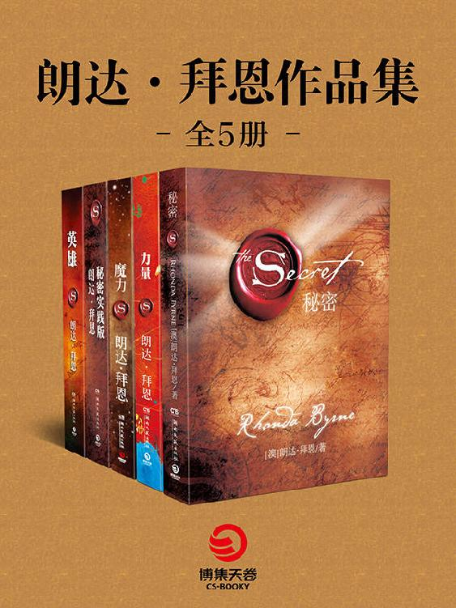

如果你不知道读什么书，

就关注这个微信公众号号。

微信公众号名称：幸福的味道

加小编 QQ 一起读书

QQ 号：2338856113

【幸福的味道】已提供 200 个不同类型的书单

1、 历届茅盾文学奖获奖作品

2、 每年豆瓣，当当，亚马逊年度图书销售排行榜

3、 25 岁前一定要读的 25 本书

4、 有生之年，你一定要看的 25 部外国纯文学名著

5、 有生之年，你一定要看的 20 部中国现当代名著

6、 美国亚马逊编辑推荐的一生必读书单 100 本

7、 30 个领域 30 本不容错过的入门书

8、 这 20 本书，是各领域的巅峰之作

9、 这 7 本书，教你如何高效读书

10、 80 万书虫力荐的“给五星都不够”的 30 本书

关注“幸福的味道”微信公众号，即可查看对应书单和得到电子书

更多书单，请关注微信公众号：一种思路

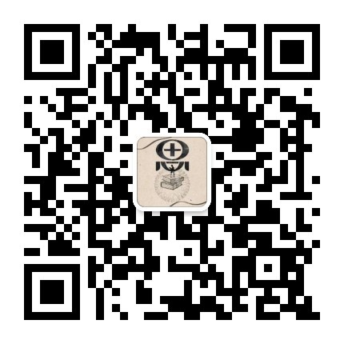

目录秘密力量魔力秘密：实践版英雄

# 秘密

## 版权信息

如果你不知道读什么书或者想获得更多免费电子书请加小编 QQ：2338856113 小编也和结交一些喜欢读书的朋友 或者关注小编个人微信公众号名称：幸福的味道 获得上百个书单 为了方便书友朋友找书和看书，小编自己做了一个电子书下载网站，网址：[`www.ireadweek.com`](http://www.ireadweek.com) 如于某种原因，经常换网址 如果打不开，可以 qq 联系我

秘密

作者：【澳】朗达·拜恩

译　　者：谢明宪

出 版 人：刘清华

责任编辑：薛　健　刘诗哲

监　　制：蔡明菲　潘　良

特约编辑：温雅卿

营销编辑：刘碧思

版权支持：辛　艳

设计支持：利　锐

本书由中南博集天卷文化传媒有限公司授权亚马逊全球范围发行

目录版权信息前言感谢秘密的揭露这秘密是什么？同类相吸吸引好的，不要坏的心的力量秘密摘要秘密的法则爱是最伟大的情感秘密摘要秘密的运用创造的过程秘密与身体要用多久的时间预先创造你的生活秘密摘要强效的方法强效的方法：感恩强效的方法：视觉化强效方法的实际运用秘密摘要金钱的秘密吸引丰足专注成功致富舍财得财秘密摘要关系的秘密你的职责在于自己秘密摘要健康的秘密笑，是最佳良药想着完美的念头没有治不好的病秘密摘要世界的秘密丰饶的宇宙秘密摘要你的秘密宇宙的一心过去的你不是你小心你的思想秘密摘要生命的秘密拥抱你的精彩秘密摘要书中人物小传

上行，下效。
存乎中，形于外。

——翡翠石板（约公元前 3000 年）

## 前言

一年前，我周遭的生活完全崩溃了。工作得筋疲力尽，父亲突然去世，和同事、亲人之间的相处关系也是一团糟。然而当时我却不知道，就在这沮丧绝望之中，竟伴随着最棒的恩赐。

我瞧见一个伟大的秘密——生命的秘密。在女儿海莉给我的一本百年古书中，我发现了它。我开始在史料中追寻，难以置信的是，过去知道这秘密的，竟然都是历史上的伟大人物：柏拉图、莎士比亚、牛顿、雨果、贝多芬、林肯、爱默生、爱迪生、爱因斯坦。

带着怀疑，我问自己：“为什么不是每个人都知道呢？”心中充满与世人分享的强烈渴望，我开始寻找当今世上知道这秘密的人。

他们一个个地出现了。我成了一块磁铁：当我开始寻找，现今的大师们就陆陆续续向我走来。像个完美的链圈般，发现一位导师之后，就会接连到下一位。若我偏离了路径，就会有其他事物吸引我的注意，也借由这样的转移，再下一位导师又会出现。在网络上找数据时，如果“不经意地”点到某个错误的链接，也会把我带到极重要的关键信息上。短短几个星期内，我回溯数个世纪的史料追踪这个秘密，并发现了这秘密的当代实践者。

于是，将这个秘密用影片的方式传播到全世界，成了我心中的愿景。接下来的两个月，我的影片及电视制作团队都在学习这个秘密。让每个成员都了解这个秘密是很重要的，因为缺少了它，后续要做的事就不可能进行。

没有一位导师是我们事先确定愿意合作的，但由于我们知道这个秘密的力量，于是带着十足的信心，我从澳大利亚飞往多数导师的所在地——美国。7 周后，我们的团队拍下了 55 位全美最伟大导师的影片，总片长超过 120 小时。我们的每一步、每次呼吸，都在运用这个秘密来创造《秘密》这部片子，我们真的吸引了所有的人和事物。8 个月后，《秘密》发行了。

随着这部片子在全世界广泛传播，奇迹似的故事开始如潮水般涌至：有人写信说，长年的病痛、忧郁症和疾病痊愈了，有人在意外发生后，第一次站起来走路，甚至有人从临终病床上恢复了过来。我们收到成千上万的信，诉说着他们运用这个秘密后，获得巨额财富和意外之财的故事。人们利用这秘密，使他们理想中的房子、人生伴侣、车子、工作和升迁都一一出现。还有许多商业人士运用这个秘密才几天，生意就有了转变的事实，以及亲子间的紧张关系，终于恢复和乐的温馨故事。

有些动人的故事来自于孩童，诉说他们如何运用这个秘密，吸引他们所想要的事物——包括获得高分成绩和朋友。这个秘密使医师想把它分享给病人，大学和各级学校想分享给学生，健康俱乐部想分享给顾客，各个团体想分享给自己的成员。全世界还有许多家庭举办聚会，将这个秘密的知识分享给他们的至亲和家人。这个秘密被用来吸引各式各样的事物——从一根特别的羽毛，到数以千万计的财富。影片才发行几个月，这些全都发生了。

之前想制作这部《秘密》的目的是——现在仍然是——为全世界数亿人带来快乐和喜悦。我们的制作小组每天都看到这个目的在一点一滴地实现，我们收到来自全世界各年龄层、各个民族、各种国籍成千上万如雪片般飞来的信件，为这秘密所带来的喜悦表达感激。了解这个秘密，就没有做不到的事，不论你是谁，或是身在何处，你想要什么，这个秘密都能给你。

本书以 24 位神奇的导师为主角，虽然他们的谈话都是在不同的时间点、在美国不同的地方拍摄而成，但他们却像是同一个人在说话。本书包括了导师们对这个秘密的谈话，以及这个秘密发挥作用的神奇故事，当中我也分享了我学到的简单方法、技巧和捷径，让你能够过上梦想中的生活。

你会发现，书中的某些地方，我把“你”这个字用粗体字强调出来。理由是，我希望你能够去感受，并且知道，这本书是为你而创作的。当我说你时，是针对你个人而说的，我的目的是，让你和书里的话语产生个人的联结——因为这秘密正是为你而存在。

当你漫游在书中的话语中、学习这个秘密的同时，你将会知道如何去拥有、成为或去做任何你想要的事。你会知道自己的真实面目。你会知道，那等待着你的、真实华丽的世界。

## 感谢

我要对那些出现在我生命中，曾经鼓励、影响、启发我的每一个人，表达最深的感谢。

我也要向以下的人表达我的感激。由于他们大力的支持和贡献，我这趟追寻之旅与本书才得以完成：

我要向《秘密》的共同作者群致意，因为他们慷慨分享了他们的智慧、爱和神性：约翰·亚萨拉夫、迈克·伯纳德·贝奎斯、李·布劳尔、杰克·坎菲尔德、约翰·迪马提尼医师、玛莉·戴蒙、迈克·杜利、鲍勃·道尔、海尔·多斯金、莫里斯·古德曼、约翰·格雷博士、约翰·海格林博士、比尔·哈利斯、班·琼森博士、罗洛·朗梅尔、莉莎·妮可丝、鲍勃·普克特、詹姆斯·雷、戴维·希尔莫、玛尔西·席莫芙、乔·维泰利博士、丹尼斯·维特利博士、尼尔·唐纳·沃什，以及弗莱德·亚伦·伍尔夫博士。

感谢《秘密》制作小组里那些了不起的人：保罗·哈林顿（Paul Harrington）、葛琳达·贝尔（Glenda Bell）、丝凯·拜恩（Skye Byrne）和尼克·乔治（Nic George）。也要谢谢杜鲁·海利特（Drew Heriot）、丹尼尔·克尔（Daniel Kerr）、达米安·克尔伯伊（Damian Corboy），以及我们制作《秘密》的旅程中所有的参与者。

感谢 Gozer 多媒体为我们制作了一流的图片，以及为这些图片注入这个秘密氛围的人：詹姆斯·阿姆斯特朗（James Armstrong）、沙莫斯·霍尔（Shamus Hoare）、安迪·路易斯（Andy Lewis）。

感谢《秘密》的制片人鲍勃·雷隆（Bob Rainone），他是来自天堂的使者。

感谢迈克·加德纳（Michael Gardiner）及横跨澳大利亚和美国的法律顾问团。

感谢《秘密》网站团队：丹·霍林斯（Dan Hollings）、纳翰·赫伦（John Herren），管理维护《秘密》论坛的“强大意念团”（Powerful Intentions）所有成员，以及论坛上那些很棒的朋友。

感谢过去那些伟大的人物与大师级的导师，他们的作品点燃了我内心渴望的火焰。我曾漫步在他们伟大的身影下，我要对他们每一位表达崇高的敬意。尤其要特别感谢罗伯特·克里尔和罗伯特·克里尔出版社、华莱士·D.沃特尔斯、查尔斯·哈尼尔、约瑟夫·坎伯和约瑟夫·坎伯基金会、普兰特斯·马福德、吉纳维夫·白汉德，以及查尔斯·费尔摩。

感谢开放心胸、拥抱《秘密》的言外之音出版社（Beyond Words）：理查德·柯恩（Richard Cohn）和辛喜雅·布雷克（Cynthia Black），以及西蒙·舒斯特（Simon&Schuster）出版公司——朱迪思·柯尔（Judith Curr）。感谢编辑：亨利·柯维（Henry Covi）和朱莉·史戴格华德（Julie Steigerwaldt）。

感谢慷慨分享故事的卡西·古德曼（Cathy Goodman），斯洛特和她的儿子科林·哈尔姆（Susan Sloate and Colin Halm）、伯利兹天然气能源有限公司（Belize Natural Energy）董事苏珊·莫瑞斯（Susan Morrice）、吉妮·麦凯（Jeannie Mackay），以及乔·史格曼（Joe Sugarman）。

感谢启发教导我们的罗伯特·安东尼博士（Dr.Robert Anthony）、希克斯夫妇（Jerry and Esther Hicks）及其作品《亚伯拉罕教诲》（The Teachings of Abraham）、戴维·凯莫隆·吉康第（David Cameron Gikandi）、约翰·海利夏朗（John Harricharan）、凯瑟琳·庞德（Catherine Ponder）、汉德克斯夫妇（Gay and Katie Hendricks）、史蒂芬·卡威（Stephen MR Covey）、艾克哈特·托尔（Eckhart Tolle）以及戴比·福特（Debbie Ford）。感谢大力协助的亚特伍德夫妇（Chris and Janet Attwood）、玛西雅·马丁（Marcia Martin），以及“转型领导会”（Transformational Leaders Council）、“灵性电影团体”（Spiritual Cinema Circle）的所有成员，还有“大爱潜能开发中心”（Agape Spiritual Center）的工作人员、《秘密》影片中导师们的工作伙伴。

感谢我珍爱的朋友们的爱和支持：马尔西·科顿克利（Marcy Koltun-Crilley）、玛格丽特·雷隆（Margaret Rainone）、阿西娜·古利尼斯（Athena Golianis）、约翰·沃克（John Walker）、伊莲·贝特（Elaine Bate）、安德烈·凯尔（Andrea Keir）和亚贝夫妇（Michael and Kendra Abay）。还有我神奇的家人彼得·拜恩（Peter Byrne），和我非常特别的姐妹们：给予本书无价帮助的珍妮·柴尔德（Jan Child）、宝琳·维南（Pauline Vernon）、已故的凯伊·伊桑（Kaye Izon），以及永远在我身旁给予无尽的爱和支持的葛琳达·贝尔（Glenda Bell）。感谢我那兼具勇气与美丽的母亲艾琳·伊桑（Irene Izon），还要纪念我的父亲罗纳德·伊桑（Ronald Izon），他的光芒和爱至今仍照亮着我们的人生。

最后还要感谢我的女儿海莉（Hayley）和丝凯（Skye Byrne）。感谢海莉，她帮我找到了我生命和人生真实旅程的起点；感谢丝凯，她跟随我的脚步，参与了本书的制作，编辑得很出色，让我的文字改观。女儿是我生命中的珍宝，她们的存在，振奋了我生命中的每一刻。

## 秘密的揭露

**鲍勃·普克特**

哲学家、作家、人生导师

这个秘密能带给你任何你想要的——幸福、健康和财富。

**乔·维泰利博士**

精神疗法专家、营销专家、作家

你可以拥有、去做或成为任何你想要得到或成为的。

**约翰·亚萨拉夫**

企业家、理财专家

不论它有多大，我们都能拥有我们所选择的。

你想住什么样的房子呢？你想成为亿万富翁吗？你想从事什么职业呢？你想要有更多的成就吗？你到底真正想要什么？

**约翰·迪马提尼医师**

哲学家、整脊师、治疗师、个人潜能开发专家

这是生命的大秘密。

**丹尼斯·维特利博士**

心理学家、潜能训练师

过去拥有这秘密的领导者，为了保持自身的权力不与人分享，于是就让他人对这秘密保持无知的状态。人们去工作、做事，然后回家，他们没有权力，只能继续做这些单调乏味的工作。因为这秘密只掌握在少数人手中。

历史上一直有许多人觊觎这个秘密的知识，也有许多人找到了传布这个秘密让世人知晓的途径。

**迈克·伯纳德·贝奎斯**

梦想家、国际大爱潜能开发中心创办者

我看过许多发生在人们生活中的奇迹：财务上的奇迹、身体和精神疗愈的奇迹，以及关系愈合的奇迹。

**杰克·坎费尔德**

作家、教师、人生导师、励志演说家

这一切的发生，都是因为他们知道如何运用这个秘密。

### 这秘密是什么？

**鲍勃·普克特**

现在，你可能坐在那里猜想：“这个秘密是什么？”我会告诉你我是怎么明了的。

我们都根据一个“无限的力量”运行着，也被同样的法则所导引着。宇宙的自然法则是如此精准，因此我们才能毫无困难地建造出宇宙飞船，把人类送上月球，并分秒不差地掌握登陆时间。

不论你身在何处——印度、澳大利亚、新西兰，以及斯德哥尔摩、伦敦、多伦多、蒙特利尔或纽约——我们的生活与工作都是依循同一个力量和法则。那就是“吸引力”！

这个秘密就是“吸引力法则”！

你生命中所发生的一切，都是你吸引来的。它们是被你心中所保持的“心像”吸引而来，它们就是你所想的。不论你心中想什么，你都会把它们吸引过来。

“你的每个思想都是真实存在的东西——它是一种力量。”

普兰特斯·马福德（1834—1891）

在这世上出现过的伟大导师都教导我们，宇宙中最有力量的法则就是“吸引力法则”。

如莎士比亚（William  Shakespeare）、罗伯特·勃朗宁（Robert Browning）、布雷克（William  Blake）之类的诗人，他们在诗里头传达它；像贝多芬等音乐家，就通过音乐表达它；达·芬奇等艺术家，则在绘画里描写它；还有包括苏格拉底、柏拉图、爱默生、毕达哥拉斯、培根、牛顿、歌德、雨果等伟大的思想家和文学家，则在他们提出的道理和著作中分享它。他们的名字永垂不朽，他们的传奇故事百年不衰。

像印度教、佛教、犹太教、基督教等宗教，以及古代巴比伦和埃及的文明，也都借由文字和故事传达这个秘密。借由各种形式，这个秘密被记录流传了好几个世纪，每个时代都能在古文中发现这个法则。公元前 3000 年，它就被记载在翡翠石板上了。虽然过去也曾有人觊觎这个知识——真的有人这么做——这秘密却仍有待人们去发掘。

这法则在万古之初就开始运行了。它一直都在，也将永远存在。

就是这个法则决定宇宙的完整秩序，决定你生命中的每分每秒，以及生活中经历的每一件事。不论你是谁，或是身在何处，吸引力法则都在塑造你的整个生命经验，而这个无上法则，正是通过你的思想来运作。让吸引力法则起作用的，就是你——借由你的思想。

查尔斯·哈尼尔在 1912 年这么描述吸引力法则：“整个生物系统都依之运作的最伟大、又绝无差错的法则。”

**鲍勃·普克特**

智者一直都明白这个秘密。回头看看古代的巴比伦人，他们也都明白这个秘密，他们是得天独厚的少数人。

对于古代巴比伦人和他们惊人的富裕繁荣，学者们都做了详细的文献记载。他们也以创造出世界七大奇观之一的“巴比伦空中花园”闻名于世。他们借由对宇宙法则的了解与运用，成为历史上最富有的种族之一。

**鲍勃·普克特**

你想想看，为什么那些只占人口总数 1%的人，却赚走了全世界 96%的财富？你以为那只是意外吗？那是有原因的。因为他们了解某些事情，他们明白这个秘密。现在，我们将带领你认识这个秘密。

所有在生活中吸引财富的人，其实都在使用这个秘密——不论他们自己知晓还是不知晓。他们用富裕与丰饶的思想来思考，绝不让与之矛盾的想法生根。他们心中的主要思想就是财富，他们专注于财富，心中没有其他想法。不论他们有没有察觉到这一点，那就是带给他们财富的，正是这些占据他们心中的思想。这就是吸引力法则实际运作的情形。

举一个“秘密”和吸引力法则实际运作的完美例子：你该听说过某些获得巨额财富的人，赔光了钱，但在短短的时间内又再度赚回惊人的财富吧？不论他们自己知不知道，发生在这些案例身上的实际情况是——他们心中的主要思想是放在“财富”上面，这正是他们一开始会获得财富的原因，然后他们让“害怕失去财富”的思想进入心中，直到失去财富的恐惧成了他们的主要思想。是他们自己把思想的天平，从“财富”端倾向“失去”端，所以把钱全赔光了。然而一旦钱没了，“失去”的恐惧随之消失，他们的主要思想又会回到天平“财富”的那一端，于是财富就又回来了。

不论你想的是什么，这法则都会给你回应。

### 同类相吸

**约翰·亚萨拉夫**

对我来说，看待“吸引力法则”最简单明了的方式是，把自己想象成一块磁铁，我知道它会吸引某个东西。

你是宇宙中吸引力最强的磁铁！在你心中，具有比世界上任何东西都更强有力的磁引力。这无法估量的磁引力，正是通过你的思想散发出来。

**鲍勃·道尔**

作家、吸引力法则专家

基本上，“吸引力法则”说的就是“同类相吸”的道理，但实际上，我们是从“思想”上的层次来说的。

吸引力法则说“同类”会吸引“同类”，因此当你脑中出现一个思想，也会吸引其他同类的思想过来。以下是更多生活中你可能有过的吸引力法则经验：

你是否曾经一开始去想某件不愉快的事情之后，就似乎越想越不愉快？那是因为，当你持续一种想法，吸引力法则会立刻带来更多同类的思想给你。才几分钟，你就引来了这么多同类的不愉快思想，于是整个状况就显得越来越糟糕。越想，你就越烦。

你或许曾经在听某首歌时，有过吸引同类思想的经验，你会发现，你无法在脑海中摆脱掉那首歌，它会在你心里头一遍又一遍地重复。那是因为，在听那首歌的同时——就算你没有察觉——你已经把全部的注意力和思想焦点放在上头了，当你这么做时，就会强力吸引更多与那首歌同类的思想。于是吸引力法则开始作用，一直不断带来更多那首歌的思想。

**约翰·亚萨拉夫**

身为人类，我们的任务就是持续保持我们想要的事物的思想，让我们想要的事物在心中保持绝对清晰，从而启动宇宙最伟大的法则之一——“吸引力法则”。你会成为你心中最常想的那种人，也会吸引来你心里最常想的事物。

你目前的生活就是你过去思想的映现——包括所有美好的事，以及你认为不那么美好的事。既然“你最常想的事”会被你吸引过来，那么要了解你的生活中每个面向的主要思想，就变得轻而易举，因为它就是你的生命经验！但现在开始不一样了！现在你正在学习这个秘密，运用它，你就能改变一切。

**鲍勃·普克特**

如果你可以在心中见到它，你最终也将会拥有它。

如果能在心中想着你所要的，并且让它成为你的主要思想，那么你就会把它带进你的人生。

**迈克·杜利**

作家、国际级演说家

这个法则可以归纳成一句包含 3 个简单词汇的短句：思想——变成——实物！

借由这个最有力量的法则，你的思想变成生活中的实物。思想变成实物！不断地对自己这样说，让它渗透到你的意识和知觉里。思想变成实物！

**约翰·亚萨拉夫**

大多数人不了解的是，思想是有频率的，每种思想都有一个自己的频率。思想是可以测量的。因此如果你一再不断地想它，在心中想象拥有全新的车子、获得所需的金钱、成立一家公司、找到心灵的伴侣……当你在想象那是什么样子时，就是在发出一种持续性的频率。

**乔·维泰利博士**

思想会发出磁力讯息，并将相似的事物吸引回来。

“主要的思想或者心态，就是磁铁，

同类相吸，就是法则。结果必然是，

心态会吸引与其本质相呼应的状态。”

查尔斯·哈尼尔（1866—1949）

思想是具有磁性的，有着某种频率。当你思考时，那些思想就会发送到宇宙中，它们会像磁铁般，吸引所有相同频率的同类事物。所有发出的思想，都会回到源头。那个源头，就是你。

你可以这样想：我们知道电视公司的发射塔，是借由发送某个频率，然后转成家中电视的画面。其实大多数人都不知道它是怎么运作的，但我们知道，每个频道都有一个频率，当转到那个频率，我们就会看到电视的画面。我们借由挑选频道来选择频率，然后看到该频道的画面。如果想看不同的电视画面，我们就得切换频道，调到新的频率上。

你是一个人体发射塔，而且比世上任何电视发射塔都更强有力。你是宇宙中力量最强大的发射塔，你的传送创造了你的生命和这个世界。你传送出的频率到达的地方，是超越城市、国家和这世界的。它会在整个宇宙中回荡，而你就是用你的思想来传送那个频率的！

借由你的思想而传送的画面，可不是客厅电视机里的影像，而是你的生命画面！你的思想产生了频率，于是它们吸引该频率上同类的事物，然后传回到你身上，变成你的生命画面。如果想改变生命中的任何事，就借由改变你的思想，来转换频道和频率。

“精神力的振动是最细微的，因此，也是现存事物中最有力量的。”

查尔斯·哈尼尔

**鲍勃·普克特**

想象你生活在富足之中，你就会吸引富足。这招每次都能奏效，而且对所有人都管用。

当你认为自己生活在富足之中，你就是在借由吸引力法则，有力且有意识地决定你的生命。事情就这么简单。但是，最明显的问题来了——“为什么不是每个人都过着他梦想中的生活呢？”

### 吸引好的，不要坏的

**约翰·亚萨拉夫**

问题就在这里。大多数人都在想为什么他们不想要的事物，总是一直不断出现在自己面前。

人们之所以无法拥有他们想要的，理由只有一个，就是他们对“不想要的”想得比“想要的”多。听听你的思想和你所说的话吧。这法则是绝对的，而且不会有差错的。

“不想要”是一个猖獗了数个世纪，比人类所曾见过的瘟疫更为严重的流行病。当人们把主要的所思、所言、所行都集中在“不想要的”事物上，就能让这种流行病一直存活。然而我们这一代将会改变历史，因为我们正在接受免于感染这种流行病的知识！它由你开始。只要你的所言、所思都只关乎你想要的，你就成了这新思想运动的开拓者。

**鲍勃·道尔**

吸引力法则不会去管你所感受的是好还是坏，也不会管你想不想要它。它只是回应你的思想。因此，如果你只是看着堆积如山的债务，对它感觉糟糕透顶，那你就是在对宇宙发出讯号说：“我真的感觉糟糕透了，因为有这么多的债务。”你这样想，只能是不断地向自己强调这种糟糕的状况。这种感觉充满了你生命中的每个层面，你得到的将会是越来越多这种烦恼的感觉。

吸引力法则就是自然的法则。它是客观的，眼中没有好的、坏的分别。它只是接收你的思想，然后以生命经验的形式，把这些思想回应给你。吸引力法则只是给你自己所想的东西罢了。

**莉莎·妮可丝**

作家、拥护自我主权者

吸引力法则是非常顺从的。当你想着你想要的事物，并且全心将焦点置于其上，吸引力法则每一次都会正确无误地把你想要的事物给你。当你把焦点放在你不想要的事物上——“我不要迟到、我不要迟到”——吸引力法则是听不到你“不要”的呼喊的，它只会显现你所想的，所以它会一再不断地出现。吸引力法则对你的“要”与“不要”并无偏向。当你专注在某个事物上——不论它是什么——其实你就是在呼唤它来到你的生命里。

当你把思想聚集在你想要的事物上，并且持续集中注意力，在那个时刻，你就是在运用宇宙最强大的力量，召唤着你想要的事物。吸引力法则并不判别“不要”“不”“别”，或其他任何否定的字眼。当你用否定的字眼说话，吸引力法则所接收到的其实是这样的：

“我可不想让这套衣服被溅到。”

“我要把东西溅到这套衣服上，而且要溅更多东西。”

“我不要剪个难看的发型。”

“我要剪个难看的发型。”

“我不想被耽搁了。”

“我想耽搁。”

“我不要那人对我那么粗鲁。”

“我要那人和更多的人对我粗鲁。”

“我不要餐厅把我们的桌位让掉。”

“我要餐厅把我们的桌位让掉。”

“我不希望这些鞋子不合脚。”

“我要这些鞋子不合脚。”

“这些工作我处理不过来。”

“我想要工作多到处理不过来。”

“我不想感冒。”

“我想感冒，而且还想感染更多疾病。”

“我不想争吵。”

“我想要更多的争吵。”

“别那样对我说话。”

“我就是要你和别人那样对我说话。”

吸引力法则给你的，就是你所想的——就这样！

**鲍勃·普克特**

吸引力法则总是在起作用，不管你是否相信它或者是否理解它。

吸引力法则就是创造的法则。量子物理学家告诉我们，整个宇宙是从思想中出现的！你借由思想和吸引力法则，创造出你自己的生命，而且人人皆然。不是你知道这个法则它才运作，它早已在你的一生及从古至今每个人的生命中持续运作。当你意识到这个伟大的法则，你就会意识到自己拥有多么不可思议的力量，竟然能够把自己的生命“想”出来。

**莉莎·妮可丝**

你在思考的同时，它就在运作。你思想流动的时候，吸引力法则也在运作。当你想着过去，吸引力法则在运作，当你想着现在或未来，吸引力法则也在运作。它是一个持续的过程，你无法摁下暂停或终止键，它和你的思想一样，永远都在运作之中。

不论我们是否有所察觉，我们大部分的时间都在思考。说话或听别人讲话时，你在思考；阅读报纸或看电视时，你在思考；回忆过去时，你在思考；考虑未来的事情时，你在思考；开车的时候，你在思考；早上准备一天的开始时，你也在思考。对我们许多人来说，只有在睡觉时才不会思考。然而吸引力法则的力量，仍然会对入睡前最后的那几个思想发挥作用。所以，睡前还是想些好的事情吧！

**迈克·伯纳德·贝奎斯**

创造一直都在发生。每当一个人产生一个思想，或者持续某种惯常的思考方式，他们就处在创造的过程中，就必定会有一些东西被创造出来。

你现在所想的，就在创造你的未来。你用思想创造你的生命。因为你一直在思考，你便一直在创造。你最常想的，或最常把焦点放在上头的，将会出现在你的生命中，成为你的人生。

如同所有的自然法则一样，这个法则有它的完美性。你创造你的生命。种什么因，得什么果！你的思想就是种子，你收成的果，是依你播下的种子而定的。

如果你抱怨，吸引力法则将强力带来更多让你抱怨的状况。如果你聆听他人的抱怨，并且把焦点放在上头，同情他们、赞同他们，在那一刻，你就是在吸引更多的抱怨情境给自己。

这个法则只是在反映并如实地把你思想所聚焦的事物，送回给你。有了这个强有力的知识，借由改变你的思考方式，你就能完全改变生命中所有的境况和事件。

**比尔·哈利斯**

教师、中心点研究院创办人

有位参加我在线课程的学生叫罗伯特，他是个同性恋者。课程部分内容是通过电子邮件进行的。

罗伯特是位同性恋者。在他给我的电子邮件中，描述了他生活中所发生的残酷事实。在职场上，他的同事联合起来欺侮他，人们对他的恶意，让他一直感到压力很大。走在街上，到处都碰上厌恶同性恋的人用各种方式羞辱他。他想成为单人表演的喜剧演员，但在台上表演时，每个人都用同性恋的话题挑衅他。他的生活充满不幸和悲惨，焦点都围绕在“因身为同性恋者而被攻击”的想法上。

我开始教他，是他自己一直把焦点放在不想要的事物上的。我把他的电子邮件寄回去，并跟他说：“你再读一次。看看你跟我讲了多少你不想要的事物。我看得出来，你对这些事反应非常激烈，而当你如此激烈地把焦点放在某事上，只会促使它更快发生！”

于是，他开始将“专注在想要的事物上”这件事谨记在心，并且开始真的试着去做。接下来 6 到 8 周所发生的事，绝对就是一个奇迹。以前在办公室骚扰他的同事，要么被调往别的部门、离开公司，要么根本不再找他麻烦。他开始喜欢他的工作了。当他走在街上，再也没有人骚扰他，他们全不见了。当他照例上台表演，他开始获得观众的起立喝彩，而且没人挑衅他了！

他整个生命都改变了，因为他从专注在他所不要、所畏惧、想避免的事物中，转变成专注在他真正想要的事物上。

罗伯特的生命改变了，因为他改变了思想。他向宇宙发出不一样的频率，不论情况看起来有多么不可能，宇宙必定会送来新频率的画面。罗伯特的新思想成为他的新频率，他的整个生命画面就改变了。

你的生命掌握在你手中。不论你现在身在何处、不论你生命中发生过什么事，你都可以开始有意识地选择你的思想，进而改变你的生命。根本没有所谓的“绝境”，你生命的每个境况，都是能改变的！

### 心的力量

**迈克·伯纳德·贝奎斯**

你会将你思维中占主导地位的思想吸引到你的身边——不论这些思想是你有意识产生的，还是无意识产生的。这就是问题所在。

不管你过去是否察觉到你的思想，但现在你渐渐察觉到了。就在此时——借由这个秘密的知识——你从沉睡中醒来，并且变得有意识！意识到这个知识、这个法则，以及由你的思想而生的力量。

**约翰·迪马提尼医师**

说到这个秘密，如果在日常生活中仔细地观察，你会发现，心智和意念的力量就在我们的身边。我们需要做的，就是睁开眼睛去看。

**莉莎·妮可丝**

处处都看得到吸引力法则。每一件事都是你自己吸引来的：人、工作、环境、健康、财富、债务、喜悦、你开的车子、你参与的社群。你自己就像磁铁一样，这些都是被吸引来的。你想什么，就带来什么。你的整个生命，就是脑中思想的彰显。

这是个内含而非排外的宇宙，没有任何事物是排除在吸引力法则之外的。你的生命是一面镜子，反映出你的主要思想。这星球上的所有生物，都依着吸引力法则运作，人类和其他生物的差别是，人有能辨识的心，能够使用自由意志来选择自己的思想。人拥有能刻意去思考、用心智创造出自己整个生命的力量。

**弗莱德·亚伦·伍尔夫博士**

量子物理学家、讲师、作家

我们可不是从一厢情愿的想法或是假想的狂热观点来谈这些的，我要告诉你是要从更深层的、基于根本的基础上来理解它。量子物理学其实已经真正开始指向这个发现，它告诉我们：我们不可能拥有这样一个宇宙，它可以独立于我们的意识之外。实际上，所有被我们感知的一切，都是由意识所塑造的。

想想那个宇宙中“最有力的发射塔”的比喻，你就会明白它与伍尔夫博士的话语之间绝佳的关联性。你的心里出现一些思想，然后画面会传送回去，成为你的生命经验。你不仅用思想创造你的生命，你的思想也为创造这个世界增添了强大的力量。如果你认为自己无关紧要、对这个世界没有影响力，那么请再想一想吧。其实你的心，正在塑造你周遭的世界。

过去 80 年来，量子物理学家惊人的研究和发现，使我们对深不可测的心智创造力有了更多的了解。他们的研究，和这世上伟大的智者们——包括卡耐基、爱默生、莎士比亚、培根、奎师那和佛陀——所说的话是一致的。

**鲍勃·普克特**

即便你不了解这个法则，也并不意味着你应该拒绝它。或许你并不了解电的工作原理，但你仍然可以享用电的好处。我不知道电是怎么运作的，但我知道：你可以用电来煮一个人的晚餐，你也可以用它来“煮”人（开个小玩笑）！

**迈克·伯纳德·贝奎斯**

通常，当人们刚开始了解这个伟大秘密时，会对他们所拥有的负面思想感到很害怕。他们必须要知道的是：科学上已经证实，一个正面思想的力量，胜过一个负面思想的力量数百倍。因此，这将会降低他们某种程度的忧虑。

要让负面的事物在你的生命中出现，的确是需要很多持续性的负面思想才能办到。然而，只要你持续负面思考一段时间，它们就会在你的生命中出现。如果忧虑自己有负面的思想，你就会吸引更多担心负面思想的忧虑，同时让这些忧虑加倍。所以现在就下定决心，只想那些有益的思想吧。同时，要向宇宙做出宣告：所有好的思想都是强有力的，任何负面的思想都是脆弱无力的。

**莉莎·妮可丝**

感谢你生活的世界给予你缓冲的时间，使你所想的不会立即成真，否则可就麻烦了。时间的延缓对你是很有利的。它给你“再评价”的机会，让你想清楚你想要的，并做出新的选择。

创造你生命的一切力量，此刻已经为你准备好可以随时使用，因为，此刻你就在思考。如果你已经有一些“实现后不会有好处”的思想，那么现在你就可以改变想法。你可以用好的思想来取代，把之前的思想都清除掉。时间对你很有用处，因为它可以让你有新的想法、发出新的频率——就是现在！

**乔·维泰利博士**

你要意识到自己的思想，谨慎选择你的思想，并从中获得乐趣。因为你就是自己生命的杰作，你就是你生命的米开朗琪罗，雕刻的大卫像正是你自己。

要主宰你的心灵，方法之一是学会让心静下来。毫无例外的，本书中所有的导师，都把静心当作每天的功课。直到发现这个秘密后，我才明白，静心的力量是多么强大。静心能够平息你的心，帮助你控制思想，并且让身体恢复活力。最棒的是，你无须挪出几小时来静心，刚开始只要每天 3 到 10 分钟，就能对思想的控制产生不可思议的效果。

为了更能觉察到你的思想，你也可以设定一个意念——“我是自己思想的主人”。常常这样说，静心时也这样想。由于这样说，静心时也这样想。由于你保持这样的一个意念，依据吸引力法则，你一定会变成那样。

你现在接受的，是能够创造出你最精彩的生命版本的知识。而这个版本的你，其可能性已经存在了——就在“你这个精彩版本”的频率中。决定你想成为什么样的人、做什么事，以及拥有什么东西。然后想着这些，发出频率，你的愿景就会在你的生命中实现。

### 秘密摘要

·生命的伟大秘密就是吸引力法则。

·吸引力法则说“同类相吸”。因此当你有了一个思想，你也会吸引同类的思想过来。

·思想是具有磁性的，并且有关某种频率。当你思考时，那些思想就发送到宇宙中，然后吸引所有相同频率的同类事物。所有发出的思想，都会回到源头——你。

·你就像是一座“人体发射塔”，用你的思想传送某种频率。如果想改变生命中的任何事，就借由改变你的思想来转换频率。

·你当下的思想正在创造你的未来。你最常想的或最常把焦点放在上头的，将会出现在你的生命中，成为你的人生。

·你的思想会变成实物。

## 秘密的法则

**迈克·伯纳德·贝奎斯**

我们生活在一个由“规律”所支配的宇宙中，比如，万有引力定律。假如你从一栋大楼上掉下来，不论你是好人或坏人，都会落到地面上。

吸引力法则就是一种自然的法则，跟万有引力定律一样公正无私，既精准又正确。

**乔·维泰利博士**

你现在生活中的一切，包括你正在抱怨的事，都是由你自己吸引来的。我知道，乍听起这个说法，你可能不太喜欢。你可能会马上说：“我可没去吸引车祸，没去吸引这种难搞的烂客户，也没特别要去吸引债务。”可是我要在这儿有些冒犯地对你说：是的，是你把它们吸引来的。这正是最难了解的概念之一，然而一旦接受了并能理解它，你的生命将发生不可思议的改变。

通常人们第一次听到“秘密”的这个部分，就会想起历史上造成许多人失去生命的事件，对于这么多人把自己吸引到这个事件中的说法，他们无法理解。依据吸引力法则，这些人必须跟这个事件处于同一个频率。这不一定是说，这些人都想着那个明确的事件，而是说，他们思想的频率和那个事件的频率互相吻合。如果人们相信，自己会“在错的时机待在错的地方”，认为自己对情势毫无掌控力，如果持续那些恐惧、分离和无力的思想，就可能真的吸引他们“在错的时机待在错的地方”。

你现在可以选择。你是否愿意相信你的不幸只是偶然？你是否会觉得自己在某一刻会处于错的时间错的地点？你是否觉得自己只能听天由命？

或者你愿意相信，并认为你的生命经验就掌握在自己手上，只有好的事物会进入你的生命，因为你就是这样想的。你是有选择的，不论你选择去想什么，都将会成为你的生命经验。

但除非你用持续的思想召唤，否则不会有任何经验进入你的生命。

**鲍勃·道尔**

我们大多数人都是依着“默认方式”在吸引事物。我们认为自己对它没有任何控制力。我们的思想和感觉都是处在自动驾驶状态，所以每一件事都是依着“默认方式”降临到我们身上的。

没有人会故意去吸引不想要的事物。如果不知道这个秘密，某些你不想要的事物，就会在你或他人的生命中发生，这是显而易见的。这都只是我们对思想的强大创造力缺乏意识的结果。

**乔·维泰利博士**

如果你是第一次听到这个，你可能会觉得：“天啊，我得监控我的思想？这是很麻烦的事。”刚开始看似是这样，但乐趣却从此展开。

这乐趣就是，要达到这秘密有许多的捷径，而你得选出对你最有效的那一个。继续读下去，你就会知道该怎么做。

**玛尔西·席莫芙**

作家、国际级演说家、潜能开发训练导师

想要监控我们所有的思想是不可能的。研究者指出，我们每天大约有 6 万个思想。你能想象要控制全部 6 万个思想，会有多累吗？幸好我们有个简单的方法，那就是我们的“感觉”，感觉能让我们知道我们想的是什么。

感觉的重要性再大也不为过，感觉是帮助你创造生命最棒的工具。你的思想就是所有事物的起因，你在这世界所看到和经历到的一切——包括你的感觉——就是结果。起因永远是你的思想。

**鲍勃·道尔**

感觉是我们最不可思议的天赋，它让我们明白我们在想什么。

你的感觉能很快地让你知道你在想什么。想想过去有什么时候，你的感觉突然消沉了下去——或许是听到了某些坏消息。你的胃部或腹腔的感觉是即时性的。因此你的感觉，就是让你知道你在想什么的即时讯号。

你必须意识到你的感觉如何，并且与它进行一种调和，因为它是让你知道你在想什么的最快的方法。

**莉莎·妮可丝**

你的感觉有两种：好的感觉和不好的感觉。你知道它们二者的差别：一个让你感觉美好，另一个让你感觉糟糕。从根本上来说，所有负面的感觉——你可能用各式各样的名字来称呼它，但不管你是称它为“负罪感”，还是“沮丧”“愤怒”“怨恨”等，它们带来的感觉都一样，都是让你感觉很不好。

没有人能跟你说，你的感觉到底是好还是坏，因为在任何时候，只有你才知道自己的感觉如何。如果不能确定你的感觉，只要问问自己：“我现在感觉怎样？”在一天里，你可以常常停下来，问问自己这个问题。当你这么做时，就更能察觉到自己的感觉。

你必须知道一件最重要的事，那就是，不好的感觉和好的思想，是不可能同时存在的。否则就违反了法则，因为感觉正是思想所引发的。如果你感觉不好，那是因为你拥有会造成不好感觉的思想。

思想决定了你的频率，而感觉则会立即告诉你，你是处在哪个频率上。当你感觉不好的时候，你就是处于会引来不好事物的频率上，于是吸引力法则势必要传送更多坏事的画面来回应你，而这些坏事会使你感觉很糟。

当你感觉很糟，却又不努力改变思想来让自己感觉好一些，实际上你是在说：“多给我一些机会让我感觉不好的情境吧。继续再来吧！”

**莉莎·妮可丝**

与之相反的就是，你具有好的情绪和感觉。当它们来临的时候你会知道，因为它们会让你感觉美好。你的感觉告诉你，你所思想的东西，和你所要的东西是一致的。想象一下，如果我们每天都能有那样的感受——兴奋、喜悦、感激和爱。当你庆祝这些美好的感觉时，你就会吸引来更多美好的感觉，以及让你感觉美好的事物。

**鲍勃·道尔**

因此，它真的就是如此简单，秘密就在这里，答案是：“现在我正在吸引什么呢？”那么，你现在感觉怎样？“我的感觉不错呀。”很好，那就继续保持吧！

感觉美好却又同时拥有负面的思想，是不可能的。如果你感觉美好，那是因为你有好的思想。你看，你可以拥有生命中任何想要的事物——没有限制。但是有个条件：你得感觉良好才行——想想，这不正是你一直想要的吗？这个法则实在是太完美了。

**玛尔西·席莫芙**

如果你感觉很好，就是在创造一个符合你向往的未来，如果你感觉不好，就是在创造一个偏离你向往的未来。你在生活的同时，吸引力法则也时时刻刻在运作。我们所想和感觉的一切，都在创造我们的未来。如果你担忧、恐惧，那么一整天下来，你就会吸引更多担忧和恐惧来到你的生命中。

当你感觉美好的时候，你一定是在想着美好的思想。因此，你就是走在正确的路上，发出强力的频率，吸引更多让你感觉美好的事物回到你身上。把握那些让你感觉美好的时刻，并且好好地利用它。要知道，当你感觉美好的时候，你正强力地吸引更多美好的事物给你。

让我们更进一步探讨：万一你的感觉，其实就是宇宙想要让你知道“你正在想什么”的一种沟通方式呢？

**杰克·坎菲尔德**

我们的感觉就是一种“反馈机制”，好让我们知道：我们是不是走在正轨上，有没有偏离了方向。

要记住，你的思想就是所有事物的主要原因。因此，当你有某种持续性的想法，它会立刻被传送到宇宙中，它会像磁铁般被引至同类的频率上，然后几秒之内，该频率的解读就会通过你的感觉传送回来。换句话说，你的感觉就是宇宙传回来的沟通讯息，告诉你目前你在哪个频率上。你的感觉就是频率的回馈机制！

当你感受到美好的感觉，那就是宇宙送回的沟通讯息在说：“你正在想着好的思想。”同样的，当你感受到不好的感觉，那就是宇宙的沟通讯息在说：“你正在想着不好的思想。”

因此当你感觉不好的时候，那是来自宇宙的沟通讯息，实际上它是在说：“警告！现在该改变想法了——负面频率记录中——频率切换——倒数计时——警告！”

下次若感觉不好，或是感受到任何负面情绪时，聆听一下你从宇宙接收到的讯息吧。感觉不好时，你就是在阻挡美好事物的到来，因为你正处于一个负面的频率上。转变你的思想，想想美好的事物，然后，当你开始有了好的感觉时，你会知道自己已经转换到了新的频率，宇宙会给你更好的感觉来表示确认。

**鲍勃·道尔**

你所得到的，正是你所“感觉到的”东西，而不太是你所“想”的东西。

这就是为什么人们如果一起床就撞到脚趾，就很容易产生连锁反应（坏运气越来越多）：导致一整天都不顺。他们丝毫不懂得，只要情绪上的一个小小改变，就会改变他们一天的状况和生活。

如果你从拥有美好的一天开始，并且沉浸在那种快乐的感觉中，只要不让某些事转变你的心情，依据吸引力法则，你就会吸引更多类似的人和情境，来延续那种幸福快乐的感觉。

我们都有过事情一连串出差错的经历，那个连锁反应是由一个思想开始的——不论你有没有察觉到。那个不好的思想，吸引了更多不好的思想，频率锁定后，事情就出差错了。然后，当你对那“出差错的事”做出反应，又吸引更多出差错的事。反应的结果，只会吸引更多相同的东西。这个连锁反应会持续地发生，直到你能借由刻意改变思想，让自己脱离那个频率为止。

你可以把思想转换到你想要的事物上，通过感觉来接收改变频率后的确认讯息，吸引力法则会捕捉那个新的频率，并将新的生命画面给你传送回去。

这正是你可以利用感觉，来使你在生命中想要的事物加速发生的方法。

你可以有意地借由增加对渴望事物的感觉，来传送更强有力的频率。

**迈克·伯纳德·贝奎斯**

你现在就可以开始感觉健康、富有或感受那围绕着你的爱，即使它们根本不存在。那么将会发生的事情就是：宇宙会响应你心曲的内容，宇宙会对你内在的感觉状态做出响应，并且将它们显现出来，因为那正是你所感觉的情形。

所以你现在感觉如何呢？花点时间想想你的感觉如何。如果你的感觉不如你想要的那么美好，那么就把焦点放在你内在感觉的感受上，并且有意地去提升它。当你很热切地专注在你的感觉上，借由想要提升自己的意念，就可以很有效地提升它们。有一个方法是，闭起你的眼睛（屏蔽令你分心的事物），专注于你内在的感觉之上，然后微笑一分钟。

**莉莎·妮可丝**

你的思想和感觉，创造了你的生活。永远都是这样。保证如此！

如同万有引力定律一样，吸引力法则绝不会有差错。你不会看见猪在天上飞，除非万有引力定律出了错，当天忘记把这法则加在这头猪身上。同样的，吸引力法则也不会有例外。如果某事发生在你的身上，那是你吸引来的——通过持续性的思想。吸引力法则是精确无误的。

**迈克·伯纳德·贝奎斯**

这个道理可能很难让人轻易接受。不过，当我们开始对它敞开心胸（相信它），结果会是令人敬畏的。这意味着，不论你生命中曾经存在什么思想，在你的生活中造成了什么影响，都可借由意识的转移来将其解除。

你拥有改变一切的力量，因为选择思想和感受感觉的，就是你自己。

“生活的同时，你也在创造你自己的宇宙。”

丘吉尔

**乔·维泰利博士**

你要“感觉美好”，这很重要，因为这种“感觉美好”，就是发射到宇宙中的信号，然后它吸引更多同样的事物给你。所以你越能感觉美好，就会吸引越多有助于你感觉美好，以及持续让你更加振奋的事物。

**鲍勃·普克特**

你知不知道，当你感觉沮丧的时候，你是可以在一瞬间就改变它的？放一曲美妙的音乐或唱一首歌，就会改变你的情绪。或是去想想美好的事物，想想小婴儿或是你真正喜爱的人，并停留在这个感觉上，要真正把它保留在心中。除此之外，将其他的一切思绪都赶出去。我保证你一定会开始感觉好起来的。

把一些“秘密转移物”列出来，当作你的锦囊妙计。我所说的“秘密转移物”，是指那些可以轻易改变你的感觉的事物，它可能是个美丽的回忆、未来的憧憬、好玩的时刻、大自然、你爱的人或是你喜欢的音乐。当你发现自己生气、受挫或感觉不太好的时候，就去找你的“秘密转移物”，并把焦点放在其中之一。在不同的时机，能有效转变你的事物也会有所不同，因此如果试了一个无效，就改换另一个看看。只要将焦点改变一两分钟，就能转变你自己和你的频率。

### 爱是最伟大的情感

**詹姆斯·雷**

哲学家、作家、富裕与人类潜能课程创立者

举例来说，感觉美好的法则可以运用到你家的宠物身上。动物是很棒的，因为它们能令你置身于伟大的情感状态，当你感受到对宠物的爱时，那种伟大的情感状态，会把美与善带进你的生命中。这是多么棒的恩赐啊！

“思想与爱的融合，形成了吸引力法则不可抗拒的力量。”

查尔斯·哈尼尔

宇宙中，没有比爱更伟大的力量了。爱的感觉，是你所能发出的最高的频率。如果你能把每个思想都裹上爱，如果你能爱所有的事物和人，你的生命就转变了。

事实上，过去某些伟大的思想家，都是用“爱的法则”来称呼吸引力的法则的。如果你思考一下，就会了解为什么。如果你对别人有不友善的想法，最后体验到更明显的不友善思想的，将是你自己。你无法用你的思想伤害别人，你只会伤害你自己。如果你想的是爱的话，想想看谁会蒙受其利——你！因此，如果你的主要状态是爱，吸引力法则或“爱的法则”将会以最强的力量来回应你。你所感受和发出的爱越大，你所驾驭掌控的力量也就越大。

“给予思想活力，让它与其目标相关联，并因此主宰每个人生逆境的经验，所运用的原理就是吸引力法则——亦即爱的另一种称呼。这是在一切哲学体系、宗教、科学、万物中，既永恒又根本的原理。一切都无法逃离爱的法则。给予思想活力的，正是感情。感情即欲望，欲望即爱。充满爱的思想，是天下无敌的。”

查尔斯·哈尼尔

**玛尔西·席莫芙**

一旦你开始了解并且真正主宰你的思想和感觉时，你就会明白，你就是你自己现实的创造者。这也就是你的自由和所有力量之所在。

玛尔西·席莫芙还跟我们分享了伟大的爱因斯坦一句很棒的话：“每个人可以问自己最重要的问题就是——‘这是个和善的宇宙吗？’”

若了解吸引力法则，唯一答案就是：“是的，这宇宙是和善的。”为什么？因为你如是回答，依据吸引力法则，就将会拥有如是经验。爱因斯坦知道这个秘密，因此提出这个有力的问题。他知道，借由这个问题，能够迫使我们去思考并做出抉择。借由这个提问，他给了我们一个很大的机会。

若更进一步探究爱因斯坦的意图，你可以肯定，并做出宣告：“这是个精彩非凡的宇宙。这宇宙带给我所有美好的事物，这宇宙暗中协助我成就每一件事，我所做的一切，宇宙都支持我。这宇宙能直接符合我的需求。”你知道，这是个和善的宇宙！

**杰克·坎菲尔德**

自从我知道这个秘密并开始把它运用在生活中，我的生命真的变得像魔术一样不可思议。我想着那种大家都梦想的生活，我每天也都生活在大家都梦想的那种生活中。我居住在价值 450 万美元的寓所，有个可以让我用整个生命去爱的妻子，可以到全世界所有最棒的景点去度假，我登山、探险、打猎。这一切都发生了，而且还在持续发生中，都是因为我懂得如何去运用这个秘密。

**鲍勃·普克特**

生命绝对不可以平凡，而且本来就该不平凡。一旦开始运用这个秘密，你的生命也将会是非凡的。

这是你自己的人生，它一直在等待你去发现！在这之前，你可能一直认为生命是艰苦和充满挣扎的，所以依据吸引力法则，你就会体验到艰苦和挣扎的生活。现在就开始对宇宙呐喊吧：“生活是多么轻松！生命是多么美好！所有美好的事物都向我而来！”

在你内心深处，有个一直在等待着你去发现的真相，这个真相就是——你本来就该得到生命中一切美好的事物。你天生就知道这点，所以才会在欠缺美好事物的时候，感觉糟糕透顶。拥有美好的事物，是你天生的权利！你就是自己的创造者，吸引力法则是创造生命中你想要事物的最佳工具。欢迎进入你充满魔力与华丽的生命中！

### 秘密摘要

·吸引力法则就是一种自然法则，跟万有引力定律一样公正无私。

·除非你用持续的思想召唤，否则不会有任何经验进入你的生命。

·只要问自己现在感觉如何，就能知道你正在想什么。情绪是非常有价值的工具，能立即告知我们自己在想什么。

·不好的感觉和好的思想，是不可能同时存在的。

·思想决定了你的频率，而感觉则会立即告诉你，你是处在哪个频率上。当你感觉不好的时候，你就是处于会引来不好之物的频率上，当你感觉美好时，你就是在强力吸引更多美好的事物。

·秘密转移物——例如快乐的回忆、大自然或你喜爱的音乐——可以瞬间改变你的感觉，转换你的频率。

·爱的感觉，是你所能发出最高的频率。你所感受和发出的爱越大，所掌控的力量也就越大。

## 秘密的运用

你是一个创造者，而且存在一个简单的创造过程，那就是运用吸引力法则。世上最伟大的人物和导师们，已经通过无数种形式与他们美妙的作品，分享了这个创造的过程。有些伟大的导师创作了一些故事，借以说明这宇宙是如何运作的。他们故事里所蕴藏的智慧代代流传，并且成为传奇。许多活在现代的人，并不晓得这些故事的精华其实蕴含着生命的真理。

**詹姆斯·雷**

想想阿拉丁神灯的故事。阿拉丁拿起神灯，拭去灰尘，结果冒出了一个巨人。那巨人总是说一句话：

“您的愿望，就是我的命令！”

这故事现在流行的版本，都说只能许三个愿望，但如果你回溯这个故事的源头，其实愿望绝对是毫无限制的。

想想其中的含义吧。

现在，让我们将这个比喻运用到你的生活中去。记住阿拉丁是个一直在寻求他自己愿望的人，而整个宇宙就是那个巨人。传统中对它有许多不同的称呼——你神圣的守护天使、你更高的自我。我们可以把它贴上任何标签，你可以选个最适合你的。但每个传统名字都告诉我们，有个比我们更大的存在。而那个巨人总是说一句话：

“您的愿望，就是我的命令！”

这个美妙的故事说明了，你的整个生命和其中的事物，是如何被你创造出来的。这个巨人对你的每个愿望，都是爽快地答应。这个巨人就是吸引力法则，它一直都在，并且总是在聆听着你的所言、所思和所行。这个巨人认为：凡是你所想的，就是你要的！凡是你所说的，就是你要的！凡是你所做的，就是你要的！你就是宇宙的主人，巨人就是来服侍你的。这个巨人从不质疑你的命令。你一想，这个巨人就会立刻从宇宙那儿弄来人、情境和事件，来完成你的愿望。

### 创造的过程

这秘密所采取的创造过程——是个简易的指导方针，让你以三个简单的步骤，创造你所想要的事物。

步骤一：要求

**莉莎·妮可丝**

第一步是“要求”。对宇宙下命令，让宇宙知道你要什么。宇宙会响应你的思想。

**鲍勃·普克特**

你真正想要的是什么？坐下来，把它写在一张纸上，用“现在时态”来写。你可以这样开头：“我现在是多么快乐和感激，所以……”然后，说明在每个领域你想要的生活是什么样子。

你有选择想要什么的机会，但是你必须先确定自己到底要什么，这是你的工作。如果还不清楚自己想要什么，吸引力法则是无法为你带来任何东西的，你将会发出混杂的频率，吸引的也只会是混杂的结果。或许，这是你今生第一次去弄清楚自己到底想要什么。现在你知道你可以拥有任何东西，成为任何人或去做任何事，完全没有限制。那么，你到底想要什么呢？

在创造的过程中，“要求”是第一步，所以养成要求的习惯吧！如果你非得做出选择，但又不知该选哪一个，那就要求吧！你不该被生命中任何事情所牵绊，去要求就对了！

**乔·维泰利博士**

这真的很有意思，就好像是将宇宙当作目录一样，你翻了翻，然后决定：“我要这个体验，我要那个东西，我要那样的人。”你就是向宇宙下订单的人，真的就是这么简单。

你无须一再不断地要求，一次就好。它就和在目录中下订单一模一样，东西点一次就够了。你不会下了订单，然后又怀疑没有收到而不断地下订单，你只需要下单一次。创造的过程也是如此，“步骤一”只是确定你想要什么的一个步骤。当内心已经确定了想要什么的时候，你就已经在要求了。

步骤二：相信

**莉莎·妮可丝**

第二步是“相信”。相信“它”已经是你的了。要有“不动摇的信心”——我爱这么称呼它。相信“看不见”的事物。

你必须相信自己已经收到。你得知道，在要求的那一刻，你所想要的就已经是你的了。你必须要有全然和绝对的信心。如果你已经从目录上下了订单，你就会放轻松，知道你会收到你订的东西，然后继续生活。

“要当作你已经拥有自己所想要的事物，知道它将会在你需要的时候到来。然后，接受它的到来。不要为它感到焦虑、担忧，不要去想你缺少它。想象它是你的，它属于你，它已经为你所有。”

罗伯特·克里尔（1885—1950）

在你要求、相信并且知道你已在看不见的世界里拥有它的时候，整个宇宙就会转变，把它带到看得见的世界里来。你的所行、所言和所思，都必须像正在接收它一样。为什么？宇宙是一面镜子，而“吸引力法则”会映照出你的“主要思想”。所以你必须认为自己正在接收它，这是很有道理的。如果你的思想注意到了你“还没拥有它”，那么你持续吸引来的就会是“还没拥有它”。你必须相信你已经拥有，必须相信你已经收到，必须发出“已经收到”的感觉频率，好让这些画面传回来，成为你的生命经验。当你这么做，吸引力法则将会强力驱动所有的情境、人和事件，好让你接收它。

当你预约一个假期、订购一部全新的车，或者买一栋房子，你知道这些东西都是你的，你不会同时又去订另外一个假期、车子或房子。当你中了彩券，或者继承一大笔遗产，即使你还没实质上拿到钱，也知道它已经是你的了。“相信它是你的”就是这种感觉，也正是“相信你已经拥有”“相信你已经收到”的感觉。利用感觉和相信“它们已经是你的”，从而对你想要的事物做出要求。当你这么做时，吸引力法则会强力驱动所有的情境、人和事物，好让你来接收它。

你要如何把自己带到“相信”的点上？开始“假装”吧！像个孩子般的假装，举止要像你已经拥有它一样。当你假装，你就会开始相信你已经收到它了。巨人无时无刻不在回应你的主要思想，并非只在你要求的时候。这就是为什么在你要求之后，你必须持续去“相信”和“知道”。要有信心，“你已经拥有它”的这种不朽的信心，正是你最大的力量。当你相信你“已经在接收它了”时，请准备好，看着这个魔法发生吧！

“你能拥有你想要的——只要你知道如何在思想里塑造出它的雏形。只要学会通过自己来使用创造力，任何梦想都能成真。对一个人有效的方法，对所有的人也会有效。力量的钥匙，就潜藏在使用‘你所拥有的’……自由的、完全的……借此，把你的频道大大地敞开，让更多的创造力流经你的心中。”

罗伯特·克里尔

**乔·维泰利博士**

所有的宇宙力量都在响应你所发起的思想，这宇宙将会为了你，开始重新调整，使之变成现实。

**杰克·坎菲尔德**

我们中的大多数人，从不让自己去向往自己真正想要的事物，因为我们不明白这到底是如何实现的。

**鲍勃·普克特**

只要稍微做点研究，你会明显地发现，那些成功做成某件事的人，在做之前都并不知道该如何下手，他们只知道自己要去做那件事。

**乔·维泰利博士**

你不需要知道它会如何到来，你也不需要知道宇宙要怎样重新调整它自己。

它要怎样发生或宇宙要如何把它带来给你，都不关你的事。让宇宙来为你做这些事吧。当你努力要弄懂它是如何发生的，你就是在发出一种缺乏信心的信号——你不相信自己已经拥有它。你不相信宇宙会为你去做，而认为你必须自己去做。在创造的过程中，“如何”并不是属于你的部分。

**鲍勃·普克特**

你不知道怎么做，但它会呈现给你看。你吸引了这个创造过程。

**莉莎·妮可丝**

大多数时候，如果看不到我们所要求的事物出现，我们就会感到沮丧失望，于是开始怀疑。这个怀疑带来了失望的感觉。接受这个怀疑，并且转化它。辨认出这个感觉，并且用坚定的信心——“我知道它已经在实现的道路上了”——去取代它。

步骤三：接收

**莉莎·妮可丝**

第三步，也是这过程的最后一步，就是“接收”。开始感觉好极了。想想若是你想要的事物已经到来，将会是什么样的感觉，就用同样的感受来感觉它，现在就去感觉它。

**玛尔西·席莫芙**

在这过程中，去感受喜悦、快乐是很重要的，因为当你感觉良好时，你就是把自己放在你所要的事物的频率上。

**迈克·伯纳德·贝奎斯**

这是个充满情感的宇宙。如果你只在理智上相信某事，但背后却没有与之对应的感觉存在，那么，你就不会有足够的力量在生命中实现你想要的事物。你必须对它“有所感觉”。

做一次“要求”，“相信”你已经得到，然后在“接收”的部分，你只要去感觉喜悦就好。当你感觉很好的时候，你自己就仿佛是一个不断接收美好事物的“接收器”，而且你将会得到你所要求的。除非它是得到之后会让你感觉良好的事物，否则你是不会要求它到来的，不是吗？所以把自己放在能让你感觉良好的频率上吧，你会有所得的。

有个把你放在那个频率上的快速方法是对自己说：“我现在就在接收它。我现在就在接收我生命中的一切美好事物。我现在就在接收……（自行填入你的渴望）”然后去感觉它，去感觉好像你已经接收到它一样。

我的一位挚友玛尔西，是我所见过最伟大的催化者之一，她会感觉所有的事物。她会去感觉当她得到所要求的事物时的那种感受，她会把所有的感觉化为真实的存在。她不会被“如何”“何时”“何处”捆绑住，她只是去感觉它，然后它就显现出来了。

所以，现在就去感觉喜悦吧。

**鲍勃·普克特**

当你把梦想变成事实，你就会想把那个梦想构筑得越来越大。亲爱的朋友，创造的过程就是如此。

“你们祷告，无论求什么，只要信，就必得着。”

马太福音 21：22

“凡你们祷告祈求的，无论是什么，只要信是得着的，就必得着。”

马可福音 11：24

**鲍勃·道尔**

因此，对吸引力法则的学习与实践，就是要找出怎样才能够帮助你产生“我现在就已经拥有它”的感觉。去试开那辆车，去为那房子购买家具，进去那房子里参观，尽你所能去产生“我现在就已经拥有它”的感觉，并且牢记那种感觉。你为了达成它所做的每件事，都会帮你真的吸引它来到你身边。

当你感觉好像现在就拥有它，那种感觉真实到如同你已经拥有它一般，相信已经得到，你就会得到。

**鲍勃·道尔**

可能你一早醒来，它就在那儿，它实现了。或者，你可能会得到某些行动的灵感。当然你不能说：“我是可以这么做的，但老兄，我讨厌那样。”若是这样的话，你就没有在正确的轨道上。

有时候行动是必要的。如果你所做的，真的和宇宙带给你的一致，你就会感觉很快乐、感觉非常有活力。时间仿佛停止了，你可以一整天都做这件事。

对某些人来说，“行动”这个词就意味着“工作”，但是受到启发的行动，感觉是一点也不像工作的。“受到启发的行动”和“行动”的差别是：“受到启发的行动”是在做“接收”的动作，而如果你的“行动”，是努力想让事情发生，那你就走上回头路了。“受到启发的行动”是毫不费力的，而且你会感觉非常美好，因为你是处在接收的频率上。

把生命想象成一股急速流动的河水。当你的行动是为了让某件事情发生，那感觉将如同逆流而上，会很艰苦、挣扎。当你的行动是向宇宙接收，那感觉将有如顺流而下，毫不费力。这就是“受到启发的行动”，以及处在宇宙和生命之流中的感觉。

有时候，那行动的感觉是如此美好，因此要等你接收到了之后，才会察觉到自己是有采取“行动”的。那时候你将会回头看见宇宙是如何美妙而神奇地把你带到你想要的事物上，并且把这些事物带到你的面前。

**乔·维泰利博士**

宇宙喜欢快速行动。不要拖延、不要猜测、不要迟疑，当有机会、有冲动、有内在灵感推动的时候，行动吧。这是你的任务，这也是你必须要做的全部。

相信你的直觉。那是宇宙在启发你，那是宇宙以接收的频率在与你沟通。当你产生了本能或直觉，就跟随它，你将会发现宇宙正如磁铁般，把你引领到你想要的事物那儿去。

**鲍勃·普克特**

你将吸引你所需要的任何东西。如果需要钱，你就会吸引到钱，如果需要人，你就会吸引到人，如果需要某本书，你就会吸引到那本书。你必须将注意力专注在你所要吸引的事物上面，因为当你心中有着想要之物的画面时，你就会被它吸引，而它也会吸引你。但是实际上，它是借由你、通过你而成为有形的实相的。它凭借的就是吸引力法则。

要记得你是块“磁铁”，能吸引一切事物来到你身边。当你心中已经清楚想要的是什么事物时，你就成为吸引那些事物的磁铁，同时，它们也会反过来对你产生磁性。你越常去实践、越常见证到吸引力法则把事物带来给你的事实，你就会成为更巨大的磁铁，因为你增加了“信心”“相信”和“知道”的力量。

**迈克·伯纳德·贝奎斯**

你可以从一无所有开始。然后，从这一无所有、从这不可能之中，道路就被创造出来了。

你所需要的，就是你自己，以及运用思想让事物化为真实存在的能力。人类历史上所有的发明和创造，都是起源于一个思想。道路就是从那个思想中出现，然后从“无形”到“有形”地显现出来。

**杰克·坎菲尔德**

想象有一辆在夜间行驶的车子，车灯只能照亮前方三五十米的道路，但你可以从加州连夜一路开到纽约，你只需要看得到前方 50 米的道路就可以了。生命也是如此在我们面前展开。只要我们相信，下一个 50 米的路途还会展现在我们面前，然后又一个 50 米接着展现……那么你的生活就会一直展开下去。不论你真正要的是什么，它最终都会带你到达目的地，因为那就是你想要的。

信任宇宙。要信任、相信、有信心。之前我真的不知道，如何将这个秘密的知识搬上电影银幕，我只是保持着“愿景的结果”，在心中清晰地看见它，用所有的力量去感受它，于是制作《秘密》的一切所需，就全都到位了。

“有信心地踏出第一步，你不需看到整个楼梯，只要踏出第一步就好。”

马丁·路德·金（1929—1968）

### 秘密与身体

让我们来看看那些觉得自己体重超标、想要减肥的人，如何使用这个创造的过程。

首先要知道的是，如果你专注在“减肥”上，你就会吸引来“必须减更多体重”的想法，所以要把“必须减肥”的想法从你的心中排除，它正是节食失败的原因。由于你是专注在“减肥”上，所以你一定会继续吸引“必须减肥”的结果。

第二件该知道的事是，体重超标的情况，是你对它的思想造成的。用最简单的话来说，如果某人体重超标，那是起因于他（她）想着“肥胖的思想”——不论那人自己有没有察觉到。一个人不可能想着“瘦的思想”，而同时又是胖的，那完全抵触了吸引力法则。

不论有人说他们是甲状腺功能低下或新陈代谢缓慢，还是说身材是遗传的问题，这些都只是在掩饰“肥胖的思想”。如果你接受以上任何一种情况适用于你，并且还相信了它，它一定会成为你的经验，你会继续引来“体重超标”的情况。

生了两个女儿之后，我的体重超标。我现在知道，这是因为我去听、去读了这些讯息——“生了小孩之后，是很难减肥的，特别是生了第二胎，那会更难”。我过去就是用这些“肥胖的思想”去召唤它，它也就如实地成为我的经验。我真的“暴肥”了，而且我越是注意自己“暴肥”得多严重，就越引来更严重的“暴肥”。我这么娇小的个头，竟有 64 公斤重，这都是过去我一直有“肥胖的思想”所导致的。

人们所普遍保持的想法是——我过去也这么想——食物是我体重增加的罪魁祸首。这是对你毫无用处的信念，现在对我来说，简直就是胡说八道！不是食物增加了体重，是你那认为“食物会增加体重”的思想，才使食物真的增加了你的体重。要记住，思想才是所有事物的主要原因，其他的只是这些思想的结果。想着完美的思想，其结果必然是拥有完美的体重。

放下一切受限的思想。食物是无法增加你的重量的，除非你认为它可以。

“完美体重”的定义是，让你感觉很好的那个体重，别人的意见都不算，只有自己感觉很好的才是。

你大概也认识一些人，他们像马一样会吃，但又瘦瘦的。他们很骄傲地宣称：“我要吃什么就吃什么，我一直都有完美的体重。”于是宇宙的巨人就说了：“您的愿望，就是我的命令！”

要运用创造的过程吸引完美的体重和身材，就遵循这些步骤：

步骤一：要求

确定自己想要的体重。想象等你有完美的体重时，看起来会是什么样子。如果自己有体重完美时拍的照片，就时常拿来看。如果没有，就找些符合你心目中理想身材的照片，时常看着这些照片。

步骤二：相信

你必须相信你会接收到并且相信自己已经拥有完美的体重。你必须想象、佯装、假装那完美的体重已经是你的。你必须认为自己已接收到那完美的体重。

把你的完美体重写下来，放在体重秤的读表上头，或者，都不要去测量自己的体重。你的所思、所言和所行，都不要与你所要求的相违抗。不要买你目前体重穿的衣服。要有信心，并且专注在你未来想要买的服装上。吸引完美体重和从宇宙的目录中下订单是一样的。看着目录，选择你要的完美体重，下订单，然后它就会被送到你手上。

让它成为你所寻求和羡慕的目标，并在内心赞赏那些拥有你心目中完美体重和身材的人。把他们找出来，当你在欣赏、感受那种感觉的同时，你就是在召唤这种感觉。如果你看见体重过重的人，也不要去过分注意他们，立刻将你的心，转移到你心目中完美身材的画面上，并且去感觉它。

步骤三：接收

你必须感觉很好。你必须对自己感觉很好。这很重要，因为如果你对自己现在的身材感觉很糟，你是无法吸引完美体重的。如果对你的身材感觉不好——这可是个有力的感觉——你就会继续吸引对身材感觉不好的感觉。如果你挑剔自己的身材、找它的缺点，你将永远无法改变你的身材。事实上，你会为自己吸引更多体重。赞美并且感激你的每一寸肌肤。想想所有你完美的地方。当你想着完美的思想、对你自己感到满意，你就是在完美体重的频率上召唤着完美。

华莱士·沃特尔斯（Wallace Wattles）在他的一本书中，分享了饮食上一个很棒的诀窍。他建议当你吃东西时，确保你是全神贯注在咀嚼食物的体验上。让心保持在当下，并且去体验吃东西的感觉，不要让心又漂移到别的事物上。感受身体当下的感觉，享受口中咀嚼和咽下食物的一切感觉，下次吃东西的时候试试看。当你完全沉浸于吃东西的当下，食物的滋味会非常强烈而美好，如果你让你的心漂走，大部分的滋味也就消失了。我相信，如果我们能享用当下的食物，把整个焦点都放在吃东西的愉快体验上，食物会在身体里完美地消化，对我们身体产生的结果也一定是完美的。

关于我自己体重故事的结局是，我现在维持大约 52 公斤的完美体重，而且可以想吃什么就吃什么。所以把焦点放在你的完美体重上吧！

### 要用多久的时间

**乔·维泰利博士**

另一件大家关心的事情是——“要多长时间才能实现我要买的车、我想要的关系以及想拥有的金钱呢？”我手中并没有任何守则明白地说它是需要花 30 分钟、3 天或者是 30 天。其实把自己调整到和宇宙本身一致，才是更加重要的事。

时间只是个幻象，爱因斯坦这么告诉我们。如果这是你第一次听到，你可能会发现这是你很难理解的概念，因为你看见每一件事物都在发生——一个接着一个。但量子物理学家和爱因斯坦告诉我们的是，所有事情都是同时发生的。如果你能了解“时间并不存在”，并且接受这个观念，那么你就会明白，任何你未来想要的事物，现在就已经存在了。如果一切都是在同一个时间发生，那么你的“平行版本”——连带你想要的一切——也都已经存在了。

宇宙显现你要的事物，是不花任何时间的。这是因为你尚未达到相信、知道和感觉“你已经拥有它”的地步，所以才会感觉到时间的延宕。把自己带到想要事物的频率的，就是你，当达到那个频率，你想要的就会出现。

**鲍勃·道尔**

所谓大小，对宇宙来说是毫无意义的。从科学的层面来说，吸引一个我们认为“很大”的事物，并不比吸引一个我们认为极微小的事物更难。

对宇宙来说，做每件事都是毫不费力的。小草不需要努力就可以生长，它毫不费力。大自然的造化就是这么伟大。

所有的一切，都取决于我们在大脑意识里放了什么东西，取决于我们在思想里放了什么东西。是我们自己认定说：“这是大的，所以要花点时间，这是小的，只要 1 小时。”这是我们自己定义的规则，对宇宙来说并没有这些规则。只要你发出“我现在就拥有”的感觉，它就会响应你——不论它是什么。

对宇宙来说，没有时间、没有大小。显现 100 万元，与显现 1 元钱同样容易，过程都是一样的。然而一个会来得快些，另一个费时久些，唯一的理由是：你认为 100 万元是很多钱，而 1 元钱则不算什么。

**鲍勃·道尔**

有些人对小事物的感觉是比较轻松容易的，所以有时我们会说，先从小的事物开始，譬如一杯咖啡。就把吸引一杯咖啡，作为你今天的目标吧。

**鲍勃·普克特**

持续想着与一个久未谋面的老友聊天的画面。不知怎的，就会有人开始和你谈论到那个人。那个人也会打电话给你，或者你将收到她的来信。

从一些小事开始，这是让你亲身体验吸引力法则的简单方法，让我和你分享一位年轻人的真实经验。他看过《秘密》的影片，就决定从小事开始做起。

他在心中想象出一根羽毛的画面，并肯定这是一根独特的羽毛。他在羽毛上想象出一些特别的记号，好让他在看见这根羽毛的时候，可以毫无疑问地确定，这就是他刻意使用吸引力法则带来的东西。

两天之后，他正要走进纽约市街上一栋高大的建筑物时，他说他不知怎的就朝地上一看——就在纽约市这栋高大建筑物的门口——在他脚边，出现了那根羽毛！不是任何一般的羽毛，而是真正他所想象的羽毛，和他心中所想的一模一样，有着那些独特的记号。那一刻，他不带一丝怀疑，知道这就是吸引力法则的完美展现。他认识到自己吸引事物到身边来的惊人能力和力量——借由他自己的心灵力量。带着绝对的信心，他开始前进创造更大的事物。

**戴维·希尔莫**

投资咨询师、教师、理财专家

人们总是惊讶我总能在停车场找到合适的位置。我是自从我理解这个秘密后就这样做的。在我想要停车的地方，我会在脑中想象一个停车位，有 95%的概率那儿真的会出现空位，我就直接把车子开进去。其他 5%的时候，我只要等个一两分钟，就有人把车子开走，让我开进去。我一直都是这样做的。

现在你可能就会了解，为什么那些说“我总是有地方停车”的人，就是有车位可停，或者是那些说“我运气真的很好，老是能赢得东西”的人，总是接二连三地赢得东西。这些人期待它。开始期待伟大的事物吧，当你这么做时，你就预先创造了你的生活。

### 预先创造你的生活

从你整个生活到今天你要做的下一件事，都可以使用吸引力法则来预先创造。普兰特斯·马福德这位导师在他的著作中，分享了许多吸引力法则及其运用方法的洞见，说明了预先去思考你的生活是多么重要的事。

“当你告诉自己‘我将会有一趟愉快的访问和旅行’时，你其实是在你的身体到达之前，先发出了某种元素和力量，去安排一些事物，好让这次的访问或旅行变得愉快。如果你在访问、旅游，或者逛街之前的心情不好，或者在害怕、担忧着某些不愉快的事，你就是在事先发出无形的信息，制造某些不愉快的事。我们的思想，或者说，我们心的状态，永远都在预先安排好事或者坏事。”

普兰特斯·马福德

普兰特斯·马福德在 19 世纪 70 年代就写了这些话，真是先知先觉！现在你可以很清楚地明白，每天先去预想每件事是多么重要。无疑，你一定有过不事先预想生活的经验，其影响之一就是，你会又急又赶。

如果你又急又赶，要知道这些思想和行为都是根源于恐惧（害怕会迟了），于是你就会事先“安排”坏事给自己。若你继续横冲直撞，你就会在路上吸引接二连三的倒霉事，此外，吸引力法则会“安排”更多使你又急又赶的未来状况给你。你必须停下来，并且让自己离开那个频率。如果你不想招来坏事，就花点时间转变自己吧。

许多人，尤其是在西方社会，追逐着“时间”，并且抱怨时间不够用。那么，依据吸引力法则，当某人说他时间不够用时，情况就一定会是如此。如果你用“时间不够”的想法一直都徒劳无功，那么就从现在开始，严正地宣告：“我的时间绰绰有余”，并改变你的生命。

你也可以把等候的时间，转变成创造未来生活的“效力时间”。下次再等待的时候，把握住那个时间，想象你拥有你想要的一切。任何时间、任何地点，你都可以这样做。把生命的每个情境，都转变成正面的！

借由思想，让预先决定你生活中的每一件事成为你每天的习惯。依照你所想要的样子预先去想，让宇宙的力量先去处理你要做的事，先到你要去的地方。那么你就能依着目标，创造你的生命。

### 秘密摘要

·吸引力法则和阿拉丁神灯的巨人一样，对我们有求必应。

·创造的过程以三个简单步骤，帮助你创造出你想要的：要求、相信、接收。

·向宇宙要求个机会，让你确定你想要什么。当你心中清楚要什么的时候，要求已经完成。

·相信是指你的所行、所言、所思如同你已经接收到你所要求的事物。当你发出已经接收的频率，吸引力法则就会驱动人、事件和情境，让你来接收它。

·接收是指去感觉你的渴望一旦实现时，你所会有的感受。现在就感觉美好，会把你放到想要事物的频率上。

·要减肥，就不要把焦点放在“减肥”上，反之，把焦点放在你的完美体重上。去感受拥有完美体重时的感觉，你将召唤它的到来。

·宇宙显现你所要的事物，是不花任何时间的。显现 100 万元，与显现 1 元钱同样容易。68

·从吸引小的事物开始，譬如一杯咖啡或停车位，是体验吸引力法则实际运作最简单的方式。以强烈的意念，吸引小的事物。当体验到自己拥有吸引的力量，你将前进创造更大的事物。

·借由去想你所要的生活方式，来预先创造你的生活，你就能依自己的意识创造生命。

## 强效的方法

**乔·维泰利博士**

很多人觉得他们被当前的境况困住、限制或监禁。然而不论现在的境况如何，那都只是目前的“现实”。当你开始去运用这个秘密后，现在的境况就会开始转变。

目前的现实或生活，是你一直以来的思想所造成的。当改变你的思想和感觉，一切也将全然改观。

“每个对正面思想的力量很清楚的人，他们的结论都是：人可以改变自己……并主宰自己的命运。”

克里斯汀·拉尔森（1866—1954）

**莉莎·妮可丝**

要改变你的境况，首先必须改变你的想法。每次你打开信件，预期会看到账单，结果呢——账单就真的在里头。每天出门就害怕收到账单！你从不期盼有什么好事发生。你都在想着债务、期盼债务，所以债务必须得出现，你才不会认为自己疯了。每天你的思想都是在确认：债务还在吗？是的，它还在。为什么？因为你期盼债务会在那儿，所以它就会出现了，因为吸引力法则总是听命于你的思想。帮自己一个忙——去期盼一张支票吧。

期盼是一股强大的吸引力，因为它能把事物拉向你。如同鲍勃·普克特说的：“‘渴望’把你与所渴望的事物联结起来，‘期盼’则把它拉进你的生命里。”期盼你想要的事物，别期盼不想要的。你现在期盼的是什么呢？

**詹姆斯·雷**

大多数人看着自己的现况说：“这就是现在的我啊！”那才不是现在的你，而是过去的你。例如说，你的银行户头存款不足，没有你所想要的亲密关系，或者你的健康与体格不太好，等等。那不是“现在”的你，而是你过去所思所行遗留的结果。如果你要的话，就会继续活在过去的想法与行为的残余物中。当你看着自己眼前的状况，并且用这个来定义自己，那么，你注定就是让自己的未来和现在没什么不同。

“我们现在的一切，都是过去思想的结果。”

佛陀（约公元前 563—前 483）

伟大的导师纳维尔·高达德（Neville Goddard）在 1954 年一场演讲中提到一个方法，对我的生活产生了很深的影响。纳维尔建议每天结束时，在你睡觉之前，去想想一整天所发生的事。如果有任何的时刻或事件不是你想要的样子，那就改用能使你满意的方式，在心中“回放”一次。当你完全依照你所要的样子，在心中重新创造这些事件，就等于消除了当天的频率，并为明天发出新的讯号和频率。你已经有意地为你的未来创造出新的生命画面。改变生命画面，是永远不嫌晚的。

### 强效的方法：感恩

**乔·维泰利博士**

现在，你要如何开始扭转人生呢？最首要的是，开始列出让你感恩的事。这会转变成你的能量，并开始改变你的想法。在这之前，你可能把焦点放在你欠缺的事物、抱怨和难题上。做了这个练习之后，你将走上不同的方向，你会开始对每个让你感觉美好的事物感恩。

“如果‘感恩能让你的整个心灵，更接近于宇宙创造能量和谐一致的状态’，对你来说是个新的思想，那么请好好地思考一下，你会明白那是真的。”

华莱士·沃特尔斯（1860—1911）

**玛尔西·席莫芙**

感恩绝对是让你的生命更加丰富的方法。

**约翰·格雷博士**

心理学家、国际级演说家

每个男人都知道，当太太对他所做的小事表达感激时，他会做什么？他会想为太太做更多。一切都与感恩有关，感恩会把事物牵引进来，吸引支持的力量。

**约翰·迪马提尼医师**

只要我们想什么，我们感恩什么，就会带来什么。

**詹姆斯·雷**

对我来说，感恩一直都是非常有效的练习。每天早上起床我就说“谢谢您”，下床的时候也说“谢谢您”，当我刷牙、做着早上的事情时，也开始对一连串的事物表达感激。但我不仅仅是想一想，当作刻板的例行公事就算了，我会把它营造出来，去体验感恩的感觉。

我永远忘不了我们拍摄詹姆斯·雷分享他的“强效感恩练习”的那天。从那一天开始，我就把詹姆斯的方法运用在我的生活中。每天早上，除非我感受到了感恩的感觉——对这崭新的一天，以及对生命中我所感激的一切——否则我不会起床。然后当我下床，一只脚碰到地面的时候，我会说“谢谢”，换另一只脚碰到地面时，则说“您”。走到盥洗室的每一步，我会说“谢谢您”，在我淋浴和整装的时候，我持续地说着并去感觉“谢谢您”。当我准备好迎接这一天时，我已经说“谢谢您”上百次了。

当我这么做，我就是在强有力地创造我的一天和当中的事物。我是在设定这一天的频率，并且有意地宣告这一天我所要过的方式，而不是踉跄地离开床，让这一天掌控我。开始一天的生活，没有比这更有力量的方法了。你是自己生命的创造者，所以，开始有意识地创造你的生活吧！

历史上所有伟大人物的基本教诲之一，就是“感恩”。华莱士·沃特尔斯在 1910 年写下那本改变我一生的书——《失落的致富经典》（The Science of Getting Rich），该书最长的篇章，就是《感恩》那一章。所有在《秘密》里头担任主角的导师，也全都把“感恩”当作他们生活的一部分，他们大多数都是以“感恩”的思想和感觉，作为一天的开始的。

一位很杰出、成功的企业家乔·史格曼，在看过《秘密》影片之后与我联系。他告诉我，“感恩的方法”是影片中他最喜欢的部分，而且他一生的功成名就，都归功于运用感恩的方法。随着他所吸引来的成功，他每天持续运用感恩的方法，即使最小的事物也不例外。当他有车位可停，他总是会说出并且去感觉“谢谢您”。他知道感恩的力量与其所带来的一切，于是感恩就成了他的生活方式。

所有我读过的，以及所有我在生命中运用这个秘密的经验，感恩的力量都胜过其他的一切。如果在这秘密的知识当中，你只想做一件事，那么就去“感恩”吧，直到它成为你的生活方式为止。

**乔·维泰利博士**

一旦你对自己已经拥有的事物有了不一样的感觉，你就会开始吸引更多美好、让你可以感恩的事物。你也许会看看周围，然后说：“我没有我要的汽车，没有我要的房子，没有我要的配偶，没有我要的健康。”哦！停下来，停下来！这些全都是你不想要的。把心思集中在你已拥有而且让你感到感激的事物上。你感恩的或许是拥有阅读这些文字的眼睛，或者是你的衣服。是的，你或许更喜欢其他的东西，但如果你开始对现在拥有的一切感到感激，你也会很快得到其他东西。

“许多人以各种方式将自己的生活安排得很好，却仍活在贫穷之中，只因他们缺少了感恩。”

华莱士·沃特尔斯

如果无法感激目前所拥有的事物，你就不可能为你的生命带来更多。原因何在？因为你没有感激之情时，所发出的思想和感觉都是负面的。这些感觉都无法把你想要的带给你，不论它们是嫉妒、愤恨、不满或是“不够”的感觉，它们都只会把你不想要的送回来给你。这些负面情绪阻断了属于你的好事的降临。如果你想要一部新车，却对现有的车子没有感激之情，那么“缺乏感恩”将成为你发出的主要频率。

感激你现在所拥有的。当你开始想着生命中值得感恩的一切，你将会感到惊讶，能让你感恩的事竟然多到数不完。你必须先起个头，吸引力法则会接收到这些感恩的思想，并带给你更多类似的事物。你将会被锁定在感恩的频率上，一切美好的事物都将属于你。

“每日的感恩练习，是财富降临在你身上的途径之一。”

华莱士·沃特尔斯

**李·布劳尔**

理财专家、作家、教师

我想，每个人都会有不如意的时候，那时他们会说：“唉，事情发展不顺！”或“事情真是糟透了！”有一次，我家里发生了些事，我拾起一颗石子，坐下来，把它放进口袋里，然后对自己说：“今后每次触摸到这颗石子，我就要去想值得感恩的事。”现在每天早上起床，我都把这颗石子从衣柜里拿出来，放进口袋里，然后把所有值得我感恩的事情想一遍。到了晚上，我再把它从口袋里拿出来。

关于这个想法，我有过一些很神奇的体验。有位南非的朋友看见我的口袋里掉出一颗石子，他问：“那是什么？”我解释给他听，于是他就开始称呼它为“感恩石”。两周后，我收到他从南非寄来的一封电子邮件，他说：“我的儿子患了罕见疾病，是肝炎的一种，生命垂危。您可以寄给我 3 颗感恩石吗？”这些石子只是我从街道上捡来的普通石子，所以我说：“当然可以啊！”但是我得确定给他的石子一定要非常特别才行，于是我跑到河边，仔细挑选，然后寄给他。

四五个月后，我收到了他的电子邮件。他说：“我的儿子好多了，他现在非常健康。”而且他说：“有件事我得告诉你，我们以每颗 10 美元的价格，卖出了上千颗感恩石，如数捐给了慈善机构。非常感谢你。”

所以，保持“感恩的态度”是非常重要的。

伟大的科学家爱因斯坦彻底改变了我们看待时间、空间和重力的方式。若从他贫困的出身背景来看，你会认为他不可能实现这些成就。爱因斯坦对这秘密了解得很多，他每天都要说“谢谢您”上百次。他感谢所有以前的科学家，因为借助他们的贡献，才能使他在研究上不断学习并且取得更多成就，最后成为世上最伟大的科学家之一。

感恩最有效的运用方法之一就是与创造的过程配合，使你所要的加速实现。如同鲍勃·普克特在创造过程的第一步“要求”中所说，从写下你想要的作为开始。每个句子都这样开头：“我现在是多么快乐和感激，所以……（其他部分自己填）”

当你表达感谢，有如你已经得到你想要的事物一般，你就是在向宇宙发出强有力的讯号。那讯号说，你已经拥有了它，因为你现在就感觉到对它的感激。每天早上起床前，养成一个习惯，预先去感受对眼前伟大的一天的感恩之情，有如它已经是值得你感激的一天。

自从我发现这个秘密，并且构筑出与世界分享这个知识的愿景，每天我都对这部能带给世界快乐的《秘密》表达感谢。当时我完全不知道，要如何才能把这知识变成影片画面，但我相信我们会吸引出一条道路来。我持续集中焦点并坚守那个结果，我事先就感受到深深的感恩之情。当它成为我的存在状态时，闸门就打开了，所有不可思议的事情都涌入我们的生命。对《秘密》影片了不起的工作团队和我来说，我们深刻而由衷的感恩之情一直持续到今天并将持续下去。我们成了一个时时刻刻都能发出感恩共鸣的团队，那也成了我们的生活方式。

### 强效的方法：视觉化

“视觉化”是几个世纪以来所有伟大的导师和人物，以及现世所有伟大导师一直在教导的方法。查尔斯·哈尼尔在 1912 年所写的《万能钥匙系统》（The Master Key System）一书中，提出了 24 周的视觉化练习法（更重要的是，他整个的“万能钥匙系统”也将帮助你成为自己思想的主人）。

“视觉化”之所以会这么有效力，是因为你在心中创造一个看见“已经拥有想要的事物”的画面，于是你就会产生“现在就已经拥有它”的思想和感觉。“视觉化”就是强力专注在画面上的思想，它会引发同样强烈的感受。视觉化时，你就是在向宇宙发出强大的频率。吸引力法则会捕捉这个有力的讯号，把与你心中所想的一模一样的画面传送回来给你。

**丹尼斯·维特利博士**

我从“阿波罗太空计划”中撷取这个视觉化方法，并在 20 世纪 80—90 年代期间，把它运用在“奥林匹克计划”中，这方法被称为“驾车视觉化练习”。

当你视觉化时，你就在将它实体化。有一件关于人的心智很有趣的事：我们在奥运选手身上装上精密的生理回馈装置，然后要他们只在心里进行比赛，不可思议的是，同样的肌肉以同样的顺序被刺激，和他们真正在田径场上赛跑的状况一模一样。怎么会如此呢？原来人的心并不会去区分你是真的在做，或者只是在练习。你在心中达成什么，身体也同样能达到。

想想那些发明家和他们发明的东西：莱特兄弟和飞机、伊斯曼和电影、爱迪生和灯泡、贝尔和电话。任何被发明或创造出来的东西，都是先源于发明者在心中见到一个景象，这是唯一的方法。他清楚地看见它，然后借由他在内心持续保有那个“成品”的画面，宇宙的力量就通过他，把这成品带来这个世界。

这些人都知道这个秘密，他们对无形的事物具有完全的信心，他们明白自己具有撑起宇宙的力量，能把所要发明的事物化为有形。他们的信心与想象，成为人类进化的起因，而我们每天都在享用他们极富创意的心智所带来的好处。

你或许会想：“我可没有这些伟大发明家的头脑”“他们可以想象出这些东西，但我不行”。没有比这更大的假象了。当你继续探索这个秘密的知识，你会知道，你不只和他们拥有了一样的头脑，甚至还比他们更优秀。

**迈克·杜利**

当你在视觉化、在心中营造景象时，永远而且只要思考“最终的结果”就好。

例如，现在看看你双手的手背，要真的去看。看你皮肤的颜色、斑点、血管、戒指，还有指甲，记下所有的细节。在闭上眼之前，要看到你的手和指头就握在你的新车的方向盘上。

**乔·维泰利博士**

此时，这全像式的体验是如此的真实，甚至你连真的车子也不需要，因为你感觉自己已经拥有了它。

视觉化时你想达到的地步，在维泰利博士的话中已做了最好的总结。当你感觉到行驶中的颠簸，跟你睁开眼时在现实中所感受到的一样，你的视觉化就变成真实的。那个状态和层面是真实的。一切事物都是从这个“场域”创造出来的，“物质界”只是创造一切万物的“真实场域”的结果。这就是你会觉得不再需要它的理由，因为借由视觉化，你已经调整、感受到创造的真实场域。在那个场域里，你现在就拥有一切。当你感受到，你就会了解。

**杰克·坎菲尔德**

其实是“感觉”在创造吸引的力量，而不是心中的景象或思想而已。很多人以为：“如果我是在正面思考、视觉化拥有想要的东西，应该就够了。”然而，如果你已经那样做，但仍然没有感受到丰足、爱或喜悦，那就无法产生吸引的力量。

**鲍勃·道尔**

你要感觉到，自己是真的已经在那车子上，而不是“希望我能得到那辆车”或者“有一天我会拥有那辆车”。因为相关的感觉，很明确的不是在现在，而是在未来。如果你停留在那种感觉里，你想要的就永远只会待在未来。

**迈克·伯纳德·贝奎斯**

现在，那种感觉、那种内在的“看见”，将开始成为一道敞开的门。借此，宇宙的力量将开始展现。

“我说不出这股力量是什么，我只知道它存在。”

贝尔（1847—1922）

**杰克·坎菲尔德**

我们的任务，并不是去想“如何”实现。那个“如何”，会从你所承诺和相信的地方出现。

**迈克·杜利**

“如何”的部分是宇宙的事。它总是知道你和你的梦想之间，最短、最快、最神速，以及最和谐的道路。

**乔·维泰利博士**

当你把这部分交给宇宙，你会对宇宙带给你的事物感到既惊讶又疑惑。神奇和不可思议的地方，就在这里。

《秘密》中的导师们，对你视觉化时所带入的每项元素，都是一清二楚的。当你在心中看见景象，并且去感觉它时，你就把自己带向“相信已经拥有它”的境地，同时你也在实践对宇宙的信任与信心，因为你把焦点放在最终的结果上，并且去体会那种感觉，没有把丝毫的注意力放在“如何”到来的问题上。你心中的景象及感觉，都是看到它已经完成的样子，你的心和你整个存在的状态，都是看见它已经发生的样子。这就是视觉化的艺术。

**乔·维泰利博士**

你差不多每天都要这样练习，但它不该变成吃力又讨厌的工作。整个秘密中真正重要的，就是要感觉愉快。整个过程中，你都要感觉很振奋，你必须尽可能地感觉兴奋、快乐、调和。

每个人都拥有视觉化的力量。让我用厨房的景象来向你证明。为了产生效果，首先你必须把一切有关你家厨房的想法全部清除掉，不要去想你家的厨房，把你家厨房的景象完全从心中清除，包括橱柜、冰箱、烤箱、瓷砖和颜色的配置……

你刚刚在心中看到你家厨房的景象了，对吧？那么，你刚刚就是在视觉化了！

“每个人都在视觉化，不论他自己晓不晓得。视觉化，是成功的大秘密。”

吉纳维夫·白汉德（1881—1960）

约翰·迪马提尼医师曾在他的“突破经验研讨会”中，分享一个视觉化的诀窍。他说，如果你心中想出来的景象是静止的画面，那么要保持它就会很困难，因此，为你的景象多创造一些动态的动作。

为了示范，请再想象一下你家的厨房。这一次，想象你自己走进厨房，走到冰箱那儿，手放在冰箱的把手上。打开它，往里看，找一瓶冰水。手伸进去拿，当你握住那瓶水，你会感到手心的冰凉。你一只手拿着那瓶水，另一只手把冰箱的门关上。现在你就是在运用细节与动作，视觉化着你家的厨房。这样更容易去看见和保持那个画面，不是吗？

“我们本身都拥有比自己所了解的更多的力量和更大的可能性。视觉化，正是其中最伟大的力量之一。”

吉纳维夫·白汉德

### 强效方法的实际运用

**玛尔西·席莫芙**

真正过着这种神奇生活的人，与不是如此生活的人，差别只在：真正过着神奇生活的人已经习惯这种存在的方式，他们已经习惯运用吸引力法则，不论走到哪儿，奇迹都会发生在他们身上，因为他们记得要使用它。他们一直在使用它，而不是只做一次就算了。

这里有两个真实的故事，把强有力的吸引力法则及宇宙完美无瑕的架构，做了清楚的展示。

首先，是一位名叫珍妮的女子的故事。她买了一张《秘密》的 DVD，并且每天至少看一次，好让她的身体细胞都吸收到那个讯息。她对鲍勃·普克特的印象特别深刻，于是她想，如果能够见到他本人一定很棒。

有一天早上，珍妮去收她的信，让她惊讶的是，邮差无意中把鲍勃·普克特的信送到了她家。珍妮之前并不知道鲍勃住的地方竟只离她家四条街之远！不仅如此，珍妮家的门牌号码，还和鲍勃的一模一样，她马上把那封信送往正确的地址。当门一打开，鲍勃·普克特就站在她面前，你能想象她当时有多高兴吗？鲍勃常常在全世界巡回讲学，非常难得会在家里，但宇宙的架构就是知道完美的时机。从珍妮“如果能见到鲍勃·普克特的话，那该有多好”的想法，吸引力法则就驱动了整个宇宙的人、事件和情境，于是事情就这样发生了。

第二个故事则和一位名叫柯林的 10 岁男孩有关，他看过《秘密》，很喜欢。柯林的家人安排要去迪斯尼乐园玩一个礼拜，但在第一天他们就碰上了大排长龙的情况。于是，当天晚上就在柯林要入睡之前，他想：“明天我要去乘坐所有好玩的设施，而且不用再排队等待。”

第二天早上，柯林一家人在“明日世界”的入口处等候，当园区开放时，一名迪斯尼工作人员走了过来，问他们是否愿意成为“明日世界”的“今日第一家庭”。成为“第一家庭”，他们会被赋予贵宾的身份——园方会特派一名工作人员陪同，“明日世界”的所有设施都能优先搭乘。这实现了柯林所许的愿望，而且还多出很多！

那天早上，有上百个家庭等着进“明日世界”，柯林对于他家会被选为第一家庭的原因，丝毫没有怀疑——他知道，那是因为他在使用这个秘密。

想象一下，发现——在 10 岁的年纪——在你心中，竟然潜藏着转变世界的力量！

“没有什么可以阻挡你把所想的景象具体实现，除了创造它的同一个力量——你自己。”

吉纳维夫·白汉德

**詹姆斯·雷**

人们相信了一阵子，而且还成为拥护者。他们说：“它引发了我的热情。看完这个课程，我也想改变我的人生了。”但是结果仍未出现。就在表面下，这结果正准备要破土而出之际，然而有人看到表面好像毫无动静，于是他就说：“这方法无效啦。”知道吗？这时宇宙就会说：“您的愿望，就是我的命令。”接着它就消失了。

当你让怀疑的思想进入心中，相应地，吸引力法则将会安排一连串的怀疑过来。怀疑的思想到来的时候，要马上释放它，把那个思想送走。用“我知道我正在接收”取代怀疑的思想，并且要去感受它。

**约翰·亚萨拉夫**

知道了吸引力法则后，我就想要付诸实行，看着会发生什么事。我在 1995 年开始做“愿景板”，凡是我想达成或吸引的东西——比如车子、手表或梦中情人——我就把照片贴在愿景板上。每天，我会坐在办公室里看着它开始视觉化，并且真正进入已经获得它的感觉状态中。

那时我正准备要搬家。我们把所有的家具和箱子放进储藏室，而且五年内总共搬了三次。最后在加州定居下来，买了这栋房子，重新整修了一年，然后把五年前那栋房子里的东西全搬过来。一天早上，我的儿子奇南进到我的办公室，一只尘封五年的箱子就放在门口那儿。他问：“爸爸，这里面装的是什么呢？”我说：“那是放置我所有目标的地方，我把它们剪下来，把这些目标放上去，让它们成为生命中我想要达成的目标。”当然，对一个五岁半的小孩来说，他是不会理解的。所以我说：“亲爱的，让我拿出来给你看，这样最简单。”

我把箱子打开，有一个愿景板，上头有张五年前我所视觉化的房子照片。让人震惊的是，我们现在所住的房子正是那一栋，而不是相类似的房子——我真的买下了梦想中的房子，还重新整修了一番，而我竟然都没发觉。我看着那房子，开始哭了起来，因为实在太激动了。奇南问：“你为什么要哭呢？”我说：“我终于了解吸引力法则是如何运作的了，我终于了解视觉化的力量，我终于了解我一生所读的书、做的事采用的方法、创建公司的方式，用在我们家里也会同样有效。我竟然都没发觉我买下了我们梦想中的家。”

“想象力就是一切，它是生命将发生之事的预览。”

爱因斯坦（1879—1955）

你可以利用一个愿景板让自己尽情想象，把想要的东西、想要的生活样貌等图片放在上面。确定要和约翰·亚萨拉夫一样，把它放在你每天都看得到的地方，去感受“现在就拥有它”的感觉。当你接收了，并且对它感到感激，你就可以把图片拿下，换上新的。这是向孩童介绍吸引力法则一种很棒的方式。我希望愿景板的产生，能启发全世界的家长和教师。

在《秘密》的网络论坛中，有一个人把《秘密》DVD 的照片放在他的愿景板上。他看过《秘密》的影片，但自己没有《秘密》的 DVD。在他做了自己的愿景板两天之后，我突然有个灵感，在《秘密》论坛发表了一则公告：论坛前 10 名的发表者，可以免费获得一张 DVD。他正是那 10 位幸运者之一！在他把照片放在愿景板上的第二天，就得到了《秘密》DVD。不论那是一张《秘密》DVD 还是一栋房子，“创造”和“接收”的喜悦都一样巨大！

视觉化另一个有力的例子，是我母亲买新房子的经验。除了我母亲，还有许多人也想出价买下这栋特别的房子，于是我母亲决定运用这个秘密，让这房子能顺利属于她。她坐下来，把她的名字和新房子的地址写了一遍又一遍，一直到她感觉仿佛这就是她自己的住址。然后她想象，她所有的家具都搬进了这栋新房子里。数个钟头后，她接到电话，对方接受了她出的价。她兴奋得很，但对她来说还不至于感到意外，因为她早知道那房子是她的了，真是个高手！

**杰克·坎菲尔德**

决定你想要什么，相信你可以得到它，相信你值得拥有它，相信它是可能的。然后每天闭上眼睛几分钟，去视觉化你已经拥有你想要的事物，并去感受“已经拥有它”的感觉。此外，将焦点放在你现在所感激的一切，并且真的乐在其中。然后去过你的日子，将它释放到宇宙中，并相信宇宙会找出让它出现的方法。

### 秘密摘要

·期盼是一股强大的吸引力。去期盼你想要的事物，别期盼不想要的。

·感恩是转变你的能量，并为你的生命带来更多你想要的东西的有力方法。对目前已经拥有的一切感恩，你将会吸引更多美好的事物。

·预先对你想要的事物表达感谢，能加速愿望的达成，并对宇宙发出更强大的讯号。

·视觉化法就是在你心中创造出“你在享受你所想要的事物”那幕景象的方法。视觉化时，你就产生“现在就拥有它”的有力思想和感觉。吸引力法则就会把那个实相传回来给你，跟你心中所见的一模一样。

·好好地利用吸引力法则，让它成为一种习惯的生活方式，而不是做一次就算了。

·每天结束时，在你睡觉之前，去想想一整天所发生的事。如果有任何的时刻或事件不是你想要的样子，那就改用能使你满意的方式在心中“回放”一次。

## 金钱的秘密

“人的心……能想到的一切，就能做得到。”

克莱门·斯通（1902—2002）

**杰克·坎费尔德**

这秘密真的改变了我。我被一个思想很负面的父亲带大，他认为有钱人都是靠剥削他人而致富的，要变有钱就得欺骗他人。我在这样一堆有关钱的错误信念中长大——你有钱，你就会变坏，只有坏人才会有钱，钱可不是白白长在树上的。“你以为我是谁，洛克菲勒吗？”这是他最爱讲的一句话。我是在深信“生活是艰苦的”环境中长大，直到遇见克莱门·斯通，我的生命才真正开始转变。

当我和斯通一起工作时，他说：“我要你设一个目标，这目标必须大到一旦让你达成，你会高兴得飞上天。然后你会知道，是由于我教你的事，才让你达成目标的。”那时，我的年收入大约 8000 美元，于是我说：“我想在一年内赚 10 万美元。”但是，我完全不知道要如何达到目标。我看不出有什么策略，有什么可能性。但我只对自己说：“我要这样声明、我要这样自信、我要这么做，就好像它是真的一样。然后把它放下。”于是我就那么做了。

其中他教我的一件事是：每天闭上眼睛，视觉化我的目标已经达成了。我真的把一张改成 10 万美元的纸钞贴在天花板上。所以每天早上醒来，我第一眼看到的就是它，它会提醒我，那就是我的目标。然后我会闭上眼睛，视觉化当我拥有这 10 万美元时会过的生活方式。奇怪的是，大约 30 天过去了，还是没有任何大的进展，我没有任何突破性的想法，也没有人给我更多的钱。

大约就这样做了四个星期，我突然有了能赚 10 万美元的灵感，就像天外飞来的一笔。那时我已经写了一本书，于是我想：“如果我一季能卖出 40 万本书，那么就会有 10 万美元的收入。”书已经写好在那儿，但之前我还没有这种想法（秘密之一是：当有灵感出现时，你一定得相信它，并付诸行动），我不知道要如何才能卖出 40 万本书。然后我在超级市场看到《国家询问报》，以前看过该报无数次，只是从来没去注意过，但这次我突然注意到那份报纸。于是我想：“如果让该报读者都知道我的书，肯定会有 40 万人跑去买。”

大约六周之后，我在纽约亨特学院为 600 名教师演讲，演讲结束后，一位女士走过来对我说：“演讲很棒，我想采访你，这是我的名片。”原来，她是为《国家询问报》写报道的自由作家。此时《阴阳魔界》的主题曲开始在我脑海中响起……哇，这招还真管用。她的报道刊登了出来，书的销售量开始起飞。

我要讲的重点是：是我吸引这些事情——包括那位女士——进入我的生命。总归一句话，那年我并没有赚到 10 万美元，而是赚了 92327 美元。你以为我们会很沮丧地说“这招没效”吗？不，我们说：“这真是太神奇了！”于是我老婆跟我说：“既然这招对 10 万美元有效，那么你觉得对 100 万美元会不会有效呢？”我说：“不知道，不过我想是吧。那我们就试试看吧。”

我的出版商给了我《心灵鸡汤》第一集的版税支票，还在签名处画了一个笑脸，因为那是他开出的第一张百万美元支票。

所以我是从自己的经验中得知这个秘密的。因为我曾经想要去测试这个秘密是否真的有效。我们测试过，事实证明绝对有效。现在，我就是这样过着每一天。

掌握秘密的知识且有意地使用吸引力法则，可以运用于生活中的每个层面。你想要的一切，创造的方法都是一样的，金钱当然也不例外。

要吸引金钱，你必须专注在富裕上。如果你一直注意着自己的不足，就不可能为你的生命带来更多金钱，因为这意味着你抱着“有所不足”的思想，专注在“钱不够”上，你就会遭遇更多数不清让你“钱不够”的境况。要把金钱带来，你就必须专注在金钱的充裕上。

你必须用思想发出一个新的讯号，而这些思想必须是想着你现在就是“充足有余”的。你确实需要开始运用你的想象力，装作你已经拥有你想要的金钱了。这是很好玩的！你会发觉，当你假装扮演拥有财富的戏码，你对金钱的感觉马上会好很多，当你这么感觉时，财富也将开始流入你的人生。

杰克的故事启发了《秘密》团队，团队决定在《秘密》网站上提供空白支票，让人免费下载（网址：www.thesecret.tv）。这张支票是给你的，来自宇宙银行，填上你的名字、金额及其他细节，然后把它放在显眼的地方，让你每天都看到。看到那张支票时，就去感受当下拥有那笔钱的感觉，想象你去花那笔钱，去买想要的东西，去做想做的事。去感觉那是多棒的事呀！要知道它就是你的。因为当你要时，它就是你的了。我们已经收到数以百计的故事，诉说使用《秘密》的支票为他们带来了巨额的财富。这会是个很有效的趣味游戏！

### 吸引丰足

任何人会没有足够金钱的唯一原因是，他们的思想阻碍金钱朝他们而来。一切负面的思想、感觉或情绪，都是在阻碍好事的到来——包括金钱。并不是宇宙要让你和金钱无缘，因为你所需要的金钱，此刻就存在于无形之中。如果你现在有所不足，那是因为你用自己的思想，阻挡了“金钱之流”流向你。你必须在思想的天平上，从“缺钱”的那一端，倾向“财富有余”的那端。多抱着“丰足”而非“欠缺”的思想，你就加重了“财富有余”的砝码。

当你需要钱时，那是你内心很强烈的一种感觉，所以基于吸引力法则，你必然会继续吸引“需要钱”这件事。

有关金钱，我可以借由自己的经验讲几句话。因为就在我发现这个秘密之前，我的会计师告诉我，那年我的公司遭逢巨大的损失，3 个月内公司就会倒闭。辛苦奋斗 10 年，公司就要在我的手中结束了。由于我需要更多资金来挽回公司，事情就变得越来越糟糕，几乎没有任何出路了。

然后我发现了这个秘密，我生活中的一切全都改变了，包括公司的运营状况，因为我改变了我的想法。当我的会计师还在烦恼、专注于那些亏损数字时，我却把心思持续专注在“富足”和“一切顺利”上。我的每一根神经都知道宇宙将会给我这些，而果真如此，它给予的方式是我从没想到的。我也有过迟疑的时刻，但是当怀疑出现的时候，我立刻把思想转移到我想要的结果上。我对这些表示感谢，感觉那种喜悦，然后相信！

我要透露给你这个秘密中不为人知的秘密。要达成你生命中想要的一切，其捷径就是——当下就“是”快乐的，并且“感觉”快乐！这是把金钱和其他你想要的事物带进你生命中最快的方式。专注于把快乐和喜悦的感觉散发到宇宙中。当你这么做时，会把所有能够带给你快乐和喜悦的事物全部吸引过来——不仅仅是金钱的富足，还包括你所想要的一切。你必须发出讯号来带回你想要的事物。在你发出幸福感的时候，幸福会以生命中所能想象到的美好画面和经验，将幸福送回给你。吸引力法则会把你最深层的思想和感觉反映回来，成为你的生命。

### 专注成功致富

**乔·维泰利博士**

我可以想象，不知有多少人正在想：“我该如何在生命中吸引更多财富？如何才能得到更多钞票？如何获得更多财富和成功？虽然热爱目前的工作，但我又该如何处理自己信用卡上的债务？收入来自于工作，但薪水总是有限的，那么我又该如何赚进更多的钱？”就去想要它吧！

这又回到在这整个秘密中我们说过的：你的任务就是在宇宙的目录中指出你想要的。如果金钱是你的选择之一，那就说出你要多少吧。譬如，“我要在 30 天内得到 25000 美元的‘横财’”，或是其他的选择——但必须是你自己也能相信的。

如果你保持着过去的想法，认为金钱的唯一来源只有工作，那么立刻丢掉这种想法吧。难道你要继续这么想，让它成为你生命中必然的结果？这种想法对你根本没有好处。

你现在终于了解，富足正在那儿等着你。你的任务不是去想出金钱要“如何”到来，而是去要求，去相信你已经在接收财富，以及当下就去感觉幸福快乐，至于其细节，就交给宇宙去处理吧。

**鲍勃·普克特**

大多数人都想解决债务问题，但那只会让债务永远跟着你。你会吸引你所想要的一切。你会说：“我是说，我想走出债务呀！”我才不管你是走出还是走入，只要你还是想到债务，你就会继续吸引债务。设定一个自动还债的计划，然后开始将注意力放在成功致富上吧。

当你有一堆不知道要如何清偿的账单时，不要把关注的焦点放在这上头，因为这样会继续吸引来更多的账单。你必须找出能让你专注在成功致富上的有效方法，纵使身边有这么多的账单。你必须找出能让你感觉美好的方法，如此一来，你才能将美好的事物带给你自己。

**詹姆斯·雷**

许多次人们跟我说：“我想在来年获得双倍的收入。”但看看他们的所作所为，全部不是在使它实现。他们仍然会说：“我付不起。”于是会怎样呢？“您的愿望，就是我的命令。”

如果“我付不起”这句话已从你的口中说出，改变它的力量就在当下。请把这句话改成：“我付得起！我可以买下它！”要不断地这样说，就像鹦鹉一样。接下来 30 天的目标是，有意去看你喜欢的东西，对自己说：“我付得起。我可以买下它。”看见梦想中的车子从眼前驶过，就说：“我付得起。”看见喜爱的衣服、想象美好的假期时，就说：“我付得起。”当你这么做时，你自己就会开始转变，对金钱的感觉会变得更好。你会开始说服自己，相信自己是付得起的。如此一来，你的生命画面就会跟着改变。

**莉莎·妮可丝**

如果专注在欠缺、匮乏，以及你所没有的事物上，然后跟家人一起烦恼、和友人倾诉、告诉孩子“我们没那么多钱买，我们付不起”，那么你将永远付不起，因为你开始吸引更多不能拥有的东西。如果你想要富足、想要成功，那么就专注于富足和成功吧。

“精神实体——有形财富的源头——是无穷无尽的，会一直与你同在，回应着你对它的信心，以及你对它的需求。”

查尔斯·费尔摩（1854—1948）

既然知道这个秘密，以后看见富有的人，你就知道那个人的“主要思想”是放在“富裕”上，而不是“匮乏”上，因此才把财富牵引到他们身上来——不论他们是不是有意识地这样做。他们专注在要成功获得富裕的思想上，于是宇宙就调动了人、事和情境，把财富送来给他们。

他们拥有的财富，你也会有。差别只在于，他们想着能够带给他们财富的思想。你的财富正在无形中等着你，若要把它化为有形，就想着富裕吧！

**戴维·希尔莫**

在刚了解这个秘密的时候，我信箱中每天都有一大堆的账单。我总在想：“要如何改变这个状况呢？”吸引力法则说，“专注什么，就得到什么”，于是我弄来一张银行的结算单，涂掉余额，换成我想看到的数字。我想着：“我何不就视觉化一堆支票进到我的信箱？”所以我就视觉化一堆支票进到我的信箱里。才一个月，事情就开始转变，太神奇了。虽然现在还是会收到一些账单，但我收到的支票比账单多。

自从《秘密》影片发行后，我们收到数以千计的信件，谈到这些人在看过影片后，信箱就收到意料之外的支票，这事之所以会发生，是因为当他们把焦点和注意力放在戴维的故事上，就替自己带来了支票。

我发明了一个招数，可以帮助我转变对那一堆账单的感觉，就是把“账单”想成是一堆“支票”。当我打开这些“支票”，我会高兴得跳起来说：“又是给我的钱！谢谢您，谢谢您。”我把每一张账单都想象成支票，然后还在心中把金额加上一个零。我有一本记事本，在每页的上方写着“我已收到”，然后列出账单的所有总额，并在后头加个零。在每个总额旁边，我会写上“谢谢您”，并且去感觉接收到“支票”的感激之情，直至我的眼泪夺眶而出。然后，我会拿每一张账单——比起“我已收到”的金额显得小很多——带着感恩的心去支付它！

除非我让自己进入“账单是支票”的感觉里，否则我绝不打开那些账单。如果在还没能说服自己账单是支票以前就打开，我的胃就会开始翻腾。我知道这种翻腾的感觉，正在强力地为我带来更多的账单。胃部的翻腾让我知道自己该去驱除那种感觉，并用喜悦的感觉来取代它，好让我把更多金钱带进生命里。纵使有一堆的账单也不怕，因为这个招数很有效，而且改变了我的生命。你可以发明的招数有很多，通过内心的感觉，你会知道什么对你最有效。当你“假装”后，成果很快就会到来！

**罗洛·朗梅尔**

财务策略师、演说家、个人及企业教练

我在“你得辛苦赚钱”的观念中长大，所以我用“钱来得容易而且频繁”的想法来取代它。起先，这感觉很像谎言，对吧？你脑中会有个想法说：“你胡说，赚钱辛苦得很。”所以你必须明白，会有一段像网球赛一样的拉锯时期。

如果你已经有“我非得辛苦地工作、奋斗才会有钱”的想法，立刻丢弃吧。以这种想法思考，你就会发出那个频率，变成你生命经验的画面。采用罗洛·朗梅尔的建议，将那些想法改成“钱来得容易而且频繁”。

**戴维·希尔莫**

谈到创造富裕，富裕其实是一种心态，完全看你怎么想。

**罗洛·朗梅尔**

在我对人们所做的训练中，可以说 80%左右都与他们的心理和思维方式有关。我知道有人会说：“你可以做得到，但我不行。”可是每个人都有能力改变自己内心与钱的关系和对话。

“好消息是，当你决定：自己‘知道’的，比被教导去‘相信’的更为重要时，你对富裕的追求就会更加有力。成功来自于内在，而非外在。”

爱默生（1803—1882）

你必须对金钱感觉美好，才能为自己吸引更多的钱。可以理解，当你缺钱时，对钱就不会有好的感觉，因为钱不够用。然而，对金钱的这种负面感觉，会阻止更多的金钱流向你！你必须停止这个循环。你要开始对钱产生好感，以及感激你现在所拥有的，开始说并且去感觉“我拥有的绰绰有余”“有一大笔的金钱在那儿，并且正朝我而来”“我是吸钱的磁铁”“我爱钱”“钱也爱我”“我每天都会收到钱”“感谢您，感谢您，感谢您”。

### 舍财得财

“给予”是把更多金钱带进你生命里的强效方法，因为在给予的时候，你等于是在说：“我有很多。”所以，当你知道这世界上最有钱的人都是最伟大的慈善家时，你不会感到惊讶。他们捐出数额庞大的钱财，当他们给予时，依据吸引力法则，宇宙会开始行动，让乘以数倍的巨额财富回头涌向他们。

如果你这么想：“我没有那么多钱可以给呀。”答对了！现在你终于知道为什么你的钱会不够了吧！如果你认为自己没钱可以给予，那么就开始给予吧。当你展现给予的信心时，吸引力法则一定会给你更多，好让你去给予。

“给予”和“牺牲”两者有很大的差别。因溢满爱的心而给予，感觉会非常美好，牺牲则不会有美好的感觉。不要将二者搞混，它们有天壤之别。一个是充足有余，另一个则发出的是匮乏的讯号，一个感觉好，另一个感觉不好。牺牲最终会导致怨恨，全心去给予，是你能做的最快乐的事之一，吸引力法则会捕捉那个讯号，并使更多东西涌进你的生命。你可以感觉到那种差别。

**詹姆斯·雷**

我发现许多人赚进了大笔钱财，但他们的生活却糟透了，这并不是富裕。你可以追逐金钱，或许也成了有钱人，但这并不能保证你就是富裕的。我的意思不是说金钱不是富裕的一部分，它绝对是，但也仅是一部分而已。

我也遇过很多所谓“有灵性”的人，但他们总是又病又穷，这同样也不是富裕。生命的每个方面本来就该是富足的。

如果你在成长过程中一直相信“富有”就一定意味着“心灵贫乏”，那么我强力推荐你去阅读凯瑟琳·庞德（Catherine Ponder）的“《圣经》中的富翁”（The Millionaires of the Bible）系列丛书。在这些书中你会发现：亚伯拉罕、艾萨克、雅各布、约瑟、摩西和耶稣，他们不只教导人们成功富裕，自己也都是富翁，拥有现今有钱人无法想象的富裕生活方式。

你是天之骄子，成功致富是你与生俱来的权利，在你生命的每个层面，你都拥有获得更多富足的钥匙，这是远远超过你想象的。你值得拥有你想要的一切美好事物，而宇宙也会把它们给你，但是你必须把它们召唤到你的生命中。现在你知道这个秘密了，你已拥有这把钥匙——就是你的“思想”和“感觉”，这把钥匙一生都握在你的手中。

**玛尔西·席莫芙**

在西方文化中，许多人都在努力争取成功。他们要有大的房子，要让事业成功，想拥有一切外在的事物。但在我们的研究中发现，得到这些东西并不能保证就一定能拥有我们真正想要的幸福。因此，如果我们追求这些外在的事物，并认为它们能给自己带来幸福，那就是在走回头路。你必须追求的是内在的喜悦、内在的平静，以及内在的愿景，唯有先这样做，外在的一切才会显现。

你所要的一切，都是内在的功夫！外在的世界是成果，是思想的结果。把你的思想和频率设定在幸福快乐上，散发内在幸福和喜悦的感觉，尽你一切的力量把它传送到宇宙里，你将会在地球上体验真正的天堂。

### 秘密摘要

·要吸引金钱，就要专注在富裕上。专注于金钱的不足，就不可能在人生中带来更多金钱。

·利用想象力以及假装你已经拥有你想要的财富是很有帮助的。上演拥有财富的戏码，能让你对金钱的感觉变好，当对金钱有了好的感觉，就会有更多的金钱流进你的人生。

·当下就感觉快乐，是为人生带来财富最快速的方法。

·有意去看你喜欢的东西，对自己说：“我付得起。我可以买下它。”你就会转变你的想法，对金钱的感觉会变得更好。

·去给予，好让更多金钱进入你的人生。当你慷慨使用金钱，对分享金钱也感觉美好，你等于是在说：“我有很多钱。”

·视觉化信件里有支票。

·让思想的天平倾向富裕的那一端。要想着富裕。

## 关系的秘密

**玛莉·戴蒙**

环境设计师、教师、演说家

这秘密意味着：我们是自身宇宙的创造者，生命中我们想达成的每个愿望都能实现。因此我们的愿望、思想和感觉是很重要的，因为它们都会显现出来。

有一天，我到一位知名电影制片兼艺术指导的家里。屋里的每个角落都挂满了用一块布遮掩的裸女像，摆着别过身去的姿势，好像是在说：“我才不理你呢！”我告诉他：“我猜你在爱情上可能会有问题。”他说：“你有超能力吗？”我说：“才不是呢。你看，你竟然在七个地方都挂着同样的女人。”他说：“但我喜欢这种画，这都是我自己画的。”我说：“那更糟糕，因为你把所有的创意和创造力全都放在这里头了。”他是个很帅的男人，而且因为工作的关系，周遭都是女明星，但他竟然没有罗曼史。我问他：“你想要什么呢？”他说：“我要一星期与三个女人约会。”我说：“好，那就画下来。为自己画三个女人，然后挂在住处的每个角落。”

半年后我看到他，就问：“你的爱情生活如何？”他说：“太棒了！都是女性自己打电话来要和我约会。”“因为那就是你的愿望呀！”我说。他说：“感觉真好。我的意思是说，好几年没约过会，而现在我每星期都有三个约会，她们都为我吵架呢！”“真有你的！”我说。然后他告诉我：“其实我想要安定一点。现在想要婚姻，想要浪漫。”我说：“那么，再把这想法画下来吧。”他说画了梦想中美丽的浪漫关系。一年后，他结婚了，而且非常幸福。

这是他向外投射了新的愿望。之前他内心盼望了好几年，但都没有发生，那是因为他的愿望没有显现出来。他外在层次的自己——他的房子——总是与他的愿望相违背。因此，如果你了解这个知识，你就会开始运用自如。

玛莉·戴蒙客户的故事，完美地说明了家居设计如何反映出这个秘密的道理，说明了我们的思想运作时，其创造的力量有多强大。我们采取任何行动之前，都先会有一个思想，思想产生我们所说的话、所感受的感觉，以及所采取的行动。尤其是行动，会特别有力量，因为行动就是“已经引发我们去做”的思想。

我们甚至可能不了解自己内心深处的思想是什么，但是我们可以从自己所采取的行动中，明白我们一直都在想什么。在那位电影制片人的故事中，他内心最深处的思想就反映在他们的行动和周围的事物中。他画了许多女人，全都是背对他的，你看出他内心最深处的思想是什么了吧？纵使他嘴里说想和更多的女人约会，但他的画反映不出他内心最深处的思想。通过行动上的有意转变，使他将全部的焦点放在想要的事物上。通过吸引力法则，做这么简单的转变，画下梦想中的生活，就能在生命里实现。

当你要把某个事物吸引到你的生命里，千万注意你的行动是否与你的愿望相违背。《秘密》影片中的主角之一迈克·杜利，在他的有声课程《善用宇宙的魔法》中提出一个很好的例子：那是一个女子想要吸引她的理想伴侣进入她的人生的故事，她已经做完所有“正确的事”，她很清楚理想中的“他”该是什么样子，还列出详细的人格特质，并在生活中视觉化“他”的存在。虽然这些都做到了，但还是看不到那人的影子。

然后有一天她回到家，正要把车子停在车库的中间时，她倒抽了一口气，突然发现她所做的都与她想要的相违背——如果把车子停在车库中间，她的理想伴侣就没地方停车了！她的举动等于是在向宇宙强烈暗示，她不相信自己会得到她所要求的。于是她马上就把车库收拾干净，并把车子停到一边去，挪出空间留给她的理想伴侣停车。然后她进到房间，把塞满衣物的柜子打开，发现没地方可以放她理想伴侣的衣物，所以她把一些衣物搬走，挪出空间。另外，她睡觉时一直都是躺在床中间的，于是她开始只睡“她”那一边，把另一边留给“他”。

在一次餐宴上，这女子把她的故事告诉了迈克·杜利，而她的理想伴侣就坐在她的旁边。当她采取这一切有效的行动、假装她已经拥有理想伴侣之后，“他”真的走进了她的生命，现在他们有着幸福的婚姻。

另一个“假装”的例子是我的姐妹——《秘密》影片的制作总监葛琳达的故事。她的生活和工作都在澳大利亚，但她想搬来美国，和我在我们美国的办事处一起工作。葛琳达非常熟悉这个秘密，于是她做了所有正确的事，希望能带来她想要的结果。但是几个月过去了，她人还是在澳大利亚。

葛琳达检视了她的行动，发现她并没有“假装”她已经得到她所要求的。于是她开始采取有效的行动，她为前往美国一事安排好生活中的一切，取消所有的会员活动，将不需要的东西送人，把行李箱拿出来打包好。不到四个星期，葛琳达已经在我们的美国办事处工作了。

去想想你所要求的，确认你的行动正确地反映你的期待，没有违背你所要求的，假装你正在接收它。你的所作所为，要完全像是今天就在接收它那般。在你的生活中，要采取能反映出那个强烈期待的行动，挪出空间来接收你的渴望，如此，你就是在发出强烈的期待讯号。

### 你的职责在于自己

**莉莎·妮可丝**

在人际关系中，事先了解关系中的那个人是很重要的，不只是了解你的伴侣，你必须先了解自己。

**詹姆斯·雷**

如果连你都不喜欢与自己相处，那你如何去期待别人呢？于是，吸引力法则或这秘密又会再次把相同的情况带入你的生命中。对这一点，你要非常非常清楚。我要请你去思考这个问题：你是否像希望别人对待你那样地对待自己？

如果你对待自己，并没有像希望别人对待你的那样，那你永远也无法改变事情的状况。你的行动是强有力的思想，因此，你如果没有用爱和尊重来对待自己，你就会发出讯号说：你不够重要，你没有价值，你不值得。这个讯号会持续地放送，你将会遇到更多待你不善的人。这些人只是结果，你的思想才是起因。你必须开始用爱和尊重来对待自己，发出那样的讯号，达到那种频率，然后吸引力法则将会调动整个宇宙，你的生命将会充满爱你、尊重你的人。

许多人为了别人而牺牲自己，认为牺牲自己就是好人。错！牺牲自己只可能来自绝对匮乏的思想，因为它说：“因为不是每个人都有足够的东西，所以我得当那个没份儿的。”这并不是好的感觉，所以最终都会导致怨愤。每个人都能拥有富足，召唤自身的渴望是每个人的责任。你无法为别人召唤，因为你无法替他们思考和感觉。你的职责就是自己。如果先让自己感觉美好，这美好的频率就会散发出来，并且感化每个接近你的人。

**约翰·格雷博士**

让自己成为解决问题的人。不要指着别人说：“你欠我的，所以你得给我更多。”相反，要给自己多一点，抽出时间给自己，把自己填到饱满的程度，直到自己能够满溢而去给予。

“想要获得爱……就让自己填满爱，直到你成为爱的磁铁。”

查尔斯·哈尼尔

我们大部分人都被教导要把自己摆在最后一位，结果是，我们能吸引过来的却是自己认为没价值的、不值得的感觉。只要这些感觉寄居在我们心里，我们就会吸引更多让自己感觉没价值、不充足的人生境遇。你必须改变那样的想法。

“毫无疑问，对某些人来说，把这么多爱给自己的想法，看起来似乎很冷酷、无情又不慈悲。然而这件事可以从另外一个观点来看：当我们发现，照顾好那‘第一的’——如同‘宇宙’所引导的——其实就是在照顾那‘第二’，而这事实上也是让那‘第二的’获得永久福祉的唯一方式。”

普兰特斯·马福德

除非先把自己填满，否则你没有东西可以给别人，因此你很自然地会以自己为优先，先专心在自己的喜悦上。人有责任让自己喜悦。当你把目标放在喜悦上、做着会让自己感觉美好的事，你就成了一个喜悦和快乐的人，成为你生命中每个人、每个孩子光明的榜样。当你感觉喜悦时，甚至连“给予”这件事都不必去想，就会自然地满溢出来。

**莉莎·妮可丝**

在好几次的交往关系中，我一直都期待伴侣能称赞我的美丽，因为我看不到自己的美。在我成长过程中，我的英雄就是“无敌女金刚”“神力女超人”和“霹雳娇娃”，我觉得她们好棒，但我长得不像她们。直到我爱上自己——爱我的咖啡色皮肤、我的厚唇、我的圆臀、我黑色的鬈发，整个世界才会爱上我。

你不得不爱你自己的理由是，如果不爱你自己，你是不可能感觉美好的。当你觉得自己不好，你就阻挡了宇宙为你所准备的一切爱和美好的事物。

你觉得自己不好的时候，会感觉元气好像被榨干了。因为你自身一切的美好——健康、财富、爱——都是存在于喜悦与美好的感觉频率中。拥有无限能量及健康安好的美妙感觉，也都是存在于感觉美好的频率里。当你觉得自己不好，你就处于一种频率上，会吸引更多的人、情境和环境，来让“觉得你自己不好”的感觉继续下去。

你必须改变你的焦点，并开始想自身美好的一切，要在自己内心中找到正面的事物。当你专注在这上面，吸引力法则将会显现更多你自身的美好。你会吸引任何你想的事物。你只需从持续想着一个自己的优点开始，吸引力法则将会用更多同类的思想回应你。寻找你自身的美好。寻求，你必定得到！

**鲍勃·普克特**

你有着非常棒的特质。我研究自己 44 年了，有时候连我都想吻一下自己！因为你必定要去喜欢自己，我指的不是自负，而是一种对自己有益的尊重。当你爱自己，你自然就能够爱他人。

**玛尔西·席莫芙**

在人际关系中，我们都非常习惯抱怨他人，譬如，“我的同事真是够懒惰，我的老公让我抓狂，我的孩子真是难以伺候”，等等，焦点总是放在他人身上。然而，要让人际关系顺利，我们必须把焦点放在对他人的欣赏上，而不是抱怨。当我们抱怨时，我们只会遇到更多引起抱怨的事。

纵使你现在的人际关系真的很糟：交往不顺利、相处不来、老是被人批评，你仍然可以扭转这个局面。拿张纸来，接下来用一个月的时间，写下那些人让你欣赏的地方。想想所有你能够爱他们的理由，例如，你欣赏他们的幽默感，欣赏他们的支持帮忙等。当你把焦点放在欣赏、

感谢他们的优点时，你会发现更多值得欣赏、感激的东西，问题就会渐渐消失。

**莉莎·妮可丝**

你往往都把创造快乐的机会给了别人，而他们常常也无法做到你想要的样子。为什么？因为唯一能为你的喜悦、幸福负责的人，就是你。因此，就算你的父母、孩子或配偶，他们对你的幸福也没有主控权。他们拥有的，只是和你分享幸福的机会。你的喜悦，是来自你的内心。

你的一切喜悦，都在爱的频率上——那是世上最高、最有力量的频率。爱，无法握在你的手上，你只能在心中感受它。爱是一种存在状态，你可以在人的身上看见表达爱的证明。爱是一种感觉，然而唯一能够流露、发出爱的感觉的人，是你。你有无限的能力来产生爱的感觉，当你去爱的时候，就和宇宙处于全然的和谐之中。尽你所能地爱所有人和事物，焦点只放在你所爱的、能感受到爱的事物上，你就会体验到爱和喜悦加倍回到你的身上！吸引力法则必将回送你更多爱的事物。当你流露出爱，感觉会像整个宇宙在为你做每一件事，给你一切喜悦的事物，给你一切美好的人。事实上，也真的是如此。

### 秘密摘要

·当你要吸引某种关系到生命中，千万记得不要让你的思想、语言、行为，以及周遭环境，与你所渴望的相违背。

·你的职责在你自己。除非先把自己填满，否则你没有东西可以给别人。

·以爱和尊重对待自己，就会吸引爱你、尊重你的人。

·当你觉得自己不好，就是在阻挡爱，而且，你会吸引更多继续让你觉得自己不好的人和情境。

·专注在那些你喜欢自己的特质上，吸引力法则将会带来更多让你自身美好的东西。

·要让某种关系顺利，就把焦点放在对他人的欣赏上，而非抱怨。当你把焦点放在他们的优点上时，你就会发现他们更多的优点。

## 健康的秘密

**约翰·海格林博士**

量子物理学家、公共政策专家

我们的身体其实就是思想的产物。我们已经开始了解，从医学上来说，思想和情感的状态确实会影响身体的物质、结构和功能。

**约翰·迪马提尼医师**

在治疗技术上，我们都听过“安慰剂效应”。“安慰剂”就像糖一样，是对身体毫无影响和效果的东西。

你告诉病人那是有效的药，结果有时纵然没出现更好的效果，“安慰剂”也能和原本用来治疗的药物一样有效。因此，我们发现“人心”才是治疗的关键要素，其重要性有时甚至超过药物。

越能觉察到这个秘密的重要，就越能看清楚发生在人们身上的事件背后的真相——包括健康方面。“安慰剂效应”是个强有力的现象，只要病人认为并真的相信那个药能够治好病，就能接收到他们所相信的，并因此痊愈。

**约翰·迪马提尼医师**

若病人在药物治疗外选择了另一种治疗——探索产生疾病的内心因素，但在探索的同时，如果情况是紧急而且可能致命的，那么使用药物当然是明智的选择。因此，我们不否定药物治疗，每种治疗都各有其价值。

这种心疗是可以与药物一起和谐运作的。如果感到疼痛，药物有助于消除疼痛，让病人可以将强大的心力专注在健康上。不管周遭发生什么事，“想着我是健康无恙的”，是每个人都能在内心里做的事。

**莉莎·妮可丝**

宇宙是个丰饶的杰作，当你敞开心扉，去感受宇宙的丰饶，你会体验到惊奇、喜悦、幸福，以及宇宙给你的一切美好事物——良好的健康、令人满意的财富和良善的本性。如果用负面的思想封闭自己，你就会感到不适、疼痛和痛苦，觉得每天都是难熬的一天。

**班·琼森博士**

目前，我们有多达千种不同的诊断和疾病。疾病只是身体系统的连接松脱了，并且全都是同一原因——压力——所造成的结果。只要施加足够的压力在某个环节和系统上，那么，其中某个连接就会断裂。

所有压力都是由一个负面思想开始的。一个思想若未经检验，就会有更多的思想接踵而来，直到压力显现。压力是结果，负面的想法才是起因，而且都是由一个微小的负面思想开始起头。然而，无论你已显现出什么，都可以借由一个小的和接续而来的正面思想来改变。

**约翰·迪马提尼医师**

我们的生理机能会借由生病反馈给我们，好让我们知道自己的观点失衡了，或是离开了爱和感恩的状态，因此，身体出现这些征兆和症状并不是件坏事。

迪马提尼医师告诉我们，爱和感恩可以解除我们生活中所有的负面性——无论以什么形式。爱和感恩能够移山倒海，创造奇迹。爱和感恩能够消弭任何疾病。

**迈克·伯纳德·贝奎斯**

人们常问的一个问题是：“人在身体这座殿堂里显现了疾病，或是在生活中有某种不安，能否可以借由‘正确的’想法来扭转呢？”答案绝对是肯定的。

### 笑，是最佳良药

**卡西·古德曼，个人故事**

我被诊断出罹患乳癌，但我以强烈的信心，真的在心中相信我已经痊愈了，每天我都会说：“感谢我已经好了。”一直持续不断地说：“感谢我已经好了。”我内心相信我已经痊愈，我看待自己，有如身体从来没罹患癌症一般。

我自我治疗的方法之一，就是去看喜剧电影，一直笑呀笑的。我的生命再也承受不起压力了，因为我们知道深度自我治疗时，压力是最糟糕的事。

从被诊断出癌症到痊愈，前后大约花了三个月，而且我没有使用任何放射或化学治疗。

卡西这则美丽又激动人心的故事，说明了三个在运作中的巨大力量：感恩的疗愈力、接收的信心力，以及欢笑和喜悦消除体内疾病的治疗力。

卡西是在听到诺曼·卡森斯的故事后受到启发，把“笑”纳入她治疗的一部分的。

诺曼被诊断罹患了“绝”症，医生告诉他，只剩下几个月的日子可活。于是，诺曼决定自己来治疗，三个月来，他只看喜剧片，持续地笑呀笑的。就在这三个月中，疾病从他的身体离开，医生们直呼他的康复简直是个奇迹。

诺曼在笑的同时，释放了所有的消极性，于是也释放了疾病。笑，真的是最佳良药。

**班·琼森博士**

我们都有个称为“自我治疗”的内建程序，受伤后会再复原。遭受细菌感染时，免疫系统会去对付这些细菌，并且治好。免疫系统就是设计来“自疗”的。

**鲍勃·普克特**

疾病无法在处于健康情绪状态的身体中存活。你的身体每秒都在丢弃上百万个细胞，同时也制造上百万个新生细胞。

**约翰·海格林博士**

事实上，我们身体的某些部分天天都在更新，有些是几个月，有些则是几年。于是，我们每个人在几年之内就会有一个“全新”的身体。

如果我们整个身体就如科学证实的那样，在几年之内就会全部替换，那为何退化和身体的不适，会留存在身体里好几年呢？这些退化和不适，是借由思想、借由对身体不适与疾病的观察和注意力，而被留存在那儿的。

### 想着完美的念头

要想着完美的念头。病痛无法在一个拥有和谐思想的身体中存在。要知道，一切都是完美的，当你观察的是完美，你就会召唤它过来。人类所有的疾苦，包括疾病、贫困和不幸，都是起因于不完美的想法。当我们有负面的想法，我们就和与生俱来的权利做了切割。要做出这样的企图与宣告：“我要想着完美，我只看到完美，我就是完美。”

我要把所有的僵硬和不灵活全都从身体里排除掉，只把注意力放在将自己的身体看作有如小孩般的灵活和完美、所有僵硬和关节痛都会消失上。我整夜都这么做。

“老化”的信念就在我们的心里。根据科学的解释，我们在非常短的时间内就能重获一个全新的身体。“老化”是个局限的想法，所以，把这些思想从你的意识里释放掉吧。要知道，不论你心里记得度过多少次生日，你的身体永远都只有“几个月大”。下次你生日的时候，对自己好一点，把它当作第一次生日来庆祝吧！别在蛋糕上插满 60 根蜡烛，除非你想把“老化”召唤过来。很不幸的，西方社会对年龄越来越注重，然而实际上，根本没有“年龄”这种东西。

你可以只用想象，就达到健康的完美状态、完美的身体、完美的体重，以及永驻的青春。借由不断地去想着完美，你就可以把完美带进生命里。

**鲍勃·普克特**

生病时，你若聚焦在病痛上，又和人们谈论这些病痛，就会制造更多有病的细胞。要把自己当成是活在一个健康无恙的身体里，病痛的事就交给医生去处理吧。

人们有病痛时常做的事情之一，就是一直和别人谈论它。因为他们老是在想着病痛，所以要用言语表达他们的思想。如果身体感到微恙，千万别去谈论它——除非你想要得到更多的不适。要知道，责任是在你的思想上，要尽量不断地对自己说：“我感觉好棒，我感觉真好。”并且要真的去感受它。在你感觉不太好时，若有人过来问你感觉怎样，就要觉得感激，因为那个人提醒了你，要去想感觉良好的思想。说话的时候，永远都只说你想要的。

除非你认为你可以，否则你是无法“得到”任何东西的。认为自己可以，就是在借着思想做出邀请。如果你听别人诉说他们的病痛，你也等于是在邀请病痛的到来。在听的时候，你就把全部的思想和焦点放在病痛上。而把全部的思想放在某个事物上，就是在请求它的到来。所以，聆听他人诉说病痛绝对不是在帮他们，而只会增加他们病痛的能量。如果你真的想帮助那个人，就把话题转向美好的事物——如果你可以的话——否则就别管闲事。当离开时，用你有力的思想和感觉，去想着那个人的身体是健康安好的，然后就别再去想了。

**莉莎·妮可丝**

譬如说有两个人，他们都患了某种病，但其中一人选择专注在喜悦上，他选择活在可能性和希望里头，焦点放在他应该感到喜悦和感恩的理由上。同样的诊断，另一个人则选择专注在疾病、痛苦，还有“我真不幸啊”上头。

**鲍勃·道尔**

当人们完全专注在身体不对劲的地方和症状上，将会使这种状况持续存在。除非他们把注意力从生病转移到健康，否则疗愈是不会发生的，因为这是吸引力法则。

“让我们尽量牢记一件事——每个不愉快的思想，都是放进身体里的坏东西。”

普兰特斯·马福德

**约翰·海格林博士**

较愉悦的思想会产生较愉悦的生化物质，也会有较健康快乐的身体，负面的思想和压力，则严重地使身体和脑部的功能退化。因为我们的思想和情感会一直不断地重聚、重组、重造我们的身体。

不论你的身体已显现出什么状态，你都可以改变它——彻彻底底的。开始去想快乐的思想，让自己处于快乐的状态。快乐是存在的一种感觉状态，把手指放在“感觉快乐”的按钮上，现在就按下它，不论周遭发生什么事，持续紧紧地按住它。

**班·琼森博士**

把生理上的压力拿走后，身体就会执行它天生的功能——它会自我治疗。

你不必用艰苦奋战来摆脱疾病，你只需要释放掉负面的思想，让身体原本的健康状态重新出现就好，方法就是这么简单。你的身体会治疗它自己。

**迈克·伯纳德·贝奎斯**

我看过，有人肾脏重新长出来，癌细胞消失了，视力改善并恢复正常。

在我发现这个秘密之前，我戴着眼镜阅读已经有三年之久。有天晚上，我在查询几个世纪以来关于这个秘密的知识时，我发觉自己伸手去拿眼镜，想看清楚正在阅读的东西。我当场停了下来，发现自己的这个举动，顿时像被雷击一般震惊。

我过去听信社会上的说法，说随着年龄增长，人的视力会减退。我看过人们把手伸得远远的，才能阅读手上的东西。我给了自己“随着年龄增长视力会减退”的想法，并且把这状况带给自己。虽然我没刻意要这么做，但我就是做了，而我知道，因思想而来的事物是可以改变的。于是我马上想象，自己能够像 21 岁时那样视力清晰。我看见自己在晦暗的餐厅内、飞机上、计算机前，能够毫不费力地清楚阅读。我不断地说：“我可以看得很清楚，我可以看得很清楚。”我感受到拥有清晰视力时的那种感激和兴奋。三天后，我的视力恢复了。我现在阅读不需要戴眼镜，因为我看得很清楚。

当我告诉班·琼森博士（《秘密》中的导师之一）我所做的事，他说：“你可知道该做些什么，才能让你的眼睛在三天内发生这个奇迹？”我回答：“不知道。感谢老天我当时不知道，所以脑子里什么也没想！我只知道我做得到，所以很快就做到了。”（有时候，知道得越少越好！）

琼森博士消除了他自己身体里的“绝”症，相较于他的神奇故事，视力的恢复对我来说可以说是算不了什么。事实上，当时我是期望隔天视力就能恢复的，所以在我的心中，三天不能算是奇迹。要记得在宇宙中，时间和大小是不存在的，治疗疾病和治疗粉刺一样简单。方法是完全一样的，差别只在我们的心。如果你吸引到某种精神或肉体上的痛苦，那就在心中把它缩小到粉刺的大小，抛开所有的负面思想，然后专注在完美的健康上。

### 没有治不好的病

**约翰·迪马提尼医师**

我常说，所谓的“绝”症，就是指“要从内心治疗”的疾病。

我相信而且知道，没有什么病是治不好的。所谓的“绝症”都曾经被治好过。在我心中及我所创造的世界，“无法治疗”是不存在的。这个世界，还留给你许多的空间。所以，加入我们吧。这是个每天都在发生奇迹的世界，这是个充满沛然的丰盛、一切美好事物当下具足的世界，就在你的内心。听起来就像是天堂，不是吗？它就是天堂。

**迈克·伯纳德·贝奎斯**

你能改变生命。你能自我疗愈。

**莫里斯·古德曼**

作家、国际级演说家

我的故事发生在 1981 年 3 月 10 日。这一天真的改变了我的一生，使我永生难忘——我坠机了。我被送到医院时全身瘫痪，脊椎摔断了，伤到第一和第二节颈椎，我的吞咽反射功能损坏，无法吃、喝，横膈膜也遭损坏，无法呼吸。唯一能做的，就是眨眼睛。当然，医生们说，我将变成植物人度过余生，所能做的，也只有眨眼睛而已。那是他们对我的看法，但他们的看法并不重要，重要的是我自己的想法。我想象那样一幅画面，看到自己再度变成正常人，走出那家医院。

在医院，我需要下功夫的只是我的“心”。只要你有心，就能让事情恢复原状。

我被戴上人工呼吸器，他们说我永远无法自己呼吸，因为我的横膈膜已经损坏了。但是，有个小小的声音一直对我说：“深呼吸、深呼吸。”最后，我不必再使用人工呼吸器了，他们无法解释我的状况。我无法承受任何会令我偏移目标和愿景的事物来到我心中。

我设定了一个目标，要在圣诞节的当天走出医院，而且，我做到了。我用自己的双腿走出了医院，他们说这简直是不可能的事，我永远忘不了那一天。

我要对现在正感到痛苦的朋友说：“如果我要对自己的生命，或对‘人对生命能做些什么’做个总结的话，我会用这句话来做结论：‘人会成为他所想的样子。’”

莫里斯·古德曼被称为“奇迹先生”，《秘密》挑选他的故事，是因为很能说明“人心”不可测的力量，以及无限的潜能。莫里斯知道他内在的那股力量，能带来他选择去想的事物。一切都是可能的，莫里斯·古德曼的故事启发了成千上万的人去思考、想象、感觉他们回到健康的路途上，他把自己生命中最大的挑战，转变成最大的恩赐。

自从《秘密》影片发行后，我们就被奇迹式的故事淹没，各式各样的疾病，在人们看完《秘密》的影片后，就从身体里消失了。只要你相信，一切都是可能的。

有关键康这个主题，我要引用一段班·琼森博士所说的启发人心的话：“我们现在正进入能量医学的时代，宇宙中的一切事物都有一个频率，你所要做的只是改变频率，或者创造相反的频率。要在这个世界改变任何事，就是这么容易，不论它是疾病、情绪问题，或是其他事情。这是巨大无比的、是我们遇见过的最大的一件事。”

### 秘密摘要

·“安慰剂效应”就是“吸引力法则”实际运作的例子。只要病人真的相信那个药能够治好病，就能接收到他们所相信的，并因此痊愈。

·不管周遭发生什么事，“想着我是健康无恙的”，是每个人都能在内心里做的事。

·笑，能引来喜悦，释放消极心态，并促成奇迹式的疗愈。

·身体的疾病是靠思想、对身体不适的观察和注意力来支撑的。如果身体感到微恙，千万别谈论它——除非你想得到更多的不适。你若聆听他人谈论病痛，只会增加他们病痛的能量。相反，把话题转向美好的事物上，想着那个人的身体是健康安好的。

·相信老化的观念都存在我们心里。把这些思想从意识里释放掉，专注在健康和青春永驻上。

·不要听信社会上有关疾病和老化的说法。负面的讯息对你毫无用处。

## 世界的秘密

**莉莎·妮可丝**

人有种倾向，看到想要的事物就会说：“对，我喜欢那个，我要那个。”然而，看到不想要的事物时，也会以扑灭它、消除它、消灭它的想法，来给予它同样的能量。我们的社会已经变得习惯从抗争中获得满足——对抗癌症、贫穷、战争、毒品、恐怖主义和暴力等。我们很容易与不想要的事物抗争，事实上却制造了更多的抗争。

**海尔·多斯金**

教师，《塞多纳术》作者

任何事物，只要专注于它，我们就在创造它。因此，举个例子来说，如果我们对当前发生的战争、冲突或苦难感到非常气恼，其实就是将自己的能量加诸其上，我们等于是在对自己施压，而那只会产生抵抗。

“你所抵抗的，会持续存在。”

荣格（1875—1961）

**鲍勃·道尔**

所抵抗的东西会持续存在的理由是，如果你抗拒某件事情，你就是在说：“不，我不要这件事，因为它让我产生现在这种感觉。”因此你是在发出一种强烈的情绪：“我真的讨厌这种感觉。”于是这种感觉就开始向你飞奔而来。

想去抵抗任何事物，好比是想改变已经出现的画面一样，是无济于事的。你必须深入内在，由思想和感觉发出新的讯号，来创造新的画面。

当你去抗拒已经出现的东西，你就等于把更多的能量和力量加诸在你不想要的画面上，并以更猛烈的速度带来更多你抗拒的东西，于是那些事件或坏境况只会越变越大，因为这是宇宙的法则。

**杰克·坎菲尔德**

反战运动制造了更多战争，反毒运动事实上产生了更多的毒品，因为我们一直把焦点放在不要的东西上！

**莉莎·妮可丝**

人们相信，如果要真正消除某样事物，就必须把焦点放在它上面。我们把所有能量都给了那个问题，却不把焦点放在信任、爱、富足的生活、教育或和平上，这样做对吗？

**杰克·坎菲尔德**

特里莎修女真的很英明，她说：“我从不参加反战的游行，等到有倡导和平的游行再找我吧。”她心里知道，她了解这个秘密。看看她在这世界中显现了什么。

**海尔·多斯金**

因此，如果你想反战的话，那么就用支持和平取代之，如果你想反饥饿，那么就去支持人人都有饭吃，如果你反对某个政治人物，那么就去支持他的对手。在选举里，人民真正反对的人，通常越容易当选，因为他获得了所有的能量和关注。

这世界的一切事物，都是由一个思想开始的。越大的事物会变更大，是因为它发生之后，反而获得更多人的关注。那些思想和情绪会让那件事情持续存在，并使它变得更大。若将我们的心从中抽离，把焦点改放在爱上头，它就无法存在了。它会消失无踪。

“记住，这说法是最棒，但也是最难领会的。要记得，不论问题是什么，发生在何处，是谁受到影响，唯一该改造的是你自己，唯一该做的事是去确信你渴望实现的目标。”

查尔斯·哈尼尔

**杰克·坎菲尔德**

去留意一下你不想要的东西是可以的，因为它能够给你一种对照，让你知道：“我就是要这个。”然而事实上，对你不想要的事物谈论得越多，或者谈论它有多糟糕，老是在读相关的东西，然后说它有多惨——那么，你就创造了更多这些东西。

专注在负面的事物上，是无法帮助这个世界的。当你专注在这个世界的负面事件上，你不仅仅会增加它们的能量，同时，也会为你的生命带来更多负面的事物。

当出现的画面是你不想要的，就是在提示你应该改变想法、发出新的讯号了。纵使世界局势是如此，你也是有影响力的。你拥有全部的力量。专注于所有人的喜悦，专注于食物的丰足，把最有力的思想放在想要的事物上。不论现在周遭发生什么事，你都有能力通过发出爱和幸福的感觉，来对这世界做出贡献。

**詹姆斯·雷**

好几次人们都跟我说：“詹姆斯，我必须获得信息呀。”或许你是该获得信息，但不需被信息淹没。

在发现这个秘密之后，我就下定决心再也不看新闻和报纸了，因为那不会让我感觉美好。我们不能去责怪报纸和新闻媒体散播坏消息。身为地球村的一分子，我们必须为此负责。当戏剧性的大事件出现在头版，报纸的销售量就大增，当全国或世界发生了重大灾难，新闻频道的收视率就直线攀升。报纸和新闻媒体会给我们更多坏消息，是因为就一个社会来说，那就是我们自己想要的。我们是原因，媒体只是结果。这只是一种吸引力法则的运作！

当我们发出新的讯号，并将焦点放在我们想要的事物上，报纸和新闻媒体所传递的内容就会改变。

**迈克·伯纳德·贝奎斯**

学着静下来，把注意力从你不要的事物，以及所有萦绕其中的情绪上移开，把注意力放在你期望去体验的事物上……能量会流向注意力之所在。

“真诚地思考，你的思想就能成为喂养世界饥荒的食粮。”

贺拉提乌斯·波纳（1808—1889）

你是否开始看见，仅仅你的存在，就对这个世界具有惊人的影响力？当你专注在让你感觉愉快的美好事物上，你就是在为这个世界带来更多美好的事物，同时，你也为自己的生命带来更多美好的事物。当你感觉到美好，你就提升了自己的生命，也鼓舞了这个世界！

这法则是个完美的运作。

**约翰·迪马提尼医师**

我常说，当内在的声音与观点变得比外在的意见更深刻、清晰、响亮时，你就主宰了自己的生命！

**莉莎·妮可丝**

你的职责不在改变世界或改变周遭的人。你的任务是：顺应宇宙之势，并且在当中礼赞欢庆。

你是自己生命的主宰，宇宙回应你的一切所求。如果出现的是你不想要的画面，千万别被它迷惑住，负起责任来，尽你所能淡然处之，释放它们。然后想着你想要的事物，成为你的新思想，去感觉它们，并感激它们已被实现。

### 丰饶的宇宙

**乔·维泰利博士**

我最常被问到的问题之一是：如果每个人都使用这个秘密，都把宇宙当成目录，那么会不会发生缺货的情形？会不会像大家都跑去挤兑而导致银行破产那样？

**迈克·伯纳德·贝奎斯**

这个秘密道理的美妙之处就在于——宇宙可以满足所有人，而且充足有余。

在人们心中，存在着像病毒般的谎言。这谎言就是：“这世界的物资是不够用的，会有匮乏、极限。总之，就是不够用。”这谎言使人们生活在恐惧、贪婪和吝啬之中。这恐惧、贪婪、吝啬和匮乏的思想，变成他们的生命经验，于是，这世界的噩梦就开始了。

然而，事实的真相是——宇宙拥有的对人类来说绰绰有余。有充足有余的创意、力量、爱与喜悦，通过一颗察觉到自身无尽本质的心，这一切就会开始到来。

“不够”的想法，其实就是看着外在的画面，认为一切都是来自外在。当你这么做时，你看到的大部分，一定都是匮乏和局限的。你现在知道，一切都不是从外在进入实体，而是先从内在的想法和感觉开始。你的心就是创造一切的力量，所以它怎么可能会有任何匮乏呢？那是不可能的。你思考的能力是无限的，因此，随着思想而能够在实体中出现的事物也是无限的，每一个人都是如此。当你真的知道了这一点，你就拥有了一颗察觉到自身无穷无尽的心。

**詹姆斯·雷**

所有在这地球上走过的伟大导师都在告诉你——生命本来就是富足的。

“这法则的精华就是：你必须想着富足、看着富足、感觉富足，以及相信富足，不让任何局限性的思想进入你的心中。”

罗伯特·克里尔

**约翰·亚萨拉夫**

因此，当我们认为资源逐渐变少时，我们就会找出可以达到相同效果的新资源。

伯利兹的石油团队有个鼓舞人心的真实故事，可用来说明“心的力量”会带来资源。伯利兹曾用 50 年的时间进行石油勘探却终无结果。但伯利兹天然气能源有限公司的董事们都曾接受过杰出的“人性生理学训练”专家托尼·奎恩博士（Dr.Tony Quinn）的指导。借由奎恩博士的心智力量训练，董事们都有信心能够达成心目中的画面——让伯利兹顺利地成为石油生产国家。他们大胆地在之前被认定为无油的地带勘探出石油，才短短一年的时间，梦想和愿景都成为事实。在其他 50 个国家都找不到一滴石油，唯独伯利兹天然气能源有限公司发现了丰沛的石油，而且还是最高质量的。由于有一个相信自己拥有“无限的心智力量”的优秀团队，伯利兹成为一个石油生产国。

没有什么是有限的，不论是资源或其他任何事物；有局限的，只会是人的心。当我们打开心灵迎接无限的创造力，我们将会召唤富足，并且看见、体验到一个全新的世界。

**约翰·迪马提尼医师**

纵使说我们有所匮乏，那也只是因为我们没有打开眼界，看到周遭的一切。

**乔·维泰利博士**

当人们开始依随真心而活、追寻自己想要的事物时，他们追求的东西是不一样的。这就是它的美。我们不会都想要宝马车，不会都想要同一个人，不会都想要同一种体验，不会都想要同一款衣服，不会都想要……（你自己来补充吧）

你就在这个壮丽的星球上，被赋予这股神奇的力量，来创造你自己的生命！你所能为自己创造的事物，是没有限制的，因为你的思考能力是无限的！但你无法为他人创造他们的生活，你无法替他们思考。如果你把意见强加在他人的身上，只会为你自己吸引相同的后果。因此，让其他人创造他们自己想要的生活吧。

**迈克·伯纳德·贝奎斯**

人人都能得到满足。如果你相信它，如果你能看见它，如果依着它来行动，它就会为你显现。这就是真实情况。

“如果有任何匮乏，如果你自己成了贫困或疾病的牺牲者，那是因为你不相信、不了解力量就在你的手上，而不是宇宙给不给你的问题。宇宙会提供一切给每一个人，毫不偏袒。”

罗伯特·克里尔

宇宙借由吸引力法则，提供一切给所有的人。你有能力去选择你要体验什么，你想要让自己和所有人都能获得满足吗？那么就选择它，并且去认知到“一切都充盈丰足”“供给永远无限”“有许多的精彩美好”。我们每个人都有能力通过思想和感觉，向“无限又无形的供应者”汲取，并让它在经验里显现。所以，为你自己选择吧！因为能做选择的，只有你自己。

**莉莎·妮可丝**

你想要的一切——所有的喜悦、爱、富足、成功和幸福——都已经在那儿准备好，等着你随时去拿。但你必须对它有所渴望、有企图心，当你对想要的事物变得有企图心并保持炽烈的热情，宇宙就会送来你想要的每样东西。要认出你周遭美丽又美好的事物，并对它们表达祝福和赞美。另一方面，对眼前尚未尽如你意的事物，不要浪费力气去挑毛病或抱怨。拥抱你想要的一切，如此才能得到更多。

莉莎对周遭事物表达“祝福和赞美”的睿智话语，真是金玉良言。祝福、赞美你生命中的一切！当你祝福和赞美时，你就处在爱的最高频率上。在《圣经》中，希伯来人借由祝福的行为，为他们带来健康、财富和幸福，他们明白祝福的力量。对许多人来说，有人打喷嚏时是他们唯一会去祝福的时候。因此，他们并没有把这强大力量的好处发挥到极致。字典对“祝福”的定义是：“祈求神恩，赐予健康富贵。”所以，从现在开始，就在生活中祈求祝福的力量，并为一切人和事物祝福。赞美也是如此。因为你在赞美某人或某事的时候，你就是在给予爱，当你发出那个美好的频率，它会以百倍来回报你。

赞美与祝福能化解一切的负面性，所以去赞美、祝福你的仇敌吧。如果对你的仇敌下诅咒，这个诅咒将会回过头来伤害你，如果用赞美和祝福对待他们，就会化解所有的负面性与不和谐，赞美与祝福的爱，也会回报到你身上。当你赞美、祝福的时候，你会感受到自己转换到了新的频率——其回馈的就是美好的感觉。

**丹尼斯·维特利博士**

以前大多数的领导者，往往忽略了这个秘密的一个重要部分——那就是要将此秘密分享给别人，使他人也拥有相同的能力。

现在的时代，是历史上最好的时代。人们第一次有了这样的能力，通过指尖轻触键盘和鼠标就能轻松地获得知识。

借由这个知识，你会越来越理解到这世界的真相，以及你的本来面目。在这个秘密中，我对于“世界”这个主题的最大洞见，是来自于罗伯特·克里尔、普兰特斯·马福德、查尔斯·哈尼尔，以及迈克·伯纳德·贝奎斯等人。有了这些理解，就能获得完全的解脱，我真的希望你也能达到同样解脱的境地。如果你能做到，那么通过你的存在及你思想的力量，你将为这个世界及所有人类的未来带来最伟大的美好。

### 秘密摘要

·你会吸引你所抵抗的事物，因为你的情感强烈地集中在这上面。要改变任何事物，就从内在开始，用你的思想和感觉来发出新的讯号。

·专注在负面的事物上，是无法帮助这个世界的。当专注于这个世界的负面事件时，你不只会增加它们的效应，也会把更多的负面事物带进自己的生命里。

·不要把焦点放在这世界的问题上，把你的注意力和能量放在信任、爱、富足、教育以及和平上。

·美好的事物永远也用不完，就算分配给每个人，还是绰绰有余。生命本来就是丰足的。

·你有能力通过思想和感觉，向“无限的供应者”汲取美好的事物，并让它在经验里显现。

·赞美、祝福这世界的一切，你将化解其负面性与不和谐，让自己和“爱”这个最高的频率一致。

## 你的秘密

**约翰·海格林博士**

看看我们的周围，或是观察自己的身体，我们所看到的，都只是冰山一角罢了。

**鲍勃·普克特**

稍微想一下。看看你的手，它看起来好像是具体实在的，但其实不是。如果用适当的显微镜来观察，你会看到众多能量在振动。

**约翰·亚萨拉夫**

不论是你的手、海洋，还是一颗星星，万物都是由相同的东西组成。

**班·琼森博士**

万物都是能量。让我稍稍帮你解释一下：首先是宇宙、我们的银河系、地球，然后是个人、人体内的五脏六腑、细胞、分子、原子，最后是能量。因此，我们可以思考的层面有很多，然而宇宙中的一切全都是能量。

发现这个秘密后，我就想以这个秘密的知识来看科学和物理学上的认知，结果，我看到非常惊人的事实。这个时代最令人振奋的发现之一就是，量子物理学和新科学与这个秘密的道理，以及历史上所有伟大导师所了解的道理，竟然都是完全一致的。

我在学校从没研究过科学或物理学，然而在阅读复杂难懂的量子物理书籍时，我却可以完全了解，因为我想要了解它们。量子物理学的研究，让我对这个秘密的能量层次有了更深的了解。对许多人来说，看到这个秘密的知识与新科学理论之间完美的关联性，会增强他们的信心。

让我解释一下，为何你是宇宙中最强有力的发射塔。简单地说，所有能量都以某种频率在振动着，身为能量之一，你也会以一种频率在振动着。不论哪个时刻，决定你频率的，就是你当时的想法和感觉。你想要的一切事物，都是由能量组成的，它们也都在振动。一切都是能量。

让人惊奇叫好的是：在想着你想要的事物时，你就会发出一个频率，并使该事物的能量依着那个频率振动，然后把它带来给你！当专注在你想要的事物之时，你就在改变那个事物的原子振动并使它随着你而振动。之所以说你是宇宙最强的发射塔，是因为你被赋予利用思想集中能量的力量，能改变你所专注的事物的振动频率，然后将它吸引过来。

当你在想着、感觉着这些你想要的美好事物时，就等于立刻把自己调整到那个频率，使这些事物的能量随着你而振动，然后在你生命中出现。吸引力法则说“同类相吸”，你就是一个能量的磁铁，因此你可以像电一般，让所有事物随着你而“活化”，而你也可以随着你想要的事物来“活化”自己。人类主宰着自身的磁性能量，因为没有人能替别人思考或感觉。创造我们频率的，正是思想和感觉。

距今大约一百年前，无须近百年来的科学发现帮助，查尔斯·哈尼尔就已经知道宇宙是如何运作的了。

“宇宙的心不只是智慧，同时也是本质。借由吸引力法则，把电子聚集起来形成原子的那股吸引力量，就是这个本质。借由同样的法则，原子形成了分子，分子再成为客观存在的形式。因此，我们发现这个法则，就是每一种表现形式背后的创造力——不只是原子的，而且是世界的、宇宙的，以及想象力所能构思的一切。”

查尔斯·哈尼尔

**鲍勃·普克特**

不管住在哪座城市，你的身体里都有足够点亮整座城市接近一星期的潜在能量。

“意识到这股力量，就是变成一条‘通上电流的电缆’。宇宙就是充满电流的电缆，它载有足够的电力，可供应每一个个体生命中每个情境的需要。当个体的心碰触到宇宙的心，它就能接收到宇宙的全部力量。”

查尔斯·哈尼尔

**詹姆斯·雷**

大多数人会用这个有限的身体来定义他们自己，但你并不是个有限的身体。在显微镜下看，你是一个能量场。我们对能量的理解是——若你去问量子物理学家：“是什么创造了世界？”他或她会说：“能量。”好吧，那么请描述一下能量。“好的。它永远无法创造或破坏，它自古至今都存在。曾存在的东西永远都会存在，只不过是从一种形式转换到另一种形式而已。”若你去问神学家：“是什么创造了宇宙？”他或她会说：“上帝。”那好，描述一下上帝。“它从古至今都存在，无法被创造或破坏。一切曾存在的，都将永远存在，永远只是从一种形式转换到另一种形式而已。”你瞧，对它们的描述都一样，只是用词上有所不同而已。

所以，如果你认为自己就是个到处跑的“臭皮囊”，请再想一下吧。你是一种灵性存在！你自己就是一个能量场，在一个更大的能量场中运作。

我们是如何成为一种存在的呢？对我来说，这个问题的答案，是这秘密的道理中最精彩的部分之一。你就是能量，而能量是无法被创造或破坏的，能量只会改变形式。那是你！你的真实本质——你纯粹的能量——一直都存在，也将永远存在。你永远存在。你永远无法不存在。

在内心深处，你是知道这一点的。你能想象“不存在”的样子吗？除了你在生命中所见过、经历过的一切之外，你能想象“不存在”吗？你无法想象，因为那根本不可能。你是永恒的能量。

### 宇宙的一心

**约翰·海格林博士**

宇宙基本上是起源于思想。我们周遭的一切事物，不过是“思想的凝结”——量子力学证实了它、量子宇宙论也证实了它。我们最终是宇宙的根源，当能直接通过经验了解这种力量时，我们就能开始运用这个权力，达到更多成就，创造任何事物。要知道，我们自身意识领域内的一切，最终就是使宇宙运作的宇宙意识。

因此，依据我们如何使用这个力量——正面或负面的——就形成了身体的健康状况，也创造了我们的环境。所以，我们才是创造者。我们不只是自己生命的创造者，最终也是创造宇宙命运的人。我们是宇宙的创造者。因此，真的，人类的潜能是无限的，是以我们能否认知到这个深层的动力并去发挥，以及驾驭自己力量的程度而定，这又和我们思想的层次有着很大的关系。

某些伟大的人物和导师所描述的宇宙，与海格林博士所说的相同。他们都说——一切的存在都是“宇宙的一心”（One Universal Mind），而这“一心”是无所不在的。它存在于一切事物中。这“一心”就是所有的聪明、智慧、圆满，它就是一切，并在同一时间遍及各处。如果一切都是“宇宙的一心”，而且存在于每一处，那么它也全都在你心中！

让我来帮助你了解这其中的意义。它意味着一切的可能性早已存在。未来的一切知识、发现、发明，都已经以“可能性”的形式，存在于宇宙的“心”中，等着人类的心灵去唤起。历史上的一切创造和发明，也都是从宇宙的心中汲取而来，不论发明者自己是否有意识地明白这一点。

你如何唤起它呢？借由你对它的察觉，并运用你惊人的想象力吧。寻找周遭等着被满足的需求，发挥想象，我们能创造某个伟大的发明来做这个、做那个。寻找需求，然后想象、思考它们真的被满足了。

你不需要把那发现或发明做出来，那至高无上的心灵掌握着那个可能性，你只需把心放在最终的结果上，想象需求被满足了，它就能在现实中出现。当你请求、感觉、相信，你就会接收到。那等着你去汲取、唤起的创意，是源源不绝的。你的意识中即拥有一切。

“神圣的心，是唯一的实相。”

查尔斯·费尔摩

**约翰·亚萨拉夫**

我们都彼此联结，只是我们看不见。“此”与“彼”的划分，其实并不存在。宇宙中的一切都是互相联结的，是一个整体的能量场。

因此，不论你怎么看，结果还是一样的。我们是一体的，我们都彼此联结，我们都是唯一能量场——唯一至高心灵、一体意识或者同一创造源——的一部分。你怎么称呼它都可以，但我们都是一体的。

如果用“我们都是一体”的观点来思考吸引力法则，你将会看到这法则的绝对完美性。

你会明白，为何对他人的负面想法，回过头来受到伤害的，还是只有你自己。因为我们是一体的！除非是你发出负面的思想和感觉，把伤害召唤到真实世界，否则你是不会受到伤害的。虽然你被赋予自由选择的意志，然而，当你有了负面的思想和感觉时，你就把自己与“一体全善”（The One and All Good）分隔开来。思考一下，你会发现，每种负面情绪都是基于恐惧，都源自于分离的思想，源自于认为与他人隔绝的想法。

“竞争”就是分离感的一个例子。首先，你的竞争思想是起源于一个“匮乏”的心理状态，认为“供应”是有限的。你认为东西是不够分给每个人的，因此我们必须通过竞争、奋战来获得东西。跟别人竞争是绝对无法赢的——即使你认为自己赢了。依据吸引力法则，当你在竞争的时候，你会吸引许多的人和情境，出现在生活的每个层面与你竞争，而最后，你会输。我们都是一体的，因此当你竞争时，你就是在和你自己竞争。你必须把“竞争”从心里移除，让心灵变得具有创造力。焦点只放在你的梦想和愿景上，把所有的竞争都从生命力方程式里移除。

宇宙是全体的供给源，是万物的供给者。一切事物都从宇宙里来，并且借由吸引力法则，通过人、事件、情境传递过来给你。把吸引力法则想成是“供给法则”吧，它是个能使你从无尽的供给源中汲取能量的法则。当你发出想要事物的完美频率，完美的人、事件和情境就会被你吸引过来，并送到你的手中！

给予你渴望之物的，并不是人。如果你保持错误的信念，你将体会到匮乏，因为你把外在的人和世界看成了供应源。真正的供应源是那看不见的领域——不论你称它为宇宙、至高的心灵、上帝、无尽智能，或其他任何称呼。每当领受到任何东西，要记得，那是你借由吸引力法则，借由保持在那个频率上，以及和宇宙供应源保持协调，而将它吸引过来的。无所不在的宇宙智慧会去调动人、事件、情境，把这些东西带来给你，因为这就是法则。

**莉莎·妮可丝**

我们常常会因这个称为“身体”或“自然的存在”的东西而分心。身体只是保存你灵魂的容器，你的灵魂大到可以充满整个房间。你是永恒的生命，你是造物主以人的形式的显现，天生完美。

**迈克·伯纳德·贝奎斯**

我们是宇宙意识到自己的一种方式，也就是说，我们可以开启一切可能性的无尽境界。这些说法都对。

“百分之九十九的你，是看不见也摸不着的。”

巴克明斯特·富勒（1895—1983）

你是住在肉体里的“神”，你是肉身里的灵魂，永恒的生命用你来展现它自己。你是宇宙的生命体，你是一切的力量，你是一切智慧、一切智能。你是完美的，你是庄严华丽的，你就是创造者，在这个星球创造“你”这个作品。

**詹姆斯·雷**

每个传统文化都说，你是依据“创造源”的形象和模样而创造出来的。这意味着，你拥有无尽的潜能与力量来创造自己的世界。而你的确是如此。

或许你已经创造出你觉得美好、值得的事物，也许还没有。我要请你去想的问题是：“你人生中的成果，是不是你真正想要的？还有，你觉得值得吗？”如果觉得不值得，那现在不正是改变的时候？因为你是有力量去改变它的。

“一切力量都来自内心，因此都在我们的掌握之下。”

罗伯特·克里尔

### 过去的你不是你

**杰克·坎费尔德**

许多人都觉得自己是人生的受害者，并且常常归咎于过去的事件——或许是被父母虐待，或在不健全的家庭中长大。多数心理学家都相信，约有 85%的家庭都是不健全的。所以，你突然变得没那么特别了。

我的父母亲都酗酒。父亲虐待我，母亲和他离婚时我才 6 岁……我要说的是，每个人或多或少都有类似的经历。真正的问题是，你现在要做什么？现在你的选择是什么？因为你可以继续专注在过去，也可以专注在你想要的事物上。当人们开始专注于他们想要的事物，他们不想要的部分就会退去。他们想要的会扩张，不想要的则会消失。

“一个人若是一直想着人生的黑暗面，不断地活在过去的不幸和失望之中，他就是在祈求未来有着相同的不幸和失望。如果你认为未来只有噩运，你就是在祈求它，当然就会得到噩运。”

普兰特斯·马福德

如果你回顾自己的生命，并把焦点放在过去的困境，只会为现在的自己带来更多的困境。一切都让它过去，不管它是什么。为自己这么做吧。如果你一直抱怨或责怪过去的某人或某事，你只是在伤害自己。你是唯一创造自己“该有的生活”的人。当你刻意把焦点放在你想要的事物上，开始散发出美好的感觉时，吸引力法则就会予以回应。你只要开始去做，之后，你就能释放出魔法。

**莉莎·妮可丝**

你是自己命运的设计师，你就是作者，你撰写故事。笔在你手上，结局就是你所选择的一切。

**迈克·伯纳德·贝奎斯**

吸引力法则的美丽之处，就在于你可以从现在开始。你可以开始去想“真正的想法”，可以开始在内心营造出和谐与幸福的情感气氛，吸引力法则将会开始给予回应。

**乔·维泰利博士**

所以现在你开始有了不同的信念，例如：“宇宙是充足有余的”“我没变老，我越来越年轻”之类的信念。我们可以利用吸引力法则，创造出我们想要的样子。

**迈克·伯纳德·贝奎斯**

你可以从遗传、文化习俗、社会信仰之中彻底解放出来，并以此永远证实你内在的力量，比世界上其他力量都来得大。

**弗莱德·亚伦·伍尔夫博士**

你也许会想：“嗯，这很好，但我做不到。”或者“是她不让我做！”或是“他绝不会让我做那样的事。”或是说“我没那么多钱做那样的事”“我不够强大，我做不到”“我还不够富有到能做那件事”，或者“我不，我不能，我不够，我不……”

每一个“我不”，都是创造！

当你在说“我不”的时候去察觉它，并去想想这样会创造出什么结果来，这是个很棒的想法。伍尔夫博士给我们分享的这个他洞察到的事情，同样也被所有伟大导师以“我是”这个词语的力量所证明。当你说“我是……”的时候，其后所接的内容，就是用强大力量所召唤来的创造物，因为你正在宣布它成为事实。你很肯定地在陈述它，于是当你说完“我累了”“我破产了”“我病了”“我迟到了”“我太胖了”“我老了”之后，神灯巨人马上就会说：“您的愿望，就是我的命令。”

有了这个认知之后，如果能利用“我是”这个最有力量的词语，来做最有益于你的事，不是很棒吗？何不这样想——我是在感受一切美好的事物，我是快乐的，我是富足的，我是健康的，我是爱，我总是很准时，我是永远年轻的，我每一天都充满了活力。

查尔斯·哈尼尔在他的《万能钥匙系统》一书中，宣称有一句肯定语，能包含人类所有的愿望，还能为所有事物带来和谐的条件。他补充说：“理由是，这句肯定语与真理完全一致，当真理出现，一切错误和不一致的形式必然会消失。”

这句肯定语是：“我是完整、完美、强壮、有力量、充满爱、和谐又快乐的。”

如果这听起来像是个费力的工作，好像需要把你想要的东西，从看不见的地方拉到看得见的地方，那么就试试这个捷径吧：把你想要的东西，看成是既存的事实。如此一来，你想要的事物就会以光速显现出来。在你要求的当下，在宇宙的精神界——一切事物存在的领域——它就已经是事实了。当你在心中构思某件事物，并知道它将会变成事实，毫无疑问它就会真的显现出来。

“这个法则所能为你做的事，是没有限度的。要勇敢地相信自己的理想，把它想象成是已经完成的事实。”

查尔斯·哈尼尔

当亨利·福特要把他对汽车的愿景带到世界上的时候，四周的人都嘲笑他，认为他是疯了才会追求这样“荒唐”的愿景。亨利·福特比那些嘲笑他的人更清楚，他了解这个秘密，也知道宇宙的法则。

“不论你认为自己能还是不能，你都是对的。”

亨利·福特（1863—1947）

你认为你做得到吗？有了这个知识，你就可以去做任何事。过去，你或许低估了自己有多出色，而现在，你知道自己就是那至高的心灵，能够从唯一至高心灵那儿获取任何你想要的事物——任何发明、灵感、解答、事物。你可以做任何自己想做的事，你是无法形容的天才。所以开始这么告诉自己，并去觉察真实的自己。

**迈克·伯纳德·贝奎斯**

这会有界限吗？当然没有。我们是不受限的存在，我们是没有最高限度的。这个地球上的每个人，其内在的能力、才能、天赋和力量，是完全无限的。

### 小心你的思想

你的一切力量，就存在于对这股力量的觉察中，并通过意识掌控这股力量。

你如果放任你的心，它就会像失去控制的蒸汽火车一样，把你带到过去的思想，然后再把你带到未来的思想——借着把过去的不如意事件投射到未来。这些失控的思想，也是在创造。当你有所觉察的时候，你就是处于当下，并且知道自己在想什么。获得对自己思想的控制，就是你一切力量之所在。

因此，要如何变得有觉察力呢？有个方法是停下来问问自己：“现在我在想什么？我现在感觉如何？”当你这样问自己的时候，你就是处在觉察的状态，因为你已经把心带回到当下。

每当你想到它，就把自己带回到当下的觉察上。每天做上几百次，因为——要记得——你的一切力量，就在于自己对这股力量的觉察。迈克·伯纳德·贝奎斯把对这股力量的觉察做了总结，他说：“要记得去记住！”这句话，成了我生命的主题曲。

为了帮助自己变得更有觉察力，让我能够记住，我请求宇宙：每当我的心被取代，或是把我当傻瓜在那边“开派对”，请给我一个温和的提醒，把我带回到当下来。这温和的提醒，可能是自己无意中撞到的，或者是因为东西掉下来，巨大的声响以及警报或铃声响起。这些对我来说都是一种信号，提醒我“心”不在焉了，必须把心带回到当下来。当收到这些信号时，我会立刻停下来，问自己：“我在想什么？我感觉怎样？我有觉察力吗？”当然，我这么做的时候，就是有觉察力的。在你问自己是否觉察的当下，你就在那里了。你是有觉察力的。

“力量的真正秘密，就是去意识到力量的存在。”

查尔斯·哈尼尔

当你觉察到这个秘密的力量，并开始去使用它，你的一切疑问都会得到解答。当你开始对吸引力法则有更深一层的了解时，你就可以把提问变成一种习惯，然后你会得到每个问题的解答。要达到这个目的，你可以从使用本书开始。假若你在寻找生命中某件事的答案或指引，那就先提出问题，并且相信你能得到答案，然后随意翻开本书，你打开书页的地方，就会有你正在寻找的答案或指引。

事实上，一生中，宇宙一直都在回答你的疑问，然而除非你是有觉察力的，否则无法接收到答案。留意周遭的一切事物，因为生活中的时时刻刻，你都在接收问题的答案。答案出现的途径是没有限制的，它们可能会以吸引你的注意的报纸头条、无意中听到别人的话、广播中的一首歌、路过卡车上的招牌、突然获得的灵感等方式，来传达给你。要记得去记住，并且要有觉察力！

我在自己和他人的生命中发现，我们都不认为自己好，或不够全然地爱自己。不爱自己，会让我们远离我们想要的事物，不爱自己的时候，其实我们是把这些事物从自己身边推开。

我们想要的一切——不论它是什么——都是由爱引发的。拥有这些——青春、财富、完美的伴侣、工作、身体或健康——就是要去体验爱的感觉。要吸引我们所喜爱的事物，我们就必须传送爱，然后这些事物就会立刻出现。

重点是，要传送爱的最高频率，你必须先爱自己，而这对许多人来说，可能是很困难的。如果你把焦点放在外在及眼前所看到的东西，你可能会绊倒自己，因为你现在所看到、感觉到的自己，是你过去的习惯性思想的结果。

要全然地爱自己，就必须把焦点放在你生命的新层面（dimension）上，必须专注在你内在的“临在”（presence，指的是有察觉力地活在当下，活在每一刻中）上。静静地坐一会儿，焦点放在感受你内心那个生命的临在。当你专注在内心的临在，它就会开始显现在你面前。它是一种纯然的爱和幸福的感觉，是一种完美状态。临在就是你的完美状态，临在就是真实的你。当你专注在那个临在上，去感觉、去爱、去赞美那个临在，你就会全然地爱自己——很可能是你有生以来的第一次。

每当你用批评的眼光看待自己时，立刻把焦点转换到内心的临在上，它会在你面前展露它的完美性。如此一来，你生命中已经显现的不完美，将会消失无踪，因为不完美无法在这个临在的光芒下存在。不论是要重新获得完美的视力、消除疾病、恢复健康、转贫为富、返老还童或杜绝任何负面性，就把焦点放在你内心的临在上，去爱它，然后完美就会显现出来。

“绝对的真相是：‘我’是完美、完整的。真实的‘我’是灵性的，因此不可能不完美，它永远不会有匮乏、限制或疾病。”

查尔斯·哈尼尔

### 秘密摘要

·一切都是能量。你就是一个能量的磁铁，因此你可以像电一般，让所有的事物随着你而“活化”，而你也可以随着你想要的事物来活化“自己”。

·你是一种灵性的存在。你就是能量，而能量是无法被创造或破坏的——它只会改变形式。因此，你的纯粹本质一直都在，也将永远都在。

·宇宙起源于思想。我们不只是自身命运的创造者，同时也是宇宙的创造者。

·有无尽的思想可以供你利用。一切的知识、发现、发明，都已经以“可能性”的形式存在于宇宙的心中，等着人类的心灵去唤起。你的意识中即拥有一切。

·我们都互相联结，我们都是一体的。

·忘掉你过去的困苦、文化习俗及社会信仰。你是唯一能创造自己“该有的生活”的人。

·让你的渴望显现的捷径是——把你想要的，看成是既成的事实。

·你的力量就在你的思想里，因此要保持觉察力。换句话说，要“记得去记住”。

## 生命的秘密

**尼尔·唐纳·沃什**

作家、国际级演说家

天上并没有一块黑板，上面写着你的人生目的和任务。天上也没有一块黑板写着：“尼尔·唐纳·沃什，一个英俊的人，活在 20 世纪初期，他……”“他”字之后是空白。如果要真正明白我要在这儿做什么，以及为何我会在这儿，我就必须去找出那块黑板，看看我心里真正的想法。然而，这块黑板并不存在。

所以，你的人生目的，你说了算，生命的任务，由你自己来赋予。你的人生由你自己来创造，你的存在就是完美的象征，就是宇宙的体现，而不需要任何其他人来评判，永远不需要。

你必须把你想要的一切，填写在你生命的黑板上。如果你填写的是过去的包袱，那就把它们擦干净吧。把过去对你毫无用处的一切都擦掉，并感谢它们把你带到现在这个地方，从而让你有一个全新的开始。现在你有了干净的板子，你可以重新开始——就在此时此地。找出你的喜悦，并好好地生活！

**杰克·坎菲尔德**

我花了很多年才了解到这一点，因为我一直在这样的想法下长大——有些事是我应该做的，如果我没做的话，上帝会不高兴。

当我真正了解到，生命的首要目的就是去感觉、体验喜悦之后，我就只做那些会带给我喜悦的事。我有一句口头禅：“如果觉得无趣，那就别去做！”

**尼尔·唐纳·沃什**

它就是喜悦、爱、自由、幸福、欢笑。如果坐着静心一个钟头你会感到喜悦，天哪，那就去做吧！如果吃个意大利香肠三明治你会感到快乐，那就去做吧！

**杰克·坎菲尔德**

当抚摸我的猫咪时，我会感到喜悦，走入大自然时，我会感到喜悦。因此，我要持续地让自己处在那种喜悦的状态中。然后，我只需去祈求我想要的事物，这些事物就会出现。

做那些你喜爱、能够带给你喜悦的事。如果不知道哪些事会带给你喜悦，就问：“我的喜悦是什么？”当你找到，并对这个答案，对这喜悦做出承诺，吸引力法则将会大量吸引让你感觉喜悦的人、事、物、情境和机会，并渗透到你的生命中去，因为你散发出来的就是喜悦。

**约翰·海格林博士**

因此，内在的喜悦其实就是成功的燃料。

现在就快乐起来吧，现在就去感觉美好。这是你唯一该做的事。如果你读这本书只了解到了这一点，那你也就已经得到这个秘密中最重要的部分了。

**约翰·格雷博士**

任何让你感觉美好的东西，总是会为你引来更多美好。

你现在正在读这本书，就是你把它吸引到了生命里的。如果读了之后感觉很棒，那你可以选择要不要接受、利用它。如果读了之后感觉不好，那就放下它，去找些能使你内心产生共鸣、又能让你感觉美好的事。

这个秘密的知识，现在已经给了你，至于你要怎么用它，完全掌握在你的手上。不论为你自己选择了什么，都是对的。不论要选择使用它，还是不使用它，你都必须做出选择。你有选择的自由。

“追随你的幸福吧，宇宙会在四面都是墙的密室中为你打开一扇门。”

约瑟夫·坎伯

**莉莎·妮可丝**

当你追随自己的幸福，就是活在喜悦的连续空间里，是在向宇宙的丰足敞开自我，你会很兴奋地与你所爱的人分享你的生命。你感受到兴奋的事、你的热情和幸福，都会变得有感染力。

**乔·维泰利博士**

这正是我一直都在做的——追随令我兴奋的事，我的热情和热忱——我一整天都这么做。

**鲍勃·普克特**

享受生命吧，因为生命是不平凡的！它是一趟精彩的旅程。

**玛莉·戴蒙**

你会活在不一样的现实中，过着不同的生活。人们会看着你，问：“你到底做了什么和我们不一样的事？”唯一不同的就是——你在生活中运用这个秘密。

**莫里斯·古德曼**

然后你就可以去做、拥有或成为过去人们曾说你不可能去做、拥有的事或成为的人。

**弗莱德·亚伦·伍尔夫博士**

事实上，我们已经进入了一个崭新的时代，其边境已经不再是《星舰迷航记》中所说的外层空间，而将会是人的“心”。

**约翰·海格林博士**

我看到一个具有无限潜能、无限可能性的未来。要记住，目前人类顶多只用到 5%的心智潜能，而人类的所有潜能可通过恰当的训练得以激发。因此想象一下，当人们发挥全部的精神和情感潜能时的世界吧。我们能到达任何地方，能做任何事情，能成就任何伟业。一切都能达成。

在我们这颗美丽的星球上，此刻是历史上最令人振奋的时代。我们将在人类所努力的每个领域和层面，看到并且体验到“把不可能变为可能”。当我们舍弃一切局限性的想法，了解到我们是不受局限的，就会体验到人类借由运动、健康、艺术、科技、科学，以及每个创造领域里所表现的无限精彩。

### 拥抱你的精彩

**鲍勃·普克特**

每一本伟大的哲学书、每一位非凡的领导者，以及所有历史上出现过的人物，都这么跟我们说：“用你渴望的美善来看待自己。”回去研究这些睿智的人吧，他们许多人都已经在本书中出现。他们全都知道一件共同的事情，那就是他们知道这个秘密。现在你也知道了。随着你运用它的次数不断增多，你就会越了解它。

这个秘密就在你的内心，越去使用你内在的力量，你就会引出更多的力量。你将会达到一个无须再练习的境界，因为你将成为那个力量、圆满、智慧，你就是爱、就是喜悦。

**莉莎·妮可丝**

你走到生命中这个重要的关头，只因为你心中某个东西不断在说：“你本来就该是快乐的。”你天生就是要来增添某些东西，为这世界增加价值。你只需比昨天的你更成功、更好。

你所经历过的每一件事、所过的每分每秒，都是为当下的此刻做准备。想象一下，从今以后，你可以利用现在所知的一切做些什么。你现在知道你是自己命运的创造者，因此你可以做的还有什么？你可以成为的还有什么？单单凭借你的存在，你还可以去祝福多少人？当下你要做什么？你要如何把握当下？除了你，没有人能跳你的舞步，没有人能唱你的旋律，没有人能写你的故事。你是谁、你做什么，就是从现在开始！

**迈克·伯纳德·贝奎斯**

我相信你是伟大的，相信在你的身上，有一些宏伟的东西。不管你生命中曾经发生过什么事，也不用去管自己有多年轻或多老，在你开始正确地思考的那一瞬间，你内在的伟大，你内在的超越世界任何事物的这股强大力量，就会开始显现。如果你愿意的话，它将会主宰你的人生，它会给你吃的、穿的，它会引导你、保护你、指导你、维持你这个生命。这就是我现在所确知的。

地球为你而转动，海洋为你潮涨潮退，鸟儿为你歌唱，太阳为你朝升暮落，星星也是为了你而出现。你所看到的一切美丽事物、所体验到的一切美妙经验，都是为了你而存在的。看看周遭的一切，没有你，它们没有一个能存在。不论过去你认为自己是谁，现在，你知道真正的自己的真相了。你是你自己宇宙的主宰，你是你自己王国的继承者，你是生命的圆满。现在，你知道这个秘密了。

愿喜悦与你同在！

“秘密就是过去、现在和未来的一切解答。”

爱默生

### 秘密摘要

·你必须把你想要的一切，填写在你生命的黑板上。

·你唯一需要做的事是——现在就去感觉美好。

·越去使用你的内在力量，就越会引出更多的力量。

·现在就是拥抱你的精彩的时候。

·我们处在一个辉煌的时代。当我们舍弃局限性的想法，我们将在每个创造领域，体验到人类的真正精彩。

·做你喜爱的事。如果不知道哪些事会带给你喜悦，就问：“我的喜悦是什么？”当你对喜悦做出承诺，你就会吸引大量的快乐事物，因为你散发出来的，就是喜悦。

·现在你已经学会了这个秘密的知识，要用它来做什么由你决定，不论你选择什么都是对的。这力量全部是你的。

## 书中人物小传

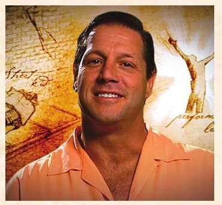

**约翰·亚萨拉夫**

（John Assaraf）

亚萨拉夫曾经是街头混混，现在却已是国际级的畅销书作家、讲师、企业顾问，帮助许多企业家创造更多财富，并使他们过上不平凡的生活。过去 25 年来，他一直致力于人脑、量子物理学与商场策略的研究，因为这些都与事业及生活上的成功有关。他借由所学，白手起家成立了 4 家价值千万美元的公司，现在则与全世界的企业人士及小企业主，分享他自己独到的创业及生财理念。

详细信息请上网：www.onecoach.com.

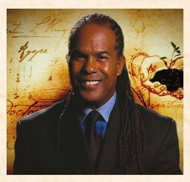

**迈克·伯纳德·贝奎斯**

（Michael Bernard Beckwith）

贝奎斯博士这位中立的跨宗教先驱，在 1986 年成立了“大爱国际潜能中心”（Agape International Spiritual  Center），拥有 1 万名当地会员，以及全世界数以万计的友人和成员。他协同国际上的杰出人士——萨尔乌达耶（Sarvodaya）社会运动的创立者阿里耶拉涅博士（Dr.A.T.Ariyaratne）、圣雄甘地之孙阿朗·甘地（Arun  Gandhi）等人——一同为这世界奉献。同时他也是“全球新思想联盟”（The Association for Global New Thought）的创建成员之一，该组织的年度会议聚集了顶尖的科学家、经济学家、艺术家，以及潜能训练师们，共同指引人类发展最高潜能。

贝奎斯博士教导静心及“祈祷智慧”，会议演说及潜能训练座谈等。他是“生命视觉化法”的创始人，同时也是《心的启发》（Inspirations of the Heart）、《心灵开发四十目》（40 Day Mind Fast Soul Feast）、《和平宣言》（A Manifesto of Peace）等书的作者。详细信息请上网：www.Agapelive.com.

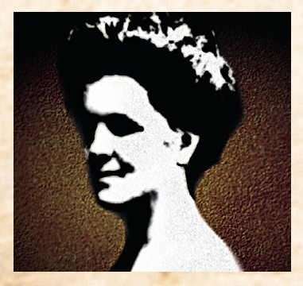

**吉纳维夫·白汉德**

（Genevieve Behrend，约 1881—约 1960）

白汉德女士师从著名的特洛华德（Judge Thomas Troward）——《精神科学》（Mental Science）一书的作者、早期的潜能开发导师之一。白汉德女士是特洛华德所挑选的唯一门生，她秉承师志，继续在北美教学、演说并实践“精神科学”长达 35 年，写下《你的无形力量》（Your Invisible Power）及《圆满内心的渴望》（Attaining Your Heart’s Desire）两部名著。

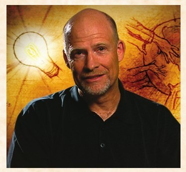

**李·布劳尔**

（Lee Brower）

布劳尔是 Empowered  Wealth 国际顾问公司的创办人兼执行官，该机构提供企业、基金会、家庭及个人一整套管理系统和解决方案，以增进他们的核心价值、经验、贡献及财务资产等。同时他也是“象限生活”（Quadrant  Living  Experience）和 LLC 公司——给予全球“象限生活”顾问群训练及认证——的创始人。他是《布劳尔象限》（The  Brower  Quadrant）的作者，并与人合写《增富与保富》（Wealth Enhancement and Preservation）一书。他的两个网站分别是：www.empoweredwealth.com 及 www.quadrantliving.com.

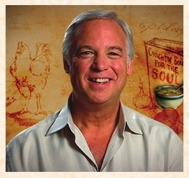

**杰克·坎菲尔德**

（Jack  Canfield）

《成功原则》（The Success PrinciplesTM）的作者。他也是目前销售超过一亿册、曾位居《纽约时报》畅销书排行榜榜首的《心灵鸡汤》®系列共同创作人。他是美国为商业人士、公司领导人、经理人、专业销售人员、员工及教育者创造成功突破方面的顶尖专家，曾帮助数万人达成他们的梦想。欲知杰克·坎菲尔德详细信息请上网：www.jackcanfield.com.

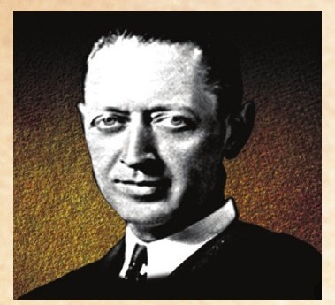

**罗伯特·克里尔**

（Robert Collier，1885—1950）

克里尔是一位在美国相当成功的多产作家。他的所有作品，包括《史上的秘密》（The Secret of the Ages）和《探囊取富》（Riches within Your Reach）等书，都奠基于他自己在成功学上的广泛研究，以及他个人对“人人皆可轻松又正当地获得成功、幸福和富足”的信念上。承蒙“罗伯特·克里尔出版社”的慷慨同意，本书得以引用克里尔《史上的秘密》7 册丛书的部分内容。

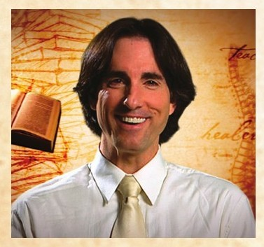

**约翰·迪马提尼医师**

（Dr. John F.Demartini）

曾经被认为是学习障碍者的迪马提尼医师，现在是一名医师、哲学家、作家及国际演说家。他曾经经营一家成功的脊疗诊所多年，还被誉为年度最佳脊疗师。迪马提尼医师现在从事健康专业咨询，以及有关治疗与哲学方面的写作和演讲。他的“个人转变疗法”已经帮助成千上万的人，让他们在生活中找到更好的安排和幸福。其网址是：www.drdemartini.com.

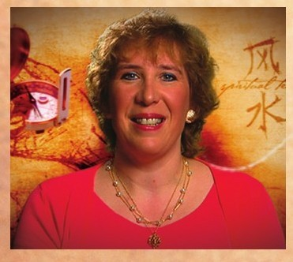

**玛莉·戴蒙**

（Marie Diamond）

戴蒙女士是国际知名的环境设计师，年轻时就传授丰富的环境规划知识，并实践淬炼其所学 20 多年。她指导过多位名人，包括好莱坞明星、电影大导演和制作人、音乐天王及诸多知名作家。她帮助了许多知名的公众人物，使他们在生活的每个层面创造更多的成功。她创设了“戴蒙探源”及“内在课程”，以帮助个人把吸引力法则与生活环境相联结。其网址是：www.mariediamond.com.

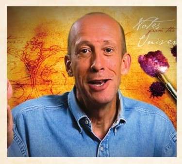

**迈克·杜利**

（Mike Dooley）

迈克并不是把教学和演说当作“职业”的人，相反，那只是他的“生活探险”之一。并且他成功地悠游在公司及企业的竞技场之间，在世界各地的普华顾问公司（Price  Waterhouse）工作结束之后，1989 年他与人合作成立了“全新创意公司”（Totally  Unique Thoughts,TUT），批发及零售公司的创意产品。该公司脚踏实地地从区域性的连锁店开始成长，接着进驻美国每一家大型百货公司，并借由日本、沙特阿拉伯、瑞士等地的配销中心，服务全球的客户，售出超过 100 万件“全新创意 T 恤”（Totally  Unique T-shirts®）。

在 2000 年，他将公司转型为以网络为主的创意灵感及哲学性的探险家俱乐部，现今已拥有来自超过 169 个国家的 6 万多名会员。他也是许多书的作者，包括一套三册的《来自宇宙的讯息》（Notes from  the  Universe），以及在国际上受到肯定的有声课程《无限可能——梦想生活的艺术》（Infinite Possibilities：The Art of Living Your Dreams）。详细信息请上网：www.tut.com.

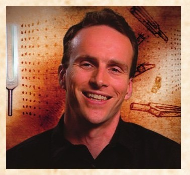

**鲍勃·道尔**

（Bob Doyle）

道尔是“超理性财富课程”——有关吸引力法则和实际应用的多媒体课程的创办人及倡导者，他专注于吸引力法则科学，帮助大众能在生活中更有目标地活化这个法则，以吸引财富、成功、美好的关系及其他一切渴望。详细信息请上网：www.wealthbeyondreason.com.

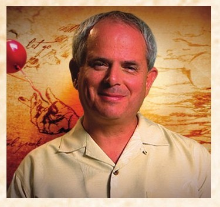

**海尔·多斯金**

（Hale Dwoskin）

《纽约时报》畅销书《塞多纳术》（T h e Sedona  Method）作者。多斯金致力于解放人们局限的信念，帮助他们完成内心的渴求。“塞多纳术”是解除局限与痛苦的感受、信念和态度的一种独特又强效的技巧，他教授这些原理给全世界的企业及个人已长达 30 年的时间。详细信息请上网：www.sedona.com.

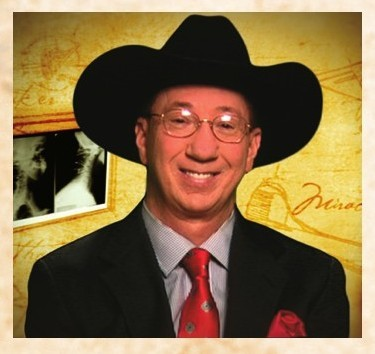

**莫里斯·古德曼**

（Morris Goodman）

人称“奇迹先生”。古德曼从飞机失事的严重伤势中复原一事，在 1981 年成了热门头条。当初他被断定一生永远无法再走路、说话或身体正常运作，如今他却旅行在世界各地，用他神奇的故事来感化、激励成千上万的人。他的夫人卡西·古德曼也在《秘密》影片中出现，告诉大家她本身自我疗愈的感人故事。

详细信息请上网：www.themiracleman.org.

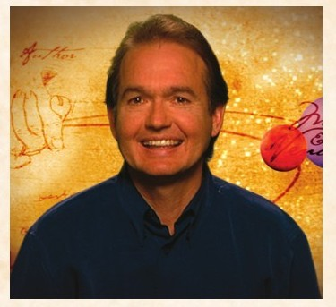

**约翰·格雷博士**

（John Gray, PH. D.）

格雷是《男人来自火星，女人来自金星》（Men  Are  from  Mars, Women  Are  from Venus）一书的作者，该书是过去 10 年来最畅销的两性关系书籍，销售超过 3000 万本。他也写了另外 14 本畅销书，并为成千上万人举办许多研讨会。他的焦点放在帮助男女了解、尊重、欣赏彼此的差异性，不论在个人或职场上。他的新书是《男女大不同健康对策》（The Mars and Venus Diet and Exercise Solution）。详细信息请上网：www.marsvenus.com.

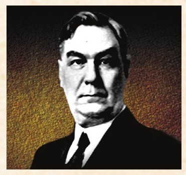

**查尔斯·哈尼尔**

（Charles Haanel，1866—1949）

哈尼尔是成功的美国商人，同时也写了许多著作，内容都是关于他个人在生命中获得伟大成就所运用的观念和方法。他最有名的作品是《万能钥匙系统》（The  Master  Key  System），书中传授获得伟大成就的 24 周课程，这本书自 1912 年首次出版至今，仍广受欢迎。

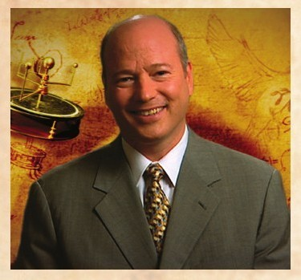

**约翰·海格林博士**

（John Hagelin, PH. D.）

知名的量子物理学家、教育家及公共政策专家。著作《完美政府手册》（Manual for a Perfect Government）说明如何解决重要的社会和环境问题，以及如何以符合自然法则的政策来创造世界和平。曾获颁给对社会有重大贡献的科学家的“克尔比奖”（Kilby Award）。他也是 2000 年美国自然法则党（Natural  Law  Party）的总统候选人，被认为是当今世上最伟大的科学家之一。他的网站是：www.hagelin.org.

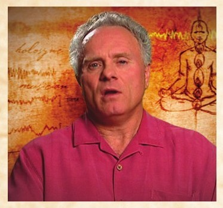

**比尔·哈利斯**

（Bill Harris）

职业演说家、教师及商人。在涉猎古今有关人心本质及其转变技巧的研究之后，他创造了“共振音乐”（Holosync）有声科技，让人们能获得深层静心的好处。他所经营的“中心点研究院”（Centerpointe Research Institute）已经使全世界成千上万的人迈向更幸福、无压力的生活。详细信息请上网：www.centerpointe.com.

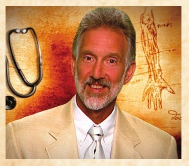

**班·琼森博士**

（Dr. Ben Johnson）

原本受西方医学训练，因采用非正统疗法治愈了威胁生命的疾病，而对能量疗法产生兴趣，尤其热衷于亚历克斯·洛伊德（Dr.Alex Lloyd）博士所发现的“治疗密码”（The Healing Codes）。目前与洛伊德一起经营“治疗密码公司”。详细信息请上网：www.healingcodes.com.

**罗洛·朗梅尔**

（Loral Langemeier）

朗梅尔女士是“活出精彩”（Live Out Loud）公司创办人，该机构提供帮助人们达成财务目标的教育及支持。她相信“心态”是建立财富的钥匙，并已帮助许多人成为百万富翁。她针对企业及个人做演讲，传授其知识和专业。她的网站是：www.liveoutloud.com.

**普兰特斯·马福德**

（Prentice Mulford，1834—1891）

马福德是“新思想运动”最早期的创始者和作家之一，一生大多时候过着隐居的生活。他的作品影响了无数作家和教师，内容涉及精神与智力的法则。作品包括《思想即物质》（Thoughts Are Things）及散文集《白十字图书馆》（The White Cross Library）。

**莉莎·妮可丝**

（Lisa Nichols）

妮可丝女士是深具影响力的“个人启能”倡导者，她也是“激励大众”及“激励青少年心灵”课程的创始者兼执行官，这两个涵盖广泛技巧的课程，能帮助青少年、女性朋友、企业人士在生活中带来深刻的改变，并为教育体系、公司客户提供相关服务。她也是全球畅销书系列《心灵鸡汤——献给美籍非裔人士》（Chicken Soup for the African American Soul）一书的合著者。她的网站是：www.lisa-nichols.com.

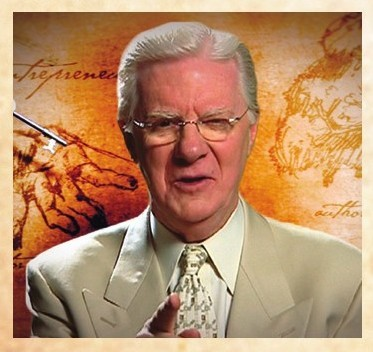

**鲍勃·普克特**

（Bob Proctor）

普克特的智慧来自伟大的传承。由安德鲁·卡耐基（Andrew Carnegie）传给拿破仑·希尔（Napoleon Hill）开始，希尔再传授给南丁格尔博士（Earl Nightingale），然后南丁格尔爵士再把这智慧的火炬传给普克特。他从事心智潜能领域的工作已经超过 40 年，旅行全世界传授这个秘密，以帮助公司及个人通过吸引力法则，创造成功、富足的生活。他也是全球畅销书《天生富裕》（You Were Born Rich）的作者。详细信息请上网：www.bobproctor.com.

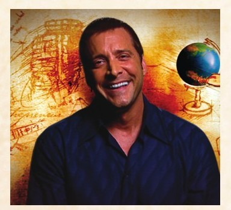

**詹姆斯·阿瑟·雷**

（James Arthur Ray）

“真实财富与成功”原则的终生学习者。他开发了一套“成功与和谐财富科学”（The Science of Success and Harmonic Wealth），教导人们如何享受各个领域的无限成果：包括财务、关系、智力、身体、心灵。全球许多人采用他的个人表现法、公司训练课程及教练辅助。他针对真实的富裕、成功、人类潜能等主题做定期的演讲，而他本身也是研究东方、原住民的专家。详细信息请上网：www.jamesray.com.

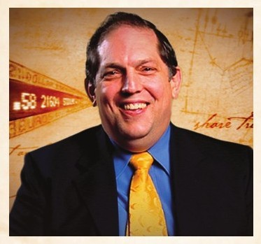

**戴维·希尔莫**

（David Schirmer）

希尔莫是相当成功的股票交易人、投资人、投资咨询师，也主持研讨、座谈和课程。他的“优势交易”（Trading Edge）公司，教导人们如何借由发展有助于获得财富的心态来创造无限所得。他对澳大利亚及海外股票、商品市场的准确分析，非常受到肯定。详细信息请上网：www.tradingedge.com.au.

**玛尔西·席莫芙**

（Marci Shimoff, MBA）

席莫芙女士是《心灵鸡汤——关于女人》《心灵鸡汤——献给母亲》等超级畅销书的作者之一。她是生命潜能转化倡导者，热衷于讲授个人发展与幸福的主题，她的工作特别着重在丰富女性的生活。她也是“尊重团队”（The Esteem Group）公司的共同创办人和董事，该机构提供女性自我尊重和激励的课程。她的网站是：www.marcishimoff.com.

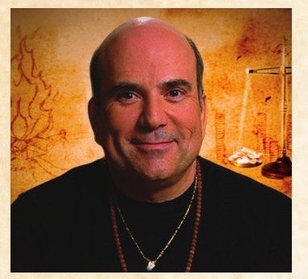

**乔·维泰利博士**

（Dr. Joe Vitale）

20 年前他还是个无家可归的人，现在则被公认为全球顶尖的营销专家之一。他写了许多有关成功与富裕原则的书：《我梦想，因为我不绝望》（Life’s Missing Instruction Manual）、《催眠营销》（Hypnotic Writing）、《相信就可以做到》（The Attractor Factor）等，都是最畅销的书。他拥有精神学的博士学位，并且是有执照的催眠治疗师和气功治疗师。详细信息请上网：www.mrfire.com.

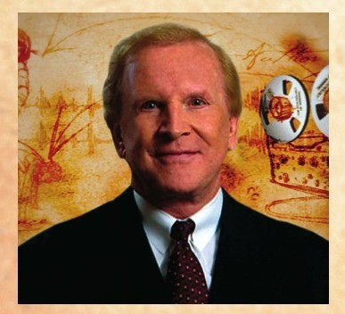

**丹尼斯·维特利博士**

（Dr. Denis Waitley）

维特利博士是美国最受尊崇的作家、讲师及人类高成就表现的顾问之一。他受聘到美国太空总署训练宇航员，之后，也用同样的计划方法训练奥林匹克选手。他的有声专辑《胜利心理学》（The Psychology of Winning）一直是自我学习类的畅销课程，他也是 15 本非文学类书籍的作者，其中包括数本全球畅销书。他的网站是：www.waitley.com.

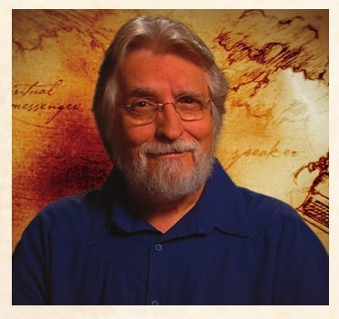

**尼尔·唐纳·沃什**

（Neale Donald Walsch）

当今知名的潜能研究者，同时也是意义深远的畅销书《与造物主对话》三部曲系列的作者，该系列打破《纽约时报》畅销书排行榜所有的纪录。他出版了 24 本书，并发行影音及有声课程。他旅行全世界。欲与他联系，请上网：www.nealedonaldwalsch.com.

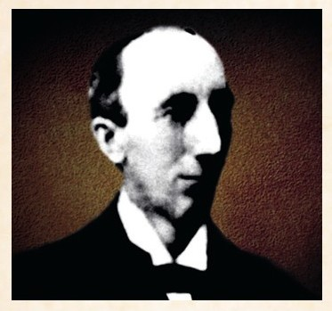

**华莱士·沃特尔斯**

（Wallace Wattles，1860—1911）

出生于美国的沃特尔斯，在多年研究各种哲学学说后，开始写下有关“新思想”原则实践的著作。他的许多书，深深影响了当代成功学的教师，其中最著名的作品是成功学经典《失落的致富经典》（The Science of Getting Rich），该书在 1910 年出版。

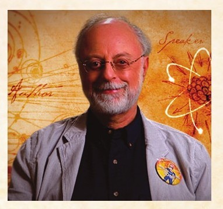

**弗莱德·亚伦·伍尔夫博士**

（Dr. Fred Alan Wolf）

伍尔夫博士是一名物理学家、作家、讲师，拥有理论物理学博士学位。他在世界多所大学教书，其有关量子物理学及意识的著作，也非常为人所熟悉。他著有 12 本书，其中《量子跳跃》（Taking the Quantum Leap）曾获国家图书奖。现在，伍尔夫博士仍在全球各地写作和讲学，并进行对量子物理学和意识关系的有趣研究。他的网站是：www.fredalanwolf.com.

# 力量

## 版权信息

力量

作者：（澳）朗达·拜恩

译　　者：王莉莉

出 版 人：刘清华

责任编辑：薛　健　刘诗哲

监　　制：蔡明菲　潘　良

特约策划：李　荡

特约编辑：温雅卿

版权编辑：辛　艳

设计支持：张丽娜

本书由天津博集新媒科技有限公司授权亚马逊全球范围发行

目录版权信息作者序感谢前言这股力量是什么？爱的力量爱是驱动你的力量爱的法则爱的吸引力量你是磁铁正面思想和负面思想谈论你喜爱的事物力量摘要感觉的力量你是有感觉的存在体你的感觉是燃料美好的感觉与不好的感觉好就是好你的感觉反映了你给出去的是什么一切都跟你的感觉有关力量摘要感觉频率感觉得到，就接收得到别把感觉设定成自动驾驶模式爱的力量没有借口每一件小事都包含在内临界点力量摘要力量与创造创造过程付出它——接收它想象力你所能想象的一切都已经存在利用道具让自己融入情境力量摘要感觉就是创造感觉的磁场创造的点如何改变负面事物如何去除不好的感受不要抗拒不好的感觉力量摘要人生随着你……选择你所爱的一的法则——你！吸引力法则永远只会说“是”你的人生——你的故事真实世界真实的故事力量摘要力量之钥爱之钥爱就是留心如何让心智专注在爱感恩之钥感恩是强大的倍增器感恩是通往爱的桥梁玩乐之钥如何玩内在游戏力量摘要力量与金钱爱是黏力如何改变你对金钱的感觉把握每个玩内在游戏的机会跟金钱说“是”职业与事业爱有无数种方式让你获得想要的一切爱的规则力量摘要力量与关系你给别人的，都会回到你身上与对方无关爱代表自由关系的秘密个人情绪教练吸引力法则的黏力八卦也有黏性你的回应就做出了选择爱是盾牌爱是联结一切的力量力量摘要力量与健康你相信的是什么？你身体里的世界心的力量如何使用爱的力量获得全然的健康美丽来自爱你觉得自己多老，你就有多老爱就是真理每个奇迹的背后都是爱力量摘要力量与你欣赏你的人生电影！你的秘密象征物生命很神奇爱会为你做任何事到底会有什么差别你赋予生命意义爱是这个世界的力量力量摘要力量与生命天堂就在你心里为了生命之爱你人生的目标力量摘要作者简介

“这是宇宙中所有事物之所以完美的原因。”

翡翠石板（约公元前 3000 年）

献给你

## 作者序

二〇〇四年九月九日是我毕生难忘的一天。那天我醒来时，觉得只不过是另一个早晨而已，结果，它成为我一生中最棒的一天。

如同大多数人一样，我努力工作以维持生活，尽可能去处理各式各样的困难和障碍。二〇〇四年对我来说，是特别艰难的一年，各种充满挑战性的状况几乎让我招架不住。我的人际关系、健康、职业和财务状况似乎到了难以挽回的地步。越来越多困境围绕着我，让我找不到出路。接着，事情就这么发生了！

我的女儿拿给我一本百年古书 1，而在我花了九十分钟阅读那本书的期间，我的整个人生改变了。我了解到生命中的每一件事是如何发生的，而且马上知道要做些什么来让它们变成我想要的。我发现了一个秘密，一个流传了好几世纪，历史上却只有少数人知道的秘密。

从那一刻起，我眼中所见的不再是同一个世界；事实上，这个世界真正的运作方式，和我过去以为的完全相反。几十年来，我一直相信生命中所遇到的事情就只是发生在我们身上而已，但是现在，我已经了解这令人难以置信的真理。

我也发现大多数人不知道这个秘密，所以我开始跟全世界分享。我克服了所有想象得到的困难，制作了《秘密》这部影片，并且在二〇〇六年发行；那一年的下半年，我写了《秘密》这本书，让我得以分享更多我的发现。

《秘密》这本书上市之后，传播的速度像光速一样，一传十、十传百，穿越了整个地球。因为知道了这个秘密，现在世界各地有上千万人正通过难以想象的方式，改变他们的生命。

当人们学会如何通过《秘密》改变自己的生命时，跟我分享了成千上万的神奇故事，让我对人为何会在生命中经历困境有了更多见解，而这些见解就集结成为《The Power 力量》这本书中所要传递的知识——可以马上改变生命的知识。

《秘密》揭露了吸引力法则——掌管我们生命最强大的法则，《The Power 力量》则包含了自二〇〇六年《秘密》上市以来，我所学到的每件事的精华。在《The Power 力量》中你会了解到，要改变你的人际关系、金钱、健康、快乐、职业及整个人生，其实只需要一样东西。

你不必先读过《秘密》才能通过《The Power 力量》改变自己的人生，因为你需要知道的每件事，都已经包含在《The Power 力量》这本书里；不过，如果你已经读过《秘密》，那么这本书将无限扩充那些你早已经知道的知识。

你需要知道的事情很多，关于你自己和你的人生，你还有很多要了解的，而且全都很美好——事实上，它们不只美好，而且精彩非凡！

## 感谢

我要对历史上所有冒着生命危险，让生命的知识和真理流传于世的伟大人物表达最深的谢意。

《The Power 力量》这本书得以完成，全靠以下这些人全力协助，我想向他们表达我的感激：谢谢丝凯·拜恩出色的编辑工作，也谢谢她与珍妮·柴尔德的引导、鼓励、专业知识与无价的投入；感谢乔许·哥尔德严谨的科学及历史研究；感谢高瑟多媒体的薛莫斯·霍尔和尼克·乔治为本书做设计；感谢尼克提供原创性的艺术作品及图片，并致力于创作出一本有力而美丽的书，让每个手握此书的人生命都能被触动。

深深地感谢西蒙与舒斯特出版公司所有相关工作人员——谢谢卡洛琳·雷狄和裘蒂丝·柯尔对我的信心，也谢谢她们愿意敞开心胸接受新方式，让我们可以一起为数十亿人带来喜悦；感谢我的编辑莱丝莉·梅勒迪斯让《The Power 力量》的编辑过程变成完全的喜乐；感谢编审群佩格·哈勒、金柏莉·高德斯坦和伊索尔德·绍尔；感谢西蒙与舒斯特其他团队成员孜孜不倦地工作——丹尼斯·欧罗、丽莎·凯姆、艾琳·艾哈恩、达琳·德里罗、崔丝妮·范、基特·瑞可德及唐娜·罗佛瑞朵。

我要对《秘密》团队的工作伙伴及亲爱的朋友表达爱与感恩，因为他们有勇气敞开心胸接受各种可能性，并战胜了每一项挑战，让我们得以将喜悦带给全世界：保罗·哈林顿、珍妮·柴尔德、唐纳德·齐克、安德列·凯尔、葛莲达·贝尔、马克·欧康纳、达米安·克尔伯伊、丹尼尔·克尔、提姆·派特森、海莉·拜恩、柯麦隆·波伊尔、金·维南、彩·李、萝莉·莎拉波夫、丝凯·拜恩、乔许·高德、尼克·乔治、萝拉·简森及彼得·拜恩。

感谢加德纳·佘律师事务所的律师麦可·加德纳和苏珊·佘；深深地感谢曼格·托尔斯律师事务所的律师布莱德·布莱恩和路易斯·李，谢谢他们的引导和专业知识，谢谢他们提供了正直与真理的活典范，也谢谢他们为我的人生带来正面能量。

感谢持续启发我追求卓越、我亲爱的朋友们：伊莲·贝特、布丽姬·墨菲、保罗·苏丁、马克·韦弗、弗雷德·内德、达尼·哈恩、鲍比·韦布、詹姆斯·辛克莱、乔治·维南、卡门·维斯克斯、海尔默·拉基斯巴达，还有最后但同样重要的，安琪儿·马汀·维里欧斯，她灵性的光芒和信念让我提升到新的层次，得以实现为数十亿人带来喜悦的梦想。

感谢我的两个女儿——海莉和丝凯，她们是我最棒的老师，她们的存在点亮了我每天的生活；感谢我的姐妹宝琳、葛莲达、珍妮和凯伊，她们给予我永无止尽的爱与支持，让我度过美好的时光及充满挑战的岁月。二〇〇四年我们的父亲突然去世，这件事带领我发现了《秘密》；而在写《The Power 力量》的过程中，我们的母亲——我们最好的朋友——过世了，留下我们继续过着没有她陪伴的人生。她期许我们尽可能成为我们最好的样子，并无条件地去爱，这样我们就能让这个世界有所不同。母亲，我从心底感谢你所做的一切。

## 前言

你本来就该拥有精彩的人生！

你本来就该拥有你喜爱和渴望的每件事物；你的工作本来就该让你振奋，而且你本来就该实现所有你想要实现的一切；你和家人及朋友的关系本来就该有满满的欢乐；你本来就该拥有要活出一个充实、美满的人生所需的金钱；你本来就该实现梦想——你所有的梦想！如果你想去旅行，你本来就该去；如果你想开创一项事业，你本来就该开创；如果你想学跳舞、开游艇或意大利文，你本来就该去做；如果你想成为音乐家、科学家、企业家、投资人、表演者、父母，或是你想成为的任何角色，你本来就该是那样的人！

每天当你醒来时，你本来就该兴奋满怀，因为你知道这一天即将充满了美好的事物；你本来就该开怀地笑，并且充满喜悦；你本来就该感觉强壮且安全；你本来就该对自己感觉美好，知道你是无价的；你的生命中当然会有挑战，也应该有挑战，因为它们会帮助你成长，而你本来就知道如何战胜那些问题和挑战；你生来就注定要获得胜利！你生来就注定要快乐！你生来就注定要拥有精彩的人生！

你生来不是为了挣扎度日；你生来不是为了过那种喜悦时刻寥寥可数的人生；你生来不是为了一星期五天辛苦工作，而周末的快乐时光却稍纵即逝；你生来不是只能带着有限的能量过日子，每天在一日将尽时都感到精疲力竭；你生来不是为了担心或是害怕；你生来不是为了受苦。你是为了什么活着？你本来就应该尽情体验生命、拥有你想要的一切，同时充满了喜悦、健康、活力、兴奋与爱，因为那才是精彩的人生！

你梦想中的人生、你想成为的样子、想去做或是想拥有的每件事物，其实都比你所知道的还要接近你，因为能让你拥有想要的一切力量，就在你心里面！

“有一个无所不在、至高无上的力量在掌管着这个大千世界。而你是这力量的一部分。”

普兰特斯·马福德（1834—1891）

新时代思想家

在这本书里，我想为你指出通往精彩人生的路。你将发现某些跟你自己、你的人生和宇宙有关的事，那些事情很不可思议。人生比你想象的简单许多，而当你了解生命运作的方式，以及你内在拥有的那股“力量”时，就能全然体验到生命的魔力——接着，你将拥有精彩的人生！

现在，就让你生命的神奇力量开始展现吧！

## 这股力量是什么？

“我说不出这股力量是什么，我只知道它存在。”

亚历山大·格拉汉姆·贝尔（1847—1922）

电话发明者

人生其实很单纯，只有正面事物及负面事物这两种组成元素。你人生的每个层面，无论是健康、金钱、人际关系、工作或快乐，对你来说不是正面就是负面——你可能拥有很多金钱或手头拮据；你的身体可能很健康或疾病缠身；你的人际关系可能很圆融，也可能很不顺；你从事的工作可能令你振奋且成就斐然，或者你对工作不满且屡遭失败；你可能幸福美满，也可能大部分时间都不快乐；你的人生可能高低起伏，有好日子，也有苦日子。

假如你人生中的负面事物多于正面事物，你就知道一定有什么地方不对劲。当你看到别人过得快乐且充实，生活中充满了很棒的事情时，你心底的某处告诉你，其实你也值得拥有那些东西——你是对的，你的确值得拥有一个满溢着美好事物的人生。

大多数拥有美好人生的人不知道他们到底做了什么事，才拥有这样的人生，但他们的确是做了某件事。他们使用了一股力量，而这股力量正是生命中所有美好事物发生的起因……

每个拥有美好人生的人都是运用爱达成的，毫无例外。能让人拥有生命中所有正面和美好事物的力量，就是爱！

有史以来，每个宗教，以及每一位伟大的思想家、哲学家、先知和领导者都一直在谈论爱、描写爱，但许多人无法了解他们的智慧话语。虽然他们的教导是针对那个时代的人，不过他们带给世界的唯一真理和讯息仍适用于现代：去爱吧，因为当你爱的时候，你就运作了宇宙间最伟大的力量。

### 爱的力量

“爱是一种元素，虽然肉眼看不到，却如空气或水一般真实。它是一股行进中的、有生命力的、流动着的力量……它如同海里的波浪和潮水般流动着。”

普兰特斯·马福德（1834—1891）

新时代思想家

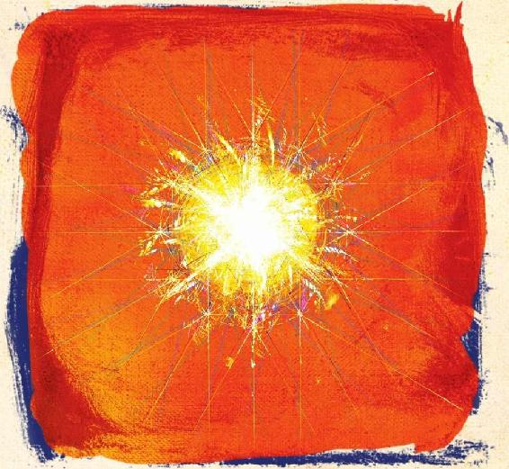

世界上最伟大的思想家和宗教领袖所谈论的爱，和大多数人理解的爱非常不同。它远超过爱你的家人、朋友和最喜爱的事物，因为爱不只是一种感觉，而是一股正面的力量。爱并不微弱、虚弱或软弱，它是生命中那股正向积极的力量！爱是所有正面和美好事物的起因，人生中的正面力量其实仅此一种而已。

大自然中有许多强大的力（如重力和电磁力）是我们察觉不到的，但是它们的力量却无可争议。同样的，我们也看不见爱的力量，但是事实上，它的力量远超过大自然的任何一种力。世界的各个角落都看得见其力量的实证：没有爱，就没有生命。

试想一下：这个世界如果没有爱，会变成什么样子？首先，你根本不会存在；没有爱，你不会被生下来，你的家人和朋友也是——事实上，这个星球会连一个人类也没有。若爱的力量止息，那么整个人类将会渐渐消失，终至灭亡。

每一项发明、发现及人类创造物都源自人心中的爱。如果不是莱特兄弟的爱，我们无法搭乘飞机飞行；如果不是科学家、发明家及发现者的爱，我们不会有电、热或光，也无法开车，或是使用电话、器具或任何一项让生活更轻松、更舒适的科技。没有建筑师和工匠的爱，就不会有家、建筑物或城市；没有爱，就没有药、医生或急救设施，没有老师、学校或教育，就没有书、没有画作、没有音乐，因为这些东西都是爱的正面力量创造出来的。现在环顾四周，如果没有爱，你所看到的每一件人类创造物都不会存在。

“没有爱，地球便成了坟墓。”

罗伯特·勃朗宁（1812—1889）

诗人

### 爱是驱动你的力量

你想成为、实现或拥有的一切都来自爱。没有爱，你就不会前进，也不会有正面力量驱使你每天早上起床、工作、玩乐、跳舞、聊天、学习、听音乐或做任何事情——你会像座石雕一样。鼓舞你前进，让你渴望成为、实现或拥有一切的，正是“爱”这股正向积极的力量。爱的正面力量可以创造一切美好事物，增加美好的东西，并改变你生命中的任何负面事物。你拥有掌控健康、财富、职业、人际关系及人生各个层面的力量，而且那股力量——也就是“爱”——就在你之内！

但是，如果你有力量控制自己的人生，而且那个力量在你之内，为什么你的人生并不精彩？为什么你的人生不是每个领域都有杰出的表现？为什么你并未拥有你想要的每样东西？为什么你一直没办法做你想做的每一件事？为什么你不是每天都满心喜悦？

答案是：因为你有选择权。你可以选择去爱，并运用这股正面力量，也可以选择放弃。而不管你是否意识到，你人生中的每一天——你生命中的每个当下——都在做这个选择。每当你在人生中体验到美好事物时，就表示你付出了爱，而且运用了爱的正面力量，毫无例外；而每当你经历不愉悦的事物时，就表示你没有付出爱，其结果就是负面的。爱是你生命中所有美好事物的起因，而缺乏爱就会引起一切负面事物及痛苦。然而悲惨的是，从现今全世界所有人的人生、乃至人类整个历史来看，人们对这股力量显然还缺乏认识与体悟。

“爱是世界上最强大、同时也是最不为人所知的能量。”

德日进（1881—1955）

牧师及哲学家

现在，你就要学到造就出生命中所有美好事物的唯一力量，接收它的相关知识，而且你将能使用它来改变整个人生。但是首先，你要了解爱到底是怎么运作的。

### 爱的法则

宇宙是由各种自然法则所掌管。我们可以搭乘飞机飞行，是因为航空技术与自然法则和谐一致。物理法则不会为了让人类能飞行而改变，但我们找到了与自然法则和谐一致的方法，因此可以飞翔。正如飞行、电及重力是由物理法则所控制，同样的，也有一条法则在掌管“爱”。如果想驾驭爱的正面力量、改变你的人生，就一定要先了解这个宇宙间最强大的法则，也就是吸引力法则。

吸引力法则正是那股大至支撑宇宙间每一颗星辰、小至形成每一个原子和分子的力量。太阳的吸引力量抓住太阳系的行星，让它们不至于猛然冲进太空；重力的吸引力量则抓住你和地球上的每个人、动物、植物及矿物。你也可以在万物中观察到吸引的力量，例如花朵吸引蜜蜂、种子从土壤中吸取养分，以及每一种生物都会被同类物种吸引。吸引力在陆地上所有的动物、海里的鱼和空中的飞鸟身上运作，让它们数量倍增并成群；吸引力让你身体的细胞、你房子的材料、你坐的家具得以聚合成形，而且让你的车能行驶在路面、让水能装在杯子里。你使用的每个物品都是通过吸引力而成形。

吸引力是那股把人们带到其他人面前的力量。它吸引人们形成城市和国家，以及共同兴趣的团体、俱乐部和社团。正是这股力量吸引这个人进入科学领域、让那个人对烹饪感兴趣；它牵引人们从事不同的运动、欣赏不同类型的音乐、喜爱某种动物和宠物。吸引力牵引着你到你最喜欢的事物那儿去、前往你喜爱的地点，也是这股力量把你带到你的朋友及所爱的人面前。

### 爱的吸引力量

所以吸引的力量究竟是什么？吸引的力量就是爱的力量！吸引力就是爱。当你被喜爱的食物吸引时，你就对那食物产生爱；如果没有吸引力，你不会有任何感觉，所有的食物对你来说都是一样的。你不会知道你爱或不爱什么，因为任何事物都不吸引你；你不会被某个人，或是某个城市、房子、车子、运动、工作、音乐、衣服或任何事物吸引，因为通过吸引的力量，你才感觉得到爱！

“吸引力法则或爱的法则，这两者是一样的宇宙律。”

查尔斯·哈奈尔（1866—1949）

新时代思想家

吸引力法则就是爱的法则，它正是让万事万物——从无数的银河系到原子——保持和谐的万能定律。它存在于宇宙万物中，且通过每一件事情运作着；它同时也是在你生命中运行的法则。

用通俗的说法来解释，吸引力法则说的就是“同类相吸”。它对生命的意义，简单来说就是：你给予出去的，就是你会得到的。在生命中，你给出去的是什么，收回来的就会是什么；根据吸引力法则，你会把你给出的事物吸引回来，无论那是什么。

“每个作用力都有一个大小相等、方向相反的反作用力。”

艾萨克·牛顿（1643—1727）

数学家及物理学家

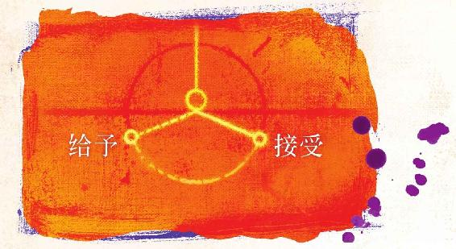

每个给予的动作，都会创造出一个接收的相反动作，而且你所接收到的总是等于你给出去的。在生命中，无论你给出什么，都一定会回到你身上。这是宇宙物理学和数学。

给予正面事物，你接收回来的就会是正面事物；给予负面事物，你接收回来的就会是负面事物。把正面积极性给出去，你就会接收到一个充满正向事物的人生；把负面消极性给出去，你就会接收到一个充满负向事物的人生。那么，你是如何给出正面性或负面性的呢？通过你的思想和感觉！

无论何时，你不是在给出正向思想，就是在给出负向思想；不是在给出正面感觉，就是在给出负面感受。而不管它们是正面或负面，都将决定你生命中得到的一切。组成你人生每一刻的所有人事物，都是通过你给出去的想法和感受而吸引回来的；你生命中的一切都不是偶发的，你接收到的所有事物都是以你给出去的为基础。

“你们要给人，就必有给你们的……因为你们用什么量器量给人，也必用什么量器量给你们。”

耶稣（约公元前 5—公元 30）

基督教创始人，《圣经》路加福音第六章第三十八节

你给予什么，就会回收什么。当你帮朋友搬家时，可以确定的是，那份协助与支持将会以光速回到你身上；而当你对让你失望的家人生气时，那份愤怒也将被包藏在生命情境中回到你身上。你正通过你的思想和感觉创造你的生命。你所想、所感觉到的，创造了发生在你身上和你生活中经历的一切。如果你心想并感觉到：“我今天过得很辛苦，压力好大。”那么你就会吸引所有让你的日子变得辛苦且充满压力的人事物回到你身上。

如果你心想并感觉到：“人生对我来说真的太美好了。”你就会吸引所有让你的生命真正美好的人事物来到你身边。

### 你是磁铁

吸引力法则会根据你给出去的，来给予你生命中的每一样事物，从不失误，绝对可靠。你借由释放出去的思想和感觉，吸引并接收到财富、健康和人际关系方面的情境、你的工作，以及你人生中每一件事情和经历。如果给出跟金钱有关的正面思想和感觉，你就会吸引带给你更多钱的正面人事物；假如释放出去的跟金钱有关的思想和感觉是负面的，你就会吸引导致你缺乏金钱的负面情境、人事物。

“我不知道人类是否会有意识地按照爱的法则行事，但那个问题并不会困扰我。无论我们接不接受，爱的法则依然运作，就像重力法则一样。”

圣雄甘地（1869—1948）

印度政治领袖

你的所思所觉，吸引力法则肯定都会回应你。无论你的思想和感觉是好是坏，一旦你释放出去，它们就会像你说话的回声一样，自动且精准地回到你这里。然而，这也代表你可以借由改变你的思想和感觉，来改变自己的生命——给出正面的思想和感觉，你就能改变整个人生！

### 正面思想和负面思想

你脑中听见和嘴里大声说出来的话，都是“思想”。当你跟某人说：“今天天气真好。”你是先有了这个想法，然后才说出这句话。你的思想还会变成行动——早上起床时，你是有了“起床”这个念头之后才采取行动的；如果没有先产生这个念头，你是不可能有动作的。

你的思想决定了你的言语和行动是正面或负面。不过，你怎么知道自己的想法到底是正面或负面的？当你想着你想要、你喜欢的事物时，你的思想就是正面的！而当你想着你不想要、不喜欢的事物时，那就是负面思想。就这么简单、这么容易。

无论你想要的是什么，你会想要它，是因为你喜爱它。花点时间想一想：你不会想要那些你不喜欢的事物，对吧？每个人只想要他们喜欢的东西，没有人会想要他们不喜爱的事物。

当你想到或聊到你想要及喜爱的事物时——例如“我喜欢那些鞋子，它们真漂亮。”——你的思想是正面的，而那些正面思想会以你所喜爱的事物形式——漂亮鞋子——回到你身上。当你想到或聊到你不想要、不喜欢的事物——例如，“看看那些鞋子的价格，真的是在抢钱。”——这时你的思想是负面的，而那些负面思想将会化作你不喜爱的事物——对你来说太贵的东西——回到你这里。

比起喜爱的事物，大多数人更常思考及谈论他们不喜爱的一切。他们释放出的负面能量比爱还多，如此一来，他们就不经意地夺走了自己生命中所有美好的事物。

没有爱，不可能拥有美好人生。那些拥有美好人生的人，更常想、更常谈到他们喜爱的事物，而不是不喜欢的东西！而那些挣扎过日子的人则思考及谈论的是不喜爱的事物，多过喜爱的一切！

“有一个字将我们从生命中所有的负担和痛苦中释放出来，那个字就是爱。”

索福克勒斯（公元前 496—前 406）

希腊剧作家

### 谈论你喜爱的事物

当你谈到任何跟金钱、人际关系、疾病有关的难题，或是提及你的事业获利减少时，都不是在谈论你所喜爱的事物；当你谈到一则负面新闻报道，或是一个令你生气或灰心的人或状况时，你不是在谈论你喜爱的事物；当你提到你今天过得很不顺、约会迟到、路上塞车或是错过公交车，这些都是在谈论你不喜欢的事物。每天的生活中都会发生很多小事，如果整天把你不喜欢的事情挂在嘴上，说个不停，那些小事就会为你的人生带来更多的难题和困境。

你必须谈论一天当中发生的好事，聊一聊顺利进行的会议，聊一聊你有多喜欢准时，聊一聊身体健康的感觉真美好，聊一聊你希望你的事业获利多少，聊一聊一天当中进展得很顺利的状况及与他人的互动。你必须谈论你喜爱的一切，才能将它们带到你面前。

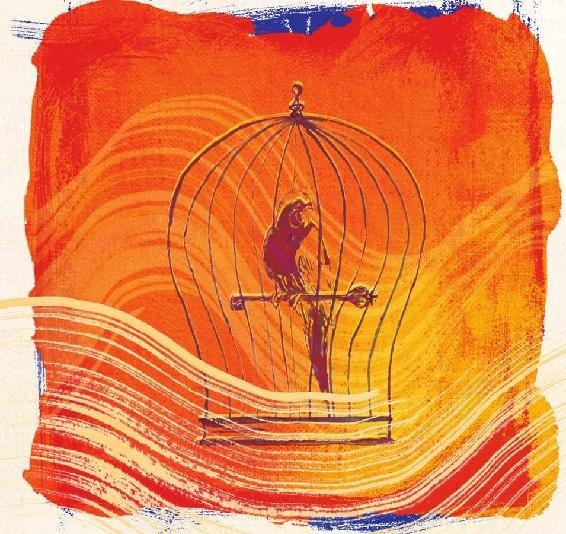

如果你重复说着负面事物，或是大声抱怨你不喜欢的事情，其实是在把自己像只笼中鹦鹉一样关起来。你每谈论一次你不喜欢的事物，就替这个鸟笼多增加一根铁条；你把自己锁了起来，远离一切美好。

拥有美好人生的人时常谈论他们喜爱的一切。因为这样，他们得到无数通往生命中所有美好事物的通道，就像空中的鸟儿一样自由飞翔。所以，为了拥有美好人生，就冲破那禁锢你的牢笼吧！付出爱，只谈论你喜爱的事物，那么，爱将会让你自由！

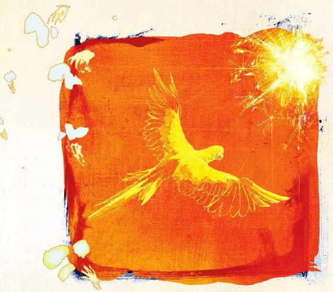

“你们必晓得真理，真理必叫你们得以自由。”

耶稣（约公元前 5—公元 30）

基督教创始人，《圣经》约翰福音第八章第三十二节

对爱的力量来说，没有什么事情是不可能的。无论你是谁、无论你面对的局面如何，爱的力量都能让你自由。

我认识一位女士，她仅仅借由爱，就冲出禁锢她的牢笼。这位女士很穷，而且在结束充满暴力阴影的二十年婚姻生活之后，还得面对独立抚养小孩的问题。尽管面临如此极端的困境，这位女士从不允许怨恨、愤怒或任何不好的感觉在她心里生根。她绝不说前夫的坏话，相反的，她只用正面思想和字眼来描述她梦想中完美而英俊的丈夫，以及她渴望的欧洲之旅。即使没钱旅行，她还是去申请并拿到了护照，而且买了她梦想中的欧洲之旅会用到的小东西。

后来，她真的遇到了她完美英俊的新任丈夫。而且婚后搬到她丈夫在西班牙的家，房子俯瞰着大海。现在，她在那里过着幸福快乐的日子。

这位女士拒绝谈论她不喜欢的一切，反而选择付出爱，想的、说的都是她喜爱的事物。因为这样，她让自己挣脱困境和痛苦，获得美丽的人生。

你可以改变自己的生命，因为你有无限的能力去思考和谈论你喜爱的一切，所以，你为自己带来生命中所有美好事物的能力也是无限的！然而，你拥有的力量远远不只是正向地思考并谈论你喜欢的事物，因为吸引力法则会回应你的思想和感觉。你必须感受到爱，才能驾驭它的力量！

“爱就完全了律法。”

圣保罗（约 5—67）

基督教使徒，《圣经》罗马书第十三章第十节

### 力量摘要

·爱并不微弱、虚弱或软弱，它是生命中那股正向积极的力量！爱是所有正面和美好事物的起因。

·你想成为、实现或拥有的一切都来自于爱。

·爱的正面力量可以创造一切美好事物、增加美好的东西，并改变你生命中的任何负面事物。

·每一天、每一刻，你都在选择要不要去爱，并运用这股正面力量。

·吸引力法则就是爱的法则，它也是你生命中运行的定律。

·在生命中，无论你给出去的是什么，收回来的就会是什么：给予正面事物，你接收回来的就会是正面事物；给予负面事物，你接收回来的就会是负面事物。

·你生命中的一切都不是偶发的，你接收到的所有事物都是以你给出去的为基础。

·无论你的思想和感觉是好是坏，都会像回声一样自动且精准地回到你身上。

·拥有美好人生的人，更常想、更常谈到他们喜爱的事物，而不是不喜欢的东西！

·谈论一天当中发生的好事，谈论你喜爱的一切，然后将它们带到你面前。

·你有无限的能力去思考和谈论你喜爱的一切，所以，你为自己带来生命中所有美好的事物的能力也是无限的！

·去爱吧，因为当你爱的时候，你就运作了宇宙间最伟大的力量。

## 感觉的力量

“秘密就藏在感觉里。”

纳维尔·高达德（1905—1972）

新时代思想家

### 你是有感觉的存在体

打从你一出生，你总是有所感觉，其他人也一样。虽然你在睡觉时可以停止意识层面的思维，但你无法停止感觉，因为活着就是要感受生命。你的本质是一个有感受能力的“存在体”，所以你身体每个部分都被创造出来，好让你感觉生命的存在，这件事并非偶然！

你拥有视觉、听觉、味觉、嗅觉及触觉，让你可以感受到生命中的每一样事物。这些属于“感觉”机能，通过它们，你才能感受自己看到、听到、尝到、闻到及触摸到什么。你的整个身体都覆盖着一层细致的皮肤，它是感觉器官，所以你可以感觉到每一样事物。

你在每一刻的感觉，比什么都重要，因为你当下的感觉正在创造你的生命。

### 你的感觉是燃料

如果没有感觉，你的思想和言语就一点力量也没有。在一天当中，你想了很多事，但都没什么影响，因为很多思想并未在你心里引发强烈的感觉。你感受到什么才是真正重要的！

想象你的思想和言语是一艘火箭，而你的感觉是燃料。如果没有燃料，火箭就只是静止的运载工具，什么事也做不了，因为燃料正是那股驱动火箭的力量。你的思想和言语也一样，没有了感觉，它们就发挥不了任何作用，因为感觉是你思想和言语的力量！

如果你心想：“真受不了我老板。”那个念头表达了你对老板的强烈负面感觉，而且你正在释放那个负面感觉。结果就是，你和老板的关系每况愈下。

如果你心想：“我跟一些很棒的人一起工作。”那些字眼传达了你对同事的正面感觉，而且你正在释放那个正面感觉。结果，你和同事的关系会越来越好。

“必须唤出情绪，好在思想中注入‘感受’，这样思想才能成为实相。”

查尔斯·哈尼尔（1866—1949）

新时代思想家

### 美好的感觉与不好的感觉

就如同生命中的每样事物，你的感觉可以是正面，也可以是负面的；你会有好的感觉，也会有不好的感觉。所有美好的感觉都源自爱！而所有负面的感觉都源自缺乏爱。你感觉越好——例如当你感到喜悦时——给出去的爱就越多；而你给予的爱越多，得到的就越多。

你的感觉越不好——例如当你感到绝望时——释放出去的负面能量就越多；而你释放出的负面能量越多，就会在生活中遇到更多负面事物。你之所以这么不喜欢负面感觉，是因为爱是生命中的正面力量，而在负面的感觉里却没有太多爱！

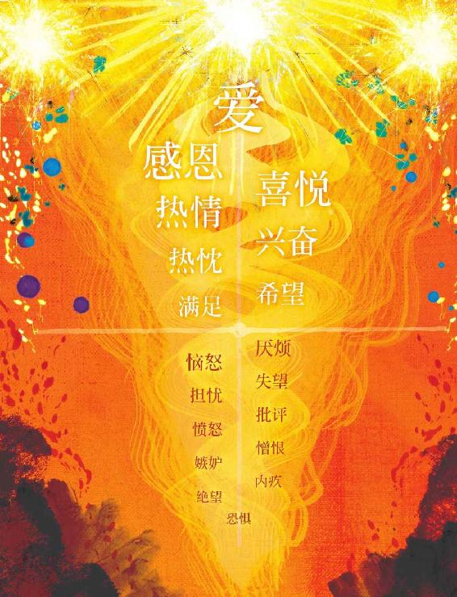

你的感觉越好，在生命中得到的就越美好。

你的感觉越差，在生命中得到的就越糟——直到你改变自己的感受为止。

当你感觉美好时，思想也会自动变得美好。你不可能同时拥有美好的感受和负面思想！同样的，对你而言，不好的感受和美好的思想也不可能同时存在。

你的感觉时时刻刻确切反映了你释放出去的一切，这是个高精确度的度量方式。当你感觉美好时，就不必担心其他事，因为你的思想、言语和行动都会是美好的。只要感觉良好，你就一定是在付出爱，而那份爱肯定会全部回到你身上！

### 好就是好

大多数人了解感觉美好或感觉很糟分别是什么样子，但却没有意识到自己大部分时间都处于负面感受中。一般人认为感觉不好表示感受到极端的负面情绪，例如悲伤、哀痛、愤怒或恐惧——虽然那些的确属于不好的感觉，然而负面感受其实分很多程度。

如果你大部分时间都觉得“还好”，你可能会认为那个“还好”的感觉是正面的，因为你的感受并不是太差；如果你一直以来的感觉都很糟，然后现在觉得还可以，那么“觉得还好”当然比“觉得很糟”好得多了。然而，“还好”通常是一种负面感受，因为“还好”并不是“好”。感觉好就是感觉好！好的感受意味着你是快乐、喜悦、兴奋、充满热忱或热情的。当你只是觉得还好、普普通通，或是没什么感觉，那么你的人生就会是还好、普普通通或没什么！那不是美好人生。好的感觉意味着你真的觉得很美好，而真正觉得美好就能带来真正美好的人生！

“爱的限度就是无限度地去爱。”

圣伯纳德（1090—1153）

基督教修道士及神秘学家

当你觉得喜悦时，你就在释放喜悦，然后无论你身处何方，都会接收到喜悦的经验、喜悦的情境和喜悦的人。从听到电台里放着你喜欢的歌这种最微不足道的体验，到获得加薪这种比较重要的经历——你体验到的所有状况都是吸引力法则在回应你喜悦的感觉。而当你觉得恼怒时，你就在释放恼怒，然后无论你到什么地方，都会接收到令你恼怒的人事物，小至一只恼人的蚊子，大至车子抛锚，这些经验全都是吸引力法则对你恼怒的回应。

每个美好的感受都让你与爱的力量结合，因为爱是所有美好感觉的源头。充满热忱、兴奋及热情等感觉都源自爱，而当你持续感受到其中的任何一种，它们就会为你带来一个充满热忱、兴奋和热情事物的人生。

你可以借由提升美好感受的程度，来充分利用它的力量，方法是去掌控那个感受，并刻意强化它，尽可能让自己感觉美好。如果要强化热忱，就让自己沉浸在充满热忱的感觉中，通过强烈感受到那样的感觉，尽可能“挤”出充满热忱的感受！而当你感觉到热情或兴奋时，尽可能借由深入地感受，让自己沉浸其中，并强化那些感觉。你越是强化美好的感受，给出的爱就越多，然后你得到的结果将会很可观。

当你涌现任何美好的感觉时，也可以借由寻找自己喜爱的事物来强化它。在坐下来写这本书之前，我每天都会花几分钟强化美好的感受。我会一个接一个地想着所有我喜爱的事物，不停地数算：我的家人、朋友、家、园子里的花、天气、色彩、状况、事件，以及在那个星期、那个月或那一年之中发生过的、我喜欢的事。我在脑海中不断列出每一样事物，直到觉得棒透了为止，接着我才坐下来开始写作。强化美好感受就是这么容易，而且无论何时何地都可以做。

### 你的感觉反映了你给出去的是什么

你马上就能分辨出在人生的各个主要层面中，你给的比较多的是好感觉还是不好的感觉。你对人生每个主题——例如金钱、健康、工作和人际关系——的感受，都准确反映出你针对各个主题给出去的是什么。

当你想着金钱时，你的感受会反映你正送出什么样跟钱有关的讯息。如果你因为没有足够的金钱，所以想到钱的时候感觉不好，那你一定会碰到钱不够的负面情境和经验——因为那是你释放出去的负面感觉。

当你想着你的工作时，你会从自己的感受中得知你正送出什么样跟工作有关的讯息。如果你对自己的工作感觉良好，一定会在工作中遇到正面的情境和经验——因为那是你释放出去的正面感觉。而当你想到家人、健康或任何对你来说很重要的课题时，你的感觉都会告诉你，你正在给出什么。

“要留意你的心情和感受，因为你的感受与你的有形世界有着牢不可破的联结。”

纳维尔·高达德（1905—1972）

新时代思想家

生命中的一切都不是偶发，而是对你的回应。人生是由你决定的！你生命的各个层面都由你做主，你是你人生的创造者，你是你人生故事的作家，你是你人生电影的导演，你借由你给出去的，来决定自己的人生会是什么模样。

你可以感受到的美好感觉有无限层次，这表示你可以接收到的美好人生没有上限。而不好的感觉也可以依照负面程度分成许多层次，但它们是有底线的，超过这个程度，你就无法承受了，然后你会被迫再次选择美好的感受。

好的感觉让你觉得棒透了，而不好的感觉会让你觉得很糟，这并非偶然或意外。爱是掌控生命的最高力量，它通过美好的感觉来呼唤你、吸引你，让你活出你本该拥有的人生。爱也通过不好的感觉呼唤你，因为那些不好的感觉是在告诉你，你和生命的正面力量断了联结！

### 一切都跟你的感觉有关

生命中的一切都跟你的感觉有关。你是依据自己的感受来做人生中的每个决定，你整个人生唯一的驱动力就是你的感觉！无论你想要什么，你之所以会想拥有它，是因为你喜爱它，因为它会让你感觉美好；而无论你不想要什么，你之所以不想拥有，是因为它会让你感觉不好。

你想要健康，是因为健康的感觉很好，而生病的感觉不好；你想要钱，是因为能买到你喜欢的东西、能做你喜欢的事让你感觉很好，而当你买不起或做不到时，就会涌现不好的感受；你想要愉快的人际关系，是因为它们让你觉得很美好，而不顺遂的关系会让你觉得很糟；你想要快乐，是因为快乐让你有美好的感受，而不快乐则让你感觉不好。

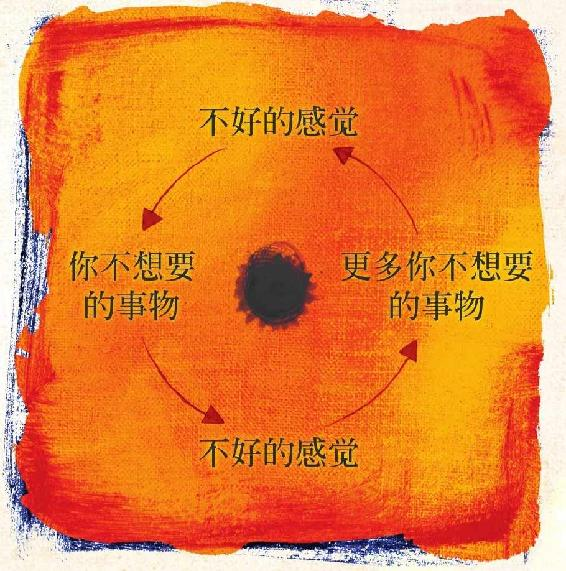

你想要的一切都是由它们将带给你的美好感受所推动的！而你要如何接收到你想要的美好事物呢？通过美好的感觉！金钱要你，健康要你，快乐要你，你所爱的一切都要你！它们急切地想涌进你的生命，但你必须给出好的感觉，才能把那些美好的事物带来。你不必挣扎、不必搏斗来改变自己人生的境遇，你所要做的就是通过美好的感觉付出爱，然后你想要的一切就会出现！

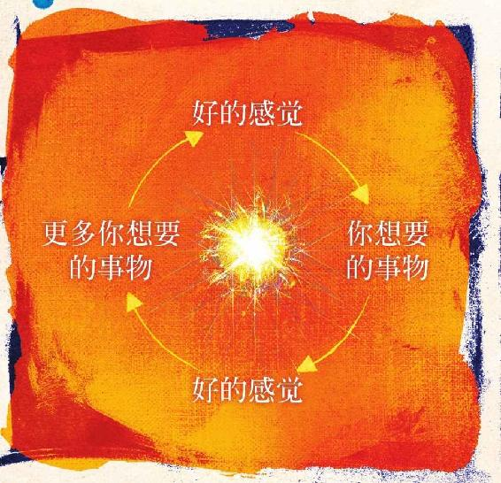

你的美好感受驾驭着爱的力量——生命中一切美好事物背后的力量。你的好感觉告诉你，这是通往你想要的事物的路；你的好感觉告诉你，当你觉得很好时，生命就会很好，但你必须先给出美好的感觉！

如果你一辈子都在对自己说“等我有个更好的房子，我就会快乐”“等我有一份工作或获得升迁时，我就会快乐”“等我的孩子念完大学，我就会快乐”“等我们有了更多钱，我就会快乐”“当我可以去旅行时，我就会快乐”，或是“当我的事业成功时，我就会快乐”，那你永远无法拥有那些事物，因为你的思想违反了爱的运作方式，抵触了吸引力法则。

你必须先快乐，然后付出快乐，才能得到让你快乐的事物！事情一定是这样发生的，没有其他方式，因为无论你想接收到什么，一定要先给！你的感觉由你掌控，你的爱也是，而不管你给出去的是什么，爱的力量都会将它送回来给你。

### 力量摘要

·你在每一刻的感觉，比什么都重要，因为你当下的感觉正在创造你的生命。

·你的感觉是你思想和言语的力量，你感受到些什么才是真正重要的！

·所有美好的感受都源自爱！而所有负面的感觉都源自缺乏爱。

·每个美好的感受都让你与爱的力量结合，因为爱是所有美好感觉的源头。

·你可以借由想着自己喜爱的一切来强化美好的感觉，一个接一个地数算你喜欢的东西，不断列出每一样事物，直到觉得棒透了为止。

·你对人生每个主题的感受，都准确反映出你针对各个主题给出去的是什么。

·生命中的一切都不是偶发，而是对你的回应！你人生的每个课题都由你做主，而你借由你给出去的，来决定自己的人生会是什么模样。

·你可以感受到的美好感觉有无限层次，这表示你可以接收到的美好人生没有上限。

·你所爱的一切都要你！金钱要你，健康要你，快乐也要你。

·不要挣扎、搏斗着改变自己人生的境遇，通过美好的感觉付出爱，你想要的一切就会出现！

·你必须先给出美好的感觉。你必须先快乐，然后付出快乐，才能得到让你快乐的事物！无论你想接收到什么，一定要先给！

## 感觉频率

### 感觉得到，就接收得到

宇宙中的每样事物都有吸引力，而且都有个吸引力频率，你的感觉和思想也是。好的感觉代表你在爱的正面频率上，不好的感觉则表示你处于负面频率。无论你的感觉是好是坏，都会决定你的频率，然后你就会像块磁铁一样，吸引处于同样频率的人事物！

如果你觉得充满热忱，你热情的频率会吸引热情的人、情境和事件；如果你觉得恐惧，你恐惧的频率会为你引来可怕的人事物。你从来不用怀疑自己目前处于何种频率，因为你的频率总是对应你当下的感觉！而你任何时候都可以借由改变感受来改变自己的频率，然后你周遭的一切也将因你进入新的频率而产生变化。

以你人生中的任何一种情境为例，所有结果都可能发生，因为你对那个情境可以产生任何感觉！

一段人际关系可以处在快乐、喜悦、兴奋、满足或任一种美好感觉的频率上，也可以处在让人无聊、挫折、担忧、愤恨、沮丧或任一种坏感觉的频率。这段关系可能产生任何结果，而你的感觉将决定会发生些什么。你对这段关系产生什么样的感觉，你之后就会接收到什么；如果你大部分时间都觉得很愉悦，就是在付出爱，然后你一定会通过这段关系接收到爱与喜悦，因为那就是你所在的频率。

“改变感受就能改变命运。”

纳维尔·高达德（1905—1972）

新时代思想家

看看下页这张感觉频率清单，你会发现，无论是人生的哪一个课题，都存在着许多不同的感觉频率，而通过你的感受，你决定了每个课题的结果！

你可以对金钱感到兴奋、快乐、喜悦、充满希望、担忧、恐惧或沮丧，你可以对你的健康感到欣喜若狂、热情、幸福、灰心或紧张，这些都是不同的感觉频率，而你所处的频率决定了你会得到的结果。

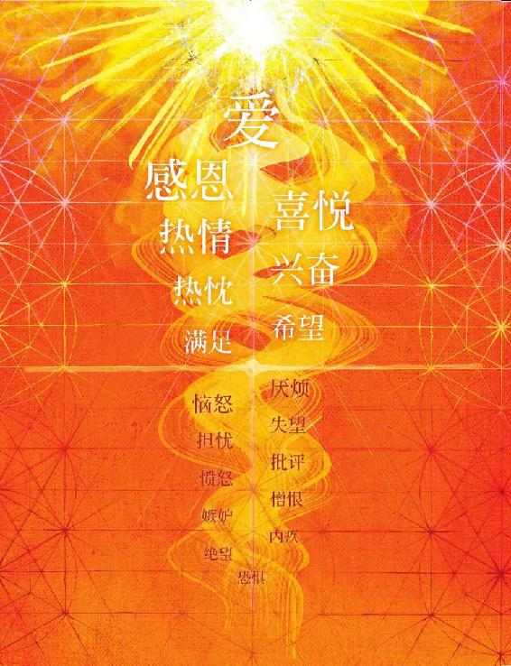

你可能想去旅行，但如果你对于没有钱去玩很失望，那么针对旅游这件事情，你是感到失望的。而觉得失望代表你在失望的频率上，你就会持续接收到无法去旅游的失望状况，直到你改变感受为止。爱的力量会促成让你可以去旅行的一切情境，但前提是，你必须处于美好感觉的频率上才能得到。

当你改变对某个状况的感受时，你就发出了一个不同的感觉，处于不一样的频率上，而那个状况就必须改变，才能反映出你的新频率。如果你的人生中发生了某件负面的事，你可以改变它，永远不嫌晚，因为你随时都能改变自己的感受。无论面对什么样的课题，如果想要得到自己喜爱的一切，想要把任何事物变成自己喜欢的样子，你只需做一件事，就是改变你的感受！

“想要找到宇宙的秘密，就从能量、频率和振动等方面来思考。”

尼古拉·特斯拉（1856—1943）

无线电及交流电发明者

### 别把感觉设定成自动驾驶模式

大多数人不知道美好感觉的力量，所以他们的感觉往往只是在回应所发生的事件。他们把自己的感觉设定在自动驾驶模式，而不是刻意去掌控感受。好事发生时，他们觉得很好；坏事发生时，他们的感觉就变差。这些人不了解，其实他们的感受才是所发生事件的成因。当他们用负面感觉去回应已经发生的某件事情时，就释放出更多负面感受，然后他们会接收到更多负面情境。这些人被自己的感觉困在一个轮回中，他们的人生就像在滚轮里拼命奔跑的仓鼠一样，哪儿也去不了，因为他们不明白，如果想改变生命，就必须改变他们的感觉频率！

“重要的不是发生在你身上的事，而是你对它的反应。”

爱比克泰德（55—135）

哲学家

如果你没有足够的钱，自然对金钱不会有美好的感觉，但是当你对钱没有好感觉时，你的钱绝不会变多。如果你对金钱释放出负面感受，就是处于负面频率，然后你将会接收到负面情境，例如巨额账单或东西坏了，都是一些会榨干你的钱的状况。当你用负面感觉回应一张巨额账单时，你就释放出更多对金钱的负面感受，那会为你带来更多耗尽你的钱的负面情境。

每一秒钟都是一个改变生命的机会，因为你随时都能改变自己的感受。你在这之前有什么感觉、你认为自己犯过什么错通通不重要，只要改变感受，你就能进入不同的频率，而吸引力法则会立刻回应！当你改变自己的感受，过去的就过去了！当你改变自己的感受，你的人生也随之发生变化。

“不要浪费时间后悔，因为带着感叹去回想过去所犯的错，只会再次影响自己。”

纳维尔·高达德（1905—1972）

新时代思想家

### 爱的力量没有借口

如果你的人生并未充满你喜爱的事物，不代表你不是一个善良慈爱的人。我们每个人的人生目的正是借由选择爱来克服负面性，问题是，大多数人会一下子爱、一下子不爱，一天来回好几百次。他们没有花足够的时间付出爱，好让爱的力量推动所有美好的事物进入他们的生命中。想想看，前一刻你借由给所爱的人一个温暖的拥抱而付出爱，下一刻你却因为找不到钥匙、塞车迟到或找不到停车位而生气，于是停止付出爱；当你和同事一起大笑时，你付出了爱，接着却因为你想吃的食物卖完了而生气，于是又不爱了；当你期待周末来临时，你付出了爱，接着因为收到账单，你又停止去爱了。一整天你就持续着这样的过程：一下子爱、一下子不爱，一下子爱、一下子不爱，一下子爱、一下子不爱。

你要不是在给予爱，并驾驭这股爱的力量，不然就是没有这么做。如果找借口解释自己为何不爱，你就无法驾驭爱的力量。找借口或辩解为何没有去爱，只会为你的人生增加更多负面能量。当你为自己没有付出爱找理由时，你再度感受到同样的负面能量，于是你会释放出更多！

“执怒就像握了一把要丢向他人的热煤炭，被烫伤的人反而是你。”

佛陀（公元前 563—前 483）

佛教的创始人

如果你因为约会搞砸了而生气，并且把这件事怪到对方头上，你就是把责怪当成不付出爱的借口。但吸引力法则只会接收到你给出去的，所以如果你给出去的是责备，接收回来的一定也是跟责备有关的情境——不见得是之前你怪罪的那个人回过头来责备你，但很确定的是，你一定会碰到被责怪的状况。爱的力量没有借口，你付出什么，就会得到什么——就是这样。

### 每一件小事都包含在内

责备、批评、找碴和抱怨是负面能量的各种形式，全都会带来纷争。每当你小小地抱怨一下、批评一下，你都在释放出负面能量。当你抱怨天气、交通、政府、伙伴、儿女、父母、排队长龙、经济、食物、身体、工作、顾客、事业、物价、噪声或服务时，看起来虽然无伤大雅，但这样的行为会为你带来一大堆负面状况。

请丢掉讨厌、糟透了、恶心及坏到极点之类的词汇，因为当你说出这几个词时，随之而来的是强烈的感觉。你说出来，它们一定会回到你身上，这意味着你替自己的人生贴上了这些标签！你不觉得多多使用像了不起、棒透了、好得不得了、妙极了及超级精彩这样的字眼，是个不错的主意吗？

你可以拥有任何你喜爱、你想要的事物，前提是必须与“爱”和谐一致，这表示你不能找借口不付出爱。借口和辩解会让你无法得到自己想要的一切，无法拥有美妙的人生。

“我们送到别人生命里的，会全部回到自己身上。”

埃德温·马克姆（1852—1940）

诗人

当你投诉某家商店的店员，接着几个小时后，你接到一通邻居打来抱怨你家的狗乱吠的电话时，不会注意到其中的关联；当你跟朋友边吃午饭边说一个共同的朋友的坏话，然后回到工作岗位上却发现你和大客户之间出现了严重的问题时，不会注意到其中的关联；当你边吃晚餐时边谈论一则负面新闻，而那天晚上你因为胃不舒服而睡不着时，也不会把这两件事联想在一起。

你在街上停下来帮某人捡拾他掉落的东西，接着十分钟后马上找到一个就在超市门口外的停车位，你不会注意到其中的关联；你愉快地帮孩子做功课，隔天获知你的退税金会比你预期的还多时，不会注意到其中的关联；你帮朋友一个忙，然后那个星期你的老板给你两张运动比赛的免费入场券时，你不会把这两件事联想在一起。无论你知不知道其中的关联，在人生的每一刻、每个情境中，你都在接收你给出去的。

“没有一件事因外在世界而起，所有的事情都是由内在产生的。”

纳维尔·高达德（1905—1972）

新时代思想家

### 临界点

如果你给出去的思想与感觉，有超过百分之五十是正面的，你就来到了临界点。即使你只释放出百分之五十一的美好思想和感觉，还是能使你人生的天平倾斜！下面就要告诉你为什么。

当你付出爱时，它不只会化为你喜爱的正面情境回到你身上，当它回来的时候，甚至会为你的人生增加更多爱和正面能量！然后新的正面能量会吸引更多正向事物，增加了更多爱和正面能量到你的生命中，如此持续下去。每样事物都有吸引力，当你身上发生好事时，它会像磁铁一样引来更多好事。

你也许有过这样的经验：当你因为好事一件接一件发生，而说自己“好事不断”或“好运连连”时，好事情就会一直出现。会有这种状况，唯一的原因就是你释放出的爱多于负面能量，然后当爱回到你身上时，为你的生命增加了更多的爱，接着引来了更多美好的事物。

或许你也有过相反的体验：当某件事出错时，其他事情会开始接二连三地发生状况。这是因为你释放的负面能量多于爱，而当负面能量回到你身上时，为你的生命增加了更多负面能量，接着吸引了更多负向事物。也许你认为那些时候是“衰运连连”，但它们和运气一点关系也没有。吸引力法则在你的生命中精准地运作着，而那些时刻——无论是好是坏——只是单纯反映你付出的爱或负面能量的比例而已。“好事不断”或“衰运连连”的状况之所以会改变，唯一的原因就是你在某个时间点上借由你的感觉，让天平朝另一端倾斜。

“通过这个方式，你可以拥有冥冥中受到保护的人生，永远不受任何伤害；通过这个方式，你可以成为一股正向力量，将各种丰饶与和谐的情境吸引到你身边。”

查尔斯·哈尼尔（1866—1949）

新时代思想家

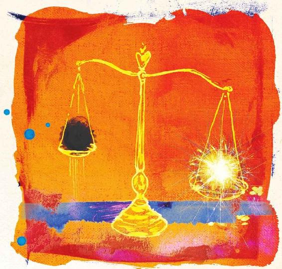

要改变自己的人生，你所要做的就是通过你美好的思想和感觉付出百分之五十一的爱，来使天平倾斜；一旦你到达给出的爱多于负面能量的临界点，回到你身上的爱就会因为通过吸引力法则吸引了更多爱而倍增。突然间，你体验到美好事物来得越来越快、越来越多！现在你生命的各个层面加倍出现更多美好的事物，而不是负向事物——这就是你的人生本来应该有的模样。

每天早上醒来时，你都站在一个临界点，一边让你过着充满美好事物的一天，往另一边走，你那一天则会遇到许多问题，而你是那个决定你当天好不好过的人——通过你的感觉！你感受到什么，就释放出什么，而那正是你当天必然会接收到的，它会如影随形地跟着你。

当你以愉快的心情展开一天，而且持续感到快乐时，你那一天会过得很美好！但如果你在一天之始就心情不好，而且没有做任何事去改变坏情绪，你那一整天就会过得很糟。

一整天都带着美好的感受，不只能改变当天，也能改变明天、改变你的人生！如果一直维持着好感觉，连上床睡觉时也是，隔天你就会以一股充满美好感觉的动力开始新的一天。当你尽可能持续感受到美好时，通过吸引力法则，你的好感觉会一直倍增，如此一天一天地持续下去，然后你的人生就变得越来越美好了。

“活在今天——不是昨天，也不是明天，就是今天。活在当下，不要把当下借给明天。”

杰瑞·史宾尼利（生于 1941 年）

儿童作家

许多人不为今天而活，他们全神贯注在未来，然而未来是由我们度过今天的方式所创造的。你今天感觉到的才重要，因为只有它才能决定你的未来。每一天都是一个通往全新人生的机会，因为你每天都站在你人生的临界点上；而你在任何一天都能改变未来——通过你的感觉。当你让天平往美好感觉那一边倾斜时，爱的力量将会快速改变你的人生，快到你难以置信。

### 力量摘要

·宇宙中的每样事物都有吸引力，而且都有个吸引力频率，你的感觉和思想也是。

·无论你的感觉是好是坏，都会决定你的频率，然后你会吸引处于同样频率的人事物。

·任何时候都可以借由改变感受来改变自己的频率，然后你周遭的一切会因为你进入新的频率而产生变化。

·如果你的人生中发生了某件负面的事，你可以改变它，永远不嫌晚，因为你随时都能改变自己的感受。

·许多人把自己的感觉设定在自动驾驶模式，他们的感觉往往只是在回应所发生的事件。然而这些人不了解，其实他们的感受才是所发生事件的成因。

·要改变任何一件事——无论是跟金钱、健康、人际关系或任何人生课题有关的状况——你必须改变自己的感觉！

·责备、批评、找碴和抱怨是负面能量的各种形式，它们带来的没有别的，只有纷争。

·丢掉“讨厌”“糟透了”“恶心”及“坏到极点”之类的词汇，多多使用像“了不起”“棒透了”“好得不得了”“妙极了”及“超级精彩”这样的词。

·即使你只释放出百分之五十一的美好思想和感觉，还是能使你人生的天平倾斜！

·每一天都是一个通往全新人生的机会，因为你每天都站在你人生的临界点上；而你在任何一天都能改变未来——通过你的感觉。

## 力量与创造

“你生命中的每一刻都有着无限的创造力，而且宇宙是无尽的丰足。只要提出一个够清楚的请求，你内心渴望的一切必定会来到你面前。”

莎克蒂·高文（生于 1948 年）

作家

在接下来的几个章节中，你会学到驾驭爱的力量来得到金钱、健康、工作、事业和人际关系有多么容易。有了这样的知识，你就能将人生改变成你想要的任何模样。

想要实现某个愿望，请依循以下“创造过程”的简单步骤去做。无论是要带来你渴望的某样东西，或是改变你不想要的某件事，程序都是一样的。

### 创造过程

想象它。感觉它。接收它。

#### 1.想象

专心想象你渴望的事物。想象你自己正与你渴望的在一起，想象你正在使用你想要的东西，想象你已经拥有你渴望的一切。

#### 2.感觉

在想象的同时，一定要对你正在想象的事物感觉到爱。你要想象并感觉到你正与自己所渴望的在一起，要想象并感觉到你正在使用自己想要的东西，要想象并感觉到已经拥有你渴望的一切。

想象力联结了你和你想要的所有事物。你的渴望加上爱的感觉就创造了吸引力，能把你渴望的一切带来给你。这样就完成了你在创造过程中所负责的部分。

#### 3.接收

爱的力量会通过大自然的有形和无形力量运作，把你渴望的事物带来给你。它将利用各种人事物，把你喜爱的一切带过来。

无论你渴望的是什么，都必须全心全意地要它。渴望就是爱，如果心中没有炽热的欲望，你就不会有足够的动力去驾驭爱的力量。你必须真正渴望你想要的事物，就像运动员渴望从事某项运动、舞者渴望跳舞、画家渴望画画一样。你一定要全心渴望你所要的，因为渴望是一种爱的感觉，而你必须付出爱，才能得到自己喜爱的一切！

无论你想成为什么样的人、想做什么样的事、想拥有哪些东西，其创造过程都是一样的。你要付出爱才能得到爱，你得想象它，感觉它，然后接收它。

在运用创造过程时，要想象并感受到你已经拥有你想要的事物，而且不要脱离那样的状态。为什么？因为无论你给出去的是什么，吸引力法则都会复制，所以你一定要想象并感觉到现在就已经拥有你想要的事物！

如果你想减肥，那么就通过想象和感觉到自己已经拥有你理想中的身材来付出爱，而不是每天都想象并感受到自己太胖；如果你想去旅行，那么就通过想象和感觉到自己正在旅行来给出爱，而不是每天都想象你没钱去玩；如果你想在运动、演戏、歌唱、乐器演奏、某项嗜好或工作上有更好的表现，就要借由想象并感觉到你已经成为自己想要的模样来给出爱；如果你想拥有一段更美好的婚姻或亲密关系，那就要通过想象并感受到自己拥有那样的关系时会是什么样子，而付出爱。

“所谓信念，是指相信你尚未看到的事；而拥有如此信念的回报就是，你必将看到所确信之事。”

圣奥古斯丁（354—430）

神学家及主教

刚开始运用创造过程时，可以先从吸引一些不常见的事物开始。当你特别去吸引某样不常见的东西而真的接收到时，就不会再怀疑自己的力量。

有个年轻女士就选择从吸引一朵白色海芋开始。她想象自己手里捧着花、闻着花的味道，并感觉到拥有了那朵花。两个星期后，她去朋友家吃晚餐，餐桌的正中间就摆着一束白色海芋，正是她想象中的花和颜色。她很兴奋可以看到海芋，不过她没有跟朋友提起她想象中的花。结果她当天晚上要回家、正走出门外时，朋友的女儿从花瓶里摘下一朵海芋，放在她手上！

“创造始于想象。你想象自己所渴望的一切，并下定决心要得到，最后你就能创造出你决意要得到的一切。”

萧伯纳（1856—1950）

获诺贝尔文学奖的剧作家

### 付出它——接收它

要记住，吸引力法则指出，无论你给出去的是什么，都一定会收回来。你可以把吸引力法则想成镜子、回音、回力棒或复印机，这样会更明白到底要想象并感觉些什么。吸引力法则就像一面镜子，因为镜子可以确切反映它前面的东西；吸引力法则就像回音，无论你喊出哪些话，传回来的回音是一模一样的内容；吸引力法则就像回力棒，你丢出去，它一定会回到你手上；吸引力法则也像复印机，无论你放进去的文件内容是什么，它都可以完全复制，然后你会拿到一模一样的复印本。

几年前我去巴黎工作，走在某条街上时，有一位女士匆匆忙忙地从我身边走过，身上穿着我见过最美丽的裙子，繁复的细节诠释了巴黎风格。我对那条裙子的反应是“爱”：“多么漂亮的裙子啊！”

几个星期后，我回到澳大利亚墨尔本。有一天，我很开心地开车上班，却因为某辆车的驾驶员企图在十字路口违规掉头而被迫停车。当我转向车窗外看着店家橱窗时，发现了巴黎街上那位女士穿的裙子，款式一模一样，我简直不敢相信自己的眼睛。抵达办公室后，我打电话给那家店，得知他们收到来自欧洲的那款裙子只有一条，就是橱窗里那一条。当然，那条裙子完全符合我的尺寸。当我去店里要把它买下来时，已经降到半价，而且店员告诉我，他们其实没有订那条裙子，它就那么意外地出现在那次的订单里！

我只做了一件事，就把那条裙子带到我面前：去爱它。从巴黎到澳大利亚郊区的街上，一模一样的裙子通过种种状况和事件，来到我面前。这就是爱的吸引力！这就是爱的吸引力法则发挥了作用。

### 想象力

“这个世界不过是我们想象力的画布而已。”

亨利·戴维·梭罗（1817—1862）

超验主义作家

当你想象自己渴望且热爱的任何正面事物时，就是在驾驭爱的力量。当你想象某件正面、美好的事物，并感觉到对它的爱时，你就给出了爱——而那是你将得到的东西。如果你可以想象到它、感觉到它，接下来你就可以接收到它，不过你所想象的一定要出于爱！

无论你想象的是什么，都不能伤害到另一个人。想象某件会伤到别人的事并非出于爱，而是来自缺乏爱。而可以确定的是，任何负面能量——即使是想象出来的——都会以同等猛烈的力道回到释放出负面能量的那个人身上！给出什么，你就会得到什么。

不过我想告诉你一件很棒的事，跟爱的力量和你的想象力有关：你所能想到最棒、最美好的事，跟爱的力量可以给你的比起来，都显得微不足道。爱没有界限！如果你希望充满活力且快乐，并对人生有着无法言喻的热忱，那么爱的力量可以带给你的健康和快乐，程度远大于你所想象。我之所以告诉你这些，是为了让你开始打破你想象力的界限，不要再为自己的人生设限。要把你的想象力推到极致，无论你要的是什么，都尽可能去想象你所能想到最棒、最美好的状态。

挣扎度日的人和拥有超棒人生的人，两者的区别只在于一件事——爱。那些拥有美好人生的人会想象他们喜爱和渴望的事物，而且对于所想象的一切，他们感受到的爱多于其他人！挣扎度日的人则无意中把想象力用在他们不喜欢、不想要的一切，并且感受到他们所想象事物的负面性。道理就是这么简单，但它对人们的生命却造成极大的不同，而你随处都可以看见个中差异。

“大师心智的秘密，就在于想象力的全然运用之中。”

克里斯汀·拉尔森（1874—1962）

新时代思想家

历史证明，勇于想象不可能之事的人，就是打破人类所有限制的人。在人类致力发展的每个领域中，无论是科学、医学、运动、艺术或科技，那些勇于想象不可能之事的人，他们的名字都被载入史册。借由打破自己想象力的界限，他们改变了这个世界。

你的整个人生就是你曾想象会拥有的。你拥有或没有的一切、你人生的每个情境都是你想象的模样——问题是，许多人想象的是最糟的状况！他们把最佳工具拿来对付自己。大多数人不去想象最好的情况，反而活在恐惧中，并想象所有他们可能出的错；而只要他们持续想象并感觉到那些事情，它们就一定会发生了。你给出去的是什么，就会接收到什么，所以在你人生的各个领域，你都要尽可能感觉并想象最棒的，因为你所能想象到的最好状况，对爱的力量而言，都是小事一桩！

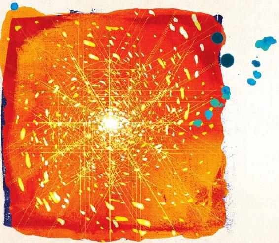

我们全家人搬到美国定居之后，也把十五岁的老狗——凯比——接过来。凯比到达后没多久，某天晚上，它从篱笆上的小洞钻出去。由于我们家靠山，所以情况很不妙。在黑暗中，我们沿着街道和通往山上的小径寻找，却到处都找不到它。

我和女儿在找狗时，“苦恼”的种种负面感觉开始增加。我知道我们必须停止搜寻，然后马上改变心里的感受。负面的感觉让我们知道自己正在想象最糟的状况，我们必须立刻改变感受，并开始想象最好的情形。在那一刻，什么样的结果都可能发生，而我们必须借由想象并感觉到凯比在家，来选择“它安全回到我们身边”这样的结果。

我们于是回家去，假装狗儿跟我们在一起。我们把食物放在它的碗里，仿佛它还在；我们想象听到凯比在玄关走动时项圈发出的铃铛声；我们跟它说话、叫它的名字，仿佛它就在那里；而我女儿上床睡觉时，想象她十五年的好朋友正像往常一样，睡在她床边。

结果隔天一大早，我们在山下的某棵树上发现一张纸条，上面说有人捡到一只小狗，就是凯比。正如我们想象的一样，我们的狗安全回家了。

无论身处什么样充满挑战的状况，都要想象最好的结果，而且要感觉到！当你这么做的时候，将能改变现状，把它变成你想要的模样！

### 你所能想象的一切都已经存在

“创造只不过是把已经存在的东西投射成有形的物体而已。”

《圣典博伽瓦谭》（9 世纪）

古印度经典

无论你所能想象的愿望是什么，它早已存在！它是什么并不重要，只要你想象得到，它就已经存在于创造之中。

五千年前的古老文字就记载着，所有的创造都已完成，任何可能被创造的事物都已存在。而五千年后的现在，量子物理学也证实了，任何事物的每个可能性，此刻已经存在。

“天地万物都造齐了。”

《圣经》创世记第二章第一节

对你和你的人生而言，这代表的意义是：无论你想象生命中要有些什么，它们都早已存在。你不可能想象出不存在的事物。创造已经完成，每个可能性都存在，所以当你想象自己打破世界纪录、到远东地区旅行、身体健康或成为父母，你做那些事的可能性此刻就已存在创造之中！如果它们尚未存在，你没有办法想象。想把你渴望及热爱的一切从无形世界带进你有形的人生，你所要做的就是通过想象力和感觉，对你想要的一切付出爱。

想象你要的生活方式，想象你要的每一样事物。每天都运用想象力，想象如果你的人际关系都很融洽，会是怎样；想象如果你的工作成效突飞猛进，感觉如何；想象如果你拥有可以让你去做自己喜欢的事的金钱，你的人生会怎样；想象如果你非常健康，你有什么感觉；想象如果你可以去做想做的事，感觉如何。运用你所有的感官去想象你想要的一切。如果你想去意大利玩，就想象自己闻到了橄榄油的味道、品尝了意大利面、听见有人对你说意大利文，也触摸到罗马竞技场的石头，然后感觉自己身处意大利！

在跟别人或自己对话时，可以多说“想象一下，如果……”，然后用你想要的事物把句子剩下的部分填完！如果你和朋友聊天时，他一直抱怨同事升了职，他却没有，你就可以说：“想象一下，如果你没有得到那个升迁机会，是因为你可能被调到更高的职位、拿到更多薪水呢？”因为事实上，你的朋友被提升到更高的职位、薪水拿得更多的可能性早已存在，如果他可以想象并感受到这个可能性，就可以接收到！

“原子或基本粒子本身并不真实；它们形成了一个充满潜力或可能性的世界，而不是一个由东西或事实组成的世界。”

沃纳·海森堡（1901—1976）

获诺贝尔奖的量子物理学家

善用你的想象力，创造一些可以让你感觉良好的游戏。不管你想象的是什么，它们都在等着你、都已经在无形世界中被完全创造出来，而要让它们成为看得见的有形事物，就得通过想象并感觉到你喜爱的一切，来驾驭爱的力量。

有一位年轻女士在大学毕业后试着找一份工作，努力了好几个月都找不到。她最大的障碍就是明明没有工作，却要想象自己已经有了。这位年轻女士每天都在日记上写着她很感谢来到自己面前的工作，但依然找不到。然后，她突然领悟了：她拼了命地找工作，等于是大声跟吸引力法则说她没有工作。

所以，这位年轻女士做了下面这些事情，改变了一切：她决定运用自己的想象力，过着如同已经有工作的生活。她把闹钟设定在很早的时间，就像要去上班一样；她在日记上写的不再是她很感激即将来临的工作，而是感谢她在工作上获得的成就，也感谢和她一起工作的同事；她每天计划着要穿什么衣服上班；另外，她还开立了一个薪水专用的账户。在那两个星期内，她觉得自己好像真的已经有工作了，后来出乎意料地有位朋友告诉她某个招聘信息。她前去面试，顺利得到那份工作，然后也接收到她在日记里写下的每一件事。

### 利用道具让自己融入情境

“每当你允许自己的思想被其他人事物牵着走时，就是没有遵循内心的声音；你并未顺从自己的渴望，而是附和别人的。要善用你的想象力，来决定要想什么或要做什么。”

克利斯汀·拉尔森（1874—1962）

新时代思想家

在运用创造过程时，请善用任何道具，来让你感受到自己已经拥有想要的一切。把衣服、图片、照片及相关物品布置在周遭，这样你就可以想象并感觉自己已经拥有想要的事物。

如果你想要新衣服，先确定你的衣橱里有空间、有空的衣架可以放新衣服；如果想要得到更多金钱，那你的皮夹里是不是有地方装钱，或者里头塞满了一堆不相干的小纸片？如果想拥有一个完美伴侣，你必须想象并感觉到那个人现在就和你在一起——你是睡在床中间，或者因为你的伴侣睡在床的其中一边，所以你睡在另一边？如果你的伴侣现在和你在一起，你会只使用衣橱的一半空间，因为你伴侣的衣物会放在衣橱的另一半。你布置的餐桌是两人或一人用的？再准备一个空位是你马上可以做到的小事。你的日常行为尽可能不要抵触自己的愿望，你反而要善用身边的许多道具，让你觉得自己仿佛已经拥有想要的一切。这些都是你可以利用道具和想象力做到的简单小事，却拥有不可思议的强大力量。

有位女士就利用道具和她的想象力，得到了一匹马。她这辈子一直想要一匹马，却买不起。她想要的是栗色摩根骟马，而一匹摩根马要数千美元，于是她便想象每次从厨房窗户向外望时，就能看见那样的马；她将栗色摩根马的照片设定成笔记本电脑的桌面图片，而且只要一有机会，她就随意画马；虽然还买不起，她仍然开始去看要出售的马匹；另外，她带孩子去某家店一起试穿马靴，也看了马鞍，然后买下她负担得起的一些东西，例如马毯、绳索及马刷等，并陈列在她每天看得到的地方。一段时间之后，这位女士去参加镇上的一场马匹展览会。那场展览会上有个抽奖活动，最大奖就是一匹栗色摩根骟马，就跟她想象的一模一样！结果她当然抽到大奖，得到了她的马！

感官也是道具，所以请使用你所有的感官帮助你去感觉自己已经拥有想要的一切。以皮肤感受你想要事物的触感，尝一尝，闻一闻，看一看，听一听！

有位男士就运用感官为自己带来好几份工作机会。他在三年内申请了七十五个职位，却没有得到任何一份工作，但接着他使用了想象力和所有感官，去想象自己已经拥有梦想中的工作。他想象新办公室的每个细节：在想象世界中，他敲打电脑键盘上的按键、闻到新的大红木办公桌上的家具亮光蜡所散发出的柠檬香味；他想象同事的样子，帮他们取名字，跟他们聊天、开会。他甚至吃墨西哥卷饼当午餐。七个星期后，这位男士开始收到面试的通知，然后要求第二次面试的通知也不断出现。后来，他得到很棒的工作机会，而且不止一个，是两个。他接受了他最喜爱的那一个——那正是他梦想中的工作！

你要了解到，当你完成自己在创造过程中负责的部分时，创造就已经完成了！你不再处于那个并未拥有你想要的一切的旧世界，即使还看不见，但你已经进入一个新世界，那个世界包含你要的所有事物。你要知道，你会得到你想要的！

### 力量摘要

·想驾驭生命中的爱的力量带来你渴望的某样东西，或是改变你不想要的某件事，程序都是一样的：想象它，感觉它，然后接收它。

·想象力联结了你和你想要的所有事物。你的渴望加上爱的感觉就创造了吸引力，能把你渴望的一切带来给你！

·要想象你正与自己所渴望的在一起，同时对你正在想象的事物感觉到爱。

·要全心渴望你所要的，因为渴望是一种爱的感觉，而你必须付出爱，才能得到自己喜爱的一切！

·当你想象自己渴望且热爱的任何正面事物时，就是在驾驭爱的力量。要把你的想象力推到极致，无论你要的是什么，都尽可能去想象你所能想到最棒、最美好的状态。

·无论你所能想象的愿望是什么，它早已存在！它是什么并不重要，只要你想象得到，它就已经存在于创造之中。

·在跟别人或自己对话时，可以多说“想象一下，如果……”，然后用你想要的事物完成这个句子！

·善用道具，把衣服、图片、照片及相关物品布置在周遭，这样你就可以想象并感觉自己已经拥有想要的事物。

·感官也是道具，所以请使用你所有的感官帮助你去感觉自己已经拥有想要的一切。感受一下，尝一尝，闻一闻，看一看，听一听！

·当你完成自己在创造过程中负责的部分时，就已经进入一个新世界，那个世界包含你要的所有事物——即使还看不见。你要知道，你会得到你想要的！

## 感觉就是创造

“每当你的感觉和愿望产生冲突时，感觉将会是胜利者。”

纳维尔·高达德（1905—1972）

新时代思想家

### 感觉的磁场

我想让你了解当你通过美好的感觉付出爱时，会发生什么事，因为它的力量真的很强大。你的感觉创造了一个完全包围你的磁场，每个人都被一个磁场围绕，因此无论你到何处，磁场都跟着你。你或许看过古画中出现过类似的东西——画中人物的周围环绕着一圈光环或光晕。这围绕在每个人身边的光环，其实是个电磁场，你正是通过自己周围这个电磁场的磁性，吸引了生命中的一切。而在每个当下决定这个场域是正向或负向的，是你的感觉！

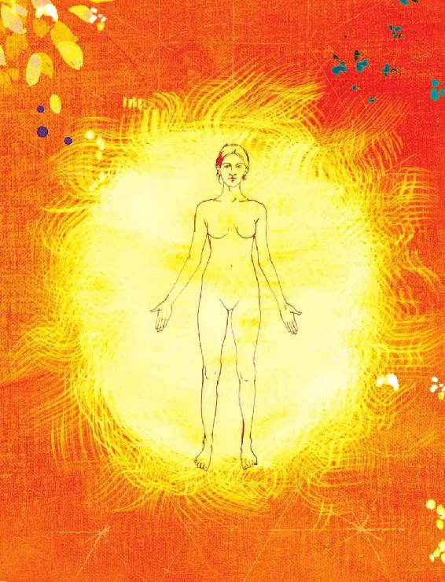

你每次通过感觉、言语或行动付出爱时，就替你周围的场域增添了更多爱；你给的爱越多，你的磁场就越强大。你的磁场里面有什么，就会吸引些什么，所以你磁场中的爱越多，你就拥有越多力量来吸引你喜爱的事物。然后你会来到一种境界：你磁场中的吸引力是如此正向而强大，让你突然想象并感觉到某种美好的事物，不久后，它就会出现在你的生命中！那是你所拥有的不可思议的力量，那就是爱的力量的惊人之处！

“通过思考和感受的能力，你掌控了一切造物。”

纳维尔·高达德（1905—1972）

新时代思想家

我要分享一个发生在我生命中的简单故事，让你知道爱运作得多快速。我很喜欢花，所以会尽量每个星期都去买鲜花，因为花让我觉得很快乐。我通常都去花市买，但那一周正好在下雨，所以花市没开，也就买不到花了。而我觉得没有花可买其实是件好事，因为这让我更珍惜花、更爱花；与其感到失望，不如选择去感受爱，于是我的磁场便充满了对花的爱。

不到两个小时，我就收到了一大束花，是我的姐妹从世界的另一端送的。她送我这束前所未见的美丽花朵，是为了感谢我为她做的某件事。所以，当你可以付出爱时，无论现状如何，都一定会改变！

现在你应该能体会选择去爱有多重要了。每当你给出爱，就会替你周围的磁场增添更多倍的爱；你在日常生活中所能付出的爱越多，你磁场中的爱的吸引力就越强，然后你想要的一切就唾手可得了。

当你给出爱时，你的生命会像这样神奇地改变。我过去的人生充满挣扎和困难，并不像现在这样奇妙，但后来我发现了生命的奥妙之处，也就是我在这本书里跟你分享的一切。对爱的力量来说，没有什么事情大到难以达成，没有太远的距离，没有它不能克服的障碍，甚至时间也无法阻挡它的路。你可以借由驾驭宇宙中最强大的力量，来改变生命中的一切，而你所要做的，就是付出爱！

### 创造的点

你可能会认为自己许的愿望“太大”，但有这种想法是你想太多了。当你认为自己想要的东西太大时，其实是在对吸引力法则说：“这个愿望太大了，要做到会有难度，而且可能要花掉很长的时间。”那么最后你一定会是对的，因为你的所思所感，就是你会接收到的。如果你认为自己的愿望太大，那么要得到你渴望的事物就会变得困难，并且花费更多时间。然而对吸引力法则而言，没有大或小的问题，也没有时间长短的概念。

为了让你对创造抱持正确的观点，无论你的渴望对你来说有多大，都请把它想成一个小圆点！你可能想要房子、车子、假期、金钱、完美伴侣、梦想中的工作或小孩，你可能想要全然的健康，你可能想要通过考试、考上某一所大学、打破世界纪录，你可能想要当总统、成功的演员、律师、作家或老师——无论你想要的是什么，都把它想成一个圆点那般大小，因为对爱的力量来说，你的愿望甚至比一个圆点更小！

“我们的怀疑是叛徒，让我们输掉通常会赢的好事。”

威廉·莎士比亚（1564—1616）

英国剧作家

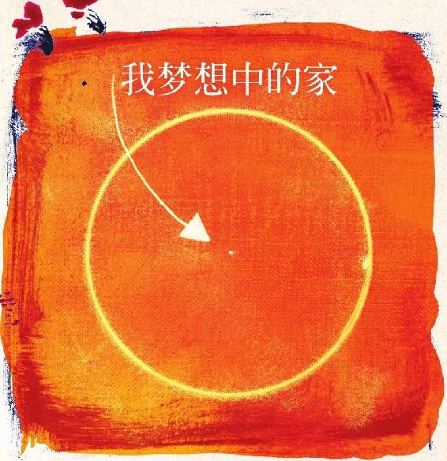

如果你发现自己的信念动摇了，就画一个圆，然后在圆心画一个点，并在圆点旁边写下你的愿望。你可以常常看着圆心的点提醒自己，你的愿望对爱的力量而言，不过就像那个圆点一般大小！

### 如何改变负面事物

如果你的人生出现负面事物，而你想要改变它，过程也是一样的：想象并感觉到你已经拥有自己渴望的事物，借由这种方式来付出爱。要记住，任何负面事物都是缺乏爱，所以你必须想象负面情境的反面，因为它的反面才是爱！举例来说，如果你想让病痛消失，那么就通过想象你的身体已然健康来付出爱。

如果你正在利用创造过程改变某样负面事物，要知道，你无须把负面转成正面，那感觉起来真的很难办到，而且也不是创造运作的方式。所谓“创造”是指某样新事物被造出来，它自然就会取代旧的。你不必去思考自己想改变的是什么，只要对你想要的事物付出爱就行了，然后，爱的力量会为你取代负面事物。

如果一个人受了伤，正在接受治疗，情况却没有好转，那表示他想象并感觉到的状态是创伤多于痊愈。如果想让天平倾向痊愈那一端，就要多想象并感受到自己已经完全恢复健康，而不是想象并感觉自己尚未痊愈。你可以想象到全然康复，表示它早已存在！让你的磁场对能使你感觉良好的一切充满美好的感受，在你人生的每个层面累积爱，尽可能感觉美好，因为你给出爱的每一刻，都会为你带来全然的康复。

“你的感觉就是你的神。”

考底利耶（公元前 350—前 275）

古印度政治家及作家

无论你想改变的是健康、金钱、人际关系或其他任何事物，过程都一样！想象你所要的，想象并感觉到已经拥有它时所涌现的爱，尽可能想象你和自己想要的一切在一起时的每个场景、每个状况，并感受到你现在就已经拥有它了。试着每天花七分钟去想象并感觉自己已经拥有想要的事物，每天都要这么做，直到你觉得好像已经拥有自己渴望的一切，直到你确知你渴望的事物属于你，就像你知道你的名字属于你一样。有些事你可能只花一两天就能到达这种境界，其他事物则可能要花比较久的时间。然后，就继续过你的日子，尽可能给出爱与各种美好的感受，因为你给的爱越多，就会越快得到你渴望的一切。

在想象并感觉到已经拥有自己想要的事物之后，你其实已经和你想象的一切处于一个新世界里，所以不要再告诉大家你的伤势没有改善，那样做会和新世界产生矛盾，因为那表示你又在设想最糟的状况，于是你再次回到了旧世界。当你想象最糟状况时，你就会接收到最糟的；如果你想象的是最美好的情境，就会接收到最美好的。因此，假如有人问你伤口如何，你可以说“我现在觉得百分之百好了，而我的身体正在跟上我的感觉”，也可以说“这是个祝福，因为它让我比以前更珍惜自己的身体和健康”，或者如果你够勇敢，可以说“因为直接面对它，所以我完全恢复健康了”。

谈论不喜欢的事物却不会觉得不舒服，那是不可能的，事情就是这么简单，不过人们因为太习惯大多数时间都感觉不佳，所以当他们在想象和谈论不想要的事物时，甚至不会注意到自己的感觉变得多糟。当你越来越意识到、越来越在乎你的感受时，就会到达一种境界，这时只要稍微往不好的感觉那边倾斜，就算只有一丁点，你都受不了。你会习惯于美好的感受、会很留意自己的感觉，所以只要倾斜了，你马上就会察觉到，并把自己拉回美好的感觉之中。你大多数时间都应该感觉美好且快乐，因为你本来就该拥有美妙的人生，而要得到这样的人生，没有其他方法！

“无论在什么样的情况下，我都决意要保持喜悦与快乐，因为我从经验中学到，我们的快乐或痛苦，很大一部分取决于我们的性情，而不是环境。”

玛莎·华盛顿（1732—1802）

美国第一任总统乔治·华盛顿之妻

### 如何去除不好的感受

你可以借由改变感受来改变生命中的一切。当你改变对某样事物的感受时，它一定会产生变化！但是在改变感受的过程中，不要试图摆脱不好的感觉，因为所有不好的感觉都只是缺乏爱，所以你反而要把爱放进去！不要试图摆脱愤怒或悲伤，当你把爱放进去时，愤怒和悲伤就会消失。你不必从自己身上挖出什么，当你把爱放进你心里，所有不好的感觉通通不见了。

生命中只有一股力量，那股力量就是爱。你要不是因为充满爱而觉得美好，不然就是因为缺乏爱而感觉很差，但你所有的感受都只是爱的程度之别而已。

你可以把爱想成杯子里的水，你的身体就是杯子。当杯子里只有一点点水时，就是缺水状态，而抗拒并试图消除那份空虚，并无法改变杯子里水的高度；但如果将杯子注满水，那份空虚自然不见了。当你感觉不好时，表示你处于缺乏爱的状态，只要你把爱注入自己之内，不好的感觉就会消失。

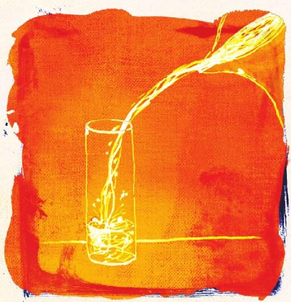

### 不要抗拒不好的感觉

生命中的每件事都有它完美的位置，包括不好的感觉在内。没有那些不好的感觉，你不会知道什么叫美好的感受；你只会一直有种“乏味”的感觉，因为没有对照，所以你不会知道真正的快乐、兴奋或喜悦到底是什么感觉。正是借由感受到悲伤，你才知道快乐的感觉有多美好。你无法将不好的感觉从人生当中去除，因为那是人生的一部分，而且没有它们，你不会有美好的感受！

如果你对产生不好的感觉这件事感觉很差的话，你就是在为不好的感觉增添力量。你不只会让坏感觉越变越糟，还会增加自己释放出去的负面能量。现在你已经了解到，不好的感受无法为你带来你想要的人生，这会让你更谨慎，不让坏感觉控制你。你的感受由你自己主宰，所以如果有不好的感觉在袭击你，切断它能量的方式之一就是放轻松！

“我们的内在有个世界——一个充满思想、感觉与力量的世界，一个充满光与美的世界；虽然看不见，它却具备强大的力量。”

查尔斯·哈尼尔（1866—1949）

新时代思想家

人生本来就该是好玩的！当你玩得很开心时，你会觉得很棒，也就能吸引到很棒的事物！如果你把生命看得太严肃，就会吸引到严肃的事物。开心地玩会为你带来你想要的人生，而把事情看得太严肃的话，则会带来你必须严肃看待的人生。你有掌控自己生命的力量，而且可以用你想要的任何方式，以这股力量来设计你的人生。不过为了你好，还是放轻松一点吧！

要减轻不好的感觉，我会把负面感受想象成一匹匹野马，于是就会有愤怒马、憎恨马、指责马、气愤马、暴躁马、乖戾马、急躁马等，你想得到的都有，一整个马厩都是负面感受的马儿。如果我对已经发生的某件事有些失望，我会对自己说：“你为什么要骑上那匹失望马？现在立刻下来，因为它会往更多失望冲过去，而你不会想去它要去的地方。”因此我把产生不好的感觉想象成骑上野马，既然骑得上去，我就下得来。我不会把不好的感觉当作真正的我或他人，因为那并非事实。坏感觉不是你，也不是任何人，它只是你允许自己去感受的某样东西，而你可以选择很快地跳下那匹马，就跟你骑上去时一样快。

把不好的感觉想象成你骑上去的一匹野马，这是能让你从坏感觉那里取回力量的一个方法！如果你身边的某个人很容易变得暴躁不安，那么你若想象他是骑上了一匹暴躁马，他的坏感觉对你的影响力就会小得多，你将不会把他的暴躁放在心上。但假如你认为那是冲着你来的，你就会因为他们的暴躁而变得暴躁，接着，你就跟着他们一起骑上暴躁马了！

“以德报怨。”

老子（约公元前 6 世纪）

道家创始人

所以面对我不想要的事物，我会用想象力让自己玩得开心，并从我不想要的事物中取回力量。有时看见我自己或其他人在不同的人生境遇中“骑上野马”，我都会大笑一场，而当你可以笑到失去不好的感觉时，就真的了不起了！因为那表示你刚刚改变了你的人生。

所以如果你产生了不好的感受，不要因此责怪自己，而替坏感觉增添更多力量。那样做只是在鞭打那匹野马，让它更疯狂而已。其中的概念就是不要厌恶不好的感觉，而是要刻意且更频繁地选择好感觉。当你抗拒不好的感觉时，它们就会增加！你越不想要，它们增加得越多；你越是抗拒生命中的任何事物，就会带回来越多。所以，当你有不好的感觉时，不要在意，也完全不要抗拒，那么你就能从它们那里取回所有的力量。

### 力量摘要

·每个人都被一个磁场围绕，无论你到何处，磁场都跟着你。

·你通过自己周围这个电磁场的磁性吸引了所有事物，而在每个当下决定这个场域是正向或负向的，是你的感觉！

·你每次通过感觉、言语或行动付出爱时，就替你周围的场域增添了更多爱。

·你磁场中的爱越多，你就拥有越多力量来吸引你喜爱的事物。

·把你想要的事物想成一个圆点那般大小。对爱的力量来说，你的愿望比一个圆点更小！

·你无须把负面事物转化成正面，只要对你的愿望付出爱就行了，因为你想要的东西的创造过程会取代负面性！

·每天花七分钟去想象并感觉自己已经拥有想要的事物，一直做到你确知你渴望的事物属于你，就像你知道你的名字属于你一样。

·生命中只有一股力量，那股力量就是爱。你要不是因为充满爱而觉得美好，不然就是因为缺乏爱而感觉很差，但你所有的感受都只是爱的程度之别而已。

·要减轻不好的感觉，就把负面感受想象成你骑上的一匹匹野马，既然骑得上去，你就下得来。而你可以选择很快地跳下那匹马，就跟你骑上去时一样快。

·只要改变你给出去的，就能改变你接收到的，毫无例外，因为这就是吸引力法则，就是爱的法则。

## 人生随着你……

“命运无关概率，而关乎选择。”

威廉·詹宁斯·布赖恩（1860—1925）

美国政治领袖

人生随着你展现。你生命中经历的每一件事，绝对都是你给出去的思想和感觉的结果——无论你是否察觉到自己曾经释放过那些思想和感觉。人生并非随机发生，而是跟随着你展现。你的命运掌握在自己手上，你想到、感觉到的所有事物，都将决定你的人生。

生命中的一切都呈现在你眼前，让你选择你喜爱的事物！人生就像一本画册，而从中选择你喜爱事物的人是你！不过，你是在选择你喜欢的，还是忙着批判不好的事物，并为它们贴上标签？如果你的人生很不美好，那么你可能曾在无意中为所有你认为不好的事物贴上标签，让它们分散了你的注意力，远离人生目标，因为你的人生目标就是去爱，就是喜悦，就是去选择你喜爱的一切，并远离你不喜欢的事物，这样你就不会选择它们。

### 选择你所爱的

当你看到梦寐以求的车子从街上疾驰而过时，其实是生命正把那部车呈现在你面前！你看到那辆梦想之车时的感觉非常重要，因为假使你选择对那辆车只感觉到爱，没有其他，你就是在把它带到你面前；但如果你因为别人开着你梦想中的车子而觉得羡慕或嫉妒，只会让自己无法拥有那辆车。生命将车子呈现在你面前，让你选择，而你借由感受到爱，选择了那辆车。你有没有发现，重点不在于别人有某样东西而你没有？生命将一切呈现给你，如果你感觉到对它的爱，就会把同样的东西带来给自己。

当你看到一对疯狂热恋的快乐情侣，而你极度渴望拥有一个伴的时候，那就是生命正将这对快乐的情侣呈现在你面前，让你选择。但如果你看到那对快乐的情侣时，觉得伤心或孤单，那就释放了负面能量——你其实是在说：“我想要觉得悲伤且孤单。”你必须对自己想要的事物付出爱。如果你体重过重，而走在路上时刚好有个身材完美的人经过你身旁，你的感觉如何？生命将这个美妙的身材呈现在你面前，让你选择，所以假如你因为自己没有那样的身材而觉得难过，你就是在说：“我不想拥有那样的身材，我要我现在这个过重的身体。”如果你正受某种疾病之苦，而你身边围绕着健康人士，你的感觉如何？生命让你看见健康的人，这样你就能选择健康，所以当你对围绕着你的健康状态感觉到的爱，多于你对自己身体不好感受到的难过，你就为自己选择了健康。

当你对任何人拥有的任何事物感觉良好时，就是在把它带来给自己。当你对别人的成功、快乐或他拥有的美好事物产生好感觉时，你就是从人生画册中选择了那些东西，并且正把它们带来给自己。

如果你遇见的某个人身上具备你希望拥有的特质，要去爱那些特质，并产生美好的感觉，这样你就是在把那些特质带到自己身上。如果某人聪明、漂亮或才华横溢，去爱那些特质，那你就是为自己选择了那些东西。

如果你想成为父母，而且已经努力了很长一段时间，那么每当你看见别的父母亲带着小孩时，都要释放出爱，并产生美好的感觉！如果你因为没有小孩，所以看见别人的孩子就觉得沮丧，那么你就是在排斥小孩，把他们推离你身边。每当你看见孩子时，就是生命正把他们呈现在你面前，好让你可以选择。

当你的对手赢得比赛，当你的同事说老板加他薪水了，当有人中了彩票，当朋友告诉你他们的配偶让他们周末放假作为礼物，或是他们买了一栋漂亮的新房子，或是他们的孩子拿到奖学金时，你应该跟他们一样兴奋。你应该要像发生在自己身上一样兴奋和快乐，因为这表示你在欢迎这些你渴望的事物，你在对它们付出爱，所以能将它们带到自己面前！

当你看到梦想中的车子、快乐的情侣、完美的身材、小孩、别人身上的美好特质，或是任何你想要的事物，表示你和那些事物处于同一频率！这时请感到兴奋，因为兴奋代表你正在选择那样东西。

生命中每样事物出现在你面前，是要让你选择爱什么、不爱什么，但只有爱才能将你想要的一切带来给你。人生的画册中包含许多你不喜欢的东西，所以不要因为对它们产生不好的感觉，而选择自己不想要的事物。评断别人、认为他们很坏，就会为自己带来负面能量；对别人拥有的某样东西感到羡慕或嫉妒，会为自己带来负面能量，同时以强大的力量把你想要的那样东西推开。唯有爱才能为你带来你想要的一切！

“这是每次都会发生在那些真正去爱的人身上的奇迹：他们给出去的越多，拥有的就越多。”

赖内·马利亚·里尔克（1875—1926）

作家及诗人

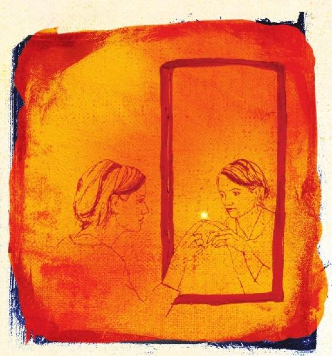

### 一的法则——你！

有一个你可以使用在吸引力法则上的简单公式，在你面对所有人事物时都很有用。对吸引力法则而言，这世界上只有一个人——你！没有别的人、别的事，只有你，因为吸引力法则回应的是你的感觉！你给出去的才重要，这个道理对其他每个人都一样。所以，吸引力法则其实就是“你”的法则；只有你，没有别人。对吸引力法则来说，这个人是你，那个人是你，那些其他人也是你，因为无论你对任何人有什么样的感觉，你都在把那个感觉带来给你。

你对别人的感觉、看法，以及对他所做的事，你都施加在自己身上。论断和批评别人，就是在论断和批评自己；对其他人事物付出爱与感激，就是在爱自己、感谢自己。对吸引力法则来说，没有“其他”这回事，所以即使某人拥有你想要的事物，也没有关系，当你对它产生爱的感觉时，就将它纳进了你的生命里！至于那些你不喜欢的事物，只要不带评判地避开，就不会把它们带进你的人生。

### 吸引力法则永远只会说“是”

远离你不喜欢的事物，不要对它们产生任何感觉；别对你不喜欢的事物说“不”，因为这样会把它们带来给你。当你向你不喜爱的一切说“不”时，就会对它们产生不好的感受，并释放出不好的感觉，然后那些感觉会回到你身上——它们化为负面情境，出现在你的生命里。

不要对任何事物说“不”，因为当你说“不，我不要那个东西”时，反而是在对吸引力法则说“是”。当你说“交通状况糟透了”“这服务烂透了”“他们总是迟到”“这里太吵了”“那个驾驶是个疯子”“我已经在电话线上等很久了”，你就是在对这些事情说“是”，把更多类似的状况纳进你的人生中。

远离你不喜欢的一切，不要对它们有任何感觉，因为它们所是的样子没有问题，但它们在你的生命里没有一席之地。

“非礼勿视、非礼勿听、非礼勿言。”

日本日光东照宫三猿代表的箴言（17 世纪）

相反的，当你看见你喜爱的事物时，要多说“是”。当你听到你喜欢的某件事情时，要说“是的，就是这样”；当你尝到你喜欢的某样食物时，要说“是的，就是这个口味”；当你闻到你喜欢的某个味道时，要说“是的，就是这个味道”；当你摸到你喜欢的某样东西时，要说“是的，就是这个触感”。无论你现在是否已经拥有你喜爱的事物，都对它说“是”，因为如此一来，你就通过付出爱，而选择了它。

这没有任何限制，如果你真的想要、真的渴望，每件事都是可能的。宇宙中没有“匮乏”这回事，当人们发现缺了某样东西，都只是缺乏爱。健康、金钱、资源或快乐从不匮乏，供给和需求是相等的，只要你付出爱，就会得到爱！

### 你的人生——你的故事

你正在创作你的人生故事，那么，你说的故事是什么样子？你相信有些事你做得到，有些事做不到吗？那就是你说的故事吗？然而，那个故事并非事实。

如果有人说你比不上别人，千万不要相信；如果有人说你任何方面都受到限制，别听他的；如果有人说你无法靠兴趣为生，不要听信他的话；如果有人说你不像历史上的伟人那样有价值，不要听他的；如果有人说你现在不够好，必须在人生中证明自己，不要相信他；如果有人说你无法拥有你喜爱的东西、无法做你喜欢的事，或无法成为你想要的样子，别听他的。假如你相信了，就会自我设限，不过更重要的是，那并非事实！从来没有一样事物好到你不能拥有，或者好到不可能是真的。

爱的力量说：“你给出什么，就会得到什么。”这句话里有提到你不够好吗？爱的力量说：“无论你想成为、想做或想拥有什么，都对它付出爱，就一定会得到。”这句话里有说你不够好吗？现在的你就已经很有价值，很值得拥有任何你想要的事物，你现在就够好了。如果你觉得自己曾经做错某件事，请了解到，对吸引力法则而言，你从那件事中获得领悟，并接受它发生的事实，就已经是种赦免了。

### 真实世界

“创世之初只存在可能性，有人观察到时，宇宙才成形。就算观察者是在数十亿年后才出现也没关系，因为我们察觉到宇宙，所以它存在。”

马丁·芮斯（生于 1942 年）

天文物理学家

我想带你去看看你所见的这个世界背后的模样，因为你看到的事物有许多并不如你以为的那样真实。冒险地跨几步进入无形世界，将改变你对这个世界的观点，让你自由，获得一个不受限的人生。

关于这个现实世界，你目前相信的事情大部分都不正确。你其实比你自己所了解的更大、更多，生命和宇宙比你所了解的还要浩瀚。你或许认为世上万物数量有限，金钱、健康和资源都是有限的，但那并非事实。任何事物都不虞匮乏。量子物理学告诉我们有无数个行星地球、无数个宇宙，而我们每一瞬间都能从一个行星地球和宇宙的实相移动到另一个。这就是通过科学浮现的真实世界。

“在我们的宇宙中，我们会将自身频率调整成与物质实相一致；然而，同一个空间里其实有无数平行实相与我们并存——虽然我们无法调整到它们的频率。”

史蒂文·温伯格（生于 1933 年）

获诺贝尔奖的量子物理学家

你可能认为在真实世界中，时间是不够用的，所以你常常要跟时间赛跑，日子过得很匆忙。伟大的科学家爱因斯坦说，时间是幻觉。

“过去、现在和未来的分别只是一个顽固的幻觉。”

阿尔伯特·爱因斯坦（1879—1955）

获诺贝尔奖的物理学家

你或许认为，真实世界是由生物与无生物组成的，然而在宇宙中，每样事物都是活的，没有任何事物不具生命，恒星、太阳、行星、地球、空气、水、火及你所看到的每一件物体都充满生命。这就是正在浮现的真实世界。

“树拥有能感受到你的爱并回应那份爱的感官，而它回应或展现其喜悦的方式跟我们不一样，也不是我们目前可以理解的。”

普兰特斯·马福德（1834—1891）

新时代思想家

你或许相信你看得见的事物才属于真实世界，看不见的就不是真的。事实上，当你看着某样东西时所见到的颜色，并不是它真正的颜色，你看到的其实是物体吸收了它“真正所是”的所有颜色之后，把它“不是”的颜色反射出来的结果。所以，天空实际上并不是蓝色的！

很多声音你听不见，因为它们的频率超过你可以听到的范围，然而它们是真实存在的；你看不到紫外线或红外线，因为它们的频率超过你肉眼看得见的范围，但它们真的存在。如果你把所有已知的光的频率想象成喜马拉雅山那般大小，那么你看得见的部分其实小于一个高尔夫球！

你或许相信真实世界是由你看得见、摸得着的固体所组成，事实上，没有一样东西是固态的！你现在坐着的椅子其实是一股由移动的能量所产生的力量，而且当中大部分是空的。所以，你的椅子有多真实？

“智者了幻非实，故能远离妄执。”

佛陀（公元前 563—前 483）

佛教创始人

你也许认为你的想象力只是一些念头和白日梦，在真实世界不具力量。然而，科学家要证明事情的真假时，其中一个障碍就是把他自己的信念从科学实验中移除，因为他所相信或想象的实验结果，将会影响这个实验的结果。这就是人类想象力和信念的力量！而如同科学家的信念会影响实验结果一样，你的信念也会影响你人生的结果。

你的信念塑造了你的世界，无论它们真实与否。你想象且觉得真实的一切，创造了你的生命，因为你给了吸引力法则那些东西，它们就会回到你身上。你的想象力其实比你看到的世界更真实，因为你眼前所见的世界来自你想象及相信的一切！凡是你相信且觉得真实的，都会成为你的人生。如果你相信你无法拥有梦寐以求的人生，那吸引力法则一定会照你说的去做，然后你的真实世界就会变成那个样子。

“相信你看得见、摸得到的事物根本不是信念，而相信看不见的，则是一种胜利和祝福。”

亚伯拉罕·林肯（1809—1865）

美国第十六任总统

在人类历史中，这种诉说着种种限制的故事代代相传，不过，现在该说出真实的故事了。

### 真实的故事

真实的故事是，你是个不受限制的存在体；真实的故事是，宇宙和世界都是无限的。有许多世界和可能性你看不见，但它们确实存在。你必须开始说一个不一样的故事！你必须开始述说关于你美妙人生的故事，因为无论你说的故事是好是坏，吸引力法则一定会让你接收到，然后你所说的就会成为你的人生故事。

去想象并感觉你想要的一切，之后你就会接收到那些画面。尽可能地付出爱，尽可能地感觉美好，这样爱的力量就会让你喜爱的人事物围绕在你身边。你可以成为你想要的样子、可以做你想做的事、可以拥有你想要的东西。

你爱的是什么？你想要的是什么？

把你人生故事中你不想要的事物丢掉，只保留你喜爱的部分。如果你死抓着过去的负面事物不放，那么每当你又想起，就是在把它们编进你的故事里，然后那些负面事物会立刻回到你人生的画面中！

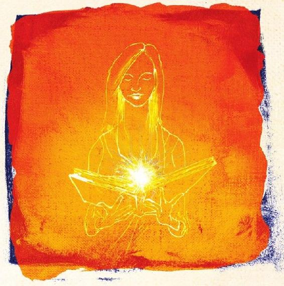

丢掉和你童年时期有关、你不喜欢的事物，保留你喜爱的；丢掉和你青少年及成年时期有关、你不喜欢的事物，保留美好的。只要留下你这一生喜爱的事物就好，过去的所有负面事件早已落幕、早已结束。你不再是那时的你，所以如果它们会让你产生不好的感觉，为什么还要放进你的故事里？你无须把过去的负面事物挖出来，只要别再把它们编进你的故事即可。

“一股全能、永恒且难以理解的力量正推着我们所有人前进。但是，虽然每个人都被推动着，许多人却踌躇不前，并不时回头张望。他们没有意识到，自己其实在对抗这股力量。”

普兰特斯·马福德（1834—1891）

新时代思想家

如果你一直说着关于自己是受害者的人生故事，那些画面就会在你的生命中不断重播；如果你一直说自己的聪明才智、吸引力或才华不如人，那么你会是对的，因为那些内容将成为你人生的画面。

当你让自己的生命充满爱的时候，就会发现罪恶感、怨恨及任何负面感觉都将离你而去。接着，你会开始讲述有史以来最伟大的故事，而爱的力量会借由你美妙人生的真实故事画面，使你的生命发光。

“爱是地球上最伟大的力量，它克服了一切。”

和平朝圣者（1908—1981）

本名为米尔德·里榭特·诺曼，和平主义者

### 力量摘要

·生命中的一切都呈现在你眼前，让你选择你喜爱的事物！

·如果某人拥有你想要的某件事物，要觉得兴奋，仿佛你已经拥有它了。假如你感觉到对它的爱，就会把同样的东西带给自己。

·当你看见自己想要的东西时，表示你和那些事物处于同一频率！

·人生的画册中包含你不喜欢的东西，所以不要因为产生了不好的感觉，而选择了它们。

·远离你不喜欢的一切，不要对它们有任何感觉。相反的，当你看见你喜爱的事物时，要多说“是”。

·吸引力法则回应的是你的感觉！你给出去的才重要。吸引力法则其实就是“你”的法则。

·论断和批评别人，就是在论断和批评自己；对其他人事物付出爱与感激，就是在爱自己、感谢自己。

·当人们发现缺了某样东西，都只是缺乏爱。

·你现在就够好了。如果你曾经做错某件事，对吸引力法则而言，你从那件事中获得领悟，并接受它发生的事实，就已经是种赦免了。

·你的信念塑造了你的世界，无论它们真实与否。

·你的想象力其实比你看到的世界更真实，因为你眼前所见的世界来自你想象及相信的一切！凡是你相信且觉得真实的，都会成为你的人生。

·无论你说的内容是好是坏，都会成为你的人生故事。所以请开始述说你美妙人生的故事，然后吸引力法则一定会让你接收到。

## 力量之钥

“你最珍贵、最有价值的财产和你最伟大的力量是无形的、触摸不到的，没有人可以拿走，你——就只有你——才能把它们给出去，然后你将因为自己的付出，而获得丰足。”

克莱门提·史东（1902—2002）

作家及商人

要运用爱的力量获得你本来就该拥有的人生，“力量之钥”是最强而有力的方式。这些方法简单且容易，就算小孩子都能照着做。每把钥匙都将开启你内在那股巨大的力量。

### 爱之钥

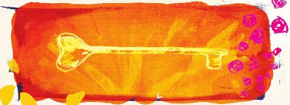

要让爱成为你人生的终极力量，你必须全心去爱，仿佛此生从未爱过。跟生命坠入爱河吧！无论你之前的人生爱过多少，请将那个感觉加倍，变成两倍、十倍、百倍、千倍、百万倍，因为你能感觉到的爱的程度就是这么高！你可以感受到的爱没有限制、没有上限，它全在你之内！你是由爱做成的，那是你、生命和宇宙非常核心的本质，而且你可以远比你过去所爱过、比你想象过的爱得更多。

当你爱上生命时，每一种限制都会消失，你破除了金钱、健康、快乐，以及你在人际关系中体会到的喜悦的限制；当你爱上生命时，就不会有任何阻力，而且无论你喜欢的是什么，几乎都很快就出现在你的生命里。你一走进某个房间，别人就会感觉到你的存在；机会将不断倾泻至你的人生当中，而你最轻微的碰触就能消融负面性；你的感觉会超乎想象的好；你会充满无限的能量，非常振奋，并且对生命拥有不可遏止的热情；你会觉得轻如羽毛，如同飘浮在空气中，而你喜爱的一切似乎都自动来到你面前。只要爱上生命，解放你内在的那股力量，你就会变得毫不受限、所向披靡！

“即使过了这么长时间，太阳也从未对大地说：‘你欠我一份恩情。’看哪！带着如此伟大的爱，它照亮了整片天空。”

哈菲兹（1315—1390）

波斯诗人

那么，要如何爱上生命呢？就跟你谈恋爱时一样——你会喜爱对方的一切！和某人坠入爱河时，你看到的、听见的、说出口的，通通只有爱，而且会全心全意感受到爱！这就是运用爱这股终极力量和生命坠入爱河的方式。

在一天当中，无论你在做什么、无论你身在何处，都要寻找你喜爱的事物。你可以找一找自己喜欢的科技和发明、喜欢的建筑物、喜欢的车子和道路、喜欢的咖啡馆和餐厅、喜欢的商店；逛街时，尽量刻意去寻找你喜欢的东西；在他人身上寻找你喜欢的特质；在大自然中寻找你喜欢的每一样事物：鸟儿、树木、花、香味，以及大自然的各种色彩——要看着、听着、说着你喜爱的一切。

“了解到你是和一股力量同工，这股力量在它经手的事情上从未失手，你就可以带着信心大步向前，因为它同样不会令你失望。”

罗伯特·科里尔（1885—1950）

新时代思想家

去想、去说、去做你喜爱的一切，因为当你做这些事情时，你正在感受爱。

说一说在你的家庭、家人、配偶及孩子身上，有哪些部分是你喜欢的；说一说你喜欢朋友的哪些特质，告诉他们你喜欢他们哪些地方；说一说你摸过、闻过、尝过，且深受你喜爱的东西。

每天都通过挑出你喜欢的事物并感觉到它们，来告诉吸引力法则你所爱的一切。想想看，一天当中光是借由感觉到自己喜爱的事物，你就能给出这么多爱。走在街上时，在别人身上寻找你喜欢的事物；走进店里时，寻找你喜爱的东西；说“我爱那套衣服”“我爱那些鞋子”“我爱那个人眼睛的颜色”“我爱那个人的头发”“我爱那个人的笑容”“我爱那些化妆品”“我爱那个味道”“我爱这家店”“我爱那桌子、灯、沙发、地毯、音响设备、外套、手套、领带、帽子和首饰”“我爱夏天的味道”“我爱秋天的树”“我爱春天的花”“我爱那个颜色”“我爱这条街”“我爱这座城市”。

在各种状况、事件及情境中寻找你喜爱的事物，并且去感受那一切：“我喜欢接到那样的电话”“我喜欢收到那样的电子邮件”“我喜欢听到那样的好消息”“我喜欢这首歌”“我喜欢看到人们快乐的样子”“我喜欢和别人一同欢笑”“我喜欢在开车上班时听音乐”“我喜欢在搭火车或公交车时可以放松”“我喜欢我住的城市举办的节日活动”“我喜欢庆祝活动”“我喜爱生命”。在每个点亮你的心的主题上寻找你喜爱的事物，然后尽可能去感受最深刻的爱。

如果你感觉不好，而你想要改变自己的感受，或者假如你想让自己的美好感觉再好一点，那么就花个一两分钟，在心里列出你喜爱的事物。你可以在每天早上换衣服、走路、开车，或是到任何地方旅行时做这件事。虽然做来很简单，对你的生命却有非常神奇的影响。

提笔写下你喜爱的每一样事物，我建议你一开始每个月列一次这样的清单，之后则是至少每三个月。这张清单可以包括你喜欢的地方、城市、国家，还有你喜爱的人、你喜爱的颜色、你喜爱的风格、你喜爱的人格特质、你喜爱的公司、你喜爱的服务、你喜爱的运动、你喜爱的运动员、你喜爱的音乐、你喜爱的动物，以及你喜爱的花、植物和树。列出你喜爱的所有东西，从你喜欢的各种不同款式的衣服、家、家具、书、杂志、报纸、汽车、设备，到你喜爱的各种不同的食物。想一想你喜欢做的事，并把它们全部列出来，例如跳舞、运动、参观画廊、听音乐会、参加宴会、购物，也列出你喜欢的电影、假期和餐厅。

“当一个人全然地进入爱中，无论世界原本有多不完美，都会变得丰富而美丽——它纯然由爱的机会所组成。”

索伦·克尔凯郭尔（1813—1855）

哲学家

你的工作就是每天尽可能去爱。如果你今天可以尽自己所能去爱每一样事物，去寻找并感受你喜爱的一切，并且远离你不喜欢的那些事物，那么你的明天将充满你想要及喜爱的一切所带来的难以言喻的快乐。

“爱是打开快乐之门的万能钥匙。”

奥利弗·温德尔·霍姆斯（1809—1894）

哈佛医学院院长

### 爱就是留心

你必须留意去感受周遭每一样事物的爱。你必须察觉到身旁的每一样事物，然后去爱，否则你会错过一些事。你必须留心查看你喜爱的事物；你必须注意去听你喜爱的声音；在经过花丛时，你必须注意嗅闻它们动人的香味；吃东西时，你必须仔细留意，才能真正品尝口中的食物，完全感受到它的滋味。如果你走在街上，却只听着脑子里的声音，你会错失一切——那就是常常发生在许多人身上的状况。他们让脑海中的念头催眠自己，所以处于某种恍惚状态，无法察觉周围的任何事。

你是否曾经走在路上，然后一位好友突然大叫你的名字，但因为你没看到他，结果吓了一跳？或者你看见一位朋友，在你大叫她的名字好几次之后，她才突然看到你，然后吓得跳起来？你的呼唤把她叫醒了，因为她并未察觉自己走在街上，而是处于某种恍惚状态，听着自己脑子里的念头。你是否曾经在开车旅行时，突然间看看四周，才发现接近目的地了，但你却不记得已经开了这么长的一段路？你因为倾听自己的念头而催眠了自己，所以心神恍惚。

好消息是，你给出越多爱，就会变得越留神、越有意识！爱能让你完全警觉，当你每天尽可能认真注意身旁那些你喜爱的事物时，就会变得越有觉知、越留心。

### 如何让心智专注在爱

保持觉察的其中一个方法，就是刻意去问你的心智这类问题：“我可以看见哪些我喜爱的事物？”“我可以看见多少我喜爱的事物？”“还有什么东西是我喜欢的？”“我可以看到什么让我激动的事物？”“我可以看到什么让我兴奋的事物？”“我可以看到什么让我充满热情的事物？”“我可以看到更多我喜爱的事物吗？”“我可以听见哪些我喜爱的事物？”当你问你的心智这些问题时，它不得不马上忙着给你提供答案；而为了想出这些问题的解答，它会立刻停止其他念头。

其中的秘诀就在于习惯性地持续向你的心智提问。你问的问题越多，就越能掌控你的心智，然后你的心智会和你合作，并且做你希望它做的事，而不是跟你唱反调。

“心智的清澈明晰，也代表着非常清楚自身热情之所在，这就是为什么一个拥有伟大且清明心智的人能热切地去爱，而且很清楚他爱的是什么。”

布莱士·帕斯卡（1623—1662）

数学家及哲学家

如果没有好好控制自己的心智，那么有时它会像从山上疾驶而下的无人驾驶货运列车。你是你心智的驾驶员，所以要抓住控制权，下指令让它保持忙碌，告诉它你要它去哪里；如果不告诉你的心智要做些什么，它就会照自己的意思往前跑了。

“对那些不控制心智的人来说，心智就像敌人。”

《薄伽梵歌》（约公元前 5 世纪）

古印度经典

你的心智是一个可为你所用的强大工具，前提是，你必须掌控它。你希望它可以帮助你付出爱，而不是任由它用失控的思想来让你分心。训练你的心智专注在爱上，不会花太多时间，而一旦训练完成，你就等着看自己的人生会发生些什么吧！

### 感恩之钥

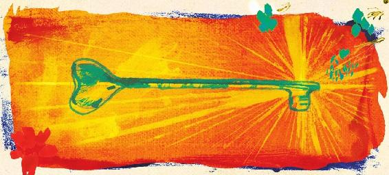

“如果不知感恩，你能行使的力量非常有限，因为让你与力量联结的，正是感恩。”

华勒思·华特斯（1860—1911）

新时代思想家

我知道有数以千计的人们，在难以想象的困境中，通过感恩完全改变了自己的人生。我知道在似乎没有任何希望的情况下，发生过许多健康奇迹：衰竭的肾脏再生、心脏病痊愈、视力恢复、肿瘤消失，以及骨骼自行生长和重建。我知道有原本破裂的人际关系，因为感恩而变得美好：夫妻破镜重圆、疏远的亲人重聚、父母改变了与子女的关系、老师转化了与学生的关系。我见过一贫如洗的人通过感恩变成有钱人：有人挽救了衰败中的事业，而原本一直为钱所苦的人创造了富足，甚至有人本来流落街头，却在一星期之内拥有了一份工作和一间房子。我知道有忧郁的人借由感恩，突然过着喜悦和满足的生活，而原本受焦虑症及其他心理疾病所苦的人也通过感恩，让自己的心智恢复完全健康的状态。

世上每个救世主都运用感恩的力量，因为他们都了解到，感恩是爱的最高表现形式。他们知道在感恩的时候，他们就和法则完全和谐一致，不然你认为上帝为什么在施行每一次奇迹之前，都要先祝谢呢？

每一次你觉得感激时，就是在付出爱，而你给出去什么，就会接收到什么。无论你是对人、车子、假期、夕阳、礼物、新房子或某件让你兴奋的事表达感谢，你都是在对那些事物付出爱，然后你将会获得更多喜悦、更多健康、更多金钱、更多神奇的经验、更多融洽的人际关系、更多机会。

现在就试试看，想着你感谢的某件事或某个人。你可以选择你在这个世上最爱的人，专注在他身上，并且想着所有跟他有关、让你喜爱且感谢的事。接着告诉那个人——在心里默念或大声说出来都行——你爱他、感激他哪些地方，如同他就在你身边一样。告诉他你为何爱他，说出所有的理由。你可以说“我记得当……的时候”来唤起某些特定场合或时刻，而当你这样做时，请感受开始充满你身心的感恩之情。

你在上面那个简单的练习中所给出去的爱，一定会在那段关系和你的一生中回到你身上。通过感恩付出爱，就是那么容易。

爱因斯坦是有史以来最伟大的科学家之一，他的发现完全改变了我们看待宇宙的方式；而当被问到他的巨大成就时，爱因斯坦只说要感谢其他人。有史以来最聪明的人之一都还会去感谢别人给予他的一切——一天感谢一百次！那表示爱因斯坦一天当中至少付出爱一百次，难怪生命会向他展现那么多奥秘。

“我每天会提醒自己一百次，我的内在和外在生活都是仰赖他人——无论活着或已经去世——努力的成果。所以，我必须竭尽全力，希望能以同等的贡献回报我从过去到现在自他人身上所获得的一切。”

阿尔伯特·爱因斯坦（1879—1955）

获诺贝尔奖的物理学家

### 感恩是强大的倍增器

当你感谢你所拥有的事物时，无论它们有多小，你都会得到更多那样的事物。如果你对目前拥有的金钱感恩，不管有多么少，你都会得到更多钱；如果你对一段关系感恩——即使它并不完美——这段关系将会变得更好；如果你对目前的工作感恩——即使它不是你梦寐以求的——你将会在工作中获得更好的机会。因为，感恩是生命中强大的倍增器！

“如果你一生中唯一说过的祷告词是‘感谢你’，那也足够了。”

师长埃克哈特（1260—1328）

基督教作家及神学家

感恩始于简单的三个字——“感谢你”，不过你必须全心全意觉得感恩才行。你越常说“感谢你”，就越能感受到它，然后你就会给出更多爱。想在生活中运用感恩的力量，有三种方式，而这三种方式都是在给出爱：

1.对你人生中已经获得的一切感恩（过去）。

2.对你人生中正在接收的一切感恩（现在）。

3.对你想要的事物感恩，仿佛你已经得到了（未来）。

如果不感谢你从过去到现在得到的一切，你就没有付出爱，因此你不会拥有改变任何现况的力量；而当你对已经得到以及正持续在接收的事物表达感恩时，那些事物会倍增，同时，感恩还会带来你想要的一切！要对你渴望的事物感恩，仿佛你已经得到了，然后根据吸引力法则，你就一定会得到它。

只要感恩，就能让你喜爱的事物倍增，并完全改变你的人生——你能想象比这更简单的事吗？

有个离过婚的男人原本很孤单、沮丧，而且从事一份他很讨厌的工作，后来他决定每天励行爱与感恩，来改变他的生命。他从带着正向态度面对一天当中与他交谈的人开始。当他打电话给老友和家人时，他们对于他变得如此正面和快乐，都感到很惊讶。他开始感谢他拥有的一切，甚至连自来水都谢。于是在一百二十天内，发生了以下这些事：他讨厌的每一件跟工作有关的事，竟奇迹般地改变了，现在他很喜欢自己的工作，而他的工作甚至让他有机会去一些他一直很想造访的地方；他和所有家庭成员之间的关系变得前所未有的美好；他付清了车贷，而且需要钱时就会有钱；无论发生什么事，他总是过得很愉快；另外，他再婚了——对象是他高中一年级时的初恋情人！

“对你已接收到的丰足表达感恩，是让丰足持续下去的最佳保证。”

穆罕默德（570—632）

伊斯兰教创始人

如果感恩一点点，你的人生就会改变一点点；如果每天大量地感恩，你的人生就会以你现在意想不到的方式改变。感恩不只让你生命中的每样事物倍增，还会消除负面事物。无论你发现自己身处什么样的负面情境，总是可以找到值得感谢的事，而当你这么做时，你就驾驭了可以消除负面性的爱的力量。

### 感恩是通往爱的桥梁

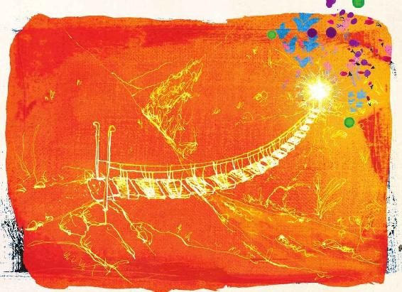

“如果我们能静下来、作好准备，就可以在每一次失望中找到补偿。”

亨利·戴维·梭罗（1817—1862）

超验主义作家

感恩使我的母亲脱离最深沉的悲痛，得到快乐。我的父母几乎是一见钟情，他们的爱情和婚姻是我所见过最美满的。当我父亲过世时，母亲经历了巨大的伤痛，因为她非常想念我父亲；然而在悲伤与痛苦中，我母亲仍开始寻找可以感恩的事物。除了感谢过去几十年来和我父亲在一起时所感受到的爱与快乐之外，她还寻找未来可以感恩的事情。她发现要感谢的第一件事就是，现在她可以去旅行了。旅行是我母亲一直想做、而父亲在世时她没去做的事，因为我父亲从来不想去旅行。母亲的确实现了自己的梦想；她不但去旅行，而且做了其他许多她一直想做的事。感恩是一座桥梁，它让我的母亲走出巨大的伤痛，进而建立了快乐的新人生。

在感恩时，你不可能觉得难过或产生任何负面感觉。如果你目前处境艰难，就去找一件值得感恩的事。找到一件，就接着再找下一件，然后是另一件，因为你找到的每一件值得感恩的事，都能改变当下的状况。感恩是一座桥梁，让你从负面感觉，走向能驾驭爱的力量的境地！

“感恩是疫苗、抗毒素及抗菌剂。”

约翰·亨利·乔怀德（1864—1923）

长老教会牧师及作家

有任何好事发生在你身上，都要感恩；无论多么微不足道，都要说“谢谢”。找到一个理想的停车位、听到电台播出你最喜欢的歌、信号灯刚好变绿，或是在公交车或火车上找到空位时，要说“谢谢”。这些都是你在生活中接收到的好事。

向你的各个感官表达谢意：谢谢让你看得见的眼睛、听得见的耳朵、可以品尝食物的嘴巴、可以嗅闻味道的鼻子，以及让你可以感觉的皮肤。感谢让你行走的双脚，让你用来做几乎每一件事的双手，以及让你能表达意见、与人沟通的嘴巴。感谢你神奇的免疫系统，让你保持健康或痊愈；感谢你所有的器官完美地维持着你的身体，让你活着。感谢你美妙的大脑，这世界上没有任何电脑科技能复制它。你的整个身体是这星球上最伟大的实验室，没有任何事物可以复制它的奇妙之处，连一点点都没办法。你就是一个奇迹！

感谢你的家、你的家人、你的朋友、你的工作，以及你的宠物。感谢太阳，感谢你喝的水、你吃的食物，以及你呼吸的空气——缺了其中任何一种，你就无法存活。

感谢树木、动物、海洋、鸟儿、花朵、植物、蓝天、雨、星星、月亮，以及我们这个美丽的星球。

感谢你每天使用的交通工具；感谢提供你生活所需各项基本服务的每一家公司，让你可以过着舒适的生活。因为有这么多人辛苦、流汗，你才能打开水龙头就有干净的水；因为有这么多人付出毕生心血，你才能按一下开关就有电可用。想象一下有多少人日复一日、年复一年地拼命工作，铺设出遍布全球的火车轨道；而将全世界联结成一个生活网的那些道路，究竟是多少人辛苦铺设出来的，简直难以想象。

“在日常生活中，我们很难理解自己得到的其实远比付出的多，也很难理解唯有通过感恩，人生才会变得富足。”

迪特里希·潘霍华（1906—1945）

路德教派牧师

你要励行感恩，才能使用它的力量。你感觉到的谢意越多，付出的爱就越多；你付出的爱越多，就能得到越多的爱。

身体健康状况良好时，你会感恩吗？或者只有当身体生病或受伤时，你才会注意到自己的健康状况？

一夜好眠时，你会感恩吗？或者你把那些睡得好的夜晚视为理所当然，只有失眠时才会想到自己的睡眠状况？

当一切都很顺利时，你会对自己所爱的人表达感激之情吗？或者只有在出现问题时，你才会去讨论自己的亲密关系？

当你使用某项器具或按下开关时，会感谢电吗？或者只有在停电时，你才会想到电的好处？

你感谢每天都活着吗？

每一秒都是个感谢和倍增你喜爱事物的机会。过去我认为自己是个很懂得感恩的人，但直到实践之后，我才知道真正的感恩是什么。

如果是在开车或走路，我会利用那段时间感谢生命中的每一样事物，连从厨房走到卧室时，我也会表达感恩之情。我会衷心地说：“谢谢给予我这样的生活，谢谢这样的和谐，谢谢给我这样的喜乐，谢谢我的健康，谢谢所有好玩及令人兴奋的事，谢谢生命的奇迹，谢谢我生命中每一件神奇及美好的事。”

要感恩！感恩又不花钱，然而它比世上所有的财富更具价值。感恩让你可以拥有人生中的各项财富，因为无论你感谢的是什么，它都会倍增！

### 玩乐之钥

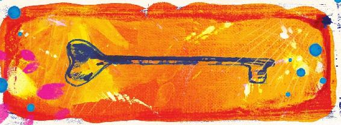

有一种绝对能让你对人生中的任何课题都感觉美好的方法，那就是运用想象力创造一些游戏，然后去玩。玩乐是有趣的，因此当你在玩的时候，你的感觉会十分美好。

从某个时候开始，我们不再像孩童时期那样嬉笑、玩乐，结果长大成人后，我们对生命的态度越来越严肃。但严肃会为你的人生带来严肃的情境，而当你玩乐时，你会觉得很美好——瞧！真正美好的情境就进入你的生命了。

人生应该是有趣的。运用吸引力法则来玩，并利用想象力创造一些游戏，因为吸引力法则不知道也不在乎你是否在想象、在玩，或者它到底是不是真的。无论你想象或感觉到的是什么，都会成真！

### 如何玩内在游戏

“通过小孩子最能让人了解并学会爱的法则。”

圣雄甘地（1869—1948）

印度政治领袖

该怎么玩？就去做你小时候会做的事，运用自己的想象力创造一些让你信以为真的游戏。

举例来说，想象你是个自行车选手，而且你想成为世界上最优秀的一个，并赢得环法自行车赛。你的训练进行得很顺利，眼前只看得到自己的梦想，但是你却被诊断出罹患某种疾病，而且只有百分之四十的存活概率。在接受治疗时，你想象自己正在参加环法自行车赛，那是你生命的竞赛；你想象医疗人员是你的训练团队，在每个检查点给你回馈；每天你都想象自己是在参加计时赛，而且成绩越来越好！你和你的医疗团队一起赢得这场比赛，你战胜了疾病。

一年后，你赢回自己的健康，赢得了环法自行车赛，而且连赢七年，成为历史上唯一达到那项成就的自行车手！这就是兰斯·阿姆斯特朗所做的事。他将最困难的状况当作道具，创造一个想象中的游戏，并实现了自己的梦想。

又比方说，你想要拥有世界上最健美的身材，也想成为美国的知名演员。你住在欧洲的一个小村庄，出身自穷困的家庭，但你依然做着你的梦。你利用一张英雄的照片雕塑自己的身体，并且想象你赢得欧洲健美先生的头衔。这个头衔你包办了七次，接下来，该要成为知名演员了。你到美国去，却没有人相信你是当演员的料，还提出各种你永远无法实现梦想的理由。但是你一直都想象自己变成有名的演员，你可以感受到成功，尝到成功的滋味，而且知道它必定会发生。这就是阿诺·施瓦辛格如何赢得七次“奥林匹亚先生”的头衔，接着又成为好莱坞大明星的故事。

再想象你希望成为伟大的发明家。小时候，你的心智被挑战到极限，幻觉和炫目的闪光让你无法承受。你没有完成大学学业，而且因为神经衰弱而离职。为了从危害你身体的幻觉中解脱，你借由创造自己的想象世界，掌控了你的心智。后来因为想创造一个更美好的未来，你将想象力引导至一些新发明上。你的发明完全是在想象中完成的；你更改发明物的结构、进行改善，甚至操作设备，却从来没有画草图。你在脑子里建造了一间实验室，并且在将你的点子变成实际仪器之前，运用想象力检查新发明物的耐用性。这就是尼古拉·特斯拉成为伟大发明家的故事。不管是交流电动机、无线电、扬声器、无线通信、荧光灯、镭射光、遥控技术，或是他三百多种专利发明的任何一项，全都是用这个方式发展出来的——通过他想象力的力量。

“逻辑带你从 A 走到 B，想象力则带你云游四方。”

阿尔伯特·爱因斯坦（1879—1955）

获诺贝尔奖的物理学家

无论你要的是什么，都请你善用想象力、创造一些内在游戏，然后开心地玩。你可以使用任何道具作辅助。假如你想要减重或拥有更好的身材，那就创造一些游戏，让你觉得仿佛现在就拥有那样的身材。你可以在周遭贴满许多健美身材的照片，但其中的诀窍是：你一定要想象那些身体是你的！你一定要想象且感觉到你是在看着你自己的身体，而不是别人的。

如果你体重过重或过轻，那就想想若你现在就拥有理想体重，你的感觉会如何？应该会和现在的感受不同。跟你有关的每一件事都会改变：你走路的样子、说话的方式和做事的方法都不一样了。现在就像那样走路！现在就像那样说话！而你的举止要如同现在就拥有那个理想体重一样！无论你想要的是什么，都要去想象拥有它时你会有什么感觉，而且现在的行为举止就要像已经拥有它了。你想象且感觉到的是什么，释放出去给吸引力法则的就是什么，然后你一定会接收到它。

兰斯·阿姆斯特朗、阿诺·施瓦辛格及尼古拉·特斯拉——这些人都是运用想象力在玩游戏，并且全心地感受他们的梦想。他们想象的一切如此真实，真实到他们可以感觉到自己的梦想，而且确信它们必定会实现。你的梦想看起来有多遥远并不重要，事实上，它和你的距离比你生命中的任何事物都要近，因为能实现你梦想的所有力量，就在你之内！

“在信的人，凡事都能。”

耶稣（约公元前 5—公元 30）

基督教创始人，《圣经》马可福音第九章第二十三节

未来我们将看到越来越多的证据，证实想象力的力量。科学家已经发现，当你想象自己实际上在做某件事的样子时，特殊的“镜子细胞”会启动大脑中的相同区域；也就是说，只要玩这种内在游戏，去想象你希望经历的事物，你的大脑就会把它当作真的，而做出反应。

如果你正在讲述某件过去或未来的事，此刻，你就在想象、就在感受那些事情，也处于那个频率上，而那就是吸引力法则正在接收的事。当你想象着自己的梦想时，吸引力法则当下就在接收。要记住，对吸引力法则而言，没有时间的区别，只有此时此刻而已。如果你觉得没有及时接收到你想要的事物，那是因为要让你进入和自己渴望的事物相同的频率，需要花费一些时间。而为了和你的渴望进入同一个频率，你必须现在就感觉到已经拥有你渴望的事物那份爱！当你让自己进入同样的感觉频率，并且停留在那里，你所渴望的事物就会出现。

“你可能需要或渴望的一切已经是你的了。通过想象并感觉到你的愿望已经实现，来召唤你渴望的事物，让它成为现实。”

纳维尔·高达德（1905—1972）

新时代思想家

当你对发生的任一件事感到非常兴奋，且觉得很美妙时，要把握住那股能量，去想象自己的梦想。你只要很快地想象并感觉一下你的梦想，就能驾驭那股被渴望的事物激发兴奋感所产生的力量！这就是在玩游戏，非常有趣；这就是创造你的生命的喜悦。

### 力量摘要

#### 爱之钥

·要让爱成为你人生的终极力量，你必须仿佛此生从未爱过般地去爱。跟生命坠入爱河吧！

·只看见爱、只听到爱、只说爱，而且全心全意去感受爱。

·你可以感受到的爱没有限制、没有上限，它全在你之内！你是由爱做成的。

·每天都通过挑出你喜欢的事物并感觉到它们，来告诉吸引力法则你所爱的一切。

·想改变自己的感受，或是想让美好的感觉再好一点，就在心里列出你喜爱的每一样事物！

·你的工作就是每天尽可能去爱。

·每天要尽可能认真注意身旁那些你喜爱的事物。

#### 感恩之钥

·每一次你觉得感激时，就是在付出爱。

·对你人生中已经获得的一切感恩（过去）。对你人生中正在接收的一切感恩（现在）。对你想要的事物感恩，仿佛你已经得到了（未来）。

·你的感恩之情会让你生命中的每样事物倍增。

·感恩是一座桥梁，让你从负面感觉，走向能驾驭爱的力量的境地！

·要励行感恩，才能使用它的力量。有任何好事发生在你身上，都要感恩；无论多么微不足道，都要说“谢谢”。

·你感觉到的谢意越多，付出的爱就越多；你付出的爱越多，就能得到越多的爱。

·每一秒都是个感谢和倍增你喜爱事物的机会。

#### 玩乐之钥

·当你在玩的时候，你的感觉会十分美好——然后真正美好的情境就进入你的生命了。严肃则会带来严肃的情境。

·人生应该是有趣的！

·吸引力法则不知道你是否在想象、在玩，所以无论你在想象中投射出什么、玩些什么，都会成真！

·无论你要的是什么，都请你善用想象力、善用你找得到的任何道具，创造一些内在游戏，然后开心地玩。

·现在的行为举止就要像已经拥有它了！你想象且感觉到的是什么，释放出去给吸引力法则的就是什么，然后你一定会接收到它。

·如果你觉得没有及时接收到你想要的事物，那是因为要让你进入和自己渴望的事物相同的频率，需要花费一些时间。

·当你对任一件事感到非常兴奋，且觉得很美妙时，要把握住那股能量，去想象自己的梦想。

## 力量与金钱

“贫穷始于感觉到贫穷。”

拉尔夫·沃尔多·爱默生（1803—1882）

超验主义作家

你对金钱的感觉如何？大多数人会说他们爱钱，但如果钱不够用，他们对金钱的感觉就一点也不好。假如一个人有他所需要的钱，那么很确定的是，他对金钱就会有好感。所以你可以分辨出你对钱的感受如何，因为如果你没有自己所需的钱，那你对金钱就不会有好的感觉。

若你把眼光放到外面这个世界，会发现大多数人对钱的感觉并不好，因为世界上大部分的金钱和财富都掌握在百分之十的人手中。而有钱人和其他人唯一的差别就是，有钱人对金钱给出的美好感觉多于不好的感觉。事情就是那么简单。

为什么那么多人对金钱没有好感呢？不是因为他们从没拥有过金钱——大多数的有钱人一开始也是一无所有。之所以有这么多人对钱有不好的感受，是因为他们对金钱抱持着负面信念，而那些负面信念是在他们小时候就被灌输到他们的潜意识里，例如，“我们买不起那个”“钱是万恶之源”“有钱人一定不诚实”“想要钱是错的，而且很俗气”“要拥有很多钱，意味着要拼命工作”。

当你还是个孩子时，你对父母、老师或社会告诉你的每一件事，几乎是照单全收。因此在没有深入了解的情况下，长大后你对钱就有了负面感受。讽刺的是，有人告诉你想要钱是错的，同时又有人告诉你必须赚钱谋生，即使那表示你得去做自己不喜欢的工作。甚至有人或许会告诉你，你想谋生的话，只能做某些工作，种类有限。

这些事情没有一件是真的。告诉你这些事的人不是有意的，他们只是在传递自己相信且认为真实的事，但是由于他们相信了，吸引力法则就会让它在他们的生命中成真。现在你已经了解到，生命是以一种完全不同的方式在运作，如果你的人生当中欠缺金钱，那是因为你对钱付出的坏感觉多于美好的感受。

“以无事取天下。”

老子（约公元前 6 世纪）

道家创始人

### 爱是黏力

我出身卑微，就算我的父母不想要很多的钱，他们还是必须很拼命才能使收支平衡。所以我和多数人一样，带着跟金钱有关的负面信念长大。我知道我必须改变对金钱的感受，才能改变我的状况，而且我知道我必须完全改变自己，这样金钱不仅会来到我面前，还会紧黏着我！

我发现有钱人不仅能为自己吸引到钱，还能让金钱黏着他们不放。如果你把世上所有的钱平均分给每一个人，短时间内，钱又会回到少部分人手上，因为吸引力法则一定跟着爱走，所以那些对金钱充满美好感觉的少数人会把钱吸回他们身上。爱的力量移动了世上所有的金钱和财富，而且它是依据法则来移动的。

“这是一个永恒不变的基本原理，本来就存在于宇宙万物、每一个哲学系统、每一种宗教、每一种科学之中。一切都脱离不了爱的法则。”

查尔斯·哈尼尔（1866—1949）

新时代思想家

有人中了彩票时，你可以看到吸引力法则的作用。那些人全心想象并感受到自己会中奖，他们谈论的是当他们赢得奖金时要做的事，而不是如果赢得奖金要做些什么；他们计划并想象当中奖之后会做哪些事，然后他们就中奖了！不过，对大奖得主的调查统计显示了金钱是否会留在他们身上。大多数中了彩票的人，不到几年都会失去所有的钱，而且会比中奖之前负更多债。

会发生这样的事是因为，虽然他们使用吸引力法则中了彩票，但就算发了财，他们对金钱的真正感受并没有改变，于是他们失去了全部的钱。金钱并未附着在他们身上！

当你对金钱的感觉不好时，你就在驱赶它。它永远不会黏着你，即使你获得一笔意外之财，不久之后，你会发现它已经从你的指缝中溜走了——来了更大的账单、东西故障、各种预料之外的状况都发生了，这些事情榨干你的钱，把钱从你的手中拿走。

所以，什么东西才能让钱黏住？爱！爱是带来金钱的吸引力，也是让金钱留住的力量！这跟你是不是个好人没有关系。你是不是好人毋庸置疑，因为你比你所了解的还要伟大。

你必须付出爱，并且对钱感觉美好，才能把钱带来给你，并且让它留下来！如果你现在缺钱，而且信用卡欠债继续增加，你就没有黏力，而且你正在驱赶金钱。

重点不在于你现在处于什么样的财务状态，而你的事业、你的国家或这个世界的财务状态如何也不重要。没有什么情况是“无望的”，即使在大萧条时期，还是有许多人成功，因为他们知道爱和吸引力的法则。他们通过想象且感觉到想要的一切来实践这个法则，并且对抗周遭的情势。

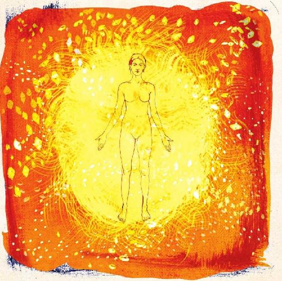

“让我们的生活美好起来，时代就会更美好。我们成就了自己的时代；我们是怎样，这个时代就会是怎样。”

圣奥古斯丁（354—430）

神学家及主教

爱的力量可以突破每个障碍或状况。世界问题对爱的力量来说并不构成阻碍，无论时局是好是坏，吸引力法则都以同样的力量运作。

### 如何改变你对金钱的感觉

当你改变对钱的感受时，你生命中的金钱数量就会产生变化。你对钱的感觉越好，就能为自己吸引到更多钱。

如果你的钱不多，那么收到账单时你的感觉不会好。然而当你对一张巨额账单产生负面反应的那一刻，你就释放出了不好的感受，而可以确定的是，你将收到金额更大的账单。无论你给出去的是什么，你都会接收回来。最重要的是，当你支付账单时，要找个方法——任何方法——让自己感觉美好。绝对别在感觉不好的时候付账，因为你只会替自己带来更大的账单。

要改变自己的感受，你必须使用想象力将你的账单变成某种让你感觉较好的事物。你可以想象它们其实根本不是账单，而是因为你得到了很好的服务，所以好心地决定捐钱给提供这项服务的公司或个人。

把账单想象成你收到的支票，或是对寄给你账单的公司表达感恩，想想看你从他们的服务中得到的好处——例如有电可用或有房子可住。你可以在付账时，在账单的正面写下：“感谢你。已付清。”如果没钱可以马上付清账单，就在账单的正面写下：“感谢你给我这笔钱。”吸引力法则不会质疑你想象且感觉到的是否为真，它只会回应你释放出去的，就是这样。

“你不是根据你的工作或时间来获得酬赏，而是依据你爱的程度。”

圣女加大利纳（1347—1380）

天主教哲学家及圣师

拿到薪水时，要对它感恩，这样它才会倍增！大多数人连别人付他们薪水时也不会感觉美好，因为他们担心是不是每个月都能持续拿到薪水——这些人错失了每次拿到薪水时可以付出爱的美妙机会。当一些钱来到你手中时，无论金额有多小，都要感恩！记住，不管你感谢的是什么，都会倍增！感恩是非常棒的倍增器！

### 把握每个玩内在游戏的机会

要把握每个处理钱的时刻，通过使自己感觉美好，来让金钱倍增。当你支付任何费用时，都要感受到爱！当你把钱交出去时，要感受到爱！你可以借由想象你付的这笔钱对那家公司和里面的所有员工有多大的帮助，来全心感受到爱。这会让你对给出去的钱感觉美好，而不是因为钱变少而有不好的感受。这两者的差别在于，前者让你很有钱，后者则让你一辈子都要为钱奔波。

这里有个你可以玩的游戏，如此一来，你会记得在每次处理钱的时候，要对它感觉美好。请想象一张一美元的钞票，想象钞票的正面代表“正向”，意味着有很多钱，背面则代表“负向”，意味着缺钱。每当你在处理钱时，要刻意让钞票的正面朝向你；钞票放在皮夹时，也让正面朝着你；而付钱时，一定要确保钞票的正面朝上。这样做可以让你把钱当作提示，用来提醒自己要对拥有很多钱感觉美好。

如果你使用的是信用卡，就把有你名字的信用卡正面朝向你，因为信用卡的正面告诉你钱很多，而且有你的名字在上头！

支付任何费用时，当你交出信用卡或钱的时候，要想象收到你的钱的那个人会很富足，而且要真的这么认为。因为你给出去的是什么，就会收回什么！

想象你现在已经很富有，想象你现在已经拥有你需要的所有金钱，这时你的生活会有什么不同？想一想你会做的所有事情。你的感觉如何？你的感觉会不一样，而因为你的感觉变了，所以你走路的样子也会有所不同。你讲话的方式不一样了，你身体保持的姿势和移动的方式不一样了，你对每一件事的反应不同了，你对账单的反应也不一样了。你对生命中所有人事物的反应都会改变，因为你的感觉不同了！你会放松，心情平静，觉得快乐；你会变得随和，对每件事都感到轻松；你会享受每一天，而不是一直想着明天。那就是你想要抓住的感觉，那就是对金钱产生的爱的感觉，而且那份感觉带着吸引力，充满黏性！

“借由想象并感受到你已经拥有自己渴望的事物，来抓住那份与你想要实现的愿望产生联结的感觉，那么你的愿望将会自己显化。”

纳维尔·高达德（1905—1972）

新时代思想家

### 跟金钱说“是”

记住，当你听到别人赚很多钱或很成功时，都要跟着感到兴奋，因为那表示你处在相同的频率上！那是你处于好频率的证明，所以要觉得兴奋，仿佛那件事发生在自己身上，因为你对那个消息的反应将决定一切。如果你的反应是替别人感到喜悦、兴奋，你就是在为自己向更多金钱和成功说“是”；如果因为那件事并非发生在自己身上，所以你的反应是失望或嫉妒，那些不好的感受就是在替你向更多金钱和成功说“不”。如果你听到有人中了彩票，或是听到某家公司的获利破了纪录，要为他们感到兴奋、快乐。事实上，你会听到这种消息，代表你是处在同样的频率上，而如果你对那些人的成就感觉美好，就是在为自己说“是”！

几年前，我的财务状况掉到人生空前的谷底：我有几张已经刷爆的信用卡、公寓抵押贷款金额已到上限，而因为正在制作《秘密》这部影片，所以我的公司负债了好几百万美元。我认为我的财务状况糟透了。我需要钱来完成影片；我了解吸引力法则，知道必须对金钱感觉美好，才能把钱带来给我。但那不是件容易的事，因为我每天都得面对与日俱增的债务、打电话来索款的人，而且我不知道怎样才能付薪水给我的员工。于是，我采取了极端行动。

我走到自动提款机前，从信用卡账户内领了好几百美元。我其实很需要那笔钱来付账单和买食物，但是我把钱放在手中，走到一条繁忙的街道上，然后把钱分送给街上的人。

我在手上放了一张五十美元的钞票，然后走在路上时，我看着迎向我的每张脸，试着决定要把钱给谁；我想把钱分送给每一个人，但我能给的金额有限。我让我的心做选择，把钱分送给各式各样的人。这是我生命中第一次感受到对金钱的爱，但是让我感受到爱的不是钱本身，而是分送钱给人们这件事让我对金钱产生了爱。那天是星期五，事后我带着喜悦的泪水度过整个周末，因为我感受到分送钱是如此美好。

而在星期一下午，一件惊人的事情发生了：通过一连串最不可思议的事件，我的银行户头里竟然收到了两万五千美元。那笔钱真的像是从天上掉进了我的人生和我的账户里。几年前，我买了朋友公司的一些股票，而我忘了这件事，因为股价从来也没涨过。但是那个星期一早上，我接到一通电话，问我是否要出售我的股份，因为股价突然高涨；而在星期一下午之前，出售持股的那些钱就在我的户头里了。

我分送钱不是为了得到更多钱，而是为了感受到对金钱的爱，想改变自己一直以来对金钱那种不好的感觉。如果我是为了得到钱才送出钱，那是没用的，因为那表示我的行动是出于“缺钱”的负面感受，而不是出于爱。但是如果你分送钱，而且在给出去时感觉到爱，那它肯定会回到你身上。有一位男士开了一张一百美元的支票，捐给一个他觉得很值得帮助的慈善单位；就在他开出支票后的十个小时内，他签订了他公司有史以来最大的一笔销售订单。

“重要的不是我们付出多少，而是我们在付出之中放进了多少爱。”

德蕾莎修女（1910—1997）

获诺贝尔和平奖的传教士

如果你正为钱挣扎，可以通过送出金钱丰足满盈的思想给路上遇到的行人，来培养对钱的美好感受。看着他们的脸，想象你送给他们很多钱，想象他们的喜悦，并感觉到它，接着移到下一个人。这是一件很容易做到的事，但假如你真的可以感觉到，它将改变你对钱的感受，也会改变你这一生的财务状况。

### 职业与事业

“没有心的天才是无用之物——单靠杰出的理解力或聪明才智，或是两者兼备，无法成就一个天才。爱！爱！爱！那才是天才的灵魂。”

尼古拉斯·约瑟夫·冯·杰奎恩（1727—1817）

荷兰科学家

爱的吸引力推动了世上所有的钱，无论是谁，只要借由感觉美好来付出爱，就会成为吸引金钱的磁铁。你不必通过赚钱来证明自己，你现在就值得拥有你所需的金钱！你本该为了工作带来的喜悦而工作，你去工作是因为它能带给你刺激和兴奋感，因为你喜爱那份工作！而当你爱你所做的事情时，钱就跟着进来了！

如果你做目前的工作只是因为你认为那是唯一可以让你赚到钱的方法，其实你并不喜欢那份工作，那么你永远吸引不到金钱或你喜爱的工作。你喜爱的工作此刻就存在了，而想要将它带来你身边，你所要做的就是付出爱。去想象并感受到现在已经拥有一份你喜爱的工作，你就会得到它；留意你目前的工作中所有美好的事物，并且去爱那些事物，因为当你给出爱时，你喜欢的一切会随之而来，你喜爱的工作就会走进你的生命中！

有一位失业男子去应征一份他一直想要的工作。应征了之后，他制作了一封假想的录取通知书，里面写明了他的薪水和工作细节；他还设计了印有他名字及公司商标的名片，并且带着能为这家公司工作的感恩心情看着那张名片；而每隔几天，他会写一封电子邮件给自己，恭喜他得到了那份工作。

这位男士通过了电话访谈，进行到了面对十位内部人士的面试阶段。面试结束后两个小时，公司打电话给他，说他得到了那份工作。这位男士获得了他一直想要的工作，而且薪水远超过他在那份假想的录取通知书上写下的金额。

即使你现在不知道自己这辈子想做些什么，你所要做的就是通过美好的感觉来付出爱，那么就能把自己所爱的每一样事物吸引过来。爱的感觉将带领你走向自己的目标。你梦寐以求的工作是在爱的频率上，而想要得到那样的工作，你只要让自己进入那个频率就行了。

“成功并非通往快乐的钥匙。快乐是打开成功之门的钥匙。”

阿尔贝特·施韦泽（1875—1965）

获诺贝尔和平奖的医疗传教士及哲学家

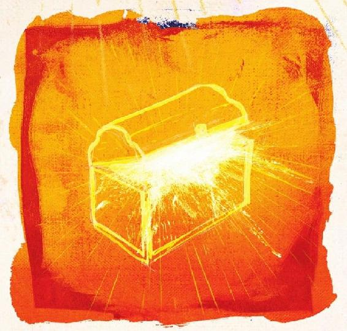

想要在事业上成功，方法也是一样的。如果你有一份事业，但是它的发展不如你预期，那就代表你的事业在某方面不具“黏力”。而事业之所以变得没有黏力，最大的原因就是你对于“不成功”这件事产生了不好的感觉。即使事业一直进行得很顺利，但如果你在状况稍微下滑时，以负面的感觉来回应，那么你会为自己的事业带来更大的衰退。所有能让你的事业一飞冲天到你难以想象的高度的灵感和点子，都在爱的频率上，所以你必须想办法对自己的事业产生美好的感觉，尽量让自己进入最高的频率。

想象、玩乐、创造各种内在游戏，并且去做任何可以提振心情、让你感觉美好的事。当你提升自己的感受时，也同时提升了自己的事业。在人生的各个领域中，每天都要去爱你看到的每样事物、去爱周遭的一切，还要把其他公司的成功当作自己的成功一样去爱。如果你对“成功”真的有美好的感觉——无论那是谁的——你就把成功黏在自己身上了！

在事业或你从事的任何一份工作或劳动中，要确保你付出的价值等同于你从获利或薪水中得到的金钱。如果你付出的价值少于你得到的钱，你的事业或工作注定会失败。你就是不能占任何人的便宜、拿走任何人的东西，因为到头来，你占的是自己的便宜。你付出的价值和你接收到的要永远对等，而要确保做到这一点，唯一的方法就是付出比你得到的金钱更多的价值，如此一来，你的事业和职业生涯将会一飞冲天。

### 爱有无数种方式让你获得想要的一切

金钱只是让你去体验人生中你喜爱的事物的一个工具而已。当你想着用钱可以做到的事所感受到的爱与喜悦，会比只想着钱还要多。去想象你正和自己喜爱的事物在一起、你正在做你想做的事、你已经拥有你喜爱的一切，因为如此一来，你将会比只想着金钱感受到更多的爱。

爱的吸引力有无数种方式让你获得你想要的一切，其中只有一种跟钱有关。不要误以为金钱是你达成某个目标的唯一方法，那是限制性的思想，而你将因此局限了自己的人生！

我的妹妹就通过一连串惊险的事件，吸引到一部新车。在开车上班途中，她的车子被暴洪困在水中动弹不得。在紧急救难人员的坚持下，即使水位并未到达危险高度，她还是被带到没水的干燥陆地上。这期间她一直都在笑，而她被救援的过程甚至成了晚间新闻。我妹妹的车被洪水损坏，无法修复，而在两个星期内，她拿到一张巨额的理赔支票，于是就用这笔钱买了她梦想中的车。

这个故事最棒的部分是，我妹妹那时正在装修房子，所以没有多余的钱买新车，她甚至不敢想象自己能有一部新的车。而她会吸引到一部漂亮的新车是因为，当她听到我们另一个兄弟买了新车时，她开心到掉眼泪。我的妹妹是如此快乐，而且对我们的兄弟买了新车这件事付出许多爱，所以吸引力法则推动了每一个元素、状况及事件，也送了一部新车给她。那就是爱的力量！

你要等到真正获得自己想要的事物时，才会知道最后是如何得到的，但是爱的力量一直都知道。所以不要挡自己的路，而且要有信心。只要想象自己想要的，感受到你内在的快乐，爱的吸引力就会为你找出一个完美的方式，让你接收到自己想要的事物。人类的心智能力有限，但爱的智慧是无限的，它的方式超越我们所能理解的范围，所以不要自我设限，认为你想要的东西只能通过金钱这个方式得到。不要将金钱设为你唯一的目标，你的目标应该是你想成为的人、想做的事或想拥有的事物。如果你想要一栋新房子，那就去想象并感觉到住在里面的喜悦；如果你想要漂亮的衣服、用具或车子，如果你想上大学、搬到另一个国家、接受音乐训练、演戏或从事某项运动——那就去想象它！然后这些事物全部会以无数的方式来到你身边。

### 爱的规则

有一条跟金钱有关的规则：你永远不可以将金钱放在爱的前面；如果这么做，就违反了爱的吸引力法则，而你将承担其后果。爱必须成为你生命中的主导力量，没有其他事物可以凌驾爱。金钱是你可以使用的工具，而你是通过爱把金钱带来的；但如果在你的生命中，你重视金钱甚于爱，将会接收到一大堆负面事物。你不能一边对金钱付出爱，一边又粗鲁无礼地对待别人，因为如果你那样做，就敞开了大门，让负面能量进入你的人际关系、健康、快乐和财务状况中。

“如果想要获得爱，请试着了解，唯一可以得到爱的方法，就是付出爱；付出得越多，就能得到越多；而要给出爱的唯一方法，就是让自己充满爱，直到你成为爱的磁铁。”

查尔斯·哈尼尔（1866—1949）

新时代思想家

你本来就注定拥有活出丰富人生所需的金钱，而不该受财务匮乏之苦，因为受苦会增加这个世界的负面能量。生命的美妙之处在于，当你把爱放在第一位，让你活出丰富人生所需的金钱就会来到你身边。

### 力量摘要

·爱的吸引力推动了世上所有的钱，无论是谁，只要借由感觉美好来付出爱，就会成为吸引金钱的磁铁。

·你可以分辨出你对钱的感受如何，因为如果你没有自己所需的钱，那你对金钱就不会有好的感觉。

·爱是带来金钱的吸引力，也是让金钱留住的力量！

·当你支付账单时，要找个方法——任何方法——让自己感觉美好。把账单想象成你收到的支票，或是对寄给你账单的公司表达感恩。

·当一些钱来到你手中时，无论金额有多小，都要感恩！记住，感恩是非常棒的倍增器！

·当你支付任何费用时，都要感受到爱，而不是因为钱变少而有不好的感觉。这两者的差别在于，前者让你很有钱，后者则让你一辈子都要为钱奔波。

·使用实际的钱当作提示，用来提醒自己要对拥有很多钱感觉美好。想象钞票的正面代表“正向”，意味着有很多钱；而每当你在处理钱时，要刻意让钞票的正面朝向你。

·如果你对“成功”真的有美好的感觉——无论那是谁的——你就把成功黏在自己身上了！

·你付出的价值要等同于你从获利或薪水中得到的金钱；如果你付出的价值比你得到的金钱更多，你的事业和职业生涯将会一飞冲天。

·钱只是让你去体验人生中你喜爱的事物的一个工具而已。爱的吸引力有无数种方式让你获得你想要的一切，其中只有一种跟钱有关。

·想象你正和自己喜爱的事物在一起、你正在做你想做的事、你已经拥有你喜爱的一切，因为如此一来，你将会比只想着金钱感受到更多的爱。

·生命的美妙之处在于，当你把爱放在第一位，让你活出丰富人生所需的金钱就会来到你身边。

## 力量与关系

“即使是短暂的接触，也要对每个人付出你所有的关怀、仁慈、理解和爱，别计较任何回报。从此以后，你的人生将有所不同。”

奥格·曼迪诺（1923—1996）

作家

“付出爱”适用于你生命中的每一件事，也是“人际关系”这个领域的重要法则。爱的力量不会管你是否认识某人，也不管那个人是朋友或敌人、是你爱的人或完全陌生；爱的力量不会在乎你面对的是同事、上司、父母、孩子、学生或店员。面对你所接触的每一个人，你不是在付出爱，不然就是没有付出，而你付出什么，就会接收到什么。

人际关系是你付出爱的最大管道，所以，借由在各种关系中付出爱，就能改变你整个人生。然而，关系同时也可以是你最大的致命伤，因为它们常常是你不付出爱的最大借口！

### 你给别人的，都会回到你身上

历史上的开悟者都告诉我们要爱别人，而你被教导要去爱别人，不是因为这么做你就会成为好人。事实上，这是生命的秘密！你学到的正是吸引力法则！当你爱别人时，你将拥有精彩的人生；当你爱别人时，你将获得你值得拥有的人生。

“因为全律法都包在‘爱人如己’这一句话之内了。”

圣保罗（约 5—67）

基督教使徒，《圣经》加拉太书第五章第十四节

通过仁慈、鼓励、支持、感恩或任何美好的感觉来付出爱给别人，然后这份爱将回到你身上，而且会倍增，为你生命的其他层面带来爱，包括健康、金钱、快乐和职业生涯。

通过批评、愤怒、不耐烦或任何不好的感受对他人释放出负面能量，那个负面能量肯定会回到你身上！而当负面能量回来时，它会倍增，吸引更多负面事物，影响你接下来的人生。

### 与对方无关

你可以借由人际关系状态，立刻判断出你一直在释放的是什么。如果目前的关系很美好，代表你付出的爱与感恩多于负面能量；假如目前的关系出现困难或不顺遂，表示你在无意中释放出的负面能量多于爱。

有些人认为一段关系的好坏都是对方造成的，然而人生不是那么一回事。你不能对爱的力量说：“只有在对方向我付出爱时，我才要付出爱！”除非先给予，否则你什么也得不到！你付出什么，就会得到什么，所以跟对方一点关系也没有——跟你自己才有关！关键完全在于你给出什么，以及你感觉到什么。

你可以借由在那个人身上找出你喜爱、欣赏和感谢的地方，来马上改变任何一段关系。当你更常刻意去寻找自己喜爱的事物，而不是去注意负面事物时，奇迹就发生了。你会觉得对方身上仿佛发生了不可思议的事，但不可思议的其实是爱的力量，因为它消融了负面性，包括人际关系中的负面事物。你所要做的就是通过在对方身上寻找你喜爱的地方，来驾驭爱的力量，然后，那段关系中的一切都会改变！

我知道有许多段关系都是通过爱的力量修复的，但是在这里我要分享一个特别的故事，是关于某位女士利用爱的力量拯救了她原本摇摇欲坠的婚姻。这位女士对她的丈夫已经完全失去了爱；事实上，她无法忍受靠近他。她的丈夫每天都在抱怨、长期生病、忧郁、愤怒，而且对她和他们的四个孩子有言语上的虐待。

当这位女士学到付出爱所能产生的力量时，尽管婚姻有问题，她还是立刻决定要快乐起来。结果，他们家的气氛马上变得更轻松了，而她和孩子们的关系也变得更好。接着，她去翻阅相册，看着他们刚结婚时丈夫的照片。她拿了其中几张，把它们摆在桌上每天看，结果，令人惊奇的事情发生了。她感受到一开始对她丈夫所拥有的那份爱，而当她觉得爱回来了的时候，她心里的爱的感觉开始大幅度增加，到达一种从未有过的程度——她之前从来没有如此爱过自己的丈夫。她的爱强烈到她丈夫的忧郁和愤怒都消失了，而且开始恢复健康。这位女士从本来希望尽可能远离自己的丈夫，转变成两人都想要尽量陪在彼此身旁。

### 爱代表自由

现在要来谈谈在人际关系中付出爱时，很微妙的部分——这也是让许多人无法获得他们值得拥有的生活的原因之一。会觉得微妙、难处理，只是因为人们误解了“给别人爱”的意思；而要弄清楚，首先要了解什么叫作“不是在付出爱”。

试图改变他人，不是在付出爱！认为你知道什么对别人最好，不是在付出爱！认为自己是对的而别人是错的，不是在付出爱！批评、责备、抱怨、唠叨或挑剔他人，不是在付出爱！

“于此世界中，从非怨止怨，唯以忍止怨；此古圣常法。”

佛陀（公元前 563—前 483）

佛教创始人

这里要分享一则我收到的故事，故事中指出了我们在关系里一定要注意的地方。有位男士的妻子离开了他，而且把他们的孩子都带走了。这位男士一蹶不振，他怪罪他的妻子，而且拒绝接受她的决定。他持续跟她联络，决心尝试各种方式，来改变她的心意。也许他认为这么做是出于对妻子和家人的爱，但他的行为并不是爱。他责怪妻子结束他们的婚姻，认为她是错的，自己才是对的；他拒绝接受妻子为她自己所做的选择。由于他不停地骚扰他的妻子，所以被逮捕了，而且被关进监牢里。

这位男士最后了解到，当他否决了他太太选择她想要什么的自由时，并不是在付出爱，结果，他失去了他的自由。吸引力法则就是爱的法则，你不能违反它；如果违反的话，你就毁了自己。

我分享这个故事的理由是，要结束一段亲密关系，对很多人来说是很困难的。你不能否定别人选择他们想要什么的权利，因为那不是在付出爱。虽然在你觉得心碎时，还要尊重每个人选择的自由和权利，简直像要吞下一颗很苦的药丸，但你必须这样做。你给别人什么，就会接收到什么，所以当你否定他人选择的自由时，就会吸引那些会否定你自身自由的负面事物。也许是你的收入减少了、健康出了状况，或是工作绩效衰退，因为这些事情都会影响你的自由。对吸引力法则而言，没有“别人”这回事，不管你给出去的是什么，都会回到你身上。

对别人付出爱，不代表你允许他们以任何形式践踏你或伤害你，因为那也不是在付出爱；而允许别人利用你，不是在帮助那个人，当然对你自己也没有任何帮助。爱是困难的，我们通过爱的法则学习、成长，而在这学习过程中，我们会经历许多后果。所以，允许他人利用或伤害你并不是爱，真正的答案是，要尽可能让自己处在美好感觉的最高频率上，这么一来，爱的力量会为你解决任何状况。

“每当有人侵犯我，我会努力提升自己的灵魂，让这个侵犯影响不了我。”

勒内·笛卡尔（1596—1650）

数学家及哲学家

### 关系的秘密

生命将各种事物呈现在你面前，让你可以选择自己喜爱的。而生命给你的礼物的其中一部分是，你会遇到各式各样的人，因此你可以在那些人身上选择你喜爱的地方，然后避开你不喜欢的部分。你不用刻意对不喜欢的人身上的特质产生爱的感觉，只要转身离开，不要对它们有任何感觉就行了。

远离他人身上你不喜欢的一面，代表你轻松以对，而且很清楚生命给了你选择权。你不必和他们争论谁对谁错，或是去批评、责备他们，或者认为你才是对的，而想要改变他们。因为如果你做了这些事，就不是在付出爱——确实就是这样！

“仁慈的人善待自己；残忍的人扰害己身。”

所罗门王（约公元前 10 世纪）

《圣经》中的以色列王，箴言第十一章第十七节

当你在爱的感觉频率上时，只有那些跟你处于同一频率的人才能进入你的生命。

你知道有些日子你会感到非常快乐，有些日子则觉得恼怒，有些日子又会觉得难过。你可以是许多不同版本的自己，而跟你有关系的人也可以有许多不同的面貌，包括快乐、恼怒或悲伤。毋庸置疑地，你会见到他们以不同的版本出现，但每一种版本都是那个人。当你快乐时，只有他人的快乐版本才能进入你的生命中，但是你必须先快乐起来，才能接收到其他人的快乐版本！

不过这并不表示你要为别人的快乐负责，因为每个人都要负责自己的人生和快乐。上一段内容的意思是，你所能做的除了让自己快乐起来之外，没有别的了，剩下的，就交给吸引力法则去处理。

“快乐取决于我们自己。”

亚里士多德（公元前 384—前 322）

希腊哲学家及科学家

### 个人情绪教练

要在冲突或棘手的人际关系中，把那根刺拔掉，其中一种方式是把那些人想象成你的“个人情绪教练”（PETs, Personal Emotional Trainers）！爱的力量为你准备了许多个人情绪教练，他们伪装成一般人，全都是为了训练你去选择爱！

有些人可能是温和的个人情绪教练，因为他们不会太逼迫你，所以你很容易就喜欢他们；有些人或许是严格的个人情绪教练，因为他们把你逼到极限，就像某些个人体能教练一样。不过，他们可以让你更坚决，无论如何都要选择爱。

个人情绪教练会利用各种状况和策略来挑战你，但请记住一件事：每个呈现在你面前的挑战，都是为了让你可以选择去爱，并且远离负面性和责备。有些教练也许会刺激你去评判他们或其他人，但是不要上当，因为评判是负面的，那并不是在付出爱。所以，如果你无法喜爱某人或某事当中的美好，就转身离开。

有些教练也许会借由招惹你，让你想复仇、生气或怨恨来测试你。这时，你可以通过在生活中寻找你喜爱的事物，来远离他们。有些教练甚至会用罪恶感、无价值感或恐惧来打击你，这时也不要上当，因为任何一种负面性都不是爱。

“恨使生活瘫痪无力，爱使它重获新生。恨使生活混乱不堪，爱使它变得和谐。恨使人生漆黑一团，爱使它光彩夺目。”

马丁·路德·金（1929—1968）

浸信会牧师及人权领袖

如果你把生命中遇到的人想象成你的个人情绪教练，在处理棘手的人际关系时会有很大的帮助。严格的教练能使你更坚决，无论如何都决定要选择爱。但他们也给了你一个讯息：他们正在告诉你，你让自己掉到负面的感觉频率上了，而你必须感觉好一点，才能脱离！除非你已经处于同样的负面感觉频率中，否则没有人能进入你的生命，并带来负面影响。假如你是在爱的感觉频率上，别人有多严格、多负面都不重要，因为他们不会、也无法影响你！

每个人都只是在做自己的工作，就像你也只是在做自己的分内事，成为其他人的个人情绪教练而已。没有敌人，只有一些很棒的个人情绪教练，以及一些严格的个人情绪教练——他们让你变得非常棒。

### 吸引力法则的黏力

吸引力法则是有黏力的。当你为别人的好运开心时，他们的好运会“黏”着你！当你钦佩或欣赏他人的任何一项特质时，你正把那些特质“黏”在自己身上；反之，当你想着或讨论跟某人有关的负面事情时，你也是在把那些负面的事情“黏”在自己身上，而且把它们放进你的生命中。

吸引力法则会回应你的感觉。你给出去什么，就会得到什么，因此如果你为生命中的任何人事物贴上标签，其实是在把标签贴在自己身上，那就是你会接收到的。

这是个很好的消息，因为这表示你可以借由在他人身上寻找你喜爱的事物，并全心全意对它们说“是”，来将你喜欢和想要的一切黏在自己身上！这个世界就是你的画册，而当你了解你的爱所具备的力量时，在他人身上留意你喜爱的事物就成了一份全职工作，不过，这是改变你整个人生最容易也最棒的一种方式。它能战胜挣扎和痛苦，而你所要做的，就是注意他人身上让你喜爱的地方，并远离你不喜欢的部分，这样你就不会对它们产生任何感觉。是不是很容易？

“第一步，保有良好的思想，第二步，传讲良善的话语，第三步，行出美好的事迹，我就进入了天堂。”

阿尔塔·维拉夫书（约公元 6 世纪）

祆教经典

### 八卦也有黏性

八卦表面上看似无伤大雅，但它会在人们的生活中引起许多负面的事情。谈论八卦时，没有在付出爱，而是释放出负面能量，那正是你之后会接收到的。被说闲话的人并不会受到伤害，会受伤害的是那些聊八卦的人！

当你和家人或朋友聊天时，他们告诉你关于某人说过或做过的负面事情，他们就是在八卦，而且正在释放负面能量。而当你听他们说人是非时，你也正在释放负面能量，因为你是一个有感觉的存在体，所以听到负面的事情时，你的感觉一定会迅速低落。当你和同事边吃午餐边聊天，而你们两个都在讲某人的闲话时，那就是在八卦，而且你正在释放出负面能量。当你谈论或听到负面的事情时，不可能会有美好的感觉！

所以坦白说，我们必须小心不要插手去管别人的闲事，不然他们的事会变成我们的事！除非你想要有那样的经验，不然就远离八卦，不要有任何感觉。这样你不仅帮了自己，也帮助了那些不知道八卦会为他们的人生带来这么大负面影响的人。

如果你发现自己正在道人长短，或是听别人聊八卦，可中断对话，然后说“但是我很感谢……”，接着以被人说闲话的那个人身上某项美好的特质，来填完这个句子。

“若以染污意，或语或行业，是则苦随彼，如轮随兽足。若以清净意，或语或行业，是则乐随彼，如影不离形。”

佛陀（公元前 563—前 483）

佛教创始人

### 你的回应就做出了选择

生命将各种人事物呈现在你面前，让你选择你喜爱什么、不喜爱什么。当你对任何事物做出反应时，你是用你的感觉在反应，而当你这样做时，你就选择了那样事物！你的反应无论是好是坏，都会把那样事物黏在你身上——事实上，你是在说：“我还要更多类似的东西！”所以重要的是，要留意你在人际关系中的反应，因为无论你反应的感觉是好是坏，它们就是你给出去的感觉，而你将会接收到更多让你产生类似感受的事件。

如果有人说了或做了某件事，然后你发现自己感到心烦意乱、被冒犯或生气，请尽可能立刻改变那个负面反应。光是察觉负面反应，就能马上除去负面感觉的力量，甚至可以停止它们。但如果你觉得负面感觉似乎紧抓着你，最好先离开一下，并且花几分钟去寻找你喜爱的事物，找到一个之后，再找下一个，直到你觉得好多了为止。你可以利用你喜爱的任何事物来让自己感觉好一点，例如听你最喜欢的音乐、想象你喜欢的事物，或是做你喜欢的事。你也可以想一想那个让你心烦意乱的人身上有什么你喜欢的地方。这或许很难，但如果你做得到，它是让你感觉变好最快的方式，也是使你得以控制自己的感觉的捷径！

“一个能控制自己的人，可以终止忧伤，就像他可以创造出愉悦一样。我不想任凭自己的情绪处置，我想使用、享受及掌控它们。”

奥斯卡·王尔德（1854—1900）

作家及诗人

你可以改变你人生中的任何负面情境，但这无法通过不好的感受做到。你必须对负面情境采取不同的反应，因为如果你的反应一直是负面的，不好的感受会让负面能量扩大并加倍；而当你给出美好的感觉时，正面性会扩大且倍增。就算你无法想象某个特定情境怎么可能转变成正面的状况也没关系——反正它就是可以！爱的力量总能找到方法。

### 爱是盾牌

如果要除去他人负面性的力量，且不受其影响，那就要记得每个人周围都有个感觉磁场。有爱、喜悦、快乐、感恩、兴奋、热情，以及各种美好感觉的磁场，也有愤怒、沮丧、挫折、憎恨、复仇欲望、恐惧，以及各种负面感觉的磁场。

被愤怒磁场包围的人根本无法产生美好的感觉，所以如果你出现在他们面前，他们很可能会把气出在你身上。那些人并非有意伤害你，只是当他们通过愤怒的磁场看这个世界时，看不到任何美好的事物，只能看见那些让他们生气的事。而因为那些人只看得见愤怒，所以他们很可能会生气，并且把怒气发泄在他们看到的第一个人身上——通常是他们所爱的人。这种情况听起来是不是很熟悉？

当你感觉很好时，你磁场的力量会创造出一面盾牌，没有任何负面能量可以穿透。因此，不管任何人对你释放出什么负面能量都没关系，它都触碰不到你；它会被你的感觉场弹开，对你不会造成任何影响。

另一方面，假如有人对你大声咆哮，而且你受到他们说的话影响，那你就知道自己的感觉一定往下沉了，因为负面能量穿透了你的感觉场。发生这种状况时，你唯一能做的就是找个借口、礼貌地先行离开，这样你才能让自己重新恢复美好的感觉。当两个负面场域彼此接触时，其威力会瞬间倍增，从中不可能产生任何美好的事物。你会由自己的人生经验中得知这个道理：两个负面场域碰在一起，不是什么美好的景象！

“浊以静之徐清。”

老子（约公元前 6 世纪）

道家创始人

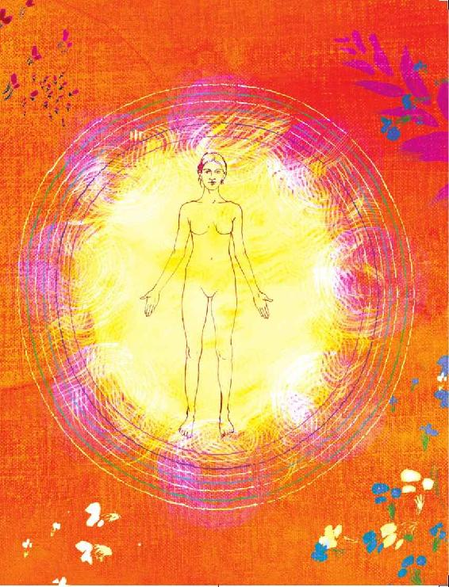

如果你产生了悲伤、失望、沮丧或任何负面感觉，你就是在通过那个感觉场去看世界，那么这个世界在你看来就会是悲伤、失望、沮丧的。你无法通过一个坏感觉的场域看见任何美好的事物。不只是你的负面场域会吸引更多负面能量，而且在改变自己的感受之前，你绝对找不到任何问题的解决之道。所以，相较于想方设法、试图改变外在世界的环境，改变自己的感受反而比较容易。世上所有的实际行动都无法改变状况；其实只要改变感受，外在环境就会跟着改变！

“这股力量来自你的内在，然而，如果不把这力量给出去，就无法得到它。”

查尔斯·哈尼尔（1866—1949）

新时代思想家

当某人被喜悦的磁场包围时，你可以感受到他的喜悦穿越整个房间触动了你。有些人广受欢迎且个性极具吸引力，其实是因为他们大多数时候都感觉良好。围绕着他们的喜悦场的吸引力如此之大，把所有人事物都吸到他们身边了。

你越是付出爱且感觉美好，你磁场的吸引力就会越来越强，范围也越来越大，把你喜爱的所有人事物都吸引到你身边！想象一下那种景象吧！

### 爱是联结一切的力量

“天下之人皆相爱，强不执弱，众不劫寡，富不侮贫，贵不傲贱，诈不欺愚。”

墨子（约公元前 470—前 391）

中国哲学家

你每天都有机会通过美好的感受付出爱给别人。当你觉得快乐时，肯定会释出正面能量和爱给你接触到的任何人；而当你付出爱给他人时，爱就会回到你身上，而且是以远比你所能理解的更棒的方式回来。

当你对其他人付出爱时，如果你的爱对他们产生的影响很正面，以至于他们也付出爱给其他人，那么无论有多少人受到正面影响、无论你的爱传到多远的地方，那份爱全部都会回到你身上。你不只会收到你给最初那个人的爱，还会收到来自每一个受到影响的人的爱！而爱会化为各种正面的人事物，回到你身上。

另一方面，如果你对别人的影响太负面，导致他继续对另一个人产生负面影响，那么负面能量将全部回到你身上。它会化为影响金钱、你的职业、你的健康或你的人际关系的负面状况，让你接收到。无论你给别人什么，都会回到你身上。

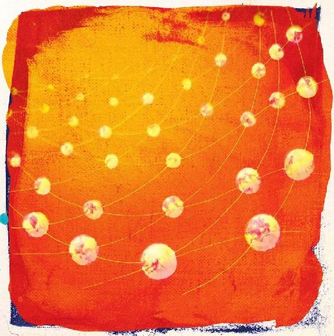

“如果外在事件使你苦恼，造成痛苦的并非事件本身，而是你对事件的看法；你随时有力量可以终止这个看法。”

马可·奥勒留（121—180）

古罗马皇帝

当你觉得充满热忱、快乐和雀跃时，那些美好的感觉会感染与你接触的每一个人。即使你只是在一家商店、公交车上或电梯里和某人短暂邂逅，当你的美好感觉让你接触到的任何人有所不同时，那个状况都会对你的人生产生难以想象的影响。

“要记住，没有所谓的小善行，每个行为都会创造出无止境的涟漪。”

史考特·亚当斯（生于 1957 年）

漫画家

爱是每段关系的解决之道和答案，你永远无法借由负面能量来改善关系。把“创造过程”运用在你的人际关系上，借由付出爱来获得爱。把“力量之钥”运用在你的人际关系上，留意你喜爱的事物，列出你喜爱的事物，谈论你喜爱的事物，然后要远离你不喜欢的。想象拥有完美的人际关系，尽可能想象到最高境界，并且全心地感受到已经拥有那样的关系。如果你发现很难对某段关系产生美好的感觉，那就去爱你周遭其他每一件事，别再去注意那段关系中的负面事物！

爱能为你做任何事！而你所要做的，就是借由感觉美好付出爱，那么你关系里的任何负面能量都会逐渐消失。每当你在人际关系中遇到负面状况时，解决之道都是爱！你不会、也永远不可能知道它将如何被解决，但只要你持续感觉美好并付出爱，事情就是会解决。

这个来自老子、佛陀、耶稣、穆罕默德及每一位伟人的讯息是如此响亮、清晰——去爱吧！

### 力量摘要

·面对你所接触的每一个人，你不是在付出爱，不然就是没有，而你付出什么，就会接收到什么。

·通过仁慈、鼓励、支持、感恩或任何美好的感觉来付出爱给别人，然后这份爱将回到你身上，在你生命的每个层面倍增。

·在一段关系中寻找自己喜爱的事物，而不是去注意负面事物，那么你会觉得对方身上仿佛发生了不可思议的事。

·试图改变他人、认为你知道什么对别人最好、认为自己是对的而别人是错的，都不是在付出爱！

·批评、责备、抱怨、唠叨或挑剔他人，都不是在付出爱！

·你必须先快乐起来，才能接收到其他人的快乐版本！

·爱的力量为你准备了许多个人情绪教练，他们伪装成一般人，全都是为了训练你去选择爱！

·你可以借由在他人身上寻找你喜欢的地方，并全心全意对那些特质说“是”，来将你喜欢和想要的一切黏在自己身上！

·当你谈论或听到负面的事情时，不可能会有美好的感觉！

·生命将各种人事物呈现在你面前，让你选择你喜爱什么、不喜爱什么。当你对任何事物做出反应时，你是用你的感觉在反应，而当你这样做时，你就选择了那样事物！

·你无法通过不好的感受改变你人生中某个负面情境；如果你的反应一直是负面的，不好的感受会让负面性扩大并加倍。

·当你感觉很好时，你磁场的力量会创造出一面盾牌，没有任何负面能量可以穿透。

·相较于设法、试图改变外在世界的环境，改变自己的感受反而比较容易。只要改变感受，外在环境就会跟着改变！

·你越是付出爱且感觉美好，你磁场的吸引力就会越来越强，范围也越来越大，把你喜爱的所有人事物都吸引到你身边！

## 力量与健康

“我们内在的自然力量，才是疾病真正的治疗者。”

希波克拉底（约公元前 460—前 370）

西方医学之父

健康指的是什么？你也许以为健康表示你没有生病，但健康的意义远不止这样。如果你觉得还好、普通或没什么特别的，你并不健康。

健康意味着和小孩有同样的感受。小孩子每天都活力充沛，他们的身体感觉起来轻盈且有弹性，移动时毫不费力；他们脚步轻快、心智清澈，快乐且没有烦恼和压力；他们每晚都睡得很沉、很安稳，而且隔天醒来非常有精神，似乎脱胎换骨；他们对每个新的一天都觉得充满热情和兴奋——看看小孩子吧，你会知道健康真正的意义。你过去曾有过这样的感受，而你现在仍然应该有！

你大部分时间都可以有如此感受，因为通过爱的力量，你可以持续享有无限的健康！绝对不会有任何时刻有东西从你身上消失，你想要的都是你的，包括无限的健康，但你必须敞开心扉来接收它！

### 你相信的是什么？

“因为他心怎样思量，他为人就是怎样。”

所罗门王（约公元前 10 世纪）

《圣经》中的以色列王，箴言第二十三章第七节

这是有史以来最伟大的智慧话语之一，不过，“因为他心怎样思量，他为人就是怎样”是什么意思？

你心里想的就是你认为真实的事。所谓信念，就是重复的念头加上强烈的感觉，例如“我很容易感冒”“我的胃很敏感”“我觉得减肥很难”“我对那个过敏”“咖啡让我保持清醒”，这些全是信念，而非事实。信念就是你在做决定时已经有定论了，你关上门、钉死，然后把钥匙丢掉，没有协商的空间。然而，无论你的信念对你是好是坏，你相信并觉得真实的事物，对你而言就会变成真的。因为吸引力法则是这么说的：不管你释放出去的信念是什么，都一定会回到你身上。

许多人对疾病抱持的恐惧信念多于他们对健康拥有的美好信念。这并不让人意外，因为这个世界的焦点都集中在疾病上，而且你每天都被那些讯息包围。由于人们越来越害怕疾病，所以尽管医学如此发达，疾病还是持续增加。

你对健康的美好感觉多于你对疾病的负面感受吗？你比较相信人一辈子都可以很健康，而不是疾病无法避免吗？如果你相信你的身体状况会随着年纪衰退，而且疾病是无法避免的，你就是在释放那个信念，然后吸引力法则一定会让那样的健康和身体状况回到你身上。

“因我所恐惧的临到我身，我所惧怕的迎我而来。”

《圣经》约伯记第三章第二十五节

医学上的“安慰剂效应”就证明了信念的力量。他们让一组病人接受真正的药物或治疗，另一组得到的则是安慰剂——可能是糖锭或假的治疗方式——不过两组人都没有被告知何者才有治疗他们的症状或疾病的功效。然而，获得安慰剂的那组通常会觉得健康状况有重大改善，症状减轻或消失了。安慰剂效应的惊人结果通常显示了信念对我们的身体所产生的力量。你通过信念或强烈的感觉持续给予身体的东西，之后一定会在你的身体上显现出来。

你的每个感觉都会渗入你全身每一个细胞和器官。当你有美好的感觉时，你就在付出爱，然后你会以惊人的速度通过你的身体接收到健康的完全力量；而当你产生不好的感觉时，紧张的状况会让你的神经和细胞收缩、体内重要化学物质的生产发生变化、血管收缩、呼吸变浅，这些全都会减少你的器官和整个身体里的健康力量。所谓疾病，只是因为紧张、焦虑和恐惧等负面感觉，而使得身体长期处于无法放松的状态所造成的结果。

“你的情绪会影响你体内每一个细胞。心智和身体、心理层面和身体层面，是互相影响的。”

汤玛士·塔特科（生于 1931 年）

运动心理学家及作家

### 你身体里的世界

你的体内有一整个世界！想要了解你对自己的身体所拥有的力量，你必须知道这个体内世界，因为它完全听命于你！

你身体里面的每个细胞都有它扮演的角色，而它们都为了让你的生命持续下去这个唯一的目标而彼此合作。有些细胞是特定区域或器官的领导者，负责管理和指挥自己区域内——例如心脏、大脑、肝脏、肾脏及肺脏——所有的工作细胞。某个器官的领导细胞会指挥和管理其他细胞在该器官工作，以确保秩序及和谐，让器官完美运作；巡逻细胞则在你体内长达九万六千公里的血管里四处游走，以维持秩序及和平。当有皮肤擦伤之类的干扰发生时，巡逻细胞会马上发出警讯，然后适当的修复队伍会立刻赶到那个区域。以擦伤来说，首先赶到现场的是血液凝固小组，它们会开始运作，以阻断血流；而在它们的工作完成之后，组织和皮肤小组就进入该区域，进行修补组织和愈合皮肤等修复工作。

如果有入侵者进入你的身体，例如细菌感染或病毒等，记忆细胞会立刻采集入侵者的痕迹，然后比对自己的记录，看看是否吻合先前的入侵者。如果找到符合的资料，记忆细胞会马上通知相关的攻击小组去消灭入侵者；如果比对不到，记忆细胞就会为这个入侵者建立新档案，而所有的攻击小组都会被召集到那个区域去消灭入侵者。接着，记忆细胞会在它们的档案中记录是哪个攻击小组成功消灭入侵者的，这样假如这个入侵者又来了，记忆细胞就能知道对手是谁，以及如何应付。

如果你体内的某个细胞因为某种原因改变了行为，不再正常运作时，巡逻细胞会向救援小组发出信号，要它们马上来修补那个细胞。如果细胞需要特定的化学物质才能修复，在你体内的天然药店就找得到。你身体里面有一个完整的药店在运作，它可以制造药厂所能生产的每一种有疗效的化学药品。

所有的细胞必须以团队方式运作，终其一生每天二十四小时、一星期七天群策群力，唯一的目标就是维持你的生命和身体健康。你的身体大约有一百兆个细胞。它们不停地工作，就是为了让你活下去！这一百兆个细胞全都听命于你，而你是用思想、感觉和信念来命令和指挥它们。

无论你相信什么跟你的身体有关的事，你的细胞也会相信，它们不会质疑你思考、感觉或相信的任何事；事实上，你的细胞听得见你的每个思想、感觉和信念。

如果你想着或说着“我每次旅行都会有时差”，你的细胞就会把“时差”当作指令，而且一定会执行。如果你认为且感觉到自己有体重问题，你的细胞就会接收体重问题的指令；它们必须听从你的指示，让你的身体保持在过重的状态。如果你害怕会生病，你的细胞接收到疾病的讯息，就会马上开始忙着创造出疾病的症状。你的细胞之所以会回应你的每个命令，其实就是吸引力法则在你体内运作。

“看见每个器官完美的那一面，那么疾病的阴影永远笼罩不到你。”

罗伯特·柯里尔（1885—1950）

新时代思想家

你想要的是什么？你会喜欢什么？那就是你必须给你身体的东西。你的细胞是你最忠实的臣民，毫无置疑地服侍你，因此你的所思所感都会成为你身体的律法。如果你想要像小时候一样感觉美好，就给你的细胞这些指令：“我今天感觉很棒”“我有很多能量”“我有完美的视力”“我想吃什么都行，还能维持理想体重”“我每晚都睡得跟婴儿一样安稳”。你是一个王国的统治者，无论你想到、感觉到的是什么，都会成为你王国的律法——也就是你身体里的法则。

### 心的力量

“就某种意义而言，人类是宇宙的缩影；因此，人类是什么样子，就是宇宙全貌的线索。”

大卫·博姆（1917—1992）

量子物理学家

你身体内部其实就是太阳系和宇宙的地图——你的心脏是太阳，是你身体系统的中心；你的器官则是行星，而就像各大行星依靠太阳维持平衡及和谐一样，你身体的所有器官也都是靠你的心脏来维持平衡及和谐。

加州心脏数理研究院的科学家指出，在心中感受到爱、感恩与感谢，能够提升你的免疫系统，增加重要化学物质的产出，增加身体的活力，降低压力荷尔蒙的水准、高血压、焦虑、罪恶感及倦怠，而且可以改善糖尿病患者体内葡萄糖的调节机制。爱的感觉还能让心跳的韵律更和谐。心脏数理研究院还指出，心脏的磁场比大脑磁场强五千倍，而且范围可以从你的身体延伸出去好几英尺远。

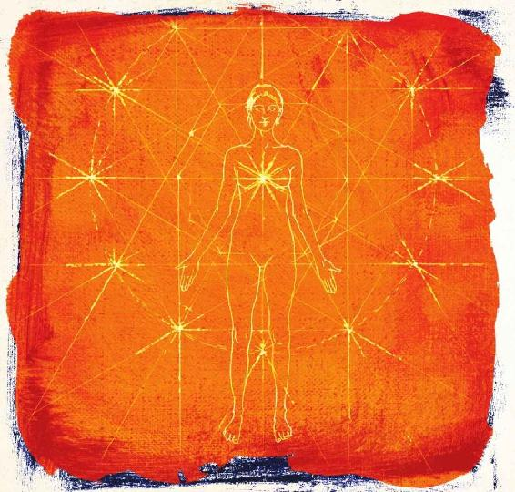

在爱对健康所产生的影响这件事情上，其他科学家通过水的实验革新了我们的理解。水和健康有什么关系？你的身体百分之七十由水组成，而你的大脑里面有百分之八十是水！

日本、俄罗斯、欧洲及美国的研究人员已经发现，当水接触到爱和感恩之类的正面字眼及感受时，不只水的能量层次会提升，它的结构也会改变，呈现完美的和谐；正面感受的程度越高，水的结晶就会变得越美丽、越和谐。而当水接触到憎恨之类的负面情绪时，其能量层次会降低，而且发生混乱的改变，对水的结构产生负面影响。

如果人类的情绪可以改变水的结构，你能想象自己的感觉对你的身体健康有何影响吗？你的细胞大部分由水组成，每个细胞的中心都是水，而且外面都被一层水完全包着。

你能想象爱与感恩对你身体的影响吗？你能想象爱与感恩的力量可以让你恢复健康吗？当你感觉到爱的时候，你的爱就影响了你体内那一百兆个细胞中的水！

### 如何使用爱的力量获得全然的健康

“有大爱的地方就有奇迹。”

薇拉·凯瑟（1873—1947）

获普利策奖的小说家

想获得你想要且喜欢的健康，一定要付出爱！面对任何疾病，都要释放出对健康的美好感受，因为只有爱才能带来全然的健康；你不可能释放出对疾病的坏感觉，然后还能获得健康。如果你厌恶或害怕疾病，就会产生不好的感觉，而不好的感觉是无法使疾病消失的。当你释放出对你渴望的事物的思想和感觉时，你的细胞就接收了健康的全部力量；而当你对不想要的事物产生负面的思想和感觉时，你细胞能接收到的健康力量就减少了！就算你是对健康以外的问题有不好的感受，一样会有影响。当你感觉不好时，就削弱了能使身体健康的力量；但是当你对任何事物都能感受到爱——无论是晴天、新房子、朋友或升迁——你的身体就会接收到健康的全部力量。

感恩是很棒的倍增器，所以每天都要对你的健康说“谢谢你”。就算你拥有世界上所有的钱，也买不到健康，因为它是来自生命的礼物，所以，最要紧的是要对你的健康表达感激之情！感恩是你所能拥有最好的健康保险，因为它就是健康的保证。

要感谢你的身体，而不是挑它的毛病。每当你认为你不喜欢身体的某部分时，要记住：你体内的水正在接收你的感受。你要衷心地对你喜欢的身体部位说“谢谢”，然后忽略你不喜欢的地方。

“爱牵引出爱。”

圣女大德兰（1515—1582）

修女、神秘学家及作家

在进食或喝水前，看着你正要吃或喝的食物，去感受对它的爱与感恩；当你坐下来吃饭时，要确定你的谈话内容是正面的。

为食物祝福会给它爱与感恩。当你祝福食物时，就改变了食物中水的结构，以及它对你身体的影响。带着爱与感恩祝福水也有同样的效用。你传送的爱的正面感觉可以改变每样东西中水的结构——所以多使用这股力量吧。

在接受任何治疗时，你可以付出爱与感恩，并运用其力量。如果你能想象自己的身体状况很好，就能感觉到身体状况很好；而如果感觉得到，你就会得到这个结果。想要改善健康状态，你所要做的就是花超过百分之五十的时间付出爱；只要有百分之五十一就跨越了临界点，让天平从疾病往健康那一边倾斜。

在检查视力或血压、做例行健康检查、听取检验报告，或是做任何跟健康有关的事情时，很重要的是，在整个过程中和得知结果的那一刻，你都要抱持着美好的感受，这样才能得到好的结果。通过吸引力法则，检查或测试的结果一定会和你所在的频率吻合，所以如果想要获得理想的结果，你一定要在那个频率上才行！人生不会颠倒过来，你生命中每个状况的结果总是符合你的频率，因为那就是吸引力法则！要让自己进入对健康检查有美好感受的频率，就去想象你想要的结果，而且要感觉到你已经如愿以偿了。每种结果都可能发生，但你必须处在美好的感觉频率上，才能获得美好的结果。

“可能性和奇迹指的是同一件事。”

普兰特斯·马福德（1834—1891）

新时代思想家

想象并感觉到你的身体已经拥有你想要的健康。如果想要恢复视力，就对完美的视力付出爱，并想象自己已经拥有那样的视力；对完美的听力付出爱，并想象已经拥有那样的听力；对完美的体重、完美的身体、某个器官完全健康付出爱，并想象已经拥有它，然后对你目前实际拥有的一切由衷地表达感谢之意！你的身体会转变成你想要的状态，但是唯有通过爱与感恩的感觉，它才能做到。

当一位年轻、健康的女士被告知罹患罕见的心脏病时，她的人生破碎了。突然间，她觉得很虚弱、很脆弱。她的未来——一个平凡、健康的人生——随着预后结果消失了，她很害怕自己的两个女儿会失去母亲。不过，这位女士决定尽她所能，去治疗自己的心脏病。

她拒绝对她的心脏状态抱持任何负面想法。她每天把右手放在心脏的位置，想象着她那强壮、健康的心脏；每天早上起床时，她都会深深地感谢她强壮、健康的心脏；她还想象心脏科医生跟她说，她已经康复了。就这样连续做了四个月后，当心脏科医生再次检查她的心脏时，觉得十分错愕。他们一次又一次地比对新旧两份报告，因为新的检验结果竟显示这位女士的心脏非常强壮且健康。

这位女士是因为爱的吸引力法则而活了下来。她并未让心脏病的预后结果占据自己的心思，而是对健康的心脏付出爱，结果她反而拥有了健康的心脏。如果你正面临某种病痛，尽可能不要去想、去谈论病情，也不要憎恨疾病，因为那样做就是在对它释放出负面能量。相反地，你要对健康付出爱、要拥有健康，让健康变成你的。

“尽可能不要去想自己的病痛。要想着力量，那么你就会把力量吸引过来；想着健康，你就能得到健康。”

普兰特斯·马福德（1834—1891）

新时代思想家

每当你对自己的健康感受到爱的时候，爱的力量就在消灭你体内的负面能量！如果你发现很难对自己的健康产生美好的感觉，重要的是要对任何事物感受到爱，所以，你可以让自己被围绕在你喜爱的事物之中，利用那些事物来尽量让自己感觉美好。你可以运用外在世界的一切让自己感受到爱：去看能使你大笑且感觉良好的电影，而不是那种让你紧张或难过的；去听能让你产生美好感觉的音乐；请人说笑话给你听，或是让他们告诉你一些他们发生过最糗的事。你很清楚自己喜欢、最爱哪些事物，你知道什么能让你开心，所以多利用它们，尽可能让自己感觉良好。多运用“创造过程”，多运用“力量之钥”，要记住，只要花最少百分之五十一的时间去付出爱与美好的感受，就能达到改变一切的临界点！

如果你想帮助某个生病的人，可以利用“创造过程”，去想象并感觉到他已经完全恢复健康了。虽然你无法压过别人释放给吸引力法则的东西，但你的力量能帮助他们提升到可以获得健康的频率上。

### 美丽来自爱

“当爱在你心中滋长时，美丽也会增长，因为爱正是灵魂之美。”

圣奥古斯丁（354—430）

神学家及主教

所有的美都来自爱的力量。你可以通过爱得到无限的美，问题是，大多数人都在挑毛病、批评自己的身体，多于欣赏它。看着自己的缺点、对自己身上的任何事都不满意，并不会使你变美，只会为你带来更多缺点、更多不满而已。

跟美有关的事很多，然而，无限的美时时刻刻都被倾注到你身上，不过你必须付出爱才能得到它！你越是快乐，就会越漂亮——皱纹会消失，皮肤会变得紧致且开始发光，头发越来越浓密且坚韧，眼睛开始发亮且颜色加深。更重要的是，当你无论去到何处，人们都会被你吸引时，你将见证美真的来自爱。

### 你觉得自己多老，你就有多老

根据古老的文字记载，人类曾经可以活好几百年。有些人活了八百年，有人活了五六百年，长寿原本是稀松平常的事。所以到底发生了什么？是人们改变了他们所相信的，不再认为自己可以活好几百年；经过许多世代，人们改变了自己的信念，开始相信一个缩短的平均寿命。

我们继承了那些认为平均寿命缩短的信念。从出生开始，关于我们可以活多久的信念就已经被植入我们的脑子和心里，于是从早年开始，我们就设定自己的身体只能活一定的时间，然后身体就随着我们设定的程式老化。

“生物学中还没有任何发现指出死亡是无可避免的。这告诉我的是，死亡根本不是无法避免，而且生物学家早晚会找出到底是什么造成我们这项困扰。”

理查德·费曼（1918—1988）

获诺贝尔奖的量子物理学家

如果可能的话，不要预设自己能活多久。只要有人可以破除平均寿命的限制，那个人将为全人类改变平均寿命的进程。之后就会接连有人打破限制，因为当某人活得远比目前的平均寿命久时，其他人就会相信且觉得自己也做得到，然后他们就会做到！

当你相信且觉得老化及身体机能衰退无可避免时，它们就会发生，因为你的细胞、器官和身体都会接收你的信念和感觉。所以开始觉得自己很年轻，并停止感受到你的年纪吧。感受自己的年龄只不过是一个你被赋予的信念，以及你替身体设定的程式，只要你想要，任何时候你都能通过改变自己的信念，来改变你发出的指令！

那么该如何改变信念？方法就是付出爱！限制性信念、老化或疾病等负面信念都不是来自爱；当你付出爱、当你感觉美好时，爱会消融任何负面能量，包括会伤害你的各种负面信念。

“源源不绝的爱是生命真正的仙丹，是肉体长寿之泉。会有衰老的感觉，正是因为缺乏爱。”

约西亚·吉伯特·荷兰（1819—1881）

作家

### 爱就是真理

小时候，你非常有弹性和可塑性，因为你还没形成或接受太多跟生命有关的负面信念；而随着年纪渐长，你承担了更多限制的感觉及负面能量，让你变得越来越僵化、越来越缺乏弹性。这样的人生一点都不精彩，而是一个处处受限的人生。

你爱得越多，爱的力量就越能消融你体内和心里的负面能量；而当你快乐、感恩、喜悦时，就能感受到爱融解了一切负面事物。你可以感觉得到！你会觉得轻盈、万夫莫敌，觉得好像站在世界之顶。

当你付出越来越多爱时，你会注意到自己的身体开始发生变化——食物尝起来会更美味，眼睛看到的颜色会变得更明亮，耳朵听到的声音会变得更清澈，身体上的痣或小斑点会开始变淡、消失；你的身体开始觉得更有弹性，僵硬的状况会消失，关节也不再发出咯吱咯吱的声音。当你付出爱，并体验到发生在你身体上的奇迹时，你将从此不再怀疑爱就是健康之源！

### 每个奇迹的背后都是爱

所有奇迹都是由爱的力量运作而来的；只要远离负面事物，并专注在爱上面，就能创造奇迹。即使你一辈子都是个悲观的人，现在开始也不嫌晚。

有位男士一直把自己描述成悲观主义者。当他从妻子那里得知第三个小孩即将诞生这个意外消息时，他满脑子都想着这个孩子将为他们的生活带来多么负面的影响。然而他不知道的是，那些负面思想和感觉将会如何发展。

就在她太太怀孕中期，有一天，她被送进医院进行紧急的剖腹产手术。有三个专科医生分别都说这个婴儿能存活的概率是零，因为怀孕期只有二十三周。于是，这位男士跪了下来，他从未想过会失去一个孩子。

剖腹产手术完之后，这位父亲被带到房间的一边去看他的儿子，这是他看过最小的婴儿。他儿子出生时身高只有二十五公分，体重只有三百四十克，医护人员试图用呼吸器将空气打进婴儿的肺里，但他的心跳速率一直变慢，专科医生说他们已经爱莫能助了。这位父亲在心里呐喊着：“请救救他！”就在那一刻，呼吸器成功地将空气打进他儿子的肺里，心跳速率也开始回升。

几天过去了。虽然医院里所有的医生仍然认为那个婴儿撑不了多久，但是这位一辈子都是个悲观主义者的男士却开始想象他想要的结果。每晚上床睡觉时，他会想象爱的光芒照在他儿子身上；早上醒来时，他会感谢神让他的儿子又活过了一晚。

他儿子每天都有进步，而他则克服了自己遭遇的每个障碍。在加护病房辛苦地照顾了四个月之后，他和妻子终于可以带着他们的孩子回家了——那个一度被认为存活概率是零的孩子。

每个奇迹的背后都是爱。

### 力量摘要

·你通过信念或强烈的感觉持续给予身体的东西，之后一定会在你的身体上显现出来。你的每个感觉都会渗入你全身每一个细胞和器官。

·你是你身体这个王国的统治者，你的细胞则是你最忠实的臣民，毫无置疑地服侍你。所以，无论你想到、感觉到的是什么，都会成为你王国的律法——也就是你身体里的法则。

·当你对不想要的事物产生负面的思想和感觉时，你细胞能接收到的健康力量就减少了！而当你对任何事物都能感受到爱——无论是晴天、新房子、朋友或升迁——你的身体就会接收到健康的全部力量。

·感恩是很棒的倍增器，所以每天都要对你的健康说“谢谢你”。

·衷心地对你喜欢的身体部位说“谢谢”，然后忽略你不喜欢的地方。

·想要改善健康状态，就要花超过百分之五十的时间付出爱；只要有百分之五十一就跨越了临界点，让天平从疾病往健康那一边倾斜。

·如果你正面临某种病痛，尽可能不要去想、去谈论病情；相反地，你要对健康付出爱、要拥有健康，让健康变成你的。

·对完美的体重、完美的身体、某个器官完全健康付出爱，并想象已经拥有它，然后对你目前实际拥有的一切由衷地表达感谢之意！

·如果你相信你的身体状况会随着年纪衰退，你就是在释放那个信念，然后吸引力法则一定会让那样的身体状况回到你身上。

·开始觉得自己很年轻，并停止感受到你的年纪吧。

·通过爱与感恩的感觉，你的身体会转变成你想要的状态。

## 力量与你

“能获得快乐、美好事物及生命中所需的一切之力量，就在我们每个人之内。力量——无限的力量——就在那里。”

罗伯特·柯里尔（1885—1950）

新时代思想家

每样事物都有个频率——每一样！每个字都有频率，每个声音、每种颜色、每棵树、每种动物、每种植物、每种矿物、每个物体也都一样。每一种食物和液体，每个地方、城市和国家，空气、水、火和土的元素，健康、疾病、富有、缺钱、成功和失败，每个事件、状况及情境——以上这些全都有个频率，甚至你的名字也有。但你的频率的真实名称是你所感受到的事物！而无论你感受到的是什么，都会把和你处于类似频率的每一样事物带来给你。

如果你很快乐，而且持续感到快乐，那么只有快乐的人事物可以进入你的生命；如果你觉得有压力，而且一直感受到压力，那么只会有更多的压力通过各种人事物进入你的人生。当你因为快迟到而一直在赶时间时，就能看见这种状况。赶时间是一种负面的感觉，而就如同太阳一定会发光一样，当你在赶时间且因为怕迟到而感受到恐惧时，一定会把各种耽搁你的状况和阻碍带到你的路途上。这就是吸引力法则在你的生命中运作着。

这样你明白用美好的感觉开始你的一天有多重要了吧？如果不花点时间让自己感觉美好，你就无法在那一天接收到美好的事物；而一旦负面事物来临，你就得费更多力气去改变它们，因为只要它们出现在你面前，你会信以为真！相较之下，花点时间去产生美好的感觉就容易多了，因为这样负面事物一开始就进不来。虽然你确实可以借由改变感受来改变自己生命中的一切，但如果一开始就有更多美好的事发生在你身上，不是更棒吗？

### 欣赏你的人生电影！

生命很神奇！你一日生活中所发生的事，比你看过的任何奇幻电影还要奇妙，不过你必须像看电影那样专注地看着正在发生的事。如果你看电影时因为一通电话而分心，或是睡着了，就会错过正在上演的情节。同样的道理也适用于持续在你每天的银幕上放映的人生电影。如果你麻木地晃来晃去、毫无警觉，就会错过不断在你生命中对你发出信号，带领你、指引你的讯息和同步性！

生命在回应你、在跟你沟通。生命中没有意外或巧合：每样事物都有个频率，而当任何事物进入你的生命时，代表它和你在同一个频率上。你看到的一切——每个招牌、颜色、人、物体等——你听到的一切，以及每个状况和事件，都与你频率一致。

“这个联结当中的事实如此惊人，仿佛是造物主自己用电设计了这个星球。”

尼古拉·特斯拉（1856—1943）

无线电及交流电发明者

如果开车时看到警车，你会突然变得更警觉。你会看到警车是有原因的，那很可能是在告诉你：“要更小心一点！”而看见警车这件事对你来说甚至可能有更多意义，不过如果想知道答案，你必须问自己：“这是在告诉我什么？”警察代表法律和秩序，所以警车或许是你生活中某个失序的状况传来的讯息，例如你忘了回电给朋友，或是你没有感谢某人帮你做了某件事。

当你听见救护车的警报声时，那是在对你说些什么？是在告诉你要感谢你的健康吗？是在提醒你要对你生命中其他人的健康付出爱与感恩吗？当你看到消防车开着警示灯、鸣着警笛，从你身旁呼啸而过时，那是在告诉你什么？是在说你人生中有某个地方着了火，需要你去灭火吗？或者是在告诉你要燃起你的爱？只有你才知道进入你生命中的事物所代表的意义，但是你必须对发生在你周遭的一切保持警觉，这样你才能提出问题，并接收到给你的讯息所代表的意义。

宇宙不断在给你讯息和回馈，而你一辈子都在接收这些讯息！每当我听到某件事，即使那是站在我附近的两个陌生人的对话内容，假如我可以听见他们说的话，那些话在我的人生中就有意义。他们所说的话是给我的讯息、跟我有关，而且是在回应我的人生。如果我在旅行时注意到某个招牌，且阅读了上面的文字，那些字对我来说就有意义，那是给我的讯息、跟我有关。而它们之所以跟我有关，是因为我和它们在同一个频率上；如果我处于一个不同的频率，就不会注意到那个招牌，也不会听到别人的对话。

一天当中围绕在我四周的每样事物都在对我发出信号，持续给我回馈和讯息。如果我注意到身旁的人不像他们原本那样快乐或满脸笑容，我就知道我的感觉频率往下降了。于是，我马上会去想我喜爱的事物，一个接一个，直到我觉得快乐一点为止。

### 你的秘密象征物

你可以运用吸引力法则来玩一个游戏——要求看见爱的力量的实体证据。把一个你喜欢的东西当作爱的力量的象征物，每当看到或听见你的象征物时，你就知道爱的力量和你在一起。我是以明亮、耀眼的光作为自己的象征物，所以如果太阳光射进我的眼睛，或是它的光照到某样东西之后反射进我的眼睛，或是我看见反射太阳光且闪闪发亮的任何东西时，我就知道那是爱的力量，而且它就在我身边。当我满溢着喜悦与爱时，光会从我周围的每样事物反射出来。我妹妹则是把彩虹当作她的象征物，当她满溢着爱与感恩时，她视线所及之处，周围都会出现光的彩虹和各式各样的彩虹。你可以利用星星、金色、银色，或是你喜爱的任何颜色、动物、鸟、树或花来当作你的象征物；你也可以选择某个词或声音当作你的秘密象征物。只要确定一件事：无论你选的是什么，都应该是你绝对喜欢、热爱的事物。

“你希望世界变成什么样子，自己就必须先成为那个样子。”

圣雄甘地（1869—1948）

印度政治领袖

如果你想要的话，还可以选择一个象征物当作爱的力量给你的警讯，提醒你要注意了。事实上，你一直都在接收讯息和警告。当你掉了某样东西、当你被绊倒，衣服勾到某样东西，或是当你撞到某样东西时——它们全都是你接收到的警告和讯息，告诉你该停止你正在思考或感觉的事情了！生命中没有意外或巧合——每一件事都是同步的——因为每样事物都有个频率。这只是生命和宇宙的物理学在运作而已。

“当我看着太阳系时，我发现地球和太阳之间保持着适当的距离，以接收适当数量的热和光。这绝非偶然。”

艾萨克·牛顿（1643—1727）

数学家及物理学家

### 生命很神奇

爱和我之间的关系一直持续着，那是任何人所能拥有最神奇、最令人兴奋的关系。我想跟你分享我如何带着这个认知度过每一天。

每天早上醒来时，我感谢自己能活着、感谢我生命中的所有人事物。每天上午，我会花十五分钟去感受爱，并把它传送出去给这个世界。

我会想象我的一天。想象我一整天都很顺利，并因此感受到爱；在做事之前，我想象我一整天所做的每一件事都很顺利，并因此感受到爱；在开始做任何事之前，我会尽可能去感受我内在的爱，这样我在做每一件事情时，都是让爱的力量来引导我！而除非我有美好的感觉，否则我不会打开电子邮件或包裹、拨打或接听重要的电话，或是做任何重要的事。

早上着装打扮时，我非常感谢我的衣服。为了节省时间，我也会问：“今天穿哪一套衣服最完美？”几年前，我决定运用吸引力法则来跟我全部的衣服玩游戏。我不再努力想弄清楚这件裙子跟那件上衣搭不搭配，有时候还要穿上身，然后因为不适合又要脱下来（这又吸引了更多不协调的组合），而是决定把我的造型问题交给爱的力量。我所做的就是，想象一下如果我穿上的每件衣服看起来都很棒的话，感觉如何。而在想象、感觉，并且问“今天要穿什么？”之后，现在当我着装打扮时，对于身上的衣服看起来、感觉起来这么棒，我真的很惊喜。

走在街上时，我会保持察觉，留意经过我身边的人。我会尽可能传送爱的思想和感觉给他人，越多人越好；我看着每个人的脸，感受到自己内在的爱，并想象他们正在接收我的爱。我知道爱的力量是丰足的金钱、圆满关系、良好健康及任何人喜爱的任何事物的源头，所以我将爱传送给人们，因为我知道我这样做，就是在把他们需要的任何事物传送给他们。

当我发现某人似乎有特别的需要，例如没有钱买他想要的东西时，我会送给他金钱丰足的思想；如果有人看起来闷闷不乐，我就传送快乐给他；如果某人看起来压力很大，而且一直在赶时间，我就传送平静及喜悦的思想给他。无论我是在买东西、逛街或开车，只要身处人群之中，我就会尽最大努力把爱传送出去。我也了解到，每次我发现某人有特殊需求时，那也是一个给我的讯息，要我懂得对金钱、快乐及我生命中的平静和喜悦表达感恩之情。

搭飞机时，我传送爱给每一个人；在餐厅用餐时，我传送爱给那里的人和食物；跟机关团体或公司打交道，或是在商店购物时，我会传送爱给那里所有的人。

当我要开车前往某个地方时，我会想象自己快乐、平安地返抵家门，并且说：“谢谢。”上路之前，我会问：“走哪一条路最好？”每次进出房子时，我会对我的房子说“谢谢”；在超市买东西时，我会问：“还需要买些什么？”“东西都买齐了吗？”而我总是会得到答案。

“知识当然是锁，而它的钥匙是提问。”

贾法尔·萨迪克（702—765）

伊斯兰教精神领袖

我每天都会问很多问题，有时是好几百个。我会问：“我今天过得如何？”“在这种情况下，我该怎么做？”“最好的决定是什么？”“这个问题的解决方案是什么？”“对我而言，哪一个是最好的选择？”“这个人或这个公司适合吗？”“我如何让感觉好一点？”“我如何提升自己的感受？”“我今天需要在哪里付出爱？”“我能看见哪些我很感谢的事物？”

当你提问时，你是在给出问题，然后你一定会得到答案！不过你必须留心、保持警觉，才能看到或听到你问题的答案。你或许是通过读到、听到或梦到某件事而得到答案，有时则是突然间就知道你问题的解答。反正你总是会得到答案！

如果我把某样东西放错位置，例如钥匙，我会问：“我的钥匙在哪里？”而我总是会得到答案。但不是这样就停了，当我找到钥匙时，我会问：“这是在告诉我什么？”也就是说，我为什么会把钥匙放错地方？因为每件事都有个原因！生命中没有意外或巧合。有时候，我得到的答案是：“慢一点，你太急了。”有时答案则是：“你的皮夹不在你的手提袋里。”于是我环顾房间，就能找到钥匙，而我的皮夹就在那里。有时候，我没有马上得到答案，但是当我正要出门时，电话响了，原来是我正要赴的那个约取消了，这时我立刻就知道钥匙放错地方这件事之所以会发生，是为了一个正面的理由。我喜爱生命运作的方式，但除非提出问题，否则你得不到任何答案或回馈！

有时候，生命会丢给我一些棘手的事，不过当它们发生时，我知道这是我自己吸引来的。我总是会问，我是怎样吸引到这些问题的，这么一来，我就可以从中学习，而不会重蹈覆辙！

我尽可能对这个世界付出爱，来回报我获得的一切。我在每一样事物和每个人身上寻找美好的地方，我对每一件事都很感恩。而当我付出爱时，我感觉到爱的力量席卷了我，让我充满爱与喜悦，简直快要不能呼吸；就连你试着把爱传送回去给你接收到的一切时，爱的力量也会让那份爱倍增，然后送回更多爱给你！你的人生只要经历过一次这种感觉，你将从此彻底改变。

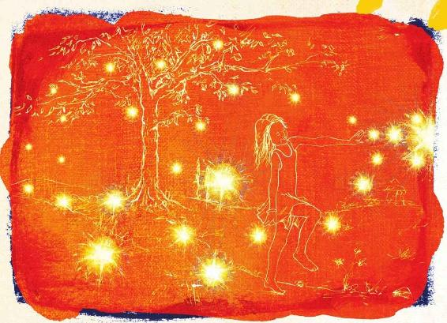

### 爱会为你做任何事

你可以驾驭爱的力量，来帮助你完成人生中的任何事。你可以把需要记得的事情交托出去，然后要求爱的力量在完美的时间点提醒你。你可以让爱的力量变成你的闹钟，在你希望的时间叫醒你。爱的力量将成为你的个人助理、财富管理经理、个人健康教练、人际关系咨询师，而它会管理你的钱、你的体重、你的食物、你的人际关系，或是你想交给它的任何工作。不过，唯有当你通过爱和感恩，与爱的力量合二为一时，它才会为你做这些事！唯有当你通过爱，把你的力量和爱的力量合二为一，并且松开你那紧紧握住的拳头，不再试图自行掌控生命中的每一件事情时，它才会为你做这些事。

“当你的信心增强时，你会发现不再需要控制，事物将自行流动，而你会跟随着它们，找到你极大的喜悦及利益。”

温格特·潘恩（1915—1987）

作家及摄影师

与生命中最伟大的力量合二为一吧！无论你希望爱的力量为你做些什么，只要想象已经拥有它，并带着绝对的爱与感恩去感受自己已经拥有了，那么你就会接收到。

善用你的想象力，并想着所有爱的力量能为你做的事。爱的力量就是那个生命和宇宙的智慧。如果你能想象那个有能力创造出花朵，或在人体中创造出细胞的智慧，那么你将会感谢无论在哪一种情况下，你所提出的任何问题都会得到完美的解答。爱会为你做任何事，但你必须通过爱与它合二为一，才能在你的生命中展现爱的力量。

### 到底会有什么差别

“从错综复杂中发现简单；从不一致中发现和谐；困难之中蕴藏着机会。”

阿尔伯特·爱因斯坦（1879—1955）

获诺贝尔奖的物理学家

如果你的心思被太多琐事占据，那些小事情会让你分心，把你拉下来；如果你一直绕着那些无关紧要的琐事团团转，就无法心无旁骛地产生美好的感觉。就算在干洗店关门前的最后一刻才把衣服送到，又有什么关系？如果你所属的球队这星期输掉了比赛，对你的人生有什么影响？下星期还是有比赛啊。错过一班公交车又如何？杂货店里的柳丁卖完了，对你会有什么影响？如果你必须排队等个几分钟，有什么关系？在事情发展的整个过程中，那些小事能造成多大的差别？

细微的琐事让你分心，而且会妨害你的生活，如果太关注不必要的琐事，你将难以感觉美好。在你人生的计划中，那些事情没有一件是重要的！没有任何一件！所以，让你的生活变得简单一点，这样可以保护你美好的感觉。简化自己的人生吧，因为当你丢掉琐事时，就创造出空间，让你想要的一切涌进你的生命里。

### 你赋予生命意义

你为生命中的每一样事物加上意义。没有一种状况出现的时候带着好或坏的标签，每一样事物都是中性的。一道彩虹和一阵雷雨没有好坏之分，它们就只是彩虹和雷雨，是你通过对彩虹的感觉赋予它意义，是你通过对雷雨的感觉赋予它意义，是你通过对每样事物的感受，而一一为它们加上意义。工作没有好坏之别，它就只是一份工作，但你对你的工作的感受，决定了它对你来说是好是坏；一段关系本身没有好坏，它只不过是一段关系，但你对某一段关系的感受，决定了它对你来说是好或不好。

“事物没有好坏之分，是思想使其有好坏之别。”

威廉·莎士比亚（1564—1616）

英国剧作家

如果某人伤害了他人，吸引力法则不会没有回应，它可能会利用警察、法律或任何方式，以其人之道，还治其人之身。不过对吸引力法则来说，有一件事是确定的：我们得到的，就是我们给出去的。如果你听说某人被别人伤害，当然可以同情受害者，但千万不要论断任何人。如果你评判某人，认为他不好，你就不是在付出爱；而且在想着某人不好的时候，事实上，你已经替自己贴上了不好的标签。你给出去的是什么，你就会得到什么。当你对别人释放出负面感受时，无论他们做过些什么，那些不好的感觉都会回到你身上！它们会以你释放出去的同等力道回来，在你的人生中创造出负面情境。对爱的力量而言，没有任何借口！

“对所有生命付出爱的人生是圆满、富足的，并且能不断扩展其美丽与力量。”

拉尔夫·沃尔多·川恩（1866—1958）

新时代思想家

### 爱是这个世界的力量

爱的力量没有对立面。生命中除了爱之外，没有其他力量，所谓的负面力量并不存在。古时候，负面力量有时被描述成“魔鬼”或“罪恶”，但所谓被魔鬼或罪恶诱惑，只是意味着禁不起诱惑，掉进负面的思想和感觉里，而没有坚定地站在爱的正面力量中，如此而已。负面力量并不存在，生命中只有一股力量，那股力量就是爱。

你在这世上看见的所有负面事物，都只是缺乏爱的表现。无论那个负面事物是出现在人、地方、情境或事件中，通通都是源自缺乏爱。悲伤的力量并不存在，因为悲伤就是缺乏快乐，而所有的快乐都来自于爱；失败的力量并不存在，因为失败就是缺乏成功，而所有的成功都来自于爱；疾病的力量并不存在，因为疾病就是缺乏健康，而所有的健康都来自于爱；贫穷的力量并不存在，因为贫穷就是缺乏富足，而所有的富足都来自于爱。爱是生命的正面力量，而任何负面状况都是源自缺乏爱。

当人们来到付出的爱比负面能量更多的临界点时，我们就会看到负面能量快速地从这个星球消失。想象一下，每当你选择付出爱时，你的爱就帮助整个世界往正面那一端倾斜！有些人相信我们现在非常接近那个临界点，而无论他们说的对不对，比起以往，现在是该付出爱与正面能量的时候了。为了你的人生，为了你的国家，为了这个世界，请你这么做吧。

“心正而后身修，身修而后家齐，家齐而后国治，国治而后天下平。”

孔子（公元前 551—前 479）

中国哲学家

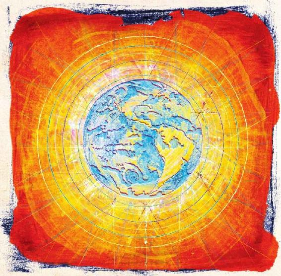

你在这个世界拥有许多力量，因为你能付出的爱就是有那么多。

### 力量摘要

·每样事物都有个频率——每一样！无论你感受到的是什么，都会把和你处于类似频率的每一样事物带来给你。

·生命在回应你、在跟你沟通。你看到的一切——每个招牌、颜色、人、物体等——你听到的一切，以及每个状况和事件，都与你频率一致。

·如果你很快乐，而且持续感到快乐，那么只有快乐的人事物可以进入你的生命。

·生命中没有意外或巧合——每一件事都是同步的——因为每样事物都有个频率。这只是生命和宇宙的物理学在运作而已。

·把一个你喜欢的东西当作爱的力量的象征物，每当看到或听见你的象征物时，你就知道爱的力量和你在一起。

·做每一件事情时，都让爱的力量来引导你。想象你一整天所做的每一件事都很顺利，而且在做任何事之前，尽可能去感受你内在的爱。

·每天都要问问题。当你提问时，你是在给出问题，然后你一定会得到答案！

·驾驭爱的力量，来帮助你完成人生中的任何事。爱的力量将成为你的个人助理、财富管理经理、个人健康教练和人际关系咨询师。

·如果你的心思被太多琐事占据，那些小事情会让你分心，把你拉下来。所以，让你的生活变得简单一点吧，不要把琐事看得太重要；就算错过一些小事，又有什么差别？

·爱的力量没有对立面。生命中除了爱之外，没有其他力量。你在这世上看见的所有负面事物，都只是缺乏爱的表现。

## 力量与生命

人类无法想象不存在。我们或许可以想象自己的躯体不再存活，但就是无法想象自己不存在。你认为那是为什么？你觉得是偶发事件吗？不是的。你之所以无法想象自己不存在，是因为你不可能不存在！如果你想象得到，就可以创造出你不存在这件事，然而你永远创造不出来！你一直都存在，也将永远存在，因为你是宇宙的一部分。

“过去，从没有一个时候，我、你、所有这些国王，不存在；未来，也如是。栖息于躯体的灵魂，在躯体中，经历童年，终至老年，死后离开这个躯体，到另一躯体去。自觉的灵魂不会为此变化所眩。”

《薄伽梵歌》（约公元前 5 世纪）

古印度经典

那么人死的时候会发生什么事？躯体不会凭空消失，因为没有这种事，它把自己整合进宇宙的成分之中。而那个在你之内的存在体——那个真实的你——也不会凭空消失。“存在体”这个词告诉你，你将永远存在！你不是一个“曾经存活”的人！你是一个永恒的存在体，只是暂时住在人体中；如果你停止存在，那么宇宙会出现一个空隙，而整个宇宙会塌陷到那个空隙里。

一个人离开他的躯体后，你看不到他的唯一原因是，爱的频率是肉眼看不见的。你也无法看见紫外线的频率，而爱的频率——亦即他所在的频率——是创造之中最高的频率，连世界上最棒的科学设备也侦测不到。但是要记住，你可以感受到爱，所以即使再也见不到某人，你依然可以在爱的频率上感觉到他。在悲痛或绝望之中是感觉不到他的，因为那些频率离他所在的频率很远；然而当你处于爱和感恩的最高频率时，你就可以感觉到他。他从未远离你，你也从来没有和他分离，通过爱的力量，你一直和生命中的一切彼此相连。

### 天堂就在你心里

“天堂和地球的所有准则，都在你心里。”

植芝盛平（1883—1969）

合气道创始人

古老的文字记载着“天堂就在你心里”，它们指的是你存在体的频率。当你离开自己的躯体时，就自动处于纯粹之爱的最高频率上，因为那是你存在体的频率。而古时候，这个纯粹之爱的最高频率被称为“天堂”。

不过，天堂是你此生就可以在这里找到的地方，而不是你的躯体死后才能去的所在。你应该在这里寻找天堂——当你还在这个地球上时。而天堂确实在你之内，因为那是你存在体的频率。要在地球上找到天堂，就要用和你的存在体同样的频率——纯然的爱与喜悦——来度过你的人生。

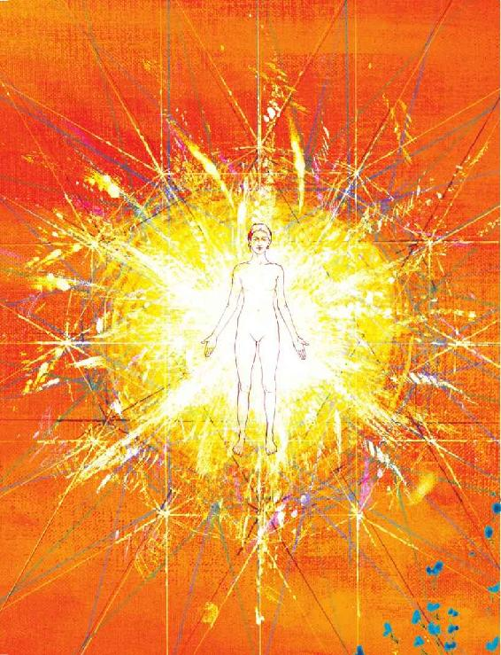

### 为了生命之爱

“问题不在于你到底要不要坚持下去，而是你打算如何享受它。”

罗伯特·瑟曼（生于 1941 年）

佛教作家及学者

你是永恒的存在体，在这世上你有足够的时间去体验所有的事。时间不会不够，因为你拥有永恒！你的前方还有许多冒险活动、许多事情要去经历，而且不只是在地球上冒险，因为一旦我们对地球驾轻就熟了，就会在其他世界展开新的冒险。宇宙中有我们现在想象不到的其他银河系、次元和生命，而我们全都会体验到，并且将一起经历这一切，因为我们都是宇宙的一部分。从现在开始的几十亿年后，当我们在整个宇宙中寻找下一个冒险目标时，将会发现世界中还有世界、银河系中还有银河系，以及无限的次元，在我们的眼前永恒地延伸下去。

所以你现在觉不觉得，也许你比过去自以为的还要特别一点？你是否认为，也许你比过去自以为的更有价值？你、你所认识的每个人，以及每一个曾经活着的人，你们的生命都没有尽头！

难道你不想拥抱人生，对它说“谢谢”吗？难道你不会对前方的冒险感到兴奋吗？你难道不想站在山顶，带着喜悦对永无止境的人生大声说“是”吗？

### 你人生的目标

“对于任何事物，除了感恩与喜悦之外，你再无其他理由。”

佛陀（公元前 563—前 483）

佛教创始人

你人生的目标是喜悦，那么，你认为人生中最大的喜悦是什么？付出！如果六年前有人告诉我，人生最大的喜悦是付出，我会说：“你当然可以那样说，但我现在挣扎过活、入不敷出，所以没有什么可给的。”

生命中最大的喜悦是付出，因为除非你给予，否则你将永远挣扎着过日子。生活中的问题会接踵而至，而且就在你认为每件事都进行得很顺利时，会突然发生某件事，把你丢回挣扎和困境里。人生中最大的喜悦是付出，而你唯一能付出的东西就是你的爱！你的爱、喜悦、正面性、兴奋、感恩和热情是生命中真实且永恒的事物，世界上所有财富都无法跟整个宇宙最无价的礼物——你内在的爱——相提并论！

献上最好的自己。付出你的爱，因为它是吸引人生所有财富的磁铁，而你的人生将变得比你所想的还要富足，因为当你付出爱时，就是在实现人生的全部目标。付出爱时，你会收到许多爱与喜悦，多到让你觉得几乎超过你能收下的，但你可以收下无限的爱与喜悦，因为那就是你所是的样子！

“当有一天人类能克服风、波浪、潮汐及重力时，我们将为神驾驭爱的能量，那将是历史上，人类第二次发现火。”

德日进（1881—1955）

牧师及哲学家

你带着你的爱来到这个世界，而这也是你唯一带着的东西。当你活在这世上时，每次你选择正面事物、每次你选择感觉美好，就是在付出你的爱；你用你的爱点亮了世界。而无论你走到哪里，你许的每个愿望、梦想的每件事、喜爱的每样东西，都将跟随着你。

你的内在有一股宇宙中最强大的力量，有了它，你将会拥有精彩的人生！

这股力量就在你之内。

开始

### 力量摘要

·你一直都存在，也将永远存在，因为你是宇宙的一部分。

·你、你所认识的每个人，以及每一个曾经活着的人，你们的生命都没有尽头！

·要在地球上找到天堂，就要用和你的存在体同样的频率——纯然的爱与喜悦——来度过你的人生。

·生命中最大的喜悦是付出，因为除非你给予，否则你将永远挣扎着过日子。

·你的爱、喜悦、正面性、兴奋、感恩和热情，是生命中真实且永恒的事物，世界上所有财富都无法跟整个宇宙最无价的礼物——你内在的爱——相提并论！

·付出你的爱，因为它是吸引人生所有财富的磁铁。

·当你活在这世上时，每次你选择正面事物、每次你选择感觉美好，就是在付出你的爱；你用你的爱点亮了世界。

愿《The Power 力量》带给你一生
爱和喜悦

这就是我想要给你的
也献给这个世界

## 作者简介

朗达·拜恩的用意是：为全球数十亿人带来喜悦。

通过《秘密》这部全球计有数百万人看过的影片，她开始了探索之旅；后来她又写下《秘密》这本风行全球、总共发行了四十六种语言版本的畅销书。

现在借由《The Power 力量》，朗达·拜恩延续她突破性的工作，揭示了宇宙中最强大的力量。

[[1]](#part0024.html_z1)华勒思·华特斯，《失落的致富经典》。也可以到《秘密》的官网（www.thesecret.tv）免费下载这本书的英文版。

# 魔力

## 版权信息

魔力

作　　者：【澳】朗达·拜恩

译　　者：郑　峥

出 版 人：刘清华

责任编辑：丁丽丹　刘诗哲

监　　制：蔡明菲　潘　良

特约编辑：温雅卿　汪　璐

营销编辑：刘碧思

版权支持：辛　艳

封面支持：张丽娜

本书由中南博集天卷文化传媒有限公司授权亚马逊全球范围发行

目录版权信息致谢你相信魔力吗？一个伟大秘密的揭示将魔力带入你的生活魔力之书第 1 天数算你的恩福第 2 天神奇的感恩石第 3 天魔力关系第 4 天魔力健康第 5 天魔力金钱第 6 天让工作充满魔力第 7 天扭转逆境的秘诀第 8 天魔力配方第 9 天财富磁铁第 10 天魔法粉末第 11 天充满魔力的清晨第 12 天改变生命的神奇之人第 13 天让你的心愿成真第 14 天拥抱神奇的一天第 15 天人际关系魔力修复剂第 16 天健康的魔力和奇迹第 17 天魔力支票第 18 天神奇的待办清单第 19 天魔力足迹第 20 天心灵魔力第 21 天圆满的结局第 22 天在你的眼前实现第 23 天你所呼吸的魔力空气第 24 天魔杖第 25 天魔力线索第 26 天由祸至福的魔力转变第 27 天魔镜第 28 天铭记魔力你充满魔力的未来魔力永无止境关于朗达·拜恩

## 致谢

本书创作之初，我独自享受着写作的喜悦；感觉只有宇宙和我的存在。渐渐的，圈子不断扩张，越来越多的人参与其中，他们每个人的知识和阅历，都对本书的面世帮助巨大，最终成就了你手中拿着的这本新书。下面提到的这些人，是这个圈子的重要组成部分，他们让《魔力》得以抵达你的手中。

感谢，感谢，感谢我的女儿斯凯，陪伴在我身边，不知疲倦地帮助我完成文字的整理工作，以及乔希·戈尔德，他在自然科学方面的造诣和研究方法，帮助我将科学发现同宗教经文关联起来。我还要感谢我的编辑——奇妙文字出版公司的辛迪·布莱克，她直率的工作方法和探索精神，鞭策我成为一个更好的作者。我还要感谢尼克·乔治，他为本书贡献的充满创意的内页插图和封面，完美诠释了本书的主题。

我还要将由衷的谢意献给葛泽传媒的夏姆斯·霍尔和卡拉·霍顿，感谢他们对本书插图和文字部分的编排。我还要感谢《秘密》团队，他们作为我创作的强大后盾，和我一同迎接了本书的诞生；我还要特别感谢我的姐妹简·柴尔德，她负责整个出版团队的运作；感谢安德里亚·凯尔，她负责庞大的创意团队；感谢保罗·哈林顿及我的姐妹格伦达·贝尔，他们同摄像师拉菲尔·基尔帕特里克以及团队的其他成员一起为本书制作出一张张神奇的图片。另外，还要感谢《秘密》团队的其他成员，他们虽然默默无闻，但功不可没：唐·泽伊克，马克·奥康纳，麦克·加德纳，罗丽·莎拉波夫，科里·约翰辛，查依·李，彼得·伯恩，以及我的女儿海莉。

感谢，感谢，感谢出版商亚德里亚图书和西蒙与舒斯特出版公司：谢谢卡洛琳·蕾蒂，朱迪思·柯尔，达林娜·德利罗，崔思妮·范，詹姆斯·珀文，金伯利·戈尔斯坦，以及伊索尔德·索尔。很幸运能够拥有这样神奇的团队。

感谢，感谢，感谢安吉尔·马丁·贝拉约斯给予我的精神指引、爱和智慧，感谢我的姐妹波琳·弗农以及我的挚友和家人们，感谢你们对我工作的一贯支持和鼓励。同时，将我最真挚的感谢献给数百年前洞悉人生真谛的伟大灵魂，因为他们，我们才恰巧在激动人心的人生转折点——听到、看到他们曾经留下的伟大文字。

## 你相信魔力吗？

“那些不相信魔力的人将永远无法找到它。”

罗尔德·达尔（1916—1990）

作家

还记得你孩童时代充满懵懂和好奇地关注生活的情景吗？生活对你而言充满惊喜和不可思议，不论是凝结在草尖的霜、从身边振翅飞过的蝴蝶，还是形状迥异的叶片和石块，任何微小的事物都会引起你的无限惊奇。

你在牙齿脱落时满怀兴奋，因为那意味着传说中的牙仙今夜将翩然而至。你掰着手指一天天地数算日子，期盼着神奇的圣诞节赶快到来！哪怕你无从想象圣诞老人是如何在一晚上看遍全世界的孩子，他竟然做到了，且从未让你失望。

会飞的驯鹿、花园里的精灵、像人类的宠物、有个性的玩具，梦境变为现实，而且你能触摸到天上的星星。你心中喜悦充盈，想象力自由驰骋，生活在你眼中充满了魔力！

童年时我们都会有一种微妙的感觉，任何事物都很美好，生活每天充满冒险和惊喜，在魔力的庇佑之下，我们的快乐无可阻挡。当我们长大成人，责任、问题以及种种艰难纷至沓来，幻想破灭，儿时为之神往的魔力渐渐消失不见。这就是为什么我们喜欢和孩子待在一起，那样能让我们重温儿时的感觉，哪怕只有短短一瞬。

在此我想告诉你：你曾相信的魔力是真实的，虚幻不实的是我们这些成人心中对人生坍塌破碎的信念。生活中的魔力是真实的——就像你的存在一般真实。事实上，生活远比你童年时所设想的更加精彩，比你以往所见到的任何事物都要令人屏息、敬畏和激动。当你知道怎样做才能创造魔力时，你就会过上那种梦寐以求的生活。之后，你会惊讶于自己之前怎会有要放弃相信魔力的可笑想法！

或许你无法见到驯鹿飞翔，但你将会看到期望已久的事物现身眼前，你会看到梦寐已久的情境突然发生。你永远无法理解这当中有多少因素交织实现了你的梦想，因为魔力作用于无形——这正是它的神奇之处！

你准备好再次体验这魔力了吗？你是否打算回到儿时充满好奇和惊喜的生活？准备好迎接魔力的降临吧！

我们的冒险始于两千年前，那段隐藏着改变生命历程的重要资讯的圣文……

## 一个伟大秘密的揭示

下面这句话来自《圣经·马太福音》，它神秘而又晦涩，数千年来许多人误读了它的含义。

“凡有的，还要加给他，叫他有余；没有的，连他所有的也要夺去。”

当你读到这句话时，肯定感觉它说得有失公允，好像富人会变得更加富有，而穷人将更加贫穷。其实这段话隐藏着一个未解之谜，等待人们将它揭晓，谜底一旦揭晓，一个全新的世界将在你眼前展现。

这句数千年来被人误读的话语，其中暗藏了一个谜底：感恩。

“心怀感恩之人将被赐予更多，变得富余。不存感恩的，连他所有的也要夺去。”

正是“感恩”这个简单的词语，让这句话的内涵瞬间变得清晰。虽然历经两千年的历史，但它在今天仍被奉为真理：那些无暇感恩的人，永远不可能获得最大的满足，而他所得到的，也终将失去。魔力所应许的将会发生，感恩之情就隐藏在这些话语中：心怀感恩之人将被赐予更多，变得富余。

感恩所应许的，在《古兰经》中同样得到彰显：

“你们的主曾宣布说：‘如果你们感谢，我誓必对你们恩上加恩；如果你们忘恩负义，那么，我的刑罚确是严厉的’。”

不论你信仰何种宗教，也不论你是否信教，《圣经》和《古兰经》中的话语都适用于你或是你的生活，因为它所揭示的是整个宇宙的普遍规律。

### 这是普遍的法则

感恩如宇宙法则一样运作并支配着你整个人生。正如同吸引力法则支配着宇宙间所有能量的运作，从原子的形成到星球的运行。“物以类聚”的吸引力法则能让生物体的细胞聚合成形，保证了物体的现实存在。在你的人生中，这条法则支配着你的思想和感情，因为它们也是能量，无论你在思考什么，你的感受如何，你都会和内在的自我相吸引。

如果你脑子里想的都是：“我不喜欢这份工作”“我赚的钱太少”“我找不到完美的伴侣”“我付不起账单”“我想我是要生病了”“他或她不欣赏我”“我和父母相处得不融洽”“我的孩子可真让人头疼”“我的生活一团糟”或者“我的婚姻出现问题了”，那么这些麻烦就真的会被你的思想所吸引，来到你的身边。

可是你如果心怀感恩地审视生活：“我喜欢我的工作”“家人一如既往地支持我”“我度过了一个精彩的假期”“今天的感觉不错”“我得到了迄今为止最大一笔退税款”，或者“我和儿子周末进行了一次美妙的露营”，而且你由衷地感恩，吸引力法则告诉你你必定会吸引更多这些事物到你的人生中。它的原理如同磁铁吸引金属：感恩像磁铁一般带有磁性，你的感恩之情越强烈，越多的恩福就会被你吸引而来，这就是宇宙的自然法则！

你一定听到过类似的话语：“种什么因，得什么果。”“种瓜得瓜，种豆得豆。”以及“付出什么，就会收获什么”。这些话阐释了一个相同的道理，也揭示了艾萨克·牛顿所发现的那条普遍规律。

牛顿的科学发现揭示出宇宙中运动的基本法则，其中一条这样说道：

每个作用力都有一个大小相等、方向相反的反作用力。

对于感恩这个概念，牛顿的运动定律同样适用：每一个施与的感恩力，都会产生一个反作用力——获得。这就意味着每一次感恩，都将换回一次收获！感恩越强烈、越真挚（换句话说，你投入的感恩越多），你的收获就会越大。

### 感恩的金线

上溯到几千年前，人类开始出现文字记载时，感恩的力量就开始被人类颂扬和奉行，此后历经数个世纪，感恩的力量横扫各大陆，从一种文化渗透到另一种文化，基督教、伊斯兰教、犹太教、佛教、锡克教，以及印度教，（各大宗教）无不包含有感恩的教义。

穆罕默德说：对所获得的心怀感恩，能庇佑你的生活维持长久的富足。

佛曰：你唯有学会感恩、惜福。

老子说：知足不辱，知止不殆，可以长久。

奎师那说：对所遭遇的欣然接受。

大卫王曾发出对天地之间万事万物的感恩之词。

耶稣在每一次显圣之前必先表示谢意。

从澳大利亚的土著居民到非洲的马赛和祖鲁部落，从北美洲的纳瓦霍族、肖尼族和切罗基族到塔希提人、因纽特人和毛利人，感恩的施行已经深深植根于这些部落的传统之中。

“清晨起身，感谢晨曦，感谢你的生命和力量，感谢盘中的食物和生活的美好。假若你找不出感恩的理由，那么责任全在于你自己。”

特库姆塞（1768—1813）

美洲印第安肖尼族首领

历史上有许多名人奉行感恩，而他们的成就让他们跻身于有史以来最伟大的人物之列：甘地、特蕾莎修女、马丁·路德·金、莱昂纳多·达·芬奇、柏拉图、莎士比亚、伊索、布莱克、爱默生、狄更斯、普鲁斯特、笛卡儿、林肯、荣格、牛顿、爱因斯坦等。

爱因斯坦的科学发现完全改变了我们看待宇宙的方式，而当被问到他的巨大成就时，爱因斯坦只说要感谢其他人。有史以来最聪明的人之一每天感谢他人所做的一切超过一百次以上！

爱因斯坦解开了生命的无数奥秘有何稀奇？他成就了人类历史上最伟大的科学发现又有何稀奇？他生命的每一天都不曾忘记感恩他人，因此，他也收获了丰厚的回报。

当人们询问艾萨克·牛顿是如何取得那些伟大的成就时，他回答说自己是站在了巨人的肩膀上。艾萨克·牛顿，一个被认为是对科学和全人类做出了最伟大贡献的科学家，对他的前辈和老师同样怀抱深深的感恩。

科学家、哲学家、发明家、发现者、先知，凡是心存感恩的必将获得回报，他们中的很多人都意识到感恩的魔力。然而今天，许多人仍未知晓感恩的力量，因为只有通过练习，你才得以体验它的魔力。

### 我的发现

我的故事可以有力地证明：一个不懂得感恩的人，最终将会沦落到何种境地；而对于将感恩当作习惯的人，生活又将是怎样美满。

六年前，如果有人问我是否是一个懂得感恩的人，我将会回答：“是的，我当然是。收到礼物时，别人为我开门时，或是别人为我做了事情时，我都会表示感谢。”

但事实上，我一点也不懂得感恩。感恩真正意味着什么，我并不清楚，对那些琐碎的小事说声谢谢，并不代表我是个懂得感恩的人。

不懂感恩的生活十分难熬。我债务缠身，而且它们与日俱增。我十分卖力地工作，但经济状况依然没有改善。我试图偿还债务并承当起生活的重担，这让我不堪重负。我同身边人的相处时好时坏，因为紧张的生活让我无暇应对人际关系。

虽然我的身体在别人看来还算“健康”，但每一天我都感到精疲力竭，感冒、发烧几乎是家常便饭。和朋友们一起出去闲逛，或是外出度假，只会让我获得短暂的快乐，但是就在那个时候，必须要更努力工作以便为那些欢愉埋单的现实，突然向我袭来。

这不是生活，仅能称之为生存——我度日如年，只为等待每个月收取薪水的那一天。老的问题还没解决，新的问题接踵而至。

后来发生了一件事，令我之后的生活发生了翻天覆地的变化。我发现了惊人的秘密，基于这一发现，我试着每天都练习感恩。结果，我的生活获得全然的改变，感恩越强烈，收获的惊喜就越多。生活仿佛被施了魔法一般。

我第一次偿清了全部的债务，很快我有了足够的金钱去做我想做的事。人际关系、工作及健康方面的问题通通消失不见，取而代之的是每天出现的奇迹，我的生活中好事连连。我变得更加健康、也焕发了活力，状态甚至比我二十岁时还要好。我的人际关系也因此得以改善，这几个月来，同家人和朋友共度的时光比我此前经历的都要美好。

更为重要的是，我感觉这份幸福超出了期望。我心中充盈着喜悦——前所未有的喜悦。感恩改变了我，我的生活也出现了不可思议的改变。

## 将魔力带入你的生活

不管你是谁，不管你身处何处，不管你周遭的环境如何，感恩的魔力将使你的生活获得全然的改变！

我曾收到过数以千计的来信，它们都来自那些曾经极度潦倒、后来依靠练习感恩改变了生活状况的人。我见证了感恩在那些病入膏肓的患者身上缔造的奇迹。我见证了无数桩婚姻得到挽救，破碎的关系重修圆满。我还看到有人从一贫如洗到飞黄腾达，有人从绝望的谷底直冲幸福的巅峰。

感恩能让你同他人的关系更加和谐、有意义，不论现在你们的关系如何。感恩还能奇迹般让你的生活变得富足，让你有足够的金钱去做你想做的事情。感恩能够改善健康、让你获得想都不曾想过的幸福感。感恩施展着它的魔力，让你的事业一帆风顺，成绩斐然，或是助你获得心仪的工作及任何你想达成的目标。事实上，不管你想成为什么样的人，想做什么，想要什么，感恩都可以帮助你实现。感恩的魔力会让你今后的生活光彩夺目！

心存感恩，你就能够洞悉生活究竟哪里出现了问题，你的生活到底缺失了哪样东西。感恩的生活态度，会令你在每天醒来时为自己还活着而感动，你会发现自己对生活充满了热爱。所有事情都将轻而易举，你会感到自己的身体轻盈得像一根羽毛，那种幸福感是你从未体会过的。生活或许会有挑战，但是你知道如何克服它们，并从中有所斩获。每一天对你来说都充满神奇，生活将再次回归孩童般的魔力世界。

### 你的生活充满魔力吗？

你现在就可以告诉我你到底对生活怀有多少感恩。审视生活的各个方面：金钱、健康、幸福、事业、家庭、人际关系。凡是那些你认为比较优越的方面，必然是因为你对其心怀感恩，富足和美满也必然是对你感恩之心的回馈。那些你认为不尽如意之处，也正是因为你缺乏感恩之情而造成的。

有这样一个简单的事实：不去感恩，你将不再获得回馈，生活的魔力也会随之消失。当你不感恩的时候，你阻断了更佳的健康、更好的关系、更多的欢乐、更多的金钱供给，以及你的工作、职业或是事业的发展。欲先取之，必先予之，这是感恩的基本法则。用感恩表达你的谢意，做不到这一点，魔力将离你而去，你就无法获得所期望的生活。

不感恩的底线在于一边索取，一边毫无感觉，将索取认为是理所当然的。我们一旦身处这种状态，就等于是在毫无防备地从自身这里索取。吸引力法则曾说过“物以类聚”，因此，我们理所当然地索取，也终将被索取。记住：“不存感恩的，连他所有的也要夺去。”

人一生中总会有某些时刻心怀感激，然而要想见证感恩的魔力为你的生活带来神奇的变化，你必须不断尝试，让感恩成为一种生活态度。

### 魔力公式

“知识是一座宝库，而实践是开启这座宝库的钥匙。”

伊本·赫勒敦（1332—1406）

学者、政治家

从古代的神话传说中我们可以知晓，在施展魔法之前，人们通常要念一段“魔咒”。要施展感恩的魔法也同样如此，你首先要说的魔咒就是：感谢。我不知如何表达，才能让你明白“感谢”对你的人生有多重要。想要心怀感恩地生活，见证感恩为你的生活带来的魔力，你必须有意识地使用这句话，并充分理解它的重要性，它得成为你的一个标签。“感谢”是通往你理想生活的桥梁。

魔力公式：

1.有意识地思考并说出魔咒“感谢”。

2.越频繁地思考和说出这句魔咒“感谢”，你的感恩之情就越强烈。

3.你所思考和感受到的感恩越多，你的收获就会越多。

感恩是一种感觉，因而练习感恩的最终目的，是让你尽可能地觉察它，这一过程会催生出力量，推动魔力出现在你的生活中。牛顿定律体现的是相对性——你给出去的，就是你会得到的，很公平。这就意味着你提升了对感恩的觉察能力，生活的各个层面也会公平地回应你！这种感觉越真切，你的感恩就会越真挚，生活的变化来得就越快。

当你发现只需要如此少量的练习，那么容易就能把感恩融入你的日常生活，当你看到感恩为生活带来的美妙改变时，你将永远不愿回首过去的生活。

生活的改变程度，取决于你练习感恩的频率，少许练习，只能换来微小的变化，而日复一日的练习，会让你的生活彻底改变，这种改变将超乎你的想象。

## 魔力之书

“当我们表达感恩时，我们需永远记住，最高的谢意并非口说而已，而是必须实践它们。”

约翰·F.肯尼迪（1917—1963）

第 35 任美国总统

本书为大家精心准备了二十八种神奇的方法，让大家学会运用感恩的魔力来改善健康、财富、工作和人际关系。不论是渺小的心愿，还是伟大的梦想，这些都将助你梦想成真。你还将学会如何用感恩之心来解决问题，扭转不利的局面。

下面这些神奇的文字会令你着迷，但你必须勤加练习，否则读完本书，你将依然毫无所获，改变人生的机会将白白从你指缝中溜走。为了保证这种情况不致发生，我们将进行超过二十八天的感恩练习，让感恩的态度渗透到你的每个细胞，成为你的一种潜意识，只有这样，才能为你的人生带来持久的改变。

连续 28 天的练习，让你将感恩固化为一种习惯和新的生活方式。通过连续、集中的感恩练习，使你可以很快地见证魔力发生在你的生活中。

每一种练习都将成为你的一笔人生财富，它将会在许多方面拓展你的知识。通过练习，你将会更加了解人生是如何运作，进而领悟如何轻松实现自己梦寐以求的生活。

前十二种练习方法，其目的是让你能够感恩现在以及过去曾拥有的，因为你只有对过去和现在所拥有的心怀感激，感恩的魔力才能帮助你在未来收获更多。这前十二种练习方法能够将感恩的魔力立刻化为行动。

接下来的十种练习方法，是借助感恩的神奇力量满足你的愿望、梦想以及一切你想要得到的东西。通过练习这些方法，就能梦想成真，你会发现自己的生活状况发生奇妙的改变！

最后六种练习方法，能够助你提升至一个全新的境界，感恩的魔力将灌注你身体的各个细胞，根植于你的心灵。你将学会运用感恩的魔力帮助其他人，解决困难，摆脱当前抑或今后人生中遭遇的种种逆境。

你不需要特别安排时间，因为每一个练习的设计都能配合你的日常生活，不管是工作日、周末、节日，还是假期。感恩是可以携带的——你随身带着它，无论你到达何处，魔力都会发生！

如果你有一天没有练习，你很可能会失去了你已经创造的动力。为了保证魔力不会消退，假如你错过了一天的练习，请退回到三天前的起始处，重新开始练习。

这套练习中有些适合在清晨练习，有些则没有时间限制，因此清晨第一件事就是读一读当天的练习内容。但有些内容则是在头天晚上就需要阅读，因为第二天一醒来你就要开始练习，出现这种情况我会提前通知你。或许你喜欢临睡前阅读一下第二天的练习内容，以便提前准备。假如你这样做了，明早请务必把当天的练习内容再重复一遍。

假如你不愿按照顺序逐一练习，也可以尝试其他的方式。比如，你可以选择其中一种能改善你切身利益的方法进行练习，以三天为一周期或是连续练习一周；或者一周进行一到两种练习。这些不同的练习方式的唯一差别，就在于生活发生改变所需要的时间长短不同。

### 28 天之后

完成 28 项魔力练习之后，你还可以加强其中某种方法的训练，来满足你某方面或某个阶段的特殊需要，比如健康或财富，或是你希望获得心仪的工作、工作持续成功，或是改善一段人际关系。完成全套练习后，你也可以将书随意翻至其中一页，进行书中的练习，你选的这种练习方法就是你所吸引来的，它必然是你当天最完美的选择。

在 28 项练习法的结尾处，有一些方法推荐你配合使用，这样能够助你迅速改善生活中的某一方面。

你可能会感恩过度吗？绝不会！你的生活会不会变得太魔幻？绝不可能！反复进行这套练习，让感恩的状态深入你的潜意识，并变成你的自然本能。28 天后，你会发现大脑像是进行了改装一样，感恩被深深植入潜意识，不管面对什么样的状况，你的第一反应就是感恩。你感受到的魔力将会激励你，因为当你将感恩融入你的生活，你将从此彻底告别平庸！

### 你的梦想是什么？

魔力练习的本意是为了帮助你实现梦想，因此，你需要弄清楚什么是自己真正想要的。

坐下来，用电脑或纸和笔列出一个清单，看看你在生活的各个方面都想得到些什么。你想要成为怎样的人？想要做什么？想要拥有什么——不论是人际关系、职业、财富、健康，还是任何对你来说比较重要的其他方面，仔细地思考，不要放过任何细节。你可以详尽、准确地写下自己的要求，但请记住你的工作只是列清自己想要的，而不是如何获得想要的。一旦感恩的魔力开始运作，“如何获得”将自动显现在你心中。

如果你想获得更好或是心仪的工作，那么想象一下你心目中的工作是怎么样的，想一想哪些方面对你来说比较重要，比如你想要什么类型的工作，在工作中你希望获得怎样的感受、公司的规模如何、希望和怎样的人共事，你希望的工作时间是怎样的、工作地点在哪儿，以及想获得多少薪水。搞清楚你想要从这份工作中获得什么，然后把所有关于这份工作的细节都列出来。

如果你希望得到金钱来支付孩子的教育费用，那么就写下有关教育的详细内容，包括你希望孩子读哪所学校、学费应该是多少，另外还有课本、衣服及交通方面的考量，以便你能精确计算出到底需要多少费用。

如果你想旅行，那就列出想去哪个国家、旅行多长时间、想要观览什么、想在哪里停驻、选择哪种交通方式出行。

如果你希望找到一个称心如意的搭档，就写下心目中理想搭档应该具备的品质。如果你想改善人际关系，就写下希望获得改善的关系类型以及你对它的期望。

如果你想变得更健康，或想增强体质，就写下希望改善身体的哪些方面。如果你想建造理想的家园，就写下想要怎样的家，一个房间一个房间地描述。如果你渴望得到某些具体的东西，比如车、衣服或家用电器，也把它们一一罗列。

如果你想达成某件事，比如通过考试、获得学位、比赛中获胜，成为杰出的音乐家、医生、作家、演员、科学家或商人，无论你想达成什么，都把它们尽可能详细地记录下来。

我强烈建议你花些时间为自己制作一份终生的心愿清单。写下你想要实现的小愿望、大梦想，或是在这一刻、这个月、这一年的所有愿景。如果你有任何新的想法，都随时追加上去；实现了的，你可以从清单里将其除去。列心愿清单最简单的方法是将它们分门别类：

身体和健康

工作和事业

金钱

人际关系

个人愿望

物质需求

然后在各个类别里添加你想要的东西。

一旦你清楚自己想要什么，你就指出了你希望感恩的魔力能改变生活的确切方向，而且你已经准备好开始这段前所未有的最激动人心的旅程了！

## 第 1 天数算你的恩福

“当我开始数算所获得的恩福，我的生命就立刻焕发光彩。”

威利·纳尔逊（生于 1933 年）

创作型歌手

你一定曾听人说过知足常乐，心中常念想值得感恩的事情，你就做到了知足常乐。可你或许没意识到，数算所获得的恩福其实是一种蕴含魔力的练习方式，这种做法能够让你的生活彻底改变！

当你感恩所拥有的事物时，无论它们有多小，你都会得到更多同样的事物。如果你对目前拥有的金钱感恩，不管有多么少，你都会得到更多钱；如果你对一段关系感恩——即使它并不完美——这段关系将会变得更好；如果你对目前的工作感恩——即使它不是你梦寐以求的——你将更加热爱这份工作，还能在工作中获得更多更好的机会。

相反的，如果我们不去数算自己所获得的恩福，就会陷入另一种境地，不自觉地想起各种负面的东西。当我们专注于负面的事物，就会哀叹自己错失的一切，就会寻找或批判别人身上的缺点，就会抱怨交通拥堵、等候的队伍太长、约会被迫延期、政府办事不力、囊中羞涩、天气糟糕等。当我们将焦点放在这些负面事物上，它们就会随之不断涌现；更为重要的是，我们对这些负面事物过于关注，就会屏蔽掉一切即将来临的幸福。上述两种状况我都曾经历过——数算所获得的恩福或沉溺于消极的事物——我可以向你保证，心怀感恩是让生活走向富足的唯一方式。

“我们可以数不清所获得的恩福，但不要因为自怨自艾而阻挡了恩福的降临。”

马尔特比·D.巴布科克（1858—1901）

作家和牧师

清晨醒来的第一件事，或者说一天中你最早需要做的事，就是数算所获得的恩福。你可以用日记本书写，或者用电脑记录下来，制作一份你需要感恩的清单。今天，你就可以列出十条值得感激的恩福。

爱因斯坦在表达感恩时，会思考为何要这样做。当你在思考为何对某个物品、某个人或某件事感恩时，你的感恩之情将更深一层。谨记，感恩魔力的发挥取决于你感情的浓烈程度！因此在这一份列表中，你还需要写下每一项感恩的理由。

你可以依照下表来制定自己的感恩清单：

·我十分幸运能够拥有什么？，

因为何种缘由？。

·我感到十分快乐，并感激什么？，

因为何种缘由？。

·我十分感激什么？，

因为何种缘由？。

·我要衷心地说声谢谢，感谢什么？，

因为何种缘由？。

当你写下十条值得感恩的事件后，从头到尾再读一遍，默念或是读出声来都可以。读完之后，重复三遍魔咒：谢谢、谢谢、谢谢，尽最大的努力体会此时心中充盈的感激之情。

为了帮助你更深刻地体会感恩，你还可以对整个宇宙、神明、精神、美德、生命、自我，或者任何你神往的事物表达感谢。试着将感恩的情绪引导至某件事或某个人，你就能够更加真实地感受到这种情绪，感恩之情也会变得愈发强烈，而它所发挥的魔力也就愈发显著。所以，某些土著文明和远古文化将太阳之类的符号作为他们表达感恩的寄托，他们只是想借助这一实体来代表宇宙所有美好事物的根源，通过对这一象征的关注，体会到更多的感恩。

数算所获得的恩福，这种练习方法十分简单又有效，能让你的生活全然改观，因而我希望你能够在接下来的 27 天中重复这样的练习，每天为感恩清单添加十项你所获得的恩福。你可能想每天都要找十项恩福有点困难，但随着思考的深入，你会发现越来越多值得感恩的事物。仔细观察自己的生活，看看你已经获得的，以及每天都在不断获得的，你将察觉到值得感恩的事物是如此之多！

感谢你的家、你的家人、你的朋友、你的工作，以及你的宠物。感谢太阳，感谢你喝的水、你吃的食物，以及你呼吸的空气——缺了其中任何一种，你就无法存活。感谢树木、动物、海洋、飞鸟、花朵、植物、蓝天、雨、星星、月亮，以及我们这个美丽的星球。

向你的各个感官表达谢意：谢谢让你看得见的眼睛、听得见的耳朵、可以品尝食物的嘴巴、可以闻到味道的鼻子，以及让你可以感觉的皮肤。感谢让你行走的双脚，让你用来做几乎每一件事的双手，以及让你能表达意见、与人沟通的嘴巴。感谢你神奇的免疫系统，让你保持健康或痊愈；感谢你所有的器官完美地维持着你的身体，让你活着。感谢你美妙的大脑，这世界上没有任何电脑科技能复制它。

这里有一个列表，它能够帮你想起所拥有的并应该表达感激的恩福。你还可以为这个列表增加新的项目，这取决于在生命的不同阶段你心目中认为重要的事物。

感恩的内容：

·健康和身体

·工作和成功

·金钱

·人际关系

·激情

·幸福

·爱

·生命

·自然：地球、空气、水和太阳

·物质产品及服务

·你做出的任何选择

每一次数算完所获得的恩福，你都会感到身心愉悦，感觉的好坏能够衡量你感恩的强度。你的感恩情绪越强烈，身心就会越愉悦，生活转变的速度就会越快。有时候，你很快就能感觉愉悦，有时候则需要经历较长的时间。但是只要你坚持每天感谢所获得的恩福，你就会发现自己的心态将随着一次次的感恩发生越来越大的变化，同时越来越多的恩福将降临在你的身上！

### 魔力提示

记得在今天抽空阅览第二天的魔力练习内容，因为明天的第一件事就是要进行这些练习。

### 魔力练习事项 1

### 数算你的恩福

1.早起的第一件事：列出你生命中值得感恩的十项恩福。

2.写下每一项感恩的理由。

3.默读或是大声念出你写下的感恩项。在读完每一项之后，重复三遍魔咒：谢谢、谢谢、谢谢。然后尽最大努力体会心中的感激之情。

4.在接下来的 27 天里，每天早上重复上述魔力练习的三个步骤。

5.今天需要阅读明天的练习内容。

## 第 2 天神奇的感恩石

“着眼于目前的恩福，不要沉溺于过去的悲伤。过去的悲伤，人人都有；目前的恩福，无人会缺。”

查尔斯·狄更斯（1812—1870）

作家

最初开始进行这些练习时，你需要连续几天集中精神，将感恩慢慢变成一种习惯。任何能够提醒你感恩的事物都可助你实现这一目标，这也是这套神奇的练习方法的本质所在。

李·布劳尔在《秘密》这部电影及同名书中都提到了感恩石的练习方法，他告诉我们这样一个故事：一位父亲用一枚感恩石为他病危的儿子祈祷健康，而他的儿子也因此奇迹般地康复。从此之后，感恩石在全世界被许多人认为是一条通往成功的秘径，人们通过感恩石祈求财富、健康和幸福。

首先，找到一块岩石或石子。选择一块大小适中、能够被你的手掌握住的石头，石头最好表面光滑，不要有棱角，也不要太重，握在手里时能让你感觉舒服。

如果你家里有花园，可以试着在那儿找，或者在河床上、小溪边、海滩、公园里寻找这样一块感恩石。如果没法去这些地方，也可以拜托邻居、家人或朋友帮你寻找。你还可以将自己拥有的宝石当作感恩石使用。

选定感恩石后，将它放在你床边，一个入睡前都能够看见的地方。必要时专门腾出一点空间，以便你入睡前更清楚地看到它。如果你有使用闹钟的习惯，可以将石头放在你的闹钟旁。

从今晚开始，在你上床入睡前，拿起你的感恩石，把它放在一只手的手心里，五指收拢。

仔细回想这一天发生的所有愉快的事情，找出值得你感恩的最美好的一件事。接着对感恩石说声：谢谢，感谢这件事能够发生。之后将感恩石放回床边，就这么简单！

在接下来的 26 天时间里，对着感恩石重复相同的内容：入睡前回忆一天当中发生的最美好的事情，将感恩石握在手中，对此事的发生表达你的感恩之情，说声“谢谢”。

感恩石的操作看起来很简单，但通过这样的练习你能够看到生活中出现的神奇变化。

找寻一天中所发生的最美好的事物的同时，你也对一天内所发生的所有美好的事情进行了回顾，在搜寻和选择最美好的事物的过程中，你会想到许多值得感恩的事情。这将保证你在入睡和第二天醒来时能够心怀感恩。

数算恩福和神奇的感恩石练习能够确保你在一天开始和结束时保持感恩的状态。事实上，这两种练习方式结合起来能够产生巨大的魔力，足以让你的生活在短短几个月之内发生变化，这也是编写这本书的用意所在：通过各种练习方法，使你的生活发生迅速的改变。感恩就像一块磁石，它吸引着更多值得感恩的事物走进你的生活，因而 28 天对感恩的强化练习能够增强这种磁力。当你具备一定强度的磁力后，就像是具备了魔力一般，你可以自动吸引任何你希望的以及需要的东西！

### 魔力提示

记得今天就抽空将明天的魔力练习内容阅览一下，因为在第二天开始前，你需要按照要求收集一些照片。

### 魔力练习事项 2

### 神奇的感恩石

1.重复魔力练习事项 1——数算你的恩福中的步骤 1-3：列出你生命中值得感恩的十项恩福，并写下每一项感恩的理由。重读一遍写下的感恩项。然后念三遍魔咒：谢谢、谢谢、谢谢，尽最大努力体会心中的感激之情。

2.找一块感恩石，并将它放在你的床边。

3.在你入睡前，用手握住感恩石，回忆一天中所发生的最美好的事。

4.为今天所发生的最美好的事情，念出咒语：谢谢。

5.在接下来的 26 天里，每晚都重复感恩石的练习。

6.今天阅读明天的练习内容。

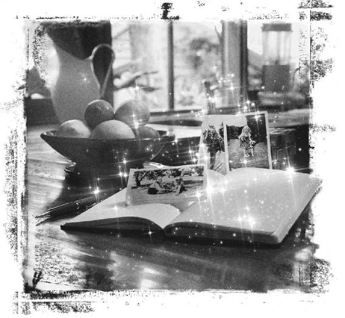

## 第 3 天魔力关系

假设地球上只有你一个人存在，或许你没有欲望做任何事情。你甘愿画出的画无人欣赏吗？你甘愿作出的曲子无人唱和吗？你甘愿发明的东西无人使用吗？你也不会想要四处旅行，因为不论去到哪里都是一样的——依旧孤身一人。你的生活将毫无乐趣可言。

是人与人之间的沟通和交流才赋予了你生活的喜乐、意义和目标，也正因为如此，你同他人之间的关系会对你的生活产生重要的影响。想要获得你梦想的生活，你就必须要理解人际关系对你的生活至关重要，因为它是你表达感恩的一个有效通道，由此你将赋予生活新的面貌。

现代科学证实了先哲的智慧，研究表明，心怀感恩的人能够更好地处理人际关系，他们同家人和朋友的联系更加紧密，也更能够赢得别人的尊敬。另一个研究结果则更令我们感到不可思议，对他人的每一次抱怨和指责，不论从内心还是在言语上，都需要你祈祷十次才能弥补自己对这段关系的伤害，少于这个次数，你同对方的这段关系就会恶化，如果是婚姻关系，最终很可能会以离婚收场。

感恩有助于润滑人际关系。如果你对某段关系的感恩增强，就会奇迹般地从中收获更多的幸福和美好。人际交往中的感恩态度不仅影响了人与人之间的关系，对你本身也会产生影响。不论你的性情如何，感恩都将赋予你更多的耐心、理解、同情和仁慈，这种影响是潜移默化的。人际交往中将一扫从前的不快和抱怨，因为，对他人怀着真诚的感激，你就不会执拗于想改变他。你不会再抱怨、批判或是责备，因为你心里装满了对对方的感激。事实上，你甚至会对过去曾耿耿于怀的怨恨视而不见。

“只有当我们意识到自己所拥有的事物的时候，才是真实地活在这个世界上。”

桑顿·怀尔德（1897—1975）

作家和剧作家

言语包含着力量，因而当你抱怨某个人的种种不是时，实际上是在破坏你的生活，而抱怨都将由你的生活来承受。根据吸引力法则，你对他人的所思所言，都将作用于自己身上。这就是为什么所有的智者和导师都在告诫我们应当感恩，因为他们知道要想让你的人生收获更多，让你的人生魔力倍增，就需要怀着一颗感恩的心接受对方本来的面目。假如每个你亲近的人都对你说“我爱你——最本真的你”，你将做何感想？

今天的魔力练习就是怀着感恩的心接受他人本来的面目！就算你同他人相处融洽，这样的练习也能够帮助你进一步改善这些关系。通过发掘对方身上值得感激的方面，你将见证感恩再次发挥神奇的魔力，同对方的关系将比你所期望的更加稳固、丰富和充实。

选择三种最亲密的关系表达你的感恩，你可以选择你的妻子、儿子、爸爸、男朋友、生意伙伴或姐妹，也可以选择你最好的朋友、祖母或叔叔。你可以选择任意三种对你来说比较重要的关系，只要你有每个人的照片。照片可以是这个人的独照，也可以是你们的合影。

选择好三种关系并准备好照片，接下来就可以开始练习了。坐下来，并思考每个人最值得你感激的事情。你喜欢这个人的哪些方面？他们的优秀品质有哪些？你可以感谢他们的耐心、倾听能力、才华、长处、好的判断力、智慧、笑声、幽默感、眼睛、笑容或仁慈的心。你也可以感激同对方一起经历过的事，还可以回忆同对方共度的一段时光，那些日子他一直陪伴你、关心你、支持你。

思考完为何对这些人心怀感激之后，将他们的照片摆在你面前，拿出笔和笔记本，或是打开电脑，一边盯着这个人的照片，一边写下五件他曾做过的最令你感激的事情，每一句话都用我们熟悉的魔咒“谢谢你”作为开头，然后写下这个人的名字，最后写下你要感激的事情：

谢谢你，他们的名字，因为什么原因？。

举个例子：“谢谢你，约翰，因为你常常逗我开心。”或者：“谢谢你，妈妈，因为你的鼓励，我考入了大学。”

三个人的感恩清单都列好之后，将这些照片随身携带，然后把它们放在一个你能够经常看见的地方。不论今天什么时候看到这些照片，你都要对照片上的人说出魔咒：谢谢你，然后叫出对方的名字：

谢谢你，海莉。

如果你经常四处走动，那么将照片放在你的包里或是口袋里，一天保证至少看三次照片，然后重复上述步骤。

相信你已经学会如何将感恩的魔力运用于改善人际关系。尽管本书并没有要求掌握这个练习，但如果需要，你也可以每天进行这个神奇的练习，让自己同他人的关系从此变得不同。你可以在同一段人际关系上重复练习，想练多少次都可以。你投入的感恩情绪越多，这段关系就能越快得到改善。

### 魔力练习事项 3

### 魔力关系

1.重复魔力练习事项 1——数算你的恩福中的步骤 1-3：列出你生命中值得感恩的十项恩福，并写下每一项感恩的理由。重读一遍写下的感恩项。然后念三遍魔咒：谢谢、谢谢、谢谢，尽最大努力体会心中的感激之情。

2.选择三段最亲密的关系，然后收集这些关系中对方的照片。

3.将照片放在你面前，在笔记本或电脑上记录下你对每个人最感激的五件事。

4.每一句话以魔咒“谢谢你”开始，后面为这个人的名字，最后写下你具体感谢的内容。

5.今天，将三张照片带在身上，或是摆在一处你能经常看见的地方。一天保证至少看三次照片，然后面对照片上的人，讲出这句魔咒：谢谢你，某某某。例如：谢谢你，海莉。

6.今晚入睡前，一只手握住你的感恩石，对一天所发生的最美好的事，说一声“谢谢”。

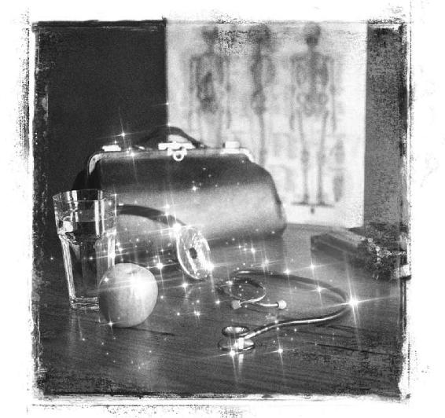

## 第 4 天魔力健康

“健康是最大的财富。”

维吉尔（公元前 70—前 19）

古罗马诗人

健康对任何人来说都弥足珍贵，尽管它的价值超过任何事物，但我们常常会忽视它。对大部分人而言，失去健康时，我们才会想到它，然后才会沉痛地意识到：失去健康，我们就失去了一切。

有一句意大利谚语道破了健康对我们的意义所在：“拥有健康身体的人是富足的，尽管他对此一无所知。”身体无恙时我们很少会关注健康，当被即使是感冒这样的小病烦扰时才能体会此言不虚。一旦健康不再，你唯一希望的就是重获健康，没有任何事比拥有健康更重要。

健康是生命赐予你的礼物，你得接受这份馈赠，并长期持有。除了想方设法保持身体健康，我们还应该对所拥有的健康心怀感激，这样才能变得更加健康。

谨记：

“（对健康）心怀感恩之人将被赐予更多，变得富余。（对健康）不存感恩的，连他所有的也要夺去。”

或许有些人生活方式很健康，但最终却落得疾病缠身。对你所拥有的健康表达感谢，这一点至关重要。当你心怀感恩时，不仅巩固了所拥有的健康，同时感恩的魔力将让健康的能量源源不断地流入你的身体。你也可以看到自己的身体状况得到迅速改善。小病小痛，甚至是身上的痣、胎记都会奇迹般地淡化，你还能感到自己的精力和幸福感明显增加。

在下面将要学习的内容中，通过每天的练习，你可以提高视力、听力及各个感官的能力，让身体的各部分机能正常运作，所有这些都像被施了魔法一样神奇！

“感恩是疫苗、抗毒素及抗菌剂。”

约翰·亨利·乔怀德（1864—1923）

长老教会牧师和作家

为你的健康真诚地感恩，将让你的身体变得更加强健，反之，不懂得感恩，你将会逐渐失去健康。健康的失去意味着你的体力、精神、免疫系统、思维的敏捷度，以及身体和心灵的各项指标都随之下降。

对拥有的健康表达感激，能够使你收获更多健康以使这份感激得以延续，同时这种做法也能消除身心的紧张和压力。科学研究表明，紧张和压力是疾病之源。研究还告诉我们，那些心怀感恩的人能够更快地康复，他们的寿命也比平均水平多出七年！

通过自身的现状你可以衡量出自己到底心怀多少感恩。你的每一天都应当在欣喜中度过。假如你感到压抑，生活对你来说充满负担，或是你感到自己没有实际年龄年轻，这就表明你的健康状况在不断下滑。体力的丧失最重要的原因就是缺乏感恩。现在这一切将得到改善，因为借助感恩的神奇力量，你将重获健康！

健康的魔力练习首先需要你阅读下面这段有关健康的文字。在读到每一个标记身体部位的斜体词句时，你需要闭上双眼，在心里重复这些词句，体会你对这部分身体的感激。记得想一想你感恩的理由，这能够激发你更加真挚的感激之情。你的感激之情越真挚，你就能越快地看到身体出现的奇妙变化。

关注你的双腿和双脚，这是你生命中最重要的行走依托，想象借助双脚从事的各种活动，例如平衡、站立、坐下、锻炼、跳舞、爬楼梯、驾驶车辆，当然还有最重要的奇迹：行走。腿和脚能够让你在家中自由走动，到浴室洗澡、到厨房喝水，或是漫步到你的车前；腿和脚能够让你流连于商场、穿梭于街道、踯躅于机场、漫步在沙滩。行走赋予了我们享受生活的自由！对你的腿和脚真心地说声谢谢！

关注你的双臂和双手，一天当中有多少次你需要提起或举起重物。双手是身体最主要的工具，一天到晚它们不知疲倦地工作，手能够让你写字、吃饭、打电话、操作电脑、洗澡、穿衣、如厕，捡拾提举，无所不能。没有了双手你就只能依赖他人的帮助。因此，对你的胳膊、手以及手指说声谢谢！

关注你神奇的感官系统。味觉让你体会到喝水、就餐时美味带来的快乐。感冒后味觉丧失时的痛苦相信你深有体会。因此，对你的味觉说声感谢！

嗅觉帮助你识别生活中各种醉人的芬芳：花朵、香水、干净的床单、喷香的饭菜、寒冬夜晚柴火散发的味道、夏日里的空气、新割的青草、雨后的大地。对这不可思议的嗅觉说声谢谢！

如果没有触觉，你将永远无法体会冷热、软硬、光滑与粗糙；你也绝对无法感受各种事物的存在，无法表达或是接收爱意。触觉让你用坚定的拥抱迎接你的爱人，和对方两手交握的感受是人生中一次珍贵的体验。因此，对你宝贵的触觉说声谢谢！

想象一下双眼带给你的视觉奇迹，它让你端详爱人和朋友的脸庞，阅读书籍、报纸和电邮，观看电视节目，欣赏大自然的美丽，更重要的是，帮你辨识道路。尝试蒙上双眼一个小时，做一些日常工作，你就会发觉眼睛的重要性。对能够让你体察万物的双眼说声谢谢！

关注你的耳朵，它帮你捕捉来自你和他人的声音，这样你就能够同别人交谈。没有了耳朵和听觉，你就无法使用电话、欣赏音乐、收听广播、陶醉于爱人的情话，世界上的任何声音将从你的世界里消失。你应该对所拥有的听觉说声谢谢！

当然，如果没有大脑的协助，任何感官系统都将无法工作。它每秒可以处理的各个感官发来的信息量多达一百多万次！事实上，大脑主宰着你去感知和体验生活，世界上没有任何一台电脑可以复制大脑的活动。让我们对神奇的大脑和卓绝的智慧说声谢谢！

关注身体数万亿个细胞，它们为你的身体、健康和生活的正常运转一天二十四小时、一周七天不停息地工作。对这些细胞说声感谢！关注维持生命体征的各个器官，它们周而复始地进行新陈代谢，事实上，它们的工作完全不受你意识的操控。对身体里完美协作的各个器官说声谢谢！

除了刚刚提到的各个器官和机能，更令人惊叹的还有我们的心脏。心脏支配着身体的其他器官，是它将生命的源泉送往身体的各个系统。对你强健的心脏说声谢谢！

接下来，拿出一张纸或卡片，在上面写下这段黑体字：

是健康的犒赏让我存活于世。

今天就将这张卡片随身携带，把它放在一处你能经常看见的地方。如果你经常伏案工作，可以将卡片放在书桌的正前方。如果你是一名司机，可以把卡片放在车里你经常扫视之处。如果你经常待在家里，可以把卡片放在洗手台上，或是电话机旁。选择一处放置卡片，保证你能够经常读到上面的内容。

今天，你需要把这些话至少读四次，当你看到它时要将其一个字一个字缓慢地读出来，尽可能深切地感谢健康对你的犒赏。

感谢健康不仅对你保持健康至关重要，同时还能确保你的身体越来越健康，精力更加充沛。感恩的心态再加上传统医药的调理，你就能见证健康的革命，一些我们从未见过的奇迹将在你身上发生。

### 魔力练习事项 4

### 魔力健康

1.重复魔力练习事项 1——数算你的恩福中的步骤 1-3：列出你生命中值得感恩的十项恩福，并写下每一项感恩的理由。重读一遍写下的感恩项。然后念三遍魔咒：谢谢、谢谢、谢谢，尽最大努力体会心中的感激之情。

2.在一张纸或卡片上写下：

是健康的犒赏让我存活于世。

3.将写好的卡片放在你今天能经常看到的地方。

4.一天里至少看四次卡片上的话语，每一次都要缓慢地读出这句话，尽可能深切地感谢健康对你的犒赏。

5.今晚入睡前，一只手握住你的感恩石，对一天里所发生的最美好的事说一声“谢谢”。

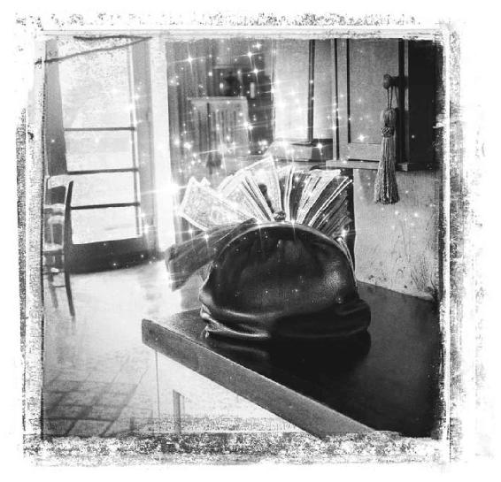

## 第 5 天魔力金钱

“感恩是财富，抱怨是贫穷。”

基督教科学派

如果此时的你经济窘迫，一定要明白这个道理，那就是对待金钱持焦虑、妒忌、失望、沮丧、怀疑或是恐惧的情绪不可能让你的经济状况好转，因为这些情绪皆因你对所拥有的金钱缺少感恩所致。有关金钱的抱怨、争执、对金钱的心灰意冷、愤世嫉俗或横加批判绝非感恩之行，你也绝不会因此而变得富裕，相反情况会越来越糟。

不论你目前的状况如何，认为自己不富裕的念头就是对所拥有的金钱不心怀感恩，你的头脑不仅需要摒弃这种思想，还要对现在拥有的钱财充满感激，这样财富才能神奇地增长！

“（对金钱）心怀感恩之人将被赐予更多，变得富余。（对金钱）不存感恩的，连他所有的也要夺去。”

即便囊中羞涩仍然心怀感恩，能够做到这一点实属不易，但你需要明白只有心怀感恩，你才能奋而争取，否则一切都不会改变。

关于金钱的话题曾经让无数人彷徨和迷惘，尤其是在人们感到生活窘困的时候，因此本次有关金钱的魔力练习分为两个步骤。在开始练习的这一天你需要从头至尾地读完本节练习，因为本节练习将要持续一整天时间。

坐下来花几分钟回忆童年，那时的你没有钱或是拥有的钱寥寥可数；回顾金钱为你支付的每一段记忆，在心中默念魔咒“谢谢”，并认真去体会这句话在你心中的分量。

过去的你是否能每日饱食？

过去的你是否有家遮风挡雨？

过去的你是否受过良好的教育？

每天你是怎么去上学的？买得起课本吗？在学校有午餐吗？上学所需的东西你都负担得起吗？

孩童时你有没有外出旅行过？

孩童时得到的最棒的生日礼物是什么？

你是否有自行车、玩具或是宠物相伴？

在你快速成长的那段时期有足够的衣服更换吗？

你去看过电影吗？曾经迷恋过某项运动、乐器或有某种爱好吗？

身体不舒服的时候你去看过医生开过药吗？

你看过牙医吗？

过去的你拥有牙刷、牙膏、香皂、洗发水等日常生活必需品吗？

过去的你有没有乘车旅行？

过去的你看电视，打电话，家里用电、电器和自来水吗？

所有的这些都需要花钱，而你过去的享受——皆是无偿的！当你追溯儿时或是年轻时候的记忆，你就会意识到享用过的许多东西都是辛苦赚取的钱换来的。对每一个细节、每一个回忆都应当心怀感恩，因为只有对过去曾拥有的金钱怀着诚挚的感激，你的金钱才能在未来出现神奇地增长！这符合自然的法则！

继续金钱的魔力练习，拿出一张一美元的纸币，然后在上面贴上一张标签，附上这样一句话：

感谢我一生中所获得的所有金钱。

今天将这张具有魔力的纸币随身携带，你可以将它放在你的钱包或口袋里。至少上下午各一次，只要你愿意，一天当中尽可能将它掏出并握在手里。阅读上面的话并真心地感激所获得的金钱令你的生活富足。你的感激越真诚，感情越强烈，你的经济状况就能越快得到改善。

你预先无法想到自己所拥有的金钱将如何增加，但你将会发现自己的境遇发生很大改变，这些改变让你能够赚到更多的钱。你会在一些意想不到的方面发现赚钱的机遇，或是收获意外的财富，打折、价格减免时有发生，并获得各种物质财富。

今天过后，你可以将这张具有魔力的一美元放在每天能看到的地方，这样能够提醒你对所拥有的金钱心怀感恩，记住，你注意这张纸币的次数越多，对金钱的感恩越强烈，就能产生更多的魔力。你感恩的态度直接决定了今后财富增长的多寡！

如果感觉自己想要对金钱的问题发牢骚，不论是言语还是思想上的，请自问：“我是否愿意为本次的抱怨付出代价？”因为一次抱怨将会减缓甚至阻止金钱流入你的生活。

从练习的这天开始，对自己许下诺言，不论你在任何时候获得金钱，不管是工资所得，还是打折减免，或是你收到别人送的贵重物品，你都要从心底充满感激。你已经收获了财富，换句话说，你也应该利用每一次这样的机会去提升感恩的魔力，对获得的金钱心怀感恩，这样能够确保财富进一步增长！

### 魔力练习事项 5

### 魔力金钱

1.重复魔力练习事项 1——数算你的恩福中的步骤 1-3：列出你生命中值得感恩的十项恩福，并写下每一项感恩的理由。重读一遍写下的感恩项。然后念三遍魔咒：谢谢、谢谢、谢谢，尽最大努力体会心中的感激之情。

2.坐下并花几分钟回忆小时候无偿享受到的生活中的各种恩惠和便利。

3.回顾金钱为你支付的每一段记忆，在心中默念魔咒“谢谢”，并认真去体会这句话在你心中的分量。

4.拿出一张一美元或其他小额面值的纸币，在上面贴上一张标签并写下下面这段黑体字：

感谢我一生中所获得的所有金钱。

5.今天将这张具有魔力的纸币随身携带，至少上下午各看一次，只要你愿意，一天当中尽可能将它掏出并握在手里。阅读上面的话并真心地感激所获得的金钱令你的生活富足。

6.今天过后，你可以将这张具有魔力的一元纸币放在每天能看到的地方，这样能够提醒你对所拥有的金钱心怀感恩。

7.今晚入睡前，一只手握住你的感恩石，对一天所发生的最美好的事，说一声“谢谢”。

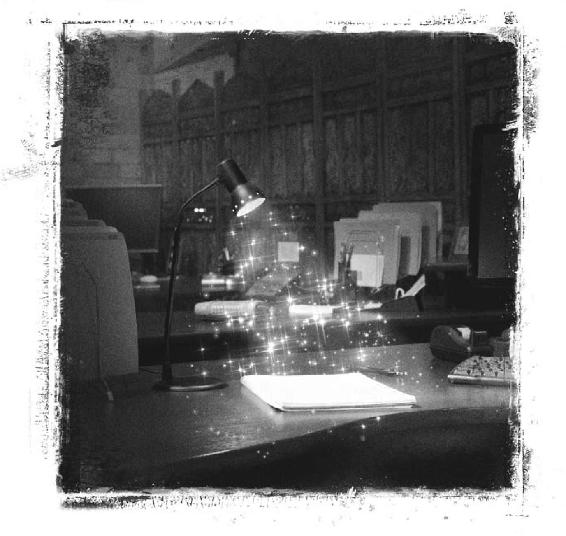

## 第 6 天让工作充满魔力

“无论从事何种活动，献身于何种艺术或学习何种技能，你都要尽可能精益求精，将这份事业推向尽可能的高峰，一旦冲破现实的樊篱，你就会进入魔幻神奇的世界。”

汤姆·罗宾斯（生于 1936 年）

作家

我们很难想象一个出身赤贫，毫无背景，没有受过教育的人有一天会成为总统或名垂青史，或者成为一个王国的缔造者，抑或成为这个世界上最富有的人。我们也很难理解为什么职业相同的两个人，一个人的事业渐入佳境，而另一个人却依然原地踏步，无论付出多少努力，成功似乎总与他无缘。连接成功的其中一段链条缺失了，这段链条就是感恩。根据吸引力法则，你需要对所拥有的心怀感恩，这样成功才会悄然而至。因此，缺少感恩，你就不可能获得成功。

为了给你的工作和事业带来成功或好运，诸如获得机遇、升职、加薪、获取灵感或创意、受到领导器重等，你首先要对这份工作心怀感激。你的感激之情越强烈，对你生活的影响就会越深刻！假如你此时正期望着成功的来临，你就必须对所拥有的表达感激。

“（对工作）心怀感恩之人将被赐予更多，变得富余。（对工作）不存感恩的，连他所有的也要夺去。”

对所从事的工作心怀感恩，你自然会对工作投入更多，对工作投入得越多，回报你的财富和成功也会随之增加。如果对工作不知感恩，你的付出自然也会减少。而付出越少收获也会越少，结果就是，你无法从工作中获得快乐，往往出力而不讨好，事业停滞不前，甚至走向倒退，这很可能使得日后你失去这份工作。切记：不存感恩的，连他所有的也要夺去。

感恩之情的强烈与否直接影响到你的所得。

你控制了感恩情绪，也就意味着控制了自己所能获得的馈赠。

如果你是个商人，那么感恩的强弱将会决定你的财富是增加还是减少。对你所从事的生意、你的客户以及你的雇员所怀有的感恩越强烈，你的生意就会越发兴盛。一个不懂得感恩、一味抱怨的商人，他的生意也必将惨淡收场。

如果你为人父母，那么你当前的工作就是抚养孩子、照顾家庭，在这段时日里，你也需要寻找值得感恩之事。这是此生仅有的一次机会，这段日子如果你能心存感恩，就会获得更多的支持和帮助，人生也将回馈你无限美好而温馨的回忆。

你应该热爱自己的工作，无论你从事何种工作，心情愉悦地投入工作，不要太过贪心。如果目前的工作并非你理想的，或者实在让你无法获得快乐，那么收获理想工作的第一步就是对现在所从事的工作心怀感恩之情。

今天，想象你的身边有一位看不见的“上司”，他的职责就是记录下你对工作的想法和感受，这位“上司”会一直跟随你，手里拿着纸和笔。每当你发现工作中值得感恩的事，他就会对此进行记录。你的工作是尽可能多地寻找感恩的对象，这样在一天结束时，你的“上司”可以展示出一份内容丰富的感恩记录，这份清单越长，这位“上司”带给你的魔力就越强，诸如金钱、事业的成功、机遇、幸福感和成就感。

思考工作中值得感激的事物。首先，你可以感激自己拥有了一份工作。想想有多少人正在失业，他们宁愿付出任何代价获取一份工作；想想那些办公设备为你带来的便利，比如电话、打印机、互联网以及电脑；想想那些让你的工作变得更舒适的人，比如接线员、助理、门卫、邮差；再想想领取薪水时的那份喜悦，想想那些令你感到快乐的工作内容。

每次发现值得感恩的事情时，让那位“上司”这样记录：

我很感激，因为什么？。

让这位“上司”尽可能多地体会你的感恩情绪，这样他就能越发迅速地为你的工作带来改善，这种魔力也会体现得越明显。试着心怀感恩地工作一整天，你会立刻发现情况有所改善。幸运并非偶然，这是感恩在施展它的魔力！

进行该项魔力练习时如果恰逢周末或是你不在工作，你可以进行下一项练习内容，在开始工作的第一天再进行本项练习。

### 魔力练习事项 6

### 让工作充满魔力

1.重复魔力练习事项 1——数算你的恩福中的步骤 1-3：列出你生命中值得感恩的十项恩福，并写下每一项感恩的理由。重读一遍写下的感恩项。然后念三遍魔咒：谢谢、谢谢、谢谢，尽最大努力体会心中的感激之情。

2.今天工作时，想象身边有一位看不见的“上司”一直跟着你，并对你所发现的感恩对象进行记录。而你今天的任务就是尽可能多地发现值得感恩的事情。

3.每次发现感恩对象时，让你的“上司”这样记录：我很感激，因为什么？，你需要尽可能地体会心中的感恩之情。

4.今晚入睡前，一只手握住你的感恩石，对一天所发生的最美好的事，说一声“谢谢”。

## 第 7 天扭转逆境的秘诀

“懂得感恩的人不论任何情况都会心怀感激之情。”

巴哈欧拉（1817—1892）

巴哈伊教波斯创始人

不论是爱情碰壁、经济窘迫、身体欠佳还是工作中遭遇难题，生活的种种不如意都源于长期缺乏一颗感恩的心。如果我们对生活赋予的一切不懂得感恩，我们就会认为享受这些恩福是理所当然的事情。这种理所当然的态度是各种消极因素出现的缘由，因为一旦认为我们的所得是天经地义的，我们就不会对此表示感激，而感恩的魔力也将随之消失。对他人表达感谢也会令我们的生活出现奇迹般的改善，反之毫不感恩地接受馈赠会令我们的生活走向消极。

身体健康状况良好时，你会感恩吗？或者只有当身体生病或受伤时，你才会注意到自己的健康状况？每天工作时你是否充满了感恩？还是只有在工作遭遇挫折时才体会到它的价值？每当领取薪水时你是否会感恩？还是觉得这份薪水来得天经地义？当一切都很顺利时，你会对自己所爱的人表达感激之情吗？或者只有在出现问题时，你才会去讨论自己的亲密关系？驾驶汽车疾驰在路上的你是否会为此而心怀感恩？又或者只有在车抛锚时才意识到车子带给你的便利？

每一天你是否心怀感恩地生活？或者理所当然地接受生活带给你的恩福？

心安理得地接受一切常常会引发牢骚、负面的思想和言语。如果你在抱怨，那么根据吸引力法则，你就会将更多引发你抱怨的事物带入生活！

如果你对天气、交通、你的老板、配偶、家庭、朋友、素不相识的陌生人抱怨不止，如果你对排队等候、层出不穷的账单、你的收入和花销，或是某个公司的服务牢骚满腹时，你就是一个不懂感恩的人，一次次的抱怨只会让你离理想的生活越来越远。

现在你应该明白所有的抱怨、消极的思想和言语，以及理所当然的态度会终止生活给你的一切恩福。现在你也应当明白，如果生活出现曲折坎坷，一定是你无意中丢失了感恩的心。

心怀感恩之人生活少有坎坷，心怀感恩之人不会满是批判和抱怨之词，心怀感恩之人很少自伤自怜、思想消极。如果你目前正遭遇诸般不顺，那么感恩的心态无疑会帮你扭转这一颓势。仿佛魔法一般——烟雾散尽，生活中所有不顺遂的事情通通消失不见！

万事开头难，在逆境中寻找值得感恩的事物并非易事。但不论你的境遇有多么糟糕，你依然会发现一些值得感恩的东西，尤其是当你发现感恩正奇迹般地扭转种种不利局面时。对此深有体会的沃尔特·迪斯尼在他的电影《波莉安娜》中向我们揭示了这个道理。

迪斯尼 1960 年拍摄的电影《波莉安娜》中提到的“快乐游戏”，对当时还是个孩子的我产生了深远的影响。“快乐游戏”一直陪伴我度过了童年和少年时代。所谓的“快乐游戏”，就是尽可能多地找寻让你感到高兴的事，特别是身处逆境时。每当生活不如意，试着找寻高兴的事（或是值得感恩的事），所有问题和麻烦的解答就会不期而至！

沃尔特·迪斯尼用电影《波莉安娜》为人们展示出感恩的魔力，而几千年前佛祖也用类似充满魔力的话语指点世人：

“让我们充满感激地生活，即使今日没有学到太多，至少收获些许，哪怕没有任何收获，至少身体健康，哪怕疾病缠身，至少活在人世。因此感恩须铭记于心。”

释迦牟尼（约公元前 563—前 483）

佛教创始人

希望佛祖的话语能让你豁然开朗。今天你不妨专注于某个迫切想要解决的问题或困境，从中找出十点值得感恩的地方。当然，这项练习开始时会比较艰难，但佛祖已经为你指出了方向。在电脑上或是在日记本中列出十条值得感恩的事。

比如，此时的你正面临失业的困扰，无论你怎么努力依然没有找到工作。想要扭转这种不利的局面，你必须要集中精力进行感恩练习，或许下面列举的正是你值得感恩之事：

1.我很感激，因为我有更多的时间陪伴家人。

2.我很感激，因为我有更多的时间来整理自己的生活。

3.我很感激，至少过去多年来的工作让我经验丰富。

4.我很感激，至少这是我第一次失业。

5.我很感激，每天都有新的工作岗位等待我去尝试。

6.我很感激，感激所有我所拥有的有利于求职和面试的知识和经验。

7.我很感激，我的身体健康，依然可以继续工作。

8.我很感激，家人的鼓励和支持。

9.我很感激，除去工作我还拥有很多。

10.我很感激，失业让我意识到工作对我而言多么重要。直到现在我才深刻体悟。

正是因为这种感恩的心态，那些面对失业困境的人将正面事物吸引到他们周围，并最终使他们的境遇得到奇迹般的改善。感恩的力量可以战胜一切困境，要扭转颓势也有无限的方法。而你所做的只是心怀感恩，静待奇迹的出现！

让我们再打个比方，一个儿子和他父亲的关系出现了问题。儿子感觉自己无论做什么，好像都无法让父亲满意。

1.我很感激，起码一直以来我们之间的关系都很好。

2.感谢我的父亲，因为他的辛勤工作才让我得到了他不曾拥有的教育机会。

3.感谢我的父亲一直以来支撑这个家，小时候的我不曾意识到需要多少钱、多努力工作才能养活一家人。

4.感谢我的父亲在我小时候每周六带我去上篮球课。

5.感谢我的父亲，现在他对我不像从前那么严厉了。

6.感谢父亲对我的关心，若非如此，他也不会对我这么严格。

7.我很感激，父子之间的相处让我懂得如何和自己的孩子相处：关怀加多一点的理解。

8.感谢父亲对我的鼓励，他让我明白：在培养一个乐观自信的孩子的过程中鼓励有多么重要。

9.我很感激，能够和父亲坐在一起说笑。一些人永远无法体会这种幸福，因为他们的父亲不在身边；还有一些人则失去了父亲，他们再也没有机会和父亲坐在一起说笑了。

10.我很感激，有父亲伴我左右，人的一生有欢乐、有痛苦，但和父亲在一起，注定未来快乐更多一些。

儿子对父亲的感激之情，帮助了父子关系的改善。儿子改变了对父亲的看法，而这种改变也将吸引父亲更多的正面关注。尽管儿子的感激只是发生在内心里，这种心思无法捕捉，然而这种感情依然会神奇地作用于父子关系。只要他能一直保持这种感恩的心态，根据吸引力法则，儿子一定会扭转这种父子关系的不利局面，他们之间的关系也会很快得到改善。

记住，你的内心感受会告诉你感恩一直在发挥着作用。通过感恩练习你会感觉周围环境确实出现了一些改善，你的心里很确定这种改善会继续下去，问题很快就会解决。想要摆脱所有困扰你的逆境，你需要将注意力集中于感恩，让它改造你的内心世界，接下来你会发现外部世界也将出现神奇的变化。

在列出值得感恩的事项时，请务必用下面的方式记录：

我很感激，因为。

或，我真心实意地感谢。

将你所要感恩的内容补充完整。如果你喜欢，还可以用沃尔特·迪斯尼充满感恩神奇力量的方式表达：

我很高兴。

将你感到高兴的内容补充完整。

列出值得感恩的十件事之后，你可以写下这样一段话作为摆脱逆境练习的完结：

感谢，感谢，感谢，事情得以完美地解决。

今天，看看自己是否能不说一句消极的话语，这对你来说或许是个挑战，但试试你这一整天能否顺利过关。这么做的一个重要原因是，大多数人从未意识到自己曾说过多少消极的话语，但如果你留心观察一天就会找到答案。切记，抱怨和泄气只会引来更多的负面事物，如果你能留意自己所说的话，就能学会克制，并有更多的空间思考自己是否真的愿意让所说的不幸变为现实。这里有一个神奇的补救方法，可以运用在你发觉自己的想法和话语比较消极的时刻。立刻停止抱怨，并说：

但我必须要说我真的很感谢。

剩余的部分填上——任何事情——只要你想对其表达感激。谨记这句带有魔力的话语，不论何时只要你需要都可以拿出来救场。

今后无论遭遇任何难题或逆境，记住用感恩的力量浇熄消极的火苗，防止它继续蔓延；同时保证你心中感恩的火焰永不熄灭！

### 魔力练习事项 7

### 扭转逆境的秘诀

1.数算你的恩福：列出你生命中值得感恩的十项恩福，并写下每一项感恩的理由。重读一遍写下的感恩项。然后念三遍魔咒：谢谢、谢谢、谢谢，尽最大努力体会心中的感激之情。

2.找出你最希望解决的难题或困境。

3.列出在困境中你值得感激的十件事。

4.在感恩清单的结尾写下：

感谢，感谢，感谢，事情得以完美地解决。

5.今天，看看自己是否能不说一句消极的话语。如果发觉自己的想法和话语比较消极，使用这句带有魔力的话语。立刻停止抱怨，并说：

但我必须要说我真的很感谢。

6.今晚入睡前，一只手握住你的感恩石，对一天所发生的最美好的事，说一声“谢谢”。

## 第 8 天魔力配方

“感恩的心就如持续的盛宴。”

W.J.卡梅伦（1879—1953）

记者和商人

吃饭之前进行感恩的传统可以上溯至数千年前的古埃及。随着二十一世纪生活节奏的不断加快，饭前祷告的习俗经常会被人忽视，如果利用吃饭这般平常的日常行为来感恩，你的生活将会出现不可思议的变化！

假如你在饥肠辘辘的时候进行思考，就会感到力不从心，还会觉得疲惫，甚至全身发抖，你的思想也变得不集中，情绪低落。仅仅饿几个小时，你的身体就会出现这些反应！你需要摄取食物用以维持生命、思考问题并保持快乐的心情，因此我们对赖以生存的食物应充满深深的感激之情。

为了激发对食物更多的感恩，你不妨花些时间思考一下为你的食物献出心力的人们。为了你能吃上新鲜蔬果，果农和菜农需要辛勤地耕作，其间得不停浇水和除虫，持续数月才能迎来收获。之后还需要采摘、包装、分配，工人们必须日夜不停地辛苦运输，无数人协同工作才确保了一年四季我们总可以吃到新鲜的蔬菜和水果。

再想想那些肉类养殖户、渔民、奶农、茶叶和咖啡种植工人，以及那些在食品加工厂忙忙碌碌的工人，这些人为我们贡献了各种各样的食物。全世界的食品加工过程恰如一曲波澜壮阔的交响乐，这个过程终日不息，你很难想象将全世界的食品配送到各个便利店、餐厅、超市、咖啡厅、航班、学校、医院，以及各个家庭，到底需要多少人的协同努力才能完成。

食物是一份难得的礼物！这件礼物来自大自然，如果没有自然为我们提供土壤、养分、水，粮食就无法生长，我们也不会获得食物。没有水，所有的粮食、果蔬、动物乃至人类都将无法生存下去。我们需要水来做饭、种植粮食、浇灌花园里的花草，以及日常洗漱。此外，车辆行驶需要水，医院的运转需要水，石油和矿山的开采和制造也需要水，交通、公路建设、衣服制造以及各种轻工业和重工业需要水、塑料、玻璃、金属，以及挽救人生命的各种药品的生产、房屋的建造也需要水。水维持着人类正常的身体机能。水、水、水，弥足珍贵的水！

“地球上如果真的存在魔力，那它一定蕴含在水中。”

洛伦·艾斯利（1907—1977）

人类学家和自然科学作家

没有食物和水我们将沦落到何种境地？至少我们现在不会在这里。我们的家人和朋友也不会在这里。今天、明天对我们而言都将不复存在。而现在我们共同生活在这个美丽的星球上，面对着生命的各种挑战、体会着其赋予我们的欢乐，这一切都源于自然的馈赠：食物和水！吃饭、喝水之前念出那句简单的咒语：谢谢，这是对自然赠予我们神奇的食物和水的一种认可和感激。

对食物和水的感恩不仅会为你的生活带来改变，同时它还会影响大自然的产出，这确实是件不可思议的事情。如果足够多的人对食物和水表达感恩，这将帮助那些处于饥饿和干渴之中的人。根据吸引力法则，以及牛顿的作用与反作用力定律，大多数人的感恩行为一定会产生出与之相等的回馈，这将能够帮助地球上那些食物和水源短缺的人群走出困境。

除此之外，对食物和水的感恩会让魔力作用于你的生活。感恩的金线将把所有你珍视的、热爱的以及梦想的事物紧紧联结。

古时候，人们认为对着食物和水进行的感恩祝祷有着净化食物和水的作用。现代的量子物理学中的观察者效应，证明了古人的做法多少有些道理。观察者效应指的是观察者的行为所引发的观察对象的变化。将心中的感恩集中于食物和水，这种关注会改变它们的能量结构，从而起到净化的作用，这样你所摄取的一切将有助于你的身体健康。

想要感受感恩对食物和水的魔力作用，其中一种方法是仔细品味口中的食物和水。仔细品味说明你很享受或很感激这些食物。让我们做个实验，下次在吃饭和喝水时，吃上一大口，然后集中精力体会食物和饮料在你口中的滋味，你会发现这样做会让食物的味道在各个味蕾间绽放；与此相反，如果吃饭或喝水时你心不在焉，那么口中的美食会瞬间变得寡淡无味。其实是你的注意力和感恩之情影响了食物的滋味！

今天在吃或喝东西之前，不管是吃饭、水果、零食或是喝任何东西，包括水，你需要先看一看你要吃或喝的东西，在心中默念或大声说出那句神奇的咒语：谢谢！做完之后，吃上一大口然后仔细地品味，这样做不仅会让你心情愉悦，还能帮助你激发更多的感激之情。

你也可以尝试我的做法，这帮助我增加了心中的感恩之情。当我在念那句咒语时，我会将手指在我要吃或喝的食物上方不停晃动，这就像是往上面撒上一些魔法粉末，我在心中想象这种魔法粉末会立刻净化它们所附着的食物。这样做让我感觉感恩就好像一种神奇的配料，我可以把它加在任何吃或喝的食物上！如果你觉得这样做更有效，你就可以想象自己手中拿着一个魔法粉的筛子，魔法粉通过它被筛在你要吃或喝的东西的表面。

如果在哪一次吃或喝之前你忘记说魔咒：谢谢，当你想起来时，你可以闭上双眼，回忆起那次吃或喝之前的那一两秒的片段，在心中默念那个魔咒。如果这一天你频繁地忘记对食物感恩，那么第二天你要重复今天的练习。感恩练习的过程一天都不可耽误——这对你能否实现心中的梦想十分关键！

对生活中这些普通的事物，比如食物和水，表达感激是最高境界的感恩。如果你能达到这种境界，就将见证魔力的发生。

### 魔力练习事项 8

### 魔力配方

1.数算你的恩福：列出你生命中值得感恩的十项恩福，并写下每一项感恩的理由。重读一遍写下的感恩项。然后念三遍魔咒：谢谢、谢谢、谢谢，尽最大努力体会心中的感激之情。

2.今天吃或喝东西之前，你需要先看一看你要吃或喝的东西，在心中默念或大声说出那句神奇的咒语：谢谢！你也可以想象在食物和饮料里撒上魔法粉末。

3.今晚入睡前，一只手握住你的感恩石，对一天所发生的最美好的事，说一声“谢谢”。

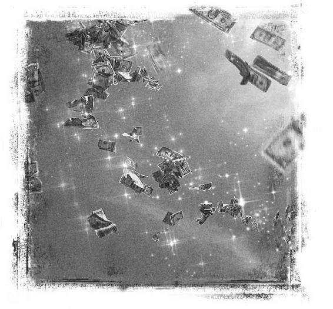

## 第 9 天财富磁铁

“只有心怀感恩，生活才能富足。”

迪特里希·朋谔斐尔（1906—1945）

路德教派牧师

感恩意味着财富，抱怨意味着贫穷，这是我们一生的黄金法则，不论在健康、工作、人际关系或是金钱方面，这条规则都在发挥着作用。对所拥有财富的感恩之情越强烈，即便你并不富裕，也会因此获得越多的财富。而对金钱越不满足，将会变得越发贫穷。

我们今天要进行的感恩练习能够将人们对财富不满的根源转变为感恩的行动，因此这个练习能够改变你的财运；你应该驱除种种抱怨，那只会让你的生活越发困窘，只有常怀感恩的心，才能让你奇迹般地变得富足。

许多人都认为自己不曾抱怨过金钱，可一旦入不敷出，他们就开始不自觉地抱怨起来。这种抱怨不仅体现在言语当中，也深植于我们内心。很多人忽视了自己内心的想法。有关金钱的任何的不满、妒忌、焦虑等消极的想法和言语，都会导致我们陷入更严重的贫困境地。掏出钱来支付账单自然是人们抱怨最多的时候。

如果此时你手头正紧，面对诸多账单你一定觉得十分为难，你会觉得要付的账总是比赚的钱要多。如果此时对着这些账单满是牢骚，那么你就是在抱怨自己所拥有的金钱，而这种抱怨会让你的经济状况变得更加艰难。

假如钱不够花，那你几乎不可能对着一堆账单抒发感恩之情。而事实上，这恰恰是你现在应当去做的，这样才能将更多财富吸引过来。想要过衣食无忧的生活，你就必须对所有和金钱相关的东西心怀感恩，对着账单牢骚满腹可不是感恩的表现。你需要做的事情和这刚好相反，你要对着这些账单表达感激，因为这些账单的生成恰恰表明你获得了相应的商品和服务。表达感激对你来说并非难事，而这简单的行为则会对你的财运产生深刻的影响，你慢慢地会变成吸引金钱的磁石！

对手中的账单心存感激，想象这些账单的产生让你获得了多少便利的服务或是优质的商品。如果这是你租房而产生的费用，你应该感激这笔钱的支出让你拥有了一个家，一个遮风避雨的住处。想象如果你不去支付这笔钱来换取这个住所，又或是如果没有人想出租房屋给你，结果会是怎样呢？我们或许就要露宿街头，因此对你的房东以及他们租赁给你的房屋表示感谢，因为这让你获得了一处住所。

如果你的钱是用来支付电和煤气的费用，你就可以想想因此而获得的舒适生活，比如热水器以及你所使用的各种家用电器。如果你的钱是用来支付电话和网络费用，那么不妨想想如果没有这些设施，你还需要大费周章地当面和对方交代事情。想想你和朋友、家人通电话，发送电子邮件以及通过互联网传递信息时的便利，这些便捷的服务都只需你轻轻动动手指，因此我们应该对它们心存感激，感激提供这些服务的公司赋予我们信任，在我们交付费用之前就能任意使用。

自从我发现了感恩的神奇魔力之后，每次支付账单时我都会写下那句神奇的咒语：“谢谢——已付清”，从未落下一次。起初没钱付账单时，我会想到利用感恩的魔力，在账单上写下一行字：“感谢我所拥有的金钱。”当我付完钱之后，我就会在账单的后面加上一句，“谢谢——已付清。”

今天你也要尝试着进行相同的练习。找出一张你尚未支付的账单，借助感恩的力量，在账单的背面写下一行字：“感谢我所拥有的金钱。”对支付账单所花费的金钱心怀感激，不论你是否已清偿。如果你选择利用网络支付账单，那么在你收到电子账单时用邮件将它转发给自己，并在邮件主题一栏用大写字母拼出下列几个单词：感谢我所拥有的金钱。

接下来，找出十张已经支付过的账单，并在账单的正面写下下面一句具有神奇力量的话语：“感谢——已付清。”在你写下这句话的同时，尽可能地在心中体会这种感激之情，感谢自己拥有足够的金钱支付账单。对已付清的账单所产生的感激之情越强烈，你就会吸引越多的财富向你聚拢！

从今天开始，每次在你支付完账单之后，你都可以进行这项练习，想想这份账单给你带来的便利服务，然后在账单正面写下那句魔咒：“感谢——已付清。”如果你的钱不够支付账单，你依然可以借助感恩的魔力，记住在账单上写下：“感谢我所拥有的金钱。”那种感觉就好像感谢自己已经付清了账单！

对你付出的金钱心怀感恩将保证你获得更多的财富。感恩就像一根带有磁性能吸附你钱财的金线，每次你将钱花出去时，它都会重新回到你的身边，有时候是等量返回，有时候是十倍，有时候甚至是百倍。所回流财富的多少并非取决于你花出去多少，而在于你到底怀有多少感恩。在你付出五十美元时，如果感恩的情绪足够强烈，那么你就会重新获得几百美元的财富。

### 魔力练习事项 9

### 财富磁铁

1.数算你的恩福：列出你生命中值得感恩的十项恩福，并写下每一项感恩的理由。重读一遍写下的感恩项。然后念三遍魔咒：谢谢、谢谢、谢谢，尽最大努力体会心中的感激之情。

2.找出一张你尚未支付的账单，借助感恩的力量，在账单的背面写下一行字：感谢我所拥有的金钱。对支付账单所花费的金钱心怀感激，不论你是否已清偿。

3.找出十张已经支付过的账单，并在账单的正面写下下面一句具有神奇力量的话语：“感谢——已付清。”真正体会这种感激之情，感谢自己拥有足够的金钱支付账单。

4.今晚入睡前，一只手握住你的感恩石，对一天所发生的最美好的事，说一声“谢谢”。

## 第 10 天魔法粉末

“没有什么事情比表达感谢更为紧迫。”

圣安布罗斯（340—397）

神学家、天主教主教

古代的精神教诲我们以诚挚之心对待他人会获得百倍的回报，因此，对那些曾经给予你恩惠的人表达感谢不仅是一项紧要的任务，而且对改善你的生活也至关重要。

感恩是一股很强的能量，你对谁表达感激，这股力量就会流向哪里。如果你觉得感恩的能量像是闪闪发光的魔法粉末，那么在你对那些曾施与你恩惠的人表达感谢时，你就像是在他们身上撒下了这些魔法粉末！这种魔法粉末中所蕴含的积极有力的能量会在这些人的身上产生影响。

每天我们借助电话、电子邮件，或是在工作，购物，乘坐电梯、公交的过程中接触到许多人，我们应该对当中的大部分人表达感激，因为我们从他们那里有所收获。

想想一天当中那些为你提供服务的人，他们有的在商店或餐馆工作、有的是公共汽车或出租车的司机、有的是客服人员、有的是清洁工，还有的是你工作中的同事。这些从事服务行业的人努力满足你的需求，而你也从他们那里获得了服务。如果你对他们的服务没有说声谢谢，那么你就是一个不知感恩的人，也将因此阻碍那些积极的事物进入你的生活。

想想那些保证我们的交通系统安全畅通的维修工人，以及那些维持电力、天然气、自来水和公路等生活设施正常运作的人员。

想想那些打扫街道、公厕、火车、汽车、飞机、医院、餐馆、超市，以及写字楼的保洁工人。你或许无法对所有的人都说声谢谢，但每当你从他们身边经过时，只要轻轻地对他们道声谢谢，就如同你在他们身上撒下了魔法粉末。当你坐在洁净如新的课桌旁，或漫步在一尘不染的街道上，或踏上光亮可鉴的台阶的时候，请记得心怀感恩。

去咖啡厅或餐馆时，别忘了对那些给你提供服务的人说声谢谢，这样你就在他们身上撒下了魔法粉末。不管他们是为你擦桌子、递菜单，还是帮你点餐、倒水、上菜、清理饭桌、结账，每次都不要忘了对他们说声谢谢。不论你是在宾馆办理退房手续，还是在超市款台结账，都不要忘了抛撒魔法粉末，记得对那些给你提供服务、帮你为商品打包的人说声谢谢。

如果你乘坐飞机旅行，可以对帮你办理登机手续的服务人员、安检人员、检票员，以及在门口迎接你的空乘人员说声谢谢，这样你就在他们身上撒下了魔法粉末。飞行过程中，对每次为你提供服务的乘务人员道声谢谢。送来饮料和食物，清理废弃物，这些都是他们为你提供的服务。在你乘坐飞机时，航空公司会感谢你选择这条航线，机长、乘务人员也会对你表达感谢，因此在你走下飞机时同样也应该对他们表示感谢。每当飞机安全降落目的地时你要说声谢谢，能够飞上云霄对你来说是一件很神奇的事！

对那些在工作中帮助了你的人表示感谢，不管是秘书、前台接待、餐厅服务员、保洁、客服人员，还是你的同事。一声谢谢将在他们身上撒下神奇的魔法粉末！他们为你服务，因此应当获得你的感谢作为回报。

商店导购、服务员每天都在辛勤地工作，他们选择了一份服务他人的工作，服务公众意味着要和各种脾气性格的人打交道，当然也包括那些不懂得感恩的人。下次在你接受他人服务时，记得他们也是父母心中最珍视的儿女，被他们的兄弟姐妹视为最重要的人，他们是受人热爱和尊敬的搭档和朋友，他们值得你用和善和耐心去对待。

或许你也会遇到某些服务人员态度粗暴、没有给予你应有的照顾和服务，让你感谢这样的人确实有些困难，但一个人的感恩不应受他人行为的左右。不论何时都选择心怀感恩！无论何时都让魔力涌入生活！你不知道他们此时在经历怎样的困难，他们或者身体不适、或许刚刚失恋、或许刚刚结束婚姻，又或许心情低落甚至处境艰难。你的感激和善意或许让这次相遇成为他们这一天当中经历的最美妙的时刻。

“心存善念，因为每个你邂逅的人此时都在经历着异常艰苦的战斗。”

亚历山大的斐洛（约公元前 50—前 20）

哲学家

在电话中对帮助过你的人表达谢意时，不要仅仅说声谢谢，你还要说出感谢的原因。比如：“谢谢你的帮助。”“谢谢你能迁就我。”“谢谢你让我占用了那么多时间。”“谢谢你替我解围，真的很感谢。”只需简单的一句话，对方会有意想不到的回应，这是因为他们感受到了你的那份真诚。

当面对人表达感谢时，你需要直视对方，只有这样他们才能感受到你的谢意，或者说被你撒下魔法粉末。假如你像对着空气一样说谢谢，或者低着头说谢谢，又或者一边打电话一边说谢谢，你就白白浪费了一次帮助对方和改善自己生活的机会，因为此时的你毫无诚意可言。

几年前我在商店为妹妹挑选礼物，商店导购认真听取我的要求，然后像是为她的妹妹挑选礼物一样精心地帮我选择。当店员将那件已经打包好的精致礼物递给我时，恰好我的电话响起，我接完电话，接着走到商店门口，突然一种无法遏制的感情遍及全身，我立刻转身走到刚刚那位帮助过我的店员身旁，告诉她我为何感激她的所有想法和理由，让她明白我对她为我所做的一切是多么感激。我对她撒下了魔法粉末！她的眼睛开始湿润，脸上随即绽放出我从未见过的灿烂微笑。

每个行动总会换来与之相对等的反作用。如果你是真心表达谢意，对方会感觉到这份情绪，你的感恩不仅会让别人心生暖意，也能让你的心中充盈巨大的喜乐。那天从商店走出来时我就感到异常喜悦。

我不仅会对那些为我提供服务的人表达感谢，在任何场合我都会尝试使用感恩的魔法粉末。当女儿开车返回她家之前我和她道别，为她能够平安到家而心怀感恩。我搓动着手指，想象着在女儿和她的车上撒下魔法粉末。有时候我会在新项目启动前在电脑上撒下魔法粉末。或者在走进商店想要寻找一件需要的东西时，我也会使用魔法粉末。我的女儿在开车时也会使用魔法粉末，如果她看到哪个司机看起来很疲劳或是超速行驶时，她就会在他们的身上撒下魔法粉末，这样有助于他们恢复精神，保证驾驶的安全。

今天，也请你随身携带这些魔法粉末，并准备将它撒向那些为他人提供服务的人，寻找一些可能的机会对他人说声谢谢，这样你就将魔法粉末撒向了对方。今天请试着对十个为你提供不同服务的人说声谢谢，是否有机会当面道谢并不重要，你大可在心中感谢那些为你服务的人，魔法粉末也将因此撒在他们身上。比如说，你可以在心中默念：

我要衷心感谢那些清晨早起工作的清洁工，他们将垃圾清扫干净，保证了路面的整洁。他们每天都要进行这样的打扫，而我却从未意识到他们的服务让我获得多少便利。谢谢。

留心你今天对几个人心怀感恩，这样你就清楚自己在何时对十个为你提供不同服务的人表达了感谢，并在他们身上撒下了魔法粉末。你可以想象这些粉末落在了你感谢的对象身上，随后，一股无形的感恩力量开始在他们身上发挥神奇的魔力。这种想象能够让你更加确信感恩的魔法粉末确实存在，被施与的人们的生活将会随之改善。每当你将魔法粉末撒向他人的时候，神奇的力量也将对你的生活产生影响。

假如今天你待在家里，那么坐下来并拿起笔，打开日记本或电脑，回忆那些人为你提供方便时的情景：可能是一个人在电话里对你的帮助，或者是哪个技术人员帮你解决了难题，又或者是邮递员、垃圾回收处理公司、附近商店的店员为你提供了周到的服务。列出十个为你提供服务的人，并对他们道声感谢，这样魔法粉末就会被撒在他们身上。

### 魔力提示

记得在今天抽空阅览第二天的魔力练习内容，因为明天的第一件事就是要进行这些练习。

### 魔力练习事项 10

### 魔法粉末

1.数算你的恩福：列出你生命中值得感恩的十项恩福，并写下每一项感恩的理由。重读一遍写下的感恩项。然后念三遍魔咒：谢谢、谢谢、谢谢，尽最大努力体会心中的感激之情。

2.今天，将魔法粉末撒向十个为你提供方便的人，当面或在心中对他们表示感谢。对他们的服务心怀感恩。

3.今晚入睡前，一只手握住你的感恩石，对一天所发生的最美好的事，说一声“谢谢”。

4.记得在今天抽空阅览第二天的魔力练习内容，因为明天的第一件事就是要进行这些练习。

## 第 11 天充满魔力的清晨

“清晨醒来，想想自己现在还活着、能够思考、可以享受人生、可以去爱别人，这是上天赐予我们的多大的恩惠。”

马可·奥勒留（121—180）

古罗马皇帝

想要让自己即将开始的一天充满魔力，最简便的方法就是在一天的清晨就心怀感恩。如果你能够在清晨时满怀感激地开始一天的忙碌，那么感恩的魔力将会给你带来一天的好运。

清晨时分总是有许多表达感谢的机会，并且这样做并不会让你放慢速度或占用你额外的时间，因为你无须刻意为之，在完成其他琐事的同时我们可以表达心中的感激。用感恩的心情去迎接每个清晨，这还能令你有额外的收获，因为清晨我们在重复例行琐事时经常会不自觉地产生一些消极的念头，这样做对我们生活的改善毫无益处，而此时若你的思想集中于搜寻一切值得感恩的事情，就可以屏蔽种种消极的念头。通过这个练习，你会发现自己比以前更加自信和快乐——亲眼见证魔力给你生活带来的改变，这会让你更加期待着每一天的到来！

新一天的早晨你在睡梦中醒来，不要着急起床或是忙碌其他事情，首先念出那句魔咒：谢谢。为你依然生活在这个世界上说声谢谢，为上天又赐予了你一天的生命说声谢谢。你的生命，包括生命中的每一天，无一不是上天的馈赠。如果你能够这样看待自己的生命，清晨醒来后很自然你的心中会充盈着感恩之情。如果你认为每一天的生活对你来说并非意义非凡，那么试着被剥夺一天的时间！不管你是否困意正浓，不管你的闹钟是否催促你起床工作，也不管你在周末酣睡多久，当你睁开双眼，请念出那句魔咒：谢谢，接着开始新一天的生活。

对昨天一晚的安睡说声谢谢。能够躺在松软的床上入睡，难道不是一件幸运的事吗？谢谢！在双脚重新触碰到地面的那一刻说声谢谢。你是否拥有一间盥洗室？谢谢！你拧开水龙头时洁净的自来水是否源源不绝？谢谢！想象那些在全国各地辛勤挖掘、铺设管道的工人，是他们让管道贯通全国，穿越城市、街区进入千家万户，让你拧开水龙头便可享受清澈、安全、温暖的水源。谢谢！当你拿起牙刷和牙膏时，谢谢！没有它们，你的日子就不会像现在这么惬意。对毛巾、香皂、梳妆镜以及卫生间里所有你用到的梳洗、整理面容的东西说声谢谢。

换好衣服之后，想想自己能从众多衣服中挑选出最合适的有多么幸运。谢谢！想想自己身上所穿的这件衣服花费了多少人的心血和劳动。这件衣服之中甚至包含着许多国家的工厂之间的合作。感谢所有人！你的脚上是否穿着鞋子？你真幸运！想想如果没有鞋子你的生活会是什么样子？感谢你的鞋！

“又是新的一天、一个新的开始、一次新的尝试，我感到欣喜若狂，前面等待着我的将是怎样的不可思议。”

J.B.普利斯特里（1894—1984）

作家和剧作家

集中意念、将感恩的心情倾注于清晨的日常琐事，这样会让你今天一整天都保持积极的状态。从睁开双眼的那一刻直到你将鞋子穿好，整理完毕，在你触碰和使用任何日常用品时心中默念魔咒：谢谢。不论你清晨醒来的第一件事是洗澡或换衣服，你依然可以进行本次练习，该项练习适用于清晨的一切日常活动。如果醒来后第一件事是吃早餐，那么对你在饭桌上触碰到的一切事物说声：谢谢。对早起的一杯茶、咖啡、果汁以及其他食物说声谢谢。是它们让你拥有了一个精力充沛的清晨。

感谢早餐时所使用的厨具——例如冰箱、电磁炉、烤箱、面包机、咖啡机、水壶。

在一只脚踩在地上时说出一个“谢”字，在另一只脚触碰到地面时说出另一个“谢”字，这样当每次双脚站立在地面上时，你已经说完了“谢谢”，这件事需要你坚持每天不落。走向浴室的过程中每迈出一步就在心中默念一句：谢谢。接着在触摸或使用浴室中的各种物品时也要不断地重复：谢谢。这样在你穿戴完毕即将出门时心情会格外愉悦，这种喜悦甚至会让你的身体变得轻盈。每当产生这种感觉时，我知道这是感恩的力量在发挥作用，接下来的一天就像被倾注了某种魔力。一天下来，我会觉得自己经历了一个又一个的幸运，魔力仿佛如影随形。每当幸运降临时，我感恩的情绪就会加深一层，这会促使感恩的力量召唤更多的幸运降临。你是否也曾经历过这样一帆风顺的日子？这就是你在进行完今天的练习之后将迎来的生活，它无疑会让你的幸运翻倍！

### 魔力练习事项 11

### 充满魔力的清晨

1.新的一天来临，当你从睡梦中醒来，先不要忙着做其他事，念出那句魔咒：谢谢。

2.从你睁开双眼到整理完毕将要出门，这一过程中对你触碰到的以及使用过的所有物品，念出那句魔咒：谢谢。

3.数算你的恩福：列出你生命中值得感恩的十项恩福，并写下每一项感恩的理由。重读一遍写下的感恩项。然后念三遍魔咒：谢谢、谢谢、谢谢，尽最大努力体会心中的感激之情。

4.今晚入睡前，一只手握住你的感恩石，对一天所发生的最美好的事，说一声“谢谢”。

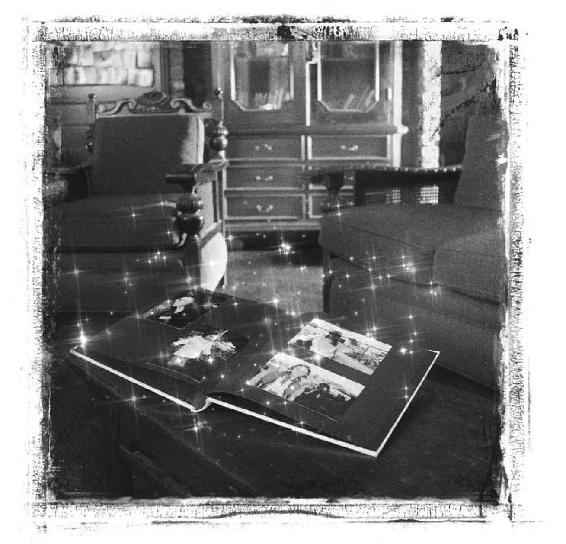

## 第 12 天改变生命的神奇之人

“人生的一盏明灯熄灭时，总会有人为我们点亮另一盏，对于照亮我们人生道路的人，我们应当怀有深深的感激。”

阿尔伯特·施韦策（1875—1965）

诺贝尔和平奖得主

医务传教士和哲学家

在我们人生的困顿时刻，总会有人为我们送上帮助、支持和指引。有时候，这些人的鼓励、教诲以及他们所施与的援手会改变我们的生活轨迹。当我们渡过难关，或许会忘记那些曾在我们生命中出现并改变我们生命的人，有时我们甚至意识不到这些人给我们的未来带来了怎样的影响，直到有一天我们回忆往昔，才会意识到某个人曾经引导着我们的人生朝向更加光明的未来发展。

这个人或许是你的老师或教练，或许是你的叔叔、姑姑、兄弟姐妹、祖父母，或其他家庭成员，又或许是一位医生、护士或是你最好的朋友。他们或者介绍你认识了现在的搭档，或者激发了你的某种兴趣和热情。你甚至不认识他们，在你心中，他们只是个匆匆过客，不经意地留下些许安慰却直接击中你灵魂的内核。

我的祖母培养了我对书籍、烹饪和乡村生活的热爱。祖母会和我分享她所喜爱的事物，而这些也影响了我的生活轨迹。接下来的二十年我对烹饪怀有极大的热情，而对书本的热爱也让我最终走上了写作的道路，同时，对乡村生活的留恋让我选择一直居住在那里。

祖母也让我学会将“谢谢”变为一种习惯。当时我认为她这么做只不过是教我懂礼貌。后来我才意识到祖母教会我一句非常重要的魔咒，这是她这一生赐予我的最珍贵的礼物。祖母现在已经去世，然而我会永远感谢她对我今后人生的重要影响，我要说一声：谢谢你，祖母！

今天，你也需要仔细思考那些影响过你人生的重要人物。现在你可以找一个安静的角落，一个人坐下来，想一想让你的人生发生转变的三个最重要的人。等你心中有了答案，想象他们就站在你面前，你需要挨个对他们大声说出你感谢他们的理由，以及他们是如何影响了你的人生。

注意这个练习需要一气呵成，这样才能激发你内心更深层的感激。如果将这个练习分成一天几次来做，你心中的感恩之情就无法完全迸发，练习也将无法发挥应有的魔力。

你可以参照下面的这段话来表达内心的感激：

萨拉，我想要感谢你那时候鼓励我遵从内心的感受，那天我很迷茫、很困惑，是你的话触动了我，帮我走出沮丧的深渊。正是你的这番话，让我鼓起勇气追寻梦想，我来到法国做了一名学徒厨师。我终于得以实现梦想，感到前所未有的喜悦。这些都得益于那天你对我的教诲。谢谢你，萨拉！

说出你感恩的缘由，这一点非常重要，在这个方面说得越多越好。原因表述得越详细，心中的感恩情绪就会越强烈，最终的效果也会越好。接下来你将见证魔力像烟花一般在你的生活中绚烂绽放；本次的感恩练习将产生有史以来最显著的效果。

如果现在的条件不允许你大声说话，你可以将你对另一个人的感激用文字记录下来，注意这段话要用书信的格式，开头需要用人名称呼。

结束本次练习之后，你会发现自己对生活的看法发生了巨大的改变，感恩发挥着它的魔力，最明显的证据就是你比从前更加快乐！同时，你发现自己对那些积极事物产生了吸引力。感恩的魔力不仅限于此，练习之后你所产生的幸福感会帮助你吸引更多积极的事物，这些事物的来临将令你感到更加幸福。这就是充满魔力的生活，这就是感恩所施展的魔力！

### 魔力练习事项 12

### 改变生命的神奇之人

1.数算你的恩福：列出你生命中值得感恩的十项恩福，并写下每一项感恩的理由。重读一遍写下的感恩项。然后念三遍魔咒：谢谢、谢谢、谢谢，尽最大努力体会心中的感激之情。

2.今天，找一个安静的地方，列出对你的人生产生深刻影响的三个人的名字。

3.想象他们就站在你面前，你挨个对他们大声说出你感谢他们的理由，以及他们如何影响了你的人生。

4.今晚入睡前，一只手握住你的感恩石，对一天所发生的最美好的事，说一声“谢谢”。

## 第 13 天让你的心愿成真

“想象力是一张真实存在的魔毯。”

诺曼·文森特·皮尔（1898—1993）

作家

如果你按照要求一直在进行感恩练习，那么到现在为止你已经积累了惊人的基础，可以对生活赐予你的以及将要赐予你的恩福表达感恩。今天又是一个激动人心的日子，因为接下来你将借助感恩的魔力实现你的梦想和愿望。

数个世纪以来，许多文化中都具有类似的传统，那就是在获得之前表达感谢。古埃及人会举行尼罗河泛滥的庆祝活动，以祈求来年河水再次泛滥，保证农田的肥沃。美国的印第安人和澳大利亚的土著有着他们独特的降雨舞蹈，许多非洲部落在狩猎之前都要为将要获取的食物举行某种仪式。不论哪一种文化和宗教中的祈祷，其本质都是在得到希望的东西之前表达感激。

吸引力法则告诉我们“同质相吸”，意思是你必须在脑海中对想得到的东西模拟出一个形体，或者意象，包括你想要的一切。接着，为了得到你梦想的东西，你必须想象这件东西就是你的，将你的心情调节到像已经得偿所愿的状态。要做到这一点，最简单的方法就是对你渴望的东西表达感激——在你获得它以前。如果之前你从没有想过借助感恩的力量获得梦想的东西，那么今天你会发现感恩具有的另一种不可思议的魔力。《圣经》也已经印证了感恩所具有的这种力量：

“（现在）心怀感恩之人（在将来）会被赐予更多，变得富余。”

获得之前就必须心怀感恩，感恩不是在恩福降临之后才有的感情。许多人通常会在获得好处之后才想起感激，但如果你想要达成所有的心愿，并使你的人生从此富足无忧，你就必须在得到之前和得到之后都心怀感恩。

在心愿达成以前虔诚地表达感恩，大脑很自然地会对你想要得到的东西产生意象，就好像你已经获得，此时你就产生了获得之后的感恩情绪。让脑海中的意象和感恩情绪继续，接下来你就会奇迹般地获得你想要的东西。你不会明白自己是如何实现梦想的，你无须考虑这样的问题，就像你无须考虑走路时重力是如何运作才将自己固定在地面上这样的问题。你只需相信走路时双脚会依循引力定律坚实地踏在地面上。同理，你也只需相信和明白当你对渴望的东西表达感恩时，这件东西就会奇迹般地来到你的身边，因为这是宇宙的自然法则。

### 现在你最渴望的是什么？

在本书的开头，我就让大家弄清楚在人生的各个方面想要获得的东西（如果之前你没有想过，那么现在你需要想一想了）。你可以列一张表，写出你最想得到的十项事物，然后开始我们今天的练习。你可以从不同角度选择十项欲望，比如金钱、健康、家庭、人际关系，或者你也可以从一个角度列出你最想要改变的十件事，比如工作或成功。对你最渴望的东西，心中要十分明确、尽可能的具体，只有这样，我们才能从本次练习中收获不可思议的变化。想象自己对着宇宙发出了一份神奇的订单，订单上面的内容就是我们的十项心愿，而事实上，依据吸引力法则，我们确实在如此运作。

坐在电脑前，或是拿出笔和笔记本，列出十项你最想实现的愿望，注意使用下面的句式，就好像现在你已经梦想成真：

谢谢、谢谢、谢谢，在空格处填上你的心愿，感觉好像此时心愿已经达成。

比如：

谢谢、谢谢、谢谢考试获得了高分，我将因此进入梦寐以求的大学！

谢谢、谢谢、谢谢这个激动人心的消息，我们的孩子不久将降临这个世上！

谢谢、谢谢、谢谢这个梦寐以求的家，每一处细节都符合我们的心意！

谢谢、谢谢、谢谢和父亲的这通充满温情的电话，我们的关系因此得到了改善！

谢谢、谢谢、谢谢这个治疗结果，我现在重获了健康！

谢谢、谢谢、谢谢这笔钱财不期而至，正好足够我去欧洲游玩一番！

谢谢、谢谢、谢谢这个月我们的销售额增加了一倍！

谢谢、谢谢、谢谢这个创意帮我们赢得了一个大客户！

谢谢、谢谢、谢谢我最棒的搭档！

谢谢、谢谢、谢谢这次搬家很轻松、很顺利！

连着写下三个谢谢，这样做就避免了你草率地说“谢谢”，而是使你的注意力集中在感恩上，从而增强了感恩的力量。另外，说三次谢谢是有缘由的，“三”本来就是具有魔力的数字，万物的生成离不开数字“三”。比如，一个男性和一个女性在一起创造了一个孩子。男、女、孩子加起来是三个，完成了新生命的创造过程。同样的，数字“三”在宇宙的其他创造过程中也有所体现，将你的愿望变为现实当然也不例外，因此当你一连说出三次谢谢时，你就是在利用数字“三”的神奇创造力帮助你达成愿望！

心愿成真练习的第二步是让更强烈的感恩情绪渗透到你的心愿当中，这一步你可以在今天的任何时候完成，你可以在列出心愿之后立刻进行这一步的练习，或是在今天的其他时候完成。

让感恩的力量充分渗透到你的每个心愿当中，你可以先从第一个心愿开始，运用你的想象力，想象自己已经达成了心愿，在心中回答下面的问题：

1.达成心愿时你会有什么样的感受？

2.达成心愿后你会第一个通知谁？你会怎样告诉他们？

3.达成心愿后你要做的第一件重要的事是什么？在心中尽可能具体地描绘这些细节。

最后，将所有的心愿重新阅读一遍，着重强化那个魔力词语：谢谢，在心中尽可能多地体会感恩的情绪。

接着，继续第二个心愿，按照上面的步骤依次进行到最后一项心愿。在每项心愿上停留的时间至少为一分钟。

想要增加这个练习的力度和趣味性，你不妨制作一个魔力面板，将你渴望的事物剪下来，贴在面板上，这个面板必须放在你经常能够看见的地方。将“谢谢、谢谢、谢谢”这几个字用加黑的大号字体，贴在魔力面板上，你可以将冰箱的外壳作为一个魔力面板。家长们可以和孩子一起进行这个练习，因为孩子们一定会喜欢这个游戏！想象你的魔力面板真的具有魔力，无论你将什么样的画贴在面板上，画面里的事物都会开始逐渐向你移动，你的感恩之心会像磁石一般将你的心愿最终吸引到你的身边。

### 魔力练习事项 13

### 让你的心愿成真

1.数算你的恩福：列出你生命中值得感恩的十项恩福，并写下每一项感恩的理由。重读一遍写下的感恩项。然后念三遍魔咒：谢谢、谢谢、谢谢，尽最大努力体会心中的感激之情。

2.坐在电脑前，或是拿出笔和笔记本，列出十项你最想实现的愿望，在每一项心愿之前说三声谢谢，感觉自己此时已经实现了愿望。例如，谢谢、谢谢、谢谢 ______ 你的愿望。

3.运用你的想象，想象自己已经实现了十个愿望，并在心中回答下面的问题：

1）达成心愿时你会有什么样的感受？

2）达成心愿后你会第一个通知谁？你会怎样告诉他们？

3）达成心愿后你要做的第一件重要的事是什么？在心中尽可能具体地描绘这些细节。

4.将你列出的十个心愿重新阅读一遍，着重强化那个魔力词语：谢谢，在心中尽可能多地体会感恩的情绪。

5.根据你的喜好，制作一个魔力面板，将你梦想的画面剪下来贴在面板上，你需要能经常看见它。在面板上的标题位置用加黑大号字体写出“谢谢、谢谢、谢谢”这几个字。

6.今晚入睡前，一只手握住你的感恩石，对一天内所发生的最美好的事，说一声“谢谢”。

## 第 14 天拥抱神奇的一天

“将你的意愿压缩成文字，从中会释放出神奇的力量。”

狄巴克·乔布拉（生于 1946 年）

医师和作家

想要见证和体验人生中最具魔力的日子，在开始之前的一整天你就必须心怀感恩！将这神奇的一天内所要经历的事做一个详细的计划，然后在这一天未开始之前，对将要发生的美好事情说声：谢谢。这件事做起来很简单，只需占用你几分钟的时间，然而却能为你即将开始的一天带来不可思议的影响。依据吸引力法则，提前表达感恩会让你接下来的一天充满魔力；当你对将要开始的美好历程表示感激时，一定会吸引美好的经历在这一天发生！

如果你对自己是否具有改变一天境遇的力量还持有怀疑，你可以回忆一下早起时的情绪低落或暴躁，怀着这样的心情开始一天的生活，事事不顺，到处出错，结果一天下来你不禁大叫倒霉——似乎这让人烦心的日子只是不巧被撞上。但是，我要说，之所以会经历这样的一天，唯一的解释就是一大早伴随你的坏心情，是它造成了接下来一连串的不顺遂。

其实一大早起来心情不佳也并非偶然，主要原因是你入睡前想了些消极的事情，或许连你自己都没意识到这一点。这就是为什么你需要将“魔法石练习”作为晚上入睡前的最后一次练习，这样是为了确保你带着积极的心态入睡。临睡前的“魔法石练习”再加上清晨进行的“数算恩福练习”会让你在入睡和醒来时都有一个好心情，这样就保证了你在开始一天生活之前能够感觉良好。

想要让一天都充满不可思议的魔力，首先你需要有个良好的心情。除了感恩，再也找不到任何一项事物能够确保你立刻拥有一个积极的心态。

不管今天你有什么样的计划，旅行、开会、进行工作项目、与人共进晚餐、锻炼身体、将衣服送去干洗店、打比赛、看电影、会朋友、练习瑜伽、打扫房屋、去上学、购买日用品，想让今天变成不可思议的日子，你只需说出那句咒语：谢谢，保证计划的顺利进行——请在开始之前就这样操作。如果你有列计划的习惯，可以先将你今天的计划浏览一遍，为每一项计划能够顺利进行表示感谢。你可以在心中默念，也可以将感激写在纸上，重要的是你感觉每项计划和活动都取得了最完满的结果。

在开始“拥抱神奇的一天”练习之前，利用感恩的力量扫除今天活动和计划中可能会发生的意外情况和困难。本次练习操作得越频繁，今天取得的成果就会越显著。所有的事情，不论大小，都会按照你的预期进行，不可思议的魔力将帮你驱除今天所有的曲折和不幸，崎岖道路也将变为平坦通途。所有的事情完全按照你的意愿，没有担忧和压力，充满轻松和乐趣。

当刚开始进行今天的这项练习时，我选择在当天不太愿意做的事情之前表达感恩。其中一件就是去超市买东西。一大早我就念出了那句神奇的魔咒：“感谢今天我获得了一次轻松、愉快的超市购物经历。”我并不清楚这次去超市的经历会怎样，但对这次购物的结果我的心中预先充满了感恩之情。

在感恩力量的作用下，我很轻松地在靠近超市入口处找到了一个停车位，接着我碰见了两位友人。第一位是我许久未见的朋友，我们购物之后一同吃了午饭，第二位朋友给我介绍了一个干活麻利而且收费不高的保洁员，这正是我一直苦苦寻找的人。除此之外，在超市购物时，不论我想要找什么、需要买什么，那件东西就会立刻神奇地出现在我眼前，所有的东西在货架上都摆放得井井有条，许多东西都在搞特价。我花了出奇短的时间拿到了所有需要的商品，然后朝收款台走去，就在这时，一条新的收款通道开放，收银员示意我走这条通道；接下来，收银员为我一件一件地扫描商品，突然她向我询问道：“您需要电池吗？”要不是她的提醒，我差点就忘了买这样东西！这次超市购物十分轻松、惬意——如同被施了魔法一般！

你只需在清晨花几分钟的时间，对今天一天将要做的工作表达感谢，而你所得到的回报就是拥有神奇的一天，今天这个简单的练习能彻底改变你一整天的境遇。

想要拥有神奇的一天，当你清晨醒来时，在起床之前，或是在洗澡和穿衣的这段时间里，思考一下今天要做的事，为每件事能够顺利进行说声谢谢。你要确保今天的这项魔力练习在清晨进行，并且一气呵成。按照大脑中列出的计划开始一天的生活，清晨、中午、晚上，直至入睡。对每一项计划和活动，说出那句魔咒，想象这是在一天结束时表达的感谢，这样你的感恩情绪就会更加自然。

你也可以使用一些表达程度的形容词来帮你激发内心的感恩情绪。“谢谢今天这次十分成功的会议。”“谢谢这一通电话所带来的如此神奇的结果。”“谢谢工作以来这最完美的一天。”“谢谢这场激动人心的比赛。”“谢谢这次轻松、有趣的大扫除。”“谢谢和朋友们一同度过的不同寻常的夜晚。”“谢谢今天令人放松的旅行。”“谢谢健身课为我带来的充沛精力。”“谢谢这个有史以来我所经历的最感动的家庭聚会。”

如果对每次的经历都能大声说出谢谢，那么这句魔咒所具有的力量将变得更加强大，但如果你现在身处的地方不适合大声说出这句话，那么你也可以在心里默念。

将感恩的魔力运作于今天你所要完成的任务之后，在练习结束时请说：“谢谢今天我所得到的激动人心的消息。”每天早晨当我用感恩的心情期盼神奇的一天来临时，我一定会在最后说一句这样的话。结果就是，我真的在这一天得到了许多激动人心的消息，日复一日，每天各种各样令我欣喜万分的消息来到我的身边！每次收到这样的消息，我就感到由衷的感激和兴奋，因为我知道这是我利用感恩的魔力召唤来的，接下来会有更多令我感到高兴的消息将要到来。如果你也想和我一样，每日都能收到激动的消息，那么就请跟随我的脚步吧。

### 魔力练习事项 14

### 拥抱神奇的一天

1.数算你的恩福：列出你生命中值得感恩的十项恩福，并写下每一项感恩的理由。重读一遍写下的感恩项。然后念三遍魔咒：谢谢、谢谢、谢谢，尽最大努力体会心中的感激之情。

2.清晨，将你今天一天从早到晚、直至入睡的计划在脑海中重现一遍。为了保证一切进展顺利，对每一个计划和活动说出那句神奇的魔咒：谢谢。想象这是在一天结束时表达的感谢，因为一切都很顺利，所以你沉浸在巨大的感恩情绪当中。

3.将感恩的魔力运作于今天你所要完成的任务之后，在练习结束时请说：“谢谢今天我所得到的激动人心的消息。”

4.今晚入睡前，一只手握住你的感恩石，对一天所发生的最美好的事，说一声“谢谢”。

## 第 15 天人际关系魔力修复剂

如果此时的你感情出现危机，为某人心碎难过，或是对谁怀有仇恨和不满，你都可以通过感恩来扭转这种局面。感恩会奇迹般地改善你的人际关系，不管对方是你的丈夫或妻子、兄弟或姐妹、儿子或女儿、搭档或客户、领导或同事、岳父母或公婆、父亲或母亲、朋友或邻居。

如果此时我们感到与对方相处异常困难，或是处处受到挑战，不管情况怎样，唯一的解释就是我们对对方缺少感恩之情。我们忙着指责对方身上存在的问题，这就表明我们心中丝毫不存感恩。相互埋怨从来不会帮我们改善人际关系，更不会使我们的生活得以改善。事实上，你指责对方越多，你们之间的关系就会越发恶化，你的生活就会变得越发不顺心。

不管这段关系是正在继续还是已经终结，如果对某个人有负面的感觉，你可以学着用感恩的情绪驱散这种负面情绪。那么，你为什么想要根除对对方的负面情绪呢？

“执怒就像握了一把要丢向他人的热煤炭，被烫伤的人反而是你。”

佛陀（约公元前 563—前 483）

佛教创始人

对他人的负面情绪会令你的人生备受煎熬，而感恩的心能够帮你消除这种痛苦。

比方说，因为孩子的关系，你总会和你的前夫或前妻有些联系和接触，对此你总是耿耿于怀。这时看看孩子的脸，你就会意识到如果没有对方，这个孩子就不会出现在这个世界上，孩子是你收到的最珍贵的礼物。看着孩子的面容，对你的前任妻子或丈夫说声“谢谢”，感谢他们和你一同赐予了这个孩子生命！将平静与和谐注入你们的关系当中，而孩子们通过言传身教也将获得人生旅途中的一件重要法宝——感恩！

或许，此时的你刚刚因为一段感情的终结而感到心碎忧伤，你同样可以利用感恩的魔力消除你的痛苦。感恩能奇迹般地治愈你的感情创伤，并为你快速地找到幸福的源泉。我父母的故事就是很好的例证。

我的父母可以算得上是一见钟情。从他们遇见对方的那一刻起，他们就真心地感激着对方，这是我所见过的最完满的婚姻。

父亲去世后，母亲一直承受着极大的痛苦。几个月后，母亲强忍着内心的巨大悲痛，学着利用感恩的魔力寻找值得感恩的事物。她追忆和父亲曾经度过的美好而幸福的时刻，接着，母亲又开始寻找未来值得感恩的事物，一件接着一件。通过这样的努力，母亲发现有许多事情是父亲在世时她一直想做但没有时间做的事。母亲在感恩道路上迈出的勇敢的一步，为她的梦想注入了神奇的力量，她的生活重新变得幸福和充实。感恩的魔力赐予了母亲新生。

今天的魔力练习需要你去寻找一块正在灼烧你生活的木炭，并通过感恩将它转变为金子！选择一段出了问题或是破碎了的关系作为你要改善的对象。不论对方依然停留在你的生命当中，还是已经淡出了你的生命，都可以作为你考虑的对象。

坐下来，对你所选择的这个对象，列出对方做过的十件令你感激的事。回忆你们曾经经历过的点点滴滴，列举对方曾经做过的一些令你难忘的事，以及你在这段关系中的收获，最简单的办法就是回忆一下你们的关系恶化或结束以前是什么样子。如果这段关系一直如此，那么你应该认真考虑对方身上有哪些优秀品质。

魔力练习的目的并不是要分清到底谁对谁错。不论你感觉对方对你做了些什么，也无论对方说了什么或是没有做什么，你都可以单方面地修复这段关系，无须在乎对方到底是什么态度。

每段关系都有闪光的一面，即便你们之间矛盾尖锐，为了让你的人际关系以及你的人生更加健康充实，你必须寻找每段关系当中的闪光点。当你寻获了那些闪光的东西，就将它记录下来，并在这段记录中留下对方的名字，你可以选择下面的句式表达感激：

人名，我很感激什么？。

1.鲍尔，我很感激我们在一起的日子。我们之间的婚姻虽然已经结束，但它令我明白了许多道理，我比从前更加成熟，这段婚姻让我学会以后怎样处理我的人际关系。

2.鲍尔，我很感激你对这段婚姻所做的一切尝试和努力，十年的婚姻证明你确实为之努力过。

3.鲍尔，我很感激你让我们有了孩子。没有你我就无法每天从他们那里获得快乐。

4.鲍尔，我很感激你为养活全家所付出的长期的劳动，我在家照顾孩子，全家的重担都落在了你一个人的身上。非常感谢你！

5.鲍尔，我很感激你让我拥有了孩子成长过程中的每个精彩瞬间。我有机会看着孩子第一次开口说话、第一次走路，而你却失去了这样的机会。

6.鲍尔，我很感激你在我伤心失落时对我的支持。

7.鲍尔，我很感激你在我生病时对我的照顾，为了照顾我和孩子，你已经尽力了。

8.鲍尔，我很感激我们曾度过的美好时刻，毕竟我们曾经历过许多。

9.鲍尔，我很感激你继续承担着孩子父亲的责任。

10.鲍尔，我很感激你对我们孩子的支持以及为他们所付出的时间，孩子在你心目中如同他们在我心目中一样重要。

完成这十项列表之后，你会感觉对对方以及这段关系有所改善。最终的目的是为了让你不再对某个人心存怨恨，因为你的生活会被这些坏情绪所伤。每段关系都会有具体的问题，如果有需要，接下来的几天你可以重复今天的练习，直到你感觉不再对此人充满怨恨和不满为止。

假如你利用感恩的力量去改善现有的人际关系，这段关系就会在你眼前发生不可思议的改变。只需其中一方心怀感恩就足以令这段关系得到改观，但也只有心怀感恩的人才会使他的整个人生获益。

如果你选择的这段关系已经终结，你和对方已经不再联系，经过本次练习之后，你会感觉内心充满了宁静和幸福，同时你也会发现生活中的其他关系奇迹般地得到改善。

将来，如果你发现某段关系出现问题，记住一定要马上使用今天的这项魔力练习。在问题没有扩大以前将其解决，同时这段人际关系也将带来源源不绝的魔力！

### 魔力练习事项 15

### 人际关系魔力修复剂

1.数算你的恩福：列出你生命中值得感恩的十项恩福，并写下每一项感恩的理由。重读一遍写下的感恩项。然后念三遍魔咒：谢谢、谢谢、谢谢，尽最大努力体会心中的感激之情。

2.选择一段出了问题或是破碎了的关系作为你要改善的对象。

3.坐下来，对你所选择的这个对象，列出这段关系当中令你感激的十件事，并用下面的句式记述下来：

人名，我很感激什么？。

4.今晚入睡前，一只手握住你的感恩石，对一天内所发生的最美好的事，说一声“谢谢”。

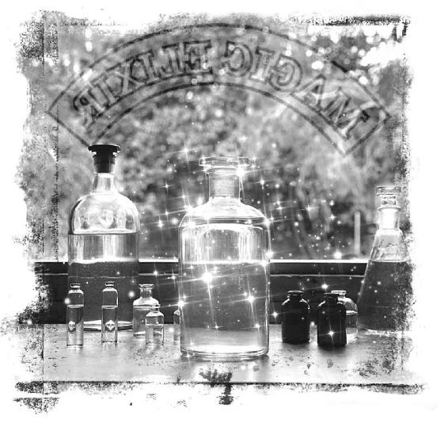

## 第 16 天健康的魔力和奇迹

“奇迹和自然并不矛盾，只是与我们所定义的自然相矛盾。”

圣·奥古斯丁（354—430）

神学家和天主教会主教

我们大多数时间应该身体强健、精力充沛、精神愉悦，因为这正是健康所赋予我们的状态。然而现实中，相当一部分人却并不经常体会到这样的状态，他们有的疾病缠身，有的身体孱弱，有的承受着抑郁症和其他心理疾病的侵袭，而这些都是不健康的具体表现。

据我所知，想要让身体和心灵奇迹般地恢复健康状态，最快捷的方法就是心中充满感恩。我们所见过的康复方面的所有奇迹都是因为健康的因素迅速充盈体内，改变了过去不太健康的体内环境。如果你对感恩是否能为你的身体带来神奇的效果还抱有怀疑，那么可以阅读《秘密》网站上许多可称之为奇迹的真实故事：

www.thesecret.tv/stories

感恩的神奇魔力促使健康的能量向身体和心灵流动，并帮助身体迅速康复，这是许多研究已经证实过的。感恩的魔力也需要同精心的照顾、营养搭配以及医疗护理等多方面相互配合才能发挥最大的作用。

如果最近你总是感觉身体不适或者精神状态不佳，那么很可能你的心里总是积聚着一些负面情绪，例如焦虑、沮丧或恐惧。对疾病的悲观情绪并不利于身体的康复，事实上，这只会起反作用——让你的病情继续加重。想要拥有健康，你就必须用积极的心态取代以往消极的心态，感恩是最简便的方法。

许多人或许还会对自己的体貌感到不满。遗憾的是，这些不满和否定的态度会降低健康的能量。对身体的某个部分不满意恰恰说明了你对身体的不感恩。想一想，依据吸引力法则，对身体的抱怨只会招致更多引发抱怨的问题，因此任何关于身体外貌的抱怨都会影响到你的健康状况。

“（对自己的身体和健康）不存感恩的，连他所有的也要夺去。”

“（对自己的身体和健康）心怀感恩之人将被赐予更多，（健康方面）变得富余。”

此时你可能身患疾病、痛苦不堪，但如果你现在正在阅读这篇文章，就表明你依然在接受着健康的馈赠。处于疾病和痛苦中的人很难去表达感激之情，但哪怕些许的感激都会神奇地为他的身体注入健康的能量。

今天的练习是为了维持健康的魔力和奇迹，该项练习旨在让你变得更加健康和快乐。为了让效果更加显著，我们设计了一个三步练习法。

### 步骤 1：对你已经获得的健康感恩（过去）

回忆一下童年、青少年时期以及成人后曾经拥有的健康，想想那时的你精力旺盛、没有烦恼。依次回忆这三个时期，每次在达到喜悦的巅峰状态时说出那句神奇的魔咒：谢谢，感受在回忆过程中内心流淌的感恩情绪。回忆那些激动人心的经历，能够帮助你快速地想起这些时期的状态。

### 步骤 2：对你仍然拥有的健康感恩（现在）

想一想你今天依然拥有的健康，对目前状态良好的器官、系统以及感官表达你的感谢。想想你的胳膊、腿、眼、耳、肝、肾、脑和心。选择其中五处依然健康的部位，在心中依次对它们说一声：谢谢。

### 步骤 3：对你渴望得到的健康感恩（未来）

你可以选择一样你希望得到改善的身体部位作为今天感恩练习的对象，不过，今天，你需要用一种特别的方式来进行这项练习。首先，想一想你希望达到的理想状态。当你对这种理想状态表达感谢时，你就进入了从这种理想状态中获得回报的过程。

通常当一个人得知自己患了某种疾病时，他们不会过多地谈论，只是想要了解更多有关这种疾病的信息，比如恶化之后会有怎样的症状，是否会危及生命。换句话说，人们总是将关注集中于疾病本身。然而，吸引力法则告诉我们对某一问题的关注并不能帮助我们驱散问题，因为过多的关注只会让问题变得更加糟糕。我们应当做的是反其道而行之，调动所有的思想和感情，集中意念，想象患病部位所能达到的理想状态。对这种理想状态的感恩情绪再加上思想和感情的协同运作，令我们的身体变成一块强大的磁石将所渴望的理想状态吸引而来——这种魔力作用几乎在一瞬间完成！

用一分钟的时间想想你一直渴望的身体的理想状态。当你的脑海中浮现出这种理想状态时，对它表达感恩，就像此时你已经达到了这样的状态。

因此，如果你想要拥有健康的肾脏，那么就对健康的肾脏表达感恩，感激它们帮你将体内的废物过滤并排出体外。如果你想要拥有健康的血液，那么就对纯净的血液表达感恩，感激它将氧气和营养输送到身体的各个角落。如果你渴望拥有一个健康的心脏，那么就对强有力跳动的心脏表达感恩，感激它保证了身体各个器官的正常运转。

如果想要改善视力，那么就对敏锐的视力表达感谢。想要改善听力，就对灵敏的听力表达感谢。想要拥有更多的柔韧性，就对柔软而灵活的身体表达感谢。想要减轻体重，首先要想想自己渴望的理想体重是多少，接着想象自己已经获得了完美的体重，并立刻对已经获得的好身材说声感谢。

不管你想要改善哪些方面，首先想象当这种理想状态达到时自己是怎样的，接着对这种理想状态表达感谢，就好像现在的你已经实现了心中的渴望。

“我们内心的自然力量才是治愈疾病的真正良药。”

希波克拉底（约公元前 460—前 377）

西医之父

如果有必要的话，你可以每天进行本项练习，如果想要加快康复的速度，或是改善某个部位的状态，你也可以一天连续几次进行练习。一定要牢记，不管什么时候对自己的身体和健康状况出现了负面的想法和心态，都必须立刻想象自己渴望的理想状态，并为之深深地感恩，就像此时的你已经获得了健康。

保证健康的最有效方式，除了关爱自己的身体，就是要对你的健康常怀一颗感恩之心。

### 魔力练习事项 16

### 健康的魔力和奇迹

1.数算你的恩福：列出你生命中值得感恩的十项恩福，并写下每一项感恩的理由。重读一遍写下的感恩项。然后念三遍魔咒：谢谢、谢谢、谢谢，尽最大努力体会心中的感激之情。

2.回忆你的幸福感达到巅峰状态的三段时期，对每段时期真诚地表达感谢。

3.想想自己身体依然健康的五个部位，对它们依次表达感谢。

4.选择身体的一个部位作为你想要改善的对象，花一分钟时间想想理想状态下该部位是怎样的，接着对这种理想状态表达感谢。

5.今晚入睡前，一只手握住你的感恩石，对一天内所发生的最美好的事，说一声“谢谢”。

## 第 17 天魔力支票

“在这个充满魔力的世界，没有巧合，也没有偶然，但凡发生的事一定是有人在心里盼望着它发生。”

威廉·S.巴勒斯（1914—1997）

作家和诗人

如果你能够将感恩的力量作用于消极局面，新的局面得以创造，消极的局面将被清除。换句话说，如果你能够对所拥有的金钱心怀感恩，而不是抱怨钱不够花，那么新的局面将因此被创造出来，取代了过去经济窘迫的局面，你会更加富裕。

你对金钱的任何消极想法都会阻碍更多的金钱进入你的生活，并且会减少你现在所拥有的金钱，你对金钱每抱怨一次，就会导致你现有的金钱削减一点。对金钱的任何诸如嫉妒、失望、焦虑或恐惧的情绪都会阻碍你获得更多的金钱。吸引力法则告诉我们物以类聚，因此如果你对现有的财政状况感到失望，就会招致更多金钱方面的令人沮丧的消息。如果你对金钱问题感到焦虑，就会遇到更多金钱方面让人头疼的局面。如果你对现有的财政状况感到恐惧，就会招致更多层出不穷的金钱方面令人担忧的状况。

不管有多么困难，你必须刻意忽略消极因素，以及目前你正在经历的财政危机，感恩能够让你做到这一点。你不能一边心怀感恩一边对自己的经济状况感到失望。你也不能一边心怀感恩一边对自己的经济状况焦虑万分。你更不能一边心怀感恩一边对现状充满恐惧。对所拥有的金钱充满感恩，不仅会让你杜绝一切阻碍金钱进入你生活的消极情绪和念头，还会将金钱源源不断地带到你的身边！

有关金钱的感恩练习之前大家都做过，因此，在使用感恩的力量召唤金钱之前，你需要了解金钱和财富进入你生活的各种方式和渠道，因为如果你对每次财富的增加都不知感恩，那么这将阻断更多的财富流向你。

许多原因能令你的财富倍增，比如一张意外的支票、加薪、中彩票、退税或是令人意想不到的某人所赠予你的财产。当然，你和其他人一起喝咖啡、吃午饭和晚餐时，对方主动埋单，或者你正要购买某件东西，恰好碰见这件商品打折、返券，或正好有人将它作为礼物送给你，这样也会让你的财富增加！因此，不论是哪种情况，问问自己：这种情况是否让我有了更多的钱？如果真是这样，你需要对这种情况下获得的金钱表达感恩！

你告诉朋友你想买某件东西，而朋友恰巧用不着这件东西于是就把它借给你或送给你；或者你准备外出旅行时，恰巧听说了这条线路打折的消息；或者你向银行贷款时，正赶上贷款利率下调；或者为你提供服务的公司刚好有优惠活动。这些情况都为你节省不少花销，实际上也就是增加了你的金钱。能够让你获得金钱的方式还有许多，你还能想到哪些方式和途径呢？

大家或许都曾遇到过上述状况，不论你当时是否意识到，这些状况的发生都是你吸引来的。当你心怀感恩地生活，你就无时无刻不在吸引这些神奇的状况发生！许多人称之为幸运，但事实并非如此；这是宇宙的自然法则。

不管是你获得意外的财富，还是你收到某些东西因而省去了一笔开销，这都是出于你的感恩。当你发现这个秘密后一定备感欣喜，心中的喜悦加上感恩的魔力，会让你具备更强大的吸引力，将越来越多的财富聚集在你的周围。

几年前我来到美国时，随身携带的只有两个箱子。当时的我在简陋的公寓里工作，唯一值钱的东西就是我赖以工作的电脑。我没有车，去任何地方只能靠步行。不过我依然对任何事都心存感激。我感谢自己正身处美国，我感谢我还能够找到工作，我感谢虽然家徒四壁但至少还有吃饭的家什：四个碟子、四把刀叉、四只汤匙。我感谢自己能够凭着双脚走到任何想去的地方，我感谢在需要的时候正好有辆出租车停在路口。接下来，不可思议的事情发生了——有个熟人决定借给我一辆车和一个司机几个月时间。要知道，此前除了那台电脑，我所拥有的东西只是能维持基本生存的必需品，而现在我竟然突然拥有了一辆车和一个私人司机！正是因为我的感恩，我被赐予了更多。这就是感恩的魔力！

今天要进行的帮你获得渴望的财富的练习，已经给许多人带来意想不到的神奇结果。在本次练习结束的时候，你会从感恩银行收到一张空白的魔力支票，你可以为自己签下这张魔力支票。写下你想要得到的金钱的数目，以及你的名字和今天的日期。你可以写下你真正想得到的某件东西的具体价值，因为当你明白这笔钱的具体用途时，你一定会对这笔钱更加感激。金钱是帮你实现愿望的手段，而不是最终目标，因此，如果你的注意力是集中在了金钱上，你或许就无法产生太多的感恩。当你想象自己获得了真正想要的东西，或是完成了一件真正想要完成的事，你因此产生的感恩情绪一定会比你对金钱的感恩要强烈得多。

你可以将书上所附的魔力支票照下来或是扫描下来。你也可以从网站上下载这样的空白魔力支票：

www.thesecret.tv/magiccheck

填写第一张魔力支票时，支票金额可以填得少一些，在你获得小额的财富之后，下一张支票可以适当增加数额。这样做的好处是当你真的获得了这笔财富时，你知道这是你做的练习带来的结果，这样你就能够完全相信感恩的魔力练习是有效果的，这样内心的感恩和喜悦会为你带来更多的财富。

等你将魔力支票中的各个细节填写完毕后，将支票握在手上，并思考获得这笔钱后用来购买什么特别的东西。在心中勾勒出这幅画面，想象自己用这笔钱买到了一件你心仪已久的东西，这一过程要尽可能地调动内心的感恩和激动情绪。

或许你想用这笔钱买一双新鞋、一台电脑，或一张新床，那么想象你真的在商场里买到了渴望的东西。如果你通常选择网上购物，那么就想象自己收到了快递，心中充满兴奋和感恩。你或许想用这笔钱出国旅行一番，或者将这笔钱作为孩子上大学的费用，那么就想象你购买了机票，或开设了一个大学基金的专用户头，体会心中的喜悦和感激，就好像你已经实现了自己的愿望一样！

在完成了上面的几个步骤之后，今天就将这张魔力支票随身携带，或是将它放在一个你能够经常看见的地方。今天你需要将这张支票拿在手中至少两次，想象你利用这笔钱做了自己想做的事，尽可能地激发内心的兴奋和感激，就像你真的做了这件事。有意愿的话，你可以在今天多次进行这样的想象。但和其他的魔力练习一样，今天的练习也不可过度。

今天结束的时候，你可以将这张魔力支票放在它原来的位置，或是摆放在一个你每天都能看见的显眼位置。你可以将它放在浴室的梳妆镜前，或是冰箱上，或是压在你的感恩石下面，或是放在你的车里或钱包里，或作为电脑桌面的背景。每当你看见这张魔力支票，就想象自己已经得到了这笔钱，为能够拥有渴望已久的东西或实现许久想做的事而心怀感激。

当你真正得到魔力支票所赋予你的财富时，或是通过其他途径得到本打算购买的东西时，你可以制作一张新的支票，在上面写上其他你真正想要的东西，然后继续有关魔力支票的练习。

### 魔力练习事项 17

### 魔力支票

1.数算你的恩福：列出你生命中值得感恩的十项恩福，并写下每一项感恩的理由。重读一遍写下的感恩项。然后念三遍魔咒：谢谢、谢谢、谢谢，尽最大努力体会心中的感激之情。

2.在魔力支票上填写你希望得到的金钱数额，以及你的姓名和今天的日期。

3.双手握住这张魔力支票，想象你用这些钱购买了某件东西，体会自己在得到这件东西时的喜悦和感激。

4.今天将这张魔力支票随身携带，或将它放在一个你经常能看见的地方。今天你需要将这张支票拿在手中至少两次，想象你利用这笔钱做了自己想做的事，体会梦想成真时的感激之情。

5.今天结束的时候，将你的魔力支票放在你每天都能看见的地方。当你得到了支票上的金钱时，或是得到了你本打算购买的某件东西时，制作新的支票，并想象另一件你想要得到的东西，然后重复步骤 2-4。

6.今晚入睡前，一只手握住你的感恩石，对一天内所发生的最美好的事，说一声“谢谢”。

拍下或扫描这张支票，然后填上日期、你的姓名，以及你想要获得的金钱数额。

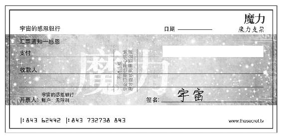

## 第 18 天神奇的待办清单

“世界充满了神奇，等待我们不断进化的睿智头脑去发现。”

埃登·菲尔波茨（1862—1960）

小说家和诗人

真的，只要你能够时常想起感恩，它一定是你最好的朋友。它会一直伴你左右，随时准备去帮助你，没有什么是它做不到的，它也绝不会让你失望。你对它越依赖，它为你做的事就会越多，也会越大程度地改善你的生活。今天的魔力练习将向大家展示如何让你更加依赖感恩，这样它就会为你创造更多的奇迹。

每天我们都会遇到一些问题等待解决。当我们不知该如何处理时会感到十分为难，或许你的问题是没有时间做完所有需要做的事情，而你此时正在为一天只有二十四小时感到苦恼。或许你被工作压得喘不过气来，你渴望更多的自由时间，然而却总是感到分身乏术。或许此时的你正在家照看孩子，你感到心力交瘁，不知怎样做才能从这种苦役中脱离出来。或许你正在对一件坏掉的物品一筹莫展，不知该如何将它修理好。或许你丢了一样东西此时正费尽力气地到处寻找，却一无所获。或许你一直渴望着某样东西，比如你最心爱的宠物、一个得力的保姆、一位技术娴熟的理发师或是医术高明的牙科医生，然而不管你怎么努力，总是找不到称心满意的。或许此时别人有求于你，而你却为不知如何答复而感到左右为难。或许你现在正和别人争论不休，事情非但没有平息，反而有愈演愈烈的趋势。

神奇的待办事项清单练习能够帮助你处理这些日常琐事，尤其是当你茫然无措，或是期望某件事顺利完成的时候。你会对这次练习的效果惊叹不已！

感恩的魔力再加上吸引力法则的作用，一切人、事和局面必将按照你的意愿为你重新组合！你不会明白这种事情是怎么发生，又是怎么完成的，你不必为此费心。你的主要任务是尽可能地对想要完成的事表达感恩，就如同它们已经被完成一样。接下来你就可以静待魔力发生！

今天，你可以列一份待办事项清单，上面写上你想要完成或想为自己解决的事情，将这份清单命名为“神奇的待办清单”。除了你所面对的一些难题，你可以将那些没有时间完成或者不想自己完成的事情通通写在这份清单上，从琐碎的日常小事到难以摆脱的生活困境。仔细想想生活中哪些问题以及哪些事情是你想要解决和完成的。

列好清单之后，从中选择三项作为今天着力解决的对象，分别对每一项进行冥想，想象这件事已经被你神奇地解决。想象所有的人、事和局面都在助你完成这件事，如今它已经完成！一切运作、一切处理、一切解决皆为你而来，而作为回报你需要表达真挚的感激。对每一项待办事项至少花上一分钟的时间，想象它已经完成，并为之深切地感恩。其他的待办事项可以在别的时间依照上面的方法进行练习，即便是在待办事项清单上添加愿望这样简单的小事也充满了魔力。

还记得吸引力法则曾说过“物以类聚”吗？这意味着如果你能够对那些待办的事情心怀感恩，就像它们已经完成了一样，你就会吸引所需要的一切助你达成愿景。过多地关注问题本身则会吸引更多的问题。你必须让自己变成吸引解决因素的磁石，而不是吸引问题的磁石。感恩获得了问题的解决方案，感恩事情得以顺利解决，解决因素才会被你吸引而至。

为了证明这个练习的神奇效果，我想同大家分享一个关于我女儿的故事，她正是利用了这个练习将丢失的钱包重新吸引到了自己身边。

头一天晚上女儿出去了一趟，第二天早上她发现自己的钱包不见了，她不知道自己到底是在哪里把它弄丢的，甚至都不清楚它是不是被偷走了。她打电话给昨晚吃饭的那家餐厅，以及她头天晚上回家乘坐的出租车所在的公司，还有当地的警察局，她寻遍了所经的街道，并沿途询问了许多住户。遗憾的是没有人见到她的钱包。

女儿的钱包里放着银行卡、信用卡、驾照、现金等贵重物品，更糟糕的是钱包里并没有她现在的联系信息，因为经常在国外，国内的电话已经停用，因此她只在钱包里附上了自己的姓氏，要找回的可能性看似十分渺茫。

尽管眼下困难重重，女儿还是选择坐下来，闭上眼睛，在脑海里描绘着她丢失钱包的样子。她想象自己此时正拿着钱包，她打开钱包，将里面的东西全都翻看一遍，为钱包能够重新找回以及东西一件不少表达了她的感谢。

在这一天接下来的时间里，不论什么时候想起钱包的事情，女儿就会在心里想象钱包已经找到，她为钱包的失而复得表达强烈的感激之情。

那一天晚些时候，女儿接到了一个住在一百英里外的农户的电话，他说自己捡到了她的钱包。这个故事听起来有些不可思议，农户这天早上在女儿的家门口捡到了那个钱包，他立刻打开它想要寻找失主的信息，他试着拨了几个电话，但都没有结果，于是他便放弃了，拿着这个钱包回到了他的农场。

农户在田地里走着，身上的钱包似乎一直在对他喋喋不休地说着什么，于是他决定最后再查找一遍，看能不能发现什么线索。这时他发现钱包里有一张字条，上面写着一个人的教名，于是他将这个名字和女儿的姓氏联系到一起，并给查询服务台打了个电话。这个姓名正好对应着一个登记电话，于是他拨通了那个电话，那正是我家的电话。直到现在我们都不知道这个农户是如何得到这个电话号码的，因为它从未做过登记！之后我们也给查询服务台打了几次电话，但每次对方的答复都是：“很抱歉，这个名字没有登记过电话。”

两地相隔一百英里，中间又经历了那么多看起来几乎不可能的事情，女儿的钱包完好无损地回到了她的手中。钱包能够找回其实是女儿努力的结果，她不断地为钱包的回归进行感恩，就好像这个钱包一定会回到她身边一样。终于，感恩开始施展它的魔力，调动所有的人、事、物帮助钱包回到女儿的身边。

你也可以利用感恩的魔力，这种力量一直在你的身边——你只需去发现它，并学会如何利用它！

### 魔力练习事项 18

### 神奇的待办清单

1.数算你的恩福：列出你生命中值得感恩的十项恩福，并写下每一项感恩的理由。重读一遍写下的感恩项。然后念三遍魔咒：谢谢、谢谢、谢谢，尽最大努力体会心中的感激之情。

2.列出一份清单，在上面写下你认为需要完成或解决的最重要的事情，将这份清单命名为“神奇的待办清单”。

3.从清单中选出你认为最重要的三件事，逐个对每件事进行冥想，想象这件事已经被你神奇地解决了。

4.对每一项待办事项至少花上一分钟的时间，想象它已经完成，并为之深切地感恩。

5.今晚入睡前，一只手握住你的感恩石，对一天内所发生的最美好的事，说一声“谢谢”。

## 第 19 天魔力足迹

“我每天会提醒自己一百次，我的内在和外在生活都是仰赖他人——无论活着或已经去世——努力的成果。所以，我必须竭尽全力，希望能以同等的贡献回报我从过去到现在自他人身上所获得的一切。”

阿尔伯特·爱因斯坦（1879—1955）

获诺贝尔奖的物理学家

爱因斯坦的这番话，和他在科学领域所取得的成就一样熠熠发光，他给予我们的是通往成功的一条秘诀：感恩——每一天！

爱因斯坦的话语引出了今天练习的内容，你将追寻着他的足迹将成功带入你的生命中。今天，你要像爱因斯坦一样，一百次表达你心中的感谢，今天的练习就是踏一百次魔力足迹。你或许不相信踩着这样的足迹会令你的生活发生改变，但不久你就会明白这是迄今为止最具魔力的一次尝试。

“上帝今天赐予你的是 86,400 秒的时间，你是否曾对其中的一秒说声‘谢谢’？”

威廉·A.沃德（1921—1994）

作家

进行魔力足迹练习，需要你在迈出每一步时表达感恩，当一只脚刚刚接触地面时，在心中默念魔咒：谢谢，然后在另一只脚接触到地面之时再次说声谢谢。迈出一只脚，谢谢，迈出另一只脚，谢谢，每走一步都要重复这句魔咒。

关于魔力足迹练习最好的一点在于，你可以迈任意数量的步子，在任何地点、任何时间进行练习：不论是在家里从一个屋子走到另一个屋子，还是去吃饭、喝咖啡、倒垃圾、开会、打车、赶火车或汽车。在前往任何比较重要场合的路上你都可以进行魔力足迹的练习，例如考试、约会、求职面试、试镜、会见客户、去银行或自动取款机取款、看牙医、理发、观看自己支持的球队打比赛、穿过长廊、经过机场安检、在公园散步，或在街上行走的过程中。

我在家也经常进行魔力足迹的练习，比如下床走到浴室，或者从厨房走向卧室，或者出门走到车旁或邮箱旁的这段过程。在我想要去逛街或是去往某地之前，我都会选择一点作为目的地，然后一路上将我的感恩倾注在每一次踏出的足迹之中。

开始练习之前如果留意观察自己的心情，你就会发现进行完这项练习之后心情将会产生多么大的变化。迈出每一步时是否都饱含感恩之情并不重要，但我保证你练习完后心情一定会比之前更加轻松。如果此时你的心情很低落，魔力练习刚好能够让你心情变得愉悦；即使现在你心情很好，这个练习也能让你的情绪变得更加昂扬！

为了让该练习的效果达到最佳，每次进行练习的时间控制为九十秒，这差不多是一个人以正常速度走上一百步所花费的时间。这个练习并不是刻意要求你一定要走上一百步，但数量也不要有太大的偏差，因为改变心情所花费的时间要求你大致迈出这么多的步子。等你确定了这段距离大概有多远时，你就可以在任何时候进行这样的百步感恩练习。记住在进行练习时不要刻意地数步子，因为这样你就只会记着数数而忘记每走一步都要说声谢谢。

当你完成今天的魔力练习，就表明你已经将那句魔咒“谢谢”默念了一百次。过去你人生有多少时日曾说过一百次的“谢谢”呢？

而爱因斯坦每天都会这样做！

### 魔力练习事项 19

### 魔力足迹

1.数算你的恩福：列出你生命中值得感恩的十项恩福，并写下每一项感恩的理由。重读一遍写下的感恩项。然后念三遍魔咒：谢谢、谢谢、谢谢，尽最大努力体会心中的感激之情。

2.在今天的任何时间，怀着感恩的心情走上一百步（大概用时九十秒）。

3.每迈出一步，体会心中的感激并说出那句魔咒：谢谢。

4.今晚入睡前，一只手握住你的感恩石，对一天内所发生的最美好的事，说一声“谢谢”。

## 第 20 天心灵魔力

“感恩是心灵的回忆。”

让-巴蒂斯特·马修（1743—1818）

法国革命活动家

如今，你可能已经揣摩出魔力练习的一个原则，那就是在心中尽可能多地体会这种感恩的情绪。这是因为你内在的感恩之情越强烈，外部世界中值得你感恩的事物就会增加。

经过这么长时间的练习，相信你已经能够做到自然地调动内心的感恩情绪。不过，今天的练习将会颠覆过去循序渐进的练习方法。

今天的心灵魔力练习会大幅度地增强你的感恩情绪，在你说出谢谢或感受这句话魔力的同时，将意念集中于你的心灵。科学研究表明，处于感恩情绪中时，将意念集中于心灵，心跳会立刻变得平和、稳定，这样有助于改善身体的免疫系统，让你变得更加健康。这个研究也让你明了心灵魔力的神奇力量。第一次尝试需要耗费一些功夫，但这是值得的。经过几次练习你就会得心应手，每练习一次你就会感到内心的感恩情绪正以惊人的速度倍增。

进行心灵魔力练习时，集中精神，将注意力投向心脏附近的区域。你无须在意自己的注意力是停留在身体表面抑或是内部。闭上双眼，这样能让练习变得简单，同时意念集中于心，在内心默念魔咒：谢谢。练习几次之后，你可以不用再闭上眼睛，但一般说来，闭上眼睛会让你心中的感恩情绪更加强烈。

想要更快地进入心灵魔力练习状态，请注意以下几个窍门：你可以将右手放在心脏部位，使得你的注意力集中于此，同时念出魔咒：谢谢。或者你也可以想象在默念谢谢时，这句话慢慢地从心中释放而非从脑海涌现出来。

今天的感恩练习需要你写下十个心愿，然后逐一进行心灵魔力练习。在心中大声读出你的一个心愿，在这个心愿将要读完的时候，闭上双眼，将意念集中并保持在心脏附近区域，再次缓缓地说出魔咒：谢谢。如果有需要，你也可以利用之前我教的小窍门进行这个练习。针对每个心愿完成练习之后，你能够更深刻地体会到感恩的情绪，除此之外，你对自己心中最想完成的心愿也将充满感恩。

想要更快地实现自己的心愿，你可以定期进行心灵魔力练习，你也可以在每次说谢谢时进行这样的练习。每天只需几次心灵魔力练习就能有效地提升你的幸福感，并让你的生活充满魔力色彩。

进行过几次这样的练习之后，你会明显察觉感恩的情绪在心中变得更加强烈、更加深刻，而感恩的情绪越强，你所获得的回报就会越大。这种情绪加强最初的一个信号就是你会感觉心脏周围有些许刺痛，或者感觉一股愉悦的电流传遍全身。你的眼里或许会不自觉地溢满泪水，或者身上突然泛起一片鸡皮疙瘩。不管表现如何，你的内心毫无疑问将获得前所未有的安详和幸福！

### 魔力练习事项 20

### 心灵魔力

1.数算你的恩福：列出你生命中值得感恩的十项恩福，并写下每一项感恩的理由。重读一遍写下的感恩项。然后念三遍魔咒：谢谢、谢谢、谢谢，尽最大努力体会心中的感激之情。

2.集中精神，将注意力投向心脏附近的区域。

3.闭上双眼，将注意力保持在心脏区域，在大脑中默念魔咒：谢谢。

4.列出自己最渴望的十个心愿，逐一读出每个心愿，同时进行这个练习：闭上双眼，意念集中于心脏附近，再次缓缓地说声谢谢。

5.今晚入睡前，一只手握住你的感恩石，对一天内所发生的最美好的事，说一声“谢谢”。

## 第 21 天圆满的结局

“你会在饭前进行祷告，这是当然。但我会在音乐会和歌剧开演之前表达感恩，在戏剧和舞台剧表演之前表达感恩，在打开一本书前感恩，在开始素描或水彩画之前感恩，在游泳、击剑、拳击、走路、游戏、跳舞之前感恩，在我将钢笔蘸满墨水之前感恩。”

G.K.切斯特顿（1874—1936）

作家

无论做什么事情我们都期望一个圆满的结果。吉尔伯特·基斯·切斯特顿在进行某项活动之前总是会表达感谢，这位作家这么做是希望借助感恩的魔力保证预期结果的实现。

你一定也曾这样在心中暗暗祷告：“希望能一切顺利”或者“希望结果能够圆满”，或者“我需要再多点运气”。所有这些想法无非都是期盼着某件事能够有一个圆满的结局，但是生活不能只依靠偶然或是运气。宇宙的自然法则表明，结果总是朝向概率最高的方向发展，这一点你应该坚信。

飞行员在执行飞行任务时不必总盼望着物理法则发挥作用，因为他知道物理法则一直都存在。你也不必总盼望万有引力法则发挥作用，才不至于会让人飘到外太空，因为你知道没有这样的可能性，万有引力永远不会消失。

如果想要任何事都取得圆满的结果，你就必须利用控制结果发展的法则——吸引力法则，这意味着你必须利用自己的思想和感情去吸引积极、正面的结果，对圆满的结果表达感恩是最行之有效的方式。

圆满结果练习就是在你希望能够圆满完成某件事之前表达感恩。想要工作会议、求职面试、考试顺利进行，渴望获得期望的比赛结果，或是打电话、见朋友、拜见丈母娘的过程尽可能顺利，你就必须对期望中的结果表达感恩。参加健身课或是带宠物看病这样的琐碎小事想要取得预想的结果，你也需要表达感恩。那些到你家中解决问题的电工、水管工以及其他工人，想让他们顺利地帮你解决麻烦，那么也请对你期待的结果表达感恩。想要让这次全家远足更加难忘，或是对孩子们的谈话教育更富有成效，或是与同伴进行触及心灵的交流，你也需要对预期的结果表示感恩。除此之外，你也要对那些心怡的商品，比如生日礼物、订婚戒指或者结婚礼服表达感恩，这样你才能够得偿所愿。选购新手机，换新地毯、窗帘或是选择装修公司时，也要注意对你期望的结果表达感激。想要成功预订酒店，或是为某场演唱会选个好位子，或者期望从邮件或电子邮件中获得好消息，或是获得退税的机会，不妨对你心中期待的结果表达感恩。

想要让自己更加确信感恩的力量能够为你带来不可思议的圆满结果，你可以在空中挥动手指并想象你将魔法粉末撒在了那些你渴望有圆满结局的事情上。

如果今天有什么意料之外的事情发生，你也可以利用感恩的力量进行圆满结局的练习。当一些意料之外的事情发生后，我们通常的第一反应就是对可能出现的结果惊慌不已，然后迅速得出结论，觉得一定是哪里出了问题。比方说，你刚上班就被告知老板想即刻见你。这时你要做的不是随意揣测或是产生消极的想法，因为根据吸引力法则，这种想法很可能变成现实。因此，你所要做的不是随意揣测和消极应对，而是对一个你期待的结果表达感激，这样才能让魔力降临在你身上。

如果你不幸错过了上班的汽车或火车，或是误了飞机，或是中间有些耽搁，请不要产生这样的念头：“这太糟糕了。”相反，你应该对自己期待的满意结果表达感激，只有这样你才能够召唤魔力，以期收获一个圆满的结局。

身为父母的你如果突然被学校叫去开会，那么请不要去猜测自己的孩子是否有什么问题，你所要做的就是对你渴望出现的结果表达感恩。如果你接到一个意想不到的电话或邮件，或是脑海里突然闪现出“好像有什么不好的事情要发生”这样的念头时，请在拿起电话或是打开信件之前，对你期待的结果即刻表达感恩。

许多时候，你会见到或是经历你期望中的美好结局，这些事情总是很偶然，你甚至不知道为何这样的好事会降临在自己身上。但是如果你在心中期待着某种结果发生，并对这个结果诚心地表达感恩，你就是有意识地运用了吸引力法则，而你也必然会在某个地点、某个时间获得令你满意的结果。毋庸置疑！

当你渴望某件事能够有转机时，或是感觉生活难以驾驭，或是当你发现期望的某些事情运作良好时，心中一定要谨记吸引力法则——你内心的想法和感受会变为现实。感恩能帮助你远离你竭力想要避免的——糟糕结局——并使你获得心中期望的——圆满结局。

当你对圆满的结局表达感恩时，你就是在运用宇宙的自然法则，将你的渴望和偶然变为现实和必然。当感恩成为你的生活方式，你做任何事都会很自然地心怀感恩，知道感恩的魔力将带来不可思议的结果。

尽可能多地进行圆满结果练习，并将其作为一种日常习惯，这样，更多的美好结局就会被引入你的生活。慢慢地，你就会发现那些不被盼望的结局发生的概率越来越小，你也能避免做一些不合时宜的事情。一天之中，不管发生了什么事，你都在心中十分确定它的结局一定会是圆满的。

在今天清晨，选择你期待有圆满结局的三件事。你可以选择目前对你来说比较重要的三件事，比如即将来临的求职面试、贷款的申请、考试以及和医生的预约。你也可以选择三件琐碎的小事，因为当奇迹降临在这些普通的小事上时，你会更加确定感恩的神奇魔力！比方说，你可以选择开车上班、熨烫衣服、去银行或邮局、接送孩子、支付账单或是取信这样的日常杂事。

挑选你期望产生圆满结局的三件事，把它们写在一张纸上。利用感恩的魔力，在写每一件事的时候，想象这件事发生之后的结果。

感谢 ______ 的圆满结局！

该魔力练习的第二步，就是选择今天所发生的三件意想不到的事情，然后利用感恩的力量召唤圆满结果的出现。你可以选择在接三通电话或是在打开三封邮件之前进行这样的练习，你也可以在接到突然的任务，或是在一些意外情况出现之后进行这样的练习。这一步的练习重点不在于选择哪件事，而在于面对这些突发情况时如何利用感恩获得圆满的结果。当这些突然状况出现时，如果条件允许，你可以先闭上双眼，在心中念出并感受这句魔咒的力量：

感谢 ______ 的圆满结局！

这个练习你可以尽可能多地练习，练习得越频繁，你所获得的圆满结果自然会越多。今天的练习只是让你了解感恩的力量在改变结局方面的成效，今后如果你期望某件事能够有一个好的结局或是渴望更多的运气，你可以立刻驭使感恩的神奇力量，让圆满的结果降临你的生活！

### 魔力练习事项 21

### 圆满的结局

1.数算你的恩福：列出你生命中值得感恩的十项恩福，并写下每一项感恩的理由。重读一遍写下的感恩项。然后念三遍魔咒：谢谢、谢谢、谢谢，尽最大努力体会心中的感激之情。

2.在今天清晨，选择三件对你至关重要、你想让它们有圆满结果的事情或状况。

3.将这三件事写在纸上，在写每件事的时候想象它已经变为现实：感谢 ______ 的圆满结局！

4.在今天一天当中选择三件所发生的意想不到的事情，然后利用感恩的力量召唤圆满结果的出现。每一次，闭上双眼，在心中默念并感受：感谢 ______ 的圆满结局！

5.今晚入睡前，一只手握住你的感恩石，对一天内所发生的最美好的事，说一声“谢谢”。

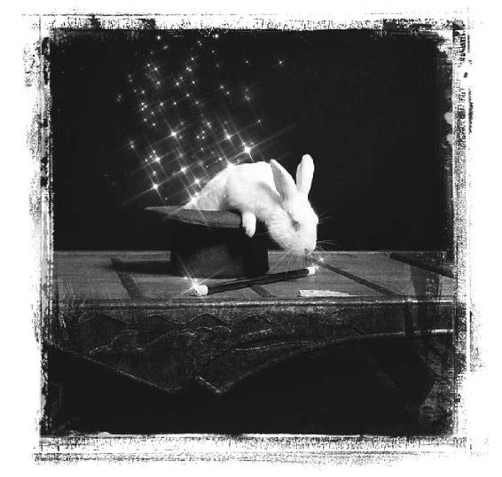

## 第 22 天在你的眼前实现

“这个世界，即便被这样或那样的科学定律所统治，却依然是个奇迹。我们的生活依然充满了神奇和不可思议，这一切超出了我们任何人的想象。”

托马斯·卡莱尔（1795—1881）

作家和历史学家

几年前，当我发现了感恩的秘密和它的神奇力量，我就将我所有的心愿列了出来，这是一份很长的清单！那时候看来，我的所有愿望都是不可能实现的。然而，我挑出其中自己最渴望实现的十个心愿，然后将它们单独列在一张纸上并随身携带。只要一有机会，我就会掏出这张纸，将上面的十个心愿从头到尾阅读一遍，读每个心愿时，我的心中满怀感恩之情，就好像我的心愿已经实现。此外，我确定了那个最想要实现的愿望，并在每次想起它时默念魔咒：谢谢，这样的事情一天可以重复数次，就好像这个心愿已经达成。这份清单上的所有愿望在我双眼的见证下逐一实现。每个愿望实现后，我就会把它从清单上画去，一旦有了新的愿望我会立刻把它加在这份清单上。

在我最初列出的心愿中，有一项是去塔希提附近的波拉岛。我在那里度过了美好的一周之后，另一件美好的事情随之发生了。返回时飞机经停塔希提群岛等待新的乘客登机。原本空荡荡的机舱里一会儿就坐满了许多塔希提当地人，他们一个个满脸喜悦，笑声阵阵，让我立刻有了一种被幸福包围的感觉。

我很享受与这群可爱的人一同短途旅行，他们为什么会这么高兴，对这个问题我忽然有了答案。因为他们心怀感恩！他们感谢活在这个世界上，感谢他们正在搭乘飞机，感谢他们彼此能够在一起，感谢他们要去往的地方——感谢所有的一切！和他们在一起也让我感到非常快乐，我不禁有种冲动想要继续和他们一起旅行。这时候我蓦然发现自己原来刚刚实现了最后一个愿望，在我最初写下的一长串愿望当中波拉岛是最后一个，我为何会在这班飞机上，答案已经在我眼前呈现——感恩！

之所以和大家分享这个故事是为了提醒大家，不论你的愿望看似多么不切实际，你都可以通过感恩获得。不但如此，感恩还会为你的生活带来前所未有的欢乐和幸福，这些都弥足可贵。

从我开始有意识地利用感恩的力量以及吸引力法则，一直到我实现那份清单上的最后一个心愿，前后历时四年。时间的跨度让我切实地感受到所获得的一切的分量。当我写下那张心愿清单时，我的公司负债二百万美元，两个月之后我的公司倒闭，房产以及所有财产全部被冻结。我的个人银行卡上只有少量存款，但我在心愿清单上却写下想拥有一幢面朝大海的别墅、去国外旅行、还清所有债务、扩大公司规模、和家人可以相处得融洽、身体百分百健康，以及其他一些物质方面的渴望。而我最想实现的愿望在当时周围的人看来是那么虚无缥缈，那就是致力于为千千万万的人带去欢乐。

而我所实现的第一个愿望就是通过工作为人们带去欢乐。其他的愿望随后也奇迹般地得以一一实现，它们一个一个地在我眼前呈现，之后又被我从愿望清单中画去。

现在，也轮到你使用感恩的魔力，让你的愿望在你眼前一个一个地呈现了。第一天，你需要写下十件最想要完成的心愿，从头到尾读一遍，然后花一分钟的时间想象你已经实现了它们。尽可能地体会心中的感激，就如同它们已经变为现实。

今天将这份心愿清单随身装在衣服口袋里。一天之内至少要拿出这张纸两次，并将你的愿望从头到尾读一遍，每次都要仔细地感受内心的感恩情绪，就好像你已经实现了这些心愿。

如果想让愿望更快地变为现实，我建议大家从今天起将这份愿望清单放在你的钱包或皮夹里，只要一有时间，就打开它，从头到尾读一遍，对每个心愿充满感恩。当这个愿望真的呈现在你的面前时，你就可以将它从清单中画去，然后增添新的愿望。在画掉已经实现的心愿的这一刻，你和我一样会情不自禁流下喜乐的泪水，因为看似无法实现的愿望在感恩的魔力作用下真的变为了现实。

### 魔力练习事项 22

### 在你的眼前实现

1.数算你的恩福：列出你生命中值得感恩的十项恩福，并写下每一项感恩的理由。重读一遍写下的感恩项。然后念三遍魔咒：谢谢、谢谢、谢谢，尽最大努力体会心中的感激之情。

2.在今天开始的时候，写下十件最想要完成的心愿。

3.将写在纸上的心愿从头到尾读上一遍，每读完一条愿望，花上一分钟时间想象自己已经实现了这个愿望，体会此时此刻心中的感恩之情。

4.今天将这张愿望清单随身装在衣服口袋里。一天之内要拿出这张纸至少两次，并将你的愿望从头到尾读一遍，仔细体会内心的感恩情绪。

5.今晚入睡前，一只手握住你的感恩石，对一天内所发生的最美好的事，说一声“谢谢”。

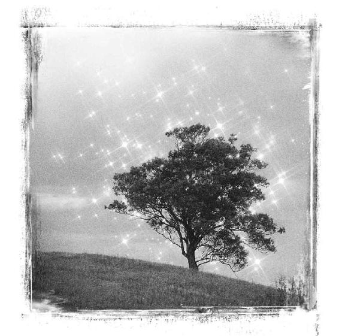

## 第 23 天你所呼吸的魔力空气

“我在清晨迎着清新的空气出门，归来时感觉焕然一新——散发着迷人的气息。”

玛丽·埃伦·蔡斯（1887—1973）

教育家和作家

几年前如果有人告诉我应该对我们呼吸的空气充满感恩，我一定认为他是个疯子。这话听起来不可理喻，在地球上的我们为什么要感激呼吸的空气？

然而感恩为我这些年的生活带来了不小的改变，那些曾经我认为是理所当然的或者从未花时间关注的事物现在在我看来却充满了奇迹。不论是在日常琐事间奔走忙碌，还是凝神思索宇宙大化的奥秘，我的心中都充满了深深的感激。

伟大的科学家牛顿曾经说过：“当我看着太阳系时，我发现地球和太阳之间保持着适当的距离，以接收适量的热和光。这绝非偶然。”

这句话让我对宏观世界有了越来越多的思索。地球周围有大气层的环绕这绝非偶然，大气之外的空间没有氧气存在绝非偶然；植物不断地释放出我们赖以生存的氧气绝非偶然；太阳系所处位置如此适中绝非偶然，它若偏离此处就会使人类被银河系的宇宙射线所毁灭；地球上多个条件均满足了生命存在的要求，而地球上所有的生物都命悬一线，因为这些条件当中任何一个发生改变，地球的环境都将不再适合生命体存活。很难想象所有这些条件都得以完美地设计、完美地安排、完美地平衡，只为我们！

现在你应该意识到这一切都绝非偶然，地球上以及周围的一切元素和谐一致地支持着我们，此时此刻你会对生命产生深深的感激，因为所有的一切都是为了让你活下去！

我们呼吸的魔力空气并非偶然，也绝不仅仅作为自然中的一个元素而存在。当你意识到空气在我们生活中的重要性时，下一秒的呼吸就会变成虔诚的顶礼膜拜！

我们每一秒都在呼吸，却从未关注过吸入体内的空气。氧是我们体内含量最多的一种元素，我们吸入的氧气充盈到身体的各个细胞，维持着生命体的正常运转。生命中最珍贵的馈赠就是氧气，离开了它，我们几分钟之内就会失去生命。

最初驭使感恩的神奇力量时，我将它运用在满足私人需求上。它很有效力。而当我学着对生命的馈赠表达感恩时，才真正体会到感恩所带来的强大魔力。对于日落、植物、大海、草尖上的露珠、我的生活及生命中出现的人等所表达的感恩情绪越强烈，我在物质方面的心愿就会越快实现。现在我明白了为什么会出现这样的奇迹。当我们对生命和自然的馈赠表达深深的感激时，比如对呼吸的空气表达感谢，此时我们全身心地沉浸在感恩当中。而所有心怀感恩之人，必将获得富足。

今天，停下来关注一下你所呼吸的空气。有意识地呼吸五次，感受空气在体内流动，然后充满愉悦地呼出来。今天一天你需要进行五次深呼吸，在每一次结束时，说出这句魔咒：“谢谢我所呼吸的魔力空气”，真诚地表达你对维持生命的宝贵空气的感激之情。

你最好在户外进行这样的练习，新鲜的空气会让你的心情更加舒畅，如果条件不允许，你也可以在室内进行练习。深呼吸时闭上双眼，当然也可以睁着眼。行走中、排队等候中、购物时，你可以随时随地进行这项练习。你需要格外留意空气吸入和呼出时的感受。和平常一样自然呼吸，因为该练习的关键不在呼吸，而是你对所呼吸的空气的态度。如果深呼吸能够让你的感恩情绪更加强烈，那么你可以这样做。只要有助于激发心中的感激，你也可以在呼出气体之后大声说出或是在心中默念魔咒：谢谢。喜欢的话，将来你也可以对这一练习稍加改变，想象你将感恩吸入体内，随着每次的呼吸让感恩充满身体的每个细胞。

古语云，如果一个人对他所呼吸的空气都心存感恩，那么感恩会激发他内心的力量，他会变成一个真正的炼金术士，可以不费吹灰之力地将任何东西都变成金子！

### 魔力练习事项 23

### 你所呼吸的魔力空气

1.数算你的恩福：列出你生命中值得感恩的十项恩福，并写下每一项感恩的理由。重读一遍写下的感恩项。然后念三遍魔咒：谢谢、谢谢、谢谢，尽最大努力体会心中的感激之情。

2.停下来关注你所呼吸的空气，一天重复五次。有意识地进行五次呼吸，感受空气在体内流动，然后愉悦地呼出来。

3.五次深呼吸之后，接着说：感谢我所呼吸的魔力空气。真诚地表达你对维持生命的宝贵空气的感激之情。

4.今晚入睡前，一只手握住你的感恩石，对一天内所发生的最美好的事，说一声“谢谢”。

## 第 24 天魔杖

你是否曾幻想拥有一根魔杖，只需挥动一下魔杖就能帮助你爱的人实现愿望？那么，今天的魔力练习就是向大家展示如何利用生活中真实的魔杖帮助周围的人。

在你迫切地想要帮助他人的时候，内心会蕴藏着巨大的力量，如果你能够用感恩引导这种力量，你就拥有了一根帮助他人的魔杖。

能量会按照你的关注流动，因此当你将感恩的能量引向另一个人的需要时，能量就会转移到这个人的身上。这就是为什么耶稣在彰显神力之前，总会先行祝谢。感恩是一种无形但真实存在的能量，再加上愿望的力量辅助，你就像拥有了一根魔杖。

“那些渴望着魔杖的人没有看到自己就是一根神奇的魔杖。”

托马斯·莱昂纳多（1955—2003）

个人发展培训师

如果你的家人、朋友或是其他人此时因身体状况不佳、经济窘迫、工作不顺利或感情受挫，而导致自己自信心备受打击、精神压力较大、情绪低落，你就可以用感恩的力量帮助他们改善健康、增加财富或提升幸福感。

想要借助这根魔杖帮助他人改善健康，你就要想象这个人的身体已经完全康复，并说出那句魔咒：谢谢，真心地为他能够重获健康而心怀感激。你可以想象这个人打电话告诉你他康复的消息，或是他当面告诉你，希望看见你欣喜的表情。当你得到这个消息时你一定会心怀感激，这样才能确保你的感恩情绪最真实且最有力量。

挥动手中的魔杖帮助你爱的人改善财政状况，你可以重复上面的魔力练习，在听到他们获得所需的财富时你心中一定会充满感激。想象这件事已经成为事实，为了这个你刚接收到的好消息，在心中说出那句魔咒：谢谢。

如果你认识的某个人最近遇到了麻烦，而你并不知道他具体需要什么，或是他所需要的不单单是某一个方面，你也可以进行上面的练习，挥动手中的魔杖，为他能够获得幸福、健康或是财富表达感谢。

今天，选出三个你关心的人，这些人目前在健康、财富或是幸福感方面出现了问题，或是以上三方面都存在问题。如果有的话，准备好这三个人的照片，并将照片摆在面前进行这个练习。

首先将第一个人的照片拿在手中，闭上双眼想象你刚刚从这个人那里获得消息，他已经获得了所需要的东西。这样的想象比你单纯想象这个人重新获得了健康、财富或是重新快乐起来容易得多。全身心地投入想象当中，你会因此感到更加激动，内心充满更多的感恩。

睁开双眼，继续将照片拿在你手中，缓缓地说三遍谢谢，为了照片中那个人的健康、财富或是幸福感，以及所有他所需要的东西：

谢谢，谢谢，谢谢，为了某人的健康、财富，或幸福。

为一个人祈祷完毕之后，继续下一个人，依照上面两个步骤，直到魔杖练习完结，你将健康、财富和幸福感都传递给这三个人。

在大街上走路时、开始一天的工作之前，或是与某个郁郁寡欢的人擦肩而过时，你都可以进行这个魔力非凡的练习。想象自己拥有一根魔杖，在脑海中挥舞这根魔杖，送出你真挚的感谢以换来这个人的健康、财富和幸福，你需要在心中坚信感恩的强大能量已经注入你的行为当中。

利用感恩的魔力帮助他人改善健康、增加财富以及提升幸福感，这是你对感恩力量最伟大的利用，当你虔诚地为他人能够获得健康、财富和幸福充满感激之情时，你也为自己带来了这些恩福，这是这项练习的最神奇之处。

### 魔力练习事项 24

### 魔杖

1.数算你的恩福：列出你生命中值得感恩的十项恩福，并写下每一项感恩的理由。重读一遍写下的感恩项。然后念三遍魔咒：谢谢、谢谢、谢谢，尽最大努力体会心中的感激之情。

2.选择三个你关心的人，你希望帮助他们改善健康、增加财富、提升幸福感，或者同时让这三方面都得到改善。

3.准备好这三个人的照片，并将照片摆在面前进行这个练习。

4.一次拿出一个人的照片握在手上，闭上双眼，花一分钟时间想象这个人的健康、财富或幸福感方面得到了全面的改善，而你刚刚获得了这个消息。

5.睁开双眼，继续拿着这张照片，缓缓地说出那句魔咒：“谢谢，谢谢，谢谢，为了某人的健康、财富，或幸福。”

6.完成给一个人的祈祷之后，继续下一个人，按照上述两个步骤直至三个人的祈祷全部完成。

7.今晚入睡前，一只手握住你的感恩石，对一天内所发生的最美好的事，说一声“谢谢”。

## 第 25 天魔力线索

“生活充满了乐趣……我们需要以轻松的心态重新发现围绕着我们的魔力。”

芙罗拉·科劳（生于 1954 年）

作家和理疗师

今天的练习——找寻魔力的线索，是我最喜欢的练习之一，因为这就像是你和宇宙玩的一场游戏，当中有无限的乐趣。

想象宇宙充满了友好和慈爱，它希望你能够得到所有你渴望的东西。当然，宇宙不可能走到你身边将你所渴望的东西交到你的手上，然而它会借助吸引力法则给予你有助于实现愿望的暗示和线索。宇宙清楚地知道，你要想实现自己的愿望，就必须心存感恩，因此在这场游戏中它会给予你线索，提醒你心怀感恩。宇宙会将你身边的人、事、状况作为提醒你感恩的魔力线索。它就像下面这般运作：

假如你听到了救护车的警报声，宇宙给予你的魔力线索是要对现在的健康状况表达感恩。看到警车时，魔力线索是在告诉你对当前的安全处境表达感恩。看见某个人正在读报纸时，魔力线索想要告诉你要对好消息表达感恩。

假如你打算减肥，恰巧看见一个拥有你心目中完美身材的人经过，这是宇宙为你提供的魔力线索，告诉你应该对你理想中的完美身材表达感激。在你渴望一个梦想的伴侣时，恰好看见一对夫妻在大秀恩爱，魔力线索想告诉你要对完美的伴侣表达感恩。在你渴望一个家庭的时候，正好看见了别人家的孩子，一定要注意这个魔力线索，它想告诉你要对孩子表达感恩。在你经过银行或是自动取款机时，此时的魔力线索是要你对目前所拥有的金钱表达感恩。当你到达家中，魔力线索想要告诉你应该对你的家表达感恩。有邻居来你家做客，或是在街道上你和他们打招呼，魔力线索在暗示你对周围的邻居表达感恩。

假如你今天碰巧看见了自己一直以来都渴望的东西，比如理想中的房子、汽车、摩托车、鞋子、电脑，这当然是宇宙给予你的魔力线索，你应该立刻对你心中的愿望表达感恩！

在开始新的一天时，有人对你说“早上好”，此时你就收到了一个魔力线索，你需要感谢拥有这么一个美好的清晨。一个看起来心情不错的人从你身边经过，此时的魔力线索提示你要记得对幸福感恩。如果你在某个时间、某个地点无意中听到有人说了声谢谢，你的魔力线索在暗示你应该说声谢谢了。

生活总是会用各种新奇的方式提醒你对日常的活动心怀感恩，你不会误解这个魔力线索的真实意思，因为不管你怎么理解都是正确的！宇宙利用吸引力法则给你奇妙的提示，确保你能够始终将正确的线索吸引到身边，这个线索恰好能够帮助你在此时此刻激发内心的感恩。

找寻魔力的线索已经成为我每天都会进行的一项娱乐活动，通过练习，我现在可以轻松自如地发现宇宙传递给我的魔力线索，我要对它们说声感谢。下一次将会获得怎样的魔力线索以召唤感恩的魔力呢？这样的期待让我乐此不疲！

当我接到朋友或家人的电话时，我知道是魔力线索在暗示我应该对他或她表达感激。在听到有人说“今天天气真不错”这样的话时，魔力线索告诉我要对今天乃至今后的风和日丽表达感激。家里的电器突然坏掉了，这是在提示我要对那些正常工作的电器表达感激。花园里有的植物长势不好，我就需要对那些茂盛的花草表达感激。收到了一封邮件，这是在提示我对邮差的服务表达感激。在听到有人说要去自动取款机取钱，或是看到自动取款机前排起的长队时，我就应该对所拥有的金钱表达感激。有相识的人生病了，这是提醒我应该对他们以及自己的健康表达感激。清晨拉开窗帘迎接初升的太阳，这是暗示我应该对即将开始的美好的一天表达感激。晚上拉上窗帘的时候，魔力线索提醒我应该对这充实的一天表达感激。

今天你需要试着找寻七个魔力线索，你需要格外细心，仔细留意一天当中收到的暗示，并一一对这些线索表示感谢。比如，看见某个身材匀称的人经过，你就应该说：“感谢上天赐予我美好的身材！”感恩的情绪自然越真挚越好，你还可以加上一些其他的内容，如果愿意，你甚至可以试着对一天之中所收到的魔力线索进行回应。假如过去的二十四天，你一直坚持进行魔力练习没有间断，那么现在的你应该比较机敏，不会错过这些魔力线索。进行感恩的魔力练习，其中一个好处就是让你觉醒，头脑越发清醒。随着你变得越来越机敏和清醒，你内心的感恩情绪就会越发强烈，那么你就能更容易把梦想转化为现实。因此，宇宙——蕴藏着魔力的线索！

### 魔力练习事项 25

### 魔力线索

1.数算你的恩福：列出你生命中值得感恩的十项恩福，并写下每一项感恩的理由。重读一遍写下的感恩项。然后念三遍魔咒：谢谢、谢谢、谢谢，尽最大努力体会心中的感激之情。

2.今天，你需要对周围的环境格外细心，并找出至少七个感恩线索。比如，看见某个身材匀称的人经过，你就应该说：“感谢上天赐予我美好的身材！”

3.今晚入睡前，一只手握住你的感恩石，对一天内所发生的最美好的事，说一声“谢谢”。

## 第 26 天由祸至福的魔力转变

“将创伤变为智慧。”

奥普拉·温弗瑞（生于 1954 年）

媒体人和商人

每一次失误都是乔装打扮的恩福。今天的魔力练习将向你证实这一点，通过这个练习你会发现每个错误的背后都深藏未被揭示的恩福！

孩子在开始学习脚踏车和练习写字的过程中，会犯许多错误，对此我们并不在意，因为大家都明白，通过这些错误，他们将学会并最终掌握这项技能。那么，成年人为什么会对自己的错误不能容忍呢？在孩子身上适用的道理同样适用于你，我们都会犯错误，不犯错就永远学不会任何东西，我们也就不可能变得更聪明或更有智慧。

我们有选择的自由，这就意味着我们也有犯错的自由。犯错会令我们受伤，但如果我们没有从错误中汲取经验，那么我们曾受的伤就毫无意义。事实上，依据吸引力法则，我们总会反复地犯同样的错误，直到后果严重到我们不得不因此醒悟！所以，错误总是会带来伤害，而只有觉得疼我们才会学着不再犯错。

从错误中吸取教训，我们首先要做的就是犯错，这也是许多人的症结所在，因为他们总会将他们的错误归咎于别人。

大家可以想象这样一幕，警察将正在超速行驶的我们拦了下来并开具了一张罚单。此时我们非但没有承担超速的责任，反而埋怨警察躲在路旁的隔离带后，导致我们没看见他们，他们手中有测速仪，因此我们无法侥幸逃脱。然而错终归在我们，因为我们选择了超速行驶。

将我们的过错归咎于他人，我们依然要为自己的过错埋单，依然要承受过错带给我们的痛苦，可我们仍无法从错误中获得任何回报，毋庸置疑！我们下次一定会犯相同的错误。

作为凡人，难免会犯错，这也是生而为人最奇妙的一件事。但你必须从错误中学习，否则你将会承受许多不必要的痛苦。

你该如何从错误中学习？感恩！

不论这个错误看起来多么糟糕，里边一定会有许多值得你感激的地方。当你努力从错误中找寻尽可能多的值得感激的东西时，你便将错误不可思议地转化为恩福。错误会招致更多的错误，而恩福将吸引更多的恩福——哪一种是你所希望的？

今天，回想一个你人生中曾经犯过的错误，这个错误无所谓大小，但一定要是每每想起就会令你感到心痛的。这个错误或许是你对一个亲密的人发了火导致你们的关系再也无法回到从前，或许是盲目地相信了别人导致自己上当受骗。或许你为了保护某人而撒了个善意的谎，而正是这个谎言让你陷入麻烦之中；或许你选择了一条捷径完成某事，却一步错步步错，最终代价惨重；或许你认为自己做出了正确的选择，到头来却是为自己种下了一枚苦果。

在你决定将这个错误变成恩福时，先要寻找其中值得感恩的方面。为助你完成这个步骤，你可以问自己两个问题：

我从这个错误中学到了什么？

这个错误带来了哪些积极的东西？

最重要的是，对每个错误都怀有感恩，是因为我们能从错误当中学到东西。不管你犯了什么样的错误，当中总会有一些积极的因素让你的未来向好的方面发展。审视你所犯的错误，看看能不能找出值得感激的十个方面。每个方面都蕴藏着神奇的力量。将这几个方面记录在你的感恩日记里，或是输入电脑。

让我们以刚刚提到的车子因超速行驶被警察拦截，最后因祸得福的事件为例：

1.感谢警察保护我，让我的生命免受伤害，因为不管如何，将我拦下正是他想保护我的表现。

2.感谢警察，坦白地说，刚刚我并没有专心开车，心里正在想着其他的事。

3.感谢警察，车子轮胎该更换了，这时候在路上疾驰确实愚蠢至极。

4.感谢警察的及时警告，他拦下了我的车，让我今后能够更加注意行驶速度，小心驾驶。

5.感谢警察，当时的我竟然认为自己不会被发现而心存侥幸，丝毫没有意识到自己正身处危险之中。警察的严肃制止令我的头脑重新清醒，我的行为让自己和他人的生命都受到了威胁。

6.感谢警察，假如其他司机的超速行为威胁到我家人的生命，我也会期望警察将他拦下来。

7.感谢警察，他们这样做是为了确保路上的每个人以及每个家庭的安全。

8.感谢警察，他们一定目睹过许多惨痛的事故，他们所做的只是为了保护我以及我家人的生命安全。

9.感谢警察，让我安全到家，我可以和从前一样迈进家门，享受家人团聚的幸福。

10.感谢警察，在任何终止我进行冒险行为的后果中，只有警察将我拦下的这个后果的危害最小，这是我生命中的大幸。

我强烈建议大家选择一个自己犯下的无法释怀的错误，在闲暇时间，进行这个神奇的练习。仔细审视这个错误，通过这种方式你就可以获得更多的恩福！世界上还有哪样东西如此神奇呢？

### 魔力练习事项 26

### 由祸至福的魔力转变

1.数算你的恩福：列出你生命中值得感恩的十项恩福，并写下每一项感恩的理由。重读一遍写下的感恩项。然后念三遍魔咒：谢谢、谢谢、谢谢，尽最大努力体会心中的感激之情。

2.选择一个你曾经犯下的错误。

3.找出这个错误中值得你感激的十个积极的方面，并将它们记录下来。

4.为了能够让你更容易找出这些积极的方面，你可以问自己这样两个问题：我从这个错误中学到了什么？这个错误带来了哪些积极的东西？

5.今晚入睡前，一只手握住你的感恩石，对一天内所发生的最美好的事，说一声“谢谢”。

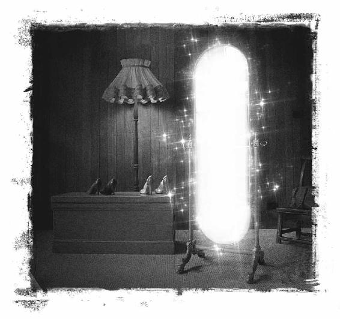

## 第 27 天魔镜

“一切事物的外表都会随着你的心境发生变化，因此我们在某件事物上所看到的神奇和美丽，恰恰折射出我们内心的神奇和美丽。”

卡里·纪伯伦（1883—1931）

诗人和艺术家

你可以耗费余生，为了改造周围的环境使之更符合自我的想象而疲于奔命，你追逐并实现一个又一个设定的目标，不停地抱怨周围的人和事，努力想过充实的生活，实现所有的理想。然而，如果你能够将感恩的态度作为一种生活方式，周围的世界就会发生神奇的变化——如同你所渴望的那样。你的世界发生神奇变化是因为你的变化，因此你将变化吸引到了你的身边。

迈克尔·杰克逊一首歌的歌词中曾经出现了甘地所说的饱含哲理的话：“人是一面镜子。”这句话曾经影响了许许多多的人，因为它所传递的是这样一个强有力的信息：

改变镜中的自己，你身边的一切也将随之改变。

如果之前你一直坚持进行了 26 天的魔力练习，那么今天的你已然改变！尽管有时很难察觉你身上的变化，但在幸福感方面，你已然可以感受到这个变化，你会看到生活上的一些改善，以及你周围的环境里出现的神奇变化。

你进行感恩练习的目的或许是为了你的家人和朋友，或许是为了你的事业、金钱、健康、梦想，甚至是为了某天和你擦肩而过的某个人。但是这些练习受益最大的还是你本人。

当你对着镜子中的人表达感谢时，所有的不满、失望，以及认为自己不够好的焦虑就会通通消失不见，这样，生活中所有令人感到不满、失望和焦虑的环境也会随之消失。

你个人的负面情绪会给你的生活带来极大的伤害，因为这些情绪比其他任何情绪都要强烈。不管你去往哪里，也不管你做什么，只要此时你的心中存留负面的情绪，那么你所触摸过的东西都将被笼罩在负面情绪的阴影之下。这种情绪就像磁石一样，给你招致更多的不满、失望和焦虑。

如果你对自我怀有感恩，那么你就会吸引那些让你对自我感到更满意的环境。因此，你需要保持积极的心态，这样才能让你的生活更加顺利。感恩的心会让你变得更加富足！

“（对于自我）心怀感恩之人，将被赐予更多，变得富余。（对于自我）不存感恩的，连他所有的，也要夺去。”

进行魔镜练习，现在就站在一面镜子前。直视镜中的身影，全身心地投入，大声说出魔咒：谢谢。这需要你拿出比以往更多的真诚。感谢你以你现在的状态存在着！感谢一切构成你存在的因素！这种感谢需要比你以往所表达的任何感谢都要强烈！感谢，因为你就是你！

在今天接下来的某个时间，你需要继续对镜中的美丽身影表达感谢，每次在镜子中看到自己时都要说出魔咒：谢谢。如果你所处的场合不便大声说出魔咒，那么你可以在心中默念。如果你真的足够勇敢，可以对着魔镜说出你感激自己的三件事。

将来，如果由于某些原因你对自己产生不认同的感觉，那么至少你要明白，还有一个人比世界上的任何人都值得拥有你的感激——那就是镜中的自己！

心怀感恩，你就不会在犯错时苛责自己。心怀感恩，你就不会纠结于自身的缺点。对目前的状态心怀感恩，你就会感到很幸福，而你的幸福感会吸引更多令你感到高兴的人、事和神奇的状况来到你的身边。如果你能够看到镜中人身上的神奇之处，那么你的全部生活都将发生不可思议的变化！

### 魔力练习事项 27

### 魔镜

1.数算你的恩福：列出你生命中值得感恩的十项恩福，并写下每一项感恩的理由。重读一遍写下的感恩项。然后念三遍魔咒：谢谢、谢谢、谢谢，尽最大努力体会心中的感激之情。

2.今天，每当你看着镜中的自己时，都要记得说声谢谢，说这句话时需要你拿出比以往更多的真诚。

3.足够勇敢的话，你可以对着镜子说出你感激自己的三件事。

4.今晚入睡前，一只手握住你的感恩石，对一天内所发生的最美好的事，说一声“谢谢”。

## 第 28 天铭记魔力

“魔力就是如此，你知道它一直就在那里，

包围在你周围，时刻等待着你的召唤。”

查尔斯·德·林特（生于 1951 年）

作家和凯尔特民间音乐家

每一天都与众不同，我们的生活中没有完全相同的日子。每天发生的美好的事情也都是完全不同的，因此你需要时常回忆昨日生活给予你的恩福，这能够让你时刻铭记感恩的魔力。不论这种练习重复多少次，每一次你的感受都会是不同的，这也是为什么“铭记魔力”在所有反复进行的练习中效果是最显著的。不管现在你有什么愿望，也不管将来你会有什么愿望，这项魔力练习的效果将对你的人生产生最深刻的影响。

回忆昨日的美好经历最简单的方式是，在一天的开始，当你清晨从睡梦中醒来，就让思绪回到昨天，想想从昨天清晨、下午、晚上，一直到上床休息这一天来所发生的重要事情。这样的回忆对我们来说应该并非难事——让思绪像放电影一般将昨天发生的一幕幕重现，那些美好的经历也会像气泡一样从记忆的底层翻腾而出。

你可以用一个问题开始这个练习：

昨天都发生了哪些令人愉快的事情？

当你问出这个问题时，大脑会立刻为你搜寻答案。有没有听到哪些兴奋的消息？有没有愿望神奇地变成了现实？有没有感到特别快乐？有没有突然收到一个许久未联系的朋友的音信？有没有哪件事十分合你的心意？有没有接到什么高兴的电话或邮件？有没有获得别人的赞美，或是别人向你表达的感激？有没有人帮你解决难题？有没有帮助过别人？有没有完成或是开始了某项令你兴奋不已的工作？有没有吃到自己喜欢的食物，或是看了一场精彩的电影？有没有收到什么礼物，或解决了难题，或召开了一次气氛热烈的会议，或和某人共度了一段时间，或进行了一场获益匪浅的谈话，或为你想要实现的理想做了个规划？

铭记感恩的魔力，将昨天发生的美好经历记录在电脑上，或是写在你的感恩日记里。将昨天所发生的一切回顾一遍，直到你心满意足地找到生活赐予你的恩福。这些事情或琐碎或重要，但生活的恩福不在大小，而在你能发现多少，以及你心里怀有多少感恩。回忆起一件事就用符号对这件事进行标注，用一句魔咒表达心中的感恩——谢谢。

如果今天不想进行这个练习，你也可以将两个步骤交叉进行，几天时间专门记录你的恩福，几天时间专门回忆这些恩福，你可以大声说出或是在心里念出这些事情。或者你也可以列出一个更加详细的清单，写明对每件事感恩的原因。

没有特别规定要回忆起多少件令你感恩的事，因为每一天都不相同。但我敢肯定，生活的每一天都会有美好的事情发生，你只有睁开双眼去感受这份美好，只有敞开心扉去体会，才会发现你的人生竟然如此壮丽、富足。

“心怀感恩之人将被赐予更多，变得富余。不存感恩的，连他所有的，也要夺去。”

铭记感恩的魔力——它将因你而生！

### 魔力练习事项 28

### 铭记魔力

1.数算你的恩福：列出你生命中值得感恩的十项恩福，并写下每一项感恩的理由。重读一遍写下的感恩项。然后念三遍魔咒：谢谢、谢谢、谢谢，尽最大努力体会心中的感激之情。通过书中的练习，你已经写下二百八十项值得感恩的恩福。

2.铭记感恩的魔力需要你去回忆昨天所发生的美好的事，并将它们记录下来。问自己这个问题：昨天都发生了哪些令人高兴的事？搜寻关于昨天的记忆，直到你对所发现的美好经历感到满意，并将这些经历记录下来。

3.在回忆昨天的每一个美好经历时，都要在心里默念魔咒：谢谢。

4.过了今天，你可以将之前发生的美好经历写下来，也可以大声说出或默念这些经历。你可以对昨天值得感激的事情列出一个简单的提要，或是列出一个详细的列表，附上感激的原因。

5.今晚入睡前，一只手握住你的感恩石，对一天内所发生的最美好的事，说一声“谢谢”。

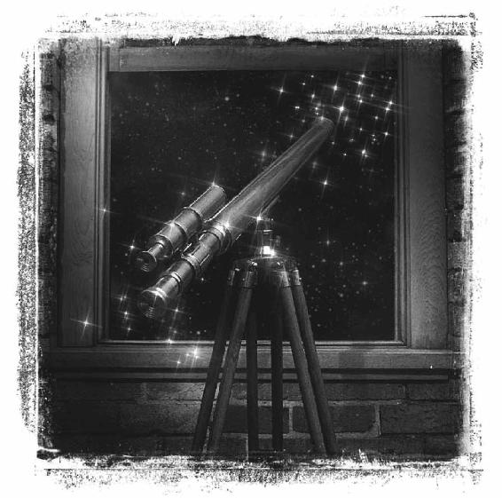

## 你充满魔力的未来

每个人都是自己人生的缔造者，感恩是你召唤魔力的神器，你可以因此获得一个精彩的人生。通过这些感恩练习，你已经为自己打下了一个基础，现在你要利用感恩这把神器，为通向幸福的人生建造台阶。你的人生将因此越走越高，直到天上的星星触手可及。感恩的尝试永无止尽，通向美好人生的阶梯也将永无止尽。就像宇宙中的星辰，浩瀚无边！

“谈论感恩令人谦恭而快乐，推崇感恩令人慷慨而高尚，以感恩的心生活，你将触摸到天堂。”

约翰内斯·A.加尔特纳（1912—1996）

教授、神学家和诗人

想要在幸福的道路上永远前进，你就需要保持以前所建立起的感恩的基础，感恩情绪的增强可以让这一基础不断加固。感恩的魔力练习进行得越多，你的感恩情绪就会越深刻，你因此花在感恩练习上的时间也将越来越少。你可以参考这样的练习方法：

一周连续三天进行铭记感恩魔力的练习，或是将这个练习和你选中的其他两项魔力练习组合起来，这样能够让你维持感恩现有的情绪水平，不断进行魔力练习能够让你的生活变得越来越美好。例如，你会选择今天进行铭记感恩魔力的练习，第二天进行魔力作用下的人际关系练习，第三天再进行魔力作用下的金钱练习。

一周连续四天进行铭记感恩魔力的练习，或是将这个练习和你选中的其他三种魔力练习组合起来，这样能够帮助你维持现有的感恩情绪水平，并加速魔力的出现。

一周连续五天进行铭记感恩魔力的练习，或是将这个练习和你选中的其他四种魔力练习组合起来，这样能够急速增强你的幸福感，并立刻召唤魔力帮你解决生活方方面面的难题。

一周连续六或七天进行铭记感恩魔力的练习，或是将它同你选中的其他魔力练习组合起来，你就会成为一名真正的炼金术士，拥有点石成金的魔力！

### 魔力练习的建议

想要让感恩的魔力持续关照生活的一些重要方面，例如幸福感、健康、人际关系、工作、金钱以及你所拥有的物质财富，你可以一周进行一次针对该方面的专门练习。不过，如果你想要在某个方面增强这种魔力，就必须增加针对这一方面的感恩练习强度，一周练习数天。假如你此时被疾病困扰，你可以每天进行针对健康的魔力练习，甚至一天练习数次。

下面的建议可以作为帮助你将魔力的练习效果最大化的指导说明。在相关的方面按照这一指导，一周最少进行三次练习，每一个推荐练习的项目一周至少要进行一次：

### 人际关系

魔力关系

魔法粉末

人际关系魔力修复剂

魔杖

（魔杖练习既适用于你认识并留有其照片的人，也适用于你不认识且没有照片的人。）

魔镜

铭记魔力

### 健康

魔力健康

魔法粉末

健康的魔力和奇迹

你所呼吸的魔力空气

魔杖

（魔杖练习既适用于你认识并留有其照片的人，也适用于你不认识且没有照片的人。）

铭记魔力

### 金钱

魔力金钱

财富磁铁

（如果之前你没有进行过财富磁铁的练习，那么至少保证完整地进行过这个练习的所有步骤一次；如果你总是进行这个练习，那么可以直接跳到该练习的第四步。）

魔力支票

魔杖

（魔杖练习既适用于你认识并留有其照片的人，也适用于你不认识且没有照片的人。）

魔镜

铭记魔力

### 工作

让工作充满魔力

魔法粉末

魔杖

（在进行魔杖练习以获得工作方面的改善时，你也可以祈祷周围的人获得成功，这种祈祷能够让成功更快地出现在你的生活中。

魔杖练习既适用于你认识并留有其照片的人，也适用于你不认识且没有照片的人。）

魔镜

铭记魔力

### 愿望

魔法粉末

让你的心愿成真

（如果之前你没有进行过让你的心愿成真的练习，至少保证完整地进行过这个练习的所有步骤一次；如果你总是进行这个练习，可以直接跳到该练习的第三步。）

在你的眼前实现

魔杖

（魔杖练习既适用于你认识并留有其照片的人，也适用于你不认识且没有照片的人。）

魔镜

铭记魔力

### 魔法石

你可以将魔法石练习作为日常生活的一部分，将魔法石放在你的枕边，入睡前花些时间回忆一天中所发生的值得感恩的事。你也可以将魔法石随身装在衣服口袋里，每次触摸到它时就去思考一下值得感恩的事情。

### 魔法粉末

你也可以将魔法粉末练习融入日常的生活。除了将这神奇的粉末撒向那些为你提供便利的人，在很多其他方面同样可以用到这个练习。你可以将魔法粉末撒在每个人或者每件事上！假如你的老板脾气有些火暴，你可以暗中将魔法粉末撒在他的身上。你也可以在家人和你爱的人心情不好的时候，将魔法粉末撒在他的身上，甚至可以将魔法粉末撒向任何一个需要给生活增添魔力的擦肩而过的人。无论你去哪里，都可以随时召唤魔法，将魔法粉末撒向孩子，撒向你种植的植物或花园，撒向你吃的食物或喝的水，撒向你的钱包、汽车，或者在接、打电话之前撒到你的手机上，或者撒向任何一个你想要改善的局面。只要你能够想到的，魔法粉末都可以派上用场！

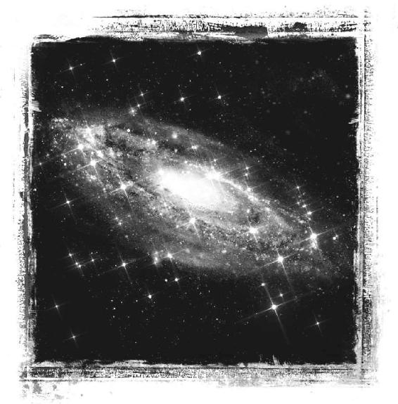

## 魔力永无止境

我每天都会进行感恩练习，对我而言这已成为我生活中不可或缺的一部分，这么多年来，我一直坚持感恩练习，从未有过一天的间断。感恩已经渗入我的每个细胞、融入我的性格，并深深地烙在了我的潜意识当中。

但如果我们每天琐事缠身导致练习间断，一段时间过后，魔力就会消失。我将生活中的魔力作为检测感恩练习是否充分的一个标准，以判断自己是否需要加强练习。我经常会审视自己的生活，如果感到不快乐，我就会加大感恩练习的强度。如果生活的某个方面出现了一些问题，我会立刻针对这一方面进行相关的感恩练习。

现在的我不会被外表的假象所迷惑，从每件事当中我都能找出值得感恩的美好方面，因为我知道它一定存在。接下来，“噗”的一声烟雾升起，所有的烦恼和不愉快都不可思议地消失了！

“我会对一些哪怕琐碎的事表达我的谢意，感谢的心情越强烈，我所获得的奖励就会越丰厚，这是因为你所关注的范围扩大了。当你将注意力集中于生活中的美好，你就会创造更多的美好。机会、人际关系，甚至是财富—不管发生任何事情—都会随着感恩而慢慢流向我的生活。”

奥普拉·温弗瑞（生于 1954 年）

媒体人和商人

通过感恩练习，你驭使了宇宙一条普遍适用的法则；这是宇宙对你的一项馈赠，它的存在就是为了让你利用它以改善自己的生活。

### 宇宙和你

感恩的心甚至可以为你的生活带来无穷尽的富足。而这种生活状态的达成，需要你和宇宙和谐共处。当然，如果你喜欢，我们还可以将其称为你和精神或上天之间的和谐共处。

你可以将宇宙想象为和你分离的一个存在，在你对宇宙进行遐想时，你可以向上看天空。因为宇宙自然是位于你的上方，当然也可以在你的下方、后方或是身旁，可以在每个事物或每个人的内部。这就意味着宇宙在你的体内。

“高者来自低处，低者来自高处，这就是道的妙用。”

翡翠石板（约公元前 5000—前 3000）

宇宙就在你的体内，其本质就是为你所用，它渴望你能够获得更长久的生命、更多的健康、更多的爱、更多的美丽以及更多你想要的东西。明白了这些道理，你就会对宇宙赐予你的一切产生真挚的感激，你也将因此建立起与宇宙之间的联结。

对于宇宙给予你的恩赐所怀有的感恩情绪越强烈，你和宇宙之间的关系就会越亲密——这时候你就会达到我们所渴望的那种境界，感恩的魔力为你带来无穷尽的富足。

敞开你的心灵完全接受感恩的洗礼，拥有了它，你就能触及任何与你生命交会的人的灵魂，你会成为宇宙的朋友，地球上的恩赐将会源源不断地汇入你的生活。当你同宇宙建立起这种亲密无间的关系，当你能够感受到体内宇宙同你的亲近，从这一刻开始，整个世界就是属于你的，没有什么是你成为不了的，或无法拥有的，或做不到的！

### 感恩就是最终答案

感恩能够修复破碎的人际关系，改善健康、财富和幸福感。感恩能够消除恐惧、焦虑、悲伤和抑郁，为你带来幸福、明澈、耐心、仁慈、同情、理解以及内心的宁静。感恩将问题的答案以及各种机会送到你的身边，你将因此实现自己的梦想。

每个成功的背后都需要感恩的支持，感恩会为你打开那扇窗，让新的想法和发现涌现，这一事实已经被牛顿和爱因斯坦这些伟大的科学家所证实。想想如果每个科学家都能沿着他们的脚印行进，人类对这个世界的认识将被推进到新的领域，人们将打破现有的认识局限，科技、物理、医学、心理学、宇宙乃至科学各个领域都将产生许多足以改变人类历史的重大发现。

如果感恩在校园普及并成为一门课程，我们将有机会见证在此影响下的一代把人类文明带到一个新的高度，争端消除，战争终止，和平之光笼罩整个世界。

未来引领世界的国家，其领导人及其国民必将是最虔诚的感恩者。一个国家的国民如果心怀感恩，会让整个国家变得富裕强大，疾病和灾患将在极大程度上得以消除，生产和贸易得以兴盛，举国上下洋溢着幸福和安宁。除此之外，贫穷将会消失，没有一个人再需忍饥挨饿，因为一个感恩的国家绝不会允许这种情况出现。

对感恩的神奇力量理解得越深刻，感恩的魔力也将越迅速地在全世界传播开来，由此将会引发一场感恩的革命。

### 让感恩如影随形

不论去哪里都要记着带上感恩的心。让感恩的魔力渗透进你的每一分感情、你邂逅的每一个人、你参加的每一次活动，以及面临的每一个情境，这样你的梦想就会变为现实。如果有一天，生活中出现的难题让你茫然或手足无措，不要焦虑或害怕，召唤感恩的魔力，对生活的其他事表达你的感谢。当你有意识地对生活中的美好表达感谢时，你所面临的难题将会发生不可思议的改变。

“我们为他（人类）指出了那条路：你可以选择感恩或不感恩（取决于他的个人意志）。”

《古兰经》（完人 76:3）

说出魔咒：谢谢。不论是你大声地说，还是站在山巅高喊，或是自言自语，或是在心中默念，或是用心去感受，也不管你去哪里，从今天开始，这感恩的心、感恩的魔力将会如影随形。

想要拥有富足和幸福的生活，答案就在你的嘴边，在你的心底，一切都已具备，只等着你召唤魔力的到来。

朗达·拜恩

## 关于朗达·拜恩

一部电影《秘密》，风靡了整个世界，也成就了朗达的职业生涯，该电影由她所写就的《秘密》一书改编，这本书曾经作为最畅销书籍被译成 47 种语言，发行量超过 2000 万本。

《秘密》连续 190 周盘踞《纽约时报》最畅销书排行榜，最近被《今日美国》评为过去 15 年最畅销的 20 本书之一。

朗达在 2010 年的著作《力量》延续了之前的骄人成绩，成为《纽约时报》的畅销书，目前已被译为 43 种语言。

# 秘密：实践版

## 版权信息

秘密：实践版

作　　者：（澳）朗达·拜恩

译　　者：顾芯宇

出版人：刘清华

责任编辑：薛　健　刘诗哲

监　　制：蔡明菲　潘　良

特约编辑：温雅卿　汪　璐

营销编辑：刘碧思　尤艺潼

版权支持：辛　艳

设计支持：张丽娜

本书由天津博集新媒科技有限公司授权亚马逊全球范围发行

目录版权信息第 1 天第 2 天第 3 天第 4 天第 5 天第 6 天第 7 天第 8 天第 9 天第 10 天第 11 天第 12 天第 13 天第 14 天第 15 天第 16 天第 17 天第 18 天第 19 天第 20 天第 21 天第 22 天第 23 天第 24 天第 25 天第 26 天第 27 天第 28 天第 29 天第 30 天第 31 天第 32 天第 33 天第 34 天第 35 天第 36 天第 37 天第 38 天第 39 天第 40 天第 41 天第 42 天第 43 天第 44 天第 45 天第 46 天第 47 天第 48 天第 49 天第 50 天第 51 天第 52 天第 53 天第 54 天第 55 天第 56 天第 57 天第 58 天第 59 天第 60 天第 61 天第 62 天第 63 天第 64 天第 65 天第 66 天第 67 天第 68 天第 69 天第 70 天第 71 天第 72 天第 73 天第 74 天第 75 天第 76 天第 77 天第 78 天第 79 天第 80 天第 81 天第 82 天第 83 天第 84 天第 85 天第 86 天第 87 天第 88 天第 89 天第 90 天第 91 天第 92 天第 93 天第 94 天第 95 天第 96 天第 97 天第 98 天第 99 天第 100 天第 101 天第 102 天第 103 天第 104 天第 105 天第 106 天第 107 天第 108 天第 109 天第 110 天第 111 天第 112 天第 113 天第 114 天第 115 天第 116 天第 117 天第 118 天第 119 天第 120 天第 121 天第 122 天第 123 天第 124 天第 125 天第 126 天第 127 天第 128 天第 129 天第 130 天第 131 天第 132 天第 133 天第 134 天第 135 天第 136 天第 137 天第 138 天第 139 天第 140 天第 141 天第 142 天第 143 天第 144 天第 145 天第 146 天第 147 天第 148 天第 149 天第 150 天第 151 天第 152 天第 153 天第 154 天第 155 天第 156 天第 157 天第 158 天第 159 天第 160 天第 161 天第 162 天第 163 天第 164 天第 165 天第 166 天第 167 天第 168 天第 169 天第 170 天第 171 天第 172 天第 173 天第 174 天第 175 天第 176 天第 177 天第 178 天第 179 天第 180 天第 181 天第 182 天第 183 天第 184 天第 185 天第 186 天第 187 天第 188 天第 189 天第 190 天第 191 天第 192 天第 193 天第 194 天第 195 天第 196 天第 197 天第 198 天第 199 天第 200 天第 201 天第 202 天第 203 天第 204 天第 205 天第 206 天第 207 天第 208 天第 209 天第 210 天第 211 天第 212 天第 213 天第 214 天第 215 天第 216 天第 217 天第 218 天第 219 天第 220 天第 221 天第 222 天第 223 天第 224 天第 225 天第 226 天第 227 天第 228 天第 229 天第 230 天第 231 天第 232 天第 233 天第 234 天第 235 天第 236 天第 237 天第 238 天第 239 天第 240 天第 241 天第 242 天第 243 天第 244 天第 245 天第 246 天第 247 天第 248 天第 249 天第 250 天第 251 天第 252 天第 253 天第 254 天第 255 天第 256 天第 257 天第 258 天第 259 天第 260 天第 261 天第 262 天第 263 天第 264 天第 265 天第 266 天第 267 天第 268 天第 269 天第 270 天第 271 天第 272 天第 273 天第 274 天第 275 天第 276 天第 277 天第 278 天第 279 天第 280 天第 281 天第 282 天第 283 天第 284 天第 285 天第 286 天第 287 天第 288 天第 289 天第 290 天第 291 天第 292 天第 293 天第 294 天第 295 天第 296 天第 297 天第 298 天第 299 天第 300 天第 301 天第 302 天第 303 天第 304 天第 305 天第 306 天第 307 天第 308 天第 309 天第 310 天第 311 天第 312 天第 313 天第 314 天第 315 天第 316 天第 317 天第 318 天第 319 天第 320 天第 321 天第 322 天第 323 天第 324 天第 325 天第 326 天第 327 天第 328 天第 329 天第 330 天第 331 天第 332 天第 333 天第 334 天第 335 天第 336 天第 337 天第 338 天第 339 天第 340 天第 341 天第 342 天第 343 天第 344 天第 345 天第 346 天第 347 天第 348 天第 349 天第 350 天第 351 天第 352 天第 353 天第 354 天第 355 天第 356 天第 357 天第 358 天第 359 天第 360 天第 361 天第 362 天第 363 天第 364 天第 365 天

“当你意识到这个伟大的法则，你就会意识到自己拥有多么不可思议的力量，竟然能够把自己的生命‘想’出来。”

朗达·拜恩

《秘密》

献给您

## 第 1 天

秘密包含了如何按照宇宙的自然法则丰富自己人生的清晰原理，对所有人而言，最重要的是活在当下。只有学会活在当下，你才能掌控自己的人生！

通过一年的学习、分析与理解，你每天所获得的智慧将帮助你遵循统治人类的法则，如此一来你就能真正成为自己人生的主宰。

愿快乐与你同在。

朗达·拜恩

## 第 2 天

想要迅速改变人生，就要运用感恩去调动你的能量。当你把所有的能量都用来感恩时，就会看到生命中的奇迹。

想要立刻改变，就坚持每天写下一百件心存感恩之事，直到你发现改变为止。用心体验感恩之情。你的力量潜藏在将感恩之情表达出来的体验中。

## 第 3 天

你内心的感受引领着你的未来。

担忧会吸引更多的担忧。焦虑会吸引更多的焦虑。痛苦会吸引更多的痛苦。不满会吸引更多的不满。

同样的……

快乐会吸引更多的快乐。幸福会吸引更多的幸福。安宁会吸引更多的安宁。感恩会吸引更多的感恩。友善会吸引更多的友善。爱会吸引更多的爱。

关键在于你内心的感受。想要改变自己的人生，你要做的就是转变内心的感受。是不是很简单呢？

## 第 4 天

宇宙每时每刻都在引领着你并与你交流。天地万物对你的想法做出回应，并通过感觉给予你极为宝贵的反馈。你的感觉是一种无形的沟通！良好的感觉意味着，它们对你有益。糟糕的感觉是为了引起你的注意然后转移你的关注点。

每天你都在进行这种无形的沟通。你从不孤独，哪怕一秒都没有。整个宇宙始终与你同在，一步一步地指引着你。而你要懂得聆听！

## 第 5 天

学会发现事物美好的一面，当你面对逆境时更要如此。我们遭遇的每件事都有助于自己成长，这意味着它们终究是对我们有利的。

向新的路线与方向调整需要新的技能和力量，而这些技能通常就是我们实现前方伟大目标所需要的。

## 第 6 天

不论身在何处，不论世事如何艰难，你都在向胜利进发。毋庸置疑。

## 第 7 天

“幸福取决于我们自己。”

亚里士多德（前 384—前 322）

## 第 8 天

这世上有两个字，说出来之后具有高深莫测的力量，能够彻底改变你的人生。这两个字，当你说出的时候，会带给你绝对的快乐与幸福。这两个字会创造奇迹，抹去所有的负面情绪，让你收获累累。这两个字，当你发自内心去感受它们的真正含义时，宇宙的万事万物都将听从召唤并助力于你。

在你、幸福和梦想人生之间只有一步之遥，而这两个字就是关键……

谢谢。

## 第 9 天

境随心转。我们经历的每件事、遇到的每个人都取决于我们的内在。世上还有比这更宏大的系统吗？

你的人生就是内在的一种反映，而你的内在始终是由自己控制的。

## 第 10 天

你是如此独特而又杰出的个体。全球几十亿人中，没有第二个你。你独一无二的存在对宇宙的运行起着至关重要的作用，因为你是这个宇宙的一部分。你看到的一切，万事万物，都无法脱离你而独立存在！

## 第 11 天

这里为大家介绍一种简单、有效的方法，通过每天运作吸引力法则，你将能积极地与世界协调一致。

轻松地坐下。留意一下自己的感觉，现在放松整个身体。接下来，进一步放松自己的身体。然后还是放松。再放松！重复这种循序渐进的放松七次，每次都尽到全力。这个过程结束之后，注意你现在的感受，看看与放松之前相比有何不同。

通过运作吸引力法则，你能更积极地与世界协调一致！

## 第 12 天

坚持，坚持，再坚持，《秘密》里的法则总有一天会成为你的第二天性。到时你会对别人的言辞产生新的认识，尤其是当他们谈论自己不期望的事情时。同时，你也会对自己说的话格外留神。

等你到了这个境界，就表明你正变得越来越谨慎，越来越自觉！

## 第 13 天

万事皆有因，而这个因就是我们自己。所以当你因为得不到自己想要的而觉得法则失效时，应意识到法则是每时每刻都在回应你的。你吸引到的无非就是自己想要的和不想要的。

自然法则始终有效。

## 第 14 天

“我们这一代最伟大的革命，就是发现了人类可以通过转变心态，进而改变自己的人生。”

威廉姆·詹姆斯（1842—1910）

## 第 15 天

开始质疑人生是你正在经历重大突破的信号。

人生的真谛自始至终都摆在每个人的面前，但只有那些发出质疑的人才能获得答案，发现真相。当我们带着迫切想知道答案的心情，去提出疑问，答案就会以我们所能明白的形式展现。

要知道人生的答案，你就必须开始提问。

## 第 16 天

爱是我们所拥有的最强大的力量，它通过吸引力法则进行运作。感受到的爱越多，我们就越强大。感受到的无私之爱越多，我们的力量就越深不可测。

吸引力法则被称为爱的法则，因为法则本身就是赐予人类的爱的礼物。正是因为它，我们才能为自己创造非凡的人生。

感受到的爱越多，我们就拥有越强大的力量去创造充满爱、快乐与和谐的传奇人生。

## 第 17 天

和谐融入世界是一种什么感觉？

这种感觉如同漂浮在水上一般。如果你焦虑不安，或者做出反抗，就会沉下去。如果你顺应水的安排，那水就会让你漂起来。就是这种感觉，而它也是你融入这个世界的方式。

让我们放弃抵挡顺其自然吧！

## 第 18 天

根据吸引力法则，消除疾病的方法不是与其做斗争。如果你决定要与疾病做斗争，那么你的焦点就会放在如何战胜疾病上，我们关注什么就会吸引什么。所以，还是让医生操心你的病吧，你只要关心健康就好。

要多思考健康。要多讨论健康。并且想象自己身强体壮的美好画面。

## 第 19 天

想要通过金钱改变自己的现状，你所能做的最大努力之一就是把自己获得的百分之十捐赠出去。我们把它称为崇高的奉献法则，这是能给你带来更多财富的最伟大的行动。

## 第 20 天

为什么你总能看到那些质量上乘的车被主人保养得又干净又整洁，而老车里边却总是又脏又乱呢？

差别就在于对车的欣赏。

欣赏你所拥有的才能得到你想要的。

这就是为什么那些人总能拥有更好的车。

## 第 21 天

“绝对不要强迫别人做出改变，让他们按照自己的意愿自然有序地变化；而且，当他们觉得你的改变有价值时就会自然而然地也想要改变自己。”

“激发别人产生改善的欲望是非常高尚的，不过你只能在不干涉他人并完善自己的情况下才能达到目的。”

克里斯丁·迪·拉森（1874—1962）

《掌控自我》

## 第 22 天

每个消极的事物里都隐藏着美好的一面。如果我们能去其糟粕，取其精华，那么就能化消极为积极。大多数人将美好拒之千里是因为他们给某些事物贴上了坏的标签，然后，理所当然地，这些所谓的坏就变成了现实。然而宇宙中根本没有坏，只是我们缺乏从更高层次辨析事物的能力。

和平源自对世界只有美好存在的认知。

## 第 23 天

你和吸引力法则是合作伙伴的关系，你正是通过这种关系创造自己的人生。每个人与吸引力法则之间都有独一无二的合作关系。你有自己的运作方式，别人也同样如此。你不能把吸引力法则强加在他人身上，违背他人的意愿。当你想到这一点，应该庆幸吸引力法则是如此运作的。否则，任何人都能在你的人生中创造你并不想要的东西。

你通过自己的想法和感受进行创造，只有你自己才能产生属于自己的想法或感受。

## 第 24 天

如果你有朋友正在经历磨难，帮助他们的同时要确保自己能保持快乐。你的良好感受能帮助他们积极面对困难。你也可以引导他们谈论自己想要的东西。如果他们偏离正题开始讨论自己不想要的东西时，就温和地将话题转回到想要的东西上去。你还可以用一种雨过天晴的口吻和他们对话，建议他们想象走出困境后的情形。

你要主导你们之间的对话，帮助他们与宇宙的频率协调一致。

## 第 25 天

你可以改变人生的道路从黑暗走向光明或从消极走向积极。每次你把焦点放在积极的一面就能为自己的人生带来更多光明，而且你很清楚这道光能驱散所有的黑暗。感恩、爱、友善的思想、言语、行动，都能带来光明，消除黑暗。

用积极之光填满你的人生吧！

## 第 26 天

当你开始刻意控制自己的时候（凭借思维和感觉），就会发现人生充满了起伏，而你自己也疲于奔命。这个阶段实在太短暂，你根本不可能有时间理性地分析现状，你只期望速度更快，因而不停向上攀登。

欲速则不达，不是吗？只要下定决心就能实现目标。不必急于一时。

## 第 27 天

“有一种观点认为，不论何种形式的巨大财富，它们都能给人带来满足或快乐，这其实是一种误解。没有任何人、地点、事物能给你带来真正的快乐。它们或许是让你感到快乐和满足的原因，但生活的乐趣是源自内心的。”

吉纳维芙·贝伦德（1881—1960）

《你的无形力量》

## 第 28 天

为了创造明天，请在入睡前躺在床上回顾今天，感恩所有美好的时刻。如果你希望有些事情能以不同的方式发生，就在脑海中按照自己的意愿回放。在入睡之际，对自己说：“我会睡一个安稳觉并精力充沛地醒来。明天将是我人生中最美好的一天。”

晚安！

## 第 29 天

谈到恋爱关系，人们往往认为自己爱的人是特定的。但当你再细想时，就会发现其实所谓特定的对象并非他们想要的。他们真正想要的只是和自己的完美对象无比幸福地生活在一起。可是，他们依然试着想告诉上苍自己的另一半应该是谁。如果上苍没有回应，那么一切就很明朗了：“上苍已经告诉你，你过于理想的幸福与快乐无法从这段关系中获得。”

难道我们比上苍更能洞悉这世间的一切？

## 第 30 天

地球和人类需要你。这份需要，是你存在的理由。

## 第 31 天

你拥有控制一切的能力。以下便是你赶走消极想法的良策：

“走开！我这里容不下你。我无所畏惧。我内心只有正面积极的想法。”

这话再准确不过了。

## 第 32 天

从出生那一刻起，你的人生旅途上一直都有个伴侣。这个无形的伴侣拥有不可思议的人脉，以及数不胜数的方法，帮助你实现梦想。时间不是障碍，大小不是问题，空间对于你的伴侣而言是不存在的。你的伴侣可以为你做任何事。

而你要做的只是遵循宇宙的法则。发出请求，在你求助的时候，真心相信自己想要的东西已经归你所有。

想象一下——整个宇宙都在为你而战！

## 第 33 天

你是否知道如果你的人生没有发生转变，你将不复存在？我们的宇宙以及万事万物都在不停变化，因为宇宙是由能量组成的。只有不断地改变才能产生能量。一旦能量停止转化，那整个宇宙和所有的生命都会消失。

我们的人生亦是如此，所以必须持续发生转变。你无法停止这一切，也不会想要停止这一切。能量的转变性赋予了我们人生。它让人生得以发展，让我们得以成长。

## 第 34 天

存善念。

说善言。

行善事。

三个步骤能给你带来超乎想象的益处。

## 第 35 天

“诸法意先导。意主意造作。若以清净意。或语或行业。是则乐随彼。如影不离形。”

佛陀（前 565—前 486）

## 第 36 天

吸引力法则是客观的。它就像打印机一样。这个法则反映出你每时每刻的想法和感受，然后把这些原原本本地还给你——从而塑造你的人生。因此你要改变自己的整个世界简直易如反掌。

想改变外在世界你只需改变自己的思考方式和感觉，吸引力法则会相应地做出变动。

## 第 37 天

想改变人生，我们就必须在某个时刻决定自己要与快乐为伴，而不是继续受苦。唯一的办法就是寻找一切可以令自己感恩的事物，无论是什么。

当我们开始将焦点放在事物美好光明的一面时，吸引力法则会对我们全新的思想做出回应。美好的事物开始显现，然后越来越多……

## 第 38 天

我们完全可以自由选择想要的东西。选择权在你手里，由你决定如何行使自己的权力。

想从今天开始就过得更快乐，或者等到明天再说。

觉得哪个更好？你自己选择。

## 第 39 天

你对人生中的一切心存感激非常重要。许多人只专注于自己还没得到的并对已经拥有的不屑一顾。没有感恩的心，你就无法运用吸引力法则获取任何事物，因为如果一个人不懂得感恩，那他就是个不值得怜悯的人。要积极主动地感恩以获取自己想要的东西。

## 第 40 天

愿景板是帮助你在脑海里勾画自己愿望的工具。当你看着这块板的时候心里就留下了渴求的印记。你专注于愿景板时，感官和内心的积极感受也会被唤醒。如此一来你就能让创造的两大要素——你的思维和感觉充分运作起来。

## 第 41 天

爱因斯坦曾告诉我们时间只是一种假象。当你理解并接受没有时间的概念之后，你就会发现自己将来想要的一切其实早已存在。这就是为什么在你写下、想象或谈论自己的愿望时，应该用现在时。让你的愿望在自己的脑海中、内心深处和身体里发光发亮吧，现在就清晰可见。

## 第 42 天

“在这个世界上没有谁比那些给他人减轻生活重担的人更值得珍惜了。”

无名氏

## 第 43 天

你的一生都在运用《秘密》——每时每刻都不停歇。不管是否得到自己想要的你都无法抛弃它。每个人、每件事、每个情境——在每一天之中——都是通过吸引力法则的运作来到你的身边。

## 第 44 天

想象的关键是让画面在你的脑中不断地发生变化，而你自己也要在画面中不停地移动。如果你能使画面像电影一样动起来，那么就能迅速掌握想象的技巧。倘若画面是静止的，想要在脑海中留下它就会困难得多。

做一个不停地想象的人吧，这样你的大脑就没时间考虑别的事情了。

## 第 45 天

当你开始有意进行创作时，同一时间只专注于一件事会比较好。通过练习你能拥有强大的力量来控制自己的精力，之后就能做到一心几用。

想象你的大脑是被阳光穿透的放大镜。当你把放大镜固定于一个点时，就能生出一团火。就像放大镜和太阳的关系一样，你的大脑和宇宙也是如此运作的。

## 第 46 天

如果你刚开始运用《秘密》的法则，我的建议是先专注于内在的频率。明确自己想要什么，然后改善你的内在。通过思维和感觉来提升自身的频率。

把你的频率和宇宙频率协调一致，因为宇宙的频率是如此至善纯粹！

## 第 47 天

如果你想获得更多的财富，就把自己要买的东西列出来，然后沉浸在对这些东西的想象里并体会已然拥有的感觉。想象自己正和所爱的人一起分享并体味他们的幸福。

现在你就是在创造！

## 第 48 天

憎恨是没有力量的。憎恨仅仅是缺乏爱的一种表现，就如同黑暗是因为没有光明一样。贫穷是因为缺乏财富，疾病是因为缺乏健康，悲伤是因为缺乏欢乐。所有的负面事物皆是因为缺少某些正面的东西。

能了解这一点，真是太好了。

## 第 49 天

“人生的目标在于自我发展。我们在此的目的，就是彻底了解一个人的本质。”

奥斯卡·王尔德（1854—1900）

《道林·格雷的画像》

## 第 50 天

花一些时间思考一下每天你从大自然获取的赖以生存的一切。而大自然从未向你索要过任何回报。

这是真正的给予。

## 第 51 天

毫无疑问当你为他人着想而运用吸引力法则时，就会获得强大的力量。然而，这一法则也适用于你，你会因此过上充实的生活。只有当你的人生足够充实才能付出更多。

你的痛苦与不幸于这个世界并无益处。然而，你的快乐和充实的人生却推动着这个世界前进。

## 第 52 天

如果你时刻充满幻想却什么也没得到，那就意味着你正无意识地以某种强大的方式忽略自己的目的。你在思考什么？谈论的是什么？采取了什么行动？如果你不确定，就请求吸引力法则，它会向你清楚地展示到底是哪一步做错了。

## 第 53 天

你若是希望别人欣赏你所做的一切，那么就要先懂得欣赏和赞扬别人。

倘若你发现别人的缺点，那么别人也会发现你的缺点。如果你评判别人，那么别人也会评判你。要是你欣赏别人，那么别人也会欣赏你。你要先具备这种品质，才能获得别人的欣赏。

## 第 54 天

整个世界和你人生中的每一个细节都彰显了你的内在频率。这种频率每时每刻都在通过你见过的人、情境、事件来向你传达信息。

人生就是你内心的映照。

## 第 55 天

凡是把别人往坏处想的人自己也会受到负面情绪的影响。多少人对你有负面评价无关紧要。如果你很快乐，那些负面评价就不会影响到你，因为你和那些人的频率是不一样的。相反，所有的消极情绪都会反射到评价的人本身。

没有人能用他的负面情绪影响我们的生活，除非我们自己降低自身的频率让别人乘虚而入。

## 第 56 天

“我们每时每刻都在传达自己或强烈或温和的思想，并且获得这些思想的反馈。我们的意识波动不仅影响自己和他人，还在汲取力量——意识波动将思想、事物、状况、人、‘幸运’吸引过来，而这些也正是我们最想要的。”

威廉姆·沃克·阿特金森

（1862—1932）

《思想频率》

## 第 57 天

想体会深切的感激之情，需要静静地坐下，列举出自己感恩的事物。持续书写这一列表直到你泪如泉涌。当泪水夺眶而出，你的内心就会体验到最美好的感受。这种感受是真正的感恩。一旦你体会到了就懂得如何为自己重新创造这种感觉。

你会想在一天内尽可能多地重复这种因感恩而产生的强烈感受。短期内它将变为你身体的直觉，你会在不经意间就想这样行动。

通过练习你能做到这一点。

## 第 58 天

请求，相信，接收——简简单单三部曲就能创造自己想要的人生。不过，第二步相信往往是最为困难的，可它又是你要跨出的最重要的一步。相信意味着坚定不移。相信代表着绝不动摇。相信是绝对的信仰。相信是不论外界如何变化，我自岿然不动。

当你掌握了相信，你就掌握了人生。

## 第 59 天

你是否知道当你拼命想搞清自己的愿望将“如何”发生时，其实你正在远离它？当你寻找“如何”实现愿望的方法时，你就是在向宇宙传递你根本没有愿望的信息。如果连你自己都无法发出准确的频率，那宇宙又怎么可能找到你的信号去实现你的愿望呢？

## 第 60 天

你就是宇宙的传送中心。每时每刻你都在发送和接收频率。想要创造愿望，你必须将自己的愿望完整地发送出去，要做到这一点你必须铭记已然显现的愿望。

但如果你开始觉得自己的愿望并不在此，并产生怀疑，那么传送就被中断了。宇宙会停止你之前的信号，转而接收新的你没有愿望的信号。宇宙会以一贯的方式向你反馈，而你接收到的信息就是：我的愿望不在这儿！

你该做的就是调整自己的频率并明确自己的愿望，这样一来宇宙就能帮助你实现它。

## 第 61 天

宇宙能用数不清的方式助你梦想成真，而且我向你保证只要你从内心发出梦想的频率，那么它将以一种出乎意料的方式出现在这个世界上。

勾画自己的梦想就好，剩下的就交给宇宙吧。

## 第 62 天

我是如何利用《秘密》来摘掉老花镜的呢？

我先提出这个请求，然后想象自己不戴眼镜的样子。三天之内，我的视力就变得清晰了。我并未留意整个过程花了三天的时间，因为我知道自己在许愿的那一刻就已经实现了愿望。如果我留意了这三天，那么我就会发现愿望还没实现。但我是百分百相信并知道愿望已然实现。我拥有绝对的信念。我可以轻松地说自己花了三天的时间发现视力好转了。这是真的，因为我在许愿的时候就已经知道愿望会实现，不论怎样我都没有丝毫的动摇。出于这种认知，我的视力在三天内就得以好转。

## 第 63 天

“如果人们日子过得好，那么这个时代就是好时代。我们好，时代就好。”

奥古斯丁（354—430）

## 第 64 天

除非我们懂得对已经拥有的心存感恩，否则就再也得不到任何东西。事实上，如果一个人对万物都心怀感恩，那么他就不会再提出任何请求，因为他在请求之前就已经被赐予了。

这就是感恩的力量。

## 第 65 天

你所要做的就是请求和相信，然后调整好自己的频率准备接受美好的事物。你无须再做其他任何事情。宇宙会接手之后的工作，运转包括你在内的世间万物。

只要你提出请求并相信，那么你就不会成为宇宙自行运作的阻碍。

## 第 66 天

根本不必担心负面情绪，也不要尝试控制它们。你需要做的就是每天积极向上。尽可能多地培养正面情绪。如此一来越来越多的正面情绪会接踵而至，所有的负面情绪将一扫而空。

## 第 67 天

想要让宇宙帮助你过上更好更快乐的生活，你需要不时地观察自己的周围并对那些美好的事物心存感恩。发现美好并知足常乐。不满的情绪不会为你带来理想的生活。它们只会令你停滞不前，而感恩能让你感觉越来越幸福。

记住，你就是一块磁铁！只有感恩才能吸引感恩！

## 第 68 天

当重大能量转变影响我们的人生时，我们往往认为那是“不好”的并为此伤感，抵触这种变化。然而，条条大路通罗马啊。

浩瀚宇宙中从来都不是只有一条路可以走，不论发生什么，总会有办法能让你摆脱目前的处境。面对人生中的各种问题有两种处理方式，是积极进取抑或消极面对，只有你能做出这关键的选择。

## 第 69 天

在你希望人生幸福美满时，不要只为自己考虑，而要为所有人着想。想要遇到更美好的事物也是如此，不光要顾及自己，更要顾及所有人。你当然可以索取财富和健康，但也别忘了去给予其他人。

想象一下如果六十亿人都为你争取这些会是一番怎样的情景？

## 第 70 天

“心念至纯，则万物皆纯。”

佛陀（前 565—前 486）

## 第 71 天

想要明白自己是如何在无意识的情况下进行思考的，就请停下来，闭上眼睛，十秒内什么也别想。

如果这样你还是会产生想法，那就说明你是在进行无意识的思考。如果连十秒你都控制不了，你能想象一天之内所产生的想法会有多少？

你可以改变这一切并控制自己的想法。需要做的就是练习十秒不思考。不久之后你就能在十秒的时间内停止思考，然后是十五秒，三十秒，甚至更久，持续不断地训练直到你能完全控制自己的大脑。届时你会感受到难以形容的祥和，同时你也掌控了吸引力法则。尽情去想象吧！

## 第 72 天

如果你的振动频率中带有“需要金钱”的信息，那么就会不停地吸引缺钱的频率。即便目前缺乏金钱，你也要找到方法让自己现在就幸福起来，现在就感觉良好，现在就变得快乐，因为这些美妙的感受就是你拥有钱财之后所能体会到的。

财富无法带来快乐，但快乐却能带来财富。

## 第 73 天

如果迄今为止你的人生都很完美，所有的事情都朝着你期望的方向发展，那么你可能没有改变人生的坚定决心和强烈愿望。似乎只有在遇到“不幸”时我们才会产生改变人生的强烈愿望。这股油然而生的意愿犹如魅力之火，十分强大。

要对所有能激发自己愿望的事物充满感激之情，因为这团愿望之火能带给你力量和决心，你将因而改变自己的一生。

## 第 74 天

你说的每句话都带有一定的频率，一旦你开口，这些话就会被释放到宇宙中。吸引力法则会对所有的频率做出反应，所以它也会回应你所说的话。当你使用强烈的词语，例如“可怕”“令人震惊”以及“骇人听闻”来形容任何情况时，你所发出的是强烈的频率，那么吸引力法则就会给予相应的回复。

吸引力法则是客观的，它不过是匹配你所发出的频率。现在你明白表达强烈的愿望去阐释什么是你想要什么非你想要的重要性了吧？

## 第 75 天

现在就想象一下已经实现愿望的感觉吧，保持这种感觉。那将是世上最美妙的感受。随着你的练习，这种感觉会越发强烈。你会感到自己已然拥有了想要的东西。而当你有这种体会时，吸引力法则会做出回应。

请记住，吸引力法则每次都会应验，从来不会令你失望。

## 第 76 天

童年时期你爱玩过家家游戏，还记得你是如何被自己的幻想说服的吗？这就是你在想要得到什么的情况下必须做的。你要偷偷地，在自己内心深处，幻想自己已然拥有了一切。比如，你想要朋友，就幻想或者假装那些出色的朋友就在你身边。

一旦你通过想象和感觉扭转局势，让自己拥有出色的朋友的感觉比孤身一人的感觉更强烈，你就真的会交到很棒的朋友。

这套简易的方法适用于任何情况。

## 第 77 天

“人之所以为人是因为他有信仰。”

安东·契诃夫（1860—1904）

《安东·契科夫的笔记》

## 第 78 天

想要在掌握吸引力法则上有所进步，你就要通过学习找出最适合自己的方法并不断练习。

每一天你都能通过周围所发生的事情了解到自己的想法。你的整个世界如同一部电影，向你展现何去何从。你并非身处黑暗之中，因为你会收获反馈。你要从这些反馈中学习。观察什么东西来得容易，并思考究竟做了什么使得自己轻易得到了这些东西。

了解自我，你才能掌握吸引力法则。

## 第 79 天

我们的自然状态就是快乐。产生负面的想法、消极的语言和痛苦的感觉是需要花费大量精力的。获得快乐最简单的方式就是存善念，说善言，行善事。

不妨试一下吧。

## 第 80 天

上千年以前的古代智慧为我们揭示了感恩的真谛。所有的宗教都倡导感恩。世上所有的智者与救世主都教导人们要懂得感恩。伟人通过实际行动告诉我们如何感恩，而他们成了历史长河中耀眼的光芒。

爱因斯坦肯定就是因为这一点才每天说上百次的“谢谢”！

## 第 81 天

吸引力法则如同一台巨大的打印机，毫无偏差地反映出你的思想和感觉。如果你不希望看到的事情发生了，那么肯定是你在绝大多数情况下没有留意自己的想法或感受。要时刻觉察自己的感受，这样你才能停下来并做出改变。那么你该怎么做呢？就是思考能让自己感觉舒服的事情。

请记住你无法同时做到心态积极但却感觉糟糕，因为感觉就是思想的产物。

## 第 82 天

宣誓的有效性完全取决于你对誓言的信任程度。如果你根本不相信，那么誓言只是毫无力量的语言罢了。信念能为你的誓言注入力量。

不论是什么，只要你相信自己所说的，就会创造奇迹。

## 第 83 天

“你运用的每个字中都有一个强大的微生物，它能按照语言指示的方向扩大并展现自身，最终形成肢体语言。比如，你想要快乐。暗中重复‘快乐’这个词，不要间断且内心坚定，就会产生频率。而这种频率会令‘快乐’这一微生物开始扩展并得以显现，直到你整个人充满了喜悦之情。这不是幻想，而是事实。”

吉纳维芙·贝伦德（1881—1960）

《你的无形力量》

## 第 84 天

不论何时，只要你能想起来，就对自己说“我很快乐”。只要你喜欢，一天可以说上几百遍。说的频率要高，但要注意你的速度，要非常非常慢，一个字一个字地强调。我——很——快——乐。说的同时感受这些字的意义，尽可能地体验快乐。在每一天创造这种感觉。你将会越来越快乐。

感受自己内心的快乐而不要被外界影响，如此一来你就能扭转局势。

快乐吸引快乐。

## 第 85 天

把你认识的每个人身上的优点都写下来。接着把自己所有的闪光点都列举出来。不论你去往何处都要时刻称赞别人。赞扬你所看到的每样东西。让自己成为一缕阳光，照亮每个人的生活。把“谢谢”常挂在嘴边。走路、说话、思考，懂得欣赏与感激。

一旦你这么做了，你的外在生活就会发生改变，并映照出你的内心。

## 第 86 天

吸引力法则是绝对可靠的，每个人都能得到自己请求的东西，尽管大多数情况下人们没有意识到自己请求的并非自己想要的。吸引力法则有种极致的美，它有求必应并每时每刻都在奉献。正因如此，我们才得以体验人生。

吸引力法则从不改变——我们必须学会适应这一法则。这也是每个人所面临的最大挑战。

## 第 87 天

你可以让自己过上天堂般的生活，但唯一的方法就是先改变自己的内心。除此之外别无他法。

你是因，人生便是果。

## 第 88 天

当你把焦点放在别人已经存在的问题上，那么就帮不了他们或自己，因为你们都把能量加在了问题上。同时你们还将面对更多“类似”的问题。

既然如此，关注彼此都想要的对双方来说就显得尤为重要。应该鼓励有问题的一方谈论自己想要的，发生问题并非他们所愿。当一个人开始思考或谈论自己不想要的东西时问题就产生了，所以必须终止这一连锁反应。帮助并鼓励身边的人说出自己的愿望，这才是万无一失的解决方案。

## 第 89 天

消极思想并不代表你本人。你真正的本性是美好善良的。因此，如果你不小心产生了消极的想法，就告诉自己：“这些想法并不是我的，它们与我无关。我很好，对自己和他人内心只有积极的想法。”

这才是真相！

## 第 90 天

这里为大家介绍一种停止消极思考的方法：用心去思考。深呼吸，把焦点放在你的心上。集中精神感受心里的那份爱。慢慢地吐气，把焦点始终放在你的心上。重复这个过程七次。

如果做对了，你的身心会焕然一新。你会觉得更平静、更轻盈，所有的消极想法将会烟消云散。

## 第 91 天

“除了思想之外，没有任何东西在我们的绝对掌控之中。”

勒内·笛卡儿（1596—1650）

## 第 92 天

请牢记，只有思想和感受相结合，你才能运用吸引力法则进行创造，两者缺一不可。还要记得你的感受是所有频率的总和，它告诉你自己此刻正在创造什么。

你现在感觉如何？觉得好些了吗？尽力让自己的感觉好起来吧。

## 第 93 天

每次驾车出行前借助宇宙的力量幻想此行畅通无阻，你就会觉得轻松快乐，而且能准时抵达目的地。

祝出行愉快！

## 第 94 天

将平等交换的法则融入你的人生就是在与吸引力法则为伴。

不论工作还是私事都要确保自己遵守公平交换的原则。生意场上，你要比收益付出更多的价值。私生活中，你要学会礼尚往来。如果你在需要的时候得到了别人的帮助，那么就要在别人需要时，去帮助他们。所有的帮助都来自浩瀚的宇宙，因此当你给予回馈的时候其实是在回馈宇宙。

这就是公平的生活，也是吸引力法则相伴左右的人生。

## 第 95 天

你的人生掌握在你自己手中，但你必须学会控制自己的思维。所有的恐惧、失败、疑惑都是你被思维控制的结果。它占据了主导位置，而你则成为不受约束的消极思想的奴隶和受害者。道理就是这么简单。控制你的思维，每天注意自己的思想，一点一点地制约它。

一旦产生了消极的想法，就立刻把它清除掉，坚决不让这类想法扎根于你的大脑中。多产生一些积极的想法，慢慢地它们就会不请自来。

## 第 96 天

想要保持平静，你要做的就是每天花点时间坐下来，闭上眼睛观察自己的思想。不要抵触，静静地观察就好。当你留意自己的想法时，它们就会消失。通过每天的训练你会越来越娴熟。大脑会放空五秒，然后十秒，再然后二十秒。

当你意图控制自己的大脑时，只需去想象自己拥有创造梦想所需的巨大能量。

## 第 97 天

时刻谨记你的感受一直在监控你的想法。它会提示你目前的想法是好是坏。如果你越来越留意自己的感受，那就说明你对自己产生何种想法越来越谨慎。感觉在不停地给你发电报。

请聆听自己的感受！

## 第 98 天

“万物起源于思想，你所寻找的身外之物，其实都已经在你手中。不是万物引发了你的思想，而是你的思想造就了万物。”

吉纳维芙·贝伦德（1881—1960）

《你的无形力量》

## 第 99 天

不论你做什么事都不是孤身一人，除非你认为自己孑然一身，这对任何人而言都是种可怕的想法。当你了解到自己所拥有的宇宙的能量能对每个念头做出回应，随时准备帮助自己实现梦想时，所有的恐惧都会烟消云散。

你拥有最强大的联盟，它无所不能。没有任何事物能阻挡它——你要做的只是相信宇宙的力量。

## 第 100 天

你知道，我们的自然状态是快乐，否则我们的感觉会很糟糕。因此如果快乐是你真实的本性，那么你是否明白产生负面情绪相对于快乐而言需要消耗更多的能量？

## 第 101 天

让吸引力法则为你效劳的另一个简单方法是：

每晚入睡前，你在脑中回放当天所有美好的时光，由衷地感激每个时刻。并想象第二天依然如此，一切将会是那么美妙，充满了爱与欢乐，所有美好的事物都会降临到你的头上。把这一天看作人生中最棒的一天。第二天起床之前重复一遍这个过程，把心中深深的谢意表达出来，仿佛你已经美梦成真。

## 第 102 天

“如果”这个词是一种很强的怀疑频率。当你思考或者谈论自己的梦想时，记得把“如果”去掉。你是否察觉加上了“如果”就表明你并不相信自己已然梦想成真？

吸引力法则无法在你心存疑虑使用“如果”的状况下助你实现愿望。在你思考和谈论愿望的时候只用一个字“当”，“当它发生时”“当我这么做时”“当我在那里时”“当这天来临时”“当我得到时”。当，当，当！

## 第 103 天

不管你是否了解，今天你就在向宇宙预订明天。你今天的主导思想和感受就是在创造一种频率，而这种频率自动决定了你明天的生活。

从现在开始就让自己的感觉好起来吧，这样你的明天才会妙不可言。

## 第 104 天

你必须现在就快乐起来，通过吸引力法则为自己的人生注入快乐的源泉。这是一套简单的公式。快乐吸引快乐。然而人们为自己的不快乐寻找了太多的借口。债务的借口，健康的借口，人际关系的借口，人们运用各种借口为自己开脱。而这个公式就是法则。

不论借口是什么，除非你能在不使用公式的情况下开始感到快乐，否则就无法吸引快乐。吸引力法则就是要传递这样一个信息，“马上快乐起来，只要你一直这么做，我就会给予你无限的快乐。”

## 第 105 天

“人类是被我们称为‘宇宙’的这个整体的一部分，受到时间和空间的限制。人类依靠自身体验一切，其思维和感情似乎与宇宙的其他部分无关——这种错觉源自人类的意识。这种错觉对我们而言无异于一种束缚，将我们囚禁在自我的欲望以及与身边关系密切之人的情感中。我们必须扩大自己怜悯的范围，去拥抱世间万物并体会大自然之美，从而挣脱只注重自我这样的枷锁。当然没有人能够完全做到这一点，但是努力实现目标本身就是解放自我，而这也将成为内心安定的基石。”

阿尔伯特·爱因斯坦（1879—1955）

## 第 106 天

在 20 世纪 90 年代，艾米尔·库艾（法国的一位心理学家兼药剂师）是运用积极思想帮助治疗这一研究领域的先锋。他的成功疗法中的一部分涉及简单的日常感恩，对病人进行有意识的自我暗示：“每一天，我的状态，都在不断地改善。”这不仅仅是对健康的有力宣言，从字面上看，它也是对人生各个方面的有力声明。

当你宣读这份誓言时，请全身心地投入并缓慢地念出每个字。正是我们给予了这些字强大的力量。

## 第 107 天

想象自己正在通过写邮件的方式将自己的愿望告诉宇宙。当你觉得邮件内容很清楚时，点击“发送”键后你的请求就去了太空。你也明白宇宙服务器是一个自动的系统，它不会对请求提出质疑。它的任务就是完成每个请求。

如果你开始担心并紧张自己的愿望无法实现，那么宇宙就接收到了另一封邮件，停止传送你之前所要求的东西。然后你就纳闷为什么自己的愿望没有实现。

一旦你开口，知道宇宙服务器是万无一失的自动系统，那就等着它回复你的请求吧。

## 第 108 天

这里为大家介绍吸引力法则最有效的使用方式的一种。这项训练就是三十天的大量付出。

连续三十天，不停给予。你要把快乐、微笑、暖人心脾的话语、爱、感激和赞美给予你遇到的每一个人，包括陌生人、朋友和家人。由衷地表达自己的心意，每时每刻尽自己最大的努力，用善意的思想和语言改善每个人的一天，并把这些当作自己的使命。

当你尽全力行善时，其他人也会以惊人的速度回报你。

## 第 109 天

一旦你了解了吸引力法则，你就能通过倾听自己的方式最有效地发掘自我。

当你以绝对的口吻陈述某件事时，就会意识到自己真的对此深信不疑，而这种信念就在创造你深信的一切。如果听过自己的言语并发现所说的不是自己想要的，立刻进行调整，重新组织语句表达自己想要的东西。你会了解到很多自己的过往经历以及你在聆听自己言谈之后所创造的一切。随着你注意自己的言辞并及时改正，你的未来将会焕然一新！

## 第 110 天

失望的消极感受会让你远离梦想。要将失望转化为积极的感受，就要思考并扪心自问，“当梦想实现时我将会……”你可自行填充内容。

这是令自己拥有信念的绝佳方式，而信念就是你的愿望。

## 第 111 天

我向自己保证……

要变得无比坚强，不让任何事物扰乱我内心的宁静。和自己遇到的每个人谈论健康、幸福与美好的前景。

令所有的朋友都感受到他们自身的价值。

凡事看到光明的一面并让自己变得积极乐观。

只让最美好的存于脑海，只为最美好的而奋斗，只期待着最美好的结局。

要像对待自己的成功那样为他人的成功欢欣鼓舞。

不拘泥于曾经犯下的错误，只着眼于将来的远大成就。

## 第 112 天

任何时候都表现得积极阳光，对宇宙中的任何生物都不吝惜自己的微笑。

花大量的时间提高自我，如此便无暇去批评别人。

足够豁达则少忧虑，精神高贵则不易发怒，内心坚强则无所畏惧，心态开朗则麻烦远离。

用行动而不是语言，来向世界宣布，自己是多么优秀。

坚信只要由衷地追求美好，世界将与我同在。

克里斯丁·迪·拉森（1874—1962）

《乐观主义者的信条》

## 第 113 天

任何外在力量都无法影响你的人生，除非你允许它影响自己的思维，最强大的力量源自你的内心。

运用你内心的力量，这世间没有什么比这股力量更强大。

## 第 114 天

当你试图吸引金钱的时候该如何将自己的注意力从账单上转移呢？你装出一副不在乎的样子，和那些账单周旋，设法令大脑产生正面的想法。用梦想填满自己的脑海，如此便无暇理会一切不利因素。

你是富有创造性的生物，不妨发挥自己的创造力，寻找把所有的账单和银行对账单变成自己财富的最佳方案吧。

## 第 115 天

每天一次，或至少每周一到两次，花几分钟想象自己快乐的样子。体会快乐中的自己，试想今后的人生只有快乐和你沉浸其中的情景。当你这样做时宇宙就会运转所有的人、事、情境，将快乐带到你面前。如果你仍被金钱、健康或朋友和家庭等人际关系所困扰，就无法快乐。所以，尽可能频繁地在宇宙银行中存入快乐。这是最有价值的投资。

愿快乐与你同在。

## 第 116 天

我们最强大的力量是爱，这也是每个人无限拥有的。你在一天之中会为他人付出多少爱？每天我们都有机会带着强大而又不竭的力量踏上征途，并将满满的爱意，传递给世间万物。

爱是欣赏，是赞美，是感恩，是与人为善。

我们拥有太多的爱可以付出，付出的越多，得到的也就越多。

## 第 117 天

宇宙中充满了美好的事物，然而我们陷入困境时往往无法纵观全局。其实那些所谓的“困境”中都蕴含了光明的一面。用全新的视角看待所有的问题并发掘其中的美好。只要你去寻找就必然会寻见，困难的假象一旦被看穿，所有美好的事物便会随之而来。

## 第 118 天

当你发现自己对某人产生负面情绪时，每天花几分钟发自内心地感受对那个人的爱，然后将这份爱传送至宇宙中。如此一来便可帮助你消除针对此人所产生的任何厌恶、愤怒或负面的情绪。

记住，所有厌恶、愤怒或负面的情绪都会吸引相同的情绪，就像爱能够吸引爱。你对别人的全部感觉，最终都会反馈给你自己。

## 第 119 天

“发生了什么并不重要，重要的是你如何应对它。”

爱比克泰德（约 50—约 138）

## 第 120 天

对宇宙而言它能轻而易举地通过你创造万物。你可以实现任何梦想，唯一要做的就是与吸引力法则通力协作。你提供所设想的模具，宇宙会提供填充物。

你要做的很简单——运用你的想象创造模具！

## 第 121 天

柏拉图曾说：“了解自己。”没有比这句话更重要的了。你必须了解自我，你在做什么，你在说什么，你在想什么，如此便可发挥吸引力法则最大的功效。

了解自我。

## 第 122 天

如果你抱怨生活里的遭际，就会产生抱怨的频率，无法得到自己想要的。

用善念善言传送好的频率。首先你会感觉良好，之后就能发出获得更多美好事物的频率。

## 第 123 天

倘若你渴望得到某幢特定的房子、某段特定的关系或某份特定的工作，却又无法达成愿望，那就是宇宙在以它的方式告诉你这些都与你的梦想不符。同时它还预示了有更好和更有价值的在等着你。

更好的事物即将来临……激动雀跃是无可厚非的！

## 第 124 天

你有能力将消极转化为积极，但这并不代表你可以拒绝改变。拒绝改变意味着选择消极的态度——你将焦点放在不利因素上，随之而来的将会是更多的负面情绪、痛苦与不幸。

想将消极转化为积极，首先要发现事物光明美好的一面。任何情况都有其正面性，一旦你去发掘，吸引力法则就会将它呈现在你眼前。此外，这种转变将赋予你无限美好和积极的能量，对此你的内心要深信不疑，这是非常必要的一步。如此一来便是真正地选择了积极的应对方式。

## 第 125 天

吸引力法则是最妙不可言的法则，它始终如一，帮助每个人专注于自己的优势。你也不例外，而且你可以随心所欲地运用它。

吸引力法则不会失灵。我们只要学会如何正确地运用它。

## 第 126 天

“万法唯心造，诸相由心生。”

佛陀（前 565—前 486）

## 第 127 天

缺乏浓烈情感的感恩，只是平淡的文字。若要真正掌握感恩的力量，必须不断地练习、再练习，直至出现最深层次的感受以及最强的频率。

那便是最强有力的感恩。

## 第 128 天

人生中最快出现的事物就是你最深信不疑的。只有相信才能带来一切，所以你必须拥有信念才能收获你想要的一切。

## 第 129 天

根据吸引力法则，你害怕的事情最终都会发生，尽管前提是来自你本人真正持续不断的恐惧。你所产生的不想要某事发生的能量是强大的。如此惧怕结局的你也不可能得到自己想要的。

别再畏惧自己不想要的结果，立刻将这强大的能量用在你的梦想上。

不论你之前做何感想，当下就是创新的最佳时机。

## 第 130 天

何为消极思想？就是缺乏积极的思想。

何为负面情绪？就是缺乏正面的情绪！

## 第 131 天

感恩之情与依赖之情，两者之间是有很大区别的。感恩是一种纯粹的爱，而依赖包含了恐惧——害怕失去或得不到。感恩之情能吸引你所要的，然而依赖之情，只会令你离梦想越来越远。若是担心自己得不到，或失去已经拥有的，那便是依赖之情。

若想摆脱依赖，就要在内心始终培养感恩之情，直到你再也感受不到恐惧为止。

## 第 132 天

有一种方法可以检验你能否吸引自己想要的事物。你是否觉得紧张不安？你是否在事情发生前压力重重？此外，还要学会觉知自己的身体。它是柔软放松，抑或僵硬紧绷？如果你感到紧张，就说明你身处错误的轨道上，无法吸引到自己想要的东西。只有彻底地放松，绝对地镇定，对时间、地点没有丝毫担忧，才能得到你所渴望的一切。

每当你思考自己的愿望时，就有意放松自己的身体，放松、放松、再放松，直到紧绷感完全消失。

## 第 133 天

“想象所有的美好都还围绕着你，快乐起来吧。”

安妮·弗兰克（1929—1945）

《年轻女孩的日记》

## 第 134 天

一旦人生发生转变，我们往往会抵触这种变化。但如果明白了宇宙、人生以及创造的结构，你就会理解人生就是在不断地转变，没有什么是停滞不前的。世间万物皆是能量，而能量是持续运动变化的。能量若是不动，那你早已不在人世，不会再有任何生命。

对你以及所有人而言，变化是有益的。它是生命的演化。

## 第 135 天

你若是花时间将所有自己感激的事物都记录下来，并能体会那种深切的感恩之情，那么每一天都会觉得很精彩。你的频率会很高并带着满满的爱意度过每一天，会把快乐带到各个角落，以积极乐观的态度影响身边的每一个人。

当你的人生出现这种景象，无须开口你想要的都会呈现在你面前。

## 第 136 天

消极思想和负面情绪需要你的关注才能得以生存。离开你的关注它们无法幸免于难。如果你完全忽略它们，把它们赶出你的人生，那么它们将不复存在。

## 第 137 天

大多数人会迅速对小事产生兴趣。这是因为他们对小事没有抵抗力，也没有抵触的想法。而一旦大事发生了，对比就很鲜明，人们往往会表示质疑或者担忧。事情或大或小无非是发生时间的长短。

对宇宙而言，凡事没有大小之分。

## 第 138 天

创造的过程通常在于你与梦想之间如何协调。吸引力法则从来都不是重点。今天积极，明天有点消极，后天又开始积极，如此反复。

坚信不疑的持久状态是你必须学习掌握的，通过不断的训练你会越来越得心应手。

## 第 139 天

“失败最主要的原因（之一）是人们不确定自己想要什么，抑或他们的想法变得太快。”

“了解自己的愿望并坚信自己的愿望。若是能将愿望与信念相结合你就能梦想成真。两者结合之后所产生的愿力是不可战胜的。”

克里斯丁·迪·拉森（1874—1962）

《你的力量及其用法》

## 第 140 天

这世上有两种人：

一种人会说：“我只相信眼见为实。”

另一种人会说：“要想实现它，我必先相信它。”

## 第 141 天

要注意创意行为与活动之间的巨大差别。活动受控于大脑并源自信仰的缺乏，因此你要采取行动去“实现”梦想。创意行为会让吸引力法则通过你自身进行运作并促使你前进。

活动是累人的。创意行为是美妙绝伦的。

## 第 142 天

谁是你的船长？显然没有船长的船必然触礁沉没。把你的身体当作一艘船，大脑就是引擎，而你就是船长！

控制好这艘船，这样你才能发挥引擎的能量驾船抵达目的地。

## 第 143 天

你当然可以通过自己的思想去帮助其他人，他们也能帮助你。你所传递出的每个好的想法都是一种生存力量。然而，接收人的愿望必须和你传达的思想相同。否则他们与你的思维频率就不一致，你的想法便无法传递给他们。

你不能违背别人的意愿为他们的人生进行创造，而如果是出于他们自愿，那你的思想就是帮助他们的真正力量。

## 第 144 天

如果你处于感恩的美好状态，那就会成为一个只想付出的人。你心中满满的感激之情占据了你的整个人生，你觉得自己都没有足够的机会去付出。你给予快乐，你给予爱，你给予金钱，你给予感谢，你给予赞美，你给予仁慈。你在工作、人际关系、对待陌生人的问题上都做到了最好。

当你体会到真正的感恩之情时自然就会知道，因为你会成为一名给予者。真正感恩的人便是如此。

## 第 145 天

人们刚开始运用《秘密》的时候，会对消极思想产生一些恐惧。正因如此，当人们产生好的想法时，脑海中会立刻产生不好的想法。这很正常。然而，我希望你们明白这个阶段很快就会过去。最简单的方法就是不去关注任何消极的想法。忽略它们并把焦点全都放在积极的想法上。一旦产生消极的想法，就毫不在意地摆脱它，用积极的想法取代它。

## 第 146 天

若是想要钱财，你会发现通过想象要买的物品，力量会倍增。如果你的人生缺钱，那么有关钱的感受和信念一般都不太好，而如果你幻想已然拥有想买的东西感觉便会好很多。你必须学会解读自己的感受并选择让自己感觉更好的思想。

令自己感觉好起来的想法就是你的能量所在。

## 第 147 天

“如果你因外物苦恼，痛苦并非来自外物本身，而是因为你的错误估计。你随时都可以摆脱这种痛苦。”

马可·奥勒留（121—180）

## 第 148 天

纯粹的感恩是一种付出的境界。当你发自内心地感恩时，就会在自己周围形成强大的磁场。这些来自你的辐射过于纯净有力，以至于它们影响到你所认识的每个人。那些受到你影响的人是无法追踪的，因为这种连锁反应会一直持续下去。

## 第 149 天

给予能开启回报的大门。每一天你都有太多的机会可以给予。

给予善言善语。给予一个微笑。给予感激与爱。给予赞美之情。你能在驾车时给予其他司机礼貌性的招呼。你能给予停车场的工作人员一个微笑。你能给予卖报人或替你做咖啡的服务员温暖的问候。你能给予陌生人一份尊重让其先进电梯然后替他们按下楼层。如果有人东西掉了，你能给予一份帮助替他捡起来。你能给予自己所爱的人暖暖的拥抱并感激和鼓励每一个人。

有如此多的机会让你给予，由此你便打开了回报的大门。

## 第 150 天

当你的感恩状态达到最高境界，你的每个想法、每句话、每个行动都将出于纯粹的善意。

## 第 151 天

你是具有电磁效应的生物，能够发出一定的频率。只有和你频率相同的事物才会出现在你的人生中。你遇到的每个人、每件事、每种状况都在告诉你自己的频率是什么。

如果你今天过得不好，就请停下来，改变自己发出的频率。如果这一天顺风顺水，就请继续下去。

## 第 152 天

有时一心一用比较好，如此你便可将全部精力集中在一件事上。这就是说，你可以列举多个自己想要的东西，然后每天只关注其中一个，想象自己已然拥有了的感受。你很可能会发现自己最不担心的往往出现得最快，因为少了担忧能让宇宙轻松地将你所想要的带给你。

## 第 153 天

紧张阻碍了你实现梦想。内心的焦虑或担忧会让你产生抵触情绪。这种情绪会阻碍你成长。

如果你思索自己想要的东西时觉得紧张，就要不断地放松，放松，再放松。通过彻底放松躯体来缓解大脑的压力，如同让自己置身于水流中。每当你开始感到紧张时，就放松自己的身体，直到它松弛为止。

## 第 154 天

“人是思想的产物。心里怎么想，就会变成怎样的人。”

“圣雄”甘地（1869—1948）

## 第 155 天

你可以通过编造故事来限制自己。下面就为大家举几个自我设限的例子：

我数学不好。我从不会跳舞。我不太擅长写作。我很固执。我睡眠状况很差。我很情绪化。我在和自己的体重做斗争。我的英语不太好。我总是迟到。我不是个好司机。我摘下眼镜就看不见东西。我很难交到朋友。我赚的钱总是从指缝中溜走。

一旦你意识到自己在说什么，就能删除这些过去并重写自己的故事！

## 第 156 天

你的真实面貌是这样的：

我是完整的。

我是完美的。

我是坚强的。

我是强大的。

我是充满爱的。

我是友善的。

我是快乐的。

知道该怎么办了吧？

## 第 157 天

要更加留意生命中美好的事物。感谢所有令你过上轻松生活的人，正因为他们的工作与发明你的生活才会如此惬意。你今天早上洗澡了吗？你用电了吗？你是怎么去工作的，是开车、坐火车、乘公交车还是穿着鞋走过去？路上你买咖啡、听广播、用手机打电话、乘电梯了吗？你人生中的每一天都用到如此多的发明，对此你是觉得理所当然还是心存感激？

我们真是太幸福了——毋庸置疑。

## 第 158 天

要成为想象高手，就得从回顾你的生活入手。在一天中选择一个美妙的场景或时刻在脑中回放。同时想象其中的地点、人物、背景声音、色彩、人们的话语以及每个细节。

这是增强想象技巧非常有力的方式，而且你还能吸引更多美好的画面出现在生活之中。

## 第 159 天

宇宙最强大的力量是提供世间万物，而吸引力法则就是配送者。你是地球上的创造中心，正是通过你本人以及你对吸引力法则的运用，宇宙才能将创造物带到这个人间。

多么美妙的系统啊！

## 第 160 天

今天是你人生中最棒的一天！

## 第 161 天

“人的内心，能决定视野和行为。”

约翰·沃尔夫冈·冯·歌德

（1749—1832）

## 第 162 天

不断观察自己的感受。你应该希望自己的人生如水流般平缓，而不是时刻充满压迫感。你是感觉无比放松抑或惴惴不安，由此可以判断人生的走向。

释放紧张的方法之一就是下定决心向世人展现最好的自己。一旦你付诸行动，就是敞开怀抱让宇宙帮助你实现梦想。这感觉很棒！

## 第 163 天

要想实现幸福的生活必须平衡心灵与思想。一旦两者平衡了，你的身体就处于极为和谐的状态。人生亦是如此。

## 第 164 天

存善念。说善言。行善事。让善扎根于你的思想、言谈以及行动中。善有很多不同的程度，有趣的是你会发现人们所谓的“恶”其实只是缺乏善。世上没有“恶”的根源——只是缺乏了善。

只有一种力量，而且这种力量是积极美好的。

## 第 165 天

依靠愿力并通过实践将改变你的人生。每天练习《秘密》的原理。凭借愿力下定决心并以《秘密》的原理作为人生基准。每天运用一切有利的自然法则自觉训练。

你是唯一能加强你自己的愿力的人。你决心付出多少努力人生就会发生多少变化。

## 第 166 天

通过科学研究，现在我们确信能量是无法产生或销毁的——它只能改变存在形式。我们都是由能量组成的，因此谁都无法创造或摧毁我们——唯一能做的就是转变形式。

许多人如此害怕死亡，但其实我们的能量是永远存在的，只是外在形式改变了。

## 第 167 天

历史中没有一个事例能说明憎恨为人类带来了快乐。憎恨摧毁了人类的身心。如果人类放下所有的憎恨、恐惧和不满，那么就不会有独裁者，我们就能拥抱和平。

地球的和平源自我们每个人内心的和平。

## 第 168 天

“正向思想及其内在总是和谐一致的，而消极思想则相反，因此消极思想丧失了它的力量……在正向思想中，所有的精神系统行为都在有条不紊地工作，按照指令朝着既定目标前进，而消极思想的精神系统行为，则如同一盘散沙，焦躁、神经质、失常、毫无组织纪律性可言。所以成功与失败都有其显而易见的因素。”

克里斯丁·迪·拉森（1874—1962）

《你的力量及其用法》

## 第 169 天

对吸引力法则而言，没有过去或将来，只有现在，因此不要再觉得自己的过去有多艰难、多痛苦、多消极无助。

要记住吸引力法则只在当下发挥作用。所以如果你以消极的方式谈论自己的过去，那么吸引力法则就会接收到你的信息并把过去的不幸带到当下。

## 第 170 天

任何事物的创造过程都是相同的，不论是你希望得到某样东西还是去除人生中的消极因素。

如果你想改变习惯，或消除人生中的一切负面因素，那就必须把焦点都放在自己想要的事物上。这意味着你需要马上想象自己身处乐观积极的状态。这样的尝试越多越好，如此才能让负面思维消失不见。想象自己快乐又无拘无束。同时尝试消除大脑中所有消极的画面。设想你处于自己希望的状态，并感觉已达成所愿，一切要从当下开始。

## 第 171 天

每一天，不论你会遇到谁——朋友、家人、同事、陌生人——都要给予他们快乐。一个微笑、一句赞美，抑或善言善行，都是给予快乐的方式！尽全力让每个人在遇见你之后生活变得更加美好。这似乎与你和你的生活没有关联，但相信我，宇宙法则将这一切都紧密地联系在了一起。

在给予他人快乐的同时，你也在给自己带来快乐。你付出得越多，收获得就越多。

## 第 172 天

许多人想要减肥却最终失败，是因为他们只关心如何减掉体重。事实上，应该把焦点放在完美体重上。

你最关注的往往就是你将会得到的。吸引力法则就是如此运作的。

## 第 173 天

聚焦于自己的优点，当大脑开始批判自己时，要立刻消除那些观点。停止消极的情绪并将注意力集中到自己的优点上。如此一来，你才能吸引美好的事物。

对自己好一点，因为这是你应得的！

## 第 174 天

每个人的人生都是由自己创造的，我们无法决定别人的人生，除非那个人有意识地要求。例如，有人希望得到健康，那他身边的人可以利用对纯粹健康的强烈关注帮助这个人。正因为是这个人自己要求的，那么他会接收到积极正面的能量并获益匪浅。

## 第 175 天

“我们一直深入讨论万有引力定律却忽视了另一个同样美妙的表现形式，那就是思想界的吸引力法则。我们对万有引力非常熟悉——它将物质的组成成分原子吸引到一起——也见识过它将我们的身体牢牢地吸附在地球上的威力，它让世间万物有条不紊地在各自的轨道上运行，然而我们却对让我们既渴盼又恐惧、既能创造又能摧毁我们生活的思想频率视而不见。”

“当我们明白思想是一种力量——是能量的一种表现形式——拥有强大的吸引力时，就会理解自己为什么到现在为止对那么多事物都一无所知。”

威廉姆·沃克·阿特金森

（1862—1932）

《思想频率》

## 第 176 天

了解自己！观察人生中的点点滴滴并回忆自己当时的感受。这些小事发生得很快。它们在你脑海中一闪而过，之后再也不会被想起，而它们却真实存在过。

事实上是因为你没有产生任何违愿的想法或发表任何违愿的言论，所以吸引力法则才能完美运作。

## 第 177 天

要理解感谢的力量和魔力，你必须自己去体会。所以每天找一百件令你感恩的事物不正是良好的开端吗？

如果每天都练习感恩，用不了多久你就会时刻处于感恩的状态，届时你就能揭开人生最大的秘密之一。

## 第 178 天

在实现梦想的过程中你所能做的最强大的事情是什么？为自己祈求的同时也为别人祈求。为所有人许愿是一种简单的方法，其中当然也包括你自己。祈祷所有人都能拥有美好的人生，所有人都享有和平，所有人都实现富足，所有人都美满健康，所有人都收获幸福，所有人都被爱环绕，所有人都快乐自足。

当你祝福他人的时候，自己也会得到同样的祝福，最终吸引力法则就能帮到每一个人。

## 第 179 天

吸引力法则无法改变任何你厌恶的事物，因为厌恶阻碍了改变。由于吸引力法则是我们所思所想的真实反馈，因此当你产生厌恶的情绪时，吸引力法则必须不断地增加你的厌恶感。没有别的办法能让你摆脱这种感觉。而爱是唯一的解脱途径。

如果你将所有的注意力都聚焦于自己所爱之事上，那么你的人生就会变得很美好。

## 第 180 天

批评能够不着边际地潜入我们的思想。下面举几个例子以帮助大家意识到批评想法的存在，这样你就能从自己的思想中清除它：

今天天气很糟糕。

交通很拥堵。

服务真的很差劲。

哦，不，看这皱纹。

他/她总是迟到。

我们到底还要等多久？

那个司机就是个疯子。

这儿好热。

这个电话等得也太久了！

这些想法很微妙，但吸引力法则还是会对它们做出反馈。不论遭遇何种状况你总能从中找出值得感激的部分。感恩无所不在。

## 第 181 天

不论你的梦想是什么，实现的方法都是相同的。《秘密》电影和图书中已经全面地描述了这个方法，如果你还不清楚那就应该反复观看这部电影，或者反复阅读这本书，直到自己彻底了解如何实现梦想。之后你便能将《秘密》的原理融入自己的意识和人生，就会知道如何为人处世。

## 第 182 天

“要想为他人带来和平，自己必先保持内心的平和。”

托马斯·肯比斯（1380—1471）

《效仿基督》

## 第 183 天

美好的感受就如同雨水一般，而你的身体就是一座水库。

正面的感受越多越好，这样你的水库就会满满的。而一旦你开始大意不加注正面的情绪，水库很快就会见底。消极情绪就如同一个指示器，提醒你水库已经见底，你需要再次注入积极情绪直到水库被填满。每天都要有意识地产生积极感受，让自己洋溢着快乐幸福。

## 第 184 天

你所采取的每个积极步骤都是在进行自我转变。通过连续不断地运用自己的意志以及坚持不懈地练习，你会惊异于自己的转变速度竟如此之快。这种转变会带来难以形容的平和与快乐。你只有经历过才会了解这种感受，而一旦你经历了这样的转变，就绝不会后悔。

## 第 185 天

你不能质疑吸引力法则的可行性，因为它每时每刻都在运作。如果你的愿望没有实现，那么你就能看到自己运用吸引力法则的效果。愿望没有实现，说明你正在创造自己不想要的。吸引力法则只是不断地对你的创造做出回应。

一旦你明白了这一点，你就能重新运用这股神奇的力量吸引自己想要的一切。

## 第 186 天

顺其自然，不要试图抗拒人生中的变化。抗拒只会束缚自己。集中精力关注自己想要的，然后战胜所有的挑战和消极思想。想象自己高高在上，而消极的情绪犹如蝼蚁般渺小。如此一来你便能远离消极情绪并看清它的真面目。

这个小方法能让你摆脱所有消极的因素。

## 第 187 天

用感恩的心情开始每一天。感谢你睡的床、头上的屋顶、脚下的地毯、自来水、香皂、淋浴器、牙刷、衣服、鞋子、冰箱、车、工作和朋友。感谢那些能让你轻松买到必需品的商店，感谢那些能令你轻松生活的餐厅、公共事业、服务以及电器。感谢你阅读的杂志和书刊。感谢你坐过的椅子、走过的小路。感谢天气、太阳、天空、小鸟、树木、草地、雨水和鲜花。

谢谢，谢谢，谢谢！

## 第 188 天

你不会错过机遇，因为宇宙会不断地为你提供机遇。如果你认为自己错过了一个机会，那么感觉就会很糟糕，你绝对不会发出接收正确机会的频率。要有信念。宇宙能为你提供无限的机遇，并能以各种方式引起你的关注。

你会抓住正确机遇的。

## 第 189 天

“每个人都可以成为伟大的人……因为伟大是通过为他人服务而界定的。为他人服务，并不一定要有大学学历，并不一定要主谓一致，你所需要的是一颗感恩的心和充满爱的灵魂。”

马丁·路德·金（1929—1968）

## 第 190 天

要想得到美好的事物，你就必须对自己的频率做出相应的调整。时刻保持这种频率，存善念，说善言，行善事。

## 第 191 天

每个问题的答案其实就在你的心里，因此自己发掘答案是很重要的。你必须对自己坚信不疑。《秘密》一书及其电影能帮助你理解自己内心的力量，帮助你发现这股力量并加以运用。

提出疑问，然后保持强烈的意识，因为答案随时会出现。

## 第 192 天

记得那三只聪明的猴子吗？

非礼勿视。

非礼勿听。

非礼勿言。

这就意味着：不看负面，不听负面，不说负面。

那三只猴子真是太聪明了！

## 第 193 天

谢谢！谢谢！谢谢！这两个字，当与强烈的情感融合在一起时，你的人生将会获得出乎意料的改善。但你必须在这两个字里注入心中满满的感激之情。

你知道当某人说出毫无感情色彩的“谢谢”时你内心感受如何。你不会有任何触动。而当别人真心实意地说“谢谢”时你的感觉截然不同。同样一句谢谢，在融入了情感之后效果和能量会瞬间深入你的内心。

当你为“谢谢”注入了感情，就如同替它插上了翅膀。

## 第 194 天

倘若你要寻找真爱，寻找到能让你获得幸福的完美伴侣（无论他是谁），最好的办法就是顺其自然。让宇宙把爱带入你的生命中，把你带到对方面前。这就意味着你不能成为宇宙的阻碍，要积极接受它所提供的一切可能性。

从我们自身的角度出发，往往看不到全局，而宇宙知道什么才是天作之合。

## 第 195 天

“言善信。心善渊。与善仁。”

老子（约前六世纪）

## 第 196 天

压力、担忧以及焦虑源自你对未来的不确定，认为会有不好的事情发生。如此一来，你的焦点就放在了自己不想要的东西上！如果你发现自己对未来抱以消极的态度，那就得立刻将焦点放在当下。把自己拉回到现实之中。

下定决心，将精神专注于当下，因为这一刻拥有绝对的平和。

## 第 197 天

你是否有这样的想法？

“我现在没钱，等有钱了我就会捐出去。”如果抱有这样的想法，那么你就永远不会有钱。得到任何事物最快的方法就是付出，因此如果你想获得财富，就要馈赠财富。你可以捐十美元、五美元、一美元。数量不在于多寡，捐出去就行。不论数额大小以及捐向何方，你只要布施钱财即可！

## 第 198 天

感恩的次数越多你心里的感激之情就越深，而深度正是关键。你的感受越深刻越真诚，你得到的快乐就越多。

当你每天抓住各种机会感恩的时候，不妨观察一下自己的人生会发生怎样的转变。

## 第 199 天

在你为自己祈求的同时也试着为全世界人民祈求。

祈求美好的事物降临到自己身上，也祈求它们降临到全世界每个人身上。祈求自己万事如意，也祈求世界繁荣昌盛。祈求自己健康，也祈求他人健康。祈求自己快乐，也祈求他人快乐。祈求自己获得爱与和平，也祈求全世界每个人获得爱与和平。

事情虽小但效果却非常惊人。

## 第 200 天

当人生发生转变时，我们总是选择抵抗。原因在于人们往往将人生中的巨大转变看作坏事，从而对其产生惧怕心理。但我们记住这一点很重要，人生中的巨大转变其实意味着好的事情即将发生。宇宙中不可能有密闭空间，有东西出来，就必须有东西进去取代。转变来临时，只要放松，抱着坚定的信念，心里就会明白改变是件好事。

如此一来更加美好的事物就在向你靠近！

## 第 201 天

如果你希望拥有更好的工作或者任何更美好的事物，很重要的一点就是去了解吸引力法则是如何运作的。

你知道想要拥有更好的就必须先在脑中勾画它的模样，然后幻想自己已然拥有的情形。但你也应该知道如果不停地关注消极的事物，例如，抱怨自己现在的工作，那么美好的事物永远都不会降临在你头上。你必须发现工作中令自己感恩的细节。这样才能帮助你得到更好的工作。吸引力法则就是这样运作的！

## 第 202 天

观察别人的车，你会了解它的主人。车子整洁光亮说明主人很珍惜。车子脏乱不堪说明主人毫不在意。懂得珍惜的人将得到更好的车。而另一种人则没有那个福气。

对已然拥有的心存感激正是善用吸引力法则之道。

## 第 203 天

“在人生最绝望的时候，要像到达巅峰那样保持坚定的信念，抱以高度的热情面对一切。不论世事如何变幻都不要感到失望。遭遇任何情境、状况、事件，都坚信未来一片光明。遇到挫折时也不要迷失了方向。坚持自己最初的信念，让一切好转起来……”

“从不屈服的人会变得愈发坚强，一切不利的局势终将逆转。最后他将得到自己渴望的力量。始终保持坚强，你才能成就更强大的自己。”

克里斯丁·迪·拉森（1874—1962）

《你的力量及其用法》

## 第 204 天

吸引力法则是一部巨大的复印机，它复印我们的所思所想然后如实展现在我们的人生之中。一切如此美好，因为我们能得到非常清晰的反馈去跋涉人生的旅程。例如，你没有足够的钱，就要知道，自己必须在脑中想象富裕的画面，这样吸引力法则就能将此复印下来并反馈给你。

## 第 205 天

不论你的想法是否现实，不论它是关于你的现实人生还是梦想的生活，吸引力法则都会对此做出回应。换言之，吸引力法则并不分辨幻想与现实之间的差别。

现在你了解你想象的力量了吧？

## 第 206 天

以下是运用吸引力法则获得财富的四大基本要素：

1.每天多产生富裕的想法，而不是整天担忧缺钱。

2.现在就快乐起来，与金钱无关。

3.由衷感激已然拥有的一切。

4.向别人呈现最好的自己。

就是这四个简单的步骤。只要愿望够强烈你就能做到。

## 第 207 天

吸引力法则从未令任何人失望，你也不例外。这个法则不会失灵。如果愿望没有实现，那一定是因为法则的运作方法不正确。

正因如此，只要你能善加利用吸引力法则，就将能看到惊人的效果！

## 第 208 天

有时候，我们缺乏勇气去改变，而周遭的一切变化都将引领我们踏上新的征途。

你无法抑制自己的成长——这是进化的必经之路。

## 第 209 天

没有什么是你做不到的，如果人生中的一切都以正确的顺序出现，那你就能实现所有渴盼之事。先活在自己的梦想中吧，完完全全地，之后它将变成现实。一旦你彻底沉浸其中，就能获得实现梦想所需的一切。

这就是吸引力法则。所有你生命中的创造都源于你的内心。

## 第 210 天

“要敢为人先：做第一个点头、微笑、赞美、宽容的人。”

无名氏

## 第 211 天

你的言语拥有强大的能量，因为它们是你赋予额外能量的思想。要注意自己的言辞。发现自己言不由衷的时刻是不可思议的，这说明你变得越发自觉谨慎了。太棒了！

## 第 212 天

无穷的宇宙如同我们的太阳。太阳的本质是给予光明与生命，否则太阳便不再是太阳。你无法想象有一天太阳一边升起一边抱怨：“我厌倦了给予光明和生命！”一旦太阳不给予生命，它就不复存在。无穷的宇宙亦是如此。它的精髓与本质就是付出，否则也将不复存在。

当我们与宇宙法则和谐共处时，我们所体会到的快乐就是宇宙不断付出的结果。

## 第 213 天

记住，每时每刻你都在发出振动频率。想要改变外在因素并提高人生的境界，你就必须转变自己内在的频率。存善念、说善言、行善事都能提升你的频率。

你的频率越高，回应你的美好事物就越多。

## 第 214 天

当你和吸引力法则节奏不一致的时候，人生就会变得匮乏，但那都是你造成的。宇宙始终在付出，而你必须学会如何与其和谐共处。完美的方案就是：存善念、说善言、行善事。

## 第 215 天

宇宙会对你施与全然的爱。无论你犯了多少错误，无论你人生处于何种阶段，无论你如何看待自己，宇宙都永远爱着你。

## 第 216 天

你真正想要的是什么？你希望得到什么结果？你要做的就是坚定梦想，想象它已然实现。这是你的职责。而如何实现梦想那是宇宙的职责。许多人在这点上犯了错，试图完成本该由宇宙完成的工作。

这里举个简单的例子。一个人想上贵族学校，因此他试图为此筹钱。而他想要的结果是进入那所学校，所以他的重点是放在学校上——这是他应该做的。

关注结果就好，让宇宙运用它无穷的手段帮你实现愿望。

## 第 217 天

“就像将石头扔进水中一样，思想也会产生涟漪和波动，在思维的海洋中渐渐扩散。然而，不同的是：水波只是在水平面上向外扩散，而思维的波动则如同阳光一般，由同一中心向外扩散。”

威廉姆·沃克·阿特金森

（1862—1932）

《思想频率》

## 第 218 天

你可以通过不让自己陷入他人的悲伤中保持快乐的心态，激励那些身处困境的人。

你可以通过自身感受知道自己是否灵感之光。如果你能保持良好的感受，那么快乐之光就会明亮耀眼。一旦你开始觉得沉重或不适，就说明自己正受到负面情绪的影响，你必须立刻远离这种感受并让自己重新乐观起来。

除非你内心的快乐是向外扩散的，否则你什么都给不了别人。

## 第 219 天

不论你现在的财政状况如何，这都是你思想的结晶。如果这并非你想要的结果，那就说明它是一场意外，但你依然难辞其咎。一旦你明白了这点就会意识到自己的创造力有多强。现在你要做的就是去创造自己想要的，要有意识地！

## 第 220 天

当你闭上眼并想象富足的自己做着自己想做的事时，你就在创造崭新的现实。你的潜意识和吸引力法则并不知道这一切是真是假。因此当你想象时，吸引力法则会接收到那些你在想象时所产生的逼真想法和画面，然后将这一切化为现实回送给你。

当你设想自己身处梦想之地时，一切想象会渗入你的潜意识，吸引力法则就必须实现它。

## 第 221 天

你去付账的时候，要运用自己的想象力，把它当作任何一种你喜欢的游戏。将这些账单想象成支票，或是把钱当成一份礼物支付出去。在你的银行对账单上多加几个零，或是将《秘密》网站上的宇宙银行支票贴在浴室的镜子上、冰箱上、电视屏幕下方、烤箱上、车子的遮阳板上、书桌上或电脑上。

娱乐，假装，不妨沉浸于能让自己感到富足的潜意识游戏中。

## 第 222 天

想要收获的最快方法就是付出，因为付出开启了收获的大门。我们付出多少就能收获多少。不论身在何处都要竭尽全力。给予微笑。给予感谢。给予仁慈。给予爱。

付出应该不求回报——完全为了快乐。

## 第 223 天

世上的每个宗教都告诉我们要有信念。信念就是无法看见过程，却能肯定梦想已经实现，你要做的就是放松并让宇宙拉近你和梦想之间的距离。

## 第 224 天

“我们现在的一切都是过去思想的结果……一个人的言行若是抱以邪念，那么痛苦就会跟随着他……一个人的言行若基于纯净之念，那么快乐就会如同影子一般，永远与他相随。”

佛陀（前 565—前 486）

《法句经》

## 第 225 天

世间万物都已存在于精神世界，包括你想要的一切，而事实上这一切一直都存在，因为精神世界中是没有时间的。我们有限的身心可能很难理解这一点。重点是如果你想要的已然存在，那么你该明白自己在许愿的那一刻就已经得到了一切。你所要做的就是将自己想要的从精神世界带入物质世界，发出与自己愿望相一致的频率。由于你想要的已然存在，因此不需要再去创造。

发出正确的振动频率，这样你便能实现自己的梦想。

## 第 226 天

当你批评或责怪任何事或任何人时，留意一下自己是什么感觉。那些糟糕的感受清楚地传递着一个信息，那就是你在吸引负面的能量。要记住宇宙是通过你的感受传递信息的，这是不变的真理。

任何不好的感受都是没有价值的。

## 第 227 天

以下清单可以确保你的接收频道已然打开：

你能否自如地应对别人的赞美？你能否轻易地收到意外的礼物？你能否接受别人的帮助？你能否接受朋友请客吃饭？

这些事虽小，但它们能帮助你了解自己是否愿意接受。记住，宇宙是通过各种人、事、物将一切交到你手中的。

## 第 228 天

你的思想和感受是起因，之后显现的便是结果。因此如果你将自己想要的内在化，那就已经完成了自己该做的一切。皆因有因，才会有果。因为它是你的内在意识，所以得以显现于外在世界。

记住，你的内在是起因，外在世界是结果。

## 第 229 天

如果行为与愿望背道而驰，那就要在付诸行动的时候运用自己的想象力。每天你都能通过行动来帮助自己创造想要的东西。例如，开旧车的时候就想象自己在开想要的新车。每次打开钱包时想象里面塞满了纸币。你可以把任何行为都想象成一种与自己愿望相一致的装扮游戏。

要记住，吸引力法则并不清楚事物到底是真实的抑或想象的。

## 第 230 天

我在创作《秘密》这部电影的同时，也在研究吸引力法则，其间我犯了一个错误，那就是从外在世界寻求帮助。这部电影耗资百万美元，而当我开始创作的时候就已欠了一大笔债。不管我到哪儿寻找帮助，谁也不肯伸出援手。我所得到的只是一次又一次的无情拒绝。其实我找错了地方，因为宇宙所有的力量都源自我的内心。

我调整好自己的状态，同自己内心的力量紧密相连并将注意力全都放在这上面，让宇宙替我分忧并寻找最合适的解决方案。我做好了自己的本分，全身心地投入其中，坚信一切终将水到渠成。

## 第 231 天

“你可以自由选择你的所思所想，但你思想的结果是由一个不变的定律所掌控着。”

查尔斯·哈尼尔（1866—1949）

《成功密钥》

## 第 232 天

当你找寻到自己的目标，就如同心被激情点燃。你会百分之百地确定，没有丝毫怀疑。

## 第 233 天

你可以随意提高自己的频率，没有上限，因为善念、善言、善行都是无止境的。提高频率除了能改变自己的人生之外，还能改变其他人的人生。正如同将石头扔进水中一样，能量的积极频率也会向外扩散并影响世间万物。

在你生命得到提升的同时，世界将与你同在。

## 第 234 天

外部世界的力量永远无法和你内心的力量相提并论。寻找自己内心的力量，因为它最了解适合你的完美道路。

## 第 235 天

处于压力之下的你是无法得到自己想要的东西的。你必须把压力或任何紧张感从自身系统中清除。

你必须释放压力——这是实现梦想唯一的方法。压力是一种强烈的信号，它代表了你不想要的东西。压力或紧张都是缺乏信念的表现，因此消除压力的唯一途径就是增强信念！

## 第 236 天

信念就是相信美好的事物。

恐惧则是相信不好的事物。

## 第 237 天

不论你想得到什么，都必须付出。想要爱？那就付出爱。想要别人的感激？那就先付出感激。想要得到理解？那就先付出理解。想要快乐与幸福？那就付出快乐与幸福。

每一天你都有能力给许多人带去满满的爱、由衷的感激、充分的理解以及无尽的幸福！

## 第 238 天

“一旦你确定自己想要做什么，就在心里暗示自己去做，每天暗示一千遍。如此一来走向成功的大门便会打开。你将得到梦寐以求的机会。”

克里斯丁·迪·拉森（1874—1962）

《你的力量及其用法》

## 第 239 天

每一天都要寻找美好、感受内在的美好，每时每刻都要记得赞美、感激与祝福。

以此作为人生的信条，你会惊异于即将发生的重大转变。

## 第 240 天

当人生发生重大转变时你不得不改变方向。新的人生之路未必一帆风顺，但能肯定的是你将翻开华丽的篇章。你将确信自己将体验前所未有的新鲜事物。

回顾过去的消极经历，我们往往看到自己的人生如何受其影响。我们会发觉，这些消极经历造就了我们现在的人生，而我们对此束手无策。

## 第 241 天

古巴比伦人实施的一项重要法律使得当时的社会繁荣昌盛。那就是《十一奉献法》，其规定将所得财富的十分之一捐赠出去。这项法律设定想获取就必先付出，古巴比伦人知道施行此法能为他们带来富足的生活。

如果你抱着这样的想法，“等我有足够的钱就会捐赠出去”，那么根据《十一奉献法》你永远都不会有足够的钱，因为你没有先付出。世上许多富豪都是靠付出致富，而且他们从未停止奉献！

## 第 242 天

当你审视自己并对自己某个地方不满时，就会不断吸引不满的情绪，因为吸引力法则就如同镜子一般，反射出你内心真实的想法。

学会发掘自己的优点，它会令你目瞪口呆！

## 第 243 天

不管有多少胜算，我们都可以尽全力改变人生。这不禁让人想起《秘密》电影中的莫里斯·古德曼。他全身瘫痪躺在医院里，唯一能做的就是眨眼。但他知道自己依然可以运用想象力，虽然困境重重，但他最终能走路了。

想象自己的人生灿烂辉煌，想象自己快乐无限，无论如何一定要坚持这样的梦想！

## 第 244 天

你就如同一块吸铁石。你心里想什么就会吸引到什么。既然这样不如变成快乐的吸铁石，动用自己全部的力量不停地吸引快乐。快乐是你内心的感受，不论世事如何变迁你都能让自己感到快乐。

了解吸引力法则之后你就必须快乐，如此一来你才能拥有快乐的人生。

## 第 245 天

“对于大多数人而言，他们认定自己有多幸福，就有多幸福。”

亚伯拉罕·林肯（1809—1865）

## 第 246 天

人们终其一生追求物质，却没能发现最珍贵的财富，那就是他们的内在。闭上眼，别再只关注外部世界。将你的思想和语言导入你的内心。掌控内心是掌控所有财富的关键。

## 第 247 天

假若你掌控了自己的内心，你的人生就有了明确的方向。为自己着想，为自己选择。

## 第 248 天

你的身体就像一部电影放映机，而你所有的想法和感受就是一部电影。你所看到的一切都源自你的内心，是你自己导演了这一切。

通过选择更高一级的思想和感受，你能随时改变银幕上的画面。你可以完全控制电影的内容！

## 第 249 天

你人生这出戏演得如何？需要修改任何有关财富、健康或人际关系的剧本吗？有没有什么情节是你想改编的？今天就是你修改剧本的最佳时机，因为今天的改变明天就将显现。

每天你都在创作人生这场戏——主导权就在你的手中。

## 第 250 天

尽管有太多的东西需要学习，但如果稍加留意，你便能发现人生的真谛就在自己身边。是无知与固执蒙蔽了我们的双眼。

不断地问自己，不断地学习，不断地放下执念，人生的真谛便会展现在你面前。

## 第 251 天

“当你受到一些伟大目标、非凡项目的启发时，所有的思维就会打破束缚；你的思想不再受到任何限制，意识会向四面八方扩展，你将发现一个焕然一新的美好世界。沉睡的力量以及才能开始觉醒，你将会成为一个更伟大的人，这是你迄今为止都未料想过的。”

帕坦伽利

《瑜伽经》

## 第 252 天

现在你必须以一种梦想已然实现的态度说出自己的想法。这点非常重要，因为吸引力法则会对你的思想和语言做出切实回应。所以，如果你表现出还未得到的样子，那么就是在阻止自己得到想要的一切。

你必须秉持已经得到的感觉。

## 第 253 天

随着不断运用吸引力法则，你思想和感觉的振动频率会越来越高。这种振动频率可以无限制地增加，随着振动越来越剧烈，你的人生也将越来越完满。这是一个循序渐进的过程，但提高的唯一方法就是一步一步来。

所以每一天你都要尽全力让自己感觉好起来，尽可能多地产生美好的想法，如此下去你必然会得偿夙愿！

## 第 254 天

完全掌控自己就能完全掌控吸引力法则。控制自己的想法与情感你就能精通吸引力法则，因为你已经成为自己的主人。

## 第 255 天

没有人会故意把不想要的东西带到自己面前，然而纵观历史可以看到，人类曾饱受痛苦、悲伤以及死亡的折磨，这正是由于人类忽略了最能影响自己人生的定律。

而如今历史即将被改写，因为你已经了解了吸引力法则，而且你可以创造自己应得的人生。你正在改写历史！

## 第 256 天

你的工作重点就是你自己。当你和吸引力法则相辅相成的时候，没有人能成为你和宇宙之间的阻碍。然而如果你认为有人可以阻止你实现梦想，那么你就陷入了消极状态。你要做的就是集中精力创造自己想要的东西。

你就是人生的控制中心，而你的搭档就是宇宙。没有人能阻止你去创造。

## 第 257 天

当你还不确定人生的道路该如何走时，记住某种智慧对此了如指掌，它能引导你做出人生的每个决定以及经历每个转变。你所要做的就是发出请求，坚信会接收到关于前方道路的指引，然后时刻准备迎接答案。宇宙无上的力量每时每刻都在陪伴着你，而你要做的只是依赖它并发出请求。

## 第 258 天

等你觉得自己不再需要钱的时候，钱就不请自来了。觉得需要钱是因为你认为自己的钱不够，所以就不断产生钱不够的想法。

你在不停创造，而一旦涉及钱，你的作品不是拮据就是富裕。

## 第 259 天

“我们的命运不是由外在力量决定的，而是掌握在自己手中。我们现在的想法和行动就决定了我们的将来。

“一旦你学会控制自己的所思所想，就能改变或改善自己的人生。”

克里斯丁·迪·拉森（1874—1962）

《你的力量及其用法》

## 第 260 天

越是害怕失去，失去的就越多。你的那些思想充斥着恐惧，如此下去，你最害怕的事情就会发生。

不要恐惧——只要思考自己想要的东西。这样感觉便会好很多！

## 第 261 天

真相会令你获得自由。世上所有的痛苦和折磨都源自那些不了解永恒宇宙法则的人。《秘密》中的法则已向世人昭示。证明给自己看吧，真相将会让你自由。

## 第 262 天

信念来自不断重复的思考——直到最后这种思考成为一种信念。信念是由你发出的一种恒频，也是我们最强大的力量，它通过吸引力法则能够创造我们的人生。而吸引力法则会对你的信念做出回应！

这就是为什么当你想要创造时必须提出请求并秉持信念，如此一来你的梦想就能成真。

## 第 263 天

你的本质是爱，你内心所蕴含的无穷的爱就是证明。每个人心中的爱都是无止境的，能付出的爱也是无限的。

爱的超然之力与吸引力法则之间能产生炽烈的火花——这是宇宙中最强大的吸引力。

## 第 264 天

如果一个人把注意力都集中在病痛上，那么无意间他就吸引了更多的病痛。另一方面，如果一个人将注意力都集中在健康上，那么吸引力法则就必须予以服从并制造健康。吸引力法则的原理在于，它是一种强大的工具，能召集我们体内的复原之力，并可以与现代医学技术完美结合。

要记住，如果我们没有复原之力，那就无法摆脱病痛。

## 第 265 天

如果你想要某样东西但内心深处又觉得这东西太大，无法立刻出现在自己面前，那么你就是拖延时间的罪魁祸首。你创造所耗费的时间长短，是由你对这件物品大小的观察所决定的。但宇宙中是没有尺寸或时间的概念的。一切早已存在于当下的宇宙意识之中！

## 第 266 天

“强烈的想法，或是长期的想法，会令我们成为回应别人思想波动的吸引中心。在思想世界中物以类聚人以群分，一如种瓜得瓜种豆得豆……”

“充满爱的人总能看到事物有爱的一面，并吸引其他人的爱。充满恨的人总会得到恨，总想着斗争的人在实现目标之前都会经历一番你争我夺。这样一来，每个人都是通过无线脑电波得到自己渴求的东西。”

威廉姆·沃克·阿特金森

（1862—1932）

《思想频率》

## 第 267 天

你一直勤快地给车加油，让它保持加满油的状态。那么你是否也时刻让自己沉浸在美好的思想和感受中呢？

只有用对了油并加满了油，你才能在人生的道路上任意驰骋。

## 第 268 天

每天你都会从宇宙那里接收到上千条信息。要学会留意宇宙的这种沟通方式，它每时每刻都在与你交流并指引着你。没有意外也没有巧合。所有的信号、语言、颜色、气味、声音、事件、情境，都是宇宙在和你交谈，而只有你才能明白其中的关联性，理解其中的含义。

运用你的双眼去观察！运用你的双耳去聆听！运用你所有的感觉官能，因为它们是你接收信息的沟通工具！

## 第 269 天

记得要记住意味着记得要留心。从现在这一刻开始就要记得留心。留心身边的一切就是观察身边的一切，聆听身边的一切，感受身边的一切，全身心地投入你正在做的事情当中。

大多数人得到了自己不想要的结果，是因为他们并未意识到自己只听到大脑中关于过去与未来的想法。他们甚至没有发觉自己沉迷于这些思想中，浑浑噩噩地度过人生的每一天。

当你记得要留心时，就会立刻变得留心起来。你记得要这么做！

## 第 270 天

渴望某些事物是与吸引力法则相契合的。你吸引自己渴望的东西。而需要是在误用吸引力法则。你无法吸引自己极其需要的东西，因为需要中包含了恐惧。那种“需要”反而令你得不到。

渴望一切，而不是需要一切。

## 第 271 天

创作步骤：

第 1 步——请求。这就意味着经过深思熟虑，你很清楚自己想要什么。记住在提出要求的那一刻，你所要的东西就已经存在于精神世界。请求是创作的主动阶段。

第 2 步——相信。这说明你的内心必须知道自己已经拥有了希望得到的一切。你的信念能将精神世界中的渴望转化为物质世界中的实物。相信是创作的被动阶段。

第 3 步——得到。如果你相信自己已经得到了想要的一切，那么你就会梦想成真。得到是创作的第三步，也是主动与被动相结合的完美产物。

创作与电池一样，正极是主动，负极是被动，只有两者完美结合你才能拥有力量。

## 第 272 天

幸福是一种状态，它来自你的内心。根据吸引力法则你必须内外相一致，这样才能得偿所愿。

你可以选择现在就快乐，或者寻找借口选择不快乐。然而对于吸引力法则而言，任何借口都是不存在的！

## 第 273 天

“我们不要只是被动地接收智慧，而必须依靠自己在历经风雨之后发掘智慧。”

马塞尔·普鲁斯特（1871—1922）

《追忆逝水年华》

## 第 274 天

我们无法预见全部的未来，但至高无上的宇宙之力能发现所有的可能性。就感情而言，你或许觉得某个人很适合你但其实并非如此。你想要和某人举案齐眉、幸福快乐、白头偕老，但如果宇宙发现你们在一起并不会快乐的话，它就不会把那个人带到你面前。

你只管请求和谐、快乐、友爱的关系，宇宙会替你找到完美的另一半——无论他们是谁。

## 第 275 天

掌控思想和情感最迅速的方法就是接受挑战。如果你的人生风平浪静，就不会出现相同的机会让你增强自己的实力，成为思想和情感的主人。

你将发现，即使是挑战，在卸下伪装的外衣后它也可能是美好的机遇。

## 第 276 天

当你不再受到自己情感和思想的牵制——当它们不再是你的阻碍时——你就能做自己的主人，你的整个人生就会发生转变。自此你便可掌控吸引力法则、你自己以及你的人生。

## 第 277 天

我们可以通过想象来运用健康的力量，想象自己吸进来的每一口空气都是纯粹、干净、光明的能量。想象自己的整个身体都充满了这种美丽、纯粹、光明的能量，体内的每个细胞都被照亮了，直到最后你容光焕发，如同一颗耀眼的星星。

## 第 278 天

我们就是一个微观世界，或者说是宇宙的微缩版，当我们了解了自己，就了解了整个宇宙。

柏拉图曾说：“认识自己。”

## 第 279 天

最美好的事就是能够随时随地了解自己。世界与人生不停地对我们的能量场做出反馈，而当我们开始创造新的能量场时（通过良好的思想与感受），周围的改变将是异常惊人的。

所有的付出和努力都是值得的，因为同宇宙和谐共处至为重要。

## 第 280 天

“大多数人无论在体力、智力、道德上，都只是很有限地开发了自己的潜力。一般而言，他们只利用了自己潜意识和精神资源的极小部分，如同四肢健全的人，只依靠自己的小指一样。重大突发事件和危机事件显示，我们的潜在力量比自己想象的要大得多。”

威廉姆·詹姆斯（1842—1910）

## 第 281 天

你所有的力量之所以存于“当下”，是因为只有“当下”你才能产生新的想法以及体会新的感受。我们无法脱离当下做三十秒之后的思考，或者体会两小时之前的感受。我们只能思考当下。我们只能感觉当下。因此当下便是你力量最强大的时刻。

你的后半生正等着你！

## 第 282 天

国家的改变由每一个人开始。每个国家的状态都反映出其大量人口的内部和平或动荡，因此一个人的改变就会影响其余的人口。通过某个人内心的大爱与和平，人们就能拥有令国家产生巨变的力量。除非你的人生和睦健康，否则是无法为国家带来和平与幸福的。明白了吗？你无法付出自己没有的东西。

每个人要做的就是令自己的人生彻底和谐，如此一来他们便能成为最有利于国家与世界发展的礼物。

## 第 283 天

没有人注定要过贫穷的生活，因为我们每个人都有改变人生的能力。吸引力法则就是创造法则，它给了每个人创造自己人生的机会。尽管每个人的境遇不同，但所有人都有机会实现目标——并改变一切。

## 第 284 天

未来是由我们过去的思想、语言、行动所创造的。不论是好是坏，我们过去种下什么因未来就会得到什么果。我们过去的所思所想、一言一行都是影响未来的因素。

想创建美好的未来，就要尽量多产生好的想法，说好话，还要确保你的行动都是出于善意的。

你未来的成败在此一举。

## 第 285 天

无论你希望得到什么，不要去琢磨如何得到它。你只需向宇宙提出自己的要求，关注结果即可，想象自己已然拥有它，相信自己已然拥有它，懂得自己已然拥有它，并对现在拥有它表示感激。

你要做的就是发出渴望的振动频率，并让宇宙把这一切带到你的面前。

## 第 286 天

你独特的力量、友爱、快乐将会激励无数人。

追随你自己的路。追随你自己的纯粹。追随你自己的内心。追随你内在的喜乐，同时也让别人去追寻属于他们的人生，无论结果如何。学会发现所有事物美好的一面，每天让你的快乐与爱照亮整个世界。

## 第 287 天

“感恩不仅是最大的美德，还是其他所有美德的根源。”

马库斯·图留斯·西塞罗

（前 106—前 43）

## 第 288 天

地球目前的状态就是人类思想的集中反映。你所看到的不和谐现象就是人类内心不和谐的真实写照。地球与人类之间的联系是无法切断的。只要人类内心发生转变，世界也会随之而变。

一个人可以激励很多人，一传十，十传百，到最后数十亿人都会受到启发，如此一来我们便能为地球带来和谐。

## 第 289 天

仅仅了解《秘密》中的法则是不够的——你必须运用这些法则，持续不断地每天练习。让它们融入你的生活。慢慢地你就会掌控自己的思想与感受，进而主宰自己的人生。

没有什么比这更重要的了，因为你的全部未来都取决于你本人。

## 第 290 天

问问自己一天之内是不是积极的想法比消极的想法多。问问自己一天之内是不是善意、感恩、友好、赞美、关爱的言语多于消极的言语。问问自己一天之内是不是善意、感恩、友好、赞美、关爱的行为多于消极的行为。

每时每刻，摆在你面前的只有两条路。看在上天的分上，请积德行善。

## 第 291 天

如果有人对你恶语相向，就视而不见。不论外部世界发生什么，你都要保持内心的冷静与平和。

当你不管身处何种境况都能保持内心的平和与喜乐，你就能主宰一切。

## 第 292 天

懂得无法从外部改变自己的世界是不是很棒？想要控制外界的感受是不可能的，因为要花费的精力太多了，而且按照吸引力法则那也是做不到的。

想要改变自己的世界你只需掌控内心的想法与感受，如此一来你的整个世界便会随之而变。

## 第 293 天

记住，假如你在批评，你就无法感恩。假如你在指责，你就无法感恩。假如你在抱怨，你就无法感恩。假如你在紧张，你就无法感恩。假如你在焦虑，你就无法感恩。假如你心情不佳，你就无法感恩。

感恩能够改变你的生活。你会让琐事阻碍自己转变或过上自己想过的生活吗？

## 第 294 天

“不论你是谁，不论发生什么事，只要快乐就好。庆幸自己今天能站在这里。你身处美好的世界中，所有的美好都等着你去发掘……知足常乐，你会一直快乐下去。你将会有更好的理由让自己快乐。你将会有越来越多的事物能让自己快乐。最重要的是拥有阳光的力量，尤其是人类的阳光。它能改变一切，转化一切，重塑一切，令一切变得美丽。只要快乐就能改变命运。你的人生即将开启新的篇章，全新的未来即将到来。”

克里斯丁·迪·拉森（1874—1962）

《快乐就好》

## 第 295 天

感恩是改变人生最简单最有力的方法。如果真心感恩，无论你去哪儿，无论你在做何事，你都能随时随地吸引自己想要的一切。事实上，没有感激，就不会有转变。人生的转变是和你的感恩程度成正比的。假如你感恩得少，你的人生转变就小。假如你感恩得多，你的人生转变就大。一切都取决于你自己。

## 第 296 天

想在绝大部分时间里保持幸福快乐是有可能的。你只需看看天真烂漫的孩子。你可能会说孩子们很自由，没有任何忧愁，但你也是自由的！你可以选择忧虑或快乐，你的选择决定了自己将会得到什么结果。忧虑会吸引更多的忧虑。快乐则会吸引更多的快乐。

## 第 297 天

父母帮助孩子积极面对人生最有力的方式就是为孩子树立正面的榜样，关爱他们。由于父母积极乐观，因此他们的孩子也会吸收所有的积极能量。

因为我们越来越积极快乐，所以身边的人都受到了我们的感染并视我们为榜样。

## 第 298 天

消极频率百害而无一利，因此你要把自己调整到积极的频率并与愿望相一致。想做到这一点，你必须从全新的视角看待人生中的每件事：你要用感恩的双眼，积极的双眼，只看到事物美好的一面。

请调整自己的视角并仔细地观察。人生何其美好。

## 第 299 天

记得每天都要时刻留意自己的感受。留意自己体内的感觉并确保身体处于松弛的状态。一旦发现任何紧张感，就花点时间让情绪舒缓并放松自己的整个身体。你的目标就是让身心感到平和，因为那种频率能令你和谐地融入宇宙。

## 第 300 天

今天你是否设定了目标，还是打算让昨天的想法支配今天？以下这些话能帮助你做好准备。

今天所有美好的事物都会出现在我面前。

今天所有的愿望都会实现。

今天魔力和奇迹随时会诞生。

愿你度过有史以来最棒的一天！

## 第 301 天

“人不是命运的囚犯，而只是自己思想的囚犯。”

富兰克林·德兰诺·罗斯福

（1882—1945）

## 第 302 天

当一家人创作愿景板的时候，每个家庭成员自愿参与显得很重要。对每个人而言这必须是一件有意思的事情。每个成员可以选择自己想要的放到愿景板上，没有任何束缚。画图、剪纸、文字都可以。最兴奋的人每天会自动关注这块板，而他们的愿望也将能得以实现。给予的能量越多，愿望实现得越快。

燃烧着激情之火的心拥有巨大的吸引力。

## 第 303 天

当一辆车再也开不了的时候，我们很聪明地知道要以旧换新。我们交出旧车并换来新车继续自己的旅程。

更重要的是，当身体不再运作时，我们也知道要更新换代，以便继续人生之路。身体和车都是交通工具——你是永远的司机。

能量是无法被创造或摧毁的——它只能改变存在形式。

## 第 304 天

想想自己人生中所有美好的事物。现在是否意识到了是你自己把它们带进人生的？你的思想和感受移动了宇宙的能量，从而把美好的事物带给自己。

你是种强大的生物。

## 第 305 天

尝试改变某些人纯粹是浪费时间。改变某些人的想法说明他们本身不够好，这种想法充满了武断与反对。它没有感激或者爱的成分，只能拉大你和那个人之间的距离。

你必须寻找别人身上的闪光点。当你学会关注对方的美好时，你才能有惊人的发现。

## 第 306 天

你要对自己发出的频率负责，而频率由你的思想、语言、感受以及行动所决定。当你的思想、语言、行动是基于爱、慈悲和善良的更高思想时，你的频率就会越来越高。你这一生真正要做的就是不断提升自己的频率。这是做任何事最基本的前提，因为你人生中出现的一切都是由你发出的频率决定的。一切皆是如此！

## 第 307 天

“世上本无所谓好与坏，思想使然。”

威廉·莎士比亚（1564—1616）

《哈姆雷特》

## 第 308 天

确定自己究竟想要什么。然后想象自己已然拥有了渴盼的一切。与此同时留意自己的愿望，注意观察自己的感受。当孩子玩过家家的时候，他们的想象过于逼真，以至于在不知不觉中投入了自己的情感。观察孩子玩耍的过程，你就能学会如何将宇宙法则的效用发挥到极致。

## 第 309 天

记住，吸引力法则并不知道你想象的一切是否真的存在，因此当你幻想自己愿望得以实现的时候，感受一定要逼真。一旦你开始觉得那是真的，那么一切都将变成现实并离成功不远了。

## 第 310 天

想要过上更幸福的生活，你就得成为一块幸福磁铁。只有幸福才能吸引幸福。想要成为幸福磁铁就得拥有幸福的感受，产生幸福的想法，待人接物都充满幸福感。想要感受强烈的幸福，就得尽自己最大的努力让别人幸福。

## 第 311 天

你所抵触的一切都会留在你身边，这就意味着你不想要的一切，都会被邀请到你身边。不如将激情都用在你想要的事物上吧，把它们带到自己的面前。

关注即为创造。富有情感地关注就是强有力的创造。

## 第 312 天

大多数人都没意识到自己在不想要的事物上花了多少热情。当你告诉朋友一个“糟糕”的情况时，你的热情都用在了自己不想要的事物上。当你消极应对一次事件，觉得它“糟糕透顶”时，你的热情也用在了自己不想要的事物上。

你是美好而热情的生物，因此请善用自己的热情。

## 第 313 天

你和吸引力法则是搭档，正是通过这个搭档你才能创造你自己的人生。其他人跟吸引力法则的关系也是如此，他们也在创造属于他们的人生。这就意味着你不能把自己的意愿强加在其他人身上。如果你试图强迫别人，那么就极有可能失去自由。

## 第 314 天

你不能在违背他人意愿的前提下使用吸引力法则。如果你深入思考这个问题，尤其是在感情方面，就只能得出一个结论：感谢上苍让吸引力法则不能强加于人。否则，别人就能自行决定你是他们的挚爱，将吸引力法则运用在你身上。他们不能这么做，你也一样。

## 第 315 天

你的每一个善念，每一句善言，每一种好感，以及每一次善行都会提高你自身的频率，令你达到更高的境界。随着你频率的提高，崭新的人生与世界会出现在你眼前。你所发出的积极能量将会传递到地球的各个角落并影响每一个生物。

你将改善自我，与此同时，你将改善全世界。

## 第 316 天

我们是进化的人类，随着不断成长我们的频率也在发生变化。两个人感情的终结是双方频率不同的结果。当彼此的频率不再一致，吸引力法则便会自动回应将两人分开。频率转变是成长，成长即为人生，而人生是美好的。

## 第 317 天

早晨拉开窗帘和夜晚拉上窗帘的时候你在想什么呢？早上穿鞋和晚上脱鞋的时候你又在想什么呢？要将宇宙的力量运用到这四种日常活动中，并由衷地感谢上苍：

“感谢你让我度过如此美好的一天！”

## 第 318 天

不论去哪儿你都可以提前把积极的力量融入自己的实际行动中，但你必须先想到这一点。做任何事之前，要先思考，想象完成后的你是那么快乐，又那么轻松。如此你便可大胆地去做。

积极的力量对你唯命是从——你所要做的就是召唤它们为自己的人生服务。

## 第 319 天

明确你自己的目标！如果你是真心希望摆脱消极思想并改变人生的话，这里有个简单的方法能帮你。每一天，坚持写下 100 件令你感激的事物。一旦你这么做就控制了自己的大脑并促使它产生好的想法。如果你每天都这么做，久而久之你就能左右自己的思想。

要竭尽全力控制自己的思想。一旦你能掌控自己的思想，就能成为自己的主人。

## 第 320 天

每当你坐进车里，记得花几秒钟想象自己心情愉悦地抵达目的地的情形。不论是什么样的旅行，不论使用何种交通工具，要记得有意识地运用宇宙的力量，创造美好安全的旅程。

## 第 321 天

创造的过程很简单，如果你觉得困难那只是因为你不相信。记住，一定要有信念才能实现梦想！如果大多数时间你是因为已经看到才相信的话，那就有点棘手。你需要反复训练自己的大脑。你要让大脑做到未见先信，而这样的信念就是实现梦想的途径。

## 第 322 天

“快乐并非源自事物，而是来自我们自己。”

威廉·理查德·瓦格纳

（1813—1883）

## 第 323 天

和孩子们一起创作梦想板并教他们如何想象。要让他们知道，必须相信贴在愿景板上的一切都已经成真。孩子们拥有丰富的想象力，那是他们的第二天性，你会从中得到极大的启发。

“像孩子一样信以为真。”这是两千多年来不变的真理。

## 第 324 天

如果你的频率不处于消极状态，那么任何人的消极思想都无法对你产生影响。你通过自己的思想和感受设定自己的频率，感觉越好，积极频率值越高，你的思想觉悟就越高。其他人的消极思想是无法达到你的境界的。

## 第 325 天

要控制信念，你只需将自己的思想、言语以及行动，从“不相信”变为相信。实现梦想的唯一障碍就是思想中的“不相信”、言语中的“不相信”，以及行动中的“不相信”，多于相信。

让你的思想、言语、行动以相信为基础，那么吸引力法则必然会遵从你的愿望。

## 第 326 天

“你回赠别人的使用价值要多于你从别人那里获取的现金价值。”

华勒斯·瓦特斯（1860—1911）

《变成有钱人法则》

记住，从别人那里获得金钱就一定要以更多的使用价值予以回馈。索取多于付出是人们缺少金钱、工作不顺、生意失败的主要原因之一。你的付出一定要多于你的所得——不论是工作、生意，还是人生的各个方面。

## 第 327 天

今天，你有没有感谢过大自然？

如果不是大自然不断地付出你就不会有机会存活于世。大自然赋予我们无限的氧气，让我们能够自由呼吸，它赋予地球足够的水资源令我们得以生存，另外，没有太阳的辛勤劳动，我们也不可能活下来。

这才是纯粹的付出！怎么会有人认为自己被这个世界遗弃了？

## 第 328 天

当你抵抗某种事物的时候，就是在将你不想要的东西拉进你的生活。抵抗的重点是在问题上，而且抵抗会吸引更多的抵抗。相反，你应该寻求创新并把所有的精力都集中在自己想要的结果上。创造的重点是在解决方案上。

要创新，不要抵抗。把精力集中在解决方案上，而不是问题本身。

## 第 329 天

“我认为懂得运用思考力量的人能够心想事成。”

“懂得运用思考的力量不仅能让身体服从大脑，而且，还能通过积极的想法，改变周围的环境、‘运气’、境况。我知道‘积极的态度’能让你走向成功，而这对于那些抱着‘消极态度’的人而言显得那么不可思议。”

威廉姆·沃克·阿特金森

（1862—1932）

《我的工作信条》

## 第 330 天

你的人生是一个学习的过程——通过学习你会变得更加智慧。有时候为了学到重要的东西你不得不经历痛苦的失败，但失败过后你将拥有更大的智慧。智慧只能通过人生的历练获得——那是金钱无法买到的。拥有了智慧就拥有了力量、勇气、学识以及日益平和的心态。

## 第 331 天

如果你的心中没有爱，那就无法以人的身份生存。如果你将包裹自己的东西，一层一层剥开，最后剩下的就是由纯粹之爱构成的永恒意识之光。

在挖掘到自己的核心之前你的人生需要抽丝剥笋，而核心就是绝对的爱。

## 第 332 天

不论你做何感想，每一天你都在成长。没有人能倒退。你只能选择继续向前。

即使你认为现状没有一点好转，也要提醒自己——今天的你要比昨天的你成熟得多。

## 第 333 天

当你面临挑战、感到人生遇到挫折时，记住每件事的发生最终都是对自己有利的。发生什么不重要，重要的是我们如何把握机遇，如何看待机遇。

为了让更美好的事物出现，宇宙必须扫除一切障碍。改变正在发生，是因为美好的事物即将来临！

## 第 334 天

“不论我决定做什么，都能成功。”

这是绝对的真理，但关键是，你相信吗？

## 第 335 天

纯粹的爱没有任何条件或界限。爱不受束缚也不会有所保留。爱是不断地付出并不求任何回报。爱是连绵不绝且毫无限制的。而这样的爱就在你心中。

## 第 336 天

“不论遇到什么情况，我都选择微笑面对；根据以往的经验，我知道幸福或痛苦都取决于自己的性格，而不是环境。”

玛莎·华盛顿（1731—1802）

## 第 337 天

下决心要对今天接触的每个人说出至少一件令你感激的事情。接触的人越多越好。留心自己一开始的感受如何，等一天结束再特别留意自己的感觉有多棒。

将一周内的任意一天定为自己的感激日，坚持在每周的那一天，对接触的每个人说出至少一件令你感激的事情。随后观察自己的人生会发生怎样惊人的变化！

## 第 338 天

地球上的每个人都想要快乐。任何欲望的产生都是因为人们觉得这些欲望会让他们快乐。不论是健康、财富、爱情、物质、成就、工作，抑或其他任何事物，愿望的根本就是想要快乐。但要记住快乐是我们内心的一种状态，任何外在的事物都只能带来稍纵即逝的快乐，因为物质是无法永恒的。

永久的快乐来自你的选择。当你选择快乐时就会吸引所有快乐的事物。快乐的事物只是蛋糕上的糖衣，蛋糕才是真正的快乐。

## 第 339 天

如果你对某个消极的家庭成员有意见，就列出所有他令你感激的事情。记得要感谢他们让你对积极产生渴望，因为这是他们赐予你的礼物。由于你把所有的力量都集中在感激上，所以不仅减少了你消极的概率，同时还会吸引更多积极的人来到你的身边。

把自己调整到感激的频率上，吸引力法则就能让积极的人围绕着你。

## 第 340 天

如果想帮助健康有问题的人，你可以做些强有力的事情，即在脑中想象此人强壮、快乐、健康的样子。要想有效做到这一点，你得在脑中勾勒你和他在一起的景象，尽可能多地加入细节。想象你们彼此间说了什么，以及那个人在快乐健康的状态下的所作所为。反复重温这个情景，直到它在你心底扎根，如同真实场景一般。

虽然那个人的人生由他自己创造，但这么做可以对他们产生极大的帮助。

## 第 341 天

要相信自然的无穷之力。通过集中精神你可以随意支配这股纯粹的积极力量。然而，你必须与它同步，这就意味着你必须把精力都集中在积极的事物上。一旦你关注消极的事物，就会失去这股无穷之力。

自然的无穷之力是独一无二的，而且它只能用于积极美好的事物。

## 第 342 天

你蕴含着一种品质。这种品质是从你出生那一刻起就与你相随的生命之力。这种品质是你存活至今的生命之力。它是一种不可思议的和谐、宁静、爱的综合体现，就在你的心里。想要感受这股生命之力并与之联结，你需要停下脚步，闭上双眼，保持放松，放空大脑，花几分钟时间全神贯注于自己的身体内部。

练习得越频繁，你体内纯粹的和谐、宁静、爱就会越多。

## 第 343 天

“要想令思想和心灵的发展达到极致，开朗的性格是必不可少的；性格越开朗、越快乐、越亲切，才能的开发就会越简单越迅速；开朗的性格之于才能就如同阳光之于花朵，这是不折不扣的事实。”

克里斯丁·迪·拉森（1874—1962）

《伟大的内在》

## 第 344 天

万一你想得到爱情和无比的快乐该怎么办？问题是谁能给你爱情和无比的快乐。你常觉得某个特定的人是你完美感情的最终人选。宇宙能预见未来，它知道这个人究竟是成就你的梦想还是成为你的噩梦。当你无法从某个人那里得到爱，或许会觉得吸引力法则没有作用。但事实并非如此。你最大的愿望是得到爱情和无比的快乐，所以宇宙就会告诉你：“他或她不是合适的人选，别妨碍我，我正在努力把那个完美的伴侣带到你面前。”

一旦涉及“时间”“地点”“人物”“方式”，就要格外小心，因为你很可能会妨碍自己实现愿望。

## 第 345 天

你的人生由你负责，在不埋怨自己的前提下，当你对自己过去所有的错误负责时，就证明你的意识已经转移，你发现了人生的真谛和吸引力法则。从这一刻起你就开始自动吸引应得的人生。

## 第 346 天

大多数人只在自己没有的情况下才想得到健康，但其实你随时都可以索取。每一天运用你意愿的力量想象自己健康安好的模样。

希望自己健康，也希望别人健康。

## 第 347 天

你用自己意愿的力量创造未来。意愿就是现在决定将来的意识行为。基于你现在的意愿，健康、和谐关系、幸福、财富、创造力、爱，都将出现在你的未来。

每天一点意愿并就此构建未来。

## 第 348 天

当你阅读《秘密》这本书或观看《秘密》这部电影时，只能吸收与自己频率相同的知识。之后再读这本书或再看这部电影，吸收的知识就比之前要多得多。而且这个过程是永不停歇的。每次你阅读这本书或观看这部电影，都会发现更多的东西，其中的原理也会越来越清晰。这是因为你的观念每一次都在拓展。

## 第 349 天

今天，学会感谢。感谢你最喜爱的音乐，感谢让你感觉良好的电影，感谢连接你和别人的电话，感谢你的电脑，感谢照亮你生活的电力。感谢带你飞向世界各地的飞机，感谢协调交通的道路和交通灯。感谢所有的造桥工人。感谢你所爱的人，感谢你的孩子，感谢你的宠物，感谢令你能阅读此文的双眼。感谢你的想象力。感谢你能够思考。感谢你能够说话。感谢你有笑容。感谢你能够呼吸。感谢你还活着！感谢你的独一无二！

感谢是可以改变你人生的两个字，不停地重复这两个字吧！

感谢！感谢！感谢！

## 第 350 天

“没有比回报善意更有必要的责任。”

马库斯·图留斯·西塞罗

（前 106—前 43）

## 第 351 天

吸引力法则是严密、精确、万无一失的，因此当它似乎不起作用时，问题肯定不是出在法则上。问题只会出现在使用者本身。这是个好消息！走路不需要练习吗？开车不需要练习吗？只有通过练习，你才能走路，才能开车。

做任何事情，都需要练习。

## 第 352 天

人生这场游戏就是为了得到而创造有力的相信方式。不论你索求多么重大的事物，都要像现在已经得到一般立刻庆祝。

## 第 353 天

没有理由不在今天花几分钟时间为明天做打算。

## 第 354 天

要根据自己的愿望大胆地创新并付出强有力的行动。如果你想吸引完美的伴侣，就腾出自己的衣柜。如果你想吸引崭新的房子，就收拾现在的住所以便日后打包。如果你想旅行，就拿出行李箱，翻看目的地的照片，让自己沉浸其中。

思考一下有了愿望之后自己会做什么，然后采取创新行动让自己意识到愿望正在实现。

## 第 355 天

谢谢。谢谢。谢谢。谢谢。谢谢。谢谢。谢谢。

要想立刻改变现状，就连续说七次“谢谢”并用心去体会。

## 第 356 天

吸引力法则是精确的，当你得不到自己想要的结果时，只能说明你的方法用错了；本该带来你想要的，结果你却没有得到。但不管怎么样你依然在创造。

吸引力法则是万无一失的，它会一直回应你。

## 第 357 天

“我们所看见的一切都是我们所看不见的东西的投影。”

马丁·路德·金（1929—1968）

《衡量一个人》

## 第 358 天

有效利用吸引力法则度过每一天，改变你的整个人生。如果你愿意，可以先从每周的某一天开始，把那一天变成一种习惯，几个星期之后再开始每周两天。找到适合自己的方法，最重要的是你采取行动了。

周一之积极想法日

每周一只产生积极的想法。为自己、为别人设想一切好的可能，拒绝一切不会产生积极想法的事物。周一刚开始就下定决心命令自己：“今天要产生上千个积极的想法。”一般来说，人一天所产生的想法远远大于五万个，因此今天你有五万次机会。

## 第 359 天

周二之感恩日

每周二你需要不停地感恩，感恩，感恩。感谢天气，感谢衣服，感谢交通工具，感谢伟大的发明，感谢家，感谢食物，感谢床，感谢家人，感谢同事，感谢服务员，感谢健康，感谢身体，感谢眼睛，感谢耳朵，感谢所有的感官。尤其要感谢过去和未来的美好时光。最后，每个周二感恩日都如数感谢以上种种，如此一来你便在创造不可思议的人生！

## 第 360 天

周三之行善日

每个周三是你以善行填满宇宙银行账户的日子。给予身边的人鼓励。给予他人善意。给予你所遇到的人善言善语。给予多一点的小费。给予一份无须缘由的礼物。为别人开门。请某人喝咖啡或吃午饭。给予赞美。给予每个人微笑。给予为你服务的人一份关照。给予你身边的人全身心的关注。给予其他司机以善意。给予他人关爱，给他人让个座。找机会做好事，吸引力法则会让你的周三行善日无比充实。

由于你竭尽所能地去行善，因此宇宙会回应你，让周三变成到目前为止最棒的一天。

## 第 361 天

周四之谢谢日

每个周四你要尽可能地以各种形式表达并感受“谢谢”。列举所有你要感谢的人和事并答谢那些帮过你的人。每走一步路就在脑中说“谢谢”。开车停下的当口，就说“谢谢”。在这一天的不同时间段里，连续思考和感受“谢谢”七次。寻找每个说“谢谢”的机会，真心诚意地对别人表达谢意，令别人感受到这其中满满的情意。让每个周四都充满谢意，让“谢谢”主导你这一天的思想、感受、语言。

“谢谢”——这两个字的潜力是不可思议的，它们所需要的就是你通过表达将力量融入其中。谢谢！

## 第 362 天

周五之好感日

每周五是你利用并放大心中美好感受的日子。

今天你应该这样度过，要把注意力都放在自己的感受上。保持一整天只关注美好的体验。用更多美好的感受填满自己的心，让自己沉浸在美好的感受中。聆听自己最爱的歌曲。享用自己最爱的午餐。探访自己最好的朋友。做自己最爱的事情并让自己浑身上下都充满快乐，脸上始终洋溢着微笑。你将带着无限美好的感受轻松度过一整天。

## 第 363 天

周六之放松日

每周六是你的放松日，像孩子那样放飞自己的心情。去玩吧！高高兴兴地玩！今天是你狂喜的日子。

做那些令你愉快的事情。做那些让你大笑的事情。做那些使你欣喜若狂的事情。跳舞、唱歌、跳跃、吹口哨。就在今天庆祝你的人生！在玩耍、大笑、快乐的同时，你得到了放松。当你放松之后所有的消极情绪都被释放出来了。感觉越轻松，被释放的消极情绪就越多。周六就是你的放松日！

记住，人生是一场不会终结的游戏，而你会永远将其进行下去。

## 第 364 天

周日之美好日

每个周日花点时间回顾一下之前几天的成果，记住所有美好的事物。然后为下周做准备，预见所有美好的事物。

现在你可以休息了，因为你的创造很完美，一切都是如此美好。

## 第 365 天

你正处于完美旅程中的理想之所。因为你的选择，所以现在的位置恰如其分。事实上，现在的你就是最完美的。

作者简介

朗达·拜恩为人所熟知是源于其制作的电影——《秘密》，全世界有数百万人看过这部影片。之后她撰写的《秘密》一书成为全球畅销书，被翻译成五十种文字，在世界范围内印刷出版了两千四百多万本。

《秘密》在《纽约时报》的畅销书排行榜上逗留了一百九十八个星期，并被《今日美国》称为过去十五年中最畅销的二十本书之一。

之后的她继续创新，于 2010 年和 2012 年分别出版《力量》以及《魔力》，这两本书也是《纽约时报》的畅销书。

# 英雄

## 版权信息

英雄

作　　者：【澳】朗达·拜恩

译　　者：郑　峥

出 版 人：刘清华

责任编辑：薛 健　刘诗哲

监　　制：蔡明菲　潘　良

特约编辑：温雅卿

营销支持：刘碧思　尤艺潼

设计支持：张丽娜

本书由中南博集天卷文化传媒有限公司授权亚马逊全球范围发行

目录版权信息致谢前言第一部分 梦想冒险的召唤背离召唤寻找你的梦想追随你的幸福第二部分 英雄信念想象英雄的思想英雄之心英雄之路决心第三部分 求索迷宫反对者&同盟者尝试&奇迹之路终极考验第四部分 成功回报有价值的人生你心中的英雄英雄之特写《英雄》讲述者们的补充材料

“这里有一个测验，看你在世间的使命是否已经完成。如果你还活着，你的使命就仍在进行。”

理查德·巴赫

《幻影》

献给每一位英雄

## 致谢

每一次新的旅程都发端于一个想法，想法的萌芽昭示着征程开始直至梦想最终实现。我欣然接纳旅途中不期然而然的曲折、惊讶、兴奋和喜悦。更重要的是，回首这段旅途，我被其间遇到的杰出男女所折服，是他们让我的想法最终得以实现。创作《英雄》的旅途从始至终充满愉悦，我希望对这些人表达我的感谢，是他们让我最终能够将这本不同凡响的书呈现在大家面前。

来自世界各地的英雄故事的讲述者们通过分享他们的经历来激励更多的人，和他们一起共事是我的无上光荣，他们是丽兹·玛瑞、彼得·弗约、约翰·保罗·德约里尔、阿纳斯塔西娅·索阿雷、迈克尔·阿克顿·史密斯、彼得·布瓦希、马斯丁·基普、吉姆·拉奥、皮特·卡罗尔、莱尔德·汉密尔顿、莱恩·比奇利和保罗·奥法里。感谢他们信任我，毫不迟疑地贡献出自己的宝贵时间，在《英雄》的想法还未萌芽时能够看到它的潜力和可能性。

英雄故事的讲述者们给予我的帮助是无价的，而为这些人的基金会和慈善机构而努力工作的人也请接受我诚挚的感谢，你们也是《英雄》团队的一分子，我因此得到机会将你们的努力呈现给世人。在此我要特别感谢梅拉-亚利康德拉·加西亚、卢卡·卡普、布瓦纳·查克拉瓦蒂、杰米·达文、梅根·麦克格拉斯和塔玛拉·阿萨尔。

在我构思《英雄》一书的框架时，《英雄》团队的成员斯凯·伯恩和保罗·哈林顿和我通力合作，在随后对讲述者话语的编纂工作上，他们也给了我巨大的支持，在整本书的创作过程中，他们贡献出了巨大的智慧。此外，斯凯对我作品的领会之深以及她出色的文字功底令我十分感动，没有她的帮助就不会有《英雄》一书。

感谢格伦达·贝尔在全书创作中的统筹安排，是她为《英雄》一书找来了这么多励志故事，也是她安排好了各位受访者的采访时间，并做好同各个基金会的联络工作，还有安德里亚·凯怡尔，是他和格伦达的一道努力才为我们的故事注入了这么多精彩的素材，谢谢他们。

贾恩·蔡尔德在《秘密》一书中负责出版事宜，感谢你的鼓励、热情和辛勤工作，《英雄》的出版、绘图以及网上宣传都离不开你的辛勤奔走和协调。

《秘密》一书的艺术总监尼克·乔治，感谢你在《英雄》一书中的精彩构图和艺术设计，这也激励着我不断完善文字部分以便能和你的绘画相搭配。向我们的绘画团队致敬，他们是高泽传媒、沙莫斯·霍尔和安娜·巴耶斯，再次感谢你们的无私奉献和聪明才智。

感谢我优秀的出版团队心房图书和西门与舒斯特图书出版公司对我以往所出版的作品以及对我本人的支持。感谢卡洛琳·雷迪、朱迪斯·科尔、丹尼斯·尤劳、达琳·德里罗、保罗·奥尔斯维斯基、吉姆·蒂尔、丹妮娜·韦克斯勒，以及版权编辑伊索德·萨奥尔和金伯利·戈德斯坦。

能够和《秘密》团队的工作人员一同工作是我的幸运，他们是唐纳德·扎依克、洛里·莎拉波夫、马克·奥康纳、乔什·戈尔德，我的私人助理吉尔·纳尔逊、科里·约翰辛、彼得·伯恩、理查、马西·克尔顿-克里利。

感谢格林伯格·格拉斯克律师事务所派出的法律团队：邦妮·埃斯肯纳齐和亚伦·莫斯。我要特别感谢布拉德·布莱恩和孟吉尔·托尔斯。谢谢劳拉·里夫和我们 P.R 公司的团队，还有埃德尔曼，谢谢你。

我亲爱的朋友和家人，是你们一直在我身旁支持我、鼓励我，感谢我生命中你们的存在。谢谢你们，还有我了不起的父母，你们绝对是最棒的。

还有我的女儿海莉，她教会我超脱于物质世界之外寻找答案，还有萨瓦娜·伯恩-克罗宁，她的创造力简直无人能及。还有“孩子王”凯文·麦凯米、漂亮的奥·丹、保罗·克罗宁，感谢他们对我的关怀和支持，还有安吉尔·马丁·贝莱奥斯，感谢他一直以来给予我的智慧和精神指引。

最后，我想说的是，《英雄》一书的灵感来自一个夜晚，它的到来毫无征兆，因此我要对宇宙和宇宙意识表达我最深沉的谢意，感谢赐予我这一灵感，并指引我在这地球上奋斗历程的每一步。

## 前言

本书与一个故事有关。这个故事改变了我的人生，同时在历史的流转中改变了千千万万人的人生。自混沌之初这个故事就存在着。虽然在不同的文化和国家这个故事呈现出不同的版本，但故事的精髓从未改变。它是关于一个英雄在这个星球所经历的一段勇敢旅程。

我们的地球是一个异常美丽的地方——有浩瀚的海洋、壮美的高山、繁茂的雨林、秀丽的海岸、宽阔的平原和数目庞大的动植物物种——人类栖息其间，感受着自然界的无限风光所带来的欢愉。但如英雄们所见，生活在这个地球也是极具挑战性的。成长道路荆棘遍布，从儿童到少年，从成年走向暮年，每个人的一生总要历经伤痛、贫穷、哀伤和最后的死亡。

快乐和悲伤在这个星球并存，因为这个美丽的星球本来就具有两面性——这是一个充满对立的世界。任何事物都存在它的对立面。有光明就会有黑暗，有近就有远，有上就有下，有左就有右，有热就有冷，我们人生的每个阶段都要面对这样的对立。朋友和敌人、恋爱和分手、安全和不确定、富有和贫穷、欣喜和绝望，还有每个人身上的正面和负面特质。在地球上，不论何物都有它的对立面。

因此，这个世界因为同时潜藏着满满的喜乐、莫大的爱、艰难的挑战、极端的痛苦而备受你的渴望。这就是你为何来到这里，想要在这个美丽而又充满未知的世界开始冒险。这就是你为何坚信在此处没有困难可以阻碍你去发现心中的英雄。这就是你为何迫不及待地想要开始这段英雄的旅程……因为你就是这个故事中的英雄。

即将开始旅程的你并非孤立无援。蕴藏在你身体里的与生俱来的能量，会帮助你实现梦想并克服你所遇到的每一个磨难、障碍以及挑战。然而成长在这个有限的物质世界，你的思想和意识难免会变得狭隘，这就意味着你或许遗忘了真实的自己，遗忘了身体里那股巨大的能量。你必须亲自把它们发掘出来。

完成这段旅程并将你内在最崇高的品质唤醒，你才能最终成为英雄。一项新的使命召唤着你的心——用你在旅途中的所见所闻，去帮助那些准备开始新征程的人。

接下来你将要认识的一些人已经开始了英雄的旅程。他们从世界各地聚集在一起，分享他们的故事和经历，从而帮助你开始自己的英雄之旅。

**丽兹·玛瑞——来自美国**

丽兹·玛瑞出生在纽约一个十分贫困的家庭，父母都是吸毒者。她母亲去世后，父亲进了收容所，当时丽兹还只是个孩子，却无家可归。丽兹被迫辍学，睡在楼梯间里，靠着去商店偷来的食物存活，然而那时她的心中萌生出去哈佛大学读书的惊人梦想。四年后丽兹实现了这个梦想，她通过分享自己的故事成为畅销书作家和全世界最受欢迎的励志演说家之一。

**吉姆·拉奥——来自印度**

吉姆·拉奥在印度一个没有通电也没有电话的小村庄长大，村子里的人必须排队领取定额分配的食物。尽管拉奥初中时的第一次考试就不及格，但他依然梦想着投身商业，因为这样有一天就能有赖以维生的事业和不错的房子。幸运的是，他十分善于把握每一个机会。最初他开办了一家麻纺厂，后来生意越做越大，现在拉奥的商业帝国囊括了电厂、机场和高速公路建设以及城市发展等产业。

**莱尔德·汉密尔顿——来自美国**

莱尔德·汉密尔顿成长于夏威夷的一个单亲家庭。他常常受到歧视和排斥，因此意识到自己要快速成长，他渴望自己的冲浪才能得到别人的认可，于是总要挑战那些冲浪者无法抵达的禁区。极度危险的冲浪运动曾令他伤痕累累，他多次骨折，甚至有几次在海里失踪，然而莱尔德·汉密尔顿依然尝试着挑战极限，践行自己的梦想，最终他成为大家所熟悉的最果敢的搏击风浪的勇士。

**阿纳斯塔西娅·索阿雷——来自罗马尼亚**

阿纳斯塔西娅·索阿雷跟随年轻的父母在冷战进行到白热化时逃离了罗马尼亚，去寻求更好的生活。十四岁的阿纳斯塔西娅来到了洛杉矶，当时的她身无分文，也不会讲英语，她在一家美容中心每天需要辛苦劳作十四个小时。后来她意识到必须换份工作，否则生活将陷于死水，于是她决定自己做些生意——地点选在贝弗利山庄。阿纳斯塔西娅特有的修眉技术令她迅速获得了成功，数年间她凭此技艺在全美甚至全球建立起了她的美妆帝国。

**保罗·奥法里——来自美国**

保罗·奥法里患有严重的阅读障碍和注意力不集中症，这让他的校园生活痛苦不堪。尽管无法阅读，但他依然梦想着有一天能够创立一家比 IBM 还要大的公司。为了克服读写方面的困难，保罗训练出了敏锐的观察力，有一天这种能力让排队等候复印材料的保罗突然发现了市场需求——廉价的复印和打印服务。金考公司的诞生正是源于这个发现，最终它成长为资产达十亿美元的快印巨头。

**彼得·布瓦希——来自加拿大**

彼得·布瓦希年轻时是一位冰球运动员，后来一次严重的冰上碰撞导致他下半身瘫痪。他发誓如果能够康复他将永远不碰冰球。他没有食言，在他重新站起来的一小时之后，彼得收拾好行囊开始了他的网球职业征程。尽管没能成为顶尖的网球运动员，彼得却成为有史以来最受人尊敬的网球教练，并创立了全球最大的网球管理公司。

**马斯丁·基普——来自美国**

马斯丁·基普曾经意气风发，是洛杉矶一家音乐公司最年轻的中层行政长官。然而后来因为沉迷于酒精和毒品，遭遇了人生最惨痛的打击，他被解雇了。虽然失去了一切物质财富，他却收获了精神上的充盈，马斯丁开始重塑自己的人生，后来他建立了名为 The Daily Love（日行一善）的网站、开通了邮箱和推特账户并迅速积累起人气，由此成为一个向他人传递正能量的博主和作家。

**皮特·卡罗尔——来自美国**

皮特·卡罗尔一直梦想着做一件事——从事体育并成为一名职业运动员。然而这个梦想却因为他没能顺利进入美国橄榄球联赛而终止。这个打击让皮特不知道职业和人生该何去何从——后来他意识到自己的梦想依然可以实现，只是以一种自己从未设想过的方式。皮特成了一名橄榄球教练，尽管他作为职业教练的道路充满了坎坷，但他却成为有史以来最励志的教练，最近他作为西雅图海鹰队的执教者还被美国国家橄榄球联盟评选为年度最佳教练。

**迈克尔·阿克顿·史密斯——来自英格兰**

大学毕业后，迈克尔·阿克顿·史密斯一直没有找到工作。于是他决定创业，但因为无法从银行贷款，他从母亲那里借来了 1000 英镑。经历了数次失败后，他濒临破产的边缘，但迈克尔依然坚信他的新创意能一鸣惊人。果不其然，他的虚拟产品摩西怪物风靡英格兰，并迅速在全球儿童游戏市场占据了一席之地。

**莱恩·比奇利——来自澳大利亚**

莱恩·比奇利年仅七岁时母亲不幸去世。不久之后，她被人收养。当时的她心中满是失落，仿佛被抛弃了，为了证明自己的价值——她立志成为冲浪世界冠军。莱恩·比奇利的目标最终实现了，她七次荣获世界冠军，该成就至今无人能及，她也成为世界上最优秀的女性冲浪运动员。

**约翰·保罗·德约里尔——来自美国**

童年时的约翰·保罗·德约里尔因为母亲生病无法工作，失去照管的他和哥哥被安置在寄养家庭达四年半之久。兄弟俩最后沦落为东洛杉矶街头的小混混，约翰的高中老师断言他将一事无成。二十几岁时约翰·保罗甚至和他年幼的儿子挤住在破车里，每天靠捡饮料瓶卖钱维生，看起来那位老师的断言即将成真。不过约翰·保罗自此发奋，在连续三次被解雇之后，他和保罗·米切尔合作，利用仅有的 700 美元开办了一家美发产品公司。现在的约翰·保罗·米切尔系统公司一年的利润已超 10 亿美元。

**彼得·弗约——来自美国**

彼得·弗约来自美国一个勤劳的移民家庭。在孩童时代，彼得常常幻想着未来科技感十足的世界，比如城市的动力来自太阳能，电话是便携式的。长大一些后，彼得梦想着自己能够创立一家庞大且成功的公司并成为拉丁美洲地区最卓越的行政长官。每个人都笑话他这根本不可能实现，但彼得最终实现了他的梦想，他成为墨西哥耐克斯通讯公司总裁时年仅三十三岁。

至于我，生长在澳大利亚一个异常普通的工薪家庭。年轻时我胸无大志，因为我认为伟大的梦想距我太过遥远。但在 2004 年，我发现了一个秘密，从此我的生活永远被改变了，我的心中升腾起一个伟大的梦想——和全世界分享我所发现的秘密。2006 年，《秘密》的纪录片和图书面世并风靡全球，世界上有数百万人阅读了我的著作。

如果你一如年轻时的我，从来不敢奢望有梦想，因为根本不相信它们会实现，那么现在的你需要明白在这即将踏上的旅途中，你将收获一切让你梦想成真的事物——不论你的梦想看似多么遥不可及——最终都会成真。

这是你的故事。这是你的目标。这是你为何会来到这个星球——踏上英雄的旅程去寻找你心中的英雄的缘由。这段旅程将赋予你宝贵的智慧，再加上你自身强大的能力，能够助你实现梦想并找到完美永恒的幸福，这份幸福是我们每个人都梦寐以求的。不论你现在的生活境况如何，也不论你现在的年龄多大，追寻梦想永远不嫌太迟。

## 第一部分　梦想

### 冒险的召唤

#### 克服万难

这世上从来没有完美的人生。假若你拥有了这样的人生，就缺失了奋斗的理由，你不必为改善自己的生活努力打拼。你甚至不再有任何梦想。不论你出生在何种环境，也不论你的家庭和教育环境如何，你来到这世上是为了让梦想成真，不管你现在身处何处，你都已具备实现梦想的所有条件！

**阿纳斯塔西娅·索阿雷**

创始人——阿纳斯塔西娅贝弗利山庄

我是白手起家。我开始时真的可以说是一无所有。我们没有钱。我也不会说英语，对西方世界的规则一无所知——包括他们的思想观念、经济体系等。我甚至不知道怎样开支票，因为在罗马尼亚根本就没这东西。我的学习就是从字母表开始的。

**保罗·奥法里**

创始人——金考公司

很少有孩子小学二年级就考试不及格，而我就是其中一个。我学不会字母，无法阅读，还处处惹麻烦。我没法控制自己，脾气暴躁，高中时最终被开除，而那时我只有十六岁。

通常我们所生活的环境越艰窘，遇到的困难越多，促使我们追求梦想的动力就会越强烈。

**彼得·弗约**

总裁——墨西哥耐克斯通讯公司

父母刚移民到美国时，我们一无所有。印象中我穿的裤子总是盖不住脚踝。我的父亲之前是一位将军，来到美国后就沦为一个清扫烟囱的工人，一直到他去世。

**莱尔德·汉密尔顿**

冲浪运动员

我成长于种族关系剑拔弩张的环境里，那里的人因我的出身而对我充满厌恶。

“我具备了成功所需要的所有劣势。”

拉里·埃里森

甲骨文公司创始人

**约翰·保罗·德约里尔**

创始人——约翰·保罗·米切尔系统公司

那年我二十三岁，我的儿子刚满两岁半，妻子离我而去并带走了一切。我们三个月没钱交房租，房东因此将我们扫地出门。我们最后只能栖身车里，还必须四处寻找饮料瓶拿去换钱。

作为一个身处如此恶劣环境的年轻人，很难相信约翰·保罗可以创立生产美发产品的约翰·保罗·米切尔系统公司并获得巨大成功。约翰·保罗缔造了他最初根本无法想象的人生，而促成他成功的那些品质现在就潜藏于你身上。

**吉姆·拉奥**

机械工程师，创始人——GMR 集团

刚开始的时候我一无所有。我所生活的那个村庄很小——只有 5000 人。那里没有电话也没有电。一瓶冰水都要几个人分着喝，每个月我们都会排队等着领取配额的糖和牛奶。

不论你出生在印度、澳大利亚、美国、法国还是新加坡，你所生长的环境并不能决定你今后的生活。你的身上不缺少实现梦想的能量和品质。你体内潜藏着能助你实现梦想的一切要素，即便眼前看似困难重重。

**皮特·卡罗尔**

橄榄球教练——西雅图海鹰队

大学时的我是橄榄球队队员，之后我试图进入美国职业球队，盼望有朝一日能同世界其他顶尖橄榄球员竞技。可是在最后一次被淘汰之后我整个人都蒙了。我失去了方向，因为一直以来我唯一的梦想就是打比赛。现在突然要我直面现实——我该何去何从？

在经历了冰球场上一次危及生命的受伤之后，彼得·布瓦希开始了他的网球生涯，虽然他的职业网球排名一直不理想，在各大比赛中也未斩获名次。身无分文的他，时常将一根过期的面包棒切成很多片，再配上一罐花生酱，这就是他四五天的口粮。七年网球生涯一直都默默无闻的彼得，最后被迫退役，但他很快又找到了自己的位置，然而这次成功的机会依然看似渺茫。

**彼得·布瓦希**

网球教练，创始人——彼得·布瓦希国际

在我们的网球管理公司建立之初，还有十六家公司也从事此类生意。我们的公司相较而言资金最少又缺乏融资，专业信誉度也最低。我们的办公室甚至连椅子都没有，所以刚开始的几年我们都是坐在地板上开会的。

你的梦想能否实现并非由外部世界决定，也不取决于你有多少钱，受过多少教育，你认识什么人，甚至于你有多少经验。它取决于你能否发现自身蕴藏的能力，以及能否运用这些能力克服各种困难，这是每一个成功人士的秘诀，你也可以用它获得成功。

**迈克尔·阿克顿·史密斯**

创始人——Mind Candy 公司

我大学时代的一个朋友叫汤姆，我俩决定一起创业。那时我们没有多少钱，事实上，我们还欠着学费。我们创业的启动资金是这样来的，有一次我们在报纸上看到一则广告，药厂要对一种治疗偏头疼的新药进行临床实验，需要招募志愿者。于是我们就报了名，事后我们每人得到了 400 英镑的酬劳。知道我的所作所为后妈妈吓坏了，我想这也是她一直对我的创业大力支持的原因之一，她给了我俩每人 1000 英镑，而汤姆的父母则向我们提供了一个阁楼。

十年前我的人生一帆风顺，在电视行业我已经小有成就，突然之间一切都急转直下，短短数月间我的整个世界都坍塌了。我陷入了绝望，但就在这时我发现了一个秘密，这也成了我的电影和第一本书的素材。即便一场大火将你所有的一切烧得一干二净，灰烬之中总会再次燃起希望之火。

**马斯丁·基普**

励志作家，创始人——The Daily Love 网站

刚来好莱坞时我梦想成为一个音乐经理人。不过很遗憾——好莱坞的环境显然并不适合我。我开始吸毒、酗酒，人生跌落至谷底。一周之内我的投资人全部撤资，生意合伙人和我分道扬镳，室友限我三天之内搬家，脚上的痛风病犯了，腰也扭伤了，当时的女友和我分手了。可以说，我的人生在短短一周之内变得支离破碎。之后我便开始了一段漫长而又痛苦的旅程，那是一段我庆幸自己能坚持却不愿再经历的艰难时光。我仿佛置身于飓风之中，而后突然顿悟：或许这一切都是神的安排？

**丽兹·玛瑞**

哈佛高才生，作家和演说家

我曾经有过一段幸福时光，但好像突然之间我失去了一切。母亲去世了，我和父亲逐渐疏远，他后来进了收容所，接着我的舅舅——一直被我视为我人生中最大的守护天使的那个人——也突然离我而去。我无家可归。原本拥有的一切突然之间都消失了。我记得当时冥冥中有种感觉，在逆境中潜藏着无限可能，因为人的一生总是变幻莫测的。

生活或许充满了艰辛，就像丽兹·玛瑞所经历的那样，但这样的生活也令丽兹的心中燃起了强烈的渴望，这种渴望激励她脱离纽约颠沛流离的生活，走进了哈佛大学。当你渴望成就一番事业时，你将获得强大的能量，它可以助你突破自身的局限，打开当前困顿的局面。

实现你的梦想，你将成就属于自己的那份伟大。所谓伟大并不是含着金汤匙出生。勇于追逐你的梦想并最终发现潜藏于心中的英雄才能称之为伟大。

#### 心灵的召唤

每个人天生都拥有一种能力或天赋。这种特殊的能力来自你心灵的召唤。尽管是与生俱来的，但大多数人却未曾关注，更不必说响应这种召唤了。

来自心灵的召唤，能够赋予你对生活前所未有的动力。你将为之着迷，为之痴狂，这种召唤能让你满怀喜悦，在你响应召唤时，让你内心充满火一般的热情。

这种召唤或许是想要获得成就的强烈渴望，不论在商业、体育、工作还是职业生涯方面。这种召唤又或许是你的爱好。这一爱好是引导你抵达召唤的线索，你为之全身心投入、不知疲倦。很多人的爱好会转换成宏伟的梦想，并最终成就一番伟大的事业。

**迈克尔·阿克顿·史密斯**

我很小的时候热衷的一件事是游戏。我喜欢玩。我想这是我们生活中很重要的一部分。因此我最大的梦想，就是能够经营一家游戏公司，设计游戏，娱乐大众。

**皮特·卡罗尔**

十三岁开始我已经是训练营的一名教练，但当时的我并未认为这是我的梦想之事。后来我重新回到大学，成为太平洋大学球队的教练，那时的我才开始反思，“或许，这是离参加橄榄球比赛最近的工作了。”那是我真正迈向教练生涯的第一步。

来自心灵的召唤或许是幻想着成为某个大人物，或许是去做完全不可能发生之事，如果你不停思考如何实现梦想，你的生活将会充满无与伦比的喜乐和成就感。不论这个梦想看似多么遥不可及，你的心灵将驱使你去追随这一召唤。

**丽兹·玛瑞**

在纽约我曾经睡过别人家的门廊。我从商店里偷奥利奥和小零食，睡觉时我会枕着书包入眠。我所拥有的一切都在这书包里——我的日记本、衣服，还有母亲的照片，那张照片我从不离身。头枕着书包，睡在门廊上，我会梦到生活变得稳定而富足。我一定能够摆脱这种生活，对此我深信不疑，不光是为了自己能过上更好的生活，还要让其他人也过上更好的生活。

不管你是否记得，你的人生已经经历过数次这样的召唤。或许你还是个孩子时，你的心灵就向你发出召唤，这时你确定了自己长大后想从事的工作。但是后来用心良苦的父母和老师，乃至整个社会用有限的选择，限定了我们未来的框架，我们因此屏蔽了来自心灵的召唤，同时也扼杀了内心的梦想。

**彼得·弗约**

还是个孩童之时，我的脑海里就充盈着许多不可思议的想法。那时手机还没有发明，我幻想着如果电话没有电线，能够拿在手上，那该是一件多棒的事情啊。假如将一张卡片插入加油泵就能实现自动加油该有多神奇？假如让太阳为城市提供能源该有多神奇？我梦想着创办一家大公司，赚很多很多的钱，成为拉丁美洲最杰出的总裁。

来自心灵的呼唤可以出现在每一个看似平凡的时刻，或许是在你看到了、读到了或是听到了什么之后。突然，某种感觉像闪电一般击中了你，那么这个平凡的时刻就会成为你人生中具有决定性的一瞬间。

**吉姆·拉奥**

上学时我的数学老师曾说：“每个人生都有一个目标，我们需要实现这一目标，这将是我们一生最大的成就。”这句话点燃了我的渴望，激励我追寻内心的召唤，并最终实现它。

**莱尔德·汉密尔顿**

我很小的时候，父亲离开了母亲，那时的我必须要像男子汉一样。这促使我做出了一个决定，我一定要出人头地。

为了挣脱艰难的生活环境，改变自己命运的强烈渴望在莱尔德·汉密尔顿内心燃起。他听到了召唤，并响应了它，在成就自我梦想、成为一名优秀的冲浪运动员的同时，他也激励了全世界数百万追求梦想的人。

对于莱恩·比奇利，心灵的召唤同样来自不幸的童年生活。莱恩年仅七岁时，她母亲突然去世。之后，莱恩才得知自己是被收养的。她的亲生母亲因为一次约会被强暴才有了她，生下莱恩时其母只有十七岁。

支撑莱恩生活的基石坍塌了。不过正是童年丧母的这段不幸经历，才促使这位澳大利亚姑娘成为世界上最优秀的运动员之一。

**莱恩·比奇利**

七次世界级冲浪比赛冠军

坦白地说，被人收养的这段经历激励我成为世界冠军。我选择冲浪之前，成为世界冠军是我最大的梦想。我只想成为世界上最棒的那个。我感觉需要向全世界去证明我自己。

**保罗·奥法里**

我想要什么，对此我从未有过怀疑。我就是想拥有自己的生意。不管什么生意都好。我曾看着 IBM 大厦在心里默想：“我想要有一家比那更大的公司。”

因为患有严重的阅读障碍和注意力不集中症，保罗·奥法里没法读书和写字，但他依然对生活满怀憧憬。他创立了金考公司，这家资产数十亿的公司为数千人提供了就业岗位。在这个充满矛盾的世界里，任何逆境都孕育着希望；而保罗将他自身的缺陷转化为了优势。

阿纳斯塔西娅·索阿雷曾梦想着逃离罗马尼亚。她计划了整整三年，等待有时机带着女儿一起逃跑。她冒了很大的风险，最终来到了美国，那时的阿纳斯塔西娅又面临了另一个重大的抉择。她需要一天工作十四个小时才能养活全家，除非她做出改变，否则她的生活将一直这样下去。

**阿纳斯塔西娅·索阿雷**

我需要做些事情。我需要去证明并发现我到底是谁，我的价值是怎样的。我不认为这件事易如反掌，相反我害怕极了。可是我坚信：“这就是我来到这个国家的目的，这是一个充满机会的国家。我必须去尝试，否则，我为何而来？要过比在罗马尼亚还糟糕的生活吗？绝不。”

在罗马尼亚的艰辛生活造就了阿纳斯塔西娅坚强的性格，坚定的信念使她克服重重困难，最终实现梦想创立了自己的公司。她的公司扩张为在全美拥有 1000 家门店、其他国家超过 600 家门店，并在世界各国设立美容沙龙的庞大帝国。

生活并非只有逆境。每一个逆境的背后都隐藏着它的对立面，所谓祸兮福之所倚，生活不在于一个个挫折和打击的接踵而至，而在于你如何发觉并抓住隐藏于其中的绝佳机会！

除非你尝试了实现梦想的各种可能，否则就不能称之为响应心灵的召唤。如果你连实现梦想最基本的努力都不愿付出，你就不配说拥有梦想。你的梦想在召唤你去争取所能拥有的最好生活，你的梦想在召唤你去发现内心的英雄。

**马斯丁·基普**

我成长于一个相对安逸的环境。我的父母很优秀，这种家庭环境确实为我遮蔽了不少风雨。当我走出家庭的庇护，看到了别人内心的痛苦，我意识到自己需尽一份力。不过，我的生活安稳自足，于是我的梦想便是将大众文化与智慧相结合，并让这股潮流影响到尽可能多的人。

假如你听到了心灵的召唤却没有响应它，是因为你害怕或者不相信你能够实现它，有时候你所处的环境会推动你去追寻梦想，这就是我的经历。

我曾经在一家广播电视公司做制片人，我梦想着能成立自己的电视制作公司。要不是后来的遭遇，我或许永远不可能实现这个梦想，因为我要养活家庭，当时的工作不错，我需要钱来生活和还房贷。尽管有很多人鼓励我创办自己的公司，但我无法下定决心放弃现有的这份稳定。

后来，我被解雇了。当时的我完全不知所措。我们吃什么？我们怎么支付女儿们的学费？我们如何偿还房贷？

一种选择是我到另一家电视公司找份工作，但我不敢想象重蹈覆辙会是怎样的结果。我突然发现，现在的我再没有什么可失去的了，于是我萌生了一个创意，就在我简陋的家里摆上塑料桌椅做一档电视节目。我为之努力并给这档节目搭了个棚子，尽管当时我真不知该如何下手。我坚信这个创意能够成功，因此胆战心惊地将它告诉了一家电视公司的负责人。这档节目当场被拍板通过，播出后立刻引起轰动，并收视长红。

尽管遭遇被解雇，但当时的环境却恰巧促使我响应了内心的召唤，直到今天我依然感谢那家电视公司炒了我鱿鱼。没有那段经历，我或许不会选择追寻自己的梦想，我也将因此错过人生中最令人激动和最富有成就感的旅程。

### 背离召唤

**莱尔德·汉密尔顿**

如果不去追寻梦想，那么你所有的冒险都是徒劳。心如死灰之木。人生将变得空洞，没有成就感，也没有满足感，你的生命丧失了喜乐。这是多么悲哀的事情。

当你拒绝心灵的召唤，不去追逐梦想，你恐怕就会落入平庸而痛苦的生活，不论你做什么，不论你获得怎样的物质满足，如果心灵得不到愉悦，在你生命走向终点时，包围你的一定是巨大的失落和悔恨。不要让这成为你的人生故事。不论年轻或是衰老，你都要活出精彩的人生！追逐梦想看似要冒很大的风险，但错过你的人生难道不是最大的冒险？

**迈克尔·阿克顿·史密斯**

从来不给梦想任何机会是最大的失败。

**吉姆·拉奥**

当你放弃对梦想和激情的追逐，那么你所为之努力的东西就会变成一个牢笼，即便它是用金子做的。因为躯体缺少了灵魂！你的生活将充满沮丧、乏味，最终将完全失去存在的价值。

听从内心的召唤，勇敢追逐梦想，这其实很简单。拒绝心灵的召唤反而是一件难事，因为你要冒着失去人生所有欢乐和激情的风险，你的生活将变得毫无意义。

或许最初你热爱目前的工作，而慢慢地，工作变成了一种折磨。这就意味着目前的工作并非那个最终的召唤，你需要深入内心，问一问自己是否将梦想遗落到了某个角落。

**莱恩·比奇利**

如果你做任何事都无法让内心欢悦，那么你将失去每天奋斗的激情，接着你也将会失去在这个地球存活下去的意义。

**迈克尔·阿克顿·史密斯**

人生短暂，不允许提前彩排。你要扼紧命运的咽喉，去经历尽可能多的事，交往尽可能多的人。人生绝不是坐在沙发上，看着肥皂剧感慨人生重来或许会是什么样子。

**丽兹·玛瑞**

圣诞节后我们安葬了母亲，那时我只有十六岁。我们没钱为母亲举办葬礼，所以她只是被简单地安放在松木做的棺材里，然后用钉子封上盖子。他们在上面标注了“头”和“脚”。这是我最难过的事情。我们的生活虽然贫困，但彼此间感情很好，母亲会坐在我的床边和我分享她的梦想。她希望勤俭持家，拥有属于自己的房子，过上好一点的生活。在她生命的最后的时日，她总说要抽出时间做些事，但不是现在，她以后会去做的；她一直说以后会去做的。突然间，我意识到自己的人生好像也在重复母亲所言，我以后会去做的。

你或许认为：“我还有时间去追寻梦想。”错了，你没有时间。生命短暂。人的寿命大概是 24,869 天。有人能活得更长或更短，不管怎样，这有限的时日对你而言非常珍贵，所以你没有时间再搁置梦想。现在不做以后或许再没机会做了。现在不行动，你就会一直拖延，就永远都无法实现梦想。请现在就行动起来！

“‘等待’是一种绝症，它会让你遗憾地将梦想带入坟墓……”

蒂莫西·费里斯

《每周工作四小时》作者

能够意识到没有人可助你实现梦想是很重要的一步。你的老板、朋友、搭档、家人和子女都没法代替你去活。你有责任为自己创造一个充满喜乐和成就感的生活，没有人可代替你去做这件事。

**迈克尔·阿克顿·史密斯**

人们需要做的最重要之事就是为自己的行为负责。抱怨你的家庭环境或囊中羞涩太过容易。但如果你能够停下来说：“你知道吗？除了你自己，没有人可以为你的人生负责。”那么这将是你人生最重要的一步，由此你将意识到需重塑人生。你需要改变思维定式。你需要换一份工作。你需要做出改变从而让自己的人生就此不同。

**丽兹·玛瑞**

当我们还是孩子时，会有大人们不再拥有的心境。一切事物都新鲜而又让人惊奇，一切皆有可能发生。但是到了后来，我们遭遇了失败、被拒绝，品尝到了失望。我们的内心也因此变化，开始战战兢兢地对待人生。想一想如果每天你醒来时能够说：“我去追寻自己想要的会怎样呢？比如我的梦想？”请按下闹铃，坐起身来，尽管去追寻吧。让那份魔力重回你的生活，去追逐那无限的可能。

你或许害怕追求你所渴望的东西，因为你害怕失败，但请记住一定要为实现梦想进行必要的准备，然后再去响应心灵的召唤。

**莱尔德·汉密尔顿**

对失败的恐惧会阻止许多人的行动。我的母亲过去总是说，如果我们成了自己的绊脚石——就终止了自己前进的路。

另一种阻碍我们前进的情况是，认为自己想不出好办法或是没有好机会，并将这作为不去奋斗的借口。如果你认为没有好机会，看看保罗·奥法里是如何轻松地获得黄金机会的。

在排队等待使用图书馆的复印机时，保罗·奥法里发现了别人没发觉的机会。他思索着：“这里有人排队，那么其他地方也一定如此。”金考公司，正是从这个简简单单的观察中诞生的。

**保罗·奥法里**

如果说我有什么长处的话，那就是我知道活在当下。不这样做的话，你就不会发现机会。

**迈克尔·阿克顿·史密斯**

很多人看到成功人士时总是会不以为然地说：“是他们比较幸运。”可是只有你自己能为你的生活创造运气，当机会向你靠近时，你却选择从它们旁边绕了过去。

**阿纳斯塔西娅·索阿雷**

机会每天都会来到我们面前。这就好像在一个火车站；人人都在这里等车，有些车停在了某些人的面前，但他们恰巧闭着眼。他们没有睁开眼搭上属于自己的列车。事实上机会无处不在。

**吉姆·拉奥**

你不需要憧憬着去完成什么伟业，只要静静等待你人生的机会出现。

“人们总是会告诉你，好机会已被别人抢走了；而事实上，我们的世界瞬息万变，新的机会从四面八方涌来，这其中当然也包括你的机会。”

肯·哈库塔——时尚博士

发明家

#### 虚幻的安全感

别让金钱和安全感主宰你的选择。生活总是充满了变化；公司易主、破产或是迁移海外，失业或者经济不景气，都会给你的生活带来巨大的倒退。你失去了工作、存款甚至房子，婚姻走向尽头，健康开始出现问题，如此种种会将你一度认为牢不可破的安全感击得粉碎。在安全感和追逐梦想之间我选择了前者，当我被解雇时，才突然明白我一直自以为拥有的安全感只是我的幻觉。真正的安全感是明白其实没有绝对的安全，正因为如此，你才会努力让自己的每一天都过得无比充实。

**马斯丁·基普**

家人和朋友都很爱你，他们总是希望你能过得很好，除非你运气不佳，碰上了不负责任的父母或者糟糕的生活环境，一般来说亲朋总是希望你能有好的经济来源，这样你才会有稳定感和安全感。

**迈克尔·阿克顿·史密斯**

远离安逸的环境和收入不菲的工作，短期看来确实很痛苦，但更痛苦的是平庸地生活数十年。或许你找到了喜欢的工作，但工资却比从前低很多，短时间里你会感到痛苦。但这些痛苦都是暂时的，因为你一旦找到喜欢的工作，无论通过何种方式你终将获得成功。

**吉姆·拉奥**

不要因为那些蝇头小利就放弃自己喜欢的事业。你的专长最终会为你带来所需要的财富和安全感。或许最初卑微艰难，然而一旦机会成熟，一切都将水到渠成。

每个人都可能被安全感的假象所迷惑；很多人收入很高，但工作对他们而言却是种折磨，他们和那些贫穷的人一样，完全没有成就感和幸福可言。

**莱尔德·汉密尔顿**

钱对于你来说意味着什么？如果你把它当作目标，那么最终它会成为你的主人——金钱将时时刻刻主宰和控制你的人生。

物质财富的确很有吸引力，拥有财富是人生至乐之一，不过受到周遭环境的影响，我们开始错误地把物质财富的积累当成人生的目标。假如这真是我们的目标，那么有了钱我们应该会拥有无与伦比的幸福感、成就感和满足感，无须再用金钱去购买其他东西。获得和体验到的幸福感也不会转瞬即逝，而会恒久驻留。

如果积累财富真的是我们人生的目标，那么我们离开某地时这些财富应该会跟随而至。如果真是如此，早上出去取报纸时，你会发觉对街老家伙乔治的房子突然消失了，因为他已带着它一起离去。事实上我们无法携带财富一起离开，因为它们并非我们生命的一部分，虽然它们给我们的生活带来了欢愉，但其绝非生活的目标。

**莱恩·比奇利**

它很困难，又充满挑战，我为此付出了巨大的牺牲，但我甘之若饴，因为对我而言，成为世界冠军的梦想比赚钱重要得多。

我们需要食物、住所和衣服，然而仅仅只追求物质会把我们束缚起来，让我们无法获得生活的满足感。不要将追求物质作为人生的目标而放弃自己的梦想，那样真是舍本逐末。事实上，当你选择放下安逸去追求梦想时，你就获得了一切，当然也包括物质的丰裕和生活的满足感。

此外，如果你所收获的用金钱无法买到，你心中就会产生巨大的成就感和满足感。当然，你会因此更努力地去追寻自己的梦想，在这段英雄的征程中，如果你能够收获无与伦比的成就感，那么你现在所追求的无疑是你心灵深处最渴望的。在完成目标的过程中，内心产生的满足和愉悦将会伴随你的一生。

不要在生命快要终结时，慨叹这一生毫无建树。生命如此短暂。如果违背了自己的内心，你将无法感到幸福，因为真正的幸福源自梦想的实现。想象自己在生命尽头时心中了无遗憾，或是当自己回首往事时，心中充盈着巨大的满足，那种感觉是多么美妙。

**丽兹·玛瑞**

你是否听过这样的说法，“没写完你的人生乐章前要好好活下去”？夜晚入睡前，我们每个人都心怀美好的梦想。即便你不去理睬内心的呼唤，它却一直藏在你的心底。这是蕴藏在你身体里的一股能量，你无法使其消失。这是成就你作为生命个体的一部分。所以，在入睡前如果你感受到某种召唤，却刻意忽视它，那么梦想就会被深锁在你心底。对我而言这是最糟糕之事……因为你永远都无法完成人生的乐章了。

我的一位朋友在电视行业浸淫多年，公司经历了重大变革，后来她也失去了工作。她的内心十分清楚自己最迫切的渴望，那就是成为一名电影导演，于是她开始为自己的梦想和生活做新的规划。然而在她想抓住机会去实现自己的导演梦前，她又接到了另一家电视公司的邀约，薪酬待遇十分优厚。最终她接受了那份工作，而她的梦想以及新生活的所有可能也随之消失了。

**迈克尔·阿克顿·史密斯**

我不想在生命终结时，无奈地躺在病床上，设想着当初如果做了这些事，人生将多么不同。

**阿纳斯塔西娅·索阿雷**

你有什么好失去的呢？你必须去尝试，否则你永远都不知自己是否能够成功。这种感觉很痛苦……对我来说，太痛苦了。

**保罗·奥法里**

我总是鼓励学生们在大学时就开始创业。对你而言最糟的状况会是怎样？你至少还有父母可以依靠。这无关经历——无所畏惧地去开创属于你的事业吧。

**马斯丁·基普**

很多人不敢放手一搏，因为他们未经历过足够的苦痛。通常人们只有在走投无路时才会孤注一掷，总有一天他们的疲倦和厌恶达到了极点，才会说：“我再也忍受不下去了。”

**保罗·奥法里**

或许你被目前的工作折磨得苦不堪言，但事实上此时的你前所未有地接近心底的梦想，只要你愿意做出改变，就能获得心灵的愉悦。

不要等到你狼狈至极才思索要改变。现在就去改变！对你而言，没有什么比幸福感和成就感更重要。尽管你认为目前的生活十分舒适惬意，或者你因承担家庭重担不愿做出改变，但改变的决定不论什么时候做出都不嫌晚——成就梦想的方法有千千万万，而且实现理想比你想象的要容易得多。

### 寻找你的梦想

**彼得·弗约**

人真正的失败在于——追问自己的人生意义何在？

**莱恩·比奇利**

你想要什么？把你的手放在心口，然后追问自己，我到底想要什么？第一个在脑海里闪现出的，就是最佳答案。

将你过去对于生活的态度、信念和结论通通抛弃，因为正是这些让你没法看清自己真正的梦想。不要拿自己和其他人做对比，因为你的潜力是地球上的其他人所没有的。抛弃短浅的目光和狭隘的思想，为自己设想更多的可能。如果你能将人生中已经积累下来的重负全部舍弃，一觉醒来你会感觉精神焕发，眼前一片光明，无限的可能也将随之涌入你的生活！

**莱恩·比奇利**

人们总试图从外部了解自己，但唯有深入内心，你才能真正了悟。

**约翰·保罗·德约里尔**

我们总不清楚自己想要什么，但是我们很清楚自己不想要什么。不要纠结于自己不想要什么，继续前进。这就好比，如果你乘火车感到不适，大可以下车。否则，你永远不可能经历其他的旅行方式。要为自己争取体验其他经历的机会。

**马斯丁·基普**

回顾你感觉幸福的时刻，那时的你感觉容光焕发，精神异常饱满，时间好像也过得飞快。请仔细思考：“什么时候的我感觉最激动？什么时候的我是真正开心的？”尽管这只是你生命中几个短暂的瞬间，但正是这几个瞬间暗示了你真正的梦想是什么。

**吉姆·拉奥**

人们在憧憬未来时，总会不经意地触及心底真实的梦想。

如果可以选择你最想做什么？如果不必考虑金钱你会去做什么？如果注定能够成功你会去做什么？在你提出任何问题，或者探问人生有何意义时，宇宙将为你传送答案。这答案并非来自你的潜意识；但冥冥之中你却能感应到它。事实上它来自宇宙意识。

**莱恩·比奇利**

许多人终其一生，对自己的梦想和人生目标毫无体察，因为我们从不愿花时间探问内心。对我而言，弄清自己的真实感受异常重要。如果你不这样做，就像是迷失在茫茫大海中的一叶孤舟。

在你提问之前，让自己保持放松和平静，先问自己一个简单的问题，比如：“我的人生目标是什么？”或者“我打算做些什么？”或者，“我此生为何而来？”不要急于解答，让这些问题慢慢地盘旋在空中。保持一分钟的安静，仔细感受是什么在慢慢地接近你，要深入体察自己今天最想要干什么。

答案会在你的脑海中突然闪现，即便是你正专注于其他琐事时。当你得到答案时不要进行猜疑，只要去思考如何努力才能够更接近这个答案。

**莱尔德·汉密尔顿**

你要倾听自我，进入内在的世界，保持平和。到森林里或大海边，找一个静谧的地方能让你听到内心的声音。你的内心会告诉你答案。答案就在你的心里，且一直都在，只是你把它深藏在了某个角落。

**约翰·保罗·德约里尔**

如果你能将内心向宇宙敞开，答案将追随而来。

一位叫萨拉·布莱克利的女士希望拥有价值数百万美元的生意，这是她最大的梦想。于是萨拉开始寻求价值数百万美元的创意。一天在她穿衣服时遇到了一些问题，于是她萌生了一个关于女士内衣的创意，这个创意成就了后来的斯潘科斯——它现在已经成为市值数百万美元的跨国公司。

**彼得·布瓦希**

成为企业家的另一种方法，是学会自问：“在这个特殊的时刻，这个世界需要和想要什么？”

**马斯丁·基普**

“我如何能解决人们遇到的某个或某些难题？”学会自问，然后思考答案是否和你的兴趣一致，这是你成功的关键。这也是你在精神、感情和经济上获得满足的最佳途径。

**保罗·奥法里**

金考公司的诞生源自一个提问。假如你已习惯于不去提问，是时候重新开始了。

如同建立了金考公司的保罗·奥法里和开创了斯潘科斯品牌的萨拉·布莱克利那样，创业者们喜欢提问。这就是为什么他们总能在恰当的时间获得完美的灵感，这也是这个世界最需要的品质。通过提问，创业者们有了新的想法，从这些想法中他们实现了事业的腾飞。

任何时候你都需要提问，询问你所需要的信息，谋求新的思想、解决方法以及最终的决议，你所追寻的答案将通过宇宙意识传递给你，并如同灵光一闪般浮现在你的脑海中。请尽力发掘你身上所蕴藏的不可思议的能量吧！

**彼得·布瓦希**

找准人生方向的一种方式是：找两张纸。在其中一张纸上写下你所擅长的，在另一张纸上写下你渴望有生之年能够完成的事，然后看看自己能否将两张纸上的事物联系起来。

**马斯丁·基普**

找到那些已然踏上征程的人，或者向那些从征途凯旋的人请教——“你是如何做到的？”让自己身处志同道合的人的环境中，获得尽可能多的激励性信息，这些信息可以是书本、DVD 或者 CD，你在接受这些信息时就会像世界最伟大的人那样思考。

**莱恩·比奇利**

你必须保持清醒。明澈的心境将赐予你力量。花时间弄清楚自己想要什么，接下来向这个目标不断进发。如果你不知道自己的目标，就是放任自己的人生被主宰。我从不允许自己的人生受限。

**约翰·保罗·德约里尔**

如果你梦想之事一无所成，那么在纸上写下希望达成的目标，清晨醒来时将这张纸摆在面前。不管用什么办法，让自己的注意力集中在这张纸上，你的思想将引导你不断接近目标。不论你的脑海中浮现怎样的画面，相信它一定能够实现。你脑海中预想的情境越多，它们转化成现实的可能性就越大。

**皮特·卡罗尔**

这并非什么复杂的事情。清楚地认知自己想要什么以及成为什么样的人，这对我来说是显而易见的事。预设愿景能够调动宇宙的力量，助我们达成想要创造的一切。

即便你仍然不清楚自己的梦想是什么，现在你依然可以通过行动来加速梦想，使其变为现实：全身心地投入你当下所做之事。就算你很清楚以后还要变换工作，你仍然要将自己的全部精力专注于目前的工作上，全力以赴地去完成它。通过这样的方式，你的精神状态将升华至更高层面，机会的大门终将敞开，并引领你去实现梦想！

**莱尔德·汉密尔顿**

母亲给我灌输了一个价值观：当你在做事情时，不论事情大小，都要使尽全力。即便你是一个清洁工，也要尽力清扫到最好。

**约翰·保罗·德约里尔**

成功对我而言并非能赚多少钱，而在于能把自己的分内工作完成得多好。不论你是门卫、商人或者飞行员，你做了什么以及做得如何，这些决定了你有多成功。

#### 大梦想以及小梦想

**阿纳斯塔西娅·索阿雷**

怀揣小小的梦想无可厚非。大梦想是为那些甘愿为其冒一切风险的人准备的。世上有小梦想，大梦想、还有疯狂的梦想。平庸的人生不配有疯狂的梦想。

**迈克尔·阿克顿·史密斯**

大部分人没有大的梦想。他们缺乏自信，认为一切让人兴奋之事只有他人才能达成。然而怀抱大的梦想非常重要，这使得人生生机盎然。若非如此，梦想就无法变为现实。

**阿纳斯塔西娅·索阿雷**

人们应该懂得有多少付出就有多少收获。生活中的一切就像是一个银行账户。只要你不吝于投入，就总能获得回报。别梦想着能不劳而获。这根本不可能发生。

有些人最初的梦想十分宏大，而有些人会从小梦想慢慢演变成他们之前无法想象的宏大梦想。生活似乎告诉我们要学会勾画符合当下境况的梦想。

**吉姆·拉奥**

一个个小的梦想，就像拼图的碎片一样，最终将拼凑成大梦想。最开始，勾画梦想十分困难，但是你要知道，圣雄甘地最初也并非心怀宏愿。他只是将自己想要实现的梦想不断向前推进，最终，他成就了伟大的事业。

找出你的梦想并将它变为现实，那么你生活中其他较小的梦想也会随之实现。二十多岁时我梦想着去到国外生活。我渴望在异国的冒险和挑战，也希望能够体验不同文化给我带来的兴奋感。当我《秘密》一书出版的梦想实现时，为了工作我需要从澳大利亚搬到美国，此前一直搁置的梦想随着大梦想的实现也成真了。梦想是相互联系的，一旦其中一个实现，其他的梦想也会随之成真。

或许你已经找到了梦想，或许你还不清楚自己的梦想是什么，不管怎样，这里有一条简单的建议，假如你能采纳，它将推动你向心中的梦想不断靠近。

### 追随你的幸福

约瑟夫·坎贝尔是世界上最负盛名的神话学家，他用独到的见解向我们传递了这简单却深刻的人生信条：

“追随你的幸福。”

这句话可以成为你人生的指南针，它告诉你每时每刻前进的方向。幸福是你在做心爱之事时的心理感受，这种感受将成为牵引你走向梦想的丝线。当你追随幸福你将找寻到自己的梦想，并弄清你踏上寻梦之旅的原因。

尼克·伍德曼清楚自己的梦想是成为一名企业家，却不知道该在哪个行业施展才华。一次他和朋友去澳大利亚和印度尼西亚旅行时，在自己喜好的驱使下决定尝试冲浪，那一刻尼克灵光一闪，如果能有一台相机将他和朋友们冲浪的精彩瞬间捕捉下来该多么美妙。这个不起眼的想法催生了 GoPro 相机的诞生，尼克·伍德曼因此成为全球最年轻的资产过亿的企业家。

#### 接踵而至的幸福

当你因为做着自己喜爱之事沉浸于幸福之中时，你体内就会散发出一种不可抵挡的强大气质，它能够让更多的幸福凝聚在你周围。尽管现在你心里仍一片迷茫，但你最终将在幸福的簇拥下找寻到自己的梦想。

**莱恩·比奇利**

想要每天都保持良好的心情，你需要有选择地做一些事。试问有多少人能做到这一点？又有多少人清楚何事能让他们保持愉悦并全身心投入其中？

当你下定决心每天去做那些能让自己开心的事时，你已经在追随幸福的脚步了。这件事或许微不足道，比如在公园或花园里找个地方静坐，把自己的双脚抬起来放松一下，或者是买一杯自己喜欢的咖啡而不急于一口气喝完，坐下来深呼吸，欣赏周遭的世界。不管这件事是否重要，每天保证做些让自己心情愉悦之事。不知不觉中，你就会被牵引着完成一件件让你获得更多幸福感的事，并且，通过完成它们，你将很快抓住命运之索，并由此找寻到自己的梦想和更美好的生活。

**彼得·弗约**

这是老生常谈，但我相信，充实地度过每一天，真的是一件十分重要的事。

**迈克尔·阿克顿·史密斯**

除了亲情和爱情，工作也是人生的重要组成部分。大部分时间我们都要待在自己的工作岗位上，因此工作要能够让我们感到快乐；你需要对这份工作充满激情并全身心投入其中。

**约翰·保罗·德约里尔**

我喜欢自己的工作，否则我宁愿不去做它。

**吉姆·拉奥**

金钱和安全感对每个人来说都非常重要。不过相对而言，个人的满足感和对某项工作怀有热情更加重要。这就是追寻梦想的意义所在。

如果你做的是一份全职工作，那么就意味着你一年大约有 250 天在工作，这个数字占到了全年的三分之二，因此如果你所从事的工作无法点燃你的激情，无法让你感到兴奋和渴望，你就是在浪费自己宝贵的生命。

“工作占据了你人生的大部分时间，找到自己心爱的工作然后全身心地投入，这是获得真正的满足感的唯一途径。如果你还没找到自己喜爱的工作，请继续寻找，不要停下脚步。”

史蒂夫·乔布斯

苹果公司创始人之一

即便你只是待在家里照看孩子，也要相信琐碎之中包含着一些你所热爱之事，尽可能多地去尝试。我在家照看孩子时，希望找到一件需要动用创造力的劳作，来排解对家庭琐事的无聊感，于是我将注意力转向了烹饪。我报名参加了烹饪班，买来许多相关的书，不断练习，直到找出做每道菜最适合的方法。烹饪成为我的人生至乐。当我重返电视媒体业，制作的第一个节目就是有关烹饪的，因为在这方面我已积累了不少心得，因此这个节目一经播出就获得了巨大的成功。带着这份成功，我的事业迎来了又一个高峰。

**约翰·保罗·德约里尔**

当你满怀激情从事着自己喜欢的工作，这份工作是你真心想要做的，而非勉为其难，你常常会做得更好，因为你在做的时候内心充满了爱。

我们中有些人因为诸多原因，将工作和乐趣分割开来，事实上我们并不喜欢每天所做的工作。然而人生不必如此。一些人将自己的梦想变成了工作，并最终收获了幸福，他们的经历证明这样的生活并非不可能。你不必现在就确定什么是理想工作，因为幸福感和它紧密相连，你所要做的就是追随幸福，它将引领你抵达梦想！

**吉姆·拉奥**

被迫从事的工作我宁愿舍弃。我之所以工作是因为我享受其中。对我而言工作是一种热爱，因为它能激发我的使命感并让我以及身边的人获得幸福和满足。

**丽兹·玛瑞**

我从来都没说过这句话：“我要去工作。”

你能想象自己从事什么样的工作，才会从未这样抱怨，“我要去工作”？工作或许已成为你宣泄激情或发挥特长的方式，能否从中获取报酬并非关键所在。

**丽兹·玛瑞**

我必须要从工作中获得乐趣。如果我的工作乏善可陈，无法让我感到轻松惬意，没有一点魔力，那我就不会再继续下去。我希望工作能给我带来如同小孩在圣诞节早上迫不及待要起床的感觉。如果我开始产生恐惧感或是迫切想要结束它，那就表明我需要做些改变。

**迈克尔·阿克顿·史密斯**

在 Mind Candy 公司我们喜欢和那些轻松自在的人一起共事，他们能从工作中获得乐趣。不要将工作看得如生死般严肃，尽管有些人无法免俗。我认为如果你能从工作中找寻到乐趣，你的心情会变得更加放松，生活也将变得更加惬意。

“我并未立志要变得多富有。生活中的乐趣和挑战就是我想要的——也是我的人生信条……不过我发现，当我满怀乐趣时，财富也会随之而至。”

理查德·布兰森

企业家/商业大亨

#### 做真实的自我

当工作成为你的幸福，你就会感到快乐。若你只是将工作视为必须完成而非乐趣所在，你的人生就偏离了航向。父母、老师、周遭社会，或者朋友和伙伴常常打着善意的幌子，很多天真的人成了牺牲品，这样的人生非常悲惨。我们能找寻到他们饱受伤害的证据，心理健康问题的激增也给社会敲响了警钟。不要被他人的想法所左右，鼓起勇气追寻自己的幸福，你将收获无限的喜乐。

**约翰·保罗·德约里尔**

很多时候你想做之事因不合常理而遭他人反对，但如果做这件事能让你快乐，管他的，放手去做吧。做真实的自我，你终将获得回报。

**迈克尔·阿克顿·史密斯**

我大学毕业后在银行找了一份体面的工作，但很快意识到它并不适合我。它无法让我的内心产生共鸣。于是我意识到自己离辞职不远了。

**吉姆·拉奥**

当我们追寻梦想的时候，会受到来自各方的干扰，比如我们的生意合伙人、家人、朋友以及社会。我本人就碰到过多次这样的情况。例如，当我和兄弟们共同打理的家族企业的愿景出现分歧时，我选择了退出并继续追寻我的梦想。

吉姆·拉奥很有勇气去追寻自己的梦想，看一看他现在的成就，遍布整个印度的机场、高速公路、医院和市政设施都是由他的公司建设的。他改善了印度的面貌，也提高了数百万人的生活质量，这都源于他追寻自己幸福的选择。

冒着违背大多数人意愿的风险，选择你喜爱做的事需要很大的勇气。不要妄想去取悦别人，做回真实的自己。无论如何，让别人高兴不是你的职责；别人的幸福和快乐他们自会负责。你有你的人生，你要遵从自己的内心。你身上总有些与众不同之处，某种天赋或技能是你独具的，你有责任将它们从你的人生中展露出来。

“选择你喜爱的工作。如果你所做的工作让你厌恶，而你仅仅为了让自己的履历更光鲜而去从事它，这简直是发疯。这像不像在年轻时节欲，而为了年老时可以肆意挥霍？”

沃伦·巴菲特

商业大亨和投资者

**阿纳斯塔西娅·索阿雷**

审视你的人生。如果你对自己目前的状况感到满意，那很不错。如果你感到不快乐，那么你需要仔细分析。“什么能让我快乐？我被工作所累，没法快乐。”那么，换份工作好了。

如果你已决意改变却不知从何做起，你第一步也是最关键的一步就是追随自己的幸福。

**阿纳斯塔西娅·索阿雷**

你是一名会计，可是你一点都不快乐。那么，或许你喜欢的是烹饪。就让自己成为一名厨师吧。不要立刻放弃手头的工作，因为你还需要支付账单，但试着去制订计划。“好吧，接下来我可以兼职做这份工作。”你必须要计划好，赚的每一分钱都要确保能用于追寻梦想。如果缺乏金钱作为后盾，付不起账单的压力将彻底粉碎你的梦想。

阿纳斯塔西娅需要养活家人，于是她在冒险开创自己的事业之前花了两年的时间进行筹划。现在的她已经拥有一家全球化的公司，这就是她梦想的生活。如果阿纳斯塔西娅没有任何规划，也不去追随幸福，那么现在她可能依然在某个美容中心一天十四个小时地忙碌着。

想要追随你的幸福，现在你可以开始做很多事。修一门和你感兴趣的工作相关的课程，找一些书本和杂志，了解那些正在从事你想从事的工作的人的经历。找出自己可以从哪一种工作开始入手。利用网络、社交媒体，撰写微博，做相关的调查。机会就在你的指尖，你所面对的是前所未有的机遇。将尽可能多的精力投入到找寻自己喜欢的工作中去。

**莱尔德·汉密尔顿**

你如何能完成从“你所做的”到“你想做的”的转变呢？你需要做些积累以便有充足的资金去完成自己所喜欢的事情。不经意间你会发觉你置身其中的正是自己喜欢的工作。这个转变比你想象的要快得多。

**马斯丁·基普**

如果你还肩负着其他的责任，可以开始先慢慢地创建相关的业务，最后再谋求质的转变。

“追随你的幸福，宇宙将在包围你的墙上为你开一扇门。”

约瑟夫·坎贝尔

神话学家

你现在就可以追随自己的幸福，因为你在人生的各个阶段都可能萌生出想要做某件事的想法。你是否有冲动想要学习交谊舞或说唱，冲浪或漂流？你是否有冲动上一堂表演、绘画或园艺课，或者学习如何为衣服造型或室内装潢？你是否因为听到某种乐器演奏时感到心情舒爽因而产生想学习的冲动？你是否对某个国家情有独钟，一听到这个国家的语言内心就情不自禁地升腾起异样的感觉？你孩提时代是否有某件事特别想去做、但长大成人后因为生活所迫不得不搁置一旁？你经常渴盼做的是什么事？

大多数人或许从未将这些想法付诸行动，或许将之抛诸脑后，因为他们认为这些想法无关紧要，与他们的人生蓝图没有多大的关系。但事实上，你想要做某件事的冲动，是宇宙在召唤你去追随幸福，这个冲动也自然和你找寻梦想的路径有所联系。凡夫俗子很难看清其中的关联，但宇宙已经清晰表明这正是通向你梦想的道路。

#### 打动你的事

什么在吸引着你？什么又打动了你？你经常想要做些什么？追随内心的声音，追随你的幸福，即便你并不认为它同你的最终梦想有何关系，事实上这条线索将牵引你找到梦想——就像我女儿经历的那样。

从我女儿开始识字起，她就提到过将来想成为一名作家。除了写作，女儿还酷爱接触自然和骑马。从童年一直到成人，女儿一直十分热衷于做这三件事，不过搬到美国后她就逐渐放弃了骑马。

在新环境安顿好，女儿想要成为作家的梦想似乎淡出了人生，取而代之的是又一个宏伟的梦想——找到理想的伴侣并组建家庭。她列出了理想伴侣应当具备的所有条件，但几个月过去意中人依然没有出现。

接着女儿决定去跟随自己的幸福，于是她重新开始参加马术课，也重新开始写作，她在一处环境优美的地方买了所房子。新家需要很多装修工作，但她却乐在其中，因为这能够让她身处自然的怀抱。

当我女儿追随她的幸福，故事结局是怎样的呢？一次马术课上，她被安排骑一匹新马，在跨上马背的一瞬间，她感觉自己和马仿佛合为一体。在这匹马身上女儿长期封存的梦想复苏了，她用自己所能掌控的分期付款的方式买下了这匹马。后来她突然在童书方面有了自己的想法，于是完成了自己的处女作。女儿心中幸福满溢：她拥有了一匹令她满意的马，住处能接触到大自然，最终还写就了一本书。

与这些幸福一同前来的，还有女儿的爱情，她与自己的理想伴侣不期而遇。寻找理想伴侣的梦想成真了，两个月后她长期以来想要成为作家的梦想也实现了：一家大出版社想要出版她的书！还有更意想不到的事，这对于需要花大力气装修新房的女儿来说无疑是一个福音——她的那位理想伴侣家里正好是做建筑工程的！

你可以一口气实现所有的梦想。尽管你的幸福和心中宏大的梦想之间看似毫无联系，你只需要去追随幸福并倾听内心的声音。尽管现在的你看不清前方的道路，但你幸福的丝线会牵引着你实现所有的梦想！

## 第二部分　英雄

### 信念

**莱恩·比奇利**

总之，想要人生有所成就，你必须相信自己的能力，这种信念使我赢得了很多次世界冠军。

**莱尔德·汉密尔顿**

你要相信万事皆有可能——你可以做到。

相信自己或许是你所拥有的最强大的英雄能力，这个信念将带领你顺利渡过每次难关或应付任何充满挑战的环境，并且最终实现自己的梦想！

皮特·卡罗尔在南加州大学任主教练的第一个赛季，在他带领的队员里有一个年轻且很有天分的四分卫，他总是担心自己无法成功。他经常会对自己说消极的话，这在很多时候影响了他的发挥。有一次，皮特发现这个四分卫在预想自己会失误，就与其他的队友们商议如何帮助他克服消极的自我暗示。

由于皮特和其他队员的及时介入，这个四分卫开始相信自己，终于在两个赛季后，他被评为海斯曼杯全国大学橄榄球队最佳球员。紧接着他成为全美橄榄球联盟的明星球员，并且在明星赛中获得“最有价值球员”称号。他就是卡森·帕尔默。

**皮特·卡罗尔**

回顾我的教练生涯，我帮助人们了解到了他们的思想和个人信念的力量。自我对话是展现其信念的标志。我一直认为积极的自我对话具有重要的价值和意义，它是展现一个人梦想的关键要素。

**阿纳斯塔西娅·索阿雷**

我想传递给人们的是：我来到这里，语言不通且身无分文，我能做到这些，任何人也都能做到。你所需要的仅仅是相信自己，就这样而已。

但如果你不相信自己会怎样呢？

你不相信自己的唯一原因就是无形中以不信任自己的方式思考问题。你用尽心力去思考，并且接受了那是你真正的信念。相信自己是你与生俱来的力量，因此如果你缺乏信念，就意味着在生活中你已然接受他人附加的思想，并且相信那是真实的。信念缺乏会在你自我意识里不停地影响你的思维——在你进行自我对话的时候。

**马斯丁·基普**

阻挡人们成功的最大障碍是他们相信一切皆不可能。如果你相信某些事情是不可能的，那么结果就会如你所愿。整个世界与你为敌，并不是因为世界如此糟糕，而是因为你对它传递了负面的信念，你所追寻的不过是去证明你的个人价值低下，证明为什么一切皆无可能。

改变信念缺失的方法很简单。站在你以前思考问题的反方向来思考现在的自己：你可以做到，你体内拥有可以达成一切的能量。提醒自己拥有难以置信的能量，当时机来临时你知道如何把握它。提醒自己：你所要做的，只是一步一个脚印地走下去。

#### 你的潜意识

当你认为自己可以实现梦想时，它将改变你潜意识里的程序。你的潜意识就像一台电脑，它有很多你已然导入的程序，它们或许是你自己的思想，或许是你聆听和接受的他人的思想、贯穿你的一生，它们都会按照既定的程序运作。

**迈克尔·阿克顿·史密斯**

如果你不相信自己——能实现愿望——那么也没有其他人会相信。

你潜意识里的所有程序都是被大脑输入的，每个程序都是独立的，只有创造新的程序才能将老程序给替换掉。

当你第一次感觉可以做任何事情时，你将面临来自潜意识的“防火墙”式的排斥，它告诉你那些想法都是不真实的。但是当你继续培植这些思想，它们最终会变成一种信念，足以改变你潜意识里的程序。

**莱恩·比奇利**

如果你选择自信，那么你就能获得自信。

令人惊讶的是很多年过去——有时甚至是一生——你仍不相信自己，其实相信自己只需要花费很短的时间和很少的精力。

重新调整潜意识，最有效的时间是晚上入睡时分。在半睡半醒之中，把你可以完成任何事情和能有所成就的信念植入内心。你的目标就是使“相信自己”的思想，变成你入睡前的最后想法，因为它们可以冲破防火墙进入你的潜意识里。相信自己的思想穿越防火墙时，潜意识就会接受它是真实的。

一旦你的潜意识有了新的信念规划，它就会付诸实践并证明你的信念是正确的。你会突然在生活中找寻到相信你的人，或者重新获得他人的支持，你将突发灵感进行某种行动，以此证明你的能力并增加自信。

存在于你潜意识里的无论是什么，它终将在你现实生活里发生。因为你潜意识里的任何新计划都会即刻转化为宇宙意识；一旦宇宙接收到这一指令，它将助你实现你所相信之事。或许现在你能够明白这句话的真意——“无论你想象和相信什么，一切必将实现。”

**吉姆·拉奥**

我坚信为社会创造价值的愿景能够实现。尽管我的人生曾出现两次重大挫折，差点让生活偏离正轨，但我坚信我的价值观和永不退缩的献身精神，已与宇宙意识合为一体，它无条件地支持着我。我内心从未有过怀疑。

**莱尔德·汉密尔顿**

我坚信自己可以实现梦想。如果我犹疑不决就不可能实现它。然而，这并不意味着我从未有过怀疑，怀疑一直都存在，它若隐若现地包围着我，并试图控制我。但是我从未倒向它的怀抱。

相信自己，并不意味着你从未质疑自己实现梦想的能力。在这些怀疑的瞬间，你需要把思想带回到你要实施的那一步上来，你会发现，与其让自己的思想在整个过程中辗转反复、犹豫不决，相信自己能迈出接下来的一小步要来得更加容易。如果现在你就这样思索，那么就一步一个脚印地继续英雄的旅程，这是每一个成功人士的必由之路。

当你感觉快乐时，信念会随之增强。如果你感到疲惫、气馁、不舒服或无精打采，就表明怀疑已经入侵了你的身体。每个人都会碰到这样的时刻，因此要时刻提醒自己所感知的一切只是暂时的，并且它终将会过去。这就是为什么每天追寻快乐如此重要，因为当你被喜乐所包围，你的信念也将随之增强。

**吉姆·拉奥**

你必须将信念注入你的梦想中，相信你想要的就是这世上对你而言最好的。如果没有那种信念，随之而来的只是缺乏成就、决心和坚持的权宜之计。很多时候，对失败的恐惧就藏在缺乏信心的背后。

**马斯丁·基普**

母亲曾告诉过我，我可以做到任何决定要做的事。我真的非常相信她。我明白当我开始真的对某事下定决心时，奇迹将会发生。

**莱尔德·汉密尔顿**

我的母亲相信我能在水上穿行。她所信的并非我真能实现这个目标，而是相信我能成为一个有用的人，这给了我无穷的力量。要牢牢抓住那些信任你的人。每个人身边都需要这样的人。

**阿纳斯塔西娅·索阿雷**

一件很小的事情将会改变你的一生。虽然是在孩提时代，但我依然清晰地记得六岁在父母制衣店里的那件事，有一天母亲对我说：“你记得每一次我怎么带你去商店吗？这次我把要买的东西写在一张纸上并给你一些钱。你乘公交去买这些东西，到第六站的时候就下车。你要跟司机确认以免下错站。”我说：“妈妈，我只有六岁！我不知道……”“不，你很聪明，你可以做到。”我有点害怕，但你知道当时我心里是怎样想的吗？母亲夸赞我聪明并且可以做到，既然她如此确信，那么我无从怀疑。当我回来时，我永远不会忘记母亲脸上的笑容。她说：“我就说你很聪明，你可以做到。我真为你感到骄傲。”

**迈克尔·阿克顿·史密斯**

一开始就获得父母的支持，很容易让人产生自信，但如果没有他们的支持，自信也并非无法实现。

即使没有向你灌输“相信自己”的思想的父母，在你童年时代必然有其他相信你的人。他们可能是你的亲戚、祖父母、邻居、老师或兄弟姐妹，无论是谁，在你成长过程中至少有过一个相信你的人。无论此人是否还活着，你已然获得这个世界能给予你的所有支持。

当你决定追随梦想时，整个世界将合力支持你，并为你提供实现梦想所需的每个情境、每一个人、以及任何能助你实现梦想的事物。让宇宙作用于你人生的最佳法则，就是用你的潜意识去相信！

**莱尔德·汉密尔顿**

全身心地专注于你的任务或目标，一切都将顺其自然，之前做过的努力会让你感到万事俱备。

**马斯丁·基普**

将鼓励过你的人列一张清单，然后写下他们都曾给过你何种鼓励。是他们坚忍不拔的毅力？是他们给予你的物质帮助？是他们对你的慷慨解囊？是他们的个人影响？还是他们对世界的贡献？之后你将意识到他们曾给过你的鼓励，已经转化为你自身的一部分。

**丽兹·玛瑞**

我们在实践中学习，如果你把自身置于特定的情境下，通过经验性的学习你将能重建自尊并转变信念体系。你可以完成之前因没有任何先例而看起来不可能完成之事。它就像强大的肌肉记忆法。因此，新的经历可以带给我们新的信念。

随着你在英雄旅程中迈出的每一步和每一次经历，你的信念得以增强，你会真正地发现自己所拥有的能量。

相信你的梦想，相信你自己，因为你是英雄，你心中隐藏的那个英雄，不仅相信你有能力实现梦想——而且知道你必然会实现梦想！

### 想象

**马斯丁·基普**

《圣经》中曾言：缺乏想象，人类将毁灭。

**莱尔德·汉密尔顿**

我所产生的每一个思想和所做的每一件事，都曾事先浮现于脑海中。人们所谓的愿景，其实就是在做一件事之前脑海中浮现出的雏形。心中没有愿景就代表没有梦想。没有愿景，你如何将它变为现实呢？

运动员知道描绘自己梦想愿景的重要性。在奥林匹克运动会时，你可能听过一个又一个获得世界冠军的运动员说过，四年来他们的心中总会浮现获得金牌的那一瞬间的情景。事实上，运动员在训练的过程中不断运用这样的想象来明确自己的每一个目标，并且努力去提高运动技巧。

**莱恩·比奇利**

我曾花费很长时间，在心中想象自己作为运动员的样子。最让人振奋的是通过这种方法，我可以看到心中最渴求的结果。

**皮特·卡罗尔**

我们经常会进行想象，幻想我们所获得的成就。其实，我们具备的所有这些想象能力，都源于内心对梦想的渴盼。如果你连想象梦想的能力都没有，怎么可能成功？你更不明了何时能抵达梦想的彼岸。

“每当我即将入睡时，我都会把比赛中要做的事情全都想象一遍：跳水、游弋、划水、翻转、抵达，我把时间精确到了毫秒，就这样一遍又一遍地想象我要如何完成比赛。”

迈克尔·菲尔普斯

奥运会游泳冠军

体育界流行着一个实现梦想最有效的方法——在脑海中想象你所期望的结果。虽然运动员们都运用了这种方法去获得成功，但在生活中人们却并未意识到他们也可以运用同样的方法去创造成功。

**莱恩·比奇利**

在我的脑海中，我只去想象一种结果，那就是我站在冠军领奖台上，被胜利的香槟环绕。对我而言这是至关重要的事。

想象中最重要的环节，就是在脑海中勾画出你最终想要的那个结果。在为梦想奋斗的旅途中要抛弃一切杂念，只一心朝着最后的胜利前进。莱恩·比奇利想象出了自己站在冠军领奖台上被香槟环绕的场景，因为那最能代表她心中渴盼的结果——成为世界冠军。

**迈克尔·阿克顿·史密斯**

我喜欢绘画、涂鸦和素描，我会花几个小时在笔记本上涂涂画画。有时候我会不经意地写下渴望成功的事情。

当你在本子上描绘出梦想的草图时，你的脑海会立刻出现有关梦想的画面。或者当你在本子上写下梦想时，你也会不经意地描绘出梦想的雏形。无论哪种方式，你都是在预想结果。

在我的生命中，无论何时当我面对未尝试过的事情时，我都会想象一下希望获得的结果，否则我绝不会开始。我会一遍遍地在脑海中想象成功时的画面，这让我振奋不已，仿佛它已然发生了。我不去想如何做，只是想象我渴盼的结果。人类可以通过想象勾画出他们想要的任何东西，这是世界上最有力量却鲜为人知的方法之一。因为你的潜意识对某些画面非常敏感，一旦它接收到了你的真实所想，会尽一切可能让它成真。

**吉姆·拉奥**

我的梦想一直深藏于脑海。一开始我就活在梦想之中，尽管有时候它看起来就像我的思想发出的细小触角。我脑海中想象已久的梦想触发了我的行动，继而让我见证了成功的到来。

“成功分为两次。第一次是思想上的成功，第二次则是行动上的成功。”

阿齐姆·普莱姆基

印度商业大亨

**彼得·弗约**

在我的生命中，我做成功的每一件事并非因我知识有多渊博或工作有多努力，而是因为我懂得创造愿景并想象一切已然发生。

在我制作电影《秘密》时，我一整天都在重复想象胜利的场景。并且我还能感受到胜利的喜悦，仿佛一切已然发生似的。毫无疑问在脑海中勾画梦想是我做过最有力量的事情，它帮助《秘密》获得了巨大的成功。

**彼得·弗约**

当你幻想时，人们会认为你是个不折不扣的骗子。因为在他们看来，“你所想的根本没有发生，也不存在”。可是他们大错特错。你所幻想的东西就在这里，因为只要你敢想，它就会发生。

一旦你在脑海中勾画出梦想成真的那一瞬间，你会觉得好像一切已然发生，行进在英雄的旅途中，你可以运用同样的方法，来使你的每一个步骤或是目标变成现实。即便你只能想象出最后的结果，你的愿景也会助你走向成功，不管怎样做，不管用何种方法。

**丽兹·玛瑞**

上学时我的目标是取得最好的成绩，所以我跑到办公室恳请老师打印出我的成绩单。老师说：“你才刚刚入学。现在还没有成绩单。”我回答说：“不，我只要一份空白的成绩单。”他们给我打印了写着我名字的成绩单，我坐在楼梯上将自己的年级填了上去。那一刻我觉得最棒的成绩已然出现在眼前，只要努力就触手可及。每当我做作业时都会把这份最好的成绩单放在书桌旁，看到它我就浑身充满动力。我总是强烈地感觉它已经存在于现实世界中。

在你的生活中，你可以通过想象描绘出想得到的一切。例如成功通过考试、试镜、面试、会面、竞标、提案、做演讲，去见另一半的家人，旅行，甚至你的老板给了你前所未有的升职机会！

确定你能想象一年之后想要达成的目标，在新年伊始重新树立新的目标。此外，创造一个更大的愿景，去设想五年后你拥有何种成就。看看你的人生将会发生什么变化！

“你已经对自己的梦想了如指掌。就像用拍立得相机照相一样，让未来几年的情景慢慢呈现在你的眼前。”

萨拉·布莱克利

斯潘科斯品牌创始人

**约翰·保罗·德约里尔**

我每天早上醒来时什么都不做。换句话说，我从不看电视，也不喝咖啡。我不做任何事情，只是安静地在床上坐着。这一刻我不去做任何决定，不打任何电话。因为在一天的开始我需要五分钟来理顺思路，明确自己的位置。这样一来我每天都会有条不紊。如果你有一个正在为之奋斗的梦想，何不利用那几分钟来思考你希望能够得到什么，为什么要为它奋斗，要怎样做才能离梦想更近。

在一天的开始，如果你让自己的大脑处于一个完全放松的状态，你的潜意识就会浮现梦想的蓝图。就好像是计算机更新或安装程序需要暂时关机一样。计算机在运行其他程序时是不可能同时更新的——同样的，如果你的思绪被大量琐事占据，那么你的潜意识就不会去思考有关梦想的问题。但是一旦你完全放松什么都不想，梦想的思绪很快就会随之而至。

当你的幻想变为现实时，你身边的人一定会感到不可思议，甚至会认为你具有超人的能力，因为所有事情都和你设想的一样，所有的结果都在你的计划之中。但是你知道，你只是使用了一种最简单而且是与生俱来的能力，事实上那是一种这个星球上每个人都具备的能力。

### 英雄的思想

**彼得·伯沃什**

早上醒来时，你需要做一项重要的决定；它不是关于今天你要穿什么衣服，也不是关于你想做个怎样的发型。而是，你今天要选择的态度是积极的还是消极的？因为积极的态度是如此重要。

**迈克尔·阿克顿·斯密斯**

每个人要应对的难题之一就是他们秉持的态度。除非你秉持积极的态度，否则就会阻碍自己成功，让自己陷入悲惨之地，甚至可能使我对自己是一个天性乐观的人感到非常幸运，因为那对我帮助极大。

自己身患疾病。当你明白这个道理时，你将会选择以乐天的眼光看待生活。你的态度全在于你自身的创造。它能成为你走向毁灭的最大诱因，或者通往成功的最强有力的武器。

**莱恩·比奇利**

如果你希望生活有所改善，如果你希望改变当前的生活模式，那就要学着为自己的想法负责。

你的思想源于态度，所以改变你态度的第一步，就是为你的想法负责。当你意识到并认同是你的想法使你痛苦时，你就会开始改变自己的种种想法。

如果有个人向你提供梦寐以求的生活，前提是你要每天发现尽可能多的好事，你肯定会毫不犹豫地答应。那我可以告诉你，这就是你获得梦想生活的方式。

**皮特·卡罗尔**

在生活中，我发现积极地思考和乐观地生活，是走向成功并创造你渴望的事物的最好方式。

如果你通过关注外部环境来形塑自己的态度，你将陷入困境。周围的一切环境时刻保持完美，有助于你形成积极的态度，但是你无法控制这一切。这需要许多人一直表现完美，但是你无法掌控自己以外的任何人，想想吧，你或许需要地球上 70 亿人按照你所想的行事，这样你才会拥有积极乐观的态度。因此你不能按照外部环境来形塑自己的态度。要是那样的话，你总会发现某种情况或某个人让你有理由态度消极。你的态度必须由内心决定，这样态度才能成为你最强有力的工具。

**马斯丁·基普**

即使在最糟糕的情况下我也一直保持乐观。

**彼得·伯沃什**

任何事情都有积极和消极的一面。你会发现世上任何一种环境皆是如此。即将成功的人，首先是那些能够以积极的方式看待事物的人。

你有选择乐观或者悲观的自由。每一天你可以像脱掉一套旧衣服般，去穿上缀满新态度的华服。一切就像换衣服般简单。

#### 好事就要来临

**皮特·卡罗尔**

我妈妈常常说好事就要来了。我起初并没意识到这一点，但我一直怀抱这个想法生活，无论生活多么灰暗或多么困难，我总是想着马上就会有转机了。这是妈妈送给我的礼物。它使我保持积极的心态并总能以乐观的方式看待事情。以那种想法去生活我感到非常幸运。

世间万物都具有双面性，总会有积极的和消极的经历。但是如果忽视外界不利的环境，不断看到好的一面并保持积极的态度，你将会成功。没有什么比记住皮特·卡罗尔妈妈的话更有助于你保持乐观的心态——“好事就要来临！”如果你能体悟好事就要来临，你的乐观永远也不会消减。

**吉姆·拉奥**

我的灵性体悟帮我乐观地思考，即便在事情看起来异常暗淡之时。

快乐和成功的人更多想到的是可能发生的好事，如拥有幸福，收获金钱，并创造丰富和有意义的生活，而不是这些事情的对立面。

**吉姆·拉奥**

我见过许多受过良好教育、家境富裕、享有声望的人，他们之所以未能成功，是因为他们消极的态度。消极使人跌落谷底。

对待生活态度悲观意味着艰难度日。在你人生中某一时刻你定会遇到某个悲观对待一切的人，当你和他在一起时，你的能量和欢乐就会被吸走。那就是悲观的态度作用于你的结果。

**阿娜斯塔西娅·索阿雷**

如果你是悲观主义者，你长期的消极沮丧将扼杀你所有的梦想。

另一方面，我也很肯定你一定会认识这样一个开朗和阳光的人，当你和他在一起时感觉愉悦且充满活力。这就是积极的态度作用于你的结果。

给我举出一个态度悲观却能快乐生活的人的例子。绝不可能，因为即便他们得到了想要的一切，在他们看来杯子依旧是不满的！

**彼得·布瓦希**

两个人一起生活，一个人早上醒来打开窗户说：“上帝，早上好！”然而住在隔壁的那个悲观主义者却说：“老天爷啊。怎么天又亮了！”

问问自己，谴责和抱怨能否将一个人的生活变得成功和幸福。难道你认为牢骚和批评能使人实现梦想，并给予他们持久的幸福吗？

**皮特·卡罗尔**

我们工作中最常运用的法则是不牢骚，不抱怨，没有借口。因为这些负面的思维模式，不会带我们到想去的地方。

你何曾见过超人满腹牢骚？你何曾见过印第安纳·琼斯怨天尤人？你又何曾见过詹姆斯·邦德把自己的命运归咎于他人？荧屏上的那些超级英雄绝不会有如此表现，因为制片人知道要是那样的话，超级英雄会瞬间在人眼中变得渺小，最终不复存在。观众会本能地感觉到哪里出了差错：一个如此消极的人怎能成为英雄？答案当然是否定的。

指责，憎恨，牢骚满腹，怨天尤人是我们在无法过上想要的生活时编造的借口。

**丽兹·玛瑞**

在我们人生灰暗的时刻，我们开始变得愤怒，给一切贴上消极的标签并怨天尤人。我觉得愤怒、消极和谴责根源相同。它们都是关于你应该拥有什么，你欠缺什么以及谁应该给予你什么。我成长中一直认为没有人欠我什么。你要明白你所拥有的一切都是上天的恩赐，因为它很容易消失。这样的态度才是你应该秉持的。

因为我们看到周遭的人总在指责，憎恨，满腹牢骚，怨天尤人，我们误以为那样也无妨，不会伤害我们。但是那些消极的情绪会使你不断消沉，衰弱，直至感到绝望。那些情绪无助于你获得想要和应得的幸福，没有一种能引领你实现梦想，更没有一种配得上要成为英雄的你。

**莱尔德·汉密尔顿**

想让自己一直愉悦、开心、微笑，一切都完美无缺是不可能的。总会出现嫉妒，总会出现艳羡，所有这些负面情绪都是难免的。那只是人性的一部分。你是要给予它们生长的土壤，还是把它们拔除，用积极的情绪填补内心？你会花大部分时间做些什么，想些什么，说些什么？那是导致你生活最终走向的缘由。

秉持积极乐观的态度，并不意味着不会偶尔情绪低落。你将会经历郁郁寡欢的日子。重点不是那些偶尔情绪低落的日子，而是在你一生宝贵的 24,869 天里，你有多少天是以积极乐观的态度在享受生活。

**皮特·卡罗尔**

在日常修习中试着保持平和的心态，而不要总是猜测以及怀疑是否值得。诸如此类的消极思想，“我不知能否处理好这件事”“这对我来说太难了”“我之前从未到过这儿”“过去我总是诸事不顺”，会将你的心力从原本自信的表现上转移走。我们内心若怀揣这样的想法，将永远无法抵达最佳的状态。

**莱恩·比奇利**

注意你的感受，因为有时你会感到消沉，感到沮丧，抑或感到挫败，而你能做的最重要的事是承担责任，掌控那些源自你思维方式的感受，并选择做些不同寻常的事以改变现状。

如果你情绪低落，就尝试能使你感觉舒适和情绪高涨的事。想想此刻你能做些什么让自己尽可能感觉良好，然后放手去做吧。

**莱恩·比奇利**

为使自己感到愉悦和积极，我总会做些自己喜欢的事，以便从内心建立满足感。所以我每天都去冲浪，因为我知道那能让我愉悦和满足。

英雄的思想能战胜一切且异常积极。英雄的态度总是乐观的。总之，积极的思想和乐观的态度，是我们实现梦想的强有力的武器，因为你的思维和态度决定了你的人生！

### 英雄之心

#### 勇气

**莱尔德·汉密尔顿**

恐惧是我们内心始终存在的情感。它是促进我们发展不可或缺的一部分。

**丽兹·玛瑞**

你绝不可能消除恐惧，因为它是一种必然的心理反应。比如看到有人被机器钩住，你会发现自己有了恐惧反应。这一切难以避免。

尽管我们每个人都是独立的个体，但我们都是人，难以逃脱人类固有的诸多情感，如恐惧、不确定、怀疑、快乐、激情、希望和信仰。在英雄的旅程中你会分别体验到这些情感。因为一个人的成功，并不意味着他未经历过同样的恐惧、不确定和怀疑。恐惧对他们和对你来说都一样，怀疑也如此。成功的人只是选择去克服这些情感，并继续追寻自己的梦想。他们不允许自己因为恐惧和怀疑，而失去勇气或中断实现梦想。

**马斯丁·基普**

无论你的梦想是远大还是渺小，它都需要你跳脱安逸的生活，而走出安逸等同于直面恐惧。而恐惧很可能是人类发展过程中被误解最深的情感之一。从生物学的角度看，恐惧是为了保证我们安全；恐惧是一种自我保护。

我们人类会体验到两种恐惧，但维持我们生存的生理本能不等同于心理恐惧，明白这一点异常重要。

心理恐惧是在没有生存危险时我们内心所产生的情感。当你必须参加一场决定未来的终极测验或驾照考试时，你也许就会经历这种恐惧。当参加学校的运动会竞赛或者不得不站在许多人面前演讲时，你也可能会感到恐惧。在所有这些情形中并没有生命危险，你所感觉到的恐惧是心理的，是你的内心制造的恐惧。而在英雄的旅程中，我们中的大多数人仅仅会面临心理恐惧，但如进行极限运动的运动员，也许会同时经历两种恐惧。

**莱尔德·汉密尔顿**

人们会认为，“你不害怕”。实际上，并非如此。我认为自己非常害怕。我害怕巨浪，但你的想象力总是比实际更强大。顺从你所恐惧的事物，或许能让你慢慢驯服它，和它变得亲近。突然之间它就失去了强大的力量。

在魔幻电影中，你会看到英雄为完成任务必须杀死恐龙或怪兽。电影中英雄的使命代表着我们为实现梦想必须经历的生活。就像在电影中，怪兽是我们内心的怀疑和恐惧，我们必须征服它们，不让其阻碍我们去实现梦想。

最应该做的事是走出安逸、当场杀死令人恐惧和怀疑的怪兽和恐龙。

**马斯丁·基普**

如果你想过没有恐惧的生活，永远都不要走出安逸的生活。如果你要想成长——而最终能让你快乐的事就是成长——你就需要不断跨出安逸的生活。所以我们需要明白的是，如果感到恐惧，那是件好事。

当你克服恐惧远离安逸，恐惧对你的影响会变小，你的勇气就会增加。

勇气一词源自法语 coeur，它的意思是“心”。当你不断前进并克服恐惧去完成某项任务时，内心的勇气就会增加。这就是你获得勇气的办法。而在行动前去找回勇气，这是不正确的做法。勇气源自克服恐惧的行动！当你满怀勇气时，你会发现曾经认为可怕的事看起来不值一提。

**莱恩·比奇利**

如果你有勇气设定目标，并以坚定的信念追寻和实现它，你就会逐步走出安逸。所以鼓足勇气心甘情愿地远离安逸，是成功必需的一部分。

**马斯丁·基普**

有一本很棒的书叫《感受恐惧，迎难而上》。我读了标题，就算看完了。我不需要阅读书里余下的内容。我已然领悟。这真的是个很棒的建议。

**迈克尔·阿克顿·史密斯**

许多事依然令我感到恐惧。在数千人面前发表演讲我会恐惧。第一次见到某个很敬重的人我会恐惧。但只有将自己置身于恐惧的情境中，才会真正提升并进步，更加接近自己的梦想。埃莉诺·罗斯福不是说过：“你每天做一件使自己恐惧的事了吗？”我喜欢这句充满哲理的话。

提前准备能减少恐惧。你很容易就明白，在测试、考试或演讲时，你准备得越多，恐惧就越少。那么，当你描绘出某件即将要做的事的结果，并为它做好思想准备时，恐惧的感觉就会减少。你还会发现当你开始做那件恐惧的事时，恐惧即刻消失了。在生活中，我一次又一次地发现这是真的，对做某事的恐惧比实际做某事更糟糕。当你不断预想结果，你最终的回报就会如你想象的那般。

#### 冒险

当我们拍摄《秘密》这部电影时，我拿我的事业、公司、家庭、名誉和一切我为之奋斗的事情做赌注。我不止一次地认为那很冒险，但我知道我的梦想必将实现。

**吉姆·拉奥**

我拿我的一切做赌注去实现梦想。毕竟，那是一项比我的财富多二十五倍的投资。不过我从未想过自己会失败。我总是以良好的心态工作。

**迈克尔·阿克顿·史密斯**

冒险十分重要。但不是疯狂和不计后果的冒险，而是在你不知道结果的情况下下注，却依然十分自信自己的决定是正确的。我的商业理念是先下小点的赌注，赌赢了我们投入更多；赌输了的话，我们只需拂去身上的尘土重新开始。

**阿纳斯塔西娅·索阿雷**

前方当然可怕，但我是个冒险者。如果在生活中你不敢冒险，第一，你永远不会发现自己有多强大；第二，你永远不会成长。

在英雄的旅程中，一定有需要冒险的地方。如果你很害怕但觉得那样做是正确的，就勇敢去做吧。然而，如果你很害怕并且犹疑不决，请别冒险——直到你确定要走哪条路为止。当你疑惑的时候，请不要行动。

**皮特·卡罗尔**

我在南加州大学已经待了九年，我们赢了许多场比赛，打破了多项纪录。然后我遇到一个机会，离开我度过了最美好时光的地方，加入美国国家橄榄球联盟。那是我此生冒的最大风险，但我义无反顾，最终我成功了。当你面临的风险和挑战无比巨大时，表明那可能也是一次千载难逢的机会。

#### 感恩的心

**吉姆·拉奥**

感恩是实现梦想的关键——感谢你所拥有的和即将得到的。它是积极思考的第一步，“世间无一不美”的感觉使我们能收到宇宙的赐福。

在英雄的旅程中，感恩是一切的根本。它是种宁静而又谦逊的品质，而且能量十分强大。若想让你英雄的旅程变得更平坦顺畅，并且体验寻找就必寻见的不可思议，唯一的方法就是心怀感恩。

**莱恩·比奇利**

我相信感恩，因为它能使你在当下正确地看待一切。当你心怀感恩时，宇宙不断地给予你更多的恩福，这是多么神奇的事情。

**阿纳斯塔西娅·索阿雷**

早上醒来时历数你所得的赐福，你身体健康，双腿健全，视力正常，还能呼吸。

你能通过感恩减少并真正化解各种消极的境遇，比如挑战、障碍和难题。如果你遇到一个难题，或走进死胡同找不到任何出路，深深的感恩会帮你扫清道路。就像感恩让宇宙为你发放了一张“免费通行证”帮助你越过障碍。你突然发现一直面临的困境消失了，你前面的道路被清扫干净，或者你找到了克服障碍的方法。

**彼得·弗约**

你所做的一切必须以感恩为中心。首先，你必须十分感恩来到这里。如果你生活里有任何积极的事，请感恩，它们会因此倍增。你越是感恩就会有越多好事降临，对你不利的人、事和情境就会慢慢消失。你越是感恩，对你不利的事情就消失得越快，这确实令人感到不可思议。我目睹过无数次这种情形。

如果你从旅途开始就心怀感激，并一路上保持感恩的心态，你的旅途会更加顺畅，困难将大大减少。相反，缺少感恩，你将失去宇宙为你设定好的、能以不可思议的方式助你实现梦想的人、事、物。前行之路也将变得险阻重重，此外因缺乏感恩之心，你不会有被赐福的感觉。

**马斯丁·基普**

感恩的不可思议之处，在于它能使你跳出自我。你将专注于你所拥有的，专注于祝福，专注于他人，这些是满足感的发源地。当你心怀感激时，你不再只专注于自己。这将阻止痛苦的发生。

**迈克尔·阿克顿·史密斯**

反过来也是如此。如果你老是想消极的事、问题和争端，你会日益衰弱且让自己变得更加紧张、沮丧和不快。

**马斯丁·基普**

感恩是满足的基石。我认识许多所谓的“成功”人士，他们不懂感恩，我完全不想过他们那样的生活。

**彼得·弗约**

我相信感恩是一种需要不断维持的心态。我知道——起初我不相信。而现在我知道这千真万确。在任何时候，如果我未能持续地怀抱感恩之情，就会即刻看到生活产生剧变。

**迈克尔·阿克顿·史密斯**

当我遇到失落或糟糕的时日，当暮色将至我坐在浴缸里或喝咖啡时，我仔细思考值得我感恩之事——我的健康、朋友和家人。我的情绪就会变得高涨。我想成功人士都明白这一点。

当我们拍摄《秘密》这部电影时，每天早上我会完成十到十五分钟的感恩祈祷才起床。

**彼得·弗约**

即便是计算机的密码，也在每天提醒我要对自己所拥有的一切感恩和庆幸。

**彼得·布瓦希**

我从母亲那儿学到的最好的习惯是，自我五岁能写字起，每一年的圣诞节那天，我必须先给每一位送给我礼物的人写完感谢信才能出去玩。时至今日我依旧保持着每天给别人写感谢信的习惯。

**莱恩·比奇利**

大约一个月前我在鲁沙冲浪，浪花是如此美妙，海水是如此温柔，我被这美景所感染，在欢悦中沉静下来，心中涌起几分奇异的感激，我向海上远眺思索，“一切是如此美好”。此时只有我一个人，突然一阵海浪袭来，向我发起挑战，我划桨前行，乘风破浪。那是我此生见过的最汹涌的海浪。最后，我回首凝视海洋道了声：“谢谢。”

如果没有感恩之心，你永远也不知感恩对改变你的人生如此重要。那些发现感恩的人，会不停赞美它并渴盼每个人都能听到。

**丽兹·玛瑞**

在埋葬母亲之后我来到朋友家，坐在他家客厅里。朋友鲍比开始抱怨他母亲做饭时烤焦了猪排。另一位朋友在抱怨她的老板和工作，还有一位朋友则在抱怨辍学。我看看他们，忆起母亲和她的松木棺材，再看看自己，我意识到自己是如此幸运。因为我们拥有健康。我们还活着。我认为感恩是因为意识到你所拥有的一切很可能失去，一切豁然开朗起来。我看到自己拥有的财富，我不仅活着，拥有健康和年轻，而且还拥有这些不错的朋友。我们并不完美，但是互相关爱。很多个晚上我能安眠于他们的睡椅和沙发上。我也曾多次蜷缩于公园和走廊上，但我不会去死。想想世上其他艰苦打拼者的遭际，我所谓的贫穷和他们的真实境况相比简直不值一提。我没有地方住，也没有东西吃，但我也看到了自己所享有的幸福。

#### 直觉

**彼得·布瓦希**

我花了六年时间研究世界各国的领导人，他们中 99.9%的人说直觉比逻辑更重要。逻辑是你后天习得的。直觉才能反映出你的本质。那并不意味着你应该脱离实际，不遵守逻辑和常识，但第一直觉真的非常重要。

“鼓起勇气追随本心和直觉。无论怎样它们已经知晓你想成为什么样的人。”

史蒂夫·乔布斯

苹果公司创始人

**马斯丁·基普**

直觉是你实现梦想的主要工具。不相信自己的直觉，你只能经历一次次的失败。

直觉是某种意识，在我们接收时会伴随强烈而又令人信服的感觉。当生活中发生巨变时，这种感觉将引导我们走上特殊的道路，有时则相反。当感觉总是直接而又强烈时，人们通常会怀疑自己所接收到的信号，并让潜意识说服自己屏蔽它们。

**迈克尔·阿克顿·史密斯**

我十分相信直觉。许多人认为它莫名其妙，是胡言乱语且没有科学依据，但我相信其来有自，因为我们的潜意识比我们的大脑关注的东西更多，而且潜意识告知我们的方式是通过我们的直觉。当你对某个人或某一情境有种感觉，倾听它是非常、非常重要的。从我的经历来看，这样做更见成效。

虽然科学并未揭示我们的直觉是什么、源自哪里，但在古老的训示中，认为直觉来自更高意识层面的宇宙意识。这种意识通过心灵感应被传送至我们的潜意识中，然后再被传送到大脑和我们身体特定的内分泌腺，它会转化为一种我们能理解的常识。这就解释了为什么当直觉叩响心灵时，好像我们的腹部和心脏也会有所感知。

简单地说，你的意识与宇宙相通。从宇宙意识的观点而言，我们能看清未来，宇宙会启发我们走特定的道路。当你接收时不要去揣测那个意识。无论有何相反的证据，都要相信你的直觉，因为宇宙知道正确的路。

**约翰·保罗·德约里尔**

我雇人完全出于直觉——即我对他们的第一印象。如果在商业场合，由于心灵感应我会凭直觉考虑是否与某人做生意。

**莱恩·比奇利**

我们低估了直觉的价值。我们总是不相信直觉。我曾犯下一些大错，皆因我没有聆听直觉，或者听到了却又质疑它。学会相信直觉至关重要。

你也许像许多人一样，不知不觉地屏蔽掉你的直觉，但你可以重新唤醒感知能力。只有相信直觉才能增强这种能力，这也是许多成功人士如此重视它的原因。他们相信自己的直觉，追随它并依其行事，由此他们的感知能力大幅提升。多半成功人士在做每个决定时，都会运用直觉。

**莱尔德·汉密尔顿**

无论何时我产生直觉，都会依其行事。有趣的是当你意识到这点时，会更擅长运用它。事实上，它是种可让你的生活变得更美好的技能。

不仅要相信并追随直觉，还有一种极易提高感知能力的办法。那就是提问！

当你提出一个问题时，你能通过直觉“接收”答案。你可以从简单的能快速得到答案的问题开始，比如：“某个人什么时候到来？”或者：“某个特殊的人今天会穿什么衣服？”当电话碰巧响起又不在你身前时，问问自己：“谁打来的电话？”有时你的大脑会试图给你答案，如果提问时保持头脑冷静，你的大脑就能接收到讯号，来电者的名字将会闪现在你的脑海里。

当你提出问题或寻求解答方法时，答案就传送给了你，然后你再将答案向外传送给宇宙意识。如此你就明白为何企业家寻求当下的完美答案时，他们总会得到这个世界所给予的最好应答。

当你的直觉增强时，你就会得到越来越多做某件特定事情的冲动和灵感，当它们被证明是正确的时候，你会像许多成功者那样信任你的直觉，并把它视为你最强大的能力之一。

### 英雄之路

#### 黄金法则

**莱尔德·汉密尔顿**

如果你对我母亲说，“我上了这本杂志的封面。”或“我取得了这项成就。”她一定会问：“太棒了！但是你为人处世方面怎么样呢？”

**彼得·弗约**

以你希望被对待的方式去待人。己所不欲，勿施于人。

不论我们行事的结果是积极抑或消极，如果我们未曾体验到它们，我们将什么也学不到，更不可能有什么发展。你明白，去触碰一块热铁、在工作时间睡懒觉，或不去支付电话账单会产生某种后果。而我们大多数人所不知的是我们所获得的最重大的后果，是由我们待人的方式所决定的。

**皮特·卡罗尔**

我们在生活中待人的方式至关重要。在我们的行为准则中，有一条是我们应尊重每个人。留意我们对待身边人的态度是个好习惯，因为这将把你引至想要抵达之地。

**约翰·保罗·德约里尔**

生活中待人不友善于己无益。很多时候你认为自己是一个友善的人，其实不然。请勿对他人刻薄，那样会阻碍你前进的脚步。这有一条黄金法则——想要别人如何对你，你就要怎样待人！

“成为大人物的确很不错，但更重要的是时刻保持友善。”

罗杰·费德勒

网球冠军

如果你对他人不友善，那么你将永远无法收获真正的幸福。我们环环相扣，我们像是一个大家庭的组成部分，宇宙关照这世上的每一个人。如果我们伤害他人，就是在伤害我们赖以生存的宇宙。伤害他人是一个大错……这毫无疑问！

**迈克尔·阿克顿·史密斯**

这既是正确的行为，也是生存之道。无论何时何地，尽己所能地对别人说声“请”和“谢谢”，尊重和支持他人。这一点至关重要。

**约翰·保罗·德约里尔**

下一条准则，是不要散播谣言。你不知道整件事情的真相而去散播谣言，这对地球而言并非好的频率。请发送积极的频率，否则消极的频率只会拖累你和周遭的一切。

如果你送给某人一份礼物，但他很无礼，不仅不对你说谢谢，甚至摆出一副不知好歹的姿态，那么下次你就不会再给他买礼物了。同样，如果我们粗鲁，不知感恩，对他人刻薄，宇宙也不会赐予我们财富、“幸运”以及好的机遇。如果你对他人友善，那么无论身处何种境况，宇宙都会回赠你一份善意。这个法则作用于我们每个人的生活。

**莱尔德·汉密尔顿**

这是一件令人惊异的事：当你给予时你将变得慷慨，同样你也会收获别人的给予和慷慨。你可以告诉身边的人，这是他们所能理解的最朴素的法则。

**莱恩·比奇利**

要意识到这样一个事实：你所做的每个选择，说的每句话，做的每件事都会给别人带来影响和后果。

**保罗·奥法里**

我相信因果报应。你给这个世界带来什么最终就会得到什么。换句话说，善有善报。多做好事你终会得到报偿。

“牛顿第三运动定律或业力法则——无论我们如何命名它——多年来我一直对其非常关注。我称它为因果效应：你给这个世界的能量会返还回来。换句话说，果实是种子的结果。你不可能播种一粒苹果种子，却期望收获一棵鳄梨树。你的行动决定了你人生的结果。”

汤姆·沙迪亚克

电影导演

**彼得·布瓦希**

有许多人说：“我不相信因果报应。”然而，并非你是否相信的问题。它终将成真。

你在英雄的旅程上走得越远，你就会成长得越快，你的思想也会越丰盈。你的思想会不断拓展，促使你去感知日常生活以外的东西，而这些东西你以前从未见过。你发觉如果你为某人做了件美好或善意之事，一些难以置信的好事就会降临到你身上。反之如果你对某人行事恶劣，那么糟糕的事将降临到你身上。通过观察周围人和自身行动的结果，你开始感知生命是如何运转的。你能看到生命的模式它的内在运转以及节奏，即使你身处黑暗，你也知道自己身处何处，你渐渐能看清一切了。

**莱尔德·汉密尔顿**

我被赋予了某种效应，我个人称之为即时因果报应。如果我对他人说了一些傲慢自大的话，我一出去就会撞到脚趾或是磕到头部。我会为这种负面行为即刻付出代价。由于此种缘由，所以我一直提醒自己要对他人善意言辞。有很多次我出海冲浪，对别人说了些不太友好的话，做了一些无礼之事，然后就会被海浪完全卷裹。此后我待人接物就变得积极、慷慨、彬彬有礼，在冲浪时终于能游刃有余。

**吉姆·拉奥**

我经商的目的并非只为获得财富。我坚信必须为社会带来正面持久的影响力，把实现更高的目标作为我的宿命。商业是为社会服务的，任何商业上的繁荣都与其给社会所创造的价值成正比。

你知道当你在背后说某人坏话时并不感到愉悦快乐。最糟糕的感觉莫过于别人告诉你，你的行为离你心中的英雄相差甚远。种种行事的结果，事关我们的身心健康，也事关我们的幸福。

**阿纳斯塔西娅·索阿雷**

我之所以不想去做一些明知会伤害他人的事，原因主要是——我无法说服自己。因为我会感觉不安，这种不安会将我整个人吞没，糟糕的感觉对我而言不值得。伤害他人会让自己受伤更严重。如果我可以做一些善事，会尽力去做，无须任何事情作为交换。

“当你去做一件爱意满满的事，投注出积极的能量，你就会感到幸福。这就是人们保持精力充沛的方式。因此因果报应的目的——假若有目的的话——并不是传递正能量以求得回报，而是传递正能量以便更有激情地生活。这是关键所在，也是为何真正的革命是自我革命的原因。”

汤姆·沙迪亚克

电影导演

#### 谦卑

**莱恩·比奇利**

如果你已踏上英雄的旅程，脚踏实地和谦虚异常重要。

**彼得·布瓦希**

要从骨子里变得谦虚。因为只有谦虚你才愿意去聆听，只有去聆听你才懂得学习，只有去学习你才能教授别人。

**马斯丁·基普**

我的老师告诉我身居高处反会让人变得谦逊。他说谦逊就是始终保持平易近人的姿态。因为今天你很成功，或者你的书很畅销，并不代表这些成功就是有保障的。

**保罗·奥法里**

我父亲总是教导我，失败的最大原因，是因为过往成功的回忆又钻进了我的脑袋里。

决定我们是否走上英雄之路的，是我们的行为和待人的方式。英雄总是表现得友善和谦逊，而成就英雄的正是这些美德。我们的行为，要么会在追逐梦想的旅程中成为使人前进的垫脚石，要么就会成为让人后退的绊脚石。就看我们如何抉择。

### 决心

**阿纳斯塔西娅·索阿雷**

如果我目标明确，决心已定，即使门扉紧闭我也努力去叩，我将摧毁大门，抑或破窗而入。没有什么能阻挡我的脚步。

如果你真的想要某样东西，你会不经意地决心要得到它。你甚至会不假思索就直接开始行动。如果你急切地想去看某部电影，你会想尽办法赶去电影院观看。当你为爱情而神魂颠倒时，你会迫不及待地要去见令你倾心的人。

**莱尔德·汉密尔顿**

我们所从事的冲浪运动，有一个特点是你需要全身心地投入。你要是没有一点乘风破浪的信念和决心，除非你能驾驭风浪，否则就会瞬间被吞没。每一次冲浪都要怀抱信念并全然专注。全身心投入才能最终飞跃浪尖。

莱尔德·汉密尔顿对全身心投入深有感触。如果你需要鼓励来提振内在的激情，请观赏他在塔希提岛西南海岸上演的玩命冲浪表演吧。

作为拥有世界上最高最大海浪的塔希提，那里能产生高达 21 英尺（6.4 米）持续翻滚的巨浪，巨浪的高度比得上一栋建筑，它们猛烈地击打着浅水域那无比锋利的礁石。在塔希提的海面上，巨浪来袭时，唯一的做法，就是让冲浪板跑到巨浪的前面并加速前进。

直到莱尔德松开缆绳，他才看到在身后升起的有两堵墙厚的巨浪。他必须在一刹那做出是否继续行进的抉择。如果莱尔德当时无法全情投入，就不可能从排山倒海的巨浪和危机四伏的礁石丛中生存下来。相反，莱尔德打破了人类有史以来的挑战极限，也创造了冲浪运动的历史。

**丽兹·玛瑞**

此刻无论你下定决心去做任何事，尽管去做就是，不要权衡它是否必要。如果你总在想自己正在错过某事，如果你总是在顾虑，“我必须拥有它才能如何如何”，你永远在等待合适的机缘。事实上根本没有所谓合适的机缘。

未来不会有合适的机缘。现在才是关键。下定决心是你开启梦想之门的线索。其他的任何方法都行不通。除非你下定决心，否则你看到的只能是壁垒。

**迈克尔·阿克顿·史密斯**

你需要下定决心，做了决定就不能三心二意。一旦你真正下定决心，不论你是醒着还是在做梦，你身体里的每根筋，你的潜意识、显意识都在朝你想要达成的目标努力。一切将变得不同。

**莱尔德·汉密尔顿**

当你全神贯注时，形势会有利于你。你渴望前进，“我是如此聪明，想到了这一点”，其他人缺乏这份特质。由于你全然相信，所以促你成功的条件皆已备齐。

**莱恩·比奇利**

突然间你拥有了向导，那是宇宙为你提供的。正如伟大的箴言所说，当学生准备就绪时，老师自会出现。

**马斯丁·基普**

假如你内心满怀实现梦想的激情，成功的大门自会打开。我确信成功之门一直就在那里，但只有你下定决心时才能看到。

**吉姆·拉奥**

当我内心变得坚定，成功之门就会向我敞开。我可以举一个我们投标德里机场的例证。当时我们想建造世界上最好的机场，这是团队的梦想。这项工程吸引了全世界最好最巨头的机场开发商，而投标过程极其复杂烦琐。我们找了一些最具竞争力的合作伙伴、知识渊博的专家，组建起一个非常有动力的投标团队。我们参观了世界各地的现代机场并从中汲取经验。克服了前进道路上的每一道障碍，成为唯一一个技术合格的投标者。然而我们的行程并没有画上句号。投标的进程不断受到法律的质询，这个案子最终打到了国家最高法院。由此造成的拖延，使原本苛刻的时间安排变得更严峻。这个机场将是世界第五大机场，工作环境也极其复杂，需要五十八个部门协调配合。我们自开始这项工程，就确保一切顺利就位。我们筹集到将近 25 亿美金，超过 27 个国家、总计逾四万的工人和工程师聚集到一起，用 37 个月的时间完成了这项工程，该速度足以打破任何纪录。因为我们下定决心，并怀揣要建造世界最棒机场的梦想，宇宙赐福于我们，让实现目标之路变得异常平坦。目前我们建造的机场，在全球 199 个机场中位居第四。

当我们看到一些人在追逐梦想，往往会错误地认为他们拥有特权。事实上，情况并非如此。当你决定踏上英雄之旅时，你的特权自会到来。当你下定决心追逐梦想时，你会感到仿佛所有人都在助你实现它，宇宙会召唤你所需的一切，在合适的时间来到你身边。

#### 决心和宇宙

我女儿的男朋友有一份稳定的工作，他知道如果自己努力工作 15 年，就可以逐步升至管理层，但是他极不喜欢这项工作。他确实工作很努力，因为只有如此他才有实力去做他自己喜欢的事，那就是冲浪。因此这位年轻人做了一个大胆的决定，他要去追求自己一生的挚爱。

他曾花费数月的时间，计划离开公司，去实现自己设计制造冲浪板的梦想。如今他说到做到，在下定决心的当天就辞了职。他除了拥有梦想外一无所有，但他为此下定决心，因而获得了宇宙的赐福。

当地一位知名的冲浪板制造商让他来自己的工厂并学习制作。另一位制造商给他免费上了几堂课，并向他展示如何制作冲浪工具以节省更多钱。一位图像设计师无偿给他新创立的公司设计商标。一个供货商以批发价为他提供所需的物品。他父亲给他提供了设备、电灯、货架以助他建立起工作室；他还免费获得了一块场地用来建造工作室，这个地方能看到壮丽的海景以及任何人都梦想拥有的加利福尼亚海岸风光。现在无论他去到哪里，人们都会请求他为自己设计一块冲浪板。

所有的这一切都发生在两周之内。当你下定决心去追逐梦想，“特权”就会像雨点一般砸在你头上，这是宇宙召唤能量的结果。

**马斯丁·基普**

如果你有一个梦想，就不要去制订后备的 B 计划。威尔·史密斯曾说过，如果你制订了 B 计划，那么你的梦想最终会照其施行。你需要全神贯注地执行 A 计划。用上你全然的热情，全然的信念，全然的能量，全然的决心。

**莱尔德·汉密尔顿**

如果你有一个后备计划，你知道无论发生什么，只要心存侥幸，事情就会无限期拖延。但是，这并非你最初的计划。如果你专注于它，那它就会成为首选计划。

无论发生什么你都会安然无恙，了解这一点你就可以在内心编织一张安心的网，但是如果你认真地制订了一个 B 计划，就要承担它在你的潜意识里成型并最终变为现实的风险。应该把你所有的精力都专注于 A 计划，那才是实实在在的东西！

#### 决心

**莱尔德·汉密尔顿**

在追逐梦想的过程中你必须学会百折不挠和坚持不懈。

**吉姆·拉奥**

一旦你做出决定，那么就有了获取成功的决心。

**皮特·卡罗尔**

并非每个人所下的决心是一样的。当障碍来临时怀疑也会悄悄潜入你的内心，并非每个人都有全然的决心驱使自己坚持不懈，而你绝对有能力做到。

当你在孩提时代学习走路时，曾经摔倒过无数次。当你学着喂自己吃饭时，常把食物放到了眼睛上、脸颊上或是其他地方。咿呀学语是一个漫长却错误频出的过程，但你却从未想过放弃。因为决心是你本性的一部分。它深藏于你的内心，你可以再次找寻到它。

**迈克尔·阿克顿·史密斯**

我们可以将零散的资金聚在一起创业，不过这非常艰难。银行不会贷款给你。如果你以前什么都没做过，没人愿意在你身上冒险。你不得不卷起袖子另谋他路。

如果你对梦想有强烈的渴望，你会有全然的决心让梦想成真。总有些时候你感觉失落，总有些时候你会怀疑自己，甚至认为自己一无所成，但你强烈的渴望会带着你穿越这段消极的日子。你内心强烈的渴望有着巨大的能量，能助你推翻想放弃的念头，并为你提供克服一切困难的热情和决心。当我们制作《秘密》这部影片时，我内心的渴望和信念十分强烈，我甚至从未想过如何坚定信心，因为我强烈的渴望昭示自己充满了信心。

**阿纳斯塔西娅·索阿雷**

我需要一张信用卡。我去了银行，但银行工作人员并不想给我办理，原因是我没有信用记录，我母亲也没有。我对贝弗利山庄富国银行的行长说：“如果你不帮我，我又怎能建立起信用呢？只需给我 500 美元。我并非索要 500 万。我将在你们银行存放 1000 美元，你只需给我一半的钱。”他不肯。我接着说道：“听着，我急得想在你们银行门口做些出格的事。”就这样，他给我办了一张 500 美元的信用卡。现在我依然是富国银行的客户。

决心通常来自你对自己的信任。当你相信自己时自然而然就有了信念。教练会对我们产生积极的影响，因为他们不断地说我们可以做得更好，一定能够做到，他们会敦促我们不停前进。他们的信任使我们相信自己能够实现梦想，当我们坚信这一点时，就有了达到目的的决心。你可以成为自己的教练！你可以激励和敦促自己，告诉自己：你能够做到，你在最艰难时取得了胜利，你已如愿以偿，你已下定决心，你梦想的开关掌控在自己手中，你终将胜利！你的潜意识会听到你说的每一个字，你终将成功！

**马斯丁·基普**

梦想就像一粒种子，需要你花时间去播种。它不会一夜发芽。我们忘了必须要靠拼搏才能有所收获。我们总看重眼前的利益，以为伸手就能得到。此外，我们总希望不劳而获，总希望手到擒来。事实上梦想需要拼搏。人生也是如此。如果你梦想还未成真，请继续努力奋斗吧。

#### 永远、永远、永远不要放弃

**莱尔德·汉密尔顿**

放弃太容易了。放弃是一种逃避。比如说：“我老了，我这样了，我那样了。”那仅仅是不想付出努力而找的托词。

**皮特·卡罗尔**

如果你觉得你完了，那么你就完了，因为你已经失去了希望。人永远也不会走到完全绝望之地。前方总会有一丝曙光。对于我来说，好事总会降临。

**丽兹·玛瑞**

即使你非常有决心，仍然会有想放弃的那一天。我被拒绝了很多次，到了几乎绝望的地步。某一天，我似乎被拒绝了几百万次，走访的学校也只剩下最后一所，已经没有其他再可能录用我的学校。到了不得不做出选择的地步，我的口袋只剩供我乘坐地铁到下一所学校去面试的钱，或者我可以直接放弃去买一块比萨饼。比萨还是面试……选哪一个？我只感觉：“我无家可归而且很饿。他们会拒绝我的。”突然间我灵光一闪：“万一下一所学校会录用我呢？”我必须丢弃比萨饼的念头，乘地铁赶往下一所学校。果然那所学校录用了我——那关键的下一所。因此你永远也不知何时距成功只有一步之遥。你必须再尝试一次。即使这一次没有成功，也不要放弃努力。

你生活的世界充满两面性，因此就会有高低起伏。不论出于何种原因，你总会经历一段情绪低落期，你感觉每件简单的事情都让你异常费劲，仿佛你步履维艰地行走于泥泞之中。在这段时期，你可能会觉得底气不足或信心全无。

同样你也会经历一段充满激情和快乐的日子，这段时间你感觉仿佛身处世界之巅，可以实现一切。而且，那种快乐、幸福的感觉，是最高级和最强大的人类情感之一，因为拥有那种情感，你不仅难以被征服，而且还所向披靡。当你拥有满满的喜乐，也就有了全然的决心，因为从喜悦的角度出发，一切看起来都如此容易。去寻找你的喜乐——追随你的幸福——然后你将找寻到能助你实现梦想的决心。

## 第三部分　求索

### 迷宫

**莱尔德·汉密尔顿**

旅途永远都不会是你所设想的那样。你知晓终点在哪里，却不了解抵达的路线。

一些人放弃了梦想，或者从未追逐过梦想，那是因为他们伫立之处，看不到通往梦想的全部路径。你从未见过通往前方的路，也就无法懂得梦想如何成真。成功的人也无法预知他的梦想如何实现。他们只是坚信它会发生，并永不言弃。

**马斯丁·基普**

我从未想过生活会变成现在这样。我确信会是这种感觉，却从未想到真的变成这样。

实现梦想的道路如同一个迷宫，你唯一能预测的只是前方的几步。直到走上前去你才发现这是条弯道，转过去也仅仅能看到眼前的一小段。有时前方死路一条，你不得不折返回来，而偶然间你又能发现一条神奇的捷径，让你加快了速度。梦想的旅程，几乎是以完全相同的方式展开在你眼前。

**莱恩·比奇利**

没人能预知整条路。你只需要跨出第一步并继续那个旅程。

**马斯丁·基普**

实现梦想的过程注定是一场冒险——你永远在追寻未知。你不能指望任何人，没人在身旁鼓励你，但相信旅程只要开始就总会有终点。追寻者或许有过想法、意图、最终目标，但却不知该如何实现。

身陷迷宫正是你所追寻的冒险。你不想预先看见一切，了解一切，也不可能让梦想在弹指一挥间实现。你想要的正是这个旅途所带来的挑战，因为只有克服这些挑战，你才能获得真正的幸福感和满足感，那正是人们所一直追求的。

**阿纳斯塔西娅·索阿雷**

有些事情不会按照你预想的那样发展，你得提前做好改变策略的准备——开辟另一条道路。这就如同走迷宫一样。你向前摸索却发现是死路一条。那么，你只能掉头去寻找另一条路，而它终究会引领你找到出口并实现你的梦想。

当你正走在通往梦想的道路上，可能会突然出现一道屏障，你感觉前方死路一条，自己注定就要失败。然而身处迷宫，不管出现何种困境，你总能找到另一条路。当你得知到达迷宫中心就能让梦想成真时，你丝毫不会因之前的迂回辗转感到气馁，因为你知道成功也许就在下一个转角。而梦想通常就是这样实现的。

**约翰·保罗·德约里尔**

你要明白梦想不可能一蹴而就，如果你真想有所成就的话，就要步步为营。一路上小心前行。

**丽兹·玛瑞**

我明白人总要面对重重困难，不过即使面临巨大的阻碍你依旧能有所作为。正如西奥多·罗斯福所言：“在你所处的位置，用你所有的资源，做你力所能及的事。”你可以挑感兴趣的事然后全身心投入，即使它会花费很长的时间，一点一点地开拓出一个属于自己的新天地。你不一定要成为万人瞩目的明星，请相信时来运转，戏剧性的转变总会发生。

#### 一步一个脚印

在旅途中，要提醒自己应该一步一个脚印地前行。这也是你一直要做的。无论你身处何处，面对何种境况，你都要一步一个脚印。人一旦对未来的遭遇掉以轻心，就会陷入不知所措的境地。通往梦想之路永远不会以你预想的方式展开，所以要一直铭记“一步一个脚印”的训诫。在我拍摄电影《秘密》时这句话帮了我大忙。每当我觉得梦想偏离正轨时，脑海便会有声音提醒我只迈一步就好，一步一个脚印，我的梦想最终变成了现实。

**丽兹·玛瑞**

如果你觉得自己能预知每一步，那你便错了。这个错误便是我们总觉得自己需要——或者说我们能够——掌控一切。我母亲被送到戒毒互助所，那里的人都在静思祷告：“上帝啊，请赐予我宁静以接受无法更改的现实吧，请赐予我勇气以改变我能实现之事吧，请赐予我智慧让我能明辨是非吧。”此外别无选择。我不可能让母亲回到从前。我不可能改变我父亲艾滋病的诊断结果。我不可能操控天气阴晴。我们总能列举一系列无法控制之事，把精力放在上面简直是白费力气。取而代之，我们应当说：“好吧，现在能做些什么呢？”

**迈克尔·阿克顿·史密斯**

我一直在一步一个脚印地走着，偶尔会倒退或碰到死胡同，但只要坚信自己能走到最后，最终就会获得成功。

就好像身处一个迷宫，某一天你转了个弯，突然发现自己已经到了出口——你的梦想就这样实现了。

一旦你实现了梦想，回头看看你走过的路，蓦然发觉那些曾迫使你另择道路的阻碍，不仅仅是梦想的引航器，更是助你通往梦想的捷径。事实上，路途中并非真的有墙，它们只是以墙的意象示人；也并非真的有死胡同，它们也只是以死胡同的意象示人。这些都是为了提醒你用迂回的方式，去实现更宏伟的梦想。

**吉姆·拉奥**

在我 40 年的旅途中，发生过很多次未按预期发展的事情。遇到这样的状况，我会毫不犹豫地停下来，并以开放的心态改变行程。最近经历的就是如此，我们用超过 12 亿美元的价格买下一个国际能源巨头百分之五十的股份。当事情未按我们预期的方式发展，以及我们的预期目标与伙伴的不一致时，即使那意味着要面临暂时的挫败，我们也选择退出。而事后看来我们是得大于失。如果你的目的是纯粹的，那么宇宙会找到合适的方式奖赏你。

在英雄的旅途中，你在任何时候经受失落、排斥或遭遇未按自己预想发展之事，当你的信念摇摆不定时，请提醒自己要一直朝着梦想前进，这样才能收获最理想的结果。

**马斯丁·基普**

作为一个创业者，经常会运用业务转向这个术语。业务转向最基本的含义是执行不顺畅就要转移——继而去执行我刚学习或收获的新想法，而这才是真正意义上的英雄旅程。找出哪些是有效用的，改变那些行不通的，不断尝试，最后才能抵达终点。

**约翰·保罗·德约里尔**

梦想是会改变的。1980 年我跟同伴刚开始经营约翰·保罗·米切尔系统公司的时候，我们的梦想是：“如果一年投资 500 万美元，能净挣 20 万到 25 万美元，那以后的日子就衣食无忧了。”然而，随着公司规模的扩大，当初的那个目标已然实现，我们的梦想也随之改变，转而向更高的目标迈进。所以重要的是一旦你实现了这个梦想，就要开始追寻下一个梦想。这是演变的过程。

当你在迂回曲折而又激动人心的英雄旅程中追逐梦想时，有一件事是毋庸置疑的——你的梦想永远不会低于你的期盼。它只会变得越来越宏伟，最终远远超出你的想象。

### 反对者&同盟者

**彼得·弗约**

彼得·弗约必须面对各个方面的反对者，从潜在投资人、竞争对手到政府官员，都可能会阻止他追求梦想。但是尽管各种反对者和障碍曾挡住他的去路，现如今墨西哥耐克斯已成为一家拥有 17,000 名职工、400 多万客户的掌握最先进技术的通讯公司。从最初的一个努力进取的移民小孩，彼得仅用了不到五年的时间，便取得创建起耐克斯这个巨头的成就，而那时的他年仅 38 岁。在彼得掌权期间，墨西哥耐克斯在过去的十年里持续快速地发展，并成长为一个市值数十亿美元的公司。

我们都会遇到反对我们的人。创建一家如此规模的公司，我就必须同最强硬的反对者竞争。

**马斯丁·基普**

反对者是旅程的一部分。你要明白如果你获得成功，并做了一些了不起的事，会招来仰慕者也会招来质疑者。我只当那是成功的标志。

每个人都有这样的经历，即在事情未做成之前，就要面对成百上千的反对者，质疑他们的梦想不可能实现。当爱迪生说他要发明一个能够照亮整间屋子的装置时，你认为人们对此会有何回应？当亚历山大·格雷厄姆·贝尔说他要发明一种能让相隔千里的两人听到对方讲话的工具时，你觉得人们又会又何回应？你要去相信，当很多反对者环绕于一个伟大的梦想周围时，他们就是你能成功的最好证据！

**阿纳斯塔西娅·索阿雷**

1995 年时，我已经变得十分忙碌，我甚至会想：“我必须在贝弗利山庄开一家自己的店。”于是我找到房东，他吃惊地对我说：“你疯了吗？你修眉挣的钱都不够付房租的。”他不愿意把店面租给我。不过他见我如此疯狂，最终还是应允了。他说：“好吧，我给你六个月的时间。”之后的第一周，顾客便在我的店外排起了长队，有一天老板找到我说：“我从没见过这么疯狂的事。你确定要在这里修眉吗？”

**莱尔德·汉密尔顿**

反对者是永远存在的。作为一个敏感的生物，你将会一直受其影响；他们会如影随形。不要成为反对者的牺牲品，否则他们的目的就达到了。

反对者所造成的影响大小取决于你。只有你能选择如何应对他们。如果你让一个反对者影响到了你，那你将会受到更多反对者的影响，所以绝不能让他们得逞。我们要让反对者的算盘落空，他们不仅无法阻止你，相反他们的冷言冷语，更能激发你重整旗鼓并向梦想迈进。

**彼得·弗约**

把反对者当作成功的推动器是种很美妙的感觉。他们实际上会加速你接近幸福的速度，并助你取得更辉煌的成就。

**莱尔德·汉密尔顿**

我把很多反对者都当成刺激我前进的动力。我把“你不可能做到！”转化为“没错，我就是能做到！”这激励着我前行。我只是把它们掉了个头，将消极转换成积极，因为在我的世界里反对者尤其多，并且他们会一直存在。

**彼得·布瓦希**

我不会被反对意见困扰，同样的，我也坚信自己走的路是正确的。

“曾经多次被告知那是不可能完成的。一次又一次，我凭借自己坚持不懈的努力让美梦成真。”

霍华德·舒尔茨

星巴克董事长和首席执行官

反对者们有助于你改变方向，走上捷径。或许，你脑子里已经为如何实现梦想定好路线，当你顺着这条路前进时，你会遇到作为决策者的反对者们，他们迫使你停滞不前。这时你只能再另寻他路，后来你才发现这条路比你原本打算走得更宽广平坦——所以感谢那些反对者。祝福他们！

**彼得·弗约**

我会不经意地遇到一些和我意见相左的人，实际上正是他们指引我去到将去之地。这形成不了阻碍，他们甚至能引导我向正确的方向更快进发。

**彼得·布瓦希**

我在加拿大打球的时候，收到了来自网球协会主席的一封信，信中写道：“你的情况很糟糕，劝你还是放弃比赛。”我觉得与其把它当成阻碍，不如把它当成挑战。当我重返加拿大参加全国锦标赛时，我已经做好了互换场地并挺进最后决赛的准备。我掏出了当时的那封信，在那个时候我离赢得全国冠军只有一步之遥。

#### 忽略无关紧要的事

有一条宝贵的意见，可能是你要为旅途考虑的，那就是在告诉别人你的梦想之前，先让自己内心充满坚定的信念。如果你过早告诉别人你的梦想，就可能因别人的反应而灰心丧气，从而放弃自己最初想要坚持的。这样的事发生在很多人身上，你恐怕也难以幸免。你曾有做某件事的想法，但这已超出你的知识范畴，于是你同别人分享了想法，别人回应的却是无穷的质疑，这可能会让你在刚起步时，就关闭了梦想的大门。那么后来的情况通常是，不久之后你就发现自己曾经的想法别人已付诸行动——并取得了巨大的成功。

**约翰·保罗·德约里尔**

关注少数至关重要的事。忽略多数无关紧要的事。

**丽兹·玛瑞**

小心别人给你定义的标签。每个人想法不一，他们很快就会告诉你什么可能什么不可能。别人的话语充满了武断，这是多么的不幸。我们只有真正付诸行动才会了解什么是可能的。因此没有行动之前无法判断。绝无例外。

“远离那些轻视你理想的人。小人经常如此，而真正的伟人，会让你觉得你也可以变得伟大。”

马克·吐温

作家

当我决定拍摄电影《秘密》时我没告诉任何人，直到我在脑海中完全规划好之后。我花了四个月的时间来考证、筹划、纠结，直到确定没人能够阻挠我。此后我才把它分享给别人，即使会有成千上万的反对者质疑我的梦想不可能实现，也不会对我再造成任何影响。

追逐你的梦想，坚定追梦的信念，在与他人分享之前好好规划，直到未来变得清晰明朗。

**莱恩·比奇利**

当我在曼利海滩开始练习冲浪时，我右边仿佛有两个家伙命令我远离这片海域，而左边仿佛有两个家伙在说：“你真棒，我们喜欢跟你一起冲浪的感觉。”所以你觉得我该听谁的呢？当然是站在我左边的这两位。

**皮特·卡罗尔**

真正给了我力量，让我从被解雇的阴影中走出并强大起来的原因，是我不认可这个决定。我就是不接受它。我质疑这个想法，或许他们是对的，但我知道我的质疑是有原因的。

反对者们通常都是些紧闭心扉，没有发挥出他们全部潜能为自己活一次的人。如果他们发挥出自己的全部才能去完成一件事情，就能从自身的经验中懂得一切皆有可能。

**约翰·保罗·德约里尔**

在我 11 年级的时候，我们工商管理课的老师当着全班所有同学的面，对我和我朋友米歇尔说我们将一事无成。我们当然不认同他，并断定自己在有生之年一定能够有所作为。米歇尔后来成了一名超级巨星。那就是米歇尔·菲利普斯的妈妈与爸爸合唱团。

我拍摄电影《秘密》的过程中有过很多遭人反对的经历，其中一次被别人讥讽的遭遇让我印象尤其深刻。当时我准备在各大电台媒体面前出席我的电影处女作的剪彩活动。为了这个活动，我争取了一年也做了许多牺牲。采访结束后，电视台对这部电影没有任何好评。相反，这些人都在吹毛求疵，挑出影片各个方面的瑕疵。我震惊地离开现场，在走出举行会议的大厦后独自一人在街上游荡。我最终强打精神奔向飞机场，在坐了一个小时的飞机后回到家中。回来的路上，我意识到我没有任何办法去解决电视台永无止境的批判，并且我也不需要去解决。飞机着陆的一刹那，我被自己能够制作电影的这个经历所鼓舞。我们曾追随着这些灵感并把它们融入电影中，而这些灵感正是电影能取得巨大成功的关键。

#### 同盟者

尽管在英雄的征程中必定会遇到反对者，但你同样会遇到许许多多的同盟者，天使就在你的生活中，即使出现的时间很短暂，他也会在旅途上支持和帮助你。

**马斯丁·基普**

我不相信这世界存在独行侠式的成功或是单打独斗的人，因为每个人在成功的路上都需要别人的帮助。

**莱恩·比奇利**

所有取得成就的人都是站在前人的肩膀上的，重要的是，无论你多么成功，你都应当记住并清楚谁在成功的路上曾帮助过你。

没有一个人能够独自实现梦想。在通往你梦想的路上还有许多支持和帮助你的人。在我们的英雄之旅中，一路上那些认识或不认识的人都支持和帮助过你，他们带给你的惊喜是整个旅途最美妙的经历。

**迈克尔·阿克顿·史密斯**

我的工作背后有一个极大的支持网。每个支持我的家人、投资者、雇员，甚至连顾客留在餐巾纸上的素描都对我有很大的帮助。

**莱恩·比奇利**

对于一个八岁的孩子而言，确立一个成为世界冠军的远大目标显然挑战巨大。当我想放弃或者是想离开时，我会举起双手感叹：“这些都太难了。”幸运的是在这段心酸的岁月里，我生命中总会出现一些人为我加油打气：“你可以的。我相信你。”当你生命中一些尊敬并欣赏你的人对你说他们相信你时，满满的信念就被灌输到你身体里。有这样一些人出现在你生命中弥足珍贵。

在制作《秘密》这部电影时，有许许多多的人出现在我们的生命里，帮助我们完成下一步进程。除了这些伙伴之外，我还有一个和我一起创作影片的团队，没有他们的奉献和支持，我的梦想永远不会实现。

我曾经没有足够的钱来支付团队的薪水，最落魄时我甚至抵押了房子，每张信用卡都被透支用来维持电影的制作，但最后钱还是花光了，我经历了让人心碎的日子。你知道他们是怎么做的吗？两三个我团队的高管一起从他们的信用卡里套现，付工资给那些没有薪水就无法过活的员工。毫无疑问，我的团队是我最伟大的伙伴。

### 尝试&奇迹之路

**阿纳斯塔西娅·索阿雷**

生活充满了挑战。如果你认为生活一帆风顺、完美无瑕，那么你就错了，或者说这是一种妄想。

**彼得·布瓦希**

困难无时无刻不在。没有人早上起来就可以体力充沛、精神焕发、心情舒畅、神采飞扬。接受你会遭遇难关的现实，因为每个人都难以避免。人们总会问：“为什么是我？”那为什么不是你呢？

“通往目标的道路并非一帆风顺。重重的阻力和难题都会随之而至，但你必须牢记自己的使命……不要忘记宏伟的蓝图，更不要让微不足道的意外和失败成为你的绊脚石。”

德里克·彼得

美国棒球冠军

#### 挑战和阻碍

英雄的旅程中所遇到的每一个阻碍和每一次挑战，都会让你突破自我。因为在这个过程中，你获得了克服阻碍和战胜挑战所需要的伟大人格、优秀品质和卓绝能力。这些品质和能力将你塑造为有用之材并助你实现梦想。因为，挑战和阻碍是英雄旅途中的指明灯。事实上，挑战越激烈，阻碍越强大，你就会越成功，越接近目标。

**马斯丁·基普**

人们从挑战中获得的最重要财富不是得到了什么，而是变成了谁。当你面临挑战，战胜挑战时，你会更加相信自己，肯定自己的能力，甚至会更加相信上苍，坚信可以向更大的挑战发起冲击。克服困难的过程本身就是你得到的最棒的礼物——远远超过其他一切的物质享受。因为这是别人永远无法从你身上夺走的。

**彼得·布瓦希**

经历过病痛、挑战、动荡、倾覆诸如此类的洗礼，你就会变得更强大，因为你拥有了一颗无坚不摧的心。

如果你人生中曾面临别无选择的挑战，便会发掘出自己都不曾知晓的巨大能量。这些能量汇聚成一种强大的人格，让你超越从前的自己。孕育过生命的女人深谙此理。母亲们要足够强大才能抚育和呵护自己的孩子。她们要有耐心，要容忍，要坚定，甚至要忍受身体的剧痛。孕育生命所必需的力量和品质，让一个女人完成了向母亲的蜕变。我们视母亲为英雄，因为她们拥有克服最艰难时刻的力量。

**马斯丁·基普**

当你真正迈出脚步迎接挑战，以及最终战胜挑战时，一定会高呼：“天啊，我做到了！”你绝不只是安静地坐着说：“我爱这一刻。”那时的你自信心将得到空前满足。

**莱恩·比奇利**

挑战和阻碍给予我们每个人学习、提高和成长的机会，也是生活赐予每个人安乐和享受之外的宝贵财富。

英雄旅途中的阻碍和挑战，给我们提供了必需的品质和能力，让我们在梦想变成现实后依旧能守护胜利的果实。如果没有延续成功的能力，梦想会在实现之后即刻如烟雾般消散。因而挑战和阻碍是成功路上的踏脚石。

**吉姆·拉奥**

我经商之路的进程如同流水一般，每遇到一个障碍都会改变方向，直至抵达最终的目的地。我的一生充满挑战，每一次挑战都是命运的巧合，为我敞开机遇之门，通往更大的可能。

**约翰·保罗·德约里尔**

挑战和阻碍让我们经历完美的历练，这也是成功的一部分。生命中许多事情的发生都不会尽如人意，但能让我意识到：如果当初没有战胜困境，我就不会如现在这般成功。生命中注定会有坎坷，而它们将引领我们走向最终的成功。

以我自己为例，决定追随梦想之前所遇到的所有阻碍和挑战，与之后生命中的一切困难相比都微不足道。当你定下目标并决心追逐梦想时，所有的阻碍和挑战都比此前更容易征服。没有目标，阻碍和挑战会毫无缘由地出现，就像厄运一般。每个人都要有目标，这是成长的一部分，因此即使你想逃避生活也无法逃离挑战和阻碍。

**彼得·布瓦希**

我的人生信条一直是：若是生活报我以蜜糖，我深怀感激；若是生活报我以苦果，我就将苦果一一尝下。

初遇挑战和阻碍，我们都会觉得它们坚不可摧，这都因找不到解决和攻克的办法所致。事实上没有什么阻碍与挑战是不可征服的。绝对没有。

**彼得·弗约**

好的心态能战胜一切阻碍。我秉持的心态是安于幸福并为之感恩。我一直坚持事业上与同伴共享，分享得越多障碍便会越少。

彼得·弗约将他的成功归功于为实现梦想认真遵循的一系列原则。没有任何障碍能阻止他。他因心怀感激而乐观和幸福。他尽己所能地帮助他人。无论遇到什么困难，他都会用英雄最强大的能力之一——想象力去克服。

**彼得·弗约**

来自竞争者、腐败以及监管机构的阻碍一直存在，但我并不在意。我在意的是结果，我在意的是最终目标。一个障碍不过是一条迂回的路。面对它时我会说：“好吧，我们怎样才能绕过它呢？”我设想的是不同的方法。

想象你要的结果，就会收获解决问题的办法，或找到战胜挑战的最好路径。答案到来时遵从于它，你的惶恐不安就会随之消失。

想象一下你迷路了向路人询问方向，而当那个人为你指明方向并试图帮你脱离困境时，你却在滔滔不绝地诉说自己的迷惘，埋怨迷路的严重性，解释自己怎样努力寻找出路却被恐惧所缚，害怕永远都找不到出路。这时的你看不到方向，即使方向就在你面前！如果你脑海里充斥忧虑和苦恼，就听不到宇宙为你提供的解决方案。

**丽兹·玛瑞**

我时常会从朋友家的地板上醒来，因为我要一大早去参加开学前的各种补习班，我需要一些去补习班的动力。为此，我会在脑海中勾勒一个跑步者的形象。我认为那个人就是我自己，但我只看过她的背影。她沿着跑道独自奔跑。我看到无数有形的栏杆，她一次又一次地跃过栏杆。我躺在那里描绘她的形象，这样就可以督促自己起床去上课。我会对自己说：“是的，你累了，这就像一次跨栏。你昨天晚上完成了功课，已战胜一个阻碍。你早上空着肚子去坐火车，饥肠辘辘。前边还是栏杆，栏杆，栏杆。”我又看见她跃过栏杆时矫健的背影，在太阳下汗流浃背。因此，每当我遇到困难时便会想，这会不会又是一道栏杆呢？栏杆无法与跑道分离，它是跑道的一部分，所以任何困难都不能成为我脱离跑道的借口。当困难只是成功路上的一个环节时，如果我足够勇敢去克服它，就会到达胜利的终点。

**迈克尔·阿克顿·史密斯**

我不知如何解释，但是在最黑暗的那段时间里，我只坚信一个结果，我知道自己一定能克服。如果你坚持不懈，并且向宇宙发出请求——它一定会回应。

**约翰·保罗·德约里尔**

遭遇否定就放弃，会让成功变得遥不可及。任何事情想要成功，关键就是要欣然接受拒绝，不要让它左右你。很多人会在事情开始之时措手不及，认为自己已经是失败者，就此止步并停滞不前。假如当初这些否定没有发生，就不会有现在的约翰·保罗·米切尔系统公司。

#### 失败和错误

“人人都会犯错。没有错误，生活就了无生趣。如果打高尔夫时十八个球洞可以百发百中，我就无法对这项运动有持续的激情。我的意思是，偶尔进球才让游戏趣味横生。即便偶尔出现的概率不高。”

沃伦·巴菲特

产业大亨和投资家

**莱恩·比奇利**

花些时间回忆一下过去的那些所谓的失败和错误，或者挫折和失意。你会发现一切困难都是人生旅途中不可或缺的一部分。

**保罗·奥法里**

一个婴儿为何能跌倒又站起？它需要的是无限的勇气。从无到有的整个过程会有数不尽的挫折。不过你也从失误中受益良多。

**莱尔德·汉密尔顿**

你应该微笑着面对失败。对我而言最有价值的经验来自失败而不是成功。经历失败才能更靠近梦想。

如果你尚不具备实现梦想所必需的洞察力和判断力，失败和错误会帮你发掘这些品质。盲目听信他人，你会遭遇失败，不经深思熟虑便妄下决断也会铸成大错。当你回忆起过去的失败和错误，你会发现曾出现的警示红旗和标志都被你忽视了。换句话说，你忽略了你的直觉。

**莱恩·比奇利**

失误是一次成长的机遇，遗憾的是不能经历一次失败就走向成功。宇宙最棒的恩赐是它会一直给予你同样的历练直到你学会直面失败。

成功需要探索出一条属于自己的路，而不是听信盲从，或者说，成功需要三思而后行。

“从一家经营不善的餐厅中所学到的，远远超过那些大获成功的餐厅。”

沃尔夫冈·帕克

餐饮业大亨和商业巨头

**吉姆·拉奥**

失败值得喝彩，因为失败激发斗志，是人们反思自我汲取能量的一方沃土，而我们必须吸取教训才不会重复昨天的错误。为了鼓励新的理念、尝试、实验和改革，即使犯错也不应该被责备。

当你担负起失败和错误的责任，而不是怨天尤人，并且找寻到其中暗藏的人生财富，这将成为你英雄旅途中最有力量的神器。失败和错误在所难免，能否抓住它们赋予的神奇魔力完全取决于你！

**莱尔德·汉密尔顿**

通向成功的路有迹可循。首先你要坚信成功是有可能的，然后你应该微笑着面对失败，你要重新振作并且再接再厉，不久你就会欢呼：“啊，我已踏上征程！”然后发觉，“我正在进步”，紧接着，“我已得心应手”。不久你会攀上峰顶，而那时的你才意识到重要的不是登顶，而是攀登的过程。因为你在攀登过程中乐此不疲。

#### 奇迹

**彼得·布瓦希**

我对过往的一切心怀感激，我意识到我们并不如想象中那般独立。我们相互依存，都离不开氧气、运气、时机以及他人。

英雄的旅途布满荆棘，但沿途你也会经历各种奇迹。事实上，奇迹远远多于荆棘。从我的经验而言，在追逐梦想的征途中，奇迹像实现梦想一样振奋人心。当宇宙为你谱写超乎人类想象的乐章时，我向你承诺，你会震撼得屏住呼吸。你会一次又一次地追问：“奇迹为何会降临在我身上？！”

**丽兹·玛瑞**

我曾经露宿街头，还曾是一名入室抢劫犯。这种行为为人所不齿，但我需要生存。我还会去邦诺书店窃取心理读物，在楼梯间阅读。我的故事因此传开并且我接到了来自史蒂芬·柯维公司的电话。我为自己辩护，但直到站在史蒂芬面前我才意识到自己偷的是他的书。我不得不向他坦白：“我偷了你的书。”而他却告诉我那些书对我都免费。

丽兹后来受到史蒂芬·柯维的邀请，与他分享同一个舞台，向大家讲述自己的故事，那时她年仅 18 岁。那天对丽兹的人生而言无疑是充满奇迹的，因为她有机会诉说心声并用自己的故事感染他人。丽兹顺势写出了她的畅销书，这次与她共享舞台的是米哈伊尔·戈尔巴乔夫，以及托尼·布莱尔。

**彼得·布瓦希**

1968 年末，我正在参加网球巡回赛，当时身无分文。我和伊萨多·夏普一起练球，他是四季超豪华连锁酒店的创始人，他问我：“你将来准备从事什么职业？”我说：“我不知道，可能会去当老师吧。”他接着又问：“你需要什么帮助才能继续参赛？”我答道：“两张 1800 美元的国际机票，得有 3600 美元我才能留下来。”第二天我被叫去了他的办公室，他从办公桌对面递给我一张 3600 美元的支票并说道：“祝你好运。”这件事改变了我的一生。它成为我继续参赛的关键理由，让我有可能获得好的世界排名。这之后的一切才变得熠熠生辉。

**马斯丁·基普**

我曾四海为家，住在前女友父母家中的一个八平方英尺的小房间里。The Daily Love 网站是我的爱好，但我决定将它变成我的职业。经过一个月不间断地发布微博，传送邮件，用尽办法解决所有不确定因素，金·卡戴珊成功地让 200 多万网友关注我的推特账号。我永远不会忘记那一刻。一夜之间追随者从 1,000 跃升到 10,000。我感觉是上天的旨意让我坚持到底。

莱恩·比奇利最大的梦想是成为世界上最优秀的女性冲浪员，尽自己最大的努力打破此项比赛连续四届蝉联的世界纪录。莱恩在为她的第四个冠军争夺赛的最后一个赛事奋力拼搏。一年中所有赛事累计分数最高的运动员才能获得冠军，今年的最后一个赛事莱恩的分数遥遥领先，不出意外的话这个冠军非她莫属。

**莱恩·比奇利**

2001 年，记得那是最后一场比赛。我已进入四分之一决赛，却在最后一试中失误。这对我来说无疑是重重一击，同时也预示着我会与第四次世界冠军头衔失之交臂。我觉得我让全世界都失望了。我极度惶恐不安，因为我没有完成目标，还未打破四次蝉联的世界纪录。

莱恩需要奇迹。因为莱恩的很多对手只要赢得当天的比赛，就都有机会超越她夺冠。

**莱恩·比奇利**

保琳·敏斯泽是 1993 年的世界冠军，她走到我身边说道：“不要担心，我们一定能战胜困难。”她想看到我获得冠军。她曾驰骋疆场，所向披靡，没人能从她手中夺冠。保琳一次又一次地赢得比赛，但是在这个过程中，她却让我有机会完成四次蝉联的梦想。她的视力一直不好，但付不起视力矫正手术的医药费。为了表示感谢，我决定帮她医治眼睛。

莱恩·比奇利最后连续六次蝉联世界冠军。

**丽兹·玛瑞**

我的故事在《纽约时报》刊登之后，我对成为英雄的感知更加深刻。社区的邻居来到我的学校，纷纷伸出援助之手。我甚至不认识他们。他们抱着巧克力蛋糕、从自己的橱柜挑选的衣物还有学习用品，站在那里，美丽得如同天使。我曾经无家可归，是他们为我租赁房屋。他们为我铺好床铺。他们为我开启明灯，还将冰箱填满。

每个人都以自己的方式传递温暖。有这样一位女士，她在邻居们来过的三周之后找到我，在学校门前一见面就握住我的手，介绍自己，并向我表示歉意。我问她为何道歉，她答道：“因为我从《纽约时报》上了解到你的故事，把印有文章的那页纸贴在冰箱上，每天都提醒自己要来帮助你。可接着却是‘唉，没时间，没钱——恐怕做不到了’。因此，我可怜的孩子，今天早上在洗衣服时一个念头击中了我。丽兹肯定也有衣服要洗吧。”这时我才了解到她的来意。她看着我真诚地问道：“请问你有衣服要洗吗？”我们回去取了我的衣服，接下来她每周固定会来一次。她对我说，“我能做的不多，但我会尽我所能。”假若地球上每个人都懂这个道理就好了——我能做的不多，但我会尽我所能。我学会了每个人都可以从点滴做起，从现在开始帮助他人。如果我们都这样生活，世界将充满阳光。

### 终极考验

**阿纳斯塔西娅·索阿雷**

如果不想过单调乏味的生活，就要做一名勇士。想要创造精彩并活出自我，也要做一名真正的勇士。我要与众不同。我要做一些能改变自己人生的事，还要去改变这个世界。我不甘平庸。

**迈克尔·阿克顿·史密斯**

那是一种煎熬。耗费几个月的努力才让企业步入正轨，可惜我们没有赚到多少钱。回溯到 1998 年，几乎没人知道因特网，没有顾客购买产品。只有一个朋友为了鼓励我们坚持到底，每个月用假名定制产品。我们就要放弃了。

在英雄的旅途中，抵达胜利的终点前还要面临一次最后的挑战，梦想越伟大挑战就越激烈，而这次挑战被称为终极考验。它也许会让梦想终结，但只要攻克难关，梦想就近在眼前。

**迈克尔·阿克顿·史密斯**

这是古老的英雄之旅，不是吗？经历彻底的失败，希望近乎渺茫，却陡然间化险为夷。那些不费吹灰之力就获得的成功，毫无喜悦可言。

**莱恩·比奇利**

你的人生只有经历低谷，才能激励自己战胜挑战，重见光明。

你应该在电影中看到过英雄历经严酷考验的片段，他们克服征途中的每一个阻碍，然而在成功营救公主得到圣杯之前，仍要闯过终极难关才能摘取胜利的果实。

**马斯丁·基普**

每个英雄都会面临死亡，或经历死亡而后重生。意念、心理、情感、精神、身体、无法逃避的死亡，让人们感到恐慌。但我们要迎难而上，像救世主一样，张开双臂去迎接它的到来。

“如果不是未曾在其他领域成功，我可能就不会有决心在一个有归属感的领域深耕。我获得了自由，因为最害怕的已然发生，但我还活着，且还有一个我深爱的女儿，我还有一台旧打字机，以及一个宏伟的想法。所以低谷成为我重建生活的坚实基础。”

J.K.罗琳

《哈利·波特》作者

**约翰·保罗·德约里尔**

我就职于一家公司并担任两个要职。即便如此，公司仍以我不是他们想要的人才为由将我解雇。我又找到另外一家公司工作。一年后因我不参加周末聚会再一次遭到辞退。我为第三家公司实现了三倍的销售额，结果还是被老板告知：“我很抱歉，我们解雇你是因为有人只拿一半的薪水就能完成你的工作。”不久后我创办了约翰·保罗·米切尔系统公司。在经营公司的两年中，我领悟到一些道理——如果当初没有经历那三次解雇，就不会有现在的约翰·保罗·米切尔系统公司，因为过往的公司都教过我一些技能。即使惨遭辞退，冥冥之中，似乎是宇宙在一路教我成长，催我奋进。

在约翰·保罗·德约里尔和他的商业伙伴保罗·米切尔准备将美发产品推行上市时，一个已同意注资的投资人突然撤回所有资金。约翰·保罗和他的搭档只剩下数不清的空头支票，以及无法清偿的巨额账单，如果客户不付款就无法度过接下来的 45 天。他们濒临绝望。不过约翰·保罗产生了一个惊人的想法——用现金支付能提供折扣。几乎每个客户都接受了这项提议。终于，约翰·保罗·米切尔系统公司活了下来。

**莱恩·比奇利**

1995 年，我排名世界第二且正参加我的第一个冠军争夺战。我给自己施加了很大压力，结果于 1996 年被慢性疲劳击倒。我身体似乎没什么大碍，但心理、情感、精神已濒临崩溃。在最低潮时我甚至想过自杀，而之前的我是那样热爱生活，这真让人惶恐不安。我想要放弃，但是仍有要活下去的理由，为了钟爱的冲浪我将全力以赴。或许在做热爱的事情时我会体力不支，但强大的信念足以使我坚持下去。虽然我知道身体可能无法承担这样的负荷，但依然选择去参加夏威夷的比赛。我对自己说：“我要去享受过程。”那年我包揽了夏威夷各项赛事的冠军，并且那是我夺得第一个世界冠军的前一年。

慢性疲劳为我带来了宝贵的人生财富。我很庆幸自己没有放弃。

**皮特·卡罗尔**

在我的教练生涯中我曾多次被解雇。在运动界一旦被解雇就会人尽皆知，消息遍布报纸上、新闻里，这是一件大事。与丢掉工作后回家只要应付妻子不同，你要应付其他所有的人。这真是一项巨大的挑战。不过还好，厄运降临了，其中肯定蕴含着能助我前行路上变得更好更强的巨大能量。我恍然大悟，虽然我已参加工作多年，但依旧不够努力，没有真正获得对人生有益的财富。我破釜沉舟，无论是否还有机会，都准备着迎接未知的挑战。来自南加州大学的机遇终于降临，这次我想自己一定可以做得更好。

**马斯丁·基普**

当我们深陷困境寸步难行时，有没有想过这并非命运的不公，而是上天以另一种方式赐予的礼物？有没有想过这些境况的发生，是因为无法匹配我们巨大的潜能，你的精神快被摧毁了，这或许不是惩罚而是恩赐？有没有想过最糟糕的那一周或那一天，或许是上天的考验，从此掀起你人生的新篇章？

当主要投资商撤资时，阿纳斯塔西娅·索阿雷正处于推行美眉产品的关口。面临资金缺口，她急需 200 万美元将堆满仓库的产品推向市场进行销售，而她只有七天时间筹措资金，否则就要放弃梦想。阿纳斯塔西娅当然不愿放弃，她自学营销、销售和物流。凭着她的顽强和天赋，堆积的产品被销售一空，风靡全美并走向世界。

**迈克尔·阿克顿·史密斯**

2004 年，我创办了摩西怪物游戏公司。我们研发的第一款游戏虽极具创造力却根本没有收益。摩西怪物算是我们的最后一搏，也是最后一次机会去创造一款成功的游戏。我们为创造它耗尽了所有积蓄，在 2008 年底，公司已沦为一副空架子。本能告诉我奇迹一定会发生，因为这款游戏与众不同，但没人愿意投资。那段时间，是我面临着最大障碍和最让我抓狂的时期，因为一大批员工等着发工资，有那么一瞬间，我们甚至想宣布破产并关闭公司。在那些漫漫长夜，我经常凌晨四点惊醒，脑海里满是如何解决这些恼人问题的想法。幸运的是，另一个投资人天使般地降临了，圣诞节前夕我们终于筹够资金发放工资并让公司继续运转，接下来的那个月我们推行了会员制，自此公司实现了盈利。

**保罗·奥法里**

中国有句古话：“祸兮福之所倚。”因为每次失败都蕴含一次重生的机遇。

我对电影《秘密》的憧憬，是有一天它能在全球同步放映，达成目标的唯一方式是实现 24 小时内数个电视卫星全球同步转播。一开始，当《秘密》这个创意诞生时，国际电视网络对它产生了浓厚的兴趣。然而当电影制作完成，还未观映影片，一个接一个的电视网络公司就失去了兴趣。我们不能半途而废，我已背负了 300 万美元的债务，却没有合适的途径将这部电影向全世界展示。

我们了解到有家公司研发了一种通过网络进行营销的新技术。拯救这部电影的可能性出现了！我们团队和这家公司夜以继日地拼命工作，将这种新技术运用于电影宣传中并让它更加完善，《秘密》在网络上实现了直播——第一部以这种方式播映的影片。这项技术让《秘密》实现了 24 小时内同步转播，正如我梦想的那样。

“与其投降，不如经历一次酣畅淋漓的灭亡。如果你放弃梦想，还剩下些什么？”

金·凯瑞

演员

事实上，严酷的考验听上去非常吓人，直面它之前你从未意识到如此艰难。当你战胜这终极挑战便能无坚不摧。能够走到这里，意味着你已发掘出蕴含在体内的巨大潜能，你拥有能够直面它的一切——去战胜终极考验。

## 第四部分　成功

### 回报

你曾亲睹体育团队赢得比赛时的兴奋，以及运动健将斩获金牌并打破世界纪录时的狂喜。他们的蓬勃激情感染了你，使你也深受触动，甚至忍不住潸然泪下。然而我们观赏时的激动与运动员在胜利那一刻的心境相较，简直不值一提。只有成功地走完旅程，在凶险的挑战中坚持并最终克服所有困厄，你才能体会抵达成功那一刻的狂喜。

**皮特·卡罗尔**

在 2005 年俄克拉何马州球赛前的一个晚上，我给我的队员们打气。那个赛季我们所向披靡，是一支战无不胜的团队，即将面对的是学院足球史上最大型的比赛。在那晚的会议上怎样鼓舞动员才最有价值呢？我走进去告诉他们，我们实际上已完成了最初的预期。我们曾想要比之前做过的每一次都要好，我们以往赢得了大量的比赛，现在我们遭遇的可能是所参加过的最大赛事。我们内心充满雄心壮志，会奋力拼搏直至大功告成，对手想要战胜我们简直是天方夜谭。但那并非最终目的，我们的目的是通过这场洗礼创造最宏伟的目标，实现自己梦想的一切。就让我们出发，去赢得这次比赛吧！

**彼得·布瓦希**

我或许真的已经拥有了最辉煌灿烂的人生。现在我们是最初建立的 17 家公司中唯一的幸存者。如今我们将网球事业发展到了 134 个国家——目标已然实现。

**迈克尔·阿克顿·史密斯**

早在 2009 年我们发起建立了捐赠服务项目，这成为我人生中最兴奋的时刻。我们当时开发的免费应用，如今要求家长们每月为其支付大约五英镑。将这项应用投放市场时，我们的小团队就挤在电脑前，坐在那里紧盯着屏幕。五分钟内我们收到了第一份订单并挣到了第一个五英镑，所有人抱在一起欢呼雀跃。我们还没来得及平复下来，第二单又来了，接着是第三单，然后是第四单。

父母们愿意支付我们倾入全部心血、灵魂和精力的产品，我们大喜过望。这真是让人心潮澎湃的经历。

**丽兹·玛瑞**

我进入哈佛大学后，在那里度过了一段美好的时光并获得了奖学金，还有机会首度和我的第一批听众交流。我过去曾对朋友们说：“这里发生的事情就像一部电影，或者感觉像是一本书。”果不其然，后来有投资人根据我的经历拍了一部电影，接着我也写了一本书。这更使我坚信世界会有奇迹发生。

**莱恩·比奇利**

回首过往的收获总让我难以置信：“那是我做到的？简直不敢相信自己居然能做到！”有时候，我仍无法将自己同那个赢得众多世界头衔的人联系起来。不过我对此心存感激，因为仅凭实现自己的梦想就有机会改变他人的人生，这真让人意想不到地满足。

**莱尔德·汉密尔顿**

怀抱巨大的梦想并将它变成现实，这使我无比快乐。一切就像一个童话。所有的挑战，所有的失败，所有的挫折和痛苦，以及伤痕累累的心，为了实现梦想都是值得的。如果这个目标可以提升我现在所达到的高度，我就不会轻言放弃。

**吉姆·拉奥**

较之我梦寐以求的，生活给予了更多。如果当初我没有追寻理想，或许我只能过着平凡的生活。

**阿纳斯塔西娅·索阿雷**

我拥有精彩的生活——它如同一部电影。我做着自己喜欢的事业。可以做自己心爱之事时你会不会感恩？我陶醉于这个旅程，并非常享受每一天，因为对我来说它们都是崭新的。一个人可以在生命尽头了无遗憾，将是莫大的幸福。

因为实现梦想而得到的犒赏，并不标志着旅程的结束，而是另一段征程的开始。突然之间，用于实现你梦想的财富以及无数机遇，将如潮水般涌入你的生命中。金钱、机遇和成功带来的是充满荣耀的自在之感，但是依然无法和创造时所获得的极大喜悦和满足相提并论——当你毫无所求地全身心投入的时候。

**保罗·奥法里**

每天清晨以问自己做些什么度过这个特别的日子为开始，这便是自由。

**马斯丁·基普**

我能够无拘束地去旅行，并随意地创造和安排任何我想要的生活。我完全不受地域的限制，因此我可以经营来自巴厘岛、毛伊岛、印度、南非以及纽约各地的业务。这样的自由如此美妙。尽管我在旅行却依旧能赚到钱并经营好生意。这真让人兴奋。而且最棒的是我想什么时间起床都行。记得过去我总为要起床上学恼恨不已，那种生活真令人厌倦。

**阿纳斯塔西娅·索阿雷**

梦想越宏伟，财富自然就会越丰厚。任何梦想都必然有一笔财富作为回馈。

当成功来临时，你会发觉自己处于这样的境地，可能这是生平第一次，你可以买自己心仪的物品，可以到向往的地方旅行，可以做你一直想做的事。除此之外，你会有不可思议的机会去和家人朋友分享你的成功，使他们的生活也得到改善。

**马斯丁·基普**

有两件事最值得人们称道——善于给予并有资本去帮助他人。我最终达到了在奉献他人的层面上想要达到的水平。

**丽兹·玛瑞**

我四海漂泊时同我一道苦苦挣扎的人们，今时今日依旧是我的家人。这些人我已经相识十六七年了。当我有一丁点钱的时候都极为激动，因为我们可以共同创造一些经历了。我们从处理生活所需开始：比如一起去看牙医。我的一对朋友需要租一间公寓，我们便担负了租金；我朋友的父亲患了癌症，需要手术，我们努力让他接受了治疗。我想在彼此头顶建一个庇护所。尽我所能地照顾我爱的人，尽我所能地奉献并使大家生活得更好，同时我也收获了无穷的快乐。这已然成为我生命中最有价值的经历之一。

我出生的早些年家庭生活窘迫，那时候我们没有什么钱，可是我们拥有彼此。我非常庆幸自己生长在安全、稳定的环境中，被家人的爱所包围。我的父母一生辛劳，但家境并不怎么富裕。我父亲去世的时候，母亲不仅失去了她的至爱，而且父亲几乎没留下什么遗产，此外她还没有收入来源。父亲在《秘密》成功之前就去世了，因而无法亲眼见证梦想如何创造财富，但我的母亲却可以。她这一生都过着勉强温饱的生活，不过在《秘密》之后，一切都改变了。

我记得有一天母亲哽咽着给我打来电话，原来她进了一家商铺为自己买了几件衣服。她幸福地哭泣是因为她生平第一次不用事先询问价格就买了衣服。假如你足够幸运有这样的父母，他们穷尽毕生心血致力于你的成长和幸福，那么你将理解我那天的感受。终此一生我付出任何东西，都不足以回报母亲对我的给予。

**彼得·弗约**

一些人问：“为什么你依旧努力工作？”我说：“因为我正创造生命的不同，而且只要我活着就将一如既往地继续下去。”

#### 追求工作本身的乐趣

发掘自身的理想并靠它维生是世界上最美好的事情。要为工作纯粹的乐趣而奋斗，在周一醒来时也感觉精神焕发，热爱工作让休长假的想法变得索然无味——这才是真正的活着！

**彼得·布瓦希**

回想 20 世纪 70 年代末、80 年代初的时候，我住在夏威夷。早上六点钟我都会准时出现在电梯里，因为在六点半我有一节网球课，我常常环视周围的人并想：“可怜的人们这时必须上班工作了。”我却从未真正觉得自己是要去从事或完成任何工作。

**约翰·保罗·德约里尔**

我钟爱我所做的事。我渴望来到办公室。我迫切希望见到和我一起工作的同事。我选择了这种生活方式，并且它真的不错。

**皮特·卡罗尔**

我乐意从事现在做的事情，不论是否能得到金钱的报偿。有趣的是我的多数队员也都这么说。我们是专业运动员并以此谋生，一切已经很棒，但即便没有报酬我们依旧会坚持。能碰到志同道合的人真是非常幸运。

**迈克尔·阿克顿·史密斯**

许多人都宣称：“如果我挣到钱，生意上一帆风顺，30 岁的时候我就选择退休。”这种事情很少发生，因为怀抱雄心壮志和伟大梦想、有崇高期望想要创造辉煌成就的人，绝不属于那类故步自封隐退山林之流。

别人曾提出给我一大笔钱买断《秘密》的电影版权，而当时我恰好债务缠身，《秘密》独立发行的希望很渺茫。但是对我而言，出卖自己的梦想简直无法想象。就像是为了生计出卖我最大的快乐和理智，事实上那是任何财富都买不到的。

**迈克尔·阿克顿·史密斯**

我有机会以一笔相当丰厚的价钱卖掉我的业务——数以千万的美元——但我不愿扬帆出海驶向落日，待在游艇上惬意地享用鸡尾酒。我喜欢自己的事业。我想继续和精英才俊们一起共事，并希望有所建树。那是驱使我每天清晨起床的动力。

实现梦想后体验到的回报灿烂无比，这是每一个践行自己梦想的人所应得的。此刻你意识到自己有品性和能力去实现任何梦想之事，你将满怀兴奋和激情继续逐梦之旅，从而使梦想走得更远。但这并非你故事的结局，也并非旅程的结束。英雄之旅还有至关重要的一步需要完成，也正是这最终的一步实现了生命的大转化——使普通人成为英雄。

### 有价值的人生

**彼得·布瓦希**

我们的身体有极限，因而我们的行动也受其辖制。我们每次进食的量是有限度的，我们每次饮用的量也是有限度的。然而，我们服务他人的能力却是无限的。世界上最快乐的人是那些正在为他人做奉献的人。

在英雄征途中你将遭遇巨大的变化。你经历着一场转化，这场转化迫使你再多前进一步。这也是最后一步。在迈出这一步时，你就成了一个真正的英雄，英雄之旅也将就此完成。

你追逐梦想时如火一般的激情，会转化为炽热的同情心。比如，你回到家乡，会向如你当初一样境遇不佳的人施以援手。你了解他们的煎熬。你对他们的绝望感同身受，因为你曾经历过那一切。你将被最强大的召唤牵引着去做你所能做到的任何事情，去利用你所拥有的一切，运用你在旅程中掌握的技能去帮助和鼓舞尽可能多的人。

**马斯丁·基普**

英雄将会在两个地方受到羁绊。第一个就是当召唤来临时，每个英雄都将经历拒绝召唤的考验。这是众所周知的事。然而不为人所知的是，英雄们炫耀荣誉，沉浸于喜悦当中因而不愿踏上下一段征程时，他们也拒绝了召唤。而只有当你将生命的灵药带回家乡与众人分享时，英雄之旅才算完成。英雄之所以能成为英雄，就是因为这不是一段自私之旅；所谓英雄，就是那些让生命承载的价值远高于他们自身的人。

“当我们不再因为顾及自身而有所保留时，我们才经历了一场真正的英雄觉知的转化。”

约瑟夫·坎贝尔

神话学家

有了全然的成功和满满的犒赏，是时候形成一个源自你英雄内心、比你自身还要高大的目标了。你将被驱使着去分享“生命的奇迹灵药”——你从旅程中所习得的一切——这样一来你就将尽你所能地对更多人的生命施以影响。

**彼得·布瓦希**

劳伦斯·洛克菲勒说过，你足够成熟时将会了解，你所能到达的最高位置是做一名服务者，那些乐此不疲的人终将拥有成功的人生。能够对所有的人奉起一颗服务之心的关键，是做到足够的谦卑。那是你的珠宝王冠。那是你生命的终极收获，同样也是所有人的最重要一课。

**丽兹·玛瑞**

不管以何种方式，我能运用我的生命使他人的生活变得更美好，我就感到生机焕发。

**吉姆·拉奥**

社会赐予了我今天拥有的一切，因此我感到自己有责任将这份恩赐和社会责任作为财富回报他人。

当你完成英雄之旅，你会了解如果没有帮助过你的人的支持，你永远无法实现自己的梦想。用你所收获的最深的感激之情，以及对于依然苦苦挣扎着的人们的深切同情，你会不能自已地回馈、影响他人的生命。你感受到的怜悯的火焰是如此灼热，无论你做过什么，奉献了多少，你只会想要做到更多。

**彼得·布瓦希**

于我而言，有所奉献并做一些有意义的事何等重要。它是我生命存在的意义。它是我早上起床的动力。它是使我夜晚安眠枕上并感到无尽满足的源泉。

**迈克尔·阿克顿·史密斯**

假如你有很多钱，而这些钱只是躺在银行一无所用，那简直是在断送无限的潜能。你应该将它取出并有所作为。帮助和支持人们实现梦想、更快乐地生活，这会让你感觉异常美好。

**彼得·弗约**

当我坐在办公室，看到我团队中的某个同事，看到他的孩子在走廊里四处跑动，那一刻的欣喜之情无以言表。看那个孩子是如此快乐、健康，还将会进入好的学校……你突然意识到，因为此前某天的一个想法，长期以来你一直在帮助着这位同事。

**保罗·奥法里**

我终日忙碌并非让我的孩子能住在豪华的庄园中。他们只需得到必要的保障，仅此而已。这样做是为了支持慈善，我会在离世之前将资产全部捐赠出去。

**吉姆·拉奥**

我庆幸宇宙赐予我机会去服务社会。就我而言，我已经将自己的全部股份抵押给了我们经营的基金会。

英雄旅程的最后一步不是简单地给慈善机构签张支票，它是对于一种可以将你的时间、经历、激情投注于某处，并引起你内心共鸣的方式的探寻。它是对于一种特殊人群的搜寻，这些人和你当初类似，同样深陷不利的处境，或者寻找那样的一批人，他们缺乏途径去实现你已然实现的梦想。凭借你所获得的技艺和能力出发吧，以自己的方式去改善他人的生命，为他们提供机会，使他们也能追逐自己的梦想。

**阿纳斯塔西娅·索阿雷**

我去南非时，刚好奥普拉到这里开办女子学校。我从没有见过她如此精力充沛，如此开心。她的能量简直不可思议，因为她改变了那些女孩的命运。付出回报是你一生中最有意义的经历。回馈是最美好的存在。

有所成就的人知道，仅仅给予金钱的支持并非助人的最佳手段。而完成了这段旅程的人，正不辞劳苦地致力于确定他们投入金钱之外，是否已为那些想要改变生命的人提供了真正的途径和机会。

**约翰·保罗·德约里尔**

现在，我最大的梦想是致力于整个国家的发展繁荣，同时头脑里要有生态的意识。

他们捐款为人们提供基本的生活保障，例如干净的水，或者为人们提供走向充实人生所需的方法和途径。正如古语所言，授人以鱼，不如授人以渔。这是一个法则，将引导你如何去投资金钱、时间和任何你想要给予的东西。

**皮特·卡罗尔**

世界上有数以百万计的梦想，我希望都能帮助人们实现它们。更美洛杉矶组织正好和我们离得很近，刚好在同一个城市。而我们的工作地点也在相同的区域。我们在一对一地服务民众，尽力帮助他们找到希望。假如他们创造了愿景，就帮助他们去实现，让他们真正掌控自己的生活。幸运的是，我们已经成为代理机构，负责救济这些家庭和孩童。能够与之联结，我感到非常骄傲。我希望我能够给予更多并做得更多。

激励、鼓舞以及希望也是你每天可以奉予他人的东西，它们要比你捐献任何数额的金钱有用得多。

**迈克尔·阿克顿·史密斯**

我那时最喜欢做的就是鼓励那些学校里的孩子。他们甚至不知道企业家精神意味着什么，但是通过和他们谈话并鼓励他们，他们中的一些人会开创属于自己的事业，拥有完整、充满意义且幸福的人生。

自秘密公司收益第一桶金开始，公司会将盈利的十分之一，捐赠给遍及世界的非营利性组织。目标是给人们以力量，帮助他们过上充满意义的人生。

**彼得·布瓦希**

我们发起了一项轮椅网球工程，现在已经遍及世界。38 年来我们免费为世界各地的轮椅运动员提供网球课程。通过这项工程，我们为人们带来了许多欢乐和幸福。

无论你身处英雄旅程的哪个阶段，抑或你并未踏上征程，现在你都能给予。当有人需要时，尽你所能地去帮助他。有一个重要的准则，将帮助你知道何时该伸出援手，何时不需要：不要去做那些别人凭自己力量就能轻易完成的事情。假如你做了，不仅帮不了他们，反而削弱了他们的能力。在帮助他人和削弱他人能力之间有着精确的界限，因此要做那些他人靠自己无法轻易达成之事。激励他们，鼓舞他们，帮助他们逐渐建立起信念，为他们提供机会，使其凭自己的力量摆脱现在的处境。当你做到这点，你会使他们变得强大，没有什么比让别人强大到仅凭自己就能独立自主更伟大，而这是我们任何人都应该做的。

**马斯丁·基普**

无论何种情境，总有条件去施与他人。哪怕你身处逆境，你依旧有很多的机会去奉献。事实上当你懂得给予的精妙时，回报将如潮涌至。

**丽兹·玛瑞**

有时人们总想着要出一本书，或者想要面对成千上万的民众做一次演说。事实上，你可以用微不足道的方式，创造极富意义的服务。

**彼得·弗约**

你要么向人们奉献出自己的时间，要么奉献出自己的资源。我们只有通过更多次地帮助他人才能充实我们的存在。

“即便你所做的只帮到了一个人，你依然做了非同凡响之事。”

布莱克·麦考斯基

汤姆布鞋创始人

**约翰·保罗·德约里尔**

在我们六岁的圣诞节期间，母亲将我和弟弟带到洛杉矶的乡下。我们刚到那里，母亲就给了我们一角钱，让我们到马路对面，把钱放到一个正在摇铃的男人身旁的桶里。随后我们问母亲：“为什么我们要给那人钱？”那段时期，我们经济拮据，用那些钱可以买到两大杯苏打饮料或者三根棒棒糖。然而母亲说，“他是救助军，会照顾那些无家可归的人。孩子们，记住，只要你们活着，不管你们拥有多少，总会有人比你们拥有的少。你们应该尽力而为地做些事情。”那件事灌输给我一个信念，无论拥有多少，都要去施与。而我认为，这是成功的重要部分。不愿被分享的成功无异于失败。

当你以任何方式付出时，不论大小，那种意识到自己帮助他人时的幸福感永远不会消失。事实上，你体验到的幸福和快乐是如此强烈，以至于连你自己都惊讶于召唤你追逐梦想的理由是否真实，最后，你将达到英雄旅程的最后一步，在那里一个比你自身更博大的理想会将你收容。

**丽兹·玛瑞**

当你问及人们关于梦想的话题时，答案总是平凡普通，常常是：“因为我想让别人过得更好。”那是我们内心与生俱来的一种渴望，它同样也是你在这世上的使命的一部分。

**莱尔德·汉密尔顿**

我只想弄明白如何能够贡献更多并大有所为。在那个方向上不断前行，或许我终将醒悟，我的目标是创造生命的不同，这比其他一切都重要。

### 你心中的英雄

在迈出英雄之旅的最后一步后，你成了一个完满而又神圣的人——一个真正的英雄。而早在你开启这段尘世旅程之时，你有限的思想和意识就已经经历了一场转化。你可以清楚地看到，原本缺乏节奏、没有理性的生活环境，现在正以井井有条的方式行进。凭借你对他人的恻隐之心，你的意识与宇宙合为一体，顾念天下苍生。伴随同情心的加深，困顿、煎熬以及恐惧，渐渐烟消云散，取而代之的是无尽的智慧，而这些智慧的获得远非埋首书卷和攻读学位可媲美。你要谨记，个人即是全体，我们世间众生实为一家，你内心充满平和，对生活有着全然的喜悦。这是你的传奇，也是你的命运。

我深知你蕴含的潜能。我了解你体内的英雄品质和能量。这是你的故事，只有你能实现。这是你的英雄之旅，只有你能完成。你现在拥有了地图和指南，并且旅途的每个阶段，都有我们所有人的陪伴。

**彼得·弗约**

你可以有更幸福，更有意义的存在形式。这一切在你的体内亟待爆发，无论你身处何方，周围环境如何。

**莱恩·比奇利**

我信任你，但这毫无帮助，除非你对自己满怀信心。相信自己，并尽你所能地去做事，你将收获你生命中最渴盼的东西。

**皮特·卡罗尔**

每个人都有这种能量。通常我们让这种能量流失到周围有主见的人身上去了，或者我们只关注背景和出身，不给自己充足的信心确信自己有力量去创造想要的一切。这是我能传达给每个人的至关重要的信息。

**吉姆·拉奥**

相信自己的梦想并永不放弃。持之以恒，永葆信念，梦想终将实现。每一段旅程都以梦想为开端，而对于梦想的满腔热忱和信仰将为英雄之旅开疆拓土。

**约翰·保罗·德约里尔**

成功者和失败者的最大差别在于前者心无旁骛。他们迎头出击并全力以赴。假如没有成功，就不断努力直到胜利。每个人都有这种力量——你也拥有这种力量。

**丽兹·玛瑞**

我们是如何度过此生的，在于你如何阐释。决定这段旅程质量的是我们讲述的我们是谁以及缘何在此的传奇故事。好消息是，任何时机下你都可以改变那个故事，因为你是且永远都是你生命的唯一作者。

**彼得·弗约**

我能做什么，要呼喊多大声，才能让所有人听见我呐喊的“你是一个英雄”？每个独立的人都是一个英雄。在你自己的世界里，你能成为一个英雄。

你所走的每一步，你生命中将要极力完成的一切，你想要实现的每一个梦想，都标志着你正在追求永恒的幸福。即便跋山涉水，攀峰探谷，你都会继续追寻永恒的幸福，直到最后，在英雄之旅的最后一程，你会发现，你苦苦追寻的永恒幸福正是你对真正自我的发掘。

这就是地球上每一个人英雄之旅的完结。只有你能践行这段伟大的发现之旅，只有你能探究出你到底是谁的真相，只有你能发掘你内在的英雄。哪怕沧海桑田，在你生命中的每一天，你内在的英雄，都将不断响应你的召唤。

## 英雄之特写

本书所得收益，秘密公司将很荣幸捐赠给以下的《英雄》故事分享者所属的基金会和慈善机构。

**迈克尔·阿克顿·史密斯**

www.mindcandy.com

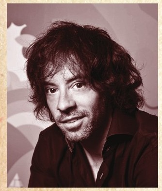

迈克尔·阿克顿·史密斯是 Mind Candy 公司的首席执行官兼创意总监，这是一家儿童娱乐公司，旗下有享誉世界的网络游戏《摩西怪兽》。《摩西怪兽》是一款在线网络和虚拟游戏，同时包含玩具、交换卡片、杂志、图书以及一部电影。迈克尔渴望引领 Mind Candy 成为电子时代最大的娱乐公司。

**摩西基金会**

www.themoshifoundation.com

迈克尔建立摩西基金会作为一个关爱儿童及年轻人的世界性援助机构。时至今日，救济金已经应用于继续教育、健康福利、经济危机救助，治疗和教育那些有特殊需要的或残疾的儿童。

**莱恩·比奇利**

www.laynebeachley.com

莱恩·比奇利是历史上最有成就的女性冲浪竞技运动员，曾七次获得世界冠军，这个纪录至今无人超越。她是现任国际冲浪协会的副主席，并且任职于澳大利亚体育名人堂和澳大利亚冲浪董事会。莱恩依然每天冲浪，间或参加赛事，同时也是一位活跃的演说家。

**莱恩·比奇利星辰基金会**

www.aimforthestars.com.au

莱恩建立莱恩·比奇利星辰基金会的意图是为年轻女性和女童提供经济援助和鼓励，帮助她们实现梦想。该机构广泛面向在澳大利亚体育界、学术界、社区以及具有文化追求的女性。莱恩的目标是帮助这些女性实现超越平凡的伟大探索。

**彼得·布瓦希**

www.peterburwash.com

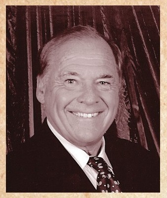

彼得·布瓦希是前职业网球运动员，也是一位享誉盛名的网球教练。彼得是世界最大的网球管理公司彼得·布瓦细国际的奠基人和主席，32 年来致力于提供世界范围的顶级网球培训和个人项目。彼得也是一位畅销书作家和极具号召力的励志演说家。

**关爱沃林达文基金会**

www.fflvrindavan.org

彼得因为环球旅行，开始支持关爱沃林达文组织，这是一个美国背景的慈善机构，代表印度贫困的沃林达文地区募集资金。该机构为当地社区提供生活必需品，保证该地区人民可以在未来自给自足。具体来说，慈善资金支持了数以千计被忽视的印度女孩的学业，使她们的潜能得到最充分的发挥。

**皮特·卡罗尔**

www.petecarroll.com

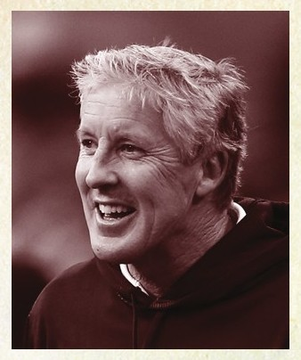

皮特·卡罗尔是一位美国足球教练，两次国家锦标赛的赢家，他还拥有多项联合会、分区冠军头衔。皮特是现任头牌教练和海鹰队的副执行官，近期又被冠以年度国家足球联盟教练的殊荣。

**更美洛杉矶和更美西雅图基金会**

www.abetterla.org

www.abetterseattle.com

皮特因为慈善事业家喻户晓，最为人称道的是他为减少洛杉矶和西雅图地区非法集会以及青年暴力做出的努力。皮特创办了更美洛杉矶和更美西雅图基金会，通过强化个体力量达到创设更加安全、更加强大社区的目标。这些机构和以社区为基础的机构合作，为居民家庭及年轻人提供工具、指导以及支持，帮助他们实现富裕。

**约翰·保罗·德约里尔**

www.paulmitchell.com

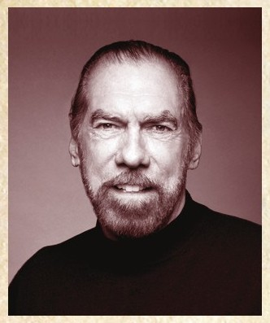

约翰·保罗·德约里尔是一位企业家，和人合作创办了约翰·保罗·米切尔系统，这是一家头发护理产品以及美容产品的生产机构。约翰·保罗是这家公司的首席执行官，年收入超过十亿美元。1989 年，他与人合作创立了百加得有限公司，如今他持有大多数股份。约翰·保罗也热心于环境问题、国际政治，以及慈善事业。

**约翰·保罗和平、关爱和幸福基金会**

www.peacelovehapinessfoundation.org

童年有着寄人篱下的经历，成年又遭遇无家可归的流浪生活的约翰·保罗投入了巨大的资源到约翰·保罗和平、关爱和幸福基金会。该机构支持环境的可持续发展，承担社会责任，推进动物保护，旨在使人们通过园艺、农业项目的技艺习得，去供养家庭并开创自己的事业。

**彼得·弗约**

www.nextel.com.mx

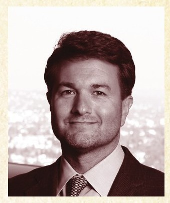

彼得·弗约是一位商业执行官和国际电子通讯专家。彼得被誉为拉丁美洲最杰出和最具创造力的首席执行官。他供职于几家公司的董事会，并仍然作为主席领导了墨西哥的耐克斯通讯公司，这家公司拥有 17,000 名员工。

**耐克斯基金会**

www.nextel.com.mx/nextelfundacion.html

作为公司的首席执行官，彼得创建的将社会责任和慈善事业合二为一的文化，格外引人注目。耐克斯基金会通过教育的方式给社区最贫困的人提供帮助。基金会通过奖学金帮助学生，针对年轻人、贫困阶层和残障人士，提供资金进行科学调研和实施更高层次的教育项目。

**莱尔德·汉密尔顿**

www.lairdhamilton.com

莱尔德·汉密尔顿是享誉世界的冲浪运动员，革新者，拖曳冲浪、立式单桨冲浪、水翼冲浪的先行者。莱尔德仍然活跃于波涛之间，并发展新形式的冲浪项目，以期在离自己心灵最近的事业中有所成就。

**猎雨者基金会**

www.raincatcher.org/laird

莱尔德和他的妻子加布里埃尔·莉丝，近期被任命为猎雨者基金会的董事，这家非营利性的组织，其目的是缓解全球淡水危机。猎雨者基金会已经通过淡水集合系统的供应，援助了世界范围内的 70 万人。猎雨者基金会预期在 2015 年，可以额外保障 1000 万人的淡水供应。

**马斯丁·基普**

www.thedailylove.com

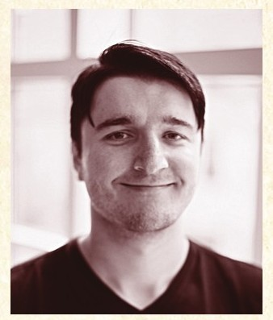

马斯丁·基普是一位企业家、作家、博主，他利用社交媒体向社会传播正能量。马斯丁创建了名为“日行一善”的网站，其网页、电邮日记、推特账户的用户浏览量达 60 万人次，并与《哈芬顿邮报》达成了联合。马斯丁出席了《奥普拉的生活课堂》节目，并在其《超级灵魂星期天》节目中被冠以“下一代的精神思考者”的称号。

**安东尼奥·罗宾基金会**

www.anthonyrobbinsfoundation.org

马斯丁将他的巨大转变归功于他的人生导师安东尼·罗宾的帮助。于是，他倾入心力到安东尼·罗宾基金会作为回报。这家非营利性机构组织实施了一些项目，专门援助并促进那些被社会忽视的群体实现富裕，包括年轻人、老年人、无家可归者、监狱人员。

**丽兹·玛瑞**

www.homelesstoharvard.com

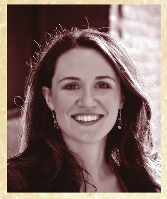

丽兹·玛瑞是畅销书作家和世界上最受欢迎的励志演讲家之一。她从无家可归到成为哈佛的高才生的经历广为人知。她曾经和戈尔巴乔夫、托尼·布莱尔同台，因在鼓励年轻人方面做出的振奋人心的工作而受到白宫和奥普拉·温弗瑞的赞誉。

**青少年领导力基金会**

www.momentumteens.org

作为青年人的榜样，丽兹为支持青少年领导力基金会感到自豪。这是一个旨在鼓励并培养年轻人领导能力的非营利性组织。该组织拥有能提供器械、经验的车间和项目，通过提供工具和经验，帮助年轻人成为对社会及世界有责任感、充满自信的奉献者。

**保罗·奥法里**

www.paulorfalea.com

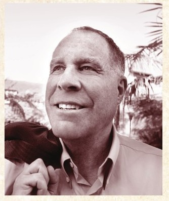

保罗·奥法里是金考公司的创始人，该公司是办公用品和商务服务类公司中的佼佼者。他出让了在金考公司的股份之后，一方面作为大学教授继续传播他的知识与经验，另一方面投入时间从事慈善事业。

**奥法里基金会**

www.orfaleafoundation.org

在保罗的领导下，奥法里基金会致力于转化他人，发掘出他们的能量。援助的相关项目包括创新型的儿童早期教育、激发中学生积极性的项目、数以千计的高等教育奖学金，同时为大学人才选拔项目提供大量资金。保罗也专注于帮助单亲家庭的孩子摆脱困境，为在校儿童提供健康的食品。

**吉姆·拉奥**

www.gmrgroup.in

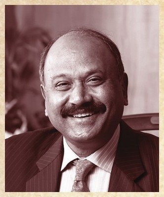

吉姆·拉奥集团位于印度班加罗尔，主营环球能源与基础设施建设。吉姆·拉奥是该集团的创始人兼董事长，作为一个有远见的商业领导者，近来拉奥先生让自己的公司更多地倾向于城市建设以及国有基础设施的创造，例如发电厂、高速公路和飞机场。

**GMR 瓦里拉什米基金会**

www.gmrgroup.in/foundation.html

拉奥先生积极倡导公司应承担自己的社会责任，并且建立了 GMR 瓦里拉什米基金会以改善基础设施的缺失与区域赤贫状况。基金会致力于为每个人提供合格的教育。通过建设医院、医疗诊所，提供救护车来满足人们的健康需求。此外，通过建立培训机构以及创业项目来为有事业心的年轻人提供自主就业的机会。

**阿纳斯塔西娅·索阿雷**

www.anastasia.net

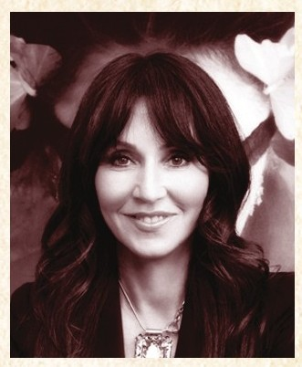

阿纳斯塔西娅·索阿雷是公认的修眉专家，也是一个美丽的职场榜样。凭着她独特的修眉技术，阿纳斯塔西娅拥有令人嫉妒的包括好莱坞明星在内的客户群，并且在贝弗利山庄和布伦特伍德拥有旗舰沙龙店。位于高端百货商店内的阿纳斯塔西娅修眉工作室，遍布世界各地，她自主创造并销售一系列专业的画眉和化妆的产品。

**阿纳斯塔西娅亮视野基金会**

www.anastasiafoundation.org

通过阿纳斯塔西娅亮视野基金会，来自养护机构的无家可归的年轻人可以得到奖学金并用于追寻在美容化妆方面的事业。资金和支持主要用于美容学校的教育、实习、实际操作培训和工作安置。它的目标是让年轻人自给自足并为未来创造基础。

## 《英雄》讲述者们的补充材料

**莱恩·比奇利**

《遁入海浪》

莱恩·比奇利证明了自信的力量。

出版商：澳大利亚兰登书屋，2009

**彼得·布瓦希**

《做自己行为的主人》

他的个人经历、坚定的意志以及从哲人那里获得的启示，从过去到现在，一直为我们人生旅程的前行提供着最基本的指引。

出版商：炬光出版社，2007

《亲爱的年轻人》

彼得·布瓦希为年轻人在生理、心理、精神上的健康成长提供着无价的指引。

出版商：炬光出版社，2008

**莱尔德·汉密尔顿**

《自然的力量：思想，身体，灵魂，当然还有冲浪》

莱尔德·汉密尔顿分享了他独特的哲学，这使其一度成为世界公认的最好的冲浪手之一。

出版商：罗德尔图书出版社，2008

**马斯丁·基普**

《日行一善》

出版商：贺屋出版社，2014

**丽兹·玛瑞**

《风雨哈佛路：宽恕、生存，从无家可归到哈佛大学的回忆录》

丽兹·玛瑞的励志故事，从露宿街头到如何成为哈佛大学的高才生。

出版商：亥帕瑞恩出版社，2010

**保罗·奥法里**

《复制它！——从一个诵读困难的人那里学习如何把一个好想法变成美国最好的公司》

关于保罗·奥法里如何经历从一个几乎无法读写的孩子的挣扎，到最后创立了金考公司并把它发展成一个拥有 15 亿资产的帝国的故事。

出版商：沃克曼出版公司，纽约·奥法里家庭基金会，2005

如果你不知道读什么书或者想获得更多免费电子书请加小编 QQ：2338856113 小编也和结交一些喜欢读书的朋友 或者关注小编个人微信公众号名称：幸福的味道 获得上百个书单 为了方便书友朋友找书和看书，小编自己做了一个电子书下载网站，网址：[`www.ireadweek.com`](http://www.ireadweek.com) 如于某种原因，经常换网址 如果打不开，可以 qq 联系我

如果你不知道读什么书，

就关注这个微信公众号号。

微信公众号名称：幸福的味道

加小编 QQ 一起读书

QQ 号：2338856113

【幸福的味道】已提供 200 个不同类型的书单

1、 历届茅盾文学奖获奖作品

2、 每年豆瓣，当当，亚马逊年度图书销售排行榜

3、 25 岁前一定要读的 25 本书

4、 有生之年，你一定要看的 25 部外国纯文学名著

5、 有生之年，你一定要看的 20 部中国现当代名著

6、 美国亚马逊编辑推荐的一生必读书单 100 本

7、 30 个领域 30 本不容错过的入门书

8、 这 20 本书，是各领域的巅峰之作

9、 这 7 本书，教你如何高效读书

10、 80 万书虫力荐的“给五星都不够”的 30 本书

关注“幸福的味道”微信公众号，即可查看对应书单和得到电子书

也可以在我的网站（周读）[www.ireadweek.com](http://www.ireadweek.com) 自行下载

更多书单，请关注微信公众号：一种思路

