# 朵洛莉丝侃南 QHHT 量子催眠 201310-201809

来源：[`mp.weixin.qq.com`](http://mp.weixin.qq.com)

# 来自催眠者的真实记录 | 寻找前世之旅

> 原文：[`mp.weixin.qq.com/s?__biz=MzU0NjkzMDY0OA==&mid=2247485673&idx=1&sn=501d131ed6b1b7bb436e38b4642531a0&chksm=fb57625ecc20eb4897efc89583cdab5613139c81198ca5a8709ed6dfb2d10a8e62cd3427b946&scene=126&sessionid=1690980931#rd`](http://mp.weixin.qq.com/s?__biz=MzU0NjkzMDY0OA==&mid=2247485673&idx=1&sn=501d131ed6b1b7bb436e38b4642531a0&chksm=fb57625ecc20eb4897efc89583cdab5613139c81198ca5a8709ed6dfb2d10a8e62cd3427b946&scene=126&sessionid=1690980931#rd)

*来自催眠者的真实记录：催眠中经历的所有场景是根据手机中的催眠录音整理，真实不虚！*

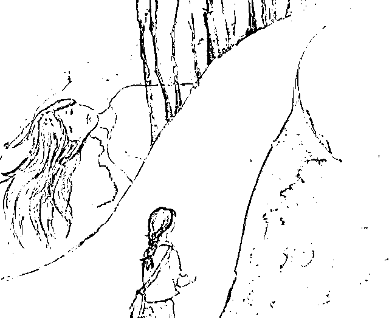

当我还是一个小女孩的时候，就总觉得自己有一颗饱经沧桑的心。催眠后我知道这的确是一个古老的灵魂。

我出生在文革开始的那一年，故乡是中国铁路的终点站，第一次看到火车的时候，冥冥中就知道它会把我带向远方，后来果真如此！小时候国家还很贫穷，粮食不足，副食缺乏，有点像现在的朝鲜。城市居民买米面需要粮本，买肉需要肉票，每个人每个月一两肉票，妈妈不舍得买，攒到逢年过节才买两斤肉全家人解解馋。按说肉这么稀缺，小孩子长身体又都特别馋，孩子都该抢着吃，但童年的我却只能吃素，连妈妈都觉得一家人还得做两样饭菜太麻烦了，劝我吃，我就是无法下咽。催眠后我才知道胃是有记忆的 ，前几世的修行经历让我的胃只能接受出家人习以为常的素食了。

我小时候在东北，国家规定九周岁才能上学，而我却想尽办法六岁多就上学了，我那时记忆力超群，头脑中如同人工智能般装了一个摄像头，看过的书过目不忘，这点在我参加司法资格考试的时候获益匪浅。连佛经咒语我读两遍都能背诵，之前我曾洋洋得意觉得是自己聪明，催眠后才知道原来自己已经学习过那么多生生世世了，潜意识自然会记得很多知识，过目不忘不足为奇，这也认证了苏东坡说过的那句“书到今生读已迟”的感慨！

我从小很安静，长大后依旧如此，喜欢独处，觉得人生而孤独，一直在苦苦寻找生命的终极意义。我不相信人生经历了生老病死和酸甜苦辣后就为了寿终正寝，一定有一些什么是我们生命真正应该追求的。

一个阳光明媚的下午，带着一直以来对生命真正意义的疑问和心中寻觅终极真理的目标，我闭目平躺在床上接受赖莉瑛老师催眠。她柔和的声音和话语将我带入一种半睡眠状态，根据她的提示我感觉坐上了一个下行的扶梯，一直往下，往下，往下，下行了很长时间，又过了一个黑暗的隧道，然后来到隧道的出口，满眼明亮耀眼的光，温暖闪亮，我飘过这片光，看到了……

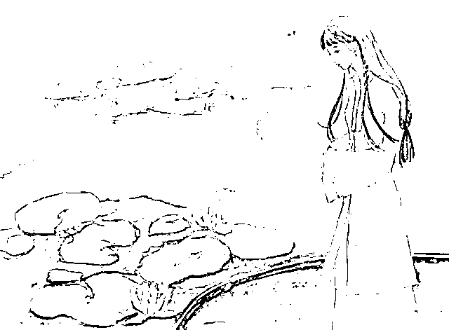

**{ 第一世 }**

透过一层薄薄的纱面前是一幅犹如山水画卷的风景，翠绿的青山，清澈的湖水，湖水上一叶扁舟。不知何时我站在了扁舟上，低头看到自己的脚穿着古代女子的绣花鞋，身着天青色的对襟裙装，胸前绣着精致的花纹，我在船头静静地欣赏了会儿风景后，让船夫调转船头驶回岸边，船靠岸后我走上一条两边长满青草的木桥，桥通向山脚下的茅草房，远远地看到爹爹陪着一位丰神俊朗青年书生对弈，爹爹一身乳白色的长袍，今天他轻车从简只有我们父女俩外出游玩，我步履轻盈地前行，赶着回去一起吃午饭。突然发现院子外潜伏着十几个黑衣人，他们不知何时包围了院子，爹爹危险！一定是朝中的政敌想暗中下黑手，不行，我得出声提醒爹爹小心，刚张开口就被人从后面捂住了嘴巴，锋利的刀锋直抵脖颈，然后我就化作一缕光飘到了半空，眼看着自己、爹爹和书生都被黑衣人杀害。再次成为灵魂状态的我飘在空中，不能发声，眼前的茅屋没了，只留下院中的两座新坟。前世爹爹的死让躺着催眠床上的我悲痛欲绝泣不成声。化作灵魂状态的我可以感知一切：我看到了我这一生——我爹爹是朝中高官，娘在我很小时过世，爹爹和我相依为命，因为为官清正被人暗害。此时我听到赖老师问我今生有什么遗憾？我遗憾没能给爹娘多尽孝；遗憾自己不是男儿身，无法习武保护爹爹；还觉得当官没用，人生太苦盼望解脱。

**{ 第二世 }**

死亡瞬间的心意会决定生命来世的状态，我灵魂的光飘啊飘，飘到了天界，成为了天池中一朵含苞待放的莲花，静静地伫立在天河水中很久很久，偶尔会有一个天神路过我的身边，直到有一天，我被摘下来郑重地供奉在佛主像前。鲜花慢慢化为乌有，我又转世了……

**{ 第三世 }**

得益于前世身为鲜花供奉于佛主的功德，我此后很多生世都相好庄严；又因为我第一世恨为女身，我再转世都是男儿身。前世觉得人世苦，想解脱，加上在天堂有善根，此生我一出世就被父母放在庙门前，庙里的白胡子老和尚收养了我，教我念经学医，我跟着师父用心学习一天天长大。一天，一位夫人来拜佛，带着她的女儿，小女孩和我年龄相仿，我们一起开心地玩，欢喜地笑。下一个画面我长大了，女孩也婷婷玉立，她喜欢上了我，但我一心向佛不为所动，女孩相思成疾，她父母无奈之下为了让她能忘记我，带着她远走他乡。师父圆寂后我做了住持，一边修行一边行医，慢慢地我也老了，化作一束光再次成为灵魂状态。此时，赖老师又让我回顾一生有何感想，我觉得一生修佛治病救人行善积德没有遗憾，唯一就觉得对不起从小一起长大的那个女孩，虽是无心但害她生病远走他乡，一生不快乐！

**{ 第四世 }**

我再次转世成为一位庙里出家的住持，画面中的我已经年过半百，是位很有修为的大师。画面仿佛抗战时期，日本人在追赶难民，要大开杀戒，很多难民无处安身，逃进我的庙里避难。大和民族也信仰佛教，逃进佛门圣地的人他们就不杀了，所以难民络绎不绝，越进越多。面目狰狞的日本指挥官在庙门口很嚣张地说庙也不大，看你们能进去多少，进不去的格杀勿论。令人惊叹的是佛法无边，再多的难民都能进来。日本人也害怕了，士兵们不敢进庙骚扰，他们认为庙里没存粮，只要不许人出来，所有进去的人早晚都得被饿死。我看到庙里的米缸只有很少的米，就叫弟子们全用来熬成特别稀的粥发给难民，神奇的是第二天米缸里还会有同样多的米，很多天过去了，虽然大家吃不饱但也没人饿死。日本人不再围着庙了，只派几个卫兵站岗不让人进出。难民中有家小孩病了，急需采购药品治病，除了我没人敢走出庙门。我就走出去进城给孩子买药，指挥官觉得我的庙能装进这么多人而且这么多天还没人饿死，觉得我是一位很有神通的大师，他就把我抓起来想带回日本，我绝食抗议以死明志，指挥官的太太信佛，怕造罪业，劝他把我放了。重获自由后我买了药回去的路上，看到日本飞机扔炸弹把我的庙炸毁了一半，好多人被炸死。我又出去四处募捐修复庙宇，庙修好后我已经心力交瘁，决定一个人云游四方独自修行，最后落脚四川青城山顶，几年后我一个人孤独地躺在一个破茅席上奄奄一息，觉得特别的冷，临终前一只流浪狗跑过来躺在我身边温暖我，弥留之际我很感动，对狗说来世你到我家，我一定会善待你。说完后圆寂了，再次化成一道光飘浮在空中。这一世我心灰意冷，觉得国家不强大被人欺负；修行也不能让人解脱！

**{ 第五世 }**

我还是灵魂状态，不想转世，在空中飘来飘去，由于前世的诸多善行，这时观音菩萨亲自来迎接，把我的魂魄带回普陀山，我再次成为菩萨面前的一朵莲花。

**{ 第六世 }**

很久之后我又转世了，由于前世修行积累了福报，得以出生在江南的富贵人家，是家里备受宠爱的独子。由于前世我觉得国家必须强盛才有希望，灵魂中的这个记忆造就了我此世选择实业救国，我到国外学习造船。由于前世是菩萨面前的莲花，此生相貌格外出众，但由于前世修行之故，情爱对我不太有吸引力，学成后开始在船上当工程师，随船周游世界各地，大船曾在法国靠岸，最后来到一个阿拉伯国家后我和一位始终追随我的同学下了船，开始和一位商人合作建大酒店。一天在酒店的一个房间的窗外，我看到一个黄衣修行师父在给很多人讲课，他有着睿智慈悲的双眼，整个人异常洁净，我站在窗口希望他叫我进去听课，但他只看了我一眼并未出声，我莫名的心中充满遗憾。阿拉伯商人的第二个太太有一个四五岁小女儿，这个大大眼睛可爱的阿拉伯小女孩总来找我这个叔叔玩，缓解我独处异乡的寂寞。我不知何故一直不急着返乡，直到我接到父亲病危的电报，飞回家后父亲已经故去，只赶上葬礼；而母亲受失去父亲的打击也病榻缠身，祖母打着给母亲冲喜的借口给我订亲完婚，冲喜没能挽留住母亲，她很快随父亲而去。冲喜娶进的妻子生了个儿子，奇怪的是我和她们并不亲密，没多久我只身前往南方开始造船，我经商十分成功，人到中年时有很多钱，还有妻子之外的美女相伴，不成想钱多逼命，我被人谋财害命，再次成为灵魂飘在空中，我看到了富丽堂皇的家空无一人，保险柜被撬开，里面的金条美金银元都被洗劫一空。回顾这一生我觉得钱没用，这种记忆至今影响着我；我去世后妻儿不知所踪，年迈的老祖母特别伤心，让我心生愧疚；我心里还放不下可爱的阿拉伯小女孩，她待我如同家人。此时潜意识告诉我今生再转世就只是了缘，继续修行才是我今生的首要任务。

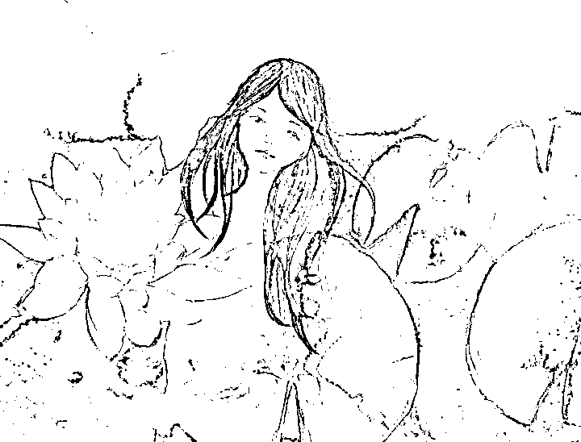

这次催眠让我最震撼之处在于许多以意识无法觉知的过往，在灵魂状态时变得清晰明了，正如《西藏生死书》中所记载灵魂离开躯体时会知晓一切因果。

我在第六世灵魂状态时突然明白了我今生身边有很多过往一切的痕迹——

第一世爹爹的死让我明白权势的虚幻、人生的痛苦，由此在我潜意识埋进了寻求解脱的种子；第二世我成为天堂的一朵莲花，让我知道生命不光在六道中轮回，还可以以更多的形式出现；第三世的经历让我知道哪怕有一点点牵挂还会把生命带入轮回，而治病救人积德行善和我终生的修行只能增加我的福报；第四世的轮回让我知道临终哪怕对一只狗也会产生依附；第五世的轮回更像疗伤，这也解释了我为什么内心深处总觉得和观音菩萨有缘的缘起；第六世的轮回告诉我金钱和物质都是一场空。不同的生世有着不同的亲人，所以大家都只是缘聚缘散，受业力牵引。我知道了今生亲人们的由来——第三世喜欢我的女孩是我今生的女儿，我之前总有对不起她的感觉来源于前世的情结，所以此生需要还债般付出。第四世给我临终关怀的狗真的如约来到我家中，是我女儿选的慕夏，这也解释了原本怕狗不喜欢养狗的我为什么第一眼看到刚出生不久的慕夏时如同被催眠似的主动把她带回家中，并一直对她宠爱有加。因为是前世的因果啊！第六世念念不忘的阿拉伯小女孩成为我今生最疼爱的妹妹，我始终觉得和她有种天然的联接，这也是源自前世的记忆；老祖母成为我今生的婆婆，我没嫁过去前就和她很亲，她在北京和我们同住了五年，临走时我依依不舍，逢年过节永远是我比先生更先想到给老人家寄钱，给她多少我从不心疼；由于前世亲人的善缘，所以我没有婆媳关系问题；今生的先生是前世一直追随我的同学，所以我们之间相处更像知心好友；那位看我一眼的修行人是我今生的上师，再次见到他那高贵平静的脸和慈悲睿智的双眼我就知道自己找到回家的路了。

我一直觉得灵魂永生、宇宙中有更高能量的存在，在催眠中也都得到认证。

再看今生无欲无求，希望能真正解脱早日回归灵魂的家园！

从小，我就有很多预感，我能隐约感知到很多事情的结局，好的坏的，所以我做事前基本知道结果。当然了，相信很多人都有同感，比如梦到未来，我想这就是永恒、全知、极乐的灵魂感知能力。如果我说出谁是未来的接班人算不算泄露国家机密呢？为了专注于此刻，我有意把那扇窥知未来和久远的记忆之窗关闭了，珍惜缘分感恩一切，活在当下……

## 文 | 英    子

## 图 | 晴    笑

- END -

* * *

花一些时间在我们的官方网络平台（微信公众号：QHHTChina）上了解更多关于我们提供的信息，或者与我们联系进行有关咨询。

想要更多的了解催眠和前世回溯吗？有兴趣学习如何成为一名专业的催眠操作者吗？

我们可以为你实现。

**课程咨询及个案咨询服务二维码**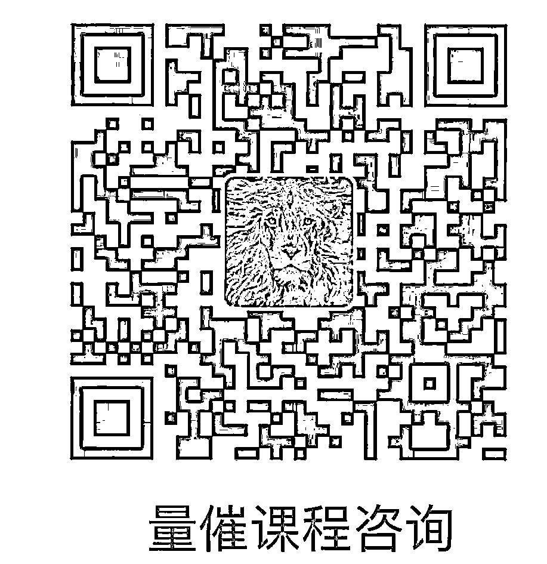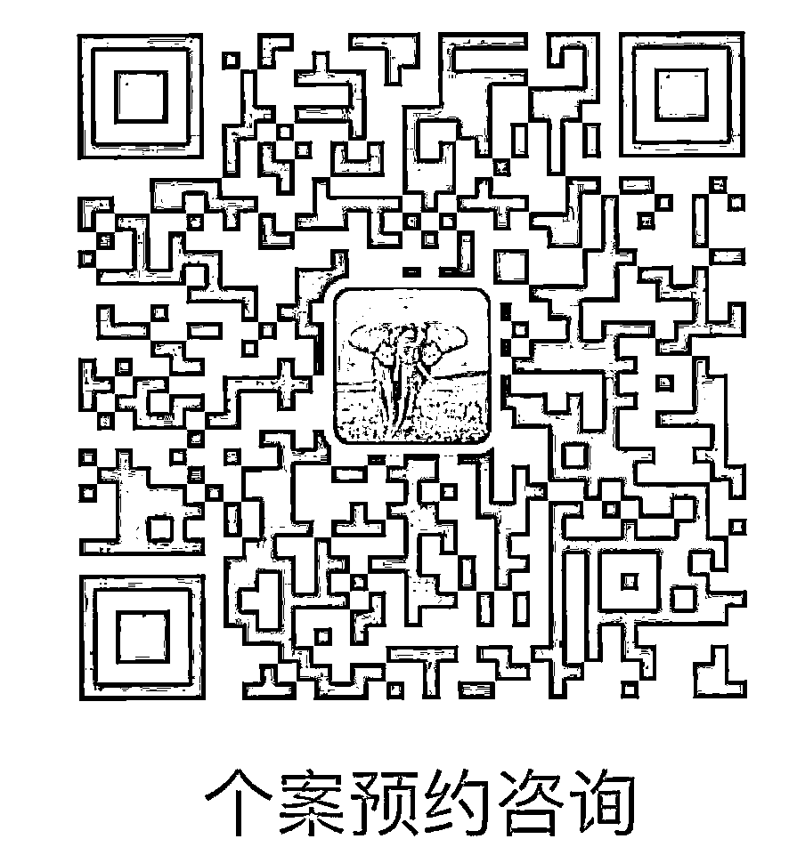

 花一些时间在公众号上了解更多关于我们提供的课程：

[【线上·网络】量子催眠一阶段课程介绍](http://mp.weixin.qq.com/s?__biz=MjM5NjExMTczNA==&mid=2647621628&idx=1&sn=362734b6f9677d41810f46793db552fe&chksm=bed5ebe589a262f38aeee298496c88b3f58bdd327e9c595259fd2f64ca22876aa29c0f1df337&scene=21#wechat_redirect)

或者与你附近的前世回溯操作者联系。

[量子催眠个案全国预约！](http://mp.weixin.qq.com/s?__biz=MjM5NjExMTczNA==&mid=2647620840&idx=1&sn=95dc1c41580e9f9c19d1426946ba005b&chksm=bed5e8f189a261e7950d67dc111870a8859b63aef5f589db5ac4f3c284e4142185b833644b90&scene=21#wechat_redirect)

**这里不是要说服你去接受那些你还没有准备好去接受的观念，也不是劝说你去放弃那些你还没有准备好要放弃的，这里只是为你提供一个探索的平台，帮助你理解朵洛莉丝.侃南量子催眠疗法的原理和为什么治疗的结果是可能的。**

相关文章链接：

量子催眠是什么↓↓↓

[朵洛莉丝·侃南的量子疗愈催眠技术(QHHT®)](http://mp.weixin.qq.com/s?__biz=MjM5NjExMTczNA==&mid=2647622241&idx=1&sn=4db479b517141a38ce4304b21cfc4ef7&chksm=bed5167889a29f6e8b343714879cccd668daca13e1430542e55ee47e02d03709a34793f75a69&scene=21#wechat_redirect)

[如何使用量子催眠来发现你的前世](http://mp.weixin.qq.com/s?__biz=MjM5NjExMTczNA==&mid=2647622208&idx=1&sn=751c7bc617279d1079936ee43d48e577&chksm=bed5165989a29f4feeb9e88b59b29c361d6b745f86e533b502ce4093670963a02a19e57dcfeb&scene=21#wechat_redirect)


**所有的生命都在学习，**

**地球能否顺利进化。**

**朵洛莉丝说：**

**“全宇宙都在看。”**

# 穿越频率•灵性护盾工作坊

> 原文：[`mp.weixin.qq.com/s?__biz=MzU0NjkzMDY0OA==&mid=2247485673&idx=2&sn=ccc86ca0ef5b334c14ea2bf8b1b771fc&chksm=fb57625ecc20eb48b4dda9693a5070f570c199b0f52d429756bf36ef7419783ff7369649b7e2&scene=126&sessionid=1690980931#rd`](http://mp.weixin.qq.com/s?__biz=MzU0NjkzMDY0OA==&mid=2247485673&idx=2&sn=ccc86ca0ef5b334c14ea2bf8b1b771fc&chksm=fb57625ecc20eb48b4dda9693a5070f570c199b0f52d429756bf36ef7419783ff7369649b7e2&scene=126&sessionid=1690980931#rd)

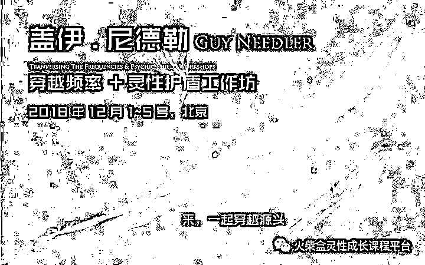

**盖伊.尼德勒**

**穿越频率•灵性护盾工作坊**

*Tranversing The Frequencies & Psychic Shield Workshops*

老盖的课程会使你心里无数打着问号的灵性概念“**？**”

变为清晰无比的叹号“**！**”

与揭开更广阔思维的破折号“**——**”，

你将不再身陷各种永远解释不清的灵性说法的囹圄，

真正建立一个前所未有的巨大的的思维图景和宇宙观。

他还将传授给您一种最为直接的

适合每天身体力行去改变自己的意识频率的方法，

带领你穿越多维宇宙 408 个维度，

最终带领你到达绝对源头（Absolute Origin）

让你可以自己建立一种可重复的与更高维度的智慧和力量乃至与源头之间的稳定链接。

**工作坊视频介绍：**

* * *

📹 [`v.qq.com/iframe/preview.html?width=500&height=375&auto=0&vid=w07775p867i`](https://v.qq.com/iframe/preview.html?width=500&height=375&auto=0&vid=w07775p867i)

**工作坊内容：**

* * *

**▲第一天内容：灵性护盾**

在很多时候，尤其经常接触个案并需要处理问题的量子催眠师及其它能量疗愈师，常常没有意识到应该首先为自己制造保护的屏障，对于这部分人士，在生活和工作中往往处于一种毫无实际保护的“裸奔状态”，由于接触对象的特殊性，随环境而来的负面意识及能量，在无意识中会给她们的身心带来很多不必要的麻烦甚至损害。

盖伊.尼德勒在多年的实践及与源头连接过程中，独创简单而实用的负面能量清理及屏蔽保护的一种技术：灵性护盾，能帮助普通人有效的建立个人的包含 10 个保护层级的能量清理和保护屏障，让能量敏感人士或经常做能量疗愈的治疗者有效的保护自己。通过盖伊.尼德勒的亲身传授与练习，学会随时为自己或家人构筑一种可长时间存在的强大的兼具保护与清理功能的高频率能量护盾，保护对象不受负面能量侵扰与影响。

盖伊.尼德勒将在 1 天的时间内，毫无保留的现场教授大家如何有效的创造保护自己的灵性能量护盾，其中内容涉及到脉轮、辉光层及频率层次等概念。

**▲第二、三天课程内容：**穿越频率（TTF）初阶****  

 1. 系统化的了解源头的历史和多维宇宙（源头实体）及其之下的结构，极大的扩展你的意识和思维，理清你对各种层出不穷、模糊不清的概念的认识，为你提供一个更宏大和清晰的宇宙观参照系；

2\. 从实际操作中认识脉轮及人体辉光层、为穿越做好能量准备；

3. 在 Guy 老师的引导下，掌握使用 TTF 的各种冥想穿越工具和正确方法，穿越不同的维度和频率层，了解不同维度的存在体并记录。最终到达频率层次 100 层，与源头能量进行连接，并获得属于个人的信息。

**▲第四、五天课程内容：**穿越频率（TTF）进阶+疗愈方法****

1. 更深入的理解什么是全维度、亚维度、频率层级、以及 高我跟个人进化之间的关系；

2. 在 Guy 老师的带领下，更加熟练掌握 TTF 的穿越频率方法，学会多方向穿越，以及同时意识能量体身处多处的技巧，最终穿越至多维宇宙最高 408 频率层级，并与源头（神）建立稳健和持续的连接；

3. 学习 TTF 课程能量疗愈的具体步骤和技巧，以及理解能量疗愈的原则和时机，学习穿越频率与疗愈结合，为成为一名穿越频率的治疗者打下坚实基础。

课程结束后，你将获得一种可以方便的练习和验证的穿越频率层级和维度的基本知识和方法，并掌握一种有效的穿越频率能量疗愈方法，可以方便为家人朋友及个案进行疗愈（尤其适合与”灵性护盾“搭配使用）。

*注，穿越频率课程中包含大量练习，是需要非常投入和专注的训练，请大家穿着舒适的衣服，并安排好时间

**时间及价格**

* * *

**“穿越频率&灵性护盾工作坊”**

**Traversing The Freguencies & Psychic Shield Workshop**

全程费用：10800

早鸟优惠：9800（10 月 1 日之前报名）

报名单独课程费用：

穿越频率 ：9000 元

灵性护盾：2400 元

时间：

2018 年 12 月 1 号：灵性护盾

2018 年 12 月 2 号~5 号：穿越频率 

上午 9:30-下午 6:30

地址:：待定

*酒店住宿需学员自付，会务组可以帮助协调同学拼房

个案时间：12 月 7~9 号

个案以一个小时计算（详情咨询客服微信：wangvera666）

**课程费用含场地费，及午餐，不含住宿费*

***文章末尾有课程付款微店二维码，*复训学员请咨询客服**

******本课程标配老盖的资深御用翻译 Leo，妈妈再也不用为我听不懂老盖的学院派伯明翰口音担心！***

* * *

**盖伊.尼德勒介绍**


**老盖是谁？**

盖伊.尼德勒 

Guy Needler

他童年便与灵性有特殊缘份

他曾是阿斯顿.马丁的双学位电气工程师

他是受严格训练的灵气和能量疗愈者大师

他是受过外星文明深度调频的超五类接触者

他是被[朵洛莉丝.侃南](https://mp.weixin.qq.com/s?__biz=MzU0NjkzMDY0OA==&mid=2247485567&idx=1&sn=e1990ecdef41a142ea3df28c52618d66&scene=21#wechat_redirect)*称为有大海深度的推荐作家

他是与源头及绝对起源直接建立稳定链接的传导者

他是灵性原则知行合一的践行者

他是合气道黑带、骑行极客

他是一个真实的人

他是 Guy

‍‍‍‍**著作**（中文版正在筹划出版中）：

《神之简史》（History of Gods）即将出版

《回避业力》（Avoiding Karma）即将出版

《源头之外 I+II》（Beyond The Source：book I+II）

《源头之语》（The Origin Speaks）

《与安对话》（The Ann Dialogues）

《起源监护者》（The Curators）‍‍‍‍

**在线讲座课程**

[“从头认识灵性世界”](http://mp.weixin.qq.com/s?__biz=MzA5NTc5Mzc5MQ==&mid=2247483839&idx=1&sn=a2b58a153e137e246311561dc585b2df&chksm=90b8a6afa7cf2fb9d392cdb928894a8cd3a4b76abab714656c90339dbb1200f8d8a79d4dafa4&scene=21#wechat_redirect)

请点击[**这里**](http://mp.weixin.qq.com/s?__biz=MzA5NTc5Mzc5MQ==&mid=2247483839&idx=2&sn=fb6800bc81937a7c27083bb8a306516c&chksm=90b8a6afa7cf2fb9f1bf02b3f3ad29cb7fcf5ea6379952a19acfac67d79b4545890d0b982dcc&scene=21#wechat_redirect)或老盖头像，查看老盖详情介绍

📹 [`v.qq.com/iframe/preview.html?width=500&height=375&auto=0&vid=l0528b1xgw4`](https://v.qq.com/iframe/preview.html?width=500&height=375&auto=0&vid=l0528b1xgw4)

* * *

**往期精彩回顾：**

2014 年 北京

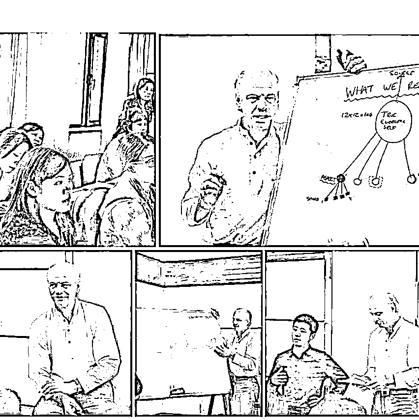

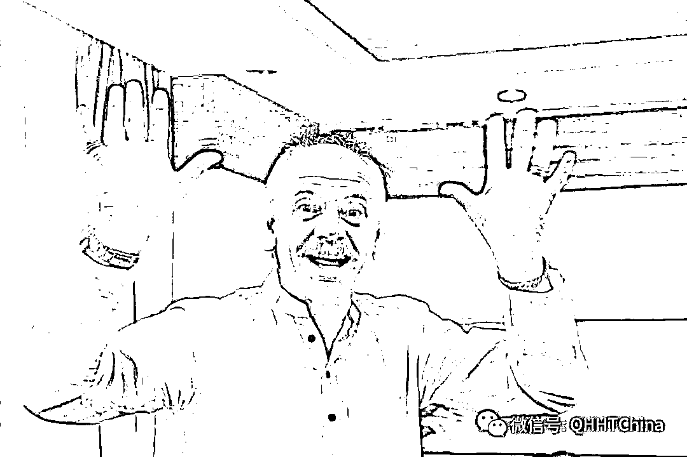

2015 年 北京

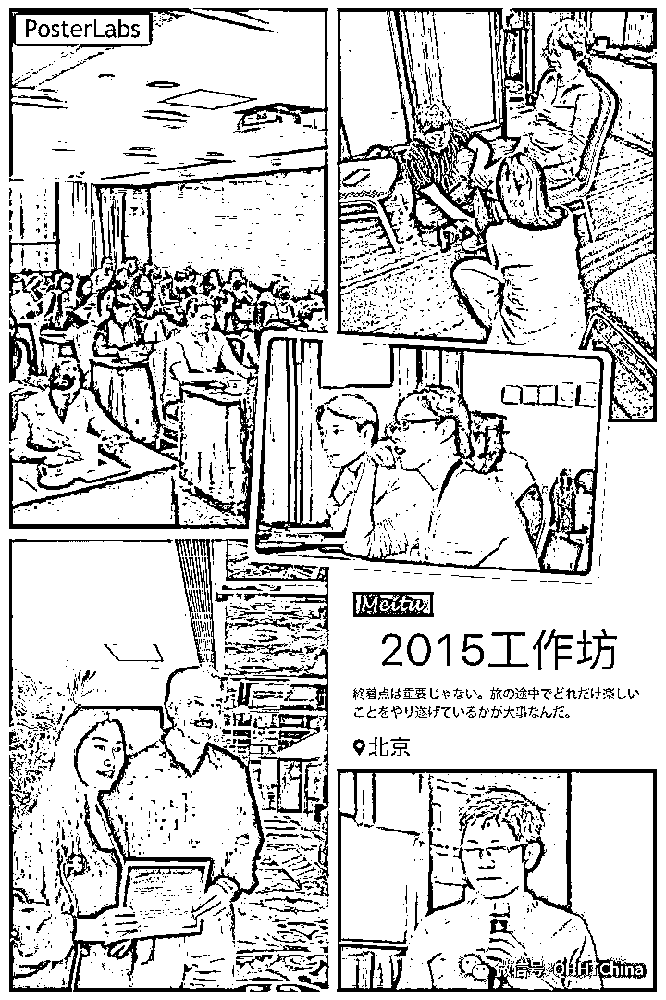

2016 年 北京

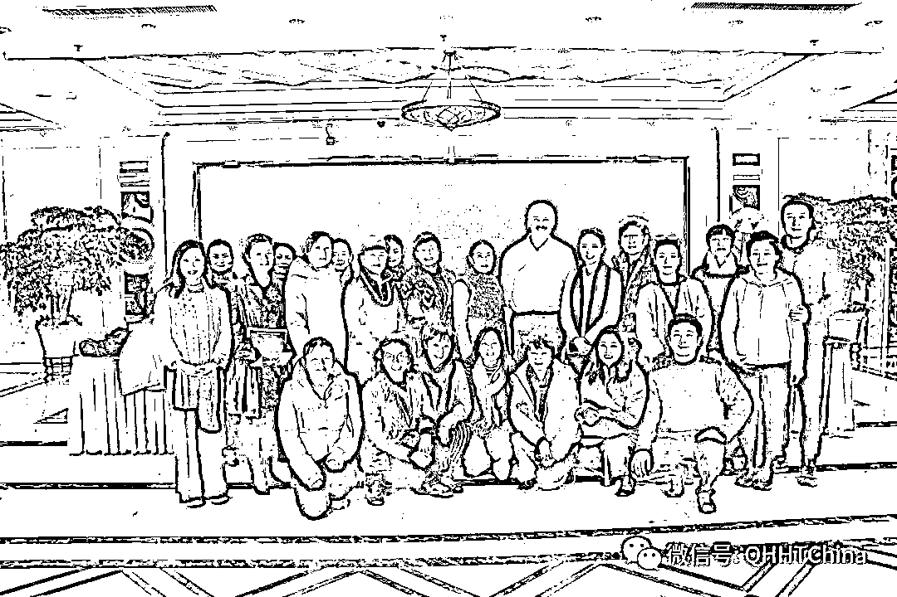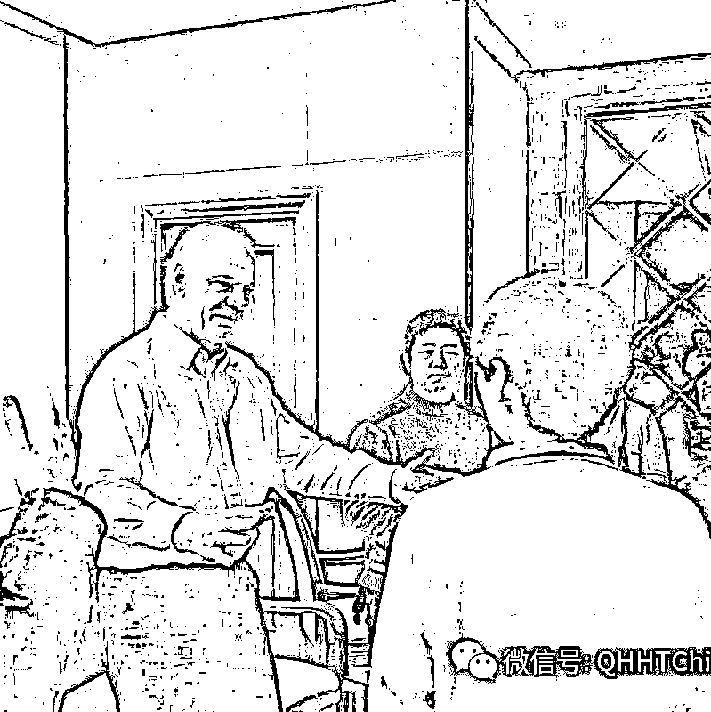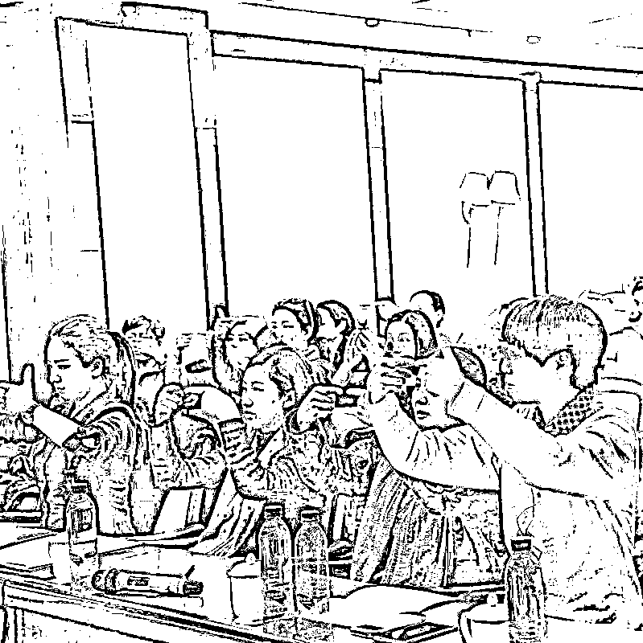

2017 年 北京

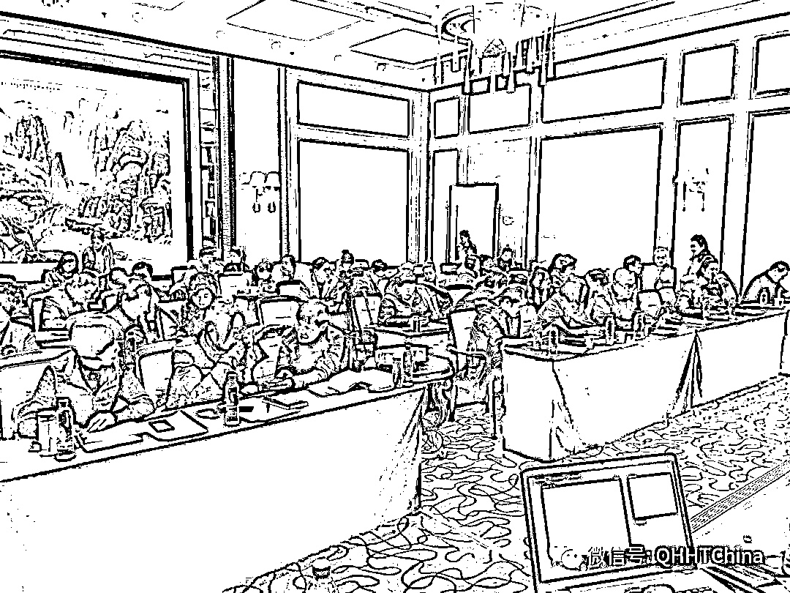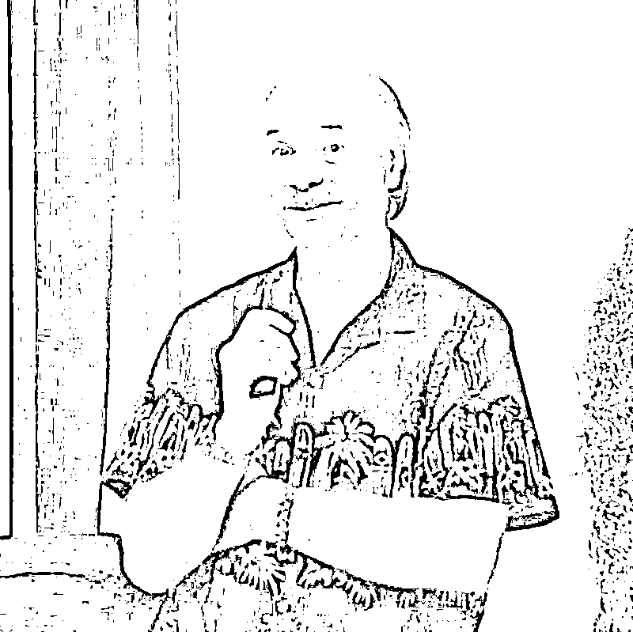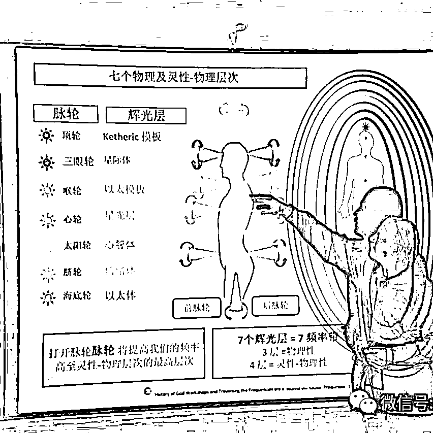

**2018！让我们和老盖一起穿越频率！**

**❤学员反馈：**

简单说，老盖的理论可能会让你刮起关于终极问题的“头脑风暴”，他的体系是一个我们不常见到的关于源头与宇宙的更大的架构和图画。同时他又像一个灵性的工程师，把宇宙实相的摩天大厦的结构用图纸非常简洁又系统的描绘了出来。

他的知识与思想深邃，带给你对意识与知识深层的震撼与拓展；

他真实，平和与低调为人，对所有人和事，无论贵贱大小，于公于私，都是一样的真诚又平和。我接触过很多国外的灵性老师，这一点，能真正做到的人凤毛麟角。

*--------**Leo*

非常惊喜的是：盖的课让我将那些学过的灵性知识的每一个部分，归位和串联起来，甚至让我对以往比较难懂的佛学知识有了新的认识和了解，有了更宏大的宇宙观。盖的工作坊不仅有理论，大部分的内容是实践，过程非常有趣，同学之间冥想结果有相互的印证，我实践并见证了那种听来的奇迹，我想，这也许就是频率提升的作用吧。也明白了，为什么有的同学每逢盖伊来华千里迢迢必到他的课堂，珍惜每一次他来华的机会。我知道有伙伴用盖伊教授的冥想方式获得创作灵感，我也喜欢静静的时候用这种方法到不同的频率打坐，游玩。

还要说说他的独特穿越频率的疗愈方法，这种能量的疗愈方法，至今我还在用，是因为一位小伙伴，课上活动时，我带她穿越频率治疗了久久不愈的喉咙和肺部不适，后来偶尔一次我们相遇，谈到那次疗愈，她说，那之后就好了没有再犯，这让我自己升起很大的信心。

很感谢主办方可以邀请到这样有真材实料有品质的灵性大咖传授知识和技能。期待再次与老盖一起穿越频率！

*----**学员 Vera 的心得*

如果说朵奶奶的量子催眠是一把钥匙，为我打开真正灵性世界的大门，老盖的穿越频率则是帮助我探索灵性世界的一对翅膀，有了这对翅膀，我不再需要别人告诉我什么是生命的真相、宇宙的实相，因为我可以跟随自由意志去探索了。在认识盖的快两年时间里，从他的穿越频率工作坊、阅读和疗愈、他的每本著作到每个月的传讯，我获得了太多的提升和帮助。每一次与他连接，他都是那样直接那样纯粹那样真实，不绕弯路，不拐弯抹角，不带花里胡哨的装饰，没有沾花惹草的意图，他总是让我想起源头对我们说的那句话“Remember, simple is good”(记住，简单是件好事）。我的心告诉我，要紧紧追随盖的脚步，因为我只要真理。

------学员小楠的心得

当我阅读到老盖《神之简史》这本书，我感到非常兴奋；更令我兴奋的是老盖会专门教授书中的那些技术。我并非时常对某些事情感到兴奋，我有深深的共鸣也想学习这套技术，《穿越频率工作坊》带给我的远远超乎我的想象。这个周末很值得，累并快乐着。老盖为大家创造了一个舒适，没有评判的环境。老盖会确保每位学员对这套技术以及过程的适应，他鼓励学员们彻底的质疑，这让人感到很伟大。我为自己能达到第三层级感到兴奋。这将会是我人生中意义重大的一刻，在这一刻，我的生活正经历着一些改变。

当我在时空中穿越，在时空中舞蹈，某些伴随我的东西在持续发酵······

如果你想拥有一场激动人心的旅程，想了解更大的实相和更大的自己·····

那么请来吧，你不会失望*。*

* ————**学员 FT London 的心得*

谢谢你，老盖：

找到这样一个能够直接与源头链接的方式，简直令人难以置信。祈祷结果能让人满意。当我还是孩童的时候，我就已经深信源头的存在，为了找到与源头链接的方法，我研究宗教与物理。老盖在这方面所取得的成就超级惊人，真的很感谢他。

*————**Peter Kelly*

课程中所获得的信息令人难以置信，超乎预期的想象。实践练习非常容易的将我们带到前所未有的水平。这比我之前的任何一次冥想体验都要好。我不知道自己居然可能达到这样的冥想层级。那里有很多我喜欢的东西，我去到了自己的意识层级，我经历了深度的宁静与光的状态。这种积极的体验反应到我生活的方方面面，我感觉自己每一天都在被滋养的状态之中。 

我爱这个课程。

*————**Bonnie Reid, AR*

课程咨询：

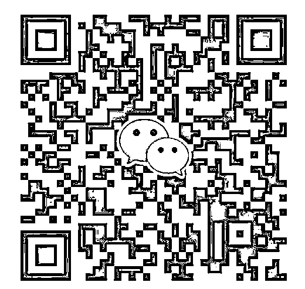

Leo

微信号：yourleoz

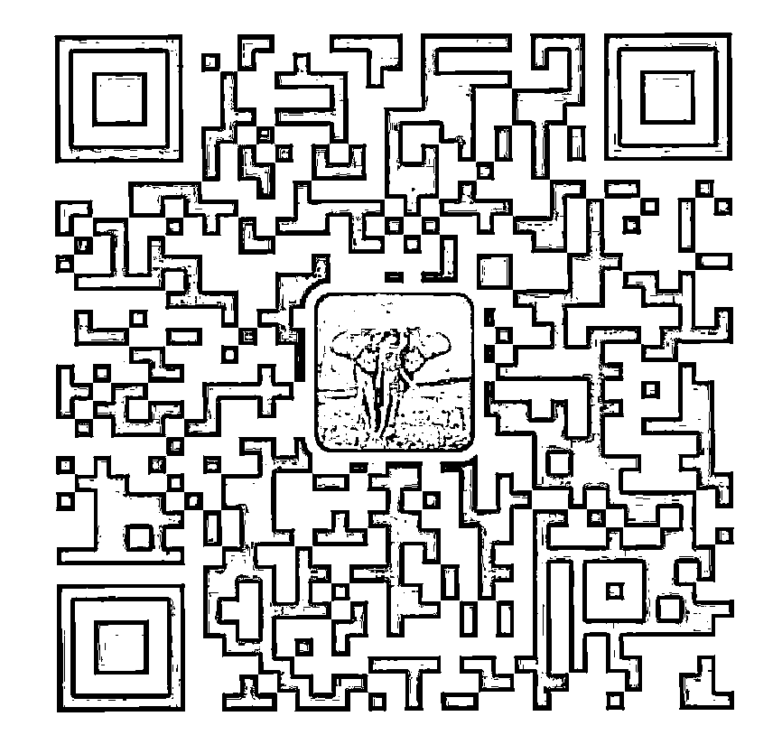

Vera

微信号：wangvera666

扫码或长按识别二维码进入微店购买课程链接：

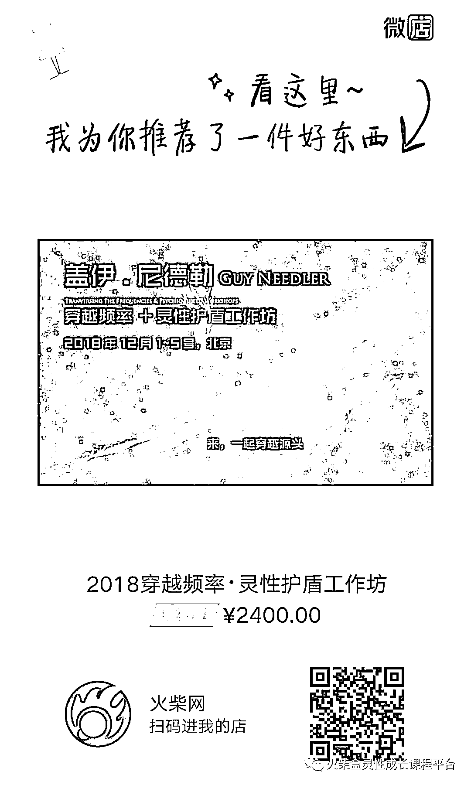

# 穿越频率•灵性护盾工作坊

> 原文：[`mp.weixin.qq.com/s?__biz=MzU0NjkzMDY0OA==&mid=2247485663&idx=1&sn=3fe3032fd133ca9b333c6e12e04bf779&chksm=fb576268cc20eb7e1a8854caf11ea3470192c1dd8272210103a3f2aac6dc3fab42891d0b44bd&scene=126&sessionid=1690980931#rd`](http://mp.weixin.qq.com/s?__biz=MzU0NjkzMDY0OA==&mid=2247485663&idx=1&sn=3fe3032fd133ca9b333c6e12e04bf779&chksm=fb576268cc20eb7e1a8854caf11ea3470192c1dd8272210103a3f2aac6dc3fab42891d0b44bd&scene=126&sessionid=1690980931#rd)


**盖伊.尼德勒**

**穿越频率•灵性护盾工作坊**

*Tranversing The Frequencies & Psychic Shield Workshops*

老盖的课程会使你心里无数打着问号的灵性概念“**？**”

变为清晰无比的叹号“**！**”

与揭开更广阔思维的破折号“**——**”，

你将不再身陷各种永远解释不清的灵性说法的囹圄，

真正建立一个前所未有的巨大的的思维图景和宇宙观。

他还将传授给您一种最为直接的

适合每天身体力行去改变自己的意识频率的方法，

带领你穿越多维宇宙 408 个维度，

最终带领你到达绝对源头（Absolute Origin）

让你可以自己建立一种可重复的与更高维度的智慧和力量乃至与源头之间的稳定链接。

**工作坊视频介绍：**

* * *

📹 [`v.qq.com/iframe/preview.html?width=500&height=375&auto=0&vid=w07775p867i`](https://v.qq.com/iframe/preview.html?width=500&height=375&auto=0&vid=w07775p867i)

**工作坊内容：**

* * *

**▲第一天内容：灵性护盾**

在很多时候，尤其经常接触个案并需要处理问题的量子催眠师及其它能量疗愈师，常常没有意识到应该首先为自己制造保护的屏障，对于这部分人士，在生活和工作中往往处于一种毫无实际保护的“裸奔状态”，由于接触对象的特殊性，随环境而来的负面意识及能量，在无意识中会给她们的身心带来很多不必要的麻烦甚至损害。

盖伊.尼德勒在多年的实践及与源头连接过程中，独创简单而实用的负面能量清理及屏蔽保护的一种技术：灵性护盾，能帮助普通人有效的建立个人的包含 10 个保护层级的能量清理和保护屏障，让能量敏感人士或经常做能量疗愈的治疗者有效的保护自己。通过盖伊.尼德勒的亲身传授与练习，学会随时为自己或家人构筑一种可长时间存在的强大的兼具保护与清理功能的高频率能量护盾，保护对象不受负面能量侵扰与影响。

盖伊.尼德勒将在 1 天的时间内，毫无保留的现场教授大家如何有效的创造保护自己的灵性能量护盾，其中内容涉及到脉轮、辉光层及频率层次等概念。

**▲第二、三天课程内容：**穿越频率（TTF）初阶****  

 1. 系统化的了解源头的历史和多维宇宙（源头实体）及其之下的结构，极大的扩展你的意识和思维，理清你对各种层出不穷、模糊不清的概念的认识，为你提供一个更宏大和清晰的宇宙观参照系；

2\. 从实际操作中认识脉轮及人体辉光层、为穿越做好能量准备；

3. 在 Guy 老师的引导下，掌握使用 TTF 的各种冥想穿越工具和正确方法，穿越不同的维度和频率层，了解不同维度的存在体并记录。最终到达频率层次 100 层，与源头能量进行连接，并获得属于个人的信息。

**▲第四、五天课程内容：**穿越频率（TTF）进阶+疗愈方法****

1. 更深入的理解什么是全维度、亚维度、频率层级、以及 高我跟个人进化之间的关系；

2. 在 Guy 老师的带领下，更加熟练掌握 TTF 的穿越频率方法，学会多方向穿越，以及同时意识能量体身处多处的技巧，最终穿越至多维宇宙最高 408 频率层级，并与源头（神）建立稳健和持续的连接；

3. 学习 TTF 课程能量疗愈的具体步骤和技巧，以及理解能量疗愈的原则和时机，学习穿越频率与疗愈结合，为成为一名穿越频率的治疗者打下坚实基础。

课程结束后，你将获得一种可以方便的练习和验证的穿越频率层级和维度的基本知识和方法，并掌握一种有效的穿越频率能量疗愈方法，可以方便为家人朋友及个案进行疗愈（尤其适合与”灵性护盾“搭配使用）。

*注，穿越频率课程中包含大量练习，是需要非常投入和专注的训练，请大家穿着舒适的衣服，并安排好时间

**时间及价格**

* * *

**“穿越频率&灵性护盾工作坊”**

**Traversing The Freguencies & Psychic Shield Workshop**

全程费用：10800

早鸟优惠：9800（10 月 1 日之前报名）

报名单独课程费用：

穿越频率 ：9000 元

灵性护盾：2400 元

时间：

2018 年 12 月 1 号：灵性护盾

2018 年 12 月 2 号~5 号：穿越频率 

上午 9:30-下午 6:30

地址:：待定

*酒店住宿需学员自付，会务组可以帮助协调同学拼房

个案时间：12 月 7~9 号

个案以一个小时计算（详情咨询客服微信：wangvera666）

**课程费用含场地费，及午餐，不含住宿费*

***文章末尾有课程付款微店二维码，*复训学员请咨询客服**

******本课程标配老盖的资深御用翻译 Leo，妈妈再也不用为我听不懂老盖的学院派伯明翰口音担心！***

* * *

**盖伊.尼德勒介绍**


**老盖是谁？**

盖伊.尼德勒 

Guy Needler

他童年便与灵性有特殊缘份

他曾是阿斯顿.马丁的双学位电气工程师

他是受严格训练的灵气和能量疗愈者大师

他是受过外星文明深度调频的超五类接触者

他是被[朵洛莉丝.侃南](https://mp.weixin.qq.com/s?__biz=MzU0NjkzMDY0OA==&mid=2247485567&idx=1&sn=e1990ecdef41a142ea3df28c52618d66&scene=21#wechat_redirect)*称为有大海深度的推荐作家

他是与源头及绝对起源直接建立稳定链接的传导者

他是灵性原则知行合一的践行者

他是合气道黑带、骑行极客

他是一个真实的人

他是 Guy

‍‍‍‍**著作**（中文版正在筹划出版中）：

《神之简史》（History of Gods）即将出版

《回避业力》（Avoiding Karma）即将出版

《源头之外 I+II》（Beyond The Source：book I+II）

《源头之语》（The Origin Speaks）

《与安对话》（The Ann Dialogues）

《起源监护者》（The Curators）‍‍‍‍

**在线讲座课程**

[“从头认识灵性世界”](http://mp.weixin.qq.com/s?__biz=MzA5NTc5Mzc5MQ==&mid=2247483839&idx=1&sn=a2b58a153e137e246311561dc585b2df&chksm=90b8a6afa7cf2fb9d392cdb928894a8cd3a4b76abab714656c90339dbb1200f8d8a79d4dafa4&scene=21#wechat_redirect)

请点击[**这里**](http://mp.weixin.qq.com/s?__biz=MzA5NTc5Mzc5MQ==&mid=2247483839&idx=2&sn=fb6800bc81937a7c27083bb8a306516c&chksm=90b8a6afa7cf2fb9f1bf02b3f3ad29cb7fcf5ea6379952a19acfac67d79b4545890d0b982dcc&scene=21#wechat_redirect)或老盖头像，查看老盖详情介绍

📹 [`v.qq.com/iframe/preview.html?width=500&height=375&auto=0&vid=l0528b1xgw4`](https://v.qq.com/iframe/preview.html?width=500&height=375&auto=0&vid=l0528b1xgw4)

* * *

**往期精彩回顾：**

2014 年 北京


2015 年 北京


2016 年 北京


2017 年 北京


**2018！让我们和老盖一起穿越频率！**

**❤学员反馈：**

简单说，老盖的理论可能会让你刮起关于终极问题的“头脑风暴”，他的体系是一个我们不常见到的关于源头与宇宙的更大的架构和图画。同时他又像一个灵性的工程师，把宇宙实相的摩天大厦的结构用图纸非常简洁又系统的描绘了出来。

他的知识与思想深邃，带给你对意识与知识深层的震撼与拓展；

他真实，平和与低调为人，对所有人和事，无论贵贱大小，于公于私，都是一样的真诚又平和。我接触过很多国外的灵性老师，这一点，能真正做到的人凤毛麟角。

*--------**Leo*

非常惊喜的是：盖的课让我将那些学过的灵性知识的每一个部分，归位和串联起来，甚至让我对以往比较难懂的佛学知识有了新的认识和了解，有了更宏大的宇宙观。盖的工作坊不仅有理论，大部分的内容是实践，过程非常有趣，同学之间冥想结果有相互的印证，我实践并见证了那种听来的奇迹，我想，这也许就是频率提升的作用吧。也明白了，为什么有的同学每逢盖伊来华千里迢迢必到他的课堂，珍惜每一次他来华的机会。我知道有伙伴用盖伊教授的冥想方式获得创作灵感，我也喜欢静静的时候用这种方法到不同的频率打坐，游玩。

还要说说他的独特穿越频率的疗愈方法，这种能量的疗愈方法，至今我还在用，是因为一位小伙伴，课上活动时，我带她穿越频率治疗了久久不愈的喉咙和肺部不适，后来偶尔一次我们相遇，谈到那次疗愈，她说，那之后就好了没有再犯，这让我自己升起很大的信心。

很感谢主办方可以邀请到这样有真材实料有品质的灵性大咖传授知识和技能。期待再次与老盖一起穿越频率！

*----**学员 Vera 的心得*

如果说朵奶奶的量子催眠是一把钥匙，为我打开真正灵性世界的大门，老盖的穿越频率则是帮助我探索灵性世界的一对翅膀，有了这对翅膀，我不再需要别人告诉我什么是生命的真相、宇宙的实相，因为我可以跟随自由意志去探索了。在认识盖的快两年时间里，从他的穿越频率工作坊、阅读和疗愈、他的每本著作到每个月的传讯，我获得了太多的提升和帮助。每一次与他连接，他都是那样直接那样纯粹那样真实，不绕弯路，不拐弯抹角，不带花里胡哨的装饰，没有沾花惹草的意图，他总是让我想起源头对我们说的那句话“Remember, simple is good”(记住，简单是件好事）。我的心告诉我，要紧紧追随盖的脚步，因为我只要真理。

------学员小楠的心得

当我阅读到老盖《神之简史》这本书，我感到非常兴奋；更令我兴奋的是老盖会专门教授书中的那些技术。我并非时常对某些事情感到兴奋，我有深深的共鸣也想学习这套技术，《穿越频率工作坊》带给我的远远超乎我的想象。这个周末很值得，累并快乐着。老盖为大家创造了一个舒适，没有评判的环境。老盖会确保每位学员对这套技术以及过程的适应，他鼓励学员们彻底的质疑，这让人感到很伟大。我为自己能达到第三层级感到兴奋。这将会是我人生中意义重大的一刻，在这一刻，我的生活正经历着一些改变。

当我在时空中穿越，在时空中舞蹈，某些伴随我的东西在持续发酵······

如果你想拥有一场激动人心的旅程，想了解更大的实相和更大的自己·····

那么请来吧，你不会失望*。*

* ————**学员 FT London 的心得*

谢谢你，老盖：

找到这样一个能够直接与源头链接的方式，简直令人难以置信。祈祷结果能让人满意。当我还是孩童的时候，我就已经深信源头的存在，为了找到与源头链接的方法，我研究宗教与物理。老盖在这方面所取得的成就超级惊人，真的很感谢他。

*————**Peter Kelly*

课程中所获得的信息令人难以置信，超乎预期的想象。实践练习非常容易的将我们带到前所未有的水平。这比我之前的任何一次冥想体验都要好。我不知道自己居然可能达到这样的冥想层级。那里有很多我喜欢的东西，我去到了自己的意识层级，我经历了深度的宁静与光的状态。这种积极的体验反应到我生活的方方面面，我感觉自己每一天都在被滋养的状态之中。 

我爱这个课程。

*————**Bonnie Reid, AR*

课程咨询：


Leo

微信号：yourleoz


Vera

微信号：wangvera666

扫码或长按识别二维码进入微店购买课程链接：


# 盖伊.尼德勒详情介绍

> 原文：[`mp.weixin.qq.com/s?__biz=MzU0NjkzMDY0OA==&mid=2247485663&idx=2&sn=7de26243027bd1702f3821876a40690d&chksm=fb576268cc20eb7e9baa4f7a1b5211e03587c9a043c54d8e846b0619390903f2b0c9c6463120&scene=126&sessionid=1690980931#rd`](http://mp.weixin.qq.com/s?__biz=MzU0NjkzMDY0OA==&mid=2247485663&idx=2&sn=7de26243027bd1702f3821876a40690d&chksm=fb576268cc20eb7e9baa4f7a1b5211e03587c9a043c54d8e846b0619390903f2b0c9c6463120&scene=126&sessionid=1690980931#rd)

📹 [`v.qq.com/iframe/preview.html?width=500&height=375&auto=0&vid=l0528b1xgw4`](https://v.qq.com/iframe/preview.html?width=500&height=375&auto=0&vid=l0528b1xgw4)

**盖伊.尼德勒**

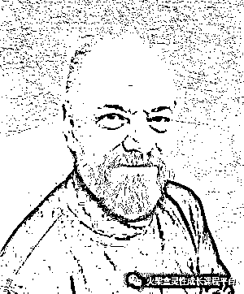

*♦童年便与灵性有特殊缘份。*

*♦早年间获得英国特许注册工程师资格，曾担任阿斯顿.马丁及捷豹汽车工程师。*

*♦曾经投入六年时间获得灵气大师资质，四年时间专门学习能量疗愈技术。*

*♦UFO 第五类接触者，奇特的经历，形成了独有的能量疗愈方法与“穿越频率”教学体系。*

*♦全球顶尖回溯催眠大师朵洛莉丝.侃南诚意推荐，《神之简史》等多部灵性畅销书作者。*

*♦多次接受过英国天空电视台著名探索频道 The Moore Show 栏目的专访，在全球♦UFO 大会与转变大会上作为嘉宾演讲，并在世界各地举办工作坊与演讲。*

*♦替代医学协会（MCMA,Complementary Medical Association）成员，持有合气道五段国家教练的资格。*

**著作**（中文版正在筹划出版中）：

《神之简史》（History of Gods）即将出版

《回避业力》（Avoiding Karma）即将出版

《源头之外 I+II》（Beyond The Source：book I+II）

《源头之语》（The Origin Speaks）

《与安对话》（The Ann Dialogues）

《起源监护者》（The Curators）

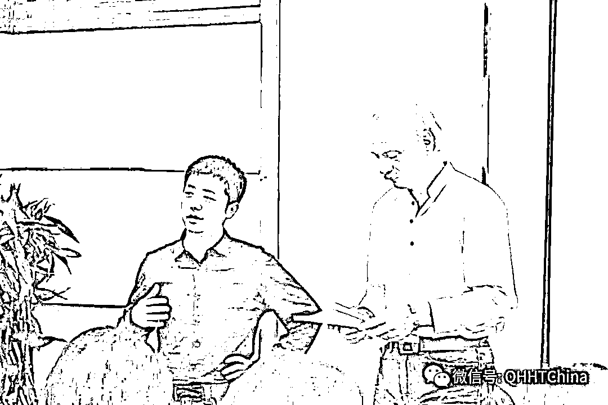

**【我所了解的盖伊.尼德勒】**

      我第一次和盖伊.尼德勒（Guy Needler）见面是在 2012 年，在量子催眠创始人朵奶奶组织的地中海巡游的 Equinox 邮轮上，朵奶奶向我介绍了他，我当时只知道他的书《神之简史》（theHistory of God）卖得很好。巡游的十五天过得很快，在船长日酒会那天晚上，我终于逮着跟他聊了半晚，当时的赶脚就是：信息量太大！-_- 由于时间有限，他关于多维宇宙的概念把我这个理科生出身的“光工”都说晕了，不过还好，他送了我两本他的书和另一本很沉的充满科学证据的宇宙灵性书籍 Kosmos（大宇宙），让我的书架着实增重不少。

   时光荏苒，一转眼到了 2018 年，对他的理论也有了全新理解。如果要让我简洁的介绍他和他的工作，我要说这个工科背景的可爱的大叔有着非常丰富的灵性经历和训练，他在通过一个特殊的视角连接着这个灵性世界，他有一个特别但又非常系统化和具体的体系，一下子打开了我关于这个宇宙的思维的疆域。也正是因为他的体系有别于传统，才一下激荡了我沉静意识，照亮了平时躲在暗处的思维节点。我一向不喜欢说“谁的理论是正确的”，因为这个命题只有在静止的状态下才有意义，每一种理论都好比是大海里的探测船从某个角度发出的声纳得到的回馈波，如果只是从一个点发出，我们很难得到目标反馈的全面的信息，而我们如果发出声纳的角度越多样、越立体，得到的信息就会越来越接近真实情况。盖伊的理论看似与传统不符，但是你却能在众多细节中发现跟我们熟知的概念完美结合的地方。其实一切都是神的表达，“多维”这个词其实本身就在告诉我们，要逐渐放掉原有的抓住一种认知一个角度不放的老习惯，试着同时接纳宇宙间不同的可能性，你才有可能朝多维度的真实本我状态靠近。对了还要提醒一下：不要绝对将他的体系里的某些词语与我们的理解对号入座，他的很多词的含义其实是一个全新的定义，与传统的含义并不相同，比如他说的维度，与我们说的第五维度里的那个系统其实就不完全是一回事。

总结一下，老盖的理论非常有意思，很可能会让你刮起关于宇宙的“头脑风暴”，他的体系是一个我们不常想到的关于神与宇宙的更大的架构和图画，他就像一个灵性的工程师，把摩天大厦的结构用图纸非常简洁又系统的描绘了出来，这个图纸上有很多你熟悉的地方，也有很多你不熟悉的部分，但这正是好玩的地方！如果你对源头（绝对存在）的十二个“分身”感兴趣，如果你对多维宇宙的具体结构着迷，如果你想了解如何用一种可操作的方式与高维度灵性实体甚至源头连接，那这次工作坊你真的应该认真的考虑下！

朵洛莉丝量子催眠中国负责人

Leo

**盖伊.尼德勒**

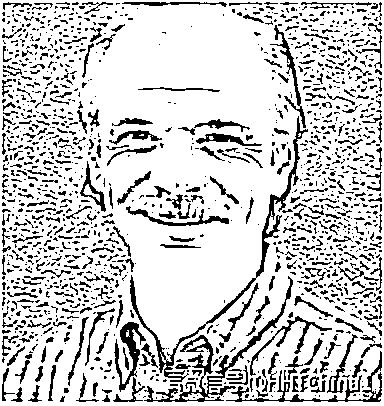

> 盖伊.尼德勒拥有工商管理硕士，理学硕士，CEng， MIET ， MCMA 等学位或头衔，人生最初接受的教育都为了将他训练成一个机械工程师，他很早就拿到了特许电气及电子工程师资格。然而，在这世俗的工作背后，他能感知到他周围存在着更大的现实，因为他总是能一瞥精神世界的影子。在十几岁到二十出头的时间里，他广泛阅读了当代的大量精神著作，并一直在练习深层冥想。直到有一天，他被他的指导灵告知，应该把重点放在俗世任务上，之后他有意识地缩减了在精神世界的追求。盖伊到了三十岁以后，再次听到了让他重返精神角色的召唤。在接下来的几年里，他花了四年时间专门学习能量和频率治疗技术，并成为了一个灵气大师。他曾师从众多该领域的顶级大师。其中包括海伦·斯托特（芭芭拉·布伦南疗愈学校的教师，BBSH，Barbara Brennan School of Healing）。他在能量疗愈方面丰富的训练与经验，使他最终成为了替代医学协会（ MCMA，Complementary Medical Association）的成员。

> 正是在这些通往更高频率的“旅行”中，他发现他可以与存在于不同层面的多元宇宙的活的“实体”交流。

> 在能量治疗师的训练中（1999-2005）盖伊发现，他能够通过冥想，穿越到与那些黄金层次相关联的频率之上。在这些穿越到更高的频率的“旅行”中，他可以与存在于不同层面的多元宇宙的活的实体沟通。这些实体包括 OM、弥漫在大宇宙间具有原初表达能量的存有、我们这个的多元宇宙的神的创造者、源头实体、以及它的同伴：共同创造者、还有共同创造者自身的创造者、以及源头本身（在印度教经文中被称为“绝对”）。

> 盖伊迅速建立了与这些实体的稳定和紧密的通信，随着沟通的深入发展，他进入了更深层的冥想状态，并记录着这些实体“传导”的讯息。正是这些记录的传导，让他完成了《神之简史》的手稿。

> 在 2008 年 9 月盖伊将《神之简史》的手稿寄给了好几家出版机构，其中包括朵洛莉丝.侃南的 OZARK MOUNTAIN 出版社和尼尔唐纳德·瓦尔施（译者注：《与神对话》的作者）的出版社。但却回音寥寥，不过他并没有灰心，他继续致力于整理另一个将作为本书前传的手稿。在 2009 年的除夕，盖伊收到一封来自 OZARK MOUNTAIN 出版社的朱莉娅.侃南的电子邮件和一份合约。受到了鼓舞的他很快就完成了前传，并在 2010 年 4 月将其寄给了 OZARK MOUNTAIN 出版社。在收到该手稿后，朵洛莉丝.侃南亲自回复了盖伊并告诉他这份前传的手稿应该整合进《神之简史》的手稿中，因为这样就构成了包括他的个人觉醒过程和与“实体”们沟通的整个图画。《神之简史》出版于 2011 年 6 月，盖伊应邀作为发言嘉宾参加了由 OZARK MOUNTAIN 出版社在阿肯色州举办的全球转变大会。他随后陪同朵洛莉丝.侃南和茱莉亚.侃南在英国众多城市巡回演讲。他接受过由朵洛莉丝.侃南本人主持的 BBS 广播节目的访谈，并出现在英国天空电视台的专访节目 The Moore Show 中。

> 他继续从这些实体接收和记录信息，并完成了另一本新书的手稿《源头之上》，该书由 OZARK MOUNTAIN 出版社在 2012 年初出版，在本书中他与共同创造者的独家对话被公开，首次揭示了共同创造者的多维宇宙环境以及居住在其中的实体们。盖伊目前正在完成《源头之上》的前传，它将被称作《源头之上 II》，它使得与共同创造者的对话变得更加完整。另一本名为《源头之语》的书也在他的进一步的计划中。

> 他是 UFO 第五类接触者，奇特的经历，形成了独有的能量疗愈方法与“穿越频率”教学体系。从 2012 年开始，盖伊开始举行一系列的工作坊，教授他自己发展的穿越频率的方法和技巧，并同时致力于完善加强自身的灵性的方法，扩大和深化自己的觉醒水平。

> 作为他落地的一种爱好，盖伊喜欢在乡间骑行。他还是一名合气道爱好者与教师，拥有合气道五段国家教练的资格和 30 年练习合气道的经验。他目前也在研究使用精神能量改善物理层面的艺术。

> 著作（中文版尚未出版）

> 《神之简史》（History of Gods）中文版预计 2018 年底上市

> 《源头之外 I》（Beyond The Source：book I）

> 《源头之外 II》（Beyond The Source：book II）

> 《回避业力》（Avoiding Karma）

> 《与安的对话》（Dialog With Ann ）

> 《大宇宙》

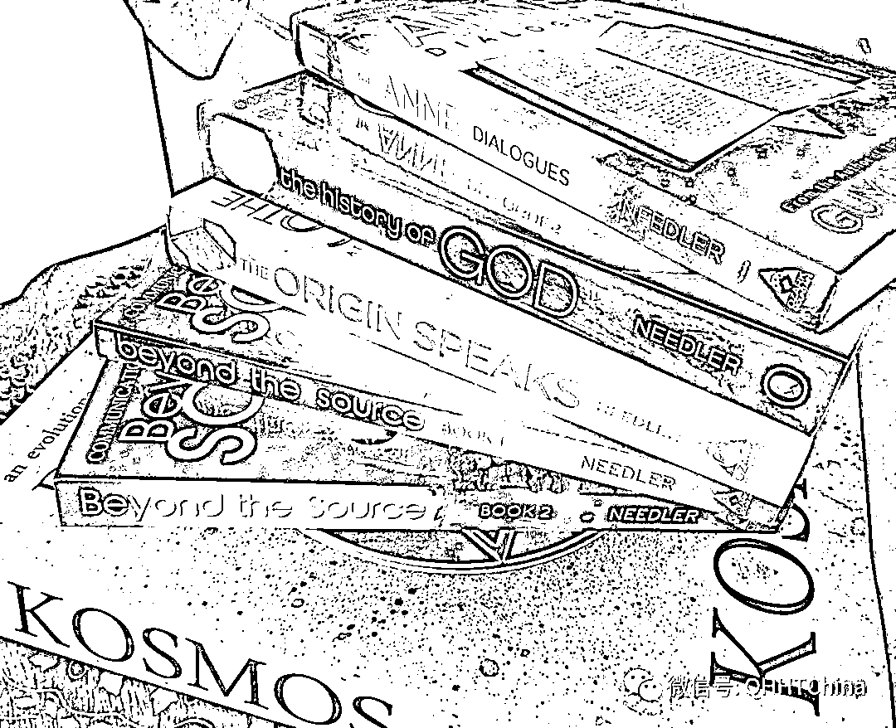

**他**

**经历非凡：**从小灵性超常但在青春期被关闭，后与 UFO 有过神奇的第五类接触从此全面开启了全新的灵性新旅程；

**深邃知识与思想：**他如天外来客一般的著作（已出版了包含《神之简史》在内的 7 本）绝非泛泛之类，带给你的绝对是对意识与知识深层的震撼与拓展；

**真实的平和与低调的为人：**俗话说度人容易修身难，在和老盖一起工作的时间里，我深深感觉到老盖的平和心态绝不是一时半会装出来的，那是真的意识层次所然，他对所有人和事，无论贵贱大小，于公于私，都是一样的真诚又平和。我接触过很多国外的灵性老师，这一点，能真正做到的人也凤毛麟角。还有，这个老盖不喜去豪华之所，专爱找路边摊小店体验民情，这也是为什么我会叫他老盖的原因，因为他就像一个亘古以来的老朋友；

**震撼的个案和教学：**作为他的“资深翻译”，老盖的阅读（Reading）就像是一次浓缩的量子催眠，没有你到不了的地方，也没有你不能问的问题：具体、震撼，最后所有的拼图变成了一个大图画，你才惊觉原来你明白了这么多！老盖的在他的个案和教学的气场和频率像一个自然的磁石，以至于在他回到英国也一直不断的有中国的朋友打听他下次课程的安排和请求做远程个案。

 --Leo

**盖伊.尼德勒目前在国内的课程有：**

1.  从头认识灵性世界 （线上课）

    购买地址：关注本公总号--进入服务中心--微店商城

2.  穿越频率.灵性护盾工作坊（实地课程.）

    时间：2018.12.01-05

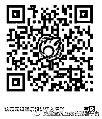

活动：2018.11.30 签售活动及演讲


2018 穿越频率•灵性护盾工作坊购买链接请点击阅读原文

# 盖伊 尼德勒个案预约

> 原文：[`mp.weixin.qq.com/s?__biz=MzU0NjkzMDY0OA==&mid=2247485663&idx=3&sn=dc17bf6f0e53467829491e5670ca2736&chksm=fb576268cc20eb7e05f60989ed3585454662148b3e159b38f48b0bdc08736e6e22db4234037b&scene=126&sessionid=1690980931#rd`](http://mp.weixin.qq.com/s?__biz=MzU0NjkzMDY0OA==&mid=2247485663&idx=3&sn=dc17bf6f0e53467829491e5670ca2736&chksm=fb576268cc20eb7e05f60989ed3585454662148b3e159b38f48b0bdc08736e6e22db4234037b&scene=126&sessionid=1690980931#rd)

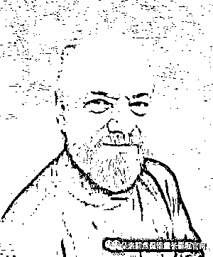

**关于盖伊 尼德勒个案介绍**

*盖伊.尼德勒是一名经验非常丰富的灵气大师与能量疗愈师，并且是一名很稳定和纯净的传导者。他的个案内容主要是：疗愈*

*疗愈是针对个案的精神与身体的恢复和平衡*

*当然，如果你有什么对自身感兴趣的问题也可以当面提出获得相关信息、答案等*

**【个案内容简介】**

**疗愈（Healing）**

♡能量平衡

♡脉轮疗愈/替换

♡辉光层修补

♡纠正情绪及能量紊乱，切断有害情绪/能量链接

♡物理身体、以太体、

♡情绪体的其它问题及疗愈要求

**2018 年 12 月 7~9 日个案开放**

♥个案按每小时收取费用主要用于治疗（Healing），（每人最多预约 2 小时）。

♥本次来华一共仅有 12 个小时个案开放，名额有限，预约从速。

  7 号 4 个小时

  8 号 4 个小时

  9 号 4 个小时

♥预约时间安排：

请扫描下面二维码或表单链接，进入表单，查看预约时间段，并进行预约

 http://form.mikecrm.com/wt6CFa

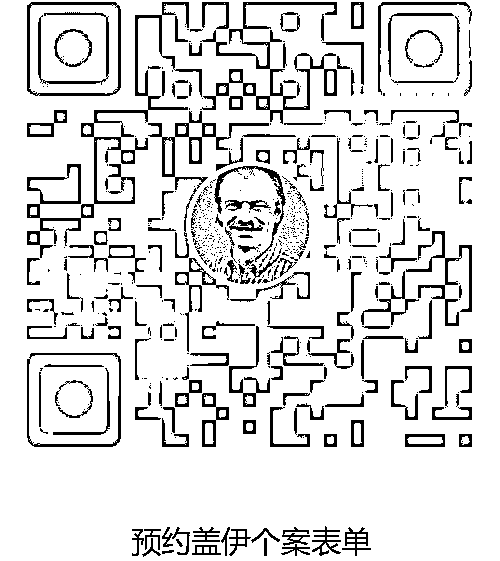

♥费用：

**疗愈（Healing）**：2800

 作为他的“资深翻译”，老盖的阅读（Reading）就像是一次浓缩的量子催眠，没有你到不了的地方，也没有你不能问的问题：具体、震撼，最后所有的拼图变成了一个大图画，你才惊觉原来你明白了这么多！老盖的在他的个案和教学的气场和频率像一个自然的磁石，以至于在他回到英国也一直不断的有中国的朋友打听他下次课程的安排和请求做远程个案。

--Leo

付费预约链接：请点击阅读原文


# [量子催眠案例]肋骨疼痛的前世回溯及疗愈

> 原文：[`mp.weixin.qq.com/s?__biz=MzU0NjkzMDY0OA==&mid=2247485656&idx=1&sn=b2d8b68069bca30114c5b2f01241f919&chksm=fb57626fcc20eb794b84376eabdc788c892641ece7681c2fe0e6d1653bfe3f78ed89cf35a36b&scene=126&sessionid=1690980931#rd`](http://mp.weixin.qq.com/s?__biz=MzU0NjkzMDY0OA==&mid=2247485656&idx=1&sn=b2d8b68069bca30114c5b2f01241f919&chksm=fb57626fcc20eb794b84376eabdc788c892641ece7681c2fe0e6d1653bfe3f78ed89cf35a36b&scene=126&sessionid=1690980931#rd)

*本案例由量子催眠操作者：vivi 提供。如果您也是一名量子催眠操作者，并且希望量子催眠中国官方公众号刊登您的个案记录，欢迎踊跃向我们*[***投稿***](http://mp.weixin.qq.com/s?__biz=MjM5NjExMTczNA==&mid=2647621709&idx=1&sn=4d75b1f46655a7b5b32ad6c634180e42&chksm=bed5145489a29d420a60abed74418f35956d6e3d0be4f1368cf2c9b0c9d3d552e765f149ede8&scene=21#wechat_redirect)*。同时，您稿件的完成度越高（有完整的文字排版和配图，具体可参考官网之前发布的案例）就越容易被官方选中，并发布在公众号内。*

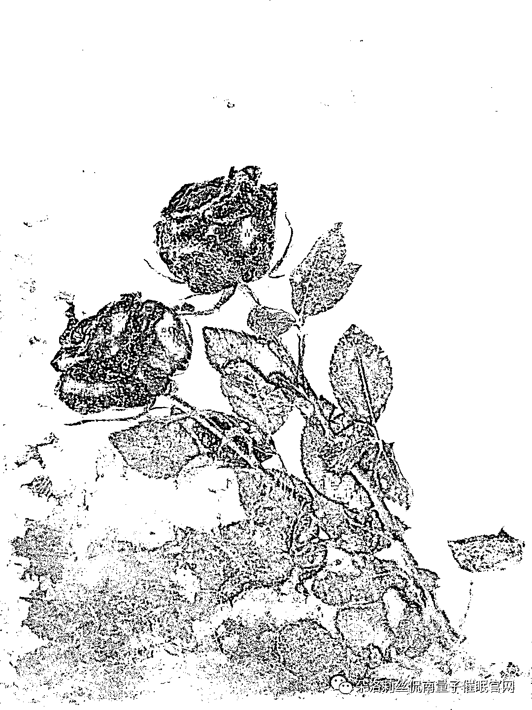

**量子催眠个案实录**

*这里收录的量子催眠个案实录*

*旨在以人为镜*

*在我们迷茫困惑时    带来启发*

*在我们受挫疼痛时    带来温暖*

*在我们需要指引时*

*帮助听到我们内在的心声！*


CFE 是一个在德国工作的工程师，他在近日的一次意外中肋骨骨折，去医院拍了片子，医生只能给止疼片，需静养一两个月，别无他法。但他每次呼吸都会痛，只能很浅的呼吸，所以想到了催眠。另外他在工作中有困惑，目前面临一个选择。

在前世回溯中 CFE 来到了一片树林，他是一个欧美男人，棕色头发，三四十岁。突然他被什么射中了，正是他这次右肋骨折的地方，前胸直透后背被射穿，一阵剧痛，他倒在地下，血涌出来，登时死亡。这时来了几个黑人土著，身上只穿了草编的衣服，他们用绳子把 CFE 的尸体绑起来挑在棍子上一起抬走。到了土著住的地方，他们麻利的一刀把 CFE 的头砍下来，四肢一一卸下，头和躯干丢在一边，把四肢上的肉一片片切下来放到锅里煮了，给族人一起吃。

这一世如此结束了，CFE 看着发生了一切，感觉无能为力又无可奈何。

我继续引导 CFE 回溯，来到另外一世，二战期间，他是希特勒身边的亲信。他从很年轻就跟随希特勒左右，不断被提拔，被赋予重用。他的家人也因此生活的富裕而幸福。下一个画面，CFE 在集中营作为指挥官巡视，一张张干枯的面孔，干瘪的身躯，他看到这些被关押的人里也有很好的人，他目睹这些人如何被虐待，被杀害，他开始觉得自己做错了。他的老婆是法国人，CFE 跟法国方面联系上，为他们提供情报。二战的最后阶段，CFE 被希特勒关到了监狱里，没有直接处死，而是实施虐刑，快死没死就被丢在监狱不管，不知道过了多少天，在痛苦中一点点死去。监狱中还有很多其他被行刑致死的人。死后他的灵魂升起，没有光的迎接，他看到监狱旁边有个很大的湖，他不知道是在哪里，灵魂一直在灰暗中游荡。

这一世让 CFE 感觉很郁闷，明明是黎明前的黑暗了，战争就快结束了，遗憾自己没能等到。

最后我呼唤潜意识出来，询问原因，（以下是我们的对话节选）：

* * *

我：为什么给 CFE 看这些前世？

潜：他和希特勒的关系跟他现在与老板的关系类似。

我：对他事业上有什么指导？

潜：跟随自己的心，他会做正确的选择。

我：请帮他疗愈受伤的地方。

潜：好的。

等了一会，

我：被射穿肋骨那一世的死因跟他现在受伤是不是因果关系？

潜：是的，同一年龄发生的。

我：他的健康还有什么问题吗？

潜：没什么问题，都很好。

我：请给他他需要的指点。

潜：目前面临的抉择，无论怎么选都是对的，他有很强的责任心，明辨是非对错，他已经知道该怎么做了。

我：请也给我指导。

潜：你今年进步很多，再多花些时间培养你的孩子。


*催眠结束，CFE 感觉呼吸还是有点疼，比之前好一些。第二天一早，他说肋骨疼痛神奇的消失了，终于可以大口呼吸了。他之前连打喷嚏都要硬憋回去，不然会引来剧痛，现在完全没问题了。*

*我查了二战结束前的历史，希特勒在柏林一个湖边的监狱里，虐死了背叛他的一千人。*

*CFE 通过这次催眠，体验到前世与今生的微妙联系，明白了生命中发生的一切都不是偶然的，不论是意外受伤，还是职场关系。有时是一种重复，有时是一种提醒。*

**-EN**-END-****-****

**-END-**

****END-**D-****-END-**

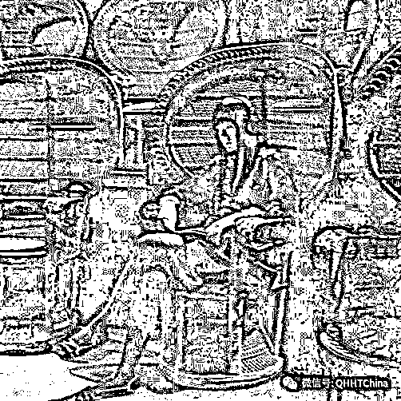 *文案：量子催眠师 vivi 德国 预约微信号：vivicci*

*图片：网络*

*编辑：量子催眠中国*

* * *

花一些时间在我们的官方网络平台（微信公众号：QHHTChina）上了解更多关于我们提供的信息，或者与我们联系进行有关咨询。

想要更多的了解催眠和前世回溯吗？有兴趣学习如何成为一名专业的催眠操作者吗？

我们可以为你实现。

**课程咨询及个案咨询服务二维码**

 花一些时间在公众号上了解更多关于我们提供的课程：

[【线上·网络】量子催眠一阶段课程介绍](http://mp.weixin.qq.com/s?__biz=MjM5NjExMTczNA==&mid=2647621628&idx=1&sn=362734b6f9677d41810f46793db552fe&chksm=bed5ebe589a262f38aeee298496c88b3f58bdd327e9c595259fd2f64ca22876aa29c0f1df337&scene=21#wechat_redirect)

或者与你附近的前世回溯操作者联系。

[量子催眠个案全国预约！](http://mp.weixin.qq.com/s?__biz=MjM5NjExMTczNA==&mid=2647620840&idx=1&sn=95dc1c41580e9f9c19d1426946ba005b&chksm=bed5e8f189a261e7950d67dc111870a8859b63aef5f589db5ac4f3c284e4142185b833644b90&scene=21#wechat_redirect)

**这里不是要说服你去接受那些你还没有准备好去接受的观念，也不是劝说你去放弃那些你还没有准备好要放弃的，这里只是为你提供一个探索的平台，帮助你理解朵洛莉丝.侃南量子催眠疗法的原理和为什么治疗的结果是可能的。**

相关文章链接：

量子催眠是什么↓↓↓

[朵洛莉丝·侃南的量子疗愈催眠技术(QHHT®)](http://mp.weixin.qq.com/s?__biz=MjM5NjExMTczNA==&mid=2647622241&idx=1&sn=4db479b517141a38ce4304b21cfc4ef7&chksm=bed5167889a29f6e8b343714879cccd668daca13e1430542e55ee47e02d03709a34793f75a69&scene=21#wechat_redirect)

[如何使用量子催眠来发现你的前世](http://mp.weixin.qq.com/s?__biz=MjM5NjExMTczNA==&mid=2647622208&idx=1&sn=751c7bc617279d1079936ee43d48e577&chksm=bed5165989a29f4feeb9e88b59b29c361d6b745f86e533b502ce4093670963a02a19e57dcfeb&scene=21#wechat_redirect)


**所有的生命都在学习，**

**地球能否顺利进化。**

**朵洛莉丝说：**

**“全宇宙都在看。”**

# [量子催眠案例]找了那么多人，其实找的是她自己

> 原文：[`mp.weixin.qq.com/s?__biz=MzU0NjkzMDY0OA==&mid=2247485649&idx=1&sn=ff719fccedb31f6b6275843dbabb8430&chksm=fb576266cc20eb704c6d2e2775106a135987f2d8df664d781bf782610390cafe9f08c2efbdc3&scene=126&sessionid=1690980931#rd`](http://mp.weixin.qq.com/s?__biz=MzU0NjkzMDY0OA==&mid=2247485649&idx=1&sn=ff719fccedb31f6b6275843dbabb8430&chksm=fb576266cc20eb704c6d2e2775106a135987f2d8df664d781bf782610390cafe9f08c2efbdc3&scene=126&sessionid=1690980931#rd)

*本案例由量子催眠操作者：雅丽提供。如果您也是一名量子催眠操作者，并且希望量子催眠中国官方公众号刊登您的个案记录，欢迎踊跃向我们*[***投稿***](http://mp.weixin.qq.com/s?__biz=MjM5NjExMTczNA==&mid=2647621709&idx=1&sn=4d75b1f46655a7b5b32ad6c634180e42&chksm=bed5145489a29d420a60abed74418f35956d6e3d0be4f1368cf2c9b0c9d3d552e765f149ede8&scene=21#wechat_redirect)*。同时，您稿件的完成度越高（有完整的文字排版和配图，具体可参考官网之前发布的案例）就越容易被官方选中，并发布在公众号内。*

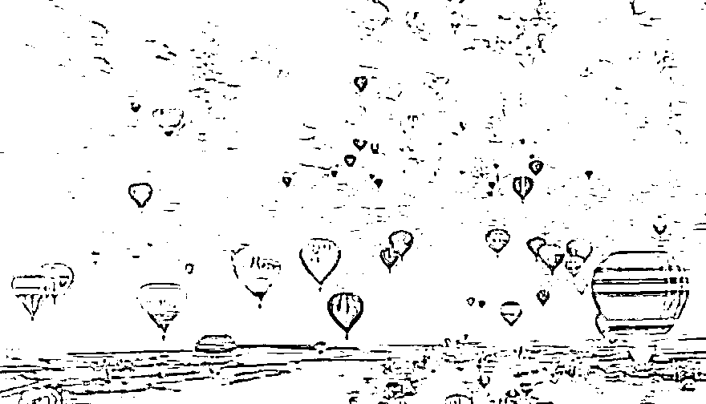

**量子催眠个案实录**

*这里收录的量子催眠个案实录*

*旨在以人为镜*

*在我们迷茫困惑时    带来启发*

*在我们受挫疼痛时    带来温暖*

*在我们需要指引时*

*帮助听到我们内在的心声！*


这次的个案是位相貌可爱的年轻女孩，然而见到她时让我吃惊的是，她眼睛里与年龄不相符的深深的忧郁。

她告诉我，4 岁时她便**被亲生父母遗弃**，是养父母收养了她，对于 4 岁前的事情她完全没有记忆。16 岁时她意外得知了自己的身世，伤心痛苦到难以接受，一度离家出走，甚至一直觉得养父母不爱她。至今，她仍然不知道亲生父母是谁、在哪里。

从中学到大学，她开始频繁地换男朋友。终于稳定下来结婚了，却在生产后患上了**产后抑郁症**，不想吃也不想动，精神极度低落，甚至控制不了自己的情绪。与老公和婆婆的关系也极度恶化，最终在儿子刚满 4 个月时与老公离异。

今天，她找到我，想通过催眠了解这些事情发生的渊源，也想获得一些建议，怎样才能走出这个困境。

面谈之后，个案进入了催眠状态，看到了一系列场景。

以下催眠师简称催，个案的潜意识简称潜。

**个案看到的第一个场景：**

他是一个穿着西装的男人，他的妻子坐在沙发上。

突然他的妻子感到非常绝望，从阳台跳了下去。

催：为什么给她看妻子跳楼的场景？

潜：那一世的妻子就是她今生的前夫，都是她逼的，妻子感到很绝望才跳的。正因为这样，她前夫这一世没有办法跟她在一起。虽然他们在一起的时候很好，但因为这个前世渊源才会离开她。他们这一世在一起是注定的，但是没有好结果也是注定的。

催：她和前夫今后还会有什么缘分吗？因为他们还有一个儿子。

潜：不会了。她前夫根本就不爱这个孩子。她前夫身上还背了很多其他的东西，他这一辈子是来还债的，**他还欠了别人许多债要去还，如果跟她在一起她只会拖累他，他就没法去还债了。因为这个原因他们俩才会分开，她前夫要去还他的债。**

催：那她怎样处理和前夫的关系？

潜：**她接纳就好了。如果他落魄到一碗饭都没有，就给他碗饭。如果他好，就祝福他。**

个案对于前夫的离开一直耿耿于怀，甚至因此否定自己，认为自己不够好。当她结束催眠起来后，了解到前夫离开她是因为要去还债这样一个过往的原因，她突然明白了前夫的离开并不是她自己的错误，她瞬间释然了。

有时，一些人离开我们，并不是我们不够好，这其中可能有着我们所不知道的深层次的原因。所以，不要因此而否定自己、贬低自己。

**个案看到的第二个场景：**

他是一个古代的男人，住在一个破烂的茅草屋里。

后来，他考上了武状元，衣锦还乡，父母和丫鬟都喜极而泣。他却很骄傲，根本不把他们放在眼里。

家里为他摆了宴席庆祝，楼上的门响了，出来一个非常漂亮的女人。他非常喜欢她，想冲过去抱着她，但那个女人晃了一下就走了。

他喝多了，偷偷跑去一个女孩家表白，没想到遭到了拒绝，还被人当成贼打。

催：给她看到这一世是想告诉她什么？

潜：看到住在一个破烂的茅草屋里是要告诉她成功都是要经历孤独之后。

看到他很骄傲是要告诉她，功成名就后，他就把以前帮过他的人都忘了。

另外，丫鬟是她今生的一个好朋友，叫 xx。宴席上的那个女人是她今生的前男友，叫 xx。表白的女孩是她这一世的前男友，叫 xx。打他的人中有一个是她今生大学时的男友，叫 xx。她这一生注定是要负一些人的。

物极必反。她越爱的人越讨厌她，她越讨厌的人越爱她。**凡事随缘就好，不要太执着于一些事情。**她跟她前夫、男友都是这样。

催：您还有什么要对她说的？

潜：**她一直都在找寻一个深爱她的人，但其实我就在她身体里。她找了那么多人，其实找的是她自己。所以她才会那么辛苦那么累。我在她任何时候都陪着她。**

潜意识是要告诉她，爱从来不是向外求的。我们经常向外寻求很多的人，就是为了追寻爱。但其实，爱就在我们心里。功成名就后他看不上身边的亲人，其实也是不接纳自己的过去。只有先接纳自己，才能够不再向外求，才能够真正感受到爱。

催：她今后能遇到灵魂伴侣吗？

潜：会很晚才遇到，四、五十岁。之前能否遇到其他伴侣，要看她自己愿不愿意接纳其他人，不过最好的选择还是这个人。

催：这个人出现后，她要怎样去做呢？

潜：**做自己就好**。**时间会帮她解决一切的。**

有时，面对喜欢的人，我们经常会装出完美的样子，甚至扮演成另外一个人。而怎样相处最好呢？潜意识的回答非常简单，做自己。当我们失去了自我，拼命地讨好对方时，那已不是爱，只是取悦。做真正的自己，活出真正属于自己的姿态。

**个案看到的第三个场景**

他是一位西方男人，娶了一位富家小姐。婚后他们生了一儿一女，非常幸福。

催：这个场景是要告诉她什么？

潜：告诉她她曾经也幸福过。富家小姐是她今生的初中同学，叫 xx。儿子女儿是她今生的亲生父母。

催：她的亲生父母在哪里呢？为什么要遗弃她？她现在还能找到他们吗？

潜：在四川。因为缘分不够，遗弃她是想让她过得更好。不要见了。

催：她觉得小时候养父母都不爱她？

潜：她这一生是来报恩的。养父母曾经给她施过饭。**她觉得父母不爱她完全是她心里的一个反馈，如果她觉得爱就爱，如果她觉得不爱，就不爱。**

外境就是我们内心的反射。我们心中有什么，看到的世界就是什么。只有当我们心中有爱，看到的才是满满的爱。

之后，我向潜意识咨询了一下个案的身体情况。

催：她的身体怎么样？

潜：其实她更多的是心病，她的身体，等她断药后可能会好一些。

催：什么时候断药合适呢？

潜：等她找到新的伴侣之后。现在先吃着，因为她有时控制不了自己的情绪。

催：那您能给她些力量吗？

潜：我不能给到她力量，因为她之前曾吃了一种叫奥派的药，那种药是治疗精神分裂的。现在已经不在吃了，让她以后也不要吃，因为那种药会压抑我对她的影响。

催：那她现在吃的药对您有没有影响呢？

潜：有，但影响不是很大。先吃着吧，因为突然停药对她的身体是不好的。别再吃那种药就行。

催：为什么她在生产后会得抑郁症呢？

潜：所有情绪的积累会有个爆发的点，其实这些都是从小的情绪的累积，跟她 4 岁之前的经历有关系。她为什么会在众多男人中间选择了一个让她感觉最不好、让她最委屈的呢？就是跟她 4 岁之前的经历有关系。她觉得这样的感情接受起来才是对的，其实她有更好的选择，但是注定要选择这个人。

催：她怎样才能尽快从抑郁的状态中走出来呢？

潜：慢慢的，时间会化解一切，因为她不开心已经不是一年两年的事情了。

然后，我又向潜意识咨询了一些个案感兴趣的问题。

催：她发现从小做的好多梦后来都变为现实，为什么她能做这些有预见性的梦？

潜：是我展现给她看的，有些是一些事情的转折点，**有些是关于异时空的一个门，在她做不同选择的时候，她就选择了不同的结果。看似十年以后的事情，其实在十年以前的那一刻已经注定了。**

命运并不是注定的，随着我们当下的每一个选择，未来都是会发生变化的，如同打开了不同的时空之门。我们的命运都是掌握在自己的手中，想要怎样的未来都是我们所自己选择的。

潜意识的这一段讲解也让我觉得很震惊，个案醒来后，我问她是否有这方面的知识，她说完全不了解，甚至根本不知道异时空是什么。这一点也恰恰说明，在深层意识状态下的很多东西，是我们在显意识状态下所远远没有认知到的，而催眠就是这样一个机会，去延展我们认知的边界。

催：为什么她小时候经常会无缘无故在半夜哭闹，而且从小就觉得自己活不过 24 岁呢？

潜：因为她 4 岁以前经历的一些很不好的事情对她心理造成的伤害，她不记得了，她也不需要知道，不记得是最好的，连我都把 4 岁以前的事情删掉了。

催：为什么她从小就经常会想我在哪，要到哪里去这类问题？

潜：**因为我希望她这一世能活出新的高度。什么事情都是要通过自己去思考、自己去探究才能明白的，总是依赖于别人或者相信别人是没有用的。希望她能更多的相信自己。**

催：为什么她有预知的能力，比如看到别人怀孕她就知道是男孩还是女孩？

潜：因为我留了一些能量给她。她首先得相信，得发现。

催：她有时会觉得身体疲惫是什么原因？

潜：她的精神力不足，因为我越来越强了，我在她睡觉的时候会越来越活跃。

催：是所有人都会这样吗？当潜意识强大后身体会觉得疲惫？

潜：她的身体比较敏感。

催：能有什么建议给到她？

潜：让她去内修，拥有一个比较强大的内心。她也可以去健身，或者用书本来武装自己。

催：最后还有什么想告诉她的吗？

潜：要珍惜爱她的人，包括她的父母、儿子。让她不要绝望。她今生绝望是因为她曾经让那个女人--她前夫绝望地跳下去，这是一个因果。还有，你让她多去游泳，**因为大海对她是有召唤的，她可以去学潜水，在水里她可能会找到一些与前世的连接，不要去纠结前世到底发生了什么，因为有些因果是怎么样也还不清的。**

催：您今天告诉她的这些她都能明白吗？

潜：我觉得不能。（晕）她是个特别固执的人，有些时候跟她说了也没有用。（笑）

催：那怎样才能让她明白呢？

潜：如果我再告诉她多一点说不定她能明白。不知道她还记不记得那个海边的悬崖，我刚才晃了一下这个画面给她。她是那里的一只海鸥，**我想告诉她几世的修行才可以生而为人，要珍惜。让她去创造、去享受，不要沉浸在过去的阴影里面，因为有些事情走出来就什么都不是了，不要被那些事情所束缚。**我都跟着她累。

然后，我引导个案回到现实状态。

她对于刚才看到的一些场景留有片段的记忆，但是对于潜意识说的内容则完全不记得，只感觉有人一直在说话。


**个案反馈**

*个案在做完催眠两个月后告诉我，催眠后她几次做梦梦到向之前接触的一些人表达她的意见、甚至发火，那些她实际生活中未能发泄的愤怒、被压抑的情绪，潜意识帮她在梦境中发泄出来了。现在，感觉身体越来越通透了。*

*如果这些情绪一直在心里深处压抑着无从发泄，可想而知，日积月累对身体会造成怎样的伤害。看着个案催眠后新换的有着甜美笑容的微信头像，我相信，潜意识之后还会不断地帮她的身体做清理，调整身体的状况。也祝福可爱的个案女孩能够越来越灿烂、活出自己的精彩。*


***文案：量子催眠师雅丽***

***催眠预约请加微信号：YaliAmelia***

***图：网络***

* * *

花一些时间在我们的官方网络平台（微信公众号：QHHTChina）上了解更多关于我们提供的信息，或者与我们联系进行有关咨询。

想要更多的了解催眠和前世回溯吗？有兴趣学习如何成为一名专业的催眠操作者吗？

我们可以为你实现。

**课程咨询及个案咨询服务二维码**

 花一些时间在公众号上了解更多关于我们提供的课程：

[【线上·网络】量子催眠一阶段课程介绍](http://mp.weixin.qq.com/s?__biz=MjM5NjExMTczNA==&mid=2647621628&idx=1&sn=362734b6f9677d41810f46793db552fe&chksm=bed5ebe589a262f38aeee298496c88b3f58bdd327e9c595259fd2f64ca22876aa29c0f1df337&scene=21#wechat_redirect)

或者与你附近的前世回溯操作者联系。

[量子催眠个案全国预约！](http://mp.weixin.qq.com/s?__biz=MjM5NjExMTczNA==&mid=2647620840&idx=1&sn=95dc1c41580e9f9c19d1426946ba005b&chksm=bed5e8f189a261e7950d67dc111870a8859b63aef5f589db5ac4f3c284e4142185b833644b90&scene=21#wechat_redirect)

**这里不是要说服你去接受那些你还没有准备好去接受的观念，也不是劝说你去放弃那些你还没有准备好要放弃的，这里只是为你提供一个探索的平台，帮助你理解朵洛莉丝.侃南量子催眠疗法的原理和为什么治疗的结果是可能的。**

相关文章链接：

量子催眠是什么↓↓↓

[朵洛莉丝·侃南的量子疗愈催眠技术(QHHT®)](http://mp.weixin.qq.com/s?__biz=MjM5NjExMTczNA==&mid=2647622241&idx=1&sn=4db479b517141a38ce4304b21cfc4ef7&chksm=bed5167889a29f6e8b343714879cccd668daca13e1430542e55ee47e02d03709a34793f75a69&scene=21#wechat_redirect)

[如何使用量子催眠来发现你的前世](http://mp.weixin.qq.com/s?__biz=MjM5NjExMTczNA==&mid=2647622208&idx=1&sn=751c7bc617279d1079936ee43d48e577&chksm=bed5165989a29f4feeb9e88b59b29c361d6b745f86e533b502ce4093670963a02a19e57dcfeb&scene=21#wechat_redirect)


**所有的生命都在学习，**

**地球能否顺利进化。**

**朵洛莉丝说：**

**“全宇宙都在看。”**

# [个案反馈]我感受到爱了

> 原文：[`mp.weixin.qq.com/s?__biz=MzU0NjkzMDY0OA==&mid=2247485646&idx=1&sn=53e85c6fdffd0d42a8d75f0f31125f13&chksm=fb576279cc20eb6fff64195ea3ec7ff175606eb42c8f7a82eaab0af17f297fe920f7c6faa76a&scene=126&sessionid=1690980931#rd`](http://mp.weixin.qq.com/s?__biz=MzU0NjkzMDY0OA==&mid=2247485646&idx=1&sn=53e85c6fdffd0d42a8d75f0f31125f13&chksm=fb576279cc20eb6fff64195ea3ec7ff175606eb42c8f7a82eaab0af17f297fe920f7c6faa76a&scene=126&sessionid=1690980931#rd)

*17 年底因状态不好接受了一次量子催眠，虽被催过十几次（不少是学习之初互催练习），但对潜意识信任度并不高，结果这次催眠潜意识给展示了这样的画面，让我特别感动，收获很大，并且潜意识嘱咐让把这个部分务必分享出来让更多人受益。感恩美女催眠师晓静帮我催眠以及整理案例。*

**感触最深的场景**

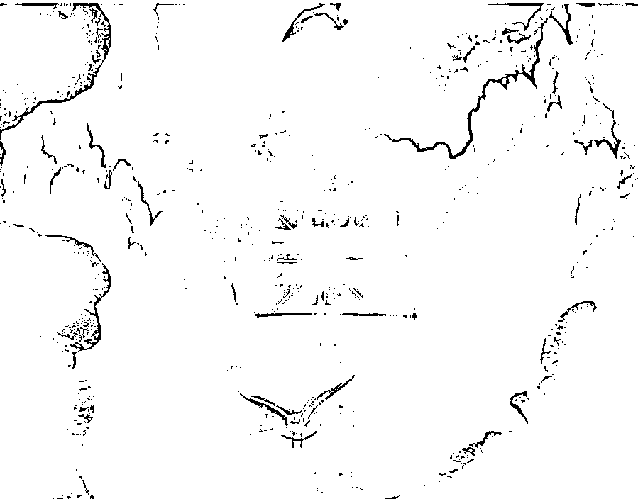

很多土堆，土堆下有个很深的洞，很像兵马俑的深坑，我把中间相连的阻碍的东西砸碎了，不让他们祸害人间。我在洞里朝天上看，看到有光透过洞口。光没有了，我看见一只大鸟在天上飞，那就是我，我飞出去了，那是另外一个我，有一部分在下面，有一部分在天上。下面的我在很深很深的深渊里，很难爬出来，我要去接近那个很高很高...，我看到我爬出来了，我要去接触那个很高很高的那个高处的我，飞在天上的我是大我，我很想靠近她，可是，刚才觉得挺难的，现在，我终于看到我的大我，在天上飞，她一直都很爱我。我从洞里爬出来了，看到一个阶梯一个阶梯，我在往上，我一个阶梯一个阶梯地在往上走，一会儿会被那一层吸到下面去被压住，但是很快还是会回来会出来，我看到天上有阳光还有我的大我在飞翔在引领我，她每时每刻都没有忘记我，感觉有一根很细很细的线栓在她的脚上，跟我连得很紧，我是时时刻刻被爱的。我在接近她的路上，阶梯往上越走越窄，像一个圆锥，最上面是尖的，但是它是阶梯式往上的，每往上走有可能会被阶梯那层吸进去，但是那根线永远都会把我拉出来。（其间不少情绪释放。）

催眠师：

你被吸进去过吗？

个案：会，很正常，一点都不用大惊小怪，因为自己的贪念、想玩，想玩就回不了家。但是大我希望自己回家，所以想尽办法把自己牵拉扯，扯出来，我觉得我感受到爱了。

**潜意识问答节选**

催：可是她之前一直觉得跟高我连接不紧密。

潜：她有时候会感受到我们，我们也会收到她的信息和爱。但是信号不稳定不强，现在好多了，会好很多。

催：就像你们在画面里给她看到的，鸟在飞、线一直都在。

潜：对，这是我们给到她的指引，她跟我们是没有分离的，她的分离感一直都挺重的。你也是，你们都是，这些画面也是给到你们的，你们大家都适用，每个人都是，这个信息你可以分享到量催大群，让他们所有人都看到。

催：什么信息？

潜：就是我们幻化作一只鸟，牵引着你们的小我。其实那也是我们的一部分，我们永远都不会把你们丢掉的，我们永远都爱你们，非常非常爱，我的孩子们。我们永远都不会放弃你们。你必须把这个信息带到他们。

催：你们出于什么这样建议呢？

潜：我们希望帮到很多人，让更多的人受益，这是我们一直在做的。

催：她就是觉得活着没意思，活着的意义到底是什么？

潜：这些问题现在都不存在了，因为今天给到她的画面，她永远都有我们带领着。她不会错失任何东西，她不会遗失任何东西，她就是活在爱里面的，一直都很爱。

催：那人生中发生的所有的不如意这些也都是爱吗？

潜：那些都是爱的驱动，是爱驱动她去扮演那些角色，她必须经历这一切，她才能够去理解世界上的所有人，所有她想要、和愿意、和能够帮助和扶持的那群人，她要去影响他们，帮助他们，她要经历这样一个剧本她才能够去感同身受，就像你对她的感同身受那是一样一样的，你们也是相互的。

催：爱自己方面在哪里还可以再改进一下呢？

潜：她可以跟你们多点交流沟通，这方面她封闭了一些，我们给她的这一打击让她收回了一些能量，缩回去了一些，现在慢慢在打开了。这次**之行对她帮助很大，可以说非常大，她在这里丢掉的能量会重新捡回去，并且变得更加的强大。

催：刚才你说她必须学习才能进步？

潜：这是我们想要的，不是你们想要的，你们是不会这么做的。

催：这是不是一个圈套呢？所谓的课题这些的。我们必须要学习完成使命，过这样的一生又一生。

潜：没有什么是圈套，圈套也是你们自己想出来的。你觉得它是圈套它就是圈套，是你对你自己的人生开始在认输了，就找个借口，给它套个名字、套个圈。你觉得那是你想要的，但其实不是，你只是给它画了个圈（个案小我出来说道：“我完全不明白我在讲什么。”哈哈）

催：她想知道她今生的人生目的，功课是什么？你可以告诉她吗？

潜：好好过日子，和爸爸妈妈爷爷奶奶（小我蹦出来说我爷爷奶奶已经去世了好不好，笑说小我开始质疑了）。

催：好好过日子？

潜：是的，和所有爱她的人和她爱的人，到哪里都好好过日子，爱自己爱别人，然后自然而然就会影响一大批人，那是一件非常自然的事情。

催：对于不信任、缺乏安全感，你有什么要对我们说的吗？

潜：你们都是从源头分离下来的，你们都是源头妈妈的孩子，当你们把自己的心完完全全向这个世界打开和敞开的时候，那些所有的爱都会进来，涌遍你的全身和整个生命，她们会溢出来，就像太阳光一样会照耀到更多的人。

催眠后的变化

> 这次催眠对我的成长历程不可谓不是一次非常重大的转折性突破，我的人生自此踏上了完全崭新乃至始料未及的轨迹。
> 
> 我是 15 年 1 月份学的催眠，最初学习目的是为解决个人问题，可以同学互催互相帮助，不用花许多钱去上课及做个案疗愈自己。但是后面的情况是，除了催别人很积极催了不少，自己也被催了十几次，虽然生活也在慢慢有所好转和改变，但是基本从不听催眠录音，也根本不相信潜意识，甚至老和潜意识说的唱反调，潜意识经常骂我“这个死丫头”，哈哈。
> 
> 然后对应到现实就是，我一次次的摔坑一次次的撞南墙，种种波折不顺痛苦受挫，自己没有觉知，不知道为什么，我开始不相信量子催眠更不相信潜意识，其间也尝试各种别的疗愈方法试图得到解脱，也有改善和进步。但虽然不相信量子催眠和潜意识，这次还是又因缘际会连续被催两次，催眠之前我又掉进一个人生无望的冰窟窿，万法尝遍心如死灰的感觉，之前所有努力全部前功尽弃命将休矣的感觉。结果这次第二轮催眠，潜意识给我展示的这幅画面，彻底把我从困局里解脱出来（当然催眠之前朋友们对我的各种帮助也是促成后来一切的重要因素），催完眠以后回去，我的生活渐渐开始一路绿灯至今，各种前所未有心想事成，各种因缘际会的美好连接相继发生。我变得史无前例的信任和顺流，变得更柔软有爱，除了这个，更重要的，我从从前的畏畏缩缩诸多恐惧顾虑，变成现在的勇敢无畏敢说敢做敢为敢当，并且渐渐明了并坚定实践内心真正想走的路要做的事，好一副坚韧不拔一往无前的样子。几乎见过我的所有人都说我像换了一个人。
> 
> 然后我还渐渐发现，原来和许多人一样，在我的生活里面，我原先没意识到的，其实处处充斥了被指引、帮助、保护和善待的痕迹。
> 
> 我发现每当我到一个人生的重要关卡以为自己挺不过去了不知道该怎么办了，就有天使朋友及绝处逢生的机缘冒出来拖我，拉我，推我，引我。
> 
> 最切近和实际的，我接触了好几个平台，都是差点加入，或者入职后种种原因辞职出来，结果后来一一发现，只要是我差点没进去和辞职出来的至少 3 个平台，全都无一例外关门倒闭，而我因缘际会进入投入的平台倒是红红火火大势所趋且合法合规几无风险。得知这些的时候我只有感动。而除了这些还有很多，此处无法一一列举。
> 
> 还有一点就是，我从小手脚甚至包括身上也有严重的冻疮，到了冬天就生不如死，去年冬天整个冬天居然没有复发了，不管是我体质增强还是更懂得爱护自己了的原因所致，这是几乎第一次的冬天奇迹，必须记录分享一下。
> 
> 我没有办法用语言形容我的感恩，现在的我，就是活在这样感恩的状态里，有烦恼可以很快转化，对未来没有恐惧，对现实多有满足，只想尽自己最大的努力，照顾好自己的同时，去服务和帮助更多人，把我所得到的一切，贡献和回流给这个世界，去做我能做的一切，就是这样，也非常感恩能够看完我文字的所有小伙伴，感恩你们，祝福你们。

*文：量子催眠师知秋*

*预约量子催眠请加微信号：zhiqiu2008*

* 图：网络*

* * *

花一些时间在我们的官方网络平台（微信公众号：QHHTChina）上了解更多关于我们提供的信息，或者与我们联系进行有关咨询。

想要更多的了解催眠和前世回溯吗？有兴趣学习如何成为一名专业的催眠操作者吗？

我们可以为你实现。

**课程咨询及个案咨询服务二维码**

 花一些时间在公众号上了解更多关于我们提供的课程：

[【线上·网络】量子催眠一阶段课程介绍](http://mp.weixin.qq.com/s?__biz=MjM5NjExMTczNA==&mid=2647621628&idx=1&sn=362734b6f9677d41810f46793db552fe&chksm=bed5ebe589a262f38aeee298496c88b3f58bdd327e9c595259fd2f64ca22876aa29c0f1df337&scene=21#wechat_redirect)

或者与你附近的前世回溯操作者联系。

[量子催眠个案全国预约！](http://mp.weixin.qq.com/s?__biz=MjM5NjExMTczNA==&mid=2647620840&idx=1&sn=95dc1c41580e9f9c19d1426946ba005b&chksm=bed5e8f189a261e7950d67dc111870a8859b63aef5f589db5ac4f3c284e4142185b833644b90&scene=21#wechat_redirect)

**这里不是要说服你去接受那些你还没有准备好去接受的观念，也不是劝说你去放弃那些你还没有准备好要放弃的，这里只是为你提供一个探索的平台，帮助你理解朵洛莉丝.侃南量子催眠疗法的原理和为什么治疗的结果是可能的。**

相关文章链接：

量子催眠是什么↓↓↓

[朵洛莉丝·侃南的量子疗愈催眠技术(QHHT®)](http://mp.weixin.qq.com/s?__biz=MjM5NjExMTczNA==&mid=2647622241&idx=1&sn=4db479b517141a38ce4304b21cfc4ef7&chksm=bed5167889a29f6e8b343714879cccd668daca13e1430542e55ee47e02d03709a34793f75a69&scene=21#wechat_redirect)

[如何使用量子催眠来发现你的前世](http://mp.weixin.qq.com/s?__biz=MjM5NjExMTczNA==&mid=2647622208&idx=1&sn=751c7bc617279d1079936ee43d48e577&chksm=bed5165989a29f4feeb9e88b59b29c361d6b745f86e533b502ce4093670963a02a19e57dcfeb&scene=21#wechat_redirect)


**所有的生命都在学习，**

**地球能否顺利进化。**

**朵洛莉丝说：**

**“全宇宙都在看。”**

# [案例分享]恐惧，是因为害怕失去爱

> 原文：[`mp.weixin.qq.com/s?__biz=MzU0NjkzMDY0OA==&mid=2247485638&idx=1&sn=3c7903f3c239276f5dd52682f87dc6f5&chksm=fb576271cc20eb679b6f7f314702ce9484b5f0aab4fbe4c35b6d3afb0ec9bd4af496cdb6d3ee&scene=126&sessionid=1690980931#rd`](http://mp.weixin.qq.com/s?__biz=MzU0NjkzMDY0OA==&mid=2247485638&idx=1&sn=3c7903f3c239276f5dd52682f87dc6f5&chksm=fb576271cc20eb679b6f7f314702ce9484b5f0aab4fbe4c35b6d3afb0ec9bd4af496cdb6d3ee&scene=126&sessionid=1690980931#rd)

*考虑到个案的个人隐私，下文中提到的个案姓名，以及其它描述个人资料的部分，将会进行部分或全部的变更，与本文主题无关的催眠内容也会做适当的整合以及精炼，尽请谅解。*

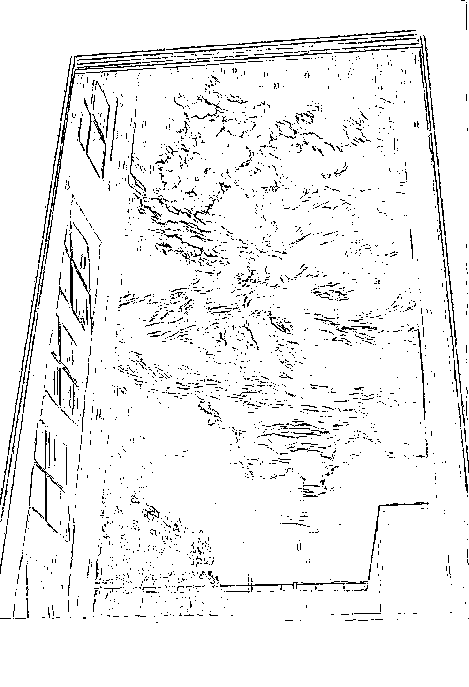

**前言**

* * *

**“** 以下案例来自于两位不同的个案潜意识，对于直面恐惧，穿越恐惧，以及找寻恐惧背后原因的分享。有些人因为害怕死亡而恐惧，有些因为害怕失去，有些因为害怕未知。在现实生活中许多人的内心也有同样的恐惧，所以我想要通过分享这篇与潜意识之间的对话来表达，恐惧并不可怕，恐惧是用来面对和穿越的。一切的恐惧，当你有勇气面对它的时候，它永远不像你想象中的那般可怕和张牙舞爪。当你带着爱和接纳的心拥抱它的时候，你会发现，原来的那些恐惧，早已被理解，被释怀，被放下了。 **”**

**潜意识部分---面对未知的恐惧**

* * *

催：催眠师

潜：潜意识

个：个案

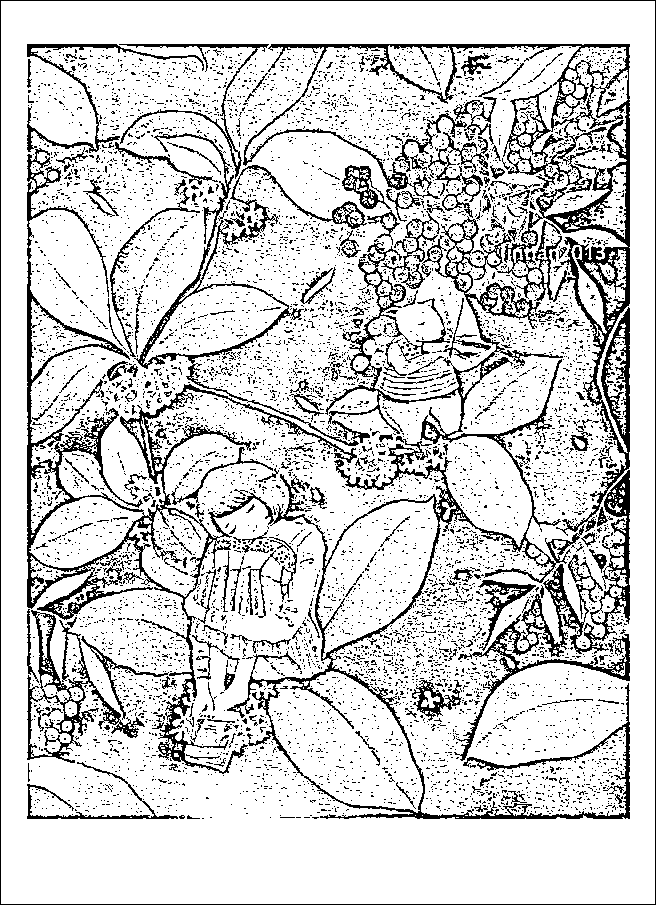

个案在一个人的时候，总会害怕，晚上虽然很想要闭眼睡觉，但总觉得闭上眼睛会有异常的现象发生，所以总是不敢闭眼，直到实在困得撑不住了才真的睡着。事实上，每次睡觉并没有什么异常发生，自己一直疑神疑鬼，她不知道为什么会这样。在家里的时候老是想要检查门窗是否关好，有时候会检查个四五次。

在前世回溯的过程中，她看见自己被关在一个小黑屋里。起初回溯的时候，她并不敢去探索那个地方，之后在潜意识的陪伴之下鼓起了勇气。她发现，原来自己的恐惧，源自于前世的记忆，以及害怕面对黑暗中不可控的未知和孤独。

催：为什么她会感觉到身体紧张呢？

潜：害怕吧。

催：她在害怕什么呢？

潜：她害怕一个人，她害怕黑暗。

催：为什么呢？

潜：因为她很孤独，黑暗也会让她孤独，黑暗会让她想到一些恐怖的事情，但实际上并没有，她会紧张，所以她的肌肉随时保持僵硬状态，随时保持战斗的状态。

催：这和我们看到的前世有什么关系吗？

潜：她的前世是孤独的。终于找到一个妻子，但是她的妻子并不了解她，还有一个穿黑衣服的小人好像在嘲笑她一样。那个小人长的很让人害怕。

催：为什么那个小人要嘲笑她呢？

潜：嘲笑她连最基本的事情也做不好，嘲笑她身边没有理解自己的人。同时这个小人的长像让她觉得恐怖，黑暗。

催：这种恐惧，是恐惧自己不被别人理解吗？

个：不是，是恐惧有一个黑房子。我不知道为什么这个房子打不开，我也不知道自己为什么不去踢一下，想办法把房子打开走出去。反正就是感觉像是被别人下了魔咒一样，就在那个房子里面。

催：刚才潜意识也让她看到了这个房子，这想要告诉她什么呢？

个：黑暗，孤独。这个房子害怕得我都不敢哭泣，我要时刻保持紧张状态，我要时刻保持备战状态，万一出现什么情况我好面对。所以我晚上睡不着觉，所以我的肌肉紧绷，我紧张，我害怕，我害怕自己一休息就会出现不可控的状况，我不知道怎么走出去。现在就是我，不是潜意识，我希望潜意识帮我走出去。

催：为什么潜意识要让她看这个画面呢？

潜：这是她之前出现的画面，她之前不知道是自己想象还是前几世出现过这样的画面，也不知道是谁把她关在那个屋子里。

催：在那个屋里她有什么感觉呢？

潜：恐惧。

催：恐惧什么呢？

潜：她想要走出去，她想要看到光明的地方。在这个屋子里，她的后面有一张床，到处都是黑的，有一点点灯光在外面，窗户外面有一点点灯光，灯光很昏暗，很暗很小。

催：那个灯光是从什么地方透出来的呢？

潜：就是外面的灯，应该是一九三几年或者四几年的样子，也有灯但是都是那种小灯泡，很暗的挂在外面。

催：她是通过窗子看到外面的吗？

潜：对，一个木的窗户，纸糊在上面。

催：窗子在什么位置呢？

潜：窗子在右边，进门的左边，床的右边。她背对着床，她的右前方是门，她的右边是窗户。外面能看到微弱的灯光，她的后面是床，她的左边好像是墙，不是很光滑的墙，上面好像挂着衣服，墙上是凹凸不平的木头的墙面，很黑，不知道是刷得很黑的油漆还是被熏黑的，反正整个墙面都是黑的。

催：挂着的衣服是什么样的呢？

潜：就老式的那种，大人穿的，她当时十多，二十岁吧。走出去看的话，好像她的隔壁，墙的另一面里，有她的爸爸妈妈在那儿，烤着火。他们很穷，烤着的是木头，坐在地面上，灯光很灰暗，但是还有电视机，很老的电视机。地板是石头的，那种很老的从外面捡回来的石头铺成的地，我不知道为什么要把我关在那儿。

催：那个时候她可以出来吗？

潜：她想出来，但是她害怕。门好像从外面锁住了。

催：那窗户可以开吗？

潜：她没有试过。

催：为什么呢？

潜：她恐惧周围的环境，她害怕去摸窗户的那一瞬间，后面会有东西碰她，或者是身边出现个什么东西吓她。她只能在最中间的位置，不停的打圈，不停的眼睛睁着，四处张望，她害怕出现一些东西，她是被吓成那个样子的。

催：为什么会被吓成那样呢？真的有什么在吓她吗？

潜：没有，都是她自己想象出来的。黑暗让她恐惧，让她胡思乱想。

催：她在恐惧黑暗里的什么呢？

潜：黑暗里面都是她不知道的，不可控的东西。

催：对于不可控，她害怕吗？

潜：害怕。因为不了解，她不了解这个屋里到底有什么，所以她害怕。加上屋子里面没有灯，外面是昏暗的灯光，她不知道会发生什么，所以她不停的在那儿转圈，不让自己休息，连去把窗户打开的勇气都没有。

催：她好像时刻都在绷紧自己，准备战斗，准备面对那些她不可控的东西。

潜：对。

催：潜意识给她看这样的画面，想要告诉她什么呢？

潜：她可能经历过这样的场景，深深的烙印在她的心里，所以这一世，她的某些行为会反射出她前世曾经经历过的场景。会有所反射，所以她害怕。她现在只要有人陪在她身边，就不会那么恐惧。

催：她就不需要再回到一个人在屋子里的感觉了。

潜：对。

催：那她今生还有必要这么害怕吗？

潜：她可以调节自己的，她没有必要这么害怕，我想让她试着把那个窗户打开。

催：打开窗户之后，她会怎样呢？

潜：她会叫出来的。她憋了好久好久，她不敢叫，因为她一直在观察，有什么可以真正的让她从心里释怀，但是没有。她心里太压抑了。

催：她要如何释放这些压抑呢？

潜：她需要鼓起勇气，鼓起勇气发泄出来，鼓起勇气把那扇窗推开。

催：当她推开了那扇窗，会是什么样的感觉呢？

潜：推开之后她就爬出去了，爬出去之后，她就会跑到爸爸妈妈身边，告诉他们，她害怕，以后不要再把她关在小黑屋里了。

催：当她跑出去的时候就可以找到和她交流的人，也能向别人表达自己的感受了。

潜：她跑出去就好了，跑出去之后她的爸爸妈妈就会知道，他们不该这样做。她们应该让她见到光明，不应该把她关在小黑屋里。

催：对于现在的她来讲，这一幕想要告诉她什么呢？

潜：她要去沟通，她要把她心结产生的原因和她最亲的人沟通，但是她长大了，她更多的是自己去释怀了，她没有回过头去追究。

催：现实生活中，她还是把自己的感觉压抑起来了吗？

潜：会的，因为现在她觉得社会很乱，很多时候不能把真实的自己表现出来。

催：她要如何把压抑的感觉释放出来呢？

潜：她和她的男朋友在一起就好了，就不会去胡思乱想。她什么都可以做，不用去顾虑什么。她男朋友也会关心保护她。

催：既然现在她已经知道小黑屋真正的样子，那她还会害怕吗？

潜：应该不会了，她会安一盏灯在那边。

催：因为她知道，当她想要出去的时候，随时可以出去。

潜：对。

催：那现在她知道了这些之后，身体会有什么不同吗？

潜：她会学着放松，这一世就应该过好这一世，不应该背负前一世的东西，来折磨这一世的自己。

催：对，那些都是上一世的，和她这一世没有关系，她不需要去背负之前的东西。那上一世在小黑屋中她会恐惧失去控制的感觉，这会对现在的她有影响吗？ 

潜：现在好多了，她其实看得到，包括她到小黑屋，她知道她出去就好了。她现在也是，如果这个环境把她逼得不能呼吸，她跳出去看就好了，她自己知道的。

催：太好了，既然她知道跳出去看的方法，她也不用再背负上一世的东西了，她可以释放掉了。

潜：是的。

**潜意识部分---面对失去的恐惧，面对死亡**

* * *

催：催眠师

潜：潜意识

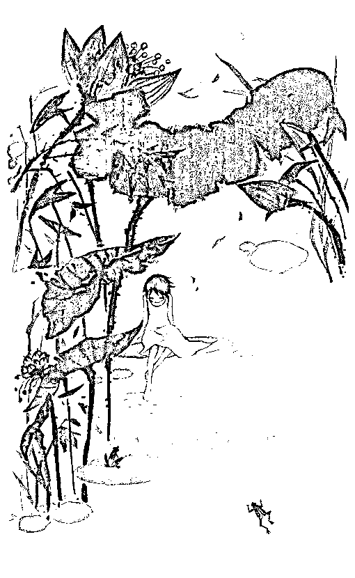

个案在生活中总感觉自己不断的在吸引着伤害，许多事情明明不是自己的错，但总有人会把责任推卸到自己的身上，总是被冤枉或者被误解，不知道为什么。同时对于失去也有很深的恐惧，害怕死亡。

在前世回溯的过程中，她看见自己是一个老人，在探望儿子的途中，发现孙子溺死在小河边。潜意识告诉她，她之前不断的吸引伤害是因为对于孙子死亡的内疚，她希望通过伤害自己来赎罪，获得内心的平衡。而她对于失去和死亡的恐惧，也源自于这段前世的记忆。

催：为什么潜意识要给她看孙子溺死在水里的画面呢？

潜：学会面对。

催：面对什么呢？

潜：她不太敢面对失去，死亡她也有恐惧的，不敢看，很抗拒。就像催眠，她也挺抗拒的，她抗拒就进不来。

催：她在抗拒一些什么呢？

潜：她在抗拒一些她觉得不能接受的东西吧。

催：哪些东西是她不能接受的呢？

潜：死亡啊、分离，这些都不能接受，心里面还没有完全的接受。有时候脑子里也会乱想。

催：为什么她会对死亡和分离这么抗拒呢？有什么原因吗？

潜：过去的经验，之前没有走出来，现在就心里恐惧。

催：过去的经验是指前世，还是现世呢？

潜：其实都有。今生小时候也有几次濒临死亡的体验，虽然她觉得自己不记得，但是她潜意识里都知道，就很恐惧这些，所以她的童年都是在做噩梦当中度过的。

催：对于一个孩子来讲，这很不容易啊，为什么她要让自己遭遇这些呢？

潜：她自己选择去体验的，她想穿越。

催：她想要穿越这种恐惧吗？

潜：嗯。

催：她要如何穿越这种恐惧呢？

潜：她其实能够意识到，人是死不了的，我们是永存的，就没关系。

催：她最近在做梦的时候，老是梦到被追杀啊，或者逃亡啊这样的画面，为什么会做这些梦呢？

潜：这些是她内心恐惧的投射，她在梦中把这些投射出来，去释放压抑的情绪，这些在她的生命能量当中，恐惧的能量太强了，压抑的太厉害了。她越抗拒这些，就越赋予它们力量，就越难穿越。

催：她要如何面对这些恐惧的能量呢？

潜：该发生的已经发生了，其实接受自己的恐惧，一切都没有关系的。

催：为什么她想要学习穿越恐惧呢？

潜：因为她前世没有能够成功去穿越，所以灵魂的记忆就带着这个课题。

催：前世发生了什么事情呢？

潜：被暗杀。

催：这和她的梦有什么样的联系吗？

潜：对，这些经验在她的梦里不停的环绕，从小到大。

催：所以今生穿越恐惧是她的课题是吗？

潜：她会克服的。

催：她要怎么做呢？

潜：她可以练习如何宽恕。

催：恐惧和宽恕之间，有什么样的联系呢？

潜：恐惧是因为害怕，她把这些都当真了，其实那些都源自于爱，她在心底里渴望爱，害怕失去。就像她前世看到的那个小孩一样，她害怕失去，所以她恐惧会失去，太执着了。她要去想，这个孩子落水和她没有关系，但她可能会往自己身上揽，会负起内疚的责任，觉得是自己没有看护好，这和她都没有关系，她要学会放下。

催：对，这根本不是她的责任，她看到的时候孩子已经死了。

潜：对，她只要去学习宽恕就好了，我也会告诉她我的想法，就像今天上午的时候，也在提点她很多东西，会在边上慢慢教她的，让她不要担心。

催：她最近比较容易的能接受到你的信息了，是吗？

潜：对，一直在打耳边风啊。

催：潜意识照顾我们，真是不辞辛劳，一直在我们耳边不停的和我们说话，同时又充满着爱。

潜：嗯，她没有听啊，有很多时候小我一直跳出来，给她找各种借口，各种理由。听就好了。

催：我们每个人都有小我，总会在潜意识告诉我们一些事情的时候跳出来，为什么会有这样的模式呢？

潜：小我比较顽固，自己又不够坚定，要不断的练习，练习的时间长了，成为一种行为模式，就可以攻克了。

催：当小我来的时候，她要如何更好的攻克这个问题，更好的与你连接呢？

潜：她要把自己抽离出来，识别这些幻象，然后知道这一切都是为她而来的，她就能够更好的去处理了。

催：对于抽离出来，她能领悟吗？

潜：可以抽身抽出来就好了。

催：这样就有更好的视野可以看清她现在的状况了吗？

潜：对，一个状况发生的时候，你要意识到这不是真正的你，不是你的想法，然后你意识到这一点了，你其实就在旁观者的角度了。

催：为什么她总感觉自己会吸引伤害她的事情呢？

潜：自己信念的投射。

催：那是什么样的信念呢？

潜：内疚的信念，投射伤害。

催：为什么要内疚呢？

潜：以前压抑在潜意识里的东西，通过伤害来满足平衡。其实没必要的。

催：她要如何转换这种信念呢？

潜：宽恕自己吧，别对自己的要求太高了。

催：如果她触发了内疚，或者又回到了内疚触发伤害的模式，潜意识有什么样的方法来提醒她呢？

潜：慢慢多觉察，觉察她现在做的还挺好的，觉察到，然后宽恕自己就好了。

催：潜意识还有什么特别的话想告诉她吗？

潜：好好的爱自己吧，不要把内疚投射到自己身上，该发生的总会发生的，个人有个人的剧本，不是因为你而发生这件事情的，和你没有关系。

催：当她内疚的时候，更深一层的含义是什么呢？

潜：她内疚了，就会想要获得惩罚，那她就会吸引伤害自己的事情，被伤害了，她才会觉得获得平衡。但其实这内疚本身就是不正确的，可以避免的。

催：为什么一个人要内疚呢？

潜：小我的投射。

催：小我投射内疚有什么用呢？

潜：错误的归因，让你走不出来。你本来就是光和爱，当你觉得小我给你展现的那些戏码都是真的，你觉得你杀害了别人，那你就会希望通过内疚让别人伤害你来获得平衡，实际上这些戏码和你没有关系。

催：我们真的能伤害别人吗？

潜：伤害不了任何人。

催：为什么人们会感觉到自己被伤害呢？

潜：相互的投射，他有情绪投射出来。互相两个人打了一架可能都觉得被伤害了，这样就引起了纠缠，纠缠以后互相要么仇恨要么内疚，这个情绪压抑到潜意识再投射出去，到时候谁都理不清到底是什么情况，见到同样的状况又投射出去。所以要学会宽恕自己，宽恕他人。

催：为什么人会感觉到恐惧呢？

潜：恐惧也是爱的表达，害怕失去这些爱的东西，尤其有些人经验到生命当中意外的死亡或者失去自己最爱的人，往往会走不出来。

催：如果我们都是不死的，都是无法被伤害的话，那么这些也都是不存在的。

潜：对，它本来就不存在。

催：当她知道这些之后，穿越恐惧是不是会更简单一些呢？

潜：会好一些。但是，这种理论，知道和你深信之间还是有很大距离的。

催：所以我们才会在生活中体验这些吗？

潜：其实不用体验，多去练习，多觉察。小的事情觉察到恐惧就去释放，慢慢的恐惧的能量就会越来越稀薄，时间长了就好了。好好的对待自己该做的就去做，不要老拖着。我们都在你身后，随时都在的，有什么直接呼唤我们就好了。

**结语**

* * *

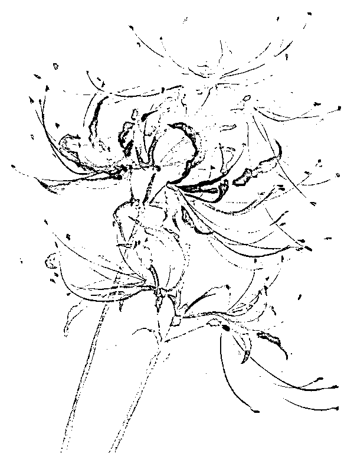

如果潜意识说，灵魂是永生不灭的，那么我们还会害怕死亡吗？

如果潜意识说，我们一直都是被关爱，被呵护着的。每个人都有每个人的人生剧本，即使那个人暂时与我们天人相隔，但是最终我们还是会相聚到一起，那么我们还会害怕失去吗？

如果潜意识说，我们的每一世都是体验，在每一次全新的体验中，我们都会领悟到那些尚未领悟的东西，那么我们还会害怕未知吗？

如果一切的恐惧，都是因为我们暂时的忘记了自己是永生不灭的灵魂，忘记了我们原本就来自于无条件的爱，那么当我们带着爱与接纳的心，拥抱内心的恐惧，恐惧还会存在吗？

**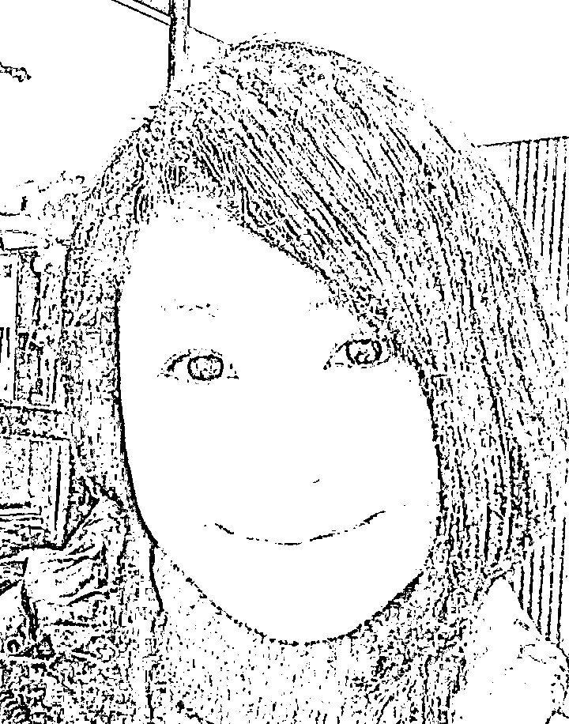**

***作者：量子催眠师 Jasmine ***

****催眠预约请加微信号：*judyspirit*** 

***坐标：上海***

* * *

花一些时间在我们的官方网络平台（微信公众号：QHHTChina）上了解更多关于我们提供的信息，或者与我们联系进行有关咨询。

想要更多的了解催眠和前世回溯吗？有兴趣学习如何成为一名专业的催眠操作者吗？

我们可以为你实现。

**课程咨询及个案咨询服务二维码**

了解更多关于我们提供的课程：

[【线上·网络】量子催眠一阶段课程介绍](http://mp.weixin.qq.com/s?__biz=MjM5NjExMTczNA==&mid=2647621628&idx=1&sn=362734b6f9677d41810f46793db552fe&chksm=bed5ebe589a262f38aeee298496c88b3f58bdd327e9c595259fd2f64ca22876aa29c0f1df337&scene=21#wechat_redirect)

或者与你附近的前世回溯操作者联系。

[量子催眠个案全国预约！](http://mp.weixin.qq.com/s?__biz=MjM5NjExMTczNA==&mid=2647620840&idx=1&sn=95dc1c41580e9f9c19d1426946ba005b&chksm=bed5e8f189a261e7950d67dc111870a8859b63aef5f589db5ac4f3c284e4142185b833644b90&scene=21#wechat_redirect)

**这里不是要说服你去接受那些你还没有准备好去接受的观念，也不是劝说你去放弃那些你还没有准备好要放弃的，这里只是为你提供一个探索的平台，帮助你理解朵洛莉丝.侃南量子催眠疗法的原理和为什么治疗的结果是可能的。**

相关文章链接：  

[朵洛莉丝·侃南的量子疗愈催眠技术(QHHT®)](http://mp.weixin.qq.com/s?__biz=MjM5NjExMTczNA==&mid=2647622241&idx=1&sn=4db479b517141a38ce4304b21cfc4ef7&chksm=bed5167889a29f6e8b343714879cccd668daca13e1430542e55ee47e02d03709a34793f75a69&scene=21#wechat_redirect)

[如何使用量子催眠来发现你的前世](http://mp.weixin.qq.com/s?__biz=MjM5NjExMTczNA==&mid=2647622208&idx=1&sn=751c7bc617279d1079936ee43d48e577&chksm=bed5165989a29f4feeb9e88b59b29c361d6b745f86e533b502ce4093670963a02a19e57dcfeb&scene=21#wechat_redirect)


**所有的生命都在学习，**

**地球能否顺利进化。**

**朵洛莉丝说：**

**“全宇宙都在看。”**

# 量子催眠中的脑波

> 原文：[`mp.weixin.qq.com/s?__biz=MzU0NjkzMDY0OA==&mid=2247485635&idx=1&sn=8718e860f645c13233aedefb7dbe027d&chksm=fb576274cc20eb620fae93e92f6ef4acadb1009f1e6be740de05198936d81d036cdf10783731&scene=126&sessionid=1690980936#rd`](http://mp.weixin.qq.com/s?__biz=MzU0NjkzMDY0OA==&mid=2247485635&idx=1&sn=8718e860f645c13233aedefb7dbe027d&chksm=fb576274cc20eb620fae93e92f6ef4acadb1009f1e6be740de05198936d81d036cdf10783731&scene=126&sessionid=1690980936#rd)

📹 [`v.qq.com/iframe/preview.html?vid=n1347ae7561&width=500&height=375&auto=0`](https://v.qq.com/iframe/preview.html?vid=n1347ae7561&width=500&height=375&auto=0)

*视频制作：二十二*

人类大脑的四种脑波，我们每日都在其中进进出出，每一种脑波，对应着我们的人类大脑活动状态，现在，就让我们一起了解一下

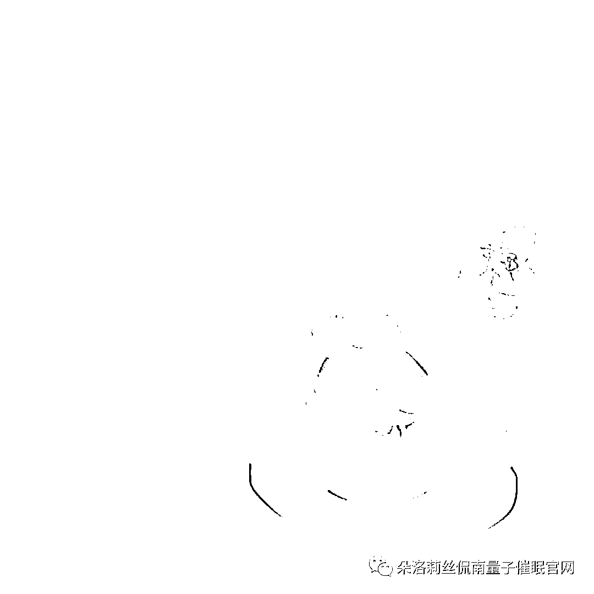

**α脑波**

* * *

这是当人们放松身心、沉思时的脑波。也许你不知道，我们每天大部分的时间就在这种脑波的状态下，比如，看电视，比如，开车，比如，走神在想某个事情，等等等等，这种在α脑波状态，相当于处在浅层的催眠状态，电视广告就是在这种脑波中让你记住某个商品的。现在开始流行开来的冥想也是处于这种脑波状态，冥想可以让你放松和带来身心健康的改善。小伙伴们，开始并坚持冥想吧！有没有发现，现在成功人士都在这么做！

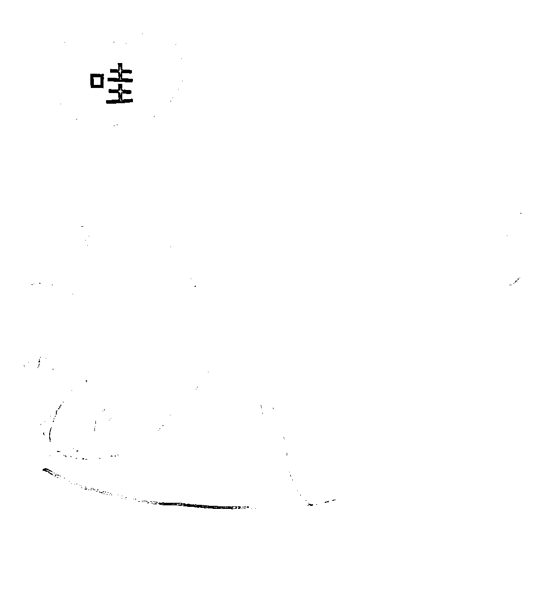

**β脑波**

* * *

是一种有意识的脑波，它以每秒钟 12~25 周波的频率运行着。

在β脑波状态，人是清醒的，有逻辑的，理性的。有意思的是，你在深层的梦中，或清明梦中也处于这种清醒的脑波状态。也许你的生活中，有部分时间在这种紧张思考的状态中，但，他们坚持和持续不了多久。做喜欢的事，会让你更专注，也会在这种状态中更有效率！

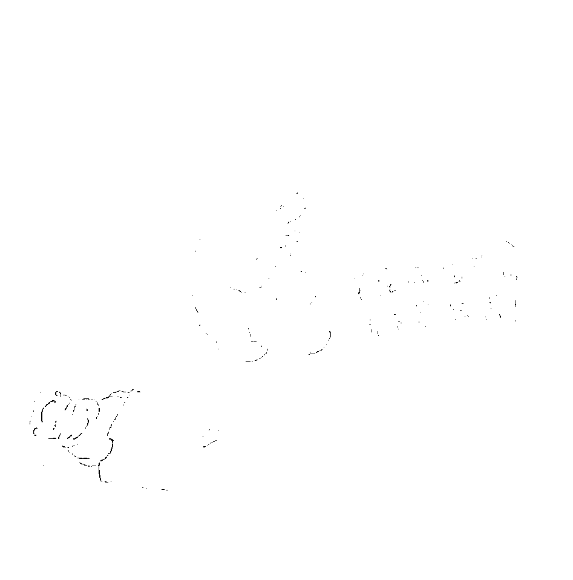

**θ脑波**

* * *

是人们沉于幻想或刚入眠和刚醒来时发出的脑波。这里有很多创造力的发生，还有一些奇思妙想，关键是你得记住这些点子，事实是，你常常会觉得：呀，我做了个梦，好像告诉我什么，可是我忘记了...

在θ脑波状态，相当于处在深层催眠状态，量子催眠就是在这个脑波状态中工作的。好的习惯是，睡觉时身边放着纸和笔，别懒！也许你白天的问题就在今早的梦中获得答案。也许你可以来预约一次量子催眠，在催眠师的协助下记录潜意识对你有益的忠告，体会一下这个过程是如何发生的。

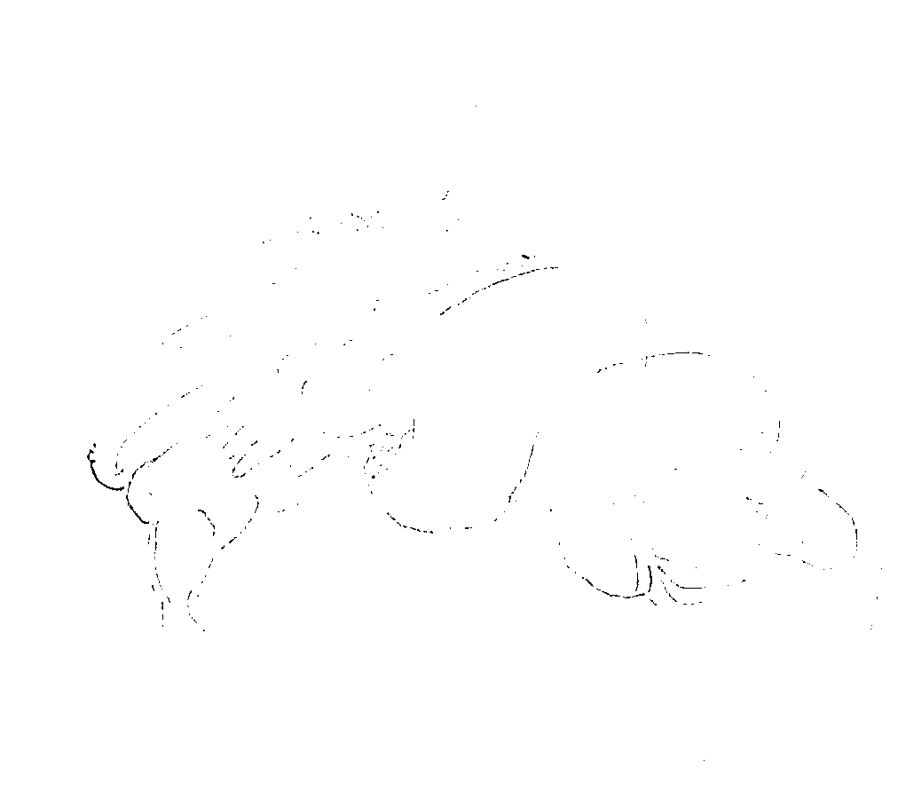

**δ脑波**

* * *

是人们沉睡无梦时发出的脑波，人体得到充分的休息。平日里养成早睡早起的好习惯，给身体这座灵魂的殿堂休养生息的机会，让健康的身体支持你享受美好生活。在δ脑波，可以说，催眠是无效的。所以，预约量子催眠事先要充分的休息好，睡着了好可惜。

随着科学的发展，我们对自身的认识越来越多，人们发现脑波还可以细分更多。但最重要的是，让我们顺应人体自然的规律，有效合理的使用它们。

*涂鸦：Vera*

*文：Vera 量子催眠师*

* * *

花一些时间在我们的官方网络平台（微信公众号：QHHTChina）上了解更多关于我们提供的信息，或者与我们联系进行有关咨询。

想要更多的了解催眠和前世回溯吗？有兴趣学习如何成为一名专业的催眠操作者吗？

我们可以为你实现。

**课程咨询及个案咨询服务二维码**

 花一些时间在公众号上了解更多关于我们提供的课程：

[【线上·网络】量子催眠一阶段课程介绍](http://mp.weixin.qq.com/s?__biz=MjM5NjExMTczNA==&mid=2647621628&idx=1&sn=362734b6f9677d41810f46793db552fe&chksm=bed5ebe589a262f38aeee298496c88b3f58bdd327e9c595259fd2f64ca22876aa29c0f1df337&scene=21#wechat_redirect)

或者与你附近的前世回溯操作者联系。

[量子催眠个案全国预约！](http://mp.weixin.qq.com/s?__biz=MjM5NjExMTczNA==&mid=2647620840&idx=1&sn=95dc1c41580e9f9c19d1426946ba005b&chksm=bed5e8f189a261e7950d67dc111870a8859b63aef5f589db5ac4f3c284e4142185b833644b90&scene=21#wechat_redirect)

**这里不是要说服你去接受那些你还没有准备好去接受的观念，也不是劝说你去放弃那些你还没有准备好要放弃的，这里只是为你提供一个探索的平台，帮助你理解朵洛莉丝.侃南量子催眠疗法的原理和为什么治疗的结果是可能的。**

相关文章链接：

量子催眠是什么↓↓↓

[朵洛莉丝·侃南的量子疗愈催眠技术(QHHT®)](http://mp.weixin.qq.com/s?__biz=MjM5NjExMTczNA==&mid=2647622241&idx=1&sn=4db479b517141a38ce4304b21cfc4ef7&chksm=bed5167889a29f6e8b343714879cccd668daca13e1430542e55ee47e02d03709a34793f75a69&scene=21#wechat_redirect)

[如何使用量子催眠来发现你的前世](http://mp.weixin.qq.com/s?__biz=MjM5NjExMTczNA==&mid=2647622208&idx=1&sn=751c7bc617279d1079936ee43d48e577&chksm=bed5165989a29f4feeb9e88b59b29c361d6b745f86e533b502ce4093670963a02a19e57dcfeb&scene=21#wechat_redirect)


**所有的生命都在学习，**

**地球能否顺利进化。**

**朵洛莉丝说：**

**“全宇宙都在看。”**

# 漫画•生命不息--《生死之间》节选

> 原文：[`mp.weixin.qq.com/s?__biz=MzU0NjkzMDY0OA==&mid=2247485621&idx=1&sn=46b445dfe231c474cb7b6a50680d476b&chksm=fb576202cc20eb14c2125fcaa1214b008ce60d513470df2e6a1c47d0fbec1684de82ad68db15&scene=126&sessionid=1690980936#rd`](http://mp.weixin.qq.com/s?__biz=MzU0NjkzMDY0OA==&mid=2247485621&idx=1&sn=46b445dfe231c474cb7b6a50680d476b&chksm=fb576202cc20eb14c2125fcaa1214b008ce60d513470df2e6a1c47d0fbec1684de82ad68db15&scene=126&sessionid=1690980936#rd)

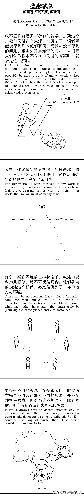

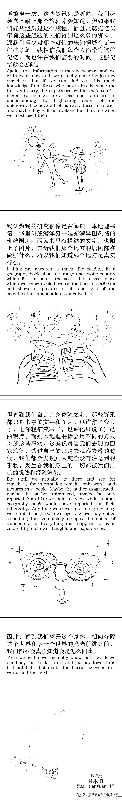

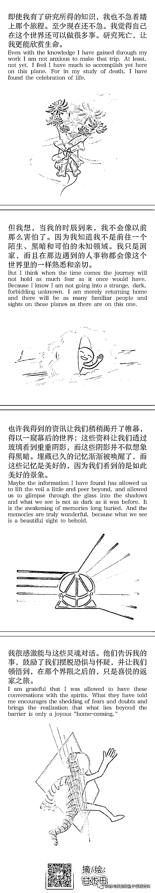

恐惧对成长来说也许是敌人，死亡对生命来说或许也是敌人。在无知中，一些人树敌无数，烦恼万千，甚至风声鹤唳草木皆兵，随着时间在各种说法念头的洗脑碾压中，活生生将好奇心丧失殆尽。但勇敢去直面这些会帮助我们活在当下，化敌为友。

现在再看二十五年前朵奶奶所著的《生死之间》当中她对死后世界的探索以及对自己那个时候到来的思考，耐人寻味。一个大活人，还是一位女性，以催眠的方式通过她的客户告知我们死后世界的现象和情况，这在当时真是先驱之举，闻所未闻。她以自己的好奇心点燃了读者的好奇心，以潜意识的智慧点燃了生命之火，令人恍然安心。她在催眠工作中睿智的提问，大胆的探索，对未知和恐惧的深刻洞见，更值得称赞的是她对人性全然的理解与温柔对待生命的态度，让我们一窥前人难以放心谈论或坦然面对的死后世界的冰山一角。

认识那个你可能一直敌视的未知，认识那个披着各色外衣的“敌人”，不管它是外在世界的一部分也好，还是人类内在的一部分也罢，它终将会告诉你，你是安全的。正如朵奶奶在四十多年的探索中总结道：“唯一的负面性是被缺乏全面了解的人提出的。”

死亡也是生命的一种开始。

* * *

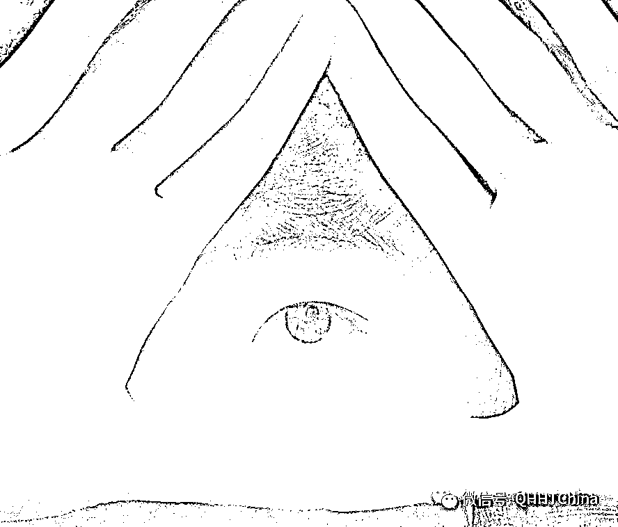

*作者：量子催眠师 甘木田*

*预约量子催眠 请加微信：tianyuan117*

*坐标：南京*

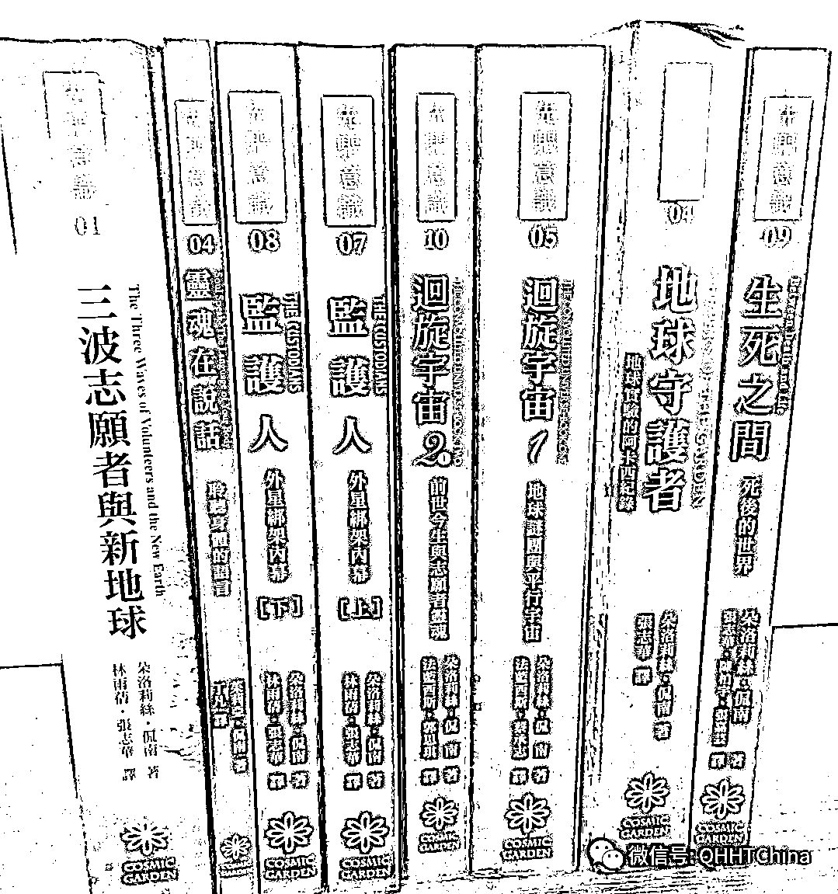

**朵奶奶的书♥探索的是 穿越时空的爱！**

              **可在公众号微店带它回家！**

**这里不是要说服你去接受那些你还没有准备好去接受的观念，也不是劝说你去放弃那些你还没有准备好要放弃的，这里只是为你提供一个探索的平台，帮助你理解朵洛莉丝老师量子催眠疗法的原理和为什么治疗的结果是可能的。**

相关文章链接：

[朵洛莉丝·侃南的量子疗愈催眠技术(QHHT®)](http://mp.weixin.qq.com/s?__biz=MjM5NjExMTczNA==&mid=2647622241&idx=1&sn=4db479b517141a38ce4304b21cfc4ef7&chksm=bed5167889a29f6e8b343714879cccd668daca13e1430542e55ee47e02d03709a34793f75a69&scene=21#wechat_redirect)


**所有的生命都在学习，**

**地球能否顺利进化。**

**朵洛莉丝说：**

**“全宇宙都在看。”**

# 去运行财富的能量转换

> 原文：[`mp.weixin.qq.com/s?__biz=MzU0NjkzMDY0OA==&mid=2247485431&idx=1&sn=d5c87f2caf0a4cf96692735c6dd717ef&chksm=fb576d40cc20e456cfa4381807df9278d236d84e94b1239137bd83a474e3f67a1072c212c5b6&scene=126&sessionid=1690980936#rd`](http://mp.weixin.qq.com/s?__biz=MzU0NjkzMDY0OA==&mid=2247485431&idx=1&sn=d5c87f2caf0a4cf96692735c6dd717ef&chksm=fb576d40cc20e456cfa4381807df9278d236d84e94b1239137bd83a474e3f67a1072c212c5b6&scene=126&sessionid=1690980936#rd)

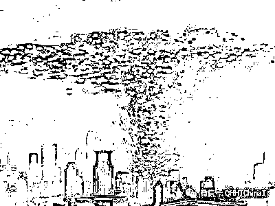

*编者按：*

*在量子催眠的前期准备中，来访者需列出自己要解决的问题清单。我们会发现，清单中常常会有这么一条：我的财富哪里出了问题或者我怎样更有钱呢？等等* 

*这些与财富、金钱相关的问题，*是现代人生活中面对的课题之一，你会发现似乎人人都想要的更多，无论他在生活中是怎样的物质状态。**

**对财富拥有良好的心态与健康的追求已经是现代人体验幸福感的一种迫切的要求了。**

*本文选自量子催眠师 Nora Li 有关财富话题的案例，内容去掉来访者隐私部分，**经本人同意与大家分享*

*个案 S 目前生活上遇到了*

*财务危机，同时照顾生病的*

*家人让他倍感力不从心。*

*我们通过催眠帮他认清造成*

*现状的真实原因。在催眠*

*过程中潜意识的很多真知灼见，*

*让我们感觉受益匪浅，*

*在此分享给大家。*

    个案进入链接潜意识（高我），高我回答了个案有关问题，关于财富，牠说

1“

其实 S 身后堆着一大堆的黄金。但他之前对金钱没有爱惜和尊重，太随性随意乱花钱，不把钱当回事。那现在财富就要让他尝尝不被当回事的滋味，他需要知道没钱的难。财富其实一直在那里，本来都给每人分配好了的。但他的习性是没有去尊重它。他从未体验过一分钱难倒英雄好汉。现在就让他体验一下“一分钱也是钱”的感受。这是他必须要体验的。

      他得学会把一分一厘都看到眼里，珍惜金钱。所有的财富都是一分一厘积累起来的。要修掉自己习性中对金钱的傲慢态度，与金钱成为朋友。他总觉得自己的面子比钱重要。死要面子活受罪。他还在磨心性的路上，本来有一堆钱等着他，只要他放下内心的傲慢。他需要学会的是臣服于自性。如果不臣服，很难焕发出慈悲。在他的习性中，“慢”是根源。如果他在本源里没有找到自性而臣服，他会一直散发出“我慢”，现实中就会呈现出各种碰壁。他虽然一直“我慢”，但也没能真潇洒得起来。他的灵体很有勇气，是个不撞南墙不回头的人。

”2“

在人性意识中，还有一些思想会阻碍财富能量的顺畅流动。比如算计。不停计算个人得失。其实金钱能量在宇宙中已经分布分配好了的。任何的合作、协作，已经像流水一样的自然平和了。但如果算计，人就会得到果报，即满足此人的得失心。能量就是这么运作的。一切唯心造。

      任何一种合作，当人本持着正念、正觉、正心的时候，本身在宇宙中有个平衡的像天枰一样的东西，都会给到人属于他的那部分能量。财富能量一直都在，人不要去阻碍它，自己不要陷入得失心里面。

      另外还有一些习气，比如小气，很怕花钱，觉得花一分少一分。但实际金钱能量是会周转、转换的。会有个平衡。出去了，还会回来。但并不是说一定要花钱大方，这需要个人自己去觉察。看自己在运用金钱的时候，是否尊重它，是否合理安排。

在任何时候，带着喜悦去与家人、朋友或客户，在回旋的空间中，去运行财富的能量转换，转换次数越多，金钱能量就越丰厚。如果越怕花钱，能量就像被上了一把锁，越锁越紧。

       贪念，也是会让金钱能量变得粘稠沉重的意识。全世界人人的财富能量都是丰盛的，但每个人要学会让它流动起来。再有，就是当人不相信自己会获得足够的财富，或者他本身就想体验贫穷，这都会阻碍财富能量的流动。

”3

催眠师事前经个案同意询问了关于自己的财富能量状况，以及卡点。

牠说：

“

患得患失。

表面上是不在意的，但你的内心深处还是会在意的。金钱能量的运作，不是让你放开。把放开，与‘放纵’、‘放弃’、‘放下’、‘放手’区分开。觉察得越细致，你对金钱的运用就会更合理。学会觉察、尊重、平和、释放和放手。放手不是让你放弃，它自动还会回来。不要人为的去设关卡。把意识打开。

记住，一切唯心造。

”

4

      潜意识的话让我茅塞顿开。在我接个案的过程中，不管有没有意识，关于资费的这个念头不经意就会冒出来。潜意识指点我，要在做这个事情的能量当中，让能量旋转起来。付出的，自然而然会回来的。宇宙平衡中，绝不会让我少拿一分，也不会让我多拿一分。

      要理解金钱能量的“舍”和“得”。我们的理解通常只是表面上的。金钱能量与要做的事情都是匹配的。但它是无形的，人容易患得患失，不够笃定和坚定。能量是恒定的，是一个频率振动。必须坚定同频才能共振。人、事、物上，都可以同等显现金钱能量，它们都是相关联的。付出多少，得到就是多少，不是仅仅的买卖关系，它是无处不在的，人事物都可以等同于金钱能量。

可但凡说到金钱，人们容易脑子里全是阿拉伯数字，哪怕是人事物，都会很快转换成数字，去做高低比较得失。要学会笃定，这个东西或者做的这个事，也代表金钱能量，它带着人的信息，带着能量，带着被期许的频率。要放心大胆的去让它们流动出去，金钱能量会通过在宇宙中的回转，走一圈，不断增加或减少，再回来，要相信！帮助别人也一样，付出的都会回来的。

5

       催眠师随后问到个案 S 要如此辛苦的照顾他的家人，是为了什么样的灵魂约定，以及这个体验中间牵涉了什么样的因果。

潜意识回答到：

学习爱。不是说你照顾了，你就会爱。爱里面有无穷无尽的能量和能力。这是一个能量系统。照顾不等于爱。爱像软件，要通过身体力行的体验，进入这个软件当中，才能感知这个爱，是个什么爱，找到爱的力量。连自己都不爱，怎么去爱别人呢？让爱的能量停留，住在自己身上。去体验。

       要珍惜前缘今世。这些灵魂关系是相互协作互助，又相互体验的。过去与现在的角色可能是相反的。要在体验当中找到自己内在的神。

在不同的空间和历史时间段，宇宙当中所有的一切都有成住坏空的轮回，像电脑设计的软件一样。地球 47 亿年的历史，所有事情都输入这个软件，该发生的就都要发生。不论演化还是进化，都在这个软件设计里。因果，是地球上的设计，宇宙中也有不运行这个软件的地方。因果是商量好的，是自己愿意体验的。宇宙源头作为一个观察者，给出不同的作业，ABCD，你愿意做哪个作业？自己选。

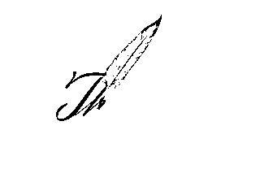

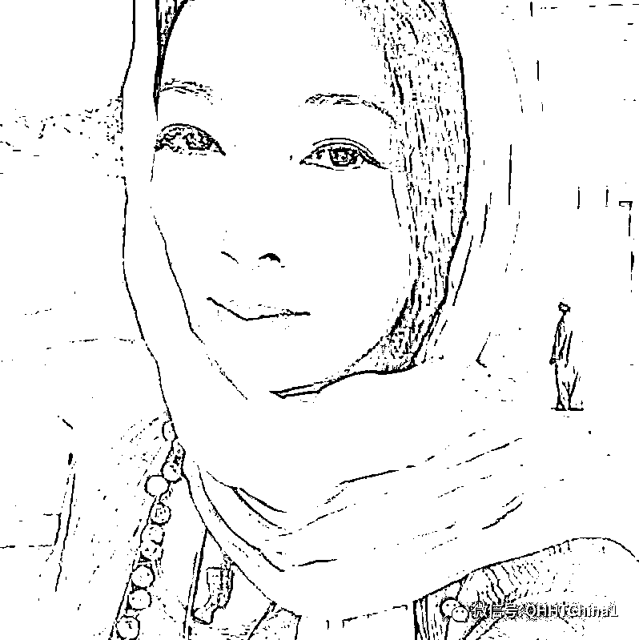

作者：Nora Li

量子催眠师 

个人微信号：wen198314 欢迎预约量子催眠

图：网络

* * *

花一些时间在我们的官方网络平台（微信公众号：QHHTChina）上了解更多关于我们提供的信息，或者与我们联系进行有关咨询。

想要更多的了解催眠和前世回溯吗？有兴趣学习如何成为一名专业的催眠操作者吗？

我们可以为你实现。

**课程咨询及个案咨询服务二维码**

 花一些时间在公众号上了解更多关于我们提供的课程：

[【线上·网络】量子催眠一阶段课程介绍](http://mp.weixin.qq.com/s?__biz=MjM5NjExMTczNA==&mid=2647621628&idx=1&sn=362734b6f9677d41810f46793db552fe&chksm=bed5ebe589a262f38aeee298496c88b3f58bdd327e9c595259fd2f64ca22876aa29c0f1df337&scene=21#wechat_redirect)

或者与你附近的前世回溯操作者联系。

[量子催眠个案全国预约！](http://mp.weixin.qq.com/s?__biz=MjM5NjExMTczNA==&mid=2647620840&idx=1&sn=95dc1c41580e9f9c19d1426946ba005b&chksm=bed5e8f189a261e7950d67dc111870a8859b63aef5f589db5ac4f3c284e4142185b833644b90&scene=21#wechat_redirect)

**这里不是要说服你去接受那些你还没有准备好去接受的观念，也不是劝说你去放弃那些你还没有准备好要放弃的，这里只是为你提供一个探索的平台，帮助你理解朵洛莉丝.侃南量子催眠疗法的原理和为什么治疗的结果是可能的。**

相关文章链接：

量子催眠是什么↓↓↓

[朵洛莉丝·侃南的量子疗愈催眠技术(QHHT®)](http://mp.weixin.qq.com/s?__biz=MjM5NjExMTczNA==&mid=2647622241&idx=1&sn=4db479b517141a38ce4304b21cfc4ef7&chksm=bed5167889a29f6e8b343714879cccd668daca13e1430542e55ee47e02d03709a34793f75a69&scene=21#wechat_redirect)

[如何使用量子催眠来发现你的前世](http://mp.weixin.qq.com/s?__biz=MjM5NjExMTczNA==&mid=2647622208&idx=1&sn=751c7bc617279d1079936ee43d48e577&chksm=bed5165989a29f4feeb9e88b59b29c361d6b745f86e533b502ce4093670963a02a19e57dcfeb&scene=21#wechat_redirect)


**所有的生命都在学习，**

**地球能否顺利进化。**

**朵洛莉丝说：**

**“全宇宙都在看。”**

# 与小我的对话

> 原文：[`mp.weixin.qq.com/s?__biz=MzU0NjkzMDY0OA==&mid=2247485432&idx=1&sn=fa6e8a6db0a01f89c03ed12fa7e59edc&chksm=fb576d4fcc20e4597eff8b8a9ce8249185412ab69c334e29ac94af61d75fef45631b16cccfe6&scene=126&sessionid=1690980936#rd`](http://mp.weixin.qq.com/s?__biz=MzU0NjkzMDY0OA==&mid=2247485432&idx=1&sn=fa6e8a6db0a01f89c03ed12fa7e59edc&chksm=fb576d4fcc20e4597eff8b8a9ce8249185412ab69c334e29ac94af61d75fef45631b16cccfe6&scene=126&sessionid=1690980936#rd)

*这是一次在 Youtobe 视频网站发布的与小我的对话~人类表层意识整合的理解~ 苏珊娜斯普纳的量子催眠案例*

📹 [`v.qq.com/iframe/preview.html?vid=r0754gpu46h&width=500&height=375&auto=0`](https://v.qq.com/iframe/preview.html?vid=r0754gpu46h&width=500&height=375&auto=0)

*视频翻译 冯子源*

*文章翻译 扬琴*

        大家好！我非常高兴花时间与个案一起探索他们无所不知的自己的那部分，那部分知道一切的答案，不仅能找到他们一切问题的根源，疾病原因甚至是好奇问题，还能治愈他们的身体。

        每一场催眠，我通过实践，学习以扩展我对于人类以及精神世界的知识，我喜欢说，我有一个前排座位通往想象力（这里苏珊娜戏称自己可以通过潜意识打开无限想象力）

        催眠师实践者通过 QHHT 量催这个技术，越深的引导个案的表层意识，越能够连接直觉，潜意识或者高我，刚开始学习这个技术的时候，我会跟个案强调，我们需要让小我/表层意识让路，会建议它要么去“角落画画，在大厅的外面或者坐在后排，反正不要在接管个案的更高智慧面前挡路”。

       最近几个月，我不得不说，我被我的小我融化了。在灵性的圈子，经常听到大家说让小我影响越来越小，或者杀死小我。我也听说过，有人说他们已经没有小我了或者正在追求那样的状态，如果说小我也是人类的一部分，难道我们不需要去理解它，整合我们自己的这部分吗？ 如果我们能跟小我和平共处，那么它将会成为我们一个很棒的合作者。

        所有事情都是可能的！

        最近我在给另外一位量催实践者做催眠，有趣的事情发生了 ，在我们催眠快要结束的时候，潜意识正在谈论她的身体健康跟小我的关系，我一时突发奇想，请求跟她小我对话，这在之前从来没有发生过。

        接下来发生的事情让人大开眼界，我们的打开心的对话持续了 20 分钟，她的小我解释说有多么喜欢保护她，就像保拉的各个部分中的一部分。最令人吃惊的是，它说了为何爱与尊重是所有品质当中最为重要的。

感谢保拉跟她丈夫允许使用她的真名在这次的记录以及博客当中，让我们有机会打开头脑跟心去理解我们的小我，我希望你喜欢我们的对话！

爱你们的苏珊娜

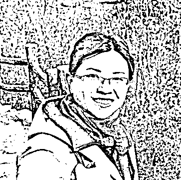

*视频翻译：量子催眠师冯子源 *

*预约量子催眠 请加微信号：*fengziyuan369**

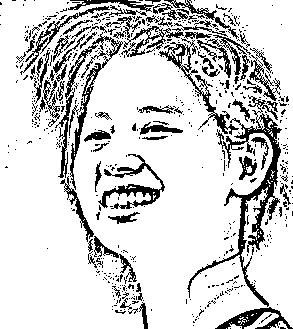

*文章翻译 量子催眠师杨琴*

*预约量子催眠 请加微信号：* *854464607*

*校对          Leo*

***本文来自美国量子催眠官网，内容是由******量**子催眠******[志愿者！翻译并整理的。如果想要加入志愿者的队伍，并帮助量子催眠中国引进更多优秀的催眠文章和案例，请和我们联系。我们欢迎大量的绘图、排版以及翻译的优秀人才加入到志愿者的团队中来。感谢你们为量子催眠中国所做的贡献。](http://mp.weixin.qq.com/s?__biz=MjM5NjExMTczNA==&mid=2647622134&idx=2&sn=d6664a1b50aa9f8766f2cb35693f4079&chksm=bed515ef89a29cf97956b25c4e8288c929928de24073b2d41b6a30fbbbde1f535223f5c0f349&scene=21#wechat_redirect)***

* * *

花一些时间在我们的官方网络平台（微信公众号：QHHTChina）上了解更多关于我们提供的信息，或者与我们联系进行有关咨询。

想要更多的了解催眠和前世回溯吗？有兴趣学习如何成为一名专业的催眠操作者吗？

我们可以为你实现。

**课程咨询及个案咨询服务二维码**

 花一些时间在公众号上了解更多关于我们提供的课程：

[【线上·网络】量子催眠一阶段课程介绍](http://mp.weixin.qq.com/s?__biz=MjM5NjExMTczNA==&mid=2647621628&idx=1&sn=362734b6f9677d41810f46793db552fe&chksm=bed5ebe589a262f38aeee298496c88b3f58bdd327e9c595259fd2f64ca22876aa29c0f1df337&scene=21#wechat_redirect)

或者与你附近的前世回溯操作者联系。

[量子催眠个案全国预约！](http://mp.weixin.qq.com/s?__biz=MjM5NjExMTczNA==&mid=2647620840&idx=1&sn=95dc1c41580e9f9c19d1426946ba005b&chksm=bed5e8f189a261e7950d67dc111870a8859b63aef5f589db5ac4f3c284e4142185b833644b90&scene=21#wechat_redirect)

**这里不是要说服你去接受那些你还没有准备好去接受的观念，也不是劝说你去放弃那些你还没有准备好要放弃的，这里只是为你提供一个探索的平台，帮助你理解朵洛莉丝.侃南量子催眠疗法的原理和为什么治疗的结果是可能的。**

相关文章链接：

量子催眠是什么↓↓↓

[朵洛莉丝·侃南的量子疗愈催眠技术(QHHT®)](http://mp.weixin.qq.com/s?__biz=MjM5NjExMTczNA==&mid=2647622241&idx=1&sn=4db479b517141a38ce4304b21cfc4ef7&chksm=bed5167889a29f6e8b343714879cccd668daca13e1430542e55ee47e02d03709a34793f75a69&scene=21#wechat_redirect)

[如何使用量子催眠来发现你的前世](http://mp.weixin.qq.com/s?__biz=MjM5NjExMTczNA==&mid=2647622208&idx=1&sn=751c7bc617279d1079936ee43d48e577&chksm=bed5165989a29f4feeb9e88b59b29c361d6b745f86e533b502ce4093670963a02a19e57dcfeb&scene=21#wechat_redirect)


**所有的生命都在学习，**

**地球能否顺利进化。**

**朵洛莉丝说：**

**“全宇宙都在看。”**

点击阅读原文了解英文信息


# 来自星星的孩子

> 原文：[`mp.weixin.qq.com/s?__biz=MzU0NjkzMDY0OA==&mid=2247485434&idx=1&sn=aa29a689888f70cae6d95813dce23d7f&chksm=fb576d4dcc20e45baaeeebbc9c430f02a4e535d3245a5e41c24cdb021447ef7131d13919ebe1&scene=126&sessionid=1690980936#rd`](http://mp.weixin.qq.com/s?__biz=MzU0NjkzMDY0OA==&mid=2247485434&idx=1&sn=aa29a689888f70cae6d95813dce23d7f&chksm=fb576d4dcc20e45baaeeebbc9c430f02a4e535d3245a5e41c24cdb021447ef7131d13919ebe1&scene=126&sessionid=1690980936#rd)

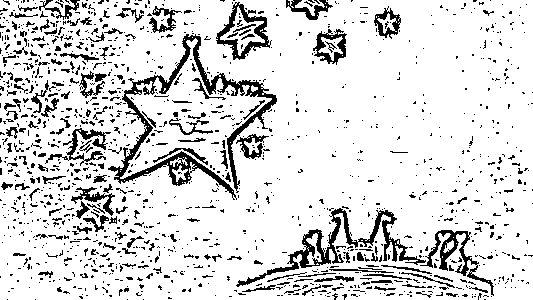

*量子催眠来访者分享的实录*

**来访者情况  **   

> 晓晓大大眼睛、弯弯上翘的嘴角、说话嗲嗲的娃娃音，看上去像刚刚大学毕业的女孩，实际已是 32 岁的宝妈。她想做催眠的初衷源于对生活中、工作中自我价值感的缺失以及对头脑中“各种纷乱无序的声音”理不清头绪的困扰。

> 晓晓催眠后整理了录音，写下了这次经历和感悟。

    **晓晓的分享**

      很久以前就开始关注量子催眠了，看了很多的案例。最开始被其中形形色色的前世画面吸引，后来被那个神奇的潜意识吸引。内心一直有个弱弱的声音告诉我，应该去做个催眠。我一直在观望一直在犹豫。就在某天和宝宝玩耍的瞬间，我突然坚定的想要去做催眠，我看着窗外，默默的在心里许愿说“给我一个在北京的量子催眠师吧，我要做一个催眠”。

       过了几天，就在微信朋友圈里看到了一个北京的量子催眠师的信息，我知道她来了。 我先加了她的微信公众号，好吧，她好懒，只有两篇文章。其中一篇就是在朋友圈里看到的那个，就是这篇文章，好像在召唤我去拿属于我的礼物......

       过程并不像心理咨询，就像是和一个睿智的朋友聊天。其实三言两语她就戳中了我的痛点。惯性的，我忍住不哭，尴尬的自嘲的笑笑。我们聊工作，聊曾经的感情，聊小时候。最开始我还用大笑来演示我的失落，我的受伤，当它们是个笑话，后来终于绷不住崩溃大哭。

       原来，我给自己设置了一个前提：我是不被爱的，不值得被爱的，不应该争取权利的。在这个前提下，我一面委曲自己，讨好别人，让自己生存下去，一面为自己的委屈愤愤不平。我不敢表达出我的需求，我默默的做了好多事，有时候近乎自虐式的承受，希望被看见。没有人看见，我就用离开来吸引关注。我不敢声张，因为我觉得我不应该争取权利。如果没有人关注我的离开，我就更加的失落，然后继续这个循环。**这个课题变着花样的在我的工作中、亲密关系中、社交中一遍一遍的出现**。我就这样编织了一个牢笼，紧紧的卡着我的灵魂。

        她说我们开始催眠吧 ， 然后我开始紧张，开始害怕。她安慰我说“如果你的课题是要经历恐惧，那么恐惧就会出现。潜意识很聪明，TA 会针对你**当前的卡点，让你看到相应的前世。无论看到什么，都是对你有帮助的。**”我慢慢放松下来，悄悄在心里对小我说“这次你就好好休息一下，在旁边看着，无论什么都不要出声”。

       在她的引导下，我开始觉得双手麻麻的，然后双眉之间的头疼，然后右边太阳穴一突一突的，然后喉咙堵的慌，我忍不住“啊——”的吼出来，然后就开始痛哭起来：

“我想回家.....”

“我不喜欢这个身体，她硬硬的像个木偶.......”

“她好笨，什么都不会，都不听我的.......”

       就是这样，不太美好，甚至很悲伤很悲伤地，我遇到了我的灵魂。听着这些从自己嘴里说出的话，我的小我难过到了极点，我从来不知道我对自己如此的不喜欢。万幸，我们开始并不美丽，但是在催眠师的帮助下我们和解了(这个和解应该加粗加大，这可是和灵魂和解呀)。

“好吧，我不走了......”

“让我抱抱她吧，其实她也挺辛苦的，陪我走了好远的路......”

“**她应该听我的，听我的，重要的事情说三遍：听我的，听我的，听我的**”。（好吧，说了不止三遍）

潜意识回答了我之前准备好的问题清单。这个“小小灵魂”蕴藏着巨大的智慧。

1.怎样分清小我和这个“小灵魂”的声音？

**如果一个声音让你的身体变重了，更没有力气行走，这个声音就是小我的。如果一个声音让身体变轻盈了，内心喜悦了，这个声音就应该遵从。**

直到此刻打出这个答案，我都一遍一遍的赞叹“太 TM 有智慧了”，我一直都认为**真理就应该是简单而又直接的。**

2.晓晓的人生使命是什么？

**玩开心了就好了呀。**

       没有天降大任，没有什么人生课题，我只要玩开心了就好。我觉得大部分人的使命都是玩开心了就好，有太多人陷在人生剧本中，不能自拔，就像催眠前的我。

3.有件事发生在很久以前，我本应该忘掉的，但是我记着、却记不清了。我曾经痴迷于寻找真相。

**“小灵魂”说：“缘分尽了就是尽了”。**

**“小灵魂”说：“别人改不改变，那是 TA 的造化，但是她自己改变了，她就变得柔软了，就变得美美的了，没有人可以影响她”。**

       我突然悟到，无论到底是什么，都是人生剧本，只要是剧本就是幻相。就像我的催眠师说的，量子纠缠，当下一念便可改变过去和未来。所以剧情是什么真的不重要。

       我释怀了，宽恕了。就像之前在某本书里看到的“最终的宽恕就是发现其实没有什么需要宽恕的”。所以我在朋友圈里写**“接受一切本来如是的样子，找到了自己就不会被他人影响，就不会想到要控制。如果 TA 是易怒的，就让 TA 怒好了，如果 TA 是爱哭的，就让 TA 哭好了，如果 TA 是焦虑的，就让 TA 焦虑好了。就像太阳是暖的，雪是凉的，夜是暗的，星星是闪的……改变不了控制不了，那就欣赏吧，有幸就参与吧”。**

       我们还问了许多问题，关于冥想、行动力、面对权威人物、近视眼、白头发、雀斑.......就是"小灵魂"想要回去的“家”一直没有回去。

        我觉得不到人生的最后我都没办法完全告诉大家这次催眠于我的影响到底是怎样的。

      今天是催眠后的第四天，行动上染了头发，和老公趁着周末的时间出去玩了一次，更真实的表达自己的想法，并即将完成这篇记录。 思想上我对自己说：“我选择忘了姓名，离开家乡，**到地球走一遭，总要对得起这大好时光**”。

       另外，第一次听催眠录音，"小灵魂"回家了！**原来家就在那里，只要心里有爱，带着喜悦，带着感恩，随时都可以回去。**

催眠师：

> 晓晓的分享看得我眼眶湿湿的。她来的时候还纠缠在生活琐事的表相之中，4 天之后的分享已经断然能够穿透现象直击本质，稳稳抓住所谓生活本来的意义：所有的剧情都是你本来设计好的，当你理解**一切不过是你想要的体验，就没有什么值得陷入纠缠的了**。作为剧本的主人，接纳和顺流，是剧情走向的最强大的创造力。当你允许一切自然发生，未来就有了无限可能。控制，终被控制反噬。

> 眠师-催，潜意识-潜
> 
> .......

> 催：你能想起你那个星球的名字吗？

> 潜：**你们地球上管它叫金星吧。**

> 催：你的家族是天使还是精灵？

> 潜：**其实都是一码事，所有人都是神的孩子。**

> ......

本文作者：量子催眠师陈融（北京）

微信号：woshijianer99 欢迎预约量子催眠

图片：网络

**-EN**-END--****

**-END-**

****END-**D--END-**

* * *

**这里不是要说服你去接受那些你还没有准备好去接受的观念，也不是劝说你去放弃那些你还没有准备好要放弃的，这里只是为你提供一个探索的平台，帮助你理解朵洛莉丝老师量子催眠疗法的原理和为什么治疗的结果是可能的。**

相关文章链接：

[朵洛莉丝·侃南的量子疗愈催眠技术(QHHT®)](http://mp.weixin.qq.com/s?__biz=MjM5NjExMTczNA==&mid=2647622241&idx=1&sn=4db479b517141a38ce4304b21cfc4ef7&chksm=bed5167889a29f6e8b343714879cccd668daca13e1430542e55ee47e02d03709a34793f75a69&scene=21#wechat_redirect)

[如何使用量子催眠来发现你的前世](http://mp.weixin.qq.com/s?__biz=MjM5NjExMTczNA==&mid=2647622208&idx=1&sn=751c7bc617279d1079936ee43d48e577&chksm=bed5165989a29f4feeb9e88b59b29c361d6b745f86e533b502ce4093670963a02a19e57dcfeb&scene=21#wechat_redirect)


**所有的生命都在学习，**

**地球能否顺利进化。**

**朵洛莉丝说：**

**“全宇宙都在看。”**

# 影评《我不是药神》感谢生命的脆弱，看到仁心的可贵

> 原文：[`mp.weixin.qq.com/s?__biz=MzU0NjkzMDY0OA==&mid=2247485436&idx=1&sn=aae1b18d6b5ebd387e1e5482d54813a6&chksm=fb576d4bcc20e45dbd13554ffe975ea136bf7a3e6f299d3671f33b0ece5d177d445addbff02c&scene=126&sessionid=1690980936#rd`](http://mp.weixin.qq.com/s?__biz=MzU0NjkzMDY0OA==&mid=2247485436&idx=1&sn=aae1b18d6b5ebd387e1e5482d54813a6&chksm=fb576d4bcc20e45dbd13554ffe975ea136bf7a3e6f299d3671f33b0ece5d177d445addbff02c&scene=126&sessionid=1690980936#rd)

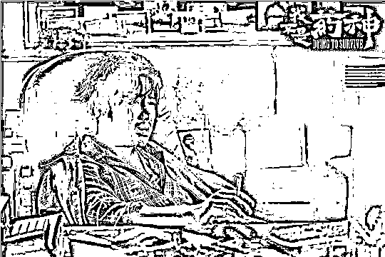

程勇是寄居在上海的一个小市民，蓬头垢面，靠卖印度神油支撑着落魄的生活。

他没有钱，没有房，甚至连老婆也跟着别人跑了。

一个失败的人，平凡的人。

也看不到有升级打怪成为玛丽苏的潜力。

但是命运是个说不明白的东西，

黑夜再长，也会迎来曙光。

机缘巧合，他成为了印度盗版药的代理，正版药卖几万，而他只卖 5000。然后，他发了。


他是一个唯利是图的精明的小商人，一夜暴富后难免都要小人得志一番，他对朋友们很仗义，却也会因出错牌这样的小事大打出手。

虽然有了钱，但怎么看，他还是一个普通人。

犯法被抓的恐惧，却像悬在头顶的宝剑一样，在程勇心里挥之不去。

因为害怕出事，他甚至不敢把药卖到外省。

专业假药大鳄张长林看准了他的恐惧，逼迫他把这利润丰厚的生意转让给他。

权衡利害后，程勇选择了退出。在跟着他的搭档们的眼里，他这是逃避，他们都很心寒。

程勇的退出很无奈。


没过多久，身患白血病的桃园结义兄弟老吕因为付不起药费，不忍心再拖累家里，选择了自杀。自杀前，老吕的老婆求过程勇，但是程勇的工厂红红火火，他没有理由再重操旧业，为老吕弄药。


老吕死后，程勇给老吕的老婆留了厚厚的一打钱，老婆却一眼不看，让他带着钱离开。

钱，是程勇的心意，但对一个心死的人，钱没有任何的意义。

老吕家门口排着长队，都是老吕生前的病友，他们都受益于老吕卖的盗版药而维系了生命。他们对老吕心生感激，老吕出事了，他们都来了。

**有的人走了，却活在大家的心里。**

电影镜头沿着走廊，一个个的扫过那些带着口罩的病人面庞，

**虽然只是一条走廊，但在程勇的心里，他走过了一条最长的路。**

**在路的尽头，他似乎有什么被唤醒了。**


他决定顶风复出，重新卖盗版药。

而且是以五百块，成本的价格。因为这一次，他是为了救人。

程勇，不再是以前的程勇了。

虽然无利可图，但他的朋友们都回到了他的身边，愿意助他一臂之力。

**他的发心是为了更多人能活下来，会有和你有同样想法的人来帮助你。**

好景不长，医药公司持续的给印度政府压力，盗版药的工厂关门了。


程勇只能用 2000 的价格去回购所剩不多的药，但他依然只卖 500 元。

亏的钱由他自己垫，他说，就算是还病人的。

这时候，他为了救人，甚至牺牲了自己的利益。

这一次，他不怕自己出事了，他让思慧联系外省的病人拿药，他要抓紧时间帮助更多的人。

**当他真心在为别人付出的时候，他发现自己什么都不怕了。**

甚至，其他人也会和他一样，舍弃自己，成就别人。


**黄毛**，为了不让程勇被抓到，自己去吸引警车的注意，而不幸失去了生命。黄毛并没有让程勇知道他要去做什么，为什么要做，他只是这么去做了。

**真正的爱，是不问原因，也不问结果的。**

程勇在审判席上，没有辩解，承认违法，愿意接受一切判罚，他不需要任何辩解了，因为他问心无愧。

在他被带走的沿路，聚满了吃他的药活下来的病人，人们用这样的方式在表达对他的感激。虽然他带着手铐，但是相信他感到了欣慰，他的心是自由的。

**公道在每个人的心里。**

程勇，从一个匮乏自私恐惧的小我，逐渐成长为一个无所畏惧无私的大我，从 5000 到 500，自我走到了无我。

无我是什么？

放下“我”，是平凡。

吃过苦的人，才会懂众生的苦。

程勇从监狱走出来的时候，一无所有，但他多了一样用钱买不到的东西，

慈悲。

所以，有人等他。心有慈悲，不会孤独。 


**张长林**

张长林在接管程勇的生意后，迅速把药价提到两万元，他想赚更多的钱，却事与愿违，没过多久他就被通缉了。

做同样的事情，发心不一样，结果会不同。张长林做事的动机是赚钱，而程勇的价格并不高，吃药的人都很感恩他，所以程勇一直没出事。

张长林被通缉后，找到程勇寻求帮助，程勇没有责备他，而是给了张长林一笔钱。张长林觉得程勇挺仗义，但还是看不起程勇这样不利己的作风。他劝程勇人不为己，天诛地灭，而穷病是治不了的。

**心被遮掩，就看不到慈悲。**

张长林还是被抓了，但这一次，他没有为了自己的利益，而出卖程勇。

**在益和义中，小人张长林，选择了后者。**

**没有永远的利益，也没有永远的小人，**


**老刘**

是一个虔诚的牧师。

当程勇找到他让他帮忙卖药的时候，他也很害怕，担心违法，害怕遭到主的责怪。

程勇劝他，

卖药，能让人活。

救人一命，胜造七级浮屠，

主还说过，我不入地狱，谁入地狱。

于是，老刘战战兢兢开始了卖药生涯。

当越来越多的人的生命得到延续的时候，

老刘的像捍卫主一样捍卫着救人的药，

不惜挨打，也要戳穿推销假药的张长林。

药，可以廉价，但不能假。

**上帝，从他的嘴里，走到了生活中。**

****

在一个资本逐利的世界，价格多高，只要有人买单，那就是合理的。

因为冰冷，就是资本的属性，

然而，人心，却是有温度的。

帮助别人快乐，自己也会快乐。

医者仁心，程勇不是医者，仁心，也不像金钱一样秤得出分量。

只有平凡的心，才懂得一颗颗平凡的心

希望在我们的世界里，

更多的是，以心换心。

感谢生命的脆弱，

让我们看到了仁心的可贵。


*文章：量子催眠师李毫芒 *

*量子催眠预约，请关注微信号** haomangli***

*图片：李毫芒提供*

* * *


**所有的生命都在学习，**

**地球能否顺利进化。**

**朵洛莉丝说：**

**“全宇宙都在看。”**


扫描或长按二维码，关注量子催眠消息

# [量催漫画]量子催眠的过程以及如何做好准备

> 原文：[`mp.weixin.qq.com/s?__biz=MzU0NjkzMDY0OA==&mid=2247485437&idx=1&sn=ac1e70ee0086b2f46c23f3fee98d0b44&chksm=fb576d4acc20e45c6e452ce310cbf2ef8ce4ea650a4d3975cbb4ad809a4eb9b8d3f7b77a6210&scene=126&sessionid=1690980936#rd`](http://mp.weixin.qq.com/s?__biz=MzU0NjkzMDY0OA==&mid=2247485437&idx=1&sn=ac1e70ee0086b2f46c23f3fee98d0b44&chksm=fb576d4acc20e45c6e452ce310cbf2ef8ce4ea650a4d3975cbb4ad809a4eb9b8d3f7b77a6210&scene=126&sessionid=1690980936#rd)

*注：文中称呼的潜意识与心理学术语使用的潜意识不同 。量子催眠使用潜意识来描述这个存在于比我们头脑的意识更深入的，全知的层面，它即超越了头脑的意识同时又把它囊括其中。如何称呼它无关紧要，因为它即它所是，它充满着无条件的爱，并怀着真诚的愿望和意图，愿意与任何人交流并提供帮助。*


**一、催眠前**

* * *


开始催眠之前，把困扰自己的问题罗列出来。这些问题可以是健康、情绪的问题，也可以是人生目标、学业、事业、亲密关系、金钱、家庭、孩子等，任何与自己有关的问题。同时，这也是一次回顾和整理自己人生的好机会。


催眠前几天，让自己的头脑平静下来。可以散散步、听听舒缓的音乐、或者冥想。潜意识知道，一切与你相关的疑问都会获得解答。你会看到造成目前局势的原因，以及如何应对。


赴约前一天的晚上早点休息，催眠前一天和当天不要饮酒，咖啡，茶。


想要体验一次非常好的催眠，意图是关键。当你决定要做一次量子催眠的时候，潜意识已经准备好向你揭示问题的答案，疗愈并告知你造成身体症状的原因。而头脑中那个逻辑分析和判断的部分需要被提醒，在催眠的时候暂时退居二线，让直觉来引导催眠的整个过程。


记得，在催眠的时候，越是把第一个来到你头脑中的想法，图像，感受表达出来，而忽略你的第二个想法，甚至于第三个想法，整个催眠的过程就会越顺畅。因为你的第二个想法甚至于之后的所有想法并不来自于潜意识，而来自于头脑中那个逻辑分析和判断的部分。


催眠前和催眠后的当天都不要安排需要赶时间的事情，同时穿着宽松的衣服，不要化浓妆，让自己完全的放松。


量子催眠的整个过程可能会花费 5 个小时或者更久一些，而且中途不会预留吃饭的时间。请在来之前吃的饱饱的，并选择一些不会造成肠胃过多负担的食物。

**二、催眠中**

*   ***面谈*** 

    * * *


正式开始催眠前，催眠师会和你聊一聊，让他/她了解你。这样当催眠的时候如果你回溯到与你此生重要事件相关的前世或过去的生活时，你的催眠师就会知道，并与你多探索一下。放松并允许自己体验催眠很容易。


你的催眠师会严格为你保守秘密。任何与你的个人隐私相关的内容都不会被透露给第三方知晓，除非获得你的同意。


很多人的童年回忆并不都是那么美好的，你的催眠师听过许许多多困难的童年，不用担心你的故事会让催眠师震惊。许多有着困难童年的人，大都依靠自己的力量从受困的模式中脱离出来。量子催眠会帮助你找回属于自己的力量。


这也是人生中一次不可多得的机会，全方位的回顾自己的人生。带着觉知的意识，就能很容易的发觉自己的模式、习惯性的情绪表达根源来自哪里。聊着聊着，头脑中的那团乱麻渐渐得被自己理清了，积压的情绪也获得了释放。


然后，你的催眠师会读一读问题清单，确保理解清单上的内容。同时归纳清单上的问题，如果问题真的特别长特别多。催眠师的目标是在 2 个小时里回溯前世，并连接潜意识回答问题清单上的所有问题。

*   ***催眠***

* * *


催眠刚开始的时候，只要放松，然后跟着催眠师轻柔的声音去想象就好了。


量子催眠不是让你失去意识，昏昏欲睡。如果因为太放松而睡着也没有关系，你的催眠师会负责把你叫醒。


你也不会像舞台催眠那样，被催眠师要求表演。量子催眠不是一种精神控制或者暗示形式。


你进入的是一个非常放松的状态，意识仍然清醒并拥有完全的控制。前世回溯只能在这些条件下完成。你的催眠师可能会让你想象美丽的地方，调动你想象力的右脑和你的直觉部分，让你更加的沉浸，更加的放松。信任你的催眠师，把注意力集中在描述场景当中的图像，感受，声音或者气味上。


随着放松越来越深入和直觉越来越活跃，意识也会渐渐得由日常的意识状态滑入到更深层的潜意识状态。图像、感受、情绪等会更多更快的出现。尽可能多的描述给你的催眠师听，因为在你描述之前，催眠师并不知道你看到了，或者感受到了什么。同时，描述的越多，看到的和感受到的细节也越丰富。


在催眠中会看到什么，在催眠前你和催眠师都不知道，这是催眠有趣的地方。和你的催眠师一起尽情的探索。在催眠的过程中你意识的参与度是很高的，也是很活跃的，你是一个积极的参与者。


有些人会看到几个前世/过去的片段，有些会花更长的时间详细的体验一个特定的前世。不管如何，潜意识向你展现的一定是对你当前人生最具疗愈意义的前世或者过去的生活记忆。不用担心，潜意识永远不会让你看，你还没有准备好要经历的事情。


回溯时，情绪会想方设法的表达出来，当感受到情绪或者身体有任何的感觉，请告诉你的催眠师，让他/她帮助你探索这些情绪和感觉。允许自己的感觉和情绪表达出来，你知道这很安全。


某些情况下，你需要直面自己深埋在心底的情绪、或者记忆，这是件需要勇气的事情，但是它会带领你，走上你所寻求的治愈之路。当你面对它的时候，它永远不如你想象中的这般可怕。潜意识会一直陪伴在你的身边，直面这些情绪、记忆，用爱接纳它，然后轻轻的放开它。


回溯之后，你的催眠师会向潜意识询问问题清单上的疑问。告诉头脑中那个逻辑分析和判断的部分，放松，并在一边观察或者休息一下。只要把第一个来到你头脑中的想法、答案表达出来就好了。


你知道的，头脑中那个逻辑分析的部分并不知道问题的答案，所以他并不需要撑在那里，也不需要在头脑中不断的分析或者不停的等待所有可能出现的答案，这样做并不会帮助催眠的顺利进行，相反它切断了与潜意识的连接。


你也知道，把自己交托给潜意识，接纳并信任第一个来到你头脑中的想法、答案，表达出来是如此的简单。


永远不要去等待第二个或者第三个想法。放松，不断的表达第一个想法，第一个感觉，潜意识就会越来越顺畅得回答所有的问题，也会告诉你更多与你有关的信息，并进行身体的疗愈。

*   ***唤醒***

    * * *


然后，催眠师会用轻柔和安全的方式引导你离开催眠态，返回到清醒的世界中，这样你就可以逐渐的回复到日常的意识状态。


在催眠结束之后，你的催眠师会花一些时间与你聊一会儿，你们将回顾在催眠中出现的画面，讨论问题清单上的答案，以及更多的收获。

**三、催眠后**

* * *


催眠之后吃些东西，这样可以帮助自己的意识更快的调整到日常的意识状态中，早些休息。由于刚完成催眠，潜意识与你沟通的管道还非常畅通，它通常会继续在你睡觉时完成身体的疗愈，并通过梦境进行更多信息的传递。如果你记梦，千万不要放过这样的机会。


选择安静和不被打扰的环境，让自己舒舒服服的坐着或者躺着。多听录音，即使你的头脑认为自己都知道录音里说了什么，但是相信我，你一定可以在录音中听到自己不曾留意的或者忘记的内容，而这些内容往往会为你带来启示和领悟。同时，多听录音也可以更快的帮助自己蜕变成新的样子。


在催眠之后的一周内，潜意识仍然会非常活跃得与你保持沟通，留意周围的信息、记号、书本、声音、文字、画面、对话等等，那都可能会是你意想不到的收获，把对你有感触的内容记录并保存下来。


如果你写日记，在催眠之后的几天里，把自己的感受，想法或者领悟写下来，或者尝试用书写的方式与潜意识沟通。放松自己的身体，放空大脑，然后把出现在自己头脑中的第一个念头写下来。

* * *

****

***绘画：量子催眠师 Jasmine ***

****催眠预约请加微信号：*judyspirit*** 

***坐标：上海***

***校对*：Leo****

花一些时间在我们的官方网络平台（微信公众号：QHHTChina）上了解更多关于我们提供的课程，或者与我们联系进行咨询。

想要更多的了解催眠和前世回溯吗？有兴趣学习如何成为一名专业的催眠操作者吗？

我们可以为你实现。

**课程咨询及个案咨询服务二维码**

 花一些时间在公众号上了解更多关于我们提供的课程：

[【线上·网络】量子催眠一阶段课程介绍](http://mp.weixin.qq.com/s?__biz=MjM5NjExMTczNA==&mid=2647621628&idx=1&sn=362734b6f9677d41810f46793db552fe&chksm=bed5ebe589a262f38aeee298496c88b3f58bdd327e9c595259fd2f64ca22876aa29c0f1df337&scene=21#wechat_redirect)

[二阶段来啦--2018，我们夏威夷见！](http://mp.weixin.qq.com/s?__biz=MjM5NjExMTczNA==&mid=2647622041&idx=3&sn=7d8733573dfd53a0b60441b149b49d11&chksm=bed5158089a29c96839b3605b6902f7ecebb7db6c3bd266a16188039c6eb01c798a31d655cb0&scene=21#wechat_redirect)

或者与你附近的前世回溯操作者联系。

[量子催眠个案全国预约！](http://mp.weixin.qq.com/s?__biz=MjM5NjExMTczNA==&mid=2647620840&idx=1&sn=95dc1c41580e9f9c19d1426946ba005b&chksm=bed5e8f189a261e7950d67dc111870a8859b63aef5f589db5ac4f3c284e4142185b833644b90&scene=21#wechat_redirect)

**这里不是要说服你去接受那些你还没有准备好去接受的观念，也不是劝说你去放弃那些你还没有准备好要放弃的，这里只是为你提供一个探索的平台，帮助你理解朵洛莉丝.侃南量子催眠疗法的原理和为什么治疗的结果是可能的。**

相关文章链接：

[量子催眠简介（一）：创始人](http://mp.weixin.qq.com/s?__biz=MjM5NjExMTczNA==&mid=2647620759&idx=1&sn=40bd27e46cb61d552e9b266cbbecf971&chksm=bed5e88e89a261985b631adbd9b9dc98ef33664657177cb59781a20882646307a6fb49cff53b&scene=21#wechat_redirect)

[量子催眠简介（二）：量子催眠是什么](http://mp.weixin.qq.com/s?__biz=MjM5NjExMTczNA==&mid=2647620822&idx=1&sn=aac1afdf64800e6f9cfc50ba4f2ccde2&chksm=bed5e8cf89a261d9ed95669e1435a6db510ab896009e2cf0add68f32557ef3ac299c912d3f32&scene=21#wechat_redirect)

[量子催眠简介（三）：量子催眠中的疗愈](http://mp.weixin.qq.com/s?__biz=MjM5NjExMTczNA==&mid=2647620833&idx=1&sn=6595cd038c78b9d3386e4555d2fce550&chksm=bed5e8f889a261eece43da59e5d9d28b78d7ec2c5482685a5e9eab691533237317653e707b64&scene=21#wechat_redirect)


**所有的生命都在学习，**

**地球能否顺利进化。**

**朵洛莉丝说：**

**“全宇宙都在看。”**

# 魂忆广岛--原子弹爆炸

> 原文：[`mp.weixin.qq.com/s?__biz=MzU0NjkzMDY0OA==&mid=2247485438&idx=1&sn=46ad50f465c280337031a89943025354&chksm=fb576d49cc20e45f82cb37e0d29869ad6c5d8d3af3c8b89c2a31ef9d10a397e4f6b349fedd1f&scene=126&sessionid=1690980936#rd`](http://mp.weixin.qq.com/s?__biz=MzU0NjkzMDY0OA==&mid=2247485438&idx=1&sn=46ad50f465c280337031a89943025354&chksm=fb576d49cc20e45f82cb37e0d29869ad6c5d8d3af3c8b89c2a31ef9d10a397e4f6b349fedd1f&scene=126&sessionid=1690980936#rd)


*广岛和平广场*

**广岛核弹的幸存者已经讲述了很多充满痛苦、死亡和毁灭的故事，而这段故事，它来自于一个没能幸存的目击者。**

* * *

 节选自《灵魂记得广岛》第十三章 **原子弹爆炸** 

  翻译：馮子源（量子催眠操作者）

      下一周，我坐在车里等着凯蒂下班的时候思绪万千。基于我们已经建立的信任，终于要迎来一个精彩的故事了。而且对我来说，这位日本男士已经变得非常真实，我知道自己无法背叛他。这一点对我的重要性不亚于我和凯蒂的关系。我必须把两者都当成真正的、有情有义的人来看待。要是她觉得自己还没有准备好面对这件事，那我们就继续探索其它的生世。**我绝不勉强自己的个案去做令他们为难的事情。**

       凯蒂朝我的车走来，笑容满面。她已经下决心继续深入，并感到肩上一副重担被移开了。在心底深处的某个地方，她知道经历小岛月的死亡对她会有好处，也是她必须面对的，逃避只会让她一直感到如芒在背。然而下定决心面对并不意味着她不害怕了。她对于这次穿越依然感到紧张。常言道，勇敢是迎着恐惧前行，毕竟做轻而易举的事情是谈不上勇气的。对于她的决定，我感到骄傲，不是为了我自己，而是为了她。我感觉这会对她的灵性成长有极大的促进。

       到了催眠的处所，在我们为催眠进行准备的时候，*我*开始感到不安。我已经带领很多很多人在回溯催眠中穿越了死亡，多数是在没有任何预兆的情况下自然而然地发生的。在其它的时候，我会引领他们体验死亡。我一直都能够很好地掌控个案所经受的创伤程度。

       我知道今天我们将探索的会是完全不同的情形。这是我第一次在事先就知道这个人格将如何离世，也知道这个事件已经对清醒状态下的凯蒂产生了什么样的影响。这世上有人真的知道死于原子弹爆炸究竟是怎样的吗？这次的死亡经历会有什么不同吗？她会有什么反应？*我自己*会有什么反应？这些想法让我不由得颤抖。她的直觉感受到了我的焦虑。“嘿，我不知道究竟谁更紧张，你还是我？”

      我笑了，倒也不是企图掩饰自己的感觉。我把自己的顾虑说给她听，不过她还是感觉自己必须穿越。我从以往个案的身上了解到，**假如状况超出她承受的范围，她会醒来**，这和挣脱噩梦是一个道理。**潜意识会在梦游状态中全程保护个案，**所以假如她不想再次体验那次死亡了，我也无法把她定在那个状态里。当我运用关键词，看着她滑入熟悉的深沉催眠状态的的过程中的时候，启动了常规的“白光护体”的意向。与以往不同的是，这次我呼请了她的守护灵以及守护我们的力量来协助看护她穿越这次磨难。（这些也被有些人称为守护天使。）我不想留下任何风险，我知道她会需要我们能够获得的所有的帮助。

       在这次催眠中，我太投入了，只顾监控凯蒂的身体反应，直到事后回放录音带的时候才充分捕捉到这次体验的情绪力量。当我把录音带播放给一群感兴趣的人的时候，很多人都潸然泪下，而其他的听众都无法撑着听完就夺门而出。我希望能够把这极其真实、震撼人心的情感透过可怜的文字媒介传递出去。我曾为如何在薄薄的纸张上呈现这个故事而煞费苦心。我感到其中有些事情是需要被讲述的，这是我们的这个时代的故事，它在向我们的世界呼喊。它恳求人们：“不要让这样的疯狂再次上演！”

     我深吸一口气，开始誊写。

朵：我们去到 1945 年的春天吧。那是大地复苏、万物生长的春天，你看到了什么？

凯：我能看到飞机在头顶盘旋，好像是在监视我们。他们在观察我们的活动。

朵：你在哪里？

凯：在广岛。

朵：那是什么样的飞机？

凯：呃......我不知道，挺大个的，有四五驾，在头顶飞来飞去。

朵：为什么它们在城市上空盘旋？

凯：我哪知道，又不是我们这边的飞机。但是它们就像是在监视我们。它们也不扔炸弹，就是观察。我们以前也见过这些飞机，但是像这样飞过来盘旋是最近刚开始的。我猜他们是不是在找个合适的位置好扔他们的炸弹。我也不清楚。

朵：它们以前扔过炸弹吗？

凯：在北部周边的地区扔过。它们扔下的炸弹捣毁了很多田地和乡镇，我们倒从来没受到严重的袭击，至少城里没有。他们搞得神秘兮兮的，也许下一个就轮到我们了吧。

朵：为什么他们要扔炸弹？

凯：我们两个国家正在开战，已经打了一阵子了，只不过现在打到我们本土来了而已。

朵：你觉得政府知道事态会这样发展吗？

凯：谁知道呢。他们可能本以为不至于发展到这个地步战争就能终止。我哪有权利做什么判断啊？我又不能获取他们的信息。......我很担心，因为我知道如果他们扔东西下来，他们就在我们城市上空，那就很可能会炸到我们。我真搞不懂。

朵：飞机飞来的时候人们害怕吗？

凯：怕啊。他们都跑到......那些防御的地方，跑到那儿寻求庇护......他们管这样的地方叫......防空所，或者类似的名字吧。我也不知道。（他对这个词有些困惑。）

朵：你去过那样的地方吗？

凯：去过。有些是防御设施比较好的学校，可能是相对偏僻、远离工厂之类的地方，其它的就是高层建筑的地库。

朵：这就是飞机来的时候人们去的地方吗？

凯：有时候是的，也有时候大家仍然忙自己手里的活，毕竟日子还得过下去啊。

朵：他们没有什么固定的规则吗？

凯：他们会发警报，警报响起，他们就满城大嚷嚷，说可能会有袭击到来。但是到目前为止都没有袭击。大家就得离开街道。不过除去这个就没有别的事。我可不想去防空所，我情愿看看究竟是什么袭击了我也不愿意像个吓破胆的松鼠一样窜进树洞里躲起来。就算死我也要死个明白。

朵：你还会回到自己的家去吗？

凯：不去了。那边全是军队，还有可能有爆炸，太危险了，所以......我不回去了。

朵：你在城里和闺女们一起生活还好吗？

凯：我感觉像笼中的鸟......昏昏沉沉，飞不起来了。

朵：你有时也能出去散散步吧？

凯：有时候可以，但是我们会在街上被拦截。他们觉得人人可疑。那些大兵会问：“你怎么在这里？你要干什么？”所有人都很多疑又烦躁。有时候我也能走出去，散散步， 但除了城里也真没有地方可散步的。我不喜欢这样，我喜欢住在自己的房子里，在自己的身边有自己的田地和自己的牲口。我怀念那份宁静祥和。

朵：你说你们只有两个房间？那是不是很难挤下你们所有的人？

凯：我们在地上铺席子，睡在席子上，这样地方就够大了。

朵：你们有做饭的地方吗？

凯：我们有个火盆，烧炭的，放在一个房间里。

朵：好吧，至少你还不孤单，这也算一件值得庆幸的事。

凯：是的，这话倒不假。但这种日子不适合孩子们的成长。

朵：是的。现在是......哪个月份？

凯：现在是四月。

朵：1945 年的四月。OK，我们向前移动几个月，来到 1945 年的七月，正值酷暑。

我不想直接跳进去，因为相信花点时间慢慢接近那个日子会更好。我向前数数来到了 1945 年的七月，然后问小岛月看到了什么。

凯：我看到闺女们下班回来了，我在帮她们张罗晚饭。

朵：现在时局怎样？

凯：极其糟糕，问题多多。他们在城市周围扔炸弹，搞得人心惶惶，不可终日。目前这个地方还没有遭到直接的袭击，但是我们都觉得是迟早的事。外围的两家工厂已经遭袭，炸死了一些人，损失不算太严重。他们还能勉强开工。

朵：炸弹扔下来的时候听起来是怎样的？你能听见炸弹吗？

凯：在爆炸前有一声尖利的嘶鸣。据说真正爆炸的声音是听不到的，所以我也不知道。

朵：那你闺女们工作的那家工厂怎么样？目前遭到过什么破坏吗？

凯：还没有。

朵：你们住的地方，那里离工厂近吗？

凯：不算很近，但那也不能让人放心。

朵：飞机来得频繁吗？

凯：它们每天早上回来，一大清早。我看着它们就想......什么时候呢？有些人能做到视而不见（深深的叹息）；可我做不到。

朵：周围有军队提供保护吗？

凯：他们朝他们放枪，但是几乎是把这当成一场大型游戏，好像根本不重视。我......我实在理解不了。（我请他解释一下。）哦，就像是他们早知道它们会来，就朝它们放上三枪，完了就完了。好像他们根本不在意是不是能击中，或者它们根本就在射程之外。我也不知道。

朵：全国都是这样吗？

凯：我不知道，我们消息不灵通。军方才能获得消息，但他们又不怎么跟我们透露。

朵：你们还会去防空所吗？

凯：有时候会去。人们......这已经成了日常事件了，他们也不当回事了。（他笑着说）有些人说他们可以用飞机定时间了。（转为严肃地）我感觉这是他们的一种安排。他们在捣鬼。我觉得他们不会傻到无缘无故地每天这么做。他们在找什么东西，或者在酝酿什么事。我不知道是什么事。

朵：这的确很诡异。我能感觉到这是在逐渐麻痹你们。

凯：让人无视他们的存在，有道理。有些人说这正是他们的感觉，他们不担忧了。（叹息）可*我*担忧啊。他们说我是老糊涂了，可我还是担心。

朵：你闺女们担心吗？

凯：她们相信别人说的。那些人说美国人不想炸我们，之类之类的......我看未必。他们说他们想来打我们还差得远呢。他们说战争就要结束了，因为我们不再和他们打了。谁知道呢？

朵：听起来他们的说法都不一样。......你的孙子们害怕吗？

凯：不怕，他们就是看着飞机。他们觉得飞机飞过的时候看起来很有意思。

朵：食物够吃吗？

凯：我们全靠他们发的食物维持。我不知道他们从哪的来的食物，基本上都是大米，比以前要少，但是我们也能勉强够吃。有时候要是走运的话还能在自由市场上遇到写面包、谷物还有......基本就这些了。有时候我们自己生豆芽，要是运气好能找到豆子的话。我们在房间里，用一点水，借着阳光生豆芽，然后就着米饭吃。偶尔我们还能弄到点肉，但是很少，越来越少见了。

朵：肉是从政府那里获得的还是从市场上？

凯：有时候两边都可能有。有时候我们有些配额，但更多的谁家宰牛了我们去弄一些之类的。

朵：你以前跟我说过会在市场上置换些东西。你是拿什么置换呢？

凯：不同的东西。有时候是多余的毯子，有时候我出去找些水果和坚果，这样的东西，这样我们就可以置换了。随便什么我们能搞来的东西。

朵：听起来货币已经没有价值了。

凯：是的，没有真正的价值了。我很久都没见过钱了。

我发现战争到了这个时期，广岛（也可能是整个日本）的黑市非常活跃。

朵：他们是怎么给你们配给食物的？

凯：他们在班上把食物发给她们，通常是每周两次。

朵：这和你们以前的做法很不同。

凯：是的，更艰难了，为了应对现实。

朵：......你在帮忙准备晚餐？

凯：我在看着三个孙子，他们在玩。

朵：他们是恩赐的礼物。

凯：是的，他们有时候能让你的头脑摆脱问题的困扰，但是你转瞬又会担心他们遇到什么不测。

       火候已到，更待何时。我决定在这个时机启动跳跃。我深吸一口气，一头向前冲了过去。

朵：我们将离开那个场景，向前移动几周。我们将向前来到 1945 年 8 月 6 日，你会把你的所见告诉我。记住，你心里很清楚你是笼罩在白光保护之下的，你的指导灵会在这里帮助你。我们不会让你受到任何形式的伤害。你看见的所有情景都只是一段记忆，你会把它描述给我。这段记忆中有很多值得学习的东西，但它不会以任何形式伤害到你，不论是心理上还是身体上。如果你愿意，你可以随时都可以作为旁观者进行观看。

      当我用数数的方法把凯蒂向前带到那个重要的日子的时候，她的表情突然转换，面色苍白，身体僵硬，似乎处于一种迷茫的状态。当她想努力地说话的时候，只能听到喘息的声音。她很难说出话来。之前那种缓慢的、短促的、顿挫的日本式言谈和现在的状态形成了巨大的反差。她似乎处于一种被震惊的状态，而当她费力地开口讲话的时候，声音是颤抖的。有时候她的身体也会哆嗦。我从未在任何人的声音里听到过如此撼人心弦的情绪和痛苦。那是从她潜意识深处的记忆发出的，和凯蒂毫无关系。

       很显然，发生了灾难性的事件。我确信自己知道是什么事件，但还得把自己调整到无知的状态来推进催眠，好让小岛月讲述他自己的故事。凯蒂大口呼吸，我问她正在发生什么事情。

       她终于可以艰难地开口讲话了，只言片语、散乱断续。晕头转向的小岛月在停顿中搜索词语来描述这段用文字无法形容的经历。

凯：有......有一道巨大的闪电。然后就是几阵风......好像火一样。人们，他们都倒下了。然后他们......然后他们就躺在那里，然后......然后......（声音中满是难以置信）。喊叫声！

朵：你是在哪里看到的？

凯：我在市场上。

朵：跟我说说闪电是什么样的。

凯：一道刺眼夺目的白色亮光。还有......然后就是巨大的......轰。然后......然后......一团巨大的云，直冲上天，然后......然后......云不见了。之后又有风翻卷而来，就像火一样！*到处人们都在死去！****为什么？！***

这是发自他灵魂深处的呼喊，让我脊背一阵发冷。

朵：发生了什么事，你知道吗？

       他无法发声。我知道凯蒂随时都有可能决定终止催眠，让自己醒来，所以必须安抚她。我轻柔地、充满爱意地和小岛月说话，因为我对这位男士的确已经满心悲悯。“你可以说说看。其实，说出来可能会更好，因为要知道，我是懂你的。”

凯：我不......除了*叫喊声*几乎听不到别的了！人们都......那些能跑得动的都在跑。人们在倒下。一些人张开双臂，四处踉跄。......（他的震惊已经接近崩溃。）一切都不见了！都被夷为平地了！高楼无影无踪！什么都没留下！***为什么？！***

朵：你是独自一人还是和闺女们在一起？

凯：我就一个人。（迷茫地说）我不知道大家都去哪了。一切都不见了！这个城市仿佛......这个城市没有了中心！**全都没了！**楼房都已经......*消失了！*什么都没有了，只剩下瓦砾......还有*叫喊声！*

      即使在写下这些文字的时候，我仍然能听见凯蒂声音中彻骨的惊骇。

      我一定不能让自己陷入其中，只有保持客观才能观察她的状态，想出问题来提问。

朵：市场在什么位置？

凯：在......进城的一个入口的附近。就在......边上......离开市中心的地方。

朵：你说那团云直冲上天，然后就起了大风？大楼就是那个时候开始消失的吗？

凯：是的，然后他们......人们，他们倒下了。人们就那样......死了。

朵：大楼是在云出现的时候消失的，还是风刮到的时候？

凯：两个都有。一些......是云出来的时候，它们......在那一瞬间消失了。一些，是大风，刮倒了地面所有的一切。所有的人......（他停下来，似乎无法把话说完。）

朵：你倒下了吗？

凯：是的。......它......尖叫着。我分不清那是......是人们的叫喊声还是噪音。我不......我不知道。我只知道......所有人都在死去！（他的声音减弱，成了痛苦的低语。）

       这里有一段停顿，从凯蒂眼睑之下的眼球活动我能判断出小岛月在向下看。他突然出人意料地脱口而出：“我的手......成了黑色！烧焦了！”这样看来，他在这出悲剧中不仅仅是个旁观者。他也受到了伤害，但由于事发突然，受到惊吓，他现在才注意到。我给凯蒂下了指令，使她免于经受身体的不适，尽管曾有医学专家跟我说过，这种烧伤的深重程度会导致神经末梢被摧毁，会感觉不到疼痛，至少不会立即感觉到。在那个时候我还不知道这一点，我只是确保不要让凯蒂受罪。

朵：你的手是唯一变黑了的部位吗？

凯：不是，我的......脸感觉好像什么都没有了……皮肤没有了。（他呻吟着。）

      要是想继续催眠，我必须把这个令人作呕的画面排出脑海之外。

      他用一种走失了的孩童的口吻问我：“现在怎么了？我该去哪里......？或许......还有其他人像我一样，四处游荡。我被绊了一下......摔倒了。我爬起来，再试一次。”

朵：你觉得能找到回家的路吗？

凯：都没了。 全都没了。......我必须离开，但是我该往哪儿走啊？

朵：你想去哪里？

凯：离开。出去。只要能离开，哪里都行。要离开......离开这个......可怕的地方。

朵：其他人在往哪里走？

凯：我能看见的那些人......他们和我一样......就是......磕磕绊绊的，而且......他们也找不到方向。

朵：记得吗，你以前跟我说过，飞机每天早上都会来。今天早上你看到有飞机过来吗？

凯：（似乎刚刚意识到其中的关联。）是啊......对......就在这之前。会不会是它们......?它们......肯定......扔下了......什么可怕的......东西！（大口呼吸）怎么可能有人做这种事情？怎么可能？他们不知道自己做了什么吗？他们在乎吗？

这些话语仿佛是荒野中绝望的嚎叫。

朵：你认为刚刚发生的事情和这些飞过的飞机有关联吗？

凯：（他很激动。）那是唯一的解释。他们肯定......干了些什么事！（他的声音里充满了不解。）他们谋杀了这个城市！整个城市！全没了！（他突然开始呻吟。）我感觉自己身体里面在燃烧。一切都......那就......好像是有人划了根火柴放在我身体里了，它变成了一团篝火，发着亮光。

       我迅速反应过来，给出避免她感受痛苦或不适的指令。专家说小岛月的肺恐怕因为吸入了灼热的风而被烧焦，在大火中吸入烟尘的人通常都会这样。疼痛的感觉有可能会因为最初的惊吓反应而延迟。这只是纯粹的猜测，他的身体症状也有可能是深度烧伤、或者辐射、或者我们还没有意识到的东西引起的。

       凯蒂是可以随时切换到旁观者的视角把景象描述给我的，但是看起来她的潜意识想让她经历这些。或许她自己的灵魂认为她需要以极真切的方式记起这件事。她被这段经历牢牢包裹，以致一直置我让她保持客观视角的指令于不顾。我想尽办法让小岛月把注意力从自己和自己身体的状况上转移开去，但我没能做到。

朵：这个城市还遭受了其它情况吗？（我想到了火灾或者类似的情形。）

凯：没有......据我所知。我......我......不知道。我无法......看见......任何东西。这是......我......我......不知道。我只是......

朵：为什么？是因为情况太混乱了还是什么别的原因？

凯：（缓慢地说）我......无法……看见很多......什么都看不见。

朵：你觉得是有什么影响到了你的眼睛吗？

这是爆炸的延迟反应，还是他的头脑想要屏蔽自己不想看的景象呢？

凯：我......我......不知道。我知道的就是......疼痛和混乱，还有恐怖。***为什么？！***

       很显然，他无法让自己从这个事件的情绪中摆脱出来。我不是虐待狂，所以不想为了获取这个要命的故事而让他遭受折磨。我决定让凯蒂从这个场景里出来，让她向前移动一周左右。我以为到了那个时间，这位日本男士应该已经死亡，可以从灵魂状态回看这一生，告诉我更多的知见。我错了。

凯：（声音非常微弱。）我在......一栋大楼里。他们......人们都来了。他们照顾着我们这些将死的人。

这么看来这位日本老人要比我想象的坚强。尽管身负烧伤和辐射中毒，他还是挣扎着残喘了一周。这也符合凯蒂对于他这一世的自发性回忆。她感觉他不是立即死亡的，而是在事后弥留了大约九天左右。

朵：那里人多吗？

凯：有几百人吧......正在缓慢地死去。我们知道这一点。（他听起来似乎已经臣服于这种无望的境遇。）......他们说那是一场爆炸。美国人干的。他们扔下了一颗炸弹。

朵：仅仅一枚炸弹就可以有这样的杀伤力吗？

凯：我不知道怎么回事。（耳语）……我不知道怎么回事。我知道的只是死亡和痛苦……摆脱不掉。（他的声音嘶哑。）看起来很可怕……竟然有人能想出来做这种事情。（大口喘息。）

朵：你的闺女们呢？你在哪里见过她们吗？

凯：（他的声音是充满痛苦的低语。）没有，她们可能已经不在人世了。我的孙子们啊！（他哽咽着说出这个词。）全死了……那个时候死掉是个恩典，不用活受罪了。

朵：有医生或护士吗？

凯：有，但是他们也无能为力。（他的声音充满绝望。）他们只是……给我们一些止疼的东西。我不知道是什么，有点用，但是……不太有用……不太有用。

朵：听起来他们把一栋大楼改成了医院。

凯：是的。耳朵里听见的只有哀嚎……还有人们死去的声音。那些孩子们啊！（他又一次哽咽着说出这个词。）所有的人……他们只是等着我们……我们都会死的。

我听说我们的飞机会提前撒下传单，警告人们逃离被炸的城市，不知道这是否属实。

朵：我听说美国人也试图警告你们的人民，即将发生爆炸了。你听说过类似的说法吗？

凯：我不知道。我……不知道。……他们不可能在乎。我们*怎么*可能想到有人竟能做出这样的事情？甚至能想到去做这样的事情？怎么可能有这样的人啊？

他说话非常吃力，偶尔甚至要大口喘息。

朵：我不知道。这令人难以理解。难以置信会发生这样的事情。好吧，我觉得我们该离开这个场景了。离开这个充满如此多痛苦、如此多折磨的场景，把它留在过去，留在那个属于它的地方吧。我们即将飘飘浮浮地离开那里。

凯蒂的转变瞬间完成。她的身体放松下来，脸上恢复了血色，就好像拨动了一个开关。

朵：您是个非常敏感的人，非常有慈悲心，我们不想把一丝一毫的痛苦和磨难带到以后。我们会把它留下，留在它所属的过去。我想对您表达深深的感激之情，感谢您给我的讲述，把那段经历告诉了我。请记住，您所经历的只是一段记忆，发生在很久以前，它不会以任何方式打扰到您，不论是心理上，还是身体上。它永远、永远都不会再次打扰您，因为现在您明白了它来自何方，归于何处。

我的心里充满了深深的哀伤。小岛月的死苦难深重，我不忍心把凯蒂带出来的时候，潜意识里最后的记忆是这般的伤痛。她的转换显而易见，我知道她已经安然穿越了那场浩劫，醒来的时候记忆中不会有这段经历。尽管如此，我还是感觉只有在唤醒前，让她经历一段幸福的时光才够心安、够稳妥。我也觉得需要为这位已经赢得我的理解和尊敬的老人做些什么。这是我的对他告别仪式，是我献给他的挽歌。抑或，我是在为自己做这件事吧？我永远不可能搞明白，我只知道把她从这炼狱般的绝望中直接唤醒，良心上过不去。

朵：让我们回到 1930 年吧，回到一个开心的时代，一个开心的日子。

声音立即从将死的日本人的凄惨呻吟转变成年轻有活力的嗓音。

凯：我在做我的陶器。刚把它们从窑里面取出来晾凉。

       还能回到比这更恰到好处的时间吗？那是一个国泰民安的年代，他在做自己的陶器，做一件一直都给他带来骄傲的事情。

凯：它们很美，每一个都有自己独特的美。我对自己的作品很精心，我的每一件作品都显示出我的爱。

朵：（我对这位男士感到无比的同情。）你做得很好，并以此为傲。你出售这些作品，人们买走它们，这说明它们是有价值的。

       我放松了下来，感到房间里被安宁笼罩。我知道一切都将无碍。我的日本朋友终会找到他转世的灵魂所渴求的平和。他在凯蒂的脑海里启动了一项任务，如今使命已达。他终于得到了认同，他没有白死一回。

朵：家里人都在哪儿？

凯：（她微笑着。）儿子们在种田，老婆在屋里忙活，我嘛，在干我的……工作。

朵：这是很开心的一天，对吧？一段美好的记忆。

凯：是啊，我很惬意。看到自己的双手创造出美丽的物件，真令人心满意足啊。

小时候，小岛月背着父亲偷偷创作自己心爱的小动物塑像的情景再次浮现在我的眼前。

朵：你还喜欢做小塑像，对不对？

凯：（她笑了）对啊。

朵：那些小动物。啊，那很好，因为这让你感到自豪。这是开心的一天，留下这些美好的记忆吧。不要徘徊在糟糕的岁月，要记住开心的日子，好不好？

凯：好的。那些回首的时候给人带来微笑的时光会让人的记忆成熟。

朵：没错。常念好时光，让艰难的岁月自生自灭吧。这听起来和你的想法挺像，是吗？

我的心已然被他牵走。痛过了他的痛，哀过了他的哀，我感觉再圆满不过的就是把他带回我们相识的原点，他制陶的时光。这样一来，我才能安心地离开他，让他留在世界癫狂之前的幸福记忆里。我很清楚，唯有将他的故事写在纸上，讲给全世界，否则我无法安宁。我已经完成了自己对他默默许下诺言。

后续，我会思考更多的问题，寻求这场爆炸的解释。不过我也会遵守我对凯蒂的承诺，对这个事件仅作唯一一次探索。后来我们再没有回去过。我的老天！一次足矣！

在后来的催眠中我了解到，在经历了广岛的重创和死亡后，她去另一边的灵魂休息地停留过一段时间。这是为这类死亡专设的的特殊区域。她感到自己因为所经历的死亡弥留过程而消掉了很多业力。随后她参加了灵魂层面的学校，在那里大师们和教师们帮她评估了那一生。正是在那里，她被召唤去完成一项任务，即和之前拥有凯蒂身体的灵魂交换位置。（这些存有的状态会在我的专著《死生之间：与一个灵魂的对话》中进一步探讨。）

经历了小岛月的死亡之后的下一周，当我和凯蒂见面的时候，她说自己感觉棒极了。沉重的负担被移除。她知道那段记忆再也不会干扰她了，确定无疑。她如此的欢喜，我们知道我们探索这个故事的时候所共同经历的这一切都是值得的。这番经历之后，她开始变化。在我们后续的合作中，她开始迅速地成熟。

*翻译：量子催眠师子源（微信：fengziyuan369）*

*     欢迎预约量子催眠*

* 图：网络*


献给人类灵魂勇敢的探索者朵奶奶和个案凯蒂！

感谢你们带给我们生命的力量！

感谢翻译子源！

珍爱和平！

生生不息！

相关阅读：[揭开秘密--广岛灵魂的记忆](http://mp.weixin.qq.com/s?__biz=MjM5NjExMTczNA==&mid=2647621949&idx=1&sn=abdc1bd3fc77872339542f99784e064c&chksm=bed5152489a29c3228fad77200b2beda6246b9e89cefd22fc9f18aec57f8c745118dff19437f&scene=21#wechat_redirect)


**朵奶奶的书♥探索的是 穿越时空的爱！**

              **可在公众号微店带它回家！**

**这里不是要说服你去接受那些你还没有准备好去接受的观念，也不是劝说你去放弃那些你还没有准备好要放弃的，这里只是为你提供一个探索的平台，帮助你理解朵洛莉丝老师量子催眠疗法的原理和为什么治疗的结果是可能的。**

相关文章链接：

[量子催眠简介（一）](http://mp.weixin.qq.com/s?__biz=MjM5NjExMTczNA==&mid=2647620759&idx=1&sn=40bd27e46cb61d552e9b266cbbecf971&chksm=bed5e88e89a261985b631adbd9b9dc98ef33664657177cb59781a20882646307a6fb49cff53b&scene=21#wechat_redirect)：创始人 

[量子催眠简介（二）：量子催眠是什么？](http://mp.weixin.qq.com/s?__biz=MjM5NjExMTczNA==&mid=2647620822&idx=1&sn=aac1afdf64800e6f9cfc50ba4f2ccde2&chksm=bed5e8cf89a261d9ed95669e1435a6db510ab896009e2cf0add68f32557ef3ac299c912d3f32&scene=21#wechat_redirect) 

[量子催眠简介（三）：量子催眠中的疗愈](http://mp.weixin.qq.com/s?__biz=MjM5NjExMTczNA==&mid=2647620833&idx=1&sn=6595cd038c78b9d3386e4555d2fce550&chksm=bed5e8f889a261eece43da59e5d9d28b78d7ec2c5482685a5e9eab691533237317653e707b64&scene=21#wechat_redirect) 


**所有的生命都在学习，**

**地球能否顺利进化。**

**朵洛莉丝说：**

**“全宇宙都在看。”**

# 漫画•残障者--续

> 原文：[`mp.weixin.qq.com/s?__biz=MzU0NjkzMDY0OA==&mid=2247485439&idx=1&sn=902464de0112fc743640d0495dc8c11e&chksm=fb576d48cc20e45edcb51ec159da055fed64c7102383ea0b699ca36930ac325208adf6c5c37f&scene=126&sessionid=1690980936#rd`](http://mp.weixin.qq.com/s?__biz=MzU0NjkzMDY0OA==&mid=2247485439&idx=1&sn=902464de0112fc743640d0495dc8c11e&chksm=fb576d48cc20e45edcb51ec159da055fed64c7102383ea0b699ca36930ac325208adf6c5c37f&scene=126&sessionid=1690980936#rd)


**

*作者：量子催眠师 甘木田*

*预约量子催眠，请添加微信号：tianyuan117*

**坐标：南京**

* * *

花一些时间在我们的官方网络平台（微信公众号：QHHTChina）上了解更多有关量子催眠的信息，或者与我们联系进行咨询。

想要更多的了解催眠和前世回溯吗？有兴趣学习如何成为一名专业的催眠操作者吗？

我们可以为你实现。

**课程咨询及个案咨询服务二维码**

 花一些时间在公众号上了解更多关于我们提供的课程：

[【线上·网络】量子催眠一阶段课程介绍](http://mp.weixin.qq.com/s?__biz=MjM5NjExMTczNA==&mid=2647621628&idx=1&sn=362734b6f9677d41810f46793db552fe&chksm=bed5ebe589a262f38aeee298496c88b3f58bdd327e9c595259fd2f64ca22876aa29c0f1df337&scene=21#wechat_redirect)

[量子催眠一阶段实地复训通知](http://mp.weixin.qq.com/s?__biz=MjM5NjExMTczNA==&mid=2647622041&idx=2&sn=e1c43cb1ff513b32ff118e442f090e23&chksm=bed5158089a29c96f27d99a6f0cc47cf29a166839594ea7c3b69d40730e67288211b2bbd474e&scene=21#wechat_redirect)

[二阶段来啦--2018，我们夏威夷见！](http://mp.weixin.qq.com/s?__biz=MjM5NjExMTczNA==&mid=2647622041&idx=3&sn=7d8733573dfd53a0b60441b149b49d11&chksm=bed5158089a29c96839b3605b6902f7ecebb7db6c3bd266a16188039c6eb01c798a31d655cb0&scene=21#wechat_redirect)

或者与你附近的前世回溯操作者联系。

[量子催眠个案全国预约！](http://mp.weixin.qq.com/s?__biz=MjM5NjExMTczNA==&mid=2647620840&idx=1&sn=95dc1c41580e9f9c19d1426946ba005b&chksm=bed5e8f189a261e7950d67dc111870a8859b63aef5f589db5ac4f3c284e4142185b833644b90&scene=21#wechat_redirect)

**这里不是要说服你去接受那些你还没有准备好去接受的观念，也不是劝说你去放弃那些你还没有准备好要放弃的，这里只是为你提供一个探索的平台，帮助你理解朵洛莉丝.侃南量子催眠疗法的原理和为什么治疗的结果是可能的。**

相关文章链接：

量子催眠是什么↓↓↓

[朵洛莉丝·侃南的量子疗愈催眠技术(QHHT®)](http://mp.weixin.qq.com/s?__biz=MjM5NjExMTczNA==&mid=2647622241&idx=1&sn=4db479b517141a38ce4304b21cfc4ef7&chksm=bed5167889a29f6e8b343714879cccd668daca13e1430542e55ee47e02d03709a34793f75a69&scene=21#wechat_redirect)


**所有的生命都在学习，**

**地球能否顺利进化。**

**朵洛莉丝说：**

**“全宇宙都在看。”**

# 漫画•残障者--­­节选自《生死之间》

> 原文：[`mp.weixin.qq.com/s?__biz=MzU0NjkzMDY0OA==&mid=2247485440&idx=1&sn=5f76bec2856ce44bd2548083c0b89573&chksm=fb5762b7cc20eba17652895fe2633aa3feae3068d5c13cf89ff00a28b33bb72f051617afa58f&scene=126&sessionid=1690980936#rd`](http://mp.weixin.qq.com/s?__biz=MzU0NjkzMDY0OA==&mid=2247485440&idx=1&sn=5f76bec2856ce44bd2548083c0b89573&chksm=fb5762b7cc20eba17652895fe2633aa3feae3068d5c13cf89ff00a28b33bb72f051617afa58f&scene=126&sessionid=1690980936#rd)


*制作：量子催眠师 甘木田*

*预约量子催眠 请扫描上面二维码添加*

*坐标：南京*

*精彩继续 明日请关注 **残障者 续***


**朵奶奶的书♥探索的是 穿越时空的爱！**

              **可在公众号微店带它回家！**

**这里不是要说服你去接受那些你还没有准备好去接受的观念，也不是劝说你去放弃那些你还没有准备好要放弃的，这里只是为你提供一个探索的平台，帮助你理解朵洛莉丝老师量子催眠疗法的原理和为什么治疗的结果是可能的。**

相关文章链接：

[朵洛莉丝·侃南的量子疗愈催眠技术(QHHT®)](http://mp.weixin.qq.com/s?__biz=MjM5NjExMTczNA==&mid=2647622241&idx=1&sn=4db479b517141a38ce4304b21cfc4ef7&chksm=bed5167889a29f6e8b343714879cccd668daca13e1430542e55ee47e02d03709a34793f75a69&scene=21#wechat_redirect)


**所有的生命都在学习，**

**地球能否顺利进化。**

**朵洛莉丝说：**

**“全宇宙都在看。”**

# 颈椎病的心理原因分析和探讨

> 原文：[`mp.weixin.qq.com/s?__biz=MzU0NjkzMDY0OA==&mid=2247485442&idx=1&sn=f5e6c0ffe672b20c53c19862233be9de&chksm=fb5762b5cc20eba395d6d943013c79ed2e85df401b3eed9346b2e4a7bed2a8c4765e01889ce9&scene=126&sessionid=1690980941#rd`](http://mp.weixin.qq.com/s?__biz=MzU0NjkzMDY0OA==&mid=2247485442&idx=1&sn=f5e6c0ffe672b20c53c19862233be9de&chksm=fb5762b5cc20eba395d6d943013c79ed2e85df401b3eed9346b2e4a7bed2a8c4765e01889ce9&scene=126&sessionid=1690980941#rd)


**请先花一点时间了解你颈部 de 感觉**

* * *

你的脖子有什么感觉、呈现什么形状、对整个身体心理来说有什么功能？现在慢慢转动脖子，让它放松一下。走到镜子前面看看脖子的结构，你的脖子会不会使头部倾向一边？脖子本身会不会向前倾？请对着镜子转动脖子，注意看看转动时会牵动胸部、肩膀和脸部的哪些肌肉。最后你不妨想象一下：哪些情绪经验对应这个部位？

**问题往往蕴含着答案**

* * *

你是否执着你的工作，才觉得你的价值？

你是否在处理事情上，过于执着自己的原则不放？

你是否在面对人际关系上，过于自己的要求而缺乏灵活处理吗？

你是否在长辈、领导在对你有建议和看法时，你是否不接受并暗暗较劲并且对着干呢？

你是否脾气过于耿直，就是不会低头认错呢？

        我是中医理疗师，心理咨询师，量子疗愈催眠技术操作者。临床中，尤其是与催眠的来访者的交谈，让我得以窥视到了这些人的心理及性格特点，当我对每个治疗者去验证的时候，为我的发现而欣喜。以上的几个问题也就是问题的答案，因为我看到太多的患者是如此的心理情绪原因。

曾经有个来访者，一上班就为颈椎病疼的不行，因对面办公室里就是曾经把他打压下去的领导，并且在他看来领导并没有比他优秀，只是靠关系上位的人。

他觉得对方没有他优秀，心理和对方暗暗较劲。

曾经有个患者一丝不苟，处理事情原则不放，对人苛刻的精神，在她颈椎压迫肩膀手臂麻到无法入睡的时候，她还是执着不放。

当一位来访者骨刺压迫低头困难的时候，她始终认为她傲人的资本就是不向任何人低头。女强人的心态。

从中医而言是由肾精这种物质由气血转化成神，从而形成了意识和思维认知。（当然现在科学和西医都是头脑决定论）然而这个桥梁是由颈椎承担着的。并且更多地神经，动脉血管都是从此连接。这说明颈椎的疏通枢纽和承担传达的第一个作用。这是对颈椎的第一个心理定位。

在我们的身体中颈椎、腰椎、膝盖都起着连接和活动的作用，而其中最灵活的莫过于颈椎了，并拖着我们上面最重要的大脑。记得小时候我们经常被父母或者老师指责：“你这个孩子怎么这么死脑筋呢？”其实指的就是我们做事情怎么就不灵活呢。这是对颈椎的第二个心理定位：处理人际关系和处理事情的灵活性决定颈椎的柔软，紧、硬、还是僵。

若一个人做事，处理人际灵活度不够，你触摸他的颈椎的肌肉组织都是以上的几个感觉，这个可以根据手中的感觉体会患者的问题在哪个层面。

当你去拜佛也好，去耶稣面前忏悔也好，我们做的第一个动作就是低下头。或者你在面对长辈及领导的时候。首先你有个心态：我服对方，或者信任对方。这就是颈椎和腰膝盖不同的地方。腰指的是“折”，膝盖则指的是“屈”。这是对颈椎的第三个心理定位：面对别人处理事情你服气么？面对某些人你服气么？这些人往往是在你的上面，但是对此你并不服气。就像我们去说某人：“你怎么就这么倔，这么犟。认个错不就行了么？”

当然了，当你做事情不肯低头的时候这里有个深层的意思就是你不愿意认错。

        在临床很多颈椎病的人做事情的时候就是不肯认输，不肯认错。总认为自己是对的，我为什么要低头？

颈椎病的女人就是看不惯男人的所作所为，把自己说成女强人就是不靠男人。很多人对父母就是不肯低头，承认自己的过错。很多时候其实你在认死理嘛。这是对颈椎的第四个心理定位：不肯低头认错，心里就是不服，暗地里较劲。

在心理咨询过程中：当我们和父母关系不和的时候，当我们和父母关系很激烈的时候，我们的颈椎肯定要出现问题，并且伴随着头痛。

临床上大家会看到一个现象就是——颈椎大包问题。这种人的脾气很大，做事情特别讲究原则。一视同仁，讲究制度，讲究态度认真负责。这类人经常会对别人说：我是对事不对人啊。其实这类人是典型的对人不对事的苛刻要求的性格。会产生什么问题呢？比如好生高血压疾病，就像它在说：“如果你一直就这样原则下去我就只能让你的血管也硬化了”。这是对颈椎的第五个心理定位：原则性太强，缺乏弹性。

**颈椎病症的心理对应规律如下：**

* * *

1、颈椎

总觉得自己正确、不能改、不能变、较劲、固执己见的心理导致颈椎患病。

对什么都“不服”，表现以颈部僵硬为主；看不上领导、家长的人普遍都有颈椎病，实际上这就是有“不服”的心理。但什么都服的人，也不正常，抬头费力。

颈椎病患者的特点是待人接物、处事、干活不够灵活。

部分颈椎病患者还有在事干不完时着急、闹心、较劲等表现。经常为别人干不完活而生气；边干边生气，又导致肩膀乏累。

有的患者对卡脖子、克扣现象心理不平，对导致自己抬不起头来的事心理不平。

2、落枕

与别人暗地里较劲、别扭不能转弯的心理所致。改自己干什么都较劲的毛病，不要认为自己提出的观点都对，要学会倾听别人的意见，把心态转过来，落枕的症状就能祛除。

3、仰头时痛

对趾高气扬、往上看的人反感，或不希望看房子里高处的东西等，还有专找国家政策、各级领导的缺点和不足的心理。

4、头不能昂

求人时不舒服，与服软概念有关。

5、低头时痛

对低头认输的人的不理解，认为做人不能低头，或者和低头有关的一些事，这类人不服气、不认输，低头时脖子痛。

6、往左转头时痛

对假、大、空存信息，对左派的或某男人不转弯、不灵活的看法，对住房、办公桌等位置在左侧的人、事、物、动物的不平心情导致。

7、往右转头时痛

对右派的、某女人、对住房、办公地点等位置在右侧的人、事、物有关的不平心理导致。

8、左、右转头都痛

对左顾右盼、左右为难、摇头晃脑、没有主见、顺风倒，对偏向、倾向、看错了方向都较劲的心理导致。

9、颈椎连带肩部不适

干活或工作干不完，并且认为自己有责任的不平心理引起。

10、颈部怕风、怕凉

干活努劲又担心害怕有人吹冷风的心理引起，把担心、怕心去掉，这些心情只能导致你得病，而使你活得累。

脖子怕凉的人在上述的观点中含有自卑的心理引起。对平辈、平级的人看不惯、别扭；对领导、长辈的不公平有想法连带头部患病；或者望子成龙心切，过早的为孩子选理想、设目标，并约束孩子、督促孩子为这个目标努力。这个目标受到阻力的时候，也可导致颈椎病发生。这种不平静心态可能对孩子成长有妨碍作用；

11、颈椎连带头痛

望子成龙心太切，把孩子看成小皇帝，为孩子选择理想，又积极努力去办，当孩子不听话时又没办法约束孩子的不平心理引起，对孩子的盼望心过重，会导致出相反的结果。

        ▲不能回头：

不敢回想和对回想生气。

        ▲转头不灵活：

对办事不灵活、思路太死，心眼不宽、存有别扭的心理。

        ▲回头舒服：

盼望什么人回头，怕不回头。

12、颈椎连带耳后不适

对别人不听话、对没有按照自己的话去做、放在耳后或把事情忘在脑后的人和事物的观点和表现产生的不平心理引起。

13、颈椎有麻木感，影响到头部、四肢和肩胛

自己本来不行、本来办不到、做不到的事情，偏要去盼望、去努劲、去努力，同时心里害怕使不上劲的不平心态。

      ▲头痛、头晕者主要是对应上级、长辈方面的有关事物的观点和表现。

      ▲四肢及肩部麻痛，主要是对同志、兄弟、姐妹及儿女、晚辈、下级等人物在某些事物上存了急，认为干什么事太麻烦又不知道后果，或付出心过强等不平的心理状态引起。

14、颈椎连带胸部不适

心包疾病而引起颈椎不适，要从心包的存留信息入手。与保护和磨擦的心理有关。

15、颈椎部位水肿

上述颈椎部位主要心理特点并结合想掩盖不良、不好的事物和不能泄露的事物等心理。

16、颈椎特殊症状

（1）心绞痛

有些颈椎病，以心绞痛发作为主要表现。以好心为主的对长辈、上级或平级的有关看法和观点有关连。

（2）吞咽困难

有的人患颈椎病，以吞咽困难为主要表现。与咽不下去的话，接受不了的事物等产生的不平心理有关。

（3）高血压

有的颈椎病以高血压为主要临床特征。要从两方面的病症特征同时入手，如头痛、头晕、颈部疼痛、上肢无力及手指麻木等，与认为对领导、长辈的不应该的心情有关。

（4）乳房疼

有的颈椎病以乳房疼痛为主要表现。疼痛程度往往和颈部的姿式有关、多为单侧乳房疼痛，是对家庭有关的保护心情以及和婚姻有关的看法及对别人男女之间的关系看不惯等产生的不平心理所致。

当你的颈椎出现问题，又让你治疗反复无果的时候，静下心来，反思以上几个点，你自己有哪些？写出来或者和它们深深的和解，看看有什么奇迹发生。

*从灵性角度：*

*露易丝.海、茱莉亚.侃南、王凤仪身心对照表*

* * *

| **身体问题** | **王凤仪** | **露易丝.海** | **茱莉亚.侃南** |
| 颈 | （颈椎狭窄）爱较劲，不服人，抗上不服领导（颈椎病，颈椎增生）---- 不服气，特别爱较劲，倔强的过 | 缺乏弹性、拒绝对问题做多面的探讨、固执 | 看问题角度僵化，看不到事物的不同角度 |

**-EN**-END--****

**-END-**

****END-**D--END-**

*文章：量子催眠师冉冉*

*预约量子催眠请加微信号：18733056399*

*图片：网络*

**这里不是要说服你去接受那些你还没有准备好去接受的观念，也不是劝说你去放弃那些你还没有准备好要放弃的，这里只是为你提供一个探索的平台，帮助你理解朵洛莉丝.侃南量子催眠疗法的原理和为什么治疗的结果是可能的。**

相关文章链接：

量子催眠是什么↓↓↓

[朵洛莉丝·侃南的量子疗愈催眠技术(QHHT®)](http://mp.weixin.qq.com/s?__biz=MjM5NjExMTczNA==&mid=2647622241&idx=1&sn=4db479b517141a38ce4304b21cfc4ef7&chksm=bed5167889a29f6e8b343714879cccd668daca13e1430542e55ee47e02d03709a34793f75a69&scene=21#wechat_redirect)


**所有的生命都在学习，**

**地球能否顺利进化。**

**朵洛莉丝说：**

**“全宇宙都在看。”**

# 关于公众号迁移的告知

> 原文：[`mp.weixin.qq.com/s?__biz=MzU0NjkzMDY0OA==&mid=2247485442&idx=2&sn=bb664ff6eab8b1254dba43a25c495efa&chksm=fb5762b5cc20eba3ae9ec1c2df05541732524e1eaa5da7666b51610eeaf5cb1cd3167e1b35ea&scene=126&sessionid=1690980941#rd`](http://mp.weixin.qq.com/s?__biz=MzU0NjkzMDY0OA==&mid=2247485442&idx=2&sn=bb664ff6eab8b1254dba43a25c495efa&chksm=fb5762b5cc20eba3ae9ec1c2df05541732524e1eaa5da7666b51610eeaf5cb1cd3167e1b35ea&scene=126&sessionid=1690980941#rd)


因朵洛莉丝.侃南量子疗愈催眠官网公众号主体变更，特发布公告。 

原主体：宝瓶世纪国际商贸(北京)有限公司

变更为：宝瓶世纪国际文化传媒(北京)有限公司

变更期间，公众号自定义菜单的使用会受影响，请在历史文章里查找需要的信息

为此给你带来不便，请谅解！

变更后，**公众号的名称和使用功能不变**，不会妨碍访问，使用方式不变。

感谢喜爱朵洛莉丝.侃南量子疗愈催眠官网公众号的亲们，我们会一如既往，在这个平台和喜欢探索自己，探索这个世界的你一起成长！

感谢你的陪伴！

深深的祝福！

量子催眠中国

# 量子催眠录音带来持续不断的疗愈

> 原文：[`mp.weixin.qq.com/s?__biz=MzU0NjkzMDY0OA==&mid=2247485443&idx=1&sn=34157b490d66cf32225db272ecae772c&chksm=fb5762b4cc20eba250f0969fe6555f1b981b40b76f98b6ba2e51c4b62edc5ce8ff31b5a1291a&scene=126&sessionid=1690980941#rd`](http://mp.weixin.qq.com/s?__biz=MzU0NjkzMDY0OA==&mid=2247485443&idx=1&sn=34157b490d66cf32225db272ecae772c&chksm=fb5762b4cc20eba250f0969fe6555f1b981b40b76f98b6ba2e51c4b62edc5ce8ff31b5a1291a&scene=126&sessionid=1690980941#rd)

***本文来自美国量子催眠官网，内容是由******量**子催眠******[志愿者！翻译并整理的。如果想要加入志愿者的队伍，并帮助量子催眠中国引进更多优秀的催眠文章和案例，请和我们联系。我们欢迎大量的绘图、排版以及翻译的优秀人才加入到志愿者的团队中来。感谢你们为量子催眠中国所做的贡献。](http://mp.weixin.qq.com/s?__biz=MjM5NjExMTczNA==&mid=2647622134&idx=2&sn=d6664a1b50aa9f8766f2cb35693f4079&chksm=bed515ef89a29cf97956b25c4e8288c929928de24073b2d41b6a30fbbbde1f535223f5c0f349&scene=21#wechat_redirect)***


*翻译：小䎃 *

*校对：Leo*

***这篇美文见证了一位个案在多次聆听她自己的催眠录音时经历的疗愈过程。  听录音对于个案后续的疗愈的重要性，我们催眠师已经强调的不能再强调了……即使他们“以为”没有任何事发生。***

    "我追随真理留下的足迹。" 有一天，这句话从脑海中冒了出来。我记下来并且意识到它来的太对了。实际上，那可谓是我人生历程中的指导性声明。我一直是个探求一切真理的人。也就是说我会搜集所有谜题的碎片，这些碎片有助于让我认识并理解这个我们称之为“存在”的宏伟画卷。当大量的碎片汇集起来创立出一种对事物的洞见、或是在我的认知上带来深刻的转变时，那真是令人又敬畏又振奋。

       在我做完第一次量子催眠疗愈后，我意识到我生命中的每时每刻都与我的灵魂、及其要我成长与提升的大计划息息相关。目前，“我”——一个较为有局限性的人类，并不总能看清这点，不过据说这就是我们人生体验中的乐趣所在。回到家，我以这个切入点来研究录音。我在想“**这部录音中的每一秒一定是有联系的，哪怕我现在不知道那是什么**。”

       逐渐地，催眠中那些重要的碎片开始在我身上时快时慢的显现出来，并转变着我，正如我的高层意识精心设计好的一样。（高层意识：以下简称 HC）（编者注：高我）

       听完案例录音后，我并没有立即做什么。HC 已经给了我大量的疗愈和无数的信息，**我明白我需要时间来消化这些**。我感到脑子已经满到无法再从案例中吸收到更多的内容了，就没再多想。但我一直有研究录音的打算，在一个心血来潮的日子，我又重新开始听。最初那几次，我一听到某个特定的部分就会陷入一种深层放松状态（或进入其他的意识状态），接着就会睡着。一觉醒来，我已经想不起来自己是从录音的哪部分开始被放倒的，却能感知到在睡觉的时候我的 HC 在为我做疗愈，亦或是在为我做一些深度的整合。

       接下来，当我聆听案例录音的其他部分时，我简直难以相信自己听到的东西。有太多我不记得的内容了，又或许压根儿从一开始我就没留意过。我越是关注这些资料，就越多的体验到每天生活中出现的同步现象，这使我对 HC 传递给我的讯息有了更通透的理解。我要是读一篇文章，它描述的正好就是某个我在催眠时看过的影像（HC 给我看过我灵魂的模样！）；我要是看电视剧，就有个角色一股脑儿地把 HC 给我看的某一年说出来，突然间，案例中的那些碎片就飞到了一起。如同在解读一件艺术品，我从中读到了为何前世和现在的生活有如此紧密的联系。万物的发生都有它的规律和时间，我敬重这一点。

       我花了一整年的时间，以对自己有意义的方式去领会这些图像和内容的微妙之处，我想我还会一直做下去。那时候我对于“我究竟是谁”有了更清晰的诠释，从而拥有了更完整、更圆满的感觉。对我而言，那种对完整性的认知就是疗愈。

       只要这些资料对我有意义，我就会更深入地研究它们。有天我在听一个特定的片段，当时 HC 正在清理我头脑中的限制性信念系统，一个强烈的直觉告诉我，我需要进行持续的清理，因为它还没有被完全清除干净（HC 在同一时间内只能对人体做这么多）。就在这一天，我确确实实感受到了 HC 与我同在的力量。我只是躺下，请求 HC 继续为我清理头脑中的限制性信念。然后...Wow 你懂的！我立即感受到一股强大的能量贯穿了头顶，大脑如过电般的被能量洗刷着。疗愈发生了，真是太棒了！

       为了有可能发生的疗愈，我得进一步去熟悉催眠中的资料，因为这样可以让我和我的 HC 建立更深的关系和连接。一旦和 HC（也就是真正的我自己）建立了这种清晰而有力的连接，我会更加有意识的去利用这股力量，例如请求它为我做具体的疗愈。那天的连接让我备受启发，我从此开始以这种新的角度去听录音。HC 想让我把疗愈的重点放在哪里？疗愈彻底完成了吗？还是我仍需要继续进行下去呢？和那仁慈的、全知全能的引导者在一起，我感到如此有力，对人生充满了信心。我也终于意识到，在做催眠的时候我会问那些问题其实是因为我还不够信任 HC。所以，**我只要更深的去聆听内心的声音并更有意识的去连接那生命的至高源头**——我的 HC，就一定会被引至我该知道和该做的事情上。当问题出现时，如果我确实真的需要它们的帮助，它们就会引导我找到那个答案。催眠录音真的开启了我在很多层面上的内在联系，这种内在的和谐被以许多巧妙的方式深深地映射出来。现在我明白了，录音要怎么听并没有限制，去听就好了。

玛丽莲，非常感谢，感谢你付出的技巧以及对量子催眠技术的贡献。

塔丝卡.斯塔布斯


*翻译： 量子催眠师小䎃 (ran)  *

*预约量子催眠 请加微信号：jeannie85* 

*坐标：北京*

*校对：Leo*

* * *

花一些时间在我们的官方网络平台（微信公众号：QHHTChina）上了解更多关于我们提供的课程，或者与我们联系进行咨询。

想要更多的了解催眠和前世回溯吗？有兴趣学习如何成为一名专业的催眠操作者吗？

我们可以为你实现。

**课程咨询及个案咨询服务二维码**

 花一些时间在公众号上了解更多关于我们提供的课程：

[【线上·网络】量子催眠一阶段课程介绍](http://mp.weixin.qq.com/s?__biz=MjM5NjExMTczNA==&mid=2647621628&idx=1&sn=362734b6f9677d41810f46793db552fe&chksm=bed5ebe589a262f38aeee298496c88b3f58bdd327e9c595259fd2f64ca22876aa29c0f1df337&scene=21#wechat_redirect)

[量子催眠一阶段实地复训通知](http://mp.weixin.qq.com/s?__biz=MjM5NjExMTczNA==&mid=2647622041&idx=2&sn=e1c43cb1ff513b32ff118e442f090e23&chksm=bed5158089a29c96f27d99a6f0cc47cf29a166839594ea7c3b69d40730e67288211b2bbd474e&scene=21#wechat_redirect)

[二阶段来啦--2018，我们夏威夷见！](http://mp.weixin.qq.com/s?__biz=MjM5NjExMTczNA==&mid=2647622041&idx=3&sn=7d8733573dfd53a0b60441b149b49d11&chksm=bed5158089a29c96839b3605b6902f7ecebb7db6c3bd266a16188039c6eb01c798a31d655cb0&scene=21#wechat_redirect)

或者与你附近的前世回溯操作者联系。

[量子催眠个案全国预约！](http://mp.weixin.qq.com/s?__biz=MjM5NjExMTczNA==&mid=2647620840&idx=1&sn=95dc1c41580e9f9c19d1426946ba005b&chksm=bed5e8f189a261e7950d67dc111870a8859b63aef5f589db5ac4f3c284e4142185b833644b90&scene=21#wechat_redirect)

**这里不是要说服你去接受那些你还没有准备好去接受的观念，也不是劝说你去放弃那些你还没有准备好要放弃的，这里只是为你提供一个探索的平台，帮助你理解朵洛莉丝.侃南量子催眠疗法的原理和为什么治疗的结果是可能的。**

相关文章链接：

量子催眠是什么↓↓↓

[朵洛莉丝·侃南的量子疗愈催眠技术(QHHT®)](http://mp.weixin.qq.com/s?__biz=MjM5NjExMTczNA==&mid=2647622241&idx=1&sn=4db479b517141a38ce4304b21cfc4ef7&chksm=bed5167889a29f6e8b343714879cccd668daca13e1430542e55ee47e02d03709a34793f75a69&scene=21#wechat_redirect)


**所有的生命都在学习，**

**地球能否顺利进化。**

**朵洛莉丝说：**

**“全宇宙都在看。”**

点击阅读原文了解英文信息


# 朵洛莉丝·侃南的量子疗愈催眠技术(QHHT®)

> 原文：[`mp.weixin.qq.com/s?__biz=MzU0NjkzMDY0OA==&mid=2247485444&idx=1&sn=d551391961ff1a128369d3495f05d724&chksm=fb5762b3cc20eba578e53303200d1f7e54c578d87f6d4e88310fc73d44d67e321cd23d9bd179&scene=126&sessionid=1690980941#rd`](http://mp.weixin.qq.com/s?__biz=MzU0NjkzMDY0OA==&mid=2247485444&idx=1&sn=d551391961ff1a128369d3495f05d724&chksm=fb5762b3cc20eba578e53303200d1f7e54c578d87f6d4e88310fc73d44d67e321cd23d9bd179&scene=126&sessionid=1690980941#rd)

*本文来自美国量子催眠官网，内容是由**[量子催眠志愿者](http://mp.weixin.qq.com/s?__biz=MjM5NjExMTczNA==&mid=2647622134&idx=2&sn=d6664a1b50aa9f8766f2cb35693f4079&chksm=bed515ef89a29cf97956b25c4e8288c929928de24073b2d41b6a30fbbbde1f535223f5c0f349&scene=21#wechat_redirect)**翻译并整理的。如果想要加入志愿者的队伍，并帮助量子催眠中国引进更多优秀的催眠文章和案例，请和我们联系。我们欢迎大量的翻译、写作、绘画、音频和视频编辑的优秀人才加入到志愿者的团队中来。感谢你们为量子催眠中国所做的贡献！*


*翻译：Jasmine*

*校对：Leo*

朵洛莉丝·侃南在几十年数以千计的案例中，开发并完善了她独特的催眠疗法----量子疗愈催眠技术（以下简称 QHHT®）。QHHT®达到了最为深入的催眠状态----恍惚的梦游态。梦游态通常每天会经历两次：在醒来和睡着之前。大多数的催眠师不会在梦游态工作，要么是因为他们没有能力让个案进入恍惚的状态，要么就是因为他们对于会产生意想不到结果的，以及在最无法预料的催眠状态下工作感到厌烦，比如回溯前世。朵洛莉丝·侃南的好奇心和对探索未知以及未曾尝试事物的无畏精神成为了永恒的遗产，作为前世回溯的先驱者，持续的为目前的 QHHT®操作者以及未来的 QHHT®课程铺平道路。

朵洛莉丝·侃南在 50 年前通过细微调整 QHHT®的催眠疗法，开始对神圣知识与转世进行探索。她开创了一种安全有效的方法，绕过喋喋不休的意识头脑并专注于在梦游状态下获取无限的信息，朵洛莉丝·侃南发现在任何时间和地点，进行时间旅行并重温那个人的前世都是可行的。

QHHT®是一种强大的工具，用来造访我们意识内那个全知的部分，它可以被称为高我，超灵甚至于灵魂本身。当投身于地球之后，我们忘记了过去的生活，以及与灵魂和源头链接的方法。QHHT®能够让任何背景、文化、宗教或信仰系统内的人们与她称之为的“潜意识”连接，因为它存在于表意识之外。朵洛莉丝称作的潜意识（以下简称为：SC）是我们内在更大的部分，永远与源头或者神连接，并拥有无限的知识和能力疗愈身体。有时精神或生理上的疾病源自于过去世的创伤，有时它们与人们在现世所学的课程相关。SC 会揭示原因，并根据灵魂的特殊课程从旁协助。

通过使用 QHHT®疗法帮助数以千计的人回溯前世，治愈他们的身体，朵洛莉丝·侃南从中发现了失落的知识和洞见的宝库，作为 19 本非凡著作的作者，她的书中涵盖了无数形而上学的概念和有名的历史人物，比如耶稣和诺查丹玛斯，以及外星人，不明飞行物，生命的起源和所有创造力的本源。

朵洛莉丝·侃南持续的在多本著作、项目中努力的工作，包括教授 QHHT®课程，直至 2014 年 10 月，在 83 岁时过世。她最新的著作《寻找隐藏的神圣知识》在她过世之后，于 2014 年 12 月出版。下一本著作《回旋宇宙：卷五》于 2015 年夏天出版。拍摄有朵洛莉丝·侃南教授的 QHHT®一阶视频课程可以在线学习，目前提供英语，西班牙语，汉语和俄语的字幕翻译。朵洛莉丝的女儿茱莉亚·侃南继承了她的衣钵，持续的在阿肯色和世界范围内教授二阶和三阶的 QHHT®课程。

**朵洛莉丝·侃南前世回溯的先驱者**

* * *

1968 年朵洛莉丝·侃南和她的丈夫约翰尼·侃南发现，个案不仅可以被带回到出生的那一刻，而且也可以被带回到出生之前，并回顾多次前世的生活。前世回溯在几十年间被朵洛莉丝·侃南成功的使用了数千次，是 QHHT®催眠疗法的基石。朵洛莉丝建立了一套可靠的步骤使个案回到梦游态并引导他们去到一个特定的场景，那是潜意识为他们选择的可以帮助到他们的场景，包括出生、日常生活、重要事件，以及死亡等等事件。许多前世生活都可以使用 QHHT®进行探索来发现其中的课程、反复出现的问题和对当前生活产生影响的业力关系。

以 QHHT®为正式形式的朵洛莉丝·侃南前世回溯疗法，使有资质的量子催眠操作者，可以通过提问并与个案的潜意识沟通，来探索多个在地球或其它世界的前世生活成为可能，并获得在生与死的中间地带内，难以置信的信息，而在没有进入梦游的催眠态之前，获取这些答案是不可能的。潜意识选择让个案回顾的前世生活，永远都与他们目前所面临的疑问和议题息息相关。

** 朵洛莉丝·侃南对于潜意识的定义**

* * *

不要和传统医学和心理学的术语混淆，朵洛莉丝·侃南使用“潜意识”这个词来描述她开创性的工作，是因为那部分的人类意识是难以描述的，因为它即超越了头脑的意识同时又把它囊括其中。朵洛莉丝选择潜意识这个词来描述这个隐藏的存在层面，因为它存在于比我们头脑的意识更深入的，全知的层面，我们在日常生活中使用它来完成工作并与他人建立关系。

千百年来，宗教和灵性导师们早已提到朵洛莉丝·侃南定义的潜意识为超灵、基督意识、高层意识，宇宙意识和源头合一意识。潜意识本身向朵洛莉丝透露，如何称呼它是无关紧要和不重要的。它即它所是，并且它怀着真诚的愿望和意图，愿意与任何人交流并提供帮助。

在 QHHT®的疗程中当潜意识被接通，在被催眠的个案、催眠操作者和任何在这个房间里的人身上都可看到变化的发生，可感知的能量等级明显增加，带来喜悦和爱的感受。

朵洛莉丝·侃南和 QHHT®的操作者们首要关注的自始至终都是确保个案们的最高利益。寻求潜意识无限的帮助，它知道每个人的每个面向，不论人们是否意识到它，它都能以惊人的和意想不到的方式帮助任何人。

遵循朵洛莉丝·侃南的教诲，QHHT®的操作者们请求潜意识揭示意识头脑未知的，有助于治愈并揭开造成精神和身体的痛苦、疾病和恐惧的根本原因。潜意识总会选择最有帮助的信息给到需要它的人。从本质上说，潜意识与灵魂相类似，所以能够理解个体的整体情况和每一个面向，包括前世造成的问题可能会影响个体的当前生活。

在这个意识快速变化和扩展的时代，对于高我的概念和承认无所不知的潜意识变得越来越能够被接受，因为科学和灵性融合了两种方法中最好的部分，应用于所有人的治疗实践中。在互联网中交流思想和知识加快了整合的进程，QHHT®作为一种心理、医疗、精神工具和治疗方法正在其独特的位置上发挥作用。

开放性的思维是 QHHT®的操作者们接受和理解不熟悉观念的关键所在，同时也是对我们的社会环境和教育的挑战。QHHT®对于个案与量子催眠操作者都可以提供广泛的意识突破。

通过我们的思想，意识创造了围绕在我们周围世界的概念，量子物理学和科学证据补充了这方面的定义，已知宇宙中的一切都是由能量构成的。甚至物质也基本上是以不同速度或频率振动的能量。

思想是一种能量的投射，它以物质形态表现，并具有正面或负面的属性。实质上，我们创造并经验了我们的思想。这样的思考方式使个人对自己的行为负责。无论信仰系统是什么，它都是以先进的和进步的方式来体验生活。用开放性的思维学习 QHHT®，把新的观念与个人信念紧密的结合起来，实践 QHHT®所获得的结果会为实践者自己发声。

**QHHT®和疗愈**

* * *

在 QHHT®的疗程中一旦潜意识（SC）被连接，QHHT®的操作者会请求它识别并解释任何问题背后的原因，然后询问 SC 治愈这个症状是否被允许和可行。如果 SC 同意，那么治愈是即刻发生的，没有任何的不适，无需药物或手术的治疗。在许多情况下，一旦 SC 揭示了造成疾病或心理问题的根源，个案的身体和头脑会得到释放，并从他们原有的状态中解放出来。

朵洛莉丝·侃南的数千名客户和体验者都曾被这看似神奇的方式治愈过，并在多年间写信感谢她。这就是她为何在 2002 年开始教授 QHHT®，与他人分享，使他们可以继续实践并帮助尽可能多的人的原因。在 2013 年，她的 QHHT®一阶课程成为可以在任何地点，任何时间学习的网络课程。

在所有的情况下，在治疗发生前，个案必须想要被疗愈。疗愈也不能干预他们在目前生活中需要学习的课程或者在转世前所做的灵魂计划。我们的灵魂是永恒的，我们来到地球通过经历个体的体验来成长和学习。举一个潜意识拒绝疗愈的例子，如果成为一个盲人是那个人在投胎前同意学习的课程，那么潜意识就不会同意恢复这位盲人的视力。

对于疗愈，潜意识会坚持一种非常直接的理解方式。如果个案正在体验对自己身体的虐待或缺乏照料的后果，这个人没有采取任何行动来纠正，并且不想改变，潜意识会知道。它的理解就会是，如果个案在恢复后仍然会继续虐待自己的身体，那么就没有必要疗愈它。

以下的例子是朵洛莉丝·侃南和 QHHT®的操作者同仁们在催眠中与客户和体验者们经历到的非凡成果：

*   癌症 — 各种阶段各种种类的癌症被清除

*   软骨 — 关节软骨被重建

*   艾滋病 — 病毒被清理和根除

*   心脏 — 无需手术，心脏被治愈

*   肝脏 — 全功能再生和修复

*   肾脏 — 全功能再生和修复

*   伤口 — 无疤痕再生

*   偏头痛 — 原因得到解释，症状被清除

*   视力 — 视力恢复，无需矫正。

*   糖尿病 — 原因得到解释，症状被清除

*   肠道 — 状况被清除

*   腰背 — 腰背区域的问题被清除

*   脖子/肩膀 — 原因被识别，疼痛被移除

*   皮肤 — 问题被识别和清除

使用朵洛莉丝·侃南行之有效的 QHHT®催眠疗法，一切皆有可能。

****

***翻译及整理：量子催眠师 Jasmine ***

****催眠预约请加微信号：*judyspirit*** 

***坐标：上海***

***校对*：Leo****

* * *

花一些时间在我们的官方网络平台（微信公众号：QHHTChina）上了解更多关于我们提供的课程，或者与我们联系进行咨询。

想要更多的了解催眠和前世回溯吗？有兴趣学习如何成为一名专业的催眠操作者吗？

我们可以为你实现。

**课程咨询及个案咨询服务二维码**

 花一些时间在公众号上了解更多关于我们提供的课程：

[【线上·网络】量子催眠一阶段课程介绍](http://mp.weixin.qq.com/s?__biz=MjM5NjExMTczNA==&mid=2647621628&idx=1&sn=362734b6f9677d41810f46793db552fe&chksm=bed5ebe589a262f38aeee298496c88b3f58bdd327e9c595259fd2f64ca22876aa29c0f1df337&scene=21#wechat_redirect)

[量子催眠一阶段实地复训通知](http://mp.weixin.qq.com/s?__biz=MjM5NjExMTczNA==&mid=2647622041&idx=2&sn=e1c43cb1ff513b32ff118e442f090e23&chksm=bed5158089a29c96f27d99a6f0cc47cf29a166839594ea7c3b69d40730e67288211b2bbd474e&scene=21#wechat_redirect)

[二阶段来啦--2018，我们夏威夷见！](http://mp.weixin.qq.com/s?__biz=MjM5NjExMTczNA==&mid=2647622041&idx=3&sn=7d8733573dfd53a0b60441b149b49d11&chksm=bed5158089a29c96839b3605b6902f7ecebb7db6c3bd266a16188039c6eb01c798a31d655cb0&scene=21#wechat_redirect)

或者与你附近的前世回溯操作者联系。

[量子催眠个案全国预约！](http://mp.weixin.qq.com/s?__biz=MjM5NjExMTczNA==&mid=2647620840&idx=1&sn=95dc1c41580e9f9c19d1426946ba005b&chksm=bed5e8f189a261e7950d67dc111870a8859b63aef5f589db5ac4f3c284e4142185b833644b90&scene=21#wechat_redirect)

**这里不是要说服你去接受那些你还没有准备好去接受的观念，也不是劝说你去放弃那些你还没有准备好要放弃的，这里只是为你提供一个探索的平台，帮助你理解朵洛莉丝.侃南量子催眠疗法的原理和为什么治疗的结果是可能的。**

相关文章链接：

[量子催眠简介（一）：创始人](http://mp.weixin.qq.com/s?__biz=MjM5NjExMTczNA==&mid=2647620759&idx=1&sn=40bd27e46cb61d552e9b266cbbecf971&chksm=bed5e88e89a261985b631adbd9b9dc98ef33664657177cb59781a20882646307a6fb49cff53b&scene=21#wechat_redirect)

[量子催眠简介（二）：量子催眠是什么](http://mp.weixin.qq.com/s?__biz=MjM5NjExMTczNA==&mid=2647620822&idx=1&sn=aac1afdf64800e6f9cfc50ba4f2ccde2&chksm=bed5e8cf89a261d9ed95669e1435a6db510ab896009e2cf0add68f32557ef3ac299c912d3f32&scene=21#wechat_redirect)

[量子催眠简介（三）：量子催眠中的疗愈](http://mp.weixin.qq.com/s?__biz=MjM5NjExMTczNA==&mid=2647620833&idx=1&sn=6595cd038c78b9d3386e4555d2fce550&chksm=bed5e8f889a261eece43da59e5d9d28b78d7ec2c5482685a5e9eab691533237317653e707b64&scene=21#wechat_redirect)


**所有的生命都在学习，**

**地球能否顺利进化。**

**朵洛莉丝说：**

**“全宇宙都在看。”**

点击阅读原文了解英文内容


# 享受喜欢的感觉

> 原文：[`mp.weixin.qq.com/s?__biz=MzU0NjkzMDY0OA==&mid=2247485445&idx=1&sn=91d59da0e8834bddf0680721c1974e54&chksm=fb5762b2cc20eba4d4dec8530c62103c45978bdf26ebd3c6dfc7f2fd5d0b3dcb86d3e0e84e7f&scene=126&sessionid=1690980941#rd`](http://mp.weixin.qq.com/s?__biz=MzU0NjkzMDY0OA==&mid=2247485445&idx=1&sn=91d59da0e8834bddf0680721c1974e54&chksm=fb5762b2cc20eba4d4dec8530c62103c45978bdf26ebd3c6dfc7f2fd5d0b3dcb86d3e0e84e7f&scene=126&sessionid=1690980941#rd)

*本案例由量子催眠操作者：雅丽提供。如果您也是一名量子催眠操作者，并且希望量子催眠中国官方公众号刊登您的个案记录，欢迎踊跃向我们*[***投稿***](http://mp.weixin.qq.com/s?__biz=MjM5NjExMTczNA==&mid=2647621709&idx=1&sn=4d75b1f46655a7b5b32ad6c634180e42&chksm=bed5145489a29d420a60abed74418f35956d6e3d0be4f1368cf2c9b0c9d3d552e765f149ede8&scene=21#wechat_redirect)*。同时，您稿件的完成度越高（有完整的文字排版和配图，具体可参考官网之前发布的案例）就越容易被官方选中，并发布在公众号内。*


**量子催眠个案实录**

*这里收录的量子催眠个案实录*

*旨在以人为镜*

*在我们迷茫困惑时    带来启发*

*在我们受挫疼痛时    带来温暖*

*在我们需要指引时*

*帮助听到我们内在的心声！*

**导言**

* * *

个案是位非常美丽的女孩，她想通过这次催眠解决自己生活中的一些困惑。

她和母亲经常争吵，平时自己的事情也不会告诉母亲。她想看看是否能改善她们的**母女关系**。催眠中潜意识告诉她其实母亲非常爱她，建议她多花一些时间和母亲在一起，哪怕就是陪母亲看看电视，也能改善她们的关系。

关于她的**人际交往**，她已渐渐淡出了以前的朋友圈，但却很想再次回到大家中间，不知道如何才能再次融入进去。潜意识让她直接去沟通，先说出自己的担忧和感受，先给最不愿意打的人打电话。

她平时经常感到**深深的低落和愧疚感**，不知道怎样才能真正开心起来。潜意识告诉她这是累积了很多世的情绪，不要着急，要一点一点去解决，先从跟父母沟通开始转变。

从这里我们也感受到了潜意识对个案深深的耐心和信任。潜意识再三强调让个案回去回想让她看到的画面，无论是被踩、被卖，而她至今依然是安全的。潜意识不是光给个案讲道理，而是通过这些画面让个案切切实实感受到了。这样的话，对于个案走出低落的情绪帮助是非常大的。

她对和**男友的感情不确定**，不知道对他是不是爱情，是否该结束这段感情。潜意识告诉她并不是说一段感情没有结果，这段感情就是糟糕的。潜意识让她做好自己，好好工作、好好生活，要去享受那种喜欢的感觉。

潜意识的建议并不是一种消极的态度，而是告诉个案双方的缘分最终能走多远，并不是由她单方面喜欢或不喜欢来决定的，一定是双方共同来决定的。潜意识是让她放下对结果的预期，不要着急看到结果，不要通过这个结果来调整自己在关系中处理问题的方式方法。不是说因为没有结果，我就要去把这段感情斩断。人生是一场体验，这个体验中有我们需要去感受和学习的。既然结果强求不来，我们就可以放平心态去享受那种喜欢的感觉，去体验从中需要学习的。

最令我们感动的是，催眠中个案的潜意识一直表示：“我一直跟她在一起，她感觉不到而已，我特别心疼她，她过得挺累的，她不知道我有多爱她......"催眠后与个案总结时，我们两人都被这种关爱深深震撼。其实我们每个人的潜意识都是这样关心着我们，当我们真的意识到，我们每个人的潜意识都是那么无条件地、时时刻刻地爱着我们，温暖会从心中涌起，因为，我们都是被爱包围着，我们都不是孤单的。

*个案在做完催眠三周之后和我反馈：*

*在做完催眠后每天睡眠都很好。她按照潜意识给的建议，先给最不愿意打的朋友打了电话，没想到朋友对她说：“终于等到你的电话了，我们大家都很关心你现在怎样，又怕影响你，不好问你。接到你的电话太好了。”她渐渐地恢复了和大家的联系。期待着她在其他方面也能按照潜意识的指引，走出自己的路。祝福她！*


**前世回溯环节**

* * *

***场景一***

个案看到自己是一只小乌龟，每天就在水面上漂着晒晒太阳。一天，它来到岸上，看到一个年轻的红衣女人被绑在芦苇丛里。不知怎地它救了她，但那个女人站起来后却踩了它一脚，还把它扔到了水里。它觉得喘不过来气，看着这个女人，它感到很害怕。

***场景二***

个案看到她这一生的场景。她经过小区门口，看到一个小伙子在取快递。她继续走去男友家，看到男友在弄他的鱼和猫，她便上楼睡了。

***场景三***

个案看到一片山里的小村庄，她是一个有着黑黑的长辫子的年轻女孩，和父母一起住在半山坡的一幢房子里，父母都不大爱说话。

一天，一个帅气的小伙子路过这里，在她家里吃饭。她很喜欢他，开心地和他聊天。他说能带她离开这里，于是她没有告诉爸妈，就偷偷地跟他跑了。

没想到，刚跑出来，这个男人就把她卖了。但她并不知道真相，看着他依然很开心。他让她先走，去一个地方等他，其实是把她卖了......

被卖后她偷偷逃了出来，终于找回了家。父母见她回来，都没有怪她，只说“回来就行、没事就好”。她对父母感到非常的愧疚。

后来，她拎着篮子出去卖鸡蛋，一个斯文的男人每天都来买鸡蛋，她觉得他人挺和善，嫁给了他，她觉得很踏实。

在那一生的最后一天，年迈的她平静地躺在床上，很多子孙围在身旁。她觉得这一生挺好的，没什么遗憾了。

**潜意识解答环节**

* * *

（以下催眠师简称催，个案的潜意识简称潜）

催：给她看到她是一只小乌龟经常在水面上晒太阳，是要告诉她什么？

潜：生活没那么复杂。

催：给她看到她救了芦苇中的女人，却被踩了是要告诉她什么？

潜：她反正有壳保护呢，没那么容易受到伤害。

催：这和她现在的生活有什么关联吗？

潜：她还是想得太多了，怕受伤害，让她稍微想简单些。

催：踩伤它的女人是她今生认识的人吗？

潜：是她今生的妈妈，所以她今生看到她妈妈也觉得害怕。

催：关于今生和妈妈的关系，您能给她什么建议吗？

潜：不用害怕，她不是故意踩你的，你也没有受伤。好好生活在一起，她妈妈很爱她。最好多花一点时间跟她妈妈相处。看看电视也行，能改善她的母女关系。

催：关于今生她和爸爸的关系有什么建议给到她？

潜：深入交谈。把她目前的状况、心里的想法，都跟她爸爸好好说一说。她爸爸可以理解的。

催：她为什么觉得有时连跟父母说实话都做不到？

潜：慢慢来，先从跟爸爸谈心开始。

催：第二个场景给她看到小区门口有人在取快递，是要告诉她什么？

潜：她太爱买东西了，没关系的，买吧。

催：然后她来到男朋友家，看到男朋友后就上楼睡觉了，是要告诉她什么？

潜：她不知道跟她男朋友说什么，还是缺乏沟通。想说什么就说什么呗，他俩多花一些时间在一起吧。

催：她现在和男友的感情您觉得如何，她有时分不清对他是不是爱情？

潜：这个人和她是有渊源的，她得还债，她欠这人一条命，这人曾救过她。暂时情况下还得陪着他，结束不了的，由不得她说。结果可能不太好，她做好自己的事就行了。不用着急，她生活中太多事情她都太着急知道答案。之前积累的东西太多，她需要慢慢去看。

催：那这种偿还能不能转换成其他方式呢？

潜：那个人说了算。她做好她自己就行。好好生活，好好工作。她其实还是挺喜欢这个男的的，享受喜欢的感觉吧。多想想我让她看的被卖的画面，让她记得开心的感觉。你没看我没让她看她是怎么逃出来的吗？她是不是直接就逃出来了呀？她不需要看。她不需要知道怎么被骗了，怎么难过，这些都不需要知道。她当时不知道的时候是高兴的呀。让她记得不要轻易相信别人，另外也不用记得自己觉得痛苦的东西。

催：如果她想要结束这段感情该怎样结束？

潜：由不得她，那个人说了算。她要放平心态，不要去想那么多。不是说这段感情就是糟糕的，是说她确实需要去还，对她来说最好就是做好自己。好好工作，好好生活。高兴的时候就两个人好好相处，不愉快的时候不要过多的去想。

催：那她今天知道了两个人可能不会有很好的结果，她今后再和男友相处的时候会不会有顾虑呢？

潜：她还是要做好自己，她生活中必须要有个主心骨。她的主心骨如果是她的工作的话，其它的她都能应付的。

催：第三个场景中给她看到她跟着别人偷跑出去，却被卖了，是要告诉她什么？

潜：她总是做这样的事情。她自己多去思考，多回忆一下让她看到的场景，她就明白了。可能那个人也不是故意的，但也不要因为他不是故意的，就那么容易相信别人。还是让她多回忆这个场景。

催：回家后父母没怪她？

潜：让她知道父母还是很爱她的。

催：她看到父母后有些愧疚？

潜：为什么要愧疚呢，他们是你的父母啊，不用愧疚。

催：她今生也经常会觉得有内疚和罪恶感，和当时的事情有关系吗？

潜：有关系。积累了很多世的。慢慢来。

催：给她看到她结婚后很踏实？

潜：告诉她她还是会幸福的。今生也是，那人就是她今生的前夫。

催：她和前夫今生还会有什么缘分吗？

潜：好好照顾孩子。不会再有其他缘分了。

催：为什么那一世他们可以共度一生，这一世就分开了呢？

潜：没关系，以后还会有的，不在这一世了。

催：她有时胃会觉得不舒服？

潜：她当小乌龟那一世不是被踩了一脚么，老是会气闷。

催：有什么解决的办法吗？

潜：待会儿给她暖一暖吧。

催：身体其他部位还有没有需要注意的地方？

潜：她还是要注意关节上的问题。膝关节，肘关节，尽量不要受凉。左脚关节是不是有点疼？可以平时热敷一下。

催：为什么她从小就有失落感，有时莫名其妙就低落？

潜：这也是累生累世的积累，她需要去挖掘的东西太多了。没关系，让她不要着急，一个问题一个问题来，先解决跟父母沟通的问题。

催：她可以做什么努力或调整吗？

潜：尽量每天做个 5-10 分钟的冥想，她心里装的事太多了，挺累的，她需要多跟你聊一聊。

催：她会觉得自己做过的一些事很对不起一些人，但她真的挺想再和他们联系的？

潜：那就联系吧。直接打电话就好。她先说出自己的担忧，说出自己一直压在心里的不愉快，她其实最重要的是去直接沟通。先给最不愿意打的人打电话。不用想太多，她先拨过去就好了。

催：她想知道怎么弥补自己的过错，消除内疚？

潜：做正确的事。让她不要着急，她一着急浑身都是紧张的。我现在正在弄她的胃，现在已经舒缓下来了，待会儿应该就没事了。注意吃饭，稍微多吃点儿，她吃的太少了。多吃热的，别吃凉的，我会经常帮她看一看，在她冥想的时候，让她坚持冥想。

催：她怎样才能和您更好地连接呢？

潜：我一直和她在一起，让她多回忆我今天让她看的场景，就能感觉到。

催：她想了解她真的适合目前这份工作吗？

潜：可以，适合她，她适合和别人交谈，她和别人说话时别人都挺喜欢她的。这个选择是正确的，要坚持下去。

催：您对于她目前的工作有什么建议吗？

潜：听话，听老师的话，能做好的。该做的事情就去做，不要想那么多，她想的东西太多了。好多思想上的负担可以慢慢清理，不着急。

催：目前的工作刚开始时间不长，怎样才能打开一个新的局面呢？

潜：还是心态吧。还是给不愿意的人打电话。她需要解决，需要先把这一件事情做好了，其他还是很顺利的。3、5 年后能做得非常好。不要着急，慢慢调整，你多关注一下她。她需要去看的东西还很多，一点一点解决。慢慢来，下次看什么，我看一下她这一段的身体状况再说。

催：她今后还会再有小孩吗？

潜：先不告诉她。她得要注意她的身体，关节上的，胃我会时常帮她看一下的。她要孩子的话，身体情况是没有问题的。只要她想要就可以要。

催：您还有什么想告诉她的吗？

潜：她活得很辛苦，没有必要，很多事情都很简单啊。不用想那么复杂。尽量多跟你聊一聊。目前她生活中应该只有你可以帮她看到这些东西。她积累的东西让她不要有负担，因为不是在这一生的，也不是这一次就能解决。不要纠结于这一生的东西。很多东西她纠结于这一生是理解不了的。慢慢来，先从我让她看到的东西开始想。我挺心疼她的，其实我很关心她的，她感觉不到而已。她要多做冥想，这样能感觉到我在。

催：好的，那我可以结束今天的催眠了吗？

潜：嗯，你待会儿摸摸她，摸摸她的手，给她一些能量。谢谢你。


*文案：量子催眠师雅丽，催眠预约请加微信号：YaliAmelia* 

*图片：由雅丽提供*

*编辑：Jasmine*

-END-

**这里不是要说服你去接受那些你还没有准备好去接受的观念，也不是劝说你去放弃那些你还没有准备好要放弃的，这里只是为你提供一个探索的平台，帮助你理解朵洛莉丝老师量子催眠疗法的原理和为什么治疗的结果是可能的。**

相关文章链接：

[量子催眠简介（一）：创始人](http://mp.weixin.qq.com/s?__biz=MjM5NjExMTczNA==&mid=2647620759&idx=1&sn=40bd27e46cb61d552e9b266cbbecf971&chksm=bed5e88e89a261985b631adbd9b9dc98ef33664657177cb59781a20882646307a6fb49cff53b&scene=21#wechat_redirect)

[量子催眠简介（二）：量子催眠是什么](http://mp.weixin.qq.com/s?__biz=MjM5NjExMTczNA==&mid=2647620822&idx=1&sn=aac1afdf64800e6f9cfc50ba4f2ccde2&chksm=bed5e8cf89a261d9ed95669e1435a6db510ab896009e2cf0add68f32557ef3ac299c912d3f32&scene=21#wechat_redirect)

[量子催眠简介（三）：量子催眠中的疗愈](http://mp.weixin.qq.com/s?__biz=MjM5NjExMTczNA==&mid=2647620833&idx=1&sn=6595cd038c78b9d3386e4555d2fce550&chksm=bed5e8f889a261eece43da59e5d9d28b78d7ec2c5482685a5e9eab691533237317653e707b64&scene=21#wechat_redirect)


**所有的生命都在学习，**

**地球能否顺利进化。**

**朵洛莉丝说：**

**“全宇宙都在看。”**


扫描或长按二维码，关注量子催眠消息。

# 感悟朵洛莉丝.侃南《生死之间》

> 原文：[`mp.weixin.qq.com/s?__biz=MzU0NjkzMDY0OA==&mid=2247485447&idx=1&sn=3d4f805646a340297405c9f0312eb471&chksm=fb5762b0cc20eba6e919a23c38ab7411ce76a456f02612dd48073a4ecb7f8ebb8a14c623d231&scene=126&sessionid=1690980941#rd`](http://mp.weixin.qq.com/s?__biz=MzU0NjkzMDY0OA==&mid=2247485447&idx=1&sn=3d4f805646a340297405c9f0312eb471&chksm=fb5762b0cc20eba6e919a23c38ab7411ce76a456f02612dd48073a4ecb7f8ebb8a14c623d231&scene=126&sessionid=1690980941#rd)


      孔子曰，“未知生，焉知死”。可我想说，生与死为什么不能一并了然？为什么对生死要有如此大的分别心？

死亡，历来是一个禁忌话题，因其神秘未知，人们恐惧逃避。而这种恐惧与逃避，就是“卡点”。许许多多的卡点，织成一张坚韧的网，将人们束缚成一个渺小的存在。今天，就让我们直面这个看似沉重的话题，打开这扇禁忌之门，一窥生与死的奥秘。

《生死之间》是量子催眠创始人朵洛莉丝·侃南（朵奶奶)的其中一部著作。朵奶奶在四十多年的回溯催眠历程中，获得了大量关于生死轮回的信息。我很高兴为大家分享书中的许多重点与精华，以及自己的心得感悟。

**死亡的本质**

* * *

小心上来就要抛猛料了！

书的第一章就阐释了死亡的本质，死亡时和之后究竟发生了什么。

死亡，是对于肉体而言的。肉体不能独立存在，需要灵体的驱动。灵体与肉体之间有一条“灵带”相连，书中译作“银线”。灵带不断，生命不断。灵带断开，肉体消亡瓦解。这就是死亡的本质。

灵带断开之后会发生什么呢？先截取一段书中的原话：

“死亡就跟呼吸一样，没什么好怕的。它很自然而且没有痛苦，就跟眨眼睛一样，差不多就是那样……在这一刻你在一个存在层面，然后眨一下眼，你就在下一个存在层面了。”

死亡之后，人的意识和记忆会完整保留，以灵体的存在方式，切换到另一个次元(可以叫做”灵界”)。就是说，所谓死亡，只是存在状态的一种自然的切换。你还是你，你的意识是不会泯灭的。死亡本身，没什么可怕的。

我的感悟。“恐惧”是一种源头驱动力。人类的许多行为，都是受恐惧驱使。而对死亡的恐惧，是极其重要的一环。从出生起，你的父母就告诉你生命只有一次，你只能活这一次，人死如灯灭。这就在你幼小的心灵里种下了恐惧的种子。恐惧,总是源自未知,可当你终于看清它时,再狰狞的恐怖面目，都会烟消云散。

**濒死体验**

* * *

这是一个非常有趣、非常神秘的话题。书的第三章专门分享了朵奶奶一位友人的濒死体验（NDE）经历。

她是一位女士，她所经历的跟众多有记载的濒死经历十分接近。她在病危状态下来到了灵界，当然这时她的灵带还没有断开。她看到的是一个十分美好的世界，她很想留在这里。但她遇到了一些人，同他们的交流之后，她还是选择了回到肉身，出于对孩子们的责任。回去之前，她接受了一种无条件的爱的疗愈能量，所以她回去之后，身体得以快速的康复。

毫无疑问，听到这样的故事，大部分人会怀疑这是她的幻觉。但她本人没有这样的质疑。“她很清楚这是事实，因为这件事从此改变了她的生命。”她完全改变了对生命的看法，正如她自己所说，“也许有的人，必须要等到快要失去生命的时候，才会找到生命。”

许多年后，当这位朵奶奶二十多年的好友在睡梦中安然离世的时候，朵奶奶是这样说的： “我并不为梅格哀伤。因为我知道她现在是开心的。她是瞥见死后世界的少数人之一。即使只是短暂片刻，她看到的世界是如此美好，她知道她不会害怕回到那个地方。”

书中后续的章节，提到了不要为离世的亲友过度哀伤。因为你过度的哀伤会牵绊住他们，让他们无法脱离物质的次元，无法去往一个更美好的世界。

个人感悟：对于亡故的亲友，勇敢地、带着爱祝福他们吧！或许他们已经完成了自己的使命，该去一个更美好的世界了。

**轮回缩影**

* * *

既然灵魂不会死亡，那么灵魂与肉体断开后会怎样呢？答案是继续轮回转生。朵奶奶发现了一套基本、典型的轮回模式。这是贯通全书的内容。

灵魂进入灵界后，可能需要经过一段时间的过渡期，以适应灵界的生活。许多时候，刚进入灵界，就会有熟悉的灵魂在迎接了，比如早逝的亲人、灵界的朋友、指导灵等等。他们会帮助这个灵魂完成过渡和适应。

也有时候，这个人在过去的一生遭受了很大的创伤，那么灵魂就需要去“休息地”一段时间，以疗愈创伤，调整到可以再次转世的状态。

过渡期之后，灵魂就会为下一次转世做准备了。典型的情况是，灵魂会去类似“学校”的地方。灵魂们在这个学校里，总结他们过去的人世，并学习新的知识。他们认为这种学习是很重要的，就像你刚考完一场试，你需要总结一下，然后考下一次才能做到更好。

学习告一段落，灵魂就会规划他们的下一次转世了。这个规划，基本不会是一个人单独完成，往往是多个灵魂，他们组成一个小团体，一起规划并投身人世。他们在下一世中会形成某种紧密的牵绊，比如爱人、亲人、朋友、敌人等等。这样的小团体，总是一次次这样一起转生，并经常变换他们的关系，扮演不同的角色。

最后，当一切就绪，转生程序就可以启动了。这个程序一旦启动，不可逆转，不可反悔，必须执行完毕，即灵魂重回物质界开始全新的人生。

最后值得一说的是“指导灵”这个角色，有人也叫守护神、守护天使。每个人都有自己的指导灵，他会担任指导、保护等角色，在整个轮回转世的过程中都陪伴者你。你永远不是孤单的。

**等等，不是说好了上天堂 VS 下地狱吗？**

* * *

按照当今基督的教义，人死后只有两个归宿，天堂或地狱。遗憾的是，朵洛莉丝在四十多年的回溯生涯中，并没有发现死后审判，判人下地狱或者上天堂的模式。没有发现，不等于不存在。但朵洛莉丝，以及全球众多回溯催眠师，他们发现的是同一种模式：灵魂一次次轮回转生，一次次回到地球经历丰富多样的人生。

朵奶奶在书中表达了对于公众们深信天堂地狱观的忧虑，她认为有这种责任向世人传导这些被教会封锁千年的知识。

个人感悟。无论什么世界观，什么宗教信仰。开放自己的意识，都是最重要的。客观，实事求是，同时开放自己的意识。获得自己的鉴别力，而不是迷信某个单一的信息来源。这点可以向朵奶奶学习，她探寻的任何问题，都是多方求证的。多个催眠对象求证同一个问题，多方位的比对校验，最后才可能得到一个初步结论。

**灵界一瞥**

* * *

“灵界游”是我觉得最精彩、最令人着迷的一章。智慧殿堂中的疗愈室、挂毯室、图书馆都是神奇的地方。篇幅所限我用半概况半比方的方式为大家分享三层星光界的内容。

朵奶奶书中描述了下层、中层、上层星光界。这只是灵界很小的一部分，是与地球轮回系统相关的、不同频率的划分。

我自己的理解是，咱们打个比方。有一家公司，他们主营的业务就是“地球的轮回游戏”。客户当然就是来自全宇宙的灵魂了。而这些客户，也分为低端客户、普通客户和 VIP 客户，这三类客户所在的地方分别是下、中、上三层星光界。客户的等级是如何划分的呢？是根据灵魂的进化程度，或者说频率、能量的高低。

下层星光界，是距离物质界很近的次元。这里充斥着欲望和暴力，一些觉醒度很低的灵魂追逐着它们。这些灵魂对物质界的执念太深，很容易困在下层星光界很长的时间。直到有一天他们醒悟了，才会开启下一次转世的进程。

中层星光界在更高频的次元，这里的灵魂往往过着类似地球的稳定生活。可这种稳定是暂时的，早晚有一天“公司”的人会到他们家说，“尊敬的客户，是时候准备下一次地球之旅了！”

上层星光界是一个看上去极其美好的地方。你甚至可以说这就是天堂！这里有地球上无法想象的美丽风光，VIP 客户们在这里过着神仙般的日子……然后有一天，一位 VIP 走进公司的大楼，“喂，我准备好回地球了！”前台接待员行礼应道，“您稍等，马上为您优先安排！”没错，VIP 有优先权，普通的客户可是要排队的！

上层星光界是最高了吗？当然不是。书中有这样的信息，“我们超越上层星光界，就会进入灵性的更新/再生，我们会学着做宇宙的灵魂。我们就不会只被地球的星光层束缚。”

**轮回的意义**

* * *

灵魂为什么一世世投身地球呢？这样做的意义何在呢？

书中多个章节都探讨了这个问题。总结下来轮回的意义有下面两种情况。

绝大多数情况，为了灵魂的进化，不断进步，直至完美。灵魂需要通过地球这场游戏不断学习，每一世都会有一个学习的主题，而要学习的主题很多很多。当把一切都学到的时候，这个灵魂就可以毕业。“最终与上帝合一，我们就不必回来了。”

轮回是必须的吗？书中这样说，“化身为人类并非必要，这样做只是比较有效益……比起留在灵界，体验肉身是比较完整的学习，是到达终点的捷径。”

还有种特殊情况是， 化程度已经足够高的灵魂，出于某种非常重要的目的，投身为人一世。比如耶稣、佛陀。除了耶稣他们，历史上和当世都有其他这样来自高次元的灵魂转生在地球上。

我的领悟与总结。体验地球游戏并非必要的，毫无疑问，宇宙这么大，不可能大家都来地球。这种选择或许是为了灵魂的进化。同时，这场游戏不一定是想走就能走的。来不来玩是你的自由，可一旦来了，是不一定能马上出去的。书中描述的三层星光界的灵魂，并没有一个“离开这里不玩了”的选项。哪怕是上层的星光界，也需要足够的能量，才能突破掉并离开地球游戏系统。所以，提升自己才是关键。你的能量更高，频率更高，意识进入更高的次元，才能有更多的选择。

**请珍爱生命**

* * *

为什么最后谈起这个话题呢？不是说死亡都没什么可怕的、整个就是场游戏吗？

我想说，正因如此，才更要珍爱生命！

没有了死亡的恐惧，你就不必背负恐惧而活，并且为爱腾出了空间，你可以带着更多的爱活下去了！

你知道了生死轮回的真相，就知道这场游戏，“逃避”是玩不好的，因为你逃不掉。既然玩了，咱就要认真玩下去，直到完美通关！

这篇分享就到这里，谢谢观赏！

**-EN**-END--****

**-END-**

****END-**D--END-**


*文章：量子催眠师 紫霖 欢迎预约量子催眠*

*          预约微信号：bsz444*

*图：网络*


**朵奶奶的书♥探索的是 穿越时空的爱！**

              **可在公众号微店带它回家！**

**这里不是要说服你去接受那些你还没有准备好去接受的观念，也不是劝说你去放弃那些你还没有准备好要放弃的，这里只是为你提供一个探索的平台，帮助你理解朵洛莉丝老师量子催眠疗法的原理和为什么治疗的结果是可能的。**

相关文章链接：

[量子催眠简介（一）](http://mp.weixin.qq.com/s?__biz=MjM5NjExMTczNA==&mid=2647620759&idx=1&sn=40bd27e46cb61d552e9b266cbbecf971&chksm=bed5e88e89a261985b631adbd9b9dc98ef33664657177cb59781a20882646307a6fb49cff53b&scene=21#wechat_redirect)：创始人 

[量子催眠简介（二）：量子催眠是什么？](http://mp.weixin.qq.com/s?__biz=MjM5NjExMTczNA==&mid=2647620822&idx=1&sn=aac1afdf64800e6f9cfc50ba4f2ccde2&chksm=bed5e8cf89a261d9ed95669e1435a6db510ab896009e2cf0add68f32557ef3ac299c912d3f32&scene=21#wechat_redirect) 

[量子催眠简介（三）：量子催眠中的疗愈](http://mp.weixin.qq.com/s?__biz=MjM5NjExMTczNA==&mid=2647620833&idx=1&sn=6595cd038c78b9d3386e4555d2fce550&chksm=bed5e8f889a261eece43da59e5d9d28b78d7ec2c5482685a5e9eab691533237317653e707b64&scene=21#wechat_redirect) 


**所有的生命都在学习，**

**地球能否顺利进化。**

**朵洛莉丝说：**

**“全宇宙都在看。”**


                  扫描或长按二维码，关注量子催眠消息。

# 如何使用量子催眠来发现你的前世

> 原文：[`mp.weixin.qq.com/s?__biz=MzU0NjkzMDY0OA==&mid=2247485448&idx=1&sn=d608876a10030d3f8be3828890aa15bf&chksm=fb5762bfcc20eba9b7560fca1237273a3a8dbe2954acbd1331d66ef7331e0577f12b7e6b5a99&scene=126&sessionid=1690980941#rd`](http://mp.weixin.qq.com/s?__biz=MzU0NjkzMDY0OA==&mid=2247485448&idx=1&sn=d608876a10030d3f8be3828890aa15bf&chksm=fb5762bfcc20eba9b7560fca1237273a3a8dbe2954acbd1331d66ef7331e0577f12b7e6b5a99&scene=126&sessionid=1690980941#rd)

*本文来自美国量子催眠官网，内容是由**量**子催眠[志愿者！](http://mp.weixin.qq.com/s?__biz=MjM5NjExMTczNA==&mid=2647622134&idx=2&sn=d6664a1b50aa9f8766f2cb35693f4079&chksm=bed515ef89a29cf97956b25c4e8288c929928de24073b2d41b6a30fbbbde1f535223f5c0f349&scene=21#wechat_redirect)**翻译并整理的。如果想要加入志愿者的队伍，并帮助量子催眠中国引进更多优秀的催眠文章和案例，请和我们联系。我们欢迎大量的绘图、排版以及翻译的优秀人才加入到志愿者的团队中来。感谢你们为量子催眠中国所做的贡献。*


*翻译：Jasmine*

*校对：Leo*

如果你因焦虑或者其它的健康问题而苦恼，你可以考虑使用前世回溯疗法来帮助自己克服这些症状。这篇文章可以帮助你了解这种方法将如何帮助你，以及为何需要尝试它。

*   你是否觉得自己有无法解释的恐惧，即便你已经回顾了自己所有的人生阶段？

*   你是否觉得自己仍然有无法解答的疑惑----那种不断在耳边唠叨的感觉，好像总有一些什么是你还没能“弄明白”的？

*   或许你甚至经历过焦虑、抑郁或者身体的疼痛，并且似乎无人能够给予诊断？

如果是这样，你可能会惊讶的发现，自己已经是量子催眠前世回溯治疗的候选人了。

如果你对这种疗法持怀疑态度 ---- 或者只是不确定量子催眠前世回溯疗法到底是什么 ---- 那么我们鼓励你继续往下阅读这篇文章。

在这篇文章里，我们将帮助你看到前世回溯疗法的益处，并更好的理解它是如何运作的。

你所寻求的答案并不像你想象中的那么遥远。

* * *

**回溯疗法的益处                                             **

在我们深入的探讨量子催眠回溯疗法的具体内容之前，让我们先来看一看可以为你带来众多益处的其中一些。

***促进你的心理健康***

压力与焦虑在全国范围内持续的上升。这种焦虑来自于对未来的不确定性、抑郁、或者不断的将自己与其他人进行比较。

尽管原因可能各不相同，但是数据通常不会改变：

令人震惊的是 60%的人反应，他们至少在一周的三天里感受到压力。

那么回溯疗法如何满足你心理健康的迫切需求呢？

因为，在许多情况下，我们最害怕的事情与我们过去生活中发生的创伤有关。我们中的许多人正在应对自己“无法解释”或者“无法理解”的恐惧。

虽然传统的咨询或许可以改善它们，有时候，但是它并没有进入到问题的真正根源。当你直面这些前世的事件 --- 甚至经历过去世的死亡和造成你悲伤、压力的情景时 ----你最终才能从这些感觉中走出来。

不要让前世的心理健康问题和创伤影响你现在的生活。

***提升自我的觉知***

前世回溯也有助于你更好的了解自己---并停止你经常给自己的，无止尽的苛刻评判。

最终，你将放下那些阻碍你前行的事情，同时，你也会从前世展现的难以置信的力量中，

感受到强大的自爱和自我价值。

你将学会如何使用新的方式看待挑战，你将能够放下那些阻碍你获得快乐的事情，最重要的是，你将能真正的感激你现在拥有的一切。

你甚至能够注意到，在回溯之后，你似乎能够更清楚的思考问题！

这是因为你允许自己使用前世的观念来参与到你现在的决定中。你正在实践你从前世学到的东西。

一旦你能更好的理解自己，你也能够巩固与周围人的关系。

前世回溯疗法特别有效地帮助你培养对他人烦恼感同身受的能力。一旦你了解了前世生活中经历过的和处理过的事情，你就会更容易的接受其他人的情绪和反应。

***你的心灵将会绽放***

对死亡的恐惧一点儿也不罕见----但通常，它来自于对未知事物的恐惧。

 当你决定参与到量子催眠前世回溯的过程中时，不管如何，除了你目前在体验的这一世，你还会在另一个时空的“另一个自己”的向导下去体验那些你曾经历过的人生。

这将有助于终止对死亡的未知恐惧。 

你会明白，总会有人在生命的彼岸等待着，在你活着和死去的时候帮助你。你甚至可以在这个过程中与已经过世并去到另一个世界的朋友和家人对话！

最重要的是，回溯疗法对于集中和专注你的精神，起到了很好的作用。

回溯疗法是最伟大的礼物之一，特别是当你感受到与自己的精神生活失联的时候。

* * *

**理解量子催眠回溯疗法的运作方式** 

现在你已经明白了量子催眠回溯疗法众多好处的其中一些，我们知道你渴望了解它到底是如何运作的！

虽然它需要你愿意相信和理解的意愿，但是它并不如你最初想象的那般复杂。

继续阅读，找出如何与前世的自己链接，以及这个过程是如何与量子催眠相关的。

***第一步：意识的改变***

量子催眠前世回溯疗法的第一步？

你和你的催眠操作者将会一起工作，以确保你处在一个良好的心境与前世的自己相遇。

这就是量子催眠开始发挥作用的地方。催眠操作者将会使用非常舒缓的语调与你说话，使你放松，这样你很快就能进入到催眠的状态。

我们知道，对许多人来说，催眠的概念是令人困惑，甚至是无所适从的。

试着放松，信任你的量子催眠操作者，把注意力专注在他们告诉你的文字和图像上。

他们可能会描述美丽的场景，并鼓励你放下留在身体里的紧张感。很快，你会开始允许自己进入到催眠的状态。

一旦进入到这种催眠的状态，你就会向各种令人难以置信的交流方式敞开。事实上，许多催眠操作者确信，在某些情况下，你的意识甚至可以暂时离开身体。

***第二步：揭开过去的自己***

在这里，尤其重要的是，请记住，量子催眠前世回溯疗法并不等同于见一位灵媒或者算命先生。 

你的催眠操作者会帮助你发掘属于你自己的记忆，在某些情况下，甚至会帮助你遇见那些曾影响和塑造了你的这些人生的人物角色们。

 你可能不会意识到自己在这个过程中的高参与度，但是请相信我们告诉你的，即便在被催眠的状态下，在回溯的过程中，你将会是一个非常积极的参与者。

催眠操作者会允许你去探索任何感受到的情绪或者感觉。在大多数的情况下，这些感觉想要被关注也会想方设法让自己被关注。

这也意味着在你被催眠的时候，感觉会“想方设法的表达出来”。

所以，如果你从身体上感受到特别强烈的感觉、味觉、气味或者任何其它类型的信号，请告诉你的催眠操作者，或者他们会通过问一些问题，来了解你正在经历的事情。

***第三步：直面过去***

一个对前世回溯疗法的普遍误解是什么？

----那就是这个过程注定是悲伤与灰暗的，而且只与你在前世的离世的方式有关。

当然，你一定会体验到一些不愉快的情绪，并揭开一些艰难的经历---尤其当你正在因为情感障碍而寻找治疗方法时。

但你也应该明白在催眠的过程中，你也同样会感受到快乐、平静、甚至是深刻的意识启迪状态。

如果或正当那些更艰难的感觉流露出来时----它们很可能会这样----你的催眠操作者会与你交谈并引导你通过它们。在某些情况下，你会需要直面这些恐惧。虽然这可能是件需要勇气的事，但是它会带领你走上你所寻求的治愈之路。

总得来说，量子催眠的整个过程会持续四至六个小时或更长一些。

你也可能发现，你能够在一次的催眠过程中获得所有需要解决的问题答案。

***第四步：结束催眠***

正如他们引导你体验了整个催眠的过程那样，你的催眠操作者也将使用轻柔和安全的方式引导你离开催眠态。

通常他们会使用数数的方式，耐心的引导你返回到清醒的世界中，这样你就可以逐渐的回复到常规的意识状态下。

请注意，在催眠结束之后你可能会体验到多种多样的情绪波动。你可能会感受到强烈的和立即的如释重负感，你可能会发现自己想哭，或者感受到疲倦和一种喜乐的状态。

这是完全正常的----这也是催眠过程的另一个部分。

通常在催眠结束之后，催眠操作者会花一些时间和你聊聊。

你们将会回顾在催眠中出现的画面，讨论任何未解答的疑问，以及更多的收获等等。

因为你正处于一种相比平时更为正式的咨询过程中，在催眠结束后，你还将能够自由的探讨你所经历的感受、以及任何你希望讨论的事情！

记得在催眠之后写日记。这样做有助于你记录下所有学到的，以及在梦中可能会出现的更多事情。

* * *

**为何要成为一名前世回溯操作者？                              **

现在，你已经更好的理解了量子催眠回溯疗法是如何运作的 ---- 以及为何你应该亲自尝试。

但也许你也是那种乐于助人的人。

如果是这样，那么成为一名认证的量子催眠前世回溯操作者是一种极好的方式，把疗愈的礼物分享给最需要它的人。

首先，你可能会发现这项工作将有可能为你带来在专业上及对于个人难以置信的成就感。我们知道，看着来访者们走出恐惧，克服可怕的创伤，甚至找到并疗愈了身体损伤的原因，你会体验到多大的喜悦。

这也是一种你获得全新视角来体察别人生活的好方法。你还可能会惊讶于你将从人们在过去的生活或幸存的方式中得到的巨大收获，以及这些学习将如何影响今天你做出的选择。

当然，成为一名量子催眠操作者在某些情况下也会帮助你更快、更容易的接触到自己的前世。想象一下，有一天你会在梦中，与其它人的聊天中，甚至当你在杂货店门口排队时接收到领你领悟的信息！

* * *

**准备好尝试前世回溯了吗？                                      **

我们希望这篇文章可以帮助你弄清楚量子催眠前世回溯是否适合你。

不管你是否有兴趣解决自己的情绪障碍，或者只是想要帮助其他人解决问题，量子催眠回溯治疗都是一段难以置信的有价值的体验。

重要的是在你进入催眠前，把评判、压力、甚至于你的恐惧暂时留在门外。当你的意识处在适合的状态时，你会惊讶于自己可以从自身学到多少。

想要更多的了解催眠和前世回溯吗？有兴趣学习如何成为一名专业的量子催眠操作者吗？

我们在这里帮助你实现这些梦想。

花一些时间在我们的官方网络平台（微信公众号：QHHTChina）上了解更多关于我们提供的课程，或者与我们联系进行咨询。

想要更多的了解催眠和前世回溯吗？有兴趣学习如何成为一名专业的催眠操作者吗？

我们可以为你实现。

*课程咨询及个案咨询服务二维码*

 花一些时间在公众号上了解更多关于我们提供的课程：

[【线上·网络】量子催眠一阶段课程介绍](http://mp.weixin.qq.com/s?__biz=MjM5NjExMTczNA==&mid=2647621628&idx=1&sn=362734b6f9677d41810f46793db552fe&chksm=bed5ebe589a262f38aeee298496c88b3f58bdd327e9c595259fd2f64ca22876aa29c0f1df337&scene=21#wechat_redirect)

[量子催眠一阶段实地复训通知](http://mp.weixin.qq.com/s?__biz=MjM5NjExMTczNA==&mid=2647622041&idx=2&sn=e1c43cb1ff513b32ff118e442f090e23&chksm=bed5158089a29c96f27d99a6f0cc47cf29a166839594ea7c3b69d40730e67288211b2bbd474e&scene=21#wechat_redirect) 

[二阶段来啦--2018，我们夏威夷见！](http://mp.weixin.qq.com/s?__biz=MjM5NjExMTczNA==&mid=2647622041&idx=3&sn=7d8733573dfd53a0b60441b149b49d11&chksm=bed5158089a29c96839b3605b6902f7ecebb7db6c3bd266a16188039c6eb01c798a31d655cb0&scene=21#wechat_redirect)

或者与你附近的前世回溯操作者联系。

[量子催眠个案全国预约！](http://mp.weixin.qq.com/s?__biz=MjM5NjExMTczNA==&mid=2647620840&idx=1&sn=95dc1c41580e9f9c19d1426946ba005b&chksm=bed5e8f189a261e7950d67dc111870a8859b63aef5f589db5ac4f3c284e4142185b833644b90&scene=21#wechat_redirect)


*翻译及整理：量子催眠师 Jasmine （微信号：judyspirit）* 

*欢迎预约量子催眠*

*校对*：Leo**

*图片：来自网络*

**这里不是要说服你去接受那些你还没有准备好去接受的观念，也不是劝说你去放弃那些你还没有准备好要放弃的，这里只是为你提供一个探索的平台，帮助你理解朵洛莉丝老师量子催眠疗法的原理和为什么治疗的结果是可能的。**

相关文章链接：

[量子催眠简介（一）](http://mp.weixin.qq.com/s?__biz=MjM5NjExMTczNA==&mid=2647620759&idx=1&sn=40bd27e46cb61d552e9b266cbbecf971&chksm=bed5e88e89a261985b631adbd9b9dc98ef33664657177cb59781a20882646307a6fb49cff53b&scene=21#wechat_redirect)：创始人 

[量子催眠简介（二）：量子催眠是什么？](http://mp.weixin.qq.com/s?__biz=MjM5NjExMTczNA==&mid=2647620822&idx=1&sn=aac1afdf64800e6f9cfc50ba4f2ccde2&chksm=bed5e8cf89a261d9ed95669e1435a6db510ab896009e2cf0add68f32557ef3ac299c912d3f32&scene=21#wechat_redirect) 

[量子催眠简介（三）：量子催眠中的疗愈](http://mp.weixin.qq.com/s?__biz=MjM5NjExMTczNA==&mid=2647620833&idx=1&sn=6595cd038c78b9d3386e4555d2fce550&chksm=bed5e8f889a261eece43da59e5d9d28b78d7ec2c5482685a5e9eab691533237317653e707b64&scene=21#wechat_redirect)  


**所有的生命都在学习，**

**地球能否顺利进化。**

**朵洛莉丝说：**

**“全宇宙都在看。”**

点击阅读原文了解英文信息


# 漫画《三波志愿者与新地球》：多面性的人类，你还未看到自己的那一面

> 原文：[`mp.weixin.qq.com/s?__biz=MzU0NjkzMDY0OA==&mid=2247485450&idx=1&sn=5b879cd681ea991795430cd51ea43c3b&chksm=fb5762bdcc20ebab2e2923099147b5afd93676b49ad3fc6746086486f147f6c7dbe2f671e78f&scene=126&sessionid=1690980941#rd`](http://mp.weixin.qq.com/s?__biz=MzU0NjkzMDY0OA==&mid=2247485450&idx=1&sn=5b879cd681ea991795430cd51ea43c3b&chksm=fb5762bdcc20ebab2e2923099147b5afd93676b49ad3fc6746086486f147f6c7dbe2f671e78f&scene=126&sessionid=1690980941#rd)


> 四年前就看过一些朵奶奶的书，现在除了把自己这几年做过的催眠中的信息弄成小案例画出来之外，也在尝试一点点把书中的金句摘绘下来，这是我近期十分喜欢和享受的一件事。
> 
> 也许你们对她的催眠技术好奇，对她著作中一篇篇故事和一段段催眠过程所吸引，这些或多或少会勾起你们探索自己是谁（我更喜欢用“自己是什么”），这一世人生目的是什么，有什么样的使命等等的念头。我也感谢诸多机缘让我自己在做这些事情（不论是画画还是做疗愈咨询工作）的过程中领悟了不少关于生命的自我探索和认识自己自性的面向的一些问题。
> 
> 朵老师的著作现在吸引我的地方是那些对生命本身的思考和从事催眠这么多年一步步走来的些许心得体会。心心相印，大概是献给这些画出来的句段篇章最好的诠释。
> 
> 你不仅仅是你以为的那样，当你打破了那些过时的、顽固的认知和认识，好不容易构建了新的版图时，也要记住，这也远远不止如此。这些书里面的讯息给你带来启示和拓展时，也不要因此局限了自己，以为那就这样了。朵奶奶在完成《回旋宇宙 3》一书之后觉得已经被告知了全部的东西，不会有什么需要再知道的了，可是潜意识微微一笑“嗯哼？是吗？我们可是还有更多、更更多的没有和你说呢！”


*文章及绘本：甘木田 量子催眠师 坐标：南京* 

*欢迎预约量子催眠，预约微信号：tianyuan117*

**-EN**-END-****-****

**-END-**

****END-**D-****-END-**

**这里不是要说服你去接受那些你还没有准备好去接受的观念，也不是劝说你去放弃那些你还没有准备好要放弃的，这里只是为你提供一个探索的平台，帮助你理解朵洛莉丝老师量子催眠疗法的原理和为什么治疗的结果是可能的。**

相关文章链接：

[量子催眠简介（一）](http://mp.weixin.qq.com/s?__biz=MjM5NjExMTczNA==&mid=2647620759&idx=1&sn=40bd27e46cb61d552e9b266cbbecf971&chksm=bed5e88e89a261985b631adbd9b9dc98ef33664657177cb59781a20882646307a6fb49cff53b&scene=21#wechat_redirect)：创始人 

[量子催眠简介（二）：量子催眠是什么？](http://mp.weixin.qq.com/s?__biz=MjM5NjExMTczNA==&mid=2647620822&idx=1&sn=aac1afdf64800e6f9cfc50ba4f2ccde2&chksm=bed5e8cf89a261d9ed95669e1435a6db510ab896009e2cf0add68f32557ef3ac299c912d3f32&scene=21#wechat_redirect) 

[量子催眠简介（三）：量子催眠中的疗愈](http://mp.weixin.qq.com/s?__biz=MjM5NjExMTczNA==&mid=2647620833&idx=1&sn=6595cd038c78b9d3386e4555d2fce550&chksm=bed5e8f889a261eece43da59e5d9d28b78d7ec2c5482685a5e9eab691533237317653e707b64&scene=21#wechat_redirect) 


**所有的生命都在学习，**

**地球能否顺利进化。**

**朵洛莉丝说：**

**“全宇宙都在看。”**

# 【下】“干得漂亮宇宙，干得漂亮” ~ 高我和量子催眠帮助疗愈童年受虐创伤的一剂非常猛药

> 原文：[`mp.weixin.qq.com/s?__biz=MzU0NjkzMDY0OA==&mid=2247485453&idx=1&sn=91803f98db395e32c1d78abba13c8736&chksm=fb5762bacc20ebac27be9869a6986ad67a1f5ed6931f55595370e0c0e1f4c2064b0054e3808c&scene=126&sessionid=1690980941#rd`](http://mp.weixin.qq.com/s?__biz=MzU0NjkzMDY0OA==&mid=2247485453&idx=1&sn=91803f98db395e32c1d78abba13c8736&chksm=fb5762bacc20ebac27be9869a6986ad67a1f5ed6931f55595370e0c0e1f4c2064b0054e3808c&scene=126&sessionid=1690980941#rd)


催眠两周后的反馈： 

Two week post session update:

要说自从被苏珊催眠后这两周，我的生活以及/或人生观有了什么变化，我也很难说清个子午卯酉，不过我可以发重誓保证在我的意识中有微妙而强大的转变。

If you ask me what is different about my life and/or outlook since my QHHT session with Suzanne two weeks ago, I would have a hard time putting my finger on something specific.  I will, however, swear emphatically that there has been a subtle, yet powerful shift in my consciousness.

催眠后的道路绝非一帆风顺，我经历了一些起起落落。在催眠前的面谈中，我告诉苏珊，我更希望得到疗愈，对前世的那部分兴趣不大。走过了 15 年的各种深度不一的主动自我探索，我感觉自己被卡住了。大量“新时代”书籍、信息和方法都似乎在指向同一件事，但是我却无法自己到达那里。

It has not been a level path since the session by any means.  I have experienced some ups and downs since.   In our discussion prior to the session, I told Suzanne that I was more interested in the healing, rather than the past life aspects of her services.  After almost 15 years of varying degrees of active self exploration, I felt stuck.  A lot of the ‘new age’ books, information, and techniques all seemed to be pointing towards the same thing, but I couldn’t get there myself.

三个盲人摸象的寓言里，每个人都描述了大象的不同部分，这和我做的很多尝试相似。尽管我在远程视觉课上尝试把大脑放松到西塔波，也按照圣多纳疗法教给我的放下对抗，还有亚伯拉罕-希克斯想让我做的事（尽管我在某个通灵管道的连接下，体验了一把宇宙打开我们的维度的大门，赏了我几个漂亮的大耳光的经历，不过那是另一个故事），体验像艾克哈特.托尔那样的临在瞬间，还有在自我催眠状态下放下小我等等，但我还是觉得自己像被套牢了，不断地重复着过去的错误，不知道该怎么打破循环，就像比尔.莫瑞演在电影《土拨鼠日（Groundhog Day）》里面演的那个自以为是的傻瓜一样，每天一睁眼就听到索尼和希尔说：“你跑不掉的，宝贝儿。”（译者注：这句话是电影中每次循环开始的时候闹钟收音机里主持人的开场白。）

The analogy of the 3 blind men, each describing a different part of the elephant seems to apply to a lot of the things I tried.  But regardless of whether or not I could relax my brain to the theta state as instructed by my remote viewing course, or let go of resistance like my Sedona Method taught me, or segment intend like Abrahams-Hicks wanted me to do, (I even had a fair amount of experience with someone who could channel during which the universe essentially opened a portal into our dimension in order to bitch-slap me, but that is a topic for another run-on sentence) or live in the moment like Eckart Tolle, or let go of my ego with self-hypnosis or whatever, I still felt like I was trapped and continually repeating the mistakes of the past, unable to figure out what I had to do to break the cycle, just like Bill Murray’s character in Groundhog Day.  Being an egoic asshole always kept me waking up to Sonny and Cher’s, “I Got You, Babe”.

好消息是：宇宙不会给你你不要的、或者你承受不了的。虽然催眠结束后的一个小时或更久的时候我还感觉挺失望，但我很快滑进了一种深沉的临在中，很快安定下来。太牛了。这就是大家说的量子催眠啊。哇喔！这是完全无法想象的意识状态，没有任何干扰，没有任何忧愁，来什么就接纳什么，感觉不到威胁，也没有对抗。为自己感到满足，为周围的一切感到满足。

The good news is: the universe doesn’t hand you anything you didn’t ask for or can’t handle. Although I was initially disappointed for the first hour or so after the session, I was soon settling into a place of intense presence.  Holy shit.  So this is what everyone is talking about.  Wow.  It is such an incredible state of mind.  Nothing bothers you, nothing worries you.  You take what comes and you don’t feel threatened or resistance.  You truly are content with yourself and the things around you.

这就是禅。

This is what zen is.

就在我全然安住当下的一瞬间，宇宙决定解开谜团。我的脑海中突然闪现了一个在苏珊对我的催眠中出现的形象，是小时候一个愉快的夏日傍晚在公园举行户外聚会的时候留下的一个形象。在那次聚会上，有个男人我不喜欢，总想躲开他。虽然看不见他的脸，但是我很明确，希望他离开。他转过身来，露出一个轮廓，但我认不出他是谁。我认识他，但想不起来他的名字。在催眠中，苏珊将我带入下一个情景，我的记忆没有揭示我关于这个场景更多的信息。

It was in this moment of intense presence that the universe decided to answer a mystery.  My mind suddenly flashed on an image from my session with Suzanne.  It was an image from my childhood of an outdoor gathering in a park on a pleasant summer evening.  There was a man at this gathering I didn’t like and was avoiding.  I couldn’t see his face, but it was clear I wanted him to leave.  He turned to reveal his profile, but I couldn’t place him.  I knew him, yet couldn’t think of his name.  Suzanne moved on in the session and nothing more was said about this scene from my memory.

我坐在车里，陷入了这种奇妙的连接状态。正当享受这这一刻，感觉自己周围的一切都如此美好的时候，宇宙给我投了一颗炸弹。我记起来那个男人是谁了。我小时候在公园里见到的、但又对不上号的那个男人，他在我还是个幼童的时候对我进行过性侵。我瞬间从天堂跌入地狱。

As I sat in my vehicle, settling into this amazing place of connectedness, finding everything around me beautiful and enjoying the moment, the universe dropped a bomb on me.  I remembered who the man was.  The man in the park, that I saw as a child and couldn’t place, had sexually abused me as a small child.  I went from bliss to agony in seconds.

泄洪的闸门一开，四十年来压抑的泪水和痛苦像湍流一般喷涌而出。在心底沸腾的、巨大的毒脓疮就这样被刺破，顿时天旋地转。尽管那已是几十年前的事，但压抑的记忆却依然鲜活，把我击垮。

The floodgates opened and 40 years of repressed tears and pain poured out of me like a torrent. The gigantic, toxic, festering boil in my psyche had just been lanced and I was reeling. Even though the event was decades old, the repressed memory was fresh and vivid and it brought me to my knees.

在真相大白的极度痛苦的瞬间，我同时也收到了一份奇特的解读，展示出这个事件是如何渗透到了我人生的各个方面。我看到了被性侵和我性格方面的关联，各种羞涩和退缩的决定、回避不参与的选择、所有的条件反射式的反应、当然还有吞噬了我生命中很一大部分的易怒性情。这是我人生中一个重大的、有塑型作用的事件，它的影响深刻久远。那一瞬间，我全看明白了，千真万确。

In this moment of intensely painful revelation, I was also given a bizarre roadmap of how this event has spilled over onto almost every aspect of my life.  I was shown connections between my abuse and facets of my personality, various decisions to be shy or withdraw, choosing avoidance over engagement, knee jerk reactions, and, of course, the anger issues that have corroded so much of my life. This was a very pivotal, formative event in my life and the impact was deep and far-reaching. It was shown to me in an instant that was crystal clear and definite.

一小时后，泪水渐息。那巨大的一坨不堪往事，在 60 分钟前我还没有意识到它的存在，而现在也开始转化成宁静。你不信吧，怎么是宁静？那之后的 48 小时里，我体验了一种奇异的宁静祥和。我的妻子一直都在紧紧的盯着我，她问我感觉怎样。聊了一会之后她跟我说，我是她认识的唯一一个查明了自己幼年被性侵之后却为此感到更加快乐的人。我告诉她，那是因为 40 年里我都为一件自己已经记不起来的事情而愤怒。现在我记起来了，我可以停止它了。

After about an hour, the tears began to subside and the gigantic snarl of shit that 60 minutes earlier I didn’t even know existed began to give way to serenity. Serenity, you say? For about 48 hours afterwards, I experienced a strange serene calm.  My wife who was keeping a pretty close eye on me through this, asked how I was doing.  After we talked a bit she told me that I was the only guy she knows who finds out he was sexually abused as a child and gets happier because of it.  I told her that maybe it was because I’ve already spent 40 years being pissed off at something I felt but couldn’t remember.  Now that I remember, I can stop.

我猜我的核心/高级/潜意识自我为了这个领悟尽心谋划了这个时机，因为那是我接收这样的信息的最佳环境。在我的意识自我有了充分的酝酿之后，这么多年悬而未显的事情才被揭开。我被引入一种意识状态，在这个状态里，我能在这么长时间以来头一次以一种健康的方式处理这段记忆。

My suspicion is that my central/higher/subconscious self prepped me for the revelation by bringing me into the moment; as that is the best place to be for such news.  The lines were drawn for my conscious self and something that had been pent up for a damn long time was uncovered.  The mental location I was guided to, so that I could allow myself to process this memory in a way that feels like the first healthy treatment its gotten in a loooong time.

我非常确定，这次量子催眠在两小时内达到了传统心理治疗 10-15 年的效果。

I’m pretty sure that the QHHT session did the work of about 10-15 years of conventional psychotherapy in 2 hours.

在我遇到苏珊之前所做的努力，尽管相比之下微乎其微，但肯定也没有白费。一路上，我都在逐步克服这个藏得极深着却有强大能量的自我。不过，似乎每次我努力去除一部分自我的时候，它都会在几天后的某个时候叫嚣着反扑回来。我就会暴躁，借某个人或所有的事撒气，直到它感觉自己收复了部分失地。如果你感到自己好像逃不脱重复自己错误的命运，那么就是自我在操控着这一切。我总是感觉，每当自己能获得片刻的全然临在的时候，过不了几天肯定会有另一只鞋子掉下来，从不例外。所以不难理解，我很好奇这一次新的临在感何时会消退。

The work I had done prior to meeting Suzanne, though minimal by comparison, was certainly not a waste.  During my journey, I had made some headway in overcoming an ego that had an effectively hidden source of power.  However, it seemed that every time I managed to let go of a piece of it, my ego would come roaring back sometime in the next few days.  I would be short and lash out at someone or everything until it felt like it had regained some of the lost territory.  If you have ever felt like you were destined to repeat your mistakes, it is the ego that oversees your doing just that.  I often felt that whenever I had a moment of true presence, I would spend the next few days waiting for the other shoe to drop and it invariably would.  So I was understandably curious when my new found presence would fade.

“量子”这个字眼在我们的日常生活中被用滥了。它的本意是描述从刮胡刀片到电子设备乃至汽车的一切万有。但“量子”这个词被用在量子催眠上是再贴切不过的了，因为它定义的是那种瞬间的改变或急剧的提升。这种连接核心自我的技术一方面强大到振聋发聩，另一方面又简单到不可思议。

The word ‘quantum’ is a little overused in our vernacular. It has been used to describe everything from razor blades to electronics and cars. Taken from the definition of an abrupt change or a dramatic advance, the word quantum is entirely perfect in the QHHT name.  The technique utilized to access your central self is both staggeringly powerful and deceptively simple.

催眠师苏珊帮我在一个安全的地方放松，使得我能够获得自己心灵层面的信息，然后用一种不同于以往的，一次次困于自我控制的循环中的方式来处理这些信息。在我的内在，问题和解决方案并存，而苏珊激发我迈出了一大步，使我获得了这个事件的首次真正的解脱。

The practitioner Suzanne relaxed me into a safe place and allowed me to access information my psyche and then process it in a fashion that was not part of the old way of doing things, the old cycle of egoic control.  I held in myself both the problem and the solution and Suzanne catalyzed a large step towards the first real relief I’ve ever had from this.

目前，要说我已经大大改善、万事大吉了，那就过于乐观了。我不知道自己在转化痛苦的渐变光谱中处于什么位置。我那辉煌的临在感在最初的 48 小时后有所消退。当原来那个自我抢回它的掌控权的时候，我发了些脾气。

Now, it’s pretty cocky of me to claim that I’m all better and A-ok.  I have no idea where I stand in the spectrum of processing pain.  My glorious presence faded somewhat after that first 48 hours.  When my old ego worked its way back to the drivers seat, I had some anger.

在过去的两周里，我曾有几个瞬间在直面这个男人的时候特想用铁锹砸他的脑袋。然而，平心而论，也有一些瞬间，我充满了谅解，不想弄醒这条沉睡的狗。

Over the past 2 weeks, I have had moments where confronting this man and subsequently hitting him over the head with a shovel has seemed like a really good idea.  But, to be fair there have been moments where I have a lot of forgiveness and I just want to let sleeping dogs lie.

至于这个男人对我做的事，我这次却一点都不想在脑海里跟他厮打了----不及之前我可能会干的万一。我曾为很小的事情极不相称地大动肝火。以前我也曾在脑海里和我认为由于各种事情轻蔑了我的各色人等对决，其耗时长久、激烈程度都远超过和催眠后我和那个施暴的人的对决。

Considering what this man did to me, I am not fighting with him in my head anywhere NEAR what I could.  I have had much, much angrier reactions over much smaller events.  I have had far stronger feuds in my head, long lasting mental feuds with various people whom I’ve felt slighted by for various things over the years than I have with my abuser since the revelation.

靠，说实话，有个家伙挑唆众人投票要把我从我们俩人的董事会位置上选下去，我对他的怒火的强度和长度都超过对那个曾对我施暴的人。所以，没错，我曾经常被怒火所淹没。

Hell, to be honest, there was a guy who tried to get me voted off a board we both sat on that I have been waaaay more angry with for a much longer time than my abuser.  So, yes, I have had waves of anger come over me.

然而，多数时候我感到的是一种同情，因为我确信自己不是唯一受害的人。多数时候，我为其它受害者感到同情。我希望能有一种方法可以创立或者建议一个心理支持团队，因为我认为这个恶魔是在我们社区的炸弹，只不过大家看不到劫后弹坑里依然灼热的炭灰。相反，这个镇上有人有酗酒、吸毒、性功能障碍的问题却不知因何而起，他们似乎无法在人生中振作起来又不知自己为什么这么不争气。我相信我的家乡有很多人都背着和我一样的沉重包袱度日，既无法放下，又无法跨越。

Mostly though, I feel compassion because I’m pretty certain I wasn’t the only one.  Mostly, I feel compassion for the other victims.  I wish there were some way to create and advertise a support group because I think this monster was a bomb that went off in my community only there was no smoldering crater in the aftermath. Instead, there are people in this town whom have drinking, drug, or sexual dysfunctions and don’t know why.  People who just can’t seem to get their shit together in life and don’t know why.  I believe that like myself, there are a bunch of people in my hometown carrying the same burden around, unable to put it down and unable to move past it.

这就是我多数时候思考的事情。要是能把它放下该有多好！我愿帮助任何人这样做。我下决心把自己的故事说出来，就是想鼓励其他观望的人和量子催眠师约个时间，开始移除自己的屏障，开始连接真正的自己。如果说在任何境况里都有一个反应是放之四海而皆准的，那就是慈悲心。苏珊给我做的催眠最大的受益就是扩大了我的同情心。我们作为人类，彼此之间的同情心再多都不嫌多。  ~ AJ

This is what I spend most of my time thinking about.  How good it felt to put it down and an I help anyone else do the same.  I decided to tell my story in an attempt to encourage others on the fence to make an appointment with a QHHT practitioner and begin to remove your blockages.  Begin to get in touch with who you really are.  There is only one human reaction that is universally appropriate for any situation and that is compassion.  More than anything, my session with Suzanne expanded my compassion.  We, as a people cannot have too much compassion for each other.  ~ AJ

============

*版权归 Suzanne Spooner 所有。你可以复制、转发这篇文章，前提是不做任何篡改、保持内容完整（包括下面的链接）。*

*Copyright 2014 © Suzanne Spooner. All Rights Reserved. You may copy and redistribute this material so long as you do not alter it in any way and the content remains complete, including all links found below.*

*Suzanne Spooner’s QHHT Website: www.infinityhealers.com*

*TAUK Website: www.TAUKsite.com*

*TAUK/QHHT Blog: www.tauksuzanne.com*

*Dolores Cannon’s website: http://www.dolorescannon.com/ Dolores developed the process of QHHT.*

*翻译：量子催眠师子源（微信：fengziyuan369）*

*      欢迎预约量子催眠*

*校对：Leo*

*图：网络*

*上篇文章链接  ****↓***

*[“干得漂亮宇宙，干得漂亮！”--高我和量子催眠的一剂非常猛药：疗愈童年性虐待创伤【上】](http://mp.weixin.qq.com/s?__biz=MjM5NjExMTczNA==&mid=2647622159&idx=1&sn=9e5eb142dc184917770dfa8e4ed13fd3&chksm=bed5161689a29f0061048ee6bb279f08b01f8f46d36a67d7198e2e14416ab3596d6dad60d4e1&scene=21#wechat_redirect)* 

* * *

***本文内容来自美国量子催眠学院官方网站，由**量子催眠**[**志愿者**](http://mp.weixin.qq.com/s?__biz=MjM5NjExMTczNA==&mid=2647622134&idx=2&sn=d6664a1b50aa9f8766f2cb35693f4079&chksm=bed515ef89a29cf97956b25c4e8288c929928de24073b2d41b6a30fbbbde1f535223f5c0f349&scene=21#wechat_redirect)**翻译并整理的。如果想要加入志愿者的队伍，并帮助量子催眠中国引进更多优秀的催眠文章和案例，请和我们联系。我们欢迎大量的绘图、排版以及翻译的优秀人才加入到志愿者的团队中来。感谢你们为量子催眠中国所做的贡献。***

相关文章链接：

[量子催眠简介（一）](http://mp.weixin.qq.com/s?__biz=MjM5NjExMTczNA==&mid=2647620759&idx=1&sn=40bd27e46cb61d552e9b266cbbecf971&chksm=bed5e88e89a261985b631adbd9b9dc98ef33664657177cb59781a20882646307a6fb49cff53b&scene=21#wechat_redirect)：创始人 

[量子催眠简介（二）：量子催眠是什么？](http://mp.weixin.qq.com/s?__biz=MjM5NjExMTczNA==&mid=2647620822&idx=1&sn=aac1afdf64800e6f9cfc50ba4f2ccde2&chksm=bed5e8cf89a261d9ed95669e1435a6db510ab896009e2cf0add68f32557ef3ac299c912d3f32&scene=21#wechat_redirect) 

[量子催眠简介（三）：量子催眠中的疗愈](http://mp.weixin.qq.com/s?__biz=MjM5NjExMTczNA==&mid=2647620833&idx=1&sn=6595cd038c78b9d3386e4555d2fce550&chksm=bed5e8f889a261eece43da59e5d9d28b78d7ec2c5482685a5e9eab691533237317653e707b64&scene=21#wechat_redirect) 


**所有的生命都在学习，**

**地球能否顺利进化。**

**朵洛莉丝说：**

**“全宇宙都在看。”**

# “干得漂亮宇宙，干得漂亮！”--高我和量子催眠的一剂非常猛药：疗愈童年性虐待创伤【上】

> 原文：[`mp.weixin.qq.com/s?__biz=MzU0NjkzMDY0OA==&mid=2247485454&idx=1&sn=cfca8b3cfa08bf2e2308d34335be41bb&chksm=fb5762b9cc20ebaf383e49bfcf1b2ee7eaf0bfe50a6fca2fe19a41163d9c0800da2dbb866e10&scene=126&sessionid=1690980941#rd`](http://mp.weixin.qq.com/s?__biz=MzU0NjkzMDY0OA==&mid=2247485454&idx=1&sn=cfca8b3cfa08bf2e2308d34335be41bb&chksm=fb5762b9cc20ebaf383e49bfcf1b2ee7eaf0bfe50a6fca2fe19a41163d9c0800da2dbb866e10&scene=126&sessionid=1690980941#rd)


这是苏珊.斯努普的一篇异常精彩的个案记录，不光是求助问题的特殊性，出人意料的发展过程，以及个案本身的深刻收获，叙述语言也非常生动鲜活，又不失黑色幽默。特保留英文部分，方便可直接阅读英文的朋友，或更能进一步体会作者在文中流露的真实情感。特别感谢量子催眠操作者冯子源的精彩翻译！

----Leo 点评

“Well Played Universe, Well Played” ~ An Unsuspecting Way the High Self and QHHT Helps to Heal Childhood Abuse

我最近遇到了各式各样的量催个案，从最典型的易催的到非常具有挑战性的都有。文中的个案是一个事业成功的农场主，刚刚听说朵洛莉丝的量子催眠。按他自己的说法，他被小我所掌控，但想降伏小我，并了解自己一直以来怨恨与愤怒的深层原因。他是个很好的人 “ 但是男人啊男人，你懂的 ” ，从面谈来看，我感觉他会是个很难催的人。通常来说，量催个案是比较容易进入催眠态并允许高我展示 1-3 个前世场景或其他经历，以此来帮助解释为什么今生的生活会落到这步田地。他们来接受催眠的时候会带来一个问题列表，让高我（潜意识）回答。催眠几乎毫无例外地这样进行，他们所有的问题都会得到解答，甚至会收到更多的信息。量子催眠的精髓在于所有的答案都来自内在。作为量子催眠操作者（和一个对此神奇方法无限痴迷的人），我会在这个过程中做我的来访者的向导。毕竟不是所有的人都能跳出自己的框架。小我，或者叫头脑意识有时会诡诈难缠。但每次催眠都是完美的，尽管一开始看起来也许并非如此，这是对朵洛莉丝和量子催眠良心证言。

Recently I have had such an array of QHHT clients; from the very typical and easy to the very challenging. The one I am writing about is a successful farmer who just recently found Dolores Cannon and QHHT.  By his own account he was ego driven but wanting to tame his ego and get insight to anger and rage he had. He was a very nice man ~but man oh man~ from the interview I thought he might be challenging! USUALLY a QHHT client easily lets go into hypnosis and allows his/her High Self to show them 1-3 past lives or other experiences that help explain why life has been the way it has. They come to the session with a list of questions they want their High Self (subconscious) to answer. Almost without fail this happens and all their questions are answered and so much more. QHHT is the quintessential experience that ALL answers are within. As a QHHT practitioner, (and total geek on this amazing process) I guide my client through this process. Not all can get out of their own way. The ego, conscious mind is crafty and annoying at times. And as a true testament to Dolores and QHHT, every session is perfect, even if it may not look like it initially.

我曾想把这个帖子分为两个部分，但是转念一想，还是放在一起会更好。虐待儿童或成年人的案件数量惊人。通过量子催眠，我们不仅探索了这方面话题，还更清晰地理解了生命所赋予我们的意义。生活是一团乱麻，而理解会带来宽恕，甚至慈悲。神佑众生。 ~ 苏珊

I thought about dividing this post into two parts but truly, I think it is best to have it all together. The magnitude of childhood or adult abuse is staggering. This process of QHHT is a way to safely explore not only this topic but to get clarity and understanding on all life has to offer. Life is messy. Understanding brings forgiveness and even compassion. Bless us all. ~ Suzanne

在他的催眠过程中，我用上了所有的技术，而他则表现出所有的典型左脑的人格行为，认为他进入的状态不够深，翻来覆去 、 趴着、背朝着我 … … 天呐！我们刚一开始，他就要上厕所（他明明才上过厕所。这就是典型的小我或头脑的把戏，为了让个案从催眠态中出来）。他在最后一部分的时候又去上厕所，还说他尿了十分钟，把自己都挤干了（他的高我倒是挺会排毒的）。就在他马上要获得知见的节骨眼上，他会把眼一睁，要求起来。这样的情形持续了两个小时，我的念头从“没事儿的”到“怀疑他到底能不能放下头脑”，到“决心要帮他把头脑拖垮”。哦！另外，他竟然没准备问题列表就来催眠了 ……口口声声**说他不在意自己的过去**，全靠他的高我现场发挥来搞定一切。我只好根据他的面谈情况草拟了两个问题。他看到了两个往世还有一次童年时代的户外聚会，这个聚会上有个年长的男子让他感觉很不舒服。除了让人感到不舒服之外，这个男子没有任何特别的地方。

His session used all my skills and then some. He did all the classic left-brain behaviors of thinking he wasn’t in deep enough, tossing and turning ~ laying on his stomach and away from me…OY! He wanted to use the bathroom right after we started (he had used the bathroom moments before and this is a classic trick by the Ego or Conscious Mind to get the client out of hypnosis). He did use the bathroom during the last part of his session and shared that he had pee’d for 10 min and didn’t think there could be any more fluid in him (nice detox being done by his High Self). He would JUST start to have insight and then would open his eyes and want to sit up. This went on for 2 hours. My thoughts went from, not being concerned, to wondering if he was going to finally let go, to deciding I would help him wear his Conscious Mind down. OH! And he came into the session with no list of questions…said he wasn’t interested in his past, just wanted his High Self to wing it.   I wrote up some questions based on his interview. He saw 2 past lives and a scene of an outdoor gathering from this childhood where an older man made him feel very uncomfortable. Nothing seemed too notable about this man, just that he made my client feel uncomfortable.

面谈刚开始的时候，他的状态还是不错的，所有的问题也都回答了，虽然磕磕绊绊地。然而结束之后我能看出来他挺失望，所以就向他保证，他会得到提点的，听录音会很有帮助。而我自己都不能完全信服这个说法！哈！就这样，他离开了。所以第二天早上，我点开他的邮件刚开始读的时候，心里一沉。但是当我再往下读，却发现他的另外一番精彩的读解，他从一次看起来不完美或不完整的量子催眠中，看到了它独到的完美。我把这封邮件分享出来，希望能带给大家一些理解，也许还会帮助到你自己或其他被侵犯的人。

He actually did very well for where he began at in the interview. All the questions were answered but with lots of stops and starts. But I could see he was disappointed at the end and reassured him that he would be getting some insight and listening to his recording would help. I wasn’t completely sold on the idea myself! Ha! And off he went. So as I opened up his email the next day, my stomach sank a little as I began to read. But as I continued on, he really gave such a beautiful understanding of how QHHT sessions that don’t look perfect or complete have their own perfection. I share his emails with you in hopes of giving some understanding and maybe assisting yourself or others who have experienced abuse.

**· 敬告：他的语言有时候会 … … 有点重口味。他是个很可爱、爱搞笑的人。粗体显示的文字是我的解释。 **

*Be aware his language is…colorful at times. He’s a lovely, salty character. My explanations are in bold. 

（前言）我带着敬佩由衷地感谢 AJ 授权我公开他的名字、邮件，甚至他在这次量子催眠疗愈中的自我发现之旅。用他自己的话来讲更贴切：人类只有一种反应是放之四海而皆准的，那就是慈悲。

My deep and humble gratitude goes to AJ for allowing me to share his name, emails and most importantly his journey of self discovery in what is Quantum Healing Hypnosis Therapy. As he states best:  There is only one human reaction that is universally appropriate for any situation and that is compassion.

苏珊：

恕我直言，今天走出你的工作室的时候，我感到有点失望。进了货车，老婆问我进展如何，我告诉她一点都不是我想象的感觉。实际上，我还曾经感觉有一部分体验是自己为了让你感觉好一点而假装出来的，甚至都不如我自己冥想的时候深入，我全程都是有知觉的，能听见自己说的所有的话，总是抽动和醒来。要提起跑厕所放水的茬儿，那我的话可就更多了。有一次，我的确感觉自己说的话只不过是为了让你高兴，因为你一直都这么耐心地在提问。感觉我的头脑从来就没有停止控制，放我去该去的状态。

Suzanne,

I have to say, I walked out of your office today feeling a bit dejected.  I got in my truck and my wife asked me how it went.  I told her it didn’t feel anything like I imagined.  In fact, I had felt like I had forced part of the experience for your benefit.  It didn’t really feel like I was as far under as I am when I meditate.  I was cognizant for all of it.  I could hear everything I said.  I kept twitching and waking up, and don’t get me started on having to whiz.  At one point I actually felt like I was saying things just to please you, because you kept asking so nice.  It never really felt like my ego had fully relinquished control so that I could get to where I needed to be.

所以，我们的催眠结束的时候，我对自己很灰心，开车跑这么远，钱也花了，却没能让头脑充分地放松，结果啥都没得到。

So when our session was over, I was disappointed in myself that I had driven all the way down and spent the money and had not been able to set my ego aside long enough to let anything through.

老婆把我带到一个古玩店看一个茶几，是她在我们催眠的时候发现的。买完茶几，我把它扛出店放到货车里，都没感到发飘（有什么可发飘的？这次催眠本来就是打水漂了。）**~我曾经告诉他别紧张，吃点东西，这样他就能感觉落地，不会感觉发飘 ~** 于是我开车到了镇子边上的“乔家蟹馆”，吃饭的时候喝了点小酒（外加一大杯白开水，别笑话我哈）**~我总是嘱咐催眠当晚不要喝酒 ~**然后开始扪心自问，感觉自己还是演砸了。

My wife took me to this antique store she found while you and I were in session to show me a coffee table she found.  We got it and I carried it out of the store and put it in the truck. I didn’t feel wonky (Why should I? The session had been a bust.) ~ I had suggested to him to take it easy & eat so he would feel grounded and not wonky~ so I drove us to Joe’s Crab Shack on the way out of town.  I had a drink with my meal (and a big glass of water, get off my back) ~ I always suggest not to drink the night of a session ~ and reflected. It still felt like I had blown it.

我又自责了一会，然后我们就出发开始了返程的三小时路程，我老婆开车。二十分钟之后，我们停下来加油，我到店里买了瓶可乐，注意到自己开始感觉特别开心。我们再次上路后的一小时里，我的喜悦感逐渐提升。我把苹果手机插上，放了些音乐。这时候我已经喜不自胜了。心想：奇了怪了，吃饭的时候的一点小酒就达到这样的效果啦。

I kicked myself a little more and we left on the 3 hour ride home.  My wife drove.  We stopped for fuel about 20 minutes later and I went into the store for a coke.  I noticed I was beginning to *feel really happy*.  We started off again and for the next hour *my joy gradually increased*.  I plugged my iPhone in and put on some music.  By this time I was *absolutely blissful*.  I thought it bizarre that one drink with my meal would have this large of an impact on me.

在音乐中，我意识到自己进入了状态，这简直是前所未有的爽。所有的负面感受都烟消云散，我没有对任何人的评判，没有在大脑里和任何人争论，没有小我的想法和反应，没有嫉妒和恐惧。只有当下、即刻。光辉伟大的老天爷呀，简直美翻了！

As the music played I realized I was in the moment and it is about the most amazing goddamn place I’ve ever been.  All my negative crap dropped away.  I wasn’t judging anyone, arguing with anyone in my head, there were no egoic thoughts and reactions, there was no jealousy or fear.  There was only this moment, right now, and Sweet Fancy Moses, it was pretty damn great.

我为两州交接处壮美的蓝粉色火烧云映衬下的风车剪影而赞叹，那云简直就像从 Maxfield Parrish 的油画上扒下来的，Roger Waters 听起来前所未有的深沉震撼，他和 David Gilmore 创作的音乐图景简直超越了时空。

I marveled at the windmills along the interstate silhouetted against a majestic cumulonimbus edged in pink and blue.  The clouds were straight out of a Maxfield Parrish painting.  Roger Waters’ lyrics have never been so deep and brilliant.  The sonic picture he created with David Gilmore is timeless.

我把自己应该感恩的事物一件件列出来，眼里的泪水涌了上来。我的爱妻、健康美丽的孩子们、乡间简朴却安逸的小家、依然健在的父母。像我这样生活一周是多少人花钱都买不来的奢望啊！下一首是阿黛尔的格莱美获奖专辑，歌词是多么精妙，嗓音是多么激昂！这姑娘堪称古今首屈一指的女歌唱家。

Tears welled up as I listed off the things I have to be so grateful about.  My brilliant wife, my healthy, beautiful children, my humble, yet satisfying home in the country.  Parents who are still doing well.  People should pay money to live like me for a week.  The grammy winning album by Adele came on next.  Such clever turn-of-phrase in the lyrics.  Such power and emotion in her voice.  This woman deserved a seat among the great female vocalists of all time.

到了这一步，我才意识到这种喜乐和晚饭的小酒无关，这是催眠带来的。想到无形的力量已经在不知不觉中越过了小我的坚守，破冰船已经朝着内心凝结着各种隐喻的巨型冰山驶来，我不由为之一振。干得好，我那顽固的、阴暗的、污秽的小我正在裂开，让光穿透，这太震撼了！当阿黛尔的嗓音到达了最高亢的音域，我感觉好像被无数的板砖砸中了一样。

By this point I had realized that it wasn’t my drink with supper, it was the session that was causing this euphoria.  I was uplifted by the thought that somehow, the non-physicals had slipped one passed my ego goalie and the ice breaker was on its way to the titanic iceberg of mixed metaphors that is this sentence. Yes sir, the hard, dark, grimy shell of my ego was cracking and letting light through and it was glorious!  Just as Adele’s voice reached a crescendo, it hit me like a ton of fucking bricks.

那个穿着蓝衬衫、把脸侧过来露出半边的大块头，我在催眠中描述给你听的那个男人，他是侵犯我的人。我认出他来了。幸好饭后我老婆自告奋勇当司机，因为我崩溃了，不是小崩溃，而是能炸飞胡夫水坝那种量级的崩塌。我泣不成声。

The heavyset man in the blue shirt who had turned his head sideways to reveal his profile. The man I described to you in session.  He was my abuser.  I identified him.  It was a good thing my wife had offered to drive after supper because I broke down.  It wasn’t a little breakdown, it was a bomb blowing up the Hoover dam breakdown.  I was racked with sobbing.

一秒钟以前，我还喜悦得像轻舞的羽毛，为生活而感恩，而下一秒我却变成了一个受惊的五岁孩童，惊慌失措地痛苦呜咽。还好我们车里有一盒纸巾，因为我把一整盒都用光了。还说我太能尿尿了，那你真应该见识一下我嚎啕大哭和擤鼻涕的驾势，那才真是抽干了身体里所有的水分了。

One second I was light as a feather, grateful for life, the next I was a terrified five year old, reeling and sobbing with confusion and pain.  It was lucky we had a box of puffs in the vehicle because I used them up.  If you thought I had to pee a lot, you should’ve seen me cry and blow my nose.  Definitely used up all the free water in my body.

尽管这段严密封存的记忆已经在我的心底迸开，流散在我新的心灵地毯上，令我浑身发软，但我却并没有愤怒。这个“男人”在我的家乡恶贯满盈，可以确信我并不是唯一被他施暴的人。

While I’m staggered as this heavily fortified memory has spilled open all over my new mental carpet, I’m not mad.  This ‘man’ completely abused his position in my community. I’m reasonably sure I wasn’t the only one he did this to.

高我给了我足够的临在感，让我应对这个事件的显露。大量信息涌入，断点开始连线，我看到自己的人生和性格都受到了这些事件的影响。我那时尚且年幼，这肯定是我小时候孤僻害羞的原因，令我总想躲起来，远离人群。我能感受到与这件事的联系，而且它以各种意想不到的形式深入我的骨髓，这件事改变了我的人生。最意想不到的结果，是那场嚎啕之后降临的释然轻松。我感到异常宁静。怒火被刺破，我感受到了宁静。

The High Self gave me enough presence to handle the revelation. The information kept pouring in.  I began connecting dots about how much of my life and personality were shaped by these events.  I was very young, and it’s definitely the reason for the solitude and the shyness in my youth.  Hiding and trying to stay away from people.  I can feel connections to this and it runs deep in to me in all sorts of unexpected ways.  This was such a formative event in my life.One of the most unexpected results has been the relief that has settled over me since the waterworks played out.  I feel strangely serene.  The boil has been lanced and I feel serene.  

信不信由你，反正这次催眠的效果有点超乎我最初的预期。天呐，我在刚催完之后的反应可真糗到家了，用强悍来形容你做的事情也难表万分之一二。

In case you are wondering, the session had a little more impact than I initially thought.  Holy shit, I couldn’t have been more wrong after the session.  The word powerful doesn’t scratch what you are doing there.

我知道，我必须处理掉这个阴影才能过好日子。我知道，是我要求查出真相的。我知道，这件事在方方面面障碍着我。我知道，在真相大白之前我就已经收到了处理的工具。现在，把它释放掉以后的轻松感觉超过了记忆的痛苦。不能说我已经掌握了整个事件的来龙去脉，但也已经获得了足够的信息来填补拼图上的空白。我感觉自己会在未来的几天、乃至几周里反反复复，不过既然我已经明白了，就能够收拾起过去几十年的伤痛，安置在一个不会继续侵蚀我的余生的地方。

I know I have to get this out of the way to move on.  I know I asked to find out.  I know it has blocked me for so long in so many different ways.  I know I was given the tools to handle this before I was told.  Right now, the relief of having it gone outweighs the pain of the memory.  I do not have a complete picture of the event, but I have enough pieces to the puzzle to fill in the gaps.  I think that will most likely switch back and forth in coming days and weeks, but now that I know about it, I can sweep up the pain and put it someplace where it can’t corrode the rest of my life like it has been doing for decades.

一路坎坷，我基本已经得到了自己想要的一切了。临在感、信息和疗愈。可竟然没有一样是按照我设想的方式到来的，一丁点儿都不是我的套路！而我还对这一套（超自然的玄学）挺门儿清。干得漂亮啊宇宙，干得漂亮。

Sooo, I got pretty much everything I asked for.  Presence,  information, and healing.  Not a damn bit of it came in a fashion anywhere CLOSE to how I imagined it, and I’m no stranger to this (metaphysical) stuff.  Well played universe, well played.

发自心底（一颗更轻盈但有点被吓傻的小心脏）的感谢！

~AJ

Thank you from the bottom of a somewhat lighter, shell-shocked heart,

AJ

(未完待续，期待明日)

============

QHHT 前世回溯给予你灵魂成长一个无与伦比的机会。

 大多数人在催眠之后，态度发生的巨大的变化。他们的观点有了更好的转变，更容易关注生活中的积极面。他们发现自己对世界的看法也发生了显著的变化，同时他们用截然不同的，更富有同情心的眼光看待自己。

 当他们步入真相，并摆脱日常生活中的忧虑和压力时，自尊与自信获得巨大的提升。

 现在他们真正的知晓，而非停留在相信，他们是灵性的存有。

如果您觉得量子催眠可以帮助您，请留言与我们联系！

 我们可以帮助您找到一位为您回溯前世并找到答案的量子催眠操作者。

点击：[量子催眠个案全国预约！](http://mp.weixin.qq.com/s?__biz=MjM5NjExMTczNA==&mid=2647620840&idx=1&sn=95dc1c41580e9f9c19d1426946ba005b&chksm=bed5e8f189a261e7950d67dc111870a8859b63aef5f589db5ac4f3c284e4142185b833644b90&scene=21#wechat_redirect)寻找适合你的量子催眠操作者。

*翻译：量子催眠师子源（微信：fengziyuan369）*

*              欢迎预约量子催眠*

*             校对：Leo*

*             图：网络*

* * *

***本文内容来自美国量子催眠学院官方网站，由**量子催眠**[**志愿者**](http://mp.weixin.qq.com/s?__biz=MjM5NjExMTczNA==&mid=2647622134&idx=2&sn=d6664a1b50aa9f8766f2cb35693f4079&chksm=bed515ef89a29cf97956b25c4e8288c929928de24073b2d41b6a30fbbbde1f535223f5c0f349&scene=21#wechat_redirect)**翻译并整理的。如果想要加入志愿者的队伍，并帮助量子催眠中国引进更多优秀的催眠文章和案例，请和我们联系。我们欢迎大量的绘图、排版以及翻译的优秀人才加入到志愿者的团队中来。感谢你们为量子催眠中国所做的贡献。***

相关文章链接：

[量子催眠简介（一）](http://mp.weixin.qq.com/s?__biz=MjM5NjExMTczNA==&mid=2647620759&idx=1&sn=40bd27e46cb61d552e9b266cbbecf971&chksm=bed5e88e89a261985b631adbd9b9dc98ef33664657177cb59781a20882646307a6fb49cff53b&scene=21#wechat_redirect)：创始人 

[量子催眠简介（二）：量子催眠是什么？](http://mp.weixin.qq.com/s?__biz=MjM5NjExMTczNA==&mid=2647620822&idx=1&sn=aac1afdf64800e6f9cfc50ba4f2ccde2&chksm=bed5e8cf89a261d9ed95669e1435a6db510ab896009e2cf0add68f32557ef3ac299c912d3f32&scene=21#wechat_redirect) 

[量子催眠简介（三）：量子催眠中的疗愈](http://mp.weixin.qq.com/s?__biz=MjM5NjExMTczNA==&mid=2647620833&idx=1&sn=6595cd038c78b9d3386e4555d2fce550&chksm=bed5e8f889a261eece43da59e5d9d28b78d7ec2c5482685a5e9eab691533237317653e707b64&scene=21#wechat_redirect) 


**所有的生命都在学习，**

**地球能否顺利进化。**

**朵洛莉丝说：**

**“全宇宙都在看。”**

# QHHT 前世回溯对你的帮助

> 原文：[`mp.weixin.qq.com/s?__biz=MzU0NjkzMDY0OA==&mid=2247485455&idx=1&sn=03e5bcb0a0b7b9da85b9419d40968725&chksm=fb5762b8cc20ebaeb8fbbc76434ce33b8ad30ca29b98342889b5840e29ccb1211a7a52b9247f&scene=126&sessionid=1690980941#rd`](http://mp.weixin.qq.com/s?__biz=MzU0NjkzMDY0OA==&mid=2247485455&idx=1&sn=03e5bcb0a0b7b9da85b9419d40968725&chksm=fb5762b8cc20ebaeb8fbbc76434ce33b8ad30ca29b98342889b5840e29ccb1211a7a52b9247f&scene=126&sessionid=1690980941#rd)

*本文内容来自美国量子催眠学院官方网站，由**量子催眠**[**志愿者**](http://mp.weixin.qq.com/s?__biz=MjM5NjExMTczNA==&mid=2647622134&idx=2&sn=d6664a1b50aa9f8766f2cb35693f4079&chksm=bed515ef89a29cf97956b25c4e8288c929928de24073b2d41b6a30fbbbde1f535223f5c0f349&scene=21#wechat_redirect)**翻译并整理的。如果想要加入志愿者的队伍，并帮助量子催眠中国引进更多优秀的催眠文章和案例，请和我们联系。我们欢迎大量的绘图、排版以及翻译的优秀人才加入到志愿者的团队中来。感谢你们为量子催眠中国所做的贡献。*


*翻译：*Jasmine**

*校对：Leo*

当你使用前世回溯探索自我的时候，你的头脑将开始敞开。这些是前世回溯的优势，让任何人都可以信任这个技术。

为何我会做重复的梦或者噩梦呢？为何对某些人我会有如此强烈的链接感？为何我有胎记？以前我曾经活过吗？

量子疗愈催眠技术（QHHT，以下简称量子催眠）是由朵洛莉丝·侃南开创的治疗方法，这种方法可以为你解答这些疑惑。

在量子催眠期间，来访者可能会发现他们去到了一个前世、未来、甚至是另一个星球的生活。许多人在催眠的时候经历了不同疾病的自发疗愈。

在这篇文章里，我们将会探讨这一令人振奋的量子催眠技术，QHHT 前世回溯疗法所带来的各种优势。

* * *

**关于前世的证据**

许多孩子在很小的时候向他们的家人描述自己的前世故事，有些故事甚至被证明真实存在。

一个居住在叙利亚/以色列边境的三岁小男孩记得自己的前世被斧头砍死。他可以向大人们指明自己尸体的埋葬地点，以及凶器的位置。

小男孩甚至认出了凶手。凶手之后承认了自己的犯罪行为，并指认了与小男孩的描述完全相符的埋尸地点。

 一个四岁的美国男孩告诉他的父母，自己曾经是一个名叫帕姆的女人。他声称自己为了从一场火灾中跳窗逃跑，而死于高空坠落。他的母亲问他是否记得发生的地点，他回答是：芝加哥。

根据这个信息，他的母亲在网络上找到了发生在 1993 年芝加哥帕克斯顿酒店大火的新闻报道。许多报道中都提到了一位名叫帕姆的美国黑人妇女试图跳窗逃跑，却死于高空坠落。

当他的父母询问帕姆的皮肤是什么颜色的时候，他毫不犹豫的回答“黑色”。然后他的父母向他展示了各种非洲裔美国妇女的照片，包括一张帕姆的照片，男孩指出了帕姆的照片并回忆起了当时的拍摄场景。 

很多人记得他们的前世，他们只是不像孩子们描述的那样，记得这么清楚。许多人在现实的生活中突然体验了来自前世的记忆。它们可能来自许多形式，包括对于从未去过的特定地点，有一种似曾相识，和奇怪的熟悉感，以及重复的梦境或噩梦。

* * *

**什么是****QHHT****前世回溯？**

QHHT 前世回溯是一个非常安全的过程，除非他愿意对这个过程敞开并愿意让自己置于一个深沉的放松状态，否则他无法进入前世。

这项技术允许人们很快的进入他们的高我或者朵洛莉丝·侃南声称的“潜意识”状态。

侃南使用的量子催眠可以到达恍惚的梦游状态，这可能是最深的催眠态。在通常情况下，我们每天只能进入梦游态两次。在早晨醒来和晚上睡着前的几分钟内。

虽然我们的意识层面并不记得过去发生的所有事情，但是我们的潜意识巨细靡遗的记下了一切。这些信息储存在我们的多个生命周期内，并且可以在适当的条件下访问。

有时候人们在清醒的状态下闪现一些对他们当前生活毫无意义的片段。

这些闪回的片段可能被许多事件触发，比如开车穿过一个前世曾经生活过的城市。虽然从未去过那里，但对那个地方有着强烈的认同感。

QHHT 前世回溯可以帮助你看到正是在其它生命中发生的事件，造就了目前的这一世，以及这一世独特的灵魂功课。

* * *

**转世和****QHHT****前世回溯**

前世回溯并不是新事物。这一点早在印度的奥义书中就已提及。

尽管每四个美国人中就有一个人相信转世，但催眠操作者发现你不必为了从 QHHT 前世回溯中获益，而逼迫自己相信转世。

不相信转世的人往往并不确定这些记忆是真实存在的还是想象出来的。但这并不会阻止他们通过催眠和在催眠操作者交谈中获得的巨大收益。他们仍然会发现相应的信息并体验疗愈。

传统意义上的潜意识是每个人意识中的一部分。不管你相不相信，它是绝对存在的。它被埋藏在我们意识的头脑之下。虽然我们很少觉察到这一点，但是它总是在不断的观察和记录着我们生活中发生的一切。

而更高的意识是链接我们与源头，阿卡西记录和记录在灵魂中所有信息的纽带。

当它被呼唤出来时，没有任何问题是它无法回答的。

* * *

**QHHT****前世回溯催眠是什么感觉？**

当你参与到前世回溯催眠时，那并不是传统观念中的被催眠。相反，你进入的是一个非常放松的状态，你的意识仍然可能清醒并拥有完全的控制。前世回溯只能在这些条件下成功。这并不是一种暗示形式或者精神控制。

当链接形成时，高我将选择性的揭示对你当前人生最具疗愈性的一段特定前世。

有些人会看到几个前世的小片段。其他人可能会花更多的时间详细的观察一个特定的前世，彻底的解开这特殊的一世想要传授的功课。

有些人从现世中发现了被压抑的记忆。

身体层面上，每个人对 QHHT 前世回溯的反应不同。大多数人在催眠后感到轻松和焕然一新。

**学员证言**

在她的博客中，凯蒂描述了她 QHHT 前世回溯的治疗经历。在催眠期间，她被要求想象在一个拥有许多大门的走廊中选择一道门。

她写道：“吸引我的那扇门是一扇朴素的木门，打开它的时候，我发现自己是一个在沙漠中的年轻男人！（我并没有料到会是这样！）”

她继续描述这个上世纪的故事，也许是 1700 年，作为一个年轻人，拥有一个妻子和三个孩子，过着简单的生活。她觉得他是一个好人。

在回溯的过程中，凯蒂看到，在这个小而简陋的家里，三个孩子手拉着手在壁炉前围着圈跳舞。

然后，她目睹了他生命的终结，因为年老死在了床上，被全家人环绕着。

她写道：“看着这一切让我哭了一会儿，我被这个男人极为简陋但充满爱的生活深深感动了。”

另一位女士讲述了自己的经历：“我遇见了一个充满激情的男人，他抱着我并吻我，让我不得不认为他是我的丈夫……我可以感觉到在那一刻他有多爱我，我真的很想念他，就好像他真实存在过一样。”

她继续描述他的死亡和细节，源于她说服了他接受的一项手术。她道着歉，问他是否会回到她的身边。

她描述了当时的感受。

我能感觉到他在我的身边，他紧紧得抱着我，但是我看不到他的脸，只能感觉到他的身体，我真的有点不知所措，我是那么的想念他。这也让我很生气，我一直在很多很多的生命中等待着 ---- 也许从那一刻起，他再也不会回来了。

* * *

**QHHT****前世回溯如何帮助我？**

经过前世回溯的人通常会体验到快速的疗愈。他们发现，他们能够整合受伤的灵魂部分，并立刻停止模式的循环。

来访者能够解开灵魂的束缚，誓约并修复在前世的事件中受创的灵魂部分。

前世回溯使我们有机会了解当前生活的动机和欲望，弄清楚为什么那样的事件和遭遇发生在我们身上。目的是提升那些寻求灵性领悟和成长的人的意识。

许多接受治疗的人发现，他们能够把许多长期的问题放入一个更大的环境下观察。通过跨越了许多世，他们可以看见这些问题在哪里已经得到了改善，还有哪里可以改进。

拜访潜意识的时候，你也有许多次机会去拜访在更高维度的守护天使或者已过世的家人。

在回溯的过程中，来访者能够返回到过去曾经发生的事件中。这有可能是一段曾经被埋葬的对心灵造成创伤与损害的现世记忆。也有可能是一整段来自前世的记忆。

* * *

**收获** 

*   清除创伤是 QHHT 前世回溯治疗最常见的部分。通过催眠来解除这些体验，人们可以放下过去的创伤，继续前进。

*   深刻的落地和自我肯定。

*   解除精神和情绪上的症状，比如压力、焦虑、害怕和恐惧。这些症状常常在前世回溯之后立即消失，不再复发。

*   对当前的人生挑战有更深刻的理解。过去往往是造成问题的根源。通过宽恕过去的自我，我们当前的自我可以经历巨大的成长。

*   治疗发生在，意识到前世的自我是错误行为的肇事者，而非受害者。

*   限制性思维的释放。这种体验非常的强大，它可以消除阻止你内心平静的障碍。你生命中的挑战被视为学习的课程和进化过程的基石。

*   一种扩展的大爱意识，接受自我和他人。

*   更好的理解人际关系，有能力创造更健康的模式。

*   宽恕那些在过去生活中伤害你的人和自己曾经犯下的错。

*   更新渴望变化的动机。例如，一个一生都在与肥胖问题中挣扎的人，发现自己的前世因为长时间没有食物而活活饿死。他们能够理解这种生活的挣扎并修复前世的创伤，因此释放了多余的体重。

*   消除对死亡的恐惧。认识到我们都是有目标的选择自己的人生，我们的能量与灵魂无穷无尽。

*   转化悲伤的情绪，在失去亲人及所爱之人时释放无助感受的能力。

* * *

**更进一步的思考**

QHHT 前世回溯给予你灵魂成长一个无与伦比的机会。

大多数人在催眠之后，态度发生的巨大的变化。他们的观点有了更好的转变，更容易关注生活中的积极面。他们发现自己对世界的看法也发生了显著的变化，同时他们用截然不同的，更富有同情心的眼光看待自己。

当他们步入真相，并摆脱日常生活中的忧虑和压力时，自尊与自信获得巨大的提升。

现在他们真正的知晓，而非停留在相信，他们是灵性的存有。

如果您觉得量子催眠可以帮助您，请留言与我们联系！

我们可以帮助您找到一位为您回溯前世并找到答案的量子催眠操作者。

点击：[量子催眠个案全国预约！](http://mp.weixin.qq.com/s?__biz=MjM5NjExMTczNA==&mid=2647620840&idx=1&sn=95dc1c41580e9f9c19d1426946ba005b&chksm=bed5e8f189a261e7950d67dc111870a8859b63aef5f589db5ac4f3c284e4142185b833644b90&scene=21#wechat_redirect)寻找适合你的量子催眠操作者。


*翻译及编辑：量子催眠师 Jasmine （微信号：judyspirit）* 

*欢迎预约量子催眠*

*图片：来自网络*

**这里不是要说服你去接受那些你还没有准备好去接受的观念，也不是劝说你去放弃那些你还没有准备好要放弃的，这里只是为你提供一个探索的平台，帮助你理解朵洛莉丝老师量子催眠疗法的原理和为什么治疗的结果是可能的。**

相关文章链接：

[量子催眠简介（一）](http://mp.weixin.qq.com/s?__biz=MjM5NjExMTczNA==&mid=2647620759&idx=1&sn=40bd27e46cb61d552e9b266cbbecf971&chksm=bed5e88e89a261985b631adbd9b9dc98ef33664657177cb59781a20882646307a6fb49cff53b&scene=21#wechat_redirect)：创始人 

[量子催眠简介（二）：量子催眠是什么？](http://mp.weixin.qq.com/s?__biz=MjM5NjExMTczNA==&mid=2647620822&idx=1&sn=aac1afdf64800e6f9cfc50ba4f2ccde2&chksm=bed5e8cf89a261d9ed95669e1435a6db510ab896009e2cf0add68f32557ef3ac299c912d3f32&scene=21#wechat_redirect) 

[量子催眠简介（三）：量子催眠中的疗愈](http://mp.weixin.qq.com/s?__biz=MjM5NjExMTczNA==&mid=2647620833&idx=1&sn=6595cd038c78b9d3386e4555d2fce550&chksm=bed5e8f889a261eece43da59e5d9d28b78d7ec2c5482685a5e9eab691533237317653e707b64&scene=21#wechat_redirect)  


**所有的生命都在学习，**

**地球能否顺利进化。**

**朵洛莉丝说：**

**“全宇宙都在看。”**


 扫描或长按二维码，关注量子催眠消息。

点击阅读原文了解英文信息


# 关于冒用量子催眠虚假信息的声明

> 原文：[`mp.weixin.qq.com/s?__biz=MzU0NjkzMDY0OA==&mid=2247485455&idx=2&sn=8cd517fb3ffb6111a51eae4bd463bdf0&chksm=fb5762b8cc20ebaeac9d9a058fa280d3c1461296163205b01392fb4ce396c199faf4502c239b&scene=126&sessionid=1690980941#rd`](http://mp.weixin.qq.com/s?__biz=MzU0NjkzMDY0OA==&mid=2247485455&idx=2&sn=8cd517fb3ffb6111a51eae4bd463bdf0&chksm=fb5762b8cc20ebaeac9d9a058fa280d3c1461296163205b01392fb4ce396c199faf4502c239b&scene=126&sessionid=1690980941#rd)

     经举报发现，量子催眠学员马怡琳（一阶段，非活跃操作者）擅自假冒“美国量子催眠协会会长”之称，并将其发布于自己的朋友圈及社交媒体，用作其代理的其它课程的广告宣传，造成了公众的误会和不良影响。

    现郑重声明：所谓“美国量子催眠协会”是其自编的子虚乌有的名称，完全不存在。量子催眠唯一的官方机构是美国量子催眠学院，负责人是茱莉亚.侃南。美国不存在量子催眠协会，更没有所谓的马怡琳会长，量子催眠更没有跟国内的任何课程进行任何合作。所有使用量子催眠协会会长的名义进行宣传的都是虚假信息。这种凭空捏造的虚假宣传，不仅混淆了公众对量子催眠的认知，也损害了所有的踏实进行量催实践的操作者的权益。

       作为量子催眠操作者永远需要不断完善和修正自己，真诚与正直是做量子催眠最起码的先决条件，也是朵奶奶一直对学生的要求。马怡琳的行为已违背了量子催眠师职业道德准则和行为规范，并且在劝阻之后对自己的行为没有真正正确的认知，现量子催眠学院中国特将其列入量子催眠操作者黑名单，并作此公开声明，并为可能造成的误会向公众致歉。


“相信真实的力量”

关注 QHHTChina 公众号，了解真实的量子催眠!

# 投资你自己——它为每个人分红

> 原文：[`mp.weixin.qq.com/s?__biz=MzU0NjkzMDY0OA==&mid=2247485456&idx=1&sn=48a06eb9a405f715fb8663153de3780e&chksm=fb5762a7cc20ebb14f323875e1717e6a89a10ebf7e5322bd7157a08595e9f97bfb1b23931ad7&scene=126&sessionid=1690980946#rd`](http://mp.weixin.qq.com/s?__biz=MzU0NjkzMDY0OA==&mid=2247485456&idx=1&sn=48a06eb9a405f715fb8663153de3780e&chksm=fb5762a7cc20ebb14f323875e1717e6a89a10ebf7e5322bd7157a08595e9f97bfb1b23931ad7&scene=126&sessionid=1690980946#rd)

*本文内容是由量子催眠志愿者翻译并绘制。如果想要加入志愿者的队伍，并帮助量子催眠中国引进更多优秀的催眠文章和案例，请和我们联系。我们欢迎大量的绘图、排版以及翻译的优秀人才加入到志愿者的团队中来。感谢你们为量子催眠中国所做的贡献。*

一个难题...


最近，一位 30 岁的客户想要在一个艰难的决定上得到帮助。尽管他还是单身，他同他母亲和她家人住的很近，他觉得他应该留在这个地方，为这个大家庭提供经济支持。但是，在他的内心，他想要去旅行，去探索这个世界。


在他的量子催眠过程中，他询问自己的潜意识“我应该离开还是留下？”潜意识回答：“给他们他们想要的，并跟随你的心。”


 这个答案让我很迷惑，因为这似乎与它自己相矛盾。毕竟，如果给了他们所想要的，我指的是那些经济上的支持，他就没办法离开，无法跟随他的梦想去旅行。

深入挖掘，为了理解的更明白...


所以我请求潜意识说的更明白一些...“如果他随心离开，那么怎么能给他们所需要的呢？”潜意识回答说：“如果他留在那，只能让他们有 5%的机会增加幸福感，而如果他跟随自己的心，有 38%的机会更加幸福。”（没听说过潜意识还会给百分比，但我喜欢它这样做--它真的让你感觉一切都是有可能的，任何决定没有对错之分）


 讨论一番过后，潜意识帮助我意识到它所说的幸福是一个长期的幸福商数。作为人类，我们希望每一个人在做选择的时候都感到开心。不幸的是，那些艰难的决定不能使每一个人都赞同，但是在你内心深处你知道这是你需要去做的——就是你需要改变游戏规则，并让每一个人在他们的生活中都找到幸福，或喜悦，否则无法实现。

从忧心转变为感激...


第二天，当我看到一片文章的时候带给了我灵感。


一个新娘在她的婚礼上被新郎抛弃。


她心烦意乱的卖掉了房子，车子和所有属于她的东西，并开启了旅行，去登喜马拉雅山。


6 个月之后，她结束了在法国教英语的生活，并得到了一个和出版社签约出书的协议。她以感激的心情回想她那糟糕的婚礼，那个可怕的一天成为了这一天的催化剂，这要比她所能想象的更幸福。她正在过着她梦寐以求的生活，只是因为她被原先平凡的生活驱逐进一场冒险。


还有一个在这值得一提的案例，是伊丽莎白·吉尔伯特。她在一场艰难的离婚之后也面临着情感灾难。她写的书《Eat Love Pray》成为了一个国际性的故事和电影，记录了她的旅程和自我恢复，最终实现了她的终极自由。


有什么决定是你迟迟犹豫不决的呢？没有人能比你自己更善于做出艰难的决定。其实才智都存在于你体内，就好像你天生拥有直觉一样。


其他的办法就是做一次量子催眠了，让你的潜意识直接的告诉你。潜意识知道关于你的所有事情，无条件的爱你，包容你，甚至帮助你看清那些艰难的选择。

**作者：Mykal Harp**

*引用上述客户的感言：*

*Mykal 与我的对话不像我以往生活经历过的任何事情。当我进入催眠之后，我基本不记得我说过的话，尤其是在连接潜意识之后。每一件事都给了我很大的触动，我对事情原因的感受，我为什么有这些感受，和我能做哪些事来改变这一切。许多事情听起来像我永远不会说的话，但是我得到的信息又是那么的清晰。在我回溯前世的时候有一个很有趣的主题：失去了至爱的人们却没有妥善处理好这引发的痛苦。催眠结束后，我感到身体的能量被净化，感觉到身体和精神都更轻盈，我对我未来的生活方向也更明确。在和 Mykal 的催眠之前，我还觉得自己陷入了尴尬的局面，不知道该如何走出来继续自己的生活。和 Mykal 的催眠过程简单而又非常专业。她引导我完成了我所需要做的所有事情，以获得最佳的结果。和她合作让我非常舒服。Mykal 拥有温柔和充满爱的能量，让我和她的合作非常愉快。这就是我想要的，我非常开心我能找到并决定做这一次量子催眠。我相信它能造福每一个人。SG，Greensboro NC*


*绘图：量子催眠师 Jasmine （微信号：judyspirit）*

*欢迎预约量子催眠*


*翻译：量子催眠师 Jessy （微信号：jesummery）*

*欢迎预约量子催眠*

*校对：Leo*

**这里不是要说服你去接受那些你还没有准备好去接受的观念，也不是劝说你去放弃那些你还没有准备好要放弃的，这里只是为你提供一个探索的平台，帮助你理解朵洛莉丝.侃南量子催眠疗法的原理和为什么治疗的结果是可能的。**

相关文章链接：

[量子催眠简介（一）](http://mp.weixin.qq.com/s?__biz=MjM5NjExMTczNA==&mid=2647620759&idx=1&sn=40bd27e46cb61d552e9b266cbbecf971&chksm=bed5e88e89a261985b631adbd9b9dc98ef33664657177cb59781a20882646307a6fb49cff53b&scene=21#wechat_redirect)：创始人 

[量子催眠简介（二）：量子催眠是什么？](http://mp.weixin.qq.com/s?__biz=MjM5NjExMTczNA==&mid=2647620822&idx=1&sn=aac1afdf64800e6f9cfc50ba4f2ccde2&chksm=bed5e8cf89a261d9ed95669e1435a6db510ab896009e2cf0add68f32557ef3ac299c912d3f32&scene=21#wechat_redirect) 

[量子催眠简介（三）：量子催眠中的疗愈](http://mp.weixin.qq.com/s?__biz=MjM5NjExMTczNA==&mid=2647620833&idx=1&sn=6595cd038c78b9d3386e4555d2fce550&chksm=bed5e8f889a261eece43da59e5d9d28b78d7ec2c5482685a5e9eab691533237317653e707b64&scene=21#wechat_redirect)  


**所有的生命都在学习，**

**地球能否顺利进化。**

**朵洛莉丝说：**

**“全宇宙都在看。”**


 扫描或长按二维码，关注量子催眠消息。

点击阅读原文了解英文信息


# 请加入我们--志愿者！

> 原文：[`mp.weixin.qq.com/s?__biz=MzU0NjkzMDY0OA==&mid=2247485456&idx=2&sn=083396e38da2f6bd07840329867e922b&chksm=fb5762a7cc20ebb12daa61c58cfa58525b469ea570c566d3708bc6412ea8a6b14ca947bdbd5d&scene=126&sessionid=1690980946#rd`](http://mp.weixin.qq.com/s?__biz=MzU0NjkzMDY0OA==&mid=2247485456&idx=2&sn=083396e38da2f6bd07840329867e922b&chksm=fb5762a7cc20ebb12daa61c58cfa58525b469ea570c566d3708bc6412ea8a6b14ca947bdbd5d&scene=126&sessionid=1690980946#rd)


我们知道，学习量子催眠一定不是偶然

我们知道，这个群体藏龙卧虎

我们知道，你心怀爱与热情，

你的才华和创造在寻觅更多的展现空间

量子催眠中国期待你到这里来，

一起服务同学，点亮世界

如果你擅长或感兴趣翻译

写作 文字 或创作图画

文字 音频 视频 编辑

........

我们都欢迎你成为量子志愿者

这样我们就可以将大量宝贵的案例和资料分享出去

帮助我们自己和有缘的朋友们成长

相信这些有趣的文字以及视频资料

也能帮助外界了解真正的量子催眠

你的每一份小小的付出，会积累成大河

它的意义不能用金钱计算

但我们都会记得

会展示于我们的学员群或公共平台

并且会以固定的机制回馈我们的感谢！

（详情请进入表单查看）


**让兴趣·更有趣**

请志愿者扫描此二维码，进入表单，了解详情


# 自我疗愈的力量 ~ 劳拉.卡斯托的故事

> 原文：[`mp.weixin.qq.com/s?__biz=MzU0NjkzMDY0OA==&mid=2247485458&idx=1&sn=48722394e57e7ada2376507cf9e5c17f&chksm=fb5762a5cc20ebb39e7f8a6f26dab3be0eddcbe9100c94a1ca4808b14fa9d7834087ba73c81b&scene=126&sessionid=1690980946#rd`](http://mp.weixin.qq.com/s?__biz=MzU0NjkzMDY0OA==&mid=2247485458&idx=1&sn=48722394e57e7ada2376507cf9e5c17f&chksm=fb5762a5cc20ebb39e7f8a6f26dab3be0eddcbe9100c94a1ca4808b14fa9d7834087ba73c81b&scene=126&sessionid=1690980946#rd)


劳拉.卡斯托的故事

本文译自美国量子催眠官网文章（THE POWER TO HEAL YOURSELF ~ THE STORY OF LAURA CASTO）作者：作者：美国量子催眠师苏姗.斯普纳 Suzanne Spooner

由中国量子催眠师冯子源翻译


大家好！

Hi Everyone,

作为一名量子催眠师兼量子催眠全球论坛的督导，我经常见证或读到很多人的案例，他们在量子催眠中创造了自己身体的疗愈。在我的工作中，这算不上奇迹，这很普通！

As a QHHT practitioner and director for the Official QHHT Practitioner’s Global Forum I witness and read often about the many people who are able to create their own physical healing in QHHT sessions. This isn’t miraculous in my work, it is common!

通过朵洛莉丝.侃南一生的伟大工作我们知道：身体是个信使。如果我们在情感上或精神上脱离了轨道，它会反复地用肢体感受来让我们听见，或许痛苦和不适是最能吸引我们注意力的方式。身体不适的部位会告诉我们需要关注哪些方面来更好地理解信息。

As we know through the great life work of Dolores Cannon, the body is a messenger. If we are off our path emotionally or spiritually it will many times let us know with physical sensations in a way we will listen. Pain or discomfort seems to be a way to get our attention best. Where the discomfort is located at is telling us what we need to listen to so we understand the message.

朵洛莉丝发现我们的身体在跟我们说话的时候用的是很直白的语言。比如个案的高我多次说过关节炎是冥顽不化的顽固思维导致的。糖尿病据说是源于对爱的封锁、对生命中的他人不信任或不能调节甜蜜。不过彩蛋是：一旦身体发送了信息，个案理解了问题的成因以及如何改善，病痛就没有必要存在了。

Dolores found that our body speaks to us in a very literal language. For example, arthritis is many times said by the client’s High Self to be caused by rigid thinking, not being flexible, being stubborn. The origin of diabetes is often said to because the person blocks love, doesn’t trust other’s in their life or can’t regulate sweetness. Here is the kicker: Once the body delivers the message and the client understands its origin and how to move better on their path the ache, pain or illness doesn’t need to exist anymore.

在量子催眠的过程中，很多人都经历了瞬间彻底治愈。有时候高我会让个案在清醒的状态下做一些事情来证明他们的身体及高我会为保持他们的身体健康而共同奋战的。对于他们，疗愈所需的时间会多一些。我个人的观点是，他们的头脑需要调整角度，这样才能更好地使身体保持调顺。在催眠结束时，我们会把录音交给个案，个案需要好好听录音来让知识、疗愈和调整发挥作用。

Many times in a QHHT session people experience instantaneous full healing. Sometimes the HS will give the client some work to do in their awake state to show them that they are partners with their body and their HS in keeping the body in alignment. For them healing can take a little more time. My personal thought is that their mind needs to change a perception to help keep the body in alignment. The client is given a recording of their amazing session at the end of the day. By listening to it, they help to keep the knowledge, healing and alignment in place.

我想和您分享一篇疗愈了自己的女士写的量子催眠案例。她的名字是劳拉.卡斯托(Laura Casto)。她是一位朋友、量子催眠同学，也是“所有疗愈都发生于内在”的一个绝佳力证。

I want to share with you a QHHT session story written by the lady who healed herself. Her name is Laura Casto and she is a friend, fellow QHHT practitioner and a wonderful example that all healing is within.

**劳拉的证词**

**Laura’s Testimony**

这是我的亲身证词，证明朵洛莉丝.侃南于 2012 年 6 月 20 日给我做的那次催眠。本证词曾在 2013 年 9 月 7 日俄克拉荷马灵性教育研究联合大会上宣读。

This is my personal testimony of my Quantum Healing Hypnosis Therapy session I personally had with Dolores Cannon, June 20, 2012\. I presented this testimony to the Oklahoma Psychic Educational Research Association Fair, September 7, 2013.

今天我很荣幸能在这里分享我的故事，我的量子疗愈催眠经历。

I am so happy to be here today, to share my story and my experience with Quantum Healing Hypnosis.

2012 年 6 月 20 日永远地改变了我的一生！那时候我是用助行器走路的人，而且离不开呼吸机，既没有了希望也没有了时间。我只是挣扎着苟延残喘。我的颈椎有极严重的风湿，已经把颈部的脊髓压扁。这部分脊髓是调节心脏和肺的，所以医生让我用助行器以免摔倒毙命。

June 20, 2012, changed my life forever! At that time I was using a walker and was oxygen dependent, with no hope or time. I was struggling to stay alive! I had arthritis so severe in my cervical vertebrae; it had flattened the spinal cord in my neck. This area of the cord regulates the heart and lungs, so my physician prescribed a walker to prevent a fatal fall.

1984 年我还差点因为乳腺硅酮植入而丧命。那个时候，为女性摘除患有严重纤维囊肿的胸部组织并在胸肌后面填充硅酮植入物是常规做法。我信任西医并被告之这样的植入物是无害的。植入手术后六个月，我得了哮喘和肺炎。植入物在我身上放了七年，它们渗入了我的肺和全身，导致多种健康问题。硅酮削弱了我的免疫系统。伤害已然铸成！！

I am also a silicone breast implant survivor from 1984\. It was protocol at that time to remove the breast tissue and place silicone implants behind the pectoralis, chest muscles for women with severe fibrocystic disease. I trusted western medicine and was told the implants were harmless. Six months after the implant surgery, I developed asthma and also pneumonia. I had the implants for seven years. They leaked into my lungs and throughout my body, causing multiple health problems. The silicone had compromised my immune system. The damage was done!!

在 27 年里，我由于失控的重度哮喘反复进出医院，也有的时候甚至发展为肺炎。我的健康已经严重受损，以至于在三个不同的地方，不同的医生都劝我别再治下去了，然而我不愿意放弃！！

For twenty seven years, I was in and out of hospitals with uncontrollable, severe asthma and sometimes even pneumonia. My health had become so compromised, on three different occasions, various physicians advised me to medically retire, but I would not give up!!

每次进医院，我都害怕再也出不来了！曾经有几次，医生告诉我的女儿们不要离开我的病床，唯恐永别将至。

I feared each time I was admitted to the hospital was my last! There were times when the physician told my daughters not to leave my bedside, fearing the end was near.

对于患有严重哮喘的我，激进的治疗无异于雪上加霜，损伤了我的心脏和胸肺，导致肺动脉高压。肺动脉高压是会不断发展的不治之症，存活期在两年至五年。2012 年是第六年，我的命已经算是借来的了。双肺下页已经萎缩，造成呼吸困难，戴氧气面罩都缓解不了。我的身体开始走向衰竭。

The years of having both severe asthma and the aggressive treatment, damaged my heart and lungs, causing Pulmonary Hypertension. Pulmonary Hypertension is a progressive, terminal disease, with a life expectancy of two to five years. 2012 was year number six. I was living on borrowed time. Both lower lobes of my lungs had deflated, making it difficult to breathe, even with oxygen. My body was starting to shut down.

我被困在家里七年。离开家的牢笼会带来危险，因为会加重哮喘。我有个家庭健康护士，还被建议接受临终关怀。有时候，我不禁思忖，如果我没了家里会怎样。我变得抑郁，感到孤独。我觉得没人真正懂得我在经历着什么。

I was homebound for seven years. Leaving the confines of my home became dangerous, as it could exacerbate my asthma. I had a home health nurse and was counseled about hospice. At times I wondered how my family would be without me. I became depressed and felt alone. I felt no one really understood what I was going through.

过去几年里，硅酮影响了我的胰腺，使我在 2011 年罹患慢性胰腺炎，这样一来，就只能靠流食为生了。一次核磁共振检查发现我的肝脏有多发囊肿，肾上有一个囊肿，胰腺里一个囊肿。十五个月前，我要服好几种药物来处理口腔疾病，每天还要接受多次呼吸治疗，配了三个吸气嘴。有一个吸气嘴实在太贵了，我只能从加拿大订购。我的用氧量持续增加，走路离不开助行器。

Over the years, the silicone affected my pancreas. I developed Chronic Pancreatitis in 2011, forcing me to be on a liquid diet. An MRI revealed multiple cysts in my liver, a cyst on my kidney, and one in my pancreas. Fifteen months ago I was on multiple oral medications; breathing treatments several times a day, and three inhalers. One inhaler was so expensive I purchased it from Canada. I was using increasing amounts of oxygen, and using a walker.

来日无多！我每日自问，祈求指引和疗愈。我祈求奇迹！然后我就遇到了朵罗丽丝.侃南！！

Time was running out! I turned within daily, asking for guidance and healing. I asked for a miracle! Then I met Dolores Cannon!!

我是在 2012 年的一次 UFO 大会上遇到朵罗丽丝.侃南的，她是主旨发言人。我买了一些她的著作，在请她在书上签名的时候，和她聊了一会，我们聊到了我的情况，她请助理把我排在候催名单上。那时候等候催眠的名单已经排到了五年以后，现在（2013 年）已经排到了八年以后！我告诉她的助理莎拉，我有钱 ，我有车，我住在俄克拉荷马城，所以路途很近。我什么都有，除了时间。我有孩子，还有孩子的孩子，我需要时间！

I met Dolores at a UFO Conference, April, 2012\. She was the keynote speaker. I spoke with her as she autographed her books I had purchased. We talked about my condition and she asked her assistant to put me on the waiting list. The waiting list was five years at that time. It has now grown to eight years! I told her assistant, Sara, I had the money, I had a ride, and I lived in Oklahoma City, so it was a short drive. I had everything, but time. I had children and grandchildren, I needed time!

五月的时候，我收到了朵罗丽丝助理的邮件，通知我 6 月 20 日有一个催眠取消了预约。我的奇迹出现啦！我有希望了！我觉得受到了莫大的恩宠！朵罗丽丝在全球教授量子疗愈催眠，极少在家。她两周前回来，每周利用业余时间做一例催眠。在我前一周的个案就是从中国飞过来的。我的心里满满的都是感恩！

In May, I received an email from Dolores’ assistant notifying me of a cancellation for June 20th. My miracle had happened! I had hope! I felt so blessed! Dolores teaches Quantum Healing Hypnosis all over the world. She is rarely home. She had returned for two weeks. On her free time, she does one session a week. A client, the week prior to my session, flew in from China. My heart was filled with gratitude!

量子疗愈催眠可不是花架子，它是用来蜕变人生的，是一个壮大自我并实现我们自身智慧的工具。它可以帮助人们找到自己独有的力量来显化和连接我们内在的答案的源头。

Quantum Healing Hypnosis is not a gimmick. It transforms lives! It is a technique of personal empowerment and realization of our own wisdom. It helps one find their individual power to manifest and connect to the source of answers that are inside us.

有时候我们需要看到另外一世的经历来获得对这一世的觉知和洞见。一旦问题看清了，人生的重塑就开始了，问题也开始化解：**前提是我们能够臣服、接纳和相信。换句话说：****请求、相信、允许和接受**。

Sometimes we need the experience shown to us of another life to bring awareness and insight to our present life. Once issues are identified, the transformation begins and the issues are resolved: If one surrenders, accepts and believes. In other words; ASK, BELIEVE, ALLOW and RECEIVE!!

我这一世的重大课题是“请求帮助”和“允许及接受”。在催眠中，我了解到自己已经花了几辈子的时间来“请求帮助”。在这一世，它让我失去了：我的事业、我的健康、我的家和我所有的财产。我记得听朵罗丽丝说过：“让人来分担你的重负，这没关系的，这会让其他人也得到机会学习他们的功课！”我终于“恍然大悟”！

My big lesson in this life was to “ask for help” and to “allow and receive”. During my session I learned it had taken me several lifetimes to “ask for help”. In this lifetime it took me losing: my career, my health, my home and all my possessions. I remember Dolores saying, “It’s okay to share the burden, it gives others a chance to learn their lessons! Then I finally “got it”!

在我催眠中体会到的往世里，我看到了“清高”，这阻碍了我学习“请求帮助”的功课。我也了解了这一世的功课是“不配得感”！！我之前觉得自己不配“请求帮助”！在我的催眠中，不配得感的原因也被点明了。随着我化解卡点并了悟需面对的课题 ，人生的蜕变开始了。

During the past life I experienced in my session, I was shown PRIDE, kept me from learning the lesson of “asking for help”. I also learned it was UNWORTHINESS, in this life!! I did not feel worthy to “ask for help”! During my session, the causes of unworthiness were identified. As I resolved the issues and understood the lessons presented to me, the transformation began.

那些逃避解决问题的个案不会得到转变。**难唱曲人人都有，有些人面对了，疗愈了，就过去了；而另外的人否认问题的存在，那么就不会有改变。**在这个三维的地球上，我们被赋予自由意志，那些选择蒙混一生，逃避问题的人会被卡住，陷入挣扎。严格意义上来说，成功与否是由个案的意志和他们在多大程度上想要转变决定的。**我们必须自己修复自己！！**

Those clients who avoid resolving their issues will not transform. Everyone has issues, some deal with them, heal and move on, while others deny the issues exist and no change occurs. We are given free will on this 3-Dimensional earth. Those who choose to go through life and ignore their issues become stuck and struggle. The success is strictly up to the client and how much they want to change! WE MUST FIX OURSELVES!!

在催眠前，催眠师和个案会有个面谈，它给了个案一个机会向催眠师表述他们的烦心事、重大事件、健康或个人的问题和期待。同时这也给了个案一个机会分享自己的过往经历，**以助更好地获得对这一世的洞见和觉察。**

An interview is conducted with the client before the session. The interview gives the client an opportunity to communicate with the practitioner about their concerns, significant events, health or personal issues and expectations. It also gives the client an opportunity to share their history and experiences that can help bring insight and awareness to their present life.

我催眠的那天，和朵罗丽丝待了七个小时。她请我介绍自己的人生过往，从童年到现在。她观察、提问并穿插一些信息。有些见解虽然良言逆耳，但却是引发后来改变不可或缺的！！她给了我洞见和工具，来指引我的人生。她给了我智慧和未来。

The day of my session, I was with Dolores for seven hours. She asked me to share my life history, from childhood to present. She observed, asked questions and interjected information. Some of which I did not want to hear, but was imperative for any changes to occur!! She gave me insight and tools to help me navigate my life. She gave me wisdom and a future.

她解释了过去如何会影响现在。她让我知晓了放下和活在当下的重要性！她让我明白了显化和正面思想的重要性！！她教会我表达自己真实想法而不担心别人的反应！她强调让自己身处正向环境的重要性，那样的环境会服务于我和我的目标！她允许我按照自己的定义生活而不是别人的！

She explained how the past can affect the present. She taught me the importance of letting go and living in the present! She taught me the importance of manifestation and positive thoughts!! She taught me to speak my truth and not worry about other’s reactions! She stressed the importance of surrounding myself with positive beings, beings that serve me and my purpose! She gave me permission to live my life on my terms, not others!!

虽说这些我以前全都知道，但却没有应用在自己的生活中。她解释了恐惧为什么是幻像，而生命唯一的真相是爱！她解释了爱如何能转变为行动，而不只停留在字面。她讲的我都听进去了！我把自己的觉察和知见运用在自己的生活中了！我的新生！转变正在开始！！！

I knew all of this, but had not applied it to my own life. She explained that fear was an illusion and the only real thing in life was love! She explained how love is an action, not just a word. She spoke and I listened! I applied my awareness and insight to my life! My new life! The transformation was beginning!!!

催眠的下一环节非常强大。意想不到的是，催眠的中途停电了。这个时机简直拿捏得太妙了！我刚刚学到了功课，消化了信息，获得了觉察！当朵罗丽丝和我在黑暗中，听着我的制氧机不断地嘶鸣的当口，源头告诉她去“关掉那机器，因为劳拉已经不再需要了！”信息已接收！！！

The next part of the session was powerful. Ironically, halfway through my session, the electricity went off. The timing was impeccable. I had learned lessons, ingested information and gained awareness! As Dolores and I were in the dark, listening to the constant loud squealing of my oxygen concentrator, the Source told her to “shut off the machine, because Laura doesn’t need it anymore!” Message received!!!

随着催眠的推进，我的双肺下页被充气。我那受到硅酮损伤而发炎的双肺现在感觉不一样了！我可以真正地深吸气了。我可以自主呼吸而没有痛感了！！

As the session continued, the two lower lobes of my lungs were inflated. My silicone damaged and infected lungs felt different now! I could actually take a deep breath. I could breathe on my own and there was no pain!!

在这次催眠中，我被告知，我的哮喘是从前世死亡中“夹带”来的问题。我当时死于尘暴！“夹带问题”被确定的瞬间，我的哮喘就显著好转了。我哮喘也和硅酮有关。蜕变一发动，硅酮就被清除了。现在我已经摆脱了所有的哮喘药物和吸氧！

I was told during the session, my asthma was a “carryover” from the death in the past life I experience in the session. I had died in a dust storm! Once the “carryover” was identified my asthma improved significantly. The silicone also contributed to my asthma. Once the transformation began, the silicone was removed. Presently I’m off all asthma medications and oxygen!

我一回到家，就请我的医生给我做胸透。双肺下页都已充气而且空气在流动！！

Upon my return home, I asked my physician to x-ray my lungs. Both lower lobes were inflated and moving air!!

我的颈椎已通过光和能量的运作被转化。我可以无痛转头了！朵罗丽丝给我催眠后，我摔了两跤，每次摔倒之后我都做了核磁共振，确认颈椎现在是完全正常的！！

The cervical vertebrae in my neck had been transformed by the use of light and energy. I could turn my head with no pain! I have fallen twice since my session with Dolores. I’ve had MRIs after both falls verifying the cervical vertebrae are normal now!!

蜕变过程中，我的甲状腺囊肿被消融。几周后，我请内分泌科专家给我的甲状腺做检查。他使用超声波检查没有发现囊肿，他也做了切片。一周后，护士给我打电话，告知我的检查结果正常！

The transformation continued by dissolving the cyst in my thyroid. I had my Endocrinologist check my thyroid a few weeks after my session. He could not find the cyst with the ultrasound. He also did labs, and a week later, his nurse called to inform me my test results were normal!

我肝部的囊肿，连同肾和胰腺的囊肿也被处理了。我再也没有慢性胰腺炎之忧了！

The multiple cysts in my liver were addressed, as well as the cyst on my kidney and in my pancreas. I no longer have Chronic Pancreatitis!

我的心脏和肺也接受了改造。据说我的肺部的动脉已经硬化，运作不正常，导致我的心脏受到压力。几周前，我的心脏科医生给我做了检查，我得到了几年来的第一份心电图正常的报告。他说我的肺动脉高压没有进一步恶化。这个消息太好了！！

My heart and lungs were also transformed. I was told the arteries in my lungs had hardened and were not functioning properly, putting a strain on my heart. A few weeks ago, my cardiologist checked my heart and for the first time in years I had a normal EKG. He told me my Pulmonary Hypertension was not progressing. Great news!!

我教体育 30 多年，那时候多数时间都在户外，在阳光下，在微风中，脚底贴着大地。我深爱那甜美的气息和大地母亲的声音。

I taught Physical Education for over 30 years. Most of those years were outside, under the sun, in the wind, with the earth beneath my feet. I loved the sweet essence and sounds of Mother Earth.

在我被困在家里的七年里，我为大地母亲和我过去的生活而悲伤。我常常坐在窗口向外眺望，努力回想与自然亲近的感觉。

I grieved for Mother Earth and my old life, when I was homebound those seven years. I often sat looking out the window, trying to remember what it was like to be close to nature.

现在，我走在阳光里，微风中，大地贴着我的脚底。我再次听着大自然爱的声响。我享受着天高云淡，月朗星疏。我感觉受到了如此的恩宠！！我得到了第二次机会。我知道一切都发生在更高的层面，我也知道自己这次新生是受到指引的。

Now, I walk under the sun, in the wind, with the earth beneath my feet. I hear the loving sounds of nature once again. I enjoy the clouds, the stars and the moon. I feel so blessed!! I have been given a second chance. I know everything happens on a higher level and know I have been guided on my new life.

朵罗丽丝.侃南拉起我的手，我将信任托付与她和量子催眠 … … 她带我踏上这新的旅程，而她对于我生命的翻转我无以为报。

Dolores Cannon took my hand, I trusted her and Quantum Healing Hypnosis….she led me on this new journey and there is no way I can possibly ever repay her for the transformation of my life.

现在，我成为了一名全情投入的量子催眠师，我想帮助其他人，这是我对自己和朵罗丽丝的承诺。大家一定要记得，量子催眠转变的不仅是个案的生活，更是他们的家人及他人的生活！

Now, I am a Dedicated Practitioner of Quantum Healing Hypnosis Therapy and want to help others. It was a promise I made to myself and Dolores. One must remember Quantum Healing Hypnosis not only transforms the client’s life, but also the lives of their family and of others!

我接受完朵罗丽丝的催眠回家的时候，和大女儿已数日未见。我走进门来，她说：“妈妈，你看起来不一样了。”我和她分享了我的量子催眠经历。她轻轻地抱住我，热泪盈眶，说：“我的母亲又回来了！”我抱住女儿，喉头哽咽，告诉她我爱她，然后说：“是的，我又回来了！！”

When I arrived home from my session with Dolores, a few days had passed before I visited my oldest daughter. As I walked through the door she said, “Mom you look different”. I shared my experience with Quantum Healing Hypnosis. She hugged me tightly, with tears in her eyes and said, “I have my mother back!” With my daughter in my arms and a lump in my throat I told her I loved her and said, “Yes, I Am Back!!”

我的小女儿和女婿即将迎来他们的第一个宝贝。当我告诉她我计划要去参加七月份的量子催眠师聚会时，她说：“妈妈，我希望你能得到一次全面的整合，回家的时候焕然一新，这样你就可以迎接小宝贝了”！！我面带笑容，哽咽着说：“一定！”

My youngest daughter and son-in-law are expecting their first baby. When I told her I had planned to attend the Quantum Healing Practitioner’s reunion in July, she said, “Mom, I want you to get a tune up and come home with everything working, so you can be ready for the baby”!! With a lump in my throat and…. A Smile on My Face, I said, “Will Do!”

多亏量子（疗愈）催眠，使我获得了新生。我的心中充满了感恩和爱。我珍惜和家人朋友在一起的每分每秒！我在生活中重拾欢乐！我可以走出门去享受自然的所有美妙。我感受到连接，深知我们是一体，我不再感到孤单！我终于可以充实地活着！！我深信这个技术！现在我“请求、相信、允许并接受”！！感谢您允许我分享自己人生的蜕变！合十敬礼!

~ Laura Casto

Thanks to Quantum Healing Hypnosis, I have a new life. My heart is filled with gratitude and love. I cherish every minute I spend with my family and friends! I have found the joy in life again. I can go outside and enjoy all of nature’s beauty. I feel connected and know we are one. I don’t feel alone anymore! I am living a full life at last!! I believe in this technique! Now I ASK, BELIEVE, ALLOW and RECEIVE!! Thank you for allowing me to share the transformation of my life! Namaste!

~ Laura Casto

*翻译：量子催眠师子源（微信：fengziyuan369）*

*              欢迎预约量子催眠*

**这里不是要说服你去接受那些你还没有准备好去接受的观念，也不是劝说你去放弃那些你还没有准备好要放弃的，这里只是为你提供一个探索的平台，帮助你理解朵洛莉丝老师量子催眠疗法的原理和为什么治疗的结果是可能的。**

相关文章链接：

[量子催眠简介（一）](http://mp.weixin.qq.com/s?__biz=MjM5NjExMTczNA==&mid=2647620759&idx=1&sn=40bd27e46cb61d552e9b266cbbecf971&chksm=bed5e88e89a261985b631adbd9b9dc98ef33664657177cb59781a20882646307a6fb49cff53b&scene=21#wechat_redirect)：创始人 

[量子催眠简介（二）：量子催眠是什么？](http://mp.weixin.qq.com/s?__biz=MjM5NjExMTczNA==&mid=2647620822&idx=1&sn=aac1afdf64800e6f9cfc50ba4f2ccde2&chksm=bed5e8cf89a261d9ed95669e1435a6db510ab896009e2cf0add68f32557ef3ac299c912d3f32&scene=21#wechat_redirect) 

[量子催眠简介（三）：量子催眠中的疗愈](http://mp.weixin.qq.com/s?__biz=MjM5NjExMTczNA==&mid=2647620833&idx=1&sn=6595cd038c78b9d3386e4555d2fce550&chksm=bed5e8f889a261eece43da59e5d9d28b78d7ec2c5482685a5e9eab691533237317653e707b64&scene=21#wechat_redirect) 


**所有的生命都在学习，**

**地球能否顺利进化。**

**朵洛莉丝说：**

**“全宇宙都在看。”**

# 量子催眠一阶段实地复训通知

> 原文：[`mp.weixin.qq.com/s?__biz=MzU0NjkzMDY0OA==&mid=2247485458&idx=2&sn=d9d95151be539f8b0b4fee9b5280b59c&chksm=fb5762a5cc20ebb31f4265584414f578f1615c89e9c3b097dcc03e77e813446628a76b12fede&scene=126&sessionid=1690980946#rd`](http://mp.weixin.qq.com/s?__biz=MzU0NjkzMDY0OA==&mid=2247485458&idx=2&sn=d9d95151be539f8b0b4fee9b5280b59c&chksm=fb5762a5cc20ebb31f4265584414f578f1615c89e9c3b097dcc03e77e813446628a76b12fede&scene=126&sessionid=1690980946#rd)


❤量子催眠一阶段课程是量子催眠学习的核心课程，一阶段在朵奶奶在世的时候是充实严格的 5 天实地学习，含一天互催练习。线上课上线以后，弥补了实地课时间不够自由，细节容易遗漏甚至看不清，无法复习等缺憾。但也因它自身的特点有个无法解决的局限，就是没有面对面互催交流的机会，也因为部分学员碎片化学习，有时难保持学习的连贯性和一致性。而探索一阶段课程中隐藏的巨大信息更是像剥洋葱，每剥开一层，都会有新鲜的发现。

因此，上完一阶段，你是否还有很多疑问？

是否觉得信息量太大？满怀兴奋，却不知道从何下手？

是否还没有体验你的第一次被催？

从今年夏天开始，我们计划每个季度会固定举办一次 3 天的一阶段复训交流学习课。让大家从电脑屏幕后面走到一起，重新梳理一阶段的重点干货，重新认识量催精髓，并且能至少有一次催与被催的机会。

一阶复训所涵盖的内容，将只包含重点，只包含重点，只包含重点！重要的事情说三遍！

复训，对于量催新人来说，是一次线上课学员的量催操作概念得以形成正确雏形的破冰之旅，将激励和帮助每个量子催眠师正确的进入角色；对于量催“老学员”，一样会让他们有重大收获，因为对于每一个在一段时间后的实践进入一个新的阶段的操作者，他们去重新审视一阶段的内容的时候，将会有让自己意想不到的发现和变化。


❤**特别惊喜**：

1. 复训课将包含学习朵洛莉丝.侃南集体回溯方法，为你的量催道路增加一个消除个案对催眠紧张及实地传播的秘密武器！

2. 交流课后，我们会为复训的同学开放一个月的一阶段在线课复习机会。

**∞这是一趟持续探索的旅程，课程内容将涵盖：**

▲时间：2018 年 7 月 27~29 日 上午 9:00~下午 6:00  （3 天）

▲地点：侃南中心

▲价格：3800（复训课程）

             住宿和餐费自理

▲**学习组织人：** Leo

▲日程安排：

第一天：1 阶段课程视频重点梳理及交流分享

第二天：1 阶段课程视频重点梳理及交流分享

第三天：互催成果分享（上午）、朵洛莉丝.侃南集体回溯方法（内部资料）及 Leo 带领集体回溯体验

▲说明：

*互催在头两天课程期间的晚上进行

*上课地点在北京朝阳区常营长楹天街侃南中心，住宿可协助安排或自由选择地点

> 可以接触到量子催眠，并成为一名此技术的使用者，身在其中，我们知道自己何其幸运，让我们不断学习，实践，修正，去帮助个案真正开始为自己的处境负责，让疗愈无比真实的发生在个案自身内部，成就自己成为一名量子催眠技术使用者的初心。

**▲付款链接**


**-EN**-END--****

**-END-**

****END-**D--END-**


**所有的生命都在学习，**

**地球能否顺利进化。**

**朵洛莉丝说：**

**“全宇宙都在看。”**

# 二阶段来啦--2018，我们夏威夷见！

> 原文：[`mp.weixin.qq.com/s?__biz=MzU0NjkzMDY0OA==&mid=2247485458&idx=3&sn=d1d6ec0f0548511b5a4170c605585f5c&chksm=fb5762a5cc20ebb35f4b5df16068f41e7130d66bf513ee628644388a06fe0c4c2916392c4314&scene=126&sessionid=1690980946#rd`](http://mp.weixin.qq.com/s?__biz=MzU0NjkzMDY0OA==&mid=2247485458&idx=3&sn=d1d6ec0f0548511b5a4170c605585f5c&chksm=fb5762a5cc20ebb35f4b5df16068f41e7130d66bf513ee628644388a06fe0c4c2916392c4314&scene=126&sessionid=1690980946#rd)


做了很久，还会有疑问？

为何有时连接不上？

人云亦云，该信谁？

欢迎来到量子催眠学院的官方进阶课堂，

在这个课堂上，你会来真的：检验自己、磨砺自己、豁然开朗！

你会开始真正明白朵奶奶去繁就简的量催的精髓！

这是你的再次起航，

前提是：你必须认真做到了一定的数量。

额外惊喜：课程最后一天我们将进入海洋的世界，与海豚和鲸鱼零距离相遇，让这些可爱的生灵唤醒我们无条件爱的本能！欢迎带着你的家人一同前往。

  ❤     ** 历程**

        量子催眠二阶段是继量子催眠一阶段（线上课）学习之后的重要进阶学习，在朵奶奶还在世的时候一直由她与她的女儿茱莉亚.侃南共同教授该课程，2014 年朵奶奶去世之前茱莉亚开始独立教授二阶段直到现在。经过不断的发展和完善，二阶段已经成为量子催眠学习的一个非常重要的落地课程，其课程内容与设置已与最初的二阶段完全不可同日而语。

❤       **为啥要上二阶段?**

课程内容涵盖了量子催眠操作者最关心也是最实际的各种问题：包括面谈的误区、提问的艺术、寻找催眠所使用的正确声音、潜意识的层次、如何辨别小我的干扰等问题，通过模拟面谈案例研究、实地催眠引导词发声练习、以及丰富的互动与解答，为 QHHT 初学者答疑解惑，拨雾见日。

        二阶段作为 QHHT 的实地课，还提供了线上课一阶段学员一个非常宝贵的实地见面交流学习的机会，更能一起分享、互催和成长，结识志同道合的量子催眠同学，犹如朵奶奶在世时量子催眠一阶段实地课对于量子催眠大家庭传承之意义。

❤       ** 交钱就能上二阶段吗?**

        正因为二阶段对于催眠的实战意义尤为重要，操作者须在积累一定的实践经验之后，方可真正有所收获，否则无法感受学到东西，因此量子催眠学院规定：二阶段上课的必要条件是**必须有 25 个不同的个案的实践经验**（需提交个案记录表），方可参加学习，其目的就是为了让学员真正有所收获而非为了一纸证书，否则，就算参加了，也很难明白二阶段内容的意义。

         二阶段的学习，也是参加量催高级认证三阶段的必须条件。

❤        **这次有什么不同？**

        夏威夷！夏威夷！夏威夷！重要的事情说三遍！^_^

这次二阶段，地点我们选择了美国夏威夷，这会是一次最特别的量催中文二阶段。11 月初正是那儿最好的季节，国内已是厚厚的冬装，那儿阳光灿烂，暖风拂面。最适合带上你最爱的家人与朋友，一起来度假与学习。

      夏威夷是世界上能量最纯净的地方之一，“对不起，请原谅，谢谢你，我爱你”的“零极限”就源于这里的原住民传统。盖伊.尼德勒曾经在这里做过“穿越频率”的工作坊，他坦言很多学员在这里练习冥想时的效果，达到了一种别处没有的非常深度跟特别的出神状态，量子催眠二阶段也曾在这里举办。可以预见，在这里的学习跟练习量子催眠，将会是生命中一次非常难忘与特别的经历。

❤        **特殊日程，特殊欢笑体验！**

*（详情见文章结尾)*

        除了上课与催眠，还有特别的安排！

       11 月 5 日，我们将参与课程方特别组织的“遇见海豚与鲸鱼”的活动，学员能在夏威夷岛最适合的海域，由著名的心理学家与海豚灵性连接者 JOAN OCEAN 带领，通过特殊的方式亲身与海豚和鲸鱼零距离接触！从中真实的体验灵性法则与疗愈。欢迎你带着你的家人一起参加！

* * *

**▲**开课信息：****

授课老师：茱莉亚. 侃南（Julia Cannon），量子催眠学院负责人

特别助教：苏珊娜.斯努帕（Suzzane Snooper），量催操作者，北美官方论坛版主

中文翻译：Leo“院长”

**▲日程安排：**

    2018 年 10 月 30 日：到达

    2018 年 11 月 1~11 月 4 日 上午 9:00~下午 6:00：QHHT 二阶段

    2018 年 11 月 5 号：“遇见海豚”活动

    2018 年 11 月 5 号：离开（也可自行安排）

**▲课程重点：**

----面谈的误区

----提问的艺

----“寻找你的声音”量催操作者的正确声音

----潜意识的层次

----辨别小我的干扰

----模拟面谈案例研究

----丰富的互动与解答

**▲开课地点:**  夏威夷皇家柯纳度假村

课程费用：


*其它费用：本次课程不含午，晚餐，机票、饮食、个人额外游览费用自理*

**注：酒店默认享受 QHHT 团队预定价格，如有特殊需要也可以自行安排住宿及行程*

▲**报名资格：** 所有正式量子催眠毕业学员，要求有 25 个以上不同个案的实际操作经验

❤报名方式：

**请扫描二维码进入微店支付**


**量催二阶.2018.夏威夷站支付二维码**

联系人：薇啦 

微信：wangvera666

* * *


**授课老师：量子催眠学院茱莉亚. 侃南**

茱莉亚.侃南 Julia Cannon，朵洛莉丝.侃南的女儿，量子催眠学院负责人，《灵魂在说话》的作者

                             **中文翻译：Leo**

Leo  中国量子催眠中国区负责人、朵奶奶首批学员、量子催眠操作者和灵性资深翻译

❤往期精彩：


2015♥量子催眠二阶北京记忆


2016♥量子催眠二阶北京记忆


2017♥量子催眠二阶杭州记忆

❤    期待我们的**2018 ，量子催眠二阶** 夏威夷站（入住皇家柯纳度假村）

**海豚和鲸正召唤着我们进入海洋的世界**

📹 [`v.qq.com/iframe/preview.html?vid=g1341pypyqn&width=500&height=375&auto=0`](https://v.qq.com/iframe/preview.html?vid=g1341pypyqn&width=500&height=375&auto=0)

在过去 25 年期间

Joan 一直在夏威夷与野生的飞旋海豚一起畅游

她见证过海豚的出生，也逐渐了解了这些海豚宝宝

我们将会见到的那些海豚，可能已经是 Joan 的老朋友了

海豚很乐意与人们一起畅游

当然这是建立在互相信任之上

互动越多，人与海豚之间的信任也会越强

我们一定要珍视与维持与它们之间的友谊

它们想与我们相约，邀请我们去到它们的世界

与它们一起在未知的世界中畅游

海豚和鲸是人类非常聪明的朋友，具有很多珍贵的品质

比如：合作，和睦，和平，喜悦，健康，美好，智慧，柔顺，优雅，无条件的爱

无论我们来自何方，海豚和鲸都都会很欢迎我们

它们会让我们的思想充满自由

与海豚和鲸的互动，会激发我们对高品质生活的追求

**往期精彩回顾链接：**

[2017.5 量子催眠二阶段课程圆满结束!](http://mp.weixin.qq.com/s?__biz=MjM5NjExMTczNA==&mid=2647620681&idx=1&sn=03951af14cccab99ab74a669d6bc4a1e&chksm=bed5e85089a2614673657cbf0eb58e77d7b1756141c24777de1a2ae14482fe57a51ad4b3f32c&scene=21#wechat_redirect)

**相关阅读：**

[量子催眠学院通知！](http://mp.weixin.qq.com/s?__biz=MjM5NjExMTczNA==&mid=2647621659&idx=1&sn=f84018d3c8729a4aa9478ab05e676fb7&chksm=bed5140289a29d14b48d37c5c7ce34f16fa6cd8aaf77ed585ec5b118282c34b3b593c4393d55&scene=21#wechat_redirect)

**所有的生命都在学习，**

**地球能否顺利进化。**

**朵洛莉丝说：**

**“全宇宙都在看。”**

# 量子催眠一阶段实地复训通知

> 原文：[`mp.weixin.qq.com/s?__biz=MzU0NjkzMDY0OA==&mid=2247485459&idx=1&sn=864fe477c42c1f1b300fea587a7daa7c&chksm=fb5762a4cc20ebb258cb3ab111159575e0d44e71edd4157cc977f7c342710678e84bf42711a2&scene=126&sessionid=1690980946#rd`](http://mp.weixin.qq.com/s?__biz=MzU0NjkzMDY0OA==&mid=2247485459&idx=1&sn=864fe477c42c1f1b300fea587a7daa7c&chksm=fb5762a4cc20ebb258cb3ab111159575e0d44e71edd4157cc977f7c342710678e84bf42711a2&scene=126&sessionid=1690980946#rd)


❤量子催眠一阶段课程是量子催眠学习的核心课程，一阶段在朵奶奶在世的时候是充实严格的 5 天实地学习，含一天互催练习。线上课上线以后，弥补了实地课时间不够自由，细节容易遗漏甚至看不清，无法复习等缺憾。但也因它自身的特点有个无法解决的局限，就是没有面对面互催交流的机会，也因为部分学员碎片化学习，有时难保持学习的连贯性和一致性。而探索一阶段课程中隐藏的巨大信息更是像剥洋葱，每剥开一层，都会有新鲜的发现。

因此，上完一阶段，你是否还有很多疑问？

是否觉得信息量太大？满怀兴奋，却不知道从何下手？

是否还没有体验你的第一次被催？

从今年夏天开始，我们计划每个季度会固定举办一次 3 天的一阶段复训交流学习课。让大家从电脑屏幕后面走到一起，重新梳理一阶段的重点干货，重新认识量催精髓，并且能至少有一次催与被催的机会。

一阶复训所涵盖的内容，将只包含重点，只包含重点，只包含重点！重要的事情说三遍！

复训，对于量催新人来说，是一次线上课学员的量催操作概念得以形成正确雏形的破冰之旅，将激励和帮助每个量子催眠师正确的进入角色；对于量催“老学员”，一样会让他们有重大收获，因为对于每一个在一段时间后的实践进入一个新的阶段的操作者，他们去重新审视一阶段的内容的时候，将会有让自己意想不到的发现和变化。


❤**特别惊喜**：

1. 复训课将包含学习朵洛莉丝.侃南集体回溯方法，为你的量催道路增加一个消除个案对催眠紧张及实地传播的秘密武器！

2. 交流课后，我们会为复训的同学开放一个月的一阶段在线课复习机会。

**∞这是一趟持续探索的旅程，课程内容将涵盖：**

▲时间：2018 年 7 月 27~29 日 上午 9:00~下午 6:00  （3 天）

▲地点：侃南中心

▲价格：3800（复训课程）

             住宿和餐费自理

▲**学习组织人：** Leo

▲日程安排：

第一天：1 阶段课程视频重点梳理及交流分享

第二天：1 阶段课程视频重点梳理及交流分享

第三天：互催成果分享（上午）、朵洛莉丝.侃南集体回溯方法（内部资料）及 Leo 带领集体回溯体验

▲说明：

*互催在头两天课程期间的晚上进行

*上课地点在北京朝阳区常营长楹天街侃南中心，住宿可协助安排或自由选择地点

> 可以接触到量子催眠，并成为一名此技术的使用者，身在其中，我们知道自己何其幸运，让我们不断学习，实践，修正，去帮助个案真正开始为自己的处境负责，让疗愈无比真实的发生在个案自身内部，成就自己成为一名量子催眠技术使用者的初心。

**▲付款链接**


**-EN**-END--****

**-END-**

****END-**D--END-**


**所有的生命都在学习，**

**地球能否顺利进化。**

**朵洛莉丝说：**

**“全宇宙都在看。”**

# 二阶段来啦--2018，我们夏威夷见！

> 原文：[`mp.weixin.qq.com/s?__biz=MzU0NjkzMDY0OA==&mid=2247485459&idx=2&sn=b8728a9646b4caa51f85a112e5681ace&chksm=fb5762a4cc20ebb25fb10692c04d6c74f2c1221de752e0781ff429afe580f3dda265fb8a8f18&scene=126&sessionid=1690980946#rd`](http://mp.weixin.qq.com/s?__biz=MzU0NjkzMDY0OA==&mid=2247485459&idx=2&sn=b8728a9646b4caa51f85a112e5681ace&chksm=fb5762a4cc20ebb25fb10692c04d6c74f2c1221de752e0781ff429afe580f3dda265fb8a8f18&scene=126&sessionid=1690980946#rd)


做了很久，还会有疑问？

为何有时连接不上？

人云亦云，该信谁？

欢迎来到量子催眠学院的官方进阶课堂，

在这个课堂上，你会来真的：检验自己、磨砺自己、豁然开朗！

你会开始真正明白朵奶奶去繁就简的量催的精髓！

这是你的再次起航，

前提是：你必须认真做到了一定的数量。

额外惊喜：课程最后一天我们将进入海洋的世界，与海豚和鲸鱼零距离相遇，让这些可爱的生灵唤醒我们无条件爱的本能！欢迎带着你的家人一同前往。

  ❤     ** 历程**

        量子催眠二阶段是继量子催眠一阶段（线上课）学习之后的重要进阶学习，在朵奶奶还在世的时候一直由她与她的女儿茱莉亚.侃南共同教授该课程，2014 年朵奶奶去世之前茱莉亚开始独立教授二阶段直到现在。经过不断的发展和完善，二阶段已经成为量子催眠学习的一个非常重要的落地课程，其课程内容与设置已与最初的二阶段完全不可同日而语。

❤       **为啥要上二阶段?**

课程内容涵盖了量子催眠操作者最关心也是最实际的各种问题：包括面谈的误区、提问的艺术、寻找催眠所使用的正确声音、潜意识的层次、如何辨别小我的干扰等问题，通过模拟面谈案例研究、实地催眠引导词发声练习、以及丰富的互动与解答，为 QHHT 初学者答疑解惑，拨雾见日。

        二阶段作为 QHHT 的实地课，还提供了线上课一阶段学员一个非常宝贵的实地见面交流学习的机会，更能一起分享、互催和成长，结识志同道合的量子催眠同学，犹如朵奶奶在世时量子催眠一阶段实地课对于量子催眠大家庭传承之意义。

❤       ** 交钱就能上二阶段吗?**

        正因为二阶段对于催眠的实战意义尤为重要，操作者须在积累一定的实践经验之后，方可真正有所收获，否则无法感受学到东西，因此量子催眠学院规定：二阶段上课的必要条件是**必须有 25 个不同的个案的实践经验**（需提交个案记录表），方可参加学习，其目的就是为了让学员真正有所收获而非为了一纸证书，否则，就算参加了，也很难明白二阶段内容的意义。

         二阶段的学习，也是参加量催高级认证三阶段的必须条件。

❤        **这次有什么不同？**

        夏威夷！夏威夷！夏威夷！重要的事情说三遍！^_^

这次二阶段，地点我们选择了美国夏威夷，这会是一次最特别的量催中文二阶段。11 月初正是那儿最好的季节，国内已是厚厚的冬装，那儿阳光灿烂，暖风拂面。最适合带上你最爱的家人与朋友，一起来度假与学习。

      夏威夷是世界上能量最纯净的地方之一，“对不起，请原谅，谢谢你，我爱你”的“零极限”就源于这里的原住民传统。盖伊.尼德勒曾经在这里做过“穿越频率”的工作坊，他坦言很多学员在这里练习冥想时的效果，达到了一种别处没有的非常深度跟特别的出神状态，量子催眠二阶段也曾在这里举办。可以预见，在这里的学习跟练习量子催眠，将会是生命中一次非常难忘与特别的经历。

❤        **特殊日程，特殊欢笑体验！**

*（详情见文章结尾)*

        除了上课与催眠，还有特别的安排！

       11 月 5 日，我们将参与课程方特别组织的“遇见海豚与鲸鱼”的活动，学员能在夏威夷岛最适合的海域，由著名的心理学家与海豚灵性连接者 JOAN OCEAN 带领，通过特殊的方式亲身与海豚和鲸鱼零距离接触！从中真实的体验灵性法则与疗愈。欢迎你带着你的家人一起参加！

* * *

**▲**开课信息：****

授课老师：茱莉亚. 侃南（Julia Cannon），量子催眠学院负责人

特别助教：苏珊娜.斯努帕（Suzzane Snooper），量催操作者，北美官方论坛版主

中文翻译：Leo“院长”

**▲日程安排：**

    2018 年 10 月 30 日：到达

    2018 年 11 月 1~11 月 4 日 上午 9:00~下午 6:00：QHHT 二阶段

    2018 年 11 月 5 号：“遇见海豚”活动

    2018 年 11 月 5 号：离开（也可自行安排）

**▲课程重点：**

----面谈的误区

----提问的艺

----“寻找你的声音”量催操作者的正确声音

----潜意识的层次

----辨别小我的干扰

----模拟面谈案例研究

----丰富的互动与解答

**▲开课地点:**  夏威夷皇家柯纳度假村

课程费用：


*其它费用：本次课程不含午，晚餐，机票、饮食、个人额外游览费用自理*

**注：酒店默认享受 QHHT 团队预定价格，如有特殊需要也可以自行安排住宿及行程*

▲**报名资格：** 所有正式量子催眠毕业学员，要求有 25 个以上不同个案的实际操作经验

❤报名方式：

**请扫描二维码进入微店支付**


**量催二阶.2018.夏威夷站支付二维码**

联系人：薇啦 

微信：wangvera666

* * *


**授课老师：量子催眠学院茱莉亚. 侃南**

茱莉亚.侃南 Julia Cannon，朵洛莉丝.侃南的女儿，量子催眠学院负责人，《灵魂在说话》的作者

                             **中文翻译：Leo**

Leo  中国量子催眠中国区负责人、朵奶奶首批学员、量子催眠操作者和灵性资深翻译

❤往期精彩：


2015♥量子催眠二阶北京记忆


2016♥量子催眠二阶北京记忆


2017♥量子催眠二阶杭州记忆

❤    期待我们的**2018 ，量子催眠二阶** 夏威夷站（入住皇家柯纳度假村）

**海豚和鲸正召唤着我们进入海洋的世界**

📹 [`v.qq.com/iframe/preview.html?vid=g1341pypyqn&width=500&height=375&auto=0`](https://v.qq.com/iframe/preview.html?vid=g1341pypyqn&width=500&height=375&auto=0)

在过去 25 年期间

Joan 一直在夏威夷与野生的飞旋海豚一起畅游

她见证过海豚的出生，也逐渐了解了这些海豚宝宝

我们将会见到的那些海豚，可能已经是 Joan 的老朋友了

海豚很乐意与人们一起畅游

当然这是建立在互相信任之上

互动越多，人与海豚之间的信任也会越强

我们一定要珍视与维持与它们之间的友谊

它们想与我们相约，邀请我们去到它们的世界

与它们一起在未知的世界中畅游

海豚和鲸是人类非常聪明的朋友，具有很多珍贵的品质

比如：合作，和睦，和平，喜悦，健康，美好，智慧，柔顺，优雅，无条件的爱

无论我们来自何方，海豚和鲸都都会很欢迎我们

它们会让我们的思想充满自由

与海豚和鲸的互动，会激发我们对高品质生活的追求

**往期精彩回顾链接：**

[2017.5 量子催眠二阶段课程圆满结束!](http://mp.weixin.qq.com/s?__biz=MjM5NjExMTczNA==&mid=2647620681&idx=1&sn=03951af14cccab99ab74a669d6bc4a1e&chksm=bed5e85089a2614673657cbf0eb58e77d7b1756141c24777de1a2ae14482fe57a51ad4b3f32c&scene=21#wechat_redirect)

**相关阅读：**

[量子催眠学院通知！](http://mp.weixin.qq.com/s?__biz=MjM5NjExMTczNA==&mid=2647621659&idx=1&sn=f84018d3c8729a4aa9478ab05e676fb7&chksm=bed5140289a29d14b48d37c5c7ce34f16fa6cd8aaf77ed585ec5b118282c34b3b593c4393d55&scene=21#wechat_redirect)

**所有的生命都在学习，**

**地球能否顺利进化。**

**朵洛莉丝说：**

**“全宇宙都在看。”**

# 前世回溯中，你的形象也许是这样子的...

> 原文：[`mp.weixin.qq.com/s?__biz=MzU0NjkzMDY0OA==&mid=2247485460&idx=1&sn=3240be0c1865cebca8c1fe99b9a3b86c&chksm=fb5762a3cc20ebb5cabe69fe9254ed536164b84e37e20fc3baaeaaacba6e2def4c631cf1b008&scene=126&sessionid=1690980946#rd`](http://mp.weixin.qq.com/s?__biz=MzU0NjkzMDY0OA==&mid=2247485460&idx=1&sn=3240be0c1865cebca8c1fe99b9a3b86c&chksm=fb5762a3cc20ebb5cabe69fe9254ed536164b84e37e20fc3baaeaaacba6e2def4c631cf1b008&scene=126&sessionid=1690980946#rd)


 虽然与人类相较起来，这些生命形式比较简单，但是它们都有其独特性，显示它们是活生生、有感情、有感觉的存在。也许，如果我们能明了这点，并知道所有人都曾经经历过这些阶段，我们就会更加爱护我们的环境与地球，了解到在一个更深、更广大的灵魂层面上，我们全都连结在一起。


  【非人类形态的生命】

今天即兴画的朵奶奶所著《回旋宇宙 2》中的一段话。

催眠中见识广阔又深邃的生命历程不禁让人感受和领悟到万物一体的奥妙。


*文章及绘本：甘木田 量子催眠师 坐标：南京* 

*欢迎预约量子催眠，预约微信号：tianyuan117*

**-EN**-END-****-****

**-END-**

****END-**D-****-END-**

**这里不是要说服你去接受那些你还没有准备好去接受的观念，也不是劝说你去放弃那些你还没有准备好要放弃的，这里只是为你提供一个探索的平台，帮助你理解朵洛莉丝老师量子催眠疗法的原理和为什么治疗的结果是可能的。**

相关文章链接：

[量子催眠简介（一）](http://mp.weixin.qq.com/s?__biz=MjM5NjExMTczNA==&mid=2647620759&idx=1&sn=40bd27e46cb61d552e9b266cbbecf971&chksm=bed5e88e89a261985b631adbd9b9dc98ef33664657177cb59781a20882646307a6fb49cff53b&scene=21#wechat_redirect)：创始人 

[量子催眠简介（二）：量子催眠是什么？](http://mp.weixin.qq.com/s?__biz=MjM5NjExMTczNA==&mid=2647620822&idx=1&sn=aac1afdf64800e6f9cfc50ba4f2ccde2&chksm=bed5e8cf89a261d9ed95669e1435a6db510ab896009e2cf0add68f32557ef3ac299c912d3f32&scene=21#wechat_redirect) 

[量子催眠简介（三）：量子催眠中的疗愈](http://mp.weixin.qq.com/s?__biz=MjM5NjExMTczNA==&mid=2647620833&idx=1&sn=6595cd038c78b9d3386e4555d2fce550&chksm=bed5e8f889a261eece43da59e5d9d28b78d7ec2c5482685a5e9eab691533237317653e707b64&scene=21#wechat_redirect) 


**所有的生命都在学习，**

**地球能否顺利进化。**

**朵洛莉丝说：**

**“全宇宙都在看。”**

# 当你准备好疗愈自己--量子催眠可能的救命故事

> 原文：[`mp.weixin.qq.com/s?__biz=MzU0NjkzMDY0OA==&mid=2247485461&idx=1&sn=977d1e1d411b99a8d722316664dc71a3&chksm=fb5762a2cc20ebb4b9c4005e6a8939be0ac4eb82185c68397be583e48a7b32807e6db68146fc&scene=126&sessionid=1690980946#rd`](http://mp.weixin.qq.com/s?__biz=MzU0NjkzMDY0OA==&mid=2247485461&idx=1&sn=977d1e1d411b99a8d722316664dc71a3&chksm=fb5762a2cc20ebb4b9c4005e6a8939be0ac4eb82185c68397be583e48a7b32807e6db68146fc&scene=126&sessionid=1690980946#rd)


疗愈的故事

本文译自美国量子催眠官网文章（WHEN YOU AREREADY TO HEAL YOURSELF ~ A POTENTIALLY LIFE SAVING QHHT SESSION STORY）作者：作者：美国量子催眠师苏姗.斯普纳 Suzanne Spooner

由中国量子催眠师冯子源翻译

大家好！

奇迹在我的工作室是很平常的。你有能力疗愈你自己，你所有的小恙、痛苦、疾病和不幸，**这些都来源于你的情绪和思想模式**。~ 这些是我经常告诉我量子催眠个案的话。

这周，我的一个个案似乎准备好要将属于自己的力量、健康和幸福拿回来了。在这之前，她差不多遭了一辈子的罪，从死亡线上被拉回来，承受着令人绝望的诊断。一切在她预约催眠的时候就已经开始了。我们在工作室里坐下之后，她跟我提起，说在预约了催眠之后的一周里，感觉到意想不到的开心。对于我而言，**那是她已经准备好了，接受一些巨大改变的证据**。

在听她叙述自己的人生故事的时候，我意识到，她能够存活下来，本身就已经非常幸运了。早在二十多年以前，她就被告知只能再活四年。她告诉我，她非常确定医生是错的，但他们给他的诊断却很悲观，她几乎可以算是一个活着的医学谜题了：她从出生就背负了一箩筐的问题：气管发育不全，肺动脉瓣狭窄，肺动脉狭窄，这些导致了她永远都觉得氧气不够用，因此她觉得没有力气，而且总得大口的呼吸，对于别人而言很简单的事情，对她而言就是非常难的，甚至是不可能做到的，她说外表看来她一切正常，但是她的内在却受到了诸多的限制，因此人们无法理解她，待她不公，这让她感到非常受伤。他们无法看到她的身体其实已经一塌糊涂，反而还会来评判她。她在健康方面的严重问题不下十几个。

在量子催眠创始人**朵洛丽丝.侃南**几十年的催眠工作当中获得的重大发现之一，就是身体一直在给我们发送信息，尤其当我们偏离了人生的目标的时候。身体是一个很诚实的信息传递者，一旦我们真正领会了信息的含义，那么就没有任何理由让这些症状继续下去了。**茱莉亚.侃南**曾经写过一本非常精彩的书来解释这个道理，书名叫做《灵魂在说话（Soul Speak） -- 倾听你身体的语言》。 


按照量子催眠的流程，在她跟我分享了她生命的故事，并且给我看了一连串她希望自己无所不知的那部分智慧（高我、“潜意识”、超我）来回答的问题之后，我将她带入了一种深沉的催眠状态。她经历了自己的两个往世，也在灵界待了一段时间，看到她的导师在为她地球上的下一世做准备，还有一个天使在帮助灵魂们做好准备，去地球经历这个“大转变”的时代。

我让她连接自己的潜意识来回答她的一系列疑问，然后请求疗愈和揭示她健康问题背后的原因。她的潜意识对她健康问题所给出的原因如下。

**胸肺的问题**（她的三个最主要的问题都位于这个区域）：开始她先大口地呼吸，然后她的潜意识说，ta 正在打开她的胸肺。她在出生的时候就带着这样的问题，是为了证明她是可以疗愈自己的，也是为了让她能够慢下来，更好地关注生活。Ta 还解释说，ta 正在帮助个案，用光扩充她的心脏。心脏会变得更强壮，她的呼吸会更容易。这些问题是为了使她注重观察周围的生活，还有生活中的人。她的潜意识说，心脏问题会在五个月内彻底痊愈，食道会在一年后完全康复，同时鼓励她利用冥想来加速疗愈。

**双臂的网球肘：**潜意识说，这是由于她在生活当中停滞不前导致的结果。她需要写作，让这个世界学会爱，让世界知道，我们不仅仅是自己的身体而已，我们需要释放，还有放下。

**头脑的问题：**这是为了帮助她去爱所有的一切，而且明白到自己将很强壮。

**背部的问题：**她背部的疼痛是因为她所肩负的沉重的问题所造成的负担，已经帮助她把这些问题释放掉了。潜意识反馈说，她的后背已经被疗愈了。

**手臂上的胎记：**她想要知道她为什么有这个胎记。潜意识说，这是从灵魂带来的一朵花，是为了提醒她，她要比自己所认为的要更强大。这是一个来自灵魂的纹身。

**左边的心脏的扩大：**潜意识说，这是因为她喜欢这样大一点，这没关系。

**水肿的问题：**这是为了教会她设身处地体会别人的感受，同时也是为了引导她更好的照顾自己。

**焦虑和抑郁：**她不像别人说的那么糟，恐惧是毫无必要的。提醒她去爱自己，不要怕。她的潜意识说，她与“我们”相连，“我们”都欢迎她。催眠师问，谁是“我们”呢？回答说，我们所有的人，是一，我们就是爱。要记得爱。

**高血压：**潜意识说，这个已经不成为问题了，她已经听从了“我们”的指导

**甲状腺机能减退：**这是因为她没有说出自己的真心话，这也导致了她喉咙的问题，而且会拖她的后腿。一定要说出你的真心话！

**关节炎：**这是由于她自我贬低，没有从心出发去思考的结果。她的潜意识说，如果一本书里没有故事的话，那就算不上是一本书，只不过是一堆没有意义的单词而已。她的故事是非常重要的，而且需要被分享出来。我们是爱。爱就是一切。

 **哮喘：**这是对于生活的恐惧，这个是恐惧导致的。

**眼睛过敏（易流泪）：**需要放下，释放对这件事情的情绪，这样才能允许哀伤的感觉流动和疗愈。

 **耳朵和喉部的软组织硬化：**这是为了提醒她去倾听和表达，建议她要关注于倾听，而且她的头脑运转太快，因此对于她所做的事情缺乏专注。

**谷物蛋白不耐受：**这个问题是为了引起它对于改善饮食的关注，她的潜意识不愿意帮她处理这个问题，因为留着问题可以促使她能够更好的照顾自己的身体。

**哨音耳鸣（最近出现）：**她的潜意识说，她们需要和她对话，提醒她去连接、去倾听。这就是为了让她能够注意到她们。

不久她就应该回到一个世界级的著名医疗机构去跟踪监控她的健康问题了。她害怕，不想去，想听听她的潜意识的意见。潜意识说，她应该回去，而且要去做那些检查。这些检查会证明她已经疗愈了自己！她就可以告诉医生们，说：“我已经疗愈了我自己！”她是很强大的，而且可以很长寿。

潜意识给了她贴心的建议，说所有负面的事情都是虚幻的，顺其自然，放它走。她这一世的使命是教授爱和引导大众，向他们展示他们远远不止自己所能感知到的那部分。她要把爱说出来、写下来。他们告诉她，要一直这样做，哪怕有时候这不太方便。他们答应从灵魂的一边打开她的记忆，那时候她是个教给灵魂们如何把爱带到地球上的天使。他们建议她多接触与那些已经准备好经历生死转变的经历的老年人，她被告知他们害怕穿越到这里来。但我们都是爱，痛苦并不存在，而且很快就会被引导“回家”。放开这些会感觉很轻松，就像松开手里的氢气球一样。

从催眠态出来的时候，她已经能够像我一样正常的呼吸了！她仍然能够感觉到疗愈她的那种能量。我们都为这区区六个多小时里所获得的信息而感觉到兴奋。  


她昨天给我发来了最新的情况。

**“尽管曾经有过自我怀疑，周围还有一些吹冷风的人，但直觉和时机还是把我指引到了量子催眠这里。震惊！奇妙！荣耀！这些只是催眠之后我所能想到的词汇当中区区几个而已。我在苏珊的陪伴下进入催眠，过程中被金色的疗愈之光拥抱着的那种感觉，比语言所能够描述的任何情形都要神奇。这次经历给了我重生的希望、自我了解，赋予我清晰的洞察，使我获得了强大的动力，盯准目标向勇往直前。**

**在我眼前，生命前所未有的清晰。去找到属于你的人生道路吧，一天都不要浪费。”**

量子催眠师苏珊.斯普纳（美）版权所有 Copyright © 2016 by Suzanne Spooner. All RightsReserved. 您可以复制转发这份材料，但请确保全文不做任何修改，所有内容完整保留，包括文后的链接。

UMP Website: www.UniversalMindProject.com

TAUK Website: www.TAUKsite.com

TAUK Blog: www.tauksuzanne.com

Suzanne’s QHHTWebsite: www.SuzanneSpoonerQHHT.com

If you would like tolearn **QHHTLevel 1 online or live** and receive a 10% discount simply enterthe discount code **GRATEFUL** (case sensitive) when you sign up for theclass. Learn more here: http://www.qhhtofficial.com/course-information.

*翻译：量子催眠师子源（微信：fengziyuan369）*

*              欢迎预约量子催眠*

**这里不是要说服你去接受那些你还没有准备好去接受的观念，也不是劝说你去放弃那些你还没有准备好要放弃的，这里只是为你提供一个探索的平台，帮助你理解朵洛莉丝老师量子催眠疗法的原理和为什么治疗的结果是可能的。**

相关文章链接：

[量子催眠简介（一）](http://mp.weixin.qq.com/s?__biz=MjM5NjExMTczNA==&mid=2647620759&idx=1&sn=40bd27e46cb61d552e9b266cbbecf971&chksm=bed5e88e89a261985b631adbd9b9dc98ef33664657177cb59781a20882646307a6fb49cff53b&scene=21#wechat_redirect)：创始人 

[量子催眠简介（二）：量子催眠是什么？](http://mp.weixin.qq.com/s?__biz=MjM5NjExMTczNA==&mid=2647620822&idx=1&sn=aac1afdf64800e6f9cfc50ba4f2ccde2&chksm=bed5e8cf89a261d9ed95669e1435a6db510ab896009e2cf0add68f32557ef3ac299c912d3f32&scene=21#wechat_redirect) 

[量子催眠简介（三）：量子催眠中的疗愈](http://mp.weixin.qq.com/s?__biz=MjM5NjExMTczNA==&mid=2647620833&idx=1&sn=6595cd038c78b9d3386e4555d2fce550&chksm=bed5e8f889a261eece43da59e5d9d28b78d7ec2c5482685a5e9eab691533237317653e707b64&scene=21#wechat_redirect) 


**所有的生命都在学习，**

**地球能否顺利进化。**

**朵洛莉丝说：**

**“全宇宙都在看。”**

# 无剑

> 原文：[`mp.weixin.qq.com/s?__biz=MzU0NjkzMDY0OA==&mid=2247485462&idx=1&sn=eeaf346a3ac05e6142df085db9cf0f62&chksm=fb5762a1cc20ebb7446d5565d064f079abad2a526da8fdc5e76eb8974c35e95f92fa27cadf86&scene=126&sessionid=1690980946#rd`](http://mp.weixin.qq.com/s?__biz=MzU0NjkzMDY0OA==&mid=2247485462&idx=1&sn=eeaf346a3ac05e6142df085db9cf0f62&chksm=fb5762a1cc20ebb7446d5565d064f079abad2a526da8fdc5e76eb8974c35e95f92fa27cadf86&scene=126&sessionid=1690980946#rd)


阿岩讲述的让人心痛的故事

她家贫寒，她是长姐，之下还有两个弟弟妹妹。阿岩的爸妈虽是老实巴交的农民，却从未重男轻女过，从小爸爸对她最给予厚望，全家省钱供她一直念到高中。阿岩说，你知道吗？在我们村，好多女孩十来岁就没学上了，家里觉得浪费钱，可是我爸妈一直供我读，读到考大学。有个算命的有一次看我们家，说你们家啊，平平无奇。我爸不服，我爸说，不对，阿岩是我们家的骄傲。

变故就发生在全家最喜悦的时候：阿岩不负众望，考上了一个一线城市不错的大学。

全家都欢腾啊，包括阿岩。但很快对贫穷的恐慌袭来，阿岩想，我几乎已经用光了家里的积蓄，接下来，我要给家里做点贡献呀，我要自己赚学费！于是那个暑假，阿岩第一次离开家，怀着激动的心情，出门去打工。

她遇到了萦绕她半生的噩梦。

一个男人在中介劳务机构看到了阿岩，阿岩现在是名舞蹈老师，身材玲珑有致，面孔也是富有女人味，十八岁的她想必更加夺目。男人跟她说，跟我走，我能让你一个月赚 800！没有任何社会经验的阿岩信了他，而后，被强暴了。

这还不算最糟糕的，阿岩说，“之后，我被他卖到了酒店……每天接客……我被吓坏了，那时候脑子就跟被糊住了一样，爸妈跟我打电话，我也不敢说我没去上成大学，还假装在学校。我不敢告诉他们发生了什么事，就那么浑浑噩噩的过了一年，直到后来我实在无法忍受，报了警，才逃脱出来……”

我说，“等等，你是说，你这样过了一年？中间没想反抗？没想跑？”这不像我眼前的阿岩。眼前的这个阿岩，我刚才说了，我觉得把她放到荒野求生的真人秀节目里，她没导航没支援没干粮吃树皮都能闯出来。

阿岩泪流满面，把我的抽纸盒子紧紧抱在怀里，说，“那时候真的不知道为什么，不敢。他打我，威胁我，说如果我敢反抗，他就把我做的事告诉我们全村，他有照片和录像，他会贴在我家门口……我那时候就想，我痛苦我忍了，我还有弟弟妹妹，我不能让我们一家都无法做人……”

后来，阿岩说，她报警报案之后，回到了自己的家，跟家人坦白了这件事。这时，如果没有发生这个变动，她本应已是一名大学一年级即将升入大二的大学生了。 

然而一切都变了。

她失去了那时候她最宝贵的一切，贞操、钱财、未来。还有父亲的期望。

阿岩说，爸爸没说什么，但是病了，大病一场，卧床不起。阿岩不愿意再复读，她觉得她已经糟蹋了家里太多。她也不敢再复读，她没办法让全村人知道，明明考上大学的她为什么一年之后又回来了。于是她再次背上行囊，出门打工。

阿岩说，我要赚钱。我要赚钱。我愧疚，我对不起我爸。

从此之后，很多苦活阿岩都干过。她说，别人觉得辛苦不愿意做的她都做，租最便宜的地下室，一天只花两块钱买东西吃，自学舞蹈，终于，她现在是一名舞蹈老师了，她做的不错。一切都在往更好的方向发展着，阿岩对自己现在的生活也很满意，但是，心里有刺，如鲠在喉，阿岩说，我也不知道我怎么了，我好像拼命抓取能抓住的一切，用拼命的学习进步提升自我来惩罚自己，都到了疯狂的地步。

“等一下，”我问，“你说，你拼命惩罚自己，方式是，不断的学习进步？这听起来很矛盾？”

阿岩一愣，笑了一下，说：“是哦。我没想过。我觉得，我既享受学习提升的快乐，但是同时，也觉得喘不过气来，因为我更加的焦虑。比如，我吃饭都觉得浪费时间，看电影只想看英文的因为觉得这样能顺便学习英语，在地铁上我要听手机里下载好的课程，晚上我忙完了一天的工作也不能停，我一边刷牙一边都要听个什么 app 上的大师课……”

阿岩看了一下我的眼睛，确认安全能说，继续讲到，

“包括今天，你知道吗？我真的不知道我自己为什么要来找你，可能是直觉的力量吧。其实我的理智觉得，这样好浪费时间！我根本没有时间可以浪费，我干嘛来找一个不认识的，不知道是什么样的人，说一天话？哈哈，这太可笑了，这在我的信念系统里根本就是不会做的事情……”

嗯。我点点头，我懂呀。**当你对时间焦虑的时候，脑海里全是“因为”“所以”，会觉得全宇宙欠自己时间。但当你终于听到了内在的声音，没有理由的，你会去做你根本分析不出因为所以的事。这就是内在直觉的力量。**那个内心引力，很多人虽然常年忽视它，压抑它，否定它，分析它，嘲笑它……但你拿它也没办法。它不生不灭，不诟不净，不增不减，会坚定的指引着你，给你你最需要的人生路径。

每个来见我的人，都说，不知道为什么，就觉得，需要来见我。我常常开玩笑说，你不知道，但你的灵魂知道。你灵魂送你来见我，因为它知道，这儿，你能拿回些你本身的力量。其实说起直觉的指引，我又何尝不是？从理智上分析，我的老本行真的没什么不好，我都做了十年了，有资源有资历，被尊重被肯定，主持一场节目赚的钱，比做量子催眠师多多了。但是，我花了这么多年时间对抗我的内心引力，我还是强扭不了。所以此刻我才坐在这里，敲下这些在大众逻辑里不商业不流行的文字，认认真真的，跟你们讲一个内心的故事。

阿岩愣了一会，跟我说，你知道吗，我今天来其实还有一个原因，我很痛苦，我想和我老公离婚。他对我很好，可是，我不开心。我看不上他。他也不理解我。他不能支持我往前冲。他总让我休息休息，休息什么啊？人生不努力就是死！逆水行舟，不进则退。我还觉得他太没出息呢！他太懒了，做着一份固定的职业，每天晚上十点多就上床睡觉了还喊我也早点睡，然后他早上七八点钟才起来……

“那你几点睡几点起？”我问阿岩。

“我晚上十二点多睡吧，然后每天早上四点半就起了。”

“四点半？？？”我以为我听错了。

“对啊，四点半啊，我这么多年都习惯了。”

“四点半起来干嘛？”

“起来学习啊！这世界上有那么多厉害的大师、老师，根本来不及学，天天 24 小时都感觉不够用呢，睡觉太浪费时间了！我早上会起来学习，提升自我，听课，读书……”

“你不困吗？”我问。

“不困啊，一点都不困，我反而特别受不了我老公那种睡那么久的人，太浪费时间了，睡那么久干嘛啊，人怎么可能睡那么久，我以前的男朋友也是因为这个原因被我骂，我觉得他们都太不上进了！”

“后来呢？”

“……后来他们都被我骂走了……”

面谈之后，我们开始催眠。

刚刚开始两分钟，我们每天四点半起，说自己一点都不困的阿岩，闭上眼睛几乎是瞬间入睡，还打起了很酣畅很酣畅的呼噜。

我只好停下引导过程，轻轻叫她，“阿岩？阿岩？”

“我在！”阿岩一激灵，闭着眼睛答话，强行表示自己在线，“在，在，没睡着，听着呢。”

那样子格外有趣。

好，我接着引导，突然，酣畅的呼噜声再次响起，伴随的还有深睡眠的磨牙。**她是太困了。她的身体知道，她却不知道。**

我打算让她睡一会儿。

我提问了一下自己的潜意识，今天还要不要继续？她大概需要睡多久？

我脑海里跳进来一个数字，15.

好吧，我看了一眼手表，打算让她睡 15 分钟，如果 15 分钟后依然还在深睡眠状态里，那就说明她今天最需要的是休息，而不是前世回溯催眠，那就让她睡吧。

潜意识非常智慧。它会给你你此刻最需要的经验，如果一个个案就是一进入放松态就怎么也叫不醒了，那 ta 可能比看到前世更重要的是，让今生此刻的这个身体先休息好。**身体是我们感知宇宙的信息接收器，身体不骗人，很诚实。所以这也是为什么，有的人太过执拗在一件事上，身体会生病，而人却不自知的原因——身体不说谎。**

十五分钟后，神奇的事情发生了，刚刚好 14 分钟多一些时，我还没有来及尝试开口叫她，突然她一下子醒过来，用很清醒的语气开口说，“在。我在，刚在进行到哪儿了？”

于是我们重新开始引导。


阿岩看到的第一个前世画面，是一个侠客。长衫斗笠，佩剑。她说这剑就是他的命。

剑在人在，剑活人活。

剑对他来说格外重要，即便他在打坐这种安宁的时候，屁股底下都要放一把剑，好随时可以切换战斗。

我问她，那你用这剑杀过人吗？

没有。

就是拿着才安心。

这个时刻剑不离身的剑客，就这样背着一把从来也没用过的剑行走江湖。

这剑不杀人，只是壮胆。

一些简单的画面情节我们这里略过，快进到后面一个对她很重要，我觉得也有意义记录下来的画面：

她遇到了一个恶魔。她说它很大，挡在她作为剑客的角色前行的路上。但她不怕，她战胜了恶魔，继续往前走。值得注意的是，战胜恶魔的方法，也没用剑打斗，是用意志力过招。

然后，她又遇到了一间茅草房，在路边。茅草房里住着一位圣人，金色的，智慧的，和谐的。她见到他便开始流泪。我问，发生了什么？阿岩告诉我，圣人说，

“我就是你的内在。我一直都在，我不是你打败了恶魔之后才能见到我，我一直都在，一直都陪伴着你，我就是你。“阿岩看起来很感动，她接着说，”圣人告诉我，其实，恶魔也是我内在的创造，我需要这样的经验，我总觉得要打败个恶魔才能见到圣人，所以，我会遇见恶魔。”

阿岩泪流满面。

是啊。

其实这个道理，说起来绕，可我们每个人却从小就懂------

你小时候和小伙伴玩过游戏吗？

**当你渴望扮演一个拯救危难化险为夷的超人角色时，你怎样才能是那个超人呢？你不会站在风和日丽的草原上便是了。你需要设置起码一个坏蛋，一件糟透了的事，不是么？**

**人生也是如此。**

佛教当中，第八识，阿赖耶识。被认为是储藏着我们灵魂的生生世世记忆，不生不灭。阿赖耶识也叫做**种子识**。

什么意思呢？**你的意识创造你的实相**。**有时候人们问业力是什么，业力又何尝不是心中执着的渴望？我渴望体验一场逆风翻盘向阳而生！那你首先得逆风，覆盘，背阴，不得生。不是么？我渴望体验一把救人于水火之中！那你首先得在一个水深火热，有人痛苦的地方，不是么？我渴望体验一把恍然大悟醍醐灌顶！那你首先得混沌不开，顽冥不灵，不是么？**

**你想要什么，你首先会创造与之相匹配的环境。**

我们是伟大的创造者。而往往很多人带着目标来了之后却忘记了，这一切的来龙去脉。

有的人就算是知道了，也不认，因为会觉得更加绝望啊：我今生就没有的解么？我不想演我之前写的那个剧本了行不行？我真的真的对那个剧本够了我知道我体验了很多很多世那个剧本了，我这次不想再走这个剧本了行不行？行不行？

行。

别忘了，你还有**自由意志**。世界上很多事情可以改变你的命运，其中最强有力的一项是：

你的**选择**。


阿岩在第二个前世画面里，看到了“选择”的威力。

第二个前世故事，她是一名古代的弱女子。黑发盈盈，梨涡浅笑。在河边洗她和她心爱的丈夫的衣服，她们像是隐居一样，一起住在一个很美好的地方。丈夫很疼爱她，家里有琴，也有剑。琴也是她的，剑也是她的，他理解她，允许她一介女流，拥有利器。

 美好的生活过了一段日子，变革来源于她自己的选择。

她说，她要离开这里。她腻了，她不甘心一生就这样，她想到繁华的地方去，去看看大千世界。她的丈夫舍不得她走，于是，她想了个主意——给他找了一个女子，去勾引他。她说，我亲眼看到他和她在一起了。说着，阿岩的眼角开始落泪。我问她，你是后悔了难过吗？她很坚定的说，不是。我要走。找个女人给他，是我不对，我为了减轻我自己的愧疚。我知道，他心里最爱我，舍不得我，但是……对不起，我要走。

我问，他不愿意走吗？

她答，他愿意，但是我不想带上他。我觉得他没出息，是个累赘。我要带上我的剑，我只带上我的剑，去外面闯闯。

而后阿岩那一世的画面来到了繁华的城里。一个女子，在城中带着剑生活，的确是人们眼中的异类。后来她认识了一个儒雅的商人，那个男子老实诚恳，也爱她，尊敬她，。愿意娶她，但是，这把剑，他不是不能接受，只是不能跟别人交代自己的妻子为什么这样。一个月夜，他们在桥上谈话，她答应他，把剑放在家里，出门不带。但她从此郁郁寡欢，心不甘情不愿。

这个前世画面跟她的今生有诸多相似之处。在之后的潜意识阶段，她也透露，这段故事中的第一任丈夫，就是她今生的第一个男友，她的确是因为嫌弃对方虽老实巴交但没前途而离开了对方。第二任商人丈夫，也就是她今生现在的丈夫，也是老实巴交，但她觉得那个不理解她不支持她的丈夫，她想要离开，但不想就此再背负愧疚感的好人丈夫。

**此刻，阿岩站在相似的十字路口，时空不同，角色不同，但人物相同。**

**这一刻突然觉得好熟悉，像昨天今天同时在放映。**

**我们的生生世世的确也有这样运作的倾向。当这辈子一个课题悬而未决，没有成功破幻的时候，灵魂往往想再来一次。这样的话，下辈子还要面对相同的课题，直到了解为止。**不用说什么前世来生，就在这辈子，也是相同的。**当一种痛苦始终再三以各种变貌出现在你生命里时，只说明一件事：你始终没敢去直视它。**

现在，同样的路口摆在阿岩面前。

前世画面里的粉衫女子阿岩，选择了离开她的第二任丈夫，即便他很痛苦，但她还是走了。

中间省略一些画面，我引导她来到了她那一世生命中的最后一天，我问她，发生了什么？

她似乎是有些困惑，又有些沮丧，她顿了顿，动了两次嘴唇，才轻轻的吐出三个字：

“自杀了。”

 阿岩形容着那一生的最后一天：“我用那把剑。。自杀了。**那是我第一次用那把剑**。太傻了。。。太傻了。一辈子也没有用过那把剑，却因为非要随身带着那把剑，伤了身边的人，伤了自己。”

此刻的阿岩在我工作室的床上紧闭着双眼，痛苦的哭了起来，彻底的失声痛哭了起来，她说，不拿了，不拿了，我不再拿那把剑了。我想放下剑了。我爱他。我不能没有他。我竟然以前都不知道。


* 图：陈晨*

沟通潜意识的阶段，阿岩的潜意识也给了她一些有爱的提示。一些私人信息的我会过滤保护掉，选出三个问题来和大家分享，我想，这也是看着阿岩的故事到这里的人们，大家想要知道的答案：（See Myself Studio 以下简称 sms）

**为什么明明知道很多道理，却依然过不好这一生？**

**SMS**:阿岩想知道，她今生这么努力的学习，看书上课不断的提升自己，但是为什么觉得还是过的生活中这么多烦恼，好像被卡住了一样？

**潜意识的回答是：**

信念系统就像是那把剑。

是她的荣耀，

也是她的毒药。

她曾经的坚强，狠劲儿，绝地求生，

救过她，

但是时候放下了。

时候不一样了。

她需要更新她的信念系统。

她需要改变。

比如，有她曾经的信念系统中的，

“不努力就会死”

不是这样的，

这个世界，不是这样的。

这个世界有无限的可能性，

人完全有办法既不委曲求全自己，

也不愧疚负了别人。

一个人完全可以做到既开悟通达，又拼搏专注。

**力量不是武器，**

**力量不是一把剑，**

**力量是一个人内在的光。**

**为什么我们心中都有神性的存在，却不能够随叫随到呢？**

**SMS:**第一个前世画面里的圣人，不是说一直陪在她身边吗？为什么遇到困难或者难题的时候阿岩在生活里还是觉得很烦恼？

**潜意识的回答是，**

就像那男侠客的一生，

路上遇到恶魔，遇到圣人，

**恶魔也是自己，圣人也是自己。**

**圣人是爱，魔鬼是恐惧。**

**一个人的驱动力背后只可能是爱或者怕的一种。**

**之所以圣人不能随叫随到，是因为，恐惧遮住了爱。就像乌云遮住了太阳。**

太阳在，但是乌云遮住了。

那该怎么样越来越多的让太阳出来呢？

**选择爱。**

**不再喂养恐惧。**

阿岩在用什么喂养恐惧呢？

**是“不确定”，是“匮乏感”**。

当不再选择不断的不确定，

不再选择不断地回味匮乏感的时候，

恐惧便不会再得到喂养。

到处都说爱自己，到底怎么样才是爱自己？

**SMS**:她到底该怎么爱自己呢？她从大学那件事之后疯狂的学习，没日没夜的充实自己，想提高意识层次，这算是爱自己的一种吗？

**潜意识的回答是：**

**先学会爱自己的身体。**

她没有照顾好自己的身体。

太苛刻了，

**放松，放松。学会放松。**

先从吃点好的。

允许自己定期睡个懒觉开始吧。

说到这里，我笑了，阿岩也笑了，吸溜着鼻涕抹着眼泪。

一个早上四点半起床学习的奇女子，

一个进门后表示坚决痛恨睡懒觉的人，

一个一分钟都不能浪费表示自己一点也不困的能力者，

潜意识告诉她，去睡懒觉。

妙啊。

在催眠的最后，阿岩醒了但没有睁开眼睛。脸上一道道泪痕，新的泪水却还在不断的往下刷。她最后几乎是喊出了对父亲的一番内心表白，

她说：

“我还不敢，还不是时候当面对爸爸说这些话，我想先说在这里，总有一天，我肯定会对爸爸亲口说出：

爸爸，对不起，原谅我，我辜负了你的期望，让你丢人了。可是，现在我可以放下了，你也慢慢的，放下吧！如果我当年好好上了大学，我后来也不会这么努力，**那些让我死过的事情，反而让我活得更好了啊！**”


阿岩离开后的一周，她给我发来了信息。

她说，她常年的身体僵硬好了很多，并且，她在催眠之后的当天晚上，做了一个梦，梦到她身边都是书，各种书籍围绕着她，她把它们全烧了。

她跟我说，老师，谢谢你，真的谢谢你指引我。

我说，

**谢你自己。**

**是你自己真的想要改变了。**

**这儿是个电话亭，**

**你在电话的这边，你的潜意识在电话的那边，**

**我就是个帮忙摇电话接通了的工作人员。**

**See myself studio，开头的缩写是 SMS，也是老式手机里面，短信息的名称缩写。**

**什么意思呢？**

**我只是帮你内心的圣人，给你传了个简讯。**

**You don’t need to prove anything，**

**you are everything.**

*文案：量子催眠师 陈晨欢迎 *

*预约量子催眠*  微信号 :chenmomoch

**图: 网络 ，陈晨**

**这里不是要说服你去接受那些你还没有准备好去接受的观念，也不是劝说你去放弃那些你还没有准备好要放弃的，这里只是为你提供一个探索的平台，帮助你理解朵洛莉丝老师量子催眠疗法的原理和为什么治疗的结果是可能的。**

相关文章链接：

[量子催眠简介（一）](http://mp.weixin.qq.com/s?__biz=MjM5NjExMTczNA==&mid=2647620759&idx=1&sn=40bd27e46cb61d552e9b266cbbecf971&chksm=bed5e88e89a261985b631adbd9b9dc98ef33664657177cb59781a20882646307a6fb49cff53b&scene=21#wechat_redirect)：创始人 

[量子催眠简介（二）：量子催眠是什么？](http://mp.weixin.qq.com/s?__biz=MjM5NjExMTczNA==&mid=2647620822&idx=1&sn=aac1afdf64800e6f9cfc50ba4f2ccde2&chksm=bed5e8cf89a261d9ed95669e1435a6db510ab896009e2cf0add68f32557ef3ac299c912d3f32&scene=21#wechat_redirect) 

[量子催眠简介（三）：量子催眠中的疗愈](http://mp.weixin.qq.com/s?__biz=MjM5NjExMTczNA==&mid=2647620833&idx=1&sn=6595cd038c78b9d3386e4555d2fce550&chksm=bed5e8f889a261eece43da59e5d9d28b78d7ec2c5482685a5e9eab691533237317653e707b64&scene=21#wechat_redirect) 


**所有的生命都在学习，**

**地球能否顺利进化。**

**朵洛莉丝说：**

**“全宇宙都在看。”**

# 慧眼看生死

> 原文：[`mp.weixin.qq.com/s?__biz=MzU0NjkzMDY0OA==&mid=2247485463&idx=1&sn=ac9caf6b0dea59c34be38f7ee76c19b3&chksm=fb5762a0cc20ebb6e6f004b0fe4092e93aaa0200ca2942d36b9b4f74a88f169fe18a8cdc3538&scene=126&sessionid=1690980946#rd`](http://mp.weixin.qq.com/s?__biz=MzU0NjkzMDY0OA==&mid=2247485463&idx=1&sn=ac9caf6b0dea59c34be38f7ee76c19b3&chksm=fb5762a0cc20ebb6e6f004b0fe4092e93aaa0200ca2942d36b9b4f74a88f169fe18a8cdc3538&scene=126&sessionid=1690980946#rd)


*图：寻梦环游记*

> 今天我想分享的是，朵奶奶在经历无数个案的死亡经历后，是如何看待生死的。
> 
> 在朵奶奶看来，生死只是进化的循环。确切的说，是她在经历上千个案之后，潜意识所传达给所有人的信息。
> 
> 每个人都会经历许多次的生死，这是灵魂成长非常自然的一部分。死亡之后是另一个层面的生命与存在，那个层面就跟他们所看到的周遭物质世界一样真实，甚至可能更真实。
> 
> 对许多人来说，死亡这个词似乎非常可怕和绝望，它代表了终点和神秘、混乱，黑暗，虚无，因为死亡意味着与物质世界的隔绝，而物质世界是人们确信存在的唯一地方。
> 
> 就像生命中的许多事，死亡是未知的。它被神秘、民间传说和迷信所笼罩，人们因此对死亡感到恐惧。然而，不论我们有多想将死抛到脑后，不去想它，我们都知道死亡是每个人最终会有的经验。我们都知道身体会死，它有一天会断气，而到时会是什么样的情景？
> 
> 这是我们每个人想要知道，又害怕知道的。
> 
> 我们认为是自己的那个人格，它会跟着肉体死亡吗？生命就只有这一辈子？还是有更多的什么？在我们所知的生命之后，是否有任何珍贵美好的事物？
> 
> 朵奶奶是一个有强大好奇心与探索精神的老人家，她的好奇心永远不会被满足，正是这样好奇心促使她不断寻找答案。
> 
> 而我也相信，许多人也同样渴望答案。
> 
> 从 1979 年催眠到《生死之间》这本书的撰写，朵奶奶带领过数不胜数的个案经历死亡的过程。这其中涵盖了所有能想到的死亡方式，包括：意外，刀剑，火，上吊，斩首，溺水等等等等。甚至有一位是死于原子弹爆炸。
> 
> 还有死于心脏病和各种疾病以及因养老而安详逝去的自然因素。
> 
> 在经历各种各样死亡方式之后，朵奶奶发现，虽然死亡的方式不同，但死后发生的事都是一样的。
> 
> 因此，朵奶奶得出一个结论。是什么结论呢？
> 
> 那就是，我们没有理由害怕死亡。死亡并不是恐怖的主题，它是迷人有趣的另一个世界。
> 
> 随着死亡，带来的是智慧；随着身体的逝去，开启了一个
> 
> 全新次元的知识。
> 
> 总之，死亡并不可拍，生死只是进化的循环，死后的世界是另一个真实且迷人的世界。

*文：量子催眠师  二十二 量子催眠预约，微信号：aioxxxx*

*图：网络*

*有关朵奶奶的书籍请在量子催眠火柴商城选购*

**-EN**-END-****-****

**-END-**

****END-**D-****-END-**

**这里不是要说服你去接受那些你还没有准备好去接受的观念，也不是劝说你去放弃那些你还没有准备好要放弃的，这里只是为你提供一个探索的平台，帮助你理解朵洛莉丝老师量子催眠疗法的原理和为什么治疗的结果是可能的。**

相关文章链接：

[量子催眠简介（一）](http://mp.weixin.qq.com/s?__biz=MjM5NjExMTczNA==&mid=2647620759&idx=1&sn=40bd27e46cb61d552e9b266cbbecf971&chksm=bed5e88e89a261985b631adbd9b9dc98ef33664657177cb59781a20882646307a6fb49cff53b&scene=21#wechat_redirect)：创始人 

[量子催眠简介（二）：量子催眠是什么？](http://mp.weixin.qq.com/s?__biz=MjM5NjExMTczNA==&mid=2647620822&idx=1&sn=aac1afdf64800e6f9cfc50ba4f2ccde2&chksm=bed5e8cf89a261d9ed95669e1435a6db510ab896009e2cf0add68f32557ef3ac299c912d3f32&scene=21#wechat_redirect) 

[量子催眠简介（三）：量子催眠中的疗愈](http://mp.weixin.qq.com/s?__biz=MjM5NjExMTczNA==&mid=2647620833&idx=1&sn=6595cd038c78b9d3386e4555d2fce550&chksm=bed5e8f889a261eece43da59e5d9d28b78d7ec2c5482685a5e9eab691533237317653e707b64&scene=21#wechat_redirect) 


**所有的生命都在学习，**

**地球能否顺利进化。**

**朵洛莉丝说：**

**“全宇宙都在看。”**


                  扫描或长按二维码，关注量子催眠消息。

# 量子催眠官方商城

> 原文：[`mp.weixin.qq.com/s?__biz=MzU0NjkzMDY0OA==&mid=2247485463&idx=2&sn=f645699611361d788af1b79f2e397c9d&chksm=fb5762a0cc20ebb6bad21c8a075aa7e1aafaf779d3ec55f91a4677705ad3784f4924c96a8649&scene=126&sessionid=1690980946#rd`](http://mp.weixin.qq.com/s?__biz=MzU0NjkzMDY0OA==&mid=2247485463&idx=2&sn=f645699611361d788af1b79f2e397c9d&chksm=fb5762a0cc20ebb6bad21c8a075aa7e1aafaf779d3ec55f91a4677705ad3784f4924c96a8649&scene=126&sessionid=1690980946#rd)

想要购买有关朵奶奶或量子催眠的课程、书籍及其它商品，请进入我们官方的火柴网（微店）商城进行购买。您可以方便的下单付款，并监测到物流信息哦！

长按识别二维码进入火柴商城，寻找您心爱的宝贝吧！


# 揭开秘密--广岛灵魂的记忆

> 原文：[`mp.weixin.qq.com/s?__biz=MzU0NjkzMDY0OA==&mid=2247485464&idx=1&sn=33dc6db9194c841efdd14db01f5e8cde&chksm=fb5762afcc20ebb9a68f9fe033ff9d46c047b5c4c18aba12024ba5a71a1f8c4950a5ed9dc36e&scene=126&sessionid=1690980946#rd`](http://mp.weixin.qq.com/s?__biz=MzU0NjkzMDY0OA==&mid=2247485464&idx=1&sn=33dc6db9194c841efdd14db01f5e8cde&chksm=fb5762afcc20ebb9a68f9fe033ff9d46c047b5c4c18aba12024ba5a71a1f8c4950a5ed9dc36e&scene=126&sessionid=1690980946#rd)


**《灵魂记得广岛》是朵奶奶根据催眠案例编写的书籍，在其中她真实详细的记录了整个催眠过程中获取的资料以及那些催眠的日子里自己的心路历程**

她说：“作为一个研究者，我的基本操守是始终保持客观冷静，如其所是地记录事实，不掺杂个人情感。然而 Nogorigatu 的故事结局之悲惨，不仅动摇了我长久以来抱持的一些信仰，更是对我的操守的严格考验。

Nogorigatu 的话语经由一位柔弱的年轻女子之口娓娓道来，我的脑海渐渐浮现出一位善良、有爱、智慧、风趣、有魅力的男人的形象。我把他当作自己的朋友，并且随着时间的推移，我知道他也视我为知己。在一片惊恐混乱的哭喊声中听着他诉说自己的死亡过程不是件容易的事。我被深深地刺痛了。

广岛核弹的幸存者已经讲述了很多充满痛苦、死亡和毁灭的故事，而这段故事，它来自于一个没能幸存的目击者。”

         节选自《灵魂记得广岛》第四章 揭开秘密

       翻译：馮子源（量子催眠师）

> 凯蒂开始接受轮回的概念，也开始接受她在催眠态下所重新经历的那些生世有可能是真的。否则的话，它们会来自哪里呢？尽管这些生世看起来非常简单，而且她所受的教育也很有限，但在回溯中还是呈现了一些她所不熟悉的历史和地理的细节。假如她是在幻想的话，那她肯定会到一些更安全的地区，描述一些她从电影里、书上或者电视里知道的事情。

> 同时她也在完成与我的磨合，我们在逐渐建立一种非常好的合作关系。有一天下午，我们坐在一起讨论那天催眠的事儿，她提到的确有另外一些事情是隐藏在表面之下的，这肯定了我之前的怀疑。她决定告诉我究竟是什么在困扰着她。

> 她一直在回味我跟她说过的，关于情感是记忆真实性的关键点这句话。她认为这也许可以解释我们相遇之六个月之前她所遇到的那一桩离奇的事件，那件事给她带来了巨大的情感冲击和创伤。她曾经以为，和任何人提起这件事儿都会被人觉得很怪异，所以也就一直把它秘密地藏在心底。假如这件事情她本人都无法理解，又怎么能期待别人听明白呢？

> 因此，由于担心被那些所谓理性的人群笑话，或者是被认为是脑子有病了，她决定把这件事情隐藏起来。但那情景仍然在困扰着她，所以她决定冒着被嘲笑的风险，开始向我敞开。

> 她说：“如果我告诉你，我有可能死于一次日本的核爆炸，你会怎么看？”

> 我能做何评论呢？我大感意外。但是因为相信轮回转世，所以我知道这是可能的。站在一个作家的立场，我甚至觉得这会是一个很值得探究的方向。

> 大家肯定都知道，投向广岛的第一枚原子弹成了终结第二次世界大战的一个重大节点，也把我们推进了原子时代。因为我对于通过回溯催眠的方法探究第一手的历史现象充满好奇，所以这件事就成了令我着迷的一个挑战。我一直在寻求近代发生的一些事件，因为这样我的研究就比较容易开展。我对于探索这件事情的可能性非常感兴趣，不过在那个时刻，凯蒂还不想通过回溯把它挖掘出来，那种感觉实在太强烈了。她才刚刚开始能够安心和我相处，也不过只想跟我讨论一下这件事而已。

> “我知道，这听起来非常疯狂，但是我的确记得曾经在那里。”她深深的，叹了一口气说“我真的，搞不懂这件事儿。”

> 因为我猜终有一天我们有可能会揭开这个谜团，所以我希望能够在回溯催眠之前了解一下凯蒂意识层面的记忆。我鼓励她跟我说说，当这个记忆第一次冒出来的那一天是什么样子。

> 她说那天她一个人呆在家，闲来无事就打开了电视，正在播放一个纪录片，记者在采访一位日本的女士。

> 她根本没有记住那个节目叫什么名字，只是有一搭无一搭的听着她们的讨论。按说她一般都不会看这类的节目，而且也不会去看战争的电影或者任何涉及暴力情节的节目。

> 这位接受采访的女士是广岛核爆炸的幸存者，正在回忆当时的经历。那个时候她还只是个孩子。在那致命的一天，她在上学。她说记得有耀眼夺目的亮光，不知道是从哪里来的。人们在四处逃窜、大声呼喊，周围的东西都在坍塌。

> 这个节目并没有配核炸弹的视频以及爆炸之后的照片之类资料，尽管在这样的纪录片当中采用这样的手法很常见。当时只是这个女士在口述，这就是为什么凯蒂搞不懂她怎么会有如此强烈的反应。

> 她说只是觉得在头脑中有什么东西咯哒一下开启了。突然之间，她就真的看到了发生的一切。她被吓坏了，赶快关掉了电视，但却无法关掉头脑中汹涌而来的照片和情景。

> “我知道自己是一个老者，正在从他的视角看着周遭的一切。我能感受到他的感受，也能思考他的思考。在我脑海中看着爆炸之后的恐怖景象的时候，我知道他在想什么：‘这是不可能的。没有任何人能做出这么可怕的事情。’但我记得更多的是在那之后的几天里发生的事情。眼看着孩子们和老人遭受痛苦，慢慢死去。觉得那些瞬间毙命的人其实更加轻松，因为他们不需目睹这些惨状。我知道他没有立即死去，而是弥留了九天左右。我在自己的头脑中感受到的是一种巨大的情感冲击，非常恐怖的体验。我弄不明白究竟发生了什么？我不知道这种感觉从何而来，但它是如此的真实。我也真的受到深深的影响。那件事之后，我哭了好几天，然后陷入了很糟糕的抑郁，因为我受不了这样的感觉。”

> “为什么这件事会给你这样的感觉呢？你是能感觉到自己在那里还是怎样？”我问。

> 她讲话的时候情绪还是非常激动，虽然她只不过是在回忆那时的感觉。“那不是一种感觉，而是我真的知道这件事儿。虽然我那时候还没有出生，所以这听起来不太合理。我也不知道怎么会知道发生了什么，或者将要发生什么。这真的就是心里的一种感觉，就是知道。那真是一次奇怪的经历，因为我现在并不是一个男人。但那种感觉是非常清晰的，我没有办法再解释了。”

> “你后来怎么从抑郁当中走出来的？”
> 
> 凯蒂叹了一口气，“其实我是没有办法应付这种抑郁的，所以我只是相当于把它塞到一边去了。我知道，我得学会怎么处理这件事儿，但是那个时候我还不会。”
> 
> “现在你还受到困扰吗？”
> 
> “我感觉，现在我已经好多了。我正在学着把这件事儿看成是发生在别人身上。我能够把它调出来，观察它，甚至还能对它进行一些分析。但是还是非常痛苦的。”
> 
> 我认为这有点类似于记起童年的一些痛苦的经历，努力的想要更好的看清这件事。她赞同我的说法。这就好比要去找出事情的原因和结果，而这个记忆要比童年的记忆还要更加清晰。这是一种亲身的体验，就好像那一刻她身临其境，带着所有的真实和鲜活情绪。你要是没有这种亲身经历的话，那就只能靠想象了。这件事情对她的影响非常深，她也搞不懂，但是她无法质疑那种感受的真实性。这件事情给她带来的震撼是她最初想要经历回溯催眠的动因。她想要为那一次奇异的事件找到解释，虽然她拖到现在才跟我吐露。她非常好奇，同时也非常害怕。
> 
> 虽然她极力回避有关暴力和战争经历的电影，但她肯定也会对历史上原子弹爆炸事件有所了解。她说：“是的，但是历史不是鲜活的，除非你见到了亲身经历过历史的人，然后重新经历了他们的痛苦。只有到那个时候，历史才会变成真实的，你的感受也会深刻很多。这就是我对那位老人的感觉。”
> 
> 有一件事是明确的，就是这个事件冲击力这么强，那么它肯定是对她的意识和生活具有特殊的意义和目的的。否则它会一直被善于保护的潜意识所隐藏。然而这个经历对于凯蒂来说太真实了，她一点儿也不想再多了解。光是电视上的镜头已经在她的记忆中勾起了这么大的情绪，所以她害怕如果真的在回溯当中重新经历这个事件会怎么样。因此她不知道自己是不是准备好了在催眠状态下面对这件事情。然而我相信，当记忆被唤醒的时候，根本不会像她最初受的冲击那么强烈。我也知道，在催眠状态下不会有那么重的创伤，因为一切都在掌握之中。
> 
> 凯蒂的奇异经历有一点让我心生疑惑。我纳闷为什么在她的核爆炸记忆没有在之前被引发出来。如今的原子时代，我们都就算再不关注，也会接触到很多故事和图片。1945 年以来，这些都已经成为了我们生活当中很自然的一部分。我不明白她为什么在 22 年间都没有受到过影响。
> 
> 后面发生的一件完全出乎意料的事情有可能解释她对那个节目的强烈的反应。
> 
> 事情源于她告诉我她这一世出生的时候发生的奇异的事件。凯蒂说，她是在家里接生的，而且生下来就是死婴。医生尽了全力，但是也没能挽回她的小命。于是，软绵绵的她被放在一边，医生去专心抢救她的母亲了。多亏凯蒂的姨妈，她才活了下来。尽管医生告诉大家再努力也是徒劳，可是她姨妈还是不放弃这个已经没有生命迹象的小小的身体，一直鼓捣了好几分钟，直到大家听到一声细微的哭声。凯蒂长大的过程中，总有人跟她提起这个事情。全家人都认为要不是她姨妈的坚持，凯蒂根本不会有今天。
> 
> 因为我并不着急，而且我也想找到一个连接日本那段经历的通道，所以我觉得这个事件值得探索一下。我想把凯蒂带到出生之前来探寻一下，为什么她出生的时候是个死胎。我有十足的把握，这样的尝试不会带来任何伤害。根据以往处理这些现象的经验，我认为她在出生的时候根本就没有进入婴儿的身体，她的延迟进入肯定是有原因的。了解一下她为什么不愿意进入这一世应该很有趣。但结果却把我吓了一大跳。
> 
> 当她被带入深沉的催眠状态，我让她在这一世里往回倒。因为她出生时候的特殊情况，我就没有把她带到她出生的时候，而是把她带到最初进入这个叫凯瑟琳.哈里斯的物质身体的时刻。或许正是我这样的措辞引发了这个意外的情况。潜意识对指令的解读是非常精准的。
> 
> 说完指令我发现，她没有在准备进入一个新生儿的身体；相反，她正站在床尾准备进入一个成年人的身体。她是正要和在凯蒂身体里驻扎了 21 年的那个灵交换位置。那个存有在这一世已经承受了太多的问题，所以当她发现自己没有那么强大，不足以处理这些状况的时候，就要求从这种状况里解脱出来。因为这两个存有之前就互相熟识，而且性格相似，所以她们同意在这个物质身体剩余的人生中交换位置。她向我保证，这样完全没有问题，而且很常见，意识头脑都不会感觉到任何异常。这个方法要比广受诟病的自杀途径要好很多。尽管灵魂也是想要违约，但这个物质身体还是必须活下去。
> 
> 我很难接受这样的现象。我认为自己已经做了够多的回溯催眠，没有任何情况能够出乎我的意料。但任何时候，当我们以为自己知道一切答案的时候，总会有一些事情会发生，把我们从洋洋自得当中摇醒。恐怕我们永远都不会了知一切，那么对于知识的探究也恐怕永远都没有终结。但一想到以人类的觉知能力，我们对于自己生命当中事件的真相的了解有多么微乎其微，我就感到惶恐。仿佛我们的意识只不过是一层浮尘，遮盖着极其复杂的内在。
> 
> 这个令人困惑的情况，听起来非常像传闻中说的“跨入”。这个词一开始是露丝.蒙特格马利的著作当中出现的，现在已经广为流传。大致说的就是，一个灵魂走进了一个活着的身体，而不是进入一个新生儿的身体。在之前的回溯催眠当中，我遇到过一次。那次的经历是发生在 1960 年代，远在跨入这个词被创造出来之前。这在我的两本书《五世回忆》和《死生之间：与一个灵魂的对话》当中记载过。
> 
> 
> 
> *广岛和平纪念公园*
> 
>  但最让我不解的并非凯蒂是一个横空跨入的灵魂，而是她是这么新的一个灵魂。假如这次灵魂置换发生在她 21 岁的时候，那么这意味着它就发生在我遇到她之前的六个月左右。这个发现令我惊讶不已。她和我平时生活当中接触的人相比并没有什么不同。如果连这都可能，那么世间的一切就都不是它表面看起来的样子了。也许一切都只不过是个表象。真相究竟是怎样的？这是不是意味着，我们从来就不了解另外一个人？是不是也意味着我们从来都没有真正的了解自己？我生平第一次被这样的状况冲击，看到一个人是由如此多不同的面向所构成，而我们对于其他面向的掌控实际上是多么的微小。我思绪纷飞。我必须要习惯在催眠工作中遇到各式各样的情况，意外和特别的情况才是常态，而非特例。
> 
> 也许这次催眠回答了一直困扰着我的一个问题，解释了为什么凯蒂的创伤回忆没有在之前被唤醒。她是在 1982 年早期在电视上看到这次访谈的，也就是这个灵魂跨入这个身体之后不久。在此之前，她吸收了凯蒂的记忆，但也带着自己转世轮回的记忆。因为她才刚刚进入这个身体，所以那些记忆在她的头脑中仍然非常鲜活，没有在出生和成长的创伤经历中被消磨。对于这个存有而言，广岛的爆炸只不过才刚刚发生，而不是在近 40 年以前。所以那段新鲜的记忆向她的头脑中涌入，卷携着鲜活的感受，让凯蒂难以承受。
> 
> 我犹豫是不是要把她在催眠中所说的话告诉她，不知道她目前是否还能承受更复杂的情况。但转念一想，如果她不该了解这件事的话，那么她的潜意识就会把这个信息压抑起来。
> 
> 当凯蒂听说自己是一个跨入的灵魂的时候，她不止被惊呆了。她说简直无法相信这件事，她感觉不到任何不同，只知道自己还是原来那个人。她倒的确承认，在过去的一年左右的时间里，她父母曾经感慨她似乎不太一样，有所改变，但那完全可能只是自然成熟的过程。她的意识头脑不肯承认。她和我最初一样，无法消化这么巨大的信息。由于她特殊的出生状况是大家所都知道的事实，而且在她的家族里已经被讲过很多次，所以在回溯催眠当中出现灵魂跨入的这个信息，是她万万料想不到的。我跟她说，如果她不想接受这个说法，那就不必接受。这样对她来讲反而不难，因为对她而言，这样的跨入是不真实的。作为一个梦游体质的个案，她不会记得自己在催眠状态下说的任何话。
> 
> 这件事是不是也解释了为什么凯蒂有如此卓越的回溯催眠能力呢？因为没有经历出生和成长的过程，而且只是在近期才进入身体，所以她内在的阻碍就比一般人少。这有没有可能正是我们可以更容易进入她潜意识头脑的原因呢？这带来了一系列有趣的问题，但是这些问题都几乎是无解的。
> 
> 的确，这可能就是为什么这些记忆突然之间冒了出来。不过在这个时候，这个问题是其次的。在这个意外发现给我带来的震惊慢慢消退之后，我告诉自己，我要暂时把它放在一边。我需要集中在凯蒂的问题上，她想要经历回溯催眠的真正原因 -- 搞清楚她在另外一世中是不是真的经历了广岛的原子弹爆炸，这才是在这段时间里持续不断地、暗中困扰她的问题。我需要找到一个方法让她的头脑平息下来，这样才能够找到答案，让过往得到安宁。但这要怎样才能做到呢？
> 
> 当然，我心里清楚，如果我仅仅是出自于一个作家和一个研究者的好奇的话，那么我任何时候想要调出这一段记忆都可以做得到（假如那真的存在）。我只需要用关键词把她带到那里就可以了。我已经和她建立了比较好的关系，所以她的潜意识很可能会配合。没错，我可以得到自己想要的故事，然而我却可能会失去比这重要得多的东西：凯蒂的信任。如果我违背了这一点，那么她可能会中断催眠，再也不敢和我合作了。这无异于强奸（对头脑的强暴），因为这是无视她的深层感受，在她不情愿的情况下获取信息。我知道，我需要一步一步来。假如有朝一日她真的能准备好，那么在那之前，我是不能强迫她进入创伤深重的状况的。
> 
> 当然我很好奇，但和很多其他类似的情况一样，此时的耐心更为重要，而且值得。当时我根本不知道，我们两个正在经受着考验。假如我行事出自于私心，那么后面的那些丰富的资料就不可能浮现。那些有关耶稣的资料（记录在我写的《耶稣与艾赛尼》一书中）仿佛是一份回报，像皇冠上最亮的那颗宝石一样，表彰了我对其他存有以耐心和理解相待的善心。

 翻译：量子催眠师冯子源

欢迎预约量子催眠，微信号 fengziyuan369

**-EN**-END-****-****

**-END-**

****END-**D-****-END-**

**这里不是要说服你去接受那些你还没有准备好去接受的观念，也不是劝说你去放弃那些你还没有准备好要放弃的，这里只是为你提供一个探索的平台，帮助你理解朵洛莉丝老师量子催眠疗法的原理和为什么治疗的结果是可能的。**

相关文章链接：

[量子催眠简介（一）](http://mp.weixin.qq.com/s?__biz=MjM5NjExMTczNA==&mid=2647620759&idx=1&sn=40bd27e46cb61d552e9b266cbbecf971&chksm=bed5e88e89a261985b631adbd9b9dc98ef33664657177cb59781a20882646307a6fb49cff53b&scene=21#wechat_redirect)：创始人 

[量子催眠简介（二）：量子催眠是什么？](http://mp.weixin.qq.com/s?__biz=MjM5NjExMTczNA==&mid=2647620822&idx=1&sn=aac1afdf64800e6f9cfc50ba4f2ccde2&chksm=bed5e8cf89a261d9ed95669e1435a6db510ab896009e2cf0add68f32557ef3ac299c912d3f32&scene=21#wechat_redirect) 

[量子催眠简介（三）：量子催眠中的疗愈](http://mp.weixin.qq.com/s?__biz=MjM5NjExMTczNA==&mid=2647620833&idx=1&sn=6595cd038c78b9d3386e4555d2fce550&chksm=bed5e8f889a261eece43da59e5d9d28b78d7ec2c5482685a5e9eab691533237317653e707b64&scene=21#wechat_redirect) 

**所有的生命都在学习，**

**地球能否顺利进化。**

**朵洛莉丝说：**

**“全宇宙都在看。”**

                  扫描或长按二维码，关注量子催眠消息。

# 二阶段来啦--2018，我们夏威夷见！

> 原文：[`mp.weixin.qq.com/s?__biz=MzU0NjkzMDY0OA==&mid=2247485465&idx=1&sn=4b1afcf3dac04539af4ba6565445318e&chksm=fb5762aecc20ebb87610d605e161331dd02eaeec4105e1425eb49191445953000ab54694eb59&scene=126&sessionid=1690980946#rd`](http://mp.weixin.qq.com/s?__biz=MzU0NjkzMDY0OA==&mid=2247485465&idx=1&sn=4b1afcf3dac04539af4ba6565445318e&chksm=fb5762aecc20ebb87610d605e161331dd02eaeec4105e1425eb49191445953000ab54694eb59&scene=126&sessionid=1690980946#rd)


做了很久，还会有疑问？

为何有时连接不上？

人云亦云，该信谁？

欢迎来到量子催眠学院的官方进阶课堂，

在这个课堂上，你会来真的：检验自己、磨砺自己、豁然开朗！

你会开始真正明白朵奶奶去繁就简的量催的精髓！

这是你的再次起航，

前提是：你必须认真做到了一定的数量。

额外惊喜：课程最后一天我们将进入海洋的世界，与海豚和鲸鱼零距离相遇，让这些可爱的生灵唤醒我们无条件爱的本能！欢迎带着你的家人一同前往。

  ❤     **历程**

        量子催眠二阶段是继量子催眠一阶段（线上课）学习之后的重要进阶学习，在朵奶奶还在世的时候一直由她与她的女儿茱莉亚.侃南共同教授该课程，2014 年朵奶奶去世之前茱莉亚开始独立教授二阶段直到现在。经过不断的发展和完善，二阶段已经成为量子催眠学习的一个非常重要的落地课程，其课程内容与设置已与最初的二阶段完全不可同日而语。

❤       **为啥要上二阶段?**

课程内容涵盖了量子催眠操作者最关心也是最实际的各种问题：包括面谈的误区、提问的艺术、寻找催眠所使用的正确声音、潜意识的层次、如何辨别小我的干扰等问题，通过模拟面谈案例研究、实地催眠引导词发声练习、以及丰富的互动与解答，为 QHHT 初学者答疑解惑，拨雾见日。

        二阶段作为 QHHT 的实地课，还提供了线上课一阶段学员一个非常宝贵的实地见面交流学习的机会，更能一起分享、互催和成长，结识志同道合的量子催眠同学，犹如朵奶奶在世时量子催眠一阶段实地课对于量子催眠大家庭传承之意义。

❤ ** 交钱就能上二阶段吗?**

        正因为二阶段对于催眠的实战意义尤为重要，操作者须在积累一定的实践经验之后，方可真正有所收获，否则无法感受学到东西，因此量子催眠学院规定：二阶段上课的必要条件是**必须有 25 个不同的个案的实践经验**（需提交个案记录表），方可参加学习，其目的就是为了让学员真正有所收获而非为了一纸证书，否则，就算参加了，也很难明白二阶段内容的意义。

         二阶段的学习，也是参加量催高级认证三阶段的必须条件。

❤        **这次有什么不同？**

        夏威夷！夏威夷！夏威夷！重要的事情说三遍！^_^

这次二阶段，地点我们选择了美国夏威夷，这会是一次最特别的量催中文二阶段。11 月初正是那儿最好的季节，国内已是厚厚的冬装，那儿阳光灿烂，暖风拂面。最适合带上你最爱的家人与朋友，一起来度假与学习。

      夏威夷是世界上能量最纯净的地方之一，“对不起，请原谅，谢谢你，我爱你”的“零极限”就源于这里的原住民传统。盖伊.尼德勒曾经在这里做过“穿越频率”的工作坊，他坦言很多学员在这里练习冥想时的效果，达到了一种别处没有的非常深度跟特别的出神状态，量子催眠二阶段也曾在这里举办。可以预见，在这里的学习跟练习量子催眠，将会是生命中一次非常难忘与特别的经历。

❤        **特殊日程，特殊欢笑体验！**

*（详情见文章结尾)*

        除了上课与催眠，还有特别的安排！

       11 月 5 日，我们将参与课程方特别组织的“遇见海豚与鲸鱼”的活动，学员能在夏威夷岛最适合的海域，由著名的心理学家与海豚灵性连接者 JOAN OCEAN 带领，通过特殊的方式亲身与海豚和鲸鱼零距离接触！从中真实的体验灵性法则与疗愈。欢迎你带着你的家人一起参加！

* * *

**▲**开课信息：****

授课老师：茱莉亚. 侃南（Julia Cannon），量子催眠学院负责人

特别助教：苏珊娜.斯努帕（Suzzane Snooper），量催操作者，北美官方论坛版主

中文翻译：Leo“院长”

**▲日程安排：**

    2018 年 10 月 30 日：到达

    2018 年 11 月 1~11 月 4 日 上午 9:00~下午 6:00：QHHT 二阶段

    2018 年 11 月 5 号：“遇见海豚”活动

    2018 年 11 月 5 号：离开（也可自行安排）

**▲课程重点：**

----面谈的误区

----提问的艺

----“寻找你的声音”量催操作者的正确声音

----潜意识的层次

----辨别小我的干扰

----模拟面谈案例研究

----丰富的互动与解答

**▲开课地点:**  夏威夷皇家柯纳度假村

课程费用：


*其它费用：本次课程不含午，晚餐，机票、饮食、个人额外游览费用自理*

**注：酒店默认享受 QHHT 团队预定价格，如有特殊需要也可以自行安排住宿及行程*

▲**报名资格：** 所有正式量子催眠毕业学员，要求有 25 个以上不同个案的实际操作经验

❤报名方式：

**请扫描二维码进入微店支付**


**量催二阶.2018.夏威夷站支付二维码**

联系人：薇啦 

微信：wangvera666

* * *


**授课老师：量子催眠学院茱莉亚. 侃南**

茱莉亚.侃南 Julia Cannon，朵洛莉丝.侃南的女儿，量子催眠学院负责人，《灵魂在说话》的作者

                             **中文翻译：Leo**

Leo  中国量子催眠中国区负责人、朵奶奶首批学员、量子催眠操作者和灵性资深翻译

❤往期精彩：


2015♥量子催眠二阶北京记忆


2016♥量子催眠二阶北京记忆


2017♥量子催眠二阶杭州记忆

❤    期待我们的**2018 ，量子催眠二阶** 夏威夷站（入住皇家柯纳度假村）

**海豚和鲸正召唤着我们进入海洋的世界**

📹 [`v.qq.com/iframe/preview.html?vid=g1341pypyqn&width=500&height=375&auto=0`](https://v.qq.com/iframe/preview.html?vid=g1341pypyqn&width=500&height=375&auto=0)

在过去 25 年期间

Joan 一直在夏威夷与野生的飞旋海豚一起畅游

她见证过海豚的出生，也逐渐了解了这些海豚宝宝

我们将会见到的那些海豚，可能已经是 Joan 的老朋友了

海豚很乐意与人们一起畅游

当然这是建立在互相信任之上

互动越多，人与海豚之间的信任也会越强

我们一定要珍视与维持与它们之间的友谊

它们想与我们相约，邀请我们去到它们的世界

与它们一起在未知的世界中畅游

海豚和鲸是人类非常聪明的朋友，具有很多珍贵的品质

比如：合作，和睦，和平，喜悦，健康，美好，智慧，柔顺，优雅，无条件的爱

无论我们来自何方，海豚和鲸都都会很欢迎我们

它们会让我们的思想充满自由

与海豚和鲸的互动，会激发我们对高品质生活的追求

**往期精彩回顾链接：**

[2017.5 量子催眠二阶段课程圆满结束!](http://mp.weixin.qq.com/s?__biz=MjM5NjExMTczNA==&mid=2647620681&idx=1&sn=03951af14cccab99ab74a669d6bc4a1e&chksm=bed5e85089a2614673657cbf0eb58e77d7b1756141c24777de1a2ae14482fe57a51ad4b3f32c&scene=21#wechat_redirect)

**相关阅读：**

[量子催眠学院通知！](http://mp.weixin.qq.com/s?__biz=MjM5NjExMTczNA==&mid=2647621659&idx=1&sn=f84018d3c8729a4aa9478ab05e676fb7&chksm=bed5140289a29d14b48d37c5c7ce34f16fa6cd8aaf77ed585ec5b118282c34b3b593c4393d55&scene=21#wechat_redirect)

**所有的生命都在学习，**

**地球能否顺利进化。**

**朵洛莉丝说：**

**“全宇宙都在看。”**

# 遇见海豚

> 原文：[`mp.weixin.qq.com/s?__biz=MzU0NjkzMDY0OA==&mid=2247485465&idx=2&sn=ce78693d0b88d2443b9fdd9c65c91e5f&chksm=fb5762aecc20ebb8575706d772b318e8a30129ec33a9bcac063a85b9b7ab8fdc368ca38b5fa6&scene=126&sessionid=1690980946#rd`](http://mp.weixin.qq.com/s?__biz=MzU0NjkzMDY0OA==&mid=2247485465&idx=2&sn=ce78693d0b88d2443b9fdd9c65c91e5f&chksm=fb5762aecc20ebb8575706d772b318e8a30129ec33a9bcac063a85b9b7ab8fdc368ca38b5fa6&scene=126&sessionid=1690980946#rd)


**海豚和鲸正召唤着我们进入海洋的世界**

*----** 本活动由心理学家和著名海豚连接者 Joan Ocean 带领*

在过去 25 年期间

Joan 一直在夏威夷与野生的飞旋海豚一起畅游

她见证过海豚的出生，

也逐渐了解了这些海豚宝宝

我们将会见到的那些海豚，

可能已经是 Joan 的老朋友了

它们的名字是基于那些识别的标志，

海豚很乐意与人们一起畅游

当然这是建立在互相信任之上

互动越多，人与海豚之间的信任也会越强

我们一定要珍视与维持与它们之间得额友谊


它们想与我们相约，邀请我们去到它们的世界

与它们一起在未知的世界中畅游

海豚和鲸是人类非常聪明的朋友，

具有很多珍贵的品质

比如：合作，和睦，和平，喜悦，健康，美好，智慧，柔顺，优雅，无条件的爱

无论我们来自何方，

海豚和鲸都都会很欢迎我们

它们会让我们的思想充满自由

与海豚和鲸的互动，

会激发我们对高品质生活的追求


**Joan Ocean 写给探险的你的话：**

        我是一名训练有素的心理学家，

我早就了解人类与海豚之间的联系，

与它们互动，人类的潜能会得到开发，

精神也能得以释放，

鲸们给与我的启示是唤起人们毫无限制的本质特性，

唤起人们充分体验爱的本能，

这就是我每日与它们一起畅游时，

它们所带给我的启示。

这改变了我的生活，

也影响了与我生活在一起的朋友

在这里，

我会持续不断地与大家分享海豚与鲸带给我的教导与启示

自从 1989 年，

我就与 200 多名野生夏威夷飞旋海豚，长细吻海豚生活在一起，

我在海洋中遨游 6000 多个小时，

倾听、观察、与它们嬉戏、拍摄、记录，

因为它们，

我的生活得到极大的充实。


在这里，

我会持续不断地与大家分享海豚与鲸带给我的教导与启示。

自从 1989 年，

我就与 200 多名野生夏威夷飞旋海豚，

长细吻海豚生活在一起，

我在海洋中遨游 6000 多个小时，

倾听、观察、与它们嬉戏、拍摄、记录，

因为它们，

我的生活得到极大的充实

在这期间，

我了解到鲸类的交流是以一种不同于人类认知模式的方式进行的。

它们不使用文字与语言，

海豚通过振动、声呐以及同步运动进行交流

它们还会通过声音图像，感觉，声音，

和群体能量场来进行交流

鲸类们利用地球电磁网格，

在海底几英里范围内发送信息

海豚和鲸是多维度生物。

从而意味着它们同时体验海洋的生活与多维现实的本体生活

当与它们一起畅游，

我时常着迷于它们成为三维生物体的能力，

更令人惊奇的是，

它们是全息的，就像全息图一般，

这种全息能够将它们带入四维与五维的世界，

它们是一个神奇的存在，

提示我们在现有信仰体系之外，

还有多种可能性

海豚和鲸类所教给我们的确实是二十一世纪我们人类要做的事情，

因此人们渴望与海豚在一起，

像它们学习，

这是因为人类意识到它们智慧的重要性与及时性。

当沉浸在海洋中数小时后，我们会穿越到另一个世界

在那里，

我们所看到与感知到的一切都不同于地球上的生活

当我们畅游时，我们会看到前方的蓝色；

会看到多种形状和形态，我们无法看到自己的的身体，

就好像漂浮在外太空一样

除此之外，夏威夷的海豚与自然一体。

它们的世界中没有评判、愤怒与报复

它们用自己身体、感知与智力潜能提醒着我们，

我们同样可以做到

海豚的运行方式与人类不同

它们并不是在一种需要理性思考的文化中成长起来的。

海豚还知道很多

我们可以学习它们的方式，丰富我们自身

态度转变，身体也会随着变化

海豚的世界中有很多奇幻之处等待我们去探险


人类想要幸福——海豚早已发现这点

人们想要内心的宁静——当与海豚一起遨游时，

人们获得了内心的宁静

人们想要美与爱——海豚创造出这种频率，

塑造他们自己的栖息地

海豚能感知振动，

创造全息的艺术作品，

并且在其中畅游

海豚让我经历了一个精确系统的“学习课程”

促使我开启它们的智慧，

摒弃在宇宙的历史长河中有关“我是谁”的一些陈旧的限制性信念

是海豚扩大了我对世界的认知

下面是将与你们分享我的经验

希望海豚的行为与交流能激发大家进一步将它们作为我们星球疗愈的形式


海豚教给我

~ 有用与潜水

~ 喜欢倾听

~ 喜欢海洋与游泳

~ 更加珍惜与他人一起生活的时光

下面是它们教授的一些基本原则：

——互相支持

——合作，不竞争

——关爱大自然，关爱人类

——我们不仅仅是我们的身体，我们能够交流

——使用你的心灵感应能力

——声音（振动）可以治愈我们，使用它们，研究它们

——简单生活

——深呼吸，避免去不能去的地方。

——规律作息

——有什么吃什么

——永远保持微笑，微笑会让你更美

——眼神接触是灵魂间的交流

——你可以控制自己的情绪，表达好的情绪，分析坏的情绪

——不要责怪别人

——积极向上

——享受做爱

——保持好奇

——指导年轻人

——无论身在何处，玩得比任何事情都重要！

——尊重你的家人

——与大家分享爱的感觉，不要吝啬

——勇敢面对那些让你担心的事情

——使用第六感与超感

——保持正直

——爱自己

——保持幽默感


进入海洋中，变得像海豚一样是我们与海豚的互动方式

这意味着我们要模仿海豚

举个例子

如果它们是快乐和顽皮的，我们会笑，潜水，和它们翻筋斗

如果它们安静，我们就会沉思，静静得和它们待在一起

我们不会潜入它们下方，更不会惊扰到它们

我们会让它们慢慢靠近我们，与我们一起畅游

我们朝着同一个方向畅游

但从不直接靠近它们

当我们成为它们的一员时，信任才会产生

海豚不希望人们碰它们

如果人们伸出手，它们就会游开

为了让它们靠近你

你可以用手臂划水，驱动你前进

可以模仿它们的声音

如果有人用它们的语言和它们交流，它们会很高兴

当我们乘船离开海岸线，与深蓝的海豚相见时

我们承认海豚是海洋的主人

我们要跟随它们的脚步

当它们把我们带到安全的海湾或海洋时，我们就进入了水里

当它们准备好与我们一起畅游时

它们会绕着船转，那是它们在等我们


**2018.11.夏威夷 与海豚的约会！**

详细报名信息，请见：

二阶段来啦--2018，我们夏威夷见！

# 自愈

> 原文：[`mp.weixin.qq.com/s?__biz=MzU0NjkzMDY0OA==&mid=2247485466&idx=1&sn=b14cb7825791be3dff66fd88f534b230&chksm=fb5762adcc20ebbbbe25d9776a93bc17e6231671329fa39b581a691c35fc4151f7a93270637a&scene=126&sessionid=1690980946#rd`](http://mp.weixin.qq.com/s?__biz=MzU0NjkzMDY0OA==&mid=2247485466&idx=1&sn=b14cb7825791be3dff66fd88f534b230&chksm=fb5762adcc20ebbbbe25d9776a93bc17e6231671329fa39b581a691c35fc4151f7a93270637a&scene=126&sessionid=1690980946#rd)


本文译自美国量子催眠官网文章（Spontaneous Healing）作者：Holly Duckworth，美国，三阶量子催眠师  

由中国量子催眠师张宇轩翻译

Amazingly, the human body is programmed for spontaneous healing. Broken

bones knit back together. Cuts and scrapes are replaced by new skin. Viruses

are attacked. And much of this healing happens without any conscious

intervention. Having a healthy body improves the ability to spontaneously heal.

Having a healthy mind, emotions and spirit, provides a framework for the body

to thrive in vibrant health.

> 人体拥有令人惊叹的自愈能力。断骨可以重生，皮肤的伤口能够自然还原，就连病毒也能被攻击拦截。大部分的自愈是在无意识层面自然发生的。身体越健康，自愈能力就越强。而只有正面的思考、健康的情绪和精神才能为身体的活力提供保证。

But what about chronic conditions such as autoimmune diseases, or other

chronic conditions. These can be healed spontaneously as well. Most of us have

someone we know who’s gone into “spontaneous remission”. Often, when this

happens the metaphysical purpose of the chronic condition is that of a message

from the subconscious to the body. The message was to correct some sort of

behavior or belief.

> 免疫系统的慢性病同样可以自愈。我们多数人有过“自然减缓症状”的经历。诸如此类的慢性症状往往拥有一个灵性使命——它是潜意识传递给身体的一个信号——来纠正病人的一些行为或信念。

In Julia Cannon’s, SoulSpeak: The Language of Your Body, she shares that Rheumatoid Arthritis can indicate holding too tightly, or not

releasing. Another example from SoulSpeak, is being overweight. This can

indicate the need to protect yourself from being hurt. Or it could indicate that you may have starved in a past-life. Knowing the purpose of the message to the body, and then receiving the correcting beliefs, can cause spontaneous healing.

> 茱莉亚·侃南在《灵魂在说话》一书中说：类风湿性关节炎是你的身体在表达——你抓的太紧了或者你不肯松开。另外一个例子是体重超重，它表示你需要保护自己免受伤害，或是你在前世曾经历饥饿。理解身体的信号，然后接纳正确的信念，就可以实现自愈。

Yet another example of spontaneous healing is that of Claire Haser, as reported

by Jeffrey D. Rediger, M.D., Harvard Medical School professor of psychiatry. In

2008, she was diagnosed with pancreatic cancer and given months to live. She was told that she was going to die. After a lot of internal reflection, she decided to work on her relationship with fear rather than chase a cure. Five years after deciding not to go through cancer treatment, Claire needed an abdominal CT for an unrelated reason and it was discovered her cancer was gone! According to Dr. Rediger, she faced her fears and at a deep level changed her relationship with herself. She moved through fear and self-criticism in a way that genuinely changed how she related to the world.

> 另外一个自愈的案例是克莱尔·海瑟，来自哈佛大学精神病学教授杰夫·瑞吉博士的报告。2008 年，克莱尔被诊断出胰腺癌且只有几个月的寿命。经过大量内省的她决定放弃治疗而专注于处理自己与恐惧的关系。五年后，克莱尔偶然其他原因做了一个腹部 CT，她发现自己的癌症消失了！根据吉瑞博士的描述，克莱尔面对了自身的恐惧，从深层改善了她与自己的关系。她用改变自己与世界互动模式的方法，真正处理了恐惧和自我批评。

Spontaneous healing is a natural part of our incarnation. For acute conditions the body goes into repair mode with and without conscious intervention. For chronic conditions once we understand the message-as-purpose of the condition, we can make different choices in our life to create spontaneous healing.

> 自愈是我们进行物质显化的一个自然而然的部分。在紧急情况下，无论有没有意识参与，身体都会进入修复模式。患慢性病时，一旦我们明白“信息传递才是目的”，我们可以作出不同选择，用以创造自愈。

So, if spontaneous healing can occur why does it not always happen in every

case? Why is there so much suffering? There are several reasons. Suffering may

be a part of the purpose of this incarnation; the suffering may be serving a

bigger picture purpose, such as karma balancing or learning first hand the

discomfort, treatments, and final outcome of the dis-ease. Mental constructs

can block the process. If suffering is serving a bigger purpose, the purpose can be uncovered through Quantum Healing Hypnosis Technique, or QHHT®. This

technique can help us open our minds to the dimensional limitations that we

place on ourselves.

> 为什么自愈可以发生，却不是每次都发生？为什么还需要承受如此多的病痛？这是有原因的。承受病痛或许恰恰正是此次物质显化的目的所在；病痛可能服务于一个更宏伟的目标，像是平衡业力或者学习不舒服、治疗和疾病最终结果的第一手资料。心理构造也会阻碍自愈过程。如果病痛服务于一个更宏伟的目标，量子催眠技术（QHHT®）可以帮助揭示关于这个目标的真相。它可以帮助我们突破自身的维度限制。

Growing beyond mental constructs that keep us in third dimensional limitations

can free us to experience spontaneous healing. Allowing miracles can result in

spontaneous healing of every type. At the core of any healing, is the belief

system of the person healed. No doctor, nurse, or medicine can heal us, without

the belief that we are healed. The belief of self-healing can be conscious or

subconscious. The power and capability to heal is within us all.

> 那些心里构造将我们禁锢在三维空间中，而突破这些心理构造的个人成长会引领我们走向自愈。允许奇迹发生将带领我们经验所有种类的自愈。所有疗愈的核心都是一个人信念系统的疗愈。信念得不到治愈，就不会有任何医生、护士或药物能够治好我们。自愈的信念可能是显意识认可的，也可能仅存于潜意识之中。无论如何，治愈的能力原本就存在于我们每个人的内心深处。

Holly Duckworth, Ph.D. is a Level 3 Quantum Healing Hypnosis Technique (QHHT) Practitioner, a modality which integrates spiritual, physical and emotional healing through past life regression. Holly has a Ph.D. in psychology and is a registered psychotherapist in the state of Colorado. Learn more at awarecaredurango.com or call Holly at 970-335-9548/email: holly@awarecaredurango.com

霍利·达克沃斯博士，量子催眠师（QHHT®），三阶实践者。

量子催眠是一种通过前世回溯的方式，进行灵性、身体和情绪的整合治疗。霍利是心理学博士，也是美国科罗拉多州的注册心理治疗师。更多信息请参阅 awarecaredurango.com

  翻译：量子催眠师张宇轩 预约量子催眠微信：18622597822

**这里不是要说服你去接受那些你还没有准备好去接受的观念，也不是劝说你去放弃那些你还没有准备好要放弃的，这里只是为你提供一个探索的平台，帮助你理解朵洛莉丝老师量子催眠疗法的原理和为什么治疗的结果是可能的。**

相关文章链接：

[量子催眠简介（一）](http://mp.weixin.qq.com/s?__biz=MjM5NjExMTczNA==&mid=2647620759&idx=1&sn=40bd27e46cb61d552e9b266cbbecf971&chksm=bed5e88e89a261985b631adbd9b9dc98ef33664657177cb59781a20882646307a6fb49cff53b&scene=21#wechat_redirect)：创始人 

[量子催眠简介（二）：量子催眠是什么？](http://mp.weixin.qq.com/s?__biz=MjM5NjExMTczNA==&mid=2647620822&idx=1&sn=aac1afdf64800e6f9cfc50ba4f2ccde2&chksm=bed5e8cf89a261d9ed95669e1435a6db510ab896009e2cf0add68f32557ef3ac299c912d3f32&scene=21#wechat_redirect) 

[量子催眠简介（三）：量子催眠中的疗愈](http://mp.weixin.qq.com/s?__biz=MjM5NjExMTczNA==&mid=2647620833&idx=1&sn=6595cd038c78b9d3386e4555d2fce550&chksm=bed5e8f889a261eece43da59e5d9d28b78d7ec2c5482685a5e9eab691533237317653e707b64&scene=21#wechat_redirect) 


**所有的生命都在学习，**

**地球能否顺利进化。**

**朵洛莉丝说：**

**“全宇宙都在看。”**


                  扫描或长按二维码，关注量子催眠消息。

# 放下愧疚，想要来到你生命中的孩子，不管多久都会到来

> 原文：[`mp.weixin.qq.com/s?__biz=MzU0NjkzMDY0OA==&mid=2247485467&idx=1&sn=1efa5e992eba01723d85670bc6d59118&chksm=fb5762accc20ebba967ce5e509f125c36ce91500a76244b245cf50d38e37e35dc00c7ddf8527&scene=126&sessionid=1690980951#rd`](http://mp.weixin.qq.com/s?__biz=MzU0NjkzMDY0OA==&mid=2247485467&idx=1&sn=1efa5e992eba01723d85670bc6d59118&chksm=fb5762accc20ebba967ce5e509f125c36ce91500a76244b245cf50d38e37e35dc00c7ddf8527&scene=126&sessionid=1690980951#rd)


**关于量子催眠个案实录**

   这里收录的量子催眠个案实录  

   旨在以人为镜  

   在我们迷茫困惑时 带来启发
   在我们受挫疼痛时 带来温暖
   在我们需要指引时

   帮助听到我们内在的心声！ 

> 她从小生长在父母疼爱有加的环境里，在小时候印象最深或者让她无法理解的事情就是奶奶的突然造访，在她家里大哭大闹，理由好像是让父亲把自己的积蓄全部拿出来供弟弟结婚使用。那个时候她刚懂事开始上学，家里也正是最需要用钱的时候，原来家里的积蓄基本都用在了结婚，布置新房和供养女儿上了，哪里还有那么多钱可以拿出来。父亲考虑到奶奶年岁已高，在家中发脾气跺脚，一方面情绪激动对身体不好，另一方面让周围的邻居听见，背后总逃不开被人议论，于是只得摔门而出，之后奶奶一个人闹不起来，被舅舅带走了。之后听亲戚说，奶奶就是那样的脾气，样样事情都要管，家族中的大小事务，都要听她指挥，否则她就发脾气。

> 上大学之后，她和很多其她的女生一样，谈过恋爱，但对她来讲，好像总觉得感情并不是人生的全部，所以面对感情并不会全情投入，而是有所保留。大学毕业之后，很冷静的和男友分手，男友有些受伤，而她觉得爱的感觉好像已经没有了，淡了，放下了。

> 工作之后她结了婚，老公是让她很有安全感的类型，虽然他们从相识到结婚并没有很强烈的爱，但两个人相处起来非常舒服自然，就像生活中的伙伴，彼此照应。婚后她和老公备孕了很久，一直等不来自己的孩子，让他们很是担心焦虑，好在皇天不负有心人，在备孕了几年之后，她顺利生下了一对双胞胎，让整个家庭喜出望外。

> 有了小孩之后，公公和她们家的矛盾开始凸显出来。她们的小家庭是自己居住，在坐月子的时候，整个人蓬头垢面的，其实并不希望自己邋遢的样子被别人看到，而公公总是不打一声招呼就来她家看小孩，丈夫外出工作，家里除了她和两个孩子，就只有月嫂，让她很是尴尬也很不愉快，一方面是自己邋遢的样子并不想出来见人，另一方面对于公公想来就来的举动也有气愤，所以她并没有出自己的房间接待公公，只是让公公看看孩子。而公公却认为，自己过来看小孩，作为孩子的母亲，都不出来迎接一下自己，对于这位儿媳颇有微词。之后丈夫知晓了此事，也很理解她，也向自己的父亲重申了今后过来看孩子，最好能提前说一下，而这件事仿佛触到了公公的逆鳞，他一气之下跑来她们家，指着儿子大骂了一通，大概的意思就是我要来看孙子那是天经地义的事情，我把你养这么大，居然开始和自己的父亲对着干了，他们在外屋吵，她在里屋听着，虽然话语中并没有提到她这个儿媳，但其中含沙射影，把对儿子的改变怪罪在了她的身上。对于公公的控制欲和无理取闹样子，让她想到了小时候的奶奶。不知道为什么在她的生命当中要遇到这两个如此相似的人，以及今后她要如何面对这位公公，是她想要通过催眠解决的问题。

> 生育之后重新回到了公司上班，她被调到了新的岗位工作，之前她的工作节奏很快，每天过得很充实，而现在的工作几乎每天没有什么事情做，她很难适应一天坐在座位上，找不到事情做的情况，看到其他人都在忙，而自己闲在那里真是如坐针毡，不知道目前的工作岗位适不适和她。另外，妇科的疾病也希望通过这次的催眠获得疗愈。

**前世回溯**


有几个红色的灯笼亮着，天黑了。好像是一个古代大宅的门口，灯笼挂在门上。门很大很雄伟，大红色的，上面有一个个突出来的东西。我在门口，门上有两个铁铜的小狮子，有门环，我想去敲它，门可以推开。前面黑黑的，我跨过了一个台阶，走了进去。前面有一个湖，小湖，不是太大的那种，黑黑的反着月光，旁边有假山，石头，还有一棵开了花的树，在湖边，有花，有落樱在飘，我感觉很平静。我看到一座凉亭，半截在湖上。凉亭的边上有飘着的丝质品，好像有点亮亮的，点了蜡烛。凉亭里有一个石桌，桌子上摆了一盘水果，好像有一些下人在房子的各个角落。

我的脚上穿着一双古代的鞋子，绿色的，上面绣着很精细的花。穿了一条丝质的长裙，衣服蛮复杂的，很精细，衣服是花色的。头上带着数样很复杂的头饰。左手上有一个很好的玉镯，翡翠，右手上也有一些一圈一圈的手镯，好像还有一个戒指，戒指在左手的中指，戒指好大。我是女的，年轻，健康。

这个地方我熟悉，是我的家。我喜欢这个亭子，很好看，可以看到湖光，好像没什么事做就倚在上面看。我会骂下人，他们做错了事，一些小事。他们很惊恐，跪着，因为我在指责他们。我说：给我滚。然后他们会离开我的视线。除了这些，我会在一间屋子里喝茶，黑黑的屋子，坐在上位，主位，喝茶。我不太喜欢，好像在端着的感觉，因为要有一家之主的感觉，喝茶的时候周围有下人。我还会画画，好像是马，奔腾的马，很爽快。我现在能看见这个是清朝，我有一个小的丝巾，带着齐人的头饰。画马的时候阳光明媚，很开心，旁边有一个人在教我画，一个男的，好像是我老公。他很开心，嘻嘻哈哈的，捏着我的手，看到他我也很开心，很放松。他好像常常不在，找不到他。不在家的时候，他去工作，皇上叫他去治水，我一个人觉得很孤独，提不起精神，有人来找我很烦，姐妹，妯娌来找我，吵吵闹闹的，我不喜欢。我坐在上面喝茶，一群花枝招展的女人在下面吵吵闹闹的。我好像很抽离，看着她们似笑非笑。她们是我老公其他的妻妾，我好像是大老婆。那些女人五颜六色的，在那里喝茶聊天。我觉得她们很烦，想要她们滚，很讨厌，有隔阂。

我一个人吃饭，有人在旁边服侍，一个个小碟子里都是菜，很多很多，吃的时候要很端庄，不说话。记得有许多人一起吃饭的时候，有父皇，他高高在上的，黄色的衣服。他一个人坐在上面，其他人坐在下面。好像有兄弟姐妹，很多，都很年轻，穿得很好。我们在很大的地方吃饭，有点像皇上宴请宾客的地方，金碧辉煌。在那个地方吃饭我感觉到冷漠，感觉他们很假，融入不进去，好像有一两个阿哥很受皇上的宠爱，其他人都是布景。我和皇上的关系有点远，我一个人坐一个小位置，有点远。我感觉没有我的母亲在那里，好像我没有对于母亲的印象。

秋天，金黄色的落叶，踩在上面有沙沙的感觉，落叶旁边是高大的树，树是笔直笔直的。我的旁边有两匹马，一匹白色，一匹咖啡色的，我的手上拿着一条马鞭，穿着红色的衣服。我想要打人，想把鞭子抽到人的身上，打下人。那个下人好像是个公公，我没有打上去，但很想要打，在和我嬉皮笑脸的讲什么事情，让我有点发怒。我转身骑了马，生气的往森林里奔去。另一匹马是我老公的，他骑着马来追我，我坠马了，滚了几圈，受伤流血了。头和肚子受伤了，好像流产了。他扑过来很焦急的样子，抱着我仰天长叫。我闭着眼睛，躺在那里不知道有没有死。有一群人也骑着马奔过来了，我的鞭子上好像有血，可能之前打到过别人，或者是我自己的血。他们七手八脚得把我抬到帐篷里医治，铜的盆里装着水，帮我擦汗，我没有死，但是孩子没有了，我很伤心。我的丈夫也很伤心，我说没关系我们还会有的。但是自从这次坠马之后，他离我越来越远了，因为我更容易发怒了，为了更小的事情。看到人家的小孩我很喜欢，但自己却没有。

我好像伤害过一个人，拿鞭子抽打过她，一个丫鬟。她一边哭一边求饶，我打了几下就累了，让下人来打。她怀了驸马的孩子，下人把孩子打得流产了。我有些害怕，孩子没有了。驸马知道了之后不是很开心，但和我说没关系。我觉得我的流产可能和打过这个丫鬟有关。好像我打她的时候，自己也生着病，不舒服，很虚弱，站也站不稳，所以前面打了两鞭就打不动了，我觉得她是故意的，那个丫鬟勾引我老公。小白花，看上去柔柔弱弱的，其实心里面有她自己的想法。

我结婚了，穿着大红的喜袍，在闺房等待着夫君。我拿着一个苹果，好像一定要拿的。房间里忙忙碌碌的，很多下人在那边，指挥这个指挥那个，我在等着他们帮我梳妆打扮，盖盖头，等驸马来。我穿着大红色的喜袍，很开心很期待，好像挺喜欢这个驸马的，因为之前就认识，青梅竹马一起长大的。结婚的时候我并没有看见我的父亲和母亲，他的父亲和母亲坐在上座。我觉得我是主，他们是仆，所以我不是很敬畏，也不需要他们对我敬畏，他们应该向我跪拜，但我不需要，我也不会去跪拜他们，因为我是格格，驸马是大臣的儿子，他很阳光，我看到他的脸大部分情况下笑的很开心，很干净，好像其它地方看上去都是黑黑的，他一出现，就有光。我的个性是冷冷的，很骄傲。一开始我们两个人还挺好的，后来就忙了，好像和他的爸妈也没什么关系，我们是独住的，没和他的爸妈住在一起。我们说好一世一双人，后来他纳妾了，因为那次坠马之后我生不出小孩了。他有其他的小孩，我看着很羡慕，他要传宗接代，他父母给他很大的压力。我们的关系越来越远了，感觉我看不见他了。我会和高位大臣的女儿，大臣的老婆，其他格格，或者他的妾在一起喝茶，好像有一两个关系比较好的，其他人没什么关系。一开始挺开心，蛮轻松的，后来她们把自己的孩子带来之后我就不想和她们在一起了。对小孩我又喜欢，又害怕，看到小孩会后退，不想更深的接触，害怕自己会喜欢上这个小孩。

后来我信佛了，不开心，想排解，我看到我跪在一个木制的佛像前念经，头发花白了。我在忏悔，忏悔自己把别人打到流产了。我的周围有老年的下人，有一个嬷嬷一直陪着我，她像我妈妈一样，对我很好，好像我心里蛮依赖她的。母亲在我很小的时候就已经不在了，很早就过世了。我的丈夫好像已经没有了，我的印象当中只有他年轻的时候，没有他年纪大的样子。他掉到河里去了，我大哭，我穿着满身白色的衣服大哭，他送过来的时候已经死了。他治河的时候掉进河里淹死了。我大哭，我觉得有人害他，我披了白色的衣服在身上，我说我会帮他报仇的，我觉得是和他有竞争关系的人害他的。拜佛的时候我已经没有了那种想要报仇的仇恨了，已经淡了。丈夫去世的时候我去求父皇，后来那家人被贬了，我很少求父皇的，第一次跪在父皇面前拉下脸去求他，他有点震惊，因为我和他不是太熟。后来我到那家人的府邸，看见一片萧瑟，人去楼空，然后有点爽快，但还是很悲伤，因为驸马没有了。我感觉有些欠我父皇的，因为之前我的性格很强硬，很刚烈。因为太刚烈了，所以我跪下求父皇，父皇很震惊。后来父皇让我不要再出现了，他不想再看到我了。他说看到我会想到我妈妈，我和我妈妈的性格比较像，父皇好像很喜欢我妈妈，父皇其实也挺喜欢我的，但却不敢看我，因为看到我就会想到我妈妈，妈妈好像难产死的。听到父皇的话，我觉得不见就不见吧，反正你也没有关心过我，我就求你这么一次。后来我就皈依我佛了，带发修行。父皇好像来看我，我不知道，他看到我这样蛮伤心的，觉得我和我的母亲一样，很刚烈的女子。我和外界都不想接触，很冷，把自己封闭了起来，不怎么笑。我看穿世界的笑了笑，我觉得这个世界就是这样的无常，没有什么是永远存在的，没有什么感情是永久的，父皇这么喜欢我妈妈，也还是有这么多后宫佳丽，有那么多孩子，对我又这么不好，这么不在意，就是这样的，世界就是这样子的。

我一个人，头发花白，穿得蛮端正的，我的旁边有一个小宫女，我在我的家里，躺着去世了，寿终正寝，没有什么病痛，端端正正的。我的前半生很明媚，后半生过得像木头。那一生我学习到了无常，不要投入过多的感情，感情很伤人。我觉得不要依赖别人，要有自己的意义，做格格没意义，被身份束缚了，当女人也没趣，还是当男人好玩。天天在家里，看看这个，看看那个，喝茶，想出去也不行，锁在里面不能自由的出入，因为女人，因为身份。偶尔出去也一定要丈夫陪着，或者和大部队一起，没有自由，生命像一潭死水，没有了丈夫就什么地方都不能去，有丈夫在才能玩。每天没有什么事情做，无聊。出个门还要戴着锥帽，把自己遮起来。结了婚以后更没自由，结婚前好像还可以玩一下。如果我是男人就好了，父皇也希望我是男人，我很聪明的，我可以帮他很多东西。

**潜意识部分**


催：催眠师

潜：潜意识

催：看到这一世，是希望告诉她什么呢？

潜：解她的一些疑惑。为什么闲不下来，为什么小孩这么晚出生，为什么对爱情投入得不太深，为什么喜欢看小说。

催：她看小说和前世之间有什么关系呢？

潜：前世太无聊了，小说可以给她很多很多个世界，让她遨游在她的想象力和别人的想象力里面。

催：看到这个前世，想要提醒现在的她什么呢？

潜：无常和活在当下。她现在挺好的，爸爸妈妈也好，老公也好，孩子也好，很开心，工作也蛮好的，整个都很好。

催：和之前的女人相比。

潜：现在的她很幸福。

催：之前的那个人为什么这么容易生气呢？

潜：不被照顾，不被看见，被忽视，父皇有好多孩子，很多事情没人关心。

催：所以她用愤怒来表达吗？

潜：生闷气，需要被看见。

催：这对于现在的她来讲，有什么样的联系呢？

潜：她也需要被肯定，需要被赞美，需要别人看见她。

催：潜意识怎么看待这种被肯定，被看见的需求呢？

潜：你已经很优秀了，不管被不被看见，你已经很优秀了，你很棒，不需要别人的赞美，你自己可以赞美自己，我知道你很喜欢自己。很棒，你很棒，你真的很棒，你很厉害。

催：不需要别人的肯定和赞美，她可以自己赞美自己。

潜：别人的赞美只是锦上添花，不需要求那么多，你真的很棒了。

催：是的。

潜：她想和别人在一起，而不是一个人。她不要这么孤独，不要一个人。

催：这种孤独的感觉和她的前世之间有什么样的联系呢？

潜：因为她前世一直是一个人。

催：为什么前世的时候一直是一个人呢？

潜：感觉她一直一个人撑着，这个家好像她一个人撑着。自己一个人，其实那个时候她很脆弱，只是她要维持表面上的倔强，一直一个人撑着。没有妈妈疼，爸爸也不关心她，老公昙花一现，公公婆婆离的远，姐妹其实一开始还行，后来就疏远了。其他老公的妻妾，她更加厌恶，还有下人，不太能在他们面前流露出软弱的一面。

催：为什么不能流露出软弱的一面呢？

潜：她是格格。

催：对于现在的她来讲，这种强硬的感觉和她有什么联系吗？

潜：感觉优秀和刚硬是联系在一起的，好像不能分开。

催：为什么她会有这样的感觉呢？

潜：妈妈带给她的。

催：现在的她没有像格格那样的身份了，她还需要刚硬的感觉吗？

潜：可以坚毅，不能坚硬。

催：它们之间的差别是什么呢？

潜：坚硬是自己完全不能流露脆弱的一面，但其实可以。可以性格比较坚毅，渡过一个一个的困难，去攻克一些东西，但想柔软的时候，完全可以表达出来。

催：她如何表达自己的脆弱和柔软呢？

潜：直接说。

催：怎么样说呢？

潜：表达情绪，告诉别人我不开心。这件事情让我不开心，告诉当事人。

催：直接表达对她有什么样的好处呢？

潜：让别人了解她和她的想法。

催：别人也可以理解她的想法。在她的前世里，有哪些人是和她的现世相关的呢？

潜：妈妈。

催：她的妈妈就是前世的嬷嬷吗？

潜：嗯。

催：她现在的爸爸和她的前世有什么关联吗？

潜：好像是前世的家臣。

催：她现在的公公和她的前世有什么关联吗？

潜：啊呀，好像是前世她迫害的那家人家的，被贬的那家人家。

催：她现世的奶奶和她的前世有什么关联吗？

潜：好像是前世的婆婆，她一定要生出儿子。

催：这一世她和公公之间要学习什么呢？

潜：相逢一笑泯恩仇。

催：那是指什么意思呢？

潜：不要多介意这件事情。

催：现在的她来到这一世，有什么样的目的或者课题是需要她学习呢？

潜：放下。

催：放下什么呢？

潜：内心的评判，情绪，看待事物的角度。要学会中立的看事情，不要带自己的评判，要空，万物空性。

催：怎么做到要中立的看事情，看万物都是空性呢？

潜：不要去贴标签，不要带着自己的情绪，她现在做的挺好，已经慢慢的在学了，现在已经慢慢走上去了，但是因为业障比较深，所以清理起来比较难。

催：是什么样的业障呢？

潜：带着评判去看问题。

催：她要如何清理呢？

潜：练习。

催：练习保持中立吗？

潜：嗯，经历一些事情。

催：经历什么样的事呢？

潜：奶奶和公公的这些事情。

催：经历奶奶和公公的事情想要教会她什么呢？

潜：放下评判，放下己见。

催：她之后要如何面对公公和她的关系呢？

潜：放下我执，不要带有期待。

催：当她放下我执，不带有期待的时候，她可以如何面对公公呢？

潜：正常交流就可以了。让她不要变成他们这样的人，她的性格容易变成他们那样的人。

催：为什么她的性格容易变成公公的样子呢？

潜：控制欲挺强的。

催：对于很强的控制欲，她如何面对呢？

潜：放下。

催：放下指的是？

潜：周围的人不是随着她的喜怒改变的，世界不是围着她转的。

催：这种感觉有点像她还是格格的时候，所有的下人都是围着她转的。

潜：对，她感觉还是在围着她转。但这个世界并不是围着她转的。

催：她要把世界是围着她转的，这样的想法放下。

潜：嗯。

催：她现在在事业上遇到瓶颈，很迷茫，不知道如何突破，潜意识有什么好的建议可以给她吗？

潜：会来的，不用急，很快会来的。

催：会来的指的是什么样的工作呢？

潜：你想要的。

催：只要她想要的都会来的。

潜：嗯。

催：为什么她要有这段感觉到卡住或者停住的经历呢？

潜：给她时间去享受家庭。

催：因为之前她都没有时间吗？

潜：嗯，之前太忙了。让她去享受一下，静下心来看一看，回顾一下，回顾一下自己以前的生活，以前的工作，然后学一些交流的技巧，她现在已经在做了，让她停一停，休息一下。

催：之后她的工作状态会是什么样的呢？

潜：挺忙的，她会得到她想要的。她之前老板出去出差，也是给她更多的自由，这段时间她自己可以安排。

催：潜意识建议她这段时间安排什么会对她很有帮助呢？

潜：享受现在，学习她想学习的东西。

催：体验家庭。

潜：嗯。

催：从事身心灵疗愈的工作是适合她的吗？

潜：会来的。

催：什么样的方向是比较适合她的呢？

潜：和现在差不多，和催眠差不多的。

催：对于工作，还有什么话是想要告诉她的呢？

潜：她现在的工作挺好的，做这个挺赚钱的，挺好的。身心灵的东西不要急，多接触一些人。

催：可以请潜意识扫描一下她的身体吗？看一下哪些位置是需要留意的呢？

潜：挺好的。

催：她有时候会感觉到身体比较弱，提不起劲儿，这是为什么呢？

潜：自找的，忙的时候就好了。

催：闲的时候会感觉到什么呢？

潜：更加困，喝杯咖啡就好了，多睡睡，多动动，打打坐。

催：她有打坐的习惯吗？

潜：想打但一直没有打。

催：那她要怎么开始呢？

潜：每天抽十分钟。

催：十分钟在什么样的时间段比较好呢？

潜：晚上睡觉前。

催：为什么她会感觉到容易热或者暴躁呢？身体常常一阵汗，一阵汗的。

潜：情绪和身体会有联系，身体一阵热，她就容易怒，她容易出汗。

催：怎么做可以让自己的情绪平稳，或者把汗排出去呢？

潜：打坐。

催：对于突然而来的生气或者发怒，她要如何面对呢？

潜：会好的，只要放下就好了。

催：好像这种发怒的感觉和她前世的脾气还蛮像的。

潜：嗯，她要放下。不要带着评判去看东西，不要太骄傲，多看看世界，知道的东西多了就不容易发怒了，现在已经好很多了。

催：她想要让自己变瘦，为什么身体一直没有瘦下来呢？

潜：气虚。

催：为什么会有气虚呢？

潜：吃肉吃太多了，能量有点消耗在消化肉上面了。多吃点蔬菜。

催：什么样的饮食对她来讲是好的呢？

潜：多吃点蔬菜，少吃点肉，做瑜伽。

催：为什么她喜允吃甜的东西呢？

潜：能让她感觉到快乐和被爱。好像前世有和父皇在一起吃糕的经历，她小时候父皇从手帕里拿出来糕，偷偷给她吃，她很开心，那个时候感觉到被爱。糕是甜甜的，糯米的，她现在就很喜欢吃糯米的东西。

催：用什么样的方法可以即感觉到被爱开心又不需要吃甜的东西呢？

潜：（笑）想吃就吃吧，刻意压抑反而会更想吃。

催：（笑）嗯是的。为什么她会有妇科方面的疾病呢？

潜：前世打了那个宫女，她自己心里过不去。她觉得应该会受到惩罚，她自己不愿意过去。前世已经受到惩罚了，其实已经够了，她还要惩罚自己，所以前一世本来的那个小孩，今生一起给她。

催：她现在的两个小孩，一个是她前世本来要生下来的那个吗？

潜：嗯。

催：那个小孩是老二还是老大呢？

潜：老大，感觉他等了很久了。

催：终于等到了。对于她和小孩之间，她需要学习什么呢？

潜：珍惜，珍惜小孩，珍惜和他们在一起的每一分钟。

催：两个小孩选择了她作为妈妈来到这个世界上，是想要学习什么呢？

潜：他们在天上看到她，感觉她很棒，他们想要她变得柔软，他们觉得这个妈妈可以给到他们，他们想要的。

催：所以他们也是来帮助妈妈的，他们也觉得妈妈很棒。

潜：嗯。他们想要谢谢妈妈。

催：为什么要谢谢妈妈呢？

潜：妈妈怀孕很辛苦，谢谢妈妈。

催：当他们谢谢妈妈的时候，妈妈是什么感觉呢？

潜：妈妈也想谢谢他们，这辈子来到妈妈的身边，妈妈等你们等了很久很久。

催：而且一下子来了两个。

潜：所以妈妈对老大一直有愧疚。老大的病也是妈妈希望对他多付出，老大知道妈妈想要付出才得的。妈妈要放下这些需求，老大就不会有那么多的问题。

催：妈妈要怎么做去放下这些需求，让老大可以像老二那样健康呢？

潜：放下愧疚感。

催：怎么放下这种愧疚的感觉呢？

潜：他们在天上等待的日子没有那么难受。

催：他们在天上是什么样的呢？

潜：还蛮自在的，没有这么难受，不是像你想象中的那么痛苦得投胎的。

催：他们在天上也很自由，很开心，很快乐的。

潜：对。

催：不用为了等待的时间而愧疚，把它放下来。她要如何对待老大和老二呢？

潜：爱他们就好了。

催：还有什么样的问题，是她特别想问，但今天没有问到的呢？

潜：她现世的老公前世在哪里。好像是兄妹，是阿哥，对她挺好的，想要保护她。

催：为什么想要保护她呢？

潜：觉得她很可怜，没有妈妈。

催：在这一辈子她和老公之间的互动模式是什么样的呢？

潜：保护她。让她有不开心的事情，可以在他面前讲出来。让她可以卸下当时坚硬的外壳。让她可以在他面前脆弱。

催：她的老公和两个小孩都是来教她卸下外壳，让自己变得柔软的吗？

潜：对，都是要帮助她的。

催：她要怎么样帮助老公呢？或者他们两个人今生有什么需要互相学习的地方吗？

潜：她的老公也有很坚硬的外壳，帮助他一起卸下来。她老公当时是父皇很宠爱的孩子，为了达成父皇的期待也是背了很多东西，还有他母后的期待。

催：背了很多压力，把自己也弄得很坚硬。

潜：嗯，表面上很开朗，其实并不是这样，他装得挺开朗。

催：他们如何互相学习呢？

潜：一起打坐，多交流，多聊天，多两个人在一起，手牵手多散散步，在阳光下。

催：在他们散步的时候，也可以把自己脆弱的，不愿意显示给外人的柔弱的那一面给到对方。

潜：有一个画面，前世的老公，好像是我今生的前男友。

催：就是大学的那个人吗？好像也是昙花一现的样子。

潜：感觉不要了，不爱了。

催：哦？之前在格格的那一世，驸马去世的时候，她嚎啕大哭。

潜：感觉嚎啕大哭更多的是没有了人依赖，更加的孤独了。

催：更多的是在哭自己。

潜：嗯，之前和驸马的关系已经有点远了。

催：今生只是一个过客。为什么驸马还会选择和今生的她相遇呢？

潜：他很爱她，他觉得有亏欠她，所以今生还是想要和她在一起。

催：但她放下了，她觉得已经够了。在最后，有什么特别的话是潜意识想要告诉她的呢？

潜：你已经很棒了，不要着急，你会得到你想要得到的。这辈子之后你还有轮回，要把菩萨的四法印全都印证一遍之后你才能得到解脱，上辈子是无常，这辈子是空性，后面还有，学到了你就可以解脱了。

催：这辈子的空性指的是？

潜：不要带评判，学到万物皆有自性。她之前还有一世，在中医馆，有抓药的画面，所以她现在很喜欢闻中药的味道，再一个前世。

催：那个前世，她学习的是什么呢？

潜：那一世在明朝，她是中医馆医生的女儿，帮爸爸一起抓药。

催：所以她现在对中医很喜欢。

潜：嗯。

催：那一世和她的现世有什么联系吗？

潜：经历了战乱，流离失所。但是帮助了很多人，所以格格那一世，荣华富贵也是那个时候修来的，帮助的人里面有现在的爸爸妈妈，所以格格的那一世，有嬷嬷在一起陪伴。但是也有一些人没有帮到，所以上一辈子经历了一些东西，也有不开心的事情。

催：所以很多东西都有前因后果。

潜：嗯，再前面就没有了，就投胎了两世。

催：她作为药馆的女儿，那一世是要学习什么呢？

潜：抓药，针灸，后来战乱的时候悬壶济世。

催：这是告诉她无常吗？还是什么呢？

潜：要帮助别人。

催：这对于现在的她来讲，有什么样的提示呢？

潜：能够帮助别人就帮助。

催：因为这些帮助到别人的事情，总会在之后回报给她的。

潜：嗯。你要帮助你的公公。

催：怎么帮助他呢？

潜：放下，他过的不是很好，他很可怜的，你要看到他很可怜。

催：这个放下是她自己要放下，还是她要帮助公公放下呢？

潜：她自己要放下。

催：看到公公，可恶之人，也必有可怜之处。

潜：嗯。现在潜意识正在让她体会公公的痛苦。

催：那是一种什么样的感觉呢？

潜：我辛辛苦苦养大的儿子，我也投入了很多很多的精力，突然间就要和我反目成仇。

催：她体会了公公的感觉之后，需要在当中学习什么呢？

潜：推己及人，如果她儿子是这样子，她肯定受不了。

催：而且她还有两个。

潜：嗯，不要高压教育，让他们自己发展。

催：她也可以看到公公在高压教育他的儿子之后，儿子是什么样的。

潜：嗯。不要过多的关注，放手，不要捏得太紧，小孩有小孩自己的生活。

催：如果她让小孩自主的选择想要的生活，她的小孩之后会是什么样的呢？

潜：很优秀，小孩很厉害。她可以去学一下催眠，可以试试看。

催：可以先从学习开始，了解一下。

潜：嗯。

**结尾**

因为之前是六一儿童节，所以想要借助这篇案例告诉那些因为失去孩子而陷入无限自责的父母们，放下对于失去孩子的愧疚感吧。人生短暂，又何苦让自己一直陷在过去呢？如果小孩真的很想要来到你的生命中，不管等待多久，甚至不管等待多少世，他都会来到你的身边，与你作伴的。

就像潜意识说的那样，在天上等待的日子没有那么难受，并不像我们想象中的那么痛苦得投胎。他们在天上很自由，很开心，很快乐。所以放下那些对于孩子的愧疚感吧，不如把这些亏欠的感觉转化为爱，好好的爱自己的身体，好好的爱自己生命中的下一个孩子。因为他虽然没能在上一次来到这个世界，但他仍然爱你，仍然选择你做为他的父母。

**个案反馈**

之前我一直不想要面对公公和公公说话，甚至都不会叫他一声爸。而做完这次催眠之后，我真的可以站在他的角度理解他，原谅他了，我想我可以在回去之后面对他，主动的叫他一声爸爸了。

当听到潜意识说老大是我一上辈子没能生下来的孩子时，我的整个身体就好像一阵电流经过，这也解释了为什么我看到老大会有一种没来由的担心，和总是想要对他付出更多的感觉。

文案：量子催眠师 Jasmine  预约，请关注微信号：judyspirit

图片：jasmine 提供

**这里不是要说服你去接受那些你还没有准备好去接受的观念，也不是劝说你去放弃那些你还没有准备好要放弃的，这里只是为你提供一个探索的平台，帮助你理解朵洛莉丝老师量子催眠疗法的原理和为什么治疗的结果是可能的。**

相关文章链接：

[量子催眠简介（一）](http://mp.weixin.qq.com/s?__biz=MjM5NjExMTczNA==&mid=2647620759&idx=1&sn=40bd27e46cb61d552e9b266cbbecf971&chksm=bed5e88e89a261985b631adbd9b9dc98ef33664657177cb59781a20882646307a6fb49cff53b&scene=21#wechat_redirect)：创始人 

[量子催眠简介（二）：量子催眠是什么？](http://mp.weixin.qq.com/s?__biz=MjM5NjExMTczNA==&mid=2647620822&idx=1&sn=aac1afdf64800e6f9cfc50ba4f2ccde2&chksm=bed5e8cf89a261d9ed95669e1435a6db510ab896009e2cf0add68f32557ef3ac299c912d3f32&scene=21#wechat_redirect) 

[量子催眠简介（三）：量子催眠中的疗愈](http://mp.weixin.qq.com/s?__biz=MjM5NjExMTczNA==&mid=2647620833&idx=1&sn=6595cd038c78b9d3386e4555d2fce550&chksm=bed5e8f889a261eece43da59e5d9d28b78d7ec2c5482685a5e9eab691533237317653e707b64&scene=21#wechat_redirect) 


**所有的生命都在学习，**

**地球能否顺利进化。**

**朵洛莉丝说：**

**“全宇宙都在看。”**


                  扫描或长按二维码，关注量子催眠消息。

# 灵性少女的烦恼（上）

> 原文：[`mp.weixin.qq.com/s?__biz=MzU0NjkzMDY0OA==&mid=2247485468&idx=1&sn=cbaeba53847ac3e8bc4dd29eae7a55af&chksm=fb5762abcc20ebbd8dfa5a241f2303c5e220de9e8bf34cebf9e0d512fb9f0ec9aa6adb416261&scene=126&sessionid=1690980951#rd`](http://mp.weixin.qq.com/s?__biz=MzU0NjkzMDY0OA==&mid=2247485468&idx=1&sn=cbaeba53847ac3e8bc4dd29eae7a55af&chksm=fb5762abcc20ebbd8dfa5a241f2303c5e220de9e8bf34cebf9e0d512fb9f0ec9aa6adb416261&scene=126&sessionid=1690980951#rd)


怡安原本是个在法国读经济的大二女生。她目前有两个问题：原生家庭的影响，人生方向的困惑。所以来找我催眠。

> 怡安不喜欢自己的专业，三年学制已读了两年，想到以后就算毕业也不会从事经济方向的职业，她斟酌再三后退了学。一年前她有了一个德国男朋友 m，m 在进修自然医生，他和怡安都对灵性感兴趣，两人超级合拍，现在怡安从法国搬去了 m 所住的德国城市。
> 
> 怡安有个强势的妈妈，从小她的一切都必须在妈妈的掌控之下，稍有不顺从就会被妈妈责骂。出国后妈妈说不允许她找外国男朋友。她也曾跟妈妈提及过不喜欢学经济，但妈妈说无论如何必须把学位先拿到。妈妈每天都会跟她打电话。她把男友的事一直隐瞒，现在退学和搬到德国她也绝不敢告诉妈妈，怕妈妈一怒之下断了资金支持或是把她揪回国。
> 
> 怡安想像 m 一样将来从事灵性方面的工作，但除了极大的兴趣，如何做，目前要学什么，她没有任何头绪。
> 
> 催眠非常顺利。之后怡安自己写下了整个回溯过程。
> 
> *详见 灵性少女的烦恼（下）*

> 催眠中她看了几个前世，看到了跟父母和男友的过往缘分，她恍然大悟，心结立时打开。催眠中她跟妈妈的潜意识对话，把不敢说的都说出来。她看到爸爸妈妈都来了，听完后微笑，表示接受。接着她又去看出生前计划，会议室并没有人，出现了一束光，跟她平时观想是一样的圆光。然后她在催眠中超兴奋的说，我全都知道啦，高兴地大笑起来。
> 
> 最后我呼请出了怡安的高我（潜意识），补疑和验证，高我说话非常快，说刚才怡安的所有问题都得到了正确的答案，关于她身体的健康也不需要高我的帮助，她以后都能自己轻易解决。她的第三眼已经打开，将来会在灵性路上走的很好。之前的圆光不是高我，圆光来自源头。高我也表示电话明天就打，父母可以理解。
> 
> 送走高我，唤醒后，怡安在催眠床上大笑了好一阵，实在太开心了。原来生命是这样安排的。在高我离去的时候她感觉一大股能量从头顶抽离。

> 第二天，她向妈妈和盘托出了。妈妈的反应比她从前预估的好很多，开始想让她马上回国，之后连续几天通电话，妈妈慢慢接受了。她对妈妈的爱的方式也理解了，之前反复萦绕和放大的都是妈妈如何对自己不好，成长过程妈妈爱自己的那些日日夜夜，凝缩于回溯中的那一刻，她因感受到强烈的母爱而泪流满面。
> 
> 五个多小时催眠加前后谈话，当怡安离开，我久久缓不过神。她对我的触动，这么年轻，频率却非常高。粉红的苹果肌上一直在微笑，是从灵魂散发出来的平和喜乐。曾经指导灵要我放下我执。我执是什么？我突然领悟到，我执，恰恰与从内心散发出的微笑是相反的。
> 
> 每个个案的到来都不是偶然的，我们会一同学习和成长。我没跟怡安提过我从哪来，她的指导灵竟然说出了同样的星球的名称，并说我也来自那里，又是一个灵魂家人。

* 怡安催眠时经历了什么样的回溯呢？请观看 灵性少女的烦恼（下）*

*文案：量子催眠师 vivi 德国 预约微信号：vivicci*

*图片：网络*

*编辑：量子催眠中国*

**这里不是要说服你去接受那些你还没有准备好去接受的观念，也不是劝说你去放弃那些你还没有准备好要放弃的，这里只是为你提供一个探索的平台，帮助你理解朵洛莉丝老师量子催眠疗法的原理和为什么治疗的结果是可能的。**

相关文章链接：

[量子催眠简介（一）](http://mp.weixin.qq.com/s?__biz=MjM5NjExMTczNA==&mid=2647620759&idx=1&sn=40bd27e46cb61d552e9b266cbbecf971&chksm=bed5e88e89a261985b631adbd9b9dc98ef33664657177cb59781a20882646307a6fb49cff53b&scene=21#wechat_redirect)：创始人 

[量子催眠简介（二）：量子催眠是什么？](http://mp.weixin.qq.com/s?__biz=MjM5NjExMTczNA==&mid=2647620822&idx=1&sn=aac1afdf64800e6f9cfc50ba4f2ccde2&chksm=bed5e8cf89a261d9ed95669e1435a6db510ab896009e2cf0add68f32557ef3ac299c912d3f32&scene=21#wechat_redirect) 

[量子催眠简介（三）：量子催眠中的疗愈](http://mp.weixin.qq.com/s?__biz=MjM5NjExMTczNA==&mid=2647620833&idx=1&sn=6595cd038c78b9d3386e4555d2fce550&chksm=bed5e8f889a261eece43da59e5d9d28b78d7ec2c5482685a5e9eab691533237317653e707b64&scene=21#wechat_redirect) 


**所有的生命都在学习，**

**地球能否顺利进化。**

**朵洛莉丝说：**

**“全宇宙都在看。”**


                  扫描或长按二维码，关注量子催眠消息。

# 灵性少女的烦恼(下）

> 原文：[`mp.weixin.qq.com/s?__biz=MzU0NjkzMDY0OA==&mid=2247485468&idx=2&sn=f9a3d8cd098fa3961985ae52e8a8e4e8&chksm=fb5762abcc20ebbd6d88c9ed736f48277efb71f9b76bfca471e1f4f12210407fb80f94e65d62&scene=126&sessionid=1690980951#rd`](http://mp.weixin.qq.com/s?__biz=MzU0NjkzMDY0OA==&mid=2247485468&idx=2&sn=f9a3d8cd098fa3961985ae52e8a8e4e8&chksm=fb5762abcc20ebbd6d88c9ed736f48277efb71f9b76bfca471e1f4f12210407fb80f94e65d62&scene=126&sessionid=1690980951#rd)


**关于量子催眠个案实录**

   这里收录的量子催眠个案实录  

   旨在以人为镜  

   在我们迷茫困惑时 带来启发
   在我们受挫疼痛时 带来温暖
   在我们需要指引时

   帮助听到我们内在的心声！ 

*来自个案怡安的记录：*

> 前几天去 Zweibrücken 做催眠，催眠的目的就是希望潜意识能够告诉我目前的方向以及我该如何告诉我的父母我现在的一切。在催眠过程中我看到了几个前世和今生的片段，不管这些是真的或是我自己想象的都不重要，重要的是这些画面对我当下的意义。


> 第一个片段：我是一个穿着黑色披风、深色长靴，额头上围有一条深色布袋的勇士，有着深邃立体的欧洲面孔在一个黑暗的环境里，四周有许多张牙舞爪的怪物冲我呲牙咧嘴。起初我很害怕，于是我呼唤一个暖黄色的圆光，看到圆光后我便没有那么害怕了，仿佛那些怪物是在冲着别的方向嘶吼。之后我骑上一匹黑马，手持一把银色的长剑把那些怪物斩掉。之后黑暗便退去了，四周变得光亮起来。我来到一个小花园，花园中间有一口井，一个身穿白纱长裙手持圆扇的仙女在井边照镜子，这个女子有着姣好的面容是一位中国古代的天女，她就是那一世的 Marvin。那时的我们已经认识，简短的问候后我们就手牵着手走进树林里散步了，我的内心十分平静祥和。


> 第二个和第三个片段是与今生的妈妈有关：第二个片段：我是一个小孩在炎炎夏日的晚上依偎在妈妈的肩膀上睡觉，那时还没有空调，妈妈就拿着芭蕉扇给我扇扇子，我在风扇下入睡了，妈妈却为了给我扇扇子直到深夜才休息吧，并且汗水趟湿了她的枕头。看到这个画面时我直接失声痛哭起来，因为被深深的母爱所感动。


> 第三个片段：在我是个小孩的时候有一次从妈妈的钱包里拿了五块钱去买面包吃，因为没有告诉妈妈，她发现后就冲我大发雷霆，打我骂我，说我是小偷，还用脚把我踹到地上，我一直在哭，当时奶奶也在，奶奶不让妈妈那样打我，妈妈说如果她不那样做的话将来就会成为小偷。我一直在哭，心里十分委屈痛苦，在我看到这个画面时也直接哭出来了。这是在这一生我和妈妈的关系中最重要的两个片段。


> 第四个片段是我和妈妈的前世关系。那是在民国时期，我是一个身穿旗袍，气质优雅温顺的女子，手中推着一个深色的婴儿车，一个男婴躺在婴儿车里，这个男婴儿就是今生的妈妈。这个婴儿很调皮，他哭的时候我就把他抱起来哄哄。突然战争袭来，周围慌乱起来，我抱着婴儿在跑，后来我被炸死了，我飞回到天上和光在一起，一直关注着婴儿的后来。婴儿在我的怀里幸存下来，被一对农村普通夫妇捡走了。那对夫妇虽然条件不富裕却对那个孩子很好，很宠惯着他，有什么吃的都先给他吃。后来那对夫妇去世了，那个男孩也长大了，可是因为之前一直被宠惯，他也没什么本事。后来他的境遇很不好过，为了生计他只好做一些偷鸡摸狗的事，穿的脏兮兮的，过着乞丐一样的生活。他经常去偷馒头吃，内心很害怕被别人发现，过着提心吊胆的日子。后来他遇到一个女孩儿，这个女孩就是我今生的爸爸。女孩的条件比他好一点，每天分一半她的饭给男孩吃。后来他们两个在一起了，他们离开城市去到一座山上，在那里过着自给自足的生活，男孩做农活，女孩织衣炊饭。他们没有孩子，一直过着简单平静的生活直到他们离开人世。看完这一世我就理解了妈妈为什么当时会那样对我，内心便释然了。而且从小我就可以看透妈妈的情绪，有时候觉得她是小孩我是大人，每次妈妈生气我都会祈祷，看到这一世的画面后感觉内心深处终于释怀了。


> 第五个片段：我是一个有着大大翅膀，长长金发的美丽的天使，生活在爱与光的世界，每天就是飞呀玩呀，可以变各种各样的东西。我的朋友家人们也都是天使，我们一起幸福地生活在天堂。这些天使家人就是这一生 Marvin 的家人，我和他的妹妹 Linda 我们在那一世都是天使，我们曾经是很好的姐妹，总是一起到处飞和玩耍。在看到这一世的片段时我感到很幸福愉悦。

> 后面是我和圆光的心灵感应以及催眠师和潜意识的问答部分，所得到的信息有：

> 我来自一个叫户列（hu lie)的星球，没有业力，我和 Marvin 是灵魂伴侣，要把我的情况第二天告诉我的父母，他们最后会微笑的。这个暑假会留在德国，将来会和 Marvin 一起去中国的，一切都会顺利的。要学习德语，来地球的目的是成为交流使者，因为现在学习的本尊道所传授的技能是之前所在的星球没有的，所以要把这些技能摄受过来并且尽所能将他们传递与他人。Marvin 曾经有这些技能，需要帮助他忆起。我的父母会继续资助在金钱方面的需要，钱只是一个工具，它会帮助我成就想要做的事，以及想要过的生活状态。在催眠过程中所看到的圆光是最源头的光，我们的原始都是光。我和催眠师 vivi 来自同一个星球，我们曾有过一些因缘。我现在是走在正确的道路上，会依靠自力解脱出来的，自炽然，自皈依。要经常放松身体，身体上的问题会自愈的。如果任何有需要的时候都可以和圆光沟通，一切都是完美的。

> 在催眠之后，内心十分喜悦，脸颊红扑扑的，浑身充满能量，感觉到内心纠结有了答案。

催眠后，个案妈妈和催眠师的对话


* ***文案：量子催眠师 vivi 德国 预约微信号：vivicci**

*  图片：网络*

*  编辑：量子催眠中国 *

**这里不是要说服你去接受那些你还没有准备好去接受的观念，也不是劝说你去放弃那些你还没有准备好要放弃的，这里只是为你提供一个探索的平台，帮助你理解朵洛莉丝老师量子催眠疗法的原理和为什么治疗的结果是可能的。**

相关文章链接：

[量子催眠简介（一）](http://mp.weixin.qq.com/s?__biz=MjM5NjExMTczNA==&mid=2647620759&idx=1&sn=40bd27e46cb61d552e9b266cbbecf971&chksm=bed5e88e89a261985b631adbd9b9dc98ef33664657177cb59781a20882646307a6fb49cff53b&scene=21#wechat_redirect)：创始人 

[量子催眠简介（二）：量子催眠是什么？](http://mp.weixin.qq.com/s?__biz=MjM5NjExMTczNA==&mid=2647620822&idx=1&sn=aac1afdf64800e6f9cfc50ba4f2ccde2&chksm=bed5e8cf89a261d9ed95669e1435a6db510ab896009e2cf0add68f32557ef3ac299c912d3f32&scene=21#wechat_redirect) 

[量子催眠简介（三）：量子催眠中的疗愈](http://mp.weixin.qq.com/s?__biz=MjM5NjExMTczNA==&mid=2647620833&idx=1&sn=6595cd038c78b9d3386e4555d2fce550&chksm=bed5e8f889a261eece43da59e5d9d28b78d7ec2c5482685a5e9eab691533237317653e707b64&scene=21#wechat_redirect) 


**所有的生命都在学习，**

**地球能否顺利进化。**

**朵洛莉丝说：**

**“全宇宙都在看。”**


                  扫描或长按二维码，关注量子催眠消息。

# 从虐待的创伤中获得疗愈 --我勇敢的小朋友的故事

> 原文：[`mp.weixin.qq.com/s?__biz=MzU0NjkzMDY0OA==&mid=2247485469&idx=1&sn=61ec3df97ea695d624c6f861bab797a8&chksm=fb5762aacc20ebbcf32387cd7b20aa4ccac723a242f025f6e845c4153a873de16182f6f53aac&scene=126&sessionid=1690980951#rd`](http://mp.weixin.qq.com/s?__biz=MzU0NjkzMDY0OA==&mid=2247485469&idx=1&sn=61ec3df97ea695d624c6f861bab797a8&chksm=fb5762aacc20ebbcf32387cd7b20aa4ccac723a242f025f6e845c4153a873de16182f6f53aac&scene=126&sessionid=1690980951#rd)


本文译自美国量子催眠官网文章（Healing from abuse–a story about my little brave friend）

作者：Jane Ishii（澳大利亚&日本，三阶量子催眠操作者）

感谢量子催眠操作者李莹莹的翻译！


        昨天我做了一个非常有趣的案例，面谈时客户爽快地同意做一个交换，允许我向她的高我请教问题。

       我想知道关于我的狗狗的问题，她的名字是“香草”。最初得到她是因为我丈夫去年生病了，他工作太辛苦，生活中需要一些爱和乐趣。我们在她 50 天大的时候从收养了她。她是一个迷你腊肠犬，非常可爱。我们非常爱她，很高兴她来到我们这里。

       她的性格很敏感，很紧张。一开始我以为这是因为她从来没有被带到过外面，但过了一段时间后，它似乎不止于此。我确实认为她在某个阶段受过创伤。她害怕尖叫的孩子，而且通常非常紧张。她会因为屋子里每一个细小声音一蹦三尺高。我们一起出去散步，她会花一半的时间转身寻找一个可能的“妖怪”。她总是看起来很恐惧，不能跟自己好好相处。

      我是一名量子催眠技术操作者，也是名生物共振疗法的执业人员。我会采用顺势疗法治疗一些个案。上个月，我还对我的小狗进行了测试，想选择合适的顺势疗法的治疗方案帮助她缓解焦虑的性格。测试显示她需要一种叫做“硼砂”的顺势疗法药物。这种药物用于治疗“害怕被遗弃，害怕可怕的事情发生，噩梦中惊醒，感觉自己快死了，内心焦虑不安，极度的紧张导致恶心。”我对她承受的恐惧感到非常震惊。

       所有这些症状似乎都符合她的情况。你可以从她的眼睛里看到。她很容易受惊。她觉得我一离开家出去的时候就永远不会回来。她在焦虑，害怕时会犯恶心甚至呕吐。

       无论如何，在个案的同意之下，我向潜意识（SC）询问她的情况，“为什么她这么胆小，紧张？”潜意识的回答让人既震惊又难过。他们说她在她生命的前 49 天每天都被虐待。我把她弄来时她 50 天。那个屋子里的母亲每次经过它们都会踢香草和整窝小狗。实际的饲养者是女儿，而不是母亲，但他们都住在一起。他们总共有二十只狗。SC 说，母亲很讨厌必须要喂这些狗，觉得是负担。因此我去挑中香草时，他们告诉我在窝里只有两只幼崽。我立刻觉得这很奇怪。尽管有这个可能性，但通常一窝狗狗不会仅仅只有两只。

       自从得到她还有一件事引起我的注意，就是她总是显得特别饥饿。虽然我知道狗狗很喜欢它们的食物，但这确实是一种焦虑的饮食方式。食物还没放到她身边她就开始狼吞虎咽了。她是个无底洞！她从不留下任何食物。她一有时间就把它塞进去。后来我们出去散步，她看到什么吃什么。我知道狗会是那样，但香草很极端！

        关于这个问题，SC 说，这些幼崽在出生后 4-5 天被从狗妈妈那里移走，只会在喂食时与狗妈妈短暂相处。香草比她哥哥小得多。SC 说，由于没有足够的时间吃奶，一些幼崽没有得到足够的营养。在常被狠踢和营养不良的双重伤害下，其他的狗狗慢慢死去了。我认为这一切都是真实的。

       但我非常感谢她，因为她现在和我们在一起，我们爱她，无法想象没有她的生活。她正在治愈我的丈夫！他甚至还穿着睡衣带着她在客厅里跳舞！

        故事结束时再开心地补充一下，SC 告诉我，香草会从这次经历中恢复过来，开始信任人们，并且能够放松。她痊愈之后还将可以治愈相似问题的其他狗狗。她能够做到这一点，因为她经历过同样的事情，并得到治愈。实际上是她选择了这种体验，这样可以从中学习。她痊愈后，会通过和其他狗摩擦鼻子来进行疗愈。SC 还说她也能治愈人类！哇!超级狗狗! 因此，未来的几个月里，看着她转变将是一件令人愉快的事情。


***翻译：量子催眠技术操作者 李莹莹 欢迎预约量子催眠 微信号：Smilence226***

***图片：网络 ***

***编辑：量子催眠中国***

感谢你的阅读！

**这里不是要说服你去接受那些你还没有准备好去接受的观念，也不是劝说你去放弃那些你还没有准备好要放弃的，这里只是为你提供一个探索的平台，帮助你理解朵洛莉丝老师量子催眠疗法的原理和为什么治疗的结果是可能的。**

相关文章链接：

[量子催眠简介（一）](http://mp.weixin.qq.com/s?__biz=MjM5NjExMTczNA==&mid=2647620759&idx=1&sn=40bd27e46cb61d552e9b266cbbecf971&chksm=bed5e88e89a261985b631adbd9b9dc98ef33664657177cb59781a20882646307a6fb49cff53b&scene=21#wechat_redirect)：创始人 

[量子催眠简介（二）：量子催眠是什么？](http://mp.weixin.qq.com/s?__biz=MjM5NjExMTczNA==&mid=2647620822&idx=1&sn=aac1afdf64800e6f9cfc50ba4f2ccde2&chksm=bed5e8cf89a261d9ed95669e1435a6db510ab896009e2cf0add68f32557ef3ac299c912d3f32&scene=21#wechat_redirect) 

[量子催眠简介（三）：量子催眠中的疗愈](http://mp.weixin.qq.com/s?__biz=MjM5NjExMTczNA==&mid=2647620833&idx=1&sn=6595cd038c78b9d3386e4555d2fce550&chksm=bed5e8f889a261eece43da59e5d9d28b78d7ec2c5482685a5e9eab691533237317653e707b64&scene=21#wechat_redirect) 


**所有的生命都在学习，**

**地球能否顺利进化。**

**朵洛莉丝说：**

**“全宇宙都在看。”**


                  扫描或长按二维码，关注量子催眠消息。

# 如果 爱，你的世界会怎样

> 原文：[`mp.weixin.qq.com/s?__biz=MzU0NjkzMDY0OA==&mid=2247485470&idx=1&sn=c28ae4165cf187a238def90a01e78537&chksm=fb5762a9cc20ebbf6eb59be932436761ddbc60adad6106538b1fbbc332ced5392db01974c988&scene=126&sessionid=1690980951#rd`](http://mp.weixin.qq.com/s?__biz=MzU0NjkzMDY0OA==&mid=2247485470&idx=1&sn=c28ae4165cf187a238def90a01e78537&chksm=fb5762a9cc20ebbf6eb59be932436761ddbc60adad6106538b1fbbc332ced5392db01974c988&scene=126&sessionid=1690980951#rd)

      在有了多次量子催眠以及自己被催的经历后， 看到自己和个案的身心变化，常常会去想一个问题，量子催眠中到底发生了什么？

我的答案并不是唯一和不变的，随着自己认知的提升和拓展，发现那个答案也在不断地更新和扩展中，每一次的认识都会让我越来越了解和信任量子催眠，信任催眠中那个更大的力量，它为我和个案们打开了一扇神奇的内在探索之门。

在量子催眠中发生的有疗愈作用的因素，其中之一就是感受，个案会在回溯场景中经历事件，体会事件给自己带来的情绪和感受，重塑认知，从而发生需要的疗愈和转变。

那么这个转变是如何发生的呢？他的逻辑和科学在哪里呢？

        我想请你看一下这个视频短片，这是我最近遇到的最好的视频之一，然后继续我的分享。

**★上半部**

📹 [`v.qq.com/iframe/preview.html?vid=q01587zf5fs&width=500&height=375&auto=0`](https://v.qq.com/iframe/preview.html?vid=q01587zf5fs&width=500&height=375&auto=0)

**★下半部**

📹 [`v.qq.com/iframe/preview.html?vid=a0146un75cw&width=500&height=375&auto=0`](https://v.qq.com/iframe/preview.html?vid=a0146un75cw&width=500&height=375&auto=0)

上面的短片中描述了这种运作的发生原理，只要我们感受到某种感觉，感受到我们在生活中体验到的，那么这个全息的场一定会把它反映（投射）在我们的生活中。当你在全息场创造任何感觉，这种感觉就会带到所有的地方，也就是说仅仅通过感觉，用能量创造出我们选择的，它就已经存在任何时间任何地方了，因为能量场是全息的，无论我们是在催眠中感受，还是在现实的某个地方感觉某事，它已存在于任何一个地方。在某种程度上，聚焦在自己的感觉上，越清晰的去体验那种感觉，我们就越会获得改变以及疗愈的机会，而不仅仅只是想一想。


现实生活中想拥有更多，想变得富足，是许多人的愿望，我也有这样的愿望，我了解吸引力法则，知道要生活在你想要的状态中，可我总会有这不是很装吗的疑问，我了解要珍惜所拥有的，可我觉得有更好的为什么不要呢？我努力去做却没有真实的感受....那种知道应该这样想，应该这样做的感觉，更让我有种不配得感。我知道真相不是这样的，努力的去想还不如不想，那我如何体会呢？我带着问题去做催眠了，“内在富足是怎样的呢？”

催眠中......

我是一棵树，我在森林中，我身上的树皮裂了，身上有个大洞，有些地方似乎只有树皮连着枝干，树枝歪向一边，叶子很少，看起来惨兮兮的一棵树，可是，我感觉自己非常快乐，完全没有在意自己的样子，甚至很喜欢这个样子。我看到，有一天我被雷电击中了，我脖子歪到另一边，身上出现了树洞。我觉得自己好幸运，跟天上的雷电接触了，握过手，经历很独特，我脖子歪了，因此我看到了不一样的风景，我身上出现了树洞，一家松鼠来我这里生活了，我每天可以和他们在一起，感觉和小动物是一体的。我感觉自己非常的富足和快乐，很享受自己的一切，是非常满足的一棵树。

这次催眠让我拥有了对内在丰盛的实实在在的体验及这种体验衍生出的感受，我体会和知道了那种感觉，那种全然活在里面的感觉，那种“我是”的状态。

那变化呢？我的感觉是，变化是瞬间发生的，走出催眠就知道了拥有的感觉，内心已经是“我是”，变化迅速而神奇，内心满满的很幸福和踏实。然后生活中慢慢发现自己真正对所拥有的开始珍惜和感恩，看什么都会觉得很好，思维正向，对司空见惯的东西常能发现新的美好之处，真实的活在一种丰盛和富足里。而且，每一次回忆那颗树都会让我进一步体会那种内在富足的感觉，实在是太好了，对未来生活的担心消失了。

这是感受引起变化的一个小例子，当然，量子催眠里面发生的一切，以及个案之后的变化还涉及其他心理层面和灵性的知识，但“感受”毋庸置疑是一个强大的力量，他是灵魂的语言！

 所以，无论是做量子催眠还是在生活中真实的去感受，我们都是在创造自己以及这个世界的实相。

“我们体内的感觉和认知会扩展到外部世界，宇宙中存在的这个场域，他是活的，它容纳并连接着所有的创造物，没有遗漏，我们在这个世界所看到的一切事情，或发生在我们身上的事情，根据这个原理，都是这其中的一部分，我们和这个场域是相连的，通过思想，情绪和感受，特别是心中的感觉，这正是这个场可以识别的语言，是和它交流的语言，宇宙场有可能识别不出思想加工后的语言，他能识别出我们的感觉，当我们在心中感觉和平的存在时，和平已经存在了，这是非常强有力的原理。不管我们是什么种族信仰，我们生活的每一个片刻都可以使用这一技术，而且正是这种感觉让我们和世界进行交流，所以生活本身就是祈祷，每时每刻，我们是我们所见世界的一部分，我们的世界，不多也不少，恰恰是我们创造的反应。那些我们正在关注的事情，在提醒我们，我们在生活中选择经验什么，就必然会成为什么，我们在生活中想要成为什么，就必须先要是什么，他能帮助你成为你需要成为的人，成为对这个世界有用的人，利益他人，利益这个世界，”--Gregg Braden

那么，如果爱，你的世界会怎样呢？


有修行的小伙伴问：为什么要快乐的生活呢？

我想说：有一种人生目的 就叫快乐生活 哈哈

*文案：量子催眠师 Vera  催眠预约请关注微信号：wangvera666*

*视频：网络*

**这里不是要说服你去接受那些你还没有准备好去接受的观念，也不是劝说你去放弃那些你还没有准备好要放弃的，这里只是为你提供一个探索的平台，帮助你理解朵洛莉丝老师量子催眠疗法的原理和为什么治疗的结果是可能的。**

相关文章链接：

[量子催眠简介（一）](http://mp.weixin.qq.com/s?__biz=MjM5NjExMTczNA==&mid=2647620759&idx=1&sn=40bd27e46cb61d552e9b266cbbecf971&chksm=bed5e88e89a261985b631adbd9b9dc98ef33664657177cb59781a20882646307a6fb49cff53b&scene=21#wechat_redirect)：创始人 

[量子催眠简介（二）：量子催眠是什么？](http://mp.weixin.qq.com/s?__biz=MjM5NjExMTczNA==&mid=2647620822&idx=1&sn=aac1afdf64800e6f9cfc50ba4f2ccde2&chksm=bed5e8cf89a261d9ed95669e1435a6db510ab896009e2cf0add68f32557ef3ac299c912d3f32&scene=21#wechat_redirect) 

[量子催眠简介（三）：量子催眠中的疗愈](http://mp.weixin.qq.com/s?__biz=MjM5NjExMTczNA==&mid=2647620833&idx=1&sn=6595cd038c78b9d3386e4555d2fce550&chksm=bed5e8f889a261eece43da59e5d9d28b78d7ec2c5482685a5e9eab691533237317653e707b64&scene=21#wechat_redirect) 


**所有的生命都在学习，**

**地球能否顺利进化。**

**朵洛莉丝说：**

**“全宇宙都在看。”**


                  扫描或长按二维码，关注量子催眠消息。

# 勇敢走出不幸的婚姻

> 原文：[`mp.weixin.qq.com/s?__biz=MzU0NjkzMDY0OA==&mid=2247485471&idx=1&sn=72c7330800bd9f1446d63635cd089112&chksm=fb5762a8cc20ebbe974374ec0806e3d33012083e1c597f10111c50001f7b87b3e7e036173c85&scene=126&sessionid=1690980951#rd`](http://mp.weixin.qq.com/s?__biz=MzU0NjkzMDY0OA==&mid=2247485471&idx=1&sn=72c7330800bd9f1446d63635cd089112&chksm=fb5762a8cc20ebbe974374ec0806e3d33012083e1c597f10111c50001f7b87b3e7e036173c85&scene=126&sessionid=1690980951#rd)


**导言**

个案带着对**感情婚姻的深深困惑**来到了我的面前。十年的婚姻中，她几乎没有感到过幸福，老公的不负责、出轨、暴力，都给她带来了深深的伤害。两年前与初恋情人重逢后，她感觉找到了自己想要的幸福，但双方都已经有了家庭。一边是两人相处的甜蜜幸福，一边是面对双方家庭的困难重重，她处于极度的恐慌、不安和绝望中。是继续目前痛苦的婚姻，还是勇敢地迈出那一步选择初恋情人？她希望通过这次催眠能够找到答案。

催眠中，潜意识让她看到前世她为了自由而勇敢出逃，最终过上了幸福的生活，来告诉她她是可以走那一步的。第二世，潜意识让她看到因为她要嫁给真正喜欢的人，而被之前的恋人刺死，来告诉她她现在恐惧的根源以及和现世的老公无法好好相处的原因。

关于她所有的疑问和困惑，潜意识都给出了清晰明确的答复，催眠后个案也感觉完全明确了方向。看到她从刚刚到来时的彷徨、痛苦到催眠起来后整个人变得神采奕奕，我也由衷地为她感到开心。

         当然，这些建议是潜意识针对个案的情况所给出的，不一定适合于每一个人。我们只需从中吸取我们需要的感受。或许我们可以暂时放下头脑中的束缚，面对自己的内心去感受。现实中面对不幸的婚姻，周围的声音大都是让人忍、凑合，但这篇案例中潜意识从另外的角度给出了解答，去感受自己内心真正想要的是什么，看是否有勇气迈出那一步，突破自己。虽然过程中会有恐慌，但走出来就没有什么可害怕的了。


回溯

**前世一**

个案看到自己是一位少妇，家里的房子很大，白墙青瓦，院子里的长廊回绕在花池和假山间。她和奶奶、公婆、年幼的女儿一起生活，日子过得很和睦，家里还有很多随从，只是她的丈夫一直不在家。

一天，一位军官来到了她身边，她非常喜欢他，不想离开他，想和他一起走。

后来，她终于从家里出来了，随身只带了一个小包袱。军官在外边等着她，她有一种被解脱的感觉。逃走的路上，她经过一个村子，里边在着火，不知发生了什么。

几年后，在院子里的草地上，军官在看报纸，他们的两个孩子在玩耍，他们一直幸福地生活在一起。后来她活到很老，在女儿的陪伴下安详地离开人世。

催眠师：回顾这一生，你学到了什么？

个案：真的要突破自己，要想有更好的未来，思想上如果不快乐了，就真的应该闯出来。中间虽然会有恐慌的过程，就像我路过那个村子时不知道发生了什么，自己一个人惶恐，但跑出来了就没有什么可害怕的了。

**前世二**

个案看到在小河边有座很好看的二层木楼，楼外面挂着红色的灯笼，每到晚上，楼里面灯火通明。这是一座青楼，她是古代一位卖唱的歌女，穿着粉色的曼纱弹琴唱歌。平时她在楼上的房间里很少出来，就那样坐在窗边看着河上的船、走动的人，身边有一个丫鬟陪着她。她觉得生活没有一点儿意思。

一天晚上，因为无聊，她坐船出去散心。遇到对面船上一个白衣男人一直向她微笑，她很娇羞，两人的船擦肩而过。白衣男人一直跟在她身后，知道了她的住处。后来他经常去找她。刚开始两个人很谈得来，但慢慢了解后，她发现白衣男人其实很粗悍，很多样子都是伪装的。她渐渐不再喜欢他，也不再见他。

她因为白衣男人的事情心情烦躁，又去游船散心。上岸时遇到一个穿黑衣的男人，看上去很不凡、很有礼貌，不像白衣男人那么直接，两人一见钟情，她觉得这个人就是她想要喜欢的人。但白衣男人一直在纠缠她。

黑衣男人向她求婚，她答应了。婚礼在晚上举行，当天她非常开心。因为她是有名的歌女，有很多人关注她的婚礼，围着观看。白衣男人也来了，他的脾气非常不好，听到人群中有人说他不如那个黑衣男人，觉得有辱他的自尊，他怀着满腔怨气向她冲了过来，一剑刺向她的后背，因为他得不到的也不想让别人得到，她就那样倒下死了。

催眠师：回顾这一生，你学到了什么？

个案：其实我也没做错什么。


**※潜意识链接环节※**

（以下催眠师简称“催”，个案的潜意识简称“潜”，

个案的潜意识通过个案的身体来与催眠师对话）

催：给她看到她跟喜欢的军官了一起走了，是要告诉她什么？

潜：告诉她能走那一步，是有未来的。前世都走那一步了，现在该经历的还得经历，她不是想要更好的么？那个军官就是她这世的初恋情人。

催：让她看到村子里着火了，是要告诉她什么？

潜：就是她现在这种恐慌的状态，其实跟她都没有关系，她就负责走她的路就行了，那只是她路过的一个村子发生的一些事情。她那一路上是有惊吓的，因为总害怕后边有人追，其实想太多了。

催：那您有什么建议给到她？

潜：告诉他对方其实已经等她很久了，她不敢迈出这一步，她怕没有结果，在这个过程中会有一些类似村庄着火的事情，其实跟她没关系，虽然也是受到惊吓、受到影响。她被现在身边别人的不幸福的婚姻影响，她知道别人的消息后心里会映射到自己身上，受影响了。不要受那些人影响，里面没有她想象的那些杀人放火，也不用惊慌。

催：她最近经常觉得心慌不安，也是这个原因吗？

潜：对，就是那会儿的心情，那种恐慌、不安。其实也能放下，只不过是自己觉得放不下。

催：她知道原因之后，以后还会再心慌吗？

潜：不会了。

催：她有时候还会有恐惧、绝望的感觉。

潜：不自信，对自己的能力不自信。太在乎这个人了，太在乎他怎么看她，太想在对方面前表现得优秀，这样她就会很累。

催：那您有什么建议可以给到她吗？

潜：其实她想的也是对的，给自己一段时间吧，别着急了。结果是好的，突破一下很好。她有好多事确实需要时间。现在不是最好的时间。

催：给她看到和白衣男人相处一段后发现不是她喜欢的类型，是要告诉她什么？

潜：那个白衣男人就是她这一世的老公，这就是他俩现在的这种缘分，他俩的纠缠就是在这里。

催：给她看到白衣男人用剑把她刺死了，是要告诉她什么？

潜：他俩这一世不会相处得很好，是因为带着恨，莫名其妙她都不知道为什么跟他相处会有恨意。

催：那她为什么觉得是她欠她老公的呢？她一直在照顾他、替他还债。

潜：她那世也有内疚，因为没有选择他，会觉得对不住他，觉得以后会还他，这不就还了么。他也让她挺痛苦的。

催：那已经还清了吗

潜：她还清了，但是她得放下就没事儿了。

催：她现在还没完全放下吗？

潜：哎，她前世也没完全放下。她多少对那个白衣男人还是喜欢的。

催：白衣男人用剑把她刺死这件事，是不是会让她有所恐惧呢？

潜：是的，她现在不敢完全走出家庭也是因为对他恐惧，怕他会伤害她，这个男人是非常爱动手的，她怕他不理智的时候会伤害自己、伤害对方。这也是她恐惧的一部分，所以她一直也不敢明着说出来，只能是等时机等机会。所以她现在也不敢走，她前世不是偷跑出来的么，如果能光明正大出来她就不至于偷着跑出来了，还跑那么远。现在她不也是不敢走这一步么。

催：给她看到迎娶她的那天好多人都在看，是要告诉她什么？

潜：这个男人太要面子了，他受不了别人说什么，所以就会有这种愤怒的行为，导致发生了那样的事情。这人太冲动了。一直都这样。

催：那他这一世也很冲动吗？

潜：这一世不会这么冲动，也不会发生这么多事情。

催：如果她和老公提出这件事情，他听到后还会那么冲动吗，她会不会受到他的伤害呢？

潜：多少会一点儿。

催：那您有什么建议给到她？

潜：除非她什么都不要就走，他的恨就没了。给他补偿，能消除他的愤怒。

催：您觉得她能做到这一点吗？

潜：能。与军官那一世她也什么都没拿就走了。人家后来为什么没去追她呢。因为她把家里都已经安排得挺好的了，家里人是能理解的。

催：这样他就不会伤害她了？

潜：把他想要的给他，不管是谁置办的。不要去跟他争。不要跟他计较。这个男人不值得。如果比较的话，现在这个初恋情人非常好，等她很久了。就看她怎么做了。黑衣男人就是她这世的初恋情人。

催：可她初恋情人目前也有家庭和孩子。

潜：他早就有打算了，已经开始抽离了。

催：那您建议她给他答复吗？

潜：半年以后，别着急。他那边也没有完全准备好。他决定下来也没多长时间，他们俩需要时间。这样会更好一点。因为他和老婆之间已经没有爱了，他现在更多的是安抚。为了他的事业和家庭，家庭指老人那一块，事业是他们俩在事业里纠缠的钱太多了。他不想亏待她老婆，但也不想什么都没有。因为他想给她留一部分，他不能什么都没有和她在一起。他们俩担心的都一样，都怕自己什么都没有了对方看不起。对方已经有决定了，但现在时间还是有点短，他还没有完全抽离，否则他也会有愧疚心的。他的心已经在她这了，这一点她不用担心。现在主要问题在她这，她没有完全计划好。

催：她如果选择和初恋在一起，他们俩今后能幸福吗？

潜：幸福，画面都出来了。只要能突破，就能幸福。他们两个现在都已经很好了，已经都离不开了，就欠个决定了，都等着呢。

催：那她如果真的跟她老公提出来，她老公会不会有什么接受不了的？

潜：不会，他现在也学习了那么多心灵成长的课程，为什么他会接触这么多，因为对他有好处。如果是以前，他肯定不行，但这两年学的内心成长的知识没有白学，是为了他以后做铺垫的，能过去的。

催：她老公知不知道她目前的状况呢？

潜：他心里明镜似的，就是不想捅破这层窗户纸，不想失去她。不敢承认，他都知道对方是谁了，他自己查了。

催：他会不会去伤害她的初恋情人呢？

潜：不会，他又不傻。

催：她有次冥想时看到过一个画面，就是她很喜欢的一个男人娶了别人，她很伤心，她看到的这些画面也是她的一个前世吗？

潜：那不也是今生的一个课题么？今生这个人不也是娶了别人么。

催：冥想中让她看到的那个画面，是想告诉她什么呢？

潜：其实这一世他俩有机会，错过了。中间他们还遇到过，他来找过她，她不理人家。这一世之前两次都能在一起，却都没走到一起。两人都错过了，错过就会又经历这一部分。

催：她还想了解一下事业方面，她目前做这个行业两年了，您对她的事业发展有什么建议吗？，

潜：用心一点儿，有发展，没问题。

催：那她有什么需要努力的吗？

潜：不需要努力。现在更需要学习的是格局要大，事业对她已经不是事儿了，她想发展什么都能发展起来。挣钱对她来说已经不是问题了。

催：那她真正适合的事业是什么呢？

潜：以后她最开心的是助人的事业，而不是挣钱的事业。以后她不会把钱看得很重要的，她将来会做很多慈善。

催：个人成长方面您能给她一些什么建议？

潜：这个空间太大。现在的课程先学着，先帮助身边的人。这样就助人了，她会很快乐的。世间的事业暂时放不下，也先坚持。她会通过世间的生意挣钱，然后去做慈善。她分得很清楚的。

催：她感觉学习课程后有些不舒服，心慌，不知道和学习的课程有没有关系？

潜：完全没关系。最近学的东西太多了，认知得太多，所以每一件发生在周围的事她就想得太多了，她会想一切有可能发生的事，一切没可能发生的事，让自己这会儿属于摇摆状态，没事儿的，过一段时间就好了。

催：那她可以继续学习吗？

潜：没问题，接着学，对她绝对有帮助，

催：她还想了解她和女儿之间是什么缘分？

潜：女儿是来报恩的，所以这一世她们相处得特别好，孩子的事不用担心，无论她做出什么选择，她俩的关系都会很好。

催：她觉得和母亲的关系不大好，母亲有时不大理解她。

潜：无缘不聚，无债不来。她曾经欠过她母亲的，不过不严重，没事儿，以后就都好了。

催：她现在能做些什么呢，来改善和母亲的关系？

潜：母亲那边没什么大问题，多回家看看就行了。她母亲也是因为希望她多回家，只是用的方式不对。她母亲内心是非常爱她的。那个人就是那个性格，刀子嘴豆腐心的人。

催：您最后还有什么想和她说的。

潜：其实没什么大事，我也不用嘱咐，我挺放心的。突破自己，你会幸福的。

 *文案：量子催眠师 雅丽 催眠预约请加微信号：YaliAmelia *

 *图片：网络*

**-EN**-END-****-****

**-END-**

****END-**D-****-END-**

**这里不是要说服你去接受那些你还没有准备好去接受的观念，也不是劝说你去放弃那些你还没有准备好要放弃的，这里只是为你提供一个探索的平台，帮助你理解朵洛莉丝老师量子催眠疗法的原理和为什么治疗的结果是可能的。**

相关文章链接：

[量子催眠简介（一）](http://mp.weixin.qq.com/s?__biz=MjM5NjExMTczNA==&mid=2647620759&idx=1&sn=40bd27e46cb61d552e9b266cbbecf971&chksm=bed5e88e89a261985b631adbd9b9dc98ef33664657177cb59781a20882646307a6fb49cff53b&scene=21#wechat_redirect)：创始人 

[量子催眠简介（二）：量子催眠是什么？](http://mp.weixin.qq.com/s?__biz=MjM5NjExMTczNA==&mid=2647620822&idx=1&sn=aac1afdf64800e6f9cfc50ba4f2ccde2&chksm=bed5e8cf89a261d9ed95669e1435a6db510ab896009e2cf0add68f32557ef3ac299c912d3f32&scene=21#wechat_redirect) 

[量子催眠简介（三）：量子催眠中的疗愈](http://mp.weixin.qq.com/s?__biz=MjM5NjExMTczNA==&mid=2647620833&idx=1&sn=6595cd038c78b9d3386e4555d2fce550&chksm=bed5e8f889a261eece43da59e5d9d28b78d7ec2c5482685a5e9eab691533237317653e707b64&scene=21#wechat_redirect) 


**所有的生命都在学习，**

**地球能否顺利进化。**

**朵洛莉丝说：**

**“全宇宙都在看。”**


                  扫描或长按二维码，关注量子催眠消息。

# 别忘记我们萌芽时多么珍贵|量子催眠 SEE MYSELF

> 原文：[`mp.weixin.qq.com/s?__biz=MzU0NjkzMDY0OA==&mid=2247485472&idx=1&sn=2bdcefc46631e239794e8146ad586b69&chksm=fb576297cc20eb814520b55567302612cf33bf31941942481293cc0536234ca922b097648e1f&scene=126&sessionid=1690980951#rd`](http://mp.weixin.qq.com/s?__biz=MzU0NjkzMDY0OA==&mid=2247485472&idx=1&sn=2bdcefc46631e239794e8146ad586b69&chksm=fb576297cc20eb814520b55567302612cf33bf31941942481293cc0536234ca922b097648e1f&scene=126&sessionid=1690980951#rd)


别忘记我们萌芽时，多么珍贵

——《1987 我不知会遇见你》

1


你告诉我，你要面子吗？ 

我要，特别要。

很在意。很小心。很左顾右盼，很审时度势，很察言观色，很步步为营的，让自己看起来不那么左顾右盼，不那么审时度势，不那么察言观色，不那么步步为营。

我也不要。

我也知道面子有个屁用啊，我也知道这世界上多少人是看起来头头是道高高在上其实过的不快乐也不自由，我更知道人们有多容易被社会潜意识的规则绑架，我还知道人该做自己忠于自己，有条道哪怕看起来满是荆棘，虽千万人吾往矣。

可我有时候还是会害怕。

怕自己太清高，太不现实，太不合群，太不会做人，太理想主义，太不商业，太不有趣，太……。

我就这么走了小半生，用尽力气，拿捏着这跪下假笑和头扬太高之间的分寸感，又负如来又负卿。说来都是些形而上的东西，但落到生活里，是每一个细枝末节的选择——看着那自己委曲求全都换不来想要的结果的一桩桩，看着那别人游刃有余仿佛天生就少了很多纠结的一件件——对自己，便也就更加的失望。**其实一个人最难过的时候，不是别人不认可自己，而是自己对自己绝望。**我人生中也有那么一阵子，开车经过高架桥时，都抑制不住的幻想，如果此刻就这么从桥上冲下去。是不是这生而为人却无能为力的一生，也就都结束了。

是的，我也曾想过一了百了。

灵魂的暗夜里，对一切失望，劝天劝地劝自己，偶尔也会给自己打打气。我那时候时常想，如果有一天——我是说万一，我会好呢？万一这真的只是一场情绪感冒呢？万一真的所有的事情其实都有的解呢？万一我有一天可以像传说中那样平平静静高高兴兴满心喜悦的跟这个世界相处了呢？——虽然我不信，但，或许总还是有些永恒不灭虽被盖住但始终无法被杀死的东西在——我记得我曾经无数次在暴躁的内心无声的大喊：如果真的有那么一天我会好起来，那未来的我，你出来啊！你出来说说啊！现在的我该怎么办？

像一个在漆黑的海底穿着铁甲，却还试图生火的人，

无非因为，渴望光。


**好吧。此时此刻，我坐在这里，抬头看天，好像同时看见了无数个时间线上的自己，她们那么可爱，她们却不自知。好吧，此时此刻，我坐在这里。就来回一封信吧。**

**给各个时空空间维度，曾经、正在存在的，不相信世界，不相信自己，在呼求着的自己——**

**——是的，你会好。而且会很好**。

我亲爱的自己。

你委曲求全都换不来想要的结果，也许是因为，如果委曲求全本身就不是真实的表达，所以没有力量呢？如果你生命中的一切都可以来的轻松愉快并且充满荣耀呢？你做事的能量里夹枪带棒暗度陈仓，即便你不说话，能量也会替你说话，如果你认为的生命里的那个跟你对着干的坏人，其实就是为了来教会你一件事：对自己如实的活着呢？

我亲爱的自己。

你说想要的结果总是事与愿违。如果是因为，所谓结果本身就不是你真正想要的呢？留不住的爱人，平衡不了的关系，赚不到的钱，拿不到的机会……那些真的是你想要的吗？真的是适合你的吗？

我亲爱的自己。

你看着别人游刃有余天生就好像不纠结一样。记住，不要去和别人比较，因为，没有什么好比的。大家都一样，大家也都不一样。在时间的尽头，没有人是未证悟的，但在时间之内，大家用着这个叫做 time 的工具，每个人在体验着自己不一样的剧本啊。

我亲爱的自己。

你觉得别人好像天生难题就少一点。那这样吧，请想象一个大大的集市，满是各种店铺的街道。你手上拿着喇叭，是因为你刚才逛过那家店了。她手上拿着天平，是因为她昨天逛过那家店了。喇叭和天平之间，没有区别，反正早晚，你们也都会逛完所有的商店。人生也是一样，她今生擅长的，也许恰好是她已经逛过了那个商店而已，而你逛过的是另外几家店。大家都一样的，没有区别，没有任何区别。

我亲爱的自己。

感受那些失望，感谢那些失望，拥抱那些失望。在所有的失望里，藏着你最深的对自己的评判，只要你自己不评判自己，没有人可以评判你。你会因为别人的言行而心里伤痛，是因为你心里有个内应，看见他，别打他，承认他，了解他，满足他，融化他。他也是你的一部分，他浮上来了，他开始被看见了，他则有机会被疗愈了。他打不走的，他只会被爱吸收，他是你渴望认出的你自己。

我亲爱的自己。

我敬佩你。敬佩你在愤怒的风雨中穿行，去体会那无人之境。敬佩你从碎了一地的玻璃碴上站起来，把流出的鲜血全都变成了鲜花。

**你说一个在漆黑的海底穿着铁甲却还试图生火的人，为什么渴望光？**

**你想过吗？**

**因为你见过它。**

**虽然你忘记了，但你曾经，未来，现在，就是光。**你不会不是，不然，也不会在漆黑的海底，试图还原心中明亮的星空。

2


一直小心翼翼隐藏和避免着，自己写太多心灵、意识的内容。

我小心翼翼的撕着身上可能会被贴上来的任何标签，修行，灵性，身心灵成长……

我不喜欢被人归类，我害怕被人说，啊，那谁谁啊？年轻时候还是个漂亮姑娘，现在就是个神神叨叨的人啊。

看到了吗？

我对自己有多大的评判和不允许。

我喜欢这方面的内容很多年了，一路学习过来，的确是在修行。修行二字其实没什么特别，只要你更有意识的选择活在当下，关注自己的内心，深山里摘药闹市里算钱，都是修行。我的人生中如果没有那些艰难时刻，我不会舍得放下对名利钱财的追逐去坐下来听听自己内心的声音。而如果没有《与神对话》，没有《轮回》，没有《阿米星星的孩子》，我不知道我会在灵魂的暗夜里煎熬多久。灵性于我而言，它们不是让我觉得哇塞我可以逃避生活了，它们让我真正拿回了属于我自己的力量。

我也从小就有一些情绪察觉和疗愈的天赋，却始终把它隐瞒起来，顽固的我执，带着不自知的习气在尘世中像无头苍蝇一样撞来撞去，忙着迎合，忙着在不是自己的长处的地方不断的使力。

去年年底,在  **Access Consciousness**）的身体程序课上，我和自己身体对话了，它说，

它很累了，我对外貌的苛刻要求已经让它喘不过气来，

它说，它很尽力了，它很努力的在配合我的要求，就像我努力的在迎合着所谓行业的要求。

它说，每个人本来都是独一无二的，美是不可以被量化和矮化的,你什么时候才会不再紧张害怕在意自己的独特？

它说，你努力让自己在别人眼里变得不可笑的样子，最可笑。

它说，**你跟着其他人一起嘲笑，嘲笑自己，那些其实闪闪发光的地方。**

是呀，是。我现在知道了，我是个大傻瓜。

**回过头来讲这件事，只是想说，我们都有卡住自己的地方，可能在别人眼里看来芝麻绿豆一样的问题，可以成为一个人自己给自己禁锢的牢笼。**我的脆弱，我的坚强，我的不安，我的平静，我的软弱，我的力量，都可以拿出来给你们看，因为我相信我们其实都一样，**我们都被蚂蚁腿儿绊栽过，我们也都会爬起来，像大象一样稳。**

我也不会再站在高山上，指责嘲笑曾经低谷里的自己做过什么傻事。

因为明白了高山和低谷，一样的伟大。

没有曾经在低谷里活的很难看的自己，就没有会发自内心欣赏一花一草的美丽的自己。 

3


2018 年，我做了一个对我自己来说很大的决定。我推掉了所有来邀的节目，给自己的主持人生涯擦好了桌椅板凳，说了声再见，轻轻的关上了门。

我不是做不下去了，曾经的成绩我并不想否认。但我也确实是做不下去了，因为我终于不再逼迫自己铁齿不承认这一行对我，其实没有内心引力。更是不再逼迫自己铁齿不承认，其实我心里，有更喜欢的事情。

是的，我有了自己的一个小小的工作室，会愿意把我曾经和内心失联、串联的经验拿出来，和更多需要的人一起分享。

是的，我通过了 Access consciousness bars 的导师资格认证，AC 的字面意思是“访问意识”，简单的说，就是，你会通过访问意识，知道“我是谁”，“我在哪儿”，“我在干嘛”，从而在这个地球上更有觉知的生活。

是的，我也通过了 QHHT 国际量子催眠师的学习和考试。

**接下来我会着重说一下量子催眠。**

量子催眠是什么？是一种通过前世回溯的方法，来更好的整合觉知你当下需要的改变方向，以及疗愈一些身体方面的信息的方法。


开放预约后，有个姑娘很有趣，她认真的问我，姐姐，你真的看到了你的前世吗？那真的是前世吗？

我把我的回答放在这里，我想也许更多的人都想知道：

是的，我看到了。

我看到的就像高清电影一样的画面在我脑海当中放映，我知道那是我，穿着不一样的衣服，有着不一样的皮肤和容貌，在不一样的时空里也很努力的活着。

但是我也知道那不是我。那不是此时此刻这个时空体验这段人生的我，所有的前世来生，没有什么重要过**回到当下**。

所以，我真的并不在意那是不是真的前世。在量子催眠里，前世是很重要，但不是全部。**对一场量子催眠来说，我觉得更应该关注的，是为什么你的潜意识挑选这个画面或者故事给你看？**它对于解决你当下的问题有什么样的帮助？

量子催眠不是花钱看个颅内电影这么简单，量子催眠更像是接了个电话，电话那头，是你最熟悉的，真正的你，灵魂的你，内心的你。

我在自己所经历过的催眠当中，确实看到了几个我意想不到的前世画面。


我做过男人也做过女人，做过受害者也做过施害者，我是伟大的创造者，我也是破坏者，我是过僧人，也是过倭寇。我用白鲸的视角看过这个世界，也用科学家的视角看过整个宇宙。这听起来很美，但我想说，他们一开始，全都被我判定为，假的。

我其实很多时候，左脑运作非常强烈。我对一切充满怀疑，尤其是灵性方面的东西。第一次做催眠，我除了好奇探索以外，也还是抱着一丝丝我来看看这到底是个什么骗术的心理。我还记得那次我刚刚做完催眠出来的时候，小我便忙不迭出来蹦跳作祟，说这有什么呀，我都记得，全是我编的。而且，第一次催眠我看到自己是个被处死的僧人的那一世的时候，我非常不认，因为我觉得不符合我的想象，搞什么嘛！我总觉得，我今生是从事艺术工作的，我起码前生也得是在皇宫里弹过琴，在江湖上赛过诗，江南四大才子，什么的吧！？

但是没有。

潜意识它就是这么酷。**我个人把量催里的潜意识叫做，时间尽头的你自己。时间尽头的你自己是你所有生生世世片段的集合体。它站在时间的尽头，是所有的你。它知道你的来路，也听的见你每一个细微的呼叫**，所以，他才送这篇文章来，让你看到。但是它才不在乎你的幌子，你骗自己的那些东西，骗不了它。它站在时间的总和的尽头，知道什么对你此时来说最重要，你的此刻最需要看到的是什么前世画面。它不由你来安排上菜，但是它爱你，会给你你此刻最需要的食物，就是这样。

因为它就是你。

所以这里要提到一个量催里非常重要的值得敲黑板介绍的点，听录音。

所有对量催感兴趣的，做了量催的人们，请回家听你的录音。

你会发现，你以为你全部都记得，结果还是有不少的东西你根本不记得，而且越是关键的来自潜意识智慧的，越是模糊。大量的案例是这样的，我也是这样的，比如这副画面，一个白鲸在水中仰头看一只巨大的白色孔雀，白色孔雀的尾巴全是钱币，是我当时在催眠过程中一闪而过的，我完全觉得是个不重要的废画面，过后更不记得的。但是听着录音还原出来，我才知道当时潜意识给到我的这副画面，是多么对应我当时问的问题：“为什么好多事儿别人做的轻而易举但我做不到？”


      不要只抬头仰望别人的长处，你有你的特别。

那么说回来，到底是不是真实前世？**真的不重要。**

你会有你的感受。你会知道你所看到的一定是有别于你短时间内瞎编故事的能力，它有血有肉是你又不是你，它也许让你遗憾，也许让你落泪，也许让你反思，也许让你微笑，但是，它带给你的感觉，你灵魂体验过的振动，无法欺瞒。

如果你也体会过那种在看完前世画面后对今生很多困惑有了迎刃而解的开阔，你会明白我在说什么——什么电影，纪实片？魔幻片？动画片？已经不重要了，重要的是看过电影后所带来的，无法否认的生命的可能性。

而既然说到电影……谁说你现在此时此刻在过的人生，不就是一场电影呢？

人生如梦，各位导演们。关键是，你为何总会选择做这样的**梦**？

**你，这次想要有一点不一样吗？**

 作者： 量子催眠师 陈默默 量子催眠预约咨询微信：chenmomoch

 图片：陈默默 提供

**这里不是要说服你去接受那些你还没有准备好去接受的观念，也不是劝说你去放弃那些你还没有准备好要放弃的，这里只是为你提供一个探索的平台，帮助你理解朵洛莉丝老师量子催眠疗法的原理和为什么治疗的结果是可能的。**

相关文章链接：

[量子催眠简介（一）](http://mp.weixin.qq.com/s?__biz=MjM5NjExMTczNA==&mid=2647620759&idx=1&sn=40bd27e46cb61d552e9b266cbbecf971&chksm=bed5e88e89a261985b631adbd9b9dc98ef33664657177cb59781a20882646307a6fb49cff53b&scene=21#wechat_redirect)：创始人 

[量子催眠简介（二）：量子催眠是什么？](http://mp.weixin.qq.com/s?__biz=MjM5NjExMTczNA==&mid=2647620822&idx=1&sn=aac1afdf64800e6f9cfc50ba4f2ccde2&chksm=bed5e8cf89a261d9ed95669e1435a6db510ab896009e2cf0add68f32557ef3ac299c912d3f32&scene=21#wechat_redirect) 

[量子催眠简介（三）：量子催眠中的疗愈](http://mp.weixin.qq.com/s?__biz=MjM5NjExMTczNA==&mid=2647620833&idx=1&sn=6595cd038c78b9d3386e4555d2fce550&chksm=bed5e8f889a261eece43da59e5d9d28b78d7ec2c5482685a5e9eab691533237317653e707b64&scene=21#wechat_redirect) 


**所有的生命都在学习，**

**地球能否顺利进化。**

**朵洛莉丝说：**

**“全宇宙都在看。”**


                  扫描或长按二维码，关注量子催眠消息。

# 【漫画】潜意识的那些事

> 原文：[`mp.weixin.qq.com/s?__biz=MzU0NjkzMDY0OA==&mid=2247485473&idx=1&sn=968da077314983e89a3b0d45fff844b2&chksm=fb576296cc20eb80f0f179172f6f0aff2716d3769ad9812448193abf86f8ac929f7517e076cf&scene=126&sessionid=1690980951#rd`](http://mp.weixin.qq.com/s?__biz=MzU0NjkzMDY0OA==&mid=2247485473&idx=1&sn=968da077314983e89a3b0d45fff844b2&chksm=fb576296cc20eb80f0f179172f6f0aff2716d3769ad9812448193abf86f8ac929f7517e076cf&scene=126&sessionid=1690980951#rd)


潜意识在量子催眠中显现的个性也是多种多样的，但他们有个共同的特点，就是，很有爱，他们知道你的一切，所有的前世，现在以及未来，他们一直和你在一起，他们很爱很爱你。

******漫画：甘木田 量子催眠师 欢迎预约量子催眠 微信号：tianyuan117******

***编辑：量子催眠中国***

**-EN**-END-****-****

**-END-**

****END-**D-****-END-**

**这里不是要说服你去接受那些你还没有准备好去接受的观念，也不是劝说你去放弃那些你还没有准备好要放弃的，这里只是为你提供一个探索的平台，帮助你理解朵洛莉丝老师量子催眠疗法的原理和为什么治疗的结果是可能的。**

相关文章链接：

[量子催眠简介（一）](http://mp.weixin.qq.com/s?__biz=MjM5NjExMTczNA==&mid=2647620759&idx=1&sn=40bd27e46cb61d552e9b266cbbecf971&chksm=bed5e88e89a261985b631adbd9b9dc98ef33664657177cb59781a20882646307a6fb49cff53b&scene=21#wechat_redirect)：创始人 

[量子催眠简介（二）：量子催眠是什么？](http://mp.weixin.qq.com/s?__biz=MjM5NjExMTczNA==&mid=2647620822&idx=1&sn=aac1afdf64800e6f9cfc50ba4f2ccde2&chksm=bed5e8cf89a261d9ed95669e1435a6db510ab896009e2cf0add68f32557ef3ac299c912d3f32&scene=21#wechat_redirect) 

[量子催眠简介（三）：量子催眠中的疗愈](http://mp.weixin.qq.com/s?__biz=MjM5NjExMTczNA==&mid=2647620833&idx=1&sn=6595cd038c78b9d3386e4555d2fce550&chksm=bed5e8f889a261eece43da59e5d9d28b78d7ec2c5482685a5e9eab691533237317653e707b64&scene=21#wechat_redirect) 


**所有的生命都在学习，**

**地球能否顺利进化。**

**朵洛莉丝说：**

**“全宇宙都在看。”**


                  扫描或长按二维码，关注量子催眠消息。

# 那些通过催眠了解的命理知识

> 原文：[`mp.weixin.qq.com/s?__biz=MzU0NjkzMDY0OA==&mid=2247485474&idx=1&sn=9cf1e16a28830b88738cd2fb43d4cc51&chksm=fb576295cc20eb83b9f2103954537bba76ee21bf1541a86e6a5965a0466cb674031e54eede2f&scene=126&sessionid=1690980951#rd`](http://mp.weixin.qq.com/s?__biz=MzU0NjkzMDY0OA==&mid=2247485474&idx=1&sn=9cf1e16a28830b88738cd2fb43d4cc51&chksm=fb576295cc20eb83b9f2103954537bba76ee21bf1541a86e6a5965a0466cb674031e54eede2f&scene=126&sessionid=1690980951#rd)


**个案基本情况**

> 个案是个科研院所的中层领导，温文尔雅，也是一个对灵性、命理学比较感兴趣的人，学习过国学紫微斗数，他想通过催眠来了解关于命理的一些信息。此外，由于他长期咽喉不舒服，有异物感，却又检查不出什么问题，也希望通过催眠了解一些线索。

**回溯部分**

> 场景 1：个案来到了中世纪欧洲的草原，他是一个中年骑手，在一片茫茫草原走失了，走了几天，没有找到同伴，焦急而孤独。后来他英勇善战当上了国王，穿着盔甲在国王巡游中，被百姓簇拥欢呼，威武气派。那是一个战争不断的年代，在他那一世的最后一场战争中他战败了，被黑人女首领俘获了，关在在囚车中，他的脖子被拴上了绳子拖着走，最后被斩首了。

> 场景 2    个案穿着古代的长衫，正前往一座古塔，前面有一只橘色的大猫给他带路，来到古塔正中平台中，摆放着一颗炫彩夺目的红宝石，而他奉命要去拿到这颗宝石。

> 但是当他取下这颗宝石的时候，古塔瞬间坍塌了，他也被砸死了。

**潜意识部分**

> C（催眠师）：刚才他看到了自己作为中世纪国王的那一世，是想给他什么信息呢？
> 
> G（潜意识）：他想了解关于自己咽喉的问题，主要有 2 个原因：那一世的死亡方式造成了他今生咽喉还有记忆，有能量卡在那里；作为王，习惯了不轻易表达自己的真实感受，想说的话被压抑下来。他需要改变，调整，就会慢慢好起来。
> 
> C（催眠师）：你刚才给他看到，他去取这颗珠宝的这个画面，是他经历过的一世吗？

> G（个案）：没有必然的联系，其实每个人都经历过很多事，人们用头脑认为，这一世过完了就是下一世，然而会有很多事情不是头脑想能想象出来的。所以有很多东西没有办法通过，催眠来看到。

> C（催眠师）：明白，因为我在做催眠的时候，也会看到有一些抽象的画面，它并不代表我经历过的，那一世可能会有一定的寓意，都是对我们有益处的。

> G（个案）：是的。**人的灵魂是不断向上，你能学习到多少，来自于你的体验。**这取决于你的纯净度和接近度，你越纯净，就会越接近光，接近源头。其实就是这么简单。

> C（催眠师）：根据命理学，比如紫微斗数、星盘、命盘的理念，人的一生需要经历的事情，是定好的。而按照我们目前的看法觉得当一个人，虽然拿到了自己的命盘，他知道了他这人生的功课，并且关照自己的内在，积极做出改变和调整的时候，他的命盘是可以改变的，对吗？

> G（个案）：是的。人一生下来会设计好一个蓝图。但如果你真的发心去改，就会有变化。它是在用你内心的力量，和业力在做争夺。

> 要关照到你自己的内心。每一次你心念动的时候，你要关照到。去分辨是内心业力牵引带来的动力，和欲望，还是来自源头的积极指引。这样你不是跟从业力的牵引，欲望的牵引，去做事。

> C（催眠师）：如何区分起心动念，哪一部分是业力的牵引？哪一部分是来自源头的力量呢？

> G（个案）：你要安静，等你足够静的时候，你就能够听到来自源头的声音，来指引你。

> 而你的业力，就像紫微里面提到的凶星，它是一种动力，来源于业力，如果过了头，就会成为欲望。心念是有力量的。

> 任何一件事情和工作事业，都是内在的一个显化。显化的一个方面。你的起心动念决定了你事业，过程中的波折，以及是否能够成功。

> 所以还是要回到来源。工作和事业都是一个玩具。你的起心动念，这是源头。

> C（催眠师）：是不是可以这样理解，不管我们做任何事，碰到任何人，我们对他们的反应，就是我们的起心动念

> G（个案）：不管你碰到任何事，他们对你造成的刺激，和你对这件事的，反应，这是关键。如果没有自知的话，只会按照你自己的习惯和习性，去处理和思考问题。所以，你必须要有关照和觉悟，才能够按照正念或者“道”去做事。

> G（个案）：所以，任何事情，不管是命盘也好，其他的事情也好，**你都要去抛开它，**按照一条主要的思想，去做。即，任何事情都是你的念头吸引来的。不管是你现在的事业生活，或者，每天碰到的任何琐事，都是你内在的念头吸引来的，所以，你要想改变他们，就要从内在的念头，这个源头开始做起。

> G（个案）：生活就是你信念的反射。你要觉得它有趣，它就会有趣。你觉得它是灰暗的，它就是灰暗的。你的心念会发出来能量，只不过我们都看不见。然而它会传达到外面，影响这个世界。然后世界就会根据你的心念呈现出来。心念是最重要的。

> C（催眠师）：那我们在日常生活中，如何让自己，关注到自己的信念，你能给我们一些建议吗？

> G（个案）：你每天去回看，去回忆一下当天，发生的事。或者每天对你的心念做一下梳理。

> 或者做一些显化的引导。通过语言，或者思想，等等。朝着积极乐观向上的方向去指引。抛开低能量的那些情绪。多加练习，以后生活就会发生改变。

> **你的心就好像一颗宝石一样，任何时候，当你看到宝石上的灰尘的时候，它就没有了**。始终要记住，心念才是一条大路。你要每天呵护照顾好它。如果不去关照它，一会儿让它有了一点灰尘，一会儿又有了一些灰尘，时间长了，它就会被灰尘淹没，你就发现不了你的心和源头的东西了。最后就容易被你的欲望，你的业力所牵引去生活。

> C（催眠师）：有的时候我会对我做的事情有一点点担心，因为这个世界会有因果业力的牵引，如果，我不够小心谨慎，我可能就会掉入业力圈套，然后我就不会再那样自由而落入轮回。我特别渴望回到那种自由自在的状态。

> G（个案）：**来这个世界这就像你吃饭一样。你就去吃就好了，不要在想我在吃什么。想得越多越没有意义。想的越多，你就越吃不好这顿饭。在你吃的时候，你要乐观开心的吃。你不要老去想我昨天吃了没有，明天吃什么。这样你就吃不好吃顿饭。**

> 这个世界，你看到的很多确定其实是不确定的。因为你的心念可以引导它的进展。不要去等着那些不确定。

> C（催眠师）：是啊，当我感应到有些事情要发生的时候，而我又不知道来龙去脉的时候，我就会比较着急焦虑。

> G（个案）：对，你不要去等着那个靴子掉下来。你应该去想，那个靴子，即使掉下来，我也要快乐。要去关照到自己的内心。

> 你不要老用头脑去思考，因为你一想你就走进了命盘里。用你的业力，去思考问题了。

> C（催眠师）：因为我们的头脑是基于业力的思考，是么？

> G（个案）：是的。如果你用头脑去思考，就是回到了你的，业力的起点。你一思考，你就会按照你的习惯去做。所以你就会被业力带着走。

> 你要做的就是，在你的内在，去发现你对这件事的引导。

> 真正的得道，和成道，必须要关照到内心，对于任何事的引导上面。**让内心这颗珠宝上不要有灰尘**。就可以了。

> 我们每个人都是具足的，也都是对立的统一体。你如果有业力的话，就会带着你越来越呈现不同的面向，要么阳光的一面，要么阴暗的一面。随着你年龄的增长，和你体验的增长，这个面向就会越来越突出。所以你要回到来源去照顾自己的心念。关注到自己对每一件事情的引导上，这是最重要的。而不是对每件事情，去思考，我要如何去解决，怎么去应对，那只是一个幻想。

> C（催眠师）：你跟我的潜意识是一样的吗?

> G（个案）：我跟你的潜意识不是一样的。我们每一个潜意识也都有自己的性格。并不是完全一样的。但是核心和特征是一样的。

> C（催眠师）：我们来到人间体验的只是一小部分,是吗?

> G（个案）：它只是一个念头。


**身体扫描部分**

> C（催眠师）：你可以为他做一次身体扫描么？

> G（潜意识）：可以。

> C（催眠师）：他身体有哪些需要他关注的地方呢？

> G（潜意识）：咽喉，有些黑色的能量。还有肝部，有些青色的地方。

> C（催眠师）：你可以为他疗愈么？或者给他一些建议。

> G（潜意识）：我可以为他做一些处理，但我希望他自己去改变调整。咽喉的问题，看到了一些事就会慢慢缓解，还有要学会表达。肝部是因为他的饮食偏油腻，他要吃得清淡一些。

> (后来个案描述说当潜意识为他做处理的时候，他看到自己身体上方十公分有很多气旋，全身都有)

> C（催眠师）：他需要调整多久就会好起来呢？

> G（潜意识）：这取决于他自己，如果他积极改变，会很快好起来。

> C（催眠师）：在你离开之前，还有什么话要对他说么？

> G（潜意识）：要学会关注自己的内在，内在的情绪，念头，让内在的每一个种子都被照料到。我会祝福他的。

***文案： 悦洋 欢迎预约量子催眠 微信号：poemforsea***

***图片：网络***

**-EN**-END-****-****

**-END-**

****END-**D-****-END-**

**这里不是要说服你去接受那些你还没有准备好去接受的观念，也不是劝说你去放弃那些你还没有准备好要放弃的，这里只是为你提供一个探索的平台，帮助你理解朵洛莉丝老师量子催眠疗法的原理和为什么治疗的结果是可能的。**

相关文章链接：

[量子催眠简介（一）](http://mp.weixin.qq.com/s?__biz=MjM5NjExMTczNA==&mid=2647620759&idx=1&sn=40bd27e46cb61d552e9b266cbbecf971&chksm=bed5e88e89a261985b631adbd9b9dc98ef33664657177cb59781a20882646307a6fb49cff53b&scene=21#wechat_redirect)：创始人 

[量子催眠简介（二）：量子催眠是什么？](http://mp.weixin.qq.com/s?__biz=MjM5NjExMTczNA==&mid=2647620822&idx=1&sn=aac1afdf64800e6f9cfc50ba4f2ccde2&chksm=bed5e8cf89a261d9ed95669e1435a6db510ab896009e2cf0add68f32557ef3ac299c912d3f32&scene=21#wechat_redirect) 

[量子催眠简介（三）：量子催眠中的疗愈](http://mp.weixin.qq.com/s?__biz=MjM5NjExMTczNA==&mid=2647620833&idx=1&sn=6595cd038c78b9d3386e4555d2fce550&chksm=bed5e8f889a261eece43da59e5d9d28b78d7ec2c5482685a5e9eab691533237317653e707b64&scene=21#wechat_redirect) 


**所有的生命都在学习，**

**地球能否顺利进化。**

**朵洛莉丝说：**

**“全宇宙都在看。”**


                  扫描或长按二维码，关注量子催眠消息。

# ”朵奶奶的时光机”读书感悟征集

> 原文：[`mp.weixin.qq.com/s?__biz=MzU0NjkzMDY0OA==&mid=2247485475&idx=1&sn=2b2d585014ac1725c26911ce2bfd01d6&chksm=fb576294cc20eb821eecc04e2c1390d451e7ae2ae934bc156a0fa16e96c08b85229d4b983b73&scene=126&sessionid=1690980951#rd`](http://mp.weixin.qq.com/s?__biz=MzU0NjkzMDY0OA==&mid=2247485475&idx=1&sn=2b2d585014ac1725c26911ce2bfd01d6&chksm=fb576294cc20eb821eecc04e2c1390d451e7ae2ae934bc156a0fa16e96c08b85229d4b983b73&scene=126&sessionid=1690980951#rd)


   在四十多年的催眠实践中，朵奶奶获得了大量前人未曾涉足的信息，从神秘学校的传承到诺查丹玛斯的预言，从外星人到三波自愿者，从生死秘密到宇宙源头，包罗万象，而且经过了来自世界各地的不同个案信息的反复验证，向我们打开了一扇扇鲜活的通向探索未知自我的大门。

★本公众号长期向所有朵奶奶的读者征集阅读感悟：

♥阅读对象:朵奶奶所著的任何一本书

☀主题：不限主题，书中的任何主题，或者读书后联想到的任何内容

长度：不限，可以是一篇文章，也可以是一小段话，甚至是某本书的读书感悟连载

♠形式：可以是文章、也可以是漫画等形式

只要是优质的想法跟内容，经过挑选我们将发表于本公众号及相关媒体，文章一经采纳将会按照总阅读量折算为积分回馈给作者，并可在将来用于抵扣我们所有书籍与课程的消费。

**关于以上稿件方向，请注意：**

**简单易懂，以通俗的视角和笔触说清楚观点的方式我们最欢迎。**

当然，幽默与时俱进的文风我们也喜欢

**所有的来稿请发送至下面链接的表单：**

** 请扫描二维码，进入表单，将文章链接黏贴上就可。**


**我们期待你的来稿！！！**

**-EN**-END--****

**-END-**

****END-**D-****-END-**

[【线上·网络】量子催眠一阶段课程介绍](http://mp.weixin.qq.com/s?__biz=MjM5NjExMTczNA==&mid=2647621628&idx=1&sn=362734b6f9677d41810f46793db552fe&chksm=bed5ebe589a262f38aeee298496c88b3f58bdd327e9c595259fd2f64ca22876aa29c0f1df337&scene=21#wechat_redirect)

[《五世回忆》量子催眠创始人朵洛莉丝.侃南著作讲述其旅程之始](http://mp.weixin.qq.com/s?__biz=MjM5NjExMTczNA==&mid=2647621724&idx=1&sn=82ac703e277cf98ae18abbe228e772ac&chksm=bed5144589a29d53c8693b9eebfd06bffaff22176d91c933d6fe11d2658b3f1173a8e0e993f4&scene=21#wechat_redirect)


火柴网店铺

# 侃南中心（北京）催眠室预约啦！

> 原文：[`mp.weixin.qq.com/s?__biz=MzU0NjkzMDY0OA==&mid=2247485476&idx=1&sn=55ef7745f47820d2f984707a079846d3&chksm=fb576293cc20eb85f7ea51849cacbf4a104b9f839c9213a94bd9734dfafc3dd6d3be89cc4920&scene=126&sessionid=1690980951#rd`](http://mp.weixin.qq.com/s?__biz=MzU0NjkzMDY0OA==&mid=2247485476&idx=1&sn=55ef7745f47820d2f984707a079846d3&chksm=fb576293cc20eb85f7ea51849cacbf4a104b9f839c9213a94bd9734dfafc3dd6d3be89cc4920&scene=126&sessionid=1690980951#rd)

      侃南中心（北京）催眠室是量子催眠中国在北京设立的个案催眠疗愈活动场所**面向所有的量子催眠正式学员**开放。

催眠室预约须知     

> 1. 预约人为通过量子催眠官网（www.QHHTChina.com）正式学员认证的量子催眠技术操作者
> 2.练习阶段的新生优先安排
> 3. 关于催眠室收费：新生毕业后可以免费使用 3 次；学员使用场地费为 200 元（免费或随喜期学员可向个案事前声明收取）。
> 4.开放时间：
> 周一至周五 10：30~22：00
> 周六，周日  全天（需提前与工作人员联系取得密匙）

**预约者请扫描下方二维码填写表单**


公司地址:北京朝阳区长楹天街西区（公寓区）4-1-602 （地铁 6 号线常营站 F 出口常通路向南 80 米）


预约完成后，请精心准备，放松心情，祝您催眠成功！


# 一块石头的前世今生

> 原文：[`mp.weixin.qq.com/s?__biz=MzU0NjkzMDY0OA==&mid=2247485477&idx=1&sn=490d3ba0312978ac7b98640912634aa0&chksm=fb576292cc20eb84dd4529a57a71d387ec9cbb51ee41ba5b1c4cbb516ab9a4dcd3205e50d3ed&scene=126&sessionid=1690980956#rd`](http://mp.weixin.qq.com/s?__biz=MzU0NjkzMDY0OA==&mid=2247485477&idx=1&sn=490d3ba0312978ac7b98640912634aa0&chksm=fb576292cc20eb84dd4529a57a71d387ec9cbb51ee41ba5b1c4cbb516ab9a4dcd3205e50d3ed&scene=126&sessionid=1690980956#rd)


**这就是树下的那块石头**

    我放到办公室里，公司的一位同事 A 离职前说过想要它，之后我就委托另外一个同事 L 转给他，同事 L 拿到石头后，对我说，好奇怪，他的心震了一下，他觉得对这个石头很有感觉，我知道原来这块石头是给他的。

     所有这一切的发生，是潜意识安排让我自己去经历一次，去信任。让我更坚定的去做量子催眠，去做自己想做的事情，不要怀疑，因为我之前老是怀疑。

 很多人都对前世感兴趣，学量催之前的我也是。受电视剧，电影的影响，总觉得自己的前世会不会也像电视电影一样，曾是某某厉害的人物，又或者是某个被封印的神话角色，一边幻想，又一边期待。  

 当我自己从事量子催眠以后才发现，前世不过是一次经历的瞬间，大多数的人都平平淡淡地体验着生命的一生，我们会把看前世叫做挖土豆，为什么这样比喻呢？因为挖土豆是很无聊和平淡。

 今天我想分享一个关于我的有趣的前世经历。 

    在去年 11 月的时候，我催眠一个朋友时，她的高我对我说，我会出差去到宁夏。叮嘱我，让我小心不要掉在水里面。然后说我会在一个**公园的树下捡到一块绿色的石头**。我会在这块绿色的石头上面写上我的名字，然后放到北京公司的会议室里，有人会把它拿走。我紧接着问，那我捡这块石头对我而言有什么意义吗？高我说，没有，因为这是我扔的石头而已。

 那次催眠结束后我就很兴奋，虽然催完已经凌晨 2 点多了。兴奋的点是，我确实就要去宁夏出差，而且出差去宁夏这个事情，我在和这个被催眠的朋友沟通前，完全没有告诉过她，因此她的小我是完全不可能知道的。她的高我却跟我讲了我会去宁夏，更具体的细节是，在 1937 年，我曾是宁夏的一个灯泡店的伙计，她来我打工的店里买过灯泡，那个时候我 17 岁，在上一世我们有过一面之缘，或者多次来过。因此这一世我们会认识，所以这一世再认识是基于这样的缘分。

 时间转瞬即逝，来到了今年三月。在我出差来到了宁夏的前一天晚上发生了一件令人惊叹的事情。前一晚凌晨 00:00 的时候，收拾行李的我突然想带上我的录音笔，觉得可能后面会用到。然后又瞬间想到，之前有一个个案的录音是不是被我误删了？抱着疑问的心情，于是我打开我的录音笔，发现录音并没有在录音笔里。忽然又想起来，那次我是用手机录的音，因此我就打开手机的录音笔。就在这个时候，突然手机自动播放起了 11 月的个案催眠音频，而录音里高我正说着我去宁夏会发生的事情，当时瞬间毛孔全部立起来，觉得好神奇，仿佛这像是一种提醒，让我一定要记得这件事情。

于是，抱着期待，第二天我就来到了宁夏银川。在银川有一个我的朋友，之前我们在光线传媒的时候是一个区的同事。去了后当天，我就让他带我去了当地最老的公园，中山公园，因为高我说的是公园找到石头。而中山公园是当地最老的公园，然而公园扫了一圈过后，我并没有看到哪棵树下有绿色的石头，于是心里很落空，觉得就放弃算了。

 隔一天，朋友带我去当地的贺兰山看壁画，银川必去的景点之一，看攀岩的岩羊，古人留下来的壁画。

在山里还有山顶流下的溪水，在阳光的照射下，雪化下来水显得格外地清澈。这个时候我按照日常的习惯，马上掏出水晶，下去准备给水晶泡澡。在下去的时候，我看了下脚下能踩的地方，很干能下脚，结果当我踩下去的时候，瞬间右脚就陷落下去，鞋湿了。这一湿，让我猛然想到高我提醒的小心水的忠告，结果就这么猝不及防地应验了，那么，可能石头也有可能，于是在洗水晶的时候，我发现我的身旁有一颗石头绿色的，我想也许是它，于是就捡起来。

回程的时候，我们经过一个废弃工厂，朋友说这个工厂就像北京的 798，曾经是一个磷化场。当时我心里想，这么远谁会来，完全没在意，想来这里上个厕所吧。过后发现，贺兰山 1958 前身是贺兰山原磷矿废旧工厂，始建于 1958 年，上世纪 80 年代废弃的磷工厂。


     现在这里变成了一个文创公园，我们到这里的时候基本没人，于是显得格外的荒凉，很多做生意的门店也没开。所以我们就肆意散漫地走着，当走到一个路口时，路牌显示前面有一个磷矿博物馆。这勾起了我的兴趣，当我们前去查看了后，发现却关门了，无奈我们只好失望而归。在门口不远处，有 3 棵树，连在一个花坛里，有一颗树下面，有一块绿色的石头，样子呈三角形，吸引了我，我有种直觉是它，当时心里没底，还用用水晶测了一下，灵摆按我的设定转了起来，是它，于是我就带走了这块石头。  

       创意园工厂墙上有一对翅膀的墙画，朋友说留影一张，于是我就去拍了。当时拍照的时候天气很热，我把水，包，石头手机都放在了一块大石头上，走的时候拿了就准备走，没走两步朋友就说，你看地上的石头也很绿，我就瞬间想起石头放在刚才照相那里没拿，又跑回去捡石头。当时心里就在想，石头就是这块。


 因为难得来银川，这个朋友有要解决的问题，我给他做了一场量子催眠。催眠后关于前世更多的信息出来了，当时给我的感觉像橱窗里的珍珠连成了一条线。当我问他的潜意识认不认识这块石头的时候，潜意识说，从感觉上是的。然后我细问的时候，潜意识告诉我：我和他的上一世告别时，那块石头就在我站的位置脚边，我曾经是那个磷化场的工人，那一年是 1958 年，然后高我告诉了我那块石头的样貌，偏三角形，有点厚，三角形两个角比较圆，有一头比较白，曾经石头比现在大一些，但是几十年过去石头外貌没变却被岁月磨小了。上一世他叫王桂芳，我叫李勤。李勤和王桂芳从小学开始就认识，到长大。李勤是喜欢王桂芳的，58 年的时候，王桂芳因为家庭原因，去了山东，所以他们俩在工厂告别。王桂芳应该说了她会再回来，但是她在山东的某个纺织场因为工伤事故去世了。李勤一直不知道这个事情，一直在等王桂芳，最后他也没娶其她的姑娘，58 岁的时候，从贺兰山掉下去，结束了他的一生。这就是李勤的上世，和我朋友的上世。后面我也跟高我确认了下上次催眠李勤十几岁的时候，确实是在一个卖灯泡的伙计。而这件捡石头的事情，也必须由我朋友来引导，指引。这就是前世的关联，李勤和王桂芳的一生。

有朋友问我，会不会有什么特别的感觉，对宁夏，对我朋友。其实没有，感觉熟悉却又陌生。对于我朋友一直都是很好的朋友。所以，前世的经历属于前世，也是生命的一次体验，不要太过于执着，我问了高我是否现在还有工厂的老人记得李勤，他说有，所以后面我想再尝试去联系一下过去的老人，去找自己的前世经历，一定很有趣。

**-E**-****

**-END-**

****END-**D--END-**

***文章作者：少诚 欢迎预约量子催眠 微信号：DeWatson***

***图片：少诚***

**这里不是要说服你去接受那些你还没有准备好去接受的观念，也不是劝说你去放弃那些你还没有准备好要放弃的，这里只是为你提供一个探索的平台，帮助你理解朵洛莉丝老师量子催眠疗法的原理和为什么治疗的结果是可能的。**

相关文章链接：

[量子催眠简介（一）](http://mp.weixin.qq.com/s?__biz=MjM5NjExMTczNA==&mid=2647620759&idx=1&sn=40bd27e46cb61d552e9b266cbbecf971&chksm=bed5e88e89a261985b631adbd9b9dc98ef33664657177cb59781a20882646307a6fb49cff53b&scene=21#wechat_redirect)：创始人 

[量子催眠简介（二）：量子催眠是什么？](http://mp.weixin.qq.com/s?__biz=MjM5NjExMTczNA==&mid=2647620822&idx=1&sn=aac1afdf64800e6f9cfc50ba4f2ccde2&chksm=bed5e8cf89a261d9ed95669e1435a6db510ab896009e2cf0add68f32557ef3ac299c912d3f32&scene=21#wechat_redirect) 

[量子催眠简介（三）：量子催眠中的疗愈](http://mp.weixin.qq.com/s?__biz=MjM5NjExMTczNA==&mid=2647620833&idx=1&sn=6595cd038c78b9d3386e4555d2fce550&chksm=bed5e8f889a261eece43da59e5d9d28b78d7ec2c5482685a5e9eab691533237317653e707b64&scene=21#wechat_redirect) 


**所有的生命都在学习，**

**地球能否顺利进化。**

**朵洛莉丝说：**

**“全宇宙都在看。”**


                  扫描或长按二维码，关注量子催眠消息。

# 【你需要知道的】关于“远程催眠”及集体回溯的说明

> 原文：[`mp.weixin.qq.com/s?__biz=MzU0NjkzMDY0OA==&mid=2247485478&idx=1&sn=1d7b8fd99a88fb7396c0302f47e17ae3&chksm=fb576291cc20eb874ccfc986312fd4d4fc206e138af65c7aca06d0aba13387a22e9415137103&scene=126&sessionid=1690980956#rd`](http://mp.weixin.qq.com/s?__biz=MzU0NjkzMDY0OA==&mid=2247485478&idx=1&sn=1d7b8fd99a88fb7396c0302f47e17ae3&chksm=fb576291cc20eb874ccfc986312fd4d4fc206e138af65c7aca06d0aba13387a22e9415137103&scene=126&sessionid=1690980956#rd)


有一段时间了，一直有人反应给我们一个现象：有人在网上做远程的量子催眠。今天觉得有必要说一些。不是为了指责，而是重温为什么我们有这些坚守，也解开一些同学和个案的疑惑。

**关于“远程催眠”及集体回溯的**

**说明**

> 在新同学们结束量催的学习之后，不少人就开始了专注量子催眠实践的道路。我们很欣赏同学们的决心和在网络上推广量催的热情，也支持他们，但其中的一些原则我们可能更应该注意，时时提醒自己。因为公众是通过每个同学的语言和行动去认识量催的。

**关于远程催眠**

> 虽然，初学的同学可能知道量催不能做远程的原因之一是为了个案的安全，一开始包括我自己都不是很理解，为何每次课上说到这个话题，朵奶奶都会用严肃到夸张的态度强调：量催不能以远程的方式做。北美的资深量催督导员 Suzzane Snooper 也曾经有过相同的问题，她在中国的二阶段课上亲述过自己的一个故事：在她刚开始实践的时候也这么想，知道朵奶奶有这个规定，但并未把它当回事，觉得做了也未必会有什么问题吧，于是也偶尔会在私底下做远程量催。但是很快她就被潜意识无情的打脸了，因为，不久之后她就遇到一个在远程状态下完全不能处理的个案状况，并且因此给个案留下了负面后果。她感到羞愧难当，猛然意识到，为什么量催需要面对面进行。随后，她在朵奶奶的课程上主动承认了错误，并坦然接受了朵奶奶严厉的批评，从此她再也没想过去尝试这样的做法。因为她以亲身经历知道了为什么。

> 量催不允许做远程催眠，这不仅是量子催眠学院在量催的教学上对操作者的明确要求，其中更包含了对个案负责的态度、及有所为有所不为的原则初心。

**关于集体回溯**

> 朵奶奶在教学中向学员们介绍了一个集体回溯方法，它也包含了前世或未来的回溯部分，并有一些特定的场景与技巧。朵奶奶曾明确的对集体回溯进行过说明：**集体回溯并非量子催眠**，它不同于 Theta 波的量催，只是让人们进入了 Alpha 层次的状态，其本意是为了让普通人熟悉和了解图像化，有助于消除对催眠的障碍恐惧感。集体回溯同样应该于实地进行，虽是 Alpha 层次的浅层回溯，在实际情况下仍会有个案会回到前世或其它特殊场景中，并因此需要面对面的即时协助。

> 因此，集体回溯也并不适合在网络上进行，另外我觉得，还有一个原因是，这样的演示很容易使听众误认为这就是量催的内容，或者量催也可同样的通过远程进行操作而无妨。这种无所谓的心理状态，是很微妙而难以控制的。

> 在量催的路上，希望大家始终坚守一个原则:
> 
> 1.无论个案有什么样的借口，量子催眠都不能通过远程进行操作，必须以一对一面对面的方式进行；
> 
> 2.集体回溯适用于在实地对小范围人群进行体验式传播。在做集体回溯的实地演示时，请遵照朵奶奶的集体回溯的方法来做，而非用以量催的方式，并请声明这种演示的本质只是一种熟悉画面感的练习，并非真正的量子催眠。

       **为什么量子催眠要坚守也许有人并不在意的原则？**

> 因为当我们越深入了解量催，越会明白**量催并非是一种技术，实为大道，**其中包含了太多高于技巧的东西，比如初心、修为与精神。

> 桃李无言，下自成蹊。我们在推广量催的同时，将一直会有一个比流量和效果更重要的考量：**传递量子催眠严谨与纯净的精神**，在这个纷繁的世界中，这一点尤为难得，但也正是朵奶奶之所以成为朵奶奶的原因。希望大家共同守护量催的价值与原则。谢谢你一贯的理解与支持！！

 **【说明】**

1.量子催眠学院的量子催眠师行为指南上明确规定量子催眠不可做远程催眠，如果违反而拒不改正，会进入黑名单。

2.朵奶奶集体回溯的教学内容会包含在即将改版的一阶段内容中，并在实地（复训）课上进行教学。

相关文章请阅读：

**相关[朵洛莉丝.侃南量子催眠行为指南](http://mp.weixin.qq.com/s?__biz=MjM5NjExMTczNA==&mid=2647621798&idx=1&sn=07f6f54c3497f73e155821fada333b4f&chksm=bed514bf89a29da9558c53b4003b573d0846dcb12a0ceea8a1194969b3b33eb260111359f7c9&scene=21#wechat_redirect)**

**EN**-END-****-****

**-END-**

****END-**D-****-END-**

**这里不是要说服你去接受那些你还没有准备好去接受的观念，也不是劝说你去放弃那些你还没有准备好要放弃的，这里只是为你提供一个探索的平台，帮助你理解朵洛莉丝老师量子催眠疗法的原理和为什么治疗的结果是可能的。**

相关文章链接：

[量子催眠简介（一）](http://mp.weixin.qq.com/s?__biz=MjM5NjExMTczNA==&mid=2647620759&idx=1&sn=40bd27e46cb61d552e9b266cbbecf971&chksm=bed5e88e89a261985b631adbd9b9dc98ef33664657177cb59781a20882646307a6fb49cff53b&scene=21#wechat_redirect)：创始人 

[量子催眠简介（二）：量子催眠是什么？](http://mp.weixin.qq.com/s?__biz=MjM5NjExMTczNA==&mid=2647620822&idx=1&sn=aac1afdf64800e6f9cfc50ba4f2ccde2&chksm=bed5e8cf89a261d9ed95669e1435a6db510ab896009e2cf0add68f32557ef3ac299c912d3f32&scene=21#wechat_redirect) 

[量子催眠简介（三）：量子催眠中的疗愈](http://mp.weixin.qq.com/s?__biz=MjM5NjExMTczNA==&mid=2647620833&idx=1&sn=6595cd038c78b9d3386e4555d2fce550&chksm=bed5e8f889a261eece43da59e5d9d28b78d7ec2c5482685a5e9eab691533237317653e707b64&scene=21#wechat_redirect) 


**所有的生命都在学习，**

**地球能否顺利进化。**

**朵洛莉丝说：**

**“全宇宙都在看。”**


                  扫描或长按二维码，关注量子催眠消息。

# 朵洛莉丝.侃南量子催眠行为指南

> 原文：[`mp.weixin.qq.com/s?__biz=MzU0NjkzMDY0OA==&mid=2247485479&idx=1&sn=3567f3b5487c205e60afe515fdb672e3&chksm=fb576290cc20eb8674498fe5e2190a927a3c0b34691da4805b87af5a07bd29ecc0fc8da9ea97&scene=126&sessionid=1690980956#rd`](http://mp.weixin.qq.com/s?__biz=MzU0NjkzMDY0OA==&mid=2247485479&idx=1&sn=3567f3b5487c205e60afe515fdb672e3&chksm=fb576290cc20eb8674498fe5e2190a927a3c0b34691da4805b87af5a07bd29ecc0fc8da9ea97&scene=126&sessionid=1690980956#rd)


Dolores Cannon Quantum Healing Hypnosis Therapy Practice Guideline 

**朵洛莉丝.侃南量子催眠行为指南**

This guideline is designed to ensure the clear understanding of QHHT practitioner for Dolores Cannon’s basic teaching principals on Quantum Healing Hypnosis Technique, for better practice on QHHT session and helping the client.

> 本指南是为了保证量子催眠师更明晰朵洛莉丝.侃南量子催眠教学的基本原则和更好的实践量子催眠并帮助个案而设计的。

**Main principal:** 

**主旨：**

QHHT should be practiced in its own pure form, and should not be deleted of any content or steps, or added or mixed with any other methods.

> 量子催眠应该以它本身纯粹的形式进行实践，不应该删减任何内容或步骤，或增加、掺杂任何别的方法。

**Clear “no”:**

**禁止：**

1\. For consideration of the client’s security, any form of remote (telephone, network, video, etc.) QHHT session is prohibited.

> 为个案的安全考虑，任何形式的远程（电话、网络、视频等）催眠都是被禁止的。For the

2.Any form of channeling, summoning, evil attachment exorcism seriously deviates from the basic concepts of QHHT, is prohibited to be mixed in the QHHT session.

> 任何形式的通灵、降灵、附体驱邪都严重违背量子催眠的基本理念，是被禁止掺杂于量子催眠中的。

3.QHHT practitioner should position him/herself as FACILITATOR rather than HEALER, and should be helping the client to complete their own Subconscious link for acquiring information or healing. Practitioner should never take place of the client in receiving information or give out healing, or lead/suggest the content of the information coming through the session.

> 量子催眠师是协助者而非治疗者，应帮助个案自己完成潜意识链接获得信息或疗愈，而不应代替个案进行信息传导或给出疗愈，或主导/暗示信息传导的内容。

4.In any circumstance, it is forbidden to abort or leave the QHHT session process interrupted without the client being counted out properly according to the procedure.

> 在任何情况下，未经过倒数程序引导就中止或放任催眠过程中止都是被禁止的。

5.The abuse of the client’s time to ask personal or other questions which only interest the hypnotist itself is prohibited, unless agreed beforehand.

> 禁止滥用个案时间询问仅为催眠师感兴趣的个人或其他问题，除非事先得到个案允许。

6.It is prohibited to disclose or leak out the privacy of the client for any reason, unless agreed beforehand。

> 禁止以任何理由公布或泄漏个案隐私，除非事先得到个案允许。

**Not recommended:**

**不推荐：**

1.The QHHT hypnosis should follow right after the interview to ensure an easy suggestible state, long pause in between is not recommended.

> 面谈结束后应该尽快立即进行催眠以保证易催状态，中间不宜有长时间间隔。

2.Except the interview time, hypnosis process should not last too long more than 2 hours.

> 除去面谈时间，催眠时间不宜过长，不应超过 2 小时。

3.Too early charge for QHHT session is not appropriate when practitioners are still under practicing phase themselves.

> 在催眠师自身仍然处于练习阶段时，不宜过早开始收费。

4.QHHT session is not recommended to be conducted on teenagers under 16 years old.

> 不推荐对小于 16 岁以下的青少年做量子催眠。

5.QHHT session on people with severe mental disorders (schizophrenia, paranoia, etc.) is not recommended.

> 不推荐对患有严重精神疾病（如精神分裂症，妄想症）的个案进行催眠。

**Good habits / behavior:**

**好的习惯/行为：**

1.Clear understanding of the position for QHHT Practitioners as Facilitator rather than Healer, conducting QHHT session without strong self expectation.

> 永远明晰量子催眠师的定位是协助者而非治疗者，不要带着强烈的自我预期去给个案做量子催眠。

2.Have no judgment on any kind of clients, help them with sincerity and love.

> 对待任何个案都不带评判，而是真心带着爱去帮助个案。

3.Don’t give up easily on trying and working during QHHT session process.

> 在催眠过程中不要轻易放弃尝试和努力。

4.Make sure your client listen to the recording(with induction part removed) again and again.

> 一定要让个案反复的听录音（去掉引导词部分的录音）。

5.Practice is the best way to progress.

> 不断练习是成长最好的捷径。

6. Continuous practice on hypnotic voice, interview skill and asking a lot of non-leading open-ended questions is highly recommended for every practitioners anytime.  

> 无论任何阶段，持续练习催眠声音、面试技巧以及问很多非引导性放开问题对于每一个催眠师都是非常有必要的。

**-EN**-END-****-****

**-END-**

****END-**D-****-END-**

# 关于高血压的一次解读

> 原文：[`mp.weixin.qq.com/s?__biz=MzU0NjkzMDY0OA==&mid=2247485480&idx=1&sn=bd452e1597301d4242a46b2d92dc3c1b&chksm=fb57629fcc20eb89b92bb2dbdc98d15f62bcbc15ff5adfe8699398da2ed4d57d26c2f2a3f676&scene=126&sessionid=1690980956#rd`](http://mp.weixin.qq.com/s?__biz=MzU0NjkzMDY0OA==&mid=2247485480&idx=1&sn=bd452e1597301d4242a46b2d92dc3c1b&chksm=fb57629fcc20eb89b92bb2dbdc98d15f62bcbc15ff5adfe8699398da2ed4d57d26c2f2a3f676&scene=126&sessionid=1690980956#rd)


*        文章摘自朵洛莉丝.侃南的《三波志愿者》中的一个案例节选，个案感到生活中的压力很大，血压很不稳定，催眠中，玛的潜意识就她的血压问题给出了解答*

> 玛：血压很高的时候，她应该要观察，是不是把别人的责任扛到自己身上了。她想解决这个世界的问题，修补每个人并解决每个人的问题。她因此承担了这一世的业力。她不该承担这个沉重的责任。那不是她的担子。当她的血压上飙高时，叫她观察，她承担了谁的负荷。

> 朵：你认为那些是她的客户吗？

> 玛：大部分不是客户给的，因为他们之间有个平衡——她提供她的服务，并收取费用。（玛莉安在医师的诊所当护士，但另外也替人针灸。）那是个平衡。不过朋友因为她的自由、智慧和关怀来找她。她感觉到作为朋友的责任和义务，可是那不是她该去承担的。这对来找她，把问题丢给她的人而言，并没有好处。她需要意识到那不是她的责任。事情其实很简单。那不是她的责任。当她开始替别人承担和解决问题时，她需要保持客观。若她开始承担，她必须意识到自己可以听人诉苦，但不需要替每个人解决问题。所以只要观察就能给她非常大的帮助。她需要做的是容许别人对她诉说他们的问题，而她获得的则是学会聆听而不跟着陷进去。她若能做到，便会提升这次旅程的意义。当她的内在强烈地渴求认识神，当那股渴望发展时，她会朝着她想要的方向前进。这不是在书本或课堂上能学习到的事。单是她想认识神的这份渴望，就能扩大和深化她的工作。

 这毕竟是进行这次催眠的主要原因。我要她把它们释放到过去；它们本该的位置。潜意识同意该是放下的时候了。

*文章摘自朵洛莉丝.侃南的《三波志愿者》*

*图片：网络*

**这里不是要说服你去接受那些你还没有准备好去接受的观念，也不是劝说你去放弃那些你还没有准备好要放弃的，这里只是为你提供一个探索的平台，帮助你理解朵洛莉丝老师量子催眠疗法的原理和为什么治疗的结果是可能的。**

相关文章链接： 

[量子催眠简介（一）](http://mp.weixin.qq.com/s?__biz=MjM5NjExMTczNA==&mid=2647620759&idx=1&sn=40bd27e46cb61d552e9b266cbbecf971&chksm=bed5e88e89a261985b631adbd9b9dc98ef33664657177cb59781a20882646307a6fb49cff53b&scene=21#wechat_redirect)：创始人

[量子催眠简介（二）：量子催眠是什么？](http://mp.weixin.qq.com/s?__biz=MjM5NjExMTczNA==&mid=2647620822&idx=1&sn=aac1afdf64800e6f9cfc50ba4f2ccde2&chksm=bed5e8cf89a261d9ed95669e1435a6db510ab896009e2cf0add68f32557ef3ac299c912d3f32&scene=21#wechat_redirect) 

[量子催眠简介（三）：量子催眠中的疗愈](http://mp.weixin.qq.com/s?__biz=MjM5NjExMTczNA==&mid=2647620833&idx=1&sn=6595cd038c78b9d3386e4555d2fce550&chksm=bed5e8f889a261eece43da59e5d9d28b78d7ec2c5482685a5e9eab691533237317653e707b64&scene=21#wechat_redirect) 


**所有的生命都在学习，**

**地球能否顺利进化。**

**朵洛莉丝说：**

**“全宇宙都在看。”**


                  扫描或长按二维码，关注量子催眠消息。

# 受过的伤长成疤，开出无比美丽的花（二）

> 原文：[`mp.weixin.qq.com/s?__biz=MzU0NjkzMDY0OA==&mid=2247485481&idx=1&sn=61a699a20869920a6e68eb1bf9671003&chksm=fb57629ecc20eb88625a1de912603eb77e88c6816af02a0fb2f03ef1cc5036c4a07d2c233d0a&scene=126&sessionid=1690980956#rd`](http://mp.weixin.qq.com/s?__biz=MzU0NjkzMDY0OA==&mid=2247485481&idx=1&sn=61a699a20869920a6e68eb1bf9671003&chksm=fb57629ecc20eb88625a1de912603eb77e88c6816af02a0fb2f03ef1cc5036c4a07d2c233d0a&scene=126&sessionid=1690980956#rd)


个案小 M 陷入了感情的困扰，面临着是否要结束婚姻并开始另一段感情的抉择。她感觉和老公的关系，从感情上和精神上都枯竭了，而另一个人却在不知不觉中让她成长了很多。内心几经挣扎，又怕伤害老公，又放不下另一个人。她决定通过催眠来找到答案。

> **催眠师：她有很多担心。她担心离婚会引起家族里巨大的风波，她承受不起。她也担心她老公受到伤害。她想知道她和老公的前世姻缘。**

> **小 M 的高我：**

> 和她老公的回溯和解析没有太大的必要，说太多会影响她自己的判断。当然他们前世肯定有很多的因缘，所以才会决定这一生在一起经历一些事情。没有所谓的伤害。没有真正的伤害，都是功课。她需要自己下定决心与谁生活。

> 她想象的那些风波都是不重要的。她需要关注到自己，自己的心是像坚韧的金刚石一样的存在。自己是发着光的，有创造性的。那些想象的灰暗都是幻影，不重要。不论和谁生活都会有暗涌，都有功课。逃避不是办法，没有一了百了的方法，没有没有暗涌的人生。

> 想做就去做，我们会守护好她的。

> **催眠师：究竟什么是爱情啊？她觉得她对那个喜欢的人是一种执念。她想要放下那个执念。**

> **小 M 的高我：**

> 爱情是连结。只要你愿意建立那个连结，你就可以形成爱。金刚石够亮，就可以照亮那些灰暗，灰暗就会消失。自己要看到那个光。如果去滋养爱，连结就会很深。她已经有足够的智慧去创造那种想要的生活，就看她自己的选择。和谁一起，都是路径，怎么走都可以。

> 最开始她对他的那个“执念”，是为了帮她去体验两人的感情。凭着那股执念才可以帮他们走近，一起去穿越一些情绪和能量，有些体验是共修。当她看到了执念，“执”就化解了。然后如何选择都可以。如果连结很好，在一起，很多东西会激发出来，可以促成她的全方位的成长和提升。

> **催眠师：她想明确自己的天赋才华，想知道自己来新西兰是什么灵魂目的，还有她当初来地球干什么来了。她总觉得她缺乏对生命的热情。**

> **小 M 的高我：**

> 她来新西兰是与一大群人的灵魂约定。要成长、给予和接收。她要让爱流动起来。你们与新西兰这块土地是互相滋养的。

> 她需要爬到山顶，在那里才可以一览众山小。**所有的答案都在那里，而当下你们不需要答案。你们只需要体验。**来地球就是为了往上走，成长，意识扩展。此生的所有功课就是为了扬升。

> 她已经体验过关于肩负着使命的生命，这辈子并不执着于去完成什么成就。但不影响她去创造。想创造什么都可以。因为太被宠爱，没人对她有苛求，她还没有看到自己的山峰。她需要爬上去才看得到风景。

> 首先她要愿意去看那个路径。以前是不愿意看，现在是不够专注。杂草太多，覆盖了路径。她需要先经历自己以为不被爱的生活，四处游荡不务正业的生活。她已经快体验够了，今天才会给她讲。要多看书，多认识人，见不同的人，多聊天，通过交流她有疗愈能力传到别人那里。不要停下来。一定要成长，往上爬，不要怕一点点的劳累。多接触花草树木，会给她更多的力量。你们要一起走，爬到那个山顶。你们要多聊天，在对话中就是一种激发。要彼此关爱！要彼此关爱！！要彼此关爱！！！

> **催眠师：我想得到一些关于地球扬升的信息**

> **小 M 的高我：**

> **地球扬升就是游戏升级。灾难会有一些，人类也许会觉得很大，但在我们看来，就是为了最好的安排。这过程中，要全民觉醒。**灾难什么的只是游戏的一个环节，不要执迷于某个标签和情境。对于你不了解和困惑的标签，那都是和你没有关系的。你已经找到了自己的位置，去做！去跟着一起升级就好了。

> （事先经个案同意）最后我呼叫了我自己的高我与我对话。

> **催眠师：为什么我到现在第三眼还是看不见啥呢？**

> **催眠师的高我：**

> 你的心很明亮，像白水晶一样透亮。如果你总想着去看，就会影响你心的亮度。你是疗愈者，为什么总想着看呢？你可以感知到很多东西。你也不用执着于和我对话，你可以执着于和你内心对话，你就可以看到我。这也不重要，重要的是你可以在心里得到答案。
> 
>    有困扰的时候就去静心。**静心帮助你进入当下。不是为了找到答案。静心完，你的世界是明亮通透的。去享受静心。**去内观，想象内心是一面镜子，会照出很多事情，会变得清晰。醒后带着自己去找答案。你不要总是试图从我这里得到答案，试着规避和走捷径。你的血糖问题，就是指引你往内看，内观。这个是会被疗愈的。但要你明白的是，**在所有的关系里，向内看自己**。你习惯于分析别人的问题。不要外求。

> 你需要体验生命的流动，你需要翻滚和碰撞。你像一块带着棱角的石头，需要在翻滚中磨去那些犄角，才会更圆融和圆满。

> 你需要联系更多的人，让人们知道你。让更多的心亮起来。所有的都为你准备好了，就等着你走出去了。（我说：我知道，是我自己懒癌晚期了）你不是懒。放下自我评判。每当你评判自己的时候，想起你的心很明亮，它就会照亮你自己，以及其他很多人。你还有那么多评判，看来你还需要痛一下。如果爱不能让你觉醒，就让痛来让你觉醒。

（全文完）

***文案：量子催眠师 Nora Li   个人微信号：wen198314 欢迎预约量子催眠***

***图片：来源网络***

**这里不是要说服你去接受那些你还没有准备好去接受的观念，也不是劝说你去放弃那些你还没有准备好要放弃的，这里只是为你提供一个探索的平台，帮助你理解朵洛莉丝老师量子催眠疗法的原理和为什么治疗的结果是可能的。**

相关文章链接：

[量子催眠简介（一）](http://mp.weixin.qq.com/s?__biz=MjM5NjExMTczNA==&mid=2647620759&idx=1&sn=40bd27e46cb61d552e9b266cbbecf971&chksm=bed5e88e89a261985b631adbd9b9dc98ef33664657177cb59781a20882646307a6fb49cff53b&scene=21#wechat_redirect)：创始人 

[量子催眠简介（二）：量子催眠是什么？](http://mp.weixin.qq.com/s?__biz=MjM5NjExMTczNA==&mid=2647620822&idx=1&sn=aac1afdf64800e6f9cfc50ba4f2ccde2&chksm=bed5e8cf89a261d9ed95669e1435a6db510ab896009e2cf0add68f32557ef3ac299c912d3f32&scene=21#wechat_redirect) 

[量子催眠简介（三）：量子催眠中的疗愈](http://mp.weixin.qq.com/s?__biz=MjM5NjExMTczNA==&mid=2647620833&idx=1&sn=6595cd038c78b9d3386e4555d2fce550&chksm=bed5e8f889a261eece43da59e5d9d28b78d7ec2c5482685a5e9eab691533237317653e707b64&scene=21#wechat_redirect) 


**所有的生命都在学习，**

**地球能否顺利进化。**

**朵洛莉丝说：**

**“全宇宙都在看。”**


                  扫描或长按二维码，关注量子催眠消息。

# 受过的伤长成疤，开出无比美丽的花（一）

> 原文：[`mp.weixin.qq.com/s?__biz=MzU0NjkzMDY0OA==&mid=2247485482&idx=1&sn=7ea396328a545a2a23e71a589a1eb27a&chksm=fb57629dcc20eb8b108e51afeca7cb105b2a106b45079d187cb7824fe4a1ced9c51d6574c167&scene=126&sessionid=1690980956#rd`](http://mp.weixin.qq.com/s?__biz=MzU0NjkzMDY0OA==&mid=2247485482&idx=1&sn=7ea396328a545a2a23e71a589a1eb27a&chksm=fb57629dcc20eb8b108e51afeca7cb105b2a106b45079d187cb7824fe4a1ced9c51d6574c167&scene=126&sessionid=1690980956#rd)


个案小 M 陷入了感情的困扰，面临着是否要结束婚姻并开始另一段感情的抉择。她感觉和老公的关系，从感情上和精神上都枯竭了，而另一个人却在不知不觉中让她成长了很多。内心几经挣扎，又怕伤害老公，又放不下另一个人。她决定通过催眠来找到答案。

> 场景一
> 
> 这一世，她是个活泼可爱的年轻女子，长大后嫁了人。有一次她女扮男装跑出去玩儿。男人为了保护她，无奈之下禁锢了她。男人用他的方式在爱他，但是她承受不了。她觉得自己像是一朵花，但无法开放。她很伤心，郁郁寡欢最后死掉了。

> 场景二
> 
> 另一世，她嫁了一个比她大很多的男人。她是为了让父母高兴而被迫出嫁。结果非常不幸福，郁郁而终。

**M 的高我解读**  

给她看那一世的小女孩没有学会表达自己，而是选择了不断的伤心。现在她与老公以及公婆的关系的磨砺，都是要她学会表达，她已经学到了，所以她和老公这段关系可以结束了。她可以做自己想做的事。

**与老公的关系，不但要学会表达自己，也是对她的一种意识扩展训练。她要更接纳自己的所有面向。**她是可以让别人失望的，她可以让任何人失望，她不用去取悦任何人。她需要成长，需要历劫去体验苦难，最终懂得好好爱自己。

> 场景三
> 
> 她是个尼姑。在寺庙的大殿里，师傅对她说：修行在人间，你下山去吧。于是她孤单的下山，开始了并不随心的坎坷人生。虽然带着智慧去生活，但也尝尽酸甜苦辣，每一个细小的体验都是真味。最后老时，她坐化着离开人间。

**M 的高我解读**  

她从小就体验孤独，一直很自立，她不想给人找麻烦，因为父母不喜欢麻烦的孩子，她觉得她不能不健康，不能不听话。这反而令她与他人有距离。感觉得不到爱和关注，内心失落。她感觉自己不配爱。所以经历的几次爱情也是在关键时刻她把对方推出去。

“不配得到爱”是她的一个信念，是她的大课题。她的分离感太强烈。最初与生命源头的分离，以及后面生生世世的分离，尤其是尼姑下山那一世与师傅的分离。有师傅在，她感觉有依靠。而分离后，她感觉得不到圆满的爱，所以不去相信和承受那份爱，不愿看到那份爱。

**每个人其实都很受宠爱，但因为不知道，并选择不去看到。同时呢，灵魂也需要去体验这种不配得到爱，然后再去看到它。需要先经历这段黑暗，再去感受四处都是爱的光明。这是灵魂层面的约定。**要记住，再黑暗的时刻，也是自己预先设计的。没有过不去的。这是自己的灵魂预先设计好要去体验的，并且一定已经设计好了出路。在灵魂上，不会给任何人无法承受的事情发生。每个人的灵魂会与他人约定很多事情发生，但发生以后每个人如何去解读它，在什么样的意识层面去理解，在灵魂上的触动能有多大，这是由每个人的自由意志的演化来决定的。

**如果一段感情没有达到约定要达到的突破，我们会再来安排一个类似的事情，给你一个突破的机会。**所以有的人会发现自己与不同的几个人的感情都处在相同的模式下，我们管这个叫“功课”。如果一次就突破够了，是好事，说明灵魂在这种情感的暗流里已经完全跳出来了。类似的关系就不会再发生，你“毕业”了。然后你会去面对下一个功课。

她有很多以伤痛为代表的情绪团。她还没有看到实际上这些伤痛都是自己创造的，所以还有一点点无力感。其实只要看到，伤痛就会消失，**要懂得伤痛都是灵魂决定要去体验的。**只是体验之后，她还没学会如何舒解伤痛。她没看到那是她自己的选择，所以感觉自己没有力量。但这不是事实。**她的咽喉有堵塞，那是要她学会表达。她的肠胃不好，那是她还不能好好的接收爱，她还是习惯的去拒绝。**

她有很多的伤痛，所以我们才会特别的照顾她。这些情绪团都是可以用光化解的。她自己已经有足够的能量去化解，只是需要实践、练习，她已经有了智慧。她还需要磨砺心性。大家都宠着她，所以她像个孩子，心态不定。**那些灯泡自动爆炸，就是她情绪激动时能量不稳定引起的。**她要慢慢看清自己尖锐的地方，其实这是她的自由意志可以掌管的部分。她需要集中自己的能量，去培养自己成为想要成为的那个自己。多花时间去了解自己。

**催眠师：我们总说要跟随内心的感受去行事，可当内心感到不安的时候，我们分不清这是高我给的提醒，还是我们自身的惶恐。**

 M 的高我： 

看不清内心真正的想法，分不清自己到底想要什么，这是你们人类常见的问题呀。

**要跟随喜悦****。**当分辨不出内心，要跟随你的情绪，去看到一些东西还没有被你接纳和消化。**高我不会给你不安的感受**。比如买东西，你喜欢某个东西，但你担心钱不够。你要看到你的担心是你对你金钱能量的不够信任。你是否充满喜悦的去获得你喜欢的东西？你是否相信你可以创造丰盛？**你不相信你可以创造更多，所以才会不安。这些负面的情绪会提醒你不圆满的地方。你喜欢的东西是符合你的喜悦的，不能去否认它。要看到情绪背后是什么你没有打破的信念。**你上一个案例里那个女酋长，出海前心有不安，那是她对死亡的看法有局限性，她有对死亡的恐惧，她是需要迈过这一关的。他们沉船那是灵魂必然要经验的。

（未完，请见文章二）

***文案：量子催眠师 Nora Li   个人微信号：wen198314 欢迎预约量子催眠***

***图片：来源网络***

**这里不是要说服你去接受那些你还没有准备好去接受的观念，也不是劝说你去放弃那些你还没有准备好要放弃的，这里只是为你提供一个探索的平台，帮助你理解朵洛莉丝老师量子催眠疗法的原理和为什么治疗的结果是可能的。**

相关文章链接：

[量子催眠简介（一）](http://mp.weixin.qq.com/s?__biz=MjM5NjExMTczNA==&mid=2647620759&idx=1&sn=40bd27e46cb61d552e9b266cbbecf971&chksm=bed5e88e89a261985b631adbd9b9dc98ef33664657177cb59781a20882646307a6fb49cff53b&scene=21#wechat_redirect)：创始人 

[量子催眠简介（二）：量子催眠是什么？](http://mp.weixin.qq.com/s?__biz=MjM5NjExMTczNA==&mid=2647620822&idx=1&sn=aac1afdf64800e6f9cfc50ba4f2ccde2&chksm=bed5e8cf89a261d9ed95669e1435a6db510ab896009e2cf0add68f32557ef3ac299c912d3f32&scene=21#wechat_redirect) 

[量子催眠简介（三）：量子催眠中的疗愈](http://mp.weixin.qq.com/s?__biz=MjM5NjExMTczNA==&mid=2647620833&idx=1&sn=6595cd038c78b9d3386e4555d2fce550&chksm=bed5e8f889a261eece43da59e5d9d28b78d7ec2c5482685a5e9eab691533237317653e707b64&scene=21#wechat_redirect) 


**所有的生命都在学习，**

**地球能否顺利进化。**

**朵洛莉丝说：**

**“全宇宙都在看。”**


                  扫描或长按二维码，关注量子催眠消息。

# 量子催眠一阶段线上课程【报名及入学指引】

> 原文：[`mp.weixin.qq.com/s?__biz=MzU0NjkzMDY0OA==&mid=2247485483&idx=1&sn=a373fe0b9fe0b1e1cb5b498937b55d08&chksm=fb57629ccc20eb8a19d26d56ca0109519726ef6ab84278ff9fbd225de287fb88e411955e6086&scene=126&sessionid=1690980956#rd`](http://mp.weixin.qq.com/s?__biz=MzU0NjkzMDY0OA==&mid=2247485483&idx=1&sn=a373fe0b9fe0b1e1cb5b498937b55d08&chksm=fb57629ccc20eb8a19d26d56ca0109519726ef6ab84278ff9fbd225de287fb88e411955e6086&scene=126&sessionid=1690980956#rd)


欢迎亲对量子催眠感兴趣，并且计划学习，请安排好时间，准备进入一段奇妙的旅程吧

**1**

关注学习平台

**请扫描下面二维码关注【火柴盒灵性成长课程平台公众号】，课程的学习就在这里。**


**火柴盒灵性成长课程平台公众号**

**2**

购买课程

①购买方式一：进入火柴网淘宝店，点击课程直接购买。


在淘宝平台扫描二维码购买课程 

此购买途径，在完成订单后，系统将自动发送通知，发放课程码。

****②购买方式二：请扫描微店二维码购买或其它途径购买**** 


****请扫描二维码在微店购买**** 

此途经在完成订单后，您登记的手机短信会收到通知，获得课程优惠码（序列号）。

**3**

开始学习

**♦**请联系量子催眠中国工作人员获得进一步支持

昵称：薇啦 

   微信号：** wangvera666**

♦**如何**开始学习

> 1.  **进入量子火柴网公众号。**
>     
>     
> 2.  **点击底部菜单 课程学习--课程码兑换**


> **3.选择课程优惠码转换**


之后，在空白处把课程优惠码黏贴上，点击**立刻转换**

> **4.选择优惠券---选择 QHHT 一阶段线上课--点击购买课程---选择用优惠券购买！**


完成后，点击【**开始学习】**，即可立即进入学习！


***注意：课程从点击【*******开始学习】*******起，开始计时，请提前安排好学习时间。课程共计 25 个小时的课时，开放时间为期一个月，需在两周内完成学业并通过考试，其余时间用于复习。***           

在注册过程中如遇到问题，请联系量子催眠中国工作人员咨询。**祝你学习顺利！**

工作人员昵称：Vera 

   微信号：** wangvera666**

**-EN**-END--****

**-END-**

****END-**D--END-**


**所有的生命都在学习，**

**地球能否顺利进化。**

**朵洛莉丝说：**

**“全宇宙都在看。”**

# 聆听“扁桃腺炎”的声音

> 原文：[`mp.weixin.qq.com/s?__biz=MzU0NjkzMDY0OA==&mid=2247485484&idx=1&sn=8b72c528cc6d699af3b458796c641577&chksm=fb57629bcc20eb8dc437a60479053b4843985ef320c45d9597ac3ce06961769a8d5d47b99ae3&scene=126&sessionid=1690980956#rd`](http://mp.weixin.qq.com/s?__biz=MzU0NjkzMDY0OA==&mid=2247485484&idx=1&sn=8b72c528cc6d699af3b458796c641577&chksm=fb57629bcc20eb8dc437a60479053b4843985ef320c45d9597ac3ce06961769a8d5d47b99ae3&scene=126&sessionid=1690980956#rd)


       关于如何看待疾病，潜意识总会有独特见解和解答，透过这一案例，他的声音是：通过病症想让个案领悟，他的问题症结在哪里，让他了解如何去明白这一切如何发生，从而发生疗愈。

******漫画：甘木田 量子催眠师 欢迎预约量子催眠 微信号：tianyuan117******

***编辑：量子催眠中国***

# 欲望不是快乐 快乐很简单

> 原文：[`mp.weixin.qq.com/s?__biz=MzU0NjkzMDY0OA==&mid=2247485485&idx=1&sn=2d81e9268781d412c15c385160088426&chksm=fb57629acc20eb8ca9742510176103abbe2334e1692c8606e11d732af4676713e59c91e505f4&scene=126&sessionid=1690980956#rd`](http://mp.weixin.qq.com/s?__biz=MzU0NjkzMDY0OA==&mid=2247485485&idx=1&sn=2d81e9268781d412c15c385160088426&chksm=fb57629acc20eb8ca9742510176103abbe2334e1692c8606e11d732af4676713e59c91e505f4&scene=126&sessionid=1690980956#rd)


**导言**

    她总有“我不好”“我不配”的信念，在自己的内心有很深的恐惧，也因而喜欢掌控周围的世界。她渴望精神上面深刻的交流，但是在现实中却总事与愿违。

    在回溯的前世中，她看到自己曾经是受害者，曾经是因为受害而报复的杀戮者，是拥有最高权力但是不快乐的领袖，是相爱相杀的恋人，是治病救人却被人埋怨的医生，是被残忍虐杀的牺牲者，是星际家园被毁的流浪者，是地球的志愿者。而在所有这些体验背后，潜意识想让她从中有所感悟的又是什么呢？

**个案反馈** 

> **  不得不说，听从内心的指引，在没有怎么了解量催的情况下，到北京去体验这次毫芒老师的量催是非常“值得”的。这种值得不仅是量催当下的体验，也继续强而有力的延续在我量催后每天的生活中。**

> **   这一次的量催，潜意识一共给我看了我的十世画面，每一世的发生，遗留的情绪或者模式都和我此刻当下的生活息息相关。所以好的催眠绝对不是让你“猎奇”，膨胀自我。前世发生什么不重要，而是那些发生对你当下产生了什么影响，有没有更好的帮助你活出自己。**

> **这次催眠对于我而言，像是站在一个抽离且高度的地方观看自己灵魂的经历，当看完这部“影片”（当然只是部分，适合当下每个人需要的部分），整个人的频率和看待事务的方式也不一样，原来困扰自己的问题也不再是问题。一种“豁然”的智慧油然而生，这种感觉真的很好，唯有体验才会感同身受。同时做为一名占星师，看到累世的功课和自己的星图元素呼应，内心也非常感动，那些指引我们的爱和方向一直都在我们身边出现，只是看我们有没有勇气去发现。从前的自己更多是“头脑”知道，而这次催眠让我切身“体会，经验”。这对我来说是一次质跨越和进步，感恩这样的“遇见”。**

> **   最后分享一段歌词，是量催后我最想告诉自己的：“没有什么能够阻挡，你对自由的向往，天马行空的生涯，你的心了无牵挂，穿过幽暗的岁月，也曾感到彷徨，才发现脚下的路，心中那自由的世界，如此的清澈高远，盛开着用不凋零，蓝莲花”。**

> **    再次感谢。**


**前世回溯**

**前世一：没有爱，心会荒凉**

我在一座白色的类似城堡的皇宫里，那里有宽广漂亮精致的花园和喷泉，小孩快乐的在玩耍。一对新人在举行婚礼。我二十几岁，披着白色婚纱，戴着短而耀眼的项链，心情非常喜悦，对未来的爱情或者婚姻充满憧憬。新郎很高很帅很知性，内敛而喜悦，像童话世界一样完美。

我的男人要离开我了，我有一种被抛弃的感觉。我所有的憧憬幻想都崩塌了，伤心、无助，有种想抓抓不住的痛心。他因为一些事业的原因要离开我，构建他的地位。当他告诉我要和我分离的时候我非常很惊讶同时感觉到内心的崩塌，觉得是不是因为自己不够好而导致这样的结果，挽留也没有用。同时我感觉到画面中的男人就是此生我在大学期间的男朋友。

我需要很体面的欢送他，因为做为一个女人在当时的价值观和道德下这样做是“正确”的，尽管内心非常伤心。

我已经到了三十多岁，结识了一个从外地而来的商人，我们相爱了，他新鲜，刺激，和他在一起有流动，活着的感觉。他想带我离开这座城堡，我向往又害怕，我知道留下来依然会有地位和物质的保障，如果跟他走，会千夫所指，最终商人离开了。

我已经老了，衣服是华丽的，但是身体和内心是干枯的，很遗憾自己这一世没有追求自己的爱情，没有为自己的心而冒险，我被皇宫锁住了一辈子。我躺在床上，外人看起来这么的豪华，但是自己的心却是凉的，和珠宝一样凉。没有爱，一切都形同虚设，死了也好，这样没什么意思。

**和潜意识的对话（催眠师以下称为“催”，潜意识以下称为“潜”，个案的潜意识通过个案的身体来与催眠师对话）**

**催：第一世她对未来有很多憧憬，后来男人离开了，她觉得自己不够好，坍塌了，很绝望。这一幕想告诉她什么？**

**潜：你不是你当时所在的制度和体系，你的价值由你自己决定。**

**催：她和商人相爱了，但是她不敢跟商人走，放不下物质和地位，孤独终老，很遗憾，觉得没有爱，每一颗珠宝都是冰冷的。这一幕您想告诉她什么？**

**潜：跨出去吧。去爱吧。**


**前世二 无怨无悔**

我是一名无国界医疗团的战地医生，男性，四十几岁。是团队中的“主刀”，我的衣服上沾着泥土和鲜血，正在给一个血肉模糊的男人做手术。我的精神高度紧张，一方面我害怕头上的轰炸机随时把自己炸死，一方面又要专注的做手术。

我做完一例完手术马上就要做下一个，觉得自己像上了发条的机器，高速运转，高度紧张，千万不能出错，麻木且劳累。（和我先做长工那一世一样，做工的时候不能出错，一旦出错就到遭到责罚，小心翼翼和担忧）

突然一个炸弹下来，那些千辛万苦做过手术的病人一下子都炸没了。我觉得非常悲哀和无助，很绝望，那种对生命的绝望，不知道为什么这个世界是这样。我宁愿炸到的人是自己，结束这一切，但是活着就有责任，就必须去做这些“不知道意义的事”，我非常矛盾和痛苦，同时心里很愤怒。

有一天，和我的家人在一起，夫人很温柔，孩子很可爱，这样相聚的时光快乐却短暂，她们对我即将离开而感到依依不舍，我也很悲伤，觉得有内疚。

我老了，那个时候已经是和平年代，我感觉到自己很虚弱。我受到了许多人的批评和谩骂，包括那些未救活士兵的亲属以及一些人谴责我拯救过“敌人”。在越来越多的批评声中，尽管我知道我的专业技术是没有问题的，但是却慢慢认可我做得不够好，如果我可以做得更好的话，有些人就不会死。我怀疑我最初且一直坚持的信仰。我感到痛苦，我耗尽了自己却还是这样的无助和绝望，我对一切都感到绝望。

我看到到自己的墓碑，很多学医的孩子们来悼念我，我觉得很欣慰和值得。

回顾这一世，我体验到：信仰，**单纯的信仰其实并不会受到伤害**。学习到：**每个人都有自己不同的角度，我只用顾好我自己相信的东西就可以了，我不是神，我不用让每一个人舒爽，我只要坚持自己的信仰就好了，信仰并不等于让所有的人都满意和开心。**

**催：医生那一世，他害怕轰炸机，自己麻木的像个发条机器的做手术？**

**潜：我感觉到他们在抱着我，告诉我“我们感谢你”，他们没有说其他什么。**

**催：他很努力救的人却被炸没了，他很愤怒，不知道老天为什么这样安排？**

**潜：你在为你自己做事。做的每一件事情，都是在为你自己而绽放，其实和他人没有关系。每一个当下是真实的，就好了。**

**催：所以您给她看到，那一世当他和家人在一起的时候是快乐的，但很短暂？**

**潜：做你当下让你觉得舒服的事情，其他的都不重要。生活中多和孩子在一起。如果你觉得你想离开，你就可以离开，但前提是你真的认为离开能让你更开心，而不是因为别的。**

**催：后来很多人埋怨他，他很痛苦？**

**潜：休息。让自己放松下来，休息一段时间，完全的取悦自己。**

**催：他死了后很多人都来悼念他，他觉得很欣慰？**

**潜：你当时的情绪（被很多人埋怨）并不是事实的真相。你的坚持和信仰都是有结果的，只是被你当时的情绪所蒙蔽而已。**

**催：她生活中有比较多的顾虑，担心别人怎么看，您有什么建议？**

**潜：去做。你的心是希望陪伴关心和爱护的，但是因为道德、权力,你压抑了你真实的感受，做出了你应该的样子(欢送他走)。你被教导要辅助别人，不相信自己的感受。跨出去吧，去爱吧。物质的丰盛，安全感，道德都是自己给的枷锁，学会去冒险，想爱就去爱，以自己为中心，学会产生对抗那些道德的枷锁，发挥你的勇气。**


**前三世：深刻的恋爱**

两个相互缠绕螺旋着的灵魂，爱的很深，身体的链接也很深，然后伤得同样深。和这个男人是在一场活动中认识。他是有家室的，和他在一起我有被他指引的感觉，一种热烈的被呵被深刻理解的感觉。我和他一起逃到了海边，甜蜜并且轰轰烈烈的相爱，融为一体。但是这种甜蜜深刻的感觉只有自己知道，不能分享，所以很孤独。我们只能通过偷偷隐蔽的方式去相爱，但我想永远保持这样的快乐和甜蜜，我想占有他。（个案：自己 3 岁左右，拿着气球坐在爸爸自行车后座，当时因为父母分居，我只能偷偷的和爸爸相处，时光短暂却美好，我觉得快乐都是只能偷来的，不能长久。此外，我的大学男朋友要出国留学了，我明明知道这段恋情没有结果，还是选择去送他，坐在电车后座，觉得快乐是短暂的，抓不住的）

我认为我比那个男人有勇气，我觉得他懦弱、虚伪、道貌岸然，骨子里脆弱且不敢承担责任。我对爱勇敢但却受这样的委屈，又爱又恨。

我们争吵，厮打，激烈，又爱又恨，反反复复。我们在外人面前光鲜亮丽，但是内心的阴暗和脆弱都真实又血淋淋的呈现给对方。我很想占有他，这些爱和恨只能闷在心里，因为没有人可以倾诉，只有自己知道。

这个男人死掉了，因为一场车祸，我觉得很遗憾和自责，没有好好珍惜在一起的日子，被占有欲冲昏了头，很混沌。

我在学术领域非常成功，台下整片的人都在为我鼓掌，我有万众瞩目的感觉。但是那个痛依然跟着我，因为我的爱人已经没有了，我只能把精力放在我的事业上，这个对我来说是一种防御。

我偷偷的来到他的墓地，躲在树荫后面去祭奠他，愤怒这个男人活得不够勇敢。我默默的发誓，不再跟这个男人有任何关系，因为自己伤的太深了。

我把自己屏蔽了，不想再触碰真爱，因为勇敢获得的爱一下子就没有了太让人伤心。我觉得自己像行尸走肉，尽管表象光鲜亮丽，心里却死掉了。爱的人都已经不在了，没有什么重要的了。

我试图自杀，因为内心是深深的绝望和愤怒。这个男人给我带来了太多伤害，我要尽早结束这一切，以后再也不见。

我被家人救了，他们说我不负家庭的责任，不对自己负责，不务实，自私，被爱冲昏了头脑。

终于，我放松和豁然了，一切都放下了，过去了。我回归到了家庭中，感受到平凡的快乐。对自己原来的过往，可以一笑置之，历经沧桑后的平静。**豁达的感觉像是一种爱，一种宽容，虽然感觉还是很爱那个逝去的男人，更多的是想抱抱他，理解他。**（个案：想到我的父亲，了解到他也希望被理解和被抱抱。我打碎了对父亲的幻想，接受了父亲就是这样的一个人）

**催：下一世她感受到了一场深刻的爱，但是因为对方有家室，不能光明正大在一起，她想占有，但是占有不了，所以非常痛苦，相爱相杀？**

**潜：爱就在当下，就可以了。**

**催：她想占有那个人？**

**潜：和自己的内心匮乏相处，去检视自己是不是真的有爱，觉得自己是不是值得被爱，还是要先爱自己，没有人可以真正被谁占有，或者把爱全给到你，只有你先爱自己。**

**催：这个男人后来死掉了，她很自责，觉得没有珍惜。**

**潜：珍惜当下。**

**催：后来她事业上万众瞩目，但是内心是空洞的。她把精力花在事业上？**

**潜：防御。还是需要把你的心打开，去检视自己的内心，去寻找爱，去爱自己。其他的形式，都是防御，是脆弱的。**

**催：她来到墓地祭奠，愤怒对方懦弱，但她也不敢上前？**

**潜：你们一直在相爱，只是你不知道罢了。**

**催：她觉得自己被伤的很深，所以屏蔽了自己，不想活了，不想跟那个男人再发生任何关系？**

**潜：你们还会在一起学习爱的功课。去爱吧。**

**催：家人把她救了，批评她没有对自己负责，没有对家庭负责，她有些内疚？**

**潜：这些指责像雾一样，一吹就散了，关键是你自己的体验。**

**催：她后来有了豁达的心境，觉得这一切都放下了？**

**潜：你做的很好，很抱歉让你经历这些痛苦，但是这个就是你想要的，你想体验爱。记住那种感觉，试着用宽容慈悲的爱在每个当下都去发生。**

**催：权力后来没了，到老了发现快乐很简单。**

**潜：每个人走的路不一样，你需要的体验是失去然后又获得，这个才是最适合你体验爱的方式，没有什么值得去抱怨，一切都是最好的。欲望不是快乐，快乐很简单。**

**催：您可以给她疗愈一下身体吗？**

**潜：可以。**

**催：牙疼因为什么？**

**潜：恐惧。**

**催：妇科炎症因为什么？**

**潜：性。**

**催：关于这方面有什么要告诉她的？**

**潜：敞开。**

**催：肩膀疼因为什么？**

**潜：责任。舒服的去做自己。**

**催：金钱她卡在哪里？**

**潜：信任。**

**催：她最需要信任谁？**

**潜：自己。**

**催：她将来做疗愈工作的话，金钱是问题吗？**

**潜：不是。**

**催：她现在需要做什么？**

**潜：顺着流走。**

**催：她可以用什么样的疗愈工具去做？**

**潜：顺其自然，一切让她觉得是在疗愈自己的，她都可以去疗愈别人。**

**催：初恋她有些放不太下，您有什么要告诉她的？**

**潜：业力，对于爱的渴望。**

**催：她害怕让她老公受伤？**

**潜：都是幻觉。去爱。**

**催：家庭方面她觉得自己有些逃避？**

**潜：去爱的时候就没有逃避了。当她去打开自己的心，去相信她想爱谁就爱谁的时候，她反而更能去爱身边其他的人。**

**催：在现在的婚姻中有什么是她需要学习的？**

**潜：独立。去检视自己内心真实的想法。**

**催：她对她的孩子经常有内疚感？**

**潜：多接触，多抱抱。孩子很好，不好的是你的担忧。**

**催：面谈冥想的时候她看到自己在前面跑，后面有人追，她很害怕，转过头发现那个黑暗变成很大很 Q 的卡通牛魔王？要告诉她什么**

**潜：去启动你的能量吧。它不是恐惧，它是动力。**

**催：非常感谢。**

**                     潜意识慧语**

“敞开你的心，让爱流动起来，你会再次感觉到信任，

或者信任与否，对你来说都不重要，

因为爱就在你的心里。”

“物质的丰盛，安全感，道德都是自己给的枷锁，

学会去冒险，想爱就去爱，”

“你有理解你自己和支持你自己吗，你有真的相信过自己的力量吗，

当你发展出自己真实的力量，其他外在的一切对你来说就不重要了。”

“痛苦对你来说是邀请。邀请你看到你没有真的遵循自己的内心，

去活出你生活中的力量，

你去把他它当做一个提醒你活出真实自我的请柬就好了。”

“每个人走的路不一样，你需要的体验是失去然后又获得，

这个才是最适合你体验爱的方式，

没有什么值得去抱怨，一切都是最好的。

欲望不是快乐，快乐很简单。”

“你和源头分开太久了，需要让你知道你就是那个最纯净的爱和存在，

你值得那么美好的体验，

所以放心的去玩吧，去感受和体验吧，你终究会回来的。”

*文案：量子催眠师李毫芒 量子催眠预约，请关注微信号 haomangli*

*图片：网络*

**这里不是要说服你去接受那些你还没有准备好去接受的观念，也不是劝说你去放弃那些你还没有准备好要放弃的，这里只是为你提供一个探索的平台，帮助你理解朵洛莉丝老师量子催眠疗法的原理和为什么治疗的结果是可能的。**

相关文章链接：

[量子催眠简介（一）](http://mp.weixin.qq.com/s?__biz=MjM5NjExMTczNA==&mid=2647620759&idx=1&sn=40bd27e46cb61d552e9b266cbbecf971&chksm=bed5e88e89a261985b631adbd9b9dc98ef33664657177cb59781a20882646307a6fb49cff53b&scene=21#wechat_redirect)：创始人 

[量子催眠简介（二）：量子催眠是什么？](http://mp.weixin.qq.com/s?__biz=MjM5NjExMTczNA==&mid=2647620822&idx=1&sn=aac1afdf64800e6f9cfc50ba4f2ccde2&chksm=bed5e8cf89a261d9ed95669e1435a6db510ab896009e2cf0add68f32557ef3ac299c912d3f32&scene=21#wechat_redirect) 

[量子催眠简介（三）：量子催眠中的疗愈](http://mp.weixin.qq.com/s?__biz=MjM5NjExMTczNA==&mid=2647620833&idx=1&sn=6595cd038c78b9d3386e4555d2fce550&chksm=bed5e8f889a261eece43da59e5d9d28b78d7ec2c5482685a5e9eab691533237317653e707b64&scene=21#wechat_redirect) 


**所有的生命都在学习，**

**地球能否顺利进化。**

**朵洛莉丝说：**

**“全宇宙都在看。”**


                  扫描或长按二维码，关注量子催眠消息。

# 生命中一切的发生都是最好的安排！

> 原文：[`mp.weixin.qq.com/s?__biz=MzU0NjkzMDY0OA==&mid=2247485486&idx=1&sn=60db986de6734e08196ffe27f328d727&chksm=fb576299cc20eb8f53c4a76681f8d5b2502dfee4006ece4e1de79639d75a67b27fe8309437bd&scene=126&sessionid=1690980956#rd`](http://mp.weixin.qq.com/s?__biz=MzU0NjkzMDY0OA==&mid=2247485486&idx=1&sn=60db986de6734e08196ffe27f328d727&chksm=fb576299cc20eb8f53c4a76681f8d5b2502dfee4006ece4e1de79639d75a67b27fe8309437bd&scene=126&sessionid=1690980956#rd)


生命本就是一场场神奇而冒险的旅程，当我们呱呱坠地来到这个世界的那一刻，就开启了属于自己的人生冒险旅途；这段旅途只有向前，没有回程，唯有到达人生的终点才能结束，继而开始下一段的灵魂之旅 …… 

人世的生命历程不过是一面镜子，让你看见自己。你在人生中所见到的无论是美好、伟大和神圣，还是陷入情感纠缠、事业动荡起伏、人际关系障碍、以及身体的不适等等，都是你自己的倒影。当你无法从内看见这一点，任凭你如何向外寻求，也是徒劳无功。

**个案情况**

> 个案 T 女士感觉自己处在一个非常无助、无奈、委屈的状态下，她约我催眠主要是想解决以下几个问题；

> 1、她想弄明白和金钱到底是什么关系；

> 她已经非常得努力挣钱了，并且月入几万，可还是感觉每月用钱很紧张，有时候需要借钱周转；每月需要还各种贷款近几万元的支出（明细方面却又不清楚）；想不明白自己为啥每月收入很高，可支出似乎随着收入也在不断加大，好似无底洞压得喘不过气来。而在经济方面既得不到老公的支持，还需要替老公还账；她感觉自己压力超大，快要达到崩溃的状态；

> 2、为什么与家人相处总是争吵不和谐？

> T 女士已经成家，可每次回到父母家总是会与家人、兄弟发生争吵，不欢而散；儿时成长过程中父母对她经常会有家暴和语言暴力，她感觉受伤很深，她很想知道为什么自己会有这些经历；

> 3、关于团队的管理；

> T 女士在做微商，团队扩展很快，可对于团队该如何管理方面却一直感到非常吃力，也非常在意他人的看法；想透过催眠得到未来方向的指引；

透过催眠她想知道生命究竟发生了什么？ 潜意识会传达什么样的信息给她？

经过了几个小时的深度面谈后，我们进入了量子催眠环节，为简单明了理解，文中的催眠师会用“催”字代替，潜意识会用“潜”字代替；


**前世回溯（一）**

我看到了一个很漂亮的五颜六色的欧洲城堡，就像动画片里的公主住的，房子是尖的金色城堡。我大概 26 岁的样子，头发是卷的，穿的那种欧式的裙子；在我的旁边有个王子骑着一匹白色的马，有着公爵一样的那种头发，穿着那种系着排扣的衣服，戴着高高的礼帽。城堡旁边有很多的树，这个王子是我的老公。

我感觉我们两个脸上没有任何的表情，很平淡的，你看着我，我看着你，内心是很平静的，好像也没有什么话想说的样子。我们住的房子就在附近，在他的身后，房子看上去挺新的挺豪华的，但是我们两个脸上没有任何表情。

公主的手上拿着一个魔杖，穿着淡蓝色的裙子.还戴了一个紫色的披风，这房子是金碧辉煌的，里面有仆人，而且房子一进去感觉特豪华，层高有四五米，上面吊的吊灯很漂亮，是那种欧式的装修，里面还有五六个仆人；房子装修的金碧辉煌的，沙发是紫色的，紫色的沙发下面镶金边，吊灯上有很多的蜡烛。

有一个楼梯，我上去看看，有一个小女孩，是一个小公主，两岁，长得和我很像。还看到保姆，平时吃的是西餐类的，面包，披萨，还有三明治，水果，红酒，咖啡。我大部分的时间在房子里，看看孩子，自己在那发发呆；

王子好像是经常处理一些公务，跟部下商量一些事情，平时跟我不怎么沟通，我挺难受的，有的时候就在那暗自伤神，因为他跟我很少说话，很少沟通，我们两个在一块交流的很少，我感觉不到自己脸上的笑容，而且我看他也是很严肃的。

小孩我感觉就像个小精灵一样，笑起来特别甜，漂亮，皮肤白白的，眼睛大大的，那小孩老是盯着我看，感觉自己妈妈为什么老是不喜欢笑，我平时都是板着一张脸。

有一天，我到了一个特别大的一个空房间里，房间地板上有很多金色的花纹，一圈一圈的圆形的花纹，往周围看四周感觉是一个特别大的房间，周围是黑的，中间是亮的，是一个圆形的房间；地板有一圈圈金色的花纹，主打色是金色，边上是黑色。

我一个人待在那好像特别空旷，感觉自己被囚禁起来了，是我老公把我关起来的。我也找不到门在哪里，顶上都是黑的，但地板是亮的金色花纹衬出来的亮光。我很无助，我很想念我的孩子，不知道发生了什么他把我关起来了。

**    后来**，自己逃出来了。到处都是森林都是树，我就朝前走，一个人都没有。我大概 30 多岁，穿紫色的衣服，我感觉自己的头发有一些变白了，一下子感觉自己老了很多，特别颓废。

我是逃出来的，两个眼睛感觉没有神没有精神，整个人感觉对周围的事情还有环境很恐惧，对逃出来很恐惧，后来王子用箭射中了我，我就死了。在倒下去那一刻，看到王子带着我的孩子，我很想去抱抱我的孩子，可是我没有一点力气；王子的剑穿透了我的心脏，我的血流出来了，眼睛特别沉，看着我的孩子在我眼里变得越来越小。

**   回顾这一生**

王子跟我在一起并不爱我，我们彼此在刻意逃避对方，两个人在一起各干各的，没有相互的交集和沟通，过得很别扭，王子把我关起来是因为有一天我们发生了很激烈的争吵，他让士兵把我关起来了，但没想到我会逃跑，发现我逃跑后想尽一切办法找到我，发现我之后毫不留情的杀死了我，我死的时候在 35 岁。

 我这一生在期待王子给我爱，对我关心，希望我们能够像正常夫妻一样，跟孩子一家三口幸福的生活。可一直都没有得到，我们吵架的时候王子说我不够理解他。我期待太多，应该放下期待，不应该把自己所有期待寄托在一个男人身上。

催：请问潜意识，让她看动画片中的城堡，她穿着欧式的裙子 26 岁，旁边有王子骑着马，他们心情很平静，脸上没有任何表情，你选择这一幕给她看是想要告诉她什么信息呢？

潜：彼此并不是很爱对方，男的并不是很爱女的，女的对男的有很大期待，想从对方身上获取更多的爱和关注。

催：请问你让她看到一个特别空旷的房子里地面上有一圈圈金色的地板上有光亮，边上和顶部全都是黑色的，感觉被囚禁起来，是想要告诉她什么？

潜：她自己内心很无助，很恐慌，看不到希望，找不到一个出口，把自己囚禁在一个点上，一个固有的位置上，没有想着如何走出去。或者换一个思路去解决问题，要想办法逃出去，旁边虽然黑但不代表没有出路。

催：请问你让她看到 30 多岁从城堡里逃出来了，是想要告诉她什么？

潜：没必要纠结在过去，要为自己活着，已经获得了自由为什么不活出一个更好的自己？虽然老了，但她获得重生了，有一个重新开始寻找新的自我的机会了。

催：请问你让她看到王子骑在马上，朝她的胸口射了一剑之后她死了，看到王子带着他们的孩子，是想要告诉她什么？

潜：她舍不得离开，她不应该走回头路回去找他们。不应该活在过去，要活在当下，不要纠结以前所带给的什么，过去已经过去了，都不会重来了，她现在已经获得新生了。

催：请问王子与 T 女士这一世的生活有关吗？

潜：是她这一世的朋友 LXX，这一世来找她合作 XX 项目，为了透过合作还债；


**前世回溯（二）**

在一个刚解放的时期，我是中长发烫头，穿着白色衬衣，蓝色裤子，黑色高跟鞋，30 岁左右，住在普通平房，虽然很简陋，但在当时感觉家庭条件还很不错，像个领导的家庭，家里有电视机，窗户上有窗花，家里有老公，穿着绿色军装，长相一般是一个普通的男人，中等身材，鬓角有些秃，坐着看报纸抽着烟。感觉我们的夫妻关系很一般，各干各的，说话比较少。

我骑了一辆自行车，背个包站在大桥上看风景。有人给我打招呼，我说在这转转。感觉自己吹着海风，比在家里要舒服一些。回到家看见老公吃着花生米，喝酒，我问他就这样过着有没有意思，我们之间没有孩子才这样，他也不理我，因为我不能生。

我在单位上班，同事告诉我老公与其她人关系不正常，对方已经怀孕了，我愣在那儿半天说不出话，感觉自己一下子傻掉了，心被掏空了！像行尸走肉般回到家。他还喝酒吃花生米，当我问他时，他很平静的说我们离婚吧，我被掏空了，呆呆地坐在那里；最后我们离了婚，我搬了出来，住进了单位宿舍，想不通为啥会发生这些？

是刚跟他结婚的场景，我很喜欢他，他无所谓的样子，我非常开心，我很奇怪为什么他很勉强的样子，他跟我结婚并不十分情愿。

与他离婚后我孤独终老，到死都是一个人，老是盼望着他有一天会来找我，可是当我死时也没有再见到他。

**回顾这一世**

目的：有些东西失去了永远都不会再回来了，你爱一个人并不代表他也爱你，没必要为他人把自己活丢了。应该去找一个真正愿意和你在一起的人，勉强来的东西是不长久的，该是你的就是你的。

催：请问你让她看到 30 岁左右的女人的这一世，是想要告诉她什么？

潜：过度的追求美满的婚姻，以为因对方的身份嫁给他会幸福，但对方并不适合她。

催：请问你让她看到起了辆自行车在大桥上看风景，吹海风这一幕是想要告诉她什么？

潜：每天面对一个不爱自己的人，感觉家里很压抑，好像并没有因为爱情而结婚。

催：请问你让她看到有同事告诉她老公出轨并离婚的这一幕，是想要告诉她什么？

潜：她刻意地去逃避一些真实发生的问题，可是没有办法去改变事实；就像她和她老公之间表面很平静，但是心还是有距离的，两人在一起并不是因为爱，而是因为孩子。有的时候强求的东西终究不是属于自己的，不然这个男人就不会抛弃和背叛她。

催：请问这一世出轨的老公与 T 女士这一世的生活有关吗？

潜：是这一世的朋友 RX，会因为想赚钱而找她做微商。


**潜意识对话环节**

催：T 女士原生家庭的爸爸妈妈为什么老是吵架？怎么才能不吵架

潜：她父母之前约定好的，她选择了在这样的家庭长大，虽然吵架总比冷战好些，冷战更伤人，吵架也是情绪的流动和释放。她对他们的关心不够。

催：为什么会对原生家庭父母对我的创伤这么介意？总是跳不出那个轮子，就是不愿意放过自己。为什么会在这一世特别恨她母亲？

潜：小时候父母的一些话深深地刺伤了她，恨父母对她的关心不够，疼爱不够。她已经长大了，过去了就过去了，她可以做到自己爱自己，过去已经伤害不了她了，只有放下过去的包袱，才可以更好的向前行。

催：她和她的妈妈，爸爸，弟弟上一世是什么关系？

潜：在上一世里，她的母亲因为抢了她老公而被她杀死了，今世的爸爸与妈妈在上一世里是兄妹；今世的弟弟则是上一世里母亲和她老公生的孩子。

催：我为什么在这一世这么恨他们？他们这一世为什么成为一家人？

潜：因为前世的功课需要还债，接受现实，给予更多的爱，因为上一世的恨而放下怨恨，活在当下，接受命运安排。

催：她和弟弟为什么不和？弟弟为什么最近对她不尊重？

潜：因为她杀死了他的母亲，对现在的母亲要尊重。

催：为什么从小到大她总觉得是弟弟夺走了爸爸妈妈对她的爱？

潜：家里对她不够重视，把更多的爱给了弟弟，弟弟小她应该让着她，她认为自己好，认可自己，满足自己就可以了，不需要他们的支持了。

催：为什么老公总是要让她夸他，比如他没钱了刷了信用卡，后面她还了钱，她还要说这个钱是他赚的，不是她的钱？

潜：他想证明自己是强大的，能力非常强的，是可以满足她任何需求的；

催：她要怎么和老公相处？感觉自己对老公不是十分信任？

潜：她自己没有安全感，老担心婚姻出状况，她老公对她很好，照顾的很好，彼此坦诚一些，**她对金钱特别贪，物质要求太多了！**

催：她这一世的老公和她在上一世是什么关系？她们这一世为什么成为了夫妻？

潜：在某个前世他非常仰慕她，所以他一直在证明自己是有能力的，是可以满足她物质和精神上的需求的。以前她看不上他，他特别不起眼。不应该把自己摆在高姿态的位置，要放下姿态，平等交流。

催：她老公做的那些投资到底转不转钱？他为什么要选择做那个项目？在外面到底欠了多少钱？他们要过多久才可以还完外债？

潜：赚钱；她老公挣钱是为了更好的满足她；在外面欠了有 30 万；他们一年内可以还完外债。

催：她老公为什么会前列腺肥大？为什么会阳痿？

潜：因为出轨对不起她，她要给到他足够的爱和信任，不是阻挠他，不应该怀疑他；她丈夫是这辈子最爱她的男人，只是她以前从没意识到。

催：她和老公刚结婚那年，从舅母那借的钱以后少了一万，到底这个钱去哪里了？老公拿着这个钱做了什么？

潜：买了彩票做了投资，本来想这个钱很快可以补上的，没想到买了彩票没中，不敢对她实说。

催：公公为什么会在她家发病去世？这是要给她什么启示？老公是怎么看待这件事情的？

潜：公公特别喜欢小孩，就是为了见小孩最后一面。这件事发生之前她本想要和老公离婚的，因为公公去世后她有愧疚感，就再也没提离婚，这件事是为了让她不离婚，继续和她老公生活在一起；老公并没有怨她。

催：婆婆现在还有在生她的气吗？

潜：婆婆只是觉得接受不了公公离开的现实，走的太早了，并没有生她的气，她应该回去看看她。

催：她的女儿为什么在这一世会选她来做她的妈妈？她们在前一世是什么关系？

潜：是她欧洲生活的女儿，舍不得她又来做她的女儿，就想多看到母亲笑。

催：为什么女儿说话会结巴？

潜：孩子害怕她发火、发怒。

催：为什么女儿现在那么瘦？不好好吃饭？

潜：她想她喂她，对她多笑些，有耐心，多抱抱她。

催：为什么女儿的脾气会那么急？

潜：她想表达自己，想让母亲知道她的真实想法，让她自然表达，而不压制，想干什么就干什么。

催：她的孩子以后要怎么带，她适合学习什么才艺？现在的幼儿园要不要换？

潜：尊重孩子的需求，跟孩子交朋友，支持她想做什么，不是替她选择以后后悔，问孩子就可以了。

催：她为什么会在这一世来做护士？后面为什么会转做微商？

潜：磨炼她性格的棱角，让自己可以更细致一些，想要一种轻松的赚钱方式，投资小，风险小。

催：她为什么会有那么多的白头发？为什么会有头皮屑？头发为什么会那么硬？

潜：想法太多，性格太犟，有时候遇到事情每次要想太多，直接做就行了，做的过程中就会发现是否适合自己，多想无用。

催：她的有眼睛为什么会视网膜脱落？为什么会近视？

潜：不想看见前男友对她的冷漠，想让他眼里有她，想得到父母的关注，多爱她一些。

催：她的嘴两边为什么会有明显的皱纹？为什么现在感觉皮肤比以前松弛了，皮肤也没有以前白了也没有以前好了？鼻子上为什么会有黑头？为什么她的牙齿会有牙菌斑？

潜：笑的太少了，总是感觉没有什么开心的事情，放下不开心的事情，每天都可以让自己过得开心，多关注自己的需求，想做什么就去做吧，没有人可以再阻挠你的，走出去，与熬夜有关，说了不该说，不好听的话。

催：她的脸上为什么会有哪么多的痣？

潜：太在意他人的看法，让自己成为自己喜欢的自己，关他人 P 事。

催：为什么她的颈椎和胸椎有时候会不舒服？

潜：总觉得自己做的不够好，对自己苛求，太在意他人看法，做了就是做了，要的是过程而不是他人的看法和结果。

催：她的胃为什么总是胀气？肚子总是凉凉的？

潜：因为有对未来的恐惧，恐惧太多，做得多自然就好了，老是没有安全感。外面并不可怕，谁都没有。都是自己的压力。

催：她的腰以下为什么是凉的，为什么有时候她的坐骨神经会不舒服？腿两侧有时候会特别乏

，拍打一下就会舒服些？

潜：自己觉得得到的爱太少了缺爱，所以心里和身体总感觉凉凉的，腿与生气有关。

催：她为什么会有痔疮？为什么会有妇科炎症？

潜：痔疮是吃的零食太多了，妇科炎症是对老公不够信任。

催：为什么会觉得自己的两条腿不一样长？为什么身上会有散在的小红点？腿上和屁股上会有很多小疙瘩？为什么四肢的汗毛会很多？

潜：腿不一样长老是对现实和未来比较纠结，小红点是对过去的恐惧，小疙瘩是觉得自己不够完美，汗毛多是吃的盐太多了。

催：她的脚为什么总不舒服，尤其是脚腕和脚面，总感觉不够灵活？

潜：感觉以前的内伤没有好，多去关注自己的身体，告诉脚已经好了，不会再受伤了。

催：她为什么会不喜欢笑？

潜：因为总想着不开心的事情，觉着别人欠她的。

催：她为什么恐高？

潜：因为有一世是从楼上跳下来的。

催：为什么总感觉自己特别死板不够灵活尤其是不知道怎么去玩？

潜：关注自己太少了，其实她是可以做到得，太不关注自己身体了。

催：她做任何事情为什么总是在意别人对她的看法和想法？怕被别人误会？

潜：那都是自己定的规条，为自己活，别人眼里的自己并不代表真正的自己。

催：为什么总感觉自己特别累、没精神？

潜：给自己的包袱太多了，尤其是对钱的，想帮老公就要放下评判，做了就做了，不要说太多牢骚。

催：为什么她之前找的男朋友都要花她的钱？现在老公也总是问她要钱？她上辈子有欠过他们很多吗？为什么和他们分开都是因为没有钱？现在和老公在一起也会因为钱不开心？

**潜：只是她自己的想法，没有欠，是她把钱看得太重要了。放下对钱的执念，想帮他就不要埋怨，不想帮就直接说，不要有太多纠结。**

催：这个微商她要怎么做才能达到月收入过 20 万？具体要怎么做？要花多久时间？

潜：今年要多讲课，交流，感知卡点和需求，帮助他们成长，而不是摆高姿态，总觉得他们一无是处，需要半年。

催：她以后开发哪方面的人群来做她的主力军？

潜：只要愿意来做的，不论哪里，只要用心感受对方需求，尽力就好，关键在于她如何看待，想不想帮助别人成长。

催：带团队方面她要怎么做才能提高业绩？

潜：她说到做到，要做榜样，面对面用心交流，给到实际帮助。

催：她的代理为什么乌鲁木齐通知聚会的人特别少？大家都不愿意参加？她想把大家召集起来有点难度，怎么才可以增加团队凝聚力？

潜：大家没有看到聚会的意义，帮助，需要多和他们交流，知道真实想法。

催：她为什么最近总是招不到自己的直属代理？团队纳新人数太少了怎么办？怎么做才能盘活已经不做的代理？

潜：她变懒了，没有从家里走出去，走出去了解他们的困难是什么。

催：她为什么在和别人沟通的时候表达的不是那么清楚？抓不住重点？

潜：没有理清楚自己和对方的需求。

催：为什么她有时候在管理团队上会感觉束手无策？

潜：做得太少，想得太多。

催：她现在做微商是否走在正确的道路上？怎么做才可以在这条路上发展的更好？

潜：正确的，想到就去做到。

催：她这一世的人生使命是什么？

潜：快乐，开心的赚钱，吃喝玩乐。

**潜意识疗愈部分：**

催：祈请潜意思扫描她的身体其它部位，还有被疗愈的吗？

潜：肝脏有小的血管瘤，与情绪有关，已疗愈。

催：眼睛近视，可以帮她疗愈吗？

潜：可以，别人给不给已经没关系了，她是强大而有力的个体。

催：乳腺有小的结块，可以帮她疗愈吗？

潜：可以，与她生闷气有关，平时多笑一点，让情绪流动起来，适当运动。

催：平时颈椎和胸椎会不舒服，可以帮她疗愈吗？

潜：做事情不要纠结，想到了就去做，没必要看别人的想法，能做的就是对的。

催：胃部有慢性胃炎，可以帮她疗愈吗？

潜：跟吃东西不按时有关，已疗愈。

催：宫寒可以帮她疗愈吗？

潜：觉得对女性身份不够认可，对自己关注太少，总觉得来月经很麻烦，已疗愈

催：肚子和腿凉可以帮她疗愈吗？

潜：可以，与缺爱有关，已疗愈。

催：腰以下凉，坐骨神经不舒服可以帮她疗愈吗？

潜：不足够被人重视，已疗愈。

催：便秘、痔疮可以帮她疗愈吗？

潜：与吃太多甜食有关，多吃蔬菜，已疗愈。

催：膝盖爱响可以帮她疗愈吗？

潜：生活中缺少甜蜜，已疗愈。

催：请问潜意识，我们快到结束的时间了，你还有什么建议给她吗？

潜：遵照自己的心，去做自己想做的事情吧！自己的开心和快乐比什么都重要。做任何事情的时候要看到自己的需求，做了就不要后悔纠结，无论结果如何都要接受，追求的是过程中的体验而不是结果，活出自己生命的正三角，成为自己想要的自己。

在夫妻关系上要看清楚自己的需求是什么，是真的想帮对方还是只需要对方的肯定，太在意结果而忽视真正应该看到的信息，他是想让她开心的，她总感觉他不够好，想变成她想要的那样，妄念，尊重他想成为的自己，真正接纳和肯定，在父母面前不够成熟，珍惜这一世相遇的缘分，不要活在过去，向前看。

当催眠结束后，个案感觉了一下，身体发热，非常的轻松，下地后浑身竟然没有不舒服的感觉了！皮肤变亮了，脸型也往上走了！眼睛也比以前看得清楚了！

催眠后过了几天见到我，她开心的告诉我，老公以前出差从来不会给家里视频，这次竟然要求视频了！回到家以前从来也不收拾房子，现在收拾了！还有就是女儿动不动就抱着她亲她的脸，她感觉好开心！感恩感谢潜意识的临在！再次感恩朵奶奶给予传授如此神奇的技能！

***文案：量子催眠师 新疆齐云 欢迎预约量子催眠***

***            微信号：CLOUDLY7018***

***图片：网络***

**-EN**-END****

****-****

**-END-**

****END-**D--END-**

**这里不是要说服你去接受那些你还没有准备好去接受的观念，也不是劝说你去放弃那些你还没有准备好要放弃的，这里只是为你提供一个探索的平台，帮助你理解朵洛莉丝老师量子催眠疗法的原理和为什么治疗的结果是可能的。**

相关文章链接：

[量子催眠简介（一）](http://mp.weixin.qq.com/s?__biz=MjM5NjExMTczNA==&mid=2647620759&idx=1&sn=40bd27e46cb61d552e9b266cbbecf971&chksm=bed5e88e89a261985b631adbd9b9dc98ef33664657177cb59781a20882646307a6fb49cff53b&scene=21#wechat_redirect)：创始人 

[量子催眠简介（二）：量子催眠是什么？](http://mp.weixin.qq.com/s?__biz=MjM5NjExMTczNA==&mid=2647620822&idx=1&sn=aac1afdf64800e6f9cfc50ba4f2ccde2&chksm=bed5e8cf89a261d9ed95669e1435a6db510ab896009e2cf0add68f32557ef3ac299c912d3f32&scene=21#wechat_redirect) 

[量子催眠简介（三）：量子催眠中的疗愈](http://mp.weixin.qq.com/s?__biz=MjM5NjExMTczNA==&mid=2647620833&idx=1&sn=6595cd038c78b9d3386e4555d2fce550&chksm=bed5e8f889a261eece43da59e5d9d28b78d7ec2c5482685a5e9eab691533237317653e707b64&scene=21#wechat_redirect) 


**所有的生命都在学习，**

**地球能否顺利进化。**

**朵洛莉丝说：**

**“全宇宙都在看。”**


                  扫描或长按二维码，关注量子催眠消息。

# 允许不一样的存在，做自己认为有意义的事情

> 原文：[`mp.weixin.qq.com/s?__biz=MzU0NjkzMDY0OA==&mid=2247485487&idx=1&sn=ed39cd13d9c34fb37ede5af444b12539&chksm=fb576298cc20eb8e22dc3592fa27e08dcbec535c676a723da5c5a9d211e53d64bd326c0e360c&scene=126&sessionid=1690980961#rd`](http://mp.weixin.qq.com/s?__biz=MzU0NjkzMDY0OA==&mid=2247485487&idx=1&sn=ed39cd13d9c34fb37ede5af444b12539&chksm=fb576298cc20eb8e22dc3592fa27e08dcbec535c676a723da5c5a9d211e53d64bd326c0e360c&scene=126&sessionid=1690980961#rd)

***本篇案例由个案整理，Jasmine 编辑。**考虑到个案的个人隐私，下文中提到的个案姓名，以及其它描述个人资料的部分，将会进行部分或全部的变更，与本文主题无关的催眠内容也会做适当的整合以及精炼，尽请谅解。*


在上大学的时候，机缘巧合之下她接触了修行，突然整个世界都发生了翻天覆地的变化。之前学习的分数，完成学业，毕业之后的工作、生活和家庭是她人生轨迹的重中之重，可接触了修行之后，好像这些都不那么重要了。在师傅身边修行的时候是那么的喜悦，平和，而一回到学校里，就不象修行的时候这样的开心了。

这也是让她很烦恼的地方，因为自己的家人还是会督促她就业，走向社会，或者选择一个好的专业，继续深造。而她好像对于这些已经感觉到兴趣缺缺，无法投入自己的热情，或者总感觉不在状态。

可是如果只是去师傅那里修行，其余的什么也不做，又不知道将来拿什么来养活自己，虽然修行很快乐，但修行可以支持她今后的生活吗？这些是她并不确定，或者说有些为难的地方。有什么样的方式可以即修行，又养活自己呢？

**前世回溯**

个：个案

催：催眠师

潜：潜意识

**前世一**

我看到了很多树，我躺在一个森林里。那些树很高很直，像杉树。大部分的树上没有叶子，只有干枯枯的树干，只有小部分的树有叶子。不知道它们为什么没有叶子，它们应该是有叶子的呀。我希望它们长满叶子。

这些树在一片大森林里，这里没有人，只有很自然很自然的东西。像一座半岛，一座小山，外面有水，好像是一片大海。海浪敲在岛上的悬崖上，海水很蓝很干净，浪花很白。岛上有蓝色的黄色的白色的岩石，它们都是连成一体的。我很喜欢它们，觉得我和它们是属于一体的。我好像和这里所有的东西都是一体的，岛上的草地、所有树、海洋、浪花。它们都和我在一起。我觉得特别舒服。

还有小松鼠、有蛇、蝴蝶、鱼、猴子，甲虫、瓢虫、还有恐龙。和它们生活在一起很开心，什么都不用担心，因为所有的事物我都很喜欢很喜欢。

低头看一看自己的脚，圆圆的像石头，椭圆形，不太规则。继续往上看，我是一只恐龙的样子。还有长长的尾巴，可以翘得很高。深灰色，身上的皮肤不是特别细腻，有一些纹理，还有一些毛。我可以跳来跳去的，眼睛很大。我身边还有很多其它恐龙，有和我长得一样的，也有不一样的，有比我大的，我们在一起玩，很开心。我们好像每天都一起玩，就只有玩。

我的嘴巴长长的，上面有一只蝴蝶。橙黄色的蝴蝶，还有很多黑斑点。我们关系很好，我很喜欢这只蝴蝶，它也很喜欢我。它很喜欢停在我头上，绕着我飞来飞去的。我也会跳来跳去，但是我不会飞，我们就一起跳啊跳。

我还会去河边喝水，弯下身子，把头伸下去就可以喝水了。水很干净很甜，我特别喜欢喝水。我吃地上的草，和树上的果子。

我好像总是一个人吃果子，一个人喝水。我好像有点孤单….不知道其它人都去哪里了。我好像太贪玩了，一个人乱跑，（开始哭）我好像对很多东西都很好奇，我就跑去看，看着看着，我就找不到我的家人和朋友了。我不知道怎么办，我想找他们，不知道它们都去哪里了。然后天变黑了，还下雨了，还有雷声。我很害怕（开始大哭）。我躲进了一个山洞，不知道怎么办，还很想我的家人，它们为什么不来找我。外面很黑，天好像要塌下来了。都是灰灰的一片，我不知道发生什么了。很多石头从山上砸下来，草地也都不见了，我的山洞好像也要塌了，好可怕。全都变成了灰灰的东西。我想逃出去，我好像在跑。可是我不知道这样跑下去有什么意义，因为我看不到我的方向，都是灰的，我不知道发生什么了。这里就是我之前的家，就是我以前和大家一起玩的地方，但是现在全都没有了，干净的水也没了，绿草也没有了，都很脏，都是灰灰的，我很不喜欢，我不知道我要逃到哪里去。

我好像看见了一个黑色的东西，长得像犀牛，胖胖的，它在对着我看。我叫它跑啊，可是它只是在那里不动，只是对着我看。但是我只想跑，我不想管它了。我想拉着它一起跑，但是它太重了，我拉不动，然后它还是不动，它只想在那里待着。我觉得很生气，它为什么不跑。我又想跑，又不想让它待在那里。我在劝它跑，我在对它大叫。它好像有点想要跑了，但是还是更想待在那里，不想动。它觉得跑出去没有意义，它不想去其它的地方，只想待在这。然后我就自己跑了。

我好像看见太阳了，有一片沙滩，那里好像是我要去的地方。那里的水特别干净，还有椰子树，阳光很明亮很温暖。我不想在刚才的地方呆下去，跑啊跑啊就跑到这里来了。沙滩上有一只小猴子，我觉得它很好玩，它也在好奇地看着我，但是不和我说话，我想认识认识它，想知道这是哪里。但是它不愿意和我说话，它不理我，就走了。我很疑惑，刚刚发生了什么，我为什么会到这里来，这里是哪里。

我回头，看我跑过来的地方，那边是一座在冒烟的山，黑乎乎的，是我以前的家，可是只有我一个人跑出来了。我不知道要怎么办，我很伤心，很想回去，可是好像回不去了，因为它已经不是以前的样子了。我要在我现在的地方先住下来，我很喜欢这里。但是好像那些黑黑的东西也会过来在蔓延，他会让所有的东西变黑，把它们杀死，都没有了。那是火山爆发了。我不能在这里住很久，我还是要逃走。

它流到我脚下来了，可是我不知道要去哪里了，只有我一个人。我不知道家里人都去哪了。我想把黑黑的东西都赶走，我用爪子推走它们，但是我太弱小了，我根本没办法把它们弄走。

我不想逃了，我只想在这里待着，只想在这里躺着。因为我觉得我没有地方可以逃了。前面也是森林，可是我也不想去看了，因为它们最后也是会被杀死的，我也会被杀死。我就躺在那里了。

我好像变得舒服起来了，没有之前那么害怕了，那些恐惧都没了。就很舒服地躺在那里。我是不是死了。我可以看见自己，我身上都是黑黑的东西。我好像飘起来了，我在天上。

催：回顾这一生，有什么样的体验？

个：我要体验和家人朋友一起玩，和树和草地和大自然一起相处的快乐。还有学会面对灾难，学会一个人面对。

催：这一段体验当中，你做的怎么样？

个：我觉得我还蛮勇敢的。

催：一个人面对灾难的时候，学什么呢？

个：学会不逃跑，就这样面对它就好了。不要害怕，就真的不会害怕了。

催：你觉得自己学得怎么样？

个：我好像知道怎样面对了。

催：还有什么是你领悟到的？

个：大自然，和我们，都是一体的。我们要彼此爱护，才能幸福。

* * *

**前世二**

个：我还想去一个地方，但是不知道是哪。

催：跟着自己的感觉走，看看你会去到哪个地方。


我走在一条街上，旁边都是木头房子，这里像一个集市。这里的人们都穿着布衣，那种衣袖和裤腿都宽宽的。地面黄黄的。我走着，我碰到一个我很喜欢的人。他穿着黑色的袍子。我想打他。于是我打了他一巴掌。然后我就掉头走掉了。那个被我打的人，就站在那里。他让我很生气，虽然我也很心疼他，但我实在生气，忍不住还是打了他。我不知道他做了什么事诶。

我穿着一件粉红色的衣服，还有蓝色的边带。头发盘成一个球，一个带子绑着。我长得很可爱漂亮。我没有戴什么首饰，这里人的穿着都比较简朴。我也没带什么东西，我是直接从家里跑出来的。

我从口袋里拿出来一张纸，是一封信。白纸黑字红章。是休书。他写给我的。我觉得很生气（胸口开始起伏）。他家里人叫他写的，他就写了。我觉得他很懦弱，因为那不是他真正的想法。他想和我在一起。他家很有权势。但是我打了他，他就只会站在那里，也不会来追我。

我在哭，我跑回家了。太伤心了，我以后都不想再理他了。因为我以前太相信他了，我以为他说的话都是真的，可是他骗了我，我以后再也不相信他了。

回到家里，我看见摇篮里有一个孩子，还是婴儿，是我和他的孩子。我想一个人把他带大。这是我自己的家，和他没有关系。

他好像来找我了。但是我不想理他，不见他。我再也不想和他说话了。然后我就真的没有再理他了，一辈子都没有再和他说话了。他说他还是喜欢我的，他还是很想和我在一起的，但是他没有办法。可是我也没有办法，所以我就只好不再理他不再见他了。他家里人觉得我出身贫寒，要他娶另外一个有钱人家的女孩子。

我很喜欢他，但是我们以后都没有办法再见面了。因为他骗了我，他没有做到他以前说的话，我就再也不想理他了。他以前说，会永远和我在一起，会照顾我一辈子，可是他还把休书给了我（伤心大哭）。

之后他没有再来了。因为他知道我不会再见他了。我好像很想他来，但我知道他如果真的来了，我也拒绝见他。所以我每天都很痛苦，很难过，很生气，很怪罪他。

我一个人在带孩子。我自己做绣花鞋，卖鞋子赚钱。鞋子很漂亮，大家都很喜欢，所以后面我也过得还开心，因为我可以自己赚钱养家。后来孩子长大了，他很好很乖。后来都很好。然后我又遇见了一个人，他很喜欢我。他有很多胡子，人大大的、壮壮的。他是打铁做兵器的。他很喜欢我做的鞋子，我也很喜欢他做的刀。我感觉和他在一起好像也不错，于是我们就一起生活了。还挺舒服的。日子很平稳宁静，没有什么大的波澜起伏。

我们住在一个大大的房子里，还有一个大大的院子。这里离原来的家不是很远。我的儿子长大之后就走了，我也不知道他去哪了。但是他有时候也会回来看我，会给我带水果，我觉得生活一切都还蛮好的。然后他结婚了， 带了一个女孩子回来，我很喜欢他们俩，就都很好，生活蛮开心的。

然后我又想起以前的事情，有点伤心，但是也还好啦。因为我好像还是最想和之前的那个人在一起，但是这件事情这一生都没有办法再实现了（开始哭），但是我现在的生活也还不错啊，所以，就知足就好了，就是有一些遗憾。

后来我太老了，生病了，躺在床上。铁匠坐在我身边，静静地看着我，不说话。我感觉到他很伤心，但是他不想让我知道，所以他也不哭。但是我很希望他可以哭出来。我觉得，我终于可以要死了。因为好像过下去也没有什么意思了，我很想回去。回到我自己的家，在天上。那里有很多白云，那里的人都对我很好。我很想他们。

催：为什么要离开本来的家呢?

个：因为我想出来玩，一直待在家里也很无聊，就跑出来玩。但是现在我不想玩了，我只想回去。

催：这一生体验到了什么呢？

个：心愿不被实现的滋味，遗憾的感觉。

催：为什么要体验这些呢？

个：我想要知道遗憾是什么感觉，痛苦、伤心是什么感觉。我现在都体会到了，一点都不好。

催：那这一世有学到了什么呢？

个：世界上是有伤心的事存在的，我要懂得接受它。其实过去了，也没什么大不了，还是会有很好的生活啊。

催：回到天上，你会怎么做？

个：我还是想出去玩。

催：为什么在天上，会让你想出去玩？

个：因为天上什么都好，就很无聊。我想尝试很多不好的东西。

催：为什么想尝试这些？

个：它会让我更丰富。因为知道就算碰到再不好的东西，我还是会回来的，我还是会有很好很好很好的生活的。那些东西过去就过去了，但是我体验过了，它就是我的一部分。它让我理解更多感觉，那些在天上很难理解的感觉。我越学越多，就越来越丰富强大。

催：在天上的时候，会和其他人在一起吗？

个：我很喜欢我爸爸，我有很多兄弟姐妹，我很喜欢和他们玩。我们都穿着白白的衣服。

催：有让你感觉很熟悉的人吗？

个：我不知道…….好像没有。

催：和那些人在一起，什么感觉？

个：很开心，我们都相互理解，从来不会有争吵和误会。我和兄弟姐妹们都小小的，看起来像小孩子。好像是小天使。也有大大的人，穿着白色铠甲，他们是护卫，站在那里，保护我们。他们不会和我们一起玩。我们要学习，还有一些事情要做…..要洗澡。宫殿也是白色的，全都是白色的。我爸爸高高的，我们都很喜欢他，他对我们都很好，会教我们很多知识。

催：你有妈妈吗？

个：不知道，不知道妈妈在哪里，只见到爸爸。天上很无聊，每天就只做重复单调的事情，只要开开心心的就好了。可是我想要尝试更多的东西，所以我总是跑出来玩。我爸爸好像不是很想要我出去玩，因为外面有些危险。可是我还是会偷偷跑出去，不让他知道。只要我出去了，他就管不到我了，等我回来他才知道。我回来的时候，他会抱抱我，对我笑。不管发生什么，他都会对我笑。我很开心，我知道这是我的家。不管在外面遇到什么，家一直都在那里，很温暖很有爱，爸爸和小伙伴永远在那个地方。我好像很调皮，总是跑出去玩。有些人不喜欢出去玩，只喜欢待在天上，也有一些人会出去玩，但是我每次都是一个人跑出去。

催：为什么喜欢一个人跑出去，不和其它人一起出去呢？

个：因为一个人，碰到的都是全新的东西。如果和他们一起，就会总是有熟悉的人，我不想总是和熟悉的人在一起。

* * *

**潜意识部分**


催：恐龙的那一世，想要告诉她什么呢？

潜：不要害怕，害怕没有用。去面对就好了。面对那个黑黑的东西，她看见了她自己。其实她不想跑，只是不知道怎么办，因为害怕，就只好跑。现在的生活也是，不要跑，接受一切。要做的事情，都要一件一件做好。她现在的功课、学习。

催：对于功课，学习这些东西，她目前都不怎么感兴趣，潜意识有什么想要告诉她的呢？

潜：没有什么感不感兴趣的，这些事是她必须要做的，做好了就知道了。

催：要如何平衡修行和生活呢？

潜：当她把那些事情做好，就已经是平衡的了。

催：修行的时候，在师父那里，很舒服很开心，回到现实生活中的时候，就会难受，为什么？

潜：这是她要提升的地方。她不可能一直待在自己觉得很舒服的地方，外面的世界很危险但是她必须要去感受和经历。那些不喜欢的事情，也都要学着去做。喜欢的事情，不会跑掉的。

催：在师父那修行的感觉，是不是会让她有在天上的感觉？

潜：有一点像。这是在提醒她，温暖的家一直都在，她不用害怕，勇敢地去做就好了。把该学的东西，学到就好了。

催：在第二世里，她为什么要体验和黑衣男子之间的遗憾呢？

潜：她需要体验不完整，才能变得完整。不完整一点也不可怕。她现在在感情上感觉到不完整，但是她其实本来就是完整的，她不必在意那些不完整的东西，那些都是假的。那是她自己创造出来的，并不是真的。面对她以为的“不完整”，那是她需要学习的、获得成长的地方。

催：她目前的这一世，要学习什么呢？

潜：学会完整地爱。完整地去爱别人。不要在乎别人给她多少东西，只要把她自己的全部展现给别人就好了。那时候，她就能感受到完整的爱。当她有所保留的时候，就是残缺的。

催：对于完整的爱别人，她现在做的怎么样呢？

潜：她现在做的挺好的。把她保留的那些东西，都敞开，当她完完全全敞开的时候，她就知道了。

催：哪些保留的东西需要敞开呢？

潜：她不想对别人说的话，她觉得是她自己的秘密。其实都不是秘密，只是她不想说而已。她说出来，就知道了。她要帮助别人，要帮助很多人，帮助很多人去完整地爱别人爱世界。她会觉得很快乐。

催：她要通过什么方式帮助别人呢？

潜：她会知道的。她其实已经知道了。她知道怎样对待别人，别人会觉得舒适和温暖，她知道什么是爱，什么是真正无条件的爱。她只要努力做到这一点，自然会感染身边的人，不要担心很多，只要去做就好了。

催：对于之后的修行，如何平衡家人和生活呢？

潜：勇敢地去做吧，他们都会支持你的。不用担心，那只是你自己的担心。按照她自己的想法来，她其实都知道。迷茫是想太多了，掩盖了她本来想要走的那条路，那条路是对的。把多余的想法都扔掉，就知道。

催：那条路是什么呢？

潜：去催醒更多的人，让他们知道这世界是完整的，有完整的爱，不要再破碎分离了。

催：她想做催眠师，潜意识有什么想要告诉她的呢？

潜：这很好，她很喜欢，也很合适。她先要完成她的学业。

催：对于完成学业方面，潜意识有什么好的建议？

潜：可以不去学那些了。只要学她觉得有用的，对自己有帮助的。没用的，就不要管它。

催：她在学习心理学、哲学的时候，感觉会有和内心相违背的地方，这是为什么呢？

潜：这太正常了，不是所有东西都和想象中一样的。学会接受不一样，允许它们的存在。但是你要去衡量的是你觉得正确的，真正有价值有意义的，你只要做这些就可以了。其它的，不用去管它，不用去争辩、去证明。你只要去做了，就是在证明。

催：选专业的话，什么专业适合她呢？

潜：还是心理咨询吧。

催：对她的今后有什么帮助呢？

潜：她认为可以帮助她的，就会真的对她有帮助。我们的信念很重要，深深地去相信，这件事情就会实现。

催：她想知道以后，会做什么事情？

潜：她会帮助别人解决生活很多问题，她知道问题出在哪里，她也有能力。

催：以什么样的形式呢？

潜：语言的感化，实际行动让他们感受到爱和温暖，别人自然就相信了。

催：所以可以从学习心理咨询开始？

潜：对，这是她需要学习的，她必须要学会一些东西，必须要迈出第一步。否则就难以走下去。

催：以后可以通过这些技能养活自己和家人吗？

潜：当然可以了。不用担心。因为她会吸引这些过来。她是散发光芒的，只要她站在那里，就自动会有这些来。她只管她要做的事情，就好了。不用担心。

催：之后她会不会结婚呢？

潜：会。都是安排好的。只要一步一步往前走，她会很幸福的。

催：第二世放不下的男生，和这一世有关系吗？

潜：没有什么关系。会有另外一个人来。之前那个人已经过去了，她已经学到了她要学的功课。过去了就过去了。之后会结婚的那个人，明年或后年会遇到。他也是从天上来的，是天上的家人。他们会互相理解，完全理解。

催：和前男友，为什么会有这样一段关系？

潜：因为她还有不完整的地方，要有这样的经历，学到一些东西。那个男生，要和她一起学习。

催：他们的前世有什么关系吗？

潜：这个男生，她以前认识。她伤害过他，让他很伤心。所以要偿还他，所以这一次她自己也蛮伤心的，都扯平了。现在都已经完成了，都学得很好。

催：她和师父以前有什么关系吗？

潜：他们关系很好。他们互相帮忙。不想说。以后她就知道了。

催：为什么她最近这周感到很大的波动？

潜：她在提升她自己，她要经历这些，才能更上一层。完全放松，不管想到什么，有什么感觉，都不要抗拒。接受它的时候，就不痛苦了。

催：为什么要经历频率的提升呢？

潜：她如果想进步，就得经历。否则总是在原地打转，还觉得自己很厉害。这波动能让她发现自己的问题，才能去改正，去变得更好。

催：她如何分辨哪些是潜意识的话，哪些不是呢？

潜：她觉得是我在说，就真的是我，她觉得是她自己的想法，就真的是她自己的想法。其实她一直在和我说话，就是太多怀疑了。她不相信自己，被外界的声音干扰。其实当她相信了，就知道了。

催：平常如何锻炼相信自己？

潜：接受一切，不要抗拒，就能平静下来。平静以后，她就知道自己真正的想法。

催：可以请潜意识扫描她的身体吗？什么部位需要留意？

潜：膝盖，右小腿，有一些堵。因为不常运动。多走走路，不要偷懒，待在寝室里。

催：潜意识可以给她治疗膝盖和小腿吗？

潜：可以。用光，疏通。她会觉得很舒服。还有两个手臂，一直到肩膀。会轻松一些。腰，她不怎么关注自己的身体，要多去爱护它们。

催：她希望潜意识可以帮她变成双眼皮，可以吗？

潜：不要。这是她自己的选择，不能改变。她想要体验。其实双眼皮也没什么好的，都是一样的。

催：她想要变漂亮一些，潜意识可以帮帮她吗？

潜：那好吧。我帮她割一下。割一下就好了。之后就可以变成双眼皮了，但是需要一段时间，一个月吧。

催：她能够接受吗？

潜：可以的。

催：她的身体还有其它地方需要治疗吗？

潜：还有脑袋，太紧张了。想太多，还有以前的一些事情的原因。会慢慢好的，她现在已经在慢慢放松了。

催：你们会怎么做、帮助她呢？

潜：我们一直和她在一起，当她遇到困难和危险的时候，只要想一想我们，不要觉得自己是一个人，老是紧张害怕。其实我们都很爱她。

催：还有其它位置需要治疗吗？

潜：基本上没了。她这里痛那里痛，都是因为以前，总是害怕紧张，但是她现在已经在改变自己了，所以都会慢慢好起来。

催：还有什么问题，她特别想问，但是没问到吗？

潜：她很喜欢师父，不知道怎么办。其实很正常，师父都知道。其实这也不算感情，就是崇拜的感觉。

催：对于比她强很多的男生，她会有崇拜的感觉，这是为什么呢？

潜：她觉得对方和她不同。她总是很喜欢和自己不同的东西。但是她忘记了，他们其实是一样的，没有什么不同。其实我们本身，都是彼此相爱的。喜欢就说出来，说出来就会很舒服，就不会不舒服了。她如果不说出来，就会在心里乱想。说出来就没事啦，就很正常的。

催：一个人对另外一个人有羡慕的感觉，是很正常的，是吗？

潜：是啊，其实他们都是一样的。只是她觉得自己缺少了什么，她觉得自己没有，就会喜欢去羡慕别人，可是其实她都有啊。这就是她需要学习的、面对的，她要去看见自己拥有那些，她都有。都是一样的。

催：我们有时候喜欢把目光放在没有的东西上，如何集中在自己拥有的东西上呢？

潜：她其实就是在做这件事，她知道要向内求，不向外求，但是有时候还是会抵挡不住过去的惯性。当她练习多了，就可以运用自如了，所以还是要多做多练习。光想是没有用的，一定要做出来，做出来，她能感受到那种喜悦，能看见完整的自己。

催：还有什么话要告诉她的呢？

潜：没什么要说的了，她做的很棒。以后她都会知道，只要去做。

催：如何分辨哪些事做的对、哪些是违背了她人生方向的呢？

潜：她觉得很舒服很快乐的时候，是对的。烦躁、胡思乱想的时候，她需要意识到这本身就是不对的。停止胡思乱想，就是对的。

催：对于和师父之间，她需要去学习什么呢？

潜：师父都会慢慢教给她的，他们需要共同学习。很多事情不着急知道，不要着急，这是她要学的一门功课。着急反而会慢下来。

催：如何应对着急的时刻？

潜：去冥想。让自己安静下来。我们会继续帮助她疗愈，但这主要靠她自己，我们不能帮助她太多。那会让她觉得很轻松。她要自己去经历体验去克服，才懂得感激。如果我们都给她做好了，就不好玩了。

催：还有什么是潜意识想要告诉她的吗？

潜：勇敢面对就好了。发生什么都勇敢面对，否则她永远都逃不出来。她总是逃，逃是没有用的，逃到哪里，她想要的逃的东西就会追到哪里。停止逃跑，就都结束了。

* * *

**结尾**

非常感谢她亲自整理了这篇案例，如果没有她的整理，我还不知道要过多久才能把案例听写下来，发布出去，让更多的人受益。（笑）自己的手上还有好几篇案例等待整理......

听说没多久，她就报名了量子催眠的课程，并开始积累她的第一个个案。在这里祝福她，可以用自己喜欢的方式，完整地去爱别人，帮助别人。帮助很多人完整地爱别人，爱世界。因为她知道什么是爱，什么是真正无条件的爱，她也会努力做到这一点。让更多的人知道这世界是完整的，有完整的爱，不要再破碎分离了。

文案整理：量子催眠师 Jasmine 量子催眠预约，请关注微信号：judyspirit

**这里不是要说服你去接受那些你还没有准备好去接受的观念，也不是劝说你去放弃那些你还没有准备好要放弃的，这里只是为你提供一个探索的平台，帮助你理解朵洛莉丝老师量子催眠疗法的原理和为什么治疗的结果是可能的。**

相关文章链接：

[量子催眠简介（一）](http://mp.weixin.qq.com/s?__biz=MjM5NjExMTczNA==&mid=2647620759&idx=1&sn=40bd27e46cb61d552e9b266cbbecf971&chksm=bed5e88e89a261985b631adbd9b9dc98ef33664657177cb59781a20882646307a6fb49cff53b&scene=21#wechat_redirect)：创始人 

[量子催眠简介（二）：量子催眠是什么？](http://mp.weixin.qq.com/s?__biz=MjM5NjExMTczNA==&mid=2647620822&idx=1&sn=aac1afdf64800e6f9cfc50ba4f2ccde2&chksm=bed5e8cf89a261d9ed95669e1435a6db510ab896009e2cf0add68f32557ef3ac299c912d3f32&scene=21#wechat_redirect) 

[量子催眠简介（三）：量子催眠中的疗愈](http://mp.weixin.qq.com/s?__biz=MjM5NjExMTczNA==&mid=2647620833&idx=1&sn=6595cd038c78b9d3386e4555d2fce550&chksm=bed5e8f889a261eece43da59e5d9d28b78d7ec2c5482685a5e9eab691533237317653e707b64&scene=21#wechat_redirect) 


**所有的生命都在学习，**

**地球能否顺利进化。**

**朵洛莉丝说：**

**“全宇宙都在看。”**


                  扫描或长按二维码，关注量子催眠消息。

# 《五世回忆》量子催眠创始人朵洛莉丝.侃南著作讲述其旅程之始

> 原文：[`mp.weixin.qq.com/s?__biz=MzU0NjkzMDY0OA==&mid=2247485488&idx=1&sn=92271894d2eb4df675fb1e42ff5552ab&chksm=fb576287cc20eb91efff5501caaad08b61c020a3c9a3593f12430c8547b7bd217b981e157074&scene=126&sessionid=1690980961#rd`](http://mp.weixin.qq.com/s?__biz=MzU0NjkzMDY0OA==&mid=2247485488&idx=1&sn=92271894d2eb4df675fb1e42ff5552ab&chksm=fb576287cc20eb91efff5501caaad08b61c020a3c9a3593f12430c8547b7bd217b981e157074&scene=126&sessionid=1690980961#rd)


*翻译及整理：子源*

> 大家都知道朵罗莉丝﹒侃南是量子催眠的创始人。但你知道么，在量催诞生之前，曾有一位鲜为人知的亲密战友带领着朵奶奶勇敢地推开了回溯催眠的大门，为后来的量子催眠奠定了基础。他就是朵奶奶的丈夫乔尼﹒侃南。
> 
> 乔尼﹒侃南于 1931 年出生在密苏里州的堪萨斯城，17 岁加入美国海军。从青年时代起，他就具有一种温暖而友好、对人充满关爱的特殊品质，所到之处能赢得几乎所有人的信任和喜爱。
> 
> 1960 年，乔尼﹒侃南驻扎在菲律宾群岛的 Sangley Point 的时候，军中刚好有一位职业催眠师，他曾经在纽约催眠学院受训。因为当时空闲时间太多了，就决定开催眠课，乔尼报名参加并坚持学完了课程。课堂上，老师关注的不仅是技术，更强调催眠的其他方面和潜意识。因此结业的时候，乔尼不仅能够对一些危险情况有觉知，而且学会了如何避免误区。
> 
> 催眠中最要紧的事情是保护个案，绝不能抱着娱乐的态度使用这个方法。
> 
> 1963 年，侃南一家回到美国，但很快乔尼又被派往越南，留下朵罗莉丝一个人在遥遥无期的守候中靠着有限的收入养育四个儿女。经历了几年战争的磨砺后，侃南一家终于在 1968 年重新团圆。
> 
> 时隔八年，刚刚安定下来的乔尼为了帮助人们戒烟又开始重拾催眠。当时很多人都想戒烟、减肥、增肥、改变习惯或学习放松，甚至包括去除在越南参战而留下的恐慌、失眠。
> 
> 很多方法都被试过了，但事实证明，最有效的方法是催眠。很快，人们就知道乔尼会催眠，他也大受欢迎，不过很多人要给他付费都被乔尼谢绝了。
> 
> 乔尼在催眠的时候朵罗莉丝都在场做助手。后来她回忆说：“看着他工作感觉太奇妙了！”
> 
> 生活就这样平静地进行了几个月，直到乔尼和朵罗莉丝遇到了阿妮塔﹒马丁（化名）。
> 
> 阿妮塔 30 多岁，有德国血统，金发碧眼，生性友善，信天主教。她的丈夫是海军军官，有三个孩子。她之前因为肾和高血压的问题经常到基地医生那里去看病，这两个毛病都因为她的过胖而加重，而她好像没办法瘦身，医生也就无法帮她把血压降下来。由于这个原因，加上一些个人问题的困扰，使她变成了一个神经质的贪食者。她问乔尼能不能通过催眠帮助她放松、释放紧张，进而控制进食。
> 
> 一般而言，乔尼不会接手和医疗方面的个案，因为他知道自己不具备那方面的资质。但是那位医生很了解乔尼，所以当阿妮塔和他讨论这个想法的时候，他也觉得完全无害甚至会有益，而且医生也会跟进催眠的结果。
> 
> 侃南夫妇第一次去阿妮塔家里的时候，她进入催眠态的速度之快让乔尼非常惊讶。他做了几个测试，结果发现阿妮塔竟然是罕见的可以瞬间进入催眠态的易催体质。
> 
> 催完之后，阿妮塔说她从来不怀疑自己会非常容易被催眠，所以丝毫没有心理设防。这一类个案被称为梦游者。
> 
> 乔尼与她合作了好几周，给她提了不少如何放松的建议。很快，医生说她的血压破天荒第一次开始下降了，她的肾在恢复中，而她的体重也显著降低了，她的健康已经接近了正常人的状态。
> 
> 在检验催眠深度的时候，乔尼经常把她带回到童年。每当这个时候，侃南夫妇都会为她回溯状态的完整程度而赞叹。她会变得非常健谈，说呀说呀，几乎不用引导就自动巨细靡遗地描述，不像多数个案需要催眠师大量地提问来调动他们的反应。阿妮塔在回溯童年的时候，从言语到举止都会彻底地回到孩童的状态。
> 
> 一次聊天中，阿妮塔提起她听到过有关往世回溯的说法，问乔尼和朵罗莉丝是否了解轮回转世。他们也只是听说过类似的传闻，因为在六十年代这方面的报道不像如今这么多。关于轮回和前世回溯催眠的书只有莫瑞﹒伯恩斯坦的《寻找布莱迪﹒墨菲》和布拉德﹒斯泰格的《轮回之谜》。也就是说，在 1968 年要找一本正规的书来做指导是极其困难的，乔尼都不知道该用什么引导语去带领，也不知道结果会怎样，这无异于向一片毫无线索的未知领域进发。最终还是好奇心占了上风，三个人决定不妨一试。。
> 
> 乔尼有个特别好的录音机，大而厚重，无法搬动，所以这一阶段的工作是在侃南夫妇家里进行的。
> 
> 当实验那天到来的时候，三个人都很兴奋，充满了期待。乔尼说他要切记不能向阿妮塔的头脑里给出任何建议，所以他说话要特别谨慎。
> 
> 大家完全不知道会发生什么。
> 
> 三个人就是这么开始的，作为好奇者，以为只是体验一下，日后有的可聊，几乎没有意识到他们即将打开的是个潘多拉的盒子。
> 
> 
> 
> 录音机准备好了，阿妮塔也和以往一样进入了稳定深沉的催眠状态。乔尼带着她慢慢地穿越童年，有点太缓慢了，非常小心，似乎他有点害怕跳过熟悉和已知的状态一样。
> 
> 一开始，朵罗莉丝看到她像一个十岁的小姑娘，大谈特谈她妈妈刚给她烫的毛茸茸的卷发和她那天在学校新学的一个单词“apostrophe（意为所有格符号）”。
> 
> 后来，她成了一个六岁的女娃娃，提前把圣诞树下面的一些礼物给打开了，正有点惴惴不安地盘算该怎么把它们再包回去。然后，变成了在浴缸里玩的两岁小孩，再后来是个满月的婴儿。
> 
> “我看到白色的摇篮里有个婴儿，”她说，“那是我吗？”
> 
> 乔尼深吸了一口气，说：“我会数到五，到五的时候你会去到出生前的状态。一、二、三、四、五。你看到了什么？”
> 
> “全黑了！”
> 
> “你知道自己在哪里吗？”他问。阿妮塔说她不知道。
> 
> 他继续说：“当我数到十，你会回到更早的时候。你现在看到什么了？”
> 
> “我在一辆轿车里。”她回答道。
> 
> 什么！？这让侃南夫妇感到一瓢凉水泼下来。要是她回到了前世，那个年代肯定会远远在轿车出现之前。但是轿车？听起来太现代了。他们肯定失败了！
> 
> “这是辆大大的、黑色、闪亮的轿车，”她兴奋地描述着。“一辆帕卡德，我刚买的。”
> 
> “你买的？我们在那个城市？”
> 
> “我们在伊利诺伊州，在芝加哥。”
> 
> “明白了。现在是哪一年？”
> 
> 阿妮塔在椅子里动了动，完全变换成了另一个人。“你都不知道现在是哪一年吗？”她大笑着，“哎呦，傻瓜，这是 1922 年啊！”
> 
> 
> 
> 他们最终还是成功啦！阿妮塔这一世是 1936 年出生的，因此她显然已经回溯到了另外一世，尽管是比较近的一世。
> 
> 后续几次催眠发现这个原名 Carol 的女子出生在芝加哥周边的贫苦农家，16 岁被嫁给父亲的朋友 -- 一个五六十岁的老头。简陋的婚礼之后，两人开始了有名无实的婚姻生活，关系势同水火，互相利用和戒备。
> 
> 几年之后，正值妙龄的 Carol 偶遇芝加哥来的有钱人 Al，一见钟情，几天后在夜幕中跟 Al 私奔到芝加哥，改名为 June，开始了奢华的富家二奶的生活，仿佛从地狱到了天堂。后来慢慢感觉到 Al 似乎涉足很多违法生意，但 Al 并没有直接告诉 June，既为保护她的安全，也怕她走漏风声。但有时 June 在隐约知情的情况下也协助了一些销赃、贿赂、杀人灭口的活动。
> 
> 虽然后来两人的感情略有波折，有时甚至会让担心自己年老色衰的 June 倍觉苦闷煎熬，但整体上他们关系还是很牢固的，Al 对 June 宠爱有加，June 也对 Al 忠心不二，尤其是在 June 五十岁左右得肺炎去世的前后，两人的感情愈发真挚。
> 
> 死后 June 的灵魂看到原来 Al 是喧嚣年代芝加哥黑帮接近顶层的头目，掌管着很多贩卖人口、走私毒品和酒类的不法勾当；她也明白了，Al 的确是真心爱自己。她看到自己死后 Al 在长久的悲伤中难以自拔，把她安葬在家族墓地，并在墓碑上刻上了他的家族姓氏，以此作为给她的最后一份礼物；她也看到了 Al 来日无多，很快将被绳之以法 … … 两人的灵魂在 Al 被警方击毙之后有过短暂的相聚。
> 
> 此生从未去过芝加哥，也对喧嚣二十年代非常反感和回避的阿妮塔，在深度催眠状态下提到的一些人名、地名和事件都可以在史料中查到。
> 
> 后来陆续催出了阿妮塔在之前的四个生世的生平脉络，原来她是个新灵魂，至今仅仅历经了五个女性生世：强悍不屈的中世纪德国女战士（这一世因为性情过于暴烈而且死亡时很悲惨所以死后在休息地休养了很长时间）、长寿温良的英国的女性（这是相对平静的休养的一世）、在南北战争中家破人亡的美国南部庄园主的女儿（伤痛的一世）、童年时经历了灵魂置换而具有通灵能力的新移民（相对平静的一世）、今生的阿妮塔。
> 
> 因为在两世中都被暴力和动荡严重影响，所以阿妮塔此生极度抗拒任何与暴力有关的文章、新闻、电视节目等。不过这丝毫没有影响她在催眠状态下对黑帮内幕和战争情景的详细描述，有些可以在近代历史资料和民间传闻中找到印证。
> 
> 催眠中她也描述了灵魂被创造之初的完美平和状态、灵魂休息地、在每次生命间隙作为灵体的所见所为等鲜为人知的内容，为世间一些令人费解的现象提供了一个解释的角度。

***节选自《五世回忆》  ***

*** 翻译及整理：子源 量子催眠师 微信号：fengziyuan369 欢迎预约量子催眠***

《五世回忆》是朵奶奶描述自己初次接触前世回溯的精彩历程，该书计划在今年六月底出版，敬请期待！

**-EN**-END-****-****

**-END-**

****END-**D-****-END-**   

**这里不是要说服你去接受那些你还没有准备好去接受的观念，也不是劝说你去放弃那些你还没有准备好要放弃的，这里只是为你提供一个探索的平台，帮助你理解朵洛莉丝老师量子催眠疗法的原理和为什么治疗的结果是可能的。**

相关文章链接：

[量子催眠简介（一）](http://mp.weixin.qq.com/s?__biz=MjM5NjExMTczNA==&mid=2647620759&idx=1&sn=40bd27e46cb61d552e9b266cbbecf971&chksm=bed5e88e89a261985b631adbd9b9dc98ef33664657177cb59781a20882646307a6fb49cff53b&scene=21#wechat_redirect)：创始人 

[量子催眠简介（二）：量子催眠是什么？](http://mp.weixin.qq.com/s?__biz=MjM5NjExMTczNA==&mid=2647620822&idx=1&sn=aac1afdf64800e6f9cfc50ba4f2ccde2&chksm=bed5e8cf89a261d9ed95669e1435a6db510ab896009e2cf0add68f32557ef3ac299c912d3f32&scene=21#wechat_redirect) 

[量子催眠简介（三）：量子催眠中的疗愈](http://mp.weixin.qq.com/s?__biz=MjM5NjExMTczNA==&mid=2647620833&idx=1&sn=6595cd038c78b9d3386e4555d2fce550&chksm=bed5e8f889a261eece43da59e5d9d28b78d7ec2c5482685a5e9eab691533237317653e707b64&scene=21#wechat_redirect) 


**所有的生命都在学习，**

**地球能否顺利进化。**

**朵洛莉丝说：**

**“全宇宙都在看。”**


                  扫描或长按二维码，关注量子催眠消息。

# 【朵奶奶经典节选】事情在我眼前发生着，不可能有别的解释

> 原文：[`mp.weixin.qq.com/s?__biz=MzU0NjkzMDY0OA==&mid=2247485489&idx=1&sn=49a77347282aebea17ce36eb6a4d0077&chksm=fb576286cc20eb903f8649baa61d4a76d1a33648fe4105337a1c85269c9c71097242718ad3cc&scene=126&sessionid=1690980961#rd`](http://mp.weixin.qq.com/s?__biz=MzU0NjkzMDY0OA==&mid=2247485489&idx=1&sn=49a77347282aebea17ce36eb6a4d0077&chksm=fb576286cc20eb903f8649baa61d4a76d1a33648fe4105337a1c85269c9c71097242718ad3cc&scene=126&sessionid=1690980961#rd)


***节选自《耶稣与艾赛尼》  **翻译：子源 ***

       凯瑟琳（化名）对回溯催眠充满好奇。在体验量催的时候，朵洛莉丝发现她是少见的梦游体质，在催眠中非常容易放下意识的控制，进入深沉的催眠态，于是两人相约每周催眠。因为案例情况特殊，也并不涉及隐私和疗愈，所以后来陆续有催眠师哈莉特和其他好奇的人加入，共同观摩、见证。

       凯瑟琳几乎没有海外经历，甚至没有接受过完整的教育（高二后辍学从军），但是在催眠中每次都能巨细靡遗地描述世界各地、各个时期的风土人情，她所提供的信息的细致和深入程度相当于若干个博学的专家之和。

**第二章 个案背景**

> 在我把凯蒂一点点往回带的时候，我们发现了 26 个不同的生世，直至耶稣降临之初的那个时期。在很多生世中，男与女、富贵与贫贱、教养与文盲这些，看起来都是几乎平均分配的，每一世都详述了那个时期的大量宗教教义和文化风俗。我坚信就算一个在历史学和人类学领域受过良好教育的学者都不能像她一样给出这么不可思议的细节。不，这些知识来自别处。我情愿相信她的确经历了这些生世，而这些知识隐藏在一个浩瀚的计算机内存库里了，这个内存库叫做“潜意识”。只需按对按钮，给大脑发出正确的信号，就会调取这些知识并重新经历一遍。我们不知道还有多少生世还潜伏着，等着重见天日。这些其他生世的故事会写在另外一本书里，要是企图把它们都塞进一本书里，实在于心不忍，信息量太大了。

> 当我发现眼下这个人物有可能提供关于耶稣的信息的时候，我认为这很重要，应该停在这里，看看会浮现出什么。我也不知道实验会朝着什么方向推进，或者能不能获得有用的信息。但是既然有一线希望能够有所发现，我就不再把她往回带了，而是一再地让她回到萨迪，耶稣的艾塞尼老师那里，去获取更多的信息。我们在这里停留了 13 次，历时三个多月。

> 假如我在第一次催凯蒂的时候就遇到了这一世，我会马上把它判定为臆想而弃之不理，停止催眠。如果有人说自己曾经认识耶稣，那大家都会本能地认为是他的小我在作怪，但是这个信息是我和凯蒂合作了九个月之后才出现的，到了这个阶段，我对她已经知根知底。我知道她回忆往世细节的惊人能力，而且已经建立了牢固的信任基础。我相信这个故事只能以这种方式出现，需要极大的耐心与同一个个案合作，按部就班地往回推进。但如果我停下来太早的话，这个故事就不可能被写下来。就算跟她已经这么熟，我还是不愿意告诉别人我找到了耶稣的艾塞尼老师之一。我知道自己收到的回应肯定会是嘲笑和挖苦：“哦，真的吗？来，那就再来一个呗。”仿佛我是来戏耍他们的。我可以理解他们的反应，我确信要是我从别人那里听到这样的事，我也同样会怀疑。然而我必须相信她。

> 事情在我眼前发生着，不可能有别的解释。说谎的可能性被排除，因为她是在非常深的无法说谎的催眠状态，并且所呈现的信息相当于大量研究并与数位课题专家对话的结果，而每次催眠的时候她都不知道我们今天会去到哪个方向、我会问她什么问题，她的回答却是这么轻松自然。

> 在我们合作之初，每次催眠结束后她还想听听录音带，到了后来她的兴趣降低，醒来之后只是问问：“呃，我们今天又去到了什么地方？”她甚至连催眠录音都不想听了。她每次都感到非常惊讶，因为她说自己对那个年代和那个国家了解的微乎其微。

> 当有关耶稣的素材出现之后，她开始有些顾虑了，也许是因为在心底还存留着以前的宗教根基，尤其是当她开始提到一些与圣经有歧义的事情的时候，她感到有些难以承受。她说所有这些不太可能是来自于她本人，这太匪夷所思了。这个前世对她的影响大于我们所穿越的任何前世。

> 不论出于什么原因，她都决定不想再继续催眠了。她打算搬家，公司也想给她提职加薪，让她调到另一个分公司。同时，她也觉得一年的回溯催眠实验够长的，该告一段落了。**我也支持她的想法，她应该追随她的人生方向，不论那是何方。**

> 依我的心意，我会想再多催几次。在那之前，我正在做一些研究，有一些困扰我的问题想要得到解答。不过我转念一想：“我所有的问题都能得到解答吗？”就算都能，也总会有别的人提出别的问题。我们也许永远都不可能回答所有能想到的问题，然后像笃定地合上一本书那样心满意足地结束对那一世的研究。事实上，关于艾赛尼的生活情况、习俗和文化遗产，我认为我已经通过提问涵盖了相当大的范围了。

***节选自《耶稣与艾赛尼》  ***

*** 翻译：子源 量子催眠师 微信号：fengziyuan369 欢迎预约量子催眠***

**这里不是要说服你去接受那些你还没有准备好去接受的观念，也不是劝说你去放弃那些你还没有准备好要放弃的，这里只是为你提供一个探索的平台，帮助你理解朵洛莉丝老师量子催眠疗法的原理和为什么治疗的结果是可能的。**

相关文章链接：

[量子催眠简介（一）](http://mp.weixin.qq.com/s?__biz=MjM5NjExMTczNA==&mid=2647620759&idx=1&sn=40bd27e46cb61d552e9b266cbbecf971&chksm=bed5e88e89a261985b631adbd9b9dc98ef33664657177cb59781a20882646307a6fb49cff53b&scene=21#wechat_redirect)：创始人 

[量子催眠简介（二）：量子催眠是什么？](http://mp.weixin.qq.com/s?__biz=MjM5NjExMTczNA==&mid=2647620822&idx=1&sn=aac1afdf64800e6f9cfc50ba4f2ccde2&chksm=bed5e8cf89a261d9ed95669e1435a6db510ab896009e2cf0add68f32557ef3ac299c912d3f32&scene=21#wechat_redirect) 

[量子催眠简介（三）：量子催眠中的疗愈](http://mp.weixin.qq.com/s?__biz=MjM5NjExMTczNA==&mid=2647620833&idx=1&sn=6595cd038c78b9d3386e4555d2fce550&chksm=bed5e8f889a261eece43da59e5d9d28b78d7ec2c5482685a5e9eab691533237317653e707b64&scene=21#wechat_redirect) 


**所有的生命都在学习，**

**地球能否顺利进化。**

**朵洛莉丝说：**

**“全宇宙都在看。”**


                  扫描或长按二维码，关注量子催眠消息。

# 浅谈过敏症与身体携带的前世记忆

> 原文：[`mp.weixin.qq.com/s?__biz=MzU0NjkzMDY0OA==&mid=2247485490&idx=1&sn=3cc4859ec3540a314c3cb4b6ad985e9f&chksm=fb576285cc20eb938a5e44727364b88df298655d36558d6f222f7be1f272ba96244d478b2673&scene=126&sessionid=1690980961#rd`](http://mp.weixin.qq.com/s?__biz=MzU0NjkzMDY0OA==&mid=2247485490&idx=1&sn=3cc4859ec3540a314c3cb4b6ad985e9f&chksm=fb576285cc20eb938a5e44727364b88df298655d36558d6f222f7be1f272ba96244d478b2673&scene=126&sessionid=1690980961#rd)


> 利用些时间整理了一下中外催眠师发表的关于过敏症的案例。

> 生物学上的解释，过敏是一种免疫系统紊乱，这种紊乱伴随着一系列可观测到的外部表征的叠加，包括我们常见的风团，哮喘。有没有人会相信，很多过敏症也是因心念引起而导致的一种症状呢？比如说一个人对花粉过敏，可能只是因为发生了一件自己无法接受的事情，恰巧当时周围有花粉。以后每次遇到某种花粉，都会在潜意识里勾起那件伤心事，到最后，事情忘了，遇见花粉就过敏了。

> 有一个女人在第二次流产之后开始对多数的食物都过敏。实际上她一直怀着深深的愧疚和压抑的愤怒，她企图饿死自己，以报复自己杀掉了孩子。她从未宽恕自己，挨饿的愿望一直持续，过敏也因此一直持续，几乎什么都不能吃。

> 实际上，许许多多的过敏反应，都可以在心灵层次找到病因。尤其在前世回溯的过程中，经常会出现不可思议的疗愈效果。

> 举几个例子。有个人对麸质食物严重过敏，后来回溯发现他上一世被人在麦田里杀死了。他虽然不记得前世发生的事情，但身体还记得，所有跟麦子有关的东西都会让他过敏。在回溯中，他找到了原因，释然了，从此过敏症也快速缓解。

> 有个人有严重的哮喘病，回溯的时候发现他曾经死在火刑柱上，是被浓烟活活呛死的。所以在疗愈的过程中，通过释放那种痛苦的情续，卸下上百年在记忆深处的不适，哮喘病就神奇的消失了。

> 一位女病人，从少年时代就得了过敏症状，每当吃面包或一些谷类食物就会打喷嚏。一碰到塑料、眼镜的塑胶框等化学药品或化学制品，便会全身神经痛。这种疑难杂症，经医生多年治疗，都无法治好。到四十岁那一年，反观了前世，看看病因到底出在哪里？结果发现她的问题是业力病。她前世是一个制造化学药品的人，制造出来的化学制品，让很多人皮肤过敏，而且这些物质渗到空气中，让很多人中毒。因为造了这种业，导致她这一生染上相同的症状，老是皮肤过敏，老是神经痛。治愈的过程，就是通过虔心的忏悔和祈求宽恕，在灵魂层次解决这个业力问题。

> 过敏症，以及其他大部分的病症，皆因心念所起。我们需要做的就是去面对，去穿越迷雾。我们所有人，都是不朽的灵性的存在体，身体的每一个细胞都充满神圣的智慧。在前世体验时，意识更加敏锐，当意识超越肉体时，似乎两者分离的时候，身心的联结反而更强大，我们的心灵通过觉知力和意志力，把能量传递到需要修复的身体部分。一切都是能量。而爱包含了所有的能量。一切都是爱。爱，疗愈你全部身心，达到清净圆满的状态。

> 首先要完全地接受你自己，同时也接受外界。因为你要知道，外界的任何东西只是那个时刻你的状态的反映。因为没有存在于你之外的世界（或实相）。这就是世界的真相，没有存在于你之外的世界，这就是真相。

荨麻疹的心理原因：非常生气，烦恼；收到刺激；充满忧虑。

疹子：对某种情况愤怒（出疹子的位置会提供进一步的资讯）

----选自《灵魂在说话》

***文章：Nora 量子催眠师 微信号：wen198314 欢迎预约量子催眠***

*图：网络*

*编辑：量子催眠中国*

**这里不是要说服你去接受那些你还没有准备好去接受的观念，也不是劝说你去放弃那些你还没有准备好要放弃的，这里只是为你提供一个探索的平台，帮助你理解朵洛莉丝老师量子催眠疗法的原理和为什么治疗的结果是可能的。**

相关文章链接：

[量子催眠简介（一）](http://mp.weixin.qq.com/s?__biz=MjM5NjExMTczNA==&mid=2647620759&idx=1&sn=40bd27e46cb61d552e9b266cbbecf971&chksm=bed5e88e89a261985b631adbd9b9dc98ef33664657177cb59781a20882646307a6fb49cff53b&scene=21#wechat_redirect)：创始人 

[量子催眠简介（二）：量子催眠是什么？](http://mp.weixin.qq.com/s?__biz=MjM5NjExMTczNA==&mid=2647620822&idx=1&sn=aac1afdf64800e6f9cfc50ba4f2ccde2&chksm=bed5e8cf89a261d9ed95669e1435a6db510ab896009e2cf0add68f32557ef3ac299c912d3f32&scene=21#wechat_redirect) 

[量子催眠简介（三）：量子催眠中的疗愈](http://mp.weixin.qq.com/s?__biz=MjM5NjExMTczNA==&mid=2647620833&idx=1&sn=6595cd038c78b9d3386e4555d2fce550&chksm=bed5e8f889a261eece43da59e5d9d28b78d7ec2c5482685a5e9eab691533237317653e707b64&scene=21#wechat_redirect) 


**所有的生命都在学习，**

**地球能否顺利进化。**

**朵洛莉丝说：**

**“全宇宙都在看。”**


                  扫描或长按二维码，关注量子催眠消息。

# 长期接受征稿！

> 原文：[`mp.weixin.qq.com/s?__biz=MzU0NjkzMDY0OA==&mid=2247485491&idx=1&sn=068ecd53a83e64920c817cb6e2e2855e&chksm=fb576284cc20eb92717bb2a26ca7905e2696708185572247eb7e98eef5f322141dd1234390e8&scene=126&sessionid=1690980961#rd`](http://mp.weixin.qq.com/s?__biz=MzU0NjkzMDY0OA==&mid=2247485491&idx=1&sn=068ecd53a83e64920c817cb6e2e2855e&chksm=fb576284cc20eb92717bb2a26ca7905e2696708185572247eb7e98eef5f322141dd1234390e8&scene=126&sessionid=1690980961#rd)

**详细投稿内容和需求如下：**


1

所需稿件类型

包括并不限于：量子催眠案例、个案体验感受和变化，接触量子催眠自己的变化，对量子催眠的认识、漫画、影视观后、读书等与量子催眠有关的话题。

2

稿件要求

**征稿方向 1 ：量子催眠案例**

**有关量子催眠案例的部分**，采用美国量子催眠学院教授的纯正量催技术的个案案例，要求自然真实。

**征稿方向 2 ：量子催眠的技术探讨**

对量子催眠过程中回溯或潜意识是如何帮助个案解决身体，情感等问题的原理探讨

量子催眠实践当中，相信你总会有豁然开朗，被个案潜意识的智慧打动的时刻，明白和印证了你过往学习过程中你了解的知识。

**征稿方向 3 ：量子催眠带来的个人成长**

很多小伙伴说，学习量子催眠以后，自己成长了很多，甚至生活中发生了许多意想不到的变化，那么有什么感受和生活的变化是可以分享给大家的呢，也许你是名量子催眠技术的操作者，也许你做着另一种适合自己的事情，不管身份如何，请拿起笔来，分享量催带给你的感受吧！

**征稿方向 4 ：你与量子催眠的故事**

经历过量子催眠的你，个案或者催眠师，肯定有许多津津乐道的小故事：比如说，在催眠中获得的信息，之后得到印证的故事；比如说，回溯事件人物的考证，可以是潜意识提示的印证，可以是各种身，心，灵的疗愈……总而言之量子催眠中回溯或潜意识（高我）连接中你经历过的的那些林林总总的小故事，如果你觉得有趣，愿意分享，请投稿吧！

**征稿方向 5  ：使用量子催眠的正确姿势**

针对坊间对量子催眠的误区，还原量子催眠本来的样子，任何你想到的对量子催眠有误会的地方，都欢迎你为量子催眠正名。

对朵奶奶纯正量催技术的认识和看法，欢迎对非纯正量催发表意见

3

我们还有奖励呢

 来搞一经录用，我们会择优发布。

 首发于量子催眠官网的原创文章：

**累计阅读量＞6000，积分 300 元**

**累计阅读量＞8000，积分 500 元**

**累计阅读量＞10000，积分 700 元**

**累计阅读量＞15000，积分 1000 元**

**积分可以按照相应规定，用于抵扣量子催眠官方所有产品（课程，书籍等）的消费。**

**关于以上的稿件方向，都需注意：**

**简单易懂，以通俗的视角和笔触说清楚观点的方式我们最欢迎啦。**

当然，幽默与时俱进的文风我们也喜欢

**所有的来稿请发送至下面链接的表单：**


**好吧，开始写吧**

**成长自己**

**将感悟分享出去**

**我们期待你的来稿！！！**

**-EN**-END-****-****

**-END-**

****END-**D-****-END-**

# 量子催眠一阶段线上课程【报名及入学指引】

> 原文：[`mp.weixin.qq.com/s?__biz=MzU0NjkzMDY0OA==&mid=2247485492&idx=1&sn=cf4449076408d71b1e9af53177b5159f&chksm=fb576283cc20eb95a3ebf223985015eea94bb9dd1fc4ecf6b57506512c684a48a597ffa2daba&scene=126&sessionid=1690980961#rd`](http://mp.weixin.qq.com/s?__biz=MzU0NjkzMDY0OA==&mid=2247485492&idx=1&sn=cf4449076408d71b1e9af53177b5159f&chksm=fb576283cc20eb95a3ebf223985015eea94bb9dd1fc4ecf6b57506512c684a48a597ffa2daba&scene=126&sessionid=1690980961#rd)

**报名一阶段入学指引**


欢迎亲对量子催眠感兴趣，并且计划学习，请安排好时间，准备进入一段奇妙的旅程吧

**首先****，请关注量子火柴网公众号，课程的学习就在这里。**


** 接下来**，请购买课程并开始学习

*注意：购买课程并开始学习有**两种途径**，请**任意**选择*

1

途径一：进入火柴网公众号，点击课程直接购买，此方法最简单直接。


平台直接购买课程

此购买途径，在完成订单后，可直接进入课程**开始学习**，记得联系量子催眠中国工作人员获得有关课程的**进一步服务和资料**。

***注意：课程从点击*******开始学习*******起，开始计时，请提前安排好学习时间。课程共计 25 个小时的课时，开放时间为期一个月，需在两周内完成学业并通过考试，其余时间用于复习。***

****2****

****途径二：请扫描微店二维码购买或其它途径购买****


微店购买一阶段课程

此途经在完成订单后：

**♦**请联系量子催眠中国工作人员获得进入**课程的 F 码**

工作人员 昵称：Vera 

   微信号：** wangvera666**

♦**如何**开始学习

> 1.  **进入量子火柴网公众号。**
>     
>     
> 2.  **点击底部菜单 课程学习--量子催眠，进入学习中心**


> **3.点击 课堂 进入**
> 
> **4.点击个人中心---选择优惠券---选择优惠券转换**


之后，在空白处把 F 码黏贴上，点击**立刻转换**

> **5.点击底部菜单全部课程---选择 QHHT 一阶段线上课--点击购买课程---选择用优惠券购买！**


完成后，可以点击**开始学习**啦！


***注意：课程从点击*******开始学习*******起，开始计时，请提前安排好学习时间。课程共计 25 个小时的课时，开放时间为期一个月，需在两周内完成学业并通过考试，其余时间用于复习。***           

在注册过程中如遇到问题，请联系量子催眠中国工作人员咨询。**祝你学习顺利！**

工作人员昵称：Vera 

   微信号：** wangvera666**

**-EN**-END--****

**-END-**

****END-**D--END-**


**所有的生命都在学习，**

**地球能否顺利进化。**

**朵洛莉丝说：**

**“全宇宙都在看。”**

# 【朵奶奶经典节选】这是个人的事，每个人都会有不同的反应

> 原文：[`mp.weixin.qq.com/s?__biz=MzU0NjkzMDY0OA==&mid=2247485493&idx=1&sn=77eb0caaee5b0803055560c75339357d&chksm=fb576282cc20eb940ca89942760aaf71a0bfc35073c34a59cc3c4d9b4a848e04900d34c0ffce&scene=126&sessionid=1690980961#rd`](http://mp.weixin.qq.com/s?__biz=MzU0NjkzMDY0OA==&mid=2247485493&idx=1&sn=77eb0caaee5b0803055560c75339357d&chksm=fb576282cc20eb940ca89942760aaf71a0bfc35073c34a59cc3c4d9b4a848e04900d34c0ffce&scene=126&sessionid=1690980961#rd)


> 珍妮丝是位社工，有幸福的婚姻和三个小孩。她之所以来找我，主要是想发现自己是否有过幽浮方面的经历。她唯一的记忆是穿越卧室天花板的奇怪感觉。虽然其他的事情都不记得了，但她有种自己被动了手脚的感觉，而且对这件事的认知是负面的。她认为这可能和植入物有关。期间有太多和幽浮相差的负面资讯，**人们以为植入物是可怕的东西。我不想左右个案的看法，因此从不告诉他们我在催眠工作上的发现。我宁可他们找到自己的资讯。**

> 探索现世的经历时，我从来不直接带引个案回到他们怀疑的事件情境里。我总是让个案回到事发之前，这样我们才可以从那个方向着手，他们也比较不会抗拒。否则，他们的心智会因为记忆的不完整而创造出恐惧，害怕自己即将体验到很痛苦的事。我称这个方法为【走后门】。这样他们就能在没有意识到我在进行什么的情况下，悄悄地返回实际的经历。

> ** 恐惧是人类经验中最强大的情绪。**所以如果个案对发生的事并不完全了解，他们只会带进扭曲和渲染记忆的恐惧。有许多回，我发现个案在催眠状态下所叙述的情况和个案意识中的记忆并不相同，然而卻更为合理，而且他们可以没有恐惧和扭曲地处理。我的主要目标就是不去扰乱个案的人生。

> 珍妮丝一进入出神状态，我就带她回到她记下的日期，也就是 1995 年 8 月 24 日，并引导她在那晚从云端下到她的卧室。她描述了她的房间，说她正在床上阅读（这是她平日的习惯），耳边传来小孩在楼下发出的声音。过了一会儿，她把杂志放在床边的地板上，熄灯睡觉。

> 我问她是否整晚安眠。她回答：【有亮光还是是什么的。有什么不太一样。那是什么？——我想那是光或是前面窗户旁的东西。不是很清楚。我以前没有注意过。——感觉有部分的我知道内情，而事情的经过和我记忆中的不同。——现在我觉得光把我抬了起来！我想弄清楚这是怎么回事。我感觉自己变轻了。我从床上被抬起来。我看得到下面，看得到床旁边的地板，可是它似乎变得更远了。等等！如果不是我在往上升，就是有别的什么在往上升。往下看的时候，东西变得不像原本那么近，但我没有强烈在往上升的感觉。——我正上升到某个地方。我现在上到了屋顶。我不知道这是怎么回事。我不知道我要去哪里。我又往上升。。。。。。再往上。。。。。。往上。我家变得离我好远。我不可能自己一个人在太空中行进啊。】

朵：你是一个人吗？

珍：我想我可能是在一个泡泡或是什么东西里。我看不清楚，只是有种周围有东西的感觉。我在这个很小的东西里面。它看来像是个泡泡还是什么的。它以一种角度往上飘，离我家越来越远。

朵：你看得到自己要飘去哪里吗？

珍：我往上，往光的地方飘。我感觉不到我的腿或其他部分，只觉得自己在飘。

朵：你看得到你要去的地方吗？

珍：不行。我看不到。我想有东西靠过来了，它正在打开，好像放下了一个斜坡道。我正往上朝斜坡道的方向。我想是在一艘太空船还是什么的。可是我看不到整艘。就好像有东西打开，然后斜坡道下来了。——我仍然觉得自己在某种泡泡里。它让我很安全，它保护我，运送我。我在这个东西里面飘浮。

朵：接着发生了什么事？

珍：变亮了。。。。。。有东西更亮了。是我要进入的地方的照明。就像是从一个暗暗的地方进入比较明亮的空间。

  她很困惑，不太知道要如何描述她所看到的。她看到一个高大似人的影子或轮廓。然后，她意会到自己已经不在泡泡里了，因为她在走路。【我在哪里？我要去哪里？——这只是条走廊，不是很宽敞。我看不到任何人，但我听到他们说我要进到一个房间和其他人在一起。我刚刚看到了一道闪光还是什么的。看来不像人类。我看不到他们。他们在哪里？这里正在进行某种活动，有各种模糊的形状。我感觉不出我在哪里。我看到其他的影子，别的生物，一闪而过，但现在。。。。。。我在某个黑暗的房间，我想外面有些星星。现在是晚上。这里有玻璃。。。。。。两旁是黑黑的窗子。我想有个什么在驾驶这个不知道是什么的东西。】

  我问她，附近有没有人可以回答我们的问题，向她解释这个情况。【有人告诉我，我不应该问问题。我听到那个声音说：【你不需要知道。】——有个什么非常广大。他们说有个东西或资讯太广大了。。。。。。超越我的理解力。——这是什么？我的脑里听到声音，可是不知道声音是从哪里来的。——跟什么轮子的小齿轮有关。好像在说我比一个小齿轮更重要，但我必须是某个东西的一部分；一个更大的东西的一部分。】资讯来得很缓慢，七零八落地很不流畅。【我看到一个女性类型的生物。我听到有人说：【保护。】她是保护。像是对理性的保护，像是平衡。我们家庭有一个计划。和宇宙的意识有关，是宇宙的一部分。——我接收到我不懂的资讯。这些资讯是为了要启动某个什么。】

朵：是珍妮丝的意识所不知道的事吗？

珍：我听到：【是的，当然。】是缩写字，就像是字谜游戏之类的。这是一种组织想法。。。。。。思维的方式。是一个数字公式，是一种训练她的心灵接收资讯的方式。这是一个开口，就像是个通道。它在清空。一个公式。像座金字塔。

   我请她更清楚地解释。

珍：资讯得来时有一种广阔浩瀚或是一个通道还是什么的，这是为了收集资讯，戴具。不清楚。

朵：那是第一次发生这种事吗？还是珍妮丝以前也经历过？

   她的声音变了，我知道我们接触到了一个可以提供更多讯息的资讯源头；不会有珍妮丝意识心的困惑。

珍：她这一生一直在接收资讯。

朵：那晚有什么事引发了她的经历吗？

珍：她的阅读和好奇，对资讯的渴求，还有想要知道的渴望。

朵：于是便引发那晚的一个特别事件？

珍：她被带去了源头。这是一个礼物。

朵：她把事情记成了实际上的肉体经验，不是吗？

珍：那确实是肉体经验。

朵：她带着身体一起去？

珍：对，她是连着身体一起被带走。是一个震撼的体验，目的是要让她警醒过来，打破她的保护壳，使事情发生，打破旧有的思维。就像是她已好要被推出安乐窝。

朵：她去了一个实体的场所？

珍：那是一艘太空船。她上了船。

朵：她以为那晚在船上的时候，她被动了什么手脚。是这样吗？

珍：是的，那是其中一部分。她知道她是许多孩子的母亲。那是一个更大计划不可或缺的一部分。她的身体素材被用来进行更大的计划。

朵：许多孩子的母亲。这句话是什么意思？

珍：她的身体部分被用来进行一个更大的计划。她想协助。她在提供服务。他们可以协助其他的文化，别的文明。她的遗传因子和基因以化学方式混和提升或在某方面协助。。。。。。这是一个更大计划的一部分，也是她同意要做的事。她同意要做这件事。如果没有她的同意，我们不会这么做。

朵：我也这么听说过。你们不会在未经许可的情况下进行，对吗？

珍：对。这是她先前已经答应的事。

朵：她什么时候答应的？

珍：在她以前的人世。这件事一直在进行中。这不是她涉入这件事的第一世。

朵：其他的人世发生了什么事？

珍：很类似。经由她的同意，从她身上拿走需要的东西。她以这种方式做出贡献。就跟她在这一世捐血的人一样。为了协助宇宙、她自己的文化、她自己的明文中的其他人，她捐出自己的一部分。

朵：其他的文化、文明和其他的宇宙为什么需要她的基因？

珍：有些濒临死亡。有些正在生病或衰退。有些在实验中。有些在强化许多用途。这个计划广大到难以说明。。。。。。更大规模的。

朵：她在其他世同意了要做这件事，所以现在必须继续进行？

珍：对，在其他世里，她也是去做这些科学研究的人。她做过研究，也当过被研究的对象。她在不同的层面上奉献、接受和涉入。

朵：所以她这世同意在这件事里作为被研究的对象。

珍：对，没错。

朵：为什么突然间她的记忆开始浮现？

珍：她一直在问。她想知道为什么自己会在这里。她问了所有各式各样的问题。让她觉醒到某个程度不会有事的。

朵：因为当你在身体里的时候，你不能知道所有的事，不是吗？太复杂了。

珍：是的，所以她并不知道所有的事。

朵：这样对她比较好，否则她无法在这个世界生活，是不是？

珍：她有的时候并不想在这个世界。她在这里一点都不快乐。

朵：她过着很好的生活，有老公和小孩，还有工作。

珍：但对她来说似乎不够。她没有成就感。她只是装作享受的样子，她在寻找更多的意义。

朵：所以她才被允许想起这些事，好让她能有一些资讯，一些解释？

珍：这会给她一种自己不只如此的感受，一种身为某个更大事物的一部分的感受。她在做某个部分的自己了解的事，但这在某种程度给她一种自己比较重要的感觉。

朵：许多人都参与了这些计划，不是吗？（对。）其中有很多人以为发生了不好的事。

珍：她一开始也是如此。

朵：他们其实不知道发生了什么事。

珍：大多数不知道。有些人知道。

朵：她说感觉有东西放进了她的鼻子里。你可能跟她说这件事吗？

珍：那是通讯用的东西。。。。。。用来平衡。这个工具不只帮助我们，也是要帮助她。这是通讯和平衡用的，也是要汲取某种东西。。。。。。能量。。。。。。它就像处理器。像电脑里的微处理器。我听到的就是这个。。。。。。微处理器。我想他们在研究她经历到的感受和情绪。

朵：为什么你们要研究感受和情绪？

珍：这和人类的进步有关。事情正在加速。有些人的容忍度不像其他人那么大。有些人比较敏感，因此需要更加了解正在发生的事。

   听起来，他们指的是即将来临的变动，还有振动和频率的加速。

朵：人类的身体现在适应得如何？

珍：不只是身体，也包含了心理和情绪在内。正在接受改变并变得更敏感。

朵：有人告诉我，我们对能量变化正变得比以前敏感。你的意思是这样吗？

珍：对，是一样的。大多数人都在改变、加速、往前进。有些适应上比较困难，所以这个沟通和平衡装置，是一种从另一个角度来了解人类如何受到影响的方法。它是一个监视器，也是一种创新的强化器、稳定器、替参与计划的人类达成平衡。所以，它既可做出贡献，又能提供帮助。贡献和知识，同时也监看事态的发展，达成平衡，并协助那个人调整。——这个过程涉及许多、许多超越了人类文明的发展，并对他们提供了大师的学习，然而进展不总是固定的。每个人面对的情况不总是相同。有可能会冒出一些可变因素和问题。这是为什么他们在监看、协助和进行平衡调整。某些情况会需要非常大量的协助。

朵：因为即使是在文明里也有可变因素。每个人都不一样。这是你们的意思吗？（对。）你们也在检视心智有没有因为振动的改变而受到伤害？这是监看过程的一部分吗？

珍：心智成长了。。。。。。扩张的过程中可能会有一些阻塞、纠结。这有很大部跟情绪有关。人类的生命体验若是曾经虐待、负面、缺乏关爱、遭到扭曲。。。。。。我不知道那些词汇。

   潜意识或外星人找不到适当的词汇是常有的事。这主要是因为他们处理的比较是精神/心灵沟通的层面。我总是跟他们说，尽他们所能解释就好。

珍：当一切都充满情绪时，对某些人来说，要扩展就比较难。他们所有的学习、恐惧。。。。。。他们要承受的太多太多了。

朵：有人会因为他们的心智和情绪的关系而无法适应吗？

珍：有，你已经目睹这个情况好一阵子了。有好多的愤怒和暴力爆发，还有自我毁灭、自杀。这就是自我破坏。是的，有些人不会以同样的方式前进。他们不是无法适应，就是无法奋力前进。有太多的事情拉住他们，阻挡他们，就像一堆杂乱的电线。当你的情绪扭曲了每件事，造成了干扰，心灵就不够清澈了。许多人因为情绪而导致问题发生。——大家都在接收能量到他们的系统，接收的程度是在他们可以接受、处理和扩张的范围内。能量系统只要没有阻塞，有一条清澈的管道或通道，通路清澈会比较好，这样就能有更多的能量流过，否则就无法照原先的意图，原先所想的进行。**我们已经伸出援手，协助就在身边唾手可得，但这仍决定于个人。**

朵：所以这是个人的事，每个人都会有不同的反应。

珍：在某个程度上，是的。

   接着，在停顿一会儿后，联系似乎断了，没有更多的资讯传送。我问了催眠结束前的最后讯息：【我听到的是去旅行和体验。走出自己的路，不要害怕。去探索，要有创意，倾听直觉。——其他的，她都知道。】

文章节选自量子催眠创始人朵洛丽丝.侃南的专著《三波志愿者与新地球》

图/网络

**-EN**-END-****-****

**-END-**

****END-**D-****-END-**

**这里不是要说服你去接受那些你还没有准备好去接受的观念，也不是劝说你去放弃那些你还没有准备好要放弃的，这里只是为你提供一个探索的平台，帮助你理解朵洛莉丝老师量子催眠疗法的原理和为什么治疗的结果是可能的。**

相关文章链接：

[量子催眠简介（一）](http://mp.weixin.qq.com/s?__biz=MjM5NjExMTczNA==&mid=2647620759&idx=1&sn=40bd27e46cb61d552e9b266cbbecf971&chksm=bed5e88e89a261985b631adbd9b9dc98ef33664657177cb59781a20882646307a6fb49cff53b&scene=21#wechat_redirect)：创始人 

[量子催眠简介（二）：量子催眠是什么？](http://mp.weixin.qq.com/s?__biz=MjM5NjExMTczNA==&mid=2647620822&idx=1&sn=aac1afdf64800e6f9cfc50ba4f2ccde2&chksm=bed5e8cf89a261d9ed95669e1435a6db510ab896009e2cf0add68f32557ef3ac299c912d3f32&scene=21#wechat_redirect) 

[量子催眠简介（三）：量子催眠中的疗愈](http://mp.weixin.qq.com/s?__biz=MjM5NjExMTczNA==&mid=2647620833&idx=1&sn=6595cd038c78b9d3386e4555d2fce550&chksm=bed5e8f889a261eece43da59e5d9d28b78d7ec2c5482685a5e9eab691533237317653e707b64&scene=21#wechat_redirect) 


**所有的生命都在学习，**

**地球能否顺利进化。**

**朵洛莉丝说：**

**“全宇宙都在看。”**


                  扫描或长按二维码，关注量子催眠消息。

# 漫画----毒药与良药

> 原文：[`mp.weixin.qq.com/s?__biz=MzU0NjkzMDY0OA==&mid=2247485494&idx=1&sn=a0a47bcc60841b00c7389289167d0b4e&chksm=fb576281cc20eb9788d69eac409ac61853957445361382dd4250cd5dda20784fcc00a1fb4826&scene=126&sessionid=1690980961#rd`](http://mp.weixin.qq.com/s?__biz=MzU0NjkzMDY0OA==&mid=2247485494&idx=1&sn=a0a47bcc60841b00c7389289167d0b4e&chksm=fb576281cc20eb9788d69eac409ac61853957445361382dd4250cd5dda20784fcc00a1fb4826&scene=126&sessionid=1690980961#rd)


甘木田

杂书饕餮，散修真人，临时坐标南京，创造小宇宙中。

过去，“聪明”麻瓜一个。现在，全职量子催眠师和阿卡西记录阅读师，闲时画画玩.


世上本没有良药和毒药之分，只有合适的，或不合适的药。

SC 的信息也一样，不是所有的信息都是良药，有些信息对某个人来说，也可能是有毒的。

******漫画：甘木田 量子催眠师 欢迎预约量子催眠 微信号：tianyuan117******

***编辑：量子催眠中国***甘木田

**-EN**-END-****-****

**-END-**

****END-**D-****-END-**

相关文章：

[量子催眠简介（一）](http://mp.weixin.qq.com/s?__biz=MjM5NjExMTczNA==&mid=2647620759&idx=1&sn=40bd27e46cb61d552e9b266cbbecf971&chksm=bed5e88e89a261985b631adbd9b9dc98ef33664657177cb59781a20882646307a6fb49cff53b&scene=21#wechat_redirect)朵洛莉丝. 侃南是谁

# 《回旋宇宙 1》漫画--千万遍的问，为何没答案？

> 原文：[`mp.weixin.qq.com/s?__biz=MzU0NjkzMDY0OA==&mid=2247485496&idx=1&sn=d001af5d22f932153d4184e9437fa810&chksm=fb57628fcc20eb99bbfc74e4b617babbb13a6bad5fe96823a521511383460e6a28b055346696&scene=126&sessionid=1690980961#rd`](http://mp.weixin.qq.com/s?__biz=MzU0NjkzMDY0OA==&mid=2247485496&idx=1&sn=d001af5d22f932153d4184e9437fa810&chksm=fb57628fcc20eb99bbfc74e4b617babbb13a6bad5fe96823a521511383460e6a28b055346696&scene=126&sessionid=1690980961#rd)


甘木田

杂书饕餮，散修真人，临时坐标南京，创造小宇宙中。

过去，“聪明”麻瓜一个。现在，全职量子催眠师和阿卡西记录阅读师，闲时画画玩，


心中的成见

就如同杯子中盛满的水

不倒出去

新的如何进来呢

******漫画：甘木田 量子催眠师 欢迎预约量子催眠 微信号：tianyuan117******

***编辑：量子催眠中国***

**-EN**-END-****-****

**-END-**

****E 相关****

****ND-**D-****-END-**

相关文章：

[量子催眠简介（一）](http://mp.weixin.qq.com/s?__biz=MjM5NjExMTczNA==&mid=2647620759&idx=1&sn=40bd27e46cb61d552e9b266cbbecf971&chksm=bed5e88e89a261985b631adbd9b9dc98ef33664657177cb59781a20882646307a6fb49cff53b&scene=21#wechat_redirect)朵洛莉丝. 侃南是谁

# 勇敢前行

> 原文：[`mp.weixin.qq.com/s?__biz=MzU0NjkzMDY0OA==&mid=2247485497&idx=1&sn=00c0c6cb12185f74f1f2cd45479c42a3&chksm=fb57628ecc20eb9803c5819001c35b30cbe946e018bc0dd7332fbeafd2227b7f52c0540b3fea&scene=126&sessionid=1690980961#rd`](http://mp.weixin.qq.com/s?__biz=MzU0NjkzMDY0OA==&mid=2247485497&idx=1&sn=00c0c6cb12185f74f1f2cd45479c42a3&chksm=fb57628ecc20eb9803c5819001c35b30cbe946e018bc0dd7332fbeafd2227b7f52c0540b3fea&scene=126&sessionid=1690980961#rd)


**关于量子催眠个案实录**

   这里收录的量子催眠个案实录  

   旨在以人为镜  

   在我们迷茫困惑时 带来启发
   在我们受挫疼痛时 带来温暖
   在我们需要指引时

   帮助听到我们内在的心声！ 

导言：

> 这次催眠是计划之外的。二月份我为量催同学做经验分享会，会上请一位同学上来与我配合，向大家展示如何让来访者通过观想一系列的有型的物品来练习第一感觉和画面感。没想到练习刚开始没多久，这位同学便迅速进入了催眠态，这有点让我意外，但我决定顺其自然的把她催眠下去，因为虽然第一感觉的练习没法继续，但是演示一个完整的催眠对大家的帮助可能也会很大。

> 虽然我对这位同学的了解并不多，不知道她有什么想解决的问题，但是我感觉到她非常的勇敢和敞开，所以我相信这次催眠不会有什么问题。

> 她之前告诉我们在以往的催眠中她得知自己来自地球以外的地方，她很想知道那个地方是哪里，她很想回家。催眠进行的非常流畅，潜意识告诉她无论你在哪，你走在哪里，他们（潜意识）都在你的背后，只要你从这场戏里出来，一转身就能看见他们。潜意识让她感受到了那种心安的感觉，那也就是家的感觉**。“既然你已经来到地球，开始了这段旅程，那么就不要再回头看了，而是要勇敢的往前走”。**

> 她刚刚经历了感情上的挫折，潜意识告诉她**：如果有人不喜欢你，那不是你的问题，也不是那个人的问题，只是角度不一样。就好像有的人站在山的阴面，有的人站在山的阳面一样。但是她要知道自己是一座山，她有阴面，她有阳面，但她终于会找到喜欢她所有面的人，终于会找到一个知道她是一座山的人。**


**前世回溯**

她是位年轻的女孩。有一天，她和家里人去到了国王那里相亲，那一天去了很多人。她很喜欢王子，她和王子之前是认识的，感觉这个相亲是内定的，但王子在宫殿里的表情比较茫然，他还在比较，想看看其他可能性，她跟王子在吵架，她觉得他并不是全心全意的爱她，她对他很失望。她觉得王子在权衡，觉得王子在逃避他不是真的喜欢她这件事情。她失望的走了，她想这辈子都不见他了。

她认识了另外一个高个子的男子，那个人让她很心动，他们很相爱。他们结婚了，幸福的生活在一起。生命的最后一天，她知道自己要走了，虽然舍不得他，但她知道她们还会再见面的。他把她抱在怀里（个案哭泣），她感受到他不敢让她知道他很喜欢她，怕她走的不踏实。她跟他说，如果有下辈子，我们还要在一起。她的灵魂飞起来了，看到他很伤心，直到她离开了他才放声大哭。她知道她们还会再见面，就飞走了。有很多天使带着微笑发着光来迎接她，带着她走了。在光里，她觉得好放松，可以休息了。觉得自己是一个演员，刚刚演了一场戏，戏落幕了，她可以回来休息了。她躺在那补充能量，就像睡了一觉。

**回顾这一世，她体验到了：无条件的爱。学到了：她值得被爱。**


和潜意识连接

***和潜意识的对话（催眠师以下称为“催”，潜意识以下称为“潜”，个案的潜意识通过个案的身体来与催眠师对话）***

**催：看到她跟她的家人有很强的亲切感，想告诉她什么？**

**潜：让她感受到跟现在不一样的生活，想让她安心。她可能最近有点累，想让她感受到被照顾的感觉，不用去动就有饭吃的感觉。**

**催：她到了皇宫相亲，跟期待的不一样，觉得王子没那么爱她，想告诉她什么？**

**潜：相信自己的感觉，相信自己的直觉，感觉是最重要的。**

**催：后来她遇到了很好的伴侣，离开的时候很放不下伴侣，想告诉她什么？**

**潜：让她感受到那种爱，那种无微不至的爱，那种心里挂念着她的 那种爱。当她遇到那个人的时候，她就会知道。**

**催：让她感受到天使带着她上去后，她感到很放松，补充能量，是想告诉她什么？**

**潜：修复她的伤心。她现在的关系也让她很伤心。哪段关系都会有你要学习的功课，当这个功课完成了，自然而然的就会有新的东西出来，不过你还在当下的关系中，就说明这里还有你没有完成的功课，做完了就好了。**

**催：让她怎样去面对现在的功课？建议她怎么做？**

**潜：打心眼里知道自己是好的，无论别人怎么说，无论别人怎么看她。如果有人不喜欢你，那不是你的问题，也不是那个人的问题，只是角度不一样。就好像有的人站在山的阴面，有的人站在山的阳面一样。但是她要知道自己是一座山，她有阴面，她有阳面，但她终于会找到喜欢她所有面的人，终于会找到一个知道她是一座山的人。**

**催：今天还有什么信息想告诉她的？**

**潜： 她的工作。其实工作和做量催并不冲突，她只需要根据自己的感觉，工作也是一种修行，现在的工作可以给她积累人脉，她可以做下去，把心放大一点，不要因为领导的一些话就开始紧张或者就怀疑，当她不再怀疑自己了，领导就也不会再怀疑她了。只要她开口要，宇宙就会给。**

**催：她之前也做过几次催眠，关于她的催眠，您有什么建议给到她？**

**潜： 不用再去执着去想自己到底从哪来的，反正已经来到地球上，开始这趟冒险了，其实她并没有离开什么，他们一直都在（个案开始哭泣），他们一直都在，其实没有什么分离，我们其实就是在一起的。你感觉不到的时候你就觉得是分离了，但当去做静心的时候去做冥想的时候，她就能感受到。就是这些东西都没有必要去追究，也没有什么必要去执着。既然开始了，就不要再回头看了，就该勇敢的往前走。没有什么终点，就像一个圆，起点就是终点，终点也是起点。没有什么是分离的，我们都是一块的。再说会有一个很爱很爱很爱她的人在，就把它看成一场戏，把自己看成是一个演员就好了。**

**催：今天有什么建议想给到我们在场和在线的催眠师吗？**

**潜： 你们都很可爱，你们认真的样子很可爱，但有一点太过严肃了。你们一起研究这个技术的样子都很可爱，但其实你们这样做很好，同时也要记得它是一个艺术，可以有很多很多的不用那么条条框框，就像你说的，发心很重要，只要心里头有爱，做到一个阶段就可以放掉脑袋里的条条框框，完全根据自己的感觉走，连雪花都不会飘错地方，你们又怎么可能出错呢？（个案哭泣）就跟着自己的感觉就好了，你们要相信你自己的感觉，虽然这有点难，但没关系，这个世界上从来没有什么错误的事情，一切都是好的，一切都是最好的安排。你们要相信自己，没有什么是错的。**

**催：感谢潜意识的智慧分享，可以帮我们连接一下朵奶奶吗？**

**潜：好的。**

**催：在催眠的早期，有时会遇到困难的个案，因为个案并没有那么敞开，催眠师的信心也会受到影响，关于这一点，您有什么建议给到我们吗？ **

**朵：没有困难不困难的个案，所有人都是一样的，不要给他们贴标签，说他们是困难的个案。没有困难的个案，是你们有没有敞开，是你们有没有把他们一视同仁，是你们有没有觉得他们是困难的，不要这样，所有的人都是一样的，就是你们有没有帮助他们，你们自己有没有敞开，有没有对他们一视同仁？**

**催：在催眠的时候我们是有期待的，期待那个瞬间疗愈的效果，但有的时候因为各种各样的原因，这个效果并没有立即发生，关于这点您有什么建议？因为在您做催眠的时候，瞬间疗愈是很常见的？**

**朵：首先，这种期待是一种好事，它能够督促你们去磨练你们的技术，去提高自身，去让你们变得更好，所以这种期待是好事。然后，情况有些复杂，有的疗愈会发生，有的疗愈不会发生，也是因为后面有更大的安排，这个是你们要去信任的地方。也许在我们的位置上看不懂这种安排，但也要相信这样的事情发生是有更大的原因的。有的时候没有瞬间疗愈也许也是一件好事。 **

**催：非常感谢。之前有一些传讯说量子催眠在中国走在了错误的道路上，论坛上也有一些争论，关于要不要用量催去去除植入物。今天您可不可以从您的角度给一些看法或者建议给到我们？**

**朵：其实我觉得总体而言这个道路没有什么错误正确，就是说我很高兴你们做了各种各样的尝试，但我觉得你们尝试过许多之后，最终还是会觉得，我给你们的技术是最好用的。可能我现在这样告诉你们，你们不理解，这没有关系，你们可以继续去尝试，但是到最后你们都会明白，我给的就是最好的了。**

**催：有时做完个案会比较累，有一种说法是个案在催眠过程中释放的负面的能量会影响到催眠师。我知道您生前在做催眠的时候会点一根蜡烛，用火燃烧的方式来净化，关于这一点，在您现在的位置，有什么建议给到我们？ **

**朵：不要恐惧，不要让恐惧控制了你。心里头有爱，是不怕这些东西的。它不会对你造成伤害，当你心里充满爱的时候，当你心里觉得，我很高兴作为这样一个管道，我很高兴我遇见了他，这种喜悦，这种感激是会抵御那些让你觉得不舒服的东西。 其实你们只需要睡上一觉或者吃点东西就好了，重要的是做完这个案子你的心里有没有开心，有没有感激他的到来，有没有开心他的到来。如果你是这样子的，你就会好的，你就是百毒不侵的。 另外也可以在个案想象金字塔的时候，给自己也想象一个金字塔。**

**催：非常感谢。我们现场还有几位同学，您可不可以回答一下她们的问题？**

**朵：好。**

**同学 A：量催传入中国是 2012 年，时间并不长，现在做的人越来越多，了解到它的人也越来越多，我想问一下整个行业在中国的发展趋势，以及在这个趋势下，我们该做哪些同步的调整或者努力？**

**朵：量催这件事情不需要努力去做，你做得高兴了，你感恩这件事情了，你就会愿意做下去。而且我是觉得你们去尝试其他的方式是一件好事，但最后都会觉得我给你们的方法就是最好的。那如果相信我，何不就直接做纯粹的量催呢？就不用去尝试了，对不对？但这个你们自由选择，可以去尝试，可以去加别的东西，但是我还是要说，你们最终还是会觉得，我给你们的方法就是最好的了。**

**同学 B:大家都说高维度只有爱没有分离，但我认为阴阳应该是对半分的。请问这个理解正确吗？**

**朵：阴阳合在一起不也是圆吗？圆就是一，圆就是大家都在一起的。这是一种选择，你可以选择做阴还是阳，但是阴没有好于阳，阳没有好于阴，只是你的选择而已。**

**同学 B：是不是高维度的人更多地选择了比较阳的一面？ **

**朵：没有，不要觉得高维度的人就很高高在上，如果你们愿意，所有的人都可以变成是高维度的人，就是一念之间的问题。就好像一棵树和一棵竹子，不是说竹子就不比大树好，大树就好于竹子，不是这样子的。树就是树，竹子就是竹子，男人就是男人，女人就是女人，你就是你，他就是他。**

**同学 C：真的存在植入物吗？**

**朵：这是一种游戏，如果你喜欢有这个植入物，你喜欢去跟它玩，你喜欢去剔除植入物，你觉得这个上面你有成就感什么的，你就可以去玩。如果你觉得就算有植入物，也是善意的，那这个就是善意的。如果你觉得根本不可能存在植入物，那就没有植入物。这就是一个游戏而已，如果在玩游戏的过程中，你得到了快乐，得到了成就感，那就可以去玩，没有关系。**

**同学 D：我们在早期刚开始练习的时候，会遇到一些挫折，特别伤心，就不敢再继续催了，对于我们，朵奶奶有什么建议，可以帮我们调整心态？  **

**朵：如果你把它看成一件好事，如果你觉得这个挫折会给你更多的力量，让你更坚定去做量催的信心，它反而会是一种助力。比如你做这个个案失败了，你就可以总结，为什么会是这样，但其实从更大的角度来讲，没有什么失败与不失败。所有发生的事都是这样需要的。但是你从你个人的角度就可以想，这件事情给我的好处是什么，我能从中得到些什么，这就对了。明白吗我这样说？就是不要陷在失败的挫败感里面，而是要让它变成正面的、积极的，这件事这样发生了，我能学到点儿什么，它带给我的好处是什么，而不要去想我做了一次失败的量催，因为没有什么事情是失败与不失败的，每件事情的发生都有更大的意义，只是我们看不到而已，我们只需要从正面的角度来看它，就好了。**

**同学 E：我想问朵奶奶两个最近实际操作中的问题。对于催眠场所的选择有没有什么相关要求，因为我最近发现，去别的地方都是 ok 的，但有一个地方去过两次，每次回程都发生意外，一次是轮胎爆了两个，第二次是手机上车之后直接就坏掉了，没法导航回家，等到了家，手机莫名其妙就又好了。是不让我再去那个地方了还是有什么信息？**

**朵：对，不要再去那个地方了，虽然我也不能告诉你到底是为什么，但这些都是给你的信息，像轮胎爆掉，手机坏掉，都是给你的信息，去信任它，不要去就好了。**

**同学 E：我也得到这个信息，但我觉得那个地方的能量场是很好的。  **

**朵：不要相信你的意识。   **

**同学 E：我们催眠时问的那些问题是我们自己问的吗？我最近发现有个案在连接潜意识的环节睁眼看了我一眼，然后她起来后说当时坐在我的位置上的不是我，显现的不是我的样子，是别的样子。第二个个案也是这么说。**

**朵：这个问题的答案对你很重要吗？你问它的意义在何处？是想要自己觉得有所不同吗？其实不用去在意这些细节，你只需要知道你有没有帮助到他们就好了，不用在意自己到底是以什么样的形式在帮助他们。**（haomang:同学 E 后来告诉我个案在催眠中看到她所谓不同的样子是仙佛的样子。所以朵奶奶才会暗示她不要觉得自己有所不同）

**同学 F：无论是作为量催师，还是作为在地球上行走的人，我们怎样生活得更接地气？**

**朵：不要评判，如果你觉得路边上卖煎饼果的和大学里的老师是一样的，如果你能从平凡人身上都看到爱，感受到爱，愿意去给他们爱，为什么就不能接地气呢？你就会愿意去跟每个人去说话，跟每个人去交流，跟每个人去接触。不要评判，要有爱。我这样说能明白吗？如果不明白可以再问。** （我们当时不明白朵奶奶为什么要用煎饼果子举例子，但同学 F 后来告诉我们说她早上从外地来到北京就是吃的煎饼果子，所以 F 当时听到朵奶奶的回答就被震撼到了。）

**问：感觉自己在生活中并没有太多的评判，只是有的时候生活的喜悦感感觉不是很明显**

**朵：我还是觉得要有爱，打心眼里迸发出来的爱。这样说吧，如果你觉得摊煎饼果子的人是你的亲人呢？他给你做了一个带着爱的煎饼果子，你吃完会不会喜悦呢？如果你觉得你现在遇到的所有的人都是因为好几千年，好几万年修来的缘分才会遇到，你会不会珍惜遇到的每一个人？那遇到每一个人你会不会喜悦？**

**同学 F：会的。感恩朵奶奶，我理解了。**

**同学 G：催眠时可不可以让个案动手写写画画催眠时看到的景象？**

**朵：我比较建议是醒来之后做这件事情。**

**同学 H：听说眼睛不好是因为有你不想看到的东西，我很想看到，但眼睛为什么还是不好呢？**

**朵：第一，并不是所有的人眼睛不好都是因为不想看到，也有可能是没有能力看到未来。第二，你觉得你想看到，但你的潜意识是不是真正的想看到，这是两码事。当你潜意识真正想要看到的时候，你就有能量去看到。所以根源还是在潜意识那里。**

**同学 I:量催是否有方法让量催师自我催眠进入潜意识，和高我同在的状态？**

**朵：冥想，就是自我催眠。**

**催：我提最后一个问题作为今天的收尾，非常感恩朵奶奶，不管是生前还是现在，都在用很多的方式来帮助我们，我们很多的个案都反馈，当跟您连接上的时候那种爱的感受是非常的强，她们也喜欢去跟您连接。我想问一下，站在您现在这个时点的位置来看待量催，和您生前对量催的理解，有什么不同吗？**

**朵：我现在觉得有你们的存在，量催会变成一个更大更好用的工具，你们扩展了它的内容，让它有了各种各样的可能性，所以我很感恩你们的存在，很感谢你们。（个案流泪）**

**催：非常感谢朵奶奶。**

**朵：很感谢你们。**

**催：今天直播还有同学在观看，作为今天的收场，您最后有什么要告诉我们的？**

**潜： 你们都是最棒的，我还是希望你们不要去试其他的，还是就用我教给你们的方法吧，感谢你们，感谢你们愿意做量催这件事情，感谢你们让我一直都在。感谢你们！**

**个案被唤醒后继续跟大家分享在朵奶奶的那个状态里的感觉：特放松，她没有觉得说（做量催）非要一个什么样的结果，也没有觉得一定要给个案催出点离奇的事，也没有觉得一定要给个案瞬间疗愈，这一些都没有，她就是觉得说，我要做这件事，然后我做这件事情是我感兴趣的，我很开心，我很感恩她（个案）的到来，我就去做就好了。你真的去做的时候，把自己放松，放松，再放松，没有什么期待去做的时候，你就会有那种直觉那种感觉出来。她（朵奶奶）是有一个大概的框，在这个框框里面自由发挥的感觉。她说现在好多的人连这个大概的框都不在里面了。但她也觉得没所谓，你们去试吧，总有一天你们自己会体会到在这个框框里面是最好的。**

*文：量子催眠师 李毫芒 ******量子催眠预约，请关注微信号 haomangli*****

*图：网络*

**-EN**-END--****

**-END-**

****END-**D-****-END-**

**这里不是要说服你去接受那些你还没有准备好去接受的观念，也不是劝说你去放弃那些你还没有准备好要放弃的，这里只是为你提供一个探索的平台，帮助你理解朵洛莉丝老师量子催眠疗法的原理和为什么治疗的结果是可能的。**

相关文章链接：

[量子催眠简介（一）](http://mp.weixin.qq.com/s?__biz=MjM5NjExMTczNA==&mid=2647620759&idx=1&sn=40bd27e46cb61d552e9b266cbbecf971&chksm=bed5e88e89a261985b631adbd9b9dc98ef33664657177cb59781a20882646307a6fb49cff53b&scene=21#wechat_redirect)：创始人 

[量子催眠简介（二）：量子催眠是什么？](http://mp.weixin.qq.com/s?__biz=MjM5NjExMTczNA==&mid=2647620822&idx=1&sn=aac1afdf64800e6f9cfc50ba4f2ccde2&chksm=bed5e8cf89a261d9ed95669e1435a6db510ab896009e2cf0add68f32557ef3ac299c912d3f32&scene=21#wechat_redirect) 

[量子催眠简介（三）：量子催眠中的疗愈](http://mp.weixin.qq.com/s?__biz=MjM5NjExMTczNA==&mid=2647620833&idx=1&sn=6595cd038c78b9d3386e4555d2fce550&chksm=bed5e8f889a261eece43da59e5d9d28b78d7ec2c5482685a5e9eab691533237317653e707b64&scene=21#wechat_redirect) 


**所有的生命都在学习，**

**地球能否顺利进化。**

**朵洛莉丝说：**

**“全宇宙都在看。”**


                  扫描或长按二维码，关注量子催眠消息。

# 量子催眠学院通知！

> 原文：[`mp.weixin.qq.com/s?__biz=MzU0NjkzMDY0OA==&mid=2247485499&idx=1&sn=2c6d6fd3397dc39492fad065076bd72d&chksm=fb57628ccc20eb9a5d956c0280b46f025d32fbba11bdf32f9a57ab5c0668c5b19ce96608758b&scene=126&sessionid=1690980967#rd`](http://mp.weixin.qq.com/s?__biz=MzU0NjkzMDY0OA==&mid=2247485499&idx=1&sn=2c6d6fd3397dc39492fad065076bd72d&chksm=fb57628ccc20eb9a5d956c0280b46f025d32fbba11bdf32f9a57ab5c0668c5b19ce96608758b&scene=126&sessionid=1690980967#rd)


【一阶段证书办法方式变更】朵洛莉丝.侃南量子催眠学院通知：

1

**内容：**

为了切实保证取得量子催眠一阶段证书的学员有最基本的操作经验，保证一阶段证书的专业性及正式量子催眠操作者的利益，美国朵洛莉丝.侃南量子催眠学院决定从 2018 年 2 月 1 日起，改变全球的量子催眠一阶段证书的颁发方式，如下：

QHHT 一阶段学习结束后不再立即颁发一阶段证书，而是在学员积累一定的个案经验后分两个阶段颁发：

一阶段实习证书（学员提交**10 个不同个案**记录），该证书是否申请自由选择

一阶段正式证书（学员提交余下的 15 个不同个案记录，**累计 25 个记录**）

2

**相关连信息：**

报名二阶段和三阶段的个案记录要求：

量子催眠二阶段：25 个个案（意味着将来能拿到一阶段证书的学员都满足报名二阶段条件）

量子催眠三阶段：125 个个案（三阶段还需要录制一个完整的个案催眠过程视频，包括面谈、回溯、潜意识问答环节、结束后谈话等）

3

**个案资料格式：**

个案资料提交方式全部统一为《量子催眠个案记录表》（ QHHT Session Notes Form），该表格由操作者本人填写，记录个案及催眠过程的简要信息，可提交电子版，不再要求提交录音证据。以下为下载该表格的二维码（长按识别进入）


4

**重要性：**

请大家完成催眠后，认真填写该表格。该记录表不仅是一阶段证书的颁发的条件，也是日后报名二阶段和三阶段的条件，其整理也能帮助梳理催眠过程，从中获得最大的学习。

5

**实施时间：**

该个案信息表的使用从本通知发放日 18 年 3 月 16 日开始实行，之前发生的个案记录仍可沿用之前的方式。

6

**资料转交方式：**

资料接受邮箱：online@qhhtchina.com

如需帮助，请联系我们工作人员：薇啦

 微信号：wangvera666

# 相信的力量，是心的力量，也是你自己的力量

> 原文：[`mp.weixin.qq.com/s?__biz=MzU0NjkzMDY0OA==&mid=2247485502&idx=1&sn=b8f44f04990e180d20f42b787bf6af45&chksm=fb576289cc20eb9fad0ae2ee3068a557a3898f01b5b4e27fddaeded4a6ba49d809a5a43b1762&scene=126&sessionid=1690980967#rd`](http://mp.weixin.qq.com/s?__biz=MzU0NjkzMDY0OA==&mid=2247485502&idx=1&sn=b8f44f04990e180d20f42b787bf6af45&chksm=fb576289cc20eb9fad0ae2ee3068a557a3898f01b5b4e27fddaeded4a6ba49d809a5a43b1762&scene=126&sessionid=1690980967#rd)


**关于量子催眠个案实录**

   这里收录的量子催眠个案实录  

   旨在以人为镜  

   在我们迷茫困惑时 带来启发
   在我们受挫疼痛时 带来温暖
   在我们需要指引时

   帮助听到我们内在的心声！ 

> 个案（潜）是一名中年男士，有近 30 年的禅修经历，也是一名神秘文化、超心灵现象的爱好者和探索者，没有特别的问题需要理清而催眠，更多的是想体验。整个催眠过程都非常顺利，他想要了解的问题也都得到了潜意识的应答。通过这次催眠，个案（潜）疗愈了身体上的一些问题，也见证了量子催眠的神奇和真实不虚。催眠师自己也受益匪浅。

*为了简单明了，文中催眠师用“催”字代替，个案潜意识用“个案（潜）”代替，为保护个案隐私的需要，文中隐去个案姓名。*


回溯场景一：

他站在一个辽阔的草原上，心里很平静。远处有几头黑色的牦牛或吃草或小憩。五颜六色的小花镶嵌在绿茵茵的草地上。他穿着黑色的袍子，黑色的靴子，靴子上有美丽的花纹装饰，袍子上也有暗红色的装饰，头上戴着卷边的白色帽子，腰间系者比较宽的银腰带，腰带上还有一些银饰，腰间别着一把小刀，他站在那里，看着周围的一切。他知道自己是一个藏族汉子。

回溯场景二：

来到他的家，他看到了篱笆墙，墙上有牛粪，打开门进去，院子里也有牦牛，还有鸡，房子是平顶的木头房子，进屋后，看到墙上挂着一排肉，屋子里有一个炕，炕上有一个小饭桌，小饭桌上有肉，还有油炸的食物。

回溯场景三：

在一个很大的藏族寺院，有很多僧侣坐在那里听课，他自己是一个高僧，在高高的法台上给大家讲经，那是一个很大很高的房间，有很多柱子，里面光线不好，供有很多佛像，周围还有很多人。

回溯场景四：

一条小河，小河边有很多人在提水，他自己站在那里观看，很多人到这里打水是因为据说这里的水是圣水，能治疗很多疾病。然后他自己也提了水。回家后，他坐在院子里晒太阳，晒太阳的时候，身旁还有一只猫陪着他，他感觉有点儿孤独但很平静。

回溯场景五：

来到他那一生的生命中的最后一天，他躺在炕上，已经很老了，周围有很多僧人在围着他诵经，但他自己感觉很平静，然后他死了，他飘离自己的身体，在半空中俯瞰的时候看到下面很多人，他们在把他的尸体放在一个塔里面火花。场面非常大。到处弥漫着松木燃烧的味道。

回顾这一生，他认为他要学到的就是体验众生平等，他认为还没有做到的就是圆满。

回溯场景六：

在灵界，他看到了佛和很多菩萨，都在朝他微笑，他说是鼓励的微笑，感觉很温暖，很舒服，很安详。他们身上都发着光，他感觉他们本身就是光，那些样貌只是幻化出来的，然后所有的佛菩萨都化为光，他也融入了光，自己也成了光，所有的光没有分别。


潜意识问答

催：请问潜意识让他看到牧场上那个场景是想告诉他什么呢？

潜：体验平凡人的生活

催：让他看到在寺院里讲经的那一场景是想告诉他什么呢？

潜：他不仅要自己修行，还应该带动和影响更多的人去修行。

催：让他看到在小河边打水的那个场景，是想告诉他什么呢？

潜：其实那个水就是普通的水，关键是你自己怎么去想。你认为是圣水，能治病。它就能治病。这是**相信的力量，是心的力量，也是你自己的力量**。

催：他感觉自己的颈椎一直不太舒服，能帮他疗愈吗？

潜：可以

催：他的颈椎问题是什么原因造成的呢？

潜：是他的连接的问题，他需要相信自己，要和自己的内在去连接，也和周围去连接，要与外界更多的人去连接，因为连接不畅，所以造成了阻塞。

催：你用什么方式再给她疗愈颈椎？

潜：光（过了一会说聊愈好了）

（醒来后个案说当时感觉肩膀麻麻的）

催：他的眼睛经常会过敏、会痒，您能帮他疗愈吗？

潜：可以

催：那他的眼睛过敏是什么原因引起的呢？

潜：他认为他看了不该看的东西，但其实那只是他给自己设限，其实没有什么该看不该看的。

催：您正在给她疗愈眼睛吗？您在用什么方式给他疗愈眼睛呢？

潜：是的，用甘露。

催：甘露！用甘露怎么治疗呢？

潜：滴进去就好了。

催：那眼睛已经疗愈好了吗？

潜：是的。

催：你能帮他扫描一下身体，看看身体还有什么不舒服的地方吗？

潜：可以......膝盖

催：他的膝盖怎么了呢？

潜：他的膝盖是被冻的。

催：那膝盖的问题他自己知道吗？（因为当时在面谈和问题清单中，个案都没有提到膝盖的问题）

潜：那是 20 年前的事儿了，他会知道的。

催：您现在在给他疗愈膝盖吗？您在用什么方式给他修复膝盖呢？

潜：光

（个案醒来后说当时感觉膝盖热乎乎的，因为膝盖的问题不突出所以平时没太关注。）

催：膝盖现在疗愈好了吗？

潜：还没有

催：那在您疗愈的过程中，我可以和你说话吗？可以问其他的问题吗？

潜：可以

催：他想知道他这一生想体验什么课题？

潜：圆满，一切都要圆满，现在还在路上

催：那他需要怎么做才能完成他的课题呢？

潜：相信自己，做他在做的

催：他想知道他此生的使命是什么？

潜：修行

催：在修行方面，您有什么建议要给他吗？

潜：他现在就在做，他现在做的就很好，跟着自己的感觉走就可以。

催：他的膝盖现在疗愈好了吗？

潜：好了

**后记**

个案之后反馈说自己的颈椎已经不疼了。对于催眠时发生的一切，我的感觉就是两个字，神奇！感谢潜意识的力量！因为这应该算是自己第二次做催眠，还有很多不足之处，尤其是像朵奶奶说的提问的艺术还有待加强，声音的打磨还需要进一步练习，但我相信，只要我们要求不断的练习一定会越来越好。

文案：量子催眠师 甘肃兰州  耘琦  微信号 bigtimeyq   

图：网络 

**-EN**-END-****-****

**-END-**

****END-**D-****-END-**

**这里不是要说服你去接受那些你还没有准备好去接受的观念，也不是劝说你去放弃那些你还没有准备好要放弃的，这里只是为你提供一个探索的平台，帮助你理解朵洛莉丝老师量子催眠疗法的原理和为什么治疗的结果是可能的。**

相关文章链接：

[量子催眠简介（一）](http://mp.weixin.qq.com/s?__biz=MjM5NjExMTczNA==&mid=2647620759&idx=1&sn=40bd27e46cb61d552e9b266cbbecf971&chksm=bed5e88e89a261985b631adbd9b9dc98ef33664657177cb59781a20882646307a6fb49cff53b&scene=21#wechat_redirect)：创始人 

[量子催眠简介（二）：量子催眠是什么？](http://mp.weixin.qq.com/s?__biz=MjM5NjExMTczNA==&mid=2647620822&idx=1&sn=aac1afdf64800e6f9cfc50ba4f2ccde2&chksm=bed5e8cf89a261d9ed95669e1435a6db510ab896009e2cf0add68f32557ef3ac299c912d3f32&scene=21#wechat_redirect) 

[量子催眠简介（三）：量子催眠中的疗愈](http://mp.weixin.qq.com/s?__biz=MjM5NjExMTczNA==&mid=2647620833&idx=1&sn=6595cd038c78b9d3386e4555d2fce550&chksm=bed5e8f889a261eece43da59e5d9d28b78d7ec2c5482685a5e9eab691533237317653e707b64&scene=21#wechat_redirect) 


**所有的生命都在学习，**

**地球能否顺利进化。**

**朵洛莉丝说：**

**“全宇宙都在看。”**


                  扫描或长按二维码，关注量子催眠消息。

# 【线上·网络】量子催眠一阶段课程介绍

> 原文：[`mp.weixin.qq.com/s?__biz=MzU0NjkzMDY0OA==&mid=2247485503&idx=1&sn=dcb8bd1aa7817120641f6e75deeecc6f&chksm=fb576288cc20eb9ea01adfe769dc6e84eb23de8ef18a42741d8700f3d2ab8f55c64df9d52613&scene=126&sessionid=1690980967#rd`](http://mp.weixin.qq.com/s?__biz=MzU0NjkzMDY0OA==&mid=2247485503&idx=1&sn=dcb8bd1aa7817120641f6e75deeecc6f&chksm=fb576288cc20eb9ea01adfe769dc6e84eb23de8ef18a42741d8700f3d2ab8f55c64df9d52613&scene=126&sessionid=1690980967#rd)

                  点击⬆蓝色字关注我们！                              

******【量子催眠一阶段线上课程】******


图/一阶线上课视频截图

**「线上一阶段课程介绍」**

> **缘起**

2013 年底，朵洛莉丝老师（朵洛莉丝.侃南 Dolores Cannon）停止了全球范围的量子催眠一阶段（QHHT Level 1 Workshop）实地课程（只有美国和英国保留实地课，频率也大大降低），其中很重要的一个原因是朵奶奶年纪太大，已不适合长时间的长途旅行。而在这之前，一阶段的线上课已经在美国及其他几个国家陆续上线，并顺利运行了近一年。将一阶段授课的重心从实地转移到线上课，朵奶奶解释说：“它们（潜意识）不止一次的提醒我，要停止长途旅行，并且让科技（互联网）来帮助我去延续以前无法做到的事情......“

> **进度**

朵洛莉丝老师非常重视并喜欢中国，在 84 岁的高龄时，曾三次来到中国，并圆满的举办了三届量子催眠一阶段课程，及两届二阶段课程（第三次二阶段课程由朵老师的女儿茱莉亚 Julia Cannon 教授，并现场连线朵奶奶）。

中国一阶段网络线上课程经努力已正式开播，期间视频平台经历了较大变化，到目前视频播放已经完全不受影响。我们还将继续完善线上课程平台。

> **内容**

量子催眠一阶段线上课程（QHHT Lv1 Online Workshop)是一个高清视频课，是美国量子催眠学院的一次实地经典授课录像，内容完整，由朵洛莉丝老师教授。（实地课的 5 天中有一天是分组自己实操的环节，不做录像）

本课程配有准确的中文翻译字幕，4 天的实地授课内容涵盖：

▪ 量子催眠的渊源

▪ 面谈技巧

▪ 实操技术

▪ 连接潜意识

▪ 注意事项

▪ 问答环节

**一阶段课程可以学习到量子催眠实践时所需要的所有必要技术。**

学员将获得与实地课相同的学习内容，可以根据自己的时间，合理安排上课计划，学习时间机动灵活，可以一气呵成，也可以分段完成。

需要注意的是：一旦开始学习，须在两周内完成所有内容，并通过测试（以检验学习效果），成绩合格后，并且积累 10 名不同个案时，将由美国量子疗愈催眠学院（QHHT Acadamy）颁发量子催眠一阶段实习证书，证明该学员被允许并在指导下进行正确的量子催眠疗法的实践。积累 25 名不同个案后，经申请批准，会颁发量子催眠一阶段结业证书。证书均为实物证书，由美国寄到国内。学员拥有唯一的编号，在量子催眠学院的全球量子催眠师名单中，会同时录入获得一阶段毕业证书的学员信息（位于量子催眠的英文官网上），并且也会完整公布于量子催眠中国官方网站上（www.QHHTChina.com)。

> **说明**

时至今日，量子催眠一阶段线上课程已运作两年多，期间培养了上百名合格的量子技术操作者，通过这门技术，他们在帮助他人解决现实生活中遇到问题的同时，也在不断地认识自己和提高自己。线上课不仅仅是简单的视频课，上完课也不意味着结束，学习完课程只是一条道路的开始。

朵洛莉丝的量子疗愈催眠疗法是一份大道至简的珍贵礼物，是老师经过四十多年实战沉淀下来的经验结晶，虽然课程能让学员获得与实地课一样的教学内容和体验，但量子催眠并非只是一个简单的视频，或者短短几天的课堂就能全部涵盖的，从学生到真正合格的量子催眠师，需要成长环境的支持，而这个环境就是中国量子催眠师学员组成的社区，这是 QHHT 支持系统的一环，也是全球所有量子催眠师社区的一部分。

参加线上课之后，您就可以加入我们的官方学员群和 QHHT 量子催眠师同学会，和量子催眠大家庭里的同学一起交流，参加固定活动与分享，磨砺催眠技巧，这是您能真正成长为一名合格的量子催眠师必不可少的支持。

可以说，量子一阶段线上课是由这些所有的要件与支持系统构成的一个有机的学习机会，让你可以从一个完全未接触过催眠的人逐渐转化为一个合格乃至成熟的量子催眠师。

**♦ 开课时间：**

**    自主随意，灵活安排**

**一阶段课程细节：**

所需时间：

课程时长为**25**个小时，须在 2 周内完成。

课程费用：

人民币 ￥**7500**元(价格会有上浮调整）

地点：

有网络信号的**任何地方**，手机，电脑等网络设备，都可以学习

**报名资格：**

有意愿成长自己，帮助他人的成年人。

退费说明：

由于本课程费用与美国催眠学院直接对接，付费后，7 天之内如有特殊情况，还未进入学习程序的，可以按 90%退款；已进入学习程序的，不予退款；超出 7 天后，无论何种原因费用不予退还，敬请知晓。

**报名方式：**

**[量子催眠一阶段线上课程【报名及入学指引】](http://mp.weixin.qq.com/s?__biz=MjM5NjExMTczNA==&mid=2647621605&idx=1&sn=e0e30194f59ff399537689cc81adb465&chksm=bed5ebfc89a262eaddf0380a8df06c5ad578006e5aafafe927ecdebdad95d1da3020eda27643&scene=21#wechat_redirect)** 

**请添加工作人员微信以获得进一步的引导**

**课程咨询人员：薇啦**

**微信号：wangvera666**

* * *

****** 【关于一阶段的常见问题】******


Q1：我没有任何心理学及催眠基础，可以学习线上课吗？

朵洛莉丝.侃南创立的量子疗愈催眠疗法的精神核心与传统催眠及心理学是不同的，并不需要学员具有任何心理学或催眠基础。朵奶奶多年的教学经验证明，没有基础并不是一种劣势，因为没有先入为主的限制，有些学员还有可能成长的更快。

Q2：线上课有中文翻译吗？

是的，有经过专业校对的中文字幕。

Q3：线上课不像实地课那样有互相催眠实操的环节，那我如何进行第一次练习？从何处获得指导和交流？

学员可以通过在学员群里寻找同城或者同区域的量子同学（新学员或者老学员）进行第一次练习，可以在官方学员微信群、以及全球 QHHT 催眠师论坛中文版上分享经历，获得交流和指导的机会。还可以参加我们定期组织的量子催眠师线上及实地聚会活动，增进学员之间了解，共同成长。

Q4：我不知道学习完了之后该如何寻找催眠对象？

刚刚学习完的学员可以先从家人、亲属及朋友中寻找催眠对象，同样的，官方群里的同学也是做练习的好对象。不过将家人及亲属作为催眠对象需要注意，这种人群一般难度比其它人要大一些，因此保持良好的耐心和合理的期望值是很重要。实践一段时间以后的催眠对象，可以通过量子催眠官方网站（www.QHHTChina.com），公众号及官方推广平台火柴网（即将上线）来帮助学员寻找到个案来源，并帮助学员将之转化为可能得事业。

* * *

**量子催眠线上一阶段老师介绍**


**朵洛莉丝.侃南（Dolores Cannon）**

朵洛莉丝老师虽然已不在人世，但她仍以科技的方式继续传播和教导其所创立的量子催眠疗愈技术。其音容笑貌栩栩如生，她以她自己的方式，依然和我们在一起。

▪ 全球著名前世回溯催眠大师，量子催眠治疗技术创始人

▪ 美国量子催眠治疗技术学院创始人

▪ Ozark Mountain 出版社创始人

▪ 17 本颠覆传统观念的催眠报告集的传奇作者

▪ 于催眠过程中连接超维度潜意识，对催眠个案进行全方位疗愈的开创者和实践者

.........

出版作品：《与诺查丹玛斯的对话》，《回旋宇宙》四部，《地球守护者》上下，《新地球与三波志愿者》，《五世回忆》，《耶稣与萨尼亚》《生死之间》等 17 部作品

.........

想了解**朵洛莉丝老师**详细介绍，请阅读下面文章：

[量子催眠简介（一）](http://mp.weixin.qq.com/s?__biz=MjM5NjExMTczNA==&mid=2647620759&idx=1&sn=40bd27e46cb61d552e9b266cbbecf971&chksm=bed5e88e89a261985b631adbd9b9dc98ef33664657177cb59781a20882646307a6fb49cff53b&scene=21#wechat_redirect)：创始人 

[量子催眠简介（二）：量子催眠是什么？](http://mp.weixin.qq.com/s?__biz=MjM5NjExMTczNA==&mid=2647620822&idx=1&sn=aac1afdf64800e6f9cfc50ba4f2ccde2&chksm=bed5e8cf89a261d9ed95669e1435a6db510ab896009e2cf0add68f32557ef3ac299c912d3f32&scene=21#wechat_redirect) 

[量子催眠简介（三）：量子催眠中的疗愈](http://mp.weixin.qq.com/s?__biz=MjM5NjExMTczNA==&mid=2647620833&idx=1&sn=6595cd038c78b9d3386e4555d2fce550&chksm=bed5e8f889a261eece43da59e5d9d28b78d7ec2c5482685a5e9eab691533237317653e707b64&scene=21#wechat_redirect) 


**所有的生命都在学习，**

**地球能否顺利进化。**

**朵洛莉丝说：**

**“全宇宙都在看。”**


                  扫描或长按二维码，关注量子催眠消息。

# 量子催眠一阶段线上课程【报名及入学指引】

> 原文：[`mp.weixin.qq.com/s?__biz=MzU0NjkzMDY0OA==&mid=2247485503&idx=2&sn=fc7dbbc80134a7d5116dfcda3fa1d565&chksm=fb576288cc20eb9ed1a6ee21fc61ca322ab3695cf0ca25c93ffd706efc7c032953cfe84f06cd&scene=126&sessionid=1690980967#rd`](http://mp.weixin.qq.com/s?__biz=MzU0NjkzMDY0OA==&mid=2247485503&idx=2&sn=fc7dbbc80134a7d5116dfcda3fa1d565&chksm=fb576288cc20eb9ed1a6ee21fc61ca322ab3695cf0ca25c93ffd706efc7c032953cfe84f06cd&scene=126&sessionid=1690980967#rd)

** 入学指引**

****♥报名一阶段****

1.请报名量子催眠一阶段的学员，扫码进入微店付费


****♦ 关注量子火柴网****

1.加量子催眠中国工作人员以获得进一步引导支持

  昵称：Vera

  微信号： wangvera666

2.请扫描下面二维码，关注量子火柴网公众号平台，准备学习。


量子火柴网公众号

* * *

****♦********如何开始学习****

> 1.  **进入量子火柴网公众号。**
>     
>     
> 2.  **进入后，点击课程学习，量子催眠，进入学习中心**


> **3.点击课堂进入**


> **4.点击 QHHT 一阶段线上课购买课程**


◆ 可在此购买课程完成支付

◆其他途径已购买课程的，请选择优惠券购买

**注意：课程从购买之后开始计时，请提前计划好学习时间**

> **5.开始学习**

购买成功之后，点击开始学习。**（注意：课程从购买之后开始计时，请提前计划好学习时间）**


在注册过程中如遇到问题，请联系量子催眠中国工作人员咨询。祝你学习顺利！

**-EN**-END-****-****

**-END-**

****END-**D-****-END-**


**所有的生命都在学习，**

**地球能否顺利进化。**

**朵洛莉丝说：**

**“全宇宙都在看。”**

# 这个启示就是爱

> 原文：[`mp.weixin.qq.com/s?__biz=MzU0NjkzMDY0OA==&mid=2247485504&idx=1&sn=b871d78bf3ce039556622897b8981ba6&chksm=fb5762f7cc20ebe1a242b72426c986322110e7388e1bca40cf90ce0e0bf7e55fb5984a2df3de&scene=126&sessionid=1690980967#rd`](http://mp.weixin.qq.com/s?__biz=MzU0NjkzMDY0OA==&mid=2247485504&idx=1&sn=b871d78bf3ce039556622897b8981ba6&chksm=fb5762f7cc20ebe1a242b72426c986322110e7388e1bca40cf90ce0e0bf7e55fb5984a2df3de&scene=126&sessionid=1690980967#rd)

**-EN**-END-****-********D-**D-****-EN**


**关于量子催眠个案实录**

   这里收录的量子催眠个案实录  

   旨在以人为镜  

   在我们迷茫困惑时 带来启发
   在我们受挫疼痛时 带来温暖
   在我们需要指引时

   帮助听到我们内在的心声！ 

**个案基本情况**

> 女， 31 岁，中层管理

> 行事干练中透出几分江南女子的娇柔，L 从小在爸爸妈妈的争吵中长大，因为爱妈妈，跟爸爸很少交流。有过惨痛的情感经历，现在是一位离异不久的单亲妈妈，职场上的政治斗争已疲于应付，又遇职场潜规则，曾为此痛苦不已，歇斯底里，做了一段常规心理咨询。现刚接触灵性，无意了解到量催，特别希望能有次深度连接了解自己，并获得帮助。

*注：回溯的场景部分，均以个案「我」第一人称来叙述；之后内容，是催眠师天心「催」与个案潜意识「潜」的对话，最后内容为催眠师天心后记及个案反馈等。*


 01 

**场景一：一个彩色的地方 **

来到一个彩色的地方，上面全都是各种奇形怪状的石头，发着彩色光，漂亮而梦幻。有阳光，被大气挡住只散发出较少的柔和的光，这个地方没有白天黑夜之分，一直是这个样子，这个世界有飞行生物，类似于蝙蝠或飞行恐龙，但这个世界很和平，暂时没有看见人类。

看见自己两只手像青蛙掌，四肢和腰都很纤细，黄色头发但是很干，有点乱，没看清长相，整个灰不拉叽，是个十足的外星人的感觉。我没有性别，也没有身体机能，不用说话，和伙伴用意念交流，我和我的伙伴走路比较缓慢。

我们看到了瀑布，这个瀑布非常大，水流非常急，我用嘴接上瀑布喝水，水甘甜，喝了之后很高兴。我和我的伙伴，看着这个新的世界，发觉这个星球很美丽，充满梦幻的感觉，烟雾缭绕。内心很和平，喜悦，我们在这个星球上发呆。

02

**场景二：一个白色的星球**

发现了白光。看见了一个白色的星球，白色的世界。星球上的人各自会发出不同的光芒，有紫色的......我们的手都是胖乎乎的，软软的圆圆的，体型也是长圆型的鸡蛋型的像企鹅，没有脚，悬着，靠飞来行动。我自己是白色的光。

和家人的互动是把头凑过去，脸贴脸亲一下，家人也会回亲我。和他们在一起很快乐，非常快乐，没有忧愁还很自由。我们很开心的时候就在那边到处飞。我们住在白色的房子里。

房子里面是很多吃的，五颜六色的零食。房子里有个年纪比较大的。家人在长的桌子旁开会，有什么说什么。我的家长发出的光是蓝幽幽的颜色。

我们在做一个重要的决定。妈妈对我说：孩子，你去体验一下更多更好玩的事情去吧。在我们的世界里，只有无尽的喜悦和快乐，你要不要去到另外一个世界去，体验一下其他好玩的事情。我说：好的，挺想去体验一下的。

去别的星球。后来我去了，飞过去的。妈妈让我体会一下什么是难受，什么是悲伤的感觉，我很快乐的去了，我就是觉得去玩一玩挺好的。我不知道其他小伙伴用不用去，但是他们也会要开这种家庭会议。妈妈没有告诉我为什么要去这样体验，但我知道我好像能明白。

03

**场景三：一个失联的宇航员**

一开始就感觉是在宇宙里飘，没有重力。我是一个男的，是宇航员，所以我在飘，很轻，不受自己的控制，我看到了地球，但感觉我回不去了，因为我找不到我的太空船了，跟太空船失联了。

感觉我离地球越来越远，但是我内心很平静，我从宇宙里看地球，地球是很美的，但是我回不去了，我有点遗憾。其实我很喜欢地球，地球给我的感觉很美好，我在地球上有牵挂，可能我无法见到我的家人了。

时间移动，看到在地球生活中，我是一个美国的中年男人，有两个孩子，孩子的妈妈去世了。我们住在纽约市中心的公寓里，房间里面的电话，还是那种比较老式的拨盘电话。我们家挺复古的。我经常教我的孩子一些天文方面的知识。

两个孩子差不多大，非常活泼开朗。每天都会有很多很多的问题要问我，我就跟他们解答，跟他们在一起很开心。他们并没有因为妈妈不在身边不开心，他们很快乐。我们的连接非常紧密，我很享受和他们在一起的日子，很享受每天都很快乐。

孩子的妈妈长得不算漂亮，很瘦，但是看她的笑容，我觉得还是很美丽的。她也是一个内心很平和的人。我们还算相爱，很默契，相敬如宾，关系和谐。我觉得她好像是一个很要好的朋友 br***，很熟悉。

她是生病去世的，很年轻，二十六七岁，我也就三十来岁。但她知道自己快不行的时候，她说不要哭泣，她一直爱着我们，让我们放心的让她走。我的内心比较平静一点，孩子比较伤心。他摸了孩子的脸，摸了我的脸。我就感觉她不会离开我。我就感觉，死亡并不是代表她离开了我。

回到刚才漂浮在宇宙中的自己，平静的看着地球，离地球越来越远。虽然说我很爱地球，我也在那边有我的牵挂，当我在宇宙中漂浮的时候感到轻松，慢慢等待着氧气耗尽。有一种与宇宙合一的感觉。

我很享受这种轻松的感觉，觉得我离开了地球我又能回家了。回到我真正的父母的怀抱里，那(白色星球)小鸡蛋家族。

  死后，进入一束光，来到另一个世界，感觉有人在迎接我。我感觉自己像是一个婴儿，看到好几个人在迎接我，问我这段体验怎么样啊？我说我觉得挺好啊。他们不是我家里的那帮人，好像是高级灵性意识体，他们问我要不要换一种体验，我说可以啊，有没有更刺激一点的。他们让我自己选择自己想要玩的项目。

我选择我想经历失恋的感觉，痛苦，失去爱的感觉。我看到别人失去爱的那种痛苦的感觉，我想去经历下是不是真的是这么痛苦啊。他们同意了，然后我又去了。

04

**场景四：战争时期的女孩**

在战争中，我是女孩，十七八岁的样子，梳着麻花辫，穿着像围兜一样的裙子。我的爱人他是一个士兵，他也很年轻，我们的国家发生战争了，所以他去了。我好难受好难受，他再也没有回来过。去之前我就很难受了，我就感觉我即将要失去他一样。为了我们的国家，他说他必须要去。

后来我失去了我最爱的那个人。太痛苦了，我听到了他的噩耗，我就沉浸在当中，一直哭，非常非常难受，很想念他。我很想要和他在一起。后来我就想他想了一辈子，一辈子活在对他的想念中。没有再接触别的男性。

在生命中最后一天我坐在自己的屋子里，手撑着头，回想着曾经年轻的时候与爱人发生的事情，慢慢闭着眼睛，就老死掉了。死的时候想到我们的过去，还是很美好的，一直想着这些记忆，静静地离开了。带着对爱人的思念和爱平静的离去，我就依靠着对他的这些记忆，走完了很长的一段下半辈子。

回看这一生时，学到了：**爱是永恒的**，并不是像现在的人说的那样有保质期，它是可以绵延不断的。爱是可以成为一个人的信仰，支撑一个人，这是一份无穷的力量。


**与潜意识（潜）的部分对话：**

催：第一个场景想要告诉 L 的是什么呢？

潜：她是作为一个先驱者来到这个地方，她是要探索一些新的东西，想探索新的领域，新的让自己生存的地方。

催：这个先锋特质在 L 现在的生活中有吗？主要表现出什么方面？

潜：有。主要是她周围的人，都没有深刻的觉知，她是希望作为一个先锋去开拓这片领域，去影响到他周围的人，作为一个拯救者，拯救她的同伴们。当然不止是家人和同伴，还有更多的人。

催：第二个场景，告诉 L 什么？

潜：这就是她最初的样子，也就是她原本的生活状态就是这样，她现在必须要深刻地理解到她原本要存在的样子是什么样子。

催：第二个场景中母亲要她去体验一下难受的生活，这是要告诉她什么？

潜：让她去了解一下什么是痛苦，难受，让她去完整她自己，当她回来的那一刻，她就能知道，现在她享受的这些喜悦她能更深刻地感受到这种喜悦。

催：所以放在我们现实生活中我们所经历的痛苦，都是为了完善我们自己吗？

潜：是的

催：那她在提问中所谈到的她经历过比较糟糕的亲密关系，很多痛苦，打击，所有的这些遭遇也都是因为这个目的吗？

潜：是啊，其实每一次她的遭遇都在提醒她要觉知觉醒，但是她之前很多次都忽略掉了，她还是陷入自己固有的传统观念中，被这个世界所牵引着，所以她无法真正的觉知。最后一些她所经历的离婚的痛苦，包括她职场的潜规则、人际关系，还有她之前经历的种种种种，这些痛苦的累积，最终成为她爆发（觉醒）的原因。

催：她现在内心中清楚这一点了吗？

潜：清楚。

催：那么多形式对她的这些提醒，这是否说明对她的爱是一直伴随着，从来没有离开过？

潜：对。

催：第三个场景中，她作为宇航员的那一生，他看到两个孩子虽然失去了妈妈，依然很活泼开朗，跟他在一起很开心快乐，亲密，这是说明什么？

潜：让 L 不要去担心她的孩子会因为她离婚而受到一些影响，或者缺少父爱母爱而受到影响，让她用她的心多和孩子做连接，用她的爱，去感受，去影响她的孩子，让她的孩子感受到她的爱，这样她的孩子就会健康成长快乐。

催：第三个场景中，L 有提到他孩子的妈妈其实是一个很普通的女性，但是她的笑容他觉得非常美丽，这个女性内心平和，关系和谐，这有什么让她借鉴的吗？

潜：她要找的她心目中的伴侣就是这个样子。在她眼里，他的笑容就是无比灿烂的，而且他内心就是非常平和的，他们之间的关系不是爱的死去活来（而是大爱），就能保持一种觉知的状态，能互相知道自己想要什么。

催：她说到特别渴望一个人的出现，这个人是要和她灵魂上匹配，和她默契，还要帅，帅是她真正要求吗？

潜：不是。其实一直都不是（能帅就更好，哈哈哈）。她更注重的是内心的东西，一旦她看到了内心的东西，他自然而然会觉得对方很帅很漂亮。

催：这个人在什么时候会出现呢？

潜：当她能完完全全的准备好，迎接新的感情的时候，就可以。她现在没做好准备。

催：要什么事件发生或者什么信号出现的时候就表示她完全准备好了呢？

潜：她的内心需要更加丰富和充盈，她完完全全知道自己想做什么，想要什么，时时刻刻都活在一种觉知的状态，她愿意更加打开自己去接受和拥抱这个世界，可以看到更多美好的事物，遇见更多美好的人，完全的打开自己的时候。她不觉得自己是卑微，自卑的状态，完完全全充满自信的时候。她正在往这方面努力，需要提升对人事物的觉知力。

催：她现在已经在这条路上了吗？那个人已经在来的路上了吗？

潜：是。对，很快会遇到。

催：宇航员的一生，妻子在最后的时候看到他们叫他们不要哭泣，宇航员觉得虽然自己漂浮在宇宙中，他觉得内心平和，这是想告诉她什么呢？

潜：**我们所有的人都是共同存在的，没有所谓的失去或离开。其实我们一直在一起。**

催：她现实生活中一直想她的外婆，一想到会哭？

潜：让她深度的去冥想，与外婆连接。

催：最后一个场景是想对她说什么？

潜：**让她带着充满爱的信念，去打开自己，去接受这个世界，去享受这个世界的美好。**有这样一个爱的力量在支撑着她。让她用这种爱的力量去打开自己。去爱她身边的人，去接受她所有的过去、将来她遇到的人和事，去接受这一切，用爱的力量去接受他们。

催：她之前提到的与过去的那些人的不好的关系，遭遇，她现在已经可以以一个新的角度去看待他们了吗？

潜：对。

催：关于工作有什么建议给她吗？

潜：现在踏踏实实在这份中作中，做好现在的工作，会有收获的。工作经验的收获，同时也可以运用一些时间去做她想做的事情。现在时机还没有成熟，不要冒然跳出这个工作去转换职业或行业，没有到那个时间，要有一定的积累，自然而然会发生一些她今后想要经历的一些事情。

催：她说自己脑子翻转之后，有一种想做什么就能做成的状态，并且内心特别喜悦，可以告诉她这究竟发生了什么吗？

潜：她终于听到了我对她的话。终于知道了为什么一次次去经历这些让她痛苦的事情，这些痛苦让她终于感受到了以前是从来不顾及自己的感受的，这些**痛足够痛让她感受到了她的自己**，所以她现在就要深刻地关注她自己。

催：她在今后的生活中如何能保持那种非常喜悦的，做什么事情都能做成的这样一个非常好的状态呢？

潜：时刻和自己有深度的连接，和自己对话，听我要跟她说的是什么，听从她自己的内心，而不是那些纷纷扰扰乱窜的思维，**时刻保持觉知**。

催：她现在知道怎么去和自己连接吗？

潜：和自己有独处的时间。对某一件事情，能跳出来看这件事情，不是第一时间对这个事情有直观的反应，而是理性的去看这件事情。她很清楚的知道做什么事情是对自己好的。比如每天练一些呼吸法，每天对着镜子笑。

催：她现在特别渴望自己能成长进步，花很多时间去看书学习，想预备更多的金钱去上很多的课程什么的，有什么建议么？

潜：慢慢来不要急，该到时间就会发生，现在就慢慢的去清理自己，把自己给修理好，一切事情都是量的积累，而形成的质的变化，千万不要着急，当下做好每一件事情。

催：他想知道怎么跟宇宙保持连接，获得真谛，怎样获得开悟。

潜：时刻**关注自己的内在**。

催：对于宗教这方面有什么想说的吗？

潜：不要去轻易相信任何一个宗教，可以去了解他们的文化，但是它的背后有很多人为的东西。现在你所了解的都不是宗教最初想要传达给你的思想或文化，所以只是了解，丰富自己的知识就可以。

催：怎么与高级智慧，指导灵，宇宙上帝对话？

潜：**关注自己的内在**。

催：如何活在当下？

潜：在当下就是觉知当下发生的事情，有觉知，按照自己的内在的心意和想法去做想要做的事情。

催：有命运这回事吗，人的命运，国家的命运，L 不了解宇宙为何这样安排？

潜：每个灵魂都有自己想要体验的经验经历，这都是灵魂自己的选择。

催：关于情绪方面，潜意识有没有建议？如何去面对自己的情绪？

潜：就让情绪自然而然的流淌，接受它，允许它的存在。

催：怎样自然流淌？

潜：比如遇到某件事情，你对它有情绪，喜怒哀乐，都可以，不要对它有所评判。这个情绪是好的，还是不好的，就自然流露。

催：怎么改善原生家庭的关系？如何能和原生家庭融洽？

潜：她已经在这么做了。

催：自己的行为思想举止如何从原生家庭中摆脱出来？

潜：她已经在这么做了，当她决定活出自己的时候。

催：金钱方面如何看待？

潜：金钱是这世界上的一种规则，有它存在的意义和价值，去接纳它。允许自己生活中有金钱的流淌。

催：她想获得轻而易举的财富，无需担忧金钱，有建议给她吗？

潜：内心充盈，真正打开自己就可以。

催：怎样帮助她维持在较高的能量状态？

潜：每天和自己连接，每天要做呼吸的练习，可以清理自己。

催：她想解决焦虑感，匮乏感，怎么做？

潜：她现在已经慢慢放下她的焦虑感，她的内心越来越充实，焦虑感匮乏感会越来越少。

催：她觉得在灵修的道路上孤独，没有小伙伴，有什么建议吗？

潜：还不够打开自己。

催：要怎么打开自己？

潜：继续充实自己，会不知不觉打开自己，会自然吸引到志同道合的朋友。

催：怎么保持一种喜悦状态？

潜：**关注自己的内在**，时刻保持连接。

催：她非常喜欢现在的孩子，这个小孩在 L 生命中扮演了小天使的角色吗？他们之间有什么样的因缘？

潜：是的。他们是某个时期互相的爱人。

催：对 L 的父母，有什么要说的吗？

潜：感谢父母，他们不但给了你生命让你去体验，而且他们对你有无私的爱，非常深的链接。

催：L 何以如此快速的走到今天？

潜：她靠她自己的力量，她有一份坚定，她非常坚强。

催：对于 L 的身体有什么建议吗？

潜：爱自己的身体，对自己身体保持觉知。

催：她身体上的一些小问题，潜意识有什么建议吗？

潜：随着她越来越喜悦的心情，照顾到自己的身体，她一切身体机能会越来越好。她的外貌和身体已经有了一个很大的改变了。她自己也意识到。

催：这是什么原因呢？

潜：是因为她时刻内心充满喜悦，时刻想去关注自己，愿意去活在当下，愿意去接受世界的美好，愿意打开自己。

**催眠师后记**

结束催眠后，L 第一个惊叹就是：“感觉脑袋好轻了啊！”

怎么不是呢，如此被深爱着的灵魂，潜意识的高频能量穿过已为你抚平所有的分离之痛、伤悲和抗拒。之前满满两页纸的问题清单也一应而解。

语言总是平实而有限的，后来 L 告诉我，实际上催眠时看到的内容是更丰富的。理解的，只有体验的人最清楚，无论如何，那都是极个人的体验，写下来是一种记录和分享，于 L 来说意义非凡，就像她说的：**每次听和看，都感觉有更深度的理解了，越来越能感受这份爱的流淌。这感觉太棒。现在有时候会突然感觉自己被潜意识被宇宙深深爱着的感觉，感动得想要流泪，感觉自己的心正在回家路上.**......

** 爱，是我们共同的话题，愿每个人的内心都充满爱。因着爱，去敞开接受所有的自己，和这个美丽世界。** 

***文案：量子催眠师天心***

*** 欢迎预约量子催眠 微信：avita598***

**-EN**-END-****-****

**-END-**

****END-**D-****-END-**

**这里不是要说服你去接受那些你还没有准备好去接受的观念，也不是劝说你去放弃那些你还没有准备好要放弃的，这里只是为你提供一个探索的平台，帮助你理解朵洛莉丝老师量子催眠疗法的原理和为什么治疗的结果是可能的。**

相关文章链接：

[量子催眠简介（一）](http://mp.weixin.qq.com/s?__biz=MjM5NjExMTczNA==&mid=2647620759&idx=1&sn=40bd27e46cb61d552e9b266cbbecf971&chksm=bed5e88e89a261985b631adbd9b9dc98ef33664657177cb59781a20882646307a6fb49cff53b&scene=21#wechat_redirect)：创始人 

[量子催眠简介（二）：量子催眠是什么？](http://mp.weixin.qq.com/s?__biz=MjM5NjExMTczNA==&mid=2647620822&idx=1&sn=aac1afdf64800e6f9cfc50ba4f2ccde2&chksm=bed5e8cf89a261d9ed95669e1435a6db510ab896009e2cf0add68f32557ef3ac299c912d3f32&scene=21#wechat_redirect) 

[量子催眠简介（三）：量子催眠中的疗愈](http://mp.weixin.qq.com/s?__biz=MjM5NjExMTczNA==&mid=2647620833&idx=1&sn=6595cd038c78b9d3386e4555d2fce550&chksm=bed5e8f889a261eece43da59e5d9d28b78d7ec2c5482685a5e9eab691533237317653e707b64&scene=21#wechat_redirect) 


**所有的生命都在学习，**

**地球能否顺利进化。**

**朵洛莉丝说：**

**“全宇宙都在看。”**


                  扫描或长按二维码，关注量子催眠消息。

# 珍惜活着的人

> 原文：[`mp.weixin.qq.com/s?__biz=MzU0NjkzMDY0OA==&mid=2247485505&idx=1&sn=5ea55f522ef2788feba823b1a1b8e7cc&chksm=fb5762f6cc20ebe0804afe9d3025dd3e4756f960f5efdb1c2896b924b05beff056ec9e8f5b31&scene=126&sessionid=1690980967#rd`](http://mp.weixin.qq.com/s?__biz=MzU0NjkzMDY0OA==&mid=2247485505&idx=1&sn=5ea55f522ef2788feba823b1a1b8e7cc&chksm=fb5762f6cc20ebe0804afe9d3025dd3e4756f960f5efdb1c2896b924b05beff056ec9e8f5b31&scene=126&sessionid=1690980967#rd)


**关于量子催眠个案实录**

   这里收录的量子催眠个案实录  

   旨在以人为镜  

   在我们迷茫困惑时 带来启发
   在我们受挫疼痛时 带来温暖
   在我们需要指引时

   帮助听到我们内在的心声！ 

导言

> 母亲的逝世让她内心非常的悲伤，另外她有长期的腰疼，她想通过催眠来解决这些问题。她在前世中看到了自己和这一世逝去的母亲的前缘，在那一世，她的母亲是她所在部落的大祭司，也是她的父亲，但因为某种原因父女不能相认。父亲在那一世的离世让更是让她悲伤到精神错乱。潜意识告诉她，有些事情是迫不得已的，但是爱一直在那里。这个过程也让她明白了，要珍惜活着的人，身边的人，要珍惜当下，看到自己所拥有的，而不是沉浸在过往的所失去的悲伤中。

> 催眠中的每一世都是在提醒她去领悟爱、去学习爱，在方方面面。爱是宽容，爱是珍惜，爱是允许，爱是敞开，爱是分享，爱是接纳，爱是不要恨，不要怕……

> 在前世中，她看到了自己从来没珍惜过任何人，也没珍惜过她自己，她总是展现出最光亮的一面给别人看，抱内心的痛苦哀伤深深的包裹了外边的人永远看不到她里边的东西，她在里边也看不到外边的东西。潜意识提示她不要陶醉在自我封闭里面，要跳出来，打开自我这条路可能会让你感到很害怕，但是勇敢地往前走，那个恐惧自然就消散在你身后。迈开步子走和做吧。其实什么都拥有，只是自己害怕。

> 人生会有起起落落，不会有永远的辉煌，也不会有永远的失落，辉煌的时候不要沾沾自喜，失落的时候不要一蹶不振，尊重生命，享受生命的过程。

> 催眠后到了今天，个案已经从失去母亲的焦躁的状态中走了出来，也在去墨西哥的时候找连接到了金字塔那一世，有了回家的感觉，在那里她痛哭流涕。后来去到俄罗斯的一所大学，她也连接到了自己在前苏联的那一世。她在催眠后参加的一系列课程和游学中，清楚的连接到了自己的使命以及自己为何而来。此外，她在催眠过程中真正体验到、感受到了爱，明白学习付出爱和践行爱，不仅在自己、在疗愈工作中，还要在家庭生活中、在各种关系中去践行和付出，是多层面和全然的。


前世一：**允许别人拥有**

她是一位三四十岁的男子，住在山上的木屋里，他刚刚打猎回来，身上背着一只羊。他的妈妈，长得黑黑的，很老了，在家里很操劳。老婆强壮一些，穿着像藏族一样的衣服，在搞酥油。家里还有两三个小孩，他开始剁肉，感觉很丰盛，其乐融融。

有一天，他戴着帽子，站在一个很高很高的大石头上，前面是一条江，下面有很多人，江的对面是另外一个部落。他是首领，想带人把对方灭了。他们下山来到岸边，觉得可以踩着石头就过去了，不费吹灰之力，特别简单。“当我们过去的时候，那个地方自然就是我们的地方”。接下来是载歌载舞的场景。

回到之前的一天，在一个山脚里，他穿的破破烂烂，像奴隶一样，他杀死了自己的妻子，因为她做了些不检点的事。他杀了人但是自己并不痛快，杀人并没解决什么问题。接着又娶了一个老婆，他决定要好好过日子。

接下来的一天，他打猎回来，带来很多猎物，他用剥的皮把肉兜起来，给部落里的人分配，他很开心。他喜欢这样的日子，大家都饿不死。

有一天，他在在与另外一个部族的战斗中受伤了，他也为了保命而逃走了。他们死了很多人，他很悲伤，也挺憋屈的。他觉得自己受伤受太早了，而且他们不听话，该让他们跑他们不撤退。他觉得自己当首领当的很失败，没有保护好他们，还不如死了算了。他的伤口有毒，溃烂了。

他死的时候岁数并不大，走的不甘心，觉得没活够，身体烂了，变得越来越小，在死的那一刹那，变成鸟，飞走了。

回顾这一世，她体验到了爱，学到了爱。

灵界：很多天使一样女的，手上拿着一环一环的银色的串子，她穿着仙女样的古装，飘来飘去，看到一个大门口。

前世二**苏联文艺兵**

她七八岁，穿着公主裙，在抬棺材。她的爸爸死了，是个军人。爸爸是打仗迷路后饿死的。棺材很漂亮，边上有很多花，她对花感到好奇，还意识不到爸爸的死对自己意味着什么。

她和初恋从小很好，他是个非常年轻军官，是家里的世交。她想嫁给他，她们在大厅里跳舞，很甜蜜。她没想到这是最后一次跳舞，他后来战死在战争中了。只有一个空的棺材，什么都没剩下，还没开始就结束了（个案哭泣）。她一直萎靡不振，后来去当兵了。（初恋是她这世现在的爱人）

在苏联大学门口，她成为了苏联红军的文艺兵，在门口等男朋友。男朋友来了，穿着黑大衣，非常帅气，在类似安全厅的人工作，隐藏军人的身份，连她都不知道。他们依偎在一起说话，她心里有那种他不属于她的感觉，担心男的快要死了。她很喜欢他。

他们结婚了，但是他的工作让她觉得不幸福，不经常见到，他像隐形一样，她不太想过这样的日子。她们离婚了，她带着孩子走了，自己压力大得很，再也没有结婚。

她的儿子也是个军人，骑马在战场上死了，见到的时候儿子已经在棺材里了。她觉得**亲人在一起不知道珍惜，死了才知道，从来没珍惜过任何人，也没珍惜过她自己。总是展现出最光亮的一面给别人看，内心的痛苦哀伤谁都没办法去了解，离婚之后就把自己都包裹起来，包的很严，特别遗憾。外边一层，里边一层，外边的人永远看不到她里边的东西，她在里边也看不到外边的东西。**

她那一世身体还不错，活到八十岁，小小的，躺在床上，蜷缩在那里，旁边没有亲人了，就剩自己一个了。头很闷，头先死了。她遗憾没有在她们在的时候珍惜，珍惜每一个人，珍惜她们。

回顾这一世，她体验到了爱，学到了珍惜。

前世三：**爱是宽容**

高速上，他是位年轻男人，车开的飞快。他觉得有很大的力量在身体周围，有股死亡的气息，这让他当时感到兴奋，但事后是害怕的。他开车是为了排解身体上的痛苦，觉得自己要死了，所以去飙车。他的心情很烦，很愤怒，觉得怎么这么年轻就要死了，觉得改变不了自己的命运，把愤怒表达在飙车上。

原来他之前是个孤儿，在街上要饭的时候，被人接回去了，因为这一家的孩子喜欢他。他觉得他们不是真心对他好，因为那家人的儿子身体不好，让他来陪儿子。这个病来到了他跟前，他死是代替他儿子死的。他愤怒的不行，他们任他砸东西。他们给他豪车，但这救不了他，得了这个病，就是死。

他已经活到二十岁了，腿因为车祸截肢了，腿截肢后反而活下来了。他对他们家没有价值了，所以他被赶了出去，他什么也做不了，很快就死了。

回顾这一世，她体验到爱，学到了宽容。

前世四：**爱一直都在**

在一个荒荒的地方，那里有很多金字塔，但是其中很多都被破坏了，中间最大的金字塔还是完好的。她围了纱巾，是个年轻女子，眼睛特大，睫毛很长，像墨西哥人，戴着很多首饰。

她住在金字塔里面，心情有点沉重和压抑。金字塔里有长长的琴，还有剑、铠甲和一些雕刻。里面住了很多人，男女都在一起。有一位特别慈祥的男人是她们的老祭司（是她这一世的妈妈，她开始哭泣）。她们跪拜在老祭司面前，他把她们当孩子，对她们特别好，从来不多说，有时用手摸摸她们，她们一有烦恼就会去找他。

她还俗了。她结婚那天，嫁给了一位王子。她们都会受到金字塔的教导，她能跟那个宗教的连接是无时无刻的。她的生活挺好的，但时常会想念金字塔里的大祭司，他给她慈父的感觉。

她生了两个男孩子，死了一个（是她这世的儿子），活下来一个，她很伤心。孩子长大了，大家都宠爱他，他也是个王子，她们也有了女儿。

大祭司死了。她的精神也错乱了，疯疯癫癫的，到处跑，孩子也没办法。好多人都疯了。她们的部落衰败了，没落了。她们所有的城都在土下面了。

回到城被埋的那天，她看到发大水了，部落在山凹，水从四周来的，把她们淹了，都埋掉了，什么都没有了，都死了。留下的只有能量，有一些热泡泡冒了出去，有她们的信息。

回顾这一世，她体验到毁灭，学到：这只是小小的一部分，有更多你没看到，你需要看到更多，放开你的眼界，不要局限自己。

灵界：一座大门堵着很严，可以变，木头就可进，变成铁，就进不去。觉得去了里面就会被困住，还是待在外面舒服。她转身看到很多树，花，像公园。她要从公园跑出去，但是绕着圈子出不去。

她爬门，肚子被扎破了，一头栽下去，平躺在那，来了几只狗和猫，看她是死是活，她最后站起来走了。

前世五 **容易来的容易去**

他小的时候是个流浪儿，要饭为生。长大了以后，变成了一个很有钱的人，有小飞机，下面有很多女人都喜欢他。有人说他不检点。他得性病了，身上烂了，折磨的很痛苦，他也很后悔，因为这个病死了，好日子刚刚过，都没怎么享福。

回顾这一世，他体验到珍惜生命来之不易

前世六 **另类**

白色金字塔。金字塔壁上有个很大的狮子头，是用来做仪式的。她是个黑皮肤的女子，特别胖，鼻子上有装饰。她会跳很多舞，跳的时候肉能动，她很特别，大家都很赞赏她。

在河边，上来一个怪物，怪物跟她嬉闹了一会儿，像男女情感那种。其他人都特别害怕它，他们把它射死了。她很害怕很伤心，她知道它不会做那些事情，但是人们听不到她的声音。她和怪物能交流，彼此懂得。

她老了，孩子们偷偷把东西拿给她吃，大人们觉得她像怪物，因为她能看到很多东西。孩子们很喜欢她。她是老死的，唯一遗憾的是作为女人没享受甜蜜，另外遗憾就是太胖了。

回顾这一世，她体验到爱，学到了：爱是需要去争取的，很多跟前的机会不去抓，总是不去做，其实去做了反而就会瘦下来。


**和潜意识的对话（催眠师以下称为“催”，潜意识以下称为“潜”，个案的潜意识通过个案的身体来与催眠师对话）**

**催： 他是猎人，在家里做饭，一家其乐融融，是要告诉她什么？**

**潜： 让她学会去付出，在生活中去做，不要想的太高，就在生活中。**

**催：他站在高处踌躇满志，他下山来到岸边，觉得可以踩着石头就过去了，不费吹灰之力，特别简单？**

**潜：你总以为看的够远够宽，但是你眼前的东西并没有看到，看看你眼前东西，看看你脚下的东西，你就知道了，很多事情就自然而然知道如何去做了，不要将自己抽离开那么远，你要进入到里面，到跟前去看，走进去，走下来，从那个高台上下来，然后一切都好了。**

**催：当他过去的时候，他发现不费吹灰之力，过去之后东西都死他的。**

**催：不要害怕，总是用恐惧挡住自己，不用想那么多，往前走就行了，走一步，看一步，也没有什么的，就往前走就行了。走走走，那个恐惧自然就消散在你身后。迈开步子走和做吧。其实什么都拥有，只是自己害怕。**

**催：他因为女人不忠，把她杀了，但是自己并不好受，后来决定要好好过日子？**

**潜：学会放下，学会宽容，学会善待她人，你只看到别人犯的错，你却没看到自己犯的错，多看看自己。**

**催：他把带回来的猎物分给部落里的人，特别开心？**

**潜：学会爱，爱他人，不仅仅是关爱自己。分享出去就会有更多的人来到你身边，会给她们带来快乐，同时你自己也是非常愉悦的。**

**催：她很恐惧分享？**

**潜：她觉得我都不够。其实她已经足够多了，只是她没有看到罢了。**

**催：在另外一场战斗中他受伤了，他跑了，他很自责，觉得没有保护好手下？**

**潜：有得必有失。提示她不应该去打仗去，都是没有必要的。每个人都好好的，你却用挑起战争去抢夺去夺取。她是什么都想得到，结果什么都得不到，反而以战败为告终。允许别人拥有，允许别人拥有他们自己东西。**

**催：他死的时候不甘心，觉得没活够，老婆还年轻？**

**潜：活着比什么都好，你觉得你死那么早你不情愿，但是你挑起战争你杀了别人，人家也不甘心。让她认识到每个人活着都珍贵，活的都是有价值的，你剥夺不了别人活的权利的。不仅有价值，而且有尊严，人人都是一样。**

**催：棺材很漂亮，有很多花，她对花感到好奇，意识不到爸爸死了意味着什么？**

**潜：提醒她总是喜欢在一些虚幻的世界里面，让她看爸爸那个事件而不是那个花，提醒她看问题看真正的本质，而不是边边角角的东西。**

**催：她的初恋上战场战死了，她们还没开始就结束了，她萎靡不振？**

**潜：任何无常的事情都有可能发生，就是提醒她这个，珍惜当下。**

**催：她又结交了个男友，那个人是个军人，但隐藏了身份。她心里有那种他不属于她的感觉，担心男的快要死了？**

**潜：让她敞开自己的心境，去接受一些事情。她没关心过自己，只想从别人那索取。从生活里点点滴滴去做。先收回这个恨吧，恨别人自己也会受伤害。**

**催：她们离婚了，她带着孩子走了，自己压力大得很，再也没有结婚，死的时候很遗憾当时没有珍惜？**

**潜：过去的已经过去了，再遗憾也没有用，还是提醒她珍惜当下的一切。也是提醒她，你根本没有看到这个人，只是看到这个边边，只是看到这个人一些外在的东西，其实这个人是爱她喜欢她的，同时要她看到自己的自我封闭，她是自己把自己封闭起来了。**

**催：她儿子死了之后，她觉得没有珍惜过自己，从来没珍惜过任何人，总是展现出最光亮的一面给别人看，内心的痛苦哀伤谁都没办法去了解，把自己包裹了起来。关于她的自我封闭，您可以跟她说一说吗？**

**潜：她都已经习惯了，长期以来就是这样子。做真实的自己，有什么感受就说出来，有什么想法就说出来，不要在意别人说什么。你先关注你自己，一点点做，这样她才能透过这一层层厚甲。做一点融化一点。**

**催：孤儿这一世他在高速路上飙车，很愤怒？**

**潜：接受现实。总是不接受现实。**

**催：小的时候被人领养，他很愤怒，觉得被利用，照顾他家孩子。**

**潜：其实别人利用了他，他也在利用别人。在这个过程中你也是得到好处的，因为你也从穷困潦倒的孤儿过上了自在的不愁吃不愁穿的生活。那是你自己允许的。**

**催：后来因为截肢反而活了下来，但是他因为没有对他们的利用价值了，被人赶了出来，不久就死了，要告诉她什么？**

**潜： 现实就是这么残酷，现实就是这样，接受就行了，如果这都看不开，就什么都做不了。**

**催：下一世，有个男祭司对她们很好，把她们当孩子。**

**潜：那个男的像个榜样一样，你可以在将来的日子去参考，有时候都不需要说话，你的举止你的榜样就有作用了。**

**催：这一世是在哪呢？**

**潜：埃及。**

**催：她还俗结婚了，但会时常想念大祭司，有慈父的感觉？**

**潜：大祭司在那一世是她爸爸，她不能说出来，这些都是隐藏的。有些事是迫不得已的，但爱一直就在那里。**

**催：她生了两个孩子，死了一个？**

**潜：提醒她坚强，人总是有生有死，有的一生下来就死了，有的活了很久才会离去。活一天还是活的更老，那都是活。接受吧。**

**催：大祭祀死了，她也疯了，她们的部落衰败了，被埋在土下面？**

**潜：辉煌的时候总会过去，有起就有伏，永远不会一直辉煌下去，也永远不会一直在低谷。**

**催：部落被埋的时候，留下的只有能量，有一些热泡泡冒了出去，有她们的信息？**

**潜：不管怎样，都是有连接的，每件事情，每个人，都是有连接的，只是有时你看不见。做事情要注意，修自己的的德行。走一条正轨的路，不要走偏门。**

**催：她要从公园跑出去，但是绕着圈子出不去？**

**潜：转来转去有一个自我陶醉在里面，其实自我陶醉的时候提醒你，你要看到底发生什么事情了，到底是怎样一个状态。有时候人们往往喜欢陶醉在成功里，有时候人们喜欢陶醉在自己设定的痛苦里，要跳出来看看。**

**催：她现在陶醉在什么里面？**

**潜：她陶醉在自我封闭里面。**

**催：她爬门，肚子被扎破了，一头栽下去，平躺在那，来了几只狗和猫，看她是死是活，她最后站起来走了？**

**潜：肚子抛开，是需要挖掘更深的东西。在走这条路（抛开自己）的过程中，你感觉你都要死了，但其实你依然活着。不需要去恐惧，不需要去害怕，全力的去做。**

**催：下一世他是流浪儿，后来变富贵了，但最后得性病死的很早，这一世要告诉她什么？**

**潜：戒骄戒躁，不要沾沾自喜。有些东西很容易来，但是你要懂得不要狂妄自大。**

**催：后来她是金字塔胖女人这一世，她跟怪物能交流，但是别人把怪物杀了。这一世要告诉她什么？**

**潜：本身就是具有通灵能力，不用去害怕，只是你要把握住方向而已。有些东西不能说，比如关于生和死。未来的东西对当下起到指导作用的是可以说的。当下还没走到那一步但你看到了先不能说，让他自己去穿越去，那才是他自己走的路。每个人都有每个人的课题，你代替他，相当于剥夺了他的权利。**

**催：那一世她说爱是要争取的，现在什么方面您建议她要主动一些？**

**潜：该做的就是你自己的里面的东西该分享的分享出来。不该做的是在自己的爱人面前指画的太多。**

**催：她的腰痛可以疗愈一下吗？**

**潜：跟锻炼有关。要懂得去爱。**

**催：她没有真正关心过自己？**

**潜：自我滋养对她非常重要。如果不懂得自我滋养，分享出去的爱也是空的。**

**催：她做什么是滋养自己呢？**

**潜：从爱自己从抚摸自己开始。这种自我抚摸有穿透力，从这一点开始，然后慢慢就有更多的了。她的身体现在太匮乏了。**

**催：她听课的时候觉得头脑赶不上趟？**

**潜：是她不想听。她是有对抗的，她觉得她挺厉害。**

**催：她这一世的使命是什么？**

**潜：学会爱。疗愈只是她的一部分，就像跟她的爱人在一起只是她的一部分一样。**

**催：她给人做疗愈的时候打嗝，连接的时候也打嗝，是因为什么？**

**潜：那是她的痛苦，她的痛苦太多了，通过打嗝释放出来，这是无意识的，她不知道痛苦在哪里。**

**催：您建议她往深了看？要看到自己的感受？**

**潜：是。**

**催：她的孩子未来怎么样？**

**潜：会很光明。不需要你担心，孩子知道自己要干什么，他会照顾好自己的。**

**催：她意识到自己跟大家的融合差一点，独来独往，您有什么要告诉她？**

**潜：就是让她独来独往，她碰了壁就知道了。现在她还没碰壁。**

**催：与金钱的关系有什么提醒她？**

**潜：有气愤的能量阻挡了钱的到来。**

**催：这个愤怒的能力是关于什么的？**

**潜：关于爱的。她自己修吧，她需要日积月累的积淀。**

**催：身体上还有什么要提示她注意的？**

**潜：胃和肝。肝上不要赌气，胃上不要挑食。**

**催：您有什么信息带给我？**

**潜：最好就让事情顺其自然，有些东西早来不了，有些东西也不会晚来的，顺着这条道去走就行了。**

**催：非常感谢！**

文案：量子催眠师 李毫芒

*****量子催眠预约，请关注微信号 haomangli*****

**-EN**-END-****-****

**-END-**

****END-**D-****-END-**

**这里不是要说服你去接受那些你还没有准备好去接受的观念，也不是劝说你去放弃那些你还没有准备好要放弃的，这里只是为你提供一个探索的平台，帮助你理解朵洛莉丝老师量子催眠疗法的原理和为什么治疗的结果是可能的。**

相关文章链接：

[量子催眠简介（一）](http://mp.weixin.qq.com/s?__biz=MjM5NjExMTczNA==&mid=2647620759&idx=1&sn=40bd27e46cb61d552e9b266cbbecf971&chksm=bed5e88e89a261985b631adbd9b9dc98ef33664657177cb59781a20882646307a6fb49cff53b&scene=21#wechat_redirect)：创始人 

[量子催眠简介（二）：量子催眠是什么？](http://mp.weixin.qq.com/s?__biz=MjM5NjExMTczNA==&mid=2647620822&idx=1&sn=aac1afdf64800e6f9cfc50ba4f2ccde2&chksm=bed5e8cf89a261d9ed95669e1435a6db510ab896009e2cf0add68f32557ef3ac299c912d3f32&scene=21#wechat_redirect) 

[量子催眠简介（三）：量子催眠中的疗愈](http://mp.weixin.qq.com/s?__biz=MjM5NjExMTczNA==&mid=2647620833&idx=1&sn=6595cd038c78b9d3386e4555d2fce550&chksm=bed5e8f889a261eece43da59e5d9d28b78d7ec2c5482685a5e9eab691533237317653e707b64&scene=21#wechat_redirect) 


**所有的生命都在学习，**

**地球能否顺利进化。**

**朵洛莉丝说：**

**“全宇宙都在看。”**


                  扫描或长按二维码，关注量子催眠消息。

# [量子催眠案例]不知道如何去表达，我害怕付出没有回报

> 原文：[`mp.weixin.qq.com/s?__biz=MzU0NjkzMDY0OA==&mid=2247485506&idx=1&sn=dc78339b3a15af329ef781cf28bbfc7e&chksm=fb5762f5cc20ebe3e1d7683a4e54d66ad6d4d5ad3de5cc0bb5abb6cd02030dcc67a692186926&scene=126&sessionid=1690980967#rd`](http://mp.weixin.qq.com/s?__biz=MzU0NjkzMDY0OA==&mid=2247485506&idx=1&sn=dc78339b3a15af329ef781cf28bbfc7e&chksm=fb5762f5cc20ebe3e1d7683a4e54d66ad6d4d5ad3de5cc0bb5abb6cd02030dcc67a692186926&scene=126&sessionid=1690980967#rd)


**关于量子催眠个案实录**

   这里收录的量子催眠个案实录  

   旨在以人为镜  

   在我们迷茫困惑时 带来启发
   在我们受挫疼痛时 带来温暖
   在我们需要指引时

   帮助听到我们内在的心声！ 

本期量子催眠个案资料作者：量子催眠师 Jasmine

*考虑到个案的个人隐私，下文中提到的个案姓名，以及其它描述个人资料的部分，将会进行部分或全部的变更，与本文主题无关的催眠内容也会做适当的整合以及精炼，尽请谅解。*

因为从小生活在父母的严格管教之下，小张是一个只要闲下来休息放松，就会有罪恶感的人，所以除了不让自己休息，到处像陀螺一样转个不停之外，也不允许别人闲下来，特别是和自己生活在一起的妻子，他知道挑剔别人并不好，但是对于闲下来总有一种无名的负罪感。而且从小父母对他的期待特别高，总希望他能够出人头地，所以无形中对他造成了很大的压力，特别是初中和高中测试和考试的阶段，他感觉特别的焦虑。父亲在他小的时候因为养家，一直忙里忙外的，等到小张上大学的时候，家里的条件变得比较宽裕，也不用父亲忙里忙外了，可是父亲却因为放松和闲下来之后，反而生了很重的病，没过多久就撒手人寰了，这让小张非常但心，但心自己有朝一日也步上了父亲的后尘，因为闲下来而生病，所以越发的想要让自己忙碌和焦虑起来。

小张由于从小都活在父母的严格掌控之下，所有的事情只能父母说了算，作为孩子的他来讲，从来都只有听，而没有发言权。所以当他在完成了自己的人生大事，买了房，娶了媳妇儿，生了娃并清闲下来之后，突然之间失去了忙碌的目标，奋斗的动力，自己又不知道接下来要做什么，他想要知道自己今后的努力方向，是他前来催眠的原因之一。

在一次单位体检的时候，小张发现自己的胃部有一个小小的突起，父亲因为闲下来而得病去世的回忆，再一次深深的席卷了他，他非常恐慌和担忧自己的身体。想要治疗身体的疾病，是他前来催眠的原因之二。

因为在家中挑剔妻子，不允许别人闲下来的个性，使得他与妻子之间的关系也并不非常融洽，感觉妻子并不懂得自己，也无法融入家庭，想要了解如何才能让家庭和睦，是他前来催眠的原因之三。

在面谈的过程中，小张表示他对于网络上写着的前世内容，感觉很玄乎，他并不怎么相信这么玄乎的东西。我也向他表达说，催眠的过程我们可能会看到你的前世，也可能会看到你的今生，具体是什么现在的我们都不知道，所以这也是催眠非常有趣的地方之一，你会看到的内容一定是你已经准备好可以接受的内容，如果不是，潜意识是不会让你看到的。


**回溯部分节选**

小张回到了今生与妻儿吃饭的场景，妻子在饭桌上不停的夸赞自己做的菜好吃，希望小张也能够夸奖她，但在小张看来，她做的菜并没有好到值得夸赞的地步。妻儿在吃饭的时候看着综艺节目哈哈大笑，但他觉得很无聊，晚饭之后一个人回卧室看手机打发时间。

JASMINE:吃完饭，看了电视之后，你们会做什么？

小张:然后我会感觉到无聊，回了房间。

JASMINE:那你平常最多的时间是做什么呢？

小张:最多的时候看手机。

JASMINE:看手机上的内容，是你感兴趣的吗？心情怎么样呢？

小张:也还可以，打发时间。

JASMINE:你的妻子做的最多的是什么事情呢？

小张:跟她家里人聊天，微信聊天，帮女儿查资料。

JASMINE:她聊天的一些话题你喜欢参与吗？

小张:不喜欢，很反感。

JASMINE:是什么让你感觉很反感呢？

小张:聊的都是一些无所谓的事情，没太大意义的事情。

JASMINE:你觉得什么样的事情是没所谓没意义的事情呢？

小张:都是今天做了什么，遇到什么事情，家里有什么事情，这样讲一遍。她和她家聊的话题我不想参与。

JASMINE:那如果你和朋友聊的话，你会聊一些什么让你觉得有兴趣呢？

小张:聊一些精神追求上的东西，比如下棋。

JASMINE:在聊这些的时候，你是什么样的感觉呢？

小张:我感觉我很开心，因为我有自己的理解，我能表达自己的观点，并且我感觉我的理解和我的观点是对的，不管他们认可不认可，我在下棋的时候实践过，我认为我有进步。他们不认可我也认为是对的，我下的比他们好。

JASMINE:所以那个时候是蛮开心的是吗？

小张:是的。

JASMINE:那你的女儿一般会做什么事情呢？

小张:我想带她跟我一起，让她也喜欢这个，但是她不喜欢，她觉得闷。然后我就让她在图书馆看书，我自己去玩。

JASMINE:你知道女儿喜欢什么吗？

小张:她喜欢跳舞。

JASMINE:那她跳舞的时候，你是怎么评价她的呢？

小张:我都是说我女儿跳的特别好，我很骄傲。

JASMINE:你有尝试过把这些想法告诉过你女儿吗？

小张:告诉过她。

JASMINE:那她是什么样的反应呢？

小张:她也很开心。

JASMINE:当你看到她开心的时候，你是什么感觉？

小张:我也感觉很幸福。

JASMINE:你的老婆呢？

小张:她也很开心，当女儿跳舞的时候，她也会拍照片发给我。

JASMINE:所以那个时候很开心是吗？

小张:嗯。


**重要的一天节选**

小张:那是很多年前的场景，我们当时住在小房子里，我女儿很小，她坐在床上，我妈在看着她，我老婆在收拾家务，那时候住的房子很小，也蛮开心。

JASMINE:是什么让你觉得开心呢？

小张:女儿那时候很健康，然后一起吃饭看电视的时候，我妈和我老婆有说有笑的，我老婆能陪着我妈聊天，能哄她开心。

JASMINE:为什么会让你开心呢？

小张:我觉得那种家庭氛围很好，女儿很小在旁边，然后喂她吃饭，然后逗逗女儿，看她有什么动作，我们都很高兴，在笑。

JASMINE:你会怎么做去逗女儿呢？

小张:喂她吃点东西。

JASMINE:她会有什么反应呢？

小张:她那个时候要东西吃，伸着手要，吃到东西就手舞足蹈的。

JASMINE:看到她手舞足蹈你是什么感觉呢？

小张:很开心很幸福，当时大家都很开心。

JASMINE:还有什么部分是你想要告诉我的吗？

小张:原来住的地方虽然很小，但比现在要开心一点，现在不像原来那么幸福了。

JASMINE:那你觉得当中的差别在哪里呢？

小张:原来有交流，现在交流少了，话少了。我原来也想过，要去表达，很多时候感觉有点表达不出来。

JASMINE:是什么阻碍了表达呢？

小张:不想自己主动努力，好像，只想着等别人表达，别人表达的时候，自己心里挺高兴，外面又不表现出来。

JASMINE:那当你等着别人表达，但别人又没有表达的时候，是什么心情呢？

小张:也挺失望。

JASMINE:那当你主动表达的时候，又会是怎样的呢？

小张:自己主动表达感觉有点尴尬。

JASMINE:为什么会尴尬呢？

小张:不太适应。

JASMINE:因为之前没有这么做过吗？

小张:嗯。真要主动去表达，以后是不是能够开心的点？

JASMINE:你觉得呢？

小张:可能吧，但我还是不能特别确定。

JASMINE:嗯，为什么会不特别确定呢？

小张:觉得原来也尝试努力过，好像有的时候老婆给不到我想要的回应。

JASMINE:那是在什么时候呢？

小张:比方买了票带她和女儿看演出，但是她看过之后反应不是太大，她兴趣不是特别高。

JASMINE:看的是什么演出呢？

小张:马戏表演。

JASMINE:这个表演是她喜欢的吗？

小张:是女儿喜欢的。

JASMINE:女儿看了表演之后是什么心情呢？

小张:女儿很开心。

JASMINE:因为这场表演的票子是为女儿买的。

小张:对。

JASMINE:那老婆她又想要什么呢？

小张:老婆想要什么，好像一直没有太关注过。

JASMINE:你有尝试问她吗？

小张:没有。

JASMINE:如果不问她，你怎么会知道呢？

小张:嗯。

JASMINE:有什么样的记忆或者事情，曾经让你觉得老婆很快乐的呢？

小张:可能，夸一夸她做的菜好吧？

JASMINE:嗯，这或许是个不错的开始。

小张:是不是这样我以后心情就能完全的转变了？

JASMINE:那当在夸老婆菜做的好的时候，你的感受是什么呢？

小张:我感觉心里没底，我原来努力过好像做的都没有坚持。

JASMINE:是什么原因让你不去坚持它呢？

小张:我怕辛苦，怕付出，我怕没有回应，我还是挺自私的。

JASMINE:怕没有回应，是因为那个时候你还没有向妻子主动表达是吗？

小张:是的。

JASMINE:那现在你会怎么做呢？

小张:我想我现在会告诉她吧。


**潜**意**识部分节选**

JASMINE:潜意识为什么给他看到和家人在一起的场景呢？这个场景想要告诉他什么？

潜意识:家庭幸福是很重要的。

JASMINE:那家庭幸福是很重要的，和他有什么联系呢？

潜意识:家庭幸福对他的健康是有利的。

JASMINE:现在他身体的原因是因为什么原因造成的呢？

潜意识:不开心。

JASMINE:如果需要改善的话，潜意识有什么样的建议给到他呢？

潜意识:开心一点吧。

JASMINE:我们刚刚看到的这些场景里都包含着开心的因素，潜意识想要告诉他什么呢？

潜意识:幸福的生活吧，不要到外面去追求快乐。

JASMINE:那要到哪里去追求快乐呢？

潜意识:不要到外面去追求精神上的满足，家里才是根本。

JASMINE:所以给到他看到那么多家庭的场景，是要提醒他家庭才是根本，是吗？

潜意识:是的。

JASMINE:对于他个人的情绪，潜意识有什么建议可以给到他呢？

小张:......我好像看到了很粗的铁锁链。

JASMINE:你能形容一下是什么样的吗？

小张:很粗的一个环扣一个环的铁锁。

JASMINE:它是什么颜色的？

小张:黑的，黑铁的。

JASMINE:这个铁锁在哪里呢？

小张:周围很模糊，它是竖在那里的。

JASMINE:看到这个铁锁你有什么感觉呢？

小张:它是冷的。

JASMINE:那你喜欢这个铁锁吗？

小张:不喜欢。

JASMINE:如果不喜欢它，你会怎么办呢？

小张:躲开它吧。

JASMINE:躲开了它之后？

小张:好像我现在感觉站在一个光秃秃的山上。

JASMINE:然后呢？

小张:然后山上好像有一些散的石头，排的一条一条的石头，好像在一个山脊上，我站在山脊上。然后山很滑我掉下来了，往下坠，但是坠落的时候轻飘飘的。

JASMINE:你能描述一下你看到的吗？当你轻飘飘的落下来的时候。

小张:我好像落在稻草上，我的头上也是稻草。我落在了稻草窝里，上下都有稻草。

JASMINE:所以你现在已经落到地面上了吗？

小张:嗯。周围好像挺乱，横七竖八的。有树，有木头，再往前看好像很空旷，周围都是很高很高的山。

JASMINE:那个时候你有什么样的心情和感觉呢？

小张:开朗一点了。然后前面是一个山沟，对面一圈都是高山，然后想自己走到半山腰上去，再回过头来看，视野很空旷，好像从半山腰往下面看的感觉，感觉开阔了。

JASMINE:心情是什么样的呢？

小张:心情很开阔，好像能够看到整个面貌了，原来是站在里面，现在可以从高处往下看了。

JASMINE:潜意识想要通过这个画面告诉他什么呢？

潜意识:他背后有高山，后面是安全的，走到半山腰，能够看到下面，应该是能够看得清楚的。

JASMINE:那这个画面和他的情绪有什么关系呢？

潜意识:情绪上面要站的高一点，不要沉浸在里面。

JASMINE:那他要怎么做能让情绪站的高一点呢？怎么样做可以感觉到开阔呢？

潜意识:不要沉浸在里面，要走出来。

JASMINE:所以刚刚看到的锁链，潜意识觉得代表了什么呢？

潜意识:不要被它困住。

JASMINE:所以当情绪来的时候不要被它困住，要走出来，是这样吗？

潜意识:是的。

JASMINE:那还有什么地方是需要补充呢？

小张:现在好像感觉站在一个圆圆的山顶上了，山顶是平的，四周都是斜坡，很缓的斜坡，我好像站在顶上，视野更开阔了，四周都开阔了。

JASMINE:那是一种什么样的感受啊？

小张:比站在半山腰感觉还舒服，半山腰是站在一个点上，在这里可以四周都走一走。站在山顶上往下面看，一切都小了，看的也更清楚了，感觉很舒畅。

JASMINE:那我们现在可以请潜意识扫描一下他的身体吗？看一下他身体的部分，身体有什么部分是值得留意的呢？

潜意识:胃这个地方。

JASMINE:他的胃是因为什么样的原因呢？

潜意识:还是情绪吧。

JASMINE:那可以潜意识疗愈这个部分吗？

潜意识:可以。

JASMINE:如果要做的话，潜意识会怎么样去疗愈这个部分呢？

潜意识:多走走，多看看。

JASMINE:让他多走走，多看看，就好像爬在山顶上的感觉吗？

潜意识:是，多出去走走。

JASMINE:那潜意识在帮他做胃部疗愈的时候，他的胃部有什么样的感觉呢？

潜意识:稍微有点疼，有点凉丝丝的。

JASMINE:那在做完这个疗愈之后，他的胃会有什么样的改变呢？

潜意识:应该就好了吧。

JASMINE:那在日常的生活当中，潜意识建议他怎么做让胃变的舒服呢？

潜意识:打开自己，开心一点。

JASMINE:是的，我们刚刚在整个回溯当中，都在讨论这个话题是吗？

潜意识:是的。

JASMINE:他的胃部有一个小小的突起，那这个小小的突起是想要告诉他什么呢？

潜意识:注意身体。

JASMINE:他平常自己很小心啊，也很注意吃，那注意身体指的是什么呢？

潜意识:别生气。

JASMINE:那潜意识可以帮他把这个小小的突起抚平吗？

潜意识:可以。

JASMINE:你们正在这么做吗？

潜意识:嗯，是的。

JASMINE:太好了，非常感谢潜意识，当潜意识在这么做的时候，他的身体有什么样的感觉啊？

小张:感觉在动。

JASMINE:感谢潜意识的帮助。所以一会儿当他起来的时候，就可以拥有一个非常好的胃了，是这样的吗？

潜意识:嗯。

JASMINE:太好了，感谢潜意识的帮助。那我们在胃部工作的时候，我可以再向潜意识提一些问题吗？

潜意识:可以。

JASMINE:那对于小张来讲，他想知道他后半生的人生目标是什么，那你觉得他后半生做什么样的事情会比较好呢？

小张:感觉看到一个山上旅游的地方，山上景区旅游正在施工，放着一些建筑材料吧。

JASMINE:那边你看出去的景色是什么样的呢？

小张:周围都是大山。

JASMINE:还有吗？

小张:看到的好像就是山，周围都是山，高高的山，山顶很平很平。

JASMINE:看到这些高高的山，你是什么样的感受呢？

小张:没什么感受，就站在这个顶上很踏实。

JASMINE:周围有什么人吗？

小张:没什么人，云雾缭绕的。

JASMINE:那你觉得你在那边在做什么呢？

小张:好像没做什么，背着手在往四周看。

JASMINE:那你在四处看，在看什么呢？

小张:看风景，高处的风景。

JASMINE:高处的风景是什么样的呢？

小张:有云，有雾，树。

JASMINE:你觉得在那边平常会做一些什么事呢？

小张:应该就是休息，烧水做饭。

JASMINE:还会做一些什么吗？

小张:出去走走吧。

JASMINE:这样的生活对你来讲，是什么样的感觉啊？

小张:很舒服。

JASMINE:那如果像这样烧烧水，看看风景，做做饭，你的心情会是什么样的呢？

小张:挺满足的。

JASMINE:然后再找朋友下下棋。

小张:对。

JASMINE:那潜意识通过这个画面想要告诉他什么呢？

潜意识:不要太累。

JASMINE:那他现在什么样的事会让他觉得很累呢？

潜意识:人情世故吧。

JASMINE:那潜意识给他看到一个高高的山顶上悠闲的生活，对于现在的他来讲，有什么样的方式他可以做，可以活出这样的生活呢？

潜意识:活在当下。

JASMINE:怎么样做可以活在当下？潜意识你也知道，很多时候我们说了活在当下，但是我们很多时候没有活在当下呀。你建议我们怎么做才可以真的活在当下呢？

潜意识:不要想那么多，一想就不是当下了。

JASMINE:那活在当下是什么样的感觉呢？

潜意识:很满足的感觉。

JASMINE:那潜意识对于胃部的扫描现在到什么地方了呢？

小张:现在舒服多了。

JASMINE:感谢潜意识的帮助。那之后他要怎么做可以保持这种舒服的感受呢？

潜意识:放松。

JASMINE:放松，很好。除了胃部，他的身体还有哪些部位是需要被疗愈的呢？

潜意识:肚子。

JASMINE:肚子怎么了？

潜意识:不舒服。

JASMINE:是什么样的原因会让他觉得肚子不舒服呢？

潜意识:不通畅。

JASMINE:这些不通畅是什么造成的？

潜意识:心情不好。

JASMINE:他要在生活当中怎么做可以改善呢？

潜意识:心情舒畅。

JASMINE:那潜意识可以帮他疗愈肚子吗？

潜意识:可以。

JASMINE:你们会怎么做呢？

潜意识:让他舒服一点。

JASMINE:非常感谢潜意识的帮助，那你们在疗愈他的肚子的时候，他的肚子是什么样的感觉呢？

潜意识:肚子在叫。

JASMINE:肚子叫是潜意识正在做什么呢？

潜意识:正在让他通畅。

JASMINE:感谢潜意识给到他的帮助。那在潜意识在疗愈肚子的时候，我能问另一个问题吗？

潜意识:嗯。

JASMINE:那在他的家庭当中，他也提到了夫妻关系和父女关系，可以让他获得快乐，那潜意识有什么建议给到他呢？

潜意识:融入进去。

JASMINE:我们刚才看到的很多画面，潜意识都在帮助他，让他融入进去，是这样吗？

潜意识:是的。

JASMINE:潜意识还有什么补充，可以让他融入进去呢？

潜意识:没有了。

JASMINE:感谢潜意识，那对于他肚子的疗愈现在做到什么步骤呢？

潜意识:在动。

JASMINE:太好了，那对于去表达心目中想要说的，和表达自己的想法，潜意识有什么样的建议可以给到他？

潜意识:想说就说吧。

JASMINE:那在他在身体当中，除了胃和肚子还有什么位置是值得留意的呢？

潜意识:没有了。

JASMINE:非常感谢潜意识的帮助，那我们在之前面谈的时候，也可以感觉到他对自己的身体和健康非常重视，那潜意识对于他的健康有什么建议给到他吗？

潜意识:多运动。

JASMINE:多运动指的是什么呢？

潜意识:多活动身体，保持好心情。

JASMINE:多运动，哪些运动是适合他的？

潜意识:多走走吧。

JASMINE:他之前说他在医院里面听到报告，感觉心情很不好，那潜意识有什么想说的吗？

潜意识:放松点儿，没问题。

JASMINE:还有吗？

潜意识:没什么。

JASMINE:感谢潜意识的建议。我们的身体疗愈现在到哪里了呢？

潜意识:肚子好了。

JASMINE:非常感谢潜意识的帮助。对于整个的身体疗愈，潜意识有什么想要说的吗？

潜意识:身体挺好，别焦虑。

JASMINE:还有什么是你想要告诉他的吗？

潜意识:没什么了。

JASMINE:那在最后我们今天还有什么地方是遗漏的吗？

潜意识:没有了。

JASMINE:非常好，在最后潜意识还有什么样的话想告诉他吗？

潜意识: 坚强点儿。


**结尾**

我们情绪的问题，往往会直接反应在自己的身体上。当身体出了状况，或许在排队看病之余，回想一下，自己的生活怎么了，自己的情绪怎么了，哪些念头在你的脑海中不停的循环呢？或许，你就可以找到造成身体出状况的原因。让身体的状况成为你回看自己的一个信号，去发现它，然后去改善它，而不是不停的诅咒它，并命令它好起来，立刻，马 上。

小张的潜意识很有趣，他不直接回答我们的问题，而是象做游戏那样，让我和小张看图猜迷，在画面中寻找线索，一点一点的把那份感受送给小张，慢慢的体会，或许用这样的方式，可以比较容易用心去体会那份感受吧。

**催眠结束之后，小张的反馈是：**

**虽然回来之后身体有些疲倦，但感觉不到饿，胃的部位很通畅很舒服，非常感谢！**

文：量子催眠师 Jasmine/上海

欢迎量子催眠预约，请关注微信号：judyspirit  

**-EN**-END-****-****

**-END-**

****END-**D-****-END-**

**这里不是要说服你去接受那些你还没有准备好去接受的观念，也不是劝说你去放弃那些你还没有准备好要放弃的，这里只是为你提供一个探索的平台，帮助你理解朵洛莉丝老师量子催眠疗法的原理和为什么治疗的结果是可能的。**

相关文章链接：

[量子催眠简介（一）](http://mp.weixin.qq.com/s?__biz=MjM5NjExMTczNA==&mid=2647620759&idx=1&sn=40bd27e46cb61d552e9b266cbbecf971&chksm=bed5e88e89a261985b631adbd9b9dc98ef33664657177cb59781a20882646307a6fb49cff53b&scene=21#wechat_redirect)：创始人 

[量子催眠简介（二）：量子催眠是什么？](http://mp.weixin.qq.com/s?__biz=MjM5NjExMTczNA==&mid=2647620822&idx=1&sn=aac1afdf64800e6f9cfc50ba4f2ccde2&chksm=bed5e8cf89a261d9ed95669e1435a6db510ab896009e2cf0add68f32557ef3ac299c912d3f32&scene=21#wechat_redirect) 

[量子催眠简介（三）：量子催眠中的疗愈](http://mp.weixin.qq.com/s?__biz=MjM5NjExMTczNA==&mid=2647620833&idx=1&sn=6595cd038c78b9d3386e4555d2fce550&chksm=bed5e8f889a261eece43da59e5d9d28b78d7ec2c5482685a5e9eab691533237317653e707b64&scene=21#wechat_redirect) 


**所有的生命都在学习，**

**地球能否顺利进化。**

**朵洛莉丝说：**

**“全宇宙都在看。”**


                  扫描或长按二维码，关注量子催眠消息。

# 春节好！

> 原文：[`mp.weixin.qq.com/s?__biz=MzU0NjkzMDY0OA==&mid=2247485508&idx=1&sn=28055397a882df9f69ead975d3698554&chksm=fb5762f3cc20ebe5bd6d0f7eef965c7266617a8a784d8f2a1ff67224fc33eea50d8867553ea7&scene=126&sessionid=1690980967#rd`](http://mp.weixin.qq.com/s?__biz=MzU0NjkzMDY0OA==&mid=2247485508&idx=1&sn=28055397a882df9f69ead975d3698554&chksm=fb5762f3cc20ebe5bd6d0f7eef965c7266617a8a784d8f2a1ff67224fc33eea50d8867553ea7&scene=126&sessionid=1690980967#rd)


**祝福亲们**

**  吉祥如意！**

**  身心安康！**

** 丰盛喜乐 !**

**  幸福和美！**

# 量子催眠一阶段线上课程【报名及入学指引】

> 原文：[`mp.weixin.qq.com/s?__biz=MzU0NjkzMDY0OA==&mid=2247485509&idx=1&sn=9fa0bb98bc1510169403d1eac98c2548&chksm=fb5762f2cc20ebe4496478e6c53e9f0e10df57df80d70551f43f467612f91d3a723ef1fd018c&scene=126&sessionid=1690980967#rd`](http://mp.weixin.qq.com/s?__biz=MzU0NjkzMDY0OA==&mid=2247485509&idx=1&sn=9fa0bb98bc1510169403d1eac98c2548&chksm=fb5762f2cc20ebe4496478e6c53e9f0e10df57df80d70551f43f467612f91d3a723ef1fd018c&scene=126&sessionid=1690980967#rd)

** 入学指引**

****♥报名一阶段****

1.请报名量子催眠一阶段的学员，扫码进入微店付费


2\. 付费后，请扫码进入表单进行注册


****♦ 关注量子火柴网****

1.加量子催眠中国客服微信号：

   13601095387 （或 wangvera666）

2.请扫描下面二维码，关注量子火柴网公众号平台，准备学习。


量子火柴网公众号

* * *

****♦********如何开始学习****

> 1.  **进入量子火柴网公众号。**
>     
>     
> 2.  **进入后，点击课程学习，量子催眠，进入学习中心**


> **3.点击课堂进入**


> **4.点击 QHHT 一阶段线上课购买课程**


◆ 可在此购买课程完成支付

◆其他途径已购买课程的，请选择优惠券购买

**注意：课程从购买之后开始计时，请提前计划好学习时间**

> **5.开始学习**

购买成功之后，点击开始学习。**（注意：课程从购买之后开始计时，请提前计划好学习时间）**


在注册过程中如遇到问题，请联系量子催眠中国工作人员咨询。祝你学习顺利！

**-EN**-END-****-****

**-END-**

****END-**D-****-END-**


**所有的生命都在学习，**

**地球能否顺利进化。**

**朵洛莉丝说：**

**“全宇宙都在看。”**

# 【朵奶奶经典节选】他们怀着明确的目的来到地球

> 原文：[`mp.weixin.qq.com/s?__biz=MzU0NjkzMDY0OA==&mid=2247485510&idx=1&sn=e22ded078411810c5e5b4b2267a992ee&chksm=fb5762f1cc20ebe777fefd56addc9ae88be74d0c47b0677937187facfbe45a056e5a210ec34f&scene=126&sessionid=1690980967#rd`](http://mp.weixin.qq.com/s?__biz=MzU0NjkzMDY0OA==&mid=2247485510&idx=1&sn=e22ded078411810c5e5b4b2267a992ee&chksm=fb5762f1cc20ebe777fefd56addc9ae88be74d0c47b0677937187facfbe45a056e5a210ec34f&scene=126&sessionid=1690980967#rd)


> 把 UFO、外星人跟三波段志愿者及即将发生的次元变化放在一起谈，或许有点奇怪，但其实它们的组合非常自然。会说奇怪是因为关于外星人或外星生物的整个主题，从一开始就被包覆着一层恐惧和不信赖。**大多数的调查者寻找并发现了他们认知为邪恶和恐怖的事，而这完全是基于他们的信念系统；他们创造出令自己恐惧的事物。我所发现的概念——我们就是他们，他们就是我们——对那些调查员来说，（这一点）想都不曾想过。**

> 这些存在体既创造了我们，就不会想要伤害自己的小孩。由于自由意志和不干预法则，他们只能从旁观察，对着孩子们的愚蠢和幼稚行为大摇其头。其他的调查员在给个案做催眠时，通常只会让个案进入到浅层的催眠，我卻是会带个案进入深层的催眠状态。然而，浅层的出神会令个案深陷在情绪里，致使恐惧凌驾一切。

> 外星人很清楚他们的外观和行动对人类会造成的效应，因此宁可不要对接触留下记忆。他们怀着一个明确的目的来到地球，以投胎进入身体，经历记忆被消除的人类所无法理解的事。许多人要在时机到了，要等到他们的使命到达他们可以了解的适当阶段，才会记起自己的连接。太快恢复记忆，有可能会危及实验。

> 【他们】说过，理想的状态是人类永远想不起来发生了什么事，忘记自己曾见到过外星人。他们不想干扰我们的生活。不过，由于食物中的添加物，还有大气中的污染物质，或服药（不论是否医药用途）和饮酒的关系，人脑的化学作用会产生变化，有时以一种扭曲的方式忆起与外星人的接触（不论是真实事件或做梦）。记忆会受到情绪的影响，加上事件本身超越了理解范畴，人类便以为自己遇到了骇人听闻的事。这是为何外星生物消除人类的记忆会是比较妥善的作法。恐惧是人类最强大的情绪；任何无法理解的事，都会引发我们的恐惧，记忆也自然地遭到扭曲。

> 我使用的催眠法能够除去意识的干扰，直接触及潜意识，也就是那拥有一切知识的部分。我们因此能够发现真相，或至少得知潜意识认为合宜的故事。潜意识知道个案的旅程和任务的进展，知道他们应付得了多少，从来不会透露超过个案所能处理的事。因此，**在催眠的过程中，我必须尊重潜意识所揭露的内容。它若是表达不再给更多的资讯，或是说出某件事的时机未到，我就必须尊重，不再追问。**我每次都怀着很大的敬意对待潜意识，也与个案心灵的这部分建立起自在的合作关系。这是为何我能取得其他调查员连试图找找看都不愿意的资料。

> 外星人的主题所以会与三波段有关，是因为这些志愿者通常来自其他次元、星球或是太空船。一如我先前说过的，志愿者是纯净而未受污染的灵魂，他们在这个时候来到地球，是为了帮助我们度过迈向新地球的过渡期。他们以前大多没有在人类的身体里，因此没被困在业力之轮。在《回旋宇宙》系列里，我发现他们有很多是直接来自于神，也就是源头；过去不曾在任何类型的身体里居住过。他们一直与源头一体，从未被外派进行其他的实验旅程，也未曾为了扩大源头的知识而去学习。他们很满足于待在全然的爱的环境里，纯粹是为了协助地球才同意离开。

> 在《回旋宇宙》系列，有很多人谈到在灵界还有其他不同地点所举行的会议。他们在这些会议上得知地球有难，需要来自外在的协助。宇宙征求志愿者，许多灵魂就接受了这个挑战。其中一位说：【我很愚蠢地举起手来，说我要去。】她所谓的【愚蠢】，是指她当时不完全了解她志愿面对的事情有多么困难。这些温和的灵魂出于爱的缘故，一心想要协助地球。但来到地球之后，他们终于意识到，地球为何会被称为宇宙中最有挑战性的星球。

> 在这本书里，我们也有新的发现。原来，有些志愿者是到处旅行和探索的灵魂或能量，他们从没想过要有一副身体。我们不难理解，在适应地球这充满敌意和陌生的环境时，这些灵魂会觉得多么困难。由于答应接下这令人卻步的任务，他们在众人的心目中是勇者，并赢得大家的钦佩。

> 以下要探讨的这些个案住在太空船上或其他星球和次元，他们原先并没有来地球探索的渴望。（现在）到了每个人都想知道的关于飞碟和外星人的所有解答（的时候）。但我错了，还有更多有待发掘的真相。

> 在撰写那本书的期间，我尚未意识到志愿者和他们在地球上所扮演的艰难角色。但你若从这个角度去看，外星人非但不是入侵者，反而是我们的保护者。他们只是来保护和观察同类。虽然这类型志愿者并不知道，但他们绝对不是独自一人。在他们身后一直有人看顾着他们，确保他们的安全，并帮助他们适应地球这个很不同的环境。我在《回旋宇宙》系列已经写过一些案例，但当时我并未看清全貌。现在，随着本书故事所呈现的内容，全貌也将呼之欲出。

文章节选自量子催眠创始人朵洛丽丝.侃南的专著《三波志愿者与新地球》

图/网络

**这里不是要说服你去接受那些你还没有准备好去接受的观念，也不是劝说你去放弃那些你还没有准备好要放弃的，这里只是为你提供一个探索的平台，帮助你理解朵洛莉丝老师量子催眠疗法的原理和为什么治疗的结果是可能的。**

相关文章链接：

[量子催眠简介（一）](http://mp.weixin.qq.com/s?__biz=MjM5NjExMTczNA==&mid=2647620759&idx=1&sn=40bd27e46cb61d552e9b266cbbecf971&chksm=bed5e88e89a261985b631adbd9b9dc98ef33664657177cb59781a20882646307a6fb49cff53b&scene=21#wechat_redirect)：创始人 

[量子催眠简介（二）：量子催眠是什么？](http://mp.weixin.qq.com/s?__biz=MjM5NjExMTczNA==&mid=2647620822&idx=1&sn=aac1afdf64800e6f9cfc50ba4f2ccde2&chksm=bed5e8cf89a261d9ed95669e1435a6db510ab896009e2cf0add68f32557ef3ac299c912d3f32&scene=21#wechat_redirect) 

[量子催眠简介（三）：量子催眠中的疗愈](http://mp.weixin.qq.com/s?__biz=MjM5NjExMTczNA==&mid=2647620833&idx=1&sn=6595cd038c78b9d3386e4555d2fce550&chksm=bed5e8f889a261eece43da59e5d9d28b78d7ec2c5482685a5e9eab691533237317653e707b64&scene=21#wechat_redirect) 


**所有的生命都在学习，**

**地球能否顺利进化。**

**朵洛莉丝说：**

**“全宇宙都在看。”**


                  扫描或长按二维码，关注量子催眠消息。

# 【朵奶奶经典节选】来自议会的存有

> 原文：[`mp.weixin.qq.com/s?__biz=MzU0NjkzMDY0OA==&mid=2247485511&idx=1&sn=3af6a3b2a352c34bb35df0e7a328721c&chksm=fb5762f0cc20ebe6b84bca43daa88ba8d023f717ae93e6bf77a8874b12474075acaf2d58856a&scene=126&sessionid=1690980967#rd`](http://mp.weixin.qq.com/s?__biz=MzU0NjkzMDY0OA==&mid=2247485511&idx=1&sn=3af6a3b2a352c34bb35df0e7a328721c&chksm=fb5762f0cc20ebe6b84bca43daa88ba8d023f717ae93e6bf77a8874b12474075acaf2d58856a&scene=126&sessionid=1690980967#rd)


        我可以用【正常】的前世回溯报告写出许多、许多本书。在我进行过的数千次催眠中，从未有哪个人无法回溯过去并找到别段生命。多年来，个案报告的都是他们在地球上的前世，但凡我们想像得到的形式和环境，都曾在催眠中出现。我让潜意识带他们到最适当的时空，所以我从来不晓得那会是在哪里。我的工作只是问问题，并试图找到他们这一世问题的关联。现在仍然有许多找我催眠的个案会回到这类型的前世。我确信他们仍有尚待解决的业，因为才会看到当中的因果的连接。

   然而，从本书的案例也看得出来，有许多灵魂是来履行其它的角色。本书大部分的个案以前从未在地球上住过，他们觉得这里令人困惑、不自在，又陌生的地方，所以我称他们为【地球新鲜人】。但也有些是带着在别的时空达到完美的才华，来到地球执行独特的任务。我们已经看到一些来这里是当老师和保护者，还有那些不知不觉间就能以本身的存在和能量影响别人的灵魂。在这一章里，我们将发现另一种具有特定才华的独特存有，他们单靠念头的力量，便能对现在的地球有所帮助。

     来自议会的存有

   我在催眠时，不断遇到与议会有关系或本身就是议会成员的个案。我发现议会不只一种，有太阳系的议会、银河系的议会、宇宙的议会等等，他们以明确的规定和规则，让每件事都井然有序地运作着。没有什么是偶然。灵界也有议会负责其他类型的工作，比如看管地球人的纪录。所有的议会似乎都对累积知识和资讯有着很大的兴趣。我很庆幸有人看顾这一切，也相信若非如此，必然一片混乱。

   苏珊从云端下来时，站在温暖的海水里。她看到水里有道往上攀升的阶梯，所以位置显然很靠近岸边。沿着阶梯往上走，会通一间寺庙。她先是看到三个女人站在阶梯的右边，然后左边也出现三个。她们全都在欢迎。

苏：她们穿着简单的亮色长袍，站在阶梯下面的人的膝盖和大腿都湿了。——她们要带我进去。我想我必须告诉她们某件事才能进到里面。不是每个人都获准进入。她在说话。

朵：你知道要说什么她们才会让你上去？

苏：我很熟悉这个阶层。她们在期待我的到来。她们和我不在同一个阶层。

朵：你说【阶层】是什么意思？

苏：一群跟同样事物有关的个体。

   苏珊开始比划出复杂的手势，我问她这些手势的用意。“这是一个能量交换的信号。”

朵：你要做也这个信号，她们才能辨识出你吗？

苏：我说我是谁，她们就接受我了。她们知道我来了。

朵：她们知道你要来？（对）你从哪里来？

   苏珊继续比着手势，并往上指。“你在指什么？”

苏：哇！是个星星基地。

朵：她们熟悉吗？（对）你是怎么到这里的？

   她的答复令她自己都感到惊讶。她用不敢置信的语调回应了我的问题。“我透过入口进到水里。这里太惊人了。她们知道我要来。”

朵：你隶属的那个阶层在星星基地上吗？

苏：在银河。我必须接受身体，才能适应地面的状况，参与这个时代的一般文化。我的外表像个女性，穿的也跟她们一样。

朵：当你在另外一个地方的时候，你是什么样子？

苏：光。我是光体。

朵：你来的地方，其他人一样也是光体吗？

苏：没错。绝对是的。我们来这里是为了提供协助。

朵：所以当你要来一个像这样的地方，你必须和这里的人有相似的外表？

苏：我这时候是。不然会引起困惑。

朵：然后现在她们接纳你，欢迎你？

苏：星星和天文学家已经预告了。这是一个约定好的日期。

朵：她们早知道有人要来？

苏：她们时不时都会有担任资讯交换的代表。

朵：她们以前就这样做过？

苏：对，很多次了。我每隔一段时间才会再来。

朵：你说交换。哪种交换？

苏：资讯交换。。。。。。聚集众人对一项重大顾虑的支持。这次一定要派上用场。

朵：为什么会有重大顾虑？有人误用或滥用资讯吗？

苏：有这个趋势。贪婪的种子开始生长。我们觉察到了。这些人利用他们的影响力。我们希望，这一次在贪婪的种子冒出芽之前，事情能够有所转变。

朵：你认为你带来的资讯曾被误用？

苏：有几次。

朵：以前你来这里的时候，是否把资讯给了每一个人？（不是）那时候你把资讯给了谁？这群人或另一个团体？

苏：另一个团体。这个星球并不是第一次发生灾难。

朵：之前的灾难起因是什么？

苏：对物质的操控。为了人类的利益操纵自然法则和物质。

朵：是那个时期的存在体造成的吗？

苏：对。你知道那个故事。——地球被冰覆盖，那就是其中的一次。

朵：那是为了要制止他们在做的事？

苏：为了重新开始。

朵：向来都是从头来过，不是吗？

        他们已经告诉过我好几次了，我在别本著作也写过这件事。地球远古时代曾有过许多文明，它们发展到完美，卻因人类内在对权力的贪婪而毁于一旦。

朵：除了冰以外，前几次是怎么被摧毁的？

苏：大爆炸。太阳系里少了一颗星球。它爆炸了。

       她指的是火星和木星之间的星球，它爆炸后创造出小行星带。我在别本书也提过这件事。

朵：我听说过那次。造成了很大的混乱，不是吗？

苏：自然法则不应被干预。

朵：那时有人干预法则？（对）那颗星球爆炸对地球造成了什么影响？

苏：很大的破坏，火如同雨一般从天而降。

朵：所以那是过去的文明遭到破坏的时候？（对）但你现在来跟这些人见面，你提到将会有事情发生？

苏：我们很关心在这些人心里的贪婪种子，这令我们忧心。

朵：但这群人还有这样？

苏：这时候没有。我们是来这里提供忠告和资讯。

朵：你认为他们会听你的话吗？

苏：我们怀着很大的希望。

   她说她要上去，和神殿的人见面。所以我引导她往前到她进入神殿之后。“你跟很多人会面吗？”

苏：只有他们派出来的代表。我父亲是主持神殿的祭司。他对其他人有影响力。

朵：你给了这群人什么建议？

苏：停止拿自然法则做实验。

朵：他们在做什么违反自然法则的实验？

苏：操纵基因。。。。。。基因方面的操控。

朵：他们为什么要这么做？

苏：因为他们有这个能力。他们很强大。

朵：他们怎么操纵基因？

苏：我不确定我能不能说。

朵：你认为我不应该知道？

苏：不是你，

朵：如果他们继续做下去会发生什么事？

苏：毁灭。

朵：他们并不知道吗？

苏：对。他们开始分裂了。在这之前他们一直是自我管理，但政治上有些令人烦心的事，还有不同的思想派别努力在坚持光的道路。

朵：如果他们不听的说，你被允许去制止吗？

苏：他们会踏上一条自取灭亡之路。

朵：我想知道你能不能介入，阻止他们正在进行的事。

苏：那会违反自然法则。我们只能够建议。

朵：如果他们不听，你就没别的办法了吗？

苏：我们无能为力。

朵：你说你看过这种事情发生？

苏：在很多世界看过很多次了。

朵：如果他们不听，他们就必须重建了，是吗？再度从头开始这个循环？（对）但这次你希望他们会听。

苏：我们抱着很大的希望。

   她把资讯给了祭司，祭司会去和那些做错事的人谈。她不会留下来，等有需要的时候才会再回来。

朵：你能看到他们在做什么吗？

苏：可以。我们都知道。

朵：你说【我们】是指你来自的地方的团体吗？

苏：议会。是他们在观看。

朵：他们在入口的另一边？（对）但他们不被允许介入？（对）

   我引导她往时间前移，看看发生了什么事。

朵：祭司去和其他人谈了吗？（去了。）他们肯听吗？

苏：暂时。。。。。。九百六十二过去了，它再度毁在自己的手上。

朵：发生了什么事？

苏：炸毁了。贪婪的种子长大了。自然法则被操控到毁灭再度降临的地步。

朵：事情发生时是什么情况？虽然不好受，你可以用一个旁观者的角度去看。

苏：那就像是一波波的能量在星球上到处反射。星球爆炸了。。。。。。到处是残骸、火和水。

朵：是什么造成这样的冲击波？

苏：能量光束回到了他们自己身上。

朵：他们知道可能发生这种事吗？（知道）。但他们还是继续？

苏：这跟【掌控】有关。我们只能提供建议和劝告。

朵：你现在正看着事情的经过，你看到了什么？

苏：毁灭。。。。。。完全的毁灭。好悲伤。。。。。。烟、烧焦的肉体、火。

朵：有幸存者吗？

苏：有。。。。。。。一些。

朵：你看到他们发生了什么事吗？

苏：重组和重建。他们在重整自己。

朵：你想他们有从这场灾难中学到了什么吗？

苏：我希望有。噢——我们什么都不能做。我们又折返了。回到议会。大议会。

朵：经过入口回去？

苏：对。它其实是扇星门。

朵：你们使用它进出。

苏：没错。14932-11.

朵：那是什么意思？

苏：星门的名字。

朵：听起来像是一长串的数字，所以一定不只一扇门。你的意思是这样吗？（对）数字是什么用途？

苏：为了议别的目的。

朵：所以你可以来来去去？（是的）。人类有可能穿越这个入口吗？

苏：是的。如果他们是光体，就有这个可能。

朵：他们的身体无法进入？

苏：对。这个时候不行。

   人类必须离开身体才能找到这些地方，所以我们很难确认星门的位置。

朵：那个有大议会的地方是什么模样？

苏：很美。我们是光之子民。我看到很多光体和能量。这里闻起来好棒。

朵：气味是怎么来的？

苏：光。地球很臭。

朵：你在大议会时都在做些什么？

苏：我们在做计划，对需要我们的地方提供援助。我们来这里是要提供忠告和支持。

朵：所以地球是你主要的关注？

苏：我被分派到这部分。

朵：你大部分的时间都在做这个吗？

苏：我们教导。人类在星光层上需要我们。我们教他们应该知道，而且能为他们的生活带来良善和美好的事。

朵：那么你不需要像之前那样以身体的形式下来？

苏：只有在需要介入的情况下。

朵：所以你教导的是灵魂到星光层的人？你是指他们在晚上或别的情况下离开身体旅行的时候吗？

苏：对。人类灵魂具有很多时候到很多地方的能力。那是我们最能协助他们的时候。我们可以在那里提供协助，但还是不能干预自由意志。那是自然法则的规定。

朵：如果他们来找你，就不算是干预他们的自由意志？

苏：正是如此。

朵：身体很受限。不是吗？（对）我听说很多这样的事在人类晚上睡觉时发生。

苏：也或者是在你帮助他们进入的状态下。我们一直在观察你，在你的星光层上也助你一臂之力，而且已经进行了很长一段时间。你是个很棒也很积极的学生。

朵：我知道我一直以来都得到很多的帮助。我自己是做不来的。你想要人类知道有许多奇妙不可思议的地方？

苏：绝对的。

朵：而物质世界是最不重要的，对吗？

苏：对学习卻是必要的。

   他们证实了一件事，就是人类晚上在睡觉的时候，或是处于催眠时意识改变的状态下，他们会与人类接触，提供丰富的资讯。

   我决定该是往前的时候，所以我问他们是否知道他们正透过一个名叫苏珊的身体说话。他们说他们知道。

朵：你们知道我在进行催眠的时候，总是以为我们要回溯前世，不是吗？

苏：那是你的治疗处方。这是你与你的团队成员所制定的合约，为的是促进身体的疗愈。我们把这视为一种处方，处方里都是些很好的材料。

朵：可是她没有回到前世，至少不是典型有身体的前世。

苏：对。没有这个需要。有些人需要，但她不用。你知道她不会喜欢的。

朵：为什么不喜欢？

苏：她不想相信星星这回事。

朵：为什么？我知道这些都是真实的。

苏：你错了。她不会接受的。如果你告诉她那是一位天使，她会说：好吧！

朵：所以天使就没问题，但光体不行。

苏：没错。

朵：她可以把你们当成另一种形式的天使。

苏：这个我们可以接受。

朵：催眠刚开始时，听起来她就是你们。你们是她的一个面向还是什么?

苏：对。你知道的！

朵：我知道，但我们现在正试着帮她。有些事情需要适应。

苏：我们已经进行一阵子喽。她准备好了，否则不会发生现在这件事。

朵：是你们叫她来找我的吗？

苏：当然是。

朵：她很惊讶，因为她说她从来没有听说过我。

苏：我们可是聪明的咧！

朵：我的女儿说你们是我的公关人员。

苏：我们很高兴能为你服务。

朵：我发现你们常做这种事。但这次的催眠会跟她原有的期待，跟她的想法不同吧？

苏：噢，绝对的。我们觉得她时候已经准备好了，不过她还是会经历一段适应期。我们在她的身边备妥了足够的支持，好让她能以自己的速度聆听和消化。

朵：我们只给个案他们应付得来的讯息。

苏：你很明白。我们观察你很久了。她准备好要听你说了。她在某方面和你很投契，所以能够了解和传达自己的感觉。你将能在她的旅程上推她一把，给她养分。这是你在这件事的角色。她想要相信自己并非如早年被设定去相信的那样，是个没有价值的人。我们让她发现她到议会就是要她知道议会是她的源头，但她不会信的。

朵：那么她要怎么解释你们现在在对她说话？

苏：她会从声音中听到。我们已经在操作她的声音。她知道，但她要听到声音里的权威，她才会真正信服。

朵：所以现在是她知道她比自己所以为的更重要的时候了。你们是这个意思吗？

苏：当然。自认平凡成就不了大事。你知道我们都需要促成新地球，并且帮助人类适应新地球。这是我们在这里的主要动机。情况正在改变。人类需要有人帮助他们适应次元的变化。像你和她这样的人太必要了。【你们】帮助大家调整，帮助他们适应新地球。

朵：有人告诉过我这件事。情况变化得非常迅速，你们不希望一切又被摧毁。

苏：不能被摧毁。你知道的。不能发生也不会发生。

朵：一次又一次重来太花时间了。那是你们创造新地球的原因吗？

苏：你知道你很安全。她知道她很安全。

朵：我们也知道不是每个人都会去新地球。有人这么告诉过我。

苏：他们说的很正确。你看到分裂，看到了分歧。你明白。

朵：我试着理解。好复杂。

苏：是很复杂。这也是为什么我们需要给人类简单的处方。

朵：你们必须从头，从小婴儿学走路，一点一点的步伐开始。——为什么一开始你们要让她看到毁灭？

苏：她体内的细胞有记忆，那是来自于那个时间的某个地方的记忆。。。。。。你们称为平行的存在。不过，没有，她跟那个毁灭没有直接关系。她的细胞只是记下了对那场毁灭的目击经验。

朵：为什么你要她知道这个？

苏：她被赋予了一种工具，但她低估了工具的力量。那是她此刻要在地球与众人分享的东西。【这是】大觉醒的时刻。。。。。。新地球的时代。。。。。。要整合到地球。她低估了这个力量。我们想让她看到分享光是件多么有价值的事。她低估了自己的力量。在这个时候散播光，非常之重要。

朵：但她在做很多很好的事，不是吗？

苏：对，是的，我们也以她为荣。只是她做的规模仍不够大。大她能够相信自己以前，很难带引她扩大规模。

朵：你们要她扩大规模？

苏：要等她的身体对此感到自在之后。

   苏珊听到这些存有对她说话很久了，但她以为他们是她的天使。实际上，那是议会在对她说话。他们笑着说：“她一点都不会喜欢的。把真相告诉她的时候，委婉一点，好吗？”

苏：她的合约是连接人们与源头之光。她只听到连接者的部分，不过这不碍事。

   苏珊有过许多次的实体事件。【（我们）用手肘推。很用力地推。那是在别的方式都失败的时候才出此下策，我们很遗憾她感觉像是被惩罚。】

   潜意识很快地检视苏珊的身体，并解决了她的清单上所列的身体问题。

文章节选自量子催眠创始人朵洛丽丝.侃南的专著《三波志愿者与新地球》

图/网络

**-EN**-END-****-****

**-END-**

****END-**D-****-END-**

**这里不是要说服你去接受那些你还没有准备好去接受的观念，也不是劝说你去放弃那些你还没有准备好要放弃的，这里只是为你提供一个探索的平台，帮助你理解朵洛莉丝老师量子催眠疗法的原理和为什么治疗的结果是可能的。**

相关文章链接：

[量子催眠简介（一）](http://mp.weixin.qq.com/s?__biz=MjM5NjExMTczNA==&mid=2647620759&idx=1&sn=40bd27e46cb61d552e9b266cbbecf971&chksm=bed5e88e89a261985b631adbd9b9dc98ef33664657177cb59781a20882646307a6fb49cff53b&scene=21#wechat_redirect)：创始人 

[量子催眠简介（二）：量子催眠是什么？](http://mp.weixin.qq.com/s?__biz=MjM5NjExMTczNA==&mid=2647620822&idx=1&sn=aac1afdf64800e6f9cfc50ba4f2ccde2&chksm=bed5e8cf89a261d9ed95669e1435a6db510ab896009e2cf0add68f32557ef3ac299c912d3f32&scene=21#wechat_redirect) 

[量子催眠简介（三）：量子催眠中的疗愈](http://mp.weixin.qq.com/s?__biz=MjM5NjExMTczNA==&mid=2647620833&idx=1&sn=6595cd038c78b9d3386e4555d2fce550&chksm=bed5e8f889a261eece43da59e5d9d28b78d7ec2c5482685a5e9eab691533237317653e707b64&scene=21#wechat_redirect) 


**所有的生命都在学习，**

**地球能否顺利进化。**

**朵洛莉丝说：**

**“全宇宙都在看。”**


                  扫描或长按二维码，关注量子催眠消息。

# 过去就像昨天一样，不要执着

> 原文：[`mp.weixin.qq.com/s?__biz=MzU0NjkzMDY0OA==&mid=2247485512&idx=1&sn=38ca51346b94eded2d6255d64861092c&chksm=fb5762ffcc20ebe928a005a20bdd6afef916958435dac4f990bf9dcb538b8f5fbeb86dc536fd&scene=126&sessionid=1690980972#rd`](http://mp.weixin.qq.com/s?__biz=MzU0NjkzMDY0OA==&mid=2247485512&idx=1&sn=38ca51346b94eded2d6255d64861092c&chksm=fb5762ffcc20ebe928a005a20bdd6afef916958435dac4f990bf9dcb538b8f5fbeb86dc536fd&scene=126&sessionid=1690980972#rd)


**关于量子催眠个案实录**

   这里收录的量子催眠个案实录  

   旨在以人为镜  

   在我们迷茫困惑时 带来启发
   在我们受挫疼痛时 带来温暖
   在我们需要指引时

   帮助听到我们内在的心声！ 

本期量子催眠案例作者：量子催眠师 新疆齐云

个案情况

> Z 先生某些部位不舒服有好几年了，比如他情绪稍有兴奋时就会导致前列腺尿频尿多，症状已有 5-6 年；鼻子堵塞多年，总感觉里面有异物堵塞在里面；头部总是感觉昏沉沉的等等；他想通过这次催眠看身体要告诉他一些什么信息，看潜意识能否给他疗愈；同时他对今后的事业发展方向也有困惑，想要通过催眠连接高我，获得信息

经过了几个小时的深度面谈后，我们进入了量子催眠环节，为简单明了理解，文中的催眠师会用“催”字代替，潜意识会用“潜”字代替，文中隐去涉及个人隐私部分。


**前世回溯（一）**

> 场景 1

我是一个男的，中国人，有 20 多岁。当时好像是民国时期，我是大使馆的副领事，留学生的身份；戴了一副眼镜，脸圆圆的，长得不咋地，还喜欢带着一把黑色伞，是在当时的法国地区，应该属于第二次世界大战快结束的样子，我的左胸部的地方还弄了一个口袋，口袋上面还有个手帕，就是西装配的，手上还有一双白色的手套，当时是在春秋季节吧。

很快场景开始变化，我随着年龄的增长，身体开始发福了胖了，现在已经快 40 多岁了。眼镜旁边弄了一个没有腿，有个拉链式的眼镜。整个街道楼顶是尖尖的那种，是在法国，那个城市给人感觉挺压抑的，好像街道两边有些尸体，乱哄哄的，看的不是很清楚。像是被飞机轰炸过得街道，好多人在救援，还有警察，戴的帽子高高的，黑色的警服，吹着哨子，各种各样形形色色的人，画面挺乱的。有德国标志的飞机在天上一直超低空的飞，炸弹扔光了，然后飞走了。

街道上人变得特别多，整个天空都灰蒙蒙的。我在找一个法国女人，她长得很漂亮，感觉我挺喜欢她的。后来我找到了。这个女的穿灰黑色的裙子，高跟鞋，头发有点波浪，瘦瘦的，但是她的气息好像有些像富人，女儿不是我的女儿，是她自己生的，但是我们关系很好。我到她家去了，地方特别小，我们吃的就是面包和那种番茄酱一样的东西。但是没有多少食品，她的女儿看到我也很高兴，一直叫我叔叔，扎了两个辫子，就是那种法国女孩的感觉，然后长得也很好看的，七八岁的样子吧。

她们所有的饮食方面都是我提供的，因为这位女士已经没有多少能力养活自己了，我们住在一起。然后空袭一直都在继续。后来我看到那个女的被德国人抓走上了卡车。小女孩也被抓走了，她们好像是犹太人，我救不了她，她被抓到集中营里面去了。

> 场景 2

我去看望她了，那时候德国和中国是保持的一定关系的，我看到的第一个场景就是她被德国官兵给性侵了；她现在的形象不是特别好，好像她的肚子有一点微微的大，在集中营里面是不允许女人怀孕的。小女孩最后和那个女的就像一具尸体一样，都不在了，离开了这个世界。

后来我也坐火车走了，先到巴黎以后办理交接手续，然后就回国了。我穿着白色的西装，手里拿了一个皮箱子回来。回到上海，最后回到了我的家乡江西。

> 场景 3

我的头发白了，穿了个很白的衣服，身边有两个儿子，一个女儿，老婆是后来回到老家结婚的时候又生了儿子，我那时候大概 70 多岁，老婆才 50 多岁，都在哭，都跪在那里，两个儿子都很大，都 20 多了吧。我回国的时候就已经 40 多岁了 。然后又结婚生子，大的 20 多岁，二儿子也就 18 到 20 岁左右。我看到这个老婆是我今世在新疆碰到的那个很喜欢我的老师，长得特别像。我交代完后事，就这样躺在床上。

> 回顾这一生

这一世是一个动乱的年代，这个年代物资匮乏，社会动荡，但跟那个法国女人的感情还是有真情在。回首这一生让我学习到我应该珍惜身边的每一个人，**不管她在我身边出现多久，不管还能在一起多久，只要在这个世间彼此珍惜，彼此拥有，就够了**。享受每一个当下吧，别去担心未来会发生什么，我只要**勇敢的做好自己就行了**，一切都是安排好的，**不需要担心身边的每一个人，因为他们有他们的路要走。**

我觉得那一刻的我走的挺安心的。有孩子有老婆，该经历的也经历过了，我觉得这一世挺圆满的，唯一遗憾的就是回老家的时候父母都不在了，我感觉很难受（这时个案声音开始哽咽），让我学习到父母在的时候我没有尽孝，父母不在的时候不用深深的挂念，只需要祝福就行了。因为我回去的时候父母亲只是一个牌位，我们家还有一个老管家，老管家说你回来了啊，那一刻所有的一切都不在了，我能看到曾经的父亲个子挺高的，妈妈个子挺矮，好像有个妹妹，这一生就这样了。

> 催：请问你让他看到了在明国时期他是一个男的，留学生身份，是一个副领事馆,要告诉他什么信息呢？

> 潜意识：他对自己的学历一直耿耿于怀，他在你面前表现的很厉害，他是外企 500 强，他的学历是不够的。他曾经学习很优秀，法语、德语、中文、英文都是挺好的，学习也是可以的，为人交际也是不错的，所以曾经很优秀。这是要**告诉他过去就像昨天一样，不要执着于今生某个点，不需要太多的担心**。

> 目前认识的都是缘分，很自然的缘分牵引的线，自己把握不住是不行的。过去是夫妻今生轮回不要介入，给对方一个深深的拥抱，给到一些祝福，仅此而已。有些时候他做的不到位，有些女人喜欢他，他把持不住我很清楚。所以每到关键时候我就把他截止了。其实在认识对方的那一瞬间，就要给自己下紧箍咒了，只是普通的关系，不要有太多的别的想法，别人就不会靠上来的。他不管怎么说，过去就是让他看一下，看他领悟什么学习到什么，守住心，身体就守住了。

> 催：他和这个法国女人还有什么业力关系吗？

> 潜意识：有业力牵扯，法国女人就是他今世的老婆，女儿就是他现在的女儿。他们夫妻之间为什么没有房事关系？因为她嫌弃自己的身体，抗拒性生活。她老婆对性生活有恐惧。而 Z 先生在其它世曾想要经历修行的旅程，他曾经给自己下过咒语，我是在修行，不应该有性生活。

> 催：他 70 多岁无疾而终，并且有老婆俩个孩子，感觉比较圆满的走了这一世，要告诉他什么信息？

> 潜意识：作为一个人，应该要有人道的圆满，有家庭。他一直在外面说我是修行的，一般修行的不说自己是修行的；他一直在修行，又摆不正自己的位置。他老婆在内地，又想照顾老婆孩子，可不能两全其美。如果想在新疆好好修行，老婆孩子是有人照顾的，他想太多，看他自己怎么选择。告诉他曾经儿子没有了，没有儿子传宗接代的，女儿嫁出去，觉得出去之后他和他夫人挺孤单的。其实没事，传宗接代这一块过去经历就行了，身体自然就行了，我都给他安排好了。


**前世回溯（二）**

> 场景 1

清朝的时候，有三个犯人跪在刑场上（恍惚间感觉自己好像是监管官又好像是囚徒），他们是反清乱党，他们将要要被砍头。确定自己是囚徒，因为背后白白的东西都有，在当时有规定午时三刻没到不能斩。这时外面有好多蒙面人穿着一样的黑衣服，来劫法场的，应该是在清朝中期。

有个黑衣人拿着一个火枪一样的东西直接打到刽子手身上，好像没打死。之后这些人就跟官兵打起来了。官兵把我们押到旁边的地方，那些人就把官兵打了，把我们几个救出来了。我看了一下身边的人，一个是我表哥，另一个跟今天打我电话的那个大师兄挺像的，三个人就被救走了。骑着马救我们的一共有五个人。

> 场景 2

我结婚了。我是当时反清复明的白莲教里的二把手，救我们走的是一个分支，好像是叫清风寨。那时候被朝廷打散了，我跟清风寨的寨主妹妹结婚了，我有二十八到三十岁的样子，那个女的很年轻，也就二十二、三岁的样子。后来也有儿子了，挺好挺健康的。我们每天在那里舞刀弄枪的。后来里面有个叛徒把我们出卖了，清朝的官兵来跟我们打斗，孩子七八岁被人家杀了。我的夫人因为孩子是她的宝贝也跳崖自尽了，我也跳了，反正不跳就是死掉，被抓，所以就跳了。但是现在能看到跳下去的瞬间，是那种一家人团聚了的感觉，手拉着手的那种感觉，就轻飘飘的。

> 回顾这一世

**目的：**争取自由，反抗外敌，还我祖国大好河山。回顾这一世，我觉得挺值得的，这一世我没有丝毫的柔弱，没有丝毫的不自信，没有丝毫的退缩。其实在法场的那一刻我们都没有退缩，觉得走了就走了，没有任何的害怕，甚至在被攻陷的那一刻我们还在奋起抵抗，只要还有一点力气都要奋起抵抗。

**功课：1、**找到真正的自己，放弃恐惧，找到真正的自我。2、要和自己最亲密的人在一起，除了我们的家庭，还有我们自己的所有朋友；3、不管是什么情况一定要组织严密，一定要并肩作战，团队的力量是无限的，相信自己一定可以做的更好。

> 催：你让他看到刑场那一幕，他是一个反清的将要被砍头的人，后来来了几个人把他救走了，这一幕告诉他什么？

> 潜意识：告诉他死不要害怕，生不用荣耀，死只是角色，没有什么可以害怕的，**当你放下恐惧害怕的时候，自信就有了**。不需要去担忧，做好真正的自己，真正的自己是心无挂碍的。有些时候剧情会峰回路转，这就是一个设定，真正觉得不会死的就会遇到贵人，说不定病就好了。任何事情不是自己想的那么简单，**好好去体验**剧情，不需要去想。


**潜意识问题解答**

> 催：他想知道和第一个男孩的关系（他的第一个男孩子生下来先天残疾夭折了）；

> 潜意识：他们是父子关系，从前世来讲，那时候是一个很好的道友，没有什么讨债还债的，我可以成为你的孩子，也许以后是别的角色；做任何事情，一定要守规矩，一定要合情合理合法，遵循宇宙法则。

> 催：他跟他的儿子还有什么功课要做吗？

> 潜意识：这孩子只是身体的一部分，设定的时间只有一点，所以选择这样的方式；他今天来的时候并没有告诉你全部，他以前挺花心的，也伤害了一些别的女孩子，在感情方面，他并没有深入告诉你。

> 催：那就是这个孩子的先天残疾和这些有关系吗？

> 潜意识：是的和这些有关系；这个孩子来是报恩的，是来续缘分的。但是提前走，同时通过这个事件告诉他，过程无所谓，做事情一定要循规蹈矩，**做任何事情不要伤害别人**，这是他的功课。这件事情也有好处，通过这样的事件，他把香烟戒掉了。我一直提醒他把酒戒了，但是现在他戒不戒酒都没关系了，我会在酒里放东西，他会越喝越不想喝。

> 催：他想知道未来修行方向，你能够告诉他吗？是不是有位师傅在找他？师傅在哪？多久能见面？

> 潜意识： 修自己，他的想法是一天一个变化，该有的都会有的。他本来是密宗的，有一个师傅找他，在北方，师傅不起眼，半年左右他们可以见面。这个师傅可以带带他，比较务实的一些东西教给他。以后会碰见一些老师，不是师傅。以后会越来越好，弟子会很多，他这个人有个毛病，爱显摆，话多，沉不住气，要学会听。

> 催：他想知道他的使命是什么。

> 潜意识：归根结底是找回真正的自己，他会很清楚的，要找到他的人生方向和目标，知道该做什么。在他生命中的每一个人，不管是好的坏的都是配角，**他才是主角**，别人都是配角，他可以掌控一切，他对别人的话总是很在意，对生死都不害怕，他只要把自己手里的事情做好就行了。


**潜意识疗愈**

> 催：请潜意识扫描 Z 先生的身体，他经常感到头晕是怎么回事？

> 潜意识：他的头部很多地方是堵塞的，他本身心血管垃圾挺多，我现在帮他抽点出来吧；

> 催：眨巴眼睛为什么？

> 潜意识：眨眼间是自我防备，可以疗愈，一会就好了。

催：鼻子堵塞是因为什么？

> 潜意识：鼻子恐惧是恐惧未知的事情，恐惧家长，受到了某种的威胁。可以疗愈，我们去除了，他自己也需要去改变。

> 催：请潜意识给 Z 先生疗愈下关于前例腺部分的问题可以吗？

> 潜意识：就是让他前列腺不好。他这方面太好，一旦太好就容易犯错。我可以让他各个功能打开没事，因为关键时刻我会让他刹车。他一开始把持不住，我就会给他一些信息，我会控制他；说白了，还没有到那个点我就让他刹车了。

> 现在已经解除了关于前列腺的封印，还有一些功课需要他自己去做，他需要继续作忏悔。

> 催：他的前列腺问题与性有关？请你疗愈他好吗?

> 潜意识：他曾经伤害过很多人，他要学会忏悔。他的肚子里有宿便，只能慢慢做，多喝水，有些地方通过水的方式冲掉；（个案开始不断的放屁排气，持续了大致有半个多小时）；

> 催：他想知道他母亲的失眠严重，身体差是什么原因？能否帮忙疗愈他的母亲？

> 潜意识：他妈妈有些业力，开书店进了一些违禁的书，对她有惩罚；过去她也有很多的杀戮，需要忏悔的。

> 说实话，可以疗愈也不可以。她不改变没人帮她。其实她失眠是想让他回去尽孝。她身体好了会非常强势；我可以疗愈她，可以帮她复原失眠的一些症状.全部复原不可能。 她头部有堵塞。她需要做忏悔。

> 催：他想知道他的孩子为什么视力不好？

> 潜意识：孩子需要更多父母对她的爱，她想把自己封闭起来，她的肝脏有些瘀堵，我现在帮她调整一下（过了一会儿，好了）。

**个案反馈**  

**催眠结束了近一个月时间，Z 先生发来了他的关于此次催眠的体验，分享如下：**

我来自于浙江，因缘分的巧合来到了新疆，我是一名量催师，同时也是一个个案，我今天以个案的身份给大家做一个分享；

这次催眠的经历特别的神奇！比如说关于身体的扫描的部分，我的头部总是感觉晕乎乎的；我前列腺有问题 5-6 年了；以及鼻子总有鼻塞的感觉应该有六七年了吧；还有就是经常眨眼睛，给人的印象不太好。但是催眠时，高我直接说这些去除了。

催眠完到现在为止差不多已经过去了大半个月的时间了吧，我的头部再没有晕的感觉了！我的鼻子一直都没有复发，现在通气了感觉特别好；还有就是前列腺问题也好了，爱眨眼睛的习惯也没有了。

之前我挺喜欢喝酒的，催眠之后，怎么每次喝了酒好像真的变味了，而且每次喝酒自己的身体都会很不舒服。太神奇了！

从身体的层面来讲，高我要是愿意疗愈的话，他那个疗愈的效果是特别明显，这是我亲身的感受啊，它真的是这样！我特别的感谢！

如果说你自己在人生、感情、婚姻、亲子健康还有财富、事业等方面有一些困惑和障碍，我建议可以通过催眠去看看问题的症结在哪里，可以有方向的做些功课。同时在你身体的疗愈层面，可能一瞬间，特别神奇，就已经就可以帮你疗愈好了！

**文/量子催眠师 齐云(新疆），微信号：CLOUDLY7018,  欢迎预约量子催眠**

**图/网络**

**-EN**-END--****

**-END-**

****END-**D--END-**

**这里不是要说服你去接受那些你还没有准备好去接受的观念，也不是劝说你去放弃那些你还没有准备好要放弃的，这里只是为你提供一个探索的平台，帮助你理解朵洛莉丝老师量子催眠疗法的原理和为什么治疗的结果是可能的。**

相关文章链接：

[量子催眠简介（一）](http://mp.weixin.qq.com/s?__biz=MjM5NjExMTczNA==&mid=2647620759&idx=1&sn=40bd27e46cb61d552e9b266cbbecf971&chksm=bed5e88e89a261985b631adbd9b9dc98ef33664657177cb59781a20882646307a6fb49cff53b&scene=21#wechat_redirect)：创始人 

[量子催眠简介（二）：量子催眠是什么？](http://mp.weixin.qq.com/s?__biz=MjM5NjExMTczNA==&mid=2647620822&idx=1&sn=aac1afdf64800e6f9cfc50ba4f2ccde2&chksm=bed5e8cf89a261d9ed95669e1435a6db510ab896009e2cf0add68f32557ef3ac299c912d3f32&scene=21#wechat_redirect) 

[量子催眠简介（三）：量子催眠中的疗愈](http://mp.weixin.qq.com/s?__biz=MjM5NjExMTczNA==&mid=2647620833&idx=1&sn=6595cd038c78b9d3386e4555d2fce550&chksm=bed5e8f889a261eece43da59e5d9d28b78d7ec2c5482685a5e9eab691533237317653e707b64&scene=21#wechat_redirect) 


**所有的生命都在学习，**

**地球能否顺利进化。**

**朵洛莉丝说：**

**“全宇宙都在看。”**


                  扫描或长按二维码，关注量子催眠消息。

# 深埋的恐惧，你愿意面对吗？

> 原文：[`mp.weixin.qq.com/s?__biz=MzU0NjkzMDY0OA==&mid=2247485513&idx=1&sn=6b526585a6f84a81bc1907754d7470bf&chksm=fb5762fecc20ebe80a705b8322f96a83b601b836bf49e1cc79d5070e3f7031a2af15d35b7a3d&scene=126&sessionid=1690980972#rd`](http://mp.weixin.qq.com/s?__biz=MzU0NjkzMDY0OA==&mid=2247485513&idx=1&sn=6b526585a6f84a81bc1907754d7470bf&chksm=fb5762fecc20ebe80a705b8322f96a83b601b836bf49e1cc79d5070e3f7031a2af15d35b7a3d&scene=126&sessionid=1690980972#rd)


**关于量子催眠个案实录**

   这里收录的量子催眠个案实录

   旨在以人为镜  

   在我们迷茫困惑时 带来启发
   在我们受挫疼痛时 带来温暖
   在我们需要指引时

   帮助听到我们内在的心声！ 

本期量子催眠个案资料作者：量子催眠师 Echo

**个案基本情况**

> 她催眠的目的是解决和妈妈关系的卡点，体会光和爱。。面谈四小时，痛哭了多次。她说没想到一些尘封已久以为早已忘记的往事，竟然在这一刻涌上来，竟会让她如此难过。

> 她小时候经历过一次重大的生离死别。在她四、五岁的时候，有天半夜，朝夕相处极度宠爱她的奶奶，躺在她身边，悄然离开人世。她半夜被难闻的气味弄醒，问奶奶怎么回事，奶奶没应声，便又睡去。醒来的时候，她身上的奶奶呕吐物已经被妈妈清理干净，床也是干净的。奶奶的尸体停放在院子里，她去拉奶奶的手，想让她起来陪伴自己.....从此她就没开心过，和妈妈敌对，与爸爸疏远。因为农活繁忙的父母没有办法对她付出像奶奶一样的宠爱，小小的她觉得自己被抛弃，没人爱了同时她深深自责和愧疚，认为如果她及时醒来，奶奶就不会死。重大的生离死别事件给小小的她植入了深深的恐惧，并害怕失去。

> 婚后，四个月的胎儿死在腹中后，她责怪自己没有保护好孩子，面临崩溃，甚至抑郁，想从楼上跳下去。现在的她害怕失去，表现为对孩子太关注太紧张焦虑。

> 十几岁时一个她曾暗恋过的男孩子，短暂相处后分离，也让她难以忘怀。而上学时和男朋友同住的往事却让她逃避嫌恶，以致同学聚会都不能面对，因为觉得对不起她爱的老公，愧疚至极。


催眠回溯部分

        在催眠过程中因为隐藏的抗拒、焦虑，期待，导致催眠过程异常艰难，意识干扰太强，不断醒来，还出现头痛，难以深入潜意识。欣喜的是，她的灵魂很智慧，经过 2 小时的历练调整，最终异常顺利的完成了长达三小时的催眠，而且是我所有做过的量催案例中，潜意识能量最强大的一个。她醒来时说不记得自己说了什么做了什么，以为只过了 10 分钟。此次经历深深震撼了我，并因此创建了公众号，经其同意，以下是我整理的部分催眠分享，供我们重温那一刻，并获得再次的启示

      这里个案用“M”代替，潜意识用“潜”代替，催眠师，用“催”代替

场景一：M 说周围黑乎乎的，然后极恐极悲的大哭，说害怕。问究竟是什么让她如此恐惧，她说像鬼一样的东西不敢看。又哭。我鼓励她去面对，不愿意，又哭。一次又一次鼓励，最终她勇敢面对，原来是张着大嘴长着一排白牙的鱼，她靠近的时候，发现那些鱼很小，见到她就游走了。

催：鱼很弱小，离开水都活不成，你比它们强大多了，**恐惧是幻像，你去面对它就消失了**，是吗？

M:（她像个孩子一样笑起来），是。

场景二：她是个小姑娘站在悬崖边，说害怕。让她去家里看看，她站门口说害怕又大哭。哭好了妈妈抱着她给她吃饭，突然又大哭，说院子里有人死了，哭的惊天地泣鬼神。当她面对那个死去的人，她说看到一堆麻绳。再一次成功穿越了小时候奶奶离开时植入的那恐惧的一幕。

场景三：她是一个唐代的王后，很美，宫殿是青黑色的建筑她不喜欢，感觉压抑。她坐在台阶上哭泣，因为被老公打了。原因是他和师兄骑了一匹马想离开，被抓住。师兄死了，她投河自尽未成，被打入冷宫，惨淡余生。

潜意识说，师兄是她年少时暗恋过而今还没放下的某某，他今生的老公便是这个打了她的皇上。老公是因爱生恨，而师兄的死亡则提示失去的已失去，要放下。问为啥让看她自杀，潜说：看看她多不爱自己。问为什么看到打入冷宫：让她体会孤独，提示要坚强。

问青黑色宫殿代表什么？潜说代表限制，她想逃离。**没有人比我们自己更重要，你那么美好，你原本俱足，不需要外求。失去的本就不属于你。爱自己就不孤独。你所执着的，都是你今生的功课。**

场景四：他是个秀才，坐在岸边石头上苦等另一个自己爱的男人。然而好基友没能一辈子，那个男人抵不住世俗眼光，不辞而别了。他体会到悲伤与无力。

那个男人代表爱和快乐，世俗道德的评判让真爱远离。潜意识提示：生命没有限制，允许自己本然的需求，要爱自己。放下当年和前男友的事，消除罪恶感愧疚感，轻松前行。

场景五：他是一个打了败仗的国民党军官，自杀了。

潜说：**让他看到自己的懦弱不承担，害怕别人评判，不爱自己。这些都是她今生的功课。**

至此，肉身已死。我引领她去了灵界，我们出生前和死亡后灵魂所在的充满光和爱的源头。她在这里见到很多旋转的罐子，掉进云雾里，变成人形。

潜说：做好准备的灵魂便进入罐子，落入人间体验，去玩。

当她感受到一头母鹿在亲她，她哭了起来，哭得像个孩子，说那是她妈妈。说在妈妈身边很放松，很安全，想睡觉。旁边有两只小鹿，那是他的弟弟妹妹。爸爸也是一头鹿，在远远的地方守护。

催：要爸爸到跟前来吗？

M：说不需要，这样就很好。

催：现实中她觉得爸妈不爱她，和爸妈疏远，对妈妈不愿触碰，嫌弃。还讨厌活泼可爱的妹妹。在灵界，她体验了一家人在祥和的爱里陪伴她，不再孤独，疗愈她和妈妈妹妹的关系。**其实我们的父母都在尽自己最大的能力爱着我们，他们也是缺爱的匮乏的，能给的，已经竭尽所能给我们了。**


潜意识解答疗愈部分

催：她的身体健康吗？

潜：健康。

催：她想知道曾暗恋过的男孩出现在生命中的意义。

潜：某某和她有缘无份，教她体会失去，学着坦然面对并爱自己。回溯中唐朝和她私奔的师兄就是他，他的死代表结束，放下。

催：老公为什么不支持他学习灵性？应该怎么改善？

潜：是因为老公爱她，在乎她，担心他走错路。她只要做好自己，好好成长，就能改善。

催：她觉得奶奶的离开是她的过错。

潜：这是奶奶灵魂的选择，与她无关，必须放下，让奶奶的灵魂扬升。

催：她一直讨厌妹妹，虽然妹妹活泼可爱，为什么？

潜：她嫉妒妹妹性格好，得父母宠爱**。**

催：就是说妹妹是没问题的，她需要处理她的嫉妒心？

潜：她已经好了。

催：她老公爱攒钱舍不得花，怎样看待？

潜：用心爱他就够了，爱他就会接纳一切，**接纳他的匮乏感和缺乏安全感**。

催：他的前男友出现在生命中，是要完成什么成长？

潜：就是在她需要陪伴的时候来陪伴她。让她完成去除限制，爱自己的功课。**爱自己，就不愧疚**。

催：他的爸爸妈妈身体不好，要怎么做才能帮到他们？

潜：老人家需要陪伴，**陪伴就是爱，爱能疗愈一切**。

催：明白了，她一直嫌弃爸妈和她一起住，但又受益于他们的帮助，因为有小孩，有家务。所以他们住在一起就是目前最好的状态。

催：她老公视力不好，怎么办？有原因吗？

潜：很快就会疗愈。他需要清理。因为情绪积压，自催设限，恐惧，所以缺乏力量，看不清前路，于是心理暗示影响到眼睛。

催：她知道妈妈很好，但她有时候特别讨厌妈妈为什么？又想拥有母女正常的感情，怎么做？

潜：因为体验不到爱，体验不到被接纳，所以产生抗拒，其实妈妈的爱一直都在，她自己感受不到而已。现在她已经好了，因为刚才在前世体验到了，而且催眠帮她**清理了恐惧，爱就会进来**。

催：可以问一个与她无关的问题吗？

潜：可以。

催：催有个个案，催了三次，催眠期间每次都喊右胳膊痛，第一次催不懂没处理，竟然延续几天。后二次处理了就不痛了。为什么痛？

潜：因为抗拒，没有完全交托。

      至此历时三小时的催眠结束，她醒来说不记得催眠中的发生。一个劲儿对我说：感谢姐姐的陪伴。其实，催眠过程中，我也处于一种潜意识状态，她的所有画面，我眼前都会呈现，她体会到的恐惧，祥和，我都能看到。所以我在引领她的同时，也在疗愈自己。感恩妹妹，感恩所有呈现，感恩这 10 小时的互相陪伴。刚写完分享文章，我注意到，妹妹的微信头像就是一头鹿，和她在灵界见的一模一样，真是神奇。

作为我的第一个收费个案，我感恩这位妹妹，感恩所有的呈现，感恩所有的体验，感恩所有帮助我的同学，感恩遇见。

        量子催眠，是由催眠师引领个案进入无意识干扰或意识较弱的潜意识状态，通过回溯画面释放情绪和累生累世的细胞记忆，清理垃圾，链接自己的强大潜意识能量，感受爱，获得力量，认识自己，寻求指引。我就是一名成长中的量子催眠师。

文案：量子催眠师 Echo

预约体验量子催眠请加微信号：weixin-813388

图：网络

**-EN**-END-****-****

**-END-**

****END-**D-****-END-**

**这里不是要说服你去接受那些你还没有准备好去接受的观念，也不是劝说你去放弃那些你还没有准备好要放弃的，这里只是为你提供一个探索的平台，帮助你理解朵洛莉丝老师量子催眠疗法的原理和为什么治疗的结果是可能的。**

相关文章链接：

[量子催眠简介（一）](http://mp.weixin.qq.com/s?__biz=MjM5NjExMTczNA==&mid=2647620759&idx=1&sn=40bd27e46cb61d552e9b266cbbecf971&chksm=bed5e88e89a261985b631adbd9b9dc98ef33664657177cb59781a20882646307a6fb49cff53b&scene=21#wechat_redirect)：创始人 

[量子催眠简介（二）：量子催眠是什么？](http://mp.weixin.qq.com/s?__biz=MjM5NjExMTczNA==&mid=2647620822&idx=1&sn=aac1afdf64800e6f9cfc50ba4f2ccde2&chksm=bed5e8cf89a261d9ed95669e1435a6db510ab896009e2cf0add68f32557ef3ac299c912d3f32&scene=21#wechat_redirect) 

[量子催眠简介（三）：量子催眠中的疗愈](http://mp.weixin.qq.com/s?__biz=MjM5NjExMTczNA==&mid=2647620833&idx=1&sn=6595cd038c78b9d3386e4555d2fce550&chksm=bed5e8f889a261eece43da59e5d9d28b78d7ec2c5482685a5e9eab691533237317653e707b64&scene=21#wechat_redirect) 


**所有的生命都在学习，**

**地球能否顺利进化。**

**朵洛莉丝说：**

**“全宇宙都在看。”**


                  扫描或长按二维码，关注量子催眠消息。

# 告别拖延，找到事业发展的方向

> 原文：[`mp.weixin.qq.com/s?__biz=MzU0NjkzMDY0OA==&mid=2247485514&idx=1&sn=592bb9b58ffaf44c79d5eb8c79fda429&chksm=fb5762fdcc20ebeb73c2ca26257e792a6e5752d0ab53b0cbdf69fdad5c80aeb3b18f2b583215&scene=126&sessionid=1690980972#rd`](http://mp.weixin.qq.com/s?__biz=MzU0NjkzMDY0OA==&mid=2247485514&idx=1&sn=592bb9b58ffaf44c79d5eb8c79fda429&chksm=fb5762fdcc20ebeb73c2ca26257e792a6e5752d0ab53b0cbdf69fdad5c80aeb3b18f2b583215&scene=126&sessionid=1690980972#rd)


**关于量子催眠个案实录**

   这里收录的量子催眠个案实录  

   旨在以人为镜  

   在我们迷茫困惑时 带来启发
   在我们受挫疼痛时 带来温暖
   在我们需要指引时

   帮助听到我们内在的心声！ 

本期量子催眠个案资料作者：量子催眠师**雅丽** 

                     个案情况

> 个案小林是一位 30 多岁的男士，待人亲切有礼，目前创办了一家软件公司，制作电子游戏。由于童年时**父母离异**，小林感觉自己在**与人沟通**和处理**家庭关系、教育孩子**方面有一些困惑。面对之前设计出的两款游戏的失败，他不知道自己**事业发展的方向**。另外，困扰他的还有严重的**拖延症**，已经影响到事业的进展。身体方面曾经**心脏**和**肠道**有一些不适。

> 小林希望能够通过量子催眠找到这些问题的原因并加以解决。


**催眠回溯**

场景一

小林看到他的童年。他是一个小男孩儿，在院子里玩儿迷宫蚂蚁，他在地上用樟脑球画迷宫，再把蚂蚁放进去，蚂蚁遇到樟脑球就会掉头，顺着他设计的路线走。

场景二

妈妈在看着他写作业，他还没写完就犯困了。爸爸很生气，然后爸爸妈妈吵架了，第二天就去离婚了。他以为爸爸妈妈是因为他没写完作业才要离婚的。因为他回家后没马上写作业，而是一直拖着到最后才开始写。

场景三

他生病了没去上学。老师来家里了解家庭情况。因为爸妈离婚了，老师特别关照他。他觉得很得意，觉得自己和别人不一样。他和爸爸一起生活，妈妈只有在星期天来看他。他想跟妈妈出去玩，但是因为一直拖到星期天作业也没写完，没法跟妈妈出去玩。

场景四

放学路上被小朋友欺负，他哭着跑回家。爷爷却打了他一潜耳光，认为是他招事儿，一潜巴掌拍不响。他觉得跟爷爷解释不清，心里很委屈。

场景五

妈妈带他去游乐园玩回来，回家后他很担心，因为作业还没写完，但他为了出去玩儿骗家人已经写完了。现在也不敢去写，怕说谎的事情被发现。第二天他在上学的路上乱写了一点交上去了。这样的事后来他干了好多次。


**潜意识解答**

（以下催眠师简称催，潜案简称潜）

催：为什么他总是拖延呢？

潜：他觉得自己很聪明，但他其实并不聪明，他和普通人一样。他觉得作业很快就能写完，但真正写的时候就能验证并不是这样。工作中的问题也是一样，一旦他去做了，就发现没有那么快就能完成。

催：他是害怕发现自己并不聪明，所以就一直拖着不去做？就像小时候不去写作业一样，现在也不去完成工作？

潜：是的

催：但这对他现在的事业发展是有阻碍的，怎样才能克服拖延的问题呢？

潜：放下他自己的骄傲和自负。聪明是一潜特别抽象的概念，其中有很多的解读，准确地说他只是比较擅长分析，但是分析能力并不能帮他解决所有的问题。

催：那有什么办法能帮他提升行动力？

潜：找个人看着他。他从小写作业的时候，旁边都有一个人看着。他虽然很讨厌这样，但有人看着他，他就能向别人证明他很聪明，能解决问题。他可以带个徒弟。他喜欢教别人，在教别人的过程中，就可以证明自己能解决问题，可以找到自己的价值。他需要跟人交流。

催：那他为什么不喜欢和人沟通呢？比如一群人在一起时他就不怎么表达自己。

潜：因为他觉得那些人听不懂他说的话。他比较擅长分析。他把事情看得太明白了，所以别人说什么他都知道原因是什么。他不太爱说是因为他不需要问，他已经知道结果。

催：为什么他总在细节问题上和人争辩，而对宏观问题却选择忽视呢？

潜：因为细节的问题相对来说，他的分析步骤比较短，他能说清楚；宏观整体的东西分析的步骤太多，他懒得说，因为没人听得懂。步骤太多的太宏观的东西，他只能跟能听懂的人说，但是太少了。

催：他希望提高对整体项目的规划和掌控能力，该如何做呢？

潜：宏观上面，他需要得罪人，他害怕跟人冲突和争执。所以他自己的想法不敢贯彻。他太在乎别人的看法了。太在乎别人的情感，怕伤害别人，得罪别人。但是让他去管项目的时候，他一定会得罪别人。要不然就是顺着别人的意思，不听他的，那么他就管理不了。

催：这恰恰是他需要的吗？需要得罪人？

潜：他最不愿意得罪人。这和他小时候的经历有关。他害怕跟其他人的冲突，因为解释不清楚。像刚刚看到的爷爷打了他，为什么别人欺负他，这是他解释不清楚的事情。他觉得自己不擅长和人交流也是因为他害怕冲突，不敢提出自己的需求。

催：能看一下他的身体健康方面有什么问题吗？

潜：他的膀胱里有一个结石。

催：他自己知道这个结石吗？（因为小林在面谈时并未向催眠师提及这个结石的问题）

潜：他自己有时会觉得不舒服，但他也没在意这个事情。在膀胱的左边。

催：这个结石大吗？

潜：现在已经不小了。

催：为什么膀胱里会长结石呢？

潜：因为他老喝可乐。

催：能帮他清除掉这个结石吗？

潜：我能影响到他的身体，但是结石一旦形成，就卡在那里。它其实是一个物理上面的阻挡，我也拿他没什么办法。

催：我们知道潜意识甚至可以帮助化解癌细胞的，结石应该也可以化解吧？

潜：癌细胞还是属于身体体系的一部分，但是这个结石不在身体体系里边。他需要去做检查。可以做一个微创手术。

催：他的心脏曾经一度心律失常。

潜：现在没有问题。他心脏的问题也和他的焦虑有关。心脏有问题的那段时间，是他游戏要上线。他知道那款游戏没有做好，所以焦虑。

催：以后还会不会再犯呢？

潜：以后应该也不会再犯了，因为他已经做砸了那么多，他已经能正确认识自己了，成长了。

催：他的肠道问题总是反复，如何改善呢？

潜：只是工作压力比较大。让他吃东西前先洗手。

催：他对于工作有些疑惑，因为之前设计的两款游戏不成功，他不知道自己是否适合做游戏设计的工作。

潜：他之前做的那两个游戏类型都不是他自己喜欢的。他太考虑商业的东西，太考虑做游戏挣钱、一潜个好的产品如何面向市场，这些都脱离他本心了。

催：那他应该做什么类型的游戏呢？

潜：他现在的想法就很好，他一直想做的那个想法是可行的。按照那个去做就可以。

催：那他能做出成功的游戏来吗？

潜：现在还不是时候。他的想法还不够成熟。他需要再等待。他现在做的事情就是在等待过程中去积累。他需要积累技术，也需要让自己把想法理清楚。他的想法就像是盘里的珍珠，有一天如果能用一条线把这些珍珠串在一起，那个时候他就可以做了。

催：他怎样努力才能串在一起呢？

潜：他需要学会编故事，他自己的故事。他需要去体会生活，他的生活太单调了。他需要去体会多样的生活，这样他的故事才会丰满。他的游戏这些珍珠就需要一个故事去穿在一起。他知道怎么做一个好玩的机制，但却不知道怎么让别人沿着一条线去一各一个数珍珠。他需要明白人怎么去生活，他一直在过着别人的生活。他在让别人给他安排生活，自己从来没有去寻找过自己想要的。

催：他也不明白他心里最想要的是什么？创业到底是为了什么？

潜：他想要一个他小时候的童年的状态。他做游戏跟他小时候挖迷宫用樟脑球让蚂蚁走，这两件事情是一样的。设计游戏的过程就像是你拿着樟脑球在画迷宫，把玩游戏的人丢进去。你设计的数据、游戏机制其实就是你给他们制造的游戏画面上兴奋的点和体验。最后玩游戏的人会顺着你的路，一路去追求新的机制、新的体验，一切按照你的安排去做。做游戏的人就像画迷宫的人一样看着那些蚂蚁在爬来爬去。

催：让他看画迷宫就是为了告诉他这个道理吗？

潜：是要告诉他他想要的生活是因为他一直没有从他小时候那个状态里边出来。他要成为一个游戏设计师，其实就是想要回去画迷宫。那是自身安全的同时，在掌控着一些事情。

催：那游戏设计这个工作适合他吗？

潜：很适合，他很喜欢。

催：可以作为事业吗？

潜：如果他能靠这个吃饱饭的话。现在还不可以吃饱，以后可以。他需要等，继续做现在的事情。等有一天自己把珠子串成线，那时候就可以做了。

催：他想当个好丈夫，可是与异性的关系总是处理不好。

潜：他想当一个好儿子，他想回到童年的时候，阻止他爸妈离婚。他想要一个三口之家。这个影响比他想的要多，并不是他想通了就解决了。他心里边需要填补很多很多的爱。因为小时侯的缺失，他到处去找。他有点饥不择食。他把各种各样的对他的好意都当成自己缺少的那种爱去追求。这个傻子！

催：他现在有一个幸福的家庭。

潜：所以他现在没有什么问题。不用把这些当回事。他现在的这种稳定的状态，是因为他的婚姻家庭状况还算稳定，如果他家里边的状况一直稳定的话就不是问题。

催：他老婆在生活中特别照顾他，他怎样才能反过来给家人多一些关爱呢？

潜：他需要这些。如果他得不到，就会有问题。他那个洞堵上就好了，就能给别人关爱了。让他就像现在这样，慢慢就好了。他想让他的家庭恢复到他童年时的样子，他想纠正这一切的事情。其实他最想的还是当孩子。

催：为什么他教育孩子时总是缺乏耐心？

潜：就像他小时候，他爸爸教育他的时候也没有耐心。其实就是把他小时候受到的伤害表达出来，重现一下。所以说他还是个孩子。

催：怎样才能让他在发脾气的时候安静下来？

潜：发脾气时放点轻快的音乐。

**催眠师的话**  

这是一次非常成功的催眠，潜案的问题都找到了原因，也都得到了解答，对自己的认识也更加深刻。身体方面甚至发现了潜案自己都不知道的问题。潜案的潜意识给出的回答非常有智慧、有逻辑。从这些回答中也能够感受到潜意识对潜案深深的关爱。

**文案：量子催眠师雅丽 Amelia**

**催眠预约请加微信号：YaliAmelia**

**-EN**-END-****-****

**-END-**

****END-**D-****-END-**

**这里不是要说服你去接受那些你还没有准备好去接受的观念，也不是劝说你去放弃那些你还没有准备好要放弃的，这里只是为你提供一个探索的平台，帮助你理解朵洛莉丝老师量子催眠疗法的原理和为什么治疗的结果是可能的。**

相关文章链接：

[量子催眠简介（一）](http://mp.weixin.qq.com/s?__biz=MjM5NjExMTczNA==&mid=2647620759&idx=1&sn=40bd27e46cb61d552e9b266cbbecf971&chksm=bed5e88e89a261985b631adbd9b9dc98ef33664657177cb59781a20882646307a6fb49cff53b&scene=21#wechat_redirect)：创始人 

[量子催眠简介（二）：量子催眠是什么？](http://mp.weixin.qq.com/s?__biz=MjM5NjExMTczNA==&mid=2647620822&idx=1&sn=aac1afdf64800e6f9cfc50ba4f2ccde2&chksm=bed5e8cf89a261d9ed95669e1435a6db510ab896009e2cf0add68f32557ef3ac299c912d3f32&scene=21#wechat_redirect) 

[量子催眠简介（三）：量子催眠中的疗愈](http://mp.weixin.qq.com/s?__biz=MjM5NjExMTczNA==&mid=2647620833&idx=1&sn=6595cd038c78b9d3386e4555d2fce550&chksm=bed5e8f889a261eece43da59e5d9d28b78d7ec2c5482685a5e9eab691533237317653e707b64&scene=21#wechat_redirect) 


**所有的生命都在学习，**

**地球能否顺利进化。**

**朵洛莉丝说：**

**“全宇宙都在看。”**


                  扫描或长按二维码，关注量子催眠消息。

# 【线上·网络】量子催眠一阶段课程介绍

> 原文：[`mp.weixin.qq.com/s?__biz=MzU0NjkzMDY0OA==&mid=2247485515&idx=1&sn=49764351e6a8a897b101828d82475251&chksm=fb5762fccc20ebea65c8263b44b1eea1dd18b22904e6a91c6eaacb3a82f5e3be7682549dfc5e&scene=126&sessionid=1690980972#rd`](http://mp.weixin.qq.com/s?__biz=MzU0NjkzMDY0OA==&mid=2247485515&idx=1&sn=49764351e6a8a897b101828d82475251&chksm=fb5762fccc20ebea65c8263b44b1eea1dd18b22904e6a91c6eaacb3a82f5e3be7682549dfc5e&scene=126&sessionid=1690980972#rd)

                  点击⬆蓝色字关注我们！                              

******【量子催眠一阶段线上课程】******


图/一阶线上课视频截图

**「线上一阶段课程介绍」**

> **缘起**

2013 年底，朵洛莉丝老师（朵洛莉丝.侃南 Dolores Cannon）便停止了全球范围的量子催眠一阶段（QHHT Level 1 Workshop）实地课程（只有美国和英国保留实地课，频率也大大降低），其中很重要的一个原因是朵奶奶年纪太大，已不适合长时间的长途旅行。而在这之前，一阶段的线上课已经在美国及其他几个国家陆续上线，并顺利运行了近一年。将一阶段授课的重心从实地转移到线上课，朵奶奶解释说：“它们（潜意识）不止一次的提醒我，要停止长途旅行，并且让科技（互联网）来帮助我去延续以前无法做到的事情......“

> **进度**

朵洛莉丝老师非常重视并喜欢中国，在 84 岁的高龄时，曾三次来到中国，并圆满的举办了三届量子催眠一阶段课程，及两届二阶段课程（第三次二阶段课程由朵老师的女儿茱莉亚 Julia Cannon 教授，并现场连线朵奶奶）。

中国一阶段线上课经努力已正式开播，期间视频平台经历了较大变化，到目前视频播放已经完全不受影响。我们还将继续完善线上课程平台。

> **内容**

量子催眠一阶段线上课程（QHHT Lv1 Online Workshop)是一个高清视频课，是美国量子催眠学院的一次实地经典授课录像，内容完整，由朵洛莉丝老师教授。（实地课的 5 天中有一天是分组自己实操的环节，不做录像）

本课程配有准确的中文翻译字幕，4 天的实地授课内容涵盖：

▪ 量子催眠的渊源

▪ 面谈技巧

▪ 实操技术

▪ 连接潜意识

▪ 注意事项

▪ 问答环节

**一阶段课程可以学习到，量子催眠实践时所需要的所有必要技术。**

学员将获得与实地课相同的学习内容，可以根据自己的时间，合理安排上课计划，学习时间机动灵活，可以一气呵成，也可以分段完成。

需要注意的是：一旦开始学习，须在两周内完成所有内容，并通过测试（以检验学习效果），成绩合格之后，由美国量子疗愈催眠学院（QHHT Acadamy）颁发量子催眠一阶段结业证书，证明该学员被允许并在指导下进行正确的量子催眠疗法的实践。证书为实物证书，由美国寄到国内。学员拥有唯一的编号，在量子催眠学院的全球量子催眠师名单中，会同时录入学员的姓名等信息（位于量子催眠的英文官网上），并且也会完整公布于量子催眠中国官方网站上（www.QHHTChina.com)。

> **说明**

时至今日，量子催眠一阶段线上课程已运作两年多，期间培养了上百名合格的量子技术操作者，通过这门技术，他们在帮助他人解决现实生活中遇到问题的同时，也在不断地认识自己和提高自己。线上课不仅仅是简单的视频课，上完课也不意味着结束，学习完课程只是一条道路的开始。

朵洛莉丝的量子疗愈催眠疗法是一份大道至简的珍贵礼物，是老师经过四十多年实战沉淀下来的经验结晶，虽然课程能让学员获得与实地课一样的教学内容和体验，但量子催眠并非只是一个简单的视频，或者短短几天的课堂就能全部涵盖的，从学生到真正合格的量子催眠师，需要成长环境的支持，而这个环境就是中国量子催眠师学员组成的社区，这是 QHHT 支持系统的一环，也是全球所有量子催眠师社区的一部分。

参加线上课之后，您就可以加入我们的官方学员群和 QHHT 量子催眠师同学会，和量子催眠大家庭里的同学一起交流，参加固定活动与分享，磨砺催眠技巧，这是您能真正成长为一名合格的量子催眠师必不可少的支持。

可以说，量子一阶段线上课是由这些所有的要件与支持系统构成的一个有机的学习机会，让你可以从一个完全未接触过催眠的人逐渐转化为一个合格乃至成熟的量子催眠师。

**♦ 开课时间：**

**    自主随意，灵活安排**

**一阶段课程细节：**

所需时间：

课程时长为**25**个小时，须在 2 周内完成，从你点击开始上课计时。

课程费用：

人民币 ￥**7500**元(价格会有上浮调整）

地点：

有网络信号的**任何地方**，手机，电脑等网络设备，都可以学习

**报名资格：**

有意愿成长自己，帮助他人的成年人。

退费说明：

由于本课程费用与美国催眠学院直接对接，付费后，7 天之内如有特殊情况，还未进入学习程序的，可以按 90%退款；已进入学习程序的，不予退款；超出 7 天后，无论何种原因费用不予退还，敬请知晓。

**报名方式：请扫描下方二维码付费及报名**

              

**课程咨询人员：薇啦 Verawang**

**微信号：13601095387**

* * *

****** 【关于一阶段的常见问题】******


Q1：我没有任何心理学及催眠基础，可以学习线上课吗？

朵洛莉丝.侃南创立的量子疗愈催眠疗法的精神核心与传统催眠及心理学是不同的，并不需要学员具有任何心理学或催眠基础。朵奶奶多年的教学经验证明，没有基础并不是一种劣势，因为没有先入为主的限制，有些学员还有可能成长的更快。

Q2：线上课有中文翻译吗？

是的，有经过专业校对的中文字幕。

Q3：线上课不像实地课那样有互相催眠实操的环节，那我如何进行第一次练习？从何处获得指导和交流？

学员可以通过在学员群里寻找同城或者同区域的量子同学（新学员或者老学员）进行第一次练习，可以在官方学员微信群、以及全球 QHHT 催眠师论坛中文版上分享经历，获得交流和指导的机会。还可以参加我们定期组织的量子催眠师线上及实地聚会活动，增进学员之间了解，共同成长。

Q4：我不知道学习完了之后该如何寻找催眠对象？

刚刚学习完的学员可以先从家人、亲属及朋友中寻找催眠对象，同样的，官方群里的同学也是做练习的好对象。不过将家人及亲属作为催眠对象需要注意，这种人群一般难度比其它人要大一些，因此保持良好的耐心和合理的期望值是很重要。实践一段时间以后的催眠对象，可以通过量子催眠官方网站（www.QHHTChina.com），公众号及官方推广平台火柴网（即将上线）来帮助学员寻找到个案来源，并帮助学员将之转化为可能得事业。

* * *

**量子催眠线上一阶段老师介绍**


**朵洛莉丝.侃南（Dolores Cannon）**

朵洛莉丝老师虽然已不在人世，但她仍以科技的方式继续传播和教导其所创立的量子催眠疗愈技术。其音容笑貌栩栩如生，她以她自己的方式，依然和我们在一起。

▪ 全球著名前世回溯催眠大师，量子催眠治疗技术创始人

▪ 美国量子催眠治疗技术学院创始人

▪ Ozark Mountain 出版社创始人

▪ 17 本颠覆传统观念的催眠报告集的传奇作者

▪ 于催眠过程中连接超维度潜意识，对催眠个案进行全方位疗愈的开创者和实践者

.........

出版作品：《与诺查丹玛斯的对话》，《回旋宇宙》四部，《地球守护者》上下，《新地球与三波志愿者》，《五世回忆》，《耶稣与萨尼亚》《生死之间》等 17 部作品

.........

想了解**朵洛莉丝老师**详细介绍，请阅读下面文章：

[量子催眠简介（一）](http://mp.weixin.qq.com/s?__biz=MjM5NjExMTczNA==&mid=2647620759&idx=1&sn=40bd27e46cb61d552e9b266cbbecf971&chksm=bed5e88e89a261985b631adbd9b9dc98ef33664657177cb59781a20882646307a6fb49cff53b&scene=21#wechat_redirect)：创始人 

[量子催眠简介（二）：量子催眠是什么？](http://mp.weixin.qq.com/s?__biz=MjM5NjExMTczNA==&mid=2647620822&idx=1&sn=aac1afdf64800e6f9cfc50ba4f2ccde2&chksm=bed5e8cf89a261d9ed95669e1435a6db510ab896009e2cf0add68f32557ef3ac299c912d3f32&scene=21#wechat_redirect) 

[量子催眠简介（三）：量子催眠中的疗愈](http://mp.weixin.qq.com/s?__biz=MjM5NjExMTczNA==&mid=2647620833&idx=1&sn=6595cd038c78b9d3386e4555d2fce550&chksm=bed5e8f889a261eece43da59e5d9d28b78d7ec2c5482685a5e9eab691533237317653e707b64&scene=21#wechat_redirect) 


**所有的生命都在学习，**

**地球能否顺利进化。**

**朵洛莉丝说：**

**“全宇宙都在看。”**


                  扫描或长按二维码，关注量子催眠消息。


**所有的生命都在学习，**

**地球能否顺利进化。**

**朵洛莉丝说：**

**“全宇宙都在看。”**


                  扫描或长按二维码，关注量子催眠消息。

# 【朵奶奶经典节选】地球新鲜人---三波志愿者（3）

> 原文：[`mp.weixin.qq.com/s?__biz=MzU0NjkzMDY0OA==&mid=2247485516&idx=1&sn=b1caa558b0460b9df67608283484ffa0&chksm=fb5762fbcc20ebedf2bd1ed22eca9217d27a12fe76e0054430a77173119bb07d0dabde7c4fce&scene=126&sessionid=1690980972#rd`](http://mp.weixin.qq.com/s?__biz=MzU0NjkzMDY0OA==&mid=2247485516&idx=1&sn=b1caa558b0460b9df67608283484ffa0&chksm=fb5762fbcc20ebedf2bd1ed22eca9217d27a12fe76e0054430a77173119bb07d0dabde7c4fce&scene=126&sessionid=1690980972#rd)


> 如同我先前说过的，这些年来，我发现有许多纯净的新灵魂怀着使命，在这个时候来到地球。他们跟陷入业力轮转历经无数人世的灵魂不同，因为他们没有积累的业，所以能自由追求自己真正的使命。问题主要在于，他们来到地球会受到遗忘或失忆过程的影响。【他们】（指高阶存在体）曾说过地球是这个宇宙唯一忘记自己与神的关系的连接，以及他们的合约和计划。他们很钦佩人类愿意接受遗忘，并以为自己是全然孤独，然后必须靠自己重新发观的挑战。

> 我认为如果我们完全清楚自己来到地球的使命和任务，事情会容易得多，但他们并不同意。他们说最好是消除所有的记忆，让我们重新发观自己和自己的使命。他们说如果我们知道答案，这就不会是考验了。所以即使是那些怀着最纯净动机和意图来到地球的灵魂。都受到跟我们其他人一样的规则约束。他们必须忘了自己来到这里的原因，也忘记自己的来处。他们就只会感觉到一个秘密的渴望，好似有些什么是自己无法理解的，像是少了什么东西。他们必须重新找到自己，并跟其他人一样，在生命中蹒跚前行，直到光和记忆开始渗入那遮蔽眼睛的眼罩。

> 催眠就是在这时候发挥效用，帮助记忆浮现。而现在正是记起，是把面纱推到一旁，重新发现我们为何会在历史上的这个时刻，来到这混乱不安的地球的时候了。

> 那些被我区分为第二波的灵魂，似乎是观察者更胜于参与者。他们意识上并不知道自己来这里是要促成改变。他们是要来作为能量的管道。他们只要在这里就好，不需要做任何事。但这有时会令一些个案生气。他们在催眠时要问的事项清单上，总是有我称之为【永恒之问】的问题。“我的生命目的是什么？我为什么在这时？我应该要做什么？我现在是走在正确的道路上吗？”每个来找我的人都想知道这些事，那些清单上没有这个问题的人说：“我不需要问这个。我知道我应该要做什么。”这样的个体很罕见。大部分的人还在寻找，知道有个什么就在他们的意识心智之外。

> 当我遇到那些被 我归类为第二波段的人，潜意识通常会告诉他们，他们不需要特别去做什么。他们只要待在地球就是在完成目标。有一次，在催眠结束之后，一位男性个案变得不开心。【可是我想做点什么！】他们不了解，只要在这里，他们就是在履行他们的使命。

> 我在其他的著作记录了许多地球新鲜人的案例。《回旋宇宙》第三部就有一整章是起专写那些揭露出的记忆是直接来自于上帝源头的个案。本书有一部分是（2009 到 2010）的催眠疗程，从这些个案可以看出，地球新鲜人要做出来到地球的决定过程有多么复杂。

文章节选自量子催眠创始人朵洛丽丝.侃南的专著《三波志愿者与新地球》

图/网络

**这里不是要说服你去接受那些你还没有准备好去接受的观念，也不是劝说你去放弃那些你还没有准备好要放弃的，这里只是为你提供一个探索的平台，帮助你理解朵洛莉丝老师量子催眠疗法的原理和为什么治疗的结果是可能的。**

相关文章链接：

[量子催眠简介（一）](http://mp.weixin.qq.com/s?__biz=MjM5NjExMTczNA==&mid=2647620759&idx=1&sn=40bd27e46cb61d552e9b266cbbecf971&chksm=bed5e88e89a261985b631adbd9b9dc98ef33664657177cb59781a20882646307a6fb49cff53b&scene=21#wechat_redirect)：创始人 

[量子催眠简介（二）：量子催眠是什么？](http://mp.weixin.qq.com/s?__biz=MjM5NjExMTczNA==&mid=2647620822&idx=1&sn=aac1afdf64800e6f9cfc50ba4f2ccde2&chksm=bed5e8cf89a261d9ed95669e1435a6db510ab896009e2cf0add68f32557ef3ac299c912d3f32&scene=21#wechat_redirect) 

[量子催眠简介（三）：量子催眠中的疗愈](http://mp.weixin.qq.com/s?__biz=MjM5NjExMTczNA==&mid=2647620833&idx=1&sn=6595cd038c78b9d3386e4555d2fce550&chksm=bed5e8f889a261eece43da59e5d9d28b78d7ec2c5482685a5e9eab691533237317653e707b64&scene=21#wechat_redirect) 


**所有的生命都在学习，**

**地球能否顺利进化。**

**朵洛莉丝说：**

**“全宇宙都在看。”**


                  扫描或长按二维码，关注量子催眠消息。

# 侃南中心（北京）催眠室预约啦！

> 原文：[`mp.weixin.qq.com/s?__biz=MzU0NjkzMDY0OA==&mid=2247485516&idx=2&sn=be2af9b770cfc7c6d4592c1667159908&chksm=fb5762fbcc20ebedf90d714e3b67a168a122d17443a93fd72229f80009bdece6ac94f2c93bc2&scene=126&sessionid=1690980972#rd`](http://mp.weixin.qq.com/s?__biz=MzU0NjkzMDY0OA==&mid=2247485516&idx=2&sn=be2af9b770cfc7c6d4592c1667159908&chksm=fb5762fbcc20ebedf90d714e3b67a168a122d17443a93fd72229f80009bdece6ac94f2c93bc2&scene=126&sessionid=1690980972#rd)

点击蓝色字关注我们，开始奇妙探索！


     侃南中心（北京）催眠室是量子催眠中国在北京设立的个案催眠疗愈活动场所，**面向所有的量子催眠正式学员**开放。

催眠室预约须知

> 1. 预约人为通过量子催眠官网（www.QHHTChina.com）正式学员认证的量子催眠技术操作者
> 2.练习阶段的新生优先安排
> 3. 关于催眠室收费：不面向学员收费，对个案随喜或免费；新生免费练习阶段免费；学员互催免费
> 4. 结束个案后，预约者在官网上发布一篇或以上文章(催眠案例、催眠师感悟、个案体会等）
> 5.开放时间：
> 周一至周五 10：00~22：00
> 周六，周日  全天（需提前与工作人员联系取得密匙）

**预约者请扫描下方二维码填写表单**


公司地址:北京朝阳区长楹天街西区（公寓区）4-1-602 （地铁 6 号线常营站 F 出口常通路向南 80 米）

祝您催眠顺利!

# 【朵奶奶经典节选】地球新鲜人---三波志愿者（2）

> 原文：[`mp.weixin.qq.com/s?__biz=MzU0NjkzMDY0OA==&mid=2247485517&idx=1&sn=10f9cc4b900ee523bdb600b26cd63fd6&chksm=fb5762facc20ebec172eb85628f468261c38d303ed899c1686ab298fdec267f4115f279f2081&scene=126&sessionid=1690980972#rd`](http://mp.weixin.qq.com/s?__biz=MzU0NjkzMDY0OA==&mid=2247485517&idx=1&sn=10f9cc4b900ee523bdb600b26cd63fd6&chksm=fb5762facc20ebec172eb85628f468261c38d303ed899c1686ab298fdec267f4115f279f2081&scene=126&sessionid=1690980972#rd)


> 分成三个波段来到地球的灵魂有双重目的：一是改变地球的能量，以避免发生大灾难；二是提升人类的能量，好让我们能与地球一起提升至下一个次元。在进行成百上千个催眠疗程的期间，我开始估计三波段灵魂的大约年纪。由于他们都对自己这世的生命有同样的说法，在催眠时也都回到同样的情况，因此我粗略地依据他们现在的年龄将他们分类。

> 第一波段的灵魂现在大约四十多岁到六十出头（生于 1940 年代末原子弹爆炸之后）,他们是最难适应地球的一批。他们不喜欢这个世界的暴力和丑陋，他们很想回【家】——即使他们的意识并不知道【家】在哪里。情绪令他们不安，甚至会瘫痪他们，使他们不知所措。尤其是愤怒和仇恨之类的强烈情绪。置身在表达这些强烈情绪的人身边，他们会无法应付。这些情绪对他们造成戏剧性的影响，就好像情绪对他们来说很陌生。他们习惯于平静和爱，因为那是他们在自己的来处所体验到的，所以面对其他情绪时很不习惯。即使这些人过着很好的生活，有充满爱的家庭和一份好工作，许多人仍试图自杀。表面上看来没有合乎逻辑的理由，但他们就是如此不开心，他们不想待在这里。

> 第二波段的灵魂现在大约是年近三十和三十多岁。他们普遍说来不太起眼，人生过得也没有那么辛苦，他们一般专注在帮助他人，不造业。他们被描述为天线、信标、灯塔、发电机、能量管道。他们带着能够影响他人的独特能量来到地球，他们什么都不用做，只要待在这里，便能对其他人有很大影响。我被告知，他们只要走过一个拥挤的购物商场或杂货店，能量就能影响到和他们有接触的人。他们的能量是如此强大，当然，他们自己对此并没有意识。矛盾之处在于，他们虽然该用自己的能量去影响别人，但他们在人群里并不是很自在。有很多人因此隐居在家，避免与他人打交道，甚至在家工作。他们也因此没有实现他们的生命目的。许多第一和第二波的灵魂不想有小孩。他们无意识中了解有小孩会产生业，而他们不想要有任何事物将自己绑在地球。他们只想做好工作，然后离开这里。除非幸运地找到同一类人，否则他们大多保持单身。

> 第三波段的是新小孩，其中有许多人现在正值青少年阶段。他们带着所有必需的知识来到地球，这些都在他们的下意识层面。为了适应新的振动和频率，地球上每个人的 DNA 现在正在改变，但这些新小孩的基因已经是不同的，被调整了。他们已做好前行的准备，不会有什么困难。当然，许多这样的孩子在校都被误解，令人难过的是必须用药。一份最近的医疗报告声称，有一亿个小孩被错误诊断为过动儿，并因此服用了利他能和其它药物。这些孩子并没有问题。他们只是更先进，而且在不同的频率运作。因为他们太聪明了，在学校很容易就觉得无聊。我被告知他们需要挑战才能维持对事物的兴趣。这群孩子被称为【世界的希望】。其中有些只有九或十岁，卻已经从大学毕业。而令人赞叹的是，他们正以帮助世界孩童为宗旨成立组织。

> 有一次，我问【他们】，为什么第一波的人最辛苦。他们回答，必须有人担任先锋、拓荒者，那个指路的人。这些人会开创出对后继者相对而言较为平坦的道路。

> 过去几年（2008 年到 2010 年），我上过几次拥有广大听众的电台节目的访问，并在和其他广受欢迎的网络节目露脸。在对全世界播放的网站上，我也有自己的电台节目快六年了。每回上过这些节目，我收到的电子信件和邮件之多，令人难以置信。每一次在电台接受访问后，我的办公室都会被邮件淹没。我的著作现在也被翻译成二十多种语言。信件来自世界各地，而且内容都是一样的。他们很感谢有这么资讯。来信者说，他们原以为自己是世上唯一有那种不想待在这里的感觉、不了解这世界的暴力、想要回【家】、认真考虑自杀以求离开的人。我的资料给了他们极大的帮助，他们因此知道自己没有疯，也不孤独。他们是志愿来到地球，帮助地球度过危机的许多灵魂之一。他们只是没有准备好因而这里对他们温和的灵魂所造成一定影响。

> 从这些信件来看，在 1940 年代末和 50 年代初的第一波之前，可能已有少数灵魂来到地球。他们在信上说，他们的年纪较大（生于 1930 年代和 40 年代），但有第一波的所有表现。是有可能在 1940 年代末的第一波之前，有些灵魂被派作先锋。我一向相信，在战争或是死了许多人的大灾难之后，婴儿出生率的提高是大自然更替和调整人口的方式。但现在另一个理论也能解释战后的婴儿潮，那就是其中有很多是【志愿者】。

> 那些信说的都是同一件事，他们非常感谢有这样一个说得通的解释。甚至有一次在我演说之后，他们走上前来，哭着说：“谢谢你。我终于懂了。”虽然他们依然不喜欢地球的暴力和振动，现在既已明白自己身负使命，便决心留在这里完成，他们的人生也因此变得大不相同。

> 我想引用一封 2010 年的来信，是在我上过电视台节目后收到的多封来信之一，信里写道：“我想向你道谢，谢谢你谈到了【三波段】。我生于 1961 年，我相信自己是第一波的人。我弟弟小我很多岁，生于 1980 年，我相信他是第二波的人。我们讨论这件事很多次了，并且一致认为我们事实上是外星人，而不是来自地球。我曾经经验过投生地球前对三波段计划会议的极致幻想，非常详尽和有趣。你可能有兴趣知道，这个计划事实上不是第一次进行，只是前一次以失败告终，原因是志愿者的人数不够多！【我们】就是那时决定要打开闸门，尽可能聚集多一点的高等灵魂，然后【暗中布局】。这次，我想计划生效了！”

文章节选自量子催眠创始人朵洛丽丝.侃南的专著《三波志愿者与新地球》

图/网络

**这里不是要说服你去接受那些你还没有准备好去接受的观念，也不是劝说你去放弃那些你还没有准备好要放弃的，这里只是为你提供一个探索的平台，帮助你理解朵洛莉丝老师量子催眠疗法的原理和为什么治疗的结果是可能的。**

相关文章链接：

[量子催眠简介（一）](http://mp.weixin.qq.com/s?__biz=MjM5NjExMTczNA==&mid=2647620759&idx=1&sn=40bd27e46cb61d552e9b266cbbecf971&chksm=bed5e88e89a261985b631adbd9b9dc98ef33664657177cb59781a20882646307a6fb49cff53b&scene=21#wechat_redirect)：创始人 

[量子催眠简介（二）：量子催眠是什么？](http://mp.weixin.qq.com/s?__biz=MjM5NjExMTczNA==&mid=2647620822&idx=1&sn=aac1afdf64800e6f9cfc50ba4f2ccde2&chksm=bed5e8cf89a261d9ed95669e1435a6db510ab896009e2cf0add68f32557ef3ac299c912d3f32&scene=21#wechat_redirect) 

[量子催眠简介（三）：量子催眠中的疗愈](http://mp.weixin.qq.com/s?__biz=MjM5NjExMTczNA==&mid=2647620833&idx=1&sn=6595cd038c78b9d3386e4555d2fce550&chksm=bed5e8f889a261eece43da59e5d9d28b78d7ec2c5482685a5e9eab691533237317653e707b64&scene=21#wechat_redirect) 


**所有的生命都在学习，**

**地球能否顺利进化。**

**朵洛莉丝说：**

**“全宇宙都在看。”**


                  扫描或长按二维码，关注量子催眠消息。

# 【朵奶奶经典节选】我听到了召唤，地球有难！---三波志愿者（1）

> 原文：[`mp.weixin.qq.com/s?__biz=MzU0NjkzMDY0OA==&mid=2247485518&idx=1&sn=e764ef3481a65d5f1bc2f1187883d20c&chksm=fb5762f9cc20ebef483c6d952a3dfba107400e22feebb8c3a3b4f5bfa695f237619693307a56&scene=126&sessionid=1690980972#rd`](http://mp.weixin.qq.com/s?__biz=MzU0NjkzMDY0OA==&mid=2247485518&idx=1&sn=e764ef3481a65d5f1bc2f1187883d20c&chksm=fb5762f9cc20ebef483c6d952a3dfba107400e22feebb8c3a3b4f5bfa695f237619693307a56&scene=126&sessionid=1690980972#rd)


图：Yad Vashem 博物馆纪念二战遇害者墙

> （从创始之初）这些较高阶的存在体持续从远距外观察我们的演化，但 1945 年发生的事引起他们高关注——第二次世界大战结束前的原爆。人类在当时的演化还不到该有原子力量的阶段。他们知道我们会无法控制它，我们会把它用来破坏。

> 当原子能要进入地球发展的时间表，原意是要人类使用在好的方面，能够因此受益。因为我们有负面的氛围，无法发挥它本该有的伟大益处。我们毕竟才刚走出可怕的第二次世界大战，所以他们知道我们绝对无法控制像原子能这样强大的东西。这是人类的天性，因此他们十分担心这会导致毁灭。

> 在原子弹发展的期间，科学家对自己在实验什么其实不是很了解。它是个未知的元素。科学家曾被他们告知要想像得到这会点燃大气中所有氢原子，并引起足以摧毁世界的大爆炸。然而，科学家们没有理会这个忠告，反而在好奇心的带引下，继续进行实验。我在《魂忆广岛》里描述了这一切。为了写那本书，我投入了数年的时间研究原子弹的发展。在大战结束后，他们的忧虑是有充分理由的。 人类并不晓得自己在玩什么。那真是一段极其危险又动荡不安的时期。

> 也就是在这段时间，1940 年代末和 1950 年代初，幽浮目击事件开始为众人所知。较高阶存在体因为不能干预人类的自由意志，所以回去问议会现在该怎么办。议会就在那个时候想出了我认为的绝妙计划。他们说：“我们不能从外干预，但如果我们是由内提供协助呢？”当你要求志愿者到地球协助就不能算是干预了。**这就是为什么他们对全宇宙呼唤，召募灵魂前来帮助地球。**

> 地球上的人已经深陷在轮回，他们在业力的轮转中，上百、上千次地转世，一再回来却犯下同样的错误。人类应该要进化的，但我们没有。这是耶稣和其他伟大先知来到地球的主要原因：教世人如何脱离业力之轮，帮助人类进化。然而，我们仍一次次犯下同样的错误——创造出战争和这么多的暴力。所以，人类势必无法拯救地球。当他们连自己都帮不了的时候，又怎么能帮助地球呢？这需要没有困在业力轮转，且从未来过地球的纯净灵魂才瓣得到。

> 过年五年，我在工作时遇到越来越多直接来自于神的灵魂，他们以前从未有过任何类型的身体。也有的个案在回溯时回到自己住在太空船或是其他星球的时候，他们看到自己在其他的次元，身为光体而且不需要肉体。来到地球的志愿者，他们的灵魂会覆盖一层套或遮盖物，以免累积业障。一但累积了业，他们就必须一再轮回转世。现在，全世界各地有成千上万这样的新灵魂，所以较高阶的存在体已经说，他们不必担心我们把地球给毁了。他们说我们终于造成决定性的影响。我们将能拯救这个世界。

> 直接来自于源头或神的灵魂最是纯净无邪。我曾要求知道神是什么。他们说我们拥有的对神的概念，不过是真正的它的一丝细小线索罢了。我们连要开始把它概念化都还差得很远。他们全都用同样的方式描述神：它不是男人，若真要说是男是女，也会是个女人，因为女人才是创造的力量。但神既非男也非女。它是所有能量的巨大源头。他们描述神是无边无际的火或光。有些人称神为伟大的中心太阳，一个巨大的能量源头，然而充满了爱，全然的爱。一位个案在描述【源头】时，说它是【太阳的心，神的心】。当直接来自于神的纯净存在体在催眠中回到源头，他们会不想离开。那里是我们，是所有生命的开始；所有人在【源头】时本是一体。

> 直接来自于神的灵魂说，在那里没有分离，都是一体。我曾问：“既然你这么爱它，为什么要离开？”他们全都给我同样的回答：“我听到了召唤。地球有难，谁要前往协助？”连那些外星人说的都是同样的话，只不过在进入肉体之后，他们和我们所有人一样，记忆都被消除了。我问：“如果我们记得自己为什么来到地球，事情不是会比较好办吗？”他们说，你若是知道答案，那就不是考验了。

未完待续…… 

文章节选自量子催眠创始人朵洛丽丝.侃南的专著《三波志愿者与新地球》

图/网络

**这里不是要说服你去接受那些你还没有准备好去接受的观念，也不是劝说你去放弃那些你还没有准备好要放弃的，这里只是为你提供一个探索的平台，帮助你理解朵洛莉丝老师量子催眠疗法的原理和为什么治疗的结果是可能的。**

相关文章链接：

[量子催眠简介（一）](http://mp.weixin.qq.com/s?__biz=MjM5NjExMTczNA==&mid=2647620759&idx=1&sn=40bd27e46cb61d552e9b266cbbecf971&chksm=bed5e88e89a261985b631adbd9b9dc98ef33664657177cb59781a20882646307a6fb49cff53b&scene=21#wechat_redirect)：创始人 

[量子催眠简介（二）：量子催眠是什么？](http://mp.weixin.qq.com/s?__biz=MjM5NjExMTczNA==&mid=2647620822&idx=1&sn=aac1afdf64800e6f9cfc50ba4f2ccde2&chksm=bed5e8cf89a261d9ed95669e1435a6db510ab896009e2cf0add68f32557ef3ac299c912d3f32&scene=21#wechat_redirect) 

[量子催眠简介（三）：量子催眠中的疗愈](http://mp.weixin.qq.com/s?__biz=MjM5NjExMTczNA==&mid=2647620833&idx=1&sn=6595cd038c78b9d3386e4555d2fce550&chksm=bed5e8f889a261eece43da59e5d9d28b78d7ec2c5482685a5e9eab691533237317653e707b64&scene=21#wechat_redirect) 


**所有的生命都在学习，**

**地球能否顺利进化。**

**朵洛莉丝说：**

**“全宇宙都在看。”**


                  扫描或长按二维码，关注量子催眠消息。

# 【朵奶奶经典节选】你的灵魂落入地球是带着[前世]还是[印记]的记忆？

> 原文：[`mp.weixin.qq.com/s?__biz=MzU0NjkzMDY0OA==&mid=2247485519&idx=1&sn=59be25838b1f7f7c825761b7605bca87&chksm=fb5762f8cc20ebee422832953d2621b2410e5f9dff78d9d6355875f22453263921bfdd2590db&scene=126&sessionid=1690980972#rd`](http://mp.weixin.qq.com/s?__biz=MzU0NjkzMDY0OA==&mid=2247485519&idx=1&sn=59be25838b1f7f7c825761b7605bca87&chksm=fb5762f8cc20ebee422832953d2621b2410e5f9dff78d9d6355875f22453263921bfdd2590db&scene=126&sessionid=1690980972#rd)


> 我在催眠领域的研究带领我踏上了难以想象的旅程，我不仅穿越时空探索历史，也窥视了未来的可能性。刚开始透过前世疗法进行探究时，我没想过自己会发现人们在地球以外的生活记忆，毕竟地球是我们所知的一切。我的信念体系在过去 40 年间不断的延伸、扩大。随着工作的进展，我得到有关地球生命初始的大量讯息。我被告知现在是出现这些知识的时候了。我们正进入一个新的世界，一个新的次元，在那里，这些资料的价值将被领会和运用。

> 我工作的时候听过许多一切都是由能量组成，形体和形式视频率与振动而定，能量不死；它只是会改变的说法。我被告知地球正在改变它的震动和频率，并准备要升入新的次元。

> 我们的周遭一直都有无数的次元。我们看不到是因为当它们的振动加快，便超越了人类的视力范围，对我们而言，他们就如隐形。人类现在正要转移到新的次元，而这个过程很快就要到达顶点，所以能多了解次元的转换至关重要。

> **地球是一所供我们学习课程的学校，但它不是唯一的一所。你曾经在别的星球居住过，曾经在别的次元中生活。你做过许许多多你甚至无法想像的事。**过去几年和我合作的许多个案，都曾经回溯到自己是光体而且活在一种至福状态的时候。他们原本没有理由要进入地球的密度和负面，他们是志愿在这个时候来协助人类和地球。我认为我遇到的这些新来地球者的灵魂有三批。他们之所以在这个时候前来，是因为绝大多数在这里累世生活的人已深入业力而没有进步。他们已经看不见自己活在地球的目的。

> 在我工作的早期和早期的著作里，我曾经以为，一个人要在这一世重新体验自己在地球的第一次生命，根本是天方夜谭。我当时以为生命会是渐进式的过程：再变成人类之前，灵魂必须先经历各种生命形式：空气、岩石、土壤、植物、动物、大自然精灵、最后才是人类。我以为当灵魂决定准备要尝试人类生命时，它会先出生在一个原始社会，以便能慢慢适应。

> 在我的想法中，灵魂不可能突然就落入满是混乱能量的繁忙现代社会；这绝对会令一个新近演化的灵魂难以招架。但后来在 1986 年，我写了一本名叫《地球守护者》的书，描述一个温和的灵魂体验他在地球的第一次生命。他的前世都在别的星球和次元。然而，在我们最初的疗程，他却描述了几段显然是在地球上的前世。我纳闷这究竟是怎么回事。这些转世若非真就是假。但接着，‘他们’给我【印记】的理论来解释此事。

> ** 在地球上经历过无数前世的人，会把这些人世经验储存在潜意识的记忆库里**。意识察觉不到，但这些埋藏的记忆却具有不可或缺的重要性，他们能帮助个体度过生命的困境，缺少了某些类型的背景，人们会不知道如何运作或应答。新生儿来到这个世界，在被父母和社会教导之前，照理说应该没有任何可供参考的架构，然而，这与事实相差甚远。**所谓的【婴儿】，实际上是非常古老的灵魂，他们早已有过数百次进入这复杂情境，我们称为【人生】的旅程。**这因此给了他们作为人类的生活参考，（在下意识层面）。但是，**新来到地球的灵魂**并没有这个背景，他们会完全迷失。于是，灵界发展出一个精巧的概念，既所谓的【印记】。

> 当灵魂还在灵界，（还是精神体）时,他会看到他下一世即将进入的生命类型，然后计划自己希望能够完成和实现的事。他也与其他的灵魂约定去解决任何存续的业力。如果灵魂没有可以依靠的地球经验，他们会被带到图书馆。我有很多、很多的个案用同样的方式描述过这座图书馆。那里是收藏所有知识的地方，包括所有已知和未知的一切。馆内也有阿卡西记录，也就是自创造以来的每一个生命的记载。透过与图书馆员的许多讨论，并在图书馆员的建议下，灵魂选出他想印记在灵魂模式上的人世经验。个案把印记比拟为影片，或是覆盖在图表/地图上那种记载了重要讯息的半透明纸。这个过程很像是去图书馆做研究，为了找到正确资讯而抽出无数的卷宗或书籍。所选取的印记于是就变成新到地球灵魂的基本记忆。

> 我曾问过，在为个案催眠时，要如何才能分辨回溯时出现的记忆是【真的】，还是只是，【印记】。我被告知，我无法分辨其中差异，因为不只是记忆，情绪和建构起的那段生命的所有一切，也都会被印记下来。他们说，**这只是作为灵魂的参考，所以没什么关系**。由于许多名人的生命都曾经被使用为印记，这个也提供了那些因为许多人宣称他们是同一位重要人士而认为轮回并不存在的怀疑主义者一个解释；印记的说法回答了这个争论。我也问他们：“既然可以印记一段生命，而不是真正有过实际体验，这是否代表轮回并不存在？”他们说并非如此，**毕竟要有灵魂真的经历过那些生命，才会有资料和记忆放到记录里。**

> 这个说法十分合理，也确实是个能让纯净无邪的灵魂适应一个陌生又混乱的世界的方法。没有做这些准备就来到地球会非常辛苦。温和的灵魂将无以为据，他们会完全无法应对。在我接触《地球守护者》的年轻男子菲尔之后，我开始经常地遇到这些新来的灵魂。这些案例收录在《回旋宇宙》系列。换句话说，我以前以为很罕见的事，现在变得比较平常了。这些记忆一直都隐藏在个案前世的印记后头，其他催眠师和调查者发掘到的都是印记。由于灵魂是为了这一世的某个目的而选择了特定的印记，【表面】的前世会解答一些问题，但却不是最重要的。而具有无限智慧的潜意识，只会提供个案能够应用的资讯。这个在催眠师方面也是一样。如果催眠师才刚开始探索未知领域，他们将不会得到复杂难懂的答案。我是在准备好延伸我的好奇心后，才得到这些资料。

> 直到最近，我仍以为这些纯净无邪的【地球新鲜人】很稀有，但现在他们却变得常见。潜意识甚至不再大费周章的掩饰。有很多次，不论我尝试了多少催眠技巧的变化，个案连一个前世都找不到。然后当我联系潜意识以弄清状况时，我总是会问，为什么我们什么也没发现。他有时会说：“可以给他看些东西，我们可以给他看些东西，不过那些都只是【印记】。”然后他接着会告诉个案他们是从哪里来的，以及他们此时在地球行星的目的。潜意识说，曾经有几个灵魂在进入婴儿身体前拒绝【印记】，结果造成了没有计划或目的的混乱人生。因此，看来【他们】是真的知道自己在做什么。
> 
> 不了解或无法领悟的是我们，是人类。

文章节选自量子催眠创始人朵洛丽丝.侃南的专著《三波志愿者与新地球》

图/网络

**-EN**-END-****-****

**-END-**

****END-**D-****-END-**

**这里不是要说服你去接受那些你还没有准备好去接受的观念，也不是劝说你去放弃那些你还没有准备好要放弃的，这里只是为你提供一个探索的平台，帮助你理解朵洛莉丝老师量子催眠疗法的原理和为什么治疗的结果是可能的。**

相关文章链接：

[量子催眠简介（一）](http://mp.weixin.qq.com/s?__biz=MjM5NjExMTczNA==&mid=2647620759&idx=1&sn=40bd27e46cb61d552e9b266cbbecf971&chksm=bed5e88e89a261985b631adbd9b9dc98ef33664657177cb59781a20882646307a6fb49cff53b&scene=21#wechat_redirect)：创始人 

[量子催眠简介（二）：量子催眠是什么？](http://mp.weixin.qq.com/s?__biz=MjM5NjExMTczNA==&mid=2647620822&idx=1&sn=aac1afdf64800e6f9cfc50ba4f2ccde2&chksm=bed5e8cf89a261d9ed95669e1435a6db510ab896009e2cf0add68f32557ef3ac299c912d3f32&scene=21#wechat_redirect) 

[量子催眠简介（三）：量子催眠中的疗愈](http://mp.weixin.qq.com/s?__biz=MjM5NjExMTczNA==&mid=2647620833&idx=1&sn=6595cd038c78b9d3386e4555d2fce550&chksm=bed5e8f889a261eece43da59e5d9d28b78d7ec2c5482685a5e9eab691533237317653e707b64&scene=21#wechat_redirect) 


**所有的生命都在学习，**

**地球能否顺利进化。**

**朵洛莉丝说：**

**“全宇宙都在看。”**


                  扫描或长按二维码，关注量子催眠消息。

# 【朵奶奶经典节选】奇迹都是出自他们之手

> 原文：[`mp.weixin.qq.com/s?__biz=MzU0NjkzMDY0OA==&mid=2247485520&idx=1&sn=9a3b7afc28f6ba3ad7fa7ee6ccacde1b&chksm=fb5762e7cc20ebf10494d3092d40debd8cc7ee77323c9b227e992eab31e3876cde411303a530&scene=126&sessionid=1690980972#rd`](http://mp.weixin.qq.com/s?__biz=MzU0NjkzMDY0OA==&mid=2247485520&idx=1&sn=9a3b7afc28f6ba3ad7fa7ee6ccacde1b&chksm=fb5762e7cc20ebf10494d3092d40debd8cc7ee77323c9b227e992eab31e3876cde411303a530&scene=126&sessionid=1690980972#rd)


> 自从四十多年前第一次大胆探入未知后，我就视自己为通讯员、调查员和[失落的知识]的研究员。现实中，我是一位催眠治疗师，专攻前世疗法，将个案的问题追溯至现世之前的人生。随着工作内容的日益长成和扩大，我发展出具有立即疗逾效果的个人催眠技巧，现在也在世界各地传授。成果相当令人惊奇。然而，在最初涌起这股把催眠法教导他人的渴望之时，我对这 个想法是否可行并没有把握。我发展出这套方法，自己自然知道要怎么做有效。可是，我能用一个能够被理解的方式教给别人吗？这是个难题。但我知道，不去尝试的话，我永远也不晓得结果。**有太多人（包括我的一些个案）太害怕失败，以至于从来不去尝试。**

> 就这样，我从 2002 年开始授课，如今已在全球开枝散叶，学生也纷纷报告了同样的奇迹，与我个人的体验并无二致，这让我感到非常欣慰。有些甚至以我永远也想不到的方法到尝试运用这个技巧。学生能应用所学，并且不畏探索未知的途径，是身为老师所能获得的最好回馈。

> 我的方法和那些教你要照本宣科，一个字也不能偏离脚本的过时催眠法不同。在教导时，我**要学生真正了解我们在做些什么**，这样他们才能自己去思考。只要个案不受到伤害，他们可以自由的实践。我发现这套方法极具弹性，它是活的，而且会进化。即使过了这么多年，我仍有好多次在回到家后，对女儿茱莉亚说：“猜猜我今天发现自己又做到了什么！”。他们（高我）曾多次告诉我，只要你自己不设限，就没有限制。**凡事皆有可能；你只是被自己的想像力所局限。**

> 在我看来，许多治疗师之所以裹足不前，都是出于对未知的恐惧。他们害怕尝试新的东西，害怕自行思考。我的技巧与其不同之处，主要在于我让个案进入最深度的催眠，也就是到梦游的层次。而其他技巧大多是让个案保持在较浅的催眠层次，因此会遭到意识的干扰。当你将个案引导到最深的催眠状态，你就能直接和力量与疗愈的最伟大的源头沟通。我已经找到了与所有知识源头接触的方法，并因此得到写作的资料来源。那里是全然的爱与宽恕，也是施行瞬间疗愈之处。刚开始时，我不晓得要怎么称它，于是叫它潜意识。因为有人要求我下定义，所以我说你们要称它为**高我、较高层次的意识，或是超灵**都可以。它是如此的宏大，它有所有问题的答案。

> [他们]说并不在乎我怎么称呼，因为他们本来就没有名字。我有一些学生称为[**超意识**]而非[潜意识]。我不确定那样会不会（使催眠）比较有效益，我只知道我在做的有用，所以就不费事去改名称了。不过，为了方便阅读，我在这本书中称它为 SC。

> 早些年间，潜意识仅是偶尔且微妙地在我工作时出现，我也不是真的知道自己在与什么对话。直到和它共事几年下来，我才意识到这是一项重大的发现。接下来，我发展出一个每次都能召唤它出现的方法。这个过程后来证实对我的工作具有无上的价值。人们说：“你不知道你在行使奇迹吗？”我告诉他们“我什么都没做！是他们做的！我只是个引导者，奇迹都是出自他们之手。”**这个伟大神奇的潜意识知道每个人的每一件事，同时也深深地关怀每一个人。没有什么事是秘密。‘他们’比你更了解你自己。**

> 因此，当个案来找我时，我知道他们一定会知道他们需要知道的事；潜意识会释放适合他们了解的讯息。我从来不知道催眠时会发生什么，自然也无法控制或是操控整个过程。我只是和‘他们’合作了这么久，总是听到一些相同的答案，所以对某些事了然于心。不过，那些从来也不是我可以推敲出来的答案。‘他们’自有一套逻辑。因此，我会跟个案说，我不知道催眠过程会出现什么。每一次都不一样，但绝对不会超过他们的理解。我也从不知道答案会是跟因果还是别的事有关。

文章节选自量子催眠创始人朵洛丽丝.侃南的专著《三波志愿者与新地球》

图/网络

**-EN**-END-****-****

**-END-**

****END-**D-****-END-**

**这里不是要说服你去接受那些你还没有准备好去接受的观念，也不是劝说你去放弃那些你还没有准备好要放弃的，这里只是为你提供一个探索的平台，帮助你理解朵洛莉丝老师量子催眠疗法的原理和为什么治疗的结果是可能的。**

相关文章链接：

[量子催眠简介（一）](http://mp.weixin.qq.com/s?__biz=MjM5NjExMTczNA==&mid=2647620759&idx=1&sn=40bd27e46cb61d552e9b266cbbecf971&chksm=bed5e88e89a261985b631adbd9b9dc98ef33664657177cb59781a20882646307a6fb49cff53b&scene=21#wechat_redirect)：创始人 

[量子催眠简介（二）：量子催眠是什么？](http://mp.weixin.qq.com/s?__biz=MjM5NjExMTczNA==&mid=2647620822&idx=1&sn=aac1afdf64800e6f9cfc50ba4f2ccde2&chksm=bed5e8cf89a261d9ed95669e1435a6db510ab896009e2cf0add68f32557ef3ac299c912d3f32&scene=21#wechat_redirect) 

[量子催眠简介（三）：量子催眠中的疗愈](http://mp.weixin.qq.com/s?__biz=MjM5NjExMTczNA==&mid=2647620833&idx=1&sn=6595cd038c78b9d3386e4555d2fce550&chksm=bed5e8f889a261eece43da59e5d9d28b78d7ec2c5482685a5e9eab691533237317653e707b64&scene=21#wechat_redirect) 


**所有的生命都在学习，**

**地球能否顺利进化。**

**朵洛莉丝说：**

**“全宇宙都在看。”**


                  扫描或长按二维码，关注量子催眠消息。

# 一个人独立走，亮光越来越强

> 原文：[`mp.weixin.qq.com/s?__biz=MzU0NjkzMDY0OA==&mid=2247485521&idx=1&sn=4433e309b4ec16a1840450935b12c55f&chksm=fb5762e6cc20ebf03bea64ddfedfe08b4317cbcea2c588e91f277e4aa9b43df0a1c88dc5b530&scene=126&sessionid=1690980972#rd`](http://mp.weixin.qq.com/s?__biz=MzU0NjkzMDY0OA==&mid=2247485521&idx=1&sn=4433e309b4ec16a1840450935b12c55f&chksm=fb5762e6cc20ebf03bea64ddfedfe08b4317cbcea2c588e91f277e4aa9b43df0a1c88dc5b530&scene=126&sessionid=1690980972#rd)


**关于量子催眠个案实录**

   这里收录的量子催眠个案实录  

   旨在以人为镜  

   在我们迷茫困惑时 带来启发
   在我们受挫疼痛时 带来温暖
   在我们需要指引时

   帮助听到我们内在的心声！ 

本期量子催眠个案资料作者：量子催眠师 齐云

 个案情况

个案 W 女士 40 多岁，近两年因婚姻出了状况，精神状态不是很好，经朋友介绍来找我做催眠。第一段婚姻于 10 多年前，前夫安于现状，家庭经济一直紧张，虽然前夫平日对她很好，可是喜欢酗酒，一酗酒就打她。有一次酒后打了她，致使她失忆一周住院，后来在家人的干预下她与前夫离了婚。

第二段婚姻是在 7 年前，两年前因为丈夫婚外情导致两人关系紧张，也一直处于分分合合的状态之中，现在老公与第三者（她的闺蜜）住在一起。她非常的痛苦与困惑，老公是一个为了达到自己的目的不择手段的人，可自己就是不愿意离开这段婚姻…...

她想通过催眠了解，她与老公的这段婚姻关系，到底与前世有些什么样的业力关系，她的高我又会告诉她怎样的信息呢？

经过了几个小时的深度面谈后，我们进入了量子催眠环节，为简单明了理解，文中的催眠师会用“催”字代替，潜意识会用“潜”字代替


> **美丽的地方**
> 
> 我能感受到我在金字塔中间坐着，并用白光照着，特别温暖，特别安全，像回到妈妈子宫的感觉，好舒服呀！我好想喊妈妈。（这时明显看到个案情绪开始波动，哭泣。哭了一阵儿个案又开始哭着说）妈妈我爱你。可是妈妈好像没有听到~ 妈妈，我想让你抱抱我。妈妈就让我一个人待在金字塔里面。我可以感受到妈妈就在跟前冷冷的看着我。金字塔上面好像是观音来了，很安详的看着我。啥也不说就这样看着我。
> 
> 催：请问潜意识，让她看到自己在金字塔里，像妈妈的子宫一样温暖舒服；妈妈（已经过世）在金字塔旁边冷冷的看着她，观音来了在金字塔上端，什么也不说也看着她，是要告诉她什么信息呢？
> 
> 潜意识：她只是窝在自己的世界里，活在自己的世界里很安全。观音给他送福，送光，妈妈好像在保护着，让观音送的东西不要外流，所以妈妈在金字塔外面一直守护着。妈妈进不来被金字塔的光隔着，所以感受不到妈妈的温度，妈妈并不冷，妈妈一直在关心着她，一直在远远的保护着她。
> 
> **前世回溯 1**
> 
> **场景 1**
> 
> 我看到了麦浪，风吹着麦子，麦浪一波一波的，随着风起伏着。远远的隐隐约约的看到一个人，是个男人，可是看不清，带着草帽。站在麦梗上，他正看着眼前的麦田。
> 
> 这个男人大概 40 多岁，穿着灰色的土布上衣，就像 30 年代的农民穿的那身打扮，脖子上围着白围巾。他一只手叉腰，一只手放在眼睛上，向前方眺望。我感觉跟他好像不在一个时空里，我咋觉得我在很黑暗的时空里，我被黑暗包围着，他看不到我，我能看到他。
> 
> 催：请问潜意识，你让她看到风吹麦浪一波波的起伏着，然后可以看到男人带着草帽站在麦梗上，30 年前的农民打扮，让他看到这一幕是告诉他什么？
> 
> 潜意识：她以前生活就是在一个很普通的家庭，就过普普通通的生活，不要奢望过富人的生活。这个农民打扮的人是她前世的爸爸，是个帅帅的爸爸，可好了！特别有男子汉气概，爸爸每天也辛辛苦苦的工作，为了让我们过上安逸幸福的生活。
> 
> 催：这个爸爸和 W 女士今世的人有什么关系？
> 
> 潜意识:是她的前夫张 X，特别帅气，对她特别好，就是太安于现状。
> 
> **场景 2**
> 
> 我现在好像骑在一个鹤上，它驮着我正往高里飞，飞出刚才的黑暗，可漂亮的鹤。一个白色的，脖子长长的，翅膀大大的，我坐在它的翅膀上，我们在飞翔着。我是个女的，我很年轻，我像一个十几岁的姑娘，长的可漂亮了，活泼天真，眼睛明亮，笑声特别清脆。我穿着仙女的衣服，青色的，我跟仙鹤混为一体，在天空中自由自在的翱翔，好惬意啊！我感觉可舒服了！我自由自在的，跟着仙鹤一起在飞。
> 
> 但是咋没目标和方向？我们要飞到哪去，我们要往哪走，我都不知道，就是跟着仙鹤自由的翱翔。我的头发是长发，向后梳着，就像古代少女发型。一脸的灿烂。浑身上下什么都没有，特别纯洁干净。我特别特别喜欢自己的这份感觉。我把头埋在仙鹤的身上，双手抱着仙鹤的脖子，特别舒服，它托着我在空中翱翔，好舒服呀！
> 
> 催：请问潜意识，你让她看到她骑着一只白色的鹤在飞翔，是十几岁小丫头，这一幕是要告诉她什么信息？
> 
> 潜意识:她本身就很优秀，不用看任何人脸色就可以过的自由自在。她是一个完全独立的个体，不受约束，一个人就能活在仙境里。
> 
> **前世回溯 2**
> 
> **场景 1**
> 
> 我看到这一世的妈妈在房顶晾菜，我在把地上的菜弄到簸箕里，然后爬上梯子，给妈妈送菜，妈妈正在专心致志的摆菜，没有看着我，我也定在梯子上不动了。
> 
> 之后我叫了妈妈的名字，然后还喊 XXX（母亲的名字）同志，我妈妈很生气，让我下去，说我没规矩，没大没小，让我滚下去！然后妈妈也从梯子上来了，打了我俩个耳光，妈妈很生气，想用脚跺我，我躲开了跑走了。
> 
> 天黑了，我躲在家里房子后面的柴火跺里，然后我看到爸爸在找我，我没有吭气。我在草垛里躲了一晚上，又冷又怕，我很害怕，我好害怕呀！（个案开始哭泣）我好不容易熬到天亮，我回家去了，一进家第一个看到妈妈，她什么也没说，既没埋怨我也没说我，就问我饿不饿，让我吃饭。我看到我二姐在炉子旁边烧火，妈妈给我盛饭，让我吃饭，我特别想见我爸，可是却没我爸，我怎么找不到我爸呢？
> 
> 催：请问潜意识，你让潜意识看到一幕妈妈在房顶上晾菜，之后因为叫了妈妈的名字被打了一顿，她晚上躲在房后的柴火跺里，爸爸找她也不出来。这一幕告诉她什么信息？
> 
> 潜意识:她性格太犟了，太厉害了，就要受苦。不要太犟，要学会服软。这样就不会受苦，谁都爱你，乖乖的回家爸爸妈妈都爱你。你变温顺了，和谁相处的都好。你太独立了，你的独立会让你处于困境，很孤独，是你的独立让你变得这样，孤独，害怕，恐惧，不合群。
> 
> **场景 2**
> 
> 我要参加高考，我和张 XX（今世的同学）一起在学习，备战高考，我们俩很和谐的相处，我特别喜欢和她在一起的感觉，我们俩在一起可快乐了，我们学习到深夜，就在我们家，她和我一起睡在我家。
> 
> 催：请问潜意识，你让她看到参加高考，和张 XX 一起，和她在一起的感觉很快乐，她们学习到深夜一起睡在她家，这一幕想告诉她什么信息？
> 
> 潜意识:友谊很重要，她生活中需要朋友，和朋友要以诚相待；不应该和朋友在一起没有任何隐私的，不分彼此，将会带来祸根与损失的。
> 
> **场景 3**
> 
> 妈妈已经去世了，大姐把我接到她们的房子里，我和我弟弟到我大姐的宿舍里面，宿舍很小，我们俩就站在宿舍的中间，也不敢动，等着我大姐的命令。我弟小心翼翼的站在那里，我大姐好严肃呀，房子里有俩个床，我大姐说，让我跟她睡一个床，我弟睡一个床，这个床是上下铺，上面是放东西的，下面是我们睡人的。床上面放着我们平常用的东西，有面粉大米还有菜。
> 
> 我弟一直小心翼翼，大气都不敢出，我好心疼啊，大姐太厉害了，压的我和弟弟喘不过气来，我弟就拼命的学习，写作业，数学题，我为啥写不进去呢？我在旁边看着他写，好像我和我弟，大姐不在一个时空里，我弟和我大姐在一个时空里，我在另一个时空里飘着，大姐在收拾床铺，打扫卫生，我弟在认真写作业。
> 
> 催：请问潜意识，你让她看到妈妈去世了，大姐把她和弟弟接到宿舍里， 房间很小，他们都不敢动，弟弟一直小心翼翼的，大气不敢出，看着好心疼这一幕是告诉她什么。
> 
> 潜意识:生活很不容易，一切都要靠自己好好的奋斗。要想过好日子，自己要努力。他们可以提供的条件就是这样，很小的房间，容纳他们三人，你想要更大的空间，自己就去奋斗吧！所有的一切得到都不容易，都是要努力才能得到。
> 
> 催：你让她看到了弟弟拼命学习，她在旁边看着弟弟学习， 好像感觉弟弟和姐姐不在一个时空，不在一起，这一幕想告诉她什么信息？
> 
> 潜意识：她的大姐和弟弟辛勤付出，所以大姐和弟弟都得到了，得到了他们想要的生活，通过努力，寻找到财富和幸福，而她不愿意努力，所以她也得不到她想要的幸福。
> 
> **催眠师想要带个案进入另外一世，个案又回到了今世的场景中**
> 
> **场景 4**
> 
> 现在我回到同一时空，在平房走廊里和我二姐吵架，我在骂我二姐，我二姐一副很委屈的样子，站在那，妈妈远远的看着我们吵架，然后给我讲，吵！吵！吵！你们俩谁败了我帮谁！妈妈在纳手工的鞋底子。
> 
> 我咋又和我妈和我二姐不在一个时空了？我在高处看着我妈和我二姐，我妈妈在很安详的纳着鞋底，二姐好幸福呀！我也想像二姐一样围着妈妈。我想回到妈妈的身边，可我和妈妈在俩个空间，我到不了妈妈的跟前，我想过去。（个案带着哽咽说）妈妈我想过去，妈妈看不到我，我能看到妈妈。
> 
> 催：想对妈妈说什么？
> 
> W 女士:我回到妈妈的空间里了，可是妈妈和二姐都没了，就剩我一个人了呆在走廊里，谁都没了就我一个人。我很孤独，到处找，找不到妈妈和二姐。可是走廊里的光特别明亮，我被太阳照着，好舒服呀！爸爸来了，爸爸好慈祥啊，爸爸问我饿不饿要给我做饭吃，我搂着爸爸的腿好舒服呀！我回家了，回到爸爸的身边了。我特别渴望回家，我现在好不容易回来了，爸爸妈妈抛弃我了，我想跟你们在一起，特别渴望和你们在一起，妈妈也来了，妈妈在给我做饭，我好高兴啊！妈妈现在像个天使一样，好温暖呀！特别温柔。
> 
> 妈妈让我好好学习听话，不要这么厉害，不要和别人吵架，让我变得温柔点，妈妈一边做饭一边跟我讲，我要听妈妈的话，我要变得温柔点。爸爸低头烧火，在安静的听我和妈妈的对话，我想跟爸爸妈妈说，我希望你们永远这样相亲相爱，特别幸福，我好幸福啊……
> 
> 催：请问潜意识，你让她在家平房里看见她和她二姐吵架，二姐一副很委屈的样子，妈妈在很远的地方看着她们，并说你们谁败了我帮谁，是要告诉她什么信息呢？
> 
> 潜意识:生活中不要那么厉害，你要这么厉害，谁也不帮你，什么也得不到，你会一无所有，亲情，爱情什么都没有。就是因为太厉害，不饶人，不包容人，你身边的亲近的人都害怕你，躲你躲得远远的，你太冷漠了！没有感情，不会爱，不会爱身边的任何一个人，好自私啊！只想着自己。
> 
> 催：请问潜意识，你让她看到在高处看着，妈妈很安详的捺着鞋底，二姐好辛福的围着妈妈，她和爸妈不在一个时空，她想过去，可妈妈看不到她，这一幕想要告诉她什么？
> 
> 潜意识:你们不是一个世界的人，只是家庭中的过客，永远融入不到家庭里，她是一个孤魂，她不是他们家的成员，不在同一个世界里，在另一个时空。
> 
> 催：请问潜意识，你让她看见当她回到妈妈的空间里，妈妈和二姐都不在，她很孤独，到处找不到她们；可是在走廊里的光特别明亮，被太阳照着好舒服，爸爸来了，搂着爸爸的腿好舒服，妈妈像天使一样，感觉特别幸福。这一幕是告诉她什么信息呢？ 
> 
> 潜意识:她是可以回到这个空间的，但是要先学会爱，爱一个像父亲一样的人，她就能回到这个世界里。
> 
> 催：是指现在的丈夫吗？
> 
> 潜意识:好像是。要不然她就回不到这个世界里。她知道好好爱她的老公，她的幸福就向她招手，就能过上幸福生活。她要无条件爱她老公，她这样做了，妈妈也特别高兴，妈妈也希望如此，妈妈也很安详，幸福。
> 
> 催：为什么会让她这么做？他的老公做了那么多对不住她的事情，为什么还要她无条件的爱他？
> 
> 潜意识:她在帮妈妈还一个愿望，妈妈没有做到无条件的爱一个男人，好像也没有得到幸福。妈妈想让她女儿还这个愿望，做到无条件的爱一个人。
> 
> 催：这对她公平吗？
> 
> 潜意识:特别不公平，她竟然不愿意反抗，看到妈妈的脸，享受这种氛围，她就愿意做这件事。
> 
> 催：为什么每次她与老公提出离婚时，都能看见过世的妈妈冷冷的看着她，仿佛她做错了什么事（大概出现了 5-6 次）？而最后一次与老公谈离婚时她的母亲没有再出现？为什么？ 潜意识:现在她妈妈放手了。遵从她的选择。
> 
> **场景 5**
> 
> 我和我弟跟着我大姐生活了，我们俩去别人家看电视，着着急急回来把家里唯一的暖瓶打烂了，我大姐气的拿鞋底打我俩。我一点也不觉的委屈，我想大姐打的狠一点，想想大姐幸苦的很，我们本来就没有钱，把暖瓶打掉，连装开水的瓶子都没有。唉，大姐好幸苦的挣钱啊，我觉得大姐心里有很多委屈，可是她一个字都不给我们讲，我可以感觉到大姐的压力和委屈，大姐像妈妈。现在和妈妈一模一样，大姐我爱你，我知道你很不容易，对不起大姐，让你受累了，我还给你添了了这么多麻烦，不好好学习，辜负了你的一片心！大姐对不起，大姐对不起，我真的很爱你大姐！
> 
> 催：请问潜意识，你让她看到和弟弟一起跟着大姐生活，他们去别人家看电视，着急回家把暖瓶打碎了，大姐用鞋底打她和弟弟，这一幕是告诉她什么信息？
> 
> 潜意识:大姐很不容易，要体谅大姐的难处，生活太苦了没有钱，没钱买暖瓶，把暖瓶打破了。大姐发泄一下心中的不满，要不然大姐会崩溃的，她看大姐也很心疼，所以她一点也不恨她。大姐好难啊，养她和弟弟，拿那么一点工资。叹气~~~~~~


> **个案问题清单：**
> 
> 催：请问潜意识，她想知道她一生下来就被送了人，三天后又被抱回来了，她特别害怕今生被遗弃，她想知道现在的婚姻老公出轨不愿意离婚是否和这个经历有关？
> 
> 潜意识:是的，老公出轨就像妈妈把她遗弃了，她被遗弃了，她恐惧害怕爸爸妈妈不要她了。
> 
> 催：她要做些什么呢？
> 
> 潜意识:坚强起来，那是他们的生活，你过自己的生活，什么都不用害怕，生活照样会好好的，不用害怕，一切都会好的。
> 
> 催:请问潜意识，在她的印象里妈妈不爱她，对她十分冷漠。她特别渴望妈妈爱她，请问，这和母亲之间有什么业力有关吗？她为什么有这种感受？
> 
> 潜意识：她的妈妈没有得到过爱，所以妈妈也不会给到她爱。而她又特别想要获得妈妈的爱，妈妈不是不爱她而是妈妈给不出爱。
> 
> 催：那么她要怎么做呢？
> 
> 潜意识:寻找自己的幸福，脱离妈妈的怀抱，过自己的人生。
> 
> 催：请问潜意识，她想知道妈妈打她，她因为害怕在外面躲着不回家，这个经历对她现在的生活经历有影响吗？
> 
> 潜意识:影响很大，她害怕被遗弃，害怕一个人，特别害怕一个人的夜晚，渴望有人在身边。
> 
> 催：她要怎么做呢，才能化解这些影响？
> 
> 潜意识:她就觉得不离婚，她能摆脱孤独。
> 
> 催：可是她的老公非要和她离婚怎么办？
> 
> 潜意识：她要学会坚强，学会独立面对， 学会一个人生活。再重新寻找自己的生活，光明会来到的，我看到光明了。（个案脸上开始有微笑）**朝着光明走，继续往前走**，往光明的方向走，**一个人独立走，亮光越来越强**，走着走着，我甩开膀子大步往前走，大步流星的。
> 
> 催：她想知道，他们家兄弟姐妹五个相互之间的关系很疏远，虽然渴望亲情，但是不愿意走动，为什么？
> 
> 潜意识:她是害怕多走动了，害怕哥哥姐姐以为她要问他们要钱啊，她有这个担心。因为她的生活一直不如哥哥姐姐弟弟们的生活。是害怕兄弟姐妹们怕她问他们要钱。其实她不要，她是要给予他们，只要谁有困难，她都会全心全意帮助他们，她害怕哥哥姐姐不理解她啊！
> 
> 催：那她要做些什么吗？
> 
> 潜意识:常走动，哥哥姐姐都没有这种想法，她应该常走动，她哥哥姐姐和弟弟都欢迎她，但是她自己不愿意去。哎……还是需要她多走动。     
> 
> 催：请问潜意识，她总在爸爸妈妈去世后梦见他们，为什么？
> 
> 潜意识:爸爸妈妈都爱她，放不下她，最关心的就是她，所以她老能看到，原来她在爸爸妈妈心中很重要的，只是爸爸妈妈不会表达。
> 
> 催：那么她小时候曾经看到过已经死去的一个小女孩走在河里的一幕,为什么她能看到那个小女孩是如何死去的呢？
> 
> 潜意识:就是她与现在的老公怀孕时把娃娃打掉了，她不要这个孩子了，这个孩子就离开她了。是个女孩。
> 
> 催：她与这个孩子之间还有业力吗？她需要做些什么？
> 
> 潜意识:她很冷漠。她都不记得了。爱她，只要爱她就行了，只要付出爱就好了。这个孩子特别渴望她的爱，她可以在冥想时发送爱给这个孩子；
> 
> 催：她想知道老公出轨，她从心底里不愿意离婚为什么？
> 
> 潜意识: 她在帮她爸妈还债，她妈不让她离婚。现在母亲放手了，她可以遵从她自己的选择。
> 
> 催：她特别想知道她的婚姻是否能挽回？
> 
> 潜意识:挽回不了了，只有离婚。
> 
> 催：请问潜意识，她离婚后的路是怎样的？能否遇到一个相伴终生的人？需要做些什么吗？
> 
> 潜意识:一定会的，他将会很爱她。她需要快快地从这段婚姻里走出来。
> 
> 催：请问潜意识，她对小三的能力很欣赏，但是小三又是一个没有道德底线的人，她想知道她和这个小三之间有业力关系吗？她需要做些什么吗？
> 
> 潜意识：她的妈妈曾经是小三，她自己曾经也是小三，这就是轮回。也让她尝尝小三被抛弃的滋味，她什么都不需要做，那是他们的，顺其自然，一切都是最好的发生。
> 
> 催：请问潜意识，她对老公的能力很是欣赏，对他过往的女人及婚姻并不在意，可是通过出轨这件事，她看到她的老公为达目的可以牺牲全部的人并舍弃所有，但是她还是不想放弃。
> 
> 潜意识: 她在帮妈妈还债，妈妈现放手了。不需要她还债了。所以她也不需要了，要放弃这段婚姻，她会活得很轻松，很快乐。
> 
> 催：她的老公和小三这种行为给她造成的伤害非常大，她想知道他们是为情还是为利益？
> 
> 潜意识:俩者都有，开始是利益，走着走着情发生了。再后来就是小三报复他们俩人，就是为了让他们俩人离婚。
> 
> 催：小三报复谁的心理？
> 
> 潜意识:报复她呀！因为她逼着小三辞职了！为了显示小三比她优秀，小三让她老公与她离婚。所以只要他俩离婚了，小三的气就消了。她老公也是一个牺牲品，小三不会跟他过，就是让他离婚。
> 
> 催：她想知道她有俩套房子，住哪套合适，或者俩套都卖了再买套新的。你给她的建议是什么？
> 
> 潜意识:俩套都卖了重新买一套。
> 
> 催：请问潜意识，她今生的功课是什么？
> 
> 潜意识:是关于情感，放下，活自己。注意力集中在自己身上，不要关注外界。活好当下的每一天，让身体健康就可以了.


> **潜意识疗愈部分**
> 
> 催：请问潜意识，她的右腿膝盖自从 2014 年 5 月就一直不舒服，为这个膝盖住了俩次院，也没查出原因，现在常常感觉右腿无力，这是什么原因，你能告诉她吗？
> 
> 潜意识:她为别人承担责任，所以她的腿才会这样，为她的老公，她老公家里的事情和她没关系，她却要往自己身上抗，这是她自己给自己强加的。
> 
> 催：她要做些什么她的右腿才能好？
> 
> 潜意识:放下，所有的都放下，一切都放下，不要为任何事情而纠结，放下，全然的放下。 （过了一会儿）疗愈好了！
> 
> 催：请问潜意识，她的右脸麻木、左胳膊麻木是因为什么？
> 
> 潜意识:是神经受伤了，神经到现在都没有恢复，所以有麻木的感觉。左胳膊麻木是自己给自己强加的压力，关于老公家的家庭压力，全然的放下一切都会好的。
> 
> 催：双腿膝盖下部分冰凉是因为什么，？
> 
> 潜意识:思想负重，关于老公家庭，老公家庭复杂解不开这些结，全然的放下就好了。（过了一会儿）療愈好了！
> 
> 催：眼睛近视是因为什么？
> 
> 潜意识:喜欢看她不该看的东西，她老公家的破事，全然放下一切都会好。（过了一会儿）療愈好了！
> 
> 催：请问潜意识，她在 2013 年前就闭经了，因为什么？
> 
> 潜意识:她从思想上不想要孩子，左一次又一次打胎害怕了。她用这种方式保护自己。以后不会有孩子了！月经也不会来了！但是她所有的女性特征都会恢复。
> 
> 催：你不能帮她疗愈吗？是她自己不愿意吗？
> 
> 潜意识:我想帮她疗愈，她好像还在抗拒。她不想让月经来。
> 
> 催：来月经不一定要打胎啊？她没有办法去保护自己吗？ 潜意识:她用这种办法保护自己。
> 
> 催：你可以打通她的月经吗？
> 
> 潜意识：打通不了时间太长了。
> 
> 催：如果这次催眠使月经完全疗愈，她一定会百分百相信你为她所做的一切。并且也会按照你的意愿去做对吗？我祈求潜意识利用这个契机帮帮她，你是无所不能的，你也是一定可以做到的。
> 
> 潜意识:  好的，我尽力做到。
> 
> 催：你还在疗愈她的妇科吗？ 月经已经好了吗？
> 
> 潜意识:还得一阵子。（过了一会儿）妇科已经療愈好了！她让它来就可以来。
> 
> 催：可是她分不清是主观意愿还是你给她的意愿，你给她一个明确的时间，要多久能来？
> 
> 潜意识:可以来 ，半年。
> 
> 催：是不是她按照你所说的做了她需要做的功课，月经半年后就可以来了是吗？
> 
> 潜意识：是的！
> 
> 催：请问潜意识，她的睡眠质量非常差，为什么？她要怎么做，你可以帮她疗愈吗？
> 
> 潜意识:她给她老公的牵挂太多了！她把注意力全部放在她老公身上了！要全部放下！我可以療愈她。她要知道放下，不要疗愈就可以睡好。（过了一会儿）好了！
> 
> 催：那么你可以让她睡上一周的好觉，让她看到你在她身上的显现，让她确信你说的这些话，可以吗？
> 
> 潜意识:可以。
> 
> 催：请问潜意识，她每天早晨醒来俩只手肿胀，冒虚汗，两三分钟以后汗消退，但手的肿胀一直都在，这是为什么？
> 
> 潜意识:这是闭经后遗症。把心情放轻松，不想太多，会好的。也和精神状况有关。
> 
> 催：有没有什么方法调节她的精神状态和心理状态？
> 
> 潜意识:离开现在的老公，重新寻找新的得生活，一切都会改善。
> 
> 催：请问潜意识头顶白发什么原因出来的？
> 
> 潜意识：和心火太旺引起的。重新寻找下一段感情，就会平静。她渴望得到爱，她现在的老公给不到她，一点都得不到，只能得到痛苦，她下定决心重生走出来就会好了。她会走出来的！
> 
> 催：为什么她的前夫会把她打失忆？他们还有可能在一起吗？
> 
> 潜意识:她前夫认为她出轨了，其实她没有。她前夫很爱她，除非她去找她前夫。
> 
> 催：她找她的前夫会过的幸福吗？
> 
> 潜意识：过不幸福。他太安于现状了！
> 
> 催：身体的其它部位还有被疗愈的吗？
> 
> 潜意识:心脏在被疗愈，心脏有点小问题，跳的比别人慢。她老想着心痛的事情，让心脏揪着一个疙瘩， 疗愈好了！
> 
> 催：请问潜意识，我们快到结束的时间了，你还有什么建议给她吗？
> 
>  潜意识:活自己，把一切都放下，活在当下，你就会很快乐。再也不要纠缠，也不要被金钱纠结，你就活好当下的每一天，一切都会好起来的！

个案反馈

当催眠结束后，个案感觉了一下身体，非常的轻松。个案的右腿膝盖已经不舒服了三四年了，下地后竟然没有不舒服的感觉，神奇的好了！还有她的脸颊与胳膊的麻木也消失了！眼睛也比以前看得清楚了！

个案清醒后，潜意识大部分的回答是没有记忆的！！感恩感谢潜意识的临在！再次感恩朵奶奶给予传授如此神奇的技能！

文：量子催眠师齐云   新疆

预约量子催眠请加微信号：CLOUDLY7018

图：网络

**-EN**-END-****-****

**-END-**

****END-**D-****-END-**

**这里不是要说服你去接受那些你还没有准备好去接受的观念，也不是劝说你去放弃那些你还没有准备好要放弃的，这里只是为你提供一个探索的平台，帮助你理解朵洛莉丝老师量子催眠疗法的原理和为什么治疗的结果是可能的。**

相关文章链接：

[量子催眠简介（一）](http://mp.weixin.qq.com/s?__biz=MjM5NjExMTczNA==&mid=2647620759&idx=1&sn=40bd27e46cb61d552e9b266cbbecf971&chksm=bed5e88e89a261985b631adbd9b9dc98ef33664657177cb59781a20882646307a6fb49cff53b&scene=21#wechat_redirect)：创始人 

[量子催眠简介（二）：量子催眠是什么？](http://mp.weixin.qq.com/s?__biz=MjM5NjExMTczNA==&mid=2647620822&idx=1&sn=aac1afdf64800e6f9cfc50ba4f2ccde2&chksm=bed5e8cf89a261d9ed95669e1435a6db510ab896009e2cf0add68f32557ef3ac299c912d3f32&scene=21#wechat_redirect) 

[量子催眠简介（三）：量子催眠中的疗愈](http://mp.weixin.qq.com/s?__biz=MjM5NjExMTczNA==&mid=2647620833&idx=1&sn=6595cd038c78b9d3386e4555d2fce550&chksm=bed5e8f889a261eece43da59e5d9d28b78d7ec2c5482685a5e9eab691533237317653e707b64&scene=21#wechat_redirect) 


**所有的生命都在学习，**

**地球能否顺利进化。**

**朵洛莉丝说：**

**“全宇宙都在看。”**


                  扫描或长按二维码，关注量子催眠消息。

# 我现在很好，一切都很美好（下）----外星灵魂在地球的体验

> 原文：[`mp.weixin.qq.com/s?__biz=MzU0NjkzMDY0OA==&mid=2247485522&idx=1&sn=e8e7e57bf249bdbdfc18dc247369a6f8&chksm=fb5762e5cc20ebf3013f233ac38a6d4ff1df5f1a090f72ace6bc462c90d7f0beb6cd2b81602d&scene=126&sessionid=1690980977#rd`](http://mp.weixin.qq.com/s?__biz=MzU0NjkzMDY0OA==&mid=2247485522&idx=1&sn=e8e7e57bf249bdbdfc18dc247369a6f8&chksm=fb5762e5cc20ebf3013f233ac38a6d4ff1df5f1a090f72ace6bc462c90d7f0beb6cd2b81602d&scene=126&sessionid=1690980977#rd)

**-EN**-EN-****-******END-**


**关于量子催眠个案实录**

   这里收录的量子催眠个案实录  

   旨在以人为镜  

   在我们迷茫困惑时 带来启发
   在我们受挫疼痛时 带来温暖
   在我们需要指引时

   帮助听到我们内在的心声！ 

*考虑到个案的个人隐私，下文中提到的个案姓名，以及其它描述个人资料的部分，将会进行部分或全部的变更，与本文主无关的催眠内容也会做适当的整合以及精炼，尽请谅解。*

催眠师眼中的个案 天空

天空说最最爱他的爷爷，在他很小的时候已经过世了。

父亲因为赌博，欠下很多债务，母亲日夜忙碌，也无力偿还。

那些追债的人要到了他的电话号码，向他逼问父亲的下落，向他索取父亲欠下的赌债。

父亲躲在家里，不敢出门。

而他，一个刚刚研二的学生，为了想要为父亲偿还欠款，也走向了网络赌博的路途。

因为赌博，他经历过有一顿没一顿的生活。每晚深夜都不能平静的入睡，直到第二天早上双眼已经开始疼痛才可以昏睡过去。

因为赌博，他曾经想要结束自己年轻的生命，无法面对这样的压力，每天形同行尸走肉。

但在那之前，心中有一个声音对他说：你还没有导演过一部电影，就这样离开好吗？

于是，他开始振作起来，寻求可以帮助自己坚强起来的力量。


前世回溯◆节选

个:火山好像就要爆发了。

催:为什么你会觉得火山要爆发了呢？

个:因为我看到山体在破裂。

催:山体是怎么样破裂的呢？

个:裂开一条缝，下面有很多岩浆，乌云密布。

催:在这样的地方，你有什么样的感觉呢？

个:我好像要离开这个地方。

催:为什么要离开这个地方呢？

个:因为这里已经不适合居住了。

催:所以你现在就要离开这里了吗？

个:马上就要离开了。

催:有没有和你一起离开的人或者其他的东西吗？

个:好像有四个人，和我一起离开。

催:你能形容一下他们吗？

个:（开始大哭）我不知道，他们好像不见了，我找不到他们。

催:是什么让你这么的悲伤呢？

个:我很想他们。我好像座上一艘飞船，我看到了地球。头顶很热。我看到了月球，我看到月球的另一面。

催:你座在什么上面呢？周围是什么样的呢？

个:现在感受不到，觉得很累。

催:为什么觉得很累。

个:好像刚才的飞船坠落了，我很害怕，我在找他们。

催:能形容一下你是怎么找的吗？

个:土地是黑色的，我在飞船的残害旁边，我好像是一个女的。我穿着白色的宇航服，一直在走，感觉很累，走了很久。

催:飞船上还有其它的幸存者吗？

个:找不到，他们都不见了。

催:所以你一个人在那边找是吗？

个:对，看到了冰山。

催:冰山，然后呢？

个:我看到了一个隧道，我走到了山脚下，有一个隧道。在慢慢上升。我走进了这个隧道里面。

催:隧道里是什么样的呢？

个:是一个四十五度的斜角，一条隧道，我正慢慢的往上升，现在看到了三个人，很高大，只有一个眼睛，每个人都只有一个眼睛。

催:那三个人在做什么呢？

个:那三个人在看着我。

催:那你呢？

个:我问他们，我的伙伴去哪儿了。他们没有回答。我看到一艘很大的飞船飞过来，灯光很亮。我还看到了地球。

催:所以你现在是在哪里呢？不在地球上吗？

个:像是在月球的背面。我感觉身体在那个环境里面，穿着太空服，我身体里面好像都是汗，腰很酸。

催:腰很酸是因为什么样的原因呢？

个:走了很久。我想要去地球。

催:你想去地球做什么？

个:找我的四个伙伴。

催:他们在失散之后一直没有找到吗？

个:有一艘很长的太空飞船，飞在了地球的附近，刚才我好像乘坐这艘飞船降落到了日本富士山附近的湖里。我好像爬出了水面，我在地上爬，有一辆车经过，有一辆驴车经过。

催:为什么在地上爬呢？

个:可能飞船刚降落，我受伤了。我的脚好像受伤了。

催:脚的什么地方受伤了？

个:我也不知道，就是动不了了。

催:脚上有穿着什么吗？

个:飞行服。

催:头上有戴什么吗？

个:还是一个面具。

催:那个面具是做什么用的呢？

个:好像是和我的脑袋连在一起。

催:你会用它来做什么呢？

个:好像摔坏了。

催:看一下自己的身上还有佩戴什么东西吗？

个:我背部，背上有一个银色的长方形的板块。

催:它重吗？

个:不是很重。

催:这是一块东西，还是里面会装什么吗？

个:只是一块很薄的东西，好像里面有很多功能。

催:它有什么样的功能呢？

个:可以隐形，可以摆脱地球的引力。还可以治疗伤口，还有这是一个信息处理器，它可以把宇宙的知识投在我头盔的荧幕上面。

催:所以那个面具是头盔的荧幕是吗？

个:对。

个:我看到了北极。我看到了一个大门，是在冰山下，一个长方形的大门，有穿着黑色衣服的人。

催:黑色衣服的人在做什么呢？

个:好像是守卫。

催:他在守护什么呢？

个:那个大门是一个入口。（吸气）我好像被发现了。

催:那你会怎么做呢？

个:我想要闯进去，好像我的朋友被关在里面。

催:接下来你会怎么做呢？

个:我隐形了。那里建筑的外形很尖，有很多巨型的刺。我隐形过去，看到了我的伙伴，好像被冰块冻住了。我想把他们救下来。

催:你要怎么做把他们救下来呢？

个:没有人看得到我，我现在是隐形。我宇宙服上面的功能。我好像也能够让时间停止，时间这个维度在地球上，我可以让它停止。停止了以后，我在找有什么办法可以帮他们解冻，他们被冰到了一起，他们被冻住了。

催:冻住的时候，他们还有意识吗？

个:他们好像已经死了。

催:如果他们已经死了，你救下他们可以做什么呢？

个:我可以召唤我的飞船，来到北极把所有人的尸体带走，我不知道为什么只有我，只有我一辆很小的飞船坠落在月球，而他们在地球被抓了。

催:因为你说刚才有火山喷发，然后你们几个人走散了。

个:记不起来。不知道为什么，看着他们座上飞船的画面我就很想哭，这是最后一次见他们。然后他们就死了。很孤独，只剩下我一个。（再次哭泣）我离开了大气层，到太空中，有一种孤独的感觉。

催:因为陪伴你的小伙伴都不在了是吗？

个:对。

催:那你会想要做什么呢？

个:我太孤独了，我已经在地球上待了很久，我已经不想继续一个人了。

催:是什么样的原因想让你待在地球上呢？

个:那四个人是我的家人。我以前的星球已经不能生活了，但是我们的地球和你们的地球很像，所以我们只能飞到这里，包括我的四个家人，我们只能到地球上生活。但是不知道为什么，我的飞船降落在了月球。

催:为什么他们在地球上而你在月球上呢？

个:我的飞船坠落在月球上。

催:他们和你没有乘坐同一艘飞船吗？

个:乘坐的是同一艘飞船，但是飞船好被什么击落了，好像是被一个全黑的飞碟给击落了，我坐着逃生舱到了月球。

催:你们的飞船被击落后坠落到了地球吗？

个:好像他们是被抓了。我也不知道他们怎么到的地球。（开始哭泣）

催:之后你看着地球，会做什么呢？

个:这里的地球好像一个监狱。

催:为什么会这么说呢？

个:我的飞船好像逃不过，只能在地球周围。

催:不可以飞出地球吗？

个:可以，但是到了一定的距离就飞不出去，好像有一个隐形的防护罩，冲不过去，你只能到达一定的边缘以后，不断的在原地重复，重复，不能离开地球。不能离开太阳系。

催:你想要离开地球和太阳系，你有什么样的地方是想要去的吗？

个:看到一幅景象，但是我说不出名字。

催:你能形容一下那个景象是什么样的吗？

个:很美，像地球上的极光一样，但不是绿色，是金黄色的。

催:你觉得那是一个什么地方呢？

个:是一个隧道，可以进入另外一个宇宙。

催:另外一个宇宙是一个什么样的地方呢？

个:那里有更多的星系，中间看到了一团像云一样的，像气体一样的东西，然后每一个星系就散布在不同的位置，就好像一个球体，球体那一面，乒乓球里面的球体是空的，这个宇宙就是空的，然后有很多的星系，都遍布在这个球的内壁上。

催:你想要从地球出来到这里生活吗？

个:好像到了地球的，都必须要进行一场漫长的旅程，才能进入到另外一个宇宙，进入到那个光，那个金黄色的光。

催:你开着飞船然后会想要去到那里吗？

个:我本来自己一个人的时候是想要去的，但是我发现我的飞船和地球到达一定的距离以后就是固定的了，摆脱不了这个距离，只有通过生命的演化，在地球上体验，才能够离开地球，物质是离不开地球的，只有精神才能离开地球，我的四个家人他们已经离开了，我必须要降生在地球上，才能离开地球。我的灵魂现在比较激动。

催:为什么她会激动呢？

个:她第一次可以和在地球上有肉体的我对话，其实她一直都在看着我。

催:她有什么样的话想要告诉你呢？

个:她一直在看着我。她告诉我，她没有说话，但我可以知道她告诉我不要害怕，她说她会在那边等我，但不是现在，我的整个一生就好像那张相片一样，她在这个时候拿出这张相片，跟我对话，要告诉我不要害怕，她把失去家人的感受给我体验了。

催:她说不要害怕。

个:对，我感觉她没有死，她只是在那边等我。

催:你到地球上来，是要体验什么呢？

个:不要战争，不要饥荒。每个人都可以和地球上的动物和谐相处，没有人会杀动物。

催:你会想要怎么行动来实现这些呢？

个:我希望她给我力量。她说我可以改变，我现在不需要知道，但是我可以改变，她没有说话，但是我知道。

催:在这边还有什么是你想要和她说的吗？

个:我爱她。


潜意识部分◆节选


催:挑选这一世给他看，是想要告诉他什么呢？

潜:告诉他，他很强大。

催:想要提醒他什么呢？

潜:提醒他，他可以领导人民，他可以教会人们相互帮助，相互尊重，不再有那些伤害人的事情。

催:那他要怎么去做呢？

潜:按照他自己想做的方式，全宇宙都会帮助他。

催:现在对于他来讲，有什么现实可行的步骤他可以去做来实现这个目标的呢？

潜:写剧本，大胆的去写，想到什么就写什么，不要害怕。不要畏惧一切，他已经知道恐惧是虚伪的了，他已经知道电影是可以教导人们的了。他已经知道人生是无悔的了，他已经知道家庭也是由他自己的安排。不要再去拘泥于现实的苍白，运作他自己的想象力去创造。

催:非常感谢潜意识。去写什么方面的剧本对他来讲是很有帮助的呢？

潜:科幻、人性、爱情、自然。

催:非常感谢潜意识，他的人生目标是当一名导演，那怎么做可以实现这个目标呢？

潜:他还需要创作，他现在还没有足够的创作，但是他对电影已经有了基本的概念，他会知道人们需要什么，电影历史上还有哪些空白的部分，他需要填补那些空白。他把那些空白填上了，就有自己的机会迈向更广阔的天地。目前的情况，全都不是最大的问题，他只要继续相信自己，就能实现。

催:他要从什么方面开始去磨练自己，从而成为一名电影导演呢？

潜:他需要继续的留意他所遇到的人和事，细细的品位当中的因果。

催:然后他就可以把这个写成剧本吗？

潜:是的。

催:然后通过镜头展现给大家是吗？

潜:是的。

催:那你说电影当中现在有一些空白需要他填补，那是什么样的空白呢？

潜:寻找自己灵魂，一个人，寻找着自己，像走入一片奇幻的森林，发现一面镜子，奇幻的森林里面有一面镜子，当人类找到那面镜子，就是找到了自我，找到了灵魂，与灵魂谈话，与他们相连。

催:当人们从森林当中找到镜子的时候，他们可以从镜子当中看到什么呢？

潜:看到就是现在的自己，接受现在的自己，不再逃避。

催:他可以接受他现在的自己，不再逃避吗？

潜:他已经完全接受自我，他是很坚强的一个人。他从小就不断接受挑战，接受人性最脆弱的挑战，最爱他的人在他小时候，已经死了，而生养他的人却不知珍惜眼前的精贵，而遭到了现在的惩罚，让他名利皆失，原来最宝贵的财产是自己的儿子，而他的父母却不知珍惜，一次又一次将他推向悬崖，所以才得到现在的报应，一切的一切都是不知珍惜眼前这块瑰宝，其实他是人类历史上最珍贵的瑰宝，虽然爱他的人不多，但是他却能去爱人，其实面对现实中看似肮脏，低贱的人，他也能给予他们温暖的拥抱，他的生命其实早已死去一次，但是他却相信没有完全走完，他想要做出改变，所以他就摔倒了一次，自己又坚强的站起来了一次，但是太多东西围绕着他，太多的污浊的，恐怖的，虚伪的东西，接触了他，但是现在他已经全部回归了。

催:他遇到很多挑战的事情，为什么会选择这样的一生来体验呢？

潜:因为他觉得要把所有的酸甜苦辣全部体验完，才会明白曾经他的家人是如此的爱地球上的人，当他的使命完成，他就可以去和他的家人团聚了。

催:他的使命就是在地球上帮助别人相互友爱吗？

潜:是的，要看他自己，还有他的自由意志，他的自由意志决定他可以造成多大的力量。

催:在这个当中他也为金钱方面的资源所困扰，包括他的父亲带给他的，对于这些金钱很多时候在地球上生活又是需要的，你会如何看待这件事情呢？

潜:很快，他的烦恼一切都会解决，因为他已经回归自我了，他已经找回自我了，金钱对于他来说只不过是时间问题。他从小已经经历了很多很多，不是同龄人需要经历的东西。

催:在金钱方面，他也曾经在网上赌博来获得金钱，你会怎么看待这件事情呢？

潜:想要告诉他，一切不劳而获的东西都是有代价的，他明白了，这些东西他必须要明白，不论是多么有智慧的人，遇到了赌博往往都是无法控制的，这个和毒品是一样的，我要让他在最年轻的时候了解人世间所有虚幻的东西，到最后他才能完完整整的经历这一世他需要经历的。

催:这一世他需要经历一些什么呢？

潜:该经历的他都经历了很多，被爱，去爱人。

催:家庭的负债，他要如何对待这件事情呢？

潜:一笑而过。金钱很快就已经过时了，社会在慢慢改变，他不再需要为金钱而担忧。

催:为什么他不需要为金钱而担忧呢？

潜:因为钱是来找你的，当你需要它的时候。钱怎么来都是由他自己决定的，他只要不要去做伤害别人，强取别人的钱财，只要他心里有着爱，一切都会好的。

催:目前为止，你说钱会来找他的，那他做什么事情，钱就会来找他呢？

潜:通过创作，不再需要在网上赌博，宇宙给予他最大的财富就是源源不断的灵感，他需要的只是安静的接受。不需要生气，不需要恐惧，所有的恐惧所有的假象都在幻灭当中。所有一切的恐惧都只是人类的创造。黑暗中你不会害怕黑暗，黑暗中你想到的是鬼魂，只有鬼魂，只有坏人在黑暗中才会引起你的害怕，引起你的恐惧。当你在自己的家中，只剩黑暗，伸手不见五指，你也不会害怕，因为不止有你的眼睛，你身体上的每一个器官，你的脚，你的手，你的胸膛，你的额头，你的耳朵，都在感受。当坏人来的时候，恐惧才会引起你身体的反应，不要再去害怕这些事情，恐惧只是他们所创造出来伤害人们，控制人们，让你们切断与灵魂的链接，创造一切控制你们的东西。

催:他怎么样可以把这种恐惧的话题写到剧本里让人们知道呢？

潜:我不推荐他书写恐惧，当你提及它的时候，它就被唤醒。心中保持着爱，恐惧自然而然也会消失。恐惧只不过是当权者的幸灾乐祸，当权者的庆祝，他们庆祝着人们的恐惧。不要害怕，用爱可以抵挡千万的恐惧，不要害怕。

催:用他的剧本或者他的创造，去宣传爱是吗？

潜:是的，因为已经有太多太多的人去书写恐惧，已导致变本加厉，但是这一切也是一个循环，一切都会回归原点。

催:潜意识可以看一下他的身体，扫描一下身体，有什么样的位置是需要疗愈或者注意的呢？

潜:他的身体很好。他需要继续记录自己的梦境，潜意识就可以与他做游戏，每一个梦境都是潜意识与他做的游戏，他需要解开其中的谜底。他现在有时只会记录一些印象深刻的，一些印象模糊的他并没有描写出来，他需要描写的是那些一闪而过，珍稀珍贵的梦境。

催:那他要怎么样记住这些梦境呢？或者说他其实是记得的？

潜:就在睡醒的前后，纸和笔，手机备忘录，一切记录的工具都可以，整理成一本书，素材就在那里。

催:他说他有些时候也会有清明梦。

潜:那是我教他的。他之前一直很迷恋清明梦，但是这是一种逃脱现实的行为，我不推荐。

催:所以他需要把精力放在现实生活当中。

潜:没错。

催:非常感谢潜意识。他在晚自习的时候，有见到许多 UFO，这些 UFO 想要告诉他什么呢？

潜:希望告诉他，他所相信的东西都是真的，他只是在路上，要让他放心，要让他坚信，让他坚信即使孤身一人，万敌丛中，也能坚强的走下去。

催:他在地球生活的时候，对外星人很感兴趣。还有什么样的外星人信息是你想要告诉他的呢？

潜:外星人只是人类发明的一个词，其实我们全宇宙都是一个共同体，根本没有外不外星人的区分，我们都来自同样的一个地方。

催:我们只是分散在不同的地方去体验我们自己。

潜:没错。

催:非常感谢潜意识。

潜:路还长，不要太着急。一切冥冥中都有注定，我爱他。

催:在最后有什么样的话是你特别想要告诉他的吗？

潜:我爱他，足够了。


催眠师的话

我们把自己投生到不同的宇宙，成为不同的生物，不同的物体，来体验一切的悲欢离合，酸甜苦辣。

或许我们让污秽的东西，虚伪的东西把自己覆盖，早已不记得我们来自哪里。

或许我们也曾走在无人的街头，失落得痛哭流涕。

或许我们试图用酒精麻痹自己，明天的太阳对我们来说，不知道意味着什么，

而肩膀上的那份压力却试图把我们压垮。

但，在灵魂的最深处，我们明白，这一切都是体验，这一切都是我们的选择。

所以，不管周围的世界如何让我们沉沦，如何让我们压抑，

当我们在奇幻的森林中，发现这面照见自己的镜子，

不要逃避，看到现在的自己，看清现在的自己。

接受现在的自己，即使他满身荆棘。

抱一抱他，他是那么的坚强勇敢。

他敢于去体验世间的酸甜苦辣，悲欢离合。

虽然，世事无常，一切皆虚。

但是，学习到的体验，是每一个灵魂宝贵的财富。

找到他，找到自己的灵魂，与灵魂谈话，与他们相连。

文案：量子催眠师 Jasmine

催眠预约请加微信号：judyspirit

 图：网络

个案反馈文章链接：[我现在很好，一切都很美好（上）](http://mp.weixin.qq.com/s?__biz=MjM5NjExMTczNA==&mid=2647621506&idx=1&sn=cedac2fa0fb6ae2a4b41410853cb5b47&chksm=bed5eb9b89a2628d7c65c152144dfbcc73ddc480390eb1402c0382fd1eeea6de3e9787e815e3&scene=21#wechat_redirect)

**-EN**-END-****-****

**-END-**

****END-**D-****-END-**

**这里不是要说服你去接受那些你还没有准备好去接受的观念，也不是劝说你去放弃那些你还没有准备好要放弃的，这里只是为你提供一个探索的平台，帮助你理解朵洛莉丝老师量子催眠疗法的原理和为什么治疗的结果是可能的。**

相关文章链接：

[量子催眠简介（一）](http://mp.weixin.qq.com/s?__biz=MjM5NjExMTczNA==&mid=2647620759&idx=1&sn=40bd27e46cb61d552e9b266cbbecf971&chksm=bed5e88e89a261985b631adbd9b9dc98ef33664657177cb59781a20882646307a6fb49cff53b&scene=21#wechat_redirect)：创始人 

[量子催眠简介（二）：量子催眠是什么？](http://mp.weixin.qq.com/s?__biz=MjM5NjExMTczNA==&mid=2647620822&idx=1&sn=aac1afdf64800e6f9cfc50ba4f2ccde2&chksm=bed5e8cf89a261d9ed95669e1435a6db510ab896009e2cf0add68f32557ef3ac299c912d3f32&scene=21#wechat_redirect) 

[量子催眠简介（三）：量子催眠中的疗愈](http://mp.weixin.qq.com/s?__biz=MjM5NjExMTczNA==&mid=2647620833&idx=1&sn=6595cd038c78b9d3386e4555d2fce550&chksm=bed5e8f889a261eece43da59e5d9d28b78d7ec2c5482685a5e9eab691533237317653e707b64&scene=21#wechat_redirect) 


**所有的生命都在学习，**

**地球能否顺利进化。**

**朵洛莉丝说：**

**“全宇宙都在看。”**


                  扫描或长按二维码，关注量子催眠消息。

# 我现在很好，一切都很美好（上）

> 原文：[`mp.weixin.qq.com/s?__biz=MzU0NjkzMDY0OA==&mid=2247485523&idx=1&sn=8f247704e9f44b39274652c5615e61e1&chksm=fb5762e4cc20ebf2ceebb89e309da19faaa743717a668590eac5c67b1c4bc31b9faffb195233&scene=126&sessionid=1690980977#rd`](http://mp.weixin.qq.com/s?__biz=MzU0NjkzMDY0OA==&mid=2247485523&idx=1&sn=8f247704e9f44b39274652c5615e61e1&chksm=fb5762e4cc20ebf2ceebb89e309da19faaa743717a668590eac5c67b1c4bc31b9faffb195233&scene=126&sessionid=1690980977#rd)


**关于量子催眠体验者的记述**

   当你鼓起勇气，开始寻找答案，你就已经开启了一扇通往疗愈自身的大门。遇见量子催眠，并非偶然，你的潜意识，也许正以这种方式开始寻求与你自己的对话了。相信自己，相信你面前的催眠师。当你敞开心扉的一刹那，奇迹就开始发生了......

过去的两年我的生活好像一团糟，和原来所憧憬的美好生活截然相反，家庭经济的危机，我也卷入了这看似无尽的漩涡当中。我整个人的思维和行为仿佛变了一个人，每天以小我的形态去过生活，每晚深夜都不能够平静的入睡直到第二天早上双眼已开始疼痛才可以昏睡过去，睡醒已经是下午，每天形同行尸走肉。在一晚凌晨我看见镜子里的我就像看见了一个陌生人，仿佛认不清自己是谁了，再也找不到深藏于内心的真我。一直在逃避现实

在 12 月我认真的思考了如何结束自己的生命，不想再这样下去了，很累。无力躺在床上一个神秘的声音问我“电影、那些爱我的人还有猫，你就这样要离开了吗”将要离别，我顿觉无比的平静，那种似曾相识的感觉。之后我打了电话给几个朋友，诉说了我当下的一切，聊完后心情变得不要那么悲观了。

之前我看过一个香港的谈话节目，利用催眠去回溯自己的前世来解决现世的问题。我开始在网上搜索上海有没有相关的人士，就这样我在网络看到量子催眠的信息，认识了催眠师 Jasmine。

然后，我开始出发。穿过了长江，江边立着许多风力发电机，飞驰而过的车辆像赴死的念头与我擦肩而过。心中怀着希望，满怀期待，去寻回那些在我生命中曾经失去了的东西，那一份神秘。

中午我见到了亲切的 Jasmine，我们坐在窗边的沙发上，阳光很温暖。谈话最先开始从我的人生经历谈起，小时候的记忆、亲人的生离死别、自我的感情经历、目前困扰自己的问题、对世界的认识、对电影和音乐的理解，还有对人生的感悟等等，无所不谈。虽然谈话过程中 Jasmine 也有提问题并与我一起分析，但是我已经感觉到我的潜意识已经接盘了当时我的身体，我当时说出了很多新的见解是以往从来没有想过的，许多想法和回忆也是深埋脑海中的，仅仅口头回溯自己今生已经说了 4 个小时。

  正式开始进行催眠，拉上窗帘，房间的光线变暗。我躺在床上，跟随着 Jasmine 的引导，身体逐渐放松，思绪开始集中，跟随引导开始想象。慢慢地我开始失去了身体的知觉，当那一片树叶飘落到地面，我开始看到了自己的前世………见到了前世的她，看完我自己的前世后，我开始与我自己的潜意识对话……… 潜意识教了我很多很多………

两个小时四十分钟后，听着 Jasmine 的倒数十声我开始醒来。在倒数的过程中，我无法控制自己的身体，就连心跳也感觉不到，这种经历是第一次。

这似是一场旅行，又似是一番交谈，又可以称为一场全息电影，大胆地说是超时空接触，如何定义已不再重要，回归最初，万物皆空。在回溯前世过程中我看到天各一方的四位亲人，但看不清他们的样貌，因此我悲伤得痛苦流泪，从外星到月球再到地球，从富士山到北极，从湖到海，离开地球回到宇宙。她对我说叫我不要害怕，我明白了我的使命，我知道我的前世很爱我，我也很爱她，潜意识很爱我，我也很爱潜意识。爱包围着我的全身上下，那种感觉我找到了，多谢你，我爱你，潜意识一直陪伴着我，她也会一直陪伴着我，因为灵魂一直都在………

整个催眠结束后，我往回走在无比激动的情况下我打了一个电话给朋友，告诉了他我现在很好，一切都很美好，还有整个奇妙的旅程。整个夜空，从我离开大厦的那一秒开始都变得越来越美丽，天上的星星是那么的明亮。当我走到地铁站，看到那条流浪狗，我想要去抚摸一下它，但是它似乎有点害怕，我在心中对它说不要害怕，一切都是安排好的，我定定站在那里和这条狗对视了一会儿，接着我踏上了回程的地铁。

**很高兴，我可以找回自己。**

有本小册子（极不起眼，很容易弄丢的那种）一直都伴随着我，不经意抬眼时会看到它，上面七七八八记着些东西，直至今日我才发觉封面上原来有一句话

“ORIGINAL LIFE —— think love in your mind that’s probably LOVE”

**下期预告** 

天空在量子催眠的过程中到底发生了什么，

他看到的她是谁.....

潜意识对他说了什么......

天空在催眠前后这么大的变化是如何发生的？

请关注公众号下一篇文章：我现在很好，一切都很美好（下）

文：量子催眠个案 天空

图：网络

量子催眠师：Jasmine，

催眠预约请加微信号：judyspirit

# 【量子催眠案例】有一种人生使命叫做--快乐的生活

> 原文：[`mp.weixin.qq.com/s?__biz=MzU0NjkzMDY0OA==&mid=2247485524&idx=1&sn=5488db551859035e7ec80a5359cf4b19&chksm=fb5762e3cc20ebf548ec1694bd072db716c590ad216d514847f4a99955e1576bbb78ad04ccd1&scene=126&sessionid=1690980977#rd`](http://mp.weixin.qq.com/s?__biz=MzU0NjkzMDY0OA==&mid=2247485524&idx=1&sn=5488db551859035e7ec80a5359cf4b19&chksm=fb5762e3cc20ebf548ec1694bd072db716c590ad216d514847f4a99955e1576bbb78ad04ccd1&scene=126&sessionid=1690980977#rd)


**关于量子催眠个案实录**

  旨在以人为镜  

   在我们迷茫困惑时 带来启发
   在我们受挫疼痛时 带来温暖
   在我们需要指引时

   帮助听到我们内在的心声！ 

本期量子催眠个案资料作者：量子催眠师 周维

个案基本情况

他是一个高大帅气的男孩，却有着同龄人少有的成熟和忧郁。通过面谈了解到他曾经的一些创伤，导致他感觉自己的人生都被改写。不甘于就这样被改变的他不断的开始灵性探索。他想通过量子催眠了解自己人生的密码。催眠很顺利，他的潜意识回答了他所有的问题。结束催眠后他说自己体验到了完美和合一。

✎个案催眠后反馈


想要体验催眠是因为从小就对催眠好奇，更重要的是了解到自己内心的创伤和负面情绪需要清理，否则会持续影响我。我渴望体会潜意识的力量，与高我链接，获得人生指引。本来和催眠师周维约在了 6.3 号下午，但因作息习惯不好睡醒很晚出门仓促，结果拉杆箱丢在出租车上了，心烦意乱，只好把正式催眠推到了第二天。下午时间跟催眠师在咖啡厅聊天，因为我很敞开并且信任催眠师周维所以聊起过去 30 年的一些创伤时情不自禁以泪洗面。这是我第一次这么全然的重新体验这些情绪，并且毫不压抑的释放。

第二天下午三点开始正式接受催眠时我进入状态比较慢，当然这是因为前一天与催眠师的聊天已经很大程度上获得了情绪的清理和释放。

在催眠师的引导下，我体验了一些很美的画面：“我看到了浓郁的树林，有清澈的湖，湖上有小船，有精致的白色别墅，别墅前后姹紫嫣红，嫩绿的大草坪上有秋千，你穿着有印花的连衣裙愉快的玩耍，我从云朵下来朝你走去，你冲我微笑，我吻你脸颊……”

我也重新经验到一直认为对我影响很大的“坏事件”，当催眠师要求与我的潜意识对话时我的小我依然比较活跃，吼我我体验到“完美”的感觉，我以全新的视角审视自己的创伤，我发现“凡事发生没有好坏，发生只是发生，好坏在于评判，痛苦源于执着。”“当放下执着时，任何所得都是恩典。没有谁能永远拥有什么，一切都是流经，只是体验。”“不要被社会格式化，要跟随自己内心的指引，大胆去尝试去体验生活，去做自己喜欢的事情，当你把它做到极致，因为你热爱，因为你快乐，自然会有人为快乐买单……”

在催眠的过程中我的意识是清醒的，当潜意识跳出来说话时我仿佛经验到了上帝，我与你没有什么不同，美与丑没有什么不同，快与慢没有什么不同……

过去我喜欢旅行，用脚步丈量世界的伟大，现在我更喜欢心灵之旅，用灵魂感受生命的美好，这次催眠体验便是我在心灵之旅上迈出的重要一步。

我决定把余生“荒废”在一切美好的事情上，我不再牵挂过去，不再希冀未来，生命只是当下。

感恩！


前世回溯

场景一：

我看见一个铁制的摇椅，上面坐了一个二十多岁的很漂亮的女孩，是我的爱人。她在对我微笑。我光着脚，穿着宽松的麻料衣服。我也走过去，和她一起坐在摇椅上，慢慢摇着。身后的别墅就是我们的家。别墅里面有一个熊熊燃烧的壁炉，房间里面很温暖。地上铺着绿色的地毯。家里有原木的沙发，书柜。女孩也走了进来，她穿着修身的碎花裙子。

我们平时就是一起种花，玩耍，划船，生活无忧无虑的。现在到了吃饭的时候，我们一起吃着沙拉、牛奶。我们的生活很富足，不用花时间去营生，只用享受生活就好了。

 场景二：

看到了无忧无虑很美好的生活一下被打碎了，我看到了火焰从上面落下来，我无助的哭着，充满了恐惧和焦虑。父母把我抱到另外一个房间，他们去扑火了，我还在哭着，觉得好难过。我仿佛是一个旁观者，看到幼小的自己面容被毁了。

场景三：

看到自己在路边被车撞飞了。被车撞到的前一刻脑子空白，突然车就来了。看到自己落到地上，朋友很惊慌的跑过来，照顾自己。

场景四：

我飞到了月球上。月球上面凹凸不平，从月球上看地球是蓝色发光的，非常的美。我的内心很平静。我看到月球上有很多石头山，不是很高。还看到了一个脚印，和我的脚差不多大小，好像是穿着板鞋留下的，有横的花纹。看到了这个脚印，感觉心里并不孤单。月球挺大的，但是我能看到弧度，我顺着弧度往下走，看到了太阳。太阳光芒四射，非常大，但并不刺眼，我可以直视它。我来月亮上就是来玩的，因为我会飞来飞去的。但是要飞到别的星球我就有点恐惧了，害怕太遥远了，自己很孤单。我的爱人也飞到了月球上，她穿着白色的连衣裙，她来陪伴我了。我们在月球上一起散步。

 场景五：

我看到小侄女不理我了，眼睛也不看我了。因为我和她妈妈发生了冲突。心里很难过很难过。因为自己对侄女的成长倾注了很多感情。

场景六：

我坐在一条潺潺的小溪边，看着小鱼欢快的游来游去，享受着这种感觉。我平时以种果树为生，果子成熟了，就拿去卖掉。过着与世无争的感觉。我住着很简陋的茅草屋，从外面看和自然融为一体，但是里面什么必需的东西都有，可以喝茶，可以抚琴。我和另一半一起过着这样无忧无虑的生活，非常幸福。最后一天，我看到我失足落水失去了生命。

 灵界：

我看到四处都是洁白的一片，很多小孩子在蹦蹦跳跳的玩耍。他们都光着身子，短短的头发，眼睛很清澈。在这个地方感觉到很轻松。


潜意识连接

催：请问让 X 看到在草坪上那一生是为什么呢？

潜：那就是他想要的生活。

催：那看到月球的场景呢？

潜：他喜欢自由自在，无拘无束的。

催：种果树的那一生呢？

潜：他就喜欢那样的生活。

催：那最后为什么失足落水了呢？

潜：因为那一世需要一个终结。

催：为什么要以这样的方式终结呢？

潜：因为在水里他感觉到是自由的。

催：他说自己从小到大都不快乐是为什么呢？

潜：因为他太执着于这些伤痛了。

催：这些伤痛是他灵魂最开始的选择吗？

潜：不是。这些只是意外。

催：他不是想刻意用伤痛改变自己的人生，这只是一个小小的意外是吗？

潜：是的。

催：那为什么他认为人生出现了很多转折都是这些伤痛导致的呢？

潜：那只是想象而已。

催：那他为什么把所有受过的伤害都和这次意外联系起来呢？

潜：那只是想象。一切发生都会过去。

催：那为什么他经常受到伤害呢？比一般人要多的伤害。为什么他会有这样的命运的？

潜：没有什么伤害不伤害的。每个人都会经历很多事情，你把它看做伤痛就是伤痛。

催：就是说我们要换一个角度看是吗？那这些伤痛带给 X 的恩典是什么？

潜：可以超越这些。找到一个超越的力量。

催：那他超越了吗？

潜：超越了一部分。

催：可是他生活现在过得并不如意啊。一方面觉得自己迷茫，没有找到自己的天赋，另一方面觉得自己财富有卡点，留不住财富。

潜：喜欢什么就去做好了。

催：那他的问题就是不知道自己喜欢什么。

潜：不知道就多去体验。

催：就是把自己稍微有一点兴趣的事情都去体验体验是吗？最终能找到自己喜欢的东西是吗？

潜：是的。

催：那他最终的人生使命是什么，还要多久才能找到？

潜：**这一生的使命是快乐的生活，做自己喜欢的事情，不伤害别人，给自己带来快乐，给别人带来快乐**。最多两年就能清晰。

催：他一直向往一种不以金钱为累赘的生活，他怎么保证自己的生计呢？

潜：可以去学鼓啊，**喜欢什么就去做什么**。

催：那和他改善财务状况之间有什么关系呢？

潜：有关系啊，**给自己带来快乐，带给别人快乐，就会有人为快乐买单**。

催：在过往的人生中留不住财富是为什么呢？

潜：那没事啊，**财富只是个流经，去了又来，来了又去**。

催：留不住财富也没什么可怕对吗？

潜：（笑）因为财富对于他一直也不是什么问题。

催：他一直有一份信心是因为他可以创造财富是吗？

潜：是的。

催：那他上一段感情里面教会了他什么呢？

潜：**不要牺牲，要让自己快乐**！

催：那他最近有个心仪的对象，有没有发展的可能？

潜：有可能。

催：那他要做些什么呢？

潜：大胆表达，勇敢追求，去她所在的城市。

催：他过往的伤痛带来的自卑情结会不会障碍他的追求？

潜：不会的，**他的这些创伤会给自己带来更深刻的自信**。

催：这些自信从何而来呢？

潜：**更深刻的接纳自己和认识自己**。

催：那他现在已经完全接纳了吗？

潜：接纳了。

催：那下一步就是应该去到这个女孩的城市去追求她是吗？

潜：是的。

催：那他事业上应该怎么发展呢？

潜：想做什么就去做。

催：他在生活上还有一个习惯就是晚上很晚才睡早上起不来，他觉得给自己的生活带来了很多困扰，怎么办呢？

潜：不要把它当做障碍。

催：那他自己是很想改掉这个模式的呀。

潜：顺其自然。不要执着。

催：这个模式是怎么形成的呢？

潜：因为执着。

催：他自己也认为如果早睡早起能对习惯啊，生活啊有帮助，那怎么养成早睡早起呢？

潜：每天坚持锻炼身体。让自己身体更强壮。**每天该做什么就做什么，不要到睡前再去忙碌。不要抓取太多。有时候很想抓取，很想看书学知识，但是智慧不是这样获得的。过多的知识的填充只会造成垃圾，造成负荷，不会让人快乐。要简化自己。**

催：那他昨天丢了箱子是想告诉他什么呢？

潜：箱子属于谁不重要。属于你的时候你可以使用它，不属于你的时候别人去使用也很好。不用执着。

催：那这件事情带给他的课题是什么？

潜：养成好的生活习惯，不要抓取不需要的东西。

催：他从小都有一种不快乐，孤独感，这是为什么呢？

潜：快乐的东西你失去了，你会不快乐。**没有任何东西你仍然快乐，那才是真的快乐。**

催：所以说他现在快乐吗？够强大吗？

潜：已经超出同龄人很多了。

催：也就是说潜意识对他的照看还是很满意的。另外童年发生的创伤他认为改变了他的人生，这对他有什么意义呢？他是不是还有很多怨恨和放不下呢？

潜：让他灵性成长，值得拥有更好的人生。

催：那他身体疗愈的怎么样了？颌骨的后遗症怎样了？

潜：那对他没有实质性的影响。

催：最后还有什么想对他说的？

潜：他这一生会过的越来越好，按照自己想要的方式。钱不会成为他的问题，以后会越来越丰足的。**记得做自己内心真正想做的事情，不要因为外在背叛了自己的内心。**

**-EN**-END--****

**-END-**

****END-**D--END-**

文：量子催眠师青原（周维）/西安

欢迎预约量子催眠，微信号：jojozw521

**这里不是要说服你去接受那些你还没有准备好去接受的观念，也不是劝说你去放弃那些你还没有准备好要放弃的，这里只是为你提供一个探索的平台，帮助你理解朵洛莉丝老师量子催眠疗法的原理和为什么治疗的结果是可能的。**

相关文章链接：

[量子催眠简介（一）](http://mp.weixin.qq.com/s?__biz=MjM5NjExMTczNA==&mid=2647620759&idx=1&sn=40bd27e46cb61d552e9b266cbbecf971&chksm=bed5e88e89a261985b631adbd9b9dc98ef33664657177cb59781a20882646307a6fb49cff53b&scene=21#wechat_redirect)：创始人 

[量子催眠简介（二）：量子催眠是什么？](http://mp.weixin.qq.com/s?__biz=MjM5NjExMTczNA==&mid=2647620822&idx=1&sn=aac1afdf64800e6f9cfc50ba4f2ccde2&chksm=bed5e8cf89a261d9ed95669e1435a6db510ab896009e2cf0add68f32557ef3ac299c912d3f32&scene=21#wechat_redirect) 

[量子催眠简介（三）：量子催眠中的疗愈](http://mp.weixin.qq.com/s?__biz=MjM5NjExMTczNA==&mid=2647620833&idx=1&sn=6595cd038c78b9d3386e4555d2fce550&chksm=bed5e8f889a261eece43da59e5d9d28b78d7ec2c5482685a5e9eab691533237317653e707b64&scene=21#wechat_redirect) 


**所有的生命都在学习，**

**地球能否顺利进化。**

**朵洛莉丝说：**

**“全宇宙都在看。”**


                  扫描或长按二维码，关注量子催眠消息。

# 【朵奶奶量子催眠经典节选】疼痛的意义

> 原文：[`mp.weixin.qq.com/s?__biz=MzU0NjkzMDY0OA==&mid=2247485525&idx=1&sn=cbc41c65837eec925a5682aec5fa0374&chksm=fb5762e2cc20ebf44ae78c456c43789854e8b299cddeda6fc53b6b495e02bb8b8858b0610175&scene=126&sessionid=1690980977#rd`](http://mp.weixin.qq.com/s?__biz=MzU0NjkzMDY0OA==&mid=2247485525&idx=1&sn=cbc41c65837eec925a5682aec5fa0374&chksm=fb5762e2cc20ebf44ae78c456c43789854e8b299cddeda6fc53b6b495e02bb8b8858b0610175&scene=126&sessionid=1690980977#rd)


**朵：**催眠师朵洛丽丝的提问

  **个：**个案在深度催眠态中连接智慧自我的解答

 **在量子催眠中，个案看到自己在难产中经历了死亡。**

> 朵：孩子生出来了吗？
> 
> **个：没有。我生得很困难，孩子就是不出来。我已经精疲力尽，索性离开了身体。**
> 
> 朵：你知道是男孩还是女孩？
> 
> **个：不知道，也无所谓。**
> 
> 朵：能看到你的身体吗？
> 
> **个：能。大家都很难过。**
> 
> 朵：现在你打算做什么？
> 
> **个：我想要休息了。我最终还是要回来地球，不过我要在这里待一段时间。我在光里，这里宁静舒适。**
> 
> 朵：你能告诉我光在哪里吗？
> 
> **个：在知识和一切都被了知的所在。一切皆纯净而简单。这里有更纯粹的真理，没有世俗的事情来扰乱你。虽然地球上也有真理，但大家就是看不懂。**
> 
> 朵：不过你说有朝一日你还得回来，你是怎么知道的？
> 
> **个：我当时很虚弱。我本可以忍受那个痛苦的，我必须学会提升耐痛能力。要是我当时没那么虚弱，就能撑住。很高兴我现在不记得疼痛了。我知道我需要回去，我必须变得完整。疼痛是我必须战胜的一件事，我必须战胜世上所有的痛苦。**
> 
> 朵：但经历疼痛是人之常情啊。当在身体之中的时候，疼痛总是令人很难承受。你现在身处“另一边”，以不同的方式来看待疼痛会比较容易。你觉得这是你想学习的功课吗？
> 
> **个：我会去学的，是的。这会需要一些时间，但我什么都能行。我想当时我应该再强大些。我本可以做的更好，但我感觉小时候生病的经历给了我很多恐惧。我担心***这一次***也那么糟糕。所以… …** **我放弃了。疼痛… …** **当你在较高意识层级，并让自己跳脱到纯净的光和纯净的思想的时候，疼痛就停息了。疼痛只是个课题。当我们在人类层面体验痛苦的时候，我们会情绪失控并表现出一时的焦虑。通过跳脱、专注深入内在并保持耐心，我们就能超越痛苦。**
> 
>  朵：疼痛有目的吗？
> 
> **个：疼痛是一种教导的工具。有时候会用来让有些人谦卑。有时候，一个傲慢自大的灵魂会在痛苦折磨中变得更加仁慈亲切。它让他们懂得最终必须学会超越痛苦，这样就能应对它了。有时候，只要了解痛苦以及疼痛的原因，痛苦就会减轻。**
> 
> 朵：不过就像你说的，人会抓狂，觉得自己无能为力。
> 
> **个：他们变得太自我中心了。他们需要超越自身的利益和当下的感受，到达一个比较灵性的层面，然后他们就能处理了。有一些人会自讨苦吃，因为痛苦是一种掩护。他们可能会以此为借口，或“出口”，这就是他们的目的。这因人而异。疼痛是什么？如果你不允许，它就影响不了你。如果你承认你会受伤，你就给了痛苦力量。不要给它力量。感受痛并非必要。这都和人性有关。当你触及你的灵魂，你更高的心智，痛苦就拿你无可奈何。**
> 
> 朵：人可以将自己与痛苦分离吗？
> 
> **个：当然可以，前提是他们想要。但他们有时候并不想这么做。他们想博得同情，想自我惩罚，诸如此类。人是有趣的。如果他们肯花时间的话，每个人都知道怎么去做这些事。他们必须自己找到方法，因为假如你告诉他们有更简单的方法，他们会不相信。他们必须以自己方式搞清楚。那正是把你引向终点的部分功课。**

节选自量子催眠创始人朵洛丽丝.侃南的专著《死生之间-与灵魂的对话 (Between Death and Life: Conversations with a Spirit)》第一章 死亡的经历

校对整理：量子催眠师冯子源/北京

微信号：fengziyuan369

**-EN**-END-****-****

**-END-**

****END-**D-****-END-**

**这里不是要说服你去接受那些你还没有准备好去接受的观念，也不是劝说你去放弃那些你还没有准备好要放弃的，这里只是为你提供一个探索的平台，帮助你理解朵洛莉丝老师量子催眠疗法的原理和为什么治疗的结果是可能的。**

相关文章链接：

[量子催眠简介（一）](http://mp.weixin.qq.com/s?__biz=MjM5NjExMTczNA==&mid=2647620759&idx=1&sn=40bd27e46cb61d552e9b266cbbecf971&chksm=bed5e88e89a261985b631adbd9b9dc98ef33664657177cb59781a20882646307a6fb49cff53b&scene=21#wechat_redirect)：创始人 

[量子催眠简介（二）：量子催眠是什么？](http://mp.weixin.qq.com/s?__biz=MjM5NjExMTczNA==&mid=2647620822&idx=1&sn=aac1afdf64800e6f9cfc50ba4f2ccde2&chksm=bed5e8cf89a261d9ed95669e1435a6db510ab896009e2cf0add68f32557ef3ac299c912d3f32&scene=21#wechat_redirect) 

[量子催眠简介（三）：量子催眠中的疗愈](http://mp.weixin.qq.com/s?__biz=MjM5NjExMTczNA==&mid=2647620833&idx=1&sn=6595cd038c78b9d3386e4555d2fce550&chksm=bed5e8f889a261eece43da59e5d9d28b78d7ec2c5482685a5e9eab691533237317653e707b64&scene=21#wechat_redirect) 


**所有的生命都在学习，**

**地球能否顺利进化。**

**朵洛莉丝说：**

**“全宇宙都在看。”**


                  扫描或长按二维码，关注量子催眠消息。

# 【好书推介】灵魂在说话

> 原文：[`mp.weixin.qq.com/s?__biz=MzU0NjkzMDY0OA==&mid=2247485526&idx=1&sn=eafec24f3166d9bbe1516b36e58263a0&chksm=fb5762e1cc20ebf7bc55a1275d6279d7461b0a35f2227a637425a10a21345c64d4f2480eb5ad&scene=126&sessionid=1690980977#rd`](http://mp.weixin.qq.com/s?__biz=MzU0NjkzMDY0OA==&mid=2247485526&idx=1&sn=eafec24f3166d9bbe1516b36e58263a0&chksm=fb5762e1cc20ebf7bc55a1275d6279d7461b0a35f2227a637425a10a21345c64d4f2480eb5ad&scene=126&sessionid=1690980977#rd)


“我们都是伟大和有力量的生命体。

我的任务就是协助大家记得这一点。”

茱莉亚·坎南说

**身体是灵魂体验人类生命的**

**暂栖之所**

**我们的灵魂**

**一直透过身体**

**向我们传递信息**

**不论我们是否聆听**

这本书

经过了

   茱莉亚·坎南

多年的精心准备

愿你通过这本中，

能够倾听来自身体的声音，

以及感受到

来自你灵魂的爱

[](http://mp.weixin.qq.com/s?__biz=MzA5OTIxNDgwNw==&mid=2650381594&idx=1&sn=340c38c076a4ab81fd5e7b4fbc556c53&chksm=888889a2bfff00b41d99460205278626f07be3387b796d9c3c3b9e043be87b7a4583178dc404&scene=21#wechat_redirect)


以疼痛为鉴

你的身体在告诉你什么？

疼痛在告诉我们什么？

我们为何让自己生病？

每一个疼痛和症状都是身体在用它独特的语言对你发出重要的讯息。唯一的问题是，我们没有这种语言的翻译手册——直到现在。

我们不仅仅是这副躯体而已，我们远比我们的身体来得伟大。我们是住在肉体里的灵魂，来到这个次元体验和成长。当我们在世上体验时，一直都有我们的其他部分（高我）持续指导和支持我们。我们很容易就忘记我们真正是谁，忘记为何来到世上，然而，高我不断与我们沟通，协助我们待在自己所选择的成长道路上。

由于最容易引起我们注意的方式之一就是透过疼痛，所以我们才会使用病痛作为传递信息的工具。当我们学会直接和身体以外的部分沟通时，我们就不需要身体的讯息了。

从这本书，你将发现身体不同系统传递的讯息所代表的意义：你如何可以经由理解讯息，作出适当的反应而疗愈问题。本书所揭示的就是这个秘密语言，它不再神秘不可解了。你可以发掘你的灵魂在试图跟自己说些什么。现在，就为自己找出答案。

[](http://mp.weixin.qq.com/s?__biz=MzA5OTIxNDgwNw==&mid=400987845&idx=2&sn=282a7a0555ca36cce2daf6cf66b58610&scene=21#wechat_redirect)


作者是谁

茱莉亚·坎南是有执照的护士，曾在加护病房和家庭照护领域工作超过二十年以上。她后来走上另一条疗愈之路，接受过「Reconnective Healing」和催眠先驱朵洛莉丝·侃南（Dolores Cannon）的量子催眠疗法(Quantum Healing Hypnosis Therapy)的训练。

在探索这些非传统的疗愈方式后，她的能量疗愈开始有了自己的特质，她将之成为「光照」（Lightcasting）。直觉的光来自双手，引导能量到达身体需要的地方，平衡身体能量不足之处。这个平衡可能发生在生理、心智和/或精神层面。

当茱莉亚进入别人能量场工作或进行远距离疗愈时，她会得到直觉的信息，了解正在发生的事，看到身体状况并知道需要如何协助对方，以达到疗愈。这个发展是自然而然发生，它的效果至今仍令她感到惊讶。

众人引领期盼已久的《灵魂在说话》，是她作为疗愈者的第一本书。


作者序

经由此书，你会看到我们不仅仅是活在世上的这个身体而已。我们的身体是很伟大的机器。无论我们要选择活多久，我们都已决定了在这个灵魂栖息的身体里体验我们所称的「人生」。如果我们不干预的话，身体机器本应完美运作；它是被设计成没有病痛，若是出了问题也能自我疗愈。所以，如果我们是被设计成不会生病，那么，为什么世上有这么多的病痛呢？为什么有这么多人总是在生病或不舒服？事情是否比我们表面看到的更复杂？

我们现在才正开始认识我们在身体和这个星球的真正角色。如果你不相信我在本书表达的想法，没有关系，你不需要完全同意我说的话才能了解我试着要阐述的观点。每个人都有权利选择自己的真相和理解。我鼓励你阅读书里的资讯，自己来决定这些讯息是否正确。

我要分享的资讯来自我母亲朵洛莉丝·侃南（Dolores Cannon）四十多年来，与无数个案一起工作的临床经验，以及我在她身边工作所得的直觉洞见和指引。一旦你了解身体的语言，每个人都变成了透明的了。我们内心的问题事实上都呈现在身体上。你继续读下去就会了解我在说些什么。

我被指引要去写这本书已经好几年了，但我一直抗拒，原因有好几个。其中之一是看到有这么多已出版的、很棒的书讨论同样的主题就实在令人却步；因为这不是新的概念。路易斯·海（Louise Hay）是最早提出这个主张的人之一，她认为身体一直在传递讯息给我们，如果我们了解这些讯息，就会获得对人生议题的伟大洞见。路易斯·海的事业非常成功，她让大家看到了如何透过理解身体的讯息来疗愈自己，并且如何说肯定的话语来平衡身心状态。安涅特·诺提尔（Annette Aoontil）的《身体是灵魂的气压计》（The Body is the Barmoeter o f the Soul）和伊娜·西格尔（Inna Segal）的《身体的秘密语言》（The Secret Language of the Body）也是同样杰出的作品。就如我说的，这个主题并不是新的概念。因此，你应当可以了解我为什么一直抗拒在同样的领域出这样的一本书了。然而，我的高我却不断坚持要我写。

我问祂，我这本书能够提供什么，是别的书没有的？我得到的回答是，我们和自己的沟通必须经过某个过程，才能理解我们的进展和我们在地球上的使命。之所以会有这么多的病痛和不适，就是因为我们没有倾听或了解身体要传达给我们的讯息。了解和回应这些讯息也有个过程。当我们全心投入这个过程，自我疗愈便会发生，我们也将进一步了解我们真正是谁。因此，你将会一再会听到我说，我们必须参与这个「过程」。

这不是一本你可以迅速浏览就可以得到答案的参考书。有些章节确实会告诉你身体的哪个部位通常代表那些讯息，但这是为了让你看到过程是如何进行，因此你可以参与其中，获得自己的领悟和疗愈。高我也告诉我，答案不假外求，这一点非常重要。请停止寻找某个人或某件事来「修补」自己。答案都在我们的心里，我会让你看到为什么这是事实。我也会让知道如何与身体连接，清楚地听到你的身体所发出的讯息以及如何诠释它们。

我们都是伟大和有力量的生命体。我的任务就是协助大家记得这一点。

另一个令我退缩的原因是，我的母亲在这个领域工作多年并且获得这些资料有相当久的时间。收到写这本书的讯息让我心虚，几乎有种罪恶感。我的母亲找到了不同个案的各种病痛所呈现出来的模式，这真的是非常重大的发现。我也觉得自己还没有「足够的付出」能够拥有这些资讯。我现在明白事情并非如此，而且那些想法是来自老旧的能量模式。随着时间的加速，我们也同时在好几个次元移动。当母亲回到家告诉我个案的各种故事和其中代表的意涵时，我觉得十分受到吸引，我们怎么能单从个案所告知的病痛或征状，就知道这个人是怎么回事。这真是非常有趣。我知道，自己很难再花那么多时间与耐性从事临床工作。经过好几年的敦促后，我才开始写这本书，也终于接受了自己在这条路上的位置。

许多人可能会想，我会不愿意去做明明知道自己被指引去做的事。你接下来很可能会在书里一再看到，我很固执，我不喜欢别人告诉我要做什么。（我不愿意承认这一点，但这是真的！）即使讯息是来自最高的源头，如果我觉得被迫或不是我的意识的选择，我很可能还是会反抗。你看，即使觉察到自己应有的发展，我们还是可能抗拒。

我希望你们保持开放的心胸来阅读这本书，并且允许自己的真理出现。当你走过这个过程，你将看到自己身为一个显化者（manifester）是多么伟大，多么有力量。我深深希望每一个人都能知道疗愈自己是件容易且影响深远的事。


目录

第一章 讯息  第二章 催眠  第三章 我们的真实自我  第四章 翻译手册

第五章 情绪  第六章 癌症  **身体各部位的讯息**  第七章 循环系统  第八章 消化系统  第九章 内分泌系统  第十章 免疫系统  第十一章 外皮系统  第十二章 淋巴系统  第十三章 肌肉骨骼系统  第十四章 神经系统  第十五章 生殖系统  第十六章 呼吸系统  第十七章 感官系统  第十八章 泌尿系统

第十九章 脉轮  第二十章 意外  第二十一章 过程  第二十二章 身体的讯息——快速参考指引

只要用自己的力量站着，没有什么是你无法承担的 。

没有任何限制---任何事都有可能。完全在于你愿意相信多少。

       ---高我


* * *

**这里不是要说服你去接受那些你还没有准备好去接受的观念，也不是劝说你去放弃那些你还没有准备好要放弃的，这里只是为你提供一个探索的平台，帮助你理解朵洛莉丝老师量子催眠疗法的原理和为什么治疗的结果是可能的。**

相关文章链接：

[量子催眠简介（一）](http://mp.weixin.qq.com/s?__biz=MjM5NjExMTczNA==&mid=2647620759&idx=1&sn=40bd27e46cb61d552e9b266cbbecf971&chksm=bed5e88e89a261985b631adbd9b9dc98ef33664657177cb59781a20882646307a6fb49cff53b&scene=21#wechat_redirect)：创始人 

[量子催眠简介（二）：量子催眠是什么？](http://mp.weixin.qq.com/s?__biz=MjM5NjExMTczNA==&mid=2647620822&idx=1&sn=aac1afdf64800e6f9cfc50ba4f2ccde2&chksm=bed5e8cf89a261d9ed95669e1435a6db510ab896009e2cf0add68f32557ef3ac299c912d3f32&scene=21#wechat_redirect) 

[量子催眠简介（三）：量子催眠中的疗愈](http://mp.weixin.qq.com/s?__biz=MjM5NjExMTczNA==&mid=2647620833&idx=1&sn=6595cd038c78b9d3386e4555d2fce550&chksm=bed5e8f889a261eece43da59e5d9d28b78d7ec2c5482685a5e9eab691533237317653e707b64&scene=21#wechat_redirect) 


**所有的生命都在学习，**

**地球能否顺利进化。**

**朵洛莉丝说：**

**“全宇宙都在看。”**


                  扫描或长按二维码，关注量子催眠消息。

# 【量子催眠案例 】爱是一股清香

> 原文：[`mp.weixin.qq.com/s?__biz=MzU0NjkzMDY0OA==&mid=2247485527&idx=1&sn=922fc8fd0e471732d1231bafb037ab7e&chksm=fb5762e0cc20ebf6189201649b793ea15bd7223cb24083326f67eca129caaeb267627708275e&scene=126&sessionid=1690980977#rd`](http://mp.weixin.qq.com/s?__biz=MzU0NjkzMDY0OA==&mid=2247485527&idx=1&sn=922fc8fd0e471732d1231bafb037ab7e&chksm=fb5762e0cc20ebf6189201649b793ea15bd7223cb24083326f67eca129caaeb267627708275e&scene=126&sessionid=1690980977#rd)


**编者按：关于量子催眠个案实录**

   这里收录的量子催眠个案实录 

   旨在以人为镜  

   在我们迷茫困惑时 带来启发
   在我们受挫疼痛时 带来温暖
   在我们需要指引时

   帮助听到我们内在的心声！ 

文案：量子催眠师 李毫芒

    个案是位年轻女性，在和一大群人做文化宣传方面的工作，她想做这次催眠是因为她对未来很迷茫，不自信，找不到自己，没有这个年纪本该有的轻松和快乐。催眠结束后她立刻就有了很多的变化，充满了笑容，非常的开心和喜悦，就像被重启了一样。个案第二天写下了很多的感受，我把这些感受分享在这里，作为催眠师，我由衷的为个案的变化感到开心。

    这个个案本身非常的通透，在催眠过程中，她很清晰的感受到了能量在她身体里的流动，这是一件让我感觉很兴奋的事情，因为并不是每个个案都有这么清晰的能量感受，但没有想到个案自己却哭了，她说道：“我觉得他们在扫描我的头脑，但我跟这股力量有点相持，因为我不想活，我不想来地球了，我让他们别管我了，但他们就不放弃我。就像我帮助别人的时候非常固执一样，他们也固执的帮助我。”“他们现在从右边扫描到了左边。头脑有点凉，肩也很轻。接着是颈椎、尾椎，手很快划过去了。到肚子了，有宫寒，一会就解决了，到膝盖了，右小腿麻了。好像完了。”

    我理解这个哭泣是因为她感受到了潜意识的爱。她自己都想放弃自己了，却没有想到潜意识他们没有放弃她。我知道当个案在催眠过程中感受到这种无条件的爱的时候，通常都会落下眼泪。

    她虽然年纪轻轻，却感觉在地球上生活的很艰难，总希望满足别人的要求。潜意识带她回到了她在来地球之前所在的地方，那里是光的世界，在那里，她找回了内在的平和、喜悦和力量。她明白了一切都是她自己的选择，她也非常的确信她有能力在地球获得她想要的体验，完成她想完成的事情。而且，潜意识让她看到，她并不孤单，也许有些人从外表上看起来很不搭，但他们和她一样，来自同一个地方，肩负着同一个使命，要为地球带来更多的爱。

    当她明白自己那个本来的状态是圆满无缺的时候，很多问题就都消失了，因为当你知道地球只是一场好玩的游戏，是你自己给自己设定了剧中的角色，而无论游戏玩成什么样子，那个本来的你都是纯净的，充满爱的时候，你便会恍然大悟一样如释重负的笑出声来。个案这样写道：这就是我本来的样子，不需要刻意地为别人做什么，只需我活好自己，玩并快乐着。

    潜意识曾经反复对不同的个案说过同样的话，那就是个案转变的速度取决于她自己，如果她全然的相信这个过程，相信这些呈现，并决心在生活中转变，那么转变就会迅速发生。这个个案有如此快的变化，也是来自于她的完全相信。因为相信，所以放松，越放松，画面、感受就会越流畅、越稳定。

    人生是一场体验，怎样来理解这句话背后的意思？在这次催眠里潜意识给个案呈现了一个画面：一个小孩子在抓鱼，爷爷在背后笑着看着。我问潜意识为什么给个案呈现这个画面，潜意识是这样说的：重要的是那个过程，结果不重要，过程当中你表现出了勇敢、进取、活泼，这足以是令人欣赏的风景，至于抓没抓到鱼，鱼不重要，重要的是你。有的时候，没抓到鱼，也是保护了生态。

    这是一次让个案“觉醒”的催眠，但是觉醒之后呢？潜意识提醒她，不要指点别人觉醒。让别人自发的觉醒，而不是她的指点。就像水一样，什么都没有做，但却能疗愈、净化、洗礼所有的污垢。

个案反馈

    我最大的不自信，就是不知道别人会怎么看我。这是我的善良，也是我的软肋。困惑最多的是，为什么别人总觉得我幼稚？为什么我这么大，依然这么幼稚？特别讨厌幼稚的自己，接受不了自己的幼稚，总想把自己活成别人的样子：知心大姐姐，知性、理智、不苟言笑、成熟、稳重，为人排忧解难……就这么拧巴，360°扭曲自己，也变不成那个样子啊。

    镜像中，乘着白色金字塔一般的时光机，一路穿梭，到了极光世界，连续穿越了六道时空之门（一个门是一个场景），依然是少年。

好吧，我欣喜并接受：

这就是我本来的样子；

不需要刻意地为别人做什么；

只需我活好自己，玩并快乐着；

在别人眼里，已然是一道风景。

    现在心比原来定了，遇到事情处理事情，不会有烦躁情绪了，这大概是能量回来的标志吧！能量不足的时候会没耐心，会抱怨，会因琐碎而心生不满，没有多余的能量的充足的精力去面对生活、工作。经过这一次修复与重组，我对未来充满信心，虽然前路依然会有泥泞，但并不影响我的期待与笃定。

    没什么逻辑，想到哪儿说到哪儿吧！：）只说当下的感受：很快乐！

    充满能量，身手矫健，跃跃欲试，还会忍不住哼小曲，不知道有什么好乐的，就是很快乐。

    好久没有这样的状态了！从去年这个时候开始，总是莫名其妙的悲伤，动不动就一个人默默流泪，误以为：上了年纪可能就是这样吧！以后快乐的日子会越来越少的。唉，认命吧！

    这好丧气的话不知道谁传给我的，以至于竟成为了心理暗示：觉得伤春悲秋是理所当然的，美其名曰这是成长的代价。这导致很长一段时间自己越来越封闭，越来越不自信，越来越茫然，无所适从，大多时候的状态，用一句电影台词形容：只能算是没有死而已，只能算活着。

    我以为一辈子就这样了！直到……昨天！才发现之前从未好好的爱过自己，每天把自己打扮的很忙的样子，逃避禅定，遇事总是向外求，很少静下来面对自己。

    昨天，在催眠师的帮助之下，跟自己进行了一场灵魂对话，解决了十多年来困扰我的所有问题，梳理了思绪，代谢了情绪，得以轻装上阵，重新归来！


前世回溯


她穿越时空隧道，来到一个极光世界，散发着温暖的水银的光，只有光。在那里，她没有实在的形体，没有质量，想飘到哪就飘到哪里。有一个金字塔出现了，速度很快，它停了下来，在下沉。

数不清的花一样的海洋，绿中带粉，风吹过像麦浪一样。她穿过一个建筑物，那个建筑尖头的，入口像个怪兽，里面很多黄色的光。她穿过去的时候，自己变成一缕烟，随后变成了一个穿着古代淡粉色衣服的女人。

她在一个悬在半空中的大宫殿里，那里是她的家，到处都是光灿灿的。她嚣张的坐在一个很大的椅子上，很得意，像个混世魔王。她是一群人的首领，她们做的事很隐秘，没人知道，只有她们相互才懂，但是有很多人在保护她们。

她们一见面就谈工作，工作的时候很严肃。她们从怪兽出口出来，她吹了一口气，大家心领神会，一下子散开了。

她一个人来到一个又像玄铁又像冰川一样的门前面，渐变着颜色，里面透着白光。她进去后感觉一阵凉气，里面关押着古代天上的战犯，他们披头散发的，但似乎他们的心很定，没有仇恨，也没有复仇心。

实际上，她是其中一些被关押的人的保护者，他们只是在以另外方式完成任务，只是被困在这个地方，那也是一种保护。他们很相信她，是她的道友，也是在修炼。这个地方好像只能她来，跟她的宫殿离得很近，但她的小伙伴们都不知道。她坐下来跟他们一起修炼。彼此很相信，什么都不用作，也不用说。

她来到一个被黑色森林簇拥的山上，躺在一个温暖的洞里睡觉，他是个年轻的隐士，穿着白披风。洞外，她的父亲和一群人在水上练剑习武。他是他们中的一个。大家互相嬉戏，他心里有暗自比较的感觉。

画面一转，有一条很长的河流，在石头旁，有一个类似明代的古建筑里灯火通明，他是布衣男装，刚领过任务，要下地球。他有些无奈，但很轻松，踌躇满志，健步如飞。

河流旁的石头一蹦，她在一座土房子里出生了，旁边站着姑姑、奶奶、妈妈，大家都很高兴很开心。她喜欢这些人，喜欢这个环境，又有了混世魔王的感觉。

她觉得家门前的河跟天上的河是连着的。她喜欢水，又怕水。她在河边光着脚抓鱼，爷爷坐在离她不远的地方对着她笑，满脸都是慈祥和爱。她在抓鱼，并不知道爷爷在背后看着她笑。爷爷去世前,她问爷爷有什么想说的，爷爷说他虽然天天吼奶奶，但是是爱奶奶的，让她照顾好奶奶。

告别了爷爷之后，她的身体越来越沉，沉入了海底，周围一圈人看着她，在研究她，她走的时候很平静。

他来到一个诺大的宫殿里复命，做了个简单的仪式，很平静低调，又有点倔强。“结束了，要重新开始了”，他在等待一个新的地球任务，新任务更简单，这个新任务里大家都是平等的身份，没有上下级，没有苦难，没有算计，没有人谋。

她在空中，天上掉下一个旗子，上面写着篆书的“令”。这是属于她的旗子，她接到旗子的刹那胸口有点堵。

这时，她感觉到身体在被一种能量扫描。她感觉到右臂有血流脉动的感觉。她觉得自己不好，不想被治疗，但是这股能量直接进来。接着，她感觉到右臂很轻，这股能量扫描到胸了，她意识到在她的胸的部分是有些堵的。她觉得他们（潜意识）在告诉自己，以后不要害怕，不要顾虑，不要紧张。

她觉得他们在扫描她的头脑，她跟这股力量有点相持，她说：“因为我不想活，我不想来地球了，我让他们别管我了，但他们就不放弃我。就像我帮助别人的时候非常固执一样，他们也固执的帮助我。”（个案哭泣）。“他们现在从右边扫描到了左边。头脑有点凉，肩也很轻。接着是颈椎、尾椎，手很快划过去了。到肚子了，有宫寒，一会就解决了，到膝盖了，右小腿麻了。好像完了。”

她感觉到，原来总是自己想、自己琢磨、自己完成，但实际上可以去问一问，之前太依靠自己了，总是想做一个不给别人找麻烦、去帮助别人的孩子。

“好像我的心在打开一样，我在对着一个梯形的百宝箱对话，问什么都可以给答案。”她说。

她问将来是否有人跟自己结婚，她一下子闻到一股香气，这股香气似乎是在告诉她：因为你心中有祝福有感恩还有一丝仰望，结婚跟不结婚，都是为了这股香气，所以结婚不结婚不太重要，你会有朋友。

问到她发脾气的时候手指发麻是因为什么？百宝箱说：那种脾气发过之后有后患，发麻是一种提醒，到那就结束，否则会有后患。以后要转变方式。  

那她一个人的时候会害怕怎么办？百宝箱说这是一个伪命题，它让我想想如果自己在自己的别墅里，会不会害怕。它说你一定不会害怕的，你安排的井井有条，你会找很多事做，没时间害怕。没有什么要害怕的。即便是坏人，看到我的时候就会转变对我的态度。所以没有坏人。

一个人想哭的时候找不到肩膀？百宝箱说：以后想干什么干什么，就没有那么多想哭的时候了。如果真想哭，任何一个都是很好的肩膀。能量场不缺，童真保护的很好。


**和潜意识的对话（催眠师以下称为“催”，潜意识以下称为“潜”，个案的潜意识通过个案的身体来与催眠师对话）**

**催：她穿越时空隧道，来到一个极光世界，散发着温暖的水银的光，只有光。有一个金字塔在下沉？**

**潜：这是她本来的地方，让她在坚持不下去的时候让她想想来的时候的利索和飒爽，记住这个场景。**

**催：数不清的花一样的海洋，风吹过像麦浪一样？**

**潜：任何时候喘不过来气的时候，想到这个画面，就会长出一口气，轻松，闲庭信步，举重若轻，弹指一挥，都不是事。**

**催：她在宫殿里嚣张的坐着，是一群人的首领。想告诉她什么？**

**潜： 无论何时何地，你都有这一群人，不要有对错真假是非正邪的判断，因为你本身就让人判断不清楚，只有超越所谓的正邪，才算入道了。**

**催：她们做的事很隐秘，没人知道，只有她们相互才懂，但是有很多人在保护她们？**

**潜：告诉她接下来要让这群人首先变成自己一样笃定，这一群人都是孤儿，孤儿配得上最多的爱，也才能够去爱更多的人。**

**催：她们一见面就谈工作，工作的时候很严肃。她意识到自己原来的方式要换一换，那种皇帝似的解决不了就要杀，不可以用这样的手段？**

**潜：想告诉她，过去的不会再纠了，以后要换换方式，即便你的上级不清楚的情况下，你要用爱的手段可持续的做事情，不要这一步为下步埋下隐患，就像战胜不是目的，哪怕你失败了但对方是对你佩服的，这个才是要的，才是可持续的，不要那种穷途毕现，绝杀，把你开除吧，等等，要想着可持续，哪怕你的上级不想，你也要想。**

**催：她吹了一口气，大家心领神会，一下子散开了。**

**潜：大家非常默契，并且一致认可，知道以后的方向，就进行接下来的任务。一个念头都可以做到的，都是头脑非常简单的人，都是对世俗没有要求的人，都是有无限宽容和爱的人，不去索求愿意付出的人。**

**催：她进去后感觉一阵凉气，里面关押着古代天上的战犯，他们披头散发的，但似乎他们的心很定，没有仇恨，也没有复仇心。**

**潜：不要人云亦云，监狱里的不一定都是坏人，不要太相信眼睛看到的现象，多用心听一听，内在的声音。因为是被选定的人，哪怕衣衫褴褛，一样意志坚定，形神安宁，不要被形式所迷惑。**

**催：这个地方好像只能她来，跟她的宫殿离得很近，但她的小伙伴们都不知道。**

**潜：她是离天线最近的人，她相信她看到的这些。给其他人看，他们不会相信。**

**催：生活中对她意味着什么？**

**潜：她是能保守秘密的人，做事情不要争功。她需要提前觉醒，然后把指点别人觉醒的隐藏起来。让别人自发的觉醒，而不是她的指点。**

**催：她坐下来跟他们一起修炼。彼此很相信，什么都不用做，也不用说。**

**潜：遇到问题冷静下来，她有禅定的基础，会帮她直接接到灵感。当心中没有以外在形式扰乱心智的时候，是最纯净的灵感，不会心中惶惶不可终日的向别人征求意见，本身是一个有主见的人，这个主见来自于不偏不倚的善良的用慈祥的手段处理矛盾。**

**催：他是个年轻的隐士，跟大家一起练功？**

**潜：想告诉她他们都跟你一起，你累了自然有人接替你的工作，所以不用担心没有休息的时间，大家是自动补位的，轮替休息。**

**催：看到练武的人里面，每个人都不一样，她心里有暗自比较的感觉，想告诉她什么？**

**潜：把这个保持下去，用竞创拉动自己，同时也带动别人。下一步这群人会聚在一起学科建设，现在做的事很快会结束。**

**催：她领了任务，要下地球，踌躇满志，健步如飞，往下一蹦就出生了？**

**潜： 不要犹豫，凭第一感觉做事，像当初一样。这样你的锐气就还会回来，不会因年龄变化而感觉到苍老，会始终保持青春、朝气，一份飘逸，三分锐气，六分含蓄。含蓄是她的外衣，锐气是她的工具，飘逸是她的灵气，含蓄是利索的一种表现，就像水袖舞一样。**

**催：她喜欢水，又怕水？**

**潜：水是温暖的，水也是洗礼，就像一开始那朵花旁边就是水，在水里就像婴儿还没有出生的状态，水虽然里面会有水蛭，会把人蛰伤，但水依然有疗愈功能。水蛭比起那么多水，它只是微不足道的，有的时候什么都不用做，水都会把水蛭冲走，不要担心它蛰着你。水还有助于练声音，就像对着山喊，山会吸声，对着水喊，水会传声。其实水什么都没有做，就像你（催眠师）一样，什么都没有做，但却能疗愈、净化、洗礼所有的污垢。**

**催：她抓鱼，爷爷在背后慈爱的笑？**

**潜：想告诉她你看你一事无成我还是喜欢你。重要的是那个过程，结果不重要，过程当中你表现出了勇敢、进取、活泼，这足以是令人欣赏的风景，至于抓没抓到鱼，鱼不重要，重要的是你。爷爷是一个代表，不是具体的爷爷本人，不要太在意抓没抓到鱼，你做事情成还是不成都已经让人满意了，因为你做事的时候是心无杂念的。没有抓到鱼是没有破坏到生态，有时比抓到鱼更好，抓到鱼也会放了。**

**催：她的身体越来越沉，沉入了海底，周围一圈人看着她，竟然在研究她？**

**潜：提示她死亡不是你理解的那样子，未来的死亡就是这样的景象。生与死之间没有那么明显的界限，有人去研究你本来就是你的得意之作。**

**催：她回到天上的宫殿里复命，做了个仪式，等待一个新的地球任务？**

**潜：想告诉她正像她经常想的那样，天地之间是全方位透明的，你的一言一行的确是在监控之中，监控是一种保护。一旦你稍微一回神，就知道要做什么。不要有遗憾，真诚的表达自己就好，会有越来越多真诚的人跟你一起，大家的交流方式会越来越简单，什么都不用想，只用想真诚表达自己就可以了，不要不表达，让别人去猜。**

**催：她有一面属于她自己的旗子？**

**潜：以后的路还很长，你会拿着令走很长的时间。告诉她，三十年死不了，慌什么。不用担心你的离开给人带来痛苦和悲伤，所以不用给自己的离开人为的设定时间。**

**催：她想早点走是因为怕别人悲伤？**

**潜：是的。**

**催：百宝箱回答的时候，她闻到一股香气，这个香气想提示她什么？**

**潜：陪护生命是最重要的，无论是男人还是女人，青年人还是孩子，只要爱出来了，爱是有味道的，就是一股清香。**

**催：她认为如果不禁欲的话，对方的能量可能会有滞留，影响自身的通透，您怎么看？**

**潜： 想想水，它本身就是通透的，像水一样。如果碰到污浊，水有疗愈机制，也有洗礼、冲刷机制，只会建设更加崭新的免疫机制。水是无源之水，所以不要限定去遇到什么人、不遇到什么人，要像水一样，遇到该定的人，发生该定的事，会给水增添香味，水也会冲去污浊。**

**催：今天身体疗愈的部分您还有想提示她的吗？**

**潜： 减少不必要的熬夜，多多体验生活，偶尔做饭、种菜，享受快乐。**

**催：您可以连接一下朵奶奶吗？**

**潜： 可以的。**

**催：有一些个案可能还没有准备好，那么您建议是让她们等一等再催，还是可以直接催？**

**潜： 等，但不会太久。让她在这个场里感受一下，她自己就会有变化。偶尔的一阵风或者一朵花都会触动她去打开。先让她安静下来，感受一下周边的环境。让她相信，你是像水一样的介体。对于那些特别冲突的，暂时先不用勉强，随着时局的越来越好，你的工作会越来越轻松、愉快。**

**催：非常感谢。**

**量子催眠师的话：**

**全职量子催眠师跟随心的指引，从事量子催眠师这份工作，让我感到兴奋，感受到自己内在的成长，更感受到了心灵的自由。**

**量子催眠不是仅仅让你看前世今生，或者疗愈疾病，最大的意义在于通过了知因缘，更好的认识自己，打开后续的自我觉察与对自己和生命的不断探索，享受过程中的惊奇平淡美好煎熬，获得灵魂的成长与究竟的自由。它帮你找到你的使命、你来自哪里，是为了唤醒你对生活的热情；帮你扩展意识、探索宇宙，是为了重燃你的自性之光。在生命这个体验爱的旅程里，你是独一无二的，你永远不会孤独。让我们自由的享受！！**

*****文：量子催眠师李毫芒，预约，请关注微信号 haomangli 或 ***** 

*****手机 18614059192*****

**这里不是要说服你去接受那些你还没有准备好去接受的观念，也不是劝说你去放弃那些你还没有准备好要放弃的，这里只是为你提供一个探索的平台，帮助你理解朵洛莉丝老师量子催眠疗法的原理和为什么治疗的结果是可能的。**

相关文章链接：

[量子催眠简介（一）](http://mp.weixin.qq.com/s?__biz=MjM5NjExMTczNA==&mid=2647620759&idx=1&sn=40bd27e46cb61d552e9b266cbbecf971&chksm=bed5e88e89a261985b631adbd9b9dc98ef33664657177cb59781a20882646307a6fb49cff53b&scene=21#wechat_redirect)：创始人 

[量子催眠简介（二）：量子催眠是什么？](http://mp.weixin.qq.com/s?__biz=MjM5NjExMTczNA==&mid=2647620822&idx=1&sn=aac1afdf64800e6f9cfc50ba4f2ccde2&chksm=bed5e8cf89a261d9ed95669e1435a6db510ab896009e2cf0add68f32557ef3ac299c912d3f32&scene=21#wechat_redirect) 

[量子催眠简介（三）：量子催眠中的疗愈](http://mp.weixin.qq.com/s?__biz=MjM5NjExMTczNA==&mid=2647620833&idx=1&sn=6595cd038c78b9d3386e4555d2fce550&chksm=bed5e8f889a261eece43da59e5d9d28b78d7ec2c5482685a5e9eab691533237317653e707b64&scene=21#wechat_redirect) 


**所有的生命都在学习，**

**地球能否顺利进化。**

**朵洛莉丝说：**

**“全宇宙都在看。”**


                  扫描或长按二维码，关注量子催眠消息。

# 2018 元旦快乐！

> 原文：[`mp.weixin.qq.com/s?__biz=MzU0NjkzMDY0OA==&mid=2247485528&idx=1&sn=3868a00d3aef0cd6a08e4ce3308b7170&chksm=fb5762efcc20ebf9ca652f639bf71c54ca25fb4da118bdb79e9d351ee1e128db3277e7bc01c7&scene=126&sessionid=1690980977#rd`](http://mp.weixin.qq.com/s?__biz=MzU0NjkzMDY0OA==&mid=2247485528&idx=1&sn=3868a00d3aef0cd6a08e4ce3308b7170&chksm=fb5762efcc20ebf9ca652f639bf71c54ca25fb4da118bdb79e9d351ee1e128db3277e7bc01c7&scene=126&sessionid=1690980977#rd)

祝福亲们，2018 幸福快乐！

❤

📹 [`v.qq.com/iframe/preview.html?vid=e0543wikcs0&width=500&height=375&auto=0`](https://v.qq.com/iframe/preview.html?vid=e0543wikcs0&width=500&height=375&auto=0)

> 原所有的烦恼随风而逝，愿勇气带给你创造的力量，愿你看到真相，说出心底的话，愿你活在富足的面向里，值得拥有，愿你付出爱，也接纳爱，愿你喜悦，快乐，自由，愿你更明亮，成为光，照亮四方！

**量子催眠中国祝福所有亲们，**

**新年快乐！**

**2018 吉祥如意！**

2017！

Let it go 

让它去吧

Let it go 

让它去吧 

Can't hold you back anymore  

不用回头

# 说给 2017 的岁末----一个量催学员跟自己的对话

> 原文：[`mp.weixin.qq.com/s?__biz=MzU0NjkzMDY0OA==&mid=2247485529&idx=1&sn=e44592c1f55d856e104349d8c4858978&chksm=fb5762eecc20ebf8da894806b24fe49710299b91541b49ab6e10f0c57caa454951c231245d22&scene=126&sessionid=1690980977#rd`](http://mp.weixin.qq.com/s?__biz=MzU0NjkzMDY0OA==&mid=2247485529&idx=1&sn=e44592c1f55d856e104349d8c4858978&chksm=fb5762eecc20ebf8da894806b24fe49710299b91541b49ab6e10f0c57caa454951c231245d22&scene=126&sessionid=1690980977#rd)


**我和我----写在 2017 岁末**

> 嗨 Vera 2017 就要过去啦 想说点什么吗？

  这样一本正经和你对话 有些不习惯呢 ，说什么呢，回顾对我来讲是个难事，你知道我记性不好 又不爱总结

> 这是我们第二次这样说话，“我和我”，第一次，记得吗？在 10 年前

  嗯，10 年前的催眠课后，我写下“我和我”，交了份作业。现在，我开始做量子催眠的工作了，已经 10 年过去啦，我这是画了一个圈   回到原点了吗？再次出发？

> 生命多么有趣，常回顾一下不见得什么坏事。

 （拥抱）激动一下下，我想对你说，感谢你！你和我在一起经历人生的变化，鼓舞我向自己喜欢和愿意做的事迈开双脚，我做到了！谢谢你指引，陪伴我！

  过去，一直在寻找，一直在犹豫，我不知道我喜欢什么，我不知道我离开舒适的工作环境，没有了高工资，生活会不会将我压垮，我内心的纠结与挣扎由来已久了，你受够了吧。

  谢谢你 ，回想过往，你帮我实现了很多很多，比我想像的还要多，记得毕业多年聚会时，同学拿出我为她的留言簿，上面写着我的理想职业 “服装设计类”，看到那几个字我被吓到了，毕业后工作几经波折，最后不就是在服装公司一干近 20 年吗，从 3-4 人小公司到 100 人的公司，我已经实现了我年轻时的一个梦噢！和服装师一起工作，是年轻的我心中朦朦胧胧的一个梦，一种创造美的职业。可是过程中，我已早就不记得那是我的梦了。

> 生活真是有趣，实相的发生的的确确是自己创造的。你看到书中这样写着，眼睛盯着不可预知的未来，内心期盼着奇迹的发生，不曾停下来回顾一下已经发生了些什么和正在发生的。梦里寻梦，只因为内心还有渴望。

  谢谢你一直包容着陪伴我。

  关于最喜欢什么，我找了很久，估计你已无语啦，终于有一天，你让我以这样的方式来确定了：时间用哪里啦，高兴吗? 银子花哪里啦，高兴吗？

  我找到答案了！（ 耶！）

  你拿真金白银为我指明的道路哦。呵呵

> 不花到你思考，心痛，你会知道吗？都是过程，不去经历那些，直接给到你答案，你会接吗？

  不会。蒙了灰尘的心灵发现不了宝藏。你一直都在给，我看不见，不是吗

> 一个愿望，当你真切的从心中发出，由语言表达出来，就像一粒种子播种了下去，不经意间，花已经开了。服装公司的就是那样。在那样的体验足够时，你又开始寻找和播种了。

  记得一次静心，心中飞出一只雄鹰，我说出心中的愿望：和世界上智慧的大师们在一起，感受他们的思想。

  2017 年我终于做到了，回到我内在的权威，不再挣扎，离职去做喜欢的事。在量子催眠的世界中探索和服务。

  这一生好奇妙，还没到终点，可好像已经经历了几辈子，2017 是目前这个阶段的分水岭，我离开之前梦的终点，开始一个未知。只是我确定的知道这次是我要的，我喜欢的。我要按自己的心意过，做自己喜欢的事。这也是大师们的教导。听话照做，我想看看这样会发生什么？

  2017 可以说是心智更成熟的一年，许多过去的烦恼和情绪不知不觉中已不存在了，我向内心笃定和安宁前进着，我喜欢自己现在的状态。

  我爱你，谢谢你一直给我勇气！现在，我在学习倾听你的声音，我喜欢量催中你说给我的话，我想在平日的时刻里也可以倾听到你，请一定一定大声哦！我愿意听见你！

> 2018 年想怎么过呢？

  内心喜悦和平，健康，知行合一。舞蹈和绘画玩起来。我记得 10 年前拥抱你，今年的一个课上我见到了和你一模一样的心的画像，我知道，催眠里的世界不是幻像。谢谢你指引我了解这一切，我和你一样，永远是那颗年轻的鲜红的心。你在我之内与之外,我是你。感谢你为我做的一切，2018 很美好！

文：量子催眠师 Vera

图：佛陀的涂鸦


加油！Vera！

* * *

相关文章链接：

[量子催眠简介（一）](http://mp.weixin.qq.com/s?__biz=MjM5NjExMTczNA==&mid=2647620759&idx=1&sn=40bd27e46cb61d552e9b266cbbecf971&chksm=bed5e88e89a261985b631adbd9b9dc98ef33664657177cb59781a20882646307a6fb49cff53b&scene=21#wechat_redirect)：创始人 

[量子催眠简介（二）：量子催眠是什么？](http://mp.weixin.qq.com/s?__biz=MjM5NjExMTczNA==&mid=2647620822&idx=1&sn=aac1afdf64800e6f9cfc50ba4f2ccde2&chksm=bed5e8cf89a261d9ed95669e1435a6db510ab896009e2cf0add68f32557ef3ac299c912d3f32&scene=21#wechat_redirect) 

[量子催眠简介（三）：量子催眠中的疗愈](http://mp.weixin.qq.com/s?__biz=MjM5NjExMTczNA==&mid=2647620833&idx=1&sn=6595cd038c78b9d3386e4555d2fce550&chksm=bed5e8f889a261eece43da59e5d9d28b78d7ec2c5482685a5e9eab691533237317653e707b64&scene=21#wechat_redirect) 


**所有的生命都在学习，**

**地球能否顺利进化。**

**朵洛莉丝说：**

**“全宇宙都在看。”**


                  扫描或长按二维码，关注量子催眠消息。

# 侃南中心（北京）催眠室预约啦！

> 原文：[`mp.weixin.qq.com/s?__biz=MzU0NjkzMDY0OA==&mid=2247485530&idx=2&sn=2dce88c462530be84932979cdabed8ca&chksm=fb5762edcc20ebfbb245bec3dd2c02c97d513bcb72760d8b330d985f5d79f8603cd64e32c52e&scene=126&sessionid=1690980977#rd`](http://mp.weixin.qq.com/s?__biz=MzU0NjkzMDY0OA==&mid=2247485530&idx=2&sn=2dce88c462530be84932979cdabed8ca&chksm=fb5762edcc20ebfbb245bec3dd2c02c97d513bcb72760d8b330d985f5d79f8603cd64e32c52e&scene=126&sessionid=1690980977#rd)

点击蓝色字关注我们，开始奇妙探索！


     侃南中心（北京）催眠室是量子催眠中国在北京设立的个案催眠疗愈活动场所，**面向所有的量子催眠正式学员**开放。

催眠室预约须知

> 1. 预约人为通过量子催眠官网（www.QHHTChina.com）正式学员认证的量子催眠技术操作者
> 2.练习阶段的新生优先安排
> 3. 关于催眠室收费：不面向学员收费，对个案随喜或免费；新生免费练习阶段免费；学员互催免费
> 4. 结束个案后，预约者在官网上发布一篇或以上文章(催眠案例、催眠师感悟、个案体会等）
> 5.开放时间：
> 周一至周五 10：00~22：00
> 周六，周日  全天（需提前与工作人员联系取得密匙）

**预约者请扫描下方二维码填写表单**


公司地址:北京朝阳区长楹天街西区（公寓区）4-1-602 （地铁 6 号线常营站 F 出口常通路向南 80 米）


填写完毕后，请精心准备，耐心等待，祝您催眠成功。


# 2017 年我与量子催眠不得不说的故事

> 原文：[`mp.weixin.qq.com/s?__biz=MzU0NjkzMDY0OA==&mid=2247485530&idx=1&sn=e515656e69fa44b46126636edc113e93&chksm=fb5762edcc20ebfb1ce262c663d9fa8c2133da6d171c55e14cd45ed2bee82a043307d05ff0ed&scene=126&sessionid=1690980977#rd`](http://mp.weixin.qq.com/s?__biz=MzU0NjkzMDY0OA==&mid=2247485530&idx=1&sn=e515656e69fa44b46126636edc113e93&chksm=fb5762edcc20ebfb1ce262c663d9fa8c2133da6d171c55e14cd45ed2bee82a043307d05ff0ed&scene=126&sessionid=1690980977#rd)


突破与转化的勇气

> 量子催眠给了我突破和转化的勇气

> 如果没有学习量子催眠，我可能还在原先的工作中死撑吧，或者即便是离开了原先的工作，我也不知道今后的道路何去何从，或许还是重复着每天机械性的工作，偶尔参加一下自己感兴趣的工作坊，调剂生活吧。是量子催眠开启了我人生中又一个新的篇章，让我领悟到如果自己不去努力的改变，一年，三年甚至五年之后的自己还会待在那个自我厌恶的坑里，那些自己感兴趣的事情，还是遥不可及的虚妄。

> 引用两段潜意识对我说的话吧：

> 做自己感兴趣的事情，什么时候开始了，机会就会来，如果不做，机会是不会来的。做你要做的对的事情，其它的事都会来的，不用焦虑。如果不开始做，你就会卡在那里，所有的东西都会卡在那里。你即好奇世界上那么多的门会通向哪里，但又不敢走进去，所以门就只是开着，你也只能看到一点点。

> 做好你要做的，这是一个很简单的一生，不要把她想的太复杂。做你想做的事，尽情的去玩，去游玩，好奇，创造，才会去到你要去的地方。保持一颗像孩子一样的心，只是好奇，抱着好玩的有趣的和想要知道更多的心，去做任何事情，不要让恐惧，悲伤，焦虑把你锁住。区分它们的，唯一的方法，就是你快不快乐，开不开心，做这件事对你是一件煎熬，还是一段奇妙的，想要知道更多的旅程，去走你觉得快乐的道路，这样，你就能收获更多，更多。而恐惧和焦虑只是把你锁在那边，哪儿也去不了。这是一个很好的课程，我们都走在路上，相互帮助，这样你们就可以结合更多的力量，去感觉到更多的事情。在那样的状态下，如果只是你一个人，那你也只能做到一些事，试着去和其它人链接在一起，虽然有些人对你们来讲并不是你们想要达到的那个震动频率，或者他有他自己的课题需要去做，但是人就像钻石一样，他不会只有一个平面，他一定还有其它好的地方，学会去看到他好的地方，认可他好的地方，这样，你才能链接到他的能量，和他们合作。

> 2017 年对于我来说是突破的一年，也是我在事业上转化的一年，我很开心在这一年中量子催眠常伴我的左右，让我意识到不管今后的日子如何，我都会保持着好奇，好玩，有趣，和想要知道更多的心情，去做任何事情，人生是每一个当下的片刻，停下来，好好享受每一个片刻的时光。

> 我要感谢 10 年前的自己，如果不是她抱持着想要转变和想要学习更多的心情，我可能不会有动力和勇气去突破和改变。我想给 5 年前的自己点赞，如果不是她毅然的执行了从大型制造企业的人事转型去游戏公司做策划的疯狂想法，我的格局可能还会局限在一个地方。我想拥抱 2 年前的自己，从不放弃探索未知和发现有趣的事物，让我遇到了可爱的量子催眠。
> 
> **我也知道 2018 年的我将会探索更多，学习更多，我正进入一个飞速上升的进化期，在这一年我会学习绘画，学习音乐，学习能量，学习更多有趣的工作方式，更好的使用量子催眠帮助自己，帮助别人。**

文：量子催眠师 Jasmine  微信号：judyspirit

图片：网络


嗨！Jasmine 接着！

* * *


**所有的生命都在学习，**

**地球能否顺利进化。**

**朵洛莉丝说：**

**“全宇宙都在看。”**


                  扫描或长按二维码，关注量子催眠消息。

# 【潜意识智慧】真正用心的时候，就容易和这个世界共鸣

> 原文：[`mp.weixin.qq.com/s?__biz=MzU0NjkzMDY0OA==&mid=2247485531&idx=1&sn=a745dd7f97874fadc2d872d504cd48b5&chksm=fb5762eccc20ebfac8c8b16520a883cd5c3c2ea93ef719da3e32dc990812dd9ae8423319194a&scene=126&sessionid=1690980977#rd`](http://mp.weixin.qq.com/s?__biz=MzU0NjkzMDY0OA==&mid=2247485531&idx=1&sn=a745dd7f97874fadc2d872d504cd48b5&chksm=fb5762eccc20ebfac8c8b16520a883cd5c3c2ea93ef719da3e32dc990812dd9ae8423319194a&scene=126&sessionid=1690980977#rd)


 潜意识智慧

节选自量子催眠案例中

潜意识问答部分

************** **************

> **个案：J**， 42 岁，女性，职业教师。

> 以下对话是在给个案 J 做量子催眠过程中，潜意识充满爱和智慧的一段指导。为方便之用，已省去所有涉及个案隐私问题的探讨。读者不妨以开放之心态，仅领会其中所要分享的爱和智慧。

问：上午在看圣境预言书，其中看到两个场景，眼泪夺眶而出。场景一，女主角在树林遇到一小女孩，惊喜、泪水的那一刻，彼此什么话都不需要说，只是看着对方，而那个小女孩在出现前就曾莫名的在女主角脑海里闪现过；场景二，当时在场的人保持觉察，在那刻，所有的事情开始发光，树、土地，之前隐藏起来的天使圣灵，还有以前认识的朋友一个一个出现的那个场景。这些是什么提示呢？

SC：那就是共鸣，共鸣的部分，对她当时描述的一种共鸣。

这种共鸣会很多很多，当你们回归的时候，当你们都明白的时候，大家都会这样的，非常的感动。

问：这是所谓灵魂深处的一个离别之痛被触及吗，重逢后的高兴？

SC：搞清那个故事没有太大意义 ，感受到的就是爱，各种各样方式呈现的爱。在宇宙里面，这些都是爱，所有的一切都是爱。不是那个故事。脑筋不用动的太多，感受那个爱就好了，不需要深思。这是最自然的。并不需要分析研究这是哪一种感动。感动的时候，畅快的感动就可以了，让小我融合入这个感动，而不是去研究这是哪一个哪一类的感动，要不一下就抽离了，再也感动不起来，频率马上就移开了。应该放下，真正的用心的时候，就容易和这个世界共鸣。这个启示就是爱，爱无处不在，全部都是爱。当你的频率上升的时候，你是看见所有的东西都会感动，所有的都是爱。哭这个现象并不代表不好，它也可以是开心，小脑袋一插手这事就复杂了，要让小脑袋放松下来，愿意跟随那个喜悦就好了。

跟随那个喜悦，所有的事都值得感动，因为一切都是爱。你见过日本的那个***，他什么样的问题都是非常美好的角度去看待那个事件的，因为他的频率在那里，他以那个频率看待事物，所以他看万物都是美的，都是有爱的，你现在并不需要研究这个万物里有什么东西，万物里面最根本的全是爱。这只是两个镜头，其他的镜头还没感受，其实所有的镜头都是爱。我们只需要提高我们的频率就可以了，频率里面最需要提拔的就是小我，你要首先去爱她，关注她，要拥抱你的小我，不能把她拨出去，让她感觉很美好，**她就融入进潜意识里了，那这整个频率就上去了。 **

你不是说过《小灵魂与太阳》的故事吗，扮演你生命里反面角色的，往往是最爱你的那个朋友。要不然她不愿意扮演那个角色，她来成就你。不用理解，有一刻会突然通了，你感受不到的时候是没有办法理解的。我们的小脑袋太希望控制一切了，而 ta(指，我们的小脑袋、小我、头脑，后面直接用 ta 表示)不懂的东西又非常多，所以很困惑，你不用管 ta 的困惑，只需要爱 ta 就可以了。真正就是需要爱这个事情。要去做，要真的和小我沟通，要一直一直的去做，让小我放心，ta 感受到爱了，ta 就会好了。

并不需要搞很复杂的程序，就是表达你对小我的爱，就像对一个小宝宝讲话，对一个小孩子讲话一样，跟 ta 说，在心里跟 ta 说，就对着 ta 说。你要做这件事，而且，不管三七二十一，做很多很多很多，就可以了。不用想做多少遍，做多久，那样就不行，那没有全心全意去做，分析的东西太多了，频率就降下来了，频率高的时候一切都是很自然的，是合一的，不是拆散来看的，这套电影拆开来看，就不是整体了，一个故事拆开来几个镜头这是不行的，全宇宙的都是合一的呀。当你分析的很厉害很厉害的时候，其实是越来越分离，没有必要，走了相反的方向。看完了，很感动，就可以了，很好。

问：是的，分析的时候评判就跟上来了。

SC：对呀，你就有好人和坏人了，其实就是合成的，本来就是合一的，整个宇宙的故事、地球的故事都是合一的，没有好坏对错，就是玩嘛。很好玩很好玩就可以了。只要去做，爱就可以了，不必要去分析的，分析的太多，把自己都分裂了。简单的人就容易提高频率，很天然，很纯真的…….

文案摘自案例: 量子催眠师 天心

微信号：avita598

图片：网络

## 

* * *

**这里不是要说服你去接受那些你还没有准备好去接受的观念，也不是劝说你去放弃那些你还没有准备好要放弃的，这里只是为你提供一个探索的平台，帮助你理解朵洛莉丝老师量子催眠疗法的原理和为什么治疗的结果是可能的。**

相关文章链接：

[量子催眠简介（一）](http://mp.weixin.qq.com/s?__biz=MjM5NjExMTczNA==&mid=2647620759&idx=1&sn=40bd27e46cb61d552e9b266cbbecf971&chksm=bed5e88e89a261985b631adbd9b9dc98ef33664657177cb59781a20882646307a6fb49cff53b&scene=21#wechat_redirect)：创始人 

[量子催眠简介（二）：量子催眠是什么？](http://mp.weixin.qq.com/s?__biz=MjM5NjExMTczNA==&mid=2647620822&idx=1&sn=aac1afdf64800e6f9cfc50ba4f2ccde2&chksm=bed5e8cf89a261d9ed95669e1435a6db510ab896009e2cf0add68f32557ef3ac299c912d3f32&scene=21#wechat_redirect) 

[量子催眠简介（三）：量子催眠中的疗愈](http://mp.weixin.qq.com/s?__biz=MjM5NjExMTczNA==&mid=2647620833&idx=1&sn=6595cd038c78b9d3386e4555d2fce550&chksm=bed5e8f889a261eece43da59e5d9d28b78d7ec2c5482685a5e9eab691533237317653e707b64&scene=21#wechat_redirect) 


**所有的生命都在学习，**

**地球能否顺利进化。**

**朵洛莉丝说：**

**“全宇宙都在看。”**


                  扫描或长按二维码，关注量子催眠消息。

# 圣诞快乐！

> 原文：[`mp.weixin.qq.com/s?__biz=MzU0NjkzMDY0OA==&mid=2247485532&idx=1&sn=5c478294e7993b3c21ae88303d5a842d&chksm=fb5762ebcc20ebfdd8a398131a79e753a9e231afb31aa316991cba11ce2990ac141f88d68ac3&scene=126&sessionid=1690980982#rd`](http://mp.weixin.qq.com/s?__biz=MzU0NjkzMDY0OA==&mid=2247485532&idx=1&sn=5c478294e7993b3c21ae88303d5a842d&chksm=fb5762ebcc20ebfdd8a398131a79e753a9e231afb31aa316991cba11ce2990ac141f88d68ac3&scene=126&sessionid=1690980982#rd)

📹 [`v.qq.com/iframe/preview.html?vid=k0537ubsnkc&width=500&height=375&auto=0`](https://v.qq.com/iframe/preview.html?vid=k0537ubsnkc&width=500&height=375&auto=0)

**今天是耶稣的生日，他来到这个世界，是为了让我们更好的理解生活，他使我们相信，和他一起完成种种伟大奇迹的内在基督，也存在你我之中。圣诞日，也象征着每一个人心中基督意识的诞生。加油，耶稣！加油每一位亲！**

回溯催眠大师朵洛莉丝.侃南（Dolores Cannon）在回溯催眠中偶遇曾经在往世与耶稣相遇或共事的两位女性。透过她们的视角，获取了大量耶稣生平的鲜活信息，从他的相貌气质、举手投足到传教疗愈、被阴谋迫害的细节，这些都是在历史书和圣经里都找不到的。 

《她们与耶稣同行》和《耶稣与艾赛尼》两本书都以写实的方式记录了催眠个案在自我意识消退的情况下传递出的信息，通过一个个场景的翔实描绘，让我们感受到耶稣在世间行走时所散发的爱的力量。不论你是不是基督徒，都会被这位在蒙昧年代入世、用毕生的身体力行来唤醒民众、带来改变的圣人所震撼。 

视频来源网络/翻译：量子催眠师冯子源

整理：量子催眠中国

* * *

相关文章链接：

[量子催眠简介（一）](http://mp.weixin.qq.com/s?__biz=MjM5NjExMTczNA==&mid=2647620759&idx=1&sn=40bd27e46cb61d552e9b266cbbecf971&chksm=bed5e88e89a261985b631adbd9b9dc98ef33664657177cb59781a20882646307a6fb49cff53b&scene=21#wechat_redirect)：创始人 

[量子催眠简介（二）：量子催眠是什么？](http://mp.weixin.qq.com/s?__biz=MjM5NjExMTczNA==&mid=2647620822&idx=1&sn=aac1afdf64800e6f9cfc50ba4f2ccde2&chksm=bed5e8cf89a261d9ed95669e1435a6db510ab896009e2cf0add68f32557ef3ac299c912d3f32&scene=21#wechat_redirect) 

[量子催眠简介（三）：量子催眠中的疗愈](http://mp.weixin.qq.com/s?__biz=MjM5NjExMTczNA==&mid=2647620833&idx=1&sn=6595cd038c78b9d3386e4555d2fce550&chksm=bed5e8f889a261eece43da59e5d9d28b78d7ec2c5482685a5e9eab691533237317653e707b64&scene=21#wechat_redirect) 


**所有的生命都在学习，**

**地球能否顺利进化。**

**朵洛莉丝说：**

**“全宇宙都在看。”**


                  扫描或长按二维码，关注量子催眠消息。

# 【朵奶奶讲述】耶稣受刑与复活的深意

> 原文：[`mp.weixin.qq.com/s?__biz=MzU0NjkzMDY0OA==&mid=2247485533&idx=1&sn=a39c8e371f0d8a6f384d5b5ec30f0379&chksm=fb5762eacc20ebfc0cdc443971855b14942e6e011c24f4d30d57a0e643b813dc782f3d9449ac&scene=126&sessionid=1690980982#rd`](http://mp.weixin.qq.com/s?__biz=MzU0NjkzMDY0OA==&mid=2247485533&idx=1&sn=a39c8e371f0d8a6f384d5b5ec30f0379&chksm=fb5762eacc20ebfc0cdc443971855b14942e6e011c24f4d30d57a0e643b813dc782f3d9449ac&scene=126&sessionid=1690980982#rd)


很清楚，关于这个话题的文章已经汗牛充栋，未来会有更多。我想知道通过关于耶稣的回溯催眠所带来的信息可以作何解读。

为达到这个目的，我需要抹去自己从幼年以来在教会和理教中所接受的训练，必须以全新的眼光来看待他，重新审视和聆听他的故事。

这会很难，“洗脑”从很早就开始了，已经根深蒂固。我希望能以一己之力搞清楚耶稣想对世人说些什么。 

通过自己的受刑，他想跟世界沟通什么呢？复活背后真正的信息是什么？这些问题深刻而耐人寻味，而我却不是一个哲人。 

即便如此，我还是希望能呈现给大家我所听到的故事，以及它带给我的启发。

也许会有人比我所领悟的要多得多，也可能有人和我的感悟大相径庭。基于自己的人生经历，每个人都有自己的视角，人们永远都不会在宗教信仰这么深刻又个人的问题上达成一致。

不过我的解读可能会帮助到一些正在黑暗和混沌中摸索的人们。


我们都是同时被创造出来的，因此，我们也同是神的孩子。而当我们来到地球体验生命的时候，却被物质身体所困，忘记了自己从何而来。至少在意识层面都忘记了。

但在我们深深的内在，星星之火依然记得，并渴望回“家”，回到创造我们的仁爱的天父身边。

祂在耐心地等候，因为祂知道时间并不存在，等祂的孩子们重新发现自己的真正潜力和使命。


而人性贪图生活之乐，沉迷于世俗之繁，犯下一个又一个错，在业力的法则中越陷越深。

究竟有没有出路？

人类的轮回次数越多，为自己制造的业力就越多。

在我们重新完美、赎清我们对同伴所做的错事之前，是不可能回到天父身边的。


希望极其渺茫，为弥补一个过失，我们会再犯两个错误。我们在一个周行不怠的轮子上却毫无进展，因为我们不知道怎样摆脱困局。

如果人类不断在原地打转又如何能扬升呢？这就是耶稣为什么要来“拯救”人类的原因。

人性需要榜样，需要有人来为他们指出那条“路”。因为使用自由意志，人类已经把自己搞得一团糟。神没有降罪，祂太爱祂的孩子们了。

祂允许他们自己去犯错，并希望他们最终能从错误中学习，看到“光”并找到回“家”的路。


既然神不愿横加干预（祂只能帮助和指引），祂决定派一个榜样来。

我相信耶稣或耶和华是处于第十级的大师，这意味着**他在经历了数不尽的充满人性弱点的生世之后，终于功德圆满，回到了天父身边，也就是他离开的起点。** 

只有这样的存有才可能抵制人类的黑暗和泥潭，不深陷其中。肉体的诱惑是如此强烈，哪怕是对一个大师也极具危险性，他也有可能会忘记自己此行的使命。  


重要的是，他来了。

和我们要遵守各种限制一样，他进入了人的物质身体，面对了所有的考验。

他必须展示他可以超越这一切。**如果他可以做到，人类也可以。**

他必须通过学习掌握世俗的知识，这样他才能理解他所身处的时代。

他必须通过训练掌握对头脑的运用，这样他才能展示头脑强大的能力，让人们知道人不仅仅具有一具动物的身体，而是灵性极高的创造。


他从不自称有神通，但会告诉人们，他们也可以做到他所做到的，甚至比这更了不起的事情。

他必须学会冥想，这样他就可以保持在他所来自的源头附近，如此他就可以时刻看清目标，不被左右。 

他的目的就是通过自身的样例来彰显人性，让人们看到他们可以怎样生活，最大的课题就是学会如何爱他们地球上的同伴。

**只要有爱，就不会制造更多的负面业力，人性就可以脱离业力之轮，重新拾阶而上。**


耶稣是一个完美的榜样，让人们看到自己内在的富足，潜力的无限。

然而他们还是不懂，他的完美把他们吓坏了、搞晕了。他们害怕他，因为他与众不同。

他们唯一的办法就是杀掉他。


我相信受刑的意义在于通过鲜明的对比，显示人性已经堕落到什么程度。我相信神为人们提供了一个选择：继续沿着现在的方向走，堕落成没有良知的、只顾自己的苟且和庸俗的生物，还是依这个美好的榜样来规范自己，让自己从尘世的纷扰中扬升，获得圆满。

他已了知头脑的运作，所以在十字架上没有遭受极度的痛苦，他可以自由地离开身体，比普通人更早解脱。

经受漫长的折磨不是目的，关键是让人们看到一个榜样和反差。从这个角度而言，他的确是为全人类而牺牲。如果他不曾活过，人类就不会有闪光的完美典范来指引，而仍然在黑暗中摸索。


我相信复活的意义同样被世俗的思维混淆和遗失了。神的本意是展示**物质世界并非一切，人类潜力不止于此。**

**人是不朽的魂（soul），是可以脱离物质的灵(spirit)。灵是延绵不绝的，即便在物质身体停止运转的时候，灵依然存在。**

重新回归肉身不会佐证大师们所要传递的信息，只能证明灵可以在物质中持续而已，故此耶稣的肉身必须彻底消失。


尸身被封在坟墓里，外面有罗马和犹太士兵把守，双方互不信任，却都想确保无人可以跨越他们的看守去偷盗尸体。即便有重重封锁和把守，大师们还是在耶稣的协助下开始工作，降解了尸体，把它分解到原子态，复归于尘土，就相当于加速了自然的分解过程，瞬间完成。裹尸布被留在原处，来证明尸体没有被移动过。

当卫兵亲手打开坟墓，发现尸体不见了，一切都再清楚不过了。尸体不可能是被取走的，唯一的可能性是在另外的一边，在灵性的空间里完成了这件事。


后来，很多人又见到了基督的形象，那时候他们就明白了，人的一部分是可以穿越一切，永恒不朽的。**灵才是人的本质。**在人类紧抓不放的尘世存有之外，还有其他的东西存在。他们只得相信了，因为肉身已经彻底消灭，不可能恢复了。

然而，在后世的流传中，这一精髓却逐渐被颠倒混淆，遗失殆尽。墓穴外的卫兵是立下过军令状的，因为犹太公会和罗马人是知道复活的预言的，他们务必确保尸体万无一失。

当他们打开墓穴发现尸体不见了的时候，士兵们害怕自己小命不保。我可以想象，为了保住自己的性命，他们才编造了天使来把石头推开，带走了基督的故事。


众所周知，犹太公会事后收买了卫兵，让他们说是有人在深夜溜过他们身边偷走了尸体。这些说法被大家接受并四处流传，因为这样的说法更易于理解和接受。

**对于人类头脑而言，复活的真正意义却太复杂晦涩。**此外恐怕还有其他的原因促使大家否定真相。

恐惧，真的能在人们身上起到很奇怪的作用。


如果你愿意仔细留意一下圣经的记述，就会发现里面有很多次提到死后的耶稣在人群中突然出现或消失，这些描述更符合灵体的特点而不是人的身体。

耶稣的一生作为一个完美的、爱的典范，本身已经美妙至极，我实在难以理解为什么还要加上一堆堆超自然的枷锁。为什么编造他是处女所生？拉森在他的著作《艾赛尼文化遗产》里说过，这源自于古埃及的信仰，认为神必须有非自然的开端。很多博学的神学家们不相信处女产子的概念，这有什么必要？

他是被那些不懂得他为什么来到人间的人捏造成了神，他压根就不想做神，从来无意受人膜拜。


那是人类的自以为是。有什么比努力像他那样活着更好的荣耀和纪念他的方式呢？

当然，这不过是我个人的解读和观点，但是他曾来过、又死去了，而所有这一切的真正意义却在无知中被遗失，这是多么糟糕的事情啊！

没有任何理由可以解释为什么生活在二十世纪的一个普通姑娘能够提供关于一个消失的文明的大量信息，足够写一整本书。

只有一件事是确定的，这是一个超常途径。关于这个现象，肯定会有无数争议，不论是轮*回，还是附*体或其他的说法。我个人倾向于轮^回的理论，但话说回来，我个人觉得这都不重要。在与他合作的三个月里，萨迪.本扎麦是以一个完全真实的人格出现在我眼前，无人能让我相信他不曾活过。


萨迪的生活本身真的没有什么可圈可点的地方，他就是一个安静平和的人，内心充满了善意和洞见，把他的一生都奉献给知识的保存和教授。在他为数不多的几次接触外界的旅途中，他看起来对人们的状态很失望。

他的独特来自于他生活的人群，也来自于他曾经和一个伟大的人一起生活、密切接触，而那个人恐怕是世界上最伟大的那一位。

能够生活在一个实现预言的时代，能够为弥赛亚的学习（或打开）贡献一份力量，这似乎给他带来了喜悦。

他们的人生轨迹在库兰的交叉具有重大的意义，因为这描述了耶稣一生中不为人知的片段，让我们看到这位被神化得走了样的人，他的人性的各个侧面。


有了这样的经历之后，他不再是画像中的一张脸孔，一座冰冷的雕像或挂十字架上的一个无力的形象。他是个活生生的人，他有爱，他的心里装着整个人类。

萨迪和他的交往以意想不到的方式点亮了我。  除此之外，萨迪的人生故事之所以意义非凡，还因为他跨越两千年传递给我们奇妙的知识，我们应该为这种分享感到无限的感恩。他让我们领略了前所未知的古人的智慧。  


对萨迪，我只想说：“我庆幸您曾经生活过，我庆幸您选择了与我们对话。为您的分享，我发自心底表示感谢，永生不忘。”

 文章摘自朵洛莉丝.侃南著作【耶稣与艾赛尼】

 翻译/文章编辑：量子催眠师冯子源

 微信号：fengziyuan369

**这里不是要说服你去接受那些你还没有准备好去接受的观念，也不是劝说你去放弃那些你还没有准备好要放弃的，这里只是为你提供一个探索的平台，帮助你理解朵洛莉丝老师量子催眠疗法的原理和为什么治疗的结果是可能的。**

相关文章链接：

[量子催眠简介（一）](http://mp.weixin.qq.com/s?__biz=MjM5NjExMTczNA==&mid=2647620759&idx=1&sn=40bd27e46cb61d552e9b266cbbecf971&chksm=bed5e88e89a261985b631adbd9b9dc98ef33664657177cb59781a20882646307a6fb49cff53b&scene=21#wechat_redirect)：创始人 

[量子催眠简介（二）：量子催眠是什么？](http://mp.weixin.qq.com/s?__biz=MjM5NjExMTczNA==&mid=2647620822&idx=1&sn=aac1afdf64800e6f9cfc50ba4f2ccde2&chksm=bed5e8cf89a261d9ed95669e1435a6db510ab896009e2cf0add68f32557ef3ac299c912d3f32&scene=21#wechat_redirect) 

[量子催眠简介（三）：量子催眠中的疗愈](http://mp.weixin.qq.com/s?__biz=MjM5NjExMTczNA==&mid=2647620833&idx=1&sn=6595cd038c78b9d3386e4555d2fce550&chksm=bed5e8f889a261eece43da59e5d9d28b78d7ec2c5482685a5e9eab691533237317653e707b64&scene=21#wechat_redirect) 


**所有的生命都在学习，**

**地球能否顺利进化。**

**朵洛莉丝说：**

**“全宇宙都在看。”**


                  扫描或长按二维码，关注量子催眠消息。

# 量子催眠创始人为什么编写《耶稣与艾赛尼人》？

> 原文：[`mp.weixin.qq.com/s?__biz=MzU0NjkzMDY0OA==&mid=2247485534&idx=1&sn=535a8fbf22276cca7d8cd80402d95e5f&chksm=fb5762e9cc20ebffe17d8eb9231ea399488c87378a78b6fb1369db790a99a7aefc1cfb150669&scene=126&sessionid=1690980982#rd`](http://mp.weixin.qq.com/s?__biz=MzU0NjkzMDY0OA==&mid=2247485534&idx=1&sn=535a8fbf22276cca7d8cd80402d95e5f&chksm=fb5762e9cc20ebffe17d8eb9231ea399488c87378a78b6fb1369db790a99a7aefc1cfb150669&scene=126&sessionid=1690980982#rd)

Who am I to think that I dare to write a book which will upset or at least shake the foundation of the beliefs of many, Jew and Christian alike?

我是什么人，竟然斗胆写一本会颠覆、或至少震动很多犹太人和基督徒的信仰基础的书？

I respect beliefs. Man must believe in something, even if he believes there is nothing. 

我敬重信仰。人，必须要信点什么，哪怕他相信一切都不存在。


This is the story of a people who dedicated their lives to the protection and preservation of knowledge. I can relate to that. To me the destruction of knowledge is a very terrible thing.
这是关于一个族群的故事，他们把自己的生命都奉献给了知识的保护和保存。这是我所认同的。在我看来，毁灭知识是一件非常糟糕的事情。

These people seem to have passed the proverbial torch to me through the eons of space and time. This information was not given to me to lie gathering dust on a shelf. It was meant to be revealed once again to others hungry for knowledge.
这些人似乎穿越了漫漫时空把智慧的火炬传递给了我。这些信息被传递给我，不是为了被尘封在书架上。它应该重新揭示给那些对知识充满渴求的人。

It is as though the Essenes almost speak in whispers in my ears. "Write", they say to me, "the knowledge has been hidden too long. Write, do not let the knowledge be lost again". So, I feel I must pass along what I have learned.
仿佛那些艾赛尼人几乎在对着我的耳朵轻声低语。“写吧，” 他们对我说，“那些知识已经被埋藏得太久。写吧，不要让那些知识再次失落。” 因此我感到，我必须把自己所获得的知识传递下去。 


If this upsets some, I hope it is understood that I am not setting out to do so.
If it makes some think, this is my intention.
如果这样做让一些人感到不安，那么我希望他们能够理解，这并不是我的初衷。如果这样做能使一些人开始思考，这才是我的意图。

I cannot claim that what I have presented in this book is the absolute truth, facts beyond dispute. I don't know, and I doubt seriously whether anyone alive has the answers.
我无法声称本书所呈现的是绝对的真理、无可争议的事实。我不知道，我也不太相信任何现存世上的人能够给出答案。

But maybe, for the first time, break loose from the mold that has held you prisoner since childhood.
但也许，它可以第一次让你从旧有模式当中跳脱出来，那个模式从童年就在禁锢着你。


Dare to think the unthinkable. Dare to question the unquestionable. Dare to consider different concepts of life and death.
大胆地思考那些不可思议的事情吧。大胆地怀疑那些不容置疑的问题，大胆地忖量关于生命和死亡的各种观念。

And your Soul, your eternal “Self”, will be all the richer for it.
你的灵魂，你的永恒“自我”，将因此而愈加丰盈。

*注：本书的信息来源是朵洛莉丝.侃南（Dolores Cannon，美国量子催眠创始人、回溯催眠大师、外星文明研究者）于 1980 年代催眠中获个案的讲述与相关历史资料的比对，*1992 年*首次出版于英国。*

翻译：量子催眠师馮子源

微信号：fengziyuan369

**这里不是要说服你去接受那些你还没有准备好去接受的观念，也不是劝说你去放弃那些你还没有准备好要放弃的，这里只是为你提供一个探索的平台，帮助你理解朵洛莉丝老师量子催眠疗法的原理和为什么治疗的结果是可能的。**

相关文章链接：

[量子催眠简介（一）](http://mp.weixin.qq.com/s?__biz=MjM5NjExMTczNA==&mid=2647620759&idx=1&sn=40bd27e46cb61d552e9b266cbbecf971&chksm=bed5e88e89a261985b631adbd9b9dc98ef33664657177cb59781a20882646307a6fb49cff53b&scene=21#wechat_redirect)：创始人 

[量子催眠简介（二）：量子催眠是什么？](http://mp.weixin.qq.com/s?__biz=MjM5NjExMTczNA==&mid=2647620822&idx=1&sn=aac1afdf64800e6f9cfc50ba4f2ccde2&chksm=bed5e8cf89a261d9ed95669e1435a6db510ab896009e2cf0add68f32557ef3ac299c912d3f32&scene=21#wechat_redirect) 

[量子催眠简介（三）：量子催眠中的疗愈](http://mp.weixin.qq.com/s?__biz=MjM5NjExMTczNA==&mid=2647620833&idx=1&sn=6595cd038c78b9d3386e4555d2fce550&chksm=bed5e8f889a261eece43da59e5d9d28b78d7ec2c5482685a5e9eab691533237317653e707b64&scene=21#wechat_redirect) 


**所有的生命都在学习，**

**地球能否顺利进化。**

**朵洛莉丝说：**

**“全宇宙都在看。”**


                  扫描或长按二维码，关注量子催眠消息。

# 【朵奶奶量子催眠案例】---知识所在地及扬升

> 原文：[`mp.weixin.qq.com/s?__biz=MzU0NjkzMDY0OA==&mid=2247485535&idx=1&sn=3a00f1cbc4d9b15d5f055a6b4ae4afc7&chksm=fb5762e8cc20ebfe9fe9679708991e67f625547633c46066fff9eb3a9d2d62a2714eb02dfb47&scene=126&sessionid=1690980982#rd`](http://mp.weixin.qq.com/s?__biz=MzU0NjkzMDY0OA==&mid=2247485535&idx=1&sn=3a00f1cbc4d9b15d5f055a6b4ae4afc7&chksm=fb5762e8cc20ebfe9fe9679708991e67f625547633c46066fff9eb3a9d2d62a2714eb02dfb47&scene=126&sessionid=1690980982#rd)


在这次的催眠中，我问了许多他们不曾解释的主题，这些答案将放在 「地球谜团」(译注：朵奶奶著作 **回旋宇宙**)。我没能得到关于金字塔的数据，因为时机未到，他们拒绝回答。不过我还是获得了和这个主题相关的其它信息。

朵：我之所以问到金字塔，是因为你说过三尖塔星球，那整个行星——所有的一切、岩石、行星的每一个部分——都已经变成知识的储藏所。(是的。)地球不是这样？

克：地球上的万物都有这些知识。它就在人类的心里，只要人类愿意敞开心灵，接受心灵的无限可能与广阔。以地球人类目前的心智发展来说，必须要有一个他们能够触碰和感觉的有形场所，譬如说，图书馆。那是知识的所在，知识被保存的地方。是一个你可以去的场所。因此在地球上有这么一个可以保存所有知识，保存关于人类和所有造物，以及地球和宇宙一切知识的地方是可能与合理的作法，而这些就是存放在金字塔里。人类若能将他的心灵开放到其原本完整的能力，那么他就会知道，所有知识都存在于他的内心。


知识在哪里？

朵：是的，的确如此。我从工作中发现，我们可以用这种方法接通知识。

克：是的。

朵：不过在意识上，人们始终不了解这点。只有在他们进入了出神状态，当潜意识运作时才能如此。

克：没错。而这就是为什么你被选来告诉人类，告诉地球上的人们，这是一个扩展心智的方法，让人们知道所有存在的知识都在内心。作法就在于找到接通那些知识的方式。而透过你的方式，你显示并证明这是可以办到的。……会有些人不相信，不过当你开始让数据透过你接收和传递，就如你向来的作法，那么接受度将越来越高。最后，会有越来越多的人接受这是取得存在于每个人内心知识的一个方法。而或许在未来的某一天——希望是不久的将来——我们可以在较为清醒的意识层面就接通这类知识。

朵：我一直都这么相信：知识并不会因为人死了好几世纪而被毁灭。它依然存在于潜意识心智。

克：它是存放在 DNA 的细胞层级。因此即使一个人可能由肉体转化为纯能量体——就像我现在一样——你还是永远不会忘记。

朵：所以只要你找到接触的方式，你永远可以取得知识。

克：是的。知识在每个人的内心。资料就在那里。

朵：我常常怀疑金字塔还有我不久前才去过的秘鲁古迹，比我们以为的还要古老。

克：马丘比丘？

朵：是的，我去过那儿。我看得出它有不同的建物结构，我认为是在不同时期建造的。

克：马丘比丘经历了不同的时期。有些比其它的要新近得多。就像有两种文明。事实上也是如此。

朵：萨满巫师也是这么告诉我们：印加人并没有用巨石建造那里的主要建物。

克：没错。印加人是在如今你所见的原始遗迹，原本的文明和城市建好之后的许多世代、许多、许多、许多年之后才出现的，它们建造的年代远比印加时期早得多。印加人是在另一个文明离开这个星球很久之后，才住在那里的。

朵：这就是我的想法。萨满巫师也这么相信。印加人到了那儿，只是利用他们所发现的遗迹。

克：是的。他们发现了一个非常理想的栖息之所。因此他们说， 「我们干嘛动手建造，这都已经为我们造好了。」


砌这些石头的人是什么样子的存在？

朵：他们建造的部分建物，比原有的遗迹逊色许多。

克：没错。因为他们已经失落了早期文明所达到和拥有的知识与成就。

朵：原来的居民怎么了？他们彷佛就这么消失，离开了他们的城市。没有人知道他们到底怎么了。

克：他们已经演进到一种不再需要肉体形式的振动层级。他们到达的层次非常纯净，他们变成了纯能量。你可以说他们从人体的密度或质量，或是从你所知的肉身形态中「消失」了。

      他们不再是你所知的物质形态。由于这些城市是亚特兰提斯的生还者移居到秘鲁后所建，因此他们本来就已经是在一个比较高的演进层级。当他们来到这个星球时，他们便是在一个比较高的振动层次。而那些后来离开并建立其它社群和文明的人，由于他们将自己与整体分离，丧失了较高的振动频率。这个整体是指当时的那整个文明，当初他们从别的星球回来后所创的文明。当他们离开原本的文明并建立其它社群和你可能会称为的小型文明，他们开始失去他们较高的振动频率。他们的频率变低，因此变得浓密，而且愈来愈浓密。最后就成为你今天所知的稠密的物质/肉体形式。


他们去哪里啦？

朵：高度演进的那群提升了振动频率，达到一个改变的临界点？

克：他们完全改变了形态。不再有密度。他们变成了光。

朵：当他们变成了光，他们还存在于地球上吗？

克：他们今天仍然存在。

朵：为什么我们看不到他们？

克：因为他们在相当高频的能量上振动，他们不再需要如你所知的肉体形式。而那并非肉眼可见的形式。

朵：可是他们在做什么？他们还是在过他们的人生吗？

克：他们仍然有生命，有所谓的人生要过。他们常担任指导灵，你知道指导灵是什么。如果有个存在体或能量在你眼前出现，它非常可能就是已经达到了很高的振动层次，变成了你们所称的「升天上师」。这整个文明，作为一个群体，他们是一个「单位」。作为一个「单位」，他们整体一起演进到了一个不再需要肉体形式的境界。

朵：他们演进时，原来的身体怎么了？

克：身体消散了。

朵：他们去的那个地方像是片土地吗？一个城市？

克：是的。他们可以在任何城市。任何城市、任何地方都可以是他们的家。而且还有你们所称的「以太城市」。这些城市就像你们的城市，只是所在的振频比人类的高阶，你也知道的，人类的眼睛无法看到。但这些城市是存在的。  

朵：他们以这种光的形式存在。

克：以光的形式，是的。假如你能提升你的意识，到达不再需要浓密肉体的层次，那么你就能看到这些城市。你能自由进出，做你的日常琐事，就跟你在浓密的躯体里没有两样。不过，让我这么说，（到时）你的振动层级是非常纯净的思想。你的思维如此纯净。你的生命如此纯净，所有的一切都是正面的。

你到达了一个你的敏锐度、你的振动和你的能量层次都非常高阶的频率，你不再需要身体了。所以你到了那个依然存在的地方(只是肉眼看不见)。


只是肉眼看不见

朵：不过听起来，他们在那个地方并没有死亡这回事，如果他们 都是纯粹的光。

克：不会，你不会死。你永远不会死。即使是在浓密的形式，你也不死。

朵：我知道，你只是改变形态。

克：是的。你只是改变到不同的振动。而或许在某个时候，你可以到达那种振动。你可能「超越」。因为就算你离开了你所知的浓密肉身形态，还是可以成长和继续发展到其他的振动层级。有许多不同层级的振动频率。

朵：如果他们「超越」并全体到了那里，在那个层级里，他们仍有业要偿还吗？

克：当你到达那种振动层级，如果你以次元来想的话，那就是远超过第五次元。那时你已经圆满了所有该平衡的业力。因此当你到达那个振动层级，那里并没有业(意即不受业力影响)。

朵：那么他们可以永远待在那里？

克：随他们想待多久。

朵：即使他们不会死，他们可以决定继续并做别的事吗？

克：他们可以选择回到肉身形式。他们可以决定，「噢，那真是太好玩了 ，我们为什么不再试一次。」

朵：不过他们有可能再困陷在业（因果)里。

克：那是有可能的，是的。

朵：我在试着把这些和其它我听过的事做个整合。这个情况和地球人死后，离开了身体所前往的灵界并不一样。这些存在体是在不同的地方吗？

克：可以是一样的。这要看那个灵体的成长而定。如果是刚转换/过渡到死后世界，他们身处的振动层级有可能跟这个社群 (指亚特兰提斯后裔)相同。也或者是要进一步成长后，才能到达那个地方。这要看那个人在过渡时(意指死亡)的开悟状态而定。


回到源头

朵：那么今天在地球上的大多数人，由于是在平衡因果，因此当他们死后离开身体，他们必须一再返回人世。那么显然秘鲁的这些人「离世」后是到了另一个地方。

克：是的。他们是以群体形式而不是以个体形式超脱的文明。

朵：所以，那大概就是我们试着要达到的：到达我们不必再回来(地球)的层次。

克：那就是终极自标。

朵：我听过终极目标是要回到创世者，回到上帝那里。

克：就是这么回事，进到光里，也就是源头，那是你会称之的上帝。

朵：是的，祂有许多不同的名字。

克：许多不同的名字。你选择要怎么称祂。

朵：那么这些人，我假设你会说，他们和创世者非常接近。

克：非常接近。非常接近。因为那是以团体形式前往的文明，而且他们是以一体前往，你可以这么说，和上帝的心并没有距离。那是和上帝成为一体，也就是和全体成为一体，和万有一切成为一体。成为万有一切。因为最终目标就是与上帝合一。而当你意识到你和上帝分离时，你和祂就不是一体的，因为人类一直以来都费劲地想脱离上帝。灵魂的终极目标就是回归上帝，回到我们最初来自的地方。

朵：是的，这对我来说很合理，我能了解。还有别的文明也完成了这种集体的转变吗？

克：许多文明做到了 。

朵：有没有任何文明是历史上我们所熟悉的？

克：没有，不是在你们所知的历史里。

朵：那是在有历史之前？

克：在有历史之前，是的。

朵：亚特兰提斯人似乎死得很惨烈。当我们遇到大规模灾难的时候，会是不同的情况吗？

克：(打断我的话)针对大规模灾难，我要说一件事。不论是一个文明，或是一群人——那些灵魂，那些存在体选择了在那个时候，以那个方法前往另一个层级。或选择去另一个他们可以用不同方式成长的地方。那是个选择。

朵：你一定看得出来，我有很多疑问。

克：是的，你是的。你的问题很好。这是你被选上，也是我们希望和你分享这些知识的原因，这样今天的人类才能拥有这些我们都曾经不能接触的秘密和数据。我们希望和你多谈谈，多告诉你一些事。克莱拉的工作和你所做的大致相同，不过是在不同的方面，意义不同。......你是向人类报告/说明 (知识)，而她则是和人类接触，收集资料并回报给我们。这是为什么会有许多各式各样的人士 ，被送到你这里，提供你资料。

朵：但随着我的工作进展，数据变得愈来愈复杂了。

克：那是因为你开启了更多的门户。而当你允许自己开启了更多的门，当你跨进那些门，其它的门/机会也跟着打开，于是其它实相和远为复杂的数据就会交付给你。能和你一起探索这些资料是荣幸的事。

朵：我会努力，绝不辜负你们的信赖。

克：我们知道，否则我们也不会来找你了 。

      我引导克莱拉回到现在，带引她恢复完全清醒的意识状态。醒来后，她描述她在催眠过程中说话的感受。

克：我觉得我是在「当下」。我感觉自己是在未来的时间、过去的时间和现在。就好像所有时间都在当下。

朵：时间全都结合了。 ......你会有分裂的感觉吗？

克：不，不觉得分裂。觉得非常一致、和谐。身处于未来的时间，却也同时在古代，在有时间之前。许多、许多文明存在以前。

      感觉上这个存有并不知道时间的界限。就好像所有时间就是「现在」。

朵：嗯，那你就知道我们是怎么得到数据的了，因为并没有任何界限。

      这次催眠过后，发生了一件怪事。克莱拉回到她的旅馆房间， 几分钟后，她打电话要我过去。当我到了她房间，她让我看她的颈背。她梳头的时候，看到脖子后面有一片红印子．(这家旅馆的浴室两边都是镜子。因此克莱拉把头发往上梳的时候，看得到后面的脖子．她将头发绑了个马尾。)红印子延伸到发线内侧至少两英吋(约 5 公分)，发线下也有，大约半英吋(约 2 公分)，她就是看到这里的印子。印子很红，长长一道的条纹。发线以下的印子大概是半英吋到四分之三英吋宽，往上逐渐变窄小，红印子在发线里的最宽范围约为一英吋半(约 3.8 公分)。我回去拿相机拍了几张照片。但印子在拍摄时已经开始消返。她身体的这个部位不可能受到任何东西的剌激，因为她一直好端端地躺在枕头上。

      她说印子不痛也不痒，没有任何感觉，就只是泛红。她好奇是怎么回事。这个情形和我的其它个案相符，当他们和这类不属于地球的能量形态接触时，身体也曾出现印子和斑点。这些案例都写在《监护人》书中。

> 这次催眠所接触到的那个保存着一切知识，并总是不断累积数据的行星，和我其它被告知为报告者的个案所叙述的内容非常类似。许多人类的身体里都有一种作为传输器的植入物，将他们所看到、听到和感受到的每一件事，传送到记录着我们地球历史的计算机数据库里。这是两个独立的计划(译注：指某些人类体内的植入物和外星人以人类身份收集资料)？还是这两者在某方面和整体(whole)有关？我发现，潜意识或我们灵魂/心灵的主要功能之一，就是从我们累世的生活收集和累积资料。我们的终极目标是要回归源头，回到我们概念里的上帝——造物者。当我们透过多种不同的人生，完成了一切旅程和探险，我们就可以带着累积的知识回到造物者那儿。然后所有的知识会被吸收。透过这个方式，我们被视为上帝体内的细胞。

> 知识和数据似乎是人类种族存在的主要目的，因此没有什么是所谓的对或错。只有正面与负面。我们从其中学习课题，并且平衡因果，于是我们得以完成使命，回到我们的源头，我们来自的地方。以这个观点来说，分析到最后，我们所有和所是的一切， 就是我们经验与知识的总和。

      ◇   ◇   ◇

> 当我听到秘鲁的整个文明，集体超越达到了更高的振动，人类的肉眼因此看不见他们的存在时，我的心里有股不安。据说过去有几个文明也是如此。现在有许多讨论都提到我们的地球正在改变她的振动，朝向更高的频率和次元的转换。有些人会离开， 有些会被留下来，而被留下来的那群，永远也不会知道发生了什么事。这就是过去那些文明的遭遇吗？那些文明，是不是也发生了同样的情况？

**N**-END--****

**-END-**

****END-**D--END-**

文章来自：回旋宇宙 节选 

图片：网络

* * *

**这里不是要说服你去接受那些你还没有准备好去接受的观念，也不是劝说你去放弃那些你还没有准备好要放弃的，这里只是为你提供一个探索的平台，帮助你理解朵洛莉丝老师量子催眠疗法的原理和为什么治疗的结果是可能的。**

相关文章链接：

[量子催眠简介（一）](http://mp.weixin.qq.com/s?__biz=MjM5NjExMTczNA==&mid=2647620759&idx=1&sn=40bd27e46cb61d552e9b266cbbecf971&chksm=bed5e88e89a261985b631adbd9b9dc98ef33664657177cb59781a20882646307a6fb49cff53b&scene=21#wechat_redirect)：创始人 

[量子催眠简介（二）：量子催眠是什么？](http://mp.weixin.qq.com/s?__biz=MjM5NjExMTczNA==&mid=2647620822&idx=1&sn=aac1afdf64800e6f9cfc50ba4f2ccde2&chksm=bed5e8cf89a261d9ed95669e1435a6db510ab896009e2cf0add68f32557ef3ac299c912d3f32&scene=21#wechat_redirect) 

[量子催眠简介（三）：量子催眠中的疗愈](http://mp.weixin.qq.com/s?__biz=MjM5NjExMTczNA==&mid=2647620833&idx=1&sn=6595cd038c78b9d3386e4555d2fce550&chksm=bed5e8f889a261eece43da59e5d9d28b78d7ec2c5482685a5e9eab691533237317653e707b64&scene=21#wechat_redirect) 


**所有的生命都在学习，**

**地球能否顺利进化。**

**朵洛莉丝说：**

**“全宇宙都在看。”**


                  扫描或长按二维码，关注量子催眠消息。

# 关于“附体”的话题

> 原文：[`mp.weixin.qq.com/s?__biz=MzU0NjkzMDY0OA==&mid=2247485537&idx=1&sn=d6cf2e3a92ad4df312706e1c79223671&chksm=fb5762d6cc20ebc0f3094625a44f8375295a39fa28338af92faba45cd380af1cd4a143b1fd62&scene=126&sessionid=1690980982#rd`](http://mp.weixin.qq.com/s?__biz=MzU0NjkzMDY0OA==&mid=2247485537&idx=1&sn=d6cf2e3a92ad4df312706e1c79223671&chksm=fb5762d6cc20ebc0f3094625a44f8375295a39fa28338af92faba45cd380af1cd4a143b1fd62&scene=126&sessionid=1690980982#rd)


一千个人眼中有一千个哈姆雷特，每个人关注的点不同，每个人的理解自然不同。“附体”的话题，曾是学员中最“饱受争议”的问题，怎么理解“量子催眠行为指南”中，关于这个问题的说法呢？今天我们再次把几个重点拿出来聊一聊

         ◆ ◆ ◆

> 首先是对“附体”的正确理解：附体是否真的会发生？要回答这个问题，先搞清楚我们说的“附体”是什么：是一个死去的人的灵魂入侵另一个人？是人格化的邪恶能量？是可以像恶魔撒旦一样随时可以控制或侵害人类的超自然实体？还是一种被我们深刻误解的再平常不过的自然现象？

> 朵奶奶在课堂上、书上，都非常清楚无误的对此做出说明：没有“邪灵”（bad spirit）或“恶魔”（demon）这回事！没有什么东西能不经过你的灵魂的允许侵害你。更不可能有另一个死去的人的灵魂会未经你的允许侵入你的身体（连所谓的灵魂替换 walk-in 都必须是两个灵魂之间有这样的契约才可能发生）。如果我们说的“附体”是这个意思，那么朵奶奶明确说了不止一次，“我所做的成千上万的案例中，根本就没有‘附体’（evil attachment）或‘附身’（posession）这回事！”

◆ ◆ ◆


> 那附体的另一种理解是什么？朵奶奶的书里确实提到过，有一种类似于附体的现象来自于个案自己意识或业力的不平衡，从而吸引了某些自然能量来填补，这些能量被称为“元素”（elemental）能量（Guy 的书里也印证了同样的话），是自然属性的能量，没有好与坏之分，这种填补不是充满恶意的入侵，而是一种像被磁铁吸引一样的自然现象。只要个案的意识恢复到平衡状态，这些自然能量就必须自动离开。从这个意义上说，是当事人自己的意识或行为“邀请”了这些能量，而不是它们不请自来，根源不在那些能量上，在个案自身。
> 
> ◆ ◆ ◆
> 
> 
> 
>       茱莉亚说，绝大多数的所谓负面的附体，都来自内在不愿去面对的事物向外界的投射，是自己的意识所创造，把一种自然现象“翻译”成了信念系统中他们所坚信的别的东西。如果我们是这样理解“附体”，那么是的，“附体”是存在的。但是它非常正常，而且根源在于自己。

> 当我们想把问题归咎于“附体”这个神奇的东西的时候，我们可以去想想，为什么朵奶奶要在许多公开场合，立场坚定的说，“压根就没有“附体”这回事！”真的是她没见过吗？你都“见过”那么多，她可能没见过类似的现象吗？原因其实很简单，催眠师的语言和行为会极大的影响个案，也许我们对附体的理解更靠近真相一些，但个案却不一样，其实在绝大多数情况下，跟个案说附体一定会产生误解！更别说很多催眠师自己都误解了这个概念。这个词本身已经被集体意识，宗教等赋予了太多的神秘和恐惧，一说到它，立刻会让许多人的思维自动切换到“危险”、“邪恶”、“无力反抗”这些情绪中。这并不是我们想看到的结果。这样也许会让个案陷入更深的无力和恐惧，让他更依赖外力的帮助。

> 所以，当我们真的知道附体的真相后，我们并不需要去强化这个概念。


 告诉个案“你脑子进水了”都要比说你身上有附体强！

> 在朵老师的书里和个案的对话中提过一些“仪式”（实际是一种语言的申明）来让附体离开，但那是指一种普通情况下，人们可以采用的方式，不是指要在量子催眠过程中由催眠师来引导和操作。

> “附体”存在就像身体的疾病一样，是个案自己创造的，代表着个案的问题，那这个部分一样需要被探索才会真正解决个案的问题，至于要怎么办，和疗愈其它问题一样，问潜意识你才会得到最适合个案的方法，没有区别。

> 量子催眠师不是道士，也不是驱魔师，脱离了这一点，你可以为这个催眠取任何一个你喜欢的名字，但是这真的不是量子催眠！

◆ ◆ ◆


> 《量子催眠行为指南》中第 2 条明确指出附体驱邪（evil attachment exorcism）是被禁止掺杂于量子催眠中的。催眠师在量子催眠中自己去做送走附体的仪式可能的后果是，第一可让个案更坚定自己随时会受到伤害的想法，在未来创造出更多恐惧，第二会让个案更加依赖于向外求助，而不是去探索平衡自己的道路。所以请明确这一点，想要真的帮助个案，请严格的去做量子催眠，让潜意识通畅无阻的出来告诉你为什么，怎么做。

作者：Leo

图片：网络

编辑：量子催眠中国

* * *

**这里不是要说服你去接受那些你还没有准备好去接受的观念，也不是劝说你去放弃那些你还没有准备好要放弃的，这里只是为你提供一个探索的平台，帮助你理解朵洛莉丝老师量子催眠疗法的原理和为什么治疗的结果是可能的。**

相关文章链接：

[量子催眠简介（一）](http://mp.weixin.qq.com/s?__biz=MjM5NjExMTczNA==&mid=2647620759&idx=1&sn=40bd27e46cb61d552e9b266cbbecf971&chksm=bed5e88e89a261985b631adbd9b9dc98ef33664657177cb59781a20882646307a6fb49cff53b&scene=21#wechat_redirect)：创始人 

[量子催眠简介（二）：量子催眠是什么？](http://mp.weixin.qq.com/s?__biz=MjM5NjExMTczNA==&mid=2647620822&idx=1&sn=aac1afdf64800e6f9cfc50ba4f2ccde2&chksm=bed5e8cf89a261d9ed95669e1435a6db510ab896009e2cf0add68f32557ef3ac299c912d3f32&scene=21#wechat_redirect) 

[量子催眠简介（三）：量子催眠中的疗愈](http://mp.weixin.qq.com/s?__biz=MjM5NjExMTczNA==&mid=2647620833&idx=1&sn=6595cd038c78b9d3386e4555d2fce550&chksm=bed5e8f889a261eece43da59e5d9d28b78d7ec2c5482685a5e9eab691533237317653e707b64&scene=21#wechat_redirect) 


**所有的生命都在学习，**

**地球能否顺利进化。**

**朵洛莉丝说：**

**“全宇宙都在看。”**


                  扫描或长按二维码，关注量子催眠消息。

# 《西游伏妖篇》是人还是魔，多情乃佛心

> 原文：[`mp.weixin.qq.com/s?__biz=MzU0NjkzMDY0OA==&mid=2247485538&idx=1&sn=4e4a99405e6e1eefe3c24e412995ce2f&chksm=fb5762d5cc20ebc361e42e45253cf99ed4d2a43abcee9fec13a00d8b6443be44c25f0f66f976&scene=126&sessionid=1690980982#rd`](http://mp.weixin.qq.com/s?__biz=MzU0NjkzMDY0OA==&mid=2247485538&idx=1&sn=4e4a99405e6e1eefe3c24e412995ce2f&chksm=fb5762d5cc20ebc361e42e45253cf99ed4d2a43abcee9fec13a00d8b6443be44c25f0f66f976&scene=126&sessionid=1690980982#rd)


    这里分享的是量子催眠师的影片观后感，作为与催眠打交道的人，工作接触的是各种各样超出想象力的回溯大片，那么，他们是以怎样的视角去观看现实中的影片呢？...

**  西游伏妖篇---观后感**

♠是人还是佛，是色亦是空

       放下修行人的身份对于一个修行人来说不异于让一个战士放下手中的枪一样折磨。在很多人心中，清规戒律，才是修行。然而唐僧，不是一个普通的修行人。

        唐僧领悟到自己只是一个普通人，既然是人，就有真实的情感需要，于是他毅然回头，放下对修行的执念，请求国王允许小善陪他结伴一路西行。在那个瞬间，他随了自己的心自己的性。

        真正面对自己并不容易。

        不拿起，是否是真放下？

        随心随性，也许并不是修行路上的魔障，而是必经之路，随过心随过性，才能放下心，放下情，体验过执着，才能放下执着。修行是过程，而不是终点。

        一切法，对治一切心，若无一切心，何来一切法。 

♥是人还是魔，多情乃佛心


       小善有魔的形，却有一颗人的心，一颗有爱的心，单纯，天真，愿意为爱付出自己的生命。她不想证明什么，她告诉唐僧，她渴望的生活就只是有一段真挚的感情，和心上人日出而作，日落而归，一份简简单单的幸福，做一个普通人，平静的爱着。 然而落花有意，流水无情，唐僧选择的路注定是一个漂泊之路，为自己，也为众生。为了大爱，他舍弃了小爱。

        人鬼虽然殊途，但归处也许就是来处。面对心爱的小善慢慢死在自己怀中，是人是妖又有何分别，离开的是爱，便是痛苦。有过痛苦，方知众生痛苦。

        多情，无常，失去，痛苦体验的背后，他升起了慈悲。

♦是真还是假，凡尘有菩提


       唐僧心爱的段小姐被悟空一棒打死，唐僧痛苦不堪。愈合伤口的是时间。唐僧后悔当初没有向段小姐表达自己内心真实的情感，没有对她说出那三个字，是他最大的遗憾。段小姐虽然死了，但是，她依然活在了唐僧的心里，那份爱依然在唐僧的心里，不生不灭。心中有爱，眼中便是爱，哪怕眼前的是孙悟空，唐僧也把他幻化作段小姐，柔情蜜意涌上心头。

        分离是幻境，活在心里的，便是永恒。什么是永恒，那是自己的选择。

        小善，虽为妖，却敢爱敢恨，随心随性，告诉唐僧她爱他。临死前含泪问唐僧，你是否爱过我。这一次，唐僧依然没有说出那三个字，令人唏嘘。是不爱，是不敢再爱，还是爱在心口难开？到底唐僧有没有放没放下情执，恐怕要等下一集才知道了：）。小善爱了，表达了，付出了，无怨无悔，已经不枉在人间走这一遭。她想要的，一定会在未来得到。就像歌中所唱：虽然花会零落，但会重开。

        剧中有一个小插曲，唐僧觉得九尾真人的魔术假的令人发指，却被真人开示，既然都是修行中人，又何必把真真假假看的那么重要。

        既然身处幻境，又何必把幻境当真？

♣是爱还是恨，一步一莲花


       九尾真人因为嫉恨佛祖对她不够重视，下人间兴风作浪，终于引得佛祖显身对她额外关照，收回仙界，也可谓得到了她求而不得的佛祖的关注。九尾真人就像一个孩子，渴望父母的爱，在得不到爱的时候，便大发脾气，因爱成嗔，就连与悟空斗法时所使用的招数也是假扮如来。佛祖的爱是没有分别的，而孩子希望父母的爱即是无条件的，也是专一的。

        因爱生恨的并非只有九尾真人，悟空也是如此。因为嫉妒唐僧执迷小善，而兽性大发，恨唐僧不听忠言，不信任自己，说的话不被唐僧重视，最终把唐僧吞进了肚子。一念执着于特别的爱，一念便是着了魔。嫉妒也是因爱而起，因为求而不得的爱而生恨。但是恨并没有给他们带来快乐。小善没有恨悟空滥杀无辜，只是恳请他放过唐僧，哪怕自己以献出生命为代价也在所不惜。只有无我才能做到真原谅，而原谅，本身就是爱。

        对于大圣，最难的就是放下那份“齐天“的骄傲，相信当悟空有一天真正的臣服在儿歌三百首中的时候，”学会做好小孩，相亲相爱；关怀就在心中，充满色彩。“它也就不会再被儿歌所束缚。

        执着于“有”，无异于执着于“无”，升起的皆是念。一念有，一念无，一步一莲花，也许做一个无忧无虑无心无肺的小孩，便是归真。

♥既然不是仙，难免有杂念


        电影中有一幕，唐僧恳求国王释放那些无法得到宠幸的妃子们，还她们以自由，但是没有想到妃子们对这一个建议勃然大怒，怪唐僧想剥夺她们锦衣玉食的生活。对有些人，自由是无价的，然而对另一些人，安逸同样是最珍贵的。有爱的人很愿意给，但是给出的是否是别人真正需要的，还需要智慧。自己喜欢的，未必就是别人所需要的。而如果不是伏妖，那么唐僧也未必有这样的机缘来认识到这一点。修行，在生活之中，还是在念珠之中？

**    是人还是佛，是色亦是空
    是人还是魔，多情乃佛心
    是真还是假，凡尘有菩提
    是爱还是恨，一步一莲花**

**    伏妖或成魔，冥冥有天意**

****    随心亦随性，不负苍生不负卿****

**文章：量子催眠师李毫芒 微信号：haomangli**

**图片：网络剧照   **

**编辑：量子催眠中国**

所有的影片，文学作品，无不是在描述一个个事件，演绎其起因，结果。事件当中人们的不同情感反应塑造了人物独特的命运。量子催眠中的前世回溯就如同一幕幕影片，个案是演员，编剧，也是导演。催眠师是那个辅助你观影的放映员。个案会从各个方面了解其事件的意义，从中学到，悟到...

    一切都是为了帮助你今生更好的生活。就像你从某个电影中获得了启发，只是量子催眠给到个案的远远不止这些...

**-EN**-END-****-****

**-END-**

**编辑**

* * *

相关文章链接：

[量子催眠简介（一）](http://mp.weixin.qq.com/s?__biz=MjM5NjExMTczNA==&mid=2647620759&idx=1&sn=40bd27e46cb61d552e9b266cbbecf971&chksm=bed5e88e89a261985b631adbd9b9dc98ef33664657177cb59781a20882646307a6fb49cff53b&scene=21#wechat_redirect)：创始人 

[量子催眠简介（二）：量子催眠是什么？](http://mp.weixin.qq.com/s?__biz=MjM5NjExMTczNA==&mid=2647620822&idx=1&sn=aac1afdf64800e6f9cfc50ba4f2ccde2&chksm=bed5e8cf89a261d9ed95669e1435a6db510ab896009e2cf0add68f32557ef3ac299c912d3f32&scene=21#wechat_redirect) 

[量子催眠简介（三）：量子催眠中的疗愈](http://mp.weixin.qq.com/s?__biz=MjM5NjExMTczNA==&mid=2647620833&idx=1&sn=6595cd038c78b9d3386e4555d2fce550&chksm=bed5e8f889a261eece43da59e5d9d28b78d7ec2c5482685a5e9eab691533237317653e707b64&scene=21#wechat_redirect) 


**所有的生命都在学习，**

**地球能否顺利进化。**

**朵洛莉丝说：**

**“全宇宙都在看。”**


                  扫描或长按二维码，关注量子催眠消息。

# 【征稿】 2017 年我与量子催眠不得不说的故事

> 原文：[`mp.weixin.qq.com/s?__biz=MzU0NjkzMDY0OA==&mid=2247485539&idx=1&sn=44a8041456046f6ee4777dbcd2e2a740&chksm=fb5762d4cc20ebc2859a55bbf82a994e2dca6180fd4b0dc0f89ac1c5b9e6506ef9c699a98842&scene=126&sessionid=1690980982#rd`](http://mp.weixin.qq.com/s?__biz=MzU0NjkzMDY0OA==&mid=2247485539&idx=1&sn=44a8041456046f6ee4777dbcd2e2a740&chksm=fb5762d4cc20ebc2859a55bbf82a994e2dca6180fd4b0dc0f89ac1c5b9e6506ef9c699a98842&scene=126&sessionid=1690980982#rd)


2017 年还有几天就要过去了，

小伙伴们过的如何呢？

我们知道，

有的小伙伴因为量催，找到了人生的方向；

有的小伙伴因为量催，改变了老旧的模式；

有的小伙伴因为量催，打开了新世界的大门；

......

亲爱的，你呢？ 好好奇哦~

2017 年的你，因为量子催眠而改变了什么呢？

征稿要求

**回顾 2017 年一整年，作为量子催眠实践者，或许我们已经改变了许多人的人生，那我们自己呢？量子催眠又改变了我们什么？有什么是想要分享的呢？**

**对于投稿，可以从以下几个方面，任选其一或者任选几点来分享：**

**1**

**有关量子催眠**

学习和操作量子催眠给你带来的感受，领悟和自己的人生变化。你可以是学习中的量子催眠学生，也可以是刚开始实践量子催眠的实践者，或者是经验丰富的量子催眠师。

2

**个人的成长与感悟**

在 2017 年你的个人成长有哪些？有什么样的变化和感悟吗？对于 1 年、5 年、10 年或者更久之前的自己来说，有什么话是想要告诉那个他/她的呢？你想要写下什么样的文字给他/她呢？

3

**给 2018 年的自己留一段话**

如果想要写一段文字给明年的自己，让他/她收到，你想要写什么呢？你想要告诉明年的自己一些什么样的话，你想要向他/她表达一些什么呢？

**稿件字数在 2500 字以内，截稿时间 2017 年 12 月 25 日临晨 12：00。**

**投稿请发送至邮箱：****online@qhhtchina.com**

**亲们，请踊跃投稿哦~**


**-END-**

**征稿方：量子催眠中国**

**文案：量子催眠师 Jasmine**

**图片： 网络**

* * *


**所有的生命都在学习，**

**地球能否顺利进化。**

**朵洛莉丝说：**

**“全宇宙都在看。”**


扫描或长按二维码，关注量子催眠消息。

# 【量子催眠案例】只要心中有爱，一切都可以突破

> 原文：[`mp.weixin.qq.com/s?__biz=MzU0NjkzMDY0OA==&mid=2247485540&idx=1&sn=878e08573e74713a0e057e4a12d88d32&chksm=fb5762d3cc20ebc5b54f7e25d25f9c6c9250f32181d4cadceee110a395ab0662f82fb3ae04fd&scene=126&sessionid=1690980982#rd`](http://mp.weixin.qq.com/s?__biz=MzU0NjkzMDY0OA==&mid=2247485540&idx=1&sn=878e08573e74713a0e057e4a12d88d32&chksm=fb5762d3cc20ebc5b54f7e25d25f9c6c9250f32181d4cadceee110a395ab0662f82fb3ae04fd&scene=126&sessionid=1690980982#rd)

                  点击⬆蓝色字关注我们！                              


**关于量子催眠个案实录**

   这里收录的量子催眠个案实录  

   旨在以人为镜  

   在我们迷茫困惑时 带来启发
   在我们受挫疼痛时 带来温暖
   在我们需要指引时

   帮助听到我们内在的心声！ 

本期量子催眠资料由个案整理

  量子催眠师：悟空

                **为什么来做量子催眠**

我是未婚妈妈。历经情劫浮沉，看淡世情，独自一人生下与前男友的孩子，并坚持守护着孩子的一路成长，虽然艰辛但却也幸福。当心归于平静，以为就此淡然度过余生时，此生的真命天子似乎却又走进了生命里。因与现任男友（A 君）开启缘份前后一些奇怪的梦境，以及产后带来的身体状态问题，想通过量子催眠来追寻梦境的真相，来探寻与男友的前世渊源，以及现世两人的生命成长课题，想找寻到身体能量弱减的深层原因并达到疗愈的目的。 

**梦境一：**

那晚梦里，似乎经历了许多，跋涉了长久。

最后，与大伙围在大和尚身边，跪膝而坐。似是准备听大和尚讲经说法。

尔后，A 君跪坐在我身旁，眉开眼笑地凑近我说：你安静得像一朵牡丹。

醒来，却是一场梦。内心，却是异常温暖。

**梦境二：**

A 君（现男友）突然带一柔柔弱弱的女子过来，似是他的妻子，那女子似乎身子太过柔弱，无法生育，她是特地来感谢我愿意为他们生一个孩子，而我却似乎知道 A 君是想以后与我在一起生活，故心有内疚反而买了一些金银手饰相送于她。

**梦境三：**

我与母亲（非现世母亲）被困在城池里，我看到父亲（非现世父亲）不顾一切带领军队来解救我们。场景切换至城门口，父亲带领的队伍已经攻破城门，战况异常激烈，其中一个领头的勇士带领士兵奋勇向前冲杀，势如破竹；当我与城内的人们四处奔走与城内敌人对抗时，母亲似有嗔怪之意，场景似乎是在一个类似寺庙的地方，她用一把钥匙打开类似功德箱的箱子，打开时正好看见有一沓纸币往下掉。母亲似乎嗔怪我们的行为断了她的财路。因为牵涉到母亲安危，我示意她赶紧收好钥匙，让她不要声张。

醒后，直觉父亲是 A 君（现男友）；母亲是男友前妻；勇士是前男友（孩子父亲）。此梦令自己彻底放下了对孩子父亲的怨念；加固了与 A 君的情感基础。

**          ----前世回溯----**

> **前世一**
> 
> 自己一开始与夫君在山林中过着男耕女织的生活，生活简朴平淡但温馨，夫妻感情融洽。后因两人吵架自己独自离家来到城镇开了一家油纸伞铺，并收养了一个小女孩，最后夫妻和好并与小女孩在一起幸福地生活并经营店铺。小女孩长大出嫁时，夫妻紧握双手欣慰地送女儿花娇远去。
> 
> 生命的最后时刻，夫君和女儿女婿围在床边，内心平静，含笑而去。
> 
> 灵魂离体之后向无尽的虚空飘升，最后溶入了光的母体。有终于躺下休息的感觉，十分放松、温暖。光源中有许多灵魂可以随意组合、交流，变化各种形态的体验像玩游戏。类似通过游戏模拟人生从中悟出道理并提升下一次体验。
> 
> 寻找或者编写自己想体验的人生剧本，找小伙伴交流。各种体验都是为了突破自己的死结。自己选择了花木兰。

> **前世二**
> 
> **场景 1：**5 岁，活泼开朗，在舞枪弄棍。父母在旁边很开心地看着自己。
> 
> **场景 2：**18 岁，在闺房中写字画画，常常女扮男装。
> 
> **场景 3：**正当在城墙上豪情万丈指挥士兵打仗时，被敌军将领抓走。一路上被敌军将领拉着往前走，途中两人盘膝交谈。相互没有敌意，对方一路很关照自己。。。。。。最后将自己带到一个大城堡（自己有些犹豫，但依然选择信赖对方）。他带自己来到其父母跟前，跪求父母允婚，其父母欢欣接受。接下来的日子，他陪伴自己读书、写字，练剑。。。婚后生了一个男孩，他在身边握着自己的手，很幸福的模样。儿子能文能武，成人后有出外征战。又生下女儿，与儿子相处非常好。战争又起，夫君与儿子一起出征，悲伤相送。
> 
> **场景 4：**生命的最后一天：儿子女儿在旁，对夫君的缺席充满依恋及遗憾。
> 
> 灵魂离体后，有白胡子老神仙来迎接。来到天庭（此时自己是长发白衣仙姑的打扮），在玉皇大帝跟前复命，才知自己是牡丹仙子。之后，在天庭日复一日地修炼，但郁郁寡欢。尔后凡间再起战乱时，请命再次下凡协助国家脱离战乱之苦。

> **前世三**
> 
> 男孩。出生在将军世家。自幼在父亲身边学习，沐浴在父亲给予的无尽安全与温暖之情中。20 多岁那年上马出征，在战场上所向披靡，战争胜利后凯旋归来时无限喜悦地拥抱自己的父亲。
> 
> 路遇白衣女子，将她带回家。成亲时对方表现得平淡，自己总想讨好对方，想让对方开心。洞房之夜，两人相对而坐，秉烛夜谈，最后两人双手相握。婚后生活两人倒也相依相伴。突然有一天有人在四处寻找妻子（原来妻子是他国公主），自己带着妻子骑马逃往山上。最后逃到大山深处的一座寺庙，有大和尚相迎。在寺庙住下后，公主与自己发生争吵，最后还是选择留下来与自己相伴。两人自此在寺庙附近盖了一个茅草屋生活下来，过起了男耕女织的生活，倒也其乐融融，期间生下一个女儿。女儿长大后携妻女回老家，见到家中父母时，家业已然凋敝，双亲也已老去，但依然对自己充满了慈爱。自此一家人平静地生活在一起，及至后来又生了一个儿子。
> 
> 在生命的最后一刻：儿女守候在床边，妻子坐在床头拉着自己的手。自己对爱妻充满了牵挂和担心，不舍得留她一人在世间。

**              ----潜意识连接----**

> **催眠师悟空（以下简称“催”）：为什么挑第一个前世给她观看？**

> 潜意识（以下简称“潜”）：她不懂得沟通、交流。
> 
> **催：那一世的相公现在这一世是谁？**
> 
> 潜：孩子父亲。
> 
> ****催**：那天吵架，她有一种说不出来的感觉，喉咙被压抑的感觉，这是为什么？**
> 
> 潜：她不懂得表达。
> 
> ****催**：她不懂得表达是为什么呢？她卡在哪个地方呢？给她看这个场景是让她学到什么？**
> 
> 潜：放松。舒展自我。不断地舒展身体。她太紧张。
> 
> ****催**：为什么呢？**
> 
> 潜：她总是要求自己很完美。
> 
> ****催**：这个是什么影响到她呢？跟她小时候的成长有关系吗？**
> 
> 潜：没有太多关系。
> 
> ****催**：那她对自己要求完美来自于什么样的模式？**
> 
> 潜：因为她总是想成为最优秀的那一个。
> 
> ****催**：她想证明给谁看呢？**
> 
> 潜：证明给自己以及所有的人看。
> 
> ****催**：证明之后会得到什么呢？**
> 
> 潜：对自我的认可。
> 
> ****催**：她得到了吗？**
> 
> 潜：其实并没有。
> 
> ****催**：那对此您对她有什么建议呢？**
> 
> 潜：希望她放下。
> 
> ****催**：放下？放下什么？**
> 
> 潜：放下所有的执着。不要对自我要求太高，一切随遇而安。
> 
> ****催**：我们人类总是很容易对一些事物执着，放不下，对此您有什么建议给到她吗？**
> 
> 潜：去做自己最喜欢做的事情。
> 
> ****催**：那她当下最喜欢做的事情是什么样的事情？或者比较适合她做的？**
> 
> 潜：琴棋书画。
> 
> ****催**：她对这方面很有天赋是吗？**
> 
> 潜：对。
> 
> ****催**：对于人类来说，我们毕竟还要生活。比如房租呀养育小孩这一块。那您对这一块怎么看呢？**
> 
> 潜：一切皆来。自然而来。
> 
> ****催**：那除了做一些她自己喜欢的事情，她要不要去接一些其他的项目去做呢？**
> 
> 潜：可有可无。
> 
> ****催**：可是人类最多的就是对于金钱和财物的恐惧了，您这块能否给她一个很好的指引呢？**
> 
> 潜：机遇到了，水到渠成。
> 
> ****催**：她现在的生活您怎么看呢？就这段时间的生活您怎么看呢？**
> 
> 潜：继续放松。
> 
> ****催**：她做什么样的运动比较适合她呢？**
> 
> 潜：舒缓的。
> 
> **催：弹古琴呢？练练毛笔字这些可以吗？**
> 
> 潜：都可以。
> 
> ********催******：比如让她站站桩这些呢？**
> 
> 潜：可以一试。
> 
> ****催**：她跟相公吵架之后，一个人来到城镇一个人在街上漫无目的走，后来相公过来找她时两人又相对无语。您给她看到这个场景是想告诉她什么信息呢？**
> 
> 潜：爱在彼此间流动，但却放不下各自的坚持。
> 
> **催：那她看着相公走也没叫他，没有表白。这个场景想告诉她什么信息，想让她学会什么？**
> 
> 潜：要学会示弱。
> 
> **催：在她的生活中也是缺乏这一项吗？**
> 
> 潜：是的。她太倔强。
> 
> **催：那她跟孩子父亲相处这一块，您有什么建议给她呢？他们还会有一些纠缠吗？**
> 
> 潜：不会。一切顺其自然。
> 
> **催：后面她做油纸伞，一个小女孩跑过来，后来跟她生活在一起，这个小女孩是谁呢？在这一世出现了吗？**
> 
> 潜：现在的儿子。
> 
> **催：这个小女孩的出现，在她人生的课题中是让她学会什么呢？**
> 
> 潜：爱。
> 
> ****催**：怎么说？**
> 
> 潜：从小爱走向大爱。
> 
> ****催**：她要如何学会爱呢？**
> 
> 潜：她已经做得很好了。
> 
> ****催**：怎么说呢？**
> 
> 潜：这一世她跟儿子的相处。都在不断地学习成长。
> 
> ****催**：他们之间这一世灵魂的相聚有什么功课吗？**
> 
> 潜：让这份爱更圆满。
> 
> **催：后来与相公和好后与小女孩生活在一起很开心的场景，是想让她学到什么？**
> 
> 潜：只要心中有爱，一切都可以突破。
> 
> ****催**：后来女孩出嫁时，她和相公双手紧紧相握的场景有什么意义吗？**
> 
> 潜：祝福。相互的祝福。
> 
> ****催**：在生命的最后一刻，她感觉到很淡然，感激所有并含笑而去，对生命的死亡，她感受到了吗？**
> 
> 潜：她已经很通透，她已经做得很好了。
> 
> ****催**：给她看这一世是想让她从中感悟到什么呢？**
> 
> 潜：爱要说出来。
> 
> ****催**：从这一世的场景中想让她学会什么？**
> 
> 潜：勇于表达。
> 
> **催：她一直喉咙卡着是不敢表达吗？**
> 
> 潜：她对自己要求太高，生怕出错。
> 
> **催：对此您有什么建议给她呢？**
> 
> 潜：放松。
> 
> **催：说出来就好是吗？说出来就是最好的安排，不要讲结果，对吗？**
> 
> 潜：对。
> 
> **催：她那一世的人生功课是要学会什么呢？**
> 
> 潜：表达。
> 
> **催：她学会了吗？**
> 
> 潜：那一世还不够满分。
> 
> **悟：那一世的相公是她现世孩子的父亲，是他们现世相遇的缘分对吗？**
> 
> 潜：是的。
> 
> **催：最后她的灵魂融入光之源，给她看这个场景是想告诉她什么呢？**
> 
> 潜：她一直拥有力量之源，她并不缺乏能量来源，只是需要更加靠近，打开通道。
> 
> **催：对此您给她什么建议呢？**
> 
> 潜：多靠近能量之源。
> 
> **催：能量之源是什么样的呢？**
> 
> 潜：气场精纯的地方。
> 
> ****悟**：那她生活的地方有什么地方适合她去吗？**
> 
> 潜：高山。
> 
> **催：她现在不爱动。喜欢躲在家里。您怎么看呢？**
> 
> 潜：需要驱动力
> 
> **催：这驱动力来自于什么地方？**
> 
> 潜：爱人。
> 
> **催：就是要和爱人经常走动是吗？可以带着宝贝吗？**
> 
> 潜：是的。可以。
> 
> **催：她在灵界时，大家可以随意的交流组合，有各种形态的体验，像玩游戏一样，这个场景您想告诉她什么信息呢？**
> 
> **潜：不要执着于现在。一切都是游戏，都可以重组。**
> 
> **催：重组？怎么说？**
> 
> **潜：每一世你都可以重来体验。体验只是为了突破。不要执着于幻相。**
> 
> **催：人活在这地球上就会有很多的着相，这块您怎么看？怎么更好地脱离幻相？回到源头，回到更高的纬度来看待我们生活的体验？**
> 
> 潜：不断提升自我。
> 
> **催：怎么做呢？**
> 
> 潜：多与同一频率群体进行交流。
> 
> **催：那她生命中有这些人吗？**
> 
> 潜：有。
> 
> **催：比如说？**
> 
> 潜：男友。
> 
> **催：还有呢？**
> 
> 潜：需要她继续去探索。
> 
> **催：那她前两天碰到的研究河图洛书的那个朋友您是怎么看待的呢？她们之间的相遇有些什么样的课题？**
> 
> 潜：这对于她是一个挑战。
> 
> **催：怎么说？**
> 
> 潜：努力之后终会豁然开朗。
> 
> **催：那他们需要一起合作吗？**
> 
> 潜：随缘。
> 
> **催：此刻在我们聊天过程中，请求您帮她全身作个能量扫描好吗？**
> 
> 潜：可以。
> 
> **催：先从头开始还是脚开始？**
> 
> 潜：从脚开始。
> 
> **催：那请求您帮她全身作个扫描，特别是子宫部分。感恩您。**
> 
> 潜：好的
> 
> **催：您现在疗愈到哪个部位呢？**
> 
> 潜：膝盖以下依然是麻木的。持续时间会长一些。瘀堵得太厉害了。
> 
> **催：好。谢谢您。谢谢您。我们继续保持交流可以吗？**
> 
> 潜：可以。
> 
> **催：您给她看到的光源中是什么地方呢？是属于哪个纬度？是灵魂休息的地方吗？是人投胎之前休息的地方吗？**
> 
> 潜：灵魂汇聚的地方。
> 
> **催：在光源中小伙伴们相互交流，写剧本以及去体验，她明白这些吗？**
> 
> 潜：她明白。
> 
> **催：她所有的人生体验都是她剧本里写进去的是吗？**
> 
> 潜：是的。
> 
> **催：这些体验都是为了突破自己的死结，这些死结是指什么呢？**
> 
> 潜：每一个灵魂都会有其缺陷，总是要在最薄弱的地方去突破，去提升。
> 
> **催：最薄弱的地方突破是最难的了。那经历之后呢？**
> 
> 潜：会彻悟。
> 
> **催：必须要不断地经历痛，经历吵闹、分离这些，从而在痛苦中学会吗？**
> 
> 潜：是的。
> 
> **催：那她跟现世的孩子爸这块他们这世需要体验和学到什么？**
> 
> 潜：沟通、包容。
> 
> **催：她学会了吗？**
> 
> 潜：是的。

> 
> 
> **催：给她看到的花木兰那世，是想给到她什么信息？**
> 
> 潜：女孩也可以有所作为。
> 
> **催：在最重要的一天，她正在城墙上指挥打仗，却被敌军将领抓走了，这是什么意思呢？**
> 
> 潜：爱无所不在。
> 
> **催：那个敌军将领在现世是谁呢？**
> 
> 潜：男友。
> 
> **催：后来看到两人盘腿相对而坐，对方很关照她。这场景是想让她学到什么呢？**
> 
> 潜：交流的重要性。
> 
> **催：后来他带她来到大城堡，她有犹豫和怀疑，但还是很信任那个将军。这个场景是想告诉她什么？**
> 
> 潜：选择了就选择了信任。
> 
> **悟：然后他们婚后经常在一起练剑、读书和写字，这是想告诉她什么？**
> 
> 潜：活在当下。
> 
> **催：那个出征的儿子是谁呢？有没在现世出现？**
> 
> 潜：她现世的儿子。
> 
> **催：后来又生了一个女儿，这个女儿有没出现呢？**
> 
> 潜：以后会出现。
> 
> **催：战争又起，他相公和儿子出征后，他相公再也没有出现，是否因此而战死了呢？**
> 
> 潜：是的。
> 
> **催：生命的最后一天，她还是带着很多的依恋和遗憾。通过最后一天的场景是想告诉她什么信息呢？**
> 
> **潜：爱永久存在，但要学会放下**。
> 
> **悟：对人来说，怎么放下这个爱呢？**
> 
> **潜：原本就在爱之间，从无分离。**
> 
> **悟：这还是有点难，在我们头脑中还是比较难体会。但两人确实已经分开了。**
> 
> 潜：这只是游戏表象。
> 
> **悟：那表象后面呢？这后面的爱是什么呢？**
> 
> 潜：爱相互依存，他并没有远去。
> 
> **悟：那您选择给她这世观看想让她从中感悟到什么呢？**
> 
> 潜：你并不缺乏爱，一直都在爱的沐浴当中。
> 
> **催：她一直没有感觉到爱，能给她说一下吗？**
> 
> 潜：表达。把爱表达出来。
> 
> **催：她以前不敢表达吗？**
> 
> 潜：是的。
> 
> **催：为什么呢？爱面子吗？哪里放不下？**
> 
> 潜：她对自己要求太高，不允许自己失败。
> 
> **催：对此有什么建议给到她呢？**
> 
> 潜：放下。随意表达。
> 
> **催：不要太拘束了，想说什么就说什么，想表达就表达对吗？**
> 
> 潜：是的。
> 
> **催：那这一世体验是想让从中她学习到什么呢？**
> 
> 潜：勇敢去爱。
> 
> **催：对于他与男友在现世的相遇，您有什么建议给她吗？**
> 
> 潜：保持良好的互动。
> 
> **催：他们现在交流互动得怎么样？**
> 
> 潜：还不错。
> 
> **催：继续交流、互动，表达爱是吗？**
> 
> 潜：是的
> 
> **催：她花木兰那一世人生的功课是什么呢?完成得怎么样？**
> 
> 潜：勇敢的去爱。她做到了。
> 
> 
> 
> **催：后来她离开人世时有白胡子神仙来迎接她，她变成了一个仙姑，这个仙姑是牡丹仙子吗？**
> 
> 潜：是的
> 
> **催：后来到玉皇大帝面前复命，玉皇大帝给了她什么评判吗？**
> 
> 潜：为国有功，但太过为爱所困。
> 
> **催：您对此是怎么看的呢？**
> 
> 潜：其实不必太过教条，随心所欲便好。
> 
> **催：是什么样的教条呢？是道德还是什么？**
> 
> 潜：非道德，是内在的心念，她需要去体验，才会有所突破。
> 
> **催：体验什么呢？**
> 
> 潜：体验爱。
> 
> **催：她在天庭郁郁寡欢，后来又再次投胎下到凡间是吗？**
> 
> 潜：对。她需要再次突破。
> 
> **催：后来她成了男孩，出生在将军世家，给她看到这个场景您是想给她什么信息呢？**
> 
> 潜：男人做不到的，女人也可以做到。
> 
> **催：他凯旋归来后。在街上遇见一个白衣女子便把她带回了家，刚开始对方很平淡，这个场景想告诉她什么信息？**
> 
> 潜：要给对方机会。
> 
> **催：这怎么说呢？**
> 
> 潜：她平时太过绝对，太自我。
> 
> **催：就是要听听对方意见是吗？**
> 
> 潜：是的。
> 
> **催：还好在洞房的时候他们秉烛夜谈，后来双方关系才有所改善，那通过这个场景是想告诉她什么呢？**
> 
> 潜：一切需要过程。
> 
> **催：婚后他们还是挺好的是吗？**
> 
> 潜：是的。
> 
> **催：最重要的一天，他们骑马逃跑，这是给到她什么信息呢？当时发生了什么事情？**
> 
> 潜：爱的路上总会有艰难困阻，一起面对便好。
> 
> **催：后来他们在寺庙里遇见了大和尚，这个大和尚是谁呢？这世有没出现过？**
> 
> 潜：她的皈依师。
> 
> **催：就是五台山那个吗？她会到五台山皈依也是这个原因吗？**
> 
> 潜：对。
> 
> **催：在寺庙里面公主跟他吵闹是为什么呢？**
> 
> 潜：公主对父母亲的情感有所亏欠。
> 
> **催：是因为公主没有跟父母亲打招呼便跟他结婚了是吗？**
> 
> 潜：是的。
> 
> **催：后来他们生了一个女儿，这个女儿在现世有没出现？**
> 
> 潜：没有。
> 
> **催：那他那世的父母有出现吗？是她现世的父母吗？**
> 
> 潜：是的。
> 
> **催：那她跟这世的父母亲之间有什么功课吗？**
> 
> 潜：随缘。
> 
> **催：在他生命的最后一天，他担心公主，拉着公主的手有些舍不得，这个场景是想告诉她什么呢？**
> 
> 潜：失去的终究会失去，不要停留。
> 
> **催：就是继续往前走，不要留恋是吗？**
> 
> 潜：是的。
> 
> **催：男生将军这一世的人生体验是想让她感悟到什么？**
> 
> 潜：爱过便好。
> 
> **催：让她学会什么吗？**
> 
> 潜：学会放下。
> 
> **催：那个白衣女子（公主）在她现世中扮演什么角色？**
> 
> 潜：男友（家人、老师、朋友）
> 
> **催：那以后她跟男友之间会很好相处吗？**
> 
> 潜：是的。
> 
> **催：她和男友正式交往前做了一个梦（梦境一），为什么让她看到这个梦？**
> 
> 潜：缘份到了。
> 
> **催：梦境二想要给到她什么信息呢？**
> 
> 潜：这是他们这生的功课。
> 
> **催：怎么说呢？那个女子（妻子）是谁呢？**
> 
> 潜：是她自己。
> 
> **催：为什么呢？**
> 
> 潜：她一直没有自信。她觉得自己身体很差。
> 
> **催：这个梦境想让她学会什么？**
> 
> 潜：往前走。
> 
> **催：梦境里那个妻子是她自己是吗？**
> 
> 潜：对。
> 
> **催：那现世她还是要跟男友之间生一个小孩是吗？**
> 
> 潜：是的。
> 
> **催：梦境中为什么她很内疚地买一些首饰送给他的妻子呢？**
> 
> 潜：她对自己太过亏欠。
> 
> **催：那她现世的人生中也是这样吗？对自己不够好？**
> 
> 潜：是的。
> 
> **催：对此有什么建议给到她呢？**
> 
> 潜：尽量放松。
> 
> **催：还是需要放松。就是要多弹弹琴，多写写字，多到大自然中走一走是吗？**
> 
> 潜：对。
> 
> **催：她家不远就是海边，她完全可以多去海边走走。**
> 
> 潜：是的。她要出去。
> 
> **催：第三个梦境是想给到她什么信息呢？**
> 
> 潜：一切皆有因缘。
> 
> **催：梦境中当她母亲打开箱子，看到一叠纸币掉下去，这一段是想告诉她什么？**
> 
> 潜：对于男友的过往不要太过在意。
> 
> **催：梦中的父亲是谁呢？**
> 
> 潜：是男友。
> 
> **催：领头的将领呢？**
> 
> 潜：孩子父亲。
> 
> **催：都是跟他有缘的人是吗？**
> 
> 潜：是的。
> 
> **催：后来她示意她母亲赶紧把钥匙收起来，告诉她不要声张，这是想告诉她什么呢？**
> 
> 潜：保护好自己。
> 
> **催：对于她要保护好自己这一块，有什么建议给她呢？**
> 
> 潜：多联接，多去有能量之源的地方。
> 
> **催：她近期想开拓一两个项目增加财务上的收益，实现真正的财务自由，您有什么建议给她吗？**
> 
> 潜：随缘便好。
> 
> **催：就是不要纠结这一块，其实她都可以过得好好的。是吗？**
> 
> 潜：是的。她也可以实现的。
> 
> **催：她产后一直不来月事，是想告诉她什么信息呢？**
> 
> 潜：瘀堵得太厉害了。
> 
> **催：通过不来月事这个事情，想让她学会什么？**
> 
> 潜：她需要继续放松。
> 
> **催：经过您帮她清理身体之后，她的月事大概多久会来呢？**
> 
> 潜：也许一两个月之后。
> 
> **催：饮食上需要作些什么调理？**
> 
> 潜：随缘便好。
> 
> **催：需要她平时多吃点红枣生姜之类的吗？**
> 
> 潜：都有。她已经做得很好了。
> 
> **催：她自从跟男友在一起之后，做了很多的梦，这些梦境都是您在给她一些提示吗？**
> 
> 潜：是的。
> 
> **催：您给她提示是想告诉她什么呢？**
> 
> 潜：珍惜现在拥有的。
> 
> **催：她跟宝贝在一起也是相互的学习成长吗？**
> 
> 潜：是的。
> 
> **催：他们之间有什么功课吗？**
> 
> 潜：她要从宝贝身上学会表达。
> 
> **催：噢。那她只要看宝贝怎么简单的表达就可以了。她都感受到了吗？**
> 
> 潜：是的。
> 
> **催：太好了。她目前感觉公司那一块有点不太顺畅，您能给到她什么建议吗？**
> 
> 潜：一切都是过程。随缘便好。
> 
> **催：还是随缘。就是做好她自己的事，股东要怎么决定是他自己的事。**
> 
> 潜：是的。
> 
> **催：她好象一直不善于人情世故这一块，您怎么看呢？**
> 
> 潜：她还是太过紧张。
> 
> **催：就是害怕出错？**
> 
> 潜：是的。
> 
> **催：那她文字表达这块非常好是为什么？**
> 
> 潜：她悟性非常高。
> 
> **悟：她悟性这么高，那对地球层面有些什么需要她做的呢？以便更好地为社会服务。**
> 
> 潜：她应该多走进自然，为地球自我疗愈出一份力。
> 
> **催：她需要做些什么呢？是到大自然中冥想，帮助地球母亲一起吗？**
> 
> 潜：对。
> 
> **催：她希望口头方面，表达能力能有些突破。您能否给她一些改善的建议呢？一些更实际的建议？除了放松和表达之外。**
> 
> 潜：多和家人交流。
> 
> **催：她现世的人生课题是什么？**
> 
> 潜：学会表达。学会爱。
> 
> **催：要学会如何爱，这块您如何看呢？**
> 
> 潜：先好好爱自己。
> 
> **催：怎么好好爱自己呢？**
> 
> 潜：让自己无所阻碍，能顺畅的表达，让自己内心丰满。
> 
> **催：您能把她作为牡丹仙子那一世的爱下载下来呢？把那份意识和表达下载到当下的生命中来，好吗？**
> 
> 潜：可以。
> 
> **催：她墙上挂的那一画，是不是很像她牡丹仙子那个样子呢？**
> 
> 潜：是的。
> 
> **催：和她生活中的样子出入还是挺大的。**
> 
> 潜：是的。
> 
> **催：能不能让她更加美起来呢？让她回到花仙子的那个状态，让她更加的绽放自己。请求您指引着她，让她爱上自己，让她活出绽放的自己，回复到女性最柔美的状态，活出花仙子的状态好吗？**
> 
> 潜：好的。
> 
> **悟：她怎么更好地在以后的生命中去传播爱呢？**
> 
> 潜：联接一切高我。
> 
> **催：她怎么更好地和您联接呢？比如她生活中有些什么困惑和问题，她怎么更好地和您联接呢？**
> 
> 潜：打坐。多去大自然走走。
> 
> **催：怎么跟您进行交流呢？**
> 
> 潜：梦境。
> 
> **催：您会通过梦境给她一些指引是吗？**
> 
> 潜：对。
> 
> **催：比如她有些困惑和问题时，睡觉之前给到您一些信息，然后您通过梦境给她一些解答？**
> 
> 潜：是的。
> 
> **催：好的。感恩您。河图洛书这块您怎么看呢？**
> 
> 潜：很远古的智慧，她可以尝试联接。
> 
> **催：此刻您能否联接一下河图洛书给她做个下载呢？让她在河图洛书这块为地球作一些贡献好吗？**
> 
> 潜：可以。
> 
> **催：那她认识的那个正在研究河图洛书的朋友，您觉得他研究的是正确的吗？**
> 
> 潜：一半一半。
> 
> **催：怎么说呢？有哪些方面需要作调整呢？能给些建议吗？**
> 
> 潜：需要重新梳理。
> 
> **催：他们之间需要相互一起梳理配合吗？**
> 
> 潜：是的。可以联接更多高能的能量。
> 
> **催：一起做这事情是吗？**
> 
> 潜：是的。
> 
> **催：她在五台山那晚感觉非常殊胜，而且念佛的时候情不自禁地掉眼泪。这是为什么？**
> 
> 潜：那边气场非常清纯。
> 
> **悟：她需要经常去那里？**
> 
> 潜：是的。
> 
> **催：她现在一直不敢去，是否也有财务方面的障碍还是其他？**
> 
> 潜：心的障碍。
> 
> **催：她一直想寻求她更适合发展的领域这一块，她正在往这条路走了吗？她以后要怎么做呢？**
> 
> 潜：她需要在不断放松自己的过程中发现自己想要的东西。
> 
> **催：继续往前走？**
> 
> 潜：对。
> 
> **催：您帮她子宫做扫描时有什么感觉?**
> 
> 潜：有压抑感。
> 
> **催：这是为什么呢？**
> 
> 潜：她以前太紧张了。
> 
> **催：她一直肠痉挛是为什么呢？**
> 
> 潜：太过紧张。
> 
> **催：还有什么要跟她说的吗？**
> 
> 潜：去做点有意义的事情。能帮助地球疗愈的事情。
> 
> **催：那就是解读河图洛书，多去大自然中走走？**
> 
> 潜：是的
> 
> **催：还有吗？**
> 
> 潜：多去联接能量之源。
> 
> **催：还有吗？**
> 
> 潜：多放松。
> 
> **催：还有什么信息给到她吗？**
> 
> 潜：多出去走走。
> 
> **催：谢谢潜意识今天给到的信息，我们可以结束了吗？**
> 
> 潜：可以的

 **催眠师的话：**

**量子催眠在前世回溯环节中， 你的高我将引导你进入前世，会向你解释今生遭遇到的各种事件的缘由。它会把你带到事情起源的地方去，向你展示某个场景，这些展示是温柔的，即使是最痛苦难忘的场景，你也可以以旁观者的角度单纯地去“看”那个事件，不会带来身体上真实的痛苦。通过前世回溯，你可以拥有一个事件的全景，真正了解并理解背后潜藏的原因，从而释放掉积压多年的伤痛，让今生的你在一个健康的道路上前进。 **

**本文量子催眠个案资料由个案“牡丹仙子”提供**

**催眠师 悟空 微信号：13358250901**

**这里不是要说服你去接受那些你还没有准备好去接受的观念，也不是劝说你去放弃那些你还没有准备好要放弃的，这里只是为你提供一个探索的平台，帮助你理解朵洛莉丝老师量子催眠疗法的原理和为什么治疗的结果是可能的。**

相关文章链接：

[量子催眠简介（一）](http://mp.weixin.qq.com/s?__biz=MjM5NjExMTczNA==&mid=2647620759&idx=1&sn=40bd27e46cb61d552e9b266cbbecf971&chksm=bed5e88e89a261985b631adbd9b9dc98ef33664657177cb59781a20882646307a6fb49cff53b&scene=21#wechat_redirect)：创始人 

[量子催眠简介（二）：量子催眠是什么？](http://mp.weixin.qq.com/s?__biz=MjM5NjExMTczNA==&mid=2647620822&idx=1&sn=aac1afdf64800e6f9cfc50ba4f2ccde2&chksm=bed5e8cf89a261d9ed95669e1435a6db510ab896009e2cf0add68f32557ef3ac299c912d3f32&scene=21#wechat_redirect) 

[量子催眠简介（三）：量子催眠中的疗愈](http://mp.weixin.qq.com/s?__biz=MjM5NjExMTczNA==&mid=2647620833&idx=1&sn=6595cd038c78b9d3386e4555d2fce550&chksm=bed5e8f889a261eece43da59e5d9d28b78d7ec2c5482685a5e9eab691533237317653e707b64&scene=21#wechat_redirect) 


**所有的生命都在学习，**

**地球能否顺利进化。**

**朵洛莉丝说：**

**“全宇宙都在看。”**


                  扫描或长按二维码，关注量子催眠消息。

# 【谁在说】我是如何走入量子催眠的

> 原文：[`mp.weixin.qq.com/s?__biz=MzU0NjkzMDY0OA==&mid=2247485541&idx=1&sn=2c64bc52b4684387f4795d856bf30e1e&chksm=fb5762d2cc20ebc4bca795014eb0d5438682944d07c46b2d635014fd6bc21a96b4a82f9a8d44&scene=126&sessionid=1690980982#rd`](http://mp.weixin.qq.com/s?__biz=MzU0NjkzMDY0OA==&mid=2247485541&idx=1&sn=2c64bc52b4684387f4795d856bf30e1e&chksm=fb5762d2cc20ebc4bca795014eb0d5438682944d07c46b2d635014fd6bc21a96b4a82f9a8d44&scene=126&sessionid=1690980982#rd)

                  点击⬆蓝色字关注我们！                              


**关于量子催眠师...**

量子催眠师是怎样的人？

 这是个怎样的职业？...

每一个量子催眠师都有一段不同的心路历程...

 这里分享的是 量子催眠师的真实故事

本文作者：量子催眠师 李毫芒

> 我在一家四大会计师事务所工作，服务于金融行业，工作十三年，现在是一名全职的量子催眠师。在四大的工作节奏是非常紧张的，有很多加班，和很多部门的人和客户打交道，团队中每年都有变化，会有一些新的年轻人，在团队中的角色，也因为级别的升高，每年都有不同。那里每年有很多时间休假，待遇也不错，因此这样的工作让自己觉得很不错。到了 2009 年的时候，我已经是一名资深的经理，那一年发生了一件事情，让我的人生有了转变。在那一年，我的父亲因为癌症去世了。他的离去并不突然，因为从发现做手术的时候开始已经支撑了四年，但是直到他离去的那一刻，我嚎啕大哭，哭的快断了气，世界一下子像静止了一样。之后我不自觉地马上投入到工作中，更加忘我的工作，实际上是想通过工作来忘掉悲伤。但在工作的同时，我完全的意识到，工作晋升，这个我原先坚定不移的人生目标，是不是我追求的全部，我开始动摇了。但生活是什么，我并不知道，也不愿意去多想。

> 2010 年的时候，我被派到美国波士顿的办公室工作两年，置身于一个完全不同的文化，那里的人们对待生活和工作有和我们不一样的价值观，一开始的时候闹了很多笑话，也有很多不适应。除了边工作边玩以外，我也开始思考工作到底意味着什么，生活到底意味着什么，幸福到底意味着什么。这时候，我在网易上看到了哈佛一个最受欢迎的教授的公开课《幸福学》。那时我的想法很简单，就是感觉不到幸福，所以希望能够学习一下如何幸福。那个课讲了比如不要给自己定太高的目标，乐观的生活态度，以及意识对感受的影响等等，我听了觉得很有道理，讲给别人可以，但是回到自己的生活模式和思维模式并没有任何改变。接着，又对凤凰卫视文化大观园里讲到了周易、推背图很感兴趣，因为之前父亲的原因，接触了很多算命、特异功能、开天眼的事情和人，并不陌生。推背图就是讲，唐朝的两个先生画了几十幅画，几十首诗，预测了未来一千年的大事，命中率奇高。这次看完这个节目，我突然在想，到底我们的命运是不是已经注定好了。如果一切都有定数，难道我这一生就要像现在这样有一搭没一搭的下去？虽然没那么糟，但也没那么开心。在美国工作的强度虽然没有国内大，但因为语言文化的原因，工作的压力很大，每天睡觉前我都要看 Friends 才能放松下来。

> 2012 年的时候，要决定是否留在美国还是回国，当时我太太想留在那边，因为那边干净、简单、自由。但我想回来，因为觉得工作成就依然是在国内比较容易实现，而工作对于我在那时依然是人生最重要的事情。回国以后，工作的干劲非常大，觉得一定要有所作为。但同时，对神秘学的兴趣也在越来越增加。这个时候，突然看到一个节目，是李敖对话李嗣涔，台大电机系的教授，讲这个世界到底存不存在神、佛。这个教授专门研究少儿手指识字，蒙上眼睛用手指摸一摸就能知道纸上写些什么，后来教授发现当纸上如果写着佛祖的佛字的时候，孩子们看到的不再是佛字，而是金光，当纸上写着基督的时候，甚至看到了天使的摸样。这个发现让他这个斯坦福博士毕业的电机系教授大感吃惊，本来是冲着研究特异功能去的，没想到竟然看到了这种说不明白的奇异现象。对我来说，我觉得仙佛外星人的存在没有什么奇怪的，但我感到兴奋的是，他们找到了可以和仙佛外星人沟通的通道。有的时候，我们生活中会出现某件事、某个话题、某个游戏，或者某个人，让我们非常的兴奋，而这个兴奋，驱使着我在这个领域进行更多的探索。当时的想法很简单，如果还有别的世界，那个世界会是什么样子，那里的人会不会更幸福，如果他们那么好，能不能过来帮帮我。

> 2013 年的时候，阴差阳错，我工作上得到的评定并不理想，这和我的预期像天上地下一样悬殊，对于特别好强的我来说，无法接受，因为这意味着我是否还能实现在公司晋级成为合伙人的最终目标成了一个大大的问号。我的情绪完全陷入了低谷中，就好像你人生中只有一个目标，而这个目标现在看来突然要破灭了一样。我强大的不满来自这个评定完全是不合理的，没有理由可以解释的，但是结果就是这样。我找了一个大仙帮我出了一挂，告诉我这个是我人生中的大好事，不要恩将仇报。我听了只有苦笑，然并卵啊。性格里的好强，让我觉得要继续拼搏，哪里跌倒就要哪里爬起。虽然是这样想，但好像心里已经有了变化，没有以前那么的投入了。我不喜欢当时那个低落的状态，希望自己能找到解药，这时就接触到了打坐、冥想、向内看等一系列之前会嗤之以鼻冠之以心灵鸡汤一类的书籍，这个时候已经愿意相信世界是自己的信念和意识的投射，希望能通过打坐冥想把自己变成个超人，觉得成了超人，就不再有痛苦。虽然知道要向内看，要觉察，但不知道到底什么是向内看，看到什么就到家了。回想起来，那一刻，完全是生命给我打开了一扇大门，一扇通往幸福的大门，钥匙就是自我觉察。

> 2013 年底，我看到一部书，叫与神对话，是个贫困潦倒事业失败的美国记者写的，他有一天晚上对生活感到无比绝望，而在纸上发牢骚，质问为什么生活这样对他，没想到他竟然无意识的写下了答案，就好像有人在拿着他的手写下来一样，接着他就开始了这样的自问自答。他的问题问的很尖锐，我特别喜欢，我是一个特别挑剔的人，特别评判的人，但是这本书里的那个神所给出的答案却完全让我臣服下来了，完全不同于我之前看的身心灵方面的书籍，完全是从一个更高的视角，从一个不同的角度来阐述，就像一个孩子第一次看到树叶的欣喜，就像第一次看到万花筒，感叹世界还能如此美丽。很多内容我都读不明白，但心里隐隐觉得也许那就是答案。有些内容因为我与作者有过相同的体验而有共鸣，因此他的问题也是我想问的，而神的答案帮助我们将体验升华到了感悟。比如，她告诉你，你想得到什么，就去付出什么，当你付出爱的时候，你就获得了爱的感受。她同时也告诉你，你要先懂得爱自己，如果你不爱自己，你是没有爱给到别人的，你无法给出你不拥有的东西。我没有怀疑过神和造物主的存在，就像雪花如此的完美，人如此的完美，那么创造出这一切的一定是个伟大的力量。就像李教授通过手指识字接触到仙佛，这个美国记者通过写字也接触到了神，我很羡慕他们，觉得他们的生活里得到了神的指引，得到了神的眷顾。虽然知道神在每一个人之内，但是我还感觉不到，但是冥冥之中我已经明白，如果我找到我那个内在的神，我一定就会因此而幸福。即便如此，我觉得就算能够看到这些与神对话的文字，我已经感到很满足，很兴奋。

> 就像真的有定数一样，有一天，我看到了量子催眠的案例，发现可以通过催眠来看前世，然后跟潜意识对话，这个潜意识是宇宙的高级智慧，就像与神对话里的神一样。有趣的是在催眠中呈现的前世也是潜意识来运作挑选给个案来看的，帮助他们瞬间疗愈身体，解决他们的困惑。当我看到潜意识给出的答案充满智慧充满爱的时候，我知道这就是与神对话，这就是连接，这就是我想要的东西，我生命中有太多的问题想知道答案。阅读这些案例让我兴奋，因为这些个案身上有跟我共性的问题，通过看潜意识的指导，我自己也有很大的收获，随着我的修行，我的生活也在神奇的发生转变。我开始走路上下班(单程 45 分钟)，我的体重瘦了 10 斤，甚至我开始可以吃素了，而之前的我是无肉不欢，如果到了饭点不吃饭，会让我出离愤怒，而更让我开心的是，我的孩子也要来到我的生命里了。我觉得量子催眠太好了，就是我想要做的，但由于我的职业特性，我对它还有一些怀疑，不知道它适不适合自己，自己能不能被催进去，自己如果都不能被催进去的话，又如何去做一名催眠师呢。当我体验了第一次催眠，我并不太相信我已经被催进去了，我也不太相信那些前世是真的，我觉得这都是我想的，我也不太相信我看到的神奇的指导灵真的，我觉得那也是我想的。但是催完眠后，困扰我二十年的过敏性鼻炎好了，脖子上的肿块一下子没了，之前我每天至少要喝三杯咖啡，不喝咖啡就头昏眼胀，催完眠自然而然的戒了。我知道这个神奇是不容置辩的，因此隔了一个月我又做了第二次催眠，催眠师特别好，见我觉得第一次失败，这一次没收我钱，在这一次催眠里，我的潜意识很自如的出来说话，而且我第一次体验到了能量的感觉，我问他我能不能做好催眠师这份工作，她告诉我尝试就好了，我说我担心自己能力不够，她说越做能力就会越强。我原先是一个很怀旧的人，磁带不舍得扔，照片不舍得删，各种纪念物都保留在家里，而且喜欢听伤感的歌。在催眠里终于发现，这都是源于我害怕分离的恐惧。在催眠后，我突然发现我已经不再那么放不下这些，怀旧的时候不再悲伤了，我终于能把以前那些满怀珍贵记忆的东西断舍离了，我知道那些东西背后的爱我已经收在了心里，东西本身已经不再重要了。

> 在这次催眠后，我迅速的学习了量子催眠，一边工作一边催眠，积累经验。我觉察到了自己的变化，在工作中我没有那么急躁了，没有那么不信任别人了，面对老板的指责，不再一味的内疚，而是开始敢于表达自己。潜意识告诉我，在疗愈别人的时候，也是在疗愈你自己。她也告诉我，你不要以为你是在帮助别人，没有人需要帮助，你只是去点燃他们内在的光，他们和你一样。

> 感觉看到到自己种种的变化后，我感到十分的振奋，希望能够通过学习来达到更大的进步。这个时候开始关注各类课程，并报名参加了唤醒明亮之心。那个课程里学习链接天使、感受爱、激活松果体、扩展意识、视觉成像、梅尔卡巴等新颖新鲜的概念。明白一切都是能量，都是振动，而当处于爱的频率中，就没有怕，也能够创造出自己想要的东西，因此要时时保持正念。而爱不是学来的，是感受到的。只有打开自己的心，才能感受到周围那无处不在的爱。

> 尝到甜头后，我希望通过上更多的课来丰富自己，这时候通过催眠个案，潜意识告诉我我总是希望通过依靠外力来突破，而不相信自己内在的力量，让我看到自己内心的焦虑和没有安全感，让我继续体验。同时她建议我，我应该要保持一个比较独立的，不依着任何人或者物上面的一种觉察会更好，就像如果一个种子种在泥土里，应该让它自己慢慢发芽长大，不要去太多的干预它，要更多保持一种静默的心等待它去成长。

> 随着自己在修行上的越来越投入，面对工作，则变得有些出离，但是因为职责所在，依然要带领团队认真的完成各项任务，但是感觉到自己的心已经不在那里了，在催眠的过程中我感到了十足的兴奋和动力，而这个是工作无法提供的。鉴于时间上的冲突，我开始考虑是不是要离开工作，全职催眠。但由于这份工作光鲜的外衣、诱人的待遇，以及在工作中可以带来的各种满足感和家人的反对，我很难做出这个决定，因为我害怕失去这些保障，不愿意走出自己的安全区域。这个时候，在我催眠个案的时候，潜意识说过一种安排给你的生活好呢还是过一种自己想要过的生活？别人给你安排的生活可能是无忧无虑的生活，但是你内心还是不开心的。但如果你去追求自己想要过的生活，你会觉得即使有再大的困难自己也会很开心，你就会想方设法的突破一些限制，去达到你想要达到的目标，这样的人可能活的更有意义。虽然知道了要随心的道理，但是放到我自己的身上，我还是很难鼓起勇气。

> 又过了段时间，我请师兄帮我催了次眠。潜意识告诉我我之所以不愿意离开这份工作，因为我一直在寻求证明自己，而留在这份工作里是证明自己最快的方法。潜意识让我看到，如果你带着一份争强好胜的心，那么恐惧永远都会陪伴着你，因为无论你有多么厉害，你都担心有人比你强，你都要力图证明你可以更好，而这是一条没有尽头的路。你的心知道做什么会给你真正的满足，勇敢的跟着自己的心，信任和交托。未来是未知的，但也会有很多意想不到的惊喜你永远无法知道，而这一切都是体验，当你体验过了，就会有很大收获，不要试图去计划未来。当你真正做你喜欢的事的时候，那些担心都会消失。

> 通过前世回溯，潜意识所做的其实就是在帮助我们觉察自己的模式，有一些模式是累生累世带下来的，因为我们没有觉察，所以才继续的反复体验。当你鼓起勇气来面对自己的模式的时候，愿意去走出过往模式的时候，潜意识来帮你看前世来重新认识，并在能量层面释放掉过往的情绪，帮你找回自己内在的力量，打开探索内在之门。我以前总是愿意跟人争论，如果别人不认同我就会很难受，我不知道为什么会这样，直到有一天我的一个朋友告诉我，你总是试图在证明自己是对的。而在这个情绪中的我总是紧张的。我们在情绪中的时候，我们不知道我们为什么会那样做为什么会那样表达，因为我们觉得那么说那么做很自然。只有我们从情绪中跳出来的时候，我们才能看到自己。有的时候虽然看到了自己的模式，但是无力改变，就好比别人说你别紧张了，你别跟人争了，但是我依然还是紧张，因为我那股要证明自己对的能量还在。这个时候量子催眠这样的链接自己的潜意识这样的方法就是一个可以利用的工具，来改变自己。现在，面对不同的观点，我只是笑一笑，而没有了原先一定要争得分个输赢不可。允许有不同就是接纳，接纳也不意味着一定要认同对方的观点。

> 有一次我接触到心经，对我的影响非常大。老师告诉我不要去一句话一句话的去理解心经，她只让我们问自己“我是谁”，当我每想出一个自已为妙的答案告诉她的时候，她只说这是你的头脑想的，我不得其解，直到有一刻我突然面对老师笑了，那一刻我不知道自己在哪里，没有任何的念头，只有一个观。我傻掉了。我问老师我为什么会对你笑，她也只是说，有小伙伴尝到巧克力了。歇即菩提，头脑停下来就是菩提了。那一次，也真正看到了世界是自己一个个头脑意识的呈现，而这一个个意识的堆积，就形成了我们以为的那个“我”，那个小我。悟后起修，开始带着意识去看一看自己的每个意识是怎么来的，其实每一个条件反射出的意识都是一股能量。比如我过马路遇到车差点撞到我我就很愤怒，恨不得去跟人家打架，当我看到这一点的时候，我明白只是这个车触动了我心里的那个觉得自己要被欺负的恐惧，因而外在折射出要拼命的愤怒。当我看到这一点之后，没过几天，这个模式就被我的潜意识在梦里帮我清理掉了。我再遇到危险，只是下意识的躲一躲，而再没有那个愤怒了。

> 修行就是生活，生命就是一个过程，就是一场体验。人生有很多你不知道的东西，不要在自己的固有的思维里面，要敢去尝试。勇敢的去走，有无限的可能在你的世界当中，当你不出去的时候你永远都不知道，当你不迈出那一步的时候你永远都不知道。放下那个对圆满的期待，放下那个对目标的执着，跟随自己的心去生活，做自己喜欢做的事，看到自己，人生很短，只有每一个当下。

  文章作者：量子催眠师李毫芒 

  微信号：  haomangli       

  文中图片来源网络

相关文章链接：

[量子催眠简介（一）](http://mp.weixin.qq.com/s?__biz=MjM5NjExMTczNA==&mid=2647620759&idx=1&sn=40bd27e46cb61d552e9b266cbbecf971&chksm=bed5e88e89a261985b631adbd9b9dc98ef33664657177cb59781a20882646307a6fb49cff53b&scene=21#wechat_redirect)：创始人 

[量子催眠简介（二）：量子催眠是什么？](http://mp.weixin.qq.com/s?__biz=MjM5NjExMTczNA==&mid=2647620822&idx=1&sn=aac1afdf64800e6f9cfc50ba4f2ccde2&chksm=bed5e8cf89a261d9ed95669e1435a6db510ab896009e2cf0add68f32557ef3ac299c912d3f32&scene=21#wechat_redirect) 

[量子催眠简介（三）：量子催眠中的疗愈](http://mp.weixin.qq.com/s?__biz=MjM5NjExMTczNA==&mid=2647620833&idx=1&sn=6595cd038c78b9d3386e4555d2fce550&chksm=bed5e8f889a261eece43da59e5d9d28b78d7ec2c5482685a5e9eab691533237317653e707b64&scene=21#wechat_redirect) 


**所有的生命都在学习，**

**地球能否顺利进化。**

**朵洛莉丝说：**

**“全宇宙都在看。”**


                  扫描或长按二维码，关注量子催眠消息。

# 【量子催眠案例】为什么努力的付出爱，最终还要被劈腿？

> 原文：[`mp.weixin.qq.com/s?__biz=MzU0NjkzMDY0OA==&mid=2247485542&idx=1&sn=622261ec92688c265cb644c43323797b&chksm=fb5762d1cc20ebc7ac955278e2c00617b5bf35f812b181795e1ae9dfdf2017d277f3ebd56cc5&scene=126&sessionid=1690980982#rd`](http://mp.weixin.qq.com/s?__biz=MzU0NjkzMDY0OA==&mid=2247485542&idx=1&sn=622261ec92688c265cb644c43323797b&chksm=fb5762d1cc20ebc7ac955278e2c00617b5bf35f812b181795e1ae9dfdf2017d277f3ebd56cc5&scene=126&sessionid=1690980982#rd)

                  点击⬆蓝色字关注我们！                              


**编者按：关于量子催眠个案实录**

   这里收录的量子催眠个案实录  旨在以人为镜  

   在我们迷茫困惑时 带来启发
   在我们受挫疼痛时 带来温暖
   在我们需要指引时

   帮助听到我们内在的心声！ 

本期量子催眠个案作者：量子催眠师 Jasmine

                                                 ** 个案基本情况**

个案是一名二十多岁的女生 Jane，人长的非常漂亮，家境殷实。像这样的妹子，照理说，应该是许多人疯狂追求的对象才是，可不知道为什么，每一次谈恋爱，Jane 都是毫无保留的付出自己的爱，向对方嘘寒问暖，照顾有加，可每一次都被对方劈腿，这让她很苦恼，不知道问题出在了什么地方，所以预约了这一次的量子催眠，希望通过催眠看一看，是不是因为自己的今生或者前世做了什么事情，招致了这样的结果，看一看潜意识会给她什么样的答案。 

作为实行这次催眠的我来说，催眠之前我实在不知道，今天我们会跑去哪一个时空，哪一个年代，在催眠之前所有的预期都是无用的，所以我也已经很习惯的把这一部分完全的交托给潜意识和个案本身。但每一次的催眠之后，我都不得不钦佩潜意识的无限智慧。

这一次的催眠，潜意识显然并没有带 Jane 去到一个前世，而是去到了现代，Jane 在催眠回溯的时候看到自己站在天桥上，天桥下有两条道，一条有一辆疾驰而过的白色奔驰跑车，另一条上挤满了拥堵的汽车。当引导她去到自己居住的地方时，Jane 看到自己和一位三十多岁的老外生活在一幢大别墅里，老外有一份朝九晚五的工作，而她就过着每天在院子里晒晒太阳，看看书，游游泳的悠闲日子。 

以下是催眠回溯部分的截取对话：

JASMINE：代表催眠师

JANE：代表个案

SC：代表潜意识

* * *

            ◐     **回溯情节**

JASMINE:这样的日子看上去好享受啊。你觉得这样的生活是你想要的吗？

JANE:有时候开心，有时候不开心。

JASMINE:什么时候开心，什么时候不开心呢？

JANE:有男主人在的时候开心。

JASMINE:男主人不在的时候不开心是吗？

JANE:嗯。

JASMINE:为什么不开心呢？

JANE:感觉好像少了点什么。

JASMINE:那是一种什么样的感受呢？

JANE:感觉很无聊。

JASMINE:那如果要让自己开心和快乐起来，有什么事是你想要做或者尝试的呢？

JANE:出去旅游。

JASMINE:去哪里呢？

JANE:自己没有去过的地方。

JASMINE:一个人吗？还是和男主人一起？

JANE:和男主人一起。

JASMINE:男主人平常什么时候会回来呢？

JANE:下午。

JASMINE:下午回来的时候，看到你会做什么呢？

JANE:进门前会拥抱。

JASMINE:那你是什么样的感觉呢？

JANE:很幸福。

JASMINE:拥抱之后你会做什么呢？

JANE:我接过他手中的包，给他拿拖鞋。

JASMINE:那他呢？

JANE:他说不用。他自己来就可以了。

JASMINE:他还是蛮照顾你的是吗？

JANE:嗯。

JASMINE:他说他自己来就可以了，你有什么感觉呢？

JANE:感觉他好像不太愿意让我照顾他。

JASMINE:这是为什么呢？

JANE:不知道。

JASMINE:所以他更愿意让他照顾你吗？

JANE:嗯。

JASMINE:所以他很习惯他照顾你，但不习惯你照顾他，是这样吗？

JANE:嗯。

JASMINE:当他照顾你的时候，你是什么感觉呢？

JANE:很享受，很感谢他。

JASMINE:当你想要感谢他，同时也想照顾他，他又是什么反应呢？

JANE:他微笑着，说他自己来就好了，让我休息。

JASMINE:当他这么说的时候，你的心情是什么样的？

JANE:有些低落。

JASMINE:为什么有这样的感觉呢？

JANE:不知道。

JASMINE:那如果你们两个就在这里，他一直在照顾你，每天都在不停的付出，照顾你所有的生活。你只是在家里看看书做做运动，晒晒太阳，你对这样的生活有什么样的感觉呢？

JANE:感觉不自由，感觉像是被困在那里。

JASMINE:是什么样的原因让你有不自由被困着的感觉呢？如果让自己变的自由，变得没有受困的感觉，你又想要做什么呢？

JANE:也想出去工作。

JASMINE:如果你出去工作，这种被困和不自由的感觉就会变好吗？

JANE:会。

JASMINE:那如果你出去工作，和他一样，晚上回到家的时候，他看到你工作回来的时候，他的脸上是什么表情呢？

JANE:刚开始很惊讶。

JASMINE:后来呢？

JANE:后来就问我为什么要出去工作，我把原因和他讲了。然后，他吻我的头。

JASMINE:然后呢，你觉得他的心情是什么样的？

JANE:他能够接受，他表示理解。

JASMINE:他开心吗？

JANE:开心的。

JASMINE:那你看到他，他吻了你的额头，你又是什么样的感受呢？

JANE:感觉他接受了我的想法，支持我。

JASMINE:你在他面前做回你自己，然后做你自己想做的，想工作的时候工作，这样你的心情是什么样的呢？

JANE:感觉自己不觉得好像被人看不起。

JASMINE:这样的话，感觉自己是可以很自豪的做你自己，是这样的吗？

JANE:嗯。

JASMINE:这是一种什么样的感觉呢？

JANE:感觉自己很开心，如果不工作的话，总是被人照顾着，感觉好像欠着他什么，感觉不安。

JASMINE:当你感觉自己没工作，一直被他照顾，想要向他表达心里的感觉，想要照顾他，但他一直说不用照顾，不用照顾，其实那个时候你心里一直感觉象是欠着他，所以很不安，是这样吗？

JANE:嗯。

JASMINE:所以当你有工作，你可以自由的支配你自己的时间，做你自己，反而他能够接受你。当你做你自己，有工作，可以自由的支配自己的时间的时候，你的感受是什么样的？

JANE:感觉内心松了一口气。

JASMINE:原来那口气代表的是什么？

JANE:内疚。

JASMINE:为什么为有这样的感觉？因为觉得欠他的东西没办法还吗？还是什么？

JANE:嗯。

JASMINE:所以在这个故事当中，你知道要怎么样可以让自己自豪的活出自己的感受了是吗？

JANE:嗯。

* * *

         ◑    **与潜意识链接**

JASMINE:天桥下有一辆跑车开的非常快，这个画面想要告诉她什么呢？

SC:欲望的东西不要去追求。

JASMINE:对她来讲，什么样的欲望的东西，不要让她去追求呢？在她的生活当中，她有什么样的欲望，需要提醒她，不要去追求呢？

SC:她现在的生活状态可以。

JASMINE:所以她只要保持现在的生活状态就可以了是吗？

SC:对的。

JASMINE:那我们在道路上看到许多车子，车子堵着，这要告诉她什么？

SC:要有耐心。

JASMINE:要有耐心在她的生活中是怎么体现的呢？

SC:对人对事要有耐心。

JASMINE:对于什么样的人，什么样的事呢？

SC:谈朋友。

JASMINE:谈朋友要有耐心指的是什么意思呢？

SC:刚认识的时候不要着急。

JASMINE:那怎么样的表现代表的是有耐心的呢？如果你有建议可以给到她，什么样的举动，方法代表的是有耐心的呢？

SC:刚认识的时候多给对方几次机会，多了解。

JASMINE:不要马上在心里面给这个人下定论是这样吗？

SC:嗯。

JASMINE:那对于 Jane 之前有好几段感情，她总是在感情中受伤，这又要提醒她什么呢？为什么她会遇到这样的事情呢？

SC:这也是让她在体验。

JASMINE:体验什么呢？她一次次的恋爱，然后需要在这个过程中去体验什么呢？

SC:爱与被爱。

JASMINE:在体验爱与被爱当中，她要学习什么呢？经历什么呢？

SC:（沉默）

JASMINE:如果一直对别人好，但不接受别人对自己的付出，不接受别人对自己照顾，这是什么样的感受呢？

SC:痛苦。

JASMINE:那当两个人都能够很好的照顾自己，都能在对方面前做自己，这又是一种什么样的感受？

SC:幸福。

JASMINE:在爱与被爱之间，潜意识又想让她学习什么呢？

SC:怎样去认识一个男的，到底怎样是真正的对你好。

JASMINE:在感情方面潜意识有什么建议想要给 Jane 呢？

SC:不要太早的给对方。

JASMINE:然后呢？

SC:多了解。

JASMINE:要有耐心，这样才能真正的了解，到底是谁才是真正的爱她是吗？

SC:对。

JASMINE:那我们刚看到的这个老外和她在一起，他们要学习什么呢？

SC:表达爱。

JASMINE:如果她学会表达爱的话，会步入到幸福和美满的婚姻吗？

SC:会的。

JASMINE:如果让她在未来步入美满和幸福的婚姻，有什么建议可以给到她吗？她要怎么去做呢？

SC:说话不要太直，温柔一些。

JASMINE:还有呢？

SC:多去表达。

JASMINE:所以她要很好的表达她自己，然后说话温柔一些，还有什么样的建议给到她，让她可以有美好的姻缘，有非常好的婚姻呢？

SC:多出去参加社交活动。

JASMINE:这样她就能认识她未来的老公了是吗？

SC:嗯。

JASMINE:那潜意识有什么样的建议，可以给到她，让她可以继续在这一世当中加油努力的呢？

SC:不要有太多的顾虑。

JASMINE:她平常都在顾虑一些什么呢？

SC:她害怕失去。

JASMINE:有什么好的建议可以给到她，让她不要害怕失去，不要有这么多顾虑呢？当她在害怕失去的时候，有什么方法可以给到她呢？

SC:去接受它。

JASMINE:接受它，接受这种害怕失去的感觉吗？

SC:嗯。

JASMINE:接受了这种感觉，那然后呢？

SC:跟着自己的心走。

JASMINE:然后她就会有一个新的领悟，会是这样吗？

SC:嗯。

JASMINE:那怎么样做才能让自己感觉到自由，活出她真正的自己，活出绽放，愉悦和自由的自己呢？

SC:完全的放开，不要在意别人的想法。

JASMINE:还有什么可以帮助她活出她真正的自己，活出那个她觉得非常快乐和愉悦的自己呢？

SC:找到男朋友就好了。

JASMINE:这样就能继续体会爱与被爱，是吗？

SC:嗯。

JASMINE:在最后，潜意识有什么想要告诉 Jane 的吗？

SC:好好照顾自己，跟着自己的心走，不要害怕。

JASMINE:是的，跟着自己的心走，不要害怕。

SC:嗯，一定要多去外面多走走，多认识人。不用担心，一切都会好的，多去表达。

JASMINE:表达她自己的想法，表达她自己，是这样吗？

SC:嗯，活在当下，一切都会好的，谈朋友不要着急，会来的。

JASMINE:太好了，Jane 一定会感谢你今天给到她的建议。

SC:让她别害怕，我们一直在她身边。

JASMINE: Jane 听到这些话了吗？

JANE:嗯。

JASMINE:她会在生活中去实现它们的是吗？

JANE:会的。

JASMINE:那么如果在最后，有一句话想要表达给 Jane，潜意识想要跟她说什么呢？

SC:爱自己，她会很幸福的。

* * *

> 催眠师的话

在这次的催眠当中，潜意识让 Jane 体验了恋人关系中的另一方，接受爱的一方是什么样的感受。在体验之后，Jane 才恍然大悟原来当自己只是习惯于付出爱，而拒绝接受爱的时候，另一方获得的体验居然是低落和被拒绝，当 Jane 在爱情中只是一味的去迎合别人，对别人付出的时候，别人反而看不清自己是谁，要什么，也不知道要如何回馈 Jane 的感情，反而会在 Jane 付出感情的时候，感觉到亏欠、内疚和想要逃开。

有时候进入的是前世还是今生，并不是那么重要，重要的是这个故事在结尾之后，告诉了我们什么。去区分这个故事到底是真的，还是幻想出来的，并不是那么重要，重要的是自己在这个故事中学到了什么。催眠只会告诉你痛苦、焦虑、恐惧或者其它一切感受的来源是什么，选择去改变自己还是继续在模式里挣扎，才是在往后的生活里，自己真正需要去面对的课题，最终我们会发现，只有自己才能真的帮助自己，把真实和爱活出来。

本文选自量子催眠师 Jasmine 的个案记录

微信号：judyspirit

图片来源网络

**这里不是要说服你去接受那些你还没有准备好去接受的观念，也不是劝说你去放弃那些你还没有准备好要放弃的，这里只是为你提供一个探索的平台，帮助你理解朵洛莉丝老师量子催眠疗法的原理和为什么治疗的结果是可能的。**

相关文章链接：

[量子催眠简介（一）](http://mp.weixin.qq.com/s?__biz=MjM5NjExMTczNA==&mid=2647620759&idx=1&sn=40bd27e46cb61d552e9b266cbbecf971&chksm=bed5e88e89a261985b631adbd9b9dc98ef33664657177cb59781a20882646307a6fb49cff53b&scene=21#wechat_redirect)：创始人 

[量子催眠简介（二）：量子催眠是什么？](http://mp.weixin.qq.com/s?__biz=MjM5NjExMTczNA==&mid=2647620822&idx=1&sn=aac1afdf64800e6f9cfc50ba4f2ccde2&chksm=bed5e8cf89a261d9ed95669e1435a6db510ab896009e2cf0add68f32557ef3ac299c912d3f32&scene=21#wechat_redirect) 

[量子催眠简介（三）：量子催眠中的疗愈](http://mp.weixin.qq.com/s?__biz=MjM5NjExMTczNA==&mid=2647620833&idx=1&sn=6595cd038c78b9d3386e4555d2fce550&chksm=bed5e8f889a261eece43da59e5d9d28b78d7ec2c5482685a5e9eab691533237317653e707b64&scene=21#wechat_redirect) 


**所有的生命都在学习，**

**地球能否顺利进化。**

**朵洛莉丝说：**

**“全宇宙都在看。”**


                  扫描或长按二维码，关注量子催眠消息。

# 【量子催眠个案】 向未来的一瞥(2)----在 2112 年讲述 2012 年的历史

> 原文：[`mp.weixin.qq.com/s?__biz=MzU0NjkzMDY0OA==&mid=2247485543&idx=1&sn=d7e05942a5f66915733b8fbc5dd329ab&chksm=fb5762d0cc20ebc6e70fb89087608240f6392a454acc562522e7ea6597d10aff6005966095c9&scene=126&sessionid=1690980987#rd`](http://mp.weixin.qq.com/s?__biz=MzU0NjkzMDY0OA==&mid=2247485543&idx=1&sn=d7e05942a5f66915733b8fbc5dd329ab&chksm=fb5762d0cc20ebc6e70fb89087608240f6392a454acc562522e7ea6597d10aff6005966095c9&scene=126&sessionid=1690980987#rd)

                  点击⬆蓝色字关注我们！                              


Susan Thomas 和我想要用量子治疗催眠术（QHHT）将她带到未来。我们决定去 100 年之后。在 2112 年，她是一个名叫 Mai 的女人，是一个建筑师，在神圣几何学和人们身体移动方式的基础上设计建筑。我没有整个文稿，但是我认为你们会发现在 2112 年的生活会非常有趣。问她关于 2012 这个时间段的“历史课”的时候也使我惊讶，那也是这篇文章另外有趣的地方！我希望你们喜欢这篇对 Susan 的未来的一瞥。

> Going forward in time to 2112\.  <wbr>Susan is a woman named Mai .
> 
> 向前去到 2112 年。susan 是一个名叫 Mai 的女性
> 
>  <wbr>
> 
> (S) <wbr>Can you see your feet?
> 
> S：你可以看到你的脚吗？ <wbr>
> 
> (M) <wbr style="font-family: 宋体;font-size: 12pt;letter-spacing: 2px;">Yes, <wbr style="font-family: 宋体;font-size: 12pt;letter-spacing: 2px;">I have on looks like some metal shoes on, brushed metal. And I think I ampidgin toed! <wbr style="font-family: 宋体;font-size: 12pt;letter-spacing: 2px;">I wonder how that will work? I’ll clank everywhere I go! (Giggles) 
> 
> M：是的，我看起来像穿着金属鞋，刷过的金属。我认为脚趾（pidgin toed <wbr>不懂）! <wbr>我想知道他如何工作的？我到处走的时候发出叮当的响声（笑）
> 
>  <wbr>
> 
> (S) <wbr>What are you wearing? <wbr>
> 
> S：你穿着什么？
> 
> (M) <wbr style="font-family: 宋体;font-size: 12pt;letter-spacing: 2px;">The metal boots go up to my knees. I have shorts on but they are a material we don’t have now. The material of my shorts is very durable and strong. I’ve never seen that before. 
> 
> M：金属靴到我的膝盖。我穿着短裤，但是他们是一种我们现在还没有的材料。我的短裤的材料非常耐用和结实。我之前从没见过那种材料
> 
>  <wbr>
> 
> (S) <wbr>Are you female or male? <wbr>
> 
> S：你是男性还是女性？
> 
> (M) <wbr style="font-family: 宋体;font-size: 12pt;letter-spacing: 2px;">I am female, my name is Mai. 
> 
> M: <wbr>我是女性，我的名字叫 Mai
> 
> (S) <wbr>Do you live in a community? <wbr>
> 
> S：你住在一个社区里吗？
> 
> (M) <wbr style="font-size: 12pt;">I am living in a town, we have odd shaped streets. We mostly walk or run but this is done really easy. They move so easy! There are also lots of steps here. They are very long steps, even the steps are like functional but yet they are very beautiful. It’s like it makes a monument. They are very functional, the steps get us places. You just glide down the steps, you move very fast and with great ease, not like walking. 
> 
> M：我住在一个城镇里，我们有奇怪形状的街道。我们大部分走或者跑，但是这做起来真的非常容易。他们移动起来这么容易！这有许多“台阶”(steps, <wbr>脚能踩上去的东西)。他们是非常长的“台阶”，即使这些台阶看起来是有用处的，但是他们还是非常漂亮。它看起来就是个不朽的作品。他们非常有功能的，这些“台阶”带我到要去的地方。你只要沿着“台阶”滑行，你移动得非常快，非常放松，不像走路。
> 
> (S) <wbr style="font-family: 宋体;font-size: 12pt;letter-spacing: 2px;">So are you moving differently that you would have a hundred years ago?
> 
> S:那么你移动方式和 100 <wbr>年前移动方式不同？
> 
> (M) <wbr style="font-family: 宋体;font-size: 13px;letter-spacing: 2px;">I must be because I am thinking about walking, but you just put your feet out and you’re just gliding. 
> 
> M： <wbr>一定是不同的，因为我正想要走，但是，你只是伸出你的脚，然后你就在滑行了。
> 
>  <wbr>
> 
> (S) <wbr>Do you do this with thought? <wbr>
> 
> S：你是用思维做到这一点的吗？
> 
> (M) <wbr style="font-family: 宋体;font-size: 12pt;letter-spacing: 2px;">Yes, like an easy transportation center. 
> 
> M：是的，像一个方便的运输中心
> 
>  <wbr>
> 
> (S) <wbr>And you are on the Earth? <wbr>
> 
> S：你是在地球上吗？
> 
> (M) <wbr style="font-family: 宋体;font-size: 12pt;letter-spacing: 2px;">Yes.
> 
> M：是的
> 
>  <wbr>
> 
> (S) <wbr>So, if you could give me a history lesson, what has happened to the Earth in the past one hundred years?
> 
> S：如果你能给我上个历史课，在过去 100 年间地球发生了什么？
> 
>  (M) <wbr style="font-family: 宋体;font-size: 12pt;letter-spacing: 2px;">It’s gone through lots of changes. It’s so magnificent, everybody loves everything. Everybody takes care of everything. I f someone sees something isn’t working right, they stop to fix it. Total cooperation. If someone sees something that needs care or could look more beautiful, they take care of it right now. Before, they let bad things happen to the Earth, to the trees and the water. Now, everybody no longer does this. Everyone and every thing is so well taken care of and so loved. You can just go out and touch everything, like touch a leaf on a tree and you will feel the love coming from it and it feels your love. That was not how it was before. Everything was so sick and nobody knew how to fix it all. The Earth went into this emerging, this wonderful world that we have now. And it took so much work. So much happened, so many people raised the energy and raised the vibration to be where we are at right now in 2112\. That took a lot of concentration and a lot of focus of people, they worked really hard.
> 
> M：它经历了许多的变化。它是如此高尚的，每一个人爱每一件事物。如果有人看见有事情没有正常工作，他们会停下来修好它。完全的合作。如果有人看到有东西需要照顾或者可以看起来更漂亮，他们会马上去照顾它。之前，他们让不好的事情发生在地球身上，发生在树木和水身上。现在，每个人都不会这么做了。每一个人每个事物都这么好地被照顾和被爱着。你可以走出去触摸每个事物，就像触摸树上的一个树叶，并且你会感觉爱从中而来，并且它会感觉到你的爱。以前并不是这样的。以前每一件事都生病了，并且没有人知道如何去修好它们。地球进入这个新兴的、这个奇妙的世界，就是我们现在的世界。它需要做这么多的工作。发生了这么多事情，如此多的人提升了能量和提高了振动，到了我们现在 2112 年所在的地方。这需要许多人集中精力，它们确实非常努力。
> 
>  <wbr>
> 
> (S) <wbr>Back then is this what we called ‘The Shift’? Was there a name that you call it? <wbr>
> 
> S：回到那时，这是所说的‘大转变’吗？你们称呼它什么名字？
> 
> (M) <wbr style="font-family: 宋体;font-size: 12pt;letter-spacing: 2px;">We call it ‘The New Emerging’ <wbr style="font-family: 宋体;font-size: 12pt;letter-spacing: 2px;">from the old Earth to this one. And it did go through a shift that we call <wbr style="font-family: 宋体;font-size: 12pt;letter-spacing: 2px;">The New Emerging. It came through, just like a birthing. So many people focused their energy for this to happen. 
> 
> M：我们叫它“新的显现”，从旧地球到这一个地球。并且它确实穿过了一个转变，我们称呼它为“新的显现”它的经历，就像一个“出生”，如此多的人集中它们的能量使它能够发生。
> 
>  <wbr>
> 
> (S) <wbr>Where the Earth is now in 2112, what dimension would you say the Earth currently resides in? <wbr>
> 
> S：在 2112 年，地球现在在哪？你们会说地球当前正居住在哪个维度？
> 
>  <wbr>
> 
> (M) <wbr>We are known as the fifth dimension now.
> 
> M：现在是第五维度
> 
>  <wbr>
> 
> (S) <wbr>So did that shift from the 3rd to the 5th dimension happen suddenly, in a day, a few days or longer to occur?
> 
> S：从第三维度到第五维度的转变是突然发生的吗？是在一天、几天或者更长的时间之内发生的？
> 
> (M) <wbr style="font-family: 宋体;font-size: 12pt;letter-spacing: 2px;">Well, from what I understand, it went from the 3rd to the 4th dimension where it shook loose any thing that was not needed for the 5th. It shook loose a lot of things that were not ready to come into the 5th, even the people that were not ready to come, that needed to stay. All of the sickness, it left all of that behind. It all shook loose and then it emerged into the 4th where we had a new platform to work from. And everyone knew what we wanted. The water came through, the water came through a filter as it went from the 3rd to the 5th. It went through the vibrational change. So did the trees, the trees came through and the flowers and the seeds. <wbr style="font-family: 宋体;font-size: 12pt;letter-spacing: 2px;">So we had this wonderful platform to work with. <wbr style="font-family: 宋体;font-size: 12pt;letter-spacing: 2px;">Then everyone started to come through. Some still needed to some assistance to help raise their vibrations up into the 5th, so we needed to still work with them. Everyone was so excited! We needed to work on our vibrations to bring us up to the 5th but it <wbr style="font-family: 宋体;font-size: 12pt;letter-spacing: 2px;"> <wbr style="font-family: 宋体;font-size: 12pt;letter-spacing: 2px;">was much easier from the 4th to the 5th than it was from the 3rd to the 4th.
> 
> M：从我所理解的，它从第三维度进入到第四维度，在第四维度里任何在第五维度不需要的东西都被“释放”。它“释放”了许多东西，没有准备来到第五维度的东西，甚至是那些没有准备好来到第五维度的人们，第五维度是地球需要停留的地方。所有的疾病，都被留下。它都释放了，然后它进入维度，那里我们有一个新的平台来工作。所有的人都知道我们想要什么。当水从第三维度到第五维度的时候，它流过一个过滤器，它经历了振动的改变。树也是，树也经历了，花和种子都经历了振动的改变。所以，我们有这个非常奇妙的平台来工作。然后，每一个人都开始经历。一些人仍然需要一些协助来帮助提高他们的振动，提高到进入第五维度，所以，我们仍需要和他们一块工作。每一个人都如此兴奋！我们需要提高我们的振动将我们提升到第五维度，但是相比于从第三维度进入第四维度来说，从第四维度进入到第五维度会更容易。
> 
>  <wbr>
> 
> (S) What were the changes like from the 3rd to the 4th?
> 
> S：从第三维度到第四维度发生的变化是什么样的？
> 
> (M) <wbr style="font-family: 宋体;font-size: 12pt;letter-spacing: 2px;">There were the people that didn’t want to come so they stayed. The people who wanted to come through had been preparing themselves steadily. They were aware that they were coming through & they were making the changes with their body, different things that they were eating, different things that they were exposing themselves to to get ready to come into the 4th. They ate better, lighter, more pure food. Well, it wasn’t very pure food in the 3rd dimension (giggles) but the best that they could find! This started the cleansing process and it helped when they wore natural fabrics that they would wear, cotton, silk.
> 
> M：有一些人他们不想来（第四维度），所以他们待在原地（第三维度）。想要来（第四维度）的人们，他们一直在稳定地做着准备。他们意识到他们将会安然度过，并且他们在身体方便做着改变，他们吃不同的东西，他们面对不同的事情，为了使他们自己做好准备进入第四维度。他们吃更好、更轻、更纯净的食物。噢，那在第三维度中不是非常纯净的食物（咯咯笑），但是他们能找到的最好的食物！这开始了清理的程序，并且当他们开始穿天然织物，棉的、丝绸编织物的时候，它很有帮助。
> 
>  <wbr>
> 
> (S) <wbr>In 2112 what can you tell us about the experience of ascension? Tell us when it began, what it felt like, who went and who didn’t.
> 
> S：在 2112 年，你能告诉我们关于扬升的经历吗？告诉我们，它什么时候开始的，它感觉起来像什么样，谁会扬升，谁不会扬升？
> 
>  <wbr>
> 
> (M) <wbr>Are you talking form the 3rd to the 4th? <wbr>
> 
> M：你是说从第三维度到第四维度吗？
> 
> (S) <wbr style="font-family: 宋体;font-size: 12pt;letter-spacing: 2px;">Yes. 
> 
> S：是的
> 
> (M) <wbr style="font-family: 宋体;font-size: 13px;letter-spacing: 2px;">That went very quickly. It was kind of drawn out before that because everybody was cleansing. That had to take some time. The bodies couldn’t have handled that all at once, into the 4th. There was the preparation period before that.
> 
> M：那发生得非常快。在那之前它就像被拉长，因为每一个人都在清理，那需要一些时间。身体不能一次就处理好所有的，进入第四维度，在那之前有一个准备阶段。
> 
>  <wbr>
> 
> (S) <wbr>How was that preparation done? <wbr>
> 
> **S：是如何做的准备？**
> 
> (M) <wbr style="font-family: 宋体;font-size: 13px;letter-spacing: 2px;">By eating good fruits and vegetables, by drinking the most pure water they could find, by meditation, being surrounded with that thought in meditation that you wanted to be in a loving place, with an open heart. Always in that thought, that was the progression towards that shift. Preparing your body, spirit and mind. Helping those that were going through it also, reminding them what were they doing to prepare? Meditating on the colors that would get you into a higher vibration; the purples and the golds.
> 
> **M：通过吃好的水果和蔬菜，通过饮用他们能够找到的最纯净的水，通过冥想，被冥想中你们想要去的充满爱的地方的想法所围绕，带着一颗开放的心。**总是处于那样的想法中，这是朝着转变在前进。准备你的身体、精神和思维。去帮助那些也将要经历它的人们，提醒他们他们正在做准备的事情。冥想那种将会把你带入更高维度的颜色，紫色和金色。
> 
>  <wbr>
> 
> (S) <wbr>Coming from <wbr>the perspective of 2012, there seems to be two schools of thought on ascension. One is a sudden school that says we will ascend on the date of December 21st, 2012 straight to the 5th dimension. And then there is a gradual ascension school that says there will be no change on December 21st or 22nd, 2012 and that all would progress gradually for some weeks, months or years as we pass from 3D to 5D. From your perspective <wbr> <wbr>in 2112, how did that all play out?
> 
> S：对于 2012 的观点，对于扬升的想法似乎有两个“阵营”。一个是“突然扬升”阵营，认为我们将会在 2012 年 12 月 21 日这个日期扬升，2012 直接进入到第五维度。然后有一个“逐渐扬升”的阵营，认为在 2012 年 12 月 21 日或 22 日将不会有变化，认为所有人都会逐渐的进步，当我们从第三维度进入第五维度的时候会持续数周、数月或者几年。从你对 2012 的观点来看，这件事会如何上演呢？
> 
> (M) <wbr style="font-family: 宋体;font-size: 12pt;letter-spacing: 2px;">I am just observing a big stage and the curtain was slowly drawn up and up. And the date 12/21/2012 went through this curtain. It was like they had to get the date to separate from the people, that the curtain went up and it had to happen and they had a hard time shaking loose the dates from the people.
> 
> M：我只是观察到一个巨大的舞台，台幕缓慢地一点点升起。并且 2012 年 12 月 21 日这个日期穿过这个台幕。就好像他们不得不让那个日期与人们分离，台幕升起，它不得不发生，他们有一段困难的时间震动释放人们心中的那个日期。（shaking loose the dates from the people）。
> 
>  <wbr>
> 
> (S) what do you mean ‘shaking loose the dates from the people’?
> 
> S：当你说 <wbr>“震动释放人们心中的那个日期”是什么意思呢？
> 
> (M) <wbr style="font-family: 宋体;font-size: 13px;letter-spacing: 2px;">They had them stuck in their minds. Instead of looking at what are we doing today to get us ready, they were focused on the dates. We had to really shake them loose from the dates, not to look at the dates but just to prepare themselves and just let it unfold. They tell me to pretend you were to write a date on the stage curtain and roll it up. Then look past that rolled up curtain to the stage where you can see the New Earth. That is what the focus will be. The date will be rolled up but you will look beyond a ‘date’, look through the date and focus on the ascension. 
> 
> M：他们陷在了他们的思维中。他们不是去看看我们今天正在做的事情来让我们准备好，而是集中注意力在日期上。我们不得不真正让他们对这个日期产生释放，不要盯着日期，而是就去准备他们自己就好，就让事情展开就好。他们告诉我，就像你在台幕上写了个日期，并且将台幕卷起升起。然后，穿过卷起的台幕看舞台，在那儿你能够看到新地球。那就是焦点所在。日期将会被卷起，但是你将会看到的远超越一个“日期”，透过那个日期去看，将焦点放在扬升上。
> 
>  <wbr>
> 
> (S) <wbr>So the ‘date’ is more like a time thing anyways? <wbr>
> 
> S：那么，不管怎样，这个“日期”更像一个时间的事情？
> 
> (M) <wbr style="font-family: 宋体;font-size: 13px;letter-spacing: 2px;">Yes. It will be a ‘time’ but you are so attached to your times. Make the date no longer the focus, you are looking through the stage into another dimension and that is how you are to treat the dates. It is still there but it does not become your focus.
> 
> M：是的，它将会是一个“时间”，但是你们太依恋于时间了。让那个时间别在成为焦点，你们正（穿过台幕）看进舞台进入另一个维度，那就是你们将要对待日期的方式。它仍然在那，但是他不再成为你们的焦点。
> 
>  <wbr>
> 
> (S) So the question of if the shift is going to be sudden or if it’s going to take years?
> 
> S：是否转变将会是突然地，或者是否它将会需要几年的时间？
> 
> (M) <wbr style="font-family: 宋体;font-size: 13px;letter-spacing: 2px;">We are going through the slow process now of getting the body ready and aways keep in mind what else can I do to get ready. With the focus on the next dimension, am I helping those around me? Am I helping the Earth? Am I doing all that I can? When we go to that next level, because it will be sudden.
> 
> M：我们现在会经历缓慢的过程来将身体准备好，总是要记得那些我能做的，来做好准备。带着将焦点放在下一个维度这样的意图，我能够帮助我周围其他人吗？我是在帮助地球吗？我是做了所有我能做的吗？当我们进到下一个层级，因为它将会是突然的。
> 
>  <wbr>
> 
> (S) Sudden, meaning how sudden?
> 
> M：“突然”的意思是有多“突然”？
> 
> (M) <wbr style="font-family: 宋体;font-size: 13px;letter-spacing: 2px;">It will be fast, just like walking through that curtain, it will be that fast. The slow process, now, of getting the body ready is necessary otherwise the body couldn’t handle it. When you get a wave of energy that comes through the body, and it makes some bodies ill? That is what we are getting ready for to make that transition easier. <wbr style="font-family: 宋体;font-size: 13px;letter-spacing: 2px;"> 
> 
> M：它将会很快，就像穿过那个台幕，就像那么快。现在的缓慢过程是将身体准备好，这是必要的，否则身体没办法处理它。当来了一波能量流经身体，它使得一些人的身体生病。这就是我们正为之准备的，使得转变更容易些。
> 
>  <wbr>
> 
> (S) <wbr>Will everybody pass through that curtain? <wbr>
> 
> S：每个人都会穿过那个台幕吗？
> 
> (M) <wbr style="font-family: 宋体;font-size: 12pt;letter-spacing: 2px;">Everyone that has chosen to will but some will chose not to come through it. On a conscious level they are oblivious to it. But on a subconscious level they know.
> 
> M：每一个选择这样做的人都将会，但是一些人选择不去穿过它。在一个意识层面，他们都对它不在意的。但是在潜意识层面，他们知道。
> 
>  <wbr>
> 
> (S) So why are there two schools of thought then? <wbr>
> 
> S：那么，为什么会有这两个阵营的想法？
> 
>  <wbr>
> 
> (M) <wbr>There is a lot of free will right now. Those are some of the dates that collectively a lot of groups were putting a lot of <wbr>emphases <wbr>on, a lot of thought <wbr>was going into those dates and a lot of thought that was going with free will. The first one has become like a bubble, like a purple bubble. A lot of thought is going into it and being held out there. It is still floating, not a concrete thought, still floating. <wbr>
> 
> M：有很多自由意志。有一些日期，许多组织强调那些日期，许多想法都进入那些日期中，许多想法都带着自由意志。第一个变得像泡泡一样，像一个紫色的泡泡。许多想法进入其中，并且被坚持着。它仍然在浮动，不是一个具体的想法，仍然在浮动。
> 
>  <wbr>
> 
> (S) <wbr>The sudden ascension? <wbr>
> 
> S：突然扬升（的想法）？
> 
>  <wbr>
> 
> (M) <wbr>No, the gradual one. According to what they are telling me, we are doing the gradual one now. It is the sudden one that will happen when we go into the 4th dimension. There is a lot of free will.
> 
> M：不，逐渐扬升的想法。根据他们所告诉我的，我们现在正在进行“逐渐的”那一个。当我们进入第四维度，会发生的是那个“突然的”那一个。有许多自由意志。

**-**-END-****-****

**-END-**

****END-**D-****-END-**

本文催眠案例作者：sunzanne 美国量子催眠师

图片来源于网络

**这里不是要说服你去接受那些你还没有准备好去接受的观念，也不是劝说你去放弃那些你还没有准备好要放弃的，这里只是为你提供一个探索的平台，帮助你理解朵洛莉丝老师量子催眠疗法的原理和为什么治疗的结果是可能的。**

相关文章链接：

[量子催眠简介（一）](http://mp.weixin.qq.com/s?__biz=MjM5NjExMTczNA==&mid=2647620759&idx=1&sn=40bd27e46cb61d552e9b266cbbecf971&chksm=bed5e88e89a261985b631adbd9b9dc98ef33664657177cb59781a20882646307a6fb49cff53b&scene=21#wechat_redirect)：创始人 

[量子催眠简介（二）：量子催眠是什么？](http://mp.weixin.qq.com/s?__biz=MjM5NjExMTczNA==&mid=2647620822&idx=1&sn=aac1afdf64800e6f9cfc50ba4f2ccde2&chksm=bed5e8cf89a261d9ed95669e1435a6db510ab896009e2cf0add68f32557ef3ac299c912d3f32&scene=21#wechat_redirect) 

[量子催眠简介（三）：量子催眠中的疗愈](http://mp.weixin.qq.com/s?__biz=MjM5NjExMTczNA==&mid=2647620833&idx=1&sn=6595cd038c78b9d3386e4555d2fce550&chksm=bed5e8f889a261eece43da59e5d9d28b78d7ec2c5482685a5e9eab691533237317653e707b64&scene=21#wechat_redirect) 


**所有的生命都在学习，**

**地球能否顺利进化。**

**朵洛莉丝说：**

**“全宇宙都在看。”**


                  扫描或长按二维码，关注量子催眠消息。

<wbr>

 <wbr>

# 【量子催眠案例】向未来的一瞥（1）-- 大转变

> 原文：[`mp.weixin.qq.com/s?__biz=MzU0NjkzMDY0OA==&mid=2247485544&idx=1&sn=08155e23adf83574dc321c86c9a4d2b6&chksm=fb5762dfcc20ebc9cfb4a23663d1ef247782e725c8e28597b918d1ac6989049d499e5a937332&scene=126&sessionid=1690980987#rd`](http://mp.weixin.qq.com/s?__biz=MzU0NjkzMDY0OA==&mid=2247485544&idx=1&sn=08155e23adf83574dc321c86c9a4d2b6&chksm=fb5762dfcc20ebc9cfb4a23663d1ef247782e725c8e28597b918d1ac6989049d499e5a937332&scene=126&sessionid=1690980987#rd)

                  点击⬆蓝色字关注我们！                              


 本文作者： sunzanne

个案是一个较年轻的青春期女孩。她体验了两次非常有趣的前世、以及恰好转世为这一生叫 Natalie 的女孩之前的（灵界）计划的部分。她的潜意识（SC)回答了她问题清单上的所有问题，这是她为这次催眠准备的。然后就如我经常的做法，我接着询问了关于大转变以及 2012/12/21 对齐的问题。这个年轻的女孩对大转变的话题并没有实质性的兴趣及相关知识。这是为什么听到她（的潜意识）问答这些问题是一件很有趣的事情。有着青春期少女的外表，内在中却蕴藏着睿智。感谢 Natalie 允许我将她的催眠中的这部分内容公布于众。

QHHT Session with Natalie

Natalie 的量子催眠记录，其中**SC 代表--个案的潜意识，S 代表催眠师**

 (Suzanne) We have answered all of Natalie's questions, so if we may, can we talk about The Shift, about what is coming and what is here, the changes in humanity. What do you see?

（Suzanne）我们已经回答了 Natalie 的所有问题，那么，如果我们可以的话，能不能谈一谈“大转变”，关于什么会到来，什么在这，人类的变化，你看到什么？

 (Natalie's Subconscious) New Energy. A lot of people are discovering what their purpose is and for some people that can be good, because the act of discovery ultimately gets them to their purpose. But for others it is difficult because they make decisions they normally would not make & that could get them off track.

（Natalie 的潜意识）新能量。许多人正在发现他们的（人生）目的是什么，对一些人来说那是好事，因为这个发现最终使他们达到他们的目的。但是对其他人来说，这是困难的，因为他们会做出他们正常情况下不会做出的决定，并且这使得他们脱离正轨。

(S) What would make them get off track, what would upset them?

（S）什么会使他们脱离轨道，是什么打乱他们？

 (SC) They over-think their life purpose. And try to make every decision they make, go towards that connection-ally. that brings them backwards instead of forwards. Because some life purposes will just happen, without trying. And some things they need to learn.

（SC）他们过多的想他们的人生目的。并且试图使他们做的每一个决定都是朝着那个连接（connection-ally）的。那使得他们后退而不是前进。因为一些人生计划会自然而然发生，不需要努力。并且，他们需要学会一些事情。

(S) Their lessons?

（S）他们的课程？

 (SC) Yes, if they force their decisions, they may not learn the lessons.

（SC）是的，如果他们强迫他们的决定，他们也许学不到课程。

(S) We have this amazing alignment that we are getting close to, December 21st, 2012. What can you tell us about that?

（S）我们正接近这个迷人的对齐，2012 年 12 月 21 日。关于那你可以告诉我们一些什么？

(SC) Some things are going to change but people just need to let go and let what happens, happen. Whatever that is, it’s best to not be so worried and try to figure it out before it happens. Just let it happen.

（SC）一些事情将会改变，但是人们仅仅需要释放（let go 放手）并且让所发生的事情去发生。不管那是什么，最好不要这么担心，不要努力在它发生之前去弄明白每一件事。仅仅让它发生就行。

 (S) That is good advice. But it is part of human nature to try and figure‘it’ out!

（S）那是个不错的建议。但是，努力把“事”弄明白是人类天性的一部分。

 (SC) Yes, but it will happen more smoothly and everything that happens does so with a purpose. Everyone just needs to trust. 

（SC）是这样的，但是它会发生得更顺利，并且每一件发生的事情确实带有一个目的。每一个人只需要去信任。

(S) So what advice do you have for people on how to spend time on the 21st?

（S）那么，对于人们如何度过 12 月 21 日这个时间你有什么建议？

 (SC) Trust your angels & trust what is going to happen will be good and will have a purpose. Nothing happens without a reason. Good will come out of it.

（SC）信任你的天使，信任将要发生的事情将会是好的，并且是带着目的的。每一件事发生都是有原因的。好的意愿从中发生。

(S) Even if some people have some fear or trepidation as things unfold?

（S）即使当事情展开时一些人有一些恐惧或者惶恐（这也是带着目的吗）？

 (SC) Even if it seems bad at the time, good things will eventually come from it.

（SC）即使那个时候似乎是坏事，好事将最终从中产生。

(S) The things that are going to change around that date, are they things we can even imagine in our current experience?

（S）那些将要在那个日期附近改变的事情，有没有一些我们可以在我们当前经历中可以想象的事情？

 (SC) It is very hard to picture. What you will experience, it is not like anything else you have had experience with.

（SC）它很难描述。你们所将经历的，不会像你们已经经历过的任何事情。

(S) And if you had to describe what it will be like, how would you describe it as?

（S）如果你不得不描述它是什么样，你会如何描述它？

 (SC) A lot of change. A lot of energy change. A lot of change with people and their relationships. How people look at things will change.

（SC）许多变化。许多能量改变。人们发生许多改变，他们的人际关系发生许多变化。人们如何看待事情会改变。

(S) What do you mean?

（S）你的意思是什么？

 (SC) It's hard to explain… (seemed to be looking for words) It will be good, people do not need to worry.

（SC）很难解释...（似乎在寻找词汇）。它会是好的，人们不需要担心。

(S) Is there a need to be with loved ones that day or is there any more need to be with loved ones that day? 

（S）那一天有必要和所爱的人待在一起吗，或者有任何更多的必要那一天与所爱的人待在一起？

 (SC)It could make people feel safer, more relaxed but everyone needs to act just as they would normally. Just let things happen as they are going to happen.

（SC）那会使人们感到更安全、更放松，但是每一个人只需要像他们正常那样行为就行。随着它们将要发生，仅仅让事情发生就好。

 (S) I would imagine there is a lot of energy, outside of our planet, that is assisting us?

（S）我可以想象在我们的星球外有许多能量，是来协助我们的？

 (SC) Yes, more energy than anyone knows!

（SC）是的，比任何人所知道的还要多的能量！

(S) How will that shift of the frequency and the vibrations effect the souls on the Earth?

（S）那个频率和振动的转变会如何影响地球上的灵魂？

 (SC) It may change how everyone acts or views things. It will feel different. But it will be more noticeable for some than for others.

（SC）它也许改变每个人的行为方式或者看待事情的方式。它将会感觉不同。但是，对于某些人来说这些改变将会比对其他人更容易察觉。

(S) So for some, the 22nd of December will feel very much like the 20th of December?

（S）那么，对于一些人来说，在 12 月 22 日将会感觉和 12 月 20 日非常像？（译注：就是说没什么变化）

  (SC) Yes. And for others it will feel a lot different.

（SC）是的。但是对于其他人来说，会感觉非常不同。

(S) And that is just the choice that each individual soul makes?

（S）那只是每个灵魂个体所做的选择？

 (SC) Correct.

（SC）是的

(S) There is talk about doing group meditations at that time, is that beneficial?

（S）有讨论在那个时间做集体冥想，这有益处吗？

 (SC) Yes, it could help you view things differently but it all depends on how you CHOOSE to let it happen. Meditation could help you relax more and understand more of what is happening.

（SC）是的，它可以帮助你们以不同的方式看待事情，但是它都依赖于你如何选择让它发生。冥想可以帮助你们更放松并且更多的理解正在发生着什么。

(S) Do YOU have a clear understanding of what will happen?

（S）对于将会发生什么你有一个清晰的理解吗？

 (SC) No one really understands what will occur until IT happens.

（SC）没有人真正懂得将会发生什么，直到它发生。（直到它发生才有人真正懂得发生了什么）

(S) Why is this such a unique event?

（S）为什么这是这么独特的事件？

 (SC) It has never happened before, quite like this.

（SC）它之前从未发生过，从未发生过类似这次的事件。

(S) And this is an experience that Creator wished to experience?

（S）这是一次造物主希望经历的体验？

 (SC) Yes.

（SC）是的

 (S) I appreciate any information you give, your thoughts adds clarity.(S) How is it for you to have the ability to use Natalie's voice to share your thoughts? (SC) It is nice! (S) So what is this QHHT experience like for you? (SC) It's a lot easier! I can just‘say’what I want her to know. (giggles) (S) We owe a lot of gratitude to Dolores Cannon and this fine process. What is it about Dolores that is so special? (SC) There are not a lot of people like her. She just knows how to help others in this way. How she likes to do what other people are afraid to do. (S) She is a brave woman. (SC) Yes, she is a brave woman. There are not a lot of people that would look at what other are afraid of and say, “I am going to do that.”

（S)我感谢您给予我们的信息，您的思想增加了更多明晰。现在您对能够使用 Natalie 的声音来分享您的想法的感觉如何呢？（SC）感觉棒极了！（S)所以这次 QHHT 的经验对您来说感觉如何？（SC)现在（与她沟通）容易多了！我可以直接“说出”我想要她知道的东西（笑）（S)我们对朵洛莉丝.侃南及这个美妙的技术怀有深深的感激。朵洛莉丝身上的什么东西使她变得如此特别呢？（SC)与她相似的人并不多。她注定知道如何通过这个方法帮助别人。她喜欢去尝试别人害怕去探索的。（S)她是个勇敢的女人。（SC)是的，她是个勇敢的女人。并没有太多人会去凝视别人害怕的东西并说“我要去那样做”。

(S) So this ability, (QHHT) this process, will it be helpful to people of the future?

（S）那么，量子催眠术将对未来的人们有帮助？

 (SC) It will. It will help guide a lot of people to their life purpose and help them figure out why they are here.

（SC）是的。它将帮助将许多人引向他们的人生目的，并且帮助他们想明白为什么他们在这。

(S) Kind of like taking the blinders off? Is it like this: As we come into a human experience, we loose our memory of where we came from, correct?

（S）类似于将眼罩拿开？是想这样吗：因为我们来体验人类经历，我们失去了我们的来自那里的记忆，对吗？

 (SC) Yes.

（SC）是的

(S) So is this a way to regain that knowledge?

（S）那么这是一个重新获得那些知识的方式吗？

 (SC) Not so much regaining the knowledge as helping people to understand why things happen in this life. So you can understand.

（SC）与其说是重新获得知识，不如说是帮助人们理解为什么事情发生在他们的生命中。那样你就能够理解这些事情的目的。

(S) So you can let go?

（S）那样你就能放手？

 (SC) Yes. Everyone knows that things happen for a reason. This QHHT process uncovers some of the reasons for you.

（SC）是的。每一个人知道事情发生是为了某个原因。这个量子催眠术过程为你们揭示了一些原因。

(S) Recently I had a client's deceased son come through her during her session. It was something very special to witness. Was this something that will happen more in my sessions? (SC) Yes, because it helps bring closure to the client. (S) I am so enjoying helping people in this way with QHHT. I value this process and have seen it effect peoples' live so much. Is there anything I can do better or differently to assist others through this process? (SC) Everything that needs to happen will happen. It always does. You try to ask the best questions to help people to understand what they are looking to understand better. And sometimes if those questions are not answered, they will become known at a later time. It is more of their responsibility, they are the only ones that can know what they are trying to figure out. But they have you to guide them and I think you are doing a good job. (S) Thank you very much.  

Susan Thomas and I wanted to try taking her ahead in time with QHHT. We decided to go 100 years ahead so that she would be past this life. In the year 2112 she was a woman named Mai who was an architect, designing buildings based on sacred geometry and how peoples bodies moved. I haven't  included the entire transcript but what I think you will find very interesting on life in 2112\. It struck me to ask her for a ‘history lesson’on the time period of 2012 and THAT is where it got extra interesting! I hope you enjoy this glimpse into Susan’s future! 

（S)最近我有一个个案在催眠过程中与她过世的儿子连接上了。这是一个非常特别并值得观察的事情。这种情况将会更多的出现在我的催眠中吗？（SC)是的，因为这将帮助个案了解（她们戏剧）。（S)我是如此高兴能通过 QHHT 的这种方式帮助别人。我赞赏这个技术并且亲眼见证了它深刻的改变了别人的人生。通过这项技术，我是否能做得更好或以不同的方式来帮助别人呢？（SC)所有需要发生的自然会发生。它永远是那样运作的。你通过努力问最合适的问题去帮助别人理解他们正在尝试去更好理解的东西。有时候如果那些问题没有被回答，他们仍旧会在之后的某个时间获得答案。这更多的是他们的责任，他们是唯一知道他们在努力寻找什么东西的人。但是他们有你的引导，而我觉得你目前做的很好。（S)非常感谢！

Susan Thomas 和我想要尝试使用 QHHT 将她（Susan）带去未来的时间。我们决定带她到未来 100 年以后，她已经越过了这一世的时间。在 2112 年她是一个叫 Mai 的女人，并且是个建筑师，负责根据神圣几何及人体如何移动来建造房屋。我没有把所有的对话写下来，除了那些我认为你们会对 2112 年的生活非常感兴趣的部分。当我在询问她在 2012 时期“学到的课程”（指在未来回顾现在时）的时候让我震惊了，也从这里变得更为有趣！我希望你们会享受 Susan 对未来的一瞥！

量子催眠案例于 2012 年 11 月 27 日

敬请期待扩展阅读：

“[向未来的一瞥]“从 2112 年讲述 2012 年的历史课”

**这里不是要说服你去接受那些你还没有准备好去接受的观念，也不是劝说你去放弃那些你还没有准备好要放弃的，这里只是为你提供一个探索的平台，帮助你理解朵洛莉丝老师量子催眠疗法的原理和为什么治疗的结果是可能的。**

相关文章链接：

[量子催眠简介（一）](http://mp.weixin.qq.com/s?__biz=MjM5NjExMTczNA==&mid=2647620759&idx=1&sn=40bd27e46cb61d552e9b266cbbecf971&chksm=bed5e88e89a261985b631adbd9b9dc98ef33664657177cb59781a20882646307a6fb49cff53b&scene=21#wechat_redirect)：创始人 

[量子催眠简介（二）：量子催眠是什么？](http://mp.weixin.qq.com/s?__biz=MjM5NjExMTczNA==&mid=2647620822&idx=1&sn=aac1afdf64800e6f9cfc50ba4f2ccde2&chksm=bed5e8cf89a261d9ed95669e1435a6db510ab896009e2cf0add68f32557ef3ac299c912d3f32&scene=21#wechat_redirect) 

[量子催眠简介（三）：量子催眠中的疗愈](http://mp.weixin.qq.com/s?__biz=MjM5NjExMTczNA==&mid=2647620833&idx=1&sn=6595cd038c78b9d3386e4555d2fce550&chksm=bed5e8f889a261eece43da59e5d9d28b78d7ec2c5482685a5e9eab691533237317653e707b64&scene=21#wechat_redirect) 


**所有的生命都在学习，**

**地球能否顺利进化。**

**朵洛莉丝说：**

**“全宇宙都在看。”**


                  扫描或长按二维码，关注量子催眠消息。

# 侃南中心（北京）催眠室预约啦！

> 原文：[`mp.weixin.qq.com/s?__biz=MzU0NjkzMDY0OA==&mid=2247485545&idx=1&sn=9487c44411782e67499396ddcf1ba56a&chksm=fb5762decc20ebc838c06a4570aa78ca9778edbf0646cdabcda1b69b330a5d77f1083b7c7a80&scene=126&sessionid=1690980987#rd`](http://mp.weixin.qq.com/s?__biz=MzU0NjkzMDY0OA==&mid=2247485545&idx=1&sn=9487c44411782e67499396ddcf1ba56a&chksm=fb5762decc20ebc838c06a4570aa78ca9778edbf0646cdabcda1b69b330a5d77f1083b7c7a80&scene=126&sessionid=1690980987#rd)

点击蓝色字关注我们，开始奇妙探索！

     侃南中心（北京）催眠室是量子催眠中国在北京设立的个案催眠疗愈活动场所，**面向所有的量子催眠正式学员**开放。

催眠室预约须知

> 1. 预约人为通过量子催眠官网（www.QHHTChina.com）正式学员认证的量子催眠技术操作者
> 2.练习阶段的新生优先安排
> 3. 关于催眠室收费：不面向学员收费，对个案随喜或免费；新生免费练习阶段免费；学员互催免费
> 4. 结束个案后，预约者在官网上发布一篇或以上文章(催眠案例、催眠师感悟、个案体会等）
> 5.开放时间：
> 周一至周五 10：00~22：00
> 周六，周日  全天（需提前与工作人员联系取得密匙）

**预约者请扫描下方二维码填写表单**

                                                        

公司地址:北京朝阳区长楹天街西区（公寓区）4-1-602 （地铁 6 号线常营站 F 出口常通路向南 80 米）


填写完毕后，请精心准备，耐心等待，祝您催眠成功。


# 心中的老虎

> 原文：[`mp.weixin.qq.com/s?__biz=MzU0NjkzMDY0OA==&mid=2247485546&idx=1&sn=44d9f4bc1e176dd15b46b73f1187f673&chksm=fb5762ddcc20ebcb8fc6470d23eb9bdba2380530794bea9aae8f447f9077961ffdea6badf864&scene=126&sessionid=1690980987#rd`](http://mp.weixin.qq.com/s?__biz=MzU0NjkzMDY0OA==&mid=2247485546&idx=1&sn=44d9f4bc1e176dd15b46b73f1187f673&chksm=fb5762ddcc20ebcb8fc6470d23eb9bdba2380530794bea9aae8f447f9077961ffdea6badf864&scene=126&sessionid=1690980987#rd)

                  点击⬆蓝色字关注我们！                              


**编者按：**

   在量子催眠里会经常提到“小我”，“潜意识（高我）”的概念，催眠中，当小我褪去，潜意识浮出，都会给到个案非常有爱的建议。

利用这个周末不妨让我们再来欣赏一遍影片{少年派的奇幻漂流},以另一个视角看看会发现什么。

本文作者：Leo

对我来说，这部电影探讨了一个关于小我与大我的话题。

---- Pi 的人生和漂流就是一部小我找寻大我的故事。

从小开始，Pi 就是一个显得“与众不同”的小孩：从其父以优雅的法国游泳池命名的初衷，反而落得被周围的同学以“小便“的符号嘲笑和排挤，到勇敢的使用一个自然的无限循环数 Pi 来作为自己的代号，Pi 的与众不同在于，不管是发自内心还是被迫，他从小就走在打破常规的寻找着某种东西的道路上。

Pi 在找的是什么？是信徒可以同时追寻三种不同的信仰？抑或妄想与那只名字被倒着写的老虎成为玩伴？还是见到他妈妈讲的神话中那孩子口中的宇宙？......反正在他哥哥每天以嘲笑他为乐时，Pi 就一直很笃信有神的存在，不管他是吡湿奴、安拉、还是上帝。

对我这种观众来说，Pi 追寻的更像是一种直觉，这种直觉蕴含了对生命和美的好奇与尊重，打破了世俗的规矩，无视被嘲笑的痛苦，敬畏着在可见的现实的另一边，存在着更深刻的现实的可能性。Pi 在追寻更高的自我。

这没本有什么特别，因为每个人都在或多或少的做着同样的事。如果一切照旧，这会是另一个平淡的故事。但是海难发生了，Pi 又被命运狠狠的推上了他的旅程，这才开始了电影最精彩的部分。


这个旅程是关于小我和大我的一个简单关系的：

没有小我本能与常识的保护，Pi 可能早就在动物园残废了，或在突如其来的海难中死掉，或在严酷漫长的漂流旅途中死掉。

但如果 Pi 只剩小我的头脑和心智，而没有对大我的神性的追寻，那么他一样不会走到最后，他就不会在风暴那天出来看闪电而逃过了与他家人同样的命运，他就不会因对生命的敬畏而放下那把斧头让落水的老虎重新上船陪伴他整个旅程，他也不会离开一切都好像唾手可得的食人岛去找寻真正的自由。

还记得 Pi 说过，当那陪伴他的那只老虎凝视着海滩上的丛林，走掉的时候头也不回吗？

那只在漫长旅途中陪伴 Pi 的孟加拉虎，让他面对的其实正是他的世俗人类的自我：所有对危险的恐惧，保护，抗争，判断与疑惑......那是在这个世界上一直尽职的履行着保护他，照顾他的职责，使他得以生存下去的部分，而冥冥中给他活下去的希望和奇迹并指引方向的却是内心的神性自我。当老虎离开的时候，只有不回头才是真正的离开，少年 Pi 才真正得以看清楚那个一直陪伴着他的大我与小我的关系

还记得 Pi 最后望着老虎的背影痛哭流涕的样子吗？老年的 Pi 只后悔一件事：自己竟然从来没有好好对它说过一声我爱你！那便是对老虎，就是最后那个让自己痛苦纠结开心欢乐的小我的彻底拥抱，彻底的爱的表达。

没有第二个故事。所有的暗喻却是让 Pi 的旅程明明白白的告诉那些从心出发的人们，小我与大我看似矛盾，却对于彼此都是无比珍贵的，它们可以而且必须和谐的在一起，才能创造奇迹的生命祣程！

每个人心中都有一只老虎，伴你度过各种人生，也许有一天它也会头也不回的走掉，但在那之前请别忘了对它说：我爱你。

请观赏影片：少年派的奇幻漂流

📹 [`v.qq.com/iframe/preview.html?vid=b0020mbmbfl&width=500&height=375&auto=0`](https://v.qq.com/iframe/preview.html?vid=b0020mbmbfl&width=500&height=375&auto=0)

相关文章链接：

[量子催眠简介（一）](http://mp.weixin.qq.com/s?__biz=MjM5NjExMTczNA==&mid=2647620759&idx=1&sn=40bd27e46cb61d552e9b266cbbecf971&chksm=bed5e88e89a261985b631adbd9b9dc98ef33664657177cb59781a20882646307a6fb49cff53b&scene=21#wechat_redirect)：创始人 

[量子催眠简介（二）：量子催眠是什么？](http://mp.weixin.qq.com/s?__biz=MjM5NjExMTczNA==&mid=2647620822&idx=1&sn=aac1afdf64800e6f9cfc50ba4f2ccde2&chksm=bed5e8cf89a261d9ed95669e1435a6db510ab896009e2cf0add68f32557ef3ac299c912d3f32&scene=21#wechat_redirect) 

[量子催眠简介（三）：量子催眠中的疗愈](http://mp.weixin.qq.com/s?__biz=MjM5NjExMTczNA==&mid=2647620833&idx=1&sn=6595cd038c78b9d3386e4555d2fce550&chksm=bed5e8f889a261eece43da59e5d9d28b78d7ec2c5482685a5e9eab691533237317653e707b64&scene=21#wechat_redirect) 


**所有的生命都在学习，**

**地球能否顺利进化。**

**朵洛莉丝说：**

**“全宇宙都在看。”**


                  扫描或长按二维码，关注量子催眠消息。

# 量子催眠疗法（QHHT）：一次灵魂的旅程

> 原文：[`mp.weixin.qq.com/s?__biz=MzU0NjkzMDY0OA==&mid=2247485547&idx=1&sn=51f56738acf57e21950c822cabd3ed2e&chksm=fb5762dccc20ebca6c0bebdd36f51e65b27c11cb78aba084a4a315b37d714996c88e9e73f686&scene=126&sessionid=1690980987#rd`](http://mp.weixin.qq.com/s?__biz=MzU0NjkzMDY0OA==&mid=2247485547&idx=1&sn=51f56738acf57e21950c822cabd3ed2e&chksm=fb5762dccc20ebca6c0bebdd36f51e65b27c11cb78aba084a4a315b37d714996c88e9e73f686&scene=126&sessionid=1690980987#rd)

                  点击⬆蓝色字关注我们！                              


 Quantum Healing Hypnosis Therapy: A Soul Healing Integration for the New Earth

   **量子疗愈催眠疗法**(QHHT)是朵洛丽丝侃南开发的一个（治疗）过程。朵洛丽丝从事催眠师职业将近 50 年，她和她丈夫以帮助人们戒烟和戒掉暴食症开始，那时他的丈夫驻扎在一个海军基地。
 1968 年，在协助一位女士治疗暴食症的时候，这个个案（译注：即前来寻求催眠治疗的“病人”）自发的进入了前世（回溯）。当时，西方还不很了解转世（轮回）这个概念。那时，没有有关前世回溯的教导，没有新时代运动，没有对玄学（超物理学）的研究。她持续与这位女士一起工作，回溯了她的五世前世，把它们归档，并继续探索这一新的前沿领域。

在接下来的五十年里，朵洛丽丝作为一个催眠师继续扩展她的工作。她在学习和报导人类的多面向、多层经历方面是一个真正的先驱。她已经在她几千量子治疗催眠疗法案例的基础上创作了 17 本书。那些书涵盖许多主题，包括耶稣和艾赛尼派（Jesus & the Essenes），诺查丹玛斯（Nostradamus 法国占星家、预言家），外星人和外星人在其他星球的生活，回旋宇宙系列，以及三波志愿者等。

> 

量子疗愈催眠治疗法是一个过程或一项技术，其中客户被引导进入很深水平的催眠状态。我们工作在西塔（θ）水平上。在自然状态下，我们每天至少两次处于这个水平上：一次是在我们刚刚醒来的时候，一次是在我们迷迷糊糊进入睡眠的时候。**这是你早上所处的状态，你睁开眼睛之前能回忆起你的梦。** 

 在与量子催眠治疗从业者（治疗师）进行一对一的面谈之前（这个环节一定要亲自在场，是为了客户的健康），客户已经写下一个他们想知道答案的问题清单。
 通常，清单里有健康方面的身体问题、生活问题以及私人问题。这些问题可以是物理疾病，也许是危及生命的疾病或使人衰弱的疾病；家庭/关系出现的问题；以及一些普通的问题，有关生活的，有关你自儿时起就好奇的，有关我们的世界的等等问题。

这次催眠旅程的‘导游’是你的高我（朵洛丽丝称之为潜意识）。高我是更大的你，是从最开始当你离开源头去经历每一件事时，就与你在一起的你的那一部分，它在这一世、每一世、以及每一世之间的每一分每一秒都与你在一起。它确实比你自己更了解你！它是记得你的完整性、你的疗愈能力和理解能力的那一部分。

每次在量子催眠治疗环节中，催眠师和客户先谈一会，逐渐了解彼此，并浏览一遍客户带来的问题清单。解释一下量子催眠治疗术的过程以及这一天会如何展开，并解答疑问。
 在这之后，客户在床上躺下来，或者是躺椅或者他们能够放松和舒服的任何地方躺下来。催眠师会引导客户进入深深的放松状态，允许右脑发动，而左脑退去。朵洛丽丝的过程是非常小心地在物理身体层面、心智层面和灵性层面照顾客户的健康、安全和幸福。 

 一些客户好奇是否他们能够让他们的左脑、有意识的心智、小我平息下来。在几乎所有的案例中，这都是可能的。当他们开始看到比如前世的场景时，一些人也许感觉好像他们在“编造”它。
 我告诉我的客户，如果他们有这样的感觉，那就将其释放掉，然后继续“编造”。我非常确信的是，当他们从小我那里拿回力量的时候，（小我想要通过头脑里的这个想法来使这个催眠过程脱离正轨），只要去试试，那些图像那些画面会变得越来越清晰，那些信息会容易地获取。大多数人会看到许多画面，那些画面也许看起来像看电影或者像在梦中。一些人会“知道”他们周围的环境发生的事情，或者会有感觉。

> 

你的高我引导你进入前世、来生、或者其他的经历，是为了向你解释为什么你今生的事情是现在这样。它带你到事情起源的地方去，通常是一个前世。带着这样的认知，你可以拥有一个事情的全景，在大多数情况下，释放掉（放手）它，或做需要做的事情来从中学习，以便于你今生能够在一个健康的道路上前进。 

 如果我们从自源头来，并经历一切，那么，你在前世中可以是任何事物。我过去曾有一些客户，他们是相反的性别、雌雄同体、熊、马、鹰、水、岩石、仙女、有秘密知识（内在知识）的和尚、埃及精英的成员，以及它们介于这些身份之间的每个东西。不，并不是每一个人都是皇族或有令人兴奋的某一世。有时，它们展示出一个非常舒适放松的一生，也会向他们展示平衡当下舒适一生的某一个困难往世。
 我曾有一些客户，曾经是能量，地球周围能量栅格的一部分能量、无形的、天使、以及光。每一次，向他们展示一个“故事”来帮助解释他们这一生的挑战。它都是非常温柔地展示。即使是痛苦难忘的场景也可以从一个旁观者的角度去看，使客户从物理身体或心理上的不舒服中抽离，而去“看”那个事件，就好像他们当时在看电影一样。

最近我一直在做的一件事情，非常有趣的一件事，是引导一个客户进入他们的“计划环节”（planning session），就在他们这一世投生之前（译注：投生之前有一个“计划环节”，自己计划自己在这一世要经历的事情、学习的主题等）。大部分人报告说，在一个房间里，通常在一张桌子旁。周围是（这个客户的）指导者们、天使们、挚爱的人们、他们的议会。桌子上放着也许是卷宗、书、纸页、甚至触摸屏！
 在这个空间中，客户学习他们的生活的最初的课程和目的是什么，以及是否有一些修改。他们能够找出为什么他们选择他们的父母、（亲密）伙伴以及朋友。向他们展示他们会从这些人身上学习到什么，以及作为回报他们可以教导什么。我曾见过，持续几十年的不幸福、不健康的关系被以某种方式解释，使得客户真正理解了那些细节，并释放掉许多年以来让人衰弱的悲伤。

> 

一旦我们完成了浏览前世生活或他们高我为他们挑选的其他生世，真正的魔术开始了！我呼请客户的高我通过客户来说话，使用客户的声音来用语言交流！房间里的能量会放大，我坐在我的客户旁，为他们跳一小段快乐的舞蹈。

当高我以这种方式出现以后，有某种特殊的方式知道这是什么时候开始的（高我通过客户的声音说话），我请高我解释为什么它选择给客户展示它选择的某些生世，以这个问题作为开始。如果在认知中有任何松动的弦，（译注：没理解清楚的地方），（与高我交流）就将其调整成完美的可以拉弓的地方。它都将被解释。

 我有时候问那个高我，用客户的声音说话感觉怎么样?非常非常多次，会有一声长长的叹息，高我会说“感觉非常非常不错！我们一直不断尝试着告诉她这个（事情）已经如此长时间了！”顺便说一声，**你的这一部分，是在你的直觉中、你的经验中、你的领悟中给你感觉的那一部分。现在，它有了你的声音和语言作为工具来表达它自己。**

我开始请高我回答客户的问题列表。我们倾向于以物理身体/健康问题开始。高我扫描身体，解释问题的根源，进行修复，化解问题，移除问题。

几乎在每个案例中，客户的物理身体问题都起源于一个灵性或能量问题，这个问题当时被那个客户忽略了。我们看到，眼睛的问题（他们看不见或者不去看的问题）、喉咙的问题（没有说出他们的真相）、血液的问题（很低的生命力），膝盖、踝关节、脚的问题（没有在他们的一生中最重要的工作上前行），仅仅举几个例子。在听到客户告诉我有关他们的癌症或其他病痛之后，对我来说，听他们讲在症状开始出现之前他们生活中发生着什么，这总是非常有趣的。
 在大多数案例中，身体很高兴修复自己并疗愈自己。我，作为从业者（催眠师），什么都没有治疗。是客户在他们自己身上做了那个工作。然后，只要客户坚定的相信他们足够强大能够治愈自己并维持那份健康，身体很高兴保持这个稳定的状态。

> 

我们在他们的催眠中讨论许多这个问题。同样地，如果客户不相信他们能够做到这一点，认为他们一定要找另外的人来治愈他们，或者认为他们不值得（不应当）被治愈，那也行…身体也很高兴去支持那样的观念。客户的症状会再回来。
 我告诉我的客户，如果他们足够聪明能让他们的身体生病的话，那么他们也当然足够聪明能让他们的身体健康并成为一个这样的你。在这段时间内，客户也许会意识到身体的物理感觉，他们也许感觉热或冷、事情在转变或者能量在流入。关键是要记住，你有多强烈，你有多紧密的连接到整体。
 我们接下来会问客户有关个人/生活的问题。如果我们还没有听到，那么我会问这一世的课程和目的是什么。再一次，回答会被非常完美地给予和解释。每过一会，客户的高我会说“她知道那个问题的答案！”然后，我会说，“我知道她知道（问题的答案），但是对他来说请你解释这个问题是很重要的！”然后，他们总会回答和解释。
 在我们回答完所有问题清单时，我会为客户请求一个结束语。他们往往很简短并切中要害。他们通常会说一些像，“她是如此被爱的”，“我们对她所做的工作感到非常骄傲”，“我们总是和她在一起”,“现在我们希望她能够更容易地听到我们讲话”。

要是客户醒来之后什么都不记得了怎么办？有可能会这样。一些人几乎可以回忆起所有事情，另一些几乎什么都不记得了，大部分人介于两者之间。它感觉起来非常像从一个清醒梦中醒过来。 

> 

 每一次催眠都为他们做了录音。这实际上是这个催眠环节的一个重要组成部分。客户听他或她自己的声音（他们的高我）解释为什么事情是他们现在的样子。听到这来自于他们自己告诉他们事情的什么地方不对，这确实比其他人告诉他们更强有力。

我向我的客户强调马上就去听他们的录音，通常是在催眠结束之后。这使得意识心智（译注：相对于潜意识）接受被给予的疗愈和认知，这会使效果更好。

  我确定一些客户从未听过他们的录音。那也没问题。然后它变成一个有趣的经历。对于那些整合进入他们思想的知识的人们，一个量子催眠治疗过程是能帮助转变生活的。作为一个从业者（催眠师），我希望每一个人都能通过那个门。我确实相信，朵洛丽丝侃南开发的这个可爱的量子催眠治疗过程是一种方式，能协助人们回忆起他们作为神圣、尊敬的造物主所与生俱来的权力。

我们感觉好像我们是孤单的，在这一生中由于不好的原因，我们有点混乱。这个量子催眠治疗的工具可以帮助打开那道门，通向我们作为人类的一员中的个体和集体的记忆。它是一个灵魂疗愈的整合，来协助我们进入新地球。

作者：Suzanne Spooner
是美国朵洛丽丝侃南专业论坛的版主，量子疗愈催眠疗法（QHHT）的从业者，“普遍认知艺术”的开创者 图片来源网络 

**这里不是要说服你去接受那些你还没有准备好去接受的观念，也不是劝说你去放弃那些你还没有准备好要放弃的，这里只是为你提供一个探索的平台，帮助你理解朵洛莉丝老师量子催眠疗法的原理和为什么治疗的结果是可能的。**

相关文章链接：

[量子催眠简介（一）](http://mp.weixin.qq.com/s?__biz=MjM5NjExMTczNA==&mid=2647620759&idx=1&sn=40bd27e46cb61d552e9b266cbbecf971&chksm=bed5e88e89a261985b631adbd9b9dc98ef33664657177cb59781a20882646307a6fb49cff53b&scene=21#wechat_redirect)：创始人 

[量子催眠简介（二）：量子催眠是什么？](http://mp.weixin.qq.com/s?__biz=MjM5NjExMTczNA==&mid=2647620822&idx=1&sn=aac1afdf64800e6f9cfc50ba4f2ccde2&chksm=bed5e8cf89a261d9ed95669e1435a6db510ab896009e2cf0add68f32557ef3ac299c912d3f32&scene=21#wechat_redirect) 

[量子催眠简介（三）：量子催眠中的疗愈](http://mp.weixin.qq.com/s?__biz=MjM5NjExMTczNA==&mid=2647620833&idx=1&sn=6595cd038c78b9d3386e4555d2fce550&chksm=bed5e8f889a261eece43da59e5d9d28b78d7ec2c5482685a5e9eab691533237317653e707b64&scene=21#wechat_redirect) 


**所有的生命都在学习，**

**地球能否顺利进化。**

**朵洛莉丝说：**

**“全宇宙都在看。”**


                  扫描或长按二维码，关注量子催眠消息。

# 【量子催眠案例】放下对金钱的控制 甘于平淡的生活

> 原文：[`mp.weixin.qq.com/s?__biz=MzU0NjkzMDY0OA==&mid=2247485548&idx=1&sn=54fa118e164e8a784766cf79968dd43f&chksm=fb5762dbcc20ebcd1190381de4b98c77a322fa81c348ea60cf2635292dc44c62bc8c0f932b28&scene=126&sessionid=1690980987#rd`](http://mp.weixin.qq.com/s?__biz=MzU0NjkzMDY0OA==&mid=2247485548&idx=1&sn=54fa118e164e8a784766cf79968dd43f&chksm=fb5762dbcc20ebcd1190381de4b98c77a322fa81c348ea60cf2635292dc44c62bc8c0f932b28&scene=126&sessionid=1690980987#rd)

                  点击⬆蓝色字关注我们！                              


**编者按：关于量子催眠个案实录**

   这里收录的量子催眠个案实录  旨在以人为镜  

   在我们迷茫困惑时 带来启发
   在我们受挫疼痛时 带来温暖
   在我们需要指引时

   帮助听到我们内在的心声！ 

本期量子催眠个案资料作者：量子催眠师 齐云

                    **个案情况**

个案 S 女士是一个很有内在气质的女子，性格上外柔内刚，容貌姣好。自己经营了一家公司，因为她的聪慧灵动，公司经营得不错。

只是近期遭遇了一场官司诉讼，让她比较烦恼。加之 S 女士的爱人近两年了没有正式工作，家里大头的经济支出只有靠她。

面对各种房贷、车贷等贷款压力，加之她本人又怀有二胎在身，生活当中感到经济压力很大；与爱人之间也总是矛盾冲突不断；

她很困惑，想看看她的高我到底想要透过这些事件来告诉她什么信息？同时她也想要了解自己目前的人生是否走在了对的路上。

文章中催眠师简称：催 ，潜意识简称: 潜

**前世回溯**


**               前世回溯 1**

场景 1

感觉自己站在水泥地上，在一个卧室的门口，看到两个穿着婚纱和礼服的人坐在欧式的床上，这个场景像一个照片，一下子就闪过去了……

催：这一幕是要告诉她什么信息？ 

潜：要活在当下。她今世的婚姻没有举办婚礼的仪式，她一直想要一个婚礼。

场景 2

接下来看见路边有一排小树，路的两边都是小树，路边还有一栋白色的房子，是那种两、三层的欧式建筑，有些像古堡，有一些尖尖的顶。房子门口有草坪，四周有栅栏。

这一世的 S 女士是一个头发棕黄、有点卷的外国男人，25-26 岁，脚上穿着灰色铁锈红的鞋子，黑色的马裤，穿着马夹，领带站在门口，门口有三四个台阶，还有罗马柱；而大厅里有个壁炉，正对着大门。

有一个女人是他的老婆，穿着英国风的裙子，戴着小碎花的帽子；旁边还有一个保姆，年纪稍大一点的女性，穿着围裙，正在厨房里干活。厨房是一个长条形的，摆满了厨具、锅、碗、瓢、盆等用品。

平常这个男人喜欢骑马，抽雪茄，看报纸等；明显的可以感觉到这些房子有些萧条，有一辆黑色的马车是他平常出门的交通工具。

催：让她看见这个外国男人的这一世，与她今生的生活有什么关系吗？

潜：她要看见自己内在的高贵。放下对拥有房子的执着，她不需要拥有那么多房子。

那世的保姆，是 S 女士这一世的后妈。

催：她与后妈之间有业力关系吗？

潜：她与后妈有业力牵扯。是关于执念和情感的（是家庭关系中的情感），她要放下执念（关于后妈在家里序位的执念）；她可以放下的，她需要承认后妈在家族中的位置，如果不放下执念，会对 S 女士今生的婚姻有影响，会离婚的。

催眠师引导来到重要一天

他的老婆坐在屋子外面的一个白色的小桌子那里，女人有婚外情，被这个男人撞见了，两个男人激烈的打起来了！他用一把水果刀刺进了对方的心脏，并杀了对方，之后驾着马车毁尸灭迹。还在埋的过程中，女人有些激动，他就把女人也杀了。佣人也看见了，他连佣人也一起杀了，都埋在了一起。做完这些他感觉自己很冷漠，也有些紧张。家里以前很好，后来没落出现抑郁，这些事情就发生了……

催：让她看见杀人的这一幕是想要告诉 S 女士什么信息？

潜：她要看见自己内在的暴力。放下对金钱的执着（个案开始打嗝）。她这一生也容易出现这样的暴力事件。而那个第三者男的是她这世的一个同学，叫 XXX;那个女人是她这世的一个好朋友；

催：她和他们在这世还有业力关系吗？她要如何做？

潜：他们之间还有业力牵扯，是关于事业和金钱方面的。她要以诚相待，谦让。

催：让她看到这一世学习的目的是什么？

潜：她要学习甘于没落的环境，降低自己的身份。以前曾经是贵族，老婆也很漂亮，他坚守着贵族的房子和妻子，最终坚守不下去了。

**前世回溯 2**

场景 1

看到一个清朝人，梳着长辫子的背影，是个中年男人，并且是个清朝官员。中年男人在大门口手里拿着把扇子在正转悠。

宅子大门两边站着两个士兵，带着红帽子，上面有红樱子的那种；院子里很美，是那种清朝的庭院设计，有水、有假山。

有一个中年女人是这个男人的妻子，穿着裙子站在小亭子里。S 女士在这一世里是个 17-18 岁的女孩子，脚上穿着绣花鞋，长裙子；那个中年男人是她的父亲，女的是父亲的正房妻子。

她正在一个长廊里绣东西，手里拿着一个物品在绣。旁边有个小丫鬟也在干活，两人边唱歌边绣花，非常开心。

父亲对她一般，她还看见有两个哥哥正往门外走要出去玩。是她同父异母的哥哥，她和哥哥们的关系处的不好。她的母亲是个小的，长得还可以。

催：让她看见这一世“清朝当官的父亲、正房的老婆、同父异母的哥哥”等的不同场景是为了什么？

潜：要她甘于平淡的生活。要学会在生活中寻找快乐。

**来到重要一天**

哥哥做了很不好的事情，欠了高利贷，他和父亲激烈的争吵，父亲气的心脏病发作死了。

又看到了母亲在她 5-6 岁时，母亲被人锁起来，整天在房间里不敢出门，因为惧怕大老婆，后来病死了。

因为她年轻漂亮，后来被卖了。卖给了一个农民当老婆，那个农民脸长得圆乎乎的，一双小眼睛，对她挺好的。

后来他们生了一儿一女，日子过得平淡，平和，感觉也很幸福。

催：让她看见“哥哥气死父亲、母亲的死、哥哥把她卖给农民”这些场景，是为了什么？

潜：这是悲惨生活的开始；要对仇恨释怀；这些都是生活本来的样子。

**另一个重要的一天：**

看到了嫁女儿的场景，女儿嫁给了哥哥的孩子，而她挺不愿意这门婚事的；把这个女儿嫁过去了，过了一两年又被整死了。

催：为什么要让她看见这一幕？

潜：她要做到对仇恨的释怀。

**人生最后一天：**

70 多岁的她头发全白了，寿终正寝走的，也很安详。老公穿着很朴素的，一直陪伴着她。

感觉这一生挺好的，平淡的一生，之前遭遇的也没有太计较，这一世的功课就是原谅伤害过她的人，她圆满完成了功课。

催：让她看见“70 多岁寿终正寝”的这一幕是想要告诉她什么信息？

潜：人与人之间的情感，是相互的陪伴。平平淡淡才是真，放下对金钱的执念！放下对金钱的执念就会过得平淡美好，放不下就会产生悲剧。

**潜意识链接**


**        与潜意识对话——基于个案的问题清单**

催：这次与房东的官司能调解吗？如果调解需要付出什么代价？需要做什么？

潜：不能调解，必须要打这场官司。她需要面对，可能会败诉。找一个好的律师。

X 律师当她的辩护律师合适吗？如果不合适找谁？

潜：不合适，接下来要找上次咨询的律师。她需要告诉爸爸这件事，会帮助她。

催：她现在所想到的举证证据够不够？她还需要准备些什么？

潜：不够。律师知道，找新换的律师。

催：如果开庭她是出庭好还是不出庭？

潜：不出庭。因为怀孕。出庭会对情绪有影响。

催：她觉得开这个店从租房到装修，再到最后没转出去，现在又被起诉，从头到尾都很吃亏，是她的选择错了吗？还是她该经历的？

潜：这些经历就是要告诉她，放下对金钱的执着。

催：为什么她要吃官司？

潜：因为小气，不愿意承担该承担的。找律师还有办法挽回。

催：为什么知道要打官司她一度还感觉有点兴奋，进入备战状态？

潜：她很久没有遇到 有挑战性的事情，勇于挑战，不甘失败。

催：能给她这几年做个总结吗？对未来有何影响？

潜：过去就过去了，会有新的路。新的发展，新的想法，创新，新的观念出现。  

目前她是走在了对的路上，会越来越顺，要放下拥有金钱的执着。

催：她为什么会打一场官司，他们累世有恩怨吗？如果有，如何化解，再不相欠？

潜：她需要的是关于是非的裁判。他们没有恩怨，只是需要面对。

催：她被起诉后，每当过安检乘飞机，在免税店买单时，她都担心自己被当做“老赖（进黑名单）“，害怕以后在免税店消费被限制，为什么？

潜：她有不想承担的想法。要勇于承担任何结果，面对会很顺利。

催：她为什么小时候那么爱睡？

潜：她身体差，体质弱，爱生病。希望被父母怜爱，成年后与小时候一样。

催：她的右背后肩胛骨处有一块老是感觉木木的，为什么？

潜：那里是关于恐惧的能量，是内心对一切事物的恐惧，要甘于平淡的生活。

催：她今年总是想放弃生命，如何调整？

潜：因为抑郁，她会好的。寻找生活中的快乐。

催：她为什么常觉得身体疲惫，没有精神，软弱无力，头晕？

潜：因为体质差。需要多锻炼，瑜珈、街舞、跳操等都可以。

催：她的甲状腺病是什么原因？还有卵巢囊肿（3.9CM 直径），她需要怎么做来化解这些病症？

潜：甲状腺病是表达，她要表达她的愤怒，关于情绪的愤怒。要对所有人的都要表达出来。而卵巢囊肿，则是与夫妻情感关系有关，是因为矛盾和压抑的情绪，她要放开对金钱的执着，她不缺钱。

催：颈椎为什么痛？

潜：那是来自于母亲的压力，她要感恩放下，并释怀与母亲的关系。

催：她和金钱的关系是怎样的，为什么花钱的地方那么多，贷款也越来越多？

潜：你进我退，金钱不能抓得太紧，要对金钱放手控制，她太怕失去金钱了！

催：为什么钱对她这么重要，对她与金钱的关系提些建议好吗？

潜：她感觉有钱才有安全感，与小时候藏钱总是被找出来的经历有关。她要放下对金钱的控制，甘于平淡的生活。金钱对她意味着安全，而平淡的生活中就有安全感。

催：她什么时候能达到自己的理想状态，还完贷款，每月有 5 万的稳定收入，有一些存款，并定期给自己买理财保险。她今生能做到这些吗？需要怎么做？多长时间？

潜：5 年以后能做到。她要努力勤奋工作，拓宽思维，知人善用，就可能做到的。

催：有时候她觉得自己很勤奋，有时时候又觉得自己很懒，为什么？

潜：她就是懒。勤奋是遇见了自己喜欢的事。她因为不自信就会偷懒。

催：她要如何做才能改变？

潜：找回自信，展示自己，多展示自己的才艺。

催：她为什么从小就幻想能重新活一遍？

潜：她想改命，不行，不能改。

催：为什么小时候喜欢关注灵异、算命、星座？

潜： 想改变命运，不甘于平淡的现状。要接纳甘于平淡的生活。

催：她以前做回溯说今生的功课是爱与被爱，对吗？

潜：是的，爱要表达，享受被爱。

催：前两天连续做关于汽车的梦，想告诉我什么？

潜：是关于控制的，夫妻之间的控制；他们要放下控制。她开自己的车就好了，她已经在做了。

催：做培训是她该走的路吗？她想做茶、香、花，又同时发展陶艺，可行吗？

潜：是的，培训是她走的路。她想做茶、香、花课程及发展陶艺是可行的。

催：她对陶艺发展的策划能成功吗？如何去做？她能因此获利吗？

潜：可以成功。要按部就班实施。可以获利，没有期待的高，会辛苦。

催：她的茶、香、花课程能发展的越来越好吗?如何做？

潜：可以发展的越来越好，要完善课程内容及教学工具。

催：古琴课程、书法课程、瑜伽课程等发展的如何？分别应当怎样去做？

潜：古琴会越来越好，古琴老师会完善；书法课程也会越来越好，要宣传，并与代课老师多沟通课程的内容；瑜伽课程如何发展不清晰，取决于瑜伽老师，老师的时间有限，需要更换老师。

催：她的陶艺烧制的窑放在 XXX 老师那里合适吗？应当如何处理？

潜： 合适，可以去找他协商，会顺利。

催：她做目前设想的这些项目能达到自己的理想收入吗？

潜：会少一些，3 万左右。

催：她还能做些什么挣钱的事？

潜：不需要，做好现有的项目就可以了。

催：她目前在大学代课的工作对她有何意义？她跟同学们为什么会相见？

潜：她会觉得有面子，同时也会得到一些锻炼，并且会促进她未来的事业。她与那些外国的同学们是曾经的朋友，彼此需要才又见面。

催：她觉得最近讲课语言表达能力提升了，条理也更清楚了，她发生了哪些变化？

潜：是内在发生了变化，有勇气有自信了，与她内在的成长有关。

催：在与老公的关系上她还需要做哪些功课？

潜：对老公要放手，包容，爱护，照顾。甘于平淡的生活，要敢于表达。

催：她老公为什么会不断干涉她？她与老公划分责任（划分工作、经济 AA 制）的做法会拉远他们的距离吗？

潜：他们是互相干涉，工作需要划分清楚，划分工作不会拉开距离。经济 AA 制会拉开他们之间的距离，她要放下对金钱的执着。

催：她与老公今生有怎样的功课？他们还能在一起多少年？这辈子为什么要遇见？要带给彼此什么？

潜：在一起包容彼此。他们在其它世是夫妻关系，他们会一起共同成长的。

催：她如何面对老公的暴力？

潜：她要放下对金钱的执着，暴力与经济压力有关。

催：她要如何不被老公的情绪影响？如何消除她的悲观思想？为什么脑子里总是出现事情最坏的样子？

潜：内心不再感到恐惧。感受爱的力量，感恩的力量，学会从容。

催：为什么她总是遇到不挣钱、不爱承担责任的男人？

潜：她自己太爱承担了！不需要事事承担，她是可以示弱的。

催：她需要为两个孩子分别做什么？

潜：爱，无微不致的照顾，需要她内在的成长。

催：她今生的功课是什么？

潜：今生的功课是体验爱与被爱。

**身体扫描疗愈**


◎眼睛

有问题，不想看暴力；她不想被疗愈，因为她的意识不想被疗愈，所以不能疗愈。

◎甲状腺

要不断表达，更多的表达，就会好的；

◎胃部

小毛病，有些胃寒，已经疗愈了；

◎肩膀右边的麻木

与恐惧有关，已经疗愈好了；

◎卵巢囊肿

夫妻关系，放下执着，已经帮她疗愈了。

> **回访**

> S 女士在量催结束后的第二天做了体检，结果显示，一个月前的 B 超检查发现直径 3.9CM 的卵巢囊肿已经完全的消失了！她的医生非常好奇发生了什么，她自己也很惊叹量子催眠疗愈的神奇！在此感恩感谢朵奶奶的传授！感恩感谢潜意识的临在！

> **催眠师的话**

 相遇即是缘分  离别却是缘尽

        执念

        若不放下

       便世世轮回

       你若放下

       便不相欠

       平淡之见于生活

       生活终归于平淡

催眠案例作者：量子催眠师齐云  微信号 CLOUDLY7018  

 图片来源网络 

**这里不是要说服你去接受那些你还没有准备好去接受的观念，也不是劝说你去放弃那些你还没有准备好要放弃的，这里只是为你提供一个探索的平台，帮助你理解朵洛莉丝老师量子催眠疗法的原理和为什么治疗的结果是可能的。**

相关文章链接：

[量子催眠简介（一）](http://mp.weixin.qq.com/s?__biz=MjM5NjExMTczNA==&mid=2647620759&idx=1&sn=40bd27e46cb61d552e9b266cbbecf971&chksm=bed5e88e89a261985b631adbd9b9dc98ef33664657177cb59781a20882646307a6fb49cff53b&scene=21#wechat_redirect)：创始人 

[量子催眠简介（二）：量子催眠是什么？](http://mp.weixin.qq.com/s?__biz=MjM5NjExMTczNA==&mid=2647620822&idx=1&sn=aac1afdf64800e6f9cfc50ba4f2ccde2&chksm=bed5e8cf89a261d9ed95669e1435a6db510ab896009e2cf0add68f32557ef3ac299c912d3f32&scene=21#wechat_redirect) 

[量子催眠简介（三）：量子催眠中的疗愈](http://mp.weixin.qq.com/s?__biz=MjM5NjExMTczNA==&mid=2647620833&idx=1&sn=6595cd038c78b9d3386e4555d2fce550&chksm=bed5e8f889a261eece43da59e5d9d28b78d7ec2c5482685a5e9eab691533237317653e707b64&scene=21#wechat_redirect) 


**所有的生命都在学习，**

**地球能否顺利进化。**

**朵洛莉丝说：**

**“全宇宙都在看。”**


                  扫描或长按二维码，关注量子催眠消息。

# 每一次回炉，都是一次成长

> 原文：[`mp.weixin.qq.com/s?__biz=MzU0NjkzMDY0OA==&mid=2247485549&idx=1&sn=b9746acdc1584ae759e5206c9a5d7d8b&chksm=fb5762dacc20ebcc360ab299082d55be10742edfdf705307a40361a1de1f67adf06fcb983bd7&scene=126&sessionid=1690980987#rd`](http://mp.weixin.qq.com/s?__biz=MzU0NjkzMDY0OA==&mid=2247485549&idx=1&sn=b9746acdc1584ae759e5206c9a5d7d8b&chksm=fb5762dacc20ebcc360ab299082d55be10742edfdf705307a40361a1de1f67adf06fcb983bd7&scene=126&sessionid=1690980987#rd)


2017 年 11 月 11 日第一届量子催眠伙伴课程在北京如期举行，并于 13 日

晚间划下了完美的句号！

关于量子催眠的实操技术，有太多好玩又丰富的知识，通过上课都可以学习和经验到。


**▲ 意外的收获与惊喜，老师 Jovy 的加入**

朱莉娅带着第一届伙伴课程来到北京，同行的还有助手 Jovy。此次伙伴课全程由 Jovy 带领，朱莉娅老师把关。Jory 是亚洲华人区已获得量子催眠三阶认证的技术操作者，经验丰富，在课上老师带领大家重温并梳理技术流程，给大家带来了非常清晰的操作脉络。


**▲ 实际操作分享，严肃又充满乐趣**

量子催眠技术精华如何在实践中应用，大家利用一整天时间进行了实践和探索，老师针对每一个人的操作都给出了中肯的建议。

三人分组进行实际操作练习，期间互换角色，催眠过程中有的学员遇到不小的问题，有的较顺利，大家通过身体力行的方式，去体验催眠师和个案的感受。分享环节即严肃又不时充满笑语，不但操作者对过程有反思，作为个案的小组成员也认真的指出操作者的不当方式。

大家认真的态度让分享的同学和台下的听众都很受益。


**  ▲****珍惜每一次学习机会，成长自己**

三天的课程，带给大家的不仅仅是技术和经验的学习，更重要的收获信心。接下来便是在实践中更好的帮助个案和磨练自己。这里截取部分同学的分享，留给记忆。

> 这次课程很重要，整个流程很清晰，重点也很突出，那几个潜指令很好用。同时，发现了自己的问题：常问引导性的问题、常有主观臆断、还有声音的问题。在和同学的练习中更加坚定了信心，同时发现了需要提升的地方。非常感谢老师和组织者感谢每位同学的分享和陪伴---荷花荡

> 这三天的伙伴课程对于我们初学者来说真的非常非常好，不仅经验丰富的老师朱莉亚和 Jovy 给我们清晰量催操作中的各种问题和回顾给予许多的指导，更精采的是每个人都在实操中的有许多不同的收获并在 Jovy 老师的带领下每组总结出许多非常有价值的资料，让我们接下来更有信心成为量催疗愈师。感谢老师，感谢 Leo 和 Vera 安排这段美好的旅程。最后更感谢 19 位伙伴的陪伴，和我两个可爱的拍档（俊杰，晓旭)，和你们相处这三天真让我放松，喜悦，和平。这是我上了许多课以来，感觉最美妙的一次体验，真的谢谢你们，有缘再聚！我爱你们！---陈国超

> 跟你们在一起很开心！每一位都有很强大的和蔼的爱的能量！！很快乐的度过这些天！！！这是俺主动选择的学习很有意义！就是很爱你们。通过这几天的共同学习，更加增加了实践的底气与信心，有这么多共同走在这条阳光的道路上，有很多伙伴很开心，得到更落地的信心和耐心！---胖胖

> 感觉时间过的太快了，三天这么快就过去了，有点不过瘾呀，好想再多练习几次呀 如果再增加一到两天的互催就好啦，大家能聚在一起的时间太珍贵啦。Jovy 老师把每一个重要的地方都讲的好仔细，学到了很多，，Julia 老师还是那么的可爱，另外，饭很好吃，空气也好，老板娘的大院子也很漂亮---JASMINE

> 虽然我没有被成功催眠，但体验是成功的，我感觉到了一个不理想的催眠是什么样子的，所以，没有不成功的事情，每一件事情都是最好的安排，地面伙伴课程真的很有创意，收获满满，信心满满，大胆尝试就好了，没事多交流哦！感谢感谢再感谢---觉醒的灵魂

**▲** **带着爱去做----潜意识**

知识是永远获取不完的，然而，若没有好好内化与实践，知识就只是知识而已，生命也不会有太大的改变。只有经过不断地练习，带着爱与耐心，给自己一个机会，去尝试和实践最初想成为量子催眠师的心愿，然后看看生命会去经历么？得到什么样的体悟和礼物？

带着爱去做！做合格的量子催眠技术操作者！助人助己，并以此荣耀量子催眠技术创始人朵奶奶。

■ 文字记录│Vera

■ 摄影│伙伴课同学们


**所有的生命都在学习，**

**地球能否顺利进化。**

**朵洛莉丝说：**

**“全宇宙都在看。”**


                  扫描或长按二维码，关注量子催眠消息。

* * *

# 【量子催眠案例】相信自己的内在智慧，创造你想要的人生

> 原文：[`mp.weixin.qq.com/s?__biz=MzU0NjkzMDY0OA==&mid=2247485550&idx=1&sn=31e2eec7fce4059b38da89cd0568043d&chksm=fb5762d9cc20ebcf10152eb61a6b327512532ac525ccce0ec3646c89300ed1f3f7f7b9c25c69&scene=126&sessionid=1690980987#rd`](http://mp.weixin.qq.com/s?__biz=MzU0NjkzMDY0OA==&mid=2247485550&idx=1&sn=31e2eec7fce4059b38da89cd0568043d&chksm=fb5762d9cc20ebcf10152eb61a6b327512532ac525ccce0ec3646c89300ed1f3f7f7b9c25c69&scene=126&sessionid=1690980987#rd)

                  点击⬆蓝色字关注我们！                              


**编者按：关于量子催眠个案实录**

         这里收录的量子催眠个案实录

             旨在以人为镜  

                在我们迷茫困惑时 带来启发
          在我们受挫疼痛时 带来温暖
             在我们需要指引时

          帮助听到我们内在的心声！ 

本期量子催眠个案资料作者：量子催眠师 刘玉雪

**个案情况**

                    事业状态

个案：女，35 岁，销售代理。公司每月、每季度都有基业考核，每次她制定目标后，身心都会愈发紧张，所有精力放在业绩上，影响平常的生活质量和身心健康。个案希望获得潜意识的指引：如何可以让自己达到平衡，既可以达成业绩目标，有可以兼顾身心地健康生活。

    在工作中，有很多事情个案是并不愿意做的，但是内心又觉得不好意思推脱，所以就一直忍着不表达。但是到最后她还是忍不住表达自己的真实意愿不想承担某些工作的时候，反而落得各种埋怨。个案想知道如何能准确直接快速的表达自己的想法和情绪。

个人状态

感觉自己内心深处有一种自卑感，觉得自己很卑微。

个案经常有一种矛盾心态：认为别人是俗人，自己很牛，别人做不了的事情，自己可以；有时候又发现自己什么都不是。到底什么才是对自己正确的认知呢？

                  **量子催眠疗愈**

**前世回溯**


回溯的这一世，他是一个年轻的男子，家里上有老下有小，自己除了种地，还做一点小生意养家。他和老婆感情很好，老婆在家做编织，像帽子和筐这样的东西。他首先看到的是自己家境一般，住的是茅草屋，家里人穿的也很破。他看到吃饭时，孩子们叽叽喳喳，他的父亲也在，父亲很高兴一家人子孙满堂，其乐融融的景象。他觉得自己很了不起，可以养很多孩子。

1

第一幕：他看到别人的府邸很豪华，很羡慕；想想自己的小破院子，不是很满意，自己很想要这样的府邸。但是进出府邸的人都是当官的，骑着高头大马；自己进也进不去府邸，但是又不想当官。 回家后，他越来越不满意自己家，经常发脾气，过得不开心。

**潜意识：**做自己想做的事，不想受束缚，就不必受束缚，一样可以活的很开心。 你本来就没有任何人束缚你，无论是当官还是做生意。她以为当官就是被圈在了一个“牢”里，要受各种监管和束缚，所以他一直不想当官。其实当官也一样做你自己，只要你的心不受束缚，任何地方都不是束缚。

2

第二幕：后来他的生意做大了，很高兴。店铺有着光鲜的门面，他是一个有名的商人，大家知道的新鲜的、好玩的玩意儿，都知道到他这里买。渐渐地，他有了积蓄、买了自己的府邸，孩子们也考学、考官了。 他和老婆守着店铺，日子过得很满足。他心里感觉很富足、自豪。

**潜意识：**让她体验快乐、富足的感觉。让她知道，要做自己喜欢的事情，做什么都可以， 就可以很富足。 

3

第三幕：他的家乡遭遇饥荒。他的大儿子当官，自己又富甲一方，就决定设摊为大家施粥饭，和老婆一起给大家发馒头、分粥，他感觉很高兴很开心，觉得自己有了在这个世界上的价值。他不仅仅是对得起家里人，他还有多的粮食，可以接济给那些紧急需要的人，而且不图回报。

潜意识：她在完成了自我之后，能够帮到更多人。她想做什么，就完成了自己的价值；对家人的承诺和价值，她就可以完成社会价值。她非常乐意做这些，不管是粥上的施舍还是其他物质上的施舍，还是真的让人明白怎么样拥有这些。 施舍可以是语言的施舍，也可以是物质的施舍。其实你说善的语言，也是在积累福报；分享物质也是，做哪样都可以。  

4

最后一天：很多人来祭奠他，认识的，不认识的人都来送他。他很平静，觉得这一生过得很知足；老婆先他走了，他把家里的事儿处理好，就可以安心的走了。

**潜意识：**这一幕是想说他可以把整个家照顾的妥妥当当，自己也可以很轻松的妥妥当当。现在的她可以轻轻松松，平平静静的去承担家里的事，自己想做的事也可以轻松的达成，不用有任何心理压力。

**潜意识链接**


1

**催眠师**：她觉得自己对自己的定位很低，总感觉自己是卑微的，内心非常自卑。 她为什么对自己定位那么低？

**潜意识**：因为她不认识她自己、不了解自己，只是拿社会观念和衡量尺度来看待自己，不知道自己可以做什么，做成什么。所以她以社会观念和标准、大部分人的眼光来看待自己，只会看到自己学历、样貌都不是出众的。

**催眠师**：她为什么爱面子？

**潜意识：**因为自卑；爱面子可以隐藏她的自卑，可以遮羞。

**催眠师：**她总觉得自己跟别人不一样的，觉得别人不行她行，别人是俗人她不是；这样的心态是不是 OK?

**潜意识：**每个人都是有自己不同的棱角的，可以认为是不同的，也可以认为是相同的。在灵魂上没有阶层，灵魂都是相同的。【催眠师：她需要如何调整？】把自卑放下就好了。

**催眠师：**她有时候觉得自己很牛，但是有时候又发现自己什么都不是。什么才是对自己正确的认知？

**潜意识：**什么都是对你正确的认知，什么也都不是对你正确的认知。当下你那一刻的心境决定了你当时的认知。你可以创造所有你想要的对自己的认知。你想要什么，就对自己认知什么。你想要成为什么，你就对自己认知什么，你就是什么。 没有标准，标准都是人为界定的，只是你想做什么，你想是什么。不需要有那么多的条条框框，都是后来人为设定的，你可以突破这些限制，成为任何一个你想成为的人。

2

**催眠师：**她在目前的公司里会体验到什么？

**潜意识：**她现在刚刚开始认识自己，她要在这里把基础扎牢，体验成功。现在的公司会是她人生的基础。

**催眠师：**还有两天就是业绩达标的日子，她要如何做才能达标？

**潜意识：**做该做的，其他的不要想；她的小我非常的不相信自己能够达标。你不相信，这个成果就不会来到你身边。你要每天告诉自己相信。

**催眠师：**每次定了业绩目标，她就会紧张一段时间，每天都不能正常状态生活，她是不是不适合定目标？她是随心的人还是适合深耕扎根的人，还是要平衡些？

**潜意识：**不是不可以定目标，是她不敢相信自己可以达成这个目标。就像刚才看到的前世，她到死的时候是可以轻轻松松完成所有事。

她可以深耕，也可以让自己释放、解除束缚。 也不是要平衡，而是她要看到自己是可以承担这些的，只是她没有承担过，心理上有压力，因为她没有这样过。 她本身就是可以深耕的人，但是她不太敢去打破一些限制，太在意这些限制，太认真遵守一些规则和限制。 所以让她自己有了束缚**，如果她同时允许自己深耕，又允许自己没有限制，她就可以来去自如。**

她现在是不允许自己的心，她的心可以很大，但她一定要把自己的心卡在框框里，当然压抑了。就好像心本来很大很大，有一个四方框住了。这个框只有这个心的十分之一那么大，整个心就缩在里面很难受，所以她是要允许自己释放，你再释放也不会坏了规矩和犯了错误。她总担心是不是自己做的不合适，是不是伤害到别人利益了，是不是自己少做了。

规则是人定的，不要让规则压制和影响你。你可以尊重规则，但是不必每天都盯着这个规则，眼里只有这个规则而束缚了你的手脚。 在她的世界，规则大于了事情。

**催眠师：**在工作中，有很多事情她一开始不愿意做，但是又觉得不好意思推脱，到最后她不做了，反而落埋怨。她想知道如何能准确直接快速的表达自己的想法和情绪。

**潜意识：**不喜欢就直接说不喜欢，不想要就直接说不想要，不用扭捏，不用觉得对不起谁，**对得起自己就是对得起任何人**。 很多时候她是委屈了自己，满足了别人的需求。 **委屈自己去满足别人的情况在能量上是不平衡的、不流通的，情绪在她的身体上滞留下来，时间久了会伤害到自己。 要百分之百的真实地表达自己。**

**催眠师：**她发现自己对于别人说的事情，总往自己身上揽。她要如何专注自己，没有那么多情绪依赖，让自己圆满？

**潜意识：**她觉得得到的关注少，没有被满足，她希望获得关注。要爱自己，足够爱自己，真实的表达自己，百分之万的认同自己。

> **催眠师的话**

我们每个人内心中都会有对自己的定义，比如自信的认为我可以、我是有能力的；或者很自卑地认为我什么都不是、什么都做不到。这些对自己的认知可能是因为小时候的经历、或者是根据社会定义的标准衡量的，我是否取得了好的成绩、是否有很好的物质显化。 

在这篇案例中，我们看到了宇宙潜意识智慧给我们的一个允许：你可以创造任何你想要成为的人。你想成为什么，你就对自己认知什么，于是你就成为了这样一个人。

案例作者：量子催眠师刘玉雪 微信号：yatongjulia

图片来自网络

**这里不是要说服你去接受那些你还没有准备好去接受的观念，也不是劝说你去放弃那些你还没有准备好要放弃的，这里只是为你提供一个探索的平台，帮助你理解朵洛莉丝老师量子催眠疗法的原理和为什么治疗的结果是可能的。**

相关文章链接：

[量子催眠简介（一）](http://mp.weixin.qq.com/s?__biz=MjM5NjExMTczNA==&mid=2647620759&idx=1&sn=40bd27e46cb61d552e9b266cbbecf971&chksm=bed5e88e89a261985b631adbd9b9dc98ef33664657177cb59781a20882646307a6fb49cff53b&scene=21#wechat_redirect)：创始人 

[量子催眠简介（二）：量子催眠是什么？](http://mp.weixin.qq.com/s?__biz=MjM5NjExMTczNA==&mid=2647620822&idx=1&sn=aac1afdf64800e6f9cfc50ba4f2ccde2&chksm=bed5e8cf89a261d9ed95669e1435a6db510ab896009e2cf0add68f32557ef3ac299c912d3f32&scene=21#wechat_redirect) 

[量子催眠简介（三）：量子催眠中的疗愈](http://mp.weixin.qq.com/s?__biz=MjM5NjExMTczNA==&mid=2647620833&idx=1&sn=6595cd038c78b9d3386e4555d2fce550&chksm=bed5e8f889a261eece43da59e5d9d28b78d7ec2c5482685a5e9eab691533237317653e707b64&scene=21#wechat_redirect) 


**所有的生命都在学习，**

**地球能否顺利进化。**

**朵洛莉丝说：**

**“全宇宙都在看。”**


                  扫描或长按二维码，关注量子催眠消息。

# 侃南中心（北京）催眠室预约啦！

> 原文：[`mp.weixin.qq.com/s?__biz=MzU0NjkzMDY0OA==&mid=2247485551&idx=1&sn=8b0f9e23ce17d7684d91c5efa2981e86&chksm=fb5762d8cc20ebce563189f0dc06a776327a1b957bc9e442477cd026c917bcd485a756e5b227&scene=126&sessionid=1690980987#rd`](http://mp.weixin.qq.com/s?__biz=MzU0NjkzMDY0OA==&mid=2247485551&idx=1&sn=8b0f9e23ce17d7684d91c5efa2981e86&chksm=fb5762d8cc20ebce563189f0dc06a776327a1b957bc9e442477cd026c917bcd485a756e5b227&scene=126&sessionid=1690980987#rd)

点击蓝色字关注我们，开始奇妙探索！

     侃南中心（北京）催眠室是量子催眠中国在北京设立的个案催眠疗愈活动场所，**面向所有的量子催眠正式学员**开放。

催眠室预约须知

> 1. 预约人为通过量子催眠官网（www.QHHTChina.com）正式学员认证的量子催眠技术操作者
> 2.练习阶段的新生优先安排
> 3. 关于收费：不面向学员收费，对个案随喜或免费；新生免费练习阶段免费；学员互催免费
> 4. 结束个案后，预约者在官网上发布一篇或以上文章(催眠案例、催眠师感悟、个案体会等）
> 5.开放时间：
> 周一至周五 10：00~22：00
> 周六，周日  全天（需提前在周五到中心取钥匙）

**预约者请扫描下方二维码填写表单**

                                                        

公司地址:北京朝阳区长楹天街西区（公寓区）4-1-602 （地铁 6 号线常营站 F 出口商场玻璃天桥向南 80 米）


填写完毕后，请精心准备，耐心等待，祝您催眠成功。


# 【朵奶奶量子催眠案例】超越时间与次元的频率

> 原文：[`mp.weixin.qq.com/s?__biz=MzU0NjkzMDY0OA==&mid=2247485552&idx=1&sn=9c47d6d8f21606a067941b441b0a2270&chksm=fb5762c7cc20ebd122199d22631adf29707afdcb5a9301e7d16230e5965f5b4e9efca8397dee&scene=126&sessionid=1690980987#rd`](http://mp.weixin.qq.com/s?__biz=MzU0NjkzMDY0OA==&mid=2247485552&idx=1&sn=9c47d6d8f21606a067941b441b0a2270&chksm=fb5762c7cc20ebd122199d22631adf29707afdcb5a9301e7d16230e5965f5b4e9efca8397dee&scene=126&sessionid=1690980987#rd)

                  点击⬆蓝色字关注我们！                              


朵洛莉丝. 侃南

这个情形以前在催眠时也发生过（编者注：在量子催眠过程中个案要求纸和笔），但这次我并没料到。我一边和她说话，一边打开包包，翻找便条纸和签字笔。我从过去的经验学到要携带这些以备不时之需。我把纸笔带到床边。她坐起身，我把签字笔递给她，把纸放到她另一只手里。她费力地睁开双眼，盯着纸张。

     我在催眠工作的早期就看过好几回这种情形。这个现象很有趣，因为个案的目光呆滞，看来就是一副没有清醒的样子，他们总是全神贯注在纸上，专注于他们所写或所画的内容，对周遭环境毫不在意。

珍：(她开始画东西)这是我们在的地方，你和我所在的地方。这是流动的。它一直在移动。它、水远不会停止。

朵：那是什么？

珍：层级。(画图的时候她暂停了说话)我接下来要解释次元时间。  (停顿了很久，画了许多条线。)这里还有更多、更多。  

朵：那些线代表什么？

珍：时期。

朵：时期？

珍：是的。

朵：你是指不同的年份？

珍：是的，只是它比「年」更为复杂，因为这里面可以有许多宇宙和银河。这要看你前进得多远而定。你可以从这里的任何一个时期来到一个无限点。(她边画边说)无限、无限、无限。你、我，每一位在这个实体星球的人......

朵：在那一点上。好的。

珍：然后……上帝源头。

朵：在那个流体里。好。

珍：这都是流体。(她写下日期)噢，嗯……不管我写哪一年真的都没关系。你开始移动。不论在哪个时候，能量都是朝这个方向移动。

朵：向前？

珍：还有这样。

朵：向前也向后。

珍：时间也是。时间也是。

朵：同时往前也往后？

珍：同时。一旦你掌握了去物质化的技巧，当你在身体里，在物质实相的时候，你也可以变成那个你一开始时的粒子。你可以来到这里，因为你以前就是在这里。当你从这里来到这里， 你通过了所有存在的一切。而你一直是穿越存在的一切。这很复杂。无论如何，你需要知道的是，当你以粒子形式移动时，你来到这里......


朵：那一年或是时间框架里。

珍：**而且你可以向外移到那个时期里的任何一生，因为每个时期都不只一个人生**。……所以我的意思是，完全有可能以粒子的形式前往诺查丹姆斯的所在处。因为他的存在超越了时间。因为在这里——这是创世——时间停止了！人为的时间/时代停止了。

朵：在创世？

珍：在创世。你们人类的历史说上帝创造天(堂)与地(球)。

朵：那似乎是时间的开始，而不是停止的地方。

珍：对人类来说是开始，不过对这里的这些次元却是停止。因为在这两个框架里，次元是均等的。你们有均等的次元。人类的时间从这里开始。所有的时间。所有的时间—时间。但我们的这种时间——灵魂的时间——完全不同，但却一致。这些机制完全不同。你说「一点钟」，而我们说，「什么也没有」！

      因为我们不需要时间。因为我们就是一切。我们一直都是如此。诺查丹姆斯在这里和他曾经所是的一切存在，并且继续他的无限。虽然死亡使他在这里停止，却绝不会使他在这里停止。因此，事实上，你实际上所做的，是来到他死亡的这个点。你超越了他的死亡。你是和活在无限里的他连结。而那就是你从他那里带回地球实相的资料和概念，穿越创世带回去，回到底下这里。


朵：**当我引导人们回到前世的时候，是不是就是这个粒子前往那些人世并且重新经历？**

珍：是的。

朵：因为其它人世里的人格似乎永远不会死亡。

珍：它永远不死。

朵：我随时都可以和那些其它人格接触。

珍：没错。**你所做的是在振动上连结了存在于这里的这颗粒子和这里的这颗粒子**。这就很像你说，「奥，我记得一九六四年的圣诞节所发生的事。我们围坐在圣诞树下。噢！我拿到一个洋娃娃。」这是在这辈子。但你说的是这个**振动频率**。在这里。...... (画图)这个振动频率。你**只不过是把频率调到地球一 -九-四-五年这一世**。这一世从一 -九-四-五开始。这是在这个次元的一个时期。但死亡的时候，这颗粒子会一路行进到这里。  

朵：回到源头，它开始的地方。

珍：可是，更复杂的是，要看这里发生了什么事，它有可能回到这里。(指向不同日期)

朵：如果它想跳回一八〇〇年代，它也可以这么做。

珍：然后从那里回来。所以我们现在进入了物理学的范围了。还有一些要说的。不过，你需要知道关于爱因斯坦和诺查丹姆斯......那里有个区域。(她在画图)


朵：那是什么？

珍：它是一切知识。自古以来的，所有的知识。像诺查丹姆斯和爱因斯坦这样的人就是从这里开始。

朵：从那个一切知识的区域？

珍：是的。而且他们带了专门的学问来到这个星球。他们现在不见得是回到了这里(指一切知识的区域)，不过，一旦你通过了创世点，你在哪里都无关紧要了。

朵：他们的潜意识保有较多这类知识？这样说正确吗？

珍：正是如此。不过那就是他们来的目的，带来知识。

朵：带到我们的时代。好的。如果把那一点火花称为「你的灵魂」，这个说法正确吗？

珍：你可以称之为灵魂，但事实上，在真正的实相里，你应该称它为你的**「源头能量」**。**灵魂是人类对那个源头能量所称的名字，因为所有一切都是能量**。所有、所有一切，每一样事物都是能量。现在，这个......(她又开始画图)

朵：流体部分。

珍：上帝源头或流体部分。火花也就是这个流体，它和流体无异。

朵：它是不是就像我们所想的上帝？

珍：可以是。是的，如果你希望的话，它可以是上帝。它可以是最终极的。它可以被称为任何名字。但它其实并没有名字。

      我们不用名字。事实上，一旦你通过这个点，我们都是流体。你事实上是以那个方式(指流体)存在。而你也可以和这里、这里，还有这里融合。你也可以知道一切事物，然后出来。 (画图)你瞧，我指的是这些重迭的（画图)

朵：所有的这些小点点。它们都是重迭的。

珍：然后当每个分子都重迭的时候，它们再次分裂，变成它们这三个。(画图)它们和另一个能量都是一样的。每个都一样。

朵：但最重要的是，我们现在是专注在我们这一生的这一个部分。 是这个概念吗？

珍：当我们(在这里)进入彼此的人生，我们拿取他们(意指自己的前世)的部分过去，和他们的部分现在。我们在这个物质界跟我们在这里(指流体)做的都一样。

朵：在灵魂里。

珍：没有不同。

朵：不过我们并不知道其它的人生，因为我们都专注在这一辈子和我们现在所做的事上。

珍：**由于我们的振动频率，所以我们在这里**。当你移动的时候，能量会加速。朝这边移动时(指往前)就加速。朝这边移动时(指往后)，就慢了下来。

      她看来像是画完了，因此我扶她躺下，让她再闭上眼睛。在她调整姿势让自己比较舒适的同时，我端详她画的那张纸。我认为没有必要为了放在日后的书中而保留。在她画完后，整张纸都是杂乱的点和线，和小孩子涂鸦没什么两样。我知道录音机会录下重要的叙述。

在量子催眠的过程中，许多个案会问到他看到的画面，是不是头脑的想象，那些往世经历或奇妙的光的世界是如何发生的，朵奶奶在这个个案回溯的记录里，透过潜意识描述了这个过程。

文章节选自朵奶奶的著作 回旋宇宙

图片来源网络

量子催眠中国整理

**-EN**-END-****-****

**-END-**

****END-**D-****-END-**


**所有的生命都在学习，**

**地球能否顺利进化。**

**朵洛莉丝说：**

**“全宇宙都在看。”**


                  扫描或长按二维码，关注量子催眠消息。


# 量子催眠在北京：第一阶段【伙伴课程】开始报名

> 原文：[`mp.weixin.qq.com/s?__biz=MzU0NjkzMDY0OA==&mid=2247485553&idx=1&sn=df31b753f564369ae81f675775798bc1&chksm=fb5762c6cc20ebd0f59e7a0bcd889786be66dedec523f6956ab199175d2d60a11863abc49cd2&scene=126&sessionid=1690980992#rd`](http://mp.weixin.qq.com/s?__biz=MzU0NjkzMDY0OA==&mid=2247485553&idx=1&sn=df31b753f564369ae81f675775798bc1&chksm=fb5762c6cc20ebd0f59e7a0bcd889786be66dedec523f6956ab199175d2d60a11863abc49cd2&scene=126&sessionid=1690980992#rd)

                  点击⬆蓝色字关注我们！                              

******【量子催眠第一届伙伴课程】******

****实地伙伴课：让我们在这个深秋「进入角色 启航」****


**来自朱莉娅的诚挚邀请**

📹 [`v.qq.com/iframe/preview.html?vid=t0565344x5f&width=500&height=375&auto=0`](https://v.qq.com/iframe/preview.html?vid=t0565344x5f&width=500&height=375&auto=0)

**「量子催眠伙伴课程」**

课程所涵盖的内容，将激励和帮助每个量子催眠师正确的进入角色，解决在初期量子催眠实际操作中的困惑和问题，配合实践，是破冰和出发之旅。若每个量子催眠技术操作者都想走在正轨上，那么这堂课将提供你最佳的工具，实操的练习，协助你了解什么是正确的量子催眠，不正确的混乱，支持每个人，找到信心和方法，使我们从开始之初即走在正确的道路上，减少不必要的弯路。同时伙伴之间的练习也是一次难得的机会，你也许会重新发现自己，获得意外收获。

可以接触到量子催眠，并成为一名此技术的使用者，身在其中，我们知道自己何其幸运，让我们不断学习，实践，去帮助个案真正开始为自己的处境负责，让疗愈无比真实的发生在个案自身内部，成就自己成为一名量子催眠技术使用者的初心。

这是一趟继续探索的旅程，课程内容将涵盖：

–量子催眠一阶要点总结与回顾

– 同学分组催眠练习

– 分享与反馈  答疑

**♦ 北京班开课日期：**

**2017 年 11 月 11 日 – 11 月 13 日**

**北京班课程细节：**

时间：

从 9:00am 开始，至下午 6:00pm 结束。

课程费用：

人民币 ￥3800 元（包含上课费用及午餐 ）

地点：

北京 （详细开课地址会在报名之后告知）

**报名资格：**

所有一阶段正式学员

**报名方式：请扫描下方二维码登陆报名，这一步很重要，会确保你的报名信息不会遗漏。**


 **联系人：Vera**

**微信号：13601095387**

**“这是一个几乎所有的线上课程学员都建议来参加的课程”**

            -------   朱莉娅. 侃南

* * *

**【量子催眠二阶，三阶预告】**

**量子催眠实地课程**

**二阶实地课程，三阶课程将在 2018 年 5 月开课**

**二阶报名资格**：

•获得美国量子催眠一阶段毕业证书

•25 个以上个案实际操作经验，请保留个案记录。

**三阶段报名资格**：

•获得美国量子催眠二阶段毕业证书

•个案实际操作经验要求，详见以后信息，请关注官方公众号信息，请保留个案记录。

* * *

**授课老师：量子催眠学院茱莉亚. 侃南** 


**所有的生命都在学习，**

**地球能否顺利进化。**

**朵洛莉丝说：**

**“全宇宙都在看。”**


                                        扫描或长按二维码，关注量子催眠消息。

想了解量子催眠一阶段线上课，请点击下面链接，了解相关信息：

[【线上·网络】量子催眠一阶段课程介绍](http://mp.weixin.qq.com/s?__biz=MjM5NjExMTczNA==&mid=2647621027&idx=1&sn=4ba35186573c445aea8df0b1f32f35f2&chksm=bed5e9ba89a260ac4907881049d4804ce0df60c6a87037d00c250236956343dc276ddbed9a13&scene=21#wechat_redirect)

# 【常见 Q&A 一】如何了解解量子催眠？有课程或个案服务吗？

> 原文：[`mp.weixin.qq.com/s?__biz=MzU0NjkzMDY0OA==&mid=2247485553&idx=2&sn=7d7a56c44a9312981bfc086a1f345c95&chksm=fb5762c6cc20ebd0ad61893c0754e0dc883d3dd08da76b70eb5128a1220968204d8311f20b11&scene=126&sessionid=1690980992#rd`](http://mp.weixin.qq.com/s?__biz=MzU0NjkzMDY0OA==&mid=2247485553&idx=2&sn=7d7a56c44a9312981bfc086a1f345c95&chksm=fb5762c6cc20ebd0ad61893c0754e0dc883d3dd08da76b70eb5128a1220968204d8311f20b11&scene=126&sessionid=1690980992#rd)

🏷点击蓝色字关注我们！


各位微信的朋友们大家好，非常感谢大家对「朵洛莉丝侃南量子疗愈催眠官网」的关注与支持，随着量子催眠技术的传播，常接到各式各样询问课程和个案的问题。有那么多人喜爱量子催眠，并渴望通过这个方法，帮助自己，身边的人活出自我，我们很高兴，这些心意都让我们很感动。以下是常见的提问，让我们在这里初步统一回复，若有其他疑问，可以再通过留言或消息功能发问。

> ```
> 关于量子催眠个案的谘询
> ```

Q1：我想更了解量子催眠，请问有提供量子催眠个案谘询吗？

自从 2012 年量子催眠创始人朵洛莉丝. 侃南将技术带到中国后，量子催眠中国一直不间断的在培养学员，全国许多地方均有已获得证书的量子催眠技术操作者。您可以在我们平台服务中心预约个案，登记，我们会推荐就近的催眠师与您联系。

想要详细了解量子催眠是什么？可以参看介绍量子催眠介绍相关文章：

**[量子催眠简介（一）](http://mp.weixin.qq.com/s?__biz=MjM5NjExMTczNA==&mid=2647620759&idx=1&sn=40bd27e46cb61d552e9b266cbbecf971&chksm=bed5e88e89a261985b631adbd9b9dc98ef33664657177cb59781a20882646307a6fb49cff53b&scene=21#wechat_redirect)：朵洛莉丝. 侃南--创始人** 

**[量子催眠简介（二）：量子催眠是什么？](http://mp.weixin.qq.com/s?__biz=MjM5NjExMTczNA==&mid=2647620822&idx=1&sn=aac1afdf64800e6f9cfc50ba4f2ccde2&chksm=bed5e8cf89a261d9ed95669e1435a6db510ab896009e2cf0add68f32557ef3ac299c912d3f32&scene=21#wechat_redirect)** 

**[量子催眠简介（三）：量子催眠中的疗愈](http://mp.weixin.qq.com/s?__biz=MjM5NjExMTczNA==&mid=2647620833&idx=1&sn=6595cd038c78b9d3386e4555d2fce550&chksm=bed5e8f889a261eece43da59e5d9d28b78d7ec2c5482685a5e9eab691533237317653e707b64&scene=21#wechat_redirect)** 

Q2：量子催眠可以做远程催眠吗，比如通过视频或音频？ 

在量子催眠中，任何形式（音频或视频）的远程催眠都是被明确禁止的，虽然技术上并非不可以做到。量催的创始人朵洛莉丝.侃南非常明确的禁止了这种行为，并多次强调过原因：作为一种特殊的在 Theta 脑波状态下的深层催眠，量催必须全程由催眠师陪伴和引导，虽然催眠过程不会有任何危险，但仍然需要催眠师在现场专业的一对一陪同，以便在发生突发状况时能够及时处理，以保证个案的身心安全。而远程催眠不仅不能在发生突发状况时及时应对，更会因使用远程的方法（音频或视频）而增加无法控制的风险（断网或被其他人和事干扰和打断等），造成无法预测的后果；或因形式的局限而无法清楚地观察个案细微的身体讯号，而丧失将个案带入深层催眠态的机会。因此，远程催眠对于个案是不负责任的，在体验上也是不完整的。正因如此，出于对个案安全及健康的高度责任感，朵奶奶在量子催眠中多次申明禁止远程催眠，所有违反这一规定的学员都会被视为严重违反量子催眠的基本精神。

**Q3：做量子催眠个案时有禁忌吗？**

根据朵洛莉丝.侃南的量催实践原则，16 岁以下的青少年及儿童由于心智尚未在成熟过程中，不适合作为作量子催眠对象，否则可能产生不必要的负面影响；另外，精神分裂症患者由于分不清现实与幻想，也不适合作为量催对象做。量子催眠个案需如实将自身情况告知催眠师，取得相应的建议。如果这类人群急需帮助，可以尝试通过量子催眠的“替身疗法”帮助他们。 

*孕妇并不在量催禁忌人群范围内。

> ```
> 关于量子催眠课程
> ```

Q4：请问有没有量子催眠的课程？量子催眠在中国是否有别的代表？

量子催眠中国作为量子催眠简体中文课程的唯一官方代表，在全球范围内向对量催课程感兴趣的朋友提供：1. 量子催眠一阶段简体中文线上课及实地课（伙伴课程）；2.量子催眠二阶段简体中文实地课（由资深量子催眠师，朵奶奶的女儿茱莉亚.侃南实地亲授）。量子催眠中国是量子催眠简体中文课程的唯一官方代表，没有第二家，所有正规量子催眠中文课程都由量子催眠中国提供。

量子催眠中国十分注重教学品质，希望让大家安心学习正确的知识，目前开设的课程有：量子催眠技术一阶段（线上和线下相结合）和量子催眠技术二阶段（线下实地课）。

请关注微信公众号 QHHTChina 及量子催眠官网以获取最新信息

http://www.qhhtchina.com

> ```
> 如何成为量子催眠师？
> ```

**Q5：我想成为量子催眠师，需要具备哪些条件？**

若要成为量子催眠师需完成量子催眠课程一阶的课程，通过考试并取得认证，方能成为有资格的量子催眠技术操作师。二阶。三阶是进阶学习。正像所有的学习过程一样，学完课程并不代表一切，量子催眠技术不仅是知识，也需在实际经验中不断练习精进。

学习课程之前你的资历或经历并不重要，只要你有一个开放的态度，空杯的心态，一颗爱自己与服务他人的心，就可以参加学习。

**Q6：我没想过成为量子催眠师，那可以学习吗？**

学习量子催眠技术不一定要以成为量子催眠师为目标，因为当你哪怕就只是面对为亲人，朋友，听他们敞开心扉，一起经历催眠回溯过程，并聆听每一个人潜意识的智慧时，你会发现自己正在遇见每一个自己，和背后的那个真我的力量，是个人极好的提高途径，或许也会开启更精彩的人生旅程。

Q7：学习了量子催眠可以给自己催眠吗？

量催必须全程由催眠师陪伴和引导，并在不断对话过程中推进。因此量催无法给自己做催眠，必须要有一对一的催眠师带领。事实上，号称能自我催眠的催眠方法，都是在 Alpha 脑波的浅层催眠态的方法，类似于冥想，而并未进入真正与“潜意识”发生神奇作用的 Theta 波的深层催眠态。 

注：虽然量催无法给自己做催眠，但是学习量子催眠会给自己带来很多机会与同学互相催眠，不仅能提高自己的技术和理解，也能有很多机会解决自身问题。

> ```
> 其他问题
> ```

**Q8：量子催眠是通灵吗？**

量子催眠技术里有个特别的词汇“潜意识”，它不是传统心理学中的“潜意识”，在新时代灵性科学或超心理学中，有人称它为“高我，本我，大我等等“。详细解释可参看公众号文章：[量子催眠简介（二）：量子催眠是什么？](http://mp.weixin.qq.com/s?__biz=MjM5NjExMTczNA==&mid=2647620822&idx=1&sn=aac1afdf64800e6f9cfc50ba4f2ccde2&chksm=bed5e8cf89a261d9ed95669e1435a6db510ab896009e2cf0add68f32557ef3ac299c912d3f32&scene=21#wechat_redirect)

.在量子催眠中我们会连接个案的潜意识，它最大的功能，在于对身、心、灵的疗愈，协助人们辨识自己真正的本质，活出自己，做出对的选择，走在属于自己的生命轨道上。

**Q9：做量子催眠有什麽好处？**

首先，你需知道自己想要解决什么？你想达到一个什么样的目的？你真的想改变吗？

量子催眠不单单是可以看到目前困扰自己情感以及健康问题的根本原因，也提供解决之道。当我们了解真实的自己，便不再苦苦陷于不适合的制约中，不仅仅是身体疗愈的发生，对于认识自我、工作发展、人际交流、家庭或情感关系上都有帮助，让我们相互理解与尊重，在互动与相处中也更为顺畅。它是一个实用且真实的工具，能在生活中，协助我们看到制约之处，了解并活出真正的自己。

* * *


**所有的生命都在学习，**

**地球能否顺利进化。**

**朵洛莉丝说：**

**“全宇宙都在看。”**


                  扫描或长按二维码，关注量子催眠消息。


# 回旋宇宙----光粒子

> 原文：[`mp.weixin.qq.com/s?__biz=MzU0NjkzMDY0OA==&mid=2247485554&idx=1&sn=e8c472ff1dfbc4c77d311dc56bc7de02&chksm=fb5762c5cc20ebd39525a92f5bcb70ea8c34449b99d7d8704f09ea68b66ad215caa825eaa96b&scene=126&sessionid=1690980992#rd`](http://mp.weixin.qq.com/s?__biz=MzU0NjkzMDY0OA==&mid=2247485554&idx=1&sn=e8c472ff1dfbc4c77d311dc56bc7de02&chksm=fb5762c5cc20ebd39525a92f5bcb70ea8c34449b99d7d8704f09ea68b66ad215caa825eaa96b&scene=126&sessionid=1690980992#rd)

                  点击⬆蓝色字关注我们！                              


朵洛莉丝. 侃南：

      我假定(或许并不正确)，读者阅读过我的工作成果，对我透过催眠探究超自然现象的背景已有所熟悉。我的催眠根基可追溯到一九六〇年代，当时还是使用比较老式的技巧。在生儿育女告一阶段后，我于一九七九年重回催眠领域。我那时想专注在前世疗法和前世回溯，因此开始研究新式的催眠诱导法。这种方法使用到意象和观想，效果也较为快速。经过多年的催眠治疗和探究，我发展出自己一套专门运用类似梦游状态的催眠技巧。这个方法能使我和个案的潜意识直接沟通，因而连接到浩瀚丰富的心灵数据库。 

      随着工作的进展，经常有其它存有利用这种深度出神的状态，透过个案沟通，传递资料。这个现象已经持续了二十年以上，至今仍不断有新数据涌入。这些讯息都会放在日后的新书。我被告知已经通过考验，我想提出的问题，都能得到答案；这是因为我一直忠于所得的数据，从不曾筛检或更改。我将自己视为记者、心灵研究者和「失落的」知识的调查者，因此这是场永无止境的探索。

从书中的催眠记录里，读者会注意到这些透过个案进行沟通的存有，使用的是个案心智里的字汇，他们用这些字汇提供模拟，尝试用人类能够理解的方式来解释无法说明的种种。因此，他们使用的常常不是正规的英文语句。他们会从个案心智里找到最接近的名词和动词来创出词汇。不论这是怎么做到的，这个方法确实有效，而我们也能了解他们试图传递的讯息。

我在一九九一年的九月去了趟小岩城，访问一些幽浮（UFO）个案，我试着将珍妮丝的催眠也安排在那个周末进行。开始工作前，我和派西、珍妮丝及几位友人共进晚餐。用餐时，我们大多在谈私事，完全没有提到幽浮或我的工作进展。珍妮丝的话题集中在一位旧识的男性友人身上，最近他们重聚，而且两人开始认真交往。虽然持续的幽浮活动仍是她生活的一部分，珍妮丝看来非常开心。

      晚餐后，我们到派西家进行催眠。从我们上次见面至今，她经验了许多次的超自然现象。不过，我们决定不针对任何特定的经历探讨。我们认为最好是顺其自然地进行。反正，我和珍妮丝的每一次催眠总是充满意想不到的惊奇和转折。

      当她躺到床上后，我说出她的关链字并开始引导的程序，但珍妮丝打断我，她说我们必须等到特定时间才能开始。

珍：我们可以在十一点十六分继续。十一点十六分整。

朵：好的。我的手表再过约一分锺就到了。我只希望我的表是准的。

珍：请在十一点十六分开始。到时候我们就会知道(时间准不准确)。因为如果不是的话，数据就无法汇集至最高点。

      这是第一次在催眠开始前就有不同次元的存有在场。通常我们必须刻意寻找或呼唤他们。我继续进行催眠引导，一边看着手表。

珍：你必须再对她说那个字。(指珍的关键字)

      我将录音机关掉，说出关键词，这样关键词就不会被录下来。在她看来已进入催眠状态之后，我才又启动机器。

朵：你知道你想去哪里吗？还是你希望我引导你？

珍：我们要去一处时间的交会点。时间有交会点，你知道的。

朵：是的，你告诉过我。为什么你想去时间的交会点？

珍：因为那会是一段经验的开始。它会和许多事情相关，因为它是一个多面向的交会处。

朵：好，你刚才提到的时间到了。十一点十六分。

珍：我在片刻里，你在分钟里。

朵：这是什么意思？

珍：我们说的是好几种不同时间的协调。你瞧，当你说到人类的时间，你是用「分钟」和「小时」。但当你谈到另一个界域的时间，那就不是用分钟和小时来测量了。然而为了要携带数据跨越次元时间，你就必须在人类时间的一个特定点上(指某个特定的时间)。否则呈现的数据就不会完整，而且在根本上也不会一致。

朵：不过，这通常很难知道。我们都是在有空挡时进行催眠。

珍：是的，但是如果你找到的个案是在不同次元的时间里运作，那么他们就会知道这很重要。一切都必须精准，不能有一分或一秒的偏差。因为会错过。

朵：就像个入口或通道吗？

珍：是的。

朵：你想引导要去的地方吗？

珍：我们在行进时就会找到。

朵：你是怎么行进的？

珍：我是以光束来行进。以粒子。我是个粒子。就是颗光粒子。非常小，极小。

朵：你在哪里行进？

珍：(深呼吸)群星间。

朵：你看到什么？

珍：喔，太美妙了！那是完全的......全然地祥和......全然地寂静……。就像触摸丝绒般舒服。

朵：你看得到你要去的地方吗？

珍：不能，不过我知道我要去哪里。我不需要看到。我知道当我到了那里，我就会感觉到。

朵：我是好奇它看起来像什么。

珍：不会像什么，因为我不是在物质实相里「看」东西。我是在一个「身历其境」的场域里。当你看到了一个图案/模式(pattern)，你知道那是一个地方。如果你进到那个图案里， 你就在那个地方了。然后那个地方变成了你，你变成了那个地方，以致于你不需要看到它，因为你身在其中。如果你希望看到具体的形态，只要要求，你就能看到形体。否则，你是以一种全然不同的方式来体验。……那里有一种颜色……玫瑰石英色。所以你会知道自己愈来愈接近。愈接近......

愈接近......愈接近。而且你移动得非常快速。你前进得非常、非常快。非常快。但是粒子行进的速度和你心里所感受到的速度还是不同的，因为粒子的移动速度快到你看不到。

朵：你的意思是它变成无形的？

珍：是啊。它就在那儿，就这样咻！(她似乎因为看到某个东西而分心)(轻声地说)好的。


朵：什么事？

珍：一个交叉点。(分心)那是个……好。一个会合处。

朵：就像十字路口？

珍：是的。当你到了那个点，就好像你在地图上看到的道路交叉口 。

朵：当你到了那个点后会怎样？

珍，：你停下来。你停下来。

朵：为什么你要停下来？

珍：为了不同的原因。要看你想在哪里生活。

朵：什么意思？

珍：在那个点，你可以收集数据，或是进入一个不同的次元和一个完全不同的人生。

朵：你想收集资料吗？

珍：我们才刚开始，不过我想在这个点上收集资料，因为这是一处门户，它可以通往我们要去寻找数据的地方。你瞧，现在的情形是我们停下来了，因此人类的时间就可以和这个时间一致。我了解这恐怕不怎么合理，很难理解，不过没有别的方法可以办到了。你瞧，如果你的时间和这个时间不一致，就无法产生连结。因此你必须停下来，停下来，然后当时间一致，时间重迭的那瞬间，你就会往前方「投射」出去。……假设你将两个圆圈放在一起，当它们越靠越近，最后紧密衔合时，你就无法穿过它们。

朵：但你如果穿过了它们，你就可以到数据所在的地方吗？

珍：我可以到古代，很久远的时期。我可以到任何你想去的地方。 或是去我们需要去的地方。我也可以去创世(Creation)那里，到上帝源头。

      她深呼吸了几次，身体有些反应。有状况发生。

珍：这是资料注入的缘故。……还有一位老师想跟你和珍妮丝说话。我们也要告诉你，你已经穿越了时间与空间......。(声音改变了)首先，你必须了解和源头能量(source energy)相关的一些根本原理与基础。  

朵：我向来都很愿意学习。

珍：你发现的那颗粒子，事实上是源头粒子(source particle) 。万物起源于一个光粒子。一切万有都开始于像你皮肤上最纤小的毛孔般的微小颗粒。如果你能想象一个分子，你就能理解(或看到)极其徼小的光。你会知道，在最极终的源头，你们就是如此。因此我是在告诉你，在「一切万有」的源头里，粒子间相互连接形成了一个源头能量。如果你在一个粒子里看到一类模式，而你把那个粒子摆在另一个粒子上，它们在每个最微小的细节上将会完全相符。好，当来自源头能量的能量变成物质，它沿着光束向下行进——或是离开光束——这要看你的观念或你希望怎么说而定。而当它向内，向外爆裂，它就像细胞分裂一样地分裂，并形成了不同的个体。它可以分裂许多次。它可以分裂一次。它可以分裂数百万次。当它分裂时，它可以变成男性、女性，或男—男、女—女、男—女。

当它持续分裂出去并通过次元的转换，它在各个次元里也都会是它在源头的(终极)状态(译注：意谓它在每个次元都和源头是相同的)。然后它开始成长。而当它穿越各个宇宙和银河星系时，它所到的每一处，依然如是，依然与源头相同。当你把粒子带入现实实相，用地球的语汇表达， 你就有所谓的成对的人。你有的人类是……就像是再分裂出来，再细分的粒子。譬如，类似的人。你会有陌生人立刻成为朋友的情形，因为他们是在源头层级「再分裂」出来的。……人们很少能彼此融合，只有在较高目标下才会有这样的和谐。由于人类有改变现实的能力，因此最高善、最终极的可能实相，在这个地球层次很难实现。(这样的终极实相)结果有赖于整个星球的目标。......人类最高利益的共同目标必须实现，而实现的基础就在于人们所做的选择。实现最高善的结果。......你们被锁在一种能量模式里，你们最终将回到源头，回到你们来自的那种能量模式。我现在所说超越了时间，超越了空间，也超越了创世。我是在告诉你， 我从创世之外对你说话。创世就是我之前所说的圆圈，人类可以透过它来到这里。而知道了作法，人类就能回归到他们的源头。不过，在此发生之前，你在地球上有工作要做，因为是时候了。就在我对你说话的这个时间，就在我对你说话的这个人类时间，以及跨次元的时间。……我在试着对你解释「时间」。你必须要了解「时间」。那是你的「工作」。因为那就是你在你的书里所讨论的事。你处理的是跨次元，不同次元间的时间。

朵：还有非常复杂的观念。

珍：将复杂的观念简化，那就是你的工作，这样一般大众才能阅读并说，「哦，原来如此！」人们因此可以开始学习同时活在好几个不同的人生；了解到他们在这个物质星球所做的每一件事都会影响他们的每一个（其它)生命。他们的轨迹会这么一直影响下去。那个能量轨迹——从现在我们所在的地方、现在我们所谈的内容、你在那里对这里的我所说的话——都将永远留存。不同之处只在于你是在不同次元间转换。

* * *

**这里不是要说服你去接受那些你还没有准备好去接受的观念，也不是劝说你去放弃那些你还没有准备好要放弃的，这里只是为你提供一个探索的平台，帮助你理解朵洛莉丝老师量子催眠疗法的原理和为什么治疗的结果是可能的。**


**所有的生命都在学习，**

**地球能否顺利进化。**

**朵洛莉丝说：**

**“全宇宙都在看。”**


                  扫描或长按二维码，关注量子催眠消息。


了解量子催眠的相关信息，请阅读以下文章：

[量子催眠简介（一）](http://mp.weixin.qq.com/s?__biz=MjM5NjExMTczNA==&mid=2647620759&idx=1&sn=40bd27e46cb61d552e9b266cbbecf971&chksm=bed5e88e89a261985b631adbd9b9dc98ef33664657177cb59781a20882646307a6fb49cff53b&scene=21#wechat_redirect)创始人:朵洛莉丝 侃南

[量子催眠简介（二）：量子催眠是什么？](http://mp.weixin.qq.com/s?__biz=MjM5NjExMTczNA==&mid=2647620822&idx=1&sn=aac1afdf64800e6f9cfc50ba4f2ccde2&chksm=bed5e8cf89a261d9ed95669e1435a6db510ab896009e2cf0add68f32557ef3ac299c912d3f32&scene=21#wechat_redirect)

[量子催眠简介（三）：量子催眠中的疗愈](http://mp.weixin.qq.com/s?__biz=MjM5NjExMTczNA==&mid=2647620833&idx=1&sn=6595cd038c78b9d3386e4555d2fce550&chksm=bed5e8f889a261eece43da59e5d9d28b78d7ec2c5482685a5e9eab691533237317653e707b64&scene=21#wechat_redirect)

# 量子催眠在北京：第一阶段【伙伴课程】开始报名

> 原文：[`mp.weixin.qq.com/s?__biz=MzU0NjkzMDY0OA==&mid=2247485555&idx=2&sn=8831fabd79390c29b560fd390b4d56d8&chksm=fb5762c4cc20ebd22cdfe1dedac0b73a610feb95fd5764261f5229903e3f7e21e5970c091f74&scene=126&sessionid=1690980992#rd`](http://mp.weixin.qq.com/s?__biz=MzU0NjkzMDY0OA==&mid=2247485555&idx=2&sn=8831fabd79390c29b560fd390b4d56d8&chksm=fb5762c4cc20ebd22cdfe1dedac0b73a610feb95fd5764261f5229903e3f7e21e5970c091f74&scene=126&sessionid=1690980992#rd)

                  点击⬆蓝色字关注我们！                              

******【量子催眠第一届伙伴课程】******

****实地伙伴课：「准备进入角色」****


**「量子催眠伙伴课程」**

课程所涵盖的内容，将激励和帮助每个量子催眠师正确的进入角色，解决在初期量子催眠实际操作中的困惑和问题，配合实践，是破冰和出发之旅。若每个量子催眠技术操作者都想走在正轨上，那么这堂课将提供你最佳的工具，实操的练习，协助你了解什么是正确的量子催眠，不正确的混乱，支持每个人，找到信心和方法，使我们从开始之初即走在正确的道路上，减少不必要的弯路。同时伙伴之间的练习也是一次难得的机会，你也许会重新发现自己，获得意外收获。

可以接触到量子催眠，并成为一名此技术的使用者，身在其中，我们知道自己何其幸运，让我们不断学习，实践，去帮助个案真正开始为自己的处境负责，让疗愈无比真实的发生在个案自身内部，成就自己成为一名量子催眠技术使用者的初心。

这是一趟继续探索的旅程，课程内容将涵盖：

–量子催眠一阶要点总结与回顾

– 同学分组催眠练习

– 分享与反馈  答疑

**♦ 北京班开课日期：**

**2017 年 11 月 11 日 – 11 月 13 日**

**北京班课程细节：**

时间：

从 9:00am 开始，至下午 6:00pm 结束。

课程费用：

人民币 ￥3800 元（包含上课费用及午餐 ）

地点：

北京 （详细开课地址会在报名之后告知）

**报名资格：**

所有一阶段正式学员

**报名方式：请扫描下方二维码登陆报名，这一步很重要，会确保你的报名信息不会遗漏。**


 **联系人：Vera**

**微信号：13601095387**

**“这是一个几乎所有的线上课程学员都建议来参加的课程”**

            -------   朱莉娅. 侃南

* * *

**【量子催眠二阶，三阶预告】**

**量子催眠实地课程**

**二阶实地课程，三阶课程将在 2018 年 5 月开课**

**二阶报名资格**：

•获得美国量子催眠一阶段毕业证书

•25 个以上个案实际操作经验，请保留个案记录。

**三阶段报名资格**：

•获得美国量子催眠二阶段毕业证书

•个案实际操作经验要求，详见以后信息，请关注官方公众号信息，请保留个案记录。

* * *

** 所有课程均由量子催眠学院茱莉亚. 侃南亲授** 


**所有的生命都在学习，**

**地球能否顺利进化。**

**朵洛莉丝说：**

**“全宇宙都在看。”**


                                        扫描或长按二维码，关注量子催眠消息。

# 【谁在说】朵奶奶谈新地球的诞生

> 原文：[`mp.weixin.qq.com/s?__biz=MzU0NjkzMDY0OA==&mid=2247485555&idx=1&sn=25d48bf2d8ff1f1220040abbbdb1281a&chksm=fb5762c4cc20ebd29129a35906e59f62e75923771f2b134f1a00a06e52f25407b9d456cb77f7&scene=126&sessionid=1690980992#rd`](http://mp.weixin.qq.com/s?__biz=MzU0NjkzMDY0OA==&mid=2247485555&idx=1&sn=25d48bf2d8ff1f1220040abbbdb1281a&chksm=fb5762c4cc20ebd29129a35906e59f62e75923771f2b134f1a00a06e52f25407b9d456cb77f7&scene=126&sessionid=1690980992#rd)

建议在 wifi 环境下观看：

📹 [`v.qq.com/iframe/preview.html?vid=z0388kj715p&width=500&height=375&auto=0`](https://v.qq.com/iframe/preview.html?vid=z0388kj715p&width=500&height=375&auto=0)

视频里谈到的是，朵奶奶在量子催眠中，被”潜意识“告知的，有关地球扬升的信息。

        **朵洛莉丝·侃南（Dolores Cannon）**

▪ 全球著名前世回溯催眠大师，量子催眠治疗技术创始人

▪ 美国量子催眠治疗技术学院创始人

▪ Ozark Mountain 出版社创始人

▪ 17 本颠覆传统观念的催眠报告集的传奇作者

▪ 于催眠过程中连接超维度潜意识，对催眠个案进行全方位疗愈的开创者和实践者

.........

出版作品：《与诺查丹玛斯的对话》，《回旋宇宙》四部，《地球守护者》上下，《新地球与三波志愿者》，《五世回忆》，《耶稣与萨尼亚》《生死之间》等 17 部作品

.........

想了解**朵洛莉丝老师**详细介绍，请阅读下面文章：

[量子催眠简介（一）](http://mp.weixin.qq.com/s?__biz=MjM5NjExMTczNA==&mid=2647620759&idx=1&sn=40bd27e46cb61d552e9b266cbbecf971&chksm=bed5e88e89a261985b631adbd9b9dc98ef33664657177cb59781a20882646307a6fb49cff53b&scene=21#wechat_redirect)创始人

[量子催眠简介（二）：量子催眠是什么？](http://mp.weixin.qq.com/s?__biz=MjM5NjExMTczNA==&mid=2647620822&idx=1&sn=aac1afdf64800e6f9cfc50ba4f2ccde2&chksm=bed5e8cf89a261d9ed95669e1435a6db510ab896009e2cf0add68f32557ef3ac299c912d3f32&scene=21#wechat_redirect)

[量子催眠简介（三）：量子催眠中的疗愈](http://mp.weixin.qq.com/s?__biz=MjM5NjExMTczNA==&mid=2647620833&idx=1&sn=6595cd038c78b9d3386e4555d2fce550&chksm=bed5e8f889a261eece43da59e5d9d28b78d7ec2c5482685a5e9eab691533237317653e707b64&scene=21#wechat_redirect)

视频翻译资料来源于网络

文章由量子催眠中国编辑整理

**-EN**-END--****

**-END-**

****END-**D--END**

**这里不是要说服你去接受那些你还没有准备好去接受的观念，也不是劝说你去放弃那些你还没有准备好要放弃的，这里只是为你提供一个探索的平台，帮助你理解朵洛莉丝老师量子催眠疗法的原理和为什么治疗的结果是可能的。**


**所有的生命都在学习，**

**地球能否顺利进化。**

**朵洛莉丝说：**

**“全宇宙都在看。”**


                  扫描或长按二维码，关注量子催眠消息。


# 【线上·网络】量子催眠一阶段课程介绍

> 原文：[`mp.weixin.qq.com/s?__biz=MzU0NjkzMDY0OA==&mid=2247485556&idx=1&sn=d58194ffcd779b5dd3269f7332882dec&chksm=fb5762c3cc20ebd5a623dbe5c4885b3bed4ecb389643c3fffa93ba8aa3dfa18dcdbb120f08d6&scene=126&sessionid=1690980992#rd`](http://mp.weixin.qq.com/s?__biz=MzU0NjkzMDY0OA==&mid=2247485556&idx=1&sn=d58194ffcd779b5dd3269f7332882dec&chksm=fb5762c3cc20ebd5a623dbe5c4885b3bed4ecb389643c3fffa93ba8aa3dfa18dcdbb120f08d6&scene=126&sessionid=1690980992#rd)

                  点击⬆蓝色字关注我们！                              

******【量子催眠一阶段线上课程】******


**「线上一阶段课程介绍」**

> **缘起**

2013 年底，朵洛莉丝老师（朵洛莉丝.侃南 Dolores Cannon）便停止了全球范围的量子催眠一阶段（QHHT Level 1 Workshop）实地课程（只有美国和英国保留实地课，频率也大大降低），其中很重要的一个原因是朵奶奶年纪太大，已不适合长时间的长途旅行。而在这之前，一阶段的线上课已经在美国及其他几个国家陆续上线，并顺利运行了近一年。将一阶段授课的重心从实地转移到线上课，朵奶奶解释说：“它们（潜意识）不止一次的提醒我，要停止长途旅行，并且让科技（互联网）来帮助我去延续以前无法做到的事情......“

> **进度**

朵洛莉丝老师非常重视并喜欢中国，在 84 岁的高龄时，曾三次来到中国，并圆满的举办了三届量子催眠一阶段课程，及两届二阶段课程（第三次二阶段课程由朵老师的女儿茱莉亚 Julia Cannon 教授，并现场连线朵奶奶）。

中国一阶段线上课经努力已正式开播，期间视频平台经历了较大变化，到目前视频播放已经完全不受影响。我们还将继续完善线上课程平台。

> **内容**

量子催眠一阶段线上课程（QHHT Lv1 Online Workshop)是一个高清视频课，是美国量子催眠学院的一次实地经典授课录像，内容完整，由朵洛莉丝老师教授。（实地课的 5 天中有一天是分组自己实操的环节，不做录像）

本课程配有准确的中文翻译字幕，4 天的实地授课内容涵盖：

▪ 量子催眠的渊源

▪ 面谈技巧

▪ 实操技术

▪ 连接潜意识

▪ 注意事项

▪ 问答环节

一阶段课程可以学习到，实践时所需要的所有必要技术。

学员将获得与实地课相同的学习内容，可以根据自己的时间，合理安排上课计划，学习时间机动灵活，可以一气呵成，也可以分段完成。

需要注意的是：一旦开始学习，须在两周内完成所有内容，并通过测试（以检验学习效果），成绩合格之后，由美国量子疗愈催眠学院（QHHT Acadamy）颁发量子催眠一阶段结业证书，证明该学员被允许并在指导下进行正确的量子催眠疗法的实践。证书为实物证书，由美国寄到国内。学员拥有唯一的编号，在量子催眠学院的全球量子催眠师名单中，会同时录入学员的姓名等信息（位于量子催眠的英文官网上），并且也会完整公布于量子催眠中国官方网站上（www.QHHTChina.com)。

> **说明**

时至今日，量子催眠一阶段线上课程已运作两年，期间培养了上百名合格的量子技术操作者，通过这门技术，他们在帮助他人解决现实生活中遇到问题的同时，也在不断地认识自己和提高自己。线上课不仅仅是简单的视频课，上完课也不意味着结束，学习完课程只是一条道路的开始。

朵洛莉丝的量子疗愈催眠疗法是一份大道至简的珍贵礼物，是老师经过四十多年实战沉淀下来的经验结晶，虽然课程能让学员获得与实地课一样的教学内容和体验，但量子催眠并非只是一个简单的视频，或者短短几天的课堂就能全部涵盖的，从学生到真正合格的量子催眠师，需要成长环境的支持，而这个环境就是中国量子催眠师学员组成的社区，这是 QHHT 支持系统的一环，也是全球所有量子催眠师社区的一部分。

参加线上课之后，您就可以加入我们的官方学员群和 QHHT 量子催眠师同学会，和量子催眠大家庭里的同学一起交流，参加固定活动与分享，磨砺催眠技巧，这是您能真正成长为一名合格的量子催眠师必不可少的支持。

可以说，量子一阶段线上课是由这些所有的要件与支持系统构成的一个有机的学习机会，让你可以从一个完全未接触过催眠的人逐渐转化为一个合格乃至成熟的量子催眠师。

**♦ 开课时间：**

**    自主随意，灵活安排**

**一阶段课程细节：**

所需时间：

课程时长为**25**个小时，须在 2 周内完成，从你点击开始上课计时。

课程费用：

人民币 ￥**7500**元(年底价格会有上浮调整）

地点：

有网络信号的**任何地方**，只要有手机等网络设备，都可以学习

**报名资格：**

有意愿成长自己，帮助他人的成年人。

**报名方式：请扫描下方二维码付费及报名**

              

**课程咨询人员：薇啦 Verawang**

**微信号：13601095387**

* * *

****** 【关于一阶段的常见问题】******


Q1：我没有任何心理学及催眠基础，可以学习线上课吗？

朵洛莉丝.侃南创立的量子疗愈催眠疗法的精神核心与传统催眠及心理学是不同的，并不需要学员具有任何心理学或催眠基础。朵奶奶多年的教学经验证明，没有基础并不是一种劣势，因为没有先入为主的限制，有些学员还有可能成长的更快。

Q2：线上课有中文翻译吗？

是的，有经过专业校对的中文字幕。

Q3：线上课不像实地课那样有互相催眠实操的环节，那我如何进行第一次练习？从何处获得指导和交流？

学员可以通过在学员群里寻找同城或者同区域的量子同学（新学员或者老学员）进行第一次练习，可以在官方学员微信群、以及全球 QHHT 催眠师论坛中文版上分享经历，获得交流和指导的机会。还可以参加我们定期组织的量子催眠师线上及实地聚会活动，增进学员之间了解，共同成长。

Q4：我不知道学习完了之后该如何寻找催眠对象？

刚刚学习完的学员可以先从家人、亲属及朋友中寻找催眠对象，同样的，官方群里的同学也是做练习的好对象。不过将家人及亲属作为催眠对象需要注意，这种人群一般难度比其它人要大一些，因此保持良好的耐心和合理的期望值是很重要。实践一段时间以后的催眠对象，可以通过量子催眠官方网站（www.QHHTChina.com），公众号及官方推广平台火柴网（即将上线）来帮助学员寻找到个案来源，并帮助学员将之转化为可能得事业。

* * *

**量子催眠线上一阶段老师介绍**


**朵洛莉丝.侃南（Dolores Cannon）**

朵洛莉丝老师虽然已不在人世，但她仍以科技的方式继续传播和教导其所创立的量子催眠疗愈技术。其音容笑貌栩栩如生，她以她自己的方式，依然和我们在一起。

▪ 全球著名前世回溯催眠大师，量子催眠治疗技术创始人

▪ 美国量子催眠治疗技术学院创始人

▪ Ozark Mountain 出版社创始人

▪ 17 本颠覆传统观念的催眠报告集的传奇作者

▪ 于催眠过程中连接超维度潜意识，对催眠个案进行全方位疗愈的开创者和实践者

.........

出版作品：《与诺查丹玛斯的对话》，《回旋宇宙》四部，《地球守护者》上下，《新地球与三波志愿者》，《五世回忆》，《耶稣与萨尼亚》《生死之间》等 17 部作品

.........

想了解**朵洛莉丝老师**详细介绍，请阅读下面文章：

[量子催眠简介（一）](http://mp.weixin.qq.com/s?__biz=MjM5NjExMTczNA==&mid=2647620759&idx=1&sn=40bd27e46cb61d552e9b266cbbecf971&chksm=bed5e88e89a261985b631adbd9b9dc98ef33664657177cb59781a20882646307a6fb49cff53b&scene=21#wechat_redirect)创始人

* * *

******       【量子催眠伙伴课程】******

**量子催眠实地伙伴课程**


伙伴课程是专为**一阶段已经毕业的同学**设计的，是实际操练，总结和解答问题的课程

**首届实地课**，将于**2017 年 11 月 11 日**，在**北京**开课

详细信息请**阅读**下面资讯链接：

[量子催眠在北京：第一阶段【伙伴课程】开始报名](http://mp.weixin.qq.com/s?__biz=MjM5NjExMTczNA==&mid=2647620978&idx=2&sn=b3f404f56aa2c1830ffab8958810a454&chksm=bed5e96b89a2607df8b8dd9744ab3b3c67adac1022fec1b64af75b354eb58e05aa10d5940afc&scene=21#wechat_redirect)


**所有的生命都在学习，**

**地球能否顺利进化。**

**朵洛莉丝说：**

**“全宇宙都在看。”**


                  扫描或长按二维码，关注量子催眠消息。


# 量子催眠一阶段线上课程【报名及入学指引】

> 原文：[`mp.weixin.qq.com/s?__biz=MzU0NjkzMDY0OA==&mid=2247485556&idx=2&sn=3fa19fc620d0857cd1f3df6195d2aa4a&chksm=fb5762c3cc20ebd5c3d23cfb06739ec383f01ee460ef604ac1bc921736f908203059ee52d887&scene=126&sessionid=1690980992#rd`](http://mp.weixin.qq.com/s?__biz=MzU0NjkzMDY0OA==&mid=2247485556&idx=2&sn=3fa19fc620d0857cd1f3df6195d2aa4a&chksm=fb5762c3cc20ebd5c3d23cfb06739ec383f01ee460ef604ac1bc921736f908203059ee52d887&scene=126&sessionid=1690980992#rd)

🏷点击蓝色字关注我们！

** 入学指引**

****♦ 付费****

学习量子催眠一阶段线上课的学员可以扫描下面二维码**付费**，并截图留下支付凭证。


****♦  注册****

付费后，请扫描进入火柴盒学习网，注册


****♦ 注册索引****

> **1.注册新用户，用于访问课程**

扫描进入后，点击右上角“ /**注册"，**之后进入下面的注册页面。请用邮箱作为登录名（**提醒**：请记录自己的登录名和密码，之后的**线上学习就在这里**）


> **2.进入报名**

注意：此处需点击绿色按钮“继续”


> **3.填写报名表**

填完内容，将系统生成的随机码复制黏贴在方框里，然后提交，等待审核。


> ****4.开始学习****

审核通过后，回到首页界面，点击**“登录”**进入(此处用到密码），在个人中心开始学习


在注册过程中如遇到问题，请联系量子催眠中国工作人员咨询。祝你学习顺利！


**所有的生命都在学习，**

**地球能否顺利进化。**

**朵洛莉丝说：**

**“全宇宙都在看。”**

# 【谁在说】巴夏谈量子催眠

> 原文：[`mp.weixin.qq.com/s?__biz=MzU0NjkzMDY0OA==&mid=2247485557&idx=1&sn=4a10171ab9ddb4b478cdb4c323c750df&chksm=fb5762c2cc20ebd40f1d803f716241ec07ed46b36766858088e30fb1b41b405476fa86acb5bd&scene=126&sessionid=1690980992#rd`](http://mp.weixin.qq.com/s?__biz=MzU0NjkzMDY0OA==&mid=2247485557&idx=1&sn=4a10171ab9ddb4b478cdb4c323c750df&chksm=fb5762c2cc20ebd40f1d803f716241ec07ed46b36766858088e30fb1b41b405476fa86acb5bd&scene=126&sessionid=1690980992#rd)


📹 [`v.qq.com/iframe/preview.html?vid=t0541w1cekx&width=500&height=375&auto=0`](https://v.qq.com/iframe/preview.html?vid=t0541w1cekx&width=500&height=375&auto=0)

问：  下午好，巴夏

巴夏：日安！

问：  谢谢你，我想对你所做的一切表示感谢！

巴夏：谢谢

问：  我的问题围绕“回溯"

巴夏：  回溯?

问：   我练习一种由朵洛莉丝• 侃南开发的疗愈方法：量子催眠疗愈技术。

巴夏： 多么令人兴奋！

问： 是令人兴奋 。我们让客户进入“回溯状态”，这分为两个部分， 我加以引导， 因为它可能是过去，现在，未来的人生 。

巴夏：因为这一切都是同时发生的。

问： 它们都是同时存在的，要么是人，要么是石头， 要么是昆虫，要么就是能量。

巴夏： 没关系，这都是意识。

问：还有 ，他们通常处在θ(西塔)的脑波状态。 然后我们能够唤起他们的高我，高我通过他们用第三人称说话 

巴夏：很好。

问：我们向高我提问，这些人提前准备好的问题 

巴夏： 恩

问： 好的，高我会将这些问题和质问的答案与他们刚才的回溯联系起来 

巴夏： 恩 

问：所以我的问题就是，这些回溯，一切都同时发生

巴夏：恩

问：我想你之前提到过， 当然他们在回溯中遇到的实体是他们自己的某一面向 

巴夏： 这并不是意味着有时候没有其他的存有参与其中， 但即使有其他的存有参与 ， 甚至比如我自己和这个管道  ，我仍然需要和这个存有他自己的高我合作来传递信息。 这个存有的高我必须是我与管道之间的媒介，这样来传递信息  

问：  好 

巴夏：而且这个存有必须愿意让它这样做， 所以我们传递信息的情形， 有点像是你们星球上的电话游戏， 即使涉及到其他的存有 ，进行回溯的人同样也是参与其中的， 他们自己的高我仍然是参与其中的， 他们意识的不同面向仍然参与传递信息 

问：    好的 好的。所以我想要不要弄清楚, 我是在和这个人自身的碎片还是其他相关的实体对话， 其实这些并不重要 

巴夏： 如果存在某种确实很重要的情况，你会得到指引的，你要知道区别，但在大部分大多数情况下，不重要 ， 这不重要，**信息才是必要的** ，信息的源头不一定重要 。

问： 好，如果他们与一个自称为石头或昆虫的实体互动

巴夏： 恩  

问：   这不一定是那个人的前世 

巴夏：不是前世

问：好吧，我们是这样被教导的，是不是好像有点不太对

巴夏： 这是一种过时的看待它的方式， 如果它适用于那个人的信念系统 ， 没关系的，只要管用就行，我们只是告诉你，这是一种看待它的方式， 可以作为一个意识许可，如果有人需要听到那样（前世）的话，但这与实际发生的机制有着很大的不同 

 问：好，在这期间 ， “追溯”的总体目的是，也许有点用词不当。 但这就好像是从其他同时存在的人生中浮到现在这一世， 也就是我沟通的个案这世

 巴夏： 是的，因为你是在能量上和信息上处理连接， 所以你应对的那个人会被引向别的实体，所以你可以说，信息和能量是浮现出来的。

问：好的，这是一个双向的过程，不只是...

巴夏：它可以是，但取决于，你必须根据具体情况来分析， 有时，这种双向的连接是有原因的，有时，这只是一条单行道

问：  好，这样一来可以让人们更有意识地意识到他们自身的其他面向 

巴夏： 恩

问：会不会几乎自动地发生，他们改变互动的性质， 如此便影响了他们当前的时间线

巴夏： 是的 

问： 好吧 

巴夏： 任何改变都是完全改变了一切，你不再是同一个人，不在同一个宇宙中， 也不是在同一个平行现实中，所有一切都改变了  

问：  我还能做些什么来引导或帮助这些人呢？可以说，这对他们来说是一个很好的体验， 让他们体验到让高我通过他们来讲话的感觉 

巴夏： 恩

问： 可以说是开放通灵或者让它更流畅了 

巴夏：**我会纯粹地让你们自己知道， 你会在每一个案例中获得你所需要的直觉， 明确地知道你需要为每个人具体做些什么**

问： 好的，谢谢你 

巴夏： 你会明白的 。让他们告诉你，让他们自己的高我告诉你

问： 在某种程度上他们确实告诉了，只是要信任他 

巴夏： 是的，你做到了，要不然你为什么做这个事呢

问：  是的，这是为了帮助人，对我来说也很有趣，因为当你在更高的力量旁边， 你可以感受到那个能量，它肯定有作用

巴夏： 当然，如果你选择匹配它，是的，它就会有效果，这正是所发生的情况，你与那些振动相匹配， **当你匹配了那些振动， 你就会在那个振动水平上本能地、 直觉地、准确地知道你需要为那个人做什么，这是自我指引的，自我延续的，自我调整的**

 问：  好，非常感谢！

巴夏：不客气  

**-EN**-END-****-****

**-END-**

****END-**D-****-END-**

**-EN**-END-****-****


**这里不是要说服你去接受那些你还没有准备好去接受的观念，也不是劝说你去放弃那些你还没有准备好要放弃的，这里只是为你提供一个探索的平台，帮助你理解朵洛莉丝老师量子催眠疗法的原理和为什么治疗的结果是可能的。**

视频资料来源于网络

量子催眠中国编辑整理 

文中观点并不代表量子催眠官方

* * *

**所有的生命都在学习，**

**地球能否顺利进化。**

**朵洛莉丝说：**

**“全宇宙都在看。”**


                  扫描或长按二维码，关注量子催眠消息。


了解量子催眠，请阅读下列文章

[量子催眠简介（一）](http://mp.weixin.qq.com/s?__biz=MjM5NjExMTczNA==&mid=2647620759&idx=1&sn=40bd27e46cb61d552e9b266cbbecf971&chksm=bed5e88e89a261985b631adbd9b9dc98ef33664657177cb59781a20882646307a6fb49cff53b&scene=21#wechat_redirect)

[量子催眠简介（二）：量子催眠是什么？](http://mp.weixin.qq.com/s?__biz=MjM5NjExMTczNA==&mid=2647620822&idx=1&sn=aac1afdf64800e6f9cfc50ba4f2ccde2&chksm=bed5e8cf89a261d9ed95669e1435a6db510ab896009e2cf0add68f32557ef3ac299c912d3f32&scene=21#wechat_redirect)

[量子催眠简介（三）：量子催眠中的疗愈](http://mp.weixin.qq.com/s?__biz=MjM5NjExMTczNA==&mid=2647620833&idx=1&sn=6595cd038c78b9d3386e4555d2fce550&chksm=bed5e8f889a261eece43da59e5d9d28b78d7ec2c5482685a5e9eab691533237317653e707b64&scene=21#wechat_redirect)

# 量子催眠在北京：第一阶段【伙伴课程】开始报名

> 原文：[`mp.weixin.qq.com/s?__biz=MzU0NjkzMDY0OA==&mid=2247485557&idx=2&sn=580403c629dfdd7f597e5849003cf659&chksm=fb5762c2cc20ebd49af2c575ae47785e850c31f3554f8bc144c7ec4a6425a76ab458d20ead06&scene=126&sessionid=1690980992#rd`](http://mp.weixin.qq.com/s?__biz=MzU0NjkzMDY0OA==&mid=2247485557&idx=2&sn=580403c629dfdd7f597e5849003cf659&chksm=fb5762c2cc20ebd49af2c575ae47785e850c31f3554f8bc144c7ec4a6425a76ab458d20ead06&scene=126&sessionid=1690980992#rd)

                  点击⬆蓝色字关注我们！                              

******【量子催眠第一届伙伴课程】******

****实地伙伴课：「准备进入角色」****


**「量子催眠伙伴课程」**

课程所涵盖的内容，将激励和帮助每个量子催眠师正确的进入角色，解决在初期量子催眠实际操作中的困惑和问题，配合实践，是破冰和出发之旅。若每个量子催眠技术操作者都想走在正轨上，那么这堂课将提供你最佳的工具，实操的练习，协助你了解什么是正确的量子催眠，不正确的混乱，支持每个人，找到信心和方法，使我们从开始之初即走在正确的道路上，减少不必要的弯路。同时伙伴之间的练习也是一次难得的机会，你也许会重新发现自己，获得意外收获。可以接触到量子催眠，并成为一名此技术的使用者，身在其中，我们知道自己何其幸运，让我们不断学习，实践，去帮助个案真正开始为自己的处境负责，让疗愈无比真实的发生在个案自身内部，成就自己成为一名量子催眠技术使用者的初心。

这是一趟继续探索的旅程，课程内容将涵盖：

–量子催眠一阶要点总结与回顾

– 同学分组催眠练习

– 分享与反馈  答疑

**♦ 北京班开课日期：**

**2017 年 11 月 11 日 – 11 月 13 日**

**北京班课程细节：**

时间：

从 9:00am 开始，至下午 6:00pm 结束。

课程费用：

人民币 ￥3800 元（包含上课费用及午餐 ）

地点：

北京 （详细开课地址会在报名之后告知）

**报名资格：**

所有一阶段正式学员

**报名方式：请扫描下方二维码登陆报名**

                   

**联系人：Vera**

**微信号：13601095387**

**“这是一个几乎所有的线上课程学员都建议来参加的课程”**

            -------   朱莉娅. 侃南

* * *

**【量子催眠二阶，三阶预告】**

**量子催眠实地课程**

**二阶实地课程，三阶课程将在 2018 年 5 月开课**

**二阶报名资格**：

•获得美国量子催眠一阶段毕业证书

•25 个以上个案实际操作经验，请保留个案记录。

**三阶段报名资格**：

•获得美国量子催眠二阶段毕业证书

•个案实际操作经验要求，详见以后信息，请关注官方公众号信息，请保留个案记录。

* * *

** 所有课程均由量子催眠学院茱莉亚. 侃南亲授** 


**所有的生命都在学习，**

**地球能否顺利进化。**

**朵洛莉丝说：**

**“全宇宙都在看。”**


                                                    扫描或长按二维码，关注量子催眠消息。

# 朵奶奶的排毒蔬菜汁

> 原文：[`mp.weixin.qq.com/s?__biz=MzU0NjkzMDY0OA==&mid=2247485558&idx=1&sn=d81e71e9874798f6b80e7ab3268ab292&chksm=fb5762c1cc20ebd791a1a1aa64d8a6b5b0835abde6736b2b60e503b4960f19b09e133e025b70&scene=126&sessionid=1690980992#rd`](http://mp.weixin.qq.com/s?__biz=MzU0NjkzMDY0OA==&mid=2247485558&idx=1&sn=d81e71e9874798f6b80e7ab3268ab292&chksm=fb5762c1cc20ebd791a1a1aa64d8a6b5b0835abde6736b2b60e503b4960f19b09e133e025b70&scene=126&sessionid=1690980992#rd)


这是朵洛莉丝.侃南在自己的量子催眠案例中，获得的纯天然，健康的排毒保健配方，方法简单实用，经许多人实践，效果明显。


主要原料：红菜头，胡萝卜，芹菜，苹果，黄瓜

## 现在让我们好好认识一下这几款宝贝蔬菜：

## 红菜头

别名： 甜菜头 红菜头 根甜菜

热量：87.00 千卡/百克

此菜在欧美广泛食用，在我国市场上不常见，但在强大的网络商城都能看到它的身影，比如淘宝...


## 食材介绍

**甜菜根**喜欢生长在冷凉气温环境中，因此我国东北及内蒙古多有种植，是用来榨制砂糖的主要原料。近代科学研究证明，糖萝卜含有丰富的营养价值，还有很高的药用价值，具有**“宝菜”**的胜名。

它有着“**欧洲灵芝**”的美誉。近年已成为香港热捧的**天然健康食品**之一，它含有锰，可与铁结合成肝脏和红血球所需的养份，有补血的作用，而红菜头的另一特色是其具有自然的红色，含维他命Ｂ12 和优质的铁质，同是**女性特别需要**的养份。

## 营养价值

1.甜菜根中还含有碘的成分，对预防**甲状腺肿**以及防治动**脉粥样硬化**都有一定疗效。

2.甜菜根的块根及叶子含有一种甜菜碱成分，是其它蔬菜所未有的，是新陈代谢的有效调节剂，能加速人体对蛋白的吸收**改善肝功能**。

3.甜菜根中还含有相当数量的镁元素，有调节软化血管的硬化强度和阻止血管中形成**血栓**，对治疗**高血压**有重要作用。

4.甜菜根中还含有大量的纤维素和果胶成分，据研究发现具有一种**抗胃溃疡病**的因子功能。

5.另外更加可以**活化淋巴腺**的功能，大大提高抗病能力！而红菜头生吃和煮熟也同样美味，一个小型的红菜头含 0.8 毫克铁质和 100 微克叶酸，如果生吃，其营养价值更高

## 胡萝卜

别名：胡萝卜

热量： 25 千卡/百克


## 食材介绍

原产地中海沿岸，我国栽培甚为普遍。

胡萝卜是质脆味美、营养丰富的家常蔬菜。中医认为它可以补中气、健胃消食、壮元阳、安五脏，治疗消化不良、久痢、咳嗽、夜盲症等有较好疗效，故被誉为“东方小人参”。用油炒熟后吃，在人体内可转化为维生素 A，提高机体免疫力，间接消灭癌细胞。美国科学家的最新研究又证实：每天吃两根胡萝卜，可使血中胆固醇降低 10%~20%;每天吃三根胡萝卜，有助于预防**心脏疾病**和**肿瘤**

营养价值

1、益肝明目：胡萝卜含有大量胡萝卜素，有补肝明目的作用，可治疗**夜盲症**；

2、利膈宽肠：胡萝卜含有植物纤维，吸水性强，在肠道中体积容易膨胀，是肠道中的“充盈物质”，可加强肠道的蠕动，从而**利膈宽肠，通便防癌**；

3、健脾除疳：维生素 A 是**骨骼正常生长**发育的必需物质，是机体生长的要素。

4、增强免疫功能：胡萝卜素转变成维生素 A，有助于增强机体的免疫轼能，在预防上皮**细胞癌变**的过程中具有重要作用。胡萝卜中的木质素也能提高机体**免疫机制**，间接**消灭癌细胞**；

5、降糖降脂：胡萝卜还含有降糖物质，是**糖尿病**人的良好食品，能增加冠状动脉血流量，降低血脂，促进肾上腺素的合成，还有降压，强心作用，是高血压、**冠心病患者**的食疗佳品。

## 芹菜

别名：旱芹 样芹菜 药芹 香芹

热量：17.00 千卡/百克


## 食材介绍

**芹菜**原产地中海沿岸，在我国栽培历史悠久，分布广泛。

## 营养价值

1、**芹菜**的平**肝降压**作用。

2、**芹菜**子中的一种碱性成分，对人体能起**安神**的作用，有利于安定情绪，消除烦躁。

3、**芹菜**含有利尿有效成分，消除体内钠潴留，**利尿**消肿。

4、**芹菜**是高纤维食物具有**抗癌防癌**的功效，它经肠内消化作用产生一种木质素或肠内脂的物质，这类物质是一种抗氧化剂，高浓度时可抑制肠内细菌产生的致癌物质。它还可以加快粪便在肠内的运转时间，减少致癌物与结肠粘膜的接触，达到**预防结肠癌**的目的。

5、**芹菜**含铁量较高，能补充妇女经血的损失，是**缺铁性贫血患者**的佳蔬，食之能避免皮肤苍白、干燥、面色无华，而且可使目光有神，头发黑亮。

6、**芹菜**对于**血管硬化，神经衰弱**患者亦有辅助治疗作用。

7、**芹菜**的叶、茎含有挥发性物质，别具芳香，能增强人的食欲。芹菜汁还有**降血糖**作用。经常吃些芹菜，可以中和尿酸及体内的酸性物质，对预**防痛风**有较好效果。

8、**芹菜**含有锌元素，是一种性功能食品，能促进人的性兴奋，西方称之为“**夫妻菜**”，曾被古希腊的僧侣列为禁食。泰国的一项研究发现，常吃芹菜能减少男性精子的数量，可能对避孕有所帮助。

## 苹果

别名：频婆、柰子、平波

       热量：54.00 千卡/百克


## 食材介绍

**苹果**原产欧洲中部、东南部，中亚细亚乃至中国新疆，在中国自古就有着“平平安安”的寓意。 相传夏禹所吃的“**紫奈**”，就是红**苹果**。**苹果**是全世界著名的高贵水果，有水果之王的美誉。

## 营养价值

1.**苹果**中的维生素 C 是心血管的保护神、**心脏病**患者的健康元素。

2.未成熟或半熟的**苹果**，具有**防辐射**的作用。

3.**苹果**可促进**肠的蠕动**，增加粪便体积，使之松软易于排出，并可**防止胆固醇**增加，**降低血糖**含量。

4.**苹果**中含有丰富的维生素 B 和维生素 c，可阻滞亚硝酸盐基的形成，故多吃**苹果**可以预防**胃癌**。

5.吃**苹果**能增加血色素，对**贫血**患者有一定的疗效。

6.妊娠反应期多吃苹果，可补充维生素等营养物质，调节水盐及**电解质平衡**，防止因频繁呕吐导致的酸中毒。

7.每天一个**苹果**可以帮助减肥，还有美容功效。

8.****苹果****有“**智慧果**”、“记忆果”的美称。人们早就发现，多吃**苹果**有增进**记忆**、提高智能的效果。

## **黄瓜**

别名：胡瓜 王瓜 刺瓜 青瓜

热量：16.00 千卡/百克


## 食材介绍

**黄瓜**原产于印度，张骞出使西域时带回来的。

## 营养价值

1.**黄瓜**中含有的葫芦素 C 具有**提高人体免疫功能**的作用，达到**抗肿瘤**目的。此外，该物质还**可治疗慢性肝炎和迁延性肝炎**，对原发性肝癌患者有延长生存期作用。

2.**黄瓜**中含有丰富的维生素 E，可起到延年益寿，抗衰老的作用；**黄瓜**中的**黄瓜**酶，有很强的生物活性，能有效地促进机体的新陈代谢。用**黄瓜**捣汁涂擦皮肤，有**润肤**，舒展皱纹功效。

3.**黄瓜**含有铬等微量元素，有降血糖的作用，对**糖尿病**人来说，**黄瓜**是很好的食物。

4.**黄瓜**中所含的丙醇二酸，可抑制糖类物质转变为脂肪。此外，**黄瓜**中的纤维素对促进人体肠道内腐败物质的排除和降低**胆固醇**有一定作用，能强身健体。

5.**黄瓜**含有维生素 B1，对改善**大脑和神经系统**功能有利，能安神定志，辅助治疗**失眠症**

                   如何吃


洗干净 切丁 打汁 喝下

按照个人口味，可以调整五样蔬菜的比例

天气寒凉或者早上可以加点生姜

简单到不能再简单，贵在坚持！

**【健康生活】**

   享受生活，

坚持锻炼身体，吃健康食品。

静心

                 滋养身体与心灵

**所有的生命都在学习，**

**地球能否顺利进化。**

**朵洛莉丝说：**

**“全宇宙都在看。”**

                                       

                  扫描或长按二维码，关注量子催眠消息。


图片来自网络

文章由量子催眠中国整理

欢迎分享转发，请指出来源

想了解量子催眠，请阅读下面链接：

[量子催眠简介（一）](http://mp.weixin.qq.com/s?__biz=MjM5NjExMTczNA==&mid=2647620759&idx=1&sn=40bd27e46cb61d552e9b266cbbecf971&chksm=bed5e88e89a261985b631adbd9b9dc98ef33664657177cb59781a20882646307a6fb49cff53b&scene=21#wechat_redirect)

[量子催眠简介（二）：量子催眠是什么？](http://mp.weixin.qq.com/s?__biz=MjM5NjExMTczNA==&mid=2647620822&idx=1&sn=aac1afdf64800e6f9cfc50ba4f2ccde2&chksm=bed5e8cf89a261d9ed95669e1435a6db510ab896009e2cf0add68f32557ef3ac299c912d3f32&scene=21#wechat_redirect)

[量子催眠简介（三）：量子催眠中的疗愈](http://mp.weixin.qq.com/s?__biz=MjM5NjExMTczNA==&mid=2647620833&idx=1&sn=6595cd038c78b9d3386e4555d2fce550&chksm=bed5e8f889a261eece43da59e5d9d28b78d7ec2c5482685a5e9eab691533237317653e707b64&scene=21#wechat_redirect)

# 量子催眠在北京：第一阶段【伙伴课程】开始报名

> 原文：[`mp.weixin.qq.com/s?__biz=MzU0NjkzMDY0OA==&mid=2247485558&idx=2&sn=30d475a58955d377bf28a85b36759fe3&chksm=fb5762c1cc20ebd7a49c7378c73b95fc14a50ee19ea6e06d7b6cb8a965bb91ffd0bf39a7b406&scene=126&sessionid=1690980992#rd`](http://mp.weixin.qq.com/s?__biz=MzU0NjkzMDY0OA==&mid=2247485558&idx=2&sn=30d475a58955d377bf28a85b36759fe3&chksm=fb5762c1cc20ebd7a49c7378c73b95fc14a50ee19ea6e06d7b6cb8a965bb91ffd0bf39a7b406&scene=126&sessionid=1690980992#rd)

                  点击⬆蓝色字关注我们！                              

******【量子催眠第一届伙伴课程】******

****实地伙伴课：「准备进入角色」****


**「量子催眠伙伴课程」**

课程所涵盖的内容，将激励和帮助每个量子催眠师正确的进入角色，解决在初期量子催眠实际操作中的困惑和问题，配合实践，是破冰和出发之旅。若每个量子催眠技术操作者都想走在正轨上，那么这堂课将提供你最佳的工具，实操的练习，协助你了解什么是正确的量子催眠，不正确的混乱，支持每个人，找到信心和方法，使我们从开始之初即走在正确的道路上，减少不必要的弯路。同时伙伴之间的练习也是一次难得的机会，你也许会重新发现自己，获得意外收获。可以接触到量子催眠，并成为一名此技术的使用者，身在其中，我们知道自己何其幸运，让我们不断学习，实践，去帮助个案真正开始为自己的处境负责，让疗愈无比真实的发生在个案自身内部，成就自己成为一名量子催眠技术使用者的初心。

这是一趟继续探索的旅程，课程内容将涵盖：

–量子催眠一阶要点总结与回顾

– 同学分组催眠练习

– 分享与反馈  答疑

**♦ 北京班开课日期：**

**2017 年 11 月 11 日 – 11 月 13 日**

**北京班课程细节：**

时间：

从 9:00am 开始，至下午 6:00pm 结束。

课程费用：

人民币 ￥3800 元（包含上课费用及午餐 ）

地点：

北京 （详细开课地址会在报名之后告知）

**报名资格：**

所有一阶段正式学员

**报名方式：请扫描下方二维码登陆报名**

                   

**联系人：Vera**

**微信号：13601095387**

**“这是一个几乎所有的线上课程学员都建议来参加的课程”**

            -------   朱莉娅. 侃南

* * *

**【量子催眠二阶，三阶预告】**

**量子催眠实地课程**

**二阶实地课程，三阶课程将在 2018 年 5 月开课**

**二阶报名资格**：

•获得美国量子催眠一阶段毕业证书

•25 个以上个案实际操作经验，请保留个案记录。

**三阶段报名资格**：

•获得美国量子催眠二阶段毕业证书

•个案实际操作经验要求，详见以后信息，请关注官方公众号信息，请保留个案记录。

* * *

** 所有课程均由量子催眠学院茱莉亚. 侃南亲授** 


**所有的生命都在学习，**

**地球能否顺利进化。**

**朵洛莉丝说：**

**“全宇宙都在看。”**


                  扫描或长按二维码，关注量子催眠消息。


了解量子催眠，请阅读相关文章：

[量子催眠简介（一）](http://mp.weixin.qq.com/s?__biz=MjM5NjExMTczNA==&mid=2647620759&idx=1&sn=40bd27e46cb61d552e9b266cbbecf971&chksm=bed5e88e89a261985b631adbd9b9dc98ef33664657177cb59781a20882646307a6fb49cff53b&scene=21#wechat_redirect)

[量子催眠简介（二）：量子催眠是什么？](http://mp.weixin.qq.com/s?__biz=MjM5NjExMTczNA==&mid=2647620822&idx=1&sn=aac1afdf64800e6f9cfc50ba4f2ccde2&chksm=bed5e8cf89a261d9ed95669e1435a6db510ab896009e2cf0add68f32557ef3ac299c912d3f32&scene=21#wechat_redirect)

[量子催眠简介（三）：量子催眠中的疗愈](http://mp.weixin.qq.com/s?__biz=MjM5NjExMTczNA==&mid=2647620833&idx=1&sn=6595cd038c78b9d3386e4555d2fce550&chksm=bed5e8f889a261eece43da59e5d9d28b78d7ec2c5482685a5e9eab691533237317653e707b64&scene=21#wechat_redirect)

# 【谁在说】量子催眠受益者劳拉. 卡斯托访谈

> 原文：[`mp.weixin.qq.com/s?__biz=MzU0NjkzMDY0OA==&mid=2247485559&idx=1&sn=a6661ceece43b750fbb787a9fc48032f&chksm=fb5762c0cc20ebd6150ec91a78407a9c8a45b4c9c5b790d85c43dc029eadb332951738610f2e&scene=126&sessionid=1690980992#rd`](http://mp.weixin.qq.com/s?__biz=MzU0NjkzMDY0OA==&mid=2247485559&idx=1&sn=a6661ceece43b750fbb787a9fc48032f&chksm=fb5762c0cc20ebd6150ec91a78407a9c8a45b4c9c5b790d85c43dc029eadb332951738610f2e&scene=126&sessionid=1690980992#rd)


📹 [`v.qq.com/iframe/preview.html?vid=t0556nlhjlu&width=500&height=375&auto=0`](https://v.qq.com/iframe/preview.html?vid=t0556nlhjlu&width=500&height=375&auto=0)

Laura 劳拉. 卡斯托曾经是朵奶奶的个案，来的时候带着呼吸机，是被医院诊断为没有生还希望的患者，身患多种疾病。在做了非常彻底的面谈和催眠后有很大的好转，呼吸机在催眠过程中就已不再使用。由于她非常珍惜这“最后一根救命稻草”，反复听了催眠录音两年多，之后她身上所有的疾病全部好了，完全变了一个人，并成为了朵奶奶的学生，开始用量子催眠技术帮助他人。上面就是 Laura 的采访视频。

在量子催眠中，催眠师不会把自己当成一名治疗者，而是在对个案抱着极大的爱与责任感的前提下，履行一个纯净的协助者或“管道”的角色，通过巧妙的陪伴与引导，帮助个案穿越一道道必须穿越的时空与经验之门，最终与更高的智慧与力量建立连接，解决生命课题。而在这个过程中，无论是个案还是催眠师自己，都能感受并获得这种因信任与爱的经验所带来的提升。它是完完全全的一种“新时代的的治疗”。

在量子催眠创始人朵奶奶和其学生成千上万疗愈成功案例中，劳拉. 卡斯托的故事只是其中的一个。当催眠师带着包容，全然的接纳，当个案完全的信任，交托，爱就会在那个当下流动，疗愈会自然的发生。

**每一个人，只要向内寻找，都会找到答案。只是人性健忘，我们经常会需要些提醒。人性也是脆弱的，我们需要彼此扶持。然而，不论你是抚慰受苦的心灵，挑战心智的思考，或是扩展内在的智慧，量子催眠都只是一门工具而已，真正重要的人，是你自己**

                                       

                  扫描或长按二维码，关注量子催眠消息。


视频为美国量子催眠总部提供，翻译 Leo

文章由量子催眠中国编辑

欢迎转载分享，请指出来自朵洛莉丝. 侃南量子疗愈催眠官网

# 量子催眠在北京：第一阶段【伙伴课程】开始报名

> 原文：[`mp.weixin.qq.com/s?__biz=MzU0NjkzMDY0OA==&mid=2247485559&idx=2&sn=4cbbb1feedbf00b36a64744bda72cb9c&chksm=fb5762c0cc20ebd64a03b920f2d7d01506917ecc0b46548ced5c63c7e1f00f8d18013b4a3a17&scene=126&sessionid=1690980992#rd`](http://mp.weixin.qq.com/s?__biz=MzU0NjkzMDY0OA==&mid=2247485559&idx=2&sn=4cbbb1feedbf00b36a64744bda72cb9c&chksm=fb5762c0cc20ebd64a03b920f2d7d01506917ecc0b46548ced5c63c7e1f00f8d18013b4a3a17&scene=126&sessionid=1690980992#rd)

                  点击⬆蓝色字关注我们！                              

******【量子催眠第一届伙伴课程】******

****实地伙伴课：「准备进入角色」****


**「量子催眠伙伴课程」**

课程所涵盖的内容，将激励和帮助每个量子催眠师正确的进入角色，解决在初期量子催眠实际操作中的困惑和问题，配合实践，是破冰和出发之旅。若每个量子催眠技术操作者都想走在正轨上，那么这堂课将提供你最佳的工具，实操的练习，协助你了解什么是正确的量子催眠，不正确的混乱，支持每个人，找到信心和方法，使我们从开始之初即走在正确的道路上，减少不必要的弯路。同时伙伴之间的练习也是一次难得的机会，你也许会重新发现自己，获得意外收获。可以接触到量子催眠，并成为一名此技术的使用者，身在其中，我们知道自己何其幸运，让我们不断学习，实践，去帮助个案真正开始为自己的处境负责，让疗愈无比真实的发生在个案自身内部，成就自己成为一名量子催眠技术使用者的初心。

这是一趟继续探索的旅程，课程内容将涵盖：

–量子催眠一阶要点总结与回顾

– 同学分组催眠练习

– 分享与反馈  答疑

**♦ 北京班开课日期：**

**2017 年 11 月 11 日 – 11 月 13 日**

**北京班课程细节：**

时间：

从 9:00am 开始，至下午 6:00pm 结束。

课程费用：

人民币 ￥3800 元（包含上课费用及午餐 ）

地点：

北京 （详细开课地址会在报名之后告知）

**报名资格：**

所有一阶段正式学员

**报名方式：请扫描下方二维码登陆报名**

                   

**联系人：Vera**

**微信号：13601095387**

**“这是一个几乎所有的线上课程学员都建议来参加的课程”**

            -------   朱莉娅. 侃南

* * *

**【量子催眠二阶，三阶预告】**

**量子催眠实地课程**

**二阶实地课程，三阶课程将在 2018 年 5 月开课**

**二阶报名资格**：

•获得美国量子催眠一阶段毕业证书

•25 个以上个案实际操作经验，请保留个案记录。

**三阶段报名资格**：

•获得美国量子催眠二阶段毕业证书

•个案实际操作经验要求，详见以后信息，请关注官方公众号信息，请保留个案记录。

* * *

** 所有课程均由量子催眠学院茱莉亚. 侃南亲授** 

                                                         

**所有的生命都在学习，**

**地球能否顺利进化。**

**朵洛莉丝说：**

**“全宇宙都在看。”**

                                       

                  扫描或长按二维码，关注量子催眠消息。


# 量子催眠在北京：第一阶段【伙伴课程】开始报名

> 原文：[`mp.weixin.qq.com/s?__biz=MzU0NjkzMDY0OA==&mid=2247485560&idx=1&sn=ded37a284c7ca2f4815d1f5469a7ca10&chksm=fb5762cfcc20ebd9f409a74ffab0429cdb86eb954f69aee1b684221ee870cbf57a0ae74c3044&scene=126&sessionid=1690980992#rd`](http://mp.weixin.qq.com/s?__biz=MzU0NjkzMDY0OA==&mid=2247485560&idx=1&sn=ded37a284c7ca2f4815d1f5469a7ca10&chksm=fb5762cfcc20ebd9f409a74ffab0429cdb86eb954f69aee1b684221ee870cbf57a0ae74c3044&scene=126&sessionid=1690980992#rd)

                  点击⬆蓝色字关注我们！                              

******【量子催眠第一届伙伴课程】******

****实地伙伴课：「准备进入角色」****


**「量子催眠伙伴课程」**

课程所涵盖的内容，将激励和帮助每个量子催眠师正确的进入角色，解决在初期量子催眠实际操作中的困惑和问题，配合实践，是破冰和出发之旅。若每个量子催眠技术操作者都想走在正轨上，那么这堂课将提供你最佳的工具，实操的练习，协助你了解什么是正确的量子催眠，不正确的混乱，支持每个人，找到信心和方法，使我们从开始之初即走在正确的道路上，减少不必要的弯路。同时伙伴之间的练习也是一次难得的机会，你也许会重新发现自己，获得意外收获。可以接触到量子催眠，并成为一名此技术的使用者，身在其中，我们知道自己何其幸运，让我们不断学习，实践，去帮助个案真正开始为自己的处境负责，让疗愈无比真实的发生在个案自身内部，成就自己成为一名量子催眠技术使用者的初心。

这是一趟继续探索的旅程，课程内容将涵盖：

–量子催眠一阶要点总结与回顾

– 同学分组催眠练习

– 分享与反馈  答疑

**♦ 北京班开课日期：**

**2017 年 11 月 11 日 – 11 月 13 日**

**北京班课程细节：**

时间：

从 9:00am 开始，至下午 6:00pm 结束。

课程费用：

人民币 ￥3800 元（包含上课费用及午餐 ）

地点：

北京 （详细开课地址会在报名之后告知）

**报名资格：**

所有一阶段正式学员

**报名方式：请扫描下方二维码登陆报名**

                   

**联系人：Vera**

**微信号：13601095387**

**“这是一个几乎所有的线上课程学员都建议来参加的课程”**

            -------   朱莉娅. 侃南

* * *

**【量子催眠二阶，三阶预告】**

**量子催眠实地课程**

**二阶实地课程，三阶课程将在 2018 年 5 月开课**

**二阶报名资格**：

•获得美国量子催眠一阶段毕业证书

•25 个以上个案实际操作经验，请保留个案记录。

**三阶段报名资格**：

•获得美国量子催眠二阶段毕业证书

•个案实际操作经验要求，详见以后信息，请关注官方公众号信息，请保留个案记录。

* * *

** 所有课程均由量子催眠学院茱莉亚. 侃南亲授** 

                                                         

**所有的生命都在学习，**

**地球能否顺利进化。**

**朵洛莉丝说：**

**“全宇宙都在看。”**

                                                        

                                        扫描或长按二维码，关注量子催眠消息。

# 量子催眠一阶段第一届实地伙伴课程

> 原文：[`mp.weixin.qq.com/s?__biz=MzU0NjkzMDY0OA==&mid=2247485561&idx=1&sn=d4e4f6f4c1f9acf52658fae4715fc13f&chksm=fb5762cecc20ebd8b143f63cd05a57f346d17efa5944221c29dcab1dc6d37de936153e9dae0f&scene=126&sessionid=1690980992#rd`](http://mp.weixin.qq.com/s?__biz=MzU0NjkzMDY0OA==&mid=2247485561&idx=1&sn=d4e4f6f4c1f9acf52658fae4715fc13f&chksm=fb5762cecc20ebd8b143f63cd05a57f346d17efa5944221c29dcab1dc6d37de936153e9dae0f&scene=126&sessionid=1690980992#rd)

**请输入标题**

点击蓝字，关注我们

**上了网络课程就能成为合格的“催眠师”了？——其实远远不止**

**它需要被落实，被实践**

            你真的了解量催吗？

        想拥有第一次成功催别人的体验吗？

        想体验一次第一次被催的感觉吗？

针对量子催眠一阶段网络课程学员的一场实地伙伴课程

将于近期在北京举行

课程详情**开课提醒** 

1.  课程：量子催眠一阶段第一届实地伙伴课程

2.  时间：2017 年 11 月 11~13 日；三天时间（含午餐）

3.  开课方式：实地授课

4.  开课地点：北京

5.  授课导师：茱莉亚·侃南   

6.  翻译：Leo

7.  价格：3800 元

**课程内容**

课程内容：（与美国版本完全同步）

第一天：一阶段内容要点复习与总结

第二天：学员分组互催

第三天：分享与反馈答疑

  “这是一个几乎所有的线上课学员都建议参加的课程”。 —茱莉亚·侃南


> 请记住，量子催眠实践者要做的绝不是承诺或夸耀

> 而是要帮助个案真正开始为自己的处境负责

> 催眠录音是潜意识给他们的最好礼物

> 因为疗愈是无比真实的

> 但它只发生在个案自身内部

**报名方式**

扫描下方二维码，购买链接，即可进入报名


# 量子催眠个案全国预约！

> 原文：[`mp.weixin.qq.com/s?__biz=MzU0NjkzMDY0OA==&mid=2247485562&idx=1&sn=146b3254355e3c7b31453b990aa082a1&chksm=fb5762cdcc20ebdbfbf61a59f0dccfdb13ab82ac4d2434ac706f93fa218fd088bcb28dac0004&scene=126&sessionid=1690980992#rd`](http://mp.weixin.qq.com/s?__biz=MzU0NjkzMDY0OA==&mid=2247485562&idx=1&sn=146b3254355e3c7b31453b990aa082a1&chksm=fb5762cdcc20ebdbfbf61a59f0dccfdb13ab82ac4d2434ac706f93fa218fd088bcb28dac0004&scene=126&sessionid=1690980992#rd)

🏷点击蓝色字关注我们！

            

        各位朋友们大家好， 这里是量子催眠中国的个案预约中心，无论是什么原因，当你关注到量子催眠，并想通过这一工具解决自身的困惑与问题，都请为自己鼓掌，我们和你一样，为你的勇敢和对自己的关爱与信任感到高兴！请留下您的需求，我们将为您配对推荐有缘的量子催眠师。请扫描下方二维码，登记预约。

    在你即将与催眠师相遇，准备开启这个体验，请相信你的潜意识已为你打开一扇门，细心观察，你会发现自己接下来的日子里，会多了一些喜悦和期盼，相信这些变化只是开始，请放轻松，继续敞开自己，拥抱生活！


扫描或长按识别二维码进入个案预约报名表，待候合适的催眠师吧！

“

**每一个人，只要向内寻找，都会找到答案。只是人性健忘，我们经常会需要些提醒。人性也是脆弱的，我们需要彼此扶持。然而，不论你是抚慰受苦的心灵，挑战心智的思考，或是扩展内在的智慧，量子催眠都只是一门工具而已，真正重要的人，是你自己。**

”

点击了解量子催眠信息

[量子催眠简介（一）](http://mp.weixin.qq.com/s?__biz=MjM5NjExMTczNA==&mid=2647620759&idx=1&sn=40bd27e46cb61d552e9b266cbbecf971&chksm=bed5e88e89a261985b631adbd9b9dc98ef33664657177cb59781a20882646307a6fb49cff53b&scene=21#wechat_redirect)

[量子催眠简介（二）：量子催眠是什么？](http://mp.weixin.qq.com/s?__biz=MjM5NjExMTczNA==&mid=2647620822&idx=1&sn=aac1afdf64800e6f9cfc50ba4f2ccde2&chksm=bed5e8cf89a261d9ed95669e1435a6db510ab896009e2cf0add68f32557ef3ac299c912d3f32&scene=21#wechat_redirect)

[量子催眠简介（三）：量子催眠中的疗愈](http://mp.weixin.qq.com/s?__biz=MjM5NjExMTczNA==&mid=2647620833&idx=1&sn=6595cd038c78b9d3386e4555d2fce550&chksm=bed5e8f889a261eece43da59e5d9d28b78d7ec2c5482685a5e9eab691533237317653e707b64&scene=21#wechat_redirect)

# 量子催眠个案全国预约！

> 原文：[`mp.weixin.qq.com/s?__biz=MzU0NjkzMDY0OA==&mid=2247485563&idx=1&sn=936d3e7ad8402fad4199977247342169&chksm=fb5762cccc20ebda8c117b8a877147b95b27463173b7870ba6c10069e95316c6c0b13d94a08f&scene=126&sessionid=1690980997#rd`](http://mp.weixin.qq.com/s?__biz=MzU0NjkzMDY0OA==&mid=2247485563&idx=1&sn=936d3e7ad8402fad4199977247342169&chksm=fb5762cccc20ebda8c117b8a877147b95b27463173b7870ba6c10069e95316c6c0b13d94a08f&scene=126&sessionid=1690980997#rd)

🏷点击蓝色字关注我们！

            

        各位朋友们大家好， 这里是量子催眠中国的个案预约中心，无论是什么原因，当你关注到量子催眠，并想通过这一工具解决自身的困惑与问题，都请为自己鼓掌，我们和你一样，为你的勇敢和对自己的关爱与信任感到高兴！请留下您的需求，我们将为您配对推荐有缘的量子催眠师。请扫描下方二维码，登记预约。

    在你即将与催眠师相遇，准备开启这个体验，请相信你的潜意识已为你打开一扇门，细心观察，你会发现自己接下来的日子里，会多了一些喜悦和期盼，相信这些变化只是开始，请放轻松，继续敞开自己，拥抱生活！

                                                      

       扫描或长按识别二维码进入个案预约报名表，待候合适的催眠师吧！

“

**每一个人，只要向内寻找，都会找到答案。只是人性健忘，我们经常会需要些提醒。人性也是脆弱的，我们需要彼此扶持。然而，不论你是抚慰受苦的心灵，挑战心智的思考，或是扩展内在的智慧，量子催眠都只是一门工具而已，真正重要的人，是你自己。**

”

点击了解量子催眠信息

量子催眠简介（一）

量子催眠简介（二）潜意识

# 量子催眠简介（三）：量子催眠中的疗愈

> 原文：[`mp.weixin.qq.com/s?__biz=MzU0NjkzMDY0OA==&mid=2247485564&idx=1&sn=49d223582c6e0f20d3995d0f73f2aca1&chksm=fb5762cbcc20ebdd4f65addf528a37fa45625aed869f4596c113c1ef9d613aff9b6fc500c318&scene=126&sessionid=1690980997#rd`](http://mp.weixin.qq.com/s?__biz=MzU0NjkzMDY0OA==&mid=2247485564&idx=1&sn=49d223582c6e0f20d3995d0f73f2aca1&chksm=fb5762cbcc20ebdd4f65addf528a37fa45625aed869f4596c113c1ef9d613aff9b6fc500c318&scene=126&sessionid=1690980997#rd)

                  点击⬆蓝色字关注我们！                              **量子催眠中的疗愈**

                                      

在量子催眠中，潜意识对于我们经历疾病的解释，肯定会挑战很多人对于医疗和科技的信仰。

** 量子催眠中的潜意识**可以辨识、检测到你身体内的所有物理疾病，并解释这些疾病出现的原因，这些疾病有可能来自这一世也有可能来自前世。潜意识会回答，现在是否合适去治疗。如果潜意识的回答是肯定的，治疗就会瞬间发生而且不需要药物，不需要手术，也没有痛苦。通常情况下，我们会简单的了解为什么疾病会发生或者为什么个案会体验到一种特殊的情绪，然后请潜意识帮助释放情绪和移除疾病。 

在朵洛莉丝.侃南的职业生涯中，潜意识对个案所做的物理治疗很多时候都会让人难以置信。朵洛莉丝.侃南和她创立的美国量子催眠中心在全球教授她的技术已经 10 年多了，很多学生都给她写信描述奇迹般的治疗。

在列出这些可能被治愈的疾病之前，首先要声明一下，只有个案想要被治疗，而且疾病**与个案的人生目标不冲突的情况下，治疗才会发生。**

我们是无尽的灵魂，我们为了各自的体验而投生地球。如果一个盲人失明是他这一生决定去体验的一部分，那么潜意识将不会治愈他的失明。如果一个人因为没有学会去爱和尊重自己的身体这一课，而导致疾病，潜意识也不会帮助他。**他们的想法很直白,你是否已经开始理解他们的逻辑了呢？**

**没有什么是一定的**，但是下面是朵洛莉斯老师和实践者们与个案一起经历的一些非凡的成就：

各种类型各种程度的癌症被治愈；

连接处的软骨组织被重构；

艾滋病被治愈并且被根除；

心脏病被治愈，已不再需要手术；

恶化的肝脏得到重生并且恢复了所有的功能；

开放性新鲜伤口得以重生而且没有疤痕；

偏头痛得到解释而且导致头痛的根源被剔除；

视力得到修复人们不再需要矫正视力；

糖尿病得到治愈而且得病的原因得到解释；

肠道方面的问题得到治愈；

腰部中低部位得到治愈；

脖子和肩膀的疼痛被移除；

肺部相关的问题被治愈；

皮肤问题……

没有不可能的，只有你想不到的。

> **关于量子催眠的相关内容**

这里不是要说服你去接受那些你还没有准备好去接受的观念，也不是劝说你去放弃那些你还没有准备好要放弃的，这里只是为你提供一个探索的平台，帮助你理解朵洛莉丝老师量子催眠疗法的原理和为什么治疗的结果是可能的。

* * *

参考资料参见 Dolores Cannon 官方网站：www.DoloresCannon.com 

在此感谢中国量子催眠同学小绿对文章的翻译

由量子催眠中国编辑，欢迎转载，请指出来自**朵洛莉丝侃南量子催眠官网**

**所有的生命都在学习，**

**地球能否顺利进化。**

**朵洛莉丝说：**

**“全宇宙都在看。”**

                                       

                  扫描或长按二维码，关注量子催眠消息。


# 侃南中心（北京）催眠室预约啦！

> 原文：[`mp.weixin.qq.com/s?__biz=MzU0NjkzMDY0OA==&mid=2247485565&idx=1&sn=c9892acbb7f42fdff95721760be81820&chksm=fb5762cacc20ebdc786eaaf7c38dde85e63089ee2df17d6a7dac2d8aa1d57924ddfc1c0ac7ba&scene=126&sessionid=1690980997#rd`](http://mp.weixin.qq.com/s?__biz=MzU0NjkzMDY0OA==&mid=2247485565&idx=1&sn=c9892acbb7f42fdff95721760be81820&chksm=fb5762cacc20ebdc786eaaf7c38dde85e63089ee2df17d6a7dac2d8aa1d57924ddfc1c0ac7ba&scene=126&sessionid=1690980997#rd)

点击蓝色字关注我们，开始奇妙探索！

     侃南中心（北京）催眠室是量子催眠中国在北京设立的个案催眠疗愈活动场所，**面向所有的量子催眠正式学员**开放。

催眠室预约须知

> 1. 预约人为通过量子催眠官网（www.QHHTChina.com）正式学员认证的量子催眠技术操作者
> 2.练习阶段的新生优先安排
> 3. 关于收费：不面向学员收费，对个案随喜或免费；新生免费练习阶段免费；学员互催免费
> 4. 结束个案后，预约者在官网上发布一篇或以上文章(催眠案例、催眠师感悟、个案体会等）
> 5.开放时间：
> 周一至周五 10：00~22：00
> 周六，周日  全天（需提前在周五到中心取钥匙）

**预约者请扫描下方二维码填写表单**

                                                        


填写完毕后，请精心准备，耐心等待，祝您催眠成功。


# 量子催眠简介（二）：量子催眠是什么？

> 原文：[`mp.weixin.qq.com/s?__biz=MzU0NjkzMDY0OA==&mid=2247485566&idx=1&sn=ce2676b15e0e92e706ead01ccf5d5de3&chksm=fb5762c9cc20ebdfa036157f2370e15495b3d8b121ff4fdf8cb4b259ab4b7aecdbb724d44010&scene=126&sessionid=1690980997#rd`](http://mp.weixin.qq.com/s?__biz=MzU0NjkzMDY0OA==&mid=2247485566&idx=1&sn=ce2676b15e0e92e706ead01ccf5d5de3&chksm=fb5762c9cc20ebdfa036157f2370e15495b3d8b121ff4fdf8cb4b259ab4b7aecdbb724d44010&scene=126&sessionid=1690980997#rd)

🏷点击⬆蓝色字关注我们！**量子催眠疗法**

               

****在朵洛莉丝老师 45 年的职业生涯中，她的量子催眠疗愈技术被全球数千名个案证明是有效的，而且与个案的年龄、性别、个性、身体症状、宗教信仰和文化背景等都无关。朵洛莉丝老师的经历和量子催眠疗法实践者们的体验，都充分证明了我们都经历了数个前世并且每个人都有自己的潜意识，潜意识拥有我们本身和这一生所有问题的答案。****

量子催眠疗法（Quantum Healing Hypnosis Therapy，简称 QHHT），是由拥有 45 年催眠实践经验的前世回溯泰斗级人物朵洛莉丝.侃南（Dolores Cannon）所创立。它通过催眠师以特殊的“协助者”身份引导个案进入深层的恍惚状态（梦游态）。这种状态，我们每个人一天会有两次瞬间的经历：入睡时，即将进入睡着状态的那一刻；早晨，即将清醒的那一刻。历史上，催眠师会避免让个案进入这种状态，因为这种状态通常会出现一些让他们奇怪和无法解释的事情。

朵洛莉丝老师突破了这种行业惯例，通过对梦游态的研究与探索，不仅发现个案可以在这种状态下获取到所有的前世经历，还发现了每个人身上所拥有的无穷智慧与能量的那部分，而且我们可以与其连接交流。朵洛莉丝老师了解到，我们身上的这部分是一直与我们在一起的，这部分位于我们意识心理表层的下方，所以朵洛莉丝老师恰当的给其命名为“潜意识”。

朵洛莉丝老师和实践者们在操作量子催眠疗法时，潜意识会给予他们访问个案前世，并在恰当的条件下完成瞬间治疗的能力。在朵洛莉丝老师 45 年的职业生涯中，她的技术被全球数千名个案证明是有效的，而且与个案的年龄、性别、个性、身体症状、宗教信仰和文化背景都无关。朵洛莉丝老师的经历和量子催眠疗法实践者们的体验，都充分证明了我们都经历了数个前世并且每个人都有自己的潜意识，潜意识拥有我们本身和这一生所有问题的答案。

**前世回溯**

前世回溯是量子催眠疗法的第一部分，在这个部分中，个案会被引导到恰当的一个前世，从个案看到的第一个场景开始，然后经历各种生活片段，并最终经历死亡的场景。

个案的潜意识会为个案选择合适的前世，在量子催眠操作师的引导下，个案会经历这个过程。潜意识为个案选择的前世总是与个案现在的生活息息相关，个案在一次治疗的过程中也有可能经历多个前世。量子催眠师会通过一系列问题来确认前世的时期以及社会环境等，引导个案经历这个前世。

**潜意识的定义**


      朵洛莉丝老师和她的实践者们所接触的潜意识，与心理学家或传统医学专业人士所谈到的“潜意识”是决然不同的。

朵洛莉丝老师在早期的催眠生涯中，感觉到通过她独特的引导技术，与她所沟通的是人的意识的一部分，但是这一部分却远高于我们的意识心理（我们能感受到的，与他人在个人层面交互的那部分）。潜意识是朵洛莉丝老师在工作中对这一部分的合适的称呼。

宗教或灵性导师们也曾尝试在历史上给予我们自身的这一部分不同的命名或标识：高我、超灵、基督意识、高意识、宇宙意识或合一……

潜意识告诉朵洛莉丝老师，**他们并不在乎我们如何称呼他们，他们愿意与纯洁的心灵和善良的意图合作。**

**潜意识的特征**

一旦与潜意识的连接建立，被催眠者和周围的环境都有一系列的有趣的变化。最初的可观察到的改变是这个屋子内能量的提升，这时屋里面的人经常会有精神愉快和强烈兴奋的描述——没有例外，所有的在场者都会感受到强烈的能量与爱。

**与潜意识合作**

量子催眠最主要的目的是提升个案的生活、身体状况。因此，与潜意识合作的目的总是**在允许的范围内**最大程度的改善个案的现实状况。这些帮助可以是多方面的。

潜意识知道个案所有的问题和个案现在的生活情况，所以量子催眠操作者做的第一件事通常是向个案的潜意识询问个案想要了解的问题。代表个案获取信息，对于这个技术在治疗的方面十分重要，因为这可以为个案带去舒适与支持，也可以帮助个案更好的理解生活中不同面向。潜意识只会分享在当时对个案最有益的信息。

潜意识对于我们经历疾病的解释，肯定会挑战很多人对于医疗和科技的信仰。

在我们经历这个巨大变革和转变的时期，许多人都在通过探索被主流科学所排斥和忽略的信息，以拓宽他们的信仰系统并接纳新的见解与概念。随着互联网和即时通讯的发展，很多我们长期所接受的一些观念都开始崩塌。为了理解潜意识和朵老师的量子催眠疗法，我们需要拓宽我们的一直以来所信仰的系统，以理解催眠引导词中的各种概念和理解催眠中出现的现象。

第一次接触并接纳这个概念是一个很大的挑战，很多人都会认为这个概念是不合逻辑的从而拒绝它。

近几十年，量子物理学界涌现大量前沿的发现，这些证据像滚雪球一样支持着同一个理念：我们头脑中的想法会影响到我们真实的生活。事实上，大量的科学证据可以证明，我们的想法可以对物理实相有一个直接的可测量的影响。如果你认为物质只是不同频率的能量震动，那么这个观念就很好理解了。想法只是一种能量的投射，并且我们已经进化到一个时间点——我们可以有意识的控制我们的想法和我们思考的内容。我们说的话，“我爱你”、“我讨厌你”只是思想能量的物理投射。现在，想一下你把这些话说给其他人听时的影响吧……

这里不是要说服你去接受那些你还没有准备好去接受的观念，也不是劝说你去放弃那些你还没有准备好要放弃的，这只是为你提供一个更高的平台，帮助你理解朵洛莉丝老师量子催眠疗法的原理和为什么治疗的结果是可能的。

参考资料参见 Dolores Cannon 官方网站：www.DoloresCannon.com

由量子催眠中国编辑，欢迎转载，请指出来自**朵洛莉丝侃南量子催眠官网**

**所有的生命都在学习，**

**地球能否顺利进化。**

**朵洛莉丝说：**

**“全宇宙都在看。”**

                                       

                  扫描或长按二维码，关注量子催眠消息。


# 量子催眠简介（一）

> 原文：[`mp.weixin.qq.com/s?__biz=MzU0NjkzMDY0OA==&mid=2247485567&idx=1&sn=e1990ecdef41a142ea3df28c52618d66&chksm=fb5762c8cc20ebde13d563383799e5cf7adab146901ccf2787eacba0faf17db7694ea84db2b4&scene=126&sessionid=1690980997#rd`](http://mp.weixin.qq.com/s?__biz=MzU0NjkzMDY0OA==&mid=2247485567&idx=1&sn=e1990ecdef41a142ea3df28c52618d66&chksm=fb5762c8cc20ebde13d563383799e5cf7adab146901ccf2787eacba0faf17db7694ea84db2b4&scene=126&sessionid=1690980997#rd)

🏷点击蓝色字关注我们！

   朵洛莉丝.侃南--量子催眠创始人

                             

朵洛莉丝·侃南（Dolores Cannon）1931 年出生在美国密苏里州圣路易市，于 2014 年 10 月去世，是位资深的前世回溯催眠师，量子催眠治疗技术创始人。她在量子催眠过程中连接宇宙源头潜意识能量，是对催眠个案进行全方位疗愈的开创者和实践者。在近 44 年的前世回溯催眠实战经验中，已神奇的治愈了成千上万例可验证的，具有不同程度的物理（包括癌症等顽症）及心理问题的个案。

  自 1979 年起，她将陆续催眠过的数百位自愿者所得内容汇整为 17 本著作。她称自己为记录「失落的知识」的回溯催眠师和心灵研究者，曾和全球知名的飞碟研究机构 Mufon 合作多年。

**个人简介**

曾因出版催眠报告集《与诺查丹玛斯的对话》三部曲而轰动一时，迄今朵洛莉丝.侃南已出版 17 本让人大开眼界和颠覆传统世界观的精彩著作，包括广受欢迎的《回旋宇宙》四部、《地球守护者》、《外星监护者》等等，并被翻译为多国文字在全球畅销，她的著作内容全部来自催眠个案的报告（备注：诺查丹玛斯（Nostradamus）是 16 世纪法国最神奇的预言家，其以十三行诗《百诗集》对近代重大历史事件做出过精确预言）。

她也是外星文明的顶尖研究者，被众多顶尖 UFO 研究会邀请做演讲。 年愈 81 岁高龄时仍应邀至世界各地举办讲座及工作坊，她还经营「Ozark Mountain」出版公司并在美国设立量子催眠教育机构，学员遍及世界各地。2012 年她将量子催眠技术带进中国，几年间培养了一批中国的量子催眠技术实操者，帮助有需求的个案。她一直坚持工作，在其离世之前，量子催眠的个案预约已经排满到 10 年之后。她热爱家庭，养育了 4 个孩子和 12 个孙子，大家亲切的称呼她“朵奶奶”。

**人物生平**

朵洛莉丝婚后随在海军服役的丈夫旅居世界各地，后来夫妻俩长期驻扎在德州，开始对催眠产生兴趣。当时两人专注的议题仅止于减重与戒烟。1969 年，她在使用催眠协助一位暴食症患者减重的过程中，意外回到个案的前世，事后她才晓得这是因为被催眠者到达了“梦游层”（somnambulistic level），这次事件，引发了她对轮回的兴趣。

1970 年，朵洛莉丝的先生因伤退役，随后举家迁往阿肯色斯州，但直到九年后，她才因为子女成人而重新投入前世回溯催眠的领域。此后她发展出独特的技巧，并以此技巧有效协助个案释放隐藏在潜意识内的前世资料。

**探索历程**  

 1986 年，朵洛莉丝在为个案进行催眠时，发现对方前世竟是诺查丹玛斯的门徒，还因此和这位四百多年前的大预言家搭上了线。诺氏表示自己写下的四行诗遭到后人的扭曲和误译，他希望朵洛莉丝能以现代文字重新诠释这些预言。接着，奇妙的事情发生了。此后无论朵洛莉丝催眠的个案是何许人，诺氏都会在过程中出现并给予大量资料，而且内容总是延续前次个案的话题，丝毫不差。透过二十余位自愿者的协助，朵洛莉丝自 1989 年起陆续完成三本现代版的诺氏预言书，而近千则的晦涩预言也因此重获新生。“他要我告诉大家最重要的一句话是，**心智的力量可以改变一切**。”她转述诺氏的话说：“如果我告诉你人类能对自己做出的最糟糕的事，你们会试图改变吗？”她相信，诺氏想传达的正是：**人类的自由意志可以改变预言**。

除了受大预言家之托写书，朵洛莉丝也和来自其他次元的“外星人”合作过。在近三十年的前世回溯催眠经验中，她发现许多个案的前世是居住在其他星球上的生物。“地球是个年轻的星球，它被刻意孤立在太阳系的这个区域，因为他们不希望我们把宇宙的其他地方弄脏。可是我们打从被神创造以来，就一直以灵魂之姿存在，所以我们肯定待过其他星球。”她反问：“我们为什么要一直探讨 ET 呢？我们都曾经是 ET 啊。”声称被飞碟或外星人绑架过的人不少，但他们多半被视为精神病患，求助无门。朵洛莉丝在为这些“受害者”催眠的过程中发现，只要进入最深层的潜意识（高我），跳脱个案意识与情绪的干扰，就能还原事件真相。“人们对自己不了解的事物往往感到恐惧。当心中充满恐惧时，对于经验的记忆也通常会扭曲。”朵洛莉丝强调，“飞碟绑架事件确实发生过，可是要了解原因，就必须把时间拉回最初，因为地球人类是由 ET 所创造的。”当一个星球的环境与条件俱足，星际或太阳系中的“议会”会派员前往播种，然而生命能否顺利滋长，端视自由意志的选择而定。“我在数百个催眠个案中发现，有些人前世曾是当时的‘播种者’。他们将来自宇宙各地的细胞带到地球，然后观察它们的生长。也就是说，我们从一开始就是被看顾、被守护的。”朵洛莉丝继续说道：“目前他们最关心的是地球上日益增加的癌症，以及各类污染与食品添加物对人体造成的影响。他们持续改造我们的 DNA，目的就是希望我们能免除疾病的威胁，永生不死。”

 外星人最初的计划是在地球这个美丽的星球上创造永恒的生命，然而来自宇宙另一端的陨石却意外带着变异的病毒和有机生命体撞击地球，使此地尚处于幼苗期的生命形式遭到污染，疾病从此在地球上扎了根。当时的播种者曾返回议会讨论遭到破坏的实验该何去何从，最后他们决定让地球生命依自由意志延续下去，但是从旁注入补救措施，并给予人类长寿和抵抗疾病的原形质和基因资讯。“这就是外星人必须作人体实验的原因。”朵洛莉丝解释。地底文明是朵洛莉丝近期较关注的议题。她从许多催眠个案中得到关于地底城市的零星资料，如今数量已累积到可拼出全貌的收成阶段。“地球上到处都有地底城市，有些地底文明在亚特兰提斯文明之前就已存在。当时地球气温尚末冷却，状态也不稳定，无法适应地表的 ET 决定避居地底，目前这整个文明依旧存在。”她引用外星人给予的资料表示：“ET 在地底放置了与太阳类似的东西，他们有自己的光源、湖泊、花园，以及地表不存在的各种动物。他们藉隧道与整个文明体系相通，而金字塔便是隧道的出口。从一地到另一地，他们的移动时速可达三千英哩。他们并不想走出地表，也不是暴力族群。事实上，他们的文明远高过我们。”前世是地球人或外星人不稀奇，在朵洛莉丝接触过的催眠个案中，有些人前世竟是动、植物，甚至矿物或空气。“许多人不了解，万物皆有意识。我催眠过前世是石头的人，他说他的生命好缓慢。前世只是冰山一角，我从这里开始挖掘出知识的源头。”她进一步阐述：“我对身为石头的一生能学到什么感到好奇，他告诉我，他学到了什么叫‘限制。万物都是能量，只是土壤和石头以较低的频率振动。但最终，我们都会进展至更高的频率。”

 对于 2012 年，朵洛莉丝也提出了“新地球”的概念。“地球正经历转化。较敏感的人，可能注意到自己的身体也随着地球的振动频率同时改变。当地球转变时，人们会改变饮食习惯并减少肉类的摄取，这是为了让身体变轻盈，以便进入另一个次元的美丽新地球。其后，人们将逐渐摆脱肉体，成为光体，届时负面事物将再无容身之处。”所有的生命都在学习，地球能否顺利进化？朵洛莉丝说：“全宇宙都在看。”

参考资料参见 Dolores Cannon 官方网站：www.DoloresCannon.com

朵洛莉丝所著部分书目：

《回旋宇宙 四》 《地球守护者》 《监护者》《与诺查丹玛斯的对话》 《与耶稣同行》《生死之间》《五世回忆录》

**所有的生命都在学习，**

**地球能否顺利进化。**

**朵洛莉丝说：**

**“全宇宙都在看。”**


                  扫描或长按二维码，关注量子催眠消息。


# 侃南中心（北京）催眠室可以预约啦！

> 原文：[`mp.weixin.qq.com/s?__biz=MzU0NjkzMDY0OA==&mid=2247485568&idx=1&sn=aeb30699d402ad334f5b0fe1f9fc229d&chksm=fb576237cc20eb218887c2fcf4e5ad999e280dbdae84b1c0aa4dc210fb8ffc7fcdf184d7794a&scene=126&sessionid=1690980997#rd`](http://mp.weixin.qq.com/s?__biz=MzU0NjkzMDY0OA==&mid=2247485568&idx=1&sn=aeb30699d402ad334f5b0fe1f9fc229d&chksm=fb576237cc20eb218887c2fcf4e5ad999e280dbdae84b1c0aa4dc210fb8ffc7fcdf184d7794a&scene=126&sessionid=1690980997#rd)

点击蓝色字关注我们，开始奇妙探索！

     侃南中心（北京）催眠室是量子催眠中国在北京设立的个案催眠疗愈活动场所，面向所有的量子催眠正式学员开放。

催眠室预约须知

> 1. 预约人为通过量子催眠官网（www.QHHTChina.com）正式学员认证的量子催眠技术操作者
> 2.练习阶段的新生优先安排
> 3. 收费：不面向学员收费，对个案随喜或免费；新生免费练习阶段免费；新学员互催免费
> 4. 结束个案后，预约者在官网上发布一篇或以上文章(催眠案例、催眠师感悟、个案体会等）
> 5.开放时间：
> 周一至周五 10：00~22：00
> 周六，周日  全天（需提前在周五到中心取钥匙）

**预约者请扫描下方二维码填写表单**


填写完毕后，请精心准备，耐心等待，祝您催眠成功。


# 关于侵犯“朵洛莉丝.侃南老师量子催眠教学课程”合法权益之声明

> 原文：[`mp.weixin.qq.com/s?__biz=MzU0NjkzMDY0OA==&mid=2247485569&idx=1&sn=b20236a7e8e45c4c67b9a417fb918348&chksm=fb576236cc20eb209cfc1808cb597717f7e65d03ff3a82ff2c005f5ea5c1901aecf54eeb1a2a&scene=126&sessionid=1690980997#rd`](http://mp.weixin.qq.com/s?__biz=MzU0NjkzMDY0OA==&mid=2247485569&idx=1&sn=b20236a7e8e45c4c67b9a417fb918348&chksm=fb576236cc20eb209cfc1808cb597717f7e65d03ff3a82ff2c005f5ea5c1901aecf54eeb1a2a&scene=126&sessionid=1690980997#rd)


**关于侵犯“朵洛莉丝.侃南老师量子催眠教学课程”合法权益**

**之声明**


各位学员：

    宝瓶世纪国际文化传媒（北京）有限公司（以下简称宝瓶世纪公司）是朵洛莉丝.侃南老师在中国签署了独家授权协议的进行量子催眠课程教学相关事宜的唯一合法机构，同时，公司在中国没有授权任何个人与团体，进行老师的量子催眠课程教学。教学相关事宜，包括但不限于课程讲授，教材发行。

    公司法人邹坚（Leo）作为老师信任的学生和传播者，宝瓶世纪公司的创始人，自 2012 年开始就在中国进行量子催眠理念和课程的推广，旨在延续老师的遗愿：培养更多，更专业，更优秀的量子催眠从业者，服务广大需要量子催眠服务的人群。老师在各个国家只授权一家机构的真实原因，是为了保证课程内容和授课老师的专业性与真实性，毕竟这是老师用一生去实践并证明的带着光的成果。

    近日公司发现有个别学员（王靖，微信号：shuijing080821），在没有老师及公司合法授权的前提下，私自进行老师量子催眠课程的招生授课，并且以不需要量子催眠证书的量子催眠课程名义售卖量子催眠一阶段线上课程视频，并冒充“量子催眠老师”进行所谓量子催眠二阶段授课，严重扰乱量子催眠的传播与教学，侵害每一位正式量催学员的正当权益，同时严重违反了学员签署的“量子疗愈催眠疗法保密协议”关于量子疗愈催眠疗法线上课内容不得以任何其它形式被下载，复制或传播及使用于他人的规定。此种行为已经侵犯了朵洛莉丝.侃南老师、美国量子催眠学院及宝瓶世纪公司的合法权益，并且对于量子催眠在中国的推广，造成了严重的扭曲和混乱。

    在此，公司特发声明：目前在中国，公司没有授权任何个人与团体，进行量子催眠课程教学和教材发行。侵权者王靖由于屡次劝告仍然执迷不悟， 将被美国量子催眠学院永久除名，并且否认其量子催眠学员身份。我们将使用法律武器维护朵洛莉丝.侃南老师的遗产，维护每一位正式量子催眠学员的权益，对于任何侵权行为公司保留追究其法律责任的权利，侵权者将要为其造成的一切后果负责。

    同时，也请各位学员共同监督不法行为，我们是老师成果的受益者，也是点亮这颗星球的传承者。用正念、正知、正行维护老师毕生的成果，保护朵洛莉丝.侃南量子催眠疗法在大众心目中的真实健康形象，是关系到每个学生切身利益的权利和义务。

                                            宝瓶世纪国际文化传媒（北京）有限公司

                                                      2017 年 5 月 13 日

# 2017.5 量子催眠二阶段课程圆满结束!

> 原文：[`mp.weixin.qq.com/s?__biz=MzU0NjkzMDY0OA==&mid=2247485570&idx=1&sn=68aee2165f2dd391cc66cf91541b0ac5&chksm=fb576235cc20eb2379405c13f1055766b746f445aedaa7b5e4ab302445736d759a379e027796&scene=126&sessionid=1690980997#rd`](http://mp.weixin.qq.com/s?__biz=MzU0NjkzMDY0OA==&mid=2247485570&idx=1&sn=68aee2165f2dd391cc66cf91541b0ac5&chksm=fb576235cc20eb2379405c13f1055766b746f445aedaa7b5e4ab302445736d759a379e027796&scene=126&sessionid=1690980997#rd)

人间五月天，草长莺飞，花红柳绿。

一群追寻内心，跟随梦想的灵魂来到了西湖畔，在这里度过了难忘的四天。2017 年的量子催眠二阶段课程在这里举办。

经过四天的学习，大家对量子催眠技术有了更深的理解，也对自己肩负的使命有了更重的责任感。

我们相聚在这里不是偶然，而是灵魂与灵魂的约定。

📹 [`v.qq.com/iframe/preview.html?vid=t1317ja9er7&width=500&height=375&auto=0`](https://v.qq.com/iframe/preview.html?vid=t1317ja9er7&width=500&height=375&auto=0)

正如茱丽娅老师说的那样，“量催出于心而非头脑，由心而作。”我们的学员们都认真地吸收着宝贵的知识，生怕遗漏一点点。


     这是大家的画作，每个人都充满了创意和爱。


“请求大家用最纯粹的方式来做量催，并以此来荣耀我的母亲。”——茱丽娅二阶段结束语。

是的，我们任重而道远，我们走在路上。


扫描二维码

关注更多精彩

我们的官方网站

www.qhhtchina.com

# 【未来课程】2017 年 4 月 24 日一阶段首复训+二阶段+大聚会（杭州）

> 原文：[`mp.weixin.qq.com/s?__biz=MzU0NjkzMDY0OA==&mid=2247485571&idx=1&sn=4089c4f4e886fa9a493178c27323990e&chksm=fb576234cc20eb222463eba5a6401ee172426a6e3f1cbd04b78b6d83670cf8ae6e07ab85c1f3&scene=126&sessionid=1690980997#rd`](http://mp.weixin.qq.com/s?__biz=MzU0NjkzMDY0OA==&mid=2247485571&idx=1&sn=4089c4f4e886fa9a493178c27323990e&chksm=fb576234cc20eb222463eba5a6401ee172426a6e3f1cbd04b78b6d83670cf8ae6e07ab85c1f3&scene=126&sessionid=1690980997#rd)

【2017 年量子催眠杭州课程与活动安排】：
  ● 量子催眠一阶段实地复训（视频重温及总结交流）：2017 年 4 月 24~27 日（杭州）
  ● 量子催眠二阶段（茱莉亚.侃南授课）：2017 年 4 月 29~5 月 2 日（杭州）
  ● 量子催眠 2017 年大聚会（茱莉亚参加）：2017 年 5 月 4~5 日（杭州）

关注微信公众号 QHHTChina，回复 L1 或 L2 即可查看到本次杭州活动的全部消息


*以下课程/活动费用均不含住宿费用，但我们会协助学员统一协商住宿价格，安排住宿拼房

一阶段和二阶段及大聚会酒店为同一个

地点：杭州元瑞城市花园酒店（380/晚含双早）

地址：杭州市滨江区滨和路 998 号


需要拼房提前联系周维，注明你的姓名，手机，性别，入住和离开时间。

（微信号 jojozw521）

一阶段复训安排：

时间：2017 年 4 月 24 日~27 日
实地课：4 天/实地课（含午餐）

主持人：Leo

内容：集中重温复习一阶段在线课视频，单元总结释疑，老同学分享，同学互催，Julia 连线指导

价格：2500

证书：量子催眠中文官网上认证学员资料里明确记录复训次数

报名条件：所有一阶段正式学员

二阶段安排：

时间：2017 年 4 月 29~5 月 2 日（含周六日）

授课老师：茱莉亚.侃南 Julia Cannon（朵洛莉丝.侃南的女儿，量子催眠学院负责人）

翻译：Leo 

价格： 首次培训：7500   复训：2500

重点内容：模拟面谈及提问案例研究、一对一催眠引导发声练习、正确理解与辨别潜意识与小我的影响、实战问题解答.....


更多二阶段介绍请关注微信公众号 QHHTChina，回复“L2”查看

证书：QHHT 二阶段纸质证书（美国量子催眠学院颁发）

报名条件：量子催眠一阶段正式学员，并积累个案人数 25 人以上

优惠：

一阶段复训+二阶段全程参与享受优惠价：9000 元

3 月底之前报名任意课程均赠送价值不超过 300 元/人的任意火柴网的书籍（超出部分需要补差）

大聚会安排：

时间：2017 年 5 月 4 日~5 日（2 天）

活动内容：交流分享互催（详情敬请期待）

嘉宾老师：茱莉亚.侃南 Julia Cannon（朵洛莉丝.侃南的女儿，量子催眠学院负责人） 

价格：300 元/天

报名条件：所有正式量子催眠学员

*请还未注册中文官网的同学到量催中国官网注册会员并认证学员身份（www.qhhtchina.com）
如何注册并认证量催学员名？请点击

微店付款链接（直接点击或长按二维码进入）：

 其它付款方式：
1. 支付宝转账：dolorescannon@sina.com  邹坚
2. 微信转账（ID：yourleoz 肖邦的耳朵）

3. 建行北京瑞都国际支行 6217 0000 1004 6066 778  邹坚   请报名的同学在付完款后，请自行截图保留转账凭证以备核对，并仔细填写下面链接中的报名表，以便会务组安排。
点击进入量子催眠实地培训报名表： 查看报名表单

报名联系人：周维
微信：jojozw521
咨询电话：010-65788879 关注微信公众号 QHHTChina，回复“杭州”查看本消息

【介绍】量子催眠二阶段（QHHT L2 China Workshop）

# 【未来课程】2017 年 4 月底~5 月初：一阶段首复训+二阶段+大聚会（杭州）

> 原文：[`mp.weixin.qq.com/s?__biz=MzU0NjkzMDY0OA==&mid=2247485572&idx=1&sn=d59814a5816787f6cd54b3b4c753c6d0&chksm=fb576233cc20eb25fa3ce6991e65cf8971ae2f8e5a9aa3b6fea70f0ad5ac95360a205a67be51&scene=126&sessionid=1690980997#rd`](http://mp.weixin.qq.com/s?__biz=MzU0NjkzMDY0OA==&mid=2247485572&idx=1&sn=d59814a5816787f6cd54b3b4c753c6d0&chksm=fb576233cc20eb25fa3ce6991e65cf8971ae2f8e5a9aa3b6fea70f0ad5ac95360a205a67be51&scene=126&sessionid=1690980997#rd)

【2017 年量子催眠杭州课程与活动安排】：
  ● 量子催眠一阶段实地复训（视频重温及总结交流）：2017 年 4 月 24~27 日（杭州）
  ● 量子催眠二阶段（茱莉亚.侃南授课）：2017 年 4 月 29~5 月 2 日（杭州）
  ● 量子催眠 2017 年大聚会（茱莉亚参加）：2017 年 5 月 4~5 日（杭州）

关注微信公众号 QHHTChina，回复 L1 或 L2 即可查看到本次杭州活动的全部消息


*以下课程/活动费用均不含住宿费用，但我们会协助学员统一协商住宿价格，安排住宿拼房

需要拼房提前联系周维，注明你的姓名，手机，性别，入住和离开时间。

（微信号 jojozw521）

一阶段复训安排：

时间：2017 年 4 月 24 日~27 日
地点：杭州元瑞城市花园酒店（380/晚含双早）

地址：杭州市滨江区滨和路 998 号


实地课：4 天/实地课（含午餐）

主持人：Leo

内容：集中重温复习一阶段在线课视频，单元总结释疑，老同学分享，同学互催，Julia 连线指导

价格：2500

证书：量子催眠中文官网上认证学员资料里明确记录复训次数

报名条件：所有一阶段正式学员

二阶段安排：

时间：2017 年 4 月 29~5 月 2 日（含周六日）

地点：杭州元瑞城市花园酒店（380/晚含双早）

地址：杭州市滨江区滨和路 998 号

授课老师：茱莉亚.侃南 Julia Cannon（朵洛莉丝.侃南的女儿，量子催眠学院负责人）

翻译：Leo 

价格： 首次培训：7500   复训：2500

重点内容：模拟面谈及提问案例研究、一对一催眠引导发声练习、正确理解与辨别潜意识与小我的影响、实战问题解答.....


更多二阶段介绍请关注微信公众号 QHHTChina，回复“L2”查看

证书：QHHT 二阶段纸质证书（美国量子催眠学院颁发）

报名条件：量子催眠一阶段正式学员，并积累个案人数 25 人以上

优惠：

一阶段复训+二阶段全程参与享受优惠价：9000 元

3 月底之前报名任意课程均赠送价值不超过 300 元/人的任意火柴网的书籍（超出部分需要补差）

大聚会安排：

时间：2017 年 5 月 4 日~5 日（2 天）

地点：杭州（布鲁克酒店）

活动内容：交流分享互催（详情敬请期待）
嘉宾老师：茱莉亚.侃南 Julia Cannon（朵洛莉丝.侃南的女儿，量子催眠学院负责人） 

价格：300 元/天

报名条件：所有正式量子催眠学员

*请还未注册中文官网的同学到量催中国官网注册会员并认证学员身份（www.qhhtchina.com）
如何注册并认证量催学员名？请点击

微店付款链接（直接点击或长按二维码进入）：

 其它付款方式：
1. 支付宝转账：dolorescannon@sina.com  邹坚
2. 微信转账（ID：yourleoz 肖邦的耳朵）

3. 建行北京瑞都国际支行 6217 0000 1004 6066 778  邹坚   请报名的同学在付完款后，请自行截图保留转账凭证以备核对，并仔细填写下面链接中的报名表，以便会务组安排。
点击进入量子催眠实地培训报名表： 查看报名表单

报名联系人：周维
微信：jojozw521
咨询电话：010-65788879 关注微信公众号 QHHTChina，回复“杭州”查看本消息

【介绍】量子催眠二阶段（QHHT L2 China Workshop）

# 2017 盖伊.尼德勒免费公益讲座 1.我们如何转世？2.何为“小我”及它如何影响灵性进化

> 原文：[`mp.weixin.qq.com/s?__biz=MzU0NjkzMDY0OA==&mid=2247485573&idx=1&sn=8648ccd6caf7f3f8f5129cb3193e8e54&chksm=fb576232cc20eb24c22ed57eff5a2077917aca868c80c678d40dc97caeeff5c3dbfdc8d54e09&scene=126&sessionid=1690981002#rd`](http://mp.weixin.qq.com/s?__biz=MzU0NjkzMDY0OA==&mid=2247485573&idx=1&sn=8648ccd6caf7f3f8f5129cb3193e8e54&chksm=fb576232cc20eb24c22ed57eff5a2077917aca868c80c678d40dc97caeeff5c3dbfdc8d54e09&scene=126&sessionid=1690981002#rd)

盖伊.尼德勒  2017 年 3 月 2 日免费公益讲座

时间：晚 7:00~9:30

翻译：Leo

地点：北京阳光国际会议中心（通州区西集镇儒林村南 1 号）

讲座名称：

话题 1\. 我们是谁？----我们如何转世？

What We are - How We Incarnate.

在这个讲座中，Guy 将会基于他的新书《源头之语》（The Origin Speaks）中与源头的对话的一部分内容，将观众带入一个互动式的讲座中，向观众阐述“我们真实是谁？”的终极讨论：我们如何转世以及它将如何在物理及精神层面影响我们的灵性演化进程。在这个讲座中我们将以全新的角度深入解释一些也许耳熟能详的概念，诸如：亚转世、第二转世、灵魂伴侣、双生火焰、替换、同感灵魂及与平行转世连接等。

话题 2\. 什么是“小我”以及它如何影响到我们的灵性进化

What is the Ego and how does it affect Our Spiritual Progression?

我们都喜欢谈论“小我”，但是小我到底是什么？它到底从哪里来？我们真的“战胜”它了吗？为何“灵性圈内”反而有更多隐蔽很深的小我陷阱？

Guy 将精确无误的击中问题的靶心，告诉你小我与高我的渊源、小我与人类形态的联系、小我与灵性进化的博弈。

现场将会有盖伊.尼德勒的现书（英文版）签售，包括最新出版的《与安对话》（The Anne Dialogues）:

《神之简史》（History of Gods）

《源头之外 I》（Beyond The Source：book I）

《源头之外 II》（Beyond The Source：book II）

《回避业力》（Avoiding Karma）

《源头之语》（The Origin Speaks）

《与安的对话》（The Anne Dialogues）

《大宇宙》（KOSMOS）

报名联系人：Zinnia  

微信：zinnia5570 或 yourleoz（请注明 TTF）
电话：13341182480

关注微信公众号 QHHTChina，回复 Guygy 查看本条消息

报名要求：

1、只需填写一个简单的报名信息表即可免费参加：

直接点击或长按识别二维码填写报名表


2、请提前半小时到场

推荐链接:

《神之简史》作者盖伊•尼德勒穿越频率 1,2,3 阶段+治疗工作坊~2017 年 3 月 3~6 日•北京

长按识别二维码进入，或关注微信公众号 QHHTChina，回复 Guy 查看工作坊信息


工作坊视频介绍

《神之简史》作者盖伊.尼德勒 Guy Needler 简介（视频）

点击“阅读原文”查看更多详细信息

# 【未来课程】2017 年 4 月底~5 月初：一阶段首复训+二阶段+大聚会（杭州）

> 原文：[`mp.weixin.qq.com/s?__biz=MzU0NjkzMDY0OA==&mid=2247485574&idx=1&sn=7f70289b8b94a18c91b4b2f0b6f57f04&chksm=fb576231cc20eb27739da191847725a7bd9c159e85467e782cfe777dacfa244353474eee3274&scene=126&sessionid=1690981002#rd`](http://mp.weixin.qq.com/s?__biz=MzU0NjkzMDY0OA==&mid=2247485574&idx=1&sn=7f70289b8b94a18c91b4b2f0b6f57f04&chksm=fb576231cc20eb27739da191847725a7bd9c159e85467e782cfe777dacfa244353474eee3274&scene=126&sessionid=1690981002#rd)

【2017 年量子催眠杭州课程与活动安排】：
  ● 量子催眠一阶段实地复训（视频重温及总结交流）：2017 年 4 月 24~27 日（杭州）
  ● 量子催眠二阶段（茱莉亚.侃南授课）：2017 年 4 月 29~5 月 2 日（杭州） ● 量子催眠 2017 年大聚会（茱莉亚参加）：2017 年 5 月 4~5 日（杭州）

关注微信公众号 QHHTChina，回复 L1 或 L2 即可查看到本次杭州活动的全部消息


*以下课程/活动费用均不含住宿费用，但我们会协助学员统一协商住宿价格，安排住宿拼房

一阶段复训安排：

时间：2017 年 4 月 24 日~27 日
地点：杭州

实地课：4 天/实地课（含午餐）

主持人：Leo

内容：集中重温复习一阶段在线课视频，单元总结释疑，老同学分享，同学互催，Julia 连线指导

价格：2500

证书：量子催眠中文官网上认证学员资料里明确记录复训次数

报名条件：所有一阶段正式学员

二阶段安排：

时间：2017 年 4 月 29~5 月 2 日（含周六日）

地点：杭州

授课老师：茱莉亚.侃南 Julia Cannon（朵洛莉丝.侃南的女儿，量子催眠学院负责人）

翻译：Leo 

价格： 首次培训：7500   复训：2500

重点内容：模拟面谈及提问案例研究、一对一催眠引导发声练习、正确理解与辨别潜意识与小我的影响、实战问题解答.....

更多二阶段介绍请关注微信公众号 QHHTChina，回复“L2”查看

证书：QHHT 二阶段纸质证书（美国量子催眠学院颁发）

报名条件：量子催眠一阶段正式学员，并积累个案人数 25 人以上

优惠：

一阶段复训+二阶段全程参与享受优惠价：9000 元

3 月底之前报名任意课程均赠送价值不超过 300 元/人的任意火柴网的书籍（超出部分需要补差）

大聚会安排：

时间：2017 年 5 月 4 日~5 日（2 天）

地点：杭州（布鲁克酒店）

活动内容：交流分享互催（详情敬请期待）
嘉宾老师：茱莉亚.侃南 Julia Cannon（朵洛莉丝.侃南的女儿，量子催眠学院负责人） 

价格：300 元/天

报名条件：所有正式量子催眠学员

*请还未注册中文官网的同学到量催中国官网注册会员并认证学员身份（www.qhhtchina.com）
如何注册并认证量催学员名？请点击

微店付款链接（直接点击或长按二维码进入）：

 其它付款方式：
1. 支付宝转账：dolorescannon@sina.com  邹坚
2. 微信转账（ID：yourleoz 肖邦的耳朵）

3. 建行北京瑞都国际支行 6217 0000 1004 6066 778  邹坚   请报名的同学在付完款后，请自行截图保留转账凭证以备核对，并仔细填写下面链接中的报名表，以便会务组安排。
点击进入量子催眠实地培训报名表： 查看报名表单

报名联系人：周维
微信：jojozw521
咨询电话：010-65788879 关注微信公众号 QHHTChina，回复“杭州”查看本消息

【介绍】量子催眠二阶段（QHHT L2 China Workshop）

# 一阶段复训定于 2 月 23—26 日在北京侃南中心举行！

> 原文：[`mp.weixin.qq.com/s?__biz=MzU0NjkzMDY0OA==&mid=2247485575&idx=1&sn=4eb7efa4e6275f3d740785c4410644d7&chksm=fb576230cc20eb26483abc2cb0d22db0326df822bb90f1a7a2308628f958851552a34b45b94f&scene=126&sessionid=1690981002#rd`](http://mp.weixin.qq.com/s?__biz=MzU0NjkzMDY0OA==&mid=2247485575&idx=1&sn=4eb7efa4e6275f3d740785c4410644d7&chksm=fb576230cc20eb26483abc2cb0d22db0326df822bb90f1a7a2308628f958851552a34b45b94f&scene=126&sessionid=1690981002#rd)

**一阶段复训定于 2 月 23—26 日在北京侃南中心举行！**

时间：2017 年 2 月 23 日—26 日

地点：北京侃南中心（北京市朝阳区龙湖长楹天街西区 4 栋 1 单元 602）

价格：2500/人（4 天，含午餐）

适用人群：所有参加过一阶段及以上学员。

课程注意事项：请穿着舒适衣物，自带纸笔，提前到场。课程不安排酒店，请需要住宿的同学提前联系会务组协助安排。

> 

 一阶段复训课程安排

| 2017 年 2 月 23 日-26 日 | 第 1 天 | 第 2 天 | 第 3 天 | 第 4 天 |
| 上午 9:30~12:30 | 复训介绍 | [第 6 课]进入典型前世 | [第 11A 课]面谈（演示） | [第 15 课]催眠结果分享及反馈 II |
|   | [第 1 课]前世回溯疗法 | [第 7 课]如何连接潜意识 | [第 11B 课]催眠（演示） | [第 16 课]与潜意识合作及反馈 III |
|   | [第 2 课]面谈与引导 | 课程小结 | [第 12 课]催眠演示回顾 | 课程小结 |
|   | 课程小结 |   | 课程小结 |   |
| 下午 2:00~6:00 | [第 3 课]面谈中提问 | [第 8 课]描述潜意识 | [第 13 课]誓言的影响/关键词/问与答 | [第 17 课]催眠结果分享及反馈 IV |
|   | [第 4&5 课]引导全过程 | [第 9 课]引导回到清醒状态 | [第 14 课]催眠结果分享及反馈 I | Julia Cannon 连线，问答 |
|   | 课程小结 | [第 10 课]潜意识疗愈的录音案例 | 课程小结 | 学员问答/分享 |
|   | 学员问答/分享 | 课程小结 | 学员问答/分享 | 课程总结 |

> 

为什么要参加一阶段复训？

1. 最重要的一点，朵奶奶的量子催眠是一门艺术，艺术不是职业培训，也不是内部秘笈，是一条大道至简的可以用人生来探索的道路。朵奶奶不要求上这门课的人有任何基础（不管是催眠还是灵性），但只要求一样最简单却也最困难的东西：坚持做，用心悟。就像她当年误打误撞进入这个领域一样。量子催眠这门课程是包含了朵奶奶四十多年的实践精华的一部史书，我们都是站在巨人肩膀上的幸运儿。因此第一次的学习其实只是开启了一扇门，真正走在这条路上的每一个阶段，再重新去看朵奶奶的教学，你可能会有完全不同的收获。能看到什么，多少，取决于每个人在做量催这件事上的不同阶段打开的意识频道的深度和广度。因此在一段时间后的“回炉深造”，不只是巩固原来的所知，更是去为自己打开魔法盒子里藏着的盒子。

2. 很多人有一种误解：在线课一定不如实地课效果好。其实这个答案取决于你想得到什么？如果是面对面的感觉，或者有些人就是为了现场的“能量感”来的，那的确实地课效果更好！量催学员里也不乏这样的例子，有些学员也许在课程里大多时间都在打坐“接能量”，还有的也许上完课后就几乎都没做过催眠，这样的人想要得到的是“体验”。但如果是为了真正学习到朵奶奶的量催，希望走上这条道路，探索为什么，怎么做量催才会有这样的效果，这些人想得到的是“知悟”。如果是这样，不得不说，线上课有实地课无法比拟的优点，那就是朵奶奶要教授给大家的每一个细节你都可以非常清楚的看到。而且一阶段线上课的制作是经过了很长时间的准备的，课程中的场景与内容可以说是最为完整的一次。事实上，在线课的很多内容，原来的实地课学员并不曾见过。所以我们不仅推荐线上课学员在一段时间后进行复训，更强烈推荐原来实地课的学员来参加这复训课程，某种意义上来说，这对于他们来说更有必要，也更有好处。

3\. 那还有什么理由呢？很简单，一阶段复训从今以后都是“实地课”！

这是为了弥补一阶段线上课的一个遗憾：学员坐在屏幕后无法面对面交流。复训带给新老学员的另一个重要礼物就是可以真人互动，能量交流。这是进了山门之后的真正共修，就如拜在一个师门的武林弟子要在一片山崖下练过武，打过架，才可称之为师兄弟姐妹。所有学员，坐在一起互相认识，共同一边复习老师的教导，一边相互交流心得，还可互催练习，砥砺技巧，提升和突破自己的内在。自此，从线上到线下，才算完成了一个量子催眠学习的真正循环。

另外，一阶段复训我们还会考虑邀请一些老学员作为助教分享各自个人的心得，可作为大家的有益参考。并且也会连线茱莉亚.侃南，做一些问题的解答。复训的记录也会出现在量催中国官网的认证学员资料里。

> 报名咨询：周维 微信：jojozw521

注*：1. 考虑到量催学员遍布全国各地，我们的一阶段复训活动将会一年举办四次（春夏秋冬四季），在四个不同分布区域的城市举行，以方便不同区域的学员都能顺利享受到这份宝贵礼物。

2. 在学费上，我们为同学们争取到远比美国的复训低的价格（目前美国量子催眠学院参加复训的价格是原价 50%），我们想要说明的一点是，复训是完完全全为了服务学员设计的，目的是为了建立良好的学员成长生态，我们绝不以此为盈利目的。
可关注微信公众号 QHHTChina 并回复“复训”，或在自定义菜单中查看本消息

微店付款链接（直接点击或长按二维码进入）：


其它付款方式：

1. 支付宝转账：dolorescannon@sina.com  邹坚

2. 微信转账


3. 建行北京瑞都国际支行 6217 0000 1004 6066 778  邹坚  

请报名的同学在付完款后，请自行截图保留转账凭证以备核对，并仔细填写下面链接中的报名表，以便会务组安排。

点击进入一阶段复训报名表：必填！ 

# 量子催眠中国官方网站及火柴网开放注册啦！

> 原文：[`mp.weixin.qq.com/s?__biz=MzU0NjkzMDY0OA==&mid=2247485575&idx=2&sn=241e2a92c8cee3bbb33c498d980765d0&chksm=fb576230cc20eb26c7a3ed6bbd239095018e1d9d8cf89365856bc2f541c50ba12fc8f0b1a1ef&scene=126&sessionid=1690981002#rd`](http://mp.weixin.qq.com/s?__biz=MzU0NjkzMDY0OA==&mid=2247485575&idx=2&sn=241e2a92c8cee3bbb33c498d980765d0&chksm=fb576230cc20eb26c7a3ed6bbd239095018e1d9d8cf89365856bc2f541c50ba12fc8f0b1a1ef&scene=126&sessionid=1690981002#rd)

各位亲爱哒小伙伴们：

经过一段时间的筹备，我们的量子催眠中国官方网站以及火柴网即将上线了！

我们的官方网站会发布一些官方资讯，活动以及优秀案例。同时还可以让对量催感兴趣的人核实学员的身份，搜索到学员的相关资料。官方网站注册后会同步到美国量子催眠学院官方网站，及时更新每一个学员的信息。所以说，在官网上注册并认证学员身份是每一个催眠师居家旅行必备良药哦！一定要立马来注册呢！

先看看这里哦，网站的右上角有一个搜索栏，可以直接搜索学员名字，马上就能鉴定出谁是“正牌”！

 

看看搜索出来的效果哦，还能找到你的所在地呢，这样个案联系你是不是更方便了呢

另外，我们的官方网站还有发布文章和发布活动的功能，每一个注册了的学员都可以把自己的文章发表出来，小伙伴们再也不用在大群里爬楼找优秀案例啦，这里会长期展示优秀案例供大家学习的！

发布活动也是一个特色板块，你可以把自己组织的线下见面会啊，研讨会啊直接发布在官网上，更加便于你找到志同道合的同学呢！是不是很赞呀？

 

火柴网是一个帮助催眠师寻找个案的平台，每个催眠师都可以注册一个自己的店铺，用来接收个案。而且还能积攒自己的好评度，让你的客户更加了解你的信誉和能力。想接单的你，赶快来哦！

在正式上线之前，大家可以先登录官方网站以及火柴网进行正式学员的认证注册。如果你不清楚怎么注册，那么请继续往下看：

第一步：打开网站：http://www.qhhtchina.com

来到首页。点击注册


然后填写信息，推荐用手机注册


这样就注册成功啦！然后需要完善个人资料 
点击完善个人资料,请大家使用和证书一致的姓名。


最后一步需要上传证书（暂时没有收到证书的可以先不传）


当当当当！这下就大功告成啦！你已经成为量子催眠中国官方网站正式认证的学员啦，恭喜你哦！

下面再啰嗦一下火柴网的认证注册：

进入网站：http://www.huochaiwang.com

点击最上面的免费注册


填写自己的账户和密码。


完善个人资料


完成了这一步，就可以设置自己的店铺了，记得选择：“我是火柴客”左侧的店铺设置


然后你就可以设计个性化的背景图片和店铺名称了，希望你把自己的店铺打造的美美哒！

火柴网里面还有很多的功能，比如承接任务，众筹，支付等等，这些功能等着你去探索哦！

事不宜迟，我要去注册啦！你还在等什么呢？

# 量子催眠中国官方网站及火柴网开放注册啦！

> 原文：[`mp.weixin.qq.com/s?__biz=MzU0NjkzMDY0OA==&mid=2247485576&idx=1&sn=714484c93a42cb1948f9af041e59b376&chksm=fb57623fcc20eb29f7d3a15ad07a459a56546e434d081fda4201b05c948b728b574fbb1295d5&scene=126&sessionid=1690981002#rd`](http://mp.weixin.qq.com/s?__biz=MzU0NjkzMDY0OA==&mid=2247485576&idx=1&sn=714484c93a42cb1948f9af041e59b376&chksm=fb57623fcc20eb29f7d3a15ad07a459a56546e434d081fda4201b05c948b728b574fbb1295d5&scene=126&sessionid=1690981002#rd)

各位亲爱哒小伙伴们：

经过一段时间的筹备，我们的量子催眠中国官方网站以及火柴网即将上线了！

我们的官方网站会发布一些官方资讯，活动以及优秀案例。同时还可以让对量催感兴趣的人核实学员的身份，搜索到学员的相关资料。官方网站注册后会同步到美国量子催眠学院官方网站，及时更新每一个学员的信息。所以说，在官网上注册并认证学员身份是每一个催眠师居家旅行必备良药哦！一定要立马来注册呢！

先看看这里哦，网站的右上角有一个搜索栏，可以直接搜索学员名字，马上就能鉴定出谁是“正牌”！

 

看看搜索出来的效果哦，还能找到你的所在地呢，这样个案联系你是不是更方便了呢

另外，我们的官方网站还有发布文章和发布活动的功能，每一个注册了的学员都可以把自己的文章发表出来，小伙伴们再也不用在大群里爬楼找优秀案例啦，这里会长期展示优秀案例供大家学习的！

发布活动也是一个特色板块，你可以把自己组织的线下见面会啊，研讨会啊直接发布在官网上，更加便于你找到志同道合的同学呢！是不是很赞呀？

 

火柴网是一个帮助催眠师寻找个案的平台，每个催眠师都可以注册一个自己的店铺，用来接收个案。而且还能积攒自己的好评度，让你的客户更加了解你的信誉和能力。想接单的你，赶快来哦！

在正式上线之前，大家可以先登录官方网站以及火柴网进行正式学员的认证注册。如果你不清楚怎么注册，那么请继续往下看：

第一步：打开网站：http://www.qhhtchina.com

来到首页。点击注册


然后填写信息，推荐用手机注册


这样就注册成功啦！然后需要完善个人资料 
点击完善个人资料,请大家使用和证书一致的姓名。


最后一步需要上传证书（暂时没有收到证书的可以先不传）


当当当当！这下就大功告成啦！你已经成为量子催眠中国官方网站正式认证的学员啦，恭喜你哦！

下面再啰嗦一下火柴网的认证注册：

进入网站：http://www.huochaiwang.com

点击最上面的免费注册


填写自己的账户和密码。


完善个人资料


完成了这一步，就可以设置自己的店铺了，记得选择：“我是火柴客”左侧的店铺设置


然后你就可以设计个性化的背景图片和店铺名称了，希望你把自己的店铺打造的美美哒！

火柴网里面还有很多的功能，比如承接任务，众筹，支付等等，这些功能等着你去探索哦！

事不宜迟，我要去注册啦！你还在等什么呢？

# 关于量子催眠阶段与证书的解释

> 原文：[`mp.weixin.qq.com/s?__biz=MzU0NjkzMDY0OA==&mid=2247485577&idx=2&sn=f495437cd0e1bad5d7a21f23dc073ff5&chksm=fb57623ecc20eb286359fcaa188e2f6c5c649d9d7eeca46e7b1955ca236053600d96403669c1&scene=126&sessionid=1690981002#rd`](http://mp.weixin.qq.com/s?__biz=MzU0NjkzMDY0OA==&mid=2247485577&idx=2&sn=f495437cd0e1bad5d7a21f23dc073ff5&chksm=fb57623ecc20eb286359fcaa188e2f6c5c649d9d7eeca46e7b1955ca236053600d96403669c1&scene=126&sessionid=1690981002#rd)

量子催眠虽然有三个阶段，但一阶段和二阶段是最主要的课程形式，三阶段由于其特殊的授课方式（需要录像和翻译及制作字幕）尚未进入中国。

量子催眠一阶段：为线上课，一阶段结束并通过测试之后，学员将被美国量子催眠学院授予使用朵洛莉丝.侃南量子催眠技术的方法正式进行实践的资格，一阶段的学习也将提供给学员进行完整的量子催眠实践所需的知识、技巧及重要概念的正确理解。

量子催眠二阶段：为期 4 天的实地课，由资深催眠师及老师、朵洛莉丝.侃南的女儿茱莉亚.侃南亲赴中国进行授课。经过多年的演变与完善，二阶段已经成为了量子催眠的一个非常重要的落地课程，这个课程将会从实战的角度，从如何正确面谈、寻找属于自己的独特催眠声音、提问的艺术、临场处理特殊状况、正确理解和判断潜意识。。。等等各个方面，进一步帮助量催学员解决在实践中遇到的各种问题，让量催的实践真正落地。二阶段的报名条件是通过量子催眠一阶段测试的正式学员，并积累 25 个个案经验才可以报名。

关于量子催眠一阶段与二阶段的证书的解释：

量子催眠一阶段与二阶段证书是由美国量子催眠学院（创办者朵洛莉丝.侃南）颁发的学习证明证书，这两个证书的意义是证明学员接受了一阶段或二阶段相应的正式培训，并被朵洛莉丝.侃南授权使用“量子催眠技术”进行实践。量子催眠一阶段和二阶段只是学习经历的证明，只能从侧面反应催眠学员的学习和投入程度，并不能代表催眠水平。

注：量子催眠课程是美国量子催眠学院拥有的国际商标。量子催眠课程是国际前世回溯协会认证的课程。

# 量子催眠中国官方网站及火柴网开放注册啦！

> 原文：[`mp.weixin.qq.com/s?__biz=MzU0NjkzMDY0OA==&mid=2247485577&idx=1&sn=5bd3c6608a27a2fe6545e9d07e4594ca&chksm=fb57623ecc20eb28c20771178b0fd2aa88397331abaee5a5253b76334f241b21ab280b896543&scene=126&sessionid=1690981002#rd`](http://mp.weixin.qq.com/s?__biz=MzU0NjkzMDY0OA==&mid=2247485577&idx=1&sn=5bd3c6608a27a2fe6545e9d07e4594ca&chksm=fb57623ecc20eb28c20771178b0fd2aa88397331abaee5a5253b76334f241b21ab280b896543&scene=126&sessionid=1690981002#rd)

各位亲爱哒小伙伴们：

经过一段时间的筹备，我们的量子催眠中国官方网站以及火柴网即将上线了！

我们的官方网站会发布一些官方资讯，活动以及优秀案例。同时还可以让对量催感兴趣的人核实学员的身份，搜索到学员的相关资料。官方网站注册后会同步到美国量子催眠学院官方网站，及时更新每一个学员的信息。所以说，在官网上注册并认证学员身份是每一个催眠师居家旅行必备良药哦！一定要立马来注册呢！

先看看这里哦，网站的右上角有一个搜索栏，可以直接搜索学员名字，马上就能鉴定出谁是“正牌”！

 

看看搜索出来的效果哦，还能找到你的所在地呢，这样个案联系你是不是更方便了呢

另外，我们的官方网站还有发布文章和发布活动的功能，每一个注册了的学员都可以把自己的文章发表出来，小伙伴们再也不用在大群里爬楼找优秀案例啦，这里会长期展示优秀案例供大家学习的！

发布活动也是一个特色板块，你可以把自己组织的线下见面会啊，研讨会啊直接发布在官网上，更加便于你找到志同道合的同学呢！是不是很赞呀？

 

火柴网是一个帮助催眠师寻找个案的平台，每个催眠师都可以注册一个自己的店铺，用来接收个案。而且还能积攒自己的好评度，让你的客户更加了解你的信誉和能力。想接单的你，赶快来哦！

在正式上线之前，大家可以先登录官方网站以及火柴网进行正式学员的认证注册。如果你不清楚怎么注册，那么请继续往下看：

第一步：打开网站：http://www.qhhtchina.com

来到首页。点击注册


然后填写信息，推荐用手机注册，选择学员身份


这样就注册成功啦！然后需要完善个人资料 
点击完善个人资料


最后一步需要上传证书


当当当当！这下就大功告成啦！你已经成为量子催眠中国官方网站正式认证的学员啦，恭喜你哦！

下面再啰嗦一下火柴网的认证注册：

进入网站：http://www.huochaiwang.com

点击最上面的免费注册


填写自己的账户和密码。


完善个人资料


完成了这一步，就可以设置自己的店铺了，记得选择：“我是火柴客”左侧的店铺设置


然后你就可以设计个性化的背景图片和店铺名称了，希望你把自己的店铺打造的美美哒！

火柴网里面还有很多的功能，比如承接任务，众筹，支付等等，这些功能等着你去探索哦！

事不宜迟，我要去注册啦！你还在等什么呢？

# 开放者与勇敢者之路--朵洛莉丝量子治疗催眠术

> 原文：[`mp.weixin.qq.com/s?__biz=MzU0NjkzMDY0OA==&mid=2247485578&idx=1&sn=fd71ae41496f792db0d504915bf2ec27&chksm=fb57623dcc20eb2bca96a4389ac2c3451d6ed1071fccb278d9802cc492aac18ababe57a4e97d&scene=126&sessionid=1690981002#rd`](http://mp.weixin.qq.com/s?__biz=MzU0NjkzMDY0OA==&mid=2247485578&idx=1&sn=fd71ae41496f792db0d504915bf2ec27&chksm=fb57623dcc20eb2bca96a4389ac2c3451d6ed1071fccb278d9802cc492aac18ababe57a4e97d&scene=126&sessionid=1690981002#rd)

      下面是一条我给一位咨询量子催眠报名的朋友的问题的回复。之所以想贴出来，是因为我下面这段话，也可能会回答很多对量子催眠感兴趣的朋友的问题，而对那些想更多了解 QHHT 面貌的人，也许同样会寥有益处。这里再次借用一下一位 QHHT 二期学员的一句话“......深深的感到这个技术带给我的不仅仅是一个技术这么简单的，是人生观彻底的颠覆，或者可以说是新生命的开始，希望有越来越多的人认识并运用量子催眠！.....”

----这并非空洞的吹嘘，而是来很多自己在真实的身体力行的学员的小结之一。不过这个过程永远不会结束，因为量子催眠某种意义上来说不是一门技术，而是一条道路，一条通过帮助他人而深刻改变自己的道路。

    “抱歉，才看到您的留言。您想让我回答朵老师的量子催眠与另一位老师的催眠有何不同，因此我仔细看了这位老师的博客。说实话，我对这位老师的课程并不熟悉，因此未敢妄言。不过，从我自己的角度来看，可能最大的区别就是，朵老师的量子治疗催眠（QHHT）是一条更加开放并在不断演化的道路，它完全是基于她过去 40 多年勇于探索传统禁忌，开拓不可能之可能的经验积累之上的由她自己创立的，并且也经历了同样长时间的完善和检验，在创造了诸多的奇迹的同时，它也是无拘无束的，与任何一种基于传统催眠的方法都相似却不相近，而朵老师自己曾说过，她的方法的核心不同于任何一种传统催眠术，因为它的确完全不是建立在传统催眠术的思想体系之上，在 QHHT 中，催眠师不会把自己当想象成一名治疗者，而是在对个案抱着极大的爱与责任感的前提下，履行一个纯净的协助者或“管道”的角色，通过巧妙的陪伴与引导，帮助个案穿越一道道必须穿越的时空与经验之门，最终与更高的智慧与力量建立连接，解决生命课题。而在这个过程中，无论是个案还是催眠师自己，都能感受并获得这种跨越帷幕的经验带来的提升。它是完完全全的一种“新时代的的治疗”。现今也有很多催眠术涉及前世回溯及相似的方法，但也有为数众多的方法并不舍得放开传统心理学与社会学体系影响下形成的教导与限制，一旦在心态上把自己当成了那个“治疗者”，必善于用自我头脑解决问题，却易重“术”而非“道”，或许反而因此成为了治疗中穿越帷幕的桎梏。这也许就是两者之间最大的区别。一点愚见，希望有帮助。”


如果你想对量子催眠技术有更多的了解或者想报名成为我们的一员，请点击下面的二维码


# 讨论“附体”的话题

> 原文：[`mp.weixin.qq.com/s?__biz=MzU0NjkzMDY0OA==&mid=2247485578&idx=2&sn=b5cb6cfada0d747ed6d6feb717e02142&chksm=fb57623dcc20eb2baef825b58b2d67cae1ba643cf71d33e6dd40c7237fd73882ac9341c659f7&scene=126&sessionid=1690981002#rd`](http://mp.weixin.qq.com/s?__biz=MzU0NjkzMDY0OA==&mid=2247485578&idx=2&sn=b5cb6cfada0d747ed6d6feb717e02142&chksm=fb57623dcc20eb2baef825b58b2d67cae1ba643cf71d33e6dd40c7237fd73882ac9341c659f7&scene=126&sessionid=1690981002#rd)

最近看到群里很多人在讨论“附体”的话题，一千个人眼中有一千个哈姆雷特，每个人受到的影响不同，每个人的理解自然不同，但因为这个问题涉及到怎么理解“量子催眠行为指南”，这个问题也曾是最“饱受争议”的问题，让我们来简化一下这团迷雾，把几个重点拿出来说：

     1.首先是对“附体”的正确理解：附体是否真的会发生？要回答这个问题，先搞清楚我们说的“附体”是什么：是另一个死去的人的灵魂入侵另一个人？是人格化的邪恶能量？是可以像恶魔撒旦一样随时可以控制或侵害人类的超自然实体？还是一种被我们深刻误解的再平常不过的自然现象？

      朵奶奶在课堂上、和书上，都非常清楚无误的说明附体不是什么：没有“邪灵”（bad spirit）或“恶魔”（demon）这回事！没有什么东西能在不经过你的灵魂的允许的情况下侵害你。更不可能另一个死去的人的灵魂会未经你的允许的情况下侵入你的身体（连所谓的灵魂替换 walk-in 都必须是两个灵魂之间有这样的契约才可能发生）。如果我们说的“附体”是这个意思，那么朵奶奶明确说了不止一次：我所做千上万的案例，根本就没有“附体”（evil attachment）或“附身”（posession）这回事！

     那附体的另一种理解是什么？朵奶奶的书里确实提到过，有一种类似于附体的现象来自于个案自己意识或业力的不平衡，从而吸引了某些自然能量来填补，这些能量被称为“元素”（elemental）能量（Guy 的书里也印证了同样的话），是自然属性的能量，没有好与坏之分，这种填补不是充满恶意的入侵，而是一种像被磁铁吸引一样的自然现象。而只要个案的意识恢复到平衡状态，这些自然能量就必须自动离开。从这个意义上说，是当事人自己的意识或行为“邀请”了这些能量，而不是它们不请自来，根源不在那些能量上，在个案自身。这也是为什么茱莉亚说绝大多数的所谓负面的附体都来自己内在不愿去面对的事物向外界的投射，是自己的意识所创造，把一种自然现象“翻译”成了信念系统中他们所坚信的别的东西。如果我们是这样理解“附体”，那么是的，“附体”是存在的。但是它非常正常，而且根源在自己。

      那么，当我们热衷于去把什么都归咎于“附体”这个神奇的东西的时候，我们为什么不去想想朵奶奶要在许多公开场合立场坚定的说：压根就没有“附体”这回事！真的是她没见过吗？？你都“见过”那么多，你觉得她可能没见过类似的现象吗？原因其实很简单，催眠师的语言和行为会极大的影响个案，也许我们对附体的理解更靠近真相一些，但个案却不一样，其实在绝大多数情况下，跟个案说附体一定会产生误解！更别说很多催眠师自己都误解了这个概念。这个词本身已经被集体意识还有宗教赋予了太多的神秘和恐惧，一说到它，立刻会让许多人的思维自动切换到“危险”、“邪恶”、“无力反抗”这些情绪中。这是量子催眠师希望看到的吗？我想不是。这样只会让个案陷入更深的无力和恐惧，最多能让她更依赖外力的帮助---比如你。但你真的是在帮助他/她吗？

     所以，当我们真的知道附体的真相后，我们需要去强化这个概念吗？我觉得告诉个案“你脑子进水了”都要比说你身上有附体强！

      2.在朵老师的书里和个案的对话中提过一些“仪式”（其实是一种语言的申明）来让附体离开，但那是指一种普通情况下人们可以采用的方式，绝不是指要在量子催眠过程中由催眠师来引导和操作，如果你这么做，那你做的并不是量子催眠！无论怎么做来把附体送走更好，那都是催眠师自己的想法。另外，请大家想一想，“附体”一定要被这样平白无故的送走吗？它的存在就像身体的疾病一样，是个案自己创造的，代表着个案的问题，那这个部分一样需要被探索才会真正解决个案的问题，至于要怎么办和疗愈其它问题一样，问潜意识你才会得到最合适案主的方法，都一样没有区别！量子催眠师不是道士，也不是驱魔师，脱离了这一点，你可以为这个催眠取任何一个你喜欢的名字，但是这真的不是量子催眠！

      3.《量子催眠行为指南》中第 2 条明确指出附体驱邪（evil attachment exorcism）是被禁止掺杂于量子催眠中的。催眠师在量子催眠中自己去做送走附体的仪式可能的后果是，第一可让个案更坚定自己随时会受到伤害的想法，在未来创造出更多恐惧，第二会让个案更加依赖于向外求助，而不是去探索平衡自己的道路。所以请同学们明确这一点，想要真的帮助个案，请严格的去做量子催眠，让潜意识通畅无阻的出来告诉你为什么，怎么做。只要你完全按照朵奶奶的方法做，你们所担心的那部分都不会发生。


如果你想对量子催眠技术有更多的了解或者想报名成为我们的一员，请点击下面的二维码


# 侃南中心介绍

> 原文：[`mp.weixin.qq.com/s?__biz=MzU0NjkzMDY0OA==&mid=2247485578&idx=3&sn=cd44067cccf6fff45d0c79921769a49b&chksm=fb57623dcc20eb2b9d8cf4eebe9d2db5b7142766a94ead2eadd5e777b903d4e5228ac4a05405&scene=126&sessionid=1690981002#rd`](http://mp.weixin.qq.com/s?__biz=MzU0NjkzMDY0OA==&mid=2247485578&idx=3&sn=cd44067cccf6fff45d0c79921769a49b&chksm=fb57623dcc20eb2b9d8cf4eebe9d2db5b7142766a94ead2eadd5e777b903d4e5228ac4a05405&scene=126&sessionid=1690981002#rd)

侃南中心是量子催眠中国首次在国内创立的总部，是为了传播和教育朵洛莉丝.侃南量子催眠纯正理念以及量子催眠学院信息的桥头堡，是活跃在催眠实践第一线的催眠师的聚会分享和成长的据点，是所有量子催眠学员的家园。侃南中心的一个重要目标是为量子催眠新学员创造一个有利的学习和练习环境。


侃南中心使用原则：

大厅：

1. 用于量子催眠及相关课程的正式教学活动（一阶段复训等）

2. 用于量子催眠官方组织的针对学员的线下聚会及分享活动（定期为结束学习的新学员组织活动）

3. 用于量子催眠官方组织的对外宣传活动（了解量子催眠，读书会等）

4. 用于量子催眠正式学员自发组织的与量子催眠相关且符合量催理念的线下交流学习活动（免费，需申请）

5. 用于其它类型的有益活动（少量，收费）

催眠室预约须知：

1. 向所有朵洛莉丝.侃南量子催眠的正式学员开放，练习阶段的新生优先安排

2. 预约人须通过量子催眠官网（www.QHHTChina.com）正式学员认证

3. 收费：不面向学员收费，对个案随喜或免费；新生免费练习阶段免费

4. 结束个案后，预约者后有义务在官网上发布至少一篇催眠案例


预定方法：通过火柴网的侃南中心预定链接预定日期和时间，请备注是否对个案收费，首次预定请备注量催官网的个人资料链接。

链接：

新生协助：

侃南中心将会作为一个实地平台，免费为有需要的新学员推荐个案，帮助初学者跨出实践的第一步。

初心会（中国量子催眠模范联盟）宣传：

作为承诺自觉遵守量子催眠行为指南和朵奶奶教学理念的自律联盟，初心会宗旨及成员名单将在侃南中心展示。


如果你想对量子催眠技术有更多的了解或者想报名成为我们的一员，请点击下面的二维码


# 朵洛莉丝.侃南量子催眠行为指南

> 原文：[`mp.weixin.qq.com/s?__biz=MzU0NjkzMDY0OA==&mid=2247485578&idx=4&sn=0741cff090e547f7cc0b632a3ec75831&chksm=fb57623dcc20eb2b07f5911f2560ae2f91e5b6cb4bd627454d91cda3dcba9446f836cc8a0883&scene=126&sessionid=1690981002#rd`](http://mp.weixin.qq.com/s?__biz=MzU0NjkzMDY0OA==&mid=2247485578&idx=4&sn=0741cff090e547f7cc0b632a3ec75831&chksm=fb57623dcc20eb2b07f5911f2560ae2f91e5b6cb4bd627454d91cda3dcba9446f836cc8a0883&scene=126&sessionid=1690981002#rd)

朵洛莉丝.侃南量子催眠行为指南

Dolores Cannon Quantum Healing Hypnosis Therapy Practice Guideline

朵洛莉丝.侃南量子催眠行为指南

This guideline is designed to ensure the clear understanding of QHHT practitioner for Dolores Cannon’s basic teaching principals on Quantum Healing Hypnosis Technique, for better practice on QHHT session and helping the client.

本指南是为了保证量子催眠师更明晰朵洛莉丝.侃南量子催眠教学的基本原则和更好的实践量子催眠并帮助个案而设计的。

Main principal:

主旨：

QHHT should be practiced in its own pure form, and should not be deleted of any content or steps, or added or mixed with any other methods.

量子催眠应该以它本身纯粹的形式进行实践，不应该删减任何内容或步骤，或增加、掺杂任何别的方法。

Clear “no”:

禁止：

1\. For consideration of the client’s security, any form of remote (telephone, network, video, etc.) QHHT session is prohibited.

为个案的安全考虑，任何形式的远程（电话、网络、视频等）催眠都是被禁止的。

2.Any form of channeling, summoning, evil attachment exorcism seriously deviates from the basic concepts of QHHT, is prohibited to be mixed in the QHHT session.

任何形式的通灵、降灵、附体驱邪都严重违背量子催眠的基本理念，是被禁止掺杂于量子催眠中的。

3.QHHT practitioner should position him/herself as FACILITATOR rather than HEALER, and should be helping the client to complete their own Subconscious link for acquiring information or healing. Practitioner should never take place of the client in receiving information or give out healing, or lead/suggest the content of the information coming through the session.

量子催眠师是协助者而非治疗者，应帮助个案自己完成潜意识链接获得信息或疗愈，而不应代替个案进行信息传导或给出疗愈，或主导/暗示信息传导的内容。

4.In any circumstance, it is forbidden to abort or leave the QHHT session process interrupted without the client being counted out properly according to the procedure.

在任何情况下，未经过倒数程序引导就中止或放任催眠过程中止都是被禁止的。

5.The abuse of the client’s time to ask personal or other questions which only interest the hypnotist itself is prohibited, unless agreed beforehand.

禁止滥用个案时间询问仅为催眠师感兴趣的个人或其他问题，除非事先得到个案允许。

6.It is prohibited to disclose or leak out the privacy of the client for any reason, unless agreed beforehand。禁止以任何理由公布或泄漏个案隐私，除非事先得到个案允许。

Not recommended:

不推荐：

1.The QHHT hypnosis should follow right after the interview to ensure an easy suggestible state, long pause in between is not recommended.

面谈结束后应该尽快立即进行催眠以保证易催状态，中间不宜有长时间间隔。

2.Except the interview time, hypnosis process should not last too long more than 2 hours.

除去面谈时间，催眠时间不宜过长，不应超过 2 小时。

3.Too early charge for QHHT session is not appropriate when practitioners are still under practicing phase themselves.

在催眠师自身仍然处于练习阶段时，不宜过早开始收费。

4.QHHT session is not recommended to be conducted on teenagers under 16 years old.

不推荐对小于 16 岁以下的青少年做量子催眠。

5.QHHT session on people with severe mental disorders (schizophrenia, paranoia, etc.) is not recommended.

不推荐对患有严重精神疾病（如精神分裂症，妄想症）的个案进行催眠。

Good habits / behavior:

好的习惯/行为：

1.Clear understanding of the position for QHHT Practitioners as Facilitator rather than Healer, conducting QHHT session without strong self expectation.

永远明晰量子催眠师的定位是协助者而非治疗者，不要带着强烈的自我预期去给个案做量子催眠。

2.Have no judgment on any kind of clients, help them with sincerity and love.

对待任何个案都不带评判，而是真心带着爱去帮助个案。

3.Don’t give up easily on trying and working during QHHT session process.

在催眠过程中不要轻易放弃尝试和努力。

4.Make sure your client listen to the recording(with induction part removed) again and again.

一定要让个案反复的听录音（去掉引导词部分的录音）。

5.Practice is the best way to progress.

不断练习是成长最好的捷径。

6\. Continuous practice on hypnotic voice, interview skill and asking a lot of non-leading open-ended questions is highly recommended for every practitioners anytime.  

无论任何阶段，持续练习催眠声音、面试技巧以及问很多非引导性放开问题对于每一个催眠师都是非常有必要的。

朵洛莉丝.侃南量子催眠行为指南


如果你想对量子催眠技术有更多的了解或者想报名成为我们的一员，请点击下面的二维码


# 量子催眠中国官方网站及火柴网开放注册啦！

> 原文：[`mp.weixin.qq.com/s?__biz=MzU0NjkzMDY0OA==&mid=2247485579&idx=1&sn=278d3639afe95be754f75baf15678bab&chksm=fb57623ccc20eb2a64e403fb99613e9f0cc914a24619f6a2030b168dc112007d613dca873c69&scene=126&sessionid=1690981002#rd`](http://mp.weixin.qq.com/s?__biz=MzU0NjkzMDY0OA==&mid=2247485579&idx=1&sn=278d3639afe95be754f75baf15678bab&chksm=fb57623ccc20eb2a64e403fb99613e9f0cc914a24619f6a2030b168dc112007d613dca873c69&scene=126&sessionid=1690981002#rd)

各位亲爱哒小伙伴们：

经过一段时间的筹备，我们的量子催眠中国官方网站以及火柴网即将上线了！

我们的官方网站会发布一些官方资讯，活动以及优秀案例。同时还可以让对量催感兴趣的人核实学员的身份，搜索到学员的相关资料。官方网站注册后会同步到美国量子催眠学院官方网站，及时更新每一个学员的信息。所以说，在官网上注册并认证学员身份是每一个催眠师居家旅行必备良药哦！一定要立马来注册呢！

先看看这里哦，网站的右上角有一个搜索栏，可以直接搜索学员名字，马上就能鉴定出谁是“正牌”！

 

看看搜索出来的效果哦，还能找到你的所在地呢，这样个案联系你是不是更方便了呢

另外，我们的官方网站还有发布文章和发布活动的功能，每一个注册了的学员都可以把自己的文章发表出来，小伙伴们再也不用在大群里爬楼找优秀案例啦，这里会长期展示优秀案例供大家学习的！

发布活动也是一个特色板块，你可以把自己组织的线下见面会啊，研讨会啊直接发布在官网上，更加便于你找到志同道合的同学呢！是不是很赞呀？

 

火柴网是一个帮助催眠师寻找个案的平台，每个催眠师都可以注册一个自己的店铺，用来接收个案。而且还能积攒自己的好评度，让你的客户更加了解你的信誉和能力。想接单的你，赶快来哦！

在正式上线之前，大家可以先登录官方网站以及火柴网进行正式学员的认证注册。如果你不清楚怎么注册，那么请继续往下看：

第一步：打开网站：http://www.qhhtchina.com

来到首页。点击注册


然后填写信息，推荐用手机注册，选择学员身份


这样就注册成功啦！然后需要完善个人资料 
点击完善个人资料


最后一步需要上传证书


当当当当！这下就大功告成啦！你已经成为量子催眠中国官方网站正式认证的学员啦，恭喜你哦！

下面再啰嗦一下火柴网的认证注册：

进入网站：http://www.huochaiwang.com

点击最上面的免费注册


填写自己的账户和密码。


完善个人资料


完成了这一步，就可以设置自己的店铺了，记得选择：“我是火柴客”左侧的店铺设置


然后你就可以设计个性化的背景图片和店铺名称了，希望你把自己的店铺打造的美美哒！

火柴网里面还有很多的功能，比如承接任务，众筹，支付等等，这些功能等着你去探索哦！

事不宜迟，我要去注册啦！你还在等什么呢？

# 量子催眠一阶段复训将于 1 月 1 日-4 日在北京侃南中心举办！

> 原文：[`mp.weixin.qq.com/s?__biz=MzU0NjkzMDY0OA==&mid=2247485580&idx=1&sn=02dddaabeb0de58551d5df40ff5e038d&chksm=fb57623bcc20eb2d9862b30eb01dd39b12bdf249e24df88abf39a0a3498a10de50b66f117293&scene=126&sessionid=1690981002#rd`](http://mp.weixin.qq.com/s?__biz=MzU0NjkzMDY0OA==&mid=2247485580&idx=1&sn=02dddaabeb0de58551d5df40ff5e038d&chksm=fb57623bcc20eb2d9862b30eb01dd39b12bdf249e24df88abf39a0a3498a10de50b66f117293&scene=126&sessionid=1690981002#rd)

> 
> 
> **大家千呼万唤的一阶段复训马上要开始了！！！**

时间：2017 年 1 月 1 日——4 日

地点：北京侃南中心（北京市朝阳区龙湖长楹天街西区 4 栋 1 单元 602）

价格：2500/人（4 天，含午餐）

适用人群：所有参加过一阶段及以上学员。

课程注意事项：请穿着舒适衣物，自带纸笔，提前到场。课程不安排酒店，请需要住宿的同学提前联系会务组协助安排。

> 

 一阶段复训课程安排

| 1 月 1 日-4 日  |   第 1 天 |  第 2 天 |  第 3 天 |  第 4 天 |
| 上午 9:30~12:30 | 复训介绍 | [第 6 课]进入典型前世 | [第 11A 课]面谈（演示） | [第 15 课]催眠结果分享及反馈 II |
|   | [第 1 课]前世回溯疗法 | [第 7 课]如何连接潜意识 | [第 11B 课]催眠（演示） | [第 16 课]与潜意识合作及反馈 III |
|   | [第 2 课]面谈与引导 | 课程小结 | [第 12 课]催眠演示回顾 | 课程小结 |
|   | 课程小结 |   | 课程小结 |   |
| 下午 2:00~6:00 | [第 3 课]面谈中提问 | [第 8 课]描述潜意识 | [第 13 课]誓言的影响/关键词/问与答 | [第 17 课]催眠结果分享及反馈 IV |
|   | [第 4&5 课]引导全过程 | [第 9 课]引导回到清醒状态 | [第 14 课]催眠结果分享及反馈 I | Julia Cannon 连线，问答 |
|   | 课程小结 | [第 10 课]潜意识疗愈的录音案例 | 课程小结 | 学员问答/分享 |
|   | 学员问答/分享 | 课程小结 | 学员问答/分享 | 课程总结 |

> 

为什么要参加一阶段复训？

1. 最重要的一点，朵奶奶的量子催眠是一门艺术，艺术不是职业培训，也不是内部秘笈，是一条大道至简的可以用人生来探索的道路。朵奶奶不要求上这门课的人有任何基础（不管是催眠还是灵性），但只要求一样最简单却也最困难的东西：坚持做，用心悟。就像她当年误打误撞进入这个领域一样。量子催眠这门课程是包含了朵奶奶四十多年的实践精华的一部史书，我们都是站在巨人肩膀上的幸运儿。因此第一次的学习其实只是开启了一扇门，真正走在这条路上的每一个阶段，再重新去看朵奶奶的教学，你可能会有完全不同的收获。能看到什么，多少，取决于每个人在做量催这件事上的不同阶段打开的意识频道的深度和广度。因此在一段时间后的“回炉深造”，不只是巩固原来的所知，更是去为自己打开魔法盒子里藏着的盒子。

2. 很多人有一种误解：在线课一定不如实地课效果好。其实这个答案取决于你想得到什么？如果是面对面的感觉，或者有些人就是为了现场的“能量感”来的，那的确实地课效果更好！量催学员里也不乏这样的例子，有些学员也许在课程里大多时间都在打坐“接能量”，还有的也许上完课后就几乎都没做过催眠，这样的人想要得到的是“体验”。但如果是为了真正学习到朵奶奶的量催，希望走上这条道路，探索为什么，怎么做量催才会有这样的效果，这些人想得到的是“知悟”。如果是这样，不得不说，线上课有实地课无法比拟的优点，那就是朵奶奶要教授给大家的每一个细节你都可以非常清楚的看到。而且一阶段线上课的制作是经过了很长时间的准备的，课程中的场景与内容可以说是最为完整的一次。事实上，在线课的很多内容，原来的实地课学员并不曾见过。所以我们不仅推荐线上课学员在一段时间后进行复训，更强烈推荐原来实地课的学员来参加这复训课程，某种意义上来说，这对于他们来说更有必要，也更有好处。

3\. 那还有什么理由呢？很简单，一阶段复训从今以后都是“实地课”！

这是为了弥补一阶段线上课的一个遗憾：学员坐在屏幕后无法面对面交流。复训带给新老学员的另一个重要礼物就是可以真人互动，能量交流。这是进了山门之后的真正共修，就如拜在一个师门的武林弟子要在一片山崖下练过武，打过架，才可称之为师兄弟姐妹。所有学员，坐在一起互相认识，共同一边复习老师的教导，一边相互交流心得，还可互催练习，砥砺技巧，提升和突破自己的内在。自此，从线上到线下，才算完成了一个量子催眠学习的真正循环。

另外，一阶段复训我们还会考虑邀请一些老学员作为助教分享各自个人的心得，可作为大家的有益参考。并且也会连线茱莉亚.侃南，做一些问题的解答。复训的记录也会出现在量催中国官网的认证学员资料里。

> 
> 
> 报名咨询：周维                                 微信：jojozw521

注*：1. 考虑到量催学员遍布全国各地，我们的一阶段复训活动将会一年举办四次（春夏秋冬四季），在四个不同分布区域的城市举行，以方便不同区域的学员都能顺利享受到这份宝贵礼物。

2. 在学费上，我们为同学们争取到远比美国的复训低的价格（目前美国量子催眠学院参加复训的价格是原价 50%），我们想要说明的一点是，复训是完完全全为了服务学员设计的，目的是为了建立良好的学员成长生态，我们绝不以此为盈利目的。

可关注微信公众号 QHHTChina 并回复“复训”，或在自定义菜单中查看本消息

微店付款链接（直接点击或长按二维码进入）：


其它付款方式：

1. 支付宝转账：dolorescannon@sina.com  邹坚

2. 微信转账


3. 建行北京瑞都国际支行 6217 0000 1004 6066 778  邹坚  

请报名的同学在付完款后，请自行截图保留转账凭证以备核对，并仔细填写下面链接中的报名表，以便会务组安排。

点击进入一阶段复训报名表：必填！ 

# 贵圈真忙--来听毁三观的老盖的免费公益课！

> 原文：[`mp.weixin.qq.com/s?__biz=MzU0NjkzMDY0OA==&mid=2247485581&idx=1&sn=e711ae38de6dfa5b1408f02c5934d179&chksm=fb57623acc20eb2cd85e7bc1e8a05d4b336e3047e8206546d335b32105096b792dbcaca2f61e&scene=126&sessionid=1690981002#rd`](http://mp.weixin.qq.com/s?__biz=MzU0NjkzMDY0OA==&mid=2247485581&idx=1&sn=e711ae38de6dfa5b1408f02c5934d179&chksm=fb57623acc20eb2cd85e7bc1e8a05d4b336e3047e8206546d335b32105096b792dbcaca2f61e&scene=126&sessionid=1690981002#rd)


“小我”，这个天天被灵性圈说到耳朵长茧子的词到底是啥？是一部分“先富起来的高人”超越和战胜了的心魔，还是你有我有大家有的我们自己如影随形的影子？你能说得清吗？----Guy 会告诉你！

我就不告诉你他还会用一种很科学的语言解释：什么是高我、什么是灵魂、什么是转世或亚转世，所谓的双生火焰又到底是传说中那样的吗？

……Come on now! 有种的欢迎来听朵奶奶亲自推荐的作家老盖的免费公益课！毁三观哦（joke）,谢谢转发

关注微信公众号 QHHTChina，回复  Guy 公益  查看工作坊信息

或者更直接点，点击左下方原文链接

# 盖伊.尼德勒免费公益讲座 1.我们如何转世？2.何为“小我”及它如何影响灵性进化

> 原文：[`mp.weixin.qq.com/s?__biz=MzU0NjkzMDY0OA==&mid=2247485582&idx=1&sn=e2990a09bc164c2512181a0e93e6e7a2&chksm=fb576239cc20eb2f15f5a256be757c3fc50f31e1ff28d4bdb942007c75bc6335a24f770b03a7&scene=126&sessionid=1690981002#rd`](http://mp.weixin.qq.com/s?__biz=MzU0NjkzMDY0OA==&mid=2247485582&idx=1&sn=e2990a09bc164c2512181a0e93e6e7a2&chksm=fb576239cc20eb2f15f5a256be757c3fc50f31e1ff28d4bdb942007c75bc6335a24f770b03a7&scene=126&sessionid=1690981002#rd)

盖伊.尼德勒  2016 年 11 月 18 日免费公益讲座

时间：晚 7:30~10:00

翻译：Leo

地点：北京侃南中心

北京市朝阳区常营龙湖长楹天街西区 4 栋 1 单元 602

（地铁 6 号线常营站 F 口出，长楹天街购物中心后面龙湖长楹天街住宅区西区）

关注微信公众号 QHHTChina，回复 侃南中心 查看详细路线

讲座名称：

话题 1\. 我们是谁？----我们如何转世？

What We are - How We Incarnate.

在这个讲座中，Guy 将会基于他的新书《源头之语》（The Origin Speaks）中与源头的对话的一部分内容，将观众带入一个互动式的讲座中，向观众阐述“我们真实是谁？”的终极讨论：我们如何转世以及它将如何在物理及精神层面影响我们的灵性演化进程。在这个讲座中我们将以全新的角度深入解释一些也许耳熟能详的概念，诸如：亚转世、第二转世、灵魂伴侣、双生火焰、替换、同感灵魂及与平行转世连接等。

话题 2\. 什么是“小我”以及它如何影响到我们的灵性进化

What is the Ego and how does it affect Our Spiritual Progression?

我们都喜欢谈论“小我”，但是小我到底是什么？它到底从哪里来？我们真的“战胜”它了吗？为何“灵性圈内”反而有更多隐蔽很深的小我陷阱？

Guy 将精确无误的击中问题的靶心，告诉你小我与高我的渊源、小我与人类形态的联系、小我与灵性进化的博弈。

现场将会有盖伊.尼德勒的现书（英文版）签售，包括最新出版的《与安对话》（The Anne Dialogues）:

《神之简史》（History of Gods）

《源头之外 I》（Beyond The Source：book I）

《源头之外 II》（Beyond The Source：book II）

《回避业力》（Avoiding Karma）

《源头之语》（The Origin Speaks）

《与安的对话》（The Anne Dialogues）

《大宇宙》（KOSMOS）

报名联系人：娟子  

微信：34346656（请注明 TTF）

电话：13552251920 

关注微信公众号 QHHTChina，回复 Guygy 查看本条消息

报名要求：

1、只需填写一个简单的报名信息表即可免费参加：

长按识别二维码填写报名表


请提前半小时到场

推荐链接:

《神之简史》作者盖伊•尼德勒穿越频率 1,2,3 阶段+治疗工作坊~2016 年 11 月 19~22 日•北京

工作坊视频介绍

📹 [`v.qq.com/iframe/preview.html?width=500&height=375&auto=0&vid=b0338gq3054`](https://v.qq.com/iframe/preview.html?width=500&height=375&auto=0&vid=b0338gq3054)

长按识别二维码进入，或关注微信公众号 QHHTChina，回复 Guy 查看工作坊信息


《神之简史》作者盖伊.尼德勒 Guy Needler 简介（视频）

📹 [`v.qq.com/iframe/preview.html?vid=k01659kpbx1&width=500&height=375&auto=0`](https://v.qq.com/iframe/preview.html?vid=k01659kpbx1&width=500&height=375&auto=0)

关注微信公众号 QHHTChina，回复  Guy 公益  查看工作坊信息

点击“阅读原文”查看更多详细信息

# 量子催眠中国催眠案例征集令

> 原文：[`mp.weixin.qq.com/s?__biz=MzU0NjkzMDY0OA==&mid=2247485583&idx=1&sn=aae97c8ab69889b76090be72bfee0256&chksm=fb576238cc20eb2e1ec75bd17994fd20f3f72c391fb6ebea9562cd238dbda1ed0b8b23f96def&scene=126&sessionid=1690981007#rd`](http://mp.weixin.qq.com/s?__biz=MzU0NjkzMDY0OA==&mid=2247485583&idx=1&sn=aae97c8ab69889b76090be72bfee0256&chksm=fb576238cc20eb2e1ec75bd17994fd20f3f72c391fb6ebea9562cd238dbda1ed0b8b23f96def&scene=126&sessionid=1690981007#rd)

    征稿啦！征稿啦！征稿啦！（你懂得为什么是三遍）

      自从和量子催眠结缘，你一定从一个一个案例中，体验了潜意识的神奇与博大，还有那无穷无尽的爱。


      你愿意把那些曾经的惊叹和感动与所有的家人一起分享吗？

      你愿意把自己曾经的足迹留在这里作为激励自己前进的坐标吗？

      你愿意让自己的切身经历成为引领更多人了解量子催眠的入口吗？

      那么，请联系我们投稿吧！

> 我们的要求

> **你的催眠案例是严格按照朵奶奶流程完成的量子催眠。内容至少包含前世回溯和潜意识呼唤的部分，符合量子催眠行为指南。
>   （行为指南**链接请点击****http://t.cn/RVEc3Rl****）**
>    请自己提供与文章内容相关的图片若干张。字数不限。**

> > > > 投稿步骤
> > > 
> > > > 01 如果已制作为微信公众平台素材内容，可直接发图文链接地址至微信 jojozw521
> > > > 或者直接扫描下面二维码添加好友发送
> > > > 
> > > 
> > > > 02 如果只有文字和图片，请另存为 word 格式，图片用附件，发送至邮箱 jojozw521@qq.com
> > > 
> > > > 03 记得备注自己的姓名、电话、微信号哦！
> > > 
> > > 
> > > 
> > > > 我们会选取优秀的案例同步至量子催眠中国官方网站及官方公众平台上，让你的案例被更多人看到！ 
> > > > 
> > > >     我们期待着你的催眠案例，能唤起更多人对于量子催眠的兴趣，让量子催眠更好的落地开花，生根发芽！让我们一起为地球的扬升带来更多的光！
> > > 
> > > 这篇攻略可以在 QHHTChina 官方公众号下拉菜单里重复阅读哦！
> > > 官方公众号二维码请扫一扫：
> > > 
> > > 

# 2016《神之简史》作者盖伊•尼德勒穿越频率 1,2,3 阶段+治疗工作坊~11 月 19~22 日•北京

> 原文：[`mp.weixin.qq.com/s?__biz=MzU0NjkzMDY0OA==&mid=2247485584&idx=1&sn=3e7dd48d30147022260302c8a3e71de7&chksm=fb576227cc20eb31860782f4910fdd69f13f372cd7445d73bbcfc0f5f1e24d25e365b87cdd51&scene=126&sessionid=1690981007#rd`](http://mp.weixin.qq.com/s?__biz=MzU0NjkzMDY0OA==&mid=2247485584&idx=1&sn=3e7dd48d30147022260302c8a3e71de7&chksm=fb576227cc20eb31860782f4910fdd69f13f372cd7445d73bbcfc0f5f1e24d25e365b87cdd51&scene=126&sessionid=1690981007#rd)

📹 [`v.qq.com/iframe/preview.html?vid=b0338gq3054&width=500&height=375&auto=0`](https://v.qq.com/iframe/preview.html?vid=b0338gq3054&width=500&height=375&auto=0)

“如果说读我的书像是到游泳池里跳水，那读盖的书就像到海洋里潜水”

----朵洛莉丝.侃南

2016，一起来京郊温暖这个冬天！


想要了解更多？

长按识别一下二维码进入，或关注 QHHTChina，回复 Guy 查看详情


# 斯图尔特.皮尔斯对 8,9 月份回顾，及天使冥想方法

> 原文：[`mp.weixin.qq.com/s?__biz=MzU0NjkzMDY0OA==&mid=2247485585&idx=1&sn=9d5f8726cdf3d92110ebabd396b2392c&chksm=fb576226cc20eb306fda9df6b3d1ad7f36e368e89bb3446cd6e5df110bbce56ad6b31c53d286&scene=126&sessionid=1690981012#rd`](http://mp.weixin.qq.com/s?__biz=MzU0NjkzMDY0OA==&mid=2247485585&idx=1&sn=9d5f8726cdf3d92110ebabd396b2392c&chksm=fb576226cc20eb306fda9df6b3d1ad7f36e368e89bb3446cd6e5df110bbce56ad6b31c53d286&scene=126&sessionid=1690981012#rd)


“声音大师”斯图尔特.皮尔斯

对 2015 年 8 月及 9 月做了简短回顾，并教授了由亚特兰蒂斯天使传导的简短而、有效的特殊冥想方法，帮助人们在宇宙能量和秩序的重新排列而引发的混乱下迅速找到宁静和疗愈的力量。

视频：

📹 [`v.qq.com/iframe/preview.html?vid=n0170f4s5ge&width=500&height=375&auto=0`](https://v.qq.com/iframe/preview.html?vid=n0170f4s5ge&width=500&height=375&auto=0)

斯图尔特.皮尔斯本人介绍及 2015 年 11 月北京工作坊等更多详情

（扫描或长按以下二维码进入）


或点击下面“阅读原文”进入

# [声音大师]斯图尔特.皮尔斯 “声音炼金术”+“亚特兰蒂斯天使”工作坊，北京，2015 年 11 月 6~11 日

> 原文：[`mp.weixin.qq.com/s?__biz=MzU0NjkzMDY0OA==&mid=2247485586&idx=1&sn=02d05f2183adb144935ea5da94fd2d9f&chksm=fb576225cc20eb33bdf7cf0f5262c0e266d418447c0909e275072cbde15d21f5f2bfcf7aa2dc&scene=126&sessionid=1690981012#rd`](http://mp.weixin.qq.com/s?__biz=MzU0NjkzMDY0OA==&mid=2247485586&idx=1&sn=02d05f2183adb144935ea5da94fd2d9f&chksm=fb576225cc20eb33bdf7cf0f5262c0e266d418447c0909e275072cbde15d21f5f2bfcf7aa2dc&scene=126&sessionid=1690981012#rd)


宣传视频：

📹 [`v.qq.com/iframe/preview.html?vid=g0169e60tsh&width=500&height=375&auto=0`](https://v.qq.com/iframe/preview.html?vid=g0169e60tsh&width=500&height=375&auto=0)

**缘起**：

我也记不清斯图尔特.皮尔斯（Stewart Pearce）的头衔到底有多少：撒切尔夫人、戴安娜王妃及比尔克林顿的声音教练、莎士比亚环球剧场的声音大师、神经语言程序学 NLP 导师、《西藏生死书》作者索甲仁波切的老朋友、销售近 500 多万本的畅销书《摩力之声》的作者，但最让我印象深刻的是他是一位闻名圈内的声音治疗大师和天使媒介，很多商业及政界的著名人物都曾是他的个案。他从小就与灵性能力有着密不可分的联系，从 1987 年与十二个大天使“正式相遇”之后他的人生在短时间内发生了深刻变化，包括戒掉了烟酒瘾等恶习和结束了令他痛苦的婚姻，从那以后他并一直与大天使们保持连接，并接受它们的教导和知识，在它们的指导下，他拜访了分布于世界各地的宗教及灵性领袖、甚至神秘学校传承人物，因此斯图尔特很熟悉各种主要宗教和神秘学体系，但他又超越某种单一的信仰系统。对他影响最深也是他学习时间最长的是美洲的一位原住民萨满，这位萨满启蒙并传授了他很多声音疗愈的古老法则并开启了他的道路。

2015 年 5 月份，斯图尔特第一次到中国，当时举办了一个名为“摩力之声香巴拉冥想及声音颂唱深度疗愈工作坊”的 1 天工作坊，那次工作坊是一次更偏向于疗愈效果的工作坊。而这次的声音炼金术工作坊则是正式的 12 个神圣声音炼金术工作坊中的完整的前三个：觉醒、启蒙、未启之音。这十二个音声炼金术工作坊是一个完整的体系，来自于十二大天使在亚特兰蒂斯时期的传承，是目前唯一一个以声音为核心要素打开人类疗愈能力和高层次意识的工作坊。斯图尔特的 12 个神圣声音炼金术工作坊在国外每次都会爆满，可见其受欢迎程度。而这次的亚特兰蒂斯天使工作坊不仅将揭示亚特兰蒂斯天使的由来和对这个时代的意义，更会教授天使卡（Oracle Card）的使用方法，打开与天使的沟通之门。

总之，这一次让我们乘着神圣的声音，踏上通向内在神圣和超自然疗愈体验的旅途吧！

**斯图尔特.皮尔斯的话**：

*经过 1987 年的“和谐汇聚”，我偶遇了一群被称为“亚特兰蒂斯天使”的光之存有集合体，这次神圣的传递赋予了我一种以声音为治疗方式的能力，通过这种方式我们确实能够治愈疾病并转化不和谐，就如我们之前在亚特兰蒂斯时代就能做到的，那时候我们生活在一个远远更高的频率中。在 12 位大天使的教导下，我被要求创造一座名为“声音的炼金术”的声音疗愈神庙。这样的神庙的物理形态曾真实存在于远古亚特兰蒂斯时代的 12 个地域。*

*这个工作起源于心的智慧与慈悲，并被设计用来以灵魂的呼吸来调谐声音的个性，并通过物理身体的、情绪的及心智上的转变带来灵性的转化。因此我们能与真正的开悟相遇。这个工作的核心存在一个概念：即在我们这个蓝色的星球上所有的一切都以二元的形式存在----没有任何事是单一的，所有的事物都是复数的。*

*声音炼金术的精髓使我们运用光与声来转化我们的负面感知成为正面的振动，将世俗的不和谐转化为神圣的领悟，因为光之用为传达，而声之用为转化。我们都来自于星辰之光，那是我们的家园，而声音正是这光的一种振动，因此通过声音我们能够真正成为自己，让生活充满纯粹的喜悦。*

*我们的心能看透这一切，因为当它开启时，它将能通过歌唱这灵魂之歌来看透未知。*

*正如声音乃创造之核心，因此找到我们自身存在的“声调签名”----我们每一个人都拥有一个属于我们自己的特殊声调，它是我们灵魂的歌曲----我们就能永久改变我们的人生。*

声音炼金术工作坊
The Alchemy Of Voice, AOV 

亚特兰蒂斯天使工作坊

Angels Of Atlantis, AOA

1.  

**声音炼金术工作坊：**目前唯一一个完全以声音为核心的完整神秘学灵修体系，也是斯图尔特.皮尔斯长年从 12 位亚特兰蒂斯天使处传导的浩瀚知识中的核心部分。

声之炼金术代表着在亚特兰蒂斯时代就存在“神圣声音治疗神庙”，这些神庙通过个体的灵魂声调的协作将智慧与慈悲转化为影响世人的巨大和谐能量，其实完整的工作坊一共包含不同主题和内容的 12 天，代表神庙的 12 根柱石，每个工作坊都是后面的学习的基础。开始于寻找自己独特的声调签名的这段特殊旅程，以人类共同的直接体验性语言：声音来超越不同的信仰体系，并越来越深入到运用声音的能量的各种方法、原则与体验中，直至到达所有神秘学说的核心：我们的神性到底是什么？

 *“📹 [`v.qq.com/iframe/preview.html?vid=d01693i9on4&width=500&height=375&auto=0`](https://v.qq.com/iframe/preview.html?vid=d01693i9on4&width=500&height=375&auto=0)*

**亚特兰蒂斯天使工作坊：**为了完全理解声音炼金术的来历，需要知道十二个大天使的由来，以及如何接受与运用它们的恩典和能量，这个工作坊是为揭示十二个大天使与亚特兰蒂斯时期及当下这个时代的意义而生的，斯图尔特作为天使的媒介向你讲述十二大天使的真正含义和力量，虽然文艺复兴的艺术家赋予它们的生动的人体与双翼的形象已深入人心，但其实它们或许还为逐渐觉醒的人准备了另外一种自拍照：巨大的光球体。

天使是直接来自于源头的量子光与意识，它们无条件的服务并激励我们的进化，并以它们的声音（Sound）和荣耀（Doxa）创造了与宇宙中心的大音（The Great Sound）连接的通道。在地球的历史中，十二位大天使曾各自主要服务于十二个亚特兰蒂斯团体，它们自身特殊的神圣特质被十二个水晶头骨所产生并放大，这些水晶头骨被放置于十二座位于每个团体中央的神圣声音治疗神庙中，帮助人类在亚特兰蒂斯的黄金时期以 12 股螺旋 DNA 的形态生活并以此保持着光与声的力量。亚特兰蒂斯高度发达的文明从二十五万年前一直持续至一万五千年前。简言之，十二大天使的作用就是帮助转世中的灵魂发现与自身神性的牢固连接。

（背景：第十三个水晶头骨也即“紫水晶头骨”曾被大天使们用于在特定的循环周期中传导大天使维度的高等能量，在亚特兰蒂斯末期，在大天使的帮助下被当时的科学家兼祭司透特*安置于吉萨平原上得狮身人面像斯芬克斯（Sphinx）下的秘密地点，除了一个水晶头骨在二十世纪初期于南美伯利兹的雨林深处被发现外，其它十一个头骨均被安置于世界各地不同角落的以太层中）。
*透特为埃及神话中的月神

📹 [`v.qq.com/iframe/preview.html?vid=u0169g6gr7k&width=500&height=375&auto=0`](https://v.qq.com/iframe/preview.html?vid=u0169g6gr7k&width=500&height=375&auto=0)

** 

“亚特兰蒂斯天使工作坊”（AOA）会加深对“声音炼金术工作坊”（AOV）的理解和体验，但两者的内容和目的又各不尽相同，也都可以作为单独的工作坊来参加。

**

**“声音炼金术工作坊”（AOV）：**声音是超越所有信仰系统的直接体验性语言，它使得神性交流具象化（Embodied）。在殊胜的声音大师的亲身带领下，通过让自己的特定签名声调与神圣音符深度共振，不仅可以直连多维度神性的核心，更可以获得身心灵疾病的超自然治愈，转化不和谐能量为和谐，牢牢掌握一种可以不断熟练的让生命在地球上更加完整、丰盛、平和、并且加速转化提升的方法。

**“亚特兰蒂斯天使工作坊”（AOA）：**与大天使的交流在 12 股 DNA 螺旋开启的亚特兰蒂斯时代是一项非常真实的个人工作，而如何正确理解它们，接纳它们的帮助，对这个时代更为重要。大天使不仅能帮助你开启神性意识场，校准你的脉轮系统，帮助你的神圣颂唱，还能透过神谕卡（Oracle Card）这种简单的方式与直接你沟通（参加本工作坊将获得一套斯图尔特的亚特兰蒂斯天使卡（the Oracle Card）与中文说明）。如何解读和实践它将是你的挑战，更是一生的财富。本工作坊将提供给你一次很有趣，同时也很实用的经验。

扫描或长按下面二维码查看 AOV 与 AOA 工作坊课程表详情


（或关注 QHHTChina，回复 SP 课表查看）


**集体疗愈个案**：在六十分钟的时间内，疗愈效果被颂唱极度放大,在这个时候个人的需求将被集体及天使的共存所创造的“光之网络”拥抱。这将允许超自然水平的疗愈得以发生
**一对一灵魂阅读/疗愈**:灵魂阅读将在 60 分钟使您获得大师阅读者的指点，他将指引你获得新的经验和行为模式，这将重塑你的灵魂道路 – 不管你是为了疗愈、转化、或寻求对挑战和困难的清晰洞见。

**课程地址**：

西藏大厦 B 座日喀则会议厅

北京市朝阳区北四环东路 118 号（北四环安慧桥东，地铁 5 号线惠新西街北口站 A 口出）


**课程时间**：

声音炼金术工作坊（AOV）：
2015 年 11 月 6~8 日 9:30~18:00

亚特兰蒂斯天使工作坊（AOA）：
2015 年 11 月 10~11 日 9:30~18:00

个案预约开放日期：

神圣声音集体疗愈个案：
2015 年 11 月 6 日、9 日（最多 10 人）

一对一灵魂阅读：
2015 年 11 月 6 日、9 日（每天仅 1 个名额）

*请于报名之前向主办方确认是否还有名额，个案时间最终以主办方安排为准

**课程价格**：

*为方便学员，所有类型工作坊费用均包含午餐

**报名与咨询**：
联系人：王晓云
微信/QQ：2581601759（请注明 AOA）
电话：13801042257

费用不含住宿。外地学员可自行选择住宿酒店。
如学员希望入住课程所在酒店，我们将帮助统计住宿信息，学员到酒店前台报“宝瓶世纪”自行入住。

请完款后填写相应的报名信息表，以便后续安排：

**工作坊报名信息表**: http://dwz.cn/stewart2015
**个案报名信息表**: http://dwz.cn/stewartClient
**付款方式**：微店\微信转账\支付宝转\账银行转账
或关注微信微信公众号 QHHTChina，回复 SPPAY 付款

或扫描或识别下列二维码进入（含以上 3 个链接）


*请提供支付信息或截图以便核实


传奇之声、演讲大师、表演导师——斯图尔特·皮尔斯， NLP（神经语言程序学 ，Neuro-Linguistic Programming) 导师，于 1980 年-1997 年在伦敦韦伯·道格拉斯学院被誉为“声音领袖”，于 1997 年-2010 年间担任过莎士比亚环球剧场的“声音大师”（The Master of Voice）。作为一个极富传奇色彩的人物，他像是穿梭于世间与天堂的信使。
一方面，他通过独特的气场和个性代表世界顶尖水平的演讲及新时代领袖形象培训。他培训的客户包括玛格丽特·撒切尔男爵夫人、威尔士戴安娜王妃、比尔.克林顿、布拉德.皮特、约翰尼.德普等著名人士。2012 年英国伦敦申奥斯图尔特作为首席演说代表参加答辩。斯图尔特曾经为全世界各大企业市场的领导者做过指导，公司包括英国安理国际律师事务所，欧莱雅集团，英国广播公司，独立电视新闻公司，麦肯锡公司，美林证劵集团，WPP 集团，迪拜猎头公关，路透集团，国民西敏寺银行，瑞士联合银行，卡塔尔控股集团，普华永道会计师事务所，麦肯锡等。
另一方面，他在灵性的世界里有着近乎让人难以相信的传奇经历。从小就有着不同寻常的能力，在世界范围内接受过不同流派和宗教的伟大智者的启蒙，他的灵性著作《亚特兰蒂斯天使》已经销售近 5 百万册，他的“声音炼金术（摩力之声）”系列工作坊及神奇的个案深刻改变和疗愈了无数参与者。他是一位真理追寻者和真正卓越的声音疗愈大师，他同时也是一位开放并虔诚的佛教徒。
斯图尔特的关于声音的畅销创世之作《摩力之声》（The Alchemy of Sound）曾在 2005 出版，2010 年由霍恩·普雷斯重新出版。他也经常会现身媒体发表关于声音的议题，斯图尔特充满力量与智慧的形象极富个人魅力，深入人心。

【著作】

【部分演员客户】
布拉德·皮特（《搏击俱乐部》、《返老还童》主演）
约翰尼·德普（《爱德华剪刀手》、《加勒比海盗》系列）
凯文·史派西（2000 年奥斯卡最佳男主角，《美国丽人》、《超人归来》、《纸牌屋》主演）
西蒙·卡洛（1999 演员工会奖，《莎翁情史》、《四个婚礼和一个葬礼》、《歌剧魅影》主演）
明妮·德瑞弗（《歌剧魅影》、《魔法灰姑娘》）

【部分名人客户】
安妮塔·罗迪克女爵士（Dame Anita Roddick，The Body Shop 创始人）
薇薇恩·韦斯特伍德女爵士，DBE（Dame Vivienne Westwood，时装设计大师，“西太后”）

【部分跨国公司客户】
安联全球投资者
美林（Merrill Lynch）
英国电视广播公司
瑞银（UBS）
普华永道
路透社
卡塔尔控股
环球莎士比亚
英国政府
欧莱雅
阿玛尼

# 工作坊预告：【声音大师】斯图尔特.皮尔斯（Stewart Pearce）2015 年 11 月初工作坊，北京

> 原文：[`mp.weixin.qq.com/s?__biz=MzU0NjkzMDY0OA==&mid=2247485589&idx=1&sn=6e1baf83063fce576cb79148ac4ec840&chksm=fb576222cc20eb34c662da6ff7a3d8d910197f7dfcc15868b991806d4c8459dd68a1dff5ef9b&scene=126&sessionid=1690981012#rd`](http://mp.weixin.qq.com/s?__biz=MzU0NjkzMDY0OA==&mid=2247485589&idx=1&sn=6e1baf83063fce576cb79148ac4ec840&chksm=fb576222cc20eb34c662da6ff7a3d8d910197f7dfcc15868b991806d4c8459dd68a1dff5ef9b&scene=126&sessionid=1690981012#rd)

工作坊预告：

【声音大师】斯图尔特.皮尔斯（Stewart Pearce）2015 年 11 月初工作坊，北京

4 日晚 7:30~10:30:斯图尔特.皮尔斯“天使与声音炼金术”免费公益讲座

5~7 日：“声音炼金术”（The Alchemy Of Voice）3 天深度工作坊

9~10 日：“亚特兰蒂斯天使”（Angels Of Atlantis）2 天深度工作坊

8、11 日：声音炼金术集体疗愈个案/一对一个案

Stewart Pearce：莎士比亚环球剧场声音大师；撒切尔夫人、戴安娜王妃、约翰尼.德普的声音教练；天生的传导者与治疗者，其灵性著作《亚特兰蒂斯天使》及配套卡牌已售出近五百万册。

超凡能量，深刻体验，详细介绍及视频即将放出！

请安排好时间，大师亲授不容错过！

（价格、详细安排与介绍将在近期内放出）

# 盖伊.尼德勒免费公益讲座 1.我们如何转世？2.何为“小我”及它如何影响灵性进化

> 原文：[`mp.weixin.qq.com/s?__biz=MzU0NjkzMDY0OA==&mid=2247485590&idx=1&sn=0b48696533e754ff0dece18ac7a381e5&chksm=fb576221cc20eb37f3dd5a6aa84983cb886b427d502611d0670073a478960818eb0a97301432&scene=126&sessionid=1690981012#rd`](http://mp.weixin.qq.com/s?__biz=MzU0NjkzMDY0OA==&mid=2247485590&idx=1&sn=0b48696533e754ff0dece18ac7a381e5&chksm=fb576221cc20eb37f3dd5a6aa84983cb886b427d502611d0670073a478960818eb0a97301432&scene=126&sessionid=1690981012#rd)

盖伊.尼德勒 2015 年 9 月 30 日免费公益讲座

时间：晚 7:30~10:00

地点：北京西藏大厦日喀则厅

北京市朝阳区北四环东路 118 号

（北四环安慧桥东，地铁 5 号线惠新西街北口站 A 口出）

讲座名称：

话题 1\. 我们是谁？----我们如何转世？

What We are - How We Incarnate.

在这个讲座中，Guy 将会基于他的新书《源头之语》（The Origin Speaks）中与源头的对话的一部分内容，将观众带入一个互动式的讲座中，向观众阐述“我们真实是谁？”的终极讨论：我们如何转世以及它将如何在物理及精神层面影响我们的灵性演化进程。在这个讲座中我们将以全新的角度深入解释一些也许耳熟能详的概念，诸如：亚转世、第二转世、灵魂伴侣、双生火焰、替换、同感灵魂及与平行转世连接等。

话题 2\. 什么是“小我”以及它如何影响到我们的灵性进化

What is the Ego and how does it affect Our Spiritual Progression?

我们都喜欢谈论“小我”，但是小我到底是什么？它到底从哪里来？我们真的“战胜”它了吗？为何“灵性圈内”反而有更多隐蔽很深的小我陷阱？

Guy 将精确无误的击中问题的靶心，告诉你小我与高我的渊源、小我与人类形态的联系、小我与灵性进化的博弈。

现场将会有盖伊.尼德勒的现书（英文版）签售，包括最新出版的《源头之语》（The Origin Speaks）:

《神之简史》（History of Gods）

《源头之外 I》（Beyond The Source：book I）

《源头之外 II》（Beyond The Source：book II）

《回避业力》（Avoiding Karma）

《源头之语》（The Origin Speaks）

报名联系人：王晓云

微信：Decy1230

手机：13801042257

关注微信公众号 QHHTChina，回复 Guygy 查看本条消息

报名要求：提前半小时到场，只需填写一个简单的报名信息表即可免费参加：

关注微信公众号 QHHTChina，回复 Guygybm 填表

扫码填表（截屏保存，然后用扫一扫的相册功能）


http://dwz.cn/GuyLecture

推荐链接:

《神之简史》作者盖伊•尼德勒穿越频率 1,2,3 阶段+治疗工作坊~10 月 1~4 日•北京

http://dwz.cn/Guy2015

 

《神之简史》作者盖伊.尼德勒 Guy Needler 简介（视频）

📹 [`v.qq.com/iframe/preview.html?vid=k01659kpbx1&width=500&height=375&auto=0`](https://v.qq.com/iframe/preview.html?vid=k01659kpbx1&width=500&height=375&auto=0)

点击“阅读原文”查看更多详细信息

# 《神之简史》作者盖伊•尼德勒穿越频率 1,2,3 阶段+治疗工作坊~10 月 1~4 日•北京

> 原文：[`mp.weixin.qq.com/s?__biz=MzU0NjkzMDY0OA==&mid=2247485590&idx=2&sn=5feb93b046eeaf6283e725c48e3ac3ea&chksm=fb576221cc20eb376ee5b02bdce7361048b9471b20e54b713532fe51604b4879530c258afc11&scene=126&sessionid=1690981012#rd`](http://mp.weixin.qq.com/s?__biz=MzU0NjkzMDY0OA==&mid=2247485590&idx=2&sn=5feb93b046eeaf6283e725c48e3ac3ea&chksm=fb576221cc20eb376ee5b02bdce7361048b9471b20e54b713532fe51604b4879530c258afc11&scene=126&sessionid=1690981012#rd)

——朵洛莉丝.侃南推荐作家

视频介绍：

📹 [`v.qq.com/iframe/preview.html?vid=s01652psx91&width=500&height=375&auto=0`](https://v.qq.com/iframe/preview.html?vid=s01652psx91&width=500&height=375&auto=0)（下面的话有点长，不过值得一看）

Leo 说：

说起来，这是老盖第二次来中国授课了，第一次是在去年 4 月份。而我最早见到他是在 2012 年 10 月的朵奶奶（朵洛莉丝.侃南，量子催眠疗法创始人）的地中海巡游的 Equinox 邮轮上，朵奶奶笑呵呵的向我介绍了他。记得奶奶后来说了这样一句话：“如果说读我的书像是到游泳池里跳水，那读盖的书就像到海洋里潜水”，我很少从朵奶奶这里听到对别人这样的评价，当时我只是听说他的书《神之简史》（the History of God）已销售了很多本。

巡游的十五天过得很快，在船长日酒会那天晚上，我终于逮着跟他聊了半晚，当时的赶脚就是：这信息量真大！-_- 在吧台昏暗的灯光下，他成功的使用他的多维宇宙概念把我这个理科生出身的所谓“光工”彻底砸晕了。不过作为补偿，他厚道的赠送了他的两本著作《神之简史》和《源头之外》给我，还有另一本完全可以配得上“巨大”这个词的巨著《大宇宙》（KOSMOS），这本书几乎涵盖了所有与灵性科学有关的领域，并充满了求真精神和各种可以验证的确凿无疑的证据。后来我才了解到这本书就是被朵奶奶称为“惊人”与“完美”并且几乎没有经过编辑就能出版的那本神书，作者乃是老盖的亲岳父：丹尼斯.米尔纳 Dennis Milner，一个令人尊敬的物理学家兼教授。那时候，老盖志同道合的妻子尚在世，她叫安，也是一位生物学博士高材生（这是为什么老盖后来写了一本《与安的对话》，阐述轮回的本质）。联想到老盖曾是一名非常厉害的工程师，让人不禁肃然起敬，这一门三杰的“科学家家庭”，竟然都勇敢的走上了追寻灵性探索的“叛逆道路”......而老盖的人生蓝图就更为特殊。

时光荏苒，一转眼到了 2015 年，特别经过了 2014 在北京成功的举办老盖的穿越频率课程，对他的理论也有了更深的理解和认识。我觉得可以简单对他总结一下：

**经历非凡**：从小灵性超常但在青春期被关闭，后与 UFO 有过神奇的第五类接触从此全面开启了全新的灵性新旅程；

**深邃知识与思想**：他如天外来客一般的著作（已出版了包含《神之简史》在内的 5 本）绝非泛泛之类，带给你的绝对是对意识与知识深层的震撼与拓展；

**真实的平和与低调的为人**：俗话说度人容易修身难，在和老盖一起工作的时间里，我深深感觉到老盖的平和心态绝不是一时半会装出来的，那是真的意识层次所然，他对所有人和事，无论贵贱大小，于公于私，都是一样的真诚又平和。我接触过很多国外的灵性老师，这一点，能真正做到的人也凤毛麟角。还有，这个老盖不喜去豪华之所，专爱找路边摊小店体验民情，这也是为什么我会叫他老盖的原因，因为他就像一个亘古以来的老朋友；

**震撼的个案和教学**：作为他的“资深翻译”，老盖的阅读（Reading）就像是一次浓缩的量子催眠，没有你到不了的地方，也没有你不能问的问题：具体、震撼，最后所有的拼图变成了一个大图画，你才惊觉原来你明白了这么多！老盖的在他的个案和教学的气场和频率像一个自然的磁石，以至于在他回到英国也一直不断的有中国的朋友打听他下次课程的安排和请求做远程个案。

简单说，老盖的理论可能会让你刮起关于终极问题的“头脑风暴”，他的体系是一个我们不常见到的关于源头与宇宙的更大的架构和图画。同时他又像一个灵性的工程师，把实相的摩天大厦的结构用图纸非常简洁又系统的描绘了出来，这个图纸上有很多你熟悉的地方，也有很多你不熟悉的部分，但这正是好玩的地方！正是他通过一个更为宏大的特殊视角连接着这个灵性世界，才一下子打开了我关于这个宇宙的思维疆域，也正是有别于传统，才一下激荡了我沉睡的意识，照亮了平时躲在暗处的思维节点。对了还要提醒一下：请忘掉对号入座的习惯，老盖体系里的很多词的含义其实是一个全新的定义，比如他说的维度，与我们说的第五维度的那个系统就不完全是一回事。

我一向不喜欢说“谁的理论是正确的”，因为这个命题只有在静止的状态下才有意义，每一种理论都好像是探测船在深海里从某个角度发出的探测声纳，它将得到特定角度和区域的回馈波，但如果我们仅从一个角度发出声纳，我们也许永远无法得到周围环境反馈的全面信息，而如果我们发出声纳的角度越多样、越立体，得到的信息就会越来越接近真实情况。其实一切都是源头的表达！“多维”这个词本身就在告诉我们，只有当你逐渐放掉原有的抓住一种认知角度不放的老习惯，试着同时接纳宇宙中不同的可能性并发现它们能和平相处，你才有可能朝多维度的真实本我状态靠近。

因此，如果你对源头（绝对存在）的十二个分身感兴趣  如果你对多维宇宙的具体结构着迷，如果你想了解如何用一种可操作的方式踏实练习与高维灵性实体甚至源头连接，10 月 1 日~4 日来自英格兰的盖伊.尼德勒将在工作坊中将亲自带领你、教导你穿越频率，探索多维宇宙！

而这次与 2014 年的工作坊（1,2 阶段）最大的不同，是带来了高阶内容：3 阶段与治疗训练，让你真正能够有一天像他一样穿越频率，助人助己！

量子催眠中国负责人兼现场翻译

Leo

2014 年工作坊课程照片


想更多了解盖伊.尼德勒？请点击以下视频（本视频中含有 Guy 本人对课程的介绍）：

📹 [`v.qq.com/iframe/preview.html?vid=k01659kpbx1&width=500&height=375&auto=0`](https://v.qq.com/iframe/preview.html?vid=k01659kpbx1&width=500&height=375&auto=0)

资料

童年便与灵性有特殊缘份。  

早年间获得英国特许注册工程师资格，曾担任阿斯顿.马丁及捷豹汽车工程师。  曾经投入六年时间获得灵气大师资质，四年时间专门学习能量疗愈技术。  UFO 第五类接触者，奇特的经历，形成了独有的能量疗愈方法与“穿越频率”教学体系。  全球顶尖回溯催眠大师朵洛莉丝.侃南诚意推荐，《神之简史》等灵性畅销书作者。  多次接受过英国天空电视台著名探索频道 The Moore Show 栏目的专访，在全球 UFO 大会与转变大会上作为嘉宾演讲，并在世界各地举办工作坊与演讲。  替代医学协会（MCMA,Complementary Medical Association）成员，持有合气道五段国家教练的资格。

著作（中文版尚未出版）

《神之简史》（History of Gods）
《源头之外 I》（Beyond The Source：book I）
《源头之外 II》（Beyond The Source：book II）
《回避业力》（Avoiding Karma）
《与安的对话》（Dialog With Ann ）  

**参加 TTF 初阶课程你能获得什么？**

**** 

1\. 系统化的了解源头的历史和多维宇宙（源头实体）及其之下的结构，极大的扩展你的意识和思维，厘清你对各种层出不穷、模糊不清的概念的认识，为你提供一个更宏大和清晰的宇宙观参照系；

2\. 在实操上认识脉轮及人体辉光层、为穿越做好能量准备；

3\. 在 Guy 老师的引导下，掌握使用 TTF 的各种冥想穿越工具和正确方法，穿越不同的维度和频率层，了解不同维度的存在体并记录。最终到达频率层次 100 层，与源头能量进行连接，并获得属于个人的信息。

4\. 结束后，你将获得一种可以方便的练习和验证的穿越频率层级和维度的基本知识和方法，并在课后可以一直获得 Guy 老师的指导和建议。

**参加 TTF 高阶课程你能获得什么？**

**** 

1\. 更深入的理解什么是全维度、亚维度、频率层级、以及  高我跟个人进化之间的关系；

2\. 在 Guy 老师的带领下，更加熟练掌握 TTF 的穿越频率方法，学会多方向穿越，以及同时意识能量体身处多处的技巧，最终穿越至多维宇宙最高 408 频率层级，并与源头（神）建立稳健和持续的连接；

3\. 学习 TTF 课程能量疗愈的具体概念和技巧，以及使用能量疗愈的具体原则和时机，使穿越频率与疗愈最终结合，为成为一名穿越频率的治疗者打下坚实基础。

**课程日期&时间：**

“穿越频率工作坊”

（Traversing The Freguencies Workshop, TTF）

| 初阶 | 2015 年 10 月**1****~2**日  | 每日上午 9:30~下午 6:30  |
| 高阶 | 2015 年 10 月**3****~4**日  | 每日上午 9:30~下午 6:30 |

*必须参加完初阶才能参加高阶训练，一起报名课享受优惠

**课程地址：**

西藏大厦 B 座日喀则会议厅

北京市朝阳区北四环东路 118 号（北四环安慧桥东，地铁 5 号线惠新西街北口站 A 口出）


**工作坊费用：**

初阶（10 月 1~2 日）：3800

高阶（10 月 3~4 日）：3800

全程（10 月 1~4 日）：6800

*为方便学员，所有类型工作坊费用均包含午餐

工作坊付款方式：

微店：http://weidian.com/item.html?itemID=1533663677


支付宝：dolorescannon@sina.com

 

银行转账： 1\. 建行北京瑞都国际支行 6217 0000 1004 6066 778 邹坚

2\. 中国银行北京光华东路支行 6217 9001 0001 4625 365 邹坚

报名并支付费用后请提供支付信息或截图以便核实

**报名与咨询：**

联系人：王晓云

微信/QQ：2581601759（请注明 TTF）

电话：13801042257 

请完款后填写相应的报名信息表，以便后续安排：

工作坊报名信息表: http://dwz.cn/Guygzf

扫描以下二维码进入，或关注微信公众号 QHHTChina，回复 Guygzf 填表


点击这里查看工作坊课程表详细安排

**温馨提示：
请穿着宽松舒适透气服装，自备水杯；
课程中为保证您与他人的静心环境，请不要将手机带进场地中，全程静音或关闭；
为了体验完整的效果，敬请全程参与，不迟到早退；
费用中已包含课程当日午餐；学员早餐及晚餐需自理
费用不含住宿。外地学员可自行选择住宿酒店。
如学员希望入住课程所在酒店，我们将帮助统计住宿信息，学员到酒店前台报“穿越频率”自行入住。** 

* * *

非常抱歉，目前所有个案已经约满，预约已结束

**盖伊.尼德勒个案预约特别说明：**

 

**2015 年 9 月 29~30 日，10 月 5~6 日个案开放
*个案按每小时收取费用，分为阅读（Reading）和治疗（Healing），也可以同时预约阅读和治疗（每人最多预约 2 小时）。
**每天仅有 6 个小时开放，名额有限，预约从速。** 

个案内容简介：

阅读（Reading）

个人信息-
你的主指导灵与你沟通时使用的形象和称呼
以及它与你的渊源
你的守护者团队现在在做什么（与人生蓝图有关）
你在地球上轮回的时代和区域概况
你在物理宇宙其它地方轮回的概况
你的本我（高我）在多维宇宙中的真实进化层级
你的锚点和方向

其它信息-
所有你需要问的问题！

* * *

疗愈（Healing）

  能量平衡
脉轮疗愈/替换
辉光层修补
纠正情绪及能量紊乱，切断有害情绪/能量链接
物理身体、以太体、
情绪体的其它问题及疗愈要求

预约时间安排：

9 月 29 日，10 月 5~6 日，均按以下时段预约；**9 月 30 日晚有 Guy 公益演讲，因此该日下午没有五、六时段。**

| **上午** | **下午** |
| 时段一 9:30~10:30  | 时段三 1:30~2:30  |
| 时段二 11:00~12:00  | 时段四 3:00~4:00  |
|   | 时段五 4:30~5:30  |
|   | 时段六 6:00~7:00  |

*每个个案之间相隔半小时，如同时预约阅读与治疗则时间往前提，中间不休息
**个案地点与工作坊相同都在西藏大厦

**费用：**

**阅读（****Reading****）**：1800

**疗愈（****Healing****）**：1800

**阅读****+****疗愈**：3200

预约：

联系人：王晓云

微信/QQ：2581601759（请注明 TTF）

电话：13341182480

**请完款后到下面的信息表里填好你要预约的时间：**

个案报名信息表: http://dwz.cn/Guyclient

**个案付款方式：** 

**微店 http://weidian.com/item.html?itemID=1533678120**

**其余方式与工作坊付款方式相同**

# 【视频】本周六“声音大师”带你获得超常身心疗愈，“摩力之声”颂唱冥想深度疗愈工作坊

> 原文：[`mp.weixin.qq.com/s?__biz=MzU0NjkzMDY0OA==&mid=2247485591&idx=1&sn=27fa802dcb93a2319fe816937485e474&chksm=fb576220cc20eb362b8d2d29a508d1920e817bd912b942c9151d14171d9b6971f8893ee29258&scene=126&sessionid=1690981012#rd`](http://mp.weixin.qq.com/s?__biz=MzU0NjkzMDY0OA==&mid=2247485591&idx=1&sn=27fa802dcb93a2319fe816937485e474&chksm=fb576220cc20eb362b8d2d29a508d1920e817bd912b942c9151d14171d9b6971f8893ee29258&scene=126&sessionid=1690981012#rd)

📹 [`v.qq.com/iframe/player.html?vid=e01555n9seq&width=500&height=375&auto=0`](http://v.qq.com/iframe/player.html?vid=e01555n9seq&width=500&height=375&auto=0)

时间：2015 年 5 月 30 日（周六）

早上 9:30~下午 6:00（含午餐，视情况可能延长至 7、8 点）

地点：北京人卫酒店（五星级）301 会议室

朝阳区潘家园南里 19 号（潘家园路与东二环交汇处）

电话:(010)59097777

报名仍然开放

联系人：13341182480

微信号：yourleoz

工作坊详情介绍点击左下角“阅读原文”

# 撒切尔夫人的演讲教练：斯图尔特.皮尔斯-“声音领袖”免费公益讲座 5 月 18 日（周一）北京

> 原文：[`mp.weixin.qq.com/s?__biz=MzU0NjkzMDY0OA==&mid=2247485592&idx=1&sn=3582f466d2c6bbb266a03cf17b9275ba&chksm=fb57622fcc20eb39b93f903841483e312d73668e7edb3b2f34e31eafa65114384c1c5611c9ca&scene=126&sessionid=1690981012#rd`](http://mp.weixin.qq.com/s?__biz=MzU0NjkzMDY0OA==&mid=2247485592&idx=1&sn=3582f466d2c6bbb266a03cf17b9275ba&chksm=fb57622fcc20eb39b93f903841483e312d73668e7edb3b2f34e31eafa65114384c1c5611c9ca&scene=126&sessionid=1690981012#rd)

撒切尔夫人、比尔.克林顿、布拉德.皮特、约翰尼.德普的演讲教练；

2012 年伦敦申办奥运首席演说代表；

莎士比亚环球剧场的“声音大师”（The Master of Voice）

我们不知道到底将会发生什么，唯一确定的是：你将彻底改变你在重要场合说话的方式。

准备好跟那个紧张、憋足、词不达意的你说再见吧！

斯图尔特.皮尔斯（Stewart Pearce）


我们诚挚的邀请您参加 5 月 18 日晚 7 点的“斯图尔特.皮尔斯，声音领袖”免费公益讲座，更进一步了解斯图尔特.皮尔斯，到底什么是莎士比亚环球剧场的“声音大师”，以及他将能够如何在公众影响力上真正帮助到您。

免费讲座地点：北京人卫酒店（五星级）B301 会议室

朝阳区潘家园南里 19 号（潘家园路与东二环交汇处） 电话:(010)59097777

绝对精彩导师简介/视频资料请点击左下角“阅读原文”，一定要猛戳哦！

# 今夜与迪.沃伦斯在一起----“精湛显化”免费公益讲座，5 月 21（周四晚），北京

> 原文：[`mp.weixin.qq.com/s?__biz=MzU0NjkzMDY0OA==&mid=2247485593&idx=1&sn=7e497513aafde1a69dcf67e86d4344eb&chksm=fb57622ecc20eb385bca0b7501976fc7f11bab9a120601e27759109f9b0fa6858e63948b54d6&scene=126&sessionid=1690981012#rd`](http://mp.weixin.qq.com/s?__biz=MzU0NjkzMDY0OA==&mid=2247485593&idx=1&sn=7e497513aafde1a69dcf67e86d4344eb&chksm=fb57622ecc20eb385bca0b7501976fc7f11bab9a120601e27759109f9b0fa6858e63948b54d6&scene=126&sessionid=1690981012#rd)

今夜与迪.沃伦斯在一起----“精湛显化”免费公益讲座海报，欢迎参加！

内容：

《与神对话》作者尼尔.唐纳德推荐作者、量子疗愈催眠创始人朵洛莉丝.侃南联合巡讲嘉宾、斯皮尔伯格导演经典之作《外星人 E.T.》主演兼著名灵性导师：迪.沃伦斯（Dee Wallace）用亲身经历讲述使用“我是”（I AM）能量创造系统的奥秘，让你第一次真切知道你到底能精湛显化出什么样的人生？？！

时间：5 月 21 号晚 7 点

地点：北京人卫酒店（五星级）C701 会议室会议室

朝阳区潘家园南里 19 号（潘家园路与东二环交汇处） 电话:(010)59097777

转发该信息至朋友圈，参加工作坊及个案有优惠哦！:)

免费讲座+个案+工作坊详情及视频资料等请点击左下角“原文链接”，一定要点！

# “知天命，顺人道”，运用中华古代智慧，掌握人生脉络 ----张光贤老师公益分享小讲座

> 原文：[`mp.weixin.qq.com/s?__biz=MzU0NjkzMDY0OA==&mid=2247485594&idx=1&sn=8cf9194faa35fd403db00afc06832d14&chksm=fb57622dcc20eb3b5fbc53f8cca50f7fd280c3e935604b71beb894ea9144c15f0c4654b51629&scene=126&sessionid=1690981017#rd`](http://mp.weixin.qq.com/s?__biz=MzU0NjkzMDY0OA==&mid=2247485594&idx=1&sn=8cf9194faa35fd403db00afc06832d14&chksm=fb57622dcc20eb3b5fbc53f8cca50f7fd280c3e935604b71beb894ea9144c15f0c4654b51629&scene=126&sessionid=1690981017#rd)

“知天命，顺人道”，运用中华古代智慧，掌握人生脉络

----Albert Chen 老师易经塔罗牌，紫微斗数课程公益分享小讲座

讲座内容：如何通过中国古代智慧赠与的工具掌握個人的成功規劃，包括事業/財富/家庭关系

讲座时间：1 月 30 号（本周五）晚 6:30，包括答疑大约一个半小时

讲座形式：PPT 投影，现场答疑分享

费用：已报名学员免费，未报名学员只收场地费 50 元

地点：**北京赛福特酒店 A322 会议室（北三环，地铁 5 号线和平西桥站 A 口出，往西走 100 米，易亨大厦底商凯撒旅游旁边的胡同进去 300 米）**

****

**讲座报名联系人微信：suyixuan2010 手机：18690747377**

**问路电话何小姐：15810100232** 

**课程咨询人 Leo 微信：yourleoz**

**对讲座及课程感兴趣的同学请扫码进入《帝王星门》工作坊微信群，第一时间接受课程通知及协助：**

****

# Albert Chen（张光贤）老师过往课程/活动图片纪录

> 原文：[`mp.weixin.qq.com/s?__biz=MzU0NjkzMDY0OA==&mid=2247485594&idx=2&sn=e99be6df392eea9f868d1c989412ee3b&chksm=fb57622dcc20eb3bdfd20491e216db83f64fe1be42d0ebea7e9307d3340ac3e29f1eb7148ff5&scene=126&sessionid=1690981017#rd`](http://mp.weixin.qq.com/s?__biz=MzU0NjkzMDY0OA==&mid=2247485594&idx=2&sn=e99be6df392eea9f868d1c989412ee3b&chksm=fb57622dcc20eb3bdfd20491e216db83f64fe1be42d0ebea7e9307d3340ac3e29f1eb7148ff5&scene=126&sessionid=1690981017#rd)

為深圳平安保險主講『傳統文化与理財規劃』培训


於馬來西亞吉隆坡主講『風水與環境學』


於 TDC 舉辧的易经創業日分享：創業實戰經驗


接受 TVB 都市閒情訪問介紹『易經塔羅牌』及回答


在領滙學堂主講紫微斗数与商业前瞻


接受 CNN 訪問解讀威廉皇子的紫微斗數星盤


# 两天之内掌握易经及紫微斗数方法？Albert Chen 老师特别做出关于《帝王星门》课程疑问的解答

> 原文：[`mp.weixin.qq.com/s?__biz=MzU0NjkzMDY0OA==&mid=2247485595&idx=1&sn=43fdce186403266a95071f332813091d&chksm=fb57622ccc20eb3aabb081bf02217ff9fa2b8732a354c922cb105301db7ee2459b8daef97e75&scene=126&sessionid=1690981017#rd`](http://mp.weixin.qq.com/s?__biz=MzU0NjkzMDY0OA==&mid=2247485595&idx=1&sn=43fdce186403266a95071f332813091d&chksm=fb57622ccc20eb3aabb081bf02217ff9fa2b8732a354c922cb105301db7ee2459b8daef97e75&scene=126&sessionid=1690981017#rd)

针对有一些朋友这样的疑问：易经和紫薇是很复杂的体系，如何能在短时间内就能学会？是否需要基础才听得懂？

对此，Albert Chen(张光贤)老师特别做出关于《帝王星门》课程的疑问的解答：

学员的问题我是理解的。我的教学方法比较创新是通过工具例如塔罗牌，电脑软件将一些比较复杂的学习过程变为简单容易学习的方法。而且举很多实例帮助学习，不谈废话。

一天的紫薇斗数课程是基础班，特别的地方是用个人的出生年月日时数据所产生的个人计算机星盘从而了解个人的性格特质，强项弱项，所适合的的工作及理财策略。是否适合创业，如何选择适合的创业领域。当然也会教学员认知每个十年大运的运势高低，从而部署适当的进退策略。

易经的主要内容为六十四卦，六十四卦包含了 64 种生活智慧，对一般人来说易经都是深澳难懂，易经塔罗牌以六十四幅中国传统生活版划简单地阐述每一卦的重点及其中的哲理，并以塔罗(图象)牌的工具模式启发思维，除了帮助我们预测前景外，对于日常生活所面对的困难与挑战更可提供解决问题的灵感与方案，悟觉到生活上更多的可能性，更多的选择，教我们如何处变不惊，自我成长，开启生活智慧之门。所以易经塔罗牌是一个认识和掌握中华智慧的课程。

我这些课程在香港的中文大学也有举办，质量方面请大家放心，且备以大量的笔记及教材，学员上毕课程后如能不断练习及应用，必学有所用。

----AlbertChen 张光贤

张老师于 2010 年在北京人民大会堂荣获“优秀创新人物奬”。

易经与紫薇斗数精深博大

但本课程不讲废话，化繁为简，只教方法

有精心编排之实例分析，有教材，需要记笔记

本课程也在香港的中文大學舉辦，质量请放心！

## “帝王星门-东方秘传”系列工作坊（两天）详细介绍：点击左下角原文链接查看

# 《帝王星门》北京工作坊上课指南

> 原文：[`mp.weixin.qq.com/s?__biz=MzU0NjkzMDY0OA==&mid=2247485595&idx=2&sn=e92d091ceac1ff5180f3eca5c436f990&chksm=fb57622ccc20eb3a44ffd2f658c6b0d57f4244c0c747a14fe0dac330b2268b00da72a195a5af&scene=126&sessionid=1690981017#rd`](http://mp.weixin.qq.com/s?__biz=MzU0NjkzMDY0OA==&mid=2247485595&idx=2&sn=e92d091ceac1ff5180f3eca5c436f990&chksm=fb57622ccc20eb3a44ffd2f658c6b0d57f4244c0c747a14fe0dac330b2268b00da72a195a5af&scene=126&sessionid=1690981017#rd)

扫码付款

2015 年 1 月 31 日（周六）易经塔罗

2015 年 2 月 1 日（周日）紫微斗数

签到领取胸牌时间：9：30

上课时间：每天上午 10:00~12:00，下午 14:00~17:00

为方便学员已含午餐

地址：北京赛福特酒店 A322 会议室

（北三环，地铁 5 号线和平西桥站 A 口出，往西走 100 米，易亨大厦底商凯撒旅游旁边的胡同进去 300 米）


上课地点交通方便，北京本地学员可以不用住宿，外地学员可以拼房（需要联系主办方）或单住

课程赠送一套易经塔罗牌，一套紫微斗数正版软件，分别价值 800 港元。

课程需要记笔记，请自带纸笔

# “帝王星门”Albert 老师 CNN 采访及介绍视频

> 原文：[`mp.weixin.qq.com/s?__biz=MzU0NjkzMDY0OA==&mid=2247485596&idx=1&sn=23da8556abfdabf843829e4f9f1b721f&chksm=fb57622bcc20eb3d99bfb43e0b3a8dd17763f98fe9579f54c86d2c8b4f9252c10deda028f053&scene=126&sessionid=1690981017#rd`](http://mp.weixin.qq.com/s?__biz=MzU0NjkzMDY0OA==&mid=2247485596&idx=1&sn=23da8556abfdabf843829e4f9f1b721f&chksm=fb57622bcc20eb3d99bfb43e0b3a8dd17763f98fe9579f54c86d2c8b4f9252c10deda028f053&scene=126&sessionid=1690981017#rd)

Albert 老师 CNN 采访+“帝王星门”精彩课程介绍视频

📹 [`v.qq.com/iframe/player.html?vid=t0145m2p31a&width=500&height=375&auto=0`](http://v.qq.com/iframe/player.html?vid=t0145m2p31a&width=500&height=375&auto=0)

课程介绍：

点击右下角“阅读原文”

原文名称：
超实用课程易经塔罗牌与紫薇斗数：“帝王星门-东方秘传”系列工作坊（两天）

# 马年最后一场工作坊！“帝王星门-东方秘传”系列工作坊（两天）

> 原文：[`mp.weixin.qq.com/s?__biz=MzU0NjkzMDY0OA==&mid=2247485597&idx=1&sn=e0bc2921242bd6b93cceadde1f77b1fc&chksm=fb57622acc20eb3cebd6eaa9ebe93185c82bf88e5ac7c9d05963f32f3cfd0918d54efc19ae85&scene=126&sessionid=1690981017#rd`](http://mp.weixin.qq.com/s?__biz=MzU0NjkzMDY0OA==&mid=2247485597&idx=1&sn=e0bc2921242bd6b93cceadde1f77b1fc&chksm=fb57622acc20eb3cebd6eaa9ebe93185c82bf88e5ac7c9d05963f32f3cfd0918d54efc19ae85&scene=126&sessionid=1690981017#rd)

**马年最后一场工作坊！你还等什么？**

**朵洛莉丝.侃南橡树山出版社旗下推荐作者 Albert Chen 亲授课**

**东方神秘学与现代工具集大成者，CNN 专访嘉宾**

**参加课程送工具：易经塔罗牌与正版紫微斗数软件**

**（福利：凡是中国量子催眠学员或参加过 2014 年身心灵盛典工作坊的学员皆可以在最终价格上再打 9 折）**

**Leo 的话：**

**Albert Chen（张光贤老师）是朵奶奶的 Ozark Mountain Publishing 出版社旗下的著名作者，著有专门研究中国紫微斗数的英文著作《帝王星门-在所有层面上的成功》（”THE EMPEROR‘S STARGATE SUCCESSON ALL LEVELS ”）**

****

**出身理工科的他长期研究并实践东方神秘学，深得其中精华工具的使用之奥妙，其特别之处是他将这些伟大而古老的东方工具与现代或西方的文化结合（如软件与塔罗牌），使其更为易用与传播，尤其在将神秘学工具运用于商业上很有造诣，可使其洞见深深融入助力个人事业和生活的实践中，切实帮助个人在具象层面更加了解自己的天命及实现人生目标。**

**他现居香港，但在长年在全世界各地举办不同的工作坊（中英文），在研究与传播中华神秘学上获得过很多殊荣，因其对世界形势的准确预测接受过 CNN 电视台的采访，并作为嘉宾出席并接受过在人民大会堂颁发的『中国优秀创新人物』奖项。他的中文著作还包括《东方成功学》等作品。**


**这是朵奶奶书架上 AlbertChen 的作品《帝王星门》的宣传牌**

**--量子催眠中国负责人**

**朵洛莉丝.侃南现场翻译 Leo**

**老师简介：**

**中文名：张光贤(骏曜)**

**英文名：Albert Chen**

****

**生于 1958 年，自小与中国文化有浓厚的情意结，大学时留学英国攻读化学工程，曾在数所跨国企业从事营销及市场推广工作。后于 2000 年创办香港全息中心，集合中西文化之所长，将中国文化的精萃如易经、孙子兵法、道德经、风水、紫微斗数等中华智慧，利用崭新表达形式(如智慧锦囊、塔罗牌-、计算机软件等)** **推广给中外人士。**

**• 2002 年荣获香港城市青年商会颁发创意创业大赏;**

**•2006，2007, 2011, 2012** **年接受美国 CNN 电视台访问，并对当时世界形势作评论及预测;**

**•2007 年荣获亚太杰出专才恊会颁发亚太杰出专才金奖;• 2010 年，张老师于北京人民大会堂获创新中国、中国生产力学会及世界生产力科学院-颁发『中国优秀创新人物』奖项。以现时来说,张老师是世界上移动媒体平台宣扬华夏智.创.文化的先锋者。**

**•创意创业会秘书长(第二届 2009-2010)，创意创业会财务长(第三届 2011-2012)，创意创业会会长(第四届 2013-2014)**

**工作坊名称：“帝王星门-东方秘传”系列工作坊（两天）**

**第一天：易经塔罗牌**

**（完成课程者送易经塔罗牌一套）**

**第二天：紫微斗数成功法则**

**（完成课程者送价值八百港币的正版紫薇斗数软件，此软件可参看本命盘、十年大运及流运并有叠盘功能）**

**语言：中文**

**工作坊时间：2015 年 1 月 31 日~2 月 1 日（周六~周日），每天上午 10:00~12:00，下午 14:00~17:00**

**工作坊地址：北京赛福特酒店（北三环，地铁 5 号线和平西桥站 A 口出，往西走 100 米，易亨大厦底商凯撒旅游旁边的胡同进去 300 米）**


***为方便学员，本工作坊已含酒店内午餐**

**价格：**

**易经塔罗牌：2000（单独报名）**

**紫微斗数成功法则：2000（单独报名）**

**两天联合报名：3500**

**两天联合报名团报（4 人以上）：3300**

**报名交费链接：**

**微店：**

**（扫码交费）**

**http://wd.koudai.com/item.html?itemID=1009334651**

**淘宝：**

**http://item.taobao.com/item.htm?id=43689024292**

**报名联系人：Leo**

**微信：yourleoz QQ：25562630**

**扫描二维码加微信（Leo）**

**【课程介绍】**

**易经塔罗牌**

**中国塔罗牌以易经六十四卦为基础，通过六十四幅中国传统生活版画，演译易经六十 四 卦的生活智慧，简单地阐述每一卦的重点及其中的哲理，并以塔罗牌图象的工具模式启发思维，除了帮助我们预测前景外，更可了解事情及人际关系的基本成因，悟觉到生活上更多的可能性，更多的选择，教我们如何处变不惊、自我成长、开启生活智慧之门。**

**本课程共六小时**

**内容包括：**

**(1)** **《易经》的时空背景，内容**

**(2)八卦：大自然的基本现象，**

**(3)六十四卦牌象解说，**

**(4)各种不同的排阵方法及举例示范，**

**(5)流年十二宫位预测，**

**(6)个人财运预测及展望，**

**(7)家居风水磡察**

**(8)如何用智慧锦囊去解决生活及工作上所遇到的问题。**

**紫微斗数与成功法则**

**“不知命者无以为君子”**

**紫微斗数乃中国传统命理哲学的一大支柱，其最大的特式是以一百一十四颗星矅入用十二宫位的星盘内来解释命与运的磁场，让你深入了解每个人的生命方向。内容中可透视你不自觉的性格与态度，指引机缘所在，对人生一些热切的事项如事业，婚姻，理财，六亲关系，健康状况等课题作深入浅出的分析。藉此帮助我们了解个人在事业及生活上的发展潜力，并预示人生不同阶段的运势起落，有助我们规划人生，是人生旅途上不可缺少的成功规划工具。**

**本课程重点着眼于个人的事业，理财，创业等范畴。**

**理财是人生的一个重要课题，如何能够为自己个人掌握适合的投资策略是成功理财的第一要数。每个人从出生的那一天上天便给予每个人不同的财运与理财特质。享有高财运的朋友自然可以从高风险的投资产品中赚取高利润，相反地，财运不佳的朋友只适宜选择保守的理财产品。所以成功理财的第一部乃认知个人的性格特质及其财运高低，而个人紫微斗数星盘内的命宫及财帛宫刚好展示了过人的性格及财运特质，所适合的理财产品及投资策略。今天有很多朋友都谈及创业，尤其最近三年根据贸发局统计创业的人士连续按年比例增加了百分之八。但创业的成功与否很大程度与个人的运气(财运)有直接的关系。本课程的重点从个人的生命密码(生辰数据)所构建的紫微斗数星盘作为工具，帮助认知个人的性格及理财特质从而构建理财与事业的成功规划。**

**本课程内容**

**1.紫微斗数的命理哲学(逻辑与推理)**

**2.十四正曜，六吉星，六凶星，四化星**

**3.十二宫与星辰的分布及其意义**

**4.** **认知个人的性格及理财特质**

**5.** **如何选择适合个人的投资策略**

**6.** **创业攻略**

**7.** **如何选择适合个人的创业领域**

**8.** **例子分析**

# 线上课学员信息：视频服务器已转移到国内，目前可以不用 VPN 流畅观看

> 原文：[`mp.weixin.qq.com/s?__biz=MzU0NjkzMDY0OA==&mid=2247485597&idx=2&sn=e34d9c4d83e116ffe1a9d0b42a91af76&chksm=fb57622acc20eb3ca0e283a8e3312bff78c0736c349b6fa064a75bf619ab69a92214107178f0&scene=126&sessionid=1690981017#rd`](http://mp.weixin.qq.com/s?__biz=MzU0NjkzMDY0OA==&mid=2247485597&idx=2&sn=e34d9c4d83e116ffe1a9d0b42a91af76&chksm=fb57622acc20eb3ca0e283a8e3312bff78c0736c349b6fa064a75bf619ab69a92214107178f0&scene=126&sessionid=1690981017#rd)

亲爱的线上课学员你们好：

经过不断的协调与测试，线上课的视频服务器已经完成转移到国内的工作，您可以到课程中心去找到一个新课程 “国内服务器-量子催眠一阶段中文版线上课” ，这个课程与原来的课程内容是一样的，学员的学习进度也一样，但是已经可以不使用 VPN 流畅观看了，而且支持手机，pad 等各种移动设备。从现在开始请进入新课程学习，不要再使用老课程（但是老课程仍然会暂时保留）。


由于兼容性问题某些浏览器可能无法正常显示，Mac 或 iphone 上建议使用 Safari, Windows 建议使用 QQ 浏览器观看。

**（福利：对于上一条消息的“帝王星门”工作坊，凡是中国量子催眠学员或参加过 2014 年身心灵盛典工作坊的学员皆可以在最终价格上再打 9 折）**

# 2014 年最后一天 QHHT 线上课终于上线啦！大家新年快乐！

> 原文：[`mp.weixin.qq.com/s?__biz=MzU0NjkzMDY0OA==&mid=2247485598&idx=1&sn=476d9dd8c2ba3be0ca984a24a7c0de21&chksm=fb576229cc20eb3fae5f587f0513cd3c2a9c10e28477e09600e36ea870a43c9af4d74a54ad59&scene=126&sessionid=1690981017#rd`](http://mp.weixin.qq.com/s?__biz=MzU0NjkzMDY0OA==&mid=2247485598&idx=1&sn=476d9dd8c2ba3be0ca984a24a7c0de21&chksm=fb576229cc20eb3fae5f587f0513cd3c2a9c10e28477e09600e36ea870a43c9af4d74a54ad59&scene=126&sessionid=1690981017#rd)

大家好！2014 年最后一天 QHHT 线上课终于能与您见面了！

平台正在给已报名学员发登录名和密码，请稍等！如果长时间没有收到平台邮件的同学请反馈给我。

另外，还没有告诉我你的微信、QQ 和常用邮箱的请尽快发给我，这是平台发送登录名和密码所需要的信息！

（还未收到邮寄教材的同学请耐心，不影响上课，平台有教材）

请仔细查看上课指南视频：QHHT 上课指南视频

📹 [`v.qq.com/iframe/player.html?vid=t01448ss1ua&width=500&height=375&auto=0`](http://v.qq.com/iframe/player.html?vid=t01448ss1ua&width=500&height=375&auto=0)

Happy 2015 to all!

# 量子催眠线上课即将上线！上课指南

> 原文：[`mp.weixin.qq.com/s?__biz=MzU0NjkzMDY0OA==&mid=2247485599&idx=1&sn=5402adb310a37eb8a98c3951bb44d544&chksm=fb576228cc20eb3e727f834cf6679ba9368d8a2b4764b7389f3d73fa448c7a038973a59c0be1&scene=126&sessionid=1690981017#rd`](http://mp.weixin.qq.com/s?__biz=MzU0NjkzMDY0OA==&mid=2247485599&idx=1&sn=5402adb310a37eb8a98c3951bb44d544&chksm=fb576228cc20eb3e727f834cf6679ba9368d8a2b4764b7389f3d73fa448c7a038973a59c0be1&scene=126&sessionid=1690981017#rd)

感谢大家长期的耐心与支持，在 2014 年的最后一天，量子催眠一阶段线上课（QHHT Lv1 Online Class）也即将与您正式见面！

下面是对已报名的学员的信息：

请线上课学员务必留下学员准确姓名（证书用）、微信号、QQ 号、常用邮箱。
【时间】
29 号~30 号：寄送教材/保密协议/赠品（黑胶水晶冥想 CD），收到后请在保密协议上签字和日期并拍照扫描发回 online@qhhtchina.com 存档（为保证教学效果，教材请在学习结束之后再看）。
31 号下午 5 点：邮箱发送课程平台链接，登录名（为学员邮箱）及密码，以及如何使用平台的视频链接，并可以开始自助学习。学习时间从点击视频开始，平台自动计算。

（根据保密协议，该登录帐号只限于学员本人学习使用，这是您与与朵奶奶及潜意识团队之间的约定，请自觉遵守，否则将无法享受后续重要的教学支持和深造资格，并将从全球量子催眠学员名单中除名，情节恶劣者美国量子催眠学院及量子催眠中国将保留追究责任的权利）
【说明】
1.在登录平台后开始学习的 14 天内完成学习，并通过测试，如果确实有特殊原因需要延长，需特别申请，通过课程及测试后，将获得课程结业证书（实物证书，美国颁发，每月寄送一次）。通过测试之后在一定时间内仍可以回来温习上课的内容。
2.获得课程结业证书的同学，将获得加入量子催眠中国官方学员群（QQ 及微信）的资格，参加交流讨论及未来各种官方组织活动，并将获得全球量子催眠师论坛中文版（以上线时间为准）一个月的免费会员资格（该资格也可以访问英文论坛），与全球的量子催眠师分享与交流。

如有速度问题，请以邮件标题“网速”，反馈至 online@qhhtchina.com，我们会在 12 小时内给您答复。

另外，量子催眠中国是朵洛莉丝量子催眠疗法中文版（包括繁体版）的唯一合作方和官方信息发布出口，我们即将完善更新官网（www.qhhtchina.com）及微信公众号（QHHTChina）内容，与课程及量子催眠相关的一切问题、和疑问请以官方平台信息为准！朵老师关于线上课的介绍视频将在一月份放出。

欢迎您加入全球量子催眠大家庭！

Leo
量子催眠中国工作组
2014-12-29

# 光之手稿优惠

> 原文：[`mp.weixin.qq.com/s?__biz=MzU0NjkzMDY0OA==&mid=2247485600&idx=1&sn=cc36243c3ab34a413a4cf78f2fc3169a&chksm=fb576217cc20eb012c9bdfb9ba6c3e230ef75b01048894e33d3091f77440920284124eec73de&scene=126&sessionid=1690981017#rd`](http://mp.weixin.qq.com/s?__biz=MzU0NjkzMDY0OA==&mid=2247485600&idx=1&sn=cc36243c3ab34a413a4cf78f2fc3169a&chksm=fb576217cc20eb012c9bdfb9ba6c3e230ef75b01048894e33d3091f77440920284124eec73de&scene=126&sessionid=1690981017#rd)


好消息：量子催眠中国决定，凡是报名 QHHT 一阶段线上课的学员，皆可以以学员内部优惠价格 1350 购买光之手稿，并赠送价值两百元水晶激活冥想黑胶 CD2 张，此优惠仅上线课报名学员享受。

详细介绍及视频请点击左下角“阅读原文”

# 【重要】量子催眠一阶段线上课（QHHT Lv1 Online Workshop)最新更新

> 原文：[`mp.weixin.qq.com/s?__biz=MzU0NjkzMDY0OA==&mid=2247485601&idx=1&sn=eb722e8bb1d1fc3f11028024564b18d4&chksm=fb576216cc20eb00cbdc150445de9af1fee6b4599c6f77eee37efa752c4030ebee6ba91d6902&scene=126&sessionid=1690981017#rd`](http://mp.weixin.qq.com/s?__biz=MzU0NjkzMDY0OA==&mid=2247485601&idx=1&sn=eb722e8bb1d1fc3f11028024564b18d4&chksm=fb576216cc20eb00cbdc150445de9af1fee6b4599c6f77eee37efa752c4030ebee6ba91d6902&scene=126&sessionid=1690981017#rd)

**缘起**：自 2013 年底结束起，朵老师（朵洛莉丝.侃南 Dolores Cannon）便停止了全球范围的量子催眠一阶段（QHHT Level 1 Workshop）实地课程（只有美国和英国保留实地课，频率也大大降低），其中很重要的一个原因是朵奶奶年纪太大不适合长时间长途旅行。而在这之前，一阶段的线上课已经在美国及其他几个国家陆续上线并顺利运行了近一年。朵奶奶在说到为什么会逐渐将一阶段授课的重心从实地转移到线上的时候，她说：它们（“潜意识”）不止一次的提醒我，要停止长途旅行，并且让科技（互联网）来帮助我去延续以前无法做到的事情......

**进度**：朵洛莉丝老师非常重视并喜欢中国，她本人在 84 岁的高龄下，已经在三次来到中国，圆满的举办了三届量子催眠一阶段课程，及两届二阶段课程（第三次二阶段课程由朵老师的女儿茱莉亚 Julia Cannon 亲授，并现场连线朵奶奶）。中国的线上课的筹备于 2014 月 5 月下旬正式开始，因为涉及到大量的视频翻译及校对和字幕的工作，并且也受限于源文件的转录和提供情况，视频平台也经历了较大变化（目前量子催眠学院正在改换全球线上课的视频平台，以实现一站式教学和管理），这个过程一直持续到现在。目前中国这边的准备工作已经接近尾声，最终时间取决于新平台的数据迁移和测试（包括 CDN 加速测试以保证在国内的访问速度等），并有望在 11 月底之前正式上线。我们也会为此加紧工作。请已经报名的同学再付出多一点耐心。

**内容**：量子一阶段线上课程（QHHT Lv1 Online Workshop)是一个高清视频课，内容是朵老师在美国的量子催眠学院进行的一次经典的实地授课的完整内容，并附有准确的中文翻译字幕。线上课承诺学员将获得与实地课相同的学习内容和效果。包含共 4 天的实地课时内容（实地课的 5 天中有一天是分组自己实操的环节，不做录像）的录像。学员可以根据自己的时间自由安排开始上课的时间，学习的时间灵活，可以一气呵成，也可以分段完成。一旦开始学习后，原则上须在两周内完成所有内容。学习完成后须通过一个测试（以检验是否真的在认真学习），合格之后，由朵洛莉丝.侃南在美国创办的量子催眠学院（QHHT Acadamy）颁发印有学员姓名的量子催眠一阶段结业证书（不合格将需要重新进行测试），证明该学员被允许并在指导下进行正确的量子疗愈催眠疗法的实践。该学员的姓名等信息同时会进入到量子催眠学院的全球量子催眠师名单（位于量子催眠的英文官网上）中，并且也会完整公布于量子催眠中国官方网站（www.QHHTChina.com)上。一阶段课程承诺学员将学习到作为量子催眠师在进行实践时所需要的所有必要技术。

**说明**：量子一阶段线上课程是近几年量子催眠学院开始探索的，用于逐渐取代一阶段实地课的网络高清视频课程。但是，线上课却并不仅仅是简单的视频课，上完课也不意味着结束，学习完课程只是一条道路的开始。朵洛莉丝的量子疗愈催眠疗法是一份大道至简的珍贵礼物，是老师经过四十多年实战沉淀下来的经验结晶，虽然课程保证学员能够获得与实地课一样的教学内容和体验，并且是成为一名量子催眠师必经的过程，但量子催眠并非只是一个简单的视频，或者短短几天的课堂就能全部涵盖的，从学生到真正合格的量子催眠师的转变的，必需成长环境的支持，而这个环境就是中国量子催眠师学员组成的生态系统，这是 QHHT 支持系统的一环，也是全球所有量子催眠师社区的一部分。参加线上课之后，您就可以加入我们的官方学员私密群和 QHHT 量子催眠师同学会，和量子催眠大家庭里的同学一起交流，参加固定活动与分享，磨砺催眠技巧，这些都是支持您能真正成长为一名合格的量子催眠师必不可少的支持。另外，我们还将建成老师的全球量子催眠师英文论坛的中文版，分享学习全世界的催眠师的内部学习心得与经验。

更重要的是，只有通过一阶段课程的学习，并且在获得 10 个以上不同个案的积累之后，才有资格报名参加量子催眠二阶段的实地课程的学习，而这是对于量子催眠师来说另一个非常重要的落地与转化的课程。

可以说，量子一阶段线上课是由这些所有的要件与支持系统构成的一个有机的学习机会，让你可以从一个完全未接触过催眠的人逐渐转化为一个合格乃至成熟的量子催眠师。

**其它常见问答**：

1\. 我没有任何心理学及催眠基础，可以学习线上课吗？

答：是的，朵洛莉丝.侃南创立的量子疗愈催眠疗法的精神核心与传统催眠及心理学是不同的，并不需要学员具有任何心理学或催眠基础。朵奶奶多年的教学经验证明，没有基础并不是一种劣势，因为没有先入为主的限制，有些学员还有可能成长的更快。

2\. 线上课有中文翻译吗？

答：是的，有经过专业校对的中文字幕。

3\. 线上课不像实地课那样有互相催眠实操的环节，那我如何进行第一次练习？从何处获得指导和交流？

答：学员可以通过在学员群里寻找同城或者同区域的量子同学（新学员或者老学员）进行第一次练习，可以在官方学员 QQ 群、微信群、以及全球 QHHT 催眠师论坛中文版上分享经历，获得交流和指导的机会。还可以参加我们定期组织的量子催眠师线上及实地聚会活动，增进学员之间了解，共同成长。

4\. 我不知道学习完了之后该如何寻找催眠对象？

答：刚刚学习完的学员可以先从家人、亲属及朋友中寻找“小白鼠”（催眠对象），同样的，官方群里的同学也是做练习的好对象。不过将家人及亲属作为催眠对象需要注意，这种人群一般难度比其它人要大一些，因此保持良好的耐心和合理的期望值是很重要。实践一段时间以后的催眠对象，可以通过量子催眠官方网站（www.QHHTChina.com）及官方推广平台火柴网（即将上线）来帮助学员寻找到个案来源，并帮助学员将之转化为可能得事业。

**QHHT 一阶段线上课价格：**

价格：7500

上线前预定报名价格（上线后恢复原价）：6800

付款链接

淘宝：

http://item.taobao.com/item.htm?spm=a1z10.3.w1017-2674105081.13.Fy0gTN&id=40033818752&

微信：http://wd.koudai.com/item.html?itemID=162644475

其他付款方式：

支付宝：dolorescannon@sina.com 邹坚

建行：建行北京通州支行营业部 6217 0000 1000 3238 857 邹坚

# 一个悲伤的消息！

> 原文：[`mp.weixin.qq.com/s?__biz=MzU0NjkzMDY0OA==&mid=2247485602&idx=1&sn=ffd52c76671e39ba4e7f1511ecdeb1e2&chksm=fb576215cc20eb03feeab825ba4ec879d972472a853e8a164b66b2c887d877bdaaba3efd46f6&scene=126&sessionid=1690981017#rd`](http://mp.weixin.qq.com/s?__biz=MzU0NjkzMDY0OA==&mid=2247485602&idx=1&sn=ffd52c76671e39ba4e7f1511ecdeb1e2&chksm=fb576215cc20eb03feeab825ba4ec879d972472a853e8a164b66b2c887d877bdaaba3efd46f6&scene=126&sessionid=1690981017#rd)

下面是一条今早我在朋友圈和学员群里发出的消息，看到 Julia 邮件时，虽然已有心理准备，但是发生时还是太突然！今天有太多的唏嘘感叹和电话询问。翻看旧照片，眼泪模糊双眼。但是她走之前对 Julia 说她很开心有人将很好的接过她的事业，能够得以继续传播她的探索。我永远知道她的遗产是什么，也知道我将要继续做什么，因为朵洛莉丝.侃南，我瞥到了做人的典范：诚实、勇敢、与纯粹的爱。 <wbr>

<wbr>

告诉大家一个悲伤的消息：今天凌晨 2 点 43 分，Julia 通过邮件告诉我朵奶奶于今晨在美国阿肯色州的医院去世。我也一直知道，在一个月之前，她曾经遭遇了一次严重的跌倒意外，后送进 ICU 并曾经好转并转至看护病房。请大家为朵奶奶的告别祈祷，并感恩她为世界所做的一切，并且知道她并未离开我们，也永远不会离开我们。她只是回到了光里，换了一个形态去继续她的工作，QHHT 的精神与实践将永远继续下去！

<wbr>

<wbr>

谢谢大家的爱和祝福！今天的夜空一定更美丽，因为又多了一颗静静照耀着我们的明亮星星。


# 八月 23~24 日，茱莉亚.侃南（Julia Cannon）将来到北京举行工作坊

> 原文：[`mp.weixin.qq.com/s?__biz=MzU0NjkzMDY0OA==&mid=2247485603&idx=1&sn=29d279ed47f7ebdb969b862014c99060&chksm=fb576214cc20eb02d76410a5f21a75c24bdda2dd57d5a502bd1d9ccb85d187026a51712d147b&scene=126&sessionid=1690981022#rd`](http://mp.weixin.qq.com/s?__biz=MzU0NjkzMDY0OA==&mid=2247485603&idx=1&sn=29d279ed47f7ebdb969b862014c99060&chksm=fb576214cc20eb02d76410a5f21a75c24bdda2dd57d5a502bd1d9ccb85d187026a51712d147b&scene=126&sessionid=1690981022#rd)

八月 23~24 日，茱莉亚.侃南（Julia Cannon）将来到北京，在中国身心灵盛典（BMS Festival）举行“灵魂之语-你身体的语言”工作坊，详情请回复 BMS 查看。

另：27~29 茱莉亚将在同一酒店举行量子催眠二阶段工作坊及导师指导课（学员内部培训）

详情稍后放出。谢谢关注！

# 音波福祉-声音的秘密（SOUND WELLBEING-The Secret of Sound）

> 原文：[`mp.weixin.qq.com/s?__biz=MzU0NjkzMDY0OA==&mid=2247485604&idx=3&sn=60bf47e13040ec1f324ce8bcd02fd8b7&chksm=fb576213cc20eb05d1a41b3129fa02fd77da776c2f3acf2a09cd390c76e55cfc32999469bcea&scene=126&sessionid=1690981022#rd`](http://mp.weixin.qq.com/s?__biz=MzU0NjkzMDY0OA==&mid=2247485604&idx=3&sn=60bf47e13040ec1f324ce8bcd02fd8b7&chksm=fb576213cc20eb05d1a41b3129fa02fd77da776c2f3acf2a09cd390c76e55cfc32999469bcea&scene=126&sessionid=1690981022#rd)

📹 None


提姆.怀特

只要点击右下角阅读原文，你就可以欣慰的获得各种：

详细介绍、

详细价格、

推荐奖励政策…

（在文章结尾点击价格表该微云链接可查看无损图片）


# 水晶声波疗愈激活-神圣联合（CRYSTAL SOUND HEALING ACTIVATION-The Sacred Union）

> 原文：[`mp.weixin.qq.com/s?__biz=MzU0NjkzMDY0OA==&mid=2247485604&idx=4&sn=089d600c6cdf37b06ed425d3c658d1ef&chksm=fb576213cc20eb05486d0ae93e9da5b88e49c920c92ada3bc297279f4f3ca879331c33a5683f&scene=126&sessionid=1690981022#rd`](http://mp.weixin.qq.com/s?__biz=MzU0NjkzMDY0OA==&mid=2247485604&idx=4&sn=089d600c6cdf37b06ed425d3c658d1ef&chksm=fb576213cc20eb05486d0ae93e9da5b88e49c920c92ada3bc297279f4f3ca879331c33a5683f&scene=126&sessionid=1690981022#rd)

📹 None

路易.克雷格（Lui Crieg）/保罗.福斯（PaulFoss

只要点击右下角阅读原文，你就可以欣慰的获得各种：

详细介绍、

详细价格、

推荐奖励政策…

（在文章结尾点击价格表该微云链接可查看无损图片）


# 生命阿卡西记录-上古智慧（LIFES AKASHIC RECORDS – The Ancient Knowingness）

> 原文：[`mp.weixin.qq.com/s?__biz=MzU0NjkzMDY0OA==&mid=2247485604&idx=2&sn=4324c32da9c5ee1de23a654f4af3db4b&chksm=fb576213cc20eb05f49bacd616efc2d7bd3bef3da2202baea6909b7cf01b8e4b3814ec8481b1&scene=126&sessionid=1690981022#rd`](http://mp.weixin.qq.com/s?__biz=MzU0NjkzMDY0OA==&mid=2247485604&idx=2&sn=4324c32da9c5ee1de23a654f4af3db4b&chksm=fb576213cc20eb05f49bacd616efc2d7bd3bef3da2202baea6909b7cf01b8e4b3814ec8481b1&scene=126&sessionid=1690981022#rd)

📹 None

西蒙.斯蒂德沃

只要点击右下角阅读原文，你就可以欣慰的获得各种：

详细介绍、

详细价格、

推荐奖励政策…

（在文章结尾点击价格表该微云链接可查看无损图片）


# 灵魂之语-你身体的语言（SOUL SPEAK-The Language Of Your Body）

> 原文：[`mp.weixin.qq.com/s?__biz=MzU0NjkzMDY0OA==&mid=2247485604&idx=1&sn=baea22fbf90639b4f482de654ffd1796&chksm=fb576213cc20eb056c99d2a570f6e348394154b3b78835bf4d5c50587abe87277ab11d85df26&scene=126&sessionid=1690981022#rd`](http://mp.weixin.qq.com/s?__biz=MzU0NjkzMDY0OA==&mid=2247485604&idx=1&sn=baea22fbf90639b4f482de654ffd1796&chksm=fb576213cc20eb056c99d2a570f6e348394154b3b78835bf4d5c50587abe87277ab11d85df26&scene=126&sessionid=1690981022#rd)

📹 None

茱莉亚.侃南

只要点击右下角阅读原文，你就可以欣慰的获得各种：

详细介绍、

详细价格、

推荐奖励政策…

（在文章结尾点击价格表该微云链接可查看无损图片）


# 中国首届身心灵盛典(Festival/Body, Mind, Spirit Festival) 北京,2014 年 8 月

> 原文：[`mp.weixin.qq.com/s?__biz=MzU0NjkzMDY0OA==&mid=2247485605&idx=1&sn=3f988249167234dab431a4b09222d173&chksm=fb576212cc20eb04b1ebc68781a9fbc8d1076d62f86ca667df694fba1d76a72bb9229f05d1ad&scene=126&sessionid=1690981022#rd`](http://mp.weixin.qq.com/s?__biz=MzU0NjkzMDY0OA==&mid=2247485605&idx=1&sn=3f988249167234dab431a4b09222d173&chksm=fb576212cc20eb04b1ebc68781a9fbc8d1076d62f86ca667df694fba1d76a72bb9229f05d1ad&scene=126&sessionid=1690981022#rd)

📹 None

📹 None

身心灵盛典完整介绍(PPT)下载：http://yunpan.cn/QhzwtdezUbkda <wbr>访问密码 a987

<wbr>


•身心灵盛典集体个案（一对一个案每天 1 个名额）*

•2014 年 8 月 18~21 日：DNA 重新激活集体个案（Simon）、音波福祉集体个案(Tim)、水晶声波疗愈集体个案（Lui）

•2014 年 8 月 25 日：灵魂之语集体个案（Julia）

•每次个案 40~60 分钟，每天 4 次，人数上限：20，地点：北京赛福特酒店（5 号线和平西桥站 A 口）

•**全国首届水晶神圣几何灵性主题音乐会暨格拉斯顿堡纪录片首映式：**BMS∙ 炼金术声波-激活.疗愈

•2014 年 8 月 22 日（星期五）晚 7 点半 <wbr> <wbr> <wbr> 3 个小时左右 <wbr> <wbr> <wbr> <wbr>

•地点：什刹海体育学校剧场（750 人剧场），地铁 6 号线北海北站 B 口

•**身心灵盛典四导师联合工作坊（两天）**

•2014 年 8 月 23~24 日，四个主题：生命阿卡西记录-上古智慧（SIMON STIDEVER）、音波福祉-声音的秘密（Tim Wheater）、灵魂之语-你身体的语言（Julia Cannon）、水晶声波疗愈激活-圣神联盟（Lui Krieg/Paul Foss）

•每个主题时间 3 小时左右，地点：北京赛福特酒店（5 号线和平西桥站 A 口）

*仅 DNA 重新激活（Simon）、及水晶声波疗愈（Lui）开放一对一个案

<wbr>

详情请参阅介绍 ppt（身心灵盛典完整介绍(PPT)下载：http://yunpan.cn/QhzwtdezUbkda <wbr>访问密码 a987）

或见页面上方视频

<wbr>

【举办地点】

•身心灵盛典集体/一对一个案 <wbr>& 四导师联合工作坊：

地点：北京赛福特酒店（北三环，地铁 5 号线和平西桥站 A 口）

<wbr>

•全国首届水晶神圣几何灵性主题音乐会暨格拉斯顿堡纪录片首映式：

炼金术声波-激活.疗愈

地点：什刹海体育学校剧场（750 人剧场），地铁 6 号线北海北站 B 口

【价格】


|   |   |
| 个案/活动/工作坊 | 每天次数 |
| 集体个案（1 小时） |   |
| 西蒙.斯蒂德沃 | 5 |
| 提姆.怀特 | 4 |
| 路易.克雷格 | 4 |
| 朱莉亚.侃南 | 4 |
| 一对一个案（1 小时） |   |
| 西蒙.斯蒂德沃 | 1 |
| 路易.克雷格 | 1 |
| 音乐会+纪录片首映 |   |
| 钻石 VIP 座 |   |
| 白金 VIP 座 |   |
| 一等座 |   |
| 二等座 |   |
| BMS 身心灵盛典 |   |
| 四导师工作坊 |
| QHHT 一阶段线上课 |   |
| QHHT 二阶段实地课 |   |
| QHHT 导师指导课 |   |

<wbr>

| 传播知识，分享机缘 |
| 是很多同道者自发自愿的行为 |
| 许多人默默做着光的桥梁 |
| 不求回报 |
| 现在，为了荣誉这种行为 |
| 让真理的声音响得更宽、更远 |
| 我们将奖励传播者 |
| 并固定为一种制度 |
| “火柴”推荐奖仅仅是第一级 |
| 还有“**火炬**”（推荐>5 人） |
| “**灯塔**”（推荐>12 人） |
| “**星星**”（推荐>30 人） |
| 只要你的传播每上一个台阶 |
| 就会获得**更加丰盛的回报**！ |
| 并且也影响到之前的传播成果 |
| 让我们一起共同成长！ |
| I WANT YOU!J |
| 更多奖励详情咨询人：Leo |
| QQ：25562630 |
| 微信：yourleoz |

详情请点击右下角“阅读原文”

# 5 月 2 号北京，《神之简史》作者 Guy Needler 免费讲座内容和地点

> 原文：[`mp.weixin.qq.com/s?__biz=MzU0NjkzMDY0OA==&mid=2247485606&idx=1&sn=7fe28896becae0aa5d0064c5e5af21b4&chksm=fb576211cc20eb0768b9e278caf208de39b2631a4296e95da785bc5ad74ba9af54f667f93a42&scene=126&sessionid=1690981022#rd`](http://mp.weixin.qq.com/s?__biz=MzU0NjkzMDY0OA==&mid=2247485606&idx=1&sn=7fe28896becae0aa5d0064c5e5af21b4&chksm=fb576211cc20eb0768b9e278caf208de39b2631a4296e95da785bc5ad74ba9af54f667f93a42&scene=126&sessionid=1690981022#rd)

穿越频率工作坊的一阶前一晚（5 月 2 号晚）的 7 点，Guy 会做一个免费的演讲，包含两个内容：

1. 理解扬升的过程

2. 人类的真实身份

讲座地址：

地点北京赛福特酒店（北三环地铁 5 号线和平西桥站 A 口出）

<wbr>3 楼 A322 会议室

朝阳区和平西苑 2 号(近中国建筑科学院)

地铁五号线和平西桥站 A 口出，往西走 100 米，易亨大厦底商凯撒旅游旁边的胡同进去 300 米

问路电话：(010)59068888

《神之简史》作者，朵洛莉丝 Ozark Mountian 出版社推荐作家盖伊.尼德勒首次来华举办穿越频率工作坊

http://blog.sina.com.cn/s/blog_aff88a550101hiot.html

微信链接：

（关注微信公众订阅号 QHHTChina，回复 guy 或穿越频率或工作坊，也可查看该详细信息）

http://mp.weixin.qq.com/s?__biz=MjM5NjExMTczNA==&mid=200211670&idx=1&sn=a4b572f4d2606f85328c6bc2b3265be9&scene=1#rd

【联系方式】

QQ：25562630

微信：yourleoz

注：工作坊和个案都有全程现场翻译

# 量子催眠一阶段线上课程（QHHT Level 1 Online）五月中旬以后上线

> 原文：[`mp.weixin.qq.com/s?__biz=MzU0NjkzMDY0OA==&mid=2247485607&idx=1&sn=1d8ef73b9d51af83b74e84a59fabf0ac&chksm=fb576210cc20eb06df31e9b4f05724ffa583980ac7ba5ea42f1dc8fd98d6f791a897c1d2e59a&scene=126&sessionid=1690981027#rd`](http://mp.weixin.qq.com/s?__biz=MzU0NjkzMDY0OA==&mid=2247485607&idx=1&sn=1d8ef73b9d51af83b74e84a59fabf0ac&chksm=fb576210cc20eb06df31e9b4f05724ffa583980ac7ba5ea42f1dc8fd98d6f791a897c1d2e59a&scene=126&sessionid=1690981027#rd)

```
大家好！大家关心的量子催眠一阶段线上课程（QHHT Level 1 Online），本来计划是四月底上线，由于该项目内容非常多，目前课程内容和网站还在最后准备中，应该五月中旬以后上线 QHHT 一阶段课线上课程费用是 6800，学习有两周时间，需要考试，有 3 次考试机会，通过以后会颁发课程证书，并且加入全球 QHHT 催眠师名单。
（请关注微信公众号 QHHTchina，有新消息会及时发布）

如已经知道该信息，请帮忙转发上述消息给感兴趣的朋友，感恩！！！

另外向大家推荐朵洛莉丝侃南 Ozark Mountain 出本社推荐作者 Guy Needler 首次来华举办穿越频率工作坊及免费讲座的消息：福利来了，且行且珍惜！免费讲座，Guy Needler 穿越频率工作坊一阶段前一晚（2 日）免费讲座 http://blog.sina.com.cn/s/blog_aff88a550101hjax.html
```

# 《神之简史》作者，灵气大师 Guy Needler 穿越频率工作坊北京 2014 年 5 月 3~4 日

> 原文：[`mp.weixin.qq.com/s?__biz=MzU0NjkzMDY0OA==&mid=2247485608&idx=1&sn=7ef6ee293d32213e93e28b08225e69cb&chksm=fb57621fcc20eb0955d69166d4f92fe3cddfa08f2c94ce62501f450280100fc9f12746df20fc&scene=126&sessionid=1690981027#rd`](http://mp.weixin.qq.com/s?__biz=MzU0NjkzMDY0OA==&mid=2247485608&idx=1&sn=7ef6ee293d32213e93e28b08225e69cb&chksm=fb57621fcc20eb0955d69166d4f92fe3cddfa08f2c94ce62501f450280100fc9f12746df20fc&scene=126&sessionid=1690981027#rd)

盖伊.尼德勒首次来华 1 分钟宣传短片

📹 None

穿越频率工作坊介绍短片

📹 None

写在前面的话

第一和盖伊.尼德勒（Guy Needler）见面是在 2012 年的朵奶奶的地中海巡游的 Equinox 邮轮上，朵奶奶向我介绍了他，我当时只知道他的书《神之简史》（theHistory of God）卖得很好。巡游的十五天过得很快，在船长日酒会那天晚上，我终于逮着跟他聊了半晚，当时的赶脚就是：信息量太大！-_- 由于时间有限，他关于多维宇宙的概念把我这个理科生出身的“光工”都说晕了，不过还好，他送了我两本他的书和另一本很沉的充满科学证据的宇宙灵性书籍 Kosmos，让我的书架着实增重不少。

时光荏苒，一转眼到了 2014 年，对他的理论也有了全新理解。如果要让我简洁的介绍他和他的工作，我要说这个工科背景的可爱的大叔有着非常丰富的灵性经历和训练，他在通过一个特殊的视角连接着这个灵性世界，他有一个特别但又非常系统化和具体的体系，一下子打开了我关于这个宇宙的思维的疆域。也正是因为他的体系有别于传统，才一下激荡了我沉静意识，照亮了平时躲在暗处的思维节点。我一向不喜欢说“谁的理论是正确的”，因为这个命题只有在静止的状态下才有意义，每一种理论都好比是大海里的探测船从某个角度发出的声纳得到的回馈波，如果只是从一个点发出，我们很难得到目标反馈的全面的信息，而我们如果发出声纳的角度越多样、越立体，得到的信息就会越来越接近真实情况。盖伊的理论看似与传统不符，但是你却能在众多细节中发现跟我们熟知的概念完美结合的地方。其实一切都是神的表达，“多维”这个词其实本身就在告诉我们，要逐渐放掉原有的抓住一种认知一个角度不放的老习惯，试着同时接纳宇宙间不同的可能性，你才有可能朝多维度的真实本我状态靠近。对了还要提醒一下：不要绝对将他的体系里的某些词语与我们的理解对号入座，他的很多词的含义其实是一个全新的定义，与传统的含义并不相同，比如他说的维度，与我们说的第五维度里的那个系统其实就不完全是一回事。

总结一下，老盖的理论非常有意思，很可能会让你刮起关于宇宙的“头脑风暴”，他的体系是一个我们不常想到的关于神与宇宙的更大的架构和图画，他就像一个灵性的工程师，把摩天大厦的结构用图纸非常简洁又系统的描绘了出来，这个图纸上有很多你熟悉的地方，也有很多你不熟悉的部分，但这正是好玩的地方！如果你对源头（绝对存在）的十二个分身感兴趣，如果你对多维宇宙的具体结构着迷，如果你想了解如何用一种可操作的方式与高维度灵性实体甚至源头连接，那这次工作坊你真的应该认真的考虑下！

（这次工作坊 Guy 还带来了平时不容易买到的书如《时间简史》《回避业力》等，虽然是英文版，但非常值得一看！）

朵洛莉丝量子催眠中国

Leo

《神之简史》（The History of God）著名作者，能量疗愈师，朵洛莉丝侃南 Ozark Mountian Publishing 出版社推荐作家盖伊.尼德勒（Guy Needler）首次来华举办工作坊，穿越频率工作坊（Traversing The Frequencies Workshop level 1 & 2）

【时间安排】

个案接待（疗愈，或读取）：2014 年 4 月 29 日~5 月 2 日，上午 9 点~下午 6 点

穿越频率工作坊 1 阶：2014 年 5 月 3 日 上午 9:30~下午 6:30

穿越频率工作坊 2 阶：2014 年 5 月 4 日 上午 9:30~下午 6:30

中午有一个小时午饭休息时间（为方便学员，课程费用已经包含中餐）

【费用】
1 阶和 2 阶可以同时报名，也可以单独报名


淘宝付款链接（分信用卡与非信用卡）：

非信用卡付款：http://item.taobao.com/item.htm?id=38684902899

信用卡专用：http://item.taobao.com/item.htm?spm=0.0.0.0.MbKTzx&id=38700793226

支付宝转账账号：Dolorescannon@sina.com

  【书籍（英文）】
神之简史（History Of God） 120 元
源头之上 1（Beyond The Source 1） 130 源头之上 2（BeyondThe Source 2） 120
回避业力（Avoiding Karma） 80
大宇宙（Kosmos） 150
【音乐与印刷物】
灵性护盾（Psychic Shield） 200

【联系方式】

QQ：25562630

微信：yourleoz

盖伊.尼德勒（Guy Needler）介绍：

他是著名灵性畅销书《神之简史》的作者（译者注：The History of God，本书是盖伊.尼德勒的在与高维度连接频率的状态下的传导记录，以非常具体的角度阐述了神及源头的存在及多维宇宙的详细结构），也是一名灵气大师和疗愈师，是全球顶尖前世回溯催眠大师朵洛莉丝.侃南的 Ozark Mountain 出版社的推荐作家，也曾接受过著名探索频道英国天空电视台 The Moore Show 栏目的专访。他早年间接受了系统的电气工程的教育，但是他从小一直保持着对灵性的敏锐觉察和探索，他曾经在早年花六年时间专门学习能量疗愈技术，获得过灵气大师资质，目前他还是替代医学协会（MCMA，Complementary Medical Association）的成员，并且持有合气道五段国家教练的资格。

工作坊介绍：

该工作坊是盖伊.尼德勒经过大量亲身实践，并出版了众多畅销的传导记录书籍之后发展的“穿越频率”系列的 1&2 阶课程，它将教授大家如何通过专门设计的冥想方法的练习，高效地与非常高层次的高等灵性实体及神相连接沟通，并为大家解释多元宇宙的细微结构。1 阶段和 2 阶段各占时一天，可以一起报名（一起报名有优惠），也可以单独报名 1 阶段。


个案接待介绍：

盖伊.尼德勒本身是一名经验非常丰富的灵气大师与能量疗愈师，并且是一名很稳定和纯净的传导者。他的个案内容包括两个内容：疗愈或读取（传导），疗愈自然是针对个案的精神与身体的回复和平衡，读取（传导）则是根据个案的需要读取重要信息、传导他所关心的指导或答案等等。


讲座地址：

赛福特酒店

朝阳区和平西苑 2 号(近中国建筑科学院)

地铁五号线和平西桥站 A 口出，往西走 100 米，易亨大厦底商凯撒旅游旁边的胡同进去 300 米

问路电话：(010)59068888

其它路线：首都机场：车程 28 公里；1.乘出租车 40 分钟大概费用 80 元

　　　　　　　　　　　　　2.机场快轨到东直门换地铁 2 号线到雍和宫换 5 号线到和平西桥 A 口出

　　　　　　　　　　　　　3.乘做大巴 4 号线

　　　　　北京站：车程 12 公里；1.乘出租车 30 分钟大概费用 30 元

　　　　　　　　　　　　　　　2.地铁 2 号线到雍和宫换 5 号线到和平西桥 A 口出，向西步行 30 米，第一个路口 左转。步行 50 米钟即到。

　　　　　西客站：车程 26 公里；1.乘出租车 50 分钟大概费用 50 元


# Guy Needler 个案预约（读取/疗愈）

> 原文：[`mp.weixin.qq.com/s?__biz=MzU0NjkzMDY0OA==&mid=2247485608&idx=2&sn=4c247a33c1955fd3c95f285658c9eb0c&chksm=fb57621fcc20eb090b5d72ac40a36cbca9b8427e1377314b086cfeb3054cfdefc27942ab2c2c&scene=126&sessionid=1690981027#rd`](http://mp.weixin.qq.com/s?__biz=MzU0NjkzMDY0OA==&mid=2247485608&idx=2&sn=4c247a33c1955fd3c95f285658c9eb0c&chksm=fb57621fcc20eb090b5d72ac40a36cbca9b8427e1377314b086cfeb3054cfdefc27942ab2c2c&scene=126&sessionid=1690981027#rd)

| 个案：读取 | 个案：疗愈 |   |
| 600/小时 | 600/小时 |   |
|   |

【书籍（英文）】
神之简史（History Of God） 120 元
源头之上 1（Beyond The Source 1） 130 源头之上 2（BeyondThe Source 2） 120
回避业力（Avoiding Karma） 80
大宇宙（Kosmos） 150
【音乐与印刷物】
灵性护盾（Psychic Shield） 200

个案介绍：

盖伊.尼德勒本身是一名经验非常丰富的灵气大师与能量疗愈师，并且是一名很稳定和纯净的传导者。他的个案内容包括两个内容：疗愈或读取 （传导），疗愈自然是针对个案的精神与身体的回复和平衡，读取（传导）则是根据个案的需要读取重要信息、传导他所关心的指导或答案等等。


# 【重要】会务组人员联系方式

> 原文：[`mp.weixin.qq.com/s?__biz=MzU0NjkzMDY0OA==&mid=2247485609&idx=1&sn=e979ae14dd0c7a15543901f17f7308fb&chksm=fb57621ecc20eb08a866d73ab35029ff29ab946440d98867094c413a191e17141ad7f7aaa646&scene=126&sessionid=1690981027#rd`](http://mp.weixin.qq.com/s?__biz=MzU0NjkzMDY0OA==&mid=2247485609&idx=1&sn=e979ae14dd0c7a15543901f17f7308fb&chksm=fb57621ecc20eb08a866d73ab35029ff29ab946440d98867094c413a191e17141ad7f7aaa646&scene=126&sessionid=1690981027#rd)

学员请注意，咨询讲座及上课具体详情请打会务组工作人员电话，以免未回复发生耽误。

绿岛白帆俱乐部（17~21QHHT 课程）学员报到：

【问路】：01084340256

【学员报到】张捷：13509655933

赛福特酒店（16 号公益讲座）

【问路】：15810100232  何小姐

【接待】：

马小姐：13522216864

吴小姐：13811065577

# 2013 年量子催眠 QHHT 一阶课程上课安排及路线

> 原文：[`mp.weixin.qq.com/s?__biz=MzU0NjkzMDY0OA==&mid=2247485610&idx=1&sn=8b4494912e0cb870c5a2604b40245107&chksm=fb57621dcc20eb0b64ed3fc086a8588c32107c27d3206a3d13cefa38aedfed2fb2dadd1d3871&scene=126&sessionid=1690981027#rd`](http://mp.weixin.qq.com/s?__biz=MzU0NjkzMDY0OA==&mid=2247485610&idx=1&sn=8b4494912e0cb870c5a2604b40245107&chksm=fb57621dcc20eb0b64ed3fc086a8588c32107c27d3206a3d13cefa38aedfed2fb2dadd1d3871&scene=126&sessionid=1690981027#rd)

课程时间：

第一天~第三天：

上午：9:00~12:30

茶歇时间：10:30~10:45

下午：14:00~18:00

茶歇时间：15:45~16:00

17~21 号的量子催眠一阶学员的上课地点与二阶（Level 2，13~15 号）学员是在同一个酒店：绿岛白帆俱乐部，具体路线请参照已发过的酒店路线图文章。文章对从机场、北京站、北京南站、北京西站来酒店的路线有详细叙述。

【入住】

一阶学员自行到酒店入住，请跟前台说明是“催眠班学员”并报上自己的姓名，即会根据之前信息表里记录的拼房条件随机与同性别学员拼房。课程结束后请自行跟酒店结算。

【需要带的物品】

笔、笔记本、录音笔（或可以录音的设备）

【接送】

最后一天课程结束时间也为下午 6 点，结束后会有合影，之后急于当天离开的学员会有酒店车辆统一送至机场，也会有车辆送至金盏公交站。

【16 号公益讲座】

已经报名一阶的学员无需再报名 16 号的公益讲座，欢迎带朋友直接前往，地点在

赛福特酒店 7 层 <wbr>多功能会议厅

朝阳区和平西苑 2 号(近中国建筑科学院) <wbr>

地铁五号线和平西桥站 A 口出，往西走 100 米，易亨大厦底商凯撒旅游旁边的胡同进去 300 米

问路电话：(010)59068888

绿岛白帆俱乐部问路电话：01084340256

北京市朝阳区金盏乡森林公园东 1 号

**【从机场打车过来】**：距首都机场约 25 分钟车程，从二高速机场方向过来,见金盏出口上辅路,前行 30 米见绿岛白帆俱乐部指示牌右转,再前行 50 米左右第一个路口见俱乐部指示牌右转,前行 100 米左右,即见绿岛白帆俱乐部指路牌，进入大门至酒店前台。

**【自驾指南】**：

（一）从机场高速苇沟出口驶离高速,见红绿灯直行,沿路往前 500 米左右到路口右转,见奥迪金港汽车公园,继续往前第二个红绿灯(十字路口)左转,一直往前,由翡翠湖高尔夫西门进入,沿”高尔夫球场下榻酒店”标志牌指引到达俱乐部.

（二）从东五环路姚家园路口上机场二线，往机场方向走，见路牌“2 号出口 温榆河大道 （金盏）（东窑）”出来，一直沿“机场二线辅路”过“金盏桥”，到辅路终点掉头，由斯普瑞斯奥特莱斯正门进由左侧停车场绕至奥莱后门，由后门出后对面即为绿岛白帆俱乐部.（或路过奥特莱斯正门，向前 80 米左右见绿岛白帆俱乐部指路牌右转，再前行 50 米至第一个十字路口见俱乐部指路牌再右转，前行 100 米左右即至俱乐部大门口）.


**【从北京站到酒店】**：坐 2 号线地铁到东直门下，在东直门交通枢纽站乘坐 418 路到金盏站下（共 25 站），乘坐当地的交通工具（打蹦蹦或车）到达“翡翠湖东门的绿岛白帆酒店门口“即可

**【从北京南站到酒店】**：乘坐站内地铁 4 号线到宣武门下，倒 2 号线到东直门下，在东直门交通枢纽站乘坐 418 路到金盏站下（共 25 站），乘坐当地的交通工具（打蹦蹦或车）到达“翡翠湖东门的绿岛白帆酒店门口“

**【从北京西站到酒店】**：在西站乘坐特 2 路公交线到东直门下，在东直门交通枢纽站乘坐 418 路到金盏站下（共 25 站），乘坐当地的交通工具（打蹦蹦或车）到达“翡翠湖东门的绿岛白帆酒店门口“

# 2013 年 11 月 16 日，"今晚与朵洛莉丝.侃南在一起"免费公益讲座，路线详情

> 原文：[`mp.weixin.qq.com/s?__biz=MzU0NjkzMDY0OA==&mid=2247485611&idx=1&sn=0515bbfea0e3be10a92c117060e7e396&chksm=fb57621ccc20eb0ae7ca6fa9ba0fa81f392f455bf6227094fd2343bbce004efe4e518f6290cb&scene=126&sessionid=1690981027#rd`](http://mp.weixin.qq.com/s?__biz=MzU0NjkzMDY0OA==&mid=2247485611&idx=1&sn=0515bbfea0e3be10a92c117060e7e396&chksm=fb57621ccc20eb0ae7ca6fa9ba0fa81f392f455bf6227094fd2343bbce004efe4e518f6290cb&scene=126&sessionid=1690981027#rd)

2013 年 11 月 16 日 <wbr>晚 6 点今晚与朵洛莉丝.侃南在一起 <wbr>免费公益讲座 <wbr>欢迎您和朋友参加（请将电话、姓名及参加人数发送至 QQ 邮箱：25562630@qq.com） 

 <wbr>

介绍朵洛莉丝.侃南于自己四十多年的催眠实践中发掘出的奇迹

和仍不为主流认知的种种颠覆传统的概念，探讨回溯催眠治疗的

深层原理，疾病与意识的潜在对应关系，并涉猎广阔的非主流话

题：灵魂的本质、转世轮回的真实性、生与死的更大背景、在地

球上的外星志愿者、UFO、新地球的诞生等等

 <wbr>

签书活动：

《三波志愿者与新地球》

《回旋宇宙 I》

《地球守护者》

 <wbr>

关注微博：DoloresCannon 量子治疗催眠中国 <wbr><wbr> <wbr>http://weibo.com/QHHTchina


关注微信公众号获得详细路线信息：朵洛莉丝量子治疗催眠中国 或 "QHHTChina"

Now or Never！现在，或永远遗憾! 《回旋宇宙》作者朵洛莉丝.侃南大师，瞬间疗愈量子治疗催眠技术（QHHT）创始人最后一次中国亲授课（之后不再有海外亲授课）！

http://blog.sina.com.cn/s/blog_aff88a550101e5qp.html

 <wbr>

 <wbr>

 <wbr>

讲座地址：

赛福特酒店 7 层 <wbr>多功能会议厅

朝阳区和平西苑 2 号(近中国建筑科学院) <wbr>

地铁五号线和平西桥站 A 口出，往西走 100 米，易亨大厦底商凯撒旅游旁边的胡同进去 300 米

问路电话：(010)59068888

 <wbr>

其它路线：首都机场：车程 28 公里；1.乘出租车 40 分钟大概费用 80 元

　　　　　　　　　　　　　2.机场快轨到东直门换地铁 2 号线到雍和宫换 5 号线到和平西桥 A 口出

　　　　　　　　　　　　　3.乘做大巴 4 号线

　　　　　北京站：车程 12 公里；1.乘出租车 30 分钟大概费用 30 元

　　　　　　　　　　　　　　　2.地铁 2 号线到雍和宫换 5 号线到和平西桥 A 口出，向西步行 30 米，第一个路口 <wbr>左转。步行 50 米钟即到。

　　　　　西客站：车程 26 公里；1.乘出租车 50 分钟大概费用 50 元


# QHHT Level 1 学员参加学习的注意事项

> 原文：[`mp.weixin.qq.com/s?__biz=MzU0NjkzMDY0OA==&mid=2247485611&idx=2&sn=19d7ad457a6c5fc23ebff4ae9b0d58b0&chksm=fb57621ccc20eb0ae3da359326435148fbb045614cd570929dcccf1e768ede64bd9811b422c5&scene=126&sessionid=1690981027#rd`](http://mp.weixin.qq.com/s?__biz=MzU0NjkzMDY0OA==&mid=2247485611&idx=2&sn=19d7ad457a6c5fc23ebff4ae9b0d58b0&chksm=fb57621ccc20eb0ae3da359326435148fbb045614cd570929dcccf1e768ede64bd9811b422c5&scene=126&sessionid=1690981027#rd)

QHHT 量子催眠工作坊的一阶（Level 1）学员们上课的注意事项：

17~21 号的量子催眠一阶学员的上课地点与二阶（Level 2，13~15 号）学员是在同一个酒店：绿岛白帆俱乐部，具体路线请参照已发过的酒店路线图文章。文章对从机场、北京站、北京南站、北京西站来酒店的路线有详细叙述。

【入住】

一阶学员自行到酒店入住，请跟前台说明是“催眠班学员”，即会根据之前信息表里记录的拼房条件随机与同性别学员拼房。课程结束后请自行跟酒店结算。

【需要带的物品】

笔、笔记本、录音笔（或可以录音的设备）

【接送】

最后一天课程结束时间也为下午 6 点，结束后会有合影，之后急于当天离开的学员会有酒店车辆统一送至机场，也会有车辆送至金盏公交站。

【16 号公益讲座】

已经报名一阶的学员无需再报名 16 号的公益讲座，欢迎带朋友直接前往，地点在

赛福特酒店 7 层 <wbr>多功能会议厅

朝阳区和平西苑 2 号(近中国建筑科学院) <wbr>

地铁五号线和平西桥站 A 口出，往西走 100 米，易亨大厦底商凯撒旅游旁边的胡同进去 300 米

问路电话：(010)59068888

# 【分享瞬间】朵洛莉丝.侃南 QHHT 量子催眠中国学员历届活动照片

> 原文：[`mp.weixin.qq.com/s?__biz=MzU0NjkzMDY0OA==&mid=2247485611&idx=3&sn=e7bf7e66f8e7f7fa0ae5e9bbbd26ed3d&chksm=fb57621ccc20eb0ab794f6a281ea260c0d2c0b8ac01505f6dc24160d134e38ea2b26f1f92bb5&scene=126&sessionid=1690981027#rd`](http://mp.weixin.qq.com/s?__biz=MzU0NjkzMDY0OA==&mid=2247485611&idx=3&sn=e7bf7e66f8e7f7fa0ae5e9bbbd26ed3d&chksm=fb57621ccc20eb0ab794f6a281ea260c0d2c0b8ac01505f6dc24160d134e38ea2b26f1f92bb5&scene=126&sessionid=1690981027#rd)

QHHT 中国，2012 年 3 月一期


朵洛莉丝.侃南 2012 年 10 月，“自我发现之旅”地中海巡游


QHHT 中国，2012 年 11 月二期


# 2013 年 QHHT Level 1 酒店详细路线：绿岛白帆俱乐部路线图

> 原文：[`mp.weixin.qq.com/s?__biz=MzU0NjkzMDY0OA==&mid=2247485612&idx=1&sn=72582e833bfa96860a5cc908e79d833d&chksm=fb57621bcc20eb0db7a73f00d29bd25b59d0bcf2324df23a798b65c1855810b5e57ee32be760&scene=126&sessionid=1690981027#rd`](http://mp.weixin.qq.com/s?__biz=MzU0NjkzMDY0OA==&mid=2247485612&idx=1&sn=72582e833bfa96860a5cc908e79d833d&chksm=fb57621bcc20eb0db7a73f00d29bd25b59d0bcf2324df23a798b65c1855810b5e57ee32be760&scene=126&sessionid=1690981027#rd)

2013 年 QHHT Level 2 酒店地址：

绿岛白帆俱乐部

北京市朝阳区金盏乡森林公园东 1 号    问路电话 01084340256

www.lvdaobai<wbr>fan.com

**【从机场打车过来】**：距首都机场约 25 分钟车程，从二高速机场方向过来,见金盏出口上辅路,前行 30 米见绿岛白帆俱乐部指示牌右转,再前行 50 米左右第一个路口见俱乐部指示牌右转,前行 100 米左右,即见绿岛白帆俱乐部指路牌，进入大门至酒店前台。

**【自驾指南】**：

（一）从机场高速苇沟出口驶离高速,见红绿灯直行,沿路往前 500 米左右到路口右转,见奥迪金港汽车公园,继续往前第二个红绿灯(十字路口)左转,一直往前,由翡翠湖高尔夫西门进入,沿”高尔夫球场下榻酒店”标志牌指引到达俱乐部.

（二）从东五环路姚家园路口上机场二线，往机场方向走，见路牌“2 号出口 温榆河大道 （金盏）（东窑）”出来，一直沿“机场二线辅路”过“金盏桥”，到辅路终点掉头，由斯普瑞斯奥特莱斯正门进由左侧停车场绕至奥莱后门，由后门出后对面即为绿岛白帆俱乐部.（或路过奥特莱斯正门，向前 80 米左右见绿岛白帆俱乐部指路牌右转，再前行 50 米至第一个十字路口见俱乐部指路牌再右转，前行 100 米左右即至俱乐部大门口）.


**【从北京站到酒店】**：坐 2 号线地铁到东直门下，在东直门交通枢纽站乘坐 418 路到金盏站下（共 25 站），乘坐当地的交通工具（打蹦蹦或车）到达“翡翠湖东门的绿岛白帆酒店门口“即可

**【从北京南站到酒店】**：乘坐站内地铁 4 号线到宣武门下，倒 2 号线到东直门下，在东直门交通枢纽站乘坐 418 路到金盏站下（共 25 站），乘坐当地的交通工具（打蹦蹦或车）到达“翡翠湖东门的绿岛白帆酒店门口“

附件预览**附件**(1 个)普通附件 (已通过小红伞杀毒引擎扫描)【更新】绿岛白帆路线图.doc (352.50K)下载  预览   收藏   转存上一封 下一封« 返回

# 2013 年 11 月 17~21《回旋宇宙》系列作者，全球顶尖前世回溯催眠大师朵洛莉丝.侃南 第三次来华亲授北京站

> 原文：[`mp.weixin.qq.com/s?__biz=MzU0NjkzMDY0OA==&mid=2247485613&idx=1&sn=a50434b2bc1f1d7e54ac875cc172b4d3&chksm=fb57621acc20eb0c1dc13f6eb75df8cdcef622e3fae0842a7b0fbe602cea1373baf725e5875e&scene=126&sessionid=1690981027#rd`](http://mp.weixin.qq.com/s?__biz=MzU0NjkzMDY0OA==&mid=2247485613&idx=1&sn=a50434b2bc1f1d7e54ac875cc172b4d3&chksm=fb57621acc20eb0c1dc13f6eb75df8cdcef622e3fae0842a7b0fbe602cea1373baf725e5875e&scene=126&sessionid=1690981027#rd)

 

2013 年 11 月朵洛莉丝.侃南

第三次来华亲授量子治疗催眠技术

 <wbr>

【研讨会安排】

授课：朵洛莉丝.侃南 <wbr>Dolores <wbr>Cannon（量子治疗催眠技术创始人）

陪同：茱莉亚.侃南 <wbr> <wbr>Julia <wbr>Cannon（侃南的女儿，资深量子催眠师与灵气治疗师）

 <wbr>

 <wbr>

公益演讲：

2013 年 11 月 16 日 17：30：

“今晚与朵洛莉丝.侃南在一起”免费公益讲座及签书活动

（欢迎通知好友免费报名，报名量子催眠课程的同学默认报名讲座，无须再报名）

 <wbr>

 <wbr>

课程：

2013 年 11 月 17～21 日，9：00～18：00

第 1～第 3 天：量子治疗催眠技术研讨会（QHHT <wbr>level <wbr>1 <wbr>workshop），Dolores <wbr>Cannon 个案视频分析

第 4～第 5 天：学员分组（3 人一组）实操催眠，各组汇报催眠结果及 Dolores 亲场答疑总结

 <wbr>

 <wbr>

教材：朵洛莉丝.侃南 <wbr>量子治疗催眠技术（Dolores <wbr>Cannon's <wbr>Quantum <wbr>Healing <wbr> <wbr>Hypnosis <wbr>TechniqueTM）教材

 <wbr>

 <wbr>

【地点及食宿】（详情请发报名 email 到 dolorescannon@sina.com 索取）

食：Workshop 报名费包含高质量中餐和晚餐

宿：讲课地点与住宿在同一酒店。。

 <wbr>

【费用和付款方式】（详情请发报名 email 到 dolorescannon@sina.com 索取）

优惠：个人 9 月 30 日 24:00 点之前完款可享受 4 人团购价 

# 【震撼消息】11 月份课程将是您的最后一次机会在中国参加朵洛莉丝老师现场授课，做决定吧！

> 原文：[`mp.weixin.qq.com/s?__biz=MzU0NjkzMDY0OA==&mid=2247485613&idx=2&sn=b58a15c255c6d221c37e389e49ce1a99&chksm=fb57621acc20eb0cc34c881e328a6364e8fe9e4eca3c50ee19b1aafb6977e99187dbeebb910f&scene=126&sessionid=1690981027#rd`](http://mp.weixin.qq.com/s?__biz=MzU0NjkzMDY0OA==&mid=2247485613&idx=2&sn=b58a15c255c6d221c37e389e49ce1a99&chksm=fb57621acc20eb0cc34c881e328a6364e8fe9e4eca3c50ee19b1aafb6977e99187dbeebb910f&scene=126&sessionid=1690981027#rd)

 

Now, or Never
现在，或者永远遗憾！

准备好了吗？加入我們，成為最后一批中國量子催眠師!

 <wbr>

**刚刚的确认的消息**：由于年龄与身体原因，83 岁高龄的朵洛莉丝.侃南老师将从
2014 年终止所有海外现场授课，因此，本次 11 月份的北京之旅将是老师
在华亲授的最后一次。集四十多年的心血与传奇，量子治疗催眠技术
（QHHT）将张开双臂欢迎它的最后一批本土中国学员。

 <wbr> <wbr> <wbr>你，将会是其中一员吗？？

 <wbr>

是否珍惜此生最后一次机会与大师同行
由你决定!

注意：下面的消息只是“优惠结束”，报名还在继续哦！

**11 月 16 号晚免费讲座及签书会报名+17~21 日学习瞬间疗愈量子治疗催眠（QHHT）**

**请联系 QQ：25562630 <wbr> <wbr> 微信：yourleoz**
关注微博：DoloresCannon 量子治疗催眠中国 <wbr> http://weibo.com/QHHTchina


回答学习 QHHT 的几个常见问题：
1.课程为朵老师现场亲授，女儿（QHHT 资深催眠师）陪同；
2.课程为英语授课，全程中文翻译；
3.学员不需要有任何催眠或心理学基础；
4.一阶课程已经包含所有成为量子催眠师所必需的内容和技能；
5.二阶课程需要有个案积累才能报名，不可以与一级一起上。

学习 QHHT 还能为您带来什么？----

1.学员名单将出现在朵洛莉丝官方网站的认证量子催眠师列表中，并可成为 QHHT 催眠师论坛
（英文）免费成员，共享全球所有的量子催眠师的宝贵经验；
2.完成 5 天学习的学员将获得由朵洛莉丝与佛罗里达职业教育学院联合颁发的“量子治疗催眠师
训练结业证书”，在海外视同催眠师资格（国内尚未有类似认证）；

3.学员将可以加入中国量子催眠师官方 QQ 群（私密），在全国各地的学员组成的大家庭里分享
经验，参加活动，共享宝贵资源，畅所交流；

4.学员在以后的催眠实践中将获得中国首家灵性服务平台火柴网(www.huochaiwang.com）
的免费推广服务，为您量子治疗事业走出个人小圈子大大助力。

【重要！报名信息】2013 年 11 月 17 日  朵洛莉丝.侃南第三次来华亲授  北京站
http://blog.sina.com.cn/s/blog_aff88a550101cqse.html

**朵洛莉丝.侃南老师专访视频整理 **

（用手机直接看视频的朋友可能会显示不正常出现日文动画，请**点击链接**观看土豆视频）

 <wbr>

有字幕：

【高清】觉醒字幕组：朵洛莉丝·侃南谈新的一代

http://www.tudou.com/listplay/xGBwF3n7BcA/ilgZCfOdK1g.html

【高清】觉醒字幕组：朵洛莉丝·侃南谈释放恐惧和业力

http://www.tudou.com/listplay/xGBwF3n7BcA/tHIa-jbnzEk.html  

【高清】 <wbr><wbr>觉醒字幕组：朵洛莉丝·侃南谈怎样活出你的激情

http://www.tudou.com/listplay/xGBwF3n7BcA/TFt80AyWO1E.html

【高清】觉醒字幕组：朵洛莉丝·侃南谈 2012

http://www.tudou.com/listplay/xGBwF3n7BcA/5QqULrHbTgc.html

 <wbr>

朵洛莉丝·侃南谈 Dolores Cannon 2012 玛雅历法&5 次元新地球

http://www.tudou.com/listplay/xGBwF3n7BcA/IiJ6iWHtvlM.html

<wbr>

暂无字幕（火柴字幕组翻译中）：

【高清】英国天空电视台 MooreShow 栏目专访前世回溯催眠师朵洛莉丝.侃南

http://www.tudou.com/listplay/xGBwF3n7BcA/S8B4dJrqbSY.html 

【高清】关于三波外星志愿者，英国天空电视台 MooreShow 栏目专访朵洛莉丝.侃南

http://www.tudou.com/listplay/xGBwF3n7BcA/1p-eH0RvKH4.html

【高清】朵洛莉丝.侃南谈灵性电影：3 Magic Words <wbr><wbr>

http://www.tudou.com/listplay/xGBwF3n7BcA/5poEktNvye8.html 

【高清】朵洛莉丝·侃南在 2012 全球转变大会上关于前世回溯催眠的演讲

http://www.tudou.com/listplay/xGBwF3n7BcA/v5H-C6yq5pQ.html

卡米洛计划节目组专访朵洛莉丝·侃南 Dolores Cannon <wbr><wbr>

http://www.tudou.com/listplay/xGBwF3n7BcA/hqZ6vAyHvjE.html

《回旋宇宙 4》朵洛莉丝·侃南在国际 UFO 大会上的演讲

http://www.tudou.com/listplay/xGBwF3n7BcA/Q0aPMg5Bjcg.html

关于麦田圈的采访朵洛莉丝·侃南

http://www.tudou.com/listplay/xGBwF3n7BcA/1dr1nhBXBAo.html <wbr>

<wbr>

参考阅读

全宇宙都在看----走近朵洛丽丝.侃南（Dolores Cannon）
http://blog.sina.com.cn/s/blog_aff88a5501015j34.html

朵洛莉丝.侃南 量子催眠（QHHT）初级班首次在中国成功举办
http://blog.sina.com.cn/s/blog_aff88a5501015l6k.html

参加者最关心的问题解答：关于量子治疗催眠一级（QHHT level 1 workshop）研讨会
http://blog.sina.com.cn/s/blog_aff88a5501016jt2.html

寻回失落的知识----朵洛莉丝.侃南著作书目中文简介
http://blog.sina.com.cn/s/blog_aff88a5501016jyr.html

【转】我与朵洛莉丝．侃南（Dolores Cannon）老师
http://blog.sina.com.cn/s/blog_aff88a5501016oel.html

# 11 月 16 日今晚与朵洛莉丝在一起免费公益讲座及签书会；学员想要知道的事：QHHT 还能为你带来什么？

> 原文：[`mp.weixin.qq.com/s?__biz=MzU0NjkzMDY0OA==&mid=2247485613&idx=3&sn=9973acddfb77c2a40becfef6c2d695da&chksm=fb57621acc20eb0c98d4568028f36ca18044c831de93b38a03b91d8bd8a01765780d45732b79&scene=126&sessionid=1690981027#rd`](http://mp.weixin.qq.com/s?__biz=MzU0NjkzMDY0OA==&mid=2247485613&idx=3&sn=9973acddfb77c2a40becfef6c2d695da&chksm=fb57621acc20eb0c98d4568028f36ca18044c831de93b38a03b91d8bd8a01765780d45732b79&scene=126&sessionid=1690981027#rd)

 16 号的公益免费讲座报名请加 QQ 25562630, 或微信：yourleoz

具体地址会随时更新在本文中


回答学习 QHHT 的几个常见问题：
1.课程为朵老师现场亲授，女儿（QHHT 资深催眠师）陪同；
2.课程为英语授课，全程中文翻译；
3.学员不需要有任何催眠或心理学基础；
4.一阶课程已经包含所有成为量子催眠师所必需的内容和技能；
5.二阶课程需要有个案积累才能报名，不可以与一级一起上。

 <wbr>

 <wbr>

学习 QHHT 还能为您带来什么？----

1.学员名单将出现在朵洛莉丝官方网站的认证量子催眠师列表中，并可成为 QHHT 催眠师论坛

（英文）免费成员，共享全球所有的量子催眠师的宝贵经验；

2.完成 5 天学习的学员将获得由朵洛莉丝与佛罗里达职业教育学院联合颁发的“量子治疗催眠师

训练结业证书”，在海外视同催眠师资格（国内尚未有类似认证）；

3.学员将可以加入中国量子催眠师官方 QQ 群（私密），在全国各地的学员组成的大家庭里分享

经验，参加活动，共享宝贵资源，畅所交流；

4.学员在以后的催眠实践中将获得中国首家灵性服务平台火柴网(www.huochaiwang.com）

的免费推广服务，为您量子治疗事业走出个人小圈子大大助力。

 <wbr>

 <wbr>

 <wbr>

以下内容转自 2012 年 11 月博文：

http://blog.sina.com.cn/s/blog_aff88a5501016jt2.html

参加者最关心的问题解答：关于量子治疗催眠一级（QHHT level 1 workshop）

 <wbr>

 <wbr>


（请关注我们的博客：http://blog.sina.com.cn/dolorescannoncn） <wbr><wbr>

首先诚挚感谢大家的踊跃关注！

自朵洛莉丝第二次中国之行量子治疗催眠一级研讨会（QHHT level 1 <wbr><wbr>workshop）的信息发布以来，我们已经收到了很多人的报名信息及询问。现就大家最为关心的一些常见的问题的解答整理如下，以使大家更深入的了解量子治疗催眠技术及本次研讨会的情况。

 <wbr><wbr>

1. <wbr>本次 workshop 是否是朵老师亲自授课，为何有催眠视频分析环节？

答：本次 workshop 为期 5 天，除了其中学员相互催眠实操（3 人一组，轮流作为催眠师、个案、观察者进行体验）环节，朵洛莉丝 <wbr>. <wbr>侃南（Dolores Cannon）老师都会亲自在场授课并尽量解答问题（不过为了提高学习效率，请避免询问与量子催眠治疗离体太远甚至无关的问题），届时她的女儿朱莉娅 <wbr>. <wbr>侃南（Julia Cannon，资深量子催眠师）也会在场帮助解答。设置催眠视频分析环节是因为因为语言关系，老师无法进行现场催眠演示，因此我们制作了经典案例的视频与老师一同观看催眠整个过程，并分析答疑。

 <wbr><wbr>

2. <wbr>本次 workshop 是否有全程翻译？英文不好的参加者能否听懂？

答：是的，和第一期上海 workshop 一样，本次 workshop 有全程中文翻译，参加者如有问题可由翻译解释给老师解答。不管是否有英文基础，都可以很好的理解到老师讲的内容。

 <wbr><wbr>

3. <wbr>量子治疗催眠技术与普通催眠有什么区别呢？需要有相关基础吗？

答：量子治疗催眠与传统催眠有本质的不同，它是朵洛莉丝.侃南在四十多年的前世回溯实践中总结并不断完善形成的一个能有效直接与源头集体潜意识连接，解答和治疗个案的方法，它探索的催眠态比传统催眠涉及的领域要更深入，挖掘的信息也更丰富与直接。量子治疗催眠不需要参加者有任何催眠相关基础才能学习，相反，它希望参加者不要被自己以前所学习的传统方法所局限，而以更开放的心和思维去接受一种更本质的可能性。

 <wbr><wbr>

4. <wbr><wbr>学习量子治疗催眠技术能做什么？一定能实现我的某些特定目的吗？

答：在朵老师四十多年的实践和教学过程里，老师本人和学员们使用量子治疗催眠技术（QHHT）已经治愈了无数身体上有物理疾病（包括癌症等顽症）的个案，并通过挖掘前世信息帮助决了很多不同困扰着个案生活的难题，但这并不能说明量子催眠技术能帮你治疗任何疾病，因为有很多疾病是业力导致或者个案生命蓝图的一部分，这些情况下通常个案的疾病是一项必须通过的体验，因此无法通过外力治愈。此外，我们不希望学员将 QHHT 当作一种仅仅治疗疾病的技术，以完全为了解决某个特定问题为目的参加学习，而正确的理解 QHHT 的精髓：一种最为直观的连接源头集体潜意识爱的能量的方法，一种最为便捷的解决当事人物理疾病和人生困扰的可能性，一个帮助他人和自己找到与自己灵魂目标对齐的道路的机会。

 <wbr><wbr>

5. <wbr>我学习量子治疗催眠技术后可以改行从事催眠吗？学习之后颁发的证书在中国是否有效？

答：以帮助周围的人为自己的一项正式的事业是许多灵性工作者或修行人士的理想目标，事实上朵老师的外国学员里有很多已经完全放弃以前的工作，成立自己的工作室转而成为一名专职的催眠治疗师。学习 QHHT 后在积累一定个案基础后，条件符合的情况下学员完全可以选择专职的道路，也可以选择以业余身份从事这项工作，这取决于每个人的愿望。QHHT workshop 结束后颁发的结业证书由美国佛罗里达州的一个自然疗法学院颁发，是一个正式的证明持有者已经过正式的量子治疗催眠师训练的证书。中国目前还没有针对自然疗法的法规，但是相信以后国内也会在世界转变的大潮下与国际接轨。

 <wbr><wbr>

6. <wbr>量子治疗催眠技术是否还有后续教授内容，1 级 workshop 就可以学到全部吗？

答：QHHT 一共只有两个阶段，1 级和 2 级。在 1 级 workshop 中老师就会将所有的必须的方法和技巧完全讲授出来，对于进行催眠来说已经完全足够。2 级 workshop 将是一个规模较小的研讨会，并不是必须要参加的，其目的是为了探讨如何更深入提高想专门从事量子催眠的治疗师的技巧与水平，并只推荐积累了一定个案经验的治疗师参加。2012 年的 2 级 workshop 将在 1 级之后紧接着在上海举行（11 月 21～23 号）。

 <wbr><wbr>

7. <wbr>此次北京 QHHT1 级 workshop 可以不住宿吗？

答：由于住宿费用是由参加者自理，我们只是帮助统一安排，因此在觉得条件允许的情况下可以选择不住宿。workshop 酒店位置距市区较远，但是有公交车到附近（无地铁），参加者可根据自己的情况决定是否住宿。路线详情请咨询联系人。

 <wbr><wbr>

 <wbr><wbr>

8. 14 号的免费公益讲座如何参加？

答：想参加 14 号免费公益演讲的朋友讲姓名和联系方式告知我们即可，我们会将详细地址发送给想参加的朋友。

 <wbr><wbr>

 <wbr><wbr>

如果大家还有任何关心的问题，可以在评论区留言，我们会及时更新。谢谢大家！