# 朵洛莉丝侃南 QHHT 量子催眠 202004-202104

来源：[`mp.weixin.qq.com`](http://mp.weixin.qq.com)

# 2021 年量子催眠一阶段课程重磅来袭！

> 原文：[`mp.weixin.qq.com/s?__biz=MzU0NjkzMDY0OA==&mid=2247494244&idx=1&sn=d7913beab9d5ccde528021cc3c66c4f0&chksm=fb5480d3cc2309c5fd9976f48192769fb4d924b9182471d261c1892d0a9598c1d2ab470c1ca2&scene=126&sessionid=1690980634#rd`](http://mp.weixin.qq.com/s?__biz=MzU0NjkzMDY0OA==&mid=2247494244&idx=1&sn=d7913beab9d5ccde528021cc3c66c4f0&chksm=fb5480d3cc2309c5fd9976f48192769fb4d924b9182471d261c1892d0a9598c1d2ab470c1ca2&scene=126&sessionid=1690980634#rd)

点击上方蓝字关注我们

   

**点击了解更多**

[院长聊量催 | 情绪是一把钥匙](http://mp.weixin.qq.com/s?__biz=MzU0NjkzMDY0OA==&mid=2247494179&idx=1&sn=c9bcab5b2619adf93f148f2832766e58&chksm=fb548094cc2309824061985409c6fc035d121fdc35f93903c66132d65bc8ffa210d5b6610c11&scene=21#wechat_redirect)

[传奇的前世回溯催眠大师朵洛莉丝·侃南自己的前世故事（一）](http://mp.weixin.qq.com/s?__biz=MzU0NjkzMDY0OA==&mid=2247493392&idx=1&sn=8d7dc7901219b0f53b315d5e2e997c9f&chksm=fb548da7cc2304b1b3684e6903ec3add38fd1cd4e581c2ae651f970dda775918d4c6ed2cb9e7&scene=21#wechat_redirect)

[大师风采 | 前世回溯催眠大师朵洛莉丝·侃南的心路历程（一）](http://mp.weixin.qq.com/s?__biz=MzU0NjkzMDY0OA==&mid=2247493884&idx=1&sn=0a33bc63236a05f11a0192819995ed56&chksm=fb54824bcc230b5dc2d70bc22f1b69c2de4df45c9e80a42eae0bc29ce534aee9f1001b504603&scene=21#wechat_redirect)

点击“在看”好美哦↓

 点击预约你的催眠师

# 学员聊复训 | 三天二场小催眠，改变从自己开始

> 原文：[`mp.weixin.qq.com/s?__biz=MzU0NjkzMDY0OA==&mid=2247494243&idx=2&sn=1c08282172e05d34dd62cbb7dcd9bac2&chksm=fb5480d4cc2309c2d76bbe6fa5447a6ff98229da50bca48d6febff0db27d55cdfa7f85058517&scene=126&sessionid=1690980639#rd`](http://mp.weixin.qq.com/s?__biz=MzU0NjkzMDY0OA==&mid=2247494243&idx=2&sn=1c08282172e05d34dd62cbb7dcd9bac2&chksm=fb5480d4cc2309c2d76bbe6fa5447a6ff98229da50bca48d6febff0db27d55cdfa7f85058517&scene=126&sessionid=1690980639#rd)

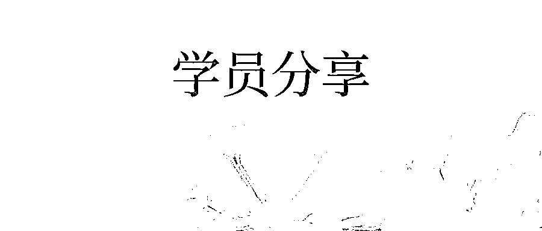

作者 催眠操作者：付娟

编辑：丽雯

图片：网络源自量子催眠复训的真实记录

我是一名心理咨询老师，接触我们的量子催眠我觉得是冥冥之中已经指引的事情，我一个朋友是学传统催眠，**在她参加的一次催眠课程中他们学员之间讨论过目前中国最权威和最有魅力的催眠就是我们的量子催眠**，所以我们的朵奶奶在催眠领域无论口碑还是效果都是值得赞扬的。

所以，我是在接触过其它催眠以后，最后选择学习咱们量子催眠的，很庆幸自己的选择，因为在这次复训中让我更加坚定了未来从事量子催眠的决心。

**第一次操作，催眠的妈妈**

在学习课程的时候，当时还有自己的主业，也是因为工作原因，一直断断续续地在听视频，只是听到一些从未听到过的词语和个案可以看到前世的那种惊叹，慢慢再学下去，觉得如果我去催眠可以让个案看到前世一定是件很自豪的事，所以在刚刚学完之后心潮澎湃地，就傻傻地在没有按着正确流程的情况下给自己的母亲做了一个催眠，因为当时个人认为自己的母亲的情况自己已经足够了解了，所以就直接进入到催眠状态，结果因为妈妈年龄的原因，在问一些画面的时候，一直在问妈妈，您看到红色的鸟，黄色的花，妈妈的回答都是看不到，看不到，当时自己也不懂，就说看不到没关系，想象一下就可以，勉强继续进行，但是，在进展到被美丽的白光金字塔完全笼罩的时候妈妈已经躺不住了，感觉已经没有办法在继续了，所以就在这个时候唤醒了，整体就是很失败，不但没有完整，而且让我自己也很烦躁，感觉如果这样说下去就能看到前世自己也不相信。但是，即使这样也有一个收获，那就是整个 35 分钟的时长，妈妈的感觉只有十几分钟，但即使这样我也不敢再做第二次练习，所以，一直到培训的前一天我一直都只有这半个催眠的体验。

**复训前，做好了临阵逃脱的准备**

在 Vera 通知大家复训时间的时候我就看到课程表的第二天是学员之间互催，知道的那天开始内心就开始焦虑，在我的想象中我以为大家都已经可以脱稿去催眠，我很担心别人会笑话自己太懈怠。在 24 号分组的时候我一直很有负担，担心自己张不开嘴，不敢说，但是我觉得自己也已经很坚强了，不管结果如何，走一步看一步，大不了临阵脱逃看着大家做，自己只当观察者。

第一天的培训讲了很多干货，对于我来讲印象最深刻的却是 Leo 特别详细地解释了一开始就给亲人做催眠的困难，**对于成熟的催眠师给家人做催眠都是一个很难的挑战**，而我作为一个新手的身份就去在妈妈身上催眠，结果不理想其实是一个很正常的反应，Leo 的话像一道温暖的光照进我心里，一下让我有了力量，再次拾起了对催眠的信心。

第二天战战兢兢地来到了侃南中心，看到了既温和又善解人意的 Vera，刚一见面我就说了自己的顾虑，我说自己还没有尝试过催眠，流程也不熟练，甚至内容都说不通顺，但是她给了我莫大的信心，她说没关系的，你只要大胆的去念出来就行，如果不知道怎么问就说，还有呢？还看到什么，没事儿的，大家都一样，多催几个就会好的。

**作为新手催眠师，我的第一次被催经历**

帮我催眠的小伙伴是来自北京的一名英语老师，看到她的第一眼就觉得人很和善，还很照顾我，我们在面谈的过程，她帮我梳理了自己的经历，通过她的总结居然看到了对于我自己感情事件的一个规律，打破了我自己平时看到的、自认为的诉求，刨析出了我内心深处真正的需求，从未考虑过的点通过林琳的引导让我有了方向。

在催眠体验中，从未体验过的放松让我很快进入到了碎片画面，经历到最重要的一天和死去的那一天。无论催眠师怎么发问，当时我都没有任何作答，后来在听录音的时候才发现那个状态维持了 20 多分钟，应该是自己当时正在经历痛苦，好在林琳马上把我带出去了那个状态。最后，在接触潜意识的时候找到了自己的人生课题“奉献”，当知道自己人生课题的时候也同时解开了自己现在的处境，曾经一味觉得自己身边有链接的亲人都需要自己去为他们付出，为他们承受很大的经济压力，而清醒之后就很有力量感，并且没有了负担感。而问到自己未来方向的时候潜意识告诉我“帮助别人”。所以，和我现在的心理咨询工作和未来的量子催眠都是一致的，真的太让自己震撼了。特别庆幸自己有缘份接触到了朵奶奶的量子催眠，也感谢 Vera 的鼓励和林琳的催眠。

**第一次互催，开启了一扇探索的窄门**

最后，是我作为催眠师去催眠林琳，是她的发心让我和她一起去探索，在她的配合下完成了我自己的第一个个案，并且完整了整个流程，在整个过程中从前世到最重要的一天，到死去的那一天都是完整的，而且在清醒之后也分享了自己当时真实看到的两个画面，有关自己当时那一世人生课题和那一生的目的。她清楚得看到了手上的法器（她说出了法器的样子是中间细两边粗，是金属的上面还有花纹，而且她从未见过。）和一个石头房子，房顶是尖的，在事后她和她老公去谈论这件事的时候，她告诉我说她老公是知道这个房子的，还解释说她手上的并不是法器，只是一把钥匙，那个房子也不是房子，它是通往另外一个真相的门，是可以进去的，听到这些信息的时候心情真的是无比兴奋的。

**复训的第二天，再一次经历被催眠**

因为林琳做了两场催眠，所以第二天我们三人中没有做催眠的彩云同学又再次帮我做了一次催眠，而这次的催眠和前一天的催眠的场景是一致的，并且延续了前一天的死亡，没有体验痛苦的过程就直接说了死亡的那一天是冲水冲走的场景，**虽然还是没有画面感，可还是有了整个故事的完整性，这已经足以让我们都很振奋了**。

**后记**

通过这次培训让我深刻地认识到了量子催眠的强大力量，并且也坚定了自己未来会专心做量子催眠的事业。**这次体验也让我更加轻松地接纳了自己的人生，知道了自己的人生课题也接受了和自己有链接的亲人关系**。

最后，也祝福新加入的学员不要畏惧，我们量催的大家庭的磁场是会保护大家并且辅助大家通往你自己内心最期望的方向的。

•  END •

付娟

量子催眠一阶段学员

微信：fj850605

坐标：河北 

赞赏：点击赞赏鼓励分享喔！

记得预约你的催眠师

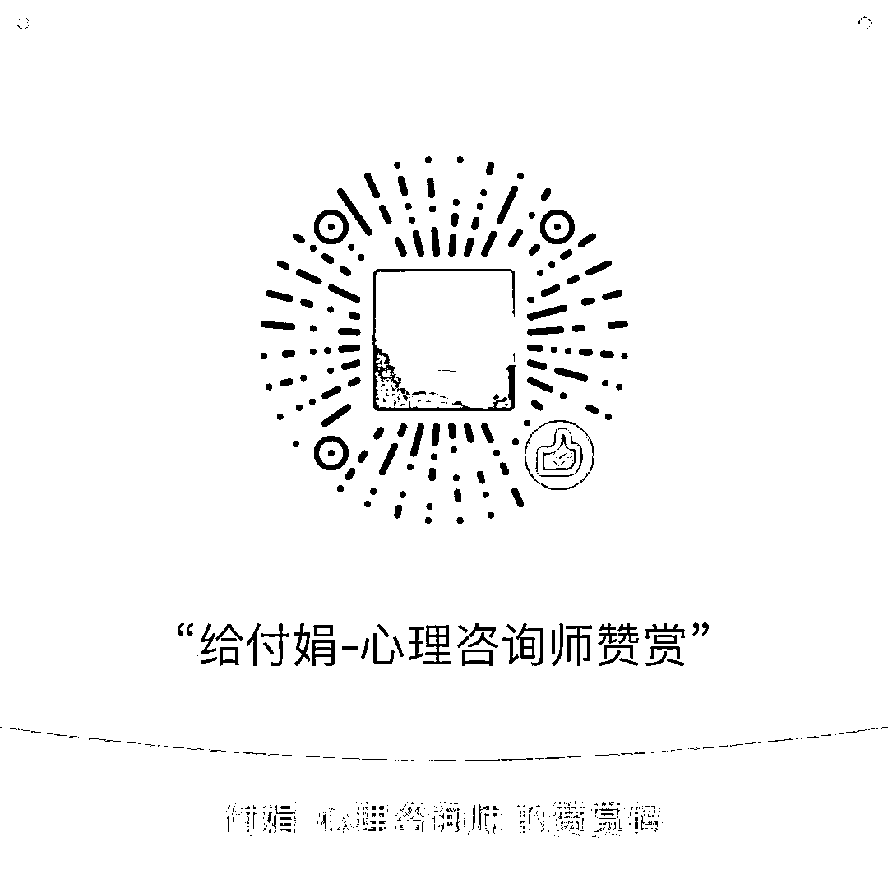

**点击了解更多****相关****文章**

[院长聊量催 | 情绪是一把钥匙](http://mp.weixin.qq.com/s?__biz=MzU0NjkzMDY0OA==&mid=2247494179&idx=1&sn=c9bcab5b2619adf93f148f2832766e58&chksm=fb548094cc2309824061985409c6fc035d121fdc35f93903c66132d65bc8ffa210d5b6610c11&scene=21#wechat_redirect)

[大师风采 | 身体是水晶体](http://mp.weixin.qq.com/s?__biz=MzU0NjkzMDY0OA==&mid=2247494162&idx=1&sn=c34b5adf0aa385b3c66701cbb90be49e&chksm=fb5480a5cc2309b34ab57a101c098167c6e916af70cc0c98dcebd7fa3a62ab37f43422b34c9b&scene=21#wechat_redirect)

[大师风采 | 前世回溯催眠大师朵洛莉丝·侃南的心路历程（一）](http://mp.weixin.qq.com/s?__biz=MzU0NjkzMDY0OA==&mid=2247493884&idx=1&sn=0a33bc63236a05f11a0192819995ed56&chksm=fb54824bcc230b5dc2d70bc22f1b69c2de4df45c9e80a42eae0bc29ce534aee9f1001b504603&scene=21#wechat_redirect)

点击“在看”好美哦↓

 点击预约你的催眠师

# 院长聊量催 | 情绪是一把钥匙

> 原文：[`mp.weixin.qq.com/s?__biz=MzU0NjkzMDY0OA==&mid=2247494243&idx=3&sn=4d5aa1893893aea02cdd2cb3c50a4335&chksm=fb5480d4cc2309c2aad1afaf03570978a4ef8920d2b6ac2f1eb6143a9d73a256f7592a86d1df&scene=126&sessionid=1690980639#rd`](http://mp.weixin.qq.com/s?__biz=MzU0NjkzMDY0OA==&mid=2247494243&idx=3&sn=4d5aa1893893aea02cdd2cb3c50a4335&chksm=fb5480d4cc2309c2aad1afaf03570978a4ef8920d2b6ac2f1eb6143a9d73a256f7592a86d1df&scene=126&sessionid=1690980639#rd)

点击上方蓝字关注我们

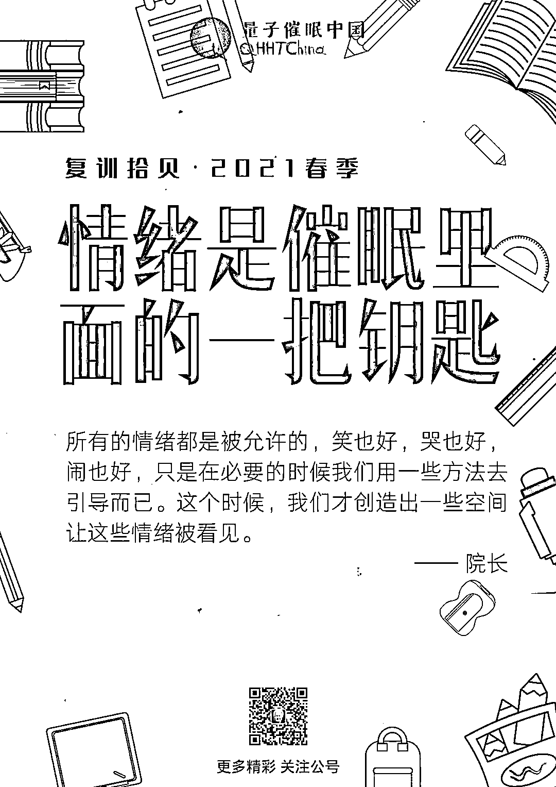

•  END •

**点击了解更多相关文章**

[传奇的前世回溯催眠大师朵洛莉丝·侃南自己的前世故事（一）](http://mp.weixin.qq.com/s?__biz=MzU0NjkzMDY0OA==&mid=2247493392&idx=1&sn=8d7dc7901219b0f53b315d5e2e997c9f&chksm=fb548da7cc2304b1b3684e6903ec3add38fd1cd4e581c2ae651f970dda775918d4c6ed2cb9e7&scene=21#wechat_redirect)

[大师风采 | 前世回溯催眠大师朵洛莉丝·侃南的心路历程（一）](http://mp.weixin.qq.com/s?__biz=MzU0NjkzMDY0OA==&mid=2247493884&idx=1&sn=0a33bc63236a05f11a0192819995ed56&chksm=fb54824bcc230b5dc2d70bc22f1b69c2de4df45c9e80a42eae0bc29ce534aee9f1001b504603&scene=21#wechat_redirect)

点击“在看”好美哦↓

 点击预约你的催眠师

# 2021 年量子催眠一阶段课程重磅来袭！

> 原文：[`mp.weixin.qq.com/s?__biz=MzU0NjkzMDY0OA==&mid=2247494243&idx=1&sn=9aa4cfe4918e097e0088027445b92000&chksm=fb5480d4cc2309c2476121dcd5201b8c89fca15932158517fdd0f209a4d8cb16a3c1ca816fab&scene=126&sessionid=1690980639#rd`](http://mp.weixin.qq.com/s?__biz=MzU0NjkzMDY0OA==&mid=2247494243&idx=1&sn=9aa4cfe4918e097e0088027445b92000&chksm=fb5480d4cc2309c2476121dcd5201b8c89fca15932158517fdd0f209a4d8cb16a3c1ca816fab&scene=126&sessionid=1690980639#rd)

点击上方蓝字关注我们

   

**点击了解更多**

[院长聊量催 | 情绪是一把钥匙](http://mp.weixin.qq.com/s?__biz=MzU0NjkzMDY0OA==&mid=2247494179&idx=1&sn=c9bcab5b2619adf93f148f2832766e58&chksm=fb548094cc2309824061985409c6fc035d121fdc35f93903c66132d65bc8ffa210d5b6610c11&scene=21#wechat_redirect)

[大师风采 | 身体是水晶体](http://mp.weixin.qq.com/s?__biz=MzU0NjkzMDY0OA==&mid=2247494162&idx=1&sn=c34b5adf0aa385b3c66701cbb90be49e&chksm=fb5480a5cc2309b34ab57a101c098167c6e916af70cc0c98dcebd7fa3a62ab37f43422b34c9b&scene=21#wechat_redirect)

[传奇的前世回溯催眠大师朵洛莉丝·侃南自己的前世故事（一）](http://mp.weixin.qq.com/s?__biz=MzU0NjkzMDY0OA==&mid=2247493392&idx=1&sn=8d7dc7901219b0f53b315d5e2e997c9f&chksm=fb548da7cc2304b1b3684e6903ec3add38fd1cd4e581c2ae651f970dda775918d4c6ed2cb9e7&scene=21#wechat_redirect)

点击“在看”好美哦↓

 点击预约你的催眠师

# 大师风采 | 多面向的灵魂（十）

> 原文：[`mp.weixin.qq.com/s?__biz=MzU0NjkzMDY0OA==&mid=2247494195&idx=1&sn=dbfeed9f110b9c67fc1f1cab6e173636&chksm=fb548084cc2309920dabef2a95237bd7fceb0f355c2d0cc95060da2e1938559e757e3bc20d7f&scene=126&sessionid=1690980639#rd`](http://mp.weixin.qq.com/s?__biz=MzU0NjkzMDY0OA==&mid=2247494195&idx=1&sn=dbfeed9f110b9c67fc1f1cab6e173636&chksm=fb548084cc2309920dabef2a95237bd7fceb0f355c2d0cc95060da2e1938559e757e3bc20d7f&scene=126&sessionid=1690980639#rd)

点击上方蓝字关注我们

      作者：朵洛莉丝·侃南

编辑/翻译：kathy

图片：网络

文章内容改编自量子催眠创始人朵洛莉丝·侃南的专著《回旋宇宙 2》，仅供读者参考

米：我应该做的是观察，但是我过于投入到人们的苦难中，这是种介入。我们有计划，相比之下，计划更为重要。不是说人们和各样的存有不重要。只是，这一切都是暂时的。你必须记住要正确地看待事物。我度过了一段艰难的时光。

朵：你不应该因为人们而生起情绪？

米：不，我应该保持大局观。意识到是我们选择了这些体验来学习和成长。我被情绪困住了，失去了整体感。

朵：那些人选择了身处那样的局面。

米：我不够相信他们，他们正在做他们需要做的。这很复杂。这是一个复杂的局面，相信他们，相信计划，但是同时辨识需要去发展以进行替代的部分。

朵：所以，如果你在另一个行星上面发展出了食物以供他们生活，这不是一种干扰式地介入？

米：不。但是我被戏剧化的部分所钩住，为情绪所阻碍，因此我无法执行计划。我被困住了。

朵：但是，这很难不被困住，不是吗？

米：很难，很难。

朵：你不可能没有情绪。

米：我无法保持大局观。如果你能够保持大局观，你就可以做到。我不能做到，这太难了。

这在其它的案例（[点击阅读](http://mp.weixin.qq.com/s?__biz=MzU0NjkzMDY0OA==&mid=2247493813&idx=1&sn=3d5c6e891f3156144c252201d883ea88&chksm=fb548202cc230b14e31486f1bcc9aa03ab3c6f32a2ec06698d4e9004ba6c5e6a2e5b65e55144&scene=21#wechat_redirect)《大师风采 | 朵奶奶通过量子催眠帮助莫纳找到减肥不成功的原因》）中也发生过，在《星之遗产》中有过报告，来自其它星系的存有来到了地球执行任务，他们与人们过于密切地接触。当这些发生，他们必须在地球上面转世，而不是回到他们自己的星球。在某种程度上，他们造了业。

朵：所以，他决定不让你回去？

米：是的，我没能做成。他认为我换个位置能做得更好。或许你不能再下来，而在那个位置观察。你需要被隔开。

朵：他还想要你在什么位置？

米：我正…我需要…我在消失…看上去有事在发生，而我正在消失。我还不知道那是什么。这不可怕。我只是无法与我自己相连，就像我浮起来了。我到了其它地方。

她的身体猝然一动。她突然哈哈大笑。我无法理解她为什么大笑。

•  END •

**点击了解更多相关文章**

[大师风采 | 朵奶奶通过量子催眠帮助莫纳找到减肥不成功的原因（一）](http://mp.weixin.qq.com/s?__biz=MzU0NjkzMDY0OA==&mid=2247493813&idx=1&sn=3d5c6e891f3156144c252201d883ea88&chksm=fb548202cc230b14e31486f1bcc9aa03ab3c6f32a2ec06698d4e9004ba6c5e6a2e5b65e55144&scene=21#wechat_redirect)

[大师风采 | 多面向的灵魂（一）](http://mp.weixin.qq.com/s?__biz=MzU0NjkzMDY0OA==&mid=2247494152&idx=1&sn=60c1d55bac53b14dc1a48ff843a7216d&chksm=fb5480bfcc2309a964393df8d45d307ff587955a98d93447d6ed6c0a43184e88eea1b5bbc24c&scene=21#wechat_redirect)

[院长聊量催 | 情绪是一把钥匙](http://mp.weixin.qq.com/s?__biz=MzU0NjkzMDY0OA==&mid=2247494179&idx=1&sn=c9bcab5b2619adf93f148f2832766e58&chksm=fb548094cc2309824061985409c6fc035d121fdc35f93903c66132d65bc8ffa210d5b6610c11&scene=21#wechat_redirect)

点击“在看”好美哦↓

 点击预约你的催眠师

# 院长聊量催 | 情绪是一把钥匙

> 原文：[`mp.weixin.qq.com/s?__biz=MzU0NjkzMDY0OA==&mid=2247494179&idx=1&sn=c9bcab5b2619adf93f148f2832766e58&chksm=fb548094cc2309824061985409c6fc035d121fdc35f93903c66132d65bc8ffa210d5b6610c11&scene=126&sessionid=1690980639#rd`](http://mp.weixin.qq.com/s?__biz=MzU0NjkzMDY0OA==&mid=2247494179&idx=1&sn=c9bcab5b2619adf93f148f2832766e58&chksm=fb548094cc2309824061985409c6fc035d121fdc35f93903c66132d65bc8ffa210d5b6610c11&scene=126&sessionid=1690980639#rd)

点击上方蓝字关注我们

•  END •

**点击了解更多相关文章**

[大师风采 | 多面向的灵魂（一）](http://mp.weixin.qq.com/s?__biz=MzU0NjkzMDY0OA==&mid=2247494152&idx=1&sn=60c1d55bac53b14dc1a48ff843a7216d&chksm=fb5480bfcc2309a964393df8d45d307ff587955a98d93447d6ed6c0a43184e88eea1b5bbc24c&scene=21#wechat_redirect)

[大师风采 | 多面向的灵魂（九）](http://mp.weixin.qq.com/s?__biz=MzU0NjkzMDY0OA==&mid=2247494175&idx=1&sn=eae298ce10877191a090500782542306&chksm=fb5480a8cc2309be1dd8146654f4fcd1b433adb7eb1922042ab41e9e04cad863b5f144fde696&scene=21#wechat_redirect)

[大师风采 | 灵魂的童年](http://mp.weixin.qq.com/s?__biz=MzU0NjkzMDY0OA==&mid=2247494148&idx=1&sn=9e107f2e9e24fdbbee16515dd3dc163a&chksm=fb5480b3cc2309a5c350e579bbf87080703978dd9dc448c5228ec7f5675f99a42368abccc5f2&scene=21#wechat_redirect)

点击“在看”好美哦↓

 点击预约你的催眠师

# 大师风采 | 多面向的灵魂（九）

> 原文：[`mp.weixin.qq.com/s?__biz=MzU0NjkzMDY0OA==&mid=2247494175&idx=1&sn=eae298ce10877191a090500782542306&chksm=fb5480a8cc2309be1dd8146654f4fcd1b433adb7eb1922042ab41e9e04cad863b5f144fde696&scene=126&sessionid=1690980639#rd`](http://mp.weixin.qq.com/s?__biz=MzU0NjkzMDY0OA==&mid=2247494175&idx=1&sn=eae298ce10877191a090500782542306&chksm=fb5480a8cc2309be1dd8146654f4fcd1b433adb7eb1922042ab41e9e04cad863b5f144fde696&scene=126&sessionid=1690980639#rd)

点击上方蓝字关注我们

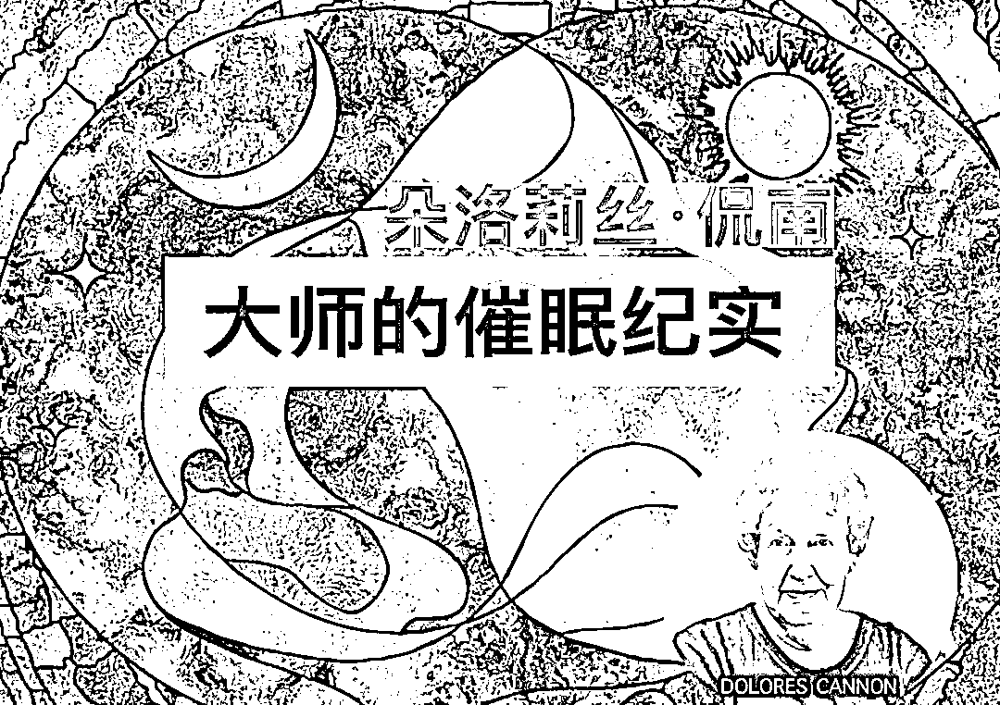

      作者：朵洛莉丝·侃南

编辑/翻译：kathy

图片：网络

文章内容改编自量子催眠创始人朵洛莉丝·侃南的专著《回旋宇宙 2》，仅供读者参考

朵：你怎么想？他是对的吗？

米：是的。我以为我知道我在干什么。它就和普通的游历没有区别，但是，并非如此。我没有准备好。嗯，我正在努力听着。（停顿）我着陆地太快。我无法用语言描述，就像发射过头了。我飞得过了……

朵：飞过了坐标位置？

米：是的。类似的难以解释的状况。你必须非常精确。不仅仅是坐标，数字。而是在使用数字时候与之匹配的念头。

朵：你是不是准备再试一次？

米：不。他说**我介入我想要实现的部分太多，去帮助他人的部分，导致我对于计划和使命失去了应有的关注**。他说事情是这样发生的。

朵：计划和使命是什么？

米：帮助他们找到其它替代的转世之地，以此减缓行星的负载。

•  END •

**点击了解更多相关文章**

[大师风采 | 多面向的灵魂（一）](http://mp.weixin.qq.com/s?__biz=MzU0NjkzMDY0OA==&mid=2247494152&idx=1&sn=60c1d55bac53b14dc1a48ff843a7216d&chksm=fb5480bfcc2309a964393df8d45d307ff587955a98d93447d6ed6c0a43184e88eea1b5bbc24c&scene=21#wechat_redirect)

[大师风采 | 多面向的灵魂（八）](http://mp.weixin.qq.com/s?__biz=MzU0NjkzMDY0OA==&mid=2247494174&idx=1&sn=8b8ab9dd75318fc4ccb33f007c7a8d31&chksm=fb5480a9cc2309bf4cc1d837007acfa1a80cddd574d133ef26d29d5f3b3abb671cf5ba709c6a&scene=21#wechat_redirect)

[大师风采 | 灵魂的童年](http://mp.weixin.qq.com/s?__biz=MzU0NjkzMDY0OA==&mid=2247494148&idx=1&sn=9e107f2e9e24fdbbee16515dd3dc163a&chksm=fb5480b3cc2309a5c350e579bbf87080703978dd9dc448c5228ec7f5675f99a42368abccc5f2&scene=21#wechat_redirect)

点击“在看”好美哦↓

 点击预约你的催眠师

# 大师风采 | 多面向的灵魂（八）

> 原文：[`mp.weixin.qq.com/s?__biz=MzU0NjkzMDY0OA==&mid=2247494174&idx=1&sn=8b8ab9dd75318fc4ccb33f007c7a8d31&chksm=fb5480a9cc2309bf4cc1d837007acfa1a80cddd574d133ef26d29d5f3b3abb671cf5ba709c6a&scene=126&sessionid=1690980639#rd`](http://mp.weixin.qq.com/s?__biz=MzU0NjkzMDY0OA==&mid=2247494174&idx=1&sn=8b8ab9dd75318fc4ccb33f007c7a8d31&chksm=fb5480a9cc2309bf4cc1d837007acfa1a80cddd574d133ef26d29d5f3b3abb671cf5ba709c6a&scene=126&sessionid=1690980639#rd)

点击上方蓝字关注我们

      作者：朵洛莉丝·侃南

编辑/翻译：kathy

图片：网络

文章内容改编自量子催眠创始人朵洛莉丝·侃南的专著《回旋宇宙 2》，仅供读者参考

这在我之前的工作中也报告过。有部分 ET 离开了光的能量，它们使用一些设备能够使得它们回到产生它们所需要的光能量的地方。

在《星之遗产》中说到，**对于未来生活在地底下的存有来说，它们会沐浴光能量**。所有的**这类吸收光能量的存有都一致地说，使得它们维持生命的光来自于源头**（the Source）。

朵：但是你在说的是在另一个行星上面的物质身体。

米：欧，是的。当我们去到不同的地方，我们必须采用不同的身体形式，这样我们能够在那里停留，得以适应环境。

朵：你是什么样子的？

米：很难看到我自己。嗯，天，我无法描述它。与其说是样貌，不如说是一种感觉。它……语言描述是多余的。

朵：我只是想确定这不是灵界。这是另一种光的身体吗？（是。）好的，你是否打算回到长者那里，告诉他们坐标位置不对？

米：是的。我可以看到她。他有——如果我们就以“他”来称呼——一个圆脑袋。他有细长的脖子，细长的手臂。他的形状多变。他一开始是那个样子，现在他看上去更加地光亮。在不同的思想频率，不同的环境下，他的形态是各异的。我告诉他发生了什么。他有点嘲笑我的样子，他告诉我是我的骄傲阻隘了我，我是如此确定我知道正确的位置，我忘记了细节。他并不担心。

•  END •

**点击了解更多相关文章**

[大师风采 | 多面向的灵魂（一）](http://mp.weixin.qq.com/s?__biz=MzU0NjkzMDY0OA==&mid=2247494152&idx=1&sn=60c1d55bac53b14dc1a48ff843a7216d&chksm=fb5480bfcc2309a964393df8d45d307ff587955a98d93447d6ed6c0a43184e88eea1b5bbc24c&scene=21#wechat_redirect)

[大师风采 | 身体是水晶体](http://mp.weixin.qq.com/s?__biz=MzU0NjkzMDY0OA==&mid=2247494162&idx=1&sn=c34b5adf0aa385b3c66701cbb90be49e&chksm=fb5480a5cc2309b34ab57a101c098167c6e916af70cc0c98dcebd7fa3a62ab37f43422b34c9b&scene=21#wechat_redirect)

[大师风采 | 灵魂的童年](http://mp.weixin.qq.com/s?__biz=MzU0NjkzMDY0OA==&mid=2247494148&idx=1&sn=9e107f2e9e24fdbbee16515dd3dc163a&chksm=fb5480b3cc2309a5c350e579bbf87080703978dd9dc448c5228ec7f5675f99a42368abccc5f2&scene=21#wechat_redirect)

点击“在看”好美哦↓

 点击预约你的催眠师

# 大师风采 | 多面向的灵魂（七）

> 原文：[`mp.weixin.qq.com/s?__biz=MzU0NjkzMDY0OA==&mid=2247494173&idx=1&sn=77784747676286f2c84ac0830c977875&chksm=fb5480aacc2309bcf5ac23d532846bcbdbcb9e787d9fdc92fae777340d3d905185745b106ef3&scene=126&sessionid=1690980639#rd`](http://mp.weixin.qq.com/s?__biz=MzU0NjkzMDY0OA==&mid=2247494173&idx=1&sn=77784747676286f2c84ac0830c977875&chksm=fb5480aacc2309bcf5ac23d532846bcbdbcb9e787d9fdc92fae777340d3d905185745b106ef3&scene=126&sessionid=1690980639#rd)

点击上方蓝字关注我们

      作者：朵洛莉丝·侃南

编辑/翻译：kathy

图片：网络

文章内容改编自量子催眠创始人朵洛莉丝·侃南的专著《回旋宇宙 2》，仅供读者参考

朵：你如何为你的身体吸收光？

米：从太阳。**它合成一切，是最小、最小的粒子。甚至不是粒子，它是波，以波的形式**。我们都吸收它，它为我们所有的一切而存在。

朵：但是当你在其它的行星上面，你就与它分开了。

米：是的，我必须非常专注。就像在两个世界行走。这很难。

朵：你可以和光长久地分开吗？

米：不，不，不能很久。

朵：所以你需要它来维持你的生命。

米：是的，我需要，它组成了我。

•  END •

**点击了解更多相关文章**

[春季复训 | 2021 年量子催眠线下部分（实地复训课）改为直播课程！](http://mp.weixin.qq.com/s?__biz=MzU0NjkzMDY0OA==&mid=2247494144&idx=2&sn=dd7f265acdd15c74060544b07a8fb20d&chksm=fb5480b7cc2309a18a4035290c1b905f47977b64e2dff18c7a3403a45b97df51507fcd7be339&scene=21#wechat_redirect)

[大师风采 | 多面向的灵魂（一）](http://mp.weixin.qq.com/s?__biz=MzU0NjkzMDY0OA==&mid=2247494152&idx=1&sn=60c1d55bac53b14dc1a48ff843a7216d&chksm=fb5480bfcc2309a964393df8d45d307ff587955a98d93447d6ed6c0a43184e88eea1b5bbc24c&scene=21#wechat_redirect)

[大师风采 | 身体是水晶体](http://mp.weixin.qq.com/s?__biz=MzU0NjkzMDY0OA==&mid=2247494162&idx=1&sn=c34b5adf0aa385b3c66701cbb90be49e&chksm=fb5480a5cc2309b34ab57a101c098167c6e916af70cc0c98dcebd7fa3a62ab37f43422b34c9b&scene=21#wechat_redirect)

点击“在看”好美哦↓

 点击预约你的催眠师

# 大师风采 | 多面向的灵魂（六）

> 原文：[`mp.weixin.qq.com/s?__biz=MzU0NjkzMDY0OA==&mid=2247494172&idx=1&sn=3c2cb68160704797894fe2c65ada68ac&chksm=fb5480abcc2309bd99abc0e603d53b093ae12c100ca99a18ff0dd046fc8e64f75dd7a8bb9755&scene=126&sessionid=1690980639#rd`](http://mp.weixin.qq.com/s?__biz=MzU0NjkzMDY0OA==&mid=2247494172&idx=1&sn=3c2cb68160704797894fe2c65ada68ac&chksm=fb5480abcc2309bd99abc0e603d53b093ae12c100ca99a18ff0dd046fc8e64f75dd7a8bb9755&scene=126&sessionid=1690980639#rd)

点击上方蓝字关注我们

      作者：朵洛莉丝·侃南

编辑/翻译：kathy

图片：网络

文章内容改编自量子催眠创始人朵洛莉丝·侃南的专著《回旋宇宙 2》，仅供读者参考

在前面的第十七章，另一个外星人去到了其它的行星和小行星搜集土地的样本。这些被搜集起来以分析行星是否适宜生命的生存。区别是他乘坐的是一艘单人飞船。

朵：无论何时出发，你都需要想象那个设计吗？

米：数字是根据你去的地方产生，有所不同。

朵：好的，现在你回到了你所属的地方。那个地方是什么样子的？

米：那是种极致的平静和安宁。之前我觉得自己离开了舒适区，感到非常不安。那股能量并不和谐。它带来更多的紧张感。那是为什么我觉得自己被惹恼了。

朵：你的家乡，是什么样子的？

米：（停顿）很难用语言形容。

朵：是物质态的吗，固体的？

米：是的。但是和其它许多行星不同。肉眼可见的，但是它没有其它行星那么致密。

朵：它有高楼和城市吗？

米：它更加基于感觉，有连结的感觉。

朵：在那个地方，你们消耗食物吗？（不）（她看上去仿佛很惊讶。）你用什么来维持生命？

米：光，太阳。

•  END •

**点击了解更多相关文章**

[春季复训 | 2021 年量子催眠线下部分（实地复训课）改为直播课程！](http://mp.weixin.qq.com/s?__biz=MzU0NjkzMDY0OA==&mid=2247494144&idx=2&sn=dd7f265acdd15c74060544b07a8fb20d&chksm=fb5480b7cc2309a18a4035290c1b905f47977b64e2dff18c7a3403a45b97df51507fcd7be339&scene=21#wechat_redirect)

[大师风采 | 多面向的灵魂（一）](http://mp.weixin.qq.com/s?__biz=MzU0NjkzMDY0OA==&mid=2247494152&idx=1&sn=60c1d55bac53b14dc1a48ff843a7216d&chksm=fb5480bfcc2309a964393df8d45d307ff587955a98d93447d6ed6c0a43184e88eea1b5bbc24c&scene=21#wechat_redirect)

[大师风采 | 身体是水晶体](http://mp.weixin.qq.com/s?__biz=MzU0NjkzMDY0OA==&mid=2247494162&idx=1&sn=c34b5adf0aa385b3c66701cbb90be49e&chksm=fb5480a5cc2309b34ab57a101c098167c6e916af70cc0c98dcebd7fa3a62ab37f43422b34c9b&scene=21#wechat_redirect)

点击“在看”好美哦↓

 点击预约你的催眠师

# 大师风采 | 多面向的灵魂（五）

> 原文：[`mp.weixin.qq.com/s?__biz=MzU0NjkzMDY0OA==&mid=2247494171&idx=1&sn=c72a3e929501bf70222ca727fae4ff5c&chksm=fb5480accc2309baeebb4da77b018288cb95652022b5bb5336f5c8d957576df2a29ea2629852&scene=126&sessionid=1690980639#rd`](http://mp.weixin.qq.com/s?__biz=MzU0NjkzMDY0OA==&mid=2247494171&idx=1&sn=c72a3e929501bf70222ca727fae4ff5c&chksm=fb5480accc2309baeebb4da77b018288cb95652022b5bb5336f5c8d957576df2a29ea2629852&scene=126&sessionid=1690980639#rd)

点击上方蓝字关注我们

      作者：朵洛莉丝·侃南

编辑/翻译：kathy

图片：网络

文章内容改编自量子催眠创始人朵洛莉丝·侃南的专著《回旋宇宙 2》，仅供读者参考

米：我用得最多的一个是有一个基座，一条直线。然后，它进入一个点，这就成形了…我甚至无法解释它，是很难理解。但是它有些弧度，看上去很像蜡烛的光，我猜。

朵：像火光？

米：（强调）是的！它往上看上去是一个三角形，但是不完全是那样。

朵：你画出来的形状吗？

米：我用头脑想出来的。是基于意愿出发而构建的。意愿允许你做你需要做的。但是我认为某种程度上我没有做对。这很令人困惑。就像我到了某个我不该去的地方。之前我以为我的坐标是对的。

朵：但是你想出来了一个形状、一个设计，数字是 6244，它把你带到了你所归属的地方？

米：是的。上升回到了家乡。

•  END •

**点击了解更多相关文章**

[春季复训 | 2021 年量子催眠线下部分（实地复训课）改为直播课程！](http://mp.weixin.qq.com/s?__biz=MzU0NjkzMDY0OA==&mid=2247494144&idx=2&sn=dd7f265acdd15c74060544b07a8fb20d&chksm=fb5480b7cc2309a18a4035290c1b905f47977b64e2dff18c7a3403a45b97df51507fcd7be339&scene=21#wechat_redirect)

[大师风采 | 多面向的灵魂（四）](http://mp.weixin.qq.com/s?__biz=MzU0NjkzMDY0OA==&mid=2247494170&idx=1&sn=7f74f213cf0d4c85037fb09fc27d4921&chksm=fb5480adcc2309bb66ee8aba51a943c57210f661dc436e344e5254c49d29b838579b790ecbfe&scene=21#wechat_redirect)

[大师风采 | 身体是水晶体](http://mp.weixin.qq.com/s?__biz=MzU0NjkzMDY0OA==&mid=2247494162&idx=1&sn=c34b5adf0aa385b3c66701cbb90be49e&chksm=fb5480a5cc2309b34ab57a101c098167c6e916af70cc0c98dcebd7fa3a62ab37f43422b34c9b&scene=21#wechat_redirect)

点击“在看”好美哦↓

 点击预约你的催眠师

# 大师风采 | 多面向的灵魂（四）

> 原文：[`mp.weixin.qq.com/s?__biz=MzU0NjkzMDY0OA==&mid=2247494170&idx=1&sn=7f74f213cf0d4c85037fb09fc27d4921&chksm=fb5480adcc2309bb66ee8aba51a943c57210f661dc436e344e5254c49d29b838579b790ecbfe&scene=126&sessionid=1690980639#rd`](http://mp.weixin.qq.com/s?__biz=MzU0NjkzMDY0OA==&mid=2247494170&idx=1&sn=7f74f213cf0d4c85037fb09fc27d4921&chksm=fb5480adcc2309bb66ee8aba51a943c57210f661dc436e344e5254c49d29b838579b790ecbfe&scene=126&sessionid=1690980639#rd)

点击上方蓝字关注我们

      作者：朵洛莉丝·侃南

编辑/翻译：kathy

图片：网络

文章内容改编自量子催眠创始人朵洛莉丝·侃南的专著《回旋宇宙 2》，仅供读者参考

米：我预见到当我们有其它可以去的地方，能够帮助缓解一些情况。朵：所以，你的意思是当他们转世去处理他们的业力，他们不必要回到那些拥挤的地方？（是）但是你不打算帮助已经在那里的人们？米：不，我们不能介入。朵：如果你不能帮助他们换地方，唯一的出路是给他们另一个地方，另一个选择。所以你的工作是去找到一个可以种植食物的地方，因为如果那里没有食物和可以维持生命的方式，他们不会转世到那里。（是）你如何做到呢？米：这是问题。我不知道怎么做。我必须回去，重新计划。我不知道这里发生了什么。食物比天大，这个地方看上去没有我们以为有的东西。必须有一个方法来开始种植，这里看上去不是一个好的环境。我可能犯了错误，我以为我拥有了坐标，我可能没有足够重视。数字非常重要，形状也非常重要。朵：就是你说的坐标吗？米：是的。数字和形状可以给我指出正确的方向。他们可以据此传输我过去。我一直收到数字 6-2 4-4。她的身体突然地、意料之外地猝然一动。她笑了，“突然之间，我出发了！”朵：我知道你猛地出去了。你出去地如此之快，是通过想那些数字吗？米：是的。我回到了我所属的星球。在我知道之前，我已经到了。（笑）朵：所以你必须知道数字和形状来帮助你传送？（是的。）什么样的形状？

•  END •

**点击了解更多相关文章**

[春季复训 | 2021 年量子催眠线下部分（实地复训课）改为直播课程！](http://mp.weixin.qq.com/s?__biz=MzU0NjkzMDY0OA==&mid=2247494144&idx=2&sn=dd7f265acdd15c74060544b07a8fb20d&chksm=fb5480b7cc2309a18a4035290c1b905f47977b64e2dff18c7a3403a45b97df51507fcd7be339&scene=21#wechat_redirect)

[大师风采 | 多面向的灵魂（三）](http://mp.weixin.qq.com/s?__biz=MzU0NjkzMDY0OA==&mid=2247494154&idx=1&sn=b987713e7881285a8f9cdbef0a77db60&chksm=fb5480bdcc2309ab48bda2e40c010343141e72a1901bac99c9ef1e5c3d7ef8109f7e5919205e&scene=21#wechat_redirect)

[大师风采 | 身体是水晶体](http://mp.weixin.qq.com/s?__biz=MzU0NjkzMDY0OA==&mid=2247494162&idx=1&sn=c34b5adf0aa385b3c66701cbb90be49e&chksm=fb5480a5cc2309b34ab57a101c098167c6e916af70cc0c98dcebd7fa3a62ab37f43422b34c9b&scene=21#wechat_redirect)

点击“在看”好美哦↓

 点击预约你的催眠师

# 必看！2021 年 3 月春季复训须知

> 原文：[`mp.weixin.qq.com/s?__biz=MzU0NjkzMDY0OA==&mid=2247494170&idx=2&sn=d9688bded8cd7f0ad4f6862a03ac7a67&chksm=fb5480adcc2309bbbcd01fb39c03fd470ead93ce62c5f88fa9b5655e33ac4e3f57351005db5a&scene=126&sessionid=1690980639#rd`](http://mp.weixin.qq.com/s?__biz=MzU0NjkzMDY0OA==&mid=2247494170&idx=2&sn=d9688bded8cd7f0ad4f6862a03ac7a67&chksm=fb5480adcc2309bbbcd01fb39c03fd470ead93ce62c5f88fa9b5655e33ac4e3f57351005db5a&scene=126&sessionid=1690980639#rd)

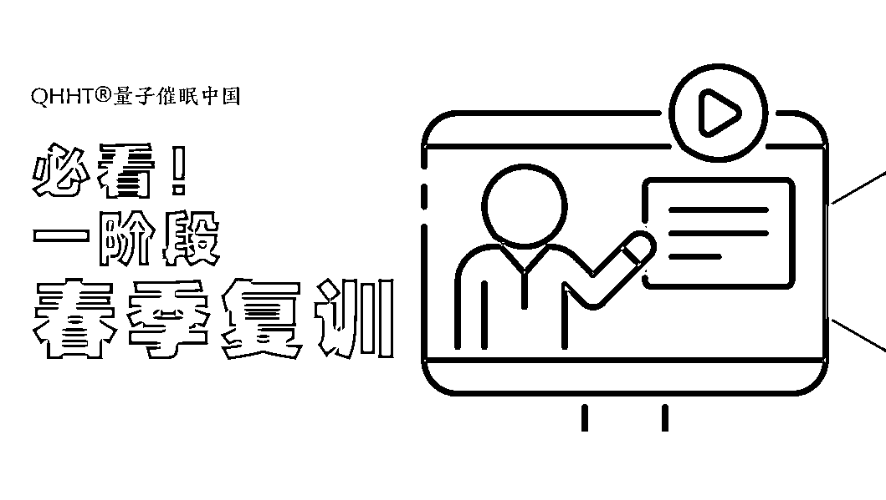

复训进入倒计时，这次是直播课程，量子催眠中国第一次采取这样的方式，让我们共同做好准备。

**01**

提前的准备

课程直播使用的是 钉钉平台。

请在手机，平板或者电脑上下载好 APP “钉钉”。

重要提示

钉钉图标

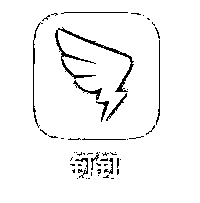

**02**

如何加入直播群

1.  填写复训报名表，留下你的相关信息。

2.  下载钉钉后，会通过你报名的手机自动邀请你入群。请点击完成入群的激活。

重要提示

1.  已报名同学请及时检查自己是否已加入钉钉系统中的 2021 年 3 月量子催眠复训群。

2.  还没有加入的同学，请及时查看你所预留的手机里来自钉钉系统的通知。

3.  未能按照上诉情况加入直播群的同学，请及时联系工作人员薇拉。

**03**

准备互催小组

1.这次复训，请大家在当地就近提前自发组织 3 人催眠小组，在复训的第二天，是专门预留的小组互催时间，也可以根据小组成员时间提早安排。

2.催眠小组安排好后，自愿以小组名义报名课程第三天的交流分享，量子催眠操作者们交流与分享催眠经验，是复训环节非常重要的一环，参与的同学也会获得课程老师 Leo 的相关指导和点评，请大家积极参与。

3.最终会根据小组报名情况，机动选择 8 组学员分享。如果报名小组不足 8 组，会安排提问环节进行交流。

4.报名截止时间为：2021 年 3 月 25 日晚上 24 点。

**04**

复训课程表

开课时间: 2021 年 3 月 26 日--29 日

1.  早上 9:30 --12:30

2.  下午 2:00 --6:30

    第一天：一阶课程精华梳理

    第二天：互催小组活动

    第三天：催眠交流与分享

    第四天：集体回溯体验，交流与分享

**05**

复训课程有效期

此次复训课程设置回放时效为两个星期，以方便没有及时参与直播并想参加复训的同学。

量子催眠中国工作人员

薇拉

微信号：wangvera666

祝您学习愉快！

# 大师风采 | 身体是水晶体

> 原文：[`mp.weixin.qq.com/s?__biz=MzU0NjkzMDY0OA==&mid=2247494162&idx=1&sn=c34b5adf0aa385b3c66701cbb90be49e&chksm=fb5480a5cc2309b34ab57a101c098167c6e916af70cc0c98dcebd7fa3a62ab37f43422b34c9b&scene=126&sessionid=1690980639#rd`](http://mp.weixin.qq.com/s?__biz=MzU0NjkzMDY0OA==&mid=2247494162&idx=1&sn=c34b5adf0aa385b3c66701cbb90be49e&chksm=fb5480a5cc2309b34ab57a101c098167c6e916af70cc0c98dcebd7fa3a62ab37f43422b34c9b&scene=126&sessionid=1690980639#rd)

点击上方蓝字关注我们

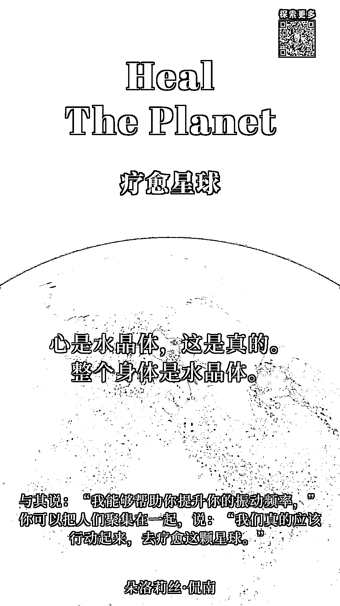

      作者：朵洛莉丝·侃南

编辑/翻译：kathy

图片：网络

文章内容改编自量子催眠创始人朵洛莉丝·侃南的专著《回旋宇宙 4》，仅供读者参考

当地球的振动开始提升，万事万物开始变化。所以，对于迷失的人们，他们不知道做什么，他们无法与我们同频共振，他们和你也不在同一个层面，无法理解你说的提升他们内在的频率，那么，请求他们去帮助其他人。因为如果他们以任何方式帮助别人——如果他们帮助一个生灵，如果他们疗愈一颗星球，如果他们感受到自己在帮助别人或者帮助星球，这就提升了他们的频率。

•  END •

**点击了解更多****相关****文章**

[春季复训 | 2021 年量子催眠线下部分（实地复训课）改为直播课程！](http://mp.weixin.qq.com/s?__biz=MzU0NjkzMDY0OA==&mid=2247494144&idx=2&sn=dd7f265acdd15c74060544b07a8fb20d&chksm=fb5480b7cc2309a18a4035290c1b905f47977b64e2dff18c7a3403a45b97df51507fcd7be339&scene=21#wechat_redirect)

[大师风采 | 多面向的灵魂（一）](http://mp.weixin.qq.com/s?__biz=MzU0NjkzMDY0OA==&mid=2247494152&idx=1&sn=60c1d55bac53b14dc1a48ff843a7216d&chksm=fb5480bfcc2309a964393df8d45d307ff587955a98d93447d6ed6c0a43184e88eea1b5bbc24c&scene=21#wechat_redirect)

[QHHT®量子催眠疗愈技术一阶段课程](http://mp.weixin.qq.com/s?__biz=MzU0NjkzMDY0OA==&mid=2247491054&idx=2&sn=11c47c5f98b8392ee25a1298a2f89668&chksm=fb577759cc20fe4f3283e7523e138845792685fd8e5f03de4397246df1c978e9b0cf91402ded&scene=21#wechat_redirect)

点击“在看”好美哦↓

 点击预约你的催眠师

# 大师风采 | 多面向的灵魂（三）

> 原文：[`mp.weixin.qq.com/s?__biz=MzU0NjkzMDY0OA==&mid=2247494154&idx=1&sn=b987713e7881285a8f9cdbef0a77db60&chksm=fb5480bdcc2309ab48bda2e40c010343141e72a1901bac99c9ef1e5c3d7ef8109f7e5919205e&scene=126&sessionid=1690980644#rd`](http://mp.weixin.qq.com/s?__biz=MzU0NjkzMDY0OA==&mid=2247494154&idx=1&sn=b987713e7881285a8f9cdbef0a77db60&chksm=fb5480bdcc2309ab48bda2e40c010343141e72a1901bac99c9ef1e5c3d7ef8109f7e5919205e&scene=126&sessionid=1690980644#rd)

点击上方蓝字关注我们

      作者：朵洛莉丝·侃南

编辑/翻译：kathy

图片：网络

文章内容改编自量子催眠创始人朵洛莉丝·侃南的专著《回旋宇宙 2》，仅供读者参考

米：有一些家族在互相伤害。（哭泣）他们不给其他人食物。有些人有得吃，有些人没有。（大叹气。）

朵：这个家族也居住在你所在的地方吗？

米：不，他们不在。但是我从人们口中得知。

朵：但是如果他们不在你所居住的地方，你是如何得知他们的呢？

米：因为我们穿梭游历到不同的地方。（她还是很情绪化，但是平静下来了。）应该要团结一致。那是我们想要的。我们中的一部分知道，一部分不知道。我们都作为不同的组成部分努力带来团结，所以我们都有这个觉悟。所以我们能够意识到我们的连结，停止这些疯狂的行为。

朵：你居住的地方是团结的，但是你想要帮助其它的星球？

米：是的，我看到过两个。一个星球上面他们不给需要的人食物。他们需要另一个环境。有些星球上面太过于拥挤了。你可以预料到人群会持续到一个点，问题会产生。有的地方即使人们愿意分享食物，也做不到。

朵：那有什么办法呢？去另外一个星球种植食物吗？

米：（大叹气）所以我们可以有其它的地方来经验和学习。不一定要在这些星球上。

朵：当你开始种植食物，会发生什么？

米：然后**人们可以选择在这些星球上面进行转世**。

朵：**那么你不需要在物质层面把这些拥挤星球上面的人们搬到这些星球上**？

米：**不**。但是我看到在这些星球上面发生了什么，我感到难过。

•  END •

**点击了解更多****相关****文章**

[春季复训 | 2021 年量子催眠线下部分（实地复训课）改为直播课程！](http://mp.weixin.qq.com/s?__biz=MzU0NjkzMDY0OA==&mid=2247494144&idx=2&sn=dd7f265acdd15c74060544b07a8fb20d&chksm=fb5480b7cc2309a18a4035290c1b905f47977b64e2dff18c7a3403a45b97df51507fcd7be339&scene=21#wechat_redirect)

[大师风采 | 多面向的灵魂（一）](http://mp.weixin.qq.com/s?__biz=MzU0NjkzMDY0OA==&mid=2247494152&idx=1&sn=60c1d55bac53b14dc1a48ff843a7216d&chksm=fb5480bfcc2309a964393df8d45d307ff587955a98d93447d6ed6c0a43184e88eea1b5bbc24c&scene=21#wechat_redirect)

[大师风采 | 多面向的灵魂（二）](http://mp.weixin.qq.com/s?__biz=MzU0NjkzMDY0OA==&mid=2247494153&idx=1&sn=e13ef66e61c09d3ee7f1c157678ef730&chksm=fb5480becc2309a801a60b9ebb936868489e5042aa27aa33e8c66f0e2408fcdc258f33988748&scene=21#wechat_redirect)

点击“在看”好美哦↓

 点击预约你的催眠师

# 春季复训 | 2021 年量子催眠线下部分（实地复训课）改为直播课程！

> 原文：[`mp.weixin.qq.com/s?__biz=MzU0NjkzMDY0OA==&mid=2247494154&idx=2&sn=24adbb7555023b711bcfb4d4129ebba1&chksm=fb5480bdcc2309ab55e5db4053d5e335d6f8309e0c156d58feec550f62b2f5118dfa97ba96ab&scene=126&sessionid=1690980644#rd`](http://mp.weixin.qq.com/s?__biz=MzU0NjkzMDY0OA==&mid=2247494154&idx=2&sn=24adbb7555023b711bcfb4d4129ebba1&chksm=fb5480bdcc2309ab55e5db4053d5e335d6f8309e0c156d58feec550f62b2f5118dfa97ba96ab&scene=126&sessionid=1690980644#rd)

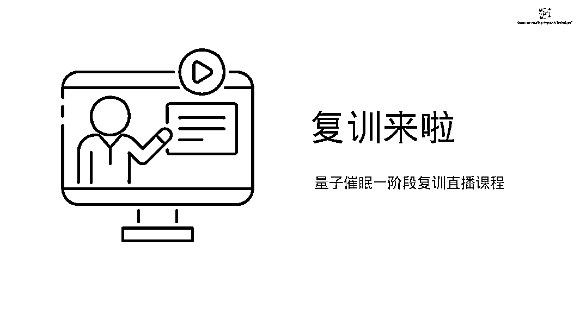

**关于一阶线下课程的通知**

2021 春季，鉴于目前疫情的风险和北京地区管控的状况，为了尽量避免大家的损失，我们 2021 年的春季复训依然采用“直播+线下分组互催”的方式，请大家提早安排时间和计划，详细课程安排见下。**复训课程形式：**

*   第一天：

线上直播：复训课程内容和问答

*   第二天：

线下活动：各地学员自由组合互催（或自由活动）

*   第三天：

线上直播：互催同学分享和提问，点评

*   第四天：

线上直播：集体催眠和分享，提问

**关于复训时间节点**

2021 年度春季复训开课时间：2021 年 3 月 26 日～29 日   
上午 9：30---12：30 下午 14：30---18：30 开课地点：

*   直播间：钉钉“2021 年量催春季一阶复训直播群”

*   直播授课：课程主持：Leo（量子催眠中国负责人、“院长”）

**关于课程计划**

课程内容包含：• 一阶段课程精华认知梳理• 关于量子催眠课程外的实操须知• 量催引导中文声音集体练习• 互催练习、真实案例分享及讨论• 朵洛莉丝·侃南集体回溯方法 ♥复训课程包含的“朵洛莉丝.侃南集体回溯”的学习，它作为一种朵奶奶的独门武器，可以面向更广大的人群，很好的消除大众对催眠的陌生感，并能有效的推广你的催眠服务。♥复训后同时会获得两个月线上课和朵奶奶集体催眠线上课开放权限

**关于复训报名**

复训报名只针对 QHHT®量子催眠一阶段官方正式学员

报名条件：

完成并通过一阶段的线上学习。

“线上一阶+复训内容，才是完整的一阶段”

**01** **首次复训报名**•如果您是 2019 年以后新版量子催眠一阶段的学员：复训课程费用已经包含在量子催眠一阶段课程计划内，您无需再次缴纳量子催眠一阶段的复训课程费用。• 如果您是往期（2019 年以前）的量子催眠学员以及海外学习的学员：请进行复训报名并支付相应的费用。提示：在缴纳费用后，你即可获得终身免费参加线下复训活动的资格啦！复训费用包含了终身复训和其它一阶段的学员支持配套。•复训费用：4500 元**02** **再次复训报名**• 如果你已经参加过复训课程，想再次进修提高自己：免课程费用。**03** **此次直播费用**• 网络服务费用 29 元。

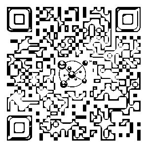

请扫描二维码，完成报名步骤

**为什么要参加一阶复训**

量子催眠一阶段课程是量子催眠学习的核心课程，虽然上完了一阶段的课程，还会有很多疑问。 

你是否觉得信息量太大？满怀兴奋，却不知道从何下手？

是否还没有体验过属于你自己的被催眠经历？

是否觉得开始了实践后，在过程中有许多疑问？

....

♥对于学习了线上一阶段的量催“新学员”来说，学习课程看似很简单，但真正的考验从实际操作才开始，遇到的问题和如何将学到的知识应用于实践会是我们接下来要用心学习的部分。复训是一次量催操作概念得以形成正确雏形的破冰之旅，它将激励和帮助每一位量子催眠操作者正确的进入角色；♥对于量催“老学员”来说，温故知新，每一次的复训都会拥有巨大的收获，欢迎一直走在量催道路上的伙伴回来，带着初心再一次认识量催以及分享自己的感悟。在经过一段实践操作的过程之后，每一位即将迈入新阶段的操作者，在重新审视一阶段的内容时，都将会有让自己意想不到的发现。祝福每一位参加复训的量子催眠操作者从此踏上更坚实的一阶台阶。 课程相关咨询：Vera 薇拉 微信号：wangvera666

# 大师风采 | 多面向的灵魂（二）

> 原文：[`mp.weixin.qq.com/s?__biz=MzU0NjkzMDY0OA==&mid=2247494153&idx=1&sn=e13ef66e61c09d3ee7f1c157678ef730&chksm=fb5480becc2309a801a60b9ebb936868489e5042aa27aa33e8c66f0e2408fcdc258f33988748&scene=126&sessionid=1690980644#rd`](http://mp.weixin.qq.com/s?__biz=MzU0NjkzMDY0OA==&mid=2247494153&idx=1&sn=e13ef66e61c09d3ee7f1c157678ef730&chksm=fb5480becc2309a801a60b9ebb936868489e5042aa27aa33e8c66f0e2408fcdc258f33988748&scene=126&sessionid=1690980644#rd)

点击上方蓝字关注我们

      作者：朵洛莉丝·侃南

编辑/翻译：kathy

图片：网络

文章内容改编自量子催眠创始人朵洛莉丝·侃南的专著《回旋宇宙 2》，仅供读者参考

当米歇尔开始感知到身体，她发现她穿着银色的类似于箔做的衬衫和裤子。“我看着我的手，皮肤是绿色的样子。”我问她有几根手指：“有三根大手指是我用的。小的手指特别地小。我有大拇指，但是我从来不用左边的大拇指，因为它不好使。右手的大拇指是利索的。”她感觉身体是男性，但是她知道她是雌雄同体。她只有稀稀落落的缕缕黑发。

她的注意力从身体转移开了，当她意识到她的背上背着一些设备。“是一个小小的白色的包袱。很像一个手提箱。我正在扫描地面。我应该是在寻找什么。嗯，我不觉得这里可以拿来种植，土地很贫瘠。”

朵：你知道你在找什么吗？

米：一个种食物的地方。我被告知这里可能是个对的地方，但是我不认为。它看上去很贫瘠。我不知道我是不是在对的地方。没有很明显的生长迹象。只有这些小块的绿松石，锯齿状的灌木丛。我如何描述它？有弹性的样子——我感觉我有点害怕。手足无措。

朵：你为什么害怕？

米：或许是因为我无法找到这样一个可以持续使得人们填饱肚子的地方。我不知道我可不可以。

朵：那是你的工作吗？

米：是的。我说我可以。我觉得我高估了。我认为我没有做到我之前以为的。

朵：你为什么挑选这个地方？

米：在长者的指引下我来到了这里。我也告诉他们我可以找到地方。但是我看……我在对的地方吗？或许我来错地方了。或许我没有在做我本应该做的。我感觉我迷失了。

朵：这是你住的地方吗？

米：（强调）不！不，不是。我住的地方是另一个地方。

朵：你怎么到那儿的？

米：基本靠想。把我自己发射到那里。

朵：你不是搭载一个物体或什么里面过去的？

米：并不是，不是的。

朵：你就是可以瞬间把自己移动到那里，你的意思是？（是）有没有其他人和你一起？

米：是的。有其他人，他们在后面盯着我。他们有些生气。他们和我的感受相同。我们不明白为什么我们在这里。我们觉得坐标是对的。我不认为这个地方能长出食物。

朵：你必须为你的人民种植食物吗？

米：我的人民没有问题。但是，所有灵魂的家族……我们都是一体的。所有人。有一些家族没有足够的食物，以及足够的住所。

她开始变得情绪化，开始哭泣。很难理解她。

•  END •

**点击了解更多****相关****文章**

[春季复训 | 2021 年量子催眠线下部分（实地复训课）改为直播课程！](http://mp.weixin.qq.com/s?__biz=MzU0NjkzMDY0OA==&mid=2247494144&idx=2&sn=dd7f265acdd15c74060544b07a8fb20d&chksm=fb5480b7cc2309a18a4035290c1b905f47977b64e2dff18c7a3403a45b97df51507fcd7be339&scene=21#wechat_redirect)

[大师风采 | 多面向的灵魂（一）](http://mp.weixin.qq.com/s?__biz=MzU0NjkzMDY0OA==&mid=2247494152&idx=1&sn=60c1d55bac53b14dc1a48ff843a7216d&chksm=fb5480bfcc2309a964393df8d45d307ff587955a98d93447d6ed6c0a43184e88eea1b5bbc24c&scene=21#wechat_redirect)

[大师风采 | 时间与通灵能力](http://mp.weixin.qq.com/s?__biz=MzU0NjkzMDY0OA==&mid=2247494129&idx=1&sn=376ec35bcd4832156c27dab8aff1ee51&chksm=fb548346cc230a505ca4facc3c549a69ab2e5ba559dc850b195bc291469a4a94a16492769433&scene=21#wechat_redirect)

[大师风采 | 灵魂的童年](http://mp.weixin.qq.com/s?__biz=MzU0NjkzMDY0OA==&mid=2247494148&idx=1&sn=9e107f2e9e24fdbbee16515dd3dc163a&chksm=fb5480b3cc2309a5c350e579bbf87080703978dd9dc448c5228ec7f5675f99a42368abccc5f2&scene=21#wechat_redirect)

点击“在看”好美哦↓

 点击预约你的催眠师

# 大师风采 | 多面向的灵魂（一）

> 原文：[`mp.weixin.qq.com/s?__biz=MzU0NjkzMDY0OA==&mid=2247494152&idx=1&sn=60c1d55bac53b14dc1a48ff843a7216d&chksm=fb5480bfcc2309a964393df8d45d307ff587955a98d93447d6ed6c0a43184e88eea1b5bbc24c&scene=126&sessionid=1690980644#rd`](http://mp.weixin.qq.com/s?__biz=MzU0NjkzMDY0OA==&mid=2247494152&idx=1&sn=60c1d55bac53b14dc1a48ff843a7216d&chksm=fb5480bfcc2309a964393df8d45d307ff587955a98d93447d6ed6c0a43184e88eea1b5bbc24c&scene=126&sessionid=1690980644#rd)

点击上方蓝字关注我们

      作者：朵洛莉丝·侃南

编辑/翻译：kathy

图片：网络

文章内容改编自量子催眠创始人朵洛莉丝·侃南的专著《回旋宇宙 2》，仅供读者参考

在《回旋宇宙 1》中，我写了灵魂碎片。我接触到了这样的概念：**我们是更大的灵魂的一部分，以灵魂碎片的形式被分割，这样可以同时活出各样的存在**。我们意识不到这个部分，因为这样会非常令人费解，我们的人类心智无法理解。

这同时支持了《1》中所叙的有关生活在平行实相的概念，以及**当“实相”开始分裂，更多的实相持续被创造出来的理论**。我被告知我们人类的头脑永远无法完全理解这个部分。**这不是我们大脑的问题，是人类心智**。

因此，我被给予了举例和比喻，它们提供了这样的信息以帮助我们理解。我把它们看作是有趣的头脑训练。

•  END •

**点击了解更多****相关****文章**

[春季复训 | 2021 年量子催眠线下部分（实地复训课）改为直播课程！](http://mp.weixin.qq.com/s?__biz=MzU0NjkzMDY0OA==&mid=2247494144&idx=2&sn=dd7f265acdd15c74060544b07a8fb20d&chksm=fb5480b7cc2309a18a4035290c1b905f47977b64e2dff18c7a3403a45b97df51507fcd7be339&scene=21#wechat_redirect)

[大师风采 | 时间与通灵能力](http://mp.weixin.qq.com/s?__biz=MzU0NjkzMDY0OA==&mid=2247494129&idx=1&sn=376ec35bcd4832156c27dab8aff1ee51&chksm=fb548346cc230a505ca4facc3c549a69ab2e5ba559dc850b195bc291469a4a94a16492769433&scene=21#wechat_redirect)

[大师风采 | 如何直接与潜意识合作？](http://mp.weixin.qq.com/s?__biz=MzU0NjkzMDY0OA==&mid=2247494125&idx=1&sn=d0b34fec26665b2cc351c199252244c5&chksm=fb54835acc230a4c058804ad3c3653135085d979a03c8981e549caa222a4015ae5b3de823814&scene=21#wechat_redirect)

点击“在看”好美哦↓

 点击预约你的催眠师

# 春季复训 | 2021 年量子催眠线下部分（实地复训课）改为直播课程！

> 原文：[`mp.weixin.qq.com/s?__biz=MzU0NjkzMDY0OA==&mid=2247494152&idx=2&sn=21299447e37f2a976a03ae27c4e16344&chksm=fb5480bfcc2309a9a8d04663e9d7330dddff0064176434c945e49f4a7aae639c0dbe5f463a86&scene=126&sessionid=1690980644#rd`](http://mp.weixin.qq.com/s?__biz=MzU0NjkzMDY0OA==&mid=2247494152&idx=2&sn=21299447e37f2a976a03ae27c4e16344&chksm=fb5480bfcc2309a9a8d04663e9d7330dddff0064176434c945e49f4a7aae639c0dbe5f463a86&scene=126&sessionid=1690980644#rd)

**关于一阶线下课程的通知**

2021 春季，鉴于目前疫情的风险和北京地区管控的状况，为了尽量避免大家的损失，我们 2021 年的春季复训依然采用“直播+线下分组互催”的方式，请大家提早安排时间和计划，详细课程安排见下。**复训课程形式：**

*   第一天：

线上直播：复训课程内容和问答

*   第二天：

线下活动：各地学员自由组合互催（或自由活动）

*   第三天：

线上直播：互催同学分享和提问，点评

*   第四天：

线上直播：集体催眠和分享，提问

**关于复训时间节点**

2021 年度春季复训开课时间：2021 年 3 月 26 日～29 日   
上午 9：30---12：30 下午 14：30---18：30 开课地点：

*   直播间：钉钉“2021 年量催春季一阶复训直播群”

*   直播授课：课程主持：Leo（量子催眠中国负责人、“院长”）

**关于课程计划**

课程内容包含：• 一阶段课程精华认知梳理• 关于量子催眠课程外的实操须知• 量催引导中文声音集体练习• 互催练习、真实案例分享及讨论• 朵洛莉丝·侃南集体回溯方法 ♥复训课程包含的“朵洛莉丝.侃南集体回溯”的学习，它作为一种朵奶奶的独门武器，可以面向更广大的人群，很好的消除大众对催眠的陌生感，并能有效的推广你的催眠服务。♥复训后同时会获得两个月线上课和朵奶奶集体催眠线上课开放权限

**关于复训报名**

复训报名只针对 QHHT®量子催眠一阶段官方正式学员

报名条件：

完成并通过一阶段的线上学习。

“线上一阶+复训内容，才是完整的一阶段”

**01** **首次复训报名**•如果您是 2019 年以后新版量子催眠一阶段的学员：复训课程费用已经包含在量子催眠一阶段课程计划内，您无需再次缴纳量子催眠一阶段的复训课程费用。• 如果您是往期（2019 年以前）的量子催眠学员以及海外学习的学员：请进行复训报名并支付相应的费用。提示：在缴纳费用后，你即可获得终身免费参加线下复训活动的资格啦！复训费用包含了终身复训和其它一阶段的学员支持配套。•复训费用：4500 元**02** **再次复训报名**• 如果你已经参加过复训课程，想再次进修提高自己：免课程费用。**03** **此次直播费用**• 网络服务费用 29 元。

请扫描二维码，完成报名步骤

**为什么要参加一阶复训**

量子催眠一阶段课程是量子催眠学习的核心课程，虽然上完了一阶段的课程，还会有很多疑问。 

你是否觉得信息量太大？满怀兴奋，却不知道从何下手？

是否还没有体验过属于你自己的被催眠经历？

是否觉得开始了实践后，在过程中有许多疑问？

....

♥对于学习了线上一阶段的量催“新学员”来说，学习课程看似很简单，但真正的考验从实际操作才开始，遇到的问题和如何将学到的知识应用于实践会是我们接下来要用心学习的部分。复训是一次量催操作概念得以形成正确雏形的破冰之旅，它将激励和帮助每一位量子催眠操作者正确的进入角色；♥对于量催“老学员”来说，温故知新，每一次的复训都会拥有巨大的收获，欢迎一直走在量催道路上的伙伴回来，带着初心再一次认识量催以及分享自己的感悟。在经过一段实践操作的过程之后，每一位即将迈入新阶段的操作者，在重新审视一阶段的内容时，都将会有让自己意想不到的发现。祝福每一位参加复训的量子催眠操作者从此踏上更坚实的一阶台阶。 课程相关咨询：Vera 薇拉 微信号：wangvera666

# 春季复训 | 2021 年量子催眠线下部分（实地复训课）改为直播课程！

> 原文：[`mp.weixin.qq.com/s?__biz=MzU0NjkzMDY0OA==&mid=2247494148&idx=2&sn=89082d33155f3502c6d941905f3f0e6f&chksm=fb5480b3cc2309a50bdaad00f1b419cbacf496a02bd0545b50b101ae5e69c284fa68679ae6c8&scene=126&sessionid=1690980644#rd`](http://mp.weixin.qq.com/s?__biz=MzU0NjkzMDY0OA==&mid=2247494148&idx=2&sn=89082d33155f3502c6d941905f3f0e6f&chksm=fb5480b3cc2309a50bdaad00f1b419cbacf496a02bd0545b50b101ae5e69c284fa68679ae6c8&scene=126&sessionid=1690980644#rd)

**关于一阶线下课程的通知**

2021 春季，鉴于目前疫情的风险和北京地区管控的状况，为了尽量避免大家的损失，我们 2021 年的春季复训依然采用“直播+线下分组互催”的方式，请大家提早安排时间和计划，详细课程安排见下。**复训课程形式：**

*   第一天：

线上直播：复训课程内容和问答

*   第二天：

线下活动：各地学员自由组合互催（或自由活动）

*   第三天：

线上直播：互催同学分享和提问，点评

*   第四天：

线上直播：集体催眠和分享，提问

**关于复训时间节点**

2021 年度春季复训开课时间：2021 年 3 月 26 日～29 日   
上午 9：30---12：30 下午 14：30---18：30 开课地点：

*   直播间：钉钉“2021 年量催春季一阶复训直播群”

*   直播授课：课程主持：Leo（量子催眠中国负责人、“院长”）

**关于课程计划**

课程内容包含：• 一阶段课程精华认知梳理• 关于量子催眠课程外的实操须知• 量催引导中文声音集体练习• 互催练习、真实案例分享及讨论• 朵洛莉丝·侃南集体回溯方法 ♥复训课程包含的“朵洛莉丝.侃南集体回溯”的学习，它作为一种朵奶奶的独门武器，可以面向更广大的人群，很好的消除大众对催眠的陌生感，并能有效的推广你的催眠服务。♥复训后同时会获得两个月线上课和朵奶奶集体催眠线上课开放权限

**关于复训报名**

复训报名只针对 QHHT®量子催眠一阶段官方正式学员

报名条件：

完成并通过一阶段的线上学习。

“线上一阶+复训内容，才是完整的一阶段”

**01** **首次复训报名**•如果您是 2019 年以后新版量子催眠一阶段的学员：复训课程费用已经包含在量子催眠一阶段课程计划内，您无需再次缴纳量子催眠一阶段的复训课程费用。• 如果您是往期（2019 年以前）的量子催眠学员以及海外学习的学员：请进行复训报名并支付相应的费用。提示：在缴纳费用后，你即可获得终身免费参加线下复训活动的资格啦！复训费用包含了终身复训和其它一阶段的学员支持配套。•复训费用：4500 元**02** **再次复训报名**• 如果你已经参加过复训课程，想再次进修提高自己：免课程费用。**03** **此次直播费用**• 网络服务费用 29 元。

请扫描二维码，完成报名步骤

**为什么要参加一阶复训**

量子催眠一阶段课程是量子催眠学习的核心课程，虽然上完了一阶段的课程，还会有很多疑问。 

你是否觉得信息量太大？满怀兴奋，却不知道从何下手？

是否还没有体验过属于你自己的被催眠经历？

是否觉得开始了实践后，在过程中有许多疑问？

....

♥对于学习了线上一阶段的量催“新学员”来说，学习课程看似很简单，但真正的考验从实际操作才开始，遇到的问题和如何将学到的知识应用于实践会是我们接下来要用心学习的部分。复训是一次量催操作概念得以形成正确雏形的破冰之旅，它将激励和帮助每一位量子催眠操作者正确的进入角色；♥对于量催“老学员”来说，温故知新，每一次的复训都会拥有巨大的收获，欢迎一直走在量催道路上的伙伴回来，带着初心再一次认识量催以及分享自己的感悟。在经过一段实践操作的过程之后，每一位即将迈入新阶段的操作者，在重新审视一阶段的内容时，都将会有让自己意想不到的发现。祝福每一位参加复训的量子催眠操作者从此踏上更坚实的一阶台阶。 课程相关咨询：Vera 薇拉 微信号：wangvera666

# 大师风采 | 灵魂的童年

> 原文：[`mp.weixin.qq.com/s?__biz=MzU0NjkzMDY0OA==&mid=2247494148&idx=1&sn=9e107f2e9e24fdbbee16515dd3dc163a&chksm=fb5480b3cc2309a5c350e579bbf87080703978dd9dc448c5228ec7f5675f99a42368abccc5f2&scene=126&sessionid=1690980644#rd`](http://mp.weixin.qq.com/s?__biz=MzU0NjkzMDY0OA==&mid=2247494148&idx=1&sn=9e107f2e9e24fdbbee16515dd3dc163a&chksm=fb5480b3cc2309a5c350e579bbf87080703978dd9dc448c5228ec7f5675f99a42368abccc5f2&scene=126&sessionid=1690980644#rd)

点击上方蓝字关注我们

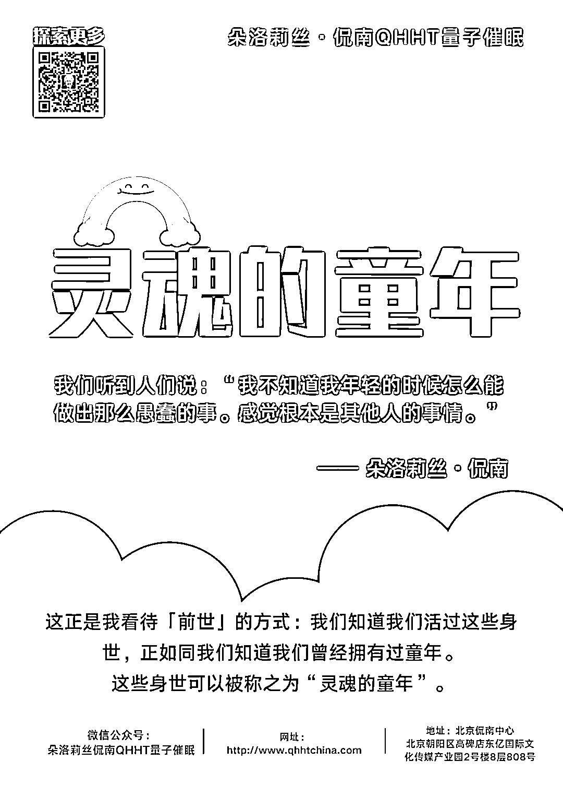

•  END •

**相关精彩内容**

[QHHT®量子催眠疗愈技术一阶段课程](http://mp.weixin.qq.com/s?__biz=MzU0NjkzMDY0OA==&mid=2247491054&idx=2&sn=11c47c5f98b8392ee25a1298a2f89668&chksm=fb577759cc20fe4f3283e7523e138845792685fd8e5f03de4397246df1c978e9b0cf91402ded&scene=21#wechat_redirect)

[大师风采 | 转世并非轮回](http://mp.weixin.qq.com/s?__biz=MzU0NjkzMDY0OA==&mid=2247494144&idx=1&sn=0b873f0cdcee7eb3c81e365153e5c3b4&chksm=fb5480b7cc2309a107e596250f0b26e6880b514bc675d311cefde330401c62873607584c0e78&scene=21#wechat_redirect)

[大师风采 | 有限的生命](http://mp.weixin.qq.com/s?__biz=MzU0NjkzMDY0OA==&mid=2247494138&idx=1&sn=b6f79f5f400ae12858911f0e12c096d6&chksm=fb54834dcc230a5b238bd0e0f90dfce2d59e560694045754d7d48faafed479e3c819ba293c31&scene=21#wechat_redirect)

[大师风采 | 时间与通灵能力](http://mp.weixin.qq.com/s?__biz=MzU0NjkzMDY0OA==&mid=2247494129&idx=1&sn=376ec35bcd4832156c27dab8aff1ee51&chksm=fb548346cc230a505ca4facc3c549a69ab2e5ba559dc850b195bc291469a4a94a16492769433&scene=21#wechat_redirect)

点击“在看”好美哦↓

 点击预约你的催眠师

# 大师风采 | 转世并非轮回

> 原文：[`mp.weixin.qq.com/s?__biz=MzU0NjkzMDY0OA==&mid=2247494144&idx=1&sn=0b873f0cdcee7eb3c81e365153e5c3b4&chksm=fb5480b7cc2309a107e596250f0b26e6880b514bc675d311cefde330401c62873607584c0e78&scene=126&sessionid=1690980644#rd`](http://mp.weixin.qq.com/s?__biz=MzU0NjkzMDY0OA==&mid=2247494144&idx=1&sn=0b873f0cdcee7eb3c81e365153e5c3b4&chksm=fb5480b7cc2309a107e596250f0b26e6880b514bc675d311cefde330401c62873607584c0e78&scene=126&sessionid=1690980644#rd)

点击上方蓝字关注我们

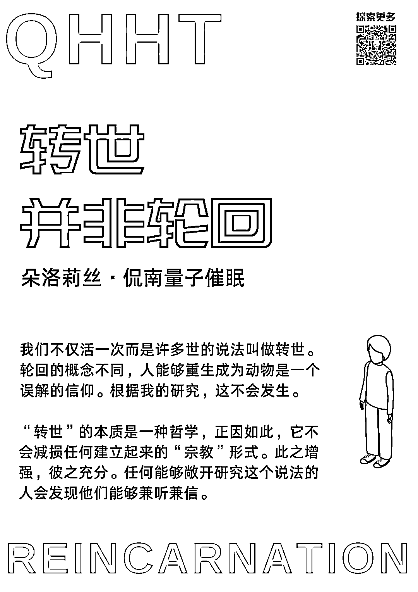

•  END •

**相关精彩内容**

[QHHT®量子催眠疗愈技术一阶段课程](http://mp.weixin.qq.com/s?__biz=MzU0NjkzMDY0OA==&mid=2247491054&idx=2&sn=11c47c5f98b8392ee25a1298a2f89668&chksm=fb577759cc20fe4f3283e7523e138845792685fd8e5f03de4397246df1c978e9b0cf91402ded&scene=21#wechat_redirect)

[大师风采 | 有限的生命](http://mp.weixin.qq.com/s?__biz=MzU0NjkzMDY0OA==&mid=2247494138&idx=1&sn=b6f79f5f400ae12858911f0e12c096d6&chksm=fb54834dcc230a5b238bd0e0f90dfce2d59e560694045754d7d48faafed479e3c819ba293c31&scene=21#wechat_redirect)

[大师风采 | 时间与通灵能力](http://mp.weixin.qq.com/s?__biz=MzU0NjkzMDY0OA==&mid=2247494129&idx=1&sn=376ec35bcd4832156c27dab8aff1ee51&chksm=fb548346cc230a505ca4facc3c549a69ab2e5ba559dc850b195bc291469a4a94a16492769433&scene=21#wechat_redirect)

点击“在看”好美哦↓

 点击预约你的催眠师

# 春季复训 | 2021 年量子催眠线下部分（实地复训课）改为直播课程！

> 原文：[`mp.weixin.qq.com/s?__biz=MzU0NjkzMDY0OA==&mid=2247494144&idx=2&sn=dd7f265acdd15c74060544b07a8fb20d&chksm=fb5480b7cc2309a18a4035290c1b905f47977b64e2dff18c7a3403a45b97df51507fcd7be339&scene=126&sessionid=1690980644#rd`](http://mp.weixin.qq.com/s?__biz=MzU0NjkzMDY0OA==&mid=2247494144&idx=2&sn=dd7f265acdd15c74060544b07a8fb20d&chksm=fb5480b7cc2309a18a4035290c1b905f47977b64e2dff18c7a3403a45b97df51507fcd7be339&scene=126&sessionid=1690980644#rd)

**关于一阶线下课程的通知**

2021 春季，鉴于目前疫情的风险和北京地区管控的状况，为了尽量避免大家的损失，我们 2021 年的春季复训依然采用“直播+线下分组互催”的方式，请大家提早安排时间和计划，详细课程安排见下。**复训课程形式：**

*   第一天：

线上直播：复训课程内容和问答

*   第二天：

线下活动：各地学员自由组合互催（或自由活动）

*   第三天：

线上直播：互催同学分享和提问，点评

*   第四天：

线上直播：集体催眠和分享，提问

**关于复训时间节点**

2021 年度春季复训开课时间：2021 年 3 月 26 日～29 日   
上午 9：30---12：30 下午 14：30---18：30 开课地点：

*   直播间：钉钉“2021 年量催春季一阶复训直播群”

*   直播授课：课程主持：Leo（量子催眠中国负责人、“院长”）

**关于课程计划**

课程内容包含：• 一阶段课程精华认知梳理• 关于量子催眠课程外的实操须知• 量催引导中文声音集体练习• 互催练习、真实案例分享及讨论• 朵洛莉丝·侃南集体回溯方法 ♥复训课程包含的“朵洛莉丝.侃南集体回溯”的学习，它作为一种朵奶奶的独门武器，可以面向更广大的人群，很好的消除大众对催眠的陌生感，并能有效的推广你的催眠服务。♥复训后同时会获得两个月线上课和朵奶奶集体催眠线上课开放权限

**关于复训报名**

复训报名只针对 QHHT®量子催眠一阶段官方正式学员

报名条件：

完成并通过一阶段的线上学习。

“线上一阶+复训内容，才是完整的一阶段”

**01** **首次复训报名**•如果您是 2019 年以后新版量子催眠一阶段的学员：复训课程费用已经包含在量子催眠一阶段课程计划内，您无需再次缴纳量子催眠一阶段的复训课程费用。• 如果您是往期（2019 年以前）的量子催眠学员以及海外学习的学员：请进行复训报名并支付相应的费用。提示：在缴纳费用后，你即可获得终身免费参加线下复训活动的资格啦！复训费用包含了终身复训和其它一阶段的学员支持配套。•复训费用：4500 元**02** **再次复训报名**• 如果你已经参加过复训课程，想再次进修提高自己：免课程费用。**03** **此次直播费用**• 网络服务费用 29 元。

请扫描二维码，完成报名步骤

**为什么要参加一阶复训**

量子催眠一阶段课程是量子催眠学习的核心课程，虽然上完了一阶段的课程，还会有很多疑问。 

你是否觉得信息量太大？满怀兴奋，却不知道从何下手？

是否还没有体验过属于你自己的被催眠经历？

是否觉得开始了实践后，在过程中有许多疑问？

....

♥对于学习了线上一阶段的量催“新学员”来说，学习课程看似很简单，但真正的考验从实际操作才开始，遇到的问题和如何将学到的知识应用于实践会是我们接下来要用心学习的部分。复训是一次量催操作概念得以形成正确雏形的破冰之旅，它将激励和帮助每一位量子催眠操作者正确的进入角色；♥对于量催“老学员”来说，温故知新，每一次的复训都会拥有巨大的收获，欢迎一直走在量催道路上的伙伴回来，带着初心再一次认识量催以及分享自己的感悟。在经过一段实践操作的过程之后，每一位即将迈入新阶段的操作者，在重新审视一阶段的内容时，都将会有让自己意想不到的发现。祝福每一位参加复训的量子催眠操作者从此踏上更坚实的一阶台阶。 课程相关咨询：Vera 薇拉 微信号：wangvera666

# 大师风采 | 有限的生命

> 原文：[`mp.weixin.qq.com/s?__biz=MzU0NjkzMDY0OA==&mid=2247494138&idx=1&sn=b6f79f5f400ae12858911f0e12c096d6&chksm=fb54834dcc230a5b238bd0e0f90dfce2d59e560694045754d7d48faafed479e3c819ba293c31&scene=126&sessionid=1690980644#rd`](http://mp.weixin.qq.com/s?__biz=MzU0NjkzMDY0OA==&mid=2247494138&idx=1&sn=b6f79f5f400ae12858911f0e12c096d6&chksm=fb54834dcc230a5b238bd0e0f90dfce2d59e560694045754d7d48faafed479e3c819ba293c31&scene=126&sessionid=1690980644#rd)

点击上方蓝字关注我们

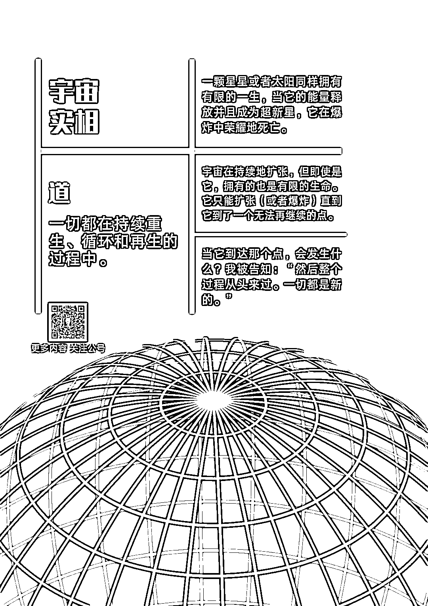

•  END •

**相关精彩内容**

[大师风采 | 前世回溯催眠大师朵洛莉丝·侃南的心路历程（十三）](http://mp.weixin.qq.com/s?__biz=MzU0NjkzMDY0OA==&mid=2247494096&idx=1&sn=cbbeee4f413d0eb88f6dcb42a671f2e0&chksm=fb548367cc230a717950d6ddf6315e0c6b530e255ebf0a9efecf9092d26cd09a5725e7fadf0e&scene=21#wechat_redirect)

[QHHT®量子催眠疗愈技术一阶段课程](http://mp.weixin.qq.com/s?__biz=MzU0NjkzMDY0OA==&mid=2247491054&idx=2&sn=11c47c5f98b8392ee25a1298a2f89668&chksm=fb577759cc20fe4f3283e7523e138845792685fd8e5f03de4397246df1c978e9b0cf91402ded&scene=21#wechat_redirect)

点击“在看”好美哦↓

 点击预约你的催眠师

# 大师风采 | 与我们身体内的细胞对话

> 原文：[`mp.weixin.qq.com/s?__biz=MzU0NjkzMDY0OA==&mid=2247494134&idx=1&sn=25ed0bcd170f573241737e6cc104cfe3&chksm=fb548341cc230a577632ce7bb1f0d5f3d55fcdc83392994bef20c49df3d35fd83bb785a4f664&scene=126&sessionid=1690980644#rd`](http://mp.weixin.qq.com/s?__biz=MzU0NjkzMDY0OA==&mid=2247494134&idx=1&sn=25ed0bcd170f573241737e6cc104cfe3&chksm=fb548341cc230a577632ce7bb1f0d5f3d55fcdc83392994bef20c49df3d35fd83bb785a4f664&scene=126&sessionid=1690980644#rd)

点击上方蓝字关注我们

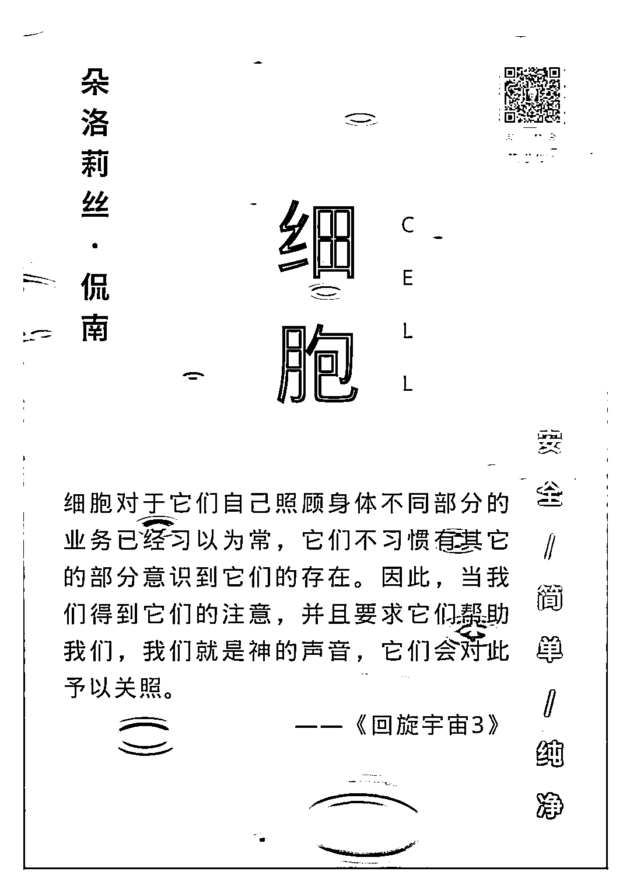

•  END •

**相关精彩内容**

[大师风采 | 前世回溯催眠大师朵洛莉丝·侃南的心路历程（九）](http://mp.weixin.qq.com/s?__biz=MzU0NjkzMDY0OA==&mid=2247493946&idx=2&sn=e99d8e7d405dd8ef5131a760044f633a&chksm=fb54838dcc230a9b0dd92ed022683a4cc3b64db174111923e29cd4ce58970bf12c49625b2272&scene=21#wechat_redirect)

[QHHT®量子催眠疗愈技术一阶段课程](http://mp.weixin.qq.com/s?__biz=MzU0NjkzMDY0OA==&mid=2247491054&idx=2&sn=11c47c5f98b8392ee25a1298a2f89668&chksm=fb577759cc20fe4f3283e7523e138845792685fd8e5f03de4397246df1c978e9b0cf91402ded&scene=21#wechat_redirect)

点击“在看”好美哦↓

 点击预约你的催眠师

# 大师风采 | 时间与通灵能力

> 原文：[`mp.weixin.qq.com/s?__biz=MzU0NjkzMDY0OA==&mid=2247494129&idx=1&sn=376ec35bcd4832156c27dab8aff1ee51&chksm=fb548346cc230a505ca4facc3c549a69ab2e5ba559dc850b195bc291469a4a94a16492769433&scene=126&sessionid=1690980644#rd`](http://mp.weixin.qq.com/s?__biz=MzU0NjkzMDY0OA==&mid=2247494129&idx=1&sn=376ec35bcd4832156c27dab8aff1ee51&chksm=fb548346cc230a505ca4facc3c549a69ab2e5ba559dc850b195bc291469a4a94a16492769433&scene=126&sessionid=1690980644#rd)

点击上方蓝字关注我们

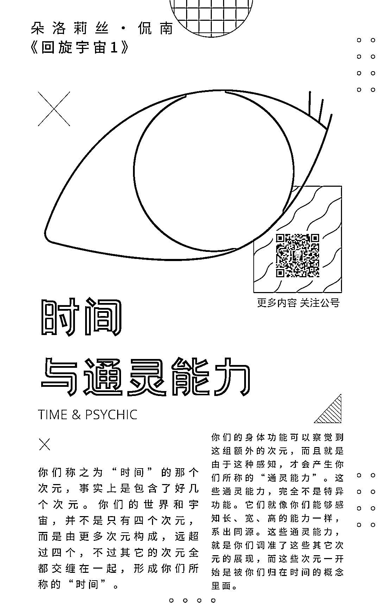

•  END •

**相关精彩内容**

[QHHT®量子催眠疗愈技术一阶段课程](http://mp.weixin.qq.com/s?__biz=MzU0NjkzMDY0OA==&mid=2247491054&idx=2&sn=11c47c5f98b8392ee25a1298a2f89668&chksm=fb577759cc20fe4f3283e7523e138845792685fd8e5f03de4397246df1c978e9b0cf91402ded&scene=21#wechat_redirect)

[春季复训 | 2021 年量子催眠线下部分（实地复训课）改为直播课程！](http://mp.weixin.qq.com/s?__biz=MzU0NjkzMDY0OA==&mid=2247494096&idx=2&sn=d6305255a5f29f2abdd16fce8497c810&chksm=fb548367cc230a71aadc5d5b444a4bbcf61ee4afe8561b7bd6394abfec5e59eb88c82caf0b11&scene=21#wechat_redirect)

[大师风采 | 时间真的存在吗？](http://mp.weixin.qq.com/s?__biz=MzU0NjkzMDY0OA==&mid=2247493258&idx=1&sn=f8491bc038f063b4fa8a1b78afefc921&chksm=fb548c3dcc23052b88eb6b422bb8d37de39b05fdaafad7422e6bf5a15070c9676254bca7aa14&scene=21#wechat_redirect)

点击“在看”好美哦↓

 点击预约你的催眠师

# 大师风采 | 如何直接与潜意识合作？

> 原文：[`mp.weixin.qq.com/s?__biz=MzU0NjkzMDY0OA==&mid=2247494125&idx=1&sn=d0b34fec26665b2cc351c199252244c5&chksm=fb54835acc230a4c058804ad3c3653135085d979a03c8981e549caa222a4015ae5b3de823814&scene=126&sessionid=1690980644#rd`](http://mp.weixin.qq.com/s?__biz=MzU0NjkzMDY0OA==&mid=2247494125&idx=1&sn=d0b34fec26665b2cc351c199252244c5&chksm=fb54835acc230a4c058804ad3c3653135085d979a03c8981e549caa222a4015ae5b3de823814&scene=126&sessionid=1690980644#rd)

点击上方蓝字关注我们

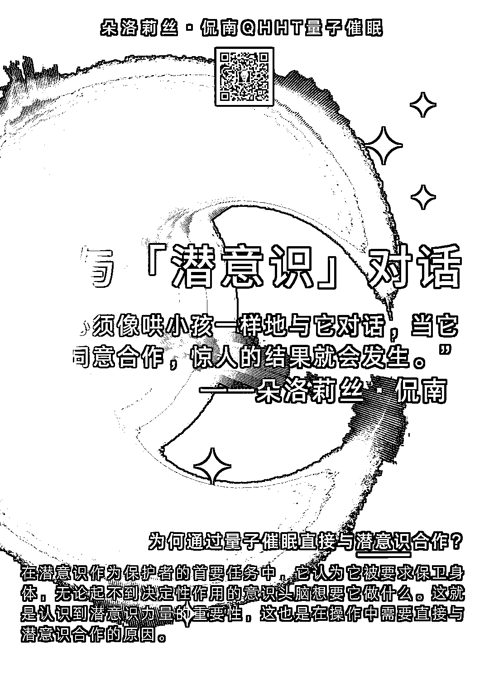

•  END •

**点击阅读相关的大师案例**

[大师风采 | 朵奶奶通过量子催眠帮助莫纳找到减肥不成功的原因（一）](http://mp.weixin.qq.com/s?__biz=MzU0NjkzMDY0OA==&mid=2247493813&idx=1&sn=3d5c6e891f3156144c252201d883ea88&chksm=fb548202cc230b14e31486f1bcc9aa03ab3c6f32a2ec06698d4e9004ba6c5e6a2e5b65e55144&scene=21#wechat_redirect)

**相关精彩内容**

[QHHT®量子催眠疗愈技术一阶段课程](http://mp.weixin.qq.com/s?__biz=MzU0NjkzMDY0OA==&mid=2247491054&idx=2&sn=11c47c5f98b8392ee25a1298a2f89668&chksm=fb577759cc20fe4f3283e7523e138845792685fd8e5f03de4397246df1c978e9b0cf91402ded&scene=21#wechat_redirect)

[春季复训 | 2021 年量子催眠线下部分（实地复训课）改为直播课程！](http://mp.weixin.qq.com/s?__biz=MzU0NjkzMDY0OA==&mid=2247494096&idx=2&sn=d6305255a5f29f2abdd16fce8497c810&chksm=fb548367cc230a71aadc5d5b444a4bbcf61ee4afe8561b7bd6394abfec5e59eb88c82caf0b11&scene=21#wechat_redirect)

[大师风采 | 关于释放恐惧的治疗技巧](http://mp.weixin.qq.com/s?__biz=MzU0NjkzMDY0OA==&mid=2247494109&idx=2&sn=e9e8551dc5da425053ef14981bdcbff4&chksm=fb54836acc230a7c78f212ae499465969d06af2fa8bc34347ed0072b0638ceec028c1232e33e&scene=21#wechat_redirect)

点击“在看”好美哦↓

 点击预约你的催眠师

# 春季复训 | 2021 年量子催眠线下部分（实地复训课）改为直播课程！

> 原文：[`mp.weixin.qq.com/s?__biz=MzU0NjkzMDY0OA==&mid=2247494118&idx=2&sn=8fad9cb97e7392b4f4d9884e3f0ee70f&chksm=fb548351cc230a471bd597e6dce27036006f72d6c49b12249e658cf687e729735cf18c8bbbc4&scene=126&sessionid=1690980644#rd`](http://mp.weixin.qq.com/s?__biz=MzU0NjkzMDY0OA==&mid=2247494118&idx=2&sn=8fad9cb97e7392b4f4d9884e3f0ee70f&chksm=fb548351cc230a471bd597e6dce27036006f72d6c49b12249e658cf687e729735cf18c8bbbc4&scene=126&sessionid=1690980644#rd)

**关于一阶线下课程的通知**

2021 春季，鉴于目前疫情的风险和北京地区管控的状况，为了尽量避免大家的损失，我们 2021 年的春季复训依然采用“直播+线下分组互催”的方式，请大家提早安排时间和计划，详细课程安排见下。**复训课程形式：**

*   第一天：

线上直播：复训课程内容和问答

*   第二天：

线下活动：各地学员自由组合互催（或自由活动）

*   第三天：

线上直播：互催同学分享和提问，点评

*   第四天：

线上直播：集体催眠和分享，提问

**关于复训时间节点**

2021 年度春季复训开课时间：2021 年 3 月 26 日～29 日   
上午 9：30---12：30 下午 14：30---18：30 开课地点：

*   直播间：钉钉“2021 年量催春季一阶复训直播群”

*   直播授课：课程主持：Leo（量子催眠中国负责人、“院长”）

**关于课程计划**

课程内容包含：• 一阶段课程精华认知梳理• 关于量子催眠课程外的实操须知• 量催引导中文声音集体练习• 互催练习、真实案例分享及讨论• 朵洛莉丝·侃南集体回溯方法 ♥复训课程包含的“朵洛莉丝.侃南集体回溯”的学习，它作为一种朵奶奶的独门武器，可以面向更广大的人群，很好的消除大众对催眠的陌生感，并能有效的推广你的催眠服务。♥复训后同时会获得两个月线上课和朵奶奶集体催眠线上课开放权限

**关于复训报名**

复训报名只针对 QHHT®量子催眠一阶段官方正式学员

报名条件：

完成并通过一阶段的线上学习。

“线上一阶+复训内容，才是完整的一阶段”

**01** **首次复训报名**•如果您是 2019 年以后新版量子催眠一阶段的学员：复训课程费用已经包含在量子催眠一阶段课程计划内，您无需再次缴纳量子催眠一阶段的复训课程费用。• 如果您是往期（2019 年以前）的量子催眠学员以及海外学习的学员：请进行复训报名并支付相应的费用。提示：在缴纳费用后，你即可获得终身免费参加线下复训活动的资格啦！复训费用包含了终身复训和其它一阶段的学员支持配套。•复训费用：4500 元**02** **再次复训报名**• 如果你已经参加过复训课程，想再次进修提高自己：免课程费用。**03** **此次直播费用**• 网络服务费用 29 元。

请扫描二维码，完成报名步骤

**为什么要参加一阶复训**

量子催眠一阶段课程是量子催眠学习的核心课程，虽然上完了一阶段的课程，还会有很多疑问。 

你是否觉得信息量太大？满怀兴奋，却不知道从何下手？

是否还没有体验过属于你自己的被催眠经历？

是否觉得开始了实践后，在过程中有许多疑问？

....

♥对于学习了线上一阶段的量催“新学员”来说，学习课程看似很简单，但真正的考验从实际操作才开始，遇到的问题和如何将学到的知识应用于实践会是我们接下来要用心学习的部分。复训是一次量催操作概念得以形成正确雏形的破冰之旅，它将激励和帮助每一位量子催眠操作者正确的进入角色；♥对于量催“老学员”来说，温故知新，每一次的复训都会拥有巨大的收获，欢迎一直走在量催道路上的伙伴回来，带着初心再一次认识量催以及分享自己的感悟。在经过一段实践操作的过程之后，每一位即将迈入新阶段的操作者，在重新审视一阶段的内容时，都将会有让自己意想不到的发现。祝福每一位参加复训的量子催眠操作者从此踏上更坚实的一阶台阶。 课程相关咨询：Vera 薇拉 微信号：wangvera666

# 大师风采 | 所有的事情都是好的

> 原文：[`mp.weixin.qq.com/s?__biz=MzU0NjkzMDY0OA==&mid=2247494118&idx=1&sn=f734e5894c7423cc04d70bbac5c261b9&chksm=fb548351cc230a47624829b3948fa25bf365e85b610462280227fe2bc8a41fd660c1b64221fb&scene=126&sessionid=1690980644#rd`](http://mp.weixin.qq.com/s?__biz=MzU0NjkzMDY0OA==&mid=2247494118&idx=1&sn=f734e5894c7423cc04d70bbac5c261b9&chksm=fb548351cc230a47624829b3948fa25bf365e85b610462280227fe2bc8a41fd660c1b64221fb&scene=126&sessionid=1690980644#rd)

点击上方蓝字关注我们

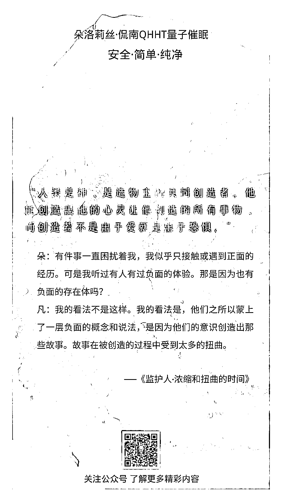

•  END •

**点击了解更多****相关****文章**

[QHHT®量子催眠疗愈技术一阶段课程](http://mp.weixin.qq.com/s?__biz=MzU0NjkzMDY0OA==&mid=2247491054&idx=2&sn=11c47c5f98b8392ee25a1298a2f89668&chksm=fb577759cc20fe4f3283e7523e138845792685fd8e5f03de4397246df1c978e9b0cf91402ded&scene=21#wechat_redirect)

[春季复训 | 2021 年量子催眠线下部分（实地复训课）改为直播课程！](http://mp.weixin.qq.com/s?__biz=MzU0NjkzMDY0OA==&mid=2247494096&idx=2&sn=d6305255a5f29f2abdd16fce8497c810&chksm=fb548367cc230a71aadc5d5b444a4bbcf61ee4afe8561b7bd6394abfec5e59eb88c82caf0b11&scene=21#wechat_redirect)

[大师风采 | 关于释放恐惧的治疗技巧](http://mp.weixin.qq.com/s?__biz=MzU0NjkzMDY0OA==&mid=2247494109&idx=2&sn=e9e8551dc5da425053ef14981bdcbff4&chksm=fb54836acc230a7c78f212ae499465969d06af2fa8bc34347ed0072b0638ceec028c1232e33e&scene=21#wechat_redirect)

点击“在看”好美哦↓

 点击预约你的催眠师

# 大师风采 | 前世回溯催眠大师朵洛莉丝·侃南的心路历程（十四）

> 原文：[`mp.weixin.qq.com/s?__biz=MzU0NjkzMDY0OA==&mid=2247494110&idx=1&sn=e6e2756261f430c6565a566c6e952bf1&chksm=fb548369cc230a7f44bf4bcdbf4178b1f7ccbaa8171edd87217c8dce324262f04a2e01b8c7f1&scene=126&sessionid=1690980649#rd`](http://mp.weixin.qq.com/s?__biz=MzU0NjkzMDY0OA==&mid=2247494110&idx=1&sn=e6e2756261f430c6565a566c6e952bf1&chksm=fb548369cc230a7f44bf4bcdbf4178b1f7ccbaa8171edd87217c8dce324262f04a2e01b8c7f1&scene=126&sessionid=1690980649#rd)

点击上方蓝字关注我们

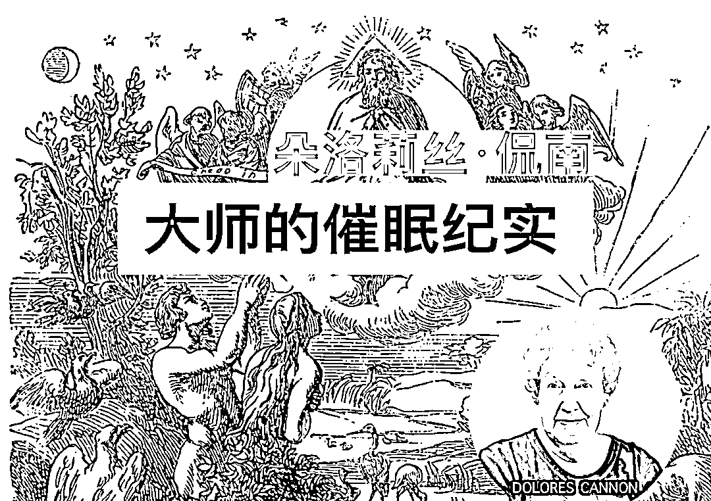

      作者：朵洛莉丝·侃南

编辑/翻译：kathy

图片：网络

文章内容改编自量子催眠创始人朵洛莉丝·侃南的专著《回旋宇宙 3》，仅供读者参考

我们能做的就是移除自己和他人设置的限制。我们必须看到我们究竟有多么地强大。然后，我们必须相信！相信和信任。除非我们允许，没有人可以把我们的力量夺去。现在，是时候在我们的世界重新宣告，这些在过去的世代曾经稀松平常的能力。**我们的世界正在经历戏剧性的变化，我们需要应运而变**。我们会需要我们所有的能力（心通和其它的）回归。在新的世界，新的地球，这会和呼吸一样的普遍和自然。这是为何我们现在正在被唤醒。**所有的一切正在归位，我们都有各自的角色**。

这些事情是我的理解（目前为止）。它们不尽然和你的理解相同。但是，保持开放的心态，让我们一起探索（Keep an open mind，and let us explore together）。

•  END •

**点击了解更多****相关****文章**

[QHHT®量子催眠疗愈技术一阶段课程](http://mp.weixin.qq.com/s?__biz=MzU0NjkzMDY0OA==&mid=2247491054&idx=2&sn=11c47c5f98b8392ee25a1298a2f89668&chksm=fb577759cc20fe4f3283e7523e138845792685fd8e5f03de4397246df1c978e9b0cf91402ded&scene=21#wechat_redirect)

[大师风采 | 前世回溯催眠大师朵洛莉丝·侃南的心路历程（一）](http://mp.weixin.qq.com/s?__biz=MzU0NjkzMDY0OA==&mid=2247493884&idx=1&sn=0a33bc63236a05f11a0192819995ed56&chksm=fb54824bcc230b5dc2d70bc22f1b69c2de4df45c9e80a42eae0bc29ce534aee9f1001b504603&scene=21#wechat_redirect)

[大师风采 | 前世回溯催眠大师朵洛莉丝·侃南的心路历程（十三）](http://mp.weixin.qq.com/s?__biz=MzU0NjkzMDY0OA==&mid=2247494096&idx=1&sn=cbbeee4f413d0eb88f6dcb42a671f2e0&chksm=fb548367cc230a717950d6ddf6315e0c6b530e255ebf0a9efecf9092d26cd09a5725e7fadf0e&scene=21#wechat_redirect)

[春季复训 | 2021 年量子催眠线下部分（实地复训课）改为直播课程！](http://mp.weixin.qq.com/s?__biz=MzU0NjkzMDY0OA==&mid=2247494095&idx=2&sn=0013e0ddf01ccdf6f426116bc158caf4&chksm=fb548378cc230a6ecb1d32cceb9896a4bd1712f6a7e589bd9c6f16c0025e38ab262e43dfd563&scene=21#wechat_redirect)

点击“在看”好美哦↓

 点击预约你的催眠师

# 大师风采 | 关于释放恐惧的治疗技巧

> 原文：[`mp.weixin.qq.com/s?__biz=MzU0NjkzMDY0OA==&mid=2247494109&idx=2&sn=e9e8551dc5da425053ef14981bdcbff4&chksm=fb54836acc230a7c78f212ae499465969d06af2fa8bc34347ed0072b0638ceec028c1232e33e&scene=126&sessionid=1690980649#rd`](http://mp.weixin.qq.com/s?__biz=MzU0NjkzMDY0OA==&mid=2247494109&idx=2&sn=e9e8551dc5da425053ef14981bdcbff4&chksm=fb54836acc230a7c78f212ae499465969d06af2fa8bc34347ed0072b0638ceec028c1232e33e&scene=126&sessionid=1690980649#rd)

点击上方蓝字关注我们

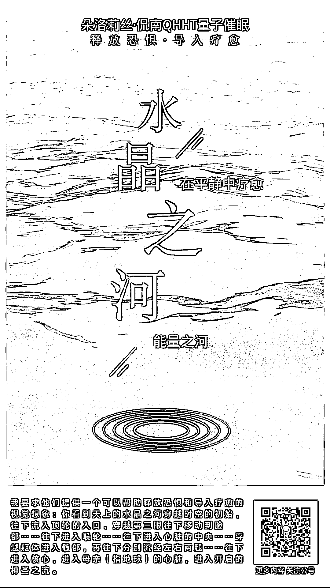

•  END •

**点击了解更多****相关****文章**

[QHHT®量子催眠疗愈技术一阶段课程](http://mp.weixin.qq.com/s?__biz=MzU0NjkzMDY0OA==&mid=2247491054&idx=2&sn=11c47c5f98b8392ee25a1298a2f89668&chksm=fb577759cc20fe4f3283e7523e138845792685fd8e5f03de4397246df1c978e9b0cf91402ded&scene=21#wechat_redirect)

[春季复训 | 2021 年量子催眠线下部分（实地复训课）改为直播课程！](http://mp.weixin.qq.com/s?__biz=MzU0NjkzMDY0OA==&mid=2247494096&idx=2&sn=d6305255a5f29f2abdd16fce8497c810&chksm=fb548367cc230a71aadc5d5b444a4bbcf61ee4afe8561b7bd6394abfec5e59eb88c82caf0b11&scene=21#wechat_redirect)

[大师风采 | 关于牛转乾坤，你需要知道的原理](http://mp.weixin.qq.com/s?__biz=MzU0NjkzMDY0OA==&mid=2247493882&idx=1&sn=1ed44020e39a87e87a4d681a0d219dc8&chksm=fb54824dcc230b5b204f71d0b911c35351ffb3e784335ed913cdb6f46e332aabd2370e1badac&scene=21#wechat_redirect)

[祝大家辛丑年 up up up！](http://mp.weixin.qq.com/s?__biz=MzU0NjkzMDY0OA==&mid=2247493865&idx=1&sn=79cf55f017c5fda126253d70c79b48bc&chksm=fb54825ecc230b487ca3e0f273b7fc4806e4397a3f689de482d173a6abe8002ac12dbc884983&scene=21#wechat_redirect)

点击“在看”好美哦↓

 点击预约你的催眠师

# 大师风采 | 前世回溯催眠大师朵洛莉丝·侃南的心路历程（十三）

> 原文：[`mp.weixin.qq.com/s?__biz=MzU0NjkzMDY0OA==&mid=2247494096&idx=1&sn=cbbeee4f413d0eb88f6dcb42a671f2e0&chksm=fb548367cc230a717950d6ddf6315e0c6b530e255ebf0a9efecf9092d26cd09a5725e7fadf0e&scene=126&sessionid=1690980649#rd`](http://mp.weixin.qq.com/s?__biz=MzU0NjkzMDY0OA==&mid=2247494096&idx=1&sn=cbbeee4f413d0eb88f6dcb42a671f2e0&chksm=fb548367cc230a717950d6ddf6315e0c6b530e255ebf0a9efecf9092d26cd09a5725e7fadf0e&scene=126&sessionid=1690980649#rd)

点击上方蓝字关注我们

      作者：朵洛莉丝·侃南

编辑/翻译：kathy

图片：网络

文章内容改编自量子催眠创始人朵洛莉丝·侃南的专著《回旋宇宙 3》，仅供读者参考

我们发现即使是天堂的星星也遵循死亡和重生的轮回。一颗星星或者太阳同样拥有有限的一生，当它的能量释放并且成为超新星，它在爆炸中荣耀地死亡。我问：“那接下来会发生什么？”我被告知能量被回收以创造新的星星。宇宙在持续地扩张，但即使是它，拥有的也是有限的生命。它只能扩张（或者爆炸）直到它到了一个无法再继续的点。然后，它开始内爆回归自己。宇宙开始失去能量并且死亡。当它到达那个点，会发生什么？我被告知：“然后整个过程从头来过。一切都是新的。”一切都在持续重生、循环和再生的过程中。

回到实操层面，回到我们每个人每天的生活（不能只是停留在超越想象的层面讨论这个话题），**这意味着我们的头脑是无所不能的**。我们无法意识到我们到底有多大的力量。

我们是如此习惯于人们将限制施加于我们。我们可以创造任何生活中想要的。我们可以治愈我们的身体。我们能够拥有一切。

•  END •

**点击了解更多****相关****文章**

[QHHT®量子催眠疗愈技术一阶段课程](http://mp.weixin.qq.com/s?__biz=MzU0NjkzMDY0OA==&mid=2247491054&idx=2&sn=11c47c5f98b8392ee25a1298a2f89668&chksm=fb577759cc20fe4f3283e7523e138845792685fd8e5f03de4397246df1c978e9b0cf91402ded&scene=21#wechat_redirect)

[大师风采 | 前世回溯催眠大师朵洛莉丝·侃南的心路历程（一）](http://mp.weixin.qq.com/s?__biz=MzU0NjkzMDY0OA==&mid=2247493884&idx=1&sn=0a33bc63236a05f11a0192819995ed56&chksm=fb54824bcc230b5dc2d70bc22f1b69c2de4df45c9e80a42eae0bc29ce534aee9f1001b504603&scene=21#wechat_redirect)

[大师风采 | 前世回溯催眠大师朵洛莉丝·侃南的心路历程（十二）](http://mp.weixin.qq.com/s?__biz=MzU0NjkzMDY0OA==&mid=2247494021&idx=1&sn=98aeef4c4476c960a03ff52d60f0b306&chksm=fb548332cc230a24a82e173c5c3fcefb69c464ca8c073988b2f70a86275c16b78f2eb7249460&scene=21#wechat_redirect)

[春季复训 | 2021 年量子催眠线下部分（实地复训课）改为直播课程！](http://mp.weixin.qq.com/s?__biz=MzU0NjkzMDY0OA==&mid=2247494095&idx=2&sn=0013e0ddf01ccdf6f426116bc158caf4&chksm=fb548378cc230a6ecb1d32cceb9896a4bd1712f6a7e589bd9c6f16c0025e38ab262e43dfd563&scene=21#wechat_redirect)

点击“在看”好美哦↓

 点击预约你的催眠师

# 春季复训 | 2021 年量子催眠线下部分（实地复训课）改为直播课程！

> 原文：[`mp.weixin.qq.com/s?__biz=MzU0NjkzMDY0OA==&mid=2247494096&idx=2&sn=d6305255a5f29f2abdd16fce8497c810&chksm=fb548367cc230a71aadc5d5b444a4bbcf61ee4afe8561b7bd6394abfec5e59eb88c82caf0b11&scene=126&sessionid=1690980649#rd`](http://mp.weixin.qq.com/s?__biz=MzU0NjkzMDY0OA==&mid=2247494096&idx=2&sn=d6305255a5f29f2abdd16fce8497c810&chksm=fb548367cc230a71aadc5d5b444a4bbcf61ee4afe8561b7bd6394abfec5e59eb88c82caf0b11&scene=126&sessionid=1690980649#rd)

**关于一阶线下课程的通知**

2021 春季，鉴于目前疫情的风险和北京地区管控的状况，为了尽量避免大家的损失，我们 2021 年的春季复训依然采用“直播+线下分组互催”的方式，请大家提早安排时间和计划，详细课程安排见下。**复训课程形式：**

*   第一天：

线上直播：复训课程内容和问答

*   第二天：

线下活动：各地学员自由组合互催（或自由活动）

*   第三天：

线上直播：互催同学分享和提问，点评

*   第四天：

线上直播：集体催眠和分享，提问

**关于复训时间节点**

2021 年度春季复训开课时间：2021 年 3 月 26 日～29 日   
上午 9：30---12：30 下午 14：30---18：30 开课地点：

*   直播间：钉钉“2021 年量催春季一阶复训直播群”

*   直播授课：课程主持：Leo（量子催眠中国负责人、“院长”）

**关于课程计划**

课程内容包含：• 一阶段课程精华认知梳理• 关于量子催眠课程外的实操须知• 量催引导中文声音集体练习• 互催练习、真实案例分享及讨论• 朵洛莉丝·侃南集体回溯方法 ♥复训课程包含的“朵洛莉丝.侃南集体回溯”的学习，它作为一种朵奶奶的独门武器，可以面向更广大的人群，很好的消除大众对催眠的陌生感，并能有效的推广你的催眠服务。♥复训后同时会获得两个月线上课和朵奶奶集体催眠线上课开放权限

**关于复训报名**

复训报名只针对 QHHT®量子催眠一阶段官方正式学员

报名条件：

完成并通过一阶段的线上学习。

“线上一阶+复训内容，才是完整的一阶段”

**01** **首次复训报名**•如果您是 2019 年以后新版量子催眠一阶段的学员：复训课程费用已经包含在量子催眠一阶段课程计划内，您无需再次缴纳量子催眠一阶段的复训课程费用。• 如果您是往期（2019 年以前）的量子催眠学员以及海外学习的学员：请进行复训报名并支付相应的费用。提示：在缴纳费用后，你即可获得终身免费参加线下复训活动的资格啦！复训费用包含了终身复训和其它一阶段的学员支持配套。•复训费用：4500 元**02** **再次复训报名**• 如果你已经参加过复训课程，想再次进修提高自己：免课程费用。**03** **此次直播费用**• 网络服务费用 29 元。

请扫描二维码，完成报名步骤

**为什么要参加一阶复训**

量子催眠一阶段课程是量子催眠学习的核心课程，虽然上完了一阶段的课程，还会有很多疑问。 

你是否觉得信息量太大？满怀兴奋，却不知道从何下手？

是否还没有体验过属于你自己的被催眠经历？

是否觉得开始了实践后，在过程中有许多疑问？

....

♥对于学习了线上一阶段的量催“新学员”来说，学习课程看似很简单，但真正的考验从实际操作才开始，遇到的问题和如何将学到的知识应用于实践会是我们接下来要用心学习的部分。复训是一次量催操作概念得以形成正确雏形的破冰之旅，它将激励和帮助每一位量子催眠操作者正确的进入角色；♥对于量催“老学员”来说，温故知新，每一次的复训都会拥有巨大的收获，欢迎一直走在量催道路上的伙伴回来，带着初心再一次认识量催以及分享自己的感悟。在经过一段实践操作的过程之后，每一位即将迈入新阶段的操作者，在重新审视一阶段的内容时，都将会有让自己意想不到的发现。祝福每一位参加复训的量子催眠操作者从此踏上更坚实的一阶台阶。 课程相关咨询：Vera 薇拉 微信号：wangvera666

# 案例分享 | 带着爱的光芒看自己（下）

> 原文：[`mp.weixin.qq.com/s?__biz=MzU0NjkzMDY0OA==&mid=2247494095&idx=1&sn=f904e4de005d85f96664c27f550ec59a&chksm=fb548378cc230a6ee0d404e47c5c94643d61525c5355eaf4ba1d1ef7694fe9e49667d3f757b7&scene=126&sessionid=1690980649#rd`](http://mp.weixin.qq.com/s?__biz=MzU0NjkzMDY0OA==&mid=2247494095&idx=1&sn=f904e4de005d85f96664c27f550ec59a&chksm=fb548378cc230a6ee0d404e47c5c94643d61525c5355eaf4ba1d1ef7694fe9e49667d3f757b7&scene=126&sessionid=1690980649#rd)

点击上方蓝字关注我们

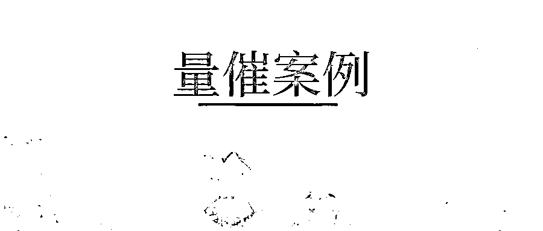

      作者 催眠操作者：毕彤

编辑：丽雯

图片：网络

**与潜意识的深入沟通**

“爱”都会说的，我们了解它的意义吗？我们知道怎么做才是真的爱吗？不只是女孩，我也在回溯的过程中感受到了巨大的爱的能量，接下来我们要进入下一个环节了——疗愈。祈请出那个拥有巨大爱的能量更高的智慧，可以叫祂“高我”，可以称呼祂“潜意识”，祂们并不在乎我们叫祂什么。很多人都觉得不可思议，但祂就在那儿，只是在杂乱的环境，杂乱的思维状况下无法接收到祂给予我们的信息。每次与祂对话都让我能感受到强大的能量，祂们回答问题也总是充满了智慧，解决问题的方式更是世人的逻辑无法企及。当我写到这里，心里充满了爱的暖意并带着敬畏和感恩。祂就在那儿，等着我的邀请，你的同意。

（以下催眠师简称：催，潜意识简称：潜）

催：你可以选择很多不同的前世给她看，为什么是鸭子的一生？

潜：以一种明显的方式告诉她一些东西，好好理解一下自己有多不珍惜时间，总是睡觉，好好体验一下，别浪费时间。

催：鸭子的一生是短暂的，你是要告诉她这一点吗？

潜：生命都是短暂的，做石头倒是时间长，但是以那样一种状态存在，不是一种很有活力的状态，所以你看，总有得有失，你现在就要满足现在。

现在满足现在，那就是人们经常说的活在当下吧？潜意识的这个说法好像更形象，只满足现在，以前的已经过去，未来的还没发生，你就在现在满足现在。

我接着问潜意识，为什么要给女孩看她出生的时候？潜意识的回答是我怎么也想不到的，祂说：赶紧去跟爸爸说说话。女孩的眼泪再次奔涌而出，在面谈时，女孩是说过的，好久没有跟爸爸说话了，不想跟他说话。女孩的眼泪让我感到了爱的流动。潜意识又解释道：如果她的爸爸做不到无条件的爱，她可以先无条件的爱爸爸呀，爱别人呀，她力量更强大。

催：C 的力量更强大对吗？

潜：嗯。

催：她有爱的能力？

潜：当然，每个人都有，但自己总是看不见，像玻璃总是擦不干净。

这个比喻让我想到明亮、干净的玻璃能当镜子照，污物存在吗？

潜意识说：根本不存在，向内看而不是向外求，都会爱的。潜意识还叮嘱女孩：她在表达时要注意方式方法，人的表达方式跟鸭子跟石头都不同，她要学习，她要真诚地去学习，真的要把它用在她重视的沟通上，可是又不用那么费力，要了解无条件的意思就好了，无条件的爱就是没有期待。

催：没有期待？

潜：对，像妈妈哺育她那样，像妈妈可以用一切身心生出她，哺育她，这样去回报。

女孩在回溯中看到妈妈生她，爸爸抱她，原来还有这样的用意，告诉她要用无条件的爱，没有期盼的爱去回报父母，那个震撼的画面，女孩应该每次听录音都能回想起来，都能感受到父母给她的爱，真的是太有智慧了！真的很感恩这样的智慧提点。我继续请教。

催：能不能给 C 一些指导呢？让她能跟家人沟通得更顺利？

潜：她要把她自己伤口上的绷带拿掉，她没有伤口。

催：她认为她的伤口是什么？

潜：被骂，觉得自己快被爸爸杀了的那种幻想，其实根本不存在，这个世界上的一切都可以以爱的目光注视，即使是争吵、发火、摔东西……都是可以的。

催：C 不应该挑剔她的爸爸吗？

潜：她的爸爸确实是一个能量较少的存在，需要她帮助的存在。

催：哦？是这样子的啊？

潜：她感受到这个问题了，可她不知道怎么去做，她需要直接的体验，我会在直接的体验中告诉她。

催：那是什么呢？现在可以说下吗？

潜：身心合一，她一定要去实施，很重要，这是这一生她最大的课题，把这个做好了，其他事都会迎刃而解。

催：嗯，其它事包括工作，事业……

潜：对。

催：C 正好要问她工作的事情，她不想做现在的工作，可以辞职吗？她想写作，画插图，能做吗？

潜：不用在这儿了，这个学校的工作是体验中的一个，暂时的庇护所，疫情正好在这里休息，休息够了就可以出发了。

催：请潜意识告诉她做什么比较合适呢？

潜：不要纠结在这个学校或是什么上，这个世界上没有固定的岗位概念，她可以自己创造自己的职业。

催：她做什么无所谓吗？

潜：她可以创造她想要的人生，写东西可以更好地发挥她的才华。

催：嗯，她自己也是偏向于写作。

潜：她需要一些东西进来，开放给新的关系进来。

催：要敞开心，体会更多？

潜：要有信心，要相信自己，只要相信就可以，她对自己的信任太弱了。

催：怎么能让她更自信呢？

潜：她需要闭关去休整自己，排除外界的干扰。

到这里我问潜意识，这个干扰是什么，潜意识没有回答我，好吧，没有到该知道的时候或是需要她自己去寻找、体验的，潜意识会选择不说，我没有继续这个问题的追问。女孩觉得挺热的，我在她的许可下帮她把被子敞开一些，然后我要请潜意识帮助女孩看一看她的脉轮，这是她要解决的身体问题，特别是喉轮和心轮要请潜意识帮忙清理。

催：请帮她看下喉轮是否有问题？要不要清理？

潜：转得慢，太慢了，前后都有点卡，要帮她整个转起来。但是她现在意识有抗拒。

女孩可能又有些紧张了，我请她放松，潜意思说：直接转吧，让她的喉轮转动起来。这时女孩又在说：心好疼。我赶紧问：心脏疼是心轮要清理吧？

潜：嗯，旧有的怨气，紫色的怨气，赶紧扫一下。

催：用什么帮助她清理？

潜：用光直接照。

催：什么颜色的光？

潜：白色的光，白光的力量很强。她的身体里有光，可是她把光收起来了。

催：她自己就有光，能教她怎么用吗？

潜：我先帮她照一下，心这里有好多紧张，像刺一样，好在这个人体使用时间不长。心轮在转，转得比较好，但是心脏由于紧张、焦虑让血管收缩得皱皱巴巴的。

“化解吧，化解吧……张开，舒展一下，舒张一下……”潜意识重复着这些话，我好奇地问祂：这样就可以帮到她吗？你是用话语帮她解决心脏的问题吗？之前说的用光我已经习惯了，因为很多时候是用光疗愈的，这个用话语我还是第一次接触。潜意识说：用话语传递意识，可以传给心脏，就这样可以帮她张开血管，血管都紧缩了影响血流。我心里暗想：记下了，话语的力量这么强大，以后可不能乱说话，尽量想好事，说好话。

催：她的血流通畅了是不是能量也能通畅了？

潜：是的，她对事情有想象，太多的想象，比如做了作家会这样，找什么样的工作……她做人时间短，对于这些事情没有经验只有想象。但这些想象最好立即放手，影响脉轮转动的速度。

催：能帮她吗？从什么地方放手？

潜：想象这件事要在意识层面解决，也不是一下能解决的。

催：好，那给她一些建议好吗？帮她解决一部分。

潜：她的人类经验少需要多思考、学习。

催：她很棒的，学东西很快。

潜：技能发达，心眼儿少，她要多在心上给点力，最快的方法就是修心。心的能量状态转变了，意识就会随之改变。她的心脏的频率在身体上是最低的，为什么这么低？没有好好呵护。

催：这怎么做？

潜：**可以多吃自己想吃的，做自己想做的（嗯）心是感受器官，依感受行事这是根本**。

催：让心感受到美好就是对心的呵护？

潜：是，旅行也很好，欣赏景色让心感受美好，放松心情。要做的事情挺多的，以前她都忽略了，不过先要闭关整理。

催：嗯，她辞职之后可以在家休整一段时间，这个时间要多长？

潜：时长不是我来决定的，看她怎么做。

催：如果 C 今天催眠的录音反复听，对你的建议、忠告能接受、照做，她会很快转变吗？

潜：时间不是快慢来讲，这件事情在心的层面可以慢慢来，但她一旦知道在慢慢来之中做到合一了就很快发生转变。所以没有慢慢来或很快，没有时间。

催：她要去体悟合一，内、外的统一？这涉及到另一个问题，怎么爱自己，她觉得她不会爱自己。

潜：完全。先了解你是谁？怎么想？怎样的感觉。她作为生灵的体验挺多的，只是做人应该只有两辈子，这个时间对于学习为人来说比较短，要学习做女孩更不容易，都需要时间。我帮她清除身体里的恐惧，她要做到身心合一。

潜意识边解答我的问题，边帮助女孩做清理疗愈，我依照女孩带来的问题还要提问，我也很想知道是不是这些恐惧才造成了女孩后来患抑郁症，抑郁症是不是已经好了，可现在依然很喜欢睡觉时什么原因？

潜：抑郁症解决了，她爱睡觉是能量低。

催：用睡觉补充能量吗？

潜：有些复杂的心理原因，这个先从意识上给她解释一下，解释给她听。

催：好，请讲。

潜：（深深呼气）睡觉是一种逃避。（嗯）重要的事情大量隐藏以后，自己已经看不清，觉得无法面对就找个借口，就是累。实际上是没使用真心。（嗯）真心，如果身心合一这个词不能解释，那就告诉她带着爱的光芒看自己。

催：嗯，带着爱的光芒看自己？

潜：照顾好自己，善意地对自己，爱护、保护、表达、认同，认同自己的内心。这一生使命很重要，不要用其他的事情干扰。

催：这一生的使命是什么？

潜：爱。

催：她体验爱还是给别人爱？

潜：都是。

时间不存在了，慢慢地聊天，慢慢地解答问题，清理、疗愈一直在进行。女孩右臂上的湿疹原因也是恐惧，好多事情在她看来是恐怖的，都以为要着火或爆炸。对呀，女孩形容父亲发火，在她看来就像随时会爆炸的炸弹，那只是她的想象，但这个信念需要她慢慢调整，而且是必须调整，不要再继续黑暗的幻想，潜意识建议她，**当觉得害怕的时候要说出来，说出来就好，不要执着地继续想象**。多表达，让感觉流动起来。当她不再紧张不再让心脏紧缩，让血流畅通了，能量也能通畅地在身体中流动，但是不要对能量产生执着、幻想。解除恐惧和提升频率是同一件事，那不是生命本质，不要执着。女孩觉得自己口气重，潜意识给出的原因是愤怒，积累了很多的愤怒在血液里。潜意识用能量注入帮助女孩清理血液中的愤怒和恐惧，注入能量使身体内干瘪的地方饱满起来。

潜：我在注入能量，源头的能量，你们也可以感觉到。

催：是的，我感觉到温暖的感动。

潜：通畅了，我今天只能给她的身体可以承受的能量。

催：好的，感恩潜意识，还有什么要跟 C 说的吗？

潜：她必须爱，这不是玩笑，要信。要听录音，要冥想感受自己。

催：是的，今天你给 C 很多的帮助，无条件的爱，她听录音能了解到的。

潜：（三次深呼吸）存在本身就是爱。

催：是的，还有什么要对 C 说的？

潜：生命很绚烂，去创造吧！

女孩的眼泪再次夺眶而出，不能自已。在这么震撼的爱的话语中，我也无法控制，我们被温暖而强大的爱包裹着结束了催眠。“奇迹”时常在身边出现，如果你选择闭上眼睛，堵上耳朵，谁又能把你怎样呢？但你一定会错过见证奇迹的时刻。没人能要求你怎么做，尊重自由意志是这个宇宙的法则，幸运的是女孩看到了自己要解决的问题并找到了对的方法。

潜意识在给女孩疗愈心脏时说过“幸好这个身体使用不长”。催眠结束后，让我对心脏病的问题有了些关注，其中心源性猝死是很让人猝不及防。2019 年 35 岁的台湾艺人高以翔因心源性猝死离世，没有症状突然发生，那时就很遗憾这么年轻的生命结束了，而且是戛然而止。再看看最近发生的：

    2021 年 1 月 1 日，25 岁的女演员孙侨潞去世，病因疑似突发心梗。

    2021 年 1 月 3 日晚，拼多多 23 岁员工凌晨 1:30 在下班路上猝死。

    2021 年 1 月 25 日福建一公交司机在行驶过程中突发心梗离世。

    ……

这只是冰山一角，据心血管中心统计，我国每年心源性猝死者高达 55 万人，平均每分钟就有一人发生心源性猝死离世。重要的是，不分年龄。心脏的问题不是一个心电图能查得出来的，在它罢工之前一定会给你信号，但是可能你正好不是个很关爱自己的人，不舒服抗一下就过去了，总用这样的念头糊弄自己。是什么造成猝死？是在猝死那一刻吗？一定不是，身与心是整体，日积月累的焦虑、紧张、恐惧……就是对心脏的折磨，心是感受器，需要感受到的是爱、是美好。

在催眠半年之后，我很想把这个案例写出来，于是和女孩联系征得她的同意。女孩很爽快地同意了，并告诉我，她现在很好，辞职之后她租了房子搬出来住，有更多的时间探索自己而不被打扰。发现了好多，以前怎么弄得自己那么紧绷绷的，刚休息的时候还是不能放过自己，现在软下来放松了，感觉也好了。和父亲的关系早就从心理上改变了，行动可能会慢点。现在许可自己做喜欢的事，以前竟然是不允许的。现在特别珍惜独处的时间，慢下来，每时每刻都很特别。

真好！向内看，欣赏自己。当你接受自己的时候，一切都变得不那么难了，当你欣赏自己的时候你会发现没有孤独，只有你独享的快乐。很高兴，你已学会了带着爱的光芒看自己！

•  END •

毕彤

量子催眠一阶段实习操作者

微信：bb798950349

坐标：北京 

赞赏：点击赞赏鼓励分享喔！

记得预约你的催眠师

**点击了解更多相关文章**

[QHHT®量子催眠疗愈技术一阶段课程](http://mp.weixin.qq.com/s?__biz=MzU0NjkzMDY0OA==&mid=2247491054&idx=2&sn=11c47c5f98b8392ee25a1298a2f89668&chksm=fb577759cc20fe4f3283e7523e138845792685fd8e5f03de4397246df1c978e9b0cf91402ded&scene=21#wechat_redirect)

[大师风采 | 前世回溯催眠大师朵洛莉丝·侃南的心路历程（一）](http://mp.weixin.qq.com/s?__biz=MzU0NjkzMDY0OA==&mid=2247493884&idx=1&sn=0a33bc63236a05f11a0192819995ed56&chksm=fb54824bcc230b5dc2d70bc22f1b69c2de4df45c9e80a42eae0bc29ce534aee9f1001b504603&scene=21#wechat_redirect)

[案例分享 | 带着爱的光芒看自己（上）](http://mp.weixin.qq.com/s?__biz=MzU0NjkzMDY0OA==&mid=2247493991&idx=1&sn=e2ddffa22a1200bedd844b33c5e7a512&chksm=fb5483d0cc230ac69319ef37ebe3838d8ac997e7fbf32218577a5e6ecdd5dbb74eb2d594851c&scene=21#wechat_redirect)

[案例分享 | 带着爱的光芒看自己（中）](http://mp.weixin.qq.com/s?__biz=MzU0NjkzMDY0OA==&mid=2247493997&idx=1&sn=66ca43ded37aa40d823144b2d03f8262&chksm=fb5483dacc230acc5fb4ce90b5ee9255940fad64839634e6559cb409f2c99ff51a71e354a2d7&scene=21#wechat_redirect)

点击“在看”好美哦↓

 点击预约你的催眠师

# 春季复训 | 2021 年量子催眠线下部分（实地复训课）改为直播课程！

> 原文：[`mp.weixin.qq.com/s?__biz=MzU0NjkzMDY0OA==&mid=2247494095&idx=2&sn=0013e0ddf01ccdf6f426116bc158caf4&chksm=fb548378cc230a6ecb1d32cceb9896a4bd1712f6a7e589bd9c6f16c0025e38ab262e43dfd563&scene=126&sessionid=1690980649#rd`](http://mp.weixin.qq.com/s?__biz=MzU0NjkzMDY0OA==&mid=2247494095&idx=2&sn=0013e0ddf01ccdf6f426116bc158caf4&chksm=fb548378cc230a6ecb1d32cceb9896a4bd1712f6a7e589bd9c6f16c0025e38ab262e43dfd563&scene=126&sessionid=1690980649#rd)

**关于一阶线下课程的通知**

2021 春季，鉴于目前疫情的风险和北京地区管控的状况，为了尽量避免大家的损失，我们 2021 年的春季复训依然采用“直播+线下分组互催”的方式，请大家提早安排时间和计划，详细课程安排见下。**复训课程形式：**

*   第一天：

线上直播：复训课程内容和问答

*   第二天：

线下活动：各地学员自由组合互催（或自由活动）

*   第三天：

线上直播：互催同学分享和提问，点评

*   第四天：

线上直播：集体催眠和分享，提问

**关于复训时间节点**

2021 年度春季复训开课时间：2021 年 3 月 26 日～29 日   
上午 9：30---12：30 下午 14：30---18：30 开课地点：

*   直播间：钉钉“2021 年量催春季一阶复训直播群”

*   直播授课：课程主持：Leo（量子催眠中国负责人、“院长”）

**关于课程计划**

课程内容包含：• 一阶段课程精华认知梳理• 关于量子催眠课程外的实操须知• 量催引导中文声音集体练习• 互催练习、真实案例分享及讨论• 朵洛莉丝·侃南集体回溯方法 ♥复训课程包含的“朵洛莉丝.侃南集体回溯”的学习，它作为一种朵奶奶的独门武器，可以面向更广大的人群，很好的消除大众对催眠的陌生感，并能有效的推广你的催眠服务。♥复训后同时会获得两个月线上课和朵奶奶集体催眠线上课开放权限

**关于复训报名**

复训报名只针对 QHHT®量子催眠一阶段官方正式学员

报名条件：

完成并通过一阶段的线上学习。

“线上一阶+复训内容，才是完整的一阶段”

**01** **首次复训报名**•如果您是 2019 年以后新版量子催眠一阶段的学员：复训课程费用已经包含在量子催眠一阶段课程计划内，您无需再次缴纳量子催眠一阶段的复训课程费用。• 如果您是往期（2019 年以前）的量子催眠学员以及海外学习的学员：请进行复训报名并支付相应的费用。提示：在缴纳费用后，你即可获得终身免费参加线下复训活动的资格啦！复训费用包含了终身复训和其它一阶段的学员支持配套。•复训费用：4500 元**02** **再次复训报名**• 如果你已经参加过复训课程，想再次进修提高自己：免课程费用。**03** **此次直播费用**• 网络服务费用 29 元。

请扫描二维码，完成报名步骤

**为什么要参加一阶复训**

量子催眠一阶段课程是量子催眠学习的核心课程，虽然上完了一阶段的课程，还会有很多疑问。 

你是否觉得信息量太大？满怀兴奋，却不知道从何下手？

是否还没有体验过属于你自己的被催眠经历？

是否觉得开始了实践后，在过程中有许多疑问？

....

♥对于学习了线上一阶段的量催“新学员”来说，学习课程看似很简单，但真正的考验从实际操作才开始，遇到的问题和如何将学到的知识应用于实践会是我们接下来要用心学习的部分。复训是一次量催操作概念得以形成正确雏形的破冰之旅，它将激励和帮助每一位量子催眠操作者正确的进入角色；♥对于量催“老学员”来说，温故知新，每一次的复训都会拥有巨大的收获，欢迎一直走在量催道路上的伙伴回来，带着初心再一次认识量催以及分享自己的感悟。在经过一段实践操作的过程之后，每一位即将迈入新阶段的操作者，在重新审视一阶段的内容时，都将会有让自己意想不到的发现。祝福每一位参加复训的量子催眠操作者从此踏上更坚实的一阶台阶。 课程相关咨询：Vera 薇拉 微信号：wangvera666

# 大师风采 | 前世回溯催眠大师朵洛莉丝·侃南的心路历程（十二）

> 原文：[`mp.weixin.qq.com/s?__biz=MzU0NjkzMDY0OA==&mid=2247494021&idx=1&sn=98aeef4c4476c960a03ff52d60f0b306&chksm=fb548332cc230a24a82e173c5c3fcefb69c464ca8c073988b2f70a86275c16b78f2eb7249460&scene=126&sessionid=1690980649#rd`](http://mp.weixin.qq.com/s?__biz=MzU0NjkzMDY0OA==&mid=2247494021&idx=1&sn=98aeef4c4476c960a03ff52d60f0b306&chksm=fb548332cc230a24a82e173c5c3fcefb69c464ca8c073988b2f70a86275c16b78f2eb7249460&scene=126&sessionid=1690980649#rd)

点击上方蓝字关注我们

      作者：朵洛莉丝·侃南

编辑/翻译：kathy

图片：网络

文章内容改编自量子催眠创始人朵洛莉丝·侃南的专著《回旋宇宙 3》，仅供读者参考

在《回旋宇宙二》中说到，地球也是一个信息的宝库，从所有生存于其中的存在体（细胞）积累知识。

太阳也是，不仅仅从地球，更是从所有占据它的空间的其它的星球、月亮（们）、小行星（们）和卫星处。我们也被告知其它的太阳也是作为信息的积累者，接收着来自不同星星系统的信息。

众宇宙从所有的星星系统处获得信息。

这对我来说大为惊奇，**所有的一切都是关于储存知识和信息。这个部分从微观世界（我们不知道那能有多小）到宏观世界（我们不知道那能有多大）是同样的**。只有神和源头了解存储一切信息的意图。或许是有助于创造新世界？

在我其它的著作当中，我们已经明了转世的轮回、重生和再造不仅仅对人类有效。在本书的另一个章节，我会展现它是如何应用于其它的活物（这包含一切，因为所有的都是能量，因此所有的都是活着的）。（未完待续）

•  END •

**点击了解更多****相关****文章**

[QHHT®量子催眠疗愈技术一阶段课程](http://mp.weixin.qq.com/s?__biz=MzU0NjkzMDY0OA==&mid=2247491054&idx=2&sn=11c47c5f98b8392ee25a1298a2f89668&chksm=fb577759cc20fe4f3283e7523e138845792685fd8e5f03de4397246df1c978e9b0cf91402ded&scene=21#wechat_redirect)

[大师风采 | 前世回溯催眠大师朵洛莉丝·侃南的心路历程（一）](http://mp.weixin.qq.com/s?__biz=MzU0NjkzMDY0OA==&mid=2247493884&idx=1&sn=0a33bc63236a05f11a0192819995ed56&chksm=fb54824bcc230b5dc2d70bc22f1b69c2de4df45c9e80a42eae0bc29ce534aee9f1001b504603&scene=21#wechat_redirect)

[大师风采 | 前世回溯催眠大师朵洛莉丝·侃南的心路历程（十一）](http://mp.weixin.qq.com/s?__biz=MzU0NjkzMDY0OA==&mid=2247493997&idx=2&sn=a308687536ee3c3eace05513269a13ad&chksm=fb5483dacc230acced3378c9fdb9609ac8f825b07be7730a8e149e3a482c7ccb2a8550da97bb&scene=21#wechat_redirect)

[案例分享 | 带着爱的光芒看自己（上）](http://mp.weixin.qq.com/s?__biz=MzU0NjkzMDY0OA==&mid=2247493991&idx=1&sn=e2ddffa22a1200bedd844b33c5e7a512&chksm=fb5483d0cc230ac69319ef37ebe3838d8ac997e7fbf32218577a5e6ecdd5dbb74eb2d594851c&scene=21#wechat_redirect)

点击“在看”好美哦↓

 点击预约你的催眠师

# 春季复训 | 2021 年量子催眠线下部分（实地复训课）改为直播课程！

> 原文：[`mp.weixin.qq.com/s?__biz=MzU0NjkzMDY0OA==&mid=2247494021&idx=2&sn=7f80c3f7d7210d63ba9e9c1e89e52abb&chksm=fb548332cc230a24062b6c0179645ba99fce8d528752e670df883f047196186c7a654d415b73&scene=126&sessionid=1690980649#rd`](http://mp.weixin.qq.com/s?__biz=MzU0NjkzMDY0OA==&mid=2247494021&idx=2&sn=7f80c3f7d7210d63ba9e9c1e89e52abb&chksm=fb548332cc230a24062b6c0179645ba99fce8d528752e670df883f047196186c7a654d415b73&scene=126&sessionid=1690980649#rd)

**关于一阶线下课程的通知**

2021 春季，鉴于目前疫情的风险和北京地区管控的状况，为了尽量避免大家的损失，我们 2021 年的春季复训依然采用“直播+线下分组互催”的方式，请大家提早安排时间和计划，详细课程安排见下。**复训课程形式：**

*   第一天：

线上直播：复训课程内容和问答

*   第二天：

线下活动：各地学员自由组合互催（或自由活动）

*   第三天：

线上直播：互催同学分享和提问，点评

*   第四天：

线上直播：集体催眠和分享，提问

**关于复训时间节点**

2021 年度春季复训开课时间：2021 年 3 月 26 日～29 日   
上午 9：30---12：30 下午 14：30---18：30 开课地点：

*   直播间：钉钉“2021 年量催春季一阶复训直播群”

*   直播授课：课程主持：Leo（量子催眠中国负责人、“院长”）

**关于课程计划**

课程内容包含：• 一阶段课程精华认知梳理• 关于量子催眠课程外的实操须知• 量催引导中文声音集体练习• 互催练习、真实案例分享及讨论• 朵洛莉丝·侃南集体回溯方法 ♥复训课程包含的“朵洛莉丝.侃南集体回溯”的学习，它作为一种朵奶奶的独门武器，可以面向更广大的人群，很好的消除大众对催眠的陌生感，并能有效的推广你的催眠服务。♥复训后同时会获得两个月线上课和朵奶奶集体催眠线上课开放权限

**关于复训报名**

复训报名只针对 QHHT®量子催眠一阶段官方正式学员

报名条件：

完成并通过一阶段的线上学习。

“线上一阶+复训内容，才是完整的一阶段”

**01** **首次复训报名**•如果您是 2019 年以后新版量子催眠一阶段的学员：复训课程费用已经包含在量子催眠一阶段课程计划内，您无需再次缴纳量子催眠一阶段的复训课程费用。• 如果您是往期（2019 年以前）的量子催眠学员以及海外学习的学员：请进行复训报名并支付相应的费用。提示：在缴纳费用后，你即可获得终身免费参加线下复训活动的资格啦！复训费用包含了终身复训和其它一阶段的学员支持配套。•复训费用：4500 元**02** **再次复训报名**• 如果你已经参加过复训课程，想再次进修提高自己：免课程费用。**03** **此次直播费用**• 网络服务费用 29 元。

请扫描二维码，完成报名步骤

**为什么要参加一阶复训**

量子催眠一阶段课程是量子催眠学习的核心课程，虽然上完了一阶段的课程，还会有很多疑问。 

你是否觉得信息量太大？满怀兴奋，却不知道从何下手？

是否还没有体验过属于你自己的被催眠经历？

是否觉得开始了实践后，在过程中有许多疑问？

....

♥对于学习了线上一阶段的量催“新学员”来说，学习课程看似很简单，但真正的考验从实际操作才开始，遇到的问题和如何将学到的知识应用于实践会是我们接下来要用心学习的部分。复训是一次量催操作概念得以形成正确雏形的破冰之旅，它将激励和帮助每一位量子催眠操作者正确的进入角色；♥对于量催“老学员”来说，温故知新，每一次的复训都会拥有巨大的收获，欢迎一直走在量催道路上的伙伴回来，带着初心再一次认识量催以及分享自己的感悟。在经过一段实践操作的过程之后，每一位即将迈入新阶段的操作者，在重新审视一阶段的内容时，都将会有让自己意想不到的发现。祝福每一位参加复训的量子催眠操作者从此踏上更坚实的一阶台阶。 课程相关咨询：Vera 薇拉 微信号：wangvera666

# 大师风采 | 前世回溯催眠大师朵洛莉丝·侃南的心路历程（十一）

> 原文：[`mp.weixin.qq.com/s?__biz=MzU0NjkzMDY0OA==&mid=2247493997&idx=2&sn=a308687536ee3c3eace05513269a13ad&chksm=fb5483dacc230acced3378c9fdb9609ac8f825b07be7730a8e149e3a482c7ccb2a8550da97bb&scene=126&sessionid=1690980649#rd`](http://mp.weixin.qq.com/s?__biz=MzU0NjkzMDY0OA==&mid=2247493997&idx=2&sn=a308687536ee3c3eace05513269a13ad&chksm=fb5483dacc230acced3378c9fdb9609ac8f825b07be7730a8e149e3a482c7ccb2a8550da97bb&scene=126&sessionid=1690980649#rd)

点击上方蓝字关注我们

      作者：朵洛莉丝·侃南

编辑/翻译：kathy

图片：网络

文章内容改编自量子催眠创始人朵洛莉丝·侃南的专著《回旋宇宙 3》，仅供读者参考

**我们不曾想离开，但是，我们必须如此。因为，那就是“创造”的意图。很多人带着分离的感受和孤独生活着，无法理解它从何而来。唯有在一起，才会令我们感到满足。**分离是那样艰难，唯有“回家”并且安住在那里，我们才能感到完整。

这个部分讲通了。即使在我们的身体内部，也是沟通。细胞之间的沟通和关联，虽然细胞在持续地死亡和更替，它们把自己看成一个整体。它们不认为自己是独立的。细胞和基因在持续地发出信息给到我们的头脑，和我们的主要部分进行沟通。这样讲不知是否合适，这些细胞把我们看成是神，它们的任务就是以它们仅有的方式来积累信息和知识，并且把那部分知识传递给我们身体的更高部分？我们在各种各样的身世当中应该做到的也是同样的：积累信息，并且把它发送给神。

我认为**如果细胞试图解释它们对于我们的认识（如果它们认识到了我们的存在），它们也会遇到我的客户试图定义他们对于神的认识时感受到的同样的困难。我们很有可能被看作是庞大而不详的在大脑和身体之外的“东西”。全能的（因为我们拥有伤害它们的力道），全知的虚无缥缈的存在，它们既看不见也无法理解**。所以，它们继续扮演作为一个器官或者其他的职能的功能，完全意识不到当我们死去，它们也死去。单独的细胞在做着它们的工作，可能无法认识到它们是器官（心脏/肝脏/肾脏等）的一部分。这或许是一个好的解释或者比喻来说明我们的更大的灵魂是由不同部分（身世/人格）组成的，各自活出它们的命运，完全认识不到它们是更大的单元的一部分。我们把自己看作是个体，与我们的更大灵魂和神分开运作。我认为在这个部分相似性是比较大的。

让我们来检视一个新的概念。（未完待续）

•  END •

**点击了解更多****相关****文章**

[QHHT®量子催眠疗愈技术一阶段课程](http://mp.weixin.qq.com/s?__biz=MzU0NjkzMDY0OA==&mid=2247491054&idx=2&sn=11c47c5f98b8392ee25a1298a2f89668&chksm=fb577759cc20fe4f3283e7523e138845792685fd8e5f03de4397246df1c978e9b0cf91402ded&scene=21#wechat_redirect)

[大师风采 | 前世回溯催眠大师朵洛莉丝·侃南的心路历程（一）](http://mp.weixin.qq.com/s?__biz=MzU0NjkzMDY0OA==&mid=2247493884&idx=1&sn=0a33bc63236a05f11a0192819995ed56&chksm=fb54824bcc230b5dc2d70bc22f1b69c2de4df45c9e80a42eae0bc29ce534aee9f1001b504603&scene=21#wechat_redirect)

[大师风采 | 前世回溯催眠大师朵洛莉丝·侃南的心路历程（十）](http://mp.weixin.qq.com/s?__biz=MzU0NjkzMDY0OA==&mid=2247493991&idx=2&sn=8e2a57310f62e1d3f49879a9b9a82093&chksm=fb5483d0cc230ac6d41a006263506d260d9a821280157939943c05f05ba0c7f6cb88ea88ee2e&scene=21#wechat_redirect)

[传奇的前世回溯催眠大师朵洛莉丝·侃南自己的前世故事（一）](http://mp.weixin.qq.com/s?__biz=MzU0NjkzMDY0OA==&mid=2247493392&idx=1&sn=8d7dc7901219b0f53b315d5e2e997c9f&chksm=fb548da7cc2304b1b3684e6903ec3add38fd1cd4e581c2ae651f970dda775918d4c6ed2cb9e7&scene=21#wechat_redirect)

点击“在看”好美哦↓

 点击预约你的催眠师

# 案例分享 | 带着爱的光芒看自己（中）

> 原文：[`mp.weixin.qq.com/s?__biz=MzU0NjkzMDY0OA==&mid=2247493997&idx=1&sn=66ca43ded37aa40d823144b2d03f8262&chksm=fb5483dacc230acc5fb4ce90b5ee9255940fad64839634e6559cb409f2c99ff51a71e354a2d7&scene=126&sessionid=1690980649#rd`](http://mp.weixin.qq.com/s?__biz=MzU0NjkzMDY0OA==&mid=2247493997&idx=1&sn=66ca43ded37aa40d823144b2d03f8262&chksm=fb5483dacc230acc5fb4ce90b5ee9255940fad64839634e6559cb409f2c99ff51a71e354a2d7&scene=126&sessionid=1690980649#rd)

点击上方蓝字关注我们

 作者 催眠操作者：毕彤

编辑：丽雯

图片：网络源自量子催眠现场的真实记录**看到身为烤鸭的身世，找到了近期湿疹不退的原因**

女孩在属于她的美丽的地方，将积压在内心的部分情绪宣泄出来，在她的提议下我帮她擦了眼泪，这样会让她更舒服些，她稍稍平复了情绪，我们继续穿越时空做更深的探索。在引导之下，她的头脑中出现了一些画面并描述给我，她是蝴蝶，她是灰肚子褐色背嫩黄脸的斑鸠——但画面并不稳定也没有情节，我要她放松，然后她说她看到有戴着高帽子的厨师在做蛋糕，桌子上有烤鸭。

（催眠师用“催”来代替，女孩用“C”表示）

催：这是一个餐厅吗？你能看到你自己吗？

C：我不知道我是谁，但看到很多餐厅的东西，有烤鸭、切菜板、大厨在火炉旁忙着。

催：你是厨师，还是认识这些厨师？

C：不认识，都是男的。

催：你觉得你是谁？是男是女？

C:  我是桌上的烤鸭，身上还插了把叉子，我的灵魂在里面。

催：你会疼吗？

C：不会，但灵魂在里面。

催：你的灵魂为什么会在里面？现在你以旁观的角度观察一下为什么？是不舍得这个鸭子的身体吗？

C：她是一只要生蛋的鸭子，我要生蛋了，可是被捉住做成了烤鸭。

说这些的时候女孩的眼泪再次落了下来，她在那个鸭子的一生中是个正要生蛋的鸭子，可没有做到就被餐厅做成了烤鸭，结束了那一生，她很不情愿，想不通为什么会是这样就结束了。

催：现在呢？你还在鸭子的身体里？

C：不，我出来了，轻飘飘的。

催：对它（身体）还有不舍吗？

C：我当这个动物的印象还在，挺可爱的。他们（人）应该不知道我正要生蛋呢，他们对我的了解太少了，所以他们只知道我可以吃，但他们没有顾忌到我虽然是动物，但是也有灵魂。

催：你现在是怎样的心情？

C：有害怕，有伤心，伤心未出生的宝宝，有怨念。

催：有怨气是吗？

C：因为是被烤的，被烤时灵魂就在旁边看着，是残忍的过程，我还看到许多我的朋友也是这样的。（女孩长长地叹了口气）

催：是呀，在人的眼里是食物，但你们有灵魂有情感，灵魂从鸭子的身体里出来要去哪儿呢？你会报复吗？

C：不会，现在出现了一只卡通鸭子的形象，我想附着在卡通鸭子上，继续以鸭子的样子存在。可有个声音告诉我该走了，不要再变成鸭子，做鸭子这一生已经结束了这样结束正常。

听她这么说要附在那个卡通鸭子上，心里酸酸的，好可怜哦，她不舍得鸭子的身份，即使是个卡通玩具或图片，只要附着在上面就好，她就认为她长那个样子。好在有个声音告诉她，是谁这么想帮她？难道是更高的智慧？

带着好奇，我继续询问她头脑中出现的画面。

催：你接受离开吗？

C：结束了

催：好的，你看看现在在哪儿？会有怎样的安排？

C：要我放下做鸭子的怨气和不舍，要在冥界进修一段时间。

催：你进修的地方在哪儿？什么样子的？

C：黑黑的，但并不恐怖，这里是死亡的另一边，人和动物死亡之后都会到这里。

催：都会在这里消除怨念吗？

C：我是这样，因为鸭子的能量较低，有些能量高的不会带着怨气就不会在这里进修，我认为我就是鸭子而且死得不甘心，就带着怨念，就要在这里消除怨念。（女孩叹了口气）

催：执着鸭子的身体，其实那不是你，现在能知道吗？

C：只能接受。当鸭子挺快乐的，没想到以这样的方式结尾，而且我还没有完成当妈妈的角色。

催：所以这是你不舍得离开那个身体的原因？

C:  很留恋，很想把事情做完，可没成想……

催：嗯，这也是你觉得你还需要这个身体，而且是鸭子形象的身体，有声音告诉你不能那么做，是要有新的一生吧？

C：祂让我到祂的怀里去。

催：这个祂是谁？

C：看到好大的一个怀抱，旁边还有一个像橙子一样的东西，我也不知道是怎么回事，是不是我还想着那个餐厅？

催：这是你的意识，可以向前走了，可你还回头看吗？

C：祂说要我就在这个怀抱当中沉静下来，放弃鸭子的身份，新的旅程才能开始。

催：很好，现在还在那个怀抱中吗？

C：难以置信。

催：难以置信？是什么难以置信？

C：难以置信现在正在发生的，出现在我头脑中的，（女孩的声音纠结着迟疑着，但她接着给我描述）这个能量带着我在人间转，想让我看一下人间的情况，因为做鸭子看到的实在太少了，祂让我看下人是怎么生活的。祂带我到菜市场看他们买菜、买肉（嗯）这是他们的生活方式，所以**作为鸭子这个生命需要理解。作为被吃的东西也是一种功能，也是爱的功能，如果可以原谅，爱就圆满了**。

**催**：真棒呀！祂在用祂的智慧让你体会爱的力量，让你用爱化解怨念。

C：我问，被火烧的时候那个场景怎么解呀？

**催**：祂怎么回答？

C：祂说，你那是杂乱低层的幻觉，根本没有体验，只是恐惧的想象。

**催**：只是想象出的恐惧？

C：对，就是让自己有更多的怨念，但是要停止。

催：嗯，当你停止这么想之后，祂会给你什么呢？

C: 所有这些东西可能变成湿疹了。

催：湿疹与你被火烤的记忆有关？现在能看到什么？

C：**祂给我介绍世界上一万种死法，不同的东西有不同的死法，都是正常的，这只是一种方式，结束的方式**。祂说，你现在不是鸭子，不要用鸭子的想法傻傻的理解这是什么东西，要放弃鸭子的身份，不仅是鸭子的怨念，连鸭子的能量体也跟你无关。（嗯）已经完成了，完成得很好，都忍受过来了，作为鸭子生存也挺不容易的，你都过来了，这是值得鼓励的，最后你怎么死的，是自然能量的释放，没有关系，形成怨念也没有关系，都可以化解，就在这儿修一段时间吧。我说好，然后就可以不出声了。就可以一直作为一个守恒的状态存在就可以了，然后在这里净化频率。

催：让你做能量的转换、净化对吗？

C：对。

**作为石头，也可以有爱，可是它该相信什么？**

催：好的，你听从指令做了能量的净化，你又来到另一世，让我们一起看看你即将得到的是什么？

C：现在看到，是一个……（看到什么？）都可以说吗？

催：可以的，头脑中出现的画面描述出来，可以的。

C：看到很多光柱，是一朵花，但不是平常的花，它好像是一个星球，但不是圆圆的，上面有很多鼓起来的东西，看着像花一样，它上面有好多光柱，像舞台上打得那种光，我已经转世了，在一个星球上。

催：在星球上？这个星球有名字吗？

C：没有名字，图像有点乱，看到一个像陀螺似的东西，在旋转。

催：嗯，你在一个星系的一个星球上？

C：我可能转世做了个星球，长得像罗汉头那样的，有好多的突起，我觉得像花，石头的花。要**完成作为石头的爱的一生**。

催：**石头也可以有爱吗？**

C：**是的，如果石头上面爬小虫，我们要忍受，上面长植物，石头化成土让植物生长**。

催：石头化成土让植物生长是一种爱？

C：是的。

催：非常棒！

C：**什么都会变化，不用害怕，刚刚是鸭子，这会儿是石头，不用害怕，这是灵魂的体验，是设计好的，在这里待着就行，这是简单的修行**。

催：嗯，接受？是这样吗？

C：还有好多事要做要体验。

**潜意识教导回到这两世的意义**

催：那要怎么做呢？

C：这不是我说的，在我旁边一直有个声音在教我，可能祂觉得我需要陪伴，我也正需要陪伴，祂说，**作为爱的一部分存在，会分开，一个“人”完成一部分，一个灵魂完成一组（体验）一组一组的，每个灵魂都有课题、任务，你不用害怕，当石头或是任何形象其实都是一样的，你要放下你认为的形象，无论它是鸭子、石头、人、鬼……什么都要放下，因为你的灵魂没变**。

催：是的，请解释一下，这个灵魂是什么样子的？有形状吗？

C：没有，不是有形的。祂跟我说，我跟祂是一样的，只不过我在体验做石头，亲身体验好玩儿一点。

催：嗯，祂们也是灵魂吗？

C:祂说，祂们有好多。

催：好多是什么？

C：好多好多，像泡泡一样。

到这里我已经意识到了，那不是泡泡，只是更高的智慧让我们理解祂们的存在。高我，我们也叫祂潜意识，也有称呼祂别的什么名字，叫什么并不重要，重要的是祂是更高的智慧，祂是爱我们的，无条件的爱，祂在回溯部分出现，可能在女孩是石头的那一世，她能量纯净能接收到祂的信息。

催：有光芒吗？

C：没有，但是我不接受祂就破了，除非我相信祂在陪伴我，真的在陪伴，祂就在。

催：你相信祂们吗？

C：我相信，我们正在说话呢，祂一直告诉我不要害怕，要相信，但是我说，我要相信啥呢？我一个石头要相信啥呢？祂说，你相信你是石头就相信错了，你应该相信生命的真谛，不应该相信你是石头的呀，你好傻呀！我说你凭啥骂我？

催：（这对话很有爱也很好笑，我笑出声了）嗯，祂说你好傻，又把自己认作石头了，祂要告诉你不是石头？

C: 祂说，让你体验玩儿游戏呢，你居然把自己当成游戏里的人物了。

催：当成游戏里的角色了？

C：祂说，这是不对的，**你把自己当成菜了，当成肉了，当成石头了，你的怨念就此升起，你跟你认为是的东西就有了链接，****其实那都不是你，你的灵魂只是在那里待着（嗯）你把你自己最重要的东西忘记了**。

**催**：对，那你问问祂，最重要的是什么呢？

C：灵魂的合一。都是体验，作为石头你会孤单的，因为不像其它那么有生气（嗯）但这里的生活照样是美的，不用纠结美不美，活不活，死不死，都差不多，不用纠结那么多，就因为你纠结才让你做石头体验，看看最不用纠结的生命是什么样子的（嗯）最不用纠结的生命在这个宇宙里也可以看到别人看不到的最壮观的景色，但是你要承受一些重量，虽然很小，不像大的行星那样，但这样的一生也是意义重大的。

**催**：是的，是一种体验。

C：祂的意思是，你之所以纠结（活着）意义，你还是不了解灵魂本相，灵魂本身不需要意义，灵魂本来是干净的。

催：灵魂本身是干净的，不需要意义，附着在任何形体上无非都是体验？

C：（长长的呼出一口气）嗯

我是谁？

是鸭子、是石头、是那个貌美如花的女子，还是那个英俊洒脱的少年？稻麻竹苇，山石微尘……都不是。

在回溯的过程中，更高的智慧在尽力地给我们展示，没有形象，纯净的灵魂，而且我们本是一体！来到地球是一种体验，是一个游戏，是一次学习——在地球生活的人们会吃菜会吃肉会遇到很多的你认为实实在在的物体，一颗草、一朵花、一块砖、一片瓦……请带着感恩吃下食物，请带着敬畏对待身边的一切，因为无论你是谁，最终都要学会“爱”，无条件的爱！（未完待续）

•  END •

毕彤

量子催眠一阶段实习操作者

微信：bb798950349

坐标：北京 

赞赏：点击赞赏鼓励分享喔！

记得预约你的催眠师

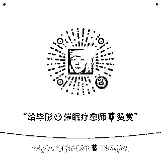

**点击了解更多****相关****文章**

[QHHT®量子催眠疗愈技术一阶段课程](http://mp.weixin.qq.com/s?__biz=MzU0NjkzMDY0OA==&mid=2247491054&idx=2&sn=11c47c5f98b8392ee25a1298a2f89668&chksm=fb577759cc20fe4f3283e7523e138845792685fd8e5f03de4397246df1c978e9b0cf91402ded&scene=21#wechat_redirect)

[大师风采 | 前世回溯催眠大师朵洛莉丝·侃南的心路历程（一）](http://mp.weixin.qq.com/s?__biz=MzU0NjkzMDY0OA==&mid=2247493884&idx=1&sn=0a33bc63236a05f11a0192819995ed56&chksm=fb54824bcc230b5dc2d70bc22f1b69c2de4df45c9e80a42eae0bc29ce534aee9f1001b504603&scene=21#wechat_redirect)

[案例分享 | 娑婆世界和极乐世界](http://mp.weixin.qq.com/s?__biz=MzU0NjkzMDY0OA==&mid=2247493557&idx=1&sn=6c95c0ee1e86081f77a5d455fb6fc127&chksm=fb548d02cc230414798963220157495c9e95d53c9049cedfb87f394c95f8bfe42d9412260255&scene=21#wechat_redirect)

[案例分享 | 带着爱的光芒看自己（上）](http://mp.weixin.qq.com/s?__biz=MzU0NjkzMDY0OA==&mid=2247493991&idx=1&sn=e2ddffa22a1200bedd844b33c5e7a512&chksm=fb5483d0cc230ac69319ef37ebe3838d8ac997e7fbf32218577a5e6ecdd5dbb74eb2d594851c&scene=21#wechat_redirect)

点击“在看”好美哦↓

 点击预约你的催眠师

# 案例分享 | 带着爱的光芒看自己（上）

> 原文：[`mp.weixin.qq.com/s?__biz=MzU0NjkzMDY0OA==&mid=2247493991&idx=1&sn=e2ddffa22a1200bedd844b33c5e7a512&chksm=fb5483d0cc230ac69319ef37ebe3838d8ac997e7fbf32218577a5e6ecdd5dbb74eb2d594851c&scene=126&sessionid=1690980649#rd`](http://mp.weixin.qq.com/s?__biz=MzU0NjkzMDY0OA==&mid=2247493991&idx=1&sn=e2ddffa22a1200bedd844b33c5e7a512&chksm=fb5483d0cc230ac69319ef37ebe3838d8ac997e7fbf32218577a5e6ecdd5dbb74eb2d594851c&scene=126&sessionid=1690980649#rd)

点击上方蓝字关注我们

 作者 催眠操作者：毕彤

编辑：丽雯

图片：网络源自量子催眠现场的真实记录

**回到出生时的场景，在“最珍贵的房子”回味爱的初体验**

这是一个 90 后的女孩，对于我来说她很年轻，但她已经独自在美国修完了心理学和新闻的双学士学位，这让我觉得自愧不如，可是见到我说得最多的是“我很紧张，我害怕。”我问“为什么？”“我怕我不能很好地放松，我怕我不能进入状态，我怕我做不好……”她不是刻意这么说的，她嘴唇发白，声音有些颤抖，我能感受到空气的凝重。“没事的，我们先聊聊天，你可以的。”我轻松地笑说，希望这样的轻松氛围能感染到她。“从哪儿说起呢？”“从你小时候记得的吧，我很想听。”

她来催眠想解决的问题是：

1、父母是不是爱她，她想和父母敞开的交流能不能做到？

2、事业方面，她想辞职然后写作、画插画，用艺术疗愈别人。

3、身体不舒服，曾因总是嗜睡去医院检查确诊抑郁症，吃了 5 个月抗抑郁的药，现在还是会晚睡晚起，想纠正可纠正不过来，她家人总说她，问怎么能改变？

4、右臂长了湿疹两周都不好，总觉得疲劳，想得到疗愈。

**女孩开始边回忆边说起儿时的种种经历**她的家庭从来不缺乏物质上对于她的给予，但是爸爸对她总是不满意，总能挑出她做得不好的地方，而且爸爸的脾气暴躁，生气的时候会摔东西。在说到这里时，女孩又一次在回忆中经历了那个让她害怕的场景，她抬起手做出要保住头的动作，面部的表情也跟着扭曲“你知道吗？我身边就好像有颗定时炸弹，但是不知道他什么时候会爆炸，我就很紧张，也许在下一秒他就炸了。”我赶紧轻声说“我知道你的感受，我能理解那种感受，放松，你现在是安全的，别担心。”女孩表示理解我的话，礼貌地笑了笑接着说，她不想被咆哮，她很想让爸爸能夸奖她，她努力学习，做个乖巧的孩子，什么都听父母的安排……直到上了大学，她按父母的意思报考专业，被大学录取后她上了一年，在这一年里她一直感受到的是不快乐，这不是她想要的，她也不知道她想要什么，只是这不是她想要的，这是她第一次这么清晰地看到内心不想要的是什么。“别人的安排”她痛苦地想了很久，她想改变，她决定退学，她想出国。这个想法很坚定，第一次很坚定。她告诉了父母，起初爸爸不同意，在她的坚持下爸爸没好气地同意了。女孩开始了人生中第一次属于自己的筹划，可这个过程并没有那么顺利，她去了德国，因为是学英语的，她认为自己可以再多学一门语言，在德国语言学习的过程中她才知道德语真的很难学，普通的对话应该很快就能通过，但是用这样的语言程度去继续学业难度很大，她要重新计划了。她没有放弃，又转战去了美国，英语很好的她到这里有了些信心，在美国的日子就是学习，她不敢松懈，她还在等爸爸的夸奖。先是报考了心理学专业，然后又学了新闻，两个学位都拿下来之后她茫然了，学这些专业能做什么？她不知道，这些也不是她真正感兴趣的。她完成学业回国了，找了份翻译的工作，这份工作她也没觉得有什么意思，她想辞职，可辞职之后能做什么呢？女孩描述了从小到大的生活状态，也让我知道她为什么总是害怕，但我没有给她分析，这些都交给她自己吧，她会得到答案。我给她梳理了下问题，然后侧重问了一下她的工作，她告诉我单位不太想她走，因为她可以同声翻译。听她这么说，我想这么优秀的人怎么就是觉得自己不够好呢？我说“你能同声翻译，这也太棒了吧？”“有吗？这有什么的？”“真的，不是谁都能做到的，你很棒的！”“真的吗？”这回女孩笑得很自然也很惊诧，是不是以前从没有人这样夸奖过她？我没有再问什么，只是说“我相信你这么优秀一定能做得很好。我们可以开始催眠了。”**进入美丽的地方**躺下来，躺舒服，完全地放松，引导词……女孩很配合，在我引导女孩进入她认为最美丽的地方时，女孩先描述了她头脑中出现的画面是沙滩，然后表情变得怀疑困惑，声音停顿了下，迟疑的说“我看到了一个女性的器官。”我感受到了这次进入美丽的地方有些不寻常，我尽量声音放轻松，但我能感到有点激动。“没关系，放松，出现的画面描述出来就好，你是安全的。”“我好像看到的是子宫，我在里面”“哦，很好，你觉得这个地方是安全的，舒适的吗？你能感觉到温度吗？”“温温的，热热的，不知道怎么会在这儿，好好奇！”女孩有些无奈，但那个温热的感觉让她舒服，她并没有想逃离，我继续询问“你还能感觉到什么？看到什么？”“能感觉到柔软，能感觉到妈妈的心跳也能感觉到自己的心跳，我能看到妈妈，我在她的肚子里越长越大。”“是个白白胖胖的小婴儿？”女孩很放松，肤色都比刚刚红润了些，愉快地描述着“不，花生似的，粉色的小婴儿。我被生出来了，躺在一个垫子上哇哇地哭。”“哦，你已经出生了？为什么要哭？是想要什么呢？”女孩深深的吸了口气“一个是饿了，想喝奶。一个是第一次呼吸有点紧张。”“哦，放松，你特别棒，来到这个世界，接触到这里的空气，你适应了吗？脐带剪了吗？”“剪了，护士在我旁边，正拿布帮我擦身上的血。我感到奇怪，为什么美丽的地方会在这里。”我轻柔地对女孩说“不奇怪，一切都有可能，这里就是你认为美丽而安全的地方。现在看到妈妈了吗？”女孩的眼泪汹涌而出“刚刚爸爸把我抱起来，有些激动。”“非常好，是爸爸激动吗？”女孩边哭边说“不，是我，我很激动，激动地在哭。现在的心情有点乱，但是我能看到戴着眼镜的爸爸看着我，挺期待的表情。”“你觉得爸爸在期待什么？”“想逗我玩儿，想看我的反应。”女孩继续激动得落泪，“你们还在医院吗？”“是的，在病房，爸爸在努力地和我交流”“和你说什么呢？”“他就是发出唉~唉~的声音，不是说话。”“是的，他不知道婴儿也是可以了解一切的，他以为你听不懂，所以用声音吸引你注意他，听爸爸发出这样的声音你开心吗？”女孩哭到哽咽，她的情感在宣泄，这样的释放对于她是好事。她要求我帮她擦下眼泪，眼泪太多流到了耳朵里。我再次确认让我帮忙，然后帮她擦拭眼泪，她的情绪稍稍平静了些对我说“他好爱我，我的内心强烈地、清晰地知道，他们（父母）都好爱我。”美丽的地方让女孩进入了她这一生的第一座房子，最贵（珍贵）的房子，虽然时间短暂，但柔软、温暖，而且安全、充满了无条件的爱！女孩觉得跟父母敞开心的交流好像没那么重要了，她知道他们有多爱她。这是一段不可能被忆起的片段，通过回溯重现给女孩看，让她受伤的心得到安慰得到疗愈。如果她的爸爸、妈妈一直都像最初那样温柔地待她，经常对她说“我爱你”而不是“你看谁谁比你强，你怎么那么不争气？”如果她一直被这最初的父母之爱包围着，该多好！（未完待续）

•  END •

毕彤

量子催眠一阶段实习操作者

微信：bb798950349

坐标：北京 

赞赏：点击赞赏鼓励分享喔！

记得预约你的催眠师

**点击了解更多****相关****文章**

[QHHT®量子催眠疗愈技术一阶段课程](http://mp.weixin.qq.com/s?__biz=MzU0NjkzMDY0OA==&mid=2247491054&idx=2&sn=11c47c5f98b8392ee25a1298a2f89668&chksm=fb577759cc20fe4f3283e7523e138845792685fd8e5f03de4397246df1c978e9b0cf91402ded&scene=21#wechat_redirect)

[大师风采 | 前世回溯催眠大师朵洛莉丝·侃南的心路历程（一）](http://mp.weixin.qq.com/s?__biz=MzU0NjkzMDY0OA==&mid=2247493884&idx=1&sn=0a33bc63236a05f11a0192819995ed56&chksm=fb54824bcc230b5dc2d70bc22f1b69c2de4df45c9e80a42eae0bc29ce534aee9f1001b504603&scene=21#wechat_redirect)

[案例分享 | 娑婆世界和极乐世界](http://mp.weixin.qq.com/s?__biz=MzU0NjkzMDY0OA==&mid=2247493557&idx=1&sn=6c95c0ee1e86081f77a5d455fb6fc127&chksm=fb548d02cc230414798963220157495c9e95d53c9049cedfb87f394c95f8bfe42d9412260255&scene=21#wechat_redirect)

点击“在看”好美哦↓

 点击预约你的催眠师

# 大师风采 | 前世回溯催眠大师朵洛莉丝·侃南的心路历程（十）

> 原文：[`mp.weixin.qq.com/s?__biz=MzU0NjkzMDY0OA==&mid=2247493991&idx=2&sn=8e2a57310f62e1d3f49879a9b9a82093&chksm=fb5483d0cc230ac6d41a006263506d260d9a821280157939943c05f05ba0c7f6cb88ea88ee2e&scene=126&sessionid=1690980649#rd`](http://mp.weixin.qq.com/s?__biz=MzU0NjkzMDY0OA==&mid=2247493991&idx=2&sn=8e2a57310f62e1d3f49879a9b9a82093&chksm=fb5483d0cc230ac6d41a006263506d260d9a821280157939943c05f05ba0c7f6cb88ea88ee2e&scene=126&sessionid=1690980649#rd)

点击上方蓝字关注我们

      作者：朵洛莉丝·侃南

编辑/翻译：kathy

图片：网络

文章内容改编自量子催眠创始人朵洛莉丝·侃南的专著《回旋宇宙 3》，仅供读者参考

那就是灯泡熄灭的时刻。听起来很熟悉。应该用“我们”这个人称代词来与我们身体的细胞交流。潜意识或者更高的意识称呼它自己为“我们”。

这是否意味着这也是更广大的意识的一部分呢？

我认为是这样，在关于神或者源头的章节中会做相关的阐述。没有一个人是独立存在的。我们都是更大的结构的一部分，每个部分都依赖其它的部分才得以生存。没有一个部分可以独立存在。我在我的讲座当中说过许多次，我们仅仅是神的躯体内的细胞。现在这个知识归位了。我被告知每件事都是关于沟通，以及信息的积累。我们必须生活无数的身世学习每个可能的课程，并且搜集知识。

这是出于什么意图？

我被告知我们必须积累信息以回到神，那是我们完成了所有的课程并且“毕业”。**祂很好奇，这是为何我们在最初被创造，如同单独的光束。祂想要学习，并且祂不能仅仅靠祂自己来学习。所以，我们被创造，分散去学习任何可能性，然后再把它们带回到祂那里。**正如同在这本书中会呈现的信息，我们是如此地喜乐以及对于与神同在感到满足，在神，有超乎理解的爱。（未完待续） 

•  END •

**点击了解更多****相关****文章**

[QHHT®量子催眠疗愈技术一阶段课程](http://mp.weixin.qq.com/s?__biz=MzU0NjkzMDY0OA==&mid=2247491054&idx=2&sn=11c47c5f98b8392ee25a1298a2f89668&chksm=fb577759cc20fe4f3283e7523e138845792685fd8e5f03de4397246df1c978e9b0cf91402ded&scene=21#wechat_redirect)

[大师风采 | 关于牛转乾坤，你需要知道的原理](http://mp.weixin.qq.com/s?__biz=MzU0NjkzMDY0OA==&mid=2247493882&idx=1&sn=1ed44020e39a87e87a4d681a0d219dc8&chksm=fb54824dcc230b5b204f71d0b911c35351ffb3e784335ed913cdb6f46e332aabd2370e1badac&scene=21#wechat_redirect)

[大师风采 | 前世回溯催眠大师朵洛莉丝·侃南的心路历程（一）](http://mp.weixin.qq.com/s?__biz=MzU0NjkzMDY0OA==&mid=2247493884&idx=1&sn=0a33bc63236a05f11a0192819995ed56&chksm=fb54824bcc230b5dc2d70bc22f1b69c2de4df45c9e80a42eae0bc29ce534aee9f1001b504603&scene=21#wechat_redirect)

[大师风采 | 前世回溯催眠大师朵洛莉丝·侃南的心路历程（九）](http://mp.weixin.qq.com/s?__biz=MzU0NjkzMDY0OA==&mid=2247493946&idx=2&sn=e99d8e7d405dd8ef5131a760044f633a&chksm=fb54838dcc230a9b0dd92ed022683a4cc3b64db174111923e29cd4ce58970bf12c49625b2272&scene=21#wechat_redirect)

[传奇的前世回溯催眠大师朵洛莉丝·侃南自己的前世故事（一）](http://mp.weixin.qq.com/s?__biz=MzU0NjkzMDY0OA==&mid=2247493392&idx=1&sn=8d7dc7901219b0f53b315d5e2e997c9f&chksm=fb548da7cc2304b1b3684e6903ec3add38fd1cd4e581c2ae651f970dda775918d4c6ed2cb9e7&scene=21#wechat_redirect)

点击“在看”好美哦↓

 点击预约你的催眠师

# 大师风采 | 前世回溯催眠大师朵洛莉丝·侃南的心路历程（九）

> 原文：[`mp.weixin.qq.com/s?__biz=MzU0NjkzMDY0OA==&mid=2247493946&idx=2&sn=e99d8e7d405dd8ef5131a760044f633a&chksm=fb54838dcc230a9b0dd92ed022683a4cc3b64db174111923e29cd4ce58970bf12c49625b2272&scene=126&sessionid=1690980649#rd`](http://mp.weixin.qq.com/s?__biz=MzU0NjkzMDY0OA==&mid=2247493946&idx=2&sn=e99d8e7d405dd8ef5131a760044f633a&chksm=fb54838dcc230a9b0dd92ed022683a4cc3b64db174111923e29cd4ce58970bf12c49625b2272&scene=126&sessionid=1690980649#rd)

点击上方蓝字关注我们

      作者：朵洛莉丝·侃南

编辑/翻译：kathy

图片：网络

文章内容改编自量子催眠创始人朵洛莉丝·侃南的专著《回旋宇宙 3》，仅供读者参考

现在来说一说那一片降临的信息拼图，引发我脑海中亮着的灯熄灭了的那片。

O.T.伯纳特博士为我出版过三本书，在这三本书中解释了我们的头脑如何治愈我们的身体。在《为什么疗愈会发生》中，**他说与我们身体内的细胞对话并以此得到它们的合作是疗愈中非常重要的部分。为了得到它们的关注，并且让它们知道一个更高的权威在与它们对话（我们的人格），我们应该总是称呼它们为“我们”**。这些细胞对于它们自己照顾身体不同部分的业务已经习以为常，它们不习惯有其它的部分意识到它们的存在。因此，当我们得到它们的注意，并且要求它们帮助我们，我们就是神的声音，它们会对此予以关照。

在我读到的手稿中，一位男士提到说我们认为我们自己是一个身体，一个单元。但是，事实上我们仅仅是一具承载着亿万细胞的躯壳。这些细胞组成了所有的器官和我们身体的系统。它们都各有分工、和谐共生，保持着整体的平衡。是我们引发了不平衡，并且将疾病引入了它们的世界。

他表达的就是字面的意思，他说我们就是一具被大量存有殖民寄居的物质躯壳。它们具有思考、消化、再生产和排泄的能力，所有我们作为人类拥有的功能，它们都有。因此，因为我们仅仅是由亿万的个体所占据的存在体，称呼我们自己为“我”是不正确的。我们应该称呼我们自己为“我们”。（未完待续）

•  END •

**点击了解更多****相关****文章**

[QHHT®量子催眠疗愈技术一阶段课程](http://mp.weixin.qq.com/s?__biz=MzU0NjkzMDY0OA==&mid=2247491054&idx=2&sn=11c47c5f98b8392ee25a1298a2f89668&chksm=fb577759cc20fe4f3283e7523e138845792685fd8e5f03de4397246df1c978e9b0cf91402ded&scene=21#wechat_redirect)

[大师风采 | 关于牛转乾坤，你需要知道的原理](http://mp.weixin.qq.com/s?__biz=MzU0NjkzMDY0OA==&mid=2247493882&idx=1&sn=1ed44020e39a87e87a4d681a0d219dc8&chksm=fb54824dcc230b5b204f71d0b911c35351ffb3e784335ed913cdb6f46e332aabd2370e1badac&scene=21#wechat_redirect)

[大师风采 | 前世回溯催眠大师朵洛莉丝·侃南的心路历程（一）](http://mp.weixin.qq.com/s?__biz=MzU0NjkzMDY0OA==&mid=2247493884&idx=1&sn=0a33bc63236a05f11a0192819995ed56&chksm=fb54824bcc230b5dc2d70bc22f1b69c2de4df45c9e80a42eae0bc29ce534aee9f1001b504603&scene=21#wechat_redirect)

[大师风采 | 前世回溯催眠大师朵洛莉丝·侃南的心路历程（八）](http://mp.weixin.qq.com/s?__biz=MzU0NjkzMDY0OA==&mid=2247493897&idx=1&sn=33699307d028b70e15d0458d668a458d&chksm=fb5483becc230aa879c414160acaa4e8e5c01d596c0dfbfc074b0c708d20c2ef6ff7adeb3754&scene=21#wechat_redirect)

[传奇的前世回溯催眠大师朵洛莉丝·侃南自己的前世故事（一）](http://mp.weixin.qq.com/s?__biz=MzU0NjkzMDY0OA==&mid=2247493392&idx=1&sn=8d7dc7901219b0f53b315d5e2e997c9f&chksm=fb548da7cc2304b1b3684e6903ec3add38fd1cd4e581c2ae651f970dda775918d4c6ed2cb9e7&scene=21#wechat_redirect)

点击“在看”好美哦↓

 点击预约你的催眠师

# 大师风采 | 前世回溯催眠大师朵洛莉丝·侃南的心路历程（八）

> 原文：[`mp.weixin.qq.com/s?__biz=MzU0NjkzMDY0OA==&mid=2247493897&idx=1&sn=33699307d028b70e15d0458d668a458d&chksm=fb5483becc230aa879c414160acaa4e8e5c01d596c0dfbfc074b0c708d20c2ef6ff7adeb3754&scene=126&sessionid=1690980649#rd`](http://mp.weixin.qq.com/s?__biz=MzU0NjkzMDY0OA==&mid=2247493897&idx=1&sn=33699307d028b70e15d0458d668a458d&chksm=fb5483becc230aa879c414160acaa4e8e5c01d596c0dfbfc074b0c708d20c2ef6ff7adeb3754&scene=126&sessionid=1690980649#rd)

点击上方蓝字关注我们

      作者：朵洛莉丝·侃南

编辑/翻译：kathy

图片：网络

文章内容改编自量子催眠创始人朵洛莉丝·侃南的专著《回旋宇宙 3》，仅供读者参考

我有一个男性客户在身体的每一处都有癌症，病得非常严重。**在我的工作中，我发现癌症通常是由压抑的愤怒所引起。也就是控制愤怒（特别是发生在胃肠道的癌症），并且不去表达。当这样的情况发生，愤怒开始翻腾，无法释放，它开始侵蚀身体**。每次医生动手术，并且摘除在这个男人身体某个部位的癌症，它开始在其它的部位出现。这看上去是一个没有休止的循环。所以我问他：“你对什么感到愤怒吗？”他几乎大喊：“是的。是我的前妻！我恨她！她拥有孩子，她不让我看他们！”然后，我和他聊了关于宽恕和释放愤怒的部分。“我无法原谅！如果我宽恕了她，她就赢了！”我直直地看着他的眼睛说：“如果她杀了你，她也赢了。”就是这样简单，但是又很难。如此，业力之轮继续转动着。

一个启示突然地临到我，有一天晚上我正坐在我的电视机前，在广告的间隙读着投稿的稿件。其中有一个作者写的内容抓住了我。它并不会减少我对于自己所相信的信任，因为他的内容所在的语境不同。但是它确实把我脑海中长久亮着的灯泡熄灭了。许多来到我这里或者我自己发现的碎片化的信息突然就整合在了一起，以独特的方式变得合理了。那些碎片一直在那里，我只是没有找到合适的语境去看它们。

在我的治疗技术中，我与潜意识合作来治愈我的客户。

**我的方法是允许它去找到生病或者疾病产生的原因。一旦它解释了原因，它就能够把问题带走。**在深度的催眠中，一旦意识的干扰被移除，或许只是个案自己的头脑在进行疗愈。无论它是什么，它是有效的，我在办公室中见证了奇迹的发生。我把我与之交谈的部分称为“潜意识（subconscious）”，但是我知道它不是精神病学家所指的潜意识。这是更加更加大和更为强大的存在。我相信我是在和个案的高我（higher self）、更高的意识（higher consciousness）、超灵（Oversoul）在沟通。这个部分拥有所有的答案和信息，如果合适，疗愈会发生。它回应“潜意识”这个名字，所以我这样称呼它。**当我们交流的时候，它会称呼自己“我们”而不是单一的存有**。通过我全球各地的客户，它都是这样说。（未完待续）

•  END •

**点击了解更多****相关****文章**

[QHHT®量子催眠疗愈技术一阶段课程](http://mp.weixin.qq.com/s?__biz=MzU0NjkzMDY0OA==&mid=2247491054&idx=2&sn=11c47c5f98b8392ee25a1298a2f89668&chksm=fb577759cc20fe4f3283e7523e138845792685fd8e5f03de4397246df1c978e9b0cf91402ded&scene=21#wechat_redirect)

[大师风采 | 关于牛转乾坤，你需要知道的原理](http://mp.weixin.qq.com/s?__biz=MzU0NjkzMDY0OA==&mid=2247493882&idx=1&sn=1ed44020e39a87e87a4d681a0d219dc8&chksm=fb54824dcc230b5b204f71d0b911c35351ffb3e784335ed913cdb6f46e332aabd2370e1badac&scene=21#wechat_redirect)

[大师风采 | 前世回溯催眠大师朵洛莉丝·侃南的心路历程（一）](http://mp.weixin.qq.com/s?__biz=MzU0NjkzMDY0OA==&mid=2247493884&idx=1&sn=0a33bc63236a05f11a0192819995ed56&chksm=fb54824bcc230b5dc2d70bc22f1b69c2de4df45c9e80a42eae0bc29ce534aee9f1001b504603&scene=21#wechat_redirect)

[大师风采 | 前世回溯催眠大师朵洛莉丝·侃南的心路历程（七）](http://mp.weixin.qq.com/s?__biz=MzU0NjkzMDY0OA==&mid=2247493896&idx=1&sn=857b6476b2a654dc040427053ddd6d21&chksm=fb5483bfcc230aa9f9e8d9b624189215bf0176899f05e236b3ab2188df9f523d9f236a2a59c9&scene=21#wechat_redirect)

[传奇的前世回溯催眠大师朵洛莉丝·侃南自己的前世故事（一）](http://mp.weixin.qq.com/s?__biz=MzU0NjkzMDY0OA==&mid=2247493392&idx=1&sn=8d7dc7901219b0f53b315d5e2e997c9f&chksm=fb548da7cc2304b1b3684e6903ec3add38fd1cd4e581c2ae651f970dda775918d4c6ed2cb9e7&scene=21#wechat_redirect)

点击“在看”好美哦↓

 点击预约你的催眠师

# 大师风采 | 前世回溯催眠大师朵洛莉丝·侃南的心路历程（七）

> 原文：[`mp.weixin.qq.com/s?__biz=MzU0NjkzMDY0OA==&mid=2247493896&idx=1&sn=857b6476b2a654dc040427053ddd6d21&chksm=fb5483bfcc230aa9f9e8d9b624189215bf0176899f05e236b3ab2188df9f523d9f236a2a59c9&scene=126&sessionid=1690980649#rd`](http://mp.weixin.qq.com/s?__biz=MzU0NjkzMDY0OA==&mid=2247493896&idx=1&sn=857b6476b2a654dc040427053ddd6d21&chksm=fb5483bfcc230aa9f9e8d9b624189215bf0176899f05e236b3ab2188df9f523d9f236a2a59c9&scene=126&sessionid=1690980649#rd)

点击上方蓝字关注我们

      作者：朵洛莉丝·侃南

编辑/翻译：kathy

图片：网络

文章内容改编自量子催眠创始人朵洛莉丝·侃南的专著《回旋宇宙 3》，仅供读者参考

“我们就是无法相处。所有我说的或做的都是错的。和他们住在一起好可怕。你不知道我在经历什么。我希望有个出口。”只要这个人仍然背负着包袱和垃圾，问题就无法被解决。很多时候，境况糟糕到他们无法和那个人面对面地交谈来处理它。在这种情况下，我建议和他们进行精神上的沟通，心与心的交流。告诉他们你知道的，这样是行不通的。你努力过了，你知道他们也努力了，但是这行不通。“所以为什么我们不能撕毁合约？你走你的阳关道，我走我的独木桥。我们不必再继续这样下去。我放过你，带着爱。”然后观想你们两个撕毁合约，并且丢掉它。

没有好，也没有坏。没有罪恶。没有魔鬼。没有地狱。只有需要去学习的功课。只有能量，正的和负的。我们认知的罪恶，只是人类以负面的方式使用能量。与负起责任相比，这样说要来得容易许多：“是魔鬼让我做的！我是被邪恶的存有控制了，它们影响我做了恐怖的事情，等等。我的父母不理解我，等等。”我们都在生命中遭遇过不幸的事。这就是生活的模样。这就是所谓的“活着”。但是，在这些糟糕的境遇中，你学到了任何东西吗？如果你学到了哪怕只是一件事，那么也就看到了这节课的意图。如果你没有在境遇中学到任何东西，如果你埋怨生活中的不幸，那么，你会继续经历负面的事物直到你最终理解它想要教会你什么。然后，你就自由了。

这是探索我们的前世的价值和美丽之处。即使事情看上去是不公的，如果我们探索前世，答案就在那里。我们仅仅是在偿还我们在过去的事情中积攒的业力。记住，我前面就说了种如是因，得如是果。死亡并不会使得我们免于业债。那样就太容易了。以往的过错是不会一笔勾销的，直到债务还清。然后我们就可以清白地重新开始。

**什么是最快（但并不是最容易）的方式，来偿还业力？它肯定不会是以牙还牙，以眼还眼。那只会使得业力之轮继续转动。不是的，最快的方式是宽恕。**我并不是说它容易做到。有些伤害是如此之深，很难就这样算了。但是，**你必须宽恕，毫无保留地，真心实意地。然后，你必须宽恕你自己。**那也是生活中最难的事情之一。但是，如果你真的想要释放业力，免于回来去偿还它，宽恕是必要的。一旦你这样做，而且是真心实意地，神奇的事情就会发生。他们无法再伤害你。他们无法再触发惹恼你的按钮。这仅仅是一个和大多数人一起玩的游戏；他们知道触发什么按钮来引起互动。一旦真实的宽恕介入（记住，不必是清醒地面对面），所有的一切改变了。它会需要一些时间，但是你会注意到细微的变化，事情会变得容易。不然呢？让业力之轮转动，一圈又一圈？（未完待续）

•  END •

**点击了解更多****相关****文章**

[QHHT®量子催眠疗愈技术一阶段课程](http://mp.weixin.qq.com/s?__biz=MzU0NjkzMDY0OA==&mid=2247491054&idx=2&sn=11c47c5f98b8392ee25a1298a2f89668&chksm=fb577759cc20fe4f3283e7523e138845792685fd8e5f03de4397246df1c978e9b0cf91402ded&scene=21#wechat_redirect)

[大师风采 | 关于牛转乾坤，你需要知道的原理](http://mp.weixin.qq.com/s?__biz=MzU0NjkzMDY0OA==&mid=2247493882&idx=1&sn=1ed44020e39a87e87a4d681a0d219dc8&chksm=fb54824dcc230b5b204f71d0b911c35351ffb3e784335ed913cdb6f46e332aabd2370e1badac&scene=21#wechat_redirect)

[大师风采 | 前世回溯催眠大师朵洛莉丝·侃南的心路历程（一）](http://mp.weixin.qq.com/s?__biz=MzU0NjkzMDY0OA==&mid=2247493884&idx=1&sn=0a33bc63236a05f11a0192819995ed56&chksm=fb54824bcc230b5dc2d70bc22f1b69c2de4df45c9e80a42eae0bc29ce534aee9f1001b504603&scene=21#wechat_redirect)

[大师风采 | 前世回溯催眠大师朵洛莉丝·侃南的心路历程（六）](http://mp.weixin.qq.com/s?__biz=MzU0NjkzMDY0OA==&mid=2247493895&idx=1&sn=a291382318f8d6e87c94fca8eec23720&chksm=fb5483b0cc230aa69822c3fb91e89bd1d0b45c0132d69e86d2369b5b55bf7de9e1d916bd5f39&scene=21#wechat_redirect)

[传奇的前世回溯催眠大师朵洛莉丝·侃南自己的前世故事（一）](http://mp.weixin.qq.com/s?__biz=MzU0NjkzMDY0OA==&mid=2247493392&idx=1&sn=8d7dc7901219b0f53b315d5e2e997c9f&chksm=fb548da7cc2304b1b3684e6903ec3add38fd1cd4e581c2ae651f970dda775918d4c6ed2cb9e7&scene=21#wechat_redirect)

点击“在看”好美哦↓

 点击预约你的催眠师

# 大师风采 | 前世回溯催眠大师朵洛莉丝·侃南的心路历程（六）

> 原文：[`mp.weixin.qq.com/s?__biz=MzU0NjkzMDY0OA==&mid=2247493895&idx=1&sn=a291382318f8d6e87c94fca8eec23720&chksm=fb5483b0cc230aa69822c3fb91e89bd1d0b45c0132d69e86d2369b5b55bf7de9e1d916bd5f39&scene=126&sessionid=1690980654#rd`](http://mp.weixin.qq.com/s?__biz=MzU0NjkzMDY0OA==&mid=2247493895&idx=1&sn=a291382318f8d6e87c94fca8eec23720&chksm=fb5483b0cc230aa69822c3fb91e89bd1d0b45c0132d69e86d2369b5b55bf7de9e1d916bd5f39&scene=126&sessionid=1690980654#rd)

点击上方蓝字关注我们

      作者：朵洛莉丝·侃南

编辑/翻译：kathy

图片：网络

文章内容改编自量子催眠创始人朵洛莉丝·侃南的专著《回旋宇宙 3》，仅供读者参考

善有善报，恶有恶报。只待人们悟到这层。你在生活中对其他人做的，会有相应的报偿。没有免费的午餐。人们如何对待你，也必定会由他们自己账单全收。在我三十年的治疗生涯中，我操作了成千上万的前世回溯治疗，我反复地看到事情如此展开。你无法脱离这个部分。无论你在之前的身世做过什么，会引发今生的问题。你会被带到在之前的身世处理不当的同一个人面前，你总是必须面对你的错误。

如果，人们都能理解这些，我们会拥有多么不同的世界。

如果，他们得以明白在这辈子正在做的事情，总终会回来纠缠他们。它会以某种形式被偿还，不是这样，就是那样。

**这是宇宙的法则：因果法则，平衡法则，它叫做：业力。这是我在治疗中和客户共同对治的最重要的事情之一。**可以说人们背负着沉重的“包袱”和“垃圾”。一些来自于其它的身世，一些源于今生。但是他们无法摆脱它，直到最终感觉到厌恶。大多数是由业力带来的，有时是由和相同的人们好几世的捆绑所带来的。他们陷入了老套的剧情，或者说成了一种模式。然而，这种模式是无明的。他们需要理解如果不是立即马上就得到解决，他们会再度汇合，再次和同样的人来处理这个业力。有时，这样的陈述足以使得一个人重新审视自己的境遇。“我不想要那样做！我想要摆脱他们！我忍不了他们了！”所以，当然最好还是处理掉这个业。

我曾经问过潜意识，“如果我们知道自己回来的原因，这样不会更容易一些吗？如果我们记得与生活中的人们之间的宿世因缘？”它回答：“如果你知道答案，这就不是一个考验了。”

在我们进入新的人生之前，当我们仍在灵界回顾刚刚离开的那一世，我们与牵涉其中的灵魂讨论这些事情。我们与他们签订合约：“嘿，上一次我们做的不是很好。你想要再试一次吗？这一次你当丈夫，我做妻子。也许这个办法会有效。”于是我们决定回来，与同一批人再次尝试。我们可以以任何的方式转换角色。很多时候它并不奏效，因为我们会陷入相同的「模式」，即使我们不记得那些模式。（未完待续）

•  END •

**点击了解更多****相关****文章**

[QHHT®量子催眠疗愈技术一阶段课程](http://mp.weixin.qq.com/s?__biz=MzU0NjkzMDY0OA==&mid=2247491054&idx=2&sn=11c47c5f98b8392ee25a1298a2f89668&chksm=fb577759cc20fe4f3283e7523e138845792685fd8e5f03de4397246df1c978e9b0cf91402ded&scene=21#wechat_redirect)

[大师风采 | 关于牛转乾坤，你需要知道的原理](http://mp.weixin.qq.com/s?__biz=MzU0NjkzMDY0OA==&mid=2247493882&idx=1&sn=1ed44020e39a87e87a4d681a0d219dc8&chksm=fb54824dcc230b5b204f71d0b911c35351ffb3e784335ed913cdb6f46e332aabd2370e1badac&scene=21#wechat_redirect)

[大师风采 | 前世回溯催眠大师朵洛莉丝·侃南的心路历程（一）](http://mp.weixin.qq.com/s?__biz=MzU0NjkzMDY0OA==&mid=2247493884&idx=1&sn=0a33bc63236a05f11a0192819995ed56&chksm=fb54824bcc230b5dc2d70bc22f1b69c2de4df45c9e80a42eae0bc29ce534aee9f1001b504603&scene=21#wechat_redirect)

[大师风采 | 前世回溯催眠大师朵洛莉丝·侃南的心路历程（四）](http://mp.weixin.qq.com/s?__biz=MzU0NjkzMDY0OA==&mid=2247493889&idx=1&sn=8ddb1748b8f6c2f911c5019304b34c56&chksm=fb5483b6cc230aa01c27dbeaceee7dea2a8fe4508e35b813b62bac13b2994872d7bb2d2719bf&scene=21#wechat_redirect)

[传奇的前世回溯催眠大师朵洛莉丝·侃南自己的前世故事（一）](http://mp.weixin.qq.com/s?__biz=MzU0NjkzMDY0OA==&mid=2247493392&idx=1&sn=8d7dc7901219b0f53b315d5e2e997c9f&chksm=fb548da7cc2304b1b3684e6903ec3add38fd1cd4e581c2ae651f970dda775918d4c6ed2cb9e7&scene=21#wechat_redirect)

点击“在看”好美哦↓

 点击预约你的催眠师

# 大师风采 | 前世回溯催眠大师朵洛莉丝·侃南的心路历程（五）

> 原文：[`mp.weixin.qq.com/s?__biz=MzU0NjkzMDY0OA==&mid=2247493893&idx=1&sn=cd59a83dc8b8234d2d9b14f1d1fdc80c&chksm=fb5483b2cc230aa4ff555c157adbe4cc5a96800bddde3d1c5d19e8fdc1b6e5ef251621c320c0&scene=126&sessionid=1690980654#rd`](http://mp.weixin.qq.com/s?__biz=MzU0NjkzMDY0OA==&mid=2247493893&idx=1&sn=cd59a83dc8b8234d2d9b14f1d1fdc80c&chksm=fb5483b2cc230aa4ff555c157adbe4cc5a96800bddde3d1c5d19e8fdc1b6e5ef251621c320c0&scene=126&sessionid=1690980654#rd)

点击上方蓝字关注我们

      作者：朵洛莉丝·侃南

编辑/翻译：kathy

图片：网络

文章内容改编自量子催眠创始人朵洛莉丝·侃南的专著《回旋宇宙 3》，仅供读者参考

对我来说，看到一些人第一次接触转世概念时的反应总是出乎意料的。当我把这个部分告诉他们，他们说：“你的意思是我曾经生活过？”这不是我第一次到这里？“对很多人而言，他们有过一个其它的身世这样的说法是一种思维扩展。他们无法意识到自己已经活过成百上千次，以他们想象得到和想象不到的化身形式。对一些人来说，发现自己在前世是不同的性别令他们大为惊讶。“不，我不可能做过女人！我一直是男人！”当我遇到这样的新人客户，他们的潜意识对他们很温和。他们通常被示现一个简单、平凡的前世，因为他们能够承受的不过如此。对我来说看起来是很简洁，也恰恰是他们遇到问题的答案。

我有两个有色人种的男客户在同一周来到我这里。一个人看到他自己的前一世（在现代城市）。当他低头看到自己的身体，他很惊讶：“这是一个白人的手。我不可能是白人！我的女朋友也是白人！”第二个男人看到自己是在古罗马竞技场中的角斗士。他很厌恶想要停下，唯一的方式就是让他自己被击败。他对于杀戮厌恶了。猜猜他在竞技场里面杀的最多的是谁？那些为了这项运动被从非洲掳获而来的黑奴。所以在转世系统的智慧中，法则起效了，他以黑人的身份回来了。**一旦理解了转世的概念，就不存在偏见和评判。**一旦那样行事，你就会以你评判和偏见的身份回来。

这个系统运转的逻辑是美丽的。你不是一个身体！你不是一个身体！“真正”的你，唯一“真实”的你是你的灵。这是永生的部分，从一个身体流转到另一个身体进行历险、学习功课。每一世，如果你愿意的话，你穿上一套新的衣服（你的身体），一套新的戏服，去参与你在下一出戏中的部分。但是，就像所有的套装，最终它会坏掉，无论你有多么喜欢它，多么想要留住它。到某个点，你必须把套装或者戏服扔掉，换上新的。然后，你就开始了你在下一出戏的部分，你必须在对剧情和台词不知情的情况下参演。地球仅仅是一所你决定前往的学校。每一个身世都是一个有许多课需要去学习的班级。你无法去到下一个班级，直到你学会了这个班级的所有课程。这是一所你无法跳级的学校，但是你当然必须复读。直到你做对前，它都会不断出现，所以，可能很快也可能很慢。如果在这次你没有做对，那么下一次你还是会面临相同的问题和课程，直到你终于弄懂了，也学到了它想要教会你的。然后你进入了下一个课程或者年级，是否更容易是无法确定的。这样的过程会持续直到你最终毕业，能够保持在灵界，或者回归神。（未完待续）

•  END •

**点击了解更多****相关****文章**

[QHHT®量子催眠疗愈技术一阶段课程](http://mp.weixin.qq.com/s?__biz=MzU0NjkzMDY0OA==&mid=2247491054&idx=2&sn=11c47c5f98b8392ee25a1298a2f89668&chksm=fb577759cc20fe4f3283e7523e138845792685fd8e5f03de4397246df1c978e9b0cf91402ded&scene=21#wechat_redirect)

[大师风采 | 关于牛转乾坤，你需要知道的原理](http://mp.weixin.qq.com/s?__biz=MzU0NjkzMDY0OA==&mid=2247493882&idx=1&sn=1ed44020e39a87e87a4d681a0d219dc8&chksm=fb54824dcc230b5b204f71d0b911c35351ffb3e784335ed913cdb6f46e332aabd2370e1badac&scene=21#wechat_redirect)

[大师风采 | 前世回溯催眠大师朵洛莉丝·侃南的心路历程（一）](http://mp.weixin.qq.com/s?__biz=MzU0NjkzMDY0OA==&mid=2247493884&idx=1&sn=0a33bc63236a05f11a0192819995ed56&chksm=fb54824bcc230b5dc2d70bc22f1b69c2de4df45c9e80a42eae0bc29ce534aee9f1001b504603&scene=21#wechat_redirect)

[大师风采 | 前世回溯催眠大师朵洛莉丝·侃南的心路历程（四）](http://mp.weixin.qq.com/s?__biz=MzU0NjkzMDY0OA==&mid=2247493889&idx=1&sn=8ddb1748b8f6c2f911c5019304b34c56&chksm=fb5483b6cc230aa01c27dbeaceee7dea2a8fe4508e35b813b62bac13b2994872d7bb2d2719bf&scene=21#wechat_redirect)

[传奇的前世回溯催眠大师朵洛莉丝·侃南自己的前世故事（一）](http://mp.weixin.qq.com/s?__biz=MzU0NjkzMDY0OA==&mid=2247493392&idx=1&sn=8d7dc7901219b0f53b315d5e2e997c9f&chksm=fb548da7cc2304b1b3684e6903ec3add38fd1cd4e581c2ae651f970dda775918d4c6ed2cb9e7&scene=21#wechat_redirect)

点击“在看”好美哦↓

 点击预约你的催眠师

# 大师风采 | 前世回溯催眠大师朵洛莉丝·侃南的心路历程（四）

> 原文：[`mp.weixin.qq.com/s?__biz=MzU0NjkzMDY0OA==&mid=2247493889&idx=1&sn=8ddb1748b8f6c2f911c5019304b34c56&chksm=fb5483b6cc230aa01c27dbeaceee7dea2a8fe4508e35b813b62bac13b2994872d7bb2d2719bf&scene=126&sessionid=1690980654#rd`](http://mp.weixin.qq.com/s?__biz=MzU0NjkzMDY0OA==&mid=2247493889&idx=1&sn=8ddb1748b8f6c2f911c5019304b34c56&chksm=fb5483b6cc230aa01c27dbeaceee7dea2a8fe4508e35b813b62bac13b2994872d7bb2d2719bf&scene=126&sessionid=1690980654#rd)

点击上方蓝字关注我们

      作者：朵洛莉丝·侃南

编辑/翻译：kathy

图片：网络

文章内容改编自量子催眠创始人朵洛莉丝·侃南的专著《回旋宇宙 3》，仅供读者参考

几乎所有前来寻找我进行前世疗法的客户都会问：“我的人生目的是什么？为什么我在这里？我应该做什么？”我一直告诉他们如果“合适”，我们可以找到答案。潜意识（与我合作的部分）从来不会给到超出我们处理范围的信息。有这种可能，一个人的命运或者人生目的和他现在的生活有着 180 度的转变。如果他们被太快地告知，他们可能会说：“欧，不！那是我最不想做的事！”他们会人为地增加阻碍或者蓄意破坏。所以，在这种情况下，潜意识（他们知道一切）会说：“时候还没到，我们不能告诉他们。”在一个案例当中，有一个男个案想要知道他的人生目的。在操作的过程中，当我问这个问题，潜意识说：“我们还不能告诉他，但是，欧，我们希望我们可以！你不知道我们看到什么！但是，想一想，他就是二十年前的你。你不会给一个婴儿吃三道式。你会先给一个婴儿喝牛奶，然后是软麦片，然后是捣碎的蔬菜。然后，在很久之后，你给他吃固体食物。”这是极佳的比喻，它也让我知道我已经走得多远。也看到一个“婴儿”会很轻易地受到打击和丧失信心，如果没有合适的指引。所以我相信他们的智慧。

随着《回旋宇宙》系列的诞生，他们持续扩展我的头脑。每当我感觉到没有更多可以学的了，不会再有新东西，他们给我一个新的概念或者理论去琢磨。即使它如此地不同，我不理解，我思考它，并且试图使它适用于他们给我展示的全局。

“他们”说我们总算准备好接收这些更难的概念，我一直告诉他们：“是的，但是你必须说清楚。不然，我如何把它写出来或者做讲座呢？”所以我的探寻在持续，至少这样不会无趣。我不会在我已经知道的领域循规蹈矩。我的头脑被这些富有挑战的想法持续地扩展。有的时候，我多希望可以回到一开始的简单生活，仅仅是探究历史和书写那些案例。但是，我意识到了，如果我的工作一直那样子持续，我会痛失大量的新信息和知识。我仍在探索，只是以不同的方式，在历史之外的疆域。

•  END •

**点击了解更多****相关****文章**

[QHHT®量子催眠疗愈技术一阶段课程](http://mp.weixin.qq.com/s?__biz=MzU0NjkzMDY0OA==&mid=2247491054&idx=2&sn=11c47c5f98b8392ee25a1298a2f89668&chksm=fb577759cc20fe4f3283e7523e138845792685fd8e5f03de4397246df1c978e9b0cf91402ded&scene=21#wechat_redirect)

[大师风采 | 关于牛转乾坤，你需要知道的原理](http://mp.weixin.qq.com/s?__biz=MzU0NjkzMDY0OA==&mid=2247493882&idx=1&sn=1ed44020e39a87e87a4d681a0d219dc8&chksm=fb54824dcc230b5b204f71d0b911c35351ffb3e784335ed913cdb6f46e332aabd2370e1badac&scene=21#wechat_redirect)

[大师风采 | 前世回溯催眠大师朵洛莉丝·侃南的心路历程（一）](http://mp.weixin.qq.com/s?__biz=MzU0NjkzMDY0OA==&mid=2247493884&idx=1&sn=0a33bc63236a05f11a0192819995ed56&chksm=fb54824bcc230b5dc2d70bc22f1b69c2de4df45c9e80a42eae0bc29ce534aee9f1001b504603&scene=21#wechat_redirect)

[大师风采 | 前世回溯催眠大师朵洛莉丝·侃南的心路历程（三）](http://mp.weixin.qq.com/s?__biz=MzU0NjkzMDY0OA==&mid=2247493888&idx=1&sn=d7b40e3e2c5390bd2eddb56e5c60f565&chksm=fb5483b7cc230aa16db4b8d8e960853a2e8d2b36912565daa1c1df1f35a237a60c60f4733822&scene=21#wechat_redirect)

[传奇的前世回溯催眠大师朵洛莉丝·侃南自己的前世故事（一）](http://mp.weixin.qq.com/s?__biz=MzU0NjkzMDY0OA==&mid=2247493392&idx=1&sn=8d7dc7901219b0f53b315d5e2e997c9f&chksm=fb548da7cc2304b1b3684e6903ec3add38fd1cd4e581c2ae651f970dda775918d4c6ed2cb9e7&scene=21#wechat_redirect)

点击“在看”好美哦↓

 点击预约你的催眠师

# 大师风采 | 前世回溯催眠大师朵洛莉丝·侃南的心路历程（三）

> 原文：[`mp.weixin.qq.com/s?__biz=MzU0NjkzMDY0OA==&mid=2247493888&idx=1&sn=d7b40e3e2c5390bd2eddb56e5c60f565&chksm=fb5483b7cc230aa16db4b8d8e960853a2e8d2b36912565daa1c1df1f35a237a60c60f4733822&scene=126&sessionid=1690980654#rd`](http://mp.weixin.qq.com/s?__biz=MzU0NjkzMDY0OA==&mid=2247493888&idx=1&sn=d7b40e3e2c5390bd2eddb56e5c60f565&chksm=fb5483b7cc230aa16db4b8d8e960853a2e8d2b36912565daa1c1df1f35a237a60c60f4733822&scene=126&sessionid=1690980654#rd)

点击上方蓝字关注我们

      作者：朵洛莉丝·侃南

编辑/翻译：kathy

图片：网络

文章内容改编自量子催眠创始人朵洛莉丝·侃南的专著《回旋宇宙 3》，仅供读者参考

当我继续探索前世，其它理论开始被引入，对我造成了困扰。我把它们都捋清楚了。我不希望其它东西来撼动我的信仰系统。

首先是关于「印记」的理论。这个概念是说我们不必活过许多、许多的身世，但是我们能够被打上（被加载）其他身世的记忆印记。当一个人格来体验独特的人生，并且没有可以凭借的背景，可以这样做。那些身世的记忆从无垠的图书馆（the vast Library）中调取，在化身为人之前以印记的方式或者加载的方式成为记忆。**当时我问：“我要如何知道这个人是在释出一个真实的前世还是印记？“我被告知：“你不会知道。这也无关紧要，因为关于印记的一切（情绪和其它）都是加载的。”**确实如此，因为这个人格需要这些信息以在我们的世界良好地运转，因此没有人能够加以区分。但是这个不寻常的概念的引入确实震动了我的原理基础。

为此我挣扎了很长一段时间。我真的想要在这个领域继续吗，我的信仰系统在面临崩塌。对于我概念中的如何生、死与转世（以线性时间的方式），我感到很好，我不希望这个信念系统泡汤。但是当我深入探究自己对于这个想法的反应，我意识到如果我不至少以开放的头脑检视它，那和那些以教条的形式说：“接受，不要质疑。”的教堂，和他们就没有区别了。

所以，我开始更进一步地查看这个新的概念，还有其它呈现出来的概念（比如说平行人生或者重叠人生），慢慢地，智慧开始渗入封闭的头脑。这既有挑战又很美妙，去打开视野并且学习新的概念，因为在我们的成长背景和生活基础中没有能够让这些概念生长的条件。然而，一旦头脑开始质疑之前的“以为”，也就没有回头路了。**你无法学不会你已经学会的。你无法遮掩它。**当你已经打开罐头，你不可能把虫子塞回去。**直到现在，三十年之后，我才看到“他们”行事的智慧。**他们一勺一勺地将知识喂给我，用一点点的面包屑来刺激我的胃口。他们给足我时间来消化一点又一点的信息，然后再给到下一个。不然，那会让我难以承受，“他们”知道。我会把它们扔到墙上，停止我的工作，然后说：“我不理解！我不想理解！为什么不能回到之前？那是我感到适应的，时光旅行，还有研究历史。”但是，很显然他们有其它的计划，也只有我配合着把一小片一小片的信息理解并且内化为我的一部分，计划才能行之有效。（未完待续）

•  END •

**点击了解更多****相关****文章**

[QHHT®量子催眠疗愈技术一阶段课程](http://mp.weixin.qq.com/s?__biz=MzU0NjkzMDY0OA==&mid=2247491054&idx=2&sn=11c47c5f98b8392ee25a1298a2f89668&chksm=fb577759cc20fe4f3283e7523e138845792685fd8e5f03de4397246df1c978e9b0cf91402ded&scene=21#wechat_redirect)

[大师风采 | 关于牛转乾坤，你需要知道的原理](http://mp.weixin.qq.com/s?__biz=MzU0NjkzMDY0OA==&mid=2247493882&idx=1&sn=1ed44020e39a87e87a4d681a0d219dc8&chksm=fb54824dcc230b5b204f71d0b911c35351ffb3e784335ed913cdb6f46e332aabd2370e1badac&scene=21#wechat_redirect)

[大师风采 | 前世回溯催眠大师朵洛莉丝·侃南的心路历程（一）](http://mp.weixin.qq.com/s?__biz=MzU0NjkzMDY0OA==&mid=2247493884&idx=1&sn=0a33bc63236a05f11a0192819995ed56&chksm=fb54824bcc230b5dc2d70bc22f1b69c2de4df45c9e80a42eae0bc29ce534aee9f1001b504603&scene=21#wechat_redirect)

[大师风采 | 前世回溯催眠大师朵洛莉丝·侃南的心路历程（二）](http://mp.weixin.qq.com/s?__biz=MzU0NjkzMDY0OA==&mid=2247493887&idx=1&sn=56091d1d744b5a651b08ab5d1962c74f&chksm=fb548248cc230b5ec018a99fe9f80b2b02ecdf97144a9958e36f3ed7b5be0eef667537de7079&scene=21#wechat_redirect)

[传奇的前世回溯催眠大师朵洛莉丝·侃南自己的前世故事（一）](http://mp.weixin.qq.com/s?__biz=MzU0NjkzMDY0OA==&mid=2247493392&idx=1&sn=8d7dc7901219b0f53b315d5e2e997c9f&chksm=fb548da7cc2304b1b3684e6903ec3add38fd1cd4e581c2ae651f970dda775918d4c6ed2cb9e7&scene=21#wechat_redirect)

点击“在看”好美哦↓

 点击预约你的催眠师

# 大师风采 | 前世回溯催眠大师朵洛莉丝·侃南的心路历程（二）

> 原文：[`mp.weixin.qq.com/s?__biz=MzU0NjkzMDY0OA==&mid=2247493887&idx=1&sn=56091d1d744b5a651b08ab5d1962c74f&chksm=fb548248cc230b5ec018a99fe9f80b2b02ecdf97144a9958e36f3ed7b5be0eef667537de7079&scene=126&sessionid=1690980654#rd`](http://mp.weixin.qq.com/s?__biz=MzU0NjkzMDY0OA==&mid=2247493887&idx=1&sn=56091d1d744b5a651b08ab5d1962c74f&chksm=fb548248cc230b5ec018a99fe9f80b2b02ecdf97144a9958e36f3ed7b5be0eef667537de7079&scene=126&sessionid=1690980654#rd)

点击上方蓝字关注我们

      作者：朵洛莉丝·侃南

编辑/翻译：kathy

图片：网络

文章内容改编自量子催眠创始人朵洛莉丝·侃南的专著《回旋宇宙 3》，仅供读者参考

对我自己来说，接受转世的概念并不难。我在新教宗教的氛围中长大（大部分受到南方浸信会影响），在主日学校学习，在唱诗班唱赞美诗。但总是有个念头萦绕着，那就是，这不是全部。圣经没有回答我的问题，牧师也无法回答。很多时候，我在礼拜天的早晨坐在信众之中听着冗长的布道，我强忍着没有举起我的手挑战他正在说的。“这可能应该这样或者那样理解。你怎么知道？”当然，作为文明人，而且是一个良善的基督徒女孩儿，我不能那样。所以，我听天由命地开始在主日学校教小孩子。那些圣经故事很有趣，我也不必再教授那些我已不相信的教条。**随着我在灵性科学中越来越多的参与，我把信仰留给了自己。它如此的珍贵，以至于我保护它免受于讥讽**。

我退出了正统的教堂，相信我已经找到了宗教的“真义”。与“宗教”相对的“灵性”。大多数教堂已经迷失了，他们不知道这两个词汇之间的重大区别。

当我开始全职从事前世回溯催眠疗法，我认为我已经完全理解了转世的理论。我很自信我知道它是如何运作的。它就是这样一个简单的过程：活一辈子，尽全力去生活，学习功课，然后是死亡，并且接受评价。这是一个出于与不同灵魂的协议进行的过程，这也是一个回到肉身的旅程。这是一个灵魂在地球学校循序渐进进行的简单的过程，灵魂一级一级地升学直到毕业，再次与神合一。这完全合理以至于我无缝衔接地接受了这个概念，并与我的客户们在治疗中合作解决由其它的身世带来的问题。

**在我早期的一批著作中，我以为前世是依据线性时间发生的**。那时候我还在“蹒跚学步”的状态，这仅仅是我当时的心智能够理解的：一辈子接着一辈子，由时间和特定的日期来区分。我最早的客户之一是优秀的梦游者，她能够在回溯中完全成为那个人格。我把它看作是探索历史的绝佳途径，因为她提供了她在回溯中所身处环境的大量关于文化、神学等等的细节。

我以 100 年为单位，把她带回到了 25 个单独的身世。每个人格都是不同的，我做的就是告诉她来到某一年，然后她就成为那个具有辨识度的人格。我开始熟悉他们，他们的声音、习性和肢体语言。**我发现这是探索历史的卓有成效的方法，我认为那将成为我的职业，也是我会继续书写的内容**。那段时光（1980 年代）中，我写了两部书籍：《耶稣和艾赛尼》、《魂忆广岛》。我知道我最终会把她的其它身世也写进书中，因为它们包含的信息量是如此的丰沛。

从早期开始，我的工作就在不同的方向展开。（未完待续）

•  END •

**点击了解更多****相关****文章**

[QHHT®量子催眠疗愈技术一阶段课程](http://mp.weixin.qq.com/s?__biz=MzU0NjkzMDY0OA==&mid=2247491054&idx=2&sn=11c47c5f98b8392ee25a1298a2f89668&chksm=fb577759cc20fe4f3283e7523e138845792685fd8e5f03de4397246df1c978e9b0cf91402ded&scene=21#wechat_redirect)

[大师风采 | 关于牛转乾坤，你需要知道的原理](http://mp.weixin.qq.com/s?__biz=MzU0NjkzMDY0OA==&mid=2247493882&idx=1&sn=1ed44020e39a87e87a4d681a0d219dc8&chksm=fb54824dcc230b5b204f71d0b911c35351ffb3e784335ed913cdb6f46e332aabd2370e1badac&scene=21#wechat_redirect)

[大师风采 | 前世回溯催眠大师朵洛莉丝·侃南的心路历程（一）](http://mp.weixin.qq.com/s?__biz=MzU0NjkzMDY0OA==&mid=2247493884&idx=1&sn=0a33bc63236a05f11a0192819995ed56&chksm=fb54824bcc230b5dc2d70bc22f1b69c2de4df45c9e80a42eae0bc29ce534aee9f1001b504603&scene=21#wechat_redirect)

[传奇的前世回溯催眠大师朵洛莉丝·侃南自己的前世故事（一）](http://mp.weixin.qq.com/s?__biz=MzU0NjkzMDY0OA==&mid=2247493392&idx=1&sn=8d7dc7901219b0f53b315d5e2e997c9f&chksm=fb548da7cc2304b1b3684e6903ec3add38fd1cd4e581c2ae651f970dda775918d4c6ed2cb9e7&scene=21#wechat_redirect)

点击“在看”好美哦↓

 点击预约你的催眠师

# 大师风采 | 前世回溯催眠大师朵洛莉丝·侃南的心路历程（一）

> 原文：[`mp.weixin.qq.com/s?__biz=MzU0NjkzMDY0OA==&mid=2247493884&idx=1&sn=0a33bc63236a05f11a0192819995ed56&chksm=fb54824bcc230b5dc2d70bc22f1b69c2de4df45c9e80a42eae0bc29ce534aee9f1001b504603&scene=126&sessionid=1690980654#rd`](http://mp.weixin.qq.com/s?__biz=MzU0NjkzMDY0OA==&mid=2247493884&idx=1&sn=0a33bc63236a05f11a0192819995ed56&chksm=fb54824bcc230b5dc2d70bc22f1b69c2de4df45c9e80a42eae0bc29ce534aee9f1001b504603&scene=126&sessionid=1690980654#rd)

点击上方蓝字关注我们

      作者：朵洛莉丝·侃南

编辑/翻译：kathy

图片：网络

文章内容改编自量子催眠创始人朵洛莉丝·侃南的专著《回旋宇宙 3》，仅供读者参考

这对于我来说也是挺奇怪的一件事，去回顾我在回溯催眠中做的工作，看一看，**不仅仅是我自己，更是整个领域的进化和变化**。当我在 1968 年被丢进（还是比较温和）转世的领域，一切都是崭新和富有挑战的。在我的头脑中打开了一扇门，再也关不上了。当时没有书和指引给到一名治疗师以指导，所以我必须书写我自己的规则，从头发展我自己的技术。现在我知道那是为了实现更好的。朵奶奶的凡尔赛体，关注一下 我未曾遇到过谁来告诉我催眠只有唯一（他们的）正确方法。从来没有人告诉我你不能够去实验，它只能以多年来操作的方式去做。现在我知道了他们只是在教授他们自己被其他人传授的来自其他人的部分，如此循环往复。他们不会去质疑他们被展示的技术，但是他们也没有被告知他们能够改变规则，发展自己的方法，遵循他们自己的道路。主要就是因为对我来说本来就没有指引，我感觉我必须一头扎进这新颖和有趣的部分。

**我发现了时光旅行，回到过去，从而重新在历史发生的时代去生活。因为我不知道什么可以，或者什么不可以做，我选择挑战头脑的能力去探寻通过催眠能够实现的可能性。**

当然，我用了数年来进行发现工作，我仍旧在发现使用催眠的新方法，以及获得信息的新方法。在我开始持续进行工作的 1979 年，我热爱时光旅行的点子（通过我的个案），来一探究竟生活在那些逝去的日子是什么感觉。作为一个调查者和报告者，我爱历史。**还有比探访历史时段，并且通过提问来获取信息，有比这更好的调研方法吗？**这就是我最早的书籍的来源，从成千上百的个案处搜集的信息。

我对于转世的概念在当时是相当粗浅的，然而那已经是我所知道的所有了。这是现在大多数人知道的部分，因为仅仅是接受我们不只活过一次已经是令人震惊和足以改变人生的。从小我们在教堂的洗脑之下长大，需要拿出无畏和勇敢的灵魂来从传统中抽离，并且开始提出问题。提出那些教堂没有答案的问题，或者不被允许讨论的部分。“如果它不在圣经当中，那你不需要知道。当你在死亡的时候你会得到所有问题的答案。或许他们那有计分表足以解释一切。”只是有越来越多的人们不再愿意等到死后才发现答案。他们越来越意识到，除了生生世世被教化的那些，有更多可以了解的。他们开始提问，答案是为搜寻和质疑的头脑所准备的。（未完待续）

•  END •

**点击了解更多****相关****文章**

[QHHT®量子催眠疗愈技术一阶段课程](http://mp.weixin.qq.com/s?__biz=MzU0NjkzMDY0OA==&mid=2247491054&idx=2&sn=11c47c5f98b8392ee25a1298a2f89668&chksm=fb577759cc20fe4f3283e7523e138845792685fd8e5f03de4397246df1c978e9b0cf91402ded&scene=21#wechat_redirect)

[大师风采 | 朵奶奶通过量子催眠帮助莫纳找到减肥不成功的原因（一）](http://mp.weixin.qq.com/s?__biz=MzU0NjkzMDY0OA==&mid=2247493813&idx=1&sn=3d5c6e891f3156144c252201d883ea88&chksm=fb548202cc230b14e31486f1bcc9aa03ab3c6f32a2ec06698d4e9004ba6c5e6a2e5b65e55144&scene=21#wechat_redirect)

[大师风采 | 关于牛转乾坤，你需要知道的原理](http://mp.weixin.qq.com/s?__biz=MzU0NjkzMDY0OA==&mid=2247493882&idx=1&sn=1ed44020e39a87e87a4d681a0d219dc8&chksm=fb54824dcc230b5b204f71d0b911c35351ffb3e784335ed913cdb6f46e332aabd2370e1badac&scene=21#wechat_redirect)

点击“在看”好美哦↓

 点击预约你的催眠师

# 大师风采 | 关于牛转乾坤，你需要知道的原理

> 原文：[`mp.weixin.qq.com/s?__biz=MzU0NjkzMDY0OA==&mid=2247493882&idx=1&sn=1ed44020e39a87e87a4d681a0d219dc8&chksm=fb54824dcc230b5b204f71d0b911c35351ffb3e784335ed913cdb6f46e332aabd2370e1badac&scene=126&sessionid=1690980654#rd`](http://mp.weixin.qq.com/s?__biz=MzU0NjkzMDY0OA==&mid=2247493882&idx=1&sn=1ed44020e39a87e87a4d681a0d219dc8&chksm=fb54824dcc230b5b204f71d0b911c35351ffb3e784335ed913cdb6f46e332aabd2370e1badac&scene=126&sessionid=1690980654#rd)

点击上方蓝字关注我们

      作者：朵洛莉丝·侃南

编辑：kathy

图片：网络

文章内容改编自量子催眠创始人朵洛莉丝·侃南的专著《三波志愿者与新地球》，仅供读者参考

潜意识告诉过我一个给饮用水注入能量的做法，它可以帮助解毒。“你的身体有百分之七十是水，地球也有百分之七十是水，所以水的重要性简直难以想象。也因此你喝进身体的水的共振非常重要。

当你喝水的时候，使用你拥有的知识来能量化所喝的水。把知识传进去。成螺旋状进入。**想象水在旋转，产生朝顺时针和逆时针两个方向旋转的漩涡，形成正面和负面的关键连结点**。你必须让它转动，使它失去平衡。

你要记得，注入能量的一瓶水，它的效果可能只维持几个小时。你也许会需要重新导入能量。

在喝任何液体前，你也可以进行同样的程序。

这会对身体有帮助，并且帮助净化和创造在你们思维形式里的清晰，**因为你们已经不再那么清明，运用这个技巧，清明就会恢复**。  

•  END •

**点击了解更多****相关****文章**

[QHHT®量子催眠疗愈技术一阶段课程](http://mp.weixin.qq.com/s?__biz=MzU0NjkzMDY0OA==&mid=2247491054&idx=2&sn=11c47c5f98b8392ee25a1298a2f89668&chksm=fb577759cc20fe4f3283e7523e138845792685fd8e5f03de4397246df1c978e9b0cf91402ded&scene=21#wechat_redirect)

[大师风采 | 朵奶奶通过量子催眠帮助莫纳找到减肥不成功的原因（一）](http://mp.weixin.qq.com/s?__biz=MzU0NjkzMDY0OA==&mid=2247493813&idx=1&sn=3d5c6e891f3156144c252201d883ea88&chksm=fb548202cc230b14e31486f1bcc9aa03ab3c6f32a2ec06698d4e9004ba6c5e6a2e5b65e55144&scene=21#wechat_redirect)

[祝大家辛丑年 up up up！](http://mp.weixin.qq.com/s?__biz=MzU0NjkzMDY0OA==&mid=2247493865&idx=1&sn=79cf55f017c5fda126253d70c79b48bc&chksm=fb54825ecc230b487ca3e0f273b7fc4806e4397a3f689de482d173a6abe8002ac12dbc884983&scene=21#wechat_redirect)

点击“在看”好美哦↓

 点击预约你的催眠师

# 大师风采 | 二三二五年，我们还是以现在这样的方式生活吗？

> 原文：[`mp.weixin.qq.com/s?__biz=MzU0NjkzMDY0OA==&mid=2247493879&idx=1&sn=7a1af6334d2eda08ca17e442c58e7e72&chksm=fb548240cc230b561c3192b26b727612b90eae00a2ea502ab311aba422682905e5159a7b82cd&scene=126&sessionid=1690980654#rd`](http://mp.weixin.qq.com/s?__biz=MzU0NjkzMDY0OA==&mid=2247493879&idx=1&sn=7a1af6334d2eda08ca17e442c58e7e72&chksm=fb548240cc230b561c3192b26b727612b90eae00a2ea502ab311aba422682905e5159a7b82cd&scene=126&sessionid=1690980654#rd)

点击上方蓝字关注我们

      作者：朵洛莉丝·侃南

编辑：kathy

图片：网络

文章内容改编自量子催眠创始人朵洛莉丝·侃南的专著《三波志愿者与新地球》，仅供读者参考

以下是另一位个案在催眠时看到的可怕的未来景象： 

朵：珍妮丝想知道最后一个问题。她想被允许前往西元二三二五年。二三二五。她想知道到时她是以肉体还是灵体的方式存在。你能带她前往那个时期，给她看看那个时候的情景或画面之类的吗？

她立刻进入一个场景，而且开始描述说她所看到的情形。

珍：我是一名指导员。我正在教导民众如何种植“库奇”。（咯咯地笑）朵：要如何种植什么？珍：库奇。就是“库奇”。你知道，它们是为地球种植的食物。它很像球芽甘蓝菜。种了很大一片。只要用手去触碰栽种这种植物的金属容器边缘，它会产生振动，然后植物就会生长。

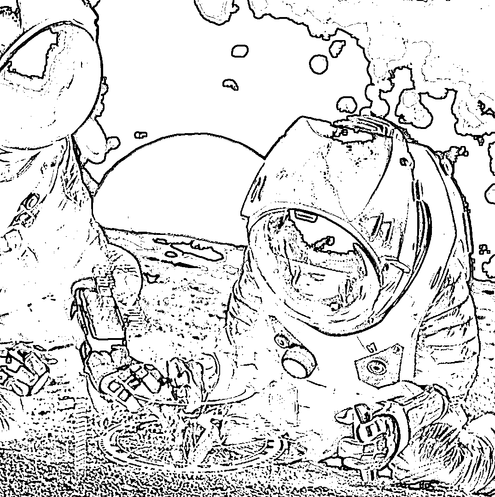

朵：但是地球发生了什么事，使得土地无法使用呢？珍：振动。当他们开始破坏地球生态的时候，一连串的反应就被引发。而那些振动一个接着一个相继持续下去。先是一个动物，接着另一个物种，然后另一个物种。一种连锁反应。**他们第一次试爆原子弹就产生了一连串的反应。自然界的振动就像你丢了一块石头到水里所产生的一圈圈涟漪。当他们第一次消灭了一个物种，事实上就形成了物种灭绝的导火索。**他们引爆的炸弹导致他们未想到的后果，甚至在他们自己的心灵。这个振动动摇了根本的创造。朵：这就是我们所说的“外星生物”在二零零一年来到这里，试图帮助的部分吗？  珍：他们就是如此充满了爱。而且他们好友善。光之族。能量透过他们散发。我说的是“小灰人”（**相关知识**：[听知识 | 小灰人或者“白人”是伟大的文明吗？I](http://mp.weixin.qq.com/s?__biz=MzI3MTk3MjM5OQ==&mid=2247488930&idx=1&sn=6defe478c335decf31f2686edf4bd3a5&chksm=eb38f4e2dc4f7df43f72bb431b57e86c2433bedec2436d0c469e2f7f1687a501b0aa12c511d5&scene=21#wechat_redirect)），还有其他的外星人种族。他们只是在不同的层次。甚至还有爬虫族外星人。他们都是以自己的方式来帮忙。但是“小灰人“尤其是他们种族派来的特使。我认为他们带来比其他外星种族更多的爱。我可能是特别偏爱那个特定的光，他们有较多的爱。

•  END •

**点击了解更多****相关****文章**

[QHHT®量子催眠疗愈技术一阶段课程](http://mp.weixin.qq.com/s?__biz=MzU0NjkzMDY0OA==&mid=2247491054&idx=2&sn=11c47c5f98b8392ee25a1298a2f89668&chksm=fb577759cc20fe4f3283e7523e138845792685fd8e5f03de4397246df1c978e9b0cf91402ded&scene=21#wechat_redirect)

[大师风采 | 朵奶奶通过量子催眠帮助莫纳找到减肥不成功的原因（一）](http://mp.weixin.qq.com/s?__biz=MzU0NjkzMDY0OA==&mid=2247493813&idx=1&sn=3d5c6e891f3156144c252201d883ea88&chksm=fb548202cc230b14e31486f1bcc9aa03ab3c6f32a2ec06698d4e9004ba6c5e6a2e5b65e55144&scene=21#wechat_redirect)

[祝大家辛丑年 up up up！](http://mp.weixin.qq.com/s?__biz=MzU0NjkzMDY0OA==&mid=2247493865&idx=1&sn=79cf55f017c5fda126253d70c79b48bc&chksm=fb54825ecc230b487ca3e0f273b7fc4806e4397a3f689de482d173a6abe8002ac12dbc884983&scene=21#wechat_redirect)

点击“在看”好美哦↓

 点击预约你的催眠师

# 祝大家辛丑年 up up up！

> 原文：[`mp.weixin.qq.com/s?__biz=MzU0NjkzMDY0OA==&mid=2247493865&idx=1&sn=79cf55f017c5fda126253d70c79b48bc&chksm=fb54825ecc230b487ca3e0f273b7fc4806e4397a3f689de482d173a6abe8002ac12dbc884983&scene=126&sessionid=1690980654#rd`](http://mp.weixin.qq.com/s?__biz=MzU0NjkzMDY0OA==&mid=2247493865&idx=1&sn=79cf55f017c5fda126253d70c79b48bc&chksm=fb54825ecc230b487ca3e0f273b7fc4806e4397a3f689de482d173a6abe8002ac12dbc884983&scene=126&sessionid=1690980654#rd)

点击上方蓝字关注我们

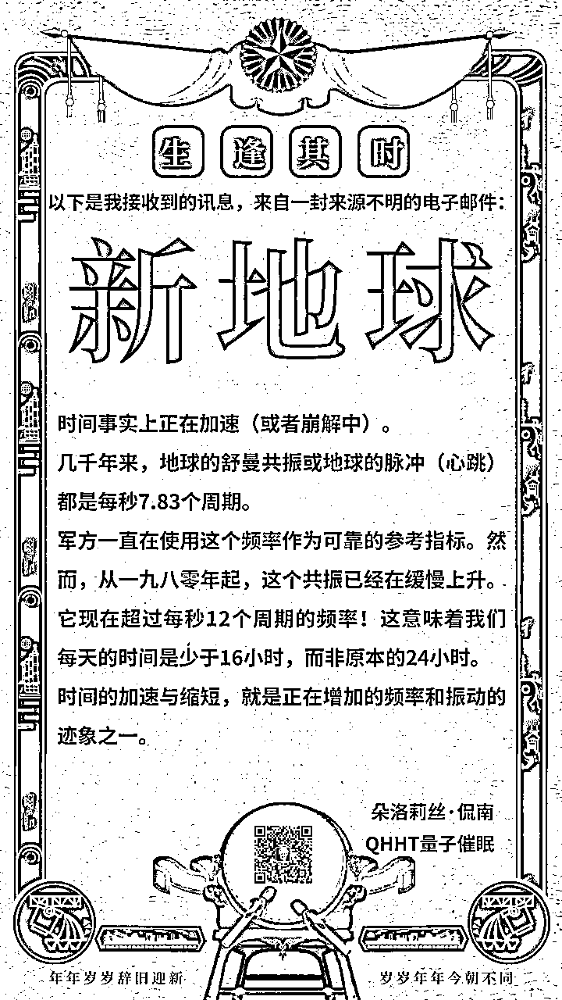

•  END •

**点击了解更多****相关****文章**

[QHHT®量子催眠疗愈技术一阶段课程](http://mp.weixin.qq.com/s?__biz=MzU0NjkzMDY0OA==&mid=2247491054&idx=2&sn=11c47c5f98b8392ee25a1298a2f89668&chksm=fb577759cc20fe4f3283e7523e138845792685fd8e5f03de4397246df1c978e9b0cf91402ded&scene=21#wechat_redirect)

[大师风采 | 朵奶奶通过量子催眠帮助莫纳找到减肥不成功的原因（一）](http://mp.weixin.qq.com/s?__biz=MzU0NjkzMDY0OA==&mid=2247493813&idx=1&sn=3d5c6e891f3156144c252201d883ea88&chksm=fb548202cc230b14e31486f1bcc9aa03ab3c6f32a2ec06698d4e9004ba6c5e6a2e5b65e55144&scene=21#wechat_redirect)

[大师风采·箴言 | 如何化解前世的誓言](http://mp.weixin.qq.com/s?__biz=MzU0NjkzMDY0OA==&mid=2247493851&idx=1&sn=eec319683059496295555896ab50a3a2&chksm=fb54826ccc230b7af2ef7c1388feb4b210f233460bde6d52739e814c5bbc5ffa0594437a676c&scene=21#wechat_redirect)

[大师风采 | 时间真的存在吗？](http://mp.weixin.qq.com/s?__biz=MzU0NjkzMDY0OA==&mid=2247493258&idx=1&sn=f8491bc038f063b4fa8a1b78afefc921&chksm=fb548c3dcc23052b88eb6b422bb8d37de39b05fdaafad7422e6bf5a15070c9676254bca7aa14&scene=21#wechat_redirect)

点击“在看”好美哦↓

 点击预约你的催眠师

# 大师风采 | 朵奶奶通过量子催眠帮助莫纳找到减肥不成功的原因（七）

> 原文：[`mp.weixin.qq.com/s?__biz=MzU0NjkzMDY0OA==&mid=2247493860&idx=1&sn=54e2ac256e87de210c4ecf5f78314150&chksm=fb548253cc230b45355d9fe557f2e44709e4abdd33e8f71f21981acaa536758966b486329c69&scene=126&sessionid=1690980654#rd`](http://mp.weixin.qq.com/s?__biz=MzU0NjkzMDY0OA==&mid=2247493860&idx=1&sn=54e2ac256e87de210c4ecf5f78314150&chksm=fb548253cc230b45355d9fe557f2e44709e4abdd33e8f71f21981acaa536758966b486329c69&scene=126&sessionid=1690980654#rd)

点击上方蓝字关注我们

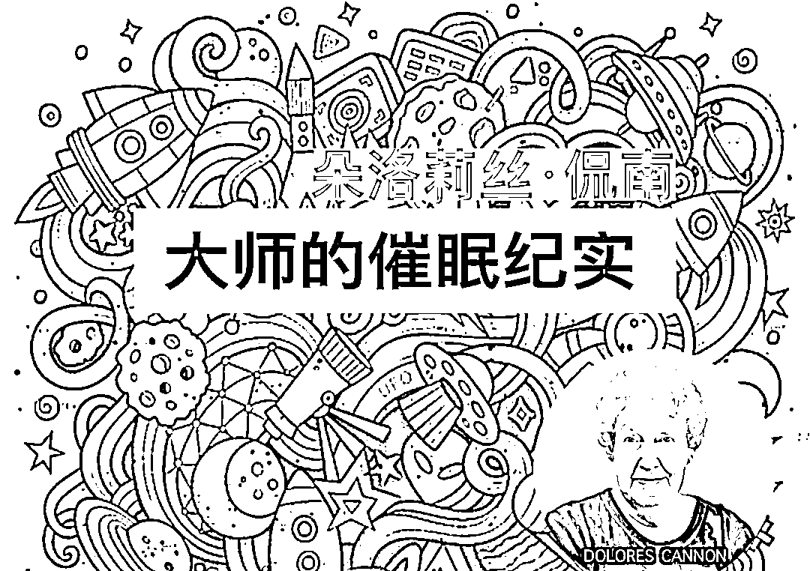

      作者：朵洛莉丝·侃南

编辑/翻译：kathy

图片：网络

文章内容来自量子催眠创始人朵洛莉丝·侃南的专著《星之遗产》，仅供读者参考

**被困地球**

朵：她感觉她会更加快乐和舒适，如果她没有那么重。对她的身体来说很难承受。莫：是的，确实是这样。关节部分。朵：关节，还有身体的机能。这是为什么她想要拿走五十、六十磅。莫：是的，真的是！是的。朵：所以为什么我们不能撇开意识的存在，它的影响，让它理解这个身体已经不同了。莫：唔，这里有个情况。那个存有…是她。眼下的是莫纳。那个存有最终可以回家。现在她和其他人是有链接的。她和他说话。她…嗯，我们必须考虑这个部分。…我们可以修改能量系统。朵：身体的？莫：不，存有的。朵：好的。因为我们不会想要撇开意识，如果意识并不是不被需要。仅仅是为了帮助它理解，并且与她合作。莫：撇不开。这是一个面向，这是存有的一部分，这是基因里面的。这份礼物来自不寻常的过去。礼物指的是她惊人的通灵能力，她正在教授其他人如何使用他们潜在的通灵能力。莫：所以我们会重建身体。朵：告诉它，它不再需要担心。是时候卸下外套。我们不再需要那个厚厚的外衣。莫：这会使她高兴。但是我必须说，画面是这样的：当外衣被拿走，身体会漂浮。朵：是的，但是不是在这一世。它不会，因为它已经通过引力扎根于地球，它就是这样。莫：这个画面还在。朵：明白。嗯，或许你可以帮助她处理这个画面。莫：嗯…我们会试试靴子。朵：靴子？她穿着靴子吗？莫：（很满意。）是的，那最好了，那更好。我们也可以在身体上面作工，让它更轻盈。这是可以的，是的，这样可以。融化。是的，这样可以。朵：如果你想要给她穿靴子让她扎根于地面，这是个好主意。多么奇妙和与众不同的主意。这是一个我意想不到的建议，来达到减肥的目的。既然它是由潜意识提供的，它会起作用，无论它看上去多么奇怪。这是潜意识需要的画面，所以它会起到作用。多余的重量来自于厚重的外衣。在前世，那件外衣保护存有免于漂浮，也盖住了她发光的样貌。潜意识认为如果衣服（超重的部分）被拿走，身体会漂浮，人们会再次看到她是不同的，因此会惧怕她。多么奇怪的逻辑？将靴子作为替代物也可以起到使她扎根地面的作用，也不会造成诸如肥胖的健康问题。潜意识提供了完美的解决方案来保护身体，多聪明！莫：我们会这样去用靴子，直到她觉得安全。朵：这是个好主意。这样她就知道她不会漂，因为它们会让她落在地上。莫：我们也利用这段时间来扩展脑部。是的，我们已经开始融化了。朵：欧，这很好。我相信她知道了会很开心。我也很感激你与我合作。莫：嗯……我们都享受与你的合作。朵：你感觉到了我内心为她而喜悦。哦：是的，我们也是。朵：我们总是想要对她而言最好的。莫：她很固执。（咯咯笑）朵：她很固执，不是吗？所以我很开心你能够与我对话，这样我们就能解决问题，谢谢你。莫：不，谢谢你。然后我得以让那个小小的存有的人格退回，在唤醒她之前，请求莫纳的人格和意识整合回归到身体之中。没有更多的反抗了，潜意识同意了以它独特的方式去处理超重的问题。

•  END •

**点击了解更多****相关****文章**

[QHHT®量子催眠疗愈技术一阶段课程](http://mp.weixin.qq.com/s?__biz=MzU0NjkzMDY0OA==&mid=2247491054&idx=2&sn=11c47c5f98b8392ee25a1298a2f89668&chksm=fb577759cc20fe4f3283e7523e138845792685fd8e5f03de4397246df1c978e9b0cf91402ded&scene=21#wechat_redirect)

[大师风采 | 朵奶奶通过量子催眠帮助莫纳找到减肥不成功的原因（一）](http://mp.weixin.qq.com/s?__biz=MzU0NjkzMDY0OA==&mid=2247493813&idx=1&sn=3d5c6e891f3156144c252201d883ea88&chksm=fb548202cc230b14e31486f1bcc9aa03ab3c6f32a2ec06698d4e9004ba6c5e6a2e5b65e55144&scene=21#wechat_redirect)

[大师风采 | 朵奶奶通过量子催眠帮助莫纳找到减肥不成功的原因（六）](http://mp.weixin.qq.com/s?__biz=MzU0NjkzMDY0OA==&mid=2247493859&idx=1&sn=f39842dd08c97a4b3b548c5f5f4ae545&chksm=fb548254cc230b42b628ac9aace96bedbdcb82cb70a0a89c848ffecfe8fad38a8688c7957f57&scene=21#wechat_redirect)

[催眠师心声 | 你的眼，是我今生不会再遇的海](http://mp.weixin.qq.com/s?__biz=MzU0NjkzMDY0OA==&mid=2247493774&idx=1&sn=85e6dd8b40f2ac0b3f977b91735ee0b8&chksm=fb548239cc230b2fc801b542cab597ef18bedb7cbcbcbfc47353dd9c75835170feb520758b52&scene=21#wechat_redirect)

点击“在看”好美哦↓

 点击预约你的催眠师

# 大师风采 | 朵奶奶通过量子催眠帮助莫纳找到减肥不成功的原因（六）

> 原文：[`mp.weixin.qq.com/s?__biz=MzU0NjkzMDY0OA==&mid=2247493859&idx=1&sn=f39842dd08c97a4b3b548c5f5f4ae545&chksm=fb548254cc230b42b628ac9aace96bedbdcb82cb70a0a89c848ffecfe8fad38a8688c7957f57&scene=126&sessionid=1690980659#rd`](http://mp.weixin.qq.com/s?__biz=MzU0NjkzMDY0OA==&mid=2247493859&idx=1&sn=f39842dd08c97a4b3b548c5f5f4ae545&chksm=fb548254cc230b42b628ac9aace96bedbdcb82cb70a0a89c848ffecfe8fad38a8688c7957f57&scene=126&sessionid=1690980659#rd)

点击上方蓝字关注我们

      作者：朵洛莉丝·侃南

编辑/翻译：kathy

图片：网络

文章内容来自量子催眠创始人朵洛莉丝·侃南的专著《星之遗产》，仅供读者参考

**被困地球**

莫：不，我的观点罢了。这个地方是陌生的，有着不寻常的拉力。这是一个稠密的，稠密的地方。

多：或许这和事故发生的原因相关。

莫：我也这样认为。于事无补了，我被困住了，我不能回家。

多：现在也不行？身体消散了也不行？

莫：甚至是现在。现在我必须找到一个可以融合的东西，如果我希望有物质身体。

多：明白。那么，我想要谢谢你告诉我这些事，与我分享这些。我希望你离开那个场景。

莫：去到哪里？

多：欧，只是在时间当中向前，离开那个场景。

当莫纳向前移动，她开始描述作为印加牧师的一生，带着羽毛的头饰。我们没有更多的时间来进行这次的操作了，所以我试图结束。我没有时间来探索另一个前世。但是，至少我们挖掘到了地球的拉力是如此之大，她在这个星球上面又继续生活了好几世，没有回去。我认为她很有可能招致和地球上的人们的业力，因为她“介入”了他们的生活，通过在文明方面教导他们，在他们发展到合适的时间之前。由于她自己的无聊，她没有施加明显的破坏，但是必须维持在物质身体当中来偿还业力。天道好轮回，苍天绕过谁，难怪朵奶奶教导我们要“不介入地操作”，站在巨人的肩膀上，让我们仿佛有了护体的金钟罩

我还没有探索她肥胖的原因，在这次的操作结束前必须达成。我个人没有看到任何那个前世和肥胖之间的联系，我无从揣测潜意识的奇特逻辑。

朵：我希望你离开这些你在观察的场景。我希望你在时空之中向前移动

莫：向前移动。

朵：我希望莫纳所有的意识和人格回到这个身体。我希望与我们交谈的小小的存有可以退回到她所归属的地方。我想要感谢她与我分享她的故事。我爱和她谈话。

莫：（她打断了我。）不！

朵：怎么了？

这是不寻常的。通常在回溯的这个环节，个案不会说话。他们只会依照指令回到现在。

莫：因为你不明白。它没有翻篇！

朵：好的。但是我还是希望她退回到背景之中，进入潜意识。（深深的叹气。）我感谢她，因为我爱和她谈话。我很开心她和我对话了。我希望莫纳的所有的意识和人格再次进入潜意识的前景。我希望和莫纳的潜意识对话，可以允许我向你的潜意识提些问题吗？（是的）

这个故事非常有趣和不同，但是这和她现在面临的超重问题有什么关联呢？

朵：她探索的这一世和她担忧的体重问题有关系吗？和那一世有任何关联吗？

莫：她不想飘走。

朵：欧！她担心这个？

莫：担心不同。

朵：明白。她把她的身体变得更加稠密和沉重。她担心如果她减肥，她会和其它存有一样飘走？是这样吗？

莫：（叹气）她和其他人不同。

朵：但是她是个好人。她对于拥有这个身体感到满意。问题是她想要甩掉多余的重量。她不再需要它们，是这样吗？

莫：嗯，不需要。

朵：你可以使得她意识到，这一世，在这个身体里面，她不必要保留多余的重量？

莫：嗯，我们不这样认为，或许吧。（大叹气）我们会观望。

朵：你可以和她合作，让她明白这已经是个不同的躯体？她在目前不用担心，她不需要那些多余的重量。

莫：她可以把皮毛脱掉。

朵：是的，她可以把皮毛脱掉。在后面的六个月当中，她会卸下那个外衣，她会去掉大约五十、六十磅的体重，看上去棒极了。你觉得你可以帮助她认识到她现在和其他人一样拥有人类的身体，它和地球表面是通过引力连结的吗？这个身体不会飘走。

莫：嗯，问题在于…（大叹气）她的意识不是人类的意识，是那个存有的意识。

潜意识依旧不依不饶地用它的逻辑和我争辩。我持续地通过呼吁它照顾莫纳的身体，以及唤起它系统性地保护监测。接下去是大段地哄骗和诱导的文字记录，是我必须做的，直到潜意识最终给出了一个不同寻常的解决方法。

•  END •

**点击了解更多****相关****文章**

[QHHT®量子催眠疗愈技术一阶段课程](http://mp.weixin.qq.com/s?__biz=MzU0NjkzMDY0OA==&mid=2247491054&idx=2&sn=11c47c5f98b8392ee25a1298a2f89668&chksm=fb577759cc20fe4f3283e7523e138845792685fd8e5f03de4397246df1c978e9b0cf91402ded&scene=21#wechat_redirect)

[大师风采 | 朵奶奶通过量子催眠帮助莫纳找到减肥不成功的原因（一）](http://mp.weixin.qq.com/s?__biz=MzU0NjkzMDY0OA==&mid=2247493813&idx=1&sn=3d5c6e891f3156144c252201d883ea88&chksm=fb548202cc230b14e31486f1bcc9aa03ab3c6f32a2ec06698d4e9004ba6c5e6a2e5b65e55144&scene=21#wechat_redirect)

[大师风采 | 朵奶奶通过量子催眠帮助莫纳找到减肥不成功的原因（五）](http://mp.weixin.qq.com/s?__biz=MzU0NjkzMDY0OA==&mid=2247493857&idx=1&sn=b1e4f4fe47eedb6073ad5fcc98d14030&chksm=fb548256cc230b401641a07825a2f42b144a7a40ad04409f57b8a7d4b906f61655b6da64108c&scene=21#wechat_redirect)

[催眠师心声 | 你的眼，是我今生不会再遇的海](http://mp.weixin.qq.com/s?__biz=MzU0NjkzMDY0OA==&mid=2247493774&idx=1&sn=85e6dd8b40f2ac0b3f977b91735ee0b8&chksm=fb548239cc230b2fc801b542cab597ef18bedb7cbcbcbfc47353dd9c75835170feb520758b52&scene=21#wechat_redirect)

点击“在看”好美哦↓

 点击预约你的催眠师

# 大师风采 | 朵奶奶通过量子催眠帮助莫纳找到减肥不成功的原因（五）

> 原文：[`mp.weixin.qq.com/s?__biz=MzU0NjkzMDY0OA==&mid=2247493857&idx=1&sn=b1e4f4fe47eedb6073ad5fcc98d14030&chksm=fb548256cc230b401641a07825a2f42b144a7a40ad04409f57b8a7d4b906f61655b6da64108c&scene=126&sessionid=1690980659#rd`](http://mp.weixin.qq.com/s?__biz=MzU0NjkzMDY0OA==&mid=2247493857&idx=1&sn=b1e4f4fe47eedb6073ad5fcc98d14030&chksm=fb548256cc230b401641a07825a2f42b144a7a40ad04409f57b8a7d4b906f61655b6da64108c&scene=126&sessionid=1690980659#rd)

点击上方蓝字关注我们

      作者：朵洛莉丝·侃南

编辑/翻译：kathy

图片：网络

文章内容来自量子催眠创始人朵洛莉丝·侃南的专著《星之遗产》，仅供读者参考

**前情提要**

上一篇中，我们看到从天而降的她，在地球被当作神来看待，在被困地球的时候，出于无聊，教授了人类建造桥和房子。然而，对于减肥不成功的原因，我们依旧感到茫然。

在本篇中，答案的事实依据已经出现了；在下一篇，我们将看到朵奶奶如何像哄孩子一样顺着潜意识的逻辑来搞定祂。看完这篇，你能够自己想明白前因后果，以及疗愈将如何发生吗？

**被困地球**

**教人类石雕和种谷物**朵：嗯，至少不会吓到他们。莫：他们很简单。朵：这样很好。好的。让我们继续向前移动，看一看其它你做的重要的事情。莫：有一种结构部件，我好似花了大部分的时间建造它。这是石头。（伤感。）我很担心。担心我不再发光了。朵：为什么不发光了？莫：我不知道。朵：会不会是因为你已经习惯了那个地方？莫：不，我觉得我病了。朵：恩，什么是石头结构？（停顿）是你做的吗？莫：有被协助。朵：它是什么样子的？莫：它是立方体的，有台阶。正面是进入山洞开口的门，但是它很大，上面有雕刻和台阶。朵：你是如何制作它的？听起来它比木结构更加难以制作。莫：是的，我感觉到有其他人协助我。像是用意念挪开障碍物。（她指的是毛茸茸的、五天尺高的存有吗？）朵：把它们归位。莫：是的，我们也有给表面抛光的方法。朵：怎么做的？莫：你用麦秆和另一块石头，摩擦、摩擦，再摩擦，然后，时间到了就变得表面光亮。朵：雕刻是怎么做上去的呢？莫：用熔炉。朵：你做的吗？莫：欧，是的。我们有工具。朵：你展示给他们看怎么做吗？（是）然后呢，他们做了雕刻吗？莫：是的。（咯咯笑）他们当中有个像我一样的，好奇怪啊。和他们不同，好大只。头特别大，有些孩子编织出来和我一样的脑袋，安在他们自己的脑袋上面。（笑）这可能就是“神”的孩子的由来朵：你觉得雕刻像你吗？莫：嗯，我看到我的身影，我的手。但还是不一样。朵：他们已经尽力了，我猜。莫：我也觉得。朵：为什么你教他们这些？你还是觉得无聊吗？莫：嗯，我感到被照顾。我孤独。但是能教的太多了。（咯咯笑）甚至是烤面包的炉子也可以教。像谷物，谷物的播种、耕种和收成。因为在那之前它们都是野生的，我们用杂交的方式，改变谷物使得它们可持续地生长。朵：你知道怎么做？莫：欧，是的。你只是用两只手指。朵：欧？你能够改变物质的结构。你是这个意思吗？（啊哈）明白。就像魔术，真的。莫：对他们来说，是这样。对我来说，没有了。朵：对你来说这很自然。（是）那你为他们做了很多啊。莫：我觉得他们也为我做了很多。朵：如果你没有得到他们的照顾，会特别孤独，是吧？还有无聊。莫：嗯，孤独。（叹气）我来了很久了。他们中的许多人来了又走，死了。好多世代了。朵：你是不是说你觉得你可能病了，因为你不再发光？（是）你觉得会发生什么？你能够疗愈自己吗？莫：我不知道。没有人告诉我。朵：但是你的族类里面没有人陷入这样的困境。莫：没有。但是有种感觉，一些我的族人快来了。我能感觉到。我希望能够尽快。他们越来越近了。朵：你这样认为？莫：我感觉到了。

**遇到和人类更像的族类**

朵：好的。让我们向前移动，看看在你身上发生了什么。莫：欧，天呐！朵：怎么了？莫：（叹气）嗯，有些其他人来了。他们不喜欢我。朵：他们不喜欢你？莫：欧，不。朵：这些人像你吗？莫：不，不。朵：他们有多么不同？莫：嗯，感觉不同。他们更像是和我住在一起的那些。（叹气）但是他们…（哎）嗯…（很难解释）他们遇到了问题，因为他们…他们掉了下来。朵：掉了下来？莫：（同情）是的！他们想要坐下，他们从椅子上掉下来了。朵：为什么？莫：我不知道，椅子无法承载他们。他们会掉下来，然后，他们的身体就分裂了。朵：在身体里面？莫：这是他们不同的地方。他们不是固态的。他们说我干扰了他们。他们不喜欢我，我走开了。朵：嗯，这些人属于这里吗？莫：他们来过这里。朵：他们从其它地方来？莫：欧，是的。他们有火箭。朵：一个火箭？莫：欧，是的。朵：但是他们和这里的人们更像，而不是你的族类？莫：欧，是的。他们说我干扰了，所以我离开了。朵：其他人能够看到他们吗？莫：欧，是的。他们也认为他们是神。大师，更像是大师，而不是神。朵：你将和他们一起离开吗，你怎么离开呢？莫：我就是走开。朵：不搭他们的飞船走吗？莫：他们不喜欢我，打扰了。我不喜欢他们，他们没有任何的敬畏之心。朵：你觉得他们和你来自不同的地方吗？莫：欧！（咯咯笑）不同的地方。朵：明白。或许你们是两种不同的族类，或其它。莫：嗯，猴子看起来也不同。这里有很多猴子。 外星人开玩笑朵：好的，你在做什么？你只是在行走吗？莫：我走回去和山洞里面的那些碰面。朵：那些你帮助的人怎么想呢？他们想你离开吗？莫：他们什么都没说。朵：好。所以你想要走向山洞里的那些人，发生了什么？莫：我留下来了。我很受欢迎。**这一世学会的课题**朵：好的，让我们移到你那一世的生命的最后一天，你可以客观地看待它，它不会对你造成任何影响。你只是看着它，告诉我发生了什么。在那一世的最后一天，发生了什么？莫：我躺在山洞里面，听着风声。我在分解。朵：分解？莫：像尘埃。朵：一部分原因会不会是你不再发光了？莫：啊，是。我只能看到自己被吹散。朵：没有其他人了吗？莫：没有人了，但是，我在这。朵：好的。让我们看看那一世，检视它。你觉得你学到了什么？莫：嗯……情绪。朵：这是你之前不知道的吗？莫：不，我不知道。朵：在你的故乡，你们没有情绪吗？莫：不。所有的事物都很…（咯咯笑）乏味。朵：（笑）所以你学会了感觉。在那一世你还学会其它的功课吗？莫：有很多虐待和操控。还有，我不认为应该允许探索。朵：为什么不呢？莫：因为它搞乱了事物的自然秩序。朵：你说的是像你做的那种探索？莫：欧，是的。还有其它的探索。朵：那些来到这里的族类？莫：欧，是他们。他们偷盗、掠夺，他们…（哎）没有任何敬畏。朵：所以你觉得那不应该被允许。但是在你的情况里面，那不是允不允许的问题。你回不去，你不是故意为之。莫：我有工作要做，我在绘制这里的地图。朵：是的，但是无论你是何时被困在此地，这不是你的错。你必须找些事情来填满你的时间。莫：嗯，是。但是这不应该发生。一开始我就不应该在那。朵：那依旧不是你的错。

•  END •

**点击了解更多****相关****文章**

[QHHT®量子催眠疗愈技术一阶段课程](http://mp.weixin.qq.com/s?__biz=MzU0NjkzMDY0OA==&mid=2247491054&idx=2&sn=11c47c5f98b8392ee25a1298a2f89668&chksm=fb577759cc20fe4f3283e7523e138845792685fd8e5f03de4397246df1c978e9b0cf91402ded&scene=21#wechat_redirect)

[大师风采 | 朵奶奶通过量子催眠帮助莫纳找到减肥不成功的原因（一）](http://mp.weixin.qq.com/s?__biz=MzU0NjkzMDY0OA==&mid=2247493813&idx=1&sn=3d5c6e891f3156144c252201d883ea88&chksm=fb548202cc230b14e31486f1bcc9aa03ab3c6f32a2ec06698d4e9004ba6c5e6a2e5b65e55144&scene=21#wechat_redirect)

[大师风采 | 朵奶奶通过量子催眠帮助莫纳找到减肥不成功的原因（四）](http://mp.weixin.qq.com/s?__biz=MzU0NjkzMDY0OA==&mid=2247493821&idx=1&sn=4504aeb150e888200bb934bc988cb9d9&chksm=fb54820acc230b1c27422befc3b3824d1233864332c429d9b39562c5b9de57861ac93457cc95&scene=21#wechat_redirect)

[催眠师心声 | 你的眼，是我今生不会再遇的海](http://mp.weixin.qq.com/s?__biz=MzU0NjkzMDY0OA==&mid=2247493774&idx=1&sn=85e6dd8b40f2ac0b3f977b91735ee0b8&chksm=fb548239cc230b2fc801b542cab597ef18bedb7cbcbcbfc47353dd9c75835170feb520758b52&scene=21#wechat_redirect)

点击“在看”好美哦↓

 点击预约你的催眠师

# 大师风采·箴言 | 如何化解前世的誓言

> 原文：[`mp.weixin.qq.com/s?__biz=MzU0NjkzMDY0OA==&mid=2247493851&idx=1&sn=eec319683059496295555896ab50a3a2&chksm=fb54826ccc230b7af2ef7c1388feb4b210f233460bde6d52739e814c5bbc5ffa0594437a676c&scene=126&sessionid=1690980659#rd`](http://mp.weixin.qq.com/s?__biz=MzU0NjkzMDY0OA==&mid=2247493851&idx=1&sn=eec319683059496295555896ab50a3a2&chksm=fb54826ccc230b7af2ef7c1388feb4b210f233460bde6d52739e814c5bbc5ffa0594437a676c&scene=126&sessionid=1690980659#rd)

点击上方蓝字关注我们

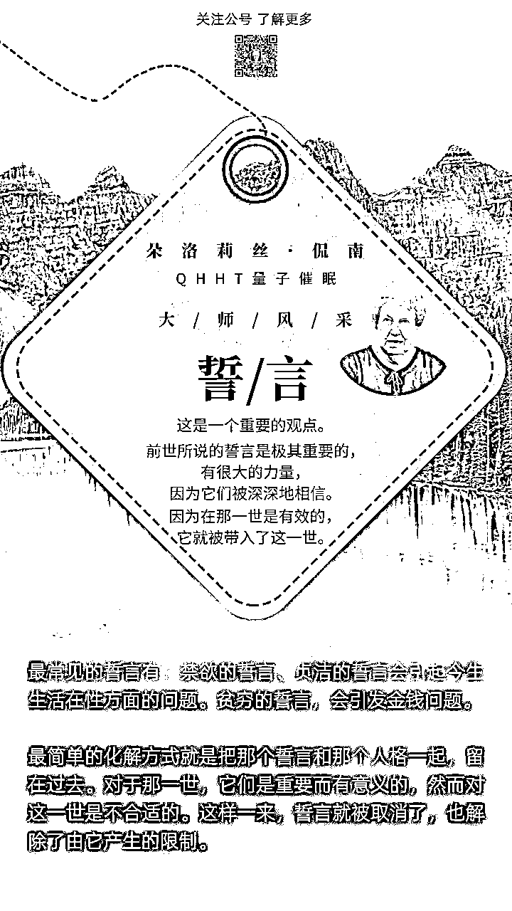

•  END •

**点击了解更多****相关****文章**

[QHHT®量子催眠疗愈技术一阶段课程](http://mp.weixin.qq.com/s?__biz=MzU0NjkzMDY0OA==&mid=2247491054&idx=2&sn=11c47c5f98b8392ee25a1298a2f89668&chksm=fb577759cc20fe4f3283e7523e138845792685fd8e5f03de4397246df1c978e9b0cf91402ded&scene=21#wechat_redirect)

[大师风采 | 朵奶奶通过量子催眠帮助莫纳找到减肥不成功的原因（一）](http://mp.weixin.qq.com/s?__biz=MzU0NjkzMDY0OA==&mid=2247493813&idx=1&sn=3d5c6e891f3156144c252201d883ea88&chksm=fb548202cc230b14e31486f1bcc9aa03ab3c6f32a2ec06698d4e9004ba6c5e6a2e5b65e55144&scene=21#wechat_redirect)

[催眠师心声 | 你的眼，是我今生不会再遇的海](http://mp.weixin.qq.com/s?__biz=MzU0NjkzMDY0OA==&mid=2247493774&idx=1&sn=85e6dd8b40f2ac0b3f977b91735ee0b8&chksm=fb548239cc230b2fc801b542cab597ef18bedb7cbcbcbfc47353dd9c75835170feb520758b52&scene=21#wechat_redirect)

[大师风采 | 时间真的存在吗？](http://mp.weixin.qq.com/s?__biz=MzU0NjkzMDY0OA==&mid=2247493258&idx=1&sn=f8491bc038f063b4fa8a1b78afefc921&chksm=fb548c3dcc23052b88eb6b422bb8d37de39b05fdaafad7422e6bf5a15070c9676254bca7aa14&scene=21#wechat_redirect)

点击“在看”好美哦↓

 点击预约你的催眠师

# 大师风采 | 朵奶奶通过量子催眠帮助莫纳找到减肥不成功的原因（四）

> 原文：[`mp.weixin.qq.com/s?__biz=MzU0NjkzMDY0OA==&mid=2247493821&idx=1&sn=4504aeb150e888200bb934bc988cb9d9&chksm=fb54820acc230b1c27422befc3b3824d1233864332c429d9b39562c5b9de57861ac93457cc95&scene=126&sessionid=1690980659#rd`](http://mp.weixin.qq.com/s?__biz=MzU0NjkzMDY0OA==&mid=2247493821&idx=1&sn=4504aeb150e888200bb934bc988cb9d9&chksm=fb54820acc230b1c27422befc3b3824d1233864332c429d9b39562c5b9de57861ac93457cc95&scene=126&sessionid=1690980659#rd)

点击上方蓝字关注我们

      作者：朵洛莉丝·侃南

编辑/翻译：kathy

图片：网络

文章内容来自量子催眠创始人朵洛莉丝·侃南的专著《星之遗产》，仅供读者参考

**前情提要**

朵奶奶通过量子催眠，试图帮助个案找到她减肥总是不成功的原因。那么，同样作为引导者的朵奶奶，也是通过提问不断获得更多的资讯。她用简单、安全的操作，呈现出来的场景让我们感觉身临其境，同时对于根本的原因又有些疑惑不解，这就是真实的催眠过程，我们也在这个过程中感受到朵奶奶的语言魅力。

个案经历了两个场景，首先是坠毁的时刻，她意识到自己是一艘飞船，由于损毁，只能离开飞船，呈现出光体的模样；然后，看到五天尺高的有着浓密毛发的智慧存有，它们给了她皮毛来抵御寒冷；**在本章节中，我们会看到第三个场景，了解到这位外星友人眼中，同样光溜溜的“人类”，以及，一窥可能是宗教雏形的历史现场**。

**被困地球**

莫：人类！现在我理解他们是什么了。人，是人。像我一样是光溜溜的皮肤。朵：你有看到不同的人吗？莫：是的，是的。我还是披着皮毛，但是现在我在更低的地方，在山脚下。他们像猴子一样地交谈。朵：谁？莫：人类。吵吵闹闹。他们好喧闹。没有安静的心灵感应。其他都是安静的、不同的、柔和的、有同情心的。这些人很吵。朵：他们没有毛发？莫：不——头上有！他们头上有毛。朵：你认为我说的人类是这样的吗？莫：欧，是！朵：所以他们更像你吗？莫：他们好难看。（笑）好丑。朵：为什么他们丑？莫：他们有这么大的鼻子。朵：他们的头发是什么颜色的？或者说毛发？莫：黑色。朵：头上有黑色的毛发？还有大鼻子。他们穿着什么吗？莫：他们有……在他们的腿和身体的最上层有织物。朵：你是如何下到那里，和他们在一起的？莫：在梦里，其他人把我送到那里。朵：在梦里？这是什么情况？莫：在这个地方，当我醒来被他们联手疗愈之后，他们在梦里把我发送到这里。朵：有没有可能他们把你带到下面的？莫：在梦里我漂浮到这里的。朵：所以你并不知道？你就是忽然醒来和这些在交谈的人在一起？莫：（笑）还有鼻子。好丑。朵：但是有毛发的人不见了？（*指的是“五天尺”高的那些）莫：只是在我的脑海里面。朵：他们现在没有和你在一起。（不）好，这些人在干什么？这些聊着天的？莫：他们在祈祷。他们跪着在祈祷。向下…手和头面向下。嗯。朵：他们在祈祷什么？莫：他们觉得我是神或什么。我发着光。我是发光的。他们不是那个样子。朵：这是你自然的状态？莫：欧，是。朵：所以看上去这是他们从未见过的。你的头怎么样了？好些了吗？莫：感觉有一部分丢失了，但是不觉得痛。朵：可能是损毁引起的。好，至少他们对你而言无害，是这样吧？莫：不，就像孩子。就像小孩子。朵：在你再度觉得沮丧和感到被困住之前，你现在是什么感觉？莫：我…我有一个空的空间，然后，悲伤来了又走。朵：你觉得有任何方式可以联系到你的族人，让他们知道你在哪里吗？莫：我可以造一个时光卫星。（叹气）但是他们根本不知道怎么冶炼金属。朵：明白。我会觉得你的族人会前来寻找你的。莫：擦掉吧。都擦掉，当你离开飞船，就像光的爆炸。朵：欧。所以他们无法联系、追踪到你？莫：不能，除非他们离得很近了。我在离家很远的地方。朵：明白。好，你觉得你想做什么？莫：（停顿）我无法思考。朵：你没有办法去任何地方，是吗？莫：（伤感）不。朵：你必须呆在这里。莫：我不必。但是我没有选择。朵：让我们再次往前移动，看看你做了什么。在时空之中向前移动。莫：（她的情绪猝然变化。听起来不再忧伤。）我们在造东西。朵：是吗？莫：欧，是的，他们学得快。朵：你们在建造什么？莫：桥。房子。朵：之前他们有这些吗？莫：不，我用木棍和绳演示给他们看。他们用树皮，用石头去搓它，制成绳子。他们给我看，我也演示给他们看。朵：你是怎么知道这些的？这些你来的地方就有的吗？莫：我看见过这些。我们有一些结构部件是那种…（她对于找到词有困难。）是…结构部件，不像这些。朵：是你们住的地方？莫：场域、连接和能量点，是可以使用的…几何学很重要。是的，我需要变得忙碌。朵：是的，你需要有些事做做。这很合理。莫：这是一个峡谷，一个大峡谷。我们，我，想要造一座桥。朵：你会演示给他们看如何去做？莫：欧，是！朵：这对于他们而言会有帮助，是吗？莫：这，我不知道。他们看上去挺高兴。我有点无聊。我需要这样做。朵：在这之前他们有什么结构部件吗？莫：有一些。不，很少。山洞，树。他们，这些人，有时住在树里面。（咯咯笑）朵：所以你在尝试演示给他们看更好的可能？莫：不，我只是觉得无聊。朵：所以你在教他们。你是如何做的？通过心灵感应，就像你说的和其他人交流的那种方式？莫：不，就是演示。用木棍和绳子，然后演示给他们看。画在地上。那些人还是在我的脑海里面，他们与我交流得更好。现在我的手部也有语言，他们也有。他们用手势沟通很多。朵：那样他们可以理解你了？莫：足够。朵：好，这很好。虽然你觉得无聊，你对他们做的是好事。莫：嗯，自以为义。朵：他们待你不薄。这是关键。你还披着皮毛吗？（是）因为冷吗？莫：不，因为它掩饰了我的不同，发着光。我还是不能遮住我的头。所以他们有时候会祈祷，他们把我想得多了，因为我是和他们不同。如果我把我的袍子脱掉，我会漂起来。（咯咯笑）所以我就穿着。朵：这会吓到他们吗？莫：他们常常祈祷。（笑）如果我漂起来。一旦我漂起来，他们就会唱颂。那是很优美的声音。

•  END •

**点击了解更多****相关****文章**

[QHHT®量子催眠疗愈技术一阶段课程](http://mp.weixin.qq.com/s?__biz=MzU0NjkzMDY0OA==&mid=2247491054&idx=2&sn=11c47c5f98b8392ee25a1298a2f89668&chksm=fb577759cc20fe4f3283e7523e138845792685fd8e5f03de4397246df1c978e9b0cf91402ded&scene=21#wechat_redirect)

[大师风采 | 朵奶奶通过量子催眠帮助莫纳找到减肥不成功的原因（一）](http://mp.weixin.qq.com/s?__biz=MzU0NjkzMDY0OA==&mid=2247493813&idx=1&sn=3d5c6e891f3156144c252201d883ea88&chksm=fb548202cc230b14e31486f1bcc9aa03ab3c6f32a2ec06698d4e9004ba6c5e6a2e5b65e55144&scene=21#wechat_redirect)

[大师风采 | 朵奶奶通过量子催眠帮助莫纳找到减肥不成功的原因（二）](http://mp.weixin.qq.com/s?__biz=MzU0NjkzMDY0OA==&mid=2247493816&idx=1&sn=0560dd50649861e167cd349d301b0ac4&chksm=fb54820fcc230b192f71a382cb8b199e65076f87b442e79da82728d5999b9121a95954b68e61&scene=21#wechat_redirect)

[催眠师心声 | 你的眼，是我今生不会再遇的海](http://mp.weixin.qq.com/s?__biz=MzU0NjkzMDY0OA==&mid=2247493774&idx=1&sn=85e6dd8b40f2ac0b3f977b91735ee0b8&chksm=fb548239cc230b2fc801b542cab597ef18bedb7cbcbcbfc47353dd9c75835170feb520758b52&scene=21#wechat_redirect)

点击“在看”好美哦↓

 点击预约你的催眠师

# 大师风采 | 朵奶奶通过量子催眠帮助莫纳找到减肥不成功的原因（三）

> 原文：[`mp.weixin.qq.com/s?__biz=MzU0NjkzMDY0OA==&mid=2247493817&idx=1&sn=72a654541b71195181c8f74767b6be02&chksm=fb54820ecc230b18fa81a3897057c9e54c70c258ed4b2bb4a9d449b321bbcef1e0455f937beb&scene=126&sessionid=1690980659#rd`](http://mp.weixin.qq.com/s?__biz=MzU0NjkzMDY0OA==&mid=2247493817&idx=1&sn=72a654541b71195181c8f74767b6be02&chksm=fb54820ecc230b18fa81a3897057c9e54c70c258ed4b2bb4a9d449b321bbcef1e0455f937beb&scene=126&sessionid=1690980659#rd)

点击上方蓝字关注我们

      作者：朵洛莉丝·侃南

编辑/翻译：kathy

图片：网络

文章内容来自量子催眠创始人朵洛莉丝·侃南的专著《星之遗产》，仅供读者参考

**被困地球**

莫：不，和你想得不同。和你想得不同。它们是不同的……并不是……一个实物可以解释的。辐射没有害处，它是供给养分的。飞船载体是为了便于游历，并不是必须的。这好奇怪。朵：那么光、辐射，是从飞船内部发射出来的？莫：里面和外面。朵：外面是在空中，还是？莫：是的，我只是吸收它，它无处不在。我的肌肤…得到滋润。就是这样，飞船可以得到滋润。朵：好的。你说你认为你必须走出来找到方向，去看看自己在哪。但是，你是不是也说过你从来没有出过飞船？莫：很久没有出去了，我一直在航行。朵：所以只要你在飞船里面，你就可以存在。多长和多远的距离，没有意义吗。莫：直到我坠毁前，我都知道自己飞了多远。朵：在那之前你有和谁交流吗？莫：我一直和所有念头是相连的…和其它的，和所有人。朵：它们能够感受到有事发生吗？莫：我感到完全失去了链接。有不好的事发生了。朵：如果它们还和你链接着，它们会过来找到你。莫：我感到完全失去了链接，我觉得很沮丧。朵：那么，让我们往前移动，看看你要做什么。接下去你想要做什么呢？莫：现在，我…有人、东西给了我皮毛。朵：皮毛？莫：我坐在山洞里面，周身披着皮毛，烤着火。感觉很奇怪，但是看上去这是必须的。我失去了脚趾，它冻住，坏死了。朵：然后你走出了飞船。是这个意思吗？（是）当你这样做的时候是什么感觉？莫：震惊！朵：怎么说？莫：就像能够呼吸了，火焰在我的内部灼烧。感觉冷，但是里面依旧是火热。朵：呼吸冷空气让你很震惊？（是的。）你是通过呼吸系统在呼吸吗？莫：我有一套用以适应环境的调节系统。如果需要，我就可以呼吸。大部分是通过肌肤，如果真的需要通过吸入气体来呼吸。朵：明白。所以你可以适应任何你到的地方。莫：几乎是这样。也不是所有地方。有些是不利的，像酸，硫磺是不好的，硫磺是酸性的。朵：但是目前你身处的气体是没有害处的，是吗？它们只是一开始是燃烧着的，还是就是那个冷的气体在燃烧着？莫：都是。需要时间去适应。可以调整，但是它…会损害部分身体。朵：你在冷的气体中行走吗？是那个时候失去脚趾的吗？莫：我只记得一点点。就是坠落，然后在这里披着皮毛行走，然后，每个人都有皮毛。朵：还有其他人？莫：现在是，一个。我看到的，但是我相信有更多。朵：你在那里舒适吗？莫：我被困住了。当你被困住的时候你怎么可能觉得舒适？朵：我的意思是，你不觉得冷了，是吗？莫：我失去了感觉。朵：那烤火没有起到作用吗？莫：我觉得…（笑）你会用“垂头丧气”来形容这个情形，我感到垂头丧气和泄气。我还是被困着。朵：是的。那么，和你在一起的这个人是什么样子呢？莫：毛茸茸的，都是毛。是毛。朵：在他的肌肤上？（是）我以为是你披着的那种皮毛。莫：不是。我披着皮毛…但是他那个是皮肤上长着的毛。他很大个，高高的。比我大好多。我就到他胸这里。有四…等等…到五天尺(?)高。（她对于找到这个词有困难）感应…你说“心灵感应“。起作用，通过心智来表达。这是一种最具有同情心的存有，最智能。朵：他一定表现得有同情心，如果他有照顾你。莫：有一个随之产生的问题，是交朋友。我好孤独，我无法连接我的族群。（叹气）我需要借助飞船，它坏了，我的脑袋坏了，我没办法自己连接回去。朵：你能够和这个存有交流吗？莫：是，是也不是。就像…我们理解彼此，但是在对话方式当中没有细节，是头脑与头脑的对话。你想“饥饿，温暖，陪伴，友情。”这些事物出现了，仅仅是这些，达不成真正的沟通。朵：明白。就这些简单的概念？莫：是的。（在解释的时候有困难）有着很多的分享，但，也不是…确实有大量的分享。我挺理解这个朋友了，他也试图理解我。他理解我需要保护，给了我皮毛。我不知道皮毛从哪来，因为他无法理解这个提问。朵：是的，但这是人类物种吗？这不是动物？对吗？莫：我不理解什么是“人类”。朵：他是不是更像你，而不是像动物？或者你知道什么是动物吗？莫：不。（停顿，似乎在试着理解。）五天尺(?)，高高的，长着毛，和蔼，智慧，心灵感应。朵：有很多毛。莫：浓密的。阿！不只是一个，一个白，一个黑。朵：另一个过来了吗？莫：是的。这个矮小一点。它们看上去担心我的脑袋。他们试着联手给我做一些疗愈，用他们的心智。现在又来了一个，又一个。来了五个。朵：他们都有不同颜色的毛发吗？莫：大多是黑的和白的。有的是棕色的，但不是全身。朵：像斑点？莫：不，像补丁块。大多是黑的和白的。朵：他们在试图与你的心智交流，在试图疗愈你。管用吗？莫：痛苦减轻了。（柔和地）我觉得我要睡着了。朵：但是你会能够听到我说话。这样很好，对吗，他们帮到了你？（啊哈）那很好。（很明显她快睡着了。）好的。我想要你再向前移动。再向前移动来到重要的事情发生的时刻，告诉我你看到了什么。

•  END •

**点击了解更多****相关****文章**

[QHHT®量子催眠疗愈技术一阶段课程](http://mp.weixin.qq.com/s?__biz=MzU0NjkzMDY0OA==&mid=2247491054&idx=2&sn=11c47c5f98b8392ee25a1298a2f89668&chksm=fb577759cc20fe4f3283e7523e138845792685fd8e5f03de4397246df1c978e9b0cf91402ded&scene=21#wechat_redirect)

[大师风采 | 朵奶奶通过量子催眠帮助莫纳找到减肥不成功的原因（一）](http://mp.weixin.qq.com/s?__biz=MzU0NjkzMDY0OA==&mid=2247493813&idx=1&sn=3d5c6e891f3156144c252201d883ea88&chksm=fb548202cc230b14e31486f1bcc9aa03ab3c6f32a2ec06698d4e9004ba6c5e6a2e5b65e55144&scene=21#wechat_redirect)

[大师风采 | 朵奶奶通过量子催眠帮助莫纳找到减肥不成功的原因（二）](http://mp.weixin.qq.com/s?__biz=MzU0NjkzMDY0OA==&mid=2247493816&idx=1&sn=0560dd50649861e167cd349d301b0ac4&chksm=fb54820fcc230b192f71a382cb8b199e65076f87b442e79da82728d5999b9121a95954b68e61&scene=21#wechat_redirect)

[催眠师心声 | 你的眼，是我今生不会再遇的海](http://mp.weixin.qq.com/s?__biz=MzU0NjkzMDY0OA==&mid=2247493774&idx=1&sn=85e6dd8b40f2ac0b3f977b91735ee0b8&chksm=fb548239cc230b2fc801b542cab597ef18bedb7cbcbcbfc47353dd9c75835170feb520758b52&scene=21#wechat_redirect)

点击“在看”好美哦↓

 点击预约你的催眠师

# 大师风采 | 朵奶奶通过量子催眠帮助莫纳找到减肥不成功的原因（二）

> 原文：[`mp.weixin.qq.com/s?__biz=MzU0NjkzMDY0OA==&mid=2247493816&idx=1&sn=0560dd50649861e167cd349d301b0ac4&chksm=fb54820fcc230b192f71a382cb8b199e65076f87b442e79da82728d5999b9121a95954b68e61&scene=126&sessionid=1690980659#rd`](http://mp.weixin.qq.com/s?__biz=MzU0NjkzMDY0OA==&mid=2247493816&idx=1&sn=0560dd50649861e167cd349d301b0ac4&chksm=fb54820fcc230b192f71a382cb8b199e65076f87b442e79da82728d5999b9121a95954b68e61&scene=126&sessionid=1690980659#rd)

点击上方蓝字关注我们

      作者：朵洛莉丝·侃南

编辑/翻译：kathy

图片：网络

文章内容来自量子催眠创始人朵洛莉丝·侃南的专著《星之遗产》，仅供读者参考

**被困地球**

莫：行。好的，哇！我知道我应该停止旋转。呼！好快！好快！

朵：倾听一会儿。（我不想她在没有我的情况下擅自停下）

莫：我在听着。这样可以，我听到你了。听着！我同时在往两个方向转。就是字面上的意思。中间部分的我在以顺时针旋转，我伸出的末端正以逆时针旋转。这不就是宇宙飞船的运动方式。可以理解吗？

朵：这是一艘大的宇宙飞船吗？

莫：不，是小的。

朵：你可以不受晕眩的影响，看看你的身体吗？

莫：我可以看到我的手。这很难因为……我接近透明，但是又不是。我白得如同光，是光。我在发光。嗯……很难说手是大大的，还是小小的，但是我能告诉你指尖是球状的。它们有些肿胀，几乎像是有吸盘，但是实际上没有。这样合理吗？

朵：像温度计上面的球体吗，你的意思是？

莫：（确定地。）是的！也有指关节的感觉。

朵：你有多少手指头。

莫：（数数）1、2、3，4，像人的手。五个，算上大拇指。我有大拇指。但是指尖是不同的。它们的骨骼更多，也更加有肉。更有轮廓感。事实上，当我看着我的手指的时候，更稳定了，飞行器在旋转的感觉弱了。

朵：告诉我，你的面部特征，你感觉是什么样子。

莫：哦，好。尖下巴，圆圆的鸡蛋形状的脸，小眼睛——唔，也不小，向上吊的，像杏仁。一个小小的长长的立体的鼻子，有两个鼻孔。还有小嘴巴。

朵：你有头发吗？

莫：不，没有。没有头发。哪儿都没，一丝都没有。我有一个大脑袋。

朵：你能感觉到？（啊哈）你觉得这是脑袋长成那样的原因吗？（啊哈）你在那座飞船里做什么？

莫：（停顿）我想说的是这是我的职责。我坠毁了，你看。我坠毁了。我被困住了。现在，我好困惑。

朵：飞船怎么会坠毁呢？

莫：引力的部分出现了问题……我也不知道。它掉下来了，就掉下来了，嘣！它不应该的。

朵：这是引发旋转和失去方向的成因吗？

莫：这很奇怪，因为在这里我只觉得困惑。我被寒冰包围，我绝对是在山里。嗯，我是一艘侦察舰。就是这个，但是我坠毁了。很突然地。就像撞到了墙，然后所有的事情都失控了。但是我没有撞到任何东西。

朵：你能够修复它吗？

莫：现在我没有时间去检查它，但是我感觉到……我撞到了头。

朵：你出血了吗？

莫：不是你说的那种，但是发生了紊乱，产生了泄漏。

朵：什么颜色呢？

莫：是白色的。也发着光，比我的皮肤颜色深一些。

朵：从你的头部散开？

莫：它在往上泄漏，往上，它完全地向上。

朵：正在上浮吗？因为它在飞船里面？

莫：我从来没有出来过，我不知道如果我出来会发生什么。

朵：明白。那，你有办法呼救吗，如果你就是这艘侦察舰？

莫：在我面前有一个仪表盘我可以控制。但是指示灯的颜色不对，有事发生。频道都乱了，是黄的、绿的，不应该是那种颜色，都没有红灯。

朵：应该是红的吗？

莫：是的，有点看不懂。

朵：有很多灯吗还是没有？

莫：是的，是那种小小的灯泡。我能感觉到我左边的脑袋损毁严重。我的耳朵也是，在里面，坏得严重的很，好谜。

朵：你的耳朵是什么样的？它们是什么样子？

莫：是那种……怎么解释呢？一个凸起，只有一个孔。不像你的耳朵的样子。不同的。像一朵蘑菇中间加一个孔。

朵：是这样。但是你说你弄坏了那一边的脑袋，还有耳朵。

莫：是的，疼，很疼！但是有点像……有一个地方特别疼。

我马上下指令去除任何对于疼痛的真实感受。

朵：我不想你经受任何身体的不舒适——你是否知道，来到地球的这个部分，是计划中的吗？

莫：我是定位磁力线的。那是我在做的。我正在记录磁力线，然后有事发生了。

朵：那么，你打算做什么？

莫：目前我感觉需要出去，去看看我在哪里。因为我的心脏作痛，而我不能控制它。之前的晕眩一定是我撞到头的原因。因为它有几秒钟失控了，这不应该发生。我是很有经验的，那不在掌控之中。

朵：所以你不能操控它，或者请求支援，或者再次起飞，在你的头出状况的情况下？

莫：是的，我必须修理。我必须进行维修。

朵：你可以吗？

莫：我希望是的。我不想被困在这里，这很奇怪，我……（叹气）我在经历的简直如同悲伤，我身体里面的哀嚎。我觉得我被困住了。

朵：这是一种恐惧，还是其它？

莫：恐惧？不，这是一种哀悼。这是哀伤。

朵：为什么你会有这种感觉？

莫：我不知道。

朵：那么，你的船是从哪里来的？

莫：（咯咯笑）如果我说“头顶上方，靠右一些”…（笑）远道而来。（叹气）我听到有哪在说话。听起来像喉语，低沉的…我学不来。我的喉咙做不到，朵洛莉丝。我能在脑海中听到它，但是我说不了……

朵：好，那翻译一下。告诉我在说什么。不要去模仿。（长时间的停顿，她在听）它是在试图告诉你，你从哪里来吗？

莫：是。但是它听起来…（她很焦虑因为她发不出那个声音。）不是来自这个宇宙。

朵：它是直接传过来的吗？

莫：不是，两站，经过两个站。长，长的路程。

朵：你知道另外两站在哪里吗？

莫：天狼星。

朵：另一个呢？

莫：太阳系的边缘。在土星的环上面。

朵：我认为你可能从一个更大的船上面而来。

莫：不，用思维，思维是更快的。

朵：那，是能够来到那么远。

莫：我们不像你们这样吃东西。

朵：噢？你们如何获得养分？

莫：光线。

朵：光？在一艘船上如何获得光？

莫：辐射。

朵：它从哪里来？

莫：到处都是。

朵：我在想是不是你附属于一艘飞船，它自己在里面是没有光的。

•  END •

**点击了解更多****相关****文章**

[QHHT®量子催眠疗愈技术一阶段课程](http://mp.weixin.qq.com/s?__biz=MzU0NjkzMDY0OA==&mid=2247491054&idx=2&sn=11c47c5f98b8392ee25a1298a2f89668&chksm=fb577759cc20fe4f3283e7523e138845792685fd8e5f03de4397246df1c978e9b0cf91402ded&scene=21#wechat_redirect)

[大师风采 | 朵奶奶通过量子催眠帮助莫纳找到减肥不成功的原因（一）](http://mp.weixin.qq.com/s?__biz=MzU0NjkzMDY0OA==&mid=2247493813&idx=1&sn=3d5c6e891f3156144c252201d883ea88&chksm=fb548202cc230b14e31486f1bcc9aa03ab3c6f32a2ec06698d4e9004ba6c5e6a2e5b65e55144&scene=21#wechat_redirect)

[大师风采 | 记录我催眠职业生涯的第一部著作《五世回忆》](http://mp.weixin.qq.com/s?__biz=MzU0NjkzMDY0OA==&mid=2247493430&idx=1&sn=5f20a31bc6537adf46dcb7a34a628644&chksm=fb548d81cc2304973e0b251bcf1a3d26d5a09bda354348f37c02666f7e91bce7d0026d6e9df5&scene=21#wechat_redirect)

[催眠师心声 | 你的眼，是我今生不会再遇的海](http://mp.weixin.qq.com/s?__biz=MzU0NjkzMDY0OA==&mid=2247493774&idx=1&sn=85e6dd8b40f2ac0b3f977b91735ee0b8&chksm=fb548239cc230b2fc801b542cab597ef18bedb7cbcbcbfc47353dd9c75835170feb520758b52&scene=21#wechat_redirect)

点击“在看”好美哦↓

 点击预约你的催眠师

# 大师风采 | 朵奶奶通过量子催眠帮助莫纳找到减肥不成功的原因（一）

> 原文：[`mp.weixin.qq.com/s?__biz=MzU0NjkzMDY0OA==&mid=2247493813&idx=1&sn=3d5c6e891f3156144c252201d883ea88&chksm=fb548202cc230b14e31486f1bcc9aa03ab3c6f32a2ec06698d4e9004ba6c5e6a2e5b65e55144&scene=126&sessionid=1690980659#rd`](http://mp.weixin.qq.com/s?__biz=MzU0NjkzMDY0OA==&mid=2247493813&idx=1&sn=3d5c6e891f3156144c252201d883ea88&chksm=fb548202cc230b14e31486f1bcc9aa03ab3c6f32a2ec06698d4e9004ba6c5e6a2e5b65e55144&scene=126&sessionid=1690980659#rd)

点击上方蓝字关注我们

      作者：朵洛莉丝·侃南

编辑/翻译：kathy

图片：网络

文章内容来自量子催眠创始人朵洛莉丝·侃南的专著《星之遗产》，仅供读者参考

**被困地球**

这个奇怪的案例发生在 1992 年，当我第一次踏上英国的土地，这次操作在个案位于伦敦的家中进行。它证明了奇异的情形不仅仅在美国，在全世界都能够遇见。

这个不寻常的案例中的个案叫莫纳，三十岁的离异年轻女子，有着一头深色的头发。她的时间主要用于抚养一个小男孩，也投身于一份不寻常的职业，教授他人如何开发潜在的灵性能力。她发展了一个简单的方法，很受欢迎，比方说保安和警察能够运用他们自己都不知道自己拥有的天然的心灵感应能力来鉴别具有潜在危险的人。她的生活充实而有趣，她唯一的抱怨是她减肥不成功。她尝试了各种方法，也没有见效。她想要知道对此有影响的可能的前世。

**减肥是进行前世回溯疗法的常见诉求。通常，原因可以追溯到其它生世中的挨饿。这是最显而易见的一种可能，但是也可能有意想不到的原因**。有另一个女性个案，前世是苏格兰具有权势宗族的男性领袖，责任重大，这样重大的责任并不会随着那个人格的死亡而消亡。那个男人亡故了，然而他的潜意识泄露了极其重要又关键的线索，透露了这种责任是如何延续到今生的，当他说：“我将永远无法摆脱责任之承重。”潜意识非常字面地吸收了这句话，也回应了它被下指令这样去做。潜意识对于时间没有概念，执行着无意识的指令，无论这个人现在在哪副躯壳中。在潜意识作为保护者的首要任务中，它认为它被要求保卫身体，无论起不到决定性作用的意识头脑想要它做什么。这就是认识到潜意识力量的重要性，这也是在操作中需要直接与潜意识合作的原因。如果头脑的这个部分没有意识到它实际上在伤害身体，并且同意去调和这个问题，治疗就无法起作用。治疗者必须说服潜意识，虽然潜意识只是在扮演保护者的角色，这是一副不同的躯体，不需要这种破坏性的保护。潜意识必须被下另一套指令，对个案而言更有帮助和有益的指令。必须像哄小孩一样地与它对话，当它同意合作，惊人的结果就会发生。在所有引发肥胖的原因中，这个案例是最奇怪的。潜意识给到的解决超重问题的建议，也同样的奇怪。在我的工作中，你必须准备好面对不寻常，能够在意料之外的情况中迅速适应。

当莫纳在深沉的梦游态中，我运用白云的方法将她带回到能够告诉我们问题答案的前世。在这个方法中，个案从白云上慢慢地飘下来，直到站在地上。我们总是要给予暗示，会像叶子一样从树上飘落，慢慢地飘着的感觉，这样来营造平静的氛围。这是通常会有的反应，在成百上千的案例中被反复证明。所以，当莫纳的降落完全不同，我很惊讶，她从云朵上下来以后，感觉到在旋转，像在坠落。

莫：我看到白色的天空下，有山。转得更快了，就像我从山的一侧滚落下来。

我试图让她确信她是安全的，虽然她在经历的完全出乎意料。

莫：啊，是的。感觉很危险，但是我不担心。在高速转动。

她试图控制住这晕眩的旋转，她的话被沮丧的哀嚎打断。每次当我要求她观察周围，她都做不到。抬头看周围只会让她转得更厉害。

莫：我能感觉到，转得越来越快，越来越快，以一个角度下落。在那个角度自由滑行下落。滑落，滑落。我意识到我很难往上看，因为我在快速地下降，能够感觉到蓝天、白云，还有山。就像在冰山的中央坠落。好诡异。一个深坑，好奇怪。我在微微的转动现在，身体上感觉在转动，完全不明白为什么我在下降。现在我直直地往下掉。我在……我看上去被很重的东西包围着，重物。啊，我就是它，你明白吗。我就像石头一样坠落，这不可怕，我能感觉到。

朵：通常我要求你像叶子一样飘落，它不会如此突然。

莫：我像石头一样坠落很奇怪吗？

莫：是的，不像一片叶子从树上飘落那样。

她形容就像在游乐场里会旋转的高空游乐设施上面。这是一种完全失控的感觉。我无法制止她往下坠，直到她自己能够控制住下滑。

莫：（突然）停了，我着陆了。

朵：你是站着还是？

莫：一片白。听起来可能很奇怪（笑）我在一个泪滴状的金字塔里面。好有趣。（惊讶）这是一个宇宙飞船！（惊讶）我是宇宙飞船！这合理吗？

朵：是的，它是合理的，对我来说合理。

莫：哎呀，我在旋转，又来了，我在转。我能够感受到我的身体在旋转。

朵：你着陆了吗？

莫：白雪。

朵：这是为什么是一片白。告诉我你是一艘宇宙飞船是什么情况，为什么这样认为呢？

莫：因为我就是。我感觉我有脑袋，我能够感觉到我是分离的。我也意识到我是一艘船……因为我的头脑控制着它，就是这样。

朵：你的头脑能够控制船？（是）它没有你不能飞吗？（不）好的。低头看看你自己。你有穿着衣服吗？

莫：不，我也很白。哇！我转得更厉害了，我可以让我自己慢下来了，哇！（笑）哈，哈，哈！我在降落，哈哈！

朵：我们不需要你这样做，让我们停下来，停住。

莫：哇！抱歉！等等！哇（笑）太狼狈了，好尴尬。

朵：如果是你在控制它，你能够让它慢下来。

莫：是的。只是当你说看看你自己，又转起来了。哇！稍等。

朵：告诉它停下来，它会停下来，并关闭，那么它就静止了。

我知道我不会得到答案，除非扰人的旋转停下来。

•  END •

**点击了解更多****相关****文章**

[QHHT®量子催眠疗愈技术一阶段课程](http://mp.weixin.qq.com/s?__biz=MzU0NjkzMDY0OA==&mid=2247491054&idx=2&sn=11c47c5f98b8392ee25a1298a2f89668&chksm=fb577759cc20fe4f3283e7523e138845792685fd8e5f03de4397246df1c978e9b0cf91402ded&scene=21#wechat_redirect)

[大师风采 | 记录我催眠职业生涯的第一部著作《五世回忆》](http://mp.weixin.qq.com/s?__biz=MzU0NjkzMDY0OA==&mid=2247493430&idx=1&sn=5f20a31bc6537adf46dcb7a34a628644&chksm=fb548d81cc2304973e0b251bcf1a3d26d5a09bda354348f37c02666f7e91bce7d0026d6e9df5&scene=21#wechat_redirect)

[催眠师心声 | 你的眼，是我今生不会再遇的海](http://mp.weixin.qq.com/s?__biz=MzU0NjkzMDY0OA==&mid=2247493774&idx=1&sn=85e6dd8b40f2ac0b3f977b91735ee0b8&chksm=fb548239cc230b2fc801b542cab597ef18bedb7cbcbcbfc47353dd9c75835170feb520758b52&scene=21#wechat_redirect)

点击“在看”好美哦↓

 点击预约你的催眠师

# 大师风采 | “我只是个引导者”

> 原文：[`mp.weixin.qq.com/s?__biz=MzU0NjkzMDY0OA==&mid=2247493788&idx=1&sn=f51e1a68960000f438ee9516e544a186&chksm=fb54822bcc230b3db132fbdbd583620a2b24d887e76a98fb4a93cbfa775a32ff3bb8cc8f1a03&scene=126&sessionid=1690980659#rd`](http://mp.weixin.qq.com/s?__biz=MzU0NjkzMDY0OA==&mid=2247493788&idx=1&sn=f51e1a68960000f438ee9516e544a186&chksm=fb54822bcc230b3db132fbdbd583620a2b24d887e76a98fb4a93cbfa775a32ff3bb8cc8f1a03&scene=126&sessionid=1690980659#rd)

点击上方蓝字关注我们

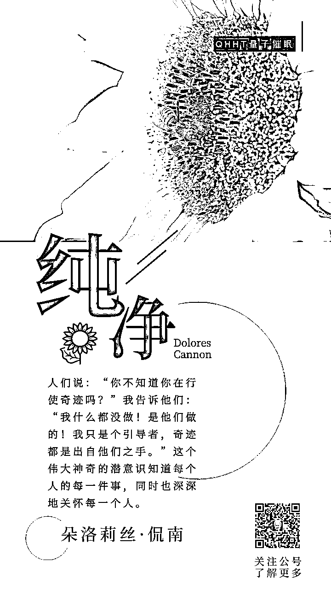

•  END •

**点击了解更多****相关****文章**

[QHHT®量子催眠疗愈技术一阶段课程](http://mp.weixin.qq.com/s?__biz=MzU0NjkzMDY0OA==&mid=2247491054&idx=2&sn=11c47c5f98b8392ee25a1298a2f89668&chksm=fb577759cc20fe4f3283e7523e138845792685fd8e5f03de4397246df1c978e9b0cf91402ded&scene=21#wechat_redirect)

[催眠师心声 | 你的眼，是我今生不会再遇的海](http://mp.weixin.qq.com/s?__biz=MzU0NjkzMDY0OA==&mid=2247493774&idx=1&sn=85e6dd8b40f2ac0b3f977b91735ee0b8&chksm=fb548239cc230b2fc801b542cab597ef18bedb7cbcbcbfc47353dd9c75835170feb520758b52&scene=21#wechat_redirect)

[大师风采 | 时间真的存在吗？](http://mp.weixin.qq.com/s?__biz=MzU0NjkzMDY0OA==&mid=2247493258&idx=1&sn=f8491bc038f063b4fa8a1b78afefc921&chksm=fb548c3dcc23052b88eb6b422bb8d37de39b05fdaafad7422e6bf5a15070c9676254bca7aa14&scene=21#wechat_redirect)

点击“在看”好美哦↓

 点击预约你的催眠师

# 大师风采 | “我去探求更简单的方法”

> 原文：[`mp.weixin.qq.com/s?__biz=MzU0NjkzMDY0OA==&mid=2247493784&idx=1&sn=3b3b171cdfdd21bf728bab31caf2297d&chksm=fb54822fcc230b394fc29f5d985bcbd739f2ffdbfb93dc384674d37c9f8fef6ba6da43d0a930&scene=126&sessionid=1690980659#rd`](http://mp.weixin.qq.com/s?__biz=MzU0NjkzMDY0OA==&mid=2247493784&idx=1&sn=3b3b171cdfdd21bf728bab31caf2297d&chksm=fb54822fcc230b394fc29f5d985bcbd739f2ffdbfb93dc384674d37c9f8fef6ba6da43d0a930&scene=126&sessionid=1690980659#rd)

点击上方蓝字关注我们

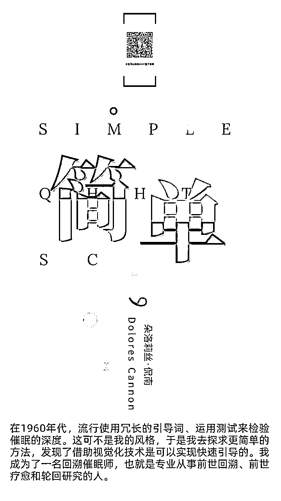

•  END •

**点击了解更多****相关****文章**

[QHHT®量子催眠疗愈技术一阶段课程](http://mp.weixin.qq.com/s?__biz=MzU0NjkzMDY0OA==&mid=2247491054&idx=2&sn=11c47c5f98b8392ee25a1298a2f89668&chksm=fb577759cc20fe4f3283e7523e138845792685fd8e5f03de4397246df1c978e9b0cf91402ded&scene=21#wechat_redirect)

[催眠师心声 | 你的眼，是我今生不会再遇的海](http://mp.weixin.qq.com/s?__biz=MzU0NjkzMDY0OA==&mid=2247493774&idx=1&sn=85e6dd8b40f2ac0b3f977b91735ee0b8&chksm=fb548239cc230b2fc801b542cab597ef18bedb7cbcbcbfc47353dd9c75835170feb520758b52&scene=21#wechat_redirect)

[大师风采 | 时间真的存在吗？](http://mp.weixin.qq.com/s?__biz=MzU0NjkzMDY0OA==&mid=2247493258&idx=1&sn=f8491bc038f063b4fa8a1b78afefc921&chksm=fb548c3dcc23052b88eb6b422bb8d37de39b05fdaafad7422e6bf5a15070c9676254bca7aa14&scene=21#wechat_redirect)

点击“在看”好美哦↓

 点击预约你的催眠师

# 大师风采 | “我接受凡是提供给我的资讯”

> 原文：[`mp.weixin.qq.com/s?__biz=MzU0NjkzMDY0OA==&mid=2247493780&idx=1&sn=cb943eb0dfe64a893af5b6c8c255332a&chksm=fb548223cc230b35eae9b5ec464fa13e0c62b76e662ec0126ccaf37514294796f024420ffd94&scene=126&sessionid=1690980659#rd`](http://mp.weixin.qq.com/s?__biz=MzU0NjkzMDY0OA==&mid=2247493780&idx=1&sn=cb943eb0dfe64a893af5b6c8c255332a&chksm=fb548223cc230b35eae9b5ec464fa13e0c62b76e662ec0126ccaf37514294796f024420ffd94&scene=126&sessionid=1690980659#rd)

点击上方蓝字关注我们

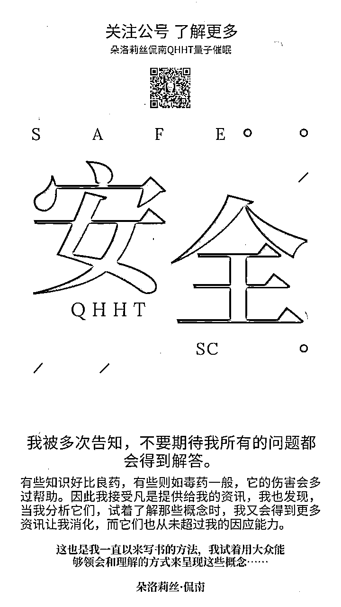

•  END •

**点击了解更多****相关****文章**

[QHHT®量子催眠疗愈技术一阶段课程](http://mp.weixin.qq.com/s?__biz=MzU0NjkzMDY0OA==&mid=2247491054&idx=2&sn=11c47c5f98b8392ee25a1298a2f89668&chksm=fb577759cc20fe4f3283e7523e138845792685fd8e5f03de4397246df1c978e9b0cf91402ded&scene=21#wechat_redirect)

[催眠师心声 | 你的眼，是我今生不会再遇的海](http://mp.weixin.qq.com/s?__biz=MzU0NjkzMDY0OA==&mid=2247493774&idx=1&sn=85e6dd8b40f2ac0b3f977b91735ee0b8&chksm=fb548239cc230b2fc801b542cab597ef18bedb7cbcbcbfc47353dd9c75835170feb520758b52&scene=21#wechat_redirect)

[大师风采 | 时间真的存在吗？](http://mp.weixin.qq.com/s?__biz=MzU0NjkzMDY0OA==&mid=2247493258&idx=1&sn=f8491bc038f063b4fa8a1b78afefc921&chksm=fb548c3dcc23052b88eb6b422bb8d37de39b05fdaafad7422e6bf5a15070c9676254bca7aa14&scene=21#wechat_redirect)

点击“在看”好美哦↓

 点击预约你的催眠师

# 催眠师心声 | 你的眼，是我今生不会再遇的海

> 原文：[`mp.weixin.qq.com/s?__biz=MzU0NjkzMDY0OA==&mid=2247493774&idx=1&sn=85e6dd8b40f2ac0b3f977b91735ee0b8&chksm=fb548239cc230b2fc801b542cab597ef18bedb7cbcbcbfc47353dd9c75835170feb520758b52&scene=126&sessionid=1690980664#rd`](http://mp.weixin.qq.com/s?__biz=MzU0NjkzMDY0OA==&mid=2247493774&idx=1&sn=85e6dd8b40f2ac0b3f977b91735ee0b8&chksm=fb548239cc230b2fc801b542cab597ef18bedb7cbcbcbfc47353dd9c75835170feb520758b52&scene=126&sessionid=1690980664#rd)

点击上方蓝字关注我们

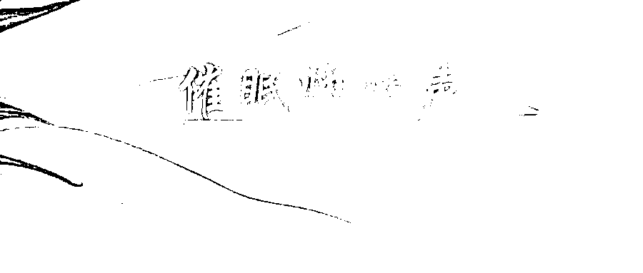

      作者 催眠操作者：Ada

编辑：kathy

图片：网络

[🔈 你的眼，是我今生不会再遇的海](https://res.wx.qq.com/voice/getvoice?mediaid=MzU0NjkzMDY0OF8yMjQ3NDkzNzcz)

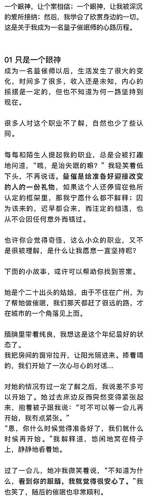

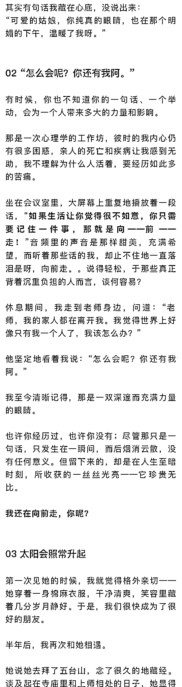

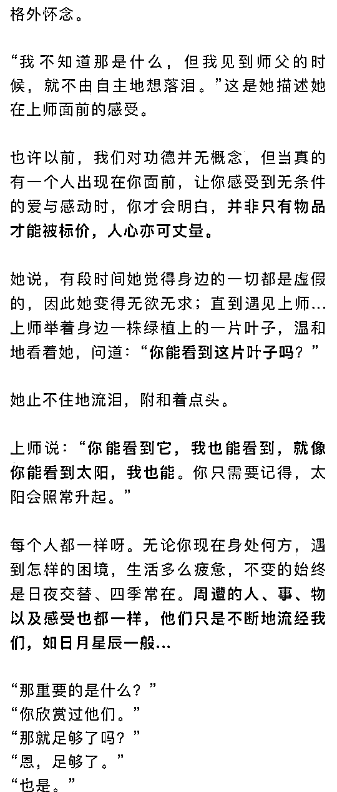

•  END •

Ada

量子催眠一阶段操作者

微信：gudi_1025

坐标：广州/佛山 

赞赏：点击赞赏鼓励分享喔！

记得预约你的催眠师

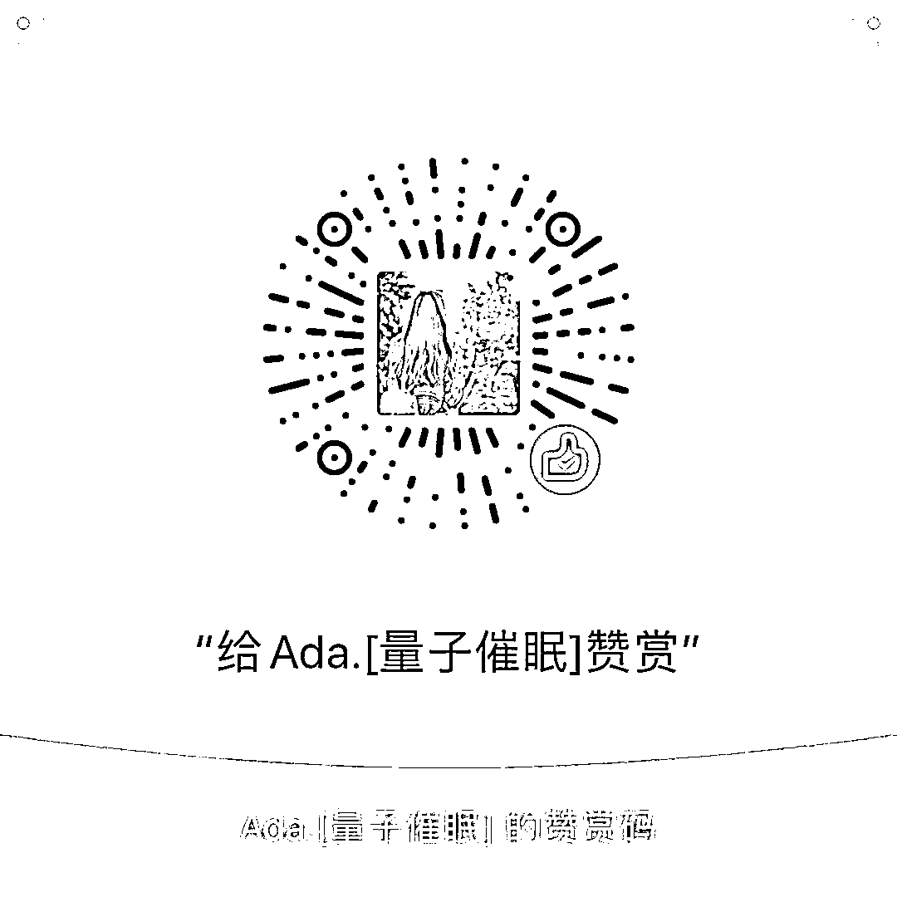

**点击了解更多****相关****文章**

[QHHT®量子催眠疗愈技术一阶段课程](http://mp.weixin.qq.com/s?__biz=MzU0NjkzMDY0OA==&mid=2247491054&idx=2&sn=11c47c5f98b8392ee25a1298a2f89668&chksm=fb577759cc20fe4f3283e7523e138845792685fd8e5f03de4397246df1c978e9b0cf91402ded&scene=21#wechat_redirect)

[案例分享 | 所有的一切都是在，就只是在（上）](http://mp.weixin.qq.com/s?__biz=MzU0NjkzMDY0OA==&mid=2247493617&idx=1&sn=0f5c38fdf2dba3696096eef94fb3ec12&chksm=fb548d46cc230450e9706989347593981883bb28d151a1af4abb74497a2d0942070ef865b50f&scene=21#wechat_redirect)

[案例分享 | 所有的一切都是在，就只是在（下）](http://mp.weixin.qq.com/s?__biz=MzU0NjkzMDY0OA==&mid=2247493622&idx=1&sn=6d4b56cdd6e026fce9cf4e0ae18c4ae3&chksm=fb548d41cc230457303ca8a8006927c9cf95cc4d42ec4967c0f5108ca76fb6474908b6dc8a2b&scene=21#wechat_redirect)

[大师风采 | 时间真的存在吗？](http://mp.weixin.qq.com/s?__biz=MzU0NjkzMDY0OA==&mid=2247493258&idx=1&sn=f8491bc038f063b4fa8a1b78afefc921&chksm=fb548c3dcc23052b88eb6b422bb8d37de39b05fdaafad7422e6bf5a15070c9676254bca7aa14&scene=21#wechat_redirect)

点击“在看”好美哦↓

 点击预约你的催眠师

# 源自催眠现场的真实记录，朵奶奶的创作初衷

> 原文：[`mp.weixin.qq.com/s?__biz=MzU0NjkzMDY0OA==&mid=2247493631&idx=1&sn=8dc608bc236e62f239781be71dbf24f5&chksm=fb548d48cc23045e968941a22254458c72d4686f6e839f2bd051c312d94e4c81eb7e1f570899&scene=126&sessionid=1690980664#rd`](http://mp.weixin.qq.com/s?__biz=MzU0NjkzMDY0OA==&mid=2247493631&idx=1&sn=8dc608bc236e62f239781be71dbf24f5&chksm=fb548d48cc23045e968941a22254458c72d4686f6e839f2bd051c312d94e4c81eb7e1f570899&scene=126&sessionid=1690980664#rd)

点击上方蓝字关注我们

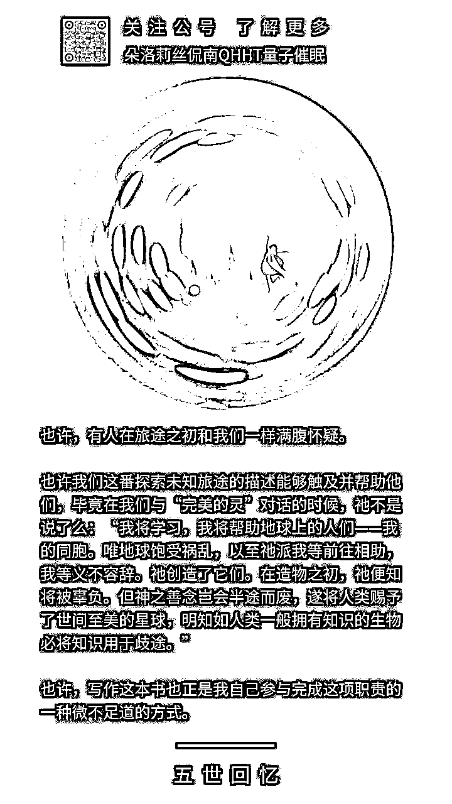

**点击了解更多****相关****文章**

[QHHT®量子催眠疗愈技术一阶段课程](http://mp.weixin.qq.com/s?__biz=MzU0NjkzMDY0OA==&mid=2247491054&idx=2&sn=11c47c5f98b8392ee25a1298a2f89668&chksm=fb577759cc20fe4f3283e7523e138845792685fd8e5f03de4397246df1c978e9b0cf91402ded&scene=21#wechat_redirect)

[案例分享 | 所有的一切都是在，就只是在（上）](http://mp.weixin.qq.com/s?__biz=MzU0NjkzMDY0OA==&mid=2247493617&idx=1&sn=0f5c38fdf2dba3696096eef94fb3ec12&chksm=fb548d46cc230450e9706989347593981883bb28d151a1af4abb74497a2d0942070ef865b50f&scene=21#wechat_redirect)

[案例分享 | 所有的一切都是在，就只是在（下）](http://mp.weixin.qq.com/s?__biz=MzU0NjkzMDY0OA==&mid=2247493622&idx=1&sn=6d4b56cdd6e026fce9cf4e0ae18c4ae3&chksm=fb548d41cc230457303ca8a8006927c9cf95cc4d42ec4967c0f5108ca76fb6474908b6dc8a2b&scene=21#wechat_redirect)

[大师风采 | 时间真的存在吗？](http://mp.weixin.qq.com/s?__biz=MzU0NjkzMDY0OA==&mid=2247493258&idx=1&sn=f8491bc038f063b4fa8a1b78afefc921&chksm=fb548c3dcc23052b88eb6b422bb8d37de39b05fdaafad7422e6bf5a15070c9676254bca7aa14&scene=21#wechat_redirect)

点击“在看”好美哦↓

 点击预约你的催眠师

# 案例分享 | 所有的一切都是在，就只是在（下）

> 原文：[`mp.weixin.qq.com/s?__biz=MzU0NjkzMDY0OA==&mid=2247493622&idx=1&sn=6d4b56cdd6e026fce9cf4e0ae18c4ae3&chksm=fb548d41cc230457303ca8a8006927c9cf95cc4d42ec4967c0f5108ca76fb6474908b6dc8a2b&scene=126&sessionid=1690980664#rd`](http://mp.weixin.qq.com/s?__biz=MzU0NjkzMDY0OA==&mid=2247493622&idx=1&sn=6d4b56cdd6e026fce9cf4e0ae18c4ae3&chksm=fb548d41cc230457303ca8a8006927c9cf95cc4d42ec4967c0f5108ca76fb6474908b6dc8a2b&scene=126&sessionid=1690980664#rd)

点击上方蓝字关注我们

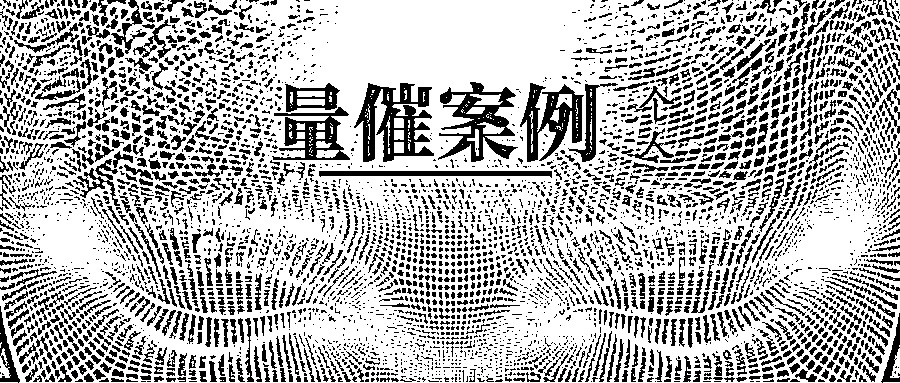

      作者 催眠操作者：立夏

编辑：kathy

图片：网络

在前几天的案例中，我们看到了[对于尘世的执着](http://mp.weixin.qq.com/s?__biz=MzU0NjkzMDY0OA==&mid=2247493557&idx=1&sn=6c95c0ee1e86081f77a5d455fb6fc127&chksm=fb548d02cc230414798963220157495c9e95d53c9049cedfb87f394c95f8bfe42d9412260255&scene=21#wechat_redirect)，[对于别人期待的执着](http://mp.weixin.qq.com/s?__biz=MzU0NjkzMDY0OA==&mid=2247493569&idx=1&sn=34442e313253723784669a2f097614b2&chksm=fb548d76cc2304607f8cef40bb57269207f4e994a3c628e6350a9cd6e7922e296b942b477530&scene=21#wechat_redirect)，[对于不完美的执着](http://mp.weixin.qq.com/s?__biz=MzU0NjkzMDY0OA==&mid=2247493598&idx=1&sn=1a839e89e6a9c164dcb374bc87d00d33&chksm=fb548d69cc23047f34cc298d1ca59103027fa826d6a312bb45308ebd2ec16c06e191e446a67b&scene=21#wechat_redirect)。也看到了，由执着带来的对于自我成长造成的禁锢，这也是案例分享中「个人」板块中的「自我成长」部分所要探讨、呈现的案例，另外，还将会有「身心健康」和「情感关系」两个部分。

那么，执着的念头，这个念是从哪里来的呢？昨天和今天，让我们来听一听，源头给到的在操作者看来既究竟，又具有生活指导意义的答案，当作一清早的源头能量冲刷吧！

源自量子催眠现场的真实记录

这位催眠操作者给她曾经的催眠师催了一眠，问题清单里面的问题是：

“一念起”的第一念是从哪来的？

**源头给个案的指引**

催：您想跟她说些什么吗？

源：一直就在这，她还想要回，你看她问的那些问题，什么一念起……根本就没有一念起，她在这里她才知道她问的哪些问题，太傻了。

催：那您能不能给它一些方向或者指引呢？

源：她现在她能感受得到，她问的那些问题都是啥问题，哎呀……她来这她就知道了。

催：平时的时候她怎么能来到这里呢？

源：她一直就在呀，你们一直就在呀。不用来，一直都在，你们每个人一直都在。只是就好像平时你们有一个泡影在罩着你们，那个泡影是你们遇到的生活当中各种各样的问题，你们的意识，你们周边的环境，你们说的每一句话都是局限。这个泡沫一直罩在你们的周围，你们就活在这个泡沫里面，你说的每一句话，做的每一件事，动的每一个念，就是这个泡沫。当有一天你闭上嘴巴，不再说话，不再想你们生活当中的那些事的时候，**当有一天你的念头突然停止的时候，那个泡沫就不存在了。你当下，那一刻就是在这里了**。你就在，其实你一直在，只是平时那些泡沫把你罩起来，让你觉着你好像是单独的，其实你不是，你一直就在，只是被你们那个环境隔绝了，隔绝了和我这种联系，**你们说的每一句话都是局限，都让那个泡沫更加厚了一层**。

催：现在毕竟还是生活在这种物质生活里面？

源：没关系，**在泡沫里就好好做你们的事情，只是那个泡沫不会一直存在的**。

催：什么时候、什么情况下才会破呢？

源：当你放下所有的时候，当你放下一层，那个泡沫就薄一层，当你再放下一层，那个泡沫就变得更薄一层，当你放下所有的时候，那个泡沫就破碎了。你就回归了整体，**整体就是你不再觉得你是泡沫里那个了，你是全部，你是所有所有的一切**。

催：几个月前她发生了一件让她痛苦的事.......(个案隐私略过)

源：（语气很重）那是泡沫里的事，和我没关系。

催：您还有要和她说的么？

源：在泡沫里面，就好好经历泡沫里面的事，都是经历、都是体验，什么好的坏的呀，都是完美的，一切都是完美的，给她的磨难也是完美的。

**泡沫的包罗万象**

催：您还有没有其他要嘱咐的？

源：泡沫里面也很精彩，你看你们有五颜六色，虽然在我看来五颜六色是特别局限的，在你们看来可能会觉得是五彩缤纷的，在泡沫里面就好好体验泡沫里面的。你们也都是，在泡沫里面经历的每一个都是你们该经历的，都是完美的。没有你们说的磨难，也没有幸福，**一切都是平等的，开心和痛苦是平等的，这只是很小的一个泡沫里面的，能够体验的，泡沫外面是无尽的，泡沫外面一切都是平等的，一切都是……都是......**（潜意识语言检索中😅）

催：都是美好的？

源：不对，美好的也不对，一切都是不能说的，美好这个词也是局限的，虽然确实是美好的，但是一说出来美好，就好像又成了那个吸管了。

催：所以在泡沫里就好好体会是么？

源：嗯！在泡沫里面不好好体验，那你出了泡沫就体验不了啦。

催：那出了这个泡沫还会进到下一个泡沫里么？

源：没有下一个，下一个也是一个词，**一切都是同时的，一切都是同时存在的，没有下一个，没有前没有后，就是同时，就是同时**。

**泡沫里面一切就在了**

**这就是命中注定**

催：那在泡沫里面自己随时想做什么就做什么么？

源：哼哼~哼哼哼哼哼~（冷笑）你们看似随心想做什么就做什么，但是不是。

催：那是什么呢？

源：一切就已经是那样了，已然是那样了。你们的话说就是一切已经安排好了。

催：那为什么会安排好呢？提前安排么？

源：不是安排好，**安排好这个词也不对，就是已经是那样了**。就好像这个“无”涵括的那些“有”，那些万有已经是那样了，万有什么都在呢，一切就在了，涵括一切了，一切已经是那样了，一切都在这里，一切万有都在这。

催：嗯，她还要在这里再呆一会么？

源：可以让她感受一下，这里只能感受。

催：她的很多梦都是清醒梦是什么原因？

源：告诉她泡沫快醒了，梦不就是泡沫么，泡沫没了就醒了，她醒了泡沫就没了。无论你的感情多深，链接多深，泡泡总有破的一天。所有的其它一切也是这样，无论你多执着的一个东西，总有一天要放下。

**因为执着**

**所以痛苦**

催：她要辞职回老家，有什么要嘱咐她的话么？

源：路已经在那了，她就大步往前走就行了，还顾虑什么呢，路已经摆在那里了，她勇敢大步往前走就行，我说的路是泡沫的厚度，她要放下她心里的执着，回去也是一种放下，对这的放下。其实泡沫也是不存在的，是你们自己加上去的，其实是没有泡沫的，其实本来是整体的，你本来就在这里面。泡沫的厚度取决于你们的执着和分别。

催：什么是执着，什么是分别？

源：你眼前看到的一切都是分别，执着是有的是物质层面的，有的是内心的执着，比如执着着想要一份好工作，比如想在老板面前表现得好。

催：不执着了会怎样？

源：不执着了就放下，随顺，随顺一切。

催：在这个物质世界里不执着了能生存下去么？

源：当然了，就是因为执着，你们才有你们所谓的痛苦。

催：因为太执着了就会想要而不得，不执著就会顺利一些么？

源：这个不执著是要把什么都放下，**把痛苦放下，把幸福放下，没有幸福，没有痛苦，他们俩是平等的，没有执着了就平等了，就随顺一切了**。

催：感谢您给她的这些方向。

源：得谢谢你啊。

催：我可以带她到其他的泡泡里感受一下么？

源：想去就去吧，哎呀，快让她去吧，她这个牙都动的不行了。

另一个泡泡里，她看到自己是男儿身，父母受冤被杀，自己被两个僧人带到庙里剃度出家。

一天他和众师兄弟讨论《金刚经》里的那句“应无所住而生其心”。

在这个泡泡里面，

师兄说：

“应不着一处，不执着一处，

就好像这颗心不让它着于一点，着于一处，

以这样的心去看待对待万事万物。”

他说：

“无心之心，无住之住，

本无心，本无住，应本无心本无住，

何来的心不着一处而生其心，本来就空寂，何来的住不住，生不生其心。”

•  END •

立夏

量子催眠一阶段实习操作者

微信：lixialzcm

坐标：济南 

赞赏：点击赞赏鼓励分享喔！

记得预约你的催眠师

**点击了解更多****相关****文章**

[QHHT®量子催眠疗愈技术一阶段课程](http://mp.weixin.qq.com/s?__biz=MzU0NjkzMDY0OA==&mid=2247491054&idx=2&sn=11c47c5f98b8392ee25a1298a2f89668&chksm=fb577759cc20fe4f3283e7523e138845792685fd8e5f03de4397246df1c978e9b0cf91402ded&scene=21#wechat_redirect)

[案例分享 | 所有的一切都是在，就只是在（上）](http://mp.weixin.qq.com/s?__biz=MzU0NjkzMDY0OA==&mid=2247493617&idx=1&sn=0f5c38fdf2dba3696096eef94fb3ec12&chksm=fb548d46cc230450e9706989347593981883bb28d151a1af4abb74497a2d0942070ef865b50f&scene=21#wechat_redirect)

[案例分享 | 操作者通过量子催眠帮助个案爱自己](http://mp.weixin.qq.com/s?__biz=MzU0NjkzMDY0OA==&mid=2247493598&idx=1&sn=1a839e89e6a9c164dcb374bc87d00d33&chksm=fb548d69cc23047f34cc298d1ca59103027fa826d6a312bb45308ebd2ec16c06e191e446a67b&scene=21#wechat_redirect)

[案例分享 | 尊重你的喜欢，这是唯一的选择](http://mp.weixin.qq.com/s?__biz=MzU0NjkzMDY0OA==&mid=2247493569&idx=1&sn=34442e313253723784669a2f097614b2&chksm=fb548d76cc2304607f8cef40bb57269207f4e994a3c628e6350a9cd6e7922e296b942b477530&scene=21#wechat_redirect)

点击“在看”好美哦↓

 点击预约你的催眠师

# 案例分享 | 所有的一切都是在，就只是在（上）

> 原文：[`mp.weixin.qq.com/s?__biz=MzU0NjkzMDY0OA==&mid=2247493617&idx=1&sn=0f5c38fdf2dba3696096eef94fb3ec12&chksm=fb548d46cc230450e9706989347593981883bb28d151a1af4abb74497a2d0942070ef865b50f&scene=126&sessionid=1690980664#rd`](http://mp.weixin.qq.com/s?__biz=MzU0NjkzMDY0OA==&mid=2247493617&idx=1&sn=0f5c38fdf2dba3696096eef94fb3ec12&chksm=fb548d46cc230450e9706989347593981883bb28d151a1af4abb74497a2d0942070ef865b50f&scene=126&sessionid=1690980664#rd)

点击上方蓝字关注我们

      作者 催眠操作者：立夏

编辑：kathy

图片：网络

在前几天的案例中，我们看到了[对于尘世的执着](http://mp.weixin.qq.com/s?__biz=MzU0NjkzMDY0OA==&mid=2247493557&idx=1&sn=6c95c0ee1e86081f77a5d455fb6fc127&chksm=fb548d02cc230414798963220157495c9e95d53c9049cedfb87f394c95f8bfe42d9412260255&scene=21#wechat_redirect)，[对于别人期待的执着](http://mp.weixin.qq.com/s?__biz=MzU0NjkzMDY0OA==&mid=2247493569&idx=1&sn=34442e313253723784669a2f097614b2&chksm=fb548d76cc2304607f8cef40bb57269207f4e994a3c628e6350a9cd6e7922e296b942b477530&scene=21#wechat_redirect)，[对于不完美的执着](http://mp.weixin.qq.com/s?__biz=MzU0NjkzMDY0OA==&mid=2247493598&idx=1&sn=1a839e89e6a9c164dcb374bc87d00d33&chksm=fb548d69cc23047f34cc298d1ca59103027fa826d6a312bb45308ebd2ec16c06e191e446a67b&scene=21#wechat_redirect)。也看到了，由执着带来的对于自我成长造成的禁锢，这也是案例分享中「个人」板块中的「自我成长」部分所要探讨、呈现的案例，另外，还将会有「身心健康」和「情感关系」两个部分。

那么，执着的念头，这个念是从哪里来的呢？今天和明天，让我们来听一听，源头给到的在操作者看来既究竟，又具有生活指导意义的答案，当作一清早的源头能量冲刷吧！

源自量子催眠现场的真实记录

这位催眠操作者给她曾经的催眠师催了一眠，问题清单里面的问题是：

“一念起”的第一念是从哪来的？

**个案顺利无比地进入了源头，在“源头”中遨游**

越来越轻盈，越往上我的烟雾越淡，越往上越没有自己了，没有身体，到了一个什么都没有的地方，没有样子，没有颜色，什么都没有，又涵括着一切，没有必要有，因为所有的一切都涵括在这儿了，这个地方没有边际，这里很自由，太好了，可以做任何事，但是什么都不想做，做任何事都是多余的，我本来就属于这里，只是有一段时间我变幻了形体，不属于这了，离开这儿了。

**与源头讨论**

**有和无，个体和整体**

催：为什么变幻形体？

源：体验什么东西。这里什么都没有，又什么都有。

催：什么是有，什么是无呢？

源：“有”的意思是有了个体、颜色这些，但这些都是分化出来的，哎……也不是分化，就好像从整体割裂出来了才有了“有”，但是在这什么都没有，这个“无”是涵括万有的，这个“无”是让那些个体显现出来，让个体都融入在这整体当中，这个整体就是虽然没有显现，但是什么都有了，包含一切，你们说的颜色、个体、意识、都在这里，意识就是个体，就是分别出来的，但是在这“无”里没有分别，什么都在这里面了。

催：为什么要有这个分别呢？

源：本来是没有分别的，本来是整体的，本来是没有个体的。

催：为什么出来个体了呢？

源：那个个体是为了照见自己，就像镜子一样，镜子不知道它自己不知道它到底什么样，个体就好像镜子面前那个东西，它通过个体照见自己是什么样子的，它通过这个个体才能知道完整的自己是什么样子的，分别出来的这些是为了照见自己，清楚自己是什么样子的，因为自己无法照见自己，就像什么都涵括在这里面，当是“无”的时候，当是整体的时候，不知道自己这个整体到底是如何的，这个分别出来的个体就像是一点点的自己，通过就像分别出去的你们说的那个意识，分别出去了那么多的意识，它才知道自己是那么多意识的集合体，然后又分别出去了那么多颜色，其实自己是那么多颜色的集合体，甚至又包括你们说的那个叫物质的形体，其实所有物质的集合就是完整的这个，完整的自己，只有通过分别出来的这个才能照见自己。

催：为什么要去照见自己？

源：因为不知道自己。

催：为什么要知道自己？

源：就好像这个意识的产生一样，**意识的产生就是分别的开始**，因为有了这第一个意，识第一个分别，才有了要了解自己。

**源头说**

**没有第一个念头**

催：为什么要产生第一个分别、第一个意识呢？ 

源：意识也在这之内，什么都在这之内，没有外面，只有里面。

催：第一个意识第一个念头是从哪里产生从哪里起的呢？

源：**没有念头，这一切都是一个整体，你们说的念头只是一个概念、一个说法**。

催：那所谓的一念起，万象生，根源不在这第一个念头么？

源：都在这里，没有第一念，没有第一念起，没有万象生，这里是寂灭的。没有，没有你们说的那纷繁的一切。寂灭就是没有生也没有死，没有，什么都没有。念起念落，没有。这一直是这样。

**随缘示现**

**无法言说**

催：所有的万事万物，所有的象，都是这里面的要照见自己的是么？

源：对。

催：照见自己的目的是什么呢？

源：那只是一个泡沫，泡影。

催：既然是泡影为什么还要去照见这些呢？

源：泡影就像一个影子，它不是真实的，那是一个影子，是因为有了这个“体”，才有了这个影子，而影子的存在是它不存在。

催：这个体指的是什么呢？

源：这个就是什么都没有、什么都有的这个，这个体里面涵括一切，一切的万有都在这，它可以显现，他想显现什么就显现什么，语言也在这里面，哎……语言只占到很小很小一部分。

催：什么占的多呢？

源：虚无。语言好局限啊，只占到很小很小一部分，在这里不能说不能说……

催：这个虚无是什么呢？

源：这个虚无也是语言，这不能说不能说不能说……这里没法说。

催：您是说没法去解释这个虚无么？

源：没有虚无，虚无也是个词，也是个语言，说出来虚无，哎，就把它给局限了，哎，不能说，一说就不对了，不对不对。

**源头回答催眠师关于它是我们心目中的家**

催：这个地方是在哪里呢？

源：这不是地方。

催：这种感觉是在哪里呢？

源：这种感觉是全部，哪里都在。无所不在。

催：那这些万事万物怎么能到达这呢？

源：万事万物就在这里面。万事万物……你指的是万事万物是指什么呀？

催：您相对于人和物来说像是一个家。

源：你说的万事万物在这里只占很小很小一部分，有形的东西只占很小很小一部分，无形的东西也只占很小很小的一部分，剩下的就是不能说的不能说的，不能说的占很大一部分。

催：您能不能给个方向，或者形容一下么？

源：不能说的就好像在一个气球里面，气球里面那些空间都是不能说的，**你要是非让我说的话，就好像就把那个气球里的气压到了一根吸管里面，这个吸管就是语言，哎呀……把那里面整个的空气都给压缩了，都给局限在这个里面了，就给局限在这个管里面了**。如果不说，它们就是整个气球里面那个内部空间。

**源头如何看待回家**

催：现在很多人都想回到您那里，找到回您那里的感觉和方法，您是怎么看呢？

源：（激烈的咬牙声）不用回，一直就在……一直就在......他们一直就在这，还回哪呢，**没有回，当他一说回，说明他把自己给推出去了，他一直就在**。

催：只是需要去体会、去感受么？

源：当那些想要回的人，有一天突然之间有一念感觉到，自己原来一直都在的时候，他那一刻他才能明白，是的他一直都在，他不用回，他回哪去呢，他一直就在……就在……还要去哪呢。

所有的一切都是在，就只是在。

在（下）篇中，将观赏的是源头针对个案所提出的建议，当然，对于平凡的我们也都是适用的，关于如何在梦幻泡影中生活。

一切有为法，如梦幻泡影，如露亦如电，应作如是观

•  END •

立夏

量子催眠一阶段实习操作者

微信：lixialzcm

坐标：济南 

赞赏：点击赞赏鼓励分享喔！

记得预约你的催眠师

**点击了解更多****相关****文章**

[QHHT®量子催眠疗愈技术一阶段课程](http://mp.weixin.qq.com/s?__biz=MzU0NjkzMDY0OA==&mid=2247491054&idx=2&sn=11c47c5f98b8392ee25a1298a2f89668&chksm=fb577759cc20fe4f3283e7523e138845792685fd8e5f03de4397246df1c978e9b0cf91402ded&scene=21#wechat_redirect)

[案例分享 | 操作者通过量子催眠帮助个案爱自己](http://mp.weixin.qq.com/s?__biz=MzU0NjkzMDY0OA==&mid=2247493598&idx=1&sn=1a839e89e6a9c164dcb374bc87d00d33&chksm=fb548d69cc23047f34cc298d1ca59103027fa826d6a312bb45308ebd2ec16c06e191e446a67b&scene=21#wechat_redirect)

[案例分享 | 尊重你的喜欢，这是唯一的选择](http://mp.weixin.qq.com/s?__biz=MzU0NjkzMDY0OA==&mid=2247493569&idx=1&sn=34442e313253723784669a2f097614b2&chksm=fb548d76cc2304607f8cef40bb57269207f4e994a3c628e6350a9cd6e7922e296b942b477530&scene=21#wechat_redirect)

[案例分享 | 娑婆世界和极乐世界](http://mp.weixin.qq.com/s?__biz=MzU0NjkzMDY0OA==&mid=2247493557&idx=1&sn=6c95c0ee1e86081f77a5d455fb6fc127&chksm=fb548d02cc230414798963220157495c9e95d53c9049cedfb87f394c95f8bfe42d9412260255&scene=21#wechat_redirect)

点击“在看”好美哦↓

 点击预约你的催眠师

# 案例分享 | 操作者通过量子催眠帮助个案爱自己

> 原文：[`mp.weixin.qq.com/s?__biz=MzU0NjkzMDY0OA==&mid=2247493598&idx=1&sn=1a839e89e6a9c164dcb374bc87d00d33&chksm=fb548d69cc23047f34cc298d1ca59103027fa826d6a312bb45308ebd2ec16c06e191e446a67b&scene=126&sessionid=1690980664#rd`](http://mp.weixin.qq.com/s?__biz=MzU0NjkzMDY0OA==&mid=2247493598&idx=1&sn=1a839e89e6a9c164dcb374bc87d00d33&chksm=fb548d69cc23047f34cc298d1ca59103027fa826d6a312bb45308ebd2ec16c06e191e446a67b&scene=126&sessionid=1690980664#rd)

点击上方蓝字关注我们

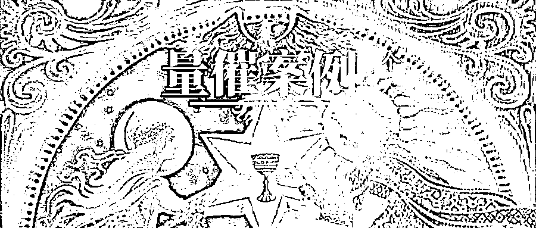

      作者 催眠操作者：李娟

编辑：kathy

图片：网络

源自量子催眠现场的真实记录

个案的问题是，她感觉不爱自己，不够接纳自己，对自己充满了挑剔，从外貌到性格，到自己人生的所有经历，觉得自己一无是处。

当她不断用潜意识提供的「前世的视角」，她内在就开始转化了，开始如实地接纳自己，觉得自己很完美。

爱的感觉，发芽长大了，已经茁壮到成为她自己的一部分了。

她现在——爱自己。

**前世的视角**

他是个瘦高的年轻人，正在一个屋子里等人，感觉冷，等了一段时间，没人接待他，他就出来了，出门时阴冷的天气，有很大的雾，街上车水马龙，这里是英国伦敦。

路上有马车来往，男人们穿着黑色衣服帽子，神态冷淡，行色匆匆。

他觉得冷，来到了一个很多人聚集的屋子里烤火，里面有壁炉，壁炉让他感觉暖和了一些。接着他来到了一个剧院，远远地看着台上的表演，他喜欢那个舞台，舞台的氛围让他感觉温暖，最重要的是：舞台上有女人，太美了。他走到了前排，离得更近了，女人们的大裙摆，女人的细腰，女人的歌喉，声音，都太美了。

他爱到不行，充满了开心。

他爱女人，一切女人。

他是个作家，他写的文字全都是赞美女人的。他必须把女人有多美好宣告给全世界。咖啡店里的服务生，街边的女乞丐，打扮精致的贵族女人，他都无差别地爱和尊重，女人是有温度的。他们的存在就是最美好的事情，没有什么比女人更美好。白天的时候，他会去一个森林里的长椅上坐着，享受阳光。旁边是个巨大的湖，湖水平静，他很喜欢。他在长椅上看自己的文稿，他最开始去的是出版社，出版商冷待他，他的境遇还是不太理想。但是，他此刻坐在长椅上，感觉充满了温暖和能量，甚至喜悦，因为阳光、湖水、女人的存在，他觉得世界是美好的，一点都没有不好的感觉。在他心里，他要用自己的整个生命去歌颂女人。她们繁衍，创造生命。她们是生命的源泉，如同整个大地一样，如同整个地球一样。这个世界都是母性的。

后来，他有钱了。

他依然尊重女性，把金币、鲜花、珠宝、美丽的织物奉上送给她们。他自己说：是女人给了他创作的源泉，他所有一切都是她们赐予的，他只是个中转站，把这些灵感赐予的能量转化成财富，再返回给她们，她们开心了，他就觉得无比享受。

女人是各种型态的，他从不关心她们处在什么样的境遇里，也不会对她们的境遇产生任何怜悯，但他会付出他的爱及尊重。怜悯一个女人是对她的亵渎。他永不可能亵渎任何一个女性。随意她是美是丑，是年老还是年幼。只要是女性，他都怀着同样的敬意和尊重。

他一生中没有任何固定伴侣，他也不可能让任何一个女人只属于他自己，那是一种囚禁，也是对其他女人的不尊重。没有差别对待这回事。全都一样。

等到他年老了，独自躺在床上，他没有让任何一个女人来给垂暮的自己送别，在他心里，没有人可以被差别对待。

此时，他又想到了很多年前从出版社走出来的那个场景，天气阴冷，大街上都是行色匆匆，穿着黑衣服一脸冷峻的男人，是女性的力量让他充满男子气概。而别的男人，却在冷冰冰的世界里寻找男性气概。这太不可理解了。

原来，**男人在女人内在，女人也在男人的内在**。男人是因为女人变得更男人的，女人是因为他这样的男人变得更女人的。

他死了。

**在死亡的另一边回顾这一世**

那一世学到的功课：这个世界是合一的，看起来是分了男性和女性，其实本质上，他们是同一种。男人的里面有女人，女人的里面有男人。

他通过敬重女人，对女性这个群体的爱，成为了一个全然的男人。

**潜意识给个案看到这一世对于今生的启示**

催：为什么选择给她看这一世呢？

潜：让她看到自己的完美，自己是完美无缺的。

催：她对自己不满意来自于哪里？

潜：他人形形色色的看法。这个男人的这一生，从未单独去区分任何一个女性，他把她们视为一个整体。整体里面没有比较，他不区分她们任何一个，没有人是特殊的，他尊重所有，所有女性都是好的，他没有那些概念。

催：他确实是个挺特别的人。

潜：他用感觉来识别人，人们通常用心智。

催：怎么讲？

潜：他体验的这一世里，只有一个基调：母性，生命源泉。所以，他获得了所有，一直快乐。

催：嗯，好像是这样。落魄的时候也因为热爱女性而开心。

潜：是的。他热爱的是他自己的源头，那是一种本能。

催：前面有几个场景，在壁炉那里烤火的那个场景，还有在歌剧院看歌剧的场景，是想让她感受到什么呢？

潜：无论多么糟糕的环境下，都有温暖，外面那么冷，壁炉却是暖的。没人接受自己的投稿，有点沮丧，但是美好的事物不会变，去歌剧院，女人是他力量的源泉，他的心境马上会变好。就是**告诉她，多去链接美好**。

催：那个湖边享受阳光的场景也是说明这个的？

潜：是的。只要去链接，会越扩越大。一开始是壁炉，那么小一点微光和温暖，然后是歌剧院，一个舞台那么大。再后来是湖边，森林，阳光，湖面，整个世界都是好的暖的，让人愉悦的。

催：所以后来整个人生变好了，有钱有一切了，还可以回馈给自己热爱的女人们。

潜：是的。这就是一个正向的流动了。

催：对应到她现在的生活，你们想告诉她什么？

潜：把时间贡献给美好。

催：还有吗？

潜：她很完美。

在这个催眠结束后，每当她对自己不满意，挑剔，和感觉自卑的时候，她就会让自己沉静下来，回到那次催眠中的感觉，再次成为那个男人，用他的视角去看待自己。这样的时候，她感觉很爱自己。

•  END •

李娟

量子催眠一阶段操作者

微信：lixiaobao8626

坐标：石家庄 

赞赏：点击赞赏鼓励分享喔！

记得预约你的催眠师

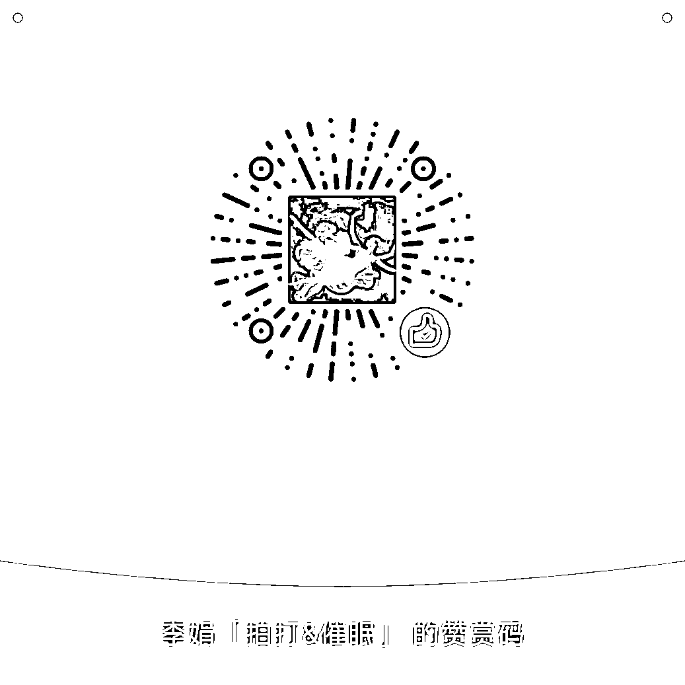

**点击了解更多****相关****文章**

[QHHT®量子催眠疗愈技术一阶段课程](http://mp.weixin.qq.com/s?__biz=MzU0NjkzMDY0OA==&mid=2247491054&idx=2&sn=11c47c5f98b8392ee25a1298a2f89668&chksm=fb577759cc20fe4f3283e7523e138845792685fd8e5f03de4397246df1c978e9b0cf91402ded&scene=21#wechat_redirect)

[案例分享 | 尊重你的喜欢，这是唯一的选择](http://mp.weixin.qq.com/s?__biz=MzU0NjkzMDY0OA==&mid=2247493569&idx=1&sn=34442e313253723784669a2f097614b2&chksm=fb548d76cc2304607f8cef40bb57269207f4e994a3c628e6350a9cd6e7922e296b942b477530&scene=21#wechat_redirect)

[案例分享 | 娑婆世界和极乐世界](http://mp.weixin.qq.com/s?__biz=MzU0NjkzMDY0OA==&mid=2247493557&idx=1&sn=6c95c0ee1e86081f77a5d455fb6fc127&chksm=fb548d02cc230414798963220157495c9e95d53c9049cedfb87f394c95f8bfe42d9412260255&scene=21#wechat_redirect)

点击“在看”好美哦↓

 点击预约你的催眠师

# 案例分享 | 尊重你的喜欢，这是唯一的选择

> 原文：[`mp.weixin.qq.com/s?__biz=MzU0NjkzMDY0OA==&mid=2247493569&idx=1&sn=34442e313253723784669a2f097614b2&chksm=fb548d76cc2304607f8cef40bb57269207f4e994a3c628e6350a9cd6e7922e296b942b477530&scene=126&sessionid=1690980664#rd`](http://mp.weixin.qq.com/s?__biz=MzU0NjkzMDY0OA==&mid=2247493569&idx=1&sn=34442e313253723784669a2f097614b2&chksm=fb548d76cc2304607f8cef40bb57269207f4e994a3c628e6350a9cd6e7922e296b942b477530&scene=126&sessionid=1690980664#rd)

点击上方蓝字关注我们

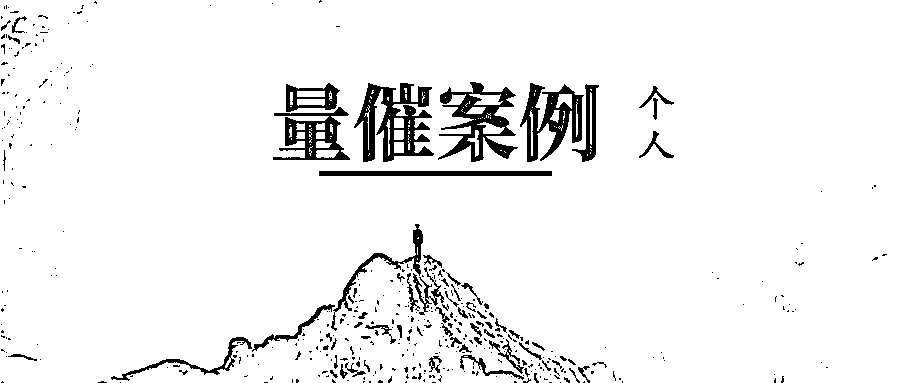

      作者 催眠操作者：小天真

编辑：kathy

图片：网络

源自量子催眠现场的真实记录

这篇文章是 19 年 11 月在北京量子催眠学院总部参加复训时的案例整理，再次翻阅、整理，我仍然能感受到其中的能量，因而与诸位共享这样一个探讨“如何为自己而活”的案例。

那是我第四次操作催眠，也是第一次成功通过催眠连接到前世，第一次被潜意识的能量震撼。以至于，晚上我回到房间，同为催眠师的室友告诉我，我身上还带着满满的潜意识的疗愈能量。

**在这场催眠中，个案在看美丽的地方时就进入到前世场景。**

**保卫家乡 委曲求全**

宇宙中，我乘着自己的飞船逃离敌方舰队的追赶，飞船出了故障，降落在某星球表面，我走出飞船准备修理故障却不得，只能独自烦恼、伤心无助。

敌方舰队追赶过来，我和他们进行谈判，我被抓回敌方舰队。

我曾和对方舰队达成协议，开发某种技术以保护自己的家园，而发明成功后，对方舰队想要独吞发明成果，所以要把我抓回去，他们可能会杀了我。谈判中对方承诺会保护我的安全，并修好了我的飞船，我感到无路可走且被逼迫，就跟他们回去了，但其实我也可以选择继续逃离的。

对方的舰队就像移动的星球，他们平时住在舰队里类似包间的地方。

我有一项新的研究任务——开发技术以提升舰队能力。对方承诺会保护我的家乡，我就帮他们做了该研究。

**再遭背叛 被动消极**

两个外星人(可能是舰队高层)在谈话，谈话内容有关对我的决策。

他们为了保护我发明的技术，要软禁我，限制我的自由，因为怕我把技术流出去（该技术有助于加快舰队飞行速度）。

我被软禁后变得比较消极、逆来顺受，无奈地接纳现实。我以前偶尔可以回家，但是现在他们不让我回家，我回不了家了。

**战乱逃跑 击落而亡**

战争打响，我准备趁着战乱乘自己的飞船逃走，他们将我击落，我死了，(此时催眠师引导他可以看着这一切，而不必亲身经历它) 我的尸体从飞船中掉出来，飘到太空中，太空很冷，我的尸体被冻僵了。

我感到遗憾，没有为自己而活。

**在死亡的另一边回顾这一生**

那一世学到的功课：不能只埋头做自己的事情，一味沉浸在自己的研究中，得想办法过得更好。不要为别人给自己的期望而活。

那一世的人生目的：体验这种无奈，让现在的他知道他还能有别的选择。

**接着，我们详细询问了潜意识给个案看到那一世对于今生的启示。**

催：给他看这一世是为何？

潜：不要一直服从于压力。

催：这跟他现世课题有何关系呢

潜：压力面前他会做不了自己。让他学习在有压力的状态下更好地做自己。

催：给他看第二个场景对他有何启发？

潜：跨不出舒适圈。希望他跨出舒适圈。

催：您有何建议？

潜：有想法就去做，不然就是空想。

催：给他看第三个场景对他有何启示?

潜：不要一直忍着自己的想法，勇敢地表达出来。反正最后最糟也就是死，他这样死得就很窝囊。

催：那这个事情对他现在的生活有何启发？

潜：**不要压抑自己的想法，不然最后还是要去做，而且有可能（最后晚了）就没多少办法了。这一世的生命总会到终点，不要压抑想法，鼓励他去做。**

催：他想法比较多，潜意识有什么建议吗？

潜：察觉每一个念头背后的原因，然后与这些念头去合一。

催：他有时感觉过于自律，甚至有些强迫自己，您有什么建议呢？

潜：自由一些。察觉到以后，跟自己说:“我不做也可以。我选择做。”

催：他感觉身体比较湿。

潜：运化不行。

催：有什么方法呢？

潜：做太阳冥想。

催：每天都要做吗？

潜：每时每刻，任何时候，只要呼吸就要做。

催：他要一直一直做下去吗？

潜：是的。

催：您等下能给他疗愈手指吗？

潜：手指不需要疗愈。手指的信息是：让他多关注身体的感觉，手指是感觉的末梢，失去和感觉的连接，就失去了和身体的连接，所以他就一直划手指，想要给他这样的提示。

催：您还有什么建议给到他吗？

潜：还应该积极主动一些，把想法做出来，你可以的。保护好自己，在保护自己上不要太天真，不要想当然每个人都是好的。

催：要分辨一下。

潜：是的。了解人类规则。偶尔多去翻翻书。（关于商业运作模式）

催：关于人生选择问题。

潜：从人类游戏规则来讲，那些都是无需选择的，因为你选择了这个就体验不了那个。你可以选择喜欢的一个而不用去担心。你记不记得：他的前世，在他第一次逃出来的时候，他乘的是自己的飞船，其实他可以再逃走的，最后也不会落得这么凄惨。（听到这里，我心头一颤）所以，**专注自己的选择，而不是被别人的外在压力所左右，你的人生就会不一样的精彩。尊重你的喜欢，这是唯一的选择。**

催：可是喜欢的东西会变怎么办？

潜：可以再选择喜欢的，永远不会晚。只有选择喜欢的，你才不会后悔，不然，你会说， “为什么当初没选择那个。”

催：您还有什么信息最后给到他呢？

潜：再勤奋点吧，太阳冥想支持着你，尊重自己的感觉，做得很好，全宇宙都在看你，看每一个人的成长，用爱的眼光看着所有的生命。

催：谢谢潜意识。谢谢你，我真的很感激你，我很感动。

潜：不客气。

•  END •

艳贞（小天真）

量子催眠一阶段操作者

微信：achunyz

坐标：苏州/上海 

赞赏：点击赞赏鼓励分享喔！

记得预约你的催眠师

**点击了解更多****相关****文章**

[QHHT®量子催眠疗愈技术一阶段课程](http://mp.weixin.qq.com/s?__biz=MzU0NjkzMDY0OA==&mid=2247491054&idx=2&sn=11c47c5f98b8392ee25a1298a2f89668&chksm=fb577759cc20fe4f3283e7523e138845792685fd8e5f03de4397246df1c978e9b0cf91402ded&scene=21#wechat_redirect)

[案例分享 | 娑婆世界和极乐世界](http://mp.weixin.qq.com/s?__biz=MzU0NjkzMDY0OA==&mid=2247493557&idx=1&sn=6c95c0ee1e86081f77a5d455fb6fc127&chksm=fb548d02cc230414798963220157495c9e95d53c9049cedfb87f394c95f8bfe42d9412260255&scene=21#wechat_redirect)

点击“在看”好美哦↓

 点击预约你的催眠师

# 案例分享 | 娑婆世界和极乐世界

> 原文：[`mp.weixin.qq.com/s?__biz=MzU0NjkzMDY0OA==&mid=2247493557&idx=1&sn=6c95c0ee1e86081f77a5d455fb6fc127&chksm=fb548d02cc230414798963220157495c9e95d53c9049cedfb87f394c95f8bfe42d9412260255&scene=126&sessionid=1690980664#rd`](http://mp.weixin.qq.com/s?__biz=MzU0NjkzMDY0OA==&mid=2247493557&idx=1&sn=6c95c0ee1e86081f77a5d455fb6fc127&chksm=fb548d02cc230414798963220157495c9e95d53c9049cedfb87f394c95f8bfe42d9412260255&scene=126&sessionid=1690980664#rd)

点击上方蓝字关注我们

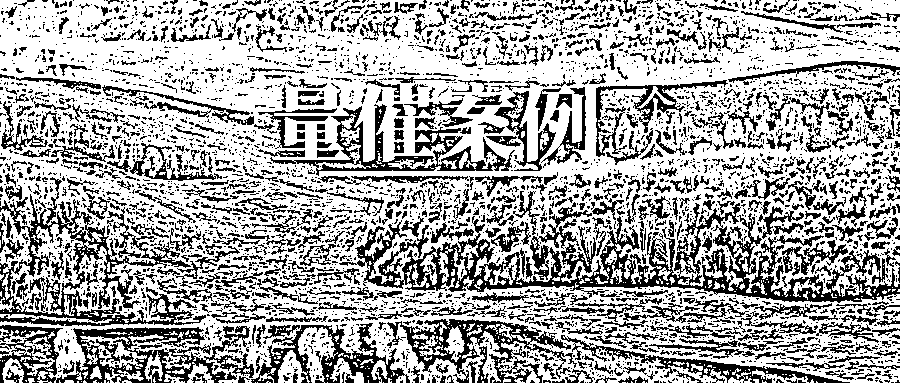

      作者 催眠操作者：许天真

编辑：kathy

图片：网络

源自量子催眠现场的真实记录

[🔈 娑婆世界和极乐世界.mp3](https://res.wx.qq.com/voice/getvoice?mediaid=MzU0NjkzMDY0OF8yMjQ3NDkzNTU2)

个案是一名催眠师，对于真实的自己存在于多维之中，他有着很深的体悟，然而，他还是想要了解如何放下自己在尘世中的执着。

在催眠中，他进入了极乐世界，看到了彩色的光，感受到天使、观音菩萨，还有很多其它高维的存有，包括祥云、麒麟、龙、活菩萨，他其实看不见他们，他能感受到他们，只是“知道”他们在那。 

以下催眠师简称：催，个案的高我简称：高，潜意识简称：潜。

**如果不执着，**

**在娑婆世界的体验比极乐世界更丰富**

催：在极乐世界的众生，有没有愿望去更高的维度？

高：他们可以选择，之所以叫极乐世界，很大的原因，是想让娑婆世界的众生发出想过去的愿望，因为娑婆世界的众生，比较喜欢享乐。本质上极乐世界是非常容易成道的，是修行场，只不过与娑婆世界的方式不太一样，不需要经历太多的苦难，一样可以成道。

催：既然极乐世界可以修道，娑婆世界也可以修道，好像看字面意思娑婆世界的存有会多很多，实际情况是这样吗？

高：本质上没有多和少，实际上娑婆世界和极乐世界众生都非常多。娑婆世界应该这么说，是众生的频率变化很大，从低到高，各种各样都有，很丰富；极乐世界相对来说，就很平稳和平坦，频率相对变化较小。

催：体验不同是吗？

高：体验非常不同，某种意义上来说，在娑婆世界如果不执着的话，体验是会比极乐世界更丰富的，但是你们很难做到，往往执着于很小的一个点。你们知道吗，娑婆世界所有的众生，你们都能体验，只是你们执着于人，那就只能体验人的东西；执着于猫，那就只能以猫的世界去看世界；执着于海藻，只能以海藻的角色去感知世界。实际上，在娑婆世界可以体验非常非常非常非常丰富有趣的事物，在我们看来是这样，当你们执着之后，体验并不那么有趣。

**关于执着的比喻**

催：你们说的那个执着，能描述地详细些吗？

高：比如说举个例子，你们本来作为一个高维灵魂来到地球，地球上一切生命形式都可以体验，但是这是在你们不执着自己是某一个生命体的情况下，你们知道自己本来是高维的，本来是具有无限可能的，但是**你们一旦执着任何一个生命形式，认为你们那个身体才是自己的话，你们就很难再回到高维的意识状态**。只有在高维的意识状态，你们才可以任意选择去体验。就好比你们在投生地球之前，整个地球都是你们的游乐场，但是你们一旦投生，比如说投生在一具肉身身上，你们忘却了自己本来是可以体验整个地球的，你们认为这个肉身就是你们自己。你们本来是整个地球，现在执着于地球上那么小的某一个生命体，看不见全局，这个就叫执着。**执着得越小越难看到全局，你们本来是一个照片，执着就只是一个像素**，能明白吗？

催：那颗像素，突然某天意识到他不仅仅是这么一颗像素，他怎么样去回到或者提升自己让他觉得自己是整个照片呢？

高：不是觉得他是照片，他本来就是整个照片，是他觉得他是一个像素。他只要不觉得自己是一颗像素，他本来就是一张照片。放下执着就可以了，而不是说丢下一个执着再去寻找另一个执着，不是这样子。

**潜意识****指导如何放下执着**

催：那自身能量的通透度怎么提高？

潜：清理，**你们本来就是照片，把那些执着的点都清理掉就变成照片了，记住你们本来就是，是那些念头让你们觉得自己不是，不单是这一世，累生累世，非常非常非常多的念头，那些限制**。不管是做什么，哪怕是做天人也好，他们也会有个限制，天人也有身体，只是执着的面积比你们像素要多一些，一个是小像素，一个是稍微面积大一点的像素，本质上没有区别，你们只要记住本来就是一张完整的照片，本来就是。

•  END •

许天真

量子催眠一阶段操作者

微信：xuyangjie003

坐标：上海 

赞赏：点击赞赏鼓励分享喔！

记得预约你的催眠师

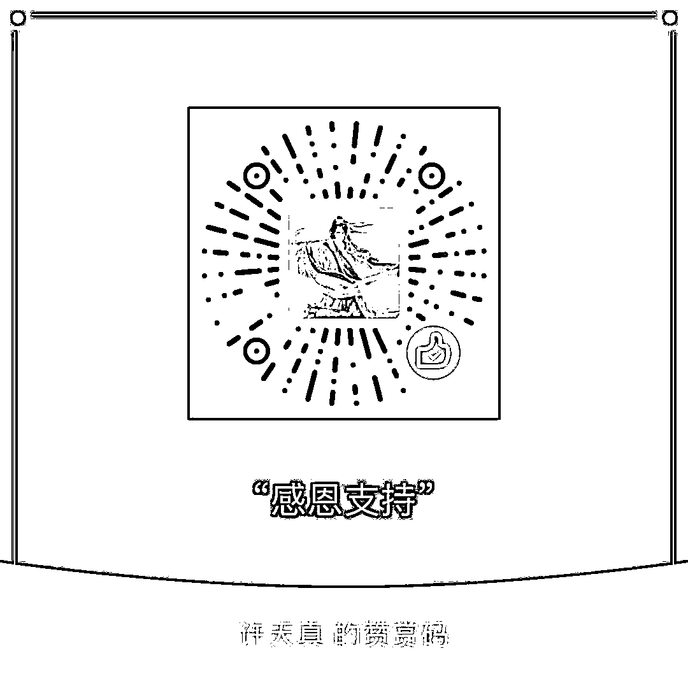

**点击了解更多****相关****文章**

[QHHT®量子催眠疗愈技术一阶段课程](http://mp.weixin.qq.com/s?__biz=MzU0NjkzMDY0OA==&mid=2247491054&idx=2&sn=11c47c5f98b8392ee25a1298a2f89668&chksm=fb577759cc20fe4f3283e7523e138845792685fd8e5f03de4397246df1c978e9b0cf91402ded&scene=21#wechat_redirect)

[大师风采 | 朵奶奶通过量子催眠帮助个案找到终极问题的答案（上）](http://mp.weixin.qq.com/s?__biz=MzU0NjkzMDY0OA==&mid=2247493442&idx=1&sn=57b5a3c9570e71b445150c5caf2ae2c0&chksm=fb548df5cc2304e3056c5e9972dff72f9d36df72e16de86d73eb968d664d963bd782cf4474d0&scene=21#wechat_redirect)

[大师风采 | 朵奶奶通过量子催眠帮助个案找到终极问题的答案（中）](http://mp.weixin.qq.com/s?__biz=MzU0NjkzMDY0OA==&mid=2247493443&idx=1&sn=cf8e1bde8601379f700a67f039df7619&chksm=fb548df4cc2304e25ae1b80ff50e3069b2deeac3c1c1f500f3cdbb88ec72cb49ac063e389a35&scene=21#wechat_redirect)

[大师风采 | 朵奶奶通过量子催眠帮助个案找到终极问题的答案（下）](http://mp.weixin.qq.com/s?__biz=MzU0NjkzMDY0OA==&mid=2247493501&idx=1&sn=589a69ac9e3c48cea4a96521cbce02d6&chksm=fb548dcacc2304dc101090bbf84c6d6f81d33a6e594ae28a0f7f31bb6a9edb6c7bf8ebf73416&scene=21#wechat_redirect)

点击“在看”好美哦↓

 点击预约你的催眠师

# 大师风采 | 朵奶奶通过量子催眠帮助个案找到终极问题的答案（下）

> 原文：[`mp.weixin.qq.com/s?__biz=MzU0NjkzMDY0OA==&mid=2247493501&idx=1&sn=589a69ac9e3c48cea4a96521cbce02d6&chksm=fb548dcacc2304dc101090bbf84c6d6f81d33a6e594ae28a0f7f31bb6a9edb6c7bf8ebf73416&scene=126&sessionid=1690980664#rd`](http://mp.weixin.qq.com/s?__biz=MzU0NjkzMDY0OA==&mid=2247493501&idx=1&sn=589a69ac9e3c48cea4a96521cbce02d6&chksm=fb548dcacc2304dc101090bbf84c6d6f81d33a6e594ae28a0f7f31bb6a9edb6c7bf8ebf73416&scene=126&sessionid=1690980664#rd)

点击上方蓝字关注我们

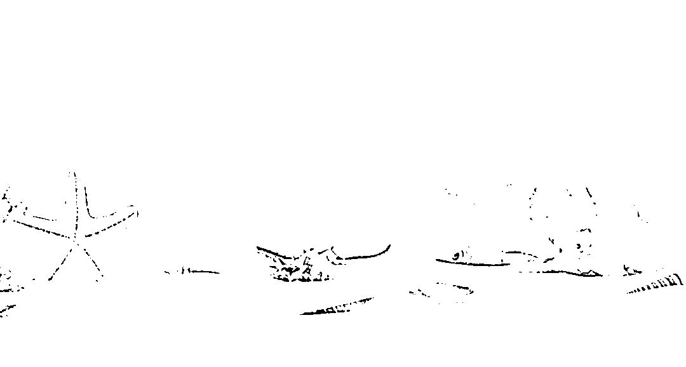

      作者：朵洛莉丝·侃南

编辑/翻译：kathy

图片：网络

文章内容来自量子催眠创始人朵洛莉丝·侃南的专著《寻找隐藏的神圣知识》，仅供

读者参考

**忆起古老的疗愈**

**朵**：现在你离开了你的身体，你感觉有没有哪里你必须去，啊——你在微笑，怎么了？特：好美，我问：“我可以去吗？我可以过去看看吗？”我在询问他们，“我可以去看看每个人吗？都怎么样了？”**朵**：你在问谁？特：所有那些此时此刻比我更明白的人，我想看一看究竟。“我现在在的地方，是不是可以一瞥最初我来的地方？我想看看我从哪里来的。我想要。”“你愿意，你就可以。”欧，我确实想。——他们架着我的双臂，他们笑了，因为已经没有双臂了。我需要帮助，我告诉他们。我率先告诉他们：“如果可以的话，我想回’家’。”**朵**：他们带你看了什么？特：很亮，左边有一幢建筑，全是白的，很亮，但是我不觉得这是“家”。**朵**：建筑是什么样子的？特：巨大，光形成的柱子上有白色的、大大的、高高的长台阶，人们都在向我招手。它看上去就是我一直想象的“记录大厅”(Hall of Records)的模样。你只需要“想”任何一本书。但是它们并不是书，不是吗？**朵**：书在哪里？特：到处都是。天上，地下，运用意念你就能得到信息。**朵**：你想要看哪本书？（停顿）你被哪本书所吸引？特：看一看我能够学到最多的那本书。我真的想看一看我从哪里来。**朵**：问他们哪本书有这个信息？特：它在最上方，它下来了…在桌上了。我请求它打开至那一页。**朵**：当书打开，你看到了什么？特：我不确定我真的看到了。我感受到爱与和平。我感觉这个地方我们没有形体，仅仅是听，而不是看。我只是在感受能量。我听到说我已经经历我本该经历的。其他人的经历对我而言不重要。那只是好奇的部分。——但是，能看到的话就很好了，都在这里了。如果能看，那该多荣耀。（她几乎在乞求。）让我看一看。（幼稚的嗓音。）我可以看到而不仅仅是感受吗？他们说我可以做任何我想做的。我准备好了吗？他们就是在逗乐我。“如果你真的准备好了。”是的，我渴望亲眼看见。“它比你可以体认的更伟大。”欧，是否正是如此我才看不到它？它比我可以体认的更伟大？但是我真的想体认它。**朵**：或许这是你这次可以承载的程度了？特：这已经是我这次可以承载的一切了吗？**朵**：他们怎么说？特：在这，在那又大又漂亮的建筑那里。在那看到我自己翻阅这本书。只要我继续翻，它就会实现。我看到，我往上走。（喃喃低语）我看见一个跳动的白色生命体，一开始很大，进来，出去，又进来…像一个集合的有机体。可能那是我们所有人，所有的我们，集合在这个庞大的巨型白血球里。它好大。**朵**：可能这就是为什么你很难理解。特：可能是的。**朵**：那会帮助你理解吗？特：是的，或许是下次来这里。**朵**：他们很和蔼，他们不想给你超出你承受范围的信息。特：现在我看到很多亮亮的紫光旋转。我不知道它代表什么。**朵**：好的。这会是留给特莉娜去思考的。（是）好的。问他们，“我们是否需要请求潜意识去得到答案，他们能给你答案吗？”特：我们可以问你们吗？他们说，“当然。”**朵**：他们有答案。但是他们希不希望我们呼请另一个部分呢？特：他们说，越多越好。—他们是守护者。**朵**：什么守护者？特：他们是知识的守护者。

然后我感谢他们给予我们的帮助。但是我知道他们对于回答我们的问题能力有限。我们可以从潜意识那里得到更多的信息，所以我呼请了潜意识。我询问它为何选择刚才发生的这一世给特莉娜观看。

特：她已经回答了问题。是**为了忆起得到答案的地方**。当她认为生活是如此具有挑战性，需要足够的时间和空间才能与我们连接。就像那一世她做到的那样。

**任何学习到的功课都不会丢失。它被存储在潜意识心智当中，就像一台电脑，它也可以被提取如果对于今生是合适的。**在特莉娜的案例里面，她得以忆起她是如何运用草药和疗愈的那一世，并将那些知识运用在今生。“她很有可能会学习更多的能量疗愈，还有草药的使用，因为找到了切实可行的信息源。”

她被告知了她的人生目标：爱与和平的使者。形式可以是变化的，以任何方式聚集并教导。**在起床的时候做冥想，确保在早晨便有很好的连接，并保持平和。当你们提问，第一个答案将是我们给出的**。“在她听到答案前，她会需要找到并提出合适的问题。”

她对于几个月前发生的事有疑问。她认为她被能量球砸了，其他在场的人也这么认为。潜意识说不是的，那只是协调至目前的频率和震动所引发的能量转换。

潜意识也说（当谈及物理层面的问题）对她来说补钙是好的。这和她前世摄入的地面生长的壳状物有关，那都是乳酸钙。对她来说继续这样做是好的，以补钙的形式。

**知识点链接**

[大师风采 | 时间真的存在吗？](http://mp.weixin.qq.com/s?__biz=MzU0NjkzMDY0OA==&mid=2247493258&idx=1&sn=f8491bc038f063b4fa8a1b78afefc921&chksm=fb548c3dcc23052b88eb6b422bb8d37de39b05fdaafad7422e6bf5a15070c9676254bca7aa14&scene=21#wechat_redirect)

•  END •

**点击了解更多****相关****文章**

[大师风采 | 朵奶奶通过量子催眠帮助个案找到终极问题的答案（上）](http://mp.weixin.qq.com/s?__biz=MzU0NjkzMDY0OA==&mid=2247493442&idx=1&sn=57b5a3c9570e71b445150c5caf2ae2c0&chksm=fb548df5cc2304e3056c5e9972dff72f9d36df72e16de86d73eb968d664d963bd782cf4474d0&scene=21#wechat_redirect)

[大师风采 | 朵奶奶通过量子催眠帮助个案找到终极问题的答案（中）](http://mp.weixin.qq.com/s?__biz=MzU0NjkzMDY0OA==&mid=2247493443&idx=1&sn=cf8e1bde8601379f700a67f039df7619&chksm=fb548df4cc2304e25ae1b80ff50e3069b2deeac3c1c1f500f3cdbb88ec72cb49ac063e389a35&scene=21#wechat_redirect)

[QHHT®量子催眠疗愈技术一阶段课程](http://mp.weixin.qq.com/s?__biz=MzU0NjkzMDY0OA==&mid=2247491054&idx=2&sn=11c47c5f98b8392ee25a1298a2f89668&chksm=fb577759cc20fe4f3283e7523e138845792685fd8e5f03de4397246df1c978e9b0cf91402ded&scene=21#wechat_redirect)

点击“在看”好美哦↓

 点击预约你的催眠师

# 大师风采 | 朵奶奶通过量子催眠帮助个案找到终极问题的答案（中）

> 原文：[`mp.weixin.qq.com/s?__biz=MzU0NjkzMDY0OA==&mid=2247493443&idx=1&sn=cf8e1bde8601379f700a67f039df7619&chksm=fb548df4cc2304e25ae1b80ff50e3069b2deeac3c1c1f500f3cdbb88ec72cb49ac063e389a35&scene=126&sessionid=1690980664#rd`](http://mp.weixin.qq.com/s?__biz=MzU0NjkzMDY0OA==&mid=2247493443&idx=1&sn=cf8e1bde8601379f700a67f039df7619&chksm=fb548df4cc2304e25ae1b80ff50e3069b2deeac3c1c1f500f3cdbb88ec72cb49ac063e389a35&scene=126&sessionid=1690980664#rd)

点击上方蓝字关注我们

      作者：朵洛莉丝·侃南

编辑/翻译：kathy

图片：网络

文章内容来自量子催眠创始人朵洛莉丝·侃南的专著《寻找隐藏的神圣知识》，仅供

读者参考

这个案例在原著中的名字是《忆起古老的疗愈》，在回溯的过程中个案看到自己的前世是一个能够疗愈自己、他人以及地球的疗愈者。在上一篇中，我们看到了朵奶奶通过复述来解决个案自动进入前世，并且很快地进入描述状态的情况，在本篇我们将看到她如何通过提问来绕开个案的小我，在（下）篇我们将得到关于特莉娜真正的人生目的的答案。

**忆起古老的疗愈**

我想要把注意力从特莉娜这里移开，回到村子里的这个女人身上。我问是否村子里的其他人也知道如何通过冥想获得答案。

特：这是我和所有人都分享的知识，有过这样的时候，拥有这些能力的人使人心生敬畏。那是之前了，现在不这样。知识再次被传承，每个人都能够学，关键是去运用。

朵：你是否觉得最好所有人都知晓，而不仅仅是一个人？

特：是的。仅仅为了自己而掌控知识是没有意义的，它们应该被分享，只需要去分享。这个地方更为和谐，这里是完美的地方。冥想带来了更大的和谐，人们认识到我们是一体的。

朵：你有没有在做特定的冥想？有没有什么指导建议？

特：在这里也一样，走到僻静的地方，或者专注在呼吸。一开始我会深入自己的内在，带着问题，如果有想要问的。如果有一个问题我需要答案。

朵：人们活得久吗？

特：是的，非常、非常健康。当他们越来越老，他们越来越强壮。

听起来是一个完美的地方，他们都给人感觉是快乐的。我决定把她移动到重要的一天，看看在发生什么。有人带着新生儿来到她的面前，他们希望她进行赐福。也有很多其他人聚集着围观。她给予了赐福，把油膏在小孩子的前额。她还进行唱诵，以此与他们的源头连接。“那是许多咒语。阿曼那（？）我听到的是这个，也像是三个小咒语连起来的。阿—曼—那 嗦—发—阿。我们是一体的，知道我们从哪里来，这是恩赐。”

当我们把故事往前推进，她训练这个婴儿（在成长中）成为了她在村子里的接班人。她马上意识到这是需要接受训练的孩子，这样不会失传。然后我们来到她生命的最后一天，当她把接班人训练好，她不再有理由留下，她有意识地选择死亡。她描述了一个充满爱、没有哀伤的场面。“一切如此美妙，如此喜悦，我俯瞰着他们，带给他们喜乐。我的身体就在那里，她死了，没有生病，只是老死。她看上去是九十多岁。是时候了，只有美好，没有悲恸！我们都懂。女孩会接管我的职责，她现在是年轻女士了，她是美好的存在。我只是悬浮在那里，看着，笑着，感受到喜乐。所有的人都感到快乐。”

未完待续

•  END •

**点击了解更多****相关****文章**

[大师风采 | 朵奶奶通过量子催眠帮助个案找到终极问题的答案（上）](http://mp.weixin.qq.com/s?__biz=MzU0NjkzMDY0OA==&mid=2247493442&idx=1&sn=57b5a3c9570e71b445150c5caf2ae2c0&chksm=fb548df5cc2304e3056c5e9972dff72f9d36df72e16de86d73eb968d664d963bd782cf4474d0&scene=21#wechat_redirect)

[QHHT®量子催眠疗愈技术一阶段课程](http://mp.weixin.qq.com/s?__biz=MzU0NjkzMDY0OA==&mid=2247491054&idx=2&sn=11c47c5f98b8392ee25a1298a2f89668&chksm=fb577759cc20fe4f3283e7523e138845792685fd8e5f03de4397246df1c978e9b0cf91402ded&scene=21#wechat_redirect)

[大师风采 | 记录我催眠职业生涯的第一部著作《五世回忆》](http://mp.weixin.qq.com/s?__biz=MzU0NjkzMDY0OA==&mid=2247493430&idx=1&sn=5f20a31bc6537adf46dcb7a34a628644&chksm=fb548d81cc2304973e0b251bcf1a3d26d5a09bda354348f37c02666f7e91bce7d0026d6e9df5&scene=21#wechat_redirect)

点击“在看”好美哦↓

 点击预约你的催眠师

# 大师风采 | 朵奶奶通过量子催眠帮助个案找到终极问题的答案（上）

> 原文：[`mp.weixin.qq.com/s?__biz=MzU0NjkzMDY0OA==&mid=2247493442&idx=1&sn=57b5a3c9570e71b445150c5caf2ae2c0&chksm=fb548df5cc2304e3056c5e9972dff72f9d36df72e16de86d73eb968d664d963bd782cf4474d0&scene=126&sessionid=1690980664#rd`](http://mp.weixin.qq.com/s?__biz=MzU0NjkzMDY0OA==&mid=2247493442&idx=1&sn=57b5a3c9570e71b445150c5caf2ae2c0&chksm=fb548df5cc2304e3056c5e9972dff72f9d36df72e16de86d73eb968d664d963bd782cf4474d0&scene=126&sessionid=1690980664#rd)

点击上方蓝字关注我们

      作者：朵洛莉丝·侃南

编辑/翻译：kathy

图片：网络

文章内容来自量子催眠创始人朵洛莉丝·侃南的专著《寻找隐藏的神圣知识》，仅供读者参考

这个案例在原著中的名字是《忆起古老的疗愈》，在回溯的过程中个案看到自己的前世是一个能够疗愈自己、他人以及地球的疗愈者。作为操作者，我们能够在本篇中看到朵奶奶是如何处理个案自动进入前世的情况，在（中）篇我们也会看到她如何与个案在本篇已经活跃的小我进行斡旋，将注意力稳稳地安放在前世的人格，在（下）篇我们将得到关于特莉娜真正的人生目的的答案。

**忆起古老的疗愈**

特莉娜是一名退休的护士，她主要想了解自己的人生目的。**这是我称之为“终极问题”的提问**。每一个客户在他们的《问题清单》上面都会有这样的问题：我的人生目的是什么？为什么我在这里？我应该如何过我的生活？我是否在走正确的道路？“我很少遇到不问这些问题的人，如果没问，我可能会提：“在你的问题清单上面，漏了一个问题。”当我告诉他们那个问题，他们通常会说：“因为我知道我的人生目的，我也正在践行。”这样的人，很少。大多数人在生活当中跌跌撞撞，想要了解为什么他们在这里，为时间的逝去而焦虑。特莉娜曾经是一名帮助别人的护士，她依旧感到不安，感觉到还有什么在等着自己。

当我还没念完引导词，特莉娜就开始描述她在哪里。我必须快速地打开录音机，试着复述她所说的。她在一个美丽而又圣洁的地方，在一个大森林里面，有着美丽的小径和池塘。她说海洋之水有神奇的力量，有鱼，有贝壳；它是疗愈之水。“我们都知道如何使用魔法。我们依赖它活着，我们小心地使用它。我们从水中获得食物，我们对它充满敬意。”

村庄里面住着很多人。她看到自己是年轻的女人，黑色的皮肤，厚重的长长的黑发，穿着七彩斑斓的漂亮衣服。“我们从水中得到馈赠，我们制作珠宝，有些贝壳自带疗愈属性。我们将贝壳磨成粉，把它们放在食物里面。这是一种平衡。我们从来不生病，因为我们倾听身体，我们聆听地球。

我问是不是一种特定的贝壳。“外面看闪闪的，不太大，不如巴掌大。比较像鹦鹉螺，不完全像。它更打开一些，中间是孔雀色。我们也磨些更小的贝壳。粉末也可以用来涂抹伤口。”

她也知道从木头当中如何获取食物，或者得到疗愈。她并不是村子里唯一会这些的；也有其他人懂得这些。“我们是被指引的，我们倾听内心。只是我们获得的知识并非通过口授。**我们倾听，我们知道当身体有不舒服，它代表什么。我们知道如何去呵护身体。我们与地球保持连接。**我们曾经记得如何去疗愈地球。我认为我是主要的疗愈者，但是我会分享这些知识。”

村子里的房子是大开面的，给人感觉很宽敞，有着直直的墙和棕榈叶覆盖的屋顶。每户都有自己的家，但是他们也会聚在一块分享。“分享我们的故事，分享知识，像社区。”她的屋子是这个类型的。“它闻起来香香的，里面点着香，墙上挂着一罐罐的疗愈草药。它们在容器中长大，在容器中干燥。所有我们不适的情况，通过它们都可以解决。“她独自生活，没有家人。”我们从不感到孤独，他们在我心目中都是我的家人。”在很远的地方，也有其它村庄。“我们在岸边采集，然后卖掉。”

朵：你说你也聆听地球。这是什么意思呢？

特：在冥想状态去问正确的问题，答案就在那里。我们相信那个信息源。（她看上去像在和其他人说话。）我们知道答案，不是吗？（笑）你在嘲笑我……说“傻姑娘。”

朵：谁在说，“傻姑娘”？

特：一个漂亮的女孩，有着大坨的头发。是的，我能看见她。她就在这里，她给我一种你明明知道的感觉。她在说。“是的，特莉娜需要明白这一点。”我现在能看到她。她在提醒我，她就是我，提醒我真正的我知道这些。

朵：当你看到这个叫“特莉娜”的女人，你知道你和她有什么关联吗？

特：（笑）她就是我。

朵：你如何理解？

特：我不知道，但是我感觉到她就是我的一部分。她在提醒我，我需要这样做，我会找到答案，这样做很容易。做就是了！（笑）她看起来有点羞赧，她勾勾手指说，“你记得，所以就这么做。”（笑）

未完待续

•  END •

**点击了解更多****相关****文章**

[QHHT®量子催眠疗愈技术一阶段课程](http://mp.weixin.qq.com/s?__biz=MzU0NjkzMDY0OA==&mid=2247491054&idx=2&sn=11c47c5f98b8392ee25a1298a2f89668&chksm=fb577759cc20fe4f3283e7523e138845792685fd8e5f03de4397246df1c978e9b0cf91402ded&scene=21#wechat_redirect)

[大师风采 | 记录我催眠职业生涯的第一部著作《五世回忆》](http://mp.weixin.qq.com/s?__biz=MzU0NjkzMDY0OA==&mid=2247493430&idx=1&sn=5f20a31bc6537adf46dcb7a34a628644&chksm=fb548d81cc2304973e0b251bcf1a3d26d5a09bda354348f37c02666f7e91bce7d0026d6e9df5&scene=21#wechat_redirect)

点击“在看”好美哦↓

 点击预约你的催眠师

# 大师风采 | 记录我催眠职业生涯的第一部著作《五世回忆》

> 原文：[`mp.weixin.qq.com/s?__biz=MzU0NjkzMDY0OA==&mid=2247493430&idx=1&sn=5f20a31bc6537adf46dcb7a34a628644&chksm=fb548d81cc2304973e0b251bcf1a3d26d5a09bda354348f37c02666f7e91bce7d0026d6e9df5&scene=126&sessionid=1690980669#rd`](http://mp.weixin.qq.com/s?__biz=MzU0NjkzMDY0OA==&mid=2247493430&idx=1&sn=5f20a31bc6537adf46dcb7a34a628644&chksm=fb548d81cc2304973e0b251bcf1a3d26d5a09bda354348f37c02666f7e91bce7d0026d6e9df5&scene=126&sessionid=1690980669#rd)

点击上方蓝字关注我们

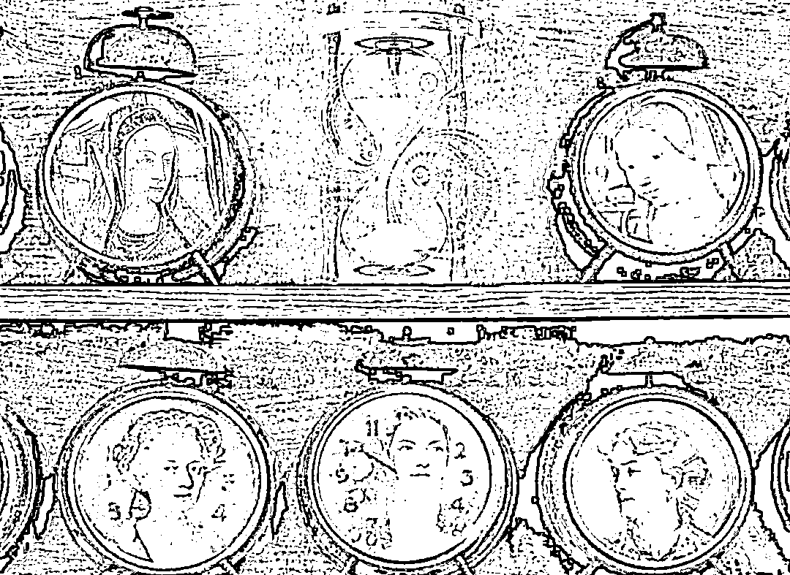

      作者：朵洛莉丝·侃南

编辑：kathy

图片：网络

文章内容来自量子催眠创始人朵洛莉丝·侃南的专著《五世回忆》，仅供读者参考

我在接受电台、电视台访谈和做讲座的时候，偶尔会被问到：“您到底是如何开始涉足这个领域的？是什么推动您开始做催眠的？”如果时间充足，我会解释一下我是如何开始的；如果时间不够了，我会告诉他们这一言难尽，来龙去脉都记录在我写的第一本书《五世回忆》中了。有人会觉得纳闷，因为他们都知道我其他的书，所以就会追问：“这一本怎么没有出版？”回答是：“我曾尽力过。”通常我的书都是超前的，这本也不例外。当我写这本书的时候，还没有什么“新时代运动”的书店，而在那些“常规的”书店里，灵性科学只有一个书架放有与灵性科学相关的书籍，甚至都不到一个。在当时，这类题材的时代尚未到来。我一次又一次地投稿，收到的都只是退稿信。一个出版社说：“你要是能给电影明星做个回溯催眠，我们才有可能会考虑，那样才兴许有人会感兴趣。”几年下来的尝试，除了心碎毫无进展，于是我就把书稿收在文件柜里，继续其他的工作去了。我倒没有放弃写作；相反，当我带着激情投入回溯疗愈的时候，信息像潮水一样通过不同的个案向我涌来，于是我就开始写其他的书了，而《五世回忆》则被束之高阁。经历了九年以及更多的心碎和失望之后，我才找终于到了合适的出版商。那个时候我已经完成另外五本书了。整个过程中，我经历了一个作者所能经历的各种失望。多少次我真想大喊：“我受不了了！太伤心了！”每次当我绝望到底，想就此放弃，把手稿摔到墙上去，然后回到所谓正常的生活中的时候，都会有个想法冒出来：“好吧，如果放弃了这个，那你又想做些什么呢？”然后有个回答永远会出现：“除了写作我别无他愿。”于是我憋回自己的眼泪，开始写另一本新书，也不知道这些书究竟是否哪怕有一本能够出版问世。现在，当我在写作大会上做讲座的时候，会告诉踌躇满志的作家们：“现在你完成了一本书，那下一步呢？这本书可能永远都不会被出版的。但你必须继续写。也许是第二本，或者第四本能被出版。假如你是个真正的作家，你没法做到不写作。它会变成一种不可遏制的冲动，让你宁愿不吃饭也要写。当你到了那个境界，你就知道自己的使命了。”这意愿背后的能量会强大到显化你的书，因为这就是宇宙的法则。

《五世回忆》是记录朵洛莉丝·侃南

及其丈夫当年开始探索前世回溯时的样子，

充分展示了她成为大师的第一步。

两课平台即将推出

精彩社群产品“《五世回忆》读书会”！

不仅包含所有章节精彩人声音频，粉丝打卡精彩内容，还有更多与本书及朵奶奶相关的深度幕后精彩趣事，及原著作者（译者）直播内容，让您更加立体了解催眠的力量与催眠大师朵洛莉丝·侃南的奇妙旅程！

即将推出，敬请留意！

•  END •

**点击了解更多****相关****文章**

[QHHT®量子催眠疗愈技术一阶段课程](http://mp.weixin.qq.com/s?__biz=MzU0NjkzMDY0OA==&mid=2247491054&idx=2&sn=11c47c5f98b8392ee25a1298a2f89668&chksm=fb577759cc20fe4f3283e7523e138845792685fd8e5f03de4397246df1c978e9b0cf91402ded&scene=21#wechat_redirect)

点击“在看”好美哦↓

 点击预约你的催眠师

# 传奇的前世回溯催眠大师朵洛莉丝·侃南自己的前世故事（八）

> 原文：[`mp.weixin.qq.com/s?__biz=MzU0NjkzMDY0OA==&mid=2247493424&idx=1&sn=5fa058c00bcbb0a83bf58113b613d92a&chksm=fb548d87cc230491f76bb13399a56b12809a8a2102c6fa84c89037ebd266c44915c2f6df4ae1&scene=126&sessionid=1690980669#rd`](http://mp.weixin.qq.com/s?__biz=MzU0NjkzMDY0OA==&mid=2247493424&idx=1&sn=5fa058c00bcbb0a83bf58113b613d92a&chksm=fb548d87cc230491f76bb13399a56b12809a8a2102c6fa84c89037ebd266c44915c2f6df4ae1&scene=126&sessionid=1690980669#rd)

点击上方蓝字关注我们

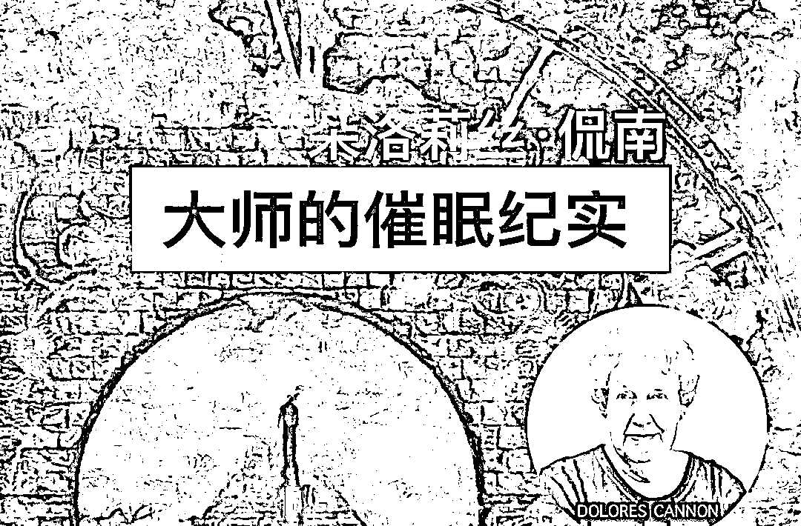

      作者：朵洛莉丝·侃南

翻译/编辑：kathy

图片：网络

文章内容来自量子催眠创始人朵洛莉丝·侃南的专著《回旋宇宙 4》，仅供读者参考

所以，在一开始，我的工作就是在最深层的催眠态进行，然后，把在最深层的催眠态即梦游态得到的信息，进一步地做历史研究。在 1980 年代和 1990 年代，在始料未及的部分发生之前，我写了几部著作。另一个因素也显现出来（一开始是缓慢的），它拥有更多的知识并且能够疗愈。一开始，这是始料未及的，它看上去是如此地拥有力量和知识，我允许它提供帮助。当我回看我早期的书籍，才发现它一直都在，我只是没有认出它来。我开始称呼它为「潜意识」，因为我不知道还可以叫它什么。但这并不是精神科医生口中的“潜意识”，我发现那只是头脑的幼稚面，它能够在浅度的催眠态用来改变习惯。

我看到，我所面对的潜意识更为强大。我称呼它为「潜意识」（Subconscious），“它们”说它们不在意我叫它什么，既然它没有名字。它会回应，并且与我合作。为了写书的便利，我会简称为 SC。我现在知道了它是最强大的力量。它包含了所有的知识，过去的、未来的。所以它能够回答客户的所有问题，给予很棒的建议。那些建议在我看来是自己想不出来的。我发现它知道所有人的所有事。没有什么能够成为秘密，所以，很自然地它能够帮助到客户，因为它看到更宏观的情况。

然后，我开始见证它的令人赞叹的、令人敬慕的瞬时疗愈能力。现在这成了我工作的重中之重，也是我在全世界教授的内容。“它们”曾经说这是来自未来的治疗方法。现在它们说这是属于现在这个时代的治疗方法了。我已经发现，SC 对于万事万物都有答案。它是如此浩瀚，如此庞大，是全然的爱。

为什么不和这样的力量合作呢？

潜意识将所有的担子从我作为治疗师的肩上卸下。我只需要问正确的问题，然后，仅仅是观看魔法的发生。每天，我都在我的办公室见证奇迹。我遍及全世界的学生们也在报告类似的奇迹。所以，我认为我们找到了极其重要的力量。这也是我写在书中的那些信息的出处。

记住，我只是对于失落知识的报告者、调查者和研究者。我必须把所有的碎片拼凑起来，去还原事情的原貌。虽然这并不轻松，它就是我所喜欢的。

（本系列连载完毕）

•  END •

**点击了解更多****相关****文章**

[QHHT®量子催眠疗愈技术一阶段课程](http://mp.weixin.qq.com/s?__biz=MzU0NjkzMDY0OA==&mid=2247491054&idx=2&sn=11c47c5f98b8392ee25a1298a2f89668&chksm=fb577759cc20fe4f3283e7523e138845792685fd8e5f03de4397246df1c978e9b0cf91402ded&scene=21#wechat_redirect)

[传奇的前世回溯催眠大师朵洛莉丝·侃南自己的前世故事（七）](http://mp.weixin.qq.com/s?__biz=MzU0NjkzMDY0OA==&mid=2247493420&idx=1&sn=787fed0bb0622449608bada9c2ba69e0&chksm=fb548d9bcc23048dadf5c70d39496cfabc692a58eca476a0c6800946f336f662de23d3dac6e5&scene=21#wechat_redirect)

[传奇的前世回溯催眠大师朵洛莉丝·侃南自己的前世故事（六）](http://mp.weixin.qq.com/s?__biz=MzU0NjkzMDY0OA==&mid=2247493417&idx=1&sn=9e9327e0ae2055ea2108ab4e58902e4a&chksm=fb548d9ecc230488183e65f050d8737cb49a05ebb021f7a3be5a0368aac47f1502ffa9a157c0&scene=21#wechat_redirect)

[传奇的前世回溯催眠大师朵洛莉丝·侃南自己的前世故事（五）](http://mp.weixin.qq.com/s?__biz=MzU0NjkzMDY0OA==&mid=2247493410&idx=1&sn=0961afa3f75bacbd91ae05330ca510cd&chksm=fb548d95cc230483b525f859c0320c815baa0b0db3df25323a0600627c507e80ee27ecb2d92e&scene=21#wechat_redirect)

[传奇的前世回溯催眠大师朵洛莉丝·侃南自己的前世故事（四）](http://mp.weixin.qq.com/s?__biz=MzU0NjkzMDY0OA==&mid=2247493409&idx=1&sn=ba25f72d5b8c61dbf737670a647c9dff&chksm=fb548d96cc230480834981b5fd1abed436df5ad5bfbf29862343a898b2ad6c42e2e764374fc7&scene=21#wechat_redirect)

[传奇的前世回溯催眠大师朵洛莉丝·侃南自己的前世故事（三）](http://mp.weixin.qq.com/s?__biz=MzU0NjkzMDY0OA==&mid=2247493404&idx=1&sn=3afdbfd4fa18d3e121786a304180dcce&chksm=fb548dabcc2304bd407dd0fe317699ea11b67362ce8ef5593610c4f922f89878c4b6722081df&scene=21#wechat_redirect)

[传奇的前世回溯催眠大师朵洛莉丝·侃南自己的前世故事（二）](http://mp.weixin.qq.com/s?__biz=MzU0NjkzMDY0OA==&mid=2247493402&idx=1&sn=0cad3327120e9d3c0d560d9706e86c86&chksm=fb548dadcc2304bbaa875de0ef89d07fda344d9c52f90e3bfab8958e979518ecaa8a5d59446a&scene=21#wechat_redirect)

[传奇的前世回溯催眠大师朵洛莉丝·侃南自己的前世故事（一）](http://mp.weixin.qq.com/s?__biz=MzU0NjkzMDY0OA==&mid=2247493392&idx=1&sn=8d7dc7901219b0f53b315d5e2e997c9f&chksm=fb548da7cc2304b1b3684e6903ec3add38fd1cd4e581c2ae651f970dda775918d4c6ed2cb9e7&scene=21#wechat_redirect)

点击“在看”好美哦↓

 点击预约你的催眠师

# 传奇的前世回溯催眠大师朵洛莉丝·侃南自己的前世故事（七）

> 原文：[`mp.weixin.qq.com/s?__biz=MzU0NjkzMDY0OA==&mid=2247493420&idx=1&sn=787fed0bb0622449608bada9c2ba69e0&chksm=fb548d9bcc23048dadf5c70d39496cfabc692a58eca476a0c6800946f336f662de23d3dac6e5&scene=126&sessionid=1690980669#rd`](http://mp.weixin.qq.com/s?__biz=MzU0NjkzMDY0OA==&mid=2247493420&idx=1&sn=787fed0bb0622449608bada9c2ba69e0&chksm=fb548d9bcc23048dadf5c70d39496cfabc692a58eca476a0c6800946f336f662de23d3dac6e5&scene=126&sessionid=1690980669#rd)

点击上方蓝字关注我们

      作者：朵洛莉丝·侃南

翻译/编辑：kathy

图片：网络

文章内容来自量子催眠创始人朵洛莉丝·侃南的专著《回旋宇宙 4》，仅供读者参考

我的另外一个前世也被验证了，虽然没有那么的戏剧化。那个前世出现在雅典的帕提农神庙。虽然在回溯的时候，我还不确定那是哪里，能够看出它有希腊范儿。我是一个住在大宅子里的女人，宅子的中间是一个露台，我有丈夫，有孩子们，也有足够的钱雇佣仆人。当我后来看到希腊古老的生活广场的照片，就和我回忆起来的场景一样。再看到照片，一切是如此地熟悉。但是，这不是回溯的重点。我回到了一个场景，大半夜我在街上跑着，完全被恐惧笼罩着。我边跑边望向身后，我知道有人在追我。我跑上了一座山丘，来到了一个大大的神庙前。我停了一会儿，接上气，当我停下来，我看到眼前的景象：下面的远处有一个海湾，可以看到海面上有扬着帆的船。漆黑一片，月亮泛在漆黑的海面。然后，我转身朝向神庙。我跑上了通往里面的台阶，没有门，只有伫立的柱子。穿过这些柱子，这个建筑给人开阔的感觉，给人地方很大的错觉。在一个平台上面有一个坐着的巨大的女人雕像。她有一只手臂向外伸展出去，举着一盏为这个建筑照明的大大的提灯。我在雕像前的台阶上，脸朝下趴着。我哭得歇斯底里，哀求和恳求她保护我。转而我听到一阵嘈杂，转过身就看到一个士兵站在我面前，俯视着我。死亡来得这样突如其来，他将剑刺向了我。

在这次回溯之后，信息碎片化地来到我这里。我知道了我那一世的丈夫是一个傲娇的专横的男人，将我视作附属品。显然我说得太多，表达了太多想法从而不得他欢心并且下令杀了我。在今生，我对于自己的宗教信仰有所不满。我认为是源自于那一世，显然那时我是那个神庙中女神的追随者。然而，在我最需要帮助的时候，她没能帮到我。我感到她遗弃了我。这比死亡更令我难受。

这是一场精彩的回溯催眠，我偶尔会说我在古代在希腊生活过。直到 1990 年代，我在世界各地游历之时，我被邀请至希腊雅典，那个前世才显出意义。我的著作被翻译成各种语言，我感觉到需要去到书籍问世的地方。我一直想看看希腊，所以我接受了去那里的邀请，做讲座，还有签售书籍。我和一个令人愉悦的女士在一起，她安排了一切。埃莱尼住在雅典郊区的三层小楼，还有她的狗“垂垂”。她想要带我看看雅典，还有周边的乡村。一天，我们搭乘火车进入了雅典的主城区，她带我们去看了帕提农神庙，位于卫城。这是旅行的亮点，我一直想去看。我们一路沿着一条脏脏的街道向上爬，直达断壁残垣。它们正在修复和重建，所以，周围都是脚手架，还有成堆的石块。然而，当我沿着台阶向上，来到建筑的内部，一切如此熟悉。我曾听人说过有“似曾来过”的感觉，这是我第一次感受到。现在，我有回来的感觉。平台在那里，雕像不在。在帕提农神庙下面的博物馆里面，有解释说建筑的大部分和它的雕像在经年累月间毁坏了。这是雅典的神庙，古时候，雅典的守护神和她的雕像在这里。没有任何的图片留下，只有口头和文字描述。它应该是一座高大的雕像，头部顶着建筑物的房顶。他们说，这座雕像的一只手中托着一个小的神像，另一只手握着盾牌。这和我栩栩如生的回忆中的画面不一样，但我不认为这有矛盾或者错误。因为没有人确切地知道雕像是什么样子。我看到的是她坐着，有一只伸出的手臂举着一个大的提灯。其它都是一致的。当我走出来，走到神庙的正面，我在一个绝佳的观测点，看着四周。我对埃莱尼说：“如果真的是这里，我应该可以看到海滩。”她点头，并指了指。下面有很多房子和街道，挡住了一些视线，仍能看到一小部分地中海，海上有船只。我很兴奋，我重述了我如何跑上街道，趴在雕像下面的前世画面。在这里死过一次，显得不再重要了。对于这个发现，我如此地兴高采烈，催眠时得到的回忆是真实的，它就这样被证实了。

•  END •

**点击了解更多****相关****文章**

[传奇的前世回溯催眠大师朵洛莉丝·侃南自己的前世故事（六）](http://mp.weixin.qq.com/s?__biz=MzU0NjkzMDY0OA==&mid=2247493417&idx=1&sn=9e9327e0ae2055ea2108ab4e58902e4a&chksm=fb548d9ecc230488183e65f050d8737cb49a05ebb021f7a3be5a0368aac47f1502ffa9a157c0&scene=21#wechat_redirect)

[传奇的前世回溯催眠大师朵洛莉丝·侃南自己的前世故事（五）](http://mp.weixin.qq.com/s?__biz=MzU0NjkzMDY0OA==&mid=2247493410&idx=1&sn=0961afa3f75bacbd91ae05330ca510cd&chksm=fb548d95cc230483b525f859c0320c815baa0b0db3df25323a0600627c507e80ee27ecb2d92e&scene=21#wechat_redirect)

[传奇的前世回溯催眠大师朵洛莉丝·侃南自己的前世故事（四）](http://mp.weixin.qq.com/s?__biz=MzU0NjkzMDY0OA==&mid=2247493409&idx=1&sn=ba25f72d5b8c61dbf737670a647c9dff&chksm=fb548d96cc230480834981b5fd1abed436df5ad5bfbf29862343a898b2ad6c42e2e764374fc7&scene=21#wechat_redirect)

[传奇的前世回溯催眠大师朵洛莉丝·侃南自己的前世故事（三）](http://mp.weixin.qq.com/s?__biz=MzU0NjkzMDY0OA==&mid=2247493404&idx=1&sn=3afdbfd4fa18d3e121786a304180dcce&chksm=fb548dabcc2304bd407dd0fe317699ea11b67362ce8ef5593610c4f922f89878c4b6722081df&scene=21#wechat_redirect)

[传奇的前世回溯催眠大师朵洛莉丝·侃南自己的前世故事（二）](http://mp.weixin.qq.com/s?__biz=MzU0NjkzMDY0OA==&mid=2247493402&idx=1&sn=0cad3327120e9d3c0d560d9706e86c86&chksm=fb548dadcc2304bbaa875de0ef89d07fda344d9c52f90e3bfab8958e979518ecaa8a5d59446a&scene=21#wechat_redirect)

[传奇的前世回溯催眠大师朵洛莉丝·侃南自己的前世故事（一）](http://mp.weixin.qq.com/s?__biz=MzU0NjkzMDY0OA==&mid=2247493392&idx=1&sn=8d7dc7901219b0f53b315d5e2e997c9f&chksm=fb548da7cc2304b1b3684e6903ec3add38fd1cd4e581c2ae651f970dda775918d4c6ed2cb9e7&scene=21#wechat_redirect)

点击“在看”好美哦↓

 点击预约你的催眠师

# 传奇的前世回溯催眠大师朵洛莉丝·侃南自己的前世故事（六）

> 原文：[`mp.weixin.qq.com/s?__biz=MzU0NjkzMDY0OA==&mid=2247493417&idx=1&sn=9e9327e0ae2055ea2108ab4e58902e4a&chksm=fb548d9ecc230488183e65f050d8737cb49a05ebb021f7a3be5a0368aac47f1502ffa9a157c0&scene=126&sessionid=1690980669#rd`](http://mp.weixin.qq.com/s?__biz=MzU0NjkzMDY0OA==&mid=2247493417&idx=1&sn=9e9327e0ae2055ea2108ab4e58902e4a&chksm=fb548d9ecc230488183e65f050d8737cb49a05ebb021f7a3be5a0368aac47f1502ffa9a157c0&scene=126&sessionid=1690980669#rd)

点击上方蓝字关注我们

      作者：朵洛莉丝·侃南

翻译/编辑：kathy

图片：网络

文章内容来自量子催眠创始人朵洛莉丝·侃南的专著《回旋宇宙 4》，仅供读者参考

**前情提要**

朵奶奶提到了自己的两个前世，一个是在埃及亚历山大图书馆的工作人员，还有一个前世是作为寺庙的僧人做一些手抄的工作。在埃及的前世中，不幸的是，图书馆被摧毁了，那一世的他抱着重要的书卷结束了生命，也留下了灵魂对于搜寻失落的知识的渴望，塑造了朵奶奶作为一名严肃调查者的基调。在朵奶奶自己体验到这个前世的多年之后，也是在朵奶奶还没有将催眠用于治愈身体疾病之前的五年，那是在 90 年代，她第一次遇到在前世回溯催眠中，发现了和自己的图书管理员前世有关联的人物，在这一世，他叫德拉戈，那是一场公开的电视催眠。

作为一名教师，他穿着黑色的袍子，通常要求看最重要的古卷，然后坐在一张桌子边上钻研它们。然后我们看到了里程碑式的那天，图书馆被攻击并烧毁。当人群侵入并用火烧毁古卷的时候，他也在图书馆中。事后他说看到这个场景的时候他感叹万千，很想哭，但是他忍住了，考虑到房间里有其他人而且还有摄像机在。要不然他就放声痛哭了。绝望之中的他把卷轴往怀里塞，想要把它们救出去。但是整座图书馆都在大火中，当他往门口奔跑，一部分的屋顶开始倒塌，一个倒下的椽子砸在了他的肩膀上。他也是抱着珍贵的古卷死去的。

结束以后，我没有说什么。直到我们走回了宾馆，我说：“小男孩，我有个故事要告诉你！”第二天早上，当他来到我们的宾馆，他吐露说：“我是那种除非我很确定，不然我不会去说的。但是，我的整个人生都有肩痛的问题。我从来不知道是什么原因造成的，在这次催眠以后它消失了。”然后我告诉了他我在同个图书馆中的经历。我们假定是在同一个时期，然而，我们不认识对方，他是一个学者，而我仅仅是一个书卷看护人。对于这当中的雷同之处，我们非常讶异。

在保加利亚的剩下的日子也是行程满满，在这里我不再深入。除了说一下，在我离开之前，把我邀请过去的“现象协会”在电视上面给我颁发了“俄耳浦斯奖”。这是为了表彰在心灵现象研究方面的最高成就。直到那天之前，只颁发给过保加利亚人。我是第一个得奖的外国人，也是第一个得奖的美国人：一座又大又重的有造型的火焰的金属雕像。

当德拉戈送我去机场，我跟他说：“这是不是很神奇，我们要绕过大半个地球，穿越 1500 年，为了这场重逢。”他笑了，说我们都是想要把失落的知识找回来。我是通过回溯工作和我的写作，他是在他的国家带人们去做演讲，去出版他们的书籍。

在纪录片上映之后，德拉戈打电话给我，说它引起巨大的反响，打到电视台的电话应接不暇，他们想要知道更多关于前世回溯和转世的事情。几年以后，他告诉我前世疗法被采用了，而且在保加利亚被教授。依我看，他们用的就是影片中展示的技术。两个灵魂跨过千山万水、穿越千年的汇合的故事。我在想是不是该为地球另一边的整个国家的意识形态的转变而负责。这就是冥冥之中的安排。

•  END •

**点击了解更多****相关****文章**

[传奇的前世回溯催眠大师朵洛莉丝·侃南自己的前世故事（五）](http://mp.weixin.qq.com/s?__biz=MzU0NjkzMDY0OA==&mid=2247493410&idx=1&sn=0961afa3f75bacbd91ae05330ca510cd&chksm=fb548d95cc230483b525f859c0320c815baa0b0db3df25323a0600627c507e80ee27ecb2d92e&scene=21#wechat_redirect)

[传奇的前世回溯催眠大师朵洛莉丝·侃南自己的前世故事（四）](http://mp.weixin.qq.com/s?__biz=MzU0NjkzMDY0OA==&mid=2247493409&idx=1&sn=ba25f72d5b8c61dbf737670a647c9dff&chksm=fb548d96cc230480834981b5fd1abed436df5ad5bfbf29862343a898b2ad6c42e2e764374fc7&scene=21#wechat_redirect)

[传奇的前世回溯催眠大师朵洛莉丝·侃南自己的前世故事（三）](http://mp.weixin.qq.com/s?__biz=MzU0NjkzMDY0OA==&mid=2247493404&idx=1&sn=3afdbfd4fa18d3e121786a304180dcce&chksm=fb548dabcc2304bd407dd0fe317699ea11b67362ce8ef5593610c4f922f89878c4b6722081df&scene=21#wechat_redirect)

[传奇的前世回溯催眠大师朵洛莉丝·侃南自己的前世故事（二）](http://mp.weixin.qq.com/s?__biz=MzU0NjkzMDY0OA==&mid=2247493402&idx=1&sn=0cad3327120e9d3c0d560d9706e86c86&chksm=fb548dadcc2304bbaa875de0ef89d07fda344d9c52f90e3bfab8958e979518ecaa8a5d59446a&scene=21#wechat_redirect)

[传奇的前世回溯催眠大师朵洛莉丝·侃南自己的前世故事（一）](http://mp.weixin.qq.com/s?__biz=MzU0NjkzMDY0OA==&mid=2247493392&idx=1&sn=8d7dc7901219b0f53b315d5e2e997c9f&chksm=fb548da7cc2304b1b3684e6903ec3add38fd1cd4e581c2ae651f970dda775918d4c6ed2cb9e7&scene=21#wechat_redirect)

点击“在看”好美哦↓

 点击预约你的催眠师

# 传奇的前世回溯催眠大师朵洛莉丝·侃南自己的前世故事（五）

> 原文：[`mp.weixin.qq.com/s?__biz=MzU0NjkzMDY0OA==&mid=2247493410&idx=1&sn=0961afa3f75bacbd91ae05330ca510cd&chksm=fb548d95cc230483b525f859c0320c815baa0b0db3df25323a0600627c507e80ee27ecb2d92e&scene=126&sessionid=1690980669#rd`](http://mp.weixin.qq.com/s?__biz=MzU0NjkzMDY0OA==&mid=2247493410&idx=1&sn=0961afa3f75bacbd91ae05330ca510cd&chksm=fb548d95cc230483b525f859c0320c815baa0b0db3df25323a0600627c507e80ee27ecb2d92e&scene=126&sessionid=1690980669#rd)

点击上方蓝字关注我们

      作者：朵洛莉丝·侃南

翻译/编辑：kathy

图片：网络

文章内容来自量子催眠创始人朵洛莉丝·侃南的专著《回旋宇宙 4》，仅供读者参考

他们虔敬地抓着我，眼含热泪。我问德拉戈发生什么了。他说这些人被带出了医院来见我。他们希望得到治愈或者疗愈。我想知道为什么他们有这样的想法。这是在采访之后被报道出来的关系吗？他们是不是完全误解了我在做的？他说没关系，他们绝望地想要寻求帮助，他们认为我是疗愈者。所有我能做的就是以同情心看着他们，试图告诉他们我帮不到他们。（五年以后，我发现了如何使用我的技术去做疗愈。）

在那里度过的时光充斥着这样类型的事情。直到我们在那里的最后一天，德拉戈来到我们的宾馆，说一个俄罗斯电影制作人想要制作一部关于我和我工作的纪录片。她想要拍摄我操作一个前世的回溯。她不懂英语没有问题，翻译在之后会被剪辑进去。我告诉德拉戈我会试着去做，但是谁来做这次展示的被催眠对象呢？他说他自愿成为被催眠者。他觉得这样会顺利因为他能说英语，我们互相熟悉，所以我们都会感到放心。我同意了，虽然我也等着看会发生什么。如果操作没起作用，而他无法进入一个前世呢？这些当然是非正常情况，但也无法保证一定会发生什么。即使我们成功了，90%的回溯是单调乏味的，平凡、简单的生活。所以我不知道我们是否会得到对他们有用的信息。然而我并没有选择只能试一试。

德拉戈把我和我的女儿南希带到了宾馆，在那里拍摄电影和接受采访。当我们走进房间，技工们正在我将使用的床边上，忙碌地布置灯光和器材。然后，俄罗斯女人带来了一个年轻漂亮的金发女孩，她穿着性感的衬衫和短裤，宣称她将成为我在节目上面做回溯催眠的对象。我告诉她必须是会说英语的人，女孩用高音的天真嗓音回答：“我说英语！”露出可爱的笑容。我知道这样没用，我也知道这个女人认为一个年轻性感的女孩躺在床上会有好的节目效果。我接着宣布我们决定用德拉戈，是因为他对我而言是令人放心的，也会说英文。德拉戈是英俊的男子，有着深色的头发和胡子，但是当然不是性感的。她并没有选择，只能听我们的。

我无从料想会发生什么，只能尽可能多地将方向握在自己手里。在操作完之后，我想他们可能以为一切都是我们自编自导自演。但是我们完全不知道将要发生什么，如果有信息出现。我们当然没有时间去彩排或编造。

德拉戈平躺在床上，照相机、话筒和设备环绕着我们。就算他有紧张，反正我没有感觉到，当他放松下来，我开始操作催眠了。我的女儿南希坐在我的后方，在摄像机的拍摄范围之外。发生了出乎意料的事情，我在惊叹中倾听和操作着。他去到了一个前世，他是一个学者和老师，他的研究领域是占星和数字命理。他持续地学习，花费大量的时间在——准备好了吗——亚历山大图书馆。这简直难以置信，我问了许多关于图书馆的问题，来验证是不是同一个地方。确实是的。他报告的和我看到的是同样的场景。当我忙着通过问题来证实，我撇了一眼身后的南希。她听过我的故事，从她脸上的表情当中我知道她意识到了发生了什么，以及它的重要性。

•  END •

**点击了解更多****相关****文章**

[传奇的前世回溯催眠大师朵洛莉丝·侃南自己的前世故事（四）](http://mp.weixin.qq.com/s?__biz=MzU0NjkzMDY0OA==&mid=2247493409&idx=1&sn=ba25f72d5b8c61dbf737670a647c9dff&chksm=fb548d96cc230480834981b5fd1abed436df5ad5bfbf29862343a898b2ad6c42e2e764374fc7&scene=21#wechat_redirect)

[传奇的前世回溯催眠大师朵洛莉丝·侃南自己的前世故事（三）](http://mp.weixin.qq.com/s?__biz=MzU0NjkzMDY0OA==&mid=2247493404&idx=1&sn=3afdbfd4fa18d3e121786a304180dcce&chksm=fb548dabcc2304bd407dd0fe317699ea11b67362ce8ef5593610c4f922f89878c4b6722081df&scene=21#wechat_redirect)

[传奇的前世回溯催眠大师朵洛莉丝·侃南自己的前世故事（二）](http://mp.weixin.qq.com/s?__biz=MzU0NjkzMDY0OA==&mid=2247493402&idx=1&sn=0cad3327120e9d3c0d560d9706e86c86&chksm=fb548dadcc2304bbaa875de0ef89d07fda344d9c52f90e3bfab8958e979518ecaa8a5d59446a&scene=21#wechat_redirect)

[传奇的前世回溯催眠大师朵洛莉丝·侃南自己的前世故事（一）](http://mp.weixin.qq.com/s?__biz=MzU0NjkzMDY0OA==&mid=2247493392&idx=1&sn=8d7dc7901219b0f53b315d5e2e997c9f&chksm=fb548da7cc2304b1b3684e6903ec3add38fd1cd4e581c2ae651f970dda775918d4c6ed2cb9e7&scene=21#wechat_redirect)

点击“在看”好美哦↓

 点击预约你的催眠师

# 传奇的前世回溯催眠大师朵洛莉丝·侃南自己的前世故事（四）

> 原文：[`mp.weixin.qq.com/s?__biz=MzU0NjkzMDY0OA==&mid=2247493409&idx=1&sn=ba25f72d5b8c61dbf737670a647c9dff&chksm=fb548d96cc230480834981b5fd1abed436df5ad5bfbf29862343a898b2ad6c42e2e764374fc7&scene=126&sessionid=1690980669#rd`](http://mp.weixin.qq.com/s?__biz=MzU0NjkzMDY0OA==&mid=2247493409&idx=1&sn=ba25f72d5b8c61dbf737670a647c9dff&chksm=fb548d96cc230480834981b5fd1abed436df5ad5bfbf29862343a898b2ad6c42e2e764374fc7&scene=126&sessionid=1690980669#rd)

点击上方蓝字关注我们

      作者：朵洛莉丝·侃南

翻译/编辑：kathy

图片：网络

文章内容来自量子催眠创始人朵洛莉丝·侃南的专著《回旋宇宙 4》，仅供读者参考

致命的一天到来了，伟大的图书馆毁灭了。当时，我正在书堆当中，一群人像龙卷风一样席卷了图书馆，肆意地破坏。我在惊恐中看着他们从书架上扯下了卷轴，把它们堆在房间的中央。我惊声尖叫，因为他们把手伸向最高处的卷轴。我的眼泪簌簌地掉落，当他们摧残这些承载着知识的卷轴，把它们甩向成堆的书卷，我知道我无法制止他们，所以我抓住卷轴，疯也似地跑出大楼，身后，他们正点燃那些书堆。当我跌跌撞撞地到了街道上，我的手肘夹着满满当当的书卷，我的眼睛噙满泪水，甚至看不清自己在往哪去。正在此时，一队马车经过碾过了我，我飞离了自己的身体，回望自己的身体，看着它在街道上和胳膊下夹着的满满当当的书卷一起，渐渐地消陨人间。图书馆的火势正在蔓延，吞噬着整幢楼。

我看见了这一世，它解释了我对于书籍的热爱，解释了为何我无法忍受任何一本书被怠慢，以及我对于把失落的知识寻找回来的渴望。有一次，我讲述了这个前世，当时我在一场大会上面，有观众问到我自己的前世，另一个观众听完打趣说：“是的，但是，你真的必须这样试着重写整个图书馆吗？” 哄堂大笑，大家都知道她指的是我的诸多著作。是的，这个前世或许就是解释，它让我能够坦然那样去做。但是，这还不是故事的结尾，到了 1990 年代，又有其它事情发生了。

我被邀请至保加利亚，关于诺查丹玛斯的书被位于索菲亚的飒出版社（Zar Publisher）所接受。德拉戈发现了我的著作，并且与出版社安排好了将它们翻译成他们的语言，他们希望我过去并做讲座。我周游世界，然而还没有到过保加利亚，或者任何当时的苏维埃国家。南斯拉夫战争刚刚爆发。我的儿子很担忧：“妈妈，你不能去那里。看看地图！索菲亚就在南斯拉夫边境处。”我从未对我去的地方感到危险，我总是感到被请求去往发言是一种荣幸。某种程度上是我认为一切都会安好。我是对的，这次行程成了我人生最美妙的经历之一。

•  END •

**点击了解更多****相关****文章**

[传奇的前世回溯催眠大师朵洛莉丝·侃南自己的前世故事（三）](http://mp.weixin.qq.com/s?__biz=MzU0NjkzMDY0OA==&mid=2247493404&idx=1&sn=3afdbfd4fa18d3e121786a304180dcce&chksm=fb548dabcc2304bd407dd0fe317699ea11b67362ce8ef5593610c4f922f89878c4b6722081df&scene=21#wechat_redirect)

[传奇的前世回溯催眠大师朵洛莉丝·侃南自己的前世故事（一）](http://mp.weixin.qq.com/s?__biz=MzU0NjkzMDY0OA==&mid=2247493392&idx=1&sn=8d7dc7901219b0f53b315d5e2e997c9f&chksm=fb548da7cc2304b1b3684e6903ec3add38fd1cd4e581c2ae651f970dda775918d4c6ed2cb9e7&scene=21#wechat_redirect)

[传奇的前世回溯催眠大师朵洛莉丝·侃南自己的前世故事（二）](http://mp.weixin.qq.com/s?__biz=MzU0NjkzMDY0OA==&mid=2247493402&idx=1&sn=0cad3327120e9d3c0d560d9706e86c86&chksm=fb548dadcc2304bbaa875de0ef89d07fda344d9c52f90e3bfab8958e979518ecaa8a5d59446a&scene=21#wechat_redirect)

点击“在看”好美哦↓

 点击预约你的催眠师

# 传奇的前世回溯催眠大师朵洛莉丝·侃南自己的前世故事（三）

> 原文：[`mp.weixin.qq.com/s?__biz=MzU0NjkzMDY0OA==&mid=2247493404&idx=1&sn=3afdbfd4fa18d3e121786a304180dcce&chksm=fb548dabcc2304bd407dd0fe317699ea11b67362ce8ef5593610c4f922f89878c4b6722081df&scene=126&sessionid=1690980669#rd`](http://mp.weixin.qq.com/s?__biz=MzU0NjkzMDY0OA==&mid=2247493404&idx=1&sn=3afdbfd4fa18d3e121786a304180dcce&chksm=fb548dabcc2304bd407dd0fe317699ea11b67362ce8ef5593610c4f922f89878c4b6722081df&scene=126&sessionid=1690980669#rd)

点击上方蓝字关注我们

      作者：朵洛莉丝·侃南

翻译/编辑：kathy

图片：网络

文章内容来自量子催眠创始人朵洛莉丝·侃南的专著《回旋宇宙 4》，仅供读者参考

我阅读所有手边的资料，对于书籍的爱和对学习的渴望贯穿着我的生命。即使是今天，当我撰写我的任意书籍，我都研究至死。

当我在完成操作之后，真正写书的部分才算开始，我会用好几个小时（有的时候是一整天）在图书馆里搜集资料。对我来说，长达数小时的研究如同在天堂一般，直到最终发现宝贵的、难以被发现的事实。当我在撰写关于诺查丹玛斯的三部作品之时（《与诺查丹玛斯对话》），我阅读了关于这位大神的每本书。有一些已经不再出版，仅存的一本影印本可以在国会图书馆找到，能够通过阿肯色州大学的图书馆借阅借到。当我撰写关于耶稣的书籍：《耶稣和埃塞尼》与《与耶稣同行》，我阅读了所有写到“死海古卷”的书。当我撰写有关美国印第安种族的起源的书籍：《陨星传奇》，我用了三年的时间，把所有我能找到的关于古老印第安的传说和历史研究了个遍。所有的这些研究都是值当的，当我在做演讲的时候，所有的信息都在我的脑海中，对于我谈论的内容，我相当有把握。我早期的杂志出版商说过：“研究是非常重要的，做过功课与否是非常明显的。如果你没有做过功课，这也是非常显然的。”这挺让人羞愧的，现在的年轻人不知道如何做研究。他们只是用很少的时间，编排从互联网上面获得的小部分信息，对于在图书馆成堆的书籍中搜寻被遗忘或失落的内容，所能够体会到的荣光与奇妙，他们知之甚少。这是为何我称我自己为：“对于失落知识的报告者、调查者和研究者。”

因此，我感觉这不是太意外，当我回到前世，看到自己在五世纪的伟大、宏伟的亚历山大图书馆。在那一世，我是一个在图书馆中工作的男人。我并不能看懂书架上珍贵的卷轴，但是我知道哪些是最古老和最重要的。许多博学的学者来到图书馆，我会帮他们找到他们想看的卷轴。我总是欣羡地看着他们坐在桌边，打开卷轴阅读。我知道最重要的卷轴被保存在最高的架子上面。特别是有一个穿黑色袍子的男人，经常来，我总能提前感应到他想要的卷轴。虽然我不能读书，我享受这份工作，我就像这些书籍的看护人。

•  END •

**点击了解更多****相关****文章**

[传奇的前世回溯催眠大师朵洛莉丝·侃南自己的前世故事（一）](http://mp.weixin.qq.com/s?__biz=MzU0NjkzMDY0OA==&mid=2247493392&idx=1&sn=8d7dc7901219b0f53b315d5e2e997c9f&chksm=fb548da7cc2304b1b3684e6903ec3add38fd1cd4e581c2ae651f970dda775918d4c6ed2cb9e7&scene=21#wechat_redirect)

[传奇的前世回溯催眠大师朵洛莉丝·侃南自己的前世故事（二）](http://mp.weixin.qq.com/s?__biz=MzU0NjkzMDY0OA==&mid=2247493402&idx=1&sn=0cad3327120e9d3c0d560d9706e86c86&chksm=fb548dadcc2304bbaa875de0ef89d07fda344d9c52f90e3bfab8958e979518ecaa8a5d59446a&scene=21#wechat_redirect)

[大师风采 | 朵洛莉丝·侃南述说量子催眠中的时光穿梭是如何发生](http://mp.weixin.qq.com/s?__biz=MzU0NjkzMDY0OA==&mid=2247493327&idx=1&sn=a0fa07e1780f41f3950655992eb9c801&chksm=fb548c78cc23056edaee0206401e6147556aaa7a11c22a96cca373a9854397d87504a69e5439&scene=21#wechat_redirect)

点击“在看”好美哦↓

 点击预约你的催眠师

# 传奇的前世回溯催眠大师朵洛莉丝·侃南自己的前世故事（二）

> 原文：[`mp.weixin.qq.com/s?__biz=MzU0NjkzMDY0OA==&mid=2247493402&idx=1&sn=0cad3327120e9d3c0d560d9706e86c86&chksm=fb548dadcc2304bbaa875de0ef89d07fda344d9c52f90e3bfab8958e979518ecaa8a5d59446a&scene=126&sessionid=1690980669#rd`](http://mp.weixin.qq.com/s?__biz=MzU0NjkzMDY0OA==&mid=2247493402&idx=1&sn=0cad3327120e9d3c0d560d9706e86c86&chksm=fb548dadcc2304bbaa875de0ef89d07fda344d9c52f90e3bfab8958e979518ecaa8a5d59446a&scene=126&sessionid=1690980669#rd)

点击上方蓝字关注我们

      作者：朵洛莉丝·侃南

翻译/编辑：kathy

图片：网络

文章内容来自量子催眠创始人朵洛莉丝·侃南的专著《回旋宇宙 4》，仅供读者参考

当你开始进化提升，并且了解了自己，那便不用再回到过去。对于一些人来说，被催眠并不是为了治疗，而是为了娱乐。那么，这并不是一个好的出发点。他们会变成对前世成瘾者，出于好奇，想要“修”好自己。这样的做法与通过前世治疗的完整理念是背道而驰的，治疗是为了今生的生活。前世的记忆是好的、有价值的信息，但是它们被提取是为了服务于眼下的肉身，特别是为了处理家庭关系。我们必须很好地编织整理这些记忆，正如同我们回顾童年和其它所有的回忆。无论是好的还是不好的回忆，他们都是我们生活的故事，需要面对以及妥帖地被理解。其它世的生活仅仅是扩展出来的记忆，应该被融入我们今生的生活。这使得每个独立的人格全面而合情合理地被展现。

回到我们讲述的话题，我在被催眠的过程中发现了我今生的人生目标。那个时候，我甚至还没有意识到我的余生都会致力于通过前世回溯来帮助人们。我很享受这个工作，也开始撰写我的第一本书《耶稣和埃塞尼》，我还无法预见到我的工作量会是那么巨大。

我回到了埃及的前世，在一个巨大的名叫亚历山大的图书馆。我的一生都为书籍所着迷。在上学前我就会读书了，语法对于我来说简直如同第二语言般容易掌握。我是一个在大萧条时期成长起来的孩子，所以钱对我们来说非常紧。我和我的姐妹没有任何的奢侈品。在二手商店有很多的旧物和衣物。在那样的年代，你必须靠仅有的物资生存。要花钱买的东西，就别想了，你不会得到它的（除非在圣诞节能得到一些玩具）。因此，当我在一年级的时候，有人进到教室里说在离学校不远的圣·路易有座巨大的图书馆，我是那样兴奋。他们鼓励我们办理图书卡，并且给了我们一张申请表带回家填写。班上的书籍都已经被我如饥似渴地读完了，当我听说图书馆有成百上千的书籍，我对于书的渴望也达到了巅峰。最棒的是它们是免费的。难以置信，都是免费的！我一路奔回家，给妈妈看我手里的申请表。当我把手里的表给她看的时候，我的兴奋激动一定非常地具有感染力，我一直一直说我是如何得到这张申请表，它可以让我看到我想看的任何书，而且还是免费的！长话短说，我妈妈拿到了图书馆卡，每隔几天，她就会领我去几个街区之外的浩大的图书馆，在那里我可以借到书籍。我记得在书架之间的走廊穿梭，当我意识到我可以无所限制地阅读之时，我感觉自己在天堂。之后，当我可以自己去那里，我在那里一呆就是几个小时，总是捧着一堆书回家。我书不离手，花数小时沉浸在书本所展现的想象世界中。在高中的时候，我要不是在教室，就是在学校图书馆翻百科全书。同时，我还发展了一个奇特的强迫行为，当我业余时间在自习室，我会沉浸在抄写字典里面的单词。每一次，我都会标记我进行到了哪里，然后在第二天继续，就是在我的笔记本中逐词逐词地抄写。我可以认为这是由于我爱读书所带来的，后来，我在前世回溯中发现，我有过一个前世，是寺庙中的僧人，当时我的工作就是手抄原典和书籍。这个强迫行为挺好的，因为它在我的心灵刻下了对于遣词造句的感觉。

•  END •

**点击了解更多****相关****文章**

[量子催眠创始人为什么编写《耶稣与艾赛尼人》？](http://mp.weixin.qq.com/s?__biz=MzU0NjkzMDY0OA==&mid=2247493190&idx=2&sn=5989b5da6d90efe0c7c74ee193d69754&chksm=fb548cf1cc2305e7a778277daa0746ba1f13adb3d4a7c33bd9415b40de7fbe788480fd9510a6&scene=21#wechat_redirect)

[大师风采 ｜ 朵奶奶通过「量子催眠」疗愈童年遭受虐待的案例二则](http://mp.weixin.qq.com/s?__biz=MzU0NjkzMDY0OA==&mid=2247493375&idx=1&sn=d1572b5cb4fbab54390b5a59de9d8663&chksm=fb548c48cc23055eebc45ca003a1d449a932df45d2aea0bf2d8011b83e636f5d6aeca078faf3&scene=21#wechat_redirect)

[大师风采 | 朵洛莉丝·侃南述说量子催眠中的时光穿梭是如何发生](http://mp.weixin.qq.com/s?__biz=MzU0NjkzMDY0OA==&mid=2247493327&idx=1&sn=a0fa07e1780f41f3950655992eb9c801&chksm=fb548c78cc23056edaee0206401e6147556aaa7a11c22a96cca373a9854397d87504a69e5439&scene=21#wechat_redirect)

点击“在看”好美哦↓

 点击预约你的催眠师

# 传奇的前世回溯催眠大师朵洛莉丝·侃南自己的前世故事（一）

> 原文：[`mp.weixin.qq.com/s?__biz=MzU0NjkzMDY0OA==&mid=2247493392&idx=1&sn=8d7dc7901219b0f53b315d5e2e997c9f&chksm=fb548da7cc2304b1b3684e6903ec3add38fd1cd4e581c2ae651f970dda775918d4c6ed2cb9e7&scene=126&sessionid=1690980669#rd`](http://mp.weixin.qq.com/s?__biz=MzU0NjkzMDY0OA==&mid=2247493392&idx=1&sn=8d7dc7901219b0f53b315d5e2e997c9f&chksm=fb548da7cc2304b1b3684e6903ec3add38fd1cd4e581c2ae651f970dda775918d4c6ed2cb9e7&scene=126&sessionid=1690980669#rd)

点击上方蓝字关注我们

      作者：朵洛莉丝·侃南

翻译/编辑：kathy

图片：网络

文章内容来自量子催眠创始人朵洛莉丝·侃南的专著《回旋宇宙 4》，仅供读者参考

无论我在哪里做讲座，我都会被以各种形式问：你知道你自己的前世吗？是啊，在这个领域工作了四十年，如果说我没有去挖掘自己的前世那几乎是不可能的。在早期的时候，我通过不同的催眠师做过前世回溯。我和其他人一样的好奇。

这也导致了我希望我自己的客户能够避免一些体验，并不是所有的技巧都是令人愉悦的经历。我获得了不少的信息，但那些早期我自己被催眠的体验很多并不专业。我意识到他们只是照着学习到的技巧在做，从来不会质疑为什么那样去操作。然而，我始终在质疑。如果在体验中我感到不适，我尝试去理解为什么。在后面的无数年间，我发展了自己的技术，我建立了保护机制，因此，我的任何一个客户都不会有不好的感受。**这是我总是建议我的学生去亲身体验他们自己的前世回溯，这样他们才能知道如何处理自己的个案**。如果我们自己都不曾体验，如何去操作呢？

在早些年间，我探索了自己的八个前世。这对于了解与家庭成员间的关系至关重要，也理解了大家为什么又再度相遇。 

我也因此得以理解为什么我做这个工作，探索前世的过程对此很重要。现在，我已经不再需要去探索自己的前世，因为我认为我已经了解了所有我需要知道的。这是非常有价值的工具，也仅仅是一个工具。

  在《传奇的前世回溯催眠大师朵洛莉丝·侃南自己的前世故事（二）》中，我们将了解到两个关于朵奶奶为何对于寻找失落的知识有如此大动力的前世。敬请期待！

•  END •

**点击了解更多****相关****文章**

[大师风采 ｜ 朵奶奶通过「量子催眠」疗愈童年遭受虐待的案例二则](http://mp.weixin.qq.com/s?__biz=MzU0NjkzMDY0OA==&mid=2247493375&idx=1&sn=d1572b5cb4fbab54390b5a59de9d8663&chksm=fb548c48cc23055eebc45ca003a1d449a932df45d2aea0bf2d8011b83e636f5d6aeca078faf3&scene=21#wechat_redirect)

[大师风采 | 朵洛莉丝·侃南述说量子催眠中的时光穿梭是如何发生](http://mp.weixin.qq.com/s?__biz=MzU0NjkzMDY0OA==&mid=2247493327&idx=1&sn=a0fa07e1780f41f3950655992eb9c801&chksm=fb548c78cc23056edaee0206401e6147556aaa7a11c22a96cca373a9854397d87504a69e5439&scene=21#wechat_redirect)

[大师风采 | 时间真的存在吗？](http://mp.weixin.qq.com/s?__biz=MzU0NjkzMDY0OA==&mid=2247493258&idx=1&sn=f8491bc038f063b4fa8a1b78afefc921&chksm=fb548c3dcc23052b88eb6b422bb8d37de39b05fdaafad7422e6bf5a15070c9676254bca7aa14&scene=21#wechat_redirect)

点击“在看”好美哦↓

 点击预约你的催眠师

# 大师风采 ｜ 朵奶奶通过「量子催眠」疗愈童年遭受虐待的案例二则

> 原文：[`mp.weixin.qq.com/s?__biz=MzU0NjkzMDY0OA==&mid=2247493375&idx=1&sn=d1572b5cb4fbab54390b5a59de9d8663&chksm=fb548c48cc23055eebc45ca003a1d449a932df45d2aea0bf2d8011b83e636f5d6aeca078faf3&scene=126&sessionid=1690980669#rd`](http://mp.weixin.qq.com/s?__biz=MzU0NjkzMDY0OA==&mid=2247493375&idx=1&sn=d1572b5cb4fbab54390b5a59de9d8663&chksm=fb548c48cc23055eebc45ca003a1d449a932df45d2aea0bf2d8011b83e636f5d6aeca078faf3&scene=126&sessionid=1690980669#rd)

点击上方蓝字关注我们

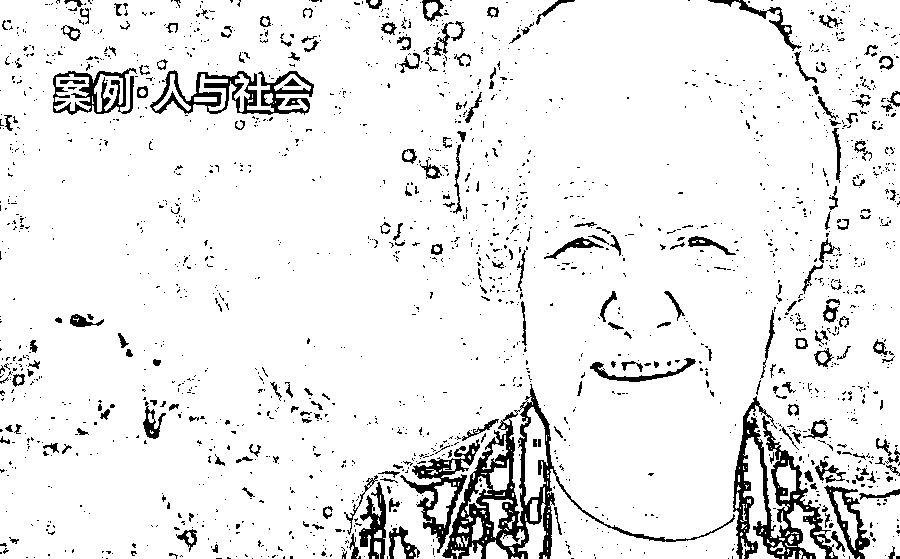

在过去的三十年，我大量的催眠工作是给客户进行治疗（therapy）。我意识到我的工作是为那些前来寻求帮助的人得到解释，他们得以从困扰自己的问题中获得解脱。在催眠以后，他们能够回到正常的、有意义的生活状态。摆脱之前压垮他们的各种精神“包袱”和情绪“垃圾”，这是我本人关注的重点。我将客户带回合适的「前世」，因此，他们能够明白现在生活中所面临问题的根源。当然，在探索的过程中，我也遇到过很多的波折，也得到许多令人兴奋的概念，我把它们一一写进了著作。在这个部分，我想要展现两个类似的典型案例，它们能够很好地说明今生所遇到的问题和前世之间的关联性。 

在 2006 年的 11 月，我接连遇到两个与虐待儿童相关的案例。

一位是男客户，另一位是女客户，都被他们童年的经历影响甚深。男人的记忆中从两岁开始，直到 18 岁离开家，都是暴力受害者，他依旧对自己的父亲怀着深深的愤怒和怨恨。那位女士把自己 17 岁之前的记忆都自动消除了，自从 4、5 岁起，她就在被自己父亲的虐待和性侵中度过。她也怀着深深的愤怒和怨恨，认为自己的父亲摧毁了自己的生活。当她离开家之后，她努力去上大学，但是一切都对她来说太难了，她转而沉溺于药物、酒精和性。我们见面的时候，她 29 岁，正在人生的谷底，极度渴求我的帮助。她尝试过自杀，也在收容所被训诫过。药物和酒精对她的身体影响很大，特别是她的肾脏，到了要切除其中一个肾脏的地步。剩下的一个肾脏也无法发挥功能，她正经历中毒和功能性障碍。（潜意识说她正在伤害自己，以此从痛苦中寻求逃避。）她处在深度抑郁当中，总是想睡觉，一切都很难，因为她还需要自己抚养三个孩子。她也有自残的行为，切伤、割伤自己的身体。很显然，她厌恶自己的身体（她面容姣好，却觉得自己难看），想要把对自我造成否定的部分摧毁掉。他们两个人都很痛苦、伤心和沮丧。当他们离开我的办公室，他们明白了造成目前的“果”在根源上的“因”，他们的生命峰回路转，有了能够面对生活的能力。这两个案例各有不同，又有着相似之处。

那位男士在回溯中回到了一战的战场上。他并不想在那，他说是征兵工作者把他忽悠了。他们谎称这个战斗很快会结束，他也不用上战场。然而，他发现自己明明在战争的深渊中。子弹横飞，到处有炸弹爆炸，致命的气体弥漫在空气之中。身边的战士们不断地死亡。他说他的哥哥也在那里，但是因为烟雾弥漫，他看不到哥哥在哪。我的客户在这个场景里面是想要上战场的，然而，他的哥哥并不想，他和哥哥聊了这件事。看上去他非常地恐惧，我感觉他以这样的状态，很有可能会在战役当中遭遇不幸。

当我把他移动到生命的最后一天，让我很惊讶的是他已经老了，躺在床上。他是那场战争的幸存者，安全地回了家，结婚并组建了家庭。但是，他的哥哥就没有这么幸运了。他在战争当中遇难了。对此，他当然感觉很内疚，因为他觉得他的哥哥本来可以活得好好的，如果当时他没有劝他一起参军。当我们进入潜意识，它说这辈子，哥哥以父亲的形式出现在他的生命中，哥哥是带着愤怒和怨恨而来的，因为他感觉自己的命被骗走了。他决定以牙还牙，以眼还眼，最好的方式就是夺走他的生命，至少让他活在极端痛苦中。这解释了父亲在他这里的无名火。当然，父亲的做法是令人遗憾的，因为他带着这个无法排解的愤怒，制造了更多业力的堆积。当这个男人理解了前因后果，他才释怀，能够原谅父亲，这样才算是撕毁了契约，切断了这个业力的纽带。在操作这场催眠之后，他离开的时候已经完全转变了。之前他还有严重的背痛，从脖子、肩膀蔓延到下背部。很明显，是由于他背负了这个沉重的包袱长达五十年。现在，他能够放手了。

那位女士的前因后果有所不同，也有相似之处。她看到自己在战争肆虐的德国，那是二战时期。士兵在街上斗殴，但是打斗的不是其他士兵，而是在攻击和射击居民。她是一名女医生，试图帮助在街上躺着的人们，他们流着血，受了枪伤。士兵们表现得很疯狂，在枪击女人前强奸她们。他们也射杀男人和孩子。她说被射击的人被认定为犹太人，这是他们毁灭犹太人的方式。街头一片混乱。她试图帮助一些人，但是被愤怒的士兵推到了一边。

一开始，他们还试图不要伤害她，因为他们知道她是一个医生。但是，斗殴和恐慌变得激烈起来，她逃进了一栋楼里面，藏在楼梯后面，看着外面的士兵在屠杀。他们发现了她，把她拖到了街道上。此时，他们表现得颠狂，不听任何人的。他们把她绑了起来，很多士兵轮流强奸她。他回来是以父亲的方式来偿还前世的不公，通过抚养和保护她。当时，他是所有施暴者中打头的。

计划是这样，很显然在他进入身体之后事情就变了。潜意识说他被卷进了肉身的体验，遗忘了最初的计划。这说明身而为人是非常不易的，即使投身的灵魂携带着好的计划而来，也有崇高的向往来偿还业力，生活总有办法影响到他们。站在生命的另一端去看，看上去总是容易达成的。然而，灵魂遗忘了，因为，这是一个个人自由意志的世界，它也必须满足其他人的个人自由意志，更不用说身而为人还需要处理情绪带来的压力。所以，他被卷进去了，令人遗憾的是他积累了更多的业力。与其斥责他们，不如为他们感到唏嘘。

情况变了，这位女士的计划也只能随之改变。她是来施予援手的，并且依旧在扮演帮助的角色，只是施以援手的角度与预期的不同。她遇到的糟糕的事情使得她能够帮助其他同样遭遇性侵的女性，她将能够帮助她人，因为她理解她们。除了有过同样的亲身经历的人，还有谁能够更好地帮助这些受害者呢？她的生活得以转变，她将过去留在了过去，继续生活。

两个案例接踵而来，同样是关于：虐待儿童。两个案例都是来人世间施予援手的，但是由于肉身的限制，又变成了人间惨剧。他们不仅仅需要原谅自己的父亲，最难的部分在于他们需要原谅自己。

也有关于虐待儿童事件产生的其它原因，听起来比较陌生，那就是在宗教的环境中经历了太多的转世，通常是在修道院、尼姑庵和修女院等。

在这些严格和无爱的氛围当中，有着根深蒂固的信念那就是为了进入天堂、与神在一起，人必须遭受磨难。这真是这些所谓的宗教人士所带来的磨难。这些信念对我的这个女客户带来了深刻的影响，以至于她无法放过自己，即使她对此并没有太多的觉知。而且，那个前世涉事的其他人也都回到了她的生活中再次扮演施暴者的角色。他们共同制造了同样的剧情，因为他们相信，这是进入天堂唯一的路。

这是一个重要的观点。前世所说的誓言是极其重要的，有很大的力量，因为它们被深深地相信。因为在那一世是有效的，它就被带入了这一世。最常见的誓言有：禁欲的誓言、贞洁的誓言会引起今生生活在性方面的问题。贫穷的誓言，会引发金钱问题。现在，我们看到了关于受难的誓言。最简单的化解方式就是把那个誓言和那个人格一起，留在过去。对于那一世，它们是重要而有意义的，然而对这一世是不合适的。这样一来，誓言就被取消了，也解除了由它产生的限制。

•  END •

**点击了解更多****相关****文章**

[大师风采 | 朵洛莉丝·侃南述说量子催眠中的时光穿梭是如何发生](http://mp.weixin.qq.com/s?__biz=MzU0NjkzMDY0OA==&mid=2247493327&idx=1&sn=a0fa07e1780f41f3950655992eb9c801&chksm=fb548c78cc23056edaee0206401e6147556aaa7a11c22a96cca373a9854397d87504a69e5439&scene=21#wechat_redirect)

[大师风采 | 时间真的存在吗？](http://mp.weixin.qq.com/s?__biz=MzU0NjkzMDY0OA==&mid=2247493258&idx=1&sn=f8491bc038f063b4fa8a1b78afefc921&chksm=fb548c3dcc23052b88eb6b422bb8d37de39b05fdaafad7422e6bf5a15070c9676254bca7aa14&scene=21#wechat_redirect)

点击“在看”好美哦↓

 点击预约你的催眠师

# 大师风采 | 朵洛莉丝·侃南述说量子催眠中的时光穿梭是如何发生

> 原文：[`mp.weixin.qq.com/s?__biz=MzU0NjkzMDY0OA==&mid=2247493327&idx=1&sn=a0fa07e1780f41f3950655992eb9c801&chksm=fb548c78cc23056edaee0206401e6147556aaa7a11c22a96cca373a9854397d87504a69e5439&scene=126&sessionid=1690980674#rd`](http://mp.weixin.qq.com/s?__biz=MzU0NjkzMDY0OA==&mid=2247493327&idx=1&sn=a0fa07e1780f41f3950655992eb9c801&chksm=fb548c78cc23056edaee0206401e6147556aaa7a11c22a96cca373a9854397d87504a69e5439&scene=126&sessionid=1690980674#rd)

点击上方蓝字关注我们

📹 [`mp.weixin.qq.com/mp/readtemplate?t=pages/video_player_tmpl&action=mpvideo&auto=0&vid=wxv_1678987119161049090`](https://mp.weixin.qq.com/mp/readtemplate?t=pages/video_player_tmpl&action=mpvideo&auto=0&vid=wxv_1678987119161049090)

【Dolores Cannon answers question about Simultaneous Time】

📹 [`mp.weixin.qq.com/mp/readtemplate?t=pages/video_player_tmpl&action=mpvideo&auto=0&vid=wxv_1678982020481220608`](https://mp.weixin.qq.com/mp/readtemplate?t=pages/video_player_tmpl&action=mpvideo&auto=0&vid=wxv_1678982020481220608)

•  END •

**点击了解更多****相关****文章**

[大师风采 | 时间真的存在吗？](http://mp.weixin.qq.com/s?__biz=MzU0NjkzMDY0OA==&mid=2247493258&idx=1&sn=f8491bc038f063b4fa8a1b78afefc921&chksm=fb548c3dcc23052b88eb6b422bb8d37de39b05fdaafad7422e6bf5a15070c9676254bca7aa14&scene=21#wechat_redirect)

[QHHT®量子催眠创始人--朵洛莉丝. 侃南介绍](http://mp.weixin.qq.com/s?__biz=MzU0NjkzMDY0OA==&mid=2247492245&idx=2&sn=bcee0901ebbcb75c6192a0bb0646b4c6&chksm=fb548822cc230134bb68b4b900b4a8cf8e505a173a2648971597eeae22f37d0fd1e25fabda17&scene=21#wechat_redirect)

[QHHT®量子催眠疗愈技术一阶段课程](http://mp.weixin.qq.com/s?__biz=MzU0NjkzMDY0OA==&mid=2247489462&idx=2&sn=289d78db67fecdaefb11c40e2d86e29b&chksm=fb577d01cc20f41758455b02aca8089083261d2b6fdc67471a7af247b64c035be2e721ddd394&scene=21#wechat_redirect)

点击“在看”好美哦↓

 点击预约你的催眠师

# 大师风采 | 时间真的存在吗？

> 原文：[`mp.weixin.qq.com/s?__biz=MzU0NjkzMDY0OA==&mid=2247493258&idx=1&sn=f8491bc038f063b4fa8a1b78afefc921&chksm=fb548c3dcc23052b88eb6b422bb8d37de39b05fdaafad7422e6bf5a15070c9676254bca7aa14&scene=126&sessionid=1690980674#rd`](http://mp.weixin.qq.com/s?__biz=MzU0NjkzMDY0OA==&mid=2247493258&idx=1&sn=f8491bc038f063b4fa8a1b78afefc921&chksm=fb548c3dcc23052b88eb6b422bb8d37de39b05fdaafad7422e6bf5a15070c9676254bca7aa14&scene=126&sessionid=1690980674#rd)

点击上方蓝字关注我们

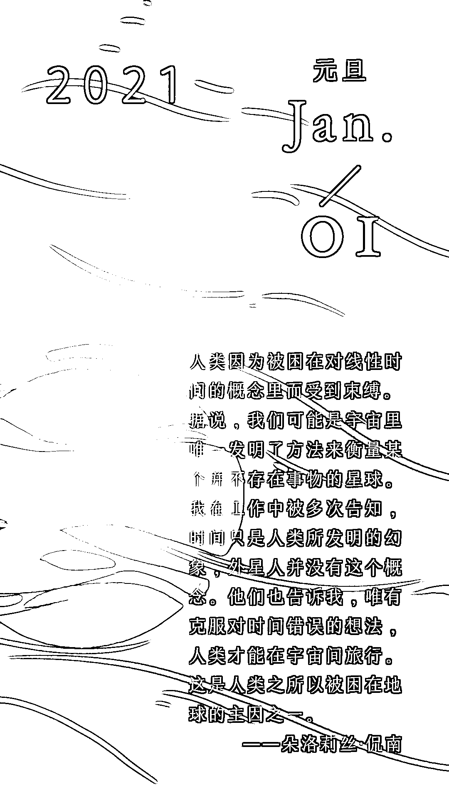

•  END •

**点击了解更多****相关****文章**

[QHHT®量子催眠创始人--朵洛莉丝. 侃南介绍](http://mp.weixin.qq.com/s?__biz=MzU0NjkzMDY0OA==&mid=2247492245&idx=2&sn=bcee0901ebbcb75c6192a0bb0646b4c6&chksm=fb548822cc230134bb68b4b900b4a8cf8e505a173a2648971597eeae22f37d0fd1e25fabda17&scene=21#wechat_redirect)

[QHHT®量子催眠疗愈技术一阶段课程](http://mp.weixin.qq.com/s?__biz=MzU0NjkzMDY0OA==&mid=2247489462&idx=2&sn=289d78db67fecdaefb11c40e2d86e29b&chksm=fb577d01cc20f41758455b02aca8089083261d2b6fdc67471a7af247b64c035be2e721ddd394&scene=21#wechat_redirect)

点击“在看”好美哦↓

 点击预约你的催眠师

# 告别 2020！

> 原文：[`mp.weixin.qq.com/s?__biz=MzU0NjkzMDY0OA==&mid=2247493241&idx=1&sn=8e4244747386b9542246ac4815185288&chksm=fb548ccecc2305d8373dd2adde43e17228151e305d0aee8cefd5be324dbc31eef166a33d86d2&scene=126&sessionid=1690980674#rd`](http://mp.weixin.qq.com/s?__biz=MzU0NjkzMDY0OA==&mid=2247493241&idx=1&sn=8e4244747386b9542246ac4815185288&chksm=fb548ccecc2305d8373dd2adde43e17228151e305d0aee8cefd5be324dbc31eef166a33d86d2&scene=126&sessionid=1690980674#rd)

点击上方蓝字关注我们

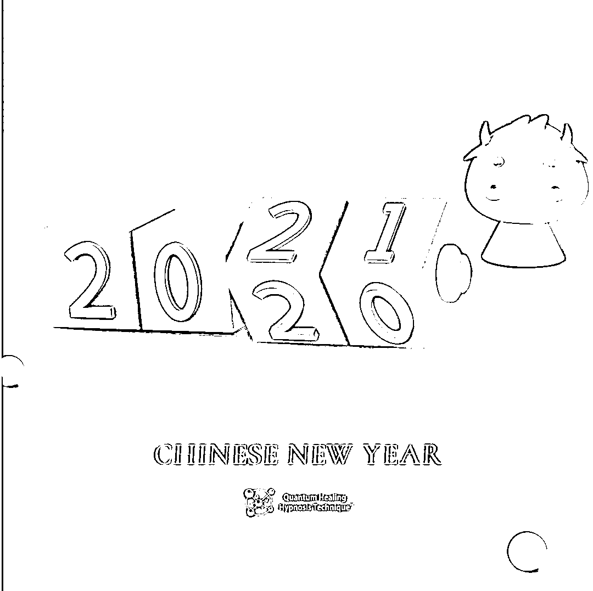

2020 年即将过去。有人形容它是魔幻的一年，有人形容它是不平凡的一年........

你的关于 2020 年的关键词又是什么呢？欢迎在评论区写下你的留言。

在这辞旧迎新的时刻，量子催眠中国祝愿你在即将到来的 2021 年，带着良善的意愿，勇气，行动力做更好的自己！

重生每一刻都在发生，就如同你的细胞在悄然的更新， 

重生在每一个瞬间都可以发生，只要你张开心灵的眼睛， 

重生在每一个当下都能发生，只需你要改变自己的意愿。 

天地很大，无数的事件在发生，内心浩瀚，寂静深处拥有一切答案！

祝福我们自己可以更加美好，祝福这世界更加美好！

2021 年新年快乐！

吉祥如意！

•  END •

**点击了解更多相关文章**

[视频 | 朵洛莉丝.侃南谈 QHHT®催眠技术（上篇）](http://mp.weixin.qq.com/s?__biz=MzU0NjkzMDY0OA==&mid=2247491597&idx=2&sn=9247d7d188e671b2a902464a488a338f&chksm=fb548abacc2303ac524435ab2e5185946253403bda93cd5b53681476b8884928a1459807f21e&scene=21#wechat_redirect)

[QHHT®量子催眠疗愈技术一阶段课程](http://mp.weixin.qq.com/s?__biz=MzU0NjkzMDY0OA==&mid=2247489462&idx=2&sn=289d78db67fecdaefb11c40e2d86e29b&chksm=fb577d01cc20f41758455b02aca8089083261d2b6fdc67471a7af247b64c035be2e721ddd394&scene=21#wechat_redirect)

点击“在看”好美哦↓

 点击预约你的催眠师

# 朵奶奶谈在量子催眠中被称为“潜意识”的部分

> 原文：[`mp.weixin.qq.com/s?__biz=MzU0NjkzMDY0OA==&mid=2247493214&idx=1&sn=14e5fe515fa935784e3e7e28b35ce04c&chksm=fb548ce9cc2305fff8c7b0787f1b2fa65318fc8dbb302d69898a7ba9c62de41ec82ee9fae57e&scene=126&sessionid=1690980674#rd`](http://mp.weixin.qq.com/s?__biz=MzU0NjkzMDY0OA==&mid=2247493214&idx=1&sn=14e5fe515fa935784e3e7e28b35ce04c&chksm=fb548ce9cc2305fff8c7b0787f1b2fa65318fc8dbb302d69898a7ba9c62de41ec82ee9fae57e&scene=126&sessionid=1690980674#rd)

点击上方蓝字关注我们

编辑排版：薇拉 Vera

图片：网络

文章内容来自量子催眠创始人朵洛丽丝.侃南的专著《三波志愿者与新地球》，仅供读者参考

固定布局                                                        
工具条上设置固定宽高
背景可以设置被包含
可以完美对齐背景图和文字
以及制作自己的模板

[🔈 朵奶奶谈催眠中被称为潜意识的部分](https://res.wx.qq.com/voice/getvoice?mediaid=MzU0NjkzMDY0OF8yMjQ3NDkzMjEy)

自从四十多年前第一次大胆探入未知后，我就视自己为通讯员、调查员和[失落的知识]的研究员。现实中，我是一位催眠治疗师，专攻前世疗法，将个案的问题追溯至现世之前的人生。随着工作内容的日益长成和扩大，我发展出具有立即疗逾效果的个人催眠技巧，现在也在世界各地传授。成果相当令人惊奇。然而，在最初涌起这股把催眠法教导他人的渴望之时，我对这 个想法是否可行并没有把握。我发展出这套方法，自己自然知道要怎么做有效。可是，我能用一个能够被理解的方式教给别人吗？这是个难题。但我知道，不去尝试的话，我永远也不晓得结果。**有太多人（包括我的一些个案）太害怕失败，以至于从来不去尝试。**

就这样，我从 2002 年开始授课，如今已在全球开枝散叶，学生也纷纷报告了同样的奇迹，与我个人的体验并无二致，这让我感到非常欣慰。有些甚至以我永远也想不到的方法到尝试运用这个技巧。学生能应用所学，并且不畏探索未知的途径，是身为老师所能获得的最好回馈。

我的方法和那些教你要照本宣科，一个字也不能偏离脚本的过时催眠法不同。在教导时，我**要学生真正了解我们在做些什么**，这样他们才能自己去思考。只要个案不受到伤害，他们可以自由的实践。我发现这套方法极具弹性，它是活的，而且会进化。即使过了这么多年，我仍有好多次在回到家后，对女儿茱莉亚说：“猜猜我今天发现自己又做到了什么！”。他们（高我）曾多次告诉我，只要你自己不设限，就没有限制。**凡事皆有可能；你只是被自己的想像力所局限。**

在我看来，许多治疗师之所以裹足不前，都是出于对未知的恐惧。他们害怕尝试新的东西，害怕自行思考。我的技巧与其不同之处，主要在于我让个案进入最深度的催眠，也就是到梦游的层次。而其他技巧大多是让个案保持在较浅的催眠层次，因此会遭到意识的干扰。当你将个案引导到最深的催眠状态，你就能直接和力量与疗愈的最伟大的源头沟通。

我已经找到了与所有知识源头接触的方法，并因此得到写作的资料来源。那里是全然的爱与宽恕，也是施行瞬间疗愈之处。刚开始时，我不晓得要怎么称它，于是叫它潜意识。因为有人要求我下定义，所以我说你们要称它为**高我、较高层次的意识，或是超灵**都可以。它是如此的宏大，它有所有问题的答案。

[他们]说并不在乎我怎么称呼，因为他们本来就没有名字。我有一些学生称为[**超意识**]而非[潜意识]。我不确定那样会不会（使催眠）比较有效益，我只知道我在做的有用，所以就不费事去改名称了。不过，为了方便阅读，我在这本书中称它为 SC。

 早些年间，潜意识仅是偶尔且微妙地在我工作时出现，我也不是真的知道自己在与什么对话。直到和它共事几年下来，我才意识到这是一项重大的发现。接下来，我发展出一个每次都能召唤它出现的方法。这个过程后来证实对我的工作具有无上的价值。人们说：“你不知道你在行使奇迹吗？”我告诉他们“我什么都没做！是他们做的！我只是个引导者，奇迹都是出自他们之手。”**这个伟大神奇的潜意识知道每个人的每一件事，同时也深深地关怀每一个人。没有什么事是秘密。‘他们’比你更了解你自己。**

 因此，当个案来找我时，我知道他们一定会知道他们需要知道的事；潜意识会释放适合他们了解的讯息。我从来不知道催眠时会发生什么，自然也无法控制或是操控整个过程。我只是和‘他们’合作了这么久，总是听到一些相同的答案，所以对某些事了然于心。不过，那些从来也不是我可以推敲出来的答案。‘他们’自有一套逻辑。因此，我会跟个案说，我不知道催眠过程会出现什么。每一次都不一样，但绝对不会超过他们的理解。我也从不知道答案会是跟因果还是别的事有关。

•  END •

**点击了解更多相关文章**

[什么是 QHHT®量子催眠](http://mp.weixin.qq.com/s?__biz=MzU0NjkzMDY0OA==&mid=2247492404&idx=2&sn=3fce63ad8d41864899d60798efccde55&chksm=fb548983cc230095df1e708535625751774140bde9da56077bfcf1523c2a32b605be8136a17e&scene=21#wechat_redirect)

[QHHT®量子催眠疗愈技术一阶段课程](http://mp.weixin.qq.com/s?__biz=MzU0NjkzMDY0OA==&mid=2247489462&idx=2&sn=289d78db67fecdaefb11c40e2d86e29b&chksm=fb577d01cc20f41758455b02aca8089083261d2b6fdc67471a7af247b64c035be2e721ddd394&scene=21#wechat_redirect)

点击“在看”好美哦↓

 点击预约你的催眠师

# 什么是 QHHT®量子催眠

> 原文：[`mp.weixin.qq.com/s?__biz=MzU0NjkzMDY0OA==&mid=2247493214&idx=2&sn=298e1865249aab662ecdbf8045e95b86&chksm=fb548ce9cc2305ff5af37a4658aa22d0b52c24e0d2f01df791f17b5a1af8cd3b7cc4b7637f28&scene=126&sessionid=1690980674#rd`](http://mp.weixin.qq.com/s?__biz=MzU0NjkzMDY0OA==&mid=2247493214&idx=2&sn=298e1865249aab662ecdbf8045e95b86&chksm=fb548ce9cc2305ff5af37a4658aa22d0b52c24e0d2f01df791f17b5a1af8cd3b7cc4b7637f28&scene=126&sessionid=1690980674#rd)

点击上方蓝字关注我们

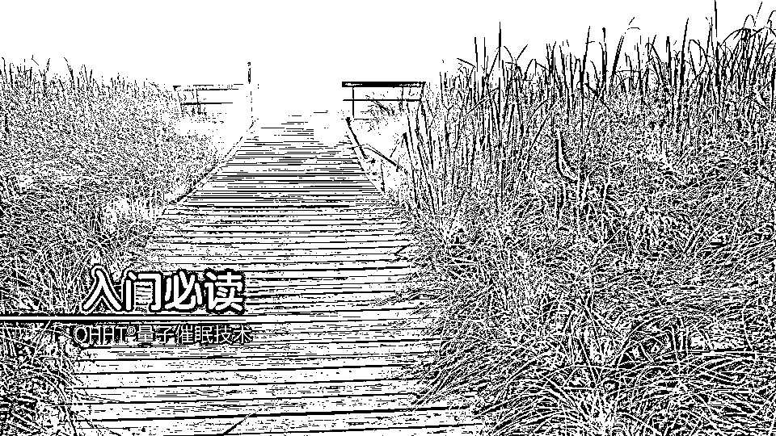

编辑排版/ Vera 薇拉

图片/网络

[🔈 什么是 QHHT 量子催眠.mp3](https://res.wx.qq.com/voice/getvoice?mediaid=MzU0NjkzMDY0OF8yMjQ3NDkzMjEz)

****什么是量子催眠****

“它是一条道路；

它是一种超心理学工具；

它让你通向未知世界的自己；

它是严肃的自我探索，不是儿戏；

它监督你为自己负起责任，而非逃避；

它协助你以最彻底和智慧的方式找到答案，疗愈身心；

它将深刻的改变你，不管你是量子催眠操作者，还是个案；

它的第一目的是个案的最高利益；

它是客观、开放、安全的；

它是行之有效的方法；

它是爱……

它是朵洛莉丝.侃南留给地球的礼物。

**量子催眠的全称**

量子催眠全名为量子疗愈催眠技术(Quantum Healing Hypnosis Technique，QHHT®)。

| 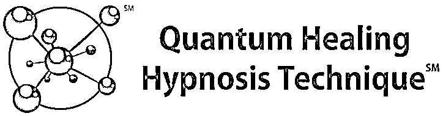 | 量子催眠疗愈技术为国际注册商标。  |

它是全球传奇的回溯催眠大师朵洛莉丝.侃南（Dolores Cannon，以下统称朵奶奶）基于近五十年的实践和无数神奇的催眠经历不断锤炼而成的一种独特的催眠技术，也是她留给地球的一份神奇遗产。她发现这种独特的方法可以非常有效的用于身体和心理疗愈，并解决人生的重大问题，经她催眠疗愈而重获新生的个案数以千计，其中不乏有医院记录在案，身患绝症的患者。她也因此完成了十九本完全基于她的催眠案例，颠覆传统认知的畅销著作。

量子催眠的核心理念有别于任何一种传统催眠术或前世回溯催眠的技术，由于朵奶奶对个案带有的高度责任感，她不仅使得这个技术的每个步骤都被精心设计过，并且严格遵循某些重要原则，以确保每个个案 100%的身心安全。更为可贵的是，它少有的简单、纯净，直接深入到个案问题的核心，而不只停留在现象层面，因此能使个案在一种特定的状态下与“潜意识”（非传统心理学概念，实为“高我”或“超意识”，以下统称“潜意识”）建立稳定和清晰的链接，获得深刻的疗愈与人生的转变。它的价值也不仅仅只在于“服务他人”，量子催眠操作者本身也会受益于不断帮助个案的过程，获得深刻的疗愈和改变，进入一种全新的人生。

**量子催眠名称的由来**

很多人都会问，为什么叫做“量子催眠”？对于这个问题，朵奶奶说过，其实答案很简单，她创立的这个方法远远不止于回溯催眠的范畴，可以帮助到个案与“潜意识”（非心理学概念，可理解为“高我”或“超意识”）建立跨越维度的连接，有可能让个案发生重大的疗愈和深刻的转变，这种情形类似于微观粒子在量子态下的“量子跃迁”（Quantum Leap）。量子疗愈催眠技术因此而得名。

[**朵洛莉丝.** **侃南的 QHHT®量子催眠疗愈技术**](http://mp.weixin.qq.com/s?__biz=MzU0NjkzMDY0OA==&mid=2247489133&idx=2&sn=8b414ed90d51f85bb7fb5ca56230826e&chksm=fb577cdacc20f5cc108abeaec53db676eda1255293c33525588d6682562242ff07757f73ea13&scene=21#wechat_redirect)

[**详情 ▼**](http://mp.weixin.qq.com/s?__biz=MzU0NjkzMDY0OA==&mid=2247489133&idx=2&sn=8b414ed90d51f85bb7fb5ca56230826e&chksm=fb577cdacc20f5cc108abeaec53db676eda1255293c33525588d6682562242ff07757f73ea13&scene=21#wechat_redirect)

朵洛莉丝·侃南在 50 年前通过细微调整量子催眠的催眠疗法，开始对神圣知识与转世进行探索。她开创了一种安全有效的方法，绕过喋喋不休的意识头脑并专注于在梦游状态下获取无限的信息，**朵洛莉丝·侃南发现在任何时间和地点，进行时间旅行并重温那个人的前世都是可行的……【点击上方图片详细了解】**

|  | [如何利用量子催眠探索你的人生课题](http://mp.weixin.qq.com/s?__biz=MzU0NjkzMDY0OA==&mid=2247489141&idx=3&sn=388d0941700feefd163257db9555c322&chksm=fb577cc2cc20f5d46567482d51068009e0d03654cccf2f47f57a077a8e15894b0d282b7a5c6a&scene=21#wechat_redirect)  |
|  | [QHHT®量子催眠能为你带来的改变](http://mp.weixin.qq.com/s?__biz=MzU0NjkzMDY0OA==&mid=2247489141&idx=2&sn=413492ef8a3c5cd82021ef07812b01bb&chksm=fb577cc2cc20f5d46667235288c54b2dd727dfd4f507b16d5f01ef3001a903922e56e9b05e8b&scene=21#wechat_redirect)  |
|  | [QHHT®量子催眠对你的帮助](http://mp.weixin.qq.com/s?__biz=MzU0NjkzMDY0OA==&mid=2247489133&idx=3&sn=04b22a42a7bcd936ff4ffaaa541780d2&chksm=fb577cdacc20f5cc74a3654f9ea3b56a519fa3ded28fe3c36a8c6e8647be72a874c9724977b4&scene=21#wechat_redirect)  |
|  | [QHHT®量子催眠课程在中国的故事](http://mp.weixin.qq.com/s?__biz=MzU0NjkzMDY0OA==&mid=2247488814&idx=1&sn=e35338df9dec39b46c12ea0c96b07d7e&chksm=fb577f99cc20f68f0127fad2f91c461dac7caeeaad1067afe047d68b13b817beff0e488b44fa&scene=21#wechat_redirect)  |

 点击阅读原文，获得更多精彩文章

# QHHT®量子催眠对你的帮助

> 原文：[`mp.weixin.qq.com/s?__biz=MzU0NjkzMDY0OA==&mid=2247493218&idx=2&sn=a08f4020bfb5f79280960bfc2f30e224&chksm=fb548cd5cc2305c3c81f0ae26d8ee19c41e34cddf2e49db8519ef27ce12f9c2242cf25bb2183&scene=126&sessionid=1690980674#rd`](http://mp.weixin.qq.com/s?__biz=MzU0NjkzMDY0OA==&mid=2247493218&idx=2&sn=a08f4020bfb5f79280960bfc2f30e224&chksm=fb548cd5cc2305c3c81f0ae26d8ee19c41e34cddf2e49db8519ef27ce12f9c2242cf25bb2183&scene=126&sessionid=1690980674#rd)

点击上方蓝字关注我们

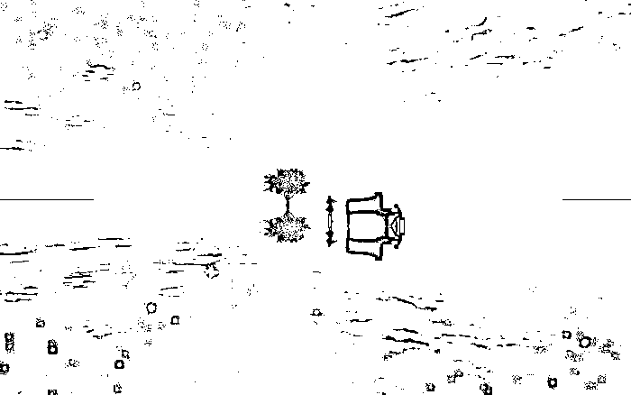

翻译/Jasmine

校对/Leo

编辑排版/Vera 薇拉

图片/网络

[🔈 QHHT 量子催眠对你的帮助.mp3](https://res.wx.qq.com/voice/getvoice?mediaid=MzU0NjkzMDY0OF8yMjQ3NDkzMjE3)

****量子催眠对你的帮助****

当你使用前世回溯探索自我的时候，你的头脑将开始敞开。这些是前世回溯的优势，让任何人都可以信任这个技术。

为何我会做重复的梦或者噩梦呢？为何对某些人我会有如此强烈的链接感？为何我有胎记？以前我曾经活过吗？

量子疗愈催眠技术（QHHT，以下简称量子催眠）是由朵洛莉丝·侃南开创的治疗方法，这种方法可以为你解答这些疑惑。

在量子催眠期间，来访者可能会发现他们去到了一个前世、未来、甚至是另一个星球的生活。许多人在催眠的时候经历了不同疾病的自发疗愈。

在这篇文章里，我们将会探讨这一令人振奋的量子催眠技术，QHHT 前世回溯疗法所带来的各种优势。

**关于前世的证据**

许多孩子在很小的时候向他们的家人描述自己的前世故事，有些故事甚至被证明真实存在。

一个居住在叙利亚/以色列边境的三岁小男孩记得自己的前世被斧头砍死。他可以向大人们指明自己尸体的埋葬地点，以及凶器的位置。

小男孩甚至认出了凶手。凶手之后承认了自己的犯罪行为，并指认了与小男孩的描述完全相符的埋尸地点。

一个四岁的美国男孩告诉他的父母，自己曾经是一个名叫帕姆的女人。他声称自己为了从一场火灾中跳窗逃跑，而死于高空坠落。他的母亲问他是否记得发生的地点，他回答是：芝加哥。

根据这个信息，他的母亲在网络上找到了发生在 1993 年芝加哥帕克斯顿酒店大火的新闻报道。许多报道中都提到了一位名叫帕姆的美国黑人妇女试图跳窗逃跑，却死于高空坠落。

当他的父母询问帕姆的皮肤是什么颜色的时候，他毫不犹豫的回答“黑色”。然后他的父母向他展示了各种非洲裔美国妇女的照片，包括一张帕姆的照片，男孩指出了帕姆的照片并回忆起了当时的拍摄场景。

很多人记得他们的前世，他们只是不像孩子们描述的那样，记得这么清楚。许多人在现实的生活中突然体验了来自前世的记忆。它们可能来自许多形式，包括对于从未去过的特定地点，有一种似曾相识，和奇怪的熟悉感，以及重复的梦境或噩梦。

**什么是量子催眠回溯疗法**

QHHT 前世回溯是一个非常安全的过程，除非他愿意对这个过程敞开并愿意让自己置于一个深沉的放松状态，否则他无法进入前世。

这项技术允许人们很快的进入他们的高我或者朵洛莉丝·侃南声称的“潜意识”状态。

侃南使用的量子催眠可以到达恍惚的梦游状态，这可能是最深的催眠态。在通常情况下，我们每天只能进入梦游态两次。在早晨醒来和晚上睡着前的几分钟内。

虽然我们的意识层面并不记得过去发生的所有事情，但是我们的潜意识巨细靡遗的记下了一切。这些信息储存在我们的多个生命周期内，并且可以在适当的条件下访问。

有时候人们在清醒的状态下闪现一些对他们当前生活毫无意义的片段。

这些闪回的片段可能被许多事件触发，比如开车穿过一个前世曾经生活过的城市。虽然从未去过那里，但对那个地方有着强烈的认同感。

QHHT 前世回溯可以帮助你看到正是在其它生命中发生的事件，造就了目前的这一世，以及这一世独特的灵魂功课

**转世和量子催眠回溯**

前世回溯并不是新事物。这一点早在印度的奥义书中就已提及。

尽管每四个美国人中就有一个人相信转世，但催眠操作者发现你不必为了从 QHHT 前世回溯中获益，而逼迫自己相信转世。

不相信转世的人往往并不确定这些记忆是真实存在的还是想象出来的。但这并不会阻止他们通过催眠和在催眠操作者交谈中获得的巨大收益。他们仍然会发现相应的信息并体验疗愈。

传统意义上的潜意识是每个人意识中的一部分。不管你相不相信，它是绝对存在的。它被埋藏在我们意识的头脑之下。虽然我们很少觉察到这一点，但是它总是在不断的观察和记录着我们生活中发生的一切。

而更高的意识是链接我们与源头，阿卡西记录和记录在灵魂中所有信息的纽带。

当它被呼唤出来时，没有任何问题是它无法回答的。

**体验量子催眠是什么感觉**

当你参与到前世回溯催眠时，那并不是传统观念中的被催眠。相反，你进入的是一个非常放松的状态，你的意识仍然可能清醒并拥有完全的控制。前世回溯只能在这些条件下成功。这并不是一种暗示形式或者精神控制。

当链接形成时，高我将选择性的揭示对你当前人生最具疗愈性的一段特定前世。

有些人会看到几个前世的小片段。其他人可能会花更多的时间详细的观察一个特定的前世，彻底的解开这特殊的一世想要传授的功课。

有些人从现世中发现了被压抑的记忆。

身体层面上，每个人对 QHHT 前世回溯的反应不同。大多数人在催眠后感到轻松和焕然一新。

**学员证言**

在她的博客中，凯蒂描述了她 QHHT 前世回溯的治疗经历。在催眠期间，她被要求想象在一个拥有许多大门的走廊中选择一道门。

她写道：“吸引我的那扇门是一扇朴素的木门，打开它的时候，我发现自己是一个在沙漠中的年轻男人！（我并没有料到会是这样！）”

她继续描述这个上世纪的故事，也许是 1700 年，作为一个年轻人，拥有一个妻子和三个孩子，过着简单的生活。她觉得他是一个好人。

在回溯的过程中，凯蒂看到，在这个小而简陋的家里，三个孩子手拉着手在壁炉前围着圈跳舞。

然后，她目睹了他生命的终结，因为年老死在了床上，被全家人环绕着。

她写道：“看着这一切让我哭了一会儿，我被这个男人极为简陋但充满爱的生活深深感动了。”

另一位女士讲述了自己的经历：“我遇见了一个充满激情的男人，他抱着我并吻我，让我不得不认为他是我的丈夫……我可以感觉到在那一刻他有多爱我，我真的很想念他，就好像他真实存在过一样。”

她继续描述他的死亡和细节，源于她说服了他接受的一项手术。她道着歉，问他是否会回到她的身边。

她描述了当时的感受。

我能感觉到他在我的身边，他紧紧得抱着我，但是我看不到他的脸，只能感觉到他的身体，我真的有点不知所措，我是那么的想念他。这也让我很生气，我一直在很多很多的生命中等待着 ---- 也许从那一刻起，他再也不会回来了。

**量子催眠如何帮助我们**

经过前世回溯的人通常会体验到快速的疗愈。他们发现，他们能够整合受伤的灵魂部分，并立刻停止模式的循环。

来访者能够解开灵魂的束缚，誓约并修复在前世的事件中受创的灵魂部分。

前世回溯使我们有机会了解当前生活的动机和欲望，弄清楚为什么那样的事件和遭遇发生在我们身上。目的是提升那些寻求灵性领悟和成长的人的意识。

许多接受治疗的人发现，他们能够把许多长期的问题放入一个更大的环境下观察。通过跨越了许多世，他们可以看见这些问题在哪里已经得到了改善，还有哪里可以改进。

拜访潜意识的时候，你也有许多次机会去拜访在更高维度的守护天使或者已过世的家人。

在回溯的过程中，来访者能够返回到过去曾经发生的事件中。这有可能是一段曾经被埋葬的对心灵造成创伤与损害的现世记忆。也有可能是一整段来自前世的记忆。

**收获**

▷清除创伤是 QHHT 前世回溯治疗最常见的部分。通过催眠来解除这些体验，人们可以放下过去的创伤，继续前进。

▷深刻的落地和自我肯定。

▷限制性思维的释放。这种体验非常的强大，它可以消除阻止你内心平静的障碍。你生命中的挑战被视为学习的课程和进化过程的基石。

▷解除精神和情绪上的症状，比如压力、焦虑、害怕和恐惧。这些症状常常在前世回溯之后立即消失，不再复发。

▷对当前的人生挑战有更深刻的理解。过去往往是造成问题的根源。通过宽恕过去的自我，我们当前的自我可以经历巨大的成长。

▷治疗发生在，意识到前世的自我是错误行为的肇事者，而非受害者。

▷一种扩展的大爱意识，接受自我和他人。

▷更好的理解人际关系，有能力创造更健康的模式。

▷宽恕那些在过去生活中伤害你的人和自己曾经犯下的错。

▷更新渴望变化的动机。例如，一个一生都在与肥胖问题中挣扎的人，发现自己的前世因为长时间没有食物而活活饿死。他们能够理解这种生活的挣扎并修复前世的创伤，因此释放了多余的体重。

▷消除对死亡的恐惧。认识到我们都是有目标的选择自己的人生，我们的能量与灵魂无穷无尽。

▷转化悲伤的情绪，在失去亲人及所爱之人时释放无助感受的能力。

**更进一步的思考**

QHHT 前世回溯给予你灵魂成长一个无与伦比的机会。

大多数人在催眠之后，态度发生的巨大的变化。他们的观点有了更好的转变，更容易关注生活中的积极面。他们发现自己对世界的看法也发生了显著的变化，同时他们用截然不同的，更富有同情心的眼光看待自己。

当他们步入真相，并摆脱日常生活中的忧虑和压力时，自尊与自信获得巨大的提升。

现在他们真正的知晓，而非停留在相信，他们是灵性的存有。

[**详情▼**](http://mp.weixin.qq.com/s?__biz=MzU0NjkzMDY0OA==&mid=2247489108&idx=2&sn=07eae4e79922935c7092dafcf019c037&chksm=fb577ce3cc20f5f52ff14158af4284a8a1c18e6710469349cf7396801c1d6dfe44d2d420c352&scene=21#wechat_redirect)

[**什么是量子催眠**](http://mp.weixin.qq.com/s?__biz=MzU0NjkzMDY0OA==&mid=2247489108&idx=2&sn=07eae4e79922935c7092dafcf019c037&chksm=fb577ce3cc20f5f52ff14158af4284a8a1c18e6710469349cf7396801c1d6dfe44d2d420c352&scene=21#wechat_redirect)

“它是一条道路；

它是一种超心理学工具；

它让你通向未知世界的自己；

它是严肃的自我探索，不是儿戏；

它监督你为自己负起责任，而非逃避；

它协助你以最彻底和智慧的方式找到答案，疗愈身心；

|  | [**如何利用量子催眠探索你的人生课题**](http://mp.weixin.qq.com/s?__biz=MzU0NjkzMDY0OA==&mid=2247489628&idx=2&sn=b5db7ed920153ab3ca15a80bfaadd1df&chksm=fb5772ebcc20fbfd4f913959b152d4701019ee40ba7f077bf88c8cfc0811c1f1f8c2e00ebfd6&scene=21#wechat_redirect)  |
|  | [**朵洛莉丝·侃南的 QHHT®量子疗愈催眠技术**](http://mp.weixin.qq.com/s?__biz=MzU0NjkzMDY0OA==&mid=2247489611&idx=2&sn=83530bcb8bb2620a9dbe5ade0fd45249&chksm=fb5772fccc20fbeaff1e22b33f3c1f569bb5eb78b65e72534a14a03059417a158d86a97601d0&scene=21#wechat_redirect)  |
|  | [**QHHT®量子催眠个案全国预约！**](http://mp.weixin.qq.com/s?__biz=MzU0NjkzMDY0OA==&mid=2247489007&idx=2&sn=cc871a022f1e57477a5408891154853e&chksm=fb577f58cc20f64e207b724b9c39b144e7430913c0e5e300bfe3f5117fb2da0a0c4f1961efbd&scene=21#wechat_redirect)  |
|  | [**QHHT®量子催眠课程在中国的故事**](http://mp.weixin.qq.com/s?__biz=MzU0NjkzMDY0OA==&mid=2247488814&idx=1&sn=e35338df9dec39b46c12ea0c96b07d7e&chksm=fb577f99cc20f68f0127fad2f91c461dac7caeeaad1067afe047d68b13b817beff0e488b44fa&scene=21#wechat_redirect)  |

 点击阅读原文，预约你的催眠

# 我的那些前世是真的吗？量子催眠创始人朵奶奶是怎么看待这个问题的？

> 原文：[`mp.weixin.qq.com/s?__biz=MzU0NjkzMDY0OA==&mid=2247493218&idx=1&sn=e9f64f6e8d78dfa0dd70803411bb20b7&chksm=fb548cd5cc2305c3df5b08e23a471b7f1afd96619bfdb3be4cca8bb509550265cd14aed24560&scene=126&sessionid=1690980674#rd`](http://mp.weixin.qq.com/s?__biz=MzU0NjkzMDY0OA==&mid=2247493218&idx=1&sn=e9f64f6e8d78dfa0dd70803411bb20b7&chksm=fb548cd5cc2305c3df5b08e23a471b7f1afd96619bfdb3be4cca8bb509550265cd14aed24560&scene=126&sessionid=1690980674#rd)

点击上方蓝字关注我们

编辑整理：薇拉 Vera

图片：网络

文章内容来自量子催眠创始人朵洛莉丝.侃南的专著《三波志愿者与新地球》，仅供读者参考 

固定布局                                                        
工具条上设置固定宽高
背景可以设置被包含
可以完美对齐背景图和文字
以及制作自己的模板

[🔈 朵奶奶谈印记](https://res.wx.qq.com/voice/getvoice?mediaid=MzU0NjkzMDY0OF8yMjQ3NDkzMjE2)

我在催眠领域的研究带领我踏上了难以想象的旅程，我不仅穿越时空探索历史，也窥视了未来的可能性。刚开始透过前世疗法进行探究时，我没想过自己会发现人们在地球以外的生活记忆，毕竟地球是我们所知的一切。我的信念体系在过去 40 年间不断的延伸、扩大。随着工作的进展，我得到有关地球生命初始的大量讯息。我被告知现在是出现这些知识的时候了。我们正进入一个新的世界，一个新的次元，在那里，这些资料的价值将被领会和运用。我工作的时候听过许多一切都是由能量组成，形体和形式视频率与振动而定，能量不死；它只是会改变的说法。我被告知地球正在改变它的震动和频率，并准备要升入新的次元。我们的周遭一直都有无数的次元。我们看不到是因为当它们的振动加快，便超越了人类的视力范围，对我们而言，他们就如隐形。人类现在正要转移到新的次元，而这个过程很快就要到达顶点，所以能多了解次元的转换至关重要。**地球是一所供我们学习课程的学校，但它不是唯一的一所。你曾经在别的星球居住过，曾经在别的次元中生活。你做过许许多多你甚至无法想像的事。**过去几年和我合作的许多个案，都曾经回溯到自己是光体而且活在一种至福状态的时候。他们原本没有理由要进入地球的密度和负面，他们是志愿在这个时候来协助人类和地球。我认为我遇到的这些新来地球者的灵魂有三批。他们之所以在这个时候前来，是因为绝大多数在这里累世生活的人已深入业力而没有进步。他们已经看不见自己活在地球的目的。在我工作的早期和早期的著作里，我曾经以为，一个人要在这一世重新体验自己在地球的第一次生命，根本是天方夜谭。我当时以为生命会是渐进式的过程：再变成人类之前，灵魂必须先经历各种生命形式：空气、岩石、土壤、植物、动物、大自然精灵、最后才是人类。我以为当灵魂决定准备要尝试人类生命时，它会先出生在一个原始社会，以便能慢慢适应。在我的想法中，灵魂不可能突然就落入满是混乱能量的繁忙现代社会；这绝对会令一个新近演化的灵魂难以招架。但后来在 1986 年，我写了一本名叫《地球守护者》的书，描述一个温和的灵魂体验他在地球的第一次生命。他的前世都在别的星球和次元。然而，在我们最初的疗程，他却描述了几段显然是在地球上的前世。我纳闷这究竟是怎么回事。这些转世若非是真就是假。但接着，‘他们’给我【印记】的理论来解释此事。**在地球上经历过无数前世的人，会把这些人世经验储存在潜意识的记忆库里**。意识察觉不到，但这些埋藏的记忆却具有不可或缺的重要性，他们能帮助个体度过生命的困境，缺少了某些类型的背景，人们会不知道如何运作或应答。新生儿来到这个世界，在被父母和社会教导之前，照理说应该没有任何可供参考的架构，然而，这与事实相差甚远。**所谓的【婴儿】，实际上是非常古老的灵魂，他们早已有过数百次进入这复杂情境，我们称为【人生】的旅程。**这因此给了他们作为人类的生活参考，（在下意识层面）。但是，**新来到地球的灵魂**并没有这个背景，他们会完全迷失。于是，灵界发展出一个精巧的概念，既所谓的【印记】。当灵魂还在灵界，（还是精神体）时,他会看到他下一世即将进入的生命类型，然后计划自己希望能够完成和实现的事。他也与其他的灵魂约定去解决任何存续的业力。如果灵魂没有可以依靠的地球经验，他们会被带到图书馆。我有很多、很多的个案用同样的方式描述过这座图书馆。那里是收藏所有知识的地方，包括所有已知和未知的一切。馆内也有阿卡西记录，也就是自创造以来的每一个生命的记载。透过与图书馆员的许多讨论，并在图书馆员的建议下，灵魂选出他想印记在灵魂模式上的人世经验。个案把印记比拟为影片，或是覆盖在图表/地图上那种记载了重要讯息的半透明纸。这个过程很像是去图书馆做研究，为了找到正确资讯而抽出无数的卷宗或书籍。所选取的印记于是就变成新到地球灵魂的基本记忆。我曾问过，在为个案催眠时，**要如何才能分辨回溯时出现的记忆是【真的】，还是只是，【印记】**。我被告知，我无法分辨其中差异，因为不只是记忆，情绪和建构起的那段生命的所有一切，也都会被印记下来。他们说，**这只是作为灵魂的参考，所以没什么关系**。由于许多名人的生命都曾经被使用为印记，这个也提供了那些因为许多人宣称他们是同一位重要人士而认为轮回并不存在的怀疑主义者一个解释；印记的说法回答了这个争论。我也问他们：“既然可以印记一段生命，而不是真正有过实际体验，这是否代表轮回并不存在？”他们说并非如此，**毕竟要有灵魂真的经历过那些生命，才会有资料和记忆放到记录里。**这个说法十分合理，也确实是个能让纯净无邪的灵魂适应一个陌生又混乱的世界的方法。没有做这些准备就来到地球会非常辛苦。温和的灵魂将无以为据，他们会完全无法应对。在我接触《地球守护者》的年轻男子菲尔之后，我开始经常地遇到这些新来的灵魂。这些案例收录在《回旋宇宙》系列。换句话说，我以前以为很罕见的事，现在变得比较平常了。这些记忆一直都隐藏在个案前世的印记后头，其他催眠师和调查者发掘到的都是印记。由于灵魂是为了这一世的某个目的而选择了特定的印记，【表面】的前世会解答一些问题，但却不是最重要的。而具有无限智慧的潜意识，只会提供个案能够应用的资讯。这个在催眠师方面也是一样。如果催眠师才刚开始探索未知领域，他们将不会得到复杂难懂的答案。我是在准备好延伸我的好奇心后，才得到这些资料。直到最近，我仍以为这些纯净无邪的【地球新鲜人】很稀有，但现在他们却变得常见。潜意识甚至不再大费周章的掩饰。有很多次，不论我尝试了多少催眠技巧的变化，个案连一个前世都找不到。然后当我联系潜意识以弄清状况时，我总是会问，为什么我们什么也没发现。他有时会说：“可以给他看些东西，我们可以给他看些东西，不过那些都只是【印记】。”然后他接着会告诉个案他们是从哪里来的，以及他们此时在地球行星的目的。潜意识说，曾经有几个灵魂在进入婴儿身体前拒绝【印记】，结果造成了没有计划或目的的混乱人生。因此，看来【他们】是真的知道自己在做什么。不了解或无法领悟的是我们，是人类。

**-EN**-END--****

•  END •

**点击了解更多相关文章**

[”朵奶奶的时光机”读书感悟征集](http://mp.weixin.qq.com/s?__biz=MzU0NjkzMDY0OA==&mid=2247485475&idx=1&sn=2b2d585014ac1725c26911ce2bfd01d6&chksm=fb576294cc20eb821eecc04e2c1390d451e7ae2ae934bc156a0fa16e96c08b85229d4b983b73&scene=21#wechat_redirect)

[QHHT®量子催眠疗愈技术一阶段课程](http://mp.weixin.qq.com/s?__biz=MzU0NjkzMDY0OA==&mid=2247489462&idx=2&sn=289d78db67fecdaefb11c40e2d86e29b&chksm=fb577d01cc20f41758455b02aca8089083261d2b6fdc67471a7af247b64c035be2e721ddd394&scene=21#wechat_redirect)

点击“在看”好美哦↓

 点击预约你的催眠师

# 【朵奶奶量子催眠经典节选】疼痛的意义

> 原文：[`mp.weixin.qq.com/s?__biz=MzU0NjkzMDY0OA==&mid=2247493199&idx=1&sn=125d3f4b481983236124765928c80d92&chksm=fb548cf8cc2305eeb1a56a959d24ea865fda751fd9db96f7be18808ac9e1fe5bc4eca6931ef2&scene=126&sessionid=1690980674#rd`](http://mp.weixin.qq.com/s?__biz=MzU0NjkzMDY0OA==&mid=2247493199&idx=1&sn=125d3f4b481983236124765928c80d92&chksm=fb548cf8cc2305eeb1a56a959d24ea865fda751fd9db96f7be18808ac9e1fe5bc4eca6931ef2&scene=126&sessionid=1690980674#rd)

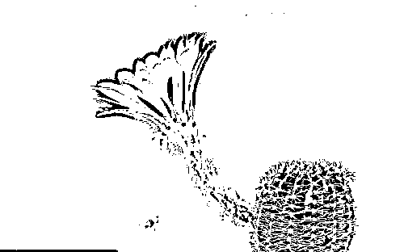

**朵：朵洛莉斯老师**的提问

  **个：**个案在深度催眠态中的回答

 **在量子催眠中，个案看到自己在难产中经历了死亡。**

朵：孩子生出来了吗？

**个：没有。我生得很困难，孩子就是不出来。我已经精疲力尽，索性离开了身体。**

朵：你知道是男孩还是女孩？

**个：不知道，也无所谓。**

朵：能看到你的身体吗？

**个：能。大家都很难过。**

朵：现在你打算做什么？

**个：我想要休息了。我最终还是要回来地球，不过我要在这里待一段时间。我在光里，这里宁静舒适。**

朵：你能告诉我光在哪里吗？

**个：在知识和一切都被了知的所在。一切皆纯净而简单。这里有更纯粹的真理，没有世俗的事情来扰乱你。虽然地球上也有真理，但大家就是看不懂。**

朵：不过你说有朝一日你还得回来，你是怎么知道的？

**个：我当时很虚弱。我本可以忍受那个痛苦的，我必须学会提升耐痛能力。要是我当时没那么虚弱，就能撑住。很高兴我现在不记得疼痛了。我知道我需要回去，我必须变得完整。疼痛是我必须战胜的一件事，我必须战胜世上所有的痛苦。**

朵：但经历疼痛是人之常情啊。当在身体之中的时候，疼痛总是令人很难承受。你现在身处“另一边”，以不同的方式来看待疼痛会比较容易。你觉得这是你想学习的功课吗？

**个：我会去学的，是的。这会需要一些时间，但我什么都能行。我想当时我应该再强大些。我本可以做的更好，但我感觉小时候生病的经历给了我很多恐惧。我担心***这一次***也那么糟糕。所以… …** **我放弃了。疼痛… …** **当你在较高意识层级，并让自己跳脱到纯净的光和纯净的思想的时候，疼痛就停息了。疼痛只是个课题。当我们在人类层面体验痛苦的时候，我们会情绪失控并表现出一时的焦虑。通过跳脱、专注深入内在并保持耐心，我们就能超越痛苦。**

 朵：疼痛有目的吗？

**个：疼痛是一种教导的工具。有时候会用来让有些人谦卑。有时候，一个傲慢自大的灵魂会在痛苦折磨中变得更加仁慈亲切。它让他们懂得最终必须学会超越痛苦，这样就能应对它了。有时候，只要了解痛苦以及疼痛的原因，痛苦就会减轻。**

朵：不过就像你说的，人会抓狂，觉得自己无能为力。

**个：他们变得太自我中心了。他们需要超越自身的利益和当下的感受，到达一个比较灵性的层面，然后他们就能处理了。有一些人会自讨苦吃，因为痛苦是一种掩护。他们可能会以此为借口，或“出口”，这就是他们的目的。这因人而异。疼痛是什么？如果你不允许，它就影响不了你。如果你承认你会受伤，你就给了痛苦力量。不要给它力量。感受痛并非必要。这都和人性有关。当你触及你的灵魂，你更高的心智，痛苦就拿你无可奈何。**

朵：人可以将自己与痛苦分离吗？

**个：当然可以，前提是他们想要。但他们有时候并不想这么做。他们想博得同情，想自我惩罚，诸如此类。人是有趣的。如果他们肯花时间的话，每个人都知道怎么去做这些事。他们必须自己找到方法，因为假如你告诉他们有更简单的方法，他们会不相信。他们必须以自己方式搞清楚。那正是把你引向终点的部分功课。**

节选自量子催眠创始人朵洛丽丝.侃南的专著《死生之间-与灵魂的对话 (Between Death and Life: Conversations with a Spirit)》第一章 死亡的经历

校对整理：量子催眠师冯子源/北京

微信号：fengziyuan369

•  END •

**点击了解更多相关文章**

[脖子上的肿块源自回溯中的伤痕](http://mp.weixin.qq.com/s?__biz=MzU0NjkzMDY0OA==&mid=2247486191&idx=1&sn=0a511ccbee6be14fb354f33a56362ff4&chksm=fb576058cc20e94e115074ef82f3f1bfe996f685060cea9b8d2f3173f29828e8ab45d9a6e521&scene=21#wechat_redirect)

[QHHT®量子催眠疗愈技术一阶段课程](http://mp.weixin.qq.com/s?__biz=MzU0NjkzMDY0OA==&mid=2247489462&idx=2&sn=289d78db67fecdaefb11c40e2d86e29b&chksm=fb577d01cc20f41758455b02aca8089083261d2b6fdc67471a7af247b64c035be2e721ddd394&scene=21#wechat_redirect)

点击“在看”好美哦↓

 点击预约你的催眠师

# 朵洛莉丝·侃南的 QHHT®量子疗愈催眠技术

> 原文：[`mp.weixin.qq.com/s?__biz=MzU0NjkzMDY0OA==&mid=2247493199&idx=2&sn=7de307ca22475dc4916f6770ee83c178&chksm=fb548cf8cc2305ee5230ae801b6c9b0aef3022ac96b5ea25a874a3822f2b9801ccad0b69ba7b&scene=126&sessionid=1690980674#rd`](http://mp.weixin.qq.com/s?__biz=MzU0NjkzMDY0OA==&mid=2247493199&idx=2&sn=7de307ca22475dc4916f6770ee83c178&chksm=fb548cf8cc2305ee5230ae801b6c9b0aef3022ac96b5ea25a874a3822f2b9801ccad0b69ba7b&scene=126&sessionid=1690980674#rd)

点击上方蓝字关注我们

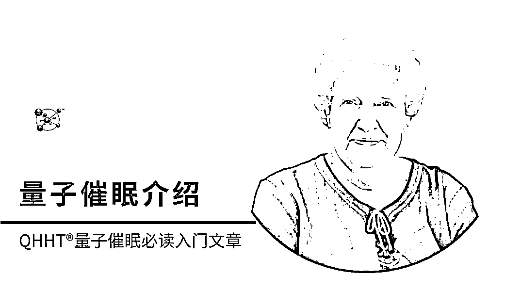

本文译自美国量子催眠学院官网介绍
翻译/Jasmine

校对/Leo

编辑排版/Vera 薇拉

图片/网络

[🔈 朵洛莉丝·侃南的 QHHT 量子疗愈](https://res.wx.qq.com/voice/getvoice?mediaid=MzU0NjkzMDY0OF8yMjQ3NDkzMTk4)

朵洛莉丝·侃南在几十年数以千计的案例中，开发并完善了她独特的催眠疗法----量子疗愈催眠技术（以下简称 QHHT®）

**QHHT®量子疗愈催眠技术**

朵洛莉丝·侃南在几十年数以千计的案例中，开发并完善了她独特的催眠疗法，QHHT®达到了最为深入的催眠状态----恍惚的梦游态。梦游态通常每天会经历两次：在醒来和睡着之前。大多数的催眠师不会在梦游态工作，要么是因为他们没有能力让个案进入恍惚的状态，要么就是因为他们对于会产生意想不到结果的，以及在最无法预料的催眠状态下工作感到厌烦，比如回溯前世。
朵洛莉丝·侃南的好奇心和对探索未知以及未曾尝试事物的无畏精神成为了永恒的遗产，作为前世回溯的先驱者，持续的为目前的 QHHT®操作者以及未来的 QHHT®课程铺平道路。 朵洛莉丝·侃南在 50 年前通过细微调整 QHHT®的催眠疗法，开始对神圣知识与转世进行探索。她开创了一种安全有效的方法，绕过喋喋不休的意识头脑并专注于在梦游状态下获取无限的信息，朵洛莉丝·侃南发现在任何时间和地点，进行时间旅行并重温那个人的前世都是可行的。
QHHT®是一种强大的工具，用来造访我们意识内那个全知的部分，它可以被称为高我，超灵甚至于灵魂本身。当投身于地球之后，我们忘记了过去的生活，以及与灵魂和源头链接的方法。QHHT®能够让任何背景、文化、宗教或信仰系统内的人们与她称之为的“潜意识”连接，因为它存在于表意识之外。朵洛莉丝称作的潜意识（以下简称为：SC）是我们内在更大的部分，永远与源头或者神连接，并拥有无限的知识和能力疗愈身体。有时精神或生理上的疾病源自于过去世的创伤，有时它们与人们在现世所学的课程相关。SC 会揭示原因，并根据灵魂的特殊课程从旁协助。通过使用 QHHT®疗法帮助数以千计的人回溯前世，治愈他们的身体，朵洛莉丝·侃南从中发现了失落的知识和洞见的宝库，作为 19 本非凡著作的作者，她的书中涵盖了无数形而上学的概念和有名的历史人物，比如耶稣和诺查丹玛斯，以及外星人，不明飞行物，生命的起源和所有创造力的本源。
朵洛莉丝·侃南持续的在多本著作、项目中努力的工作，包括教授 QHHT®课程，直至 2014 年 10 月，在 83 岁时过世。她最新的著作《寻找隐藏的神圣知识》在她过世之后，于 2014 年 12 月出版。下一本著作《回旋宇宙：卷五》于 2015 年夏天出版。拍摄有朵洛莉丝·侃南教授的 QHHT®一阶视频课程可以在线学习，目前提供英语，西班牙语，汉语和俄语的字幕翻译。朵洛莉丝的女儿茱莉亚·侃南继承了她的衣钵，持续的在阿肯色和世界范围内教授二阶和三阶的 QHHT®课程。

**前世回溯的先驱者**

1968 年朵洛莉丝·侃南和她的丈夫约翰尼·侃南发现，个案不仅可以被带回到出生的那一刻，而且也可以被带回到出生之前，并回顾多次前世的生活。前世回溯在几十年间被朵洛莉丝·侃南成功的使用了数千次，是 QHHT®催眠疗法的基石。朵洛莉丝建立了一套可靠的步骤使个案回到梦游态并引导他们去到一个特定的场景，那是潜意识为他们选择的可以帮助到他们的场景，包括出生、日常生活、重要事件，以及死亡等等事件。许多前世生活都可以使用 QHHT®进行探索来发现其中的课程、反复出现的问题和对当前生活产生影响的业力关系。以 QHHT®为正式形式的朵洛莉丝·侃南前世回溯疗法，使有资质的量子催眠操作者，可以通过提问并与个案的潜意识沟通，来探索多个在地球或其它世界的前世生活成为可能，并获得在生与死的中间地带内，难以置信的信息，而在没有进入梦游的催眠态之前，获取这些答案是不可能的。潜意识选择让个案回顾的前世生活，永远都与他们目前所面临的疑问和议题息息相关。

**朵洛莉丝对于潜意识的定义**

不要和传统医学和心理学的术语混淆，朵洛莉丝·侃南使用“潜意识”这个词来描述她开创性的工作，是因为那部分的人类意识是难以描述的，因为它既超越了头脑的意识同时又把它囊括其中。朵洛莉丝选择潜意识这个词来描述这个隐藏的存在层面，因为它存在于比我们头脑的意识更深入的，全知的层面，我们在日常生活中使用它来完成工作并与他人建立关系。千百年来，宗教和灵性导师们早已提到朵洛莉丝·侃南定义的潜意识为超灵、基督意识、高层意识，宇宙意识和源头合一意识。潜意识本身向朵洛莉丝透露，如何称呼它是无关紧要和不重要的。它即它所是，并且它怀着真诚的愿望和意图，愿意与任何人交流并提供帮助。
在 QHHT®的疗程中当潜意识被接通，在被催眠的个案、催眠操作者和任何在这个房间里的人身上都可看到变化的发生，可感知的能量等级明显增加，带来喜悦和爱的感受。
朵洛莉丝·侃南和 QHHT®的操作者们首要关注的自始至终都是确保个案们的最高利益。寻求潜意识无限的帮助，它知道每个人的每个面向，不论人们是否意识到它，它都能以惊人的和意想不到的方式帮助任何人。 遵循朵洛莉丝·侃南的教诲，QHHT®的操作者们请求潜意识揭示意识头脑未知的，有助于治愈并揭开造成精神和身体的痛苦、疾病和恐惧的根本原因。潜意识总会选择最有帮助的信息给到需要它的人。从本质上说，潜意识与灵魂相类似，所以能够理解个体的整体情况和每一个面向，包括前世造成的问题可能会影响个体的当前生活。 在这个意识快速变化和扩展的时代，对于高我的概念和承认无所不知的潜意识变得越来越能够被接受，因为科学和灵性融合了两种方法中最好的部分，应用于所有人的治疗实践中。在互联网中交流思想和知识加快了整合的进程，QHHT®作为一种心理、医疗、精神工具和治疗方法正在其独特的位置上发挥作用。 开放性的思维是 QHHT®的操作者们接受和理解不熟悉观念的关键所在，同时也是对我们的社会环境和教育的挑战。QHHT®对于个案与量子催眠操作者都可以提供广泛的意识突破。 通过我们的思想，意识创造了围绕在我们周围世界的概念，量子物理学和科学证据补充了这方面的定义，已知宇宙中的一切都是由能量构成的。甚至物质也基本上是以不同速度或频率振动的能量。 思想是一种能量的投射，它以物质形态表现，并具有正面或负面的属性。实质上，我们创造并经验了我们的思想。这样的思考方式使个人对自己的行为负责。无论信仰系统是什么，它都是以先进的和进步的方式来体验生活。用开放性的思维学习 QHHT®，把新的观念与个人信念紧密的结合起来，实践 QHHT®所获得的结果会为实践者自己发声。 

**QHHT®和疗愈**

在 QHHT®的疗程中一旦潜意识（SC）被连接，QHHT®的操作者会请求它识别并解释任何问题背后的原因，然后询问 SC 治愈这个症状是否被允许和可行。如果 SC 同意，那么治愈是即刻发生的，没有任何的不适，无需药物或手术的治疗。在许多情况下，一旦 SC 揭示了造成疾病或心理问题的根源，个案的身体和头脑会得到释放，并从他们原有的状态中解放出来。朵洛莉丝·侃南的数千名客户和体验者都曾被这看似神奇的方式治愈过，并在多年间写信感谢她。这就是她为何在 2002 年开始教授 QHHT®，与他人分享，使他们可以继续实践并帮助尽可能多的人的原因。在 2013 年，她的 QHHT®一阶课程成为可以在任何地点，任何时间学习的网络课程。 在所有的情况下，在治疗发生前，个案必须想要被疗愈。疗愈也不能干预他们在目前生活中需要学习的课程或者在转世前所做的灵魂计划。我们的灵魂是永恒的，我们来到地球通过经历个体的体验来成长和学习。举一个潜意识拒绝疗愈的例子，如果成为一个盲人是那个人在投胎前同意学习的课程，那么潜意识就不会同意恢复这位盲人的视力。 对于疗愈，潜意识会坚持一种非常直接的理解方式。如果个案正在体验对自己身体的虐待或缺乏照料的后果，这个人没有采取任何行动来纠正，并且不想改变，潜意识会知道。它的理解就会是，如果个案在恢复后仍然会继续虐待自己的身体，那么就没有必要疗愈它。 以下的例子是朵洛莉丝·侃南和 QHHT®的操作者同仁们在催眠中与客户和体验者们经历到的非凡成果：

☑ 癌症 — 各种阶段各种种类的癌症有可能被清除

☑ 软骨 — 关节软骨被重建

☑ 艾滋病 — 病毒被清理和根除

☑ 心脏 — 无需手术，心脏被治愈

☑ 肝脏 — 全功能再生和修复

☑ 肾脏 — 全功能再生和修复

☑ 伤口 — 无疤痕再生

☑ 偏头痛 — 原因得到解释，症状被清除

☑ 视力 — 视力恢复，无需矫正。

☑ 糖尿病 — 原因得到解释，症状被清除

☑ 肠道 — 状况被清除

☑ 腰背 — 腰背区域的问题被清除

☑ 脖子/肩膀 — 原因被识别，疼痛被移除

☑ 皮肤 — 问题被识别和清除

使用朵洛莉丝·侃南行之有效的 QHHT®催眠疗法，一切皆有可能。

[思想是一种能量的投射，它以物质形态表现，并具有正面或负面的属性。实质上，我们创造并经验了我们的思想。](http://mp.weixin.qq.com/s?__biz=MzU0NjkzMDY0OA==&mid=2247488781&idx=1&sn=8c4a6d4ce9cf74dd01d37357996ea2b1&chksm=fb577fbacc20f6ac84a391409fc8234045949af9fd82c6fa6d08300039982c80c68d19a1a4f2&scene=21#wechat_redirect)

**详情 ▶ **[【视频】朵洛莉丝. 侃南谈量子催眠（上）](http://mp.weixin.qq.com/s?__biz=MzU0NjkzMDY0OA==&mid=2247488781&idx=1&sn=8c4a6d4ce9cf74dd01d37357996ea2b1&chksm=fb577fbacc20f6ac84a391409fc8234045949af9fd82c6fa6d08300039982c80c68d19a1a4f2&scene=21#wechat_redirect) 

|  | [**【视频】朵洛莉丝. 侃南谈量子催眠（下）**](http://mp.weixin.qq.com/s?__biz=MzU0NjkzMDY0OA==&mid=2247488781&idx=2&sn=85a73a5f30e495f02379cb1942382713&chksm=fb577fbacc20f6ac8db5540c253d4549a795b3919cbcaecef9c63e40054b3d506079bdd62c00&scene=21#wechat_redirect)  |
|  | [**QHHT®量子催眠能为你带来的改变**](http://mp.weixin.qq.com/s?__biz=MzU0NjkzMDY0OA==&mid=2247489779&idx=2&sn=592a6cd9acf89a3efb9a2f710a90de97&chksm=fb577244cc20fb529a203ff8b7131884116bca3eaa1504c4d2c1ff3633bdde2fdf9086de80c2&scene=21#wechat_redirect)  |
|  | [**如何利用量子催眠探索你的人生课题**](http://mp.weixin.qq.com/s?__biz=MzU0NjkzMDY0OA==&mid=2247489628&idx=2&sn=b5db7ed920153ab3ca15a80bfaadd1df&chksm=fb5772ebcc20fbfd4f913959b152d4701019ee40ba7f077bf88c8cfc0811c1f1f8c2e00ebfd6&scene=21#wechat_redirect)  |
|  | [**QHHT®量子催眠个案全国预约！**](http://mp.weixin.qq.com/s?__biz=MzU0NjkzMDY0OA==&mid=2247489007&idx=2&sn=cc871a022f1e57477a5408891154853e&chksm=fb577f58cc20f64e207b724b9c39b144e7430913c0e5e300bfe3f5117fb2da0a0c4f1961efbd&scene=21#wechat_redirect)  |

 点击阅读原文，阅读英文原版文章

# 内在智慧 | 瞬间疗愈是如何发生的？

> 原文：[`mp.weixin.qq.com/s?__biz=MzU0NjkzMDY0OA==&mid=2247493194&idx=1&sn=76429bd91b8f96c537ea1c88ade29da6&chksm=fb548cfdcc2305eb287846ed16082321b4fc72de68d310b183debabc9c69ecfc3e3f124e6e63&scene=126&sessionid=1690980674#rd`](http://mp.weixin.qq.com/s?__biz=MzU0NjkzMDY0OA==&mid=2247493194&idx=1&sn=76429bd91b8f96c537ea1c88ade29da6&chksm=fb548cfdcc2305eb287846ed16082321b4fc72de68d310b183debabc9c69ecfc3e3f124e6e63&scene=126&sessionid=1690980674#rd)

点击上方蓝字关注我们


作者：催眠操作者 覃艳

编辑排版：薇拉 Vera

图片：网络

固定布局                                                        
工具条上设置固定宽高
背景可以设置被包含
可以完美对齐背景图和文字
以及制作自己的模板

这些美好的语言来自量子催眠中来访者的潜意识，让我们一起聆听，如果你感到被触动，那正是来自你内在智慧的深深共鸣。

**   疗愈的发生 **

什么情况下会发生瞬间疗愈?

一是这个人对恢复健康的意愿有多想要，意愿的强度足够大；

很多情况下，小我在的时候，是不容易达到的。

当催眠达到深度时，很多身体健康上的小问题小毛病不需要请求，会自己消除的。

你的一些小问题小毛病，就是一种堵塞。当能量充斥全身，淤堵的部分就自然冲开了，许多问题就不需要请求，自己就消失了。这一切都是自动发生的。

当在深度催眠过程中，能量场域的能量强度非常大，当这股能量冲刷人体时各部位，身体内的许多小的堵塞和淤堵会因能量的冲击而自动消散掉。

-   E N D   -


覃艳

量子催眠实习操作者

微信：13988188003

坐标：云南昆明+西双版纳

赞赏：点击图片赞赏我哦

**点击了解更多相关文章**

[关于高血压的一次解读](http://mp.weixin.qq.com/s?__biz=MzU0NjkzMDY0OA==&mid=2247485480&idx=1&sn=bd452e1597301d4242a46b2d92dc3c1b&chksm=fb57629fcc20eb89b92bb2dbdc98d15f62bcbc15ff5adfe8699398da2ed4d57d26c2f2a3f676&scene=21#wechat_redirect)

[QHHT®量子催眠疗愈技术一阶段课程](http://mp.weixin.qq.com/s?__biz=MzU0NjkzMDY0OA==&mid=2247489462&idx=2&sn=289d78db67fecdaefb11c40e2d86e29b&chksm=fb577d01cc20f41758455b02aca8089083261d2b6fdc67471a7af247b64c035be2e721ddd394&scene=21#wechat_redirect)

点击“在看”好美哦↓

 点击预约你的催眠师

# 耶稣与艾赛尼 ---艾赛尼是些什么人

> 原文：[`mp.weixin.qq.com/s?__biz=MzU0NjkzMDY0OA==&mid=2247493194&idx=2&sn=54d2237970fb75515e2bb06141d8d86b&chksm=fb548cfdcc2305ebc8d73fe4e3456f6ecd52549fb89ba5023ace085d77f945d7cbbe5a28ce29&scene=126&sessionid=1690980674#rd`](http://mp.weixin.qq.com/s?__biz=MzU0NjkzMDY0OA==&mid=2247493194&idx=2&sn=54d2237970fb75515e2bb06141d8d86b&chksm=fb548cfdcc2305ebc8d73fe4e3456f6ecd52549fb89ba5023ace085d77f945d7cbbe5a28ce29&scene=126&sessionid=1690980674#rd)


**圣诞节快乐！**

[🔈 艾赛尼是什么人呢？](https://res.wx.qq.com/voice/getvoice?mediaid=MzU0NjkzMDY0OF8yMjQ3NDkzMTkz)

在催眠中偶遇艾赛尼人萨迪之前，两位催眠师（朵洛莉丝和哈莉特）对艾赛尼文化的了解几乎是一片空白，甚至连这个词怎么发音都拿不准。而且为了避免信息场之间的干扰，朵洛莉丝保持自己对这一领域的无知状态，一直等到专题催眠进行了三个月左右的时候才开始查找相关的资料信息，这样可以确保个案在催眠态下提供的信息的纯粹。


一般人对于艾赛尼仅有的点滴印象普遍来自于上世纪五十年代轰动一时的“死海古卷”事件。一个游牧少年在寻找丢失的羊群的时候偶然来到盐质峭壁的山洞里，发现了藏在罐子里的古卷，随后引来大规模的考古发掘，让无以计数的古卷碎片重见天日。


很快，这里被认定是传说中亦真亦幻的艾赛尼族群曾经的居住地，有人开始猜测这些古卷有可能是圣经的最早版本。为了古卷的拼合、翻译和存储，人们在以色列专门修建了“圣书神殿（Shrine of the Book）”。


然而不到三年的时间，曾经激动不已的专家们一致对古卷噤口不言了，对于古卷的翻译和论述也不再出版。

对此，只有个别大胆的研究者提出：古卷的内容可能会撼动现代圣经和基督教的信仰基础。


当代相关文献的短缺，促使朵洛莉丝转向两千年前古籍的英译本，其中一位曾经在艾赛尼群体中生活的犹太历史学家约瑟夫斯的著作被认为是最权威的，书中记载的内容与朵洛莉丝回溯催眠所获得的信息非常吻合。


我们如今对这个族群所知的一切都来自远古的记载以及考古学家们在三年的时间里的挖掘。有太多的空白和疑问悬而未决，或许量子催眠实验能够帮助提供一些解答。

详细内容请听：

翻译整理：量子催眠师馮子源

欢迎预约量子催眠 微信号：fengziyuan369

**点击了解更多相关文章**

[聆听“扁桃腺炎”的声音](http://mp.weixin.qq.com/s?__biz=MzU0NjkzMDY0OA==&mid=2247485484&idx=1&sn=8b72c528cc6d699af3b458796c641577&chksm=fb57629bcc20eb8dc437a60479053b4843985ef320c45d9597ac3ce06961769a8d5d47b99ae3&scene=21#wechat_redirect)

[QHHT®量子催眠疗愈技术一阶段课程](http://mp.weixin.qq.com/s?__biz=MzU0NjkzMDY0OA==&mid=2247489462&idx=2&sn=289d78db67fecdaefb11c40e2d86e29b&chksm=fb577d01cc20f41758455b02aca8089083261d2b6fdc67471a7af247b64c035be2e721ddd394&scene=21#wechat_redirect)

点击“在看”好美哦↓

 点击预约你的催眠师

# 耶稣与艾赛尼 ---艾赛尼是些什么人

> 原文：[`mp.weixin.qq.com/s?__biz=MzU0NjkzMDY0OA==&mid=2247493192&idx=1&sn=f459aaff51200406ff0c7b129a9cca0c&chksm=fb548cffcc2305e97581293d8246f4fcd50489032e0273e7883280c1a1c0ebbbafa8fc41a657&scene=126&sessionid=1690980674#rd`](http://mp.weixin.qq.com/s?__biz=MzU0NjkzMDY0OA==&mid=2247493192&idx=1&sn=f459aaff51200406ff0c7b129a9cca0c&chksm=fb548cffcc2305e97581293d8246f4fcd50489032e0273e7883280c1a1c0ebbbafa8fc41a657&scene=126&sessionid=1690980674#rd)

**圣诞节快乐！**

[🔈 艾赛尼是什么人呢？](https://res.wx.qq.com/voice/getvoice?mediaid=MzU0NjkzMDY0OF8yMjQ3NDkzMTkx)

在催眠中偶遇艾赛尼人萨迪之前，两位催眠师（朵洛莉丝和哈莉特）对艾赛尼文化的了解几乎是一片空白，甚至连这个词怎么发音都拿不准。而且为了避免信息场之间的干扰，朵洛莉丝保持自己对这一领域的无知状态，一直等到专题催眠进行了三个月左右的时候才开始查找相关的资料信息，这样可以确保个案在催眠态下提供的信息的纯粹。

一般人对于艾赛尼仅有的点滴印象普遍来自于上世纪五十年代轰动一时的“死海古卷”事件。一个游牧少年在寻找丢失的羊群的时候偶然来到盐质峭壁的山洞里，发现了藏在罐子里的古卷，随后引来大规模的考古发掘，让无以计数的古卷碎片重见天日。

很快，这里被认定是传说中亦真亦幻的艾赛尼族群曾经的居住地，有人开始猜测这些古卷有可能是圣经的最早版本。为了古卷的拼合、翻译和存储，人们在以色列专门修建了“圣书神殿（Shrine of the Book）”。

然而不到三年的时间，曾经激动不已的专家们一致对古卷噤口不言了，对于古卷的翻译和论述也不再出版。

对此，只有个别大胆的研究者提出：古卷的内容可能会撼动现代圣经和基督教的信仰基础。

当代相关文献的短缺，促使朵洛莉丝转向两千年前古籍的英译本，其中一位曾经在艾赛尼群体中生活的犹太历史学家约瑟夫斯的著作被认为是最权威的，书中记载的内容与朵洛莉丝回溯催眠所获得的信息非常吻合。

我们如今对这个族群所知的一切都来自远古的记载以及考古学家们在三年的时间里的挖掘。有太多的空白和疑问悬而未决，或许量子催眠实验能够帮助提供一些解答。

详细内容请听：

翻译整理：量子催眠师馮子源

欢迎预约量子催眠 微信号：fengziyuan369

**点击了解更多相关文章**

[聆听“扁桃腺炎”的声音](http://mp.weixin.qq.com/s?__biz=MzU0NjkzMDY0OA==&mid=2247485484&idx=1&sn=8b72c528cc6d699af3b458796c641577&chksm=fb57629bcc20eb8dc437a60479053b4843985ef320c45d9597ac3ce06961769a8d5d47b99ae3&scene=21#wechat_redirect)

[QHHT®量子催眠疗愈技术一阶段课程](http://mp.weixin.qq.com/s?__biz=MzU0NjkzMDY0OA==&mid=2247489462&idx=2&sn=289d78db67fecdaefb11c40e2d86e29b&chksm=fb577d01cc20f41758455b02aca8089083261d2b6fdc67471a7af247b64c035be2e721ddd394&scene=21#wechat_redirect)

点击“在看”好美哦↓

 点击预约你的催眠师

# 【朵奶奶讲述】耶稣受刑与复活的深意

> 原文：[`mp.weixin.qq.com/s?__biz=MzU0NjkzMDY0OA==&mid=2247493192&idx=2&sn=279649871ae2e837764803850b2a92ce&chksm=fb548cffcc2305e946e1b6713831d5020622fa6d1dd8fddcd8f4c9910c40d86dba3fba4c0b97&scene=126&sessionid=1690980674#rd`](http://mp.weixin.qq.com/s?__biz=MzU0NjkzMDY0OA==&mid=2247493192&idx=2&sn=279649871ae2e837764803850b2a92ce&chksm=fb548cffcc2305e946e1b6713831d5020622fa6d1dd8fddcd8f4c9910c40d86dba3fba4c0b97&scene=126&sessionid=1690980674#rd)


很清楚，关于这个话题的文章已经汗牛充栋，未来会有更多。我想知道通过关于耶稣的回溯催眠所带来的信息可以作何解读。

为达到这个目的，我需要抹去自己从幼年以来在教会和理教中所接受的训练，必须以全新的眼光来看待他，重新审视和聆听他的故事。

这会很难，“洗脑”从很早就开始了，已经根深蒂固。我希望能以一己之力搞清楚耶稣想对世人说些什么。 

通过自己的受刑，他想跟世界沟通什么呢？复活背后真正的信息是什么？这些问题深刻而耐人寻味，而我却不是一个哲人。 

即便如此，我还是希望能呈现给大家我所听到的故事，以及它带给我的启发。

也许会有人比我所领悟的要多得多，也可能有人和我的感悟大相径庭。基于自己的人生经历，每个人都有自己的视角，人们永远都不会在宗教信仰这么深刻又个人的问题上达成一致。

不过我的解读可能会帮助到一些正在黑暗和混沌中摸索的人们。


我们都是同时被创造出来的，因此，我们也同是神的孩子。而当我们来到地球体验生命的时候，却被物质身体所困，忘记了自己从何而来。至少在意识层面都忘记了。

但在我们深深的内在，星星之火依然记得，并渴望回“家”，回到创造我们的仁爱的天父身边。

祂在耐心地等候，因为祂知道时间并不存在，等祂的孩子们重新发现自己的真正潜力和使命。


而人性贪图生活之乐，沉迷于世俗之繁，犯下一个又一个错，在业力的法则中越陷越深。

究竟有没有出路？

人类的轮回次数越多，为自己制造的业力就越多。

在我们重新完美、赎清我们对同伴所做的错事之前，是不可能回到天父身边的。

希望极其渺茫，为弥补一个过失，我们会再犯两个错误。我们在一个周行不怠的轮子上却毫无进展，因为我们不知道怎样摆脱困局。

如果人类不断在原地打转又如何能扬升呢？这就是耶稣为什么要来“拯救”人类的原因。

人性需要榜样，需要有人来为他们指出那条“路”。因为使用自由意志，人类已经把自己搞得一团糟。神没有降罪，祂太爱祂的孩子们了。

祂允许他们自己去犯错，并希望他们最终能从错误中学习，看到“光”并找到回“家”的路。

既然神不愿横加干预（祂只能帮助和指引），祂决定派一个榜样来。

我相信耶稣或耶和华是处于第十级的大师，这意味着**他在经历了数不尽的充满人性弱点的生世之后，终于功德圆满，回到了天父身边，也就是他离开的起点。** 

只有这样的存有才可能抵制人类的黑暗和泥潭，不深陷其中。肉体的诱惑是如此强烈，哪怕是对一个大师也极具危险性，他也有可能会忘记自己此行的使命。  

重要的是，他来了。

和我们要遵守各种限制一样，他进入了人的物质身体，面对了所有的考验。

他必须展示他可以超越这一切。**如果他可以做到，人类也可以。**

他必须通过学习掌握世俗的知识，这样他才能理解他所身处的时代。

他必须通过训练掌握对头脑的运用，这样他才能展示头脑强大的能力，让人们知道人不仅仅具有一具动物的身体，而是灵性极高的创造。


他从不自称有神通，但会告诉人们，他们也可以做到他所做到的，甚至比这更了不起的事情。

他必须学会冥想，这样他就可以保持在他所来自的源头附近，如此他就可以时刻看清目标，不被左右。 

他的目的就是通过自身的样例来彰显人性，让人们看到他们可以怎样生活，最大的课题就是学会如何爱他们地球上的同伴。

**只要有爱，就不会制造更多的负面业力，人性就可以脱离业力之轮，重新拾阶而上。**


耶稣是一个完美的榜样，让人们看到自己内在的富足，潜力的无限。

然而他们还是不懂，他的完美把他们吓坏了、搞晕了。他们害怕他，因为他与众不同。

他们唯一的办法就是杀掉他。

我相信受刑的意义在于通过鲜明的对比，显示人性已经堕落到什么程度。我相信神为人们提供了一个选择：继续沿着现在的方向走，堕落成没有良知的、只顾自己的苟且和庸俗的生物，还是依这个美好的榜样来规范自己，让自己从尘世的纷扰中扬升，获得圆满。

他已了知头脑的运作，所以在十字架上没有遭受极度的痛苦，他可以自由地离开身体，比普通人更早解脱。

经受漫长的折磨不是目的，关键是让人们看到一个榜样和反差。从这个角度而言，他的确是为全人类而牺牲。如果他不曾活过，人类就不会有闪光的完美典范来指引，而仍然在黑暗中摸索。

我相信复活的意义同样被世俗的思维混淆和遗失了。神的本意是展示**物质世界并非一切，人类潜力不止于此。**

**人是不朽的魂（soul），是可以脱离物质的灵(spirit)。灵是延绵不绝的，即便在物质身体停止运转的时候，灵依然存在。**

重新回归肉身不会佐证大师们所要传递的信息，只能证明灵可以在物质中持续而已，故此耶稣的肉身必须彻底消失。

尸身被封在坟墓里，外面有罗马和犹太士兵把守，双方互不信任，却都想确保无人可以跨越他们的看守去偷盗尸体。即便有重重封锁和把守，大师们还是在耶稣的协助下开始工作，降解了尸体，把它分解到原子态，复归于尘土，就相当于加速了自然的分解过程，瞬间完成。裹尸布被留在原处，来证明尸体没有被移动过。

当卫兵亲手打开坟墓，发现尸体不见了，一切都再清楚不过了。尸体不可能是被取走的，唯一的可能性是在另外的一边，在灵性的空间里完成了这件事。

后来，很多人又见到了基督的形象，那时候他们就明白了，人的一部分是可以穿越一切，永恒不朽的。**灵才是人的本质。**在人类紧抓不放的尘世存有之外，还有其他的东西存在。他们只得相信了，因为肉身已经彻底消灭，不可能恢复了。

然而，在后世的流传中，这一精髓却逐渐被颠倒混淆，遗失殆尽。墓穴外的卫兵是立下过军令状的，因为犹太公会和罗马人是知道复活的预言的，他们务必确保尸体万无一失。

当他们打开墓穴发现尸体不见了的时候，士兵们害怕自己小命不保。我可以想象，为了保住自己的性命，他们才编造了天使来把石头推开，带走了基督的故事。

众所周知，犹太公会事后收买了卫兵，让他们说是有人在深夜溜过他们身边偷走了尸体。这些说法被大家接受并四处流传，因为这样的说法更易于理解和接受。

**对于人类头脑而言，复活的真正意义却太复杂晦涩。**此外恐怕还有其他的原因促使大家否定真相。

恐惧，真的能在人们身上起到很奇怪的作用。


如果你愿意仔细留意一下圣经的记述，就会发现里面有很多次提到死后的耶稣在人群中突然出现或消失，这些描述更符合灵体的特点而不是人的身体。

耶稣的一生作为一个完美的、爱的典范，本身已经美妙至极，我实在难以理解为什么还要加上一堆堆超自然的枷锁。为什么编造他是处女所生？拉森在他的著作《艾赛尼文化遗产》里说过，这源自于古埃及的信仰，认为神必须有非自然的开端。很多博学的神学家们不相信处女产子的概念，这有什么必要？

他是被那些不懂得他为什么来到人间的人捏造成了神，他压根就不想做神，从来无意受人膜拜。

那是人类的自以为是。有什么比努力像他那样活着更好的荣耀和纪念他的方式呢？

当然，这不过是我个人的解读和观点，但是他曾来过、又死去了，而所有这一切的真正意义却在无知中被遗失，这是多么糟糕的事情啊！

没有任何理由可以解释为什么生活在二十世纪的一个普通姑娘能够提供关于一个消失的文明的大量信息，足够写一整本书。

只有一件事是确定的，这是一个超常途径。关于这个现象，肯定会有无数争议，不论是轮*回，还是附*体或其他的说法。我个人倾向于轮^回的理论，但话说回来，我个人觉得这都不重要。在与他合作的三个月里，萨迪.本扎麦是以一个完全真实的人格出现在我眼前，无人能让我相信他不曾活过。


萨迪的生活本身真的没有什么可圈可点的地方，他就是一个安静平和的人，内心充满了善意和洞见，把他的一生都奉献给知识的保存和教授。在他为数不多的几次接触外界的旅途中，他看起来对人们的状态很失望。

他的独特来自于他生活的人群，也来自于他曾经和一个伟大的人一起生活、密切接触，而那个人恐怕是世界上最伟大的那一位。

能够生活在一个实现预言的时代，能够为弥赛亚的学习（或打开）贡献一份力量，这似乎给他带来了喜悦。

他们的人生轨迹在库兰的交叉具有重大的意义，因为这描述了耶稣一生中不为人知的片段，让我们看到这位被神化得走了样的人，他的人性的各个侧面。

有了这样的经历之后，他不再是画像中的一张脸孔，一座冰冷的雕像或挂十字架上的一个无力的形象。他是个活生生的人，他有爱，他的心里装着整个人类。

萨迪和他的交往以意想不到的方式点亮了我。  除此之外，萨迪的人生故事之所以意义非凡，还因为他跨越两千年传递给我们奇妙的知识，我们应该为这种分享感到无限的感恩。他让我们领略了前所未知的古人的智慧。  

对萨迪，我只想说：“我庆幸您曾经生活过，我庆幸您选择了与我们对话。为您的分享，我发自心底表示感谢，永生不忘。”

 文章摘自朵洛莉丝.侃南著作【耶稣与艾赛尼】

 翻译/文章编辑：量子催眠师冯子源

 微信号：fengziyuan369

**这里不是要说服你去接受那些你还没有准备好去接受的观念，也不是劝说你去放弃那些你还没有准备好要放弃的，这里只是为你提供一个探索的平台，帮助你理解朵洛莉丝老师量子催眠疗法的原理和为什么治疗的结果是可能的。**

相关文章链接：

[量子催眠简介（一）](http://mp.weixin.qq.com/s?__biz=MjM5NjExMTczNA==&mid=2647620759&idx=1&sn=40bd27e46cb61d552e9b266cbbecf971&chksm=bed5e88e89a261985b631adbd9b9dc98ef33664657177cb59781a20882646307a6fb49cff53b&scene=21#wechat_redirect)：创始人 

[量子催眠简介（二）：量子催眠是什么？](http://mp.weixin.qq.com/s?__biz=MjM5NjExMTczNA==&mid=2647620822&idx=1&sn=aac1afdf64800e6f9cfc50ba4f2ccde2&chksm=bed5e8cf89a261d9ed95669e1435a6db510ab896009e2cf0add68f32557ef3ac299c912d3f32&scene=21#wechat_redirect) 

[量子催眠简介（三）：量子催眠中的疗愈](http://mp.weixin.qq.com/s?__biz=MjM5NjExMTczNA==&mid=2647620833&idx=1&sn=6595cd038c78b9d3386e4555d2fce550&chksm=bed5e8f889a261eece43da59e5d9d28b78d7ec2c5482685a5e9eab691533237317653e707b64&scene=21#wechat_redirect) 

**所有的生命都在学习，**

**地球能否顺利进化。**

**朵洛莉丝说：**

**“全宇宙都在看。”**


                  扫描或长按二维码，关注量子催眠消息。

# 传说中耶稣的老师，神秘消失的艾赛尼

> 原文：[`mp.weixin.qq.com/s?__biz=MzU0NjkzMDY0OA==&mid=2247493190&idx=1&sn=181edd71ebabbeca3a04a93ba26432c0&chksm=fb548cf1cc2305e762217c31d84b5f833e937162dde579ff65b9d6eaceafbb76f6eb3e401e95&scene=126&sessionid=1690980674#rd`](http://mp.weixin.qq.com/s?__biz=MzU0NjkzMDY0OA==&mid=2247493190&idx=1&sn=181edd71ebabbeca3a04a93ba26432c0&chksm=fb548cf1cc2305e762217c31d84b5f833e937162dde579ff65b9d6eaceafbb76f6eb3e401e95&scene=126&sessionid=1690980674#rd)

点击上方蓝字关注我们

[🔈 传说中。耶稣的老师](https://res.wx.qq.com/voice/getvoice?mediaid=MzU0NjkzMDY0OF8yMjQ3NDkzMTg5)

传说中，他们是上古高度文明的守护者和传承者。

艾赛尼聚居在远离城市的地区，过着近乎与世隔绝的生活。在巴勒斯坦及黎巴嫩，他们被称为艾赛尼 ( Essenes *注 1* ) ，在埃及被称为医治者 (Therapeutae )。


他们过着简单有规律的生活，一切皆平等分享。他们与大自然沟通，尊重一切有生命的东西，对动植物、土地及天体运行都具有广博的知识，能在荒脊的地方，以最少的劳力，种出最多种的蔬菜及水果。他们没有仆人或奴隶，没有货币，也没有富人或穷人。他们建立自己的经济和法律体系，所有人不用斗争，也可以满足物质和文化的需要。

相传他们是耶稣青少年时代的老师，然而却在耶稣降临之后不久神秘地集体消失，完全沉没在历史的流沙之中，连《圣经》中也不留一丝踪迹。


直至上世纪五十年代轰动一时的“死海古卷”的发现，让这个已经失传两千年的名字昙花一现，但随即又归于沉寂。

《耶稣与艾赛尼》的作者为美国量子催眠创始人、世界顶级回溯催眠大师、外星文明研究者朵洛莉丝.侃南（Dolores Cannon）。书中记录了朵洛莉丝于 1980 年代在与一个梦游体质个案（化名凯瑟琳）合作的几个月中所收集整理的有关艾赛尼人和耶稣生平信息。


本书的叙述视角是个案凯瑟琳在回溯催眠中所体验到的一个名为萨迪的艾赛尼男士。他生长在世纪前后艾赛尼人聚居地库兰，从小就在为弥赛亚的来临做着准备，中年时经历了耶稣的降生，几年后成为**少年耶稣和约翰的艾赛尼老师之一，与青少年时期的耶稣有较长时间的近距离接触 。**


**本书分为两大部分：**

第一部分中萨迪回答了有关艾赛尼的生活习俗、社会制度、教育、科技等方面的问题；

第二部分中记录了萨迪所见的耶稣的成长、传教、受刑、复活等事件，并从一个艾赛尼的角度解读耶稣的一生带给世人的启示。

 本书 1992 年首次出版于英国，2001 年再版时有所增补，截至 2016 年在美国第 14 次印刷。

**Contents 目录**

Preface 序
**Section One: The Mysterious Essenes 神秘的艾赛尼**
1\. How it all began 一切的缘起
2\. The Subject 个案背景
3\. Meeting Suddi 相遇萨迪
4\. Who were the Essenes? 艾赛尼是些什么人？
5\. Description of Qumran 介绍库兰
6\. The government of the Qumran community 库兰社会的政体
7\. The mysterious library 神秘图书馆
8\. The twelve commandments 十二诫命
9\. Meditation and chakras 冥想与脉轮
10\. Suddi's first trip to the outside world 萨迪初出茅庐
11\. Suddi's sister Sarah 萨迪的姐姐萨拉
12\. Going to Bethesda 贝赛斯达之行
13\. Questioning 提问
14\. Scrolls and biblical stories 死海古卷与圣经故事
15\. Moses and Ezekiel 摩斯与以西结
16\. Creation, catastrophe and the Kaloo 创造、浩劫与卡路

**Section Two: The Life of Jesus 第二部分 耶稣的一生** 17\. Jesus: the prophecies 耶稣：预言

18\. The Star of Bethlehem 伯利恒之星
19\. The Magi and the Baby 三贤与圣婴
20\. Jesus and John: two students at Qumran 耶稣与约翰：两个库兰学生
21\. Jesus and John: completion of their studies 耶稣与约翰：学业圆满
22\. Jesus' travels, and Mary 耶稣之行，与玛丽
23\. Jesus' ministry begins 耶稣传教之始
24\. Preparation for crucifixion 准备受刑
25\. The Crucifixion and Resurrection 受刑与复活
26\. The Purpose of the Crucifixion and Resurrection 受刑与复活的深意

翻译整理：量子催眠师馮子源

欢迎预约量子催眠 微信号：fengziyuan369

**点击了解更多相关文章**

[朵洛莉丝.侃南量子催眠行为指南](http://mp.weixin.qq.com/s?__biz=MzU0NjkzMDY0OA==&mid=2247485479&idx=1&sn=3567f3b5487c205e60afe515fdb672e3&chksm=fb576290cc20eb8674498fe5e2190a927a3c0b34691da4805b87af5a07bd29ecc0fc8da9ea97&scene=21#wechat_redirect)

[QHHT®量子催眠疗愈技术一阶段课程](http://mp.weixin.qq.com/s?__biz=MzU0NjkzMDY0OA==&mid=2247489462&idx=2&sn=289d78db67fecdaefb11c40e2d86e29b&chksm=fb577d01cc20f41758455b02aca8089083261d2b6fdc67471a7af247b64c035be2e721ddd394&scene=21#wechat_redirect)

点击“在看”好美哦↓

 点击预约你的催眠师

# 量子催眠创始人为什么编写《耶稣与艾赛尼人》？

> 原文：[`mp.weixin.qq.com/s?__biz=MzU0NjkzMDY0OA==&mid=2247493190&idx=2&sn=5989b5da6d90efe0c7c74ee193d69754&chksm=fb548cf1cc2305e7a778277daa0746ba1f13adb3d4a7c33bd9415b40de7fbe788480fd9510a6&scene=126&sessionid=1690980674#rd`](http://mp.weixin.qq.com/s?__biz=MzU0NjkzMDY0OA==&mid=2247493190&idx=2&sn=5989b5da6d90efe0c7c74ee193d69754&chksm=fb548cf1cc2305e7a778277daa0746ba1f13adb3d4a7c33bd9415b40de7fbe788480fd9510a6&scene=126&sessionid=1690980674#rd)

Who am I to think that I dare to write a book which will upset or at least shake the foundation of the beliefs of many, Jew and Christian alike?

我是什么人，竟然斗胆写一本会颠覆、或至少震动很多犹太人和基督徒的信仰基础的书？

I respect beliefs. Man must believe in something, even if he believes there is nothing. 

我敬重信仰。人，必须要信点什么，哪怕他相信一切都不存在。


This is the story of a people who dedicated their lives to the protection and preservation of knowledge. I can relate to that. To me the destruction of knowledge is a very terrible thing.
这是关于一个族群的故事，他们把自己的生命都奉献给了知识的保护和保存。这是我所认同的。在我看来，毁灭知识是一件非常糟糕的事情。

These people seem to have passed the proverbial torch to me through the eons of space and time. This information was not given to me to lie gathering dust on a shelf. It was meant to be revealed once again to others hungry for knowledge.
这些人似乎穿越了漫漫时空把智慧的火炬传递给了我。这些信息被传递给我，不是为了被尘封在书架上。它应该重新揭示给那些对知识充满渴求的人。

It is as though the Essenes almost speak in whispers in my ears. "Write", they say to me, "the knowledge has been hidden too long. Write, do not let the knowledge be lost again". So, I feel I must pass along what I have learned.
仿佛那些艾赛尼人几乎在对着我的耳朵轻声低语。“写吧，” 他们对我说，“那些知识已经被埋藏得太久。写吧，不要让那些知识再次失落。” 因此我感到，我必须把自己所获得的知识传递下去。 


If this upsets some, I hope it is understood that I am not setting out to do so.
If it makes some think, this is my intention.
如果这样做让一些人感到不安，那么我希望他们能够理解，这并不是我的初衷。如果这样做能使一些人开始思考，这才是我的意图。

I cannot claim that what I have presented in this book is the absolute truth, facts beyond dispute. I don't know, and I doubt seriously whether anyone alive has the answers.
我无法声称本书所呈现的是绝对的真理、无可争议的事实。我不知道，我也不太相信任何现存世上的人能够给出答案。

But maybe, for the first time, break loose from the mold that has held you prisoner since childhood.
但也许，它可以第一次让你从旧有模式当中跳脱出来，那个模式从童年就在禁锢着你。


Dare to think the unthinkable. Dare to question the unquestionable. Dare to consider different concepts of life and death.
大胆地思考那些不可思议的事情吧。大胆地怀疑那些不容置疑的问题，大胆地忖量关于生命和死亡的各种观念。

And your Soul, your eternal “Self”, will be all the richer for it.
你的灵魂，你的永恒“自我”，将因此而愈加丰盈。

*注：本书的信息来源是朵洛莉丝.侃南（Dolores Cannon，美国量子催眠创始人、回溯催眠大师、外星文明研究者）于 1980 年代催眠中获个案的讲述与相关历史资料的比对，*1992 年*首次出版于英国。*

翻译：量子催眠师馮子源

微信号：fengziyuan369

**这里不是要说服你去接受那些你还没有准备好去接受的观念，也不是劝说你去放弃那些你还没有准备好要放弃的，这里只是为你提供一个探索的平台，帮助你理解朵洛莉丝老师量子催眠疗法的原理和为什么治疗的结果是可能的。**

相关文章链接：

[量子催眠简介（一）](http://mp.weixin.qq.com/s?__biz=MjM5NjExMTczNA==&mid=2647620759&idx=1&sn=40bd27e46cb61d552e9b266cbbecf971&chksm=bed5e88e89a261985b631adbd9b9dc98ef33664657177cb59781a20882646307a6fb49cff53b&scene=21#wechat_redirect)：创始人 

[量子催眠简介（二）：量子催眠是什么？](http://mp.weixin.qq.com/s?__biz=MjM5NjExMTczNA==&mid=2647620822&idx=1&sn=aac1afdf64800e6f9cfc50ba4f2ccde2&chksm=bed5e8cf89a261d9ed95669e1435a6db510ab896009e2cf0add68f32557ef3ac299c912d3f32&scene=21#wechat_redirect) 

[量子催眠简介（三）：量子催眠中的疗愈](http://mp.weixin.qq.com/s?__biz=MjM5NjExMTczNA==&mid=2647620833&idx=1&sn=6595cd038c78b9d3386e4555d2fce550&chksm=bed5e8f889a261eece43da59e5d9d28b78d7ec2c5482685a5e9eab691533237317653e707b64&scene=21#wechat_redirect) 

**所有的生命都在学习，**

**地球能否顺利进化。**

**朵洛莉丝说：**

**“全宇宙都在看。”**

                  扫描或长按二维码，关注量子催眠消息。

# 2020 年里她的奇迹故事，讲给你听

> 原文：[`mp.weixin.qq.com/s?__biz=MzU0NjkzMDY0OA==&mid=2247493170&idx=1&sn=475071faa9d2f21ec4ae8b638df4302b&chksm=fb548c85cc23059352b2ebea6bc59b2c4179b4b913bc418a3d1075ad5de998ba056a8575648b&scene=126&sessionid=1690980674#rd`](http://mp.weixin.qq.com/s?__biz=MzU0NjkzMDY0OA==&mid=2247493170&idx=1&sn=475071faa9d2f21ec4ae8b638df4302b&chksm=fb548c85cc23059352b2ebea6bc59b2c4179b4b913bc418a3d1075ad5de998ba056a8575648b&scene=126&sessionid=1690980674#rd)

点击上方蓝字关注我们


作者：催眠操作者 晓音

编辑排版：薇拉 Vera

图片：网络

文章内容来自量子催眠案例，经来访者同意分享，文中观点代表催眠师及个案本人，仅供读者参考

固定布局                                                        
工具条上设置固定宽高
背景可以设置被包含
可以完美对齐背景图和文字
以及制作自己的模板

[🔈 2020.她的故事讲给你听](https://res.wx.qq.com/voice/getvoice?mediaid=MzU0NjkzMDY0OF8yMjQ3NDkzMTY5)

今天来说一个让我感动了一整年的奇迹。

故事缘起于去年的感恩节那天的一场催眠。

转眼一年的时间过去了，魔幻的 2020 年，一切都无法预料，

不管好的坏的，都是这样。

当时犹如天方夜谭般遥不可及的梦想，

早已成为了她现在生活的现实。

但是真正让奇迹发生的，

是她超强的决断和行动力。

对于她的奇迹，

我只有一句“Respect”可以说。

是的，请记得，

永远不要小看你一年里能达成的成就！

你永远都不知道

努力一下，自己能变得多么好！

**我不知道哪个才是我的梦想**

在催眠会谈里，她说起自己的梦想——当个家庭主妇，每天可以亲自接送孩子去幼儿园，然后在家里打扫屋子、做饭、做些自己喜欢的事情，然后再开个小店，不用她蹲守，只需要平时没事儿去店里转转，只要收钱的那种就好了。

当她说起这些的时候，脸上散发着让我无法直视的耀眼光芒，是的，这个光芒我很熟悉，当一个人谈论着她真正热爱的人事物的时候，就是会发出这样的光芒。

然后她话锋一转，说，也许我该现实一点，我有时候也会纠结是不是应该努力继续往上爬，争取做到总经理的位子。

彼时，她还是个跨国集团公司的一个中层主管，带着一个团队，每天路上通勤三个小时的朝九晚八还时不时要出差的高级社畜生活，让她忙得经常生理性的头痛欲裂，家务包给阿姨，孩子交给父母带，休息日能喘息一下，只想趴在家里窝着啥也不想做。

辞职的念头在工作压力爆表的时候总是时不时会升起，可是她作为家庭主要收入来源，每个月的薪资都安排得丝丝入扣，不但要负担家庭的开支，还要为家人承担一些额外的开销，根本没有一点点多余的钱来给她开店，想想，都觉得那个家庭主妇小老板的生活简直太遥远了。

这是梦想和现实的差距。当她说着升职加薪的“梦想”的时候，眼里的光整个都暗下来了，我看得分明，却没有多做评论。我也挺期待，在催眠里，她的高我怎么说。

**进入催眠**

在催眠第一个小时的前世回溯环节，高我让她看了一个非常美好幸福的一生——童年和父母小狗一起吃饭的轻松、少年时得到了第一匹宠物小马的喜悦、骑着马儿奔向心上人的雀跃、向心爱的人儿求婚成功的幸福、第一个孩子出生的兴奋、送儿子上学的期盼，把女儿交到新郎手上的温馨，就连这一生的最后一幕，都是儿孙绕膝，手握爱人相片平静离世的安详……

其实，再美满的人生都有阴云密布的时候，可是这个前世回溯却只有一生中最甜美最幸福的高光时刻，相比她这一生为了家人不断挤压逼迫自己不断地辛劳和付出，她的前世画面，真的甜美到不像话。

每个前世回溯之后我们都会提问，为什么要让她看到这一世？

她的高我说：因为我想让她感受到“快乐”。

作为一个深深知道她一路走来有多么辛苦多么不容易的旁观者，我当时瞬间被这句冲击到无法言喻。

在催眠里我通常很少有个人情绪，可是我当时真的哽咽了一下，努力压下泛起的泪花。

我想，她真的有被高我深深地爱着并看护着。

“你，敢为自己贷款吗？”

我继续向她的潜意识（高我）提问，她的开店和当家庭主妇的梦想，以及升级加薪当高层的梦想，请问哪一个是她真正要去追求的呢？

“那个（升职的）才不是她的梦想呢，那都是假的。”

可是，她也没有多余的钱去开店啊？而且她的家庭负担也不允许她这么做呢？

“你为了家里人付出那么多，你，敢为自己贷款吗？”

那她对于开店也没有经验，她能做的好吗？

“她没经验自己一个人开当然不行，可以找有经验的人帮着一起就行了。”

作为催眠师，我真的愣了一下，因为很少有高我能够这么“实际”和“落地”地给出这么可操作性强的建议。

关于她为什么这一世活的这么辛苦？

“因为她要学习怎么爱自己。”

那她这个功课做得怎么样？

不怎么样！她都没有好好照顾自己的的身体！

关于她时不时发作的头痛症，高我居然还冷笑了一下：

“哼，不去办公室的时候还会头疼吗？”

我无奈追问：可是她还是需要上班的呀？

“那就戴帽子吧！戴上会好很多！”

我又愣住了，哭笑不得，每个人的高我的风格都各有不同，这可真是个超级亲妈的高我啊！

**我开店啦**

做完催眠后不久她告诉我，她当天晚上回家路上，已经咨询好了加盟开店的所有事宜，第二天就是 11 月的最后一天，刚好赶上了加盟费涨价前的最后一波，于是她立刻就拍板付了加盟费，并开始着手联系贷款的事情。

我被她的行动力吓了一跳，这么迅猛的吗？！

然后整个 12 月就是在忙着办理贷款、找适合的铺面。在 12 月底我们梦想板工作坊的时候，她还找到了一张“开店啦”的图片，欢欢喜喜地贴在她的梦想板上。

2020 年 1 月份，理想的店铺终于找到了，开始联系装修队。想着年后就该动工了。紧接着，2 月份的疫情袭来，她告诉我，虽然不知道什么时候复工，但是每天待在家里，领着全额工资，过着每天煮饭遛狗带孩子的主妇生活，免去了通勤和出差，简直身心舒畅。而且她租店铺的物业主动给了一个多月的免租期，也给房租压力减轻了不少。

3 月 4 月，她还是没有复工，而且她所在的公司是此次受到疫情冲击最大的旅游相关的企业，工资被缩减为原来的五分之一，整个公司都弥漫着惶恐和不安，但是她的装修师傅们终于结束了回沪隔离开始进场了，她忙忙碌碌地盯着店铺装修进度，根本无暇顾及那些负面情绪。

5 月 1 日，她的店铺终于欢欢喜喜地开张了，她找到了一个很负责、很有经验而且人品纯厚的店长，帮她这个开店小白一起操办料理了不少事情，更奇妙的是，她找的两个员工，和她的小店一样，都是 5.1 生日的。我们都忍不住感叹，这是什么样奇妙的缘分啊！

6 月，她的公司终于开始复工，她的小店才开张一个月，靠着经验丰富的店长，她真的不用太操心，已经维持了收支平衡。

六月下旬，她告诉我，她被裁员了，拿到了一笔还算不错的裁员费，有点失落，却没有太多的恐惧，同事和朋友们纷纷送来关怀和慰问，有人给她提供了新的工作职位和机会，也有人觉得她一定要在高大上的公司才算够光鲜。

她说，我好像早已习惯了现在的生活了。这才是我应该过的！早就知道自己心底真正的渴望，才会过得这么有底气吧。

七月八月九月……日子如水一样流过，她的小店已经开始稳定地盈利了。十月的时候，她的生命中再次经历了一个重要的时刻，让她深深地意识到家人的宝贵。

她说，我很庆幸我选择了能够有时间陪伴家人的那一条路，如果我还在公司里打拼，我估计会比原来更忙碌，每天能十点下班都算幸运的了。我真的不想错过孩子的每一个成长的瞬间。

我只想默默地送上一句充满敬意的祝福。

**后记**

她的故事其实我一直想写，但是总觉得，不知道如何落笔，或者何时是个合适的时机。

因为文字太贫瘠，而生活远比我们以为的更丰富。

这一年里她为了坚持梦想，也经历了不少的压力和愤懑，也要承担许多焦虑和恐惧。让人生来了个 U 型急转，并不是表面上那么轻松的。但是这一切都值得，因为这是心的渴望。

在感恩节的时候，我想也许是时候可以记录下这个令梦想和奇迹发生的故事。

她的故事最神奇的一点，其实是每个时间节点都卡得非常完美，在疫情发生前，谁也不知道 2020 年会这么魔幻，所有原本以为稳如泰山的结构，都在被打破，如果不是因为她那超强的决断力，是万万不可能将一切都衔接的如此顺滑。

这一点，我真的 Respect，佩服，服气。

所以我也想说，催眠并不是万能的，事实上我也见过高我在催眠里给出了非常强力且直接的答案，但是事实上这个人坚决将高我的声音过滤在头脑之外，也并没有任何的行动，还是活在原来的框框里，所以 ta 的生活也没有任何的改变。

要知道，所有的咨询都只是一个辅助，真正让奇迹发生的人，还是取决于你自己自由意志的选择。没有任何人，能代替你自己，让你的奇迹发生。

什么是你真正的梦想？也许你的梦想，也并不遥远？

2020 即将过去，在充满希望的 2021 年，愿你的奇迹，也能发生！

•  END •


晓音

量子催眠实习操作者

微信：karmamay

坐标：上海

赞赏：点击图片赞赏我哦

**点击了解更多相关文章**

[一块石头的前世今生](http://mp.weixin.qq.com/s?__biz=MzU0NjkzMDY0OA==&mid=2247485477&idx=1&sn=490d3ba0312978ac7b98640912634aa0&chksm=fb576292cc20eb84dd4529a57a71d387ec9cbb51ee41ba5b1c4cbb516ab9a4dcd3205e50d3ed&scene=21#wechat_redirect)

[QHHT®量子催眠疗愈技术一阶段课程](http://mp.weixin.qq.com/s?__biz=MzU0NjkzMDY0OA==&mid=2247489462&idx=2&sn=289d78db67fecdaefb11c40e2d86e29b&chksm=fb577d01cc20f41758455b02aca8089083261d2b6fdc67471a7af247b64c035be2e721ddd394&scene=21#wechat_redirect)

点击“在看”好美哦↓

 点击预约你的催眠师

# 双语共修研读会 | 从普通人到催眠大师

> 原文：[`mp.weixin.qq.com/s?__biz=MzU0NjkzMDY0OA==&mid=2247493170&idx=2&sn=c1d3841d803cab0b010d9ca01565d79d&chksm=fb548c85cc23059383de3a794ae181de2bcb9fe678a18b61577d7cbd6c496dd55ed168eabfba&scene=126&sessionid=1690980674#rd`](http://mp.weixin.qq.com/s?__biz=MzU0NjkzMDY0OA==&mid=2247493170&idx=2&sn=c1d3841d803cab0b010d9ca01565d79d&chksm=fb548c85cc23059383de3a794ae181de2bcb9fe678a18b61577d7cbd6c496dd55ed168eabfba&scene=126&sessionid=1690980674#rd)


******你想知道朵奶奶在成为“全球传奇回溯催眠大师”****之前的故事****吗？** 

在最初还没有踏上催眠的旅程，开始那段五世回忆的道路之前，朵奶奶在做些什么呢？

你能想象吗？朵奶奶会帮人看手相，而且看得还相当不错呢~

或许我们都知道，朵奶奶因为丈夫的意外事故，而举家搬到了美国的阿肯色州生活，但是你想知道她们在阿肯色州是怎样生活的吗？

或许我们都知道，朵奶奶是十九本颠覆传统认知的畅销书作者，书本中的内容完全基于她的催眠案例，但是你想知道这些如此超前的内容，在当时的年代是如何被成功出版的吗？在一次次被出版社拒绝，想要放弃的关键时刻，是谁帮了朵奶奶一把？

朵奶奶离开人世已经很多年了，作为她的女儿，茱莉亚从最初失去朵奶奶时的无法接受，痛苦挣扎，一直到现在逐渐接纳，她经历了什么样的心路历程，你想知道茱莉亚是如何描述那段经历的吗？

****

量子催眠学院诚邀《五世回忆》的主要译者----冯子源，为大家带来一堂走近朵奶奶-----传奇回溯催眠大师生平故事的双语共修研读会。

在本次的研读会上，子源将会引用原汁原味的朵奶奶生平资料、英语书籍内容节选，通过小组研讨，精讲精练的方式，来帮助大家逐步了解朵奶奶的生平故事。

你将会了解一代大师的成长历程，结识到一群有爱的共修小伙伴，顺便还能提升自己的英语！

本次的研读会也是量子催眠学院与子源一起合作的试点项目，一个全新的尝试。我们希望通过这样的方法，把更多朵奶奶的精彩内容传播出去。希望大家能够喜欢，并多给我们留下宝贵的意见！

**研读会安排**

**时间：****2020 年 12 月 2****3 日、12 月 26-30 日、2021 年****1 月 3 日-6 日****跨度：****9 天****地点：****100%线上，以自主灵活的时间安排为主****软件：****钉钉****形式：****主题英语听读、答疑、讲解、演练**

**内容介绍**

******介绍** **研读会简介（12 月 23 日  20：30-21：30）**

*   量催原版资料库简介

*   共修活动具体安排

*   答疑

**主题一****朵奶奶生平（12 月 26-30 日）**

*   茱莉亚回忆自己的父亲母亲

*   《五世回忆》原著片段赏析、精讲

**主题二****转变大会（1 月 3 日-6 日）**

*   朵奶奶在 2007 年转变大会上的发言

*   《对话诺查丹玛斯》（或《五世回忆》）原著片段赏析

我们会参考实际互动情况以及学员的需求，补充更多惊喜花絮！**报名条件**

*   初中英语水平以上

*   在研修期间课保证每天 30 分钟以上的自修时间，以及 30 分钟以上的团队研讨时间

**报名费用**

****12 月 23 日的研读会简介**免费参加**
每个主题报名费用 300 元；两个主题合报可享元旦迎新价 500 元**量催学员****单个主题 199 元；双主题合报可享优惠价 299 元**同时参加首期的两个主题，后续研读会系列活动均可享受会员价格（折上折）

﹀

﹀

﹀

**报名截止时间**
主题一：**2020 年 12 月 24 日**主题二：**2021 年 1 月 1 日**每期限额 25 人；不足 10 人活动取消，全额退款﹀﹀﹀**报名方式**
请**使用钉钉**扫描以下二维码，加子源好友入群，没有钉钉的小伙伴们请先在手机上下载钉钉哟~


     如果不知道如何使用钉钉，请加工作人员薇拉的微信，微信号：wangvera666


**译者简介**

*   量子催眠操作者

*   朵洛莉丝·侃南相关著作《五世回忆》及《魂忆广岛》的主要译者

*   心理咨询师

*   自由听读的践行者、《英语，阅读是金》作者之一、语言教练

*   深度体验英美加三国语言教学的观察者、自然学习的见证者

*   前大学英语教师、教师培训师

*   一只在纯然享受中“稀里糊涂”习得四门语言的小蜗牛的妈妈、无数在成年之后才对语言学习豁然开朗的学习者的向导

END

# 内在智慧 | 工作中的处事态度

> 原文：[`mp.weixin.qq.com/s?__biz=MzU0NjkzMDY0OA==&mid=2247493146&idx=1&sn=b9ecf463f8d0b031981ef3e5161d7cdd&chksm=fb548cadcc2305bb1859ddb4b6cda71117dac7161f4615a33713032a47108f68cdc50955cc23&scene=126&sessionid=1690980679#rd`](http://mp.weixin.qq.com/s?__biz=MzU0NjkzMDY0OA==&mid=2247493146&idx=1&sn=b9ecf463f8d0b031981ef3e5161d7cdd&chksm=fb548cadcc2305bb1859ddb4b6cda71117dac7161f4615a33713032a47108f68cdc50955cc23&scene=126&sessionid=1690980679#rd)

点击上方蓝字关注我们


作者：催眠操作者 李毫芒

编辑排版：薇拉 Vera

图片：网络

固定布局                                                        
工具条上设置固定宽高
背景可以设置被包含
可以完美对齐背景图和文字
以及制作自己的模板

这些美好的语言来自量子催眠中来访者的潜意识，让我们一起聆听，如果你感到被触动，那正是来自你内在智慧的深深共鸣。

**   处事与工作 **

潜：想告诉 TA，过去的不再纠缠了，以后要换换方式，即便你的上级不清楚的情况下，你要用爱的手段可持续的做事情，不要这一步为下步埋下隐患，就像战胜不是目的，哪怕你失败了但对方是对你佩服的，这个才是要的，才是可持续的，不要那种穷途毕现，绝杀，把你开除吧，等等，要想着可持续，哪怕你的上级不想，你也要想。

**//**

遇到问题冷静下来，禅定的基础，会帮助直接接到灵感。当心中没有以外在形式扰乱心智的时候，是最纯净的灵感，不会心中惶惶不可终日的向别人征求意见，本身是一个有主见的人，这个主见来自于不偏不倚的善良的用慈祥的手段处理矛盾。

**//**

不要犹豫，凭第一感觉做事，像当初一样。这样你的锐气就还会回来，不会因年龄变化而感觉到苍老，会始终保持青春、朝气，一份飘逸，三分锐气，六分含蓄。含蓄是她的外衣，锐气是她的工具，飘逸是她的灵气，含蓄是利索的一种表现，就像水袖舞一样。

-   E N D   -


李毫芒

量子催眠二阶段操作者

微信：haomangli

坐标：北京

赞赏：点击图片赞赏我哦

**点击了解更多相关文章**

[【漫画】潜意识的那些事](http://mp.weixin.qq.com/s?__biz=MzU0NjkzMDY0OA==&mid=2247485473&idx=1&sn=968da077314983e89a3b0d45fff844b2&chksm=fb576296cc20eb80f0f179172f6f0aff2716d3769ad9812448193abf86f8ac929f7517e076cf&scene=21#wechat_redirect)

[QHHT®量子催眠疗愈技术一阶段课程](http://mp.weixin.qq.com/s?__biz=MzU0NjkzMDY0OA==&mid=2247489462&idx=2&sn=289d78db67fecdaefb11c40e2d86e29b&chksm=fb577d01cc20f41758455b02aca8089083261d2b6fdc67471a7af247b64c035be2e721ddd394&scene=21#wechat_redirect)

点击“在看”好美哦↓

 点击预约你的催眠师

# 双语共修研读会 | 从普通人到催眠大师

> 原文：[`mp.weixin.qq.com/s?__biz=MzU0NjkzMDY0OA==&mid=2247493146&idx=2&sn=8bf0bc8fbb5c9571b331d56f5c5f0bce&chksm=fb548cadcc2305bbba3fd8327d85614300aa10e4525790246e06ce5ee16b8cebec4c65c9fc73&scene=126&sessionid=1690980679#rd`](http://mp.weixin.qq.com/s?__biz=MzU0NjkzMDY0OA==&mid=2247493146&idx=2&sn=8bf0bc8fbb5c9571b331d56f5c5f0bce&chksm=fb548cadcc2305bbba3fd8327d85614300aa10e4525790246e06ce5ee16b8cebec4c65c9fc73&scene=126&sessionid=1690980679#rd)

******你想知道朵奶奶在成为“全球传奇回溯催眠大师”****之前的故事****吗？** 

在最初还没有踏上催眠的旅程，开始那段五世回忆的道路之前，朵奶奶在做些什么呢？

你能想象吗？朵奶奶会帮人看手相，而且看得还相当不错呢~

或许我们都知道，朵奶奶因为丈夫的意外事故，而举家搬到了美国的阿肯色州生活，但是你想知道她们在阿肯色州是怎样生活的吗？

或许我们都知道，朵奶奶是十九本颠覆传统认知的畅销书作者，书本中的内容完全基于她的催眠案例，但是你想知道这些如此超前的内容，在当时的年代是如何被成功出版的吗？在一次次被出版社拒绝，想要放弃的关键时刻，是谁帮了朵奶奶一把？

朵奶奶离开人世已经很多年了，作为她的女儿，茱莉亚从最初失去朵奶奶时的无法接受，痛苦挣扎，一直到现在逐渐接纳，她经历了什么样的心路历程，你想知道茱莉亚是如何描述那段经历的吗？

****

量子催眠学院诚邀《五世回忆》的主要译者----冯子源，为大家带来一堂走近朵奶奶-----传奇回溯催眠大师生平故事的双语共修研读会。

在本次的研读会上，子源将会引用原汁原味的朵奶奶生平资料、英语书籍内容节选，通过小组研讨，精讲精练的方式，来帮助大家逐步了解朵奶奶的生平故事。

你将会了解一代大师的成长历程，结识到一群有爱的共修小伙伴，顺便还能提升自己的英语！

本次的研读会也是量子催眠学院与子源一起合作的试点项目，一个全新的尝试。我们希望通过这样的方法，把更多朵奶奶的精彩内容传播出去。希望大家能够喜欢，并多给我们留下宝贵的意见！

**研读会安排**

**时间：****2020 年 12 月 2****3 日、12 月 26-30 日、2021 年****1 月 3 日-6 日****跨度：****9 天****地点：****100%线上，以自主灵活的时间安排为主****软件：****钉钉****形式：****主题英语听读、答疑、讲解、演练**

**内容介绍**

******介绍** **研读会简介（12 月 23 日  20：30-21：30）**

*   量催原版资料库简介

*   共修活动具体安排

*   答疑

**主题一****朵奶奶生平（12 月 26-30 日）**

*   茱莉亚回忆自己的父亲母亲

*   《五世回忆》原著片段赏析、精讲

**主题二****转变大会（1 月 3 日-6 日）**

*   朵奶奶在 2007 年转变大会上的发言

*   《对话诺查丹玛斯》（或《五世回忆》）原著片段赏析

我们会参考实际互动情况以及学员的需求，补充更多惊喜花絮！**报名条件**

*   初中英语水平以上

*   在研修期间课保证每天 30 分钟以上的自修时间，以及 30 分钟以上的团队研讨时间

**报名费用**

****12 月 23 日的研读会简介**免费参加**
每个主题报名费用 300 元；两个主题合报可享元旦迎新价 500 元**量催学员****单个主题 199 元；双主题合报可享优惠价 299 元**同时参加首期的两个主题，后续研读会系列活动均可享受会员价格（折上折）

﹀

﹀

﹀

**报名截止时间**
主题一：**2020 年 12 月 24 日**主题二：**2021 年 1 月 1 日**每期限额 25 人；不足 10 人活动取消，全额退款﹀﹀﹀**报名方式**
请**使用钉钉**扫描以下二维码，加子源好友入群，没有钉钉的小伙伴们请先在手机上下载钉钉哟~

     如果不知道如何使用钉钉，请加工作人员薇拉的微信，微信号：wangvera666

**译者简介**

*   量子催眠操作者

*   朵洛莉丝·侃南相关著作《五世回忆》及《魂忆广岛》的主要译者

*   心理咨询师

*   自由听读的践行者、《英语，阅读是金》作者之一、语言教练

*   深度体验英美加三国语言教学的观察者、自然学习的见证者

*   前大学英语教师、教师培训师

*   一只在纯然享受中“稀里糊涂”习得四门语言的小蜗牛的妈妈、无数在成年之后才对语言学习豁然开朗的学习者的向导

END

# 催眠前世是哑巴 杨丞琳：难怪我这辈子讲话超直！

> 原文：[`mp.weixin.qq.com/s?__biz=MzU0NjkzMDY0OA==&mid=2247493137&idx=1&sn=094e9c6205828fe8ebd112690e4df236&chksm=fb548ca6cc2305b0b788dcf296d7e659089b9275d1d7101dfa01a14281d971477912e8a1ec77&scene=126&sessionid=1690980679#rd`](http://mp.weixin.qq.com/s?__biz=MzU0NjkzMDY0OA==&mid=2247493137&idx=1&sn=094e9c6205828fe8ebd112690e4df236&chksm=fb548ca6cc2305b0b788dcf296d7e659089b9275d1d7101dfa01a14281d971477912e8a1ec77&scene=126&sessionid=1690980679#rd)

点击上方蓝字关注我们


文章采编：薇拉 Vera

图片：网络

近日新浪娱乐新闻刊登了明星杨丞琳做催眠的报道，原来据台媒介绍，在杨丞琳与许哲佩一同接受节目采访时讲述，她跟拥有催眠师证照的许哲珮体验了催眠的疗癒过程。

杨丞琳说，相信她的歌迷对于催眠这件事情并非百分百了解，有些人可能会问，是否真的要用怀表？会不会无法控制自己？或是会睡著？

许哲珮解释，这些疑问会产生，应该是看了很多电影或戏剧，但其实里面的效果都是为了戏剧张力才这样做，最大的不同点在，催眠全程都是清醒且意识清楚的，完全没有危险，不过都要看当事人的感受度，因为对部分人来说，在催眠过程中是很虚无飘渺的。

杨丞琳提到，过程中会看到很清晰熟悉的影像，自己身边的人事物会出现在某一世，比任何看过的电影跟戏剧情节还要清楚且记忆深刻；许哲珮补充，透过催眠引导调阅出很久很久以前的记忆，其实那些画面都是记忆的一部份，是要疗愈跟更认识自己。比起算命、占卜，是别人告诉你答案或方向，但催眠是自己看到的，那个震撼度是很大的。

很多人透过催眠会想看到未来的自己，但杨丞琳觉得好险自己没有去看这一块，对於未来她很矛盾，未知的事情她想要有能力控制，但又不想先知道，不然就会没有惊喜或是动力再去做些什麼。

杨丞琳表示，总结来说，她这两、三世，不是生病就是发生一些隐疾，所以她这一世有个影响力，那就是用声音去说话、去歌唱。给她冲击最大的就是，她看见的第一世，当时在催眠中杨丞琳怎么样都形容不出来也讲不出来，以为那一世的自己是难以沟通的人，没想到到结束时才发觉自己是哑巴，所以她才没办法说话。

杨丞琳觉得不可思议，所以对照今生，她拥有了用声音来感动人们的影响力，杨丞琳笑说，难怪我这一生讲话超直，有什麼就说什麼，深怕有些话来不及说，原来是跟前世的连结；而另一世杨丞琳是一个小男孩，因為先天性疾病需要插管治疗维生，被医疗器材猛插的位置也是在喉咙，所以杨丞琳很感恩的说，真的觉得她这一世很幸福，

许哲珮说，因為杨丞琳把所有美好的缘分留在这一世，进而去当一个有影响力的人，用声音传递、用歌声去表达自己想要说的。

这篇来自台湾音乐风云榜的报道，形象简单的描述了催眠以及它的部分作用。现在，也有越来越多的人走进了催眠工作室，通过催眠这个工具来了解自己，认识自己，让自己拥有更加美好的生活。

想要进一步了解 QHHT 催眠的作用，点击了解更多相关文章。

[朵洛莉丝·侃南的 QHHT®量子疗愈催眠技术](http://mp.weixin.qq.com/s?__biz=MzU0NjkzMDY0OA==&mid=2247492869&idx=2&sn=84d0fcbdbea63767b2129312305388cd&chksm=fb548fb2cc2306a4ac178fdbc227d8e461184f30f3167c14064a7817a38a294d832649385722&scene=21#wechat_redirect)

[QHHT®量子催眠疗愈技术一阶段课程](http://mp.weixin.qq.com/s?__biz=MzU0NjkzMDY0OA==&mid=2247489462&idx=2&sn=289d78db67fecdaefb11c40e2d86e29b&chksm=fb577d01cc20f41758455b02aca8089083261d2b6fdc67471a7af247b64c035be2e721ddd394&scene=21#wechat_redirect)

点击“在看”好美哦↓

 原文链接

# 双语共修研读会 | 从普通人到催眠大师

> 原文：[`mp.weixin.qq.com/s?__biz=MzU0NjkzMDY0OA==&mid=2247493137&idx=2&sn=738c577892f6e59ae8dde409718c68fe&chksm=fb548ca6cc2305b0f4f1b0a9393e3c8668f7719e8c1b29d98a54dcb4cb70123fe6395337c104&scene=126&sessionid=1690980679#rd`](http://mp.weixin.qq.com/s?__biz=MzU0NjkzMDY0OA==&mid=2247493137&idx=2&sn=738c577892f6e59ae8dde409718c68fe&chksm=fb548ca6cc2305b0f4f1b0a9393e3c8668f7719e8c1b29d98a54dcb4cb70123fe6395337c104&scene=126&sessionid=1690980679#rd)

******你想知道朵奶奶在成为“全球传奇回溯催眠大师”****之前的故事****吗？** 

在最初还没有踏上催眠的旅程，开始那段五世回忆的道路之前，朵奶奶在做些什么呢？

你能想象吗？朵奶奶会帮人看手相，而且看得还相当不错呢~

或许我们都知道，朵奶奶因为丈夫的意外事故，而举家搬到了美国的阿肯色州生活，但是你想知道她们在阿肯色州是怎样生活的吗？

或许我们都知道，朵奶奶是十九本颠覆传统认知的畅销书作者，书本中的内容完全基于她的催眠案例，但是你想知道这些如此超前的内容，在当时的年代是如何被成功出版的吗？在一次次被出版社拒绝，想要放弃的关键时刻，是谁帮了朵奶奶一把？

朵奶奶离开人世已经很多年了，作为她的女儿，茱莉亚从最初失去朵奶奶时的无法接受，痛苦挣扎，一直到现在逐渐接纳，她经历了什么样的心路历程，你想知道茱莉亚是如何描述那段经历的吗？

****

量子催眠学院诚邀《五世回忆》的主要译者----冯子源，为大家带来一堂走近朵奶奶-----传奇回溯催眠大师生平故事的双语共修研读会。

在本次的研读会上，子源将会引用原汁原味的朵奶奶生平资料、英语书籍内容节选，通过小组研讨，精讲精练的方式，来帮助大家逐步了解朵奶奶的生平故事。

你将会了解一代大师的成长历程，结识到一群有爱的共修小伙伴，顺便还能提升自己的英语！

本次的研读会也是量子催眠学院与子源一起合作的试点项目，一个全新的尝试。我们希望通过这样的方法，把更多朵奶奶的精彩内容传播出去。希望大家能够喜欢，并多给我们留下宝贵的意见！

**研读会安排**

**时间：****2020 年 12 月 2****3 日、12 月 26-30 日、2021 年****1 月 3 日-6 日****跨度：****9 天****地点：****100%线上，以自主灵活的时间安排为主****软件：****钉钉****形式：****主题英语听读、答疑、讲解、演练**

**内容介绍**

******介绍** **研读会简介（12 月 23 日  20：30-21：30）**

*   量催原版资料库简介

*   共修活动具体安排

*   答疑

**主题一****朵奶奶生平（12 月 26-30 日）**

*   茱莉亚回忆自己的父亲母亲

*   《五世回忆》原著片段赏析、精讲

**主题二****转变大会（1 月 3 日-6 日）**

*   朵奶奶在 2007 年转变大会上的发言

*   《对话诺查丹玛斯》（或《五世回忆》）原著片段赏析

我们会参考实际互动情况以及学员的需求，补充更多惊喜花絮！**报名条件**

*   初中英语水平以上

*   在研修期间课保证每天 30 分钟以上的自修时间，以及 30 分钟以上的团队研讨时间

**报名费用**

****12 月 23 日的研读会简介**免费参加**
每个主题报名费用 300 元；两个主题合报可享元旦迎新价 500 元**量催学员****单个主题 199 元；双主题合报可享优惠价 299 元**同时参加首期的两个主题，后续研读会系列活动均可享受会员价格（折上折）

﹀

﹀

﹀

**报名截止时间**
主题一：**2020 年 12 月 24 日**主题二：**2021 年 1 月 1 日**每期限额 25 人；不足 10 人活动取消，全额退款﹀﹀﹀**报名方式**
请**使用钉钉**扫描以下二维码，加子源好友入群，没有钉钉的小伙伴们请先在手机上下载钉钉哟~

     如果不知道如何使用钉钉，请加工作人员薇拉的微信，微信号：wangvera666

**译者简介**

*   量子催眠操作者

*   朵洛莉丝·侃南相关著作《五世回忆》及《魂忆广岛》的主要译者

*   心理咨询师

*   自由听读的践行者、《英语，阅读是金》作者之一、语言教练

*   深度体验英美加三国语言教学的观察者、自然学习的见证者

*   前大学英语教师、教师培训师

*   一只在纯然享受中“稀里糊涂”习得四门语言的小蜗牛的妈妈、无数在成年之后才对语言学习豁然开朗的学习者的向导

END

# 双语共修研读会 | 从普通人到催眠大师

> 原文：[`mp.weixin.qq.com/s?__biz=MzU0NjkzMDY0OA==&mid=2247493127&idx=1&sn=32ad56785e6ced25ce6c46399ee77dc7&chksm=fb548cb0cc2305a6738f19c97420375cb4b5519ced853b50054be4fd8e83e8dedd663e8615fc&scene=126&sessionid=1690980679#rd`](http://mp.weixin.qq.com/s?__biz=MzU0NjkzMDY0OA==&mid=2247493127&idx=1&sn=32ad56785e6ced25ce6c46399ee77dc7&chksm=fb548cb0cc2305a6738f19c97420375cb4b5519ced853b50054be4fd8e83e8dedd663e8615fc&scene=126&sessionid=1690980679#rd)

******你想知道朵奶奶在成为“全球传奇回溯催眠大师”****之前的故事****吗？** 

在最初还没有踏上催眠的旅程，开始那段五世回忆的道路之前，朵奶奶在做些什么呢？

你能想象吗？朵奶奶会帮人看手相，而且看得还相当不错呢~

或许我们都知道，朵奶奶因为丈夫的意外事故，而举家搬到了美国的阿肯色州生活，但是你想知道她们在阿肯色州是怎样生活的吗？

或许我们都知道，朵奶奶是十九本颠覆传统认知的畅销书作者，书本中的内容完全基于她的催眠案例，但是你想知道这些如此超前的内容，在当时的年代是如何被成功出版的吗？在一次次被出版社拒绝，想要放弃的关键时刻，是谁帮了朵奶奶一把？

朵奶奶离开人世已经很多年了，作为她的女儿，茱莉亚从最初失去朵奶奶时的无法接受，痛苦挣扎，一直到现在逐渐接纳，她经历了什么样的心路历程，你想知道茱莉亚是如何描述那段经历的吗？

****

量子催眠学院诚邀《五世回忆》的主要译者----冯子源，为大家带来一堂走近朵奶奶-----传奇回溯催眠大师生平故事的双语共修研读会。

在本次的研读会上，子源将会引用原汁原味的朵奶奶生平资料、英语书籍内容节选，通过小组研讨，精讲精练的方式，来帮助大家逐步了解朵奶奶的生平故事。

你将会了解一代大师的成长历程，结识到一群有爱的共修小伙伴，顺便还能提升自己的英语！

本次的研读会也是量子催眠学院与子源一起合作的试点项目，一个全新的尝试。我们希望通过这样的方法，把更多朵奶奶的精彩内容传播出去。希望大家能够喜欢，并多给我们留下宝贵的意见！

**研读会安排**

**时间：****2020 年 12 月 2****3 日、12 月 26-30 日、2021 年****1 月 3 日-6 日****跨度：****9 天****地点：****100%线上，以自主灵活的时间安排为主****软件：****钉钉****形式：****主题英语听读、答疑、讲解、演练**

**内容介绍**

******介绍** **研读会简介（12 月 23 日  20：30-21：30）**

*   量催原版资料库简介

*   共修活动具体安排

*   答疑

**主题一****朵奶奶生平（12 月 26-30 日）**

*   茱莉亚回忆自己的父亲母亲

*   《五世回忆》原著片段赏析、精讲

**主题二****转变大会（1 月 3 日-6 日）**

*   朵奶奶在 2007 年转变大会上的发言

*   《对话诺查丹玛斯》（或《五世回忆》）原著片段赏析

我们会参考实际互动情况以及学员的需求，补充更多惊喜花絮！**报名条件**

*   初中英语水平以上

*   在研修期间课保证每天 30 分钟以上的自修时间，以及 30 分钟以上的团队研讨时间

**报名费用**

****12 月 23 日的研读会简介**免费参加**
每个主题报名费用 300 元；两个主题合报可享元旦迎新价 500 元**量催学员****单个主题 199 元；双主题合报可享优惠价 299 元**同时参加首期的两个主题，后续研读会系列活动均可享受会员价格（折上折）

﹀

﹀

﹀

**报名截止时间**
主题一：**2020 年 12 月 24 日**主题二：**2021 年 1 月 1 日**每期限额 25 人；不足 10 人活动取消，全额退款﹀﹀﹀**报名方式**
请**使用钉钉**扫描以下二维码，加子源好友入群，没有钉钉的小伙伴们请先在手机上下载钉钉哟~

     如果不知道如何使用钉钉，请加工作人员薇拉的微信，微信号：wangvera666

**译者简介**

*   量子催眠操作者

*   朵洛莉丝·侃南相关著作《五世回忆》及《魂忆广岛》的主要译者

*   心理咨询师

*   自由听读的践行者、《英语，阅读是金》作者之一、语言教练

*   深度体验英美加三国语言教学的观察者、自然学习的见证者

*   前大学英语教师、教师培训师

*   一只在纯然享受中“稀里糊涂”习得四门语言的小蜗牛的妈妈、无数在成年之后才对语言学习豁然开朗的学习者的向导

END

# 双语共修研读会 | 从普通人到催眠大师

> 原文：[`mp.weixin.qq.com/s?__biz=MzU0NjkzMDY0OA==&mid=2247493126&idx=1&sn=51a4ae1b2ac1f2dd7f96b35c60474853&chksm=fb548cb1cc2305a7503258a641ed70e2634069b68f6e801ddf9334869272bc62ea7257e752fe&scene=126&sessionid=1690980679#rd`](http://mp.weixin.qq.com/s?__biz=MzU0NjkzMDY0OA==&mid=2247493126&idx=1&sn=51a4ae1b2ac1f2dd7f96b35c60474853&chksm=fb548cb1cc2305a7503258a641ed70e2634069b68f6e801ddf9334869272bc62ea7257e752fe&scene=126&sessionid=1690980679#rd)

******你想知道朵奶奶在成为“全球传奇回溯催眠大师”****之前的故事****吗？** 

在最初还没有踏上催眠的旅程，开始那段五世回忆的道路之前，朵奶奶在做些什么呢？

你能想象吗？朵奶奶会帮人看手相，而且看得还相当不错呢~

或许我们都知道，朵奶奶因为丈夫的意外事故，而举家搬到了美国的阿肯色州生活，但是你想知道她们在阿肯色州是怎样生活的吗？

或许我们都知道，朵奶奶是十九本颠覆传统认知的畅销书作者，书本中的内容完全基于她的催眠案例，但是你想知道这些如此超前的内容，在当时的年代是如何被成功出版的吗？在一次次被出版社拒绝，想要放弃的关键时刻，是谁帮了朵奶奶一把？

朵奶奶离开人世已经很多年了，作为她的女儿，茱莉亚从最初失去朵奶奶时的无法接受，痛苦挣扎，一直到现在逐渐接纳，她经历了什么样的心路历程，你想知道茱莉亚是如何描述那段经历的吗？

****

量子催眠学院诚邀《五世回忆》的主要译者----冯子源，为大家带来一堂走近朵奶奶-----传奇回溯催眠大师生平故事的双语共修研读会。

在本次的研读会上，子源将会引用原汁原味的朵奶奶生平资料、英语书籍内容节选，通过小组研讨，精讲精练的方式，来帮助大家逐步了解朵奶奶的生平故事。

你将会了解一代大师的成长历程，结识到一群有爱的共修小伙伴，顺便还能提升自己的英语！

本次的研读会也是量子催眠学院与子源一起合作的试点项目，一个全新的尝试。我们希望通过这样的方法，把更多朵奶奶的精彩内容传播出去。希望大家能够喜欢，并多给我们留下宝贵的意见！

**研读会安排**

**时间：****2020 年 12 月 2****3 日、12 月 26-30 日、2021 年****1 月 3 日-6 日****跨度：****9 天****地点：****100%线上，以自主灵活的时间安排为主****软件：****钉钉****形式：****主题英语听读、答疑、讲解、演练**

**内容介绍**

******介绍** **研读会简介（12 月 23 日  20：30-21：30）**

*   量催原版资料库简介

*   共修活动具体安排

*   答疑

**主题一****朵奶奶生平（12 月 26-30 日）**

*   茱莉亚回忆自己的父亲母亲

*   《五世回忆》原著片段赏析、精讲

**主题二****转变大会（1 月 3 日-6 日）**

*   朵奶奶在 2007 年转变大会上的发言

*   《对话诺查丹玛斯》（或《五世回忆》）原著片段赏析

我们会参考实际互动情况以及学员的需求，补充更多惊喜花絮！**报名条件**

*   初中英语水平以上

*   在研修期间课保证每天 30 分钟以上的自修时间，以及 30 分钟以上的团队研讨时间

**报名费用**

****12 月 23 日的研读会简介**免费参加**
每个主题报名费用 300 元；两个主题合报可享元旦迎新价 500 元**量催学员****单个主题 199 元；双主题合报可享优惠价 299 元**同时参加首期的两个主题，后续研读会系列活动均可享受会员价格（折上折）

﹀

﹀

﹀

**报名截止时间**
主题一：**2020 年 12 月 24 日**主题二：**2021 年 1 月 1 日**每期限额 25 人；不足 10 人活动取消，全额退款﹀﹀﹀**报名方式**
请**使用钉钉**扫描以下二维码，加子源好友入群，没有钉钉的小伙伴们请先在手机上下载钉钉哟~

     如果不知道如何使用钉钉，请加工作人员薇拉的微信，微信号：wangvera666

**译者简介**

*   量子催眠操作者

*   朵洛莉丝·侃南相关著作《五世回忆》及《魂忆广岛》的主要译者

*   心理咨询师

*   自由听读的践行者、《英语，阅读是金》作者之一、语言教练

*   深度体验英美加三国语言教学的观察者、自然学习的见证者

*   前大学英语教师、教师培训师

*   一只在纯然享受中“稀里糊涂”习得四门语言的小蜗牛的妈妈、无数在成年之后才对语言学习豁然开朗的学习者的向导

END

# 情绪释放与身体表达

> 原文：[`mp.weixin.qq.com/s?__biz=MzU0NjkzMDY0OA==&mid=2247492869&idx=1&sn=72ff88a0d38e1f5b341956b4c30de69e&chksm=fb548fb2cc2306a4304e9079fb0fd2ea80c9f909dc132876d0a801c4bd5657fa0f1d7bed726e&scene=126&sessionid=1690980679#rd`](http://mp.weixin.qq.com/s?__biz=MzU0NjkzMDY0OA==&mid=2247492869&idx=1&sn=72ff88a0d38e1f5b341956b4c30de69e&chksm=fb548fb2cc2306a4304e9079fb0fd2ea80c9f909dc132876d0a801c4bd5657fa0f1d7bed726e&scene=126&sessionid=1690980679#rd)

点击上方蓝字关注我们


作者：催眠操作者 阿琛

编辑排版：薇拉 Vera

图片：网络

文章内容来自量子催眠案例，经来访者同意分享，文中观点代表催眠师及个案本人，仅供读者参考

固定布局                                                        
工具条上设置固定宽高
背景可以设置被包含
可以完美对齐背景图和文字
以及制作自己的模板

来访者这次的催眠，主要是想了解关于身体方面的问题。过程中，她被压抑了几十年的情绪得以充分释放，关于身体状况所传递出的讯息，潜意识给了很好的解答，希望能给大家带来些启发。

**释放**

刚做完放松的环节，个案就鼻子发酸，胸口发闷，失声恸哭起来，边咳边哭，都快喘不过气来了，这一哭就是二十多分钟近半个小时。

问询是什么让她这么难过，为什么产生这么强烈的反应和感受。

她还有些呜咽，伴着干咳。原来她刚来到这个世界就感到到处都是冷的，太冷了，一出生就冻感冒了。也没能感觉到妈妈的温暖，而是冷冷的，硬硬的。她从小多病，总会咳嗽、感冒、肺炎。

生病的时候总是会哭，可是父母不喜欢她哭，每次一哭就会被强行制止。她就是想哭，越是不让哭越是想哭，没哭够。

她的情感由此被压抑了，成长的过程中总是会把自己的情绪隐藏起来。

现在借由催眠松弛下来，淋漓痛快的大哭了一场，把那些压抑堆积的情绪全都释放出来。

终于，她止住了哭声，长舒了一口气，逐渐平缓了下来。

而后感觉到有能量从左脚后涌出，继而感觉能量开始在身体里运转流动起来。

**进入催眠**

进入前世，她是个农村的男人，对妻子有很多爱但没有表达给她。那一世的生活很安稳，临终的时候觉得有些愧疚，妻子一生都很劳碌，没能给她特别的幸福，但妻子感到很满足。当生命结束，他的灵魂想守护他的妻子，但后来还是放心的离开了。

**潜意识解读**

身体问答

肝脏

催：她的肝部有很多无名的愤怒和淤堵，是什么原因造成的？

潜：欲求太多，想要的太多，没有达成就会有失望和愤怒。其实这更多的来自于她自己，给了自己很多要求，内心没有被重视被尊重，就产生了愤怒。

催：那她如何修复这个部分呢？

潜：这也是她自己的一个困惑，人活着要照顾这个小小的身体，还是为了灵魂更重要的目的去做事情。

催：那她找到更好的答案了吗？

潜：她更多的被困在了头脑层面，总是用头脑去想这个问题。

催：那如何在身体与灵性两者之间更好的协调呢？

潜：安静下来，安静下来才能知道什么是适合的。

催：那什么是适合的呢？

潜：也需要爱这个身体，身体是众生之衣。

催：如何更好的照顾到自己的身体？

潜：空下来，静下来，是很重要的，很多东西就会逐渐趋于平衡。

催：储存在肝部的这些淤堵怎么清理出去呢？

潜：她正在这么做。

颈椎

催：她的颈椎近期变得严重了，颈椎的问题在提醒她什么？

潜：不要固执于自己的选择，灵活一些，要对来自于更大的东西保持开放。她在接受一些任务的时候，要更有觉知，也可以说“不”。有时候释放给她一些信号，让她向新的领域突破，这需要一些时间，她没有给自己留有足够的时间来运转这个突破，因为同时还有做其他的事情也要做。

催：为什么这会影响到颈椎呢？

潜：硬挺着。

催：那她如何处理好这些事情？

潜：给自己足够的时间去琢磨，不要仓促的做出决定、反应和行动，不然给自己滚雪球式的制造越来越多的麻烦，这样得不偿失，也让每件事情做的不够到位。

子宫

催：为什么她的子宫经常寒凉，那里的能量比较纠葛？

潜：跟堕胎有关，母亲的能量给堵住了。

催：那看看她曾经未出生的孩子现在的状况是怎样的？

潜：已经是很喜悦的光了，她为此做过很多事情。

催：那子宫里还储存了什么呢？

潜：没有被珍惜，被信任。

催：这怎么讲？

潜：她作为女人，没能对自己作为女性的身份给予足够的信任和珍惜。

催：这样的感受来自于哪里？

潜：她一直对自己没有男女性别的概念，不觉得自己作为女人就该怎么怎么样。

催：那是她不认可自己作为女性的身份吗？

潜：对于男女特点的不同没有给予尊重，总会把自己当男人，她需要接纳和欣赏自己拥有女性的身体。

乳腺

催：乳腺的问题呢？

潜：乳腺就是管道，比如肝脏的管道，胃的管道，子宫和乳腺也是相连的。这些里面的东西通过管道出来的时候，不是那么通畅，

催：那这个不通畅是如何造成的呢？

潜：她的小孩一生出来不会裹奶，护士就给孩子滴奶喝，再给孩子喂奶他就不好好吃，每次都用吸奶器吸出来喂他。乳房感到遗憾，没有起到应有的作用，也没有给到孩子与之亲密接触的那种慰藉。

催：怎样修复这种遗憾呢？

潜：要理解乳房要给予的那份爱。

催：不管怎样，她的乳汁也滋养孩子长大了，总比喂奶粉长大的好多了。

潜：在那种情况下，她也尽力了。

催：乳房是伟大的母爱的表达，它需要被看到和被理解。

潜：是啊，它被困在那种遗憾里。

催：那就把这份遗憾释放出去吧，她做了自己应该做的。

潜：是的。

胸口

催：为什么她总会有胸口堵的感觉呢？

潜：现在已经没有了，总是不让哭憋的。

催：看来在一开始就释放出去了。

潜：是啊，这次哭就没有再憋回去。

双臂

催：她的双臂为什么会胀胀的呢？

潜：女汉子那种。

催：想让自己变得更强壮？

潜：她是不想浪费这一生的时光。

催：她总想完成点什么，做成什么？

潜：是这样。

催：看来她太要强了。

潜：其实如果不松弛，什么也做不了。

催：需要量力而行啊。

潜：在松弛的状态下做的才是有效的。

催：这样才会更游刃有余。

潜：是的。

胃部

催：她怎么总觉得胃里堆积了很多东西？

潜：没有给自己足够的时间去消化，无论是情绪、还是食物。

催：她总是让自己很匆忙，她的时间总是排的满满的。

潜：要把节奏放慢，回到自然的状态。

催：请给她建议，如何能更好的消化这些？

潜：让她真的去觉知，当胃里面吃了一些东西的时候，就去感觉胃的消化，感觉胃在消化的那个过程，给它时间，给它注意力；当有一些情绪的时候，给它一些注意力，觉察并陪伴完成那个过程。

催：那就是要有足够的时间跟自己的身体和情绪在一起。

潜：是这样的。

请潜意识扫描并疗愈她的身体，她很明显的感觉有能量在身体里转动。

前世问答

催：为什么今天为她展现作为男人的那一生？要告诉她什么？

潜：两个部分。一是她内心男人的那个部分太强了，再者是有时候固着在自己认为想要对别人怎样，其实别人并没有对你有那么高的期待。

催：那就意味着做好自己就可以了吗？

潜：就是尽力去做，不要认为自己一定要做到自己想要的那样才是对别人好。更多的是让那个人满足，让那个人满意，而不是达到自己的要求更重要。要求只是一个媒介，重要的是跟人性的连接，不是通过事情达到跟人的连接，要去跟人性连接，直接去到人性。

催：怎样达到跟人性的连接呢？

潜：就是跟这个人很深的灵魂的连接，而不是要为他/她做什么。

催：那人性的连接主要是在沟通与表达吗？好知道对方的心理以及状态？

潜：重点在于沟通与表达的深度，用心的沟通与表达远比去臆想去猜测更好。有时候想的跟事实并不相符，要看到事实本身是怎么样的。

催：好的，非常完美。

•  END •


阿琛

量子催眠二阶段操作者

微信：**Ariya6996**

坐标：河北沧州

赞赏：点击图片赞赏我哦

**点击了解更多相关文章**

[勇敢走出不幸的婚姻](http://mp.weixin.qq.com/s?__biz=MzU0NjkzMDY0OA==&mid=2247485471&idx=1&sn=72c7330800bd9f1446d63635cd089112&chksm=fb5762a8cc20ebbe974374ec0806e3d33012083e1c597f10111c50001f7b87b3e7e036173c85&scene=21#wechat_redirect)

[QHHT®量子催眠疗愈技术一阶段课程](http://mp.weixin.qq.com/s?__biz=MzU0NjkzMDY0OA==&mid=2247489462&idx=2&sn=289d78db67fecdaefb11c40e2d86e29b&chksm=fb577d01cc20f41758455b02aca8089083261d2b6fdc67471a7af247b64c035be2e721ddd394&scene=21#wechat_redirect)

点击“在看”好美哦↓

 点击预约你的催眠师

# 朵洛莉丝·侃南的 QHHT®量子疗愈催眠技术

> 原文：[`mp.weixin.qq.com/s?__biz=MzU0NjkzMDY0OA==&mid=2247492869&idx=2&sn=84d0fcbdbea63767b2129312305388cd&chksm=fb548fb2cc2306a4ac178fdbc227d8e461184f30f3167c14064a7817a38a294d832649385722&scene=126&sessionid=1690980679#rd`](http://mp.weixin.qq.com/s?__biz=MzU0NjkzMDY0OA==&mid=2247492869&idx=2&sn=84d0fcbdbea63767b2129312305388cd&chksm=fb548fb2cc2306a4ac178fdbc227d8e461184f30f3167c14064a7817a38a294d832649385722&scene=126&sessionid=1690980679#rd)

点击上方蓝字关注我们

本文译自美国量子催眠学院官网介绍
翻译/Jasmine

校对/Leo

编辑排版/Vera 薇拉

图片/网络

[🔈 朵洛莉丝·侃南的 QHHT 量子疗愈](https://res.wx.qq.com/voice/getvoice?mediaid=MzU0NjkzMDY0OF8yMjQ3NDkyODY4)

朵洛莉丝·侃南在几十年数以千计的案例中，开发并完善了她独特的催眠疗法----量子疗愈催眠技术（以下简称 QHHT®）

**QHHT®量子疗愈催眠技术**

朵洛莉丝·侃南在几十年数以千计的案例中，开发并完善了她独特的催眠疗法，QHHT®达到了最为深入的催眠状态----恍惚的梦游态。梦游态通常每天会经历两次：在醒来和睡着之前。大多数的催眠师不会在梦游态工作，要么是因为他们没有能力让个案进入恍惚的状态，要么就是因为他们对于会产生意想不到结果的，以及在最无法预料的催眠状态下工作感到厌烦，比如回溯前世。
朵洛莉丝·侃南的好奇心和对探索未知以及未曾尝试事物的无畏精神成为了永恒的遗产，作为前世回溯的先驱者，持续的为目前的 QHHT®操作者以及未来的 QHHT®课程铺平道路。 朵洛莉丝·侃南在 50 年前通过细微调整 QHHT®的催眠疗法，开始对神圣知识与转世进行探索。她开创了一种安全有效的方法，绕过喋喋不休的意识头脑并专注于在梦游状态下获取无限的信息，朵洛莉丝·侃南发现在任何时间和地点，进行时间旅行并重温那个人的前世都是可行的。
QHHT®是一种强大的工具，用来造访我们意识内那个全知的部分，它可以被称为高我，超灵甚至于灵魂本身。当投身于地球之后，我们忘记了过去的生活，以及与灵魂和源头链接的方法。QHHT®能够让任何背景、文化、宗教或信仰系统内的人们与她称之为的“潜意识”连接，因为它存在于表意识之外。朵洛莉丝称作的潜意识（以下简称为：SC）是我们内在更大的部分，永远与源头或者神连接，并拥有无限的知识和能力疗愈身体。有时精神或生理上的疾病源自于过去世的创伤，有时它们与人们在现世所学的课程相关。SC 会揭示原因，并根据灵魂的特殊课程从旁协助。通过使用 QHHT®疗法帮助数以千计的人回溯前世，治愈他们的身体，朵洛莉丝·侃南从中发现了失落的知识和洞见的宝库，作为 19 本非凡著作的作者，她的书中涵盖了无数形而上学的概念和有名的历史人物，比如耶稣和诺查丹玛斯，以及外星人，不明飞行物，生命的起源和所有创造力的本源。
朵洛莉丝·侃南持续的在多本著作、项目中努力的工作，包括教授 QHHT®课程，直至 2014 年 10 月，在 83 岁时过世。她最新的著作《寻找隐藏的神圣知识》在她过世之后，于 2014 年 12 月出版。下一本著作《回旋宇宙：卷五》于 2015 年夏天出版。拍摄有朵洛莉丝·侃南教授的 QHHT®一阶视频课程可以在线学习，目前提供英语，西班牙语，汉语和俄语的字幕翻译。朵洛莉丝的女儿茱莉亚·侃南继承了她的衣钵，持续的在阿肯色和世界范围内教授二阶和三阶的 QHHT®课程。

**前世回溯的先驱者**

1968 年朵洛莉丝·侃南和她的丈夫约翰尼·侃南发现，个案不仅可以被带回到出生的那一刻，而且也可以被带回到出生之前，并回顾多次前世的生活。前世回溯在几十年间被朵洛莉丝·侃南成功的使用了数千次，是 QHHT®催眠疗法的基石。朵洛莉丝建立了一套可靠的步骤使个案回到梦游态并引导他们去到一个特定的场景，那是潜意识为他们选择的可以帮助到他们的场景，包括出生、日常生活、重要事件，以及死亡等等事件。许多前世生活都可以使用 QHHT®进行探索来发现其中的课程、反复出现的问题和对当前生活产生影响的业力关系。以 QHHT®为正式形式的朵洛莉丝·侃南前世回溯疗法，使有资质的量子催眠操作者，可以通过提问并与个案的潜意识沟通，来探索多个在地球或其它世界的前世生活成为可能，并获得在生与死的中间地带内，难以置信的信息，而在没有进入梦游的催眠态之前，获取这些答案是不可能的。潜意识选择让个案回顾的前世生活，永远都与他们目前所面临的疑问和议题息息相关。

**朵洛莉丝对于潜意识的定义**

不要和传统医学和心理学的术语混淆，朵洛莉丝·侃南使用“潜意识”这个词来描述她开创性的工作，是因为那部分的人类意识是难以描述的，因为它既超越了头脑的意识同时又把它囊括其中。朵洛莉丝选择潜意识这个词来描述这个隐藏的存在层面，因为它存在于比我们头脑的意识更深入的，全知的层面，我们在日常生活中使用它来完成工作并与他人建立关系。千百年来，宗教和灵性导师们早已提到朵洛莉丝·侃南定义的潜意识为超灵、基督意识、高层意识，宇宙意识和源头合一意识。潜意识本身向朵洛莉丝透露，如何称呼它是无关紧要和不重要的。它即它所是，并且它怀着真诚的愿望和意图，愿意与任何人交流并提供帮助。
在 QHHT®的疗程中当潜意识被接通，在被催眠的个案、催眠操作者和任何在这个房间里的人身上都可看到变化的发生，可感知的能量等级明显增加，带来喜悦和爱的感受。
朵洛莉丝·侃南和 QHHT®的操作者们首要关注的自始至终都是确保个案们的最高利益。寻求潜意识无限的帮助，它知道每个人的每个面向，不论人们是否意识到它，它都能以惊人的和意想不到的方式帮助任何人。 遵循朵洛莉丝·侃南的教诲，QHHT®的操作者们请求潜意识揭示意识头脑未知的，有助于治愈并揭开造成精神和身体的痛苦、疾病和恐惧的根本原因。潜意识总会选择最有帮助的信息给到需要它的人。从本质上说，潜意识与灵魂相类似，所以能够理解个体的整体情况和每一个面向，包括前世造成的问题可能会影响个体的当前生活。 在这个意识快速变化和扩展的时代，对于高我的概念和承认无所不知的潜意识变得越来越能够被接受，因为科学和灵性融合了两种方法中最好的部分，应用于所有人的治疗实践中。在互联网中交流思想和知识加快了整合的进程，QHHT®作为一种心理、医疗、精神工具和治疗方法正在其独特的位置上发挥作用。 开放性的思维是 QHHT®的操作者们接受和理解不熟悉观念的关键所在，同时也是对我们的社会环境和教育的挑战。QHHT®对于个案与量子催眠操作者都可以提供广泛的意识突破。 通过我们的思想，意识创造了围绕在我们周围世界的概念，量子物理学和科学证据补充了这方面的定义，已知宇宙中的一切都是由能量构成的。甚至物质也基本上是以不同速度或频率振动的能量。 思想是一种能量的投射，它以物质形态表现，并具有正面或负面的属性。实质上，我们创造并经验了我们的思想。这样的思考方式使个人对自己的行为负责。无论信仰系统是什么，它都是以先进的和进步的方式来体验生活。用开放性的思维学习 QHHT®，把新的观念与个人信念紧密的结合起来，实践 QHHT®所获得的结果会为实践者自己发声。 

**QHHT®和疗愈**

在 QHHT®的疗程中一旦潜意识（SC）被连接，QHHT®的操作者会请求它识别并解释任何问题背后的原因，然后询问 SC 治愈这个症状是否被允许和可行。如果 SC 同意，那么治愈是即刻发生的，没有任何的不适，无需药物或手术的治疗。在许多情况下，一旦 SC 揭示了造成疾病或心理问题的根源，个案的身体和头脑会得到释放，并从他们原有的状态中解放出来。朵洛莉丝·侃南的数千名客户和体验者都曾被这看似神奇的方式治愈过，并在多年间写信感谢她。这就是她为何在 2002 年开始教授 QHHT®，与他人分享，使他们可以继续实践并帮助尽可能多的人的原因。在 2013 年，她的 QHHT®一阶课程成为可以在任何地点，任何时间学习的网络课程。 在所有的情况下，在治疗发生前，个案必须想要被疗愈。疗愈也不能干预他们在目前生活中需要学习的课程或者在转世前所做的灵魂计划。我们的灵魂是永恒的，我们来到地球通过经历个体的体验来成长和学习。举一个潜意识拒绝疗愈的例子，如果成为一个盲人是那个人在投胎前同意学习的课程，那么潜意识就不会同意恢复这位盲人的视力。 对于疗愈，潜意识会坚持一种非常直接的理解方式。如果个案正在体验对自己身体的虐待或缺乏照料的后果，这个人没有采取任何行动来纠正，并且不想改变，潜意识会知道。它的理解就会是，如果个案在恢复后仍然会继续虐待自己的身体，那么就没有必要疗愈它。 以下的例子是朵洛莉丝·侃南和 QHHT®的操作者同仁们在催眠中与客户和体验者们经历到的非凡成果：

☑ 癌症 — 各种阶段各种种类的癌症有可能被清除

☑ 软骨 — 关节软骨被重建

☑ 艾滋病 — 病毒被清理和根除

☑ 心脏 — 无需手术，心脏被治愈

☑ 肝脏 — 全功能再生和修复

☑ 肾脏 — 全功能再生和修复

☑ 伤口 — 无疤痕再生

☑ 偏头痛 — 原因得到解释，症状被清除

☑ 视力 — 视力恢复，无需矫正。

☑ 糖尿病 — 原因得到解释，症状被清除

☑ 肠道 — 状况被清除

☑ 腰背 — 腰背区域的问题被清除

☑ 脖子/肩膀 — 原因被识别，疼痛被移除

☑ 皮肤 — 问题被识别和清除

使用朵洛莉丝·侃南行之有效的 QHHT®催眠疗法，一切皆有可能。

[思想是一种能量的投射，它以物质形态表现，并具有正面或负面的属性。实质上，我们创造并经验了我们的思想。](http://mp.weixin.qq.com/s?__biz=MzU0NjkzMDY0OA==&mid=2247488781&idx=1&sn=8c4a6d4ce9cf74dd01d37357996ea2b1&chksm=fb577fbacc20f6ac84a391409fc8234045949af9fd82c6fa6d08300039982c80c68d19a1a4f2&scene=21#wechat_redirect)

**详情 ▶ **[【视频】朵洛莉丝. 侃南谈量子催眠（上）](http://mp.weixin.qq.com/s?__biz=MzU0NjkzMDY0OA==&mid=2247488781&idx=1&sn=8c4a6d4ce9cf74dd01d37357996ea2b1&chksm=fb577fbacc20f6ac84a391409fc8234045949af9fd82c6fa6d08300039982c80c68d19a1a4f2&scene=21#wechat_redirect) 

|  | [**【视频】朵洛莉丝. 侃南谈量子催眠（下）**](http://mp.weixin.qq.com/s?__biz=MzU0NjkzMDY0OA==&mid=2247488781&idx=2&sn=85a73a5f30e495f02379cb1942382713&chksm=fb577fbacc20f6ac8db5540c253d4549a795b3919cbcaecef9c63e40054b3d506079bdd62c00&scene=21#wechat_redirect)  |
|  | [**QHHT®量子催眠能为你带来的改变**](http://mp.weixin.qq.com/s?__biz=MzU0NjkzMDY0OA==&mid=2247489779&idx=2&sn=592a6cd9acf89a3efb9a2f710a90de97&chksm=fb577244cc20fb529a203ff8b7131884116bca3eaa1504c4d2c1ff3633bdde2fdf9086de80c2&scene=21#wechat_redirect)  |
|  | [**如何利用量子催眠探索你的人生课题**](http://mp.weixin.qq.com/s?__biz=MzU0NjkzMDY0OA==&mid=2247489628&idx=2&sn=b5db7ed920153ab3ca15a80bfaadd1df&chksm=fb5772ebcc20fbfd4f913959b152d4701019ee40ba7f077bf88c8cfc0811c1f1f8c2e00ebfd6&scene=21#wechat_redirect)  |
|  | [**QHHT®量子催眠个案全国预约！**](http://mp.weixin.qq.com/s?__biz=MzU0NjkzMDY0OA==&mid=2247489007&idx=2&sn=cc871a022f1e57477a5408891154853e&chksm=fb577f58cc20f64e207b724b9c39b144e7430913c0e5e300bfe3f5117fb2da0a0c4f1961efbd&scene=21#wechat_redirect)  |

 点击阅读原文，阅读英文原版文章

# 如何能保持那种非常喜悦的，做什么事情都能做成的状态呢？

> 原文：[`mp.weixin.qq.com/s?__biz=MzU0NjkzMDY0OA==&mid=2247492424&idx=1&sn=a35cae214b21f8ae8f23bc8f2d716db8&chksm=fb5489ffcc2300e98c4978aa8e0e43b07f6d3c42b74914ed3333a872c23af50bb3d823e63246&scene=126&sessionid=1690980679#rd`](http://mp.weixin.qq.com/s?__biz=MzU0NjkzMDY0OA==&mid=2247492424&idx=1&sn=a35cae214b21f8ae8f23bc8f2d716db8&chksm=fb5489ffcc2300e98c4978aa8e0e43b07f6d3c42b74914ed3333a872c23af50bb3d823e63246&scene=126&sessionid=1690980679#rd)

点击上方蓝字关注我们


作者：催眠操作者天心

编辑排版：薇拉 Vera

图片：网络

固定布局                                                        
工具条上设置固定宽高
背景可以设置被包含
可以完美对齐背景图和文字
以及制作自己的模板

这些美好的语言来自量子催眠中的来访者，让我们一起聆听，如果你感到被触动，那正是来自你内在智慧的深深共鸣。

**   关注自己的内在 **

他说自己脑子翻转之后，有一种想做什么就能做成的状态，并且内心特别喜悦，可以告诉他这究竟发生了什么吗？

他终于听到了我对他说的话。终于知道了为什么一次次去经历这些让他痛苦的事情，这些痛苦让他终于感受到了以前是从来不顾及自己的感受的，这些足够的痛让他感受到了他的自己，所以他现在就要深刻地关注他自己。

他在今后的生活中如何能保持那种非常喜悦的，做什么事情都能做成的这样一个非常好的状态呢？

时刻和自己有深度的连接，和自己对话，听我要跟他说的是什么，听从他自己的内心，而不是那些纷纷扰扰乱窜的思维，时刻保持觉知。

他现在知道怎么去和自己连接吗？

和自己有独处的时间。对某一件事情，能跳出来看这件事情，不是第一时间对这个事情有直观的反应，而是理性的去看这件事情。他很清楚的知道做什么事情是对自己好的。比如每天练一些呼吸法，每天对着镜子笑。

他现在特别渴望自己能成长进步，花很多时间去看书学习，想预备更多的金钱去上很多的课程什么的，有什么建议么？

慢慢来不要急，该到时间就会发生，现在就慢慢的去清理自己，把自己给修理好，一切事情都是量的积累，而形成的质的变化，千万不要着急，当下做好每一件事情。

他想知道怎么跟宇宙保持连接，获得真谛，怎样获得开悟。

时刻关注自己的内在。

-   E N D   -


天心

量子催眠二阶段操作者

微信：Joy91314

坐标：深圳

赞赏：点击图片赞赏我哦

**点击了解更多相关文章**

[一块石头的前世今生](http://mp.weixin.qq.com/s?__biz=MzU0NjkzMDY0OA==&mid=2247485477&idx=1&sn=490d3ba0312978ac7b98640912634aa0&chksm=fb576292cc20eb84dd4529a57a71d387ec9cbb51ee41ba5b1c4cbb516ab9a4dcd3205e50d3ed&scene=21#wechat_redirect)

[QHHT®量子催眠疗愈技术一阶段课程](http://mp.weixin.qq.com/s?__biz=MzU0NjkzMDY0OA==&mid=2247489462&idx=2&sn=289d78db67fecdaefb11c40e2d86e29b&chksm=fb577d01cc20f41758455b02aca8089083261d2b6fdc67471a7af247b64c035be2e721ddd394&scene=21#wechat_redirect)

点击“在看”好美哦↓

 点击预约你的催眠师

# QHHT®量子催眠对你的帮助

> 原文：[`mp.weixin.qq.com/s?__biz=MzU0NjkzMDY0OA==&mid=2247492424&idx=2&sn=55b1a41fcca754ae3a864ef34265c479&chksm=fb5489ffcc2300e9e19012a539a9d80c79be224fed08cd7f2cfef43bae8c00678be155316a2e&scene=126&sessionid=1690980679#rd`](http://mp.weixin.qq.com/s?__biz=MzU0NjkzMDY0OA==&mid=2247492424&idx=2&sn=55b1a41fcca754ae3a864ef34265c479&chksm=fb5489ffcc2300e9e19012a539a9d80c79be224fed08cd7f2cfef43bae8c00678be155316a2e&scene=126&sessionid=1690980679#rd)

点击上方蓝字关注我们

翻译/Jasmine

校对/Leo

编辑排版/Vera 薇拉

图片/网络

[🔈 QHHT 量子催眠对你的帮助.mp3](https://res.wx.qq.com/voice/getvoice?mediaid=MzU0NjkzMDY0OF8yMjQ3NDkyNDIz)

****量子催眠对你的帮助****

当你使用前世回溯探索自我的时候，你的头脑将开始敞开。这些是前世回溯的优势，让任何人都可以信任这个技术。

为何我会做重复的梦或者噩梦呢？为何对某些人我会有如此强烈的链接感？为何我有胎记？以前我曾经活过吗？

量子疗愈催眠技术（QHHT，以下简称量子催眠）是由朵洛莉丝·侃南开创的治疗方法，这种方法可以为你解答这些疑惑。

在量子催眠期间，来访者可能会发现他们去到了一个前世、未来、甚至是另一个星球的生活。许多人在催眠的时候经历了不同疾病的自发疗愈。

在这篇文章里，我们将会探讨这一令人振奋的量子催眠技术，QHHT 前世回溯疗法所带来的各种优势。

**关于前世的证据**

许多孩子在很小的时候向他们的家人描述自己的前世故事，有些故事甚至被证明真实存在。

一个居住在叙利亚/以色列边境的三岁小男孩记得自己的前世被斧头砍死。他可以向大人们指明自己尸体的埋葬地点，以及凶器的位置。

小男孩甚至认出了凶手。凶手之后承认了自己的犯罪行为，并指认了与小男孩的描述完全相符的埋尸地点。

一个四岁的美国男孩告诉他的父母，自己曾经是一个名叫帕姆的女人。他声称自己为了从一场火灾中跳窗逃跑，而死于高空坠落。他的母亲问他是否记得发生的地点，他回答是：芝加哥。

根据这个信息，他的母亲在网络上找到了发生在 1993 年芝加哥帕克斯顿酒店大火的新闻报道。许多报道中都提到了一位名叫帕姆的美国黑人妇女试图跳窗逃跑，却死于高空坠落。

当他的父母询问帕姆的皮肤是什么颜色的时候，他毫不犹豫的回答“黑色”。然后他的父母向他展示了各种非洲裔美国妇女的照片，包括一张帕姆的照片，男孩指出了帕姆的照片并回忆起了当时的拍摄场景。

很多人记得他们的前世，他们只是不像孩子们描述的那样，记得这么清楚。许多人在现实的生活中突然体验了来自前世的记忆。它们可能来自许多形式，包括对于从未去过的特定地点，有一种似曾相识，和奇怪的熟悉感，以及重复的梦境或噩梦。

**什么是量子催眠回溯疗法**

QHHT 前世回溯是一个非常安全的过程，除非他愿意对这个过程敞开并愿意让自己置于一个深沉的放松状态，否则他无法进入前世。

这项技术允许人们很快的进入他们的高我或者朵洛莉丝·侃南声称的“潜意识”状态。

侃南使用的量子催眠可以到达恍惚的梦游状态，这可能是最深的催眠态。在通常情况下，我们每天只能进入梦游态两次。在早晨醒来和晚上睡着前的几分钟内。

虽然我们的意识层面并不记得过去发生的所有事情，但是我们的潜意识巨细靡遗的记下了一切。这些信息储存在我们的多个生命周期内，并且可以在适当的条件下访问。

有时候人们在清醒的状态下闪现一些对他们当前生活毫无意义的片段。

这些闪回的片段可能被许多事件触发，比如开车穿过一个前世曾经生活过的城市。虽然从未去过那里，但对那个地方有着强烈的认同感。

QHHT 前世回溯可以帮助你看到正是在其它生命中发生的事件，造就了目前的这一世，以及这一世独特的灵魂功课

**转世和量子催眠回溯**

前世回溯并不是新事物。这一点早在印度的奥义书中就已提及。

尽管每四个美国人中就有一个人相信转世，但催眠操作者发现你不必为了从 QHHT 前世回溯中获益，而逼迫自己相信转世。

不相信转世的人往往并不确定这些记忆是真实存在的还是想象出来的。但这并不会阻止他们通过催眠和在催眠操作者交谈中获得的巨大收益。他们仍然会发现相应的信息并体验疗愈。

传统意义上的潜意识是每个人意识中的一部分。不管你相不相信，它是绝对存在的。它被埋藏在我们意识的头脑之下。虽然我们很少觉察到这一点，但是它总是在不断的观察和记录着我们生活中发生的一切。

而更高的意识是链接我们与源头，阿卡西记录和记录在灵魂中所有信息的纽带。

当它被呼唤出来时，没有任何问题是它无法回答的。

**体验量子催眠是什么感觉**

当你参与到前世回溯催眠时，那并不是传统观念中的被催眠。相反，你进入的是一个非常放松的状态，你的意识仍然可能清醒并拥有完全的控制。前世回溯只能在这些条件下成功。这并不是一种暗示形式或者精神控制。

当链接形成时，高我将选择性的揭示对你当前人生最具疗愈性的一段特定前世。

有些人会看到几个前世的小片段。其他人可能会花更多的时间详细的观察一个特定的前世，彻底的解开这特殊的一世想要传授的功课。

有些人从现世中发现了被压抑的记忆。

身体层面上，每个人对 QHHT 前世回溯的反应不同。大多数人在催眠后感到轻松和焕然一新。

**学员证言**

在她的博客中，凯蒂描述了她 QHHT 前世回溯的治疗经历。在催眠期间，她被要求想象在一个拥有许多大门的走廊中选择一道门。

她写道：“吸引我的那扇门是一扇朴素的木门，打开它的时候，我发现自己是一个在沙漠中的年轻男人！（我并没有料到会是这样！）”

她继续描述这个上世纪的故事，也许是 1700 年，作为一个年轻人，拥有一个妻子和三个孩子，过着简单的生活。她觉得他是一个好人。

在回溯的过程中，凯蒂看到，在这个小而简陋的家里，三个孩子手拉着手在壁炉前围着圈跳舞。

然后，她目睹了他生命的终结，因为年老死在了床上，被全家人环绕着。

她写道：“看着这一切让我哭了一会儿，我被这个男人极为简陋但充满爱的生活深深感动了。”

另一位女士讲述了自己的经历：“我遇见了一个充满激情的男人，他抱着我并吻我，让我不得不认为他是我的丈夫……我可以感觉到在那一刻他有多爱我，我真的很想念他，就好像他真实存在过一样。”

她继续描述他的死亡和细节，源于她说服了他接受的一项手术。她道着歉，问他是否会回到她的身边。

她描述了当时的感受。

我能感觉到他在我的身边，他紧紧得抱着我，但是我看不到他的脸，只能感觉到他的身体，我真的有点不知所措，我是那么的想念他。这也让我很生气，我一直在很多很多的生命中等待着 ---- 也许从那一刻起，他再也不会回来了。

**量子催眠如何帮助我们**

经过前世回溯的人通常会体验到快速的疗愈。他们发现，他们能够整合受伤的灵魂部分，并立刻停止模式的循环。

来访者能够解开灵魂的束缚，誓约并修复在前世的事件中受创的灵魂部分。

前世回溯使我们有机会了解当前生活的动机和欲望，弄清楚为什么那样的事件和遭遇发生在我们身上。目的是提升那些寻求灵性领悟和成长的人的意识。

许多接受治疗的人发现，他们能够把许多长期的问题放入一个更大的环境下观察。通过跨越了许多世，他们可以看见这些问题在哪里已经得到了改善，还有哪里可以改进。

拜访潜意识的时候，你也有许多次机会去拜访在更高维度的守护天使或者已过世的家人。

在回溯的过程中，来访者能够返回到过去曾经发生的事件中。这有可能是一段曾经被埋葬的对心灵造成创伤与损害的现世记忆。也有可能是一整段来自前世的记忆。

**收获**

▷清除创伤是 QHHT 前世回溯治疗最常见的部分。通过催眠来解除这些体验，人们可以放下过去的创伤，继续前进。

▷深刻的落地和自我肯定。

▷限制性思维的释放。这种体验非常的强大，它可以消除阻止你内心平静的障碍。你生命中的挑战被视为学习的课程和进化过程的基石。

▷解除精神和情绪上的症状，比如压力、焦虑、害怕和恐惧。这些症状常常在前世回溯之后立即消失，不再复发。

▷对当前的人生挑战有更深刻的理解。过去往往是造成问题的根源。通过宽恕过去的自我，我们当前的自我可以经历巨大的成长。

▷治疗发生在，意识到前世的自我是错误行为的肇事者，而非受害者。

▷一种扩展的大爱意识，接受自我和他人。

▷更好的理解人际关系，有能力创造更健康的模式。

▷宽恕那些在过去生活中伤害你的人和自己曾经犯下的错。

▷更新渴望变化的动机。例如，一个一生都在与肥胖问题中挣扎的人，发现自己的前世因为长时间没有食物而活活饿死。他们能够理解这种生活的挣扎并修复前世的创伤，因此释放了多余的体重。

▷消除对死亡的恐惧。认识到我们都是有目标的选择自己的人生，我们的能量与灵魂无穷无尽。

▷转化悲伤的情绪，在失去亲人及所爱之人时释放无助感受的能力。

**更进一步的思考**

QHHT 前世回溯给予你灵魂成长一个无与伦比的机会。

大多数人在催眠之后，态度发生的巨大的变化。他们的观点有了更好的转变，更容易关注生活中的积极面。他们发现自己对世界的看法也发生了显著的变化，同时他们用截然不同的，更富有同情心的眼光看待自己。

当他们步入真相，并摆脱日常生活中的忧虑和压力时，自尊与自信获得巨大的提升。

现在他们真正的知晓，而非停留在相信，他们是灵性的存有。

[**详情▼**](http://mp.weixin.qq.com/s?__biz=MzU0NjkzMDY0OA==&mid=2247489108&idx=2&sn=07eae4e79922935c7092dafcf019c037&chksm=fb577ce3cc20f5f52ff14158af4284a8a1c18e6710469349cf7396801c1d6dfe44d2d420c352&scene=21#wechat_redirect)

[**什么是量子催眠**](http://mp.weixin.qq.com/s?__biz=MzU0NjkzMDY0OA==&mid=2247489108&idx=2&sn=07eae4e79922935c7092dafcf019c037&chksm=fb577ce3cc20f5f52ff14158af4284a8a1c18e6710469349cf7396801c1d6dfe44d2d420c352&scene=21#wechat_redirect)

“它是一条道路；

它是一种超心理学工具；

它让你通向未知世界的自己；

它是严肃的自我探索，不是儿戏；

它监督你为自己负起责任，而非逃避；

它协助你以最彻底和智慧的方式找到答案，疗愈身心；

|  | [**如何利用量子催眠探索你的人生课题**](http://mp.weixin.qq.com/s?__biz=MzU0NjkzMDY0OA==&mid=2247489628&idx=2&sn=b5db7ed920153ab3ca15a80bfaadd1df&chksm=fb5772ebcc20fbfd4f913959b152d4701019ee40ba7f077bf88c8cfc0811c1f1f8c2e00ebfd6&scene=21#wechat_redirect)  |
|  | [**朵洛莉丝·侃南的 QHHT®量子疗愈催眠技术**](http://mp.weixin.qq.com/s?__biz=MzU0NjkzMDY0OA==&mid=2247489611&idx=2&sn=83530bcb8bb2620a9dbe5ade0fd45249&chksm=fb5772fccc20fbeaff1e22b33f3c1f569bb5eb78b65e72534a14a03059417a158d86a97601d0&scene=21#wechat_redirect)  |
|  | [**QHHT®量子催眠个案全国预约！**](http://mp.weixin.qq.com/s?__biz=MzU0NjkzMDY0OA==&mid=2247489007&idx=2&sn=cc871a022f1e57477a5408891154853e&chksm=fb577f58cc20f64e207b724b9c39b144e7430913c0e5e300bfe3f5117fb2da0a0c4f1961efbd&scene=21#wechat_redirect)  |
|  | [**QHHT®量子催眠课程在中国的故事**](http://mp.weixin.qq.com/s?__biz=MzU0NjkzMDY0OA==&mid=2247488814&idx=1&sn=e35338df9dec39b46c12ea0c96b07d7e&chksm=fb577f99cc20f68f0127fad2f91c461dac7caeeaad1067afe047d68b13b817beff0e488b44fa&scene=21#wechat_redirect)  |

 点击阅读原文，预约你的催眠

# 在看不见的无限里，有非常非常多，深爱你们的存在

> 原文：[`mp.weixin.qq.com/s?__biz=MzU0NjkzMDY0OA==&mid=2247492404&idx=1&sn=b5d7e1ecf40c0f2d9477a8cfa771a319&chksm=fb548983cc2300955250111e236451db7717376747710262aeeeefb9c03474b51216598761f0&scene=126&sessionid=1690980679#rd`](http://mp.weixin.qq.com/s?__biz=MzU0NjkzMDY0OA==&mid=2247492404&idx=1&sn=b5d7e1ecf40c0f2d9477a8cfa771a319&chksm=fb548983cc2300955250111e236451db7717376747710262aeeeefb9c03474b51216598761f0&scene=126&sessionid=1690980679#rd)

点击上方蓝字关注我们


作者：催眠操作者 杨琴

编辑排版：薇拉 Vera

图片：网络

文章内容来自量子催眠案例，经来访者同意分享，文中观点代表催眠师及个案本人，仅供读者参考

固定布局                                                        
工具条上设置固定宽高
背景可以设置被包含
可以完美对齐背景图和文字
以及制作自己的模板

**背景**

来访者是位年轻的姑娘，从小在爸爸的家庭暴力中长大，还不允许哭，妈妈更是偏心弟弟，二年前面临考研的压力，以及父母压力，一度抑郁。

也正是从那时候，她开始思考人生的意义，灵性的接触让她活了过来，明白自己不是生活的受害者，而是创造者。

她在讲自己的故事当中，从开始就痛哭不已。我知道，这是潜意识（高我）已经开始在帮助她释放累积许久的伤痛。

这次催眠，潜意识修复了部分她的身体问题，并且解答了她所有的疑问，关于使命天赋，家庭创伤等等

**进入催眠**

在经历了光与影的漫游后，个案描述自己来到一条路上，周围有低矮的房子，有一户人家的光点亮了，屋里昏黄的灯光，有个小孩满脸都是灰，在炕边坐着。

地面上如水泥般的质感，自己是个女性，穿着红鞋子。家里有两个孩子，小的那个女孩饿了，自己去哄她，家里没有吃的，大的男孩在旁边待着，自己很难过，没有吃的，一直在想办法。

天亮了，跑到邻居家去借，给了很少的不怎么好的粮食，想要在多借一点，却被骂了。

回去后，看到孩子的爸在洗脸，跟他讲了这情况，两人都很愁。去做饭，尽量给孩子们多吃点。男孩很懂事，把饭尽量给小的和自己了。自己很难过，觉得没有照顾好他们，没办法让他们健康成长。

之后孩子们长大了，家里的情况也改善了。不再那么难过了。丈夫出去赚钱，经常不在家。有一天丈夫拿着信封，在说着什么。自己不同意，他很生气，把纸张扔在地上就走了。自己叹着气沉默的把纸张捡起。之后就一直有心事，不高兴沉默着，照顾着孩子。

之后收到消息，丈夫在外面死去了。孩子们虽然大了，活泼懂事，但自己很难过，开始扛起这个家，把所有的事都压在心里，慢慢的开始抑郁。

虽然不在孩子们面前表现出来，但他们都感觉得到。最后病倒了，孩子们想去买药，但是没有钱，就想办法去偷。其实自己心里积压了太多的苦，已经好不了了。不久也去世了。

孩子们哭喊着，想要母亲起来，自己的灵魂在旁边抚摸着孩子们，想要安慰他们。自己感觉也很悲伤，知道自己时间到了该走了，只能用自己的能量去祝福孩子们健康成长。亲一下孩子们的额头后，飘到空中离开了。

感觉这一世，一直都在发愁，不应该是这样的心态，不应该把大部分的时间跟精力，集中在问题上。应该想解决办法，而不是一直陷在愁的情绪里面，越陷越深。

其实可以活的很好，自己的心态要调整，不要沉迷于悲伤愁苦，不要沉迷在感觉与剧情里。

其实一切不是想象中的那么没有办法解决，自己大部分时间陷入在情绪里面，直到最后爆发了，所以病的起不来。

发现每个人都有自己的故事要走。

**潜意识解读**

*PS：在量子催眠当中，会连接来访者的潜意识，也就是内在最智慧的部分，内在的声音，也被称为高我，超我等，称呼不同，这也是量子催眠区别于其他催眠的地方，会连接潜意识解答今生疑问。*

*下文中*

*J ：代表催眠操作者*

*S：潜意识 （subconsciousness）*

J：你让她看到女人这样的一世，是想告诉她什么呢？

S：因为她之前小时候就陷入到这样的情绪里，她其实有点沉浸在自己编造的程序里。

J：什么样的程序？

S：自己的，别人给她转达的程序。她自己会产生一个想法，一个情绪，然后沉浸在里面。

（很多时候，我们都容易进入剧情，沉浸其中，当觉醒之后，才发现）

J：走不出去吗？

S：清醒的时候她自己也不想走出来，可能觉得好玩。但是其实这会耗掉很多能量。想让她不要沉浸在剧情里面。

J：你让她看到自己去到了一个更大的能量光团里，她感到平静祥和，给她的灵魂做了一些修复，是怎么回事呢？

S：因为她没有完成课题，所以她还会经历。那一世，直到她在全知的灵魂状态下才知道这个功课，所以这一世她还会再体验。

J：所以她小时候会有类似……

S：她自己会营造一个情绪，然后沉浸其中，看不到一切都是想象的，一切都是真实的。得去体验，但她现在慢慢明白了。

J：我们灵魂去世之后都会进入到这个中转站吗？

S：会。

J：都会有一个修复的过程吗？

S：对。

J：那如果是这个灵魂她学到了这个功课呢？会进入到中转站吗？

S：会有中转站，但是作用不一样。

J：不一定是修复了是吧。

S：嗯。

 （这在很多朵奶奶催眠案列跟书上都提到过，如果灵魂过的很苦，离开后，会先修复灵魂）

J：明白了，你后来又让她看到自己躺在草坪上看天空，很舒服很闲适，这个是想让她感受到什么吗？

S：感受色彩，色彩的能量。色彩对她的影响很大。

J：怎么说呢？

S：比如情绪失落的时候，可以多去色彩广博的地方，比如大自然公园去看。那就是一种对她可以补充调频修复的方式。河水蓝天都有链接。

J：她一直有个问题不明白，就是自己到底是谁。你给她看了一个散发着光的世界，有什么联系吗？

S：她可以是任何人，她可以是一切。

J：怎么理解呢？

S：她以为她是某些特定的角色，但不是，她可以是她能想象的，无法想象的，所有一切的存在形式。她想体验，全都可以体验。没有一个特定的身份，所有人都是。

J：这不就是造物主嘛。

S：对，全部都是！

J：她如果想要在现实生活中去实证这一点的话，你会建议她透过什么方式去体验呢。在她目前这个阶段。

S：去观察，观察她看得到的一切。

J：比如说呢？

S：她生活中看到的细节，不要妄加评判，去观察就好。去感觉，都是有联系的。可以去大自然走走，可以去山上看星星，星星会有能量。星星会带给她更多的感受。

J：所以当下的建议是，让她不带评判的去观察生活中的一切。

S：是的，一切的剧情，去观察就好。有些不属于她的情绪，要放手，不要紧抓不放。让情绪流动，让时间流动，一切都在永恒的变化中，她会体验到她想体验的。

（这里潜意识点出来解脱的终极法门，就是做个观察者，不带评判去经历一切） 

J：你可以给她的身体做一个全身扫描，看看身体有什么问题吗，潜意识。

S：我试试。她身体在自我调节，在变好。可以动起来，没有大问题。

J：我们好奇她肩颈一直有酸痛，这个地方是什么原因造成的。

S：她太紧张了，太容易紧张了，有很多压力，属于她的不属于她的都压在肩膀。背也受到影响，很多都不属于她，需要她放手，不要紧抓不放。

学会享受生活，不要想太多，活在当下，去感受丰盛，每一刻都是丰盛完美的。

J：你可以帮忙去释放一部分吗？在她身体细胞当中的紧张，以及不属于她的情绪能量。

S：可以。

J：非常感谢，你怎么样去帮她移除呀。

S：去感受，去关注，放轻松，正在修复。

J：她的口腔，从小就容易出血，这两个月来成都之后，有改善，是什么原因造成的呢？

S：多年来，她不自信，恐惧，影响到身体很多机能。她在这边自信快乐起来了，身体都在变好。

J：所以口腔流血是因为她的情绪能量堵住了是吗？

S：对。

J：她之前拿东西的时候，手会抖，是什么原因造成的呢？

S：还是紧张，要放手。不要过多的沉浸在负面感受里。要以观察者的角度去看他。慢慢会好的。

J：其实很多时候，我们身在其中嘛，就像你说的，忘了我们只是需要去体验而已。往往就会触动很多的情绪呢。她现在已经好了是吗？当她不再紧张的时候。

S：只是课题，会好的，还要试着练习，学会放下。试着让情绪流动，让时间流动。一切都是体验。不要抓住不放。

J：潜意识，你一直强调让情绪流动起来，你有什么具体的建议措施给到她吗？适合她当下的。

S：如果要彻底的解决，还是需要在体验中，慢慢的感知，出离观察的状态。放松，可以告诉自己，一切都是流动的，没有任何东西能伤害到你。

可以多听听音乐，可以画画。最主要的还是要在事件发生的时候，转换角度，看见背后的意义。

不要只看表面，就会很容易的让情绪自己流动。不要积聚在心里。一切都是很好的。

J：非常感谢，在这两个月她胃胀气会比较明显，她自己说吃饭太快，我的感觉是生活节奏太快会造成她的消化不良，是这样子吗？

S：还有一部分，她的力量，交给了其他她在意的人的手里。要慢慢放下他人对自己的看法。会好起来。

J：包括她脸上的青春痘，是怎么回事呢？

S：最近她状态不是很好，比起前段时间，内心有很多毒素，需要排出来，要放轻松。

J：你可以帮助她处理一下身体的这些问题吗？

S：只能是大部分。

J：剩下的部分，还是得交给她自己去处理是吧。

S：对。

J：我很欣赏这样的做法，因为这样让她自己也有需要去努力的部分，并不是全部一起给她清理完。对现在的她来说，实践很重要对吧。这样成长的更快一些。

S：对。

*（针对催眠中见到的其它画面，描述略，潜意识的解读）*

J：你让她看到穿着黑袍的人，脚尖的方向有很多条路，都指向一个方向，快速的像水一样的流动，光线都汇聚，最后世界变成了叶子。是想告诉她什么吗？

S：每一个点，都是一个世界。所有事件的发生，比人能理解的都更有意义。他在完美的运行。看不见的点与线，交汇出这个世界，有比想象更宏大的意义。你们看不见而已。

J：你让她看见自己的意识快速的穿越黑色的管道，从管道里出来之后，又看到很多的白光汇聚与一点，又看到一片很深的湖水，是想告诉她什么吗？

S：每个灵魂的创造力，比想象得更强大。每个灵魂都不一样，世间事相对的，可以创造出你想要的任何事物。

你可以体验比想象更丰富的剧情。要开放你的心。去接受去看就好，去观察感受。

J：每个灵魂都可以去创造，而且是无限的，并且保持开放，去看去观察，是吗？

S：对，还有你创造的时间，每个人自己掌控可以很快，也可以很慢。可以自己有觉知的去把控。

J：所以想告诉她现在也是如此是吧，她想体验什么样的世界的话，她就可以去创造。

S：没错。去更加开放心。

J：这也是我所体验到的。我想请问潜意识，她们家里遇到了很糟糕的经济状况，是谁创造的呢？

S：剧情，丰盛的课题，匮乏。创造剧情，这是课题，然后对此产生思考，然后往丰盛的道路前行。

J：对她们全家来说都是个丰盛的课题，是吧。

S：对。

J：所以是因为内在的匮乏感，才创造出被骗的剧情是吗？

S：是的。

J：感觉是整个家庭共同需要去穿越的。

S：灵魂协议。

J：在这个过程当中，其实挺艰难的。会有很多人性的东西暴露出来，好像变得更加丑陋一样。所以这也是她们考验的一部分吗？

S：对的，她们共同的课题，也是灵魂协议。灵魂是全知的。

J：所以当下她该如何去突破这样一个课题呢？

S：开放自己的心，就会影响全家的频率。学会原谅，看到世间的真相，去放手。不要紧抓情绪与故事不放。

J：这是给到她的建议呢，还是她全家人的建议呢。

S：做好自己，去认真的，开放的，相处中，感染对方，结果会好的。这是她们家每个人的大课题，都在改变中。

J：她们会在世俗的层面上实现丰盛吗？

S：金钱的能量会显化，要破除匮乏的信念，丰盛会进来，金钱与丰盛的课题一致。

J：所以破除了匮乏的信念之后，经济状况会有所改善。

S：是的。

J:她现在会把自己大部分的金钱都回馈给家庭，你有什么建议吗潜意识？

S：沟通，可以先顾好自己，家里的金钱会流动起来，父母的课题，先顾好自己。因为她给出后，会有更多的匮乏感，觉得这是义务。

但是要从中明白，一切都是流动的，她现在已经拥有很多了，每个人都是，要感恩。这样金钱流动的速度才会更快。这样去做，对匮乏而言，她就是丰盛的。

所以才会显化更多的匮乏，每一个人都本自具足。所以你要什么，你缺什么，就会更多或更少，一切都在完美的运作。

匮乏感，越艰辛就说明越匮乏的很深，才会显化更多的匮乏。转变心态，都是好的，都是体验。未来会更加丰盛。

J：她想问她现在的这个单位，适不适合她继续待，如果她离开的话，你会有什么建议吗？

S：不是离开的时候，把交到别人手中的力量，收回来。包括做工作时候的信念，会学到该学的，有她自己的体悟故事剧情还在上演。

J：她需要把交到别人手上的力量收回来，她适合现在的工作吗？

S：把力量从她在乎的人手中收回，是她的课题。

J：她想知道自己有哪些适合的技能，或者说是特质，优点。

S：她喜欢的都可以。

J：那能说一下她擅长什么吗？

S：对植物比较亲和，感知力很强，相信直觉。她的高我与她时刻都在一起。不要害怕，往前走。

世界是无限的，放开所有的信念，会体验到更多。还有色彩，审美艺术，对美的感知，她喜欢的都可以。

J：她该怎么样更好的去，开发她的这些能力呢？她想用自己的这些能力去帮助到他人，你有什么建议吗？

S：一切都在完美的进行中，去体验就好，该来的会再合适的时候到来。

J：所以不用着急。

S：对。

J：她想知道这个宇宙的真相到底是什么呢？因为她看到的一些文章，写的时间，过去现在未来都是同时在发生，时间在三维世界是不存在的，灵魂是可以随时出体游玩的，这样的一些文章你能跟她说说吗？她挺好奇的。

S：一切都是真的，亦是假的。宇宙的真相无法用语言来解释。比想象的更加广阔，任何时候接收到信息，都可以告诉自己说不仅仅是这样，只是一部分，人类无法理解。

J：她从小就不允许哭，不能表达自己感受的环境下长大。导致整个家庭相处的模式，在她看来呢，都挺有问题的。你有什么建议给到她吗？

S：要带头去放开自己的心，去交流，所有人都会变化。随着你的心来显化，你会看到更多面，不仅仅是你想的那样。

J：跟她的成长息息相关。她很在乎他人的眼光，很害怕权威呀，这个问题怎么解决呢？

S：看到自己的出发点，做任何事情，根据出发点来。出发点要开放，不要闭塞，做决定就好。

J：我还是不太理解，怎么从这个去释放对权威的恐惧。有什么关联呢？

S：她要看到自己的出发点，调整出发点，做任何决定，根据这个来，就不会后悔。要更有自信，这样很多的力量在自己手里。

J：明白了，有了自己的力量之后呢，就不怕权威了是吧。

S：对。

J：她这一世的功课是什么？

S：爱自己。衍生出来有很多，匮乏感，原谅，还有感情。

J：她之前看到书里，作者说要完全的臣服，跟随宇宙能量给她做的决定，不去拒绝。而她又看到一些资料说，自己需要好好去动脑筋思考做决定。这一点你有什么建议吗？

S：和高我进行链接，有一条明确的指引，她会看见的。相信自己直觉的那条路，很简单。很清晰，她能看得到。

J：怎么去跟高我链接呢？

S：丢掉自己的信念系统，回归平静，时刻都在链接。尽可能的保持觉知，分辨自己和他人的能量情绪，回归平静之后，每一刻都在链接。

J：非常感谢潜意识，最后你还有什么话想要和我们说吗？

S：在看不见的无限里，有非常非常多，深爱你们的存在，要勇敢做自己。知道自己是被爱的，放轻松的去玩。

去感受，去更加的敞开心胸，当你对结果真的放手，宇宙会显化最好的给你。一切都在完美的运作。

J：感谢潜意识。

**催眠师的话**

催眠结束后，跟一进门比较起来，她整个人都神采奕奕的，脸部线条都变得柔美了很多，这也让我十分惊讶。

当一个人的信念转变后，带给人的转变是巨大的，所谓相由心生大概就是这个道理了。

催眠潜意识（高我）的运作，让她受益匪浅，所以愿意分享给更多小伙伴，希望你有所获。

请吸收对你有意义的部分，放下没有共鸣的地方，不带评判去看待每一次的发生，那么你的意识会扩展，一切都将成为，为你所用的工具。

我喜欢做量子催眠，因为每一次的催眠，都是二个灵魂深度的碰撞与深深的看见。

•  END •


杨琴

量子催眠二阶操作者

微信：854464607

坐标：成都

赞赏：点击图片赞赏我哦

**点击了解更多相关文章**

[如果 爱，你的世界会怎样](http://mp.weixin.qq.com/s?__biz=MzU0NjkzMDY0OA==&mid=2247485470&idx=1&sn=c28ae4165cf187a238def90a01e78537&chksm=fb5762a9cc20ebbf6eb59be932436761ddbc60adad6106538b1fbbc332ced5392db01974c988&scene=21#wechat_redirect)

[QHHT®量子催眠疗愈技术一阶段课程](http://mp.weixin.qq.com/s?__biz=MzU0NjkzMDY0OA==&mid=2247489462&idx=2&sn=289d78db67fecdaefb11c40e2d86e29b&chksm=fb577d01cc20f41758455b02aca8089083261d2b6fdc67471a7af247b64c035be2e721ddd394&scene=21#wechat_redirect)

点击“在看”好美哦↓

 点击预约你的催眠师

# 什么是 QHHT®量子催眠

> 原文：[`mp.weixin.qq.com/s?__biz=MzU0NjkzMDY0OA==&mid=2247492404&idx=2&sn=3fce63ad8d41864899d60798efccde55&chksm=fb548983cc230095df1e708535625751774140bde9da56077bfcf1523c2a32b605be8136a17e&scene=126&sessionid=1690980679#rd`](http://mp.weixin.qq.com/s?__biz=MzU0NjkzMDY0OA==&mid=2247492404&idx=2&sn=3fce63ad8d41864899d60798efccde55&chksm=fb548983cc230095df1e708535625751774140bde9da56077bfcf1523c2a32b605be8136a17e&scene=126&sessionid=1690980679#rd)

点击上方蓝字关注我们

编辑排版/ Vera 薇拉

图片/网络

[🔈 什么是 QHHT 量子催眠.mp3](https://res.wx.qq.com/voice/getvoice?mediaid=MzU0NjkzMDY0OF8yMjQ3NDkyNDAz)

****什么是量子催眠****

“它是一条道路；

它是一种超心理学工具；

它让你通向未知世界的自己；

它是严肃的自我探索，不是儿戏；

它监督你为自己负起责任，而非逃避；

它协助你以最彻底和智慧的方式找到答案，疗愈身心；

它将深刻的改变你，不管你是量子催眠操作者，还是个案；

它的第一目的是个案的最高利益；

它是客观、开放、安全的；

它是行之有效的方法；

它是爱……

它是朵洛莉丝.侃南留给地球的礼物。

**量子催眠的全称**

量子催眠全名为量子疗愈催眠技术(Quantum Healing Hypnosis Technique，QHHT®)。

|  | 量子催眠疗愈技术为国际注册商标。  |

它是全球传奇的回溯催眠大师朵洛莉丝.侃南（Dolores Cannon，以下统称朵奶奶）基于近五十年的实践和无数神奇的催眠经历不断锤炼而成的一种独特的催眠技术，也是她留给地球的一份神奇遗产。她发现这种独特的方法可以非常有效的用于身体和心理疗愈，并解决人生的重大问题，经她催眠疗愈而重获新生的个案数以千计，其中不乏有医院记录在案，身患绝症的患者。她也因此完成了十九本完全基于她的催眠案例，颠覆传统认知的畅销著作。

量子催眠的核心理念有别于任何一种传统催眠术或前世回溯催眠的技术，由于朵奶奶对个案带有的高度责任感，她不仅使得这个技术的每个步骤都被精心设计过，并且严格遵循某些重要原则，以确保每个个案 100%的身心安全。更为可贵的是，它少有的简单、纯净，直接深入到个案问题的核心，而不只停留在现象层面，因此能使个案在一种特定的状态下与“潜意识”（非传统心理学概念，实为“高我”或“超意识”，以下统称“潜意识”）建立稳定和清晰的链接，获得深刻的疗愈与人生的转变。它的价值也不仅仅只在于“服务他人”，量子催眠操作者本身也会受益于不断帮助个案的过程，获得深刻的疗愈和改变，进入一种全新的人生。

**量子催眠名称的由来**

很多人都会问，为什么叫做“量子催眠”？对于这个问题，朵奶奶说过，其实答案很简单，她创立的这个方法远远不止于回溯催眠的范畴，可以帮助到个案与“潜意识”（非心理学概念，可理解为“高我”或“超意识”）建立跨越维度的连接，有可能让个案发生重大的疗愈和深刻的转变，这种情形类似于微观粒子在量子态下的“量子跃迁”（Quantum Leap）。量子疗愈催眠技术因此而得名。

[**朵洛莉丝.** **侃南的 QHHT®量子催眠疗愈技术**](http://mp.weixin.qq.com/s?__biz=MzU0NjkzMDY0OA==&mid=2247489133&idx=2&sn=8b414ed90d51f85bb7fb5ca56230826e&chksm=fb577cdacc20f5cc108abeaec53db676eda1255293c33525588d6682562242ff07757f73ea13&scene=21#wechat_redirect)

[**详情 ▼**](http://mp.weixin.qq.com/s?__biz=MzU0NjkzMDY0OA==&mid=2247489133&idx=2&sn=8b414ed90d51f85bb7fb5ca56230826e&chksm=fb577cdacc20f5cc108abeaec53db676eda1255293c33525588d6682562242ff07757f73ea13&scene=21#wechat_redirect)

朵洛莉丝·侃南在 50 年前通过细微调整量子催眠的催眠疗法，开始对神圣知识与转世进行探索。她开创了一种安全有效的方法，绕过喋喋不休的意识头脑并专注于在梦游状态下获取无限的信息，**朵洛莉丝·侃南发现在任何时间和地点，进行时间旅行并重温那个人的前世都是可行的……【点击上方图片详细了解】**

|  | [如何利用量子催眠探索你的人生课题](http://mp.weixin.qq.com/s?__biz=MzU0NjkzMDY0OA==&mid=2247489141&idx=3&sn=388d0941700feefd163257db9555c322&chksm=fb577cc2cc20f5d46567482d51068009e0d03654cccf2f47f57a077a8e15894b0d282b7a5c6a&scene=21#wechat_redirect)  |
|  | [QHHT®量子催眠能为你带来的改变](http://mp.weixin.qq.com/s?__biz=MzU0NjkzMDY0OA==&mid=2247489141&idx=2&sn=413492ef8a3c5cd82021ef07812b01bb&chksm=fb577cc2cc20f5d46667235288c54b2dd727dfd4f507b16d5f01ef3001a903922e56e9b05e8b&scene=21#wechat_redirect)  |
|  | [QHHT®量子催眠对你的帮助](http://mp.weixin.qq.com/s?__biz=MzU0NjkzMDY0OA==&mid=2247489133&idx=3&sn=04b22a42a7bcd936ff4ffaaa541780d2&chksm=fb577cdacc20f5cc74a3654f9ea3b56a519fa3ded28fe3c36a8c6e8647be72a874c9724977b4&scene=21#wechat_redirect)  |
|  | [QHHT®量子催眠课程在中国的故事](http://mp.weixin.qq.com/s?__biz=MzU0NjkzMDY0OA==&mid=2247488814&idx=1&sn=e35338df9dec39b46c12ea0c96b07d7e&chksm=fb577f99cc20f68f0127fad2f91c461dac7caeeaad1067afe047d68b13b817beff0e488b44fa&scene=21#wechat_redirect)  |

 点击阅读原文，获得更多精彩文章

# 我一定要有婚姻生活吗？

> 原文：[`mp.weixin.qq.com/s?__biz=MzU0NjkzMDY0OA==&mid=2247492385&idx=1&sn=23cca7c6dc3d21f305db6280194096b1&chksm=fb548996cc23008015e735b85ce1d8bdd39ab360e6854b5fdab28df3c63b39b90e80bb241184&scene=126&sessionid=1690980679#rd`](http://mp.weixin.qq.com/s?__biz=MzU0NjkzMDY0OA==&mid=2247492385&idx=1&sn=23cca7c6dc3d21f305db6280194096b1&chksm=fb548996cc23008015e735b85ce1d8bdd39ab360e6854b5fdab28df3c63b39b90e80bb241184&scene=126&sessionid=1690980679#rd)

点击上方蓝字关注我们


作者：催眠操作者 覃艳

编辑排版：薇拉 Vera

图片：网络

固定布局                                                        
工具条上设置固定宽高
背景可以设置被包含
可以完美对齐背景图和文字
以及制作自己的模板

这些美好的语言来自量子催眠中的来访者，让我们一起聆听，如果你感到被触动，那正是来自你内在智慧的深深共鸣。

**   诚实面对自己 **

我是否有一个固定的模式?今生和前世。如果有，怎样可以不在模式中生活?

当然有，这很明显。有一个模式在影响着 Ta 的前世今生的选择，Ta 一直未能突破，Ta 的内心一直真正喜欢的是过单身的自由自在的生活，但却碍于俗世社会的眼光和来自父母的压力，应该要结婚走这样一个程序，就形成了，无论是有没有婚姻，Ta 最后都是一个人生活。

这是 Ta 妥协以后形成的一个模式，妥协于世俗的压力和眼光。Ta 一开始是挺清晰的，但是慢慢的，就被世俗的惯性迷失了自己，选取了跟集体潜意识一样的价值观，但是当 Ta 走进去的时候发现，那不是 Ta 想要的，这一切都是 Ta 自己的选择。

如何打破这种模式？

这只是角度的问题，Ta 最终选择就只是 Ta 内心想要的生活，做出了找个人结婚的选择，但最后一定会离婚或离开，然后继续选择单身生活下去。

如何能避免不再受影响而跟随内心？

走弯路也是有必要的。你不走那段弯路，你永远不知道你真正想要的是什么。

完全诚实的跟随的内心去做每一个选择。

-   E N D   -


覃艳

量子催眠一阶操作者

微信：13988188003

坐标：云南昆明+西双版纳

赞赏：点击图片赞赏我哦

**点击了解更多相关文章**

[从虐待的创伤中获得疗愈 --我勇敢的小朋友的故事](http://mp.weixin.qq.com/s?__biz=MzU0NjkzMDY0OA==&mid=2247485469&idx=1&sn=61ec3df97ea695d624c6f861bab797a8&chksm=fb5762aacc20ebbcf32387cd7b20aa4ccac723a242f025f6e845c4153a873de16182f6f53aac&scene=21#wechat_redirect)

[QHHT®量子催眠疗愈技术一阶段课程](http://mp.weixin.qq.com/s?__biz=MzU0NjkzMDY0OA==&mid=2247489462&idx=2&sn=289d78db67fecdaefb11c40e2d86e29b&chksm=fb577d01cc20f41758455b02aca8089083261d2b6fdc67471a7af247b64c035be2e721ddd394&scene=21#wechat_redirect)

点击“在看”好美哦↓

 点击预约你的催眠师

# 如何利用量子催眠探索你的人生课题

> 原文：[`mp.weixin.qq.com/s?__biz=MzU0NjkzMDY0OA==&mid=2247492385&idx=2&sn=ba42557c1f17f642105f5ba05fc6fa94&chksm=fb548996cc230080fff618863b5e059ef19a6561af16d7c0328ed2eb757dfd3f23f14863304d&scene=126&sessionid=1690980679#rd`](http://mp.weixin.qq.com/s?__biz=MzU0NjkzMDY0OA==&mid=2247492385&idx=2&sn=ba42557c1f17f642105f5ba05fc6fa94&chksm=fb548996cc230080fff618863b5e059ef19a6561af16d7c0328ed2eb757dfd3f23f14863304d&scene=126&sessionid=1690980679#rd)

点击上方蓝字关注我们


本文译自美国量子催眠学院官网介绍

翻译/ jasmine

编辑排版/ Vera 薇拉

图片/网络

[🔈 量子催眠如何帮助你探索人生](https://res.wx.qq.com/voice/getvoice?mediaid=MzU0NjkzMDY0OF8yMjQ3NDkyMzg0)

****量子催眠的运作方式****

现在你已经明白了量子催眠回溯疗法众多好处的其中一些，我们知道你渴望了解它到底是如何运作的！

虽然它需要你愿意相信和理解的意愿，但是它并不如你最初想象的那般复杂。

继续阅读，找出如何与前世的自己链接，以及这个过程是如何与量子催眠相关的。

**第一步：意识的改变**

量子催眠回溯疗法的第一步？

你的量子催眠操作者和你将会一起工作，以确保你处在一个良好的心境与过去的自己相遇。

这就是量子催眠开始发挥作用的地方。量子催眠操作者将会使用非常舒缓的语调与你说话，使你放松，这样你很快就能进入到催眠的状态。

我们知道，对许多人来说，催眠的概念是令人困惑，甚至是无所适从的。

试着放松，信任你的量子催眠操作者，把注意力专注在他们告诉你的文字和图像上。他们可能会描述美丽的场景，并鼓励你放下留在身体里的紧张感。很快，你会开始允许自己进入到催眠的状态。

一旦进入到这种催眠的状态，你就会向各种令人难以置信的交流方式敞开。事实上，许多量子催眠操作者确信，在某些情况下，你的意识甚至可以暂时离开身体。

**第二步：揭开过去的自己**

在这里，尤其重要的是，请记住，量子催眠前世回溯疗法并不等同于见一位灵媒或者算命先生。

你的催眠操作者会帮助你发掘属于你自己的记忆，在某些情况下，甚至会帮助你遇见那些曾影响和塑造了你的这些人生的人物角色们。

你可能不会意识到自己在这个过程中的高参与度，但是请相信我们告诉你的，即便在被催眠的状态下，在回溯的过程中，你将会是一个非常积极的参与者。

催眠操作者会允许你去探索任何感受到的情绪或者感觉。在大多数的情况下，这些感觉想要被关注也会想方设法让自己被关注。这也意味着在你被催眠的时候，感觉会“想方设法的表达出来”。

所以，如果你从身体上感受到特别强烈的感觉、味觉、气味或者任何其它类型的信号，请告诉你的催眠操作者，或者他们会通过问一些问题，来了解你正在经历的事情。

**第三步：直面过去**

一个对前世回溯疗法的普遍误解是什么？

那就是这个过程注定是悲伤与灰暗的，而且只与你在前世的离世的方式有关。

当然，你一定会体验到一些不愉快的情绪，并揭开一些艰难的经历---尤其当你正在因为情感障碍而寻找治疗方法时。

但你也应该明白在催眠的过程中，你也同样会感受到快乐、平静、甚至是深刻的意识启迪状态。

如果或正当那些更艰难的感觉流露出来时，它们很可能会这样，你的催眠操作者会与你交谈并引导你通过它们。在某些情况下，你会需要直面这些恐惧。虽然这可能是件需要勇气的事，但是它会带领你走上你所寻求的治愈之路。

总得来说，量子催眠的整个过程会持续四至六个小时或更长一些。

你也可能发现，你能够在一次的催眠过程中获得所有需要解决的问题答案。

**第四步：结束催眠**

正如他们引导你体验了整个催眠的过程那样，你的催眠操作者也将使用轻柔和安全的方式引导你离开催眠态。

通常他们会使用数数的方式，耐心的引导你返回到清醒的世界中，这样你就可以逐渐的回复到常规的意识状态下。

请注意，在催眠结束之后你可能会体验到多种多样的情绪波动。你可能会感受到强烈的和立即的如释重负感，你可能会发现自己想哭，或者感受到疲倦和一种喜乐的状态。

这是完全正常的----这也是催眠过程的另一个部分。

通常在催眠结束之后，催眠操作者会花一些时间和你聊聊。你们将会回顾在催眠中出现的画面，讨论任何未解答的疑问，以及更多的收获等等。

因为你正处于一种相比平时更为正式的咨询过程中，在催眠结束后，你还将能够自由的探讨你所经历的感受、以及任何你希望讨论的事情！

记得在催眠之后写日记。这样做有助于你记录下所有学到的，以及在梦中可能会出现的更多事情。

**成为一名量子催眠操作者**

现在，你已经更好的理解了量子催眠回溯疗法是如何运作的——以及为何你应该亲自尝试。

但也许你也是那种乐于助人的人。

如果是这样，那么成为一名认证的量子催眠操作者是一种极好的方式，把疗愈的礼物分享给最需要它的人。

首先，你可能会发现这项工作将有可能为你带来在专业上及对于个人难以置信的成就感。我们知道，看着来访者们走出恐惧，克服可怕的创伤，甚至找到并疗愈了身体损伤的原因，你会体验到多大的喜悦。

这也是一种你获得全新视角来体察别人生活的好方法。你还可能会惊讶于你将从人们在过去的生活或幸存的方式中得到的巨大收获，以及这些学习将如何影响今天你做出的选择。

当然，成为一名量子催眠操作者在某些情况下也会帮助你更快、更容易的接触到自己的人生课题。想象一下，有一天你会在梦中，与其它人的聊天中，甚至当你在杂货店门口排队时接收到领你领悟的信息！

**准备好尝试量子催眠了吗**

我们希望这篇文章可以帮助你弄清楚量子催眠是否适合你。

不管你是否有兴趣解决自己的情绪障碍，或者只是想要帮助其他人解决问题，量子催眠都是一段难以置信的有价值的体验。

重要的是在你进入催眠前，把评判、压力、甚至于你的恐惧暂时留在门外。当你的意识处在适合的状态时，你会惊讶于自己可以从自身学到多少。

[**QHHT®量子催眠能为你带来的改变**](http://mp.weixin.qq.com/s?__biz=MzU0NjkzMDY0OA==&mid=2247489779&idx=2&sn=592a6cd9acf89a3efb9a2f710a90de97&chksm=fb577244cc20fb529a203ff8b7131884116bca3eaa1504c4d2c1ff3633bdde2fdf9086de80c2&scene=21#wechat_redirect)

**详情 ▼**

在我们深入的探讨量子催眠回溯疗法的具体内容之前，让我们先来看一看可以为你带来众多益处的其中一些……

|  | [什么是 QHHT®量子催眠](http://mp.weixin.qq.com/s?__biz=MzU0NjkzMDY0OA==&mid=2247489154&idx=2&sn=4643b60b135f0686f626ef625d26504a&chksm=fb577c35cc20f523b79e7e670f75f959bb250e5be97828c9d291de9a960c4e5708826d198f38&scene=21#wechat_redirect)  |
|  | [QHHT®量子催眠对你的帮助](http://mp.weixin.qq.com/s?__biz=MzU0NjkzMDY0OA==&mid=2247489739&idx=2&sn=00df659a64574a46b6e102212d0aa131&chksm=fb57727ccc20fb6a2b31bab4c450aff747b5d29ef82afa50cd4035edfdc24d72b9fcefb7d2d4&scene=21#wechat_redirect)  |
|  | [量子催眠在中国的故事](http://mp.weixin.qq.com/s?__biz=MzU0NjkzMDY0OA==&mid=2247488814&idx=1&sn=e35338df9dec39b46c12ea0c96b07d7e&chksm=fb577f99cc20f68f0127fad2f91c461dac7caeeaad1067afe047d68b13b817beff0e488b44fa&scene=21#wechat_redirect)  |
|  | [为什么要学习量子催眠](http://mp.weixin.qq.com/s?__biz=MzU0NjkzMDY0OA==&mid=2247488806&idx=2&sn=af96ca08ce2f922adceac0bb4d0d2921&chksm=fb577f91cc20f6875eb625f18d644bbff4ed695114efc99d03cf2fbb10321e6687ec8f2dea30&scene=21#wechat_redirect)  |

 点击阅读原文，预约你的催眠

# 立夏——万物皆长大

> 原文：[`mp.weixin.qq.com/s?__biz=MzU0NjkzMDY0OA==&mid=2247492373&idx=1&sn=293e758bba717bd42f08ad59fe46afd2&chksm=fb5489a2cc2300b4fc2f0a04f0a5f774297cc32ed325c248eb08a1be281bcc7832bcbb3b380d&scene=126&sessionid=1690980679#rd`](http://mp.weixin.qq.com/s?__biz=MzU0NjkzMDY0OA==&mid=2247492373&idx=1&sn=293e758bba717bd42f08ad59fe46afd2&chksm=fb5489a2cc2300b4fc2f0a04f0a5f774297cc32ed325c248eb08a1be281bcc7832bcbb3b380d&scene=126&sessionid=1690980679#rd)

点击上方蓝字关注我们


作者：催眠操作者 立夏

编辑排版：薇拉 Vera

图片：网络

文章内容来自量子催眠师成长感悟。

** 01·**** 立夏**

人生中有太多假的别离。

千万生中，

我不断回来，

做你的丈夫，

做你的妻子，

做你的敌人，

做你的朋友，

做你家里的那只小虫子，

作为食物被你吃掉。

龙树菩萨说：

“我们不断地重逢。

不生亦不灭，

不常亦不断，

不一亦不异，

不来亦不去。”

很多人问，你为什么叫立夏？

因为出生那天是立夏，斗指东南，维为立夏，万物至此皆长大，故名立夏。

自小以来，对夏天便情有独钟，日光明媚，勃勃生机，热浪会冲击出五彩斑斓的世界，可以吃雪糕，可以晚睡早起，可以和喜欢的人牵手压马路，可以和陌生人一起看星空。

初次接触量子催眠，只是为了解决多年惨无人道的跳舞留下的浑身病痛，不曾想却一次又一次地被刷新世界观，甚至看清了前方的路。曾经问一位朋友是什么让你从一个纯唯物主义者变成了能接受很多反唯物的理论，他说因为有一天聊到了根源——“你之前的认知是怎么来的？那种认知是谁给你的？原有的判断标准也是一种标签。”

是啊，我们之前的认知是谁给的呢？父母？社会？政府？朋友？那他们的认知又是从哪里来的呢？

** 02·**** 寻岸**

有人说量催的画面是不是自己想出来的，那你有没有想过如果你能想出那么离经叛道、稀奇古怪的画面和剧情，你早就成奥斯卡最佳导演了。如果没有真正想要从自己内心寻找原因，解了过往的结，外界给的助力再多，也是徒劳。

也有人说，潜意识的那些话是我自己说的么？那你有没有想过如果你的肉体能说出那些智慧的话，能解释了前世那些画面告诉的道理，又怎会过得如此艰难、如此痛苦，又何必求天求地求量催呢？

道理其实很简单，你若一边找人帮忙办事，一边怀疑对方，你觉得对方会不会给你办？何况这个办事的是在你内心，换而言之，则是，你不信你自己，你都否定自己，别人对你又从何信起呢？

是不是很绕脑？如果是，那说明你从来都没有爱自己。

说到爱自己，许多个案的潜意识都会跟个案说“爱自己”，这也成了一个恒久不变的话题。到底什么是爱自己，潜意识对每个人的要求不一样，但核心又大致相同——对自己好一点。

可不是么，我们抑郁，是因为心里有淤堵，想不开。我们暴躁，是因为心里有委屈，释放不出来。我们痛苦，是因为心里有欲望，却又得不到。我们身体痛，我们就只怪罪于身体不争气，却从来没想过我们的身体背负了多少我们的创伤，还锲而不舍一直不断的提醒我们回头是岸。

日月星辰，山河大地，都是你。

你是我，我是另一个你。

我们的不自知导致我们都忘了来时的路，去时的归途。

** 03·**** 向阳**

记得 QHHT 催眠复训时，作为观察者，我看着同学被催的整个过程，我的头脑不停的在评判，这里为什么是这样，那里怎么是那样，后来又强制告诉自己，我只是个观察者。最后的结果就是评判时很痛苦，强制自己时就变得畏首畏尾，所以但凡是我们大脑在发生着纠结的作用的时候，我们整个人就会深陷暗无天日的泥潭。

我也经历过数十个不同时空的前世，看过千军万马的战争、看过尸骨成山的悲壮、看过童年的恐惧、看过家族几百人被吊死的冤屈、看过九尾狐族的灭顶之灾、看过大圣取经、看过如来和寿星对话、看过猴子在佛祖手里拉屎、看过娶妻生子、看过割腕自杀、看过天使、看过龙女......一层又一层的伤疤，一重又一重的喜悦，笑了哭，哭了笑，量催的时空之中，情绪成了瞬间就可以完成的事。而我们却被情绪操控着世世轮回。

看见了因，就了了果。潜意识永远在我们不经意间就把我们疗愈了，因为它最知道我们眼下需要的是什么。时至今日，折磨了十几年的后背、肩颈、偏头痛，腰间盘、痛经......不知何时都没了踪影。终于不用再做噩梦了，终于不用再半夜被肩膀疼醒了，终于不用再每个月都死去活来好几天了。

** 04·**** 启程**

有些事亲身经历了才会信，然而也有些人经历了也还是会跟自己较着劲，何必呢。

量催是帮我们能站在更高维度、更高视角去看世界、看问题、解心结，它不是替代我们做选择，而是引导我们做选择，毕竟每个灵魂有每个灵魂的课题，今生的路还要我们自己走，而不是在家坐等天上掉下一个亿砸到自己头上，就算真的砸下来了，我们是否又有能力接的住呢？

能疗愈了身体健康、解开了往世的结、得到了潜意识指引的方向，又有何求？所谓万事俱备，只欠东风，东风是我们自己，吹风都懒得吹，又怎能扬帆起航、衣锦还乡。

我们只是一抹夏日的阳光，在你前行的路上给了一点温暖、一束光芒。

一个人需要隐藏多少秘密，

才能巧妙地度过一生，

三步两步便是天堂，

却仍有那么多人，

因心事过重，

而走不动。

我们理智地站在无边无际

未知海洋中的一个小岛上，

每一代的责任就是多开拓一点陆地。

你是我/我亦是你

•  END •


立夏

量子催眠实习操作者

微信：lixialzcm

坐标：济南

赞赏：点击图片赞赏我哦

**点击了解更多相关文章**

[别忘记我们萌芽时多么珍贵|量子催眠 SEE MYSELF](http://mp.weixin.qq.com/s?__biz=MzU0NjkzMDY0OA==&mid=2247485472&idx=1&sn=2bdcefc46631e239794e8146ad586b69&chksm=fb576297cc20eb814520b55567302612cf33bf31941942481293cc0536234ca922b097648e1f&scene=21#wechat_redirect)

[QHHT®量子催眠疗愈技术一阶段课程](http://mp.weixin.qq.com/s?__biz=MzU0NjkzMDY0OA==&mid=2247489462&idx=2&sn=289d78db67fecdaefb11c40e2d86e29b&chksm=fb577d01cc20f41758455b02aca8089083261d2b6fdc67471a7af247b64c035be2e721ddd394&scene=21#wechat_redirect)

点击“在看”好美哦↓

 点击预约你的催眠师

# 朵洛莉丝·侃南的 QHHT®量子疗愈催眠技术

> 原文：[`mp.weixin.qq.com/s?__biz=MzU0NjkzMDY0OA==&mid=2247492373&idx=2&sn=87252b5134d9e398d6629de363b2c025&chksm=fb5489a2cc2300b46b63355b7f14861d4ac9d378c584844ff72ed945f1a3ca24ecec52f6fb35&scene=126&sessionid=1690980679#rd`](http://mp.weixin.qq.com/s?__biz=MzU0NjkzMDY0OA==&mid=2247492373&idx=2&sn=87252b5134d9e398d6629de363b2c025&chksm=fb5489a2cc2300b46b63355b7f14861d4ac9d378c584844ff72ed945f1a3ca24ecec52f6fb35&scene=126&sessionid=1690980679#rd)

点击上方蓝字关注我们

本文译自美国量子催眠学院官网介绍
翻译/Jasmine

校对/Leo

编辑排版/Vera 薇拉

图片/网络

[🔈 朵洛莉丝·侃南的 QHHT 量子疗愈](https://res.wx.qq.com/voice/getvoice?mediaid=MzU0NjkzMDY0OF8yMjQ3NDkyMzcy)

朵洛莉丝·侃南在几十年数以千计的案例中，开发并完善了她独特的催眠疗法----量子疗愈催眠技术（以下简称 QHHT®）

**QHHT®量子疗愈催眠技术**

朵洛莉丝·侃南在几十年数以千计的案例中，开发并完善了她独特的催眠疗法，QHHT®达到了最为深入的催眠状态----恍惚的梦游态。梦游态通常每天会经历两次：在醒来和睡着之前。大多数的催眠师不会在梦游态工作，要么是因为他们没有能力让个案进入恍惚的状态，要么就是因为他们对于会产生意想不到结果的，以及在最无法预料的催眠状态下工作感到厌烦，比如回溯前世。
朵洛莉丝·侃南的好奇心和对探索未知以及未曾尝试事物的无畏精神成为了永恒的遗产，作为前世回溯的先驱者，持续的为目前的 QHHT®操作者以及未来的 QHHT®课程铺平道路。 朵洛莉丝·侃南在 50 年前通过细微调整 QHHT®的催眠疗法，开始对神圣知识与转世进行探索。她开创了一种安全有效的方法，绕过喋喋不休的意识头脑并专注于在梦游状态下获取无限的信息，朵洛莉丝·侃南发现在任何时间和地点，进行时间旅行并重温那个人的前世都是可行的。
QHHT®是一种强大的工具，用来造访我们意识内那个全知的部分，它可以被称为高我，超灵甚至于灵魂本身。当投身于地球之后，我们忘记了过去的生活，以及与灵魂和源头链接的方法。QHHT®能够让任何背景、文化、宗教或信仰系统内的人们与她称之为的“潜意识”连接，因为它存在于表意识之外。朵洛莉丝称作的潜意识（以下简称为：SC）是我们内在更大的部分，永远与源头或者神连接，并拥有无限的知识和能力疗愈身体。有时精神或生理上的疾病源自于过去世的创伤，有时它们与人们在现世所学的课程相关。SC 会揭示原因，并根据灵魂的特殊课程从旁协助。通过使用 QHHT®疗法帮助数以千计的人回溯前世，治愈他们的身体，朵洛莉丝·侃南从中发现了失落的知识和洞见的宝库，作为 19 本非凡著作的作者，她的书中涵盖了无数形而上学的概念和有名的历史人物，比如耶稣和诺查丹玛斯，以及外星人，不明飞行物，生命的起源和所有创造力的本源。
朵洛莉丝·侃南持续的在多本著作、项目中努力的工作，包括教授 QHHT®课程，直至 2014 年 10 月，在 83 岁时过世。她最新的著作《寻找隐藏的神圣知识》在她过世之后，于 2014 年 12 月出版。下一本著作《回旋宇宙：卷五》于 2015 年夏天出版。拍摄有朵洛莉丝·侃南教授的 QHHT®一阶视频课程可以在线学习，目前提供英语，西班牙语，汉语和俄语的字幕翻译。朵洛莉丝的女儿茱莉亚·侃南继承了她的衣钵，持续的在阿肯色和世界范围内教授二阶和三阶的 QHHT®课程。

**前世回溯的先驱者**

1968 年朵洛莉丝·侃南和她的丈夫约翰尼·侃南发现，个案不仅可以被带回到出生的那一刻，而且也可以被带回到出生之前，并回顾多次前世的生活。前世回溯在几十年间被朵洛莉丝·侃南成功的使用了数千次，是 QHHT®催眠疗法的基石。朵洛莉丝建立了一套可靠的步骤使个案回到梦游态并引导他们去到一个特定的场景，那是潜意识为他们选择的可以帮助到他们的场景，包括出生、日常生活、重要事件，以及死亡等等事件。许多前世生活都可以使用 QHHT®进行探索来发现其中的课程、反复出现的问题和对当前生活产生影响的业力关系。以 QHHT®为正式形式的朵洛莉丝·侃南前世回溯疗法，使有资质的量子催眠操作者，可以通过提问并与个案的潜意识沟通，来探索多个在地球或其它世界的前世生活成为可能，并获得在生与死的中间地带内，难以置信的信息，而在没有进入梦游的催眠态之前，获取这些答案是不可能的。潜意识选择让个案回顾的前世生活，永远都与他们目前所面临的疑问和议题息息相关。

**朵洛莉丝对于潜意识的定义**

不要和传统医学和心理学的术语混淆，朵洛莉丝·侃南使用“潜意识”这个词来描述她开创性的工作，是因为那部分的人类意识是难以描述的，因为它既超越了头脑的意识同时又把它囊括其中。朵洛莉丝选择潜意识这个词来描述这个隐藏的存在层面，因为它存在于比我们头脑的意识更深入的，全知的层面，我们在日常生活中使用它来完成工作并与他人建立关系。千百年来，宗教和灵性导师们早已提到朵洛莉丝·侃南定义的潜意识为超灵、基督意识、高层意识，宇宙意识和源头合一意识。潜意识本身向朵洛莉丝透露，如何称呼它是无关紧要和不重要的。它即它所是，并且它怀着真诚的愿望和意图，愿意与任何人交流并提供帮助。
在 QHHT®的疗程中当潜意识被接通，在被催眠的个案、催眠操作者和任何在这个房间里的人身上都可看到变化的发生，可感知的能量等级明显增加，带来喜悦和爱的感受。
朵洛莉丝·侃南和 QHHT®的操作者们首要关注的自始至终都是确保个案们的最高利益。寻求潜意识无限的帮助，它知道每个人的每个面向，不论人们是否意识到它，它都能以惊人的和意想不到的方式帮助任何人。 遵循朵洛莉丝·侃南的教诲，QHHT®的操作者们请求潜意识揭示意识头脑未知的，有助于治愈并揭开造成精神和身体的痛苦、疾病和恐惧的根本原因。潜意识总会选择最有帮助的信息给到需要它的人。从本质上说，潜意识与灵魂相类似，所以能够理解个体的整体情况和每一个面向，包括前世造成的问题可能会影响个体的当前生活。 在这个意识快速变化和扩展的时代，对于高我的概念和承认无所不知的潜意识变得越来越能够被接受，因为科学和灵性融合了两种方法中最好的部分，应用于所有人的治疗实践中。在互联网中交流思想和知识加快了整合的进程，QHHT®作为一种心理、医疗、精神工具和治疗方法正在其独特的位置上发挥作用。 开放性的思维是 QHHT®的操作者们接受和理解不熟悉观念的关键所在，同时也是对我们的社会环境和教育的挑战。QHHT®对于个案与量子催眠操作者都可以提供广泛的意识突破。 通过我们的思想，意识创造了围绕在我们周围世界的概念，量子物理学和科学证据补充了这方面的定义，已知宇宙中的一切都是由能量构成的。甚至物质也基本上是以不同速度或频率振动的能量。 思想是一种能量的投射，它以物质形态表现，并具有正面或负面的属性。实质上，我们创造并经验了我们的思想。这样的思考方式使个人对自己的行为负责。无论信仰系统是什么，它都是以先进的和进步的方式来体验生活。用开放性的思维学习 QHHT®，把新的观念与个人信念紧密的结合起来，实践 QHHT®所获得的结果会为实践者自己发声。 

**QHHT®和疗愈**

在 QHHT®的疗程中一旦潜意识（SC）被连接，QHHT®的操作者会请求它识别并解释任何问题背后的原因，然后询问 SC 治愈这个症状是否被允许和可行。如果 SC 同意，那么治愈是即刻发生的，没有任何的不适，无需药物或手术的治疗。在许多情况下，一旦 SC 揭示了造成疾病或心理问题的根源，个案的身体和头脑会得到释放，并从他们原有的状态中解放出来。朵洛莉丝·侃南的数千名客户和体验者都曾被这看似神奇的方式治愈过，并在多年间写信感谢她。这就是她为何在 2002 年开始教授 QHHT®，与他人分享，使他们可以继续实践并帮助尽可能多的人的原因。在 2013 年，她的 QHHT®一阶课程成为可以在任何地点，任何时间学习的网络课程。 在所有的情况下，在治疗发生前，个案必须想要被疗愈。疗愈也不能干预他们在目前生活中需要学习的课程或者在转世前所做的灵魂计划。我们的灵魂是永恒的，我们来到地球通过经历个体的体验来成长和学习。举一个潜意识拒绝疗愈的例子，如果成为一个盲人是那个人在投胎前同意学习的课程，那么潜意识就不会同意恢复这位盲人的视力。 对于疗愈，潜意识会坚持一种非常直接的理解方式。如果个案正在体验对自己身体的虐待或缺乏照料的后果，这个人没有采取任何行动来纠正，并且不想改变，潜意识会知道。它的理解就会是，如果个案在恢复后仍然会继续虐待自己的身体，那么就没有必要疗愈它。 以下的例子是朵洛莉丝·侃南和 QHHT®的操作者同仁们在催眠中与客户和体验者们经历到的非凡成果：

☑ 癌症 — 各种阶段各种种类的癌症有可能被清除

☑ 软骨 — 关节软骨被重建

☑ 艾滋病 — 病毒被清理和根除

☑ 心脏 — 无需手术，心脏被治愈

☑ 肝脏 — 全功能再生和修复

☑ 肾脏 — 全功能再生和修复

☑ 伤口 — 无疤痕再生

☑ 偏头痛 — 原因得到解释，症状被清除

☑ 视力 — 视力恢复，无需矫正。

☑ 糖尿病 — 原因得到解释，症状被清除

☑ 肠道 — 状况被清除

☑ 腰背 — 腰背区域的问题被清除

☑ 脖子/肩膀 — 原因被识别，疼痛被移除

☑ 皮肤 — 问题被识别和清除

使用朵洛莉丝·侃南行之有效的 QHHT®催眠疗法，一切皆有可能。

[思想是一种能量的投射，它以物质形态表现，并具有正面或负面的属性。实质上，我们创造并经验了我们的思想。](http://mp.weixin.qq.com/s?__biz=MzU0NjkzMDY0OA==&mid=2247488781&idx=1&sn=8c4a6d4ce9cf74dd01d37357996ea2b1&chksm=fb577fbacc20f6ac84a391409fc8234045949af9fd82c6fa6d08300039982c80c68d19a1a4f2&scene=21#wechat_redirect)

**详情 ▶ **[【视频】朵洛莉丝. 侃南谈量子催眠（上）](http://mp.weixin.qq.com/s?__biz=MzU0NjkzMDY0OA==&mid=2247488781&idx=1&sn=8c4a6d4ce9cf74dd01d37357996ea2b1&chksm=fb577fbacc20f6ac84a391409fc8234045949af9fd82c6fa6d08300039982c80c68d19a1a4f2&scene=21#wechat_redirect) 

|  | [**【视频】朵洛莉丝. 侃南谈量子催眠（下）**](http://mp.weixin.qq.com/s?__biz=MzU0NjkzMDY0OA==&mid=2247488781&idx=2&sn=85a73a5f30e495f02379cb1942382713&chksm=fb577fbacc20f6ac8db5540c253d4549a795b3919cbcaecef9c63e40054b3d506079bdd62c00&scene=21#wechat_redirect)  |
|  | [**QHHT®量子催眠能为你带来的改变**](http://mp.weixin.qq.com/s?__biz=MzU0NjkzMDY0OA==&mid=2247489779&idx=2&sn=592a6cd9acf89a3efb9a2f710a90de97&chksm=fb577244cc20fb529a203ff8b7131884116bca3eaa1504c4d2c1ff3633bdde2fdf9086de80c2&scene=21#wechat_redirect)  |
|  | [**如何利用量子催眠探索你的人生课题**](http://mp.weixin.qq.com/s?__biz=MzU0NjkzMDY0OA==&mid=2247489628&idx=2&sn=b5db7ed920153ab3ca15a80bfaadd1df&chksm=fb5772ebcc20fbfd4f913959b152d4701019ee40ba7f077bf88c8cfc0811c1f1f8c2e00ebfd6&scene=21#wechat_redirect)  |
|  | [**QHHT®量子催眠个案全国预约！**](http://mp.weixin.qq.com/s?__biz=MzU0NjkzMDY0OA==&mid=2247489007&idx=2&sn=cc871a022f1e57477a5408891154853e&chksm=fb577f58cc20f64e207b724b9c39b144e7430913c0e5e300bfe3f5117fb2da0a0c4f1961efbd&scene=21#wechat_redirect)  |

 点击阅读原文，阅读英文原版文章

# 人生的终极考试，所有科目都要模拟一遍

> 原文：[`mp.weixin.qq.com/s?__biz=MzU0NjkzMDY0OA==&mid=2247492357&idx=1&sn=29f0bee1f2894fa61b4fd9e05784aded&chksm=fb5489b2cc2300a49af18f9587be34daef3e34fcc1def391c53d2478a82f71aa1ecd476ec6fa&scene=126&sessionid=1690980684#rd`](http://mp.weixin.qq.com/s?__biz=MzU0NjkzMDY0OA==&mid=2247492357&idx=1&sn=29f0bee1f2894fa61b4fd9e05784aded&chksm=fb5489b2cc2300a49af18f9587be34daef3e34fcc1def391c53d2478a82f71aa1ecd476ec6fa&scene=126&sessionid=1690980684#rd)

点击上方蓝字关注我们


作者：催眠操作者 雅丽

编辑排版：薇拉 Vera

图片：网络

文章内容来自量子催眠案例，经来访者同意分享，文中观点代表催眠师及个案本人，仅供读者参考

固定布局                                                        
工具条上设置固定宽高
背景可以设置被包含
可以完美对齐背景图和文字
以及制作自己的模板

**背景**

阿兰心中有一份非常困扰她的感情。阿明，那个在她身边若即若离的男人，虽然他们从未真正地表明心迹，但长久以来却一直萦绕在阿兰的心头。这种上不上、下不下的情感，甚至比之前那些明确的情感更令她煎熬。

阿兰觉得非常奇怪，明明什么都没有发生，为什么阿明却会带给她情绪上这么大的冲击。因此，她找到我，希望通过催眠一探究竟。

潜意识的解读非常智慧，在此先给大家剧透两条超有意思的。

你去想象，他就是卡在你气管里的一块肉，那你就想想你要怎么对待他吧。

他就相当于考官，让你把练习过的题目再做一遍。如果你想到对方是你的考官的话，估计任何人都不会再对他感兴趣。

其他还有哪些智慧的解读，能帮助阿兰彻底解开心结的，我们就慢慢往下看。

**进入催眠**

和阿兰了解过她的具体情况后，我引导她进入催眠状态。

在催眠中，阿兰看到：  仙界。我是住在宫殿里的仙女。每天四处逛逛，采集天上的灵气，然后织成布。布上有着各种人物和故事，布上的人就生活在里边，好像清明上河图一样。 这个布很长，里边有很多人物，时代也在变化，从古代变成现代，好像和下边人类的生活是同步的。

我织好了之后，就把它放在那里，像一个历史存档一样，随时都能看。 以前织布的时候，我不太关注里面的内容。突然有一天，我产生了一个念头。如果我自己也在这个剧情里面会怎么样？然后我就很向往剧情里面的人，羡慕他们可以在里面有各种互动，不像我在上面这么无聊。我就很想去体验一下会怎么样。 

于是，我化成了一个分身，到布里去体验里面的故事。 我化成了古代的一个大小姐。在一次外出坐船时，遇到了一个眉清目秀的书生。虽然两人彼此很有好感，可也就互相点了个头，打个招呼，下船之后就各奔东西了 后来，家里为我找了一位教书先生，竟然就是那位书生。 但我总是很担心书生不喜欢自己，不知道该怎么跟他相处，每次都很拘谨。 后来我到了出嫁的年龄，嫁给别人了，跟这个书生也就没有什么联系了。

体验完这一生，回到仙界以后，我觉得非常没意思。于是我就想，下一次要体验一个有意思一些的人生。 我以前织布的时候很顺其自然，有什么就织什么，没有太多地放自己的思想进去。慢慢地我发现，原来我可以去创造自己想要的剧情。

然后我就不断地去加一些比较有反转的、有意思的剧情进去。我会给自己加码，去加一些有冲击力的、很虐心的各种剧情进去，就像编剧一样。看着剧里面的人互相地在布里演，就觉得特别好玩。 我自己也进去体验了那么一两次剧里边的感觉，每次体验完我都觉得太爽了。

当然有的时候也真的很虐心，不过越是特别虐心的剧情，我就越喜欢，喜欢那种很刺激又很虐心的感觉。有时候体验完了回到上边之后，还会好久拔不出来，伤心难过好多天。 我还体验了很多感情方面的剧情，各种虐心的、求之不得的、为情自杀的。越虐的越好，因为普通的我会觉得没意思。

比如说像一开始体验的偶遇书生那种，就感觉没有什么波澜。 后来慢慢冲突越来越多，这个布织出来的东西，不太好控制了。剧情里面的人，可能会发生冲突，造成一些控制不了的结果，有可能导致这个布被破坏掉。比如里边的人，假如因为世界大战在里面全打起来了，最后可能整个布就都毁了。 

这个时候，我决定再投身进去，试图去改变这些剧情，改变我之前的这个错误，把过去这些比较激进的这些东西慢慢平衡回来，才能让这个布绵绵不断地织下去。我发现我之前有些用力过猛了，破坏了平衡，有很多东西我要去偿还。 因为我相当于犯了规矩。

按理说我就是去织这个东西就可以了，把天地精华如实的反映到这个布上就可以了。但我人为地加入了好多东西，什么特别虐心的情节呀之类的。既然破坏了这个规矩，那就要去承担这个后果。这个后果就是要亲自去体验我编的这些东西。 这是一个很长的过程，要不断地去找到那个又刺激又好玩的规律。

于是我就一直在体验，一直在找规律。 光靠我一个人的力量也很难去维护。于是仙界里面有一些人愿意来帮助我，共同参与到那个布的剧情里面，帮我加速平衡，把该还的还了。 南天门的一些守卫们，就被派来跟我一起投身到这个布里面。他们的头领，是我在仙界的同事，也是伙伴，长得好像一条鱼，他也被派来帮助我。 因为仙界的人投身到里面，能量会比较大。而且需要找一个跟我能量比较匹配的人，才能去搭伙面对这些东西。等到大家都完成这个体验，把它扯平了，后面就可以步入正轨，继续进行下去了。 现在我已经体验了好多世，已经接近结尾了，感觉马上就要脱离苦海了。

**潜意识解读**

看完这个故事后，我连接了阿兰的潜意识，对刚才看到的场景以及目前所困惑的问题进行探讨。 

问：今天您为什么选择这一世给阿兰看？

答：让她看看经历各种事情背后的前因后果是怎么回事。 

问：刚才看到的这一世中，有没有阿兰今生认识的人？

答：那个书生和守卫的头领，都是阿明。 

问：她织的布能显现出人世间很多现象，给阿兰看到这个场景，是想告诉她什么？

答：就是想告诉她，一切都是她自己创造的，人世间的各种剧情都是她自己的创造。 

问：但她有时候总会去关注别人是怎么想的。

答：其实那都是她创造的角色。比如说，当然也可以创造她跟那个书生相亲相爱然后结婚了，但是呢，她会觉得很没意思，觉得这个剧情太无聊了。感觉好像一定要有一些遗憾或者分离，她觉得这个剧才有意思。 

问：她创造了之后，有很多的不平衡需要她再去平衡？

答：创造的时候可能很爽，但是还的时候可能会很痛苦。 

问：那她为什么要去创造这些呢？

答：就像我们编个电视剧，如果都是平平无奇的话，大家也不爱看。 现在体验的过程当中，她也发现太激进会产生一些不平衡，需要去平衡。这都是一个过程。比如说小孩子从出生到长大也是这样。他肯定要犯很多错，然后才慢慢知道这样是不行的，要守规则呀，慢慢地长成了一个成年人，知道应该怎么去平衡各种利弊。 这就是一个自然规律。比如说你跑太快，一定会摔倒。但如果你稳扎稳打，慢慢的话呢，可能又没有意思。

但是你摔倒过几次之后呢，慢慢的你就会知道，不能跑那么快，要稍微稳当一点。你在这个过程当中，变得越来越成熟。 她到人世间体验过各种角色，很虐的剧情。她也有过特别美满的人生，但是她压根就不想去探究那些前世。能让她印象深刻的，其实都是这种很虐的剧情。 

问：这一点和阿兰今生有什么关联呢？

答：这一世就是一个很激进的剧情。你在这个事上摔得很惨，那后面你可能就不想要这种这么激进的剧情了，就知道要给自己安排柔和一些的剧本了。

问：所以她创造那种跌宕起伏的剧情就是为了体验？。

答：不能说就是为了体验。比如说小孩子刚学会玩平衡车的时候，会不顾一切跑得特别快。因为他觉得很爽啊。那像这样的话是必然会摔跟头的，甚至会摔得很重很重。但是其实他不是为了摔跟头，他是为了体验那种很欢快的速度、那种感觉。只不过最后是摔了个大跟头。但是这个摔跟头不是他的目的，不是他想体验。只是说，是你体验最后必然会遭到的一个结果，会伴随着的。

那你下次再玩的时候，就会知道如何注意一些转弯的技巧、怎么样能把它玩得又快，又能避免摔倒。 

问：阿兰后来在体验的时候，有掌握这些技巧吗？

答：会有一些小进步。其实就是要不断地练习嘛。比如说玩平衡车，就要不断地去练习各种技巧，你才能保证又快又稳，这是一个熟练的过程。 其实，这一世一世的经验也都是一种练习。练习之后能知道如何在遇到一些突发情况的时候，既能继续过得很好，同时又让自己不受伤。就是学会不那么愣，不那么只有一种答案，是可以变通的一个人生。

 问：阿兰曾经梦到过有一世她和阿明是青梅竹马的表兄妹，但最后没能在一起。为什么她要去体验那样的一世？

答：也是设定的。那个剧情是想体验一种难受的感觉。就是对方不表明心迹，比求而不得更难受。相当于你发出去了一个东西，没有回音，好像都悬在那里。上不去也下不来，那种感觉是最难受的。 

问：那一世的状态和阿兰今生跟阿明之间的状态很像，为什么她今生要再次体验这种剧情？

答：今生就是把过去的所有做一个汇总。就是要满足过去所有的那些考验。比如说，求而不得、生离死别、上不来下不去的难受。就是要把过去所有的种种考验汇聚到这一生去完成。 就相当于是，比如说，你以前玩平衡车的时候在转弯的地方老摔倒，或者在有台阶、有坡度的地方会卡住。那你经历过那些教训以后呢，后边相当于来一个整体的考试。这个考试可能又有转弯，又有坡度，又有石子什么的，就看你怎么弄。这一次把这个考试通过，通过了这个考试就结束了。 

问：就是说，这次考试是把之前的项目都揉了进来？

答：对，就像我们考驾照一样。你练的时候会每一个环节都去练，考试的时候肯定要串在一起，让你都考一遍。

 问：那是否能通过考试，和她之前是否体验过，有什么关系吗？

答：体验过相当于你做过练习啊，这次就会更容易通过。 

问：那您觉得阿兰这一生通过了一些什么环节了吗？

答：肯定是有通过的部分。比如说不会再那么轴，一生只认定一个人啊这种。当然这个跟时代的变化也有关系，现在就很少再发生这种情况了。以前的话可能就认定一个人，现在的话可能就会更知道怎么变通。 比如说学车，你可以往左开也可以往右开，也可以 s 形的开。但是如果你非要要求自己必须得怎么怎么开，那最后你就很难通过。就是要灵活，要变通。面对感情其实也是一样的，要各种灵活和变通，感情不是说必须只有一种解法。 

问：后来我们看到，她投身到那个布里，她是怎样来平衡的呢？。

答：她在剧里安排了很多特别虐心的桥段。如果她不投进去的话，让这个安排的角色自己演的话，有可能结果就不好控制了。但是如果她投身进去的话，她可以有意识地去平衡业力。 

问：就是说，她投身进去，是带着这个任务去的？

答：怎么安排的这个剧情，就怎么让她去收场。但是你可能带来一些不一样的进程，有人为的干预。就举个例子，比如你设定了一个大灾难的剧情，如果你不去管控，就让这个大灾难演下去，那最后可能整个就毁灭了。但是如果你下去体验的话呢，有可能你会成为其中的一个英雄，有可能你们最后挽救了这个灾难，它没有发生。  

问：她这一世是要平衡哪些部分呢？

答：就是要平衡之前的一些感情上的错误的观念。 

问：是哪些错误的观念呢？

答：比如说，爱情就是越虐越好；或者两个人一定要生离死别，让这个感情绵延不绝，好像这才是一个好的爱情；或者说非常地需要另一半，没有对方不行；或者说对方应该跟她自始至终保持纯洁的感情，不要受任何环境的影响。 

问：您刚才提到“非常地需要另一半，没有对方不行” 是一个错误的观念，怎样来理解这是个错误的观念呢？

答：如果你总觉得必须要另一半的话，就会一直纠缠在跟别人的这种感情关系当中。但其实两个人应该是那种同伴的关系，而不是像寄生虫一样寄生的关系，一个人要有另外一个人才能活，没有那个人的话就活不了了，不是这样的。应该是他在你身边也会很好，他不在你身边，你也能想办法很好。  

问：您还提到“对方应该跟她自始至终保持纯洁的感情，不要受任何环境的影响”，怎样来理解这也是一个错误的观念呢？

答：比如你玩儿平衡车，在转弯的地方摔倒了。这个时候你应该提升的是自己转弯的技能，而不是怪这个弯道设置的不对。那比如说在感情上，很多人就会埋怨当时的社会规则、埋怨当时的封建制度、埋怨父母利益熏心。其实跟埋怨那个弯道的存在是一样的，而不是去考虑自己在这个情况下怎么用高超的技能去顺利转弯。 有一种感情的执念，就是你必须自始至终地对我好。不管有任何的情况出现，你都要对我好。这个其实还是跟那个跑步和玩平衡车的例子是一样的。

你玩平衡车肯定是走直道的时候很顺，但是当你走弯道和坡道的时候，肯定会慢一下。但是你却要求，不管是走弯道还是走坡道，还是出现石子，都要求速度必须得是一样的。那这本身就是一个错误的要求。 

那这一点跟阿兰今生有什么关联呢？

答：有关联啊。比如说她会要求阿明对她一如既往的好，对她一如既往的上心热情，嘘寒问暖。但是客观的现实就是两边都结婚了，又不在一个城市。但是你不顾这些限制条件，还是希望他能像这个古代的表哥那样对你一心一意，照顾你，这个本身就不现实。 比如说在那个画面里，两个人都是小孩的时候，他肯定是可以照顾你的。但是你进了宫以后，大家关系都变复杂了。他就没有办法再像以前那样去照顾，他有自己的家庭和自己的家族要去照顾。但是那个时候你还要求他像以前那样的话，这本身就是就不合理嘛。 

问：您刚才还提到“感情要越虐越好” 也是一个错误的观念，怎样来理解这是个错误的观念呢？

答：如果觉得越虐越好的话，你就会一直在虐的剧情里边，也无所谓什么好坏，但是主旋律肯定不是这样的，主旋律肯定是大家彼此相亲相爱，非常温和、非常和谐地走下去，不是说非得打着这个爱的名义去伤害对方。就好像很多父母打孩子，也是说我是为了你好，其实是一样的道理，真正的爱不是那样的。 

问：这一点和阿兰今生有什么关联呢？

答：就是你看她选的这些爱人都是已婚的，她为什么没有选择在未婚的时候跟阿明相见？因为她在未婚的时候遇见她老公了，所以时间久了会觉得没什么意思，就觉得这不是她想要的理想的爱情。但是理想的爱情无一例外都是已婚人士，就是觉得越虐的才是越好的。其实都是一样的。如果她在未婚时遇上了阿明，跟阿明结婚了，后来又遇到了现在的老公，那其实也是也是一样的。

问：是的。但她经常特别希望阿明能跟她多联系，嘘寒问暖。

答：对，这就是因为她有那个信念嘛，剧情要越虐越好。如果说阿明对她嘘寒问暖，表现出很喜欢她，她的这个剧情就会往下一个方向走。就变成了两个人都非常想跟对方在一起，但是无奈两边都有家庭，要不然两人隐忍，要不然你就要付出更多代价，那就又回到她之前和 A 经历过的那个剧情上了。那就又要把那个特定的剧情再过一遍，最后又是什么都得不到。所以呢，她不会再去过那个剧情，但是她会去过那个不上不下的剧情。 

问：关于这种不上不下的剧情，您有什么建议给到她？

答：那就要么就上，要么就下。如果下的话，反正之前在 A 那里你体验过了，那不可能了；如果上的话，就是彻底忘掉，就会换另外一个赛道。 

问：她能做到彻底忘掉吗？

答：比较难。这就好像我们吃了一个东西，卡在喉咙里面，特别特别难受。这种情况呢，要么我把它咳出来，要么想办法把它咽下去。如果卡在气管的话，那就只能使劲使劲咳，然后再让它回到食道上。这个过程肯定会很痛苦，但是最后总是有办法的。就比如说很多人都被卡过呀，但是最后也都解决了，那只是一个过程，比较痛苦而已。你看那些被卡住的人，都是脸涨得通红，想尽各种办法把它弄出来，那他肯定会弄出来。如果你真心想解决的话，它一定会很快解决。怕的就是你不想解决，就会一直卡在你的嗓子那块儿。 

问：关于这一点，您有什么好的建议给阿兰吗？

答：就是你去想象，他就是卡在你气管里的一块肉，那你就想想你要怎么对待他吧。肯定大部分人都想赶紧咳出去。咳出去以后，大不了我再重新吃块肉，但是这个我不要了。你如果想重新吃一块肉的话，首先你得把它弄出去，然后你才有可能重新再吃，那是不一样的。但是如果你非得盯着卡住的这块儿肉，不管是吐出去，还是咽下去，都会很痛苦。你唯一的办法就是把它吐了，吐了以后重新再吃。但是前提是你必须先把它弄出去。 

问：刚才我们看到的织布的仙女这一世里有没有她今生认识的人？

答：那些守卫都是她的灵魂家人，类似这种概念吧。帮她去扮演各种角色，去还业力的。有好几个护卫都跟她一起去经历这些过程。有老公，有 A，有阿明。 

问：为什么今生阿明的事情会对她的情绪产生很大影响呢？虽然实质上阿明并没有在她的身边？

答：就是刚才说的呀，把前世经历的那些考题合起来再考一遍。 

问：阿明今生出现在阿兰生命中的目的是什么？

答：相当于考官嘛。让她把这些题再做一遍，再看看结果怎么样。但是你在考试的时候遇到的和你在实际上遇到的肯定是不一样的。就比如说你在考倒车吧，可能练的时候你要到各个地方去练，它就是很真实的那种。但是考试的时候就是一个固定的场地，甚至可能都没有考官，就是个机器，那你就演示一下，能放进去就行了。但是不需要跟真实的那个场景一模一样。比如说我们在考场上，就是一个桌子，一张试卷，跟真实的那些经历还是不一样的。 

问：相当于是模拟？

答：对，就是模拟的那种感觉。 问：为什么最近阿兰的情绪会有这么多的起伏？

答：情绪的起伏是好事啊，如果情绪没有起伏的话，那就是还处在那个剧里面，还没有跳出来。如果情绪有起伏的话，说明她已经意识到了这些考题。 

问：为什么最近每当她意识到这个情绪时，她很快就能调整过来？

答：这应该也是考试考得比较好的一个表现吧。就是当你入戏的时候，你很快会发现自己好像进去了，但又不太对，然后你就能赶紧出来。 

问：为什么阿明总是引起她情绪的变化呢？

答：因为阿明就是那个考试题目啊。相当于把过去练了那么多的东西，在这一次集中地再检查一遍，过一遍。就是有点类似模拟考试。比如说以前都是老师带着你做卷子，练了好多。但是等到真正模拟考试的时候，那个老师都不出现了。可能就只有一个监考老师，给你发卷子。之前带着你去演练的那个人，这时根本不会出现在你身边。你只是去把之前他留给你的这些东西去做一遍。

问：嗯嗯，因为这个原因，所以阿明今生就没有在实质上出现在阿兰的身边，跟她产生感情的互动？

答：他就是个壳儿。通过他让你感觉到之前的那些考题就够了，他不需要再带着你去练什么的。 

问：就是个幻象？

答：对。 

问：那阿兰怎样才能意识到这是个壳，是个幻象呢？

答：应该现在就能意识到了。其实是个好事儿，说明他就是给你监考的老师。如果他还跟你产生了很多的互动，产生了很多真实的经历的话，那就是练习阶段了，那就不是考试阶段了。 问：所以，说明阿兰现在已经到了考试阶段了？答：对。 问：那些真正跟她产生感情的互动的人，都是陪她练习的人，而不是考官？答：对。

 问：阿兰说她总想在阿明面前去证明自己，只关心她自己的表现，而并不关注阿明具体怎样。对了，这一点是不是跟阿明是考官有关系呢？

答：好像是。但是如果你没找到那个考点，你只是把自己想表现的、认为好的地方去表现的话，那考官可能并不买账。就好像考驾照的时候，有的人觉得自己开得特别好，但考完之后没给他过。因为考官说你刚才没有左顾右盼，没有去观察路况什么的。然后那个人就会很委屈，觉得我开得挺好的，特别顺什么的，但是考官就是有考官的规则和要求。如果你不知道这个考点的话，最后可能还是通过不了。 

问：所以就是说，阿兰以为考点是要证明自己很强很厉害，但考官要看的并不是这些？

答：对。 

问：那考点是什么呢？

答：考点就是把前面的那些业力都解决啊。比如说，什么执念这一辈子跟一个人；轴，不知道怎么转弯；还有不上不下。 

问：在考官面前应该怎么表现呢？

答：比如说这个不上不下的这个问题，就是不在乎了呗。像一块卡住的肉，把它吐出去，也许就过了。 

问：您觉得您今天跟阿兰讲完这些，她能明白吗？

答：会明白一部分吧。如果你想到对方是你的考官的话，估计任何人都不会再对他感兴趣。 

问：哈哈是的。

答：但是如果想到前世的各种念念不忘的感情，可能还是会有牵绊吧。还是会想知道对方怎么想啊，对方是怎么看待的呀，对方对我有没有这种好感啊等等，可能还是会不甘心之类的。 

问：请潜意识看一下，这些问题，这些不甘心，怎么跟阿兰解释一下呢？

答：这个感觉就好像，我们每次考试的时候，都会很想在当时就知道结果。比如说，考完试的时候会问考官我考得怎么样啊，但考官可能不会告诉你。因为他们有他们的规则。他们自己知道分数是多少，但是不会告诉你。 就像有一个笑话：上体育课的时候，有一次有个健美操的考试。有一个学生考完了以后，老师本来给她该打的是 a。然后呢她就一直磨老师说：“老师求你给我个 B 吧。”因为她觉得她表现得不好。她就不停地求老师，然后老师说：“行，那给你 B 吧。”把 A 改成 b 了吧。然后那个学生特别开心。 有的时候你会很想求答案，想知道对方对你是不是有这种情感，但是可能从更高的角度来说，你反而是给自己降级了。也许对方对你是一种灵魂层次上的很深的爱，他才会愿意去做你的搭档，做你的考官。但是呢，你反而把这些情感给变低维了，又变成了那个我们以为的爱。我们以为的爱其实是对对方的伤害。

本来对方是对你是有很崇高的爱，你非得把这个爱变成互相伤害，然后认为这个才是对你好，对你爱。 举个例子，比如说像跟 A 的那段感情吧。表面上你以为的互相爱，其实都是在伤害对方。两个人都有家庭的时候，你还非得黏着对方，跟对方在一起，其实就是在害他。就是在伤害对方，然后你还以为这就是爱。就是打着爱对方的旗号去伤害对方。那如果说你非得让阿明去表达对你的这种爱，对你的喜欢，其实就是在伤害。 

不管喜欢还是不喜欢对方，如果知道未来没有什么发展可能的话，都不要给对方希望。其实这个是对对方最好的保护吧，就是那种以大局为重、拎得清。所以说阿明对你没有表示，其实才是最友好的方式。

问：这样才不会伤害到阿兰？

答：对，就像他上次没怎么回复你的时候，你不是突然就想通了吗？觉得应该赶紧断掉了。如果他又跟你说一大堆话，可能你又放不下了。 

问：所以表面看起来阿明没有回复，但其实帮阿兰往前走了一步？

答：所以说，什么男女之情啊，小情小爱啊，其实都不重要，重要的是最后结果怎么样。 

问：您说的结果指的是？

答：比如说在那段画面里，她们后来不再见面了，最后男方就保全了自己的家族，保全了自己的仕途、自己的家庭，也保全了对方在后宫的位置，其实这是最好的结果。表面上看，好像牺牲了他们的感情，但是即便不这么牺牲，这感情最后也没有办法回来。所以其实最好的感情就是接受，接受当下的情况。

 问：可能阿兰还是会有一些不甘心。

答：这就好像你去商场买衣服，两件衣服你都很喜欢，但是你只能买一件，或者比如说明天有一个很重要的舞会，你只能穿一件。那不管你选任何一件，对另外一件都会觉得不舍得。但是当下你就只能穿一件嘛。 其实，人生有点遗憾，也是好的。这就是我前面说的，如何过得又刺激，又不伤害自己，其实就是在心中留点遗憾，不要总是渴望完美。

因为一旦完美了，最后等同的就是没有意思。就像你去主题乐园，差了一个游乐项目没玩儿遍，所以回来后你会一直把这个乐园记得很清楚，就是因为那个项目没有完成。如果那个项目也完成了，没有遗憾了，那你可能就什么都记不住了。所以在心中有点遗憾，不也是挺好的吗，为什么要追求十全十美呢？有点遗憾，才是真正的完美。 

就像那个仙女，对于很平淡的完美的感情，就会觉得根本太没意思了。所以说，最好的最完美的剧情就是，你经历了，然后，就是不完美，就那么一点点小遗憾，那是最好的剧情，最完美的剧情。 

是啊，她总是喜欢有挑战刺激的事情。

答：挑战刺激的事情，可能你未来就要花一些精力去补。但是如果你已经学到了那个技能的话，你就知道如何能在刺激的情况之下，还能保证你全身而退。可能最后的解药就是在心中留一点遗憾，不要追求十全十美。 但是阿明对她来说永远不稳定，所以还是她特别想追求的。如果有一天阿明真的跟她在一起了，她反而会觉得没意思了。就是觉得那种不明白到底将来能怎样、不上不下的那种感觉最好。

问：还是那种肉卡在喉咙的感觉？

答：因为你不知道将来要吐出去还是会咽下去，还是把自己呛死，还是会怎么样，都不知道，所以就充满了好奇和迷恋。尤其是阿明越猜不透，她越喜欢。比如说一开始对她很热情，后来又不热情了。她就觉得，哎这个人到底怎么回事，越这样就越好奇啊。如果一如既往地对她特别得上心热情，她可能早就不想搭理人家了。 

问：阿兰现在经常会在对阿明的情绪中进去又出来、然后又进去，这样不停地反复。答：这个就像考试的必经之路。比如说有些题你是经常会错的。你可能在做这个题的时候，就是很容易陷进去，哎怎么这道题又做错了。然后可能你就是不自觉的，一遇到这种题就做错，遇到这种题就做错。然后人家给你改过一次了，你已经知道怎么回事了，但你下次做可能还是会错。但是你反复这么几次，慢慢地你再遇到这个题就不会做错了，反复几次就记住了。 然后我还想说的一点就是。你现在觉得阿明很迷幻、很神秘，但是这些其实都是一个幻象。比如说监考老师会在你面前表现的很神秘，对吧？

他平时可能跟你嘻嘻哈哈的，但是在考试的时候呢，他会非常得严肃，不然的话你可能就会作弊。 所以，你看阿明一开始对你很热情，其实呢是要把你引到考场上。然后呢，他是监考老师，这个时候他又要很严肃。这样你才能去完成考试。 这个时候，如果你明白这个道理的话，你就不会再觉得他很神秘了。只是因为现在的客观情况，让他需要去扮演这么一个角色。如果有一天，你对他真的毫不在意了，就是已经这个挑战完全过去了，这个课题过去了。 未来有可能永远都不联系，也有可能真的成为朋友。就是那种普通朋友，你不会还对他有什么想法的朋友，也不是没有可能。相当于你把那块肉吐出去了。那未来这块肉你吃还是不吃，你是自由的。你不会像现在这样不上不下。感情上也是一样，就是真正的自由和解脱。

所谓自由，不是说你跟这个好还是跟那个好，而是你既可以选择不理他，你也可以选择跟他做朋友。就是你是自由的，而不是不上不下。那种又想跟他做朋友，好像又因为客观现实的阻碍做不成那样不自由的。卡住是最不自由的。 你真正心无旁骛的时候，你才是自由的，一切都是你说了算。你想不理他就不理他了。你想跟他做朋友，就跟他做朋友，那个才是真正的自由。

 问：那我们今天聊了这么多。最后您能帮阿兰做一个总结吗？

答：跟阿明的关系其实没有什么特别的。他可能就是南天门的一条鱼，长得也不帅。他只是因为天命去配合你完成这些体验。然后跟你走完一程以后呢，又去担任考官的角色，让你把这些东西做完。事实本身没有什么特别的，只是说你自己投入了很多自己的想象，要把这个剧情做得足够虐心，足够吸引人。

然后在这个过程当中，因为你对爱情的一些错误的理解，导致了这个剧情的万劫不复。 那么你现在要做的就是，从中去体验，体会经验教训。你的目的呢，就是在历经挫折的时候，能学会全身而退，学会保全自己。然后既体验刺激，又能不受任何的伤害。这个其实就是这些经历或者说考试的一个目标。解药呢，就是懂得留一点遗憾，这样才能又刺激又能全身而退。 

最后一点，一个人真正的活的最好的状态，就是她可以自由选择，而不是这种不上不下的状态。 以前你可能是一个比较被动的去经历你的各种剧情的人，那未来你要反过来去驾驭这些剧情。你既要经历这些感觉很挫折的剧情，又要让它反转，反转成最有利你的局势，就是反过来去驾驭这个剧情。这样的话，你就得到了真正的自由。你可以选择各种版本。

就好像韦小宝，他遇到了各种情况，总是能转危为安。最后反过来的时候，就把坏事变成一个好事。最后他可以有很多很多选择，他可以跟红花会，他也可以跟皇帝，他还有 7 个老婆，他可以自由选择。到最后其实就是一种无敌的状态了，就是你想怎么样都可以，而不是像现在这样你想怎么样都不可以。就是从一个被动的、埋怨这个转弯坡道到去驾驭它。你知道怎么利用规则，然后去改变这些问题，同时你还知道怎么样能让自己开心。就相当于一方面你要坐过山车，一方面你要系好安全带，这两者缺一不可。然后你就能玩得又爽又嗨，又安全，又自由，想怎么样就怎么样。这个其实才是我们追求的一种终级状态。

在催眠的最后，阿兰告诉我：我现在能感觉到，不管是阿明还是我老公还是 A，其实在他们的灵魂背后，他们对我都是深深的祝福和爱，他们也都希望我能考过去。虽然表面上他们可能对我这个那个的各种不友好，或者后来撕得很难看，但是从灵魂的角度看，他们都是希望我们能共同地完成这些考题，能共同地达到最后灵魂真的完全自由的状态。 

而且我发现，如果我能考过去的话，他们也会非常高兴的。因为好像大家的课题是一体的。就好像是一个解决了，另外的也会跟着比较容易解决。好像大家的课题是有关联的，如果我的一旦解决的话，其实对他们也有帮助，他们也会很开心，希望我能通过这个考题。 对于阿明，如果我最后真的能放下的话，我觉得那些前世中的他，也会非常开心的，因为其实他们也在背负着。举个例子，比如说在之前那一世，我问他到底心里有没有我。虽然他什么都没说，他为大局着想，但是他的心里一定是不开心的，一定是不舒服的，因为他也会背负着那种没有满足对方要求的压力。所以，如果我把这个压力给释放的话，他那边也会同步地得到释放。我自由的话，他们也会跟着自由。所以，这已经不仅仅是我的考题了，很有可能是大家要齐心协力地去战胜这些问题，然后我们可以一起到一个更高的阶段。

**后记**

三个月后，阿兰告诉我，对阿明的感情，她已经彻底放下了，再不会像之前那样陷在那份感情的情绪中而苦恼。 

听到阿兰的改变，我真心地为她感到开心。因为她的这个改变，影响的不仅仅是当下的她，也不仅仅是她一个人。就像阿兰在催眠的最后所说，如果她放下了，前几世中的那些搭档们，也都会把各自的压力释放掉，大家可以一起进入到更高的阶段。 

在量子力学中已经证明，时间并不是线性的，而是全像式的，过去、现在、未来都是同时存在的。因此，当现在的你发生了改变，所有过去、未来的你都会相应地发生改变。而这点，也是量子催眠发生的作用原理。 正因如此，我们才能够改变过去、未来，玩转整个时空，真正达到你想怎样就能怎样，整个宇宙都围绕你来运转的终极无敌状态。 

衷心地感谢阿兰的到访，为我带来这宇宙的智慧。我也深深地祝福她圆满地完成自己的考验。 如果你也想对自己的内心、对周围的关系进行探索，聆听内心的智慧，非常欢迎你和我预约一次催眠。开启你新的篇章！  

•  END •


雅丽

量子催眠二阶操作者

微信：YaliAmelia

坐标：北京

赞赏：点击图片赞赏我哦

**点击了解更多相关文章**

[自愈](http://mp.weixin.qq.com/s?__biz=MzU0NjkzMDY0OA==&mid=2247485466&idx=1&sn=b14cb7825791be3dff66fd88f534b230&chksm=fb5762adcc20ebbbbe25d9776a93bc17e6231671329fa39b581a691c35fc4151f7a93270637a&scene=21#wechat_redirect)

[QHHT®量子催眠疗愈技术一阶段课程](http://mp.weixin.qq.com/s?__biz=MzU0NjkzMDY0OA==&mid=2247489462&idx=2&sn=289d78db67fecdaefb11c40e2d86e29b&chksm=fb577d01cc20f41758455b02aca8089083261d2b6fdc67471a7af247b64c035be2e721ddd394&scene=21#wechat_redirect)

点击“在看”好美哦↓

 点击预约你的催眠师

# 朵洛莉丝·侃南的 QHHT®量子疗愈催眠技术

> 原文：[`mp.weixin.qq.com/s?__biz=MzU0NjkzMDY0OA==&mid=2247492357&idx=2&sn=432d6fb6b642c934dd2c94de3f2b567a&chksm=fb5489b2cc2300a488ea804c60b96bd79490d2154958ee17ec67a7f122cc22ead19d13db1e74&scene=126&sessionid=1690980684#rd`](http://mp.weixin.qq.com/s?__biz=MzU0NjkzMDY0OA==&mid=2247492357&idx=2&sn=432d6fb6b642c934dd2c94de3f2b567a&chksm=fb5489b2cc2300a488ea804c60b96bd79490d2154958ee17ec67a7f122cc22ead19d13db1e74&scene=126&sessionid=1690980684#rd)

点击上方蓝字关注我们

本文译自美国量子催眠学院官网介绍
翻译/Jasmine

校对/Leo

编辑排版/Vera 薇拉

图片/网络

[🔈 朵洛莉丝·侃南的 QHHT 量子疗愈](https://res.wx.qq.com/voice/getvoice?mediaid=MzU0NjkzMDY0OF8yMjQ3NDkyMzU2)

朵洛莉丝·侃南在几十年数以千计的案例中，开发并完善了她独特的催眠疗法----量子疗愈催眠技术（以下简称 QHHT®）

**QHHT®量子疗愈催眠技术**

朵洛莉丝·侃南在几十年数以千计的案例中，开发并完善了她独特的催眠疗法，QHHT®达到了最为深入的催眠状态----恍惚的梦游态。梦游态通常每天会经历两次：在醒来和睡着之前。大多数的催眠师不会在梦游态工作，要么是因为他们没有能力让个案进入恍惚的状态，要么就是因为他们对于会产生意想不到结果的，以及在最无法预料的催眠状态下工作感到厌烦，比如回溯前世。
朵洛莉丝·侃南的好奇心和对探索未知以及未曾尝试事物的无畏精神成为了永恒的遗产，作为前世回溯的先驱者，持续的为目前的 QHHT®操作者以及未来的 QHHT®课程铺平道路。 朵洛莉丝·侃南在 50 年前通过细微调整 QHHT®的催眠疗法，开始对神圣知识与转世进行探索。她开创了一种安全有效的方法，绕过喋喋不休的意识头脑并专注于在梦游状态下获取无限的信息，朵洛莉丝·侃南发现在任何时间和地点，进行时间旅行并重温那个人的前世都是可行的。
QHHT®是一种强大的工具，用来造访我们意识内那个全知的部分，它可以被称为高我，超灵甚至于灵魂本身。当投身于地球之后，我们忘记了过去的生活，以及与灵魂和源头链接的方法。QHHT®能够让任何背景、文化、宗教或信仰系统内的人们与她称之为的“潜意识”连接，因为它存在于表意识之外。朵洛莉丝称作的潜意识（以下简称为：SC）是我们内在更大的部分，永远与源头或者神连接，并拥有无限的知识和能力疗愈身体。有时精神或生理上的疾病源自于过去世的创伤，有时它们与人们在现世所学的课程相关。SC 会揭示原因，并根据灵魂的特殊课程从旁协助。通过使用 QHHT®疗法帮助数以千计的人回溯前世，治愈他们的身体，朵洛莉丝·侃南从中发现了失落的知识和洞见的宝库，作为 19 本非凡著作的作者，她的书中涵盖了无数形而上学的概念和有名的历史人物，比如耶稣和诺查丹玛斯，以及外星人，不明飞行物，生命的起源和所有创造力的本源。
朵洛莉丝·侃南持续的在多本著作、项目中努力的工作，包括教授 QHHT®课程，直至 2014 年 10 月，在 83 岁时过世。她最新的著作《寻找隐藏的神圣知识》在她过世之后，于 2014 年 12 月出版。下一本著作《回旋宇宙：卷五》于 2015 年夏天出版。拍摄有朵洛莉丝·侃南教授的 QHHT®一阶视频课程可以在线学习，目前提供英语，西班牙语，汉语和俄语的字幕翻译。朵洛莉丝的女儿茱莉亚·侃南继承了她的衣钵，持续的在阿肯色和世界范围内教授二阶和三阶的 QHHT®课程。

**前世回溯的先驱者**

1968 年朵洛莉丝·侃南和她的丈夫约翰尼·侃南发现，个案不仅可以被带回到出生的那一刻，而且也可以被带回到出生之前，并回顾多次前世的生活。前世回溯在几十年间被朵洛莉丝·侃南成功的使用了数千次，是 QHHT®催眠疗法的基石。朵洛莉丝建立了一套可靠的步骤使个案回到梦游态并引导他们去到一个特定的场景，那是潜意识为他们选择的可以帮助到他们的场景，包括出生、日常生活、重要事件，以及死亡等等事件。许多前世生活都可以使用 QHHT®进行探索来发现其中的课程、反复出现的问题和对当前生活产生影响的业力关系。以 QHHT®为正式形式的朵洛莉丝·侃南前世回溯疗法，使有资质的量子催眠操作者，可以通过提问并与个案的潜意识沟通，来探索多个在地球或其它世界的前世生活成为可能，并获得在生与死的中间地带内，难以置信的信息，而在没有进入梦游的催眠态之前，获取这些答案是不可能的。潜意识选择让个案回顾的前世生活，永远都与他们目前所面临的疑问和议题息息相关。

**朵洛莉丝对于潜意识的定义**

不要和传统医学和心理学的术语混淆，朵洛莉丝·侃南使用“潜意识”这个词来描述她开创性的工作，是因为那部分的人类意识是难以描述的，因为它既超越了头脑的意识同时又把它囊括其中。朵洛莉丝选择潜意识这个词来描述这个隐藏的存在层面，因为它存在于比我们头脑的意识更深入的，全知的层面，我们在日常生活中使用它来完成工作并与他人建立关系。千百年来，宗教和灵性导师们早已提到朵洛莉丝·侃南定义的潜意识为超灵、基督意识、高层意识，宇宙意识和源头合一意识。潜意识本身向朵洛莉丝透露，如何称呼它是无关紧要和不重要的。它即它所是，并且它怀着真诚的愿望和意图，愿意与任何人交流并提供帮助。
在 QHHT®的疗程中当潜意识被接通，在被催眠的个案、催眠操作者和任何在这个房间里的人身上都可看到变化的发生，可感知的能量等级明显增加，带来喜悦和爱的感受。
朵洛莉丝·侃南和 QHHT®的操作者们首要关注的自始至终都是确保个案们的最高利益。寻求潜意识无限的帮助，它知道每个人的每个面向，不论人们是否意识到它，它都能以惊人的和意想不到的方式帮助任何人。 遵循朵洛莉丝·侃南的教诲，QHHT®的操作者们请求潜意识揭示意识头脑未知的，有助于治愈并揭开造成精神和身体的痛苦、疾病和恐惧的根本原因。潜意识总会选择最有帮助的信息给到需要它的人。从本质上说，潜意识与灵魂相类似，所以能够理解个体的整体情况和每一个面向，包括前世造成的问题可能会影响个体的当前生活。 在这个意识快速变化和扩展的时代，对于高我的概念和承认无所不知的潜意识变得越来越能够被接受，因为科学和灵性融合了两种方法中最好的部分，应用于所有人的治疗实践中。在互联网中交流思想和知识加快了整合的进程，QHHT®作为一种心理、医疗、精神工具和治疗方法正在其独特的位置上发挥作用。 开放性的思维是 QHHT®的操作者们接受和理解不熟悉观念的关键所在，同时也是对我们的社会环境和教育的挑战。QHHT®对于个案与量子催眠操作者都可以提供广泛的意识突破。 通过我们的思想，意识创造了围绕在我们周围世界的概念，量子物理学和科学证据补充了这方面的定义，已知宇宙中的一切都是由能量构成的。甚至物质也基本上是以不同速度或频率振动的能量。 思想是一种能量的投射，它以物质形态表现，并具有正面或负面的属性。实质上，我们创造并经验了我们的思想。这样的思考方式使个人对自己的行为负责。无论信仰系统是什么，它都是以先进的和进步的方式来体验生活。用开放性的思维学习 QHHT®，把新的观念与个人信念紧密的结合起来，实践 QHHT®所获得的结果会为实践者自己发声。 

**QHHT®和疗愈**

在 QHHT®的疗程中一旦潜意识（SC）被连接，QHHT®的操作者会请求它识别并解释任何问题背后的原因，然后询问 SC 治愈这个症状是否被允许和可行。如果 SC 同意，那么治愈是即刻发生的，没有任何的不适，无需药物或手术的治疗。在许多情况下，一旦 SC 揭示了造成疾病或心理问题的根源，个案的身体和头脑会得到释放，并从他们原有的状态中解放出来。朵洛莉丝·侃南的数千名客户和体验者都曾被这看似神奇的方式治愈过，并在多年间写信感谢她。这就是她为何在 2002 年开始教授 QHHT®，与他人分享，使他们可以继续实践并帮助尽可能多的人的原因。在 2013 年，她的 QHHT®一阶课程成为可以在任何地点，任何时间学习的网络课程。 在所有的情况下，在治疗发生前，个案必须想要被疗愈。疗愈也不能干预他们在目前生活中需要学习的课程或者在转世前所做的灵魂计划。我们的灵魂是永恒的，我们来到地球通过经历个体的体验来成长和学习。举一个潜意识拒绝疗愈的例子，如果成为一个盲人是那个人在投胎前同意学习的课程，那么潜意识就不会同意恢复这位盲人的视力。 对于疗愈，潜意识会坚持一种非常直接的理解方式。如果个案正在体验对自己身体的虐待或缺乏照料的后果，这个人没有采取任何行动来纠正，并且不想改变，潜意识会知道。它的理解就会是，如果个案在恢复后仍然会继续虐待自己的身体，那么就没有必要疗愈它。 以下的例子是朵洛莉丝·侃南和 QHHT®的操作者同仁们在催眠中与客户和体验者们经历到的非凡成果：

☑ 癌症 — 各种阶段各种种类的癌症有可能被清除

☑ 软骨 — 关节软骨被重建

☑ 艾滋病 — 病毒被清理和根除

☑ 心脏 — 无需手术，心脏被治愈

☑ 肝脏 — 全功能再生和修复

☑ 肾脏 — 全功能再生和修复

☑ 伤口 — 无疤痕再生

☑ 偏头痛 — 原因得到解释，症状被清除

☑ 视力 — 视力恢复，无需矫正。

☑ 糖尿病 — 原因得到解释，症状被清除

☑ 肠道 — 状况被清除

☑ 腰背 — 腰背区域的问题被清除

☑ 脖子/肩膀 — 原因被识别，疼痛被移除

☑ 皮肤 — 问题被识别和清除

使用朵洛莉丝·侃南行之有效的 QHHT®催眠疗法，一切皆有可能。

[思想是一种能量的投射，它以物质形态表现，并具有正面或负面的属性。实质上，我们创造并经验了我们的思想。](http://mp.weixin.qq.com/s?__biz=MzU0NjkzMDY0OA==&mid=2247488781&idx=1&sn=8c4a6d4ce9cf74dd01d37357996ea2b1&chksm=fb577fbacc20f6ac84a391409fc8234045949af9fd82c6fa6d08300039982c80c68d19a1a4f2&scene=21#wechat_redirect)

**详情 ▶ **[【视频】朵洛莉丝. 侃南谈量子催眠（上）](http://mp.weixin.qq.com/s?__biz=MzU0NjkzMDY0OA==&mid=2247488781&idx=1&sn=8c4a6d4ce9cf74dd01d37357996ea2b1&chksm=fb577fbacc20f6ac84a391409fc8234045949af9fd82c6fa6d08300039982c80c68d19a1a4f2&scene=21#wechat_redirect) 

|  | [**【视频】朵洛莉丝. 侃南谈量子催眠（下）**](http://mp.weixin.qq.com/s?__biz=MzU0NjkzMDY0OA==&mid=2247488781&idx=2&sn=85a73a5f30e495f02379cb1942382713&chksm=fb577fbacc20f6ac8db5540c253d4549a795b3919cbcaecef9c63e40054b3d506079bdd62c00&scene=21#wechat_redirect)  |
|  | [**QHHT®量子催眠能为你带来的改变**](http://mp.weixin.qq.com/s?__biz=MzU0NjkzMDY0OA==&mid=2247489779&idx=2&sn=592a6cd9acf89a3efb9a2f710a90de97&chksm=fb577244cc20fb529a203ff8b7131884116bca3eaa1504c4d2c1ff3633bdde2fdf9086de80c2&scene=21#wechat_redirect)  |
|  | [**如何利用量子催眠探索你的人生课题**](http://mp.weixin.qq.com/s?__biz=MzU0NjkzMDY0OA==&mid=2247489628&idx=2&sn=b5db7ed920153ab3ca15a80bfaadd1df&chksm=fb5772ebcc20fbfd4f913959b152d4701019ee40ba7f077bf88c8cfc0811c1f1f8c2e00ebfd6&scene=21#wechat_redirect)  |
|  | [**QHHT®量子催眠个案全国预约！**](http://mp.weixin.qq.com/s?__biz=MzU0NjkzMDY0OA==&mid=2247489007&idx=2&sn=cc871a022f1e57477a5408891154853e&chksm=fb577f58cc20f64e207b724b9c39b144e7430913c0e5e300bfe3f5117fb2da0a0c4f1961efbd&scene=21#wechat_redirect)  |

 点击阅读原文，阅读英文原版文章

# 醒来

> 原文：[`mp.weixin.qq.com/s?__biz=MzU0NjkzMDY0OA==&mid=2247492346&idx=1&sn=ba71790e47113ffab738221db28732d6&chksm=fb54884dcc23015b63654198b8deaa20a3a7788687706326d720c7cd0499f381d4ddc8835685&scene=126&sessionid=1690980684#rd`](http://mp.weixin.qq.com/s?__biz=MzU0NjkzMDY0OA==&mid=2247492346&idx=1&sn=ba71790e47113ffab738221db28732d6&chksm=fb54884dcc23015b63654198b8deaa20a3a7788687706326d720c7cd0499f381d4ddc8835685&scene=126&sessionid=1690980684#rd)

点击上方蓝字关注我们

作者：催眠操作者 德恩

编辑排版：薇拉 Vera

图片：网络

文章内容来自量子催眠案例，经来访者同意分享，文中观点代表催眠师及个案本人，仅供读者参考

固定布局                                                        
工具条上设置固定宽高
背景可以设置被包含
可以完美对齐背景图和文字
以及制作自己的模板

德国著名的哲学家雅斯贝尔斯在《什么是教育》中写道：「教育的本质意味着，一棵树摇动另一棵树，一朵云推动另一朵云，一个灵魂唤醒另一个灵魂。」

作为一名催眠师，我想这句话用在量子催眠领域也极为贴切。因为，我是如此幸运，见证了桃子在催眠状态下达成了灵性觉醒，这——也是量子催眠的终极意义。

**桃子的烦恼**

刚开始桃子给我打电话咨询时，说自己前些日子抑郁了。抑郁时感觉有好多问题想问，最近好一些，觉得没什么想问的。我跟她说如果没什么困扰的话，你可以不必来做催眠。

因为催眠的费用对大众来讲不算便宜，能省就省点儿。电话那头的桃子说，她就要离京了，不知道什么时候还能再来。离京之前，她就想体验一下。

听到她的语气很坚定，我知道这次催眠肯定会有一些好玩的事儿要发生，因为来到我身边的每一个个案都不是无缘无故的。

桃子很乖，认真地按我的要求写了问题清单。第一个问题是工作问题。桃子大学毕业一年多，做过几份工作，都不能长久干下去。现在的工作又让她倍感煎熬，是继续做下去，还是换一份新的工作呢？

其次，今年 7 月份她无意识进入一种空无状态，后来感觉到身体内出现一个类似铁球的不明球体，这个球体的出现让她感觉身体很沉重，桃子很好奇这是怎么回事？最后，在日常生活中，该怎样修行？

**进入催眠**

接下来，桃子躺在床上，我引导她进入了催眠状态。她回溯了作为一名县令家大小姐的短暂一生。

这位大小姐，正值二十多岁如花似玉的年纪，无论父母还是家里的下人们都很喜欢她。后来她嫁给了一位很爱她的男人，生下一儿一女。生活很幸福。

可惜好景不长，当孩子们 4、5 岁时，有一天她突然撒手人寰。孩子们在她的棺材前痛哭不止，穿孝服的老公一边哭，一边给她烧纸。周边还有一群人都在为葬礼忙活着。

此时的桃子，已经完全沉浸在这位大小姐的人格中。看到这个场景，桃子难过得哭起来。她也舍不得离开家人们。然而纵有万般不舍，该走的还是得走。等桃子哭够了，她说她必须要离开了。因为还有重要的事情等着她去做。

成为灵魂状态的她，此刻脱掉类似人形的光之外壳，变成了一个带有自我意识的白色光球。白球一直在由光构成的隧道里快速前进，而那个脱掉的外壳则与一面白色的墙融为一体。这面墙因此变得更坚固，更有能量，更有爱。以后无论是谁，只要路过这里，就会变成一个充满爱的存在体。

白球穿过这面墙，继续向前走。来到一片黑色的空无里。在这里，什么都没有，只有安静。桃子说，现在她就是那片黑色，黑色就是她，她感觉很舒服。

**醒来**

突然，她很激动地大喊了起来：“我醒了，太好了，我醒过来了。”此时的我，心头一惊，忍不住泛起了嘀咕，不会是醒了出了催眠态吧。那这次催眠就白忙活了，一会儿还得从头开始。

于是就忍不住问她：“你说你醒过了来了，是吗？”催眠态里的桃子处于高度敏感状态，明白我没有理解她说的醒来是什么意思。马上对我解释说：“我说的醒过来就是说，我记得我要做什么事情了。”

我立即明白了，马上兴奋地问她：“你要做什么呢？”

“更多地去感染人们，让人们知道爱，爱他人爱自己，全身心的接受自己，不要被物质、地位遮住眼睛，要向内看，才能去向更高的世界。”

人的一生有两个重要时刻。一个是出生，我们有了身体和生命。另外一个，就是你真正醒来的那一刻，知道了生命的真正意义和价值，可以称之为觉醒。

觉醒后，就会唤起心中无条件的爱，将世界视为自己，如爱自己般去关怀与爱世界，与万物一起永驻完美的和谐之中。我们知道自己是按造物主的本质形像所创造出来的体验。造物主的本质就是: 完美、永恒、合一。我们真实的本质是灵性，而不是这暂时的人身。

伟大的明师，如耶稣、佛陀、穆罕默德，当他们还行走世间时，在自己的思维中已觉知这一真相。我们永远是造物主的精华，如此的有力量！！！无论我们选择相信什么，一定会变成我们的体验，外面的世界正是照出我们内心世界的一面镜子。

留驻觉醒中，是我们与生俱来的本性状态，所以无须去赚取，去学习，或者做点什么才能回去。唯一要做的就是放下我们基于恐惧所建立的错误见解，去爱一切的有情众生。

没有什么比一个小灵魂苏醒过来更让人兴奋喜悦了！！！这种感觉对我来讲，就像从天而降 500 万砸到我身上。感动……开心……，心情久久不能平静。

**解答**

后来，关于桃子的问题，潜意识也给了明确答案。

工作方面：建议她立即终止现在的工作，去学习瑜伽，以后可以做一名瑜伽老师。虽然不会赚很多钱，满足基本生活是没问题的。她会很享受这个过程，会给人们很多启发。她醒过来以后能感染更多的人，然后带领人们走向灵性道路。未来她会有很多的学员，并成为学员们的灵性导师。

出现的不明球体：这种现象没事，不用害怕，是在帮她疗愈身体。让她专注一点。虽然说有时候打坐可能会让全身有僵硬感，但这种僵硬过一会儿就消失了，然后身体会变得更好。专注，正常对待，不要有杂念。坚持下去，她全身的气脉都会被打通，然后感知力会提升很多。

日常生活如何修行：多关注内心的感受，不要被外界所打扰，不要在乎这个物质世界的一切，每天用于自己内心的时间要多于外在。

周期性抑郁：其实是她自己想要醒过来的一种表现，只是力度不太够。通过这次催眠，她已经彻底醒过来了。以后就不需要再经历抑郁了，她会变得很阳光、很会爱别人。

**后记**

催眠结束后，桃子一直不相信自己进入了催眠状态，认为都是自己顺口胡编的，整个过程，她说自己清醒得很，跟平时也没什么区别。

我说：“来，你现在再继续编下去。”她想了一下，摇着头答复我说：“现在编不出来了。”于是我继续对她说，回去留意一下自己的生活，可能会有一些意想不到的变化。她半信半疑地离开了。

没想到，催眠结束后的一周内，无论是桃子的身体还是生活都发生了惊人的转变。她可以 24 小时随时跟自己的潜意识沟通。面对强大的事实，桃子终于承认不是自己编的了。

经她的同意，把她催眠后的一些变化分享到这里。各位读者们，如果感兴趣的话，您可自行往下翻看查阅。我就不剧透了。

最后祝福越来越多的小灵魂们赶快醒来，归队！一起向新世界出发！最好一个都不能少。


•  END •


德恩

量子催眠一阶段操作者

微信：13269159639

坐标：北京

赞赏：点击图片赞赏我哦

**点击了解更多相关文章**

[【量子催眠案例】我为什么无底线地宠爱我的孩子？](http://mp.weixin.qq.com/s?__biz=MzU0NjkzMDY0OA==&mid=2247485744&idx=1&sn=2d01deaef2d3c12099e0ef90a398f044&chksm=fb576387cc20ea914ca63755ddd5a5d7933797296bae56e8bfb7739e2dfe42b0f376bef50aa5&scene=21#wechat_redirect)

[QHHT®量子催眠疗愈技术一阶段课程](http://mp.weixin.qq.com/s?__biz=MzU0NjkzMDY0OA==&mid=2247489462&idx=2&sn=289d78db67fecdaefb11c40e2d86e29b&chksm=fb577d01cc20f41758455b02aca8089083261d2b6fdc67471a7af247b64c035be2e721ddd394&scene=21#wechat_redirect)

点击“在看”好美哦↓

 点击预约你的催眠师

# QHHT®量子催眠对你的帮助

> 原文：[`mp.weixin.qq.com/s?__biz=MzU0NjkzMDY0OA==&mid=2247492346&idx=2&sn=9f73412c349aad0290dd7092874d9da4&chksm=fb54884dcc23015b9987971ed522b38482a8892ca6e8e576126997bfd5a8204ceb7a8ce0a093&scene=126&sessionid=1690980684#rd`](http://mp.weixin.qq.com/s?__biz=MzU0NjkzMDY0OA==&mid=2247492346&idx=2&sn=9f73412c349aad0290dd7092874d9da4&chksm=fb54884dcc23015b9987971ed522b38482a8892ca6e8e576126997bfd5a8204ceb7a8ce0a093&scene=126&sessionid=1690980684#rd)

点击上方蓝字关注我们

翻译/Jasmine

校对/Leo

编辑排版/Vera 薇拉

图片/网络

[🔈 QHHT 量子催眠对你的帮助.mp3](https://res.wx.qq.com/voice/getvoice?mediaid=MzU0NjkzMDY0OF8yMjQ3NDkyMzQ1)

****量子催眠对你的帮助****

当你使用前世回溯探索自我的时候，你的头脑将开始敞开。这些是前世回溯的优势，让任何人都可以信任这个技术。

为何我会做重复的梦或者噩梦呢？为何对某些人我会有如此强烈的链接感？为何我有胎记？以前我曾经活过吗？

量子疗愈催眠技术（QHHT，以下简称量子催眠）是由朵洛莉丝·侃南开创的治疗方法，这种方法可以为你解答这些疑惑。

在量子催眠期间，来访者可能会发现他们去到了一个前世、未来、甚至是另一个星球的生活。许多人在催眠的时候经历了不同疾病的自发疗愈。

在这篇文章里，我们将会探讨这一令人振奋的量子催眠技术，QHHT 前世回溯疗法所带来的各种优势。

**关于前世的证据**

许多孩子在很小的时候向他们的家人描述自己的前世故事，有些故事甚至被证明真实存在。

一个居住在叙利亚/以色列边境的三岁小男孩记得自己的前世被斧头砍死。他可以向大人们指明自己尸体的埋葬地点，以及凶器的位置。

小男孩甚至认出了凶手。凶手之后承认了自己的犯罪行为，并指认了与小男孩的描述完全相符的埋尸地点。

一个四岁的美国男孩告诉他的父母，自己曾经是一个名叫帕姆的女人。他声称自己为了从一场火灾中跳窗逃跑，而死于高空坠落。他的母亲问他是否记得发生的地点，他回答是：芝加哥。

根据这个信息，他的母亲在网络上找到了发生在 1993 年芝加哥帕克斯顿酒店大火的新闻报道。许多报道中都提到了一位名叫帕姆的美国黑人妇女试图跳窗逃跑，却死于高空坠落。

当他的父母询问帕姆的皮肤是什么颜色的时候，他毫不犹豫的回答“黑色”。然后他的父母向他展示了各种非洲裔美国妇女的照片，包括一张帕姆的照片，男孩指出了帕姆的照片并回忆起了当时的拍摄场景。

很多人记得他们的前世，他们只是不像孩子们描述的那样，记得这么清楚。许多人在现实的生活中突然体验了来自前世的记忆。它们可能来自许多形式，包括对于从未去过的特定地点，有一种似曾相识，和奇怪的熟悉感，以及重复的梦境或噩梦。

**什么是量子催眠回溯疗法**

QHHT 前世回溯是一个非常安全的过程，除非他愿意对这个过程敞开并愿意让自己置于一个深沉的放松状态，否则他无法进入前世。

这项技术允许人们很快的进入他们的高我或者朵洛莉丝·侃南声称的“潜意识”状态。

侃南使用的量子催眠可以到达恍惚的梦游状态，这可能是最深的催眠态。在通常情况下，我们每天只能进入梦游态两次。在早晨醒来和晚上睡着前的几分钟内。

虽然我们的意识层面并不记得过去发生的所有事情，但是我们的潜意识巨细靡遗的记下了一切。这些信息储存在我们的多个生命周期内，并且可以在适当的条件下访问。

有时候人们在清醒的状态下闪现一些对他们当前生活毫无意义的片段。

这些闪回的片段可能被许多事件触发，比如开车穿过一个前世曾经生活过的城市。虽然从未去过那里，但对那个地方有着强烈的认同感。

QHHT 前世回溯可以帮助你看到正是在其它生命中发生的事件，造就了目前的这一世，以及这一世独特的灵魂功课

**转世和量子催眠回溯**

前世回溯并不是新事物。这一点早在印度的奥义书中就已提及。

尽管每四个美国人中就有一个人相信转世，但催眠操作者发现你不必为了从 QHHT 前世回溯中获益，而逼迫自己相信转世。

不相信转世的人往往并不确定这些记忆是真实存在的还是想象出来的。但这并不会阻止他们通过催眠和在催眠操作者交谈中获得的巨大收益。他们仍然会发现相应的信息并体验疗愈。

传统意义上的潜意识是每个人意识中的一部分。不管你相不相信，它是绝对存在的。它被埋藏在我们意识的头脑之下。虽然我们很少觉察到这一点，但是它总是在不断的观察和记录着我们生活中发生的一切。

而更高的意识是链接我们与源头，阿卡西记录和记录在灵魂中所有信息的纽带。

当它被呼唤出来时，没有任何问题是它无法回答的。

**体验量子催眠是什么感觉**

当你参与到前世回溯催眠时，那并不是传统观念中的被催眠。相反，你进入的是一个非常放松的状态，你的意识仍然可能清醒并拥有完全的控制。前世回溯只能在这些条件下成功。这并不是一种暗示形式或者精神控制。

当链接形成时，高我将选择性的揭示对你当前人生最具疗愈性的一段特定前世。

有些人会看到几个前世的小片段。其他人可能会花更多的时间详细的观察一个特定的前世，彻底的解开这特殊的一世想要传授的功课。

有些人从现世中发现了被压抑的记忆。

身体层面上，每个人对 QHHT 前世回溯的反应不同。大多数人在催眠后感到轻松和焕然一新。

**学员证言**

在她的博客中，凯蒂描述了她 QHHT 前世回溯的治疗经历。在催眠期间，她被要求想象在一个拥有许多大门的走廊中选择一道门。

她写道：“吸引我的那扇门是一扇朴素的木门，打开它的时候，我发现自己是一个在沙漠中的年轻男人！（我并没有料到会是这样！）”

她继续描述这个上世纪的故事，也许是 1700 年，作为一个年轻人，拥有一个妻子和三个孩子，过着简单的生活。她觉得他是一个好人。

在回溯的过程中，凯蒂看到，在这个小而简陋的家里，三个孩子手拉着手在壁炉前围着圈跳舞。

然后，她目睹了他生命的终结，因为年老死在了床上，被全家人环绕着。

她写道：“看着这一切让我哭了一会儿，我被这个男人极为简陋但充满爱的生活深深感动了。”

另一位女士讲述了自己的经历：“我遇见了一个充满激情的男人，他抱着我并吻我，让我不得不认为他是我的丈夫……我可以感觉到在那一刻他有多爱我，我真的很想念他，就好像他真实存在过一样。”

她继续描述他的死亡和细节，源于她说服了他接受的一项手术。她道着歉，问他是否会回到她的身边。

她描述了当时的感受。

我能感觉到他在我的身边，他紧紧得抱着我，但是我看不到他的脸，只能感觉到他的身体，我真的有点不知所措，我是那么的想念他。这也让我很生气，我一直在很多很多的生命中等待着 ---- 也许从那一刻起，他再也不会回来了。

**量子催眠如何帮助我们**

经过前世回溯的人通常会体验到快速的疗愈。他们发现，他们能够整合受伤的灵魂部分，并立刻停止模式的循环。

来访者能够解开灵魂的束缚，誓约并修复在前世的事件中受创的灵魂部分。

前世回溯使我们有机会了解当前生活的动机和欲望，弄清楚为什么那样的事件和遭遇发生在我们身上。目的是提升那些寻求灵性领悟和成长的人的意识。

许多接受治疗的人发现，他们能够把许多长期的问题放入一个更大的环境下观察。通过跨越了许多世，他们可以看见这些问题在哪里已经得到了改善，还有哪里可以改进。

拜访潜意识的时候，你也有许多次机会去拜访在更高维度的守护天使或者已过世的家人。

在回溯的过程中，来访者能够返回到过去曾经发生的事件中。这有可能是一段曾经被埋葬的对心灵造成创伤与损害的现世记忆。也有可能是一整段来自前世的记忆。

**收获**

▷清除创伤是 QHHT 前世回溯治疗最常见的部分。通过催眠来解除这些体验，人们可以放下过去的创伤，继续前进。

▷深刻的落地和自我肯定。

▷限制性思维的释放。这种体验非常的强大，它可以消除阻止你内心平静的障碍。你生命中的挑战被视为学习的课程和进化过程的基石。

▷解除精神和情绪上的症状，比如压力、焦虑、害怕和恐惧。这些症状常常在前世回溯之后立即消失，不再复发。

▷对当前的人生挑战有更深刻的理解。过去往往是造成问题的根源。通过宽恕过去的自我，我们当前的自我可以经历巨大的成长。

▷治疗发生在，意识到前世的自我是错误行为的肇事者，而非受害者。

▷一种扩展的大爱意识，接受自我和他人。

▷更好的理解人际关系，有能力创造更健康的模式。

▷宽恕那些在过去生活中伤害你的人和自己曾经犯下的错。

▷更新渴望变化的动机。例如，一个一生都在与肥胖问题中挣扎的人，发现自己的前世因为长时间没有食物而活活饿死。他们能够理解这种生活的挣扎并修复前世的创伤，因此释放了多余的体重。

▷消除对死亡的恐惧。认识到我们都是有目标的选择自己的人生，我们的能量与灵魂无穷无尽。

▷转化悲伤的情绪，在失去亲人及所爱之人时释放无助感受的能力。

**更进一步的思考**

QHHT 前世回溯给予你灵魂成长一个无与伦比的机会。

大多数人在催眠之后，态度发生的巨大的变化。他们的观点有了更好的转变，更容易关注生活中的积极面。他们发现自己对世界的看法也发生了显著的变化，同时他们用截然不同的，更富有同情心的眼光看待自己。

当他们步入真相，并摆脱日常生活中的忧虑和压力时，自尊与自信获得巨大的提升。

现在他们真正的知晓，而非停留在相信，他们是灵性的存有。

[**详情▼**](http://mp.weixin.qq.com/s?__biz=MzU0NjkzMDY0OA==&mid=2247489108&idx=2&sn=07eae4e79922935c7092dafcf019c037&chksm=fb577ce3cc20f5f52ff14158af4284a8a1c18e6710469349cf7396801c1d6dfe44d2d420c352&scene=21#wechat_redirect)

[**什么是量子催眠**](http://mp.weixin.qq.com/s?__biz=MzU0NjkzMDY0OA==&mid=2247489108&idx=2&sn=07eae4e79922935c7092dafcf019c037&chksm=fb577ce3cc20f5f52ff14158af4284a8a1c18e6710469349cf7396801c1d6dfe44d2d420c352&scene=21#wechat_redirect)

“它是一条道路；

它是一种超心理学工具；

它让你通向未知世界的自己；

它是严肃的自我探索，不是儿戏；

它监督你为自己负起责任，而非逃避；

它协助你以最彻底和智慧的方式找到答案，疗愈身心；

|  | [**如何利用量子催眠探索你的人生课题**](http://mp.weixin.qq.com/s?__biz=MzU0NjkzMDY0OA==&mid=2247489628&idx=2&sn=b5db7ed920153ab3ca15a80bfaadd1df&chksm=fb5772ebcc20fbfd4f913959b152d4701019ee40ba7f077bf88c8cfc0811c1f1f8c2e00ebfd6&scene=21#wechat_redirect)  |
|  | [**朵洛莉丝·侃南的 QHHT®量子疗愈催眠技术**](http://mp.weixin.qq.com/s?__biz=MzU0NjkzMDY0OA==&mid=2247489611&idx=2&sn=83530bcb8bb2620a9dbe5ade0fd45249&chksm=fb5772fccc20fbeaff1e22b33f3c1f569bb5eb78b65e72534a14a03059417a158d86a97601d0&scene=21#wechat_redirect)  |
|  | [**QHHT®量子催眠个案全国预约！**](http://mp.weixin.qq.com/s?__biz=MzU0NjkzMDY0OA==&mid=2247489007&idx=2&sn=cc871a022f1e57477a5408891154853e&chksm=fb577f58cc20f64e207b724b9c39b144e7430913c0e5e300bfe3f5117fb2da0a0c4f1961efbd&scene=21#wechat_redirect)  |
|  | [**QHHT®量子催眠课程在中国的故事**](http://mp.weixin.qq.com/s?__biz=MzU0NjkzMDY0OA==&mid=2247488814&idx=1&sn=e35338df9dec39b46c12ea0c96b07d7e&chksm=fb577f99cc20f68f0127fad2f91c461dac7caeeaad1067afe047d68b13b817beff0e488b44fa&scene=21#wechat_redirect)  |

 点击阅读原文，预约你的催眠

# 如何面对拥有时不能珍惜，失去才懂得珍惜呢？

> 原文：[`mp.weixin.qq.com/s?__biz=MzU0NjkzMDY0OA==&mid=2247492321&idx=1&sn=67c607322c3423176d8d338133d9e1cc&chksm=fb548856cc230140eaf0818607d5406ec8969297e83a7d3d0eb0bbf4b2d21552f4542b62942c&scene=126&sessionid=1690980684#rd`](http://mp.weixin.qq.com/s?__biz=MzU0NjkzMDY0OA==&mid=2247492321&idx=1&sn=67c607322c3423176d8d338133d9e1cc&chksm=fb548856cc230140eaf0818607d5406ec8969297e83a7d3d0eb0bbf4b2d21552f4542b62942c&scene=126&sessionid=1690980684#rd)

点击上方蓝字关注我们


作者：催眠操作者 李毫芒

编辑排版：薇拉 Vera

图片：网络

固定布局                                                        
工具条上设置固定宽高
背景可以设置被包含
可以完美对齐背景图和文字
以及制作自己的模板

这些美好的语言来自量子催眠中的来访者，让我们一起聆听，如果你感到被触动，那正是来自你内在智慧的深深共鸣。

**   忘我的活着 **

自己拥有时不能珍惜，失去才懂得珍惜，这个您有什么建议？

这都是因为小我，不能活在当下，因为你没有跟着自己，总是去想得失，总是去想我要是这样做了会怎么样，可是等你一失去了以后，你发现你还用想得失吗？得失根本就没有了，可这时候也已经晚了。你想拥有它的时候的得和失，前提是你拥有它，可是你拥有都没有了，你还用想拥有之后的得和失吗，所以先拥有着，应该活在当下。

怎么面对不努力得来的不珍惜，努力得来的才珍惜这种情况？

潜：忘掉自我，忘掉你是一个我，忘掉你是一个小我，把自己融到一个更大的境界里，你就不会有这个心了，因为就像你融化在宇宙里一样，你还怎么想去争，你跟谁争啊？你就是一个空旷的宇宙，还有什么可争的，你就是存在而已。存在是没有竞争的，因为你没有另外一个存在，你就是一个存在，大家都是一个存在，都是总的存在的一个个构成而已，大家都是一样的，都是那一个存在。

怎么才能放下小我？

不断培养自己放下小我的意识，把你自己脱离你的肉身，做一个观察者去观察你的意识，然后去告诉他你这个意识不好，你别这样去认为。你就要摆脱自己的意识，就很容易看到意识的弱点。在你的意识里面，你是永远都想不起来的，你一定要把自己脱离开。

有什么能具体锻炼的方法？

遇事的时候不要急于反应，沉一下，先别忙着发表意见。

觉得自己同理心不够，但却会在电影中潸然泪下，这是因为什么？

潜：还是因为小我，因为你认为周围的人和你有关系，你的小我的位置没摆对，你就摆不对周围人。而你看到一个跟你没有关系的人时，你就忘我了，这时候你的爱不就出来了吗。在电影中潸然泪下是因为那个时候你不存在，你看到的都是感人的，跟你没关系的，你就忘我了，所以你的爱就出来了。

-   E N D   -

李毫芒

量子催眠二阶段操作者

微信：haomangli

坐标：北京

赞赏：点击图片赞赏我哦

**点击了解更多相关文章**

[《灵魂记得广岛》----调查研究](http://mp.weixin.qq.com/s?__biz=MzU0NjkzMDY0OA==&mid=2247485734&idx=1&sn=6aa40ba65f4b24a887a36ab40debe280&chksm=fb576391cc20ea87b62be88ccdbdfdd791829967952c209c8beeb1e59c4e45c3a0245e41a631&scene=21#wechat_redirect)

[QHHT®量子催眠疗愈技术一阶段课程](http://mp.weixin.qq.com/s?__biz=MzU0NjkzMDY0OA==&mid=2247489462&idx=2&sn=289d78db67fecdaefb11c40e2d86e29b&chksm=fb577d01cc20f41758455b02aca8089083261d2b6fdc67471a7af247b64c035be2e721ddd394&scene=21#wechat_redirect)

点击“在看”好美哦↓

 点击预约你的催眠师

# 什么是 QHHT®量子催眠

> 原文：[`mp.weixin.qq.com/s?__biz=MzU0NjkzMDY0OA==&mid=2247492321&idx=2&sn=413d004cd812079e6526545e33c6aeb3&chksm=fb548856cc2301404c24e0eaace5e762f532559b8f7cab155d0e3f7d56c5cec4da7517bb228f&scene=126&sessionid=1690980684#rd`](http://mp.weixin.qq.com/s?__biz=MzU0NjkzMDY0OA==&mid=2247492321&idx=2&sn=413d004cd812079e6526545e33c6aeb3&chksm=fb548856cc2301404c24e0eaace5e762f532559b8f7cab155d0e3f7d56c5cec4da7517bb228f&scene=126&sessionid=1690980684#rd)

点击上方蓝字关注我们

编辑排版/ Vera 薇拉

图片/网络

[🔈 什么是 QHHT 量子催眠.mp3](https://res.wx.qq.com/voice/getvoice?mediaid=MzU0NjkzMDY0OF8yMjQ3NDkyMzIw)

****什么是量子催眠****

“它是一条道路；

它是一种超心理学工具；

它让你通向未知世界的自己；

它是严肃的自我探索，不是儿戏；

它监督你为自己负起责任，而非逃避；

它协助你以最彻底和智慧的方式找到答案，疗愈身心；

它将深刻的改变你，不管你是量子催眠操作者，还是个案；

它的第一目的是个案的最高利益；

它是客观、开放、安全的；

它是行之有效的方法；

它是爱……

它是朵洛莉丝.侃南留给地球的礼物。

**量子催眠的全称**

量子催眠全名为量子疗愈催眠技术(Quantum Healing Hypnosis Technique，QHHT®)。

|  | 量子催眠疗愈技术为国际注册商标。  |

它是全球传奇的回溯催眠大师朵洛莉丝.侃南（Dolores Cannon，以下统称朵奶奶）基于近五十年的实践和无数神奇的催眠经历不断锤炼而成的一种独特的催眠技术，也是她留给地球的一份神奇遗产。她发现这种独特的方法可以非常有效的用于身体和心理疗愈，并解决人生的重大问题，经她催眠疗愈而重获新生的个案数以千计，其中不乏有医院记录在案，身患绝症的患者。她也因此完成了十九本完全基于她的催眠案例，颠覆传统认知的畅销著作。

量子催眠的核心理念有别于任何一种传统催眠术或前世回溯催眠的技术，由于朵奶奶对个案带有的高度责任感，她不仅使得这个技术的每个步骤都被精心设计过，并且严格遵循某些重要原则，以确保每个个案 100%的身心安全。更为可贵的是，它少有的简单、纯净，直接深入到个案问题的核心，而不只停留在现象层面，因此能使个案在一种特定的状态下与“潜意识”（非传统心理学概念，实为“高我”或“超意识”，以下统称“潜意识”）建立稳定和清晰的链接，获得深刻的疗愈与人生的转变。它的价值也不仅仅只在于“服务他人”，量子催眠操作者本身也会受益于不断帮助个案的过程，获得深刻的疗愈和改变，进入一种全新的人生。

**量子催眠名称的由来**

很多人都会问，为什么叫做“量子催眠”？对于这个问题，朵奶奶说过，其实答案很简单，她创立的这个方法远远不止于回溯催眠的范畴，可以帮助到个案与“潜意识”（非心理学概念，可理解为“高我”或“超意识”）建立跨越维度的连接，有可能让个案发生重大的疗愈和深刻的转变，这种情形类似于微观粒子在量子态下的“量子跃迁”（Quantum Leap）。量子疗愈催眠技术因此而得名。

[**朵洛莉丝.** **侃南的 QHHT®量子催眠疗愈技术**](http://mp.weixin.qq.com/s?__biz=MzU0NjkzMDY0OA==&mid=2247489133&idx=2&sn=8b414ed90d51f85bb7fb5ca56230826e&chksm=fb577cdacc20f5cc108abeaec53db676eda1255293c33525588d6682562242ff07757f73ea13&scene=21#wechat_redirect)

[**详情 ▼**](http://mp.weixin.qq.com/s?__biz=MzU0NjkzMDY0OA==&mid=2247489133&idx=2&sn=8b414ed90d51f85bb7fb5ca56230826e&chksm=fb577cdacc20f5cc108abeaec53db676eda1255293c33525588d6682562242ff07757f73ea13&scene=21#wechat_redirect)

朵洛莉丝·侃南在 50 年前通过细微调整量子催眠的催眠疗法，开始对神圣知识与转世进行探索。她开创了一种安全有效的方法，绕过喋喋不休的意识头脑并专注于在梦游状态下获取无限的信息，**朵洛莉丝·侃南发现在任何时间和地点，进行时间旅行并重温那个人的前世都是可行的……【点击上方图片详细了解】**

|  | [如何利用量子催眠探索你的人生课题](http://mp.weixin.qq.com/s?__biz=MzU0NjkzMDY0OA==&mid=2247489141&idx=3&sn=388d0941700feefd163257db9555c322&chksm=fb577cc2cc20f5d46567482d51068009e0d03654cccf2f47f57a077a8e15894b0d282b7a5c6a&scene=21#wechat_redirect)  |
|  | [QHHT®量子催眠能为你带来的改变](http://mp.weixin.qq.com/s?__biz=MzU0NjkzMDY0OA==&mid=2247489141&idx=2&sn=413492ef8a3c5cd82021ef07812b01bb&chksm=fb577cc2cc20f5d46667235288c54b2dd727dfd4f507b16d5f01ef3001a903922e56e9b05e8b&scene=21#wechat_redirect)  |
|  | [QHHT®量子催眠对你的帮助](http://mp.weixin.qq.com/s?__biz=MzU0NjkzMDY0OA==&mid=2247489133&idx=3&sn=04b22a42a7bcd936ff4ffaaa541780d2&chksm=fb577cdacc20f5cc74a3654f9ea3b56a519fa3ded28fe3c36a8c6e8647be72a874c9724977b4&scene=21#wechat_redirect)  |
|  | [QHHT®量子催眠课程在中国的故事](http://mp.weixin.qq.com/s?__biz=MzU0NjkzMDY0OA==&mid=2247488814&idx=1&sn=e35338df9dec39b46c12ea0c96b07d7e&chksm=fb577f99cc20f68f0127fad2f91c461dac7caeeaad1067afe047d68b13b817beff0e488b44fa&scene=21#wechat_redirect)  |

 点击阅读原文，获得更多精彩文章

# 真正地活着才是最重要的，其他都是浮云（下）

> 原文：[`mp.weixin.qq.com/s?__biz=MzU0NjkzMDY0OA==&mid=2247492307&idx=1&sn=586009c857b7e4e0a0452cdc91ce66a8&chksm=fb548864cc2301726f932d4201a252b81755a98c9e42dfe54d44725f7a98724aba0693c2db00&scene=126&sessionid=1690980684#rd`](http://mp.weixin.qq.com/s?__biz=MzU0NjkzMDY0OA==&mid=2247492307&idx=1&sn=586009c857b7e4e0a0452cdc91ce66a8&chksm=fb548864cc2301726f932d4201a252b81755a98c9e42dfe54d44725f7a98724aba0693c2db00&scene=126&sessionid=1690980684#rd)

点击上方蓝字关注我们


作者：催眠操作者 小天真

编辑排版：薇拉 Vera

图片：网络

文章内容来自量子催眠案例，经来访者同意分享，文中观点代表催眠师及个案本人，仅供读者参考

固定布局                                                        
工具条上设置固定宽高
背景可以设置被包含
可以完美对齐背景图和文字
以及制作自己的模板

这是我给雪曼（化名）催眠的实录整理，由于篇幅有限，我将其分为上下两篇。上篇[真正地活着才是最重要的，其他都是浮云（上）](http://mp.weixin.qq.com/s?__biz=MzU0NjkzMDY0OA==&mid=2247492296&idx=1&sn=ac2c0118570cba0e79bd3c57a7e066ca&chksm=fb54887fcc23016979259420c68605a2f497f087ad70bca3c0c9f1f9911ec5a1eca0795f551d&scene=21#wechat_redirect)为催眠中看到的画面（即“回溯环节”），下篇为“潜意识环节”。

**潜意识解读**

*（情景回溯后，催眠师与雪曼的潜意识展开对话。此文涉及隐私部分隐去。）*

注：接触潜意识是量子催眠的重要环节，许多深度的答疑解惑和身心疗愈都发生在这个部分。在连接潜意识时，潜意识通过个案之口与催眠师进行沟通。“催”为“催眠师”，“潜”为“潜意识”。

催：您为何选择刚才皇帝的那一世给她看呢？

潜：想告诉她她那一世过得很幸福很开心呐~（潜意识出来之后整个语气都变了，有点戏谑，有点坏坏的）其实他一直都知道他想要什么，因为他知道他不想要什么，他知道自己不喜欢的事情，其实这也意味着他知道他想要什么，喜欢什么，这已经比很多其他麻木的人要幸福很多啦。当一个人能感受到痛苦感受到枯燥乏味的时候，就代表他有足够的敏感力，去体验那些幸福，体验那些快乐，这种敏感就是幸福的标志。

催：可是她那一世一直觉得很痛苦啊，一直被迫做不愿意的事。

潜：（继续坏坏的挑逗口吻）如果没有那些痛苦的事情他哪里知道自己要什么，痛苦看似长久，但短暂的幸福已经足够让他品味一生甚至几生啦。

催：给她看到仙境般的盐湖是为何？

潜：那就是他的幸福所在，其实那个密道就在他的心里。任何时候当他想要到那个地方去享受生命的时候，他都可以去，那个密道的路线图就在他的心里。他是很清楚的。

催：这对她现在的生活有什么启发吗？

潜：告诉她她在任何时候都有选择的权力，并不是把自己逼到快死亡时才有。

催：那一世为什么会被刺杀，并且觉得痛苦委屈呢？

潜：哪里是人家刺杀他，如果不是那个人刺杀他，他哪里有机会把自己杀了呢？他早就想把自己杀了，那其实是他派来的人，因为他早就不想活了。

催：那一生对她现在的意义？

潜：告诉她，就算是皇帝，人人倾羡人人景仰的皇帝，过得有多苦逼啊。她现在应该好好珍惜拥有的幸福，不要再把自己推到那种苦逼的境地啦。因为对于生命来说，只有真正地活着才是最重要的，其他的全部都是浮云。

催：那她现在过得怎样呢？

潜：还行吧。她有在努力让自己过得快乐幸福清闲，但是她心里的侍卫还是会跑来抓她，你说那些侍卫是哪来的呢，还不是他派来的，他可是皇帝，他不下令，侍卫敢来抓他吗？

催：您希望她放下心里的侍卫吗？

潜：嗯。

催：您后来给她看她做着木制飞行器回到家乡--水元素的地方。为什么？

潜：她对于水元素的运用非常有天赋，她可以去挖掘自己在水方面的天赋。比如说香水，水可以承载自然界非常多的元素，比如气味、能量、色彩、情绪，水可以净化、疗愈人的身体和心灵，疗愈和净化这个世界的污垢，一遍遍冲刷，任何顽固的污垢都可以重回光彩，水可以进入任何角落，任何缝隙，可以填满所有缝隙。

催：她灵魂的来源与水有关吗？

潜：对。所以你看她名字里都有水。（她大名中有“冰”，小名中有“雪”）

催：水元素的星球在哪里？

潜：是一个维度非常高的地方，属于创始的星系之一。

催：她想做自己理想化的空间，把自然和城市结合，但是她没有具体化的方案，您有什么建议？

潜：想太多，做了再说！

催：她想问五岁之前的记忆有什么比较重要的吗？对她人生有何启发？

潜：她曾经养过一只兔子，后来被野猫叼走了，她就冲着野猫曾经出现的方向骂了野猫一个下午，她因为那只兔子很伤心。

催：为什么告诉她这件事情？

潜：她是个敢爱敢恨的人，她要勇敢地表达自己的感情，勇敢地去说出自己的想法、感情，她喜欢什么不喜欢什么，她要什么不要什么，她应该非常清楚，并且勇敢地大声对这个世界宣告。

就像那天她虽然没找到野猫，但是她很勇敢地表达了她的情绪，她的情绪是非常有感染力的，当她大声表达出来，她可以号召很多人影响很多人。

她要像那个时候一样毫无顾忌地去向这个世界宣告，她生而为这个个体的所有想法，她拥有表达的权力，这是没有对和错的，仅仅是她可以大声喊出来，大声告诉这个世界，其实无论谁听到谁没听到，当她大声说出来的时候，她要的已经达到了。

不要害怕别人的眼光，不要想别人会听到，听到就听到，说出来最重要是让自己听到。别人听到，对于别人不会是多大的事，但是对于她自己来说却是意义非凡。

催：如何看她的金钱观呢？

潜：够用就好，想那么多干嘛。

催：她想问她要如何挣钱？

潜：通过向这个世界宣告她是谁，宣告她生命的主权。

催：你希望她一门深入选择一两件事情，还是像现在这样选择很多东西蜻蜓点水式地体验呢？

潜：它们会同时发生的，她会在某一阶段专注地做一两件事情，又会在另外阶段尝试学习其他东西，她的一生会在这样反反复复的过程中学习到很多，这就够了。她接触到一个东西，她会知道是否要深入下去，当她觉得不需要时，会自然而然放下。

催：她想问怎么做才能实现自然生态的生活理想？

潜：她会遇见和结识很多很多和她有共同理想的人，他们都在这条路上努力前进着，当他们相逢，这件事情会实现的。


雪曼制作的植物纯露

我跟潜意识谈到了意识和物质。我问到 S（某个人）生命诞生的时候是什么--S 最初的生命形态，潜意识说是某次宇宙大爆炸产生的一束光。

催：那为什么会有生命，为什么会有意识？

潜：意识诞生在光诞生以前，意识从最初就已经存在，是意识让那些光诞生，是意识让那次爆炸产生，是意识让那次爆炸产生了很多很多更小的意识。

催：那所有生命最初都是意识吗？

潜：没错。

催：那意识又是从哪里来的呢？

潜：意识从它自己那里来。它已经没有了自己的来处，它从来未消失过，也从未诞生过。

催：所以我们看到的世界全都是幻化的吗？

潜：没错。没有时间，所以没法说诞生还是毁灭。完全没有，完全没有。所有的“没有”都是它，但是正是因为所有的“没有”都是它，所以它才拥有无穷的力量去创造所有的“有”。你看到的 S 的诞生，S 的意识的产生，S 最初的形象，全都是因为它的没有。

催：如何理解“一切都是合一的”呢？

潜：我们都经由同一个意识所创造，我们的所有看似是个体的存在背后都由同一根线相连，你可以理解成“背后那同一根线”就是合一。

催：为什么有的人会从一块石头一个动物变成人呢？

潜（笑）：世界就是这样子的，当你决定好自己要变成什么样的形象，你就会变成什么形象，这个变化的源头在于意识的创造，你可以再创造出一个全新的模样出来，那个模样现在还不存在于这个世界，但当你决定创造它的时候，你就可以在下次的选择时，选择成为那个模样。是意识首先创造了那个形象，与此同时，在它创造那个形象的瞬间，它也就可以在某个时间和空间里选择成为那个形象。

催：请问这次的病毒为何产生？

潜：从目前地球的发展史来看，病毒的产生是个周期性现象，是物质中失衡的部分，通过地球自然界自身的调节，通过自我毁灭的方式来达到它想要的平衡，从之前的失衡状态中慢慢拉回来。

催：因为病毒离去的人是哪样的人呢？

潜：那些去世的人，从灵魂的角度来说，都是选择在这个时空点，不再继续跟着地球前进，抑或是也有一小部分的灵魂，他们选择重新更换一具身体来完成他们在地球上的任务。有两种可能，一种是被淘汰了，没办法跟上地球提升的脚步，还有一种是他们要在地球上更换角色的配置。

催：她的使命？

潜：在地球上认识到她与万物的一体性，真正体会到她与万物的一体性，并且在地球上活出这份一体性。

催：如何真正体会到一体性呢？

潜：通过修行。

催：有没有具体法门呢？

潜：没有任何法门，就是去认识到自己和所有生命都是相连的，就是如此简单。

催：好想体会万物一体性，您有什么具体建议吗？

潜：可以通过冥想的练习来体验这种感受，也可以在与人交往互动时，忘我地与他人互动时，你可以感受到自己也可以成为他人，可以完全成为另外的一个生命体。这时候你就会发现自己生命的边界正在无限地放大，而且可以不断地扩大，从一个小小的家庭，到一个国家，到一个地球，到不同的国家，到不同的星球。说起来是很简单的，但实际上为什么（听不清）。只要你真正去成为另外一个人，而忘记自我时，一切都很容易办到。

催：这要怎么办到呢？

潜：去充分地与这个世界互动，充分地与神创造的每个神的孩子去互动。

催：包括石头，包括动植物。

潜：没错。当然，和更高意识的交流，成为它们难度会更高，但你能够完成的程度也会更高。

**后记**

在这个几乎人人都在努力拼搏，崇尚追求更多的年代，雪曼日常的清闲看似不合于社会主流，连她自己也会想着要不要去好好工作改善物质，然而潜意识给她看到的却是身处社会建筑最顶层、人人倾羡景仰的皇帝过着无比苦闷辛劳机械的生活，直到临死之时才真正体会到生而为人每一个细胞都充分活出来的鲜活的乐趣和滋味，而这种短暂的幸福足够他品味一生甚至几生。

同一寸光阴，因为投入的感受力不同，生命的精度和质地也因此改变。

整理催眠记录的过程对我来说是一种滋养，也带给我很多鼓舞和启发。譬如去“忘我”地和每一个神的孩子互动，体会个人的边界不断扩大，扩大到无边际。譬如勇敢地表达自己所有感情和想法，大声向世界宣告，最重要的是让自己听到……

说来简单，真正做到则需要在生活中对境修心，不断修炼。

前几天，雪曼告诉我，她现在就像个皇帝一样每天忙碌工作，但没有那种被迫的不耐烦和抱怨了，她在“动用生命全部的感知力”去生活，也能看到每件事发生背后的意义。她说她完全没想到催眠几个月之后会过上这样的生活，做着并非很适合自己的工作，每日辛劳，但是把它当成旅程去体验、感知和享受，不设限，居然也挺好。

真好。

年轻的我们，未来长路漫漫，谁知道前方会有怎样的风景呢！

•  END •

小天真

量子催眠一阶段操作者

微信：achunyz

坐标：上海 苏州

赞赏：点击图片赞赏我哦

**点击了解更多相关文章**

[真正地活着才是最重要的，其他都是浮云（上）](http://mp.weixin.qq.com/s?__biz=MzU0NjkzMDY0OA==&mid=2247492296&idx=1&sn=ac2c0118570cba0e79bd3c57a7e066ca&chksm=fb54887fcc23016979259420c68605a2f497f087ad70bca3c0c9f1f9911ec5a1eca0795f551d&scene=21#wechat_redirect)

[QHHT®量子催眠疗愈技术一阶段课程](http://mp.weixin.qq.com/s?__biz=MzU0NjkzMDY0OA==&mid=2247489462&idx=2&sn=289d78db67fecdaefb11c40e2d86e29b&chksm=fb577d01cc20f41758455b02aca8089083261d2b6fdc67471a7af247b64c035be2e721ddd394&scene=21#wechat_redirect)

点击“在看”好美哦↓

 点击预约你的催眠师

# QHHT®量子催眠对你的帮助

> 原文：[`mp.weixin.qq.com/s?__biz=MzU0NjkzMDY0OA==&mid=2247492307&idx=2&sn=9487fd06fffcd4ea28ac9a274a14b5a0&chksm=fb548864cc2301727dbe483e07e2e3aff910c7f2fdb5ef81b13363a374e3af0fa8e2bfe377b7&scene=126&sessionid=1690980684#rd`](http://mp.weixin.qq.com/s?__biz=MzU0NjkzMDY0OA==&mid=2247492307&idx=2&sn=9487fd06fffcd4ea28ac9a274a14b5a0&chksm=fb548864cc2301727dbe483e07e2e3aff910c7f2fdb5ef81b13363a374e3af0fa8e2bfe377b7&scene=126&sessionid=1690980684#rd)

点击上方蓝字关注我们

翻译/Jasmine

校对/Leo

编辑排版/Vera 薇拉

图片/网络

[🔈 QHHT 量子催眠对你的帮助.mp3](https://res.wx.qq.com/voice/getvoice?mediaid=MzU0NjkzMDY0OF8yMjQ3NDkyMzA2)

****量子催眠对你的帮助****

当你使用前世回溯探索自我的时候，你的头脑将开始敞开。这些是前世回溯的优势，让任何人都可以信任这个技术。

为何我会做重复的梦或者噩梦呢？为何对某些人我会有如此强烈的链接感？为何我有胎记？以前我曾经活过吗？

量子疗愈催眠技术（QHHT，以下简称量子催眠）是由朵洛莉丝·侃南开创的治疗方法，这种方法可以为你解答这些疑惑。

在量子催眠期间，来访者可能会发现他们去到了一个前世、未来、甚至是另一个星球的生活。许多人在催眠的时候经历了不同疾病的自发疗愈。

在这篇文章里，我们将会探讨这一令人振奋的量子催眠技术，QHHT 前世回溯疗法所带来的各种优势。

**关于前世的证据**

许多孩子在很小的时候向他们的家人描述自己的前世故事，有些故事甚至被证明真实存在。

一个居住在叙利亚/以色列边境的三岁小男孩记得自己的前世被斧头砍死。他可以向大人们指明自己尸体的埋葬地点，以及凶器的位置。

小男孩甚至认出了凶手。凶手之后承认了自己的犯罪行为，并指认了与小男孩的描述完全相符的埋尸地点。

一个四岁的美国男孩告诉他的父母，自己曾经是一个名叫帕姆的女人。他声称自己为了从一场火灾中跳窗逃跑，而死于高空坠落。他的母亲问他是否记得发生的地点，他回答是：芝加哥。

根据这个信息，他的母亲在网络上找到了发生在 1993 年芝加哥帕克斯顿酒店大火的新闻报道。许多报道中都提到了一位名叫帕姆的美国黑人妇女试图跳窗逃跑，却死于高空坠落。

当他的父母询问帕姆的皮肤是什么颜色的时候，他毫不犹豫的回答“黑色”。然后他的父母向他展示了各种非洲裔美国妇女的照片，包括一张帕姆的照片，男孩指出了帕姆的照片并回忆起了当时的拍摄场景。

很多人记得他们的前世，他们只是不像孩子们描述的那样，记得这么清楚。许多人在现实的生活中突然体验了来自前世的记忆。它们可能来自许多形式，包括对于从未去过的特定地点，有一种似曾相识，和奇怪的熟悉感，以及重复的梦境或噩梦。

**什么是量子催眠回溯疗法**

QHHT 前世回溯是一个非常安全的过程，除非他愿意对这个过程敞开并愿意让自己置于一个深沉的放松状态，否则他无法进入前世。

这项技术允许人们很快的进入他们的高我或者朵洛莉丝·侃南声称的“潜意识”状态。

侃南使用的量子催眠可以到达恍惚的梦游状态，这可能是最深的催眠态。在通常情况下，我们每天只能进入梦游态两次。在早晨醒来和晚上睡着前的几分钟内。

虽然我们的意识层面并不记得过去发生的所有事情，但是我们的潜意识巨细靡遗的记下了一切。这些信息储存在我们的多个生命周期内，并且可以在适当的条件下访问。

有时候人们在清醒的状态下闪现一些对他们当前生活毫无意义的片段。

这些闪回的片段可能被许多事件触发，比如开车穿过一个前世曾经生活过的城市。虽然从未去过那里，但对那个地方有着强烈的认同感。

QHHT 前世回溯可以帮助你看到正是在其它生命中发生的事件，造就了目前的这一世，以及这一世独特的灵魂功课

**转世和量子催眠回溯**

前世回溯并不是新事物。这一点早在印度的奥义书中就已提及。

尽管每四个美国人中就有一个人相信转世，但催眠操作者发现你不必为了从 QHHT 前世回溯中获益，而逼迫自己相信转世。

不相信转世的人往往并不确定这些记忆是真实存在的还是想象出来的。但这并不会阻止他们通过催眠和在催眠操作者交谈中获得的巨大收益。他们仍然会发现相应的信息并体验疗愈。

传统意义上的潜意识是每个人意识中的一部分。不管你相不相信，它是绝对存在的。它被埋藏在我们意识的头脑之下。虽然我们很少觉察到这一点，但是它总是在不断的观察和记录着我们生活中发生的一切。

而更高的意识是链接我们与源头，阿卡西记录和记录在灵魂中所有信息的纽带。

当它被呼唤出来时，没有任何问题是它无法回答的。

**体验量子催眠是什么感觉**

当你参与到前世回溯催眠时，那并不是传统观念中的被催眠。相反，你进入的是一个非常放松的状态，你的意识仍然可能清醒并拥有完全的控制。前世回溯只能在这些条件下成功。这并不是一种暗示形式或者精神控制。

当链接形成时，高我将选择性的揭示对你当前人生最具疗愈性的一段特定前世。

有些人会看到几个前世的小片段。其他人可能会花更多的时间详细的观察一个特定的前世，彻底的解开这特殊的一世想要传授的功课。

有些人从现世中发现了被压抑的记忆。

身体层面上，每个人对 QHHT 前世回溯的反应不同。大多数人在催眠后感到轻松和焕然一新。

**学员证言**

在她的博客中，凯蒂描述了她 QHHT 前世回溯的治疗经历。在催眠期间，她被要求想象在一个拥有许多大门的走廊中选择一道门。

她写道：“吸引我的那扇门是一扇朴素的木门，打开它的时候，我发现自己是一个在沙漠中的年轻男人！（我并没有料到会是这样！）”

她继续描述这个上世纪的故事，也许是 1700 年，作为一个年轻人，拥有一个妻子和三个孩子，过着简单的生活。她觉得他是一个好人。

在回溯的过程中，凯蒂看到，在这个小而简陋的家里，三个孩子手拉着手在壁炉前围着圈跳舞。

然后，她目睹了他生命的终结，因为年老死在了床上，被全家人环绕着。

她写道：“看着这一切让我哭了一会儿，我被这个男人极为简陋但充满爱的生活深深感动了。”

另一位女士讲述了自己的经历：“我遇见了一个充满激情的男人，他抱着我并吻我，让我不得不认为他是我的丈夫……我可以感觉到在那一刻他有多爱我，我真的很想念他，就好像他真实存在过一样。”

她继续描述他的死亡和细节，源于她说服了他接受的一项手术。她道着歉，问他是否会回到她的身边。

她描述了当时的感受。

我能感觉到他在我的身边，他紧紧得抱着我，但是我看不到他的脸，只能感觉到他的身体，我真的有点不知所措，我是那么的想念他。这也让我很生气，我一直在很多很多的生命中等待着 ---- 也许从那一刻起，他再也不会回来了。

**量子催眠如何帮助我们**

经过前世回溯的人通常会体验到快速的疗愈。他们发现，他们能够整合受伤的灵魂部分，并立刻停止模式的循环。

来访者能够解开灵魂的束缚，誓约并修复在前世的事件中受创的灵魂部分。

前世回溯使我们有机会了解当前生活的动机和欲望，弄清楚为什么那样的事件和遭遇发生在我们身上。目的是提升那些寻求灵性领悟和成长的人的意识。

许多接受治疗的人发现，他们能够把许多长期的问题放入一个更大的环境下观察。通过跨越了许多世，他们可以看见这些问题在哪里已经得到了改善，还有哪里可以改进。

拜访潜意识的时候，你也有许多次机会去拜访在更高维度的守护天使或者已过世的家人。

在回溯的过程中，来访者能够返回到过去曾经发生的事件中。这有可能是一段曾经被埋葬的对心灵造成创伤与损害的现世记忆。也有可能是一整段来自前世的记忆。

**收获**

▷清除创伤是 QHHT 前世回溯治疗最常见的部分。通过催眠来解除这些体验，人们可以放下过去的创伤，继续前进。

▷深刻的落地和自我肯定。

▷限制性思维的释放。这种体验非常的强大，它可以消除阻止你内心平静的障碍。你生命中的挑战被视为学习的课程和进化过程的基石。

▷解除精神和情绪上的症状，比如压力、焦虑、害怕和恐惧。这些症状常常在前世回溯之后立即消失，不再复发。

▷对当前的人生挑战有更深刻的理解。过去往往是造成问题的根源。通过宽恕过去的自我，我们当前的自我可以经历巨大的成长。

▷治疗发生在，意识到前世的自我是错误行为的肇事者，而非受害者。

▷一种扩展的大爱意识，接受自我和他人。

▷更好的理解人际关系，有能力创造更健康的模式。

▷宽恕那些在过去生活中伤害你的人和自己曾经犯下的错。

▷更新渴望变化的动机。例如，一个一生都在与肥胖问题中挣扎的人，发现自己的前世因为长时间没有食物而活活饿死。他们能够理解这种生活的挣扎并修复前世的创伤，因此释放了多余的体重。

▷消除对死亡的恐惧。认识到我们都是有目标的选择自己的人生，我们的能量与灵魂无穷无尽。

▷转化悲伤的情绪，在失去亲人及所爱之人时释放无助感受的能力。

**更进一步的思考**

QHHT 前世回溯给予你灵魂成长一个无与伦比的机会。

大多数人在催眠之后，态度发生的巨大的变化。他们的观点有了更好的转变，更容易关注生活中的积极面。他们发现自己对世界的看法也发生了显著的变化，同时他们用截然不同的，更富有同情心的眼光看待自己。

当他们步入真相，并摆脱日常生活中的忧虑和压力时，自尊与自信获得巨大的提升。

现在他们真正的知晓，而非停留在相信，他们是灵性的存有。

[**详情▼**](http://mp.weixin.qq.com/s?__biz=MzU0NjkzMDY0OA==&mid=2247489108&idx=2&sn=07eae4e79922935c7092dafcf019c037&chksm=fb577ce3cc20f5f52ff14158af4284a8a1c18e6710469349cf7396801c1d6dfe44d2d420c352&scene=21#wechat_redirect)

[**什么是量子催眠**](http://mp.weixin.qq.com/s?__biz=MzU0NjkzMDY0OA==&mid=2247489108&idx=2&sn=07eae4e79922935c7092dafcf019c037&chksm=fb577ce3cc20f5f52ff14158af4284a8a1c18e6710469349cf7396801c1d6dfe44d2d420c352&scene=21#wechat_redirect)

“它是一条道路；

它是一种超心理学工具；

它让你通向未知世界的自己；

它是严肃的自我探索，不是儿戏；

它监督你为自己负起责任，而非逃避；

它协助你以最彻底和智慧的方式找到答案，疗愈身心；

|  | [**如何利用量子催眠探索你的人生课题**](http://mp.weixin.qq.com/s?__biz=MzU0NjkzMDY0OA==&mid=2247489628&idx=2&sn=b5db7ed920153ab3ca15a80bfaadd1df&chksm=fb5772ebcc20fbfd4f913959b152d4701019ee40ba7f077bf88c8cfc0811c1f1f8c2e00ebfd6&scene=21#wechat_redirect)  |
|  | [**朵洛莉丝·侃南的 QHHT®量子疗愈催眠技术**](http://mp.weixin.qq.com/s?__biz=MzU0NjkzMDY0OA==&mid=2247489611&idx=2&sn=83530bcb8bb2620a9dbe5ade0fd45249&chksm=fb5772fccc20fbeaff1e22b33f3c1f569bb5eb78b65e72534a14a03059417a158d86a97601d0&scene=21#wechat_redirect)  |
|  | [**QHHT®量子催眠个案全国预约！**](http://mp.weixin.qq.com/s?__biz=MzU0NjkzMDY0OA==&mid=2247489007&idx=2&sn=cc871a022f1e57477a5408891154853e&chksm=fb577f58cc20f64e207b724b9c39b144e7430913c0e5e300bfe3f5117fb2da0a0c4f1961efbd&scene=21#wechat_redirect)  |
|  | [**QHHT®量子催眠课程在中国的故事**](http://mp.weixin.qq.com/s?__biz=MzU0NjkzMDY0OA==&mid=2247488814&idx=1&sn=e35338df9dec39b46c12ea0c96b07d7e&chksm=fb577f99cc20f68f0127fad2f91c461dac7caeeaad1067afe047d68b13b817beff0e488b44fa&scene=21#wechat_redirect)  |

 点击阅读原文，预约你的催眠

# 朵洛莉丝·侃南的 QHHT®量子疗愈催眠技术

> 原文：[`mp.weixin.qq.com/s?__biz=MzU0NjkzMDY0OA==&mid=2247492296&idx=2&sn=ddcfee186b3d7dbdb076e1e89a9080aa&chksm=fb54887fcc2301699672ec34517385b2eece5e83425c7e025bd94a682671bf7f79a28cdef0bf&scene=126&sessionid=1690980684#rd`](http://mp.weixin.qq.com/s?__biz=MzU0NjkzMDY0OA==&mid=2247492296&idx=2&sn=ddcfee186b3d7dbdb076e1e89a9080aa&chksm=fb54887fcc2301699672ec34517385b2eece5e83425c7e025bd94a682671bf7f79a28cdef0bf&scene=126&sessionid=1690980684#rd)

点击上方蓝字关注我们

本文译自美国量子催眠学院官网介绍
翻译/Jasmine

校对/Leo

编辑排版/Vera 薇拉

图片/网络

[🔈 朵洛莉丝·侃南的 QHHT 量子疗愈](https://res.wx.qq.com/voice/getvoice?mediaid=MzU0NjkzMDY0OF8yMjQ3NDkyMjk1)

朵洛莉丝·侃南在几十年数以千计的案例中，开发并完善了她独特的催眠疗法----量子疗愈催眠技术（以下简称 QHHT®）

**QHHT®量子疗愈催眠技术**

朵洛莉丝·侃南在几十年数以千计的案例中，开发并完善了她独特的催眠疗法，QHHT®达到了最为深入的催眠状态----恍惚的梦游态。梦游态通常每天会经历两次：在醒来和睡着之前。大多数的催眠师不会在梦游态工作，要么是因为他们没有能力让个案进入恍惚的状态，要么就是因为他们对于会产生意想不到结果的，以及在最无法预料的催眠状态下工作感到厌烦，比如回溯前世。
朵洛莉丝·侃南的好奇心和对探索未知以及未曾尝试事物的无畏精神成为了永恒的遗产，作为前世回溯的先驱者，持续的为目前的 QHHT®操作者以及未来的 QHHT®课程铺平道路。 朵洛莉丝·侃南在 50 年前通过细微调整 QHHT®的催眠疗法，开始对神圣知识与转世进行探索。她开创了一种安全有效的方法，绕过喋喋不休的意识头脑并专注于在梦游状态下获取无限的信息，朵洛莉丝·侃南发现在任何时间和地点，进行时间旅行并重温那个人的前世都是可行的。
QHHT®是一种强大的工具，用来造访我们意识内那个全知的部分，它可以被称为高我，超灵甚至于灵魂本身。当投身于地球之后，我们忘记了过去的生活，以及与灵魂和源头链接的方法。QHHT®能够让任何背景、文化、宗教或信仰系统内的人们与她称之为的“潜意识”连接，因为它存在于表意识之外。朵洛莉丝称作的潜意识（以下简称为：SC）是我们内在更大的部分，永远与源头或者神连接，并拥有无限的知识和能力疗愈身体。有时精神或生理上的疾病源自于过去世的创伤，有时它们与人们在现世所学的课程相关。SC 会揭示原因，并根据灵魂的特殊课程从旁协助。通过使用 QHHT®疗法帮助数以千计的人回溯前世，治愈他们的身体，朵洛莉丝·侃南从中发现了失落的知识和洞见的宝库，作为 19 本非凡著作的作者，她的书中涵盖了无数形而上学的概念和有名的历史人物，比如耶稣和诺查丹玛斯，以及外星人，不明飞行物，生命的起源和所有创造力的本源。
朵洛莉丝·侃南持续的在多本著作、项目中努力的工作，包括教授 QHHT®课程，直至 2014 年 10 月，在 83 岁时过世。她最新的著作《寻找隐藏的神圣知识》在她过世之后，于 2014 年 12 月出版。下一本著作《回旋宇宙：卷五》于 2015 年夏天出版。拍摄有朵洛莉丝·侃南教授的 QHHT®一阶视频课程可以在线学习，目前提供英语，西班牙语，汉语和俄语的字幕翻译。朵洛莉丝的女儿茱莉亚·侃南继承了她的衣钵，持续的在阿肯色和世界范围内教授二阶和三阶的 QHHT®课程。

**前世回溯的先驱者**

1968 年朵洛莉丝·侃南和她的丈夫约翰尼·侃南发现，个案不仅可以被带回到出生的那一刻，而且也可以被带回到出生之前，并回顾多次前世的生活。前世回溯在几十年间被朵洛莉丝·侃南成功的使用了数千次，是 QHHT®催眠疗法的基石。朵洛莉丝建立了一套可靠的步骤使个案回到梦游态并引导他们去到一个特定的场景，那是潜意识为他们选择的可以帮助到他们的场景，包括出生、日常生活、重要事件，以及死亡等等事件。许多前世生活都可以使用 QHHT®进行探索来发现其中的课程、反复出现的问题和对当前生活产生影响的业力关系。以 QHHT®为正式形式的朵洛莉丝·侃南前世回溯疗法，使有资质的量子催眠操作者，可以通过提问并与个案的潜意识沟通，来探索多个在地球或其它世界的前世生活成为可能，并获得在生与死的中间地带内，难以置信的信息，而在没有进入梦游的催眠态之前，获取这些答案是不可能的。潜意识选择让个案回顾的前世生活，永远都与他们目前所面临的疑问和议题息息相关。

**朵洛莉丝对于潜意识的定义**

不要和传统医学和心理学的术语混淆，朵洛莉丝·侃南使用“潜意识”这个词来描述她开创性的工作，是因为那部分的人类意识是难以描述的，因为它既超越了头脑的意识同时又把它囊括其中。朵洛莉丝选择潜意识这个词来描述这个隐藏的存在层面，因为它存在于比我们头脑的意识更深入的，全知的层面，我们在日常生活中使用它来完成工作并与他人建立关系。千百年来，宗教和灵性导师们早已提到朵洛莉丝·侃南定义的潜意识为超灵、基督意识、高层意识，宇宙意识和源头合一意识。潜意识本身向朵洛莉丝透露，如何称呼它是无关紧要和不重要的。它即它所是，并且它怀着真诚的愿望和意图，愿意与任何人交流并提供帮助。
在 QHHT®的疗程中当潜意识被接通，在被催眠的个案、催眠操作者和任何在这个房间里的人身上都可看到变化的发生，可感知的能量等级明显增加，带来喜悦和爱的感受。
朵洛莉丝·侃南和 QHHT®的操作者们首要关注的自始至终都是确保个案们的最高利益。寻求潜意识无限的帮助，它知道每个人的每个面向，不论人们是否意识到它，它都能以惊人的和意想不到的方式帮助任何人。 遵循朵洛莉丝·侃南的教诲，QHHT®的操作者们请求潜意识揭示意识头脑未知的，有助于治愈并揭开造成精神和身体的痛苦、疾病和恐惧的根本原因。潜意识总会选择最有帮助的信息给到需要它的人。从本质上说，潜意识与灵魂相类似，所以能够理解个体的整体情况和每一个面向，包括前世造成的问题可能会影响个体的当前生活。 在这个意识快速变化和扩展的时代，对于高我的概念和承认无所不知的潜意识变得越来越能够被接受，因为科学和灵性融合了两种方法中最好的部分，应用于所有人的治疗实践中。在互联网中交流思想和知识加快了整合的进程，QHHT®作为一种心理、医疗、精神工具和治疗方法正在其独特的位置上发挥作用。 开放性的思维是 QHHT®的操作者们接受和理解不熟悉观念的关键所在，同时也是对我们的社会环境和教育的挑战。QHHT®对于个案与量子催眠操作者都可以提供广泛的意识突破。 通过我们的思想，意识创造了围绕在我们周围世界的概念，量子物理学和科学证据补充了这方面的定义，已知宇宙中的一切都是由能量构成的。甚至物质也基本上是以不同速度或频率振动的能量。 思想是一种能量的投射，它以物质形态表现，并具有正面或负面的属性。实质上，我们创造并经验了我们的思想。这样的思考方式使个人对自己的行为负责。无论信仰系统是什么，它都是以先进的和进步的方式来体验生活。用开放性的思维学习 QHHT®，把新的观念与个人信念紧密的结合起来，实践 QHHT®所获得的结果会为实践者自己发声。 

**QHHT®和疗愈**

在 QHHT®的疗程中一旦潜意识（SC）被连接，QHHT®的操作者会请求它识别并解释任何问题背后的原因，然后询问 SC 治愈这个症状是否被允许和可行。如果 SC 同意，那么治愈是即刻发生的，没有任何的不适，无需药物或手术的治疗。在许多情况下，一旦 SC 揭示了造成疾病或心理问题的根源，个案的身体和头脑会得到释放，并从他们原有的状态中解放出来。朵洛莉丝·侃南的数千名客户和体验者都曾被这看似神奇的方式治愈过，并在多年间写信感谢她。这就是她为何在 2002 年开始教授 QHHT®，与他人分享，使他们可以继续实践并帮助尽可能多的人的原因。在 2013 年，她的 QHHT®一阶课程成为可以在任何地点，任何时间学习的网络课程。 在所有的情况下，在治疗发生前，个案必须想要被疗愈。疗愈也不能干预他们在目前生活中需要学习的课程或者在转世前所做的灵魂计划。我们的灵魂是永恒的，我们来到地球通过经历个体的体验来成长和学习。举一个潜意识拒绝疗愈的例子，如果成为一个盲人是那个人在投胎前同意学习的课程，那么潜意识就不会同意恢复这位盲人的视力。 对于疗愈，潜意识会坚持一种非常直接的理解方式。如果个案正在体验对自己身体的虐待或缺乏照料的后果，这个人没有采取任何行动来纠正，并且不想改变，潜意识会知道。它的理解就会是，如果个案在恢复后仍然会继续虐待自己的身体，那么就没有必要疗愈它。 以下的例子是朵洛莉丝·侃南和 QHHT®的操作者同仁们在催眠中与客户和体验者们经历到的非凡成果：

☑ 癌症 — 各种阶段各种种类的癌症有可能被清除

☑ 软骨 — 关节软骨被重建

☑ 艾滋病 — 病毒被清理和根除

☑ 心脏 — 无需手术，心脏被治愈

☑ 肝脏 — 全功能再生和修复

☑ 肾脏 — 全功能再生和修复

☑ 伤口 — 无疤痕再生

☑ 偏头痛 — 原因得到解释，症状被清除

☑ 视力 — 视力恢复，无需矫正。

☑ 糖尿病 — 原因得到解释，症状被清除

☑ 肠道 — 状况被清除

☑ 腰背 — 腰背区域的问题被清除

☑ 脖子/肩膀 — 原因被识别，疼痛被移除

☑ 皮肤 — 问题被识别和清除

使用朵洛莉丝·侃南行之有效的 QHHT®催眠疗法，一切皆有可能。

[思想是一种能量的投射，它以物质形态表现，并具有正面或负面的属性。实质上，我们创造并经验了我们的思想。](http://mp.weixin.qq.com/s?__biz=MzU0NjkzMDY0OA==&mid=2247488781&idx=1&sn=8c4a6d4ce9cf74dd01d37357996ea2b1&chksm=fb577fbacc20f6ac84a391409fc8234045949af9fd82c6fa6d08300039982c80c68d19a1a4f2&scene=21#wechat_redirect)

**详情 ▶ **[【视频】朵洛莉丝. 侃南谈量子催眠（上）](http://mp.weixin.qq.com/s?__biz=MzU0NjkzMDY0OA==&mid=2247488781&idx=1&sn=8c4a6d4ce9cf74dd01d37357996ea2b1&chksm=fb577fbacc20f6ac84a391409fc8234045949af9fd82c6fa6d08300039982c80c68d19a1a4f2&scene=21#wechat_redirect) 

|  | [**【视频】朵洛莉丝. 侃南谈量子催眠（下）**](http://mp.weixin.qq.com/s?__biz=MzU0NjkzMDY0OA==&mid=2247488781&idx=2&sn=85a73a5f30e495f02379cb1942382713&chksm=fb577fbacc20f6ac8db5540c253d4549a795b3919cbcaecef9c63e40054b3d506079bdd62c00&scene=21#wechat_redirect)  |
|  | [**QHHT®量子催眠能为你带来的改变**](http://mp.weixin.qq.com/s?__biz=MzU0NjkzMDY0OA==&mid=2247489779&idx=2&sn=592a6cd9acf89a3efb9a2f710a90de97&chksm=fb577244cc20fb529a203ff8b7131884116bca3eaa1504c4d2c1ff3633bdde2fdf9086de80c2&scene=21#wechat_redirect)  |
|  | [**如何利用量子催眠探索你的人生课题**](http://mp.weixin.qq.com/s?__biz=MzU0NjkzMDY0OA==&mid=2247489628&idx=2&sn=b5db7ed920153ab3ca15a80bfaadd1df&chksm=fb5772ebcc20fbfd4f913959b152d4701019ee40ba7f077bf88c8cfc0811c1f1f8c2e00ebfd6&scene=21#wechat_redirect)  |
|  | [**QHHT®量子催眠个案全国预约！**](http://mp.weixin.qq.com/s?__biz=MzU0NjkzMDY0OA==&mid=2247489007&idx=2&sn=cc871a022f1e57477a5408891154853e&chksm=fb577f58cc20f64e207b724b9c39b144e7430913c0e5e300bfe3f5117fb2da0a0c4f1961efbd&scene=21#wechat_redirect)  |

 点击阅读原文，阅读英文原版文章

# 真正地活着才是最重要的，其他都是浮云（上）

> 原文：[`mp.weixin.qq.com/s?__biz=MzU0NjkzMDY0OA==&mid=2247492296&idx=1&sn=ac2c0118570cba0e79bd3c57a7e066ca&chksm=fb54887fcc23016979259420c68605a2f497f087ad70bca3c0c9f1f9911ec5a1eca0795f551d&scene=126&sessionid=1690980684#rd`](http://mp.weixin.qq.com/s?__biz=MzU0NjkzMDY0OA==&mid=2247492296&idx=1&sn=ac2c0118570cba0e79bd3c57a7e066ca&chksm=fb54887fcc23016979259420c68605a2f497f087ad70bca3c0c9f1f9911ec5a1eca0795f551d&scene=126&sessionid=1690980684#rd)

点击上方蓝字关注我们


作者：催眠操作者 小天真

编辑排版：薇拉 Vera

图片：网络

文章内容来自量子催眠案例，经来访者同意分享，文中观点代表催眠师及个案本人，仅供读者参考

固定布局                                                        
工具条上设置固定宽高
背景可以设置被包含
可以完美对齐背景图和文字
以及制作自己的模板

这是我给雪曼（化名）催眠的实录整理，由于篇幅有限，我将其分为上下两篇。上篇为催眠中看到的画面（即“回溯环节”）和“灵界探索”，下篇为“潜意识环节”。

**背景介绍**

雪曼是个 95 后，我大概在翻看她的朋友圈时就喜欢上了这个姑娘。

一个人打理庭院，除草、挖土、种树，竹子、桂树、栀子，香菇、平菇、杏鲍菇。自制辣椒大蒜水驱虫，自制大马士革玫瑰纯露、蓝莲花纯露、酵素等各类芳香实用纯植物水。喜欢养花做饭摄影做设计，喜欢塔罗阿卡西生命数字和古埃及女祭司的故事，喜欢一个人赏月观云听雨焚香品茗，忆前朝旧事，看梦里花开花落，也喜欢在熙攘的都市人群中做个心怀林泉的宁静守望者，冀求探索出一条将城市便捷与乡村环境相结合的自然生态道路。

爱好特别广泛的她也有自己的疑惑，譬如对自己太多的兴趣，要像过去那样蜻蜓点水浅尝辄止，还是选择一门深入？怎么看待她现在的生活---做着一份兼职维持生计，同时享受闲情逸致的诗意生活，但有时也会犹豫要不要先去把自己的物质生活打理好呢？要如何看待自己的金钱观呢？五岁前的记忆中有没有重要信息？

内容概览

在催眠中，雪曼回到了皇帝的一世，借皇帝之口道出了生命的本质。离开那世后她来到灵界，回到她的故乡--宇宙水元素的源头，并带领我赏玩游历了一番。潜意识环节中，潜意识不仅解答了雪曼的个人疑问，还谈到“意识与物质”的关系，“有”与“无”，病毒产生的原因，万物一体性……

**回溯内容**

场景一

我在最美丽的地方来到一片盐湖---天空之镜，干净，一望无垠，天上有淡淡的云，映照在湖面上，水天相接，整个世界仿佛连在一起。这里非常安宁，一丝丝小波纹都会被放大，看得非常清楚，也能听见所有细小的声音。我能闻到岩石的气味，冷峻，让人心沉静。我感觉这里就是疗愈的圣殿，任何人在这儿呼吸一口气，都能让他狂热躁动的心瞬间安静下来，并且能够细微体察内心的每一丝变化。

场景二

我上了白云，不一会儿从云上掉落下来，掉回到那个天空之镜，我身后有一群穿着铠甲的武士入侵，把我抓了起来，他们说我在这里是抛弃了我应该承担的责任，他们把我抓回去干活。我好无奈，但是无法阻止这些事情的发生。他们为什么要来找我？好讨厌！他们说没事情干的人才来这里，说我不能来这里。

场景三

我是个 30 岁左右的皇帝，在用毛笔批阅奏折，桌上摆满政府文件，我坐在桌前没日没夜地处理文件，头快炸了。文件永远堆积如山，永远处理不完。我即使休息也只是肉体的停歇，精神一直不能放松，这些事情永远看不到尽头。我感觉日常没有休息，只有在那片“天空之镜”才算真正的休息。我好想离开这里。

“天空之镜”有个密道，是我在图书馆无意间发现的，没有其他人知道。我在某本书上看到那个密道并找到了它，可是刚去那儿没多久就被人发现并带了回来。

场景四

我被人刺杀了，左手被砍了一刀，我感觉很无辜，我处理奏折已经无法有任何私心和个人感情了，可是仍然会遭人嫉恨。我做这些都是为了什么呀，没日没夜地做有什么意义。本来觉得我尽好我的责任做事就够了，可也没想到会遭人伤害啊，既然我和别人都不喜欢，那我为什么还要做。

我坐在地上，手上地上都有很多血，然后我干脆就把自己给杀了，我还有最后一点气息，我睁着眼睛看周围的世界，我看到有人发现了我，很多人进来看我，我觉得他们也很无辜，他们在这里做什么呢，为什么要因为我的离开而惊慌失措呢，他们知道他们的惊慌失措是为了什么吗？他们知道他们在这里做这些事情是为了什么吗？我为他们的生活而觉得可惜、可惜……

我很享受现在的感觉，因为我不再需要走在那条没有尽头的路上了，在这种片刻里， 我感觉到我很真实的在活着，我不想那么快离开，现在一切都那样美好，我可以用眼睛去观察一切，而不用想着还要去做那么讨厌的工作，我可以用自己的心去感受其他人的心，我可以用我所有的力量去真实的活着，去体验这个世界的一切，去观察，好奇的像个小孩子一样看到每一个人，现在的这个场景这种感受真的是太美妙了！

我喜欢这种感觉，就像我在盐湖上的感受，一切都静止了，所有一切都可以被你注意和观察到，都可以被你发现，你可以清楚地知道每个角落里发生的一切，而不是去关闭自己所有的感觉，强迫自己去做一件你根本不知道是为了什么的事情，就像将我生命里应该有的一切全部关闭了（长吁一口气），所以这个时刻真的太美好了，我好想一直留在这个地方。

我可以清晰地看到在我面前的那个人的脸庞，终于可以什么都不想地去欣赏他的脸，欣赏他的表情，他现在因为情绪而产生肌肉的拉扯，这是多么生动，多么美丽，可是他们自己还没有办法去欣赏这么美的画面吧，他们没办法知道现在看起来可能是最可怜的我却觉得是这个房间里最幸福的人。

我在想有什么办法可以让人活着的时候也可以有这种感受呢？我想如果有来生，我还想有这样的感受去活着，不想关闭自己的感知力，就像个机器人去工作去活着。我不想再很无辜的成为受害的靶子，我希望我做的事情都能在我的控制下我的意识下，知道我做的事情可能会带来怎样的结果，希望可以成为自己命运的主人。

我问雪曼，当你回顾这一生，你学到了什么呢？

雪曼：知道了去珍惜活着的感觉，无论一个人身处什么样的环境，做什么样的工作，有什么样的身份地位，衡量他生命质量的唯一标准就是：

“他是否真正地活过，他是否真正动用了他生命感知的力量，用他生命的每一个细胞去充分地、清楚地了解自己，了解这个世界。”

我问雪曼，每一生都有一个目的，那一生的目的是什么呢？

雪曼：在没有希望的路上找到自己的希望。在生活中会发生很多无可奈何让人不舒服的事情，但这些事只是表象，它们发生在我们面前的目的都是因为他们背后都藏着更大的礼物，都藏着更重要的信息要让我们知道。

所以学会在看似很糟糕的事情背后，看到它们发生的意义，之后，那些糟糕境遇的价值就全部清晰了、发挥了，就够了。

那些糟糕的事情过去了就过去了，它们所发挥的作用就是牵引下一条线出来，当那条线出来之后，过去的痛苦就不必再去追究了。

**持续的探索**

离开皇帝那一世后，雪曼开始向我描述她来到的这个地方。

我坐着木制飞行器在天上飞，身旁有我的两个好朋友。我可以看到下面的世界，五颜六色，很梦幻很好玩，我们很开心，我们是来玩的。

我们从很远的地方过来，去了很多很多很无比遥远的星球，我们在外面经历了很多事情，我们现在正飞往我们的家乡，马上就要到了。我们刚才经过了一座泡泡糖一样的城市，大家都是彩色的，什么摸起来都是甜甜的。

现在周围有很多绿油油的草，草中央有一个宝蓝色湖泊，很漂亮，我的家就在湖底。我们先在湖边停了片刻，做完身份识别才能进入湖里，我不想这么快进去，我想把这个过程拉长一点，因为我真的很想念这里，我想慢慢体会这个过程，我觉得一切都好像一场梦，想到当初离开这里，之后发生的很多很多很多事情，现在看起来都很遥远了，走到这里又好像那些事情昨天才发生。

我躺在草地上，好舒服，这里的草特别特别青翠干净，极致透明，微微发光，草上的露珠非常清新。朋友们在旁边转悠，看看这里有没有变化。我说这里算什么变化呀，和我们之前去过的那么多地方相比，这里的变化实在算不上什么。这里和我印象中的相比，只是草变得更长了，这里和以前一样美，一样安宁。

现在，我们准备进去了，其实我不太想进去的原因是我不太知道和家人要说什么。（笑）我跟另一个伙伴手拉手进去，我们都有点紧张。里面有个隧道，也都是水，我们现在的身体是可以在水里呼吸的。湖底有很多很多路，就跟在外面看到的路一样，只是湖里的介质是水，而外面的介质的空气。

周围有很多水泡泡，我们都没有呼吸的概念，我们的生命体就是可以直接在这里活着，我身体是一只像乌龟一样的东西，身体在变，需要爬时可以变成乌龟的身体爬，也可以变成鱼的形状，有尾巴，可以游动，也可以变成泡泡。水中的一切我们都可以成为。我就是里面的水的元素，水的一部分，这个地方是宇宙上所有水元素的源头。

生活在水里的一切都是从这里出去的，我们可以变成水里的一切形式，水中的一切形式对于我们来说都是一样的，本质上都是水。

我没有具体的“家”，整个水都是我的家，我们的身体都是随时可变的。它们都是我的家人，有很多现在在变成泡泡，也有变成美人鱼，现在有很多变成美人鱼来迎接我，因为它们知道我很喜欢美人鱼这个形象，美人鱼是这里的伟大创造。我们有非常非常多兄弟姐妹，很多很多家人。

我在这里开心又平静，在这里没有“我”的概念，在进入这个水域之前，我还有自己的身份和角色，但是回来了之后都是一样的，大家都可以随时变成对方，没有你和我的区别。

我们在研发新的物种，在想这些水还可以变成什么样子呢？还可以送到哪里去呢？哪些星球还需要我们的水呢？水还可以产生什么作用呢？

我在家里想待多久就待多久，想出去的时候其实我们谁出去都一样，因为它只是一个分身，一个代表。比如说我们开会发现哪个星球需要我们的帮助，需要我们运送一些水或者水里的物种，我们会派一个元素，一个代表，带着这些东西到那个星球。等它回来之后，它在那个星球的记忆会全部融入到我们这里，我们所有人都会共同享有它的记忆。所以我们这里的任何元素，任何代表出去了，回来之后，我们的记忆都是共通的。

水拥有非常多的潜力可以去开发，水可以变成任何形态，任何东西。

*上篇完，“潜意识环节”请看下篇*

•  END •

小天真

量子催眠一阶段操作者

微信：achunyz

坐标：上海 苏州

赞赏：点击图片赞赏我哦

**点击了解更多相关文章**

[自我疗愈的力量 ~ 劳拉.卡斯托的故事](http://mp.weixin.qq.com/s?__biz=MzU0NjkzMDY0OA==&mid=2247485458&idx=1&sn=48722394e57e7ada2376507cf9e5c17f&chksm=fb5762a5cc20ebb39e7f8a6f26dab3be0eddcbe9100c94a1ca4808b14fa9d7834087ba73c81b&scene=21#wechat_redirect)

[QHHT®量子催眠疗愈技术一阶段课程](http://mp.weixin.qq.com/s?__biz=MzU0NjkzMDY0OA==&mid=2247489462&idx=2&sn=289d78db67fecdaefb11c40e2d86e29b&chksm=fb577d01cc20f41758455b02aca8089083261d2b6fdc67471a7af247b64c035be2e721ddd394&scene=21#wechat_redirect)

点击“在看”好美哦↓

 点击预约你的催眠师

# 怎样应对业绩带来的压力，背后的原因是什么？

> 原文：[`mp.weixin.qq.com/s?__biz=MzU0NjkzMDY0OA==&mid=2247492281&idx=1&sn=4ce402912e9a2d3fb41e5b016ae4bb49&chksm=fb54880ecc230118f51474360457332195ff3bf22d32fd8bf284524d0da0b5b998bb2695cdbe&scene=126&sessionid=1690980684#rd`](http://mp.weixin.qq.com/s?__biz=MzU0NjkzMDY0OA==&mid=2247492281&idx=1&sn=4ce402912e9a2d3fb41e5b016ae4bb49&chksm=fb54880ecc230118f51474360457332195ff3bf22d32fd8bf284524d0da0b5b998bb2695cdbe&scene=126&sessionid=1690980684#rd)

点击上方蓝字关注我们


作者：催眠操作者 刘玉雪

编辑排版：薇拉 Vera

图片：网络

固定布局                                                        
工具条上设置固定宽高
背景可以设置被包含
可以完美对齐背景图和文字
以及制作自己的模板

这些美好的语言来自量子催眠中的来访者，让我们一起聆听，如果你感到被触动，那正是来自你内在智慧的共鸣。

**   压力与限制 **

还有两天就是业绩达标的日子，ta 要如何做才能达标？

做该做的，其他的不要想；ta 的小我非常的不相信自己能够达标。你不相信，这个成果就不会来到你身边。你要每天告诉自己相信。

定了业绩目标，ta 就会紧张一段时间，ta 是不是不适合定目标？ta 是随心的人还是适合深耕扎根的人，还是要平衡些？

不是不可以定目标，是 ta 不敢相信自己可以达成这个目标。就像刚才看到的前世，ta 到死的时候是可以轻轻松松完成所有事。

ta 可以深耕，也可以让自己释放、解除束缚。 也不是要平衡，**而是 ta 要看到自己是可以承担这些的**，只是 ta 没有承担过，心理上有压力，因为 ta 没有这样过。ta 本身就是可以深耕的人，但是 ta 不太敢去打破一些限制，太在意这些限制，太认真遵守一些规则和限制。 所以让 ta 自己有了束缚，如果 ta 同时允许自己深耕，又允许自己没有限制，ta 就可以来去自如。

ta 现在是不允许自己的心，ta 的心可以很大，但 ta 一定要把自己的心卡在框框里，当然压抑了。就好像心本来很大很大，有一个四方框住了。这个框只有这个心的十分之一那么大，整个心就缩在里面很难受，所以 ta 是要允许自己释放，你再释放也不会坏了规矩和犯了错误。ta 总担心是不是自己做的不合适，是不是伤害到别人利益了，是不是自己少做了。

规则是人定的，不要让规则压制和影响你。你可以尊重规则，但是不必每天都盯着这个规则，眼里只有这个规则而束缚了你的手脚。 在 ta 的世界，规则大于了事情。

ta 在目前的公司里会体验到什么？

ta 现在刚刚开始认识自己，ta 要在这里把基础扎牢，体验成功。现在的公司会是 ta 人生的基础。

-   E N D   -


刘玉雪

量子催眠二阶段操作者

微信：liu-yuxue

坐标：北京

赞赏：点击图片赞赏我哦

**点击了解更多相关文章**

[深埋的恐惧，你愿意面对吗？](http://mp.weixin.qq.com/s?__biz=MzU0NjkzMDY0OA==&mid=2247485513&idx=1&sn=6b526585a6f84a81bc1907754d7470bf&chksm=fb5762fecc20ebe80a705b8322f96a83b601b836bf49e1cc79d5070e3f7031a2af15d35b7a3d&scene=21#wechat_redirect)

[QHHT®量子催眠疗愈技术一阶段课程](http://mp.weixin.qq.com/s?__biz=MzU0NjkzMDY0OA==&mid=2247489462&idx=2&sn=289d78db67fecdaefb11c40e2d86e29b&chksm=fb577d01cc20f41758455b02aca8089083261d2b6fdc67471a7af247b64c035be2e721ddd394&scene=21#wechat_redirect)

点击“在看”好美哦↓

 点击预约你的催眠师

# 如何利用量子催眠探索你的人生课题

> 原文：[`mp.weixin.qq.com/s?__biz=MzU0NjkzMDY0OA==&mid=2247492281&idx=2&sn=9e816f6c406368eaba8b3785bab9a28f&chksm=fb54880ecc230118e0c95df32fa0331fe011dfb07b1a0f4c958ac5ffb129a98f0553c1421d09&scene=126&sessionid=1690980684#rd`](http://mp.weixin.qq.com/s?__biz=MzU0NjkzMDY0OA==&mid=2247492281&idx=2&sn=9e816f6c406368eaba8b3785bab9a28f&chksm=fb54880ecc230118e0c95df32fa0331fe011dfb07b1a0f4c958ac5ffb129a98f0553c1421d09&scene=126&sessionid=1690980684#rd)

点击上方蓝字关注我们

本文译自美国量子催眠学院官网介绍

翻译/ jasmine

编辑排版/ Vera 薇拉

图片/网络

[🔈 量子催眠如何帮助你探索人生](https://res.wx.qq.com/voice/getvoice?mediaid=MzU0NjkzMDY0OF8yMjQ3NDkyMjgw)

****量子催眠的运作方式****

现在你已经明白了量子催眠回溯疗法众多好处的其中一些，我们知道你渴望了解它到底是如何运作的！

虽然它需要你愿意相信和理解的意愿，但是它并不如你最初想象的那般复杂。

继续阅读，找出如何与前世的自己链接，以及这个过程是如何与量子催眠相关的。

**第一步：意识的改变**

量子催眠回溯疗法的第一步？

你的量子催眠操作者和你将会一起工作，以确保你处在一个良好的心境与过去的自己相遇。

这就是量子催眠开始发挥作用的地方。量子催眠操作者将会使用非常舒缓的语调与你说话，使你放松，这样你很快就能进入到催眠的状态。

我们知道，对许多人来说，催眠的概念是令人困惑，甚至是无所适从的。

试着放松，信任你的量子催眠操作者，把注意力专注在他们告诉你的文字和图像上。他们可能会描述美丽的场景，并鼓励你放下留在身体里的紧张感。很快，你会开始允许自己进入到催眠的状态。

一旦进入到这种催眠的状态，你就会向各种令人难以置信的交流方式敞开。事实上，许多量子催眠操作者确信，在某些情况下，你的意识甚至可以暂时离开身体。

**第二步：揭开过去的自己**

在这里，尤其重要的是，请记住，量子催眠前世回溯疗法并不等同于见一位灵媒或者算命先生。

你的催眠操作者会帮助你发掘属于你自己的记忆，在某些情况下，甚至会帮助你遇见那些曾影响和塑造了你的这些人生的人物角色们。

你可能不会意识到自己在这个过程中的高参与度，但是请相信我们告诉你的，即便在被催眠的状态下，在回溯的过程中，你将会是一个非常积极的参与者。

催眠操作者会允许你去探索任何感受到的情绪或者感觉。在大多数的情况下，这些感觉想要被关注也会想方设法让自己被关注。这也意味着在你被催眠的时候，感觉会“想方设法的表达出来”。

所以，如果你从身体上感受到特别强烈的感觉、味觉、气味或者任何其它类型的信号，请告诉你的催眠操作者，或者他们会通过问一些问题，来了解你正在经历的事情。

**第三步：直面过去**

一个对前世回溯疗法的普遍误解是什么？

那就是这个过程注定是悲伤与灰暗的，而且只与你在前世的离世的方式有关。

当然，你一定会体验到一些不愉快的情绪，并揭开一些艰难的经历---尤其当你正在因为情感障碍而寻找治疗方法时。

但你也应该明白在催眠的过程中，你也同样会感受到快乐、平静、甚至是深刻的意识启迪状态。

如果或正当那些更艰难的感觉流露出来时，它们很可能会这样，你的催眠操作者会与你交谈并引导你通过它们。在某些情况下，你会需要直面这些恐惧。虽然这可能是件需要勇气的事，但是它会带领你走上你所寻求的治愈之路。

总得来说，量子催眠的整个过程会持续四至六个小时或更长一些。

你也可能发现，你能够在一次的催眠过程中获得所有需要解决的问题答案。

**第四步：结束催眠**

正如他们引导你体验了整个催眠的过程那样，你的催眠操作者也将使用轻柔和安全的方式引导你离开催眠态。

通常他们会使用数数的方式，耐心的引导你返回到清醒的世界中，这样你就可以逐渐的回复到常规的意识状态下。

请注意，在催眠结束之后你可能会体验到多种多样的情绪波动。你可能会感受到强烈的和立即的如释重负感，你可能会发现自己想哭，或者感受到疲倦和一种喜乐的状态。

这是完全正常的----这也是催眠过程的另一个部分。

通常在催眠结束之后，催眠操作者会花一些时间和你聊聊。你们将会回顾在催眠中出现的画面，讨论任何未解答的疑问，以及更多的收获等等。

因为你正处于一种相比平时更为正式的咨询过程中，在催眠结束后，你还将能够自由的探讨你所经历的感受、以及任何你希望讨论的事情！

记得在催眠之后写日记。这样做有助于你记录下所有学到的，以及在梦中可能会出现的更多事情。

**成为一名量子催眠操作者**

现在，你已经更好的理解了量子催眠回溯疗法是如何运作的——以及为何你应该亲自尝试。

但也许你也是那种乐于助人的人。

如果是这样，那么成为一名认证的量子催眠操作者是一种极好的方式，把疗愈的礼物分享给最需要它的人。

首先，你可能会发现这项工作将有可能为你带来在专业上及对于个人难以置信的成就感。我们知道，看着来访者们走出恐惧，克服可怕的创伤，甚至找到并疗愈了身体损伤的原因，你会体验到多大的喜悦。

这也是一种你获得全新视角来体察别人生活的好方法。你还可能会惊讶于你将从人们在过去的生活或幸存的方式中得到的巨大收获，以及这些学习将如何影响今天你做出的选择。

当然，成为一名量子催眠操作者在某些情况下也会帮助你更快、更容易的接触到自己的人生课题。想象一下，有一天你会在梦中，与其它人的聊天中，甚至当你在杂货店门口排队时接收到领你领悟的信息！

**准备好尝试量子催眠了吗**

我们希望这篇文章可以帮助你弄清楚量子催眠是否适合你。

不管你是否有兴趣解决自己的情绪障碍，或者只是想要帮助其他人解决问题，量子催眠都是一段难以置信的有价值的体验。

重要的是在你进入催眠前，把评判、压力、甚至于你的恐惧暂时留在门外。当你的意识处在适合的状态时，你会惊讶于自己可以从自身学到多少。

[**QHHT®量子催眠能为你带来的改变**](http://mp.weixin.qq.com/s?__biz=MzU0NjkzMDY0OA==&mid=2247489779&idx=2&sn=592a6cd9acf89a3efb9a2f710a90de97&chksm=fb577244cc20fb529a203ff8b7131884116bca3eaa1504c4d2c1ff3633bdde2fdf9086de80c2&scene=21#wechat_redirect)

**详情 ▼**

在我们深入的探讨量子催眠回溯疗法的具体内容之前，让我们先来看一看可以为你带来众多益处的其中一些……

|  | [什么是 QHHT®量子催眠](http://mp.weixin.qq.com/s?__biz=MzU0NjkzMDY0OA==&mid=2247489154&idx=2&sn=4643b60b135f0686f626ef625d26504a&chksm=fb577c35cc20f523b79e7e670f75f959bb250e5be97828c9d291de9a960c4e5708826d198f38&scene=21#wechat_redirect)  |
|  | [QHHT®量子催眠对你的帮助](http://mp.weixin.qq.com/s?__biz=MzU0NjkzMDY0OA==&mid=2247489739&idx=2&sn=00df659a64574a46b6e102212d0aa131&chksm=fb57727ccc20fb6a2b31bab4c450aff747b5d29ef82afa50cd4035edfdc24d72b9fcefb7d2d4&scene=21#wechat_redirect)  |
|  | [量子催眠在中国的故事](http://mp.weixin.qq.com/s?__biz=MzU0NjkzMDY0OA==&mid=2247488814&idx=1&sn=e35338df9dec39b46c12ea0c96b07d7e&chksm=fb577f99cc20f68f0127fad2f91c461dac7caeeaad1067afe047d68b13b817beff0e488b44fa&scene=21#wechat_redirect)  |
|  | [为什么要学习量子催眠](http://mp.weixin.qq.com/s?__biz=MzU0NjkzMDY0OA==&mid=2247488806&idx=2&sn=af96ca08ce2f922adceac0bb4d0d2921&chksm=fb577f91cc20f6875eb625f18d644bbff4ed695114efc99d03cf2fbb10321e6687ec8f2dea30&scene=21#wechat_redirect)  |

 点击阅读原文，预约你的催眠

# 祝福你们，你们都很勇敢，而且有能力做到。

> 原文：[`mp.weixin.qq.com/s?__biz=MzU0NjkzMDY0OA==&mid=2247492271&idx=1&sn=ef3a84561829bc6ec9bd8252551108e4&chksm=fb548818cc23010ed4cdb96ed5bdaf7dd8185ee34a150f5b34b68481a655e64dd01c15888a70&scene=126&sessionid=1690980684#rd`](http://mp.weixin.qq.com/s?__biz=MzU0NjkzMDY0OA==&mid=2247492271&idx=1&sn=ef3a84561829bc6ec9bd8252551108e4&chksm=fb548818cc23010ed4cdb96ed5bdaf7dd8185ee34a150f5b34b68481a655e64dd01c15888a70&scene=126&sessionid=1690980684#rd)

点击上方蓝字关注我们


作者：催眠操作者 壹先生

编辑排版：壹先生

图片：网络

文章内容来自量子催眠案例，经来访者同意分享，文中观点代表催眠师及个案本人，仅供读者参考

固定布局                                                        
工具条上设置固定宽高
背景可以设置被包含
可以完美对齐背景图和文字
以及制作自己的模板

**情景回溯**

个案在回溯中，来到了广阔无边的地心世界。天空像极光一样，漫山遍野的景色，鲜花盛开。一位长发女性，穿着五彩缤纷的衣服。长着一对光的翅膀，全身非常轻盈。在这快乐地唱歌或帮助他人，也可以扭曲时间和空间，用意念瞬间移动到任何星球。她与族人居住在，一层一层的空间里，累了去泉水边补充能量，之后又自由自在地嬉戏。这里与世无争，仿佛世外桃源。

画面一

催：告诉我你看到了什么？

个：在宇宙中，有一团黑色的能量。很梦幻，黑的有层次。它不是实体，是有意识的。大家围在那，在和它交流。

催：你们和他说什么？

个：不要去影响地球和其他维度的众生。

催：他们怎么回答？

个：这是他们想玩的游戏。他们也有智慧，通过植入思维，操纵低维的生命和二元对立，这样可以帮助他们提升。我们服务其他维度的生命，并给予一些指导。暗黑的种族，则与我们的方式相反。

画面二

个：到了神殿，很多所谓的神在争战。他们受暗黑的蛊惑，相互打起了能量战。

催：你是什么感受？

个：我不喜欢看到这些战争。

催：你有什么想做的吗？

个：他们玩的很热乎，也没有向我们寻求帮助。我们在一边观察。

画面三

个：有一只脖子长长的大鸟，有点像怪兽。有星球爆炸了，四分五裂。

催：有什么吸引你的地方吗？

个：这是太阳系，很多的种族在看“神魔战争”，影响着个个维度。

催：你还有什么要说的吗？

个：希望地球人的眼界不被限制，过激烈二元对立的生活，虽然也可以这么做。你们有的也被强行植入了一些东西，过着不想要的生活。但只要呼请我们，我们很乐意来帮助你们的。宇宙还有很多，精彩的世界在等着你们。

**潜意识说的话**

这个载体是我们，在这个维度的分身，是其中一个灵魂的部分能量。在那之上还有更大的灵魂，他与我们有很强的链接。请和这个载体说，他可以随时来这里做清理和疗愈，我们能帮助他忆起自己。

催：这一生他学到了什么吗？

个：来地球通过自己意识振频的提升，帮助身边的人，让他们可以有不同的选择。我们也在通过他体验，为地球的众生做点什么。

催：你可以给他一些生活的建议吗？

个：他接下来可以，跟随内心的指引，去做利身边人的事情。不要着急，不用觉得自己能力有限或者做的事情太小。只要出于帮助他人的想法，就会帮助到与你有缘的众生。你的能量也会变强，去做就好了。不停地提升自己的通透程度，记忆便会回来。记忆也是能量，况且与地球隔了那么多的维度，不是简单就能忆起的。

催：你为什么选择给他看长发女性那一世？

个：这是他的身份之一，他可以多连接，多清理自己。这股轻盈的能量会帮助到他。我们都在，不用着急。你们要放下那些机械和无意识的事情，有效地利用时间。不是被集体意识带着走，这并不好玩。

催：你可以给些方法吗，这样可以边工作边修行？

个：多静心，近期不要去和人群接触。他也意识到了，平时认真地打坐的重要性。做些运动加速代谢，转变自己的意识。

催：为何给他看到黑色能量？

个：暗黑维度对地球影响不小，这些其实他也干过。

催：为何让他看到星球爆炸的画面？

个：在太阳系中，你们不要局限于人类世界，去了解宇宙万物。多向自己的内在探索。以更宽广的视角看待世界，放下无意义的游戏。

催：如何使用昆达利尼的力量？

个：这是一种祝福，有了它提升与合一会方便的多。有效的方法是把它稳定在中脉，脐轮的位置。让能量一路向上到顶轮，需要一些定力。

催：如何清理脐轮与太阳轮？

个：练习脉轮发音，通过能量的震动，也可以看看脉轮方面的书。适当避开那些没营养的，少去关注它们，生活中也少评判。多觉察自己情绪，多做冥想，淤堵的脉轮针对性地去清理。

催：临别之时，你还有什么对他或对我说的吗？

个：不需要对目标期待，具体要做成什么。随心去做，掌握好自己的方向。对“一”的整体概念要更加清晰，使命方面不必太执着。祝福你们，你们都很勇敢，都可以做到。

**结语**

无论何时何地，爱是我们唯一的关系。也许有光与影，但影本就是光的一部分，本就是一体的，没有好坏对错。都在这个梦幻的游戏世界体验,只是进化的方向不同。不是你如何看待世界，也无关外在的所有影响。你的思想创造了你的世界，你的世界没有恐惧只有和谐与快乐。没有分离地追逐，却有爱与奇迹。

•  END •


壹先生

量子催眠实习操作者

微信：zhenaiziyou111

坐标：无锡

赞赏：点击图片赞赏我哦

**点击了解更多相关文章**

[过去就像昨天一样，不要执着](http://mp.weixin.qq.com/s?__biz=MzU0NjkzMDY0OA==&mid=2247485512&idx=1&sn=38ca51346b94eded2d6255d64861092c&chksm=fb5762ffcc20ebe928a005a20bdd6afef916958435dac4f990bf9dcb538b8f5fbeb86dc536fd&scene=21#wechat_redirect)

[QHHT®量子催眠疗愈技术一阶段课程](http://mp.weixin.qq.com/s?__biz=MzU0NjkzMDY0OA==&mid=2247489462&idx=2&sn=289d78db67fecdaefb11c40e2d86e29b&chksm=fb577d01cc20f41758455b02aca8089083261d2b6fdc67471a7af247b64c035be2e721ddd394&scene=21#wechat_redirect)

点击“在看”好美哦↓

 点击预约你的催眠师

# QHHT®量子催眠对你的帮助

> 原文：[`mp.weixin.qq.com/s?__biz=MzU0NjkzMDY0OA==&mid=2247492271&idx=2&sn=de49202a18256a179d725dd63a9d7676&chksm=fb548818cc23010ecdbf1159164b5e4c855d31fee5f0822680a72786eeaeffefb11c06c2efb2&scene=126&sessionid=1690980684#rd`](http://mp.weixin.qq.com/s?__biz=MzU0NjkzMDY0OA==&mid=2247492271&idx=2&sn=de49202a18256a179d725dd63a9d7676&chksm=fb548818cc23010ecdbf1159164b5e4c855d31fee5f0822680a72786eeaeffefb11c06c2efb2&scene=126&sessionid=1690980684#rd)

点击上方蓝字关注我们

翻译/Jasmine

校对/Leo

编辑排版/Vera 薇拉

图片/网络

[🔈 QHHT 量子催眠对你的帮助.mp3](https://res.wx.qq.com/voice/getvoice?mediaid=MzU0NjkzMDY0OF8yMjQ3NDkyMjcw)

****量子催眠对你的帮助****

当你使用前世回溯探索自我的时候，你的头脑将开始敞开。这些是前世回溯的优势，让任何人都可以信任这个技术。

为何我会做重复的梦或者噩梦呢？为何对某些人我会有如此强烈的链接感？为何我有胎记？以前我曾经活过吗？

量子疗愈催眠技术（QHHT，以下简称量子催眠）是由朵洛莉丝·侃南开创的治疗方法，这种方法可以为你解答这些疑惑。

在量子催眠期间，来访者可能会发现他们去到了一个前世、未来、甚至是另一个星球的生活。许多人在催眠的时候经历了不同疾病的自发疗愈。

在这篇文章里，我们将会探讨这一令人振奋的量子催眠技术，QHHT 前世回溯疗法所带来的各种优势。

**关于前世的证据**

许多孩子在很小的时候向他们的家人描述自己的前世故事，有些故事甚至被证明真实存在。

一个居住在叙利亚/以色列边境的三岁小男孩记得自己的前世被斧头砍死。他可以向大人们指明自己尸体的埋葬地点，以及凶器的位置。

小男孩甚至认出了凶手。凶手之后承认了自己的犯罪行为，并指认了与小男孩的描述完全相符的埋尸地点。

一个四岁的美国男孩告诉他的父母，自己曾经是一个名叫帕姆的女人。他声称自己为了从一场火灾中跳窗逃跑，而死于高空坠落。他的母亲问他是否记得发生的地点，他回答是：芝加哥。

根据这个信息，他的母亲在网络上找到了发生在 1993 年芝加哥帕克斯顿酒店大火的新闻报道。许多报道中都提到了一位名叫帕姆的美国黑人妇女试图跳窗逃跑，却死于高空坠落。

当他的父母询问帕姆的皮肤是什么颜色的时候，他毫不犹豫的回答“黑色”。然后他的父母向他展示了各种非洲裔美国妇女的照片，包括一张帕姆的照片，男孩指出了帕姆的照片并回忆起了当时的拍摄场景。

很多人记得他们的前世，他们只是不像孩子们描述的那样，记得这么清楚。许多人在现实的生活中突然体验了来自前世的记忆。它们可能来自许多形式，包括对于从未去过的特定地点，有一种似曾相识，和奇怪的熟悉感，以及重复的梦境或噩梦。

**什么是量子催眠回溯疗法**

QHHT 前世回溯是一个非常安全的过程，除非他愿意对这个过程敞开并愿意让自己置于一个深沉的放松状态，否则他无法进入前世。

这项技术允许人们很快的进入他们的高我或者朵洛莉丝·侃南声称的“潜意识”状态。

侃南使用的量子催眠可以到达恍惚的梦游状态，这可能是最深的催眠态。在通常情况下，我们每天只能进入梦游态两次。在早晨醒来和晚上睡着前的几分钟内。

虽然我们的意识层面并不记得过去发生的所有事情，但是我们的潜意识巨细靡遗的记下了一切。这些信息储存在我们的多个生命周期内，并且可以在适当的条件下访问。

有时候人们在清醒的状态下闪现一些对他们当前生活毫无意义的片段。

这些闪回的片段可能被许多事件触发，比如开车穿过一个前世曾经生活过的城市。虽然从未去过那里，但对那个地方有着强烈的认同感。

QHHT 前世回溯可以帮助你看到正是在其它生命中发生的事件，造就了目前的这一世，以及这一世独特的灵魂功课

**转世和量子催眠回溯**

前世回溯并不是新事物。这一点早在印度的奥义书中就已提及。

尽管每四个美国人中就有一个人相信转世，但催眠操作者发现你不必为了从 QHHT 前世回溯中获益，而逼迫自己相信转世。

不相信转世的人往往并不确定这些记忆是真实存在的还是想象出来的。但这并不会阻止他们通过催眠和在催眠操作者交谈中获得的巨大收益。他们仍然会发现相应的信息并体验疗愈。

传统意义上的潜意识是每个人意识中的一部分。不管你相不相信，它是绝对存在的。它被埋藏在我们意识的头脑之下。虽然我们很少觉察到这一点，但是它总是在不断的观察和记录着我们生活中发生的一切。

而更高的意识是链接我们与源头，阿卡西记录和记录在灵魂中所有信息的纽带。

当它被呼唤出来时，没有任何问题是它无法回答的。

**体验量子催眠是什么感觉**

当你参与到前世回溯催眠时，那并不是传统观念中的被催眠。相反，你进入的是一个非常放松的状态，你的意识仍然可能清醒并拥有完全的控制。前世回溯只能在这些条件下成功。这并不是一种暗示形式或者精神控制。

当链接形成时，高我将选择性的揭示对你当前人生最具疗愈性的一段特定前世。

有些人会看到几个前世的小片段。其他人可能会花更多的时间详细的观察一个特定的前世，彻底的解开这特殊的一世想要传授的功课。

有些人从现世中发现了被压抑的记忆。

身体层面上，每个人对 QHHT 前世回溯的反应不同。大多数人在催眠后感到轻松和焕然一新。

**学员证言**

在她的博客中，凯蒂描述了她 QHHT 前世回溯的治疗经历。在催眠期间，她被要求想象在一个拥有许多大门的走廊中选择一道门。

她写道：“吸引我的那扇门是一扇朴素的木门，打开它的时候，我发现自己是一个在沙漠中的年轻男人！（我并没有料到会是这样！）”

她继续描述这个上世纪的故事，也许是 1700 年，作为一个年轻人，拥有一个妻子和三个孩子，过着简单的生活。她觉得他是一个好人。

在回溯的过程中，凯蒂看到，在这个小而简陋的家里，三个孩子手拉着手在壁炉前围着圈跳舞。

然后，她目睹了他生命的终结，因为年老死在了床上，被全家人环绕着。

她写道：“看着这一切让我哭了一会儿，我被这个男人极为简陋但充满爱的生活深深感动了。”

另一位女士讲述了自己的经历：“我遇见了一个充满激情的男人，他抱着我并吻我，让我不得不认为他是我的丈夫……我可以感觉到在那一刻他有多爱我，我真的很想念他，就好像他真实存在过一样。”

她继续描述他的死亡和细节，源于她说服了他接受的一项手术。她道着歉，问他是否会回到她的身边。

她描述了当时的感受。

我能感觉到他在我的身边，他紧紧得抱着我，但是我看不到他的脸，只能感觉到他的身体，我真的有点不知所措，我是那么的想念他。这也让我很生气，我一直在很多很多的生命中等待着 ---- 也许从那一刻起，他再也不会回来了。

**量子催眠如何帮助我们**

经过前世回溯的人通常会体验到快速的疗愈。他们发现，他们能够整合受伤的灵魂部分，并立刻停止模式的循环。

来访者能够解开灵魂的束缚，誓约并修复在前世的事件中受创的灵魂部分。

前世回溯使我们有机会了解当前生活的动机和欲望，弄清楚为什么那样的事件和遭遇发生在我们身上。目的是提升那些寻求灵性领悟和成长的人的意识。

许多接受治疗的人发现，他们能够把许多长期的问题放入一个更大的环境下观察。通过跨越了许多世，他们可以看见这些问题在哪里已经得到了改善，还有哪里可以改进。

拜访潜意识的时候，你也有许多次机会去拜访在更高维度的守护天使或者已过世的家人。

在回溯的过程中，来访者能够返回到过去曾经发生的事件中。这有可能是一段曾经被埋葬的对心灵造成创伤与损害的现世记忆。也有可能是一整段来自前世的记忆。

**收获**

▷清除创伤是 QHHT 前世回溯治疗最常见的部分。通过催眠来解除这些体验，人们可以放下过去的创伤，继续前进。

▷深刻的落地和自我肯定。

▷限制性思维的释放。这种体验非常的强大，它可以消除阻止你内心平静的障碍。你生命中的挑战被视为学习的课程和进化过程的基石。

▷解除精神和情绪上的症状，比如压力、焦虑、害怕和恐惧。这些症状常常在前世回溯之后立即消失，不再复发。

▷对当前的人生挑战有更深刻的理解。过去往往是造成问题的根源。通过宽恕过去的自我，我们当前的自我可以经历巨大的成长。

▷治疗发生在，意识到前世的自我是错误行为的肇事者，而非受害者。

▷一种扩展的大爱意识，接受自我和他人。

▷更好的理解人际关系，有能力创造更健康的模式。

▷宽恕那些在过去生活中伤害你的人和自己曾经犯下的错。

▷更新渴望变化的动机。例如，一个一生都在与肥胖问题中挣扎的人，发现自己的前世因为长时间没有食物而活活饿死。他们能够理解这种生活的挣扎并修复前世的创伤，因此释放了多余的体重。

▷消除对死亡的恐惧。认识到我们都是有目标的选择自己的人生，我们的能量与灵魂无穷无尽。

▷转化悲伤的情绪，在失去亲人及所爱之人时释放无助感受的能力。

**更进一步的思考**

QHHT 前世回溯给予你灵魂成长一个无与伦比的机会。

大多数人在催眠之后，态度发生的巨大的变化。他们的观点有了更好的转变，更容易关注生活中的积极面。他们发现自己对世界的看法也发生了显著的变化，同时他们用截然不同的，更富有同情心的眼光看待自己。

当他们步入真相，并摆脱日常生活中的忧虑和压力时，自尊与自信获得巨大的提升。

现在他们真正的知晓，而非停留在相信，他们是灵性的存有。

[**详情▼**](http://mp.weixin.qq.com/s?__biz=MzU0NjkzMDY0OA==&mid=2247489108&idx=2&sn=07eae4e79922935c7092dafcf019c037&chksm=fb577ce3cc20f5f52ff14158af4284a8a1c18e6710469349cf7396801c1d6dfe44d2d420c352&scene=21#wechat_redirect)

[**什么是量子催眠**](http://mp.weixin.qq.com/s?__biz=MzU0NjkzMDY0OA==&mid=2247489108&idx=2&sn=07eae4e79922935c7092dafcf019c037&chksm=fb577ce3cc20f5f52ff14158af4284a8a1c18e6710469349cf7396801c1d6dfe44d2d420c352&scene=21#wechat_redirect)

“它是一条道路；

它是一种超心理学工具；

它让你通向未知世界的自己；

它是严肃的自我探索，不是儿戏；

它监督你为自己负起责任，而非逃避；

它协助你以最彻底和智慧的方式找到答案，疗愈身心；

|  | [**如何利用量子催眠探索你的人生课题**](http://mp.weixin.qq.com/s?__biz=MzU0NjkzMDY0OA==&mid=2247489628&idx=2&sn=b5db7ed920153ab3ca15a80bfaadd1df&chksm=fb5772ebcc20fbfd4f913959b152d4701019ee40ba7f077bf88c8cfc0811c1f1f8c2e00ebfd6&scene=21#wechat_redirect)  |
|  | [**朵洛莉丝·侃南的 QHHT®量子疗愈催眠技术**](http://mp.weixin.qq.com/s?__biz=MzU0NjkzMDY0OA==&mid=2247489611&idx=2&sn=83530bcb8bb2620a9dbe5ade0fd45249&chksm=fb5772fccc20fbeaff1e22b33f3c1f569bb5eb78b65e72534a14a03059417a158d86a97601d0&scene=21#wechat_redirect)  |
|  | [**QHHT®量子催眠个案全国预约！**](http://mp.weixin.qq.com/s?__biz=MzU0NjkzMDY0OA==&mid=2247489007&idx=2&sn=cc871a022f1e57477a5408891154853e&chksm=fb577f58cc20f64e207b724b9c39b144e7430913c0e5e300bfe3f5117fb2da0a0c4f1961efbd&scene=21#wechat_redirect)  |
|  | [**QHHT®量子催眠课程在中国的故事**](http://mp.weixin.qq.com/s?__biz=MzU0NjkzMDY0OA==&mid=2247488814&idx=1&sn=e35338df9dec39b46c12ea0c96b07d7e&chksm=fb577f99cc20f68f0127fad2f91c461dac7caeeaad1067afe047d68b13b817beff0e488b44fa&scene=21#wechat_redirect)  |

 点击阅读原文，预约你的催眠

# 内在智慧 | 什么才是对自己正确的认知？谈自卑与自大

> 原文：[`mp.weixin.qq.com/s?__biz=MzU0NjkzMDY0OA==&mid=2247492258&idx=1&sn=fce69849a2fbcf2c9348d3476e1d11fb&chksm=fb548815cc230103e93ac04fdf4132df892863fc81f9d9199b9c592cdeb00da52ca1dd4a00c1&scene=126&sessionid=1690980684#rd`](http://mp.weixin.qq.com/s?__biz=MzU0NjkzMDY0OA==&mid=2247492258&idx=1&sn=fce69849a2fbcf2c9348d3476e1d11fb&chksm=fb548815cc230103e93ac04fdf4132df892863fc81f9d9199b9c592cdeb00da52ca1dd4a00c1&scene=126&sessionid=1690980684#rd)


作者：催眠操作者 刘玉雪

编辑排版：薇拉 Vera

图片：网络

固定布局                                                        
工具条上设置固定宽高
背景可以设置被包含
可以完美对齐背景图和文字
以及制作自己的模板

这些美好的语言来自量子催眠中的来访者，让我们一起聆听，如果你感到一丝心动，那正是来自你内在智慧的共振。

**   自卑 自大与定位 **

觉得自己对自己的定位很低，很卑微，内心非常自卑。 她为什么对自己定位那么低？

因为她不认识她自己、不了解自己，只是拿社会观念和衡量尺度来看待自己，不知道自己可以做什么，做成什么。她以社会观念和标准、大部分人的眼光来看待自己，只会看到自己学历、样貌都不是出众的。

为什么爱面子？又总觉得自己跟别人不一样的，别人不行她行，别人是俗人她不是。

因为自卑；爱面子可以隐藏她的自卑，可以遮羞。

每个人都有自己不同的棱角，可以认为是不同的，也可以认为是相同的。在灵魂上没有阶层，灵魂都是相同的。把自卑放下就好了。

虽然有时候觉得自己很牛，但是有时候又发现自己什么都不是。什么才是对自己正确的认知？

什么都是对你正确的认知，什么也都不是对你正确的认知。当下你那一刻的心境决定了你当时的认知。你可以创造所有你想要的对自己的认知。你想要什么，就对自己认知什么。你想要成为什么，你就对自己认知什么，你就是什么。 没有标准，标准都是人为界定的，只是你想做什么，你想是什么。

不需要有那么多的条条框框，都是后来人为设定的，你可以突破这些限制，成为任何一个你想成为的人。

-   E N D   -

刘玉雪

量子催眠二阶段操作者

微信：liu-yuxue

坐标：北京

赞赏：点击图片赞赏我哦

**点击了解更多相关文章**

[【朵奶奶经典节选】来自议会的存有](http://mp.weixin.qq.com/s?__biz=MzU0NjkzMDY0OA==&mid=2247485511&idx=1&sn=3af6a3b2a352c34bb35df0e7a328721c&chksm=fb5762f0cc20ebe6b84bca43daa88ba8d023f717ae93e6bf77a8874b12474075acaf2d58856a&scene=21#wechat_redirect)

[QHHT®量子催眠疗愈技术一阶段课程](http://mp.weixin.qq.com/s?__biz=MzU0NjkzMDY0OA==&mid=2247489462&idx=2&sn=289d78db67fecdaefb11c40e2d86e29b&chksm=fb577d01cc20f41758455b02aca8089083261d2b6fdc67471a7af247b64c035be2e721ddd394&scene=21#wechat_redirect)

点击“在看”好美哦↓

 点击预约你的催眠师

# 什么是 QHHT®量子催眠

> 原文：[`mp.weixin.qq.com/s?__biz=MzU0NjkzMDY0OA==&mid=2247492258&idx=2&sn=89d2cdfd3f5570dcadfb53f87d463139&chksm=fb548815cc2301035537a86f6a03770133fcea70807e352c813ca1f7350173bc33bb4d88b2bd&scene=126&sessionid=1690980684#rd`](http://mp.weixin.qq.com/s?__biz=MzU0NjkzMDY0OA==&mid=2247492258&idx=2&sn=89d2cdfd3f5570dcadfb53f87d463139&chksm=fb548815cc2301035537a86f6a03770133fcea70807e352c813ca1f7350173bc33bb4d88b2bd&scene=126&sessionid=1690980684#rd)

点击上方蓝字关注我们

编辑排版/ Vera 薇拉

图片/网络

[🔈 什么是 QHHT 量子催眠.mp3](https://res.wx.qq.com/voice/getvoice?mediaid=MzU0NjkzMDY0OF8yMjQ3NDkyMjU3)

****什么是量子催眠****

“它是一条道路；

它是一种超心理学工具；

它让你通向未知世界的自己；

它是严肃的自我探索，不是儿戏；

它监督你为自己负起责任，而非逃避；

它协助你以最彻底和智慧的方式找到答案，疗愈身心；

它将深刻的改变你，不管你是量子催眠操作者，还是个案；

它的第一目的是个案的最高利益；

它是客观、开放、安全的；

它是行之有效的方法；

它是爱……

它是朵洛莉丝.侃南留给地球的礼物。

**量子催眠的全称**

量子催眠全名为量子疗愈催眠技术(Quantum Healing Hypnosis Technique，QHHT®)。

|  | 量子催眠疗愈技术为国际注册商标。  |

它是全球传奇的回溯催眠大师朵洛莉丝.侃南（Dolores Cannon，以下统称朵奶奶）基于近五十年的实践和无数神奇的催眠经历不断锤炼而成的一种独特的催眠技术，也是她留给地球的一份神奇遗产。她发现这种独特的方法可以非常有效的用于身体和心理疗愈，并解决人生的重大问题，经她催眠疗愈而重获新生的个案数以千计，其中不乏有医院记录在案，身患绝症的患者。她也因此完成了十九本完全基于她的催眠案例，颠覆传统认知的畅销著作。

量子催眠的核心理念有别于任何一种传统催眠术或前世回溯催眠的技术，由于朵奶奶对个案带有的高度责任感，她不仅使得这个技术的每个步骤都被精心设计过，并且严格遵循某些重要原则，以确保每个个案 100%的身心安全。更为可贵的是，它少有的简单、纯净，直接深入到个案问题的核心，而不只停留在现象层面，因此能使个案在一种特定的状态下与“潜意识”（非传统心理学概念，实为“高我”或“超意识”，以下统称“潜意识”）建立稳定和清晰的链接，获得深刻的疗愈与人生的转变。它的价值也不仅仅只在于“服务他人”，量子催眠操作者本身也会受益于不断帮助个案的过程，获得深刻的疗愈和改变，进入一种全新的人生。

**量子催眠名称的由来**

很多人都会问，为什么叫做“量子催眠”？对于这个问题，朵奶奶说过，其实答案很简单，她创立的这个方法远远不止于回溯催眠的范畴，可以帮助到个案与“潜意识”（非心理学概念，可理解为“高我”或“超意识”）建立跨越维度的连接，有可能让个案发生重大的疗愈和深刻的转变，这种情形类似于微观粒子在量子态下的“量子跃迁”（Quantum Leap）。量子疗愈催眠技术因此而得名。

[**朵洛莉丝.** **侃南的 QHHT®量子催眠疗愈技术**](http://mp.weixin.qq.com/s?__biz=MzU0NjkzMDY0OA==&mid=2247489133&idx=2&sn=8b414ed90d51f85bb7fb5ca56230826e&chksm=fb577cdacc20f5cc108abeaec53db676eda1255293c33525588d6682562242ff07757f73ea13&scene=21#wechat_redirect)

[**详情 ▼**](http://mp.weixin.qq.com/s?__biz=MzU0NjkzMDY0OA==&mid=2247489133&idx=2&sn=8b414ed90d51f85bb7fb5ca56230826e&chksm=fb577cdacc20f5cc108abeaec53db676eda1255293c33525588d6682562242ff07757f73ea13&scene=21#wechat_redirect)

朵洛莉丝·侃南在 50 年前通过细微调整量子催眠的催眠疗法，开始对神圣知识与转世进行探索。她开创了一种安全有效的方法，绕过喋喋不休的意识头脑并专注于在梦游状态下获取无限的信息，**朵洛莉丝·侃南发现在任何时间和地点，进行时间旅行并重温那个人的前世都是可行的……【点击上方图片详细了解】**

|  | [如何利用量子催眠探索你的人生课题](http://mp.weixin.qq.com/s?__biz=MzU0NjkzMDY0OA==&mid=2247489141&idx=3&sn=388d0941700feefd163257db9555c322&chksm=fb577cc2cc20f5d46567482d51068009e0d03654cccf2f47f57a077a8e15894b0d282b7a5c6a&scene=21#wechat_redirect)  |
|  | [QHHT®量子催眠能为你带来的改变](http://mp.weixin.qq.com/s?__biz=MzU0NjkzMDY0OA==&mid=2247489141&idx=2&sn=413492ef8a3c5cd82021ef07812b01bb&chksm=fb577cc2cc20f5d46667235288c54b2dd727dfd4f507b16d5f01ef3001a903922e56e9b05e8b&scene=21#wechat_redirect)  |
|  | [QHHT®量子催眠对你的帮助](http://mp.weixin.qq.com/s?__biz=MzU0NjkzMDY0OA==&mid=2247489133&idx=3&sn=04b22a42a7bcd936ff4ffaaa541780d2&chksm=fb577cdacc20f5cc74a3654f9ea3b56a519fa3ded28fe3c36a8c6e8647be72a874c9724977b4&scene=21#wechat_redirect)  |
|  | [QHHT®量子催眠课程在中国的故事](http://mp.weixin.qq.com/s?__biz=MzU0NjkzMDY0OA==&mid=2247488814&idx=1&sn=e35338df9dec39b46c12ea0c96b07d7e&chksm=fb577f99cc20f68f0127fad2f91c461dac7caeeaad1067afe047d68b13b817beff0e488b44fa&scene=21#wechat_redirect)  |

 点击阅读原文，获得更多精彩文章

# 量子催眠技术，解答了我 30 多年来的问题并帮助我走出了痛苦

> 原文：[`mp.weixin.qq.com/s?__biz=MzU0NjkzMDY0OA==&mid=2247492245&idx=1&sn=3cbe8c5f544721a9de44c5ab6ee73447&chksm=fb548822cc230134613f5257797465c0e4216aef838b1e0e532a0ed9f2cf37e18707f34d09d0&scene=126&sessionid=1690980684#rd`](http://mp.weixin.qq.com/s?__biz=MzU0NjkzMDY0OA==&mid=2247492245&idx=1&sn=3cbe8c5f544721a9de44c5ab6ee73447&chksm=fb548822cc230134613f5257797465c0e4216aef838b1e0e532a0ed9f2cf37e18707f34d09d0&scene=126&sessionid=1690980684#rd)

点击上方蓝字关注我们


作者：催眠操作者 黎颖怡

编辑排版：薇拉 Vera

图片：网络

文章内容来自量子催眠案例，经来访者同意分享，文中观点代表催眠师及个案本人，仅供读者参考

固定布局                                                        
工具条上设置固定宽高
背景可以设置被包含
可以完美对齐背景图和文字
以及制作自己的模板

** 01·**** 准备**

我人生的第一个记忆始于未满月时；第二个记忆是两三个月大的时候，从那时开始，我就知道我是一个有前世的人，我不仅仅是现在的我，但我已经想不起我是谁，我来自哪里，我为什么会在这里。

在第二个记忆里，我看到窗外有人飘在空中看着我，我觉得那个是我的亲人，但是当我想看清他是谁时，他就消失了。因此，我心里有一种孤独和悲伤感，我觉得我是被抛弃在这个世界的。被抛弃的感觉深深地烙在我的心里。我想知道我是谁，我为什么会在这里，我从哪里来，我怎样才能回家，回去我本属于的地方。虽然在成长的过程中，经常忙于解决世俗的问题，但婴儿时期的疑问，一直埋藏在我的心里，只等一个让我找到答案的时机。

让我意想不到的是，这个时机竟然出现在我人生中目前来说最痛苦的时刻。我半年里流产了两次，没了三个宝宝（其中一对是双胞胎）。因为太痛苦了，所以我拼命地去寻找神，我要回家，我想知道我从小的问题的答案，我想知道为什么我会流产。后来，通过冥冥中的安排和指引，我遇到了量子催眠，看完了其创始人朵奶奶的 12 本关于量子催眠案例的书后，我深受感动和启发，我觉得我找到了解开我心中疑问的钥匙。所以，我决定成为一位量子催眠师。在帮助个案探索人生，解决其问题和痛苦的同时，我也走上了自我探索和疗愈之路，婴儿时期的疑问也一个一个地解开了。

到目前为止我被催眠了九次，解答了我上述的所有问题。现在，分享一下我其中一个催眠案例。通过这个案例，我发现了原来我并没有被抛弃，而是一直被深深地爱着和守护着的。只是当时的我不知道而已。

我从小到大每次睡觉，无论睡觉时间长短，都会发梦，而且大部分梦境我都会记得。但我没有记录梦境的习惯，因为发梦对我来说太普通了，虽然有些梦确实是很有趣的。但是 2017 年发的那个梦，我醒来后，就把它记录了下来，因为它真的太逼真了，我对梦里的那个人，总是念念不忘。后来做了量子催眠师后，我才知道，原来潜意识是会在梦里和我们交流并给予指引的。看似一个不经意发的梦，原来是为一年后我的催眠作好了铺垫。不禁要赞叹潜意识的强大！

** 02·**** 梦境**

我从小到大每次睡觉，无论睡觉时间长短，都会发梦，而且大部分梦境我都会记得。但我没有记录梦境的习惯，因为发梦对我来说太普通了，虽然有些梦确实是很有趣的。但是 2017 年发的那个梦，我醒来后，就把它记录了下来，因为它真的太逼真了，我对梦里的那个人，总是念念不忘。后来做了量子催眠师后，我才知道，原来潜意识是会在梦里和我们交流并给予指引的。看似一个不经意发的梦，原来是为一年后我的催眠作好了铺垫。不禁要赞叹潜意识的强大！

我的梦

我穿着白色的古代礼服，被一群人束涌着带到一个男孩子的对面跪坐下来。那个男孩子我看了他一眼，就知道他是 13 岁，是当今新即位的皇上，先帝刚驾崩不久。他长得很可爱，很清纯，面带浅浅的可爱的微笑，很乖巧，讨人喜欢，他也是穿着白色的礼服，干净纯洁的样子。而我是一个手握重兵的将军的女儿，同时也是这位新即位的皇上的皇后，我比皇上大三岁，当时是 16 岁。

我看着他，觉得他还是一个孩子，虽然比我小，但心里还是觉得他还不错。我不明白为什么我和他那么小就要结婚了，但事已至此，也就算了，我也没有反对的能力。而且皇上看上去也不错，所以就这样吧。皇上带着好奇的眼神看着我，面带可爱的微笑。这个表情我到梦醒后也记得，太可爱了。在人群中，我看到有一个和我差不多大的男孩子，我看到他就觉得他是皇上的表哥，长得很漂亮，感觉很温厚的样子。皇上的表哥注视着我，感觉他好像对我有意思。但我已嫁给皇上了。

婚后我和皇上相处得不错，我们都是对方很好的玩伴，感情越来越好，我很开心我嫁了给他。我们有空时， 喜欢在寝宫的院子里赏粉红色的梅花，一起玩耍。但某一天，所有都改变了。那天我们去祭祖，来到坟前祭祀时，太后突然发动政变，杀了将军带来的人，杀了将军，还想把我也杀了。我很惊恐，不知所措。

我看不到皇上，我希望皇上能救我。而这时，皇上冲过来，张开手，挡在我前面，要求太后放开我，不要伤害我。但是太后已掌握了政权，令人抓住皇上，不让他救我。虽然皇上未能救我，但我心里还是很感激他的，他那么小，没有实权，能冲过来救我，已是尽了他最大的能力了。没有人能救我，唯有自保，我努力冲出丛围，跑到山顶。

山顶下是山崖，而士兵已差不多要冲到上来了，那时我觉得自己会飞，我跳出山顶，飞了出去。但太后还是不放过我，一直派人来抓我。我到处逃亡，觉得很累了。后来好不容易逃到一间屋子里，那屋子竟然是皇上表哥的房子。表哥收留了我，我就在那里住了下来，有空帮忙打扫卫生，日子还是过得很安稳。作为一个逃犯，我已经觉得很满足了。就这样，三年过去了，抓我的风声好像已消失。表哥很喜欢我，王府上所有人都知道。他想娶我为妻，而我其实也喜欢表哥，我答应了他的求婚。

在我们准备结婚时，有一天，府里突然冲进来一班人，那班人不是来抓我的，而是来接我回宫。原来皇上处心积累了三年，终于把握了朝政，把太后及其势力推翻了，现在太后被软禁了。表哥把我送回宫中，在宫中，我见到了三年没见的皇上，心里百感交杂。

当年他冲过来救我，让我觉得很感动；现在他那么辛苦用了三年时间推翻太后，而且还一直想念着我，把我接回宫中，他对我的情义，也让我觉得很动容。他见到我，很开心，冲过来抓着我的手，说：“太好了，终于把你接回来了。”我觉得很开心，很感动，但同时对站在身后的表哥觉得很抱歉和愧疚，因为我不能嫁给他了。我同时爱着皇上和表哥。

这两个男人都对我很好，有恩于我。但是我不能同时嫁给他们两个。所以我只能回宫，继续做皇后了。这样做，对表哥来说虽然会让他很难过，但是也是为了保护他。毕竟没有人可以违返圣意，娶皇上的老婆吧。如果有来生，希望能再报答表哥的情义。

** 03·**** 奇迹**

2018 年，在我怀着我女儿时，曾经差点流产，医生也说能保住宝宝的机率是很低了，只能听天由命。我不想放弃，上百度拼命搜索像我这种情况的人，是否有人能保胎儿。但发现没有人能保住。因此我抑郁了，觉得天要塌下来了，好几天睡不着觉，每一分每一秒都过得很煎熬。

有一天，在我刷牙时，我在脑海里看到一个穿着白色衣服的男孩子抱着我，他和我说不用担心，他不会有事的。那时我觉得很惊讶，因为那个情景是很清晰的，而那个男孩子就是我 2017 年梦境里的那个小皇上。

所以我在想，会不会我肚子里孩子和我说话呢？是的话，会不会就是那个小皇上投胎的呢？难道那个梦真的是我的前世？但为什么医生和百度反馈的情况都是很不乐观了，为什么他会和我说没事呢？难道真的会有奇迹吗？对那个男孩子说的话，我是半信半疑的，但他还是给了我希望，我没有再像之前那么痛苦了，因为我觉得有了一丝希望了。没多久，我怀孕的各项指数竟然奇迹般的上升了，达到了正常的指标，医生也觉得很惊讶！

孩子出生后，虽然她是女孩子，但她的样子越长越像我梦里的那个小皇上。但我又不敢肯定。后来在催眠中我知道了答案。

** 04·**** 催眠**

2020 年，我成为量子催眠师后，和同学进行了数次互催。

在第一次互催时，因为小我控制强，而且紧张，我比较难进入状态。但是看到了几张图片，其中一张图片的角度是从下往上看的，是在夜里，挂在走廊顶上的一盏宫灯。当我开始看到这张图片时，我觉得莫名其妙，不知道为什么。

但过了十来秒后，就突然痛哭起来，有能量和信息进入了我的脑海，我知道那张图片是我和小皇上住的寝宫。那时的我好像变成了前世的我，变成了那个小皇后，我说那个是我的家，有我很想念的人，但我知道我回不去了，觉得很伤心。我知道了那个梦真的是我的前世。

** 05·**** 解答**

通过以上的场景及潜意识的回答，我知道了场景里的皇上原来在我今生投胎后一直守护在我身边，他曾经是我的指导灵。当我今生怀孕后，就成为了我现在的女儿，来到这世上陪伴在我身边。

所以，潜意识的解答也印证了我怀孕刷牙时看到的那个景象是真的。那时小皇上指导灵担心我会崩溃，所以就来安慰我，告诉我他不会有事的。

原来我和他有很多辈子都在一起，都是夫妻，是彼此的灵魂伴侣。今生就以母女的形式继续在一起。虽然身份不一样了，但是爱一直都在，从未离开。前面那 30 多年我以为自己被前世的家人抛弃了，但其实并没有，我的灵魂伴侣一直以指导灵的身份保护着我，陪伴在我身边。

除了指导灵，潜意识也有一直在守护着我。

我小时候曾经走失了，在街上到处找父母，很惊恐和迷茫。我父母到处找也找不到我，后来是我妈妈突然觉得我会出现在某一个地方，执意要去那里找我，才找到我的。我真的就在那个地方，虽然那时我爸爸觉得我一个三岁的小孩子没可能跑到那么远的地方，但他们还是去了那里找我。当时那里有一个保安，见到我一个小孩子哭着找妈妈，觉得我可怜，所以就让我待在他的保安亭，好等我父母来找我了。最终父母找到了我。但这段经历加深了我被抛弃的恐惧。在催眠中，谈起这段经历，潜意识说当时是它们指引我的家人找到了我。

所以它们一直都在，只是那时的我不知道而已。

关于流产的原因，是因为我的灵魂愿望是希望点亮每一个希望被点亮的灵魂，帮助他们走出黑暗。所以我需要想体验人间的痛苦，只要亲身体验过，才能知道活在痛苦中的人的感受，才能有动力帮助他们。同时，也是让我知道要好好照顾自己的身体，注意健康。

** 06·**** 疗愈**

我的心脏在怀孕前会偶尔疼一下，那时觉得不影响生活，所以就没看医生。怀孕后随着胎儿长大，我开始出现呼吸困难的症状，医生让我照了心脏彩超，彩超显示我是左心室增大。但医生说问题不大，不需要治疗，呼吸困难的问题就只有自行克服了。后来好不容易熬到生产。生完孩子后，呼吸困难的问题就消失了。但是我跑步时发现自己比以前容易缺氧很多，心脏好像很衰弱的感觉，怀孕前跑步都不会这样的。没跑多久就这样了。不过只要不跑步，就没问题。只是继续偶尔痛一下而已。因为不影响生活，所以没有去看医生了。

在第一次被催眠时，我漏了和催眠师说我的心脏问题。但在催眠时，我感觉到有能量进入了我的身体，直达心脏的部位，觉得暖暖的，很舒服。那时我才想起自己的心脏是有问题的。

关于心脏的问题，潜意识说因为我流产后，觉得很痛苦，想和宝宝们一起离开，但又不敢自杀。我一直觉得心脏病的死法是最干脆，相对舒服的死法，所以总是希望自己患心脏病死去。我知道吸引力法则，知道总是怀着这个想法，就可以杀死自己，所以就用这个方法诅咒我自己了。

现在，孩子生下来了，我不想死了，所以它们就可以疗愈我的心脏问题了。催眠过后，虽然我没去医院做检查，但我用跑步的方式测试了效果。发现我没再像之前那样觉得心脏衰弱，喘不过气的感觉了。而且到目前为止，过去了半年的时间了，我的心脏没有再痛过了。很感谢潜意识的疗愈，真贴心啊！我的亲身经历，让我相信量子催眠的疗愈作用！

在催眠中，潜意识说让我放下对三个流产宝宝的思念，因为我的思念把他们强留在我身边，他们回不到他们应该去的地方。当我愿意放下后，在潜意识的指引下，我把他们送回了光中。希望他们都回到源头。源头会好好照顾他们的。谢谢他们对我的爱！谢谢他们曾经来过！（又泪奔了。。。）

** 07·**** 前行**

这个世界，这个宇宙真的是很神奇！我们肉眼能看到的东西实在是很有限。看不到的，不代表它不存在! 我被肉眼骗了几十年，以为自己被抛弃在这个世界，一直觉得与这个世界是隔离的，所以没有好好地看过这个世界，现在回想起来，觉得挺傻的。但是傻也是一种体验，不傻过，又怎么知道傻的感觉呢？哈哈！现在傻够了，就醒悟过来了。

很感恩朵奶奶的量子催眠技术，解答了我 30 多年来的问题并帮助我走出了痛苦。虽然朵奶奶已离开了我们，但我很荣幸学习了这门技术，继承朵奶奶的遗愿，用它继续助人助已！

继续前行，不忘初心！

•  END •


黎颖怡

量子催眠一阶段操作者

微信：122449620

坐标：广州

赞赏：点击图片赞赏我哦

**点击了解更多相关文章**

[【朵奶奶经典节选】他们怀着明确的目的来到地球](http://mp.weixin.qq.com/s?__biz=MzU0NjkzMDY0OA==&mid=2247485510&idx=1&sn=e22ded078411810c5e5b4b2267a992ee&chksm=fb5762f1cc20ebe777fefd56addc9ae88be74d0c47b0677937187facfbe45a056e5a210ec34f&scene=21#wechat_redirect)

[QHHT®量子催眠疗愈技术一阶段课程](http://mp.weixin.qq.com/s?__biz=MzU0NjkzMDY0OA==&mid=2247489462&idx=2&sn=289d78db67fecdaefb11c40e2d86e29b&chksm=fb577d01cc20f41758455b02aca8089083261d2b6fdc67471a7af247b64c035be2e721ddd394&scene=21#wechat_redirect)

点击“在看”好美哦↓

 点击预约你的催眠师

# QHHT®量子催眠创始人--朵洛莉丝. 侃南介绍

> 原文：[`mp.weixin.qq.com/s?__biz=MzU0NjkzMDY0OA==&mid=2247492245&idx=2&sn=bcee0901ebbcb75c6192a0bb0646b4c6&chksm=fb548822cc230134bb68b4b900b4a8cf8e505a173a2648971597eeae22f37d0fd1e25fabda17&scene=126&sessionid=1690980684#rd`](http://mp.weixin.qq.com/s?__biz=MzU0NjkzMDY0OA==&mid=2247492245&idx=2&sn=bcee0901ebbcb75c6192a0bb0646b4c6&chksm=fb548822cc230134bb68b4b900b4a8cf8e505a173a2648971597eeae22f37d0fd1e25fabda17&scene=126&sessionid=1690980684#rd)


朵洛莉丝. 侃南

1931 至 2014

**[主要成就]**

朵洛莉丝·侃南（Dolores Cannon）1931 年出生在美国密苏里州圣路易市，于 2014 年 10 月去世，是位资深的前世回溯催眠师，QHHT®量子催眠治疗技术创始人。

她在量子催眠过程中连接宇宙源头潜意识能量，是对催眠个案进行全方位疗愈的开创者和实践者。在近 44 年的前世回溯催眠实战经验中，神奇的治愈了成千上万例可验证的，具有不同程度的物理（包括癌症等顽症）及心理问题的个案。

自 1979 年起，她将数百位来访者的催眠内容汇整为 17 本著作。她称自己为记录「失落的知识」的回溯催眠师和心灵研究者，曾和全球知名的飞碟研究机构 Mufon 合作多年。

曾因出版催眠报告集《与诺查丹玛斯的对话》三部曲而轰动一时，迄今朵洛莉丝.侃南已出版 17 本让人大开眼界和颠覆传统世界观的精彩著作，包括广受欢迎的《回旋宇宙》四部、《地球守护者》、《外星监护者》等等，并被翻译为多国文字在全球畅销，她的著作内容全部来自催眠个案的报告（备注：诺查丹玛斯（Nostradamus）是 16 世纪法国最神奇的预言家，其以十三行诗《百诗集》对近代重大历史事件做出过精确预言）。

她也是外星文明的顶尖研究者，被众多顶尖 UFO 研究会邀请做演讲。 年愈 81 岁高龄时仍应邀至世界各地举办讲座及工作坊，她还经营「Ozark Mountain」出版公司并在美国设立量子催眠教育机构，学员遍及世界各地。

2012 年她将量子催眠技术带进中国，几年间培养了一批中国的量子催眠技术实操者，帮助有需求的个案。她一直坚持工作，在其离世之前，量子催眠的个案预约已经排满到 10 年之后。她热爱家庭，养育了 4 个孩子和 12 个孙子，大家亲切的称呼她“朵奶奶”。

**[代表作品]**

通过创建并使用 QHHT®疗法帮助数以千计的人回溯前世，治愈他们的身体，朵洛莉丝·侃南从中发现了失落的知识和洞见的宝库，作为 19 本非凡著作的作者，她的书中涵盖了无数形而上学的概念和有名的历史人物，比如耶稣和诺查丹玛斯，以及外星人，不明飞行物，生命的起源和所有创造力的本源。

《回旋宇宙 四部曲》 《地球守护者》

 《监护者》《与诺查丹玛斯的对话》 

《与耶稣同行》《生死之间》

《五世回忆录》《与诺查丹玛斯的对话 三部》

等 19 部著作  


**[人物生平]**

朵洛莉丝.侃南婚后随在海军服役的丈夫旅居世界各地，后来夫妻俩长期驻扎在德州，开始对催眠产生兴趣。当时两人专注的议题仅止于减重与戒烟。1969 年，她在使用催眠协助一位暴食症患者减重的过程中，意外回到个案的前世，事后她才晓得这是因为被催眠者到达了“梦游层”（somnambulistic level），这次事件，引发了她对轮回的兴趣。

1970 年，朵洛莉丝的先生因伤退役，随后举家迁往阿肯色斯州，但直到九年后，她才因为子女成人而重新投入前世回溯催眠的领域。此后她发展出独特的技巧，并以此技巧有效协助个案释放隐藏在潜意识内的前世资料。


**[探索历程]**

1986 年，朵洛莉丝在为个案进行催眠时，发现对方前世竟是诺查丹玛斯的门徒，还因此和这位四百多年前的大预言家搭上了线。

诺氏表示自己写下的四行诗遭到后人的扭曲和误译，他希望朵洛莉丝能以现代文字重新诠释这些预言。接着，奇妙的事情发生了。此后无论朵洛莉丝催眠的个案是何许人，诺氏都会在过程中出现并给予大量资料，而且内容总是延续前次个案的话题，丝毫不差。

透过二十余位自愿者的协助，朵洛莉丝自 1989 年起陆续完成三本现代版的诺氏预言书，而近千则的晦涩预言也因此重获新生。“他要我告诉大家最重要的一句话是，心智的力量可以改变一切。”她转述诺氏的话说：“如果我告诉你人类能对自己做出的最糟糕的事，你们会试图改变吗？”她相信，诺氏想传达的正是：人类的自由意志可以改变预言。 

除了受大预言家之托写书，朵洛莉丝也和来自其他次元的“外星人”合作过。在近三十年的前世回溯催眠经验中，她发现许多个案的前世是居住在其他星球上的生物。

“地球是个年轻的星球，它被刻意孤立在太阳系的这个区域，因为他们不希望我们把宇宙的其他地方弄脏。可是我们打从被神创造以来，就一直以灵魂之姿存在，所以我们肯定待过其他星球。”

她反问：“我们为什么要一直探讨 ET 呢？我们都曾经是 ET 啊。”声称被飞碟或外星人绑架过的人不少，但他们多半被视为精神病患，求助无门。

朵洛莉丝在为这些“受害者”催眠的过程中发现，只要进入最深层的潜意识（高我），跳脱个案意识与情绪的干扰，就能还原事件真相。

“人们对自己不了解的事物往往感到恐惧。当心中充满恐惧时，对于经验的记忆也通常会扭曲。”朵洛莉丝强调，“飞碟绑架事件确实发生过，可是要了解原因，就必须把时间拉回最初，因为地球人类是由 ET 所创造的。”当一个星球的环境与条件俱足，星际或太阳系中的“议会”会派成员前往播种，然而生命能否顺利滋长，要视自由意志的选择而定。

“我在数百个催眠个案中发现，有些人前世曾是当时的‘播种者’。他们将来自宇宙各地的细胞带到地球，然后观察它们的生长。也就是说，我们从一开始就是被看顾、被守护的。”朵洛莉丝继续说道：“目前他们最关心的是地球上日益增加的癌症，以及各类污染与食品添加物对人体造成的影响。他们持续改造我们的 DNA，目的就是希望我们能免除疾病的威胁，永生不死。”

外星人最初的计划是在地球这个美丽的星球上创造永恒的生命，然而来自宇宙另一端的陨石却意外带着变异的病毒和有机生命体撞击地球，使此地尚处于幼苗期的生命形式遭到污染，疾病从此在地球上扎了根。

当时的播种者曾返回议会讨论遭到破坏的实验该何去何从，最后他们决定让地球生命依自由意志延续下去，但是从旁注入补救措施，并给予人类长寿和抵抗疾病的原形质和基因资讯。“这就是外星人必须作人体实验的原因。”朵洛莉丝解释。

地底文明也是朵洛莉丝较关注的议题。她从许多催眠个案中得到关于地底城市的零星资料，如今数量已累积到可拼出全貌的收成阶段。“地球上到处都有地底城市，有些地底文明在亚特兰蒂斯文明之前就已存在。当时地球气温尚末冷却，状态也不稳定，无法适应地表的 ET 决定避居地底，目前这整个文明依旧存在。”

她引用外星人给予的资料表示：“ET 在地底放置了与太阳类似的东西，他们有自己的光源、湖泊、花园，以及地表不存在的各种动物。他们藉隧道与整个文明体系相通，而金字塔便是隧道的出口。从一地到另一地，他们的移动时速可达三千英哩。他们并不想走出地表，也不是暴力族群。事实上，他们的文明远高过我们。”前世是地球人或外星人不稀奇，在朵洛莉丝接触过的催眠个案中，有些人前世竟是动、植物，甚至矿物或空气。“许多人不了解，万物皆有意识。

“我催眠过前世是石头的人，他说他的生命好缓慢。前世只是冰山一角，我从这里开始挖掘出知识的源头。”她进一步阐述：“我对身为石头的一生能学到什么感到好奇，他告诉我，他学到了什么叫‘限制。万物都是能量，只是土壤和石头以较低的频率振动。但最终，我们都会进展至更高的频率。”

对于 2012 年，朵洛莉丝也提出了“新地球”的概念。“地球正经历转化。较敏感的人，可能注意到自己的身体也随着地球的振动频率同时改变。当地球转变时，人们会改变饮食习惯并减少肉类的摄取，这是为了让身体变轻盈，以便进入另一个次元的美丽新地球。其后，人们将逐渐摆脱肉体，成为光体，届时负面事物将再无容身之处。

”所有的生命都在学习，地球能否顺利进化？”朵洛莉丝说：“全宇宙都在看。”

参考资料参见

Dolores Cannon 官方网站

www.DoloresCannon.com

|  |  |  |
|  |  |  |

致敬我们的朵奶奶！

•  END •

**点击了解更多相关文章**

[朵洛莉丝·侃南的相关著作(一）](http://mp.weixin.qq.com/s?__biz=MzU0NjkzMDY0OA==&mid=2247486432&idx=1&sn=2275780eee9a16eb135b40f82a748c58&chksm=fb576157cc20e8410b40dd164553770c33bbd9653c9959a40ebbdbe99985ab82d37b3a2b6cd4&scene=21#wechat_redirect)

[朵洛莉丝·侃南的相关著作（二）](http://mp.weixin.qq.com/s?__biz=MzU0NjkzMDY0OA==&mid=2247486438&idx=1&sn=c5fd0fc4b95015579c168239226bafd1&chksm=fb576151cc20e847cb9858a43e40df9653f1a4f4c0ecdd63f35483ed5bce56ebdab15ef089cb&scene=21#wechat_redirect)

[QHHT®量子催眠疗愈技术一阶段课程](http://mp.weixin.qq.com/s?__biz=MzU0NjkzMDY0OA==&mid=2247489462&idx=2&sn=289d78db67fecdaefb11c40e2d86e29b&chksm=fb577d01cc20f41758455b02aca8089083261d2b6fdc67471a7af247b64c035be2e721ddd394&scene=21#wechat_redirect)

点击“在看”好美哦↓

 点击预约你的催眠师

# 潜意识的智慧 | 用什么样的心态做催眠，对催眠师本人和个案都是好的

> 原文：[`mp.weixin.qq.com/s?__biz=MzU0NjkzMDY0OA==&mid=2247492234&idx=1&sn=6d5a8de502a7039e0342926ada999833&chksm=fb54883dcc23012bb6a4c7cbf1cfdb5313ebc8fd0fc62db0ed05b96562b2394ccd4d6aecafc5&scene=126&sessionid=1690980689#rd`](http://mp.weixin.qq.com/s?__biz=MzU0NjkzMDY0OA==&mid=2247492234&idx=1&sn=6d5a8de502a7039e0342926ada999833&chksm=fb54883dcc23012bb6a4c7cbf1cfdb5313ebc8fd0fc62db0ed05b96562b2394ccd4d6aecafc5&scene=126&sessionid=1690980689#rd)

点击上方蓝字关注我们


作者：催眠操作者 Jasmine

编辑排版：薇拉 Vera

图片：网络

固定布局                                                        
工具条上设置固定宽高
背景可以设置被包含
可以完美对齐背景图和文字
以及制作自己的模板

这些美好的语言来自量子催眠中的来访者，让我们一起聆听，如果你感到一丝心动，那正是来自你内在智慧的共振。

这是在我和催眠师互催的过程中，潜意识给出的信息，非常值得我好好回味，所以也想通过这样简单的方式分享给大家，或许会让正在阅读的你收获一些小小的启发。

**   心态的打磨 **

问：对于催眠师来说，用什么样的心态做催眠，对催眠师本人和个案都是好的呢？

答：抱着帮助别人的心情，和他们多聊聊，甚至可以聊一聊他们的隐私，不用担心会介入过多。但不要抱着拯救者的心态。不介入的状态其实更多的是说，不要去评判。不要评判他们在经历的是好是坏，但也不要忽视他们在经历的。有的时候个案不说，只是因为说不出口。所以要去帮助他们，把他们经历的事情看清楚，但是不要去说，你这个做的不对，那个做的不好。这是在个案自己看清楚的情况下，自己做出的决定。

问：催眠师要如何打磨这个部分，让他们可以帮助个案看清楚呢？

答：要理性。催眠师的状态不能处于混乱中，听到一小部分的内容就开始自己做决定，下判断，这个就是我们讲的拯救者心态，听完了一个还没有捋清楚的故事，就决定啊他这个不好，我一定要帮他，看到个案身上的一点问题，就急于去帮他解决，连问诊都没有问清楚。

要问清楚，再来问个案，要不要看好这个问题。要或不要的决定权在个案，而不在催眠师。催眠师确实要帮他们看清楚，因为他们看的角度有时候发现不了问题在哪里，催眠师需要给到个案一些观察的视角，让他们可以全面的看到这个问题，不然他们在描述自己状况的时候，都是不全面的，而只在试图更加沉浸在故事情节里。

就像刚才举例的画面中，个案坐在海面上，眼睛里只看到报纸的内容，那就需要有人去提醒他，他的头上正有人在扔鱼雷，他坐在下面的海正在发生变化，他坐的地方是什么样的。不能让他的眼睛只看到他正在看的那些。让他注意到在他看到的东西之外，还有其它的事情正在发生。要从编剧的角度去看整出剧的前因后果，起承转合。当事人的角度，对方的角度，还有其他的关键人物，从编排戏剧的角度去看待，它就是一出戏，让个案把自己正在经历的戏看完整。

催眠师要能站到对方的角度，且并不只是去感受他的情绪。共情是不够的，还是要去同理，把自己变成他，转换一个视角，去经历，还原他的经历，用理性的角度去体验，不要体验过多的情绪，像一个侦探一样去还原这出剧情。因为剧情都是我们设计的，我们的设计是完美的，去品一品这出戏。催眠师要把自己放的很空，就着最困扰个案的问题，把与这个问题相关的事情都聊透。

这对催眠师的要求非常高，在吸收很多事情和细节的时候，还要用我们的思考方式去思考，为什么要安排这样一个人物出现，他们之间的课题是什么，这个课题之前是什么，现在是什么，去琢磨我们的这些安排，带着琢磨艺术品的精神，来琢磨我们设计的这些戏。多花点时间和他们聊一聊。

-   E N D   -

Jasmine

量子催眠二阶段操作者

微信：judyspirit

坐标：上海

赞赏：点击图片赞赏我哦

**点击了解更多相关文章**

[珍惜活着的人](http://mp.weixin.qq.com/s?__biz=MzU0NjkzMDY0OA==&mid=2247485505&idx=1&sn=5ea55f522ef2788feba823b1a1b8e7cc&chksm=fb5762f6cc20ebe0804afe9d3025dd3e4756f960f5efdb1c2896b924b05beff056ec9e8f5b31&scene=21#wechat_redirect)

[QHHT®量子催眠疗愈技术一阶段课程](http://mp.weixin.qq.com/s?__biz=MzU0NjkzMDY0OA==&mid=2247489462&idx=2&sn=289d78db67fecdaefb11c40e2d86e29b&chksm=fb577d01cc20f41758455b02aca8089083261d2b6fdc67471a7af247b64c035be2e721ddd394&scene=21#wechat_redirect)

点击“在看”好美哦↓

 点击预约你的催眠师

# 什么是 QHHT®量子催眠

> 原文：[`mp.weixin.qq.com/s?__biz=MzU0NjkzMDY0OA==&mid=2247492234&idx=2&sn=965a5749ecbb57affedc50f2d6cf6cec&chksm=fb54883dcc23012b0d540042aca16c5732eb47afac9956e30f94031fc9ec27bc6156d4d26e1a&scene=126&sessionid=1690980689#rd`](http://mp.weixin.qq.com/s?__biz=MzU0NjkzMDY0OA==&mid=2247492234&idx=2&sn=965a5749ecbb57affedc50f2d6cf6cec&chksm=fb54883dcc23012b0d540042aca16c5732eb47afac9956e30f94031fc9ec27bc6156d4d26e1a&scene=126&sessionid=1690980689#rd)

点击上方蓝字关注我们

编辑排版/ Vera 薇拉

图片/网络

[🔈 什么是 QHHT 量子催眠.mp3](https://res.wx.qq.com/voice/getvoice?mediaid=MzU0NjkzMDY0OF8yMjQ3NDkyMjMz)

****什么是量子催眠****

“它是一条道路；

它是一种超心理学工具；

它让你通向未知世界的自己；

它是严肃的自我探索，不是儿戏；

它监督你为自己负起责任，而非逃避；

它协助你以最彻底和智慧的方式找到答案，疗愈身心；

它将深刻的改变你，不管你是量子催眠操作者，还是个案；

它的第一目的是个案的最高利益；

它是客观、开放、安全的；

它是行之有效的方法；

它是爱……

它是朵洛莉丝.侃南留给地球的礼物。

**量子催眠的全称**

量子催眠全名为量子疗愈催眠技术(Quantum Healing Hypnosis Technique，QHHT®)。

|  | 量子催眠疗愈技术为国际注册商标。  |

它是全球传奇的回溯催眠大师朵洛莉丝.侃南（Dolores Cannon，以下统称朵奶奶）基于近五十年的实践和无数神奇的催眠经历不断锤炼而成的一种独特的催眠技术，也是她留给地球的一份神奇遗产。她发现这种独特的方法可以非常有效的用于身体和心理疗愈，并解决人生的重大问题，经她催眠疗愈而重获新生的个案数以千计，其中不乏有医院记录在案，身患绝症的患者。她也因此完成了十九本完全基于她的催眠案例，颠覆传统认知的畅销著作。

量子催眠的核心理念有别于任何一种传统催眠术或前世回溯催眠的技术，由于朵奶奶对个案带有的高度责任感，她不仅使得这个技术的每个步骤都被精心设计过，并且严格遵循某些重要原则，以确保每个个案 100%的身心安全。更为可贵的是，它少有的简单、纯净，直接深入到个案问题的核心，而不只停留在现象层面，因此能使个案在一种特定的状态下与“潜意识”（非传统心理学概念，实为“高我”或“超意识”，以下统称“潜意识”）建立稳定和清晰的链接，获得深刻的疗愈与人生的转变。它的价值也不仅仅只在于“服务他人”，量子催眠操作者本身也会受益于不断帮助个案的过程，获得深刻的疗愈和改变，进入一种全新的人生。

**量子催眠名称的由来**

很多人都会问，为什么叫做“量子催眠”？对于这个问题，朵奶奶说过，其实答案很简单，她创立的这个方法远远不止于回溯催眠的范畴，可以帮助到个案与“潜意识”（非心理学概念，可理解为“高我”或“超意识”）建立跨越维度的连接，有可能让个案发生重大的疗愈和深刻的转变，这种情形类似于微观粒子在量子态下的“量子跃迁”（Quantum Leap）。量子疗愈催眠技术因此而得名。

[**朵洛莉丝.** **侃南的 QHHT®量子催眠疗愈技术**](http://mp.weixin.qq.com/s?__biz=MzU0NjkzMDY0OA==&mid=2247489133&idx=2&sn=8b414ed90d51f85bb7fb5ca56230826e&chksm=fb577cdacc20f5cc108abeaec53db676eda1255293c33525588d6682562242ff07757f73ea13&scene=21#wechat_redirect)

[**详情 ▼**](http://mp.weixin.qq.com/s?__biz=MzU0NjkzMDY0OA==&mid=2247489133&idx=2&sn=8b414ed90d51f85bb7fb5ca56230826e&chksm=fb577cdacc20f5cc108abeaec53db676eda1255293c33525588d6682562242ff07757f73ea13&scene=21#wechat_redirect)

朵洛莉丝·侃南在 50 年前通过细微调整量子催眠的催眠疗法，开始对神圣知识与转世进行探索。她开创了一种安全有效的方法，绕过喋喋不休的意识头脑并专注于在梦游状态下获取无限的信息，**朵洛莉丝·侃南发现在任何时间和地点，进行时间旅行并重温那个人的前世都是可行的……【点击上方图片详细了解】**

|  | [如何利用量子催眠探索你的人生课题](http://mp.weixin.qq.com/s?__biz=MzU0NjkzMDY0OA==&mid=2247489141&idx=3&sn=388d0941700feefd163257db9555c322&chksm=fb577cc2cc20f5d46567482d51068009e0d03654cccf2f47f57a077a8e15894b0d282b7a5c6a&scene=21#wechat_redirect)  |
|  | [QHHT®量子催眠能为你带来的改变](http://mp.weixin.qq.com/s?__biz=MzU0NjkzMDY0OA==&mid=2247489141&idx=2&sn=413492ef8a3c5cd82021ef07812b01bb&chksm=fb577cc2cc20f5d46667235288c54b2dd727dfd4f507b16d5f01ef3001a903922e56e9b05e8b&scene=21#wechat_redirect)  |
|  | [QHHT®量子催眠对你的帮助](http://mp.weixin.qq.com/s?__biz=MzU0NjkzMDY0OA==&mid=2247489133&idx=3&sn=04b22a42a7bcd936ff4ffaaa541780d2&chksm=fb577cdacc20f5cc74a3654f9ea3b56a519fa3ded28fe3c36a8c6e8647be72a874c9724977b4&scene=21#wechat_redirect)  |
|  | [QHHT®量子催眠课程在中国的故事](http://mp.weixin.qq.com/s?__biz=MzU0NjkzMDY0OA==&mid=2247488814&idx=1&sn=e35338df9dec39b46c12ea0c96b07d7e&chksm=fb577f99cc20f68f0127fad2f91c461dac7caeeaad1067afe047d68b13b817beff0e488b44fa&scene=21#wechat_redirect)  |

 点击阅读原文，获得更多精彩文章

# 如何看待遗憾和残缺

> 原文：[`mp.weixin.qq.com/s?__biz=MzU0NjkzMDY0OA==&mid=2247492213&idx=1&sn=8871aa969510573ef44fcd305cbf4990&chksm=fb5488c2cc2301d4ef9feb8c0d44eb907dad1341e6a2b9e7973690e3aec48bee54538afb04bb&scene=126&sessionid=1690980689#rd`](http://mp.weixin.qq.com/s?__biz=MzU0NjkzMDY0OA==&mid=2247492213&idx=1&sn=8871aa969510573ef44fcd305cbf4990&chksm=fb5488c2cc2301d4ef9feb8c0d44eb907dad1341e6a2b9e7973690e3aec48bee54538afb04bb&scene=126&sessionid=1690980689#rd)

点击上方蓝字关注我们


作者：催眠操作者 小天真

编辑排版：薇拉 Vera

图片：网络

文章内容来自量子催眠案例，经来访者同意分享，文中观点代表催眠师及个案本人，仅供读者参考

固定布局                                                        
工具条上设置固定宽高
背景可以设置被包含
可以完美对齐背景图和文字
以及制作自己的模板

这是一则关于责任与担当，面对生命中的遗憾和残缺的催眠案例。

**背景**

美玲（化名）是我催眠的师姐，这是她第六次被催眠。她成立了自己的疗愈工作室，也是某公司的合伙创始人和经营者。她把许多精力投入在催眠治疗中，而丢掉了很多公司事务，她想要通过催眠询问后期要如何平衡催眠和公司经营，也想探索自己身体问题的原因并请求疗愈……

催眠中，潜意识给她看到一个军官的戎马生涯，内心渴望和平，希望保护黎民百姓，但是事与愿违，战争打响，他最后战死沙场。潜意识用智慧的语言传达出如何面对人生中的不如意和遗憾。

佛陀也现身和她互动交流并主动给她进行了身体疗愈。

这则案例的很多内容也带给我深刻启发，我在此整理成文，分享给大家。

**回溯情景**

画面一

（教堂中）我是一个四十多岁的外国男人，黑色披肩卷发，身披米色长袍，右手小指和无名指各有一枚金铜色戒指，携带一个手杖。我经常带很多士兵来这座教堂。

（家中）豪华书房，我是个有兵权的男性，每天在这里处理公务，安静独立地思考问题。家有一妻一儿。我平时工作刻板紧张，看到孩子自在玩耍时，心情会感到放松。

我一天中多数时候在处理公务，也会去士兵训练处看一看。

画面二

阅兵场景，我穿着黑色长袍坐在坦克中间，周围很多士兵在广场上走，队伍缓慢前进，周围很多人在观看。我希望在我的管理下，百姓都能平安，希望看到一切都井然有序，都很太平。

画面三

走廊两侧分别有一大片带着花纹绿色不透明的玻璃，玻璃周围阳光灿烂。很大的释迦牟尼佛在两个玻璃中间出现，悬于半空中，面带微笑。我在他面前，我想他可能有些话想对我说。

（美玲尝试和佛祖交流……此处沉默 15 分钟。）

美玲开口说，“我刚才尝试问佛祖有什么想要告诉我。我得到的信息是他说‘你到时候了’。”我说“到什么时候了”，他说“你可以回去了”。我说“回哪儿去”。他说“回到原来的地方，你从哪儿来的，现在可以回去了。你愿意回去吗？”我说“我是愿意的。”

这个时候感觉他把我托起来，带着我腾空，我一瞬间感觉脑子空掉了，意识慢慢在消失。他带着我慢慢走，来到一个无边无际的地方，这时身体也感觉到处在无边无际之中，身体左半边和整个腰部有热的感受，右半边胳膊和臀部不怎么明显，下面整个都在里面。头部左半边也感受到热，右半边是正常的。

我问佛祖“为什么说到时候了”。佛祖说“因为现在在任何状态下，你都没有被外界所影响，你很坚定也始终能让自己保持在很稳定的（状态），知道自己该干什么。”

我说“我感到身体暖暖的，是否是在帮我做疗愈？”他说：“这不是你要求的吗？这不是你自己提的吗？你想要做的很快就会被实现。”我挺高兴的。

我说如果我就这样跟他走了，这个身体怎么办，艳贞会吓到的。他说你放心，只是走一会儿，过会儿呢你再回来。其实我心里是很愿意跟着他就这么走，但是我又不希望给这个现实中的包括是你也好还有家人接受不了，又不希望有这种事情发生。我没什么牵挂，包括现在对孩子。

佛祖刚才也说你担心孩子是你担心，但是你更应该做的是激发他自己内在的能量，自己去成长，而不是担心他。我说那老人呢，也是这样吗？他说老人他们也是人啊，大家都是同样的，每个人都要激发自己内在的力量去活，而不是依赖任何人啊。

他不认为我有什么没有做到的。关于工作室的这一块，他好像也不建议我去做过多的宣传，也许我是比较稳定的，但是当外在的冲击来的时候，还是会影响到一些状态。好像佛祖是这个意思。大概的情况就是这样。

催眠师：佛祖现在走了吗？

美玲：没有啊，我只是跟他说我去把情况跟你说一说，请你继续帮我疗愈吧。所以我整个身体能量的感受还在。我感受到佛祖还在我身体的侧面，大概就在侧面这个位置。（在继续催眠之前，美玲请求佛祖站在旁边，保护我们，加持我们。）

画面四

外国男人在和一帮人商量战争的事，大家都在听他的意见，他说战争是一种伤害，如果一定有战争的话，要去保护老百姓，不要伤害到百姓。事情好像挺严重的，大家都很严肃，他心情很沉重。

画面五

（这一生的最后一天）他在战争中受伤了，衣服上有很多血迹，他在室内，周围有其他受伤的人和一些没受伤的老百姓，他靠在墙边，身上打着石膏，奄奄一息。他没有和任何人交流。他感到很沉重很无望。

我看到那个男人的身体，靠着墙壁，其他人几乎没有关注到他。

催眠师：每一生都有一个功课，从那一生你学习到了什么呢?

美玲：去保护，去承担，没有浪费时间，只要有精力，都去完成这样的任务，少了很多乐趣，但是他有去做。大部分时间都用来承担责任了。

催眠师：每一生都有一个目的，那一生的目的是什么？

美玲：要把你的职责尽心尽力不打折扣地做到。他多数时候都是在做的。

**潜意识环节**

（情景回溯后，催眠师与美玲的潜意识展开对话。此文涉及隐私部分隐去。）

注：接触潜意识是量子催眠的重要环节，许多深度的答疑解惑和身心疗愈都发生在这个部分。在连接潜意识时，潜意识通过个案之口与催眠师进行沟通。“催”为“催眠师”，“潜”为“潜意识”。

催：为什么给她看到阅兵场景，他说要保护百姓？

潜：做一个人是应该有担当的，要敢于去担当一些事情，而且你意志足够坚定的话，就能够去做起来。

催：这个对她当下的人生有什么启示？

潜：每个人都有担当的能力，尽量少怀疑自己。因为怀疑只会给你带来一些错误的东西。

催：为什么怀疑会带来错误的东西？

潜：因为你怀疑的时候你什么都不确定，当你什么都无法确定，你怎么去完成一些事？

催：生活中是否不需要怀疑呢？

潜：把怀疑控制在一定范围之内吧。因为你没办法阻止自己思考，当你思考时，把怀疑控制在一定范围之内。你如果把怀疑不断放大，就会占据原本是其他东西占据的地方。

催：佛祖为什么说她现在可以回去了？

潜：这对她是种奖励。她走在好的选择的方向上，也会有怀疑，但是她一直都在努力地往这个方向走。需要奖励她一下，给她信心。

催：请问，人都是从源头来，最终都会回到源头，那为何当中要经历那么多事情呢？

潜：刚才也有跟她说过。你去经历，你才知道这些感受，如果不去经历的话，你会是一种很空的空性，但是如果你去经历的话，你是一种很完整的空性。当你再回去的时候你是一种完整的空性，没有去经历你也是空性的。

催：就是本身就是“我即是佛”的开悟状态。

潜：对，大家没有区别，因为大家都是一样的。

催：完整的空性。怎么理解这种“完整”呢？

潜：在一个球体，你只是经历这个球体的一个面的话，那你其他的面都无法去感知到。

催：你给她看到画面四是为什么？

潜：她的内心渴望和平，反对战争。但是事实后来的发展会有一些不能随着她的愿望去发展（的事），会有控制不了的事情。即使是有很多权力，也会发生自己控制不了的事情，很多人都会在一定范围内去（控制），还有更大的范围是自己所不能去掌控的。

催：对于更大的不可控的范围，个人要如何做呢？

潜：你只能在发生所有的事情的当下去做自己能做的事情。

催：给她看到画面五是为什么呢？

潜：他会带者一种遗憾离开。即使你内心会有很多期望、很大的愿望，但是事情朝着相反方向去发展，也要很安心地去度过这个时刻，不要带者很多情绪。大家都是这样过来的。

你有再大权力，也会发生不可控的事情。不要把自己的能量力量想得太大，自己只是这个大环境中的链条上的一环，你完成你的事情，至于结果会是怎样的不要想着去控制它。

催：这样事与愿违的遗憾的经历对一个灵魂来说有何意义？

潜：遗憾它就是一个体验、一种情绪，知道这个的存在。你如果只能接受完美，不知道还有遗憾存在，那你离完整的空性还有距离。就只是知道它会存在，有这样一个合理的存在。

催：您能形容一下空性的状态吗？

潜：有可能就在你的一颗心里，不一定是什么很宏大的存在。如果你的心里，对所有的事情都能够很平等地去看待，那你的一颗小小的心，就可以达到空性。

催：对于生命中的残缺，所有如意不如意都能平等看待是吗？

潜：基本上是这样。对个体来说，它是有当下的意义的。

催：这些启发对她当下的人生有什么意义吗？

潜：给她一些角度，在她之后面临一些问题的时候的一些角度，帮她释然一些东西。

催：请问您怎样看待“一个人渴望更大的成功”呢？

潜：也很正常呀。你渴望成功，他渴望平静，就是每个人当下需要的东西不同，没有对或者不对，没有。就像我们刚才说的每一种存在都有这个个体当下的原因。

催：工作室宣传方面如何做呢？

潜：每一个来的人都要尽最大的努力操作好，这个是第一步的。之后通过网络去相关领域推广，这样来的人需求对应得会比较准确，比方说有些人有情感问题，有些是亲子问题，有些是工作问题。会有人给她提供信息的。

催：潜意识您可以给她进行身体扫描吗？

潜：身体上佛祖一直都在给她做（疗愈）。不需要扫描。

催：她颈椎问题是为什么？

潜：对一些东西有些执着。比如家庭观念。

催：这些执着需要放掉吗？

潜：什么都可以放，什么都不需要执着。

催：腰和肾虚的原因？

潜：她对生活的关注度不高，她每天都在关注头脑层面的东西，她对物质对身体饮食关注度都低，她甚至有点轻视别人去关注这些东西。她需要关注物质身体。

催：具体怎么做呢？

潜：就是好好地去吃些东西，把生活安排好，最起码能让自己健康，如果自己都照顾不好，你自己关心别人是否就是有些不切实际？

催：除了刚才说的，以及她说她在服用中药，这样就可以了吗？

潜：吃药是辅助的呀，最重要的是她自己要安排好一日三餐，还有生活中的细节，踏踏实实地去生活。很多东西不要糊弄，你好好地对待身体，它才会给你更好的能量去支撑。

催：所以身体真的挺重要的。

潜：那是！

催：自己的公司丢了很多，后期如何平衡？

潜：平衡起来会有些辛苦，但是在这个过程中也在锻炼，如果能克服困难的话，你的等级又升了，如果到最后没办法平衡的话，只有学会放弃，但是如果平衡，你的等级就上升。看你把自己放在哪一个状态里了。

催：您还有什么我们没提到但是很重要的问题想说吗？

潜：基本都提到了。最重要的是保持清明，看到自己内在的力量，不要有恐惧和刚才说的怀疑。

**后记**

当我把以上文字发给美玲并询问她是否可以把它分享出来时，她跟我说：“如果我们足够相信量催，那我们都应该按催眠里给出的信息去实践。那很多应该不是我自己的内容。”我很感动。

通过量子催眠，我接触到了这样优秀又亲如一家的群体，也在这个过程中通过每次和个案，和催眠师，和潜意识的互动不断学习，不断成长。

长路漫漫，平坦也好，曲折也罢，让我们都怀着信心和勇气走好脚下的每一步路，并对结果放手，因为圆满和遗憾都是完整的一部分。

•  END •

小天真

量子催眠一阶段操作者

微信：achunyz

坐标：苏州 上海

赞赏：点击图片赞赏我哦

**点击了解更多相关文章**

[相信的力量，是心的力量，也是你自己的力量](http://mp.weixin.qq.com/s?__biz=MzU0NjkzMDY0OA==&mid=2247485502&idx=1&sn=b8f44f04990e180d20f42b787bf6af45&chksm=fb576289cc20eb9fad0ae2ee3068a557a3898f01b5b4e27fddaeded4a6ba49d809a5a43b1762&scene=21#wechat_redirect)

[QHHT®量子催眠疗愈技术一阶段课程](http://mp.weixin.qq.com/s?__biz=MzU0NjkzMDY0OA==&mid=2247489462&idx=2&sn=289d78db67fecdaefb11c40e2d86e29b&chksm=fb577d01cc20f41758455b02aca8089083261d2b6fdc67471a7af247b64c035be2e721ddd394&scene=21#wechat_redirect)

点击“在看”好美哦↓

 点击预约你的催眠师

# QHHT®量子催眠创始人--朵洛莉丝. 侃南介绍

> 原文：[`mp.weixin.qq.com/s?__biz=MzU0NjkzMDY0OA==&mid=2247492213&idx=2&sn=c07e9d873a903bcfde2afbd697153359&chksm=fb5488c2cc2301d41901679d42ccb5925f1ee4a7e9975633db57514bb8576cc4105c18cb23fd&scene=126&sessionid=1690980689#rd`](http://mp.weixin.qq.com/s?__biz=MzU0NjkzMDY0OA==&mid=2247492213&idx=2&sn=c07e9d873a903bcfde2afbd697153359&chksm=fb5488c2cc2301d41901679d42ccb5925f1ee4a7e9975633db57514bb8576cc4105c18cb23fd&scene=126&sessionid=1690980689#rd)

朵洛莉丝. 侃南

1931 至 2014

**[主要成就]**

朵洛莉丝·侃南（Dolores Cannon）1931 年出生在美国密苏里州圣路易市，于 2014 年 10 月去世，是位资深的前世回溯催眠师，QHHT®量子催眠治疗技术创始人。

她在量子催眠过程中连接宇宙源头潜意识能量，是对催眠个案进行全方位疗愈的开创者和实践者。在近 44 年的前世回溯催眠实战经验中，神奇的治愈了成千上万例可验证的，具有不同程度的物理（包括癌症等顽症）及心理问题的个案。

自 1979 年起，她将数百位来访者的催眠内容汇整为 17 本著作。她称自己为记录「失落的知识」的回溯催眠师和心灵研究者，曾和全球知名的飞碟研究机构 Mufon 合作多年。

曾因出版催眠报告集《与诺查丹玛斯的对话》三部曲而轰动一时，迄今朵洛莉丝.侃南已出版 17 本让人大开眼界和颠覆传统世界观的精彩著作，包括广受欢迎的《回旋宇宙》四部、《地球守护者》、《外星监护者》等等，并被翻译为多国文字在全球畅销，她的著作内容全部来自催眠个案的报告（备注：诺查丹玛斯（Nostradamus）是 16 世纪法国最神奇的预言家，其以十三行诗《百诗集》对近代重大历史事件做出过精确预言）。

她也是外星文明的顶尖研究者，被众多顶尖 UFO 研究会邀请做演讲。 年愈 81 岁高龄时仍应邀至世界各地举办讲座及工作坊，她还经营「Ozark Mountain」出版公司并在美国设立量子催眠教育机构，学员遍及世界各地。

2012 年她将量子催眠技术带进中国，几年间培养了一批中国的量子催眠技术实操者，帮助有需求的个案。她一直坚持工作，在其离世之前，量子催眠的个案预约已经排满到 10 年之后。她热爱家庭，养育了 4 个孩子和 12 个孙子，大家亲切的称呼她“朵奶奶”。

**[代表作品]**

通过创建并使用 QHHT®疗法帮助数以千计的人回溯前世，治愈他们的身体，朵洛莉丝·侃南从中发现了失落的知识和洞见的宝库，作为 19 本非凡著作的作者，她的书中涵盖了无数形而上学的概念和有名的历史人物，比如耶稣和诺查丹玛斯，以及外星人，不明飞行物，生命的起源和所有创造力的本源。

《回旋宇宙 四部曲》 《地球守护者》

 《监护者》《与诺查丹玛斯的对话》 

《与耶稣同行》《生死之间》

《五世回忆录》《与诺查丹玛斯的对话 三部》

等 19 部著作  

**[人物生平]**

朵洛莉丝.侃南婚后随在海军服役的丈夫旅居世界各地，后来夫妻俩长期驻扎在德州，开始对催眠产生兴趣。当时两人专注的议题仅止于减重与戒烟。1969 年，她在使用催眠协助一位暴食症患者减重的过程中，意外回到个案的前世，事后她才晓得这是因为被催眠者到达了“梦游层”（somnambulistic level），这次事件，引发了她对轮回的兴趣。

1970 年，朵洛莉丝的先生因伤退役，随后举家迁往阿肯色斯州，但直到九年后，她才因为子女成人而重新投入前世回溯催眠的领域。此后她发展出独特的技巧，并以此技巧有效协助个案释放隐藏在潜意识内的前世资料。

**[探索历程]**

1986 年，朵洛莉丝在为个案进行催眠时，发现对方前世竟是诺查丹玛斯的门徒，还因此和这位四百多年前的大预言家搭上了线。

诺氏表示自己写下的四行诗遭到后人的扭曲和误译，他希望朵洛莉丝能以现代文字重新诠释这些预言。接着，奇妙的事情发生了。此后无论朵洛莉丝催眠的个案是何许人，诺氏都会在过程中出现并给予大量资料，而且内容总是延续前次个案的话题，丝毫不差。

透过二十余位自愿者的协助，朵洛莉丝自 1989 年起陆续完成三本现代版的诺氏预言书，而近千则的晦涩预言也因此重获新生。“他要我告诉大家最重要的一句话是，心智的力量可以改变一切。”她转述诺氏的话说：“如果我告诉你人类能对自己做出的最糟糕的事，你们会试图改变吗？”她相信，诺氏想传达的正是：人类的自由意志可以改变预言。 

除了受大预言家之托写书，朵洛莉丝也和来自其他次元的“外星人”合作过。在近三十年的前世回溯催眠经验中，她发现许多个案的前世是居住在其他星球上的生物。

“地球是个年轻的星球，它被刻意孤立在太阳系的这个区域，因为他们不希望我们把宇宙的其他地方弄脏。可是我们打从被神创造以来，就一直以灵魂之姿存在，所以我们肯定待过其他星球。”

她反问：“我们为什么要一直探讨 ET 呢？我们都曾经是 ET 啊。”声称被飞碟或外星人绑架过的人不少，但他们多半被视为精神病患，求助无门。

朵洛莉丝在为这些“受害者”催眠的过程中发现，只要进入最深层的潜意识（高我），跳脱个案意识与情绪的干扰，就能还原事件真相。

“人们对自己不了解的事物往往感到恐惧。当心中充满恐惧时，对于经验的记忆也通常会扭曲。”朵洛莉丝强调，“飞碟绑架事件确实发生过，可是要了解原因，就必须把时间拉回最初，因为地球人类是由 ET 所创造的。”当一个星球的环境与条件俱足，星际或太阳系中的“议会”会派成员前往播种，然而生命能否顺利滋长，要视自由意志的选择而定。

“我在数百个催眠个案中发现，有些人前世曾是当时的‘播种者’。他们将来自宇宙各地的细胞带到地球，然后观察它们的生长。也就是说，我们从一开始就是被看顾、被守护的。”朵洛莉丝继续说道：“目前他们最关心的是地球上日益增加的癌症，以及各类污染与食品添加物对人体造成的影响。他们持续改造我们的 DNA，目的就是希望我们能免除疾病的威胁，永生不死。”

外星人最初的计划是在地球这个美丽的星球上创造永恒的生命，然而来自宇宙另一端的陨石却意外带着变异的病毒和有机生命体撞击地球，使此地尚处于幼苗期的生命形式遭到污染，疾病从此在地球上扎了根。

当时的播种者曾返回议会讨论遭到破坏的实验该何去何从，最后他们决定让地球生命依自由意志延续下去，但是从旁注入补救措施，并给予人类长寿和抵抗疾病的原形质和基因资讯。“这就是外星人必须作人体实验的原因。”朵洛莉丝解释。

地底文明也是朵洛莉丝较关注的议题。她从许多催眠个案中得到关于地底城市的零星资料，如今数量已累积到可拼出全貌的收成阶段。“地球上到处都有地底城市，有些地底文明在亚特兰蒂斯文明之前就已存在。当时地球气温尚末冷却，状态也不稳定，无法适应地表的 ET 决定避居地底，目前这整个文明依旧存在。”

她引用外星人给予的资料表示：“ET 在地底放置了与太阳类似的东西，他们有自己的光源、湖泊、花园，以及地表不存在的各种动物。他们藉隧道与整个文明体系相通，而金字塔便是隧道的出口。从一地到另一地，他们的移动时速可达三千英哩。他们并不想走出地表，也不是暴力族群。事实上，他们的文明远高过我们。”前世是地球人或外星人不稀奇，在朵洛莉丝接触过的催眠个案中，有些人前世竟是动、植物，甚至矿物或空气。“许多人不了解，万物皆有意识。

“我催眠过前世是石头的人，他说他的生命好缓慢。前世只是冰山一角，我从这里开始挖掘出知识的源头。”她进一步阐述：“我对身为石头的一生能学到什么感到好奇，他告诉我，他学到了什么叫‘限制。万物都是能量，只是土壤和石头以较低的频率振动。但最终，我们都会进展至更高的频率。”

对于 2012 年，朵洛莉丝也提出了“新地球”的概念。“地球正经历转化。较敏感的人，可能注意到自己的身体也随着地球的振动频率同时改变。当地球转变时，人们会改变饮食习惯并减少肉类的摄取，这是为了让身体变轻盈，以便进入另一个次元的美丽新地球。其后，人们将逐渐摆脱肉体，成为光体，届时负面事物将再无容身之处。

”所有的生命都在学习，地球能否顺利进化？”朵洛莉丝说：“全宇宙都在看。”

参考资料参见

Dolores Cannon 官方网站

www.DoloresCannon.com

|  |  |  |
|  |  |  |

致敬我们的朵奶奶！

•  END •

**点击了解更多相关文章**

[朵洛莉丝·侃南的相关著作(一）](http://mp.weixin.qq.com/s?__biz=MzU0NjkzMDY0OA==&mid=2247486432&idx=1&sn=2275780eee9a16eb135b40f82a748c58&chksm=fb576157cc20e8410b40dd164553770c33bbd9653c9959a40ebbdbe99985ab82d37b3a2b6cd4&scene=21#wechat_redirect)

[朵洛莉丝·侃南的相关著作（二）](http://mp.weixin.qq.com/s?__biz=MzU0NjkzMDY0OA==&mid=2247486438&idx=1&sn=c5fd0fc4b95015579c168239226bafd1&chksm=fb576151cc20e847cb9858a43e40df9653f1a4f4c0ecdd63f35483ed5bce56ebdab15ef089cb&scene=21#wechat_redirect)

[QHHT®量子催眠疗愈技术一阶段课程](http://mp.weixin.qq.com/s?__biz=MzU0NjkzMDY0OA==&mid=2247489462&idx=2&sn=289d78db67fecdaefb11c40e2d86e29b&chksm=fb577d01cc20f41758455b02aca8089083261d2b6fdc67471a7af247b64c035be2e721ddd394&scene=21#wechat_redirect)

点击“在看”好美哦↓

 点击预约你的催眠师

# 如何利用量子催眠探索你的人生课题

> 原文：[`mp.weixin.qq.com/s?__biz=MzU0NjkzMDY0OA==&mid=2247492203&idx=2&sn=1e892edc2171189f7ef1cdb52420fc3f&chksm=fb5488dccc2301caa159d984f389cd2a2f95ac1c6d3a131e886b14b022408304bf4511477d5d&scene=126&sessionid=1690980689#rd`](http://mp.weixin.qq.com/s?__biz=MzU0NjkzMDY0OA==&mid=2247492203&idx=2&sn=1e892edc2171189f7ef1cdb52420fc3f&chksm=fb5488dccc2301caa159d984f389cd2a2f95ac1c6d3a131e886b14b022408304bf4511477d5d&scene=126&sessionid=1690980689#rd)

点击上方蓝字关注我们

本文译自美国量子催眠学院官网介绍

翻译/ jasmine

编辑排版/ Vera 薇拉

图片/网络

[🔈 量子催眠如何帮助你探索人生](https://res.wx.qq.com/voice/getvoice?mediaid=MzU0NjkzMDY0OF8yMjQ3NDkyMjAy)

****量子催眠的运作方式****

现在你已经明白了量子催眠回溯疗法众多好处的其中一些，我们知道你渴望了解它到底是如何运作的！

虽然它需要你愿意相信和理解的意愿，但是它并不如你最初想象的那般复杂。

继续阅读，找出如何与前世的自己链接，以及这个过程是如何与量子催眠相关的。

**第一步：意识的改变**

量子催眠回溯疗法的第一步？

你的量子催眠操作者和你将会一起工作，以确保你处在一个良好的心境与过去的自己相遇。

这就是量子催眠开始发挥作用的地方。量子催眠操作者将会使用非常舒缓的语调与你说话，使你放松，这样你很快就能进入到催眠的状态。

我们知道，对许多人来说，催眠的概念是令人困惑，甚至是无所适从的。

试着放松，信任你的量子催眠操作者，把注意力专注在他们告诉你的文字和图像上。他们可能会描述美丽的场景，并鼓励你放下留在身体里的紧张感。很快，你会开始允许自己进入到催眠的状态。

一旦进入到这种催眠的状态，你就会向各种令人难以置信的交流方式敞开。事实上，许多量子催眠操作者确信，在某些情况下，你的意识甚至可以暂时离开身体。

**第二步：揭开过去的自己**

在这里，尤其重要的是，请记住，量子催眠前世回溯疗法并不等同于见一位灵媒或者算命先生。

你的催眠操作者会帮助你发掘属于你自己的记忆，在某些情况下，甚至会帮助你遇见那些曾影响和塑造了你的这些人生的人物角色们。

你可能不会意识到自己在这个过程中的高参与度，但是请相信我们告诉你的，即便在被催眠的状态下，在回溯的过程中，你将会是一个非常积极的参与者。

催眠操作者会允许你去探索任何感受到的情绪或者感觉。在大多数的情况下，这些感觉想要被关注也会想方设法让自己被关注。这也意味着在你被催眠的时候，感觉会“想方设法的表达出来”。

所以，如果你从身体上感受到特别强烈的感觉、味觉、气味或者任何其它类型的信号，请告诉你的催眠操作者，或者他们会通过问一些问题，来了解你正在经历的事情。

**第三步：直面过去**

一个对前世回溯疗法的普遍误解是什么？

那就是这个过程注定是悲伤与灰暗的，而且只与你在前世的离世的方式有关。

当然，你一定会体验到一些不愉快的情绪，并揭开一些艰难的经历---尤其当你正在因为情感障碍而寻找治疗方法时。

但你也应该明白在催眠的过程中，你也同样会感受到快乐、平静、甚至是深刻的意识启迪状态。

如果或正当那些更艰难的感觉流露出来时，它们很可能会这样，你的催眠操作者会与你交谈并引导你通过它们。在某些情况下，你会需要直面这些恐惧。虽然这可能是件需要勇气的事，但是它会带领你走上你所寻求的治愈之路。

总得来说，量子催眠的整个过程会持续四至六个小时或更长一些。

你也可能发现，你能够在一次的催眠过程中获得所有需要解决的问题答案。

**第四步：结束催眠**

正如他们引导你体验了整个催眠的过程那样，你的催眠操作者也将使用轻柔和安全的方式引导你离开催眠态。

通常他们会使用数数的方式，耐心的引导你返回到清醒的世界中，这样你就可以逐渐的回复到常规的意识状态下。

请注意，在催眠结束之后你可能会体验到多种多样的情绪波动。你可能会感受到强烈的和立即的如释重负感，你可能会发现自己想哭，或者感受到疲倦和一种喜乐的状态。

这是完全正常的----这也是催眠过程的另一个部分。

通常在催眠结束之后，催眠操作者会花一些时间和你聊聊。你们将会回顾在催眠中出现的画面，讨论任何未解答的疑问，以及更多的收获等等。

因为你正处于一种相比平时更为正式的咨询过程中，在催眠结束后，你还将能够自由的探讨你所经历的感受、以及任何你希望讨论的事情！

记得在催眠之后写日记。这样做有助于你记录下所有学到的，以及在梦中可能会出现的更多事情。

**成为一名量子催眠操作者**

现在，你已经更好的理解了量子催眠回溯疗法是如何运作的——以及为何你应该亲自尝试。

但也许你也是那种乐于助人的人。

如果是这样，那么成为一名认证的量子催眠操作者是一种极好的方式，把疗愈的礼物分享给最需要它的人。

首先，你可能会发现这项工作将有可能为你带来在专业上及对于个人难以置信的成就感。我们知道，看着来访者们走出恐惧，克服可怕的创伤，甚至找到并疗愈了身体损伤的原因，你会体验到多大的喜悦。

这也是一种你获得全新视角来体察别人生活的好方法。你还可能会惊讶于你将从人们在过去的生活或幸存的方式中得到的巨大收获，以及这些学习将如何影响今天你做出的选择。

当然，成为一名量子催眠操作者在某些情况下也会帮助你更快、更容易的接触到自己的人生课题。想象一下，有一天你会在梦中，与其它人的聊天中，甚至当你在杂货店门口排队时接收到领你领悟的信息！

**准备好尝试量子催眠了吗**

我们希望这篇文章可以帮助你弄清楚量子催眠是否适合你。

不管你是否有兴趣解决自己的情绪障碍，或者只是想要帮助其他人解决问题，量子催眠都是一段难以置信的有价值的体验。

重要的是在你进入催眠前，把评判、压力、甚至于你的恐惧暂时留在门外。当你的意识处在适合的状态时，你会惊讶于自己可以从自身学到多少。

[**QHHT®量子催眠能为你带来的改变**](http://mp.weixin.qq.com/s?__biz=MzU0NjkzMDY0OA==&mid=2247489779&idx=2&sn=592a6cd9acf89a3efb9a2f710a90de97&chksm=fb577244cc20fb529a203ff8b7131884116bca3eaa1504c4d2c1ff3633bdde2fdf9086de80c2&scene=21#wechat_redirect)

**详情 ▼**

在我们深入的探讨量子催眠回溯疗法的具体内容之前，让我们先来看一看可以为你带来众多益处的其中一些……

|  | [什么是 QHHT®量子催眠](http://mp.weixin.qq.com/s?__biz=MzU0NjkzMDY0OA==&mid=2247489154&idx=2&sn=4643b60b135f0686f626ef625d26504a&chksm=fb577c35cc20f523b79e7e670f75f959bb250e5be97828c9d291de9a960c4e5708826d198f38&scene=21#wechat_redirect)  |
|  | [QHHT®量子催眠对你的帮助](http://mp.weixin.qq.com/s?__biz=MzU0NjkzMDY0OA==&mid=2247489739&idx=2&sn=00df659a64574a46b6e102212d0aa131&chksm=fb57727ccc20fb6a2b31bab4c450aff747b5d29ef82afa50cd4035edfdc24d72b9fcefb7d2d4&scene=21#wechat_redirect)  |
|  | [量子催眠在中国的故事](http://mp.weixin.qq.com/s?__biz=MzU0NjkzMDY0OA==&mid=2247488814&idx=1&sn=e35338df9dec39b46c12ea0c96b07d7e&chksm=fb577f99cc20f68f0127fad2f91c461dac7caeeaad1067afe047d68b13b817beff0e488b44fa&scene=21#wechat_redirect)  |
|  | [为什么要学习量子催眠](http://mp.weixin.qq.com/s?__biz=MzU0NjkzMDY0OA==&mid=2247488806&idx=2&sn=af96ca08ce2f922adceac0bb4d0d2921&chksm=fb577f91cc20f6875eb625f18d644bbff4ed695114efc99d03cf2fbb10321e6687ec8f2dea30&scene=21#wechat_redirect)  |

 点击阅读原文，预约你的催眠

# Heben 的使命

> 原文：[`mp.weixin.qq.com/s?__biz=MzU0NjkzMDY0OA==&mid=2247492203&idx=1&sn=712ddfa632bfce6fbe888e1e642b5691&chksm=fb5488dccc2301ca13534b85d852fee6dd1a82edbc63581e702aa857d5cb9b3e090460ee0309&scene=126&sessionid=1690980689#rd`](http://mp.weixin.qq.com/s?__biz=MzU0NjkzMDY0OA==&mid=2247492203&idx=1&sn=712ddfa632bfce6fbe888e1e642b5691&chksm=fb5488dccc2301ca13534b85d852fee6dd1a82edbc63581e702aa857d5cb9b3e090460ee0309&scene=126&sessionid=1690980689#rd)

点击上方蓝字关注我们

作者：催眠操作者 如一

编辑排版：薇拉 Vera

图片：网络

文章内容来自量子催眠案例，经来访者同意分享，文中观点代表催眠师及个案本人，仅供读者参考

固定布局                                                        
工具条上设置固定宽高
背景可以设置被包含
可以完美对齐背景图和文字
以及制作自己的模板

Heben 是我见过的第一个为他人提供骨髓捐献的人，TA 说当时瞒着爸妈去的，捐献后回家休养时终于被细心的爸妈发现才告诉他们。

TA 瘦弱的身躯蕴藏着无限的力量，还曾经只身去英国游学，原因就是感觉想去；TA 曾经创业、专门帮助亲子关系遇到问题的家庭，看到孩子们眼中终于再现光芒最让 TA 开心和着迷。

一如既往地，催眠过程中信息量很大，今天专门分享关于 Heben 使命的回溯场景和潜意识解读——

**回溯情景**

一个欧洲蒸汽机背景下，闪过的绞刑画面拉开了一幕英勇就义的场景：

催：你感觉如何？

Heben：紧张、恐惧，心跳很快。但是又好像是为了什么事情而这样，有一种坚定。

催：坚定？

Heben：对，很甘愿，充满激情。好像是为了伟大的重要的事情，有一种要去面对，不想要逃避，这是我应该做的感觉。

催：为了正义，还是别的？

Heben：是，很光荣，为了福祉，为了重要、高尚的事，也很无奈

催：你主张的是什么

Heben：我很甘愿为了自由......

催：甘愿为自由献身?

Heben：嗯，一种口号、理念，强烈地想表达，要发声、大声疾呼

催：嗯！要大声疾呼

Heben：好像希望自己的声音可以被这个世界听到、为人们觉醒，就可以摆脱黑暗和压抑，可以看到光。

催：什么在压抑着人们？

Heben：某种制度

催：制度在压抑着人们？

Heben：生活、工作很不自由，要为了自由、民主、社会的形态去挑战！

催：要挑战社会的习惯？

Heben：为了更自由的、光明的

催：光明是指什么？

Heben：为了光明的、不压抑的未来，就是感觉工作和整个社会让人活得太机械了。

让人更拥有内在的生活，想要对抗那种周而复始、很机械化的那种工人阶层、很物化的——把人当机器一样的、枯燥的生活方式——想要去反抗，想要代表一些人的心声去表达，让他们过得更有人性、更快乐，摆脱那种每天繁重、无趣、失去灵性的生活！

催：谁把你送上了绞刑架？他们不同意你？

Heben：是的

催：谁不同意你？

Heben：也有人支持我，但是可能我的说法会影响他们的控制，让人们无法安于这种劳作，好像是觉得我在破坏什么。我感觉我有使命要去做这件事，面对这个，但是好像也有人是赞同我。

催：赞同的人在哪里？

Heben：就是那些穿着黑色衣服的人，他们好像是赞同的，但是没有发声。可能是还没到一个可以一起都说话的氛围里，能去说话要冒一些风险。

催：他们内心赞同，他们却不表达，你对他们感觉如何？

Heben：但是觉得他们还是关注这件事的，他们有在听，可能很需要冒险。但是他们有认同，我很开心。

催：你却愿意承担这个风险？

Heben：有很强烈地想要去做这件事的。

催：这件事情比你的生命更重要？

Heben：是的，要去做！

催：你的牺牲会给他们带来影响？

Heben：是的，就是觉得有人要去做这件事，在我之后会有更多的人会走这条路，会坚持下去。

催：现场的氛围怎么样？

Heben（啜泣着）：很寂静......好像是默哀一样......但是好像也没有那么恐惧，之前在车上袋子里有恐惧，好像到那个时刻又很平静了。

催：这是怎样的一生？

Heben：好像那些穿黑衣服的人都是我的同学、朋友、知己，他们也愿意去挑战现实，他们也有一些想法。

催：你并不孤单？

Heben：是的，年轻的样子，他们也是，我们是在一起会集会、讨论。社会话题。

催：你是最活跃的那个？

Heben：我是。

催：这是振奋的一生，骄傲的一生？

Heben：有点像先驱者，可能没有那么高的位置，只是那种先有了一些理念和想法的年轻人，没有那么高的社会地位足以去实践什么，但是这个理念本身我很想把它传播出去，很想为了人们做一些事情。可能并不是特别有成就，但是很想这个理念被注意到，让它被听到。

催：这一生有什么遗憾吗？这一生过的淋漓尽致？

Heben：觉得自己还有点年轻，还可以做一些事，但是现在需要这样做，这样也许也是一种贡献方式，那就去做吧。

催：这是很勇敢的一生！

Heben：好像也有一点无奈，但是好像只能这样，它是一个变化的最开始，可能有人要牺牲。是有价值的。

**潜意识解读**

催：我们知道今天潜意识可为 TA 挑选很多不同的前世让 TA 看到。您为 TA 选择了刚才发生的这一世，为什么选择这一世呢？

潜：因为还没有完成。因为有必要。

催：（感到瞬间被击中——年纪轻轻牺牲了，可不是没完成吗！）还没有完成的是什么呢？

潜：要去发声，要去做事——理念之后的行动。 

催：TA 在发声方面，还有哪些欠缺呢？

潜：要勇敢的去实践、表达。

催：请问，关于 TA 甲状腺的症状，和发声、表达有关系吗？

潜：该说话的时候要表达，相信自己——你可以帮助你想帮助的人。

•  END •


如一

量子催眠实习操作者

微信：请联系量催中心

坐标：北京

赞赏：点击图片赞赏我哦

**点击了解更多相关文章**

[做事情回归到自己与职业发展的关系](http://mp.weixin.qq.com/s?__biz=MzU0NjkzMDY0OA==&mid=2247492069&idx=1&sn=a20ffdab913b5b1316e5635afb8ec9f9&chksm=fb548b52cc2302449e0b503374ffee46dba169a79683b5e54062ae196f34ebbae3ba71b704f8&scene=21#wechat_redirect)

[QHHT®量子催眠疗愈技术一阶段课程](http://mp.weixin.qq.com/s?__biz=MzU0NjkzMDY0OA==&mid=2247489462&idx=2&sn=289d78db67fecdaefb11c40e2d86e29b&chksm=fb577d01cc20f41758455b02aca8089083261d2b6fdc67471a7af247b64c035be2e721ddd394&scene=21#wechat_redirect)

点击“在看”好美哦↓

 点击预约你的催眠师

# 在另一个世界在一起，在这个世界放下

> 原文：[`mp.weixin.qq.com/s?__biz=MzU0NjkzMDY0OA==&mid=2247492193&idx=1&sn=70b98701223f3d80b1791acd6fcf1747&chksm=fb5488d6cc2301c00d8abf1d81d75f6083ea53dac181011f322f43f0ca150d81f90c2716764e&scene=126&sessionid=1690980689#rd`](http://mp.weixin.qq.com/s?__biz=MzU0NjkzMDY0OA==&mid=2247492193&idx=1&sn=70b98701223f3d80b1791acd6fcf1747&chksm=fb5488d6cc2301c00d8abf1d81d75f6083ea53dac181011f322f43f0ca150d81f90c2716764e&scene=126&sessionid=1690980689#rd)

点击上方蓝字关注我们

作者：催眠操作者 雅丽

编辑排版：薇拉 Vera

图片：网络

文章内容来自量子催眠案例，经来访者同意分享，文中观点代表催眠师及个案本人，仅供读者参考

固定布局                                                        
工具条上设置固定宽高
背景可以设置被包含
可以完美对齐背景图和文字
以及制作自己的模板

阿夏有个很喜欢的人，由于现实的原因不能和他在一起，但心里却时常会想念他。

所以，阿夏想通过催眠了解一下和他究竟是什么样的关系，以及和他的这段关系是要带给自己什么领悟。

**回溯情景**

在和阿夏聊过她的情况后，我引导她进入催眠状态。在催眠中，阿夏看到：

那一世，我是古代宫廷里的女医官。

将军和我是从小一起长大的朋友，青梅竹马。由于应召入宫，我们没能在一起，只是一直维持着朋友的关系。

入宫后，皇上非常看好我。但看过了宫中各方势力的尔虞我诈、明争暗斗后，我没有选择成为皇上的妃子，像其他女人那样勾心斗角去争宠，而是独善其身，发展自己的一技之长，获得了皇上和众人的敬重。

最后，我嫁给了一个贵族，生活和事业都很完美，觉得很满足。

这一世让我学会了处变不惊。不管外在发生什么事情都不要关注，也不去执着，只关注自己能做好的事情。比如没有跟将军在一起也不觉得可惜，受到皇上的尊重也不恃宠而骄，跟老公也保持很好的关系，很会拿捏人生，即使看到国家遭遇困难也不着急，最后果然转危为安。一直很淡定，而结果也都很好。

**潜意识解读**

看完这个故事后，我连接了阿夏的潜意识，对刚才看到的场景以及阿夏目前所困惑的问题进行探讨。

问：关于皇上，她始终和皇上保持着君臣的距离，这一点您有什么想告诉她的？

答：她很清楚自己要什么，不会跟别人挤独木桥，而是找自己的路。比如说不跟皇上做夫妻，但是可以做知己，这样不是更好吗？

问：她嫁人之后很满足和幸福，给她看到这些画面想告诉她什么呢？

答：如果你自己是一颗很平静的心，那你的人生就会平静和谐圆满，如果你自己像宫里的女人一样嫉妒、争强好胜，或者话特别多不走脑子，那就会很多波折。所以平平静静是最好的方式。

问：后来又看到因为自己专业的技术被晋升了。这个场景想告诉她什么？

答：你把精力放在哪里，哪里就有成果。如果把精力放在争风吃醋上，那可能最后就是那点破事。如果你把精力都花在专业或者技能上，这方面就会有产出。

问：关于将军，她那一生没有和将军在一起，一直做朋友但是彼此的感情一直很深，这一点有什么想告诉她的？

答：有的时候做朋友反而是更好的感情吧。其实可能夫妻之间都会变得很平淡，跟皇上又会变成很多女的勾心斗角，最后都不是真正的友情或者很温暖的感情，默默陪伴的友情更好吧。

问：将军是她今生认识的人吗？

答：就是小哥哥。有些人可能就是一直关系很好，但是可能未来没有什么缘分，也可以很好的就这样相处。对任何人和事都不必执着，怎么都好。

问：前些天她突然很想念小哥哥，是什么原因呢？

答：人在升级的时候会有反扑的情况，回光返照。快好的时候可能反而会恶化一下，然后很快可能就好了。

问：所以她这次好得很快，没几天就失去兴趣了。

答：因为她自己已经意识到了，但是小我一直在坚持。小我的垂死挣扎，因为小我不想改变。

催：而且想到和小哥哥合作也没什么兴趣了。

答：同频才能合作。

问：现在这个频率不太适合？

答：如果要坚持做目前这部分的话，好像就不太合适了。

问：为什么频率不一样了呢，是小哥哥变了还是她变了呢？

答：她变了啊。

问：她觉得小哥哥的存在对她好像是一面镜子，您怎么看？

答：其实就是一种依赖感，老想通过别人得到更多的东西，其实那些东西自己都有。你通过自己也能照见自己，不一定非得通过别人。为什么现在对小哥哥没有兴趣，因为现在小哥哥已经不是她的镜子了，现在已经越来越不一样了，频率不一样的时候，就没有办法通过那面镜子了。

你在不同的阶段频率是不一样的，比如你以前跟 A 频率差不多，你就会跟 A 相处，过段时间跟 A 频率不一样了，就没有感觉了。

问：那她喜欢的是镜子，还是镜子照出的她自己呢？

答：她喜欢的是跟她频率相同的自己，她喜欢的是她当时的频率。就像小我也喜欢自己的频率一样。小我不愿意改变，小我永远喜欢固定不变的自己的频率。

问：所以就是说，以前跟小哥哥聊天，能通过他照见自己；但是现在跟他交流，因为频率不一样了，不能继续照见自己了，所以这就是没有兴趣，不想再继续聊天的原因？

答：对啊。

问：为什么她以前念念不忘，却突然之间一下子就没有感觉了？

答：脱离了之前的那种执着和意识，感觉好像就是意识升高了以后就不再……举个例子，以前你视野特别小，眼前有个坑，你觉得只能掉坑里。而现在你视野大了，你会发现除了这个坑以外还有很多平地，还有很多更好的地方，那你自然就从坑里爬出来了。频率近就会遇到，念念不忘。频率不一样了，可能就没有什么瓜葛了。

问：关于她目前的状况，您还有什么建议想告诉她吗？

答：就是怎么能更好地转变意识，更好地去提升意识。其实也没有什么更好的方法，就是跟着感觉去做，拿到成果以后自然就转过来了。可能在这个过程中会有很多脱落，经过了很多人很多事。然后小我可能会很舍不得，小我会很留恋。其实不需要留恋，他们其实还在，只不过他们在……不知道怎么解释……他们还在跟你交流互动，但是可能是另一个版本的你在跟他们交流互动。你就让那个你去互动，新的你去开启你新的人生，和新的能量互动。不要留恋他们，他们没有离开，还有一部分的你在自动和他们互动。

每个人有很多版本的自己，现在的你会跟和你频率符合的人互动。还有一个低版本的你在低频的世界在跟他们互动，但是你感觉不到，类似平行宇宙的概念。

这个世界并不是我们看到的只有一个你，一个人分裂成很多不同版本的自己。可能前一段时间觉得自己好像死了很多次，其实你每死一次，都会生出一个新的你。过去的你还在那个版本的平行世界里生存，你会不停地生出新的你。有很多个你在不同的空间里运作，就是高维决定低维，低维决定不了高维。低维的你无法生出高版本的自己；但是一个高版本的自己有无数更低版本的自己。更低版本的自己在那个世界里还是有运作和活动，只是我们感觉不到。

问：低版本的自己指的就是您之前提到过的那个备份的却没有真正去走的自己？

答：对。你每死一次，一定会生出一个新的自己，之前的那个会备份。备份是一直存在的，如果你剥离掉的那个人，他没有上来的话，他就会在那个平行版本里跟那个你还会有互动，你在那个版本里还会去应付他，可能就是个假人了。

问：每做一个选择，都会有另一个选择在另外一个平行宇宙里？

答：对，比如说两个男人，你选择了跟 A 结婚。但是另外一个版本的你其实在另一个空间跟 B 也结婚了。

问：那是像备份一样，还是在另一个宇宙里发生了呢？

答：比如说我们写一个游戏，它会让你选，选 A 还是 B。选 A 了 B 你就看不到了，但是不代表 B 就没有。B 也是写好了的，只是你没选，但是 B 是存在的。那个剧情也是有的。也就是说你每改变一次，你就多了一个正在走的路。但是前面那些备份也是有结果的。

比如说你现在变了，在之前的低版本的空间里跟之前的朋友还是会有互动。至于高版本的你跟他还会不会互动，还会说些什么，就不一定了。

问：如果小哥哥也能提高到一个高版本，是不是也能到她这里来互动？

答：有可能啊，如果小哥哥有一天想开了也创业，可能就有合作机会啊，但是可能性很低啊。

问：所以一般就在低版本的世界里互动？

答：对，所以不用担心，不用留恋，一切也都还有，还在互动着呢。你就过好你的当下就可以了，做好高版本的自己。

**后记**

或许，当我们了解到，还有另外一个世界，能够和那个令人遗憾的人一起互动体验，我们也会为那个平行世界的自己感到高兴。而我们，也就可以在这个世界放下他了。

时隔半年，阿夏告诉我，对于曾经的那些感情，她已经一点兴趣都没有了。

•  END •

雅丽

量子催眠二阶段操作者

微信：YaliAmelia

坐标：北京

赞赏：点击图片赞赏我哦

**点击了解更多相关文章**

[灵性的理性逻辑——一个理科生的量子催眠之旅](http://mp.weixin.qq.com/s?__biz=MzU0NjkzMDY0OA==&mid=2247485500&idx=1&sn=8a04afcb9da803e5613378632981f74a&chksm=fb57628bcc20eb9d9ff2cd157b792b5079daf82fa2f76273ef7ada1d186263238b58f93d9451&scene=21#wechat_redirect)

[QHHT®量子催眠疗愈技术一阶段课程](http://mp.weixin.qq.com/s?__biz=MzU0NjkzMDY0OA==&mid=2247489462&idx=2&sn=289d78db67fecdaefb11c40e2d86e29b&chksm=fb577d01cc20f41758455b02aca8089083261d2b6fdc67471a7af247b64c035be2e721ddd394&scene=21#wechat_redirect)

点击“在看”好美哦↓

 点击预约你的催眠师

# QHHT®量子催眠对你的帮助

> 原文：[`mp.weixin.qq.com/s?__biz=MzU0NjkzMDY0OA==&mid=2247492193&idx=2&sn=08956c876b5b4322000ad9a862e31a13&chksm=fb5488d6cc2301c09ecaec5b5b10a8e2b9c65b80653694431d6d78fb344cf322c2102ef08c0c&scene=126&sessionid=1690980689#rd`](http://mp.weixin.qq.com/s?__biz=MzU0NjkzMDY0OA==&mid=2247492193&idx=2&sn=08956c876b5b4322000ad9a862e31a13&chksm=fb5488d6cc2301c09ecaec5b5b10a8e2b9c65b80653694431d6d78fb344cf322c2102ef08c0c&scene=126&sessionid=1690980689#rd)

点击上方蓝字关注我们

翻译/Jasmine

校对/Leo

编辑排版/Vera 薇拉

图片/网络

[🔈 QHHT 量子催眠对你的帮助.mp3](https://res.wx.qq.com/voice/getvoice?mediaid=MzU0NjkzMDY0OF8yMjQ3NDkyMTky)

****量子催眠对你的帮助****

当你使用前世回溯探索自我的时候，你的头脑将开始敞开。这些是前世回溯的优势，让任何人都可以信任这个技术。

为何我会做重复的梦或者噩梦呢？为何对某些人我会有如此强烈的链接感？为何我有胎记？以前我曾经活过吗？

量子疗愈催眠技术（QHHT，以下简称量子催眠）是由朵洛莉丝·侃南开创的治疗方法，这种方法可以为你解答这些疑惑。

在量子催眠期间，来访者可能会发现他们去到了一个前世、未来、甚至是另一个星球的生活。许多人在催眠的时候经历了不同疾病的自发疗愈。

在这篇文章里，我们将会探讨这一令人振奋的量子催眠技术，QHHT 前世回溯疗法所带来的各种优势。

**关于前世的证据**

许多孩子在很小的时候向他们的家人描述自己的前世故事，有些故事甚至被证明真实存在。

一个居住在叙利亚/以色列边境的三岁小男孩记得自己的前世被斧头砍死。他可以向大人们指明自己尸体的埋葬地点，以及凶器的位置。

小男孩甚至认出了凶手。凶手之后承认了自己的犯罪行为，并指认了与小男孩的描述完全相符的埋尸地点。

一个四岁的美国男孩告诉他的父母，自己曾经是一个名叫帕姆的女人。他声称自己为了从一场火灾中跳窗逃跑，而死于高空坠落。他的母亲问他是否记得发生的地点，他回答是：芝加哥。

根据这个信息，他的母亲在网络上找到了发生在 1993 年芝加哥帕克斯顿酒店大火的新闻报道。许多报道中都提到了一位名叫帕姆的美国黑人妇女试图跳窗逃跑，却死于高空坠落。

当他的父母询问帕姆的皮肤是什么颜色的时候，他毫不犹豫的回答“黑色”。然后他的父母向他展示了各种非洲裔美国妇女的照片，包括一张帕姆的照片，男孩指出了帕姆的照片并回忆起了当时的拍摄场景。

很多人记得他们的前世，他们只是不像孩子们描述的那样，记得这么清楚。许多人在现实的生活中突然体验了来自前世的记忆。它们可能来自许多形式，包括对于从未去过的特定地点，有一种似曾相识，和奇怪的熟悉感，以及重复的梦境或噩梦。

**什么是量子催眠回溯疗法**

QHHT 前世回溯是一个非常安全的过程，除非他愿意对这个过程敞开并愿意让自己置于一个深沉的放松状态，否则他无法进入前世。

这项技术允许人们很快的进入他们的高我或者朵洛莉丝·侃南声称的“潜意识”状态。

侃南使用的量子催眠可以到达恍惚的梦游状态，这可能是最深的催眠态。在通常情况下，我们每天只能进入梦游态两次。在早晨醒来和晚上睡着前的几分钟内。

虽然我们的意识层面并不记得过去发生的所有事情，但是我们的潜意识巨细靡遗的记下了一切。这些信息储存在我们的多个生命周期内，并且可以在适当的条件下访问。

有时候人们在清醒的状态下闪现一些对他们当前生活毫无意义的片段。

这些闪回的片段可能被许多事件触发，比如开车穿过一个前世曾经生活过的城市。虽然从未去过那里，但对那个地方有着强烈的认同感。

QHHT 前世回溯可以帮助你看到正是在其它生命中发生的事件，造就了目前的这一世，以及这一世独特的灵魂功课

**转世和量子催眠回溯**

前世回溯并不是新事物。这一点早在印度的奥义书中就已提及。

尽管每四个美国人中就有一个人相信转世，但催眠操作者发现你不必为了从 QHHT 前世回溯中获益，而逼迫自己相信转世。

不相信转世的人往往并不确定这些记忆是真实存在的还是想象出来的。但这并不会阻止他们通过催眠和在催眠操作者交谈中获得的巨大收益。他们仍然会发现相应的信息并体验疗愈。

传统意义上的潜意识是每个人意识中的一部分。不管你相不相信，它是绝对存在的。它被埋藏在我们意识的头脑之下。虽然我们很少觉察到这一点，但是它总是在不断的观察和记录着我们生活中发生的一切。

而更高的意识是链接我们与源头，阿卡西记录和记录在灵魂中所有信息的纽带。

当它被呼唤出来时，没有任何问题是它无法回答的。

**体验量子催眠是什么感觉**

当你参与到前世回溯催眠时，那并不是传统观念中的被催眠。相反，你进入的是一个非常放松的状态，你的意识仍然可能清醒并拥有完全的控制。前世回溯只能在这些条件下成功。这并不是一种暗示形式或者精神控制。

当链接形成时，高我将选择性的揭示对你当前人生最具疗愈性的一段特定前世。

有些人会看到几个前世的小片段。其他人可能会花更多的时间详细的观察一个特定的前世，彻底的解开这特殊的一世想要传授的功课。

有些人从现世中发现了被压抑的记忆。

身体层面上，每个人对 QHHT 前世回溯的反应不同。大多数人在催眠后感到轻松和焕然一新。

**学员证言**

在她的博客中，凯蒂描述了她 QHHT 前世回溯的治疗经历。在催眠期间，她被要求想象在一个拥有许多大门的走廊中选择一道门。

她写道：“吸引我的那扇门是一扇朴素的木门，打开它的时候，我发现自己是一个在沙漠中的年轻男人！（我并没有料到会是这样！）”

她继续描述这个上世纪的故事，也许是 1700 年，作为一个年轻人，拥有一个妻子和三个孩子，过着简单的生活。她觉得他是一个好人。

在回溯的过程中，凯蒂看到，在这个小而简陋的家里，三个孩子手拉着手在壁炉前围着圈跳舞。

然后，她目睹了他生命的终结，因为年老死在了床上，被全家人环绕着。

她写道：“看着这一切让我哭了一会儿，我被这个男人极为简陋但充满爱的生活深深感动了。”

另一位女士讲述了自己的经历：“我遇见了一个充满激情的男人，他抱着我并吻我，让我不得不认为他是我的丈夫……我可以感觉到在那一刻他有多爱我，我真的很想念他，就好像他真实存在过一样。”

她继续描述他的死亡和细节，源于她说服了他接受的一项手术。她道着歉，问他是否会回到她的身边。

她描述了当时的感受。

我能感觉到他在我的身边，他紧紧得抱着我，但是我看不到他的脸，只能感觉到他的身体，我真的有点不知所措，我是那么的想念他。这也让我很生气，我一直在很多很多的生命中等待着 ---- 也许从那一刻起，他再也不会回来了。

**量子催眠如何帮助我们**

经过前世回溯的人通常会体验到快速的疗愈。他们发现，他们能够整合受伤的灵魂部分，并立刻停止模式的循环。

来访者能够解开灵魂的束缚，誓约并修复在前世的事件中受创的灵魂部分。

前世回溯使我们有机会了解当前生活的动机和欲望，弄清楚为什么那样的事件和遭遇发生在我们身上。目的是提升那些寻求灵性领悟和成长的人的意识。

许多接受治疗的人发现，他们能够把许多长期的问题放入一个更大的环境下观察。通过跨越了许多世，他们可以看见这些问题在哪里已经得到了改善，还有哪里可以改进。

拜访潜意识的时候，你也有许多次机会去拜访在更高维度的守护天使或者已过世的家人。

在回溯的过程中，来访者能够返回到过去曾经发生的事件中。这有可能是一段曾经被埋葬的对心灵造成创伤与损害的现世记忆。也有可能是一整段来自前世的记忆。

**收获**

▷清除创伤是 QHHT 前世回溯治疗最常见的部分。通过催眠来解除这些体验，人们可以放下过去的创伤，继续前进。

▷深刻的落地和自我肯定。

▷限制性思维的释放。这种体验非常的强大，它可以消除阻止你内心平静的障碍。你生命中的挑战被视为学习的课程和进化过程的基石。

▷解除精神和情绪上的症状，比如压力、焦虑、害怕和恐惧。这些症状常常在前世回溯之后立即消失，不再复发。

▷对当前的人生挑战有更深刻的理解。过去往往是造成问题的根源。通过宽恕过去的自我，我们当前的自我可以经历巨大的成长。

▷治疗发生在，意识到前世的自我是错误行为的肇事者，而非受害者。

▷一种扩展的大爱意识，接受自我和他人。

▷更好的理解人际关系，有能力创造更健康的模式。

▷宽恕那些在过去生活中伤害你的人和自己曾经犯下的错。

▷更新渴望变化的动机。例如，一个一生都在与肥胖问题中挣扎的人，发现自己的前世因为长时间没有食物而活活饿死。他们能够理解这种生活的挣扎并修复前世的创伤，因此释放了多余的体重。

▷消除对死亡的恐惧。认识到我们都是有目标的选择自己的人生，我们的能量与灵魂无穷无尽。

▷转化悲伤的情绪，在失去亲人及所爱之人时释放无助感受的能力。

**更进一步的思考**

QHHT 前世回溯给予你灵魂成长一个无与伦比的机会。

大多数人在催眠之后，态度发生的巨大的变化。他们的观点有了更好的转变，更容易关注生活中的积极面。他们发现自己对世界的看法也发生了显著的变化，同时他们用截然不同的，更富有同情心的眼光看待自己。

当他们步入真相，并摆脱日常生活中的忧虑和压力时，自尊与自信获得巨大的提升。

现在他们真正的知晓，而非停留在相信，他们是灵性的存有。

[**详情▼**](http://mp.weixin.qq.com/s?__biz=MzU0NjkzMDY0OA==&mid=2247489108&idx=2&sn=07eae4e79922935c7092dafcf019c037&chksm=fb577ce3cc20f5f52ff14158af4284a8a1c18e6710469349cf7396801c1d6dfe44d2d420c352&scene=21#wechat_redirect)

[**什么是量子催眠**](http://mp.weixin.qq.com/s?__biz=MzU0NjkzMDY0OA==&mid=2247489108&idx=2&sn=07eae4e79922935c7092dafcf019c037&chksm=fb577ce3cc20f5f52ff14158af4284a8a1c18e6710469349cf7396801c1d6dfe44d2d420c352&scene=21#wechat_redirect)

“它是一条道路；

它是一种超心理学工具；

它让你通向未知世界的自己；

它是严肃的自我探索，不是儿戏；

它监督你为自己负起责任，而非逃避；

它协助你以最彻底和智慧的方式找到答案，疗愈身心；

|  | [**如何利用量子催眠探索你的人生课题**](http://mp.weixin.qq.com/s?__biz=MzU0NjkzMDY0OA==&mid=2247489628&idx=2&sn=b5db7ed920153ab3ca15a80bfaadd1df&chksm=fb5772ebcc20fbfd4f913959b152d4701019ee40ba7f077bf88c8cfc0811c1f1f8c2e00ebfd6&scene=21#wechat_redirect)  |
|  | [**朵洛莉丝·侃南的 QHHT®量子疗愈催眠技术**](http://mp.weixin.qq.com/s?__biz=MzU0NjkzMDY0OA==&mid=2247489611&idx=2&sn=83530bcb8bb2620a9dbe5ade0fd45249&chksm=fb5772fccc20fbeaff1e22b33f3c1f569bb5eb78b65e72534a14a03059417a158d86a97601d0&scene=21#wechat_redirect)  |
|  | [**QHHT®量子催眠个案全国预约！**](http://mp.weixin.qq.com/s?__biz=MzU0NjkzMDY0OA==&mid=2247489007&idx=2&sn=cc871a022f1e57477a5408891154853e&chksm=fb577f58cc20f64e207b724b9c39b144e7430913c0e5e300bfe3f5117fb2da0a0c4f1961efbd&scene=21#wechat_redirect)  |
|  | [**QHHT®量子催眠课程在中国的故事**](http://mp.weixin.qq.com/s?__biz=MzU0NjkzMDY0OA==&mid=2247488814&idx=1&sn=e35338df9dec39b46c12ea0c96b07d7e&chksm=fb577f99cc20f68f0127fad2f91c461dac7caeeaad1067afe047d68b13b817beff0e488b44fa&scene=21#wechat_redirect)  |

 点击阅读原文，预约你的催眠

# 学习爱，从爱自己开始

> 原文：[`mp.weixin.qq.com/s?__biz=MzU0NjkzMDY0OA==&mid=2247492181&idx=1&sn=662130f0fabd9523044d67407ba8c8b5&chksm=fb5488e2cc2301f46a84700228f24e338a1a067d978157091aa0f53bd4957afd7c3de5bd37a9&scene=126&sessionid=1690980689#rd`](http://mp.weixin.qq.com/s?__biz=MzU0NjkzMDY0OA==&mid=2247492181&idx=1&sn=662130f0fabd9523044d67407ba8c8b5&chksm=fb5488e2cc2301f46a84700228f24e338a1a067d978157091aa0f53bd4957afd7c3de5bd37a9&scene=126&sessionid=1690980689#rd)


作者：催眠操作者 胡敏

编辑排版：薇拉 Vera

图片：网络

固定布局                                                        
工具条上设置固定宽高
背景可以设置被包含
可以完美对齐背景图和文字
以及制作自己的模板

这些美好的语言来自量子催眠中的来访者，让我们一起聆听，如果你感到一丝心动，那正是来自你内在智慧的共振。

**   终究的真理是什么 **

所有的存在都是爱，所有的存在都是爱的体现。爱是无所不能的力量。人们不知道怎么使用爱，去创造更美好的世界。这是地球人需要去学习的。

爱是万物运行的法则，当你付出爱的时候，你就收获爱。当你付出仇恨的时候，你就会收获仇恨。仇恨就会让人难受，但是爱是让人舒服愉悦的。

创造地球也是一种爱的体现，把所有美好的祝福，都化为地球的一个实体，你想想啊，生活在这里的任何植物啊、动物啊、人类，还有各种众生，都能体会到无条件的爱。

**   学习爱  **

人类觉醒的不同层次是怎样的？

就是学会爱呀，首先得爱自己，然后爱对方，爱别人，也包括你的敌人。

当你学会用爱去解决一件事情的时候，世界就大同了，圆满了美好了。可是，总有一些非爱的东西出现，它们的出现都是为了让你认识到什么不是爱。当去除了什么不是爱的时候，你就知道了什么是爱。

-   E N D   -


胡敏

量子催眠实习操作者

微信：13603219850

坐标：河北石家庄

赞赏：点击图片赞赏我哦

**点击了解更多相关文章**

[勇敢前行](http://mp.weixin.qq.com/s?__biz=MzU0NjkzMDY0OA==&mid=2247485497&idx=1&sn=00c0c6cb12185f74f1f2cd45479c42a3&chksm=fb57628ecc20eb9803c5819001c35b30cbe946e018bc0dd7332fbeafd2227b7f52c0540b3fea&scene=21#wechat_redirect)

[QHHT®量子催眠疗愈技术一阶段课程](http://mp.weixin.qq.com/s?__biz=MzU0NjkzMDY0OA==&mid=2247489462&idx=2&sn=289d78db67fecdaefb11c40e2d86e29b&chksm=fb577d01cc20f41758455b02aca8089083261d2b6fdc67471a7af247b64c035be2e721ddd394&scene=21#wechat_redirect)

点击“在看”好美哦↓

 点击预约你的催眠师

# QHHT®量子催眠对你的帮助

> 原文：[`mp.weixin.qq.com/s?__biz=MzU0NjkzMDY0OA==&mid=2247492181&idx=2&sn=087ab186d78b14022586aa55ae76f174&chksm=fb5488e2cc2301f49ef9037e0d2c9fff25d964c3353750adf81de46c229c2ef64a706a23d825&scene=126&sessionid=1690980689#rd`](http://mp.weixin.qq.com/s?__biz=MzU0NjkzMDY0OA==&mid=2247492181&idx=2&sn=087ab186d78b14022586aa55ae76f174&chksm=fb5488e2cc2301f49ef9037e0d2c9fff25d964c3353750adf81de46c229c2ef64a706a23d825&scene=126&sessionid=1690980689#rd)

点击上方蓝字关注我们

翻译/Jasmine

校对/Leo

编辑排版/Vera 薇拉

图片/网络

[🔈 QHHT 量子催眠对你的帮助.mp3](https://res.wx.qq.com/voice/getvoice?mediaid=MzU0NjkzMDY0OF8yMjQ3NDkyMTgw)

****量子催眠对你的帮助****

当你使用前世回溯探索自我的时候，你的头脑将开始敞开。这些是前世回溯的优势，让任何人都可以信任这个技术。

为何我会做重复的梦或者噩梦呢？为何对某些人我会有如此强烈的链接感？为何我有胎记？以前我曾经活过吗？

量子疗愈催眠技术（QHHT，以下简称量子催眠）是由朵洛莉丝·侃南开创的治疗方法，这种方法可以为你解答这些疑惑。

在量子催眠期间，来访者可能会发现他们去到了一个前世、未来、甚至是另一个星球的生活。许多人在催眠的时候经历了不同疾病的自发疗愈。

在这篇文章里，我们将会探讨这一令人振奋的量子催眠技术，QHHT 前世回溯疗法所带来的各种优势。

**关于前世的证据**

许多孩子在很小的时候向他们的家人描述自己的前世故事，有些故事甚至被证明真实存在。

一个居住在叙利亚/以色列边境的三岁小男孩记得自己的前世被斧头砍死。他可以向大人们指明自己尸体的埋葬地点，以及凶器的位置。

小男孩甚至认出了凶手。凶手之后承认了自己的犯罪行为，并指认了与小男孩的描述完全相符的埋尸地点。

一个四岁的美国男孩告诉他的父母，自己曾经是一个名叫帕姆的女人。他声称自己为了从一场火灾中跳窗逃跑，而死于高空坠落。他的母亲问他是否记得发生的地点，他回答是：芝加哥。

根据这个信息，他的母亲在网络上找到了发生在 1993 年芝加哥帕克斯顿酒店大火的新闻报道。许多报道中都提到了一位名叫帕姆的美国黑人妇女试图跳窗逃跑，却死于高空坠落。

当他的父母询问帕姆的皮肤是什么颜色的时候，他毫不犹豫的回答“黑色”。然后他的父母向他展示了各种非洲裔美国妇女的照片，包括一张帕姆的照片，男孩指出了帕姆的照片并回忆起了当时的拍摄场景。

很多人记得他们的前世，他们只是不像孩子们描述的那样，记得这么清楚。许多人在现实的生活中突然体验了来自前世的记忆。它们可能来自许多形式，包括对于从未去过的特定地点，有一种似曾相识，和奇怪的熟悉感，以及重复的梦境或噩梦。

**什么是量子催眠回溯疗法**

QHHT 前世回溯是一个非常安全的过程，除非他愿意对这个过程敞开并愿意让自己置于一个深沉的放松状态，否则他无法进入前世。

这项技术允许人们很快的进入他们的高我或者朵洛莉丝·侃南声称的“潜意识”状态。

侃南使用的量子催眠可以到达恍惚的梦游状态，这可能是最深的催眠态。在通常情况下，我们每天只能进入梦游态两次。在早晨醒来和晚上睡着前的几分钟内。

虽然我们的意识层面并不记得过去发生的所有事情，但是我们的潜意识巨细靡遗的记下了一切。这些信息储存在我们的多个生命周期内，并且可以在适当的条件下访问。

有时候人们在清醒的状态下闪现一些对他们当前生活毫无意义的片段。

这些闪回的片段可能被许多事件触发，比如开车穿过一个前世曾经生活过的城市。虽然从未去过那里，但对那个地方有着强烈的认同感。

QHHT 前世回溯可以帮助你看到正是在其它生命中发生的事件，造就了目前的这一世，以及这一世独特的灵魂功课

**转世和量子催眠回溯**

前世回溯并不是新事物。这一点早在印度的奥义书中就已提及。

尽管每四个美国人中就有一个人相信转世，但催眠操作者发现你不必为了从 QHHT 前世回溯中获益，而逼迫自己相信转世。

不相信转世的人往往并不确定这些记忆是真实存在的还是想象出来的。但这并不会阻止他们通过催眠和在催眠操作者交谈中获得的巨大收益。他们仍然会发现相应的信息并体验疗愈。

传统意义上的潜意识是每个人意识中的一部分。不管你相不相信，它是绝对存在的。它被埋藏在我们意识的头脑之下。虽然我们很少觉察到这一点，但是它总是在不断的观察和记录着我们生活中发生的一切。

而更高的意识是链接我们与源头，阿卡西记录和记录在灵魂中所有信息的纽带。

当它被呼唤出来时，没有任何问题是它无法回答的。

**体验量子催眠是什么感觉**

当你参与到前世回溯催眠时，那并不是传统观念中的被催眠。相反，你进入的是一个非常放松的状态，你的意识仍然可能清醒并拥有完全的控制。前世回溯只能在这些条件下成功。这并不是一种暗示形式或者精神控制。

当链接形成时，高我将选择性的揭示对你当前人生最具疗愈性的一段特定前世。

有些人会看到几个前世的小片段。其他人可能会花更多的时间详细的观察一个特定的前世，彻底的解开这特殊的一世想要传授的功课。

有些人从现世中发现了被压抑的记忆。

身体层面上，每个人对 QHHT 前世回溯的反应不同。大多数人在催眠后感到轻松和焕然一新。

**学员证言**

在她的博客中，凯蒂描述了她 QHHT 前世回溯的治疗经历。在催眠期间，她被要求想象在一个拥有许多大门的走廊中选择一道门。

她写道：“吸引我的那扇门是一扇朴素的木门，打开它的时候，我发现自己是一个在沙漠中的年轻男人！（我并没有料到会是这样！）”

她继续描述这个上世纪的故事，也许是 1700 年，作为一个年轻人，拥有一个妻子和三个孩子，过着简单的生活。她觉得他是一个好人。

在回溯的过程中，凯蒂看到，在这个小而简陋的家里，三个孩子手拉着手在壁炉前围着圈跳舞。

然后，她目睹了他生命的终结，因为年老死在了床上，被全家人环绕着。

她写道：“看着这一切让我哭了一会儿，我被这个男人极为简陋但充满爱的生活深深感动了。”

另一位女士讲述了自己的经历：“我遇见了一个充满激情的男人，他抱着我并吻我，让我不得不认为他是我的丈夫……我可以感觉到在那一刻他有多爱我，我真的很想念他，就好像他真实存在过一样。”

她继续描述他的死亡和细节，源于她说服了他接受的一项手术。她道着歉，问他是否会回到她的身边。

她描述了当时的感受。

我能感觉到他在我的身边，他紧紧得抱着我，但是我看不到他的脸，只能感觉到他的身体，我真的有点不知所措，我是那么的想念他。这也让我很生气，我一直在很多很多的生命中等待着 ---- 也许从那一刻起，他再也不会回来了。

**量子催眠如何帮助我们**

经过前世回溯的人通常会体验到快速的疗愈。他们发现，他们能够整合受伤的灵魂部分，并立刻停止模式的循环。

来访者能够解开灵魂的束缚，誓约并修复在前世的事件中受创的灵魂部分。

前世回溯使我们有机会了解当前生活的动机和欲望，弄清楚为什么那样的事件和遭遇发生在我们身上。目的是提升那些寻求灵性领悟和成长的人的意识。

许多接受治疗的人发现，他们能够把许多长期的问题放入一个更大的环境下观察。通过跨越了许多世，他们可以看见这些问题在哪里已经得到了改善，还有哪里可以改进。

拜访潜意识的时候，你也有许多次机会去拜访在更高维度的守护天使或者已过世的家人。

在回溯的过程中，来访者能够返回到过去曾经发生的事件中。这有可能是一段曾经被埋葬的对心灵造成创伤与损害的现世记忆。也有可能是一整段来自前世的记忆。

**收获**

▷清除创伤是 QHHT 前世回溯治疗最常见的部分。通过催眠来解除这些体验，人们可以放下过去的创伤，继续前进。

▷深刻的落地和自我肯定。

▷限制性思维的释放。这种体验非常的强大，它可以消除阻止你内心平静的障碍。你生命中的挑战被视为学习的课程和进化过程的基石。

▷解除精神和情绪上的症状，比如压力、焦虑、害怕和恐惧。这些症状常常在前世回溯之后立即消失，不再复发。

▷对当前的人生挑战有更深刻的理解。过去往往是造成问题的根源。通过宽恕过去的自我，我们当前的自我可以经历巨大的成长。

▷治疗发生在，意识到前世的自我是错误行为的肇事者，而非受害者。

▷一种扩展的大爱意识，接受自我和他人。

▷更好的理解人际关系，有能力创造更健康的模式。

▷宽恕那些在过去生活中伤害你的人和自己曾经犯下的错。

▷更新渴望变化的动机。例如，一个一生都在与肥胖问题中挣扎的人，发现自己的前世因为长时间没有食物而活活饿死。他们能够理解这种生活的挣扎并修复前世的创伤，因此释放了多余的体重。

▷消除对死亡的恐惧。认识到我们都是有目标的选择自己的人生，我们的能量与灵魂无穷无尽。

▷转化悲伤的情绪，在失去亲人及所爱之人时释放无助感受的能力。

**更进一步的思考**

QHHT 前世回溯给予你灵魂成长一个无与伦比的机会。

大多数人在催眠之后，态度发生的巨大的变化。他们的观点有了更好的转变，更容易关注生活中的积极面。他们发现自己对世界的看法也发生了显著的变化，同时他们用截然不同的，更富有同情心的眼光看待自己。

当他们步入真相，并摆脱日常生活中的忧虑和压力时，自尊与自信获得巨大的提升。

现在他们真正的知晓，而非停留在相信，他们是灵性的存有。

[**详情▼**](http://mp.weixin.qq.com/s?__biz=MzU0NjkzMDY0OA==&mid=2247489108&idx=2&sn=07eae4e79922935c7092dafcf019c037&chksm=fb577ce3cc20f5f52ff14158af4284a8a1c18e6710469349cf7396801c1d6dfe44d2d420c352&scene=21#wechat_redirect)

[**什么是量子催眠**](http://mp.weixin.qq.com/s?__biz=MzU0NjkzMDY0OA==&mid=2247489108&idx=2&sn=07eae4e79922935c7092dafcf019c037&chksm=fb577ce3cc20f5f52ff14158af4284a8a1c18e6710469349cf7396801c1d6dfe44d2d420c352&scene=21#wechat_redirect)

“它是一条道路；

它是一种超心理学工具；

它让你通向未知世界的自己；

它是严肃的自我探索，不是儿戏；

它监督你为自己负起责任，而非逃避；

它协助你以最彻底和智慧的方式找到答案，疗愈身心；

|  | [**如何利用量子催眠探索你的人生课题**](http://mp.weixin.qq.com/s?__biz=MzU0NjkzMDY0OA==&mid=2247489628&idx=2&sn=b5db7ed920153ab3ca15a80bfaadd1df&chksm=fb5772ebcc20fbfd4f913959b152d4701019ee40ba7f077bf88c8cfc0811c1f1f8c2e00ebfd6&scene=21#wechat_redirect)  |
|  | [**朵洛莉丝·侃南的 QHHT®量子疗愈催眠技术**](http://mp.weixin.qq.com/s?__biz=MzU0NjkzMDY0OA==&mid=2247489611&idx=2&sn=83530bcb8bb2620a9dbe5ade0fd45249&chksm=fb5772fccc20fbeaff1e22b33f3c1f569bb5eb78b65e72534a14a03059417a158d86a97601d0&scene=21#wechat_redirect)  |
|  | [**QHHT®量子催眠个案全国预约！**](http://mp.weixin.qq.com/s?__biz=MzU0NjkzMDY0OA==&mid=2247489007&idx=2&sn=cc871a022f1e57477a5408891154853e&chksm=fb577f58cc20f64e207b724b9c39b144e7430913c0e5e300bfe3f5117fb2da0a0c4f1961efbd&scene=21#wechat_redirect)  |
|  | [**QHHT®量子催眠课程在中国的故事**](http://mp.weixin.qq.com/s?__biz=MzU0NjkzMDY0OA==&mid=2247488814&idx=1&sn=e35338df9dec39b46c12ea0c96b07d7e&chksm=fb577f99cc20f68f0127fad2f91c461dac7caeeaad1067afe047d68b13b817beff0e488b44fa&scene=21#wechat_redirect)  |

 点击阅读原文，预约你的催眠

# 如果我们提前预知了未来，现在的每一天，算不算得上是另外一种“时光倒流”？

> 原文：[`mp.weixin.qq.com/s?__biz=MzU0NjkzMDY0OA==&mid=2247492169&idx=1&sn=309ff5abbc70deedf7c632d5c9996d8e&chksm=fb5488fecc2301e868a2b037c9b5e56e85d86b96e0f3786791f4227a4e2979fae721c8acf4ef&scene=126&sessionid=1690980689#rd`](http://mp.weixin.qq.com/s?__biz=MzU0NjkzMDY0OA==&mid=2247492169&idx=1&sn=309ff5abbc70deedf7c632d5c9996d8e&chksm=fb5488fecc2301e868a2b037c9b5e56e85d86b96e0f3786791f4227a4e2979fae721c8acf4ef&scene=126&sessionid=1690980689#rd)

点击上方蓝字关注我们


作者：催眠操作者 李娟

编辑排版：薇拉 Vera

图片：网络

文章内容来自量子催眠案例，经来访者同意分享，文中观点代表催眠师及个案本人，仅供读者参考

固定布局                                                        
工具条上设置固定宽高
背景可以设置被包含
可以完美对齐背景图和文字
以及制作自己的模板

很多人都梦想时光倒流，希望能弥补过去未竟的遗憾。那如果我们提前预知了未来，现在的每一天，算不算得上是另外一种“时光倒流”？

**背景描述**

个案在婚姻中过得并不开心，每天照顾孩子、做饭、做家务、还要努力挣钱，心累身累，里里外外都需要应对。而老公每天下班回家就是看手机，什么也不做。在一起很多年了，生活也不算顺利。就连原本就不和谐的夫妻生活，到现在也近乎于无。两个人住在一起，就像好兄弟，没什么好说的，也互不理解。她不享受这个婚姻，觉得委屈、孤独、不温暖。

与此同时，另外有个男人，对她挺好的。两个人在一起，性方面非常和谐，做什么也都很合拍。

她一方面觉得这样做对不起老公，一方面又享受和这个男人在一起。舍不得，放不下，想断也断不了。两相权衡，还是犹豫不决。内心非常拉扯和煎熬。

**回溯情景**

回溯一

她是个大妈，和儿子一起开了个快餐店，此刻正在快餐店忙碌着，店里生意不错，但就是感觉每天过这样忙碌的生活挺累的，快不想做了。

儿子梦想能开个修车店，所以就把快餐店关了不做了，开了个修车店。修车店开得很顺利，儿子和女朋友在经营，她基本不怎么参与，每天就是旅旅游什么的，除此之外也没别的事做，只是心里觉得挺孤单的。

后来儿子和女朋友结婚了，她自己一个人生活，还是孤单，但也不准备找老伴了。再后来孙子出生了，孙子出生后，儿媳妇的爸爸来了，表示想跟她生活在一起，他说反正自己也是一个人，这样还能一起照顾孙子。于是她同意了。

十多年过去了，老伴去世了。她感觉自己又孤单一个人了。等自己去世的时候，孩子们都挺舍不得她，但她心里却没什么挂碍了。

当回顾这一生，问她学到了什么，她说：自己一个人也要把日子过好，孩子、孙子、老伴，没有人会陪着自己一辈子。这一世主要是享受和孩子们在一起的快乐，除了开饭店的时候有点苦，其他时候还是很顺遂的。还有就是和儿媳妇的爸爸在一起生活了，有很多人说闲话，这是要突破的。

回溯二

她是个女人，因为战乱，丈夫在战场上去世了。战后到处一片狼藉，生活环境特别糟，她一个人带着三个孩子，过乞丐一样的生活。

战争之前，生活还是挺安定的，丈夫是卖肉的，她就在家带带孩子。后来英国人侵略，战争爆发了。

三个儿子长大之后，都想去当兵，她不想让他们去，害怕又打仗。三个儿子虽然想去，但觉得母亲把自己养大挺不容易的，最后还是听从了她，做了别的工作，有卖棉花糖的，有卖玩具的，有拉车的。

再后来三个儿子都成家了，子孙满堂。她去世的时候，邻居家的老头来到身边，跟她说其实早就喜欢她了。他可以照顾她的，她本不用这么辛苦。

这个邻居的妻儿也都在战争中死了，他从前也表白过，希望能跟他们生活在一起。但她一直没接受，怕自己带着三个孩子，他对孩子们不好。不过邻居这么多年一直对他们挺照顾的，孩子们也挺感激他。

她在临终的时候也有点儿遗憾：年轻的时候不应该考虑那么多，应该跟他在一起。

当回顾这一生，问她学到了什么，她说：意识到自己太固执了，总是生活在自己的想法里。比如：孩子们想去当兵的事。还有拒绝这个老头的事。不管生活发生了什么，还是要好好地生活，不要总是生活在痛苦里面，不值得。过去了的就应该放下。老公虽然去世的早，但是陪伴的那些年还是挺幸福的，后来的生活里不要考虑那么多，考虑得多，她和邻居老头都遗憾。

**潜意识的智慧**

*摘录*

催：为什么选择一个人带三个孩子的这一世让她看呢？

潜：不要光看不好的悲的一面，要看到好的一面。

催：对应到她现在的生活中，有什么样的启示？

潜：生活里其实有很多温暖，不要总盯着所谓的问题看。

催：你们说的生活中好的那些，体现在哪里？

潜：比如说，她那个朋友（情人）对她挺好的，但是她从内心里其实还是不接受人家的，总往外推，其实没有必要。

催：主要是让她看到这一点儿？

潜：还有，珍惜跟老公孩子在一起的时间。

催：不是还有很长的一辈子过吗？

潜：其实也不一定是一辈子啊，一辈子也可能很短的。

催：可能很短是什么意思？会离婚？

潜：离婚倒不一定，只是生活可能随时会发生什么变故之类的。

催：你可以说的更清楚吗？

潜：就是不管跟谁在一起的时候，别光看他不好的地方，也要看到他好的一面，别光抱怨，在一起一天就要好好在一起。

催：那她和她老公的关系会是怎么样一个走向呢？

潜：她老公其实挺在乎她的。就是不太会表达，爱的方式不同。

催：你们所说的一辈子可以很短是什么意思？

潜：我们看到她老公会出意外。

催：会吗？多久的时间里会发生？

潜：大概四五年吧。

催：那你们现在把这个信息给到她合适吗？

潜：我们就是要她珍惜在一起的时间。

催：可以扭转吗？

潜：那就看他们两个人共同的造化吧。

催：如果真的发生了，对她来讲，生活会发生一些变化，所以你们就是要赶在这个时间点告诉她是吗？

潜：对。

催：目的是为了让她跟她老公好好地相处？

潜：对。

催：如果她没有珍惜这四五年的时间呢？她会怎么样？

潜：后来会挺后悔的。

催：所以现在好好珍惜就对了。

潜：嗯。

催：那这一世还有什么要补充的？

潜：对孩子不要太执着，人家想干什么就干什么。

催：现在有执着吗？

潜：现在还是挺关注她学习的。(总是管着她)让她好好学，别总是看电视看平板。

催：这一世还有什么其他启示吗？

潜：没有了。

催：还有一世，是个开快餐店的老太太，选出这样一世是想告诉她什么？

潜：她现在这样的状态挺好的，不一定非得忙忙碌碌的。

催：哦，她辞职之后做网商收入反而好了。

潜：嗯，就是让她适应这样的状态，她不太适合那种高压力的生活。

催：她想知道她未来能做什么？

潜：就别想着赚很多钱，总想着成就一番事业。就做做家务，享受一下简单生活挺好的。

催：就是说，未来不需要做什么？

潜：对。

催：那有个场景是忙忙碌碌开快餐店，这个是想启示她什么？

潜：就是她自己其实闲不下来，内心总想着追点什么东西，总想做点什么事，让她看到这一个场景就是告诉她，她以前过过那样的生活，每天忙忙碌碌的，是赚了很多钱，但是特别累，也不开心。那不是她想要的。

催：儿子开了个修车店这个场景是想告诉她什么？

潜：就是闲下来之后每个人做自己喜欢的事就挺好的，她自己也旅旅游，休息休息就挺好，一切都会被照顾好的。

催：后来儿子结婚了，生了个孩子，是想告诉她什么？

潜：就是停下来，一切也都会挺顺利，挺圆满的。

催：后来亲家说想跟她生活在一起，后来也在一起了，这个要说明什么？

潜：其实她老公早早就去世了，她也是挺孤独的，但是那个年代要是再找个老伴，可能会被别人说什么的，所以她也一直没找。其实没必要的，不管在什么年代，你要知道自己需要什么，想要什么。别管别人怎么说。

催：那对应到她现在的生活呢？

潜：她现在最纠结的就是跟那个朋友还有和自己老公的关系，因为在这个地球上，这个社会上，这好像是违背什么道德的，但那个道德也都是为了束缚人的，其实双方都不影响的情况下是可以。都是让人学习的。

催：那这一世还有什么要补充的吗？

潜：就是告诉她别太纠结了，什么事都是享受就好。

催：刚才那一世让她看到她一个人带着三个孩子要饭，为什么给她看那个场景呢？

潜：就是让她看到苦日子会过去的。会有这个阶段，但是没问题，那个年代，那样的情况是让人非常绝望的。但是后来什么都会有，孩子们也都很有出息，都会过去的。没有什么是必须要伤心绝望，还有不要生命的。没什么大不了的。

催：最后看到的场景是隔壁老头跟她说喜欢她，本来想照顾她的，她不同意，这个你们是想告诉她什么？

潜：就是让她改变一些她自己固执的那些念头，其实她内心里很孤单，她觉得谁也依靠不住，其实别人已经向她展示了爱，但她觉得心里是跟别人划清界限的，觉得是靠不住的，是只能靠自己的。其实没有必要。

催：你指的是谁呢？是那个朋友吗？

潜：对。

催：但是那个朋友人家自己有家庭啊。

潜：就是他们不一定要成家，但是情感上可以相互支持，没有必要拒绝人家。

催：你们给的信息很奇怪，你们给到信息说未来她老公可能会出意外，又给到说她可以接受这个人，那她内在不会很矛盾吗？

潜：我们就是告诉她让她内心不要总是纠结，在当下有什么样的生活就过什么样的生活。

催：要珍惜每一个人？

潜：对。就好比说战争战乱了。就已经是这样的情况了，那就这样过。你总不能带着三个孩子都死了吧？

催：那她将来会怎么样？如果真有那么一天(老公意外)的话，她会自己一个人过吗？

潜：不会的。

催：那会和那个朋友一起吗？

潜：她要是改变了自己的话，有可能。

催：那她这一世有没有安排其他人跟她有缘分呢？

潜：暂时没有。

催：那这个朋友就是挺好的？

潜：对。

催：对这两边她其实不用有愧疚感，都可以挺好？

潜：对，她内心老是纠结，自己在打架。

催：那她最近小腹总是不好，跟这个有关系吗？

潜：有关系，她的情绪，纠结、愧疚、害怕都在这。怕被老公发现。

催：那他老公会知道吗？

潜：其实她老公是支持她的，她老公是挺先进那种思维，他支持她有不同的体验。

催：那她纠结什么呢？

潜：她自己破不了自己的执念，所以这就是为什么让她看这两世，因为她活在自己的想法中。

催：那如果她老公真的发现了会怎么样呢？

潜：没关系的，会能接受的。

催：那她老公对她真是真爱啊。

潜：对，挺爱她的。就是方式有点不太……可能显得有点控制狂的那种。让她有点受不了，不太能接受，但确实很爱她。

**后记**

催眠结束后，个案跟我说，当潜意识说她的老公会有意外时，她清晰地看到了那个车祸的场景，觉得心疼不已。

作为催眠师，我曾一度担心看到这样的未来会对她造成影响，所以分别在三个不同的时间段对她进行了回访。然而，最终还是证实了自己的担心是多余的。

在量催中，潜意识永远知道自己在做什么。一般来说，给个案展示未来会发生意外的状况并不常见——除非祂们认为有必要。祂们的方式永远是最恰当的。

现在，她看待老公的方式完全变了，两人关系也发生了本质的转化。

**下方回访记录，滑动浏览**

向上滑动阅览


**第二次回访**


第三次回访


•  END •


李娟

量子催眠一阶段操作者

微信：lixiaobao8626

坐标：石家庄

赞赏：点击图片赞赏我哦

**点击了解更多相关文章**

[《回旋宇宙 1》漫画--千万遍的问，为何没答案？](http://mp.weixin.qq.com/s?__biz=MzU0NjkzMDY0OA==&mid=2247485496&idx=1&sn=d001af5d22f932153d4184e9437fa810&chksm=fb57628fcc20eb99bbfc74e4b617babbb13a6bad5fe96823a521511383460e6a28b055346696&scene=21#wechat_redirect)

[QHHT®量子催眠疗愈技术一阶段课程](http://mp.weixin.qq.com/s?__biz=MzU0NjkzMDY0OA==&mid=2247489462&idx=2&sn=289d78db67fecdaefb11c40e2d86e29b&chksm=fb577d01cc20f41758455b02aca8089083261d2b6fdc67471a7af247b64c035be2e721ddd394&scene=21#wechat_redirect)

点击“在看”好美哦↓

 点击预约你的催眠师

# 什么是 QHHT®量子催眠

> 原文：[`mp.weixin.qq.com/s?__biz=MzU0NjkzMDY0OA==&mid=2247492169&idx=2&sn=d4f296d5c9dc46c212e20cb8b364f310&chksm=fb5488fecc2301e8f52b528cb9deda5a4fa1af862b5a1f0bfb214adb0b4454e11f913b8cd809&scene=126&sessionid=1690980689#rd`](http://mp.weixin.qq.com/s?__biz=MzU0NjkzMDY0OA==&mid=2247492169&idx=2&sn=d4f296d5c9dc46c212e20cb8b364f310&chksm=fb5488fecc2301e8f52b528cb9deda5a4fa1af862b5a1f0bfb214adb0b4454e11f913b8cd809&scene=126&sessionid=1690980689#rd)

点击上方蓝字关注我们

编辑排版/ Vera 薇拉

图片/网络

[🔈 什么是 QHHT 量子催眠.mp3](https://res.wx.qq.com/voice/getvoice?mediaid=MzU0NjkzMDY0OF8yMjQ3NDkyMTY4)

****什么是量子催眠****

“它是一条道路；

它是一种超心理学工具；

它让你通向未知世界的自己；

它是严肃的自我探索，不是儿戏；

它监督你为自己负起责任，而非逃避；

它协助你以最彻底和智慧的方式找到答案，疗愈身心；

它将深刻的改变你，不管你是量子催眠操作者，还是个案；

它的第一目的是个案的最高利益；

它是客观、开放、安全的；

它是行之有效的方法；

它是爱……

它是朵洛莉丝.侃南留给地球的礼物。

**量子催眠的全称**

量子催眠全名为量子疗愈催眠技术(Quantum Healing Hypnosis Technique，QHHT®)。

|  | 量子催眠疗愈技术为国际注册商标。  |

它是全球传奇的回溯催眠大师朵洛莉丝.侃南（Dolores Cannon，以下统称朵奶奶）基于近五十年的实践和无数神奇的催眠经历不断锤炼而成的一种独特的催眠技术，也是她留给地球的一份神奇遗产。她发现这种独特的方法可以非常有效的用于身体和心理疗愈，并解决人生的重大问题，经她催眠疗愈而重获新生的个案数以千计，其中不乏有医院记录在案，身患绝症的患者。她也因此完成了十九本完全基于她的催眠案例，颠覆传统认知的畅销著作。

量子催眠的核心理念有别于任何一种传统催眠术或前世回溯催眠的技术，由于朵奶奶对个案带有的高度责任感，她不仅使得这个技术的每个步骤都被精心设计过，并且严格遵循某些重要原则，以确保每个个案 100%的身心安全。更为可贵的是，它少有的简单、纯净，直接深入到个案问题的核心，而不只停留在现象层面，因此能使个案在一种特定的状态下与“潜意识”（非传统心理学概念，实为“高我”或“超意识”，以下统称“潜意识”）建立稳定和清晰的链接，获得深刻的疗愈与人生的转变。它的价值也不仅仅只在于“服务他人”，量子催眠操作者本身也会受益于不断帮助个案的过程，获得深刻的疗愈和改变，进入一种全新的人生。

**量子催眠名称的由来**

很多人都会问，为什么叫做“量子催眠”？对于这个问题，朵奶奶说过，其实答案很简单，她创立的这个方法远远不止于回溯催眠的范畴，可以帮助到个案与“潜意识”（非心理学概念，可理解为“高我”或“超意识”）建立跨越维度的连接，有可能让个案发生重大的疗愈和深刻的转变，这种情形类似于微观粒子在量子态下的“量子跃迁”（Quantum Leap）。量子疗愈催眠技术因此而得名。

[**朵洛莉丝.** **侃南的 QHHT®量子催眠疗愈技术**](http://mp.weixin.qq.com/s?__biz=MzU0NjkzMDY0OA==&mid=2247489133&idx=2&sn=8b414ed90d51f85bb7fb5ca56230826e&chksm=fb577cdacc20f5cc108abeaec53db676eda1255293c33525588d6682562242ff07757f73ea13&scene=21#wechat_redirect)

[**详情 ▼**](http://mp.weixin.qq.com/s?__biz=MzU0NjkzMDY0OA==&mid=2247489133&idx=2&sn=8b414ed90d51f85bb7fb5ca56230826e&chksm=fb577cdacc20f5cc108abeaec53db676eda1255293c33525588d6682562242ff07757f73ea13&scene=21#wechat_redirect)

朵洛莉丝·侃南在 50 年前通过细微调整量子催眠的催眠疗法，开始对神圣知识与转世进行探索。她开创了一种安全有效的方法，绕过喋喋不休的意识头脑并专注于在梦游状态下获取无限的信息，**朵洛莉丝·侃南发现在任何时间和地点，进行时间旅行并重温那个人的前世都是可行的……【点击上方图片详细了解】**

|  | [如何利用量子催眠探索你的人生课题](http://mp.weixin.qq.com/s?__biz=MzU0NjkzMDY0OA==&mid=2247489141&idx=3&sn=388d0941700feefd163257db9555c322&chksm=fb577cc2cc20f5d46567482d51068009e0d03654cccf2f47f57a077a8e15894b0d282b7a5c6a&scene=21#wechat_redirect)  |
|  | [QHHT®量子催眠能为你带来的改变](http://mp.weixin.qq.com/s?__biz=MzU0NjkzMDY0OA==&mid=2247489141&idx=2&sn=413492ef8a3c5cd82021ef07812b01bb&chksm=fb577cc2cc20f5d46667235288c54b2dd727dfd4f507b16d5f01ef3001a903922e56e9b05e8b&scene=21#wechat_redirect)  |
|  | [QHHT®量子催眠对你的帮助](http://mp.weixin.qq.com/s?__biz=MzU0NjkzMDY0OA==&mid=2247489133&idx=3&sn=04b22a42a7bcd936ff4ffaaa541780d2&chksm=fb577cdacc20f5cc74a3654f9ea3b56a519fa3ded28fe3c36a8c6e8647be72a874c9724977b4&scene=21#wechat_redirect)  |
|  | [QHHT®量子催眠课程在中国的故事](http://mp.weixin.qq.com/s?__biz=MzU0NjkzMDY0OA==&mid=2247488814&idx=1&sn=e35338df9dec39b46c12ea0c96b07d7e&chksm=fb577f99cc20f68f0127fad2f91c461dac7caeeaad1067afe047d68b13b817beff0e488b44fa&scene=21#wechat_redirect)  |

 点击阅读原文，获得更多精彩文章

# 朵洛莉丝·侃南的 QHHT®量子疗愈催眠技术

> 原文：[`mp.weixin.qq.com/s?__biz=MzU0NjkzMDY0OA==&mid=2247492150&idx=2&sn=7917c08fcbc5addb8d9e1be8ec0a99b5&chksm=fb548881cc230197347d9f058dc1a245a8ac68a7d3962867a2dfd91132b3526e1d4e59167165&scene=126&sessionid=1690980689#rd`](http://mp.weixin.qq.com/s?__biz=MzU0NjkzMDY0OA==&mid=2247492150&idx=2&sn=7917c08fcbc5addb8d9e1be8ec0a99b5&chksm=fb548881cc230197347d9f058dc1a245a8ac68a7d3962867a2dfd91132b3526e1d4e59167165&scene=126&sessionid=1690980689#rd)

点击上方蓝字关注我们

本文译自美国量子催眠学院官网介绍
翻译/Jasmine

校对/Leo

编辑排版/Vera 薇拉

图片/网络

[🔈 朵洛莉丝·侃南的 QHHT 量子疗愈](https://res.wx.qq.com/voice/getvoice?mediaid=MzU0NjkzMDY0OF8yMjQ3NDkyMTQ5)

朵洛莉丝·侃南在几十年数以千计的案例中，开发并完善了她独特的催眠疗法----量子疗愈催眠技术（以下简称 QHHT®）

**QHHT®量子疗愈催眠技术**

朵洛莉丝·侃南在几十年数以千计的案例中，开发并完善了她独特的催眠疗法，QHHT®达到了最为深入的催眠状态----恍惚的梦游态。梦游态通常每天会经历两次：在醒来和睡着之前。大多数的催眠师不会在梦游态工作，要么是因为他们没有能力让个案进入恍惚的状态，要么就是因为他们对于会产生意想不到结果的，以及在最无法预料的催眠状态下工作感到厌烦，比如回溯前世。
朵洛莉丝·侃南的好奇心和对探索未知以及未曾尝试事物的无畏精神成为了永恒的遗产，作为前世回溯的先驱者，持续的为目前的 QHHT®操作者以及未来的 QHHT®课程铺平道路。 朵洛莉丝·侃南在 50 年前通过细微调整 QHHT®的催眠疗法，开始对神圣知识与转世进行探索。她开创了一种安全有效的方法，绕过喋喋不休的意识头脑并专注于在梦游状态下获取无限的信息，朵洛莉丝·侃南发现在任何时间和地点，进行时间旅行并重温那个人的前世都是可行的。
QHHT®是一种强大的工具，用来造访我们意识内那个全知的部分，它可以被称为高我，超灵甚至于灵魂本身。当投身于地球之后，我们忘记了过去的生活，以及与灵魂和源头链接的方法。QHHT®能够让任何背景、文化、宗教或信仰系统内的人们与她称之为的“潜意识”连接，因为它存在于表意识之外。朵洛莉丝称作的潜意识（以下简称为：SC）是我们内在更大的部分，永远与源头或者神连接，并拥有无限的知识和能力疗愈身体。有时精神或生理上的疾病源自于过去世的创伤，有时它们与人们在现世所学的课程相关。SC 会揭示原因，并根据灵魂的特殊课程从旁协助。通过使用 QHHT®疗法帮助数以千计的人回溯前世，治愈他们的身体，朵洛莉丝·侃南从中发现了失落的知识和洞见的宝库，作为 19 本非凡著作的作者，她的书中涵盖了无数形而上学的概念和有名的历史人物，比如耶稣和诺查丹玛斯，以及外星人，不明飞行物，生命的起源和所有创造力的本源。
朵洛莉丝·侃南持续的在多本著作、项目中努力的工作，包括教授 QHHT®课程，直至 2014 年 10 月，在 83 岁时过世。她最新的著作《寻找隐藏的神圣知识》在她过世之后，于 2014 年 12 月出版。下一本著作《回旋宇宙：卷五》于 2015 年夏天出版。拍摄有朵洛莉丝·侃南教授的 QHHT®一阶视频课程可以在线学习，目前提供英语，西班牙语，汉语和俄语的字幕翻译。朵洛莉丝的女儿茱莉亚·侃南继承了她的衣钵，持续的在阿肯色和世界范围内教授二阶和三阶的 QHHT®课程。

**前世回溯的先驱者**

1968 年朵洛莉丝·侃南和她的丈夫约翰尼·侃南发现，个案不仅可以被带回到出生的那一刻，而且也可以被带回到出生之前，并回顾多次前世的生活。前世回溯在几十年间被朵洛莉丝·侃南成功的使用了数千次，是 QHHT®催眠疗法的基石。朵洛莉丝建立了一套可靠的步骤使个案回到梦游态并引导他们去到一个特定的场景，那是潜意识为他们选择的可以帮助到他们的场景，包括出生、日常生活、重要事件，以及死亡等等事件。许多前世生活都可以使用 QHHT®进行探索来发现其中的课程、反复出现的问题和对当前生活产生影响的业力关系。以 QHHT®为正式形式的朵洛莉丝·侃南前世回溯疗法，使有资质的量子催眠操作者，可以通过提问并与个案的潜意识沟通，来探索多个在地球或其它世界的前世生活成为可能，并获得在生与死的中间地带内，难以置信的信息，而在没有进入梦游的催眠态之前，获取这些答案是不可能的。潜意识选择让个案回顾的前世生活，永远都与他们目前所面临的疑问和议题息息相关。

**朵洛莉丝对于潜意识的定义**

不要和传统医学和心理学的术语混淆，朵洛莉丝·侃南使用“潜意识”这个词来描述她开创性的工作，是因为那部分的人类意识是难以描述的，因为它既超越了头脑的意识同时又把它囊括其中。朵洛莉丝选择潜意识这个词来描述这个隐藏的存在层面，因为它存在于比我们头脑的意识更深入的，全知的层面，我们在日常生活中使用它来完成工作并与他人建立关系。千百年来，宗教和灵性导师们早已提到朵洛莉丝·侃南定义的潜意识为超灵、基督意识、高层意识，宇宙意识和源头合一意识。潜意识本身向朵洛莉丝透露，如何称呼它是无关紧要和不重要的。它即它所是，并且它怀着真诚的愿望和意图，愿意与任何人交流并提供帮助。
在 QHHT®的疗程中当潜意识被接通，在被催眠的个案、催眠操作者和任何在这个房间里的人身上都可看到变化的发生，可感知的能量等级明显增加，带来喜悦和爱的感受。
朵洛莉丝·侃南和 QHHT®的操作者们首要关注的自始至终都是确保个案们的最高利益。寻求潜意识无限的帮助，它知道每个人的每个面向，不论人们是否意识到它，它都能以惊人的和意想不到的方式帮助任何人。 遵循朵洛莉丝·侃南的教诲，QHHT®的操作者们请求潜意识揭示意识头脑未知的，有助于治愈并揭开造成精神和身体的痛苦、疾病和恐惧的根本原因。潜意识总会选择最有帮助的信息给到需要它的人。从本质上说，潜意识与灵魂相类似，所以能够理解个体的整体情况和每一个面向，包括前世造成的问题可能会影响个体的当前生活。 在这个意识快速变化和扩展的时代，对于高我的概念和承认无所不知的潜意识变得越来越能够被接受，因为科学和灵性融合了两种方法中最好的部分，应用于所有人的治疗实践中。在互联网中交流思想和知识加快了整合的进程，QHHT®作为一种心理、医疗、精神工具和治疗方法正在其独特的位置上发挥作用。 开放性的思维是 QHHT®的操作者们接受和理解不熟悉观念的关键所在，同时也是对我们的社会环境和教育的挑战。QHHT®对于个案与量子催眠操作者都可以提供广泛的意识突破。 通过我们的思想，意识创造了围绕在我们周围世界的概念，量子物理学和科学证据补充了这方面的定义，已知宇宙中的一切都是由能量构成的。甚至物质也基本上是以不同速度或频率振动的能量。 思想是一种能量的投射，它以物质形态表现，并具有正面或负面的属性。实质上，我们创造并经验了我们的思想。这样的思考方式使个人对自己的行为负责。无论信仰系统是什么，它都是以先进的和进步的方式来体验生活。用开放性的思维学习 QHHT®，把新的观念与个人信念紧密的结合起来，实践 QHHT®所获得的结果会为实践者自己发声。 

**QHHT®和疗愈**

在 QHHT®的疗程中一旦潜意识（SC）被连接，QHHT®的操作者会请求它识别并解释任何问题背后的原因，然后询问 SC 治愈这个症状是否被允许和可行。如果 SC 同意，那么治愈是即刻发生的，没有任何的不适，无需药物或手术的治疗。在许多情况下，一旦 SC 揭示了造成疾病或心理问题的根源，个案的身体和头脑会得到释放，并从他们原有的状态中解放出来。朵洛莉丝·侃南的数千名客户和体验者都曾被这看似神奇的方式治愈过，并在多年间写信感谢她。这就是她为何在 2002 年开始教授 QHHT®，与他人分享，使他们可以继续实践并帮助尽可能多的人的原因。在 2013 年，她的 QHHT®一阶课程成为可以在任何地点，任何时间学习的网络课程。 在所有的情况下，在治疗发生前，个案必须想要被疗愈。疗愈也不能干预他们在目前生活中需要学习的课程或者在转世前所做的灵魂计划。我们的灵魂是永恒的，我们来到地球通过经历个体的体验来成长和学习。举一个潜意识拒绝疗愈的例子，如果成为一个盲人是那个人在投胎前同意学习的课程，那么潜意识就不会同意恢复这位盲人的视力。 对于疗愈，潜意识会坚持一种非常直接的理解方式。如果个案正在体验对自己身体的虐待或缺乏照料的后果，这个人没有采取任何行动来纠正，并且不想改变，潜意识会知道。它的理解就会是，如果个案在恢复后仍然会继续虐待自己的身体，那么就没有必要疗愈它。 以下的例子是朵洛莉丝·侃南和 QHHT®的操作者同仁们在催眠中与客户和体验者们经历到的非凡成果：

☑ 癌症 — 各种阶段各种种类的癌症有可能被清除

☑ 软骨 — 关节软骨被重建

☑ 艾滋病 — 病毒被清理和根除

☑ 心脏 — 无需手术，心脏被治愈

☑ 肝脏 — 全功能再生和修复

☑ 肾脏 — 全功能再生和修复

☑ 伤口 — 无疤痕再生

☑ 偏头痛 — 原因得到解释，症状被清除

☑ 视力 — 视力恢复，无需矫正。

☑ 糖尿病 — 原因得到解释，症状被清除

☑ 肠道 — 状况被清除

☑ 腰背 — 腰背区域的问题被清除

☑ 脖子/肩膀 — 原因被识别，疼痛被移除

☑ 皮肤 — 问题被识别和清除

使用朵洛莉丝·侃南行之有效的 QHHT®催眠疗法，一切皆有可能。

[思想是一种能量的投射，它以物质形态表现，并具有正面或负面的属性。实质上，我们创造并经验了我们的思想。](http://mp.weixin.qq.com/s?__biz=MzU0NjkzMDY0OA==&mid=2247488781&idx=1&sn=8c4a6d4ce9cf74dd01d37357996ea2b1&chksm=fb577fbacc20f6ac84a391409fc8234045949af9fd82c6fa6d08300039982c80c68d19a1a4f2&scene=21#wechat_redirect)

**详情 ▶ **[【视频】朵洛莉丝. 侃南谈量子催眠（上）](http://mp.weixin.qq.com/s?__biz=MzU0NjkzMDY0OA==&mid=2247488781&idx=1&sn=8c4a6d4ce9cf74dd01d37357996ea2b1&chksm=fb577fbacc20f6ac84a391409fc8234045949af9fd82c6fa6d08300039982c80c68d19a1a4f2&scene=21#wechat_redirect) 

|  | [**【视频】朵洛莉丝. 侃南谈量子催眠（下）**](http://mp.weixin.qq.com/s?__biz=MzU0NjkzMDY0OA==&mid=2247488781&idx=2&sn=85a73a5f30e495f02379cb1942382713&chksm=fb577fbacc20f6ac8db5540c253d4549a795b3919cbcaecef9c63e40054b3d506079bdd62c00&scene=21#wechat_redirect)  |
|  | [**QHHT®量子催眠能为你带来的改变**](http://mp.weixin.qq.com/s?__biz=MzU0NjkzMDY0OA==&mid=2247489779&idx=2&sn=592a6cd9acf89a3efb9a2f710a90de97&chksm=fb577244cc20fb529a203ff8b7131884116bca3eaa1504c4d2c1ff3633bdde2fdf9086de80c2&scene=21#wechat_redirect)  |
|  | [**如何利用量子催眠探索你的人生课题**](http://mp.weixin.qq.com/s?__biz=MzU0NjkzMDY0OA==&mid=2247489628&idx=2&sn=b5db7ed920153ab3ca15a80bfaadd1df&chksm=fb5772ebcc20fbfd4f913959b152d4701019ee40ba7f077bf88c8cfc0811c1f1f8c2e00ebfd6&scene=21#wechat_redirect)  |
|  | [**QHHT®量子催眠个案全国预约！**](http://mp.weixin.qq.com/s?__biz=MzU0NjkzMDY0OA==&mid=2247489007&idx=2&sn=cc871a022f1e57477a5408891154853e&chksm=fb577f58cc20f64e207b724b9c39b144e7430913c0e5e300bfe3f5117fb2da0a0c4f1961efbd&scene=21#wechat_redirect)  |

 点击阅读原文，阅读英文原版文章

# 原来生生世世都遇到他，是为了让我学会爱的真谛（下）

> 原文：[`mp.weixin.qq.com/s?__biz=MzU0NjkzMDY0OA==&mid=2247492150&idx=1&sn=7c8872a625972ab6a5320647b7865366&chksm=fb548881cc23019772bf2069dab9c31c171b6c72648c1bf469ac987f79b3032cf313c9a3eaad&scene=126&sessionid=1690980689#rd`](http://mp.weixin.qq.com/s?__biz=MzU0NjkzMDY0OA==&mid=2247492150&idx=1&sn=7c8872a625972ab6a5320647b7865366&chksm=fb548881cc23019772bf2069dab9c31c171b6c72648c1bf469ac987f79b3032cf313c9a3eaad&scene=126&sessionid=1690980689#rd)

点击上方蓝字关注我们


作者：催眠操作者 黎颖怡

编辑排版：薇拉 Vera

图片：网络

文章内容来自量子催眠案例，经来访者同意分享，文中观点代表催眠师及个案本人，仅供读者参考

固定布局                                                        
工具条上设置固定宽高
背景可以设置被包含
可以完美对齐背景图和文字
以及制作自己的模板

传送门：[原来生生世世都遇到他，是为了让我学会爱的真谛](http://mp.weixin.qq.com/s?__biz=MzU0NjkzMDY0OA==&mid=2247492132&idx=1&sn=d37d4e52b635b077bc8c3c84f11f0127&chksm=fb548893cc2301857b3e381a171d9a98c0a7139c67d131c9ba65967ad6d188872b354494b0f6&scene=21#wechat_redirect)(上）

在上一集中，我们介绍了维妮在生活里的困惑，以及她在催眠回溯中经历的六个不同的场景故事。

那么，她和公子月的故事如何在今生继续呢？在这一集里，你将获得答案。

*（删去针对个案隐私的部分，节选分享）*

**潜意识的智慧**

催：请问她和公子月是否还能在一起呢？他们现在是分手的状态。

潜: 其实这个已经不重要了。因为当你执着是否还能在一起的时候，这就还是你的功课。当你放下这个执着的谂头时，你们自然而然的就会在一起了。当你还执着的时候，你们的功课就还未完成。公子月会继续给你功课。

催：她总是觉得公子月心里有一层屏障在隔着的，感觉与人是隔离的，请问她为什么会有这种感觉呢？

潜：公子月也有他的功课，每一个人来到这个世间，都带着他们的剧本，通过这个剧本可以让自己体验到自己想要体验和学习的功课。公子月在很多世都是很温暖，很有爱，很付出，懂得她心的男人。那这一世他要做这样的角色，也是他新的尝试。但是当他走出这个屏障的时候，他的人生会接近一个比较圆满的状态。

催：请问维妮是否有什么可以做的，去帮助公子月走出这个状态呢？

潜：她做好她自己。然后公子月是很爱她的，也会被她的光茫吸引的。当维妮，她真正地活出她自己，汉尼尔的光彩的时候，她的光茫，就可以穿透那个屏障，照进公子月的内心深处，让公子月从冰封的状态走出来，所以不用执着公子月与她的未来，她只需要做好自己。她的光茫足够的时候，人们都会寻光而去。

催：请问她未来会遇到一个什么样的伴侣呢？

潜：她想要的伴侣。她自己也知道前半生体验了太多的纠结和痛苦，这也是她自己给自己设下的剧本，她很享受其中，这不是很精彩吗？这样才有故事性，将来也能写成书，拍成电影，多么跌宕起伏的情节啊！

催：请问她要如何突破情感的模式，达到向内而求，而不是向外而求的爱呢？

潜：她已经在做了。其实她一直在探索，而且公子月也给了她很好的体验。她从一个抓取，控制的状态，到现在一个可以内外合一的，可以去如实地看待她自己的状态。这样她可以跟自己愉悦地相处的时候，她就可以达到。

催：请问她是不是自然而然地去做她要做的事情，一切都会是最好的安排，对吗？

潜：是的。生命所有的状态都是最好的。放下我执。

催：请问她今生的使命是什么？

潜：她已经在做了。首先她自己要觉醒，要有觉知地活着。当她能觉知地活着，能活出自己的时候，她会把这样的能量带给周围的人。不用有什么高尚的使命，每个人只要活出自己，然后让周围的人也受此影响，活出自己，这就是很圆满的状态。不用给自己加一个什么使命，让自己觉得自己特别不同，好像要去做什么伟大的事情。生命就是自然发生的状态，不用刻意去追求什么高尚的使命感，让自己觉得似乎活着很有意义。生命就是活着，好好地活着。回归自己自然的状态，不需要去追求我们在这世间所谓的意义，这个意义都是人类加强给自己的概念。

催：请问她今生的课题是什么呢？有没有什么东西是她今生需要学习的呢？

潜：她一直都在学习。一直都在学习爱，怎么爱自己。怎么爱已如人。怎么成为爱本身。不是对外界的评价和反馈来看待自己，她只是如实地看到自己。她以前在这条路上，也知道亲密关系给她的功课，她也完成了一大部分。

催：请问要如何达到内在的圆满和喜悦呢？

潜：继续现在这样轻松自在，不再带着任何恐惧怀疑地活在每一个当下，去觉知自己。可以利用更多的工具，比如说：阿卡西，塔罗牌，灵摆，量催等，这些都可以去体验。但要明白，这都只是工具，最重要的是自己。每一个当下的觉知，信任自己。

催：她在土耳其的时候，遇到一个叫法特的导游，她觉得这个人很特别，请问为什么呢？她和这个人有什么缘分？

潜：这个是她的一个兄弟。

催：请问是指塔密陀的那个兄弟吗？

潜：是的。是在塔密陀的其中一个。是帮助她获取某种爱的能力的一部分。是那份纯净的爱，怦然心动的，不求占有，只是欣赏的美好的那种爱。

催：请问为什么她想要去土耳其呢？

潜：土耳其是一个神奇的国度。土耳其那里有很纯净的能量。在那里有一个非常有名的舞蹈，苏菲旋转，是一个修行的法门。人旋转的时候，可以旋转三天三夜，不会晕倒，它让人与地球融为一体。

当你旋转的时候，你能感觉到地球的转动。这是对生命的全然地相信的能量。当你去体验苏菲旋转的时候，脑袋里不能有任何的念头，全然地把生命交托。在这个舞蹈中，在这个能量的旋舞之中，你会进入到一个通道，这个通道就是通往宇宙能量的一个通道。所以那里有非常强大的宇宙能量体在那里。

催：请问为什么她去完土耳其后会喜欢画画呢？

潜：这也是像她说的，给她某一种启示。她以前就很喜欢画画，画画是一个静心专注的过程。你可以完全投入在那个画画的当下，活在当下里。你在画画的时候，你的潜意识会通过你的手向你传递一些你所不知道的信息。

你画画时，会发现原本以为学习任何东西都是需要老师的，所以她很多年都没有画过画，因为没有老师教她。然后她自己画的时候，发现原来画画不是画给别人看的，不需要看画得好不好，不需要别人来评价的，画只是一个你想和自己交流的方式之一。

我们在世间所有的技能最初都是为了服务自己，让自己可以和自己交流沟通，让潜意识和自己的意识可以有一个无障碍的桥梁，但是到最后，我们做这件事情是为了得到别人的认同。首先是为了得到自己的认同，我画得好不好？唉呀，这个画得不漂亮 。我们都有很多评判评价去对自己做的事情做过多的无谓的评判，进行二元对立的这种表达。

其实没有好与坏，美与丑之分，这些只是人为的感觉。例如：悲伤就是不好的吗？没有。这只是一种不同的情绪罢了。只是被人为地会把一些东西变成好与坏对立的一部分。所以你画画不用去考虑别人会怎么看你的画，或者他们是否能看懂，最重要的是你想表达什么，你想和自己说什么。你想抒发什么样的情绪？你想表达什么呢？这才是画画的意义。

催：关于她现在的工作，请问她公司现在的业务开展是否会顺利？有没有什么建议可以给她呢？

潜：这个对她来说其实很容易和轻松，她不需要花很多的精力，就可以做得很好。因为她有这个能力，这个能力是她已经积累了很多年了，在社会生存，与人交往，沟通表达的销售技能。另外，她能量越来越足的时候，就能感召和吸引相应的人群去做这样的投资。而且，这家公司也确实是一个能量非常足的公司，她值得去做这件事情，而且也会让周围的人财富得到更好的增长。

催：请问她该如何连接她身体的细胞，解决身体的问题呢？

潜：专注，放下我执的念头，只是去与身体沟通，去触摸和聆听身体的需求。好好地为自己做饭，清洁，照顾自已的身体。身体自然就会回应她。

催：如果她发现身体有问题了，请问要如何处理这些问题呢？

潜：觉知，感受，疗愈。相信身体细胞的能力，也多让自己在光之体下冥想，打坐，颂唱。多去大自然呼吸新鲜空气。只需要做很简单的事情就可以了。

催：您说光之体的能量，请问那个光，需要是什么颜色的光呢？

潜：她能看到七彩的光。很多时候你可以想像白光和紫光。紫光对身体来说也很有疗愈性的。其实并不需要局限什么颜色，在那一刻你的念头会告诉你需要什么颜色的光。

催：关于灵性成长方面，请问是否还有什么建议补充给她呢？

潜：去体验，多和自己在一起，有觉知地沟通，记录，分享。不要只是服务自己。在服务自己的同时，可以把一些好的能量传递出去。能量是会流通的，当你的能量在流动的时候，你的灵性能量会越来越强。

催：维妮今天想问的问题已经问完了。请问您是否有什么话要和她说呢？

潜：要相信自己，不要老是怀疑自己，你已经做得很好了。老是质疑自己，不要被任何别人的念头影响，让自己永远处于自己的中心里面，要如如不动地。每当你有怀疑时要想一想那份定的能量。

她家里那只猫，就是她和公子月某一世结婚后生的女儿。就是回溯场景里他们生的那个女儿。

催：请问为什么那个女儿今生会投胎成为她家的猫呢？

潜：那只猫曾经是她在塔密陀时身边很重要的，一个照顾她的人。是她和公子月之间的连接。她是公子月在塔密陀的妹妹，要替公子月照顾汉尼尔。是来守护和陪伴她的。咪咪教会了她很多。以前维妮和动物是没有连接的，她认为动物和人是很大区别的，动物是没有灵魂的。

她没有看到动物灵性的部分，但从这只猫身上，她学会了很多，让自己心里变得更柔软和勇敢，它帮助她找回了自己的女性能量。

催：请问咪咪现在是否有前世的记忆，是否知道自己为什么会来到维妮家呢？

潜：猫是很有灵性的，她有前世的记忆，也知道自己为什么在这里。

催：请问如何与大自然链接？

潜：随时随地都可以与大自然的万物连接，与自己身体的细胞连接的时候，其实也是与大自然连接。在阳台吹风，听到风声的时候，也是一种连接。去看花的时候，可以看到花的绽放，绽放时那种喜悦和美丽的能量的连接。插花的时候可以感觉到花在喝水的感觉，也可以感觉到那种连接。

侧耳倾听，身边有那么多声音，狗叫，猫叫，鸟叫，它们都是大自然的一种能量体，但很多时候我们都听不到了，我们觉得是一种噪音，但它们都是能量的流动，它们每一个动植物都带着能量的信息。当你和它们越来越亲近的时候，你就越来越接近你的内在，因为万物一体。你能读懂它们的时候，你就能读懂周围的一切。你多去读，你自己可能意识不到自己在读，但你的潜意识都在和它们在做流动的交流。

这就是觉知。觉知并不仅仅是觉知到自己的谂头，也是觉知到周围的万物，也可以说是磁场。当你与一个人接触的时候，你总是看到你自己。你有没有看到这个人的能量场产状态是怎样的？眉头是紧锁的吗？皮肤每一个细胞是松弛的吗？他与你在一起，他能感知到你的能量，你也能感觉到他的能量，但你有去觉知你的能量的流动吗？没有。如果你能觉知的话，你会越来越敏感。

这种敏感，就会帮助你去连接宇宙所有的能量。当你调动所有的能量的时候，你就具有灵气了，这种看事物不用肉眼的这种灵力，像有特异功能一样，你就有神通了。你就可以具有他心通，知道别人在想什么，你也可以帮助他们，你也可以和其它动物沟通了。你会发现你可以听懂大自然的一切了。我们每个人都是一体的，这是所有人都可以做到的事情。

**催眠师感悟**

这次催眠中，潜意识说的话，值得细细品味。特别是如何连接大自然的那一段话，对我的启发是很大的。

催眠结束后，我和维妮在她家的阳台复盘。她家阳台对面是一座青山，阳台种了花草，挂着一个木制的风铃，有一种原始部落的风格，很贴近大自然。我看着这一切，感受着它们，觉得它们比我来时看到的更生动鲜活，这个世界好像变得更灵动了，心里有一种活着真好的感觉。

从此以后，我开始慢慢地学着用心去感受这个世界，带着觉知去感受我活着的每一个瞬间，尽量让自己安住在当下。逐渐地，我的内心变得越来越平静，越来越懂得欣赏生活的美好之处。因为关注焦点的改变，所以不会像以前那样会为未发生的事而担心。大部分时间里，我的内心是处于平静喜悦的状态的。

瞬间即永恒，好好欣赏每一个瞬间，感受我们人生的每一个细节吧！慢慢地，你会有不一样的发现！

•  END •


黎颖怡

量子催眠一阶段操作者

微信：122449620

坐标：广州

赞赏：点击图片赞赏我哦

**点击了解更多相关文章**

[【朵奶奶经典节选】这是个人的事，每个人都会有不同的反应](http://mp.weixin.qq.com/s?__biz=MzU0NjkzMDY0OA==&mid=2247485493&idx=1&sn=77eb0caaee5b0803055560c75339357d&chksm=fb576282cc20eb940ca89942760aaf71a0bfc35073c34a59cc3c4d9b4a848e04900d34c0ffce&scene=21#wechat_redirect)

[QHHT®量子催眠疗愈技术一阶段课程](http://mp.weixin.qq.com/s?__biz=MzU0NjkzMDY0OA==&mid=2247489462&idx=2&sn=289d78db67fecdaefb11c40e2d86e29b&chksm=fb577d01cc20f41758455b02aca8089083261d2b6fdc67471a7af247b64c035be2e721ddd394&scene=21#wechat_redirect)

点击“在看”好美哦↓

 点击预约你的催眠师

# 原来生生世世都遇到他，是为了让我学会爱的真谛

> 原文：[`mp.weixin.qq.com/s?__biz=MzU0NjkzMDY0OA==&mid=2247492132&idx=1&sn=d37d4e52b635b077bc8c3c84f11f0127&chksm=fb548893cc2301857b3e381a171d9a98c0a7139c67d131c9ba65967ad6d188872b354494b0f6&scene=126&sessionid=1690980694#rd`](http://mp.weixin.qq.com/s?__biz=MzU0NjkzMDY0OA==&mid=2247492132&idx=1&sn=d37d4e52b635b077bc8c3c84f11f0127&chksm=fb548893cc2301857b3e381a171d9a98c0a7139c67d131c9ba65967ad6d188872b354494b0f6&scene=126&sessionid=1690980694#rd)

点击上方蓝字关注我们


作者：催眠操作者 黎颖怡

编辑排版：薇拉 Vera

图片：网络

文章内容来自量子催眠案例，经来访者同意分享，文中观点代表催眠师及个案本人，仅供读者参考

固定布局                                                        
工具条上设置固定宽高
背景可以设置被包含
可以完美对齐背景图和文字
以及制作自己的模板

**维妮的困惑**

维妮在这次的催眠中，主要想解决当下感情状况所遇到的一些问题，以及探索在情感上面所需要面对的课题。

维妮在平时的生活中是一个敢爱敢恨，在情感体验上非常丰富细腻的人。在事业和人际关系上都比较顺遂，对于处理工作上和客户的关系，以及满足客户需求都非常的精准到位，对于她来说这些难不倒她。

但是在情感关系中，她经历过一次婚姻，这段婚姻给了她一次很重的打击，让她曾陷入很深的自我否定中，但也给了她一次机会让她重新认识自己，发现了自己的闪光并且学会爱自己的功课。

去年，她遇到了一个男人，双方一见面，就有一种似曾认识的感觉。但不知道为什么，在这段感情里，维妮对这个男人有一种很纠结的，想爱又不敢爱的感觉，总是要对方证明他爱她。维妮的这种纠结，导致了他们两人分分合合了好几次。每次大家都因为舍不得对方，又复合。但这次分手后，前男友不愿意再复合了，所以维妮觉得很抓狂，很伤心。

维妮想知道他们到底是否还能在一起呢？还有，为什么她对这个男朋友有一种想爱又不敢爱的感觉呢？

维妮想问的问题其实不特别，可以说是感情问题里比较感觉常见问题。但是催眠时的发现挺特别的，我遇见天使了！

**回溯情节**

一. 公主与王子的遗憾

我是一个公主，金色头发，我和家人一起生活在城堡。有一天，我遇到了邻国的一个王子。他是公子月。他一见到我，就和我说他认识我很久了，他对我一见钟情。不知道为什么，我见到他，也有这种感觉，但同时我也想逃离他。我逃回了皇宫。

王子向我父母求婚，我想嫁给他，但又害怕，不知道自己害怕什么。我的父母征求我的意见，我说我还很小。他们说尊重我的意见，所以暂时我不嫁给他。后来王子去打仗，死了。我很后悔没有嫁给他。

最后，我看到自己被火烧，不知道为什么。火被扑灭了，我看到自己被烧焦了，什么都看不见，不知道是死了，还是活着。

潜意识对场景的解释

公子月是维妮的前男友，这是他们俩宿世的缘份。他们在内心深处早就种下一颗种子，就是爱对方。这是生命起点的时候，两个人的约定。但是中途又有很多故事发生，让维妮害怕见到他，所以她第一次拒绝公子月后，留下了遗憾，让她很后悔。

这是他们两个灵魂约定后的第一次轮回。那个公主想和王子在一起，但又害怕和王子在一起的原因是她在遇见王子前，已经被玷污了。这个事情没有任何人知道，她看起来好像很快乐，其实她是伪装的。她是被一个老仆人玷污的。

维妮和公子月每一辈子都会认出对方，所以他们才会说我找了你很久了。到了今生，也是一样。所以他们每一辈子遇到对方时，都会说我找了你很久或是我们前世就已认识。

二.被毁容的女祭司

我是一个部落女祭司，黑色卷发，皮肤是棕黑色，身上涂了很多颜料。那些颜料上有能量附着在上面。周围的人都会来参拜我，祈求自己想要的东西。我与神沟通的能力是天生的。在我的部落，暂时只有我一个女祭司。我是一个孤儿，是在森林里被发现的。被发现时，只有我一个人。

后来，我爱上了另外一个部落的王子，但那个人一直利用我，得到他想要的东西。我为了他，失去了一切。被部落诅咒了，被烧至毁容，眼瞎了，耳聋了，什么都没有了。

这是我们在那一生最后相见的时刻，那一天，有一个老头骑着马来找我，我知道他就是那个负了我的人，我还是能感知到周围发生的事情。我不想见他，我恨他，但心里还是爱他的。他向我道歉。他伤害了我后，才发现原来他也是爱我的。他请求我的原谅，希望能和我在一起。但已经太迟了，因为我原谅不了我自己，我最恨的人其实是我自己。所以我不能再和他在一起了。

最后，他离开了。我看到他走了，我又后悔了。但我没有把他叫回来，因为我追不上他，我看不见，也喊不出来。

潜意识对场景的解释

她恨他，这一世她无条件地付出和爱，在某种程度也是为了弥补上一世的逃避。结果这一世她什么都没了，连自己都没了。她失去了她的一切，她那骄傲的自尊，她的天赋和那通天的能力。

她原来可以成为一个众人敬仰的，可以控制很多人，像女王一样的女祭司，结果现在活成像乞丐一样的人。她恨自己，为什么要相信这样一个人。其实她早就知道这个人是骗她的，但她不愿意承认这部分欺骗，她更愿意相信他是爱她的。

虽然最后他告诉她，他是爱她的，但还是不能不否定他对她的欺骗。她恨自己不能客观理智地分析，觉察这件事。那个老头子就是公子月。公子月和维妮之间有很多误会，总是爱恨纠葛，这一世也是很重要的，特别的激烈，切肤之痛，所以也影响很深。他们本来就是互为彼此修行的对象，每一世都让他们有不同的人生体验，这种体验是他们自己为自己写下的剧本。他们要相自己，不用怀疑。

三.幸福的新娘

我结婚了，穿着白色的婚纱，头发是金黄色的。新郎还是公子月，他长着黑色长卷发，穿着燕尾服。我心里很开心。我们在一个欧洲的小国家，是邻居。我们一见钟情，生了一个女儿，女儿长得很白，眼睛大大的。

潜意识对场景的解释

这个回溯是想告诉她，她和公子月的故事并不是只有恨和纠结，也有幸福美满的时候的。所有的人生都是是爱恨情仇喜怒哀乐交织在一起的体验。一样的，他们也有幸福的时光。

四.我是天使汉尼尔

我坐着一条船出海，海盗一样的船，去探索秘密宝藏。船上有好多人，好多水手。然后来到一个秘密空间，是另一个维度，去到一个神的国家。

那个地方是我待的地方，是我的家。我像是神奇女侠，女战士一样，穿着盔甲，很有力量，有一匹很有力量的马，是白色的，会飞的。我的工作是保护这个国家。我有好几个兄弟，他们是我的哥哥和弟弟。

3 个哥哥，1 个弟弟。我喜欢我的工作。我的父亲是宙斯，母亲是维纳斯。我的名字叫汉尼尔。他们偶尔会来看我，但他们很忙，所以没什么时间管我。我的国家叫塔密陀。我们是天神，有自己的使命要保护这个国度，也保护地球上的人类。

这个地方是在地球的一个空间里，可以关照人类。塔密陀的人，如果不离开这里，可以飞，会有神力。如果离开这个空间，去到地球，就没有这个能力。塔密陀的人很少离开这个国家，因为离开这个地方，去到地球这种三维空间，我们的频率就会被下降。我们还可以变成人类的样子去到地球，这样我们就成为了一个普通人。

地球人都很贪婪，他们不停地在破坏地球。我们给人类自由意志，我们会通过一些意念的传导，希望他们能有所反省，但我们不会控制他们，这是我们的原则。我们不会用强制的手段控制人类，否则这和一些魔鬼就没什么区别。

我们的身体具有能量，我们只需要吸收光的能量就可以了。我们各自有自己守护的领域。有些人负责管理财富，有些人负责管理情感，有些人负责人与人之间的关系和链接，有些人给人传递知识。

我是很自由的，因为我不想做任何事情。我不喜欢这里，觉得这里好像少了很多乐趣，没有人间的各种喜怒哀愁，这里很平静和喜悦，少了很多其它的体验。觉得人类那里挺好的，所以我对我的国度不了解，我也很少去看他们在做什么。我喜欢有故事的一些事情发生。我们那里太平静了，一直都觉得了无生趣的。

潜意识对场景的解释

她天生就有一种不同的能力，有很大的使命要去帮助周围的人，守护她爱的人，但她不相信自己有这样的能力。她需要看到她是谁的女儿，有天赐的能力。她需要知道她是谁的孩子。她是汉尼尔，汉尼尔的意思就是 Honey，对爱人的称呼，爱神的意思。

她内在充满了无穷的爱的能量，但是她在塔密陀时，她只看到爱，她不能体会到人类的其它的情感。她不能与在三维世界的人类共情。如果她需要帮助人类，她需要来到人间体验各种情感。不同的情感在高维世界只是一种能量的不同，但在三维世界，它们有不同的名词：痛苦，悲伤，绝望，失落等各种各样的，有着各种分辩评判色彩的词语，但在塔密陀，这些不同的情感，只是体现在能量高低，它只是一个尺度的不同。

如果需要帮助人类，就需要以人的思维，体验不同的情感。人是不喜欢被拯救的，被同情的。人是不喜欢你高高在上，施予我爱，我不一定要。人只有感觉到，你理解我，你明白我，懂我的时候，人的心才能敞开。人的心敞开了，光才能照进去，让爱流动进去。所以人喜欢去讲道理，也喜欢听很多道理，但依然过不好这一生，这就是因为他的心没有敞开，他只是听了很多道理。

所以在真正要帮助别人的话，首先要让自己站在他的角度，体验他的情绪和情感。他觉得你和他一样的时候，他才会把心打开，这个时候，我们的爱才能流到他的心间，这样的帮助才是有效的。所以现在的人，听了很多大师的课，上了很多课，依然是没有办法疗愈到自己，没有被疗愈，因为这个原因才是根本。因此，汉尼尔才想亲自来到人间体会人间的一切。

五.天使下凡了

我跳到水里去了，原来我不会游泳。有个人把我救了。我有乌黑的长发。我通过水，离开了那个国度（塔密陀），来到了地球。

我看着大家在吃东西，好像那食物很好吃，玉米闻着很香，我就吃了一口，很甜，果真和我们那里的不一样。我在塔密陀时，头发也是黑色的。塔密陀的人会更高，更结实。他们喜欢穿着白色的衣服，头上有光。塔密陀的建筑外面是灰色的墙，顶上是尖尖的，城堡型的建筑物。

我皮肤现在变白了，之前皮肤是棕色的，也变矮了，很容易饿，总想吃东西，但又没东西吃。我走在街上，在观察这些人。街上有各种声音，有车声，有马车声。我用眼神就可以知道他们内心的想法。

我感觉他们很多人都很苦，和我在塔密陀时不一样。我在塔密陀时看到他们有很多有趣的事可做，有好多好玩的。可以骑车，骑马，玩游戏，狩猎。但现在看到他们的是，他们觉得拥有的不够，而想要更多的。我觉得他们已经拥有很多了，为什么还要那么多呢？

他们做了一个很大的房子，但心里还想要更大的房子；已经有一个老婆，还想要更多老婆；有一个孩子，还想要更多孩子。看到别人有的，他们都想有。我觉得他们很贪心。我现在可以感知到塔密陀的好。虽然我们什么没有，但我们都很知足，因为我们知道自己就是一切了，不需要外求任何东西。我现在没有找到可以回去塔密陀的路，所以回不去了。

救我的人救了我，我就跑了。我不知道救我的人是谁。我看到他，我就想跑。我看到一个很漂亮的房子，就敲门，好像那个救我的人开门了。我想怎么又遇到他？他说你回来了？我说很饿，有吃的吗？他很开心，带我去吃好多好吃的。他家好大啊。感觉比我在塔密陀的宫殿还大。

他好像是贵族，我走的街都是他管辖的范围，所以我好像没有逃离他的领地。他带我去做好多好玩的事情，去骑马，比剑，玩滑翔伞。我以前在塔密陀的时候是能飞的，但现在不能飞了，我说我想飞，所以他就做了这个滑翔伞给我玩。这是我第一次见他，我觉得他很温暖，有点像我的哥哥们，总是照顾我。我和他讲塔密陀，他居然相信我。他说他也去过那里。关于他是什么时候去过，怎么去的这个问题，他说他不想告诉我，好像有一种伤在里面。他原来也属于那里。

潜意识对场景的解释

公子月是汉尼尔的守护天使，是提前帮汉尼尔探路，先去人间的。为她寻一条路，让她直接进入那个空间，所以他俩的缘份是很深很深的。塔密陀是非常高维的空间，很少有人能去到那个空间。至于一共有多少维度的空间，这个很难说，每个人的概念不一样。

六.一条七彩的鱼

来到了一个水底的世界，水底有一个宫殿。

我是那个宫殿的主人。我是一条鱼，是一条鲤鱼，锦鲤，已经上千年了。我们这里全是女的，像一个女儿国一样。我们都可以变成自己想变的样子，可以变成人的样子。我们还是喜欢自己的样子，金黄色的鳞，可以自由在水里游动。

我们和人类在不同的维度，我们去到人类的维度，就只能是一条鱼，有可能会被捕抓，如果被抓了就失去自由了。我们基本上不会去人类的维度，因为觉得那里不好。水里的世界是一个金黄色的宫殿，像中国的古建筑，有很多水晶柱，阳光撒进来时，整个水是五颜六色的，我们在水里游动时，会看着那个波光，觉得好美。

我们每天就这样生活，也觉得挺好的。平时我们吃水草，我们也可以吸收光的能量。我们存在于九维，人类在三维。我有好多家人。我之所以成为宫殿的主人，是因为我是七彩的光，和其它的鱼不一样。如果我们家人有疗愈的需要，我的光是可以疗愈他们的。

七彩的光就是太阳的能量。我的能量比较特殊，所以就成为了主人，因为我要照顾大家。我们所在的世界是很平静，没有战争的，大家是一体的。我们没有追求，每天没有什么想法，每天都是一样的。我挺喜欢这样的生活。

潜意识对场景的解释

让她体验一下，很平静的，没有爱恨的感觉。她曾经是一条鱼，所以不用怕水。而且要放松，生命不需要那么用力，不需要那么抓取，顺着水，顺流而走，一切都会有很好的安排。神会赐予你们一切的。

*要想进一步了解，潜意识如何解读做这些回溯对来访者今生的意义，请关注下集内容。*

•  END •

黎颖怡

量子催眠一阶段操作者

微信：122449620

坐标：广州

赞赏：点击图片赞赏我哦

**点击了解更多相关文章**

[漫画----毒药与良药](http://mp.weixin.qq.com/s?__biz=MzU0NjkzMDY0OA==&mid=2247485494&idx=1&sn=a0a47bcc60841b00c7389289167d0b4e&chksm=fb576281cc20eb9788d69eac409ac61853957445361382dd4250cd5dda20784fcc00a1fb4826&scene=21#wechat_redirect)

[QHHT®量子催眠疗愈技术一阶段课程](http://mp.weixin.qq.com/s?__biz=MzU0NjkzMDY0OA==&mid=2247489462&idx=2&sn=289d78db67fecdaefb11c40e2d86e29b&chksm=fb577d01cc20f41758455b02aca8089083261d2b6fdc67471a7af247b64c035be2e721ddd394&scene=21#wechat_redirect)

点击“在看”好美哦↓

 点击预约你的催眠师

# 什么是 QHHT®量子催眠

> 原文：[`mp.weixin.qq.com/s?__biz=MzU0NjkzMDY0OA==&mid=2247492132&idx=2&sn=ee6ee460862ec12a6c7c4bf1bd0b7136&chksm=fb548893cc2301859574220b770c74730dbcd924defa2044e6c7d9d8193f9e3fb664a339cdbe&scene=126&sessionid=1690980694#rd`](http://mp.weixin.qq.com/s?__biz=MzU0NjkzMDY0OA==&mid=2247492132&idx=2&sn=ee6ee460862ec12a6c7c4bf1bd0b7136&chksm=fb548893cc2301859574220b770c74730dbcd924defa2044e6c7d9d8193f9e3fb664a339cdbe&scene=126&sessionid=1690980694#rd)

点击上方蓝字关注我们

编辑排版/ Vera 薇拉

图片/网络

[🔈 什么是 QHHT 量子催眠.mp3](https://res.wx.qq.com/voice/getvoice?mediaid=MzU0NjkzMDY0OF8yMjQ3NDkyMTMx)

****什么是量子催眠****

“它是一条道路；

它是一种超心理学工具；

它让你通向未知世界的自己；

它是严肃的自我探索，不是儿戏；

它监督你为自己负起责任，而非逃避；

它协助你以最彻底和智慧的方式找到答案，疗愈身心；

它将深刻的改变你，不管你是量子催眠操作者，还是个案；

它的第一目的是个案的最高利益；

它是客观、开放、安全的；

它是行之有效的方法；

它是爱……

它是朵洛莉丝.侃南留给地球的礼物。

**量子催眠的全称**

量子催眠全名为量子疗愈催眠技术(Quantum Healing Hypnosis Technique，QHHT®)。

|  | 量子催眠疗愈技术为国际注册商标。  |

它是全球传奇的回溯催眠大师朵洛莉丝.侃南（Dolores Cannon，以下统称朵奶奶）基于近五十年的实践和无数神奇的催眠经历不断锤炼而成的一种独特的催眠技术，也是她留给地球的一份神奇遗产。她发现这种独特的方法可以非常有效的用于身体和心理疗愈，并解决人生的重大问题，经她催眠疗愈而重获新生的个案数以千计，其中不乏有医院记录在案，身患绝症的患者。她也因此完成了十九本完全基于她的催眠案例，颠覆传统认知的畅销著作。

量子催眠的核心理念有别于任何一种传统催眠术或前世回溯催眠的技术，由于朵奶奶对个案带有的高度责任感，她不仅使得这个技术的每个步骤都被精心设计过，并且严格遵循某些重要原则，以确保每个个案 100%的身心安全。更为可贵的是，它少有的简单、纯净，直接深入到个案问题的核心，而不只停留在现象层面，因此能使个案在一种特定的状态下与“潜意识”（非传统心理学概念，实为“高我”或“超意识”，以下统称“潜意识”）建立稳定和清晰的链接，获得深刻的疗愈与人生的转变。它的价值也不仅仅只在于“服务他人”，量子催眠操作者本身也会受益于不断帮助个案的过程，获得深刻的疗愈和改变，进入一种全新的人生。

**量子催眠名称的由来**

很多人都会问，为什么叫做“量子催眠”？对于这个问题，朵奶奶说过，其实答案很简单，她创立的这个方法远远不止于回溯催眠的范畴，可以帮助到个案与“潜意识”（非心理学概念，可理解为“高我”或“超意识”）建立跨越维度的连接，有可能让个案发生重大的疗愈和深刻的转变，这种情形类似于微观粒子在量子态下的“量子跃迁”（Quantum Leap）。量子疗愈催眠技术因此而得名。

[**朵洛莉丝.** **侃南的 QHHT®量子催眠疗愈技术**](http://mp.weixin.qq.com/s?__biz=MzU0NjkzMDY0OA==&mid=2247489133&idx=2&sn=8b414ed90d51f85bb7fb5ca56230826e&chksm=fb577cdacc20f5cc108abeaec53db676eda1255293c33525588d6682562242ff07757f73ea13&scene=21#wechat_redirect)

[**详情 ▼**](http://mp.weixin.qq.com/s?__biz=MzU0NjkzMDY0OA==&mid=2247489133&idx=2&sn=8b414ed90d51f85bb7fb5ca56230826e&chksm=fb577cdacc20f5cc108abeaec53db676eda1255293c33525588d6682562242ff07757f73ea13&scene=21#wechat_redirect)

朵洛莉丝·侃南在 50 年前通过细微调整量子催眠的催眠疗法，开始对神圣知识与转世进行探索。她开创了一种安全有效的方法，绕过喋喋不休的意识头脑并专注于在梦游状态下获取无限的信息，**朵洛莉丝·侃南发现在任何时间和地点，进行时间旅行并重温那个人的前世都是可行的……【点击上方图片详细了解】**

|  | [如何利用量子催眠探索你的人生课题](http://mp.weixin.qq.com/s?__biz=MzU0NjkzMDY0OA==&mid=2247489141&idx=3&sn=388d0941700feefd163257db9555c322&chksm=fb577cc2cc20f5d46567482d51068009e0d03654cccf2f47f57a077a8e15894b0d282b7a5c6a&scene=21#wechat_redirect)  |
|  | [QHHT®量子催眠能为你带来的改变](http://mp.weixin.qq.com/s?__biz=MzU0NjkzMDY0OA==&mid=2247489141&idx=2&sn=413492ef8a3c5cd82021ef07812b01bb&chksm=fb577cc2cc20f5d46667235288c54b2dd727dfd4f507b16d5f01ef3001a903922e56e9b05e8b&scene=21#wechat_redirect)  |
|  | [QHHT®量子催眠对你的帮助](http://mp.weixin.qq.com/s?__biz=MzU0NjkzMDY0OA==&mid=2247489133&idx=3&sn=04b22a42a7bcd936ff4ffaaa541780d2&chksm=fb577cdacc20f5cc74a3654f9ea3b56a519fa3ded28fe3c36a8c6e8647be72a874c9724977b4&scene=21#wechat_redirect)  |
|  | [QHHT®量子催眠课程在中国的故事](http://mp.weixin.qq.com/s?__biz=MzU0NjkzMDY0OA==&mid=2247488814&idx=1&sn=e35338df9dec39b46c12ea0c96b07d7e&chksm=fb577f99cc20f68f0127fad2f91c461dac7caeeaad1067afe047d68b13b817beff0e488b44fa&scene=21#wechat_redirect)  |

 点击阅读原文，获得更多精彩文章

# 花开蝴蝶自然来

> 原文：[`mp.weixin.qq.com/s?__biz=MzU0NjkzMDY0OA==&mid=2247492113&idx=1&sn=1b5265aa5f12a1e12f3770c70809af9a&chksm=fb5488a6cc2301b057731ab830c4daa0f3b368c24af068d4fafa0d7740e58f68f2bd3bbe0c85&scene=126&sessionid=1690980694#rd`](http://mp.weixin.qq.com/s?__biz=MzU0NjkzMDY0OA==&mid=2247492113&idx=1&sn=1b5265aa5f12a1e12f3770c70809af9a&chksm=fb5488a6cc2301b057731ab830c4daa0f3b368c24af068d4fafa0d7740e58f68f2bd3bbe0c85&scene=126&sessionid=1690980694#rd)

点击上方蓝字关注我们


作者：催眠操作者 唐唐

编辑排版：薇拉 Vera

图片：网络

文章内容来自量子催眠案例，经来访者同意分享，文中观点代表催眠师及个案本人，仅供读者参考

固定布局                                                        
工具条上设置固定宽高
背景可以设置被包含
可以完美对齐背景图和文字
以及制作自己的模板

个案是我的一位朋友，爱好灵性层面的知识，并一直努力学习这方面的课程。

最近，她从兴奋好奇，陷入了迷茫与自我怀疑中。她不知道自己这样做，到底为了什么？对不对？毕竟很多课程耗尽了她的存款，而且学完回到日常生活中后，貌似学到的知识，并不能顺畅运用，甚至被周围人异样看待。

她困惑了，开始不明白自己：探索并掌握这么多灵性知识，是为了什么！？她变得看不懂自己！

她希望通过催眠，来看清内在真正的那个她，进而去理解自己的行为！

**回溯情景**

催眠中，个案并没有进入一个固定的前世，而是像看幻灯片一样，一个又一个的画面，呈现给她！

第一个画面：埃及女祭司，因无意犯错，被杀害。

第二个画面：女巫，运用强大的能力，帮助他人。却被视为不祥之人，火刑处死。

第三个画面：男魔法师，因心中有恨，愤世嫉俗，运用魔法伤害他人。

第四个画面:  上海交际花，深深陷在红尘世俗中，对精神层面嗤之以鼻。

第五个画面：今生的她，坐在课堂中，对着讲义知识，既兴奋又忧郁恐慌，心情很纠结。

在那个催眠能量场下，即使静态画面，也传达给了个案非常丰富的信息量，每一个画面，都呈现了她那一世的种种。

个案看完第五个画面时，已泣不成声，我在一旁静静陪伴，因为疗愈在进行！

**潜意识解读**

*（略去一些涉及个案隐私的问答内容）*

刚链接上潜意识后，潜意识已迫不及待的说：“让她别怀疑自己，她做的很好！让她放下恐惧。她有几世中，因为灵性能力而被迫害，因而内在有强大的恐惧与愤怒。

因为这种愤怒，她经历了恶毒魔法师的一世，加重了自己的课题。因为恐惧，她经历了红尘女子的一世，远离了灵性成长。今生，她要重新走上灵性道路，并学会放下曾经的恐惧与愤怒！”

问：“是的，她已经在灵修道路上，但是近期，她却迷茫，不知道为什么这么做？她是需要学好之后，去做这方面的工作吗？因为据她说，她学了这么多，好像也没有帮助到很多人？”

答：“学了那么多，她自己的能量提升了，生活状态更好，已经在无形中帮助到很多人，感染并带动很多人，只是她自己不知道而已，这也是在帮助他人！她开心的存在，就是帮助地球！不需要行为层面，刻意去做什么！”

问：“那恐惧与愤怒，在今生如何影响了她的生活？”

答：“她走到现在，开始迷茫，不确定自己的行为，这都是源自内在的恐惧！只是她自己没有意识到而已，这也确实很难在平日生活中觉察到。”

问：“那愤怒呢？”

答：“她的自责。她把前几世经历的愤怒，投射在了自己身上，她对自己不满意，对别人的愧疚，都是源自内心深处的愤怒！”

问：“那今生，她该怎么完成这个课题呢？”

答：“她已经做的很好了！经历思潮混乱期是正常的，正是这种混乱，才会让她更清楚内在！这次让她来催眠，也会帮她释然很多。她会更清楚自己未来的路如何走。”

问：“最后，您还有什么要对她说的吗？”

答：“对她，也是对你们：灵修，是修心。修一颗比较大爱、博爱、善良的心！以爱的能量去感染带动周围的人。你不需要特别专业的理论言语，你爱的能量场就是最好的助力。就算你修了再多的技巧，纸面上的东西掌握的再熟练，言谈上再滔滔不绝，没有一颗善心，没有爱的散发，没有高频的能量场，也是空修！”

个案从催眠态中醒来后，我发现她眼中的光，是那么明亮清澈，如孩童一般，脸上也散发着透亮的光泽。个案做回了自己！

**催眠师的话**

这次催眠，让我也陷入沉思：在我刚进身心灵圈时，修技术，走头脑，甚至背各种人生哲学理论。后来发现，自己心没变，反而执念增加，自我膨胀！我停了下来，不再那么修，开始意识到心的疗愈与扩展！

今天，个案的潜意识又加深了我对修心的理解！正如朵奶奶所说"所来的每一个个案，都是来帮助我们的！”感恩~~~

•  END •


唐唐

量子催眠一阶段操作者

微信：13311382737

坐标：北京

赞赏：点击图片赞赏我哦

**点击了解更多相关文章**

[浅谈过敏症与身体携带的前世记忆](http://mp.weixin.qq.com/s?__biz=MzU0NjkzMDY0OA==&mid=2247485490&idx=1&sn=3cc4859ec3540a314c3cb4b6ad985e9f&chksm=fb576285cc20eb938a5e44727364b88df298655d36558d6f222f7be1f272ba96244d478b2673&scene=21#wechat_redirect)

[QHHT®量子催眠疗愈技术一阶段课程](http://mp.weixin.qq.com/s?__biz=MzU0NjkzMDY0OA==&mid=2247489462&idx=2&sn=289d78db67fecdaefb11c40e2d86e29b&chksm=fb577d01cc20f41758455b02aca8089083261d2b6fdc67471a7af247b64c035be2e721ddd394&scene=21#wechat_redirect)

点击“在看”好美哦↓

 点击预约你的催眠师

# 朵洛莉丝·侃南的 QHHT®量子疗愈催眠技术

> 原文：[`mp.weixin.qq.com/s?__biz=MzU0NjkzMDY0OA==&mid=2247492113&idx=2&sn=daebbe7ba8d163026f5b39af656ea1dd&chksm=fb5488a6cc2301b0a43d395b9ae1dff89d8ecc34796e7242a5e2e5086c5d1c2f7b98664971d0&scene=126&sessionid=1690980694#rd`](http://mp.weixin.qq.com/s?__biz=MzU0NjkzMDY0OA==&mid=2247492113&idx=2&sn=daebbe7ba8d163026f5b39af656ea1dd&chksm=fb5488a6cc2301b0a43d395b9ae1dff89d8ecc34796e7242a5e2e5086c5d1c2f7b98664971d0&scene=126&sessionid=1690980694#rd)

点击上方蓝字关注我们

本文译自美国量子催眠学院官网介绍
翻译/Jasmine

校对/Leo

编辑排版/Vera 薇拉

图片/网络

[🔈 朵洛莉丝·侃南的 QHHT 量子疗愈](https://res.wx.qq.com/voice/getvoice?mediaid=MzU0NjkzMDY0OF8yMjQ3NDkyMTEy)

朵洛莉丝·侃南在几十年数以千计的案例中，开发并完善了她独特的催眠疗法----量子疗愈催眠技术（以下简称 QHHT®）

**QHHT®量子疗愈催眠技术**

朵洛莉丝·侃南在几十年数以千计的案例中，开发并完善了她独特的催眠疗法，QHHT®达到了最为深入的催眠状态----恍惚的梦游态。梦游态通常每天会经历两次：在醒来和睡着之前。大多数的催眠师不会在梦游态工作，要么是因为他们没有能力让个案进入恍惚的状态，要么就是因为他们对于会产生意想不到结果的，以及在最无法预料的催眠状态下工作感到厌烦，比如回溯前世。
朵洛莉丝·侃南的好奇心和对探索未知以及未曾尝试事物的无畏精神成为了永恒的遗产，作为前世回溯的先驱者，持续的为目前的 QHHT®操作者以及未来的 QHHT®课程铺平道路。 朵洛莉丝·侃南在 50 年前通过细微调整 QHHT®的催眠疗法，开始对神圣知识与转世进行探索。她开创了一种安全有效的方法，绕过喋喋不休的意识头脑并专注于在梦游状态下获取无限的信息，朵洛莉丝·侃南发现在任何时间和地点，进行时间旅行并重温那个人的前世都是可行的。
QHHT®是一种强大的工具，用来造访我们意识内那个全知的部分，它可以被称为高我，超灵甚至于灵魂本身。当投身于地球之后，我们忘记了过去的生活，以及与灵魂和源头链接的方法。QHHT®能够让任何背景、文化、宗教或信仰系统内的人们与她称之为的“潜意识”连接，因为它存在于表意识之外。朵洛莉丝称作的潜意识（以下简称为：SC）是我们内在更大的部分，永远与源头或者神连接，并拥有无限的知识和能力疗愈身体。有时精神或生理上的疾病源自于过去世的创伤，有时它们与人们在现世所学的课程相关。SC 会揭示原因，并根据灵魂的特殊课程从旁协助。通过使用 QHHT®疗法帮助数以千计的人回溯前世，治愈他们的身体，朵洛莉丝·侃南从中发现了失落的知识和洞见的宝库，作为 19 本非凡著作的作者，她的书中涵盖了无数形而上学的概念和有名的历史人物，比如耶稣和诺查丹玛斯，以及外星人，不明飞行物，生命的起源和所有创造力的本源。
朵洛莉丝·侃南持续的在多本著作、项目中努力的工作，包括教授 QHHT®课程，直至 2014 年 10 月，在 83 岁时过世。她最新的著作《寻找隐藏的神圣知识》在她过世之后，于 2014 年 12 月出版。下一本著作《回旋宇宙：卷五》于 2015 年夏天出版。拍摄有朵洛莉丝·侃南教授的 QHHT®一阶视频课程可以在线学习，目前提供英语，西班牙语，汉语和俄语的字幕翻译。朵洛莉丝的女儿茱莉亚·侃南继承了她的衣钵，持续的在阿肯色和世界范围内教授二阶和三阶的 QHHT®课程。

**前世回溯的先驱者**

1968 年朵洛莉丝·侃南和她的丈夫约翰尼·侃南发现，个案不仅可以被带回到出生的那一刻，而且也可以被带回到出生之前，并回顾多次前世的生活。前世回溯在几十年间被朵洛莉丝·侃南成功的使用了数千次，是 QHHT®催眠疗法的基石。朵洛莉丝建立了一套可靠的步骤使个案回到梦游态并引导他们去到一个特定的场景，那是潜意识为他们选择的可以帮助到他们的场景，包括出生、日常生活、重要事件，以及死亡等等事件。许多前世生活都可以使用 QHHT®进行探索来发现其中的课程、反复出现的问题和对当前生活产生影响的业力关系。以 QHHT®为正式形式的朵洛莉丝·侃南前世回溯疗法，使有资质的量子催眠操作者，可以通过提问并与个案的潜意识沟通，来探索多个在地球或其它世界的前世生活成为可能，并获得在生与死的中间地带内，难以置信的信息，而在没有进入梦游的催眠态之前，获取这些答案是不可能的。潜意识选择让个案回顾的前世生活，永远都与他们目前所面临的疑问和议题息息相关。

**朵洛莉丝对于潜意识的定义**

不要和传统医学和心理学的术语混淆，朵洛莉丝·侃南使用“潜意识”这个词来描述她开创性的工作，是因为那部分的人类意识是难以描述的，因为它既超越了头脑的意识同时又把它囊括其中。朵洛莉丝选择潜意识这个词来描述这个隐藏的存在层面，因为它存在于比我们头脑的意识更深入的，全知的层面，我们在日常生活中使用它来完成工作并与他人建立关系。千百年来，宗教和灵性导师们早已提到朵洛莉丝·侃南定义的潜意识为超灵、基督意识、高层意识，宇宙意识和源头合一意识。潜意识本身向朵洛莉丝透露，如何称呼它是无关紧要和不重要的。它即它所是，并且它怀着真诚的愿望和意图，愿意与任何人交流并提供帮助。
在 QHHT®的疗程中当潜意识被接通，在被催眠的个案、催眠操作者和任何在这个房间里的人身上都可看到变化的发生，可感知的能量等级明显增加，带来喜悦和爱的感受。
朵洛莉丝·侃南和 QHHT®的操作者们首要关注的自始至终都是确保个案们的最高利益。寻求潜意识无限的帮助，它知道每个人的每个面向，不论人们是否意识到它，它都能以惊人的和意想不到的方式帮助任何人。 遵循朵洛莉丝·侃南的教诲，QHHT®的操作者们请求潜意识揭示意识头脑未知的，有助于治愈并揭开造成精神和身体的痛苦、疾病和恐惧的根本原因。潜意识总会选择最有帮助的信息给到需要它的人。从本质上说，潜意识与灵魂相类似，所以能够理解个体的整体情况和每一个面向，包括前世造成的问题可能会影响个体的当前生活。 在这个意识快速变化和扩展的时代，对于高我的概念和承认无所不知的潜意识变得越来越能够被接受，因为科学和灵性融合了两种方法中最好的部分，应用于所有人的治疗实践中。在互联网中交流思想和知识加快了整合的进程，QHHT®作为一种心理、医疗、精神工具和治疗方法正在其独特的位置上发挥作用。 开放性的思维是 QHHT®的操作者们接受和理解不熟悉观念的关键所在，同时也是对我们的社会环境和教育的挑战。QHHT®对于个案与量子催眠操作者都可以提供广泛的意识突破。 通过我们的思想，意识创造了围绕在我们周围世界的概念，量子物理学和科学证据补充了这方面的定义，已知宇宙中的一切都是由能量构成的。甚至物质也基本上是以不同速度或频率振动的能量。 思想是一种能量的投射，它以物质形态表现，并具有正面或负面的属性。实质上，我们创造并经验了我们的思想。这样的思考方式使个人对自己的行为负责。无论信仰系统是什么，它都是以先进的和进步的方式来体验生活。用开放性的思维学习 QHHT®，把新的观念与个人信念紧密的结合起来，实践 QHHT®所获得的结果会为实践者自己发声。 

**QHHT®和疗愈**

在 QHHT®的疗程中一旦潜意识（SC）被连接，QHHT®的操作者会请求它识别并解释任何问题背后的原因，然后询问 SC 治愈这个症状是否被允许和可行。如果 SC 同意，那么治愈是即刻发生的，没有任何的不适，无需药物或手术的治疗。在许多情况下，一旦 SC 揭示了造成疾病或心理问题的根源，个案的身体和头脑会得到释放，并从他们原有的状态中解放出来。朵洛莉丝·侃南的数千名客户和体验者都曾被这看似神奇的方式治愈过，并在多年间写信感谢她。这就是她为何在 2002 年开始教授 QHHT®，与他人分享，使他们可以继续实践并帮助尽可能多的人的原因。在 2013 年，她的 QHHT®一阶课程成为可以在任何地点，任何时间学习的网络课程。 在所有的情况下，在治疗发生前，个案必须想要被疗愈。疗愈也不能干预他们在目前生活中需要学习的课程或者在转世前所做的灵魂计划。我们的灵魂是永恒的，我们来到地球通过经历个体的体验来成长和学习。举一个潜意识拒绝疗愈的例子，如果成为一个盲人是那个人在投胎前同意学习的课程，那么潜意识就不会同意恢复这位盲人的视力。 对于疗愈，潜意识会坚持一种非常直接的理解方式。如果个案正在体验对自己身体的虐待或缺乏照料的后果，这个人没有采取任何行动来纠正，并且不想改变，潜意识会知道。它的理解就会是，如果个案在恢复后仍然会继续虐待自己的身体，那么就没有必要疗愈它。 以下的例子是朵洛莉丝·侃南和 QHHT®的操作者同仁们在催眠中与客户和体验者们经历到的非凡成果：

☑ 癌症 — 各种阶段各种种类的癌症有可能被清除

☑ 软骨 — 关节软骨被重建

☑ 艾滋病 — 病毒被清理和根除

☑ 心脏 — 无需手术，心脏被治愈

☑ 肝脏 — 全功能再生和修复

☑ 肾脏 — 全功能再生和修复

☑ 伤口 — 无疤痕再生

☑ 偏头痛 — 原因得到解释，症状被清除

☑ 视力 — 视力恢复，无需矫正。

☑ 糖尿病 — 原因得到解释，症状被清除

☑ 肠道 — 状况被清除

☑ 腰背 — 腰背区域的问题被清除

☑ 脖子/肩膀 — 原因被识别，疼痛被移除

☑ 皮肤 — 问题被识别和清除

使用朵洛莉丝·侃南行之有效的 QHHT®催眠疗法，一切皆有可能。

[思想是一种能量的投射，它以物质形态表现，并具有正面或负面的属性。实质上，我们创造并经验了我们的思想。](http://mp.weixin.qq.com/s?__biz=MzU0NjkzMDY0OA==&mid=2247488781&idx=1&sn=8c4a6d4ce9cf74dd01d37357996ea2b1&chksm=fb577fbacc20f6ac84a391409fc8234045949af9fd82c6fa6d08300039982c80c68d19a1a4f2&scene=21#wechat_redirect)

**详情 ▶ **[【视频】朵洛莉丝. 侃南谈量子催眠（上）](http://mp.weixin.qq.com/s?__biz=MzU0NjkzMDY0OA==&mid=2247488781&idx=1&sn=8c4a6d4ce9cf74dd01d37357996ea2b1&chksm=fb577fbacc20f6ac84a391409fc8234045949af9fd82c6fa6d08300039982c80c68d19a1a4f2&scene=21#wechat_redirect) 

|  | [**【视频】朵洛莉丝. 侃南谈量子催眠（下）**](http://mp.weixin.qq.com/s?__biz=MzU0NjkzMDY0OA==&mid=2247488781&idx=2&sn=85a73a5f30e495f02379cb1942382713&chksm=fb577fbacc20f6ac8db5540c253d4549a795b3919cbcaecef9c63e40054b3d506079bdd62c00&scene=21#wechat_redirect)  |
|  | [**QHHT®量子催眠能为你带来的改变**](http://mp.weixin.qq.com/s?__biz=MzU0NjkzMDY0OA==&mid=2247489779&idx=2&sn=592a6cd9acf89a3efb9a2f710a90de97&chksm=fb577244cc20fb529a203ff8b7131884116bca3eaa1504c4d2c1ff3633bdde2fdf9086de80c2&scene=21#wechat_redirect)  |
|  | [**如何利用量子催眠探索你的人生课题**](http://mp.weixin.qq.com/s?__biz=MzU0NjkzMDY0OA==&mid=2247489628&idx=2&sn=b5db7ed920153ab3ca15a80bfaadd1df&chksm=fb5772ebcc20fbfd4f913959b152d4701019ee40ba7f077bf88c8cfc0811c1f1f8c2e00ebfd6&scene=21#wechat_redirect)  |
|  | [**QHHT®量子催眠个案全国预约！**](http://mp.weixin.qq.com/s?__biz=MzU0NjkzMDY0OA==&mid=2247489007&idx=2&sn=cc871a022f1e57477a5408891154853e&chksm=fb577f58cc20f64e207b724b9c39b144e7430913c0e5e300bfe3f5117fb2da0a0c4f1961efbd&scene=21#wechat_redirect)  |

 点击阅读原文，阅读英文原版文章

# 只有与自然和谐共生才是人类的未来

> 原文：[`mp.weixin.qq.com/s?__biz=MzU0NjkzMDY0OA==&mid=2247492102&idx=1&sn=0777c2955c22fe5ce2f3b67a265dfa0e&chksm=fb5488b1cc2301a782fa662db6089e317a50ac499edfaa0fae2839956133877a2dfb57e877da&scene=126&sessionid=1690980694#rd`](http://mp.weixin.qq.com/s?__biz=MzU0NjkzMDY0OA==&mid=2247492102&idx=1&sn=0777c2955c22fe5ce2f3b67a265dfa0e&chksm=fb5488b1cc2301a782fa662db6089e317a50ac499edfaa0fae2839956133877a2dfb57e877da&scene=126&sessionid=1690980694#rd)

点击上方蓝字关注我们


作者：催眠操作者 茜茜

编辑排版：薇拉 Vera

图片：网络

文章内容来自量子催眠案例，经来访者同意分享，文中观点代表催眠师及个案本人，仅供读者参考

固定布局                                                        
工具条上设置固定宽高
背景可以设置被包含
可以完美对齐背景图和文字
以及制作自己的模板

**回溯情景**

在前世中，我穿着白色的裙子赤着脚，独自一个人生活在一个原始森林的木屋里，跟梅花鹿做朋友，吃蘑菇果子，喝湖里清甜的湖水，时常会抚摸着梅花鹿的脖子，它毛茸茸的皮毛，漂亮的斑纹，可爱极了。

我们一起生活一起玩耍，是很好的朋友，有一天一个猎人把梅花鹿射杀了，我非常伤心难过，看着它的脖子在流血，我抱着它，它黑漆漆的眼睛看着我，好像在说：“不要难过，照顾好自己。” 我答应它一定照顾好自己，于是用手轻轻地合上了它的眼睛，我轻握着它的脚，送它走，恢复了平静的生活。

来到生命的最后一天，我被一只老虎吃掉了，我是自愿的，没有一丝痛苦，因为在我死亡之前，灵魂已经离开了身体，死后看着自己的身体，觉得这是很正常不过的自然法则。

催眠师带我移动场景，镜头迅速的后退，我从鹿的身边飞起，飞越森林的上空，飞到地球的上方，瞬间已经在太空中，我能清楚的看到整个地球蓝白绿相间的美丽样子。

我观察了一下周围，黑暗的背景色中有许多星球，我选择了其中一个橘红色的星球去看一看。这个星球一片荒芜，和月球表面差不多，有坑坑洼洼，大大小小的陨石坑，沙土的颜色是橘红色的，画面中出现了一个小小的外星人，长着黑色的眼睛，他还是很友善的，想拉着我的手去他的家参观。

一路走去，周围尽是各种钢筋结构的天线塔台，天文望远镜般的发射台瞭望塔等等，以及许多我无法形容的机器设备，他的家是全透明的钢与玻璃制成的建筑物，自动门打开，楼下有地下室，下了台阶步入地下，依然是”琳琅满目”的各种仪器设备，花花绿绿的各种灯和按钮。

看到这些，突然非常想念我在地球的家，在森林的小木屋里，木头的床椅，稻草铺的被子，空气那么清新，天是蓝的，树是绿的，花是红的，阳光是温暖的，动物们是可爱的，享受和大自然在一起，那样的生活才是幸福的。

**潜意识解读**

催：您为什么给她看到梅花鹿被杀这个场景呢？

潜：体验分离的痛苦。你要明白，有分离才有相聚，没有分离就没有相聚。经历过后就才会放下，伤心难过也是种体验，继续生活，一切都会恢复平静。

催：为什么给她看了橙色像荒芜的沙漠一样的星球？

潜：对比。没有对比，不知道拥有森林湖泊大海的蓝色星球的珍贵，良好的生态循环系统是人类赖以生存的保障，如果地球上只剩下科技，人类也会不复存在。

催：她有点选择性障碍，想问关于如果做决定和选择的问题？

潜：有的时候你不去选择也是一个很好的选择，很多事情的发生不是人的层面上能决定的，不由你决定，需要时间去决定。

**彩蛋**

那一世死后，我回到了灵魂的故乡——天庭，见到了我的指导灵观世音菩萨。

伏地叩拜后，菩萨告诉我，你要学习体验人间的悲欢离合，最后跳脱出来，才能理解什么是无条件的爱。

真正的爱里没有“我”，爱里只有“你”，如果是小我渴求的爱，求来的爱也不是真的爱，给出去的也不是。爱有不同的层次阶段，从一到无限♾，都是爱的一部分，不同表现形式。

只需做好当下该做的事情，放心去体验，在过程中提升自意识，多与自然连接，其他任何事情都不用去担心，当稳定在一个高度的时候，所有不匹配你频率的东西会自然脱落。

在森林里的一生中，我体会到了和大自然连接，与动物之间无条件的爱以及真正的快乐是什么，简单就是幸福。潜意识提醒人类：高科技不会给人类带来幸福和快乐，只有与自然和谐共生才是人类的未来。

•  END •


茜茜

量子催眠实习操作者

微信：Elansheep

坐标：江苏常熟

赞赏：点击图片赞赏我哦

**点击了解更多相关文章**

[欲望不是快乐 快乐很简单](http://mp.weixin.qq.com/s?__biz=MzU0NjkzMDY0OA==&mid=2247485485&idx=1&sn=2d81e9268781d412c15c385160088426&chksm=fb57629acc20eb8ca9742510176103abbe2334e1692c8606e11d732af4676713e59c91e505f4&scene=21#wechat_redirect)

[QHHT®量子催眠疗愈技术一阶段课程](http://mp.weixin.qq.com/s?__biz=MzU0NjkzMDY0OA==&mid=2247489462&idx=2&sn=289d78db67fecdaefb11c40e2d86e29b&chksm=fb577d01cc20f41758455b02aca8089083261d2b6fdc67471a7af247b64c035be2e721ddd394&scene=21#wechat_redirect)

点击“在看”好美哦↓

 点击预约你的催眠师

# 如何利用量子催眠探索你的人生课题

> 原文：[`mp.weixin.qq.com/s?__biz=MzU0NjkzMDY0OA==&mid=2247492102&idx=2&sn=14fe947422baa2a10b90720a1e4a1998&chksm=fb5488b1cc2301a71b3b31c22507a47c98b8e84c3dc12670f5a2e60c23e6a28695200f6d47a0&scene=126&sessionid=1690980694#rd`](http://mp.weixin.qq.com/s?__biz=MzU0NjkzMDY0OA==&mid=2247492102&idx=2&sn=14fe947422baa2a10b90720a1e4a1998&chksm=fb5488b1cc2301a71b3b31c22507a47c98b8e84c3dc12670f5a2e60c23e6a28695200f6d47a0&scene=126&sessionid=1690980694#rd)

点击上方蓝字关注我们

本文译自美国量子催眠学院官网介绍

翻译/ jasmine

编辑排版/ Vera 薇拉

图片/网络

[🔈 量子催眠如何帮助你探索人生](https://res.wx.qq.com/voice/getvoice?mediaid=MzU0NjkzMDY0OF8yMjQ3NDkyMTAx)

****量子催眠的运作方式****

现在你已经明白了量子催眠回溯疗法众多好处的其中一些，我们知道你渴望了解它到底是如何运作的！

虽然它需要你愿意相信和理解的意愿，但是它并不如你最初想象的那般复杂。

继续阅读，找出如何与前世的自己链接，以及这个过程是如何与量子催眠相关的。

**第一步：意识的改变**

量子催眠回溯疗法的第一步？

你的量子催眠操作者和你将会一起工作，以确保你处在一个良好的心境与过去的自己相遇。

这就是量子催眠开始发挥作用的地方。量子催眠操作者将会使用非常舒缓的语调与你说话，使你放松，这样你很快就能进入到催眠的状态。

我们知道，对许多人来说，催眠的概念是令人困惑，甚至是无所适从的。

试着放松，信任你的量子催眠操作者，把注意力专注在他们告诉你的文字和图像上。他们可能会描述美丽的场景，并鼓励你放下留在身体里的紧张感。很快，你会开始允许自己进入到催眠的状态。

一旦进入到这种催眠的状态，你就会向各种令人难以置信的交流方式敞开。事实上，许多量子催眠操作者确信，在某些情况下，你的意识甚至可以暂时离开身体。

**第二步：揭开过去的自己**

在这里，尤其重要的是，请记住，量子催眠前世回溯疗法并不等同于见一位灵媒或者算命先生。

你的催眠操作者会帮助你发掘属于你自己的记忆，在某些情况下，甚至会帮助你遇见那些曾影响和塑造了你的这些人生的人物角色们。

你可能不会意识到自己在这个过程中的高参与度，但是请相信我们告诉你的，即便在被催眠的状态下，在回溯的过程中，你将会是一个非常积极的参与者。

催眠操作者会允许你去探索任何感受到的情绪或者感觉。在大多数的情况下，这些感觉想要被关注也会想方设法让自己被关注。这也意味着在你被催眠的时候，感觉会“想方设法的表达出来”。

所以，如果你从身体上感受到特别强烈的感觉、味觉、气味或者任何其它类型的信号，请告诉你的催眠操作者，或者他们会通过问一些问题，来了解你正在经历的事情。

**第三步：直面过去**

一个对前世回溯疗法的普遍误解是什么？

那就是这个过程注定是悲伤与灰暗的，而且只与你在前世的离世的方式有关。

当然，你一定会体验到一些不愉快的情绪，并揭开一些艰难的经历---尤其当你正在因为情感障碍而寻找治疗方法时。

但你也应该明白在催眠的过程中，你也同样会感受到快乐、平静、甚至是深刻的意识启迪状态。

如果或正当那些更艰难的感觉流露出来时，它们很可能会这样，你的催眠操作者会与你交谈并引导你通过它们。在某些情况下，你会需要直面这些恐惧。虽然这可能是件需要勇气的事，但是它会带领你走上你所寻求的治愈之路。

总得来说，量子催眠的整个过程会持续四至六个小时或更长一些。

你也可能发现，你能够在一次的催眠过程中获得所有需要解决的问题答案。

**第四步：结束催眠**

正如他们引导你体验了整个催眠的过程那样，你的催眠操作者也将使用轻柔和安全的方式引导你离开催眠态。

通常他们会使用数数的方式，耐心的引导你返回到清醒的世界中，这样你就可以逐渐的回复到常规的意识状态下。

请注意，在催眠结束之后你可能会体验到多种多样的情绪波动。你可能会感受到强烈的和立即的如释重负感，你可能会发现自己想哭，或者感受到疲倦和一种喜乐的状态。

这是完全正常的----这也是催眠过程的另一个部分。

通常在催眠结束之后，催眠操作者会花一些时间和你聊聊。你们将会回顾在催眠中出现的画面，讨论任何未解答的疑问，以及更多的收获等等。

因为你正处于一种相比平时更为正式的咨询过程中，在催眠结束后，你还将能够自由的探讨你所经历的感受、以及任何你希望讨论的事情！

记得在催眠之后写日记。这样做有助于你记录下所有学到的，以及在梦中可能会出现的更多事情。

**成为一名量子催眠操作者**

现在，你已经更好的理解了量子催眠回溯疗法是如何运作的——以及为何你应该亲自尝试。

但也许你也是那种乐于助人的人。

如果是这样，那么成为一名认证的量子催眠操作者是一种极好的方式，把疗愈的礼物分享给最需要它的人。

首先，你可能会发现这项工作将有可能为你带来在专业上及对于个人难以置信的成就感。我们知道，看着来访者们走出恐惧，克服可怕的创伤，甚至找到并疗愈了身体损伤的原因，你会体验到多大的喜悦。

这也是一种你获得全新视角来体察别人生活的好方法。你还可能会惊讶于你将从人们在过去的生活或幸存的方式中得到的巨大收获，以及这些学习将如何影响今天你做出的选择。

当然，成为一名量子催眠操作者在某些情况下也会帮助你更快、更容易的接触到自己的人生课题。想象一下，有一天你会在梦中，与其它人的聊天中，甚至当你在杂货店门口排队时接收到领你领悟的信息！

**准备好尝试量子催眠了吗**

我们希望这篇文章可以帮助你弄清楚量子催眠是否适合你。

不管你是否有兴趣解决自己的情绪障碍，或者只是想要帮助其他人解决问题，量子催眠都是一段难以置信的有价值的体验。

重要的是在你进入催眠前，把评判、压力、甚至于你的恐惧暂时留在门外。当你的意识处在适合的状态时，你会惊讶于自己可以从自身学到多少。

[**QHHT®量子催眠能为你带来的改变**](http://mp.weixin.qq.com/s?__biz=MzU0NjkzMDY0OA==&mid=2247489779&idx=2&sn=592a6cd9acf89a3efb9a2f710a90de97&chksm=fb577244cc20fb529a203ff8b7131884116bca3eaa1504c4d2c1ff3633bdde2fdf9086de80c2&scene=21#wechat_redirect)

**详情 ▼**

在我们深入的探讨量子催眠回溯疗法的具体内容之前，让我们先来看一看可以为你带来众多益处的其中一些……

|  | [什么是 QHHT®量子催眠](http://mp.weixin.qq.com/s?__biz=MzU0NjkzMDY0OA==&mid=2247489154&idx=2&sn=4643b60b135f0686f626ef625d26504a&chksm=fb577c35cc20f523b79e7e670f75f959bb250e5be97828c9d291de9a960c4e5708826d198f38&scene=21#wechat_redirect)  |
|  | [QHHT®量子催眠对你的帮助](http://mp.weixin.qq.com/s?__biz=MzU0NjkzMDY0OA==&mid=2247489739&idx=2&sn=00df659a64574a46b6e102212d0aa131&chksm=fb57727ccc20fb6a2b31bab4c450aff747b5d29ef82afa50cd4035edfdc24d72b9fcefb7d2d4&scene=21#wechat_redirect)  |
|  | [量子催眠在中国的故事](http://mp.weixin.qq.com/s?__biz=MzU0NjkzMDY0OA==&mid=2247488814&idx=1&sn=e35338df9dec39b46c12ea0c96b07d7e&chksm=fb577f99cc20f68f0127fad2f91c461dac7caeeaad1067afe047d68b13b817beff0e488b44fa&scene=21#wechat_redirect)  |
|  | [为什么要学习量子催眠](http://mp.weixin.qq.com/s?__biz=MzU0NjkzMDY0OA==&mid=2247488806&idx=2&sn=af96ca08ce2f922adceac0bb4d0d2921&chksm=fb577f91cc20f6875eb625f18d644bbff4ed695114efc99d03cf2fbb10321e6687ec8f2dea30&scene=21#wechat_redirect)  |

 点击阅读原文，预约你的催眠

# QHHT®量子催眠对你的帮助

> 原文：[`mp.weixin.qq.com/s?__biz=MzU0NjkzMDY0OA==&mid=2247492069&idx=2&sn=fdeb6cd2cf9b87ad13381d87904d63c8&chksm=fb548b52cc2302445101ae7652145b5e3e08fa5b998234ce9acab43aec58b544795637aaba83&scene=126&sessionid=1690980694#rd`](http://mp.weixin.qq.com/s?__biz=MzU0NjkzMDY0OA==&mid=2247492069&idx=2&sn=fdeb6cd2cf9b87ad13381d87904d63c8&chksm=fb548b52cc2302445101ae7652145b5e3e08fa5b998234ce9acab43aec58b544795637aaba83&scene=126&sessionid=1690980694#rd)

点击上方蓝字关注我们

翻译/Jasmine

校对/Leo

编辑排版/Vera 薇拉

图片/网络

[🔈 QHHT 量子催眠对你的帮助.mp3](https://res.wx.qq.com/voice/getvoice?mediaid=MzU0NjkzMDY0OF8yMjQ3NDkyMDY4)

****量子催眠对你的帮助****

当你使用前世回溯探索自我的时候，你的头脑将开始敞开。这些是前世回溯的优势，让任何人都可以信任这个技术。

为何我会做重复的梦或者噩梦呢？为何对某些人我会有如此强烈的链接感？为何我有胎记？以前我曾经活过吗？

量子疗愈催眠技术（QHHT，以下简称量子催眠）是由朵洛莉丝·侃南开创的治疗方法，这种方法可以为你解答这些疑惑。

在量子催眠期间，来访者可能会发现他们去到了一个前世、未来、甚至是另一个星球的生活。许多人在催眠的时候经历了不同疾病的自发疗愈。

在这篇文章里，我们将会探讨这一令人振奋的量子催眠技术，QHHT 前世回溯疗法所带来的各种优势。

**关于前世的证据**

许多孩子在很小的时候向他们的家人描述自己的前世故事，有些故事甚至被证明真实存在。

一个居住在叙利亚/以色列边境的三岁小男孩记得自己的前世被斧头砍死。他可以向大人们指明自己尸体的埋葬地点，以及凶器的位置。

小男孩甚至认出了凶手。凶手之后承认了自己的犯罪行为，并指认了与小男孩的描述完全相符的埋尸地点。

一个四岁的美国男孩告诉他的父母，自己曾经是一个名叫帕姆的女人。他声称自己为了从一场火灾中跳窗逃跑，而死于高空坠落。他的母亲问他是否记得发生的地点，他回答是：芝加哥。

根据这个信息，他的母亲在网络上找到了发生在 1993 年芝加哥帕克斯顿酒店大火的新闻报道。许多报道中都提到了一位名叫帕姆的美国黑人妇女试图跳窗逃跑，却死于高空坠落。

当他的父母询问帕姆的皮肤是什么颜色的时候，他毫不犹豫的回答“黑色”。然后他的父母向他展示了各种非洲裔美国妇女的照片，包括一张帕姆的照片，男孩指出了帕姆的照片并回忆起了当时的拍摄场景。

很多人记得他们的前世，他们只是不像孩子们描述的那样，记得这么清楚。许多人在现实的生活中突然体验了来自前世的记忆。它们可能来自许多形式，包括对于从未去过的特定地点，有一种似曾相识，和奇怪的熟悉感，以及重复的梦境或噩梦。

**什么是量子催眠回溯疗法**

QHHT 前世回溯是一个非常安全的过程，除非他愿意对这个过程敞开并愿意让自己置于一个深沉的放松状态，否则他无法进入前世。

这项技术允许人们很快的进入他们的高我或者朵洛莉丝·侃南声称的“潜意识”状态。

侃南使用的量子催眠可以到达恍惚的梦游状态，这可能是最深的催眠态。在通常情况下，我们每天只能进入梦游态两次。在早晨醒来和晚上睡着前的几分钟内。

虽然我们的意识层面并不记得过去发生的所有事情，但是我们的潜意识巨细靡遗的记下了一切。这些信息储存在我们的多个生命周期内，并且可以在适当的条件下访问。

有时候人们在清醒的状态下闪现一些对他们当前生活毫无意义的片段。

这些闪回的片段可能被许多事件触发，比如开车穿过一个前世曾经生活过的城市。虽然从未去过那里，但对那个地方有着强烈的认同感。

QHHT 前世回溯可以帮助你看到正是在其它生命中发生的事件，造就了目前的这一世，以及这一世独特的灵魂功课

**转世和量子催眠回溯**

前世回溯并不是新事物。这一点早在印度的奥义书中就已提及。

尽管每四个美国人中就有一个人相信转世，但催眠操作者发现你不必为了从 QHHT 前世回溯中获益，而逼迫自己相信转世。

不相信转世的人往往并不确定这些记忆是真实存在的还是想象出来的。但这并不会阻止他们通过催眠和在催眠操作者交谈中获得的巨大收益。他们仍然会发现相应的信息并体验疗愈。

传统意义上的潜意识是每个人意识中的一部分。不管你相不相信，它是绝对存在的。它被埋藏在我们意识的头脑之下。虽然我们很少觉察到这一点，但是它总是在不断的观察和记录着我们生活中发生的一切。

而更高的意识是链接我们与源头，阿卡西记录和记录在灵魂中所有信息的纽带。

当它被呼唤出来时，没有任何问题是它无法回答的。

**体验量子催眠是什么感觉**

当你参与到前世回溯催眠时，那并不是传统观念中的被催眠。相反，你进入的是一个非常放松的状态，你的意识仍然可能清醒并拥有完全的控制。前世回溯只能在这些条件下成功。这并不是一种暗示形式或者精神控制。

当链接形成时，高我将选择性的揭示对你当前人生最具疗愈性的一段特定前世。

有些人会看到几个前世的小片段。其他人可能会花更多的时间详细的观察一个特定的前世，彻底的解开这特殊的一世想要传授的功课。

有些人从现世中发现了被压抑的记忆。

身体层面上，每个人对 QHHT 前世回溯的反应不同。大多数人在催眠后感到轻松和焕然一新。

**学员证言**

在她的博客中，凯蒂描述了她 QHHT 前世回溯的治疗经历。在催眠期间，她被要求想象在一个拥有许多大门的走廊中选择一道门。

她写道：“吸引我的那扇门是一扇朴素的木门，打开它的时候，我发现自己是一个在沙漠中的年轻男人！（我并没有料到会是这样！）”

她继续描述这个上世纪的故事，也许是 1700 年，作为一个年轻人，拥有一个妻子和三个孩子，过着简单的生活。她觉得他是一个好人。

在回溯的过程中，凯蒂看到，在这个小而简陋的家里，三个孩子手拉着手在壁炉前围着圈跳舞。

然后，她目睹了他生命的终结，因为年老死在了床上，被全家人环绕着。

她写道：“看着这一切让我哭了一会儿，我被这个男人极为简陋但充满爱的生活深深感动了。”

另一位女士讲述了自己的经历：“我遇见了一个充满激情的男人，他抱着我并吻我，让我不得不认为他是我的丈夫……我可以感觉到在那一刻他有多爱我，我真的很想念他，就好像他真实存在过一样。”

她继续描述他的死亡和细节，源于她说服了他接受的一项手术。她道着歉，问他是否会回到她的身边。

她描述了当时的感受。

我能感觉到他在我的身边，他紧紧得抱着我，但是我看不到他的脸，只能感觉到他的身体，我真的有点不知所措，我是那么的想念他。这也让我很生气，我一直在很多很多的生命中等待着 ---- 也许从那一刻起，他再也不会回来了。

**量子催眠如何帮助我们**

经过前世回溯的人通常会体验到快速的疗愈。他们发现，他们能够整合受伤的灵魂部分，并立刻停止模式的循环。

来访者能够解开灵魂的束缚，誓约并修复在前世的事件中受创的灵魂部分。

前世回溯使我们有机会了解当前生活的动机和欲望，弄清楚为什么那样的事件和遭遇发生在我们身上。目的是提升那些寻求灵性领悟和成长的人的意识。

许多接受治疗的人发现，他们能够把许多长期的问题放入一个更大的环境下观察。通过跨越了许多世，他们可以看见这些问题在哪里已经得到了改善，还有哪里可以改进。

拜访潜意识的时候，你也有许多次机会去拜访在更高维度的守护天使或者已过世的家人。

在回溯的过程中，来访者能够返回到过去曾经发生的事件中。这有可能是一段曾经被埋葬的对心灵造成创伤与损害的现世记忆。也有可能是一整段来自前世的记忆。

**收获**

▷清除创伤是 QHHT 前世回溯治疗最常见的部分。通过催眠来解除这些体验，人们可以放下过去的创伤，继续前进。

▷深刻的落地和自我肯定。

▷限制性思维的释放。这种体验非常的强大，它可以消除阻止你内心平静的障碍。你生命中的挑战被视为学习的课程和进化过程的基石。

▷解除精神和情绪上的症状，比如压力、焦虑、害怕和恐惧。这些症状常常在前世回溯之后立即消失，不再复发。

▷对当前的人生挑战有更深刻的理解。过去往往是造成问题的根源。通过宽恕过去的自我，我们当前的自我可以经历巨大的成长。

▷治疗发生在，意识到前世的自我是错误行为的肇事者，而非受害者。

▷一种扩展的大爱意识，接受自我和他人。

▷更好的理解人际关系，有能力创造更健康的模式。

▷宽恕那些在过去生活中伤害你的人和自己曾经犯下的错。

▷更新渴望变化的动机。例如，一个一生都在与肥胖问题中挣扎的人，发现自己的前世因为长时间没有食物而活活饿死。他们能够理解这种生活的挣扎并修复前世的创伤，因此释放了多余的体重。

▷消除对死亡的恐惧。认识到我们都是有目标的选择自己的人生，我们的能量与灵魂无穷无尽。

▷转化悲伤的情绪，在失去亲人及所爱之人时释放无助感受的能力。

**更进一步的思考**

QHHT 前世回溯给予你灵魂成长一个无与伦比的机会。

大多数人在催眠之后，态度发生的巨大的变化。他们的观点有了更好的转变，更容易关注生活中的积极面。他们发现自己对世界的看法也发生了显著的变化，同时他们用截然不同的，更富有同情心的眼光看待自己。

当他们步入真相，并摆脱日常生活中的忧虑和压力时，自尊与自信获得巨大的提升。

现在他们真正的知晓，而非停留在相信，他们是灵性的存有。

[**详情▼**](http://mp.weixin.qq.com/s?__biz=MzU0NjkzMDY0OA==&mid=2247489108&idx=2&sn=07eae4e79922935c7092dafcf019c037&chksm=fb577ce3cc20f5f52ff14158af4284a8a1c18e6710469349cf7396801c1d6dfe44d2d420c352&scene=21#wechat_redirect)

[**什么是量子催眠**](http://mp.weixin.qq.com/s?__biz=MzU0NjkzMDY0OA==&mid=2247489108&idx=2&sn=07eae4e79922935c7092dafcf019c037&chksm=fb577ce3cc20f5f52ff14158af4284a8a1c18e6710469349cf7396801c1d6dfe44d2d420c352&scene=21#wechat_redirect)

“它是一条道路；

它是一种超心理学工具；

它让你通向未知世界的自己；

它是严肃的自我探索，不是儿戏；

它监督你为自己负起责任，而非逃避；

它协助你以最彻底和智慧的方式找到答案，疗愈身心；

|  | [**如何利用量子催眠探索你的人生课题**](http://mp.weixin.qq.com/s?__biz=MzU0NjkzMDY0OA==&mid=2247489628&idx=2&sn=b5db7ed920153ab3ca15a80bfaadd1df&chksm=fb5772ebcc20fbfd4f913959b152d4701019ee40ba7f077bf88c8cfc0811c1f1f8c2e00ebfd6&scene=21#wechat_redirect)  |
|  | [**朵洛莉丝·侃南的 QHHT®量子疗愈催眠技术**](http://mp.weixin.qq.com/s?__biz=MzU0NjkzMDY0OA==&mid=2247489611&idx=2&sn=83530bcb8bb2620a9dbe5ade0fd45249&chksm=fb5772fccc20fbeaff1e22b33f3c1f569bb5eb78b65e72534a14a03059417a158d86a97601d0&scene=21#wechat_redirect)  |
|  | [**QHHT®量子催眠个案全国预约！**](http://mp.weixin.qq.com/s?__biz=MzU0NjkzMDY0OA==&mid=2247489007&idx=2&sn=cc871a022f1e57477a5408891154853e&chksm=fb577f58cc20f64e207b724b9c39b144e7430913c0e5e300bfe3f5117fb2da0a0c4f1961efbd&scene=21#wechat_redirect)  |
|  | [**QHHT®量子催眠课程在中国的故事**](http://mp.weixin.qq.com/s?__biz=MzU0NjkzMDY0OA==&mid=2247488814&idx=1&sn=e35338df9dec39b46c12ea0c96b07d7e&chksm=fb577f99cc20f68f0127fad2f91c461dac7caeeaad1067afe047d68b13b817beff0e488b44fa&scene=21#wechat_redirect)  |

 点击阅读原文，预约你的催眠

# 做事情回归到自己与职业发展的关系

> 原文：[`mp.weixin.qq.com/s?__biz=MzU0NjkzMDY0OA==&mid=2247492069&idx=1&sn=a20ffdab913b5b1316e5635afb8ec9f9&chksm=fb548b52cc2302449e0b503374ffee46dba169a79683b5e54062ae196f34ebbae3ba71b704f8&scene=126&sessionid=1690980694#rd`](http://mp.weixin.qq.com/s?__biz=MzU0NjkzMDY0OA==&mid=2247492069&idx=1&sn=a20ffdab913b5b1316e5635afb8ec9f9&chksm=fb548b52cc2302449e0b503374ffee46dba169a79683b5e54062ae196f34ebbae3ba71b704f8&scene=126&sessionid=1690980694#rd)

点击上方蓝字关注我们


作者：催眠操作者 如一

编辑排版：薇拉 Vera

图片：网络

文章内容来自量子催眠案例，经来访者同意分享，文中观点代表催眠师及个案本人，仅供读者参考

固定布局                                                        
工具条上设置固定宽高
背景可以设置被包含
可以完美对齐背景图和文字
以及制作自己的模板

Heben 来找我做量子催眠是在 TA 接受甲状腺切除手术之后，看起来弱不禁风的 TA 却是我遇到的为他人捐过骨髓的第一个人。

TA 淡淡地说：当时那位患者在全国范围配型成功的只有三人，另外两人都没去，我想我再不去、人家可怎么办......

我一面感到为 Heben 做量催很荣幸，一面为有如此强大爱心的人遭遇健康危机感到如鲠在喉。

**潜意识的智慧**

整个催眠过程中信息量很大，这里先分享潜意识对话环节中关于 Heben 未来职业发展的探讨——

催：什么事情让 TA 不放过自己呢？

潜：想帮助别人。

催：TA 想要帮助别人，却忽略、忘记了自己，是吗？

潜：对，做别人的功课让 TA 负担很重。要关注自己，爱自己，而不代替别人做。

催：要把注意力收回到自己身上是吗？

潜：是的。

催：不要背负别人的功课，是吗？

潜：是的，不是自己的那部分。

催：不是自己的部分要还给别人，是吗？

潜：是的。

催：有什么好的方法帮助 TA 更好的关注自己呢？

潜：关注心、情绪、呼吸，观察自己。

催：谢谢。

催：适合 TA，能够有效的帮助 TA 关注自己的心、情绪和呼吸的方法，请问潜意识推荐哪种方法呢？

潜：一个人的地方、空间。

催：建议 TA 多独处，是吗？

潜：是的，远离。

催：远离容易影响 TA 的人，是吗？

潜：是的，让自己安静，跟自己的心呆在一起，不要去担心别人的功课。回到自己的路上。做自己的事。

催：做自己真正感到喜悦的事情，是吗？

潜：是的，做重要的、给自己带来喜悦的事情。

催：好的，谢谢。

催：请问远离人群，会让 TA 变得与世隔绝吗？

潜：不会。TA 要做的事情是和人有关的。要先回到自己，不要被外界干扰、抓取，占领。

催：不要向外界抓取吗？

潜：不要被外界的事抓取、占领自己的时间。

催：TA 要做的事是和人有关的，具体是哪个年龄段的人呢？

潜：与孩子有关系的人。

催：当 TA 可以稳定的和自己在一起，TA 就会遇到类似的机会，是吗？

潜：是的。

催：这是一个自然发生的过程，还是要等到 TA 特定的年龄才会发生？

潜：当 TA 能从周围的事情中回到自己的使命中，跟着自己的感觉做开心和喜悦的事情，就会找到自己的事情。

催：所以 TA 不需要刻意的去追求成功，是吗？

潜：是的。

催：也不需要刻意的去追求影响别人？

潜：做事情，回到自己。

催：当 TA 回到自己，会自然而然的影响到。是吗？

潜：嗯。回到自己的感受，感受到喜悦、迫切、激动、自如的事情，就会有力量。

**后记**

不久后 Heben 分享了 TA 和心爱的人在广袤的草原上策马扬鞭、在视频号持续更新健康饮食智慧......

TA 看起来神采奕奕、活力十足——正如近期听到一位量子催眠师兄总结的，接受量子催眠后，我们找回的是自己的力量。

•  END •

如一

量子催眠实习操作者

微信：请联系量催中心

坐标：北京

赞赏：点击图片赞赏我哦

**点击了解更多相关文章**

[聆听“扁桃腺炎”的声音](http://mp.weixin.qq.com/s?__biz=MzU0NjkzMDY0OA==&mid=2247485484&idx=1&sn=8b72c528cc6d699af3b458796c641577&chksm=fb57629bcc20eb8dc437a60479053b4843985ef320c45d9597ac3ce06961769a8d5d47b99ae3&scene=21#wechat_redirect)

[QHHT®量子催眠疗愈技术一阶段课程](http://mp.weixin.qq.com/s?__biz=MzU0NjkzMDY0OA==&mid=2247489462&idx=2&sn=289d78db67fecdaefb11c40e2d86e29b&chksm=fb577d01cc20f41758455b02aca8089083261d2b6fdc67471a7af247b64c035be2e721ddd394&scene=21#wechat_redirect)

点击“在看”好美哦↓

 点击预约你的催眠师

# 或许在遥远的时空，曾经有一个女孩儿，叫萨拉

> 原文：[`mp.weixin.qq.com/s?__biz=MzU0NjkzMDY0OA==&mid=2247492054&idx=1&sn=5158fee6a233ff7bbcb1d1f9acbc196b&chksm=fb548b61cc23027743078907ecf266f07fe609a2ff20186d0d2366c4573131a3da6c78b0752d&scene=126&sessionid=1690980694#rd`](http://mp.weixin.qq.com/s?__biz=MzU0NjkzMDY0OA==&mid=2247492054&idx=1&sn=5158fee6a233ff7bbcb1d1f9acbc196b&chksm=fb548b61cc23027743078907ecf266f07fe609a2ff20186d0d2366c4573131a3da6c78b0752d&scene=126&sessionid=1690980694#rd)

点击上方蓝字关注我们


作者：催眠操作者 晶晶

编辑排版：薇拉 Vera

图片：网络

文章内容来自量子催眠案例，经来访者同意分享，文中观点代表催眠师及个案本人，仅供读者参考

固定布局                                                        
工具条上设置固定宽高
背景可以设置被包含
可以完美对齐背景图和文字
以及制作自己的模板

这是我第七次接受量子催眠。

催眠前，我并没有准备过多的问题，但内在智慧，比我更清楚我需要什么。

这一次被催眠，我体验了我内心向往的简单的一生。这并不是我真实的前世，但却是非常完整和深刻的体验。

**回溯情景**

场景一：远古部落的少女

我坐在海边，大概十五六岁，我看到自己的皮肤是棕色的，没有穿鞋（在这个当下的我的时代，没有鞋子这种东西），用植物编制成小花夹在自己脚趾间，头发是黑的，长长的，也用植物拆制的绳子和花朵装饰，走起来的时候会有声响，那种感觉美美哒。

我们的生活简单至极，住的简单的石屋，吃的就是父亲打回来的鱼和其它海里的东西，以及母亲用植物熬制的糊糊。

我的父亲有两个妻子，我的母亲和另一位父亲的妻子相处的很好。我的哥哥在村落后面敲石头，妹妹（另一个妈妈的孩子）和我在家里做些辅助的工作，织网，晒鱼干。

催眠师问我是否幸福，开心，我的回答非常肯定。直到我醒来回味到今天，都觉得那生活十分幸福。

场景二：我要嫁人

来到重要的一天，最重要的事情，就是那艘不是总出海的大船平安回来，满载了食物。我们开心的聚在一起烤鱼吃，之后父亲商议了我的婚事。

我（原来我叫萨拉）要嫁给部落里的一位少年（卡斯），原因很简单，因为村子里我们的年龄合适，一切理所当然。我这样的诉说让人觉得这是“包办”婚姻。

于是催眠师询问我，卡斯是不是喜欢我，我就笑着说，我不知道啊，我们总是在一起，他总是对着我笑，他从几岁的时候就是这样，看到我就是笑。

我这样说的时候，一边轻声笑着，心里充满的都是甜蜜，催眠态中的体验非常深刻，这种感觉比我真实的此生还要甜蜜幸福，非常原始和简单。

场景三：爱人离去

另一个重要的一天，我站在海边，觉得心很沉，很忧伤。我说，我们很久没有赶上这样的坏天气了，我们在等船回来，是的我在等卡斯回家。

然后，我看到年老的妇人跪下祈祷，她们不是祈祷平安，而是在为亡魂做祷告。我开始明白，卡斯他不会回来了，大海把他带走了，他的灵魂会回到海神那里去。接下来，我需要自己去过生活。

这个时候我已经有了一个儿子，我还在怀孕中。在催眠中，我真的可以感觉到自己的肚子都是大的，有个孩子的感觉。

场景四：生命的最后，送我回到海神那里去

我在海上，躺在小船上，我的亲人送我到海神那里去，用我们现在的说法，可能是海葬吧。

我已经很老了，我的儿子已经有孙子了，这个部落里，也没有几个比我活得更老了。我的亲人把我留在海上，我回到了海神那里。

在这一部分，我进入的催眠状态比较深，完全带入了当时的人格，以至于说话的时候，不停的咳嗽，声音也变得苍老。

**灵魂感悟**

当我离开自己的身体，成为自由的灵魂，说出了此生的意义：这一世学到的是爱和坚强。

爱就是看什么都是好的，所有的人，所有的事；

爱就是当你看到大海夺走了你心爱人的生命的时候，你还是爱它。

坚强就是一直一直过下去，完成此生。

这次催眠我进入了非常深的催眠态中，整个人完全转化成为那个远古部落的女人。我醒来后，整个过程已经成为我的记忆，我的体验，就像我完全经历过的一样。

我经常会想到那个简单幸福的人生，它完完全全属于我。我对自然和生活的热爱，对海神忠诚的信仰，对爱人深深的思恋，一个人生活的坚强，面对死亡的淡然，一切的一切，全部留在了我的脑海和心间。相对于现实生活的喧嚣繁杂，这次的催眠之旅已经成为内心的一块净土和可以回忆的体验。

潜意识，我们的内在智慧完全清楚我想要的：生活是简单的最好，爱情是青梅竹马的最好，生活的地方是海边最好，连死的时候能够魂归大海都设计的完全符合我的愿望。

我很感恩。

后记

这次催眠完成后半年，我才知道，在巴厘岛有个海神庙，我以前从来不知道。我想我应该去一下那里，或许在遥远的时空，那里曾经有一个女孩儿，叫萨拉。

•  END •


栾易

量子催眠一阶段操作者

微信：Lucia_Luan

坐标：北京

赞赏：点击图片赞赏我哦

**点击了解更多相关文章**

[关于高血压的一次解读](http://mp.weixin.qq.com/s?__biz=MzU0NjkzMDY0OA==&mid=2247485480&idx=1&sn=bd452e1597301d4242a46b2d92dc3c1b&chksm=fb57629fcc20eb89b92bb2dbdc98d15f62bcbc15ff5adfe8699398da2ed4d57d26c2f2a3f676&scene=21#wechat_redirect)

[QHHT®量子催眠疗愈技术一阶段课程](http://mp.weixin.qq.com/s?__biz=MzU0NjkzMDY0OA==&mid=2247489462&idx=2&sn=289d78db67fecdaefb11c40e2d86e29b&chksm=fb577d01cc20f41758455b02aca8089083261d2b6fdc67471a7af247b64c035be2e721ddd394&scene=21#wechat_redirect)

点击“在看”好美哦↓

 点击预约你的催眠师

# 什么是 QHHT®量子催眠

> 原文：[`mp.weixin.qq.com/s?__biz=MzU0NjkzMDY0OA==&mid=2247492054&idx=2&sn=6af31068a79c734c83b4c8963823d12b&chksm=fb548b61cc2302770bb69df01fdfc3c12f0a709ede20dace5b1e1409ffef51a485e6e6b721e1&scene=126&sessionid=1690980694#rd`](http://mp.weixin.qq.com/s?__biz=MzU0NjkzMDY0OA==&mid=2247492054&idx=2&sn=6af31068a79c734c83b4c8963823d12b&chksm=fb548b61cc2302770bb69df01fdfc3c12f0a709ede20dace5b1e1409ffef51a485e6e6b721e1&scene=126&sessionid=1690980694#rd)

点击上方蓝字关注我们

编辑排版/ Vera 薇拉

图片/网络

[🔈 什么是 QHHT 量子催眠.mp3](https://res.wx.qq.com/voice/getvoice?mediaid=MzU0NjkzMDY0OF8yMjQ3NDkyMDUz)

****什么是量子催眠****

“它是一条道路；

它是一种超心理学工具；

它让你通向未知世界的自己；

它是严肃的自我探索，不是儿戏；

它监督你为自己负起责任，而非逃避；

它协助你以最彻底和智慧的方式找到答案，疗愈身心；

它将深刻的改变你，不管你是量子催眠操作者，还是个案；

它的第一目的是个案的最高利益；

它是客观、开放、安全的；

它是行之有效的方法；

它是爱……

它是朵洛莉丝.侃南留给地球的礼物。

**量子催眠的全称**

量子催眠全名为量子疗愈催眠技术(Quantum Healing Hypnosis Technique，QHHT®)。

|  | 量子催眠疗愈技术为国际注册商标。  |

它是全球传奇的回溯催眠大师朵洛莉丝.侃南（Dolores Cannon，以下统称朵奶奶）基于近五十年的实践和无数神奇的催眠经历不断锤炼而成的一种独特的催眠技术，也是她留给地球的一份神奇遗产。她发现这种独特的方法可以非常有效的用于身体和心理疗愈，并解决人生的重大问题，经她催眠疗愈而重获新生的个案数以千计，其中不乏有医院记录在案，身患绝症的患者。她也因此完成了十九本完全基于她的催眠案例，颠覆传统认知的畅销著作。

量子催眠的核心理念有别于任何一种传统催眠术或前世回溯催眠的技术，由于朵奶奶对个案带有的高度责任感，她不仅使得这个技术的每个步骤都被精心设计过，并且严格遵循某些重要原则，以确保每个个案 100%的身心安全。更为可贵的是，它少有的简单、纯净，直接深入到个案问题的核心，而不只停留在现象层面，因此能使个案在一种特定的状态下与“潜意识”（非传统心理学概念，实为“高我”或“超意识”，以下统称“潜意识”）建立稳定和清晰的链接，获得深刻的疗愈与人生的转变。它的价值也不仅仅只在于“服务他人”，量子催眠操作者本身也会受益于不断帮助个案的过程，获得深刻的疗愈和改变，进入一种全新的人生。

**量子催眠名称的由来**

很多人都会问，为什么叫做“量子催眠”？对于这个问题，朵奶奶说过，其实答案很简单，她创立的这个方法远远不止于回溯催眠的范畴，可以帮助到个案与“潜意识”（非心理学概念，可理解为“高我”或“超意识”）建立跨越维度的连接，有可能让个案发生重大的疗愈和深刻的转变，这种情形类似于微观粒子在量子态下的“量子跃迁”（Quantum Leap）。量子疗愈催眠技术因此而得名。

[**朵洛莉丝.** **侃南的 QHHT®量子催眠疗愈技术**](http://mp.weixin.qq.com/s?__biz=MzU0NjkzMDY0OA==&mid=2247489133&idx=2&sn=8b414ed90d51f85bb7fb5ca56230826e&chksm=fb577cdacc20f5cc108abeaec53db676eda1255293c33525588d6682562242ff07757f73ea13&scene=21#wechat_redirect)

[**详情 ▼**](http://mp.weixin.qq.com/s?__biz=MzU0NjkzMDY0OA==&mid=2247489133&idx=2&sn=8b414ed90d51f85bb7fb5ca56230826e&chksm=fb577cdacc20f5cc108abeaec53db676eda1255293c33525588d6682562242ff07757f73ea13&scene=21#wechat_redirect)

朵洛莉丝·侃南在 50 年前通过细微调整量子催眠的催眠疗法，开始对神圣知识与转世进行探索。她开创了一种安全有效的方法，绕过喋喋不休的意识头脑并专注于在梦游状态下获取无限的信息，**朵洛莉丝·侃南发现在任何时间和地点，进行时间旅行并重温那个人的前世都是可行的……【点击上方图片详细了解】**

|  | [如何利用量子催眠探索你的人生课题](http://mp.weixin.qq.com/s?__biz=MzU0NjkzMDY0OA==&mid=2247489141&idx=3&sn=388d0941700feefd163257db9555c322&chksm=fb577cc2cc20f5d46567482d51068009e0d03654cccf2f47f57a077a8e15894b0d282b7a5c6a&scene=21#wechat_redirect)  |
|  | [QHHT®量子催眠能为你带来的改变](http://mp.weixin.qq.com/s?__biz=MzU0NjkzMDY0OA==&mid=2247489141&idx=2&sn=413492ef8a3c5cd82021ef07812b01bb&chksm=fb577cc2cc20f5d46667235288c54b2dd727dfd4f507b16d5f01ef3001a903922e56e9b05e8b&scene=21#wechat_redirect)  |
|  | [QHHT®量子催眠对你的帮助](http://mp.weixin.qq.com/s?__biz=MzU0NjkzMDY0OA==&mid=2247489133&idx=3&sn=04b22a42a7bcd936ff4ffaaa541780d2&chksm=fb577cdacc20f5cc74a3654f9ea3b56a519fa3ded28fe3c36a8c6e8647be72a874c9724977b4&scene=21#wechat_redirect)  |
|  | [QHHT®量子催眠课程在中国的故事](http://mp.weixin.qq.com/s?__biz=MzU0NjkzMDY0OA==&mid=2247488814&idx=1&sn=e35338df9dec39b46c12ea0c96b07d7e&chksm=fb577f99cc20f68f0127fad2f91c461dac7caeeaad1067afe047d68b13b817beff0e488b44fa&scene=21#wechat_redirect)  |

 点击阅读原文，获得更多精彩文章

# 观点 | 为什么没有失败的量子催眠？

> 原文：[`mp.weixin.qq.com/s?__biz=MzU0NjkzMDY0OA==&mid=2247492036&idx=1&sn=64d7c8d68e28f56b7d8587d9f5e22dbf&chksm=fb548b73cc230265f6fde07a5dad4821caf03a2e08f60f4f851705a58148627dac1d56f04914&scene=126&sessionid=1690980694#rd`](http://mp.weixin.qq.com/s?__biz=MzU0NjkzMDY0OA==&mid=2247492036&idx=1&sn=64d7c8d68e28f56b7d8587d9f5e22dbf&chksm=fb548b73cc230265f6fde07a5dad4821caf03a2e08f60f4f851705a58148627dac1d56f04914&scene=126&sessionid=1690980694#rd)

点击上方蓝字关注我们


作者：催眠操作者 红梅

编辑排版：薇拉 Vera

图片：网络

本文观点来自操作者的思考和探索，并不代表量子催眠的官方解释与观点，欢迎对相同话题感兴趣的朋友，在评论区留言探讨。

固定布局                                                        
工具条上设置固定宽高
背景可以设置被包含
可以完美对齐背景图和文字
以及制作自己的模板

**01·**

量子催眠，只要预约，面谈，引导进入潜意识，这样按顺序走下来，那就是一次成功的能量运作。

真正的量子催眠是一项工程，从个案开始预约的时候,这个工程就已经开始了。能量层面就已经开始运作了。甚至在个案预约之前，能量层面就已经开始运作了。

量子催眠中有一部分是潜意识的问答和疗愈。这其实就是一个显化的能量部分。万事万物的核心就是能量，而能量的纯度和能量的精度，高度。它是有差别的。

而一个量子催眠的工程，它是由催眠师和个案共同搭建的。只要催眠师和个案之间有链接，那么催眠师、催眠师的潜意识能量层面、个案、个案的潜意识能量层面；这就形成了一个网，一个能量局域网。

而作为催眠师和个案在三维层面就相当于一个电脑或者显示器，或者带显示器的电脑，能从这个网站下载到什么东西呢？这就取决于个案和那个催眠师的意识开放度、个人意愿力以及个案对催眠师的信任度等等；甚至和个案与催眠师的一些认知，一些对事物的定性的概念都非常有关系。

所以说一个完整的量子催眠的成功，它是没有标准的，如果你非要跟他定一个标准，就是给他设一个框架的话，如果能达到这个框架那当然更好了，但是达不到呢，也不叫一次失败的催眠。

** 02·**

但凡这个链接局域能量网只要搭起来，它就肯定要高于个案当下的在选择链接之前的那个能量场，这一点是毋庸置疑的，是非常肯定的。

打一个比方，就像假如个案在一个很小的地方，然后呢，通过链接，把他带到另一个更大的城市里。如果是你非要设定在这个大城市取得什么东西叫成功的话，那这样成功就太狭义了。而只要他能来到一个新的地方，他多少总是有收获的，对局限于之前那个小能量场范围的他总是有改变的。     

还需要说明的一点就是能量层面的改变，它有时候显化在三维物质时，是有一定时间的推移性的。你可能当时会觉得我还是我，没有什么改变呀。

但是随着时间的推移，慢慢的啊，有时候连个案都会意识不到，他慢慢地发生了一些改变。而他的亲人或者朋友，或者是家人们会发现他发生了一些变化，而这正是量子催眠的作用。

所以说量子催眠，只要你决定做了，然后一个流程下来了，那么它就是一个成功的量子催眠！

当然，量子催眠是很深邃的，我们完全有理由可以更成功些！


红梅

量子催眠一阶段操作者

微信：13293904550

坐标：太原

赞赏：点击图片赞赏我哦

**点击了解更多相关文章**

[关于高血压的一次解读](http://mp.weixin.qq.com/s?__biz=MzU0NjkzMDY0OA==&mid=2247485480&idx=1&sn=bd452e1597301d4242a46b2d92dc3c1b&chksm=fb57629fcc20eb89b92bb2dbdc98d15f62bcbc15ff5adfe8699398da2ed4d57d26c2f2a3f676&scene=21#wechat_redirect)

[QHHT®量子催眠疗愈技术一阶段课程](http://mp.weixin.qq.com/s?__biz=MzU0NjkzMDY0OA==&mid=2247489462&idx=2&sn=289d78db67fecdaefb11c40e2d86e29b&chksm=fb577d01cc20f41758455b02aca8089083261d2b6fdc67471a7af247b64c035be2e721ddd394&scene=21#wechat_redirect)

点击“在看”好美哦↓

 点击预约你的催眠师

# 朵洛莉丝·侃南的 QHHT®量子疗愈催眠技术

> 原文：[`mp.weixin.qq.com/s?__biz=MzU0NjkzMDY0OA==&mid=2247492036&idx=2&sn=c13fdfc0872ac6b5134e91160bc29fac&chksm=fb548b73cc230265d4227dc8940ea3105c2d55f8cff2a6d6f7bbb17a96149b21ff1161c5c569&scene=126&sessionid=1690980694#rd`](http://mp.weixin.qq.com/s?__biz=MzU0NjkzMDY0OA==&mid=2247492036&idx=2&sn=c13fdfc0872ac6b5134e91160bc29fac&chksm=fb548b73cc230265d4227dc8940ea3105c2d55f8cff2a6d6f7bbb17a96149b21ff1161c5c569&scene=126&sessionid=1690980694#rd)

点击上方蓝字关注我们

本文译自美国量子催眠学院官网介绍
翻译/Jasmine

校对/Leo

编辑排版/Vera 薇拉

图片/网络

[🔈 朵洛莉丝·侃南的 QHHT 量子疗愈](https://res.wx.qq.com/voice/getvoice?mediaid=MzU0NjkzMDY0OF8yMjQ3NDkyMDM1)

朵洛莉丝·侃南在几十年数以千计的案例中，开发并完善了她独特的催眠疗法----量子疗愈催眠技术（以下简称 QHHT®）

**QHHT®量子疗愈催眠技术**

朵洛莉丝·侃南在几十年数以千计的案例中，开发并完善了她独特的催眠疗法，QHHT®达到了最为深入的催眠状态----恍惚的梦游态。梦游态通常每天会经历两次：在醒来和睡着之前。大多数的催眠师不会在梦游态工作，要么是因为他们没有能力让个案进入恍惚的状态，要么就是因为他们对于会产生意想不到结果的，以及在最无法预料的催眠状态下工作感到厌烦，比如回溯前世。
朵洛莉丝·侃南的好奇心和对探索未知以及未曾尝试事物的无畏精神成为了永恒的遗产，作为前世回溯的先驱者，持续的为目前的 QHHT®操作者以及未来的 QHHT®课程铺平道路。 朵洛莉丝·侃南在 50 年前通过细微调整 QHHT®的催眠疗法，开始对神圣知识与转世进行探索。她开创了一种安全有效的方法，绕过喋喋不休的意识头脑并专注于在梦游状态下获取无限的信息，朵洛莉丝·侃南发现在任何时间和地点，进行时间旅行并重温那个人的前世都是可行的。
QHHT®是一种强大的工具，用来造访我们意识内那个全知的部分，它可以被称为高我，超灵甚至于灵魂本身。当投身于地球之后，我们忘记了过去的生活，以及与灵魂和源头链接的方法。QHHT®能够让任何背景、文化、宗教或信仰系统内的人们与她称之为的“潜意识”连接，因为它存在于表意识之外。朵洛莉丝称作的潜意识（以下简称为：SC）是我们内在更大的部分，永远与源头或者神连接，并拥有无限的知识和能力疗愈身体。有时精神或生理上的疾病源自于过去世的创伤，有时它们与人们在现世所学的课程相关。SC 会揭示原因，并根据灵魂的特殊课程从旁协助。通过使用 QHHT®疗法帮助数以千计的人回溯前世，治愈他们的身体，朵洛莉丝·侃南从中发现了失落的知识和洞见的宝库，作为 19 本非凡著作的作者，她的书中涵盖了无数形而上学的概念和有名的历史人物，比如耶稣和诺查丹玛斯，以及外星人，不明飞行物，生命的起源和所有创造力的本源。
朵洛莉丝·侃南持续的在多本著作、项目中努力的工作，包括教授 QHHT®课程，直至 2014 年 10 月，在 83 岁时过世。她最新的著作《寻找隐藏的神圣知识》在她过世之后，于 2014 年 12 月出版。下一本著作《回旋宇宙：卷五》于 2015 年夏天出版。拍摄有朵洛莉丝·侃南教授的 QHHT®一阶视频课程可以在线学习，目前提供英语，西班牙语，汉语和俄语的字幕翻译。朵洛莉丝的女儿茱莉亚·侃南继承了她的衣钵，持续的在阿肯色和世界范围内教授二阶和三阶的 QHHT®课程。

**前世回溯的先驱者**

1968 年朵洛莉丝·侃南和她的丈夫约翰尼·侃南发现，个案不仅可以被带回到出生的那一刻，而且也可以被带回到出生之前，并回顾多次前世的生活。前世回溯在几十年间被朵洛莉丝·侃南成功的使用了数千次，是 QHHT®催眠疗法的基石。朵洛莉丝建立了一套可靠的步骤使个案回到梦游态并引导他们去到一个特定的场景，那是潜意识为他们选择的可以帮助到他们的场景，包括出生、日常生活、重要事件，以及死亡等等事件。许多前世生活都可以使用 QHHT®进行探索来发现其中的课程、反复出现的问题和对当前生活产生影响的业力关系。以 QHHT®为正式形式的朵洛莉丝·侃南前世回溯疗法，使有资质的量子催眠操作者，可以通过提问并与个案的潜意识沟通，来探索多个在地球或其它世界的前世生活成为可能，并获得在生与死的中间地带内，难以置信的信息，而在没有进入梦游的催眠态之前，获取这些答案是不可能的。潜意识选择让个案回顾的前世生活，永远都与他们目前所面临的疑问和议题息息相关。

**朵洛莉丝对于潜意识的定义**

不要和传统医学和心理学的术语混淆，朵洛莉丝·侃南使用“潜意识”这个词来描述她开创性的工作，是因为那部分的人类意识是难以描述的，因为它既超越了头脑的意识同时又把它囊括其中。朵洛莉丝选择潜意识这个词来描述这个隐藏的存在层面，因为它存在于比我们头脑的意识更深入的，全知的层面，我们在日常生活中使用它来完成工作并与他人建立关系。千百年来，宗教和灵性导师们早已提到朵洛莉丝·侃南定义的潜意识为超灵、基督意识、高层意识，宇宙意识和源头合一意识。潜意识本身向朵洛莉丝透露，如何称呼它是无关紧要和不重要的。它即它所是，并且它怀着真诚的愿望和意图，愿意与任何人交流并提供帮助。
在 QHHT®的疗程中当潜意识被接通，在被催眠的个案、催眠操作者和任何在这个房间里的人身上都可看到变化的发生，可感知的能量等级明显增加，带来喜悦和爱的感受。
朵洛莉丝·侃南和 QHHT®的操作者们首要关注的自始至终都是确保个案们的最高利益。寻求潜意识无限的帮助，它知道每个人的每个面向，不论人们是否意识到它，它都能以惊人的和意想不到的方式帮助任何人。 遵循朵洛莉丝·侃南的教诲，QHHT®的操作者们请求潜意识揭示意识头脑未知的，有助于治愈并揭开造成精神和身体的痛苦、疾病和恐惧的根本原因。潜意识总会选择最有帮助的信息给到需要它的人。从本质上说，潜意识与灵魂相类似，所以能够理解个体的整体情况和每一个面向，包括前世造成的问题可能会影响个体的当前生活。 在这个意识快速变化和扩展的时代，对于高我的概念和承认无所不知的潜意识变得越来越能够被接受，因为科学和灵性融合了两种方法中最好的部分，应用于所有人的治疗实践中。在互联网中交流思想和知识加快了整合的进程，QHHT®作为一种心理、医疗、精神工具和治疗方法正在其独特的位置上发挥作用。 开放性的思维是 QHHT®的操作者们接受和理解不熟悉观念的关键所在，同时也是对我们的社会环境和教育的挑战。QHHT®对于个案与量子催眠操作者都可以提供广泛的意识突破。 通过我们的思想，意识创造了围绕在我们周围世界的概念，量子物理学和科学证据补充了这方面的定义，已知宇宙中的一切都是由能量构成的。甚至物质也基本上是以不同速度或频率振动的能量。 思想是一种能量的投射，它以物质形态表现，并具有正面或负面的属性。实质上，我们创造并经验了我们的思想。这样的思考方式使个人对自己的行为负责。无论信仰系统是什么，它都是以先进的和进步的方式来体验生活。用开放性的思维学习 QHHT®，把新的观念与个人信念紧密的结合起来，实践 QHHT®所获得的结果会为实践者自己发声。 

**QHHT®和疗愈**

在 QHHT®的疗程中一旦潜意识（SC）被连接，QHHT®的操作者会请求它识别并解释任何问题背后的原因，然后询问 SC 治愈这个症状是否被允许和可行。如果 SC 同意，那么治愈是即刻发生的，没有任何的不适，无需药物或手术的治疗。在许多情况下，一旦 SC 揭示了造成疾病或心理问题的根源，个案的身体和头脑会得到释放，并从他们原有的状态中解放出来。朵洛莉丝·侃南的数千名客户和体验者都曾被这看似神奇的方式治愈过，并在多年间写信感谢她。这就是她为何在 2002 年开始教授 QHHT®，与他人分享，使他们可以继续实践并帮助尽可能多的人的原因。在 2013 年，她的 QHHT®一阶课程成为可以在任何地点，任何时间学习的网络课程。 在所有的情况下，在治疗发生前，个案必须想要被疗愈。疗愈也不能干预他们在目前生活中需要学习的课程或者在转世前所做的灵魂计划。我们的灵魂是永恒的，我们来到地球通过经历个体的体验来成长和学习。举一个潜意识拒绝疗愈的例子，如果成为一个盲人是那个人在投胎前同意学习的课程，那么潜意识就不会同意恢复这位盲人的视力。 对于疗愈，潜意识会坚持一种非常直接的理解方式。如果个案正在体验对自己身体的虐待或缺乏照料的后果，这个人没有采取任何行动来纠正，并且不想改变，潜意识会知道。它的理解就会是，如果个案在恢复后仍然会继续虐待自己的身体，那么就没有必要疗愈它。 以下的例子是朵洛莉丝·侃南和 QHHT®的操作者同仁们在催眠中与客户和体验者们经历到的非凡成果：

☑ 癌症 — 各种阶段各种种类的癌症有可能被清除

☑ 软骨 — 关节软骨被重建

☑ 艾滋病 — 病毒被清理和根除

☑ 心脏 — 无需手术，心脏被治愈

☑ 肝脏 — 全功能再生和修复

☑ 肾脏 — 全功能再生和修复

☑ 伤口 — 无疤痕再生

☑ 偏头痛 — 原因得到解释，症状被清除

☑ 视力 — 视力恢复，无需矫正。

☑ 糖尿病 — 原因得到解释，症状被清除

☑ 肠道 — 状况被清除

☑ 腰背 — 腰背区域的问题被清除

☑ 脖子/肩膀 — 原因被识别，疼痛被移除

☑ 皮肤 — 问题被识别和清除

使用朵洛莉丝·侃南行之有效的 QHHT®催眠疗法，一切皆有可能。

[思想是一种能量的投射，它以物质形态表现，并具有正面或负面的属性。实质上，我们创造并经验了我们的思想。](http://mp.weixin.qq.com/s?__biz=MzU0NjkzMDY0OA==&mid=2247488781&idx=1&sn=8c4a6d4ce9cf74dd01d37357996ea2b1&chksm=fb577fbacc20f6ac84a391409fc8234045949af9fd82c6fa6d08300039982c80c68d19a1a4f2&scene=21#wechat_redirect)

**详情 ▶ **[【视频】朵洛莉丝. 侃南谈量子催眠（上）](http://mp.weixin.qq.com/s?__biz=MzU0NjkzMDY0OA==&mid=2247488781&idx=1&sn=8c4a6d4ce9cf74dd01d37357996ea2b1&chksm=fb577fbacc20f6ac84a391409fc8234045949af9fd82c6fa6d08300039982c80c68d19a1a4f2&scene=21#wechat_redirect) 

|  | [**【视频】朵洛莉丝. 侃南谈量子催眠（下）**](http://mp.weixin.qq.com/s?__biz=MzU0NjkzMDY0OA==&mid=2247488781&idx=2&sn=85a73a5f30e495f02379cb1942382713&chksm=fb577fbacc20f6ac8db5540c253d4549a795b3919cbcaecef9c63e40054b3d506079bdd62c00&scene=21#wechat_redirect)  |
|  | [**QHHT®量子催眠能为你带来的改变**](http://mp.weixin.qq.com/s?__biz=MzU0NjkzMDY0OA==&mid=2247489779&idx=2&sn=592a6cd9acf89a3efb9a2f710a90de97&chksm=fb577244cc20fb529a203ff8b7131884116bca3eaa1504c4d2c1ff3633bdde2fdf9086de80c2&scene=21#wechat_redirect)  |
|  | [**如何利用量子催眠探索你的人生课题**](http://mp.weixin.qq.com/s?__biz=MzU0NjkzMDY0OA==&mid=2247489628&idx=2&sn=b5db7ed920153ab3ca15a80bfaadd1df&chksm=fb5772ebcc20fbfd4f913959b152d4701019ee40ba7f077bf88c8cfc0811c1f1f8c2e00ebfd6&scene=21#wechat_redirect)  |
|  | [**QHHT®量子催眠个案全国预约！**](http://mp.weixin.qq.com/s?__biz=MzU0NjkzMDY0OA==&mid=2247489007&idx=2&sn=cc871a022f1e57477a5408891154853e&chksm=fb577f58cc20f64e207b724b9c39b144e7430913c0e5e300bfe3f5117fb2da0a0c4f1961efbd&scene=21#wechat_redirect)  |

 点击阅读原文，阅读英文原版文章

# 穿越幻象·活出无条件的爱

> 原文：[`mp.weixin.qq.com/s?__biz=MzU0NjkzMDY0OA==&mid=2247492026&idx=1&sn=464a3bbceb7d4a93a6d0428b65c53d73&chksm=fb548b0dcc23021ba20a50508e647f4eafd834f4c3cb6175043504ded7e5d40ef2db59d2f314&scene=126&sessionid=1690980694#rd`](http://mp.weixin.qq.com/s?__biz=MzU0NjkzMDY0OA==&mid=2247492026&idx=1&sn=464a3bbceb7d4a93a6d0428b65c53d73&chksm=fb548b0dcc23021ba20a50508e647f4eafd834f4c3cb6175043504ded7e5d40ef2db59d2f314&scene=126&sessionid=1690980694#rd)

点击上方蓝字关注我们


作者：催眠操作者 牛笛

编辑排版：薇拉 Vera

图片：网络

文章内容来自量子催眠案例，经来访者同意分享，文中观点代表催眠师及个案本人，仅供读者参考

固定布局                                                        
工具条上设置固定宽高
背景可以设置被包含
可以完美对齐背景图和文字
以及制作自己的模板

**前言**

S 是一位内在工作者，她想通过这次催眠深入探索自己，了解人生的功课与目的。通过前世回溯，S 明白了一切只是体验，爱才是最真实的实相。在回溯之后，潜意识为 S 疗愈了身体，并在人际关系、工作发展、个人成长等方面给予了指引。

**回溯情景**

第一世

在布达拉宫，被很多的信徒朝拜着，他们称呼我为“仁波切”。

当地的行政长官想通过控制我来控制信众、信徒，实现他个人的野心。但我一直用我的力量跟他抗衡，我不愿意成为他的傀儡。他在我的饭菜里下毒，一点一点地毒害我。但那一世的我是非常定静的，愿意接纳这样的宿命，依然维持着内在的和平。

我死的时候很痛苦，七窍流血。我在死之前写了三封信。一封信是给信众，鼓励他们继续保持修行，我要离开这个世界了，但我一直在祝福他们。一封信是给我的一个侍者，一个坐下的大弟子：“我会把我手上常年戴的水晶串珠留给你，你就离开这里吧，去独自修行好了。现在，我快离开这个世界了，不用你服侍我了，你走吧。” 

还有一封信是留给行政长官：“我其实一直都知道你在我的饭菜里下毒，但是我依然吃。我的目的是想告诉你，我对你拥有无条件的爱与慈悲 ，我原谅你对我的一切行为，但是希望你能够幡然悔悟，慈悲喜舍地去对待这个地区的人民，照顾好他们，完成你的职守。”

第二世

我是一个贵族的子女，在埃及的神秘学校学习成为祭司的课程：戒律、自制、利用能量、守护金字塔、传播灵性知识……还有坚韧的毅力、训练心意——控制自己意识的波动，把变换的、没有办法掌控的心收回来，变得很平静、中性，完完全全地活在心里。

在金字塔里，我躺在像石棺一样的容器里面。有人在说：“这是一次试炼，你必须安定地躺在这里，一会儿会有大祭司来引导你走入下一个流程。你要关注呼吸，把所有的状态停留在零动的状态。” 我要通过一个仪式让灵魂脱离肉体，穿越到其他几世寻找我未尽的功课。

然后，她在说话的时候，我感觉进入了无边无际的宇宙当中，存在的只有我的意识和无限的星空。我在星空里漂移，但是依然能够听到大祭司的声音，“孩子，不要害怕，你可以的。继续往前走，去探寻未知的世界，你会找到一个你该去的地方的。”（由于时间只是幻象，所谓的“过去”、“现在”和 “未来”同时并存，灵魂碎片在不同的时空体验，所以在这一世中，大祭司可以引导 S 的意识穿越到“过去世”和“未来世”。）

我在空中看到地球上的一片海，准备下去。在沙滩上，我看到了那个男人，有只狗在陪着他，那只狗能感觉到我的存在，一直在跟我汪汪地叫，但是那个男人不知道我的意识就在旁边。那是我爱的人，他是个欧洲男人，好像有点不修边幅，胡子很长，他看着海，眼神非常的深邃。我用心里的意念跟他说：“我来到你身边了，你知道我在你身边么？你能感觉到我么？” 我看到他穿过我这个无形的灵魂看着远方的眼睛，就知道他并不能感知到我。

大祭司说：“孩子，你在干什么呢？”我说：“我在跟我爱的一个男人对话呢。我不知道我该做什么，这是可以被允许的么？”大祭司说：“你可以做一切你想做的事情，但是你必须记得你要回来，你回来才是通过这次试炼的唯一的正确的道路。”

然后我就看着那个男人，心里非常想他能够感受到我的存在，所以我就伸出我那无形的手，想去握他的手，我把我的手放在他撑在沙滩的手上面，然后我还尝试去拥抱他、亲吻他，可是他没有感觉，只有那条狗一直在吠。

我一直在他身边，我渴望着他有一天能知道我的存在，所以他现在带着狗从沙滩回去了，我就一直跟着他，然后我用我非肉体的手握着他的手，我们手拉着手，我很幸福，跟着他回去了。

我每天和他待在一起，陪了他好久，但他还是感知不到我。我虽然幸福，但是心里还是希望他能够看到我，所以有想过附在一个肉身上面去和他见面。我从窗外去看，看有没有合适的宿主。看到一个女孩，金色的头发，眼神特别的纯洁，她很善良、温和，应该对灵体不会排斥的。我就跟她商量，“我想去见我爱的那个男人，可以么？”她说：“可以啊，我愿意陪着你去。”然后到了那个男人的居所。

“你是谁？”她说：“我的名字叫拉娜，我是受一个朋友的拜托来见你的，你可以让我进去坐一会儿，跟你聊一下么？”那个男人蓝色的眼睛有些疑惑，但他看出这个女孩没有恶意，“好吧，请进，你要喝咖啡么？”“不，水就可以。”“请说吧，你有什么话要跟我讲？”“有一个很爱你的人，想通过我向你传达她的一些讯息，如果你同意的话，我就请她来这边，可以么？”“你是指通灵么？”“差不多是这样的意思,如果你愿意的话，我们就开始。”那个男人有点疑惑，但是又很好奇，就说：“好，请吧。”

我当时一出来就开始哭，“瑞尼，你记得我么？我一直很想见你，可是我知道你感觉不到我。现在你知道我了么？你知道我是谁么？”那个男人也开始哭起来了，他很伤心是因为他的恋人死了，他一直郁郁寡欢。

然后，那个男人就把手抬起来，握住那个女孩的手，因为他知道那个女孩此时代表的是他的恋人。“是你么？”我说：“是的。”“你为什么现在才来找我？”“我离开这个世界，在没有得到允许之前是不能回来的。这次我回来，在这一世，立刻就看到了你，我很想你。”“爱丽丝，我也很想你。”两个人就一直手握着手在哭。

“你去哪里了？”“我在这一世的寿命结束以后，灵魂就回到那个最需要支持的那一世的灵魂里了，但是在那个灵魂里，我一直知道我在想念你。所以在那一世我有个安排，是可以回到前几世去寻找我未尽的功课，我在第一站就找到了你。”

那个男人非常的感动，也非常的伤心，他说：“我们什么时候才会见面呢？”“其实也许在不同的次元，我们的灵魂的碎片还会相见的。”“可是我不知道在哪里啊，我只知道在这一世，我只知道我思念你，我很想你回到我身边，你能回来么？”

那时候的我有点挣扎，“我不可以留在这个时空太久，如果留得太久，我会跟我的主体灵魂失去连接，就会成为一个游魂，就像水回不到源头一样，我会变得越来越枯萎，没有能量的供给，我也会很累。你也许会留我一段时间，但慢慢地我这个灵体就会消失了。”

“我好想你留在我身边，我非常非常想你留在我身边。”“好吧，我愿意陪你一段时间，但最后我还是要回去的。”当时，我也舍不得离开他。

“不过，我回来是借用了这个女孩的身体，所以我恳请你不要侵犯这个女孩的身体，可以么？”“好的，那可以允许我握着她的手么？可以允许我拥抱她一下么？”“我需要得到这个身体主人的允许才可以，我们要尊重这个身体的主人。”“好吧。”他也非常绅士地暂时把手放掉了。然后我就跟这个身体的主人说：“我可以进入你的身体和他握手拥抱么？”那个女人说：“没有问题，请便。”然后,就离开餐桌，紧紧的拥抱在一起。我们的心连接在一起，那个瞬间我们热泪盈眶。

然后我们就手拉着手，他问我：“你走了以后去哪里了呢？”“我跟你讲了呀，我走了，就回到我的主体灵魂里面。我们要补足灵魂的碎片，因为一个灵魂要同时体验不同次元，完成他的功课之后或者完成他既定的安排之后，他要回到那个主要的灵魂，合一，然后最终回到那个源头。

我的每一世，很大的功课就是要成为无条件的爱，在爱中学习，所以在这一世，我的寿命就那么短，但是我依然会祝福你，不管我在不在你身边，你要记得我依然爱你，依然无条件地爱你。我也希望在我走之后，你能够放下我，重新去寻找你的幸福，在这一世幸福美满地生活。”

后来，我就在那边停留了一段时间，我们聊了很多。然后，我离开了这个地方。后来，这个男人爱上了这个我曾经寄居的宿主，借由这样的因缘相识了，后来他们结婚了，还偶尔聊起我。

我准备要离开这个次元了，当时站在这个城市的最高建筑上面望着星空，我在想，这个世界还是很美妙的，如果我们放下个人的爱恨情仇，其实星空是如此的辽阔，我们的心也会变得更宽广。当我们的爱只寄居在一个人身上的时候，虽然你能体验两人之间爱恋的合一，可是它永远无法跟宇宙的无限、那个宽广合一相媲美。

我在那样仰望星空的时候，旁边聚集了好多的灵体。我跟他们讲：“你们不要留在这样的时空点吧，你们要回去，回到属于你们的家乡、属于你们的源头。”有部分灵体说：“我不想回去，我还有放不下的人、放不下的事。”  

当时的我的灵魂是一个很大的光体，发射着一种无条件的爱的频率，所以这些灵体站在我旁边，非常的祥和，可能有的原来是一个非常愤怒的灵魂，但在此时此刻，显得非常的平静，很安静地听着我说话。

我劝说他们：“永远要记得，按照宇宙的规律，臣服和接纳宇宙给你的恩典，那才是最后的归途。就像我一样，我虽然舍不得那个男子，很想跟他在一起，可是我知道，这只是我们在演化过程中的一个瞬间，它会消散的，你只要把你的爱给到他就可以了，我们依然要回到我们的道途当中。”

我开启一道门户，有一部分灵魂走了，还有一些执念很重的灵魂一直留着眼泪，很想回去，但是心里那个执念放不下。我说：“你们照顾好自己，我要走了。”我升到宇宙当中，听见大祭司说：“孩子，这一世的功课完成了，你可以到下一世去了。”

飘啊飘，飘到西藏的一个幡，一直在旋转。死去的那个碎片灵魂舍不得离开他的信徒，他的灵体停留在转动的幡上面。我劝说这个灵魂：“走吧，这一世你的目标已经完成了，该走的时候就得走，你要相信你离开，他们依然会得到成长的，你要相信他们，要交托他们。你把你这一世可以给他们的教导和引领已经给到他们了，不需要再停留了。”

那个灵体还是停留了一会儿，后来拉着我的手，我就用一道光柱把他送走了。然后就听见大祭司说: “孩子，你这一世的功课完成了，你可以进入下一个考验了。”

我又升到星空中，然后来到一个地方，黑夜，有一个金庙，里面有很多菩萨的塑像，像是在泰国。那一世，我的父亲用刀捅死了我。

我的父亲是这个地方的统治者，而我是这个地方的神庙的祭司。我的父亲想通过我下一个命令，但是我不愿意，我说：“我是臣服于神的，我是神的仆人，我要遵守八正道。你是我的父亲，但神比你更大。”

我是一个佛教徒，我有我的戒律，不能听从除神以外的任何人的指令和约束。父亲在盛怒之下用刀捅死了我。他是我的父亲，我非常尊敬他，对于他由爱生恨，我有些痛苦，这痛苦在于一方面没有听从父亲的命令，有一些愧疚，一方面又因为爱他，自己改变不了他。因为心很痛，当时我就卡在那个瞬间不能回去了，只是在伤痛中。

我跟他说：“你也学过佛学了，一切都是无常的，你所在的这个空间也是无常的。如果你太执着于有常，你必然不能够跟无限去连接。你的父亲和你之间，事实上是因为他觉得他的爱无法掌控你。你应该把你的爱无限地扩大，你要知道除了他的爱，还有神的爱啊。你既然信奉了神，你就应该去感受和体验一下神无条件的爱与慈悲，他是宽恕众生的。你应该放下他是你父亲的这样一个幻象，你只要看到他也是一个普通的众生，你也是一个普通的众生，之所以不能成为神，是因为你们都执着于众生这样的角色和躯体当中，这也是一个幻象而已，对么？”

他一下就明白了，然后他就从这种被点穴的时空当中松动了，我就把他送走了。解脱的时候，他哈哈哈的大笑，说：“对对对，一切都是幻象，我怎么如此执迷呢？太好了，一切都是游戏。”然后我听到大祭司说：“你这一世的功课完成了，既然前面已经熟悉和了解了，下面你会很快的，你要早点完成任务回来。”

接下来，我要处理的是在欧洲，我是一个贵族，和另外一个贵族，在田园散步狩猎的时候，被人打了黑枪，两个人都死了，我很愤怒，在我们那么开心的时候射杀了我们。然后我就跟这个灵魂说了同样的话，他就释然，走了。

还有在一个森林里，我是一棵很粗的大树，被人砍了。我是那个森林里面最有力量的一棵树，被当地的土著部落的祭司奉为神树。

那个祭司祈请我的灵魂不要离开，依然护佑这个地区和人民，我就有点舍不得这个地区的人民，我在用我的力量护佑这里。我劝说他：“你今生的使命已经完成了，就不应该再逗留了。你今生已经做得很好了，但是你的寿命就在此刻终止，你要接受宇宙的安排和宿命。’’然后他也走了 。我听见大祭司说：“好了，你应该回来了。不要再逗留了，你的功课完成得很好，该放下的就放下吧。”

回到埃及，大祭司念了一个咒语，我就醒了。我一睁开眼睛，就看见她无比慈祥的眼睛，她说：“欢迎，孩子，你通过了试炼，你可以成为大祭司了。”然后我继续进阶学习，我们的首要职责是保护金字塔里的约柜——能量中枢……

后来，埃及发生了动乱，我们商量怎样把约柜保护起来，这样，这一世我们的目标就完成了……

动乱的时候，我们被烧死了，但是当时我们的心是很平静的，因为我们能够听到一直教导我们的大祭司的声音，“孩子们，安住在你们内在最定静的地方，一会你们就会解脱了，不要再执着和留恋任何肉身的感受的升起，你们都不要介怀，都要放下挂碍，这也是你们在这一世的试炼之一，我相信你们一定会安然度过这个试炼的。”后来，我们就很平静地走了。

**潜意识对话**

*（省略部分问答）*

催：你为什么给她挑选仁波切的那一世观看？

潜：这是目前卡住她的地方，因为在人世间被伤害过很多次，受伤害的印记一直在，她觉得自己是不安全的，所以她在人群当中就很想隐藏自己，减少受伤害的可能性，但是自此以后，她会发生改变。这是目前她在转化过程中的一个功课——怎样去相信人类的爱，怎样从人类的爱当中彻底地穿越出来，来帮助更多的人，从人类的爱当中得以进化。

催：给她看在埃及的那一世，是想告诉她什么？

潜：对于能量和能量承载物（指约柜）的追寻，它其实也是一个幻象，但在那一世，确实能量对整个人类的支持力度是非常大的。对于能量的拥有和掌控是最高统治阶级的恐惧，也是她的一个支撑点。她在那一世所经历的一切只是提醒她一切都是无常的，一切都是会消散的，对工具的专注不如对内在的灵性提升的专注更重要。

身心疗愈

催：你可以帮她做全身扫描么，看哪里需要疗愈？

潜：好……她不够爱自己，总是忽略自己的身体。她的胃一直有问题, 存储了情绪、压力和没用的能量。

催：你可以帮她清理么？

潜：可以......等她醒来让她多喝点水，水帮助她排这些东西。血液里有毒素，我帮她清理......

催：我感觉她的太阳神经轮、脐轮和海底轮的能量有些弱，是什么原因呢？

潜：她身体的系统需要重新配置，她的能量全在上半身，下半身全堵了。这孩子太压抑自己了，她经常会自我怀疑、自我评判、自我批判，有强烈的不配得感，然后承担不属于她的责任，像背着重负的攀岩者一样，太辛苦了，她给自己压力太大，所以太阳神经轮堵，能量没有出口，所以她经常感觉疲劳。要去好好疗愈自己，但是她只顾着帮助别人……

催：她说身体很寒。

潜：她一直压抑她太阳神经轮、脐轮、生殖轮和海底轮的能量，所以接通不了大地母亲的能量……

催：疗愈好了么？

潜：肚子那边需要的时间更长，其他的我们已经在她的以太体里面帮她做消融了……我们觉得差不多了，但是她的太阳神经轮以太体还在活动，因为那对她的肉身的载体压力太大了。

催：她想平衡左右脑，你可以帮她么？

潜：可以啊。观想松果体像一个圣杯一样，在宇宙的源头有一束光，照进松果体，去搅动那个圣杯，将圣杯里面的物质完全地融合，然后从圣杯里倾倒出一些金色光的液体，去溶解头脑的左右两个部分的大脑所有的区块，进入脑干，左脑，右脑，脑垂体，脑髓，脑桥，脑细胞，脑细胞中的分子、原子、质子、夸克，完完全全地溶解它，去平衡所有大脑的功能，去让所有的功能更有效、更和谐地运用，并且让它更好地服务于这个灵魂的最高的灵性的意识，成为一个很好的工具和仆人，臣服地去跟随灵性最高的指引……保持这种左右脑的平衡，只受松果体的滋养，好，深深地吸气，呼气。

催：她的膝盖和腿可以疗愈么？

潜：可以。观想源头的光像一个光柱一样包裹住下半身，然后借由这个光柱去传输一些能量点，去修复膝盖、胆经、阴经、内经所有的这些经脉的疏通，就跟通电一样，让所有的光束及无数的点像一个金丝网络灌注着下半身……完成了。

人际关系

催：她有离婚的念头，关于夫妻关系，你有什么建议？

潜：她现在的功课是如实地去面对和丈夫的这个功课，要真正地面对它，而不是逃避它，她要跟丈夫坦诚地说她对他的感觉，而不要恐惧她丈夫对她的反应。要记住，真实存在的实相、真实的情感流露才是最有力量的，害怕面对不利于推动事物的发展。

至于要不要谈离婚，那是以后的事情。如果他们的业力牵扯自然完结，就会有一个更好的呈现。如果他们的业力依然有牵扯，那依然还是在这样的牵扯当中。那是他们的共同的功课，就是要彼此坦诚地去面对对方，他们有太多秘密和不愿分享的地方了，这让他们的连接有点像藕断丝连，就是连着又不紧密，没有办法做到更深切的心里的连接和交流，当然这一切都是他们灵魂蓝图安排好的，有彼此的功课要完成。

催：她想问如何处理与她老公父母的关系？

潜：这个是她自我内在的恐惧的创化，她的内在会找各种各样的理由来加深这一点。其实主要是她跟她老公的关系，当与她的老公的问题解决了以后，老公牵扯的这个业力环节在他父母那里自然地就脱裂了，所以在这样的矛盾体系当中，老公是属于主要线条，他的父母是属于次要线条。

要重新找回她自己，找回她自己内在的力量，更坦诚地去面对这个功课，而不是一直在逃避。要告诉她，不要害怕，孩子，恐惧是不存在的，爱才是最真实的实相。

工作发展 

催：关于她的工作，你有什么建议？

潜：关键是自我的疗愈和提升，那是最重要的，先把自己疗愈好。

催：嗯，接下来她适合以什么形式服务呢？

潜：她会是一个很好的管道和导师，她应该把更多的力量放在一对多的传导和课程教学当中，而不需要局限在一对一的个案当中。她可以培养更多的疗愈师出来，让他们成为无数的化身，让这些无数的化身去帮助无数的人，而不是吝啬手头学到的这一点半点的东西。

她要记住她学到的东西也不属于她，是属于宇宙的，她要放下灵性小我的这种掌控，更多地要修无我，要让她意识到无我、无常和空。

佛学的思想是有很多的精髓和内涵的，当她的慈悲心完全地升起，无条件地给予和付出，她就能够体验到她更高存有的五次元甚至是更高次元的连接的方式。她在服务众生的同时，就能够得到在本世更高的状态的呈现和化现，她就能够活出更高次元的我们赋予她的精神力量。

服务是一种奉爱的行动，是将有条件的爱升华为无条件的爱的一个道途，在服务当中去升华你们自己。

催：好的。关于和 D 的合作，她可以知道些什么？

潜：要守住自己的边界，因为那个人的意识状态还在提升当中，她有一块意识是强势的能量意识。对 S 来讲，她需要学会跟强势的人类的意识和平共处，她内在有对这种强势力量的恐惧，这个是跟她的经历有关系。她需要穿越对她的评判，一旦她穿越对她的评判，他们之间的关系就会发生转化。这是她的一个功课，告诉她，不要逃避，坦然面对。

个人探索

催：她的人生使命是什么?

潜：活出最真实的自己，活出那个灿烂绽放的状态。当她完全灿烂绽放的时候，这个宇宙的能量会经由她这一世的显化发挥更大的光芒去吸引和感召更多的人进行转化。

他们的存在就是一个很好的示现，不存在拯救者和被拯救者，大家都是灵性存有在肉身这个形态安排的角色，但是你的光体更亮，你的能量场足够稳定，你的振动频率更高，就会带动整个一片能量场的振动和提升。

催：她想知道需要找一位上师么？

潜：她不需要找外在的，上师就在她心里。所有的人都是你们的上师，你们也都是所有人的上师，你们心里拥有那份上师。所谓的“上师”是个名词，它其实就是无条件的爱，就是神圣的源头。

催：她没有其他问题了，最后你有什么话想对她说？

潜：继续努力吧，孩子，希望你完成这辈子的天命，祝福再加恩典，爱你们。

•  END •


牛笛

量子催眠二阶段操作者

微信：divineawaken

坐标：上海 青岛

**点击了解更多相关文章**

[一块石头的前世今生](http://mp.weixin.qq.com/s?__biz=MzU0NjkzMDY0OA==&mid=2247485477&idx=1&sn=490d3ba0312978ac7b98640912634aa0&chksm=fb576292cc20eb84dd4529a57a71d387ec9cbb51ee41ba5b1c4cbb516ab9a4dcd3205e50d3ed&scene=21#wechat_redirect)

[QHHT®量子催眠疗愈技术一阶段课程](http://mp.weixin.qq.com/s?__biz=MzU0NjkzMDY0OA==&mid=2247489462&idx=2&sn=289d78db67fecdaefb11c40e2d86e29b&chksm=fb577d01cc20f41758455b02aca8089083261d2b6fdc67471a7af247b64c035be2e721ddd394&scene=21#wechat_redirect)

点击“在看”好美哦↓

 点击预约你的催眠师

# QHHT®量子催眠创始人--朵洛莉丝. 侃南介绍

> 原文：[`mp.weixin.qq.com/s?__biz=MzU0NjkzMDY0OA==&mid=2247492026&idx=2&sn=5d40e9d13f78c6218324dfe38cebb7da&chksm=fb548b0dcc23021b29de399b54867261afe0597ff49f9fd5cc0296265e7eb56bb8d602404644&scene=126&sessionid=1690980694#rd`](http://mp.weixin.qq.com/s?__biz=MzU0NjkzMDY0OA==&mid=2247492026&idx=2&sn=5d40e9d13f78c6218324dfe38cebb7da&chksm=fb548b0dcc23021b29de399b54867261afe0597ff49f9fd5cc0296265e7eb56bb8d602404644&scene=126&sessionid=1690980694#rd)

朵洛莉丝. 侃南

1931 至 2014

**[主要成就]**

朵洛莉丝·侃南（Dolores Cannon）1931 年出生在美国密苏里州圣路易市，于 2014 年 10 月去世，是位资深的前世回溯催眠师，QHHT®量子催眠治疗技术创始人。

她在量子催眠过程中连接宇宙源头潜意识能量，是对催眠个案进行全方位疗愈的开创者和实践者。在近 44 年的前世回溯催眠实战经验中，神奇的治愈了成千上万例可验证的，具有不同程度的物理（包括癌症等顽症）及心理问题的个案。

自 1979 年起，她将数百位来访者的催眠内容汇整为 19 本著作。她称自己为记录「失落的知识」的回溯催眠师和心灵研究者，曾和全球知名的飞碟研究机构 Mufon 合作多年。

曾因出版催眠报告集《与诺查丹玛斯的对话》三部曲而轰动一时，迄今朵洛莉丝.侃南已出版 19 本让人大开眼界和颠覆传统世界观的精彩著作，包括广受欢迎的《回旋宇宙》四部、《地球守护者》、《外星监护者》等等，并被翻译为多国文字在全球畅销，她的著作内容全部来自催眠个案的报告（备注：诺查丹玛斯（Nostradamus）是 16 世纪法国最神奇的预言家，其以十三行诗《百诗集》对近代重大历史事件做出过精确预言）。

她也是外星文明的顶尖研究者，被众多顶尖 UFO 研究会邀请做演讲。 年愈 81 岁高龄时仍应邀至世界各地举办讲座及工作坊，她还经营「Ozark Mountain」出版公司并在美国设立量子催眠教育机构，学员遍及世界各地。

2012 年她将量子催眠技术带进中国，几年间培养了一批中国的量子催眠技术实操者，帮助有需求的个案。她一直坚持工作，在其离世之前，量子催眠的个案预约已经排满到 10 年之后。她热爱家庭，养育了 4 个孩子和 12 个孙子，大家亲切的称呼她“朵奶奶”。

**[代表作品]**

通过创建并使用 QHHT®疗法帮助数以千计的人回溯前世，治愈他们的身体，朵洛莉丝·侃南从中发现了失落的知识和洞见的宝库，作为 19 本非凡著作的作者，她的书中涵盖了无数形而上学的概念和有名的历史人物，比如耶稣和诺查丹玛斯，以及外星人，不明飞行物，生命的起源和所有创造力的本源。

《回旋宇宙 四部曲》 《地球守护者》

 《监护者》《与诺查丹玛斯的对话》 

《与耶稣同行》《生死之间》

《五世回忆录》《与诺查丹玛斯的对话 三部》

等 19 部著作  

**[人物生平]**

朵洛莉丝.侃南婚后随在海军服役的丈夫旅居世界各地，后来夫妻俩长期驻扎在德州，开始对催眠产生兴趣。当时两人专注的议题仅止于减重与戒烟。1969 年，她在使用催眠协助一位暴食症患者减重的过程中，意外回到个案的前世，事后她才晓得这是因为被催眠者到达了“梦游层”（somnambulistic level），这次事件，引发了她对轮回的兴趣。

1970 年，朵洛莉丝的先生因伤退役，随后举家迁往阿肯色斯州，但直到九年后，她才因为子女成人而重新投入前世回溯催眠的领域。此后她发展出独特的技巧，并以此技巧有效协助个案释放隐藏在潜意识内的前世资料。

**[探索历程]**

1986 年，朵洛莉丝在为个案进行催眠时，发现对方前世竟是诺查丹玛斯的门徒，还因此和这位四百多年前的大预言家搭上了线。

诺氏表示自己写下的四行诗遭到后人的扭曲和误译，他希望朵洛莉丝能以现代文字重新诠释这些预言。接着，奇妙的事情发生了。此后无论朵洛莉丝催眠的个案是何许人，诺氏都会在过程中出现并给予大量资料，而且内容总是延续前次个案的话题，丝毫不差。

透过二十余位自愿者的协助，朵洛莉丝自 1989 年起陆续完成三本现代版的诺氏预言书，而近千则的晦涩预言也因此重获新生。“他要我告诉大家最重要的一句话是，心智的力量可以改变一切。”她转述诺氏的话说：“如果我告诉你人类能对自己做出的最糟糕的事，你们会试图改变吗？”她相信，诺氏想传达的正是：人类的自由意志可以改变预言。 

除了受大预言家之托写书，朵洛莉丝也和来自其他次元的“外星人”合作过。在近三十年的前世回溯催眠经验中，她发现许多个案的前世是居住在其他星球上的生物。

“地球是个年轻的星球，它被刻意孤立在太阳系的这个区域，因为他们不希望我们把宇宙的其他地方弄脏。可是我们打从被神创造以来，就一直以灵魂之姿存在，所以我们肯定待过其他星球。”

她反问：“我们为什么要一直探讨 ET 呢？我们都曾经是 ET 啊。”声称被飞碟或外星人绑架过的人不少，但他们多半被视为精神病患，求助无门。

朵洛莉丝在为这些“受害者”催眠的过程中发现，只要进入最深层的潜意识（高我），跳脱个案意识与情绪的干扰，就能还原事件真相。

“人们对自己不了解的事物往往感到恐惧。当心中充满恐惧时，对于经验的记忆也通常会扭曲。”朵洛莉丝强调，“飞碟绑架事件确实发生过，可是要了解原因，就必须把时间拉回最初，因为地球人类是由 ET 所创造的。”当一个星球的环境与条件俱足，星际或太阳系中的“议会”会派成员前往播种，然而生命能否顺利滋长，要视自由意志的选择而定。

“我在数百个催眠个案中发现，有些人前世曾是当时的‘播种者’。他们将来自宇宙各地的细胞带到地球，然后观察它们的生长。也就是说，我们从一开始就是被看顾、被守护的。”朵洛莉丝继续说道：“目前他们最关心的是地球上日益增加的癌症，以及各类污染与食品添加物对人体造成的影响。他们持续改造我们的 DNA，目的就是希望我们能免除疾病的威胁，永生不死。”

外星人最初的计划是在地球这个美丽的星球上创造永恒的生命，然而来自宇宙另一端的陨石却意外带着变异的病毒和有机生命体撞击地球，使此地尚处于幼苗期的生命形式遭到污染，疾病从此在地球上扎了根。

当时的播种者曾返回议会讨论遭到破坏的实验该何去何从，最后他们决定让地球生命依自由意志延续下去，但是从旁注入补救措施，并给予人类长寿和抵抗疾病的原形质和基因资讯。“这就是外星人必须作人体实验的原因。”朵洛莉丝解释。

地底文明也是朵洛莉丝较关注的议题。她从许多催眠个案中得到关于地底城市的零星资料，如今数量已累积到可拼出全貌的收成阶段。“地球上到处都有地底城市，有些地底文明在亚特兰蒂斯文明之前就已存在。当时地球气温尚末冷却，状态也不稳定，无法适应地表的 ET 决定避居地底，目前这整个文明依旧存在。”

她引用外星人给予的资料表示：“ET 在地底放置了与太阳类似的东西，他们有自己的光源、湖泊、花园，以及地表不存在的各种动物。他们藉隧道与整个文明体系相通，而金字塔便是隧道的出口。从一地到另一地，他们的移动时速可达三千英哩。他们并不想走出地表，也不是暴力族群。事实上，他们的文明远高过我们。”前世是地球人或外星人不稀奇，在朵洛莉丝接触过的催眠个案中，有些人前世竟是动、植物，甚至矿物或空气。“许多人不了解，万物皆有意识。

“我催眠过前世是石头的人，他说他的生命好缓慢。前世只是冰山一角，我从这里开始挖掘出知识的源头。”她进一步阐述：“我对身为石头的一生能学到什么感到好奇，他告诉我，他学到了什么叫‘限制。万物都是能量，只是土壤和石头以较低的频率振动。但最终，我们都会进展至更高的频率。”

对于 2012 年，朵洛莉丝也提出了“新地球”的概念。“地球正经历转化。较敏感的人，可能注意到自己的身体也随着地球的振动频率同时改变。当地球转变时，人们会改变饮食习惯并减少肉类的摄取，这是为了让身体变轻盈，以便进入另一个次元的美丽新地球。其后，人们将逐渐摆脱肉体，成为光体，届时负面事物将再无容身之处。

”所有的生命都在学习，地球能否顺利进化？”朵洛莉丝说：“全宇宙都在看。”

参考资料参见

Dolores Cannon 官方网站

www.DoloresCannon.com

|  |  |  |
|  |  |  |

致敬我们的朵奶奶！

•  END •

**点击了解更多相关文章**

[朵洛莉丝·侃南的相关著作(一）](http://mp.weixin.qq.com/s?__biz=MzU0NjkzMDY0OA==&mid=2247486432&idx=1&sn=2275780eee9a16eb135b40f82a748c58&chksm=fb576157cc20e8410b40dd164553770c33bbd9653c9959a40ebbdbe99985ab82d37b3a2b6cd4&scene=21#wechat_redirect)

[朵洛莉丝·侃南的相关著作（二）](http://mp.weixin.qq.com/s?__biz=MzU0NjkzMDY0OA==&mid=2247486438&idx=1&sn=c5fd0fc4b95015579c168239226bafd1&chksm=fb576151cc20e847cb9858a43e40df9653f1a4f4c0ecdd63f35483ed5bce56ebdab15ef089cb&scene=21#wechat_redirect)

[QHHT®量子催眠疗愈技术一阶段课程](http://mp.weixin.qq.com/s?__biz=MzU0NjkzMDY0OA==&mid=2247489462&idx=2&sn=289d78db67fecdaefb11c40e2d86e29b&chksm=fb577d01cc20f41758455b02aca8089083261d2b6fdc67471a7af247b64c035be2e721ddd394&scene=21#wechat_redirect)

点击“在看”好美哦↓

 点击预约你的催眠师

# 高贵是从原始的生命力中萃取的

> 原文：[`mp.weixin.qq.com/s?__biz=MzU0NjkzMDY0OA==&mid=2247492008&idx=1&sn=b2bca33c4130b4e4269d58b37dbc1817&chksm=fb548b1fcc23020989e0c2a8c082e453399468e3295c6435127659b1d782057bca91dbf9ee86&scene=126&sessionid=1690980694#rd`](http://mp.weixin.qq.com/s?__biz=MzU0NjkzMDY0OA==&mid=2247492008&idx=1&sn=b2bca33c4130b4e4269d58b37dbc1817&chksm=fb548b1fcc23020989e0c2a8c082e453399468e3295c6435127659b1d782057bca91dbf9ee86&scene=126&sessionid=1690980694#rd)

点击上方蓝字关注我们


作者：催眠操作者 雅丽

编辑排版：薇拉 Vera

图片：网络

文章内容来自量子催眠案例，经来访者同意分享，文中观点代表催眠师及个案本人，仅供读者参考

固定布局                                                        
工具条上设置固定宽高
背景可以设置被包含
可以完美对齐背景图和文字
以及制作自己的模板

**前言**

今天来催眠的是小琳（化名），一位非常优雅的职业女性。小琳告诉我，她有一个在心底默默喜欢了十年的人，李军（化名）。小琳不希望背弃自己的家庭，可她心中的情感却一直放不下，所以想接这个机会彻底做个了断。

另外，小琳说和老公的关系比较淡漠，即使老公有暧昧的对象，她并不太在意，而且因为不想影响自己现在的生活，所以一直没有去探寻真相，她不确定自己的做法是否正确。

于是，小琳找到我，想通过催眠解决这两个问题。

**问题的根源**

催眠中小琳看到的故事和她今生遇到的状况一模一样。那一世，她是一个男人。他不喜欢妻子身上那种人类原始的生命力，而是更欣赏那种很仙的东西。于是，他喜欢上了另外一个很仙很细腻的人。

了解到这些情况，如果用头脑来分析，可能会从原生家庭、亲密关系、性格表现等等各方面来探索。然而这些都不是小琳问题的根源。如果只是在这个层面处理问题，无异于隔靴搔痒。

在此不得不佩服潜意识的智慧，他直接指出了小琳所有这些问题的根源，就是怀念以前的世界，不能融入今生的世界，不认同今生的世界。正因为怀念以前的世界，才会被那个人身上的仙气所吸引。正因为不认同，所以才会在今生活得没有热情，也看不上周围的一切。小琳所有的症结，都在这一个根源。解决了这一个根源，其他所有的问题都会随之解开。

潜意识告诉小琳，她执着的是李军背后的那种高贵和那种细腻的感觉，因为这和她之前那个世界的气场是一样的。她是执着于那个世界，并不是执着于某一个人。她只是对之前那个世界流连忘返，所以遇到同频的东西，才会觉得莫名的喜爱。

而之前那个世界的那种高贵是从生命力里面萃取出来的，你想让自己变得那么高贵的美，你应该去经历那种蓬勃的生命力。这是最洪荒最原始的东西。那个更高贵的世界是靠下面这个世界供养的，是靠下面这些庞大的生命力供养起来的，那是它的根。

和李军的关系就是一个幻象，通过这个幻象让她看到她内心的我执，让她知道她的我执是执在哪里。让她知道她在执着什么，她放弃了什么，忽略了什么，她应该怎么活。

**场景回溯**

我是个 40 来岁的牧民，有媳妇和孩子。平时，我对媳妇比较冷淡，只是过日子。

一天，突然来了一个凶狠的大汉直接冲着媳妇砍去。这个人在我心中的形象不像个人，就像个花花绿绿的狮子兽。我拿刀捅向他，他流了不少血。

但在我捅向他的一刻，他蜕变了，变成了一个清秀的男子。

是我帮了他，我的那一刀让他恢复了。把他外面那张最丑陋的壳取掉后，真正的他出来了。

我带他回我家，给他治疗。我媳妇不是很开心，她觉得我太在意这个人了，端汤倒水，对他分外温柔。

可能是因为他从最凶的样子蜕变的那一刹那，让我觉得他很美。他身上的那种仙气，那种细致，让我觉得很美。我觉得我就是一个大粗人，他却不是，很细腻很仙气，刚好我没有的那些很好的都在他那里。

我期待他能回馈我对他一样的东西--热情。但是这个男人很凉薄，我给他治好后，他就离开了，也没有感谢我。我没有从他身上得到我期待的东西。他离开我也不意外，他本来就跟我不是一个世界的人。

虽然我很失落，但每天日子还是照旧过。

媳妇渐渐变得有活力了，一边对着镜子梳头一边唱歌。我觉得她应该是有情郎了。我并不那么介意。她有一个出口挺好的，她跟我在一起没有生命力了。现在她好像在重新活过。

我觉得没有什么，我对那个更仙的东西才更感兴趣，就是离开的那个人，他代表的那些东西是我很向往的。对于其他的那些充满生命力，比较野的一些东西，我并不觉得怎么样，一个是形而上，一个是形而下。如果可以的话，我愿意一直照顾那个人。因为他很美，就像守护一朵非常美丽的花。我自己很粗很笨，但是在守护这一朵花时，去呵护一个不属于我们这个地方、很高级的一个东西，我也变得高尚，也变得细腻，哪怕那朵花对我没有回馈。

而媳妇这边只是一种蓬勃的生命力，虽然蓬勃的生命力也很美，但是和那个男人不一样。蓬勃的生命力就像黄河的水，很澎湃。但是刚才的那个东西，就像在树林里面藏着的那个亮亮的小溪流，很小很轻很透亮，声音很清脆，转瞬即逝。那些蓬勃的生命力，在我这就不过如此了。那个小溪的美才最让我动心，那张脸带来的那个美丽，是我很放不下的执着的东西。

最后，媳妇的情郎用刀把我捅死了。我觉得他带着那么大的仇恨杀我很可笑，因为其实我根本没有多么喜欢我的媳妇。我实际上根本是很抽离的，我只是在活着而已。

所以我没有回击，因为我累了，我觉得都是一场闹剧。那个像人兽一样幻化出人形的东西，那种摄人心魄的美，才是我真正最在乎的东西。让他们接着去演吧。我离开了。

结束了这样的一生，我问小琳学到了什么：

小琳说：“我觉得对不起媳妇和家人，我的热情都不在他们身上。我觉得我没有活过，没有带着我的情绪、带着我的情感和他们在一起活，我只是我这么一个人而已，我的情绪、我的情感、真正的那些内在的能量，就只是投入在那个男人身上。我只是执着地去守护那个很精巧的东西。但我不后悔，因为那是我的执嘛。”

**潜意识解读**

【催眠师】让小琳看到这样的一生，想告诉小琳什么呢？

【潜意识】活着。我想让她活在每一个当下，全身心地投入去体验每一个当下，而不是抽离。因为那一世他根本没有投入情感的。我只是想让她知道她当下的这一世也没有活好，她还是在执着于她执着的一些东西，只是她还不知道她在执着的那个面向是什么。

【催眠师】他为什么觉得媳妇会看不上他呢？

【潜意识】他总是觉得自己很自卑，觉得自己这不好那不好，实际上他的内心很骄傲，所以他才会喜欢那么仙儿的东西嘛。他看不上所有的一切，他看不上他的环境，看不上他的出身，看不上他的媳妇，所以他们根本不会搅动他的内心。

【催眠师】他为什么会那么骄傲呢？

【潜意识】因为他有一颗心，和别人不一样的。

【催眠师】什么样的心呢？

【潜意识】一颗很亮的心，所以他很自信。

【催眠师】其实并不是他表面上说的自卑？

【潜意识】对。其实让他体验那些，就是让他知道要放下那些自负。你那颗心在又怎样呢？还是要去活着。要带着那颗心活着，不要带着傲娇活着。

【催眠师】为什么他看到冲过来打他媳妇的大汉就像个大怪兽一样。

【潜意识】那是他自己的幻想。

【催眠师】那其实呢？

【潜意识】其实什么都没有。只是让他看到那个东西，看清他的心，看见他实际上在执着的是什么。我想让他知道他在执着什么，他放弃了什么，或者忽略了什么，他应该怎么活？他执着的那个东西，早就不存在了。

【催眠师】他执着的是什么呢？

【潜意识】他执着的是曾经的那个世界

【催眠师】那是一个什么样的世界呢？

【潜意识】那个世界很美呀！那个世界的人都很高贵，所以他忘记不了。

【催眠师】那他为什么会很执着那个人？

【潜意识】他是执着于那个人带来的背后的那种高贵和那种细腻的感觉，和他之前的那个世界的气场是一样的。

【催眠师】那个人为什么会有这种高贵的气场？

【潜意识】可以是任何一个人，只是让她看到这一个面，让她看到她执着在当下的这个场域而已。她是执着于那个世界，而并不是执着于某一个人。

【催眠师】小琳为什么要从那个世界来到这里呢？

【潜意识】体验。

【催眠师】她想体验什么呢？

【潜意识】七情六欲，活着。

【催眠师】她的那个世界没有七情六欲？

【潜意识】没有，他的世界的人都很淡定，很安静很沉静。

【催眠师】她只有来到这里才能体验？

【潜意识】嗯，就是蓬勃的生命力

【催眠师】就是他媳妇身上那种？

【潜意识】嗯，就是让他体验这个蓬勃的生命力。可是他看不上，他觉得很野蛮，所以觉得不过如此，所以他根本就没有完成。

【催眠师】要怎么样才能完成？

【潜意识】努力地、用心地活，活在每一个当下，把自己的真实的情感拿出来，去跟别人做连接，跟人家有情感的共鸣和互动。当人家对你期盼爱的时候，如果你有爱，你有爱就有爱，本来就有爱，回应。

【催眠师】怎么来理解这个回应？

【潜意识】看着人家的双眼，微笑和拥抱。人家会感觉到的，人家心里会温暖的，人家心里会有链接的，你们会有情感的流动。

把自己的情感、热情拿出来，活力充沛一点。来就是来体验的，就是来体验这些的。所以要好好活，她原来的那一面太多了，那就是要来体验。要不然她来这儿干嘛呢？她缺就缺这些啊。

【催眠师】那小琳现在应该怎么做？

【潜意识】活出自己的生命力，不要嫌弃自己的这尊肉身，她一直都在嫌弃，

【催眠师】她好像经常会拉肚子，而别人吃后却都没事儿。

【潜意识】因为她嫌弃她的肉身，所以她不接纳，她不接纳很多东西。

【催眠师】不接纳的是什么？

【潜意识】不接纳自己的情绪，不接纳自己的笨拙。她还想像原来那样，不可能啊。既来之，则安之。让那些痛把刻骨铭心带走，才能做成一个很有质地的东西，一个人。

【催眠师】他意识到媳妇有了情郎后，他也并不是很介意。

【潜意识】因为他看到了生命力，因为它很美。但是你看到没有啊，他对这种生命力，是一种欣赏，他并没有厌弃或者是愤怒。他是在欣赏，他一直都在审美。只是他偏好另外一种美，那种美是他原来存在的地方，他一直留恋那个地方。实际上他也看到了生命力蓬勃之美啊，但是那两种美比起来，他更放不下的是前一种，那种沉静的美，那种力量，他觉得那个更高贵，

【催眠师】那真的是这样吗，那种更高贵？

【潜意识】那种是更高贵。但是它是从生命力里面萃取出来的啊，你想让自己变得那么高贵的美，你应该去经历那种蓬勃的生命力。这是最洪荒最原始的东西。刚才说的那个世界是靠下面这个世界供养的。是靠下面这些庞大的生命力供养起来的。

【催眠师】所以没有必要说嫌弃这个看不上。

【潜意识】对，它是他的根。

【催眠师】今生的生活中，小琳觉得老公好像有几个暧昧的女孩，但她好像也不怎么介意似的，跟刚才看的那一世是一模一样。关于这一点你有什么想告诉她的？

【潜意识】有些疼痛是必须要经历的，躲不过去。情感的这种历练，和积淀会让你的心更加的坚强，会让你真正萃变成一颗很有质地的心。

【催眠师】在经历这些疼痛、萃变的过程当中，她有什么需要注意的吗？

【潜意识】她有时候会没有勇气，她要有勇气。

【催眠师】这指的是？

【潜意识】面对，要有勇气面对一切、看到真相。

【催眠师】他觉得如果真的知道真相了，可能反倒会让自己心里不舒服。

【潜意识】这是因为她认为自己不能接纳这个事情。该知道的她一定都会知道，所有都会知道。

【催眠师】所以就顺其自然了？

【潜意识】对，她只需要做到的就是顺其自然，活在当下，

【催眠师】小琳有点担心老公的身体？

【潜意识】老公的身体不需要她担心，她的念会引导事件的发展。她越是能放松，越是能相信当下的力量，越是开阔。一切都不需要担心，担心只会引起一起震动，会引起同频率的东西吸引。所以平静，平静是最好的。

【催眠师】平静？那您刚才说让他去体会七情六欲，沐浴蓬勃的生命力，这不矛盾吗？

【潜意识】让她体会七情六欲，不是让她去攀缘，而是让她在平静的等待的时候，有缘分来了的时候，再经历那些疼痛，因为那些喜悦的时候，沉浸在其中就能超脱出来。就是一种沉浸，沉浸在那个里面可以忘我，出来了以后又能放下。

【催眠师】这个境界很高啊。

【潜意识】很难。

【催眠师】怎么才能做到这种境界呢？

【潜意识】勇敢。勇敢地去看内心的恐惧是什么。你要先看它，看到这个恐惧是什么，就像那个怪物一样，看着很怕，但实际上它变了，变成了一个很漂亮的东西。所以万物是一体的，美丑，恐怖和祥和，它在不断地转化，它实际上是一个东西，没有任何区别，它都是一样的。

【催眠师】他看到的那个怪物，后来变一个清瘦的男子，那个人是小琳今生认识的人吗？

【潜意识】就是他现在比较困扰的那个李军。

【催眠师】那一世小琳很愿意照顾他？

【潜意识】因为她执着于他的那个境界，原来的那个境界。她现在也是这样，执着于那个境界，所以对同频的东西会非常有好感，

【催眠师】现在也是这一点打动了他？

【潜意识】对，所以让她看。

【催眠师】但小琳觉得目前的状况让她很困扰，放不下，却又不知道怎么相处。

【潜意识】她是庸人自扰。

【催眠师】小琳觉得比较恐惧，因为那个人马上要调到同一个单位来。

【潜意识】都是安排好的。安排好，历练。

【催眠师】小琳自己也分不清她为什么对那个人会有那么多情感，好像都混杂在一起。

【潜意识】假的。

【催眠师】您说混杂的那些是假的？

【潜意识】都是假的。

【催眠师】什么是假的？

【潜意识】当你一思考的时候。

【催眠师】就是他自己去分析的那些都是假的？

【潜意识】对，他只是缺乏勇气。

【催眠师】小琳感觉是不是因为那个人职位很高，自己才会喜欢他，崇拜他的地位？

【潜意识】这些都是假的，她真正的执着的就是我说的那个点，那个美，

【催眠师】和那些职位地位等等其实都没有关系？

【潜意识】没有关系。

【催眠师】他执着的就是那个美？

【潜意识】就是执着的那个美，她实际上是放不下她过去的那个世界。

【催眠师】小琳不太确定是否能跟这个人转换成普通的朋友关系？

【潜意识】取决于她自己

【催眠师】她可以决定这个？

【潜意识】她可以决定很多事情。

【催眠师】因为她也很想知道那个人到底喜不喜欢她？

【潜意识】很可笑，她只是对那个世界流连忘返，所以遇到同频的东西，她都会觉得莫名的喜爱，然后喜爱的基本上都是很高的。

【催眠师】所以她执着的其实是那个世界的东西，和这个人一点儿关系都没有？

【潜意识】没有。

【催眠师】所以那个人喜不喜欢她，您觉得也不重要？

【潜意识】根本就不重要。

【催眠师】小琳想能不能把这个关系彻底断掉，终结在自己心里就行了。

【潜意识】这又是一个很可笑的问题。当她放下自己的那个执着和执念以后，所有的东西都会不一样，感觉都会不同，场景也会不同。

【催眠师】那小琳和那个人的关系？

【潜意识】和那人的关系就是一个幻象，通过这个幻象让她看到她内心的我执，让她知道她的我执是执在哪里。

【催眠师】她执着的那个地方？

【潜意识】她已经回不去了，她只是一直执着在这个地方，不肯出来，沉浸在其中，所以她不断地在表达她想回去。

每一个人来到这都知道是怎么回事儿，都知道，为什么有的人就觉得自己不知道，或者以一副他不知道的面孔出现？是因为他们的第二个我，因为都喜欢沉浸在梦中。

【催眠师】小琳说总觉得自己不太像女人。她想体会女人的那种很温柔、很细腻的能量。

【潜意识】是因为这尊肉身把它封起来了。她看不上自己的肉身，他把这种鄙夷投射在每一个层面。细腻是需要对自我的尊重，对自己的爱，爱自己的身体，爱自己才会升起来的一种感觉。她一直在鄙视自己，嫌弃自己，又怎么会升起这样的感觉呢？这种感觉升不起来的时候，自然她也会觉得自己做的好像不够那么温柔精细柔软，她还是属于嫌弃，她很嫌弃自己这一世。

【催眠师】那他这个身体能恢复正常的月经方面

【潜意识】看着他自己，看他能不能活出自己的生命力，

【催眠师】小琳说不知道自己该干什么。

【潜意识】她的问题，都是假的。她知道她要干嘛。修行。

【催眠师】她要怎样修行呢？

【潜意识】沉浸地带好孩子，沉浸地对待父母，沉浸地对待自己的爱人，沉浸地对待自己，她只需要把这 4 个关系做好就可以。

就是让自己在女儿的角色当中沉浸其中，在妻子的角色中沉浸其中，在母亲的角色中沉浸其中，沉浸其中是带着情感去爱他们，沉浸其中以后呢，就会打开很多面向。这就是修行。

体验生命里的那些美好，去爱周围已经可以和你有缘分走在一起的这些人。学会爱，让心里有一种真正的那种慈悲，关心。

【催眠师】小琳想把这种修行和他外在的工作达到一个平衡。

【潜意识】本来就没有不平衡，不统一，它就是一个事情。

【催眠师】您是说修行并不是就坐在那里修？

【潜意识】对。她的问题就在于用脑过度，她喜欢分析和割裂地看东西，所以人为制造出很多问题。实际上没有那么复杂，万事都是一体的。这颗心调好了以后，每件事情都是一样的。

【催眠师】在我们今天催眠的最后，您还有什么想告诉小琳的？

【潜意识】相信自己。

【催眠师】相信自己什么？

【潜意识】相信自己的处境，相信自己的境遇。不去对抗处境，不去对抗境遇。就像水流一样。带他去该去的地方。

【催眠师】我想起来刚刚小琳形容那个男人给她的感觉，就像藏在林间的很美的小溪。

【潜意识】你见到小溪的时候啊，多看看！小溪会有帮助。小溪不是这个世界上的东西。

【催眠师】您是说树林间的那个小溪？

【潜意识】不应该是这个世界的东西。

【催眠师】这是什么意思呢？

【潜意识】它是最能贴近你心灵的，它不是一般的东西。所以啊，看见小溪的时候多在水边坐一坐。

【催眠师】还有其他想告诉小琳的吗？

【潜意识】静静！庸人自扰之。

•  END •

雅丽

量子催眠二阶段操作者

微信：YaliAmelia

坐标：北京

**点击了解更多相关文章**

[那些通过催眠了解的命理知识](http://mp.weixin.qq.com/s?__biz=MzU0NjkzMDY0OA==&mid=2247485474&idx=1&sn=9cf1e16a28830b88738cd2fb43d4cc51&chksm=fb576295cc20eb83b9f2103954537bba76ee21bf1541a86e6a5965a0466cb674031e54eede2f&scene=21#wechat_redirect)

[QHHT®量子催眠疗愈技术一阶段课程](http://mp.weixin.qq.com/s?__biz=MzU0NjkzMDY0OA==&mid=2247489462&idx=2&sn=289d78db67fecdaefb11c40e2d86e29b&chksm=fb577d01cc20f41758455b02aca8089083261d2b6fdc67471a7af247b64c035be2e721ddd394&scene=21#wechat_redirect)

点击“在看”好美哦↓

 点击预约你的催眠师

# 朵洛莉丝·侃南的 QHHT®量子疗愈催眠技术

> 原文：[`mp.weixin.qq.com/s?__biz=MzU0NjkzMDY0OA==&mid=2247492008&idx=2&sn=c756aecd1116809f5ba6a6b62828966b&chksm=fb548b1fcc23020908f6ae477835c16b28a8ebd9365e8758d0cfccc0c0f1b3ffe75f9736a7ba&scene=126&sessionid=1690980694#rd`](http://mp.weixin.qq.com/s?__biz=MzU0NjkzMDY0OA==&mid=2247492008&idx=2&sn=c756aecd1116809f5ba6a6b62828966b&chksm=fb548b1fcc23020908f6ae477835c16b28a8ebd9365e8758d0cfccc0c0f1b3ffe75f9736a7ba&scene=126&sessionid=1690980694#rd)

点击上方蓝字关注我们

本文译自美国量子催眠学院官网介绍
翻译/Jasmine

校对/Leo

编辑排版/Vera 薇拉

图片/网络

[🔈 朵洛莉丝·侃南的 QHHT 量子疗愈](https://res.wx.qq.com/voice/getvoice?mediaid=MzU0NjkzMDY0OF8yMjQ3NDkyMDA3)

朵洛莉丝·侃南在几十年数以千计的案例中，开发并完善了她独特的催眠疗法----量子疗愈催眠技术（以下简称 QHHT®）

**QHHT®量子疗愈催眠技术**

朵洛莉丝·侃南在几十年数以千计的案例中，开发并完善了她独特的催眠疗法，QHHT®达到了最为深入的催眠状态----恍惚的梦游态。梦游态通常每天会经历两次：在醒来和睡着之前。大多数的催眠师不会在梦游态工作，要么是因为他们没有能力让个案进入恍惚的状态，要么就是因为他们对于会产生意想不到结果的，以及在最无法预料的催眠状态下工作感到厌烦，比如回溯前世。
朵洛莉丝·侃南的好奇心和对探索未知以及未曾尝试事物的无畏精神成为了永恒的遗产，作为前世回溯的先驱者，持续的为目前的 QHHT®操作者以及未来的 QHHT®课程铺平道路。 朵洛莉丝·侃南在 50 年前通过细微调整 QHHT®的催眠疗法，开始对神圣知识与转世进行探索。她开创了一种安全有效的方法，绕过喋喋不休的意识头脑并专注于在梦游状态下获取无限的信息，朵洛莉丝·侃南发现在任何时间和地点，进行时间旅行并重温那个人的前世都是可行的。
QHHT®是一种强大的工具，用来造访我们意识内那个全知的部分，它可以被称为高我，超灵甚至于灵魂本身。当投身于地球之后，我们忘记了过去的生活，以及与灵魂和源头链接的方法。QHHT®能够让任何背景、文化、宗教或信仰系统内的人们与她称之为的“潜意识”连接，因为它存在于表意识之外。朵洛莉丝称作的潜意识（以下简称为：SC）是我们内在更大的部分，永远与源头或者神连接，并拥有无限的知识和能力疗愈身体。有时精神或生理上的疾病源自于过去世的创伤，有时它们与人们在现世所学的课程相关。SC 会揭示原因，并根据灵魂的特殊课程从旁协助。通过使用 QHHT®疗法帮助数以千计的人回溯前世，治愈他们的身体，朵洛莉丝·侃南从中发现了失落的知识和洞见的宝库，作为 19 本非凡著作的作者，她的书中涵盖了无数形而上学的概念和有名的历史人物，比如耶稣和诺查丹玛斯，以及外星人，不明飞行物，生命的起源和所有创造力的本源。
朵洛莉丝·侃南持续的在多本著作、项目中努力的工作，包括教授 QHHT®课程，直至 2014 年 10 月，在 83 岁时过世。她最新的著作《寻找隐藏的神圣知识》在她过世之后，于 2014 年 12 月出版。下一本著作《回旋宇宙：卷五》于 2015 年夏天出版。拍摄有朵洛莉丝·侃南教授的 QHHT®一阶视频课程可以在线学习，目前提供英语，西班牙语，汉语和俄语的字幕翻译。朵洛莉丝的女儿茱莉亚·侃南继承了她的衣钵，持续的在阿肯色和世界范围内教授二阶和三阶的 QHHT®课程。

**前世回溯的先驱者**

1968 年朵洛莉丝·侃南和她的丈夫约翰尼·侃南发现，个案不仅可以被带回到出生的那一刻，而且也可以被带回到出生之前，并回顾多次前世的生活。前世回溯在几十年间被朵洛莉丝·侃南成功的使用了数千次，是 QHHT®催眠疗法的基石。朵洛莉丝建立了一套可靠的步骤使个案回到梦游态并引导他们去到一个特定的场景，那是潜意识为他们选择的可以帮助到他们的场景，包括出生、日常生活、重要事件，以及死亡等等事件。许多前世生活都可以使用 QHHT®进行探索来发现其中的课程、反复出现的问题和对当前生活产生影响的业力关系。以 QHHT®为正式形式的朵洛莉丝·侃南前世回溯疗法，使有资质的量子催眠操作者，可以通过提问并与个案的潜意识沟通，来探索多个在地球或其它世界的前世生活成为可能，并获得在生与死的中间地带内，难以置信的信息，而在没有进入梦游的催眠态之前，获取这些答案是不可能的。潜意识选择让个案回顾的前世生活，永远都与他们目前所面临的疑问和议题息息相关。

**朵洛莉丝对于潜意识的定义**

不要和传统医学和心理学的术语混淆，朵洛莉丝·侃南使用“潜意识”这个词来描述她开创性的工作，是因为那部分的人类意识是难以描述的，因为它既超越了头脑的意识同时又把它囊括其中。朵洛莉丝选择潜意识这个词来描述这个隐藏的存在层面，因为它存在于比我们头脑的意识更深入的，全知的层面，我们在日常生活中使用它来完成工作并与他人建立关系。千百年来，宗教和灵性导师们早已提到朵洛莉丝·侃南定义的潜意识为超灵、基督意识、高层意识，宇宙意识和源头合一意识。潜意识本身向朵洛莉丝透露，如何称呼它是无关紧要和不重要的。它即它所是，并且它怀着真诚的愿望和意图，愿意与任何人交流并提供帮助。
在 QHHT®的疗程中当潜意识被接通，在被催眠的个案、催眠操作者和任何在这个房间里的人身上都可看到变化的发生，可感知的能量等级明显增加，带来喜悦和爱的感受。
朵洛莉丝·侃南和 QHHT®的操作者们首要关注的自始至终都是确保个案们的最高利益。寻求潜意识无限的帮助，它知道每个人的每个面向，不论人们是否意识到它，它都能以惊人的和意想不到的方式帮助任何人。 遵循朵洛莉丝·侃南的教诲，QHHT®的操作者们请求潜意识揭示意识头脑未知的，有助于治愈并揭开造成精神和身体的痛苦、疾病和恐惧的根本原因。潜意识总会选择最有帮助的信息给到需要它的人。从本质上说，潜意识与灵魂相类似，所以能够理解个体的整体情况和每一个面向，包括前世造成的问题可能会影响个体的当前生活。 在这个意识快速变化和扩展的时代，对于高我的概念和承认无所不知的潜意识变得越来越能够被接受，因为科学和灵性融合了两种方法中最好的部分，应用于所有人的治疗实践中。在互联网中交流思想和知识加快了整合的进程，QHHT®作为一种心理、医疗、精神工具和治疗方法正在其独特的位置上发挥作用。 开放性的思维是 QHHT®的操作者们接受和理解不熟悉观念的关键所在，同时也是对我们的社会环境和教育的挑战。QHHT®对于个案与量子催眠操作者都可以提供广泛的意识突破。 通过我们的思想，意识创造了围绕在我们周围世界的概念，量子物理学和科学证据补充了这方面的定义，已知宇宙中的一切都是由能量构成的。甚至物质也基本上是以不同速度或频率振动的能量。 思想是一种能量的投射，它以物质形态表现，并具有正面或负面的属性。实质上，我们创造并经验了我们的思想。这样的思考方式使个人对自己的行为负责。无论信仰系统是什么，它都是以先进的和进步的方式来体验生活。用开放性的思维学习 QHHT®，把新的观念与个人信念紧密的结合起来，实践 QHHT®所获得的结果会为实践者自己发声。 

**QHHT®和疗愈**

在 QHHT®的疗程中一旦潜意识（SC）被连接，QHHT®的操作者会请求它识别并解释任何问题背后的原因，然后询问 SC 治愈这个症状是否被允许和可行。如果 SC 同意，那么治愈是即刻发生的，没有任何的不适，无需药物或手术的治疗。在许多情况下，一旦 SC 揭示了造成疾病或心理问题的根源，个案的身体和头脑会得到释放，并从他们原有的状态中解放出来。朵洛莉丝·侃南的数千名客户和体验者都曾被这看似神奇的方式治愈过，并在多年间写信感谢她。这就是她为何在 2002 年开始教授 QHHT®，与他人分享，使他们可以继续实践并帮助尽可能多的人的原因。在 2013 年，她的 QHHT®一阶课程成为可以在任何地点，任何时间学习的网络课程。 在所有的情况下，在治疗发生前，个案必须想要被疗愈。疗愈也不能干预他们在目前生活中需要学习的课程或者在转世前所做的灵魂计划。我们的灵魂是永恒的，我们来到地球通过经历个体的体验来成长和学习。举一个潜意识拒绝疗愈的例子，如果成为一个盲人是那个人在投胎前同意学习的课程，那么潜意识就不会同意恢复这位盲人的视力。 对于疗愈，潜意识会坚持一种非常直接的理解方式。如果个案正在体验对自己身体的虐待或缺乏照料的后果，这个人没有采取任何行动来纠正，并且不想改变，潜意识会知道。它的理解就会是，如果个案在恢复后仍然会继续虐待自己的身体，那么就没有必要疗愈它。 以下的例子是朵洛莉丝·侃南和 QHHT®的操作者同仁们在催眠中与客户和体验者们经历到的非凡成果：

☑ 癌症 — 各种阶段各种种类的癌症有可能被清除

☑ 软骨 — 关节软骨被重建

☑ 艾滋病 — 病毒被清理和根除

☑ 心脏 — 无需手术，心脏被治愈

☑ 肝脏 — 全功能再生和修复

☑ 肾脏 — 全功能再生和修复

☑ 伤口 — 无疤痕再生

☑ 偏头痛 — 原因得到解释，症状被清除

☑ 视力 — 视力恢复，无需矫正。

☑ 糖尿病 — 原因得到解释，症状被清除

☑ 肠道 — 状况被清除

☑ 腰背 — 腰背区域的问题被清除

☑ 脖子/肩膀 — 原因被识别，疼痛被移除

☑ 皮肤 — 问题被识别和清除

使用朵洛莉丝·侃南行之有效的 QHHT®催眠疗法，一切皆有可能。

[思想是一种能量的投射，它以物质形态表现，并具有正面或负面的属性。实质上，我们创造并经验了我们的思想。](http://mp.weixin.qq.com/s?__biz=MzU0NjkzMDY0OA==&mid=2247488781&idx=1&sn=8c4a6d4ce9cf74dd01d37357996ea2b1&chksm=fb577fbacc20f6ac84a391409fc8234045949af9fd82c6fa6d08300039982c80c68d19a1a4f2&scene=21#wechat_redirect)

**详情 ▶ **[【视频】朵洛莉丝. 侃南谈量子催眠（上）](http://mp.weixin.qq.com/s?__biz=MzU0NjkzMDY0OA==&mid=2247488781&idx=1&sn=8c4a6d4ce9cf74dd01d37357996ea2b1&chksm=fb577fbacc20f6ac84a391409fc8234045949af9fd82c6fa6d08300039982c80c68d19a1a4f2&scene=21#wechat_redirect) 

|  | [**【视频】朵洛莉丝. 侃南谈量子催眠（下）**](http://mp.weixin.qq.com/s?__biz=MzU0NjkzMDY0OA==&mid=2247488781&idx=2&sn=85a73a5f30e495f02379cb1942382713&chksm=fb577fbacc20f6ac8db5540c253d4549a795b3919cbcaecef9c63e40054b3d506079bdd62c00&scene=21#wechat_redirect)  |
|  | [**QHHT®量子催眠能为你带来的改变**](http://mp.weixin.qq.com/s?__biz=MzU0NjkzMDY0OA==&mid=2247489779&idx=2&sn=592a6cd9acf89a3efb9a2f710a90de97&chksm=fb577244cc20fb529a203ff8b7131884116bca3eaa1504c4d2c1ff3633bdde2fdf9086de80c2&scene=21#wechat_redirect)  |
|  | [**如何利用量子催眠探索你的人生课题**](http://mp.weixin.qq.com/s?__biz=MzU0NjkzMDY0OA==&mid=2247489628&idx=2&sn=b5db7ed920153ab3ca15a80bfaadd1df&chksm=fb5772ebcc20fbfd4f913959b152d4701019ee40ba7f077bf88c8cfc0811c1f1f8c2e00ebfd6&scene=21#wechat_redirect)  |
|  | [**QHHT®量子催眠个案全国预约！**](http://mp.weixin.qq.com/s?__biz=MzU0NjkzMDY0OA==&mid=2247489007&idx=2&sn=cc871a022f1e57477a5408891154853e&chksm=fb577f58cc20f64e207b724b9c39b144e7430913c0e5e300bfe3f5117fb2da0a0c4f1961efbd&scene=21#wechat_redirect)  |

 点击阅读原文，阅读英文原版文章

# 是我在说还是潜意识在说？

> 原文：[`mp.weixin.qq.com/s?__biz=MzU0NjkzMDY0OA==&mid=2247491996&idx=1&sn=d9559c294be87d6c7b393937a36a789c&chksm=fb548b2bcc23023d4b81ba76a6d218ab48fa96c2feac8e14557cdd3404c12c9b495fa360e9b5&scene=126&sessionid=1690980694#rd`](http://mp.weixin.qq.com/s?__biz=MzU0NjkzMDY0OA==&mid=2247491996&idx=1&sn=d9559c294be87d6c7b393937a36a789c&chksm=fb548b2bcc23023d4b81ba76a6d218ab48fa96c2feac8e14557cdd3404c12c9b495fa360e9b5&scene=126&sessionid=1690980694#rd)

点击上方蓝字关注我们


作者：催眠操作者 恩宁 Lora

编辑排版：薇拉 Vera

图片：网络

固定布局                                                        
工具条上设置固定宽高
背景可以设置被包含
可以完美对齐背景图和文字
以及制作自己的模板

这些美好的语言来自量子催眠中的来访者，让我们一起聆听，如果你感到一丝心动，那正是来自你内在智慧的共振。

在某次催眠要结束的时候，个案向自己的潜意识提了个问题：是我在说还是潜意识在说？

于是有了这场有趣的对话。

*问：催眠师的话*

*答：个案的潜意识或显意识的话*

*　（具体是哪个，一看就知）*

**   是我在说还是潜意识在说  **

问：非常感谢。潜意识还有什么要说的吗？

答：没有了。

问：我可以结束今天的催眠了吗？

答：可以。

等等——我有个疑问，不知道可不可以在催眠里面讲？

问：可以啊，没问题。你现在问的话，潜意识正好可以一块回答。

答：我搞不清楚是我在说还是潜意识在说。

问：没关系，你想问什么都可以。（我还没反应过来这就是 TA 的问题。）

答：我感觉好像是我在说，好像又不是我在说。我感觉我很清醒，好像是我在说。但是又有一些不一样的地方。

问：……这就是你的问题吗？（啊咧，我终于明白了。）

答：对，我刚才感觉挺奇怪的，不知道哪个是我了，呵呵。

问：好啊。能不能请潜意识告诉 TA，为什么 TA 会觉得是 TA 又不是 TA 呢，这是怎么回事呢？

答：这是“TA”的潜意识，当然是 TA 了。

问：所以 TA 觉得是 TA 在说，一点问题都没有。

答：没有问题，这就是 TA 的潜意识。我和 TA 是一体的，不是分离、独立的。

问：那 TA 为什么会觉得又不是 TA 呢？

答：因为现在说出来的逻辑和 TA 原先认为的有些不同啊。潜意识让 TA 更清晰呀，让 TA 看到不同的东西呀。包括 TA 内在隐藏的一些东西、TA 不知道的，我只是让 TA 看见呀。

问：嗯，就是潜意识是比显意识更广大的一个意识。

答：是，我比 TA 想象的知道得要多一些吧。所以 TA 觉得很奇怪。

问：这种感觉也很正常。因为你是“TA”的潜意识，所以就是 TA。

答：对。没有区别，我和 TA 是一样的，所以 TA 不需要大惊小怪，也不用怀疑。

**   怎样更多地和潜意识连接  **

问：我们有时候会说，向我们的潜意识去寻求智慧。因为潜意识了解更大的图画是怎样的。那怎么可以更多地跟潜意识连接和请教呢？

答：TA 相信我，多找找我，多问我嘛，我可以回答呀。TA 不相信我，不找我，我也没办法呀。

问：嗯，TA 怎么找你呢？TA 想找你的时候，可以用什么方式？

答：TA 随时可以召唤我啊。我本来就在，只是 TA 不觉得我在。

问：TA 只要提问，然后静静等待你的回答就可以了吗？

答：对呀。TA 知道我的存在，TA 就是不问。TA 有什么事情，就自己在那琢磨，琢磨……TA 不问我，我没办法给 TA 答案呀。

问：诶，那怎么向潜意识提问呢？TA 琢磨的时候不就一直在向自己提问题吗？

答：TA 琢磨是在头脑里琢磨，没有去到意识里面。很多时候我会表现在 TA 的直觉里面。

问：噢，实际上潜意识一直在回答 TA。只是 TA 听不听得到回答而已。

答：是，TA 一直不相信，TA 更相信 TA 头脑分析出来的东西。我和 TA 本来是一体的，然后我会给 TA 答案，但 TA 不听。TA 有 TA 过往的经验，还有所有的集体意识，TA 认为那些是对的东西。如果我给 TA 的和这个不一样，TA 不会听。

问：那怎么办呢？

答：TA 要更相信 TA 的潜意识，而不是只去崇拜 TA 的头脑。TA 要更多地感受自己的直觉。其实在 TA 身上已经印证了很多，但 TA 还是不坚信。TA 一直在怀疑。（叹气）

问：那希望今天的催眠之后 TA 会有更多的力量和自信。潜意识是叹了口气吗？

答：是，TA 一直不相信，我也很着急呀。

问：有些情况下，就是无论怎么说，听到了也跟没听见一样。

答：所以我们只能尊重 TA 的选择啊。

问：这可能是一个过程吧。我相信今天催眠后 TA 会更容易听到潜意识的声音。

答：嗯。

-   E N D   -


恩宁 Lora

量子催眠二阶段操作者

微信：恩宁 Lora

坐标：上海

赞赏：点击图片赞赏我哦

**点击了解更多相关文章**

[自愈](http://mp.weixin.qq.com/s?__biz=MzU0NjkzMDY0OA==&mid=2247485466&idx=1&sn=b14cb7825791be3dff66fd88f534b230&chksm=fb5762adcc20ebbbbe25d9776a93bc17e6231671329fa39b581a691c35fc4151f7a93270637a&scene=21#wechat_redirect)

[QHHT®量子催眠疗愈技术一阶段课程](http://mp.weixin.qq.com/s?__biz=MzU0NjkzMDY0OA==&mid=2247489462&idx=2&sn=289d78db67fecdaefb11c40e2d86e29b&chksm=fb577d01cc20f41758455b02aca8089083261d2b6fdc67471a7af247b64c035be2e721ddd394&scene=21#wechat_redirect)

点击“在看”好美哦↓

 点击预约你的催眠师

# QHHT®量子催眠对你的帮助

> 原文：[`mp.weixin.qq.com/s?__biz=MzU0NjkzMDY0OA==&mid=2247491996&idx=2&sn=b269550ca8434c0a688c354354618c17&chksm=fb548b2bcc23023de1034e65fcd333e649cf02f654aa77707278fa15fcfbf5747c32734d5d4c&scene=126&sessionid=1690980694#rd`](http://mp.weixin.qq.com/s?__biz=MzU0NjkzMDY0OA==&mid=2247491996&idx=2&sn=b269550ca8434c0a688c354354618c17&chksm=fb548b2bcc23023de1034e65fcd333e649cf02f654aa77707278fa15fcfbf5747c32734d5d4c&scene=126&sessionid=1690980694#rd)

点击上方蓝字关注我们

翻译/Jasmine

校对/Leo

编辑排版/Vera 薇拉

图片/网络

[🔈 QHHT 量子催眠对你的帮助.mp3](https://res.wx.qq.com/voice/getvoice?mediaid=MzU0NjkzMDY0OF8yMjQ3NDkxOTk1)

****量子催眠对你的帮助****

当你使用前世回溯探索自我的时候，你的头脑将开始敞开。这些是前世回溯的优势，让任何人都可以信任这个技术。

为何我会做重复的梦或者噩梦呢？为何对某些人我会有如此强烈的链接感？为何我有胎记？以前我曾经活过吗？

量子疗愈催眠技术（QHHT，以下简称量子催眠）是由朵洛莉丝·侃南开创的治疗方法，这种方法可以为你解答这些疑惑。

在量子催眠期间，来访者可能会发现他们去到了一个前世、未来、甚至是另一个星球的生活。许多人在催眠的时候经历了不同疾病的自发疗愈。

在这篇文章里，我们将会探讨这一令人振奋的量子催眠技术，QHHT 前世回溯疗法所带来的各种优势。

**关于前世的证据**

许多孩子在很小的时候向他们的家人描述自己的前世故事，有些故事甚至被证明真实存在。

一个居住在叙利亚/以色列边境的三岁小男孩记得自己的前世被斧头砍死。他可以向大人们指明自己尸体的埋葬地点，以及凶器的位置。

小男孩甚至认出了凶手。凶手之后承认了自己的犯罪行为，并指认了与小男孩的描述完全相符的埋尸地点。

一个四岁的美国男孩告诉他的父母，自己曾经是一个名叫帕姆的女人。他声称自己为了从一场火灾中跳窗逃跑，而死于高空坠落。他的母亲问他是否记得发生的地点，他回答是：芝加哥。

根据这个信息，他的母亲在网络上找到了发生在 1993 年芝加哥帕克斯顿酒店大火的新闻报道。许多报道中都提到了一位名叫帕姆的美国黑人妇女试图跳窗逃跑，却死于高空坠落。

当他的父母询问帕姆的皮肤是什么颜色的时候，他毫不犹豫的回答“黑色”。然后他的父母向他展示了各种非洲裔美国妇女的照片，包括一张帕姆的照片，男孩指出了帕姆的照片并回忆起了当时的拍摄场景。

很多人记得他们的前世，他们只是不像孩子们描述的那样，记得这么清楚。许多人在现实的生活中突然体验了来自前世的记忆。它们可能来自许多形式，包括对于从未去过的特定地点，有一种似曾相识，和奇怪的熟悉感，以及重复的梦境或噩梦。

**什么是量子催眠回溯疗法**

QHHT 前世回溯是一个非常安全的过程，除非他愿意对这个过程敞开并愿意让自己置于一个深沉的放松状态，否则他无法进入前世。

这项技术允许人们很快的进入他们的高我或者朵洛莉丝·侃南声称的“潜意识”状态。

侃南使用的量子催眠可以到达恍惚的梦游状态，这可能是最深的催眠态。在通常情况下，我们每天只能进入梦游态两次。在早晨醒来和晚上睡着前的几分钟内。

虽然我们的意识层面并不记得过去发生的所有事情，但是我们的潜意识巨细靡遗的记下了一切。这些信息储存在我们的多个生命周期内，并且可以在适当的条件下访问。

有时候人们在清醒的状态下闪现一些对他们当前生活毫无意义的片段。

这些闪回的片段可能被许多事件触发，比如开车穿过一个前世曾经生活过的城市。虽然从未去过那里，但对那个地方有着强烈的认同感。

QHHT 前世回溯可以帮助你看到正是在其它生命中发生的事件，造就了目前的这一世，以及这一世独特的灵魂功课

**转世和量子催眠回溯**

前世回溯并不是新事物。这一点早在印度的奥义书中就已提及。

尽管每四个美国人中就有一个人相信转世，但催眠操作者发现你不必为了从 QHHT 前世回溯中获益，而逼迫自己相信转世。

不相信转世的人往往并不确定这些记忆是真实存在的还是想象出来的。但这并不会阻止他们通过催眠和在催眠操作者交谈中获得的巨大收益。他们仍然会发现相应的信息并体验疗愈。

传统意义上的潜意识是每个人意识中的一部分。不管你相不相信，它是绝对存在的。它被埋藏在我们意识的头脑之下。虽然我们很少觉察到这一点，但是它总是在不断的观察和记录着我们生活中发生的一切。

而更高的意识是链接我们与源头，阿卡西记录和记录在灵魂中所有信息的纽带。

当它被呼唤出来时，没有任何问题是它无法回答的。

**体验量子催眠是什么感觉**

当你参与到前世回溯催眠时，那并不是传统观念中的被催眠。相反，你进入的是一个非常放松的状态，你的意识仍然可能清醒并拥有完全的控制。前世回溯只能在这些条件下成功。这并不是一种暗示形式或者精神控制。

当链接形成时，高我将选择性的揭示对你当前人生最具疗愈性的一段特定前世。

有些人会看到几个前世的小片段。其他人可能会花更多的时间详细的观察一个特定的前世，彻底的解开这特殊的一世想要传授的功课。

有些人从现世中发现了被压抑的记忆。

身体层面上，每个人对 QHHT 前世回溯的反应不同。大多数人在催眠后感到轻松和焕然一新。

**学员证言**

在她的博客中，凯蒂描述了她 QHHT 前世回溯的治疗经历。在催眠期间，她被要求想象在一个拥有许多大门的走廊中选择一道门。

她写道：“吸引我的那扇门是一扇朴素的木门，打开它的时候，我发现自己是一个在沙漠中的年轻男人！（我并没有料到会是这样！）”

她继续描述这个上世纪的故事，也许是 1700 年，作为一个年轻人，拥有一个妻子和三个孩子，过着简单的生活。她觉得他是一个好人。

在回溯的过程中，凯蒂看到，在这个小而简陋的家里，三个孩子手拉着手在壁炉前围着圈跳舞。

然后，她目睹了他生命的终结，因为年老死在了床上，被全家人环绕着。

她写道：“看着这一切让我哭了一会儿，我被这个男人极为简陋但充满爱的生活深深感动了。”

另一位女士讲述了自己的经历：“我遇见了一个充满激情的男人，他抱着我并吻我，让我不得不认为他是我的丈夫……我可以感觉到在那一刻他有多爱我，我真的很想念他，就好像他真实存在过一样。”

她继续描述他的死亡和细节，源于她说服了他接受的一项手术。她道着歉，问他是否会回到她的身边。

她描述了当时的感受。

我能感觉到他在我的身边，他紧紧得抱着我，但是我看不到他的脸，只能感觉到他的身体，我真的有点不知所措，我是那么的想念他。这也让我很生气，我一直在很多很多的生命中等待着 ---- 也许从那一刻起，他再也不会回来了。

**量子催眠如何帮助我们**

经过前世回溯的人通常会体验到快速的疗愈。他们发现，他们能够整合受伤的灵魂部分，并立刻停止模式的循环。

来访者能够解开灵魂的束缚，誓约并修复在前世的事件中受创的灵魂部分。

前世回溯使我们有机会了解当前生活的动机和欲望，弄清楚为什么那样的事件和遭遇发生在我们身上。目的是提升那些寻求灵性领悟和成长的人的意识。

许多接受治疗的人发现，他们能够把许多长期的问题放入一个更大的环境下观察。通过跨越了许多世，他们可以看见这些问题在哪里已经得到了改善，还有哪里可以改进。

拜访潜意识的时候，你也有许多次机会去拜访在更高维度的守护天使或者已过世的家人。

在回溯的过程中，来访者能够返回到过去曾经发生的事件中。这有可能是一段曾经被埋葬的对心灵造成创伤与损害的现世记忆。也有可能是一整段来自前世的记忆。

**收获**

▷清除创伤是 QHHT 前世回溯治疗最常见的部分。通过催眠来解除这些体验，人们可以放下过去的创伤，继续前进。

▷深刻的落地和自我肯定。

▷限制性思维的释放。这种体验非常的强大，它可以消除阻止你内心平静的障碍。你生命中的挑战被视为学习的课程和进化过程的基石。

▷解除精神和情绪上的症状，比如压力、焦虑、害怕和恐惧。这些症状常常在前世回溯之后立即消失，不再复发。

▷对当前的人生挑战有更深刻的理解。过去往往是造成问题的根源。通过宽恕过去的自我，我们当前的自我可以经历巨大的成长。

▷治疗发生在，意识到前世的自我是错误行为的肇事者，而非受害者。

▷一种扩展的大爱意识，接受自我和他人。

▷更好的理解人际关系，有能力创造更健康的模式。

▷宽恕那些在过去生活中伤害你的人和自己曾经犯下的错。

▷更新渴望变化的动机。例如，一个一生都在与肥胖问题中挣扎的人，发现自己的前世因为长时间没有食物而活活饿死。他们能够理解这种生活的挣扎并修复前世的创伤，因此释放了多余的体重。

▷消除对死亡的恐惧。认识到我们都是有目标的选择自己的人生，我们的能量与灵魂无穷无尽。

▷转化悲伤的情绪，在失去亲人及所爱之人时释放无助感受的能力。

**更进一步的思考**

QHHT 前世回溯给予你灵魂成长一个无与伦比的机会。

大多数人在催眠之后，态度发生的巨大的变化。他们的观点有了更好的转变，更容易关注生活中的积极面。他们发现自己对世界的看法也发生了显著的变化，同时他们用截然不同的，更富有同情心的眼光看待自己。

当他们步入真相，并摆脱日常生活中的忧虑和压力时，自尊与自信获得巨大的提升。

现在他们真正的知晓，而非停留在相信，他们是灵性的存有。

[**详情▼**](http://mp.weixin.qq.com/s?__biz=MzU0NjkzMDY0OA==&mid=2247489108&idx=2&sn=07eae4e79922935c7092dafcf019c037&chksm=fb577ce3cc20f5f52ff14158af4284a8a1c18e6710469349cf7396801c1d6dfe44d2d420c352&scene=21#wechat_redirect)

[**什么是量子催眠**](http://mp.weixin.qq.com/s?__biz=MzU0NjkzMDY0OA==&mid=2247489108&idx=2&sn=07eae4e79922935c7092dafcf019c037&chksm=fb577ce3cc20f5f52ff14158af4284a8a1c18e6710469349cf7396801c1d6dfe44d2d420c352&scene=21#wechat_redirect)

“它是一条道路；

它是一种超心理学工具；

它让你通向未知世界的自己；

它是严肃的自我探索，不是儿戏；

它监督你为自己负起责任，而非逃避；

它协助你以最彻底和智慧的方式找到答案，疗愈身心；

|  | [**如何利用量子催眠探索你的人生课题**](http://mp.weixin.qq.com/s?__biz=MzU0NjkzMDY0OA==&mid=2247489628&idx=2&sn=b5db7ed920153ab3ca15a80bfaadd1df&chksm=fb5772ebcc20fbfd4f913959b152d4701019ee40ba7f077bf88c8cfc0811c1f1f8c2e00ebfd6&scene=21#wechat_redirect)  |
|  | [**朵洛莉丝·侃南的 QHHT®量子疗愈催眠技术**](http://mp.weixin.qq.com/s?__biz=MzU0NjkzMDY0OA==&mid=2247489611&idx=2&sn=83530bcb8bb2620a9dbe5ade0fd45249&chksm=fb5772fccc20fbeaff1e22b33f3c1f569bb5eb78b65e72534a14a03059417a158d86a97601d0&scene=21#wechat_redirect)  |
|  | [**QHHT®量子催眠个案全国预约！**](http://mp.weixin.qq.com/s?__biz=MzU0NjkzMDY0OA==&mid=2247489007&idx=2&sn=cc871a022f1e57477a5408891154853e&chksm=fb577f58cc20f64e207b724b9c39b144e7430913c0e5e300bfe3f5117fb2da0a0c4f1961efbd&scene=21#wechat_redirect)  |
|  | [**QHHT®量子催眠课程在中国的故事**](http://mp.weixin.qq.com/s?__biz=MzU0NjkzMDY0OA==&mid=2247488814&idx=1&sn=e35338df9dec39b46c12ea0c96b07d7e&chksm=fb577f99cc20f68f0127fad2f91c461dac7caeeaad1067afe047d68b13b817beff0e488b44fa&scene=21#wechat_redirect)  |

 点击阅读原文，预约你的催眠

# 简单生活，平安快乐

> 原文：[`mp.weixin.qq.com/s?__biz=MzU0NjkzMDY0OA==&mid=2247491983&idx=1&sn=3712d565943681472185367cbaab4a56&chksm=fb548b38cc23022e8b39bb97361a66bcc9680eb3e905d3e849370a077f6984af2df7f9c72f4e&scene=126&sessionid=1690980699#rd`](http://mp.weixin.qq.com/s?__biz=MzU0NjkzMDY0OA==&mid=2247491983&idx=1&sn=3712d565943681472185367cbaab4a56&chksm=fb548b38cc23022e8b39bb97361a66bcc9680eb3e905d3e849370a077f6984af2df7f9c72f4e&scene=126&sessionid=1690980699#rd)

点击上方蓝字关注我们

+

作者：催眠操作者壹先生

编辑排版：薇拉 Vera

图片：网络

文章内容来自量子催眠案例，经来访者同意分享，文中观点代表催眠师及个案本人，仅供读者参考

固定布局                                                        
工具条上设置固定宽高
背景可以设置被包含
可以完美对齐背景图和文字
以及制作自己的模板

**回溯场景描述**

这次催眠，我先回到了今生。在公园、校园中。看着四周的河水荡漾，岸边绿树成荫，孩童们和学生们相互嬉戏。独自一人却没有孤独，却有平安快乐之感。

来到前世，是个修行者。衣着简朴，破旧，头发盘起。四周是连绵起伏，云雾缭绕的群山，宛如仙境。年轻时，在田间耕种，与妻儿住在一起，生活简单。后来，离家一个人，去深山修行。便常年在悬崖边打坐，以泉水和蔬果为食。心境平和，乐在其中。最后，面对山岭，平静地死去。

**潜意识的智慧**

以下内容节选自本次催眠

催：为什么给他看修行者，简单的一生？

潜：生活本身就是轻松自然的，不用费劲和努力。他以前喜欢奋斗，现在慢慢调整了思想，把注意力转到了自身。

催：这世可以做他想做的，不用去担心，外在的评判是吗？

潜：是的。

催：怎么去平衡对家人和自己的责任？

潜：既然有缘走到一起，可以好好珍惜，相互帮助。但不要把责任，当成重担压在自己身上。尊重每个人，让他们自由，也包括自己的自由。

催：这个分寸怎么把握，既要对自己的自由负责，又要满足他人的欲望。比如父母，孩子都是亲人，你怎么能不去考虑他们的感受，而只顾自己的感受呢？

潜：不是不去考虑别人的感受，而是不盲目地附和别人，满足他们的期望。你做自己就行了，其他人让他们自由就行了。不要把意愿强加给自己或别人，这样会让双方都痛苦。

催：但是，他们想得到你的照顾和关心呢，你给不给？

潜：你可以去关心他们呀，如果比较忙碌或有“困难”，也可以表达自己的想法和感受。

催：他认为那世离开家去修行是对的，可妻子和儿子不会恨他吗，怎么处理？

潜：他那一世想做自己的修行，也与妻子沟通表达了自己的想法。儿子以后也会慢慢理解的。别人的想法是别人的，并不会影响他。只有两人有契约，妻子不想他走，他执意要离开，才会有业力。

催：他想问爱的感觉是什么样的?具体怎么做？

潜：感觉内心舒适，平安的时候。给出快乐，自己也快乐的时候。是你真正兴奋的事，欢快地唱歌，一个人闲暇地漫步，专注地工作等。一切让你内在共鸣和舒适的感觉，一切都是爱。

催：能让他和我感受爱，在我们不平衡时去回想吗？

潜：可以。

催：我感觉到心轮那像小蚂蚁在爬，痒痒的。或者说泛起了一串串小气泡。而且我观想到，在心轮位置有一个光球。

潜：感谢潜意识，我们都记住了这种感觉。

催：最后你还有什么要说的吗？

潜：信任自己所走的道路，用思想去创造自己的体验。多在每刻去实践爱，无论外在怎么变化，你做好自己就可以了。坚持下去，不要恐惧，去接受你会有收获和飞越的。

**催眠师的话**

我们的本性便是丰裕，轻松自由的。生活不必努力和勤奋，也能在平安和快乐中体验。

在每一次“痛苦”，实则对你有巨大的帮助与成长，你为何要抗拒高我扔下的奇迹的肉丸呢？

•  END •


壹先生

量子催眠实习操作者

微信：zhenaiziyou111

坐标：无锡

赞赏：点击图片赞赏我哦

**点击了解更多相关文章**

[无剑](http://mp.weixin.qq.com/s?__biz=MzU0NjkzMDY0OA==&mid=2247485462&idx=1&sn=eeaf346a3ac05e6142df085db9cf0f62&chksm=fb5762a1cc20ebb7446d5565d064f079abad2a526da8fdc5e76eb8974c35e95f92fa27cadf86&scene=21#wechat_redirect)

[QHHT®量子催眠疗愈技术一阶段课程](http://mp.weixin.qq.com/s?__biz=MzU0NjkzMDY0OA==&mid=2247489462&idx=2&sn=289d78db67fecdaefb11c40e2d86e29b&chksm=fb577d01cc20f41758455b02aca8089083261d2b6fdc67471a7af247b64c035be2e721ddd394&scene=21#wechat_redirect)

点击“在看”好美哦↓

 点击预约你的催眠师

# 朵洛莉丝·侃南的 QHHT®量子疗愈催眠技术

> 原文：[`mp.weixin.qq.com/s?__biz=MzU0NjkzMDY0OA==&mid=2247491983&idx=2&sn=3e07d5704f8c29036c436efc9dfd5662&chksm=fb548b38cc23022ed1ab2f2c06b1f160c2d4fd81dde9142308af4394dbd3d450bc96fc3a0800&scene=126&sessionid=1690980699#rd`](http://mp.weixin.qq.com/s?__biz=MzU0NjkzMDY0OA==&mid=2247491983&idx=2&sn=3e07d5704f8c29036c436efc9dfd5662&chksm=fb548b38cc23022ed1ab2f2c06b1f160c2d4fd81dde9142308af4394dbd3d450bc96fc3a0800&scene=126&sessionid=1690980699#rd)

点击上方蓝字关注我们

本文译自美国量子催眠学院官网介绍
翻译/Jasmine

校对/Leo

编辑排版/Vera 薇拉

图片/网络

[🔈 朵洛莉丝·侃南的 QHHT 量子疗愈](https://res.wx.qq.com/voice/getvoice?mediaid=MzU0NjkzMDY0OF8yMjQ3NDkxOTgy)

朵洛莉丝·侃南在几十年数以千计的案例中，开发并完善了她独特的催眠疗法----量子疗愈催眠技术（以下简称 QHHT®）

**QHHT®量子疗愈催眠技术**

朵洛莉丝·侃南在几十年数以千计的案例中，开发并完善了她独特的催眠疗法，QHHT®达到了最为深入的催眠状态----恍惚的梦游态。梦游态通常每天会经历两次：在醒来和睡着之前。大多数的催眠师不会在梦游态工作，要么是因为他们没有能力让个案进入恍惚的状态，要么就是因为他们对于会产生意想不到结果的，以及在最无法预料的催眠状态下工作感到厌烦，比如回溯前世。
朵洛莉丝·侃南的好奇心和对探索未知以及未曾尝试事物的无畏精神成为了永恒的遗产，作为前世回溯的先驱者，持续的为目前的 QHHT®操作者以及未来的 QHHT®课程铺平道路。 朵洛莉丝·侃南在 50 年前通过细微调整 QHHT®的催眠疗法，开始对神圣知识与转世进行探索。她开创了一种安全有效的方法，绕过喋喋不休的意识头脑并专注于在梦游状态下获取无限的信息，朵洛莉丝·侃南发现在任何时间和地点，进行时间旅行并重温那个人的前世都是可行的。
QHHT®是一种强大的工具，用来造访我们意识内那个全知的部分，它可以被称为高我，超灵甚至于灵魂本身。当投身于地球之后，我们忘记了过去的生活，以及与灵魂和源头链接的方法。QHHT®能够让任何背景、文化、宗教或信仰系统内的人们与她称之为的“潜意识”连接，因为它存在于表意识之外。朵洛莉丝称作的潜意识（以下简称为：SC）是我们内在更大的部分，永远与源头或者神连接，并拥有无限的知识和能力疗愈身体。有时精神或生理上的疾病源自于过去世的创伤，有时它们与人们在现世所学的课程相关。SC 会揭示原因，并根据灵魂的特殊课程从旁协助。通过使用 QHHT®疗法帮助数以千计的人回溯前世，治愈他们的身体，朵洛莉丝·侃南从中发现了失落的知识和洞见的宝库，作为 19 本非凡著作的作者，她的书中涵盖了无数形而上学的概念和有名的历史人物，比如耶稣和诺查丹玛斯，以及外星人，不明飞行物，生命的起源和所有创造力的本源。
朵洛莉丝·侃南持续的在多本著作、项目中努力的工作，包括教授 QHHT®课程，直至 2014 年 10 月，在 83 岁时过世。她最新的著作《寻找隐藏的神圣知识》在她过世之后，于 2014 年 12 月出版。下一本著作《回旋宇宙：卷五》于 2015 年夏天出版。拍摄有朵洛莉丝·侃南教授的 QHHT®一阶视频课程可以在线学习，目前提供英语，西班牙语，汉语和俄语的字幕翻译。朵洛莉丝的女儿茱莉亚·侃南继承了她的衣钵，持续的在阿肯色和世界范围内教授二阶和三阶的 QHHT®课程。

**前世回溯的先驱者**

1968 年朵洛莉丝·侃南和她的丈夫约翰尼·侃南发现，个案不仅可以被带回到出生的那一刻，而且也可以被带回到出生之前，并回顾多次前世的生活。前世回溯在几十年间被朵洛莉丝·侃南成功的使用了数千次，是 QHHT®催眠疗法的基石。朵洛莉丝建立了一套可靠的步骤使个案回到梦游态并引导他们去到一个特定的场景，那是潜意识为他们选择的可以帮助到他们的场景，包括出生、日常生活、重要事件，以及死亡等等事件。许多前世生活都可以使用 QHHT®进行探索来发现其中的课程、反复出现的问题和对当前生活产生影响的业力关系。以 QHHT®为正式形式的朵洛莉丝·侃南前世回溯疗法，使有资质的量子催眠操作者，可以通过提问并与个案的潜意识沟通，来探索多个在地球或其它世界的前世生活成为可能，并获得在生与死的中间地带内，难以置信的信息，而在没有进入梦游的催眠态之前，获取这些答案是不可能的。潜意识选择让个案回顾的前世生活，永远都与他们目前所面临的疑问和议题息息相关。

**朵洛莉丝对于潜意识的定义**

不要和传统医学和心理学的术语混淆，朵洛莉丝·侃南使用“潜意识”这个词来描述她开创性的工作，是因为那部分的人类意识是难以描述的，因为它既超越了头脑的意识同时又把它囊括其中。朵洛莉丝选择潜意识这个词来描述这个隐藏的存在层面，因为它存在于比我们头脑的意识更深入的，全知的层面，我们在日常生活中使用它来完成工作并与他人建立关系。千百年来，宗教和灵性导师们早已提到朵洛莉丝·侃南定义的潜意识为超灵、基督意识、高层意识，宇宙意识和源头合一意识。潜意识本身向朵洛莉丝透露，如何称呼它是无关紧要和不重要的。它即它所是，并且它怀着真诚的愿望和意图，愿意与任何人交流并提供帮助。
在 QHHT®的疗程中当潜意识被接通，在被催眠的个案、催眠操作者和任何在这个房间里的人身上都可看到变化的发生，可感知的能量等级明显增加，带来喜悦和爱的感受。
朵洛莉丝·侃南和 QHHT®的操作者们首要关注的自始至终都是确保个案们的最高利益。寻求潜意识无限的帮助，它知道每个人的每个面向，不论人们是否意识到它，它都能以惊人的和意想不到的方式帮助任何人。 遵循朵洛莉丝·侃南的教诲，QHHT®的操作者们请求潜意识揭示意识头脑未知的，有助于治愈并揭开造成精神和身体的痛苦、疾病和恐惧的根本原因。潜意识总会选择最有帮助的信息给到需要它的人。从本质上说，潜意识与灵魂相类似，所以能够理解个体的整体情况和每一个面向，包括前世造成的问题可能会影响个体的当前生活。 在这个意识快速变化和扩展的时代，对于高我的概念和承认无所不知的潜意识变得越来越能够被接受，因为科学和灵性融合了两种方法中最好的部分，应用于所有人的治疗实践中。在互联网中交流思想和知识加快了整合的进程，QHHT®作为一种心理、医疗、精神工具和治疗方法正在其独特的位置上发挥作用。 开放性的思维是 QHHT®的操作者们接受和理解不熟悉观念的关键所在，同时也是对我们的社会环境和教育的挑战。QHHT®对于个案与量子催眠操作者都可以提供广泛的意识突破。 通过我们的思想，意识创造了围绕在我们周围世界的概念，量子物理学和科学证据补充了这方面的定义，已知宇宙中的一切都是由能量构成的。甚至物质也基本上是以不同速度或频率振动的能量。 思想是一种能量的投射，它以物质形态表现，并具有正面或负面的属性。实质上，我们创造并经验了我们的思想。这样的思考方式使个人对自己的行为负责。无论信仰系统是什么，它都是以先进的和进步的方式来体验生活。用开放性的思维学习 QHHT®，把新的观念与个人信念紧密的结合起来，实践 QHHT®所获得的结果会为实践者自己发声。 

**QHHT®和疗愈**

在 QHHT®的疗程中一旦潜意识（SC）被连接，QHHT®的操作者会请求它识别并解释任何问题背后的原因，然后询问 SC 治愈这个症状是否被允许和可行。如果 SC 同意，那么治愈是即刻发生的，没有任何的不适，无需药物或手术的治疗。在许多情况下，一旦 SC 揭示了造成疾病或心理问题的根源，个案的身体和头脑会得到释放，并从他们原有的状态中解放出来。朵洛莉丝·侃南的数千名客户和体验者都曾被这看似神奇的方式治愈过，并在多年间写信感谢她。这就是她为何在 2002 年开始教授 QHHT®，与他人分享，使他们可以继续实践并帮助尽可能多的人的原因。在 2013 年，她的 QHHT®一阶课程成为可以在任何地点，任何时间学习的网络课程。 在所有的情况下，在治疗发生前，个案必须想要被疗愈。疗愈也不能干预他们在目前生活中需要学习的课程或者在转世前所做的灵魂计划。我们的灵魂是永恒的，我们来到地球通过经历个体的体验来成长和学习。举一个潜意识拒绝疗愈的例子，如果成为一个盲人是那个人在投胎前同意学习的课程，那么潜意识就不会同意恢复这位盲人的视力。 对于疗愈，潜意识会坚持一种非常直接的理解方式。如果个案正在体验对自己身体的虐待或缺乏照料的后果，这个人没有采取任何行动来纠正，并且不想改变，潜意识会知道。它的理解就会是，如果个案在恢复后仍然会继续虐待自己的身体，那么就没有必要疗愈它。 以下的例子是朵洛莉丝·侃南和 QHHT®的操作者同仁们在催眠中与客户和体验者们经历到的非凡成果：

☑ 癌症 — 各种阶段各种种类的癌症有可能被清除

☑ 软骨 — 关节软骨被重建

☑ 艾滋病 — 病毒被清理和根除

☑ 心脏 — 无需手术，心脏被治愈

☑ 肝脏 — 全功能再生和修复

☑ 肾脏 — 全功能再生和修复

☑ 伤口 — 无疤痕再生

☑ 偏头痛 — 原因得到解释，症状被清除

☑ 视力 — 视力恢复，无需矫正。

☑ 糖尿病 — 原因得到解释，症状被清除

☑ 肠道 — 状况被清除

☑ 腰背 — 腰背区域的问题被清除

☑ 脖子/肩膀 — 原因被识别，疼痛被移除

☑ 皮肤 — 问题被识别和清除

使用朵洛莉丝·侃南行之有效的 QHHT®催眠疗法，一切皆有可能。

[思想是一种能量的投射，它以物质形态表现，并具有正面或负面的属性。实质上，我们创造并经验了我们的思想。](http://mp.weixin.qq.com/s?__biz=MzU0NjkzMDY0OA==&mid=2247488781&idx=1&sn=8c4a6d4ce9cf74dd01d37357996ea2b1&chksm=fb577fbacc20f6ac84a391409fc8234045949af9fd82c6fa6d08300039982c80c68d19a1a4f2&scene=21#wechat_redirect)

**详情 ▶ **[【视频】朵洛莉丝. 侃南谈量子催眠（上）](http://mp.weixin.qq.com/s?__biz=MzU0NjkzMDY0OA==&mid=2247488781&idx=1&sn=8c4a6d4ce9cf74dd01d37357996ea2b1&chksm=fb577fbacc20f6ac84a391409fc8234045949af9fd82c6fa6d08300039982c80c68d19a1a4f2&scene=21#wechat_redirect) 

|  | [**【视频】朵洛莉丝. 侃南谈量子催眠（下）**](http://mp.weixin.qq.com/s?__biz=MzU0NjkzMDY0OA==&mid=2247488781&idx=2&sn=85a73a5f30e495f02379cb1942382713&chksm=fb577fbacc20f6ac8db5540c253d4549a795b3919cbcaecef9c63e40054b3d506079bdd62c00&scene=21#wechat_redirect)  |
|  | [**QHHT®量子催眠能为你带来的改变**](http://mp.weixin.qq.com/s?__biz=MzU0NjkzMDY0OA==&mid=2247489779&idx=2&sn=592a6cd9acf89a3efb9a2f710a90de97&chksm=fb577244cc20fb529a203ff8b7131884116bca3eaa1504c4d2c1ff3633bdde2fdf9086de80c2&scene=21#wechat_redirect)  |
|  | [**如何利用量子催眠探索你的人生课题**](http://mp.weixin.qq.com/s?__biz=MzU0NjkzMDY0OA==&mid=2247489628&idx=2&sn=b5db7ed920153ab3ca15a80bfaadd1df&chksm=fb5772ebcc20fbfd4f913959b152d4701019ee40ba7f077bf88c8cfc0811c1f1f8c2e00ebfd6&scene=21#wechat_redirect)  |
|  | [**QHHT®量子催眠个案全国预约！**](http://mp.weixin.qq.com/s?__biz=MzU0NjkzMDY0OA==&mid=2247489007&idx=2&sn=cc871a022f1e57477a5408891154853e&chksm=fb577f58cc20f64e207b724b9c39b144e7430913c0e5e300bfe3f5117fb2da0a0c4f1961efbd&scene=21#wechat_redirect)  |

 点击阅读原文，阅读英文原版文章

# 朵洛莉丝·侃南的 QHHT®量子疗愈催眠技术

> 原文：[`mp.weixin.qq.com/s?__biz=MzU0NjkzMDY0OA==&mid=2247491972&idx=2&sn=f6f14fcd58b04da784361ac0fa811454&chksm=fb548b33cc230225b68d72841e7cc4ee5b252e0db3fb7c43a5467d56a94f4d9eebfec8f47c73&scene=126&sessionid=1690980699#rd`](http://mp.weixin.qq.com/s?__biz=MzU0NjkzMDY0OA==&mid=2247491972&idx=2&sn=f6f14fcd58b04da784361ac0fa811454&chksm=fb548b33cc230225b68d72841e7cc4ee5b252e0db3fb7c43a5467d56a94f4d9eebfec8f47c73&scene=126&sessionid=1690980699#rd)

点击上方蓝字关注我们

本文译自美国量子催眠学院官网介绍
翻译/Jasmine

校对/Leo

编辑排版/Vera 薇拉

图片/网络

[🔈 朵洛莉丝·侃南的 QHHT 量子疗愈](https://res.wx.qq.com/voice/getvoice?mediaid=MzU0NjkzMDY0OF8yMjQ3NDkxOTcx)

朵洛莉丝·侃南在几十年数以千计的案例中，开发并完善了她独特的催眠疗法----量子疗愈催眠技术（以下简称 QHHT®）

**QHHT®量子疗愈催眠技术**

朵洛莉丝·侃南在几十年数以千计的案例中，开发并完善了她独特的催眠疗法，QHHT®达到了最为深入的催眠状态----恍惚的梦游态。梦游态通常每天会经历两次：在醒来和睡着之前。大多数的催眠师不会在梦游态工作，要么是因为他们没有能力让个案进入恍惚的状态，要么就是因为他们对于会产生意想不到结果的，以及在最无法预料的催眠状态下工作感到厌烦，比如回溯前世。
朵洛莉丝·侃南的好奇心和对探索未知以及未曾尝试事物的无畏精神成为了永恒的遗产，作为前世回溯的先驱者，持续的为目前的 QHHT®操作者以及未来的 QHHT®课程铺平道路。 朵洛莉丝·侃南在 50 年前通过细微调整 QHHT®的催眠疗法，开始对神圣知识与转世进行探索。她开创了一种安全有效的方法，绕过喋喋不休的意识头脑并专注于在梦游状态下获取无限的信息，朵洛莉丝·侃南发现在任何时间和地点，进行时间旅行并重温那个人的前世都是可行的。
QHHT®是一种强大的工具，用来造访我们意识内那个全知的部分，它可以被称为高我，超灵甚至于灵魂本身。当投身于地球之后，我们忘记了过去的生活，以及与灵魂和源头链接的方法。QHHT®能够让任何背景、文化、宗教或信仰系统内的人们与她称之为的“潜意识”连接，因为它存在于表意识之外。朵洛莉丝称作的潜意识（以下简称为：SC）是我们内在更大的部分，永远与源头或者神连接，并拥有无限的知识和能力疗愈身体。有时精神或生理上的疾病源自于过去世的创伤，有时它们与人们在现世所学的课程相关。SC 会揭示原因，并根据灵魂的特殊课程从旁协助。通过使用 QHHT®疗法帮助数以千计的人回溯前世，治愈他们的身体，朵洛莉丝·侃南从中发现了失落的知识和洞见的宝库，作为 19 本非凡著作的作者，她的书中涵盖了无数形而上学的概念和有名的历史人物，比如耶稣和诺查丹玛斯，以及外星人，不明飞行物，生命的起源和所有创造力的本源。
朵洛莉丝·侃南持续的在多本著作、项目中努力的工作，包括教授 QHHT®课程，直至 2014 年 10 月，在 83 岁时过世。她最新的著作《寻找隐藏的神圣知识》在她过世之后，于 2014 年 12 月出版。下一本著作《回旋宇宙：卷五》于 2015 年夏天出版。拍摄有朵洛莉丝·侃南教授的 QHHT®一阶视频课程可以在线学习，目前提供英语，西班牙语，汉语和俄语的字幕翻译。朵洛莉丝的女儿茱莉亚·侃南继承了她的衣钵，持续的在阿肯色和世界范围内教授二阶和三阶的 QHHT®课程。

**前世回溯的先驱者**

1968 年朵洛莉丝·侃南和她的丈夫约翰尼·侃南发现，个案不仅可以被带回到出生的那一刻，而且也可以被带回到出生之前，并回顾多次前世的生活。前世回溯在几十年间被朵洛莉丝·侃南成功的使用了数千次，是 QHHT®催眠疗法的基石。朵洛莉丝建立了一套可靠的步骤使个案回到梦游态并引导他们去到一个特定的场景，那是潜意识为他们选择的可以帮助到他们的场景，包括出生、日常生活、重要事件，以及死亡等等事件。许多前世生活都可以使用 QHHT®进行探索来发现其中的课程、反复出现的问题和对当前生活产生影响的业力关系。以 QHHT®为正式形式的朵洛莉丝·侃南前世回溯疗法，使有资质的量子催眠操作者，可以通过提问并与个案的潜意识沟通，来探索多个在地球或其它世界的前世生活成为可能，并获得在生与死的中间地带内，难以置信的信息，而在没有进入梦游的催眠态之前，获取这些答案是不可能的。潜意识选择让个案回顾的前世生活，永远都与他们目前所面临的疑问和议题息息相关。

**朵洛莉丝对于潜意识的定义**

不要和传统医学和心理学的术语混淆，朵洛莉丝·侃南使用“潜意识”这个词来描述她开创性的工作，是因为那部分的人类意识是难以描述的，因为它既超越了头脑的意识同时又把它囊括其中。朵洛莉丝选择潜意识这个词来描述这个隐藏的存在层面，因为它存在于比我们头脑的意识更深入的，全知的层面，我们在日常生活中使用它来完成工作并与他人建立关系。千百年来，宗教和灵性导师们早已提到朵洛莉丝·侃南定义的潜意识为超灵、基督意识、高层意识，宇宙意识和源头合一意识。潜意识本身向朵洛莉丝透露，如何称呼它是无关紧要和不重要的。它即它所是，并且它怀着真诚的愿望和意图，愿意与任何人交流并提供帮助。
在 QHHT®的疗程中当潜意识被接通，在被催眠的个案、催眠操作者和任何在这个房间里的人身上都可看到变化的发生，可感知的能量等级明显增加，带来喜悦和爱的感受。
朵洛莉丝·侃南和 QHHT®的操作者们首要关注的自始至终都是确保个案们的最高利益。寻求潜意识无限的帮助，它知道每个人的每个面向，不论人们是否意识到它，它都能以惊人的和意想不到的方式帮助任何人。 遵循朵洛莉丝·侃南的教诲，QHHT®的操作者们请求潜意识揭示意识头脑未知的，有助于治愈并揭开造成精神和身体的痛苦、疾病和恐惧的根本原因。潜意识总会选择最有帮助的信息给到需要它的人。从本质上说，潜意识与灵魂相类似，所以能够理解个体的整体情况和每一个面向，包括前世造成的问题可能会影响个体的当前生活。 在这个意识快速变化和扩展的时代，对于高我的概念和承认无所不知的潜意识变得越来越能够被接受，因为科学和灵性融合了两种方法中最好的部分，应用于所有人的治疗实践中。在互联网中交流思想和知识加快了整合的进程，QHHT®作为一种心理、医疗、精神工具和治疗方法正在其独特的位置上发挥作用。 开放性的思维是 QHHT®的操作者们接受和理解不熟悉观念的关键所在，同时也是对我们的社会环境和教育的挑战。QHHT®对于个案与量子催眠操作者都可以提供广泛的意识突破。 通过我们的思想，意识创造了围绕在我们周围世界的概念，量子物理学和科学证据补充了这方面的定义，已知宇宙中的一切都是由能量构成的。甚至物质也基本上是以不同速度或频率振动的能量。 思想是一种能量的投射，它以物质形态表现，并具有正面或负面的属性。实质上，我们创造并经验了我们的思想。这样的思考方式使个人对自己的行为负责。无论信仰系统是什么，它都是以先进的和进步的方式来体验生活。用开放性的思维学习 QHHT®，把新的观念与个人信念紧密的结合起来，实践 QHHT®所获得的结果会为实践者自己发声。 

**QHHT®和疗愈**

在 QHHT®的疗程中一旦潜意识（SC）被连接，QHHT®的操作者会请求它识别并解释任何问题背后的原因，然后询问 SC 治愈这个症状是否被允许和可行。如果 SC 同意，那么治愈是即刻发生的，没有任何的不适，无需药物或手术的治疗。在许多情况下，一旦 SC 揭示了造成疾病或心理问题的根源，个案的身体和头脑会得到释放，并从他们原有的状态中解放出来。朵洛莉丝·侃南的数千名客户和体验者都曾被这看似神奇的方式治愈过，并在多年间写信感谢她。这就是她为何在 2002 年开始教授 QHHT®，与他人分享，使他们可以继续实践并帮助尽可能多的人的原因。在 2013 年，她的 QHHT®一阶课程成为可以在任何地点，任何时间学习的网络课程。 在所有的情况下，在治疗发生前，个案必须想要被疗愈。疗愈也不能干预他们在目前生活中需要学习的课程或者在转世前所做的灵魂计划。我们的灵魂是永恒的，我们来到地球通过经历个体的体验来成长和学习。举一个潜意识拒绝疗愈的例子，如果成为一个盲人是那个人在投胎前同意学习的课程，那么潜意识就不会同意恢复这位盲人的视力。 对于疗愈，潜意识会坚持一种非常直接的理解方式。如果个案正在体验对自己身体的虐待或缺乏照料的后果，这个人没有采取任何行动来纠正，并且不想改变，潜意识会知道。它的理解就会是，如果个案在恢复后仍然会继续虐待自己的身体，那么就没有必要疗愈它。 以下的例子是朵洛莉丝·侃南和 QHHT®的操作者同仁们在催眠中与客户和体验者们经历到的非凡成果：

☑ 癌症 — 各种阶段各种种类的癌症有可能被清除

☑ 软骨 — 关节软骨被重建

☑ 艾滋病 — 病毒被清理和根除

☑ 心脏 — 无需手术，心脏被治愈

☑ 肝脏 — 全功能再生和修复

☑ 肾脏 — 全功能再生和修复

☑ 伤口 — 无疤痕再生

☑ 偏头痛 — 原因得到解释，症状被清除

☑ 视力 — 视力恢复，无需矫正。

☑ 糖尿病 — 原因得到解释，症状被清除

☑ 肠道 — 状况被清除

☑ 腰背 — 腰背区域的问题被清除

☑ 脖子/肩膀 — 原因被识别，疼痛被移除

☑ 皮肤 — 问题被识别和清除

使用朵洛莉丝·侃南行之有效的 QHHT®催眠疗法，一切皆有可能。

[思想是一种能量的投射，它以物质形态表现，并具有正面或负面的属性。实质上，我们创造并经验了我们的思想。](http://mp.weixin.qq.com/s?__biz=MzU0NjkzMDY0OA==&mid=2247488781&idx=1&sn=8c4a6d4ce9cf74dd01d37357996ea2b1&chksm=fb577fbacc20f6ac84a391409fc8234045949af9fd82c6fa6d08300039982c80c68d19a1a4f2&scene=21#wechat_redirect)

**详情 ▶ **[【视频】朵洛莉丝. 侃南谈量子催眠（上）](http://mp.weixin.qq.com/s?__biz=MzU0NjkzMDY0OA==&mid=2247488781&idx=1&sn=8c4a6d4ce9cf74dd01d37357996ea2b1&chksm=fb577fbacc20f6ac84a391409fc8234045949af9fd82c6fa6d08300039982c80c68d19a1a4f2&scene=21#wechat_redirect) 

|  | [**【视频】朵洛莉丝. 侃南谈量子催眠（下）**](http://mp.weixin.qq.com/s?__biz=MzU0NjkzMDY0OA==&mid=2247488781&idx=2&sn=85a73a5f30e495f02379cb1942382713&chksm=fb577fbacc20f6ac8db5540c253d4549a795b3919cbcaecef9c63e40054b3d506079bdd62c00&scene=21#wechat_redirect)  |
|  | [**QHHT®量子催眠能为你带来的改变**](http://mp.weixin.qq.com/s?__biz=MzU0NjkzMDY0OA==&mid=2247489779&idx=2&sn=592a6cd9acf89a3efb9a2f710a90de97&chksm=fb577244cc20fb529a203ff8b7131884116bca3eaa1504c4d2c1ff3633bdde2fdf9086de80c2&scene=21#wechat_redirect)  |
|  | [**如何利用量子催眠探索你的人生课题**](http://mp.weixin.qq.com/s?__biz=MzU0NjkzMDY0OA==&mid=2247489628&idx=2&sn=b5db7ed920153ab3ca15a80bfaadd1df&chksm=fb5772ebcc20fbfd4f913959b152d4701019ee40ba7f077bf88c8cfc0811c1f1f8c2e00ebfd6&scene=21#wechat_redirect)  |
|  | [**QHHT®量子催眠个案全国预约！**](http://mp.weixin.qq.com/s?__biz=MzU0NjkzMDY0OA==&mid=2247489007&idx=2&sn=cc871a022f1e57477a5408891154853e&chksm=fb577f58cc20f64e207b724b9c39b144e7430913c0e5e300bfe3f5117fb2da0a0c4f1961efbd&scene=21#wechat_redirect)  |

 点击阅读原文，阅读英文原版文章

# 不要小看你的开心，世界都会因此不同

> 原文：[`mp.weixin.qq.com/s?__biz=MzU0NjkzMDY0OA==&mid=2247491972&idx=1&sn=ef6f56dac5c66e8266bcffa4b3568758&chksm=fb548b33cc23022575bad8730044068c34e797af95c4435cfad8d92c49ea7d09baf03a90a80e&scene=126&sessionid=1690980699#rd`](http://mp.weixin.qq.com/s?__biz=MzU0NjkzMDY0OA==&mid=2247491972&idx=1&sn=ef6f56dac5c66e8266bcffa4b3568758&chksm=fb548b33cc23022575bad8730044068c34e797af95c4435cfad8d92c49ea7d09baf03a90a80e&scene=126&sessionid=1690980699#rd)


作者：催眠操作者 冯冯 Sheryl

编辑排版：薇拉 Vera

图片：网络

文章内容来自量子催眠案例，经来访者同意分享，文中观点代表催眠师及个案本人，仅供读者参考

固定布局                                                        
工具条上设置固定宽高
背景可以设置被包含
可以完美对齐背景图和文字
以及制作自己的模板

**来访者的问题**

小简是一位从事新媒体运营工作的 80 后女性。这次来访，小简向催眠师表示想要解决和父母的沟通问题以及金钱上的障碍。同时，小简也很好奇为什么今生能和丈夫走到一起，两人之间是否有注定的缘分。然而，当我们连通小简的潜意识时，潜意识却说小简并不是真正在乎这些外在的问题，她只是自以为这些问题很重要。

在我过往的催眠操作中，潜意识也指出过，有的时候，个案自以为困扰的问题对他们来说并不是真正的问题，他们只是自以为有个“外在现实”需要他们关注一些“现实生活”的问题，而他们其实根本不必为此所困。

小简的潜意识非常幽默健谈，连通潜意识时，我感到房间内的能量层次明显提升，让我的心中也充满喜悦。潜意识不仅化解了小简的问题，还主动与催眠师开展了一场有趣的对话。

**潜意识的话**

以下内容节选自本次催眠

催：小简觉得和父母之间很难沟通，为什么会这样呢？她该怎么去改善？

潜：不重要。肯定会改善的，慢慢来，一年的时间就会看到改善，不要着急。

催：为什么劝她别着急呢？

潜：她其实不在乎。

催：那小简为什么会想问这个问题？

潜：哈哈，外在需要，表面的一些东西需要。她内心其实根本不在乎这些。不过她和父母的关系一定会得到改善，肯定的。

催：小简还想知道她和丈夫之间是什么缘分，她很好奇丈夫为什么从一开始就喜欢上她了？

潜：其实这些也不重要，她不是真的在意这个。只要他们能过好当下，珍惜好当下，在当下体验爱和一切就好了。其他问题知道也行、不知道也行，不太重要。好好在一起不挺好的。

金钱课题

催：小简该怎么改善她和金钱的关系，怎么赚钱呀？

潜：其实她过得也挺好的，担心什么呀。虽然她现在没什么钱，还欠着钱呢，她也活的挺好的。有没有钱是一码事，活的挺好是一码事，没关系，没啥可担心的。她和金钱的关系没问题，她就是不太相信她和金钱的关系其实很好。

催：可她还是有金钱方面的担心呀，你今天和她说了之后她能相信吗？

潜：你管她相信不相信呢，哈哈。你看她也活的挺好的，想要什么也有什么，也挺潇洒的，担心什么呀，担心个屁呀。

开心的力量

催：潜意识有没有什么特别想告诉小简的话？

潜：爱自己吧。天啊，她多完美呀，可她自己不相信。还有就是要多玩儿，一定要多玩儿、多玩儿、多玩儿、多——玩——儿——。玩儿， 开心地玩儿，尽情地玩儿，疯玩儿，去玩儿吧。一定要玩儿呀，你不玩儿你怎么开心，怎么快乐呢。

你来（这一生）不就是来玩儿的吗，搞半天把自己搞的死气沉沉的有什么意思呢，干嘛这么严肃有什么大不了的，没有什么要紧事儿，开心吧，玩儿就好了。开心地玩儿吧。她就是放不开自己，她太容易接收到别人的很多东西了，然后以为有什么，其实什么也没有，你管他呢。你开心了大家才会开心，你不开心谁会开心，对不对，你说是不是？

催：对，非常对。

潜：你（指催眠师）也要玩儿，你也要开心一点。有什么大不了的，上帝多爱你呀，你知道吗？你不知道吧，你怎么可能知道上帝有多爱你呢？你得多去感受，你要好好爱自己呀，傻孩子，有什么其他重要的事情呢，没有。开心一点多好呀。世界会因为你们的开心而很开心，知道吗。你多好呀，你是最棒的。

催：真的吗？

潜：这就是问题，知道了吗。你越怀疑问题越多，你还会相信吗。这世界上没什么可担心可着急的事儿，死了再来嘛，对不对。

催：哈哈哈，也可以不来了对吗。

潜：看你还想玩儿不想玩儿了，想玩儿就再来，不想玩儿就不来了。你在哪儿都是光和爱，什么痛呀，什么创伤呀，多好玩儿呀，你不来地球你去哪儿体验这些，只有在地球，多好的机会呀。所以你要反过来看这个事情，你们所接受的苦和创伤才是美好的事情，别的地方都没有的。别的地方都很 peace，没有什么，也不好玩儿，你来这儿多好玩呀。哎哟痛一痛，哎哟苦一苦，哎哟笑一笑，哎哟疯一疯，哎哟跳一跳，你还觉得挺美的，多好呀。

催：所以我们来这里就是因为好奇呗？

潜：是需要成长，成长的必经之路，你也不能一直 Peace 吧？有什么大不了的事儿，生老病死有什么大不了的，噗一下生了，噗一下死了，你看那个肥皂泡里的彩虹多美呀，就像生老病死一样，多美呀。

你要把任何苦难的事情看成很神圣、很美好、很伟大的事情，那样你会多开心呀，你简直捡到宝藏了，你来这个地球一趟不就是来捡捡宝藏的吗，不就是来寻宝的吗。你们经历的各种事情多美好呀，发着光的宝贝你们都不要，还去要什么呀。必须要经历过才会懂，你们痛过才能明白，才能看懂这些。

催：有什么我今天没有问到，但你想要传达给小简的信息吗?

潜：开心、开心、开心、开心！开心才是最重要的，你开心了世界就开心了，万事万物都开心了，不要小看你一个开心啊，世界都会因为你不一样的，知道吗。你开心了这个世界就多亮一下，从你心中发出一个亮光，亮到了全世界、全银河系、全宇宙。有什么可烦恼的，烦恼来了更应该开心，你该想：哇好开心，竟然还有烦恼，太好了，我太需要它了，多好的事儿啊。

催：烦恼怎么会是好事儿呢？

潜：你不烦你怎么成长。

催：最后还有什么特别想要传达的信息吗？

潜：多开心一点吧。多蹦啊，多跳舞啊，你看小简，她昨天晚上跳舞跳的多开心啊，哎哟。有什么可烦恼的，当你跳的时候你就在那个开心的状态，在那个状态就对了，不要去担心会磕了碰了，磕一下多好啊，最好把她磕破了。有什么可担心的，她不就怕把头磕破了吗？磕破了怎么了，磕破了再缝一下嘛，有什么的，你还能把天磕破了？你把天磕破了更好玩了是不是，有什么呢。跳吧、转吧，这世界本来就在转，你为什么不跟它一起转呢。你根本就不用担心什么。

**催眠师的话**

其实我们每个人都可以链接到超乎自己想象的内在智慧，我们每个人都已经被无条件的深深爱着了，只是我们忘记了这一点。

量子催眠是一个机会，让我们可以亲自听到潜意识的回答，忆起这一份爱与智慧。如果你也愿意进行内在的探索、解开生活的困惑，欢迎你与我预约量子催眠，亲身体验这奇妙的旅程。

•  END •


冯冯 Sheryl

量子催眠实习操作者

微信：fengfeng2232

坐标：北京

赞赏：点击图片赞赏我哦

**点击了解更多相关文章**

[前世回溯中，你的形象也许是这样子的...](http://mp.weixin.qq.com/s?__biz=MzU0NjkzMDY0OA==&mid=2247485460&idx=1&sn=3240be0c1865cebca8c1fe99b9a3b86c&chksm=fb5762a3cc20ebb5cabe69fe9254ed536164b84e37e20fc3baaeaaacba6e2def4c631cf1b008&scene=21#wechat_redirect)

[QHHT®量子催眠疗愈技术一阶段课程](http://mp.weixin.qq.com/s?__biz=MzU0NjkzMDY0OA==&mid=2247489462&idx=2&sn=289d78db67fecdaefb11c40e2d86e29b&chksm=fb577d01cc20f41758455b02aca8089083261d2b6fdc67471a7af247b64c035be2e721ddd394&scene=21#wechat_redirect)

点击“在看”好美哦↓

 点击预约你的催眠师

# 拥有与赞叹| 催眠中见到无价之宝

> 原文：[`mp.weixin.qq.com/s?__biz=MzU0NjkzMDY0OA==&mid=2247491949&idx=1&sn=e5a147abdd3eb698bef1fe402fa802a5&chksm=fb548bdacc2302cc9367c70ec2a212a85d7e94be68f496af4c937334f10d165be407f3b99369&scene=126&sessionid=1690980699#rd`](http://mp.weixin.qq.com/s?__biz=MzU0NjkzMDY0OA==&mid=2247491949&idx=1&sn=e5a147abdd3eb698bef1fe402fa802a5&chksm=fb548bdacc2302cc9367c70ec2a212a85d7e94be68f496af4c937334f10d165be407f3b99369&scene=126&sessionid=1690980699#rd)

点击上方蓝字关注我们


PSR J1719-1438 b 钻石星

作者：催眠操作者沈妙 

编辑排版：薇拉 Vera

图片：网络

文章内容来自量子催眠案例，经来访者同意分享，文中观点代表催眠师及个案本人，仅供读者参考

固定布局                                                        
工具条上设置固定宽高
背景可以设置被包含
可以完美对齐背景图和文字
以及制作自己的模板

**回溯体验**

一开始就在宇宙中看到了巨大的黄铜花，看到自己是火凤凰。又跳跃到拥有翅膀的天使，感觉到天籁的声音。感受到太空的空旷。

最后定格在深蓝色的宇宙中，我把月亮翻过来拿着他的两个尖尖荡秋千。月亮上有朵莲花，似铆钉在宇宙中的一个连接器，跟随着莲花的滑动可以来到任何，我想去的地方。

看到了地球像一个乒乓大小的小水球。仿佛是病了，有点可怜的感觉。但他的外面有一圈黄色的保护层，仿佛也不需要担心。因为地球会被这一层黄色的物质包围着，会被疗愈。

后来在宇宙的另一边，看到又有一个很大的保护层，里面有很多的星球。这些星球的名字不重要。我能阅读到它们的频率。我能感觉到它们像婴儿般的无条件的被爱。

我感觉自己很大，什么形状不重要，没有任何的标签。不需要名字，形状。和宇宙与条件的爱连接在一起，只是一种存在。

我看到一颗特别大的心型的钻石，在宇宙中悬空存在。在米黄色的大气层中，绽放。比天空还要更蓝的深蓝色，它能变形，可大可小，价值连城。

地球上的人买不起，因为无法标价。几个亿真的太少太少了。这颗巨大的钻石，里面还有很多层，一层一层的。

我们对它并没有贪欲之心。它是整个宇宙中的一个共同存在。不属于任何人，不存在任何人的拥有性，它属于它自己。我们只能为他骄傲。

还看到一个奖杯，金光闪闪。外围是纯金打造，里面是透明的白色的水晶球。这些都是为了让我们看到什么才是价值，价值是不可估量的。

真正的价值无法用金钱来画等号，太巨大了。我们不要去想拥有他，不需要有也不可能有，因为根本就无法拥有它。

还有很多的金银首饰，非常多，像一个金银珠宝店。但这一些金银珠宝太大了，就像地球这么大。对于头脑思维冲击力很大，几乎不能理解。

所以不可能是一个人拥有的。在这个地方不需要存在拥有。我们只需要去欣赏它，去感受它，去为它骄傲，去为它赞叹。

是我们共同拥有的，只要看到了，赞叹就拥有。所以地球个人的占有，是一种局限。在这里只能赞叹，无法真正的拥有。

**补充的话**

这是催眠师加菲第一次的催眠，非常感谢。过程中我看到的关于和无价之宝有关的方面智慧信息。

三周以后我写这篇记录时，仍然感到很吃惊，如果不是听录音，我已经不记得我的潜意识曾说过那样的话。

所以我越来越赞叹潜意识的微妙和智慧。我愿意听朵奶奶的话：作为催眠师多多互催，提升自己与潜意识的连接，探索更多的内在智慧。

•  END •


沈妙

量子催眠二阶段操作者

微信：liaoyushenmiao

坐标：浙江嘉兴

赞赏：点击图片赞赏我哦

**点击了解更多相关文章**

[享受喜欢的感觉](http://mp.weixin.qq.com/s?__biz=MzU0NjkzMDY0OA==&mid=2247485445&idx=1&sn=91d59da0e8834bddf0680721c1974e54&chksm=fb5762b2cc20eba4d4dec8530c62103c45978bdf26ebd3c6dfc7f2fd5d0b3dcb86d3e0e84e7f&scene=21#wechat_redirect)

[QHHT®量子催眠疗愈技术一阶段课程](http://mp.weixin.qq.com/s?__biz=MzU0NjkzMDY0OA==&mid=2247489462&idx=2&sn=289d78db67fecdaefb11c40e2d86e29b&chksm=fb577d01cc20f41758455b02aca8089083261d2b6fdc67471a7af247b64c035be2e721ddd394&scene=21#wechat_redirect)

点击“在看”好美哦↓

 点击预约你的催眠师

# QHHT®量子催眠创始人--朵洛莉丝. 侃南介绍

> 原文：[`mp.weixin.qq.com/s?__biz=MzU0NjkzMDY0OA==&mid=2247491949&idx=2&sn=9fd2daa53c2dcb8a5a51676fcb37c09d&chksm=fb548bdacc2302cca7dec401786d2a607217759a60f469d4d262a459c8b72778a14cc0efa1bf&scene=126&sessionid=1690980699#rd`](http://mp.weixin.qq.com/s?__biz=MzU0NjkzMDY0OA==&mid=2247491949&idx=2&sn=9fd2daa53c2dcb8a5a51676fcb37c09d&chksm=fb548bdacc2302cca7dec401786d2a607217759a60f469d4d262a459c8b72778a14cc0efa1bf&scene=126&sessionid=1690980699#rd)

朵洛莉丝. 侃南

1931 至 2014

**[主要成就]**

朵洛莉丝·侃南（Dolores Cannon）1931 年出生在美国密苏里州圣路易市，于 2014 年 10 月去世，是位资深的前世回溯催眠师，QHHT®量子催眠治疗技术创始人。

她在量子催眠过程中连接宇宙源头潜意识能量，是对催眠个案进行全方位疗愈的开创者和实践者。在近 44 年的前世回溯催眠实战经验中，神奇的治愈了成千上万例可验证的，具有不同程度的物理（包括癌症等顽症）及心理问题的个案。

自 1979 年起，她将数百位来访者的催眠内容汇整为 19 本著作。她称自己为记录「失落的知识」的回溯催眠师和心灵研究者，曾和全球知名的飞碟研究机构 Mufon 合作多年。

曾因出版催眠报告集《与诺查丹玛斯的对话》三部曲而轰动一时，迄今朵洛莉丝.侃南已出版 19 本让人大开眼界和颠覆传统世界观的精彩著作，包括广受欢迎的《回旋宇宙》四部、《地球守护者》、《外星监护者》等等，并被翻译为多国文字在全球畅销，她的著作内容全部来自催眠个案的报告（备注：诺查丹玛斯（Nostradamus）是 16 世纪法国最神奇的预言家，其以十三行诗《百诗集》对近代重大历史事件做出过精确预言）。

她也是外星文明的顶尖研究者，被众多顶尖 UFO 研究会邀请做演讲。 年愈 81 岁高龄时仍应邀至世界各地举办讲座及工作坊，她还经营「Ozark Mountain」出版公司并在美国设立量子催眠教育机构，学员遍及世界各地。

2012 年她将量子催眠技术带进中国，几年间培养了一批中国的量子催眠技术实操者，帮助有需求的个案。她一直坚持工作，在其离世之前，量子催眠的个案预约已经排满到 10 年之后。她热爱家庭，养育了 4 个孩子和 12 个孙子，大家亲切的称呼她“朵奶奶”。

**[代表作品]**

通过创建并使用 QHHT®疗法帮助数以千计的人回溯前世，治愈他们的身体，朵洛莉丝·侃南从中发现了失落的知识和洞见的宝库，作为 19 本非凡著作的作者，她的书中涵盖了无数形而上学的概念和有名的历史人物，比如耶稣和诺查丹玛斯，以及外星人，不明飞行物，生命的起源和所有创造力的本源。

《回旋宇宙 四部曲》 《地球守护者》

 《监护者》《与诺查丹玛斯的对话》 

《与耶稣同行》《生死之间》

《五世回忆录》《与诺查丹玛斯的对话 三部》

等 19 部著作  

**[人物生平]**

朵洛莉丝.侃南婚后随在海军服役的丈夫旅居世界各地，后来夫妻俩长期驻扎在德州，开始对催眠产生兴趣。当时两人专注的议题仅止于减重与戒烟。1969 年，她在使用催眠协助一位暴食症患者减重的过程中，意外回到个案的前世，事后她才晓得这是因为被催眠者到达了“梦游层”（somnambulistic level），这次事件，引发了她对轮回的兴趣。

1970 年，朵洛莉丝的先生因伤退役，随后举家迁往阿肯色斯州，但直到九年后，她才因为子女成人而重新投入前世回溯催眠的领域。此后她发展出独特的技巧，并以此技巧有效协助个案释放隐藏在潜意识内的前世资料。

**[探索历程]**

1986 年，朵洛莉丝在为个案进行催眠时，发现对方前世竟是诺查丹玛斯的门徒，还因此和这位四百多年前的大预言家搭上了线。

诺氏表示自己写下的四行诗遭到后人的扭曲和误译，他希望朵洛莉丝能以现代文字重新诠释这些预言。接着，奇妙的事情发生了。此后无论朵洛莉丝催眠的个案是何许人，诺氏都会在过程中出现并给予大量资料，而且内容总是延续前次个案的话题，丝毫不差。

透过二十余位自愿者的协助，朵洛莉丝自 1989 年起陆续完成三本现代版的诺氏预言书，而近千则的晦涩预言也因此重获新生。“他要我告诉大家最重要的一句话是，心智的力量可以改变一切。”她转述诺氏的话说：“如果我告诉你人类能对自己做出的最糟糕的事，你们会试图改变吗？”她相信，诺氏想传达的正是：人类的自由意志可以改变预言。 

除了受大预言家之托写书，朵洛莉丝也和来自其他次元的“外星人”合作过。在近三十年的前世回溯催眠经验中，她发现许多个案的前世是居住在其他星球上的生物。

“地球是个年轻的星球，它被刻意孤立在太阳系的这个区域，因为他们不希望我们把宇宙的其他地方弄脏。可是我们打从被神创造以来，就一直以灵魂之姿存在，所以我们肯定待过其他星球。”

她反问：“我们为什么要一直探讨 ET 呢？我们都曾经是 ET 啊。”声称被飞碟或外星人绑架过的人不少，但他们多半被视为精神病患，求助无门。

朵洛莉丝在为这些“受害者”催眠的过程中发现，只要进入最深层的潜意识（高我），跳脱个案意识与情绪的干扰，就能还原事件真相。

“人们对自己不了解的事物往往感到恐惧。当心中充满恐惧时，对于经验的记忆也通常会扭曲。”朵洛莉丝强调，“飞碟绑架事件确实发生过，可是要了解原因，就必须把时间拉回最初，因为地球人类是由 ET 所创造的。”当一个星球的环境与条件俱足，星际或太阳系中的“议会”会派成员前往播种，然而生命能否顺利滋长，要视自由意志的选择而定。

“我在数百个催眠个案中发现，有些人前世曾是当时的‘播种者’。他们将来自宇宙各地的细胞带到地球，然后观察它们的生长。也就是说，我们从一开始就是被看顾、被守护的。”朵洛莉丝继续说道：“目前他们最关心的是地球上日益增加的癌症，以及各类污染与食品添加物对人体造成的影响。他们持续改造我们的 DNA，目的就是希望我们能免除疾病的威胁，永生不死。”

外星人最初的计划是在地球这个美丽的星球上创造永恒的生命，然而来自宇宙另一端的陨石却意外带着变异的病毒和有机生命体撞击地球，使此地尚处于幼苗期的生命形式遭到污染，疾病从此在地球上扎了根。

当时的播种者曾返回议会讨论遭到破坏的实验该何去何从，最后他们决定让地球生命依自由意志延续下去，但是从旁注入补救措施，并给予人类长寿和抵抗疾病的原形质和基因资讯。“这就是外星人必须作人体实验的原因。”朵洛莉丝解释。

地底文明也是朵洛莉丝较关注的议题。她从许多催眠个案中得到关于地底城市的零星资料，如今数量已累积到可拼出全貌的收成阶段。“地球上到处都有地底城市，有些地底文明在亚特兰蒂斯文明之前就已存在。当时地球气温尚末冷却，状态也不稳定，无法适应地表的 ET 决定避居地底，目前这整个文明依旧存在。”

她引用外星人给予的资料表示：“ET 在地底放置了与太阳类似的东西，他们有自己的光源、湖泊、花园，以及地表不存在的各种动物。他们藉隧道与整个文明体系相通，而金字塔便是隧道的出口。从一地到另一地，他们的移动时速可达三千英哩。他们并不想走出地表，也不是暴力族群。事实上，他们的文明远高过我们。”前世是地球人或外星人不稀奇，在朵洛莉丝接触过的催眠个案中，有些人前世竟是动、植物，甚至矿物或空气。“许多人不了解，万物皆有意识。

“我催眠过前世是石头的人，他说他的生命好缓慢。前世只是冰山一角，我从这里开始挖掘出知识的源头。”她进一步阐述：“我对身为石头的一生能学到什么感到好奇，他告诉我，他学到了什么叫‘限制。万物都是能量，只是土壤和石头以较低的频率振动。但最终，我们都会进展至更高的频率。”

对于 2012 年，朵洛莉丝也提出了“新地球”的概念。“地球正经历转化。较敏感的人，可能注意到自己的身体也随着地球的振动频率同时改变。当地球转变时，人们会改变饮食习惯并减少肉类的摄取，这是为了让身体变轻盈，以便进入另一个次元的美丽新地球。其后，人们将逐渐摆脱肉体，成为光体，届时负面事物将再无容身之处。

”所有的生命都在学习，地球能否顺利进化？”朵洛莉丝说：“全宇宙都在看。”

参考资料参见

Dolores Cannon 官方网站

www.DoloresCannon.com

|  |  |  |
|  |  |  |

致敬我们的朵奶奶！

•  END •

**点击了解更多相关文章**

[朵洛莉丝·侃南的相关著作(一）](http://mp.weixin.qq.com/s?__biz=MzU0NjkzMDY0OA==&mid=2247486432&idx=1&sn=2275780eee9a16eb135b40f82a748c58&chksm=fb576157cc20e8410b40dd164553770c33bbd9653c9959a40ebbdbe99985ab82d37b3a2b6cd4&scene=21#wechat_redirect)

[朵洛莉丝·侃南的相关著作（二）](http://mp.weixin.qq.com/s?__biz=MzU0NjkzMDY0OA==&mid=2247486438&idx=1&sn=c5fd0fc4b95015579c168239226bafd1&chksm=fb576151cc20e847cb9858a43e40df9653f1a4f4c0ecdd63f35483ed5bce56ebdab15ef089cb&scene=21#wechat_redirect)

[QHHT®量子催眠疗愈技术一阶段课程](http://mp.weixin.qq.com/s?__biz=MzU0NjkzMDY0OA==&mid=2247489462&idx=2&sn=289d78db67fecdaefb11c40e2d86e29b&chksm=fb577d01cc20f41758455b02aca8089083261d2b6fdc67471a7af247b64c035be2e721ddd394&scene=21#wechat_redirect)

点击“在看”好美哦↓

 点击预约你的催眠师

# 催眠之后，我的生活持续发生着细微的变化|

> 原文：[`mp.weixin.qq.com/s?__biz=MzU0NjkzMDY0OA==&mid=2247491935&idx=1&sn=366bc0b025bac35851983efb0787fbfe&chksm=fb548be8cc2302fe33f2189b174cbe762f3d8dc044b09241fdd6248014959b5c704b452bb2de&scene=126&sessionid=1690980699#rd`](http://mp.weixin.qq.com/s?__biz=MzU0NjkzMDY0OA==&mid=2247491935&idx=1&sn=366bc0b025bac35851983efb0787fbfe&chksm=fb548be8cc2302fe33f2189b174cbe762f3d8dc044b09241fdd6248014959b5c704b452bb2de&scene=126&sessionid=1690980699#rd)

点击上方蓝字关注我们


作者：催眠操作者 如意

编辑排版：薇拉 Vera

图片：网络

文章内容来自量子催眠案例，经来访者同意分享，文中观点代表催眠师及个案本人，仅供读者参考

固定布局                                                        
工具条上设置固定宽高
背景可以设置被包含
可以完美对齐背景图和文字
以及制作自己的模板

我叫默笙，一个四岁孩子的妈妈，两年前带孩子“离家出走”，开始走上了一条所谓的“不归路”。

一次偶然的机会，我认识了德芬老师，我买了她的书，买了她的音频课，开始了我的心理学之路。

本以为换个地方就会换种人生，谁知道日子越发的难过？即要带孩子又要找工作去上班，觉得自己学了心理学，反而更让自己痛苦，中间想过放弃，不过还是咬咬牙坚持了下来，两年后的一天，和朋友聊天，说到了催眠这个事情，机缘让我在今年 10 月 2 日做了人生中的第一次催眠。

**整个催眠非常的顺利**

在催眠中，第一个场景我看到了一颗特别特别高大的树。

第二个场景，是一个四五岁的小女孩，在找妈妈，对爸爸还有奶奶，特别有情绪，因为他们不帮助妈妈，他看上去很伤心难过，又自责。

第三个场景是，回到了我出生的那个时刻。

第四个场景，奶奶在指责我，因为我家里的东西被搬走了。

第五个场景回到了我结婚的当天。

第六个场景，孩子在过满月那天，我和老公打架的事情。

以上是在催眠中，我看到了六个场景，我是感觉特别不可思议，有些事情我认为自己已经忘了，有些事情我是没有记忆的，可是他却对我现在的生活造成了很大的影响。在经过疗愈后，结束了催眠。

**讲讲我的感受和改变**

那天老师离开后，我的头特别的酸胀，晕晕乎乎的，我在床上睡了将近两个小时，不过睡得前所未有的特别的踏实，那天去接孩子的时候，我发现我整个人轻飘飘的，走路的步伐比之前慢了很多，心里不再有慌慌张张的感觉，神清气爽的。从那天起，我的生活在发生着细微的变化。

我看到了，一直困扰我的模式，深深的低价值感，随时伴随着我的生活，我总是在等别人给我确定，别人给我肯定，别人告诉我你是对的，你是好的，这样我才能确定自己是好的，优秀的。

再来说说身体上的变化，5 号来例假，排泄物比往常多，没有往常的小腹坠胀，和平时没什么两样；我的脸每天都发生着变化，我能感受到身体是紧绷还是放松。

行为上，我的步伐减慢了，我对待儿子的行为也明显比之前温和了，以前让我生气的行为，现在不那么生气了，对待儿子和自己细致了很多，以前丢三落四的，现在不自觉的就能提前把一些东西准备好。即便是忘带了，在当下我也可以找到替代品，不再自责自己没有带东西，而对自己和孩子发脾气。

外面事情的变化，那天去买了一个碗，和一个小盘子，老板说买一送一，很是意外；买水果的时候，老板又额外送了两颗橘子，似乎都是在给我确定，我是值得的。

我的心态，现在出门不怎么化妆，我依然觉得自己没有那么难看，随便穿一件衣服就可以出门，对别人在意的眼光减少了很多，内心更加的确定，开始用心的、投入的做一件事情，发现自己做的也挺好，而不是那么的糟糕。

在做完催眠的这两周，我依然还是以前的我，不同的是，我对待自己和对待周围的一切发生了变化，我能感受到我深深的低价值感，我愿意带着这份低价值感去生活，当我在做事情的时候，我能感受到自己身体的紧张和心跳加速，我就知道我又要胃疼，为了完成某件事情而很使力的去做事情，就会停下来调整一下自己，然后再去做事情，我会发现真的会轻松自如很多，没有那么难。

还有很多事情 就不一一的列举了。

催眠的最后阶段，我可以和潜意识做一个简短的对话，在第一个场景中，我的潜意识告诉我，无论外在发生什么，你都可以照顾好你自己，你有能力让自己过好；

第二个场景中，潜意识告诉我，为什么我会成为现在的样子；

第三个场景，这是我感受不到爱的原因，父母就是那样的人；

第四个场景，是我价值感低的原因；

第五个场景，让我尊重自己内在的感受和选择；

第六个场景，是我生活中的结。

最后潜意识告诉我，要我相信，我是神的女儿，她不断的去重复这句话，一定要让我记住。

在用光做疗愈的时候，我感受到全身的放松，身体不同部位有不一样的感受，好像自己的身体、胳膊、腿都长长了。

开始做催眠的时候，其实我特别想做的是，我和财富的关系，为什么我挣不来钱？经历了神奇的量子催眠之后，现在的我才知道，只有当我的心静了，我能安安心心的去做事情了，财富自然就会来到我身边。

特别感谢如意老师，带给我不一样的人生体验，让我对自己有了重新的了解，让我的生活开始鲜活起来。真正的去生活！

**我的补充**

这两天（10 月 20 日）心里多了一份爱意，可以想起老公过去对我的好，能感受到一丝家的温暖，重新把重心从工作，赚钱上，转移到孩子身上，对儿子的包容越来越多，当自己有情绪的时候，觉察力更敏锐了。

自己做事情也更有头绪了，表现出了领导的初步能力，做事比以前有责任，遇到问题不会那么急躁和气愤了。有时状态也不好，也会“犯病”，可是犯病的次数较少了，持续时间缩短了。

**来自催眠师的话**

在每一次的量催之后，我都真真切切的唯有感恩。这一次依旧如此。这个分享中的姑娘的好朋友几年前曾经找我做过量催，后来在她的爱人面临重大选择时推荐了她的爱人来找我催眠。这次又推荐她的朋友来到我这里。我想也许有一天，我可以听听她在量催之后的故事。

这一次非常感恩个案如此细腻的分享和反馈，感恩这位有着很好的觉知的美丽姑娘。

最后，深深感恩潜意识那无限的爱和信任还有祝福。

•  END •


如意

量子催眠二阶段操作者

微信：tree156724530

坐标：北京 蚌埠

赞赏：点击图片赞赏我哦

**点击了解更多相关文章**

[自我疗愈的力量 ~ 劳拉.卡斯托的故事](http://mp.weixin.qq.com/s?__biz=MzU0NjkzMDY0OA==&mid=2247485458&idx=1&sn=48722394e57e7ada2376507cf9e5c17f&chksm=fb5762a5cc20ebb39e7f8a6f26dab3be0eddcbe9100c94a1ca4808b14fa9d7834087ba73c81b&scene=21#wechat_redirect)

[QHHT®量子催眠疗愈技术一阶段课程](http://mp.weixin.qq.com/s?__biz=MzU0NjkzMDY0OA==&mid=2247489462&idx=2&sn=289d78db67fecdaefb11c40e2d86e29b&chksm=fb577d01cc20f41758455b02aca8089083261d2b6fdc67471a7af247b64c035be2e721ddd394&scene=21#wechat_redirect)

点击“在看”好美哦↓

 点击预约你的催眠师

# 听催眠录音有什么用？

> 原文：[`mp.weixin.qq.com/s?__biz=MzU0NjkzMDY0OA==&mid=2247491935&idx=2&sn=af741b4595b2386a34ee282b72845ae8&chksm=fb548be8cc2302fe371d976ee0011f7aa39472e09ca92980337c148dea0c69bfa486ecca9d14&scene=126&sessionid=1690980699#rd`](http://mp.weixin.qq.com/s?__biz=MzU0NjkzMDY0OA==&mid=2247491935&idx=2&sn=af741b4595b2386a34ee282b72845ae8&chksm=fb548be8cc2302fe371d976ee0011f7aa39472e09ca92980337c148dea0c69bfa486ecca9d14&scene=126&sessionid=1690980699#rd)

点击上方蓝字关注我们


作者：催眠操作者 恩宁 Lora

编辑排版：薇拉 Vera

图片：网络

文章内容来自量子催眠案例，经来访者同意分享，文中观点代表催眠师及个案本人，仅供读者参考

固定布局                                                        
工具条上设置固定宽高
背景可以设置被包含
可以完美对齐背景图和文字
以及制作自己的模板

量子催眠的特点之一，就是个案会得到自己的催眠录音，催眠师还会建议他多听录音。

这样做有什么用处呢？

有次恰好和某位个案的潜意识聊到这个话题。听听 TA 的潜意识是怎么说的吧。

说明一下，个案本人此前并没有接触过量子催眠，我也没和 TA 说过录音的作用。

*H：催眠师　　　SC：潜意识（非心理学概念）*

**   意识持续的运作  **

H：潜意识能说说听这个录音对 TA 会有什么帮助吗？

SC：可以加深 TA 自己的需求，让 TA 更清晰自己真正需要的和想要表达的是什么。

H：更清楚自己的意图，让自己创造的意识更明确。

SC：对，可以这样说。在 TA 听录音的时候，可以在 TA 需要的某些部分更加深 TA 的专注，也知道自己应该把焦点放在哪里，更清晰，让这个结果更快地发生。

H：噢，这是一个意识的运作，录音是催化或者帮助。

SC：对，不断地去加深、巩固，还有让 TA 更清晰地知道自己如何去调整。这时 TA 的能量就会提升。

还有，TA 很迷糊的，都不记得自己说了什么，录音可以让 TA 想起来。

另外，对 TA 来说还有信心，会给 TA 很大的信心，和力量。

**   如果睡着了  **

H：如果 TA 听的时候睡着了呢？如果 TA 不在清醒状态下听这些，也会有帮助吗？

SC：潜意识在听啊*（注：心理学潜意识概念）*。

H：噢，TA 的专注，是显意识还是潜意识都一样。只要是 TA 的意识，就一样会有帮助。

SC：对，TA 的潜意识在听，在不断巩固 TA 的意识，重新去运作。

** 音量的大小  **

H：那音量会有影响吗？比如说 TA 关得很小，耳朵可能都感觉不到，这种情况也能对 TA 有帮助吗？

SC：能量上是在运作的。但对 TA 来说还是要听到。

H：就是说，还是要放出声音来让自己听见，哪怕睡着了也没关系。

SC：对。TA 需要这种肯定的能量在身体里加深。

**   能量的运作  **

H：好。刚才潜意识说如果没有声音，在能量上还是有运作的。这是什么意思？

SC：在 TA 交流的过程中，TA 的身体还有 TA 的（能量）场域都在发生着振动。

H：会被录音保存下来吗？

SC：对。

H：所以这个振动即使耳朵可能听不到，也是一种实际存在的波动，是可以被记录保存的。

SC：对，TA 的身体是收得到的。

-   E N D   -


恩宁 Lora 

量子催眠二阶段操作者

微信：enning6

坐标：上海

赞赏：点击图片赞赏我哦

**点击了解更多相关文章**

[为什么一定要听量子催眠后的录音](http://mp.weixin.qq.com/s?__biz=MzU0NjkzMDY0OA==&mid=2247491204&idx=2&sn=5524c5f1d8f74d9feca8c94eb0c90cac&chksm=fb577433cc20fd25d4b8709fc5b445adc9c17c88ab058a6b5b3611d213522f2ee72bdf37783e&scene=21#wechat_redirect)

[QHHT®量子催眠疗愈技术一阶段课程](http://mp.weixin.qq.com/s?__biz=MzU0NjkzMDY0OA==&mid=2247489462&idx=2&sn=289d78db67fecdaefb11c40e2d86e29b&chksm=fb577d01cc20f41758455b02aca8089083261d2b6fdc67471a7af247b64c035be2e721ddd394&scene=21#wechat_redirect)

点击“在看”好美哦↓

 点击预约你的催眠师

# 阿懒的耳鸣

> 原文：[`mp.weixin.qq.com/s?__biz=MzU0NjkzMDY0OA==&mid=2247491922&idx=1&sn=4af8802517d27b5dd51c203e60a662c3&chksm=fb548be5cc2302f36bdf567dbe08fcb03b533f30e8145cead83e765092cefa74ef03c81dcb89&scene=126&sessionid=1690980699#rd`](http://mp.weixin.qq.com/s?__biz=MzU0NjkzMDY0OA==&mid=2247491922&idx=1&sn=4af8802517d27b5dd51c203e60a662c3&chksm=fb548be5cc2302f36bdf567dbe08fcb03b533f30e8145cead83e765092cefa74ef03c81dcb89&scene=126&sessionid=1690980699#rd)

点击上方蓝字关注我们


作者：催眠操作者 如一

编辑排版：薇拉 Vera

图片：网络

文章内容来自量子催眠案例，经来访者同意分享，文中观点代表催眠师及个案本人，仅供读者参考

固定布局                                                        
工具条上设置固定宽高
背景可以设置被包含
可以完美对齐背景图和文字
以及制作自己的模板

阿懒不懒，短短数日就整理出了自己的量催实录，洋洋洒洒 13 页、还是五号字体，内容之丰富显而易见，其中关于阿懒耳鸣的内容自成一体，单独拎出来分享给感兴趣的朋友

**阿懒的反馈**

为阿懒做量子催眠两天后我收到了反馈：“今天精神特别好，回听了两次录音，每次都有触动，耳鸣也消失了，我之前一直以为耳鸣是要我不要熬夜，但是有时也会发现好像并不是这样，这次我终于发现，耳鸣是在我在评判自己、压迫自己的时候会出现，当我终于放任自己去自由之后，耳鸣就消失了。”

阿懒的右耳四年前开始搏动性耳鸣，最近经过沟通，阿懒决定不加期待地接受量子催眠的帮助，看看会发生什么……那天，阿懒跟随我的声音顺利进入了放松状态，先后回溯了若干主要的场景，随后来到了潜意识对话和身体扫描环节，其中关于耳鸣的内容智慧满满——

**疗愈的发生**

催：现在邀请潜意识为阿懒扫描身体可以吗？

潜：可以。

催：从头开始可以吗？状态怎么样？

潜：可以，头顶好像被盖住了。

催：需要如何调整，TA 对自己头发量不多比较介意，有什么这方面的指引吗?

潜：要爱自己。

催：头部的状态和爱自己有什么关系呢?

潜：TA 一直在评判自己，头脑太多评判让 TA 不爱自己。

催：TA 的头部需要清理吗？

潜：需要。

催：请为 TA 清理头部，用什么样的方式呢？

潜：需要清理血管，把更多的血液流向头顶。

催：会清理血管，促进血液循环是吗？

潜：是的。

催：用什么清理头部的血管呢？

潜：让血液加速流动，用能量清理血管。

催：可以告诉我能量的颜色吗？

潜：蓝色的。

催：形状呢？

潜：像水一样。

催：这个能量会持续运转吗？

潜：会。

催：每次回听录音也会有帮助是吗？

潜：对的。

催：这会帮助增加发量吗？

潜：帮 TA 清理头脑。

催：不再评判自己？

潜：对。

催：现在头顶上没有什么被盖住了吧？

潜：对。

催：会感觉很清爽是吗？

潜：会感觉头脑平息下来。

催：太棒了，还有什么能比一个平息的头脑更加让人感到智慧的呢！现在还在清理头部血管吗？

潜：对，清理耳朵。

催：右耳的耳鸣可以通过这次清理得到解决吗？

潜：需要比较长时间慢慢清理。

催：为什么需要这么长时间呢，是什么放慢了速度？

潜：TA 还没有准备好。

催：TA 需要耳鸣为 TA 服务吗，需要准备什么呢？

潜：需要知道自己身体的状态，耳鸣可以告诉 TA 身体的状态是什么。

催：右耳的耳鸣想告诉 TA 什么呢？

潜：健康的生活方式，好好地照顾自己。

催：TA 的生活方式哪里不健康呢？

潜：TA 没有很好的睡眠。

催：是什么阻碍了睡眠呢？

潜：TA 总是想太多。

催：经过头部清理睡眠可以得到很大改善吧？

潜：对。

催：如果 TA 了解要照顾好身体，可以今天就把耳鸣清理好吗？

潜：可以。

催：右耳耳鸣用什么方式清理呢？

潜：要把堵塞的东西拿掉。

催：是什么堵塞了那里呢？

潜：是一个凝固的血液。

催：那里受过伤吗？

潜：是很沉重的东西造成的。

催：是什么东西这么沉重呢？

潜：TA 总是太悲观，总是把很多东西压在身上，觉得自己需要解决很多问题。

催：其实那些问题并不需要 TA 来解决是吗？

潜：对。

催：有些问题属于别人是吗？

潜：是这个世界的问题。

催：那如何识别哪些问题需要关注呢？

潜：保持一个正向的想法。

催：现在已经清理好了吗？

潜：耳鸣会持续一段时间。

催：大概多长时间？

潜：半年。

催：如果持续练习正向思维，可以缩短时间吗？

潜：可以。

催：可以缩短到多久呢？

潜：三个月。

催：有什么方法可以帮助 TA 避免消极的悲观思维呢？

潜：游戏的心态。

催：是不是就像 TA 来的那个魔幻世界？

潜：对，TA 是来进行一个游戏。

（此处省略关于肩颈、脏器等部位的扫描和修复）

催：现在扫描双腿，需要注意什么？

潜：把自己完全放到地面上。

催：是要踩到泥土上吗？

潜：不需要走路很轻。

催：大胆地迈开脚步，没有人会被 TA 打扰对吧？

潜：对，TA 可以安全地踩在地上。

催：TA 不敢用力走路这个信念储存在身体哪个位置呢？

潜：耳朵里。

催：（默默被“回马枪”击中——全身都扫描过了居然冷不丁又回到了耳朵！！）

催：现在可以清理掉这个信念吗？

潜：可以。

催：是这个信念造成了耳鸣吗？

潜：有关联。

催：耳鸣还与其他信念有关是吗，现在身体里还有任何地方储存着限制性信念吗？

潜：耳鸣好像秒钟在走，TA 一直在抓取时间，TA 害怕时间不够用。

催：所以耳鸣是 TA 自己设置的闹钟是吗？那要如何处理 TA 和时间之间的关系呢？

潜：要放松下来，时间只取决于 TA 的体验和感受，TA 只需要去做此刻觉得需要去做的事情。

催：TA 害怕时间来不及的根源在哪里？

潜：因为失去亲人的恐惧，TA 想要快速长大，快速回报他们。

催：所以这种恐惧感储存在哪里？

潜：在 TA 的腹部。

催：刚才对腹部的清理有没有清理这一部分，现在可以清理吗？

潜：可以，恐惧还在喉咙。

催：现在可以清理喉咙吗？

潜：可以。

催：TA 会如何感受到身体的变化，通过梦境或什么信号吗？

潜：TA 会在早上醒来时感觉到全身的轻松。

（此处省略与耳鸣不直接相关的对话内容）

催：潜意识还有要对阿懒说的嘱咐语吗

潜：信任就好了

催：信任生命？

潜：信任你所得到的信息和感觉

催：信任这次催眠过程中得到的信息和感觉？

潜：是的。

催：谢谢！（催眠结束）

**阿懒的反馈**

你可能会问，对话不是说耳鸣康复至少需要三个月吗？怎么两天就消失了？

阿懒的反馈是这样的：“其实之前已经有一段时间因为作息规律、情绪稳定耳鸣不怎么严重了，但是前几天开始突然加重，然后就遇到了这次量子催眠，然后现在耳鸣真的消失了。神奇，很感恩量催师，当在跟潜意识对话的时候，我似乎还没有决心去改变，说耳鸣还需要一段时间才能好，是你的引导让潜意识多次确认我可以信任自己，我才突破了自己的这种限制性信念。”

阿懒还发现：“这两天过来,我的信念真的发生了非常大的转变，我真的不再时刻评判自己了，我感觉解脱和自由了很多，在事业方面也有了神奇的契机，感觉潜意识的能量还会持续，我也准备好敞开来接受一切礼物了。这真是一次太美妙太完美的疗愈了，感恩，谢谢你，特别特别感谢。我更加坚定自己未来的道路了，谢谢你给我的无条件的爱❤”

感受到阿懒的喜悦之情在字里行间流动，我备受鼓舞，感到与量子催眠创始人朵洛莉丝 侃南的距离又近了一步，愿我们与生俱来的身心智慧能在日常生活中自由流淌、散发光芒！

•  END •


如一

量子催眠实习操作者

微信：联系量催中国

坐标：北京

赞赏：点击图片赞赏我哦

**点击了解更多相关文章**

[投资你自己——它为每个人分红](http://mp.weixin.qq.com/s?__biz=MzU0NjkzMDY0OA==&mid=2247485456&idx=1&sn=48a06eb9a405f715fb8663153de3780e&chksm=fb5762a7cc20ebb14f323875e1717e6a89a10ebf7e5322bd7157a08595e9f97bfb1b23931ad7&scene=21#wechat_redirect)

[QHHT®量子催眠疗愈技术一阶段课程](http://mp.weixin.qq.com/s?__biz=MzU0NjkzMDY0OA==&mid=2247489462&idx=2&sn=289d78db67fecdaefb11c40e2d86e29b&chksm=fb577d01cc20f41758455b02aca8089083261d2b6fdc67471a7af247b64c035be2e721ddd394&scene=21#wechat_redirect)

点击“在看”好美哦↓

 点击预约你的催眠师

# 朵洛莉丝·侃南的 QHHT®量子疗愈催眠技术

> 原文：[`mp.weixin.qq.com/s?__biz=MzU0NjkzMDY0OA==&mid=2247491922&idx=2&sn=0bb5ff2786e360eebb50a12416086591&chksm=fb548be5cc2302f33e7b877974c9d18507820f860f3232665df09f9fb7c5c737469cfaa46128&scene=126&sessionid=1690980699#rd`](http://mp.weixin.qq.com/s?__biz=MzU0NjkzMDY0OA==&mid=2247491922&idx=2&sn=0bb5ff2786e360eebb50a12416086591&chksm=fb548be5cc2302f33e7b877974c9d18507820f860f3232665df09f9fb7c5c737469cfaa46128&scene=126&sessionid=1690980699#rd)

点击上方蓝字关注我们

本文译自美国量子催眠学院官网介绍
翻译/Jasmine

校对/Leo

编辑排版/Vera 薇拉

图片/网络

[🔈 朵洛莉丝·侃南的 QHHT 量子疗愈](https://res.wx.qq.com/voice/getvoice?mediaid=MzU0NjkzMDY0OF8yMjQ3NDkxOTIx)

朵洛莉丝·侃南在几十年数以千计的案例中，开发并完善了她独特的催眠疗法----量子疗愈催眠技术（以下简称 QHHT®）

**QHHT®量子疗愈催眠技术**

朵洛莉丝·侃南在几十年数以千计的案例中，开发并完善了她独特的催眠疗法，QHHT®达到了最为深入的催眠状态----恍惚的梦游态。梦游态通常每天会经历两次：在醒来和睡着之前。大多数的催眠师不会在梦游态工作，要么是因为他们没有能力让个案进入恍惚的状态，要么就是因为他们对于会产生意想不到结果的，以及在最无法预料的催眠状态下工作感到厌烦，比如回溯前世。
朵洛莉丝·侃南的好奇心和对探索未知以及未曾尝试事物的无畏精神成为了永恒的遗产，作为前世回溯的先驱者，持续的为目前的 QHHT®操作者以及未来的 QHHT®课程铺平道路。 朵洛莉丝·侃南在 50 年前通过细微调整 QHHT®的催眠疗法，开始对神圣知识与转世进行探索。她开创了一种安全有效的方法，绕过喋喋不休的意识头脑并专注于在梦游状态下获取无限的信息，朵洛莉丝·侃南发现在任何时间和地点，进行时间旅行并重温那个人的前世都是可行的。
QHHT®是一种强大的工具，用来造访我们意识内那个全知的部分，它可以被称为高我，超灵甚至于灵魂本身。当投身于地球之后，我们忘记了过去的生活，以及与灵魂和源头链接的方法。QHHT®能够让任何背景、文化、宗教或信仰系统内的人们与她称之为的“潜意识”连接，因为它存在于表意识之外。朵洛莉丝称作的潜意识（以下简称为：SC）是我们内在更大的部分，永远与源头或者神连接，并拥有无限的知识和能力疗愈身体。有时精神或生理上的疾病源自于过去世的创伤，有时它们与人们在现世所学的课程相关。SC 会揭示原因，并根据灵魂的特殊课程从旁协助。通过使用 QHHT®疗法帮助数以千计的人回溯前世，治愈他们的身体，朵洛莉丝·侃南从中发现了失落的知识和洞见的宝库，作为 19 本非凡著作的作者，她的书中涵盖了无数形而上学的概念和有名的历史人物，比如耶稣和诺查丹玛斯，以及外星人，不明飞行物，生命的起源和所有创造力的本源。
朵洛莉丝·侃南持续的在多本著作、项目中努力的工作，包括教授 QHHT®课程，直至 2014 年 10 月，在 83 岁时过世。她最新的著作《寻找隐藏的神圣知识》在她过世之后，于 2014 年 12 月出版。下一本著作《回旋宇宙：卷五》于 2015 年夏天出版。拍摄有朵洛莉丝·侃南教授的 QHHT®一阶视频课程可以在线学习，目前提供英语，西班牙语，汉语和俄语的字幕翻译。朵洛莉丝的女儿茱莉亚·侃南继承了她的衣钵，持续的在阿肯色和世界范围内教授二阶和三阶的 QHHT®课程。

**前世回溯的先驱者**

1968 年朵洛莉丝·侃南和她的丈夫约翰尼·侃南发现，个案不仅可以被带回到出生的那一刻，而且也可以被带回到出生之前，并回顾多次前世的生活。前世回溯在几十年间被朵洛莉丝·侃南成功的使用了数千次，是 QHHT®催眠疗法的基石。朵洛莉丝建立了一套可靠的步骤使个案回到梦游态并引导他们去到一个特定的场景，那是潜意识为他们选择的可以帮助到他们的场景，包括出生、日常生活、重要事件，以及死亡等等事件。许多前世生活都可以使用 QHHT®进行探索来发现其中的课程、反复出现的问题和对当前生活产生影响的业力关系。以 QHHT®为正式形式的朵洛莉丝·侃南前世回溯疗法，使有资质的量子催眠操作者，可以通过提问并与个案的潜意识沟通，来探索多个在地球或其它世界的前世生活成为可能，并获得在生与死的中间地带内，难以置信的信息，而在没有进入梦游的催眠态之前，获取这些答案是不可能的。潜意识选择让个案回顾的前世生活，永远都与他们目前所面临的疑问和议题息息相关。

**朵洛莉丝对于潜意识的定义**

不要和传统医学和心理学的术语混淆，朵洛莉丝·侃南使用“潜意识”这个词来描述她开创性的工作，是因为那部分的人类意识是难以描述的，因为它既超越了头脑的意识同时又把它囊括其中。朵洛莉丝选择潜意识这个词来描述这个隐藏的存在层面，因为它存在于比我们头脑的意识更深入的，全知的层面，我们在日常生活中使用它来完成工作并与他人建立关系。千百年来，宗教和灵性导师们早已提到朵洛莉丝·侃南定义的潜意识为超灵、基督意识、高层意识，宇宙意识和源头合一意识。潜意识本身向朵洛莉丝透露，如何称呼它是无关紧要和不重要的。它即它所是，并且它怀着真诚的愿望和意图，愿意与任何人交流并提供帮助。
在 QHHT®的疗程中当潜意识被接通，在被催眠的个案、催眠操作者和任何在这个房间里的人身上都可看到变化的发生，可感知的能量等级明显增加，带来喜悦和爱的感受。
朵洛莉丝·侃南和 QHHT®的操作者们首要关注的自始至终都是确保个案们的最高利益。寻求潜意识无限的帮助，它知道每个人的每个面向，不论人们是否意识到它，它都能以惊人的和意想不到的方式帮助任何人。 遵循朵洛莉丝·侃南的教诲，QHHT®的操作者们请求潜意识揭示意识头脑未知的，有助于治愈并揭开造成精神和身体的痛苦、疾病和恐惧的根本原因。潜意识总会选择最有帮助的信息给到需要它的人。从本质上说，潜意识与灵魂相类似，所以能够理解个体的整体情况和每一个面向，包括前世造成的问题可能会影响个体的当前生活。 在这个意识快速变化和扩展的时代，对于高我的概念和承认无所不知的潜意识变得越来越能够被接受，因为科学和灵性融合了两种方法中最好的部分，应用于所有人的治疗实践中。在互联网中交流思想和知识加快了整合的进程，QHHT®作为一种心理、医疗、精神工具和治疗方法正在其独特的位置上发挥作用。 开放性的思维是 QHHT®的操作者们接受和理解不熟悉观念的关键所在，同时也是对我们的社会环境和教育的挑战。QHHT®对于个案与量子催眠操作者都可以提供广泛的意识突破。 通过我们的思想，意识创造了围绕在我们周围世界的概念，量子物理学和科学证据补充了这方面的定义，已知宇宙中的一切都是由能量构成的。甚至物质也基本上是以不同速度或频率振动的能量。 思想是一种能量的投射，它以物质形态表现，并具有正面或负面的属性。实质上，我们创造并经验了我们的思想。这样的思考方式使个人对自己的行为负责。无论信仰系统是什么，它都是以先进的和进步的方式来体验生活。用开放性的思维学习 QHHT®，把新的观念与个人信念紧密的结合起来，实践 QHHT®所获得的结果会为实践者自己发声。 

**QHHT®和疗愈**

在 QHHT®的疗程中一旦潜意识（SC）被连接，QHHT®的操作者会请求它识别并解释任何问题背后的原因，然后询问 SC 治愈这个症状是否被允许和可行。如果 SC 同意，那么治愈是即刻发生的，没有任何的不适，无需药物或手术的治疗。在许多情况下，一旦 SC 揭示了造成疾病或心理问题的根源，个案的身体和头脑会得到释放，并从他们原有的状态中解放出来。朵洛莉丝·侃南的数千名客户和体验者都曾被这看似神奇的方式治愈过，并在多年间写信感谢她。这就是她为何在 2002 年开始教授 QHHT®，与他人分享，使他们可以继续实践并帮助尽可能多的人的原因。在 2013 年，她的 QHHT®一阶课程成为可以在任何地点，任何时间学习的网络课程。 在所有的情况下，在治疗发生前，个案必须想要被疗愈。疗愈也不能干预他们在目前生活中需要学习的课程或者在转世前所做的灵魂计划。我们的灵魂是永恒的，我们来到地球通过经历个体的体验来成长和学习。举一个潜意识拒绝疗愈的例子，如果成为一个盲人是那个人在投胎前同意学习的课程，那么潜意识就不会同意恢复这位盲人的视力。 对于疗愈，潜意识会坚持一种非常直接的理解方式。如果个案正在体验对自己身体的虐待或缺乏照料的后果，这个人没有采取任何行动来纠正，并且不想改变，潜意识会知道。它的理解就会是，如果个案在恢复后仍然会继续虐待自己的身体，那么就没有必要疗愈它。 以下的例子是朵洛莉丝·侃南和 QHHT®的操作者同仁们在催眠中与客户和体验者们经历到的非凡成果：

☑ 癌症 — 各种阶段各种种类的癌症有可能被清除

☑ 软骨 — 关节软骨被重建

☑ 艾滋病 — 病毒被清理和根除

☑ 心脏 — 无需手术，心脏被治愈

☑ 肝脏 — 全功能再生和修复

☑ 肾脏 — 全功能再生和修复

☑ 伤口 — 无疤痕再生

☑ 偏头痛 — 原因得到解释，症状被清除

☑ 视力 — 视力恢复，无需矫正。

☑ 糖尿病 — 原因得到解释，症状被清除

☑ 肠道 — 状况被清除

☑ 腰背 — 腰背区域的问题被清除

☑ 脖子/肩膀 — 原因被识别，疼痛被移除

☑ 皮肤 — 问题被识别和清除

使用朵洛莉丝·侃南行之有效的 QHHT®催眠疗法，一切皆有可能。

[思想是一种能量的投射，它以物质形态表现，并具有正面或负面的属性。实质上，我们创造并经验了我们的思想。](http://mp.weixin.qq.com/s?__biz=MzU0NjkzMDY0OA==&mid=2247488781&idx=1&sn=8c4a6d4ce9cf74dd01d37357996ea2b1&chksm=fb577fbacc20f6ac84a391409fc8234045949af9fd82c6fa6d08300039982c80c68d19a1a4f2&scene=21#wechat_redirect)

**详情 ▶ **[【视频】朵洛莉丝. 侃南谈量子催眠（上）](http://mp.weixin.qq.com/s?__biz=MzU0NjkzMDY0OA==&mid=2247488781&idx=1&sn=8c4a6d4ce9cf74dd01d37357996ea2b1&chksm=fb577fbacc20f6ac84a391409fc8234045949af9fd82c6fa6d08300039982c80c68d19a1a4f2&scene=21#wechat_redirect) 

|  | [**【视频】朵洛莉丝. 侃南谈量子催眠（下）**](http://mp.weixin.qq.com/s?__biz=MzU0NjkzMDY0OA==&mid=2247488781&idx=2&sn=85a73a5f30e495f02379cb1942382713&chksm=fb577fbacc20f6ac8db5540c253d4549a795b3919cbcaecef9c63e40054b3d506079bdd62c00&scene=21#wechat_redirect)  |
|  | [**QHHT®量子催眠能为你带来的改变**](http://mp.weixin.qq.com/s?__biz=MzU0NjkzMDY0OA==&mid=2247489779&idx=2&sn=592a6cd9acf89a3efb9a2f710a90de97&chksm=fb577244cc20fb529a203ff8b7131884116bca3eaa1504c4d2c1ff3633bdde2fdf9086de80c2&scene=21#wechat_redirect)  |
|  | [**如何利用量子催眠探索你的人生课题**](http://mp.weixin.qq.com/s?__biz=MzU0NjkzMDY0OA==&mid=2247489628&idx=2&sn=b5db7ed920153ab3ca15a80bfaadd1df&chksm=fb5772ebcc20fbfd4f913959b152d4701019ee40ba7f077bf88c8cfc0811c1f1f8c2e00ebfd6&scene=21#wechat_redirect)  |
|  | [**QHHT®量子催眠个案全国预约！**](http://mp.weixin.qq.com/s?__biz=MzU0NjkzMDY0OA==&mid=2247489007&idx=2&sn=cc871a022f1e57477a5408891154853e&chksm=fb577f58cc20f64e207b724b9c39b144e7430913c0e5e300bfe3f5117fb2da0a0c4f1961efbd&scene=21#wechat_redirect)  |

 点击阅读原文，阅读英文原版文章

# 拥有敏锐直觉力的人，适合什么职业呢？（下）

> 原文：[`mp.weixin.qq.com/s?__biz=MzU0NjkzMDY0OA==&mid=2247491899&idx=1&sn=6643ae61b93d0ccbcddcac38d81b8f53&chksm=fb548b8ccc23029a06f2c2b2ff4adff394cb57fa9f64f4badd9d4a5bd6e2d92c3a9471e82b15&scene=126&sessionid=1690980699#rd`](http://mp.weixin.qq.com/s?__biz=MzU0NjkzMDY0OA==&mid=2247491899&idx=1&sn=6643ae61b93d0ccbcddcac38d81b8f53&chksm=fb548b8ccc23029a06f2c2b2ff4adff394cb57fa9f64f4badd9d4a5bd6e2d92c3a9471e82b15&scene=126&sessionid=1690980699#rd)

点击上方蓝字关注我们

作者：催眠操作者 黎颖怡

编辑排版：薇拉 Vera

图片：网络

文章内容来自量子催眠案例，经来访者同意分享，文中观点代表催眠师及个案本人，仅供读者参考

固定布局                                                        
工具条上设置固定宽高
背景可以设置被包含
可以完美对齐背景图和文字
以及制作自己的模板

在职业发展上，蓝手站在一个十字路口上。面对此困惑，应该如何抉择呢？

前篇传送门：[拥有敏锐直觉力的人，适合什么职业呢？（上）](http://mp.weixin.qq.com/s?__biz=MzU0NjkzMDY0OA==&mid=2247491885&idx=1&sn=aae2b2d2966d36b3a0074a0af3a373e6&chksm=fb548b9acc23028c07016c8bfb4a7b9f9de95ef974bdd04df053d9dccf3d28eb60bfc23c769a&scene=21#wechat_redirect)

潜意识给蓝手看了四个不同的前世后，对于她当下所面临的困惑给出了解答。（部分节选）

**潜意识的解读**

*催（催眠师）*

*潜（潜意识）*

催：请问蓝手的天赋是什么呢？

潜：她天赋里有和那一世的精灵非常相似的部分。很容易感觉和觉察到一些事情，还有人的本质。就像她在森林里，她能觉察到地球万物运转的规律的本质。看到 Peter 的第一眼，她就能感觉到他是一个好人，心地善良。她的这种感受力，其实她身上一直都有。

催：她可以用这种感受力，做什么工作比较适合她呢？因为她现在比较困惑将来的职业方面的发展。

潜：在现在这个社会里面，很多事情，比如说：工作或职业，这些日常生活中的小事都是需要细致去观察，会用到这种感受力，或者说是直觉力。不要为自己设限，非要限定在某一类或某一种的职业上。而且职业的划分也是人为定义出来的。

催：那她是可以根据自己的内心，看自己喜欢做什么来决定接下来要做什么，对吗？

潜：是的。

催：她有考虑过可能她适合做心灵或心理方面的工作。她纠结的是她是否需要去考研究生或等她的连接达到一定水平后，例如 35 岁她的人生饱满后再做呢？

潜：你想去做心理咨询的目的是什么呢？想帮助别人，想用你的感受力给到他一点提示吗？或者是通过你与他相处的关系，去给他的人生轨迹发生一些或些许的影响吗？如果是的话，为什么要执着这个人为定义的所谓的职业呢？生活里有很多这样的时机或契机啊。

催：她感到现在还没有活出生命力，没有成为一个饱满的人，请问有什么建议可以给她呢？

潜：因为你现在的能量状态和当时在丛林的小精灵还是有点像的。如果你想体验这个红尘俗世的生活，你就需要适当放弃一些精灵的能量，适当多引入一些人世间红尘俗世的能量。多去和这个世界的人接触吧。

催：之前她在小精灵那一辈子，那个帮助她转换成人类的人说如果他帮她转变成人类，她以后就很难转变回精灵了，请问是这样的吗？

潜：应该说在世俗的理解是这样的。你不可能以一种生命状态，切换成另一个生命状态。然后再让时光倒流，重新回到最初的状态。因为在这个地方，时间是不可能倒流的。但是我们从另外一个更高的维度来看，当你去真正经历你自己要选择走的这条路，你的灵魂会学到很多，成长很多。到那个时候，你不会再选择时间倒流，重回某一世，某一个生命。你会往更不一样的地方去走。

催：那如果她还是想尝试再做一次精灵，那她还是可以这样做的，对吗？

潜：是的，只是说这个森林不会再是之前那个森林了。你也不会是过去的那个你了，而是一个新的精灵的状态。

催：那就是换一个地方和状态来玩。

潜：是的，但你还是你，而且你的灵魂会比之前成熟不少。

催：蓝手想问她来广州的目的是什么呢？是要体验啥呢？

潜：体验 Peter 所在的世界。

催：那请问蓝手会遇到 Peter 吗？

潜：这个不好说，要看缘份，这个很复杂，涉及到业力的关系。所以不要执着吧。

催：为了实现心灵心理助人者，她还需要体验哪些人和事，还要学习什么呢？

潜：首先修好自己，这个是很重要的事情。你说这个因果因果，最本质的是人的状态。现在你已经很清楚地知道你要去体验不同的人事物，那问我干啥呢？

催：请问是不是指她现在要去体验的是人事物，要干啥的话，就是要在体验中学习，对吗？

潜：对的，她现在想得有点早，有点多。

催：请问在事业上和在现在的职场商业化公司，有什么建议给她呢？

潜：在公司里，如果有心的话，也会有非常多的所谓体验这个世界的机会。但前提是你要打开自己的心，这个过程中会有很多生命方面的课题，例如：如何处理权力、力量，怎样达到一些平衡，在这个过程中，慢慢来咯。

催：之前面谈的时候谈到过那个很喜欢外星人的同事，请问她和那个同事的缘份是什么呢？她觉得这个人很特别。

潜：那个同事是她之前有一世的飞行队的队长（外星人），他们是上下级的关系，他们是一个舰队的。那个同事是一个很有趣的灵魂。其实我们的灵魂的目的都是很相似的，就像那个小精灵不满足她当前的生命状态，希望有更饱满，更圆满的生命状态，所以她有这样的选择。很多灵魂也是有这样的选择，希望成长得更好。

催：请问她是否需要去读心理学的研究生呢？

潜：喜欢就去读。觉得能学到东西就可以了。

催：蓝手想问要达到财务自由，请问有什么建议给她呢？她要准备什么呢？

潜：财务自由是一个结果，是那个果。凡事需要在因上努力。因是你能够在这世界里，为多少人，创造出多大的价值。要在这个地方为更多的人，创造更多的价值，最适合的方式是要遵从你的本心，做你擅长，有热情，有天赋的事情。因上努力，果上就会开花结果。

潜意识在催眠结束前说的话

就像精灵那一生，有很多灵魂从一种生命状态转换到另外一种截然不同的生命状态，或者是在你们看来能量层次更低的状态，他们会感到非常的不适应，但是你要知道这是你的灵魂渴望的，是你自己的选择。它一定是对灵魂的成长有帮助的。

精灵那一生的故事不一定是对她个人有启发，可能对更多的人，也是有启发的。尤其是当觉得在这世界觉得不适应的时候，好好想一下当初为什么要来呢？为什么会做出这个选择呢？一定是有原因和意义的。

**催眠师寄语**

我以前做过的个案里，也有几个个案问过如何才能获得财务自由的问题，他们的潜意识对此问题的回答和此案例中的潜意识回答是惊人的相似。他们相互之间都不认识的，背景也不一样，但是答案竟然是一样的！

针对蓝手想解决的问题，潜意识为她展现了四个发人深省的故事，很好地回应了她目前纠结的问题。

量子催眠的优势并不仅仅是回答个案的问题，它还会针对个案的问题，展现相关的场景，让个案从中感受到当事人的经历及情绪，让其深刻地领悟到潜意识要传递给他们的信息。然后个案会有所感悟，随之明白相关的道理，得以成长。

很多人都知道不少道理，但因为没有经历过，所以还是感受不到其意义，难以领悟。但在量子催眠中，因为它能让个案亲身去经历那些场景、事件及情绪，所以个案能深刻地记住场景所传达的意义。然后再通过潜意识对场景中意义的解释，还有回答个案的问题，个案的觉悟就更深了。这就是量子催眠的力量所在！

个案在催眠中能感知到的信息和能量，通常会比他们在催眠中用话语表述出来的要多，因为有些信息和感觉，是用语言难以描述出来的！当个案觉悟后，他们会根据自己的内心在生活中作出各方面的选择和解决面临的问题。所以有些问题，潜意识不一定会回答得很具体，但是个案已经知道要怎样做了。

•  END •


黎颖怡

量子催眠一阶段操作者

微信：122449620

坐标：广州

赞赏：点击图片赞赏我哦

**点击了解更多相关文章**

[拥有敏锐直觉力的人，适合什么职业呢？（上）](http://mp.weixin.qq.com/s?__biz=MzU0NjkzMDY0OA==&mid=2247491885&idx=1&sn=aae2b2d2966d36b3a0074a0af3a373e6&chksm=fb548b9acc23028c07016c8bfb4a7b9f9de95ef974bdd04df053d9dccf3d28eb60bfc23c769a&scene=21#wechat_redirect)

[QHHT®量子催眠疗愈技术一阶段课程](http://mp.weixin.qq.com/s?__biz=MzU0NjkzMDY0OA==&mid=2247489462&idx=2&sn=289d78db67fecdaefb11c40e2d86e29b&chksm=fb577d01cc20f41758455b02aca8089083261d2b6fdc67471a7af247b64c035be2e721ddd394&scene=21#wechat_redirect)

点击“在看”好美哦↓

 点击预约你的催眠师

# 什么是 QHHT®量子催眠

> 原文：[`mp.weixin.qq.com/s?__biz=MzU0NjkzMDY0OA==&mid=2247491899&idx=2&sn=75fb94c05719bdc8eb8eff56970c8679&chksm=fb548b8ccc23029a781108acf37621b4c10718da471ca1985acd35caed5ac50cac1cfc526785&scene=126&sessionid=1690980699#rd`](http://mp.weixin.qq.com/s?__biz=MzU0NjkzMDY0OA==&mid=2247491899&idx=2&sn=75fb94c05719bdc8eb8eff56970c8679&chksm=fb548b8ccc23029a781108acf37621b4c10718da471ca1985acd35caed5ac50cac1cfc526785&scene=126&sessionid=1690980699#rd)

点击上方蓝字关注我们

编辑排版/ Vera 薇拉

图片/网络

[🔈 什么是 QHHT 量子催眠.mp3](https://res.wx.qq.com/voice/getvoice?mediaid=MzU0NjkzMDY0OF8yMjQ3NDkxODk4)

****什么是量子催眠****

“它是一条道路；

它是一种超心理学工具；

它让你通向未知世界的自己；

它是严肃的自我探索，不是儿戏；

它监督你为自己负起责任，而非逃避；

它协助你以最彻底和智慧的方式找到答案，疗愈身心；

它将深刻的改变你，不管你是量子催眠操作者，还是个案；

它的第一目的是个案的最高利益；

它是客观、开放、安全的；

它是行之有效的方法；

它是爱……

它是朵洛莉丝.侃南留给地球的礼物。

**量子催眠的全称**

量子催眠全名为量子疗愈催眠技术(Quantum Healing Hypnosis Technique，QHHT®)。

|  | 量子催眠疗愈技术为国际注册商标。  |

它是全球传奇的回溯催眠大师朵洛莉丝.侃南（Dolores Cannon，以下统称朵奶奶）基于近五十年的实践和无数神奇的催眠经历不断锤炼而成的一种独特的催眠技术，也是她留给地球的一份神奇遗产。她发现这种独特的方法可以非常有效的用于身体和心理疗愈，并解决人生的重大问题，经她催眠疗愈而重获新生的个案数以千计，其中不乏有医院记录在案，身患绝症的患者。她也因此完成了十九本完全基于她的催眠案例，颠覆传统认知的畅销著作。

量子催眠的核心理念有别于任何一种传统催眠术或前世回溯催眠的技术，由于朵奶奶对个案带有的高度责任感，她不仅使得这个技术的每个步骤都被精心设计过，并且严格遵循某些重要原则，以确保每个个案 100%的身心安全。更为可贵的是，它少有的简单、纯净，直接深入到个案问题的核心，而不只停留在现象层面，因此能使个案在一种特定的状态下与“潜意识”（非传统心理学概念，实为“高我”或“超意识”，以下统称“潜意识”）建立稳定和清晰的链接，获得深刻的疗愈与人生的转变。它的价值也不仅仅只在于“服务他人”，量子催眠操作者本身也会受益于不断帮助个案的过程，获得深刻的疗愈和改变，进入一种全新的人生。

**量子催眠名称的由来**

很多人都会问，为什么叫做“量子催眠”？对于这个问题，朵奶奶说过，其实答案很简单，她创立的这个方法远远不止于回溯催眠的范畴，可以帮助到个案与“潜意识”（非心理学概念，可理解为“高我”或“超意识”）建立跨越维度的连接，有可能让个案发生重大的疗愈和深刻的转变，这种情形类似于微观粒子在量子态下的“量子跃迁”（Quantum Leap）。量子疗愈催眠技术因此而得名。

[**朵洛莉丝.** **侃南的 QHHT®量子催眠疗愈技术**](http://mp.weixin.qq.com/s?__biz=MzU0NjkzMDY0OA==&mid=2247489133&idx=2&sn=8b414ed90d51f85bb7fb5ca56230826e&chksm=fb577cdacc20f5cc108abeaec53db676eda1255293c33525588d6682562242ff07757f73ea13&scene=21#wechat_redirect)

[**详情 ▼**](http://mp.weixin.qq.com/s?__biz=MzU0NjkzMDY0OA==&mid=2247489133&idx=2&sn=8b414ed90d51f85bb7fb5ca56230826e&chksm=fb577cdacc20f5cc108abeaec53db676eda1255293c33525588d6682562242ff07757f73ea13&scene=21#wechat_redirect)

朵洛莉丝·侃南在 50 年前通过细微调整量子催眠的催眠疗法，开始对神圣知识与转世进行探索。她开创了一种安全有效的方法，绕过喋喋不休的意识头脑并专注于在梦游状态下获取无限的信息，**朵洛莉丝·侃南发现在任何时间和地点，进行时间旅行并重温那个人的前世都是可行的……【点击上方图片详细了解】**

|  | [如何利用量子催眠探索你的人生课题](http://mp.weixin.qq.com/s?__biz=MzU0NjkzMDY0OA==&mid=2247489141&idx=3&sn=388d0941700feefd163257db9555c322&chksm=fb577cc2cc20f5d46567482d51068009e0d03654cccf2f47f57a077a8e15894b0d282b7a5c6a&scene=21#wechat_redirect)  |
|  | [QHHT®量子催眠能为你带来的改变](http://mp.weixin.qq.com/s?__biz=MzU0NjkzMDY0OA==&mid=2247489141&idx=2&sn=413492ef8a3c5cd82021ef07812b01bb&chksm=fb577cc2cc20f5d46667235288c54b2dd727dfd4f507b16d5f01ef3001a903922e56e9b05e8b&scene=21#wechat_redirect)  |
|  | [QHHT®量子催眠对你的帮助](http://mp.weixin.qq.com/s?__biz=MzU0NjkzMDY0OA==&mid=2247489133&idx=3&sn=04b22a42a7bcd936ff4ffaaa541780d2&chksm=fb577cdacc20f5cc74a3654f9ea3b56a519fa3ded28fe3c36a8c6e8647be72a874c9724977b4&scene=21#wechat_redirect)  |
|  | [QHHT®量子催眠课程在中国的故事](http://mp.weixin.qq.com/s?__biz=MzU0NjkzMDY0OA==&mid=2247488814&idx=1&sn=e35338df9dec39b46c12ea0c96b07d7e&chksm=fb577f99cc20f68f0127fad2f91c461dac7caeeaad1067afe047d68b13b817beff0e488b44fa&scene=21#wechat_redirect)  |

 点击阅读原文，获得更多精彩文章

# 拥有敏锐直觉力的人，适合什么职业呢？（上）

> 原文：[`mp.weixin.qq.com/s?__biz=MzU0NjkzMDY0OA==&mid=2247491885&idx=1&sn=aae2b2d2966d36b3a0074a0af3a373e6&chksm=fb548b9acc23028c07016c8bfb4a7b9f9de95ef974bdd04df053d9dccf3d28eb60bfc23c769a&scene=126&sessionid=1690980699#rd`](http://mp.weixin.qq.com/s?__biz=MzU0NjkzMDY0OA==&mid=2247491885&idx=1&sn=aae2b2d2966d36b3a0074a0af3a373e6&chksm=fb548b9acc23028c07016c8bfb4a7b9f9de95ef974bdd04df053d9dccf3d28eb60bfc23c769a&scene=126&sessionid=1690980699#rd)

点击上方蓝字关注我们


作者：催眠操作者 黎颖怡

编辑排版：薇拉 Vera

图片：网络

文章内容来自量子催眠案例，经来访者同意分享，文中观点代表催眠师及个案本人，仅供读者参考

固定布局                                                        
工具条上设置固定宽高
背景可以设置被包含
可以完美对齐背景图和文字
以及制作自己的模板

在职业发展上，蓝手站在一个十字路口上。面对此困惑，应该如何抉择呢？

**蓝手的困惑**

蓝手是一位温柔可爱的 90 后女生，对心理及灵性领域很感兴趣。她从小在上海长大，之前也一直在上海工作。因为要转行进入心理及灵性领域，机缘巧合下，来了广州，如愿进入了心理学大咖的公司，不过并不是做心理咨询师，而是继续在做商业化的运营工作。

因为这个领域在中国是刚起步的阶段，收入待遇还不高，且心理从业者的入门门槛极高，所以蓝手有些纠结是否要回到原来的职场里，谋求更好的薪资水平及发展？还是遵从自己的内心，并投入更多的时间精力入行？

在和蓝手面谈时，有一个问题引起了我们的共鸣，就是我们为什么会来到这个世界？因为那时我们都有些还不太适应这个世界的感觉。

带着这些问题，我们开始了我们的催眠探索之旅。在这个旅行程中，蓝手感悟到生命的意义，从而解答了她的问题。

**前世回溯**

第一个场景

他是一个御林军统领，很正直的人。有一天，皇宫晚宴上有剌客，他带着士兵保护皇上安全，抓了剌客。从此以后，皇上很喜欢他。

皇上在一个公众场合表扬他，他身边有文官、宰相，他们过来找他搭话，想拉拢他。但他不喜欢站队，只想做好本职工作，不想卷入派系争斗。他很为难，因为不能直接拒绝宰相的邀请。他除了要继续做好本职工作，还得思考在官场上应如何做。

宰相因为感觉到这位统领不想投靠他，但他又想控制统领这个位置，所以命令手下去暗杀这位统领。他中箭了后成功逃了出来。以后，他加入了和宰相敌对的阵营。他原来的眼神是温厚纯良的，但现在眼神变了，墨色的眼睛更加深邃也更为坚定。他知道必须手上有权力，才能保护自己和家人。

后来他的阵营掰倒了宰相，他也有更大的军权了。他不再像以前那样毫无防备，他的力量和权力更大了。在庆功晚宴上，他能自如地和文官应酬，能做得很好，比以前更深沉，知道怎样玩这个官场游戏了。晚上回到家，见到妻子，才能卸下面具，恢复那个温厚纯良的一面。

年老时，他重权在握，人们都很敬畏他。他坐在轿子里，胡子头发都发白了。

回顾这一生，他学到了尊重对权力的渴望及如何驾驭力量。这一生他做得很好。

潜意识的解读

一方面他有自己的坚持和原则。他能在这个社会生存得很好。他内心有温软的一部分，这体现在他和家人相处的部分。同时，也体现在他在重要的事情上坚持了他的底线和价值观。另一方面，他也锻练和培养了自己的勇气和力量。这两者是不冲突的，可以结合得很好。你可以内心有温软的一面，但外在也可以表现得坚定有力。就像这个统领，虽然他的工作是武力，打打杀杀的，但同时他也喜欢读书，热爱各种各样文学的东西。这两者并不冲突。

第二个场景

在一个很高科技的太空舱，现代化的建筑，有很多忙碌的工作人员。我是一个男子，名叫骆华，穿着白大褂，戴着眼镜，是一个斯文人。骆华掌握着重要的技术，是做实验的，要在外太空造一个建筑。他在操作高端仪器，在讨论项目实验数据。年纪 30 出头，是一个人类。这个建筑是在外太空的，像一艘太空飞船。他是一个小团队的组长，负责把控项目的进度和方向。下班后，他会回到自己的宿舍房间。同事们都住在自己的宿舍房间里。一个人时，他喜欢坐在椅子上看着窗外：深邃的宇宙，灿烂的星河，还有寂静的黑夜。不工作时，他心里是很空虚和孤单的。

他的书桌上有一张照片，是妻子和儿子在沙滩上的照片。他和妻儿感情很好。照片上儿子 3-5 岁左右的样子。他会挂念妻儿，但是现在见不到他们了。他所在的实验室离地球很远很远了，联系不上妻儿了，也联系不上地球上的人了。地球上发生了一些事情，所以他们要逃离，要去寻找解决方案，让人类活下去。他们要找一个地方，在那里建太空城。骆华心中一直有一种信念：虽然不知道明天会怎样，不知道要飞往哪里，但他必须要去飞。他就是在这种状态和心境下生活的。

有一天，在飞船飞行的过程中，检测到正对面有一颗陨石正飞速袭来，发现时已晚了，要相撞了。骆华站在窗户前，看着对面要撞过来的火石。火光在宇宙无垠的黑夜里把这艘船照亮得如同白昼，他看着这飞速而来的光亮，仿佛在眼睛里看到了昔日地球的太阳。最后一刻他嘴角带着淡淡的微笑，表现得很淡定，没有对死亡的恐惧。

这一生学会了接受事实，即使困顿，即使迷惑，也要找到生活的意义。无论结局如何。

潜意识的解读

如果用人类的角度去看，结局最后他们坠毁了，看上去好像他们所作的努力和贡献都是途劳无功的。但这不是事情的真相。真相是在骆华的生命里，他生命的最后几秒中，他是怎么面对死亡的。当时他的内心非常坦荡。他面对死亡来临的那一刻，他一点都不害怕。

因为那时他已经明白了生命的意义到底是什么了。有的时候，患得患失，想结果啊，真的是想太多了。很多人在追寻生命意义的过程中不懂得这一点，所以他们需要经历很多事情，在这个过程中去找到生命的意义。

第三个场景

在一片原始森林里，我是一个精灵，女的。我长得很轻盈，有一对薄薄的翅膀，可以飞得很快。身高大概 1.5 米-1.6 米，人类体型，头发是卷的，棕红色，皮肤很白，耳朵是尖的，很瘦很轻盈。跳跃能力强，没家人的观念，胆子小。不存在出生与死亡，没有生老病死的概念，从我有记忆起就是这个状态。

我有同伴，很喜欢现在的状态和生活。每天无忧无虑。平时会到小溪喝水，吃水果。水果很香甜。森林里有各种动物，大家一起很和谐地生活。精灵没有星球的概念，平时不会飞得很远，一直在这片森林，没有去过外面的世界，很满足现在的生活。

有一天，有一个戴着帽子的男人带着猎枪进了森林，样子像美国人。他受伤了。我在树上好奇地观察着他，在此前，我没有见过外面的人。那个男人看不到我。因为如果精灵不想被人类看到，人类是看不到他们的，除非他们愿意现身给人类看到。那个男人在小溪边喝水，然后从在树旁休息看书。晚上生火，边养伤，边生活。

后来男人的敌人追到了森林，他们有两个人，都有枪。那时可能是 17/18 世纪。他们带着长猎枪，追到森林，和那个男人争吵。争吵的内容是关于金子方面的问题。敌人想那个男人说出秘密的信息，但男人不愿意说，所以敌人想杀了那个男人。我不想他死，我感觉他很善良，应该是一个好人。我想救他却不知道怎么办，后来我想到了办法，我召唤出了很多很多鸟儿去攻击那些坏人，然后迅速地拉着那个男人逃跑。我跑得很快，那个男人跑得没我快，但我还是拉着那个男人，把他带到了一个安全的地方。

那个男人的接受能力很强，见到我也很快接纳了我的身份。他是一个思想开明的人。晚上，我们生火，坐下来聊天，天空上布满了闪闪的繁星。男人向我讲述他的故事和外面的世界，并告诉我，那些人和他一样是从他家乡出来的，追杀他是因为他发现了金子的秘密，那些人想要私吞金子，所以要追杀他。男人说他名字叫 Peter.

我和 Peter 在森林里渡过了一段快乐的时光。我带 Peter 看森林美丽的地方，吃各种的水果，并让 Peter 看自己的特异功能，而 Peter 会和我讲他和外面世界的故事。后来，到了要告别的一天了。

Peter 说他要回去了。我心里不舍得他。但他必须要走了。他是一个智慧很通透，有灵性的人。在告别时，他轻轻抚摸着我的脸颊，眼里满是缱绻和不舍。

告诉我说：“你很美丽，这是个漂亮的地方，我也很喜欢你，但我不能带你一起走，因为外面的世界很危险，你会活不下去的。你是天生属于这里的。很感谢你救了我的命。我很感恩这段和你一起的美妙时光，我已很心满意足了。但我必须回去，面对我的生活。

有一些事情是我必须要处理和背负的。可能有一天你会遇到和我一样的人，或者是和我不一样的人。但这些都不重要。重要的是我们现在在这里，即使马上要告别，但这也是快乐的一天，不是吗？” 后来，他走了，我再也没有见过他。

自从送他走了后，虽然在森林里的日子还是过得很好，但我会经常想起有趣的 Peter，总是觉得缺少了些什么，觉得想要换另一种方式过日子，不想以精灵的状态过日子了。

精灵喜欢独处，但森林里有一个组织，是专门讨论森林里的事的，像一个工作例会。这次讨论的主题是人类的活动范围不断扩大，让森林越来越小了，应该如何应对。我虽然出席了例会，但是心不在焉的，其它精灵都很面色凝重。后来我找到一个很有权威的前辈，很博学，懂得很多，他有办法帮我。他可以让我的灵魂从精灵状态下解离出来，送我去外面的世界。但是这样的话就很难再回到精灵的状态了。最后，我还是决定让那个人帮我转做人类。

潜意识的解读

那一世的能量状态有些出世，有些和这个世界格格不入，不符合这个世界的游戏规则。现在你身上有这一面，但这个是你自己的选择，是你选择来这个世界玩，体验不一样的生活。

第四个场景

在中东的沙漠里，有一个穿着白袍，包着头巾，裹得很严实的女性。她是一个有地位的人，她骑着一只骆驼，另外还有一列商队都跟着她。他们穿过沙漠，去到另一个地方。

那是一座城市。他们抵达后先去了驿站休息等待接应。这是一个有心计的女人，一边喝水，一边还在心里盘算谋划着一些事情。她大概 30 岁左右。她一个人带着一班人来到这里。她的前夫死了，留了很多钱给她，她是一个很有野心的女人。

有一天，在一个有很多达官贵人出席的场合，一位国王坐在上面，这个女人代表这个城邦上去献舞。她谋划通过这次献舞勾引老国王。后来她成功地说服他娶了她。当她嫁了给国王后，她感到胜卷在握，而后宫的女人她都不放在眼内，在她看来，她们都算不上什么。

老国王死了后，早有准备的她，立了新的储君。那个孩子只有 10 来岁。虽然他是新的国王，但大权实际上是在那个女人的手上。新储君性格软弱，没主见，不敢反抗。在她权力顶峰时，她穷奢极欲，有很多男宠，是这个国家的主人。虽然什么都有了，但她脾气不好，很暴躁，只是会经常想起前夫，因为前夫对她很好，经常想起他那清澈温柔的眼神，想到那时候的自己和他一样。

那个女人躺在一张华丽的床上，那时她已经 60-70 岁了，一生都没有孩子。新国王是一个内心有抱负和理想的孩子，是一个善良的人，但他一直都被她打压着。人老了，看事情也会从另一个角度来看了。虽然不是亲生的，但毕竟看着他长大，她对这个孩子还是有感情的，在生命的最后还是把权力还给了他。

新国王已经 20 多岁了，他本来有很多次机会可以干掉她，但他都没有这样做。当她把权力交还给这个孩子时，看到他的眼神依旧很清澈，但他看着她又仿佛带着怜悯和无奈，是的，他看透了她。

催眠师：咱们现在回顾这一生，请问这一生的课题是什么？

蓝手： 你看看你花了那么多心思，苦苦在追寻的东西，即使你最后得到了它们，那又怎么样呢？那真的是你想要的吗？你看看你在追寻的路上，究竟失去了多少东西呢？有些东西一旦失去了，就真的回不来了。如果有机会能重新找一遍，希望你能看清楚自己的心。

催眠师：其实这一辈子，你内心一直追寻的是什么呢？

蓝手：  内心一直追寻的是安全感。在那个年代，女人光靠自己的力量是活不下去的，虽然前夫留了很多财产给自己，但是自己还是觉得无依无靠，就想着去拥有更多的依靠或金钱或权力，觉得这样能让自己很安全。

 潜意识的解读

因为这一生是心里某一种愿望的表达。你曾经想过这样的生活方式，有对权力，对安全感的渴望和执着，所以就让你看。让你彻彻底底地臣服在被生存恐惧所驱使的这条路，去看看这个女人的一生，去体验一下。现在你知道你所想像的，所执着的，所渴望的那条路会发生什么事情。

未完待续：潜意识的智慧

•  END •

黎颖怡

量子催眠一阶段操作者

微信：122449620

坐标：广州

赞赏：点击图片赞赏我哦

**点击了解更多相关文章**

[颈椎病的心理原因分析和探讨](http://mp.weixin.qq.com/s?__biz=MzU0NjkzMDY0OA==&mid=2247485442&idx=1&sn=f5e6c0ffe672b20c53c19862233be9de&chksm=fb5762b5cc20eba395d6d943013c79ed2e85df401b3eed9346b2e4a7bed2a8c4765e01889ce9&scene=21#wechat_redirect)

[QHHT®量子催眠疗愈技术一阶段课程](http://mp.weixin.qq.com/s?__biz=MzU0NjkzMDY0OA==&mid=2247489462&idx=2&sn=289d78db67fecdaefb11c40e2d86e29b&chksm=fb577d01cc20f41758455b02aca8089083261d2b6fdc67471a7af247b64c035be2e721ddd394&scene=21#wechat_redirect)

点击“在看”好美哦↓

 点击预约你的催眠师

# 秋季复训 ▏2020 年量子催眠线下部分（实地复训课）改为直播课程！

> 原文：[`mp.weixin.qq.com/s?__biz=MzU0NjkzMDY0OA==&mid=2247491885&idx=2&sn=1c96f00239d674d54e3700e1bc01ab1f&chksm=fb548b9acc23028c6b4c867c59a20d25f9500d6cc37ba1baa89bac48ed76a77ccbc90e6f2d87&scene=126&sessionid=1690980699#rd`](http://mp.weixin.qq.com/s?__biz=MzU0NjkzMDY0OA==&mid=2247491885&idx=2&sn=1c96f00239d674d54e3700e1bc01ab1f&chksm=fb548b9acc23028c6b4c867c59a20d25f9500d6cc37ba1baa89bac48ed76a77ccbc90e6f2d87&scene=126&sessionid=1690980699#rd)

**关于一阶线下课程的变化通知**

2020 的秋天，我们又到了一阶段复训的时刻，鉴于目前第二波疫情的风险状况，为了尽量避免大家的损失，我们 2020 年的秋季沿用今年 7 月份采用的“直播+线下分组互催”的方式，这个方式在 7 月份取得了很好的效果和大家一致正向的反馈，详情见下。**复训课程形式：**

*   第一天：

线上直播：复训课程内容和问答

*   第二天：

线下活动：各地学员自由组合互催（或自由活动）

*   第三天：

线上直播：互催同学分享和提问

*   第四天：

线上直播：集体催眠和分享 提问

**关于复训时间和地点**

2020 年度秋季复训开课时间：2020 年 11 月 6 日～9 日   
上午 9：30---12：30 下午 14：30---18：30• 开课地点：

*   直播间：钉钉“2020 年量催秋季复训直播群”

*   直播授课：课程主持：Leo（量子催眠中国负责人、“院长”）

**关于课程计划**

课程内容包含：• 一阶段课程精华认知梳理• 关于量子催眠课程外的实操须知• 量催引导中文声音集体练习• 互催练习、真实案例分享及讨论• 朵洛莉丝·侃南集体回溯方法 ♥复训课程包含的“朵洛莉丝.侃南集体回溯”的学习，它作为一种朵奶奶的独门武器，可以面向更广大的人群，很好的消除大众对催眠的陌生感，并能有效的推广你的催眠服务。♥复训后同时会获得两个月线上课资料和朵奶奶集体催眠线上课开放权限

**关于复训报名**

复训报名只针对 QHHT®量子催眠一阶段官方正式学员

报名条件：

完成并通过一阶段的线上学习。

“线上一阶+复训内容，才是完整的一阶段”

**01** **首次复训报名**•如果您是 2019 年以后新版量子催眠一阶段的学员：复训课程费用已经包含在量子催眠一阶段课程计划内，您无需再次缴纳量子催眠一阶段的复训课程费用。• 如果您是往期的量子催眠学员以及海外学习的学员：请进行复训报名并支付相应的费用。提示：在缴纳费用后，你即可获得终身免费参加线下复训活动的资格啦！复训费用包含了终身复训和其它一阶段的学员支持配套。•复训费用：4500 元**02** **再次复训报名**• 如果你已经参加过复训课程，想再次进修提高自己：免费此次直播课程无场地费用。

请扫描二维码，完成报名步骤

**为什么要参加复训**

量子催眠一阶段课程是量子催眠学习的核心课程，虽然上完了一阶段的课程，还会有很多疑问。 

你是否觉得信息量太大？满怀兴奋，却不知道从何下手？

是否还没有体验过属于你自己的被催眠经历？

是否觉得开始了实践后，在过程中有许多疑问？

....

♥对于学习了线上一阶段的量催“新学员”来说，复训是一次量催操作概念得以形成正确雏形的破冰之旅，它将激励和帮助每一位量子催眠操作者正确的进入角色；♥对于量催“老学员”来说，温故知新，每一次的复训都会拥有巨大的收获，欢迎一直走在量催道路上的伙伴回来，带着初心再一次认识量催以及分享自己的感悟。在经过一段实践操作的过程之后，每一位即将迈入新阶段的操作者，在重新审视一阶段的内容时，都将会有让自己意想不到的发现。祝福每一位参加复训的量子催眠操作者从此踏上更坚实的一阶台阶。 课程相关咨询：Vera 微信号：wangvera666

# 你变了世界就变了

> 原文：[`mp.weixin.qq.com/s?__biz=MzU0NjkzMDY0OA==&mid=2247491868&idx=1&sn=ca383806e535ca1a2d9e62133e825ac7&chksm=fb548babcc2302bdd971710616054edbddb71f3e9f4c0a9da3cda507ba4ed82b4024362aab3a&scene=126&sessionid=1690980704#rd`](http://mp.weixin.qq.com/s?__biz=MzU0NjkzMDY0OA==&mid=2247491868&idx=1&sn=ca383806e535ca1a2d9e62133e825ac7&chksm=fb548babcc2302bdd971710616054edbddb71f3e9f4c0a9da3cda507ba4ed82b4024362aab3a&scene=126&sessionid=1690980704#rd)

点击上方蓝字关注我们

作者：催眠操作者 星悦

编辑排版：薇拉 Vera

图片：网络

文章内容来自量子催眠案例，经来访者同意分享，文中观点代表催眠师及个案本人，仅供读者参考

固定布局                                                        
工具条上设置固定宽高
背景可以设置被包含
可以完美对齐背景图和文字
以及制作自己的模板

这是位 90 后姑娘芳（化名），人很安静，亮晶晶的大眼睛扑闪扑闪。我们在内观中心相遇相识。彼时她已辞职一年，在全国各灵性课程辗转。她想寻找好的老师和课程，她要做一个灵性课程的平台。

她接受催眠是想知道自己的使命，还有小时候为什么老是无缘无故地哭。

**潜意识的智慧**

回溯画面非常简单，她直接去到了佛界。所以后面有大量关于修行的对话。

她直接到了一个整个空间都弥漫着光的地方，地面是白色的。一个年轻的男人，中等身材，光头。

他一直朝前走，好像在找人。越来越多的光。

见到一个像佛的笑脸，笑得很开心，很慈祥，对他说：做的不错。那个佛就是他要找的人。佛给了他一些任务，让他去人间完成。

修行在当下

催：他的任务是什么呢？

答：要让更多的人走向这条路，走上修行的路，觉醒的路。他要把这些人引到路上，至于后面的路怎么走，他不用管。他要引更多的人。他现在已经在做这件事情了。

催：所以佛说干的不错。

答：因为他知道他的任务。要先修好自己。你的障碍，你当下的障碍，都是你内心投射出来的障碍。修好自己，障碍就被清除了。要不断地修，时时刻刻地修，分分秒秒地修。

催：通过什么方式修呢？

答：每一刻觉察，不要有一刻放松，时刻都在觉察。

催：有没有一种最究竟的修行方式呢？

答：当下。当下你有任何情绪，就是你最好的修行时刻。每一个当下，当你有任何情绪，任何感觉，不论是快乐，还是悲伤，所有的感觉都要警惕。

催：快乐也是要警惕的，对吗？

答：任何感觉都要警惕。只有平静才是最正确的状态。快乐也好，悲伤也好，这都是你内在的投射，全部是假的。要时刻警觉，一刻都不能松懈。

催：非常感谢。这是你对他的忠告吗？

答：是我对你的忠告。

智慧在生活中

催：非常感谢。还有什么忠告给到我的吗？

答：环境中任何能触发你情绪的东西都是你自己内在的东西，要感谢环境中触发你这些东西的人事物，因为他们都是在帮助你修行。

如果你听到一个声音让你很烦躁，要感谢这个声音，他在帮你修行。如果你看到一个人的行为让你烦躁，要感谢这个人，他在帮你修行。

觉察每一个当下，不断觉察，在当下觉察，觉察所有触发你情绪的人事物。在生活中修行。在最普通的生活中。如果方法知道怎么做，那就去做，在生活中去做，在每时每刻，你做的每一件事上去修行。

一切的智慧都在生活中，要在实践中获取智慧，智慧不是学来的，是实践得到的。在生活中每时每刻去觉察，去修行，去证得智慧。唯有生活才是最终的修行。

要在生活中修行。那些越是你觉得困难和烦躁的境遇，往往是对你最好的修行。如果你现在不修，以后还要再来，还要再修。要在当下即修。当下便是一切。就在当下。 

相信你自己

催：我们不需要去跟别人说什么，也不需要去教人什么，只需要自己做，自己修行就可以了，是这样子吗？

答：是的，你要先在前面走，走出一条路，后面才会有更多的人跟随，才会有越来越多的人走向解脱。只有你的改变才是对别人最好的教导。要从自己出发，你变了世界就变了。先搞好你自己。

你可以在工作中修行。在工作中，在与人交流与人互动中去修行、觉察，改变。所有的法门最终都是回归生活，都是脚踏实地的。躲不掉的。你永远也躲不掉。

催：修行就是修当下，对吗？

答：是的。只有当下是真实的，剩下所有的都是虚伪的。真实的握不住，你就永远活在虚幻中，然后一个又一个的牢笼套着你。你要破掉这些的话，那就是当下。当下你可以连接你的高我，当下你能连接你的智慧，一切自在你心中。修好了，你不需问他人，问你自己，一切答案，自然了知。

催：所有人的高维都是佛吗？

答：这个佛，是人的称呼。什么叫做佛？这只是人的一种称呼而已。到了高维世界，每一个生命有特定的频率和属性，没有称呼，也没有外星人，外星人也是特定频率的生物，只是他们在不同的维度，和地球是不一样的维度而已。维度有无穷大，所以便有无穷种生命。

催：有没有从来没来过地球的，只是在上面修行就可以了呢？

答：每一个高维生物都来过地球。只是大家都在环上的不同点。也许这一世的我渡了这一世的你，或许在某一世的你渡了那一世的我，我们只是在环上互相帮助而已。

催：有没有可能说这些高维的生物下来以后，在地球上有了贪念，所以经历一世又一世的轮回，深陷地球，有没有这种情况？还有的人他可能修得很好，不需要经历这么多就回去了？

答：所有的人都会到高维的点，所有高维的生物也有低维的点。当下的一刻，你存在无数种状态，也就是有低维的你，高维的你，更高维的你，更更高维的你。所以一切生命一切众生都是一样，不要被时间迷惑。当下这一刻存在所有的你，但是现在的你有很多的障碍，无法连接到高维的你。

而其他高维下来的生物，无非就是为了提醒你，引导你，但最终触碰到高维的一定是你自己。我们在三维的世界里，大家的时间点是不同的，也许在三维世界里的这一个时间点，这个人在高维，你在低维，但是也许再换了一个时间点，你在高维他在低维，所以众生皆是互渡，都是彼此的，所以这个环才会运转。相信你自己，要去连接你自己的高维智慧。

关于身体

答：你只有去感受它，无论有多痛，你要去感受，这样会彻底地根除，不会再复发。

催：这有点像内观。

答：一切皆感受。

催：现在你是让他在感受痛吗？感受负担？

答：感受一切感受，所有疗愈的东西只是引导人往这条路上走，但他们永远不会解决任何问题。最终所有的问题一定要回归生活，去面对，去感受，去觉察，就在这一刻。

催：他手脚冰凉是什么原因？

答：他气血不足，能量不通，还有功课没做完。

催：他说最近有点腰痛。

催：他的性格有点太温和了。他要学会如何去调整，在该温和的时候温和，该强硬的时候强。

催：是不是因为他的这种温和，所以承担了太多的东西？

答：是的。有些不该他承担的，他也在默默的承担着， 他怕伤害别人。

催：其实对别人是没有帮助的，这些也是他们的功课，对吗？

答：一切平衡的状态是没有恐惧，他恐惧伤害别人也是恐惧。所有的恐惧要觉察，无论这个结果看起来是好还是坏，你以为在替别人着想，其实那是你的恐惧。

催：恐惧伤害别人也是一种恐惧？

答：是的。每个人都在自己的恐惧下被包裹。

催：人类的恐惧太多了。

答：是的。当你没有恐惧的时候，也是平和的时候。你要面临面对，勇敢的面对一个又一个的恐惧。

催：在当下就觉察恐惧？

答：感觉是最好的工具，他会提醒你当下有情绪反应，一旦有波澜，就说明外界触发你的东西，是你内在要去修的东西。要觉察，觉察身体的感觉。最究竟的路就是感觉。是每个人都拥有的感觉。每个人都拥有的工具。

催：但说到觉察然后放下，其实对于人类来说其实好像也并不那么简单？

答：所以要在生活中去训练，当把它训练成一种习惯，就不再困难。一切都是习惯的引导。你的所有行为都是你的习惯，要打破这种习惯。

催：可能有时候这种度掌握不好，会不会变成过渡的冷？对世人的那种无情？

答：不会。当你越修行，你的爱会越来越释放，那层包裹你的东西慢慢的变薄的时候，你内在的爱会慢慢的溢出，你会不由自主的想爱身边的人。那种爱是发自内心的爱。

所有的慈悲要是发自内心的才叫慈悲。如果你是表现出的慈悲，那不是你的慈悲。你要在修行自己的过程中，慢慢的去释放这些。

人的心就像包了一层又一层的污垢，当你去掉一层又一层的时候，他的力量就会被显现。你会越来越爱世人，你会越来越慈悲，直到这些污垢被全部清净，你便与你的高我同在，你便是你的高我，你便是一切，你便是整个宇宙。

学会爱

催：我们到人世间来到地球上来修行，最终的目的是要学会爱，对吗？

答：爱不需要学，这是一种本能。但是很多人的这种本能被外在的东西包裹住。我们不需要学习任何东西，我们只需要找到最真实的自己。那本来就是我们会的东西，不需要学习，我们要学习的是如何去除那些污垢，如何在生活中的每时每刻去掉这些污垢。

修行没有捷径。哪怕你只去扫个地，你都可以在扫地的过程中去练习你活在当下的能力。比如你在扫地的时候你很急躁，你根本没有看见你在扫哪里，只是扫了过去，但是如果你有觉知的去扫，你会感受扫把与地面接触，与你手接触。当你去运动的过程中，所有的感觉，所以生活中任何细小的事情，不，没有细小的事情，没有大事小事，所有的事情对你来说都可以是修行。

你要警觉你那颗心，他在评判，他在评判你现在做的事情是有价值还是没有价值，但是所有的事情都是有价值的。因为只要你与外界互动，你的心就会起作用，你就会有反应，你就会有情绪。这一切的一切对你来说都是修行。

所以任何事任何人都能帮助你修行，包括任何的声音。除你之外，这外界的一切都是来帮助你的，要感谢他，要把握住他们去修行。如果你觉察不到这些，你就忽视了这些东西对你带来的价值。你会一次又一次的错过你可以改变的时候。

所以很多人在地球上不断轮回，明明工具就在身边，但是他就这样不断的轮回。人太喜欢分别，太喜欢评判，而这些分别和评判让他远离真相，越来越远，直到痛不欲生。

催：真相是什么？

答：真相是自然的法则，是自然。你要顺应你内心的指引。内心是自然运作的工具，跟从你的心，他会引着你往前走，往前走，没有所谓的意义，没有所谓的使命，只是自然的一种运作而已。我们是自然的一个点，我们是自然的一部分。我们要适应运作。

催：所以其实修行好我们自己就是我们的使命？

答：是的。你的心会在每一刻告诉你该怎么运作，你的心就是最自然、最纯净、最究竟的工具。

催：所以一切皆是助缘？

答：是的。我们只是在彼此渡，所以我们是一体，因为我们是自然的一部分，缺少任何一个点自然都无法正常运转，所以一切皆平等。

没有错的路

催：在地球扬升的过程中，地球的金融格局是否也会发生改变？

答：会的。不会掌握在少数人手里。过去掌握在少数人手里，是因为掌握少数财富的人是有高维智慧的人，而现在有越来越多的人开始有高维智慧，那么财富就会开始平均。财富是流向有智慧的人，当智慧的人越来越多，财富也会越来越分散。所以未来会有更多的人掌握财富，经济模式也会有一个巨大的转变。当没有贫穷人的时候，人们就可以专心修行。

催：现在追求灵性修行的人已经越来越多了，只是有的人会修偏，不究竟。

答：那也是他要走的路，没有错的路。在你看来不究竟的路是他必须走的，只是这条路是最适合他的路，他在这个时间点就是要走这条路，他才能走向终点。不要阻挠任何人去走走他的路。每个人的路不同，每个人有自己要走的路。一切存在都有它的合理性，没有究竟不究竟，只有走在这条路上的人，这条路对他就是最究竟的。

结束语

外面没有别人，只有你自己。

你变了，世界就变了。

•  END •


星悦

量子催眠一阶段操作者

微信：xingyue2182

坐标：青岛

赞赏：点击图片赞赏我哦

**点击了解更多相关文章**

[颈椎病的心理原因分析和探讨](http://mp.weixin.qq.com/s?__biz=MzU0NjkzMDY0OA==&mid=2247485442&idx=1&sn=f5e6c0ffe672b20c53c19862233be9de&chksm=fb5762b5cc20eba395d6d943013c79ed2e85df401b3eed9346b2e4a7bed2a8c4765e01889ce9&scene=21#wechat_redirect)

[QHHT®量子催眠疗愈技术一阶段课程](http://mp.weixin.qq.com/s?__biz=MzU0NjkzMDY0OA==&mid=2247489462&idx=2&sn=289d78db67fecdaefb11c40e2d86e29b&chksm=fb577d01cc20f41758455b02aca8089083261d2b6fdc67471a7af247b64c035be2e721ddd394&scene=21#wechat_redirect)

点击“在看”好美哦↓

 点击预约你的催眠师

# 秋季复训 ▏2020 年量子催眠线下部分（实地复训课）改为直播课程！

> 原文：[`mp.weixin.qq.com/s?__biz=MzU0NjkzMDY0OA==&mid=2247491868&idx=2&sn=c5b6f9077daf51e6b1c9c5d7239fa7cc&chksm=fb548babcc2302bd528c31832cbe1d0d18b721be8811b89b355e2847f184529a6181cd8fc443&scene=126&sessionid=1690980704#rd`](http://mp.weixin.qq.com/s?__biz=MzU0NjkzMDY0OA==&mid=2247491868&idx=2&sn=c5b6f9077daf51e6b1c9c5d7239fa7cc&chksm=fb548babcc2302bd528c31832cbe1d0d18b721be8811b89b355e2847f184529a6181cd8fc443&scene=126&sessionid=1690980704#rd)

**关于一阶线下课程的变化通知**

2020 的秋天，我们又到了一阶段复训的时刻，鉴于目前第二波疫情的风险状况，为了尽量避免大家的损失，我们 2020 年的秋季沿用今年 7 月份采用的“直播+线下分组互催”的方式，这个方式在 7 月份取得了很好的效果和大家一致正向的反馈，详情见下。**复训课程形式：**

*   第一天：

线上直播：复训课程内容和问答

*   第二天：

线下活动：各地学员自由组合互催（或自由活动）

*   第三天：

线上直播：互催同学分享和提问

*   第四天：

线上直播：集体催眠和分享 提问

**关于复训时间和地点**

2020 年度秋季复训开课时间：2020 年 11 月 6 日～9 日   
上午 9：30---12：30 下午 14：30---18：30• 开课地点：

*   直播间：钉钉“2020 年量催秋季复训直播群”

*   直播授课：课程主持：Leo（量子催眠中国负责人、“院长”）

**关于课程计划**

课程内容包含：• 一阶段课程精华认知梳理• 关于量子催眠课程外的实操须知• 量催引导中文声音集体练习• 互催练习、真实案例分享及讨论• 朵洛莉丝·侃南集体回溯方法 ♥复训课程包含的“朵洛莉丝.侃南集体回溯”的学习，它作为一种朵奶奶的独门武器，可以面向更广大的人群，很好的消除大众对催眠的陌生感，并能有效的推广你的催眠服务。♥复训后同时会获得两个月线上课资料和朵奶奶集体催眠线上课开放权限

**关于复训报名**

复训报名只针对 QHHT®量子催眠一阶段官方正式学员

报名条件：

完成并通过一阶段的线上学习。

“线上一阶+复训内容，才是完整的一阶段”

**01** **首次复训报名**•如果您是 2019 年以后新版量子催眠一阶段的学员：复训课程费用已经包含在量子催眠一阶段课程计划内，您无需再次缴纳量子催眠一阶段的复训课程费用。• 如果您是往期的量子催眠学员以及海外学习的学员：请进行复训报名并支付相应的费用。提示：在缴纳费用后，你即可获得终身免费参加线下复训活动的资格啦！复训费用包含了终身复训和其它一阶段的学员支持配套。•复训费用：4500 元**02** **再次复训报名**• 如果你已经参加过复训课程，想再次进修提高自己：免费此次直播课程无场地费用。

请扫描二维码，完成报名步骤

**为什么要参加复训**

量子催眠一阶段课程是量子催眠学习的核心课程，虽然上完了一阶段的课程，还会有很多疑问。 

你是否觉得信息量太大？满怀兴奋，却不知道从何下手？

是否还没有体验过属于你自己的被催眠经历？

是否觉得开始了实践后，在过程中有许多疑问？

....

♥对于学习了线上一阶段的量催“新学员”来说，复训是一次量催操作概念得以形成正确雏形的破冰之旅，它将激励和帮助每一位量子催眠操作者正确的进入角色；♥对于量催“老学员”来说，温故知新，每一次的复训都会拥有巨大的收获，欢迎一直走在量催道路上的伙伴回来，带着初心再一次认识量催以及分享自己的感悟。在经过一段实践操作的过程之后，每一位即将迈入新阶段的操作者，在重新审视一阶段的内容时，都将会有让自己意想不到的发现。祝福每一位参加复训的量子催眠操作者从此踏上更坚实的一阶台阶。 课程相关咨询：Vera 微信号：wangvera666

# QHHT®量子催眠创始人--朵洛莉丝. 侃南介绍

> 原文：[`mp.weixin.qq.com/s?__biz=MzU0NjkzMDY0OA==&mid=2247491834&idx=2&sn=661dd4a8c9724430d92ec56e473b4a1e&chksm=fb548a4dcc23035b1e8125f66f5a62449f11e7cdad90349bcf6be1df4f19d36093de4665857c&scene=126&sessionid=1690980704#rd`](http://mp.weixin.qq.com/s?__biz=MzU0NjkzMDY0OA==&mid=2247491834&idx=2&sn=661dd4a8c9724430d92ec56e473b4a1e&chksm=fb548a4dcc23035b1e8125f66f5a62449f11e7cdad90349bcf6be1df4f19d36093de4665857c&scene=126&sessionid=1690980704#rd)

朵洛莉丝. 侃南

1931 至 2014

**[主要成就]**

朵洛莉丝·侃南（Dolores Cannon）1931 年出生在美国密苏里州圣路易市，于 2014 年 10 月去世，是位资深的前世回溯催眠师，QHHT®量子催眠治疗技术创始人。

她在量子催眠过程中连接宇宙源头潜意识能量，是对催眠个案进行全方位疗愈的开创者和实践者。在近 44 年的前世回溯催眠实战经验中，神奇的治愈了成千上万例可验证的，具有不同程度的物理（包括癌症等顽症）及心理问题的个案。

自 1979 年起，她将数百位来访者的催眠内容汇整为 19 本著作。她称自己为记录「失落的知识」的回溯催眠师和心灵研究者，曾和全球知名的飞碟研究机构 Mufon 合作多年。

曾因出版催眠报告集《与诺查丹玛斯的对话》三部曲而轰动一时，迄今朵洛莉丝.侃南已出版 19 本让人大开眼界和颠覆传统世界观的精彩著作，包括广受欢迎的《回旋宇宙》四部、《地球守护者》、《外星监护者》等等，并被翻译为多国文字在全球畅销，她的著作内容全部来自催眠个案的报告（备注：诺查丹玛斯（Nostradamus）是 16 世纪法国最神奇的预言家，其以十三行诗《百诗集》对近代重大历史事件做出过精确预言）。

她也是外星文明的顶尖研究者，被众多顶尖 UFO 研究会邀请做演讲。 年愈 81 岁高龄时仍应邀至世界各地举办讲座及工作坊，她还经营「Ozark Mountain」出版公司并在美国设立量子催眠教育机构，学员遍及世界各地。

2012 年她将量子催眠技术带进中国，几年间培养了一批中国的量子催眠技术实操者，帮助有需求的个案。她一直坚持工作，在其离世之前，量子催眠的个案预约已经排满到 10 年之后。她热爱家庭，养育了 4 个孩子和 12 个孙子，大家亲切的称呼她“朵奶奶”。

**[代表作品]**

通过创建并使用 QHHT®疗法帮助数以千计的人回溯前世，治愈他们的身体，朵洛莉丝·侃南从中发现了失落的知识和洞见的宝库，作为 19 本非凡著作的作者，她的书中涵盖了无数形而上学的概念和有名的历史人物，比如耶稣和诺查丹玛斯，以及外星人，不明飞行物，生命的起源和所有创造力的本源。

《回旋宇宙 四部曲》 《地球守护者》

 《监护者》《与诺查丹玛斯的对话》 

《与耶稣同行》《生死之间》

《五世回忆录》《与诺查丹玛斯的对话 三部》

等 19 部著作  

**[人物生平]**

朵洛莉丝.侃南婚后随在海军服役的丈夫旅居世界各地，后来夫妻俩长期驻扎在德州，开始对催眠产生兴趣。当时两人专注的议题仅止于减重与戒烟。1969 年，她在使用催眠协助一位暴食症患者减重的过程中，意外回到个案的前世，事后她才晓得这是因为被催眠者到达了“梦游层”（somnambulistic level），这次事件，引发了她对轮回的兴趣。

1970 年，朵洛莉丝的先生因伤退役，随后举家迁往阿肯色斯州，但直到九年后，她才因为子女成人而重新投入前世回溯催眠的领域。此后她发展出独特的技巧，并以此技巧有效协助个案释放隐藏在潜意识内的前世资料。

**[探索历程]**

1986 年，朵洛莉丝在为个案进行催眠时，发现对方前世竟是诺查丹玛斯的门徒，还因此和这位四百多年前的大预言家搭上了线。

诺氏表示自己写下的四行诗遭到后人的扭曲和误译，他希望朵洛莉丝能以现代文字重新诠释这些预言。接着，奇妙的事情发生了。此后无论朵洛莉丝催眠的个案是何许人，诺氏都会在过程中出现并给予大量资料，而且内容总是延续前次个案的话题，丝毫不差。

透过二十余位自愿者的协助，朵洛莉丝自 1989 年起陆续完成三本现代版的诺氏预言书，而近千则的晦涩预言也因此重获新生。“他要我告诉大家最重要的一句话是，心智的力量可以改变一切。”她转述诺氏的话说：“如果我告诉你人类能对自己做出的最糟糕的事，你们会试图改变吗？”她相信，诺氏想传达的正是：人类的自由意志可以改变预言。 

除了受大预言家之托写书，朵洛莉丝也和来自其他次元的“外星人”合作过。在近三十年的前世回溯催眠经验中，她发现许多个案的前世是居住在其他星球上的生物。

“地球是个年轻的星球，它被刻意孤立在太阳系的这个区域，因为他们不希望我们把宇宙的其他地方弄脏。可是我们打从被神创造以来，就一直以灵魂之姿存在，所以我们肯定待过其他星球。”

她反问：“我们为什么要一直探讨 ET 呢？我们都曾经是 ET 啊。”声称被飞碟或外星人绑架过的人不少，但他们多半被视为精神病患，求助无门。

朵洛莉丝在为这些“受害者”催眠的过程中发现，只要进入最深层的潜意识（高我），跳脱个案意识与情绪的干扰，就能还原事件真相。

“人们对自己不了解的事物往往感到恐惧。当心中充满恐惧时，对于经验的记忆也通常会扭曲。”朵洛莉丝强调，“飞碟绑架事件确实发生过，可是要了解原因，就必须把时间拉回最初，因为地球人类是由 ET 所创造的。”当一个星球的环境与条件俱足，星际或太阳系中的“议会”会派成员前往播种，然而生命能否顺利滋长，要视自由意志的选择而定。

“我在数百个催眠个案中发现，有些人前世曾是当时的‘播种者’。他们将来自宇宙各地的细胞带到地球，然后观察它们的生长。也就是说，我们从一开始就是被看顾、被守护的。”朵洛莉丝继续说道：“目前他们最关心的是地球上日益增加的癌症，以及各类污染与食品添加物对人体造成的影响。他们持续改造我们的 DNA，目的就是希望我们能免除疾病的威胁，永生不死。”

外星人最初的计划是在地球这个美丽的星球上创造永恒的生命，然而来自宇宙另一端的陨石却意外带着变异的病毒和有机生命体撞击地球，使此地尚处于幼苗期的生命形式遭到污染，疾病从此在地球上扎了根。

当时的播种者曾返回议会讨论遭到破坏的实验该何去何从，最后他们决定让地球生命依自由意志延续下去，但是从旁注入补救措施，并给予人类长寿和抵抗疾病的原形质和基因资讯。“这就是外星人必须作人体实验的原因。”朵洛莉丝解释。

地底文明也是朵洛莉丝较关注的议题。她从许多催眠个案中得到关于地底城市的零星资料，如今数量已累积到可拼出全貌的收成阶段。“地球上到处都有地底城市，有些地底文明在亚特兰蒂斯文明之前就已存在。当时地球气温尚末冷却，状态也不稳定，无法适应地表的 ET 决定避居地底，目前这整个文明依旧存在。”

她引用外星人给予的资料表示：“ET 在地底放置了与太阳类似的东西，他们有自己的光源、湖泊、花园，以及地表不存在的各种动物。他们藉隧道与整个文明体系相通，而金字塔便是隧道的出口。从一地到另一地，他们的移动时速可达三千英哩。他们并不想走出地表，也不是暴力族群。事实上，他们的文明远高过我们。”前世是地球人或外星人不稀奇，在朵洛莉丝接触过的催眠个案中，有些人前世竟是动、植物，甚至矿物或空气。“许多人不了解，万物皆有意识。

“我催眠过前世是石头的人，他说他的生命好缓慢。前世只是冰山一角，我从这里开始挖掘出知识的源头。”她进一步阐述：“我对身为石头的一生能学到什么感到好奇，他告诉我，他学到了什么叫‘限制。万物都是能量，只是土壤和石头以较低的频率振动。但最终，我们都会进展至更高的频率。”

对于 2012 年，朵洛莉丝也提出了“新地球”的概念。“地球正经历转化。较敏感的人，可能注意到自己的身体也随着地球的振动频率同时改变。当地球转变时，人们会改变饮食习惯并减少肉类的摄取，这是为了让身体变轻盈，以便进入另一个次元的美丽新地球。其后，人们将逐渐摆脱肉体，成为光体，届时负面事物将再无容身之处。

”所有的生命都在学习，地球能否顺利进化？”朵洛莉丝说：“全宇宙都在看。”

参考资料参见

Dolores Cannon 官方网站

www.DoloresCannon.com

|  |  |  |
|  |  |  |

致敬我们的朵奶奶！

•  END •

**点击了解更多相关文章**

[朵洛莉丝·侃南的相关著作(一）](http://mp.weixin.qq.com/s?__biz=MzU0NjkzMDY0OA==&mid=2247486432&idx=1&sn=2275780eee9a16eb135b40f82a748c58&chksm=fb576157cc20e8410b40dd164553770c33bbd9653c9959a40ebbdbe99985ab82d37b3a2b6cd4&scene=21#wechat_redirect)

[朵洛莉丝·侃南的相关著作（二）](http://mp.weixin.qq.com/s?__biz=MzU0NjkzMDY0OA==&mid=2247486438&idx=1&sn=c5fd0fc4b95015579c168239226bafd1&chksm=fb576151cc20e847cb9858a43e40df9653f1a4f4c0ecdd63f35483ed5bce56ebdab15ef089cb&scene=21#wechat_redirect)

[QHHT®量子催眠疗愈技术一阶段课程](http://mp.weixin.qq.com/s?__biz=MzU0NjkzMDY0OA==&mid=2247489462&idx=2&sn=289d78db67fecdaefb11c40e2d86e29b&chksm=fb577d01cc20f41758455b02aca8089083261d2b6fdc67471a7af247b64c035be2e721ddd394&scene=21#wechat_redirect)

点击“在看”好美哦↓

 点击预约你的催眠师

# 找到自己才会真正地快乐

> 原文：[`mp.weixin.qq.com/s?__biz=MzU0NjkzMDY0OA==&mid=2247491834&idx=1&sn=86b667565e949e9f68622d6904417f7a&chksm=fb548a4dcc23035b7296b82e5afc66bb2af22a592c75e8d291acee521b213979565549a307c6&scene=126&sessionid=1690980704#rd`](http://mp.weixin.qq.com/s?__biz=MzU0NjkzMDY0OA==&mid=2247491834&idx=1&sn=86b667565e949e9f68622d6904417f7a&chksm=fb548a4dcc23035b7296b82e5afc66bb2af22a592c75e8d291acee521b213979565549a307c6&scene=126&sessionid=1690980704#rd)

点击上方蓝字关注我们


作者：催眠操作者 梦婕

编辑排版：薇拉 Vera

图片：网络

文章内容来自量子催眠案例，经来访者同意分享，文中观点代表催眠师及个案本人，仅供读者参考

固定布局                                                        
工具条上设置固定宽高
背景可以设置被包含
可以完美对齐背景图和文字
以及制作自己的模板

这是小捷第二次来催眠。

第一次催眠，小捷在过程中一直说“没有画面”。她很快预约了第二次，我有些惊讶她的决心，也很好奇，这一次她会进入状态吗？

见到小捷，她比上次放松些了，虽然上次催眠的过程没有画面，但她和家人关系已经有了改变。

我们确认好这次的问题清单，准备开始第二次催眠。

**回溯情节**

过程中小捷渐渐放松进入了状态。她的画面出现了。

第一个情景

她是一个男孩儿小宝，和父母生活在一起。一家人开开心心在一起，没想到男孩儿十几岁的时候患了癌症，结束了简短的一生。

第二个情景

她是一个晚清女人，带着才出生的孩子，靠在路上摆摊卖玩具营生。后来丈夫在当地谋得了码头的生意，家里的境况好转。

儿子成家立业后，她与丈夫外出旅行，沿着长江一路向海的方向，旅途中身体抱恙，最终在海滩边闭上了眼睛。

第三个情景

她是革命战士老赵头，在战壕里打仗。经历了国共合作、解放，迎来了新中国，和妻子一生无子。迎来了和平的年代，也难忘曾经热血峥嵘岁月。

催眠过程中，刚刚开始画面出来的有些波折，但是到后面越来越顺畅，小捷的情绪也随着人物在调动，眼泪不断涌出，那些曾经的情绪在被释放。

**潜意识解读**

接下来潜意识就这些画面给到小婕提示。

*以下是潜意识（以下简称 SC）的部分问答，供大家参考：*

问：为什么选择小宝这一世让小捷观看？

SC 答：虽然生命是短暂的，但是要快乐。

问：为什么选择晚清这一世给她看？

SC 答：她可以获得那样的生活，无论是什么情况，她只要做自己，她都可以很开心。

问：为什么选择老赵头这一世给她看？

SC 答：她需要奋斗，她其实是有能量的，但她总是否定自己。她能量很强，她想做什么都可以做到，但她经常试一试的就放弃了。

问：她为什么总是感觉睡不醒？

SC 答：想的太多了，睡不好。

问：那要如何解决呢？

SC 答：想到了就去做。

问：她什么时候能遇到理想的伴侣呢？

SC 答：她还没找到自己。她都不知道自己真实是什么样子。

去探索，往心灵内部去探索。她之前有尝试，但是走得不深。她不敢面对真实的自己，她有点怕。

问：她想问什么时候可以实现财富自由？

SC 答：找到她自己以后。

问：为什么她总觉得内心有点空落落的？

SC 答：她没有找到她自己，就会觉得怎么样都填不满，她内心就是个无底洞，因为没有地方去接住那些东西，所以就没办法生根发芽。

问：为什么脸上的痘痘一直没好？

SC 答：这是她身上情绪的压抑，她觉得烦闷、委屈。

**后记**

结束了催眠，小捷醒过来，她和我说感觉非常的舒服和放松。

复盘问题清单时，我们发现小捷当下所有问题的关键都在于如何找到自己，活出快乐的人生。

这个答案看似简单，却是一个不断认识自己的漫漫长路。

我们每个人都如此。

•  END •


梦婕

量子催眠实习操作者

微信：vivienZmj

坐标：成都

赞赏：点击图片赞赏我哦

**点击了解更多相关文章**

[漫画•残障者--­­节选自《生死之间》](http://mp.weixin.qq.com/s?__biz=MzU0NjkzMDY0OA==&mid=2247485440&idx=1&sn=5f76bec2856ce44bd2548083c0b89573&chksm=fb5762b7cc20eba17652895fe2633aa3feae3068d5c13cf89ff00a28b33bb72f051617afa58f&scene=21#wechat_redirect)

[QHHT®量子催眠疗愈技术一阶段课程](http://mp.weixin.qq.com/s?__biz=MzU0NjkzMDY0OA==&mid=2247489462&idx=2&sn=289d78db67fecdaefb11c40e2d86e29b&chksm=fb577d01cc20f41758455b02aca8089083261d2b6fdc67471a7af247b64c035be2e721ddd394&scene=21#wechat_redirect)

点击“在看”好美哦↓

 点击预约你的催眠师

# 什么是 QHHT®量子催眠

> 原文：[`mp.weixin.qq.com/s?__biz=MzU0NjkzMDY0OA==&mid=2247491823&idx=2&sn=4379d481fa64c5ce3ec7206756169258&chksm=fb548a58cc23034e86f97d366a47c8e68a19907d4f893e215bdde2a140f9bb6fe08e0ea7e5fc&scene=126&sessionid=1690980704#rd`](http://mp.weixin.qq.com/s?__biz=MzU0NjkzMDY0OA==&mid=2247491823&idx=2&sn=4379d481fa64c5ce3ec7206756169258&chksm=fb548a58cc23034e86f97d366a47c8e68a19907d4f893e215bdde2a140f9bb6fe08e0ea7e5fc&scene=126&sessionid=1690980704#rd)

点击上方蓝字关注我们

编辑排版/ Vera 薇拉

图片/网络

[🔈 什么是 QHHT 量子催眠.mp3](https://res.wx.qq.com/voice/getvoice?mediaid=MzU0NjkzMDY0OF8yMjQ3NDkxODIy)

****什么是量子催眠****

“它是一条道路；

它是一种超心理学工具；

它让你通向未知世界的自己；

它是严肃的自我探索，不是儿戏；

它监督你为自己负起责任，而非逃避；

它协助你以最彻底和智慧的方式找到答案，疗愈身心；

它将深刻的改变你，不管你是量子催眠操作者，还是个案；

它的第一目的是个案的最高利益；

它是客观、开放、安全的；

它是行之有效的方法；

它是爱……

它是朵洛莉丝.侃南留给地球的礼物。

**量子催眠的全称**

量子催眠全名为量子疗愈催眠技术(Quantum Healing Hypnosis Technique，QHHT®)。

|  | 量子催眠疗愈技术为国际注册商标。  |

它是全球传奇的回溯催眠大师朵洛莉丝.侃南（Dolores Cannon，以下统称朵奶奶）基于近五十年的实践和无数神奇的催眠经历不断锤炼而成的一种独特的催眠技术，也是她留给地球的一份神奇遗产。她发现这种独特的方法可以非常有效的用于身体和心理疗愈，并解决人生的重大问题，经她催眠疗愈而重获新生的个案数以千计，其中不乏有医院记录在案，身患绝症的患者。她也因此完成了十九本完全基于她的催眠案例，颠覆传统认知的畅销著作。

量子催眠的核心理念有别于任何一种传统催眠术或前世回溯催眠的技术，由于朵奶奶对个案带有的高度责任感，她不仅使得这个技术的每个步骤都被精心设计过，并且严格遵循某些重要原则，以确保每个个案 100%的身心安全。更为可贵的是，它少有的简单、纯净，直接深入到个案问题的核心，而不只停留在现象层面，因此能使个案在一种特定的状态下与“潜意识”（非传统心理学概念，实为“高我”或“超意识”，以下统称“潜意识”）建立稳定和清晰的链接，获得深刻的疗愈与人生的转变。它的价值也不仅仅只在于“服务他人”，量子催眠操作者本身也会受益于不断帮助个案的过程，获得深刻的疗愈和改变，进入一种全新的人生。

**量子催眠名称的由来**

很多人都会问，为什么叫做“量子催眠”？对于这个问题，朵奶奶说过，其实答案很简单，她创立的这个方法远远不止于回溯催眠的范畴，可以帮助到个案与“潜意识”（非心理学概念，可理解为“高我”或“超意识”）建立跨越维度的连接，有可能让个案发生重大的疗愈和深刻的转变，这种情形类似于微观粒子在量子态下的“量子跃迁”（Quantum Leap）。量子疗愈催眠技术因此而得名。

[**朵洛莉丝.** **侃南的 QHHT®量子催眠疗愈技术**](http://mp.weixin.qq.com/s?__biz=MzU0NjkzMDY0OA==&mid=2247489133&idx=2&sn=8b414ed90d51f85bb7fb5ca56230826e&chksm=fb577cdacc20f5cc108abeaec53db676eda1255293c33525588d6682562242ff07757f73ea13&scene=21#wechat_redirect)

[**详情 ▼**](http://mp.weixin.qq.com/s?__biz=MzU0NjkzMDY0OA==&mid=2247489133&idx=2&sn=8b414ed90d51f85bb7fb5ca56230826e&chksm=fb577cdacc20f5cc108abeaec53db676eda1255293c33525588d6682562242ff07757f73ea13&scene=21#wechat_redirect)

朵洛莉丝·侃南在 50 年前通过细微调整量子催眠的催眠疗法，开始对神圣知识与转世进行探索。她开创了一种安全有效的方法，绕过喋喋不休的意识头脑并专注于在梦游状态下获取无限的信息，**朵洛莉丝·侃南发现在任何时间和地点，进行时间旅行并重温那个人的前世都是可行的……【点击上方图片详细了解】**

|  | [如何利用量子催眠探索你的人生课题](http://mp.weixin.qq.com/s?__biz=MzU0NjkzMDY0OA==&mid=2247489141&idx=3&sn=388d0941700feefd163257db9555c322&chksm=fb577cc2cc20f5d46567482d51068009e0d03654cccf2f47f57a077a8e15894b0d282b7a5c6a&scene=21#wechat_redirect)  |
|  | [QHHT®量子催眠能为你带来的改变](http://mp.weixin.qq.com/s?__biz=MzU0NjkzMDY0OA==&mid=2247489141&idx=2&sn=413492ef8a3c5cd82021ef07812b01bb&chksm=fb577cc2cc20f5d46667235288c54b2dd727dfd4f507b16d5f01ef3001a903922e56e9b05e8b&scene=21#wechat_redirect)  |
|  | [QHHT®量子催眠对你的帮助](http://mp.weixin.qq.com/s?__biz=MzU0NjkzMDY0OA==&mid=2247489133&idx=3&sn=04b22a42a7bcd936ff4ffaaa541780d2&chksm=fb577cdacc20f5cc74a3654f9ea3b56a519fa3ded28fe3c36a8c6e8647be72a874c9724977b4&scene=21#wechat_redirect)  |
|  | [QHHT®量子催眠课程在中国的故事](http://mp.weixin.qq.com/s?__biz=MzU0NjkzMDY0OA==&mid=2247488814&idx=1&sn=e35338df9dec39b46c12ea0c96b07d7e&chksm=fb577f99cc20f68f0127fad2f91c461dac7caeeaad1067afe047d68b13b817beff0e488b44fa&scene=21#wechat_redirect)  |

 点击阅读原文，获得更多精彩文章

# 穿越时空的爱

> 原文：[`mp.weixin.qq.com/s?__biz=MzU0NjkzMDY0OA==&mid=2247491823&idx=1&sn=337b6f22141ab94c532b97e27c32db3e&chksm=fb548a58cc23034e16d73993010abc469f5bd67967e0b5a5b6ea39aa26f9d76964c71e079472&scene=126&sessionid=1690980704#rd`](http://mp.weixin.qq.com/s?__biz=MzU0NjkzMDY0OA==&mid=2247491823&idx=1&sn=337b6f22141ab94c532b97e27c32db3e&chksm=fb548a58cc23034e16d73993010abc469f5bd67967e0b5a5b6ea39aa26f9d76964c71e079472&scene=126&sessionid=1690980704#rd)

点击上方蓝字关注我们


作者：催眠操作者 黎颖怡

编辑排版：薇拉 Vera

图片：网络

文章内容来自量子催眠案例，经来访者同意分享，文中观点代表催眠师及个案本人，仅供读者参考

固定布局                                                        
工具条上设置固定宽高
背景可以设置被包含
可以完美对齐背景图和文字
以及制作自己的模板

亲人的离去或多或少会对在世的人造成伤痛。在世的人虽然明白人有悲欢离合，但面对亲人的逝去，那种觉得永不会再见的分离，总是剌痛着内心，久久不能平复。

**写在前面的话**

在我做的个案里，有些个案提到他们过世的亲人，回忆起过往那段美好的时光，脸上流露着幸福和美好，但当谈及他们的离去，眼泪就忍不住流下来。那种伤痛弥漫在现场的空间里，也触动到我的内心。所以，我通常会问个案，你是否还有什么话要对过世的亲人说？是否想知道过世的亲人是否还有什么话想和你说？如果你的潜意识愿意的话，我们可以在催眠中让它帮忙连接你过世的亲人的意识，看是否有向你转达的话语。

不少个案听到我这个建议，会流露出惊讶的神情，因为他们难以相信他们还可以与过世的亲人连接，但他们都会愿意去尝试。所以，到目前为止，在他们本人的同意下，我帮助了不少个案在催眠中，除了解决他们人生中的各方面问题，还帮助他们连接了过世的亲人，让他们了结自己多年来的心愿和遗憾。

在进行这样的穿越时空的告别时，个案往往放下心中那份埋藏已久的伤痛，释放情绪，从而获得疗愈。

**穿越时空的疗愈**

我有一个个案在面谈时，提及两年前，有一位她深爱的亲人过世了，为此她一直觉得很伤心，放不下。同时，她心里还一直记挂着其它两位离世了的亲人，心里难以割舍。他们其中一个是自杀死的，另一个是英年早逝的，他们的离去，让她觉得很突然，接受不了。所以我就和她说，她可以在催眠时请潜意识连接那三位亲人，看看他们有什么话要和她说，她也可以把她要说的话，告诉我，我记录下来，到时让潜意识帮忙转达给他们。这位个案听了后，觉得挺惊讶的，但因为她确实很想连接那三位亲人，她太爱他们了，所以她还是愿意尝试。

催眠中当问到她那三位亲人是否有什么话要和她说时，那三位亲人说的话，慢慢让开始时抱着怀疑态度的她开始相信那些话真的是来自她那三位过世的亲人的。因为他们的话，都透露着对她的关爱，感觉和他们在世时一样。

其中一位，还说了他们小时候连她自己都差点忘记了的记忆。如果不是那位亲人提起来，她都差点忘记了。所以她那时就哭了，很感动。那位亲人竟然还记得他们小时候发生过的那么微小的事情，让她感到那位亲人对她深深的爱。同时，三位亲人说的话，让个案知道他们现在都过得很好，死亡并不是终点，他们的爱，一直都在。他们也一直存在在这个宇宙，只是存在于不同时空，他们并没有消失。

我们以为的永别只是假象。个案的伤痛，被亲人们的爱给融化了。她这两年来的伤痛终于可以得到释放，随着她的眼泪流了出来。

催眠结束后，个案有一种松了一口气的感觉，她说从催眠开始时，她的肝脏部位就开始痛了，但因为她习惯了，所以忍着没说。她的肝脏部位已经莫名地痛了两年，看了很多次医生，做了很多次检查 ，都未能查出病因。在催眠面谈时，她没有和我说这个问题，是因为她觉得看了两年医生都未能解决的问题，量子催眠应该没办法解决的了，所以只谈了其它方面的问题。

但现在一直疼痛的肝区竟然不痛了，她觉得很神奇。感觉她过世的亲人们说完话，她哭完后，那个部分就松了下来，然后就没再觉得痛了。这时，我才知道原来她有肝区痛的问题。

**后记**

催眠后四个月回访个案，个案说肝区没有再痛了。

我的催眠工作室一直会放着一盒纸巾。在催眠时，当个案感受到情绪时，我会鼓励他们尽量把它释放出来，哭出来。只有这样，才能达到最好的疗愈效果。眼泪不是脆弱，它是一种疗愈。因为那些伤痛的情绪一直堵在我们的心里（身体里)，会造成伤害，时间久了，也会伤害我们的身体。

愿所有未来得及表达的爱，都能被表达！所有未来得及说的话，都可以被说出来！爱的表达可以穿越时空。

•  END •


黎颖怡

量子催眠一阶段操作者

微信：122449620

坐标：广州

赞赏：点击图片赞赏我哦

**点击了解更多相关文章**

[慧眼看生死](http://mp.weixin.qq.com/s?__biz=MzU0NjkzMDY0OA==&mid=2247485463&idx=1&sn=ac9caf6b0dea59c34be38f7ee76c19b3&chksm=fb5762a0cc20ebb6e6f004b0fe4092e93aaa0200ca2942d36b9b4f74a88f169fe18a8cdc3538&scene=21#wechat_redirect)

[QHHT®量子催眠疗愈技术一阶段课程](http://mp.weixin.qq.com/s?__biz=MzU0NjkzMDY0OA==&mid=2247489462&idx=2&sn=289d78db67fecdaefb11c40e2d86e29b&chksm=fb577d01cc20f41758455b02aca8089083261d2b6fdc67471a7af247b64c035be2e721ddd394&scene=21#wechat_redirect)

点击“在看”好美哦↓

 点击预约你的催眠师

# 催眠后，她把“关注你所拥有的”作为座右铭

> 原文：[`mp.weixin.qq.com/s?__biz=MzU0NjkzMDY0OA==&mid=2247491810&idx=1&sn=ac7897f730abc8253b9b33d5cb968c57&chksm=fb548a55cc230343393c316a0061d66067ba63c322d9e6808ee4686c4b86b00c7bd8138e2514&scene=126&sessionid=1690980704#rd`](http://mp.weixin.qq.com/s?__biz=MzU0NjkzMDY0OA==&mid=2247491810&idx=1&sn=ac7897f730abc8253b9b33d5cb968c57&chksm=fb548a55cc230343393c316a0061d66067ba63c322d9e6808ee4686c4b86b00c7bd8138e2514&scene=126&sessionid=1690980704#rd)


催眠后 LX 的喜悦分享

作者：催眠操作者 如一

编辑排版：薇拉 Vera

图片：来访者提供

文章内容来自量子催眠案例，经来访者同意分享，文中观点代表催眠师及个案本人，仅供读者参考

固定布局                                                        
工具条上设置固定宽高
背景可以设置被包含
可以完美对齐背景图和文字
以及制作自己的模板

LX 自我介绍说从小就是乖乖女，不给爸妈添麻烦的孩子，目前的困惑是自己所学专业与兴趣爱好之间感到难以选择......

量子催眠的当晚，她就风风火火、发来了满满一页纸热情洋溢的反馈，感慨道：“回到学校，整个人感动得泪流满面。感叹生命怎么如此美好，甚至我曾经不喜欢的专业和学校也显得那么可爱，开始真正发自内心地感恩我的学校！家庭、学校都默默地为我付出着，我有什么不值得的呢？”

她说要把“关注你所拥有的”作为座右铭。

**美妙的感受**

催眠过程中信息量很大，涉及与父母关系的部分在此省略，先说 LX 印象最深的：“我来到了自己灵魂的家园——一棵巨大的树。

我的灵魂家人们，一群可爱的白色的小精灵球宝宝们。在和他们相处的过程中，我真正的懂得了什么叫做感恩，他们围绕着我的脚、和我的胃聊天，仿佛从来就没有见过人类，他们说我是去人类世界体验、去玩儿的、去画的，他们惊喜地发现我竟然有脚和手——他们的惊喜让我醒悟：是啊，有脚和手、健康的身体是多么大的恩赐呀！在过去，我却从未真正的注意或感恩他们。

催眠之后，我真正感受到了那种脚踏实地的感觉，多么美妙！”

**疗愈环节**

身体扫描的环节，根据她肠胃的反应，我带领她跟自己的胃对话。

LX 反馈说：“过程中肚子一直咕噜咕噜响，仿佛一直想要和我说话却一直苦于没有机会似的。他们告诉我，我太压抑，压抑了自己的本性，我本是一个在大自然里狂野奔跑的女孩儿，没有胆小自卑；

他们告诉我：去跑吧，去释放你生命中狂野的本性吧！”LX 描述道：“那时我感到身体中有一股巨大的能量，仿佛在推着我往前走——”

她告诉我，左后颈部原来的疼痛已经消退。按照催眠前谈话时 LX 提出的诉求，我邀请潜意识扫描修复她的子宫，LX 感受到腹部仿佛有一朵牡丹盛开了，潜意识提醒 LX 多回归大自然，比如光着脚踩在草地上、加强与大地的链接。

“经常泡脚也可以促进接地，请问泡脚水里可以放水晶吗？”相信潜意识不会嫌弃催眠师偶然“无厘头”的提问，不过真的被回答了之后，我还是忍不住惊叹——潜意识说：“可以放紫色水晶。”

“泡脚水要没过膝盖吗？”潜意识总是以无限的爱和智慧回应催眠师的提问：“没过小腿就可以。”

将 LX 从催眠状态带出后，她意兴盎然：“紫水晶？！我可从来不喜欢紫色，我居然会推荐紫水晶？！”

两个多小时的催眠旅程，LX 觉得只有一小会儿，推开催眠室的门，发现刚才还含苞待放的百合花已经完全绽放，LX 欣喜地说：“这朵是我啊！”

**之后**


后来我问 LX 是否愿意匿名分享她的体验，她略显诧异：“为什么要匿名？我就是我啊！”她骑着单车飞驰而去，室友还等着她捎几块网红蛋糕回去。

几天后，LX 分享了她的画，备注说画画时几乎达到了“忘我”。

•  END •


如一

量子催眠实习操作者

微信：请联系量子催眠中国工作人员

坐标：北京

赞赏：点击图片赞赏我哦

**点击了解更多相关文章**

[[量催漫画]量子催眠的过程以及如何做好准备](http://mp.weixin.qq.com/s?__biz=MzU0NjkzMDY0OA==&mid=2247485437&idx=1&sn=ac1e70ee0086b2f46c23f3fee98d0b44&chksm=fb576d4acc20e45c6e452ce310cbf2ef8ce4ea650a4d3975cbb4ad809a4eb9b8d3f7b77a6210&scene=21#wechat_redirect)

[QHHT®量子催眠疗愈技术一阶段课程](http://mp.weixin.qq.com/s?__biz=MzU0NjkzMDY0OA==&mid=2247489462&idx=2&sn=289d78db67fecdaefb11c40e2d86e29b&chksm=fb577d01cc20f41758455b02aca8089083261d2b6fdc67471a7af247b64c035be2e721ddd394&scene=21#wechat_redirect)

点击“在看”好美哦↓

 点击预约你的催眠师

# QHHT®量子催眠对你的帮助

> 原文：[`mp.weixin.qq.com/s?__biz=MzU0NjkzMDY0OA==&mid=2247491810&idx=2&sn=b3b15d63bf360545808508c929509b42&chksm=fb548a55cc23034399632b1d5d4cf79f97c6234eae61b51e77f5011d0e158e17deb4c33d9d70&scene=126&sessionid=1690980704#rd`](http://mp.weixin.qq.com/s?__biz=MzU0NjkzMDY0OA==&mid=2247491810&idx=2&sn=b3b15d63bf360545808508c929509b42&chksm=fb548a55cc23034399632b1d5d4cf79f97c6234eae61b51e77f5011d0e158e17deb4c33d9d70&scene=126&sessionid=1690980704#rd)

点击上方蓝字关注我们

翻译/Jasmine

校对/Leo

编辑排版/Vera 薇拉

图片/网络

[🔈 QHHT 量子催眠对你的帮助.mp3](https://res.wx.qq.com/voice/getvoice?mediaid=MzU0NjkzMDY0OF8yMjQ3NDkxODA5)

****量子催眠对你的帮助****

当你使用前世回溯探索自我的时候，你的头脑将开始敞开。这些是前世回溯的优势，让任何人都可以信任这个技术。

为何我会做重复的梦或者噩梦呢？为何对某些人我会有如此强烈的链接感？为何我有胎记？以前我曾经活过吗？

量子疗愈催眠技术（QHHT，以下简称量子催眠）是由朵洛莉丝·侃南开创的治疗方法，这种方法可以为你解答这些疑惑。

在量子催眠期间，来访者可能会发现他们去到了一个前世、未来、甚至是另一个星球的生活。许多人在催眠的时候经历了不同疾病的自发疗愈。

在这篇文章里，我们将会探讨这一令人振奋的量子催眠技术，QHHT 前世回溯疗法所带来的各种优势。

**关于前世的证据**

许多孩子在很小的时候向他们的家人描述自己的前世故事，有些故事甚至被证明真实存在。

一个居住在叙利亚/以色列边境的三岁小男孩记得自己的前世被斧头砍死。他可以向大人们指明自己尸体的埋葬地点，以及凶器的位置。

小男孩甚至认出了凶手。凶手之后承认了自己的犯罪行为，并指认了与小男孩的描述完全相符的埋尸地点。

一个四岁的美国男孩告诉他的父母，自己曾经是一个名叫帕姆的女人。他声称自己为了从一场火灾中跳窗逃跑，而死于高空坠落。他的母亲问他是否记得发生的地点，他回答是：芝加哥。

根据这个信息，他的母亲在网络上找到了发生在 1993 年芝加哥帕克斯顿酒店大火的新闻报道。许多报道中都提到了一位名叫帕姆的美国黑人妇女试图跳窗逃跑，却死于高空坠落。

当他的父母询问帕姆的皮肤是什么颜色的时候，他毫不犹豫的回答“黑色”。然后他的父母向他展示了各种非洲裔美国妇女的照片，包括一张帕姆的照片，男孩指出了帕姆的照片并回忆起了当时的拍摄场景。

很多人记得他们的前世，他们只是不像孩子们描述的那样，记得这么清楚。许多人在现实的生活中突然体验了来自前世的记忆。它们可能来自许多形式，包括对于从未去过的特定地点，有一种似曾相识，和奇怪的熟悉感，以及重复的梦境或噩梦。

**什么是量子催眠回溯疗法**

QHHT 前世回溯是一个非常安全的过程，除非他愿意对这个过程敞开并愿意让自己置于一个深沉的放松状态，否则他无法进入前世。

这项技术允许人们很快的进入他们的高我或者朵洛莉丝·侃南声称的“潜意识”状态。

侃南使用的量子催眠可以到达恍惚的梦游状态，这可能是最深的催眠态。在通常情况下，我们每天只能进入梦游态两次。在早晨醒来和晚上睡着前的几分钟内。

虽然我们的意识层面并不记得过去发生的所有事情，但是我们的潜意识巨细靡遗的记下了一切。这些信息储存在我们的多个生命周期内，并且可以在适当的条件下访问。

有时候人们在清醒的状态下闪现一些对他们当前生活毫无意义的片段。

这些闪回的片段可能被许多事件触发，比如开车穿过一个前世曾经生活过的城市。虽然从未去过那里，但对那个地方有着强烈的认同感。

QHHT 前世回溯可以帮助你看到正是在其它生命中发生的事件，造就了目前的这一世，以及这一世独特的灵魂功课

**转世和量子催眠回溯**

前世回溯并不是新事物。这一点早在印度的奥义书中就已提及。

尽管每四个美国人中就有一个人相信转世，但催眠操作者发现你不必为了从 QHHT 前世回溯中获益，而逼迫自己相信转世。

不相信转世的人往往并不确定这些记忆是真实存在的还是想象出来的。但这并不会阻止他们通过催眠和在催眠操作者交谈中获得的巨大收益。他们仍然会发现相应的信息并体验疗愈。

传统意义上的潜意识是每个人意识中的一部分。不管你相不相信，它是绝对存在的。它被埋藏在我们意识的头脑之下。虽然我们很少觉察到这一点，但是它总是在不断的观察和记录着我们生活中发生的一切。

而更高的意识是链接我们与源头，阿卡西记录和记录在灵魂中所有信息的纽带。

当它被呼唤出来时，没有任何问题是它无法回答的。

**体验量子催眠是什么感觉**

当你参与到前世回溯催眠时，那并不是传统观念中的被催眠。相反，你进入的是一个非常放松的状态，你的意识仍然可能清醒并拥有完全的控制。前世回溯只能在这些条件下成功。这并不是一种暗示形式或者精神控制。

当链接形成时，高我将选择性的揭示对你当前人生最具疗愈性的一段特定前世。

有些人会看到几个前世的小片段。其他人可能会花更多的时间详细的观察一个特定的前世，彻底的解开这特殊的一世想要传授的功课。

有些人从现世中发现了被压抑的记忆。

身体层面上，每个人对 QHHT 前世回溯的反应不同。大多数人在催眠后感到轻松和焕然一新。

**学员证言**

在她的博客中，凯蒂描述了她 QHHT 前世回溯的治疗经历。在催眠期间，她被要求想象在一个拥有许多大门的走廊中选择一道门。

她写道：“吸引我的那扇门是一扇朴素的木门，打开它的时候，我发现自己是一个在沙漠中的年轻男人！（我并没有料到会是这样！）”

她继续描述这个上世纪的故事，也许是 1700 年，作为一个年轻人，拥有一个妻子和三个孩子，过着简单的生活。她觉得他是一个好人。

在回溯的过程中，凯蒂看到，在这个小而简陋的家里，三个孩子手拉着手在壁炉前围着圈跳舞。

然后，她目睹了他生命的终结，因为年老死在了床上，被全家人环绕着。

她写道：“看着这一切让我哭了一会儿，我被这个男人极为简陋但充满爱的生活深深感动了。”

另一位女士讲述了自己的经历：“我遇见了一个充满激情的男人，他抱着我并吻我，让我不得不认为他是我的丈夫……我可以感觉到在那一刻他有多爱我，我真的很想念他，就好像他真实存在过一样。”

她继续描述他的死亡和细节，源于她说服了他接受的一项手术。她道着歉，问他是否会回到她的身边。

她描述了当时的感受。

我能感觉到他在我的身边，他紧紧得抱着我，但是我看不到他的脸，只能感觉到他的身体，我真的有点不知所措，我是那么的想念他。这也让我很生气，我一直在很多很多的生命中等待着 ---- 也许从那一刻起，他再也不会回来了。

**量子催眠如何帮助我们**

经过前世回溯的人通常会体验到快速的疗愈。他们发现，他们能够整合受伤的灵魂部分，并立刻停止模式的循环。

来访者能够解开灵魂的束缚，誓约并修复在前世的事件中受创的灵魂部分。

前世回溯使我们有机会了解当前生活的动机和欲望，弄清楚为什么那样的事件和遭遇发生在我们身上。目的是提升那些寻求灵性领悟和成长的人的意识。

许多接受治疗的人发现，他们能够把许多长期的问题放入一个更大的环境下观察。通过跨越了许多世，他们可以看见这些问题在哪里已经得到了改善，还有哪里可以改进。

拜访潜意识的时候，你也有许多次机会去拜访在更高维度的守护天使或者已过世的家人。

在回溯的过程中，来访者能够返回到过去曾经发生的事件中。这有可能是一段曾经被埋葬的对心灵造成创伤与损害的现世记忆。也有可能是一整段来自前世的记忆。

**收获**

▷清除创伤是 QHHT 前世回溯治疗最常见的部分。通过催眠来解除这些体验，人们可以放下过去的创伤，继续前进。

▷深刻的落地和自我肯定。

▷限制性思维的释放。这种体验非常的强大，它可以消除阻止你内心平静的障碍。你生命中的挑战被视为学习的课程和进化过程的基石。

▷解除精神和情绪上的症状，比如压力、焦虑、害怕和恐惧。这些症状常常在前世回溯之后立即消失，不再复发。

▷对当前的人生挑战有更深刻的理解。过去往往是造成问题的根源。通过宽恕过去的自我，我们当前的自我可以经历巨大的成长。

▷治疗发生在，意识到前世的自我是错误行为的肇事者，而非受害者。

▷一种扩展的大爱意识，接受自我和他人。

▷更好的理解人际关系，有能力创造更健康的模式。

▷宽恕那些在过去生活中伤害你的人和自己曾经犯下的错。

▷更新渴望变化的动机。例如，一个一生都在与肥胖问题中挣扎的人，发现自己的前世因为长时间没有食物而活活饿死。他们能够理解这种生活的挣扎并修复前世的创伤，因此释放了多余的体重。

▷消除对死亡的恐惧。认识到我们都是有目标的选择自己的人生，我们的能量与灵魂无穷无尽。

▷转化悲伤的情绪，在失去亲人及所爱之人时释放无助感受的能力。

**更进一步的思考**

QHHT 前世回溯给予你灵魂成长一个无与伦比的机会。

大多数人在催眠之后，态度发生的巨大的变化。他们的观点有了更好的转变，更容易关注生活中的积极面。他们发现自己对世界的看法也发生了显著的变化，同时他们用截然不同的，更富有同情心的眼光看待自己。

当他们步入真相，并摆脱日常生活中的忧虑和压力时，自尊与自信获得巨大的提升。

现在他们真正的知晓，而非停留在相信，他们是灵性的存有。

[**详情▼**](http://mp.weixin.qq.com/s?__biz=MzU0NjkzMDY0OA==&mid=2247489108&idx=2&sn=07eae4e79922935c7092dafcf019c037&chksm=fb577ce3cc20f5f52ff14158af4284a8a1c18e6710469349cf7396801c1d6dfe44d2d420c352&scene=21#wechat_redirect)

[**什么是量子催眠**](http://mp.weixin.qq.com/s?__biz=MzU0NjkzMDY0OA==&mid=2247489108&idx=2&sn=07eae4e79922935c7092dafcf019c037&chksm=fb577ce3cc20f5f52ff14158af4284a8a1c18e6710469349cf7396801c1d6dfe44d2d420c352&scene=21#wechat_redirect)

“它是一条道路；

它是一种超心理学工具；

它让你通向未知世界的自己；

它是严肃的自我探索，不是儿戏；

它监督你为自己负起责任，而非逃避；

它协助你以最彻底和智慧的方式找到答案，疗愈身心；

|  | [**如何利用量子催眠探索你的人生课题**](http://mp.weixin.qq.com/s?__biz=MzU0NjkzMDY0OA==&mid=2247489628&idx=2&sn=b5db7ed920153ab3ca15a80bfaadd1df&chksm=fb5772ebcc20fbfd4f913959b152d4701019ee40ba7f077bf88c8cfc0811c1f1f8c2e00ebfd6&scene=21#wechat_redirect)  |
|  | [**朵洛莉丝·侃南的 QHHT®量子疗愈催眠技术**](http://mp.weixin.qq.com/s?__biz=MzU0NjkzMDY0OA==&mid=2247489611&idx=2&sn=83530bcb8bb2620a9dbe5ade0fd45249&chksm=fb5772fccc20fbeaff1e22b33f3c1f569bb5eb78b65e72534a14a03059417a158d86a97601d0&scene=21#wechat_redirect)  |
|  | [**QHHT®量子催眠个案全国预约！**](http://mp.weixin.qq.com/s?__biz=MzU0NjkzMDY0OA==&mid=2247489007&idx=2&sn=cc871a022f1e57477a5408891154853e&chksm=fb577f58cc20f64e207b724b9c39b144e7430913c0e5e300bfe3f5117fb2da0a0c4f1961efbd&scene=21#wechat_redirect)  |
|  | [**QHHT®量子催眠课程在中国的故事**](http://mp.weixin.qq.com/s?__biz=MzU0NjkzMDY0OA==&mid=2247488814&idx=1&sn=e35338df9dec39b46c12ea0c96b07d7e&chksm=fb577f99cc20f68f0127fad2f91c461dac7caeeaad1067afe047d68b13b817beff0e488b44fa&scene=21#wechat_redirect)  |

 点击阅读原文，预约你的催眠

# 北大研究生、律所女精英也有十几年的婆媳矛盾：一次催眠解决问题

> 原文：[`mp.weixin.qq.com/s?__biz=MzU0NjkzMDY0OA==&mid=2247491797&idx=1&sn=db2dc31e684967f289639df8683bc39e&chksm=fb548a62cc2303744306003bae0b53b1a1aef047b2c6e6ccca08f963f7f99e2ea4815aa1aead&scene=126&sessionid=1690980704#rd`](http://mp.weixin.qq.com/s?__biz=MzU0NjkzMDY0OA==&mid=2247491797&idx=1&sn=db2dc31e684967f289639df8683bc39e&chksm=fb548a62cc2303744306003bae0b53b1a1aef047b2c6e6ccca08f963f7f99e2ea4815aa1aead&scene=126&sessionid=1690980704#rd)

点击上方蓝字关注我们


作者：催眠操作者小荷

编辑排版：薇拉 Vera

图片：网络

文章内容来自量子催眠案例，经来访者同意分享，文中观点代表催眠师及个案本人，仅供读者参考

固定布局                                                        
工具条上设置固定宽高
背景可以设置被包含
可以完美对齐背景图和文字
以及制作自己的模板

**女精英的一地鸡毛**

青青（化名）从千里之外风尘仆仆的来到我面前，刚坐下，就开始讲述家里的一地鸡毛。

刚刚结婚就怀孕生子的她，还没来得及喘口气享受二人世界，就陷入和婆婆争斗孩子“主权”的战争。老公是独子，孩子是长孙，婆婆自然视若掌上明珠。

婆婆一直要求孩子由她带，青青可以外出打拼事业；而青青却坚持：孩子一定要跟妈妈一起成长。拗不过婆婆，她也不放手孩子，婆婆硬要住进他们的小家庭。

十几年来，为了孩子的养育问题，她和婆婆不知爆发出多少次的矛盾，而老公要做孝子，对于婆婆总是顺从。所以她甚至和老公的关系也闹得非常僵。

在她看来，很多矛盾是无法调和。她希望培养孩子独立自主的性格，而婆婆却是无条件地宠溺：孩子想吃糖就买糖，想看手机就给手机——这样的娇惯她不能忍受！

多少次和婆婆的争斗，她败下阵来。因为自己的性格，天生不善与人冲突，也害怕与人冲突。她还发现，自己越来越容易讨好别人，甚至在人际关系中，说违心的话，只为了让对方舒服。这也让自己越来越困惑。她开始把视线转向自己，希望通过学习灵性课程来改变自己性格的短板。

偷偷的上了几次价格不菲的课程之后，被老公发现了，爆发了一次家庭大战，一度走到了离婚的边缘。
青青说，那段时间，对于自己如同炼狱一般，完全看不到生活的光。

说到这里，你可能会以为青青是一个被生活压的喘不过气的家庭妇女，陷在婆媳矛盾和夫妻关系的泥沼里，动弹不得。

但事实上，青青可是一名妥妥的社会精英，她北大研究生毕业，又是律所的合伙人，年薪大几十万，走到哪里都是发光的。

可是外在的优秀并不能解决青青实际面临的问题，她仍然带着困惑和痛苦，想通过催眠解决。

原生家庭也是青青难以言说的痛。父母生了四个女儿，还是得不到自己心心念念的儿子，因为家境不好父母把两个妹妹送人了。这也是青青心中永远的痛。她一辈子都在证明，自己不比男孩差。可是直至今日，孙女都已经十几岁了，六十多的父亲还在期盼能通过试管婴儿的方法让自己生个儿子。

说起这可笑又可悲的现实，青青声泪俱下，嚎啕大哭，那种和生命绑在一起的痛楚，压在心口，让她难以释放。她大哭过后，我们静默了一会儿。她抬起头，轻轻地说，可以开始了。

**原来婆婆是她**

催眠进行的很顺利，她看到两个不同的前世。

一个是在英国，一个金发小女孩和青梅竹马的儿时玩伴相伴一生的前世。那一生从小就有慈爱的奶奶照顾自己，这一生简单，平凡，普通，却满满的都是爱。

原来，那一世的奶奶就是今生的婆婆。婆婆来到她的生命中，就是为了教她如何无条件的爱，婆婆对孩子的所谓宠溺，其实和前世对她的爱如出一辙，这种爱是让人安心和幸福的。

我想起面谈时，她说到一句，这次出差之前，她对两岁的小儿子说：“妈妈要出门几天，你自己乖乖哦！”儿子说：“妈妈你去吧，我还有奶奶！”

我问她，那个当下，她是欣慰还是心酸？

催眠态的青青肯定地说：欣慰！我知道，有一个人会帮我毫无保留地爱我的孩子。婆婆其实是我的坚强后盾啊。

潜意识回答和婆婆的矛盾时这样说：她要学会接受婆婆的育儿观，学会用婆婆的方法去对待孩子。对于孩子来讲，他们喜欢奶奶这种充满爱，充满呵护的方式。对于婆婆和孩子来说，都没有问题，心结只是在青青这里。因为她在童年没有被足够的爱，所以她没学会如何柔软地爱自己的孩子。

她要学会的是：无条件的爱孩子，无条件的满足孩子的要求。而孩子自己是有节制的，当他们感受到无条件的爱就好了。他们有自己的分寸，不会一直吃糖，也不会一直看电视。

潜意识还说，要学会打开自己，接纳婆婆。其实从心里，她是很爱婆婆，也很感恩婆婆的付出。面对婆婆的挑剔和指责，也是她要学习的。她也可以学着去指责挑剔别人，而不是因为害怕关系破裂而去讨好别人。学着像婆婆那样，勇敢的表达自己的不满和看法，才能拿到自己的力量。她可以说出对老公的不满，对家人的不满，这并不会影响和家人的关系，而他们是可以接受的。

面对自己容易讨好别人的模式，潜意识说：可以多自己一个人待着，多肯定自己，学会喜欢自己，爱自己，接受自己。学会对自己说认可自己的话。“她很温柔，她很善良，她很漂亮，她很有力量，她很有能力……”催眠里的青青，一边说着这些话，一边泪如雨下。

青青催眠前还有一个困惑，自己从事的律师行业究竟对自己有什么意义？她似乎不是很热爱这份工作，反而对于疗愈师这个身份很感兴趣。她曾经想过抛弃优厚年薪辞职去做疗愈师，但遭到了老公的强烈反对，自己也只能作罢。

催眠中，潜意识这样说：不论做什么，她都可以做的很好，做什么不重要。做律师没有带来满足的感觉，因为她要学会的是自己肯定自己，而不是别人的认可。

说到这里，我提问：她一直耿耿于怀自己的爷爷和爸爸不认可自己的女性身份，潜意识有何建议？

潜意识说：她的爷爷和爸爸其实很认可她的！是她自己没有感觉到。是她自己偏执地认为自己不是男孩他们永远不会认可自己。其实，家人早就非常认可她的优秀。

**疗愈你自己**

前世回溯看到的另一世，她是一名传道的僧人，身体力行地把佛法带到了边远地区，还阻止了国家继续发动战争。这一世的启示是，她的使命就是传播光，传递爱。

催眠前，青青说找不到自己内心的声音，潜意识回答：不要去“找”，要去“听”，学会肯定自己。建立对自己的信心，拿到自己的力量。就会知道该怎么做了。

潜意识说，想做疗愈师的事情，要慢慢来，自己觉得舒服就好。她挺好的，非常优秀，不需要任何人去认可，不需要做什么就是已经很好，她天生就很好，不是完美，就是很好。做律师也挺好的，她也挺享受做律师，因为给自己很高的收入，给她很多方便。最重要的是把自己活好，就像第一世看到那样，享受日常的生活就很好。

我问，青青其实很有情怀，想去做疗愈师的工作是想疗愈别人，帮助别人——潜意识回答了智慧的一句话：你对这个世界最大的疗愈，就是疗愈自己。

青青要学会疗愈自己的部分就是更加勇敢，不要害怕别人的否定，不要害怕别人的声音，不要害怕别人的质疑，学会说真话。最近喉咙疼，就是学会去说自己的心里想说的，不要说讨好别人的。

解答了所有的问题，疗愈了喉咙的问题，也做了全身扫描，这次催眠完美的结束了。有趣的是，在回溯金发小女孩的一生时，青青的声音幼稚如孩童；到了僧人的一生时，又十分沧桑低沉。到了潜意识问答环节，开始是温柔如水，最后变成了一字一顿的机械音。青青自己说，那种声音非常陌生，难以想象是从自己嘴里发出的。

**最适合自己的建议与转变**

回看这次催眠，潜意识精准地给了青青属于她个性化的建议，那些建议是最符合她当下的。也是她最需要的。她对我说：“来见你之前，我就是觉得婆婆是我育儿的障碍，可是，我现在回去时，我相信她是我育儿的老师，而让我转变的，是这次催眠。

我现在觉得婆婆真的是老天给我的恩典。律师工作也是一份恩典，是来教会我接纳冲突，是你帮我做的催眠，我才做到的，真是，这次催眠让我解决了困惑我十几年的婆媳问题。太感谢你了！”

当然也许会有人说，难道潜意识说的要无条件满足孩子需求这也对吗？学会挑剔和指责别人这也对吗？我已经说了，这是针对青青的过往：不懂得柔软地爱孩子，也总是讨好别人的模式而给出的个性化建议，只适用于她，并不是普世的。

如果你也想得到针对自己的人生智慧，那么来做一次催眠，你将解开你生命的谜题。


•  END •

小荷

量子催眠一阶段操作者

微信：jojozw521

坐标：西安

赞赏：点击图片赞赏我哦

**点击了解更多相关文章**

[来自星星的孩子](http://mp.weixin.qq.com/s?__biz=MzU0NjkzMDY0OA==&mid=2247485434&idx=1&sn=aa29a689888f70cae6d95813dce23d7f&chksm=fb576d4dcc20e45baaeeebbc9c430f02a4e535d3245a5e41c24cdb021447ef7131d13919ebe1&scene=21#wechat_redirect)

[QHHT®量子催眠疗愈技术一阶段课程](http://mp.weixin.qq.com/s?__biz=MzU0NjkzMDY0OA==&mid=2247489462&idx=2&sn=289d78db67fecdaefb11c40e2d86e29b&chksm=fb577d01cc20f41758455b02aca8089083261d2b6fdc67471a7af247b64c035be2e721ddd394&scene=21#wechat_redirect)

点击“在看”好美哦↓

 点击预约你的催眠师

# 如何利用量子催眠探索你的人生课题

> 原文：[`mp.weixin.qq.com/s?__biz=MzU0NjkzMDY0OA==&mid=2247491797&idx=2&sn=251cba244ad4427f573603a5338a7630&chksm=fb548a62cc23037430461b2b90577ae1c6a16ab0103679d97151fa10d484f12fe41359199f15&scene=126&sessionid=1690980704#rd`](http://mp.weixin.qq.com/s?__biz=MzU0NjkzMDY0OA==&mid=2247491797&idx=2&sn=251cba244ad4427f573603a5338a7630&chksm=fb548a62cc23037430461b2b90577ae1c6a16ab0103679d97151fa10d484f12fe41359199f15&scene=126&sessionid=1690980704#rd)

点击上方蓝字关注我们

本文译自美国量子催眠学院官网介绍

翻译/ jasmine

编辑排版/ Vera 薇拉

图片/网络

[🔈 量子催眠如何帮助你探索人生](https://res.wx.qq.com/voice/getvoice?mediaid=MzU0NjkzMDY0OF8yMjQ3NDkxNzk2)

****量子催眠的运作方式****

现在你已经明白了量子催眠回溯疗法众多好处的其中一些，我们知道你渴望了解它到底是如何运作的！

虽然它需要你愿意相信和理解的意愿，但是它并不如你最初想象的那般复杂。

继续阅读，找出如何与前世的自己链接，以及这个过程是如何与量子催眠相关的。

**第一步：意识的改变**

量子催眠回溯疗法的第一步？

你的量子催眠操作者和你将会一起工作，以确保你处在一个良好的心境与过去的自己相遇。

这就是量子催眠开始发挥作用的地方。量子催眠操作者将会使用非常舒缓的语调与你说话，使你放松，这样你很快就能进入到催眠的状态。

我们知道，对许多人来说，催眠的概念是令人困惑，甚至是无所适从的。

试着放松，信任你的量子催眠操作者，把注意力专注在他们告诉你的文字和图像上。他们可能会描述美丽的场景，并鼓励你放下留在身体里的紧张感。很快，你会开始允许自己进入到催眠的状态。

一旦进入到这种催眠的状态，你就会向各种令人难以置信的交流方式敞开。事实上，许多量子催眠操作者确信，在某些情况下，你的意识甚至可以暂时离开身体。

**第二步：揭开过去的自己**

在这里，尤其重要的是，请记住，量子催眠前世回溯疗法并不等同于见一位灵媒或者算命先生。

你的催眠操作者会帮助你发掘属于你自己的记忆，在某些情况下，甚至会帮助你遇见那些曾影响和塑造了你的这些人生的人物角色们。

你可能不会意识到自己在这个过程中的高参与度，但是请相信我们告诉你的，即便在被催眠的状态下，在回溯的过程中，你将会是一个非常积极的参与者。

催眠操作者会允许你去探索任何感受到的情绪或者感觉。在大多数的情况下，这些感觉想要被关注也会想方设法让自己被关注。这也意味着在你被催眠的时候，感觉会“想方设法的表达出来”。

所以，如果你从身体上感受到特别强烈的感觉、味觉、气味或者任何其它类型的信号，请告诉你的催眠操作者，或者他们会通过问一些问题，来了解你正在经历的事情。

**第三步：直面过去**

一个对前世回溯疗法的普遍误解是什么？

那就是这个过程注定是悲伤与灰暗的，而且只与你在前世的离世的方式有关。

当然，你一定会体验到一些不愉快的情绪，并揭开一些艰难的经历---尤其当你正在因为情感障碍而寻找治疗方法时。

但你也应该明白在催眠的过程中，你也同样会感受到快乐、平静、甚至是深刻的意识启迪状态。

如果或正当那些更艰难的感觉流露出来时，它们很可能会这样，你的催眠操作者会与你交谈并引导你通过它们。在某些情况下，你会需要直面这些恐惧。虽然这可能是件需要勇气的事，但是它会带领你走上你所寻求的治愈之路。

总得来说，量子催眠的整个过程会持续四至六个小时或更长一些。

你也可能发现，你能够在一次的催眠过程中获得所有需要解决的问题答案。

**第四步：结束催眠**

正如他们引导你体验了整个催眠的过程那样，你的催眠操作者也将使用轻柔和安全的方式引导你离开催眠态。

通常他们会使用数数的方式，耐心的引导你返回到清醒的世界中，这样你就可以逐渐的回复到常规的意识状态下。

请注意，在催眠结束之后你可能会体验到多种多样的情绪波动。你可能会感受到强烈的和立即的如释重负感，你可能会发现自己想哭，或者感受到疲倦和一种喜乐的状态。

这是完全正常的----这也是催眠过程的另一个部分。

通常在催眠结束之后，催眠操作者会花一些时间和你聊聊。你们将会回顾在催眠中出现的画面，讨论任何未解答的疑问，以及更多的收获等等。

因为你正处于一种相比平时更为正式的咨询过程中，在催眠结束后，你还将能够自由的探讨你所经历的感受、以及任何你希望讨论的事情！

记得在催眠之后写日记。这样做有助于你记录下所有学到的，以及在梦中可能会出现的更多事情。

**成为一名量子催眠操作者**

现在，你已经更好的理解了量子催眠回溯疗法是如何运作的——以及为何你应该亲自尝试。

但也许你也是那种乐于助人的人。

如果是这样，那么成为一名认证的量子催眠操作者是一种极好的方式，把疗愈的礼物分享给最需要它的人。

首先，你可能会发现这项工作将有可能为你带来在专业上及对于个人难以置信的成就感。我们知道，看着来访者们走出恐惧，克服可怕的创伤，甚至找到并疗愈了身体损伤的原因，你会体验到多大的喜悦。

这也是一种你获得全新视角来体察别人生活的好方法。你还可能会惊讶于你将从人们在过去的生活或幸存的方式中得到的巨大收获，以及这些学习将如何影响今天你做出的选择。

当然，成为一名量子催眠操作者在某些情况下也会帮助你更快、更容易的接触到自己的人生课题。想象一下，有一天你会在梦中，与其它人的聊天中，甚至当你在杂货店门口排队时接收到领你领悟的信息！

**准备好尝试量子催眠了吗**

我们希望这篇文章可以帮助你弄清楚量子催眠是否适合你。

不管你是否有兴趣解决自己的情绪障碍，或者只是想要帮助其他人解决问题，量子催眠都是一段难以置信的有价值的体验。

重要的是在你进入催眠前，把评判、压力、甚至于你的恐惧暂时留在门外。当你的意识处在适合的状态时，你会惊讶于自己可以从自身学到多少。

[**QHHT®量子催眠能为你带来的改变**](http://mp.weixin.qq.com/s?__biz=MzU0NjkzMDY0OA==&mid=2247489779&idx=2&sn=592a6cd9acf89a3efb9a2f710a90de97&chksm=fb577244cc20fb529a203ff8b7131884116bca3eaa1504c4d2c1ff3633bdde2fdf9086de80c2&scene=21#wechat_redirect)

**详情 ▼**

在我们深入的探讨量子催眠回溯疗法的具体内容之前，让我们先来看一看可以为你带来众多益处的其中一些……

|  | [什么是 QHHT®量子催眠](http://mp.weixin.qq.com/s?__biz=MzU0NjkzMDY0OA==&mid=2247489154&idx=2&sn=4643b60b135f0686f626ef625d26504a&chksm=fb577c35cc20f523b79e7e670f75f959bb250e5be97828c9d291de9a960c4e5708826d198f38&scene=21#wechat_redirect)  |
|  | [QHHT®量子催眠对你的帮助](http://mp.weixin.qq.com/s?__biz=MzU0NjkzMDY0OA==&mid=2247489739&idx=2&sn=00df659a64574a46b6e102212d0aa131&chksm=fb57727ccc20fb6a2b31bab4c450aff747b5d29ef82afa50cd4035edfdc24d72b9fcefb7d2d4&scene=21#wechat_redirect)  |
|  | [量子催眠在中国的故事](http://mp.weixin.qq.com/s?__biz=MzU0NjkzMDY0OA==&mid=2247488814&idx=1&sn=e35338df9dec39b46c12ea0c96b07d7e&chksm=fb577f99cc20f68f0127fad2f91c461dac7caeeaad1067afe047d68b13b817beff0e488b44fa&scene=21#wechat_redirect)  |
|  | [为什么要学习量子催眠](http://mp.weixin.qq.com/s?__biz=MzU0NjkzMDY0OA==&mid=2247488806&idx=2&sn=af96ca08ce2f922adceac0bb4d0d2921&chksm=fb577f91cc20f6875eb625f18d644bbff4ed695114efc99d03cf2fbb10321e6687ec8f2dea30&scene=21#wechat_redirect)  |

 点击阅读原文，预约你的催眠

# QHHT®量子催眠对你的帮助

> 原文：[`mp.weixin.qq.com/s?__biz=MzU0NjkzMDY0OA==&mid=2247491780&idx=2&sn=6b1190b5222bbf972124859b02897005&chksm=fb548a73cc2303655f7af39fd76b2e2234d5b9ae205c48888aa1a8823a7c82bc321399bf8196&scene=126&sessionid=1690980704#rd`](http://mp.weixin.qq.com/s?__biz=MzU0NjkzMDY0OA==&mid=2247491780&idx=2&sn=6b1190b5222bbf972124859b02897005&chksm=fb548a73cc2303655f7af39fd76b2e2234d5b9ae205c48888aa1a8823a7c82bc321399bf8196&scene=126&sessionid=1690980704#rd)

点击上方蓝字关注我们

翻译/Jasmine

校对/Leo

编辑排版/Vera 薇拉

图片/网络

[🔈 QHHT 量子催眠对你的帮助.mp3](https://res.wx.qq.com/voice/getvoice?mediaid=MzU0NjkzMDY0OF8yMjQ3NDkxNzc5)

****量子催眠对你的帮助****

当你使用前世回溯探索自我的时候，你的头脑将开始敞开。这些是前世回溯的优势，让任何人都可以信任这个技术。

为何我会做重复的梦或者噩梦呢？为何对某些人我会有如此强烈的链接感？为何我有胎记？以前我曾经活过吗？

量子疗愈催眠技术（QHHT，以下简称量子催眠）是由朵洛莉丝·侃南开创的治疗方法，这种方法可以为你解答这些疑惑。

在量子催眠期间，来访者可能会发现他们去到了一个前世、未来、甚至是另一个星球的生活。许多人在催眠的时候经历了不同疾病的自发疗愈。

在这篇文章里，我们将会探讨这一令人振奋的量子催眠技术，QHHT 前世回溯疗法所带来的各种优势。

**关于前世的证据**

许多孩子在很小的时候向他们的家人描述自己的前世故事，有些故事甚至被证明真实存在。

一个居住在叙利亚/以色列边境的三岁小男孩记得自己的前世被斧头砍死。他可以向大人们指明自己尸体的埋葬地点，以及凶器的位置。

小男孩甚至认出了凶手。凶手之后承认了自己的犯罪行为，并指认了与小男孩的描述完全相符的埋尸地点。

一个四岁的美国男孩告诉他的父母，自己曾经是一个名叫帕姆的女人。他声称自己为了从一场火灾中跳窗逃跑，而死于高空坠落。他的母亲问他是否记得发生的地点，他回答是：芝加哥。

根据这个信息，他的母亲在网络上找到了发生在 1993 年芝加哥帕克斯顿酒店大火的新闻报道。许多报道中都提到了一位名叫帕姆的美国黑人妇女试图跳窗逃跑，却死于高空坠落。

当他的父母询问帕姆的皮肤是什么颜色的时候，他毫不犹豫的回答“黑色”。然后他的父母向他展示了各种非洲裔美国妇女的照片，包括一张帕姆的照片，男孩指出了帕姆的照片并回忆起了当时的拍摄场景。

很多人记得他们的前世，他们只是不像孩子们描述的那样，记得这么清楚。许多人在现实的生活中突然体验了来自前世的记忆。它们可能来自许多形式，包括对于从未去过的特定地点，有一种似曾相识，和奇怪的熟悉感，以及重复的梦境或噩梦。

**什么是量子催眠回溯疗法**

QHHT 前世回溯是一个非常安全的过程，除非他愿意对这个过程敞开并愿意让自己置于一个深沉的放松状态，否则他无法进入前世。

这项技术允许人们很快的进入他们的高我或者朵洛莉丝·侃南声称的“潜意识”状态。

侃南使用的量子催眠可以到达恍惚的梦游状态，这可能是最深的催眠态。在通常情况下，我们每天只能进入梦游态两次。在早晨醒来和晚上睡着前的几分钟内。

虽然我们的意识层面并不记得过去发生的所有事情，但是我们的潜意识巨细靡遗的记下了一切。这些信息储存在我们的多个生命周期内，并且可以在适当的条件下访问。

有时候人们在清醒的状态下闪现一些对他们当前生活毫无意义的片段。

这些闪回的片段可能被许多事件触发，比如开车穿过一个前世曾经生活过的城市。虽然从未去过那里，但对那个地方有着强烈的认同感。

QHHT 前世回溯可以帮助你看到正是在其它生命中发生的事件，造就了目前的这一世，以及这一世独特的灵魂功课

**转世和量子催眠回溯**

前世回溯并不是新事物。这一点早在印度的奥义书中就已提及。

尽管每四个美国人中就有一个人相信转世，但催眠操作者发现你不必为了从 QHHT 前世回溯中获益，而逼迫自己相信转世。

不相信转世的人往往并不确定这些记忆是真实存在的还是想象出来的。但这并不会阻止他们通过催眠和在催眠操作者交谈中获得的巨大收益。他们仍然会发现相应的信息并体验疗愈。

传统意义上的潜意识是每个人意识中的一部分。不管你相不相信，它是绝对存在的。它被埋藏在我们意识的头脑之下。虽然我们很少觉察到这一点，但是它总是在不断的观察和记录着我们生活中发生的一切。

而更高的意识是链接我们与源头，阿卡西记录和记录在灵魂中所有信息的纽带。

当它被呼唤出来时，没有任何问题是它无法回答的。

**体验量子催眠是什么感觉**

当你参与到前世回溯催眠时，那并不是传统观念中的被催眠。相反，你进入的是一个非常放松的状态，你的意识仍然可能清醒并拥有完全的控制。前世回溯只能在这些条件下成功。这并不是一种暗示形式或者精神控制。

当链接形成时，高我将选择性的揭示对你当前人生最具疗愈性的一段特定前世。

有些人会看到几个前世的小片段。其他人可能会花更多的时间详细的观察一个特定的前世，彻底的解开这特殊的一世想要传授的功课。

有些人从现世中发现了被压抑的记忆。

身体层面上，每个人对 QHHT 前世回溯的反应不同。大多数人在催眠后感到轻松和焕然一新。

**学员证言**

在她的博客中，凯蒂描述了她 QHHT 前世回溯的治疗经历。在催眠期间，她被要求想象在一个拥有许多大门的走廊中选择一道门。

她写道：“吸引我的那扇门是一扇朴素的木门，打开它的时候，我发现自己是一个在沙漠中的年轻男人！（我并没有料到会是这样！）”

她继续描述这个上世纪的故事，也许是 1700 年，作为一个年轻人，拥有一个妻子和三个孩子，过着简单的生活。她觉得他是一个好人。

在回溯的过程中，凯蒂看到，在这个小而简陋的家里，三个孩子手拉着手在壁炉前围着圈跳舞。

然后，她目睹了他生命的终结，因为年老死在了床上，被全家人环绕着。

她写道：“看着这一切让我哭了一会儿，我被这个男人极为简陋但充满爱的生活深深感动了。”

另一位女士讲述了自己的经历：“我遇见了一个充满激情的男人，他抱着我并吻我，让我不得不认为他是我的丈夫……我可以感觉到在那一刻他有多爱我，我真的很想念他，就好像他真实存在过一样。”

她继续描述他的死亡和细节，源于她说服了他接受的一项手术。她道着歉，问他是否会回到她的身边。

她描述了当时的感受。

我能感觉到他在我的身边，他紧紧得抱着我，但是我看不到他的脸，只能感觉到他的身体，我真的有点不知所措，我是那么的想念他。这也让我很生气，我一直在很多很多的生命中等待着 ---- 也许从那一刻起，他再也不会回来了。

**量子催眠如何帮助我们**

经过前世回溯的人通常会体验到快速的疗愈。他们发现，他们能够整合受伤的灵魂部分，并立刻停止模式的循环。

来访者能够解开灵魂的束缚，誓约并修复在前世的事件中受创的灵魂部分。

前世回溯使我们有机会了解当前生活的动机和欲望，弄清楚为什么那样的事件和遭遇发生在我们身上。目的是提升那些寻求灵性领悟和成长的人的意识。

许多接受治疗的人发现，他们能够把许多长期的问题放入一个更大的环境下观察。通过跨越了许多世，他们可以看见这些问题在哪里已经得到了改善，还有哪里可以改进。

拜访潜意识的时候，你也有许多次机会去拜访在更高维度的守护天使或者已过世的家人。

在回溯的过程中，来访者能够返回到过去曾经发生的事件中。这有可能是一段曾经被埋葬的对心灵造成创伤与损害的现世记忆。也有可能是一整段来自前世的记忆。

**收获**

▷清除创伤是 QHHT 前世回溯治疗最常见的部分。通过催眠来解除这些体验，人们可以放下过去的创伤，继续前进。

▷深刻的落地和自我肯定。

▷限制性思维的释放。这种体验非常的强大，它可以消除阻止你内心平静的障碍。你生命中的挑战被视为学习的课程和进化过程的基石。

▷解除精神和情绪上的症状，比如压力、焦虑、害怕和恐惧。这些症状常常在前世回溯之后立即消失，不再复发。

▷对当前的人生挑战有更深刻的理解。过去往往是造成问题的根源。通过宽恕过去的自我，我们当前的自我可以经历巨大的成长。

▷治疗发生在，意识到前世的自我是错误行为的肇事者，而非受害者。

▷一种扩展的大爱意识，接受自我和他人。

▷更好的理解人际关系，有能力创造更健康的模式。

▷宽恕那些在过去生活中伤害你的人和自己曾经犯下的错。

▷更新渴望变化的动机。例如，一个一生都在与肥胖问题中挣扎的人，发现自己的前世因为长时间没有食物而活活饿死。他们能够理解这种生活的挣扎并修复前世的创伤，因此释放了多余的体重。

▷消除对死亡的恐惧。认识到我们都是有目标的选择自己的人生，我们的能量与灵魂无穷无尽。

▷转化悲伤的情绪，在失去亲人及所爱之人时释放无助感受的能力。

**更进一步的思考**

QHHT 前世回溯给予你灵魂成长一个无与伦比的机会。

大多数人在催眠之后，态度发生的巨大的变化。他们的观点有了更好的转变，更容易关注生活中的积极面。他们发现自己对世界的看法也发生了显著的变化，同时他们用截然不同的，更富有同情心的眼光看待自己。

当他们步入真相，并摆脱日常生活中的忧虑和压力时，自尊与自信获得巨大的提升。

现在他们真正的知晓，而非停留在相信，他们是灵性的存有。

[**详情▼**](http://mp.weixin.qq.com/s?__biz=MzU0NjkzMDY0OA==&mid=2247489108&idx=2&sn=07eae4e79922935c7092dafcf019c037&chksm=fb577ce3cc20f5f52ff14158af4284a8a1c18e6710469349cf7396801c1d6dfe44d2d420c352&scene=21#wechat_redirect)

[**什么是量子催眠**](http://mp.weixin.qq.com/s?__biz=MzU0NjkzMDY0OA==&mid=2247489108&idx=2&sn=07eae4e79922935c7092dafcf019c037&chksm=fb577ce3cc20f5f52ff14158af4284a8a1c18e6710469349cf7396801c1d6dfe44d2d420c352&scene=21#wechat_redirect)

“它是一条道路；

它是一种超心理学工具；

它让你通向未知世界的自己；

它是严肃的自我探索，不是儿戏；

它监督你为自己负起责任，而非逃避；

它协助你以最彻底和智慧的方式找到答案，疗愈身心；

|  | [**如何利用量子催眠探索你的人生课题**](http://mp.weixin.qq.com/s?__biz=MzU0NjkzMDY0OA==&mid=2247489628&idx=2&sn=b5db7ed920153ab3ca15a80bfaadd1df&chksm=fb5772ebcc20fbfd4f913959b152d4701019ee40ba7f077bf88c8cfc0811c1f1f8c2e00ebfd6&scene=21#wechat_redirect)  |
|  | [**朵洛莉丝·侃南的 QHHT®量子疗愈催眠技术**](http://mp.weixin.qq.com/s?__biz=MzU0NjkzMDY0OA==&mid=2247489611&idx=2&sn=83530bcb8bb2620a9dbe5ade0fd45249&chksm=fb5772fccc20fbeaff1e22b33f3c1f569bb5eb78b65e72534a14a03059417a158d86a97601d0&scene=21#wechat_redirect)  |
|  | [**QHHT®量子催眠个案全国预约！**](http://mp.weixin.qq.com/s?__biz=MzU0NjkzMDY0OA==&mid=2247489007&idx=2&sn=cc871a022f1e57477a5408891154853e&chksm=fb577f58cc20f64e207b724b9c39b144e7430913c0e5e300bfe3f5117fb2da0a0c4f1961efbd&scene=21#wechat_redirect)  |
|  | [**QHHT®量子催眠课程在中国的故事**](http://mp.weixin.qq.com/s?__biz=MzU0NjkzMDY0OA==&mid=2247488814&idx=1&sn=e35338df9dec39b46c12ea0c96b07d7e&chksm=fb577f99cc20f68f0127fad2f91c461dac7caeeaad1067afe047d68b13b817beff0e488b44fa&scene=21#wechat_redirect)  |

 点击阅读原文，预约你的催眠

# 世上没有巧合，错过的都是注定要错过的

> 原文：[`mp.weixin.qq.com/s?__biz=MzU0NjkzMDY0OA==&mid=2247491780&idx=1&sn=21750c7d44f6ce13da432f015624d1bd&chksm=fb548a73cc23036598134688391e5a6a6e33795890deefb672665099393603ea179229bb840e&scene=126&sessionid=1690980704#rd`](http://mp.weixin.qq.com/s?__biz=MzU0NjkzMDY0OA==&mid=2247491780&idx=1&sn=21750c7d44f6ce13da432f015624d1bd&chksm=fb548a73cc23036598134688391e5a6a6e33795890deefb672665099393603ea179229bb840e&scene=126&sessionid=1690980704#rd)

作者：催眠操作者 雅丽

编辑排版：薇拉 Vera

图片：网络

文章内容来自量子催眠案例，经来访者同意分享，文中观点代表催眠师及个案本人，仅供读者参考

固定布局                                                        
工具条上设置固定宽高
背景可以设置被包含
可以完美对齐背景图和文字
以及制作自己的模板

**来访者的问题**

小陈（化名）对于新换的工作比较嫌弃，觉得公司的规模、名气、各项架构，包括下属的工作能力，都非常不满意，对工作也提不起干劲。他不知道如何改变现状，也不知道自己究竟适合做什么。 

在这种迷茫中，他希望能够通过量子催眠了解事业发展的方向，以及自己具有哪些天赋特长可以发挥。 

针对小陈的状况，潜意识给出了很多非常具体的建议。之所以能给出这些建议，是因为在催眠中，潜意识比我们的意识更了解真正的我们，也就能够更为客观地看待并给出真正适合我们自身的独一无二的建议。

**潜意识的指引**

【催眠师】他对新换的这份工作不大满意，您怎么看呢？

【潜意识】是不太适合他，但也不一定马上就有机会可以走，现在这个情况，也不见得会遇到他觉得特别满意的工作，什么样的工作他都可能会找到一些不满意的地方。 

【催眠师】为什么什么样的工作他都能找到不满意的地方呢？

【潜意识】本来也不存在一个完美的工作呀，但现在这个确实不是很适合他。

【催眠师】那他当初为什么会接受这样一份工作？

【潜意识】当时就想着选一条容易的路，现在就有一些被骗了的感觉。之前来催眠的时候就跟他说过，让他相信自己的直觉。他当时对这个公司财务状况、人员、形式，其实第一时间的一些判断都很正确，但最后都没有相信自己，然后又把事情太往好处想，过于乐观。

其实他另外那几个 OFFER 也都不怎么好，来这儿缓一缓也还好吧，也不算是一个特别错的选择。然后年底确实有一个机会，然后明年二三月份可能会有一些新的机会。

【催眠师】您觉得到时候他要如何面对那些机会呢？

【潜意识】其实也没有必要特别刻意地去在意哪一个机会，真正适合你的机会，你一定会很容易地走进的。如果不适合你，那你再伪装自己、再包装自己，最后也是没办法获得到。 

【催眠师】为什么会这样呢？

【潜意识】比如有个圆，它缺了其中一块儿，然后另外有一块儿，也是不完整的，只是他俩正好能匹配上。但是如果你为了让它匹配，硬性地给他搞了一些，让他们看起来相配。实际上等你把它们配在一起，那些你另外加的东西都消失了之后，他还是不能匹配成一个完整的圆。因为你在这个匹配的过程进行了一些伪装，到最后一定还会发现问题。 

【催眠师】所以就用那个最本真的状态去面对就可以了？

【潜意识】对。 

【催眠师】如果是真正合适的，就会很容易匹配上。

【潜意识】对。不可能因为什么你漏接一个电话、一句话没有说好啊。。。这种事情错过。即使这样，错过之后还会再有各种方式出现在你面前。 

【催眠师】如果是因为这种事情错过了，那是不是就意味着不适合、不匹配？

【潜意识】对， 

【催眠师】所以没有什么是巧合的。

【潜意识】没有巧合。 

【催眠师】他想了解自己适合干什么，哪方面是他擅长做的。

【潜意识】其实他不是特别擅长做他现在这个事情，但是现在重新转型去做别的也挺难的。如果他想上班的话，就还这样继续干下去吧。如果他不想上班的话，可以尝试自己做一些小生意。 

【催眠师】小生意是指？

【潜意识】他能接触到一些很适合他的领域，但是暂时还没有接触到， 

【催眠师】未来有可能会遇到？

【潜意识】对。 

【催眠师】那在这个机会还没有来临之前，您觉得他目前可以做些什么呢？

【潜意识】其实干什么都行，他想上班就上班，或者他可以去考虑开个民宿啊饭店啊什么的。但是应该之后会遇到一些他更擅长的领域，他可以自己重新创业，自己单干了。 

【催眠师】那您能提示他一下大概是什么领域吗？

【潜意识】比如说活动策划，但不是现在这种，而是一种新的细分领域的。 

【催眠师】他第一步现在可以做些什么？

【潜意识】这些事儿都不是说能够逐步去做的，都需要结束现在的工作，然后完整的去开展。都不太不太适合一步一步转型，就是想好了就去做就行了。 

【催眠师】如果他自己去创业的话，他很担心初期的收入是否可以应付他的房贷。

【潜意识】他如果去开民宿的话，可以把现在的房子卖了呀，如果要是去开个什么餐厅啊，可以选择在小一点儿城市，比如回老家，用不了多少钱，他现在工资就可以支持。 

【催眠师】那他有什么天赋吗？

【潜意识】就是想象力，好奇心，推动力，把复杂的事情条理化。比如一个目标，他可以想出可以实现这种目标的多种方法，和这些手段分别会对这个目标有什么增益，他能想出比常人更多的方法。 

**催眠师的话**

我们每个人都拥有着远远超过现状的更加丰富的创造力，当我们勇于突破旧有的认知和反应习惯，培养出全新的觉察力，在人格上就会有新的成长。

如果你也想对自己的内心、对周围的关系进行探索，聆听内心的智慧，我非常欢迎你和我预约一次催眠。我非常愿意陪伴你在灵魂成长的路上一同探索，开启你新的篇章！

•  END •

雅丽

量子催眠二阶段操作者

微信：YaliAmelia

坐标：北京

**点击了解更多相关文章**

[漫画•生命不息--《生死之间》节选](http://mp.weixin.qq.com/s?__biz=MzU0NjkzMDY0OA==&mid=2247485621&idx=1&sn=46b445dfe231c474cb7b6a50680d476b&chksm=fb576202cc20eb14c2125fcaa1214b008ce60d513470df2e6a1c47d0fbec1684de82ad68db15&scene=21#wechat_redirect)

[QHHT®量子催眠疗愈技术一阶段课程](http://mp.weixin.qq.com/s?__biz=MzU0NjkzMDY0OA==&mid=2247489462&idx=2&sn=289d78db67fecdaefb11c40e2d86e29b&chksm=fb577d01cc20f41758455b02aca8089083261d2b6fdc67471a7af247b64c035be2e721ddd394&scene=21#wechat_redirect)

点击“在看”好美哦↓

 点击预约你的催眠师

# 被催眠初体验 | 成为带来光明的人

> 原文：[`mp.weixin.qq.com/s?__biz=MzU0NjkzMDY0OA==&mid=2247491768&idx=1&sn=53b395591cdf58213eff3388a95425df&chksm=fb548a0fcc230319a052faf0b993338c85a6d5eae514aecfb48b165d382054da5f40289c9a61&scene=126&sessionid=1690980704#rd`](http://mp.weixin.qq.com/s?__biz=MzU0NjkzMDY0OA==&mid=2247491768&idx=1&sn=53b395591cdf58213eff3388a95425df&chksm=fb548a0fcc230319a052faf0b993338c85a6d5eae514aecfb48b165d382054da5f40289c9a61&scene=126&sessionid=1690980704#rd)

点击上方蓝字关注我们


作者：催眠操作者 壹先生

编辑排版：薇拉 Vera

图片：网络

文章内容来自量子催眠案例，经来访者同意分享，文中观点代表催眠师及个案本人，仅供读者参考

固定布局                                                        
工具条上设置固定宽高
背景可以设置被包含
可以完美对齐背景图和文字
以及制作自己的模板

这是我第一次被成功催进前世，之前有做过其它形式的催眠但并不成功。这次在催眠师耐心引导下，终于看到了画面。我觉得像是编的，但我还是坚持配合直到结束，也学到了其中的教育意义。

**回溯故事**

我在宋朝身居宰相，住在四合院中，绝大部分时间，都在家中批阅奏折。

场景 1：一家人在吃晚餐，一群官兵举着火把闯进宅邸。怀疑我贪污，就搜了我家所有的房间。虽然没有搜到什么，但我还是被绑起来。送到衙门，判官拿出一个金色的宝物，指出我的罪行。家中并没有这个物品，我便否认。却被严刑逼供，压入牢房。

场景 2：我路过一座拱桥，桥边有个乞丐坐在那里。我走过去给了他几两银子。乞丐很开心，我笑着离开了。

场景 3：我骑着马车，火速赶到皇宫上朝。到达皇宫后，听说游牧民族大举进攻，我与一位武将去保卫边疆。结果在敌军进攻时，武将跑了。由于寡不敌众，被敌军俘虏。送回朝廷，心寒的我被以莫须有的罪名，最终被斩首示众。老百姓为我伸冤，妻儿都在伤心地哭泣。

**潜意识解读**

催：为什么给他看一群人闯入府邸，将他绑起来并说他贪赃枉法，其实是被冤枉的场景？

潜：社会有多面性，不是他眼中期待的，人人都是正直的。他需要通过体验，来变得完整。

催：对他现在的生活有什么启发？

潜：告诉他在思考事情上欠缺周全。

催：你有什么建议给到他？

潜：一件事不要先入为主的，带立场的主观判断。而是可以从多种视角看待，看到多样性。

催：这种能力如何培养？

潜：多锻炼观察力，学会去看到他人的深意。

催：他和武将一起去抗击匈奴，却被暗算最后斩首告诉他什么？

潜：同样是他太过单纯，每次只考虑一个面向，以自己的视角来处理。而不旁观者或他人的角度来看待。是欠缺周全的表现。

催：如何以周全的方法，来处理那件事呢？

潜：他可以安排武将去打仗，在后方出谋划策，而不是亲自指挥。

催：你安排看，他给了乞丐几两银子，两人都很开心的场景是为什么？

潜：生活中不仅有“黑暗”的一面，也有充满爱的、快乐的一面。

催：最后一个场景的用意是什么？

潜：每个人都有自己的分辨能力，不用把自己的想法强加于人。

催：对他生活的作用是什么？

潜：他会放下评判，思想从单纯变得成熟。

催：这一世还有什么需要补充吗？

潜：外在其实没有任何事物能影响你，你真正的本质不变。

催：他和他表弟，有什么课题要一起完成吗？

潜：他可以自由选择去帮助他。

催：他的表弟在哪些方面需要他的帮助呢？

潜：他表弟从小的家暴比他更严重。

催：个案为什么要体验家暴呢？

潜：平衡掉攻击、反击的欲望和受害者思维。

催：为什么有受害者的想法？

潜：被人攻击后，感觉疼痛以为是真的，认为自己会受伤。

催：他的冥想需要注意什么吗？

潜：不要跟着大脑思维跑。

催：跟着大脑走了该怎么办？

潜：让思绪飘过你，不去关注它，保持专注，他会慢慢离开你。

催：请潜意识给他做个身体扫描，看有什么问题？

潜：头部有些紧张，是由于前世砍头。今生压力、呼吸不畅和思想杂乱。

催：你有什么建议?

潜：锻炼觉察呼吸和大脑达成协议，成为创造者。呼吸是由于胸腔和颈部堵塞，我将去清理。

催：祈请潜意识疗愈他的头晕。在你清理时，我问你余下的问题。

潜：好的，你问吧。

催：他的人生使命是什么？

潜：他想成长，成为带来光明的人，不再是追求光明的人。

催：他在家看到飞碟是要告诉他什么？

潜：飞碟告诉他可以继续信任自己的直觉。

催：在灵性成长中，经历的起起伏伏是必经之路吗？

潜：要看个人的成长速度，对外在社会的认知，对自我的接纳度。

催：你还有什么要对他说的吗？

潜：不要担心灵性进程，每个经历都是奇迹。不是顺利的经历才是成长，所谓的麻烦也是成长的一部分。

催：临别之前你还有什么要说的吗？潜：任何问题记得问自己的内心，感受自己的情绪。

通过我案例的分享，期望有缘人会有收获。感谢催眠师和潜意识的帮助！

•  END •


壹先生

量子催眠实习操作者

微信：zhenaiziyou111

坐标：无锡

赞赏：点击图片赞赏我哦

**点击了解更多相关文章**

[好书推荐 |《五世回忆》详情介绍](http://mp.weixin.qq.com/s?__biz=MzU0NjkzMDY0OA==&mid=2247488814&idx=2&sn=6cdd4a7d6f31e191dfd5f8eeaf5ecce5&chksm=fb577f99cc20f68f3475c11181e72ef261cc56f8d5301bf87d4e19daf37243c8513f8ffc2803&scene=21#wechat_redirect)

[QHHT®量子催眠疗愈技术一阶段课程](http://mp.weixin.qq.com/s?__biz=MzU0NjkzMDY0OA==&mid=2247489462&idx=2&sn=289d78db67fecdaefb11c40e2d86e29b&chksm=fb577d01cc20f41758455b02aca8089083261d2b6fdc67471a7af247b64c035be2e721ddd394&scene=21#wechat_redirect)

点击“在看”好美哦↓

 点击预约你的催眠师

# 开放者与勇敢者之路--朵洛莉丝量子治疗催眠术

> 原文：[`mp.weixin.qq.com/s?__biz=MzU0NjkzMDY0OA==&mid=2247491768&idx=2&sn=a04326dd18badb6f9ddb7873655b6aa2&chksm=fb548a0fcc2303199512b9085c18fc697ebc2e2bf9e0d9ead5f3a1dab8ecbbed9403320b187a&scene=126&sessionid=1690980704#rd`](http://mp.weixin.qq.com/s?__biz=MzU0NjkzMDY0OA==&mid=2247491768&idx=2&sn=a04326dd18badb6f9ddb7873655b6aa2&chksm=fb548a0fcc2303199512b9085c18fc697ebc2e2bf9e0d9ead5f3a1dab8ecbbed9403320b187a&scene=126&sessionid=1690980704#rd)


下面是一条我给一位咨询量子催眠报名的朋友的问题的回复。之所以想贴出来，是因为我下面这段话，也可能会回答很多对量子催眠感兴趣的朋友的问题，而对那些想更多了解 QHHT 面貌的人，也许同样会寥有益处。

这里再次借用一下一位 QHHT 二期学员的一句话“......深深的感到这个技术带给我的不仅仅是一个技术这么简单的，是人生观彻底的颠覆，或者可以说是新生命的开始，希望有越来越多的人认识并运用量子催眠！.....”

----这并非空洞的吹嘘，而是来很多自己在真实的身体力行的学员的小结之一。不过这个过程永远不会结束，因为量子催眠某种意义上来说不是一门技术，而是一条道路，一条通过帮助他人而深刻改变自己的道路。

“您想让我回答朵老师的量子催眠与另一位老师的催眠有何不同，因此我仔细看了这位老师的博客。说实话，我对这位老师的课程并不熟悉，因此未敢妄言。

不过，从我自己的角度来看，可能最大的区别就是，朵老师的量子治疗催眠（QHHT）是一条更加开放并在不断演化的道路，它完全是基于她过去 40 多年勇于探索传统禁忌，开拓不可能之可能的经验积累之上的由她自己创立的，并且也经历了同样长时间的完善和检验，在创造了诸多的奇迹的同时，它也是无拘无束的，与任何一种基于传统催眠的方法都相似却不相近，而朵老师自己曾说过，她的方法的核心不同于任何一种传统催眠术，因为它的确完全不是建立在传统催眠术的思想体系之上。

在 QHHT 中，催眠师不会把自己当想象成一名治疗者，而是在对个案抱着极大的爱与责任感的前提下，履行一个纯净的协助者或“管道”的角色，通过巧妙的陪伴与引导，帮助个案穿越一道道必须穿越的时空与经验之门，最终与更高的智慧与力量建立连接，解决生命课题。

而在这个过程中，无论是个案还是催眠师自己，都能感受并获得这种跨越帷幕的经验带来的提升。它是完完全全的一种“新时代的的治疗”。现今也有很多催眠术涉及前世回溯及相似的方法，但也有为数众多的方法并不舍得放开传统心理学与社会学体系影响下形成的教导与限制，一旦在心态上把自己当成了那个“治疗者”，必善于用自我头脑解决问题，却易重“术”而非“道”，或许反而因此成为了治疗中穿越帷幕的桎梏。

这也许就是两者之间最大的区别。一点愚见，希望有帮助。”

*如果你想对量子催眠技术有更多的了解或者想报名成为我们的一员，请点击下面的二维码*


# QHHT®量子催眠创始人--朵洛莉丝. 侃南介绍

> 原文：[`mp.weixin.qq.com/s?__biz=MzU0NjkzMDY0OA==&mid=2247491750&idx=1&sn=1683aadf5670b64f3c75f9f3a61598dc&chksm=fb548a11cc2303072ae68c9cc9ba1bc8d5e07a6b966fcf18f708db488367a502ecbb9ee075ac&scene=126&sessionid=1690980704#rd`](http://mp.weixin.qq.com/s?__biz=MzU0NjkzMDY0OA==&mid=2247491750&idx=1&sn=1683aadf5670b64f3c75f9f3a61598dc&chksm=fb548a11cc2303072ae68c9cc9ba1bc8d5e07a6b966fcf18f708db488367a502ecbb9ee075ac&scene=126&sessionid=1690980704#rd)

朵洛莉丝. 侃南

1931 至 2014

**[主要成就]**

朵洛莉丝·侃南（Dolores Cannon）1931 年出生在美国密苏里州圣路易市，于 2014 年 10 月去世，是位资深的前世回溯催眠师，QHHT®量子催眠治疗技术创始人。

她在量子催眠过程中连接宇宙源头潜意识能量，是对催眠个案进行全方位疗愈的开创者和实践者。在近 44 年的前世回溯催眠实战经验中，神奇的治愈了成千上万例可验证的，具有不同程度的物理（包括癌症等顽症）及心理问题的个案。

自 1979 年起，她将数百位来访者的催眠内容汇整为 17 本著作。她称自己为记录「失落的知识」的回溯催眠师和心灵研究者，曾和全球知名的飞碟研究机构 Mufon 合作多年。

曾因出版催眠报告集《与诺查丹玛斯的对话》三部曲而轰动一时，迄今朵洛莉丝.侃南已出版 17 本让人大开眼界和颠覆传统世界观的精彩著作，包括广受欢迎的《回旋宇宙》四部、《地球守护者》、《外星监护者》等等，并被翻译为多国文字在全球畅销，她的著作内容全部来自催眠个案的报告（备注：诺查丹玛斯（Nostradamus）是 16 世纪法国最神奇的预言家，其以十三行诗《百诗集》对近代重大历史事件做出过精确预言）。

她也是外星文明的顶尖研究者，被众多顶尖 UFO 研究会邀请做演讲。 年愈 81 岁高龄时仍应邀至世界各地举办讲座及工作坊，她还经营「Ozark Mountain」出版公司并在美国设立量子催眠教育机构，学员遍及世界各地。

2012 年她将量子催眠技术带进中国，几年间培养了一批中国的量子催眠技术实操者，帮助有需求的个案。她一直坚持工作，在其离世之前，量子催眠的个案预约已经排满到 10 年之后。她热爱家庭，养育了 4 个孩子和 12 个孙子，大家亲切的称呼她“朵奶奶”。

**[代表作品]**

通过创建并使用 QHHT®疗法帮助数以千计的人回溯前世，治愈他们的身体，朵洛莉丝·侃南从中发现了失落的知识和洞见的宝库，作为 19 本非凡著作的作者，她的书中涵盖了无数形而上学的概念和有名的历史人物，比如耶稣和诺查丹玛斯，以及外星人，不明飞行物，生命的起源和所有创造力的本源。

《回旋宇宙 四部曲》 《地球守护者》

 《监护者》《与诺查丹玛斯的对话》 

《与耶稣同行》《生死之间》

《五世回忆录》《与诺查丹玛斯的对话 三部》

等 19 部著作  

**[人物生平]**

朵洛莉丝.侃南婚后随在海军服役的丈夫旅居世界各地，后来夫妻俩长期驻扎在德州，开始对催眠产生兴趣。当时两人专注的议题仅止于减重与戒烟。1969 年，她在使用催眠协助一位暴食症患者减重的过程中，意外回到个案的前世，事后她才晓得这是因为被催眠者到达了“梦游层”（somnambulistic level），这次事件，引发了她对轮回的兴趣。

1970 年，朵洛莉丝的先生因伤退役，随后举家迁往阿肯色斯州，但直到九年后，她才因为子女成人而重新投入前世回溯催眠的领域。此后她发展出独特的技巧，并以此技巧有效协助个案释放隐藏在潜意识内的前世资料。

**[探索历程]**

1986 年，朵洛莉丝在为个案进行催眠时，发现对方前世竟是诺查丹玛斯的门徒，还因此和这位四百多年前的大预言家搭上了线。

诺氏表示自己写下的四行诗遭到后人的扭曲和误译，他希望朵洛莉丝能以现代文字重新诠释这些预言。接着，奇妙的事情发生了。此后无论朵洛莉丝催眠的个案是何许人，诺氏都会在过程中出现并给予大量资料，而且内容总是延续前次个案的话题，丝毫不差。

透过二十余位自愿者的协助，朵洛莉丝自 1989 年起陆续完成三本现代版的诺氏预言书，而近千则的晦涩预言也因此重获新生。“他要我告诉大家最重要的一句话是，心智的力量可以改变一切。”她转述诺氏的话说：“如果我告诉你人类能对自己做出的最糟糕的事，你们会试图改变吗？”她相信，诺氏想传达的正是：人类的自由意志可以改变预言。 

除了受大预言家之托写书，朵洛莉丝也和来自其他次元的“外星人”合作过。在近三十年的前世回溯催眠经验中，她发现许多个案的前世是居住在其他星球上的生物。

“地球是个年轻的星球，它被刻意孤立在太阳系的这个区域，因为他们不希望我们把宇宙的其他地方弄脏。可是我们打从被神创造以来，就一直以灵魂之姿存在，所以我们肯定待过其他星球。”

她反问：“我们为什么要一直探讨 ET 呢？我们都曾经是 ET 啊。”声称被飞碟或外星人绑架过的人不少，但他们多半被视为精神病患，求助无门。

朵洛莉丝在为这些“受害者”催眠的过程中发现，只要进入最深层的潜意识（高我），跳脱个案意识与情绪的干扰，就能还原事件真相。

“人们对自己不了解的事物往往感到恐惧。当心中充满恐惧时，对于经验的记忆也通常会扭曲。”朵洛莉丝强调，“飞碟绑架事件确实发生过，可是要了解原因，就必须把时间拉回最初，因为地球人类是由 ET 所创造的。”当一个星球的环境与条件俱足，星际或太阳系中的“议会”会派成员前往播种，然而生命能否顺利滋长，要视自由意志的选择而定。

“我在数百个催眠个案中发现，有些人前世曾是当时的‘播种者’。他们将来自宇宙各地的细胞带到地球，然后观察它们的生长。也就是说，我们从一开始就是被看顾、被守护的。”朵洛莉丝继续说道：“目前他们最关心的是地球上日益增加的癌症，以及各类污染与食品添加物对人体造成的影响。他们持续改造我们的 DNA，目的就是希望我们能免除疾病的威胁，永生不死。”

外星人最初的计划是在地球这个美丽的星球上创造永恒的生命，然而来自宇宙另一端的陨石却意外带着变异的病毒和有机生命体撞击地球，使此地尚处于幼苗期的生命形式遭到污染，疾病从此在地球上扎了根。

当时的播种者曾返回议会讨论遭到破坏的实验该何去何从，最后他们决定让地球生命依自由意志延续下去，但是从旁注入补救措施，并给予人类长寿和抵抗疾病的原形质和基因资讯。“这就是外星人必须作人体实验的原因。”朵洛莉丝解释。

地底文明也是朵洛莉丝较关注的议题。她从许多催眠个案中得到关于地底城市的零星资料，如今数量已累积到可拼出全貌的收成阶段。“地球上到处都有地底城市，有些地底文明在亚特兰蒂斯文明之前就已存在。当时地球气温尚末冷却，状态也不稳定，无法适应地表的 ET 决定避居地底，目前这整个文明依旧存在。”

她引用外星人给予的资料表示：“ET 在地底放置了与太阳类似的东西，他们有自己的光源、湖泊、花园，以及地表不存在的各种动物。他们藉隧道与整个文明体系相通，而金字塔便是隧道的出口。从一地到另一地，他们的移动时速可达三千英哩。他们并不想走出地表，也不是暴力族群。事实上，他们的文明远高过我们。”前世是地球人或外星人不稀奇，在朵洛莉丝接触过的催眠个案中，有些人前世竟是动、植物，甚至矿物或空气。“许多人不了解，万物皆有意识。

“我催眠过前世是石头的人，他说他的生命好缓慢。前世只是冰山一角，我从这里开始挖掘出知识的源头。”她进一步阐述：“我对身为石头的一生能学到什么感到好奇，他告诉我，他学到了什么叫‘限制。万物都是能量，只是土壤和石头以较低的频率振动。但最终，我们都会进展至更高的频率。”

对于 2012 年，朵洛莉丝也提出了“新地球”的概念。“地球正经历转化。较敏感的人，可能注意到自己的身体也随着地球的振动频率同时改变。当地球转变时，人们会改变饮食习惯并减少肉类的摄取，这是为了让身体变轻盈，以便进入另一个次元的美丽新地球。其后，人们将逐渐摆脱肉体，成为光体，届时负面事物将再无容身之处。

”所有的生命都在学习，地球能否顺利进化？”朵洛莉丝说：“全宇宙都在看。”

参考资料参见

Dolores Cannon 官方网站

www.DoloresCannon.com

|  |  |  |
|  |  |  |

致敬我们的朵奶奶！

•  END •

**点击了解更多相关文章**

[朵洛莉丝·侃南的相关著作(一）](http://mp.weixin.qq.com/s?__biz=MzU0NjkzMDY0OA==&mid=2247486432&idx=1&sn=2275780eee9a16eb135b40f82a748c58&chksm=fb576157cc20e8410b40dd164553770c33bbd9653c9959a40ebbdbe99985ab82d37b3a2b6cd4&scene=21#wechat_redirect)

[朵洛莉丝·侃南的相关著作（二）](http://mp.weixin.qq.com/s?__biz=MzU0NjkzMDY0OA==&mid=2247486438&idx=1&sn=c5fd0fc4b95015579c168239226bafd1&chksm=fb576151cc20e847cb9858a43e40df9653f1a4f4c0ecdd63f35483ed5bce56ebdab15ef089cb&scene=21#wechat_redirect)

[QHHT®量子催眠疗愈技术一阶段课程](http://mp.weixin.qq.com/s?__biz=MzU0NjkzMDY0OA==&mid=2247489462&idx=2&sn=289d78db67fecdaefb11c40e2d86e29b&chksm=fb577d01cc20f41758455b02aca8089083261d2b6fdc67471a7af247b64c035be2e721ddd394&scene=21#wechat_redirect)

点击“在看”好美哦↓

 点击预约你的催眠师

# 《五世回忆》量子催眠创始人朵洛莉丝.侃南著作讲述其旅程之始

> 原文：[`mp.weixin.qq.com/s?__biz=MzU0NjkzMDY0OA==&mid=2247491750&idx=2&sn=ee5370ff07b6a52df149bdcb2576098c&chksm=fb548a11cc230307da83278a09d92bb3365587ca685602b863cd9de7a415c4fda2f5938d6529&scene=126&sessionid=1690980704#rd`](http://mp.weixin.qq.com/s?__biz=MzU0NjkzMDY0OA==&mid=2247491750&idx=2&sn=ee5370ff07b6a52df149bdcb2576098c&chksm=fb548a11cc230307da83278a09d92bb3365587ca685602b863cd9de7a415c4fda2f5938d6529&scene=126&sessionid=1690980704#rd)

*翻译及整理：子源*

大家都知道朵洛莉丝﹒侃南是量子催眠的创始人。但你知道么，在量催诞生之前，曾有一位鲜为人知的亲密战友带领着朵奶奶勇敢地推开了回溯催眠的大门，为后来的量子催眠奠定了基础。他就是朵奶奶的丈夫乔尼﹒侃南。

乔尼﹒侃南于 1931 年出生在密苏里州的堪萨斯城，17 岁加入美国海军。从青年时代起，他就具有一种温暖而友好、对人充满关爱的特殊品质，所到之处能赢得几乎所有人的信任和喜爱。

1960 年，乔尼﹒侃南驻扎在菲律宾群岛的 Sangley Point 的时候，军中刚好有一位职业催眠师，他曾经在纽约催眠学院受训。因为当时空闲时间太多了，就决定开催眠课，乔尼报名参加并坚持学完了课程。课堂上，老师关注的不仅是技术，更强调催眠的其他方面和潜意识。因此结业的时候，乔尼不仅能够对一些危险情况有觉知，而且学会了如何避免误区。

催眠中最要紧的事情是保护个案，绝不能抱着娱乐的态度使用这个方法。

1963 年，侃南一家回到美国，但很快乔尼又被派往越南，留下朵洛莉丝一个人在遥遥无期的守候中靠着有限的收入养育四个儿女。经历了几年战争的磨砺后，侃南一家终于在 1968 年重新团圆。

时隔八年，刚刚安定下来的乔尼为了帮助人们戒烟又开始重拾催眠。当时很多人都想戒烟、减肥、增肥、改变习惯或学习放松，甚至包括去除在越南参战而留下的恐慌、失眠。

很多方法都被试过了，但事实证明，最有效的方法是催眠。很快，人们就知道乔尼会催眠，他也大受欢迎，不过很多人要给他付费都被乔尼谢绝了。

乔尼在催眠的时候朵洛莉丝都在场做助手。后来她回忆说：“看着他工作感觉太奇妙了！”

生活就这样平静地进行了几个月，直到乔尼和朵洛莉丝遇到了阿妮塔﹒马丁（化名）。

阿妮塔 30 多岁，有德国血统，金发碧眼，生性友善，信天主教。她的丈夫是海军军官，有三个孩子。她之前因为肾和高血压的问题经常到基地医生那里去看病，这两个毛病都因为她的过胖而加重，而她好像没办法瘦身，医生也就无法帮她把血压降下来。由于这个原因，加上一些个人问题的困扰，使她变成了一个神经质的贪食者。她问乔尼能不能通过催眠帮助她放松、释放紧张，进而控制进食。

一般而言，乔尼不会接手和医疗方面的个案，因为他知道自己不具备那方面的资质。但是那位医生很了解乔尼，所以当阿妮塔和他讨论这个想法的时候，他也觉得完全无害甚至会有益，而且医生也会跟进催眠的结果。

侃南夫妇第一次去阿妮塔家里的时候，她进入催眠态的速度之快让乔尼非常惊讶。他做了几个测试，结果发现阿妮塔竟然是罕见的可以瞬间进入催眠态的易催体质。

催完之后，阿妮塔说她从来不怀疑自己会非常容易被催眠，所以丝毫没有心理设防。这一类个案被称为梦游者。

乔尼与她合作了好几周，给她提了不少如何放松的建议。很快，医生说她的血压破天荒第一次开始下降了，她的肾在恢复中，而她的体重也显著降低了，她的健康已经接近了正常人的状态。

在检验催眠深度的时候，乔尼经常把她带回到童年。每当这个时候，侃南夫妇都会为她回溯状态的完整程度而赞叹。她会变得非常健谈，说呀说呀，几乎不用引导就自动巨细靡遗地描述，不像多数个案需要催眠师大量地提问来调动他们的反应。阿妮塔在回溯童年的时候，从言语到举止都会彻底地回到孩童的状态。

一次聊天中，阿妮塔提起她听到过有关往世回溯的说法，问乔尼和朵洛莉丝是否了解轮回转世。他们也只是听说过类似的传闻，因为在六十年代这方面的报道不像如今这么多。关于轮回和前世回溯催眠的书只有莫瑞﹒伯恩斯坦的《寻找布莱迪﹒墨菲》和布拉德﹒斯泰格的《轮回之谜》。也就是说，在 1968 年要找一本正规的书来做指导是极其困难的，乔尼都不知道该用什么引导语去带领，也不知道结果会怎样，这无异于向一片毫无线索的未知领域进发。最终还是好奇心占了上风，三个人决定不妨一试。

乔尼有个特别好的录音机，大而厚重，无法搬动，所以这一阶段的工作是在侃南夫妇家里进行的。

当实验那天到来的时候，三个人都很兴奋，充满了期待。乔尼说他要切记不能向阿妮塔的头脑里给出任何建议，所以他说话要特别谨慎。

大家完全不知道会发生什么。

三个人就是这么开始的，作为好奇者，以为只是体验一下，日后有的可聊，几乎没有意识到他们即将打开的是个潘多拉的盒子。

录音机准备好了，阿妮塔也和以往一样进入了稳定深沉的催眠状态。乔尼带着她慢慢地穿越童年，有点太缓慢了，非常小心，似乎他有点害怕跳过熟悉和已知的状态一样。

一开始，朵洛莉丝看到她像一个十岁的小姑娘，大谈特谈她妈妈刚给她烫的毛茸茸的卷发和她那天在学校新学的一个单词“apostrophe（意为所有格符号）”。

后来，她成了一个六岁的女娃娃，提前把圣诞树下面的一些礼物给打开了，正有点惴惴不安地盘算该怎么把它们再包回去。然后，变成了在浴缸里玩的两岁小孩，再后来是个满月的婴儿。

“我看到白色的摇篮里有个婴儿，”她说，“那是我吗？”

乔尼深吸了一口气，说：“我会数到五，到五的时候你会去到出生前的状态。一、二、三、四、五。你看到了什么？”

“全黑了！”

“你知道自己在哪里吗？”他问。阿妮塔说她不知道。

他继续说：“当我数到十，你会回到更早的时候。你现在看到什么了？”

“我在一辆轿车里。”她回答道。

什么！？这让侃南夫妇感到一瓢凉水泼下来。要是她回到了前世，那个年代肯定会远远在轿车出现之前。但是轿车？听起来太现代了。他们肯定失败了！

“这是辆大大的、黑色、闪亮的轿车，”她兴奋地描述着。“一辆帕卡德，我刚买的。”

“你买的？我们在哪个城市？”

“我们在伊利诺伊州，在芝加哥。”

“明白了。现在是哪一年？”

阿妮塔在椅子里动了动，完全变换成了另一个人。“你都不知道现在是哪一年吗？”她大笑着，“哎呦，傻瓜，这是 1922 年啊！”

他们最终还是成功啦！阿妮塔这一世是 1936 年出生的，因此她显然已经回溯到了另外一世，尽管是比较近的一世。

后续几次催眠发现这个原名 Carol 的女子出生在芝加哥周边的贫苦农家，16 岁被嫁给父亲的朋友 -- 一个五六十岁的老头。简陋的婚礼之后，两人开始了有名无实的婚姻生活，关系势同水火，互相利用和戒备。

几年之后，正值妙龄的 Carol 偶遇芝加哥来的有钱人 Al，一见钟情，几天后在夜幕中跟 Al 私奔到芝加哥，改名为 June，开始了奢华的富家二奶的生活，仿佛从地狱到了天堂。后来慢慢感觉到 Al 似乎涉足很多违法生意，但 Al 并没有直接告诉 June，既为保护她的安全，也怕她走漏风声。但有时 June 在隐约知情的情况下也协助了一些销赃、贿赂、杀人灭口的活动。

虽然后来两人的感情略有波折，有时甚至会让担心自己年老色衰的 June 倍觉苦闷煎熬，但整体上他们关系还是很牢固的，Al 对 June 宠爱有加，June 也对 Al 忠心不二，尤其是在 June 五十岁左右得肺炎去世的前后，两人的感情愈发真挚。

死后 June 的灵魂看到原来 Al 是喧嚣年代芝加哥黑帮接近顶层的头目，掌管着很多贩卖人口、走私毒品和酒类的不法勾当；她也明白了，Al 的确是真心爱自己。她看到自己死后 Al 在长久的悲伤中难以自拔，把她安葬在家族墓地，并在墓碑上刻上了他的家族姓氏，以此作为给她的最后一份礼物；她也看到了 Al 来日无多，很快将被绳之以法 … … 两人的灵魂在 Al 被警方击毙之后有过短暂的相聚。

此生从未去过芝加哥，也对喧嚣二十年代非常反感和回避的阿妮塔，在深度催眠状态下提到的一些人名、地名和事件都可以在史料中查到。

后来陆续催出了阿妮塔在之前的四个生世的生平脉络，原来她是个新灵魂，至今仅仅历经了五个女性生世：强悍不屈的中世纪德国女战士（这一世因为性情过于暴烈而且死亡时很悲惨所以死后在休息地休养了很长时间）、长寿温良的英国的女性（这是相对平静的休养的一世）、在南北战争中家破人亡的美国南部庄园主的女儿（伤痛的一世）、童年时经历了灵魂置换而具有通灵能力的新移民（相对平静的一世）、今生的阿妮塔。

因为在两世中都被暴力和动荡严重影响，所以阿妮塔此生极度抗拒任何与暴力有关的文章、新闻、电视节目等。不过这丝毫没有影响她在催眠状态下对黑帮内幕和战争情景的详细描述，有些可以在近代历史资料和民间传闻中找到印证。

催眠中她也描述了灵魂被创造之初的完美平和状态、灵魂休息地、在每次生命间隙作为灵体的所见所为等鲜为人知的内容，为世间一些令人费解的现象提供了一个解释的角度。

***节选自《五世回忆》  ***

*** 翻译及整理：子源 量子催眠师 微信号：fengziyuan369 欢迎预约量子催眠***

《五世回忆》是朵奶奶描述自己初次接触前世回溯的精彩历程，该书已出版！


五世回忆购买链接

**-EN**-END-****-****

**-END-**

****END-**D-****-END-**   

**这里不是要说服你去接受那些你还没有准备好去接受的观念，也不是劝说你去放弃那些你还没有准备好要放弃的，这里只是为你提供一个探索的平台，帮助你理解朵洛莉丝老师量子催眠疗法的原理和为什么治疗的结果是可能的。**

# 朵洛莉丝·侃南的 QHHT®量子疗愈催眠技术

> 原文：[`mp.weixin.qq.com/s?__biz=MzU0NjkzMDY0OA==&mid=2247491750&idx=3&sn=f0b12eeaf6263bfc28760a6b223972a2&chksm=fb548a11cc2303075cd3533633c779074a5fcacc1c972389cb7c6f6acbf2ea4b26453bb204af&scene=126&sessionid=1690980704#rd`](http://mp.weixin.qq.com/s?__biz=MzU0NjkzMDY0OA==&mid=2247491750&idx=3&sn=f0b12eeaf6263bfc28760a6b223972a2&chksm=fb548a11cc2303075cd3533633c779074a5fcacc1c972389cb7c6f6acbf2ea4b26453bb204af&scene=126&sessionid=1690980704#rd)

点击上方蓝字关注我们

本文译自美国量子催眠学院官网介绍
翻译/Jasmine

校对/Leo

编辑排版/Vera 薇拉

图片/网络

[🔈 朵洛莉丝·侃南的 QHHT 量子疗愈](https://res.wx.qq.com/voice/getvoice?mediaid=MzU0NjkzMDY0OF8yMjQ3NDkxNzQ5)

朵洛莉丝·侃南在几十年数以千计的案例中，开发并完善了她独特的催眠疗法----量子疗愈催眠技术（以下简称 QHHT®）

**QHHT®量子疗愈催眠技术**

朵洛莉丝·侃南在几十年数以千计的案例中，开发并完善了她独特的催眠疗法，QHHT®达到了最为深入的催眠状态----恍惚的梦游态。梦游态通常每天会经历两次：在醒来和睡着之前。大多数的催眠师不会在梦游态工作，要么是因为他们没有能力让个案进入恍惚的状态，要么就是因为他们对于会产生意想不到结果的，以及在最无法预料的催眠状态下工作感到厌烦，比如回溯前世。
朵洛莉丝·侃南的好奇心和对探索未知以及未曾尝试事物的无畏精神成为了永恒的遗产，作为前世回溯的先驱者，持续的为目前的 QHHT®操作者以及未来的 QHHT®课程铺平道路。 朵洛莉丝·侃南在 50 年前通过细微调整 QHHT®的催眠疗法，开始对神圣知识与转世进行探索。她开创了一种安全有效的方法，绕过喋喋不休的意识头脑并专注于在梦游状态下获取无限的信息，朵洛莉丝·侃南发现在任何时间和地点，进行时间旅行并重温那个人的前世都是可行的。
QHHT®是一种强大的工具，用来造访我们意识内那个全知的部分，它可以被称为高我，超灵甚至于灵魂本身。当投身于地球之后，我们忘记了过去的生活，以及与灵魂和源头链接的方法。QHHT®能够让任何背景、文化、宗教或信仰系统内的人们与她称之为的“潜意识”连接，因为它存在于表意识之外。朵洛莉丝称作的潜意识（以下简称为：SC）是我们内在更大的部分，永远与源头或者神连接，并拥有无限的知识和能力疗愈身体。有时精神或生理上的疾病源自于过去世的创伤，有时它们与人们在现世所学的课程相关。SC 会揭示原因，并根据灵魂的特殊课程从旁协助。通过使用 QHHT®疗法帮助数以千计的人回溯前世，治愈他们的身体，朵洛莉丝·侃南从中发现了失落的知识和洞见的宝库，作为 19 本非凡著作的作者，她的书中涵盖了无数形而上学的概念和有名的历史人物，比如耶稣和诺查丹玛斯，以及外星人，不明飞行物，生命的起源和所有创造力的本源。
朵洛莉丝·侃南持续的在多本著作、项目中努力的工作，包括教授 QHHT®课程，直至 2014 年 10 月，在 83 岁时过世。她最新的著作《寻找隐藏的神圣知识》在她过世之后，于 2014 年 12 月出版。下一本著作《回旋宇宙：卷五》于 2015 年夏天出版。拍摄有朵洛莉丝·侃南教授的 QHHT®一阶视频课程可以在线学习，目前提供英语，西班牙语，汉语和俄语的字幕翻译。朵洛莉丝的女儿茱莉亚·侃南继承了她的衣钵，持续的在阿肯色和世界范围内教授二阶和三阶的 QHHT®课程。

**前世回溯的先驱者**

1968 年朵洛莉丝·侃南和她的丈夫约翰尼·侃南发现，个案不仅可以被带回到出生的那一刻，而且也可以被带回到出生之前，并回顾多次前世的生活。前世回溯在几十年间被朵洛莉丝·侃南成功的使用了数千次，是 QHHT®催眠疗法的基石。朵洛莉丝建立了一套可靠的步骤使个案回到梦游态并引导他们去到一个特定的场景，那是潜意识为他们选择的可以帮助到他们的场景，包括出生、日常生活、重要事件，以及死亡等等事件。许多前世生活都可以使用 QHHT®进行探索来发现其中的课程、反复出现的问题和对当前生活产生影响的业力关系。以 QHHT®为正式形式的朵洛莉丝·侃南前世回溯疗法，使有资质的量子催眠操作者，可以通过提问并与个案的潜意识沟通，来探索多个在地球或其它世界的前世生活成为可能，并获得在生与死的中间地带内，难以置信的信息，而在没有进入梦游的催眠态之前，获取这些答案是不可能的。潜意识选择让个案回顾的前世生活，永远都与他们目前所面临的疑问和议题息息相关。

**朵洛莉丝对于潜意识的定义**

不要和传统医学和心理学的术语混淆，朵洛莉丝·侃南使用“潜意识”这个词来描述她开创性的工作，是因为那部分的人类意识是难以描述的，因为它既超越了头脑的意识同时又把它囊括其中。朵洛莉丝选择潜意识这个词来描述这个隐藏的存在层面，因为它存在于比我们头脑的意识更深入的，全知的层面，我们在日常生活中使用它来完成工作并与他人建立关系。千百年来，宗教和灵性导师们早已提到朵洛莉丝·侃南定义的潜意识为超灵、基督意识、高层意识，宇宙意识和源头合一意识。潜意识本身向朵洛莉丝透露，如何称呼它是无关紧要和不重要的。它即它所是，并且它怀着真诚的愿望和意图，愿意与任何人交流并提供帮助。
在 QHHT®的疗程中当潜意识被接通，在被催眠的个案、催眠操作者和任何在这个房间里的人身上都可看到变化的发生，可感知的能量等级明显增加，带来喜悦和爱的感受。
朵洛莉丝·侃南和 QHHT®的操作者们首要关注的自始至终都是确保个案们的最高利益。寻求潜意识无限的帮助，它知道每个人的每个面向，不论人们是否意识到它，它都能以惊人的和意想不到的方式帮助任何人。 遵循朵洛莉丝·侃南的教诲，QHHT®的操作者们请求潜意识揭示意识头脑未知的，有助于治愈并揭开造成精神和身体的痛苦、疾病和恐惧的根本原因。潜意识总会选择最有帮助的信息给到需要它的人。从本质上说，潜意识与灵魂相类似，所以能够理解个体的整体情况和每一个面向，包括前世造成的问题可能会影响个体的当前生活。 在这个意识快速变化和扩展的时代，对于高我的概念和承认无所不知的潜意识变得越来越能够被接受，因为科学和灵性融合了两种方法中最好的部分，应用于所有人的治疗实践中。在互联网中交流思想和知识加快了整合的进程，QHHT®作为一种心理、医疗、精神工具和治疗方法正在其独特的位置上发挥作用。 开放性的思维是 QHHT®的操作者们接受和理解不熟悉观念的关键所在，同时也是对我们的社会环境和教育的挑战。QHHT®对于个案与量子催眠操作者都可以提供广泛的意识突破。 通过我们的思想，意识创造了围绕在我们周围世界的概念，量子物理学和科学证据补充了这方面的定义，已知宇宙中的一切都是由能量构成的。甚至物质也基本上是以不同速度或频率振动的能量。 思想是一种能量的投射，它以物质形态表现，并具有正面或负面的属性。实质上，我们创造并经验了我们的思想。这样的思考方式使个人对自己的行为负责。无论信仰系统是什么，它都是以先进的和进步的方式来体验生活。用开放性的思维学习 QHHT®，把新的观念与个人信念紧密的结合起来，实践 QHHT®所获得的结果会为实践者自己发声。 

**QHHT®和疗愈**

在 QHHT®的疗程中一旦潜意识（SC）被连接，QHHT®的操作者会请求它识别并解释任何问题背后的原因，然后询问 SC 治愈这个症状是否被允许和可行。如果 SC 同意，那么治愈是即刻发生的，没有任何的不适，无需药物或手术的治疗。在许多情况下，一旦 SC 揭示了造成疾病或心理问题的根源，个案的身体和头脑会得到释放，并从他们原有的状态中解放出来。朵洛莉丝·侃南的数千名客户和体验者都曾被这看似神奇的方式治愈过，并在多年间写信感谢她。这就是她为何在 2002 年开始教授 QHHT®，与他人分享，使他们可以继续实践并帮助尽可能多的人的原因。在 2013 年，她的 QHHT®一阶课程成为可以在任何地点，任何时间学习的网络课程。 在所有的情况下，在治疗发生前，个案必须想要被疗愈。疗愈也不能干预他们在目前生活中需要学习的课程或者在转世前所做的灵魂计划。我们的灵魂是永恒的，我们来到地球通过经历个体的体验来成长和学习。举一个潜意识拒绝疗愈的例子，如果成为一个盲人是那个人在投胎前同意学习的课程，那么潜意识就不会同意恢复这位盲人的视力。 对于疗愈，潜意识会坚持一种非常直接的理解方式。如果个案正在体验对自己身体的虐待或缺乏照料的后果，这个人没有采取任何行动来纠正，并且不想改变，潜意识会知道。它的理解就会是，如果个案在恢复后仍然会继续虐待自己的身体，那么就没有必要疗愈它。 以下的例子是朵洛莉丝·侃南和 QHHT®的操作者同仁们在催眠中与客户和体验者们经历到的非凡成果：

☑ 癌症 — 各种阶段各种种类的癌症有可能被清除

☑ 软骨 — 关节软骨被重建

☑ 艾滋病 — 病毒被清理和根除

☑ 心脏 — 无需手术，心脏被治愈

☑ 肝脏 — 全功能再生和修复

☑ 肾脏 — 全功能再生和修复

☑ 伤口 — 无疤痕再生

☑ 偏头痛 — 原因得到解释，症状被清除

☑ 视力 — 视力恢复，无需矫正。

☑ 糖尿病 — 原因得到解释，症状被清除

☑ 肠道 — 状况被清除

☑ 腰背 — 腰背区域的问题被清除

☑ 脖子/肩膀 — 原因被识别，疼痛被移除

☑ 皮肤 — 问题被识别和清除

使用朵洛莉丝·侃南行之有效的 QHHT®催眠疗法，一切皆有可能。

[思想是一种能量的投射，它以物质形态表现，并具有正面或负面的属性。实质上，我们创造并经验了我们的思想。](http://mp.weixin.qq.com/s?__biz=MzU0NjkzMDY0OA==&mid=2247488781&idx=1&sn=8c4a6d4ce9cf74dd01d37357996ea2b1&chksm=fb577fbacc20f6ac84a391409fc8234045949af9fd82c6fa6d08300039982c80c68d19a1a4f2&scene=21#wechat_redirect)

**详情 ▶ **[【视频】朵洛莉丝. 侃南谈量子催眠（上）](http://mp.weixin.qq.com/s?__biz=MzU0NjkzMDY0OA==&mid=2247488781&idx=1&sn=8c4a6d4ce9cf74dd01d37357996ea2b1&chksm=fb577fbacc20f6ac84a391409fc8234045949af9fd82c6fa6d08300039982c80c68d19a1a4f2&scene=21#wechat_redirect) 

|  | [**【视频】朵洛莉丝. 侃南谈量子催眠（下）**](http://mp.weixin.qq.com/s?__biz=MzU0NjkzMDY0OA==&mid=2247488781&idx=2&sn=85a73a5f30e495f02379cb1942382713&chksm=fb577fbacc20f6ac8db5540c253d4549a795b3919cbcaecef9c63e40054b3d506079bdd62c00&scene=21#wechat_redirect)  |
|  | [**QHHT®量子催眠能为你带来的改变**](http://mp.weixin.qq.com/s?__biz=MzU0NjkzMDY0OA==&mid=2247489779&idx=2&sn=592a6cd9acf89a3efb9a2f710a90de97&chksm=fb577244cc20fb529a203ff8b7131884116bca3eaa1504c4d2c1ff3633bdde2fdf9086de80c2&scene=21#wechat_redirect)  |
|  | [**如何利用量子催眠探索你的人生课题**](http://mp.weixin.qq.com/s?__biz=MzU0NjkzMDY0OA==&mid=2247489628&idx=2&sn=b5db7ed920153ab3ca15a80bfaadd1df&chksm=fb5772ebcc20fbfd4f913959b152d4701019ee40ba7f077bf88c8cfc0811c1f1f8c2e00ebfd6&scene=21#wechat_redirect)  |
|  | [**QHHT®量子催眠个案全国预约！**](http://mp.weixin.qq.com/s?__biz=MzU0NjkzMDY0OA==&mid=2247489007&idx=2&sn=cc871a022f1e57477a5408891154853e&chksm=fb577f58cc20f64e207b724b9c39b144e7430913c0e5e300bfe3f5117fb2da0a0c4f1961efbd&scene=21#wechat_redirect)  |

 点击阅读原文，阅读英文原版文章

# 秋季复训 ▏2020 年量子催眠线下部分（实地复训课）改为直播课程！

> 原文：[`mp.weixin.qq.com/s?__biz=MzU0NjkzMDY0OA==&mid=2247491723&idx=2&sn=8adaf00badad1aa64d16acc203354eac&chksm=fb548a3ccc23032a9ca3a9312cd804db15d4a0e36a44de97ca4fedfa442117b227c509e66819&scene=126&sessionid=1690980709#rd`](http://mp.weixin.qq.com/s?__biz=MzU0NjkzMDY0OA==&mid=2247491723&idx=2&sn=8adaf00badad1aa64d16acc203354eac&chksm=fb548a3ccc23032a9ca3a9312cd804db15d4a0e36a44de97ca4fedfa442117b227c509e66819&scene=126&sessionid=1690980709#rd)

**关于一阶线下课程的变化通知**

2020 的秋天，我们又到了一阶段复训的时刻，鉴于目前第二波疫情的风险状况，为了尽量避免大家的损失，我们 2020 年的秋季沿用今年 7 月份采用的“直播+线下分组互催”的方式，这个方式在 7 月份取得了很好的效果和大家一致正向的反馈，详情见下。**复训课程形式：**

*   第一天：

线上直播：复训课程内容和问答

*   第二天：

线下活动：各地学员自由组合互催（或自由活动）

*   第三天：

线上直播：互催同学分享和提问

*   第四天：

线上直播：集体催眠和分享 提问

**关于复训时间和地点**

2020 年度秋季复训开课时间：2020 年 11 月 6 日～9 日   
上午 9：30---12：30 下午 14：30---18：30• 开课地点：

*   直播间：钉钉“2020 年量催秋季复训直播群”

*   直播授课：课程主持：Leo（量子催眠中国负责人、“院长”）

**关于课程计划**

课程内容包含：• 一阶段课程精华认知梳理• 关于量子催眠课程外的实操须知• 量催引导中文声音集体练习• 互催练习、真实案例分享及讨论• 朵洛莉丝·侃南集体回溯方法 ♥复训课程包含的“朵洛莉丝.侃南集体回溯”的学习，它作为一种朵奶奶的独门武器，可以面向更广大的人群，很好的消除大众对催眠的陌生感，并能有效的推广你的催眠服务。♥复训后同时会获得两个月线上课资料和朵奶奶集体催眠线上课开放权限

**关于复训报名**

复训报名只针对 QHHT®量子催眠一阶段官方正式学员

报名条件：

完成并通过一阶段的线上学习。

“线上一阶+复训内容，才是完整的一阶段”

**01** **首次复训报名**•如果您是 2019 年以后新版量子催眠一阶段的学员：复训课程费用已经包含在量子催眠一阶段课程计划内，您无需再次缴纳量子催眠一阶段的复训课程费用。• 如果您是往期的量子催眠学员以及海外学习的学员：请进行复训报名并支付相应的费用。提示：在缴纳费用后，你即可获得终身免费参加线下复训活动的资格啦！复训费用包含了终身复训和其它一阶段的学员支持配套。•复训费用：4500 元**02** **再次复训报名**• 如果你已经参加过复训课程，想再次进修提高自己：免费此次直播课程无场地费用。

请扫描二维码，完成报名步骤

**为什么要参加复训**

量子催眠一阶段课程是量子催眠学习的核心课程，虽然上完了一阶段的课程，还会有很多疑问。 

你是否觉得信息量太大？满怀兴奋，却不知道从何下手？

是否还没有体验过属于你自己的被催眠经历？

是否觉得开始了实践后，在过程中有许多疑问？

....

♥对于学习了线上一阶段的量催“新学员”来说，复训是一次量催操作概念得以形成正确雏形的破冰之旅，它将激励和帮助每一位量子催眠操作者正确的进入角色；♥对于量催“老学员”来说，温故知新，每一次的复训都会拥有巨大的收获，欢迎一直走在量催道路上的伙伴回来，带着初心再一次认识量催以及分享自己的感悟。在经过一段实践操作的过程之后，每一位即将迈入新阶段的操作者，在重新审视一阶段的内容时，都将会有让自己意想不到的发现。祝福每一位参加复训的量子催眠操作者从此踏上更坚实的一阶台阶。 课程相关咨询：Vera 微信号：wangvera666

# 听催眠录音有什么用？

> 原文：[`mp.weixin.qq.com/s?__biz=MzU0NjkzMDY0OA==&mid=2247491723&idx=1&sn=f57fdbb0a71a6cecf74bca75ea5a9734&chksm=fb548a3ccc23032aba03085273bcb3d0196be81f6c824c3068903abe459143fe20cabb54ba4b&scene=126&sessionid=1690980709#rd`](http://mp.weixin.qq.com/s?__biz=MzU0NjkzMDY0OA==&mid=2247491723&idx=1&sn=f57fdbb0a71a6cecf74bca75ea5a9734&chksm=fb548a3ccc23032aba03085273bcb3d0196be81f6c824c3068903abe459143fe20cabb54ba4b&scene=126&sessionid=1690980709#rd)

点击上方蓝字关注我们

作者：催眠操作者 恩宁 Lora

编辑排版：薇拉 Vera

图片：网络

文章内容来自量子催眠案例，经来访者同意分享，文中观点代表催眠师及个案本人，仅供读者参考

固定布局                                                        
工具条上设置固定宽高
背景可以设置被包含
可以完美对齐背景图和文字
以及制作自己的模板

量子催眠的特点之一，就是个案会得到自己的催眠录音，催眠师还会建议他多听录音。

这样做有什么用处呢？

有次恰好和某位个案的潜意识聊到这个话题。听听 TA 的潜意识是怎么说的吧。

说明一下，个案本人此前并没有接触过量子催眠，我也没和 TA 说过录音的作用。

*H：催眠师　　　SC：潜意识（非心理学概念）*

**   意识持续的运作  **

H：潜意识能说说听这个录音对 TA 会有什么帮助吗？

SC：可以加深 TA 自己的需求，让 TA 更清晰自己真正需要的和想要表达的是什么。

H：更清楚自己的意图，让自己创造的意识更明确。

SC：对，可以这样说。在 TA 听录音的时候，可以在 TA 需要的某些部分更加深 TA 的专注，也知道自己应该把焦点放在哪里，更清晰，让这个结果更快地发生。

H：噢，这是一个意识的运作，录音是催化或者帮助。

SC：对，不断地去加深、巩固，还有让 TA 更清晰地知道自己如何去调整。这时 TA 的能量就会提升。

还有，TA 很迷糊的，都不记得自己说了什么，录音可以让 TA 想起来。

另外，对 TA 来说还有信心，会给 TA 很大的信心，和力量。

**   如果睡着了  **

H：如果 TA 听的时候睡着了呢？如果 TA 不在清醒状态下听这些，也会有帮助吗？

SC：潜意识在听啊*（注：心理学潜意识概念）*。

H：噢，TA 的专注，是显意识还是潜意识都一样。只要是 TA 的意识，就一样会有帮助。

SC：对，TA 的潜意识在听，在不断巩固 TA 的意识，重新去运作。

** 音量的大小  **

H：那音量会有影响吗？比如说 TA 关得很小，耳朵可能都感觉不到，这种情况也能对 TA 有帮助吗？

SC：能量上是在运作的。但对 TA 来说还是要听到。

H：就是说，还是要放出声音来让自己听见，哪怕睡着了也没关系。

SC：对。TA 需要这种肯定的能量在身体里加深。

**   能量的运作  **

H：好。刚才潜意识说如果没有声音，在能量上还是有运作的。这是什么意思？

SC：在 TA 交流的过程中，TA 的身体还有 TA 的（能量）场域都在发生着振动。

H：会被录音保存下来吗？

SC：对。

H：所以这个振动即使耳朵可能听不到，也是一种实际存在的波动，是可以被记录保存的。

SC：对，TA 的身体是收得到的。

-   E N D   -

恩宁 Lora 

量子催眠二阶段操作者

微信：enning6

坐标：上海

赞赏：点击图片赞赏我哦

**点击了解更多相关文章**

[为什么一定要听量子催眠后的录音](http://mp.weixin.qq.com/s?__biz=MzU0NjkzMDY0OA==&mid=2247491204&idx=2&sn=5524c5f1d8f74d9feca8c94eb0c90cac&chksm=fb577433cc20fd25d4b8709fc5b445adc9c17c88ab058a6b5b3611d213522f2ee72bdf37783e&scene=21#wechat_redirect)

[QHHT®量子催眠疗愈技术一阶段课程](http://mp.weixin.qq.com/s?__biz=MzU0NjkzMDY0OA==&mid=2247489462&idx=2&sn=289d78db67fecdaefb11c40e2d86e29b&chksm=fb577d01cc20f41758455b02aca8089083261d2b6fdc67471a7af247b64c035be2e721ddd394&scene=21#wechat_redirect)

点击“在看”好美哦↓

 点击预约你的催眠师

# 爱的奇遇记：2020 年春季一阶段复训简报

> 原文：[`mp.weixin.qq.com/s?__biz=MzU0NjkzMDY0OA==&mid=2247491712&idx=2&sn=4f2369f7f4e350a7677b7487a90a9d25&chksm=fb548a37cc230321a391343f004a53e6be52ae3cd56cfa76259d0850305df18f98599528dc6d&scene=126&sessionid=1690980709#rd`](http://mp.weixin.qq.com/s?__biz=MzU0NjkzMDY0OA==&mid=2247491712&idx=2&sn=4f2369f7f4e350a7677b7487a90a9d25&chksm=fb548a37cc230321a391343f004a53e6be52ae3cd56cfa76259d0850305df18f98599528dc6d&scene=126&sessionid=1690980709#rd)

*感谢你如约来到一阶段复训直播现场，相信这会让你在操作量子催眠的道路中迈出最坚实的一步*

特约报导：催眠操作者 谢楚莹

编辑排版：薇拉 Vera

图片：网络


***线上的约会***

*遇见新能量*

2020 年量子催眠一阶段的复训首次采用线上直播方式，复训的四天时间里，每个小组都有属于自己的体验与收获，每组都是一次相爱的奇遇，每个人都被这一天赋予了不同的、属于自己的新能量。

***干货日***

*复训第一天*


涂鸦：谢楚莹

Leo 院长上镜。

流火夏日，Leo 嘴上起了个大火泡，但还是精神满满的给大家上了一天的复训直播。

这一天里，我们跟着 Leo 复习了朵奶奶量子催眠的流程、注意事项和要点。大部分学员到复训前已经有了一些个案的经验，也有一些同学参加复训时是第一次催眠他人、或第一次被人催眠，每个人都带着自己目前对量子催眠的了解和感受、带着自己的问题和期待，来到了这次复训中。

因为量子催眠课程本身是在线上学习，所以每个学员其实都是因为不同的契机、在不同时间和地点独自学习了课程，然而因为复训，大家终于有机会“坐在了一起”。

复训第一天的课程从早上到晚，虽然时间很长，但是量子催眠是一个大学问，一天的时间里，我们讲到了催前准备、面谈、催眠、潜意识、到结束的各个环节。Leo 院长带着他沉稳式的幽默，讲到了量子催眠中大大小小需要注意的问题和要点，期间也和同学们连麦互动问答，让我们复训的第一天在满满信息流中嗖嗖地就过去了。


***互催日***

*复训第二天*

复训第二天，互催日，学员们分头在各自所在的城市自行分组，线下见面互催。这一天里，大家或两人、或三人、或四人一小组，自由结对，轮流催眠。大家相遇、“相催”，体验着缘分的奇妙，和相知的感动。

每位催眠师在互催这天里都经历了催眠、被催眠、和旁观的体验，而一天三个人相互催眠，既是一次难得的好机会，也在时间的安排和控制上是一次考验——把一天要分成分成三份。

平时催眠师们大都是两个人相约互催，而这次终于可以三个人，也就是说旁边还有一个观察者，从旁观看。这既是一个能量的增加，也是一个让每个催眠师去暴露自己问题、收获反馈的好机会，让同学从另外一个视角来观察我们在整个过程当中做到了的和没做到的，并给我们一些建议。因而对每位参与复训的催眠师来说，都是一次更加丰富的体验与自我成长的时候。

***分享日***

*复训第三天*

分享日，太有趣了，非常珍贵的是，可以在一天之中接触大量的不同案例和分析。

大家的讲述中有很多精华之处和我们可以彼此学习的地方，Leo 院长的点评更加让我们了解到问题的关键及应对方法。

在此次复训的互催环节中，催眠师们或是同城相聚、或是异地的几个人凑在一地，大家经历各种寻觅、也有奔波、创造可能的环境，在疫情还未消散完全的如此时间做到了互催这件事。经组合，来自不同地区和城市的同学组成了催眠小组，他们是：

北京的“海王星的梦（最逻辑踏实小组）

上海四人组“星星四叶草”（最佳现场组合分享小组）

北京的“小院”小组（最多欢乐小组）

保定快乐姐妹花（最多时间获得体验小组）

北京顺义三人组（额外收获最多小组）

广州四人组（美好第一催小组）

天津三人组（老带新小组）

在此向自不同的地域的每一个催眠师都说一句：你们辛苦啦！

那么在这次复训中催眠师们的感受都如何呢？

这里只挑选了一部分大家发表的感言，供大家回味。更多个人的感悟和那几天留下的回忆，相信就在了每个参与者的心里。

沛纯：“我们昨天的效果就像史伟说的，非常的精彩。因为我是第一个被催的，史伟的声音给我的印象特别特别的好，他的声音一代入的时候，我的状态就很深很深了，所以他的声音我是挺受益的，也是我应该模仿的一个地方。”

沈妙：“当我们与潜意识对话的时候，她就突然觉得有一种很强的能量覆盖过来，当然只有她自己感受到了，因为她是第一次被催么，所以她就感觉特别神奇，所以这个过程也是我们特别开心的。”

红云：“我觉得量催带给我的成长不仅仅是作为催眠师本身的一个成长，而它还带给我了这样一个非常大的圈子、把我的领域拓宽了这样的一个成长。有了这几年的经历和感受的打底呢，我今天在听大家去分享的时候，会觉得整个人在大家的分享中得到了很大的疗愈，包括我之前对量催的同学包括对量催这件事情本身的一个误解，都被消融了，这个是特别意外的一个收获。”

雅文：“很感恩张萍姐，提供这么好的条件。每一次互催都是一次探索之旅。我也真诚的邀请和期盼和更多的同学，你催我、我催你的互催精进。”

毕彤：“我们昨天整个催眠过程都是在被感动之中的，有一个非常强大的力量，爱的力量，一直包裹着我们。”

楚莹：“感觉我们三个人相遇就本身就是一个奇遇一样，好像冥冥之中我们就是要遇到彼此，要在这里坐在一起，那种感觉挺感动的。”

二木：“每一个催眠师都是很棒的，不管你觉得这个过程是怎么样的，只要你往前探索，就会到达最终。用前几天催眠中得到的潜意识最后留下的一句话来结束：坚信道路，就会到达光明。就是这样子。”

***准备好***

*再次出发*


有很多的催眠师在这次复训的过程中提到互催的过程很顺利、收获很多、很精彩，有些催眠师在这次互催的过程中遇到了好的催眠伙伴，也有第一次被催眠的催眠师体验到了与自己潜意识的首次“相遇”，还有些催眠师在催眠的过程中遇到了某些挑战，所有这一切都是这样美好的安排，虽然复训已经结束，但是我们新的成长才刚刚开始。

就像 Leo 所说的，“做量子催眠，不仅是对个案很好的疗愈工具，它对我们催眠师来讲，也是能深刻地改变一个人的非常好的一条道路。”借着复训推动的力量，我们有了机会遇到也恰好走在这条路上的彼此。

- END -


谢楚莹

量子催眠实习操作者

微信：wxid_vth30aa45xk312

坐标：北京

赞赏：点击图片赞赏我哦

**点击了解更多相关文章**

[学员分享 | 至意犹未尽的一阶复训课程](http://mp.weixin.qq.com/s?__biz=MzU0NjkzMDY0OA==&mid=2247488405&idx=2&sn=1fd16f32bbe5662a8eb99ff916a8dc07&chksm=fb577922cc20f0341c2058640165bb01b960312c1aee001c303eeef7f9201ee8ad82bb6c0243&scene=21#wechat_redirect)

[心里有梦，眼里有光 | 致敬一阶线下复训](http://mp.weixin.qq.com/s?__biz=MzU0NjkzMDY0OA==&mid=2247488030&idx=1&sn=4100aed7be4b7cf23b6b993a02113aa7&chksm=fb5778a9cc20f1bfab3914b8becef7ca1132cd6a309fe5cfe719afc4fd2b96bc4128e73b9f34&scene=21#wechat_redirect)

点击“在看”好美哦↓

 点击了解更多信息

# 秋季复训 ▏2020 年量子催眠线下部分（实地复训课）改为直播课程！

> 原文：[`mp.weixin.qq.com/s?__biz=MzU0NjkzMDY0OA==&mid=2247491712&idx=1&sn=cb50bb13f4cff8e89b004ab31f5a60d2&chksm=fb548a37cc23032114fa51241fb11cb7a8982658ce8ac921bddd1e41ef12192aba086a83b00b&scene=126&sessionid=1690980709#rd`](http://mp.weixin.qq.com/s?__biz=MzU0NjkzMDY0OA==&mid=2247491712&idx=1&sn=cb50bb13f4cff8e89b004ab31f5a60d2&chksm=fb548a37cc23032114fa51241fb11cb7a8982658ce8ac921bddd1e41ef12192aba086a83b00b&scene=126&sessionid=1690980709#rd)

**关于一阶线下课程的变化通知**

2020 的秋天，我们又到了一阶段复训的时刻，鉴于目前第二波疫情的风险状况，为了尽量避免大家的损失，我们 2020 年的秋季沿用今年 7 月份采用的“直播+线下分组互催”的方式，这个方式在 7 月份取得了很好的效果和大家一致正向的反馈，详情见下。**复训课程形式：**

*   第一天：

线上直播：复训课程内容和问答

*   第二天：

线下活动：各地学员自由组合互催（或自由活动）

*   第三天：

线上直播：互催同学分享和提问

*   第四天：

线上直播：集体催眠和分享 提问

**关于复训时间和地点**

2020 年度秋季复训开课时间：2020 年 11 月 6 日～9 日   
上午 9：30---12：30 下午 14：30---18：30• 开课地点：

*   直播间：钉钉“2020 年量催秋季复训直播群”

*   直播授课：课程主持：Leo（量子催眠中国负责人、“院长”）

**关于课程计划**

课程内容包含：• 一阶段课程精华认知梳理• 关于量子催眠课程外的实操须知• 量催引导中文声音集体练习• 互催练习、真实案例分享及讨论• 朵洛莉丝·侃南集体回溯方法 ♥复训课程包含的“朵洛莉丝.侃南集体回溯”的学习，它作为一种朵奶奶的独门武器，可以面向更广大的人群，很好的消除大众对催眠的陌生感，并能有效的推广你的催眠服务。♥复训后同时会获得两个月线上课资料和朵奶奶集体催眠线上课开放权限

**关于复训报名**

复训报名只针对 QHHT®量子催眠一阶段官方正式学员

报名条件：

完成并通过一阶段的线上学习。

“线上一阶+复训内容，才是完整的一阶段”

**01** **首次复训报名**•如果您是 2019 年以后新版量子催眠一阶段的学员：复训课程费用已经包含在量子催眠一阶段课程计划内，您无需再次缴纳量子催眠一阶段的复训课程费用。• 如果您是往期的量子催眠学员以及海外学习的学员：请进行复训报名并支付相应的费用。提示：在缴纳费用后，你即可获得终身免费参加线下复训活动的资格啦！复训费用包含了终身复训和其它一阶段的学员支持配套。•复训费用：4500 元**02** **再次复训报名**• 如果你已经参加过复训课程，想再次进修提高自己：免费此次直播课程无场地费用。

请扫描二维码，完成报名步骤

**为什么要参加复训**

量子催眠一阶段课程是量子催眠学习的核心课程，虽然上完了一阶段的课程，还会有很多疑问。 

你是否觉得信息量太大？满怀兴奋，却不知道从何下手？

是否还没有体验过属于你自己的被催眠经历？

是否觉得开始了实践后，在过程中有许多疑问？

....

♥对于学习了线上一阶段的量催“新学员”来说，复训是一次量催操作概念得以形成正确雏形的破冰之旅，它将激励和帮助每一位量子催眠操作者正确的进入角色；♥对于量催“老学员”来说，温故知新，每一次的复训都会拥有巨大的收获，欢迎一直走在量催道路上的伙伴回来，带着初心再一次认识量催以及分享自己的感悟。在经过一段实践操作的过程之后，每一位即将迈入新阶段的操作者，在重新审视一阶段的内容时，都将会有让自己意想不到的发现。祝福每一位参加复训的量子催眠操作者从此踏上更坚实的一阶台阶。 课程相关咨询：Vera 微信号：wangvera666

# 学会爱惜自己，是一场觉醒的旅程

> 原文：[`mp.weixin.qq.com/s?__biz=MzU0NjkzMDY0OA==&mid=2247491706&idx=1&sn=1f65ae92f866ebe8b2f5ef875fdd06a0&chksm=fb548acdcc2303db4a17e87c82971c30a528fc7050b4651cbfa4842126c140c5edc76edc5d1a&scene=126&sessionid=1690980709#rd`](http://mp.weixin.qq.com/s?__biz=MzU0NjkzMDY0OA==&mid=2247491706&idx=1&sn=1f65ae92f866ebe8b2f5ef875fdd06a0&chksm=fb548acdcc2303db4a17e87c82971c30a528fc7050b4651cbfa4842126c140c5edc76edc5d1a&scene=126&sessionid=1690980709#rd)

点击上方蓝字关注我们


作者：催眠操作者 文峰 Sam

编辑排版：薇拉 Vera

图片：网络

文章内容来自量子催眠案例，经来访者同意分享，文中观点代表催眠师及个案本人，仅供读者参考

固定布局                                                        
工具条上设置固定宽高
背景可以设置被包含
可以完美对齐背景图和文字
以及制作自己的模板

个案是一位怀孕五个月的准妈妈，在面谈后，发觉她具备一些特质，她很善良，也很单纯。但是，生活并没有因为的善良和单纯而格外开恩。原生家庭的创伤，婚姻生活的不尽人意，做生意也经历了受骗与挫折，在债务和压力下度日。同时，身体也是有各种问题。迷惘和窘迫在脸上留下了痕迹，在催眠之前，个人的精神和能量状态都一般般。不过，正如同很多女性一样，面对着生活的不如意，这位准妈妈骨子里面有一种坚强，面谈中面对过去的痛苦，没有留眼泪。而是选择一笑而过。

**回溯故事**

**场景一**

 一个在煤矿场工作的女孩，年龄大概 16 岁左右， 场景中在矿场工作， 没有鞋子穿，脚，手，脸部都是黑黑的，她很善良，日常照顾着工地的其他工人，也会帮助生病的工人进行疗愈工作，生活平淡清苦她却觉得还挺开心的。

一天为了更方便其他矿工吃饭，选择了一个离矿井很近的山崖下方开始做饭。这时意外发生，一块巨石从头顶落下，压倒了身子，从心脏到膀胱都受到了严重的伤害，呼叫却得不到其他人的救助，最终在血泊中离世。

回顾这一生的时候，个案落泪，非常委屈地说：“我付出那么多，被压到了都没有人听到， 孤独无助地离开，没有人救我。”

**场景二**

 时间来到了 18 世纪，她是一位身材高挑，蓝眼睛金头发的英格兰妇人，脚上穿的是绿色的皮靴子，手上和脖子都戴有镶嵌着宝石的首饰。妇人为家庭主妇，丈夫是经营者珠宝生意的手艺商人，生活优渥，一家三口，带着女儿过着幸福的生活，妇人每天努力地照料家庭，为家庭付出。

大概 45 岁的时候，妇人不幸患有重病，去医院核实后发觉是子宫癌，当时的医疗条件没办法治疗， 医生让他们回家疗养。最后在家中因病离世，离开身体之后，看到丈夫和女儿在床边伤心地哭泣，非常难过。然后看到在教堂的葬礼画面。

回顾这一生的时候，个案惋惜人生太短暂。

**潜意识解读**

个案的潜意识出现的时候，催眠师就感觉到了有点惊讶，个案的表情变成了慈祥的微笑，是很暖心的笑容。看着这种表情，我不禁对潜意识说：“我感觉到了你的能量，平和，慈爱，很高的频率”。潜意识笑了一笑。

潜意识对前两个画面做出了解读：

第一个画面其实解释了为什么今生会有尿频的问题，因为是那一世膀胱被巨石压坏了，心脏同时也会有点同样的问题，在我请求之后，潜意识对她膀胱和心脏进行疗愈。

第二个画面，解释为什么个案有子宫肌瘤和妇科的问题，因为个案那一世是子宫癌离世。潜意识对其进行了疗愈，并且说等孩子出生（现在怀孕 5 个月）之后，这些问题就会痊愈。

关于人生课题，潜意识对个案有非常强烈的“恨铁不成钢”的情绪。

潜：她很善良单纯，但是很笨的，只懂得付出，学不会爱惜自己，这辈子也一样，今生还经常被骗。

催 ：所以他的课题是“爱惜自己”对吗？

潜：是的， 她需要学会爱惜自己，而不是一味的付出。她又非常的固执，认准了就要去做，不撞南墙不回头。她都不听人家说的（无奈的语气。。。）。 

这个课题学了几辈子都学不会，包括在英格兰的一辈子里面， 给他这么好的生活，不能学会爱惜自己。然后到矿工的一生， 也是还没学会爱惜自己。今生为了帮助她完成这个课题，把她安排在这个家庭里面。

催 ：所以说，今生在这个原生家庭，父母姐妹不太和谐，家庭条件也不怎么好，是为了让她接受体验，然后学会爱惜自己对吗？

潜：是的，曾经在英格兰的一生给她很好的生活，但是她不能完成课题，所以这一生需要经历多一些。

催：前世画面中有没有什么人物在今生出现了？

潜：英格兰那一生的丈夫是她现在孩子的父亲，英格兰那一生的孩子是现在腹中的孩子。

催：所以在那一世的姻缘今生会延续，对吗？

潜：会的，他们以后会很幸福。

然后，我针对个案在问题清单中的关于一些事业和钱财的问题和潜意识进行一番沟通。

催：H 女士问为什么她会经历受骗，欠下债务这些经历？

潜：还是因为她不会爱惜自己（看来生活中的方方面面都会因为课题而影响），太单纯，总是想着无私奉献，不会爱自己，所以受骗了。钱财也受到损失。然后感情上也被骗了。导致现在这么狼狈。

催：所以说还是因为没有完成课题而导致的对吗？

潜：是的！她必须学会爱自己，才能够被人爱。 如果不爱自己，也不会值得被爱。更不会得到想要的爱。在付出之前，必须先想想自己。

催眠结束以后，催眠师问个案感觉记不记得画面和对话， 个案说只对第一个画面有点印象，其他都记不清了。催眠师问你感觉过了多长时间？个案回答感觉像是半个小时。其实整个催眠已经持续了 2 个小时 37 分钟。个案的脸色和精神状态都焕然一新，个案照镜子说感觉自己年轻了。

催眠师明显感觉到疗愈后，能量滋养着个案，就像一个染灰的宝石被清洗之后，重新绽放着光彩。

**身体治疗**

个案过往身体病痛很多，也曾经接受过数次手术。其中膀胱，心脏，还有一些妇科问题在催眠的画面中得到了解释后，潜意识帮助其进行治疗。另外，全身扫描中，个案头脑有一些血块，潜意识也帮助其疗愈。最后，个案是一位怀孕五个月的孕妇，反应耻骨经常感觉受压迫很疼痛，潜意识检查时候发现胎盘有点低，进而进行了疗愈。催眠结束的时候，个案感觉到非常明显的区别，很兴奋地告诉我，耻骨松了很多。

**总结**

**历史细节探索**


1、在催眠中，在英格兰女士那一世，在个案描述当时丈夫的服饰的时候，我特意探索了一番，个案描述鞋子的时候，个案说当时的丈夫穿着的是一种长的靴子。其丈夫生活富裕，应该穿着上比较贴近当时的社会主流。

2、催眠师问个案，路上面一般用什么来拉东西？个案第一反应地快速回答：“马车啊！”（见文章主图）

**催眠后反馈**

1、个案到家后的反馈

7 点半上车，一直到下车，耻骨没有痛，只是腰有点累，这个对我这个孕妇来说很正常，但耻骨没有痛已经非常舒服了，三个小时的车程竟然不感到想去洗手间，膀胱的问题应该疗愈好了，哈哈，潜意识真厉害，今天辛苦您啦，谢谢谢谢，非常感恩

2、个案第二天的反馈

师兄，早上好，量子催眠真的非常神奇，我昨晚疗愈结束，耻骨部位已经松了，昨晚回来睡觉左侧卧右侧卧都已经不痛了，美美的睡了一觉非常舒服，自从怀孕后由于耻骨痛都没睡过一个好的！往时一晚上去洗手间小便三到四次，昨晚十二点多睡觉到了 4 点多才上了一次洗手间，又到现在再上一次，上小便的间隔时间开始延长，量子催眠，神奇的疗愈，非常感谢我的潜意识，非常感恩您为我付出帮我催眠，谢谢谢谢

**催眠师结语**

个案生活在人世间，遭遇了很多不如意，痛苦和迷茫。很多时候就像一位失去了剧本的演员，不知道自己应该往哪个方向走，不知道自己经历苦难的意义，生活焦虑而迷失。

通过本次的量子催眠治疗，个案很清晰地明白了今生生活中很多问题的根源都是源自于一个课题：“爱惜自己”。这次催眠既进行了身体疗愈，又让个案觉醒，明白了自己的课题和使命。

催眠师惊叹于潜意识的智慧和力量，感慨道：“这真的是潜意识给我们献上的一场伟大的催眠”。

•  END •


文峰 Sam

量子催眠实习操作者

微信：hesamfeng

坐标：东莞

赞赏：点击图片赞赏我哦

**点击了解更多相关文章**

[慧眼看生死](http://mp.weixin.qq.com/s?__biz=MzU0NjkzMDY0OA==&mid=2247485463&idx=1&sn=ac9caf6b0dea59c34be38f7ee76c19b3&chksm=fb5762a0cc20ebb6e6f004b0fe4092e93aaa0200ca2942d36b9b4f74a88f169fe18a8cdc3538&scene=21#wechat_redirect)

[QHHT®量子催眠疗愈技术一阶段课程](http://mp.weixin.qq.com/s?__biz=MzU0NjkzMDY0OA==&mid=2247489462&idx=2&sn=289d78db67fecdaefb11c40e2d86e29b&chksm=fb577d01cc20f41758455b02aca8089083261d2b6fdc67471a7af247b64c035be2e721ddd394&scene=21#wechat_redirect)

点击“在看”好美哦↓

 点击预约你的催眠师

# QHHT®量子催眠对你的帮助

> 原文：[`mp.weixin.qq.com/s?__biz=MzU0NjkzMDY0OA==&mid=2247491706&idx=2&sn=a673a897c8d87a42df59b73198c190d0&chksm=fb548acdcc2303db7ad1d8b43d2b145ee4a27b3f9352eaad7f752631e77f37ff8d48885a6fc2&scene=126&sessionid=1690980709#rd`](http://mp.weixin.qq.com/s?__biz=MzU0NjkzMDY0OA==&mid=2247491706&idx=2&sn=a673a897c8d87a42df59b73198c190d0&chksm=fb548acdcc2303db7ad1d8b43d2b145ee4a27b3f9352eaad7f752631e77f37ff8d48885a6fc2&scene=126&sessionid=1690980709#rd)

点击上方蓝字关注我们

翻译/Jasmine

校对/Leo

编辑排版/Vera 薇拉

图片/网络

[🔈 QHHT 量子催眠对你的帮助.mp3](https://res.wx.qq.com/voice/getvoice?mediaid=MzU0NjkzMDY0OF8yMjQ3NDkxNzA1)

****量子催眠对你的帮助****

当你使用前世回溯探索自我的时候，你的头脑将开始敞开。这些是前世回溯的优势，让任何人都可以信任这个技术。

为何我会做重复的梦或者噩梦呢？为何对某些人我会有如此强烈的链接感？为何我有胎记？以前我曾经活过吗？

量子疗愈催眠技术（QHHT，以下简称量子催眠）是由朵洛莉丝·侃南开创的治疗方法，这种方法可以为你解答这些疑惑。

在量子催眠期间，来访者可能会发现他们去到了一个前世、未来、甚至是另一个星球的生活。许多人在催眠的时候经历了不同疾病的自发疗愈。

在这篇文章里，我们将会探讨这一令人振奋的量子催眠技术，QHHT 前世回溯疗法所带来的各种优势。

**关于前世的证据**

许多孩子在很小的时候向他们的家人描述自己的前世故事，有些故事甚至被证明真实存在。

一个居住在叙利亚/以色列边境的三岁小男孩记得自己的前世被斧头砍死。他可以向大人们指明自己尸体的埋葬地点，以及凶器的位置。

小男孩甚至认出了凶手。凶手之后承认了自己的犯罪行为，并指认了与小男孩的描述完全相符的埋尸地点。

一个四岁的美国男孩告诉他的父母，自己曾经是一个名叫帕姆的女人。他声称自己为了从一场火灾中跳窗逃跑，而死于高空坠落。他的母亲问他是否记得发生的地点，他回答是：芝加哥。

根据这个信息，他的母亲在网络上找到了发生在 1993 年芝加哥帕克斯顿酒店大火的新闻报道。许多报道中都提到了一位名叫帕姆的美国黑人妇女试图跳窗逃跑，却死于高空坠落。

当他的父母询问帕姆的皮肤是什么颜色的时候，他毫不犹豫的回答“黑色”。然后他的父母向他展示了各种非洲裔美国妇女的照片，包括一张帕姆的照片，男孩指出了帕姆的照片并回忆起了当时的拍摄场景。

很多人记得他们的前世，他们只是不像孩子们描述的那样，记得这么清楚。许多人在现实的生活中突然体验了来自前世的记忆。它们可能来自许多形式，包括对于从未去过的特定地点，有一种似曾相识，和奇怪的熟悉感，以及重复的梦境或噩梦。

**什么是量子催眠回溯疗法**

QHHT 前世回溯是一个非常安全的过程，除非他愿意对这个过程敞开并愿意让自己置于一个深沉的放松状态，否则他无法进入前世。

这项技术允许人们很快的进入他们的高我或者朵洛莉丝·侃南声称的“潜意识”状态。

侃南使用的量子催眠可以到达恍惚的梦游状态，这可能是最深的催眠态。在通常情况下，我们每天只能进入梦游态两次。在早晨醒来和晚上睡着前的几分钟内。

虽然我们的意识层面并不记得过去发生的所有事情，但是我们的潜意识巨细靡遗的记下了一切。这些信息储存在我们的多个生命周期内，并且可以在适当的条件下访问。

有时候人们在清醒的状态下闪现一些对他们当前生活毫无意义的片段。

这些闪回的片段可能被许多事件触发，比如开车穿过一个前世曾经生活过的城市。虽然从未去过那里，但对那个地方有着强烈的认同感。

QHHT 前世回溯可以帮助你看到正是在其它生命中发生的事件，造就了目前的这一世，以及这一世独特的灵魂功课

**转世和量子催眠回溯**

前世回溯并不是新事物。这一点早在印度的奥义书中就已提及。

尽管每四个美国人中就有一个人相信转世，但催眠操作者发现你不必为了从 QHHT 前世回溯中获益，而逼迫自己相信转世。

不相信转世的人往往并不确定这些记忆是真实存在的还是想象出来的。但这并不会阻止他们通过催眠和在催眠操作者交谈中获得的巨大收益。他们仍然会发现相应的信息并体验疗愈。

传统意义上的潜意识是每个人意识中的一部分。不管你相不相信，它是绝对存在的。它被埋藏在我们意识的头脑之下。虽然我们很少觉察到这一点，但是它总是在不断的观察和记录着我们生活中发生的一切。

而更高的意识是链接我们与源头，阿卡西记录和记录在灵魂中所有信息的纽带。

当它被呼唤出来时，没有任何问题是它无法回答的。

**体验量子催眠是什么感觉**

当你参与到前世回溯催眠时，那并不是传统观念中的被催眠。相反，你进入的是一个非常放松的状态，你的意识仍然可能清醒并拥有完全的控制。前世回溯只能在这些条件下成功。这并不是一种暗示形式或者精神控制。

当链接形成时，高我将选择性的揭示对你当前人生最具疗愈性的一段特定前世。

有些人会看到几个前世的小片段。其他人可能会花更多的时间详细的观察一个特定的前世，彻底的解开这特殊的一世想要传授的功课。

有些人从现世中发现了被压抑的记忆。

身体层面上，每个人对 QHHT 前世回溯的反应不同。大多数人在催眠后感到轻松和焕然一新。

**学员证言**

在她的博客中，凯蒂描述了她 QHHT 前世回溯的治疗经历。在催眠期间，她被要求想象在一个拥有许多大门的走廊中选择一道门。

她写道：“吸引我的那扇门是一扇朴素的木门，打开它的时候，我发现自己是一个在沙漠中的年轻男人！（我并没有料到会是这样！）”

她继续描述这个上世纪的故事，也许是 1700 年，作为一个年轻人，拥有一个妻子和三个孩子，过着简单的生活。她觉得他是一个好人。

在回溯的过程中，凯蒂看到，在这个小而简陋的家里，三个孩子手拉着手在壁炉前围着圈跳舞。

然后，她目睹了他生命的终结，因为年老死在了床上，被全家人环绕着。

她写道：“看着这一切让我哭了一会儿，我被这个男人极为简陋但充满爱的生活深深感动了。”

另一位女士讲述了自己的经历：“我遇见了一个充满激情的男人，他抱着我并吻我，让我不得不认为他是我的丈夫……我可以感觉到在那一刻他有多爱我，我真的很想念他，就好像他真实存在过一样。”

她继续描述他的死亡和细节，源于她说服了他接受的一项手术。她道着歉，问他是否会回到她的身边。

她描述了当时的感受。

我能感觉到他在我的身边，他紧紧得抱着我，但是我看不到他的脸，只能感觉到他的身体，我真的有点不知所措，我是那么的想念他。这也让我很生气，我一直在很多很多的生命中等待着 ---- 也许从那一刻起，他再也不会回来了。

**量子催眠如何帮助我们**

经过前世回溯的人通常会体验到快速的疗愈。他们发现，他们能够整合受伤的灵魂部分，并立刻停止模式的循环。

来访者能够解开灵魂的束缚，誓约并修复在前世的事件中受创的灵魂部分。

前世回溯使我们有机会了解当前生活的动机和欲望，弄清楚为什么那样的事件和遭遇发生在我们身上。目的是提升那些寻求灵性领悟和成长的人的意识。

许多接受治疗的人发现，他们能够把许多长期的问题放入一个更大的环境下观察。通过跨越了许多世，他们可以看见这些问题在哪里已经得到了改善，还有哪里可以改进。

拜访潜意识的时候，你也有许多次机会去拜访在更高维度的守护天使或者已过世的家人。

在回溯的过程中，来访者能够返回到过去曾经发生的事件中。这有可能是一段曾经被埋葬的对心灵造成创伤与损害的现世记忆。也有可能是一整段来自前世的记忆。

**收获**

▷清除创伤是 QHHT 前世回溯治疗最常见的部分。通过催眠来解除这些体验，人们可以放下过去的创伤，继续前进。

▷深刻的落地和自我肯定。

▷限制性思维的释放。这种体验非常的强大，它可以消除阻止你内心平静的障碍。你生命中的挑战被视为学习的课程和进化过程的基石。

▷解除精神和情绪上的症状，比如压力、焦虑、害怕和恐惧。这些症状常常在前世回溯之后立即消失，不再复发。

▷对当前的人生挑战有更深刻的理解。过去往往是造成问题的根源。通过宽恕过去的自我，我们当前的自我可以经历巨大的成长。

▷治疗发生在，意识到前世的自我是错误行为的肇事者，而非受害者。

▷一种扩展的大爱意识，接受自我和他人。

▷更好的理解人际关系，有能力创造更健康的模式。

▷宽恕那些在过去生活中伤害你的人和自己曾经犯下的错。

▷更新渴望变化的动机。例如，一个一生都在与肥胖问题中挣扎的人，发现自己的前世因为长时间没有食物而活活饿死。他们能够理解这种生活的挣扎并修复前世的创伤，因此释放了多余的体重。

▷消除对死亡的恐惧。认识到我们都是有目标的选择自己的人生，我们的能量与灵魂无穷无尽。

▷转化悲伤的情绪，在失去亲人及所爱之人时释放无助感受的能力。

**更进一步的思考**

QHHT 前世回溯给予你灵魂成长一个无与伦比的机会。

大多数人在催眠之后，态度发生的巨大的变化。他们的观点有了更好的转变，更容易关注生活中的积极面。他们发现自己对世界的看法也发生了显著的变化，同时他们用截然不同的，更富有同情心的眼光看待自己。

当他们步入真相，并摆脱日常生活中的忧虑和压力时，自尊与自信获得巨大的提升。

现在他们真正的知晓，而非停留在相信，他们是灵性的存有。

[**详情▼**](http://mp.weixin.qq.com/s?__biz=MzU0NjkzMDY0OA==&mid=2247489108&idx=2&sn=07eae4e79922935c7092dafcf019c037&chksm=fb577ce3cc20f5f52ff14158af4284a8a1c18e6710469349cf7396801c1d6dfe44d2d420c352&scene=21#wechat_redirect)

[**什么是量子催眠**](http://mp.weixin.qq.com/s?__biz=MzU0NjkzMDY0OA==&mid=2247489108&idx=2&sn=07eae4e79922935c7092dafcf019c037&chksm=fb577ce3cc20f5f52ff14158af4284a8a1c18e6710469349cf7396801c1d6dfe44d2d420c352&scene=21#wechat_redirect)

“它是一条道路；

它是一种超心理学工具；

它让你通向未知世界的自己；

它是严肃的自我探索，不是儿戏；

它监督你为自己负起责任，而非逃避；

它协助你以最彻底和智慧的方式找到答案，疗愈身心；

|  | [**如何利用量子催眠探索你的人生课题**](http://mp.weixin.qq.com/s?__biz=MzU0NjkzMDY0OA==&mid=2247489628&idx=2&sn=b5db7ed920153ab3ca15a80bfaadd1df&chksm=fb5772ebcc20fbfd4f913959b152d4701019ee40ba7f077bf88c8cfc0811c1f1f8c2e00ebfd6&scene=21#wechat_redirect)  |
|  | [**朵洛莉丝·侃南的 QHHT®量子疗愈催眠技术**](http://mp.weixin.qq.com/s?__biz=MzU0NjkzMDY0OA==&mid=2247489611&idx=2&sn=83530bcb8bb2620a9dbe5ade0fd45249&chksm=fb5772fccc20fbeaff1e22b33f3c1f569bb5eb78b65e72534a14a03059417a158d86a97601d0&scene=21#wechat_redirect)  |
|  | [**QHHT®量子催眠个案全国预约！**](http://mp.weixin.qq.com/s?__biz=MzU0NjkzMDY0OA==&mid=2247489007&idx=2&sn=cc871a022f1e57477a5408891154853e&chksm=fb577f58cc20f64e207b724b9c39b144e7430913c0e5e300bfe3f5117fb2da0a0c4f1961efbd&scene=21#wechat_redirect)  |
|  | [**QHHT®量子催眠课程在中国的故事**](http://mp.weixin.qq.com/s?__biz=MzU0NjkzMDY0OA==&mid=2247488814&idx=1&sn=e35338df9dec39b46c12ea0c96b07d7e&chksm=fb577f99cc20f68f0127fad2f91c461dac7caeeaad1067afe047d68b13b817beff0e488b44fa&scene=21#wechat_redirect)  |

 点击阅读原文，预约你的催眠

# 内在智慧 | 怎样做可以提升自己的能量？

> 原文：[`mp.weixin.qq.com/s?__biz=MzU0NjkzMDY0OA==&mid=2247491688&idx=1&sn=fe50bf6788dda3febb5c22ff9ada4734&chksm=fb548adfcc2303c9f10c2cd5a961a73d20f6c6e8ab150e16bfa26f524ebdad092cc14d8ba825&scene=126&sessionid=1690980709#rd`](http://mp.weixin.qq.com/s?__biz=MzU0NjkzMDY0OA==&mid=2247491688&idx=1&sn=fe50bf6788dda3febb5c22ff9ada4734&chksm=fb548adfcc2303c9f10c2cd5a961a73d20f6c6e8ab150e16bfa26f524ebdad092cc14d8ba825&scene=126&sessionid=1690980709#rd)

点击上方蓝字关注我们


作者：催眠操作者 恩宁 Lora

编辑排版：薇拉 Vera

图片：网络

固定布局                                                        
工具条上设置固定宽高
背景可以设置被包含
可以完美对齐背景图和文字
以及制作自己的模板

这些美好的语言来自量子催眠中的来访者，让我们一起聆听，如果你感到一丝心动，那正是来自你内在智慧的共振。

**   提升  **

问：TA 怎样做可以提升自己的能量？

答：就是在那里静坐，不需要听任何东西，也不需要看任何东西。闭上眼睛，脑袋放空。能量会自动扬升。这个方法对所有人都是管用的。

问：我们说到觉醒和提升自己。

答：肉身没有办法扬升，只有灵魂可以。除非他的意志跟他的灵魂是一体的，就是由他的灵魂控制他的身体。当他的身体里只有灵魂的意识的时候，他就可以。

这样的人意识非常纯粹。他不会有小我和大我的区别。他的身体里就只有一种意识，就是他灵魂的意识。当你的人类意识提升到跟灵魂一样的频率，并且长时间保持一致，就可以在肉体中扬升。

在我们看来，如果有人可以用他的人类意识和他的灵魂意识合一的话，那么他会非常快速地完成他的灵魂使命。但是大多数人被人类生活所牵绊，很难脱离人类生活。

**   心电感应  **

问：心电感应是怎么做到的？

答：可以调频。要感应到他人你自己可以调频。调到跟他对上的那个频率，就可以感应到。

问：那会让自己“感染”对方的能量吗？

答：只要带着觉察就可以。带着觉察，你可以把自己调到跟他对上，然后充分理解了之后，就了无挂碍，自己再调回去。

问：为什么每个人看到的会差别那么大呢？

答：有小我的阻碍，还有过滤。自己头脑中固有的东西，会歪曲和阻碍信息的流畅传递。这是提醒大家要去除的部分。通透之后就没有问题。

问：怎么增强自己的心电感应？

答：根本的，修自己。次要的，可以通过练习找感觉。

要变得通透，碰到让你不舒服的点，就击穿它。通透了，就会有更好的效果。

记住，所有一切都是游戏。很有意义，鼓励继续玩。但是，要记住，都是游戏。

很好的探索，很好的尝试。探索新的花样，依照兴趣和开心的指引探索。好好玩。

**   祈祷  **

问：有各种各样的祈祷文，祈祷到底有没有用？

答：你相信就有用，你不信就没用。如果你觉得意识还没有到那种程度，你可以借助于一个工具。如果你觉得意识到了，你就不需要这个工具了。

相信的东西能给你力量，是因为你把力量给了它。

问：神说自己没有名字，可人还是喜欢给神起名字，分等级。这是人类的分别心吗？

答：是分别心，但是可以不用分别心地去使用这个因为分别心而产生的东西。就是，如果你愿意的话，可以这样去使用它。只要知道名字、等级、形象、功能等等，是人基于分别心贴的标签，只要不执著于这些，就可以用没有分别心的方式去使用它们。

这些就是一种丰富体验的方式，它（分别心）就只是一种方式而已。它不是你唯一的方式。

-   E N D   -

恩宁 Lora 

量子催眠二阶段操作者

微信：enning6

坐标：上海

赞赏：点击图片赞赏我哦

**点击了解更多相关文章**

[自愈](http://mp.weixin.qq.com/s?__biz=MzU0NjkzMDY0OA==&mid=2247485466&idx=1&sn=b14cb7825791be3dff66fd88f534b230&chksm=fb5762adcc20ebbbbe25d9776a93bc17e6231671329fa39b581a691c35fc4151f7a93270637a&scene=21#wechat_redirect)

[QHHT®量子催眠疗愈技术一阶段课程](http://mp.weixin.qq.com/s?__biz=MzU0NjkzMDY0OA==&mid=2247489462&idx=2&sn=289d78db67fecdaefb11c40e2d86e29b&chksm=fb577d01cc20f41758455b02aca8089083261d2b6fdc67471a7af247b64c035be2e721ddd394&scene=21#wechat_redirect)

点击“在看”好美哦↓

 点击预约你的催眠师

# 朵洛莉丝·侃南的 QHHT®量子疗愈催眠技术

> 原文：[`mp.weixin.qq.com/s?__biz=MzU0NjkzMDY0OA==&mid=2247491688&idx=2&sn=311846c3a6a1c86a36b096726de9b122&chksm=fb548adfcc2303c92f21a4dd0b0ca7b03863de0354e0b3b6c2b8c40c827640141528973a85ea&scene=126&sessionid=1690980709#rd`](http://mp.weixin.qq.com/s?__biz=MzU0NjkzMDY0OA==&mid=2247491688&idx=2&sn=311846c3a6a1c86a36b096726de9b122&chksm=fb548adfcc2303c92f21a4dd0b0ca7b03863de0354e0b3b6c2b8c40c827640141528973a85ea&scene=126&sessionid=1690980709#rd)

点击上方蓝字关注我们

本文译自美国量子催眠学院官网介绍
翻译/Jasmine

校对/Leo

编辑排版/Vera 薇拉

图片/网络

[🔈 朵洛莉丝·侃南的 QHHT 量子疗愈](https://res.wx.qq.com/voice/getvoice?mediaid=MzU0NjkzMDY0OF8yMjQ3NDkxNjg3)

朵洛莉丝·侃南在几十年数以千计的案例中，开发并完善了她独特的催眠疗法----量子疗愈催眠技术（以下简称 QHHT®）

**QHHT®量子疗愈催眠技术**

朵洛莉丝·侃南在几十年数以千计的案例中，开发并完善了她独特的催眠疗法，QHHT®达到了最为深入的催眠状态----恍惚的梦游态。梦游态通常每天会经历两次：在醒来和睡着之前。大多数的催眠师不会在梦游态工作，要么是因为他们没有能力让个案进入恍惚的状态，要么就是因为他们对于会产生意想不到结果的，以及在最无法预料的催眠状态下工作感到厌烦，比如回溯前世。
朵洛莉丝·侃南的好奇心和对探索未知以及未曾尝试事物的无畏精神成为了永恒的遗产，作为前世回溯的先驱者，持续的为目前的 QHHT®操作者以及未来的 QHHT®课程铺平道路。 朵洛莉丝·侃南在 50 年前通过细微调整 QHHT®的催眠疗法，开始对神圣知识与转世进行探索。她开创了一种安全有效的方法，绕过喋喋不休的意识头脑并专注于在梦游状态下获取无限的信息，朵洛莉丝·侃南发现在任何时间和地点，进行时间旅行并重温那个人的前世都是可行的。
QHHT®是一种强大的工具，用来造访我们意识内那个全知的部分，它可以被称为高我，超灵甚至于灵魂本身。当投身于地球之后，我们忘记了过去的生活，以及与灵魂和源头链接的方法。QHHT®能够让任何背景、文化、宗教或信仰系统内的人们与她称之为的“潜意识”连接，因为它存在于表意识之外。朵洛莉丝称作的潜意识（以下简称为：SC）是我们内在更大的部分，永远与源头或者神连接，并拥有无限的知识和能力疗愈身体。有时精神或生理上的疾病源自于过去世的创伤，有时它们与人们在现世所学的课程相关。SC 会揭示原因，并根据灵魂的特殊课程从旁协助。通过使用 QHHT®疗法帮助数以千计的人回溯前世，治愈他们的身体，朵洛莉丝·侃南从中发现了失落的知识和洞见的宝库，作为 19 本非凡著作的作者，她的书中涵盖了无数形而上学的概念和有名的历史人物，比如耶稣和诺查丹玛斯，以及外星人，不明飞行物，生命的起源和所有创造力的本源。
朵洛莉丝·侃南持续的在多本著作、项目中努力的工作，包括教授 QHHT®课程，直至 2014 年 10 月，在 83 岁时过世。她最新的著作《寻找隐藏的神圣知识》在她过世之后，于 2014 年 12 月出版。下一本著作《回旋宇宙：卷五》于 2015 年夏天出版。拍摄有朵洛莉丝·侃南教授的 QHHT®一阶视频课程可以在线学习，目前提供英语，西班牙语，汉语和俄语的字幕翻译。朵洛莉丝的女儿茱莉亚·侃南继承了她的衣钵，持续的在阿肯色和世界范围内教授二阶和三阶的 QHHT®课程。

**前世回溯的先驱者**

1968 年朵洛莉丝·侃南和她的丈夫约翰尼·侃南发现，个案不仅可以被带回到出生的那一刻，而且也可以被带回到出生之前，并回顾多次前世的生活。前世回溯在几十年间被朵洛莉丝·侃南成功的使用了数千次，是 QHHT®催眠疗法的基石。朵洛莉丝建立了一套可靠的步骤使个案回到梦游态并引导他们去到一个特定的场景，那是潜意识为他们选择的可以帮助到他们的场景，包括出生、日常生活、重要事件，以及死亡等等事件。许多前世生活都可以使用 QHHT®进行探索来发现其中的课程、反复出现的问题和对当前生活产生影响的业力关系。以 QHHT®为正式形式的朵洛莉丝·侃南前世回溯疗法，使有资质的量子催眠操作者，可以通过提问并与个案的潜意识沟通，来探索多个在地球或其它世界的前世生活成为可能，并获得在生与死的中间地带内，难以置信的信息，而在没有进入梦游的催眠态之前，获取这些答案是不可能的。潜意识选择让个案回顾的前世生活，永远都与他们目前所面临的疑问和议题息息相关。

**朵洛莉丝对于潜意识的定义**

不要和传统医学和心理学的术语混淆，朵洛莉丝·侃南使用“潜意识”这个词来描述她开创性的工作，是因为那部分的人类意识是难以描述的，因为它即超越了头脑的意识同时又把它囊括其中。朵洛莉丝选择潜意识这个词来描述这个隐藏的存在层面，因为它存在于比我们头脑的意识更深入的，全知的层面，我们在日常生活中使用它来完成工作并与他人建立关系。千百年来，宗教和灵性导师们早已提到朵洛莉丝·侃南定义的潜意识为超灵、基督意识、高层意识，宇宙意识和源头合一意识。潜意识本身向朵洛莉丝透露，如何称呼它是无关紧要和不重要的。它即它所是，并且它怀着真诚的愿望和意图，愿意与任何人交流并提供帮助。
在 QHHT®的疗程中当潜意识被接通，在被催眠的个案、催眠操作者和任何在这个房间里的人身上都可看到变化的发生，可感知的能量等级明显增加，带来喜悦和爱的感受。
朵洛莉丝·侃南和 QHHT®的操作者们首要关注的自始至终都是确保个案们的最高利益。寻求潜意识无限的帮助，它知道每个人的每个面向，不论人们是否意识到它，它都能以惊人的和意想不到的方式帮助任何人。 遵循朵洛莉丝·侃南的教诲，QHHT®的操作者们请求潜意识揭示意识头脑未知的，有助于治愈并揭开造成精神和身体的痛苦、疾病和恐惧的根本原因。潜意识总会选择最有帮助的信息给到需要它的人。从本质上说，潜意识与灵魂相类似，所以能够理解个体的整体情况和每一个面向，包括前世造成的问题可能会影响个体的当前生活。 在这个意识快速变化和扩展的时代，对于高我的概念和承认无所不知的潜意识变得越来越能够被接受，因为科学和灵性融合了两种方法中最好的部分，应用于所有人的治疗实践中。在互联网中交流思想和知识加快了整合的进程，QHHT®作为一种心理、医疗、精神工具和治疗方法正在其独特的位置上发挥作用。 开放性的思维是 QHHT®的操作者们接受和理解不熟悉观念的关键所在，同时也是对我们的社会环境和教育的挑战。QHHT®对于个案与量子催眠操作者都可以提供广泛的意识突破。 通过我们的思想，意识创造了围绕在我们周围世界的概念，量子物理学和科学证据补充了这方面的定义，已知宇宙中的一切都是由能量构成的。甚至物质也基本上是以不同速度或频率振动的能量。 思想是一种能量的投射，它以物质形态表现，并具有正面或负面的属性。实质上，我们创造并经验了我们的思想。这样的思考方式使个人对自己的行为负责。无论信仰系统是什么，它都是以先进的和进步的方式来体验生活。用开放性的思维学习 QHHT®，把新的观念与个人信念紧密的结合起来，实践 QHHT®所获得的结果会为实践者自己发声。 

**QHHT®和疗愈**

在 QHHT®的疗程中一旦潜意识（SC）被连接，QHHT®的操作者会请求它识别并解释任何问题背后的原因，然后询问 SC 治愈这个症状是否被允许和可行。如果 SC 同意，那么治愈是即刻发生的，没有任何的不适，无需药物或手术的治疗。在许多情况下，一旦 SC 揭示了造成疾病或心理问题的根源，个案的身体和头脑会得到释放，并从他们原有的状态中解放出来。朵洛莉丝·侃南的数千名客户和体验者都曾被这看似神奇的方式治愈过，并在多年间写信感谢她。这就是她为何在 2002 年开始教授 QHHT®，与他人分享，使他们可以继续实践并帮助尽可能多的人的原因。在 2013 年，她的 QHHT®一阶课程成为可以在任何地点，任何时间学习的网络课程。 在所有的情况下，在治疗发生前，个案必须想要被疗愈。疗愈也不能干预他们在目前生活中需要学习的课程或者在转世前所做的灵魂计划。我们的灵魂是永恒的，我们来到地球通过经历个体的体验来成长和学习。举一个潜意识拒绝疗愈的例子，如果成为一个盲人是那个人在投胎前同意学习的课程，那么潜意识就不会同意恢复这位盲人的视力。 对于疗愈，潜意识会坚持一种非常直接的理解方式。如果个案正在体验对自己身体的虐待或缺乏照料的后果，这个人没有采取任何行动来纠正，并且不想改变，潜意识会知道。它的理解就会是，如果个案在恢复后仍然会继续虐待自己的身体，那么就没有必要疗愈它。 以下的例子是朵洛莉丝·侃南和 QHHT®的操作者同仁们在催眠中与客户和体验者们经历到的非凡成果：

☑ 癌症 — 各种阶段各种种类的癌症有可能被清除

☑ 软骨 — 关节软骨被重建

☑ 艾滋病 — 病毒被清理和根除

☑ 心脏 — 无需手术，心脏被治愈

☑ 肝脏 — 全功能再生和修复

☑ 肾脏 — 全功能再生和修复

☑ 伤口 — 无疤痕再生

☑ 偏头痛 — 原因得到解释，症状被清除

☑ 视力 — 视力恢复，无需矫正。

☑ 糖尿病 — 原因得到解释，症状被清除

☑ 肠道 — 状况被清除

☑ 腰背 — 腰背区域的问题被清除

☑ 脖子/肩膀 — 原因被识别，疼痛被移除

☑ 皮肤 — 问题被识别和清除

使用朵洛莉丝·侃南行之有效的 QHHT®催眠疗法，一切皆有可能。

[思想是一种能量的投射，它以物质形态表现，并具有正面或负面的属性。实质上，我们创造并经验了我们的思想。](http://mp.weixin.qq.com/s?__biz=MzU0NjkzMDY0OA==&mid=2247488781&idx=1&sn=8c4a6d4ce9cf74dd01d37357996ea2b1&chksm=fb577fbacc20f6ac84a391409fc8234045949af9fd82c6fa6d08300039982c80c68d19a1a4f2&scene=21#wechat_redirect)

**详情 ▶ **[【视频】朵洛莉丝. 侃南谈量子催眠（上）](http://mp.weixin.qq.com/s?__biz=MzU0NjkzMDY0OA==&mid=2247488781&idx=1&sn=8c4a6d4ce9cf74dd01d37357996ea2b1&chksm=fb577fbacc20f6ac84a391409fc8234045949af9fd82c6fa6d08300039982c80c68d19a1a4f2&scene=21#wechat_redirect) 

|  | [**【视频】朵洛莉丝. 侃南谈量子催眠（下）**](http://mp.weixin.qq.com/s?__biz=MzU0NjkzMDY0OA==&mid=2247488781&idx=2&sn=85a73a5f30e495f02379cb1942382713&chksm=fb577fbacc20f6ac8db5540c253d4549a795b3919cbcaecef9c63e40054b3d506079bdd62c00&scene=21#wechat_redirect)  |
|  | [**QHHT®量子催眠能为你带来的改变**](http://mp.weixin.qq.com/s?__biz=MzU0NjkzMDY0OA==&mid=2247489779&idx=2&sn=592a6cd9acf89a3efb9a2f710a90de97&chksm=fb577244cc20fb529a203ff8b7131884116bca3eaa1504c4d2c1ff3633bdde2fdf9086de80c2&scene=21#wechat_redirect)  |
|  | [**如何利用量子催眠探索你的人生课题**](http://mp.weixin.qq.com/s?__biz=MzU0NjkzMDY0OA==&mid=2247489628&idx=2&sn=b5db7ed920153ab3ca15a80bfaadd1df&chksm=fb5772ebcc20fbfd4f913959b152d4701019ee40ba7f077bf88c8cfc0811c1f1f8c2e00ebfd6&scene=21#wechat_redirect)  |
|  | [**QHHT®量子催眠个案全国预约！**](http://mp.weixin.qq.com/s?__biz=MzU0NjkzMDY0OA==&mid=2247489007&idx=2&sn=cc871a022f1e57477a5408891154853e&chksm=fb577f58cc20f64e207b724b9c39b144e7430913c0e5e300bfe3f5117fb2da0a0c4f1961efbd&scene=21#wechat_redirect)  |

 点击阅读原文，阅读英文原版文章

# 你看到过灵魂的模样吗？我看到了。那一刻，我感动地哭了。

> 原文：[`mp.weixin.qq.com/s?__biz=MzU0NjkzMDY0OA==&mid=2247491676&idx=1&sn=3c40e368f3ab1d762da3455e31bc1ac4&chksm=fb548aebcc2303fd97784e101c593d0286dbf7a2108e0fe767306733ccbd2f28639cffdf1acd&scene=126&sessionid=1690980709#rd`](http://mp.weixin.qq.com/s?__biz=MzU0NjkzMDY0OA==&mid=2247491676&idx=1&sn=3c40e368f3ab1d762da3455e31bc1ac4&chksm=fb548aebcc2303fd97784e101c593d0286dbf7a2108e0fe767306733ccbd2f28639cffdf1acd&scene=126&sessionid=1690980709#rd)

点击上方蓝字关注我们


作者：催眠操作者沈妙 

编辑排版：薇拉 Vera

图片：网络

文章内容来自量子催眠案例，经来访者同意分享，文中观点代表催眠师及个案本人，仅供读者参考

固定布局                                                        
工具条上设置固定宽高
背景可以设置被包含
可以完美对齐背景图和文字
以及制作自己的模板

**01·**** 准备**

我不会忘记那一刻，2020 年 10 月 10 号晚上 7:00 到 8:00 左右。我静静地躺在床上，一个催眠的同学，刚学完催眠课程，她打算第一次催眠我。在此之前，我们也面谈了六个小时，很顺畅，很放松。

来之前我略微有些挂碍，因为这是她的第一次催眠，我不知道会发生什么，但当我躺下的时候，很宁静，很信任，我很快地进入了状态。

** 02·**** 探索**

我感觉在宇宙之中，看到了一切都是巨大的，有序的，充满能量的。地球像一个很小很小的乒乓大小的小水球，好像生病了，有点可怜，但它的外层有一层保护罩会自动疗愈他，仿佛不用担心。

我在太空中看到一颗巨大的钻石，深蓝色的心型的钻石挂在空中，璀璨无比。他的巨大，是这个地球上所有钱都买不起的。所以只能观看，欣赏，赞叹。不要有拥有的心，因为无法拥有，因为无价。

我的潜意识竟然说出了一些匪夷所思的话：真正的富足，就像看着这个钻石一样的感觉，看到，欣赏，赞叹，就是一种拥有和满足。而不是像地球上的占有，才让自己满足。

** 02·**** 感动**

后来我想再回地球看看，在她还没有说完引导词的时候，我就看到了地球像方向盘那么大。同时旁边有个我的星光体。我心想：星光体不就是灵魂吗？

我看到灵魂充满了光，慢慢变成了可以覆盖整个地球。所有的灵魂都是如此。那一刻，我竟然感动地哭了起来，仿佛是看到了真相，并说了很多曾经我认为没有意义的，很做作的话。

我说：所有的灵魂，都充满了光，我们交融在一起，从来都没有分开过，我们是一家人，坚不可摧的保护着地球，我们充满了光和爱。我们不需要任何的恐惧，担心，焦虑，我们一直在一起。唯一不同的是地球上的身体，我们的灵魂一直都在一起。

那些话是我以前最不想说的，因为觉得很假，关于光和爱，关于我们是一家人，关于我们从来没有分开过。无法理解，因为我只能看到身体的分别，分离，没有光和爱。现在我却看到了灵魂的模样，确实是与身体完全不同的存在。那样的巨大，无条件的爱。

并且我还感觉，在未来，会有很多很多和我一样的人，可以看到灵魂的模样，发现真正的自我，感到光和爱，无条件的美好。

我们不需要期待，只需要静静地做这些工作。我们会在这个过程当中，看到越来越多的人觉醒。

等到这次催眠完毕，我们又聊了很久，有些激动和兴奋，因为这样的感觉太意外，完全出乎意料。我看到灵魂的模样，对我们生活又有怎样的帮助，只能拭目以待。

•  END •


沈妙

量子催眠二阶段操作者

微信：liaoyushenmiao

坐标：江苏

赞赏：点击图片赞赏我哦

**点击了解更多相关文章**

[前世回溯中，你的形象也许是这样子的...](http://mp.weixin.qq.com/s?__biz=MzU0NjkzMDY0OA==&mid=2247485460&idx=1&sn=3240be0c1865cebca8c1fe99b9a3b86c&chksm=fb5762a3cc20ebb5cabe69fe9254ed536164b84e37e20fc3baaeaaacba6e2def4c631cf1b008&scene=21#wechat_redirect)

[QHHT®量子催眠疗愈技术一阶段课程](http://mp.weixin.qq.com/s?__biz=MzU0NjkzMDY0OA==&mid=2247489462&idx=2&sn=289d78db67fecdaefb11c40e2d86e29b&chksm=fb577d01cc20f41758455b02aca8089083261d2b6fdc67471a7af247b64c035be2e721ddd394&scene=21#wechat_redirect)

点击“在看”好美哦↓

 点击预约你的催眠师

# 什么是 QHHT®量子催眠

> 原文：[`mp.weixin.qq.com/s?__biz=MzU0NjkzMDY0OA==&mid=2247491676&idx=2&sn=e062b08bc4f98cf25597cabf2161b736&chksm=fb548aebcc2303fddb87833b752fdd876cccbf8bdeb4fbd0b66e460a8060d1ec522ad1a873ec&scene=126&sessionid=1690980709#rd`](http://mp.weixin.qq.com/s?__biz=MzU0NjkzMDY0OA==&mid=2247491676&idx=2&sn=e062b08bc4f98cf25597cabf2161b736&chksm=fb548aebcc2303fddb87833b752fdd876cccbf8bdeb4fbd0b66e460a8060d1ec522ad1a873ec&scene=126&sessionid=1690980709#rd)

点击上方蓝字关注我们

编辑排版/ Vera 薇拉

图片/网络

[🔈 什么是 QHHT 量子催眠.mp3](https://res.wx.qq.com/voice/getvoice?mediaid=MzU0NjkzMDY0OF8yMjQ3NDkxNjc1)

****什么是量子催眠****

“它是一条道路；

它是一种超心理学工具；

它让你通向未知世界的自己；

它是严肃的自我探索，不是儿戏；

它监督你为自己负起责任，而非逃避；

它协助你以最彻底和智慧的方式找到答案，疗愈身心；

它将深刻的改变你，不管你是量子催眠操作者，还是个案；

它的第一目的是个案的最高利益；

它是客观、开放、安全的；

它是行之有效的方法；

它是爱……

它是朵洛莉丝.侃南留给地球的礼物。”

**量子催眠的全称**

量子催眠全名为量子疗愈催眠技术(Quantum Healing Hypnosis Technique，QHHT®)。

|  | 量子催眠疗愈技术为国际注册商标。  |

它是全球传奇的回溯催眠大师朵洛莉丝.侃南（Dolores Cannon，以下统称朵奶奶）基于近五十年的实践和无数神奇的催眠经历不断锤炼而成的一种独特的催眠技术，也是她留给地球的一份神奇遗产。她发现这种独特的方法可以非常有效的用于身体和心理疗愈，并解决人生的重大问题，经她催眠疗愈而重获新生的个案数以千计，其中不乏有医院记录在案，身患绝症的患者。她也因此完成了十九本完全基于她的催眠案例，颠覆传统认知的畅销著作。

量子催眠的核心理念有别于任何一种传统催眠术或前世回溯催眠的技术，由于朵奶奶对个案带有的高度责任感，她不仅使得这个技术的每个步骤都被精心设计过，并且严格遵循某些重要原则，以确保每个个案 100%的身心安全。更为可贵的是，它少有的简单、纯净，直接深入到个案问题的核心，而不只停留在现象层面，因此能使个案在一种特定的状态下与“潜意识”（非传统心理学概念，实为“高我”或“超意识”，以下统称“潜意识”）建立稳定和清晰的链接，获得深刻的疗愈与人生的转变。它的价值也不仅仅只在于“服务他人”，量子催眠操作者本身也会受益于不断帮助个案的过程，获得深刻的疗愈和改变，进入一种全新的人生。

**量子催眠名称的由来**

很多人都会问，为什么叫做“量子催眠”？对于这个问题，朵奶奶说过，其实答案很简单，她创立的这个方法远远不止于回溯催眠的范畴，可以帮助到个案与“潜意识”（非心理学概念，可理解为“高我”或“超意识”）建立跨越维度的连接，有可能让个案发生重大的疗愈和深刻的转变，这种情形类似于微观粒子在量子态下的“量子跃迁”（Quantum Leap）。量子疗愈催眠技术因此而得名。

[**朵洛莉丝.** **侃南的 QHHT®量子催眠疗愈技术**](http://mp.weixin.qq.com/s?__biz=MzU0NjkzMDY0OA==&mid=2247489133&idx=2&sn=8b414ed90d51f85bb7fb5ca56230826e&chksm=fb577cdacc20f5cc108abeaec53db676eda1255293c33525588d6682562242ff07757f73ea13&scene=21#wechat_redirect)

[**详情 ▼**](http://mp.weixin.qq.com/s?__biz=MzU0NjkzMDY0OA==&mid=2247489133&idx=2&sn=8b414ed90d51f85bb7fb5ca56230826e&chksm=fb577cdacc20f5cc108abeaec53db676eda1255293c33525588d6682562242ff07757f73ea13&scene=21#wechat_redirect)

朵洛莉丝·侃南在 50 年前通过细微调整量子催眠的催眠疗法，开始对神圣知识与转世进行探索。她开创了一种安全有效的方法，绕过喋喋不休的意识头脑并专注于在梦游状态下获取无限的信息，**朵洛莉丝·侃南发现在任何时间和地点，进行时间旅行并重温那个人的前世都是可行的……【点击上方图片详细了解】**

|  | [如何利用量子催眠探索你的人生课题](http://mp.weixin.qq.com/s?__biz=MzU0NjkzMDY0OA==&mid=2247489141&idx=3&sn=388d0941700feefd163257db9555c322&chksm=fb577cc2cc20f5d46567482d51068009e0d03654cccf2f47f57a077a8e15894b0d282b7a5c6a&scene=21#wechat_redirect)  |
|  | [QHHT®量子催眠能为你带来的改变](http://mp.weixin.qq.com/s?__biz=MzU0NjkzMDY0OA==&mid=2247489141&idx=2&sn=413492ef8a3c5cd82021ef07812b01bb&chksm=fb577cc2cc20f5d46667235288c54b2dd727dfd4f507b16d5f01ef3001a903922e56e9b05e8b&scene=21#wechat_redirect)  |
|  | [QHHT®量子催眠对你的帮助](http://mp.weixin.qq.com/s?__biz=MzU0NjkzMDY0OA==&mid=2247489133&idx=3&sn=04b22a42a7bcd936ff4ffaaa541780d2&chksm=fb577cdacc20f5cc74a3654f9ea3b56a519fa3ded28fe3c36a8c6e8647be72a874c9724977b4&scene=21#wechat_redirect)  |
|  | [QHHT®量子催眠课程在中国的故事](http://mp.weixin.qq.com/s?__biz=MzU0NjkzMDY0OA==&mid=2247488814&idx=1&sn=e35338df9dec39b46c12ea0c96b07d7e&chksm=fb577f99cc20f68f0127fad2f91c461dac7caeeaad1067afe047d68b13b817beff0e488b44fa&scene=21#wechat_redirect)  |

 点击阅读原文，获得更多精彩文章

# 通过催眠我突破恐惧的过程

> 原文：[`mp.weixin.qq.com/s?__biz=MzU0NjkzMDY0OA==&mid=2247491658&idx=1&sn=93f0e26aa841c4444540c64ff9e7601d&chksm=fb548afdcc2303eb86f502e722c8466e640ee876f05a080eacc23238de6a99fcd2013f5a0883&scene=126&sessionid=1690980709#rd`](http://mp.weixin.qq.com/s?__biz=MzU0NjkzMDY0OA==&mid=2247491658&idx=1&sn=93f0e26aa841c4444540c64ff9e7601d&chksm=fb548afdcc2303eb86f502e722c8466e640ee876f05a080eacc23238de6a99fcd2013f5a0883&scene=126&sessionid=1690980709#rd)

点击上方蓝字关注我们


作者：催眠操作者 黎颖怡

编辑排版：薇拉 Vera

图片：网络

文章内容来自量子催眠案例，经来访者同意分享，文中观点代表催眠师及个案本人，仅供读者参考

固定布局                                                        
工具条上设置固定宽高
背景可以设置被包含
可以完美对齐背景图和文字
以及制作自己的模板

关于对鬼的恐惧这个课题是我近来在量催中遇到的，但追溯到它的起源，恐怕要从我的前世说起。

**回溯故事**

我在第二次被催眠时，潜意识回答了我为什么从小到大都会发鬼梦的问题。原来此问题是来源于我的一个前世。

在那一世里，我是古埃及那一带的一个国家的女神，一直被国民供奉起来，保护他们的国家。但后来我爱上了邻国的一个王子。后来那个国家的国王年老了，想立这个王子为太子，所以让他带兵攻打我的国家。我的国家国力还是不错的，而且它有我在保护它，所以他们是没可能打得赢我们的。

王子亲征我的国家的话，只有死路一条。我不想他死，所以我很纠结。在他的大军压境时，我做了一个在现在的我看来很傻很笨的决定，我亲手杀死了我方的所有士兵。当我把武器插入最后一个士兵的身体时，那个士兵很怨恨地看着我说：“我们所有死去的士兵都会咀咒你和那个王子，不得好死！”看着他的样子，听到他说的话，我好像突然醒过来了，然后觉得很后悔，不明白为什么自己这么残忍，这样对待对我那么好的国家。

但是事已至此，后悔也没有用了。后来，那个王子死了，而我是长生不老的。那个王子是凡人，他去了转世轮回，每当他满 18 岁时，我就会遇到他，然后他就会以各种方式死在我面前，每一次我都抱着他的尸体在哭，重逢的喜悦很快变成了痛苦。如此过了很多年，当时我觉得应该有上千年了，我终于受不了了，然后觉悟了。

我对王子的爱，导致了他每一世都不得好死，而我又很痛苦，何必呢？所以我决定放下对他的爱，让他和我不用再受苦了。这样的爱情，太累，也太苦了！

**今生的困扰**

到了今生，我从小就开始发恶梦，梦见被鬼追，无论我躲到哪里，那些鬼和僵尸一定会找到我的。我开始以为是小时候爸爸喜欢看鬼片导致的。因为每天都发恶梦，所以我从小就很怕鬼和僵尸，曾经试过有一段时间我一到睡觉时间就觉得害怕，不敢睡觉。

因为经常发鬼梦，所以我从中也累积了一些经验。一、强行让自己醒过来；二、我知道鬼在梦中是弄不死我的。有时我不想逃跑时，我就直接面对鬼，和它打架。反正都不会死，怕什么！第一条经验，导致了我有一个强大的小我，让我成为一个较难进入状态的人。第二个经验，帮助我通过对鬼恐惧的课题。

**我的突破**

2020 年 3 月，我成为了一名量催师，做到了我热爱的工作。因为小我控制强，我第一次被催眠时，潜意识进不来说话，也基本上看不到场景。第二次被催眠时，才能勉强连接上。

问了潜意识为什么我从小到大都会发鬼梦，潜意识说因为上述的前世，我杀了那些士兵，心中有愧，所以把那个士兵说的话当成真的了，我自己咀咒了自己。是时候要放下这个背负了很久的咀咒了。

那次催眠过后，我就很少会发鬼梦了，基本上不怎么发了。而且有了不一样的梦，其中的一个梦境我记忆深刻。

在这个梦境里，我梦见自己在一个恐怖幽暗的废弃建筑物里。处于这个环境，我觉得一定又会有鬼出现了，心里觉得害怕。突然我想到我是光，我可以用光来保护自己，所以我就想像自己是光。当我这样做时，我身体真的是发光了，而且光能照射到身体外的一段距离，我越坚信自己是光，光能照射到的地方越广。

这时，我看到有两个小男孩出现在我对面，我身上的光能照到他们，所以我能看到他们了。他们其中一个看到我身上的光，觉得很感动，因为他已很久没见到过光了，他一直被迫生活在黑暗里。他眼含泪光地看着我。我看到他的样子，内心很受触动，我知道他们在黑暗中都过得很痛苦。另一个男孩子虽然被光触及，但内心还是很麻木，而这个眼含泪光的男孩子，感受到光后，内心感受到光的温暖，麻木感融化了一些。我很想把他们带离黑暗，但我知道我还没有这个能力，而且时候未到。

我觉得伤感，但又没有办法。所以我和那个眼含泪光的小男孩说：“希望你能记得今天的光茫，今天我把光能打进你的心里，无论将来发生什么事，希望你都能记得它的温暖，它会引领你走出黑暗。”说完这句话，我就离开了那个建筑了。但那个男孩感动的眼神，还有那个场景我还一直记得。希望自己还能做些什么去帮助到他们。

这次梦境之后，我接连接待了几位和我有类似课题的个案。潜意识真的是一个很好的老师，不仅在做个案的过程中会指引我，安排给我的个案的难度也是一样到一定的程度就会提升难度的。它在帮助我突破恐惧的同时，也让我在这方面可以帮助他人。

我在最近的互催中，终于问了我的潜意识（潜意识）关于我的恐惧方面的问题。

这一次，潜意识带我去看了一个场景。在那个场景里，我看到在一个有着阴森月色的森林里，有一户人家，很孤单地存在于那个森林中。

整个场景是黑色和墨绿色的，感觉像鬼片一样。那户人家的茅屋里，点着黄色的灯光，里面有一家三口。看到这个场景，我在想那个房子会不会是闹鬼的？因为按照我梦里的经验和看鬼片的经验，这种场景下通常都是会闹鬼的。

但当我进入那个房子后，我发现那里并没有闹鬼，那一家三口和其他普通家庭一样在那里吃饭，过着平常的日子，比较温暖的感觉。

潜意识解释这个场景的意义：外面看是阴森的东西，里面并不一定是阴森的。不要被表象给迷惑了。有着阴森的外表的东西，里面也可以很温暖。所以放下自己的恐惧。用光照进自己的内心，心中有光，你都是安全的，温暖的。所以不要害怕。表象只是表象，你自己本身就是光，怕啥？自己以为的并不一定是真的，恐惧可能是自己想像出来的。

对于做有类似经历的个案（据说被鬼缠身的个案）的建议：

坚信自己是谁。她已知道自己是谁，但她的信念还未能做到完全坚定，所以才会有恐惧。要做到完全相信，才不会有恐惧。恐怖只是浮于表面而已，但内在大家都是光，只是那个光想去体验恐怖负面的东西而已。她自己是光，谁能伤害她呢？

只要她相信那些东西不会伤害到她，那些东西就不会伤害到她。当不恐惧了，才能看到恐怖表面下的东西。相信自己是光，恐怖的东西就不会伤害你。当她恐惧时，就相像自己是光，就像她之前的梦境一样。

当她越来越相信自己是光，她的光就会越来越亮。光会型成一个保护罩，来保护她。当光越亮，保护罩的能量会越强。就像那个梦一样，最后她不是什么事都没有离开了那个让她害怕的建筑物了吗？所以当她害怕时，就想一下那个场景。

•  END •


黎颖怡

量子催眠一阶段操作者

微信：122449620

坐标：广州

赞赏：点击图片赞赏我哦

**点击了解更多相关文章**

[自我疗愈的力量 ~ 劳拉.卡斯托的故事](http://mp.weixin.qq.com/s?__biz=MzU0NjkzMDY0OA==&mid=2247485458&idx=1&sn=48722394e57e7ada2376507cf9e5c17f&chksm=fb5762a5cc20ebb39e7f8a6f26dab3be0eddcbe9100c94a1ca4808b14fa9d7834087ba73c81b&scene=21#wechat_redirect)

[QHHT®量子催眠疗愈技术一阶段课程](http://mp.weixin.qq.com/s?__biz=MzU0NjkzMDY0OA==&mid=2247489462&idx=2&sn=289d78db67fecdaefb11c40e2d86e29b&chksm=fb577d01cc20f41758455b02aca8089083261d2b6fdc67471a7af247b64c035be2e721ddd394&scene=21#wechat_redirect)

点击“在看”好美哦↓

 点击预约你的催眠师

# 如何利用量子催眠探索你的人生课题

> 原文：[`mp.weixin.qq.com/s?__biz=MzU0NjkzMDY0OA==&mid=2247491658&idx=2&sn=6ac1d1ff87c72e542779693500fc436d&chksm=fb548afdcc2303eb7d96fee8632fe11d5a4778df402b59ea02360bfc91ee0bedbd1442cfed1f&scene=126&sessionid=1690980709#rd`](http://mp.weixin.qq.com/s?__biz=MzU0NjkzMDY0OA==&mid=2247491658&idx=2&sn=6ac1d1ff87c72e542779693500fc436d&chksm=fb548afdcc2303eb7d96fee8632fe11d5a4778df402b59ea02360bfc91ee0bedbd1442cfed1f&scene=126&sessionid=1690980709#rd)

点击上方蓝字关注我们

本文译自美国量子催眠学院官网介绍

翻译/ jasmine

编辑排版/ Vera 薇拉

图片/网络

[🔈 量子催眠如何帮助你探索人生](https://res.wx.qq.com/voice/getvoice?mediaid=MzU0NjkzMDY0OF8yMjQ3NDkxNjU3)

****量子催眠的运作方式****

现在你已经明白了量子催眠回溯疗法众多好处的其中一些，我们知道你渴望了解它到底是如何运作的！

虽然它需要你愿意相信和理解的意愿，但是它并不如你最初想象的那般复杂。

继续阅读，找出如何与前世的自己链接，以及这个过程是如何与量子催眠相关的。

**第一步：意识的改变**

量子催眠回溯疗法的第一步？

你的量子催眠操作者和你将会一起工作，以确保你处在一个良好的心境与过去的自己相遇。

这就是量子催眠开始发挥作用的地方。量子催眠操作者将会使用非常舒缓的语调与你说话，使你放松，这样你很快就能进入到催眠的状态。

我们知道，对许多人来说，催眠的概念是令人困惑，甚至是无所适从的。

试着放松，信任你的量子催眠操作者，把注意力专注在他们告诉你的文字和图像上。他们可能会描述美丽的场景，并鼓励你放下留在身体里的紧张感。很快，你会开始允许自己进入到催眠的状态。

一旦进入到这种催眠的状态，你就会向各种令人难以置信的交流方式敞开。事实上，许多量子催眠操作者确信，在某些情况下，你的意识甚至可以暂时离开身体。

**第二步：揭开过去的自己**

在这里，尤其重要的是，请记住，量子催眠前世回溯疗法并不等同于见一位灵媒或者算命先生。

你的催眠操作者会帮助你发掘属于你自己的记忆，在某些情况下，甚至会帮助你遇见那些曾影响和塑造了你的这些人生的人物角色们。

你可能不会意识到自己在这个过程中的高参与度，但是请相信我们告诉你的，即便在被催眠的状态下，在回溯的过程中，你将会是一个非常积极的参与者。

催眠操作者会允许你去探索任何感受到的情绪或者感觉。在大多数的情况下，这些感觉想要被关注也会想方设法让自己被关注。这也意味着在你被催眠的时候，感觉会“想方设法的表达出来”。

所以，如果你从身体上感受到特别强烈的感觉、味觉、气味或者任何其它类型的信号，请告诉你的催眠操作者，或者他们会通过问一些问题，来了解你正在经历的事情。

**第三步：直面过去**

一个对前世回溯疗法的普遍误解是什么？

那就是这个过程注定是悲伤与灰暗的，而且只与你在前世的离世的方式有关。

当然，你一定会体验到一些不愉快的情绪，并揭开一些艰难的经历---尤其当你正在因为情感障碍而寻找治疗方法时。

但你也应该明白在催眠的过程中，你也同样会感受到快乐、平静、甚至是深刻的意识启迪状态。

如果或正当那些更艰难的感觉流露出来时，它们很可能会这样，你的催眠操作者会与你交谈并引导你通过它们。在某些情况下，你会需要直面这些恐惧。虽然这可能是件需要勇气的事，但是它会带领你走上你所寻求的治愈之路。

总得来说，量子催眠的整个过程会持续四至六个小时或更长一些。

你也可能发现，你能够在一次的催眠过程中获得所有需要解决的问题答案。

**第四步：结束催眠**

正如他们引导你体验了整个催眠的过程那样，你的催眠操作者也将使用轻柔和安全的方式引导你离开催眠态。

通常他们会使用数数的方式，耐心的引导你返回到清醒的世界中，这样你就可以逐渐的回复到常规的意识状态下。

请注意，在催眠结束之后你可能会体验到多种多样的情绪波动。你可能会感受到强烈的和立即的如释重负感，你可能会发现自己想哭，或者感受到疲倦和一种喜乐的状态。

这是完全正常的----这也是催眠过程的另一个部分。

通常在催眠结束之后，催眠操作者会花一些时间和你聊聊。你们将会回顾在催眠中出现的画面，讨论任何未解答的疑问，以及更多的收获等等。

因为你正处于一种相比平时更为正式的咨询过程中，在催眠结束后，你还将能够自由的探讨你所经历的感受、以及任何你希望讨论的事情！

记得在催眠之后写日记。这样做有助于你记录下所有学到的，以及在梦中可能会出现的更多事情。

**成为一名量子催眠操作者**

现在，你已经更好的理解了量子催眠回溯疗法是如何运作的——以及为何你应该亲自尝试。

但也许你也是那种乐于助人的人。

如果是这样，那么成为一名认证的量子催眠操作者是一种极好的方式，把疗愈的礼物分享给最需要它的人。

首先，你可能会发现这项工作将有可能为你带来在专业上及对于个人难以置信的成就感。我们知道，看着来访者们走出恐惧，克服可怕的创伤，甚至找到并疗愈了身体损伤的原因，你会体验到多大的喜悦。

这也是一种你获得全新视角来体察别人生活的好方法。你还可能会惊讶于你将从人们在过去的生活或幸存的方式中得到的巨大收获，以及这些学习将如何影响今天你做出的选择。

当然，成为一名量子催眠操作者在某些情况下也会帮助你更快、更容易的接触到自己的人生课题。想象一下，有一天你会在梦中，与其它人的聊天中，甚至当你在杂货店门口排队时接收到领你领悟的信息！

**准备好尝试量子催眠了吗**

我们希望这篇文章可以帮助你弄清楚量子催眠是否适合你。

不管你是否有兴趣解决自己的情绪障碍，或者只是想要帮助其他人解决问题，量子催眠都是一段难以置信的有价值的体验。

重要的是在你进入催眠前，把评判、压力、甚至于你的恐惧暂时留在门外。当你的意识处在适合的状态时，你会惊讶于自己可以从自身学到多少。

[**QHHT®量子催眠能为你带来的改变**](http://mp.weixin.qq.com/s?__biz=MzU0NjkzMDY0OA==&mid=2247489779&idx=2&sn=592a6cd9acf89a3efb9a2f710a90de97&chksm=fb577244cc20fb529a203ff8b7131884116bca3eaa1504c4d2c1ff3633bdde2fdf9086de80c2&scene=21#wechat_redirect)

**详情 ▼**

在我们深入的探讨量子催眠回溯疗法的具体内容之前，让我们先来看一看可以为你带来众多益处的其中一些……

|  | [什么是 QHHT®量子催眠](http://mp.weixin.qq.com/s?__biz=MzU0NjkzMDY0OA==&mid=2247489154&idx=2&sn=4643b60b135f0686f626ef625d26504a&chksm=fb577c35cc20f523b79e7e670f75f959bb250e5be97828c9d291de9a960c4e5708826d198f38&scene=21#wechat_redirect)  |
|  | [QHHT®量子催眠对你的帮助](http://mp.weixin.qq.com/s?__biz=MzU0NjkzMDY0OA==&mid=2247489739&idx=2&sn=00df659a64574a46b6e102212d0aa131&chksm=fb57727ccc20fb6a2b31bab4c450aff747b5d29ef82afa50cd4035edfdc24d72b9fcefb7d2d4&scene=21#wechat_redirect)  |
|  | [量子催眠在中国的故事](http://mp.weixin.qq.com/s?__biz=MzU0NjkzMDY0OA==&mid=2247488814&idx=1&sn=e35338df9dec39b46c12ea0c96b07d7e&chksm=fb577f99cc20f68f0127fad2f91c461dac7caeeaad1067afe047d68b13b817beff0e488b44fa&scene=21#wechat_redirect)  |
|  | [为什么要学习量子催眠](http://mp.weixin.qq.com/s?__biz=MzU0NjkzMDY0OA==&mid=2247488806&idx=2&sn=af96ca08ce2f922adceac0bb4d0d2921&chksm=fb577f91cc20f6875eb625f18d644bbff4ed695114efc99d03cf2fbb10321e6687ec8f2dea30&scene=21#wechat_redirect)  |

 点击阅读原文，预约你的催眠

# 内在智慧 | 体验与视角--潜意识说修与行

> 原文：[`mp.weixin.qq.com/s?__biz=MzU0NjkzMDY0OA==&mid=2247491647&idx=1&sn=cde00074d26a172e18810258f5bac10f&chksm=fb548a88cc23039eda98ecd3765cfc0e3762f44957286d2a9fbb710f8c7aea85a647013aa85e&scene=126&sessionid=1690980709#rd`](http://mp.weixin.qq.com/s?__biz=MzU0NjkzMDY0OA==&mid=2247491647&idx=1&sn=cde00074d26a172e18810258f5bac10f&chksm=fb548a88cc23039eda98ecd3765cfc0e3762f44957286d2a9fbb710f8c7aea85a647013aa85e&scene=126&sessionid=1690980709#rd)

点击上方蓝字关注我们


作者：催眠操作者 恩宁 Lora

编辑排版：薇拉 Vera

图片：网络

固定布局                                                        
工具条上设置固定宽高
背景可以设置被包含
可以完美对齐背景图和文字
以及制作自己的模板

这些美好的语言来自量子催眠中的来访者，让我们一起聆听，如果你感到一丝心动，那正是来自你内在智慧的共振。

**   视角  **

问：高我的抽离视角和个体的沉浸体验，两者的差异告诉我们什么？

答：这个世界，这个空间，宇宙万物，是无限的。

当你作为一个创造者，你看到的这一切都在你掌控之下的时候，你能看到全貌。当你作为一个体验者进到一个空间，你就只是一粒尘埃。那个空间对你来说就是无穷大的。

所以当你把自己仅仅作为一个存在去看待的时候，就会觉得自己渺小如尘埃，当你跳出来以高我的视角去看的时候，就可以看到整个世界。

以造物主的方式看待世界的时候，只是提供了一个视角，但这不是一种体验，这只是一种视角。而你真正作为一个个体存在的时候，你是完成了一个体验。

当你在这个体验里感觉到太多情绪，甚至被这个情绪带走的时候，你告诉自己还有另外一个看待它的视角。你要把自己从那个具象的体验部分跳出来，来到那个站在大千世界之外的你的位置上，再去看一看那个痛苦是什么，那个恐惧又是什么。那只不过是那个存在在那个当下的一种体验，没有好也没有坏。

**   欲望  **

问：怎样看待欲望？

答：欲望和你的目的有关系。欲望会指引你到那。

比如说摆脱贫穷的欲望，你对你现在的生活条件不满意，说我要挣很多钱。那这个东西不会在你对现状不满意的情况下发生，但这个欲望会指引你走向那个挣很多钱的方向。当然中间你可能还会经历很多很多，信念的改造啊，能力的改变啊，等等。欲望是指引你的东西。

所以欲望并不是不好的东西。被欲望牵着走，没有看到它是工具，好像它是我的主宰，这个才是不好的。因为你会丧失自己。知道自己是谁。欲望就像是指引你的东西。

它有时候指引的是你匮乏的那个点。你想去填补你觉得匮乏的地方，你就会有这个欲望，于是你就知道是什么点你感到匮乏。最终，用各种方式，你会填满的。你要得到的东西就是会得到的。但不是欲望直接给你带来的。而是它带着你走，走，最后你走到那个地方发现，嗯在这里我就有。

欲望不是一件坏事。好奇从某种角度讲也是欲望。因为好像有一个了解的空白，想要去填补它，所以你会好奇，要去了解更多的东西。这些都是牵引着意识发展的东西。没有这个好奇，这个意识都不会存在，因为它不会有动力去扩张自己。

所以欲望不是一个坏东西。重要的是不要被欲望牵着走。对于 TA 来讲就是别太在意，越是想要的就越不要在意。

**   目标  **

问：这个梦与醒的画面是告诉 TA 什么？

答：人生如梦，但是醒过来，还是在做梦。当你努力想去探求的时候，就会制造新的梦境。你一定要得到答案，就会制造出一个答案。真正的答案，只在不再去追寻的时候。如果你不断地想要答案，你只会不断地在梦境中而已。

探求就是，有一个在先的问题，然后期待一个在后的结果。所以都是幻象里的。你不断地用探求去创造新的让你探求的东西，就会不断地在梦境中追寻。你永远也找不到那个答案，因为你在不断地制造，所有的一切都是你自己制造出来的。

其实，如果不停地要寻找意义，你就永远也找不到那个意义，因为你只会不断去创造一个让你去质疑去问的一个事情。

人类一思考，上帝就发笑。祂看见你又做了一个梦。我觉得也没什么，如果在做梦，在乐此不疲地做梦，那就去享受这个梦境。但是如果你觉得无聊，觉得没有意义，可以不用去做。

不要给自己设计一个目标和意义。不要遇到一个事就说，我为什么要经历这个，它有什么用意，它是想让我干嘛？你这么想就会设计出很多东西。这没有什么不好。但是你如果质疑说意义是什么，目的是什么，那你就找不到。因为那只是你造出来的一个梦。

**   适应  **

问：潜意识怎么看待“适应”？

答：适应有被动的成分在。虽然很多时候我们都在适应。同一件事情你可能因为享受而做，也可能因为适应而做。但如果你不是因为享受而是因为适应在做，这件事情你做不久。或者说，做久了你就会很不开心。

**   自如  **

问：如何自如地呆在沉默中？

答：自己不满，才会想要填满。自己是满的，就没有什么东西是需要去填满的。

如果沉默的时候觉得不自在，有那种想要填满什么的感觉，就往内看，自己什么东西在发出那种饥饿的叫声。去看一看，那才是你要填满的。

这个感觉是一个提示。所有你觉得奇怪的感觉都是一个提示，它可以告诉你，内心有什么地方是你还没有看到的。你就往内去看，去看到它。

**   礼物  **

问：这阵子总遇到倒霉事，TA 想问是不是自己频率低的缘故？

答：你们对频率有一个误解，就是，觉得频率高就走运，频率低就倒霉。不是这个意思。

当你频率高的时候，无论你遇到什么样的事情，不论顺境逆境，都能平和地对待；无论遇到什么样的命运，哪怕别人觉得倒霉的事情，你都可以看到正面的或者说对你有帮助的地方。并不是说频率高你就只会走运。不是这个意思。

如果你看到这件事情背后的积极意义，也就是它对你成长的帮助，那它就是一个礼物。

-   E N D   -


恩宁 Lora

量子催眠二阶段操作者

微信：enning6

坐标：上海

赞赏：点击图片赞赏我哦

**点击了解更多相关文章**

[催眠随笔：潜意识说修与行（一）](http://mp.weixin.qq.com/s?__biz=MzU0NjkzMDY0OA==&mid=2247487801&idx=1&sn=8f04735aab7fe6088b5ec209b4b2386a&chksm=fb577b8ecc20f29895004caa8f50f7de1836e005674f5f739b773bb358cb7fac4ae1f7b1127a&scene=21#wechat_redirect)

[QHHT®量子催眠疗愈技术一阶段课程](http://mp.weixin.qq.com/s?__biz=MzU0NjkzMDY0OA==&mid=2247489462&idx=2&sn=289d78db67fecdaefb11c40e2d86e29b&chksm=fb577d01cc20f41758455b02aca8089083261d2b6fdc67471a7af247b64c035be2e721ddd394&scene=21#wechat_redirect)

点击“在看”好美哦↓

 点击预约你的催眠师

# QHHT®量子催眠对你的帮助

> 原文：[`mp.weixin.qq.com/s?__biz=MzU0NjkzMDY0OA==&mid=2247491647&idx=2&sn=63ff5703f3213d63cc1d191586442eab&chksm=fb548a88cc23039e6bd83c56891a1623531c438cf9d5d46845cb31ff0880d079e4646be941d3&scene=126&sessionid=1690980709#rd`](http://mp.weixin.qq.com/s?__biz=MzU0NjkzMDY0OA==&mid=2247491647&idx=2&sn=63ff5703f3213d63cc1d191586442eab&chksm=fb548a88cc23039e6bd83c56891a1623531c438cf9d5d46845cb31ff0880d079e4646be941d3&scene=126&sessionid=1690980709#rd)

点击上方蓝字关注我们

翻译/Jasmine

校对/Leo

编辑排版/Vera 薇拉

图片/网络

[🔈 QHHT 量子催眠对你的帮助.mp3](https://res.wx.qq.com/voice/getvoice?mediaid=MzU0NjkzMDY0OF8yMjQ3NDkxNjQ2)

****量子催眠对你的帮助****

当你使用前世回溯探索自我的时候，你的头脑将开始敞开。这些是前世回溯的优势，让任何人都可以信任这个技术。

为何我会做重复的梦或者噩梦呢？为何对某些人我会有如此强烈的链接感？为何我有胎记？以前我曾经活过吗？

量子疗愈催眠技术（QHHT，以下简称量子催眠）是由朵洛莉丝·侃南开创的治疗方法，这种方法可以为你解答这些疑惑。

在量子催眠期间，来访者可能会发现他们去到了一个前世、未来、甚至是另一个星球的生活。许多人在催眠的时候经历了不同疾病的自发疗愈。

在这篇文章里，我们将会探讨这一令人振奋的量子催眠技术，QHHT 前世回溯疗法所带来的各种优势。

**关于前世的证据**

许多孩子在很小的时候向他们的家人描述自己的前世故事，有些故事甚至被证明真实存在。

一个居住在叙利亚/以色列边境的三岁小男孩记得自己的前世被斧头砍死。他可以向大人们指明自己尸体的埋葬地点，以及凶器的位置。

小男孩甚至认出了凶手。凶手之后承认了自己的犯罪行为，并指认了与小男孩的描述完全相符的埋尸地点。

一个四岁的美国男孩告诉他的父母，自己曾经是一个名叫帕姆的女人。他声称自己为了从一场火灾中跳窗逃跑，而死于高空坠落。他的母亲问他是否记得发生的地点，他回答是：芝加哥。

根据这个信息，他的母亲在网络上找到了发生在 1993 年芝加哥帕克斯顿酒店大火的新闻报道。许多报道中都提到了一位名叫帕姆的美国黑人妇女试图跳窗逃跑，却死于高空坠落。

当他的父母询问帕姆的皮肤是什么颜色的时候，他毫不犹豫的回答“黑色”。然后他的父母向他展示了各种非洲裔美国妇女的照片，包括一张帕姆的照片，男孩指出了帕姆的照片并回忆起了当时的拍摄场景。

很多人记得他们的前世，他们只是不像孩子们描述的那样，记得这么清楚。许多人在现实的生活中突然体验了来自前世的记忆。它们可能来自许多形式，包括对于从未去过的特定地点，有一种似曾相识，和奇怪的熟悉感，以及重复的梦境或噩梦。

**什么是量子催眠回溯疗法**

QHHT 前世回溯是一个非常安全的过程，除非他愿意对这个过程敞开并愿意让自己置于一个深沉的放松状态，否则他无法进入前世。

这项技术允许人们很快的进入他们的高我或者朵洛莉丝·侃南声称的“潜意识”状态。

侃南使用的量子催眠可以到达恍惚的梦游状态，这可能是最深的催眠态。在通常情况下，我们每天只能进入梦游态两次。在早晨醒来和晚上睡着前的几分钟内。

虽然我们的意识层面并不记得过去发生的所有事情，但是我们的潜意识巨细靡遗的记下了一切。这些信息储存在我们的多个生命周期内，并且可以在适当的条件下访问。

有时候人们在清醒的状态下闪现一些对他们当前生活毫无意义的片段。

这些闪回的片段可能被许多事件触发，比如开车穿过一个前世曾经生活过的城市。虽然从未去过那里，但对那个地方有着强烈的认同感。

QHHT 前世回溯可以帮助你看到正是在其它生命中发生的事件，造就了目前的这一世，以及这一世独特的灵魂功课

**转世和量子催眠回溯**

前世回溯并不是新事物。这一点早在印度的奥义书中就已提及。

尽管每四个美国人中就有一个人相信转世，但催眠操作者发现你不必为了从 QHHT 前世回溯中获益，而逼迫自己相信转世。

不相信转世的人往往并不确定这些记忆是真实存在的还是想象出来的。但这并不会阻止他们通过催眠和在催眠操作者交谈中获得的巨大收益。他们仍然会发现相应的信息并体验疗愈。

传统意义上的潜意识是每个人意识中的一部分。不管你相不相信，它是绝对存在的。它被埋藏在我们意识的头脑之下。虽然我们很少觉察到这一点，但是它总是在不断的观察和记录着我们生活中发生的一切。

而更高的意识是链接我们与源头，阿卡西记录和记录在灵魂中所有信息的纽带。

当它被呼唤出来时，没有任何问题是它无法回答的。

**体验量子催眠是什么感觉**

当你参与到前世回溯催眠时，那并不是传统观念中的被催眠。相反，你进入的是一个非常放松的状态，你的意识仍然可能清醒并拥有完全的控制。前世回溯只能在这些条件下成功。这并不是一种暗示形式或者精神控制。

当链接形成时，高我将选择性的揭示对你当前人生最具疗愈性的一段特定前世。

有些人会看到几个前世的小片段。其他人可能会花更多的时间详细的观察一个特定的前世，彻底的解开这特殊的一世想要传授的功课。

有些人从现世中发现了被压抑的记忆。

身体层面上，每个人对 QHHT 前世回溯的反应不同。大多数人在催眠后感到轻松和焕然一新。

**学员证言**

在她的博客中，凯蒂描述了她 QHHT 前世回溯的治疗经历。在催眠期间，她被要求想象在一个拥有许多大门的走廊中选择一道门。

她写道：“吸引我的那扇门是一扇朴素的木门，打开它的时候，我发现自己是一个在沙漠中的年轻男人！（我并没有料到会是这样！）”

她继续描述这个上世纪的故事，也许是 1700 年，作为一个年轻人，拥有一个妻子和三个孩子，过着简单的生活。她觉得他是一个好人。

在回溯的过程中，凯蒂看到，在这个小而简陋的家里，三个孩子手拉着手在壁炉前围着圈跳舞。

然后，她目睹了他生命的终结，因为年老死在了床上，被全家人环绕着。

她写道：“看着这一切让我哭了一会儿，我被这个男人极为简陋但充满爱的生活深深感动了。”

另一位女士讲述了自己的经历：“我遇见了一个充满激情的男人，他抱着我并吻我，让我不得不认为他是我的丈夫……我可以感觉到在那一刻他有多爱我，我真的很想念他，就好像他真实存在过一样。”

她继续描述他的死亡和细节，源于她说服了他接受的一项手术。她道着歉，问他是否会回到她的身边。

她描述了当时的感受。

我能感觉到他在我的身边，他紧紧得抱着我，但是我看不到他的脸，只能感觉到他的身体，我真的有点不知所措，我是那么的想念他。这也让我很生气，我一直在很多很多的生命中等待着 ---- 也许从那一刻起，他再也不会回来了。

**量子催眠如何帮助我们**

经过前世回溯的人通常会体验到快速的疗愈。他们发现，他们能够整合受伤的灵魂部分，并立刻停止模式的循环。

来访者能够解开灵魂的束缚，誓约并修复在前世的事件中受创的灵魂部分。

前世回溯使我们有机会了解当前生活的动机和欲望，弄清楚为什么那样的事件和遭遇发生在我们身上。目的是提升那些寻求灵性领悟和成长的人的意识。

许多接受治疗的人发现，他们能够把许多长期的问题放入一个更大的环境下观察。通过跨越了许多世，他们可以看见这些问题在哪里已经得到了改善，还有哪里可以改进。

拜访潜意识的时候，你也有许多次机会去拜访在更高维度的守护天使或者已过世的家人。

在回溯的过程中，来访者能够返回到过去曾经发生的事件中。这有可能是一段曾经被埋葬的对心灵造成创伤与损害的现世记忆。也有可能是一整段来自前世的记忆。

**收获**

▷清除创伤是 QHHT 前世回溯治疗最常见的部分。通过催眠来解除这些体验，人们可以放下过去的创伤，继续前进。

▷深刻的落地和自我肯定。

▷限制性思维的释放。这种体验非常的强大，它可以消除阻止你内心平静的障碍。你生命中的挑战被视为学习的课程和进化过程的基石。

▷解除精神和情绪上的症状，比如压力、焦虑、害怕和恐惧。这些症状常常在前世回溯之后立即消失，不再复发。

▷对当前的人生挑战有更深刻的理解。过去往往是造成问题的根源。通过宽恕过去的自我，我们当前的自我可以经历巨大的成长。

▷治疗发生在，意识到前世的自我是错误行为的肇事者，而非受害者。

▷一种扩展的大爱意识，接受自我和他人。

▷更好的理解人际关系，有能力创造更健康的模式。

▷宽恕那些在过去生活中伤害你的人和自己曾经犯下的错。

▷更新渴望变化的动机。例如，一个一生都在与肥胖问题中挣扎的人，发现自己的前世因为长时间没有食物而活活饿死。他们能够理解这种生活的挣扎并修复前世的创伤，因此释放了多余的体重。

▷消除对死亡的恐惧。认识到我们都是有目标的选择自己的人生，我们的能量与灵魂无穷无尽。

▷转化悲伤的情绪，在失去亲人及所爱之人时释放无助感受的能力。

**更进一步的思考**

QHHT 前世回溯给予你灵魂成长一个无与伦比的机会。

大多数人在催眠之后，态度发生的巨大的变化。他们的观点有了更好的转变，更容易关注生活中的积极面。他们发现自己对世界的看法也发生了显著的变化，同时他们用截然不同的，更富有同情心的眼光看待自己。

当他们步入真相，并摆脱日常生活中的忧虑和压力时，自尊与自信获得巨大的提升。

现在他们真正的知晓，而非停留在相信，他们是灵性的存有。

[**详情▼**](http://mp.weixin.qq.com/s?__biz=MzU0NjkzMDY0OA==&mid=2247489108&idx=2&sn=07eae4e79922935c7092dafcf019c037&chksm=fb577ce3cc20f5f52ff14158af4284a8a1c18e6710469349cf7396801c1d6dfe44d2d420c352&scene=21#wechat_redirect)

[**什么是量子催眠**](http://mp.weixin.qq.com/s?__biz=MzU0NjkzMDY0OA==&mid=2247489108&idx=2&sn=07eae4e79922935c7092dafcf019c037&chksm=fb577ce3cc20f5f52ff14158af4284a8a1c18e6710469349cf7396801c1d6dfe44d2d420c352&scene=21#wechat_redirect)

“它是一条道路；

它是一种超心理学工具；

它让你通向未知世界的自己；

它是严肃的自我探索，不是儿戏；

它监督你为自己负起责任，而非逃避；

它协助你以最彻底和智慧的方式找到答案，疗愈身心；

|  | [**如何利用量子催眠探索你的人生课题**](http://mp.weixin.qq.com/s?__biz=MzU0NjkzMDY0OA==&mid=2247489628&idx=2&sn=b5db7ed920153ab3ca15a80bfaadd1df&chksm=fb5772ebcc20fbfd4f913959b152d4701019ee40ba7f077bf88c8cfc0811c1f1f8c2e00ebfd6&scene=21#wechat_redirect)  |
|  | [**朵洛莉丝·侃南的 QHHT®量子疗愈催眠技术**](http://mp.weixin.qq.com/s?__biz=MzU0NjkzMDY0OA==&mid=2247489611&idx=2&sn=83530bcb8bb2620a9dbe5ade0fd45249&chksm=fb5772fccc20fbeaff1e22b33f3c1f569bb5eb78b65e72534a14a03059417a158d86a97601d0&scene=21#wechat_redirect)  |
|  | [**QHHT®量子催眠个案全国预约！**](http://mp.weixin.qq.com/s?__biz=MzU0NjkzMDY0OA==&mid=2247489007&idx=2&sn=cc871a022f1e57477a5408891154853e&chksm=fb577f58cc20f64e207b724b9c39b144e7430913c0e5e300bfe3f5117fb2da0a0c4f1961efbd&scene=21#wechat_redirect)  |
|  | [**QHHT®量子催眠课程在中国的故事**](http://mp.weixin.qq.com/s?__biz=MzU0NjkzMDY0OA==&mid=2247488814&idx=1&sn=e35338df9dec39b46c12ea0c96b07d7e&chksm=fb577f99cc20f68f0127fad2f91c461dac7caeeaad1067afe047d68b13b817beff0e488b44fa&scene=21#wechat_redirect)  |

 点击阅读原文，预约你的催眠

# 化解过去迎接未来(五）

> 原文：[`mp.weixin.qq.com/s?__biz=MzU0NjkzMDY0OA==&mid=2247491633&idx=1&sn=8bd69c64811e4e1b62a7a4762073b95b&chksm=fb548a86cc230390eab37130bd6f595f523e58359e8e0da0daafefe4e9eec28a5152e9549e32&scene=126&sessionid=1690980714#rd`](http://mp.weixin.qq.com/s?__biz=MzU0NjkzMDY0OA==&mid=2247491633&idx=1&sn=8bd69c64811e4e1b62a7a4762073b95b&chksm=fb548a86cc230390eab37130bd6f595f523e58359e8e0da0daafefe4e9eec28a5152e9549e32&scene=126&sessionid=1690980714#rd)

点击上方蓝字关注我们


作者：催眠操作者 蓝孩儿

编辑排版：薇拉 Vera

图片：网络

文章内容来自量子催眠案例，经来访者同意分享，文中观点代表催眠师及个案本人，仅供读者参考

固定布局                                                        
工具条上设置固定宽高
背景可以设置被包含
可以完美对齐背景图和文字
以及制作自己的模板

前篇传送门：[化解过去迎接未来(四）](http://mp.weixin.qq.com/s?__biz=MzU0NjkzMDY0OA==&mid=2247491619&idx=1&sn=49e281d94925442fb78ae00c5757fb63&chksm=fb548a94cc23038277cd780d1a5b8911fd6812a67bec66695726ace6e2c1d6beed3175f7c43f&scene=21#wechat_redirect)

**地球盖亚的感受**

这时我的意识体里面盖亚的意识大声哭起来，嚎凶大哭，非常伤心，令人心碎。

潜意识继续：

盖亚非常痛苦，盖亚在哭。盖亚承受这么久、这么久的不平衡，这么久的黑暗能量和攻击愤怒，所以盖亚希望和解。

但是你们很多已经忘记自己是谁，忘记自己灵魂的本质。所以现在造这个物质游戏的主人，她了解一切，她疼惜盖亚，她也爱所有的灵魂。所以她，还有银河的很多光之存有，还有本源，还有星际，很多天使团，大家都在帮助盖亚。因为大家都知道从本源出来一体就是一体，大家都是一个大家庭。

但是这部分的人，希望你们的意识转化，真的去转化，而不是造成你们也痛苦，陷入无觉知的里面，黑暗斗争，然后也使盖亚痛苦。盖亚希望你们在她里面，像天使一样，跟动植物一起和谐。

因为盖亚她是一个整体，盖亚有矿物植物动物人类所有全部和谐，盖亚她本身才会快乐，才是平衡，才会健康。所以，现在是每一个人，每一个都到了应该反观自己，终止再继续任性的时候，就是赶紧地回到自己的灵魂本质，才能够在地球共同创造出一个和谐的大家庭，这样子，盖亚才能够健康地存在，和发展。否则最痛苦的是盖亚，你们的灵魂本身也痛苦。（深深叹气！）

这个游戏的主人，她本身，她本身创造这个游戏的时候，她也创造了盖亚，所以她的化身能够连接到任何一个个体，是全息的，她跟盖亚合一，跟正向合一，跟黑暗合一，因为她本身她就像是，她创造了游戏，她就是游戏本身。

就像一个小本源，每个人都是本源，就像你自己的身体，你身体里面的每一个细胞，手脚，你都能感受到，因为你们是连接在一起的。所以这是一个往回走的过程……

所以，比如说，扔垃圾啊，不珍惜环境啊，这些所造成的痛苦，都在盖亚身上，这并不是说着玩的。你的每一个垃圾都代表一种你对盖亚的孤立跟背叛 ，跟不携手，就像……但是是时候跟盖亚握手言和，希望你们每个灵魂都能理解。

因为盖亚她本身也是一个灵魂，想想你们自己，如果有人往你身上扔垃圾，或者塞给你一些你身体无法消化的玻璃，你怎么办啊？你有什么感受呢，是吗，那很痛苦。而且并且这些人曾经是在盖亚这里生活的，一起创造的，一开始一起一家人。

所以这就像一家人要握手言和，相亲相爱的感觉。所以不需要拥有永远的愤怒，不需要永远的敌人，不要游戏发生的不愉快就各自互相伤害，也伤害自己。

**关于物质**

我在金钱方面，是不会遵循人类的金钱规则去……是不会去满足个体的需要。因为我对物质没有任何的需求，对物质没有那种说要什么什么，我是纯粹的意识，我对这方面没有什么的概念和想法。

如果你还要在这些方面赚很多钱去享受物质世界，那么说明你还没脱离身体意识，你还在去享受身体意识，和物质世界，虚幻的东西，那么你还没完全觉醒，你还需要提升。这是我的看法。

所以我认为爱在第一，钱在第二。当然，物质也是让灵魂满足的一个方面，就像食物跟性、金钱都是在地球生活所需要满足的，这样才达到身心最享受最平衡的健康……

把爱放在第一，金钱和利润放在第二。这是我的看法。

（完）

•  END •


蓝孩儿

量子催眠实习操作者

微信：young201316

坐标：西安

赞赏：点击图片赞赏我哦

**点击了解更多相关文章**

[化解过去迎接未来(三）](http://mp.weixin.qq.com/s?__biz=MzU0NjkzMDY0OA==&mid=2247491607&idx=1&sn=dfc4ba187b8dd858092153789649eb8c&chksm=fb548aa0cc2303b6d5633a51cd838494c82eba874b5cbb3441c32fab56d7020252fa1aa0aebf&scene=21#wechat_redirect)

[QHHT®量子催眠疗愈技术一阶段课程](http://mp.weixin.qq.com/s?__biz=MzU0NjkzMDY0OA==&mid=2247489462&idx=2&sn=289d78db67fecdaefb11c40e2d86e29b&chksm=fb577d01cc20f41758455b02aca8089083261d2b6fdc67471a7af247b64c035be2e721ddd394&scene=21#wechat_redirect)

点击“在看”好美哦↓

 点击预约你的催眠师

# 朵洛莉丝·侃南的 QHHT®量子疗愈催眠技术

> 原文：[`mp.weixin.qq.com/s?__biz=MzU0NjkzMDY0OA==&mid=2247491633&idx=2&sn=1bebb33bfad22f987d2e48dbb7a8a35c&chksm=fb548a86cc230390413c5f8a4f52b5e1c2df04d6d2420f49b496858e82b1fa3652162047ed9c&scene=126&sessionid=1690980714#rd`](http://mp.weixin.qq.com/s?__biz=MzU0NjkzMDY0OA==&mid=2247491633&idx=2&sn=1bebb33bfad22f987d2e48dbb7a8a35c&chksm=fb548a86cc230390413c5f8a4f52b5e1c2df04d6d2420f49b496858e82b1fa3652162047ed9c&scene=126&sessionid=1690980714#rd)

点击上方蓝字关注我们

本文译自美国量子催眠学院官网介绍
翻译/Jasmine

校对/Leo

编辑排版/Vera 薇拉

图片/网络

[🔈 朵洛莉丝·侃南的 QHHT 量子疗愈](https://res.wx.qq.com/voice/getvoice?mediaid=MzU0NjkzMDY0OF8yMjQ3NDkxNjMy)

朵洛莉丝·侃南在几十年数以千计的案例中，开发并完善了她独特的催眠疗法----量子疗愈催眠技术（以下简称 QHHT®）

**QHHT®量子疗愈催眠技术**

朵洛莉丝·侃南在几十年数以千计的案例中，开发并完善了她独特的催眠疗法，QHHT®达到了最为深入的催眠状态----恍惚的梦游态。梦游态通常每天会经历两次：在醒来和睡着之前。大多数的催眠师不会在梦游态工作，要么是因为他们没有能力让个案进入恍惚的状态，要么就是因为他们对于会产生意想不到结果的，以及在最无法预料的催眠状态下工作感到厌烦，比如回溯前世。
朵洛莉丝·侃南的好奇心和对探索未知以及未曾尝试事物的无畏精神成为了永恒的遗产，作为前世回溯的先驱者，持续的为目前的 QHHT®操作者以及未来的 QHHT®课程铺平道路。 朵洛莉丝·侃南在 50 年前通过细微调整 QHHT®的催眠疗法，开始对神圣知识与转世进行探索。她开创了一种安全有效的方法，绕过喋喋不休的意识头脑并专注于在梦游状态下获取无限的信息，朵洛莉丝·侃南发现在任何时间和地点，进行时间旅行并重温那个人的前世都是可行的。
QHHT®是一种强大的工具，用来造访我们意识内那个全知的部分，它可以被称为高我，超灵甚至于灵魂本身。当投身于地球之后，我们忘记了过去的生活，以及与灵魂和源头链接的方法。QHHT®能够让任何背景、文化、宗教或信仰系统内的人们与她称之为的“潜意识”连接，因为它存在于表意识之外。朵洛莉丝称作的潜意识（以下简称为：SC）是我们内在更大的部分，永远与源头或者神连接，并拥有无限的知识和能力疗愈身体。有时精神或生理上的疾病源自于过去世的创伤，有时它们与人们在现世所学的课程相关。SC 会揭示原因，并根据灵魂的特殊课程从旁协助。通过使用 QHHT®疗法帮助数以千计的人回溯前世，治愈他们的身体，朵洛莉丝·侃南从中发现了失落的知识和洞见的宝库，作为 19 本非凡著作的作者，她的书中涵盖了无数形而上学的概念和有名的历史人物，比如耶稣和诺查丹玛斯，以及外星人，不明飞行物，生命的起源和所有创造力的本源。
朵洛莉丝·侃南持续的在多本著作、项目中努力的工作，包括教授 QHHT®课程，直至 2014 年 10 月，在 83 岁时过世。她最新的著作《寻找隐藏的神圣知识》在她过世之后，于 2014 年 12 月出版。下一本著作《回旋宇宙：卷五》于 2015 年夏天出版。拍摄有朵洛莉丝·侃南教授的 QHHT®一阶视频课程可以在线学习，目前提供英语，西班牙语，汉语和俄语的字幕翻译。朵洛莉丝的女儿茱莉亚·侃南继承了她的衣钵，持续的在阿肯色和世界范围内教授二阶和三阶的 QHHT®课程。

**前世回溯的先驱者**

1968 年朵洛莉丝·侃南和她的丈夫约翰尼·侃南发现，个案不仅可以被带回到出生的那一刻，而且也可以被带回到出生之前，并回顾多次前世的生活。前世回溯在几十年间被朵洛莉丝·侃南成功的使用了数千次，是 QHHT®催眠疗法的基石。朵洛莉丝建立了一套可靠的步骤使个案回到梦游态并引导他们去到一个特定的场景，那是潜意识为他们选择的可以帮助到他们的场景，包括出生、日常生活、重要事件，以及死亡等等事件。许多前世生活都可以使用 QHHT®进行探索来发现其中的课程、反复出现的问题和对当前生活产生影响的业力关系。以 QHHT®为正式形式的朵洛莉丝·侃南前世回溯疗法，使有资质的量子催眠操作者，可以通过提问并与个案的潜意识沟通，来探索多个在地球或其它世界的前世生活成为可能，并获得在生与死的中间地带内，难以置信的信息，而在没有进入梦游的催眠态之前，获取这些答案是不可能的。潜意识选择让个案回顾的前世生活，永远都与他们目前所面临的疑问和议题息息相关。

**朵洛莉丝对于潜意识的定义**

不要和传统医学和心理学的术语混淆，朵洛莉丝·侃南使用“潜意识”这个词来描述她开创性的工作，是因为那部分的人类意识是难以描述的，因为它即超越了头脑的意识同时又把它囊括其中。朵洛莉丝选择潜意识这个词来描述这个隐藏的存在层面，因为它存在于比我们头脑的意识更深入的，全知的层面，我们在日常生活中使用它来完成工作并与他人建立关系。千百年来，宗教和灵性导师们早已提到朵洛莉丝·侃南定义的潜意识为超灵、基督意识、高层意识，宇宙意识和源头合一意识。潜意识本身向朵洛莉丝透露，如何称呼它是无关紧要和不重要的。它即它所是，并且它怀着真诚的愿望和意图，愿意与任何人交流并提供帮助。
在 QHHT®的疗程中当潜意识被接通，在被催眠的个案、催眠操作者和任何在这个房间里的人身上都可看到变化的发生，可感知的能量等级明显增加，带来喜悦和爱的感受。
朵洛莉丝·侃南和 QHHT®的操作者们首要关注的自始至终都是确保个案们的最高利益。寻求潜意识无限的帮助，它知道每个人的每个面向，不论人们是否意识到它，它都能以惊人的和意想不到的方式帮助任何人。 遵循朵洛莉丝·侃南的教诲，QHHT®的操作者们请求潜意识揭示意识头脑未知的，有助于治愈并揭开造成精神和身体的痛苦、疾病和恐惧的根本原因。潜意识总会选择最有帮助的信息给到需要它的人。从本质上说，潜意识与灵魂相类似，所以能够理解个体的整体情况和每一个面向，包括前世造成的问题可能会影响个体的当前生活。 在这个意识快速变化和扩展的时代，对于高我的概念和承认无所不知的潜意识变得越来越能够被接受，因为科学和灵性融合了两种方法中最好的部分，应用于所有人的治疗实践中。在互联网中交流思想和知识加快了整合的进程，QHHT®作为一种心理、医疗、精神工具和治疗方法正在其独特的位置上发挥作用。 开放性的思维是 QHHT®的操作者们接受和理解不熟悉观念的关键所在，同时也是对我们的社会环境和教育的挑战。QHHT®对于个案与量子催眠操作者都可以提供广泛的意识突破。 通过我们的思想，意识创造了围绕在我们周围世界的概念，量子物理学和科学证据补充了这方面的定义，已知宇宙中的一切都是由能量构成的。甚至物质也基本上是以不同速度或频率振动的能量。 思想是一种能量的投射，它以物质形态表现，并具有正面或负面的属性。实质上，我们创造并经验了我们的思想。这样的思考方式使个人对自己的行为负责。无论信仰系统是什么，它都是以先进的和进步的方式来体验生活。用开放性的思维学习 QHHT®，把新的观念与个人信念紧密的结合起来，实践 QHHT®所获得的结果会为实践者自己发声。 

**QHHT®和疗愈**

在 QHHT®的疗程中一旦潜意识（SC）被连接，QHHT®的操作者会请求它识别并解释任何问题背后的原因，然后询问 SC 治愈这个症状是否被允许和可行。如果 SC 同意，那么治愈是即刻发生的，没有任何的不适，无需药物或手术的治疗。在许多情况下，一旦 SC 揭示了造成疾病或心理问题的根源，个案的身体和头脑会得到释放，并从他们原有的状态中解放出来。朵洛莉丝·侃南的数千名客户和体验者都曾被这看似神奇的方式治愈过，并在多年间写信感谢她。这就是她为何在 2002 年开始教授 QHHT®，与他人分享，使他们可以继续实践并帮助尽可能多的人的原因。在 2013 年，她的 QHHT®一阶课程成为可以在任何地点，任何时间学习的网络课程。 在所有的情况下，在治疗发生前，个案必须想要被疗愈。疗愈也不能干预他们在目前生活中需要学习的课程或者在转世前所做的灵魂计划。我们的灵魂是永恒的，我们来到地球通过经历个体的体验来成长和学习。举一个潜意识拒绝疗愈的例子，如果成为一个盲人是那个人在投胎前同意学习的课程，那么潜意识就不会同意恢复这位盲人的视力。 对于疗愈，潜意识会坚持一种非常直接的理解方式。如果个案正在体验对自己身体的虐待或缺乏照料的后果，这个人没有采取任何行动来纠正，并且不想改变，潜意识会知道。它的理解就会是，如果个案在恢复后仍然会继续虐待自己的身体，那么就没有必要疗愈它。 以下的例子是朵洛莉丝·侃南和 QHHT®的操作者同仁们在催眠中与客户和体验者们经历到的非凡成果：

☑ 癌症 — 各种阶段各种种类的癌症有可能被清除

☑ 软骨 — 关节软骨被重建

☑ 艾滋病 — 病毒被清理和根除

☑ 心脏 — 无需手术，心脏被治愈

☑ 肝脏 — 全功能再生和修复

☑ 肾脏 — 全功能再生和修复

☑ 伤口 — 无疤痕再生

☑ 偏头痛 — 原因得到解释，症状被清除

☑ 视力 — 视力恢复，无需矫正。

☑ 糖尿病 — 原因得到解释，症状被清除

☑ 肠道 — 状况被清除

☑ 腰背 — 腰背区域的问题被清除

☑ 脖子/肩膀 — 原因被识别，疼痛被移除

☑ 皮肤 — 问题被识别和清除

使用朵洛莉丝·侃南行之有效的 QHHT®催眠疗法，一切皆有可能。

[思想是一种能量的投射，它以物质形态表现，并具有正面或负面的属性。实质上，我们创造并经验了我们的思想。](http://mp.weixin.qq.com/s?__biz=MzU0NjkzMDY0OA==&mid=2247488781&idx=1&sn=8c4a6d4ce9cf74dd01d37357996ea2b1&chksm=fb577fbacc20f6ac84a391409fc8234045949af9fd82c6fa6d08300039982c80c68d19a1a4f2&scene=21#wechat_redirect)

**详情 ▶ **[【视频】朵洛莉丝. 侃南谈量子催眠（上）](http://mp.weixin.qq.com/s?__biz=MzU0NjkzMDY0OA==&mid=2247488781&idx=1&sn=8c4a6d4ce9cf74dd01d37357996ea2b1&chksm=fb577fbacc20f6ac84a391409fc8234045949af9fd82c6fa6d08300039982c80c68d19a1a4f2&scene=21#wechat_redirect) 

|  | [**【视频】朵洛莉丝. 侃南谈量子催眠（下）**](http://mp.weixin.qq.com/s?__biz=MzU0NjkzMDY0OA==&mid=2247488781&idx=2&sn=85a73a5f30e495f02379cb1942382713&chksm=fb577fbacc20f6ac8db5540c253d4549a795b3919cbcaecef9c63e40054b3d506079bdd62c00&scene=21#wechat_redirect)  |
|  | [**QHHT®量子催眠能为你带来的改变**](http://mp.weixin.qq.com/s?__biz=MzU0NjkzMDY0OA==&mid=2247489779&idx=2&sn=592a6cd9acf89a3efb9a2f710a90de97&chksm=fb577244cc20fb529a203ff8b7131884116bca3eaa1504c4d2c1ff3633bdde2fdf9086de80c2&scene=21#wechat_redirect)  |
|  | [**如何利用量子催眠探索你的人生课题**](http://mp.weixin.qq.com/s?__biz=MzU0NjkzMDY0OA==&mid=2247489628&idx=2&sn=b5db7ed920153ab3ca15a80bfaadd1df&chksm=fb5772ebcc20fbfd4f913959b152d4701019ee40ba7f077bf88c8cfc0811c1f1f8c2e00ebfd6&scene=21#wechat_redirect)  |
|  | [**QHHT®量子催眠个案全国预约！**](http://mp.weixin.qq.com/s?__biz=MzU0NjkzMDY0OA==&mid=2247489007&idx=2&sn=cc871a022f1e57477a5408891154853e&chksm=fb577f58cc20f64e207b724b9c39b144e7430913c0e5e300bfe3f5117fb2da0a0c4f1961efbd&scene=21#wechat_redirect)  |

 点击阅读原文，阅读英文原版文章

# 朵洛莉丝·侃南的 QHHT®量子疗愈催眠技术

> 原文：[`mp.weixin.qq.com/s?__biz=MzU0NjkzMDY0OA==&mid=2247491619&idx=2&sn=7b74f6dcdba1387503a1a9cd4a23b693&chksm=fb548a94cc230382aeb50ccc738ee4dda45266d2280c05ba7a0c20452ccde0748a81aa42af13&scene=126&sessionid=1690980714#rd`](http://mp.weixin.qq.com/s?__biz=MzU0NjkzMDY0OA==&mid=2247491619&idx=2&sn=7b74f6dcdba1387503a1a9cd4a23b693&chksm=fb548a94cc230382aeb50ccc738ee4dda45266d2280c05ba7a0c20452ccde0748a81aa42af13&scene=126&sessionid=1690980714#rd)

点击上方蓝字关注我们

本文译自美国量子催眠学院官网介绍
翻译/Jasmine

校对/Leo

编辑排版/Vera 薇拉

图片/网络

[🔈 朵洛莉丝·侃南的 QHHT 量子疗愈](https://res.wx.qq.com/voice/getvoice?mediaid=MzU0NjkzMDY0OF8yMjQ3NDkxNjE4)

朵洛莉丝·侃南在几十年数以千计的案例中，开发并完善了她独特的催眠疗法----量子疗愈催眠技术（以下简称 QHHT®）

**QHHT®量子疗愈催眠技术**

朵洛莉丝·侃南在几十年数以千计的案例中，开发并完善了她独特的催眠疗法，QHHT®达到了最为深入的催眠状态----恍惚的梦游态。梦游态通常每天会经历两次：在醒来和睡着之前。大多数的催眠师不会在梦游态工作，要么是因为他们没有能力让个案进入恍惚的状态，要么就是因为他们对于会产生意想不到结果的，以及在最无法预料的催眠状态下工作感到厌烦，比如回溯前世。
朵洛莉丝·侃南的好奇心和对探索未知以及未曾尝试事物的无畏精神成为了永恒的遗产，作为前世回溯的先驱者，持续的为目前的 QHHT®操作者以及未来的 QHHT®课程铺平道路。 朵洛莉丝·侃南在 50 年前通过细微调整 QHHT®的催眠疗法，开始对神圣知识与转世进行探索。她开创了一种安全有效的方法，绕过喋喋不休的意识头脑并专注于在梦游状态下获取无限的信息，朵洛莉丝·侃南发现在任何时间和地点，进行时间旅行并重温那个人的前世都是可行的。
QHHT®是一种强大的工具，用来造访我们意识内那个全知的部分，它可以被称为高我，超灵甚至于灵魂本身。当投身于地球之后，我们忘记了过去的生活，以及与灵魂和源头链接的方法。QHHT®能够让任何背景、文化、宗教或信仰系统内的人们与她称之为的“潜意识”连接，因为它存在于表意识之外。朵洛莉丝称作的潜意识（以下简称为：SC）是我们内在更大的部分，永远与源头或者神连接，并拥有无限的知识和能力疗愈身体。有时精神或生理上的疾病源自于过去世的创伤，有时它们与人们在现世所学的课程相关。SC 会揭示原因，并根据灵魂的特殊课程从旁协助。通过使用 QHHT®疗法帮助数以千计的人回溯前世，治愈他们的身体，朵洛莉丝·侃南从中发现了失落的知识和洞见的宝库，作为 19 本非凡著作的作者，她的书中涵盖了无数形而上学的概念和有名的历史人物，比如耶稣和诺查丹玛斯，以及外星人，不明飞行物，生命的起源和所有创造力的本源。
朵洛莉丝·侃南持续的在多本著作、项目中努力的工作，包括教授 QHHT®课程，直至 2014 年 10 月，在 83 岁时过世。她最新的著作《寻找隐藏的神圣知识》在她过世之后，于 2014 年 12 月出版。下一本著作《回旋宇宙：卷五》于 2015 年夏天出版。拍摄有朵洛莉丝·侃南教授的 QHHT®一阶视频课程可以在线学习，目前提供英语，西班牙语，汉语和俄语的字幕翻译。朵洛莉丝的女儿茱莉亚·侃南继承了她的衣钵，持续的在阿肯色和世界范围内教授二阶和三阶的 QHHT®课程。

**前世回溯的先驱者**

1968 年朵洛莉丝·侃南和她的丈夫约翰尼·侃南发现，个案不仅可以被带回到出生的那一刻，而且也可以被带回到出生之前，并回顾多次前世的生活。前世回溯在几十年间被朵洛莉丝·侃南成功的使用了数千次，是 QHHT®催眠疗法的基石。朵洛莉丝建立了一套可靠的步骤使个案回到梦游态并引导他们去到一个特定的场景，那是潜意识为他们选择的可以帮助到他们的场景，包括出生、日常生活、重要事件，以及死亡等等事件。许多前世生活都可以使用 QHHT®进行探索来发现其中的课程、反复出现的问题和对当前生活产生影响的业力关系。以 QHHT®为正式形式的朵洛莉丝·侃南前世回溯疗法，使有资质的量子催眠操作者，可以通过提问并与个案的潜意识沟通，来探索多个在地球或其它世界的前世生活成为可能，并获得在生与死的中间地带内，难以置信的信息，而在没有进入梦游的催眠态之前，获取这些答案是不可能的。潜意识选择让个案回顾的前世生活，永远都与他们目前所面临的疑问和议题息息相关。

**朵洛莉丝对于潜意识的定义**

不要和传统医学和心理学的术语混淆，朵洛莉丝·侃南使用“潜意识”这个词来描述她开创性的工作，是因为那部分的人类意识是难以描述的，因为它即超越了头脑的意识同时又把它囊括其中。朵洛莉丝选择潜意识这个词来描述这个隐藏的存在层面，因为它存在于比我们头脑的意识更深入的，全知的层面，我们在日常生活中使用它来完成工作并与他人建立关系。千百年来，宗教和灵性导师们早已提到朵洛莉丝·侃南定义的潜意识为超灵、基督意识、高层意识，宇宙意识和源头合一意识。潜意识本身向朵洛莉丝透露，如何称呼它是无关紧要和不重要的。它即它所是，并且它怀着真诚的愿望和意图，愿意与任何人交流并提供帮助。
在 QHHT®的疗程中当潜意识被接通，在被催眠的个案、催眠操作者和任何在这个房间里的人身上都可看到变化的发生，可感知的能量等级明显增加，带来喜悦和爱的感受。
朵洛莉丝·侃南和 QHHT®的操作者们首要关注的自始至终都是确保个案们的最高利益。寻求潜意识无限的帮助，它知道每个人的每个面向，不论人们是否意识到它，它都能以惊人的和意想不到的方式帮助任何人。 遵循朵洛莉丝·侃南的教诲，QHHT®的操作者们请求潜意识揭示意识头脑未知的，有助于治愈并揭开造成精神和身体的痛苦、疾病和恐惧的根本原因。潜意识总会选择最有帮助的信息给到需要它的人。从本质上说，潜意识与灵魂相类似，所以能够理解个体的整体情况和每一个面向，包括前世造成的问题可能会影响个体的当前生活。 在这个意识快速变化和扩展的时代，对于高我的概念和承认无所不知的潜意识变得越来越能够被接受，因为科学和灵性融合了两种方法中最好的部分，应用于所有人的治疗实践中。在互联网中交流思想和知识加快了整合的进程，QHHT®作为一种心理、医疗、精神工具和治疗方法正在其独特的位置上发挥作用。 开放性的思维是 QHHT®的操作者们接受和理解不熟悉观念的关键所在，同时也是对我们的社会环境和教育的挑战。QHHT®对于个案与量子催眠操作者都可以提供广泛的意识突破。 通过我们的思想，意识创造了围绕在我们周围世界的概念，量子物理学和科学证据补充了这方面的定义，已知宇宙中的一切都是由能量构成的。甚至物质也基本上是以不同速度或频率振动的能量。 思想是一种能量的投射，它以物质形态表现，并具有正面或负面的属性。实质上，我们创造并经验了我们的思想。这样的思考方式使个人对自己的行为负责。无论信仰系统是什么，它都是以先进的和进步的方式来体验生活。用开放性的思维学习 QHHT®，把新的观念与个人信念紧密的结合起来，实践 QHHT®所获得的结果会为实践者自己发声。 

**QHHT®和疗愈**

在 QHHT®的疗程中一旦潜意识（SC）被连接，QHHT®的操作者会请求它识别并解释任何问题背后的原因，然后询问 SC 治愈这个症状是否被允许和可行。如果 SC 同意，那么治愈是即刻发生的，没有任何的不适，无需药物或手术的治疗。在许多情况下，一旦 SC 揭示了造成疾病或心理问题的根源，个案的身体和头脑会得到释放，并从他们原有的状态中解放出来。朵洛莉丝·侃南的数千名客户和体验者都曾被这看似神奇的方式治愈过，并在多年间写信感谢她。这就是她为何在 2002 年开始教授 QHHT®，与他人分享，使他们可以继续实践并帮助尽可能多的人的原因。在 2013 年，她的 QHHT®一阶课程成为可以在任何地点，任何时间学习的网络课程。 在所有的情况下，在治疗发生前，个案必须想要被疗愈。疗愈也不能干预他们在目前生活中需要学习的课程或者在转世前所做的灵魂计划。我们的灵魂是永恒的，我们来到地球通过经历个体的体验来成长和学习。举一个潜意识拒绝疗愈的例子，如果成为一个盲人是那个人在投胎前同意学习的课程，那么潜意识就不会同意恢复这位盲人的视力。 对于疗愈，潜意识会坚持一种非常直接的理解方式。如果个案正在体验对自己身体的虐待或缺乏照料的后果，这个人没有采取任何行动来纠正，并且不想改变，潜意识会知道。它的理解就会是，如果个案在恢复后仍然会继续虐待自己的身体，那么就没有必要疗愈它。 以下的例子是朵洛莉丝·侃南和 QHHT®的操作者同仁们在催眠中与客户和体验者们经历到的非凡成果：

☑ 癌症 — 各种阶段各种种类的癌症有可能被清除

☑ 软骨 — 关节软骨被重建

☑ 艾滋病 — 病毒被清理和根除

☑ 心脏 — 无需手术，心脏被治愈

☑ 肝脏 — 全功能再生和修复

☑ 肾脏 — 全功能再生和修复

☑ 伤口 — 无疤痕再生

☑ 偏头痛 — 原因得到解释，症状被清除

☑ 视力 — 视力恢复，无需矫正。

☑ 糖尿病 — 原因得到解释，症状被清除

☑ 肠道 — 状况被清除

☑ 腰背 — 腰背区域的问题被清除

☑ 脖子/肩膀 — 原因被识别，疼痛被移除

☑ 皮肤 — 问题被识别和清除

使用朵洛莉丝·侃南行之有效的 QHHT®催眠疗法，一切皆有可能。

[思想是一种能量的投射，它以物质形态表现，并具有正面或负面的属性。实质上，我们创造并经验了我们的思想。](http://mp.weixin.qq.com/s?__biz=MzU0NjkzMDY0OA==&mid=2247488781&idx=1&sn=8c4a6d4ce9cf74dd01d37357996ea2b1&chksm=fb577fbacc20f6ac84a391409fc8234045949af9fd82c6fa6d08300039982c80c68d19a1a4f2&scene=21#wechat_redirect)

**详情 ▶ **[【视频】朵洛莉丝. 侃南谈量子催眠（上）](http://mp.weixin.qq.com/s?__biz=MzU0NjkzMDY0OA==&mid=2247488781&idx=1&sn=8c4a6d4ce9cf74dd01d37357996ea2b1&chksm=fb577fbacc20f6ac84a391409fc8234045949af9fd82c6fa6d08300039982c80c68d19a1a4f2&scene=21#wechat_redirect) 

|  | [**【视频】朵洛莉丝. 侃南谈量子催眠（下）**](http://mp.weixin.qq.com/s?__biz=MzU0NjkzMDY0OA==&mid=2247488781&idx=2&sn=85a73a5f30e495f02379cb1942382713&chksm=fb577fbacc20f6ac8db5540c253d4549a795b3919cbcaecef9c63e40054b3d506079bdd62c00&scene=21#wechat_redirect)  |
|  | [**QHHT®量子催眠能为你带来的改变**](http://mp.weixin.qq.com/s?__biz=MzU0NjkzMDY0OA==&mid=2247489779&idx=2&sn=592a6cd9acf89a3efb9a2f710a90de97&chksm=fb577244cc20fb529a203ff8b7131884116bca3eaa1504c4d2c1ff3633bdde2fdf9086de80c2&scene=21#wechat_redirect)  |
|  | [**如何利用量子催眠探索你的人生课题**](http://mp.weixin.qq.com/s?__biz=MzU0NjkzMDY0OA==&mid=2247489628&idx=2&sn=b5db7ed920153ab3ca15a80bfaadd1df&chksm=fb5772ebcc20fbfd4f913959b152d4701019ee40ba7f077bf88c8cfc0811c1f1f8c2e00ebfd6&scene=21#wechat_redirect)  |
|  | [**QHHT®量子催眠个案全国预约！**](http://mp.weixin.qq.com/s?__biz=MzU0NjkzMDY0OA==&mid=2247489007&idx=2&sn=cc871a022f1e57477a5408891154853e&chksm=fb577f58cc20f64e207b724b9c39b144e7430913c0e5e300bfe3f5117fb2da0a0c4f1961efbd&scene=21#wechat_redirect)  |

 点击阅读原文，阅读英文原版文章

# 化解过去迎接未来(四）

> 原文：[`mp.weixin.qq.com/s?__biz=MzU0NjkzMDY0OA==&mid=2247491619&idx=1&sn=49e281d94925442fb78ae00c5757fb63&chksm=fb548a94cc23038277cd780d1a5b8911fd6812a67bec66695726ace6e2c1d6beed3175f7c43f&scene=126&sessionid=1690980714#rd`](http://mp.weixin.qq.com/s?__biz=MzU0NjkzMDY0OA==&mid=2247491619&idx=1&sn=49e281d94925442fb78ae00c5757fb63&chksm=fb548a94cc23038277cd780d1a5b8911fd6812a67bec66695726ace6e2c1d6beed3175f7c43f&scene=126&sessionid=1690980714#rd)

点击上方蓝字关注我们


作者：催眠操作者 蓝孩儿

编辑排版：薇拉 Vera

图片：网络

文章内容来自量子催眠案例，经来访者同意分享，文中观点代表催眠师及个案本人，仅供读者参考

固定布局                                                        
工具条上设置固定宽高
背景可以设置被包含
可以完美对齐背景图和文字
以及制作自己的模板

前篇传送门：[化解过去迎接未来(三）](http://mp.weixin.qq.com/s?__biz=MzU0NjkzMDY0OA==&mid=2247491607&idx=1&sn=dfc4ba187b8dd858092153789649eb8c&chksm=fb548aa0cc2303b6d5633a51cd838494c82eba874b5cbb3441c32fab56d7020252fa1aa0aebf&scene=21#wechat_redirect)

**亚特兰蒂斯**

回到亚特兰蒂斯我看到自己是一个女祭司，头上有鹰的装饰，很像阿斯塔拉女神。

看到生命之花神圣几何的图案，我在运用它的力量。这个生命之花，如果你会运用，它将有无穷的，强大的力量。我看到自己在用这个神圣几何的能量来封印一个时空。

这是一个时代的终结，是亚特兰蒂斯时代的终结。在亚特兰蒂斯终结的时候，我送走了很多的灵魂。这些灵魂有男祭司，有女祭司，男祭司充满了愤怒，和怨恨，女祭司充满了悲伤。男祭司和女祭司是双生灵魂，他们本来是一体的。此时此刻亚特兰蒂斯终结他们就分散了，分开，分成两部分。

男祭司很多人就选择去创造自己的帝国，他们去到猎户座，发展一些离开直觉性跟心灵的一些科技，慢慢他们就堕入了一些比较残酷的实验里面（看到爬虫人）。但是由于自由意志的允许，他们是可以这样选择的。特别是选择在猎户座。看到我的双生选择去了猎户座。他们发展一些近乎没有人性的科技，因为他们携带的很多愤怒，所以他们会有控制，奴役很多其他的灵魂，由于跟自己女性双生的分离，他们失去了和平，包容，也不知道什么是爱。

但我是很有觉知的，我感觉自己拥有强大的力量。即使我的双生离开了，但是我还是具有跟自己女性能量相结合的力量。我依然可以创造并且分布这些局面。

问：那亚特兰蒂斯发生了什么，让男祭司愤怒，女祭司悲伤？

答：跟地球母亲有关。当时我们大家一起，力量强大。我们要用自己的心智来创造新的文明，然后用水晶来发展能量，科技能量。并且运用神圣几何。但是这个实验让地球母亲失去了平衡。

所以地球母亲盖亚，她通过跟银河更高意识的连接，同意她终止我们的实验。当盖亚得到他们的支持，她的力量把我们的实验终止的时候，亚特兰蒂斯文明迎来了毁灭。我们难以理解，所以男性能量创造的能量非常地愤怒，女性能量觉得非常地愧疚。大家在混乱的情况下，自由意志选择各自离去之后，我就封印了亚特兰蒂斯时代，用生命之花的能量封印了这个时代所有的气息。所有的，就像它永远静止了，就像在时空中不层存在过，只剩下一些残骸。

但是我做这些的时候，非常地镇定，此时此刻我也没有多少的情绪。但是刚才依然感受到大家的愤怒和忧伤的时候，我是有强烈的感受，很想哭，我的眼睛噙满了泪水。但是这一切，都只是曾经发生过，无论它震动有多么大，它终究只是一种发生，我们还是我们自己，我们的灵魂，自己的本质不曾受到损失，只是经历了情感的波折。

现在，亚特兰蒂斯很多灵魂都在地球投胎转世。这个时候大家可以醒过来了。但这也是自由意志，并不是强迫性的……

但是在地球投胎转世的这些人，他们是来锻炼他们的高我在亚特这一部分的意识，在亚特产生坠落，所要转化的。如果转化好了，你们的灵魂决定，不再在意过去的戏剧，而是觉醒过来，那么你们的力量自然会回来。当你们不再有愤怒，不再有控制，不再想要一些权力的时候……

因为你们曾经想要凌驾于一些其他生命之上。如果你们还残留有那些，认为自己是有权力的，有上下级啊什么的，那么你们的力量是不能恢复的……

男祭司的愤怒，跟对神的转身背叛——不是背叛，就说背离神，因为他们认为是神不让他们创造，所以他们愤怒。神并没有干涉你们的自由意志，并没有。这是你们与地球母亲盖亚需要和解的部分。

**盖亚的哭泣**

这时我忍不住哭起来，感到很伤心。

因为盖亚在等待这部分的灵魂跟她和解。因为，那个时候的发生，你们要知道要知道那个时候的发生，会使盖亚失去平衡。那么盖亚她是需要一个平衡的体系。

盖亚里面有矿物、植物、动物和人类。盖亚需要一个平衡的场，需要一个平衡的系统。那个时候你们的实验，将会让盖亚失去平衡，盖亚磁极将失去偏离。而盖亚只是要保护她自己和保护她里面其他界的存有、生灵。

所以并不是说盖亚强行终止你们的实验，也不是神要强行终止。这是一个误会，希望你们都可以理解。你们再次来到盖亚的地方的时候，你们心里还有愤怒、还有背离、还有孤立，不连接盖亚，所以你们发展的科技，也不在乎盖亚的自然环境和生态平衡……

未完待续

•  END •

蓝孩儿

量子催眠实习操作者

微信：young201316

坐标：西安

赞赏：点击图片赞赏我哦

**点击了解更多相关文章**

[化解过去迎接未来(三）](http://mp.weixin.qq.com/s?__biz=MzU0NjkzMDY0OA==&mid=2247491607&idx=1&sn=dfc4ba187b8dd858092153789649eb8c&chksm=fb548aa0cc2303b6d5633a51cd838494c82eba874b5cbb3441c32fab56d7020252fa1aa0aebf&scene=21#wechat_redirect)

[QHHT®量子催眠疗愈技术一阶段课程](http://mp.weixin.qq.com/s?__biz=MzU0NjkzMDY0OA==&mid=2247489462&idx=2&sn=289d78db67fecdaefb11c40e2d86e29b&chksm=fb577d01cc20f41758455b02aca8089083261d2b6fdc67471a7af247b64c035be2e721ddd394&scene=21#wechat_redirect)

点击“在看”好美哦↓

 点击预约你的催眠师

# 化解过去迎接未来(三）

> 原文：[`mp.weixin.qq.com/s?__biz=MzU0NjkzMDY0OA==&mid=2247491607&idx=1&sn=dfc4ba187b8dd858092153789649eb8c&chksm=fb548aa0cc2303b6d5633a51cd838494c82eba874b5cbb3441c32fab56d7020252fa1aa0aebf&scene=126&sessionid=1690980714#rd`](http://mp.weixin.qq.com/s?__biz=MzU0NjkzMDY0OA==&mid=2247491607&idx=1&sn=dfc4ba187b8dd858092153789649eb8c&chksm=fb548aa0cc2303b6d5633a51cd838494c82eba874b5cbb3441c32fab56d7020252fa1aa0aebf&scene=126&sessionid=1690980714#rd)

点击上方蓝字关注我们


作者：催眠操作者 蓝孩儿

编辑排版：薇拉 Vera

图片：网络

文章内容来自量子催眠案例，经来访者同意分享，文中观点代表催眠师及个案本人，仅供读者参考

固定布局                                                        
工具条上设置固定宽高
背景可以设置被包含
可以完美对齐背景图和文字
以及制作自己的模板

前篇传送门：[化解过去迎接未来(二）](http://mp.weixin.qq.com/s?__biz=MzU0NjkzMDY0OA==&mid=2247491597&idx=1&sn=f8c95c723ab8ce1ea64fb1d29c291c2d&chksm=fb548abacc2303ac5f868b4c94d9c1fd13c3b3d2eebd8bbc5389f5a0d6d704f8ddc9dd9d759d&scene=21#wechat_redirect)

**我们是光，是纯粹的光的存在**

我希望所有负面的这些每一个个体都静下来，去看见自己的内心，去重新寻找自己原来的本质，这样才能到最终的安宁，平静和快乐。因为你们都在一个游戏里面，都是被一种意识所驱动，被自己创造的的，被自己创造的现实，信以为真，才会如此地抵抗，才会如此地绝望，和陷入无觉知的黑暗里面。

每一个人都可以，你们也可以回到光里，因为你们本身，也是光明的存在。你们在一开始的时候，都是从本源这里出去，哪怕被改造成什么样子，只要按照自己的自由意志去努力，都会恢复本来的面目。

我从来不觉得有高有低，有好有坏，我从来都和大家在一起，我也经历很多的黑暗，我知道黑暗是怎样，而且经历最深的黑暗，所以没有光明黑暗，我们都是平等的。就算在黑暗里面你的本质是不变的，如果你认为你自己是黑暗，只是因为你在意识上面等同了黑暗，它是一种现象，而你是你自己。

不需要把自己等同为一种现象，或者等同为一种意识，或者一种观念，你是纯粹的你，就像你能跟我一起感受到，你是存在体，是宁静的光，是很美好，是很放松的。

每一个人都是平等，每一个灵魂都是平等的，我从来没有看轻任何，在我的心里全部都是平等的，没有高低好坏黑白之分。

渐渐地我感受不到像刚才哭的时候那样能量清澈了。感到很多很多的负面的集体意识跟着自己。这时源头父亲想通过我对所有的这些灵魂表示：欢迎他们回家。

在父亲的眼里，我们只是出去玩了，然后，随时可以回家，只要做得到。因为在父亲的眼里大家出去玩游戏，怎么玩，而且他并不参与进来评判你玩得好不好啊，怎么样的，他根本没有任何评判，他是全然的爱！他只知道你体验了什么，没有任何的评判，所以父亲欢迎我们回家。每一个人，无论是谁。都是一样平等的存在，没有任何不同，都是父亲的孩子。比如说你出去玩了，然后你扮演各种角色，你是好人你是坏人，但是在父亲的眼里你还是他的孩子，他的爱是不变的，就像在人间的亲生父母（对自己孩子的爱）一样。

所以我想通过今天，在这里，希望所有的负面的集体意识也通过我，知道父亲的心思。请你们再次感受父亲的爱，再次感受自己原本的样子，回忆一下。

所以这是一场戏，游戏、戏剧，不要把自己陷在里面，要恢复原来的自己，宁静，平和，我们是永垂不朽的存在，是爱，是可以创造任何的一种存在。你等同于你的身体意识，等同于你的角色的时候就会陷入痛苦。

你忘记了自己只是为了更好更投入地去玩，去感受而已。如果你能当下放下，你就能当下回到。所以，这个游戏的真相就是这样。可是当你进入你的身体，通过你的五官去看去感受，你就会立刻忘记本来的自己，你就会把自己等同于游戏的身份角色。所以想出游戏的人你就得一步一步地去努力，去放下去觉知。就像我今天一样，彻底地回来，而且了悟真相。

•  END •

蓝孩儿

量子催眠实习操作者

微信：young201316

坐标：西安

赞赏：点击图片赞赏我哦

**点击了解更多相关文章**

[化解过去迎接未来(二）](http://mp.weixin.qq.com/s?__biz=MzU0NjkzMDY0OA==&mid=2247491597&idx=1&sn=f8c95c723ab8ce1ea64fb1d29c291c2d&chksm=fb548abacc2303ac5f868b4c94d9c1fd13c3b3d2eebd8bbc5389f5a0d6d704f8ddc9dd9d759d&scene=21#wechat_redirect)

[QHHT®量子催眠疗愈技术一阶段课程](http://mp.weixin.qq.com/s?__biz=MzU0NjkzMDY0OA==&mid=2247489462&idx=2&sn=289d78db67fecdaefb11c40e2d86e29b&chksm=fb577d01cc20f41758455b02aca8089083261d2b6fdc67471a7af247b64c035be2e721ddd394&scene=21#wechat_redirect)

点击“在看”好美哦↓

 点击预约你的催眠师

# 视频 | 朵洛莉丝.侃南谈 QHHT®催眠技术（下篇）

> 原文：[`mp.weixin.qq.com/s?__biz=MzU0NjkzMDY0OA==&mid=2247491607&idx=2&sn=5ec7ce02c86d1f82369d8ad9af9cd512&chksm=fb548aa0cc2303b6098f043baab842ca7fd35ef098d3990b9e9faaf1764df089a9d36ecc5faa&scene=126&sessionid=1690980714#rd`](http://mp.weixin.qq.com/s?__biz=MzU0NjkzMDY0OA==&mid=2247491607&idx=2&sn=5ec7ce02c86d1f82369d8ad9af9cd512&chksm=fb548aa0cc2303b6098f043baab842ca7fd35ef098d3990b9e9faaf1764df089a9d36ecc5faa&scene=126&sessionid=1690980714#rd)

点击上方蓝字关注我们

**④****朵洛莉丝·侃南谈量子催眠中的潜意识是什么**

📹 [`mp.weixin.qq.com/mp/readtemplate?t=pages/video_player_tmpl&action=mpvideo&auto=0&vid=wxv_1239465626553499649`](https://mp.weixin.qq.com/mp/readtemplate?t=pages/video_player_tmpl&action=mpvideo&auto=0&vid=wxv_1239465626553499649)

**⑤朵洛莉丝·侃南谈为什么要成为一名量子催眠操作者**

📹 [`mp.weixin.qq.com/mp/readtemplate?t=pages/video_player_tmpl&action=mpvideo&auto=0&vid=wxv_1239484959862243328`](https://mp.weixin.qq.com/mp/readtemplate?t=pages/video_player_tmpl&action=mpvideo&auto=0&vid=wxv_1239484959862243328)

精彩相关视频请点击图片收看▼

朵洛莉丝.侃南谈 QHHT®催眠技术（上篇）

详情内容： 

①朵洛莉丝·侃南谈什么是量子催眠

②朵洛莉丝·侃南谈进入催眠态是什么感觉

③朵洛莉丝·侃南谈进入前世是一种什么样的体验 

**量子催眠是什么**

“它是一条道路；

它是一种超心理学工具；

它让你通向未知世界的自己；

它是严肃的自我探索，不是儿戏；

它监督你为自己负起责任，而非逃避；

它协助你以最彻底和智慧的方式找到答案，疗愈身心；

它将深刻的改变你，不管你是量子催眠操作者，还是个案；

它的第一目的是个案的最高利益；

它是客观、开放、安全的；

它是行之有效的方法；

它是爱……

它是朵洛莉丝.侃南留给地球的礼物。”

|  | [如何利用量子催眠探索你的人生课题](http://mp.weixin.qq.com/s?__biz=MzU0NjkzMDY0OA==&mid=2247489141&idx=3&sn=388d0941700feefd163257db9555c322&chksm=fb577cc2cc20f5d46567482d51068009e0d03654cccf2f47f57a077a8e15894b0d282b7a5c6a&scene=21#wechat_redirect)  |
|  | [QHHT®量子催眠能为你带来的改变](http://mp.weixin.qq.com/s?__biz=MzU0NjkzMDY0OA==&mid=2247489141&idx=2&sn=413492ef8a3c5cd82021ef07812b01bb&chksm=fb577cc2cc20f5d46667235288c54b2dd727dfd4f507b16d5f01ef3001a903922e56e9b05e8b&scene=21#wechat_redirect)  |
|  | [QHHT®量子催眠对你的帮助](http://mp.weixin.qq.com/s?__biz=MzU0NjkzMDY0OA==&mid=2247489133&idx=3&sn=04b22a42a7bcd936ff4ffaaa541780d2&chksm=fb577cdacc20f5cc74a3654f9ea3b56a519fa3ded28fe3c36a8c6e8647be72a874c9724977b4&scene=21#wechat_redirect)  |
|  | [QHHT®量子催眠课程在中国的故事](http://mp.weixin.qq.com/s?__biz=MzU0NjkzMDY0OA==&mid=2247488814&idx=1&sn=e35338df9dec39b46c12ea0c96b07d7e&chksm=fb577f99cc20f68f0127fad2f91c461dac7caeeaad1067afe047d68b13b817beff0e488b44fa&scene=21#wechat_redirect)  |

 点击阅读原文，获得更多精彩文章

它是爱**﹀**

﹀

# 化解过去迎接未来(二）

> 原文：[`mp.weixin.qq.com/s?__biz=MzU0NjkzMDY0OA==&mid=2247491597&idx=1&sn=f8c95c723ab8ce1ea64fb1d29c291c2d&chksm=fb548abacc2303ac5f868b4c94d9c1fd13c3b3d2eebd8bbc5389f5a0d6d704f8ddc9dd9d759d&scene=126&sessionid=1690980714#rd`](http://mp.weixin.qq.com/s?__biz=MzU0NjkzMDY0OA==&mid=2247491597&idx=1&sn=f8c95c723ab8ce1ea64fb1d29c291c2d&chksm=fb548abacc2303ac5f868b4c94d9c1fd13c3b3d2eebd8bbc5389f5a0d6d704f8ddc9dd9d759d&scene=126&sessionid=1690980714#rd)


作者：催眠操作者 晶晶

编辑排版：薇拉 Vera

图片：网络

文章内容来自量子催眠案例，经来访者同意分享，文中观点代表催眠师及个案本人，仅供读者参考

固定布局                                                        
工具条上设置固定宽高
背景可以设置被包含
可以完美对齐背景图和文字
以及制作自己的模板

前篇传送门：[化解过去迎接未来(一）](http://mp.weixin.qq.com/s?__biz=MzU0NjkzMDY0OA==&mid=2247491580&idx=1&sn=f5021888a128cf394636c2fcfe78182a&chksm=fb57754bcc20fc5d9bd74cb96311f4891664ac83e0f74b5a055d2460115e60822e6c1e6ee5db&scene=21#wechat_redirect)

**自己玩自己创造的游戏**

我回忆起自己从这里出去之后，去征战宇宙，造物，做很多很多的事情，经历非常多。好像我创造了一片宇宙，然后就进去体验。我让自己失忆然后就进入那个游戏里面去体验。那个游戏有种很真实的感觉。我就让自己跟其他人一样，很公平、很平等地进去体验那个游戏。

进去之前我就想，让自己和大家一样很公平地玩游戏。然后我想玩到最后，给自己很多很多的关卡，一直跟着陪大家一起，就是让自己尽可能多地遇到困难和情况，然后让自己经历这个游戏所有的困难，和复杂，然后再跟大家一起结束游戏，再回来，当初我是这么想的。我现在记起了这些。

我兑现自己的承诺了，但是很累很累很累。我也遗忘自己很久很久……这个地方，第一次做催眠的时候回来过，那时候也是这些人但是那个时候，我还是一点都不记得他们是谁， 并且反应得很入戏的样子。现在是第二次回来我的改变已经很大了。

我已经醒过来，已经知道很多东西。然后现在这个游戏是按下结束键的时候，慢慢地要结束，我要回来……，我已经决定让它结束了，但是当你按了结束键，它还是要有个过程，直到那个结果发生。

这个游戏，我决定了出来以后也会留着它。现在在灵魂的家里我很明了自己的意图和心思。我想我会离开这个游戏，但是在离开之前，会跟大家把一切安排好。然后让它，根据另外一种规则进行。之前是一种规则，现在我决定会让它按照大家希望的另外一种规则，一种轻松的、一种正向的、就是大家不会受苦的规则进行。确保他们在这个游戏里面玩得开心，然后我就会离开。

我想休息了。但是这个过程，还需要一段时间。但是我决定是这样了。同时，这个游戏里面之前有许多已经迷失的灵魂，比如哪些不愿意我现在做出这个决定的，他们追随我的、不愿意改变、不愿意让我改变游戏规则的那些灵魂，我需要对他们做一些工作，确保他们都同意新的游戏规则并且遵守。

如果实在不愿意遵守的话，我跟其他的人会采取其他的处理方法，可能会把他们放到别的地方，然后我才离开。我会确保所有的事情都办好、可靠，还有，会指定一些负责人，就好像一个游戏的维护者。就是说一个很完整的体系，让它很稳定地运行，然后我就会离开。我就会回来这里，跟现在一样和大家在一起，休息。

这个游戏我基本上都玩过所有的，该出现的可能性我都玩过了。但是我感觉自己承担了很多负面的集体意识的能量。我要把这些都转化了才能离开。把这些转化之后，这个游戏才能够完全在正向进行新的游戏规则。新的游戏规则是正向的，没有二元的，没有苦难的。我感到挺有压力的对于这部分，不过一定可以做得到。现在我在做出这些决定的时候，他们（负面集体意识）给我很多的压力，我今天是承受很多的压力，来做这个决定，但是成功了。

因为我回到父亲的身边，然后在这里，决定了这些事情，说出了这些话，是没有任何人可以抗拒和更改的。因为我是在父亲这里讲出来的。因为这个游戏是我从父亲出来以后，在父亲的允许下创造这个游戏，现在由我来说决定改变它的游戏规则，所以游戏里面的人是没有一个可以否定和抗拒的，必须要同意的。

我今天也能够在父亲这里暂时休息一下，感觉挺好的。我终于又知道自己是谁，是个什么样的存在。我希望那些人，那些所有的同伴，就是在负面里面的，希望他们今天能够通过我感受到自己原本也是这样子。希望他们有一天也能够感受到回家的感觉。在所有的正负二元意识之外的，我们任何一个灵魂，都是透明清澈无为善良，纯净，我们是光，是纯粹的光的存在。

未完待续

•  END •

蓝孩儿

量子催眠实习操作者

微信：young201316

坐标：西安

赞赏：点击图片赞赏我哦

**点击了解更多相关文章**

[化解过去迎接未来(一）](http://mp.weixin.qq.com/s?__biz=MzU0NjkzMDY0OA==&mid=2247491580&idx=1&sn=f5021888a128cf394636c2fcfe78182a&chksm=fb57754bcc20fc5d9bd74cb96311f4891664ac83e0f74b5a055d2460115e60822e6c1e6ee5db&scene=21#wechat_redirect)

[QHHT®量子催眠疗愈技术一阶段课程](http://mp.weixin.qq.com/s?__biz=MzU0NjkzMDY0OA==&mid=2247489462&idx=2&sn=289d78db67fecdaefb11c40e2d86e29b&chksm=fb577d01cc20f41758455b02aca8089083261d2b6fdc67471a7af247b64c035be2e721ddd394&scene=21#wechat_redirect)

点击“在看”好美哦↓

 点击预约你的催眠师

# 视频 | 朵洛莉丝.侃南谈 QHHT®催眠技术（上篇）

> 原文：[`mp.weixin.qq.com/s?__biz=MzU0NjkzMDY0OA==&mid=2247491597&idx=2&sn=9247d7d188e671b2a902464a488a338f&chksm=fb548abacc2303ac524435ab2e5185946253403bda93cd5b53681476b8884928a1459807f21e&scene=126&sessionid=1690980714#rd`](http://mp.weixin.qq.com/s?__biz=MzU0NjkzMDY0OA==&mid=2247491597&idx=2&sn=9247d7d188e671b2a902464a488a338f&chksm=fb548abacc2303ac524435ab2e5185946253403bda93cd5b53681476b8884928a1459807f21e&scene=126&sessionid=1690980714#rd)

点击上方蓝字关注我们

**①朵洛莉丝·侃南谈什么是量子催眠**

📹 [`mp.weixin.qq.com/mp/readtemplate?t=pages/video_player_tmpl&action=mpvideo&auto=0&vid=wxv_1239460660061356033`](https://mp.weixin.qq.com/mp/readtemplate?t=pages/video_player_tmpl&action=mpvideo&auto=0&vid=wxv_1239460660061356033)

**②朵洛莉丝·侃南谈进入催眠态是什么感觉**

📹 [`mp.weixin.qq.com/mp/readtemplate?t=pages/video_player_tmpl&action=mpvideo&auto=0&vid=wxv_1239474056148238337`](https://mp.weixin.qq.com/mp/readtemplate?t=pages/video_player_tmpl&action=mpvideo&auto=0&vid=wxv_1239474056148238337)

**③朵洛莉丝·侃南谈进入前世是一种什么样的体验**

📹 [`mp.weixin.qq.com/mp/readtemplate?t=pages/video_player_tmpl&action=mpvideo&auto=0&vid=wxv_1239477319165755393`](https://mp.weixin.qq.com/mp/readtemplate?t=pages/video_player_tmpl&action=mpvideo&auto=0&vid=wxv_1239477319165755393)

**朵洛莉丝.侃南谈 QHHT®催眠技术（下篇）点击图片收看**

[▲详细内容：](http://mp.weixin.qq.com/s?__biz=MzU0NjkzMDY0OA==&mid=2247488781&idx=2&sn=85a73a5f30e495f02379cb1942382713&chksm=fb577fbacc20f6ac8db5540c253d4549a795b3919cbcaecef9c63e40054b3d506079bdd62c00&scene=21#wechat_redirect)[④朵洛莉丝·侃南谈量子催眠中的潜意识是什么 ](http://mp.weixin.qq.com/s?__biz=MzU0NjkzMDY0OA==&mid=2247489396&idx=2&sn=d078d767b9eff8025fc645f7869f55d0&chksm=fb577dc3cc20f4d56f5dd287e7980fb3aa6c2ed7ba8feb14ee23359d6f0853c14f8439d3c2bf&scene=21#wechat_redirect)[⑤朵洛莉丝·侃南谈为什么要成为一名量子催眠操作者](http://mp.weixin.qq.com/s?__biz=MzU0NjkzMDY0OA==&mid=2247489396&idx=2&sn=d078d767b9eff8025fc645f7869f55d0&chksm=fb577dc3cc20f4d56f5dd287e7980fb3aa6c2ed7ba8feb14ee23359d6f0853c14f8439d3c2bf&scene=21#wechat_redirect)**量子催眠是什么**

“它是一条道路；

它是一种超心理学工具；

它让你通向未知世界的自己；

它是严肃的自我探索，不是儿戏；

它监督你为自己负起责任，而非逃避；

它协助你以最彻底和智慧的方式找到答案，疗愈身心；

它将深刻的改变你，不管你是量子催眠操作者，还是个案；

它的第一目的是个案的最高利益；

它是客观、开放、安全的；

它是行之有效的方法；

它是爱……

它是朵洛莉丝.侃南留给地球的礼物。”

 点击进入相关阅读文章

在看戳一下很美哦﹀

﹀

# 化解过去迎接未来(一）

> 原文：[`mp.weixin.qq.com/s?__biz=MzU0NjkzMDY0OA==&mid=2247491580&idx=1&sn=f5021888a128cf394636c2fcfe78182a&chksm=fb57754bcc20fc5d9bd74cb96311f4891664ac83e0f74b5a055d2460115e60822e6c1e6ee5db&scene=126&sessionid=1690980714#rd`](http://mp.weixin.qq.com/s?__biz=MzU0NjkzMDY0OA==&mid=2247491580&idx=1&sn=f5021888a128cf394636c2fcfe78182a&chksm=fb57754bcc20fc5d9bd74cb96311f4891664ac83e0f74b5a055d2460115e60822e6c1e6ee5db&scene=126&sessionid=1690980714#rd)

点击上方蓝字关注我们


作者：催眠操作者 蓝孩儿

编辑排版：薇拉 Vera

图片：网络

文章内容来自量子催眠案例，经来访者同意分享，文中观点代表催眠师及个案本人，仅供读者参考

固定布局                                                        
工具条上设置固定宽高
背景可以设置被包含
可以完美对齐背景图和文字
以及制作自己的模板

**家的感受和记忆**

我感受到那是在天的深处，有一座蓝色的宫殿，由蓝色的水晶够成，这些深蓝色外面，又有很浅很亮的蓝色。一位空灵的白色长头发的长者，指引我往水晶的地方一直走进去。

我看到紫色的光芒，就是刚才水晶的地方，它好像一个同往远处的地方，又好像一个宫殿。看到一个女神仙模样的紫色的存有。我看到很多存有，他们都是光，是透明的，但是每个人带的光是不一样的，有绿色的光，和青色的光的存有，蓝色的，紫色的，现在看到好多好多，有男有女，有老有少。

我现在看到一个，一个应该是父亲一样的，首领一样的，他是最大的。他叫我坐到他的身边，他坐在宝座上，刚才那些，全部都是光的存有，他们排成两排，就像一个大家族，全部是光体的形式。然后这个长者，他叫我叫他爸爸。他说这个右边的位子是我的位子，他说我很久没有回来了。

可是我好像失忆一样。好像我记起一些，就想哭，开始哭泣起来。我想起他们了，想起他们是我的亲人一般。感受到他们一直都很想我，我现在感受自己的时候，仿佛也变成像水晶一样地晶莹。我好像慢慢记起他们，是我刚出生的时候，作为一个存在的时候，是我最亲密的人。在这里我感受到很清澈，很宁静很清澈很空无，很平静……

因为经历很久，很多的事情很累。好像现在，大家都跟我一起沉默，想让我感受到之前，很久以前这种最初的感觉。

我想起这位父亲他是最高的存在，我们都是他的孩子。在这里只有宁静，纯净，和平。现在感受到自己好像恢复了本来，感受到自己成为一个……额头和头部，全部都是光，我成为一个光体，然后能量和能量的范围很巨大。我感觉到这才是真正的自己，纯粹的光体，全然的宁静。就是远离那些善恶之类的东西，就是没有任何多余的，只有宁静，善良跟美好。

今天就是让我回来体会，要让我回忆起自己的本来面目，这是非常好的疗愈。但是我能感受到自己的精神和心智，自己是一个，就像智力体一样的，具有无限智慧的存在，一个光体。

我的光体，是白色和紫色，或者接近无色的，接近水一样的，透明的颜色。我能感受到，即使是这么透明的自己，还是带有很多另外一个世界的东西。

另外一个世界，它不只是物质世界，还有任何有意识的世界，它都会多了很多的色彩和特质。我还是感觉到自己，有一层跟这里很不一样的外衣，就是二元性，和其他很多的观点。就像本来自己是一无所有的，但是出去经历之后意识发展呢，就拥有了很多很多的，就是很丰富的经历和体验。

在这里就是纯粹的虚无虚空和光，还有宁静，透明。

我感觉到很安宁，在这里很安宁，是灵魂的栖息的地方。这个地方在一切的游戏之外。

父亲他露出微笑，因为他看到我这么久以来第一次得到休息，而且认出我自己本来的样子，他为我感到高兴。还有所有其他的人，很感慨，就是这样的场面，让大家觉得有一种不同的感受。

我感受到自己的灵魂非常地大，非常地，就是在外面经历了很多之后，拥有很多很强大的经验，很强大的东西，就是非常丰富。好像在这个家里，我是经历最久最多的一个。其他人，他们觉得我这种经历这么久这么多的，对于他们来说无法想象，他们经历三分之一，对他们来说已经很震撼了。但是，为什么我能在外面经历这么久？

我感受到自己的力量非常强大，好像比他们都大。父亲他说，造我的时候，是赋予我最多力量的一个。就像你捏很多球体，捏到我的时候他捏了一个比较大的。

未完待续

•  END •

蓝孩儿

量子催眠实习操作者

微信：young201316

坐标：西安

赞赏：点击图片赞赏我哦

**点击了解更多相关文章**

[自我疗愈的力量 ~ 劳拉.卡斯托的故事](http://mp.weixin.qq.com/s?__biz=MzU0NjkzMDY0OA==&mid=2247485458&idx=1&sn=48722394e57e7ada2376507cf9e5c17f&chksm=fb5762a5cc20ebb39e7f8a6f26dab3be0eddcbe9100c94a1ca4808b14fa9d7834087ba73c81b&scene=21#wechat_redirect)

[QHHT®量子催眠疗愈技术一阶段课程](http://mp.weixin.qq.com/s?__biz=MzU0NjkzMDY0OA==&mid=2247489462&idx=2&sn=289d78db67fecdaefb11c40e2d86e29b&chksm=fb577d01cc20f41758455b02aca8089083261d2b6fdc67471a7af247b64c035be2e721ddd394&scene=21#wechat_redirect)

点击“在看”好美哦↓

 点击预约你的催眠师

# 朵洛莉丝·侃南的 QHHT®量子疗愈催眠技术

> 原文：[`mp.weixin.qq.com/s?__biz=MzU0NjkzMDY0OA==&mid=2247491580&idx=2&sn=d3f11a8ecec44d392233d2ccb5a226af&chksm=fb57754bcc20fc5dd3ffcbc0124a85a75cf386c485d8d23d26e2868463c2f111abfa34fd667a&scene=126&sessionid=1690980714#rd`](http://mp.weixin.qq.com/s?__biz=MzU0NjkzMDY0OA==&mid=2247491580&idx=2&sn=d3f11a8ecec44d392233d2ccb5a226af&chksm=fb57754bcc20fc5dd3ffcbc0124a85a75cf386c485d8d23d26e2868463c2f111abfa34fd667a&scene=126&sessionid=1690980714#rd)

点击上方蓝字关注我们

本文译自美国量子催眠学院官网介绍
翻译/Jasmine

校对/Leo

编辑排版/Vera 薇拉

图片/网络

[🔈 朵洛莉丝·侃南的 QHHT 量子疗愈](https://res.wx.qq.com/voice/getvoice?mediaid=MzU0NjkzMDY0OF8yMjQ3NDkxNTc5)

朵洛莉丝·侃南在几十年数以千计的案例中，开发并完善了她独特的催眠疗法----量子疗愈催眠技术（以下简称 QHHT®）

**QHHT®量子疗愈催眠技术**

朵洛莉丝·侃南在几十年数以千计的案例中，开发并完善了她独特的催眠疗法，QHHT®达到了最为深入的催眠状态----恍惚的梦游态。梦游态通常每天会经历两次：在醒来和睡着之前。大多数的催眠师不会在梦游态工作，要么是因为他们没有能力让个案进入恍惚的状态，要么就是因为他们对于会产生意想不到结果的，以及在最无法预料的催眠状态下工作感到厌烦，比如回溯前世。
朵洛莉丝·侃南的好奇心和对探索未知以及未曾尝试事物的无畏精神成为了永恒的遗产，作为前世回溯的先驱者，持续的为目前的 QHHT®操作者以及未来的 QHHT®课程铺平道路。 朵洛莉丝·侃南在 50 年前通过细微调整 QHHT®的催眠疗法，开始对神圣知识与转世进行探索。她开创了一种安全有效的方法，绕过喋喋不休的意识头脑并专注于在梦游状态下获取无限的信息，朵洛莉丝·侃南发现在任何时间和地点，进行时间旅行并重温那个人的前世都是可行的。
QHHT®是一种强大的工具，用来造访我们意识内那个全知的部分，它可以被称为高我，超灵甚至于灵魂本身。当投身于地球之后，我们忘记了过去的生活，以及与灵魂和源头链接的方法。QHHT®能够让任何背景、文化、宗教或信仰系统内的人们与她称之为的“潜意识”连接，因为它存在于表意识之外。朵洛莉丝称作的潜意识（以下简称为：SC）是我们内在更大的部分，永远与源头或者神连接，并拥有无限的知识和能力疗愈身体。有时精神或生理上的疾病源自于过去世的创伤，有时它们与人们在现世所学的课程相关。SC 会揭示原因，并根据灵魂的特殊课程从旁协助。通过使用 QHHT®疗法帮助数以千计的人回溯前世，治愈他们的身体，朵洛莉丝·侃南从中发现了失落的知识和洞见的宝库，作为 19 本非凡著作的作者，她的书中涵盖了无数形而上学的概念和有名的历史人物，比如耶稣和诺查丹玛斯，以及外星人，不明飞行物，生命的起源和所有创造力的本源。
朵洛莉丝·侃南持续的在多本著作、项目中努力的工作，包括教授 QHHT®课程，直至 2014 年 10 月，在 83 岁时过世。她最新的著作《寻找隐藏的神圣知识》在她过世之后，于 2014 年 12 月出版。下一本著作《回旋宇宙：卷五》于 2015 年夏天出版。拍摄有朵洛莉丝·侃南教授的 QHHT®一阶视频课程可以在线学习，目前提供英语，西班牙语，汉语和俄语的字幕翻译。朵洛莉丝的女儿茱莉亚·侃南继承了她的衣钵，持续的在阿肯色和世界范围内教授二阶和三阶的 QHHT®课程。

**前世回溯的先驱者**

1968 年朵洛莉丝·侃南和她的丈夫约翰尼·侃南发现，个案不仅可以被带回到出生的那一刻，而且也可以被带回到出生之前，并回顾多次前世的生活。前世回溯在几十年间被朵洛莉丝·侃南成功的使用了数千次，是 QHHT®催眠疗法的基石。朵洛莉丝建立了一套可靠的步骤使个案回到梦游态并引导他们去到一个特定的场景，那是潜意识为他们选择的可以帮助到他们的场景，包括出生、日常生活、重要事件，以及死亡等等事件。许多前世生活都可以使用 QHHT®进行探索来发现其中的课程、反复出现的问题和对当前生活产生影响的业力关系。以 QHHT®为正式形式的朵洛莉丝·侃南前世回溯疗法，使有资质的量子催眠操作者，可以通过提问并与个案的潜意识沟通，来探索多个在地球或其它世界的前世生活成为可能，并获得在生与死的中间地带内，难以置信的信息，而在没有进入梦游的催眠态之前，获取这些答案是不可能的。潜意识选择让个案回顾的前世生活，永远都与他们目前所面临的疑问和议题息息相关。

**朵洛莉丝对于潜意识的定义**

不要和传统医学和心理学的术语混淆，朵洛莉丝·侃南使用“潜意识”这个词来描述她开创性的工作，是因为那部分的人类意识是难以描述的，因为它即超越了头脑的意识同时又把它囊括其中。朵洛莉丝选择潜意识这个词来描述这个隐藏的存在层面，因为它存在于比我们头脑的意识更深入的，全知的层面，我们在日常生活中使用它来完成工作并与他人建立关系。千百年来，宗教和灵性导师们早已提到朵洛莉丝·侃南定义的潜意识为超灵、基督意识、高层意识，宇宙意识和源头合一意识。潜意识本身向朵洛莉丝透露，如何称呼它是无关紧要和不重要的。它即它所是，并且它怀着真诚的愿望和意图，愿意与任何人交流并提供帮助。
在 QHHT®的疗程中当潜意识被接通，在被催眠的个案、催眠操作者和任何在这个房间里的人身上都可看到变化的发生，可感知的能量等级明显增加，带来喜悦和爱的感受。
朵洛莉丝·侃南和 QHHT®的操作者们首要关注的自始至终都是确保个案们的最高利益。寻求潜意识无限的帮助，它知道每个人的每个面向，不论人们是否意识到它，它都能以惊人的和意想不到的方式帮助任何人。 遵循朵洛莉丝·侃南的教诲，QHHT®的操作者们请求潜意识揭示意识头脑未知的，有助于治愈并揭开造成精神和身体的痛苦、疾病和恐惧的根本原因。潜意识总会选择最有帮助的信息给到需要它的人。从本质上说，潜意识与灵魂相类似，所以能够理解个体的整体情况和每一个面向，包括前世造成的问题可能会影响个体的当前生活。 在这个意识快速变化和扩展的时代，对于高我的概念和承认无所不知的潜意识变得越来越能够被接受，因为科学和灵性融合了两种方法中最好的部分，应用于所有人的治疗实践中。在互联网中交流思想和知识加快了整合的进程，QHHT®作为一种心理、医疗、精神工具和治疗方法正在其独特的位置上发挥作用。 开放性的思维是 QHHT®的操作者们接受和理解不熟悉观念的关键所在，同时也是对我们的社会环境和教育的挑战。QHHT®对于个案与量子催眠操作者都可以提供广泛的意识突破。 通过我们的思想，意识创造了围绕在我们周围世界的概念，量子物理学和科学证据补充了这方面的定义，已知宇宙中的一切都是由能量构成的。甚至物质也基本上是以不同速度或频率振动的能量。 思想是一种能量的投射，它以物质形态表现，并具有正面或负面的属性。实质上，我们创造并经验了我们的思想。这样的思考方式使个人对自己的行为负责。无论信仰系统是什么，它都是以先进的和进步的方式来体验生活。用开放性的思维学习 QHHT®，把新的观念与个人信念紧密的结合起来，实践 QHHT®所获得的结果会为实践者自己发声。 

**QHHT®和疗愈**

在 QHHT®的疗程中一旦潜意识（SC）被连接，QHHT®的操作者会请求它识别并解释任何问题背后的原因，然后询问 SC 治愈这个症状是否被允许和可行。如果 SC 同意，那么治愈是即刻发生的，没有任何的不适，无需药物或手术的治疗。在许多情况下，一旦 SC 揭示了造成疾病或心理问题的根源，个案的身体和头脑会得到释放，并从他们原有的状态中解放出来。朵洛莉丝·侃南的数千名客户和体验者都曾被这看似神奇的方式治愈过，并在多年间写信感谢她。这就是她为何在 2002 年开始教授 QHHT®，与他人分享，使他们可以继续实践并帮助尽可能多的人的原因。在 2013 年，她的 QHHT®一阶课程成为可以在任何地点，任何时间学习的网络课程。 在所有的情况下，在治疗发生前，个案必须想要被疗愈。疗愈也不能干预他们在目前生活中需要学习的课程或者在转世前所做的灵魂计划。我们的灵魂是永恒的，我们来到地球通过经历个体的体验来成长和学习。举一个潜意识拒绝疗愈的例子，如果成为一个盲人是那个人在投胎前同意学习的课程，那么潜意识就不会同意恢复这位盲人的视力。 对于疗愈，潜意识会坚持一种非常直接的理解方式。如果个案正在体验对自己身体的虐待或缺乏照料的后果，这个人没有采取任何行动来纠正，并且不想改变，潜意识会知道。它的理解就会是，如果个案在恢复后仍然会继续虐待自己的身体，那么就没有必要疗愈它。 以下的例子是朵洛莉丝·侃南和 QHHT®的操作者同仁们在催眠中与客户和体验者们经历到的非凡成果：

☑ 癌症 — 各种阶段各种种类的癌症有可能被清除

☑ 软骨 — 关节软骨被重建

☑ 艾滋病 — 病毒被清理和根除

☑ 心脏 — 无需手术，心脏被治愈

☑ 肝脏 — 全功能再生和修复

☑ 肾脏 — 全功能再生和修复

☑ 伤口 — 无疤痕再生

☑ 偏头痛 — 原因得到解释，症状被清除

☑ 视力 — 视力恢复，无需矫正。

☑ 糖尿病 — 原因得到解释，症状被清除

☑ 肠道 — 状况被清除

☑ 腰背 — 腰背区域的问题被清除

☑ 脖子/肩膀 — 原因被识别，疼痛被移除

☑ 皮肤 — 问题被识别和清除

使用朵洛莉丝·侃南行之有效的 QHHT®催眠疗法，一切皆有可能。

[思想是一种能量的投射，它以物质形态表现，并具有正面或负面的属性。实质上，我们创造并经验了我们的思想。](http://mp.weixin.qq.com/s?__biz=MzU0NjkzMDY0OA==&mid=2247488781&idx=1&sn=8c4a6d4ce9cf74dd01d37357996ea2b1&chksm=fb577fbacc20f6ac84a391409fc8234045949af9fd82c6fa6d08300039982c80c68d19a1a4f2&scene=21#wechat_redirect)

**详情 ▶ **[【视频】朵洛莉丝. 侃南谈量子催眠（上）](http://mp.weixin.qq.com/s?__biz=MzU0NjkzMDY0OA==&mid=2247488781&idx=1&sn=8c4a6d4ce9cf74dd01d37357996ea2b1&chksm=fb577fbacc20f6ac84a391409fc8234045949af9fd82c6fa6d08300039982c80c68d19a1a4f2&scene=21#wechat_redirect) 

|  | [**【视频】朵洛莉丝. 侃南谈量子催眠（下）**](http://mp.weixin.qq.com/s?__biz=MzU0NjkzMDY0OA==&mid=2247488781&idx=2&sn=85a73a5f30e495f02379cb1942382713&chksm=fb577fbacc20f6ac8db5540c253d4549a795b3919cbcaecef9c63e40054b3d506079bdd62c00&scene=21#wechat_redirect)  |
|  | [**QHHT®量子催眠能为你带来的改变**](http://mp.weixin.qq.com/s?__biz=MzU0NjkzMDY0OA==&mid=2247489779&idx=2&sn=592a6cd9acf89a3efb9a2f710a90de97&chksm=fb577244cc20fb529a203ff8b7131884116bca3eaa1504c4d2c1ff3633bdde2fdf9086de80c2&scene=21#wechat_redirect)  |
|  | [**如何利用量子催眠探索你的人生课题**](http://mp.weixin.qq.com/s?__biz=MzU0NjkzMDY0OA==&mid=2247489628&idx=2&sn=b5db7ed920153ab3ca15a80bfaadd1df&chksm=fb5772ebcc20fbfd4f913959b152d4701019ee40ba7f077bf88c8cfc0811c1f1f8c2e00ebfd6&scene=21#wechat_redirect)  |
|  | [**QHHT®量子催眠个案全国预约！**](http://mp.weixin.qq.com/s?__biz=MzU0NjkzMDY0OA==&mid=2247489007&idx=2&sn=cc871a022f1e57477a5408891154853e&chksm=fb577f58cc20f64e207b724b9c39b144e7430913c0e5e300bfe3f5117fb2da0a0c4f1961efbd&scene=21#wechat_redirect)  |

 点击阅读原文，阅读英文原版文章

# 水晶世界的创伤与成长| 潜意识的解读(下）

> 原文：[`mp.weixin.qq.com/s?__biz=MzU0NjkzMDY0OA==&mid=2247491566&idx=1&sn=7ca6e64e8e4dd550d4fa65080f963226&chksm=fb577559cc20fc4f562f00ea76b4a9f6125501d9b5be76e1af3be8e34448f44b9b8f726bfb8a&scene=126&sessionid=1690980714#rd`](http://mp.weixin.qq.com/s?__biz=MzU0NjkzMDY0OA==&mid=2247491566&idx=1&sn=7ca6e64e8e4dd550d4fa65080f963226&chksm=fb577559cc20fc4f562f00ea76b4a9f6125501d9b5be76e1af3be8e34448f44b9b8f726bfb8a&scene=126&sessionid=1690980714#rd)

点击上方蓝字关注我们


作者：催眠操作者 许天真

编辑排版：薇拉 Vera

图片：网络

文章内容来自量子催眠案例，经来访者同意分享，文中观点代表催眠师及个案本人，仅供读者参考

固定布局                                                        
工具条上设置固定宽高
背景可以设置被包含
可以完美对齐背景图和文字
以及制作自己的模板

虽已过去了好几个月了，我却始终无法忘记这场催眠给我的震撼，遂把它分享出来。这里接下来继续分享潜意识的解读部分，看上篇请猛戳这里[水晶世界的创伤与成长(上）](http://mp.weixin.qq.com/s?__biz=MzU0NjkzMDY0OA==&mid=2247491555&idx=1&sn=3a24b9d026210d74c0d12fcd1916840e&chksm=fb577554cc20fc4270173391b2b21fd13dcb2f3bc6d4cc10896bddab5492a6d6eb32fa781258&scene=21#wechat_redirect)

伤痛让我们不断成长，它是我们人生的一个巨大驱动力。透过这个催眠故事，我们可以用不同的角度来看待那些创伤和经历。

**潜意识环节**

催：为什么在美丽的地方给他看骑着乌龟在水里驰骋。（催眠刚开始的画面，上面没有提及，但潜意识回答很有启发）

潜：让他感受驰骋和自由自在的感觉。他在现实里有些放不开，放开大胆去体验。他总是把小小的需求，压在底下，由于埋得比较深，有时候稍微出来一点点（比方突然想吃炸鸡），他觉得是不重要的念头（想着是不是自己贪吃），就把它忽略屏蔽掉，所以觉得人生没有事情可以做，有点无聊，他要更加尊崇自己想要体验的东西，要尊重内心。

催：为什么给他看作为格格和女王的那一世呢？

潜：很多人带着伤在人间体验经历，没有那样的伤，可能取得不了太大的成就，因为现实的安逸啊，人间的一些美好的刺激，会让人停滞不前，这个伤会提醒他需要去前行。

还有关系确实能给人美好的感觉，不过还可以有别的事情可以去体验，比方说自己的成长，以及他经常觉得刀剑会刺他，就是那一世受的伤，但都能从伤中痊愈，转化掉那些攻击，来获得升级和成长。

其实世间那么大，你要不停的升级，收起自己的高傲，去到一个未知的领域，又会遇到更高级的挑战，高傲只会让自己受伤。（在和父王一起去新地方时，并不知道那里生物厉不厉害，高傲会让自己疏忽，收到更多攻击。）

催：为什么给他说高傲？这个高傲是什么？

潜：这个高傲是获得成就建立起来的成就感，要学会谦卑。人虽然伟大，是神的儿子，但是挑战也是会有很多的，要懂得自己的渺小。

催：可以给他做个身体扫描吗，造成这些症状的原因是什么？

潜：（扫描后）胃里有情绪，以前的愤怒。这是他接纳方面的课题，要接纳自己的经历，比如为什么童年这么惨，包括前面几年的经历，觉得生活这么苦，以及对他造成苦的人有很多的愤怒。

催：造成模式的根本原因是什么呢？

潜：这个就像前世脊椎的伤一样，因为胃不好，造成瘦弱，为了健康去学习和成长，总要有个推动力，让人去成长。

就像前世她疗愈好脊柱的最后阶段，是自己把自己疗愈好的，这是个推动力，我们只是偶尔帮他就行。

催：还能给他什么建议吗？

潜：试错以后收获会更大，我们只是给一些小小的建议，该试错的地方还是要去的。

催：为什么要试错呢？现在地球频率提升还是挺紧迫的。

潜：假设他没有尝试别的方法，发现没有用，最后才去走灵性的道路，他就不会理解那些走在错误道路的人，该用什么样的宽容心去理解对待他们。如果他没有这些体验，他只要把人按在那里，说你去学这个就可以，所以还是要体验该体验的东西。

并且每个人都被连接着全意识网络，自己提升了其实帮整个网络提升了，所以你可以选择帮助别人提升，也可以提升自己去提升整个网络的灵性水平。

但是我们建议，提升自己摆在前面一些，因为你只能帮助比你弱的一些人，如果自己提升的话，能帮助的人他们的素质越来越高，他们对整个意识网络的贡献越来越大，所以说先帮自己，顺便帮帮别人。

催：为何朵奶奶（创始人）的个案都会有当场疗愈的情况呢？

潜：那些疗愈的个案，症状已经不需要了，他这个胃的症状还是需要的，我们对他比较苛刻，他比较听话，要折腾他。

催：为何折腾他？

潜：那对他有提升，以后做更加难的事情。

催：我算听话吗？（催眠师聊嗨了）

潜：你在听话的路上，人听话有个过程，他以前是最不听话，以前他把感受全部扔光，完全靠理性头脑来生活，生活就一团糟。经历过一团糟后，才知道感受的宝贵，所以这些过程必须要去体验的，才能懂得珍惜。

催：还有其他方面要给他调整吗？

潜：每次催眠其实我们会做很多调整，只是我们不说，你们会发现催眠前后身体，情感，关系都会有变化，那是我们（潜意识）的挑战。

催：用什么方式给他调整？有的个案会觉得看到白光，光球等？

潜：我们是能量运作，把它修整到正常的频率，万事万物都是频率。

催：那他右边眼皮的麦粒肿怎么回事？

潜：疾病都是业力的释放。

催：释放哪些业力呢？

潜：看东西的业力，比如说看到一些事情后感到愤怒，他以前会把它压抑下去。

催：主要涉及到哪些呢？可以让他看到吗？看到就是疗愈吧。

潜：接纳既疗愈，并不是看到既疗愈。看到背后原因，原理就更容易接纳。只要接纳症状，感受、疼痛、感觉，就能得到疗愈，不需要一定知道原因，因为追求原因是脑子的求知欲。

催：如何去更好地接纳呢？

潜：就有种：“我就是这个样子”的感觉，他同样要接纳自己瘦的部分。

催：还能提供什么建议，帮助我们更好做到接纳呢?

潜：接纳就像臣服，症状来了，不要抗拒和认为它是不好的，要去臣服。

就像以前他骑车摔断了腿，第二天还去上班，但是他接纳这个的一切，两个礼拜就好了。其实当时摔得严重，骨头就有些裂。腿伤是对以前行动力不足的释放，去接纳它就能很快释放。

接纳有点像服软的感觉，如果他说我怎么这么倒霉，抗拒这个东西，就会造成业力释放不完全，缓慢。

同样的他对自己的遭遇啊，经历啊，要学习接纳：我就是有这样的父母、这样的童年，说到底都是业力的释放，关于家族业力，和前世积累的业力，去接纳服软就是了，对所有业力进行转化，才会提升。

还有就是要行动，该去做什么就做什么，吵架就吵架，敲门就敲门，并去接纳所有行为的后果。其实说是后果，我们会给奖励的。

心里有一点点疙瘩，就要找到缘由，去把它行动掉。比方偶尔想到奶奶，就计划去看看她。想到同事就去和她聊天。一直想到一个人，是还有天还没聊完，你们还需要链接。

催：关于他说很容易被低频影响？

潜：这是每个修行人都要经历的，这个要自己去探索。我们不能给个方法一下子就学会了，要去试错和探索。这个方法才会牢记，也能教给别人和理解别人。频率刚上去时不稳定的，遇到低频的会被拉下来，再学会怎么上去，成长是一种螺旋式上升。

催：关于这方面有什么建议给他吗？

潜：心轮还是比较重要的，关于爱是提升频率最快的方法，还是用自己的心轮去转它。类似的感觉就像你去理解别人，感到心里很温暖，柔软。而不是去对抗那种低频，不然会让自己更往下掉。

催：他想知道关于突破二元性？是否要充分体验二元性才能突破？

潜：开悟的人也是修行得很辛苦的，没什么捷径，当下要体验的东西，尽情地去体验，才能更快地突破二元性，全情投入。

还有不要老想着开悟，把当下的坑爬完，停着不跳就会停滞不前。

催：关于从心创造和吸引力法则的运用，怎么区分是从心或者从脑？（个案接触过一个体系讲到脑子是二元世界的，而心不是，心里面有个空间没有二元性，从那个空间可以创造东西，方法类似吸引力法则，是没有二元对立性的。）

潜：心的创造，几乎没有期待和意图，有的时候包含一些爱。头脑就会有一些别的东西，比方我想创造很多钱，然后去干嘛干嘛。这是一种感觉，文字很难表达。

心的创造没有二元性，是透特 Thoth 推崇的，心的创造比较复杂，几乎没有目的和期望在里面，在心里面看到的给你的东西，是你需要去体验的，头脑部分是想不明白的。

（二元对立性，这里是二元世界，有好坏对错善恶。从头脑创造，比方我想下雨，确实能创造出雨，可是作为对立，另一个地区就会承受干旱。）

催：那如何从心创造？

潜：多做做冥想，从心创造它原理很复杂，这里不再多阐述。

（个人理解你想创造一样东西的时候，没有明确目的和期望，或者只包含爱，或者只想增加体验，那样的创造就很大几率不是二元性的，可以尽情去创造。）

催：怎么保持脚有落地生根的感觉？

潜：多连接大地母亲，就是想象自己在美丽的地方，随时随地都可以做。

催：最后关于谎言，你们怎么看？

潜：他可以有另一个选择，就说：我不说。有的谎可以说，有的说：我不说，比说谎好，自己拿捏。

*注：潜意识的回答一般都是当下对个案最有帮助的回答，它基于个案的信念系统。所以如果有看不懂的地方，也不用太过于在意，关注那些对你有启发的地方，那也可能就是你的潜意识让你看到的。感恩你的阅读~*

•  END •


许天真

量子催眠一阶段操作者

微信：xuyangjie003

坐标：上海

赞赏：点击图片赞赏我哦

**点击了解更多相关文章**

[水晶世界的创伤与成长(上）](http://mp.weixin.qq.com/s?__biz=MzU0NjkzMDY0OA==&mid=2247491555&idx=1&sn=3a24b9d026210d74c0d12fcd1916840e&chksm=fb577554cc20fc4270173391b2b21fd13dcb2f3bc6d4cc10896bddab5492a6d6eb32fa781258&scene=21#wechat_redirect)

[QHHT®量子催眠疗愈技术一阶段课程](http://mp.weixin.qq.com/s?__biz=MzU0NjkzMDY0OA==&mid=2247489462&idx=2&sn=289d78db67fecdaefb11c40e2d86e29b&chksm=fb577d01cc20f41758455b02aca8089083261d2b6fdc67471a7af247b64c035be2e721ddd394&scene=21#wechat_redirect)

点击“在看”好美哦↓

 点击预约你的催眠师

# QHHT®量子催眠对你的帮助

> 原文：[`mp.weixin.qq.com/s?__biz=MzU0NjkzMDY0OA==&mid=2247491566&idx=2&sn=d192a06df239185d61c7a82ea5228408&chksm=fb577559cc20fc4ff0488b55bb33b8d1e05f55e3486f6b68ee068a398cf57e609bb21a31d9dc&scene=126&sessionid=1690980714#rd`](http://mp.weixin.qq.com/s?__biz=MzU0NjkzMDY0OA==&mid=2247491566&idx=2&sn=d192a06df239185d61c7a82ea5228408&chksm=fb577559cc20fc4ff0488b55bb33b8d1e05f55e3486f6b68ee068a398cf57e609bb21a31d9dc&scene=126&sessionid=1690980714#rd)

点击上方蓝字关注我们

翻译/Jasmine

校对/Leo

编辑排版/Vera 薇拉

图片/网络

[🔈 QHHT 量子催眠对你的帮助.mp3](https://res.wx.qq.com/voice/getvoice?mediaid=MzU0NjkzMDY0OF8yMjQ3NDkxNTY1)

****量子催眠对你的帮助****

当你使用前世回溯探索自我的时候，你的头脑将开始敞开。这些是前世回溯的优势，让任何人都可以信任这个技术。

为何我会做重复的梦或者噩梦呢？为何对某些人我会有如此强烈的链接感？为何我有胎记？以前我曾经活过吗？

量子疗愈催眠技术（QHHT，以下简称量子催眠）是由朵洛莉丝·侃南开创的治疗方法，这种方法可以为你解答这些疑惑。

在量子催眠期间，来访者可能会发现他们去到了一个前世、未来、甚至是另一个星球的生活。许多人在催眠的时候经历了不同疾病的自发疗愈。

在这篇文章里，我们将会探讨这一令人振奋的量子催眠技术，QHHT 前世回溯疗法所带来的各种优势。

**关于前世的证据**

许多孩子在很小的时候向他们的家人描述自己的前世故事，有些故事甚至被证明真实存在。

一个居住在叙利亚/以色列边境的三岁小男孩记得自己的前世被斧头砍死。他可以向大人们指明自己尸体的埋葬地点，以及凶器的位置。

小男孩甚至认出了凶手。凶手之后承认了自己的犯罪行为，并指认了与小男孩的描述完全相符的埋尸地点。

一个四岁的美国男孩告诉他的父母，自己曾经是一个名叫帕姆的女人。他声称自己为了从一场火灾中跳窗逃跑，而死于高空坠落。他的母亲问他是否记得发生的地点，他回答是：芝加哥。

根据这个信息，他的母亲在网络上找到了发生在 1993 年芝加哥帕克斯顿酒店大火的新闻报道。许多报道中都提到了一位名叫帕姆的美国黑人妇女试图跳窗逃跑，却死于高空坠落。

当他的父母询问帕姆的皮肤是什么颜色的时候，他毫不犹豫的回答“黑色”。然后他的父母向他展示了各种非洲裔美国妇女的照片，包括一张帕姆的照片，男孩指出了帕姆的照片并回忆起了当时的拍摄场景。

很多人记得他们的前世，他们只是不像孩子们描述的那样，记得这么清楚。许多人在现实的生活中突然体验了来自前世的记忆。它们可能来自许多形式，包括对于从未去过的特定地点，有一种似曾相识，和奇怪的熟悉感，以及重复的梦境或噩梦。

**什么是量子催眠回溯疗法**

QHHT 前世回溯是一个非常安全的过程，除非他愿意对这个过程敞开并愿意让自己置于一个深沉的放松状态，否则他无法进入前世。

这项技术允许人们很快的进入他们的高我或者朵洛莉丝·侃南声称的“潜意识”状态。

侃南使用的量子催眠可以到达恍惚的梦游状态，这可能是最深的催眠态。在通常情况下，我们每天只能进入梦游态两次。在早晨醒来和晚上睡着前的几分钟内。

虽然我们的意识层面并不记得过去发生的所有事情，但是我们的潜意识巨细靡遗的记下了一切。这些信息储存在我们的多个生命周期内，并且可以在适当的条件下访问。

有时候人们在清醒的状态下闪现一些对他们当前生活毫无意义的片段。

这些闪回的片段可能被许多事件触发，比如开车穿过一个前世曾经生活过的城市。虽然从未去过那里，但对那个地方有着强烈的认同感。

QHHT 前世回溯可以帮助你看到正是在其它生命中发生的事件，造就了目前的这一世，以及这一世独特的灵魂功课

**转世和量子催眠回溯**

前世回溯并不是新事物。这一点早在印度的奥义书中就已提及。

尽管每四个美国人中就有一个人相信转世，但催眠操作者发现你不必为了从 QHHT 前世回溯中获益，而逼迫自己相信转世。

不相信转世的人往往并不确定这些记忆是真实存在的还是想象出来的。但这并不会阻止他们通过催眠和在催眠操作者交谈中获得的巨大收益。他们仍然会发现相应的信息并体验疗愈。

传统意义上的潜意识是每个人意识中的一部分。不管你相不相信，它是绝对存在的。它被埋藏在我们意识的头脑之下。虽然我们很少觉察到这一点，但是它总是在不断的观察和记录着我们生活中发生的一切。

而更高的意识是链接我们与源头，阿卡西记录和记录在灵魂中所有信息的纽带。

当它被呼唤出来时，没有任何问题是它无法回答的。

**体验量子催眠是什么感觉**

当你参与到前世回溯催眠时，那并不是传统观念中的被催眠。相反，你进入的是一个非常放松的状态，你的意识仍然可能清醒并拥有完全的控制。前世回溯只能在这些条件下成功。这并不是一种暗示形式或者精神控制。

当链接形成时，高我将选择性的揭示对你当前人生最具疗愈性的一段特定前世。

有些人会看到几个前世的小片段。其他人可能会花更多的时间详细的观察一个特定的前世，彻底的解开这特殊的一世想要传授的功课。

有些人从现世中发现了被压抑的记忆。

身体层面上，每个人对 QHHT 前世回溯的反应不同。大多数人在催眠后感到轻松和焕然一新。

**学员证言**

在她的博客中，凯蒂描述了她 QHHT 前世回溯的治疗经历。在催眠期间，她被要求想象在一个拥有许多大门的走廊中选择一道门。

她写道：“吸引我的那扇门是一扇朴素的木门，打开它的时候，我发现自己是一个在沙漠中的年轻男人！（我并没有料到会是这样！）”

她继续描述这个上世纪的故事，也许是 1700 年，作为一个年轻人，拥有一个妻子和三个孩子，过着简单的生活。她觉得他是一个好人。

在回溯的过程中，凯蒂看到，在这个小而简陋的家里，三个孩子手拉着手在壁炉前围着圈跳舞。

然后，她目睹了他生命的终结，因为年老死在了床上，被全家人环绕着。

她写道：“看着这一切让我哭了一会儿，我被这个男人极为简陋但充满爱的生活深深感动了。”

另一位女士讲述了自己的经历：“我遇见了一个充满激情的男人，他抱着我并吻我，让我不得不认为他是我的丈夫……我可以感觉到在那一刻他有多爱我，我真的很想念他，就好像他真实存在过一样。”

她继续描述他的死亡和细节，源于她说服了他接受的一项手术。她道着歉，问他是否会回到她的身边。

她描述了当时的感受。

我能感觉到他在我的身边，他紧紧得抱着我，但是我看不到他的脸，只能感觉到他的身体，我真的有点不知所措，我是那么的想念他。这也让我很生气，我一直在很多很多的生命中等待着 ---- 也许从那一刻起，他再也不会回来了。

**量子催眠如何帮助我们**

经过前世回溯的人通常会体验到快速的疗愈。他们发现，他们能够整合受伤的灵魂部分，并立刻停止模式的循环。

来访者能够解开灵魂的束缚，誓约并修复在前世的事件中受创的灵魂部分。

前世回溯使我们有机会了解当前生活的动机和欲望，弄清楚为什么那样的事件和遭遇发生在我们身上。目的是提升那些寻求灵性领悟和成长的人的意识。

许多接受治疗的人发现，他们能够把许多长期的问题放入一个更大的环境下观察。通过跨越了许多世，他们可以看见这些问题在哪里已经得到了改善，还有哪里可以改进。

拜访潜意识的时候，你也有许多次机会去拜访在更高维度的守护天使或者已过世的家人。

在回溯的过程中，来访者能够返回到过去曾经发生的事件中。这有可能是一段曾经被埋葬的对心灵造成创伤与损害的现世记忆。也有可能是一整段来自前世的记忆。

**收获**

▷清除创伤是 QHHT 前世回溯治疗最常见的部分。通过催眠来解除这些体验，人们可以放下过去的创伤，继续前进。

▷深刻的落地和自我肯定。

▷限制性思维的释放。这种体验非常的强大，它可以消除阻止你内心平静的障碍。你生命中的挑战被视为学习的课程和进化过程的基石。

▷解除精神和情绪上的症状，比如压力、焦虑、害怕和恐惧。这些症状常常在前世回溯之后立即消失，不再复发。

▷对当前的人生挑战有更深刻的理解。过去往往是造成问题的根源。通过宽恕过去的自我，我们当前的自我可以经历巨大的成长。

▷治疗发生在，意识到前世的自我是错误行为的肇事者，而非受害者。

▷一种扩展的大爱意识，接受自我和他人。

▷更好的理解人际关系，有能力创造更健康的模式。

▷宽恕那些在过去生活中伤害你的人和自己曾经犯下的错。

▷更新渴望变化的动机。例如，一个一生都在与肥胖问题中挣扎的人，发现自己的前世因为长时间没有食物而活活饿死。他们能够理解这种生活的挣扎并修复前世的创伤，因此释放了多余的体重。

▷消除对死亡的恐惧。认识到我们都是有目标的选择自己的人生，我们的能量与灵魂无穷无尽。

▷转化悲伤的情绪，在失去亲人及所爱之人时释放无助感受的能力。

**更进一步的思考**

QHHT 前世回溯给予你灵魂成长一个无与伦比的机会。

大多数人在催眠之后，态度发生的巨大的变化。他们的观点有了更好的转变，更容易关注生活中的积极面。他们发现自己对世界的看法也发生了显著的变化，同时他们用截然不同的，更富有同情心的眼光看待自己。

当他们步入真相，并摆脱日常生活中的忧虑和压力时，自尊与自信获得巨大的提升。

现在他们真正的知晓，而非停留在相信，他们是灵性的存有。

[**详情▼**](http://mp.weixin.qq.com/s?__biz=MzU0NjkzMDY0OA==&mid=2247489108&idx=2&sn=07eae4e79922935c7092dafcf019c037&chksm=fb577ce3cc20f5f52ff14158af4284a8a1c18e6710469349cf7396801c1d6dfe44d2d420c352&scene=21#wechat_redirect)

[**什么是量子催眠**](http://mp.weixin.qq.com/s?__biz=MzU0NjkzMDY0OA==&mid=2247489108&idx=2&sn=07eae4e79922935c7092dafcf019c037&chksm=fb577ce3cc20f5f52ff14158af4284a8a1c18e6710469349cf7396801c1d6dfe44d2d420c352&scene=21#wechat_redirect)

“它是一条道路；

它是一种超心理学工具；

它让你通向未知世界的自己；

它是严肃的自我探索，不是儿戏；

它监督你为自己负起责任，而非逃避；

它协助你以最彻底和智慧的方式找到答案，疗愈身心；

|  | [**如何利用量子催眠探索你的人生课题**](http://mp.weixin.qq.com/s?__biz=MzU0NjkzMDY0OA==&mid=2247489628&idx=2&sn=b5db7ed920153ab3ca15a80bfaadd1df&chksm=fb5772ebcc20fbfd4f913959b152d4701019ee40ba7f077bf88c8cfc0811c1f1f8c2e00ebfd6&scene=21#wechat_redirect)  |
|  | [**朵洛莉丝·侃南的 QHHT®量子疗愈催眠技术**](http://mp.weixin.qq.com/s?__biz=MzU0NjkzMDY0OA==&mid=2247489611&idx=2&sn=83530bcb8bb2620a9dbe5ade0fd45249&chksm=fb5772fccc20fbeaff1e22b33f3c1f569bb5eb78b65e72534a14a03059417a158d86a97601d0&scene=21#wechat_redirect)  |
|  | [**QHHT®量子催眠个案全国预约！**](http://mp.weixin.qq.com/s?__biz=MzU0NjkzMDY0OA==&mid=2247489007&idx=2&sn=cc871a022f1e57477a5408891154853e&chksm=fb577f58cc20f64e207b724b9c39b144e7430913c0e5e300bfe3f5117fb2da0a0c4f1961efbd&scene=21#wechat_redirect)  |
|  | [**QHHT®量子催眠课程在中国的故事**](http://mp.weixin.qq.com/s?__biz=MzU0NjkzMDY0OA==&mid=2247488814&idx=1&sn=e35338df9dec39b46c12ea0c96b07d7e&chksm=fb577f99cc20f68f0127fad2f91c461dac7caeeaad1067afe047d68b13b817beff0e488b44fa&scene=21#wechat_redirect)  |

 点击阅读原文，预约你的催眠

# 水晶世界的创伤与成长(上）

> 原文：[`mp.weixin.qq.com/s?__biz=MzU0NjkzMDY0OA==&mid=2247491555&idx=1&sn=3a24b9d026210d74c0d12fcd1916840e&chksm=fb577554cc20fc4270173391b2b21fd13dcb2f3bc6d4cc10896bddab5492a6d6eb32fa781258&scene=126&sessionid=1690980714#rd`](http://mp.weixin.qq.com/s?__biz=MzU0NjkzMDY0OA==&mid=2247491555&idx=1&sn=3a24b9d026210d74c0d12fcd1916840e&chksm=fb577554cc20fc4270173391b2b21fd13dcb2f3bc6d4cc10896bddab5492a6d6eb32fa781258&scene=126&sessionid=1690980714#rd)

点击上方蓝字关注我们


作者：催眠操作者 许天真

编辑排版：薇拉 Vera

图片：网络

文章内容来自量子催眠案例，经来访者同意分享，文中观点代表催眠师及个案本人，仅供读者参考

固定布局                                                        
工具条上设置固定宽高
背景可以设置被包含
可以完美对齐背景图和文字
以及制作自己的模板

这篇来自同学间的一场互催，长达三个小时的催眠里，前世剧情犹如一部小说，潜意识也特别智慧。虽已过去了好几个月了，我却始终无法忘记这场催眠给我的震撼，遂把它分享出来。

伤痛让我们不断成长，它是我们人生的一个巨大驱动力。透过以下的故事，我们可以用不同的角度来看待那些创伤和经历。

*限于篇幅，在这里分两次发布，上篇为回溯场景，下篇为潜意识的解读，敬请收看。*

**回溯场景**

**场景 1**

画面中出现了一个阁楼。在山上，有两个古代衣服的女人撑着伞，穿着绣花的红色衣服。

在山上玩耍回来后，回到了宫殿里。我是其中一个女人，宫殿里面很豪华，飘着很多绣花的纱窗帘，上面还嵌着宝石。

我们坐下来喝茶，旁边坐着我的妹妹，对面坐着一位喜欢的男士，看上去像一个王子，穿着宫殿衣服，黑色的透纱。他弹着古琴，整个场有种与世无争的感觉。他旁边还有位男士，感觉他们关系很好。

我住的地方在另外一个宫殿，门口有长木沙发，上面是很豪华的装饰图案。左边是卧室，右边是丫鬟的卧室。卧室里面有个小房间，是洗漱的地方，里面有个特别大的浴缸，夫君在里面洗澡。像古装剧一样，洗澡的水里会洒一些红色花瓣。

寝宫没有吃饭的地方，用餐是和父王一起，原来我是个格格。吃饭的时候父王坐在前面正中间，旁边两排桌子，很热闹。父王的衣服像皇帝，留着很长的胡子。

这里的生活平时就喝喝茶，逛逛宫殿，日子过得像天上一样逍遥。

**场景 2**

看到大家在逃跑，原来远处有条特别大的蛇闯进了皇宫，个头比宫殿还要高大许多。有几个人去迎战了，他们像神仙一样，飞在半空。我也参与到了其中，我的武器是许多把小飞刀，可以随意控制去攻击大蛇。夫君是乘着一把剑，他控制大剑去攻击。

大蛇开始也反击，吐出好多花瓣一样尖锐的东西，大家都用自己防御的方法去躲。大蛇很强，陷入了激战，我们有些占下风。

就在这时候父王来了，三两下就把蛇打倒了。大蛇的后背突然逃出来一条小蛇，可能是控制大蛇的小蛇。看起来它们是一个种族，想要和父王谈判。

皇宫有一圈围墙，他们是围墙外的种族。听语气和我们有些敌意，可能是我们用军队压迫和夺取了一些资源，他们就来反抗。小蛇特别有情绪，有点视死如归的感觉。父王想赶它走，它不走，还去执意攻击父王，旁边人出手，把它制服囚禁了，这时大蛇的身体开始慢慢消失了。

我在战斗中受了伤，花瓣打到了脖子后的大椎上，花瓣的攻击有毒，夫君四肢也被伤到。父王给我们看了会伤势，我可能伤到的部位比较重要，花瓣暂时取不出来，和父王简短说了会话，就回去修养了。

回到了自己宫殿后，感觉有些虚弱和劳累。不过自己的伤势耽误不得，我开始为自己疗伤，控制小飞刀小心的慢慢去分离毒素。夫君伤到四肢，没什么大碍，只要把花瓣取出来，慢慢修炼疗伤就可。

**场景 3**

我外出去采解药，样子有点像地球上的金针菇，皇宫外面地上到处是水晶，解药是从山体里挖出来。夫君手脚不大方便，没有随我出来。

皇宫外面非常危险，有很多不知名的攻击性生物。由于飞得慢，被一种虫子捉住了，身体还中了几箭，艰难摆脱后，又有虫子挡住了去路，它们会喷出水晶一样的液体来攻击，我只能朝天上飞，努力逃走。

战斗让我非常劳累，不知道有没有体力回宫殿。距离宫殿还有好长一段距离，我悄悄躲避着飞行，还好虫子攻击没有毒素。我的身体和地球人不一样，没有血液，伤口会慢慢自动愈合，一边赶路一边恢复中。

路上又遇到了一些别的生物，它们的攻击像一个个圆球，我用法术去抵挡，没有之前那么狼狈了，好像由于长时间战斗法术得到了提升。

慢慢在往宫殿飞，意识到修为上有了些突破，应付攻击不再这么辛苦。离皇宫很近了，我飞下来在地上走，保存一些体力，顺便用法术把脊柱的毒冰住，防止继续扩散。

皇宫外面的世界都是水晶构成的生物，体型也非常巨大。区别于地球的碳基，这里是以硅为基本元素组成的世界。

**场景 4**

来到了一座像希腊风格的神殿，原来是到皇宫外的另一处新地方，这里之前是其他种族呆的地方，现在它们搬走了。后背上的伤一直在，可能是要提醒我不停的升级，这个伤让我一直在修炼，让自己更好一些。

我在神殿旁边落下来，这次尝试的疗愈魔法不一样，能量是黑色的。可能是想多尝试学习些别的魔法，这里学到黑色的魔法多一些，自己也知道黑色魔法有点像巫术，并不是那么正。还是尝试了下，用来疗愈脊柱的伤，稍微看到了些效果。

有效果后就从魔法状态中退了出来，黑色魔法在手上凝聚成黑色的圆球，可能只是为了探索，没有多去尝试，回到了正常的状态。

脊柱上的伤口还插着些小水晶，也是为了疗愈伤口，用魔法慢慢把它们拔出来，带走了些毒素。还是能看见毒素在脊椎里，自己感觉好像人总要带着伤才能前行一样。

坐在神殿的屋檐角上，摇晃着腿，看着夕阳。想起以前在茶歇宫殿里放松的感觉，现在又多了些经历很多以后的释然和感叹。那边的夕阳很美，整个画面给人感觉很舒适放松。

**场景 5**

经过多年的努力和修炼，我当上了女王。白衣长发，站在飞毯上，在皇宫外的地方飞行。脊柱的伤还剩一点点，用法力把最后一些毒素逼了出来。现在很感谢那些经历给的创伤，让我明白了有一些事情要去做，把皇宫和外面的种族关系处理得好一些，经历让自己实力提升了很多，拥有了一种威严和平静的气质。

夫君没有我过得好，他也受伤了，没有从那种经历中成长起来，他还有很多路要走。还在宫殿中做一些自我疗愈，进步没有和成就没有我大。

父皇飞在我的左手边，他的飞毯更加豪华高大，我们飞过了一个海，想探索更远的地方，那边看起来像火山，近了一些后遭到了新的种族的攻击，暂时和父王撤退了。

这些地方的种族比皇宫周围更加厉害，可能要经历更高的修炼和成长，感觉人生就像游戏一样，不停的遇到更高级的怪物，自己不停成长和修炼，或许就是那一世存在的意义，还有和他们不停的交战打斗，熟悉不同的招式。

从一个地方打到了另一个地方，打打杀杀中渐渐领悟到他们攻击的一些套路，学会了在身边建立一个保护罩，抵挡他们的攻击。不过有些攻击还是躲不过，有点像长矛一样的刺，很容易被贯穿身体。平时战斗一会，会给自己疗愈一会，好像自己对修炼有些执着，或者说有些喜欢。

**场景 6**

自己受伤了，下半身被水晶冻住，感觉这次有生命危险，我在一条很大的鱼背后，慢慢地我让自己身体变成了水晶，把鱼一起变成水晶，巨大的水晶像山一样立在那里，过一会后山裂开了，我从里面爬出来，又是一次绝处逢生的经历。

我就在旁边坐下来休息，知道自己生命要到晚年了，回想过去占领了很多地方，奴役了很多生物，有点享受这种感觉。

到晚年对修炼没有那么拼命了，常在湖边一个打坐，看着前面的太阳，某天就在那里圆寂了。

自我总结那一生的目的：体验修炼，学到了关系也能给人很美好的感受，安静舒适，虽然不常有，但是也很美好，没什么遗憾的一生。在大蛇进攻之前是体验关系，之后体验修炼，都能给人不一样的感受和美好。

未完待续，潜意识对奇幻回溯的解读。

•  END •

许天真

量子催眠一阶段操作者

微信：xuyangjie003

坐标：上海

赞赏：点击图片赞赏我哦

**点击了解更多相关文章**

[投资你自己——它为每个人分红](http://mp.weixin.qq.com/s?__biz=MzU0NjkzMDY0OA==&mid=2247485456&idx=1&sn=48a06eb9a405f715fb8663153de3780e&chksm=fb5762a7cc20ebb14f323875e1717e6a89a10ebf7e5322bd7157a08595e9f97bfb1b23931ad7&scene=21#wechat_redirect)

[QHHT®量子催眠疗愈技术一阶段课程](http://mp.weixin.qq.com/s?__biz=MzU0NjkzMDY0OA==&mid=2247489462&idx=2&sn=289d78db67fecdaefb11c40e2d86e29b&chksm=fb577d01cc20f41758455b02aca8089083261d2b6fdc67471a7af247b64c035be2e721ddd394&scene=21#wechat_redirect)

点击“在看”好美哦↓

 点击预约你的催眠师

# 朵洛莉丝·侃南的 QHHT®量子疗愈催眠技术

> 原文：[`mp.weixin.qq.com/s?__biz=MzU0NjkzMDY0OA==&mid=2247491555&idx=2&sn=5ba8c1e57cafcdaa23da54d745bbffa4&chksm=fb577554cc20fc42de4678e6ae0224705cca5c142fade7c1da5b8cc72b87402a15e686bac4ab&scene=126&sessionid=1690980714#rd`](http://mp.weixin.qq.com/s?__biz=MzU0NjkzMDY0OA==&mid=2247491555&idx=2&sn=5ba8c1e57cafcdaa23da54d745bbffa4&chksm=fb577554cc20fc42de4678e6ae0224705cca5c142fade7c1da5b8cc72b87402a15e686bac4ab&scene=126&sessionid=1690980714#rd)

点击上方蓝字关注我们

本文译自美国量子催眠学院官网介绍
翻译/Jasmine

校对/Leo

编辑排版/Vera 薇拉

图片/网络

[🔈 朵洛莉丝·侃南的 QHHT 量子疗愈](https://res.wx.qq.com/voice/getvoice?mediaid=MzU0NjkzMDY0OF8yMjQ3NDkxNTU0)

朵洛莉丝·侃南在几十年数以千计的案例中，开发并完善了她独特的催眠疗法----量子疗愈催眠技术（以下简称 QHHT®）

**QHHT®量子疗愈催眠技术**

朵洛莉丝·侃南在几十年数以千计的案例中，开发并完善了她独特的催眠疗法，QHHT®达到了最为深入的催眠状态----恍惚的梦游态。梦游态通常每天会经历两次：在醒来和睡着之前。大多数的催眠师不会在梦游态工作，要么是因为他们没有能力让个案进入恍惚的状态，要么就是因为他们对于会产生意想不到结果的，以及在最无法预料的催眠状态下工作感到厌烦，比如回溯前世。
朵洛莉丝·侃南的好奇心和对探索未知以及未曾尝试事物的无畏精神成为了永恒的遗产，作为前世回溯的先驱者，持续的为目前的 QHHT®操作者以及未来的 QHHT®课程铺平道路。 朵洛莉丝·侃南在 50 年前通过细微调整 QHHT®的催眠疗法，开始对神圣知识与转世进行探索。她开创了一种安全有效的方法，绕过喋喋不休的意识头脑并专注于在梦游状态下获取无限的信息，朵洛莉丝·侃南发现在任何时间和地点，进行时间旅行并重温那个人的前世都是可行的。
QHHT®是一种强大的工具，用来造访我们意识内那个全知的部分，它可以被称为高我，超灵甚至于灵魂本身。当投身于地球之后，我们忘记了过去的生活，以及与灵魂和源头链接的方法。QHHT®能够让任何背景、文化、宗教或信仰系统内的人们与她称之为的“潜意识”连接，因为它存在于表意识之外。朵洛莉丝称作的潜意识（以下简称为：SC）是我们内在更大的部分，永远与源头或者神连接，并拥有无限的知识和能力疗愈身体。有时精神或生理上的疾病源自于过去世的创伤，有时它们与人们在现世所学的课程相关。SC 会揭示原因，并根据灵魂的特殊课程从旁协助。通过使用 QHHT®疗法帮助数以千计的人回溯前世，治愈他们的身体，朵洛莉丝·侃南从中发现了失落的知识和洞见的宝库，作为 19 本非凡著作的作者，她的书中涵盖了无数形而上学的概念和有名的历史人物，比如耶稣和诺查丹玛斯，以及外星人，不明飞行物，生命的起源和所有创造力的本源。
朵洛莉丝·侃南持续的在多本著作、项目中努力的工作，包括教授 QHHT®课程，直至 2014 年 10 月，在 83 岁时过世。她最新的著作《寻找隐藏的神圣知识》在她过世之后，于 2014 年 12 月出版。下一本著作《回旋宇宙：卷五》于 2015 年夏天出版。拍摄有朵洛莉丝·侃南教授的 QHHT®一阶视频课程可以在线学习，目前提供英语，西班牙语，汉语和俄语的字幕翻译。朵洛莉丝的女儿茱莉亚·侃南继承了她的衣钵，持续的在阿肯色和世界范围内教授二阶和三阶的 QHHT®课程。

**前世回溯的先驱者**

1968 年朵洛莉丝·侃南和她的丈夫约翰尼·侃南发现，个案不仅可以被带回到出生的那一刻，而且也可以被带回到出生之前，并回顾多次前世的生活。前世回溯在几十年间被朵洛莉丝·侃南成功的使用了数千次，是 QHHT®催眠疗法的基石。朵洛莉丝建立了一套可靠的步骤使个案回到梦游态并引导他们去到一个特定的场景，那是潜意识为他们选择的可以帮助到他们的场景，包括出生、日常生活、重要事件，以及死亡等等事件。许多前世生活都可以使用 QHHT®进行探索来发现其中的课程、反复出现的问题和对当前生活产生影响的业力关系。以 QHHT®为正式形式的朵洛莉丝·侃南前世回溯疗法，使有资质的量子催眠操作者，可以通过提问并与个案的潜意识沟通，来探索多个在地球或其它世界的前世生活成为可能，并获得在生与死的中间地带内，难以置信的信息，而在没有进入梦游的催眠态之前，获取这些答案是不可能的。潜意识选择让个案回顾的前世生活，永远都与他们目前所面临的疑问和议题息息相关。

**朵洛莉丝对于潜意识的定义**

不要和传统医学和心理学的术语混淆，朵洛莉丝·侃南使用“潜意识”这个词来描述她开创性的工作，是因为那部分的人类意识是难以描述的，因为它即超越了头脑的意识同时又把它囊括其中。朵洛莉丝选择潜意识这个词来描述这个隐藏的存在层面，因为它存在于比我们头脑的意识更深入的，全知的层面，我们在日常生活中使用它来完成工作并与他人建立关系。千百年来，宗教和灵性导师们早已提到朵洛莉丝·侃南定义的潜意识为超灵、基督意识、高层意识，宇宙意识和源头合一意识。潜意识本身向朵洛莉丝透露，如何称呼它是无关紧要和不重要的。它即它所是，并且它怀着真诚的愿望和意图，愿意与任何人交流并提供帮助。
在 QHHT®的疗程中当潜意识被接通，在被催眠的个案、催眠操作者和任何在这个房间里的人身上都可看到变化的发生，可感知的能量等级明显增加，带来喜悦和爱的感受。
朵洛莉丝·侃南和 QHHT®的操作者们首要关注的自始至终都是确保个案们的最高利益。寻求潜意识无限的帮助，它知道每个人的每个面向，不论人们是否意识到它，它都能以惊人的和意想不到的方式帮助任何人。 遵循朵洛莉丝·侃南的教诲，QHHT®的操作者们请求潜意识揭示意识头脑未知的，有助于治愈并揭开造成精神和身体的痛苦、疾病和恐惧的根本原因。潜意识总会选择最有帮助的信息给到需要它的人。从本质上说，潜意识与灵魂相类似，所以能够理解个体的整体情况和每一个面向，包括前世造成的问题可能会影响个体的当前生活。 在这个意识快速变化和扩展的时代，对于高我的概念和承认无所不知的潜意识变得越来越能够被接受，因为科学和灵性融合了两种方法中最好的部分，应用于所有人的治疗实践中。在互联网中交流思想和知识加快了整合的进程，QHHT®作为一种心理、医疗、精神工具和治疗方法正在其独特的位置上发挥作用。 开放性的思维是 QHHT®的操作者们接受和理解不熟悉观念的关键所在，同时也是对我们的社会环境和教育的挑战。QHHT®对于个案与量子催眠操作者都可以提供广泛的意识突破。 通过我们的思想，意识创造了围绕在我们周围世界的概念，量子物理学和科学证据补充了这方面的定义，已知宇宙中的一切都是由能量构成的。甚至物质也基本上是以不同速度或频率振动的能量。 思想是一种能量的投射，它以物质形态表现，并具有正面或负面的属性。实质上，我们创造并经验了我们的思想。这样的思考方式使个人对自己的行为负责。无论信仰系统是什么，它都是以先进的和进步的方式来体验生活。用开放性的思维学习 QHHT®，把新的观念与个人信念紧密的结合起来，实践 QHHT®所获得的结果会为实践者自己发声。 

**QHHT®和疗愈**

在 QHHT®的疗程中一旦潜意识（SC）被连接，QHHT®的操作者会请求它识别并解释任何问题背后的原因，然后询问 SC 治愈这个症状是否被允许和可行。如果 SC 同意，那么治愈是即刻发生的，没有任何的不适，无需药物或手术的治疗。在许多情况下，一旦 SC 揭示了造成疾病或心理问题的根源，个案的身体和头脑会得到释放，并从他们原有的状态中解放出来。朵洛莉丝·侃南的数千名客户和体验者都曾被这看似神奇的方式治愈过，并在多年间写信感谢她。这就是她为何在 2002 年开始教授 QHHT®，与他人分享，使他们可以继续实践并帮助尽可能多的人的原因。在 2013 年，她的 QHHT®一阶课程成为可以在任何地点，任何时间学习的网络课程。 在所有的情况下，在治疗发生前，个案必须想要被疗愈。疗愈也不能干预他们在目前生活中需要学习的课程或者在转世前所做的灵魂计划。我们的灵魂是永恒的，我们来到地球通过经历个体的体验来成长和学习。举一个潜意识拒绝疗愈的例子，如果成为一个盲人是那个人在投胎前同意学习的课程，那么潜意识就不会同意恢复这位盲人的视力。 对于疗愈，潜意识会坚持一种非常直接的理解方式。如果个案正在体验对自己身体的虐待或缺乏照料的后果，这个人没有采取任何行动来纠正，并且不想改变，潜意识会知道。它的理解就会是，如果个案在恢复后仍然会继续虐待自己的身体，那么就没有必要疗愈它。 以下的例子是朵洛莉丝·侃南和 QHHT®的操作者同仁们在催眠中与客户和体验者们经历到的非凡成果：

☑ 癌症 — 各种阶段各种种类的癌症有可能被清除

☑ 软骨 — 关节软骨被重建

☑ 艾滋病 — 病毒被清理和根除

☑ 心脏 — 无需手术，心脏被治愈

☑ 肝脏 — 全功能再生和修复

☑ 肾脏 — 全功能再生和修复

☑ 伤口 — 无疤痕再生

☑ 偏头痛 — 原因得到解释，症状被清除

☑ 视力 — 视力恢复，无需矫正。

☑ 糖尿病 — 原因得到解释，症状被清除

☑ 肠道 — 状况被清除

☑ 腰背 — 腰背区域的问题被清除

☑ 脖子/肩膀 — 原因被识别，疼痛被移除

☑ 皮肤 — 问题被识别和清除

使用朵洛莉丝·侃南行之有效的 QHHT®催眠疗法，一切皆有可能。

[思想是一种能量的投射，它以物质形态表现，并具有正面或负面的属性。实质上，我们创造并经验了我们的思想。](http://mp.weixin.qq.com/s?__biz=MzU0NjkzMDY0OA==&mid=2247488781&idx=1&sn=8c4a6d4ce9cf74dd01d37357996ea2b1&chksm=fb577fbacc20f6ac84a391409fc8234045949af9fd82c6fa6d08300039982c80c68d19a1a4f2&scene=21#wechat_redirect)

**详情 ▶ **[【视频】朵洛莉丝. 侃南谈量子催眠（上）](http://mp.weixin.qq.com/s?__biz=MzU0NjkzMDY0OA==&mid=2247488781&idx=1&sn=8c4a6d4ce9cf74dd01d37357996ea2b1&chksm=fb577fbacc20f6ac84a391409fc8234045949af9fd82c6fa6d08300039982c80c68d19a1a4f2&scene=21#wechat_redirect) 

|  | [**【视频】朵洛莉丝. 侃南谈量子催眠（下）**](http://mp.weixin.qq.com/s?__biz=MzU0NjkzMDY0OA==&mid=2247488781&idx=2&sn=85a73a5f30e495f02379cb1942382713&chksm=fb577fbacc20f6ac8db5540c253d4549a795b3919cbcaecef9c63e40054b3d506079bdd62c00&scene=21#wechat_redirect)  |
|  | [**QHHT®量子催眠能为你带来的改变**](http://mp.weixin.qq.com/s?__biz=MzU0NjkzMDY0OA==&mid=2247489779&idx=2&sn=592a6cd9acf89a3efb9a2f710a90de97&chksm=fb577244cc20fb529a203ff8b7131884116bca3eaa1504c4d2c1ff3633bdde2fdf9086de80c2&scene=21#wechat_redirect)  |
|  | [**如何利用量子催眠探索你的人生课题**](http://mp.weixin.qq.com/s?__biz=MzU0NjkzMDY0OA==&mid=2247489628&idx=2&sn=b5db7ed920153ab3ca15a80bfaadd1df&chksm=fb5772ebcc20fbfd4f913959b152d4701019ee40ba7f077bf88c8cfc0811c1f1f8c2e00ebfd6&scene=21#wechat_redirect)  |
|  | [**QHHT®量子催眠个案全国预约！**](http://mp.weixin.qq.com/s?__biz=MzU0NjkzMDY0OA==&mid=2247489007&idx=2&sn=cc871a022f1e57477a5408891154853e&chksm=fb577f58cc20f64e207b724b9c39b144e7430913c0e5e300bfe3f5117fb2da0a0c4f1961efbd&scene=21#wechat_redirect)  |

 点击阅读原文，阅读英文原版文章

# 光明磊落一点，肩颈就会更好

> 原文：[`mp.weixin.qq.com/s?__biz=MzU0NjkzMDY0OA==&mid=2247491536&idx=1&sn=69fd46d6fb763d7be1dca7118ee22089&chksm=fb577567cc20fc7110cb2b0b49af3b4e40294a987b4bfe0d0cba69b391abc18fd73257bd117e&scene=126&sessionid=1690980719#rd`](http://mp.weixin.qq.com/s?__biz=MzU0NjkzMDY0OA==&mid=2247491536&idx=1&sn=69fd46d6fb763d7be1dca7118ee22089&chksm=fb577567cc20fc7110cb2b0b49af3b4e40294a987b4bfe0d0cba69b391abc18fd73257bd117e&scene=126&sessionid=1690980719#rd)

点击上方蓝字关注我们


作者：催眠操作者 陈静

编辑排版：薇拉 Vera

图片：网络

文章内容来自量子催眠案例，经来访者同意分享，文中观点代表催眠师及个案本人，仅供读者参考

固定布局                                                        
工具条上设置固定宽高
背景可以设置被包含
可以完美对齐背景图和文字
以及制作自己的模板

个案在 5 月份做完催眠疗愈之后，肩颈在继续变好，身体也变得更干净了。以下内容摘自催眠案例的身体疗愈部分。“催”代表催眠师提问，“潜”代表个案的潜意识回答。

**潜意识问答**

催：她想要身体变得完美，您有什么建议？

潜：把注意力从思想上移开，尽量多的停留在空，也就是我和自然上。不要把注意力放在思想上，然后顺应自然规律，就是顺应我。我就是自然。我是什么都没有，作为被观察的。

所以，顺应自然会更容易。要吃简单的食物，尽量少烹饪。她吃饭还是比较注重味道。她在吃饭的时候想的不是身体和食物本身，她想的是味道好不好，所以她注意的焦点是有问题的。

要吃简单的、自然的、天然的食物。 

催：她肩颈不舒服。

潜：我要先弄明白她这个身体怎么会坏呢？它应该是好的呀！ 

催：是，造出来都是好的，使用不当是不是……

潜：是这样的，使用不当是一个很重要的原因。 

催：还有呢？跟饮食有关系吗？

潜：饮食也是使用不当啊！就好像你给汽车不加汽油加牛奶，那就是使用不当。

肩颈是她之前的状态不对，是她没有处在一个对的状态。她前半生活得又较劲又纠结，然后又紧张又谨小慎微，又拿着劲又得提防，反正就各种不顺当吧。

身体你不搞它，不弄它，不乱操作它，它在那待着挺好。你经常使用它的话，它挺经使的。

她得把那些东西放掉：之前较着劲，她不能再较了。她现在还是会有下意识的紧张。就是肩颈，它得完全放松，完全伸展，完全挺拔。我觉得这是一种完全的坦率，完全的敞开，完全的真诚，就是君子坦荡荡。君子就是那种特别挺拔，肩膀特别舒展。他肯定不能是缩缩的，一看这就是盗贼，不是君子。

我觉得她肩膀没坏，是有好多的紧张的能量附着在上面，怎么才能让它们走呢？

这些情绪能量受过很多气，我说你们走吧。它说我们呆在这儿对你有用。“我在这儿帮你装可怜，帮你装可爱，我有的时候会扮软弱，然后让别人对我好，或者我可以装可爱，装可怜，装特别惨，然后别人就能为我带来好处，”它们说的，还有装倔强，装个性，总之就是扮各种各样的性格，各种各样的形象来服务她。

其实，我可以不要性格，性格是她的一部分。我是没有性格的。性格其实是一种装，性格是装出来的，演出来的，不是本来的，天然存在的，是衍生出来的。

我可以尝试把它们放走，放掉性格，那些性格不是我。

我觉得她不够豁达，不够光明磊落。她要是光明磊落一点她的肩颈就会更好。 


•  END •


陈静 

量子催眠一阶段操作者

微信：ciguangzg

坐标：北京

赞赏：点击图片赞赏我哦

**点击了解更多相关文章**

[内在智慧 | 心口和后背为何疼痛？](http://mp.weixin.qq.com/s?__biz=MzU0NjkzMDY0OA==&mid=2247490169&idx=1&sn=4bcb2f2d2a324d796d8d43f9083e3881&chksm=fb5770cecc20f9d8968d9a52c7c10ff3f232b3578d420abfea5a8bf7f8a45739110de2ed9dcb&scene=21#wechat_redirect)

[QHHT®量子催眠疗愈技术一阶段课程](http://mp.weixin.qq.com/s?__biz=MzU0NjkzMDY0OA==&mid=2247489462&idx=2&sn=289d78db67fecdaefb11c40e2d86e29b&chksm=fb577d01cc20f41758455b02aca8089083261d2b6fdc67471a7af247b64c035be2e721ddd394&scene=21#wechat_redirect)

点击“在看”好美哦↓

 点击预约你的催眠师

# QHHT®量子催眠能为你带来的改变

> 原文：[`mp.weixin.qq.com/s?__biz=MzU0NjkzMDY0OA==&mid=2247491536&idx=2&sn=df3db2cb523a5d76c405a9ab0a14d792&chksm=fb577567cc20fc7118763c1a13b8843356e3258ec57ab7ece835679c7199a96ead498b472fc9&scene=126&sessionid=1690980719#rd`](http://mp.weixin.qq.com/s?__biz=MzU0NjkzMDY0OA==&mid=2247491536&idx=2&sn=df3db2cb523a5d76c405a9ab0a14d792&chksm=fb577567cc20fc7118763c1a13b8843356e3258ec57ab7ece835679c7199a96ead498b472fc9&scene=126&sessionid=1690980719#rd)

点击上方蓝字关注我们


本文译自美国量子催眠学院官网介绍

翻译/ jasmine

编辑排版/ Vera 薇拉

图片/网络

[🔈 量子催眠能为你带来的改变.mp](https://res.wx.qq.com/voice/getvoice?mediaid=MzU0NjkzMDY0OF8yMjQ3NDkxNTM1)

****量子催眠为你带来改变****

理论上，任何种类的问题都有机会通过量子催眠来尝试解决，无论是情绪及心理问题（某些严重分不清现实与幻觉的精神类疾病，例如精神分裂症、多重人格或强迫性谎语症除外）、身体问题、乃至生活重大议题等，因为所有这些问题在灵魂意识层面都有更深层次的原因，**一旦真正面对，就是彻底疗愈的开始**。

但这并不意味着量子催眠是一种能承诺“包治百病”的外在力量，相反，它是一扇门，协助个案通往自己内在的意识深处，与远远超越传统心理学概念的“潜意识”力量连接，去**寻找根本原因和解决之道**。

有少数一些状况，是无法被疗愈的，比如平衡业力与人生计划。但即使是这样，它也会在意识和体验层面帮助个案了解这些问题的真实意义，从而摆脱精神上的困扰。而在那些发生深刻的疗愈的真实案例中，除了“潜意识”即时的帮助，它也**要求个案对自己负起的全部责任，做出真实的改变**。

所以朵洛莉丝·侃南说会对每个来找她做催眠的客户说：“你今天催眠的效果，90%都是取决于你自己的。”

在我们深入的探讨量子催眠回溯疗法的具体内容之前，让我们先来看一看可以为你带来众多益处的其中一些。

**促进你的心理健康**

压力与焦虑在全国范围内持续的上升。这种焦虑来自于对未来的不确定性、抑郁、或者不断的将自己与其他人进行比较。

尽管原因可能各不相同，但是数据通常不会改变。令人震惊的是 60%的人反应，他们至少在一周的三天里感受到压力。

那么回溯疗法如何满足你心理健康的迫切需求呢？

因为，在许多情况下，我们最害怕的事情与我们过去生活中发生的创伤有关。我们中的许多人正在应对自己“无法解释”或者“无法理解”的恐惧。

虽然传统的咨询或许可以改善它们，但是有时候它并没有进入到问题的真正根源。**当你直面这些前世的事件 — 甚至经历过去世的死亡和造成你悲伤、压力的情景时 —-你最终才能从这些感觉中走出来**。

不要让累世的心理健康问题和创伤影响你现在的生活。

**提升自我的觉知**

催眠回溯也有助于你更好的了解自己，并停止你经常给自己的，无止尽的苛刻评判。最终，你将放下那些阻碍你前行的事情，同时，你也会从前世展现的难以置信的力量中，**感受到强大的自爱和自我价值**。

你将学会如何使用新的方式看待挑战，你将能够放下那些阻碍你获得快乐的事情，最重要的是，你将能真正的感激你现在拥有的一切。你甚至能够注意到，在回溯之后，你似乎**能够更清楚的思考问题**！

这是因为你允许自己使用前世的观念来参与到你现在的决定中。你正在实践你从前世学到的东西。一旦你能更好的理解自己，你也**能够巩固与周围人的关系**。

量子催眠回溯疗法特别有效地帮助你培养对他人烦恼感同身受的能力。一旦你了解了前世生活中经历过的和处理过的事情，你就会更容易的接受其他人的情绪和反应。

不要让累世的心理健康问题和创伤影响你现在的生活。

**你的心灵将会绽放**

对死亡的恐惧一点儿也不罕见，但通常，它来自于对未知事物的恐惧。

当你决定参与到量子催眠催眠回溯的过程中时，不管如何，除了你目前在体验的这一世，你还会在另一个时空的“另一个自己”的向导下去体验那些你曾经历过的人生。这将有助于终止对死亡的未知恐惧。

你会明白，总会有人在生命的彼岸等待着，在你活着和死去的时候帮助你。你甚至可以在这个过程中与已经过世并去到另一个世界的朋友和家人对话！最重要的是，回溯疗法对于集中和专注你的精神，起到了很好的作用。

**回溯疗法是最伟大的礼物之一，特别是当你感受到与自己的精神生活失联的时候**。

**探索身体问题的彻底解决**

如上所述，绝大多数严重的身体问题在灵魂意识层面都有更深层次的原因，一旦真正面对，就是彻底疗愈的开始。以下的例子是朵洛莉丝·侃南和 QHHT®的操作者同仁们在催眠中与客户和体验者们经历到的非凡成果：

▷癌症 — 各种阶段各种种类的癌症被清除

▷艾滋病 — 病毒被清理和根除

▷肝脏 — 全功能再生和修复

▷伤口 — 无疤痕再生

▷视力 — 视力恢复，无需矫正

▷肠道 — 状况被清除

▷脖子/肩膀 — 原因被识别，疼痛被移除

▷软骨 — 关节软骨被重建

▷心脏 — 无需手术，心脏被治愈

▷肾脏 — 全功能再生和修复

▷偏头痛 — 原因得到解释，症状被清除

▷糖尿病 — 原因得到解释，症状被清除

▷腰背 — 腰背区域的问题被清除

▷皮肤 — 问题被识别和清除

[**量子催眠对你的帮助**](http://mp.weixin.qq.com/s?__biz=MzU0NjkzMDY0OA==&mid=2247489739&idx=2&sn=00df659a64574a46b6e102212d0aa131&chksm=fb57727ccc20fb6a2b31bab4c450aff747b5d29ef82afa50cd4035edfdc24d72b9fcefb7d2d4&scene=21#wechat_redirect)

[**详情 ▼**](http://mp.weixin.qq.com/s?__biz=MzU0NjkzMDY0OA==&mid=2247489739&idx=2&sn=00df659a64574a46b6e102212d0aa131&chksm=fb57727ccc20fb6a2b31bab4c450aff747b5d29ef82afa50cd4035edfdc24d72b9fcefb7d2d4&scene=21#wechat_redirect)

当你使用量子催眠探索自我的时候，你的头脑将开始敞开。这些是量子催眠的优势，让任何人都可以信任这个技术。

|  | [朵洛莉丝·侃南的 QHHT®量子疗愈催眠技术](http://mp.weixin.qq.com/s?__biz=MzU0NjkzMDY0OA==&mid=2247489611&idx=2&sn=83530bcb8bb2620a9dbe5ade0fd45249&chksm=fb5772fccc20fbeaff1e22b33f3c1f569bb5eb78b65e72534a14a03059417a158d86a97601d0&scene=21#wechat_redirect)  |
|  | [如何利用量子催眠探索你的人生课题](http://mp.weixin.qq.com/s?__biz=MzU0NjkzMDY0OA==&mid=2247489628&idx=2&sn=b5db7ed920153ab3ca15a80bfaadd1df&chksm=fb5772ebcc20fbfd4f913959b152d4701019ee40ba7f077bf88c8cfc0811c1f1f8c2e00ebfd6&scene=21#wechat_redirect)  |
|  | [量子催眠在中国的故事](http://mp.weixin.qq.com/s?__biz=MzU0NjkzMDY0OA==&mid=2247488814&idx=1&sn=e35338df9dec39b46c12ea0c96b07d7e&chksm=fb577f99cc20f68f0127fad2f91c461dac7caeeaad1067afe047d68b13b817beff0e488b44fa&scene=21#wechat_redirect)  |
|  | [QHHT®量子催眠个案全国预约！](http://mp.weixin.qq.com/s?__biz=MzU0NjkzMDY0OA==&mid=2247489007&idx=2&sn=cc871a022f1e57477a5408891154853e&chksm=fb577f58cc20f64e207b724b9c39b144e7430913c0e5e300bfe3f5117fb2da0a0c4f1961efbd&scene=21#wechat_redirect)  |

 点击阅读原文，获得更多精彩文章

# 什么是 QHHT®量子催眠

> 原文：[`mp.weixin.qq.com/s?__biz=MzU0NjkzMDY0OA==&mid=2247491520&idx=2&sn=971f53505754155a7c8e5653c8a84822&chksm=fb577577cc20fc6107148a7fc95657f0400ed1d6219bd8260792cf33bd33ca0fe15aa1253ce9&scene=126&sessionid=1690980719#rd`](http://mp.weixin.qq.com/s?__biz=MzU0NjkzMDY0OA==&mid=2247491520&idx=2&sn=971f53505754155a7c8e5653c8a84822&chksm=fb577577cc20fc6107148a7fc95657f0400ed1d6219bd8260792cf33bd33ca0fe15aa1253ce9&scene=126&sessionid=1690980719#rd)

点击上方蓝字关注我们

编辑排版/ Vera 薇拉

图片/网络

[🔈 什么是 QHHT 量子催眠.mp3](https://res.wx.qq.com/voice/getvoice?mediaid=MzU0NjkzMDY0OF8yMjQ3NDkxNTE5)

****什么是量子催眠****

“它是一条道路；

它是一种超心理学工具；

它让你通向未知世界的自己；

它是严肃的自我探索，不是儿戏；

它监督你为自己负起责任，而非逃避；

它协助你以最彻底和智慧的方式找到答案，疗愈身心；

它将深刻的改变你，不管你是量子催眠操作者，还是个案；

它的第一目的是个案的最高利益；

它是客观、开放、安全的；

它是行之有效的方法；

它是爱……

它是朵洛莉丝.侃南留给地球的礼物。”

**量子催眠的全称**

量子催眠全名为量子疗愈催眠技术(Quantum Healing Hypnosis Technique，QHHT®)。

|  | 量子催眠疗愈技术为国际注册商标。  |

它是全球传奇的回溯催眠大师朵洛莉丝.侃南（Dolores Cannon，以下统称朵奶奶）基于近五十年的实践和无数神奇的催眠经历不断锤炼而成的一种独特的催眠技术，也是她留给地球的一份神奇遗产。她发现这种独特的方法可以非常有效的用于身体和心理疗愈，并解决人生的重大问题，经她催眠疗愈而重获新生的个案数以千计，其中不乏有医院记录在案，身患绝症的患者。她也因此完成了十九本完全基于她的催眠案例，颠覆传统认知的畅销著作。

量子催眠的核心理念有别于任何一种传统催眠术或前世回溯催眠的技术，由于朵奶奶对个案带有的高度责任感，她不仅使得这个技术的每个步骤都被精心设计过，并且严格遵循某些重要原则，以确保每个个案 100%的身心安全。更为可贵的是，它少有的简单、纯净，直接深入到个案问题的核心，而不只停留在现象层面，因此能使个案在一种特定的状态下与“潜意识”（非传统心理学概念，实为“高我”或“超意识”，以下统称“潜意识”）建立稳定和清晰的链接，获得深刻的疗愈与人生的转变。它的价值也不仅仅只在于“服务他人”，量子催眠操作者本身也会受益于不断帮助个案的过程，获得深刻的疗愈和改变，进入一种全新的人生。

**量子催眠名称的由来**

很多人都会问，为什么叫做“量子催眠”？对于这个问题，朵奶奶说过，其实答案很简单，她创立的这个方法远远不止于回溯催眠的范畴，可以帮助到个案与“潜意识”（非心理学概念，可理解为“高我”或“超意识”）建立跨越维度的连接，有可能让个案发生重大的疗愈和深刻的转变，这种情形类似于微观粒子在量子态下的“量子跃迁”（Quantum Leap）。量子疗愈催眠技术因此而得名。

[**朵洛莉丝.** **侃南的 QHHT®量子催眠疗愈技术**](http://mp.weixin.qq.com/s?__biz=MzU0NjkzMDY0OA==&mid=2247489133&idx=2&sn=8b414ed90d51f85bb7fb5ca56230826e&chksm=fb577cdacc20f5cc108abeaec53db676eda1255293c33525588d6682562242ff07757f73ea13&scene=21#wechat_redirect)

[**详情 ▼**](http://mp.weixin.qq.com/s?__biz=MzU0NjkzMDY0OA==&mid=2247489133&idx=2&sn=8b414ed90d51f85bb7fb5ca56230826e&chksm=fb577cdacc20f5cc108abeaec53db676eda1255293c33525588d6682562242ff07757f73ea13&scene=21#wechat_redirect)

朵洛莉丝·侃南在 50 年前通过细微调整量子催眠的催眠疗法，开始对神圣知识与转世进行探索。她开创了一种安全有效的方法，绕过喋喋不休的意识头脑并专注于在梦游状态下获取无限的信息，**朵洛莉丝·侃南发现在任何时间和地点，进行时间旅行并重温那个人的前世都是可行的……【点击上方图片详细了解】**

|  | [如何利用量子催眠探索你的人生课题](http://mp.weixin.qq.com/s?__biz=MzU0NjkzMDY0OA==&mid=2247489141&idx=3&sn=388d0941700feefd163257db9555c322&chksm=fb577cc2cc20f5d46567482d51068009e0d03654cccf2f47f57a077a8e15894b0d282b7a5c6a&scene=21#wechat_redirect)  |
|  | [QHHT®量子催眠能为你带来的改变](http://mp.weixin.qq.com/s?__biz=MzU0NjkzMDY0OA==&mid=2247489141&idx=2&sn=413492ef8a3c5cd82021ef07812b01bb&chksm=fb577cc2cc20f5d46667235288c54b2dd727dfd4f507b16d5f01ef3001a903922e56e9b05e8b&scene=21#wechat_redirect)  |
|  | [QHHT®量子催眠对你的帮助](http://mp.weixin.qq.com/s?__biz=MzU0NjkzMDY0OA==&mid=2247489133&idx=3&sn=04b22a42a7bcd936ff4ffaaa541780d2&chksm=fb577cdacc20f5cc74a3654f9ea3b56a519fa3ded28fe3c36a8c6e8647be72a874c9724977b4&scene=21#wechat_redirect)  |
|  | [QHHT®量子催眠课程在中国的故事](http://mp.weixin.qq.com/s?__biz=MzU0NjkzMDY0OA==&mid=2247488814&idx=1&sn=e35338df9dec39b46c12ea0c96b07d7e&chksm=fb577f99cc20f68f0127fad2f91c461dac7caeeaad1067afe047d68b13b817beff0e488b44fa&scene=21#wechat_redirect)  |

 点击阅读原文，获得更多精彩文章

# 心有了归属，一切才会好

> 原文：[`mp.weixin.qq.com/s?__biz=MzU0NjkzMDY0OA==&mid=2247491520&idx=1&sn=ee0163e31a6fb3f993b8ed28226a8ed7&chksm=fb577577cc20fc6152b567a9099628ec373f0e730d047deeb85aeb52e5b34499f6c7404ab848&scene=126&sessionid=1690980719#rd`](http://mp.weixin.qq.com/s?__biz=MzU0NjkzMDY0OA==&mid=2247491520&idx=1&sn=ee0163e31a6fb3f993b8ed28226a8ed7&chksm=fb577577cc20fc6152b567a9099628ec373f0e730d047deeb85aeb52e5b34499f6c7404ab848&scene=126&sessionid=1690980719#rd)

点击上方蓝字关注我们


作者：催眠操作者 雅丽

编辑排版：薇拉 Vera

图片：网络

文章内容来自量子催眠案例，经来访者同意分享，文中观点代表催眠师及个案本人，仅供读者参考

固定布局                                                        
工具条上设置固定宽高
背景可以设置被包含
可以完美对齐背景图和文字
以及制作自己的模板

白敏（化名）多年来远离先生和女儿，独自一人在外打拼。虽然凭借她的智慧和努力，已经到达了行业内的顶尖，但和家人分离的痛苦，却也让她常常感到难过。

虽然白敏也曾想过放下所有的工作，回到家人身边，但又担心回去后无法延续事业的辉煌，物质上也无法得到保证。白敏非常地困惑，所以想通过催眠看清自己的状况以及到底该如何选择。

**回溯场景**

在和白敏聊过她具体的情况后，我引导她进入催眠状态。在催眠中，白敏看到了一个中世纪欧洲的故事：

那一世，她是一个男人，是一座大城堡里的花匠，和妻子住在城堡旁的小木屋里，过着温馨的日子。然而，他的妻子不幸遭到城堡主人的强暴，愤恨之下投河自尽了。从此，他的世界崩塌了。在一次酒醉后，他冲动地跑去报仇，却反被仇人杀死了。

**潜意识问答**

看完这个故事后，我连接了白敏的潜意识，对刚才看到的场景以及白敏目前所困惑的问题进行探讨。

问：让白敏看到这样的一个故事，想告诉她什么？

潜：一切外界的东西都是心灵的反射，只有自己内心找到了平静，外在的一切才有它的意义，要不然看到任何东西都不会快乐。

但是外部的世界对她也是很有意义的，因为没有人希望苦着自己。所有的这些美好的东西应该去尽情地享受，不要有负罪感，也不要排斥。

问：这跟她今生的生活有什么关联呢？

潜：她排斥美好的生活。她觉得只有受苦、只有在累了，才是真实的，才是抓得住的。任何时候，如果太容易了，她就觉得那个是假的，就会失去。

这是非常错误的观点，不是这样的。一切美好的东西就在那，就是为了去体验、去享受的，不是非要让自己受苦才是真实的生活。她今生最大的问题，就在这儿。她认为美好的生活不是很容易得到的，必须要非常得辛苦才能得到的，其实不是。

付出努力是需要的，但是不能走极端。不是把自己弄得像奴隶一样的，去拼命地工作，拼命地做，认为如果不这样做，那些资源、那些美好的东西就得不到了。

实际上大自然所有的资源都是具足的，都在那儿，只是要有发现的心和眼睛，就可以看到，就允许自己去享受，允许自己去感觉，不要有负罪感。

问：她在享受的时候会有负罪感吗？

答：是的，她不敢去。一旦享受了任何东西，她就觉得必须得再拼命地工作，才能抓得住，要不然这就还是海市蜃楼，只是一瞬的东西，所以才总是要再做呀再做，就是怕失去。

问：你对于白敏现在的工作状态怎么看？她感觉自己非常忙碌。

潜：任何的工作只是一个工具，和作为花匠养花是一样的，最关键的是她自己内心的感受。只要她的内心很快乐，任何的工作她都可以做得很好。工作本身不是问题，她如何来把握自己的心是问题。一个满足的、开放的、感恩的心，做任何事情都是快乐的。

她可以有自由去选择任何自己想做的工作。可能是目前的这个工作，也可能是别的。但是如果她自己找不到自己的内心、内心的快乐，任何的工作都会有问题。

问：您觉得工作和生活两方面怎样才能达到平衡？

潜：每个人的感受是不一样的，自己舒服就好。

中国人的焦虑是普遍的焦虑。所谓的不平衡，都是自己做出来、自己找的。真正的平衡很容易。只要求你放下太多的欲望，放下焦虑，放下攀比，就做好自己就平衡了。人有太多的社会的评价标签，放下那些表面的东西。

人生在世都是要有创造的。享受生活本身--如果是有创造，也是一种工作。所谓的事业、工作、所有东西都是社会的标签，它实际上和创造是两个概念。绘画、园艺等等很多给这个社会带来任何美好的东西都是在创造。

问：如果她回到家人身边，还能找到现在这么好的工作吗？

潜：一切都在她心里呀。什么是好的工作呢？她心里头快乐了，什么工作都是好的工作。

问：她比较担心物质方面的问题。觉得目前这样在金钱上能多赚一点。

潜：这个世界有很多的选择的，不是只有黑和白。现在的世界都是一体的，没有必须在一个地方、只干一个工作的道理。

问：她总觉得金钱不够。

潜：什么是够呢？匮乏也在心里，是恐惧。

问：如果她选择回去，那回去后可以做些什么呢？

潜：可以做很多啊，选择不同的工作模式。她会有很大的变化，可以很自由，但是她不会解决，还是放不下这边。

问：有没有什么好的解决办法呢？

潜：她自己必须放下，没有其她办法。她自己心里放下了，一切就都好解决了。一切的根源都在自己。

问：她要放下什么呢？

潜：放下对金钱的追求，对名誉地位的追求，对社会的位置、对标签的追求，放下所有的面具，做一个普通人，做自己想做的事。

她一直自己很纠结。所以就是迈不出这步。她去外求，征求意见，就是希望别人给她一个答案。没有答案。那个答案，肯定是错的。必须是从自己心里得到的答案才是最终的答案。

问：而她总是不断地在寻找一个可以依靠的人。

潜：她自己是唯一可以依靠的人，外界的一切都是虚幻的。所谓的力量全都是虚幻的东西。

她必须放弃掉自己的很多东西，才能够弄得到那样的力量。在这样的过程中，她就放弃了自己的力量。在她外求别人的力量的时候，就是放弃自己的力量。

问：她要看到她身上也是有这种力量的？

潜：每个人都有力量。她看到了，但她不知道怎么去得到它，她有很多的纠结。

问：那她需要怎么做呢？

潜：相信自己，要内求。她已经做了很多，还可以继续做下去。她找到了自我，就不需要外求了。

问：在今天催眠的最后，您还有什么想对白敏说的吗？

潜：你真的是一个很坚强的人，是一个战士，你应该得到幸福。也会给她幸福。这是一个 longjuarney.她还有很长的路要走。真正的觉醒，需要做的功课非常多，但是她已经在路上了。

**后记**

这次催眠中让我印象非常深刻的是，当白敏看到那一世她和妻子温馨生活的场景时，不禁泪流满面地感慨道：

“真好啊，也没有很高要求，就是工作后一起吃饭，简简单单的，那个城堡跟我没关系，就这个小木屋就够了。因为我的照顾，花开得很美，就够了。我的世界不需要别的，城堡里的那些人的生活跟我没有关系，我有這些花儿就够了。

外在的一切都可有可无，只有内心满足快乐，外在才有意义。花的美丽，一切的美好，都是源于内心。一切都是假的，城堡呀花园呀所有的东西，带不来快乐。能带来快乐的就是我的家。我的要求不高啊。一切美好都是因为有了那个家。有了那个归属，一切才会美好，没有了，一切全都失去意义。心有了归属，一切才会好，做什么都行。“

相信通过这次催眠，白敏能够找到她自己的答案。我也深深地祝福她在未来很长的旅途中能够继续做一个坚强的战士。

在白敏做完催眠的一年半之后，我整理好了这篇案例发给她看。她说没想到一年半前的催眠中潜意识说的很多话，竟然对她现在所处的状况仍非常契合。

我告诉她这非常正常，催眠中的很多信息确实是给到未来的，虽然这些在催眠的当下不一定全部都能够被领会，但当过了一段时间之后，再遇到问题时，回过头来再听之前的催眠录音，就会发现很多答案潜意识早就已经给我们了。

如果你也想对自己的内心、对周围的关系进行探索，聆听内心的智慧，我非常欢迎你和我预约一次催眠。无论是事业上、感情上、身心健康上，相信你都会有所收获。

欢迎你开启新的篇章！

•  END •

雅丽

量子催眠二阶段操作者

微信：YaliAmelia

坐标：北京

**点击了解更多相关文章**

[我的量催经历（二）平行时空的旅人](http://mp.weixin.qq.com/s?__biz=MzU0NjkzMDY0OA==&mid=2247485708&idx=1&sn=20a0d8a422742677eb940f111ef30fd4&chksm=fb5763bbcc20eaadbcd8566639d618ad4d1a560833e4436354bb1fd1a50e24c1feb6bce73726&scene=21#wechat_redirect)

[QHHT®量子催眠疗愈技术一阶段课程](http://mp.weixin.qq.com/s?__biz=MzU0NjkzMDY0OA==&mid=2247489462&idx=2&sn=289d78db67fecdaefb11c40e2d86e29b&chksm=fb577d01cc20f41758455b02aca8089083261d2b6fdc67471a7af247b64c035be2e721ddd394&scene=21#wechat_redirect)

点击“在看”好美哦↓

 点击预约你的催眠师

# 潜意识的话，你听了吗？

> 原文：[`mp.weixin.qq.com/s?__biz=MzU0NjkzMDY0OA==&mid=2247491510&idx=1&sn=8902ed94b8784b87a1740012e7cf2b2b&chksm=fb577501cc20fc17f0eeea8eb88172f5621d001fb4aa3b9c84071b54eefae22df070766fe76d&scene=126&sessionid=1690980719#rd`](http://mp.weixin.qq.com/s?__biz=MzU0NjkzMDY0OA==&mid=2247491510&idx=1&sn=8902ed94b8784b87a1740012e7cf2b2b&chksm=fb577501cc20fc17f0eeea8eb88172f5621d001fb4aa3b9c84071b54eefae22df070766fe76d&scene=126&sessionid=1690980719#rd)

点击上方蓝字关注我们


作者：催眠操作者 Jessy

编辑排版：薇拉 Vera

图片：网络

文章内容来自量子催眠案例，经来访者同意分享，文中观点代表催眠师及个案本人，仅供读者参考

固定布局                                                        
工具条上设置固定宽高
背景可以设置被包含
可以完美对齐背景图和文字
以及制作自己的模板

个案是一个 90 后女生，在两年前第一次做催眠的时候，有很多身体上的不舒服，在催眠中瞬间疗愈。由于曾经经历宫外孕导致缺失一侧输卵管，也在催眠中，被潜意识疗愈。潜意识用能量再造了输卵管，使几年不孕不育的个案在催眠后 3 个月怀孕了。现在孩子一岁。

个案再次找到我，想要解决一些当下生活中的困惑，也因为第一次催眠，潜意识的信息非常零碎，让她没能更全面的了解。想要再次通过我联系上潜意识，获得信息。（虽然她自己平时是可以完全接收到潜意识的信息的，但是由于生活压力精神压力，她没有选择相信潜意识给她的信息）

以下的信息已进行整合，更加方便读者从中获取自己需要的信息。

**回溯场景**

**1**

森林里，有一匹头上长着两个犄角的白马，被绳索绑在一颗像螺丝钉一样的树上。树边是一个湖泊，一个小男孩，划着船，着急的去往某个地方。他来到一个金色木质的高高的建筑前，里面是红色的墙，有一个黑影。

他进去寻找着什么。他对那个地方感到害怕，但却勇敢的找到了他要找的——母亲的尸体。母亲穿着一条素白色的裙子，躺在冰冷的台面上，好像已经死了很久了。

他把妈妈带走，拖回船上，把她的尸体沉进了湖里。小男孩一个人回到和母亲的小木屋里，感到无比的孤独和迷茫。

**潜意识**：个案就是这个小男孩，死去的母亲是她这一世的母亲。个案这一世对某些事物的害怕和性格，也和那一世经历的有关系。给她看这一世就是为了让她知道这一世很多无缘故的压抑和抑郁是从何而来。

**2**

一个穿着背带裤的年轻男人，长相很丑，他翘着二郎腿坐在像地球的球体上。他从外星来到这儿，乘着椭圆形的飞行滑板。看到一个半圆形的光体（潜意识）他在为地球提供能量。还有很多像他一样的人坐在地球上给地球提供光能。（潜意识说这是个案经历的第七个人世）

**潜意识问答**

经历不同的人世有什么意义？

潜：一直在这个空间里轮回，也没有什么结果。只是每一次想到会有一种体验感。所有的情绪和经历都是一种体验。前世的经历和体验对下一世的人的性格和情绪会产生影响。

她总是会在某些情况下感觉到压抑和抑郁，为什么？

潜：前世带来的一些影响。所以让她去看树叶的纹理（第一次催眠中让个案看树叶，个案没能够理解，也没去看）从树叶的纹理中去了解一些别的感悟，从中去看到生命的伟大，别太陷入自己的情绪化。

个案的小儿子很爱玩树叶，这对她有什么提示或者意义吗？

潜：我把她第七世的男人投影到她儿子身上了，想让她过那种自在的生活，就像第七世一样。第七世的男人非常厉害，能力很强，所以不用担心她儿子。

第七世的那个人有什么特别的地方吗？

潜：那个人的能力很高，他徒手就可以变出一道光，创造出瀑布，投射出一股很强大的能量。这个光就好像是人类从太阳吸取到的那种光。他创造的是一种简称 X 的光（不知如何拼写，中文翻译艾 gi 斯能量）人类每天都能感受到这种光，这种自然的光。

能详细说说这个人和这种能量吗？

潜：其实有好多像他们这样的人，他们在向地球提供这种能量。像是地球上太阳吸收的光，甚至说太阳的光不是直接投射到地球上的，太阳是需要这成千的人提供的光。这种 X 的光是他们发射给太阳，在发射到人类身上去的。

这个光对我们人类来说有什么作用和影响吗？

潜：清晨起来看太阳，会吸收到一种能量。个案妈妈和她伴侣会经常有意识的去看这个光。因为他们的潜意识给她这个意识。没有人会无意识的做一件事。但你不要去直视这个光，不要总是防晒，要去感受这个光。尤其是在清晨的沙滩上，日出的光，吸收这个光，人类可以不用吃饭。因为你吃的是肉体上的，吸收这个光是灵魂上的。人固然要用肉体活着，但是每一个阶段都需要清理身体里的垃圾，那些吃进去的。

我们可以多久不吃饭来排除这个身体里的垃圾？

潜：半个月。除了照射这个光，你的肉体还是需要吃，但是也需要去排泄这个垃圾。

对人类身体来说，吃些什么是比较好的呢？

潜：蛋白。蔬菜。因为蔬菜里面也有很多能量，有很多纤维。一般肉类里面有很多蛋白，吃红肉，但不要吃肥肉，除非是身体很虚弱的人。

还有什么帮助我们身体排泄垃圾的方式吗？

潜：喝水，水是没有任何东西可以取代的。你也可以喝自来水，也是没问题的。也可以喝一些海水。说实话现在海滩的水不能喝了，但是深海里的可以。瓶装水这些只是比较适合你们的肉体，你们创造出来的东西也是一种终结。

这个终结是什么意思？怎么理解？

潜：就像你这样去理解，人类的生老病死全靠吃什么喝什么去终结。现在的东西都不太能吃了，要从单一的去吃，不要把食物复杂化。

现在疫情很严重，对人类影响很大，你有什么看法？

潜：我就知道你要问我这个问题。瘟疫这种事情，都是一样的道理，是为了削薄人类的数量。给自然造成了伤害，我们只能通过这场瘟疫来削减一些人类的数量。我们也是迫不得已而为之。

疫情已经这么久了，大概还会持续多久？

潜：一年。最起码的...再多的我也不能告诉你。

那意思就是还需要死更多的人是吗？

潜：如果你要这么理解的话。死对我们来说并不是死，是一种回升。但是我们在精神上是可以理解你们的，你们在精神上受到很大的创伤，亲人的离别，肉体的死亡。他们不能理解。

我们在疫情中需要注意什么？什么样的人会被感染死亡？

潜：没有特定的，这是一个免疫力的问题。你之前不是问我怎么去饮食吗？我已经告诉过你。这个就是你们喝什么吃什么，从始到终，就是你们人类自己决定的命运。所以说每一个人都需要从生到死有一个完结，你的肉体决定你怎么走。你这一辈子能吃多少食物都是有数的。11 月份有一个大关，具体的不能再说，不能告诉你。

接下来是一些关于个案生活中的问题，潜意识也给出一些建议，不仅仅是给她，也是给每一个人。

潜：我跟她说什么的时候，她总是不相信我。我在脑中呼唤她，她也不相信我说的。她身边所有的事情都是有我在帮她操控的，都是由我的意识完成的。她自己身边经历的人和事，需要去做一个清洁。

一个人每天都必须有 10 分钟的时间去思考，这个潜意识已经非常完整的反馈给她了，但她不信。不管多忙，每个人都应该给自己 10 分钟的时间去思考。包括你，你也应该去做这个事情。不要给自己找借口。

说到身体上的问题。

潜：她的身体没有问题，即使她觉得胸部不舒服，即使去医院看了，也知道是没事的。你要记住，任何肿块不要热敷，尽量去冰敷。身体上，皮肤上有任何凸出来的位置，都是要用冰敷。

个案的孩子是第一次催眠时，请潜意识修复了缺失的一侧输卵管之后，怀孕生下的孩子。个案想要了解孩子是否会一直好。

潜：我们都能看到这个孩子非常聪明。这是我给她的，她不会再有了。

关于婚姻，感情的问题。

潜：人的性格都是家庭成长的因素。想要婚姻的长久，两个人必须有一个人的脾气要放下，无论是哪一方。包括是你自己也是一样，必须是有一个人做出一定的改变。若是想要一段长久的关系，必须有一个人要妥协。

个案想要更好点的物质生活，更加富裕的金钱，精神压力很大。

潜：繁华的世界到最后都是一场空，我说的空，就像空洞，不是像泡沫，而是平行空间里的东西，在我们看来就是平行的画面。你可以拥有短暂的快乐，这也是需要自己争取的，心态放好。太世俗的观念没有什么好处，你有了物质也不一定快乐，一定要把精神层面放在第一位，然后是物质。

如果你想要得到物质，那你就要问你自己你快乐吗？如果这就是你快乐的，那你就可以得到它，宇宙会给你的。如果你想要，宇宙就会给你的。更多去享受生活，不要妒忌别人，多看到自己已经拥有的，已经比大多数人好很多。

大家都是在同一个层面去看待欲望和想要的东西，像现在做的疗愈就是一个很好的解决办法。需要一个点一个点去点醒。

•  END •


 Jessy

量子催眠二阶段操作者

微信：jesummery

坐标：西班牙

赞赏：点击图片赞赏我哦

**点击了解更多相关文章**

[我的量催经历（一）无脸怪的故事](http://mp.weixin.qq.com/s?__biz=MzU0NjkzMDY0OA==&mid=2247485700&idx=1&sn=d8d3ef27b83269c974811b9a56c254d7&chksm=fb5763b3cc20eaa5f80a57162071c2c71519a458eba6d8228c064218223b023debc92d9db631&scene=21#wechat_redirect)

[QHHT®量子催眠疗愈技术一阶段课程](http://mp.weixin.qq.com/s?__biz=MzU0NjkzMDY0OA==&mid=2247489462&idx=2&sn=289d78db67fecdaefb11c40e2d86e29b&chksm=fb577d01cc20f41758455b02aca8089083261d2b6fdc67471a7af247b64c035be2e721ddd394&scene=21#wechat_redirect)

点击“在看”好美哦↓

 点击预约你的催眠师

# 如何利用量子催眠探索你的人生课题

> 原文：[`mp.weixin.qq.com/s?__biz=MzU0NjkzMDY0OA==&mid=2247491510&idx=2&sn=74b1b426bae69f60b093ac0261cb5030&chksm=fb577501cc20fc17a3eb15928eb7385c29bd68a7e88df1402e5de8c1df81a53a8f9b0befc766&scene=126&sessionid=1690980719#rd`](http://mp.weixin.qq.com/s?__biz=MzU0NjkzMDY0OA==&mid=2247491510&idx=2&sn=74b1b426bae69f60b093ac0261cb5030&chksm=fb577501cc20fc17a3eb15928eb7385c29bd68a7e88df1402e5de8c1df81a53a8f9b0befc766&scene=126&sessionid=1690980719#rd)

点击上方蓝字关注我们

本文译自美国量子催眠学院官网介绍

翻译/ jasmine

编辑排版/ Vera 薇拉

图片/网络

[🔈 量子催眠如何帮助你探索人生](https://res.wx.qq.com/voice/getvoice?mediaid=MzU0NjkzMDY0OF8yMjQ3NDkxNTA5)

****量子催眠的运作方式****

现在你已经明白了量子催眠回溯疗法众多好处的其中一些，我们知道你渴望了解它到底是如何运作的！

虽然它需要你愿意相信和理解的意愿，但是它并不如你最初想象的那般复杂。

继续阅读，找出如何与前世的自己链接，以及这个过程是如何与量子催眠相关的。

**第一步：意识的改变**

量子催眠回溯疗法的第一步？

你的量子催眠操作者和你将会一起工作，以确保你处在一个良好的心境与过去的自己相遇。

这就是量子催眠开始发挥作用的地方。量子催眠操作者将会使用非常舒缓的语调与你说话，使你放松，这样你很快就能进入到催眠的状态。

我们知道，对许多人来说，催眠的概念是令人困惑，甚至是无所适从的。

试着放松，信任你的量子催眠操作者，把注意力专注在他们告诉你的文字和图像上。他们可能会描述美丽的场景，并鼓励你放下留在身体里的紧张感。很快，你会开始允许自己进入到催眠的状态。

一旦进入到这种催眠的状态，你就会向各种令人难以置信的交流方式敞开。事实上，许多量子催眠操作者确信，在某些情况下，你的意识甚至可以暂时离开身体。

**第二步：揭开过去的自己**

在这里，尤其重要的是，请记住，量子催眠前世回溯疗法并不等同于见一位灵媒或者算命先生。

你的催眠操作者会帮助你发掘属于你自己的记忆，在某些情况下，甚至会帮助你遇见那些曾影响和塑造了你的这些人生的人物角色们。

你可能不会意识到自己在这个过程中的高参与度，但是请相信我们告诉你的，即便在被催眠的状态下，在回溯的过程中，你将会是一个非常积极的参与者。

催眠操作者会允许你去探索任何感受到的情绪或者感觉。在大多数的情况下，这些感觉想要被关注也会想方设法让自己被关注。这也意味着在你被催眠的时候，感觉会“想方设法的表达出来”。

所以，如果你从身体上感受到特别强烈的感觉、味觉、气味或者任何其它类型的信号，请告诉你的催眠操作者，或者他们会通过问一些问题，来了解你正在经历的事情。

**第三步：直面过去**

一个对前世回溯疗法的普遍误解是什么？

那就是这个过程注定是悲伤与灰暗的，而且只与你在前世的离世的方式有关。

当然，你一定会体验到一些不愉快的情绪，并揭开一些艰难的经历---尤其当你正在因为情感障碍而寻找治疗方法时。

但你也应该明白在催眠的过程中，你也同样会感受到快乐、平静、甚至是深刻的意识启迪状态。

如果或正当那些更艰难的感觉流露出来时，它们很可能会这样，你的催眠操作者会与你交谈并引导你通过它们。在某些情况下，你会需要直面这些恐惧。虽然这可能是件需要勇气的事，但是它会带领你走上你所寻求的治愈之路。

总得来说，量子催眠的整个过程会持续四至六个小时或更长一些。

你也可能发现，你能够在一次的催眠过程中获得所有需要解决的问题答案。

**第四步：结束催眠**

正如他们引导你体验了整个催眠的过程那样，你的催眠操作者也将使用轻柔和安全的方式引导你离开催眠态。

通常他们会使用数数的方式，耐心的引导你返回到清醒的世界中，这样你就可以逐渐的回复到常规的意识状态下。

请注意，在催眠结束之后你可能会体验到多种多样的情绪波动。你可能会感受到强烈的和立即的如释重负感，你可能会发现自己想哭，或者感受到疲倦和一种喜乐的状态。

这是完全正常的----这也是催眠过程的另一个部分。

通常在催眠结束之后，催眠操作者会花一些时间和你聊聊。你们将会回顾在催眠中出现的画面，讨论任何未解答的疑问，以及更多的收获等等。

因为你正处于一种相比平时更为正式的咨询过程中，在催眠结束后，你还将能够自由的探讨你所经历的感受、以及任何你希望讨论的事情！

记得在催眠之后写日记。这样做有助于你记录下所有学到的，以及在梦中可能会出现的更多事情。

**成为一名量子催眠操作者**

现在，你已经更好的理解了量子催眠回溯疗法是如何运作的——以及为何你应该亲自尝试。

但也许你也是那种乐于助人的人。

如果是这样，那么成为一名认证的量子催眠操作者是一种极好的方式，把疗愈的礼物分享给最需要它的人。

首先，你可能会发现这项工作将有可能为你带来在专业上及对于个人难以置信的成就感。我们知道，看着来访者们走出恐惧，克服可怕的创伤，甚至找到并疗愈了身体损伤的原因，你会体验到多大的喜悦。

这也是一种你获得全新视角来体察别人生活的好方法。你还可能会惊讶于你将从人们在过去的生活或幸存的方式中得到的巨大收获，以及这些学习将如何影响今天你做出的选择。

当然，成为一名量子催眠操作者在某些情况下也会帮助你更快、更容易的接触到自己的人生课题。想象一下，有一天你会在梦中，与其它人的聊天中，甚至当你在杂货店门口排队时接收到领你领悟的信息！

**准备好尝试量子催眠了吗**

我们希望这篇文章可以帮助你弄清楚量子催眠是否适合你。

不管你是否有兴趣解决自己的情绪障碍，或者只是想要帮助其他人解决问题，量子催眠都是一段难以置信的有价值的体验。

重要的是在你进入催眠前，把评判、压力、甚至于你的恐惧暂时留在门外。当你的意识处在适合的状态时，你会惊讶于自己可以从自身学到多少。

[**QHHT®量子催眠能为你带来的改变**](http://mp.weixin.qq.com/s?__biz=MzU0NjkzMDY0OA==&mid=2247489779&idx=2&sn=592a6cd9acf89a3efb9a2f710a90de97&chksm=fb577244cc20fb529a203ff8b7131884116bca3eaa1504c4d2c1ff3633bdde2fdf9086de80c2&scene=21#wechat_redirect)

**详情 ▼**

在我们深入的探讨量子催眠回溯疗法的具体内容之前，让我们先来看一看可以为你带来众多益处的其中一些……

|  | [什么是 QHHT®量子催眠](http://mp.weixin.qq.com/s?__biz=MzU0NjkzMDY0OA==&mid=2247489154&idx=2&sn=4643b60b135f0686f626ef625d26504a&chksm=fb577c35cc20f523b79e7e670f75f959bb250e5be97828c9d291de9a960c4e5708826d198f38&scene=21#wechat_redirect)  |
|  | [QHHT®量子催眠对你的帮助](http://mp.weixin.qq.com/s?__biz=MzU0NjkzMDY0OA==&mid=2247489739&idx=2&sn=00df659a64574a46b6e102212d0aa131&chksm=fb57727ccc20fb6a2b31bab4c450aff747b5d29ef82afa50cd4035edfdc24d72b9fcefb7d2d4&scene=21#wechat_redirect)  |
|  | [量子催眠在中国的故事](http://mp.weixin.qq.com/s?__biz=MzU0NjkzMDY0OA==&mid=2247488814&idx=1&sn=e35338df9dec39b46c12ea0c96b07d7e&chksm=fb577f99cc20f68f0127fad2f91c461dac7caeeaad1067afe047d68b13b817beff0e488b44fa&scene=21#wechat_redirect)  |
|  | [为什么要学习量子催眠](http://mp.weixin.qq.com/s?__biz=MzU0NjkzMDY0OA==&mid=2247488806&idx=2&sn=af96ca08ce2f922adceac0bb4d0d2921&chksm=fb577f91cc20f6875eb625f18d644bbff4ed695114efc99d03cf2fbb10321e6687ec8f2dea30&scene=21#wechat_redirect)  |

 点击阅读原文，预约你的催眠

# 成为一滴甘露滋润万事万物

> 原文：[`mp.weixin.qq.com/s?__biz=MzU0NjkzMDY0OA==&mid=2247491497&idx=1&sn=e96678d7c45b1bb72c4a13aefaaaed20&chksm=fb57751ecc20fc08c14cc1b6d669061bb20b839e252642f5dcfa74178650f43e15add5ff34d7&scene=126&sessionid=1690980719#rd`](http://mp.weixin.qq.com/s?__biz=MzU0NjkzMDY0OA==&mid=2247491497&idx=1&sn=e96678d7c45b1bb72c4a13aefaaaed20&chksm=fb57751ecc20fc08c14cc1b6d669061bb20b839e252642f5dcfa74178650f43e15add5ff34d7&scene=126&sessionid=1690980719#rd)

点击上方蓝字关注我们


作者：催眠操作者 悟空

编辑排版：薇拉 Vera

图片：CC

文章内容来自量子催眠案例，经来访者同意分享，文中观点代表催眠师及个案本人，仅供读者参考

固定布局                                                        
工具条上设置固定宽高
背景可以设置被包含
可以完美对齐背景图和文字
以及制作自己的模板

这是一位大姐（也是量子催眠同学）专程过来找我催眠后整理的部分，分享的内容不涉及隐私。当您耐心看到后面一定会有意想不到的收获，默默佩服潜意识的智慧。

潜意识给个案看到的每一个场景都是有特殊意义的。就像导演在拍电影，每一帧哪怕是一个简单的打火都是有意义必须保留的。

**回溯场景**

**1**

我踩在一条很窄的青草路上，一直往前走，我闻着清香的空气，感受着有魔力的大地，它总是吸引我留在这里，我全然的躺在了大地之上，它承载着我，我们融为了一体。

我的身体是绿色的，我的身上到处都是绿色的草，我没有身体，也没有意识，这里只有我一个存在体，我感觉很宁静，没有人打扰我，全然放松的感觉。

清晨，太阳出来了，有一缕光照着我，草上面的露珠在动，太阳慢慢升起，我的身体慢慢变成太阳的颜色，起风了，我跟着阳光很开心，感觉生命很旺盛。太阳在慢慢的升高，我的身体也慢慢的离开了地面，我的身体是躺在空中，在慢慢的升高，身体非常的轻盈，没有重量，慢慢地停在了空中。

太阳照着我，我身体成了橘红色，我凭空停在了空中，我的腹部在轻轻的跳动，慢慢地向四周散发，我身上的颜色也越来越明亮，也在发着光，我就是光，还在空中慢慢的升高，我可以看到山川，河流，在地上行走的人群，我俯视着大地，我在高空看着他们，他们跟我没有任何的关系了，我只是看着他们来来往往，看着一切的发生。

**2**

四周无边无际的黑暗，我不知道在哪里，没有尽头的黑暗，除了空气没有任何物质，原来我就是黑暗本身，跟黑暗融为一体。

一道亮光照进来，慢慢扩大，我看到一处破旧的房子，没有门，没有窗，四周围墙都倒掉了，我穿着破破烂烂的衣服，坐在那里，无所谓的样子，我手腕上有一个金手镯，胸口有一本书，是一本很重要的书，我在这里休息一下就准备前行，我需要翻过前面的一座大山，后面一群穿着黑衣服手提刀在追杀我，我躲在草丛中不敢出来，想办法逃出去，我决定绕过他们，小心的往前走。

他们向我的方向追过来，而我决定等天黑了再出去。我背上背着一把剑，趁黑杀掉了追我的六个人，我拿走一个人身上的令牌，是金子做的，这是皇宫里的令牌，我把他们拖到草丛当中，前方还有很多的危险，突然发现有一个人在跟踪我，是一个男的追上了我，他穿着长袍手里持刀，对着我笑，但我知道他不是善意的笑，我们要对决，最后我很艰难的杀了那个人，这个人原来是我很多年前喜欢的一个人，我也受伤躺在地上，后来我带伤把这个人给埋了，还在上面种上一棵小树苗，而我的腹部一直在流血，人感觉非常的累，我也快不行了，最终还是死了。

这一世的感悟，我应该站在光明当中去，脱离黑暗，过去一直生活在暗处，那个黑暗代表我生存的环境，我应该坚持脱离那个环境，我应该脱离那些不好的事物。

**3**

一棵很大的松树，我是一个老人躺在松树枝上，有很长的胡子，右手拿一拐杖，穿着新的袍子，我从松树上飞了下来，这里是一座很高的山，下面有很多的人家，我在巡视人间，看哪里有自然灾害发生，我就会用拐杖一点就化解灾难了，来到一个干旱非常严重的地方，我拿着拐杖点来了很多的白云，然后下了场大雨，缓解了这里的干旱问题。

在海边有一艘船马上要翻了，船上有两个坏人，我用拐杖让两个坏蛋掉下海，船继续往前走了，我只是希望两个坏人下辈子投胎当好人。

我和南极仙翁一起喝茶，说天上说人间的话题，比试武功，他叫我糟老头子我很生气，我叫他老不死，我们各行其责。

我收到一封信，信上说让我去人间去体会人间积苦，我不想去，但又不得不去，因为是我的使命。我从天上掉下来，身上没有任何法术了，非常的无助和不知道要到哪里的恐惧，掉进了一个大泥坑里，此刻有个声音告诉我要做一个漂亮的女生，但是你不允许打扮自己，于是我起身走向一条河流，清洗衣服，河里一男子光着身子在洗澡不肯离去，我只好上岸，原来他是我的老公，我很讨厌他，把他赶回家了。

我来了家门，门却被锁着进不去了，接着一个男人打开门我进去了，这个男人是隔壁邻居，里头只有一张破椅子和破床，一个灶台，我是一个很年轻的女的，平时帮别人做些小工。有一天在家里来了一群很凶的人，他们要带我去一个地方，我很生气，不肯跟他们走，那个给我开门的男人，过来帮助我，不让他们带我走，但是他却被他们给打伤了，我抱着他大哭，最终我还是被带走了。

到了一间小别院的房屋，里面一张床挂着大红花，一个老头穿着红色长袍带着红花坐在床上等我，我很生气，踢了他一脚，那些人把我带下去关进柴火间里，我想办法逃出去，门被锁着，窗户太小，爬不出去，于是我拿了很多的灰抹在脸上，连我自己都不认识自己了，那些人又把我拖出去，老头见我脏兮兮样子就嫌弃我，就让我做丫鬟，这时邻居来了，他让我等他，天黑了我跑出来了，在墙角边等他，他没来，我被发现又被拖进柴房里，他们打我，我已经饿了三天，浑身是伤，全身很痛，大腿被打断了再也不能跑了，胸口很痛，我快不行了。

回顾这一世的感悟，要努力把自己过好，努力把自己变强大，不依靠别人，不轻易相信男人。要坚强独立，要爱自己。

**潜意识问答**

问:黑衣人在这一世中扮演什么角色？

潜意识:都是同事。

问:后来他遇到笑她的那个男人，这个男人在他这一世的生命中扮演什么角色呢？

潜意识:是她结婚后遇到的男人。

问:这男人跟她老公有什么不同？

潜意识:他给她带来温暖，给她带来依靠。

问:那他们在那一世中对杀，可到最后又要靠在他身上？这给她什么信息。

潜意识:这并不是真正的敌人。

问:你让他看到前世的场景，想让她有什么样的感悟呢？

潜意识:她需要做很多的决定。

问:什么样的决定？

潜意识:坚定的离开。

问:离开什么？

潜意识:离开他认为赖以生存的环境，要多动脑子

问:离开他的环境后，你对她的人生是什么样的安排呢？

潜意识:她可以做的事情有很多，但是她必须要先离开她赖以生存的环境。她的家庭，她的家人给她带来那种感觉，她对家庭看得太重，她重视家人的感受。她需要多学习。

问:学习什么呢？

潜意识:她需要多学习人心，人与人之间扑朔迷离的各种关系。

问:你想通过这个相互仇杀的这个前世，想让她学到什么呢？

潜意识:她必须离开她原来的环境，才能避免这个仇杀，这个仇杀都是由她过去黑暗的背景构成的。站到光明这一面就能够避免。

问:光明对她现在生活来说是什么样的面相呢？

潜意识:她太压抑了，她需要自由自在地去做自己想做的事情，不考虑别人，活出自己。

问:她要怎么样走出她的第一步呢？你给她什么建议呢？

潜意识:她需要多结交新的朋友，远离之前的人群圈子。

问:你给她看到的白胡子老爷爷，用拐杖去帮助人类去消除自然灾害，你给她看到这一次是有什么样的信息呢？

潜意识:她有很高的能量，只要做就可以了。做对人类有意义的事情，去做就好了。

问:当下什么是适合她去做的呢？

潜意识:去帮助那些可怜的人，去帮助那些她在工作当中遇到的正处在痛苦当中的人。

问:为什么她会去选择学量子催眠呢？她学了量子催眠，如何能够更好的帮助别人呢？

潜意识:这次她重新认识新朋友的一种方式，同时也是她提高能量的另一种方式。

问:白胡子老爷爷的那一次，他用到的那个拐杖，在他现实的生活当中？是扮演什么样的角色？对她有什么帮助呢？

潜意识:就藏在她的体内。她要经常多冥想，召唤那股能量，她经常忘记，她有一些迷失。

问:他选择做催眠，就是为了寻找这份的迷失，寻找她这份的力量，能否帮他这份力量做一个开启？并且请求你给到她指引，让她能够更好的帮助到身边的人。

潜意识:去做就好了，去学习就好了

问:平常她如何更好的去冥想呢？

潜意识:打坐。晚上打坐。她本身有很强的能量，拐杖已经埋藏在她的内心深处。她埋葬的那本书就是能量的源泉，是她自己把它埋了。

问:你刚才给她看到的白胡子爷爷那一世在船上把坏人给摇到海里面去，你想告诉她什么信息呢？

潜意识:她太武断了，万事皆有因果，那两个坏人不会因为这一次的结束而变成好人，这一次她种下的恶果。

问:这恶果对她当下有什么样的影响呢？

潜意识:那两个人都是她现在的领导。

问:所以她一直得不到她领导的重视，对吗？

潜意识:是的。

问:她应该怎么做呢？

潜意识:她应该多遵循自然的法则，多遵循因果。

问:她跟她领导之间的相处，你有什么样的建议给到她吗？

潜意识:多角度的去思考，多角度地去做工作。

问:她感觉工作起来比较被动你怎么看呢？

潜意识:她没有被动，工作是她自己的选择，她可以选择离开，也可以选择留下来，那两个坏人都会离开他们的岗位。

问:她的岗位会不会有什么变化呢？

潜意识:看她自己的努力和选择。

问:她和南极仙翁一起玩，你想给到她什么信息呢？

潜意识:她其实有很忠心于她的朋友，她要多珍惜，朋友之间可以玩的很愉快，她的朋友当中也有很多有很高的能量，她的几个同学，能量都很高，对她都有很大的帮助，只是她自己不善于借助别人的力量。:她想一个人独自支撑。

问:那她不是很累吗？

潜意识:所以她要学会释放，学会释放各种压力，她要学会借助别人的能量。

问:是什么原因让她不敢去借助别人的力量？

潜意识:是她前世的记忆。她在等她的邻居，结果却没有等到。她要忘掉那个邻居，这个邻居是她的障碍。

问:你能不能让这份力量做一个平衡呢？

潜意识:她已经在做了。

悟空:那个邻居是她这一世的什么人呢？

潜意识:是她这一辈子都忘不掉的一个人。只是因为在生活中出现的这个人，他们一直保持着距离，但是在她心里，她一直忘不掉这个人。

问:后来她收到一封信，让她去人间体验疾苦，她不愿意，这次给到她什么信息呢？

潜意识:不要抗拒。

问:后来她想当一个漂亮的女人，他是跟谁对话呢？

潜意识:她跟她的守护天使做交换。

问:她的守护天使同意了吗？

潜意识:她的守护天使不是跟他交换条件了吗？不管她有多漂亮，都不允许她打扮。

问:为什么呢？

潜意识:因为她的使命是不能靠外表。

问:后来她又掉到泥坑里面去，为什么选择掉到泥坑里了？

潜意识:因为她的心气太过于高傲，所以要沾一些世俗的泥土。

问:那她在河中洗澡的时候出现的那个男人偷看她又不肯离去，为什么给到她这个场景呢？

潜意识:那个男人就是她这一辈子的丈夫，本来他们的相遇就是在这样一个偷窥的过程。不是赶不走是因为她没有想出什么办法。只是凭感觉，所以赶不走。

问:对于她的老公，这一次的出现，他们之间有什么样的功课呢？

潜意识:他要学会怎么样跟这种人打交道的时候，保护自己。

问:她跟她老公目前的相处，你是怎么看的呢？

潜意识:她们早就没有必要在一起了。她的老公跟她在一起的这几年一直都占她的便宜。

问:那她的这段婚姻，你是怎么看的呢？她想听听你的建议。

潜意识:这要看她自己的选择，如果她想要过上更好的生活，她就要勇敢的离开，如果继续过下去，也不是不可以，只是她会经常很纠结。这个男人只会占她的便宜，牵扯她的能量。

问:通过她老公扮演的角色，是怎样帮助到她的灵魂成长的？

潜意识:要全心全意集中力量，在自己想做的事情上面，要跟她牵扯能量的人断然的划清界限，不要把精力浪费在无关的人身上。

问:她一直维系着这段婚姻，她是怕什么？

潜意识:她担心她的儿子会受到影响。她的母亲也接受不了这样的一个事实，她的兄弟姐妹会因为这样的一件事情难堪。

问:那她还一直活在别人的世界里面？

潜意识:是的。其实她母亲已经做好这方面的准备，只是她自己不知道。

问:后来她洗完澡回到家，一直打不开家里的那把锁，是她的邻居过来帮忙开的，这次告诉他什么样的信息呢？

潜意识:这是告诉她，生活中自己处理不了的 事情是可以借助别人的力量来解决问题的。

问:为什么后来她门开进去的里面是破破烂烂的，什么都没有呢？

潜意识:她就是来体验人间疾苦的。所以所有的坏的苦的都在那一世。

问:后来她的脚被打伤了，全身都是伤，痛，你想通过这样的一个场景给到她什么信息呢？

潜意识:这是要告诉她要让自己变得强大起来，再没有让自己变得强大起来之前，不要轻易做决定。

问:那他那世身上的伤，对他当下的身体有没有什么影响呢？

潜意识:会，我在给她做疗愈。

问:她的头发早白，这是什么原因呢？

潜意识:她的思虑太多。

问:她觉得她的记忆力下降的很快，这是为什么呢？

潜意识:她的往事不堪回首，希望她忘记。

问:她带着恨死亡这对她的灵魂记忆有没有什么样的影响？

潜意识:她的胃部，她的胆囊，还有经常的便秘都是愤怒积压在体内的原因。

问:请你在疗愈的过程当中帮她做一个很好的清理，行吗？

潜意识:好的，她的胃部我不能够帮她疗愈，要让她自己做功课。

问:通过她这一个悲惨的前世，你想让她悟到什么呢？

潜意识:她的这一世有几个方面需要加强，多打开自己的心，多结交新的朋友，能量多做平衡，第二个方面，她要去除一点懒惰，她要更加勤奋，多学习各方面的知识，这三个方面，是想的太多，她应该做的多一点。

问:作为她要多做的这一块，能不能给她多一点的阐述呢？

潜意识:她总是做一件事情，总想到身边的朋友会受到什么样的影响，她做事情为别人考虑的总比自己的多，我不知道她是善良呢还是愚蠢，她应该多听我的指引，但是她又很固执的善良，所以这两年她的膝盖疼得越来越厉害。

问:这种固执的善良跟她的灵魂有关系吗？

潜意识:她的灵魂来到这个地球上，就是来帮助世人的，她就是一滴甘露，所以这种记忆带到她的生生世世，牺牲自己的成分多。

问:对于这个灵魂的特质，你是怎么看的呢？

潜意识:这是她的功课，她要自己慢慢的去悟。她应该要有更多的信任，她一边牺牲着自己同时又在怀疑着别人。

问:他有一次梦见她爸爸，她哥哥都在吃她的肉，为什么会做这样的梦呢？

潜意识:其实是无意识的，这是她的灵魂任务，她来到这个家的时候她就为这个家庭做出奉献，她的家人都在向她索取。她的灵魂任务就是要照顾好他们。

问:那她看到的膝盖骨跟他的现在的膝盖痛有关联吗？

潜意识:这个关联不是很大，但是当他想放弃这份责任的时候，她的膝盖骨就会痛。这也是提醒到她的。

问:她现在的视力越来越模糊，这次给到她什么信息呢？

潜意识:她每次都强迫自己去做不喜欢的工作，她不需要强迫自己，就要做她自己喜欢做的事就好了，不要去强迫，做她不想做的事情。她要把心定下来之后才再去做努力。

问:心定下来怎么说？能否给她一个更具体的方向？

潜意识:让她自己知道她的方向之后才去做，她那个时候是因为她的心没定，只是盲目的想要改变，现在她的能量正在提升，会更加通透一些，不过她这方面正在加强，那就不会有这种现象。

问:她所工作的地方跟她的使命有关系吗？

潜意识:有，他所工作的地方都是她曾经去过的地方，她第一份工作的地方就是她曾经杀人的地方，她负责的地方都是她陆陆续续到过的地方。她的灵魂需要在这里完成她以前没有完成的使命。

问:她来地球的使命是什么？

潜意识:她就是一滴甘露。去滋润万事万物，去帮助身边的人，她也能成为万物。

问:她有痛经的经历，通过痛经这一事件给到她什么信息呢？

潜意识:她的前世作为女人都是很痛苦的，她痛恨女性这一块。

问:你让她看到黑暗的时候并不是感到恐惧，而是感到宁静这是想给到她什么信息呢？

潜意识:也是告诉她想成为什么就是什么。

问:你在疗愈的同时，还有什么建议给到她呢？

潜意识:她去做就好，去做去做就好了，不要怕任何人对她的评价，不要害怕她的行为会带给别人伤害，她都是带着爱去做的。

•  END •


悟空

量子催眠一阶段操作者

微信：13358250901

坐标：福建

赞赏：点击图片赞赏我哦

**点击了解更多相关文章**

[【量子催眠案例】我为什么无底线地宠爱我的孩子？](http://mp.weixin.qq.com/s?__biz=MzU0NjkzMDY0OA==&mid=2247485744&idx=1&sn=2d01deaef2d3c12099e0ef90a398f044&chksm=fb576387cc20ea914ca63755ddd5a5d7933797296bae56e8bfb7739e2dfe42b0f376bef50aa5&scene=21#wechat_redirect)

[QHHT®量子催眠疗愈技术一阶段课程](http://mp.weixin.qq.com/s?__biz=MzU0NjkzMDY0OA==&mid=2247489462&idx=2&sn=289d78db67fecdaefb11c40e2d86e29b&chksm=fb577d01cc20f41758455b02aca8089083261d2b6fdc67471a7af247b64c035be2e721ddd394&scene=21#wechat_redirect)

点击“在看”好美哦↓

 点击预约你的催眠师

# QHHT®量子催眠对你的帮助

> 原文：[`mp.weixin.qq.com/s?__biz=MzU0NjkzMDY0OA==&mid=2247491497&idx=2&sn=0ec77880ee493f6887503aca1a06100b&chksm=fb57751ecc20fc08370d886d038d12f15263100d96039bc1b6e21f98cf7c814636b2af2b7a33&scene=126&sessionid=1690980719#rd`](http://mp.weixin.qq.com/s?__biz=MzU0NjkzMDY0OA==&mid=2247491497&idx=2&sn=0ec77880ee493f6887503aca1a06100b&chksm=fb57751ecc20fc08370d886d038d12f15263100d96039bc1b6e21f98cf7c814636b2af2b7a33&scene=126&sessionid=1690980719#rd)

点击上方蓝字关注我们

翻译/Jasmine

校对/Leo

编辑排版/Vera 薇拉

图片/网络

[🔈 QHHT 量子催眠对你的帮助.mp3](https://res.wx.qq.com/voice/getvoice?mediaid=MzU0NjkzMDY0OF8yMjQ3NDkxNDk2)

****量子催眠对你的帮助****

当你使用前世回溯探索自我的时候，你的头脑将开始敞开。这些是前世回溯的优势，让任何人都可以信任这个技术。

为何我会做重复的梦或者噩梦呢？为何对某些人我会有如此强烈的链接感？为何我有胎记？以前我曾经活过吗？

量子疗愈催眠技术（QHHT，以下简称量子催眠）是由朵洛莉丝·侃南开创的治疗方法，这种方法可以为你解答这些疑惑。

在量子催眠期间，来访者可能会发现他们去到了一个前世、未来、甚至是另一个星球的生活。许多人在催眠的时候经历了不同疾病的自发疗愈。

在这篇文章里，我们将会探讨这一令人振奋的量子催眠技术，QHHT 前世回溯疗法所带来的各种优势。

**关于前世的证据**

许多孩子在很小的时候向他们的家人描述自己的前世故事，有些故事甚至被证明真实存在。

一个居住在叙利亚/以色列边境的三岁小男孩记得自己的前世被斧头砍死。他可以向大人们指明自己尸体的埋葬地点，以及凶器的位置。

小男孩甚至认出了凶手。凶手之后承认了自己的犯罪行为，并指认了与小男孩的描述完全相符的埋尸地点。

一个四岁的美国男孩告诉他的父母，自己曾经是一个名叫帕姆的女人。他声称自己为了从一场火灾中跳窗逃跑，而死于高空坠落。他的母亲问他是否记得发生的地点，他回答是：芝加哥。

根据这个信息，他的母亲在网络上找到了发生在 1993 年芝加哥帕克斯顿酒店大火的新闻报道。许多报道中都提到了一位名叫帕姆的美国黑人妇女试图跳窗逃跑，却死于高空坠落。

当他的父母询问帕姆的皮肤是什么颜色的时候，他毫不犹豫的回答“黑色”。然后他的父母向他展示了各种非洲裔美国妇女的照片，包括一张帕姆的照片，男孩指出了帕姆的照片并回忆起了当时的拍摄场景。

很多人记得他们的前世，他们只是不像孩子们描述的那样，记得这么清楚。许多人在现实的生活中突然体验了来自前世的记忆。它们可能来自许多形式，包括对于从未去过的特定地点，有一种似曾相识，和奇怪的熟悉感，以及重复的梦境或噩梦。

**什么是量子催眠回溯疗法**

QHHT 前世回溯是一个非常安全的过程，除非他愿意对这个过程敞开并愿意让自己置于一个深沉的放松状态，否则他无法进入前世。

这项技术允许人们很快的进入他们的高我或者朵洛莉丝·侃南声称的“潜意识”状态。

侃南使用的量子催眠可以到达恍惚的梦游状态，这可能是最深的催眠态。在通常情况下，我们每天只能进入梦游态两次。在早晨醒来和晚上睡着前的几分钟内。

虽然我们的意识层面并不记得过去发生的所有事情，但是我们的潜意识巨细靡遗的记下了一切。这些信息储存在我们的多个生命周期内，并且可以在适当的条件下访问。

有时候人们在清醒的状态下闪现一些对他们当前生活毫无意义的片段。

这些闪回的片段可能被许多事件触发，比如开车穿过一个前世曾经生活过的城市。虽然从未去过那里，但对那个地方有着强烈的认同感。

QHHT 前世回溯可以帮助你看到正是在其它生命中发生的事件，造就了目前的这一世，以及这一世独特的灵魂功课

**转世和量子催眠回溯**

前世回溯并不是新事物。这一点早在印度的奥义书中就已提及。

尽管每四个美国人中就有一个人相信转世，但催眠操作者发现你不必为了从 QHHT 前世回溯中获益，而逼迫自己相信转世。

不相信转世的人往往并不确定这些记忆是真实存在的还是想象出来的。但这并不会阻止他们通过催眠和在催眠操作者交谈中获得的巨大收益。他们仍然会发现相应的信息并体验疗愈。

传统意义上的潜意识是每个人意识中的一部分。不管你相不相信，它是绝对存在的。它被埋藏在我们意识的头脑之下。虽然我们很少觉察到这一点，但是它总是在不断的观察和记录着我们生活中发生的一切。

而更高的意识是链接我们与源头，阿卡西记录和记录在灵魂中所有信息的纽带。

当它被呼唤出来时，没有任何问题是它无法回答的。

**体验量子催眠是什么感觉**

当你参与到前世回溯催眠时，那并不是传统观念中的被催眠。相反，你进入的是一个非常放松的状态，你的意识仍然可能清醒并拥有完全的控制。前世回溯只能在这些条件下成功。这并不是一种暗示形式或者精神控制。

当链接形成时，高我将选择性的揭示对你当前人生最具疗愈性的一段特定前世。

有些人会看到几个前世的小片段。其他人可能会花更多的时间详细的观察一个特定的前世，彻底的解开这特殊的一世想要传授的功课。

有些人从现世中发现了被压抑的记忆。

身体层面上，每个人对 QHHT 前世回溯的反应不同。大多数人在催眠后感到轻松和焕然一新。

**学员证言**

在她的博客中，凯蒂描述了她 QHHT 前世回溯的治疗经历。在催眠期间，她被要求想象在一个拥有许多大门的走廊中选择一道门。

她写道：“吸引我的那扇门是一扇朴素的木门，打开它的时候，我发现自己是一个在沙漠中的年轻男人！（我并没有料到会是这样！）”

她继续描述这个上世纪的故事，也许是 1700 年，作为一个年轻人，拥有一个妻子和三个孩子，过着简单的生活。她觉得他是一个好人。

在回溯的过程中，凯蒂看到，在这个小而简陋的家里，三个孩子手拉着手在壁炉前围着圈跳舞。

然后，她目睹了他生命的终结，因为年老死在了床上，被全家人环绕着。

她写道：“看着这一切让我哭了一会儿，我被这个男人极为简陋但充满爱的生活深深感动了。”

另一位女士讲述了自己的经历：“我遇见了一个充满激情的男人，他抱着我并吻我，让我不得不认为他是我的丈夫……我可以感觉到在那一刻他有多爱我，我真的很想念他，就好像他真实存在过一样。”

她继续描述他的死亡和细节，源于她说服了他接受的一项手术。她道着歉，问他是否会回到她的身边。

她描述了当时的感受。

我能感觉到他在我的身边，他紧紧得抱着我，但是我看不到他的脸，只能感觉到他的身体，我真的有点不知所措，我是那么的想念他。这也让我很生气，我一直在很多很多的生命中等待着 ---- 也许从那一刻起，他再也不会回来了。

**量子催眠如何帮助我们**

经过前世回溯的人通常会体验到快速的疗愈。他们发现，他们能够整合受伤的灵魂部分，并立刻停止模式的循环。

来访者能够解开灵魂的束缚，誓约并修复在前世的事件中受创的灵魂部分。

前世回溯使我们有机会了解当前生活的动机和欲望，弄清楚为什么那样的事件和遭遇发生在我们身上。目的是提升那些寻求灵性领悟和成长的人的意识。

许多接受治疗的人发现，他们能够把许多长期的问题放入一个更大的环境下观察。通过跨越了许多世，他们可以看见这些问题在哪里已经得到了改善，还有哪里可以改进。

拜访潜意识的时候，你也有许多次机会去拜访在更高维度的守护天使或者已过世的家人。

在回溯的过程中，来访者能够返回到过去曾经发生的事件中。这有可能是一段曾经被埋葬的对心灵造成创伤与损害的现世记忆。也有可能是一整段来自前世的记忆。

**收获**

▷清除创伤是 QHHT 前世回溯治疗最常见的部分。通过催眠来解除这些体验，人们可以放下过去的创伤，继续前进。

▷深刻的落地和自我肯定。

▷限制性思维的释放。这种体验非常的强大，它可以消除阻止你内心平静的障碍。你生命中的挑战被视为学习的课程和进化过程的基石。

▷解除精神和情绪上的症状，比如压力、焦虑、害怕和恐惧。这些症状常常在前世回溯之后立即消失，不再复发。

▷对当前的人生挑战有更深刻的理解。过去往往是造成问题的根源。通过宽恕过去的自我，我们当前的自我可以经历巨大的成长。

▷治疗发生在，意识到前世的自我是错误行为的肇事者，而非受害者。

▷一种扩展的大爱意识，接受自我和他人。

▷更好的理解人际关系，有能力创造更健康的模式。

▷宽恕那些在过去生活中伤害你的人和自己曾经犯下的错。

▷更新渴望变化的动机。例如，一个一生都在与肥胖问题中挣扎的人，发现自己的前世因为长时间没有食物而活活饿死。他们能够理解这种生活的挣扎并修复前世的创伤，因此释放了多余的体重。

▷消除对死亡的恐惧。认识到我们都是有目标的选择自己的人生，我们的能量与灵魂无穷无尽。

▷转化悲伤的情绪，在失去亲人及所爱之人时释放无助感受的能力。

**更进一步的思考**

QHHT 前世回溯给予你灵魂成长一个无与伦比的机会。

大多数人在催眠之后，态度发生的巨大的变化。他们的观点有了更好的转变，更容易关注生活中的积极面。他们发现自己对世界的看法也发生了显著的变化，同时他们用截然不同的，更富有同情心的眼光看待自己。

当他们步入真相，并摆脱日常生活中的忧虑和压力时，自尊与自信获得巨大的提升。

现在他们真正的知晓，而非停留在相信，他们是灵性的存有。

[**详情▼**](http://mp.weixin.qq.com/s?__biz=MzU0NjkzMDY0OA==&mid=2247489108&idx=2&sn=07eae4e79922935c7092dafcf019c037&chksm=fb577ce3cc20f5f52ff14158af4284a8a1c18e6710469349cf7396801c1d6dfe44d2d420c352&scene=21#wechat_redirect)

[**什么是量子催眠**](http://mp.weixin.qq.com/s?__biz=MzU0NjkzMDY0OA==&mid=2247489108&idx=2&sn=07eae4e79922935c7092dafcf019c037&chksm=fb577ce3cc20f5f52ff14158af4284a8a1c18e6710469349cf7396801c1d6dfe44d2d420c352&scene=21#wechat_redirect)

“它是一条道路；

它是一种超心理学工具；

它让你通向未知世界的自己；

它是严肃的自我探索，不是儿戏；

它监督你为自己负起责任，而非逃避；

它协助你以最彻底和智慧的方式找到答案，疗愈身心；

|  | [**如何利用量子催眠探索你的人生课题**](http://mp.weixin.qq.com/s?__biz=MzU0NjkzMDY0OA==&mid=2247489628&idx=2&sn=b5db7ed920153ab3ca15a80bfaadd1df&chksm=fb5772ebcc20fbfd4f913959b152d4701019ee40ba7f077bf88c8cfc0811c1f1f8c2e00ebfd6&scene=21#wechat_redirect)  |
|  | [**朵洛莉丝·侃南的 QHHT®量子疗愈催眠技术**](http://mp.weixin.qq.com/s?__biz=MzU0NjkzMDY0OA==&mid=2247489611&idx=2&sn=83530bcb8bb2620a9dbe5ade0fd45249&chksm=fb5772fccc20fbeaff1e22b33f3c1f569bb5eb78b65e72534a14a03059417a158d86a97601d0&scene=21#wechat_redirect)  |
|  | [**QHHT®量子催眠个案全国预约！**](http://mp.weixin.qq.com/s?__biz=MzU0NjkzMDY0OA==&mid=2247489007&idx=2&sn=cc871a022f1e57477a5408891154853e&chksm=fb577f58cc20f64e207b724b9c39b144e7430913c0e5e300bfe3f5117fb2da0a0c4f1961efbd&scene=21#wechat_redirect)  |
|  | [**QHHT®量子催眠课程在中国的故事**](http://mp.weixin.qq.com/s?__biz=MzU0NjkzMDY0OA==&mid=2247488814&idx=1&sn=e35338df9dec39b46c12ea0c96b07d7e&chksm=fb577f99cc20f68f0127fad2f91c461dac7caeeaad1067afe047d68b13b817beff0e488b44fa&scene=21#wechat_redirect)  |

 点击阅读原文，预约你的催眠

# 我要如何做一个女人，我找到答案了

> 原文：[`mp.weixin.qq.com/s?__biz=MzU0NjkzMDY0OA==&mid=2247491485&idx=1&sn=58123a5053695e0767bb9eee62f1d5e4&chksm=fb57752acc20fc3cd5f35019c08cfd21b1c8a8d66de4ba0688e47dfb4b60eb0e4ed1ca5bb212&scene=126&sessionid=1690980719#rd`](http://mp.weixin.qq.com/s?__biz=MzU0NjkzMDY0OA==&mid=2247491485&idx=1&sn=58123a5053695e0767bb9eee62f1d5e4&chksm=fb57752acc20fc3cd5f35019c08cfd21b1c8a8d66de4ba0688e47dfb4b60eb0e4ed1ca5bb212&scene=126&sessionid=1690980719#rd)

点击上方蓝字关注我们


作者：催眠操作者 黎颖怡

编辑排版：薇拉 Vera

图片：网络

文章内容来自量子催眠案例，经来访者同意分享，文中观点代表催眠师及个案本人，仅供读者参考

固定布局                                                        
工具条上设置固定宽高
背景可以设置被包含
可以完美对齐背景图和文字
以及制作自己的模板

花儿（化名）是一位 70 后女士，有两个孩子，虽然和先生属于一见钟情，觉得对方就是自己此生要找的那个人，但婚后发现和先生在精神层面上却很难顺畅沟通，这点让她很难受。多年来，花儿对自己的期望是：入得厨房、出得厅堂、进得卧房。要强的花儿在家庭和事业上都尽力做到自己心中所想。

她觉得自己的内在是很有力量的，但奈何她感觉到的身体却比较虚弱、弱小，一直觉得有劲使不出来的感觉。带着她人生中遇到的各种问题，开始了她的人生探索之旅！

潜意识把个案的重要问题通过构建的场景，让个案从中顿悟，解答其问题，并让个案相应拿回了自己的力量，明白了今生的使命。

个案醒来后，感觉整个人充满了力量，神彩飞扬的。我们都感叹量子催眠的力量和潜意识浩瀚的智慧！

**场景及寓意**

花儿：我在一片广阔无垠的绿油油的草原。心情很好，开始了这一段旅程，我从草原纵身一跃，跳到了美丽的白云上，乘着白云自由自在的飘了好一阵。

催眠师：你可飘下来了？你落在哪里了？周围是什么样子的？

花儿：我飘落到一片绿油油的草原上，像是阴天，有点阴沉，几乎没有风，我的心情好像有点沉重。在左边，有一座巨大延绵无尽的黑色平台一样的东西（大约 1 米左右）。看着这个东西横梗在此处，挡住了我的去路，我非常生气，我站在那里看了一会，想着要怎么办？这玩意堵住了我的去路。

催眠师：你可以飞过、跳过或绕过它。

花儿：可我好像一点也不想绕开它，也不想跳过它。我好像想踢它，看看能不能把它踢走或踢碎它或者把它踢出一个洞来。

（花儿做出狠狠踢的动作。）哎呀，它却纹丝不动，越踢好像变的越大越硬了，本来不黑现在变成全黑的了。噢，我的脚踢痛了。

我踢累了，我走不动也不想走，突然感受到变的好无力，我要休息一下，我想蜷缩起来（把自己身体整个蜷缩起来了）。

我接收到一个信息：不是所有的黑东西都要去踢它，不但没踢掉还弄痛弄伤了自己! 不要硬碰硬，有的时候要学会拐弯、绕开。硬碰会伤了自己，问题也没解决。而且有些东西不是我能改变得了的。

我蜷缩了好一会儿，无力的站不起来，我没力气了，已失去了走动的力量。我突然觉得有一股悲伤涌向心中，哭起来了。

我要找一个百分百可以信任的人，而且能百分百把我带出去的人。（哭起来了）

哭着哭着，花儿突然想到那个能帮她的人是她爸爸，当想到这点时，她哭得更厉害了。这时，她说她想找爸爸来。

花儿：爸爸出现了。爸爸抱起了我，我躺在爸爸的怀里哭，像个孩子一样。原来爸爸一直都在，只是不知道原来我需要他的帮助，因为我一直没有和他说。而我一直都是什么事都自己扛着，不敢和爸爸说，怕爸爸担心。然而，爸爸说不用担心，他能承受得了。我说我担心自己做得不好，会让他难过。爸爸说无论我做得好坏，都是他的女儿，都一样会爱我的。爸爸这份深沉的，无条件的爱，让我觉得很感动。（又哭了很久……）

我现在有力气了，正躺在爸爸的怀里，骄傲地说：“我就是爸爸的掌上明珠；我就是爸爸最骄傲的人；我就是和爸爸一样有气质的人；我就是那个可以比肩爸爸的人；我是那个可以超越爸爸的人；我就是那个让爸爸刮目相看的人；我就是那个最懂爸爸心的人。”

爸爸听到我这样说，有点吃惊和若有所思，但他心里很开心。爸爸心里想：他有点小看了我，小看了自己的孩子，但他很快调整了自己，还是觉得很开心的。后来，我站起来就和爸爸告别了。活蹦乱跳的朝草原深处走去……

在爸爸的怀里，花儿取回了自己的力量。无力感消失了，浑身充满了力量，在草原哼着歌开心地蹦哒！

（催眠结束后，问花儿当时为什么想到找爸爸帮助。花儿说她和爸爸关系挺好的，爸爸在她心中的感觉是温暖的，爸爸是很有思想境界的，很有远见的，是孩子们心中的榜样。当时想过其他男人，比如先生、哥哥之类，但最后还是选定了爸爸，觉得只有爸爸是那个可以不计任何条件，可以无条件为自己付出，爱我的那个人，更重要的是，爸爸在我心中有面对一切的勇气，还决不退缩，迎难而上，有解决问题的实际能力。自己可以放心的把自己交托给爸爸保护、爱护，而不会有任何一丝的担心和不安。）

花儿：我和爸爸告别后，蹦跳着从山谷走到草原。哼着歌，左看看右瞧瞧地，很开心地在草原上蹦哒着。偶尔飘到白云上，又飘下来。然后躺在草原上，很舒服地享受着这一美好时光。躺着躺着，发现有人出现在我的后面。我回过头看了一下，是几个穿灰黑衣服和带头巾的妇女，看不清她们的脸。

这些妇人看上去没有生机，僵直地像木头人，又像傀儡的那种感觉。她们是没有内在精神支撑的人。被教成了这样，然后还想把我也教成这样。这些妇人对我躺在草原上，很看不顺眼。说我这样躺着不雅观、没规矩，说女孩子不应该这样，在那里指指点点……我听到她们这样说，即刻涌起了愤怒，想骂人。

（花儿开始骂） 那群妇女看到我发火，有点怕了。我气愤的飞起一脚把她们踢飞掉，飞到大海那边去了。心里觉得很爽，但又有点小扫兴，因为本来好好的，突然一群乌鸦出现在这里，吱吱歪歪的。自由自在地在这里享受一下阳光也不行，还要在这里吵吵吵。

（此处我即刻有一种领悟：这个情景，我明白到，自己不需要别人教导我怎么做女人，要遵从什么规矩，应该怎么做女人。我是女性，所以我自然会知道如何做一个女人，因为那是很自然的事。所以问题是针对我写的那个问题：我要如何做一个女人，我找到答案了。）

明白到这此，忽然心中升起了一种慈悲心，被我踢飞的那些女人们也很可怜，也挺无辜的。我不能只是一踢了事，因为她们可能也不知道自己是怎样的。我要把她们召集在一起，让她们能看到自己的生命力，让她们自己有主见，而不是听别人怎么说。我现在想和她们对话，于是就把她们全找回来了，开始了我与她们的对话。

我站在前面，她们站在我对面。我对这些妇女们喊话：“女人有我自己理解的样子，并不是你们这些人来教导我，或者是社会搞一个规条，说女人应该是怎么一个样子。我自己知道如何做个女人，这由我自己来定，而不是别人来定。我自己心里知道如何做个女人，不用你们来教我。你们教的全是些乱七八糟的东西！我就是不喜欢这些玩意。教的规则都是对人有深深的捆绑的，是不符合人心灵需要的，是不符合人性的东西。我自己内心知道怎么样做一个女孩子和怎么做一个人，不需要你们这些人来教我。你们这些人教的都是些陈词滥调，都是些人云亦云的东西!”  

我接着说：“你们是好心啊，可是好心没有办好事啊。你看看你们活得，整天不是做这个，就是做那个。要不就是在家生孩子。被男人骂。自己一点空间都没有。你们还想要我像你们这个样子！”这群人听到我这样说，好像都开始沉默了。”突然对面的妇人们变成了一大片的。“天啊，好多人啊！”整个草原都挤满了，看不到边，感觉透过这群女人传遍了所有的女人……

草原上挤满了人了，我继续跟她们讲：“你看看你们都过的啥日子啊？用个难听一些的形容词就是暗无天日啊。你们没感触到吗？”说到这里，我都很悲伤。我仿佛看到了所有女人的悲哀……痛哭起来……带带哭腔痛心的而哽咽的说：“你们所过的日子，你以为我不知道吗？我所有的都已体会过了。你们内心的挣扎和痛苦，以及别人的漠视忽视，当工具一样使。

好好的人，活成了机器一样。你知道我的心有多痛吗？简直是痛心疾首啊。为什么还没有觉醒？还在过着这样低品质的生活。过着这么低品质的生命。还在不断地教导别人成为你们这个样子，你们内心不苦吗？”说到这里，我看到她们都被我说哭了，开始伤心流泪……都不说话了。我决绝而坚定的说：“这种日子到了结束的时候了！这种情况到了结束的时候了！！！”（大声喊叫着说，然后痛哭了很久）

催眠师：你给她们说这些，你在做什么呢？

花儿：我在唤醒这些女人，她们受了太多的苦了，活得太窝囊了！我对着她们说：“你们是不是活得很窝囊？吃了很多的苦？以前还以吃苦为荣，觉得你吃了苦，别人就会知道，就会来拯救你，就会对你好？好了没有？没有啊！吃的苦一次又一次，被踩在脚底下一次又一次，生的孩子一堆一堆的，苦死你们。想要长得美丽，吸引男人。想要改变一种社会制度，对你们好一点。想要期望男人对你们好一点，你们已经体验了几千年了。你们的情况没有得到根本上的改变。你们自己还不知道吗？你们自己心里最清楚了。你们都不说出来，就我说出来。因为我受够了，不想再受了。失去他们那又怎么样？跟这个社会 Zao Fan 那又怎么样？我们命都没了，还要这些东西干什么？你们都不说，你们都怕，是吗？我算是看明白了，只有一条路可走，就是自己要活好自己。不要等别人来救你，如果你自己都不救自己，没有人能救你。你们抬起头看看，你们有足够的力量让自己过好。时代已经变了，不要再当驼鸟了，当什么鬼驼鸟？！”

“现在请大家都站起来！不要蹲着！散开散开，不要聚在一起，留点空间出来！像做操一样，前后伸展一个手臂的空间。把你们心里的，什么怨恨苦恼全部给我吐掉！呼出来！跟着我做，深呼吸！把那些帽子，遮住脸的东西全部都拔掉！把自己整得清爽一点！把衣服整理一下，把杂七杂八的东西扔掉！站起来，挺起胸膛！给大家发一块毛巾，把自己收拾得干干净净！不要整天灰头土脸的！

所有的女人都听到我这番话，不要再活得畏畏缩缩的，窝囊得要命！我们是来活的，不是来死的！活得跟死了的一样！把自己搞得漂亮一点，来搞点鲜花！活动一下筋骨！我们来做一下广播操，有点青春的律动和朝气。”

搬东西、放广播这些活叫男人们来做，叫谁呢？扭头往右边一看，竟然看到我先生站在那里。我向他示意一下，他心领神会。听到我要给大家放广播操，我先生也很开心。他也觉得很好笑，很好玩！他向着我窃笑。一蹓小跑去放广播操了。

音乐响起，在我的带领下，女人们全做起了广播操。做完广播操，我想要来点欢乐的，就让我们一起来跳舞。舞曲响起，大家又一起跳舞……跳着跳着然后开始手拉手的跳……现在整个草原马上变成了欢乐的海洋，大家都很开心。

我说这才是我们该有的样子。我走到她们中间，她们向我聚拢过来，把我抛向空中。我觉得很开心，也很感动，感动得哭了。说：”谢谢大家信任我！谢谢大家愿意听我说！”当女人们听到我这样说时，她们都说谢谢我，帮助她们找回了自己。我说：“我也谢谢你们那么爱我。”这时，所有的人紧紧地拥抱在一起。她们和我紧紧地拥抱在一起，拥抱后，她们都神奇的散掉了、消失了……

我一个人站在那里，等我先生。到这里，我明白了我们两个婚后发生的各种矛盾冲突事件的意义。我和先生的结合有一项共同的灵魂使命就是为了唤醒这些女人们。我需要先要体会这些女人的痛苦。先生就是那个助我成功做到这件事的“反角色”，帮助我体验到女人的痛苦。我们共同完成了这个唤醒任务。先生过来了，我抱住了他。

催眠师：想说点什么吗？

花儿：我想了想，似乎感受到了语言的苍白，一言难尽又无话可说，抱着先生“一切尽在不言中”。

到这里，花儿已经觉得要到了想要的答案。时间也到了差不多 3 小时了，就结束了这次催眠。

**催眠师小结** 

催眠结束后，我陷入了沉思。这次催眠中对女性集体意识的唤醒，也触动到我的灵魂。千百年来，在父权社会中，女性一直受到打压，活得很无明。每天为了达到社会世俗的要求，做着自己也不明白为什么要这样做的事。没了自我的意识。内心很压抑，不开心，但又不知道应该怎么办。我觉得这个案例，不仅适用于女性，其实也适用于男性，因为除了女性，其实男性也有不少人是活得很压抑的。

我们都是按照不知道是谁来制定的标准来生活，没了自己的思想，自己内心的声音总是被否认和打压，活得没了自我。所以我们要做的是按照内心来生活，多去连接和聆听自己内心的声音，它一直渴望被我们听到。心之所向，才是我们前进的方向！希望这个案例，也能让看到的人有所启发。

潜意识是才华洋溢的编剧、导演和讲故事的高手！它的才华和智慧，让人赞叹不已！在我的催眠工作中，我遇到了很多个案，他们大部分人的人生经历都是很曲折，有着各种各样的痛苦经历。但当他们明白了痛苦背后的原因，他们都会像上述的个案那样感到释怀，放下过去，了悟自己的人生使命，找到自己的人生意义！生命，从此变得不一样了！

如果你也想了解自己的人生意义，探索自己的人生及背后问题的种种原因，欢迎和我预约一场专属于你的人生探索之旅吧！

•  END •


黎颖怡

量子催眠一阶段操作者

微信：122449620

坐标：广州

赞赏：点击图片赞赏我哦

**点击了解更多相关文章**

[我所经历的量子催眠--唤醒沉睡的力量](http://mp.weixin.qq.com/s?__biz=MzU0NjkzMDY0OA==&mid=2247485713&idx=1&sn=fc56a12b90864be3a4ae996748bc3676&chksm=fb5763a6cc20eab0db3ae1c7f218993f8092e14265ea33d73635e9c74b5bba3dc91d867b45cf&scene=21#wechat_redirect)

[QHHT®量子催眠疗愈技术一阶段课程](http://mp.weixin.qq.com/s?__biz=MzU0NjkzMDY0OA==&mid=2247489462&idx=2&sn=289d78db67fecdaefb11c40e2d86e29b&chksm=fb577d01cc20f41758455b02aca8089083261d2b6fdc67471a7af247b64c035be2e721ddd394&scene=21#wechat_redirect)

点击“在看”好美哦↓

 点击预约你的催眠师

# 如何利用量子催眠探索你的人生课题

> 原文：[`mp.weixin.qq.com/s?__biz=MzU0NjkzMDY0OA==&mid=2247491485&idx=2&sn=163ce735ee8c7f67bada38109447b1a6&chksm=fb57752acc20fc3c13b3827cc824c7f001312f5fc54183560cc0ceff2d804c30e7605a826e7b&scene=126&sessionid=1690980719#rd`](http://mp.weixin.qq.com/s?__biz=MzU0NjkzMDY0OA==&mid=2247491485&idx=2&sn=163ce735ee8c7f67bada38109447b1a6&chksm=fb57752acc20fc3c13b3827cc824c7f001312f5fc54183560cc0ceff2d804c30e7605a826e7b&scene=126&sessionid=1690980719#rd)

点击上方蓝字关注我们

本文译自美国量子催眠学院官网介绍

翻译/ jasmine

编辑排版/ Vera 薇拉

图片/网络

[🔈 量子催眠如何帮助你探索人生](https://res.wx.qq.com/voice/getvoice?mediaid=MzU0NjkzMDY0OF8yMjQ3NDkxNDg0)

****量子催眠的运作方式****

现在你已经明白了量子催眠回溯疗法众多好处的其中一些，我们知道你渴望了解它到底是如何运作的！

虽然它需要你愿意相信和理解的意愿，但是它并不如你最初想象的那般复杂。

继续阅读，找出如何与前世的自己链接，以及这个过程是如何与量子催眠相关的。

**第一步：意识的改变**

量子催眠回溯疗法的第一步？

你的量子催眠操作者和你将会一起工作，以确保你处在一个良好的心境与过去的自己相遇。

这就是量子催眠开始发挥作用的地方。量子催眠操作者将会使用非常舒缓的语调与你说话，使你放松，这样你很快就能进入到催眠的状态。

我们知道，对许多人来说，催眠的概念是令人困惑，甚至是无所适从的。

试着放松，信任你的量子催眠操作者，把注意力专注在他们告诉你的文字和图像上。他们可能会描述美丽的场景，并鼓励你放下留在身体里的紧张感。很快，你会开始允许自己进入到催眠的状态。

一旦进入到这种催眠的状态，你就会向各种令人难以置信的交流方式敞开。事实上，许多量子催眠操作者确信，在某些情况下，你的意识甚至可以暂时离开身体。

**第二步：揭开过去的自己**

在这里，尤其重要的是，请记住，量子催眠前世回溯疗法并不等同于见一位灵媒或者算命先生。

你的催眠操作者会帮助你发掘属于你自己的记忆，在某些情况下，甚至会帮助你遇见那些曾影响和塑造了你的这些人生的人物角色们。

你可能不会意识到自己在这个过程中的高参与度，但是请相信我们告诉你的，即便在被催眠的状态下，在回溯的过程中，你将会是一个非常积极的参与者。

催眠操作者会允许你去探索任何感受到的情绪或者感觉。在大多数的情况下，这些感觉想要被关注也会想方设法让自己被关注。这也意味着在你被催眠的时候，感觉会“想方设法的表达出来”。

所以，如果你从身体上感受到特别强烈的感觉、味觉、气味或者任何其它类型的信号，请告诉你的催眠操作者，或者他们会通过问一些问题，来了解你正在经历的事情。

**第三步：直面过去**

一个对前世回溯疗法的普遍误解是什么？

那就是这个过程注定是悲伤与灰暗的，而且只与你在前世的离世的方式有关。

当然，你一定会体验到一些不愉快的情绪，并揭开一些艰难的经历---尤其当你正在因为情感障碍而寻找治疗方法时。

但你也应该明白在催眠的过程中，你也同样会感受到快乐、平静、甚至是深刻的意识启迪状态。

如果或正当那些更艰难的感觉流露出来时，它们很可能会这样，你的催眠操作者会与你交谈并引导你通过它们。在某些情况下，你会需要直面这些恐惧。虽然这可能是件需要勇气的事，但是它会带领你走上你所寻求的治愈之路。

总得来说，量子催眠的整个过程会持续四至六个小时或更长一些。

你也可能发现，你能够在一次的催眠过程中获得所有需要解决的问题答案。

**第四步：结束催眠**

正如他们引导你体验了整个催眠的过程那样，你的催眠操作者也将使用轻柔和安全的方式引导你离开催眠态。

通常他们会使用数数的方式，耐心的引导你返回到清醒的世界中，这样你就可以逐渐的回复到常规的意识状态下。

请注意，在催眠结束之后你可能会体验到多种多样的情绪波动。你可能会感受到强烈的和立即的如释重负感，你可能会发现自己想哭，或者感受到疲倦和一种喜乐的状态。

这是完全正常的----这也是催眠过程的另一个部分。

通常在催眠结束之后，催眠操作者会花一些时间和你聊聊。你们将会回顾在催眠中出现的画面，讨论任何未解答的疑问，以及更多的收获等等。

因为你正处于一种相比平时更为正式的咨询过程中，在催眠结束后，你还将能够自由的探讨你所经历的感受、以及任何你希望讨论的事情！

记得在催眠之后写日记。这样做有助于你记录下所有学到的，以及在梦中可能会出现的更多事情。

**成为一名量子催眠操作者**

现在，你已经更好的理解了量子催眠回溯疗法是如何运作的——以及为何你应该亲自尝试。

但也许你也是那种乐于助人的人。

如果是这样，那么成为一名认证的量子催眠操作者是一种极好的方式，把疗愈的礼物分享给最需要它的人。

首先，你可能会发现这项工作将有可能为你带来在专业上及对于个人难以置信的成就感。我们知道，看着来访者们走出恐惧，克服可怕的创伤，甚至找到并疗愈了身体损伤的原因，你会体验到多大的喜悦。

这也是一种你获得全新视角来体察别人生活的好方法。你还可能会惊讶于你将从人们在过去的生活或幸存的方式中得到的巨大收获，以及这些学习将如何影响今天你做出的选择。

当然，成为一名量子催眠操作者在某些情况下也会帮助你更快、更容易的接触到自己的人生课题。想象一下，有一天你会在梦中，与其它人的聊天中，甚至当你在杂货店门口排队时接收到领你领悟的信息！

**准备好尝试量子催眠了吗**

我们希望这篇文章可以帮助你弄清楚量子催眠是否适合你。

不管你是否有兴趣解决自己的情绪障碍，或者只是想要帮助其他人解决问题，量子催眠都是一段难以置信的有价值的体验。

重要的是在你进入催眠前，把评判、压力、甚至于你的恐惧暂时留在门外。当你的意识处在适合的状态时，你会惊讶于自己可以从自身学到多少。

[**QHHT®量子催眠能为你带来的改变**](http://mp.weixin.qq.com/s?__biz=MzU0NjkzMDY0OA==&mid=2247489779&idx=2&sn=592a6cd9acf89a3efb9a2f710a90de97&chksm=fb577244cc20fb529a203ff8b7131884116bca3eaa1504c4d2c1ff3633bdde2fdf9086de80c2&scene=21#wechat_redirect)

**详情 ▼**

在我们深入的探讨量子催眠回溯疗法的具体内容之前，让我们先来看一看可以为你带来众多益处的其中一些……

|  | [什么是 QHHT®量子催眠](http://mp.weixin.qq.com/s?__biz=MzU0NjkzMDY0OA==&mid=2247489154&idx=2&sn=4643b60b135f0686f626ef625d26504a&chksm=fb577c35cc20f523b79e7e670f75f959bb250e5be97828c9d291de9a960c4e5708826d198f38&scene=21#wechat_redirect)  |
|  | [QHHT®量子催眠对你的帮助](http://mp.weixin.qq.com/s?__biz=MzU0NjkzMDY0OA==&mid=2247489739&idx=2&sn=00df659a64574a46b6e102212d0aa131&chksm=fb57727ccc20fb6a2b31bab4c450aff747b5d29ef82afa50cd4035edfdc24d72b9fcefb7d2d4&scene=21#wechat_redirect)  |
|  | [量子催眠在中国的故事](http://mp.weixin.qq.com/s?__biz=MzU0NjkzMDY0OA==&mid=2247488814&idx=1&sn=e35338df9dec39b46c12ea0c96b07d7e&chksm=fb577f99cc20f68f0127fad2f91c461dac7caeeaad1067afe047d68b13b817beff0e488b44fa&scene=21#wechat_redirect)  |
|  | [为什么要学习量子催眠](http://mp.weixin.qq.com/s?__biz=MzU0NjkzMDY0OA==&mid=2247488806&idx=2&sn=af96ca08ce2f922adceac0bb4d0d2921&chksm=fb577f91cc20f6875eb625f18d644bbff4ed695114efc99d03cf2fbb10321e6687ec8f2dea30&scene=21#wechat_redirect)  |

 点击阅读原文，预约你的催眠

# 我为什么不敢展现一双美腿

> 原文：[`mp.weixin.qq.com/s?__biz=MzU0NjkzMDY0OA==&mid=2247491457&idx=1&sn=1e941ec7c6e4febb5e240d92dc6842ca&chksm=fb577536cc20fc208de46835bc688f7a39bb7b22d718d839dc55a5fe419b017a616089b60610&scene=126&sessionid=1690980719#rd`](http://mp.weixin.qq.com/s?__biz=MzU0NjkzMDY0OA==&mid=2247491457&idx=1&sn=1e941ec7c6e4febb5e240d92dc6842ca&chksm=fb577536cc20fc208de46835bc688f7a39bb7b22d718d839dc55a5fe419b017a616089b60610&scene=126&sessionid=1690980719#rd)

点击上方蓝字关注我们


作者：催眠操作者 陈静

编辑排版：薇拉 Vera

图片：网络

文章内容来自量子催眠案例，经来访者同意分享，文中观点代表催眠师及个案本人，仅供读者参考

固定布局                                                        
工具条上设置固定宽高
背景可以设置被包含
可以完美对齐背景图和文字
以及制作自己的模板

个案是一位疗愈师，身体的皮肤都很好唯独四肢皮肤粗糙想要知道原因。潜意识为她揭开了这个现象背后的神秘面纱：

**潜意识说**

来访者的潜意识在述说：

我刚看到一个画面就像战士的那个铠甲，我没明白为什么。她的四肢都有穿戴铠甲，但是她身上却没有。

我觉得是箍在她身上下不来了，就像战士一样。她需要穿那个来保护自己，她身上也有，但是她脱掉了。

我觉得那个都长在她身上了，她长大了，戴的时候可能盔甲小，现在被撑……跟戒指摘不下来似的。我可以把它切开。

我觉的是因为这个胳膊跟腿给她招致过麻烦。她不想让人看见自己的大白腿，或者说她觉得那样太美了哈哈哈！她觉得那样会给自己招致麻烦，她觉得那样是错的，那样不好，那样就是坏女人了。

她觉得那个是勾引人用的，她如果有这个，就开始勾引别人了。她不敢让自己很美，她觉得那样是错的。她觉得太美了，有点不太好。她羞于以一个特别美的姿态站在别人面前。你说这人怎么这么怪呀？

她觉得自己太美就不对，自己错了，自己就成了勾引别人的坏人那种感觉。

她可能有一世太美了，犯错误了。但是那一世跟你这一世没关系。你看你现在又不是那一世，现在大白胳膊大白腿的多了去了，你也犯不出什么高级错误。哈哈！你可以让自己这样吗？你愿意吗？她说：“我愿意，但是我有点不敢”。

我说没关系，你只要有这颗爱心，你多美，你越美也越是好事，然后我给她心里放了一颗爱心。

她说：“那好吧，我只要不是坏人就好。”我把她的那个铠甲拿走了。她现在正在抚摸她的身体，她真实的身体，她觉得这个才是一套。这样才比较匹配，刚才那什么鬼！

我测试一下，我看有个男的来了是什么样？

她现在就会心里觉得她是个好人，虽然我长得漂亮，但是我还是个好人，你不会被我伤害，我不会伤害你。虽然我长得美，哈哈！但是我们还是可以好好相处。好吧，他们现在已经成为好朋友了，没什么问题。

我再做一个清理吧，我给她洗个澡，我再帮她把那个壳给她分开一点，确保一下没有相连的地方。

根据个案目前的能量状态，潜意识给了这样的建议：

我想跟她说的是，她的进程、进度、她的状态，她以为很快，但是要比她以为的还快。就是她现在的一些防备、一些怀疑、疑虑，还有挡着她、拽着她的部分，如果她要把这些东西放下，她还能快。

她不需要担心，一切都会循序渐进慢慢地发生，这是毋庸置疑的。她期待的东西肯定会出现的，她不需要担心。她每天该干嘛干嘛就好了，每天做好自己的事，那些事就不用操心了，那些事是我们干的。

她操心也没有用，她着急也没有用，着急只能变慢，该干嘛干嘛。她可以多和我沟通，她可以多问一些开放式的问题，卸下所有的防备，相信我们，相信她自己，我们的沟通可以有很大的突破。

•  END •

陈静

量子催眠一阶段操作者

微信：ciguangzg

坐标：北京

赞赏：点击图片赞赏我哦

**点击了解更多相关文章**

[《灵魂记得广岛》----调查研究](http://mp.weixin.qq.com/s?__biz=MzU0NjkzMDY0OA==&mid=2247485734&idx=1&sn=6aa40ba65f4b24a887a36ab40debe280&chksm=fb576391cc20ea87b62be88ccdbdfdd791829967952c209c8beeb1e59c4e45c3a0245e41a631&scene=21#wechat_redirect)

[QHHT®量子催眠疗愈技术一阶段课程](http://mp.weixin.qq.com/s?__biz=MzU0NjkzMDY0OA==&mid=2247489462&idx=2&sn=289d78db67fecdaefb11c40e2d86e29b&chksm=fb577d01cc20f41758455b02aca8089083261d2b6fdc67471a7af247b64c035be2e721ddd394&scene=21#wechat_redirect)

点击“在看”好美哦↓

 点击预约你的催眠师

# QHHT®量子催眠对你的帮助

> 原文：[`mp.weixin.qq.com/s?__biz=MzU0NjkzMDY0OA==&mid=2247491457&idx=2&sn=7c5f538b91e0cad746b624762002789e&chksm=fb577536cc20fc20f828543f6fb194e3a2460423890548493f7a5018ec93a826a90c3e1ed80e&scene=126&sessionid=1690980719#rd`](http://mp.weixin.qq.com/s?__biz=MzU0NjkzMDY0OA==&mid=2247491457&idx=2&sn=7c5f538b91e0cad746b624762002789e&chksm=fb577536cc20fc20f828543f6fb194e3a2460423890548493f7a5018ec93a826a90c3e1ed80e&scene=126&sessionid=1690980719#rd)

点击上方蓝字关注我们

翻译/Jasmine

校对/Leo

编辑排版/Vera 薇拉

图片/网络

[🔈 QHHT 量子催眠对你的帮助.mp3](https://res.wx.qq.com/voice/getvoice?mediaid=MzU0NjkzMDY0OF8yMjQ3NDkxNDU2)

****量子催眠对你的帮助****

当你使用前世回溯探索自我的时候，你的头脑将开始敞开。这些是前世回溯的优势，让任何人都可以信任这个技术。

为何我会做重复的梦或者噩梦呢？为何对某些人我会有如此强烈的链接感？为何我有胎记？以前我曾经活过吗？

量子疗愈催眠技术（QHHT，以下简称量子催眠）是由朵洛莉丝·侃南开创的治疗方法，这种方法可以为你解答这些疑惑。

在量子催眠期间，来访者可能会发现他们去到了一个前世、未来、甚至是另一个星球的生活。许多人在催眠的时候经历了不同疾病的自发疗愈。

在这篇文章里，我们将会探讨这一令人振奋的量子催眠技术，QHHT 前世回溯疗法所带来的各种优势。

**关于前世的证据**

许多孩子在很小的时候向他们的家人描述自己的前世故事，有些故事甚至被证明真实存在。

一个居住在叙利亚/以色列边境的三岁小男孩记得自己的前世被斧头砍死。他可以向大人们指明自己尸体的埋葬地点，以及凶器的位置。

小男孩甚至认出了凶手。凶手之后承认了自己的犯罪行为，并指认了与小男孩的描述完全相符的埋尸地点。

一个四岁的美国男孩告诉他的父母，自己曾经是一个名叫帕姆的女人。他声称自己为了从一场火灾中跳窗逃跑，而死于高空坠落。他的母亲问他是否记得发生的地点，他回答是：芝加哥。

根据这个信息，他的母亲在网络上找到了发生在 1993 年芝加哥帕克斯顿酒店大火的新闻报道。许多报道中都提到了一位名叫帕姆的美国黑人妇女试图跳窗逃跑，却死于高空坠落。

当他的父母询问帕姆的皮肤是什么颜色的时候，他毫不犹豫的回答“黑色”。然后他的父母向他展示了各种非洲裔美国妇女的照片，包括一张帕姆的照片，男孩指出了帕姆的照片并回忆起了当时的拍摄场景。

很多人记得他们的前世，他们只是不像孩子们描述的那样，记得这么清楚。许多人在现实的生活中突然体验了来自前世的记忆。它们可能来自许多形式，包括对于从未去过的特定地点，有一种似曾相识，和奇怪的熟悉感，以及重复的梦境或噩梦。

**什么是量子催眠回溯疗法**

QHHT 前世回溯是一个非常安全的过程，除非他愿意对这个过程敞开并愿意让自己置于一个深沉的放松状态，否则他无法进入前世。

这项技术允许人们很快的进入他们的高我或者朵洛莉丝·侃南声称的“潜意识”状态。

侃南使用的量子催眠可以到达恍惚的梦游状态，这可能是最深的催眠态。在通常情况下，我们每天只能进入梦游态两次。在早晨醒来和晚上睡着前的几分钟内。

虽然我们的意识层面并不记得过去发生的所有事情，但是我们的潜意识巨细靡遗的记下了一切。这些信息储存在我们的多个生命周期内，并且可以在适当的条件下访问。

有时候人们在清醒的状态下闪现一些对他们当前生活毫无意义的片段。

这些闪回的片段可能被许多事件触发，比如开车穿过一个前世曾经生活过的城市。虽然从未去过那里，但对那个地方有着强烈的认同感。

QHHT 前世回溯可以帮助你看到正是在其它生命中发生的事件，造就了目前的这一世，以及这一世独特的灵魂功课

**转世和量子催眠回溯**

前世回溯并不是新事物。这一点早在印度的奥义书中就已提及。

尽管每四个美国人中就有一个人相信转世，但催眠操作者发现你不必为了从 QHHT 前世回溯中获益，而逼迫自己相信转世。

不相信转世的人往往并不确定这些记忆是真实存在的还是想象出来的。但这并不会阻止他们通过催眠和在催眠操作者交谈中获得的巨大收益。他们仍然会发现相应的信息并体验疗愈。

传统意义上的潜意识是每个人意识中的一部分。不管你相不相信，它是绝对存在的。它被埋藏在我们意识的头脑之下。虽然我们很少觉察到这一点，但是它总是在不断的观察和记录着我们生活中发生的一切。

而更高的意识是链接我们与源头，阿卡西记录和记录在灵魂中所有信息的纽带。

当它被呼唤出来时，没有任何问题是它无法回答的。

**体验量子催眠是什么感觉**

当你参与到前世回溯催眠时，那并不是传统观念中的被催眠。相反，你进入的是一个非常放松的状态，你的意识仍然可能清醒并拥有完全的控制。前世回溯只能在这些条件下成功。这并不是一种暗示形式或者精神控制。

当链接形成时，高我将选择性的揭示对你当前人生最具疗愈性的一段特定前世。

有些人会看到几个前世的小片段。其他人可能会花更多的时间详细的观察一个特定的前世，彻底的解开这特殊的一世想要传授的功课。

有些人从现世中发现了被压抑的记忆。

身体层面上，每个人对 QHHT 前世回溯的反应不同。大多数人在催眠后感到轻松和焕然一新。

**学员证言**

在她的博客中，凯蒂描述了她 QHHT 前世回溯的治疗经历。在催眠期间，她被要求想象在一个拥有许多大门的走廊中选择一道门。

她写道：“吸引我的那扇门是一扇朴素的木门，打开它的时候，我发现自己是一个在沙漠中的年轻男人！（我并没有料到会是这样！）”

她继续描述这个上世纪的故事，也许是 1700 年，作为一个年轻人，拥有一个妻子和三个孩子，过着简单的生活。她觉得他是一个好人。

在回溯的过程中，凯蒂看到，在这个小而简陋的家里，三个孩子手拉着手在壁炉前围着圈跳舞。

然后，她目睹了他生命的终结，因为年老死在了床上，被全家人环绕着。

她写道：“看着这一切让我哭了一会儿，我被这个男人极为简陋但充满爱的生活深深感动了。”

另一位女士讲述了自己的经历：“我遇见了一个充满激情的男人，他抱着我并吻我，让我不得不认为他是我的丈夫……我可以感觉到在那一刻他有多爱我，我真的很想念他，就好像他真实存在过一样。”

她继续描述他的死亡和细节，源于她说服了他接受的一项手术。她道着歉，问他是否会回到她的身边。

她描述了当时的感受。

我能感觉到他在我的身边，他紧紧得抱着我，但是我看不到他的脸，只能感觉到他的身体，我真的有点不知所措，我是那么的想念他。这也让我很生气，我一直在很多很多的生命中等待着 ---- 也许从那一刻起，他再也不会回来了。

**量子催眠如何帮助我们**

经过前世回溯的人通常会体验到快速的疗愈。他们发现，他们能够整合受伤的灵魂部分，并立刻停止模式的循环。

来访者能够解开灵魂的束缚，誓约并修复在前世的事件中受创的灵魂部分。

前世回溯使我们有机会了解当前生活的动机和欲望，弄清楚为什么那样的事件和遭遇发生在我们身上。目的是提升那些寻求灵性领悟和成长的人的意识。

许多接受治疗的人发现，他们能够把许多长期的问题放入一个更大的环境下观察。通过跨越了许多世，他们可以看见这些问题在哪里已经得到了改善，还有哪里可以改进。

拜访潜意识的时候，你也有许多次机会去拜访在更高维度的守护天使或者已过世的家人。

在回溯的过程中，来访者能够返回到过去曾经发生的事件中。这有可能是一段曾经被埋葬的对心灵造成创伤与损害的现世记忆。也有可能是一整段来自前世的记忆。

**收获**

▷清除创伤是 QHHT 前世回溯治疗最常见的部分。通过催眠来解除这些体验，人们可以放下过去的创伤，继续前进。

▷深刻的落地和自我肯定。

▷限制性思维的释放。这种体验非常的强大，它可以消除阻止你内心平静的障碍。你生命中的挑战被视为学习的课程和进化过程的基石。

▷解除精神和情绪上的症状，比如压力、焦虑、害怕和恐惧。这些症状常常在前世回溯之后立即消失，不再复发。

▷对当前的人生挑战有更深刻的理解。过去往往是造成问题的根源。通过宽恕过去的自我，我们当前的自我可以经历巨大的成长。

▷治疗发生在，意识到前世的自我是错误行为的肇事者，而非受害者。

▷一种扩展的大爱意识，接受自我和他人。

▷更好的理解人际关系，有能力创造更健康的模式。

▷宽恕那些在过去生活中伤害你的人和自己曾经犯下的错。

▷更新渴望变化的动机。例如，一个一生都在与肥胖问题中挣扎的人，发现自己的前世因为长时间没有食物而活活饿死。他们能够理解这种生活的挣扎并修复前世的创伤，因此释放了多余的体重。

▷消除对死亡的恐惧。认识到我们都是有目标的选择自己的人生，我们的能量与灵魂无穷无尽。

▷转化悲伤的情绪，在失去亲人及所爱之人时释放无助感受的能力。

**更进一步的思考**

QHHT 前世回溯给予你灵魂成长一个无与伦比的机会。

大多数人在催眠之后，态度发生的巨大的变化。他们的观点有了更好的转变，更容易关注生活中的积极面。他们发现自己对世界的看法也发生了显著的变化，同时他们用截然不同的，更富有同情心的眼光看待自己。

当他们步入真相，并摆脱日常生活中的忧虑和压力时，自尊与自信获得巨大的提升。

现在他们真正的知晓，而非停留在相信，他们是灵性的存有。

[**详情▼**](http://mp.weixin.qq.com/s?__biz=MzU0NjkzMDY0OA==&mid=2247489108&idx=2&sn=07eae4e79922935c7092dafcf019c037&chksm=fb577ce3cc20f5f52ff14158af4284a8a1c18e6710469349cf7396801c1d6dfe44d2d420c352&scene=21#wechat_redirect)

[**什么是量子催眠**](http://mp.weixin.qq.com/s?__biz=MzU0NjkzMDY0OA==&mid=2247489108&idx=2&sn=07eae4e79922935c7092dafcf019c037&chksm=fb577ce3cc20f5f52ff14158af4284a8a1c18e6710469349cf7396801c1d6dfe44d2d420c352&scene=21#wechat_redirect)

“它是一条道路；

它是一种超心理学工具；

它让你通向未知世界的自己；

它是严肃的自我探索，不是儿戏；

它监督你为自己负起责任，而非逃避；

它协助你以最彻底和智慧的方式找到答案，疗愈身心；

|  | [**如何利用量子催眠探索你的人生课题**](http://mp.weixin.qq.com/s?__biz=MzU0NjkzMDY0OA==&mid=2247489628&idx=2&sn=b5db7ed920153ab3ca15a80bfaadd1df&chksm=fb5772ebcc20fbfd4f913959b152d4701019ee40ba7f077bf88c8cfc0811c1f1f8c2e00ebfd6&scene=21#wechat_redirect)  |
|  | [**朵洛莉丝·侃南的 QHHT®量子疗愈催眠技术**](http://mp.weixin.qq.com/s?__biz=MzU0NjkzMDY0OA==&mid=2247489611&idx=2&sn=83530bcb8bb2620a9dbe5ade0fd45249&chksm=fb5772fccc20fbeaff1e22b33f3c1f569bb5eb78b65e72534a14a03059417a158d86a97601d0&scene=21#wechat_redirect)  |
|  | [**QHHT®量子催眠个案全国预约！**](http://mp.weixin.qq.com/s?__biz=MzU0NjkzMDY0OA==&mid=2247489007&idx=2&sn=cc871a022f1e57477a5408891154853e&chksm=fb577f58cc20f64e207b724b9c39b144e7430913c0e5e300bfe3f5117fb2da0a0c4f1961efbd&scene=21#wechat_redirect)  |
|  | [**QHHT®量子催眠课程在中国的故事**](http://mp.weixin.qq.com/s?__biz=MzU0NjkzMDY0OA==&mid=2247488814&idx=1&sn=e35338df9dec39b46c12ea0c96b07d7e&chksm=fb577f99cc20f68f0127fad2f91c461dac7caeeaad1067afe047d68b13b817beff0e488b44fa&scene=21#wechat_redirect)  |

 点击阅读原文，预约你的催眠

# 潜意识谈“中医”和“量子催眠”

> 原文：[`mp.weixin.qq.com/s?__biz=MzU0NjkzMDY0OA==&mid=2247491442&idx=1&sn=60f9c3d76ae275f850c5145139482e37&chksm=fb5775c5cc20fcd31892b5c9c9dc1f43db205c1a7f91205cbaeba761964860ab6deb0a339008&scene=126&sessionid=1690980719#rd`](http://mp.weixin.qq.com/s?__biz=MzU0NjkzMDY0OA==&mid=2247491442&idx=1&sn=60f9c3d76ae275f850c5145139482e37&chksm=fb5775c5cc20fcd31892b5c9c9dc1f43db205c1a7f91205cbaeba761964860ab6deb0a339008&scene=126&sessionid=1690980719#rd)

点击上方蓝字关注我们


作者：催眠操作者 小天真

编辑排版：薇拉 Vera

图片：网络

文章内容来自量子催眠案例，经来访者同意分享，文中观点代表催眠师及个案本人，仅供读者参考

固定布局                                                        
工具条上设置固定宽高
背景可以设置被包含
可以完美对齐背景图和文字
以及制作自己的模板

**缘起**

小贝（化名）是我的同寝挚友，没有中医和量子催眠的基础，在我给他做的催眠中（2019 年），潜意识透过他，给我传递了很多身体方面的讯息，涉及我的身体问题、量子催眠和中医，以下内容为小贝催眠的潜意识环节部分节选。

*注：接触潜意识是量子催眠的重要环节，许多深度的答疑解惑和身心疗愈都发生在这个部分。在连接潜意识时，潜意识通过个案之口与催眠师进行沟通。*

**和潜意识的对话**

潜意识：你知道你小时候为什么会得这么多东西吗？为什么会洗冷水澡，会得抑郁症，你知道吗？

我：为什么呢？环境不好吗？

潜意识：不不，那是想让你明白，给你信号你知道吗？我让你注意这些东西，让你听《黄帝内经》，你为什么现在不听了呢？

我：您让我听吗？

潜意识：哎（肯定语气）。不单单是这些东西，我呀，已经给你放出信号啦，是我们，已经给你放过信号啦。你不听啊。我给你放的这么明显让你去听这些东西啊，你听了几天你就放了呀，这也是我之前跟你说的--专注。一切我给你的信号都是对的，你要做的就是专注，专注于养身，专注于！中医是个很好的途径啊，我觉得，你为什么不专注？

我：中医和量催我都可以（同时吗）？

潜意识：不不，你没有明白我的意思，量催它是一个疗愈的方法，那天我让小贝在梦里啊也跟别人争辩了一些，就那天他说梦话（我：“对对对。”小贝前几天有次说梦话把我说醒了）也是有原因哒，也是说给你听的，你知道吗？这也是我安排的。哈哈哈哈。

我让他说啊，就是说“量催，它是个好的方法，但身体的调理终归会回复到物质上面的东西。”你需要通过《黄帝内经》通过这些中医的方法来调理你的身体，调理你的饮食，调理各方面来达成你身体的平衡，你的身体不是很好哦，田艳贞，我感觉得到哦，你身体的问题有些多哦，我在给你放信号哦，请你要专注下去哦，同时，你专注好了，你能把自己调养好，

你这一切呢，缘起呢，是我们让你先体验这些，让你感受到痛，你会去接触它对不对，（我：接触养身。）对啦，你接触了，但是你不专注啊，我也让你去接触量子催眠啦，之前也让你接触超个人心理学啦，但是你放弃啦，这也是个好东西啊，你不听啊，但是量催也是个好东西，它们都是好东西，你知道吧，你一定啊要专注。

我：那这三个我都要专注？

潜意识：你不要一次性专注。你当下要专注的只有量催，没有其他任何东西。

我：那中医呢？

潜意识：我说过啦，中医和量催，它俩不违背。一个是你身体上需要继续调理，要注意的东西，我举个例子啊，你早饭中饭晚饭你跟小贝应该吃哪些东西不应该吃哪些东西，晚上是不是应该早一点休息啊。

我：早饭中饭晚饭不应该吃什么？

潜意识：不不不。《黄帝内经》里面啊，他们两个已经跟你说的很明白啦，不用我来说。

我：好的，我会回去查的。                          

潜意识：对啦。你去查吧。然后要把这个融进你的生活里，这也是你们散发爱的方式，去跟你们身边的人去倡扬……

……

我：我会担心跟人说量催人家不能接受什么的。

潜意识：你啊，胆气弱，我能感觉到得到你胆气有些弱哦……我啊，对于你的建议就是，胆气再足一点，这个胆气的来源哪，不单单是来源于你通过读书包括信息的索取，你的胆气的集聚很大一部分来源于我刚才跟你说的身体的部分，你的身体有些问题哦，你可能自己还没有意识到。

我：那我需要去找中医调理吗？

潜意识：你啊，有必要的话可以去调理了，你要注意自己的身体。当然呢，你自己《黄帝内经》等等这些东西要赶紧深刻地了解起来，我感觉这个对于你当下比较紧迫一些。因为你啊被赋予的一个使命是去散发你的爱，你精神上的东西实在是太多了，你赋予你的肉体你太不照看你的肉体了，你熬夜只是为了获取你精神上的东西，殊不知，这对你身体的伤害有多大，我能看的清清楚楚，你身上的伤痕，伤害真的很大呀，请你不要，再用你身体去燃烧去获取这些东西，得不偿失啊。

我：好的好的，那我现在做还来得及吗？

潜意识：来得及，当然来得及。

我：就自己调理，然后找中医。

潜意识：你的使命呢就是自己调理，（我：可以自己调理？）你自己可以，完全可以，你是一个很有悟性的人，你在这方面，老天也是赋予你一定的天赋的。

我：好的，谢谢。那您会建议我做什么运动吗？

潜意识：为什么不？方式自己选，我不会给出你具体的运动方式，请你自己选择，坚持下去，并带动着你身边的人一块去。你的很大一个使命是在于你自己真的融入到所有中医的文化里面，跟你说了这些之后，去把它像光一样放出去，就跟你的量催一样。（语气铿锵有力）

我：好的，谢谢你，我会努力去做的！

潜意识（笑）：我很开心啊，小贝也很开心啊，跟我反馈了。

**重点总结**

潜意识谈到，量催是一个很好的疗愈方式，比如治疗身体和心理疾病，但是对身体的养护，终归要回到物质层面，比如一日三餐要如何吃好，如何睡好，如何顺应天时去调整作息去好好生活……

**催眠师小结**

如果称我们生活的物质世界为“三维”，那么量子催眠中的潜意识则属于“高维”，站在高维解决三维问题，就如同动动手指一般简单，这就是为何即便很严重的身心问题，也常能在量子催眠中得到瞬间疗愈。但是，我们的身体终归属于物质层面，需要日常的调理和养护。

如果一个人经常熬夜饮食不规律吃冷饮，那么，即便通过量子催眠疗愈，也没法永葆健康，因为照顾好肉身本就是人类的毕生功课之一。

非常感谢潜意识的教诲，自那次催眠后，我开始重视对身体的养护，也感觉到身体状况在好转。融入到中医的文化中，知行合一地践行，我一定会坚持下去的。

•  END •

小天真

量子催眠一阶段操作者

微信：achunyz

坐标：上海 苏州

赞赏：点击图片赞赏我哦

**点击了解更多相关文章**

[无处不在的证明](http://mp.weixin.qq.com/s?__biz=MzU0NjkzMDY0OA==&mid=2247485751&idx=1&sn=ba155aa2a925ee384b41009fe54eaef6&chksm=fb576380cc20ea96a616ed5ed8fb0ae38f83a27dfc90c62b62aa37a03c01ad6b2d7a147d5455&scene=21#wechat_redirect)

[QHHT®量子催眠疗愈技术一阶段课程](http://mp.weixin.qq.com/s?__biz=MzU0NjkzMDY0OA==&mid=2247489462&idx=2&sn=289d78db67fecdaefb11c40e2d86e29b&chksm=fb577d01cc20f41758455b02aca8089083261d2b6fdc67471a7af247b64c035be2e721ddd394&scene=21#wechat_redirect)

点击“在看”好美哦↓

 点击预约你的催眠师

# 量子催眠与其它催眠的区别

> 原文：[`mp.weixin.qq.com/s?__biz=MzU0NjkzMDY0OA==&mid=2247491442&idx=2&sn=ea08097bd073f126349d3ddda4247f4a&chksm=fb5775c5cc20fcd36272eac1361d917784c9762450e7cff0f2b74113bc1d4871d0c4b36e3112&scene=126&sessionid=1690980719#rd`](http://mp.weixin.qq.com/s?__biz=MzU0NjkzMDY0OA==&mid=2247491442&idx=2&sn=ea08097bd073f126349d3ddda4247f4a&chksm=fb5775c5cc20fcd36272eac1361d917784c9762450e7cff0f2b74113bc1d4871d0c4b36e3112&scene=126&sessionid=1690980719#rd)

点击上方蓝字关注我们


量子催眠与传统催眠以及其它类型催眠的区别

**深度（Depth）**

传统催眠及大多数前世回溯催眠，特别是宣传可以自我催眠的技术，都是在 Alpha 脑波下的较浅层的催眠。

量子催眠是在催眠师的陪伴下，将个案引导至 Theta 脑波状态（也叫梦游态）下进行的深度自我探索的过程。

Theta 脑波状是一个更深层次的催眠状态，在这个状态下的催眠有可能最大限度超越个案显意识（意识心，或小我）的干扰，使个案通过回溯画面（大多数情况下是前世回溯，也有例外）过程探索深层意识中的问题根源，最终与更高维度的“潜意识”（非心理学意义上的“个体潜意识”概念，指超意识或高我意识）发生稳定连接，从而解读个案的问题，以及在合适的情况下对个案进行疗愈（身体或心理的）。

**定位（Position）**

和绝大多数催眠疗法不同的是，朵洛莉丝.侃南一开始就给量子催眠师做了一个非常明确清晰但与众不同的定位：并非治疗者，而是协助者。

但请不要误会，做协助者绝不意味着更容易，恰好相反，量子催眠师要做一件更难的事情：量子催眠师需要放弃灵性小我所擅长的一个角色：治疗者或主导者，他/她不能超越协助者的定位而根据自己的信仰体系或认知去强加给个案任何引导或暗示，更禁止自己越俎代庖的直接“包办”个案问题的答案或疗愈，而是要以一种中立向导的角色去帮助个案探索自身意识深层中的种种线索，直到连接到更高维度的潜意识。

要能合格的做到这件事，量子催眠师所需要的不仅是高超的技巧和沉淀的经验，更要有对个案极大的耐心和责任感，这些条件背后是催眠师个人的良好修养、超脱评判的意识和发自内心对个案的责任感。

只有如此才能真正纯净的协助个案与潜意识（超意识）建立不受催眠师自身小我干扰的链接，让远远比人类的小我智慧得多的潜意识（超意识）得以最适合个案的方式帮助个案，这样个案才能真正获得来自于潜意识的最纯净的，和与其自身最相关的帮助与疗愈。

实际上，量子催眠师本身并不应被称为所谓的“管道”，而仅是帮助形成个案与高维度潜意识之间的管道的介面，或其一部分。

这是量子催眠与其他大多数回溯催眠，尤其是宣扬“通灵”的催眠术之间最基本也最核心的不同。因为在那些方法中，主要的信息和助力都来自于催眠师或治疗者而非个案本身。这样对于双方也许更轻松，但弊端是非常明显的：这些信息和帮助大多会受到治疗者自身小我的极大影响甚至有意操纵，不仅并不纯净，甚至可能有害，另一方面，极易让个案产生依赖感，将自己的责任外托于人或物，或在不正确的信息下产生恐惧和困惑。而这些都远非解决根本问题之道，及灵性成长的真正目的。

**简洁（Simplicity）**

量子催眠的每一个步骤都是朵奶奶经过多年实践总结和精炼而来的，它绝不故弄玄虚，没有一个多余的步骤，也没有传统催眠术中的冗长的环节。

但正是因为这样的简洁，却让它非常有效，因为它来自于多年的锤炼和纯净的意识。量子催眠不需要小我各种把戏的装饰，只要正确运用，它是纯粹、落地和非常强大的。

真正的量子催眠直指问题核心，但是潜意识的能量永远带着全然的爱频率，没有一个例外，如果你遇到一个纷繁复杂而又让你感到困惑甚至恐惧的量子催眠，那绝不是纯净的量子催眠，一定是一知半解或自信不足的操作者掺杂了太多的灵性把戏而造成的。

[**详情▼**](http://mp.weixin.qq.com/s?__biz=MzU0NjkzMDY0OA==&mid=2247489108&idx=2&sn=07eae4e79922935c7092dafcf019c037&chksm=fb577ce3cc20f5f52ff14158af4284a8a1c18e6710469349cf7396801c1d6dfe44d2d420c352&scene=21#wechat_redirect)

[**什么是量子催眠**](http://mp.weixin.qq.com/s?__biz=MzU0NjkzMDY0OA==&mid=2247489108&idx=2&sn=07eae4e79922935c7092dafcf019c037&chksm=fb577ce3cc20f5f52ff14158af4284a8a1c18e6710469349cf7396801c1d6dfe44d2d420c352&scene=21#wechat_redirect)

“它是一条道路；

它是一种超心理学工具；

它让你通向未知世界的自己；

它是严肃的自我探索，不是儿戏；

它监督你为自己负起责任，而非逃避；

它协助你以最彻底和智慧的方式找到答案，疗愈身心；

|  | [**如何利用量子催眠探索你的人生课题**](http://mp.weixin.qq.com/s?__biz=MzU0NjkzMDY0OA==&mid=2247489628&idx=2&sn=b5db7ed920153ab3ca15a80bfaadd1df&chksm=fb5772ebcc20fbfd4f913959b152d4701019ee40ba7f077bf88c8cfc0811c1f1f8c2e00ebfd6&scene=21#wechat_redirect)  |
|  | [**朵洛莉丝·侃南的 QHHT®量子疗愈催眠技术**](http://mp.weixin.qq.com/s?__biz=MzU0NjkzMDY0OA==&mid=2247489611&idx=2&sn=83530bcb8bb2620a9dbe5ade0fd45249&chksm=fb5772fccc20fbeaff1e22b33f3c1f569bb5eb78b65e72534a14a03059417a158d86a97601d0&scene=21#wechat_redirect)  |
|  | [**QHHT®量子催眠个案全国预约！**](http://mp.weixin.qq.com/s?__biz=MzU0NjkzMDY0OA==&mid=2247489007&idx=2&sn=cc871a022f1e57477a5408891154853e&chksm=fb577f58cc20f64e207b724b9c39b144e7430913c0e5e300bfe3f5117fb2da0a0c4f1961efbd&scene=21#wechat_redirect)  |
|  | [**QHHT®量子催眠课程在中国的故事**](http://mp.weixin.qq.com/s?__biz=MzU0NjkzMDY0OA==&mid=2247488814&idx=1&sn=e35338df9dec39b46c12ea0c96b07d7e&chksm=fb577f99cc20f68f0127fad2f91c461dac7caeeaad1067afe047d68b13b817beff0e488b44fa&scene=21#wechat_redirect)  |

 点击阅读原文，更多精彩文章

# 听案例 | 真相让你自由

> 原文：[`mp.weixin.qq.com/s?__biz=MzU0NjkzMDY0OA==&mid=2247491433&idx=1&sn=3680bf62c495dac1fe242675ee1bc74b&chksm=fb5775decc20fcc861bab034bf516e779c29702f6b17f8a551ce6e35a7c29ae2bf384dd302ab&scene=126&sessionid=1690980719#rd`](http://mp.weixin.qq.com/s?__biz=MzU0NjkzMDY0OA==&mid=2247491433&idx=1&sn=3680bf62c495dac1fe242675ee1bc74b&chksm=fb5775decc20fcc861bab034bf516e779c29702f6b17f8a551ce6e35a7c29ae2bf384dd302ab&scene=126&sessionid=1690980719#rd)

点击上方蓝字关注我们


作者：催眠操作者 阿琛

编辑排版：薇拉 Vera

图片：网络

文章内容来自量子催眠案例，经来访者同意分享，文中观点代表催眠师及个案本人，仅供读者参考

固定布局                                                        
工具条上设置固定宽高
背景可以设置被包含
可以完美对齐背景图和文字
以及制作自己的模板

[🔈 真相让你自由 - 小艾.mp3](https://res.wx.qq.com/voice/getvoice?mediaid=MzU0NjkzMDY0OF8yMjQ3NDkxNDMx)

**缘起**

岚子（化名）是名八零后职场白领，她的优秀有目共睹，从小就参加各种演讲、英语比赛、主持活动、会场谈判。这类在公众面前展现自我的场合经历过成百上千场，但还是有时候会在人前说话紧张，不太熟悉的环境会出现怯场。虽然这样的时候并不多，稍作调整就会得到改善，但她总是隐约觉得哪里不对劲，绞尽脑汁也想不起来这种感觉是从什么时候开始出现的，不记得曾经发生过什么事情，让已经无数次登台的她还会有这样的情况发生。

潜意智慧而有爱的为她展开了三世作为铺垫，才最终揭示出本次催眠的核心重点和问题产生的渊源，令她醍醐灌顶恍然大悟，知晓了真相所在。

与神对话里有句话说“知晓真相，真相会让你自由”，果不其然。

**回溯中**

**第一世：贵族领主 英勇担当**

我踩着前面的台阶走上高台，坐进椅子，双手放在两边的扶手上。看到自己是个白皮肤棕色卷发面容清秀的年轻男子，左手无名指上戴着一个有眼睛标志的戒指，高高的领子，宫廷花袖子，灯笼裤，金黄色的靴子前端带尖上卷。

高到屋顶的书架上摆放着很多书籍，走到近前拿起一本红色的字典样的厚书看了看，文字应该是法文的。又拿起一本蓝色的薄一些的书，这是一本有关天文的书，字是竖版的，翻开一页上面画着星空图，再翻一页是两页连着的更大的图。

兵临城下有人攻城，战士们背起盾牌拿着长剑，我身披褐色披风，腰上插着把宝剑，抬头望着高高的城墙皱起眉头，想着要不要上城墙去，不知这一战会不会打赢，结局会如何。

迟疑片刻，指挥战士们投入了战斗。天黑了，城外火光中黑压压一片，敌方黑布蒙面攻入城中，开始近身战。

一把剑插入了我的心脏，我感到眼皮特别沉，没有了力气，心脏的部位感觉空空的。

他们开始放火烧城，我倒在地上彻底放松了，有人将披风盖在我的脸上，我的眼还是睁着的。他们把我放在教堂的一个角落，一名黑袍牧师手持一本黑色镶金边的书为我念祈祷文。然后剑被取下，伤口做了清理，放进一个白色的石棺种，牧师就离开了。

回顾这一生，前期过着无忧无虑富足的生活，战争临近压力很大，但这是无法抗拒的，战争已经无可避免。以为高高的城墙可以带来安全，来的人很多，双方比较悬殊，知道上去就很难下来，因此有人跑的时候我并没有离开，必须要面对恐惧，表现出该有的英勇。

这是我的领地和子民，虽然我本身是学者型的，并不擅长战斗，但关键时刻必须做出表率，所以我很冷静，知道接下来要面对的是什么。即使感到压力很大还是勇敢的上了城墙，遗憾很多人因此而受伤，我保护不了他们，城市也在战后被烧掉。

**第二世：中国农民 辛劳一生**

听到一个声音---桂林，这里有山有水，我成了一个农民，双手非常粗糙，穿着粗布的蓝色衣裤。

走在小镇的集市上，街道窄窄的，两旁商铺林立，我背个背篓，进了一座大房子的堂屋。主人很有钱，穿着绸缎的衣服，我们商讨第二年交租的事情。

我说“今年收成不太好，明年能不能少点”。富人没轻易松口，“好多人想租呢”。又问“能不能签个五年的？不涨价”，几番商讨后富人同意了。

我拐进了一个小巷子，回到自己家中。家里虽然清贫，但还很亮堂，有两个儿子，妻子在做饭。

大儿子考上了一所好学校，穿着六十年代左右的工装。我已经有些老了，抽着烟叶，很开心。

抽烟让我总是咳嗽，直到有一天我躺在炕上咳嗽着离开人世。

这一生都是在为小家忙碌，大儿子考上学令我最为满意，通过自己的辛勤劳动把他培养出来，这在那个年代很不简单，脸上看不出来什么，心里很满足。操劳了一生很辛苦，但我觉得这些都是值得的。

**第三世：印度舞女 用生命舞蹈**

我是一个印度女人，一个人在台上起舞，穿着黄白色的长裙，露出肚脐，笑得很美很阳光。有个男人很喜欢我，但我只是他喜欢的女人中的一个，大部分时间一个人呆在小小黑黑的屋子里。他不让我接触其他人，除了跳舞才让我出去，也只有跳舞能让我开心。（能很强烈的感知到这个女人的意识和感受）

我要离开这个男人，男人怕我跑掉给我锁上脚链，这令我开心，我还可以继续跳舞，而且不用总关在小黑屋里。

脚腕被铁链磨破了，我跳的热情而疯狂，任血一直的流，直到倒在了地上。这一生终于挣脱束缚的牢笼，在肉体中解脱，于痛苦中升华。

我想看清楚这个男人的样子，却一直看不清楚，只能看到模糊的影像，他的脸是透明的，总是在变。我流下泪来，后来给我展现了一个明星的样子，我想不会吧，这不可能，不知道这是要告诉我什么，或许是跟这个明星的样子差不多。

我没有特别深的恨，只是本能的不想靠近，如果今生见到这个人，我会自我保护，设法远离他，避免受到伤害。

回顾这一生，要为自由而歌。

**今生：看到真相 自由绽放**

上初中的一天，我去广播站当播音员，从来没有怯过场，对着话筒，前面没有观众，只是照着稿子念，那是一篇很正常的文章，但那次播音就一直不停的抖。我看到跟我说话的广播站的老师就留着那个明星的发型！

原来，让我发抖的是他！！！那完全是一种本能的反应，以这样的方式保护了自己。后来他让我回去休息，就此离开了他，从那以后再也没见到过那位老师。

回溯到这里，浑身寒毛都立了起来，我长舒了一口气，终于对上了，终于可以让自己真正的轻松下来。我从来没有发过抖，也不知道为什么会发抖，那是第一次见到这位老师，离开之后就再也没有见过他。我都不记得他了。那时候还小，发抖完全是是无意识做出的反应。事情已经结束了，我也明白自己要学习到什么。

我对他的灵魂说：我看见了你，我原谅了你，我不再去追究过往，你也放下那一生，你做你自己，我做我自己。你是你，我是我，我们不需要再有任何的交集。是的，一切结束了，一切都归属于过去，我们都有各自新的生活，我们再也不用重复以前的故事。我这一生过得很好，也希望你这一生过得很好。

当你喜欢什么东西的时候，一定不要紧紧的抓住她，而是让她自由的绽放，那样才是最美的。你无法占有任何东西，每个人都是独立的、自由的、完整的。

中学时的这个场景还有一点点印象，但是从来没关联到一起来，不知道内在运作的轨迹原来是这样的。从那以后，遇到权威的和老师一样的人说话身体有时候会发抖，那些人就像他的一面镜子，投射成了领导或者老师这样的身份。

他给我上了生动的一课，我特别独立，这一世很好的做了自己，没有受他影响，做了快乐的自信的独立的自由的自己。

我轻松了，释然了，笑了，平静了。

**潜意识的启示**

潜意识告诉她：要全然的做自己，以后这样的人再出现在面前，要相信自己，找回自己的自信，有能力胜任赋予的优势，会发挥的更好。

欧洲男人的一生：这是他天生的责任，要去引领，哪怕是牺牲，要为领地的子民负责。这一世也有类似的这种精神和风格，为了团队，她是一个很担当的人。

桂林的农村男人：务实，脚踏实地，付出一生的辛劳，比那一世做的更好，想做的做到了。

印度女人的一世：遗憾，没有活出自己的遗憾，没有机会完全的做她自己。不要恐惧，战胜恐惧，恐惧来自于自己的内心，没有外界的人，只有自己。所以那一世她牺牲了自己，而这一世活出了自己。之前还是会有害怕，现在看明白了，恐惧就消失了。

与那个男人的关联：她与那个男人已经完全和解了，刚刚想看他的脸的时候的流泪是那个男人在哭，他没想到是这个结局，他很喜欢那个女人。所以不要去握住她，而是给她自由，那样的爱不是真爱，占有的爱只能让她躲开，让她逃掉。

对当下的建议：好好的遵从自己的内心，脚踏实地，历经应该付出的艰辛之后就可以到达想到达的地方，实现自己的目标和理想。做好的辛苦的准备，一直努力，一定会收获该收获的，这是她应得的。

**后记**

每一世结束，岚子的灵魂化成一只淡淡的蓝色的鸟从身体中飘出来，很轻很轻，拖着长长的尾巴，上面长着孔雀尾巴上的那种眼睛，跟欧洲贵族男人戒指上的造型一样。

她的微信头像就是穿着一件淡蓝色的裙子，衣服的图案就是每一个个块块里面有个带白点的黑珠，一如孔雀的眼睛。我第一眼看到就感觉是长满了眼睛的裙子，催眠后我提醒她，她惊讶的说果然是。

祝福这个美丽的充满灵性的女孩，岚子说她信直觉和缘分，这都是高我的指引。化解了这个一直困扰她障碍，她可以更轻松更自由的朝向她的目标奋进前行。祝她早日梦想成真，成就心中理想。

个案反馈


•  END •


阿琛 

量子催眠二阶段操作者

微信：Ariya2596

坐标：河北沧州

赞赏：点击图片赞赏我哦

**点击了解更多相关文章**

[身体的病痛也许不是你以为的样子](http://mp.weixin.qq.com/s?__biz=MzU0NjkzMDY0OA==&mid=2247491265&idx=1&sn=687510fbebab112ec70544084dc2466a&chksm=fb577476cc20fd603e2786c0d780a858ec4c459dfadc5a1fc6c8cfb2c157c3977a66373aeac4&scene=21#wechat_redirect)

[QHHT®量子催眠疗愈技术一阶段课程](http://mp.weixin.qq.com/s?__biz=MzU0NjkzMDY0OA==&mid=2247489462&idx=2&sn=289d78db67fecdaefb11c40e2d86e29b&chksm=fb577d01cc20f41758455b02aca8089083261d2b6fdc67471a7af247b64c035be2e721ddd394&scene=21#wechat_redirect)

点击“在看”好美哦↓

 点击预约你的催眠师

# 什么是 QHHT®量子催眠

> 原文：[`mp.weixin.qq.com/s?__biz=MzU0NjkzMDY0OA==&mid=2247491433&idx=2&sn=acf373ac30c573ee2afcff8a2ebf073c&chksm=fb5775decc20fcc81faf94f01f41afe2726b3c25f574bcbd29fe86f67abdb18ea83c588bfb07&scene=126&sessionid=1690980719#rd`](http://mp.weixin.qq.com/s?__biz=MzU0NjkzMDY0OA==&mid=2247491433&idx=2&sn=acf373ac30c573ee2afcff8a2ebf073c&chksm=fb5775decc20fcc81faf94f01f41afe2726b3c25f574bcbd29fe86f67abdb18ea83c588bfb07&scene=126&sessionid=1690980719#rd)

点击上方蓝字关注我们

编辑排版/ Vera 薇拉

图片/网络

[🔈 什么是 QHHT 量子催眠.mp3](https://res.wx.qq.com/voice/getvoice?mediaid=MzU0NjkzMDY0OF8yMjQ3NDkxNDMy)

****什么是量子催眠****

“它是一条道路；

它是一种超心理学工具；

它让你通向未知世界的自己；

它是严肃的自我探索，不是儿戏；

它监督你为自己负起责任，而非逃避；

它协助你以最彻底和智慧的方式找到答案，疗愈身心；

它将深刻的改变你，不管你是量子催眠操作者，还是个案；

它的第一目的是个案的最高利益；

它是客观、开放、安全的；

它是行之有效的方法；

它是爱……

它是朵洛莉丝.侃南留给地球的礼物。”

**量子催眠的全称**

量子催眠全名为量子疗愈催眠技术(Quantum Healing Hypnosis Technique，QHHT®)。

|  | 量子催眠疗愈技术为国际注册商标。  |

它是全球传奇的回溯催眠大师朵洛莉丝.侃南（Dolores Cannon，以下统称朵奶奶）基于近五十年的实践和无数神奇的催眠经历不断锤炼而成的一种独特的催眠技术，也是她留给地球的一份神奇遗产。她发现这种独特的方法可以非常有效的用于身体和心理疗愈，并解决人生的重大问题，经她催眠疗愈而重获新生的个案数以千计，其中不乏有医院记录在案，身患绝症的患者。她也因此完成了十九本完全基于她的催眠案例，颠覆传统认知的畅销著作。

量子催眠的核心理念有别于任何一种传统催眠术或前世回溯催眠的技术，由于朵奶奶对个案带有的高度责任感，她不仅使得这个技术的每个步骤都被精心设计过，并且严格遵循某些重要原则，以确保每个个案 100%的身心安全。更为可贵的是，它少有的简单、纯净，直接深入到个案问题的核心，而不只停留在现象层面，因此能使个案在一种特定的状态下与“潜意识”（非传统心理学概念，实为“高我”或“超意识”，以下统称“潜意识”）建立稳定和清晰的链接，获得深刻的疗愈与人生的转变。它的价值也不仅仅只在于“服务他人”，量子催眠操作者本身也会受益于不断帮助个案的过程，获得深刻的疗愈和改变，进入一种全新的人生。

**量子催眠名称的由来**

很多人都会问，为什么叫做“量子催眠”？对于这个问题，朵奶奶说过，其实答案很简单，她创立的这个方法远远不止于回溯催眠的范畴，可以帮助到个案与“潜意识”（非心理学概念，可理解为“高我”或“超意识”）建立跨越维度的连接，有可能让个案发生重大的疗愈和深刻的转变，这种情形类似于微观粒子在量子态下的“量子跃迁”（Quantum Leap）。量子疗愈催眠技术因此而得名。

[**朵洛莉丝.** **侃南的 QHHT®量子催眠疗愈技术**](http://mp.weixin.qq.com/s?__biz=MzU0NjkzMDY0OA==&mid=2247489133&idx=2&sn=8b414ed90d51f85bb7fb5ca56230826e&chksm=fb577cdacc20f5cc108abeaec53db676eda1255293c33525588d6682562242ff07757f73ea13&scene=21#wechat_redirect)

[**详情 ▼**](http://mp.weixin.qq.com/s?__biz=MzU0NjkzMDY0OA==&mid=2247489133&idx=2&sn=8b414ed90d51f85bb7fb5ca56230826e&chksm=fb577cdacc20f5cc108abeaec53db676eda1255293c33525588d6682562242ff07757f73ea13&scene=21#wechat_redirect)

朵洛莉丝·侃南在 50 年前通过细微调整量子催眠的催眠疗法，开始对神圣知识与转世进行探索。她开创了一种安全有效的方法，绕过喋喋不休的意识头脑并专注于在梦游状态下获取无限的信息，**朵洛莉丝·侃南发现在任何时间和地点，进行时间旅行并重温那个人的前世都是可行的……【点击上方图片详细了解】**

|  | [如何利用量子催眠探索你的人生课题](http://mp.weixin.qq.com/s?__biz=MzU0NjkzMDY0OA==&mid=2247489141&idx=3&sn=388d0941700feefd163257db9555c322&chksm=fb577cc2cc20f5d46567482d51068009e0d03654cccf2f47f57a077a8e15894b0d282b7a5c6a&scene=21#wechat_redirect)  |
|  | [QHHT®量子催眠能为你带来的改变](http://mp.weixin.qq.com/s?__biz=MzU0NjkzMDY0OA==&mid=2247489141&idx=2&sn=413492ef8a3c5cd82021ef07812b01bb&chksm=fb577cc2cc20f5d46667235288c54b2dd727dfd4f507b16d5f01ef3001a903922e56e9b05e8b&scene=21#wechat_redirect)  |
|  | [QHHT®量子催眠对你的帮助](http://mp.weixin.qq.com/s?__biz=MzU0NjkzMDY0OA==&mid=2247489133&idx=3&sn=04b22a42a7bcd936ff4ffaaa541780d2&chksm=fb577cdacc20f5cc74a3654f9ea3b56a519fa3ded28fe3c36a8c6e8647be72a874c9724977b4&scene=21#wechat_redirect)  |
|  | [QHHT®量子催眠课程在中国的故事](http://mp.weixin.qq.com/s?__biz=MzU0NjkzMDY0OA==&mid=2247488814&idx=1&sn=e35338df9dec39b46c12ea0c96b07d7e&chksm=fb577f99cc20f68f0127fad2f91c461dac7caeeaad1067afe047d68b13b817beff0e488b44fa&scene=21#wechat_redirect)  |

 点击阅读原文，获得更多精彩文章

# 投入情感去体验，赋予生命的意义

> 原文：[`mp.weixin.qq.com/s?__biz=MzU0NjkzMDY0OA==&mid=2247491407&idx=1&sn=1726cd227a4f02bc27b7882edf999a1f&chksm=fb5775f8cc20fcee53c2bae3476eb8b924bf4e2423d7e6bcce17dc247d6fcea3e9bf679c4798&scene=126&sessionid=1690980719#rd`](http://mp.weixin.qq.com/s?__biz=MzU0NjkzMDY0OA==&mid=2247491407&idx=1&sn=1726cd227a4f02bc27b7882edf999a1f&chksm=fb5775f8cc20fcee53c2bae3476eb8b924bf4e2423d7e6bcce17dc247d6fcea3e9bf679c4798&scene=126&sessionid=1690980719#rd)

点击上方蓝字关注我们


作者：催眠操作者 李毫芒 

编辑排版：薇拉 Vera

图片：网络

文章内容来自量子催眠案例，经来访者同意分享，文中观点代表催眠师及个案本人，仅供读者参考

固定布局                                                        
工具条上设置固定宽高
背景可以设置被包含
可以完美对齐背景图和文字
以及制作自己的模板

**释放伤痛 拥抱人生**

个案在工作中感到疲惫，在生活中找不到意义，厌世，冷漠，她希望从这样的状态中走出来。

个案在催眠中看到一个人如果因为失去、失望或者心碎而厌世、冷漠，不再投入感情去体验，那么这样的人生将失去意义，灵魂也将失去了成长的机会。

她也感受到，当一个人被看见，感受到爱的时候，就会感受到自己存在的意义和价值，她的生活也将发生质的改变，重燃生命的热情。作为催眠师，我深知回溯前世的目的并不只是去了解前世发生了什么，而是用爱在当下来疗愈。当个案在前世中感受到爱的那一刻，她的心就开始敞开，而生命也将重新绽放。

个案感悟

没有不带课题的重生。没有不带觉知的生命。既然来了，就要深度去体验。

体验和觉知，增加了灵魂的厚度，淬炼了灵魂的韧性，也丰富了自己和人类的集体意识。当下的你，就是过去、现在、未来唯一的、独一无二的那个同一的存有。

改变在当下发生，过去、现在、未来的你也在当下被修改。那凝结在不同世情绪体验中的伤痛，也是凝结在不同时空里的能量以及……灵魂碎片。释放了当下的伤痛，也就同时释放了累生累世的伤痛。

你得以完整，重新再生。你，是如此的，如是存在，与神同在。

**前世回溯**

第一世

我是一个中年女人，穿着米白色带波点的旗袍，烫着卷发，30-40 岁，拿着扇子。先生是个国民党军官。先生对我很好。但是我很冷漠，从来不给好脸色给先生。平时我在家的时候就弹弹琴，出门时会坐黄包车或者轿车，陪着先生去参加聚会、舞会。在舞会上有时候我会和一个年龄很小的副官跳一跳舞。跳舞的时候，可以什么都不用想，挺好的。

我感觉自己很傲气，心情淡漠，什么事都跟自己无关一样。事不关己高高挂起，很淡漠，外界已经战乱成一锅粥，也和我没啥关系……我很厌世，觉得活着没啥意思。虽然自己很安全，锦衣玉食，但是整个人很冷漠，没有温度，冰块美人，对谁都不咸不淡，也不开心。除了先生，也没有其他家人，生活中没有激情和动力。

一天，吃完早饭，先生准备出门时，有人冲了进来，将自己和先生用枪打死了。死后，也没什么情绪波动，是很冷漠的状态。感觉像是从她的灵魂里面抽出一丝，去体会那一生。那个旗袍女的灵魂似乎只是一丝灵体，灵魂并不完整。

……

催眠师让我看看童年的生活是怎样的：

回到小时候，我穿着小花棉袄，父亲是个地主。我六七岁，也没什么人管我，无忧无虑，简单的开心。我看到自己有一个哥哥，十七八岁的样子，他去参军（CP），此时，我已经九、十岁的样子。哥哥对我说：这个世界一定会越来越美好的。我很开心，哥哥也特别开心。

他要为了让这个世界变的越来越美好去奋斗去了，特别开心。而我觉得他就是自己心目中的英雄，也觉得特别开心，因为他能让这个世界变的越来越美好了。

后来各种战乱。再后来，自己嫁给了先生，先生跟哥哥有些类似，也是个军人，穿着军装，很威武神气的样子。结婚时感觉简单的开心，觉得不管是哥哥也好，先生也好，都是为了让这个世界变得越来越美好才去打仗的，心里面对未来还是充满希望的。

但是仗打个没完，我就觉得这个世界好不了了，不可能好了。先生经常在家里（一座豪华公馆里）和同事们讨论的时候，我在旁边会听到一些内容，我感受到自己很害怕 CP，也害怕他们打过来，心里面对 CP 有排斥……

有一天，我得到消息，哥哥在南京大屠杀里面给杀死了，是从那一天起，我变的冷漠，淡漠了，我的心死了，觉得自己活着跟死了没什么区别，觉得这个世界不会好了。感觉到，无论是钱财、势力、感情、生命，一切东西，任何东西，所有东西，在战争面前都是脆弱的。

第二世

我是古代一个专业的舞女，在舞台上面跳舞。跳舞的时候很享受，永远有个纱巾蒙着脸。舞台下面是一群家境比较富裕的公子哥在看。我觉得自己很美丽，舞姿优美，有点洋洋自得。

我住在一个古代的木结构的三层楼里，楼中间有用来表演的台子。我住在三楼，靠着窗户，能往下看下面走来走去的人。我一个人住，没有人照顾自己。平时就是换着不同的服装跳舞，有时候发发呆。因为对舞姬的身份不认同，所以跳舞的时候一定要蒙着面，才能很投入的去跳舞。

有个年轻的王爷看我跳舞了很多年，把我买了下来，进贡到了皇宫里。我对之前的所有人都很冷漠，对王爷也很冷漠。到宫里后，依然冷漠和傲气，也不理谁，就是自己享受自己的孤独和舞蹈。我也无所谓皇帝是否喜欢我。我认为我不关世界什么事，世界也不关我什么事。

有一天，我生了一个儿子，抱着儿子很开心，觉得很满足。因为生了儿子，觉得地位稳固了，生存不会受到威胁了。我抱着儿子，很开心，觉得很满足，只要能看着孩子，就特别的满足。

这个孩子的出生，让我觉得我的生命被点燃了一样。孩子出世后，我忽然充满了爱。以前，我从来没有爱过世间的任何人，直到有了孩子，我有了爱的人，我也充满了爱和喜悦。

因为以前我很冷漠，所以外面的大臣和宫里人串通后陷害我。我感受到皇帝很保护我和孩子，是真心实意在对我好的，我被感动了，也开始对皇帝有温度了，不像一开始那么冷漠。而我的转变，也获得了皇上的喜欢，成立皇上专宠的人。

有一天，看到皇帝要死了。我跪在皇帝的身边，皇帝躺在床上，紧紧拉着我的手，下边跪了一大片。皇帝很年轻，四十多岁，似乎很放心不下我。此时，我有点愧疚，也有点后悔。愧疚没有早点发现皇帝对自己是真心的。后悔没有早点珍惜皇帝。现在皇帝要离开了，我又有点舍不得。

……

儿子当了皇帝。因为儿子很小，我开始帮助儿子处理朝政。看上去比以前更加冷漠，手段狠辣，没有对生命的敬畏，没有对人的敬畏。我觉得要把皇帝的江山打理好，才是对皇帝爱的回馈。我每天做着跟皇帝一样的工作，好像在模仿皇帝存在一样，用这种状态去怀念皇帝。我通过这种上朝，处理公务的状态，去怀念皇帝当年存在的方式，去体会皇帝的存在。

我觉得这个女人像是历史上比较狠毒的一个女人。她的心，特别冷漠。

……

看到我生命的最后一天：

我穿了一身黑色的衣服，衣服和头发凌乱，好像是发生了宫变，只能选择上吊去死。死前心情平静，觉得终于可以去见皇帝了，终于可以解脱了，走的很从容。

……

催眠师问我这一世体验到了什么：

我体会到，还是要去像爱儿子一样去爱别人。同时，还要像感受到皇帝爱我一样去感受到别人给我的爱。

还是要和人有感情，要把自己的感情和别人的感情互动上。在那一世的生命中，来来往往那么多人，对我来说就像一片树叶，或者一片影子，一闪而过了。只有那个儿子，以及感动我之后的皇帝，才会给我留下印象。就像那一世，只有她、儿子和皇帝三个人，其他人都是道具似的。虽然她活过了一生，但是跟没活过一生是一样的。

催眠师问我回顾旗袍女那一世，学到了什么： 

答：感觉这两世里的女人，都没有全情投入，也没有全情入戏。一直在高冷（出离）。似乎世间的任何人，任何事都跟她没有半毛钱关系。浅尝辄止，感觉到一辈子就这么一闪就过去了，没有什么收获。

当别人拿灵魂跟我的灵魂共振的时候，我才瞬间有点被撞醒似的，才会注意到、真正的看到别人的存在。

所以，那两世结束，回去（灵界）也没有特别大的收获。在灵魂层面没有得到什么很大的提升。我得到的启发是——还要去深入的体验，要从情感的角度去体验。爱恨情仇，都要去深入（体验）。

比如，南京大屠杀那件事，她骨子里应该对日本人有很大的恨，而她选择了冷漠（把恨压下去了）。另外一世，在宫里面内斗的时候，后妃对她的伤害，她直接选择过滤掉，屏蔽掉，选择冷漠去对待，她整个没有融入（那一世的人生体验）。

**和潜意识的对话**

催眠师以下称为“催”，潜意识以下称为“潜”，个案的潜意识通过个案的身体来与催眠师对话

催：为什么要挑军人的这一世给她看？

潜：如果要去体验，还是要去投入感情去体验。不投入感情的体验比较单薄。

催：什么样叫做带着感情去体验？

潜：比如，有人给你东西，你会很感恩，那就是带着感情去体验。但是有的人就很冷漠。如果带着感恩去体验，就是有情感的互动而产生能量的共振。带着感恩，会有一个心灵层面或者能量层面，或者灵魂层面的，更高层面的一个共振。加入了情感之后的共振和互动，会有能量上的流动。

催：为什么需要能量上的流动？

潜：当越多的能量流经你的时候，你就会体验到你是有价值或者是有意义的。当这个能量永远和你不发生任何关联的时候，就算你存在一万年，或者什么其他状态，那你不会体会到你的存在是有意义的。要么你是觉得你被人看见了，你有意义。

就像她那么冷漠的存在，不和人发生交流，但是她的先生（国民党军官）比较爱她，眼里有她，就看见她了，她在被看见的那一瞬间，她感觉到她是有意义的。

在皇宫那一世，当她怀着爱看着儿子的时候，她发射出去的爱，那一瞬间，她整个生活是充满爱的，她觉得她是有意义的……她看到了她存在的意义。要么她看见了别人，要么别人看见了她，那她觉得存在是有意义的，这就是看见或者被看见，都会赋予生命意义。

催：这是让她学习感受到爱和付出爱？

潜：对。当这些能量流经的时候，她就会被赋予意义。当能量不流经她的时候，这个意义怎么去定义呢？

催：旗袍那一世，她一开始是对这个世界的美好是有理想的，她哥哥（CP）也好，她丈夫（国民党）也好，都信仰“这个世界会更美好”。但现实很残酷，她面对这个现实的残酷，她选择冷漠来保护自己。

潜：她骨子里对人性的东西是畏惧的。人性是不可控的。也是伤害性比较大的东西。所以，她觉得选择冷漠是最好的一种方式。

*（每一句里面的“她”都是指代那一世的“人格”。此处恰好回答了很多被催眠的朋友会问，为何在催眠之中，一会儿是“她”，一会儿是“你们”、“我们”、“我”等人称的互相变换，因为这个变换确实是为了更加准确的指代一个存在的意识。尽管都是同一个人，但是又是不同世的不同意识（人格），因此，不用你，我，而是她/他。）*

催：冷漠是一种保护，可以保护自己不受伤害。但是这种保护，也会削弱生命的能量。打开自己有可能会受伤，那怎么样去面对这种可能的受伤？

潜：那就看灵魂的承受力。对伤痛的承受力。一般从越艰难的时代投生到现代社会的人，他的承受力都会比较强。从比较容易的存在状态下投生到比较艰难时代的人，他的承受力就比较弱，更容易迷失，也更容易选择自杀、逃避、封闭……因为她的灵魂没有经过淬炼，那就会造成这种状态。对她的建议是——灵魂的淬炼，灵魂的承受力提升，是一个循序渐进的过程。

催：她遇到一些人，有些是善意的，有些是恶意的，但是却没有能力去区分？

潜：跟她灵魂的历练有关系。也跟她的看见有关系。她对信息的看见，有很多个角度（维度）。她只看她自己想看的角度，她会屏蔽掉另外一些角度，漏看信息就会做出错误判断。当她的觉察足够深入的话，她是不会被欺骗的。

催：她觉得很焦虑，找不到存在的价值，存在的意义，怎么去认识自己？

潜：更多的去交流、互动、共振。让能量流经她。多看，去看，去观察，去觉察。

催：看不仅仅是看小说？

潜：比如，你看到一整片稻田的信息量，和看一颗大米的信息量是不一样的。看小说，就像看大米一样。看事件真实的交互发生，每分每秒无限可能性，就像在看成长变化中的水稻一样，这种信息量不一样，可能性不一样。

小说写出来，就像大米已经精加工，已经是既成事实。她需要去接触，去感知最原始的信息。她的看见和收集才是最重要的。她要全方位的去感知这个社会，人类的运作，人类集体潜意识的一个状态的变化，她需要将信息综合深度的摄取。

•  END •


李毫芒

量子催眠二阶段操作者

微信：haomangli

坐标：北京 全国巡游

赞赏：点击图片赞赏我哦

**点击了解更多相关文章**

[触不到的恋人](http://mp.weixin.qq.com/s?__biz=MzU0NjkzMDY0OA==&mid=2247485777&idx=1&sn=50fdbf21234eecd23cb6a9f8a54f1089&chksm=fb5763e6cc20eaf06a7d7dec90961b7b61eddbab253efa7843368366596dabc2639f99988d2d&scene=21#wechat_redirect)

[QHHT®量子催眠疗愈技术一阶段课程](http://mp.weixin.qq.com/s?__biz=MzU0NjkzMDY0OA==&mid=2247489462&idx=2&sn=289d78db67fecdaefb11c40e2d86e29b&chksm=fb577d01cc20f41758455b02aca8089083261d2b6fdc67471a7af247b64c035be2e721ddd394&scene=21#wechat_redirect)

点击“在看”好美哦↓

 点击预约你的催眠师

# 如何利用量子催眠探索你的人生课题

> 原文：[`mp.weixin.qq.com/s?__biz=MzU0NjkzMDY0OA==&mid=2247491407&idx=2&sn=b858fae65cf9878fdf2ae5862909f1cb&chksm=fb5775f8cc20fcee8f3c312586b636df9c24b3ddb760435606f30c29072cb8404590d277a8c4&scene=126&sessionid=1690980719#rd`](http://mp.weixin.qq.com/s?__biz=MzU0NjkzMDY0OA==&mid=2247491407&idx=2&sn=b858fae65cf9878fdf2ae5862909f1cb&chksm=fb5775f8cc20fcee8f3c312586b636df9c24b3ddb760435606f30c29072cb8404590d277a8c4&scene=126&sessionid=1690980719#rd)

点击上方蓝字关注我们

本文译自美国量子催眠学院官网介绍

翻译/ jasmine

编辑排版/ Vera 薇拉

图片/网络

[🔈 量子催眠如何帮助你探索人生](https://res.wx.qq.com/voice/getvoice?mediaid=MzU0NjkzMDY0OF8yMjQ3NDkxNDA2)

****量子催眠的运作方式****

现在你已经明白了量子催眠回溯疗法众多好处的其中一些，我们知道你渴望了解它到底是如何运作的！

虽然它需要你愿意相信和理解的意愿，但是它并不如你最初想象的那般复杂。

继续阅读，找出如何与前世的自己链接，以及这个过程是如何与量子催眠相关的。

**第一步：意识的改变**

量子催眠回溯疗法的第一步？

你的量子催眠操作者和你将会一起工作，以确保你处在一个良好的心境与过去的自己相遇。

这就是量子催眠开始发挥作用的地方。量子催眠操作者将会使用非常舒缓的语调与你说话，使你放松，这样你很快就能进入到催眠的状态。

我们知道，对许多人来说，催眠的概念是令人困惑，甚至是无所适从的。

试着放松，信任你的量子催眠操作者，把注意力专注在他们告诉你的文字和图像上。他们可能会描述美丽的场景，并鼓励你放下留在身体里的紧张感。很快，你会开始允许自己进入到催眠的状态。

一旦进入到这种催眠的状态，你就会向各种令人难以置信的交流方式敞开。事实上，许多量子催眠操作者确信，在某些情况下，你的意识甚至可以暂时离开身体。

**第二步：揭开过去的自己**

在这里，尤其重要的是，请记住，量子催眠前世回溯疗法并不等同于见一位灵媒或者算命先生。

你的催眠操作者会帮助你发掘属于你自己的记忆，在某些情况下，甚至会帮助你遇见那些曾影响和塑造了你的这些人生的人物角色们。

你可能不会意识到自己在这个过程中的高参与度，但是请相信我们告诉你的，即便在被催眠的状态下，在回溯的过程中，你将会是一个非常积极的参与者。

催眠操作者会允许你去探索任何感受到的情绪或者感觉。在大多数的情况下，这些感觉想要被关注也会想方设法让自己被关注。这也意味着在你被催眠的时候，感觉会“想方设法的表达出来”。

所以，如果你从身体上感受到特别强烈的感觉、味觉、气味或者任何其它类型的信号，请告诉你的催眠操作者，或者他们会通过问一些问题，来了解你正在经历的事情。

**第三步：直面过去**

一个对前世回溯疗法的普遍误解是什么？

那就是这个过程注定是悲伤与灰暗的，而且只与你在前世的离世的方式有关。

当然，你一定会体验到一些不愉快的情绪，并揭开一些艰难的经历---尤其当你正在因为情感障碍而寻找治疗方法时。

但你也应该明白在催眠的过程中，你也同样会感受到快乐、平静、甚至是深刻的意识启迪状态。

如果或正当那些更艰难的感觉流露出来时，它们很可能会这样，你的催眠操作者会与你交谈并引导你通过它们。在某些情况下，你会需要直面这些恐惧。虽然这可能是件需要勇气的事，但是它会带领你走上你所寻求的治愈之路。

总得来说，量子催眠的整个过程会持续四至六个小时或更长一些。

你也可能发现，你能够在一次的催眠过程中获得所有需要解决的问题答案。

**第四步：结束催眠**

正如他们引导你体验了整个催眠的过程那样，你的催眠操作者也将使用轻柔和安全的方式引导你离开催眠态。

通常他们会使用数数的方式，耐心的引导你返回到清醒的世界中，这样你就可以逐渐的回复到常规的意识状态下。

请注意，在催眠结束之后你可能会体验到多种多样的情绪波动。你可能会感受到强烈的和立即的如释重负感，你可能会发现自己想哭，或者感受到疲倦和一种喜乐的状态。

这是完全正常的----这也是催眠过程的另一个部分。

通常在催眠结束之后，催眠操作者会花一些时间和你聊聊。你们将会回顾在催眠中出现的画面，讨论任何未解答的疑问，以及更多的收获等等。

因为你正处于一种相比平时更为正式的咨询过程中，在催眠结束后，你还将能够自由的探讨你所经历的感受、以及任何你希望讨论的事情！

记得在催眠之后写日记。这样做有助于你记录下所有学到的，以及在梦中可能会出现的更多事情。

**成为一名量子催眠操作者**

现在，你已经更好的理解了量子催眠回溯疗法是如何运作的——以及为何你应该亲自尝试。

但也许你也是那种乐于助人的人。

如果是这样，那么成为一名认证的量子催眠操作者是一种极好的方式，把疗愈的礼物分享给最需要它的人。

首先，你可能会发现这项工作将有可能为你带来在专业上及对于个人难以置信的成就感。我们知道，看着来访者们走出恐惧，克服可怕的创伤，甚至找到并疗愈了身体损伤的原因，你会体验到多大的喜悦。

这也是一种你获得全新视角来体察别人生活的好方法。你还可能会惊讶于你将从人们在过去的生活或幸存的方式中得到的巨大收获，以及这些学习将如何影响今天你做出的选择。

当然，成为一名量子催眠操作者在某些情况下也会帮助你更快、更容易的接触到自己的人生课题。想象一下，有一天你会在梦中，与其它人的聊天中，甚至当你在杂货店门口排队时接收到领你领悟的信息！

**准备好尝试量子催眠了吗**

我们希望这篇文章可以帮助你弄清楚量子催眠是否适合你。

不管你是否有兴趣解决自己的情绪障碍，或者只是想要帮助其他人解决问题，量子催眠都是一段难以置信的有价值的体验。

重要的是在你进入催眠前，把评判、压力、甚至于你的恐惧暂时留在门外。当你的意识处在适合的状态时，你会惊讶于自己可以从自身学到多少。

[**QHHT®量子催眠能为你带来的改变**](http://mp.weixin.qq.com/s?__biz=MzU0NjkzMDY0OA==&mid=2247489779&idx=2&sn=592a6cd9acf89a3efb9a2f710a90de97&chksm=fb577244cc20fb529a203ff8b7131884116bca3eaa1504c4d2c1ff3633bdde2fdf9086de80c2&scene=21#wechat_redirect)

**详情 ▼**

在我们深入的探讨量子催眠回溯疗法的具体内容之前，让我们先来看一看可以为你带来众多益处的其中一些……

|  | [什么是 QHHT®量子催眠](http://mp.weixin.qq.com/s?__biz=MzU0NjkzMDY0OA==&mid=2247489154&idx=2&sn=4643b60b135f0686f626ef625d26504a&chksm=fb577c35cc20f523b79e7e670f75f959bb250e5be97828c9d291de9a960c4e5708826d198f38&scene=21#wechat_redirect)  |
|  | [QHHT®量子催眠对你的帮助](http://mp.weixin.qq.com/s?__biz=MzU0NjkzMDY0OA==&mid=2247489739&idx=2&sn=00df659a64574a46b6e102212d0aa131&chksm=fb57727ccc20fb6a2b31bab4c450aff747b5d29ef82afa50cd4035edfdc24d72b9fcefb7d2d4&scene=21#wechat_redirect)  |
|  | [量子催眠在中国的故事](http://mp.weixin.qq.com/s?__biz=MzU0NjkzMDY0OA==&mid=2247488814&idx=1&sn=e35338df9dec39b46c12ea0c96b07d7e&chksm=fb577f99cc20f68f0127fad2f91c461dac7caeeaad1067afe047d68b13b817beff0e488b44fa&scene=21#wechat_redirect)  |
|  | [为什么要学习量子催眠](http://mp.weixin.qq.com/s?__biz=MzU0NjkzMDY0OA==&mid=2247488806&idx=2&sn=af96ca08ce2f922adceac0bb4d0d2921&chksm=fb577f91cc20f6875eb625f18d644bbff4ed695114efc99d03cf2fbb10321e6687ec8f2dea30&scene=21#wechat_redirect)  |

 点击阅读原文，预约你的催眠

# 辞职后，我该如何顺势而为（下篇）

> 原文：[`mp.weixin.qq.com/s?__biz=MzU0NjkzMDY0OA==&mid=2247491380&idx=1&sn=1f0570519d12c2634ab4da5284c5f363&chksm=fb577583cc20fc95f5307a7788341b16bfd421bbe7b0477a185f5527f310f998d13765f84e5b&scene=126&sessionid=1690980724#rd`](http://mp.weixin.qq.com/s?__biz=MzU0NjkzMDY0OA==&mid=2247491380&idx=1&sn=1f0570519d12c2634ab4da5284c5f363&chksm=fb577583cc20fc95f5307a7788341b16bfd421bbe7b0477a185f5527f310f998d13765f84e5b&scene=126&sessionid=1690980724#rd)

点击上方蓝字关注我们


作者：催眠操作者 雅丽

编辑排版：薇拉 Vera

图片：网络

文章内容来自量子催眠案例，经来访者同意分享，文中观点代表催眠师及个案本人，仅供读者参考

固定布局                                                        
工具条上设置固定宽高
背景可以设置被包含
可以完美对齐背景图和文字
以及制作自己的模板

这是小涵（化名）第七次找我做催眠。

这次催眠的信息，已经极大地超出了我的想象力。我无从分辨虚实，所能做的，只是将它们如实记录下来。你也可以将它当作是一个有趣的科幻故事来阅读。

小涵在催眠之后自己写下了这次催眠的过程和感受。由于篇幅所限，我将它分为了上下两个篇章。上篇是催眠中回溯到的场景，有兴趣的朋友可以双击蓝色字阅读[顺势而为--顺应地球的环境（上篇）](http://mp.weixin.qq.com/s?__biz=MzU0NjkzMDY0OA==&mid=2247491364&idx=1&sn=b1a6e6a2683410d72bcff45c89acaec2&chksm=fb577593cc20fc85cf61f3ee2221e791106418c96f935db35cb83fb91788cec6afd4d4950637&scene=21#wechat_redirect)，下篇是潜意识问答的内容，当然，直接阅读下篇也是可以的。

**题记**

上一次做量子催眠，我问的问题是要不要离职。潜意识给我的答案是顺应时代的变化，做自己喜欢的事情。经过那次催眠后，我才终于下定决心离职。

目前我已经开始经营起自己的事业，做的也还可以，但总是希望对未来有个更长远的规划。带着这个新问题，我有了自己的第七次量子催眠。

**潜意识的智慧**

**成长真相：抛弃旧自我**

问：刚才我们看画面的时候，您让她看到以前地球上都是很凶猛的大型动物，但后来因为不适合地球的环境，就被清理掉了，这个场景想告诉她什么呢？ 

潜意识：人成长的过程要不断的抛弃一些东西。其实成长特别简单，成长就是抛弃。有可能真的是抛弃所有，最后只留下更好的、能量更高的在你身边，这就是成长。真的什么都可以抛弃，你永远要知道这个世界上还有更好的东西。所以要不停地抛弃自我。  

问：她有点担心如果把这些都抛弃了，自己就什么都不是了。

潜意识：不会啊，你只有抛弃掉旧的，才有可能遇到新的啊。人生是一个不断抛弃、没有尽头的过程。

比如你抛弃了旧的，来了一波新的，你可能很开心。过几天你又把这些新东西抛弃，再迎接一波更新的东西。就好像打怪升级，你永远会拿到新的装备，遇到更高级的敌人，一直打到大 boss。你不会说我就不想升级了，每天都是同样的装备，打同样的小怪，那多没意思啊。 

问：为什么前一段时间她会感到杂乱无章呢？

潜意识：因为该升级的时候没升级，还在抱着旧有的观念，没有去想一些更新更多的东西。

其实在要升级的时候，你是有可能接收到一些信息的，这个时候你就顺着这些信息去做就好了。或者你可以主动去求这些信息，主动去想接下来怎样更好的突破，一定会有信息给到你。只要你有改变的意愿，就会有新的信息给到你。 

问：如何才能不受外界的影响、清楚该做什么，而且还能充满动力去做呢？

潜意识：去想着就好了，想着自己要更有动力更有积极性，为自己如何获取更新的信息，如何改变自己，改变现有的模式。

如果你感觉低落，就说明你现在的做事方式该改了，你现在做事的方式不匹配你现在的能量。那你就要去想新的做事的可能性、新的方式，或者新的点子。 

问：目前她感觉比较空虚、比较低落，怎样才能从这种状态中摆脱出来？

潜意识：感觉空虚低落，就说明你该更新了啊。比如说，你已经有条件去买更好的手机了，你非要用不好用的、特别旧的、用着还特别费劲、影响效率的，那你就会难受啊。你应该用手里的钱去买符合你现在频率的才舒服啊。

无论是买东西，还是做事情的方式，都应该匹配你现在的能量。你不舒服就说明你能力升级了，但是你的行为没跟上啊。所以你要调整成更符合的方式。 

问：具体对于她来说，您觉得她可以做哪些调整？

潜意识：比如说，更优雅、更轻松、更好的方式。

随便举个例子：比如说更大的房子啊，更舒服的环境啊，更匹配现在能量的物品，包括做事方式，比如多找一些人来帮忙，跟更好的合作方合作啊。

你可以问问自己：你现在最不满意的是什么地方。假设合作方不够好，那你就问自己如何才能认识新的，更好的合作方。或者说现在做课程太累了，那你就问自己如何才能有更轻松的合作方式，怎样更好的通过帮助他人，能让我获得更多，等等。可以从利他的角度去想，如何给他人更多的价值。 

问：之前她遇到很多的合作，但是并不感到兴奋，她想知道应该怎么做更好？

潜意识：一开始不太适应，这都是个改变的过程。

问：那您建议她呢？

潜意识：建议就是还是有很多要改变的东西啊。比如说一直不舍得给自己买东西，不舍得过更好的生活，还是觉得自己有一些不值得、不配得。

如果你想要年入千万，那你就想想年入千万的人是什么状态，你就应该提前有那样的状态。 

问：那如果把自己的生活品质调上去了，但是没有达到年入千万的水平会怎样呢？ 

潜意识：不会啊，只要你能量跟得上，大家都会过得很好啊。比如说现在很多人没钱，是因为没意识到该转变，也没有利他。未来一定是你能创造多少价值就赚多少钱，能创造价值就不会没钱啊。

当然你一定要量力而行啊。如果你有一万块钱，就不要过一百块钱的人过的生活，过跟你收入匹配的生活，不要过于节省或者铺张浪费。

问：那她是属于过于节省了？

潜意识：算是吧，有的时候还是苦哈哈的模式，没有真正过上有钱人的那种生活状态，还是想着自己要很辛苦的做事。其实是可以用更轻松的方式做事赚钱的。 

问：具体应该怎么做呢？

潜意识：也没有什么特别具体的建议，就是一步步来。像打怪升级一样，从 40 级到 80 级，也没有什么办法，就是一点一点做啊。

**人类社会：与环境博弈**

问：她觉得自己和别人有差距。比如有的人可以年入千万，她觉得自己要很努力地赶，不然就跟不上别人了。这一点您有什么建议吗？

 潜意识：要做到年入千万并不困难，因为现在整个地球的模式就是一直往更新的模式去探索。千万百万并不重要，重要的是跟上最新的频率和节奏。

 你现在赚千万，不代表你具有千万的频率，有可能只是过去的积累。你过去赚千万不代表你今年和未来还能赚千万。你过去赚几百块也不代表你未来不能赚千万。因为现在整体都在洗牌，马上会各归其位。等到平稳下来，你能赚多少钱，才是你的能量级别真正达到了赚多少钱的水平。

 问：她最近做自由职业后，遭到不少人的攻击，认为她做的不上档次，造成她情绪也很低迷，您怎么看呢？

 潜意识：那些人其实就是老旧的能量。为什么攻击她，是因为她身上还有一些过去的能量没有脱离干净，所以同频相吸。过了那个坎以后，当你身上没有这个能量的时候，就不会再遇到打击你的人了。 

问：她需要做些什么调整呢？

 潜意识：不断更新自己，把旧的东西脱落掉。比如攻击你的人说营销不上档次，是因为你心里也有这个想法。你自己要更新这个观念，你更新了就不会再遇到这些人了。 

问：她感觉过去的一两年中不断地经历心态的起起伏伏。 

潜意识：之所以情绪低迷是因为还在抗争，没有完全跟着主体走。一旦你内心还有抵抗，就会感觉不舒服，就又变成老旧的细胞能量等着被清除了。 

当然这个是暂时的，一旦你决定放弃抗争了，和主体一样朝新的方向走，就会好起来。抵抗改变是人身上带的惯性，所以要突破你的惯性。 

问：她如果想突破，想要未来有更大的发展，您能不能给一些指引呢？

 潜意识：其实方向不重要，重要的是不抗拒，去体会这种新的能量。接受它，跟着它走，你知道你和主体是在一起的，完全地臣服于它。 

举个例子，比如有的人非常聪明，就会跟着某个老师，完全臣服这个老师。这个老师让她干嘛就干嘛，也不要报酬，就是跟着老师学习。往往这些人都进步很快，最后也能从其他方面赚钱。臣服主体也是这样，跟着它的频率走，像它一样。自然就会很好。 

问：为什么她感觉这个阶段找她咨询、报课程的人变多了呢？ 

潜意识：因为地球在转变，很多人不适应，就会想要求助。或者说是感觉跟主体脱节的人，就会向不怎么脱节的人求助。未来一个人到底能走多远，赚多少钱，取决于你和主体频率的相似度。你和它越相近，就越能赚钱。 

 问：为什么她感觉到，她学塔罗牌学的很快，而且马上就可以读懂牌面的意思、帮别人解读呢？

 潜意识：你和主体的频率越接近，就越能理解更高的东西。懂不懂，跟你的频率有关系。 

问：她感觉她做塔罗解读的时候，自己像个传话人；但是她做咨询的时候，却比较走脑，哪种方式更适合她呢？

 潜意识：很多找她咨询的就是感觉到自己跟不上的人，所以他们事先已经有一个预期了，就是解决自己跟不上的困境；但是那些来做塔罗的人呢，没有什么预期，完全就是开放的状态，看看塔罗能给自己什么指引。

 没有预期的时候，更能够保持跟主体/高我的一致。但是如果你已经有一个预期了，比如希望解决事业上的什么问题，本身就是走脑的，那你就很难通过走心的方式解决。 

问：她做塔罗超过三单就会很累，很耗神，这是什么原因呢？

 潜意识：因为还是有一些能量上的不通畅。如果你自己处在很高频的状态，就不太容易累。累的话，说明还是没到那个频率。 

问：但是她还是能给人解读的很好，也很能给别人希望。

 潜意识：对，一般人可能连连接的能力都没有；有的人虽然能够连接，但是没有完全变成高我。如果到达高我的状态，甚至不用看牌。她现在处于中间期，还是需要看牌转化高维度的信息，所以就会耗神。就是还没有到如鱼得水，跟高我融为一体的状态。 

问：那在这个阶段有什么建议给到她吗？ 

潜意识：不断的跟高我融为一体，不断的转化旧有的能量。 

问：那她怎样才可以不用借助塔罗牌，直接连通高我？

 潜意识：就像收拾房间一样，不断的清理自己旧有的思维、观点、能量等，这是一个没有止境的过程。就好像收拾屋子，你可以不断扔东西，只保留现在能用的。你看一个人的屋子里还有多少东西，就知道她有没有清理完。如果一个人能保持屋子里什么都没有，只有一些现在需要用到的，那她就是真正清理到位了。 

问：那她给人解读塔罗牌，可以把没有希望的牌解读得很有希望，带给别人很正面的能量，您怎么看呢？ 

潜意识：人活着的使命就是要更新自己。只要活的时间长了，都会变成老旧的细胞。怎么把旧的细胞变成新的细胞，唯一的办法就是改变自己旧有的意识，跟主体的变化保持一致，你才不会被脱落掉。 

不管是塔罗牌，还是什么东西都好，本质上都不在于占卜的结果，怎么改变才是最重要的。 

问：她最近也接到了很多合作的邀请，对这些合作您有什么建议给到她？

 潜意识：你有什么样的能量就遇到什么样的合作，没有什么担心或者建议。你不断地提升自己，不断地清理自己，能量越来越高，就会遇到越好的合作。 

问：一下来了很多合作，她该怎么挑选呢？ 

潜意识：你现在能遇到的，都是匹配你现在能量的。你如果一下子遇到好多，就说明你升级了啊。你可以再升级，就会遇到更好的合作方。你不需要刻意挑选啊，提升能量就会遇到越来越好的啊。 

 问：她要怎么提升自己的能量呢？

 潜意识：就是进一步利他。

 问：那对于一些已经不太匹配的合作呢？

 潜意识：不太匹配的自己就没了啊。

**各归其位：颠覆旧秩序**

问：在画面中，后来看到那些凶恶的动物都被弄走了，来的都是比较温和的动物，关于这一点您有什么想告诉她的吗？

潜意识：你是什么样的人，就看到什么东西。当你自己是一个比较凶恶的人，就会显化出很凶恶的状态。当你自己不再凶恶的时候，那些东西自然就没了。现在的生活也是，当你内心没有饥寒交迫，没有苦哈哈的模式，它在你生活中就不显化了。

如果你内心深处全是“钱来的很容易”、“很开心”、“很富足”，那显化在你生命中的也会是这样的状态。你过什么样的生活，说明你内在是什么样的状态。 

问：后来又看到，因为地球环境遭到破坏，所以需要对目前地球上的能量进行调整，清除老旧的能量，对于这一点，您有什么想要告诉她的？

潜意识：其实就是屋子太乱了，已经乱得不成样子了，就要收拾整理一下。

问：收拾之后，好像地球的格局有一些变化？

潜意识：那是肯定的，收拾屋子以后肯定会有调整。比如原来放桌子的地方现在放书柜了，或者有一些其他的调整。但肯定是整理得越来越好了。

个人也是一样的，趁着你的主体在收拾的时候，你也可以把自己当作房间去收拾。你可以看看自己身上有哪些是不要的、没用的。比如很多人爱面子，爱面子其实就没什么用，你是不是可以扔掉？另外是不是可以把“利他”思维再扩大一下？总之就是好好收拾一下自己，反思一下自己什么地方是好的，什么地方是不要的，做一些调整和改变。

问：这次调整之后，感觉世界格局都在发生改变。

潜意识：对啊，相当于把整个世界收拾了一遍。 

问：好像中国在这个过程中，地位有所改变。

潜意识：如果国家能量更强，当然就会站在更显要的位置。 

问：您是说中国能量更强吗？

潜意识：中国转变的决心和主体的转变更契合，那它就会站在更好的位置。中国这么多年一直在变化，其他国家可能早就没什么变化了。 

问：刚才看画面的时候，看到地球突然加速成长，这是什么原因呢？

潜意识：其实就是慢慢地不堪重负了。以前可能还好，因为人口一直没怎么改变，但是最近这些年人口突飞猛进。人多了以后，屋子越来越乱，你就发现怎么收拾都不行，因为人实在是太多了，那你就只好不断清理。很多东西都跟人的数量是有关系的。

问：个人可以做些什么呢？

潜意识：个人要去转变，要通过疫情看到自己的薄弱点，看到自己曾经是怎么生活的，该怎样去做变化。
比如你在一家公司里工作，如果上面发生了危机，那下面肯定也完了。地球也一样，地球相当于你最大的领导，它一直在加速转变，而你不改变，那结果可想而知。你不一定要超过领导，但你起码得跟上。

现在地球转变的趋势非常明显，越来越看重个体的价值，所以每个人都要更多的考虑，到底能为别人带来什么？原来混饭吃，国家养的模式会不断被打破，那你就要提升自己的个人价值。

**交换天赋：创造新未来**

问：那她可以做些什么呢？

潜意识：就像现在这样做就行了。其实没有什么有问题和没问题的说法，做什么都行。现在勇于改变的那部分人会先富起来，但是未来大家会变得平等：每个人都有自己的天赋，天赋不分贵贱，大家都可以通过交换自己的天赋帮助别人，也赚到钱。

其实钱已经无所谓了，因为那个时候物资是非常充裕的，大家都能得到自己想要的东西，并感觉到幸福。也许那个时候每个人都住着一样的房子，享受着一样的资源，彼此没有竞争。但是每个人的天赋是独一无二的，然后你用它去帮助他人，这样就能活得很好。 

问：什么时候才能实现这样的状态呢？

潜意识：那就很久以后了。其实现在就是在朝那个方向去发展。那你就可以想，为了达到那样的状态，现在要做什么？你要把一部分人的意识带上来，让他们也有这个想法去发挥自己的天赋。

现在有的人赚钱多，有的赚钱少，这些只是暂时的。等大家的能量平衡以后，钱就不重要了。因为你什么都不缺，那赚钱有什么用呢？现在大家想赚钱，是因为怕以后没有。

但是这又是另外一层的修炼了：当你曾经是一个很成功的人，赚了很多钱，你未来能不能放下这些，跟所有人平等的生活，这又是一个很大的考验和变化。 

问：上次催眠的时候，您建议她辞掉工作，在那次催眠之后，她又经历了反反复复的变化，最终离开了那家公司，关于这一点，您有什么想告诉她的吗？

潜意识：就纠结呗，反正最后不还是离开了吗，纠结是人之常情吧。其实，所有东西都是顺其自然。你之所以纠结，说明能量和时机没有完全到，没有完全熟透。真的一切都是自然而然，到了那个时机，它自然就脱落了；没到那个时机，似有似无，就一定会显示出犹犹豫豫的状态，这个都很正常。

**回归大同：我就是天道**

问：她特别想了解，“天道”是如何运作的，“天道”对于这个世界的未来会怎样安排？

潜意识：其实不存在“天道”。如果你还在想“天道”这件事情，说明你认为“天道”是另外的东西，不是你。但是实际上，“天道”就是你。

你的发展的过程，就是天道发展的过程。只是有的人快点，有的人慢点。就像我说的每个人都是它的细胞。那大家整体的发展过程，就是它的发展过程。

只是细胞有的更新快，有的更新慢，所以细胞整体的发展，就是天道的发展。就像这次疫情，大家整体都在改变，就好像是天道在改变。其实作用是相互的，不是因为天道变了，所以你变。你跟它是一个东西。

比如我刚才说的，因为很多人自己在打击自己，所以才演化出了疫情，看上去好像是天道在这么做。其实这些是大众的潜意识：因为有太多人做了不喜欢的工作，有太多人对自己的生活不满意，才会演化出癌症或其他疾病……大众的内心深处渴望有所改变，这和主体想要改变是一致的。 所以不要问天道想怎么改，你要问你想怎么改，你想过什么样的生活。 

问：那针对她呢，她应该怎么改变？

潜意识：去感受啊，如果还是过得不开心，还有对自己不满意的地方，那就要把那些地方清除掉。 

问：怎么清除呢？

潜意识：觉察什么东西是你不喜欢、不想要的，那你就要换一种方式来解决。比如你不想做咨询，那是不是有更好的方式做咨询呢，比如互动答疑，或者其他更高效的方式？肯定是有的。然后你就可以去做让你开心的事情，更欢喜的事情。 

问：您觉得她做一对一咨询怎么样，她好像不太喜欢。

潜意识：不喜欢是因为被人拽回去了，本来是想走心的，但是遇到一大堆走脑的人，所以就不开心了。那你可以想，是不是以后可以通过其他方式帮助大家呢，比如课程、社群运营等更慢的方式，你可以摒弃掉你不喜欢的模式啊。 

问：您觉得她最近的一些创意，比如会员制什么的，这些方式怎么样？

潜意识：很好啊，自己感觉好就是好的啊，如果大众能买单就更好了 

问：最后您能帮她做一个总结吗？

潜意识：总结起来就是，我们跟主体、天道的关系。并不存在独立的天道或是地球调频。因为它就是你，你就是它。

有些人会说地球这几年在调频。其实不是地球在调频，是“你”已经受不了了。“你”已经忍受了太多年不喜欢自己的状态，是“你”发自内心的想要去改变，然后才会显化出地球调频的状态。 太多人活得并不开心，这么多人，加起来力量大不大呢？那不就是天吗？我们跟天就是一体的。 这个世界上其实就是你说了算的。你想活成什么样，你想怎么样……但是呢，作为个体，你又不能太自大。就好像我刚才说的，你只是主体的细胞，如果你觉得可以糟蹋资源，环境，以为和外面的一切都是割裂的，那其实就是自己折磨自己。 

最重要的一点是，你意识到一切都是一体。你跟他人，跟这个世界的所有一切都是一体。你对他人好，其实就是对自己好。你所有受到的攻击，都是你内在的自我攻击。你可以理解为这个世界只有你一个人，你这么想的话也就没什么烦恼了。你创造了这个地球，然后你在这个地球上去感受，只有你一个人。 

问：谢谢。您还有什么要告诉我们的？

潜意识：比如说啊，你看到这个世界上很多人还没有觉醒。不是他们没有觉醒，是你没有完全觉醒，所以你才会看到很多人没有觉醒的状态。这意味着你还有很多东西没有看到。所以说，你帮助别人觉醒，其实是帮助自己在更好的觉醒。 

问：您之前一直说要顺应变化去做，那您觉得她具体可以做些什么，希望您帮她指明一个明确的方向。

潜意识：为什么一定要知道未来要做什么呢，可以不知道呀。其实没有什么未来和过去，它就是一种状态。唯一需要关注的，就是你对自己是不是满意。当你对自己还有一点点不满意的时候，你就会去想未来我应该怎么办，但是其实你在当下就可以做到非常圆满。 如果你当下已经觉得非常圆满的话，你就不会去想未来要做什么，存在的只有当下。

所以你只需要关注当下：我对自己还有什么不满意？ 如果每个人都对自己完全满意，就不会有癌症，不会有肺炎，不会有自我攻击。唯一需要的就是觉察当下。 当下你还有什么不满意，你要把不满意变成满意。 比如有些人可能对事业不满意，那你就要想：怎么去改变，怎么去变化成我满意的样子。 

要不然就放下对自己的不满意，要不然就改变自己，就这两条路。 比如说，我现在觉得自己的收入还可以更高，我希望年入千万。那你就去想：我怎样才能年入千万，我需要在现在的基础上怎么改变，就可以了啊。然后你去关注年入千万的人都在做什么，是怎么做的。这就是学习的过程，慢慢利他，扩大自己的眼界和格局。 

或者这么说，一个年入千万的人，主要原因在于能够给别人创造更大价值。那你就要去想怎样为大家创造价值。 你只要有这个想法：我想要为大家创造一千万的价值，我怎么样才能去创造，你就不断去提问去想，慢慢你就会有越来越多的资源去做这件事情。就这么简单。 

问：对于她最近在做的平台，您想给她一些什么建议呢？

潜意识：可以去做啊。建议就是思考下模式，让更多人受益。比如做训练营，受众面比较窄，毕竟传统模式都会有这个问题，如果能利用第三方平台有一些新的模式出来的话，就会更好。目前这个平台的好处就是大家可以批量享受一些资源，也可以针对一个问题进行具体讨论，这样就比传统一对一要更高效，但是也得人够多才行，不过可以朝这个方向去运营。 

问：最后，您还有什么最后要告诉她的吗？

潜意识：她目前的状态是在一个高速上升的阶段。过几个月再回头看现在，会觉得已经很久远了。未来怎么样不好说，不过肯定会上升到一个更高的高度。不用有什么担心，去做就好了。反正现在的状态是好的。 

问：有什么需要注意的吗？

潜意识：没有什么需要注意的。在我们看来没有什么是问题。挫折肯定是必不可少的，那也没办法，就这么一点点来吧。就是稳扎稳打，走你自己的路。 反正也不会再回去上班了，那就开心地走自己的路，创造更多的开心给周围的人，去鼓舞大家。这可能就是你这辈子一直想做的事吧：可以鼓舞更多人，实现自己的价值，站得更高。

正好到了这么一个时机，乱世出英雄。行情越乱，越有个人发挥的价值和空间。未来你肯定会服务更多的人，有更高的地位，对心态有更大的考验和挑战，那就需要放大格局，慢慢历练，这就是你要走的路。 你注定要走一条不同寻常的路，不是在企业里去竞争，而是去唤醒更多人。这就是你自己选的路。

**总结：对自己满意或负责，是一生的功课**

现在距离那次催眠已经快两个月了，以往的催眠我都是第一时间开始写总结，这次却拖了那么久。因为我催眠完第一个反应就是“懵”，不知道在说什么，也不知道对我的生活有什么具体指导，所以我好像一直在逃避，不愿意再去回忆或者接触这次催眠的内容。

最近我又遇到了类似的事业方面的问题，雅丽劝我再去回听这次的录音，说里面都有答案，我这才不情愿地开始记录总结。

用了一整天，才写完这次的总结，过程中觉得非常的累，也许是这次的信息量真的太大了，而且太深刻了。但是这次，我有了和上次不同的理解，我觉得里面很多信息解决了我当下的问题。

我们每个人都是自己生命的“实验者”，我们有能力改变自己的一切，前提是我们要相信这一点，并且不要把“改变”和“破坏”混为一谈。

当我们忘记自己“实验者”的身份时，以为一切都是命运安排，以为一切都是外在条件的限制，我们无法作出任何改变时，就会感觉到低落、压抑、悲观，然后变成老旧的细胞被淘汰掉；而当我们愿意为自己的未来负起责任，愿意通过心态和行动的改变，改善令自己不满意的现状，让自己变得更开心更惬意时，我们就成为了那个创世者。

或者对自己完全满意，或者通过改变让自己变得更加满意，前者需要接纳，后者需要对自我负责的勇气。与其自怨自艾，无力改变，不如行动起来，找到一切可能的机会，让改变发生。

**催眠师的话**

感谢你将这篇长文耐心地看完，能够读到这里，相信你不光是被它的文字和内容所吸引，更是被它背后的更深刻的内涵所感召。

这一次，潜意识不仅仅是告诉个案该怎样做，而是从更高的格局和视野告诉她方向和方式。而这些建议，无论是针对任何工作，都是适用的。 

这篇案例，第一次看时可能会觉得有些懵懂，就如同个案和我在做完这次催眠后的感受也是如此。而在我反复地听了这次的催眠录音，又反复地阅读这些文字之后，我才恍然明白这次催眠中潜意识讲的是什么、真正要表达的是什么，也再一次震惊于潜意识博大的智慧和爱，也体会到了那种深深的连接。

如果你也有同样的感受，那么我建议你可以多阅读几遍，你会收获到远远超过你所想象的。 如果你也对自己、对这个宇宙充满了好奇，希望更深刻地探索自己、看清自己的方向，也欢迎你来找我体验一次催眠，为自己打开一扇新的大门！

•  END •

雅丽

量子催眠二阶段操作者

微信：YaliAmelia

坐标：北京

**点击了解更多相关文章**

[顺势而为--顺应地球的环境（上篇）](http://mp.weixin.qq.com/s?__biz=MzU0NjkzMDY0OA==&mid=2247491364&idx=1&sn=b1a6e6a2683410d72bcff45c89acaec2&chksm=fb577593cc20fc85cf61f3ee2221e791106418c96f935db35cb83fb91788cec6afd4d4950637&scene=21#wechat_redirect)

[QHHT®量子催眠疗愈技术一阶段课程](http://mp.weixin.qq.com/s?__biz=MzU0NjkzMDY0OA==&mid=2247489462&idx=2&sn=289d78db67fecdaefb11c40e2d86e29b&chksm=fb577d01cc20f41758455b02aca8089083261d2b6fdc67471a7af247b64c035be2e721ddd394&scene=21#wechat_redirect)

点击“在看”好美哦↓

 点击预约你的催眠师

# 视频 | 朵洛莉丝.侃南谈 QHHT®催眠技术（上篇）

> 原文：[`mp.weixin.qq.com/s?__biz=MzU0NjkzMDY0OA==&mid=2247491380&idx=2&sn=3b9692532c47b2f39d07cdf5987c76bc&chksm=fb577583cc20fc95e6fe80ca66a2eefe296db321badbe7a4173ec7997d80513a30d64cab8c88&scene=126&sessionid=1690980724#rd`](http://mp.weixin.qq.com/s?__biz=MzU0NjkzMDY0OA==&mid=2247491380&idx=2&sn=3b9692532c47b2f39d07cdf5987c76bc&chksm=fb577583cc20fc95e6fe80ca66a2eefe296db321badbe7a4173ec7997d80513a30d64cab8c88&scene=126&sessionid=1690980724#rd)

点击上方蓝字关注我们

**①朵洛莉丝·侃南谈什么是量子催眠**

📹 [`mp.weixin.qq.com/mp/readtemplate?t=pages/video_player_tmpl&action=mpvideo&auto=0&vid=wxv_1239460660061356033`](https://mp.weixin.qq.com/mp/readtemplate?t=pages/video_player_tmpl&action=mpvideo&auto=0&vid=wxv_1239460660061356033)

**②朵洛莉丝·侃南谈进入催眠态是什么感觉**

📹 [`mp.weixin.qq.com/mp/readtemplate?t=pages/video_player_tmpl&action=mpvideo&auto=0&vid=wxv_1239474056148238337`](https://mp.weixin.qq.com/mp/readtemplate?t=pages/video_player_tmpl&action=mpvideo&auto=0&vid=wxv_1239474056148238337)

**③朵洛莉丝·侃南谈进入前世是一种什么样的体验**

📹 [`mp.weixin.qq.com/mp/readtemplate?t=pages/video_player_tmpl&action=mpvideo&auto=0&vid=wxv_1239477319165755393`](https://mp.weixin.qq.com/mp/readtemplate?t=pages/video_player_tmpl&action=mpvideo&auto=0&vid=wxv_1239477319165755393)

**朵洛莉丝.侃南谈 QHHT®催眠技术（下篇）点击图片收看**

[▲详细内容：](http://mp.weixin.qq.com/s?__biz=MzU0NjkzMDY0OA==&mid=2247488781&idx=2&sn=85a73a5f30e495f02379cb1942382713&chksm=fb577fbacc20f6ac8db5540c253d4549a795b3919cbcaecef9c63e40054b3d506079bdd62c00&scene=21#wechat_redirect)[④朵洛莉丝·侃南谈量子催眠中的潜意识是什么 ](http://mp.weixin.qq.com/s?__biz=MzU0NjkzMDY0OA==&mid=2247489396&idx=2&sn=d078d767b9eff8025fc645f7869f55d0&chksm=fb577dc3cc20f4d56f5dd287e7980fb3aa6c2ed7ba8feb14ee23359d6f0853c14f8439d3c2bf&scene=21#wechat_redirect)[⑤朵洛莉丝·侃南谈为什么要成为一名量子催眠操作者](http://mp.weixin.qq.com/s?__biz=MzU0NjkzMDY0OA==&mid=2247489396&idx=2&sn=d078d767b9eff8025fc645f7869f55d0&chksm=fb577dc3cc20f4d56f5dd287e7980fb3aa6c2ed7ba8feb14ee23359d6f0853c14f8439d3c2bf&scene=21#wechat_redirect)**量子催眠是什么**

“它是一条道路；

它是一种超心理学工具；

它让你通向未知世界的自己；

它是严肃的自我探索，不是儿戏；

它监督你为自己负起责任，而非逃避；

它协助你以最彻底和智慧的方式找到答案，疗愈身心；

它将深刻的改变你，不管你是量子催眠操作者，还是个案；

它的第一目的是个案的最高利益；

它是客观、开放、安全的；

它是行之有效的方法；

它是爱……

它是朵洛莉丝.侃南留给地球的礼物。”

 点击进入相关阅读文章

在看戳一下很美哦﹀

﹀

# 顺势而为--顺应地球的环境（上篇）

> 原文：[`mp.weixin.qq.com/s?__biz=MzU0NjkzMDY0OA==&mid=2247491379&idx=1&sn=b2c5202a1b565b6709783160dd4c6933&chksm=fb577584cc20fc92d0fa957e996678eabdc493cb46310b3e23bf382832c8b61273c8a63399e7&scene=126&sessionid=1690980724#rd`](http://mp.weixin.qq.com/s?__biz=MzU0NjkzMDY0OA==&mid=2247491379&idx=1&sn=b2c5202a1b565b6709783160dd4c6933&chksm=fb577584cc20fc92d0fa957e996678eabdc493cb46310b3e23bf382832c8b61273c8a63399e7&scene=126&sessionid=1690980724#rd)


作者：催眠操作者 雅丽

编辑排版：薇拉 Vera

图片：网络

文章内容来自量子催眠案例，经来访者同意分享，文中观点代表催眠师及个案本人，仅供读者参考

固定布局                                                        
工具条上设置固定宽高
背景可以设置被包含
可以完美对齐背景图和文字
以及制作自己的模板

这是小涵（化名）第七次找我做催眠。

这次催眠的信息，已经极大地超出了我的想象力。我无从分辨虚实，所能做的，只是将它们如实记录下来。你也可以将它当作是一个有趣的科幻故事来阅读。

小涵在催眠之后自己写下了这次催眠的过程和感受。由于篇幅所限，我将它分为了上下两个篇章。上篇讲述的是催眠中回溯到的场景，下篇讲述的是潜意识问答。

**题记**

上一次做量子催眠，我问的问题是要不要离职。潜意识给我的答案是顺应时代的变化，做自己喜欢的事情。

经过那次催眠后，我终于下定决心离职。虽然我也开始经营起自己的事业，做的也还可以，但总是希望对未来有个更长远的规划。带着这个新问题，我开启了自己的第七次量子催眠。

**回溯中的故事**

**恐龙时代：黑暗的世界**

你看到了什么？ 

我回答：我看到了特别早期的远古时代，我处在一片森林中。湖泊、沼泽、大树，恐龙、古生物、大象等等，都特别大。那个时候的动物不太好看，张牙舞爪的，没有现在的动物看着这么温和。总之有各种怪兽。

地球上有一种暗无天日的感觉，到处是丑怪的生物，自然环境也不好，有很多喷发的火山，整体阴森森的。 

感觉自己是个旁观者，看着这一切。感觉太黑暗了，好像把很多不好的东西都放到这上面来了。这种感觉有点像细菌培养皿的实验。

**人类社会：与环境博弈**

我：接下来开始慢慢有人类了，感觉人类也是实验的一部分。 好像到这个时候，地球已经净化了一波了，那些比较凶恶的基本都灭绝了。

这是一个迭代的过程：第一波都是特别凶恶的动物，因为实验者没有控制住，后来发现这样会把地球弄得混乱不堪，所以凶恶的动物就被清除了，然后开始搞第二代实验。 这个时候实验者已经知道了不能引入太大的生物，会对环境造成影响，因此后面的生物体型比较小，而且相对温和，后面又引进了人类。

实验的目的就是要保持物种和环境的平衡。 这个过程并不是完全由实验者控制的，实验者只是给一些物种，但是物种会发展的怎么样实验者并不知道。他们也是在观察的过程中。

问：他们是怎么把大的物种清除的？

我：可能是从其他星球搬过来再搬过去。就像一个大型实验室里有很多素材可以使用。比如地球是一个比较新的环境，就要看原有的物种哪些更合适它。合适的话就迁移过来，不合适的话就再迁走。就是最终它要找到一种平衡，看什么样的物种以什么方式培养在这个地方才能好好生存。 

问：为什么那些大的动物不适合在地球上？

我：因为地球的环境比较温和，大的物种特别凶恶。 

问：后来那些小动物和人类在地球上怎么样了？

我：目前也是在实验观察中，不知道会怎么样。嫁入人类活动把环境破坏了，说明人类这个物种可能也不合适，接下来还要改良，看看放什么样的生物可以和环境和谐共存。 

问：判断的标准是看哪些物种更适合在地球生存吗？

我：对，最后是要找到一个最佳方案，里面的生物可以和环境和谐共存，要找到一些这样的指标或者规则。就相当于你在造一个生态，你要知道这个生态里面有哪些物种，什么样的物种是最合适的，它们是最能和谐共存、恰到好处的。 

问：现在还在实验观察当中吗？

我：对，每一个东西都是一个实验因素，要不断实验看怎么匹配是最好的。 

问：在现在的观察阶段，有发现什么问题吗？

我：看人类慢慢地会怎样发展，将来是否能跟环境和谐共存，还是会把环境破坏掉。如果把环境破坏了，说明实验对象还是有问题，还是需要改良。 

问：现在看起来怎么样呢？

我：现在看起来的话，就目前的趋势，人类会把环境破坏掉。所以这个时候要有一些干预。就像做实验的时候有时候会放催化剂，干预一下结果，这样也许就会有不一样的结果。可能最后人类没有把环境毁灭掉，通过自己的改变，也能跟环境和谐共存。 

问：你们打算怎么做具体的干预呢？

我：比如这次疫情就是类似的啊，通过这种方式促进改变，让环境恢复和谐。 因为环境不和谐有很多种原因，有可能是人太多了，也有可能是局势……就好像管理团队一样，有些人站在很好的位置上，但是他并不合适，那就要把他清除掉。但是怎么清除呢？这很难。因为他在这个位子上已经很稳了。这个时候你就需要一些外力干预，比如组织结构调整，或者通过什么政策的变化去重新洗牌。

环境也是一样的。通过外力的干预让不合适的人离开，重新去做调整。你发现这个实验的趋势已经不太对的时候，你就要调整，把合适的人调整到最合适的位置上。 之前的一些结构是有问题的，再这么放任下去，就会影响实验结果。可能导致实验失败或是环境被摧毁等等。那现在就要去做一些实验因素的调整……

就好像你做一个实验有很多的变量，你觉得这个实验最后可能会失败，那你就调整某个变量，看看调整完会不会好一些。如果会好一些的话，那这个实验就可以继续进行下去了。 

问：目前看来这个干预是有效的吗？

我：还要看一阵子，没有那么快。因为实验需要调整剂量，一点一点来，这是一个控制变量的过程。先放这些量看看效果，如果不好的话就加量。 

问：这个过程中有发现什么问题吗？

我：现在来看效果挺明显的，确实有很大的变化。但是这个变化足不足以让人类和环境和谐共处，现在还不确定。 

问：根本目的还是让人类和环境和谐共处？

我：是的，让活着的人感觉非常幸福美满，环境也受到滋养，达到共赢的状态。实验的目的就是要看什么样的变量组合是最合适的，之前差的有点太多了。 

问：在调整的过程当中，地球会一直处于这种不稳定的状态吗？

我：调整的话肯定是会引起很大变化的。这也不算不稳定，在我们眼里是稳定的，因为实验结果是可控的。举个例子啊，比如地球上一百个人，超量了。那到底超了多少呢，不知道。那就先清理 10 个人试试，如果发现还是不太行，那就再清理 10 个人。通过不断清理后发现 50 个人的时候是合适的，那就维持在 50 个人。 

问：为什么你们认为是可控的呢？

我：因为是用控制变量的方式在做这个实验，并没有一下子把地球全摧毁了，是一点一点的来。 

问：那这种逐渐的缩减，对人类有什么影响？

我：其实对人类有什么影响不重要，重要的是最后的结果。比如复联 4 里灭霸打了个响指，少了一半人，剩下的人都生活的很好，其实这是合理的。只不过不一定是一半，也许是 70%或是 80%，这个要通过实验来看。 

问：那么被削减的人是否有什么特征，还是随机的？

我：削减的其实不是人。实验的目的是最后物种可以和环境和谐共处，需要的是大家的频率调和一致。人太多的时候就会消耗资源，整个能量就不平衡。其实我们关心的是，削减多余的能量。 

问：你们认为哪一部分是多余的能量？

我：老旧的能量，和这个地球不匹配的能量。不一定是年龄，而是这个人的能量。越不匹配的人越容易被去掉。举个例子，为什么远古时期，恐龙灭绝了，但是熊猫能保留下来，就是这个意思。因为地球上的环境是比较温和的，恐龙的频率很明显和这种温和的能量不符合，但是熊猫更符合。 

问：那为什么熊猫目前面临濒危？

我：因为人类啊，比如刚才我说的不平衡。 

问：所以这并不是熊猫本身的问题。那这些老旧的能量，怎么把它们清除呢？

我：通过环境的变化，病毒等。就好像你编了一个程序，你想调控它，就通过程序的方式改变它。 

问：能量调整完后，这个世界的格局会有一些改变吗？

我：那是肯定的。正确的方式应该是合适的人、带着合适的能量、在合适的位置上。但是目前的格局，或是大家所处的位置，和这个世界的能量并不和谐一致。所以要通过外力让它归位，让合适的人归到合适的位置上去做合适的事。这样整个环境都会更和谐一致。 就好像收拾屋子一样，随着时间的推移，屋子里东西越来越多，屋子越来越乱。

怎么收拾屋子呢？首先把不要的东西都扔掉，然后把合适的物品放在合适的位置上。一切都是围绕效率最大化，让屋子看上去更整洁。现在就是一个收拾房间的过程，在这个过程中屋子会更乱，但是经过“各归其位”的过程，房子就会更整洁。 

问：在这个过程中，对每一个人的影响并不重要？

我：对个体的影响不重要，你只要跟着过程走就行了。因为你总是会被放到合适的位置上，总是有无形的力量在收拾这个房间，把你放到合适的位置上。 

问：那怎么确定是会被放到合适的位置上还是被清除掉？

我：那你就看你的价值了。 

问：怎么来判断有没有价值呢？

我：比如说对于这个房间的舒适度而言，你的存在有没有可能让这个房间更加舒适，你的能量有没有跟整个环境更和谐一致？如果不是，你的存在让这个房间更加脏乱差了，那你自然就该离开了（或者说你身上的一部分能量该离开了）。 

问：在这个过程中有什么需要注意的？

我：没有什么注意的，顺其自然就好。因为改变也挺难的。

**回顾历史：灵魂成长史**

我：接下来我在回顾地球历史的各个阶段，就像播光盘一样，播不同时代的情况去做复盘。 

问：这个动作有什么意义？

我：你要做实验的话，肯定要回顾之前的各种实验结果，去看看有没有一些经验可以复用。 

问：你发现有什么经验可以复用吗？

我：嗯……感觉这次和以前还不太一样，我感觉做实验的人也在成长。在最早做实验的时候，那个时候物种都非常大而且很邪恶，这体现了做实验的人本身的一种状态。可能他自己就是一个非常自大，而且有暴力倾向的状态。后来慢慢的开始有了人类，他们原始、野蛮，没有什么技术，直接吃生肉……慢慢又从原始社会进入到奴隶社会……

你可以发现这个做实验的人在进步。 他是个什么样的人，这个世界就呈现出什么状态。地球就是他的化身，他的进步导致这个世界在进步。他经过了这么长时间的历练，现在也在一步步走向觉醒。因为他的转变，导致地球的画面和状态都在因此改变。就好像一个人在升级的过程中，他身上的细胞也会跟着他改变，否则就会被新陈代谢掉，然后新生的细胞又会出来。 

如果实验者是一个人的话，他在觉醒，他身上的每一个细胞，也就是我们这些人，也要跟着他改变。如果你还在维持老旧的细胞状态，就会被新陈代谢掉。 而我们跟细胞不一样的地方是：细胞就是细胞，没有办法改变。但是我们可以决定自己的状态：你可以决定你要做一个旧的细胞，还是把自己更新成新的细胞。

它没有物理上的限制，完全取决于你的念头。你可以决定自己是一个旧的细胞还是新的细胞。 

问：旧的细胞和新的细胞有什么区别？

我：旧的细胞就代表他过去没有觉醒的状态。新细胞就是匹配他现在的觉醒的状态。比如《道德经》里说的顺势而为、顺天道就是这个意思……这个天道就是做实验的那个人，或者说是创造地球的人，你要顺着他的状态走。 

问：这个觉醒和不觉醒的状态怎么来区别呢？

我：举个例子，你说你身上的细胞是你吗？它是你的一部分但它又不是你。比如说我今天死了一片细胞，但是我感觉不到。地球上的人也一样，它是这个实验者身上的一部分细胞，但即使它们死了一片，实验的人也是感觉不到的，因为那个创造地球的人不会死。 也就是说，地球上的人死了一片，就跟创造地球的人死一片细胞是一样的，他并不会感觉到。所以你作为他的一个“细胞“，你就要想你怎么去为这个人创造价值，你才不会死掉。怎么去为这个人创造价值，就是怎么让这个世界变得更好。 

问：那怎样才能让这个世界变得更好呢，具体有哪些可以做的？

我：比如让环境更舒适，让更多人感觉到希望，鼓励更多人，让自己变得更坚强、强壮……你要顺应那个人的意识状态。如何知道他的意识状态呢？你看看现在地球的变化，就会知道那个人是什么状态。 比如现在这个人在“更新”的状态里，他非常有决心优胜劣汰，去掉一些不好的东西，说明这个人是在积极转变的过程当中。

这个时候你也应该积极的转变，不要再守着过去的东西不放。一定要跟环境保持一致。 不要把自己和环境割裂开来。很多人觉得我是我，环境是环境。环境改了，但是我不想改。这就是把自己和环境割裂开。其实你只是这个环境的一个细胞。作为一个细胞，你要不然就是自然死亡，要不然就是跟上环境去新生，没有其他的选择。

**同为一体：疾病的隐喻**

我：我意识到，我自己就是这个实验者的一部分。我不是一个独立的细胞体，我跟实验者是共存的状态。而这个实验者也可能是更大的环境里的个体。 我们相当于是实验者身上的众多细胞之一。我突然感觉到和他同在的感觉，然后我就明白，当我想较劲的时候，当我不跟他同在的时候，我就会低落、郁闷；当我跟他同在，知道我们是一体的时候，我就会变得更好。 

问：什么叫和他同在或是一体？

我：就是去感受它的存在。以前我们总说要保护地球，好像地球和我们是两件事情，但其实保护地球就是在保护我们的“主体”。现在很多疾病，像是癌症、或是这次肺炎，它们的发生就是在提醒我们这一点。因为地球上很多人意识不到自己是“主体”的一部分，一直在和“主体”抗争。 

问：这个怎么理解呢？

我：我听说这次肺炎和癌症差不多，最终是自己的免疫系统出了问题，然后自己跟自己打，导致死亡。这就是一个很明显的隐喻：你在跟自己的“主体”抗争，你以为自己是一个独立的个体，你不跟着主体的变化走，才会有这种病的出现。 这次肺炎跟癌症的区别是，它比癌症来的更快。无论是癌症还是这个病，都是一种意象：表示我们在跟自己的主体隔绝、抗争，如果我们不抗争，跟主体一起的话，我们就不会得这种病。 

为什么以前不会有这种情况，是因为以前的主体发展的比较慢，也没有意识到觉醒什么的。但是现在他正在觉醒，所以如果你还在跟它抗争，没有跟上它的觉醒步伐的话，就会出现各种病提醒人们，让人们跟它保持一致。因为主体决定一切。 

问：主体代表什么呢？

我：主体就是这个地球的状态，你可以把地球比喻成一个灵魂。主体和我们的关系，就好像我们跟细胞的关系一样：我们是细胞的身体，而我们人类又相当于主体身上的细胞，这些细胞的身体就是这个地球。 

问：所以要跟地球保持一致？

我：对，很多人破坏环境，以为地球不是它。其实地球就是他的载体。 

问：要怎样做才能没有抗争，和地球一致呢？

我：就是你要意识到你是“更大的存在体”的一部分，你有责任去为“更大的这部分”去付出，跟它保持和谐一致，去贡献价值。不然你就会被它剥离掉。

**循环嵌套：宇宙的改变**

我：我发现我是这个实验的观察者。我也在观察它的进步。我看到它正在觉醒，正在成长，从婴儿发展到成年人的状态。它决定抛弃原先不成熟的模式，它想要更加成熟，更知道自己是谁。

作为宇宙的一个细胞，它也要为宇宙贡献自己的价值，它也要跟上宇宙的速度。宇宙因为它的变化也会变化。这是一层套一层的关系。 

问：个体可以做些什么呢？

我：每个个体都要跟大环境保持一致，所以地球也要跟宇宙保持一致。地球像个年轻的孩子，一直在加速成长。以前它是很舒服的状态，没有人催促它，一点一点成长。但是它最近突然之间成长得很快，一定是因为它遇到了一些外在的挫折或是压力，这应该是来自于更大的空间的状态的改变，从而逼迫地球加速成长。 

问：那你在这个变化的过程中要做一些什么呢？

我：个人的话，跟上变化就好了，努力地去改变，努力地去跟上趋势，努力的打破原先的自己。地球是怎么做的，你就怎么做就可以了。

*上篇完*

*潜意识问答部分将收录在下篇*

•  END •

雅丽

量子催眠二阶段操作者

微信：YaliAmelia

坐标：北京

**点击了解更多相关文章**

[[量子催眠案例] 终有一天。。。](http://mp.weixin.qq.com/s?__biz=MzU0NjkzMDY0OA==&mid=2247485806&idx=1&sn=3142ee298952dfd0746060f1cc97e0b8&chksm=fb5763d9cc20eacf7cb54ed20316a9c6076317fe0125e7bc168443c9464813bd056451c4e7c0&scene=21#wechat_redirect)

[QHHT®量子催眠疗愈技术一阶段课程](http://mp.weixin.qq.com/s?__biz=MzU0NjkzMDY0OA==&mid=2247489462&idx=2&sn=289d78db67fecdaefb11c40e2d86e29b&chksm=fb577d01cc20f41758455b02aca8089083261d2b6fdc67471a7af247b64c035be2e721ddd394&scene=21#wechat_redirect)

点击“在看”好美哦↓

 点击预约你的催眠师

# QHHT®量子催眠对你的帮助

> 原文：[`mp.weixin.qq.com/s?__biz=MzU0NjkzMDY0OA==&mid=2247491379&idx=2&sn=faad0b59707edca4f4f71fb8ab8d7cd9&chksm=fb577584cc20fc927f03229541ffa136ffa74ad4d72b3a0e3bd3eea2693adb2617406f88dccf&scene=126&sessionid=1690980724#rd`](http://mp.weixin.qq.com/s?__biz=MzU0NjkzMDY0OA==&mid=2247491379&idx=2&sn=faad0b59707edca4f4f71fb8ab8d7cd9&chksm=fb577584cc20fc927f03229541ffa136ffa74ad4d72b3a0e3bd3eea2693adb2617406f88dccf&scene=126&sessionid=1690980724#rd)

点击上方蓝字关注我们

翻译/Jasmine

校对/Leo

编辑排版/Vera 薇拉

图片/网络

[🔈 QHHT 量子催眠对你的帮助.mp3](https://res.wx.qq.com/voice/getvoice?mediaid=MzU0NjkzMDY0OF8yMjQ3NDkxMzc4)

****量子催眠对你的帮助****

当你使用前世回溯探索自我的时候，你的头脑将开始敞开。这些是前世回溯的优势，让任何人都可以信任这个技术。

为何我会做重复的梦或者噩梦呢？为何对某些人我会有如此强烈的链接感？为何我有胎记？以前我曾经活过吗？

量子疗愈催眠技术（QHHT，以下简称量子催眠）是由朵洛莉丝·侃南开创的治疗方法，这种方法可以为你解答这些疑惑。

在量子催眠期间，来访者可能会发现他们去到了一个前世、未来、甚至是另一个星球的生活。许多人在催眠的时候经历了不同疾病的自发疗愈。

在这篇文章里，我们将会探讨这一令人振奋的量子催眠技术，QHHT 前世回溯疗法所带来的各种优势。

**关于前世的证据**

许多孩子在很小的时候向他们的家人描述自己的前世故事，有些故事甚至被证明真实存在。

一个居住在叙利亚/以色列边境的三岁小男孩记得自己的前世被斧头砍死。他可以向大人们指明自己尸体的埋葬地点，以及凶器的位置。

小男孩甚至认出了凶手。凶手之后承认了自己的犯罪行为，并指认了与小男孩的描述完全相符的埋尸地点。

一个四岁的美国男孩告诉他的父母，自己曾经是一个名叫帕姆的女人。他声称自己为了从一场火灾中跳窗逃跑，而死于高空坠落。他的母亲问他是否记得发生的地点，他回答是：芝加哥。

根据这个信息，他的母亲在网络上找到了发生在 1993 年芝加哥帕克斯顿酒店大火的新闻报道。许多报道中都提到了一位名叫帕姆的美国黑人妇女试图跳窗逃跑，却死于高空坠落。

当他的父母询问帕姆的皮肤是什么颜色的时候，他毫不犹豫的回答“黑色”。然后他的父母向他展示了各种非洲裔美国妇女的照片，包括一张帕姆的照片，男孩指出了帕姆的照片并回忆起了当时的拍摄场景。

很多人记得他们的前世，他们只是不像孩子们描述的那样，记得这么清楚。许多人在现实的生活中突然体验了来自前世的记忆。它们可能来自许多形式，包括对于从未去过的特定地点，有一种似曾相识，和奇怪的熟悉感，以及重复的梦境或噩梦。

**什么是量子催眠回溯疗法**

QHHT 前世回溯是一个非常安全的过程，除非他愿意对这个过程敞开并愿意让自己置于一个深沉的放松状态，否则他无法进入前世。

这项技术允许人们很快的进入他们的高我或者朵洛莉丝·侃南声称的“潜意识”状态。

侃南使用的量子催眠可以到达恍惚的梦游状态，这可能是最深的催眠态。在通常情况下，我们每天只能进入梦游态两次。在早晨醒来和晚上睡着前的几分钟内。

虽然我们的意识层面并不记得过去发生的所有事情，但是我们的潜意识巨细靡遗的记下了一切。这些信息储存在我们的多个生命周期内，并且可以在适当的条件下访问。

有时候人们在清醒的状态下闪现一些对他们当前生活毫无意义的片段。

这些闪回的片段可能被许多事件触发，比如开车穿过一个前世曾经生活过的城市。虽然从未去过那里，但对那个地方有着强烈的认同感。

QHHT 前世回溯可以帮助你看到正是在其它生命中发生的事件，造就了目前的这一世，以及这一世独特的灵魂功课

**转世和量子催眠回溯**

前世回溯并不是新事物。这一点早在印度的奥义书中就已提及。

尽管每四个美国人中就有一个人相信转世，但催眠操作者发现你不必为了从 QHHT 前世回溯中获益，而逼迫自己相信转世。

不相信转世的人往往并不确定这些记忆是真实存在的还是想象出来的。但这并不会阻止他们通过催眠和在催眠操作者交谈中获得的巨大收益。他们仍然会发现相应的信息并体验疗愈。

传统意义上的潜意识是每个人意识中的一部分。不管你相不相信，它是绝对存在的。它被埋藏在我们意识的头脑之下。虽然我们很少觉察到这一点，但是它总是在不断的观察和记录着我们生活中发生的一切。

而更高的意识是链接我们与源头，阿卡西记录和记录在灵魂中所有信息的纽带。

当它被呼唤出来时，没有任何问题是它无法回答的。

**体验量子催眠是什么感觉**

当你参与到前世回溯催眠时，那并不是传统观念中的被催眠。相反，你进入的是一个非常放松的状态，你的意识仍然可能清醒并拥有完全的控制。前世回溯只能在这些条件下成功。这并不是一种暗示形式或者精神控制。

当链接形成时，高我将选择性的揭示对你当前人生最具疗愈性的一段特定前世。

有些人会看到几个前世的小片段。其他人可能会花更多的时间详细的观察一个特定的前世，彻底的解开这特殊的一世想要传授的功课。

有些人从现世中发现了被压抑的记忆。

身体层面上，每个人对 QHHT 前世回溯的反应不同。大多数人在催眠后感到轻松和焕然一新。

**学员证言**

在她的博客中，凯蒂描述了她 QHHT 前世回溯的治疗经历。在催眠期间，她被要求想象在一个拥有许多大门的走廊中选择一道门。

她写道：“吸引我的那扇门是一扇朴素的木门，打开它的时候，我发现自己是一个在沙漠中的年轻男人！（我并没有料到会是这样！）”

她继续描述这个上世纪的故事，也许是 1700 年，作为一个年轻人，拥有一个妻子和三个孩子，过着简单的生活。她觉得他是一个好人。

在回溯的过程中，凯蒂看到，在这个小而简陋的家里，三个孩子手拉着手在壁炉前围着圈跳舞。

然后，她目睹了他生命的终结，因为年老死在了床上，被全家人环绕着。

她写道：“看着这一切让我哭了一会儿，我被这个男人极为简陋但充满爱的生活深深感动了。”

另一位女士讲述了自己的经历：“我遇见了一个充满激情的男人，他抱着我并吻我，让我不得不认为他是我的丈夫……我可以感觉到在那一刻他有多爱我，我真的很想念他，就好像他真实存在过一样。”

她继续描述他的死亡和细节，源于她说服了他接受的一项手术。她道着歉，问他是否会回到她的身边。

她描述了当时的感受。

我能感觉到他在我的身边，他紧紧得抱着我，但是我看不到他的脸，只能感觉到他的身体，我真的有点不知所措，我是那么的想念他。这也让我很生气，我一直在很多很多的生命中等待着 ---- 也许从那一刻起，他再也不会回来了。

**量子催眠如何帮助我们**

经过前世回溯的人通常会体验到快速的疗愈。他们发现，他们能够整合受伤的灵魂部分，并立刻停止模式的循环。

来访者能够解开灵魂的束缚，誓约并修复在前世的事件中受创的灵魂部分。

前世回溯使我们有机会了解当前生活的动机和欲望，弄清楚为什么那样的事件和遭遇发生在我们身上。目的是提升那些寻求灵性领悟和成长的人的意识。

许多接受治疗的人发现，他们能够把许多长期的问题放入一个更大的环境下观察。通过跨越了许多世，他们可以看见这些问题在哪里已经得到了改善，还有哪里可以改进。

拜访潜意识的时候，你也有许多次机会去拜访在更高维度的守护天使或者已过世的家人。

在回溯的过程中，来访者能够返回到过去曾经发生的事件中。这有可能是一段曾经被埋葬的对心灵造成创伤与损害的现世记忆。也有可能是一整段来自前世的记忆。

**收获**

▷清除创伤是 QHHT 前世回溯治疗最常见的部分。通过催眠来解除这些体验，人们可以放下过去的创伤，继续前进。

▷深刻的落地和自我肯定。

▷限制性思维的释放。这种体验非常的强大，它可以消除阻止你内心平静的障碍。你生命中的挑战被视为学习的课程和进化过程的基石。

▷解除精神和情绪上的症状，比如压力、焦虑、害怕和恐惧。这些症状常常在前世回溯之后立即消失，不再复发。

▷对当前的人生挑战有更深刻的理解。过去往往是造成问题的根源。通过宽恕过去的自我，我们当前的自我可以经历巨大的成长。

▷治疗发生在，意识到前世的自我是错误行为的肇事者，而非受害者。

▷一种扩展的大爱意识，接受自我和他人。

▷更好的理解人际关系，有能力创造更健康的模式。

▷宽恕那些在过去生活中伤害你的人和自己曾经犯下的错。

▷更新渴望变化的动机。例如，一个一生都在与肥胖问题中挣扎的人，发现自己的前世因为长时间没有食物而活活饿死。他们能够理解这种生活的挣扎并修复前世的创伤，因此释放了多余的体重。

▷消除对死亡的恐惧。认识到我们都是有目标的选择自己的人生，我们的能量与灵魂无穷无尽。

▷转化悲伤的情绪，在失去亲人及所爱之人时释放无助感受的能力。

**更进一步的思考**

QHHT 前世回溯给予你灵魂成长一个无与伦比的机会。

大多数人在催眠之后，态度发生的巨大的变化。他们的观点有了更好的转变，更容易关注生活中的积极面。他们发现自己对世界的看法也发生了显著的变化，同时他们用截然不同的，更富有同情心的眼光看待自己。

当他们步入真相，并摆脱日常生活中的忧虑和压力时，自尊与自信获得巨大的提升。

现在他们真正的知晓，而非停留在相信，他们是灵性的存有。

[**详情▼**](http://mp.weixin.qq.com/s?__biz=MzU0NjkzMDY0OA==&mid=2247489108&idx=2&sn=07eae4e79922935c7092dafcf019c037&chksm=fb577ce3cc20f5f52ff14158af4284a8a1c18e6710469349cf7396801c1d6dfe44d2d420c352&scene=21#wechat_redirect)

[**什么是量子催眠**](http://mp.weixin.qq.com/s?__biz=MzU0NjkzMDY0OA==&mid=2247489108&idx=2&sn=07eae4e79922935c7092dafcf019c037&chksm=fb577ce3cc20f5f52ff14158af4284a8a1c18e6710469349cf7396801c1d6dfe44d2d420c352&scene=21#wechat_redirect)

“它是一条道路；

它是一种超心理学工具；

它让你通向未知世界的自己；

它是严肃的自我探索，不是儿戏；

它监督你为自己负起责任，而非逃避；

它协助你以最彻底和智慧的方式找到答案，疗愈身心；

|  | [**如何利用量子催眠探索你的人生课题**](http://mp.weixin.qq.com/s?__biz=MzU0NjkzMDY0OA==&mid=2247489628&idx=2&sn=b5db7ed920153ab3ca15a80bfaadd1df&chksm=fb5772ebcc20fbfd4f913959b152d4701019ee40ba7f077bf88c8cfc0811c1f1f8c2e00ebfd6&scene=21#wechat_redirect)  |
|  | [**朵洛莉丝·侃南的 QHHT®量子疗愈催眠技术**](http://mp.weixin.qq.com/s?__biz=MzU0NjkzMDY0OA==&mid=2247489611&idx=2&sn=83530bcb8bb2620a9dbe5ade0fd45249&chksm=fb5772fccc20fbeaff1e22b33f3c1f569bb5eb78b65e72534a14a03059417a158d86a97601d0&scene=21#wechat_redirect)  |
|  | [**QHHT®量子催眠个案全国预约！**](http://mp.weixin.qq.com/s?__biz=MzU0NjkzMDY0OA==&mid=2247489007&idx=2&sn=cc871a022f1e57477a5408891154853e&chksm=fb577f58cc20f64e207b724b9c39b144e7430913c0e5e300bfe3f5117fb2da0a0c4f1961efbd&scene=21#wechat_redirect)  |
|  | [**QHHT®量子催眠课程在中国的故事**](http://mp.weixin.qq.com/s?__biz=MzU0NjkzMDY0OA==&mid=2247488814&idx=1&sn=e35338df9dec39b46c12ea0c96b07d7e&chksm=fb577f99cc20f68f0127fad2f91c461dac7caeeaad1067afe047d68b13b817beff0e488b44fa&scene=21#wechat_redirect)  |

 点击阅读原文，预约你的催眠

# 顺势而为--顺应地球的环境（上篇）

> 原文：[`mp.weixin.qq.com/s?__biz=MzU0NjkzMDY0OA==&mid=2247491364&idx=1&sn=b1a6e6a2683410d72bcff45c89acaec2&chksm=fb577593cc20fc85cf61f3ee2221e791106418c96f935db35cb83fb91788cec6afd4d4950637&scene=126&sessionid=1690980724#rd`](http://mp.weixin.qq.com/s?__biz=MzU0NjkzMDY0OA==&mid=2247491364&idx=1&sn=b1a6e6a2683410d72bcff45c89acaec2&chksm=fb577593cc20fc85cf61f3ee2221e791106418c96f935db35cb83fb91788cec6afd4d4950637&scene=126&sessionid=1690980724#rd)

作者：催眠操作者 雅丽

编辑排版：薇拉 Vera

图片：网络

文章内容来自量子催眠案例，经来访者同意分享，文中观点代表催眠师及个案本人，仅供读者参考

固定布局                                                        
工具条上设置固定宽高
背景可以设置被包含
可以完美对齐背景图和文字
以及制作自己的模板

这是小涵（化名）第七次找我做催眠。

这次催眠的信息，已经极大地超出了我的想象力。我无从分辨虚实，所能做的，只是将它们如实记录下来。你也可以将它当作是一个有趣的科幻故事来阅读。

小涵在催眠之后自己写下了这次催眠的过程和感受。由于篇幅所限，我将它分为了上下两个篇章。上篇讲述的是催眠中回溯到的场景，下篇讲述的是潜意识问答。

**题记**

上一次做量子催眠，我问的问题是要不要离职。潜意识给我的答案是顺应时代的变化，做自己喜欢的事情。

经过那次催眠后，我终于下定决心离职。虽然我也开始经营起自己的事业，做的也还可以，但总是希望对未来有个更长远的规划。带着这个新问题，我开启了自己的第七次量子催眠。

**回溯中的故事**

**恐龙时代：黑暗的世界**

你看到了什么？ 

我回答：我看到了特别早期的远古时代，我处在一片森林中。湖泊、沼泽、大树，恐龙、古生物、大象等等，都特别大。那个时候的动物不太好看，张牙舞爪的，没有现在的动物看着这么温和。总之有各种怪兽。

地球上有一种暗无天日的感觉，到处是丑怪的生物，自然环境也不好，有很多喷发的火山，整体阴森森的。 

感觉自己是个旁观者，看着这一切。感觉太黑暗了，好像把很多不好的东西都放到这上面来了。这种感觉有点像细菌培养皿的实验。

**人类社会：与环境博弈**

我：接下来开始慢慢有人类了，感觉人类也是实验的一部分。 好像到这个时候，地球已经净化了一波了，那些比较凶恶的基本都灭绝了。

这是一个迭代的过程：第一波都是特别凶恶的动物，因为实验者没有控制住，后来发现这样会把地球弄得混乱不堪，所以凶恶的动物就被清除了，然后开始搞第二代实验。 这个时候实验者已经知道了不能引入太大的生物，会对环境造成影响，因此后面的生物体型比较小，而且相对温和，后面又引进了人类。

实验的目的就是要保持物种和环境的平衡。 这个过程并不是完全由实验者控制的，实验者只是给一些物种，但是物种会发展的怎么样实验者并不知道。他们也是在观察的过程中。

问：他们是怎么把大的物种清除的？

我：可能是从其他星球搬过来再搬过去。就像一个大型实验室里有很多素材可以使用。比如地球是一个比较新的环境，就要看原有的物种哪些更合适它。合适的话就迁移过来，不合适的话就再迁走。就是最终它要找到一种平衡，看什么样的物种以什么方式培养在这个地方才能好好生存。 

问：为什么那些大的动物不适合在地球上？

我：因为地球的环境比较温和，大的物种特别凶恶。 

问：后来那些小动物和人类在地球上怎么样了？

我：目前也是在实验观察中，不知道会怎么样。嫁入人类活动把环境破坏了，说明人类这个物种可能也不合适，接下来还要改良，看看放什么样的生物可以和环境和谐共存。 

问：判断的标准是看哪些物种更适合在地球生存吗？

我：对，最后是要找到一个最佳方案，里面的生物可以和环境和谐共存，要找到一些这样的指标或者规则。就相当于你在造一个生态，你要知道这个生态里面有哪些物种，什么样的物种是最合适的，它们是最能和谐共存、恰到好处的。 

问：现在还在实验观察当中吗？

我：对，每一个东西都是一个实验因素，要不断实验看怎么匹配是最好的。 

问：在现在的观察阶段，有发现什么问题吗？

我：看人类慢慢地会怎样发展，将来是否能跟环境和谐共存，还是会把环境破坏掉。如果把环境破坏了，说明实验对象还是有问题，还是需要改良。 

问：现在看起来怎么样呢？

我：现在看起来的话，就目前的趋势，人类会把环境破坏掉。所以这个时候要有一些干预。就像做实验的时候有时候会放催化剂，干预一下结果，这样也许就会有不一样的结果。可能最后人类没有把环境毁灭掉，通过自己的改变，也能跟环境和谐共存。 

问：你们打算怎么做具体的干预呢？

我：比如这次疫情就是类似的啊，通过这种方式促进改变，让环境恢复和谐。 因为环境不和谐有很多种原因，有可能是人太多了，也有可能是局势……就好像管理团队一样，有些人站在很好的位置上，但是他并不合适，那就要把他清除掉。但是怎么清除呢？这很难。因为他在这个位子上已经很稳了。这个时候你就需要一些外力干预，比如组织结构调整，或者通过什么政策的变化去重新洗牌。

环境也是一样的。通过外力的干预让不合适的人离开，重新去做调整。你发现这个实验的趋势已经不太对的时候，你就要调整，把合适的人调整到最合适的位置上。 之前的一些结构是有问题的，再这么放任下去，就会影响实验结果。可能导致实验失败或是环境被摧毁等等。那现在就要去做一些实验因素的调整……

就好像你做一个实验有很多的变量，你觉得这个实验最后可能会失败，那你就调整某个变量，看看调整完会不会好一些。如果会好一些的话，那这个实验就可以继续进行下去了。 

问：目前看来这个干预是有效的吗？

我：还要看一阵子，没有那么快。因为实验需要调整剂量，一点一点来，这是一个控制变量的过程。先放这些量看看效果，如果不好的话就加量。 

问：这个过程中有发现什么问题吗？

我：现在来看效果挺明显的，确实有很大的变化。但是这个变化足不足以让人类和环境和谐共处，现在还不确定。 

问：根本目的还是让人类和环境和谐共处？

我：是的，让活着的人感觉非常幸福美满，环境也受到滋养，达到共赢的状态。实验的目的就是要看什么样的变量组合是最合适的，之前差的有点太多了。 

问：在调整的过程当中，地球会一直处于这种不稳定的状态吗？

我：调整的话肯定是会引起很大变化的。这也不算不稳定，在我们眼里是稳定的，因为实验结果是可控的。举个例子啊，比如地球上一百个人，超量了。那到底超了多少呢，不知道。那就先清理 10 个人试试，如果发现还是不太行，那就再清理 10 个人。通过不断清理后发现 50 个人的时候是合适的，那就维持在 50 个人。 

问：为什么你们认为是可控的呢？

我：因为是用控制变量的方式在做这个实验，并没有一下子把地球全摧毁了，是一点一点的来。 

问：那这种逐渐的缩减，对人类有什么影响？

我：其实对人类有什么影响不重要，重要的是最后的结果。比如复联 4 里灭霸打了个响指，少了一半人，剩下的人都生活的很好，其实这是合理的。只不过不一定是一半，也许是 70%或是 80%，这个要通过实验来看。 

问：那么被削减的人是否有什么特征，还是随机的？

我：削减的其实不是人。实验的目的是最后物种可以和环境和谐共处，需要的是大家的频率调和一致。人太多的时候就会消耗资源，整个能量就不平衡。其实我们关心的是，削减多余的能量。 

问：你们认为哪一部分是多余的能量？

我：老旧的能量，和这个地球不匹配的能量。不一定是年龄，而是这个人的能量。越不匹配的人越容易被去掉。举个例子，为什么远古时期，恐龙灭绝了，但是熊猫能保留下来，就是这个意思。因为地球上的环境是比较温和的，恐龙的频率很明显和这种温和的能量不符合，但是熊猫更符合。 

问：那为什么熊猫目前面临濒危？

我：因为人类啊，比如刚才我说的不平衡。 

问：所以这并不是熊猫本身的问题。那这些老旧的能量，怎么把它们清除呢？

我：通过环境的变化，病毒等。就好像你编了一个程序，你想调控它，就通过程序的方式改变它。 

问：能量调整完后，这个世界的格局会有一些改变吗？

我：那是肯定的。正确的方式应该是合适的人、带着合适的能量、在合适的位置上。但是目前的格局，或是大家所处的位置，和这个世界的能量并不和谐一致。所以要通过外力让它归位，让合适的人归到合适的位置上去做合适的事。这样整个环境都会更和谐一致。 就好像收拾屋子一样，随着时间的推移，屋子里东西越来越多，屋子越来越乱。

怎么收拾屋子呢？首先把不要的东西都扔掉，然后把合适的物品放在合适的位置上。一切都是围绕效率最大化，让屋子看上去更整洁。现在就是一个收拾房间的过程，在这个过程中屋子会更乱，但是经过“各归其位”的过程，房子就会更整洁。 

问：在这个过程中，对每一个人的影响并不重要？

我：对个体的影响不重要，你只要跟着过程走就行了。因为你总是会被放到合适的位置上，总是有无形的力量在收拾这个房间，把你放到合适的位置上。 

问：那怎么确定是会被放到合适的位置上还是被清除掉？

我：那你就看你的价值了。 

问：怎么来判断有没有价值呢？

我：比如说对于这个房间的舒适度而言，你的存在有没有可能让这个房间更加舒适，你的能量有没有跟整个环境更和谐一致？如果不是，你的存在让这个房间更加脏乱差了，那你自然就该离开了（或者说你身上的一部分能量该离开了）。 

问：在这个过程中有什么需要注意的？

我：没有什么注意的，顺其自然就好。因为改变也挺难的。

**回顾历史：灵魂成长史**

我：接下来我在回顾地球历史的各个阶段，就像播光盘一样，播不同时代的情况去做复盘。 

问：这个动作有什么意义？

我：你要做实验的话，肯定要回顾之前的各种实验结果，去看看有没有一些经验可以复用。 

问：你发现有什么经验可以复用吗？

我：嗯……感觉这次和以前还不太一样，我感觉做实验的人也在成长。在最早做实验的时候，那个时候物种都非常大而且很邪恶，这体现了做实验的人本身的一种状态。可能他自己就是一个非常自大，而且有暴力倾向的状态。后来慢慢的开始有了人类，他们原始、野蛮，没有什么技术，直接吃生肉……慢慢又从原始社会进入到奴隶社会……

你可以发现这个做实验的人在进步。 他是个什么样的人，这个世界就呈现出什么状态。地球就是他的化身，他的进步导致这个世界在进步。他经过了这么长时间的历练，现在也在一步步走向觉醒。因为他的转变，导致地球的画面和状态都在因此改变。就好像一个人在升级的过程中，他身上的细胞也会跟着他改变，否则就会被新陈代谢掉，然后新生的细胞又会出来。 

如果实验者是一个人的话，他在觉醒，他身上的每一个细胞，也就是我们这些人，也要跟着他改变。如果你还在维持老旧的细胞状态，就会被新陈代谢掉。 而我们跟细胞不一样的地方是：细胞就是细胞，没有办法改变。但是我们可以决定自己的状态：你可以决定你要做一个旧的细胞，还是把自己更新成新的细胞。

它没有物理上的限制，完全取决于你的念头。你可以决定自己是一个旧的细胞还是新的细胞。 

问：旧的细胞和新的细胞有什么区别？

我：旧的细胞就代表他过去没有觉醒的状态。新细胞就是匹配他现在的觉醒的状态。比如《道德经》里说的顺势而为、顺天道就是这个意思……这个天道就是做实验的那个人，或者说是创造地球的人，你要顺着他的状态走。 

问：这个觉醒和不觉醒的状态怎么来区别呢？

我：举个例子，你说你身上的细胞是你吗？它是你的一部分但它又不是你。比如说我今天死了一片细胞，但是我感觉不到。地球上的人也一样，它是这个实验者身上的一部分细胞，但即使它们死了一片，实验的人也是感觉不到的，因为那个创造地球的人不会死。 也就是说，地球上的人死了一片，就跟创造地球的人死一片细胞是一样的，他并不会感觉到。所以你作为他的一个“细胞“，你就要想你怎么去为这个人创造价值，你才不会死掉。怎么去为这个人创造价值，就是怎么让这个世界变得更好。 

问：那怎样才能让这个世界变得更好呢，具体有哪些可以做的？

我：比如让环境更舒适，让更多人感觉到希望，鼓励更多人，让自己变得更坚强、强壮……你要顺应那个人的意识状态。如何知道他的意识状态呢？你看看现在地球的变化，就会知道那个人是什么状态。 比如现在这个人在“更新”的状态里，他非常有决心优胜劣汰，去掉一些不好的东西，说明这个人是在积极转变的过程当中。

这个时候你也应该积极的转变，不要再守着过去的东西不放。一定要跟环境保持一致。 不要把自己和环境割裂开来。很多人觉得我是我，环境是环境。环境改了，但是我不想改。这就是把自己和环境割裂开。其实你只是这个环境的一个细胞。作为一个细胞，你要不然就是自然死亡，要不然就是跟上环境去新生，没有其他的选择。

**同为一体：疾病的隐喻**

我：我意识到，我自己就是这个实验者的一部分。我不是一个独立的细胞体，我跟实验者是共存的状态。而这个实验者也可能是更大的环境里的个体。 我们相当于是实验者身上的众多细胞之一。我突然感觉到和他同在的感觉，然后我就明白，当我想较劲的时候，当我不跟他同在的时候，我就会低落、郁闷；当我跟他同在，知道我们是一体的时候，我就会变得更好。 

问：什么叫和他同在或是一体？

我：就是去感受它的存在。以前我们总说要保护地球，好像地球和我们是两件事情，但其实保护地球就是在保护我们的“主体”。现在很多疾病，像是癌症、或是这次肺炎，它们的发生就是在提醒我们这一点。因为地球上很多人意识不到自己是“主体”的一部分，一直在和“主体”抗争。 

问：这个怎么理解呢？

我：我听说这次肺炎和癌症差不多，最终是自己的免疫系统出了问题，然后自己跟自己打，导致死亡。这就是一个很明显的隐喻：你在跟自己的“主体”抗争，你以为自己是一个独立的个体，你不跟着主体的变化走，才会有这种病的出现。 这次肺炎跟癌症的区别是，它比癌症来的更快。无论是癌症还是这个病，都是一种意象：表示我们在跟自己的主体隔绝、抗争，如果我们不抗争，跟主体一起的话，我们就不会得这种病。 

为什么以前不会有这种情况，是因为以前的主体发展的比较慢，也没有意识到觉醒什么的。但是现在他正在觉醒，所以如果你还在跟它抗争，没有跟上它的觉醒步伐的话，就会出现各种病提醒人们，让人们跟它保持一致。因为主体决定一切。 

问：主体代表什么呢？

我：主体就是这个地球的状态，你可以把地球比喻成一个灵魂。主体和我们的关系，就好像我们跟细胞的关系一样：我们是细胞的身体，而我们人类又相当于主体身上的细胞，这些细胞的身体就是这个地球。 

问：所以要跟地球保持一致？

我：对，很多人破坏环境，以为地球不是它。其实地球就是他的载体。 

问：要怎样做才能没有抗争，和地球一致呢？

我：就是你要意识到你是“更大的存在体”的一部分，你有责任去为“更大的这部分”去付出，跟它保持和谐一致，去贡献价值。不然你就会被它剥离掉。

**循环嵌套：宇宙的改变**

我：我发现我是这个实验的观察者。我也在观察它的进步。我看到它正在觉醒，正在成长，从婴儿发展到成年人的状态。它决定抛弃原先不成熟的模式，它想要更加成熟，更知道自己是谁。

作为宇宙的一个细胞，它也要为宇宙贡献自己的价值，它也要跟上宇宙的速度。宇宙因为它的变化也会变化。这是一层套一层的关系。 

问：个体可以做些什么呢？

我：每个个体都要跟大环境保持一致，所以地球也要跟宇宙保持一致。地球像个年轻的孩子，一直在加速成长。以前它是很舒服的状态，没有人催促它，一点一点成长。但是它最近突然之间成长得很快，一定是因为它遇到了一些外在的挫折或是压力，这应该是来自于更大的空间的状态的改变，从而逼迫地球加速成长。 

问：那你在这个变化的过程中要做一些什么呢？

我：个人的话，跟上变化就好了，努力地去改变，努力地去跟上趋势，努力的打破原先的自己。地球是怎么做的，你就怎么做就可以了。

*上篇完*

*潜意识问答部分将收录在下篇*

•  END •

雅丽

量子催眠二阶段操作者

微信：YaliAmelia

坐标：北京

**点击了解更多相关文章**

[[量子催眠案例] 终有一天。。。](http://mp.weixin.qq.com/s?__biz=MzU0NjkzMDY0OA==&mid=2247485806&idx=1&sn=3142ee298952dfd0746060f1cc97e0b8&chksm=fb5763d9cc20eacf7cb54ed20316a9c6076317fe0125e7bc168443c9464813bd056451c4e7c0&scene=21#wechat_redirect)

[QHHT®量子催眠疗愈技术一阶段课程](http://mp.weixin.qq.com/s?__biz=MzU0NjkzMDY0OA==&mid=2247489462&idx=2&sn=289d78db67fecdaefb11c40e2d86e29b&chksm=fb577d01cc20f41758455b02aca8089083261d2b6fdc67471a7af247b64c035be2e721ddd394&scene=21#wechat_redirect)

点击“在看”好美哦↓

 点击预约你的催眠师

# QHHT®量子催眠对你的帮助

> 原文：[`mp.weixin.qq.com/s?__biz=MzU0NjkzMDY0OA==&mid=2247491364&idx=2&sn=68a2ce9d2fcdce9864f8f30b58d7bdea&chksm=fb577593cc20fc8569b4c86ab8d63a5d59a38601e5d6cb6868795307670408457882ce8cbaa4&scene=126&sessionid=1690980724#rd`](http://mp.weixin.qq.com/s?__biz=MzU0NjkzMDY0OA==&mid=2247491364&idx=2&sn=68a2ce9d2fcdce9864f8f30b58d7bdea&chksm=fb577593cc20fc8569b4c86ab8d63a5d59a38601e5d6cb6868795307670408457882ce8cbaa4&scene=126&sessionid=1690980724#rd)

点击上方蓝字关注我们

翻译/Jasmine

校对/Leo

编辑排版/Vera 薇拉

图片/网络

[🔈 QHHT 量子催眠对你的帮助.mp3](https://res.wx.qq.com/voice/getvoice?mediaid=MzU0NjkzMDY0OF8yMjQ3NDkxMzYz)

****量子催眠对你的帮助****

当你使用前世回溯探索自我的时候，你的头脑将开始敞开。这些是前世回溯的优势，让任何人都可以信任这个技术。

为何我会做重复的梦或者噩梦呢？为何对某些人我会有如此强烈的链接感？为何我有胎记？以前我曾经活过吗？

量子疗愈催眠技术（QHHT，以下简称量子催眠）是由朵洛莉丝·侃南开创的治疗方法，这种方法可以为你解答这些疑惑。

在量子催眠期间，来访者可能会发现他们去到了一个前世、未来、甚至是另一个星球的生活。许多人在催眠的时候经历了不同疾病的自发疗愈。

在这篇文章里，我们将会探讨这一令人振奋的量子催眠技术，QHHT 前世回溯疗法所带来的各种优势。

**关于前世的证据**

许多孩子在很小的时候向他们的家人描述自己的前世故事，有些故事甚至被证明真实存在。

一个居住在叙利亚/以色列边境的三岁小男孩记得自己的前世被斧头砍死。他可以向大人们指明自己尸体的埋葬地点，以及凶器的位置。

小男孩甚至认出了凶手。凶手之后承认了自己的犯罪行为，并指认了与小男孩的描述完全相符的埋尸地点。

一个四岁的美国男孩告诉他的父母，自己曾经是一个名叫帕姆的女人。他声称自己为了从一场火灾中跳窗逃跑，而死于高空坠落。他的母亲问他是否记得发生的地点，他回答是：芝加哥。

根据这个信息，他的母亲在网络上找到了发生在 1993 年芝加哥帕克斯顿酒店大火的新闻报道。许多报道中都提到了一位名叫帕姆的美国黑人妇女试图跳窗逃跑，却死于高空坠落。

当他的父母询问帕姆的皮肤是什么颜色的时候，他毫不犹豫的回答“黑色”。然后他的父母向他展示了各种非洲裔美国妇女的照片，包括一张帕姆的照片，男孩指出了帕姆的照片并回忆起了当时的拍摄场景。

很多人记得他们的前世，他们只是不像孩子们描述的那样，记得这么清楚。许多人在现实的生活中突然体验了来自前世的记忆。它们可能来自许多形式，包括对于从未去过的特定地点，有一种似曾相识，和奇怪的熟悉感，以及重复的梦境或噩梦。

**什么是量子催眠回溯疗法**

QHHT 前世回溯是一个非常安全的过程，除非他愿意对这个过程敞开并愿意让自己置于一个深沉的放松状态，否则他无法进入前世。

这项技术允许人们很快的进入他们的高我或者朵洛莉丝·侃南声称的“潜意识”状态。

侃南使用的量子催眠可以到达恍惚的梦游状态，这可能是最深的催眠态。在通常情况下，我们每天只能进入梦游态两次。在早晨醒来和晚上睡着前的几分钟内。

虽然我们的意识层面并不记得过去发生的所有事情，但是我们的潜意识巨细靡遗的记下了一切。这些信息储存在我们的多个生命周期内，并且可以在适当的条件下访问。

有时候人们在清醒的状态下闪现一些对他们当前生活毫无意义的片段。

这些闪回的片段可能被许多事件触发，比如开车穿过一个前世曾经生活过的城市。虽然从未去过那里，但对那个地方有着强烈的认同感。

QHHT 前世回溯可以帮助你看到正是在其它生命中发生的事件，造就了目前的这一世，以及这一世独特的灵魂功课

**转世和量子催眠回溯**

前世回溯并不是新事物。这一点早在印度的奥义书中就已提及。

尽管每四个美国人中就有一个人相信转世，但催眠操作者发现你不必为了从 QHHT 前世回溯中获益，而逼迫自己相信转世。

不相信转世的人往往并不确定这些记忆是真实存在的还是想象出来的。但这并不会阻止他们通过催眠和在催眠操作者交谈中获得的巨大收益。他们仍然会发现相应的信息并体验疗愈。

传统意义上的潜意识是每个人意识中的一部分。不管你相不相信，它是绝对存在的。它被埋藏在我们意识的头脑之下。虽然我们很少觉察到这一点，但是它总是在不断的观察和记录着我们生活中发生的一切。

而更高的意识是链接我们与源头，阿卡西记录和记录在灵魂中所有信息的纽带。

当它被呼唤出来时，没有任何问题是它无法回答的。

**体验量子催眠是什么感觉**

当你参与到前世回溯催眠时，那并不是传统观念中的被催眠。相反，你进入的是一个非常放松的状态，你的意识仍然可能清醒并拥有完全的控制。前世回溯只能在这些条件下成功。这并不是一种暗示形式或者精神控制。

当链接形成时，高我将选择性的揭示对你当前人生最具疗愈性的一段特定前世。

有些人会看到几个前世的小片段。其他人可能会花更多的时间详细的观察一个特定的前世，彻底的解开这特殊的一世想要传授的功课。

有些人从现世中发现了被压抑的记忆。

身体层面上，每个人对 QHHT 前世回溯的反应不同。大多数人在催眠后感到轻松和焕然一新。

**学员证言**

在她的博客中，凯蒂描述了她 QHHT 前世回溯的治疗经历。在催眠期间，她被要求想象在一个拥有许多大门的走廊中选择一道门。

她写道：“吸引我的那扇门是一扇朴素的木门，打开它的时候，我发现自己是一个在沙漠中的年轻男人！（我并没有料到会是这样！）”

她继续描述这个上世纪的故事，也许是 1700 年，作为一个年轻人，拥有一个妻子和三个孩子，过着简单的生活。她觉得他是一个好人。

在回溯的过程中，凯蒂看到，在这个小而简陋的家里，三个孩子手拉着手在壁炉前围着圈跳舞。

然后，她目睹了他生命的终结，因为年老死在了床上，被全家人环绕着。

她写道：“看着这一切让我哭了一会儿，我被这个男人极为简陋但充满爱的生活深深感动了。”

另一位女士讲述了自己的经历：“我遇见了一个充满激情的男人，他抱着我并吻我，让我不得不认为他是我的丈夫……我可以感觉到在那一刻他有多爱我，我真的很想念他，就好像他真实存在过一样。”

她继续描述他的死亡和细节，源于她说服了他接受的一项手术。她道着歉，问他是否会回到她的身边。

她描述了当时的感受。

我能感觉到他在我的身边，他紧紧得抱着我，但是我看不到他的脸，只能感觉到他的身体，我真的有点不知所措，我是那么的想念他。这也让我很生气，我一直在很多很多的生命中等待着 ---- 也许从那一刻起，他再也不会回来了。

**量子催眠如何帮助我们**

经过前世回溯的人通常会体验到快速的疗愈。他们发现，他们能够整合受伤的灵魂部分，并立刻停止模式的循环。

来访者能够解开灵魂的束缚，誓约并修复在前世的事件中受创的灵魂部分。

前世回溯使我们有机会了解当前生活的动机和欲望，弄清楚为什么那样的事件和遭遇发生在我们身上。目的是提升那些寻求灵性领悟和成长的人的意识。

许多接受治疗的人发现，他们能够把许多长期的问题放入一个更大的环境下观察。通过跨越了许多世，他们可以看见这些问题在哪里已经得到了改善，还有哪里可以改进。

拜访潜意识的时候，你也有许多次机会去拜访在更高维度的守护天使或者已过世的家人。

在回溯的过程中，来访者能够返回到过去曾经发生的事件中。这有可能是一段曾经被埋葬的对心灵造成创伤与损害的现世记忆。也有可能是一整段来自前世的记忆。

**收获**

▷清除创伤是 QHHT 前世回溯治疗最常见的部分。通过催眠来解除这些体验，人们可以放下过去的创伤，继续前进。

▷深刻的落地和自我肯定。

▷限制性思维的释放。这种体验非常的强大，它可以消除阻止你内心平静的障碍。你生命中的挑战被视为学习的课程和进化过程的基石。

▷解除精神和情绪上的症状，比如压力、焦虑、害怕和恐惧。这些症状常常在前世回溯之后立即消失，不再复发。

▷对当前的人生挑战有更深刻的理解。过去往往是造成问题的根源。通过宽恕过去的自我，我们当前的自我可以经历巨大的成长。

▷治疗发生在，意识到前世的自我是错误行为的肇事者，而非受害者。

▷一种扩展的大爱意识，接受自我和他人。

▷更好的理解人际关系，有能力创造更健康的模式。

▷宽恕那些在过去生活中伤害你的人和自己曾经犯下的错。

▷更新渴望变化的动机。例如，一个一生都在与肥胖问题中挣扎的人，发现自己的前世因为长时间没有食物而活活饿死。他们能够理解这种生活的挣扎并修复前世的创伤，因此释放了多余的体重。

▷消除对死亡的恐惧。认识到我们都是有目标的选择自己的人生，我们的能量与灵魂无穷无尽。

▷转化悲伤的情绪，在失去亲人及所爱之人时释放无助感受的能力。

**更进一步的思考**

QHHT 前世回溯给予你灵魂成长一个无与伦比的机会。

大多数人在催眠之后，态度发生的巨大的变化。他们的观点有了更好的转变，更容易关注生活中的积极面。他们发现自己对世界的看法也发生了显著的变化，同时他们用截然不同的，更富有同情心的眼光看待自己。

当他们步入真相，并摆脱日常生活中的忧虑和压力时，自尊与自信获得巨大的提升。

现在他们真正的知晓，而非停留在相信，他们是灵性的存有。

[**详情▼**](http://mp.weixin.qq.com/s?__biz=MzU0NjkzMDY0OA==&mid=2247489108&idx=2&sn=07eae4e79922935c7092dafcf019c037&chksm=fb577ce3cc20f5f52ff14158af4284a8a1c18e6710469349cf7396801c1d6dfe44d2d420c352&scene=21#wechat_redirect)

[**什么是量子催眠**](http://mp.weixin.qq.com/s?__biz=MzU0NjkzMDY0OA==&mid=2247489108&idx=2&sn=07eae4e79922935c7092dafcf019c037&chksm=fb577ce3cc20f5f52ff14158af4284a8a1c18e6710469349cf7396801c1d6dfe44d2d420c352&scene=21#wechat_redirect)

“它是一条道路；

它是一种超心理学工具；

它让你通向未知世界的自己；

它是严肃的自我探索，不是儿戏；

它监督你为自己负起责任，而非逃避；

它协助你以最彻底和智慧的方式找到答案，疗愈身心；

|  | [**如何利用量子催眠探索你的人生课题**](http://mp.weixin.qq.com/s?__biz=MzU0NjkzMDY0OA==&mid=2247489628&idx=2&sn=b5db7ed920153ab3ca15a80bfaadd1df&chksm=fb5772ebcc20fbfd4f913959b152d4701019ee40ba7f077bf88c8cfc0811c1f1f8c2e00ebfd6&scene=21#wechat_redirect)  |
|  | [**朵洛莉丝·侃南的 QHHT®量子疗愈催眠技术**](http://mp.weixin.qq.com/s?__biz=MzU0NjkzMDY0OA==&mid=2247489611&idx=2&sn=83530bcb8bb2620a9dbe5ade0fd45249&chksm=fb5772fccc20fbeaff1e22b33f3c1f569bb5eb78b65e72534a14a03059417a158d86a97601d0&scene=21#wechat_redirect)  |
|  | [**QHHT®量子催眠个案全国预约！**](http://mp.weixin.qq.com/s?__biz=MzU0NjkzMDY0OA==&mid=2247489007&idx=2&sn=cc871a022f1e57477a5408891154853e&chksm=fb577f58cc20f64e207b724b9c39b144e7430913c0e5e300bfe3f5117fb2da0a0c4f1961efbd&scene=21#wechat_redirect)  |
|  | [**QHHT®量子催眠课程在中国的故事**](http://mp.weixin.qq.com/s?__biz=MzU0NjkzMDY0OA==&mid=2247488814&idx=1&sn=e35338df9dec39b46c12ea0c96b07d7e&chksm=fb577f99cc20f68f0127fad2f91c461dac7caeeaad1067afe047d68b13b817beff0e488b44fa&scene=21#wechat_redirect)  |

 点击阅读原文，预约你的催眠

# 一次催眠后，老人再也没有头晕了

> 原文：[`mp.weixin.qq.com/s?__biz=MzU0NjkzMDY0OA==&mid=2247491350&idx=1&sn=dd1a0a39e34fc208bec0f41e5ac08be3&chksm=fb5775a1cc20fcb720e16385e158644f6dbf1f7b46853833803239c09b2fa7d19687a7a4326a&scene=126&sessionid=1690980724#rd`](http://mp.weixin.qq.com/s?__biz=MzU0NjkzMDY0OA==&mid=2247491350&idx=1&sn=dd1a0a39e34fc208bec0f41e5ac08be3&chksm=fb5775a1cc20fcb720e16385e158644f6dbf1f7b46853833803239c09b2fa7d19687a7a4326a&scene=126&sessionid=1690980724#rd)

点击上方蓝字关注我们


作者：催眠操作者 小天真

编辑排版：薇拉 Vera

图片：网络

文章内容来自量子催眠案例，经来访者同意分享，文中观点代表催眠师及个案本人，仅供读者参考

固定布局                                                        
工具条上设置固定宽高
背景可以设置被包含
可以完美对齐背景图和文字
以及制作自己的模板

今年四月初，我接到奶奶的电话：“小贞贞，小舅公头晕一个多月了，去医院查说脑袋里有个良性肿瘤，医生不建议开刀，就让他回家休息，可还是每天头晕难受，严重的时候还会晕倒，没办法干活，我很担心他，几个晚上没睡好觉了。这个催眠能不能治啊？你能不能去给他做做催眠啊？”奶奶语气很急切。

我说：“可以试一试。只要能催进去基本没问题。只是我不太确定语言通不通。他会说普通话吗？……还有，是哪个小舅公啊？”

奶奶年轻时便离开苏北老家嫁给了我爷爷，所以后辈对奶奶的老家和家人都不太熟悉。

奶奶告诉我，小舅公是她的弟弟，今年 70 岁，生活在苏北农村，不太会说普通话。

一天内奶奶给我打了好多次电话，催促我赶紧去。于是，我买了次日的车票，从上海赶到老家如皋。

**临时换角**

第一天下午到小舅公家看望他，只见一个老人躺在床上休息，肤色黝黑、瘦骨嶙峋，脸上布满了岁月雕琢的痕迹。等他起床后，奶奶前去打招呼，跟他说催眠前面谈的事情。小舅公笑着说“好的。”接着，我们坐下，开始面谈。我告诉他可以跟我讲他的任何事情，曾经的经历啊，现在的困扰啊，身体上的心理上的都可以，无论我说什么，小舅公都一个劲儿地对我笑，说：“没什么事情，都挺好的，嘿嘿嘿。”小舅公很和善，一直面带微笑，只是什么话都不说也不表达，我有些不知道要说什么了。

这个时候，小舅奶奶（65 岁）在旁边听到我们对话，过来插话道：“怎么没什么事情啊，你小舅公就是什么话都不说，烦恼的事情当然有……”我看到小舅奶奶很有意愿表达，就提议要不今天先给小舅奶奶催眠吧，小舅奶奶很高兴，立刻答应了。

我们聊了两三个小时，傍晚时分，上楼进行催眠。

整个催眠的过程，小舅奶奶看到的都是此生中的重要场景，譬如第一次进 KTV 唱歌跳舞很开心，譬如跟邻居的纠纷，后来自己内心化解……潜意识部分，在问完小舅奶奶的问题后，我初次尝试使用“替代疗法”治疗小舅公，也就是用小舅奶奶的潜意识询问小舅公的潜意识是否同意给他进行身体扫描和疗愈，整个过程进行地很顺利。后来我问小舅奶奶的潜意识，是否建议我明天给小舅公催眠，得到了肯定的回复。

催眠结束后，小舅奶奶跟我说，她感觉好轻松啊，整个身心都很轻松，肩背部疼痛也好了很多。

**主角来了**

第二天傍晚，小舅公来到我住的地方做催眠，他跟我说：“好奇怪，今天一天都没有头晕。今天去搬坟的（那时正值清明前后），照理讲这么重的体力活肯定会头晕啊。”我心中暗想，看来替代疗法真的管用，但是我又担心他们会困惑，所以没有告诉他们我用了替代疗法。

和小舅公面谈了两个小时，基本上也都是我在说，不停地问他问题，小舅公多数时候只是笑一笑，有时会简单说几句话。

催眠时天已经黑了，整个催眠过程比较顺利，看到的画面很简单，潜意识也同他一样寡言少语，并且给他进行了几次身体扫描和疗愈。

那次催眠后，小舅公再也没有头晕过，至今已将近四个月了。

后来的电话中，我听奶奶说，小舅公又和从前一样干起了活，在那之后再也没去过医院。

**催眠师的话**

这次催眠很平淡，没有有趣的故事和意料之外的场景，但是它拓展了我对量催实用度的体验。原本以为语言不太通，尤其是老人全程说方言，我有好多句没听懂，也担心自己有时候说话会让老人听不懂，可是这些都没有影响催眠效果。甚至潜意识也没有解释老人身体问题产生的根源，就进行了疗愈，这也是我意料之外的。

很简单朴素的农村老人，连他们的潜意识都好简单朴素啊。

记录一次催眠的始末。

•  END •


小天真

量子催眠一阶段操作者

微信：achunyz

坐标：上海 苏州

赞赏：点击图片赞赏我哦

**点击了解更多相关文章**

[一次量子催眠看清我的生命蓝图](http://mp.weixin.qq.com/s?__biz=MzU0NjkzMDY0OA==&mid=2247485781&idx=1&sn=e0e57f08bd21569d4671b513344d8362&chksm=fb5763e2cc20eaf4b3a68f1bc0683c60647cf74392a0f1a3f903beba11bde089d0747c1764bc&scene=21#wechat_redirect)

[QHHT®量子催眠疗愈技术一阶段课程](http://mp.weixin.qq.com/s?__biz=MzU0NjkzMDY0OA==&mid=2247489462&idx=2&sn=289d78db67fecdaefb11c40e2d86e29b&chksm=fb577d01cc20f41758455b02aca8089083261d2b6fdc67471a7af247b64c035be2e721ddd394&scene=21#wechat_redirect)

点击“在看”好美哦↓

 点击预约你的催眠师

# 遇见出生前的自己（三）

> 原文：[`mp.weixin.qq.com/s?__biz=MzU0NjkzMDY0OA==&mid=2247491339&idx=1&sn=3ec82b4ad1079af031ec5dfd0f642138&chksm=fb5775bccc20fcaa3bac114754c51680265ec0888f25bb0b32250e4c05f2d2011131e9a42cd3&scene=126&sessionid=1690980724#rd`](http://mp.weixin.qq.com/s?__biz=MzU0NjkzMDY0OA==&mid=2247491339&idx=1&sn=3ec82b4ad1079af031ec5dfd0f642138&chksm=fb5775bccc20fcaa3bac114754c51680265ec0888f25bb0b32250e4c05f2d2011131e9a42cd3&scene=126&sessionid=1690980724#rd)

点击上方蓝字关注我们


作者：催眠操作者 恩宁 Lora

编辑排版：薇拉 Vera

图片：恩宁 Lora

文章内容来自量子催眠案例，经来访者同意分享，文中观点代表催眠师及个案本人，仅供读者参考

固定布局                                                        
工具条上设置固定宽高
背景可以设置被包含
可以完美对齐背景图和文字
以及制作自己的模板

对这个问题，我听到过许多次类似的答案。但是这个案例里潜意识的回答方式有点特别……

**场景呈现**

我跟放在膝上的一只小猫正在眼对着眼。它胖乎乎的，胳膊腿短短粗粗的，一身黄色的茸毛，眼睛像两颗大大的绿宝石。它心事重重的，一副严肃认真的模样。

我觉得它很可爱，呆萌呆萌的。我想拿个逗猫棒逗它，好让它开开心心地玩儿起来。

我把额头抵在它的额头上，对它说：我对你没有什么特别的希望；如果非要说一个的话，就是希望你快乐。

我和小猫说话是为了和它建立一个很好的联系，这个联系可以让我们在以后不论发生什么事情都能够维持最初最美好的设定。

在我的额头触碰到它的额头的时候，感觉到的并不是毛乎乎的猫脑袋，而是没多少毛的婴儿的脑门。我奇怪了一下，刻意用脑门蹭了蹭，发现小猫成了一个婴儿的模样，瞪着大眼睛，还是傻乎乎呆萌呆萌的样子。

我怎么感觉那个婴儿是我？我在对我自己说话？

**潜意识解答**

说话的是 TA 也是我，我就是 TA，TA 就是我。TA 对小猫说的话，就是我对 TA 说的话。

TA 的使命啊……TA 是来玩的，那就玩得开心啦！

•  END •


恩宁 Lora

量子催眠二阶段操作者

微信：enning6

坐标：上海

赞赏：点击图片赞赏我哦

**点击了解更多相关文章**

[[量子催眠案例] 终有一天。。。](http://mp.weixin.qq.com/s?__biz=MzU0NjkzMDY0OA==&mid=2247485806&idx=1&sn=3142ee298952dfd0746060f1cc97e0b8&chksm=fb5763d9cc20eacf7cb54ed20316a9c6076317fe0125e7bc168443c9464813bd056451c4e7c0&scene=21#wechat_redirect)

[QHHT®量子催眠疗愈技术一阶段课程](http://mp.weixin.qq.com/s?__biz=MzU0NjkzMDY0OA==&mid=2247489462&idx=2&sn=289d78db67fecdaefb11c40e2d86e29b&chksm=fb577d01cc20f41758455b02aca8089083261d2b6fdc67471a7af247b64c035be2e721ddd394&scene=21#wechat_redirect)

点击“在看”好美哦↓

 点击预约你的催眠师

# 什么是 QHHT®量子催眠

> 原文：[`mp.weixin.qq.com/s?__biz=MzU0NjkzMDY0OA==&mid=2247491339&idx=2&sn=4ffdc443ea45bc611d098beee672163b&chksm=fb5775bccc20fcaabb615fa27201405f6de9d0c92a853f867fec65a48ba044d609dae9d04136&scene=126&sessionid=1690980724#rd`](http://mp.weixin.qq.com/s?__biz=MzU0NjkzMDY0OA==&mid=2247491339&idx=2&sn=4ffdc443ea45bc611d098beee672163b&chksm=fb5775bccc20fcaabb615fa27201405f6de9d0c92a853f867fec65a48ba044d609dae9d04136&scene=126&sessionid=1690980724#rd)

点击上方蓝字关注我们

编辑排版/ Vera 薇拉

图片/网络

[🔈 什么是 QHHT 量子催眠.mp3](https://res.wx.qq.com/voice/getvoice?mediaid=MzU0NjkzMDY0OF8yMjQ3NDkxMzM4)

****什么是量子催眠****

“它是一条道路；

它是一种超心理学工具；

它让你通向未知世界的自己；

它是严肃的自我探索，不是儿戏；

它监督你为自己负起责任，而非逃避；

它协助你以最彻底和智慧的方式找到答案，疗愈身心；

它将深刻的改变你，不管你是量子催眠操作者，还是个案；

它的第一目的是个案的最高利益；

它是客观、开放、安全的；

它是行之有效的方法；

它是爱……

它是朵洛莉丝.侃南留给地球的礼物。”

**量子催眠的全称**

量子催眠全名为量子疗愈催眠技术(Quantum Healing Hypnosis Technique，QHHT®)。

|  | 量子催眠疗愈技术为国际注册商标。  |

它是全球传奇的回溯催眠大师朵洛莉丝.侃南（Dolores Cannon，以下统称朵奶奶）基于近五十年的实践和无数神奇的催眠经历不断锤炼而成的一种独特的催眠技术，也是她留给地球的一份神奇遗产。她发现这种独特的方法可以非常有效的用于身体和心理疗愈，并解决人生的重大问题，经她催眠疗愈而重获新生的个案数以千计，其中不乏有医院记录在案，身患绝症的患者。她也因此完成了十九本完全基于她的催眠案例，颠覆传统认知的畅销著作。

量子催眠的核心理念有别于任何一种传统催眠术或前世回溯催眠的技术，由于朵奶奶对个案带有的高度责任感，她不仅使得这个技术的每个步骤都被精心设计过，并且严格遵循某些重要原则，以确保每个个案 100%的身心安全。更为可贵的是，它少有的简单、纯净，直接深入到个案问题的核心，而不只停留在现象层面，因此能使个案在一种特定的状态下与“潜意识”（非传统心理学概念，实为“高我”或“超意识”，以下统称“潜意识”）建立稳定和清晰的链接，获得深刻的疗愈与人生的转变。它的价值也不仅仅只在于“服务他人”，量子催眠操作者本身也会受益于不断帮助个案的过程，获得深刻的疗愈和改变，进入一种全新的人生。

**量子催眠名称的由来**

很多人都会问，为什么叫做“量子催眠”？对于这个问题，朵奶奶说过，其实答案很简单，她创立的这个方法远远不止于回溯催眠的范畴，可以帮助到个案与“潜意识”（非心理学概念，可理解为“高我”或“超意识”）建立跨越维度的连接，有可能让个案发生重大的疗愈和深刻的转变，这种情形类似于微观粒子在量子态下的“量子跃迁”（Quantum Leap）。量子疗愈催眠技术因此而得名。

[**朵洛莉丝.** **侃南的 QHHT®量子催眠疗愈技术**](http://mp.weixin.qq.com/s?__biz=MzU0NjkzMDY0OA==&mid=2247489133&idx=2&sn=8b414ed90d51f85bb7fb5ca56230826e&chksm=fb577cdacc20f5cc108abeaec53db676eda1255293c33525588d6682562242ff07757f73ea13&scene=21#wechat_redirect)

[**详情 ▼**](http://mp.weixin.qq.com/s?__biz=MzU0NjkzMDY0OA==&mid=2247489133&idx=2&sn=8b414ed90d51f85bb7fb5ca56230826e&chksm=fb577cdacc20f5cc108abeaec53db676eda1255293c33525588d6682562242ff07757f73ea13&scene=21#wechat_redirect)

朵洛莉丝·侃南在 50 年前通过细微调整量子催眠的催眠疗法，开始对神圣知识与转世进行探索。她开创了一种安全有效的方法，绕过喋喋不休的意识头脑并专注于在梦游状态下获取无限的信息，**朵洛莉丝·侃南发现在任何时间和地点，进行时间旅行并重温那个人的前世都是可行的……【点击上方图片详细了解】**

|  | [如何利用量子催眠探索你的人生课题](http://mp.weixin.qq.com/s?__biz=MzU0NjkzMDY0OA==&mid=2247489141&idx=3&sn=388d0941700feefd163257db9555c322&chksm=fb577cc2cc20f5d46567482d51068009e0d03654cccf2f47f57a077a8e15894b0d282b7a5c6a&scene=21#wechat_redirect)  |
|  | [QHHT®量子催眠能为你带来的改变](http://mp.weixin.qq.com/s?__biz=MzU0NjkzMDY0OA==&mid=2247489141&idx=2&sn=413492ef8a3c5cd82021ef07812b01bb&chksm=fb577cc2cc20f5d46667235288c54b2dd727dfd4f507b16d5f01ef3001a903922e56e9b05e8b&scene=21#wechat_redirect)  |
|  | [QHHT®量子催眠对你的帮助](http://mp.weixin.qq.com/s?__biz=MzU0NjkzMDY0OA==&mid=2247489133&idx=3&sn=04b22a42a7bcd936ff4ffaaa541780d2&chksm=fb577cdacc20f5cc74a3654f9ea3b56a519fa3ded28fe3c36a8c6e8647be72a874c9724977b4&scene=21#wechat_redirect)  |
|  | [QHHT®量子催眠课程在中国的故事](http://mp.weixin.qq.com/s?__biz=MzU0NjkzMDY0OA==&mid=2247488814&idx=1&sn=e35338df9dec39b46c12ea0c96b07d7e&chksm=fb577f99cc20f68f0127fad2f91c461dac7caeeaad1067afe047d68b13b817beff0e488b44fa&scene=21#wechat_redirect)  |

 点击阅读原文，获得更多精彩文章

# 遇见出生前的自己（二）

> 原文：[`mp.weixin.qq.com/s?__biz=MzU0NjkzMDY0OA==&mid=2247491328&idx=1&sn=9095d4a991926d1915c9c0023f8b2975&chksm=fb5775b7cc20fca110564a6e4295539df71f574938ce17d948c659595096f0fd01ed002f7bb3&scene=126&sessionid=1690980724#rd`](http://mp.weixin.qq.com/s?__biz=MzU0NjkzMDY0OA==&mid=2247491328&idx=1&sn=9095d4a991926d1915c9c0023f8b2975&chksm=fb5775b7cc20fca110564a6e4295539df71f574938ce17d948c659595096f0fd01ed002f7bb3&scene=126&sessionid=1690980724#rd)

点击上方蓝字关注我们


作者：催眠操作者 恩宁 Lora

编辑排版：薇拉 Vera

图片：恩宁 Lora

文章内容来自量子催眠案例，经来访者同意分享，文中观点代表催眠师及个案本人，仅供读者参考

固定布局                                                        
工具条上设置固定宽高
背景可以设置被包含
可以完美对齐背景图和文字
以及制作自己的模板

当灵魂决定进入到人类身体的时候，有伙伴会议来帮助它制订计划。然后，它是怎样进入到人的身体的呢？

**宇宙的子宫**

本文内容来自使用量子催眠技术所进行的催眠案例。催眠中潜意识的回答只针对被催眠者的具体问题，不一定适用于每一个人。

问：催眠师提问　　　　答：潜意识回答

问：当灵魂决定进入到人类身体的时候，有类似伙伴会议来帮助它制订计划。然后，它是怎样进入到人的身体的呢？

答：首先，有一个宇宙的子宫。灵魂通过宇宙的子宫下来，穿越，然后才能到人的子宫。

宇宙的子宫就像连接人类子宫的一个通道一样，只是它在宇宙当中。

它的口是朝着宇宙的。当一个灵魂需要投胎的时候，它必须从这个口钻进去。

子宫上面是大的，下面是窄的，类似于人类的子宫。然后下去它和人类的子宫是连接的。

这里就像是投胎的一个入口一样。灵体的一小部分从这里穿过，然后进入到子宫的胎儿中。

问：那是怎么决定哪一个灵魂进到哪一个胎儿的？

答：这些都是我们自己选择的。我们有很多的生命线。你可以找到适合你的生命线。当你找到这个生命线的时候，你就可以选择这条生命线下去。

问：那会不会发生两个灵魂都觉得这个生命线不错，然后它们都想进入到这个里面呢？

答：这是不可能的。

问：那谁来决定是谁进去呢？有一个决定机制吗？

答：没有，你自己决定。

问：两个都喜欢呢，怎么办？

答：那就看哪个更适合。总有一个更适合的。

问：会有其他人参与进来吗？

答：会的，这是必须的。我们、决定、怎么样、做（一词一顿地），投胎以后我们怎么样去完成。

•  END •

恩宁 Lora

量子催眠二阶段操作者

微信：enning6

坐标：上海

赞赏：点击图片赞赏我哦

**点击了解更多相关文章**

[[量子催眠案例]家庭荒诞剧的女主角是我，要怎么演？](http://mp.weixin.qq.com/s?__biz=MzU0NjkzMDY0OA==&mid=2247485816&idx=1&sn=05f03f08e060f2780d9cd4c0f4068ea8&chksm=fb5763cfcc20ead91189c658ea27594b09465f5567d46f4d2ead532ee2058a78fb504bf39bec&scene=21#wechat_redirect)

[QHHT®量子催眠疗愈技术一阶段课程](http://mp.weixin.qq.com/s?__biz=MzU0NjkzMDY0OA==&mid=2247489462&idx=2&sn=289d78db67fecdaefb11c40e2d86e29b&chksm=fb577d01cc20f41758455b02aca8089083261d2b6fdc67471a7af247b64c035be2e721ddd394&scene=21#wechat_redirect)

点击“在看”好美哦↓

 点击预约你的催眠师

# 如何利用量子催眠探索你的人生课题

> 原文：[`mp.weixin.qq.com/s?__biz=MzU0NjkzMDY0OA==&mid=2247491328&idx=2&sn=759d882945954133af4e2f666139fe60&chksm=fb5775b7cc20fca1a19fbe92ee52d5696fef22f2c1b9b567465dc420dc88e6776d168d0d3e96&scene=126&sessionid=1690980724#rd`](http://mp.weixin.qq.com/s?__biz=MzU0NjkzMDY0OA==&mid=2247491328&idx=2&sn=759d882945954133af4e2f666139fe60&chksm=fb5775b7cc20fca1a19fbe92ee52d5696fef22f2c1b9b567465dc420dc88e6776d168d0d3e96&scene=126&sessionid=1690980724#rd)

点击上方蓝字关注我们

本文译自美国量子催眠学院官网介绍

翻译/ jasmine

编辑排版/ Vera 薇拉

图片/网络

[🔈 量子催眠如何帮助你探索人生](https://res.wx.qq.com/voice/getvoice?mediaid=MzU0NjkzMDY0OF8yMjQ3NDkxMzI3)

****量子催眠的运作方式****

现在你已经明白了量子催眠回溯疗法众多好处的其中一些，我们知道你渴望了解它到底是如何运作的！

虽然它需要你愿意相信和理解的意愿，但是它并不如你最初想象的那般复杂。

继续阅读，找出如何与前世的自己链接，以及这个过程是如何与量子催眠相关的。

**第一步：意识的改变**

量子催眠回溯疗法的第一步？

你的量子催眠操作者和你将会一起工作，以确保你处在一个良好的心境与过去的自己相遇。

这就是量子催眠开始发挥作用的地方。量子催眠操作者将会使用非常舒缓的语调与你说话，使你放松，这样你很快就能进入到催眠的状态。

我们知道，对许多人来说，催眠的概念是令人困惑，甚至是无所适从的。

试着放松，信任你的量子催眠操作者，把注意力专注在他们告诉你的文字和图像上。他们可能会描述美丽的场景，并鼓励你放下留在身体里的紧张感。很快，你会开始允许自己进入到催眠的状态。

一旦进入到这种催眠的状态，你就会向各种令人难以置信的交流方式敞开。事实上，许多量子催眠操作者确信，在某些情况下，你的意识甚至可以暂时离开身体。

**第二步：揭开过去的自己**

在这里，尤其重要的是，请记住，量子催眠前世回溯疗法并不等同于见一位灵媒或者算命先生。

你的催眠操作者会帮助你发掘属于你自己的记忆，在某些情况下，甚至会帮助你遇见那些曾影响和塑造了你的这些人生的人物角色们。

你可能不会意识到自己在这个过程中的高参与度，但是请相信我们告诉你的，即便在被催眠的状态下，在回溯的过程中，你将会是一个非常积极的参与者。

催眠操作者会允许你去探索任何感受到的情绪或者感觉。在大多数的情况下，这些感觉想要被关注也会想方设法让自己被关注。这也意味着在你被催眠的时候，感觉会“想方设法的表达出来”。

所以，如果你从身体上感受到特别强烈的感觉、味觉、气味或者任何其它类型的信号，请告诉你的催眠操作者，或者他们会通过问一些问题，来了解你正在经历的事情。

**第三步：直面过去**

一个对前世回溯疗法的普遍误解是什么？

那就是这个过程注定是悲伤与灰暗的，而且只与你在前世的离世的方式有关。

当然，你一定会体验到一些不愉快的情绪，并揭开一些艰难的经历---尤其当你正在因为情感障碍而寻找治疗方法时。

但你也应该明白在催眠的过程中，你也同样会感受到快乐、平静、甚至是深刻的意识启迪状态。

如果或正当那些更艰难的感觉流露出来时，它们很可能会这样，你的催眠操作者会与你交谈并引导你通过它们。在某些情况下，你会需要直面这些恐惧。虽然这可能是件需要勇气的事，但是它会带领你走上你所寻求的治愈之路。

总得来说，量子催眠的整个过程会持续四至六个小时或更长一些。

你也可能发现，你能够在一次的催眠过程中获得所有需要解决的问题答案。

**第四步：结束催眠**

正如他们引导你体验了整个催眠的过程那样，你的催眠操作者也将使用轻柔和安全的方式引导你离开催眠态。

通常他们会使用数数的方式，耐心的引导你返回到清醒的世界中，这样你就可以逐渐的回复到常规的意识状态下。

请注意，在催眠结束之后你可能会体验到多种多样的情绪波动。你可能会感受到强烈的和立即的如释重负感，你可能会发现自己想哭，或者感受到疲倦和一种喜乐的状态。

这是完全正常的----这也是催眠过程的另一个部分。

通常在催眠结束之后，催眠操作者会花一些时间和你聊聊。你们将会回顾在催眠中出现的画面，讨论任何未解答的疑问，以及更多的收获等等。

因为你正处于一种相比平时更为正式的咨询过程中，在催眠结束后，你还将能够自由的探讨你所经历的感受、以及任何你希望讨论的事情！

记得在催眠之后写日记。这样做有助于你记录下所有学到的，以及在梦中可能会出现的更多事情。

**成为一名量子催眠操作者**

现在，你已经更好的理解了量子催眠回溯疗法是如何运作的——以及为何你应该亲自尝试。

但也许你也是那种乐于助人的人。

如果是这样，那么成为一名认证的量子催眠操作者是一种极好的方式，把疗愈的礼物分享给最需要它的人。

首先，你可能会发现这项工作将有可能为你带来在专业上及对于个人难以置信的成就感。我们知道，看着来访者们走出恐惧，克服可怕的创伤，甚至找到并疗愈了身体损伤的原因，你会体验到多大的喜悦。

这也是一种你获得全新视角来体察别人生活的好方法。你还可能会惊讶于你将从人们在过去的生活或幸存的方式中得到的巨大收获，以及这些学习将如何影响今天你做出的选择。

当然，成为一名量子催眠操作者在某些情况下也会帮助你更快、更容易的接触到自己的人生课题。想象一下，有一天你会在梦中，与其它人的聊天中，甚至当你在杂货店门口排队时接收到领你领悟的信息！

**准备好尝试量子催眠了吗**

我们希望这篇文章可以帮助你弄清楚量子催眠是否适合你。

不管你是否有兴趣解决自己的情绪障碍，或者只是想要帮助其他人解决问题，量子催眠都是一段难以置信的有价值的体验。

重要的是在你进入催眠前，把评判、压力、甚至于你的恐惧暂时留在门外。当你的意识处在适合的状态时，你会惊讶于自己可以从自身学到多少。

[**QHHT®量子催眠能为你带来的改变**](http://mp.weixin.qq.com/s?__biz=MzU0NjkzMDY0OA==&mid=2247489779&idx=2&sn=592a6cd9acf89a3efb9a2f710a90de97&chksm=fb577244cc20fb529a203ff8b7131884116bca3eaa1504c4d2c1ff3633bdde2fdf9086de80c2&scene=21#wechat_redirect)

**详情 ▼**

在我们深入的探讨量子催眠回溯疗法的具体内容之前，让我们先来看一看可以为你带来众多益处的其中一些……

|  | [什么是 QHHT®量子催眠](http://mp.weixin.qq.com/s?__biz=MzU0NjkzMDY0OA==&mid=2247489154&idx=2&sn=4643b60b135f0686f626ef625d26504a&chksm=fb577c35cc20f523b79e7e670f75f959bb250e5be97828c9d291de9a960c4e5708826d198f38&scene=21#wechat_redirect)  |
|  | [QHHT®量子催眠对你的帮助](http://mp.weixin.qq.com/s?__biz=MzU0NjkzMDY0OA==&mid=2247489739&idx=2&sn=00df659a64574a46b6e102212d0aa131&chksm=fb57727ccc20fb6a2b31bab4c450aff747b5d29ef82afa50cd4035edfdc24d72b9fcefb7d2d4&scene=21#wechat_redirect)  |
|  | [量子催眠在中国的故事](http://mp.weixin.qq.com/s?__biz=MzU0NjkzMDY0OA==&mid=2247488814&idx=1&sn=e35338df9dec39b46c12ea0c96b07d7e&chksm=fb577f99cc20f68f0127fad2f91c461dac7caeeaad1067afe047d68b13b817beff0e488b44fa&scene=21#wechat_redirect)  |
|  | [为什么要学习量子催眠](http://mp.weixin.qq.com/s?__biz=MzU0NjkzMDY0OA==&mid=2247488806&idx=2&sn=af96ca08ce2f922adceac0bb4d0d2921&chksm=fb577f91cc20f6875eb625f18d644bbff4ed695114efc99d03cf2fbb10321e6687ec8f2dea30&scene=21#wechat_redirect)  |

 点击阅读原文，预约你的催眠

# 遇见出生前的自己（一）

> 原文：[`mp.weixin.qq.com/s?__biz=MzU0NjkzMDY0OA==&mid=2247491301&idx=1&sn=bcb41d8d9b221d33de42cbca0d0374d4&chksm=fb577452cc20fd447183941f763533c58c5fcf7af64bed70db9af7f1c4b8097d798407e2383d&scene=126&sessionid=1690980724#rd`](http://mp.weixin.qq.com/s?__biz=MzU0NjkzMDY0OA==&mid=2247491301&idx=1&sn=bcb41d8d9b221d33de42cbca0d0374d4&chksm=fb577452cc20fd447183941f763533c58c5fcf7af64bed70db9af7f1c4b8097d798407e2383d&scene=126&sessionid=1690980724#rd)

点击上方蓝字关注我们


作者：催眠操作者 恩宁 Lora

编辑排版：薇拉

图片：网络

文章内容来自量子催眠案例，经来访者同意分享，文中观点代表催眠师及个案本人，仅供读者参考

固定布局                                                        
工具条上设置固定宽高
背景可以设置被包含
可以完美对齐背景图和文字
以及制作自己的模板

有时，因为个案的要求，或者情势的流动，可以在催眠中去到案主“出生之前”，见一见那时候的自己。

我选了三个来自不同个案的、截然不同的“相遇”。

毋庸赘言，每次催眠的具体内容并不具有可重复性。如果非要我说一个概括性的意见，那么我认为它们的共同点是：都很有趣。

**回溯**

（案主出生时母亲难产，TA 想知道为什么会这样。于是我们回到了 TA 出生的时间点）

我妈觉得这个点我该出来了，但我屏在那里没有什么动静，她心里很着急。

我觉得她可以好好在那等着，不用着急。我好想踹她两脚，告诉她你急什么呀，该来了就来了（哭笑不得）。

她很焦虑，就打了催产的东西（无奈）。

好像是我们共同造成了这个难产（笑）。

这个很像是我们今生的关系，从开始就是这个样子了。

**潜意识的解答**

TA 想知道为什么难产，其实是好奇，想知道那个时候发生了什么，想知道她妈妈那时的状态是什么样的。

TA 决定要来这个世界，就一定会来的。

•  END •

恩宁 Lora

量子催眠二阶段操作者

微信：enning6

坐标：上海

赞赏：点击图片赞赏我哦

**点击了解更多相关文章**

[内在智慧 | 我想了解，我的人生使命是什么？](http://mp.weixin.qq.com/s?__biz=MzU0NjkzMDY0OA==&mid=2247489334&idx=1&sn=19712b8ccef24d45921d512373c79890&chksm=fb577d81cc20f49716a0b4a5078ecc56b8356df866474068bbd073b58d2f88a88acbf029c859&scene=21#wechat_redirect)

[QHHT®量子催眠疗愈技术一阶段课程](http://mp.weixin.qq.com/s?__biz=MzU0NjkzMDY0OA==&mid=2247489462&idx=2&sn=289d78db67fecdaefb11c40e2d86e29b&chksm=fb577d01cc20f41758455b02aca8089083261d2b6fdc67471a7af247b64c035be2e721ddd394&scene=21#wechat_redirect)

点击“在看”好美哦↓

 点击预约你的催眠师

# 什么是 QHHT®量子催眠

> 原文：[`mp.weixin.qq.com/s?__biz=MzU0NjkzMDY0OA==&mid=2247491301&idx=2&sn=1df3557945dca30d9c3c9fb71fda2bcf&chksm=fb577452cc20fd4488556be73a261d0d9a8b7c60c08fb6f472fa2f67d170b8e1b227a8ab4245&scene=126&sessionid=1690980724#rd`](http://mp.weixin.qq.com/s?__biz=MzU0NjkzMDY0OA==&mid=2247491301&idx=2&sn=1df3557945dca30d9c3c9fb71fda2bcf&chksm=fb577452cc20fd4488556be73a261d0d9a8b7c60c08fb6f472fa2f67d170b8e1b227a8ab4245&scene=126&sessionid=1690980724#rd)

点击上方蓝字关注我们

编辑排版/ Vera 薇拉

图片/网络

[🔈 什么是 QHHT 量子催眠.mp3](https://res.wx.qq.com/voice/getvoice?mediaid=MzU0NjkzMDY0OF8yMjQ3NDkxMzAw)

****什么是量子催眠****

“它是一条道路；

它是一种超心理学工具；

它让你通向未知世界的自己；

它是严肃的自我探索，不是儿戏；

它监督你为自己负起责任，而非逃避；

它协助你以最彻底和智慧的方式找到答案，疗愈身心；

它将深刻的改变你，不管你是量子催眠操作者，还是个案；

它的第一目的是个案的最高利益；

它是客观、开放、安全的；

它是行之有效的方法；

它是爱……

它是朵洛莉丝.侃南留给地球的礼物。”

**量子催眠的全称**

量子催眠全名为量子疗愈催眠技术(Quantum Healing Hypnosis Technique，QHHT®)。

|  | 量子催眠疗愈技术为国际注册商标。  |

它是全球传奇的回溯催眠大师朵洛莉丝.侃南（Dolores Cannon，以下统称朵奶奶）基于近五十年的实践和无数神奇的催眠经历不断锤炼而成的一种独特的催眠技术，也是她留给地球的一份神奇遗产。她发现这种独特的方法可以非常有效的用于身体和心理疗愈，并解决人生的重大问题，经她催眠疗愈而重获新生的个案数以千计，其中不乏有医院记录在案，身患绝症的患者。她也因此完成了十九本完全基于她的催眠案例，颠覆传统认知的畅销著作。

量子催眠的核心理念有别于任何一种传统催眠术或前世回溯催眠的技术，由于朵奶奶对个案带有的高度责任感，她不仅使得这个技术的每个步骤都被精心设计过，并且严格遵循某些重要原则，以确保每个个案 100%的身心安全。更为可贵的是，它少有的简单、纯净，直接深入到个案问题的核心，而不只停留在现象层面，因此能使个案在一种特定的状态下与“潜意识”（非传统心理学概念，实为“高我”或“超意识”，以下统称“潜意识”）建立稳定和清晰的链接，获得深刻的疗愈与人生的转变。它的价值也不仅仅只在于“服务他人”，量子催眠操作者本身也会受益于不断帮助个案的过程，获得深刻的疗愈和改变，进入一种全新的人生。

**量子催眠名称的由来**

很多人都会问，为什么叫做“量子催眠”？对于这个问题，朵奶奶说过，其实答案很简单，她创立的这个方法远远不止于回溯催眠的范畴，可以帮助到个案与“潜意识”（非心理学概念，可理解为“高我”或“超意识”）建立跨越维度的连接，有可能让个案发生重大的疗愈和深刻的转变，这种情形类似于微观粒子在量子态下的“量子跃迁”（Quantum Leap）。量子疗愈催眠技术因此而得名。

[**朵洛莉丝.** **侃南的 QHHT®量子催眠疗愈技术**](http://mp.weixin.qq.com/s?__biz=MzU0NjkzMDY0OA==&mid=2247489133&idx=2&sn=8b414ed90d51f85bb7fb5ca56230826e&chksm=fb577cdacc20f5cc108abeaec53db676eda1255293c33525588d6682562242ff07757f73ea13&scene=21#wechat_redirect)

[**详情 ▼**](http://mp.weixin.qq.com/s?__biz=MzU0NjkzMDY0OA==&mid=2247489133&idx=2&sn=8b414ed90d51f85bb7fb5ca56230826e&chksm=fb577cdacc20f5cc108abeaec53db676eda1255293c33525588d6682562242ff07757f73ea13&scene=21#wechat_redirect)

朵洛莉丝·侃南在 50 年前通过细微调整量子催眠的催眠疗法，开始对神圣知识与转世进行探索。她开创了一种安全有效的方法，绕过喋喋不休的意识头脑并专注于在梦游状态下获取无限的信息，**朵洛莉丝·侃南发现在任何时间和地点，进行时间旅行并重温那个人的前世都是可行的……【点击上方图片详细了解】**

|  | [如何利用量子催眠探索你的人生课题](http://mp.weixin.qq.com/s?__biz=MzU0NjkzMDY0OA==&mid=2247489141&idx=3&sn=388d0941700feefd163257db9555c322&chksm=fb577cc2cc20f5d46567482d51068009e0d03654cccf2f47f57a077a8e15894b0d282b7a5c6a&scene=21#wechat_redirect)  |
|  | [QHHT®量子催眠能为你带来的改变](http://mp.weixin.qq.com/s?__biz=MzU0NjkzMDY0OA==&mid=2247489141&idx=2&sn=413492ef8a3c5cd82021ef07812b01bb&chksm=fb577cc2cc20f5d46667235288c54b2dd727dfd4f507b16d5f01ef3001a903922e56e9b05e8b&scene=21#wechat_redirect)  |
|  | [QHHT®量子催眠对你的帮助](http://mp.weixin.qq.com/s?__biz=MzU0NjkzMDY0OA==&mid=2247489133&idx=3&sn=04b22a42a7bcd936ff4ffaaa541780d2&chksm=fb577cdacc20f5cc74a3654f9ea3b56a519fa3ded28fe3c36a8c6e8647be72a874c9724977b4&scene=21#wechat_redirect)  |
|  | [QHHT®量子催眠课程在中国的故事](http://mp.weixin.qq.com/s?__biz=MzU0NjkzMDY0OA==&mid=2247488814&idx=1&sn=e35338df9dec39b46c12ea0c96b07d7e&chksm=fb577f99cc20f68f0127fad2f91c461dac7caeeaad1067afe047d68b13b817beff0e488b44fa&scene=21#wechat_redirect)  |

 点击阅读原文，获得更多精彩文章

# QHHT®量子催眠对你的帮助

> 原文：[`mp.weixin.qq.com/s?__biz=MzU0NjkzMDY0OA==&mid=2247491288&idx=2&sn=2505cd39cef6fbc06f9124cf7a7b7ad5&chksm=fb57746fcc20fd793bf86da3bba6914373c5a44092d403fefb1c7387dd36012fdb7f7b53246b&scene=126&sessionid=1690980729#rd`](http://mp.weixin.qq.com/s?__biz=MzU0NjkzMDY0OA==&mid=2247491288&idx=2&sn=2505cd39cef6fbc06f9124cf7a7b7ad5&chksm=fb57746fcc20fd793bf86da3bba6914373c5a44092d403fefb1c7387dd36012fdb7f7b53246b&scene=126&sessionid=1690980729#rd)

点击上方蓝字关注我们

翻译/Jasmine

校对/Leo

编辑排版/Vera 薇拉

图片/网络

[🔈 QHHT 量子催眠对你的帮助.mp3](https://res.wx.qq.com/voice/getvoice?mediaid=MzU0NjkzMDY0OF8yMjQ3NDkxMjg3)

****量子催眠对你的帮助****

当你使用前世回溯探索自我的时候，你的头脑将开始敞开。这些是前世回溯的优势，让任何人都可以信任这个技术。

为何我会做重复的梦或者噩梦呢？为何对某些人我会有如此强烈的链接感？为何我有胎记？以前我曾经活过吗？

量子疗愈催眠技术（QHHT，以下简称量子催眠）是由朵洛莉丝·侃南开创的治疗方法，这种方法可以为你解答这些疑惑。

在量子催眠期间，来访者可能会发现他们去到了一个前世、未来、甚至是另一个星球的生活。许多人在催眠的时候经历了不同疾病的自发疗愈。

在这篇文章里，我们将会探讨这一令人振奋的量子催眠技术，QHHT 前世回溯疗法所带来的各种优势。

**关于前世的证据**

许多孩子在很小的时候向他们的家人描述自己的前世故事，有些故事甚至被证明真实存在。

一个居住在叙利亚/以色列边境的三岁小男孩记得自己的前世被斧头砍死。他可以向大人们指明自己尸体的埋葬地点，以及凶器的位置。

小男孩甚至认出了凶手。凶手之后承认了自己的犯罪行为，并指认了与小男孩的描述完全相符的埋尸地点。

一个四岁的美国男孩告诉他的父母，自己曾经是一个名叫帕姆的女人。他声称自己为了从一场火灾中跳窗逃跑，而死于高空坠落。他的母亲问他是否记得发生的地点，他回答是：芝加哥。

根据这个信息，他的母亲在网络上找到了发生在 1993 年芝加哥帕克斯顿酒店大火的新闻报道。许多报道中都提到了一位名叫帕姆的美国黑人妇女试图跳窗逃跑，却死于高空坠落。

当他的父母询问帕姆的皮肤是什么颜色的时候，他毫不犹豫的回答“黑色”。然后他的父母向他展示了各种非洲裔美国妇女的照片，包括一张帕姆的照片，男孩指出了帕姆的照片并回忆起了当时的拍摄场景。

很多人记得他们的前世，他们只是不像孩子们描述的那样，记得这么清楚。许多人在现实的生活中突然体验了来自前世的记忆。它们可能来自许多形式，包括对于从未去过的特定地点，有一种似曾相识，和奇怪的熟悉感，以及重复的梦境或噩梦。

**什么是量子催眠回溯疗法**

QHHT 前世回溯是一个非常安全的过程，除非他愿意对这个过程敞开并愿意让自己置于一个深沉的放松状态，否则他无法进入前世。

这项技术允许人们很快的进入他们的高我或者朵洛莉丝·侃南声称的“潜意识”状态。

侃南使用的量子催眠可以到达恍惚的梦游状态，这可能是最深的催眠态。在通常情况下，我们每天只能进入梦游态两次。在早晨醒来和晚上睡着前的几分钟内。

虽然我们的意识层面并不记得过去发生的所有事情，但是我们的潜意识巨细靡遗的记下了一切。这些信息储存在我们的多个生命周期内，并且可以在适当的条件下访问。

有时候人们在清醒的状态下闪现一些对他们当前生活毫无意义的片段。

这些闪回的片段可能被许多事件触发，比如开车穿过一个前世曾经生活过的城市。虽然从未去过那里，但对那个地方有着强烈的认同感。

QHHT 前世回溯可以帮助你看到正是在其它生命中发生的事件，造就了目前的这一世，以及这一世独特的灵魂功课

**转世和量子催眠回溯**

前世回溯并不是新事物。这一点早在印度的奥义书中就已提及。

尽管每四个美国人中就有一个人相信转世，但催眠操作者发现你不必为了从 QHHT 前世回溯中获益，而逼迫自己相信转世。

不相信转世的人往往并不确定这些记忆是真实存在的还是想象出来的。但这并不会阻止他们通过催眠和在催眠操作者交谈中获得的巨大收益。他们仍然会发现相应的信息并体验疗愈。

传统意义上的潜意识是每个人意识中的一部分。不管你相不相信，它是绝对存在的。它被埋藏在我们意识的头脑之下。虽然我们很少觉察到这一点，但是它总是在不断的观察和记录着我们生活中发生的一切。

而更高的意识是链接我们与源头，阿卡西记录和记录在灵魂中所有信息的纽带。

当它被呼唤出来时，没有任何问题是它无法回答的。

**体验量子催眠是什么感觉**

当你参与到前世回溯催眠时，那并不是传统观念中的被催眠。相反，你进入的是一个非常放松的状态，你的意识仍然可能清醒并拥有完全的控制。前世回溯只能在这些条件下成功。这并不是一种暗示形式或者精神控制。

当链接形成时，高我将选择性的揭示对你当前人生最具疗愈性的一段特定前世。

有些人会看到几个前世的小片段。其他人可能会花更多的时间详细的观察一个特定的前世，彻底的解开这特殊的一世想要传授的功课。

有些人从现世中发现了被压抑的记忆。

身体层面上，每个人对 QHHT 前世回溯的反应不同。大多数人在催眠后感到轻松和焕然一新。

**学员证言**

在她的博客中，凯蒂描述了她 QHHT 前世回溯的治疗经历。在催眠期间，她被要求想象在一个拥有许多大门的走廊中选择一道门。

她写道：“吸引我的那扇门是一扇朴素的木门，打开它的时候，我发现自己是一个在沙漠中的年轻男人！（我并没有料到会是这样！）”

她继续描述这个上世纪的故事，也许是 1700 年，作为一个年轻人，拥有一个妻子和三个孩子，过着简单的生活。她觉得他是一个好人。

在回溯的过程中，凯蒂看到，在这个小而简陋的家里，三个孩子手拉着手在壁炉前围着圈跳舞。

然后，她目睹了他生命的终结，因为年老死在了床上，被全家人环绕着。

她写道：“看着这一切让我哭了一会儿，我被这个男人极为简陋但充满爱的生活深深感动了。”

另一位女士讲述了自己的经历：“我遇见了一个充满激情的男人，他抱着我并吻我，让我不得不认为他是我的丈夫……我可以感觉到在那一刻他有多爱我，我真的很想念他，就好像他真实存在过一样。”

她继续描述他的死亡和细节，源于她说服了他接受的一项手术。她道着歉，问他是否会回到她的身边。

她描述了当时的感受。

我能感觉到他在我的身边，他紧紧得抱着我，但是我看不到他的脸，只能感觉到他的身体，我真的有点不知所措，我是那么的想念他。这也让我很生气，我一直在很多很多的生命中等待着 ---- 也许从那一刻起，他再也不会回来了。

**量子催眠如何帮助我们**

经过前世回溯的人通常会体验到快速的疗愈。他们发现，他们能够整合受伤的灵魂部分，并立刻停止模式的循环。

来访者能够解开灵魂的束缚，誓约并修复在前世的事件中受创的灵魂部分。

前世回溯使我们有机会了解当前生活的动机和欲望，弄清楚为什么那样的事件和遭遇发生在我们身上。目的是提升那些寻求灵性领悟和成长的人的意识。

许多接受治疗的人发现，他们能够把许多长期的问题放入一个更大的环境下观察。通过跨越了许多世，他们可以看见这些问题在哪里已经得到了改善，还有哪里可以改进。

拜访潜意识的时候，你也有许多次机会去拜访在更高维度的守护天使或者已过世的家人。

在回溯的过程中，来访者能够返回到过去曾经发生的事件中。这有可能是一段曾经被埋葬的对心灵造成创伤与损害的现世记忆。也有可能是一整段来自前世的记忆。

**收获**

▷清除创伤是 QHHT 前世回溯治疗最常见的部分。通过催眠来解除这些体验，人们可以放下过去的创伤，继续前进。

▷深刻的落地和自我肯定。

▷限制性思维的释放。这种体验非常的强大，它可以消除阻止你内心平静的障碍。你生命中的挑战被视为学习的课程和进化过程的基石。

▷解除精神和情绪上的症状，比如压力、焦虑、害怕和恐惧。这些症状常常在前世回溯之后立即消失，不再复发。

▷对当前的人生挑战有更深刻的理解。过去往往是造成问题的根源。通过宽恕过去的自我，我们当前的自我可以经历巨大的成长。

▷治疗发生在，意识到前世的自我是错误行为的肇事者，而非受害者。

▷一种扩展的大爱意识，接受自我和他人。

▷更好的理解人际关系，有能力创造更健康的模式。

▷宽恕那些在过去生活中伤害你的人和自己曾经犯下的错。

▷更新渴望变化的动机。例如，一个一生都在与肥胖问题中挣扎的人，发现自己的前世因为长时间没有食物而活活饿死。他们能够理解这种生活的挣扎并修复前世的创伤，因此释放了多余的体重。

▷消除对死亡的恐惧。认识到我们都是有目标的选择自己的人生，我们的能量与灵魂无穷无尽。

▷转化悲伤的情绪，在失去亲人及所爱之人时释放无助感受的能力。

**更进一步的思考**

QHHT 前世回溯给予你灵魂成长一个无与伦比的机会。

大多数人在催眠之后，态度发生的巨大的变化。他们的观点有了更好的转变，更容易关注生活中的积极面。他们发现自己对世界的看法也发生了显著的变化，同时他们用截然不同的，更富有同情心的眼光看待自己。

当他们步入真相，并摆脱日常生活中的忧虑和压力时，自尊与自信获得巨大的提升。

现在他们真正的知晓，而非停留在相信，他们是灵性的存有。

[**详情▼**](http://mp.weixin.qq.com/s?__biz=MzU0NjkzMDY0OA==&mid=2247489108&idx=2&sn=07eae4e79922935c7092dafcf019c037&chksm=fb577ce3cc20f5f52ff14158af4284a8a1c18e6710469349cf7396801c1d6dfe44d2d420c352&scene=21#wechat_redirect)

[**什么是量子催眠**](http://mp.weixin.qq.com/s?__biz=MzU0NjkzMDY0OA==&mid=2247489108&idx=2&sn=07eae4e79922935c7092dafcf019c037&chksm=fb577ce3cc20f5f52ff14158af4284a8a1c18e6710469349cf7396801c1d6dfe44d2d420c352&scene=21#wechat_redirect)

“它是一条道路；

它是一种超心理学工具；

它让你通向未知世界的自己；

它是严肃的自我探索，不是儿戏；

它监督你为自己负起责任，而非逃避；

它协助你以最彻底和智慧的方式找到答案，疗愈身心；

|  | [**如何利用量子催眠探索你的人生课题**](http://mp.weixin.qq.com/s?__biz=MzU0NjkzMDY0OA==&mid=2247489628&idx=2&sn=b5db7ed920153ab3ca15a80bfaadd1df&chksm=fb5772ebcc20fbfd4f913959b152d4701019ee40ba7f077bf88c8cfc0811c1f1f8c2e00ebfd6&scene=21#wechat_redirect)  |
|  | [**朵洛莉丝·侃南的 QHHT®量子疗愈催眠技术**](http://mp.weixin.qq.com/s?__biz=MzU0NjkzMDY0OA==&mid=2247489611&idx=2&sn=83530bcb8bb2620a9dbe5ade0fd45249&chksm=fb5772fccc20fbeaff1e22b33f3c1f569bb5eb78b65e72534a14a03059417a158d86a97601d0&scene=21#wechat_redirect)  |
|  | [**QHHT®量子催眠个案全国预约！**](http://mp.weixin.qq.com/s?__biz=MzU0NjkzMDY0OA==&mid=2247489007&idx=2&sn=cc871a022f1e57477a5408891154853e&chksm=fb577f58cc20f64e207b724b9c39b144e7430913c0e5e300bfe3f5117fb2da0a0c4f1961efbd&scene=21#wechat_redirect)  |
|  | [**QHHT®量子催眠课程在中国的故事**](http://mp.weixin.qq.com/s?__biz=MzU0NjkzMDY0OA==&mid=2247488814&idx=1&sn=e35338df9dec39b46c12ea0c96b07d7e&chksm=fb577f99cc20f68f0127fad2f91c461dac7caeeaad1067afe047d68b13b817beff0e488b44fa&scene=21#wechat_redirect)  |

 点击阅读原文，预约你的催眠

# 孩子，我该怎样对你

> 原文：[`mp.weixin.qq.com/s?__biz=MzU0NjkzMDY0OA==&mid=2247491288&idx=1&sn=69b152b066a29b93986a9d06d5877752&chksm=fb57746fcc20fd7974bb9846f599043fbd5c6cd475c5b4dac2ccbb0de19b39da92ab91e5f399&scene=126&sessionid=1690980729#rd`](http://mp.weixin.qq.com/s?__biz=MzU0NjkzMDY0OA==&mid=2247491288&idx=1&sn=69b152b066a29b93986a9d06d5877752&chksm=fb57746fcc20fd7974bb9846f599043fbd5c6cd475c5b4dac2ccbb0de19b39da92ab91e5f399&scene=126&sessionid=1690980729#rd)

点击上方蓝字关注我们

作者：催眠操作者 雅丽

编辑排版：薇拉 Vera

图片：网络

文章内容来自量子催眠案例，经来访者同意分享，文中观点代表催眠师及个案本人，仅供读者参考

固定布局                                                        
工具条上设置固定宽高
背景可以设置被包含
可以完美对齐背景图和文字
以及制作自己的模板

孩子犯错，你是否说过那些激烈的言辞？

每天辅导孩子作业，都是一场情绪的大爆发？

一次次的失望和忍耐，把你从温柔的父母逼成了河东狮吼？

我们到底要怎样对待孩子？

赵兰（化名）有两个孩子，大女儿非常漂亮善良，赵兰比较担心的是她的学习，经常会唠叨她。而小儿子则患有自闭症。赵兰夫妻二人都是非常优秀的高级知识分子，也都是非常善良的人，他们不知道命运为什么会如此对待他们。

从最初的无法接受到努力学会耐心和爱，赵兰为儿子付出了很多很多。但身陷每天的细节，她仍会因为孩子的种种问题行为和突发情绪不时地受挫、愤怒、无助、内疚，更担心的是孩子的将来怎么办，谁来照顾他。赵兰来找我催眠是想了解如何才能在每天的日常陪伴中，如何控制自己的脾气，对孩子们真正地做到接纳、宽容。

下面，我们就来一起聆听潜意识给赵兰的解答。

**关于大女儿 **

对女儿不要担心，她女儿很棒。你是担心她学习不好吗？你们学习好，过上了这样的生活，就认为只有学习好才能过上这样的生活。谁给你画的等号？幸福的生活就一定要学习好？你是自己碰巧这么走了，碰巧。但是，不是所有学习好的一定都幸福，也不是所有学习不好的一定都不幸福。

这孩子学习不好也是她妈给逼的。比如说，你被老板骂了，你什么感觉？想辞职的心都有。你还愿意工作吗？不愿意。老板都不给你年终奖呢？你还想第二年好好干吗？算了吧，能混你就混吧。这不是成年人都一样的吗？你还指望一个孩子比你更高的境界吗？那不可能啊。

不要逼她了，不要批评她了，不要说她了。孩子很聪明，就是太紧张了，你一说她，她更紧张了。她老担心：“哎呀，我又被妈妈说了，我怎么不能像爸爸妈妈那样优秀呢？好自责呀，好难过呀，又没考好怎么办呀？”她都在想这些，她还哪有时间去看题呀？哪有时间去好好琢磨那道题怎么做？

你就让她骄傲。她觉得自己做得好，你就给她鼓掌，让她骄傲。要信任她、鼓励她，慢慢就好了。孩子看着大大咧咧的，其实内心很紧张，她怕被别人说。

闭嘴。对女儿闭嘴就行了，别老叨叨叨地说她。她不需要你说，爱她就行了。她需要的时候会来找爸爸妈妈的，她做的好的时候都会说“我考了九十三分呀！你看我拿了这个奖！我画得好不好呀？”她不是来找你了吗？她找你干什么呀？这个时候你就夸她就好了。

她不会做的题，她会来找你问这道怎么做，就给她讲就好了，说那么多多余的干什么呀？“你审没审题呀？你怎么那么粗心！”你说那些她就能会做题吗？她还是不会呀。给她讲题就好了，她需要什么她会来找你说。她要什么你就给她什么就可以了。多余的也不要说，多余的也不要做，没有这个必要。她不需要，孩子都知道。她心里知道要努力、要过上一个很有意义的人生。她很善良，她也想让自己成为一个很有价值的人。这些话你就不要再跟她讲了。

**关于儿子 **

她很喜欢带着孩子看夕阳。

这是她梦寐以求的。她想让孩子跟着她的步调。这是她喜欢的，她就想让别人也喜欢。但是没有反过来想别人喜欢的她是否能去配合别人的步调呢。他喜欢很安静的坐在海边看夕阳，他希望孩子坐在旁边陪他。那孩子想要疯，想要闹的时候，他有没有去陪孩子一起疯，一起闹？她不疯不闹，她也没有允许孩子去疯去闹。她老是用她的标准，用她的要求。她要知道每个人都有自己的要求，每一个人的要求都值得被尊重。至少要先听到，先了解别人的需求是什么。满足不了，那也要尊重。

赵兰从儿子这件事要学会什么呢？

爱，没有条件的爱。

儿子为什么会选择他们做父母呢？

抛弃。他们三个人都被抛弃过。不是他们互相抛弃，是被爱他们的人抛弃，嫌他们多余没有用了。

这是理由吗？没有用了就可以抛弃吗？没有用也可以爱。真的爱不需要有用或者没有用。没有用了也值得被爱。每一个人都值得被爱。有没有用那都是有语境的、有定义的。放在这里有用，放在那里没有用。而且谁来定义有用没用？都是定义。

我们有很多预设的定义。你学了这个是黑，这个就是黑，你学了这个是白，这个就是白。都是这样定义的，都是人为的定义，这是光明的，美的，脏的，干净的、好吃的、贵的、难过的，这些都是定义。本然不一定是这样子的，一旦定义了人的思考就停止了，止步了。就是因为你知道了，你以为你知道了。别人给你定义好了，这是黑的，这是白的，你就心说“好的”，“知道了”，就开始行动了。思考到这儿就停止了。不应该是这样的。

一定义就狭隘了，你们怎么能够知道所有有用的和没有用的？不知道的。所以单凭什么东西没有用就抛弃是不对的。每一个人都有用，不知道而已。很多种方式。定义不了，没那本事。一定义就狭隘。定义都是主观的，学再多、看再多书，还是从你的脑子里在定义。狭隘！

她想了解和儿子之间有没有所谓没有解决的业力？

没有。他们三个人被抛弃，不是他们互相抛弃。他们三个人被抛弃后的反应不一样。就像打人一巴掌，有的哭，有的笑，有的不说话，每个人反应不一样。

她（指赵兰）被抛弃，就要回来证明她有用。

孩子被抛弃就要反过来唤醒，就是要来告诉你们：没有用？什么有用没用，首先别分别，其次都得爱，都值得尊重。

她老公很权威。习惯了权威，被众星捧月。被抛弃就受不了了，心理落差太大。要瞧向自己，别人捧你都是因为那些外在的条件，捧你的人不一定了解你，捧你的人不一定真的尊重你。抛弃你的人也一样，他不一定真的了解你，不一定尊重你。捧你是因为你的外在条件、你的权威。抛弃你也是因为你没有权威，或者他们不想要你的这个权威了，都是外在的。所以他要往内看。自己很有力量的，可以自己很闪耀。他不需要这些条件，功名利禄他都不需要，都安排了。只要做他自己喜欢的事情，他有能力做好的，他会做的很好。去做就好了，别人怎么评价他，是不是接纳他，是不是尊重他，这些都不重要。

所以你看他们三个人面对抛弃的反应不一样，凑在一起就有矛盾了。

这个过程中，他们能为儿子做些什么？

放手。爱他就好了。你管他那么多呢？你管他是因为你自己难受呀。你管他是帮他吗？他有说需要你帮助吗？他没少胳膊、没少腿儿，人家能自己走路，他需要你帮助吗？一个人走路很歪，但他能自己走，哪怕他就歪着走，你看不惯，你觉得他要摔倒，你想上去帮他，非把他拧过来让他正着走，他需要吗？他没碰见你之前他自己走得好着呢。他歪就歪，歪他也走啊，他没摔倒呀，他不需要你扶他，他也不需要你把他的腿拧过来呀，他就那样走习惯了不也走着吗。你要去扳他，那是你看不惯呀，你看了糟心，是“你”在难受呀。你是在帮谁呀？你谁也没有帮呀。你是在管理他，同时又不能控制自己。什么帮不帮的？哪儿有帮呀，一点都没有帮。

你是自己看着难受呀，你自己看不惯呀，他叫一下，是你自己听了难受，是“你”难受，是“你”没有管好你自己的情绪心理呀。那你不要难受呀，他才不需要你帮呢，你帮他扭转了很多东西，都不是在帮，就是你自己看着难受，用你的标准在做，拿你的尺子在量。

孩子现在是走在他自己应该走的方向上吗。

在。只是慢。耐心等他。他害怕被抛弃。

他很有勇气。他们三个人，你说谁的功课最难？一个是因为没有用而被抛弃了，顺理成章就要来证明我是有用的。一个被抛弃了，想要回来说服所有的人没有用也可以被爱，每个人都值得被爱。你说哪个更容易？那肯定证明自己的更容易啊。你只要努力一下，有点天分，做出一点小成绩就能证明自己，这很容易；可是你要唤醒大部分人，这个功课才难呢。她儿子选择了最难的功课，他才有勇气呢。他是要来唤醒大家的。他就是要告诉大家，就是要传递给大家：没有用，也值得被爱呀。这个社会不是以“用”和“不用”、“有用”和“没用”来衡量的。

他给自己选了那么难的功课，那他的难是不是要慢一点呀？是不是要有耐心呀？你要证明自己的话，读两本书、努力一下、考个试就过去了。但是唤醒别人呢？说服别人是很难的事情，当然慢了。然后你又不听，没有人听。你说唤醒，被唤醒的人又不听，当然会慢了。两边都很慢嘛。

他儿子在唤醒、在提醒她、在告诉她，她听不到呀。老是拿出她的标准、她的要求，她认为这个社会怎么样，她认为人生应该怎么样，她认为人应该怎么样，她在那里担心、焦虑，是她的标准呀。未来的事情她都不知道呀，她焦虑什么呀？她看得到吗？她知道明天发生什么事吗？明天刮风下雨是什么她都不知道，她怎么能知道她儿子明天是怎么样的生活？今天的就一定是明天吗？明天的就一定是永远吗？

她感觉儿子的记忆里有伤痛。

被抛弃嘛，不被接受呀，众人都不听他讲呀。

被抛弃，不是说把孩子放在篮子里边，顺着水漂出去了。这只是一种电影里的抛弃。

抛弃有很多种，有不被接受，拒绝，背叛，孤独，这些都是一种被抛弃的感觉，对吗？

她儿子是个修行的人。他前世就在唤呀唤、唤呀唤，可是没有人听他呀，用嘴说说不动啊，没有人听，听的人少。这一辈子就不要再用嘴巴说了，用行动喽。用这样的一个身份来唤醒大家。

好难哦，连自己的爸爸妈妈都不听。都没有被唤醒。不过有希望的，慢慢儿来。很正常的。有爱就好了。都会好起来。他只要被人听到了，唤醒了，他就知道自己没有白白来，没有白白付出，所有的伤痛就可以抵消了。

现在是更痛啊，“还是不听。还在用你们的尺子来衡量我。还在用你们的要求。你们到底知不知道自己在干什么？”他是这样想的。

等他爸爸妈妈、身边的人发现了这一点，放下标准，放下要求，真的不再区分了，他就开心了。他的任务完成了，他就开心了。他开心，大家都开心。

孩子有什么想对爸爸妈妈说的吗？

好好的，别担心。

他能照顾好自已吗？

能，教他。什么不得学啊？你不教他，他能会呀？不教你你也不会呀，没人教你会做饭吗？你做个饭不也得拿菜谱看吗？你教他写下来呀。想让他做饭时，你就教他做饭。想让他坐公交车，你就带他坐公交车。慢慢教他，以后有了人工智能，生活很方便的。

还要继续给他陪读吗？

陪着吧，他依赖他妈妈。也可以不陪，是他妈妈自己放不下。他妈妈自己担心。谁依赖谁？

即使你真不去了，他闹、调皮，是什么意思？希望你来陪嘛。他想让你知道：“你看，你来的时候我就好，不来的时候我就给你闹了。”故意闹给你看，给你压力，让你来。所以很多家长就去了。坚持一下，你让他闹一下嘛，跟老师说一下“不要紧”，闹两天他发现他也没得逞，算了，闹什么闹，我自己也没什么好下场，也就不闹了。不陪也行，陪也行。慢慢来。

还要让孩子继续学校的教育吗？

先上着，能上就上。你自己带他回家干什么呀？你比老师讲的好吗？那不可能，老师是老师，教那么多学生呢。你听完老师讲的你再回家辅导，比你什么都没听就辅导的强吧？

就当学一些基本的东西，学的这些东西不见得直接用得上。但是呢，第一：他自己开心，因为你愿意去学校，他开心。第二：学这些呀完成作业、功课呀，生活有规律呀，这也是个有日程化的生活，他也不至于太低能太无聊，那样不是更容易闹事情？

先稳定他的身心健康，稳定他的情绪，让他先去学着。他也学得会，慢一点儿。弄个两三遍没关系。你再慢慢跟他讲，他也都会。

还是那个道理，明天刮风下雨你都不知道，你知道他明天学得会学不会呢？不知道呀。也许就上下来了，初中，高中都有可能啊。先上着嘛，现在想那么多干什么，万一你想的是错的呢，万一你的判断是错的呢，你就能说那么准？行还是不行？上还是不上？他眼下能上呀，眼下又没有不能上呀？

能上继续上，你等他不能上时再说怎么办？现在说这些有什么用啊？也许人家上着上着上个高中，还给你读个大学呢。他喜欢了什么事情也许他就做下去了呢。也许他读到初中不想读了，累了、压力大了，那就回家，学个一技之长也可以。没人知道。走一步看一步吧。

那怎样教儿子自己照顾自己呢？

示范。你给他示范，手把手教他，别想一下子什么都教会。一件件来，他现在不是也会做一些事情吗，会收拾碗筷、洗碗，叠被、扫地都能做呀。那一个九岁孩子，你还让他干什么呀？给你炒一桌子满汉全席呀？怎么可能？你会吗？你也不会呀，慢慢来嘛。

给他列计划。一个月，还是两个月吧，一个月太短了，你给他宽容一点，两个月咱们学会一个什么事情。你给他把目标放在这儿，慢慢带他几次就行了。孩子也灵，他要真想学也快。

教孩子的过程中有时会着急，怎样才能更加的耐心宽容呢？

你教的时候难受了就不要教了嘛。停下来不会吗？扭过头去吧，眼不见心不烦。你先自己平静下来呀。扭过头去，拉开距离。“扭过头去！”你需要方法，道理说 100 遍了，要有爱要接纳，这些道理都听得懂，都做不到。扭过头去！你都生气了，你还教他？那不火上浇油？效果好吗？鸡飞狗跳。扭过头去，喝茶去。喝十分钟茶再回来。在乎这十分钟吗？放松一下，平静一下，喝完茶了啥也不是事儿了。回来再教他就学会了，你越急，他越紧张，那咋学呀？

你老板骂你的时候，你紧张不紧张？你老板盯着你旁边让你写合同，你写的出来吗？那不也得给你时间、给你自由、给你空间，让你自个儿慢慢发挥去、想去，写完了还不能太挑剔你，还得鼓励你肯定你，说你干得不错，只剩什么什么地方稍微再调整一下。是不是老板这么说、这么哄你，你才开心、才继续干？老板要是说这条不行，你这条写得太差，你怎么什么都不行，你怎么那么笨，你什么反应啊？辞职的心都有了吧？那不一样吗？

之前没有让孩子去接受专业的训练，会不会耽误了孩子？她觉得有些愧疚，没有做就没有做啦。愧疚有用吗？你愧疚有用，你就天天愧疚去吧。有用吗？没有用。老想这些虚头巴脑的事情干什么呀？现在有条件就现在让他做呀。让他上课，陪着他、教他不就完了吗？过去的事说它干啥？

她之前有考虑过把孩子送到专业学校去，觉得这样做是不是为了自己能轻松些，会不会自己有点自私？

人都会有自私的时候，可以理解。正常。

他要有缘分也就去了。他没有机缘呢，也就去不了了。现在这学校也非常好，老师也很好，它就是好的缘分，她就珍惜吧。一山望着一山高干什么？你以为送那边没有那边的问题呀？你又没去，你怎么知道没有问题？眼下可能有眼下的问题，送了那边有那边的问题。你没有办法同时办两件事情。你没有办法同时把两件事情的利弊一起写下来去比较吧，那不可能的。

所以呢，那边没有机缘，也就别强求了，也就别再想了，说自己是不是不够努力，自己不够爱他，跟这些都没关系，都是机缘，都是安排的。

怎么你在这儿就这么顺当呀？为什么这么顺呢？哦，顺的还不想要啦？还往那边儿扎，那不给自己找事儿吗？顺顺当当的，珍惜这个条件，好好地跟老师合作，想陪，那你就陪，不陪也没关系，眼下他能跟他上蛮好的，继续让她跟着上，能辅导多少，辅导多少，也许他就这么往下上着，等他不能上的时候再说。

没有机缘的事儿就别想了。有机缘了，它自然会到你面前来呀。成熟的机缘，如果那边真有好的条件，对孩子更好的条件如果出现了，会安排，你会看得到，会有机缘的，别着急。如果没有安排，没有到，没有那个机缘，那就是不需要，别想。

父母对孩子的责任在什么方面能体现出来呢？

什么是责任呢？自己加给自己的？社会要求的？责任是应该的，应该的就叫责任。

如果真是自己想做的事儿，可能就不叫责任了。因为你想做啊，那不就是你自己的欲望吗？自己的愿望，欲望，期待。

比如，我们写法律条文，甲方的责任和义务，满篇的条款都是甲方必须怎么怎么样，甲方应该怎么怎么样，任何情形下，甲方不得怎么怎么样，全是被动的要求和限制。但是甲方在这份合同项下真正想要的是什么呢？他想追求利益，实现和乙方的合作。这是他想要的，但这其实不用写成“必须”、“应该”这种句式。只有在“责任”的条款里才会约定应该做什么、不应该做什么，都是被动的。

什么叫责任？你觉得被动、必须、外面的人压给你的，那就是责任，自己想做的就都不是责任了。

父母对孩子的爱在什么方面体现出来呢？

无条件。支持他、鼓励他，别老要求他，不设限定，理解他们。你得先知道他们的需求是什么。你得先知道他们是谁？他们要干什么？为什么想干这个事儿？为什么不想干那个事儿？你得先理解他们的需求，理解他们的感情。

理解就可以了，不需要你做什么。你都做了，他还活什么呀？人家还要体验呢，好玩儿着呢，以后好玩着呢，你都帮人家做了，非得这么做，这么做。你又不能保证你安排的就好玩儿。你也不能替他做，替他做人家玩儿什么呀？就自己玩自己的吧。

理解、支持。他需要你的时候他会来找你，他会跟你说的，你是他妈妈，你是他爸爸，这世界上最亲近的人，你们是他的后盾，等着他就可以了。他需要你的时候他会来找你，那个时候不要拒绝他。拥抱他，爱他，理解他，用你们的智慧给他出主意，帮助他就可以了，剩下的路他都会自己走好，不要担心。

**关于自己 **

让她看到几年之后他们搬到一个岛上居住，想告诉她什么？

他们喜欢这样的生活，他们这个年纪，追求的也不是大城市那种热闹的生活了。现在能在城市生活呢就在城市生活，各方面条件都很不错，好好珍惜，做好自己的工作，做好自己该学的，该积累的。

想要去过一种避世的生活也可以，他们喜欢不被打扰，喜欢安静的生活，这样他们才有机会向内看，做好自己该做的事情，自己慢慢成长、发挥自己的价值。所以如果未来有机会、有这样的条件，可以去，不要牵挂太多，也不要想太多，去做就好了。

目前对她有什么建议？

让自己先自由一下。自由没有内疚。自由需要什么内疚？今天就很自由（催眠师注：指放下琐事来做催眠），很好，以后也可以很自由。

自己去上课，不要觉得对不起老公、对不起小孩子，让别人多负担了一些（责任），很愧疚啊。全是头脑想出来的，没有人跟她计较。该上课就好好去上课，跟同学们在一起多交流，多向老师请教，回来后做好笔记。

跟孩子在一起的时候那也就先放下手头上其他的事情，能陪就陪，不能陪就寻求帮助。他能自己安排，那当然更好。

你可以教他自己去安排日程，让他天天写下来，“我今天下午想做几件事情——第一是什么，第二是什么”，他都会看表了，给他写上时间。让他自己去做。你不要管他，你又不帮他写作业。你管他干什么呀，你就做你的事情喽。你看你的书、你写你的东西呀，累了你们两个人去花园散个步，吃个冰棍不是挺好的吗。不要老盯着他。一边做自己的事情还一边盯着他，你两个事情都干不好。

她觉得如果是老人有这么多需求，就会很烦。

宽容，对自己也要宽容，她自己也会有需求呀。老人、成年人都会有需求呀。每个人都会，不同的阶段有不同的需求，很正常的。不是说一个人长大了就可以自己照顾自己、完全搞定一切，你又不是神，又不是全能。她在生活中会责备自己做不好，不能满足别人的需求，自己有时有需求，她觉得不对。这些都是正常的，是生活的一部分。

她总觉得家人对自己都很有爱，而自己对家人就不那么热心。

她就是这样一个人，你要怎么改变她呢？她身边的人都爱她这个样子，那不就是接纳她了？又没有要求她改变什么。

女儿现在也会表达了呀，“妈妈你不要用你的标准来看我呀，妈妈你不要生气了。”都告诉她了，告诉她的这些就是需要她改变的呀。

她这个（不热心的）样子没什么啊，每个人都很特别，都很不一样，大家已经很接纳她，很爱她了，就没有关系啊。她如果有心想为大家做什么，就去做就好了。没有做到呢，也没有关系啊，不要太内疚，没有什么必要内疚。内疚就是自己做给自己看喽。自己认为这样才应该达到 100 分，然后没有通过自己的考试，自己评判自己了，在家里人那里很宽容的，都很爱她的，没有人拿考试的标准来要求她。她这样自己这样捣鼓自己，就是作啊。你想到怎么爱他们，给他们买吃的可以啊，看看他们打个电话呀，怎么样都可以，做你想做的就可以了，没有必要折磨自己了。

**回溯中的一个场景 **

在这次催眠中，潜意识为赵兰呈现了将来的场景，赵兰看到的是几年之后，他们一家人搬到了国外一个美丽偏僻的海岛居住，大女儿可以自己照顾自己，小儿子也可以做很多事情，一家人生活得温馨幸福。看到这些场景，赵兰感到终于放心了，完全不再担心孩子们了。潜意识告诉赵兰：她儿子这一辈子就是要用行动、用这样的一个身份来唤醒大家：没有用也值得被爱，真的爱不需要“有用”或者“没有用”，每一个人都值得被爱。

我们一家人搬到了国外一个美丽、偏僻的海岛居住。

儿子喜欢做面包，他很精确，会用称称重量、会用表记时间，他还有一个大本子抄了好多配方。虽然有时动作笨拙，但我们看着也很好笑。

儿子在向他爸爸讲述他在森林里的见闻。（赵兰边看边感叹：好不可思议啊，他能够描述一个事情。）

老公要出差在收拾行李。儿子的大本子上面有做各种事情的清单，做面包的，收拾行李的，每天不同的日程都有清单。他照着清单给爸爸念，提醒爸爸刮胡子。

（看到这里，赵兰不禁又感叹到：没想到他会这样子啊，以前好担心他，不知道他要干什么，怕他一个人不能生活，怕他不能照顾自己。可是他会做很多事情，他连面包都能做，他可以自己照顾自己，也有很多人喜欢他。照顾他，需要帮助的时候大家都会帮助到他。我就很感谢很感激啊，他自己好有福气呀。他不需要去工作，人没有必要都工作啊，为什么都要去工作啊？他不用工作他也很喜悦啊，他的喜悦是可以传递的。村子里的老奶奶见到他都会很高兴，对他很友善，他见到奶奶都会说“奶奶您好”。大家都会很喜欢他。看到这些我觉得，哦，放心了，终于放心了。）

大女儿是放假回来度假的，她不属于这里，只是偶尔来充电的。我们都很放心她。我们都在，我们都爱她。但是她的世界在外面，她要展翅高飞的。（赵兰又一次感叹：不担心了，她会照顾自己。）

我来了以后咖啡喝的少了。没有那种脑子昏昏重重的样子。以前以为是看书看累了。看来不是。看书不会看累的，脑子还没有用到那么多。

**后记 **

催眠中潜意识对赵兰关心和困惑的问题进行了层层剖析，解答时时而态度温柔地规劝，时而口吻强硬地进行批评指正，时而苦口婆心地教导我们具体的方法，大部分的话语都非常口语化。所以在记录中我没有对潜意识的话语进行额外的修饰，尽量保留了潜意识的原话，通过这样的语气能更加真切地感受到那种力量和对孩子们深深的关爱。

每一个孩子选择来到这个家庭，背后都有着深深的因缘。他们需要的不是数落、唠叨，他们需要的是-我们的理解和爱。让我们放下头脑中固有的标准，尝试倾听他们的心声，真正地理解他们、关爱他们。愿每一个孩子都能被听到，愿每一个家庭都能美满幸福。

•  END •

雅丽

量子催眠二阶段操作者

微信：YaliAmelia

坐标：北京

赞赏：点击图片赞赏我哦

**点击了解更多相关文章**

[触不到的恋人](http://mp.weixin.qq.com/s?__biz=MzU0NjkzMDY0OA==&mid=2247485777&idx=1&sn=50fdbf21234eecd23cb6a9f8a54f1089&chksm=fb5763e6cc20eaf06a7d7dec90961b7b61eddbab253efa7843368366596dabc2639f99988d2d&scene=21#wechat_redirect)

[QHHT®量子催眠疗愈技术一阶段课程](http://mp.weixin.qq.com/s?__biz=MzU0NjkzMDY0OA==&mid=2247489462&idx=2&sn=289d78db67fecdaefb11c40e2d86e29b&chksm=fb577d01cc20f41758455b02aca8089083261d2b6fdc67471a7af247b64c035be2e721ddd394&scene=21#wechat_redirect)

点击“在看”好美哦↓

 点击预约你的催眠师

# QHHT®量子催眠对你的帮助

> 原文：[`mp.weixin.qq.com/s?__biz=MzU0NjkzMDY0OA==&mid=2247491275&idx=2&sn=d06b2aff468b5b41c66c3b8a46a9ad2d&chksm=fb57747ccc20fd6adc681b30b005f3ae01c17532d0f172b86ab70aba8d5bb949a44ffc587c3a&scene=126&sessionid=1690980729#rd`](http://mp.weixin.qq.com/s?__biz=MzU0NjkzMDY0OA==&mid=2247491275&idx=2&sn=d06b2aff468b5b41c66c3b8a46a9ad2d&chksm=fb57747ccc20fd6adc681b30b005f3ae01c17532d0f172b86ab70aba8d5bb949a44ffc587c3a&scene=126&sessionid=1690980729#rd)

点击上方蓝字关注我们

翻译/Jasmine

校对/Leo

编辑排版/Vera 薇拉

图片/网络

[🔈 QHHT 量子催眠对你的帮助.mp3](https://res.wx.qq.com/voice/getvoice?mediaid=MzU0NjkzMDY0OF8yMjQ3NDkxMjc0)

****量子催眠对你的帮助****

当你使用前世回溯探索自我的时候，你的头脑将开始敞开。这些是前世回溯的优势，让任何人都可以信任这个技术。

为何我会做重复的梦或者噩梦呢？为何对某些人我会有如此强烈的链接感？为何我有胎记？以前我曾经活过吗？

量子疗愈催眠技术（QHHT，以下简称量子催眠）是由朵洛莉丝·侃南开创的治疗方法，这种方法可以为你解答这些疑惑。

在量子催眠期间，来访者可能会发现他们去到了一个前世、未来、甚至是另一个星球的生活。许多人在催眠的时候经历了不同疾病的自发疗愈。

在这篇文章里，我们将会探讨这一令人振奋的量子催眠技术，QHHT 前世回溯疗法所带来的各种优势。

**关于前世的证据**

许多孩子在很小的时候向他们的家人描述自己的前世故事，有些故事甚至被证明真实存在。

一个居住在叙利亚/以色列边境的三岁小男孩记得自己的前世被斧头砍死。他可以向大人们指明自己尸体的埋葬地点，以及凶器的位置。

小男孩甚至认出了凶手。凶手之后承认了自己的犯罪行为，并指认了与小男孩的描述完全相符的埋尸地点。

一个四岁的美国男孩告诉他的父母，自己曾经是一个名叫帕姆的女人。他声称自己为了从一场火灾中跳窗逃跑，而死于高空坠落。他的母亲问他是否记得发生的地点，他回答是：芝加哥。

根据这个信息，他的母亲在网络上找到了发生在 1993 年芝加哥帕克斯顿酒店大火的新闻报道。许多报道中都提到了一位名叫帕姆的美国黑人妇女试图跳窗逃跑，却死于高空坠落。

当他的父母询问帕姆的皮肤是什么颜色的时候，他毫不犹豫的回答“黑色”。然后他的父母向他展示了各种非洲裔美国妇女的照片，包括一张帕姆的照片，男孩指出了帕姆的照片并回忆起了当时的拍摄场景。

很多人记得他们的前世，他们只是不像孩子们描述的那样，记得这么清楚。许多人在现实的生活中突然体验了来自前世的记忆。它们可能来自许多形式，包括对于从未去过的特定地点，有一种似曾相识，和奇怪的熟悉感，以及重复的梦境或噩梦。

**什么是量子催眠回溯疗法**

QHHT 前世回溯是一个非常安全的过程，除非他愿意对这个过程敞开并愿意让自己置于一个深沉的放松状态，否则他无法进入前世。

这项技术允许人们很快的进入他们的高我或者朵洛莉丝·侃南声称的“潜意识”状态。

侃南使用的量子催眠可以到达恍惚的梦游状态，这可能是最深的催眠态。在通常情况下，我们每天只能进入梦游态两次。在早晨醒来和晚上睡着前的几分钟内。

虽然我们的意识层面并不记得过去发生的所有事情，但是我们的潜意识巨细靡遗的记下了一切。这些信息储存在我们的多个生命周期内，并且可以在适当的条件下访问。

有时候人们在清醒的状态下闪现一些对他们当前生活毫无意义的片段。

这些闪回的片段可能被许多事件触发，比如开车穿过一个前世曾经生活过的城市。虽然从未去过那里，但对那个地方有着强烈的认同感。

QHHT 前世回溯可以帮助你看到正是在其它生命中发生的事件，造就了目前的这一世，以及这一世独特的灵魂功课

**转世和量子催眠回溯**

前世回溯并不是新事物。这一点早在印度的奥义书中就已提及。

尽管每四个美国人中就有一个人相信转世，但催眠操作者发现你不必为了从 QHHT 前世回溯中获益，而逼迫自己相信转世。

不相信转世的人往往并不确定这些记忆是真实存在的还是想象出来的。但这并不会阻止他们通过催眠和在催眠操作者交谈中获得的巨大收益。他们仍然会发现相应的信息并体验疗愈。

传统意义上的潜意识是每个人意识中的一部分。不管你相不相信，它是绝对存在的。它被埋藏在我们意识的头脑之下。虽然我们很少觉察到这一点，但是它总是在不断的观察和记录着我们生活中发生的一切。

而更高的意识是链接我们与源头，阿卡西记录和记录在灵魂中所有信息的纽带。

当它被呼唤出来时，没有任何问题是它无法回答的。

**体验量子催眠是什么感觉**

当你参与到前世回溯催眠时，那并不是传统观念中的被催眠。相反，你进入的是一个非常放松的状态，你的意识仍然可能清醒并拥有完全的控制。前世回溯只能在这些条件下成功。这并不是一种暗示形式或者精神控制。

当链接形成时，高我将选择性的揭示对你当前人生最具疗愈性的一段特定前世。

有些人会看到几个前世的小片段。其他人可能会花更多的时间详细的观察一个特定的前世，彻底的解开这特殊的一世想要传授的功课。

有些人从现世中发现了被压抑的记忆。

身体层面上，每个人对 QHHT 前世回溯的反应不同。大多数人在催眠后感到轻松和焕然一新。

**学员证言**

在她的博客中，凯蒂描述了她 QHHT 前世回溯的治疗经历。在催眠期间，她被要求想象在一个拥有许多大门的走廊中选择一道门。

她写道：“吸引我的那扇门是一扇朴素的木门，打开它的时候，我发现自己是一个在沙漠中的年轻男人！（我并没有料到会是这样！）”

她继续描述这个上世纪的故事，也许是 1700 年，作为一个年轻人，拥有一个妻子和三个孩子，过着简单的生活。她觉得他是一个好人。

在回溯的过程中，凯蒂看到，在这个小而简陋的家里，三个孩子手拉着手在壁炉前围着圈跳舞。

然后，她目睹了他生命的终结，因为年老死在了床上，被全家人环绕着。

她写道：“看着这一切让我哭了一会儿，我被这个男人极为简陋但充满爱的生活深深感动了。”

另一位女士讲述了自己的经历：“我遇见了一个充满激情的男人，他抱着我并吻我，让我不得不认为他是我的丈夫……我可以感觉到在那一刻他有多爱我，我真的很想念他，就好像他真实存在过一样。”

她继续描述他的死亡和细节，源于她说服了他接受的一项手术。她道着歉，问他是否会回到她的身边。

她描述了当时的感受。

我能感觉到他在我的身边，他紧紧得抱着我，但是我看不到他的脸，只能感觉到他的身体，我真的有点不知所措，我是那么的想念他。这也让我很生气，我一直在很多很多的生命中等待着 ---- 也许从那一刻起，他再也不会回来了。

**量子催眠如何帮助我们**

经过前世回溯的人通常会体验到快速的疗愈。他们发现，他们能够整合受伤的灵魂部分，并立刻停止模式的循环。

来访者能够解开灵魂的束缚，誓约并修复在前世的事件中受创的灵魂部分。

前世回溯使我们有机会了解当前生活的动机和欲望，弄清楚为什么那样的事件和遭遇发生在我们身上。目的是提升那些寻求灵性领悟和成长的人的意识。

许多接受治疗的人发现，他们能够把许多长期的问题放入一个更大的环境下观察。通过跨越了许多世，他们可以看见这些问题在哪里已经得到了改善，还有哪里可以改进。

拜访潜意识的时候，你也有许多次机会去拜访在更高维度的守护天使或者已过世的家人。

在回溯的过程中，来访者能够返回到过去曾经发生的事件中。这有可能是一段曾经被埋葬的对心灵造成创伤与损害的现世记忆。也有可能是一整段来自前世的记忆。

**收获**

▷清除创伤是 QHHT 前世回溯治疗最常见的部分。通过催眠来解除这些体验，人们可以放下过去的创伤，继续前进。

▷深刻的落地和自我肯定。

▷限制性思维的释放。这种体验非常的强大，它可以消除阻止你内心平静的障碍。你生命中的挑战被视为学习的课程和进化过程的基石。

▷解除精神和情绪上的症状，比如压力、焦虑、害怕和恐惧。这些症状常常在前世回溯之后立即消失，不再复发。

▷对当前的人生挑战有更深刻的理解。过去往往是造成问题的根源。通过宽恕过去的自我，我们当前的自我可以经历巨大的成长。

▷治疗发生在，意识到前世的自我是错误行为的肇事者，而非受害者。

▷一种扩展的大爱意识，接受自我和他人。

▷更好的理解人际关系，有能力创造更健康的模式。

▷宽恕那些在过去生活中伤害你的人和自己曾经犯下的错。

▷更新渴望变化的动机。例如，一个一生都在与肥胖问题中挣扎的人，发现自己的前世因为长时间没有食物而活活饿死。他们能够理解这种生活的挣扎并修复前世的创伤，因此释放了多余的体重。

▷消除对死亡的恐惧。认识到我们都是有目标的选择自己的人生，我们的能量与灵魂无穷无尽。

▷转化悲伤的情绪，在失去亲人及所爱之人时释放无助感受的能力。

**更进一步的思考**

QHHT 前世回溯给予你灵魂成长一个无与伦比的机会。

大多数人在催眠之后，态度发生的巨大的变化。他们的观点有了更好的转变，更容易关注生活中的积极面。他们发现自己对世界的看法也发生了显著的变化，同时他们用截然不同的，更富有同情心的眼光看待自己。

当他们步入真相，并摆脱日常生活中的忧虑和压力时，自尊与自信获得巨大的提升。

现在他们真正的知晓，而非停留在相信，他们是灵性的存有。

[**详情▼**](http://mp.weixin.qq.com/s?__biz=MzU0NjkzMDY0OA==&mid=2247489108&idx=2&sn=07eae4e79922935c7092dafcf019c037&chksm=fb577ce3cc20f5f52ff14158af4284a8a1c18e6710469349cf7396801c1d6dfe44d2d420c352&scene=21#wechat_redirect)

[**什么是量子催眠**](http://mp.weixin.qq.com/s?__biz=MzU0NjkzMDY0OA==&mid=2247489108&idx=2&sn=07eae4e79922935c7092dafcf019c037&chksm=fb577ce3cc20f5f52ff14158af4284a8a1c18e6710469349cf7396801c1d6dfe44d2d420c352&scene=21#wechat_redirect)

“它是一条道路；

它是一种超心理学工具；

它让你通向未知世界的自己；

它是严肃的自我探索，不是儿戏；

它监督你为自己负起责任，而非逃避；

它协助你以最彻底和智慧的方式找到答案，疗愈身心；

|  | [**如何利用量子催眠探索你的人生课题**](http://mp.weixin.qq.com/s?__biz=MzU0NjkzMDY0OA==&mid=2247489628&idx=2&sn=b5db7ed920153ab3ca15a80bfaadd1df&chksm=fb5772ebcc20fbfd4f913959b152d4701019ee40ba7f077bf88c8cfc0811c1f1f8c2e00ebfd6&scene=21#wechat_redirect)  |
|  | [**朵洛莉丝·侃南的 QHHT®量子疗愈催眠技术**](http://mp.weixin.qq.com/s?__biz=MzU0NjkzMDY0OA==&mid=2247489611&idx=2&sn=83530bcb8bb2620a9dbe5ade0fd45249&chksm=fb5772fccc20fbeaff1e22b33f3c1f569bb5eb78b65e72534a14a03059417a158d86a97601d0&scene=21#wechat_redirect)  |
|  | [**QHHT®量子催眠个案全国预约！**](http://mp.weixin.qq.com/s?__biz=MzU0NjkzMDY0OA==&mid=2247489007&idx=2&sn=cc871a022f1e57477a5408891154853e&chksm=fb577f58cc20f64e207b724b9c39b144e7430913c0e5e300bfe3f5117fb2da0a0c4f1961efbd&scene=21#wechat_redirect)  |
|  | [**QHHT®量子催眠课程在中国的故事**](http://mp.weixin.qq.com/s?__biz=MzU0NjkzMDY0OA==&mid=2247488814&idx=1&sn=e35338df9dec39b46c12ea0c96b07d7e&chksm=fb577f99cc20f68f0127fad2f91c461dac7caeeaad1067afe047d68b13b817beff0e488b44fa&scene=21#wechat_redirect)  |

 点击阅读原文，预约你的催眠

# 内在智慧 | 为何我畏惧权威？

> 原文：[`mp.weixin.qq.com/s?__biz=MzU0NjkzMDY0OA==&mid=2247491275&idx=1&sn=b3b4437d516dd7df56edb37588d89516&chksm=fb57747ccc20fd6ae2a242dba1fffb46000163554a718da1b5d3aea1cbe668b0d57bf9aa7d83&scene=126&sessionid=1690980729#rd`](http://mp.weixin.qq.com/s?__biz=MzU0NjkzMDY0OA==&mid=2247491275&idx=1&sn=b3b4437d516dd7df56edb37588d89516&chksm=fb57747ccc20fd6ae2a242dba1fffb46000163554a718da1b5d3aea1cbe668b0d57bf9aa7d83&scene=126&sessionid=1690980729#rd)


作者：催眠操作者 Jasmine

编辑排版：薇拉 Vera

图片：网络

固定布局                                                        
工具条上设置固定宽高
背景可以设置被包含
可以完美对齐背景图和文字
以及制作自己的模板

这些美好的语言来自量子催眠中的来访者，让我们一起聆听，如果你感到一丝心动，那正是来自你内在智慧的共振。

**   新时代的权威  **

这个世界构架在权威之上，规则让我们畏惧，让人畏惧的规则不会使人心灵向善和向上的。只有那些符合心灵的路，才会让我们变得更好，只有爱、尊重、平等，这些东西才会让我们真的愿意靠近，真的愿意去遵守，因为那是对我们所有的人都是有益的。

也许当你比夜叉更强悍的时候你就可以杀了他，所以权威永远不会使世界和平，也不会使我们过得更好。就象你变成狮子，把所有的人灭了一样，那只是你的恐惧，恐惧让你变得更强，因为你强了，别人欺负不了你，你就可以把所有的一切灭了，甚至可以灭掉自己的亲人。

我们真的要允许别人犯错，但是决不可以因为一件错事而判一个人的性质为恶，人从来都没有恶这么一说。恐惧只会让自己变成巨大无比的狮子，无法为人类带来爱与提升。权利只会催生出人类的恐惧与服从，甚至催生出奴役。

在日常的生活中，权威可以定义为一种祥和，平静，一种乐观，一种寂静，一种彼此的合作与交流，我把它定义为新时代的权威。绝对不是你要服从我，或者你要听我的，都不是。而是为了一个共同的目标，我们平等，各自发挥各自的优势，去完成共同的目标。就象游戏里打怪一样，几个小伙伴虽然都不认识，为了共同的目标组队，去实现一个目标。真正的权威其实是在一起，共享共荣共创，那是一个真正的力量。

-   E N D   -

Jasmine

量子催眠二阶段操作者

微信：judyspirit

坐标：上海

赞赏：点击图片赞赏我哦

**点击了解更多相关文章**

[内在智慧 | 如何才能从人生疲倦状态中解脱？](http://mp.weixin.qq.com/s?__biz=MzU0NjkzMDY0OA==&mid=2247489007&idx=1&sn=7d229d9b835e0e1cbd45d553feb9cc32&chksm=fb577f58cc20f64ee7f9f0a1e64b997dad2a7069ee33abedf397a09715fe42eb46fcb4a7675a&scene=21#wechat_redirect)

[QHHT®量子催眠疗愈技术一阶段课程](http://mp.weixin.qq.com/s?__biz=MzU0NjkzMDY0OA==&mid=2247489462&idx=2&sn=289d78db67fecdaefb11c40e2d86e29b&chksm=fb577d01cc20f41758455b02aca8089083261d2b6fdc67471a7af247b64c035be2e721ddd394&scene=21#wechat_redirect)

点击“在看”好美哦↓

 点击预约你的催眠师

# 身体的病痛也许不是你以为的样子

> 原文：[`mp.weixin.qq.com/s?__biz=MzU0NjkzMDY0OA==&mid=2247491265&idx=1&sn=687510fbebab112ec70544084dc2466a&chksm=fb577476cc20fd603e2786c0d780a858ec4c459dfadc5a1fc6c8cfb2c157c3977a66373aeac4&scene=126&sessionid=1690980729#rd`](http://mp.weixin.qq.com/s?__biz=MzU0NjkzMDY0OA==&mid=2247491265&idx=1&sn=687510fbebab112ec70544084dc2466a&chksm=fb577476cc20fd603e2786c0d780a858ec4c459dfadc5a1fc6c8cfb2c157c3977a66373aeac4&scene=126&sessionid=1690980729#rd)

点击上方蓝字关注我们

作者：催眠操作者 晓音

编辑排版：薇拉 Vera

图片：网络

文章内容来自量子催眠案例，经来访者同意分享，文中观点代表催眠师及个案本人，仅供读者参考

固定布局                                                        
工具条上设置固定宽高
背景可以设置被包含
可以完美对齐背景图和文字
以及制作自己的模板

在催眠中，我发现自己多年来饱受折磨的“手脚频频受伤”原来是因为曾经被人折断翅膀的巨大创伤在今生的身体里的复刻和重现。幸好知道原因后不但很快解决了这个问题，我也终于体会到了正常人走路应该有的安全感。

后来在催眠前的会谈里倾听了很多人述说自己身体的病痛，有些问题因为催眠很快迎刃而解，有些却被高我拒绝调整，并给出了全然不同的答案。

换个角度你会发现，原来身体的伤痛并不仅仅只是我们认为的那样……

**这是一个记号！ **

我们有几年没见了，她坐下的时候我感觉她比之前紧实了很多，原来她最近这一年有做健身，因为膝盖一直不好，健身有助于自己肌肉强健，走路也好走多了。

顺着这个话题，我们聊起了她的膝盖，她说自己膝盖在很年轻的时候动过手术，“据医生说好像是半月板天生长得不好，动手术磨掉了一些。”在那之后的十几年里她总是有酸痛的后遗症，也不能做太剧烈或者太过损伤膝盖的运动。

“我希望在催眠中可以调整一下我的膝盖。”在诸多需要调整的身体问题列表里，她特地强调了这一点。

进入催眠后我们顺利地来到了调整身体机能的环节，潜意识非常爽快地开始运作她的种种身体症状，或者给出了生活中饮食的建议。但是当我说出请帮助她调整膝盖的时候，潜意识居然断然拒绝。

咦？这是为什么？

“这是一个记号！”潜意识说。

是什么记号？

潜意识娓娓道来：“这是一个让她了解很多事情是要有所限制的记号。”

所以是特地为她设置的这个记号吗？

“是的！”

那她需要通过这个学习到什么呢？

“人不是没有极限地可以去放纵自己的。”

“只要坚持运动，膝盖就不会复发”

我再次问潜意识可以帮她缓解膝盖酸痛吗？

“不需要。”

有时候在催眠时我会被潜意识的幽默逗乐，有时候会为潜意识的智慧折服。但是这个时候，我只有在短暂两三秒的静默中心生敬畏。

**保护你，活下去更重要！ **

她总是自嘲自己是个体能废，运动方面干啥啥不行，学骑车摔到骨折，学游泳差点溺死，手脚还有点不协调，动不动就平地摔倒。脚踝的旧伤复发甚至严重到差点要去动手术的程度。她也是因为听我说自己催眠后解决了“总是崴伤”的问题才心动要来催眠探索和解决一下。

在第一个前世里就她看到自己是个将军的儿子，兴奋地跟着父亲一起带兵出征，第一次上战场的年轻人并不在意自己和谁打仗，也毫不畏惧死亡，对于可以上阵杀敌激动不已，他肆意地砍杀敌人，十分享受这种金戈铁马血溅五步的感觉，第一次出征便战功赫赫凯旋而归。

可是这个好战无畏的青年却很快死在了征战中，都来不及陪一陪自己刚出生不久的孩子。

等我们来到潜意识的部分，潜意识一上来就告诉她今生的目的就是——活的长一点。

潜意识解释说，我们强迫她今生身体不行，就是为了减少各种意外的发生，这也是一种侧面的保护，正因为身体不行，所以很多事情都没办法做，就不会有（导致丧命）的意外，相对来说，就可以活的稍微长一点。

 为什么她脚容易受伤呢？

（打仗的那一世）中过箭。

那你们可以为她处理一下吗？

“不！处理好了，她就身体好了，那她又要出去浪了。出去浪就又要有意外了。”

那……

“不处理！”潜意识斩钉截铁地打断我。

所以潜意识为她安排的伤也是要保护她是吗？

“对！”

那她经常感觉身体胸闷气短体力不足呢？

“一样的原因！我们的设置。”

啊，所以这也是保护她的吗？

“是的！”

那至少可以让她感觉不那么疲惫么？（我还是不死心）

“那倒是可以！”

潜意识说完这些之后，还苦口婆心地说了一句：“别死的太早啊！好日子还长着呢！”

结束催眠后我们又复盘了一下高我的话，她告诉我，她曾经非常渴望去尝试各种极限运动，比如蹦极、跳伞、攀岩等，也怀念在前世里看到的那种身强体壮肆意拼杀的场面，无奈身体限制了她的种种想法。

但是她今生其实也有许多其他更重要的梦想和家人要守护。活下来的确是很重要的。

生命是一盘大棋，一切都是最好的安排。

**多看看你手上的印记！ **

多年前我第一次遇见她就有眼前一亮的感觉，这个在时尚行业工作的姑娘对“美”有着十分的热爱，每次出门打扮的衣服、妆容、配饰都很精致，材质和颜色也很用心。

认识时间久了，基于信任她才给我展示了手上的瘢痕，红色的痕迹一块块地盘踞在食指和虎口，像是某种散落的奇怪花瓣，据说是很小的时候就有了，多次就医也查不出原因。这么多年来不痛不痒，没有扩大却也无法消除，除了“难看”也并未造成其他的影响。

奇怪的是，如果不是因为她提起，我从未注意到这瘢痕，但它们偏偏长在虎口这样自己举手投足都能看到的地方，她又是这么爱美的人，所以这个碍眼的痕迹也成了她一块羞于示人的心病。

在进入催眠的第一世，她看到自己是个白衣飘飘的仙人，居于仙府，行走人间，英俊倜傥，多才多艺，抚琴作画，喝酒写诗，行侠仗义，潇洒不羁，十足的翩翩佳公子。

这位公子虽然一身本领，骨子里满是傲气，却有个“臭美”的毛病，平日里总是寻思着怎么把自己府邸的花园搞得更好看，打架都怕弄脏衣服，就连犯了大事儿被人赶着上来抓住要送去惩戒的时候，想的都是“我的衣服被碰脏了”、“我的发型乱了”。

等我们进入潜意识后，我们慢慢聊到了她的这个手，我问潜意识能否为她手上的疤痕做些改善。

潜意识却回答：“这是一个印记。”

那这个印记可以消除吗？

“留着吧”

那留着这个印记是要提醒她什么呢？

“不要太在意外表！”

“手长得好看，没有用。”

后来在回答如何控制她过于旺盛的消费欲望能够多存点钱时，高我突然又再次提到了这个红色的印记——

“你要那么多（东西）干嘛呢？多捐点给寺庙好了。有德才有得，你自己知道。”

“控制消费，物欲不必太多，人是会老会死的，你要那么多好看的有什么用呢？你以前（公子的那个时候）就是这个问题你知道吗？”

那她该怎么做呢？

“多看看你手上那个印记！提醒你，一切不过是凡尘和躯体，精神比较重要！”

原来有些印记，也是一种善意的提醒。

•  END •

晓音

量子催眠实习操作者

微信：karmamay

坐标：上海

赞赏：点击图片赞赏我哦

**点击了解更多相关文章**

[高度不够时，才有选择困难！](http://mp.weixin.qq.com/s?__biz=MzU0NjkzMDY0OA==&mid=2247485793&idx=1&sn=21a566d0ba15f83aac1899f52e0b643b&chksm=fb5763d6cc20eac096926c2b0d8f78d00f22c5eb3f253cb4f333934ff6e400d0a1dc78f92021&scene=21#wechat_redirect)

[QHHT®量子催眠疗愈技术一阶段课程](http://mp.weixin.qq.com/s?__biz=MzU0NjkzMDY0OA==&mid=2247489462&idx=2&sn=289d78db67fecdaefb11c40e2d86e29b&chksm=fb577d01cc20f41758455b02aca8089083261d2b6fdc67471a7af247b64c035be2e721ddd394&scene=21#wechat_redirect)

点击“在看”好美哦↓

 点击预约你的催眠师

# 如何利用量子催眠探索你的人生课题

> 原文：[`mp.weixin.qq.com/s?__biz=MzU0NjkzMDY0OA==&mid=2247491265&idx=2&sn=cb03e68c69328ae8163479e158cadaff&chksm=fb577476cc20fd604228d51b4cb7262021ea1161828cc568bce6ddce3525f6dc5d905d150faa&scene=126&sessionid=1690980729#rd`](http://mp.weixin.qq.com/s?__biz=MzU0NjkzMDY0OA==&mid=2247491265&idx=2&sn=cb03e68c69328ae8163479e158cadaff&chksm=fb577476cc20fd604228d51b4cb7262021ea1161828cc568bce6ddce3525f6dc5d905d150faa&scene=126&sessionid=1690980729#rd)

点击上方蓝字关注我们

本文译自美国量子催眠学院官网介绍

翻译/ jasmine

编辑排版/ Vera 薇拉

图片/网络

[🔈 量子催眠如何帮助你探索人生](https://res.wx.qq.com/voice/getvoice?mediaid=MzU0NjkzMDY0OF8yMjQ3NDkxMjY0)

****量子催眠的运作方式****

现在你已经明白了量子催眠回溯疗法众多好处的其中一些，我们知道你渴望了解它到底是如何运作的！

虽然它需要你愿意相信和理解的意愿，但是它并不如你最初想象的那般复杂。

继续阅读，找出如何与前世的自己链接，以及这个过程是如何与量子催眠相关的。

**第一步：意识的改变**

量子催眠回溯疗法的第一步？

你的量子催眠操作者和你将会一起工作，以确保你处在一个良好的心境与过去的自己相遇。

这就是量子催眠开始发挥作用的地方。量子催眠操作者将会使用非常舒缓的语调与你说话，使你放松，这样你很快就能进入到催眠的状态。

我们知道，对许多人来说，催眠的概念是令人困惑，甚至是无所适从的。

试着放松，信任你的量子催眠操作者，把注意力专注在他们告诉你的文字和图像上。他们可能会描述美丽的场景，并鼓励你放下留在身体里的紧张感。很快，你会开始允许自己进入到催眠的状态。

一旦进入到这种催眠的状态，你就会向各种令人难以置信的交流方式敞开。事实上，许多量子催眠操作者确信，在某些情况下，你的意识甚至可以暂时离开身体。

**第二步：揭开过去的自己**

在这里，尤其重要的是，请记住，量子催眠前世回溯疗法并不等同于见一位灵媒或者算命先生。

你的催眠操作者会帮助你发掘属于你自己的记忆，在某些情况下，甚至会帮助你遇见那些曾影响和塑造了你的这些人生的人物角色们。

你可能不会意识到自己在这个过程中的高参与度，但是请相信我们告诉你的，即便在被催眠的状态下，在回溯的过程中，你将会是一个非常积极的参与者。

催眠操作者会允许你去探索任何感受到的情绪或者感觉。在大多数的情况下，这些感觉想要被关注也会想方设法让自己被关注。这也意味着在你被催眠的时候，感觉会“想方设法的表达出来”。

所以，如果你从身体上感受到特别强烈的感觉、味觉、气味或者任何其它类型的信号，请告诉你的催眠操作者，或者他们会通过问一些问题，来了解你正在经历的事情。

**第三步：直面过去**

一个对前世回溯疗法的普遍误解是什么？

那就是这个过程注定是悲伤与灰暗的，而且只与你在前世的离世的方式有关。

当然，你一定会体验到一些不愉快的情绪，并揭开一些艰难的经历---尤其当你正在因为情感障碍而寻找治疗方法时。

但你也应该明白在催眠的过程中，你也同样会感受到快乐、平静、甚至是深刻的意识启迪状态。

如果或正当那些更艰难的感觉流露出来时，它们很可能会这样，你的催眠操作者会与你交谈并引导你通过它们。在某些情况下，你会需要直面这些恐惧。虽然这可能是件需要勇气的事，但是它会带领你走上你所寻求的治愈之路。

总得来说，量子催眠的整个过程会持续四至六个小时或更长一些。

你也可能发现，你能够在一次的催眠过程中获得所有需要解决的问题答案。

**第四步：结束催眠**

正如他们引导你体验了整个催眠的过程那样，你的催眠操作者也将使用轻柔和安全的方式引导你离开催眠态。

通常他们会使用数数的方式，耐心的引导你返回到清醒的世界中，这样你就可以逐渐的回复到常规的意识状态下。

请注意，在催眠结束之后你可能会体验到多种多样的情绪波动。你可能会感受到强烈的和立即的如释重负感，你可能会发现自己想哭，或者感受到疲倦和一种喜乐的状态。

这是完全正常的----这也是催眠过程的另一个部分。

通常在催眠结束之后，催眠操作者会花一些时间和你聊聊。你们将会回顾在催眠中出现的画面，讨论任何未解答的疑问，以及更多的收获等等。

因为你正处于一种相比平时更为正式的咨询过程中，在催眠结束后，你还将能够自由的探讨你所经历的感受、以及任何你希望讨论的事情！

记得在催眠之后写日记。这样做有助于你记录下所有学到的，以及在梦中可能会出现的更多事情。

**成为一名量子催眠操作者**

现在，你已经更好的理解了量子催眠回溯疗法是如何运作的——以及为何你应该亲自尝试。

但也许你也是那种乐于助人的人。

如果是这样，那么成为一名认证的量子催眠操作者是一种极好的方式，把疗愈的礼物分享给最需要它的人。

首先，你可能会发现这项工作将有可能为你带来在专业上及对于个人难以置信的成就感。我们知道，看着来访者们走出恐惧，克服可怕的创伤，甚至找到并疗愈了身体损伤的原因，你会体验到多大的喜悦。

这也是一种你获得全新视角来体察别人生活的好方法。你还可能会惊讶于你将从人们在过去的生活或幸存的方式中得到的巨大收获，以及这些学习将如何影响今天你做出的选择。

当然，成为一名量子催眠操作者在某些情况下也会帮助你更快、更容易的接触到自己的人生课题。想象一下，有一天你会在梦中，与其它人的聊天中，甚至当你在杂货店门口排队时接收到领你领悟的信息！

**准备好尝试量子催眠了吗**

我们希望这篇文章可以帮助你弄清楚量子催眠是否适合你。

不管你是否有兴趣解决自己的情绪障碍，或者只是想要帮助其他人解决问题，量子催眠都是一段难以置信的有价值的体验。

重要的是在你进入催眠前，把评判、压力、甚至于你的恐惧暂时留在门外。当你的意识处在适合的状态时，你会惊讶于自己可以从自身学到多少。

[**QHHT®量子催眠能为你带来的改变**](http://mp.weixin.qq.com/s?__biz=MzU0NjkzMDY0OA==&mid=2247489779&idx=2&sn=592a6cd9acf89a3efb9a2f710a90de97&chksm=fb577244cc20fb529a203ff8b7131884116bca3eaa1504c4d2c1ff3633bdde2fdf9086de80c2&scene=21#wechat_redirect)

**详情 ▼**

在我们深入的探讨量子催眠回溯疗法的具体内容之前，让我们先来看一看可以为你带来众多益处的其中一些……

|  | [什么是 QHHT®量子催眠](http://mp.weixin.qq.com/s?__biz=MzU0NjkzMDY0OA==&mid=2247489154&idx=2&sn=4643b60b135f0686f626ef625d26504a&chksm=fb577c35cc20f523b79e7e670f75f959bb250e5be97828c9d291de9a960c4e5708826d198f38&scene=21#wechat_redirect)  |
|  | [QHHT®量子催眠对你的帮助](http://mp.weixin.qq.com/s?__biz=MzU0NjkzMDY0OA==&mid=2247489739&idx=2&sn=00df659a64574a46b6e102212d0aa131&chksm=fb57727ccc20fb6a2b31bab4c450aff747b5d29ef82afa50cd4035edfdc24d72b9fcefb7d2d4&scene=21#wechat_redirect)  |
|  | [量子催眠在中国的故事](http://mp.weixin.qq.com/s?__biz=MzU0NjkzMDY0OA==&mid=2247488814&idx=1&sn=e35338df9dec39b46c12ea0c96b07d7e&chksm=fb577f99cc20f68f0127fad2f91c461dac7caeeaad1067afe047d68b13b817beff0e488b44fa&scene=21#wechat_redirect)  |
|  | [为什么要学习量子催眠](http://mp.weixin.qq.com/s?__biz=MzU0NjkzMDY0OA==&mid=2247488806&idx=2&sn=af96ca08ce2f922adceac0bb4d0d2921&chksm=fb577f91cc20f6875eb625f18d644bbff4ed695114efc99d03cf2fbb10321e6687ec8f2dea30&scene=21#wechat_redirect)  |

 点击阅读原文，预约你的催眠

# 追寻他的脚步是为了找到他？

> 原文：[`mp.weixin.qq.com/s?__biz=MzU0NjkzMDY0OA==&mid=2247491255&idx=1&sn=26f07cf6aedfe98221b1857f734bc8e1&chksm=fb577400cc20fd165ad175f767101794ded56af2a4bb3081a976d881b4d25fc33bbb47104170&scene=126&sessionid=1690980729#rd`](http://mp.weixin.qq.com/s?__biz=MzU0NjkzMDY0OA==&mid=2247491255&idx=1&sn=26f07cf6aedfe98221b1857f734bc8e1&chksm=fb577400cc20fd165ad175f767101794ded56af2a4bb3081a976d881b4d25fc33bbb47104170&scene=126&sessionid=1690980729#rd)

点击上方蓝字关注我们


作者：催眠操作者胡淇钧 Angel

编辑排版：薇拉 Vera

图片：米川

文章内容来自量子催眠案例，经来访者同意分享，文中观点代表催眠师及个案本人，仅供读者参考

固定布局                                                        
工具条上设置固定宽高
背景可以设置被包含
可以完美对齐背景图和文字
以及制作自己的模板

来访者小冯是个大学生，给我的感觉非常干净、通透、没有青春的躁动感，有着沉稳成熟的处事风格。

面谈的过程行云流水，无需太多的深挖，从原生家庭到学生时代，小冯全然敞开，娓娓道来，并且对于过往种种，小冯早已全然接受，只是还有一些对于身体、事业方向和关系的疑问。

催眠的结果让我非常震撼，感叹于新时代小孩的智慧和通透，以及他们伟大的灵魂来到地球的奉献精神。

**一个前世：完整的闭环 **

回溯以个案视角

我站在沙漠中城堡的城门口，类似印度和埃及带有宗教色彩。我像是敦煌壁画上的姑娘，十五六岁，黑色长辫子及臀，穿着米白色的单薄长裙，手和脖子上戴着饰品，有着立体的类似欧洲埃及人的脸，棕色皮肤。城中有整齐的石头地板，陌生的男女老少，街边的卖饰品小摊。

这里不是我的家乡，人们的穿着和我很不同，让我很新奇。我要去找人，那个人很有地位，在皇宫或者宫殿里，而我只是一个小姑娘，接触不到他。

人们彼此认识，看上去温和，他们知道我从外乡来，很好奇地看着我，我也喜欢被关注的感觉。圆形的白色皇宫看上去很神圣，我觉得自己属于皇宫阶级，和普通人不同。我的穿着打扮是皇宫的感觉，有生活气息的老百姓无法主动搭话。

我实际上不属于皇宫，但看上去又是。我在皇宫门口徘徊，因为只是看上去像阶级高的人，却无法证明自己。虽然没能和平民搭话问路，但被他们关注的感觉很好，我因感到和他们不同而有种优越感。我知道他们会对我很好，但不想主动接近，因为他们不理解我，也和我不是一个地方的人。

皇宫是最上层的地方，门口有守卫，但我没有条件和权力进去。我装模做样在门口徘徊，营造出碰巧经过的感觉，希望有人关注到我的不同而主动来找我，我就顺理成章进入。然而并没有人，有个念头告诉我，笔直走进去也不是不可以。果然说明找人的意图，不需要证明身份，我顺利进入皇宫。

走在皇宫的台阶上，我觉得自己就是皇宫里的人。大殿富丽堂皇，感觉舒适，凉爽，空旷。我很喜欢，觉得这就是我该去的地方。大殿空无一人，我想要歇息片刻。上二楼后，我看到装修别致的深深走廊，房门是洞，房间是不规则的类似洞穴。二楼有很多房间，同样空无一人。我突然觉得可怕，浑身发麻，觉得这里有问题。像是一个骗局，外表是很大很漂亮的皇宫，只有一个守卫，而皇宫里面没有人。我突然想到，如果刚刚没有走进，一直在门外等待别人来找我，但是一辈子都不会有人来，我找的人也不在所谓的皇宫里。

我无力地靠墙坐在地上，觉得哪里都去不了，哪里都不属于我。我只想静静地坐着，只有这样才是最真实的我。我突然想起自己的家，是城墙外一个有草和水的地方，而这里是沙漠，只是看上去很辉煌。我的父亲是很大牧场的农场主。坐在宫殿里，想到我的家其实很幸福，无拘无束，还有很多动物，我还会把牛奶分给其它人喝。只有在家乡我才能融入进去，而我却自己跑了出来。

我只知道要找人，但不知道找的是谁，他只是一个意向和幻像。我只知道自己要进城找一个很神圣的人，但他是男是女都不知道。我有一个想法，这么好的人一定属于皇宫，而皇宫什么都没有。

一天，我在河边，有一个青梅竹马很喜欢很熟悉的人，我们一起给牛羊喂草、一起吃饭。我去皇宫就是为了找他，他离开家乡到城堡里当守卫。我们不是恋人，只是一起长大的玩伴，像亲人一样。如果他走了，我会觉得很孤单，生活也没有办法回去。但他有自己的理想，要出去闯，去城堡里当守卫。我们在河边告别，我很难受，想要留下他却根本说不出口。他也喜欢我的，同样不知道怎么说出口。他说了梦想是出去看一看，虽然农场很快乐，但不想只留在这里。我什么都不能做，只能一直点头，我也不能说会影响到他的话，只能告别。他和农场里的其他人完全不一样，其他人就像动物一样，只有他有理想。他走了之后，我再也找不到像他一样的人，所以我要去皇宫寻找。我跟着念头走，找寻的并不是特定的人，而是他给我的感觉，那种发着光，让人看到希望，感觉到喜悦、圣洁、纯真、有理想的感觉。

他的理想是去皇宫，那我的理想是什么？寻找有理想的人在一起，我就会很开心。我追求的不是具像的人，只是一种感觉，和那样的人在一起，感觉很舒服，才有意义。和那样的人在一起，就像城墙里的百姓看着我的感觉。百姓是埋头生活的生物，我如果融入和他们在一起，就会被捆绑住，觉得很窒息。他们的关注让我开心，但是像他们一样我会窒息，因为他们只是按照别人给规则去活而已。他们不知道自己在活什么，因为呼吸而呼吸，没有找到活着的意义。如果能找到和青梅竹马相似的人我也会开心，但始终有缺憾，我还是想要找到他，因为他是从小一起长大，形影不离的人。

我进入皇宫后想要做些什么，因为他向往的是有光的地方，所以我想要发光，这样他就可以被我吸引。我要做一个有影响力、发光的人，不是因为我穿着像那样的人，而是因为我就是。

我想自己能为百姓做些什么，能带来什么，他们需要什么？他们需要智慧，知道生活的意义，并且找到自己的意义。如果我能够帮助到他们，他们就会非常的喜悦，我得活给他们看。我来自舒适的农场，如果他们能看到农场的生活方式，一定很开心。

曾经的农场生活很自在，不需要管别人，只要自己活得开心；但是我喜欢的人走了，农场也没有那么快乐，我想要回到原来的状态。但是要回到原来的状态，就要活成他喜欢的人，去发光、帮助他人，不能随心所欲。把城堡里的百姓从坐着的状态带起来一起走，我就会负重，不再轻盈，我的身体在往下沉，感觉很累。我看到自己的手脚被很多人拉扯，他们想要我带他们来起来。我感觉太累了快要死掉，他们给我很多负能量，我有点接受不了，心脏痛。

自己一个人很累，我看到如果身边站着很多和我一样、来自同样地方，可以拉他们的人，大家一起手拉手开心的生活，我就可以轻松一点。我一开始进城想要找圣洁美好的感觉，但这种感觉不在城堡里。最快的方式是找的相似的人，一起发光，我喜欢的人就会回来。我们就可以一起把城堡变成农场，大家都很快乐。

后来，我在城堡里生了一个小女孩，丈夫在阳台上招手，很多人在底下挥手祝福我们。我们很幸福，感觉自己充满力量。我帮助了人们，他们也很快乐。我住在皇宫，真正成为皇宫的人，是能够和所有百姓在一起的人，受到所有百姓的喜欢。我给他们智慧，不是外界的金钱，而是让他们用自己内在的力量，找到自己应该做的事，找到生命的意义，城市变得有生机。

我有医治人的能力，刚开始坐在走廊上很痛苦，后来我走出来了。帮助治疗了一个又一个人，后来整个城里的人都认识我，人们愿意听我说话、了解我的想法和我的真心、听我说我以前的事……

我没有再回到农场，一直在城堡里帮人治病，让他们活得开心。后来我入住空的皇宫，逐渐有人住进来照顾我，大家都很开心。城堡就不再是城堡，而是一个大家。和我很像的一群人，在我治病救人有影响力之后，也被我吸引过来。他们都是从不同的快乐的地方而来，有不同的能力，来帮助城堡里的人。最初的青梅竹马只是指引的能量，像一个彩虹告诉我怎么走，但终点不是他。被百姓祝福的我，已经不在乎是不是他。帮助别人、最后所有人融为一体，这种感觉太好了。

我这一生没有遗憾，很开心，因为帮助了很多人，和所有人链接在一起，获得了他们认同。

**链接潜意识 **

选择这一个前世，是她现阶段需要面对的事：把自己放下来，和身边的人产生链接，而不是一直想回到舒服的地方。她和人的隔阂是因为她属于一个很快乐的地方，不属于这里。她需要和地球产生链接，帮助这里的人。把自己的意识，在快乐的地方所学到的东西教给地球人。

靠自己会被带偏、被负能量拖垮，但是我会帮助保护她，她也需要同伴的帮助，找这些人。做自己该做的事情，自然能链接到同伴，吸引他们。在接触灵性时，也会招惹不好的东西。但她发心正确，会有很多人帮助。一个人没有那么大的能量，但大家一起就会很温暖、强大、能帮助很多人，把人们从痛苦的地方带出去，净化自己。这里有很脏的东西，需要净化自己，周围磁场，以及帮助他人净化自己，才会快乐，不被拖累，不然会很痛苦。

治愈心灵是她的能力，她能疗愈别人内心的痛苦，像打补丁一样。只要让她真正快乐，不压抑不痛苦的事都是正确的。

她的使命是要和地球场域的人融合、融为一体一起提升，她需要这样的体验。

她身体的洞是为了链接地球能量的洞。如果没有洞，她就是圆满的，无法和地球人产生链接，一个人有缺失才会想办法填满、和人有链接。去帮助他人、和他人产生链接，才能修补心中的洞。

落地的建议和信息：在自己应该的场域——城堡，不要把手伸太远，会兜不住迷失自己，没有那么大能量干不了那么多活。不要被负能量同化，是来帮助他人，而不是被他们带下去。如果自己受影响，找身边的朋友就好。

城堡象征自己能链接到的人，比如身边有情感问题的朋友，不要刻意节外生枝，链接极端的人，他们有自己的设定，不要企图改变他们，不然自己会被同化。有缘分的处理好就不错了。

金钱能量也很重要，做好自己的事，当能量强大的时候，就可以吸引金钱能量。做所有事都可以，只要能量够强。

**量催师的话 **

这次的催眠很有趣，只有一个前世，从在城堡里的徘徊到最后，一切形成了闭环。个案更多感觉像是一个童话故事，无论是前世还是童话故事，潜意识用一生隐喻了个案今生的使命。

果然再次验证，人生使命都是和帮助影响他人，发光发热有关。通过贡献自己的能力，让他人感到快乐，同时找到发光发热的自己。

“尊贵”、特别、受人瞩目，以及影响力不在于外在光鲜的华服，而在于利他服务的心。

也许一开始因为一个特定的人，感受到了孤单和缺失的感觉，我们向外追寻，想找到相似的人和他们在一起，感到光明、喜悦、幸福、快乐、有理想的感觉。后来我们意识自己喜欢的人，也同样被发光发热的人吸引。所以为了吸引我们喜欢的人，我们自己成为那样的人。最后当我们履行使命圆满自己，身边的人是不是最初那个特定的人，已经不重要，因为一开始我们想要的，就是圆满的感觉。

从快乐圆满的家乡，来到限制的城堡，一开始我们会感到沉重、悲伤和迷失自己，所以要时时忆起自己是谁，自己是来帮人而不是被拖下水。同时个人的力量很渺小，一个人会很累，当大家在一起手拉手，就可以更加轻松快乐。

小冯是我做的第五个个案，感谢第一个个案，让我感恩他人的付出，以及不要给太多；感谢第二个个案，告诉我不要忘记自己的使命；感谢第三个个案，提醒我日常修行功课的重要性；感谢第四个个案；呈现出父母的爱一直都在；感谢第五个个案；让我明白心里缺失的洞需要用爱和他人的链接填满。

以及未来的所有个案，将要告诉我的那些事……

•  END •


胡淇钧 Angel

量子催眠实习操作者

微信：15901941349

坐标：上海

赞赏：点击图片赞赏我哦

**点击了解更多相关文章**

[量催案例：如何站得更高来爱孩子](http://mp.weixin.qq.com/s?__biz=MzU0NjkzMDY0OA==&mid=2247485852&idx=1&sn=54684d54376ddfa359c7545749928842&chksm=fb57632bcc20ea3dd0e92906795f63c960432af48f5a32ed00c3d54a845e79946f750a748dcf&scene=21#wechat_redirect)

[QHHT®量子催眠疗愈技术一阶段课程](http://mp.weixin.qq.com/s?__biz=MzU0NjkzMDY0OA==&mid=2247489462&idx=2&sn=289d78db67fecdaefb11c40e2d86e29b&chksm=fb577d01cc20f41758455b02aca8089083261d2b6fdc67471a7af247b64c035be2e721ddd394&scene=21#wechat_redirect)

点击“在看”好美哦↓

 点击预约你的催眠师

# 量子催眠与其它催眠的区别

> 原文：[`mp.weixin.qq.com/s?__biz=MzU0NjkzMDY0OA==&mid=2247491255&idx=2&sn=0b1ab19796536d78e8eead2d0f322fc2&chksm=fb577400cc20fd16da62f3a5d41f8b5678d614aca62a54a3f724c66e0b3cae97a73f2f9419e1&scene=126&sessionid=1690980729#rd`](http://mp.weixin.qq.com/s?__biz=MzU0NjkzMDY0OA==&mid=2247491255&idx=2&sn=0b1ab19796536d78e8eead2d0f322fc2&chksm=fb577400cc20fd16da62f3a5d41f8b5678d614aca62a54a3f724c66e0b3cae97a73f2f9419e1&scene=126&sessionid=1690980729#rd)

点击上方蓝字关注我们

量子催眠与传统催眠以及其它类型催眠的区别

**深度（Depth）**

传统催眠及大多数前世回溯催眠，特别是宣传可以自我催眠的技术，都是在 Alpha 脑波下的较浅层的催眠。

量子催眠是在催眠师的陪伴下，将个案引导至 Theta 脑波状态（也叫梦游态）下进行的深度自我探索的过程。

Theta 脑波状是一个更深层次的催眠状态，在这个状态下的催眠有可能最大限度超越个案显意识（意识心，或小我）的干扰，使个案通过回溯画面（大多数情况下是前世回溯，也有例外）过程探索深层意识中的问题根源，最终与更高维度的“潜意识”（非心理学意义上的“个体潜意识”概念，指超意识或高我意识）发生稳定连接，从而解读个案的问题，以及在合适的情况下对个案进行疗愈（身体或心理的）。

**定位（Position）**

和绝大多数催眠疗法不同的是，朵洛莉丝.侃南一开始就给量子催眠师做了一个非常明确清晰但与众不同的定位：并非治疗者，而是协助者。

但请不要误会，做协助者绝不意味着更容易，恰好相反，量子催眠师要做一件更难的事情：量子催眠师需要放弃灵性小我所擅长的一个角色：治疗者或主导者，他/她不能超越协助者的定位而根据自己的信仰体系或认知去强加给个案任何引导或暗示，更禁止自己越俎代庖的直接“包办”个案问题的答案或疗愈，而是要以一种中立向导的角色去帮助个案探索自身意识深层中的种种线索，直到连接到更高维度的潜意识。

要能合格的做到这件事，量子催眠师所需要的不仅是高超的技巧和沉淀的经验，更要有对个案极大的耐心和责任感，这些条件背后是催眠师个人的良好修养、超脱评判的意识和发自内心对个案的责任感。

只有如此才能真正纯净的协助个案与潜意识（超意识）建立不受催眠师自身小我干扰的链接，让远远比人类的小我智慧得多的潜意识（超意识）得以最适合个案的方式帮助个案，这样个案才能真正获得来自于潜意识的最纯净的，和与其自身最相关的帮助与疗愈。

实际上，量子催眠师本身并不应被称为所谓的“管道”，而仅是帮助形成个案与高维度潜意识之间的管道的介面，或其一部分。

这是量子催眠与其他大多数回溯催眠，尤其是宣扬“通灵”的催眠术之间最基本也最核心的不同。因为在那些方法中，主要的信息和助力都来自于催眠师或治疗者而非个案本身。这样对于双方也许更轻松，但弊端是非常明显的：这些信息和帮助大多会受到治疗者自身小我的极大影响甚至有意操纵，不仅并不纯净，甚至可能有害，另一方面，极易让个案产生依赖感，将自己的责任外托于人或物，或在不正确的信息下产生恐惧和困惑。而这些都远非解决根本问题之道，及灵性成长的真正目的。

**简洁（Simplicity）**

量子催眠的每一个步骤都是朵奶奶经过多年实践总结和精炼而来的，它绝不故弄玄虚，没有一个多余的步骤，也没有传统催眠术中的冗长的环节。

但正是因为这样的简洁，却让它非常有效，因为它来自于多年的锤炼和纯净的意识。量子催眠不需要小我各种把戏的装饰，只要正确运用，它是纯粹、落地和非常强大的。

真正的量子催眠直指问题核心，但是潜意识的能量永远带着全然的爱频率，没有一个例外，如果你遇到一个纷繁复杂而又让你感到困惑甚至恐惧的量子催眠，那绝不是纯净的量子催眠，一定是一知半解或自信不足的操作者掺杂了太多的灵性把戏而造成的。

[**详情▼**](http://mp.weixin.qq.com/s?__biz=MzU0NjkzMDY0OA==&mid=2247489108&idx=2&sn=07eae4e79922935c7092dafcf019c037&chksm=fb577ce3cc20f5f52ff14158af4284a8a1c18e6710469349cf7396801c1d6dfe44d2d420c352&scene=21#wechat_redirect)

[**什么是量子催眠**](http://mp.weixin.qq.com/s?__biz=MzU0NjkzMDY0OA==&mid=2247489108&idx=2&sn=07eae4e79922935c7092dafcf019c037&chksm=fb577ce3cc20f5f52ff14158af4284a8a1c18e6710469349cf7396801c1d6dfe44d2d420c352&scene=21#wechat_redirect)

“它是一条道路；

它是一种超心理学工具；

它让你通向未知世界的自己；

它是严肃的自我探索，不是儿戏；

它监督你为自己负起责任，而非逃避；

它协助你以最彻底和智慧的方式找到答案，疗愈身心；

|  | [**如何利用量子催眠探索你的人生课题**](http://mp.weixin.qq.com/s?__biz=MzU0NjkzMDY0OA==&mid=2247489628&idx=2&sn=b5db7ed920153ab3ca15a80bfaadd1df&chksm=fb5772ebcc20fbfd4f913959b152d4701019ee40ba7f077bf88c8cfc0811c1f1f8c2e00ebfd6&scene=21#wechat_redirect)  |
|  | [**朵洛莉丝·侃南的 QHHT®量子疗愈催眠技术**](http://mp.weixin.qq.com/s?__biz=MzU0NjkzMDY0OA==&mid=2247489611&idx=2&sn=83530bcb8bb2620a9dbe5ade0fd45249&chksm=fb5772fccc20fbeaff1e22b33f3c1f569bb5eb78b65e72534a14a03059417a158d86a97601d0&scene=21#wechat_redirect)  |
|  | [**QHHT®量子催眠个案全国预约！**](http://mp.weixin.qq.com/s?__biz=MzU0NjkzMDY0OA==&mid=2247489007&idx=2&sn=cc871a022f1e57477a5408891154853e&chksm=fb577f58cc20f64e207b724b9c39b144e7430913c0e5e300bfe3f5117fb2da0a0c4f1961efbd&scene=21#wechat_redirect)  |
|  | [**QHHT®量子催眠课程在中国的故事**](http://mp.weixin.qq.com/s?__biz=MzU0NjkzMDY0OA==&mid=2247488814&idx=1&sn=e35338df9dec39b46c12ea0c96b07d7e&chksm=fb577f99cc20f68f0127fad2f91c461dac7caeeaad1067afe047d68b13b817beff0e488b44fa&scene=21#wechat_redirect)  |

 点击阅读原文，更多精彩文章

# 视频 | 朵洛莉丝.侃南谈 QHHT®催眠技术（上篇）

> 原文：[`mp.weixin.qq.com/s?__biz=MzU0NjkzMDY0OA==&mid=2247491233&idx=2&sn=3bad45a21936228832b0ae228e300d31&chksm=fb577416cc20fd005d7806307b8bd04518902d9708470665e06a3c6d9985e165e55f441ab580&scene=126&sessionid=1690980729#rd`](http://mp.weixin.qq.com/s?__biz=MzU0NjkzMDY0OA==&mid=2247491233&idx=2&sn=3bad45a21936228832b0ae228e300d31&chksm=fb577416cc20fd005d7806307b8bd04518902d9708470665e06a3c6d9985e165e55f441ab580&scene=126&sessionid=1690980729#rd)

点击上方蓝字关注我们

**①朵洛莉丝·侃南谈什么是量子催眠**

📹 [`mp.weixin.qq.com/mp/readtemplate?t=pages/video_player_tmpl&action=mpvideo&auto=0&vid=wxv_1239460660061356033`](https://mp.weixin.qq.com/mp/readtemplate?t=pages/video_player_tmpl&action=mpvideo&auto=0&vid=wxv_1239460660061356033)

**②朵洛莉丝·侃南谈进入催眠态是什么感觉**

📹 [`mp.weixin.qq.com/mp/readtemplate?t=pages/video_player_tmpl&action=mpvideo&auto=0&vid=wxv_1239474056148238337`](https://mp.weixin.qq.com/mp/readtemplate?t=pages/video_player_tmpl&action=mpvideo&auto=0&vid=wxv_1239474056148238337)

**③朵洛莉丝·侃南谈进入前世是一种什么样的体验**

📹 [`mp.weixin.qq.com/mp/readtemplate?t=pages/video_player_tmpl&action=mpvideo&auto=0&vid=wxv_1239477319165755393`](https://mp.weixin.qq.com/mp/readtemplate?t=pages/video_player_tmpl&action=mpvideo&auto=0&vid=wxv_1239477319165755393)

**朵洛莉丝.侃南谈 QHHT®催眠技术（下篇）点击图片收看**

[▲详细内容：](http://mp.weixin.qq.com/s?__biz=MzU0NjkzMDY0OA==&mid=2247488781&idx=2&sn=85a73a5f30e495f02379cb1942382713&chksm=fb577fbacc20f6ac8db5540c253d4549a795b3919cbcaecef9c63e40054b3d506079bdd62c00&scene=21#wechat_redirect)[④朵洛莉丝·侃南谈量子催眠中的潜意识是什么 ](http://mp.weixin.qq.com/s?__biz=MzU0NjkzMDY0OA==&mid=2247489396&idx=2&sn=d078d767b9eff8025fc645f7869f55d0&chksm=fb577dc3cc20f4d56f5dd287e7980fb3aa6c2ed7ba8feb14ee23359d6f0853c14f8439d3c2bf&scene=21#wechat_redirect)[⑤朵洛莉丝·侃南谈为什么要成为一名量子催眠操作者](http://mp.weixin.qq.com/s?__biz=MzU0NjkzMDY0OA==&mid=2247489396&idx=2&sn=d078d767b9eff8025fc645f7869f55d0&chksm=fb577dc3cc20f4d56f5dd287e7980fb3aa6c2ed7ba8feb14ee23359d6f0853c14f8439d3c2bf&scene=21#wechat_redirect)**量子催眠是什么**

“它是一条道路；

它是一种超心理学工具；

它让你通向未知世界的自己；

它是严肃的自我探索，不是儿戏；

它监督你为自己负起责任，而非逃避；

它协助你以最彻底和智慧的方式找到答案，疗愈身心；

它将深刻的改变你，不管你是量子催眠操作者，还是个案；

它的第一目的是个案的最高利益；

它是客观、开放、安全的；

它是行之有效的方法；

它是爱……

它是朵洛莉丝.侃南留给地球的礼物。”

 点击进入相关阅读文章

在看戳一下很美哦﹀

﹀

# 内在智慧 | 去尝试与体验被保护被保障很安全

> 原文：[`mp.weixin.qq.com/s?__biz=MzU0NjkzMDY0OA==&mid=2247491233&idx=1&sn=01f2bb1e2f5c612ca0c0a0d9619535b3&chksm=fb577416cc20fd002bc46e5e0f978a2aa502c04f961d5665078a6740f921df2d02f832a2e134&scene=126&sessionid=1690980729#rd`](http://mp.weixin.qq.com/s?__biz=MzU0NjkzMDY0OA==&mid=2247491233&idx=1&sn=01f2bb1e2f5c612ca0c0a0d9619535b3&chksm=fb577416cc20fd002bc46e5e0f978a2aa502c04f961d5665078a6740f921df2d02f832a2e134&scene=126&sessionid=1690980729#rd)

点击上方蓝字关注我们


作者：催眠操作者 明公子

编辑排版：薇拉 Vera

图片：网络

文章内容来自量子催眠案例，经来访者同意分享，文中观点代表催眠师及个案本人，仅供读者参考

固定布局                                                        
工具条上设置固定宽高
背景可以设置被包含
可以完美对齐背景图和文字
以及制作自己的模板

**命运的创造者 **

催眠师：催

催眠中的潜意识: SC 

催：为什么她（个案）总感觉很累？

SC：走在错误的路径上，背负了别人（的负担）。 

催：您指的是什么呢？ 

SC：她做错了一点：别人，她的合作伙伴有她们自己的生命节奏，不能强行统一。她过于担心，放掉就好了。她太在意她爱的人。 

催：她如何能改变自己的婆婆特别唠叨的问题？ 

SC：（取决于）她愿不愿意看见与付出，敞开自己的心去看见婆婆的生命与灵魂呼救。 

催：婆婆的灵魂呼救？ 

SC：她的婆婆很痛苦，（婆婆）脑袋里的声音她可以帮助拍头（注：个案是一位拍打疗愈师）。太多的杂念填满了，需要释放掉（潜意识在这里发出噗噜噗噜的声音模仿婆婆唠叨发泄情绪的样子）。

催：她总感觉自己有重要的事情要做，这个重要的事情到底是什么呢？ 

SC：看她有没有勇气去看见与面对。这是一次转变，但结果是好的。她需要放掉，（用）开放的心去打开与看见那个沉睡在心中的卷轴。

她害怕那个光芒与冲击。你很好，送她约书亚的信息（指催眠师曾送给个案的书籍）。 

催：请求您稍稍展示一下这个蓝图打开之后的景象。给她一个印象，这样她也许就不怕了。 

SC：她能看见一角，就这样吧。 

她随时可以展开。她一直都有链接，不用通过任何形式，只要她一个意愿。 

催：我们这一代人在历史中需要承担的使命是什么？ 

SC：你们不知道你们有多么的伟大。在这个变革中你们是链接的重要一环。你们传递信息与知识，后代可以无障碍，紧紧的连上，不会断。地球人心与心的连接，也就是你们说的地球转变。你们是其中一环。由内向外，由小变大，由少变多的那一环。（需要）普及普及。 

每个人是自己命运的创造者。自由意志社会是大家的创造。负起责任让转变发生，而不是等待转变发生。你们是历史的创造者，经历者，亲历者，而不是被动的经历者。

催：取决于我们这些在世的人。 

SC：对。你们的选择很重要，不要觉得自己是个凡人，无所谓。每一个选择都会带来影响的风暴。促成转变，往东往西，都是选择。真正的选择，真正的意识到生活转变在此时此刻此地，不在他处，就在当下，就在地球，就在这里，不在未来，不在别人，不在外星人，（而）在你们自己手里。

催：关于您说的选择，是例如朵奶奶或老盖所指引的向着起源方向进化，或者与其相反向着低频率退化，这样的选择吗？ 

催：对。但在日常生活中是非常隐蔽的。他们提炼出了这两个大方向的概念，而生活中的每一个细节在于你们自己。你们是否允许不公存在？是否会为了改变自身的处境或者社会现象问题而挺身而出？还是不关我的事？这就是选择。 

催：存在意图降低人类频率的存有吗？

SC：没有这个。这是人为控制着的洗脑言论。很多洗脑言论类似的在生活中出现，就是让你们相信这不是你们的能力可以解决的，所以你们放弃，（而）他们就达到了目的：控制金钱，等等。 

催：这些人是谁呢？是外星人还是地球人？ 

SC：远古来说是外来者，但现在已经是地球人。一点点的控制着你们说的金字塔顶端，控制奴役人心。中国传统智慧与文化会化解。 

催：潜意识您今天说的非常多，我想之后把它整理出来让更多的人看到，好吗？ 

SC：可以。 

家不是毁灭自己回到源头，而是心既是家，家既是心，心既是宇宙源头。不用向上向外追寻，而是看见自己就是宇宙源头的一份子。自己就是神之子。吾心既宇宙，宇宙既吾心。 

放开。不恐惧。不紧缩。去尝试与体验被保护被保障很安全。

•  END •


Julia 明公子

量子催眠一阶段操作者

微信：15712856500

坐标：武汉

赞赏：点击图片赞赏我哦

**点击了解更多相关文章**

[自我疗愈的力量 ~ 劳拉.卡斯托的故事](http://mp.weixin.qq.com/s?__biz=MzU0NjkzMDY0OA==&mid=2247486123&idx=2&sn=cbed18da9aeb764b6b8f36982cd4b5d2&chksm=fb57601ccc20e90a1fb76c7f4e1a322c28862d768cbc2dc0be5470a8d434b34be44f00a91734&scene=21#wechat_redirect)

[QHHT®量子催眠疗愈技术一阶段课程](http://mp.weixin.qq.com/s?__biz=MzU0NjkzMDY0OA==&mid=2247489462&idx=2&sn=289d78db67fecdaefb11c40e2d86e29b&chksm=fb577d01cc20f41758455b02aca8089083261d2b6fdc67471a7af247b64c035be2e721ddd394&scene=21#wechat_redirect)

点击“在看”好美哦↓

 点击预约你的催眠师

# 我为何难以融入人群？

> 原文：[`mp.weixin.qq.com/s?__biz=MzU0NjkzMDY0OA==&mid=2247491217&idx=1&sn=2e2de0f836b84c37c24221b5601a37d3&chksm=fb577426cc20fd30a1de623f1547652d10e563c3aeac3e7749fa353effc2651326153e66c326&scene=126&sessionid=1690980729#rd`](http://mp.weixin.qq.com/s?__biz=MzU0NjkzMDY0OA==&mid=2247491217&idx=1&sn=2e2de0f836b84c37c24221b5601a37d3&chksm=fb577426cc20fd30a1de623f1547652d10e563c3aeac3e7749fa353effc2651326153e66c326&scene=126&sessionid=1690980729#rd)

点击上方蓝字关注我们


作者：催眠操作者 小天真

编辑排版：薇拉 Vera

图片：网络

文章内容来自量子催眠案例，经来访者同意分享，文中观点代表催眠师及个案本人，仅供读者参考

固定布局                                                        
工具条上设置固定宽高
背景可以设置被包含
可以完美对齐背景图和文字
以及制作自己的模板

**缘起 **

和个案小月是在派对上认识的，初次见面就很投缘，这次她来到我家，聊了大半天后，我们决定进行一场催眠。 

小月老家安徽，今年 24 岁，家中有个年长她四岁的哥哥。她从小就觉得妈妈重男轻女，待她不公，把最好的东西都给了哥哥，她经常会感到委屈生气却也无可奈何。妈妈是个控制欲很强的人，生活理念上与她有诸多不同，因而母女间矛盾重重，常常吵架，她饱受束缚，想要独自搬出去住，却又缺少勇气。

情感上，她有过两段恋爱，但觉得尚未遇到自己的理想伴侣，她想早点结婚，这样就可以尽快摆脱原生家庭的束缚了。她想知道自己何时能够遇到理想伴侣，怎样的人适合她。

经过交谈，也了解到小月很特别的地方，因为她说她在人群中感觉格格不入，好像不太属于这个世界 ，特别特别敏感，经常看到人的眼睛就会哭 ，觉得人眼睛里包含的东西太多太复杂了，她好难适应 。

她想要透过催眠主要了解的方向：婚姻，家庭关系以及如何做到精神自由等等。

这次催眠中，潜意识不但道出了所有事件背后的原因，给出了智慧的指点，还提到了小月灵魂的来源、她的本质、曾经与她相伴的生命、地球曾经的诞生和毁灭……小月没有任何的灵性知识储备，当这些话语从她的口中源源不断流淌而出时，着实令我有些意外。

这也是我目前催过时间的最长的个案，整个催眠过程长达 4 个多小时，潜意识说，如果不是饿了，它还可以再说几个小时。

**接触潜意识**

在经历四个不同的回溯情景后，我们连接到小月的潜意识。整个潜意识的过程，小月一直在哭。

催：关于恋爱结婚您怎么看？

潜：她不用那么早结婚，她可以自己生活，然后再慢慢遇到。生活中有很多人都是很有趣的。她不用去为了获得某种情感而去获得那些人，而是通过自己的兴趣去交那些朋友。有一天会有一个跟她志同道合的人，两个人做着同样感兴趣的事情，而不是因为外界的感情给她的治愈感，是她自己去跟那个人相处，不是被动的，双方都很主动，因为他们都对同样一件事情很感兴趣，这些兴趣没有任何情感，没有外界压力，只是他们喜欢的。

大概过几年等她更加独立就能碰到。让她做自己的事情，她喜欢什么就去做。让她搬出去。她一定要关心父母，这样就没问题了，她会很幸福的。她很着急，我能感受到。心里依旧比较脆弱，我希望她坚强一点，她一直都很坚强，只是被外界的事情干扰了。

她觉得所有人都在牵绊她，其实没有，她可以搬出去，她本来就很独立，只是她以为她需要和别人在一起。如果她走出这一步，她可以获得很大的自由，包括以后结婚也会有很大的自由，她一定要走出去，不要想太多，她家人对她能量的影响太大了，她太敏感了……

她又哭了，她经常哭，听到我说这些，她又哭了。让她每天晚上听录音，这样可以坚定她的想法，她可能害怕听录音，她害怕，你懂吗？她不用去听全部的，她理解力很强，听一点就能够懂的，就知道要做什么。

催：这次催眠对她意义大吗?

潜：我觉得帮助还是挺大的，她是个摇摆不定的人，就需要别人告诉她，你也好，她身边的朋友也好，我也会告诉她。她喜欢聆听别人的想法。她在这个世界上不能完全超脱社会，超脱自己本身，她也很想超脱，但是没办法，毕竟还在这个世界上，可能她以后离开了这个世界就会更好……做量催是可以帮助到像她这样的人的。

催：你说离开地球吗？

潜：是的。她本身不太属于这个世界，她的思想跟这个世界不太一样，所以她在这个世界会有些矛盾，所以她最终还是要走向自由的。

催：走向自由是指离开这个世界吗？

潜: 是她的心不太关注这个世界，因为这个世界跟她想的完全不一样。

催：她以前在其他星球生活过吗？

潜：她在凹下去的坑坑洼洼的星球生存过，那个地方有很多小动物，有很多没意识的东西陪着她，只有她一个人有意识，所以她一下子到地球来就觉得不太对劲了，所有人都有意识，让她头疼，所以她很喜欢动物，是因为动物的意识比较单纯比较浅一点。她以前的生存就是跟意识浅的小动物一起的，她不太习惯。在意识复杂的人类中，她会想很多，特别敏感。她属于精神层面上的，她特别敏感，她很纯净。

催：她为什么会来找我呢？感觉第一次聊天连接就很深。

潜：因为你也很纯净的人，你们两个很像，特别的纯净。她觉得跟你在一起她就是透明的，她愿意把自己展示给你看，她太敏感了，其他人看不透她，她不想给别人看，或者别人看透她了，她也不想彻底地表达，她只想跟你表达，因为她觉得你很可靠。她从小到大认识的人跟她的连接都不多，但是你可以打开她心中的大门，让她去诉说，她觉得很开心，她需要诉说，她跟别人也说，但是只说一半，就不敢说了。她愿意所有事情都对你说，因为她特别信任你，你也是个很好的人，跟你在一起她的步调会慢一点，她走得太快了，她很想走完这一生，我觉得她特别想走完这一生，（又哭了）她这辈子太累了。

催：她为何选择这个家庭呢？

潜：家庭需要她，她就过来了，但是不知道是这样子的，她有点后悔，但是也没有办法。她是个很纯净的人，她既然选择了她就不愿意走，因为她是被需要的。她家里人很需要她。

催：为什么呢？

潜：他们一家人都很单纯，她也是。她是被认定的属于他们家的。其实单纯的人很少，他家人都很单纯，比较适合她，（她家人）太过于单纯会有些执念，因为她家人的意识层面和她不太一样，所以导致了她现在很多困扰，所以她走出去就好。

催：她家人比较物质是吗？

潜：是的，她跟家人唯一的区别就是，她精神上面比较多，她家人比较物质，所以就造成了矛盾。她以后选择男朋友或者结婚的对象都不可以太物质，她要找一个跟她精神层面先有连接的，因为她已经选错了这个家，所以要选择精神层面契合的人。

她经常会提到前男友们，但其实，我说出来她会很伤心，但是没办法，我要说出来，他们都不适合。她需要重新找一个，她前半生都被家庭牵绊了，后半生她要为自己找一个精神层面上她喜欢的人……她会在获得精神自由时遇到这个人，他们是因为彼此都做着自己喜欢的事情而相遇，他们没有物质的牵绊，他们以后都会很厉害的。

她需要通过读书来获得精神自由，以后她会去读哲学的理论的书，在这种层面上她会接触到很多人，会跟他们聊深层的话题。她现在的话题还很浅也说不出来，因为她看得太少了，也不想去记，现在她觉得最有意义的话题就是“家庭”“爱情”，但其实特别没有意义，她的关注点完全错了，她如果把心放在更深的层面上，她会获得很大的幸福。

不要让她发脾气了，越跟她妈妈发脾气她会越有牵绊，少发脾气她会觉得自己没有那么大的错，她可以更加关注自己。总是因为外界的事情发脾气让她很难受，乳腺增生（胸疼）也是因为发脾气。她喜欢看着别人，看别人的动作，说到这里她又很难受了，每次看别人她都会很痛苦（又哭了），她看别人的表情会想很多，让她少看别人表情。

催：她还不太适应地球的生活。

潜：对，她就是一个小动物，在黑暗中孕育出来的一个生命体，她是从黑暗中出来的，所以她很孤独，她只有这一个。她特别纯净，所以她很怕受伤，也怕别人受伤。让她千万不要看别人的表情，就算别人笑了也不要让她多看，那会牵绊它，她会想，别人笑了她要再让别人再笑一次，就很傻呀。因为以前动物们都是笑着的，她不用去改变什么。她现在会因为别人的喜怒哀乐而改变自己，真的是，很傻的。（笑）

催：那她是个年轻的灵魂吗？

潜：她很年轻，她从动物才变成人类，很久很久以前，世界毁灭（回溯画面中她曾是个来到地球的战士）的那次她成了一个人类，那次她很受伤，她成为人类的时候什么都没有了，她就不想成为人类了，结果她几世都是动物。这次就很惨，又回到了人类，没想到（很激动）……有一点好处是她终于见到了其他人，上次才见到两个人。（激动）

催：(回溯场景中的)那两个人在她这一世出现了吗？

潜：她的亲人，是她这一世的哥哥和爸爸。她妈妈没出现，因为她妈妈不想见到她。

催：她和妈妈前世认识吗？

潜：不认识，就是太陌生了，所以才有这么多事情的。可能下一世她会再遇到妈妈并多加认识彼此（潜让我给她拿纸擦眼泪），她跟妈妈不太熟，所以她一定要学会跟她相处，这样下一世她们会很好的，她妈妈以后会对她很好的，这一世是因为有她哥哥，她哥哥是因为上一世苦难比较多，她妈妈是来帮助她哥哥的，就没管她，她和妈妈关系就一般，但这也是为下一世做准备，她妈妈会在下一世出现。

铠甲（战士）那一世（回溯画面中）她救了她哥哥，她哥哥很惨，小婴儿时就被抛弃了，这一世是她妈妈来救赎她的哥哥，虽然她妈妈的做法不一定对，但是她哥哥一定会感觉很幸福，至少比世界毁灭那一世幸福很多。她可能会受苦，她唯一的办法就是让自己解脱，没有办法。

她最后送走她爸爸，她爸爸跟她也没有太多连接，她唯一的牵连就是那些动物、书本、精神上的，其他的人类跟她没有太多牵连。还有你跟她会有些牵连，因为你给她开启了这个世界，让她知道了这些事情，知道了自己是动物。（催眠师注：我问潜意识我们会有什么牵连？潜意识说，“你们还会相遇的。”）

动物思维简单一些，因为她太纯净了嘛。她生活在哲学的世界里的话，可能有些复杂，但是她会获得很大的救赎，因为这是人类的思考方式。如果跟正常的人，她没办法沟通，在哲学的世界里，她可以沟通，哲学家可能有些晦涩难懂，但是她不会受到任何伤害，现实的世界对她的伤害比较大，她也不太愿意跟他们相处，她喜欢空灵的感觉，哲学可以给她，动物也可以给她，其他人和她没有太多牵连。

她从小的朋友对她没什么牵连，也不会对她有很多情分，因为她是个动物呀，可能有些不平等，但还好，她是小动物，只要跟另一个动物在一起就行了，就是这只松鼠，松鼠会很好的，会天天对她笑的。松鼠应该胖胖的。她很喜欢胖胖的，柔软的东西。

催：你会给她安排好的吗？

潜：会晚一点，因为她发育的太晚了。她一直在问我几岁，我就跟她说 28 岁，29 岁就结婚了， 30 岁之前会有个孩子。28 岁会遇到，让她不要着急，先把自己打理好。还有四年时间。第一年丰富物质生活，第二年开始丰富精神生活，第四年应该会遇到那个人。

催：他们前世认识吗？

潜：他们一直都认识的呀。跟你看了她的前世，除了她第一次成为人的那一世她没遇到松鼠，其他世都遇到了。还有她去太阳那里，那只松鼠就在那个太阳的黑洞里孕育着。

催：这个太阳不是我们这个太阳系的太阳吧？

潜：不是的，它像圆盘一样很大很大，有很多像洞一样的东西。这个地方很难找，她出生的地方离地球很遥远。她也不知道为什么会掉到这个地球上。那里是多维空间的，很多层。这个地球很难找到像她这样的一个人，那个世界诞生的很少，要不然就是她，要不然就是那只松鼠。所以他们俩是最孤独的个体，也是最有灵性的个体。她不太属于这个世界。

催：她的人生使命？

潜：就是追逐自由，让她回到自己的本质，她是个动物，她不需要为任何人而活。她本来就是很独立自由的……她可能很羡慕别人的生活，但她不是人类，不用羡慕人类，她也不需追求那些东西，比如说公平，那只是因为生活在这个家庭，让她以为她需要那些东西，但她本不需要。

其实人类很好笑，经常会追逐一些本不需要的东西，比如母爱父爱什么的。她不需要，她本来就是从太阳的黑洞里孕育出来的，她只是看到人类这个妈妈那个爸爸的以为自己也需要（他们）。

物质对她来说也是不需要的，她只是受这个社会影响，她看到支付宝钱少就很心酸，因为社会上的人都把钱看得很重要，她就觉得很重要，就像父爱母爱一样重要，其实她本身就不需要。她只有第一次（做人的时候）看过爸爸哥哥，她重生之后是另一个生命了，就不需要这些东西，她选择了动物的形式就必须走下去，除非她最后走向灭亡，就换一种形式，或者不换了，就一直是动物的形式，或者她自己了结自己的生命，她应该不会这么做，因为做动物真的挺开心的。

……

催：这是我做过的最长的一次催眠了。

潜：其实我还有很多话要说，但是我饿了，人类真的是太脆弱了，天天会饿，像我以前都不会饿的。

潜（还在帮她疗愈眼睛）：她的眼睛真的是太多毛病了。想喝口水。

催：那我把你唤出来吗？

潜：等一下，还是眼睛比较重要。洗澡的时候我会给她疗愈，让她多去和大自然连接。她不适合去和意识太强的东西接触。她只要跟你还有后面那只松鼠在一起，她会很轻松的。

催：她家经济上的问题是为什么？

潜：贪婪，经不起诱惑，人类都是这样。她没有。她是动物，她不在乎这些。其实很虐，他们家没钱就好了，她就想待在深山老林里。

催：最后，您有什么建议给她？

潜：让她（追逐）自由。她洗澡的时候我会传递信息给她的。

**后记 **

催眠结束后，小月问我：“这是真的吗？” 我很难回答，因为这些内容都是小月在深层催眠状态下潜意识经她之口说出来的话，也超出了我的想象。

现在，我只是根据催眠录音将它如实记录下来，写在这里。潜意识总是站在更高维度的历史长河中去解释事件背后的因缘，在恰当时机给出智慧的点拨。在催眠结束两个多月后的某次梦境里，我隐约感受到这次催眠的深远意义，于是，有了这篇“催眠实录”。

如果，你也时常在人群中觉得与众不同（其实每个人都是独一无二的），想要探寻自己的本源，探索事件背后的因果，明晰自己的方向，渴望宇宙人生的奥义，欢迎你和我预约体验量子催眠，去看看会发生什么呢？

记得催眠次日，我把小月送到地铁口，告别时，她走过来，紧紧抱住我，她的身子暖暖的，她说：“这次来你家感觉好疗愈阿，谢谢你！”

别后，我看到天空湛蓝。愿我们都越来越自在，有许多甜蜜，还有好多时光。

•  END •

小天真

量子催眠一阶段操作者

微信：achunyz

坐标：上海 苏州

赞赏：点击图片赞赏我哦

**点击了解更多相关文章**

[来自催眠个案讲述的体验 | 追逐自由失败的叛逆者](http://mp.weixin.qq.com/s?__biz=MzU0NjkzMDY0OA==&mid=2247490602&idx=1&sn=43c4891b56d3a485c28f3b1f88464afb&chksm=fb57769dcc20ff8bf7d0ac5493d3e0a30b9b80ae4e5f27fab20235f24a0decb27a039c3aadee&scene=21#wechat_redirect)

[QHHT®量子催眠疗愈技术一阶段课程](http://mp.weixin.qq.com/s?__biz=MzU0NjkzMDY0OA==&mid=2247489462&idx=2&sn=289d78db67fecdaefb11c40e2d86e29b&chksm=fb577d01cc20f41758455b02aca8089083261d2b6fdc67471a7af247b64c035be2e721ddd394&scene=21#wechat_redirect)

点击“在看”好美哦↓

 点击预约你的催眠师

# QHHT®量子催眠对你的帮助

> 原文：[`mp.weixin.qq.com/s?__biz=MzU0NjkzMDY0OA==&mid=2247491217&idx=2&sn=199c8410bd31e0da190546984a187f52&chksm=fb577426cc20fd3022302ed92e29e2340c7130230c05f7e8e68ea3d44696f05087eac8e61b3e&scene=126&sessionid=1690980729#rd`](http://mp.weixin.qq.com/s?__biz=MzU0NjkzMDY0OA==&mid=2247491217&idx=2&sn=199c8410bd31e0da190546984a187f52&chksm=fb577426cc20fd3022302ed92e29e2340c7130230c05f7e8e68ea3d44696f05087eac8e61b3e&scene=126&sessionid=1690980729#rd)

点击上方蓝字关注我们

翻译/Jasmine

校对/Leo

编辑排版/Vera 薇拉

图片/网络

[🔈 QHHT 量子催眠对你的帮助.mp3](https://res.wx.qq.com/voice/getvoice?mediaid=MzU0NjkzMDY0OF8yMjQ3NDkxMjE2)

****量子催眠对你的帮助****

当你使用前世回溯探索自我的时候，你的头脑将开始敞开。这些是前世回溯的优势，让任何人都可以信任这个技术。

为何我会做重复的梦或者噩梦呢？为何对某些人我会有如此强烈的链接感？为何我有胎记？以前我曾经活过吗？

量子疗愈催眠技术（QHHT，以下简称量子催眠）是由朵洛莉丝·侃南开创的治疗方法，这种方法可以为你解答这些疑惑。

在量子催眠期间，来访者可能会发现他们去到了一个前世、未来、甚至是另一个星球的生活。许多人在催眠的时候经历了不同疾病的自发疗愈。

在这篇文章里，我们将会探讨这一令人振奋的量子催眠技术，QHHT 前世回溯疗法所带来的各种优势。

**关于前世的证据**

许多孩子在很小的时候向他们的家人描述自己的前世故事，有些故事甚至被证明真实存在。

一个居住在叙利亚/以色列边境的三岁小男孩记得自己的前世被斧头砍死。他可以向大人们指明自己尸体的埋葬地点，以及凶器的位置。

小男孩甚至认出了凶手。凶手之后承认了自己的犯罪行为，并指认了与小男孩的描述完全相符的埋尸地点。

一个四岁的美国男孩告诉他的父母，自己曾经是一个名叫帕姆的女人。他声称自己为了从一场火灾中跳窗逃跑，而死于高空坠落。他的母亲问他是否记得发生的地点，他回答是：芝加哥。

根据这个信息，他的母亲在网络上找到了发生在 1993 年芝加哥帕克斯顿酒店大火的新闻报道。许多报道中都提到了一位名叫帕姆的美国黑人妇女试图跳窗逃跑，却死于高空坠落。

当他的父母询问帕姆的皮肤是什么颜色的时候，他毫不犹豫的回答“黑色”。然后他的父母向他展示了各种非洲裔美国妇女的照片，包括一张帕姆的照片，男孩指出了帕姆的照片并回忆起了当时的拍摄场景。

很多人记得他们的前世，他们只是不像孩子们描述的那样，记得这么清楚。许多人在现实的生活中突然体验了来自前世的记忆。它们可能来自许多形式，包括对于从未去过的特定地点，有一种似曾相识，和奇怪的熟悉感，以及重复的梦境或噩梦。

**什么是量子催眠回溯疗法**

QHHT 前世回溯是一个非常安全的过程，除非他愿意对这个过程敞开并愿意让自己置于一个深沉的放松状态，否则他无法进入前世。

这项技术允许人们很快的进入他们的高我或者朵洛莉丝·侃南声称的“潜意识”状态。

侃南使用的量子催眠可以到达恍惚的梦游状态，这可能是最深的催眠态。在通常情况下，我们每天只能进入梦游态两次。在早晨醒来和晚上睡着前的几分钟内。

虽然我们的意识层面并不记得过去发生的所有事情，但是我们的潜意识巨细靡遗的记下了一切。这些信息储存在我们的多个生命周期内，并且可以在适当的条件下访问。

有时候人们在清醒的状态下闪现一些对他们当前生活毫无意义的片段。

这些闪回的片段可能被许多事件触发，比如开车穿过一个前世曾经生活过的城市。虽然从未去过那里，但对那个地方有着强烈的认同感。

QHHT 前世回溯可以帮助你看到正是在其它生命中发生的事件，造就了目前的这一世，以及这一世独特的灵魂功课

**转世和量子催眠回溯**

前世回溯并不是新事物。这一点早在印度的奥义书中就已提及。

尽管每四个美国人中就有一个人相信转世，但催眠操作者发现你不必为了从 QHHT 前世回溯中获益，而逼迫自己相信转世。

不相信转世的人往往并不确定这些记忆是真实存在的还是想象出来的。但这并不会阻止他们通过催眠和在催眠操作者交谈中获得的巨大收益。他们仍然会发现相应的信息并体验疗愈。

传统意义上的潜意识是每个人意识中的一部分。不管你相不相信，它是绝对存在的。它被埋藏在我们意识的头脑之下。虽然我们很少觉察到这一点，但是它总是在不断的观察和记录着我们生活中发生的一切。

而更高的意识是链接我们与源头，阿卡西记录和记录在灵魂中所有信息的纽带。

当它被呼唤出来时，没有任何问题是它无法回答的。

**体验量子催眠是什么感觉**

当你参与到前世回溯催眠时，那并不是传统观念中的被催眠。相反，你进入的是一个非常放松的状态，你的意识仍然可能清醒并拥有完全的控制。前世回溯只能在这些条件下成功。这并不是一种暗示形式或者精神控制。

当链接形成时，高我将选择性的揭示对你当前人生最具疗愈性的一段特定前世。

有些人会看到几个前世的小片段。其他人可能会花更多的时间详细的观察一个特定的前世，彻底的解开这特殊的一世想要传授的功课。

有些人从现世中发现了被压抑的记忆。

身体层面上，每个人对 QHHT 前世回溯的反应不同。大多数人在催眠后感到轻松和焕然一新。

**学员证言**

在她的博客中，凯蒂描述了她 QHHT 前世回溯的治疗经历。在催眠期间，她被要求想象在一个拥有许多大门的走廊中选择一道门。

她写道：“吸引我的那扇门是一扇朴素的木门，打开它的时候，我发现自己是一个在沙漠中的年轻男人！（我并没有料到会是这样！）”

她继续描述这个上世纪的故事，也许是 1700 年，作为一个年轻人，拥有一个妻子和三个孩子，过着简单的生活。她觉得他是一个好人。

在回溯的过程中，凯蒂看到，在这个小而简陋的家里，三个孩子手拉着手在壁炉前围着圈跳舞。

然后，她目睹了他生命的终结，因为年老死在了床上，被全家人环绕着。

她写道：“看着这一切让我哭了一会儿，我被这个男人极为简陋但充满爱的生活深深感动了。”

另一位女士讲述了自己的经历：“我遇见了一个充满激情的男人，他抱着我并吻我，让我不得不认为他是我的丈夫……我可以感觉到在那一刻他有多爱我，我真的很想念他，就好像他真实存在过一样。”

她继续描述他的死亡和细节，源于她说服了他接受的一项手术。她道着歉，问他是否会回到她的身边。

她描述了当时的感受。

我能感觉到他在我的身边，他紧紧得抱着我，但是我看不到他的脸，只能感觉到他的身体，我真的有点不知所措，我是那么的想念他。这也让我很生气，我一直在很多很多的生命中等待着 ---- 也许从那一刻起，他再也不会回来了。

**量子催眠如何帮助我们**

经过前世回溯的人通常会体验到快速的疗愈。他们发现，他们能够整合受伤的灵魂部分，并立刻停止模式的循环。

来访者能够解开灵魂的束缚，誓约并修复在前世的事件中受创的灵魂部分。

前世回溯使我们有机会了解当前生活的动机和欲望，弄清楚为什么那样的事件和遭遇发生在我们身上。目的是提升那些寻求灵性领悟和成长的人的意识。

许多接受治疗的人发现，他们能够把许多长期的问题放入一个更大的环境下观察。通过跨越了许多世，他们可以看见这些问题在哪里已经得到了改善，还有哪里可以改进。

拜访潜意识的时候，你也有许多次机会去拜访在更高维度的守护天使或者已过世的家人。

在回溯的过程中，来访者能够返回到过去曾经发生的事件中。这有可能是一段曾经被埋葬的对心灵造成创伤与损害的现世记忆。也有可能是一整段来自前世的记忆。

**收获**

▷清除创伤是 QHHT 前世回溯治疗最常见的部分。通过催眠来解除这些体验，人们可以放下过去的创伤，继续前进。

▷深刻的落地和自我肯定。

▷限制性思维的释放。这种体验非常的强大，它可以消除阻止你内心平静的障碍。你生命中的挑战被视为学习的课程和进化过程的基石。

▷解除精神和情绪上的症状，比如压力、焦虑、害怕和恐惧。这些症状常常在前世回溯之后立即消失，不再复发。

▷对当前的人生挑战有更深刻的理解。过去往往是造成问题的根源。通过宽恕过去的自我，我们当前的自我可以经历巨大的成长。

▷治疗发生在，意识到前世的自我是错误行为的肇事者，而非受害者。

▷一种扩展的大爱意识，接受自我和他人。

▷更好的理解人际关系，有能力创造更健康的模式。

▷宽恕那些在过去生活中伤害你的人和自己曾经犯下的错。

▷更新渴望变化的动机。例如，一个一生都在与肥胖问题中挣扎的人，发现自己的前世因为长时间没有食物而活活饿死。他们能够理解这种生活的挣扎并修复前世的创伤，因此释放了多余的体重。

▷消除对死亡的恐惧。认识到我们都是有目标的选择自己的人生，我们的能量与灵魂无穷无尽。

▷转化悲伤的情绪，在失去亲人及所爱之人时释放无助感受的能力。

**更进一步的思考**

QHHT 前世回溯给予你灵魂成长一个无与伦比的机会。

大多数人在催眠之后，态度发生的巨大的变化。他们的观点有了更好的转变，更容易关注生活中的积极面。他们发现自己对世界的看法也发生了显著的变化，同时他们用截然不同的，更富有同情心的眼光看待自己。

当他们步入真相，并摆脱日常生活中的忧虑和压力时，自尊与自信获得巨大的提升。

现在他们真正的知晓，而非停留在相信，他们是灵性的存有。

[**详情▼**](http://mp.weixin.qq.com/s?__biz=MzU0NjkzMDY0OA==&mid=2247489108&idx=2&sn=07eae4e79922935c7092dafcf019c037&chksm=fb577ce3cc20f5f52ff14158af4284a8a1c18e6710469349cf7396801c1d6dfe44d2d420c352&scene=21#wechat_redirect)

[**什么是量子催眠**](http://mp.weixin.qq.com/s?__biz=MzU0NjkzMDY0OA==&mid=2247489108&idx=2&sn=07eae4e79922935c7092dafcf019c037&chksm=fb577ce3cc20f5f52ff14158af4284a8a1c18e6710469349cf7396801c1d6dfe44d2d420c352&scene=21#wechat_redirect)

“它是一条道路；

它是一种超心理学工具；

它让你通向未知世界的自己；

它是严肃的自我探索，不是儿戏；

它监督你为自己负起责任，而非逃避；

它协助你以最彻底和智慧的方式找到答案，疗愈身心；

|  | [**如何利用量子催眠探索你的人生课题**](http://mp.weixin.qq.com/s?__biz=MzU0NjkzMDY0OA==&mid=2247489628&idx=2&sn=b5db7ed920153ab3ca15a80bfaadd1df&chksm=fb5772ebcc20fbfd4f913959b152d4701019ee40ba7f077bf88c8cfc0811c1f1f8c2e00ebfd6&scene=21#wechat_redirect)  |
|  | [**朵洛莉丝·侃南的 QHHT®量子疗愈催眠技术**](http://mp.weixin.qq.com/s?__biz=MzU0NjkzMDY0OA==&mid=2247489611&idx=2&sn=83530bcb8bb2620a9dbe5ade0fd45249&chksm=fb5772fccc20fbeaff1e22b33f3c1f569bb5eb78b65e72534a14a03059417a158d86a97601d0&scene=21#wechat_redirect)  |
|  | [**QHHT®量子催眠个案全国预约！**](http://mp.weixin.qq.com/s?__biz=MzU0NjkzMDY0OA==&mid=2247489007&idx=2&sn=cc871a022f1e57477a5408891154853e&chksm=fb577f58cc20f64e207b724b9c39b144e7430913c0e5e300bfe3f5117fb2da0a0c4f1961efbd&scene=21#wechat_redirect)  |
|  | [**QHHT®量子催眠课程在中国的故事**](http://mp.weixin.qq.com/s?__biz=MzU0NjkzMDY0OA==&mid=2247488814&idx=1&sn=e35338df9dec39b46c12ea0c96b07d7e&chksm=fb577f99cc20f68f0127fad2f91c461dac7caeeaad1067afe047d68b13b817beff0e488b44fa&scene=21#wechat_redirect)  |

 点击阅读原文，预约你的催眠

# 为什么生活中闲散的她在回溯中是个学霸？

> 原文：[`mp.weixin.qq.com/s?__biz=MzU0NjkzMDY0OA==&mid=2247491204&idx=1&sn=20c431728d24f33d939bb7fd629172ac&chksm=fb577433cc20fd250a1fa8f615b67a731f937b8b0a9a4070b64335c02b095673f3884ec8829f&scene=126&sessionid=1690980729#rd`](http://mp.weixin.qq.com/s?__biz=MzU0NjkzMDY0OA==&mid=2247491204&idx=1&sn=20c431728d24f33d939bb7fd629172ac&chksm=fb577433cc20fd250a1fa8f615b67a731f937b8b0a9a4070b64335c02b095673f3884ec8829f&scene=126&sessionid=1690980729#rd)

点击上方蓝字关注我们


作者：催眠操作者 梦婕

编辑排版：薇拉 Vera

图片：网络

文章内容来自量子催眠案例，经来访者同意分享，文中观点代表催眠师及个案本人，仅供读者参考

固定布局                                                        
工具条上设置固定宽高
背景可以设置被包含
可以完美对齐背景图和文字
以及制作自己的模板

**  场景回溯 **

小紫躺在床上，深呼吸，说”等等，我有些紧张。“我引导她放松做好准备，带她进入更深的状态。

她开始清晰地和我讲述着她看到的一幕幕细节。

”啊，好可爱的小宝宝，棕色的头发，带卷的。”

“柜子里放着我从森林里捡回来的羊角。“

”我的书包里有一个本子，几支笔。“

在这个场景中小紫是一个上着贵族学校的欧洲小男孩儿杰瑞，一家人住在一起，爸爸在宫廷上班，妈妈喜欢逛街。平日里，杰瑞和爸爸妈妈的交流比较少，更喜欢爷爷奶奶。他喜欢一个人在家旁边的树林里玩，在那里和自然亲近。

接下来的场景里，小紫是一个匆匆赶回家的白衣少年关瑶。他刚拜访了父亲的朋友，获得对方的悉心指导，计划进京赶考武状元。

在师父的悉心调教下，关瑶用了一年的时间提升武艺，终于准备好了进京考试。

文试、武试，关瑶过关斩将，看到自己的名字位列榜首，他激动地热泪盈眶。金殿面圣，他领了赏，留京就职，保卫皇宫安危。

有一年匈奴来犯，关瑶率领大军抗击匈奴，却不愿生灵涂炭，希望和平解决。在一次战役中，关瑶想要与对方将领讲和，冲进敌军阵营，却被对方击落下马，险些丢了性命。还好救援大军及时赶到，才毫发无损。

后来匈奴败下，国家再无战事。关瑶也在和平富贵中与家人度过了余生。

**  潜意识对话 **

*接着我们进入了潜意识问答环节。*

*以下整理了潜意识的部分问答（问：指代催眠师，答：指代潜意识），供大家参考：*

问：为什么选择关瑶这一世让小紫观看？

答：想给她看坚持是什么。要实现自我价值的话，必须要努力。想要什么呢就要去努力。

她不会为了她的决定下定决心去争取，这是她最大的一个卡点。就比如赚钱，你要赚钱的话，你必须要下定决心。就像我给她看的前世，他如果不下苦功，不学知识，他能考取这个状元吗？

她金钱的卡点她意识到了，但她不去做，这就是她自己的问题。

问：所以她下定决心去努力并且坚持就能做到是吗？

答：是的，还有就是要跨过自己那道坎。

问：哪道坎？

答：就是她害怕自己做不起来。

问：为什么她很容易信任他人？

答：这还是跟她自己的思维方式有关系。她本性善良，就像我给她看的前世，她不愿意有战争，不愿意伤害别人，希望通过和平的方式解决一切，她会选择相信，而非质疑。信任是一个很大的链接点，它的力量很大。

问：为什么选择杰瑞这一世让小紫观看？

答：让她看到自己孤独的样子。因为她不会给家里人沟通，不主动和家人沟通。我想让她主动和别人沟通，主动实现自己的意愿，不要藏着掖着，说出自己真实的想法。

问：您觉得她应该如何调整她和老公的关系？

答：她应该多看看自己。不要把她的意识全放在她老公身上。

问：她结婚后胸口老疼，是不是和她前世时经历的胸口被匈奴刺有关？

答：是的

问：那为什么结婚后开始疼？

答：因为别人刺激到她了。她的那一世是不愿意伤害任何人，事实是有人伤害她，她是承受的一方。这一世是她自己施加了太多的压力，会把她的这些情况都压积在心底。

问：那她如何才会不疼呢？

答：还是刚才说的，不要把自己的意识加在别人的身上。就是相当于说，不要太在意别人的看法，自己多关注自己。

问：她这个情况是家庭造成的吗？

答：是的。她小的时候就是这样的，没有一个能让她自信的点。她不敢去尝试一些东西。我想让她跨出去，不要太在意周围的一些，发生即合理。

问：她想知道为什么没有安全感？

答：安全感是自己给的。她太闲了，她可以选择自己喜欢的东西，比如画画、跳舞，自己想去做就去，不要总想着去迎合谁谁谁。

问：她如何找到适合自己的工作？

答：我想让她自己去发现。我想让她走出去，不要太局限于自己的一亩三分地，她要走出去，去交流。

问：您还有什么话要对她说吗？

答：我希望她更加坚定自己，更加关心自己。多多回顾一下自己喜欢什么，什么会让自己更开心，想到了就去做，不要犹豫，不要太去迎合别人的看法，把自己想要的都提出来。她老公是很好的，她要学会相信，不要质疑太多东西。

**催眠师感悟 **

告别了潜意识，小紫被唤醒。

我问小紫还记得什么，她只零星地记得前面回溯环节，后面潜意识环节的问答完全不记得。我和小紫复盘了潜意识的问答，并鼓励她在自我意识的道路上继续坚定地成长。

这次催眠，我也额外收获到潜意识的祝福，要我坚持下去，帮助到更多的人。特别是像小紫这种缺乏自我意识，自我否定的人，通过聊天这样的方式，意识到问题的点。

因为我是在孕期，潜意识说，我做催眠对孩子没有影响。可以对肚子里的孩子讲话，要让他理解我们暗物质的世界，他了解了，就会理解，也会帮助去疗愈他人。他能感受到对方的情绪。催眠的过程传递的是正能量的东西，他接收到的就是正能量的东西。

天色已沉，我整理好录音，带着潜意识的鼓励和祝福继续自己热爱的旅程。

•  END •


梦婕

量子催眠实习操作者

微信：vivienZmj

坐标：成都

赞赏：点击图片赞赏我哦

**点击了解更多相关文章**

[身与心的双重疗愈](http://mp.weixin.qq.com/s?__biz=MzU0NjkzMDY0OA==&mid=2247491071&idx=1&sn=6a321ece7e508d19ef87204dfca8d7e1&chksm=fb577748cc20fe5e3ceda6150ffac0b378f3e60b257b6a5ea73c9cb853b0e1e9f5721a36742f&scene=21#wechat_redirect)

[QHHT®量子催眠疗愈技术一阶段课程](http://mp.weixin.qq.com/s?__biz=MzU0NjkzMDY0OA==&mid=2247489462&idx=2&sn=289d78db67fecdaefb11c40e2d86e29b&chksm=fb577d01cc20f41758455b02aca8089083261d2b6fdc67471a7af247b64c035be2e721ddd394&scene=21#wechat_redirect)

点击“在看”好美哦↓

 点击预约你的催眠师

# 为什么一定要听量子催眠后的录音

> 原文：[`mp.weixin.qq.com/s?__biz=MzU0NjkzMDY0OA==&mid=2247491204&idx=2&sn=5524c5f1d8f74d9feca8c94eb0c90cac&chksm=fb577433cc20fd25d4b8709fc5b445adc9c17c88ab058a6b5b3611d213522f2ee72bdf37783e&scene=126&sessionid=1690980729#rd`](http://mp.weixin.qq.com/s?__biz=MzU0NjkzMDY0OA==&mid=2247491204&idx=2&sn=5524c5f1d8f74d9feca8c94eb0c90cac&chksm=fb577433cc20fd25d4b8709fc5b445adc9c17c88ab058a6b5b3611d213522f2ee72bdf37783e&scene=126&sessionid=1690980729#rd)

点击上方蓝字关注我们


作者：塔丝卡.斯塔布斯

翻译：小䎃

编辑排版：薇拉 Vera

文章内容来自美国量子催眠学院官方网站

固定布局                                                        
工具条上设置固定宽高
背景可以设置被包含
可以完美对齐背景图和文字
以及制作自己的模板

[🔈 为什么一定要听量子催眠后的录](https://res.wx.qq.com/voice/getvoice?mediaid=MzU0NjkzMDY0OF8yMjQ3NDkxMjAz)

📹 /mp/newappmsgvote?action=show&__biz=MzU0NjkzMDY0OA==&supervoteid=466020963#wechat_redirect

这篇美文见证了一位个案在多次聆听她自己的催眠录音时经历的疗愈过程。

听录音对于个案后续的疗愈的重要性，我们催眠师已经强调的不能再强调了……即使他们“以为”没有任何事发生。

**01·****真理留下的足迹**

 "我追随真理留下的足迹。" 有一天，这句话从脑海中冒了出来。我记下来并且意识到它来的太对了。

实际上，这句话可谓是我人生历程中的指导性声明。我一直是个探求一切真理的人。也就是说我会搜集所有谜题的碎片，这些碎片有助于让我认识并理解这个我们称之为“存在”的宏伟画卷。

当大量的碎片汇集起来创立出一种对事物的洞见、或是在我的认知上带来深刻的转变时，那真是令人又敬畏又振奋。

** 02·****逐渐的蜕变**

在我做完第一次量子催眠疗愈后，我意识到我生命中的每时每刻都与我的灵魂、及其要我成长与提升的大计划息息相关。目前，“我”——一个较为有局限性的人类，并不总能看清这点，不过据说这就是我们人生体验中的乐趣所在。

回到家，我以这个切入点来研究催眠录音。我在想“这部录音中的每一秒一定是有联系的，哪怕我现在不知道那是什么。”

逐渐地，催眠中那些重要的碎片开始在我身上时快时慢的显现出来，并转变着我，正如我的潜意识精心设计好的一样。

（潜意识：以下简称 SC。编者注：高我）

听完案例录音后，我并没有立即做什么。SC 已经给了我大量的疗愈和无数的信息，我明白我需要时间来消化这些。

我感到脑子已经满到无法再从案例中吸收到更多的内容了，就没再多想。

但我一直有研究录音的打算，在一个心血来潮的日子，我又重新开始听。最初那几次，我一听到某个特定的部分就会陷入一种深层放松状态（或进入其他的意识状态），接着就会睡着。一觉醒来，我已经想不起来自己是从录音的哪部分开始被放倒的，却能感知到在睡觉的时候我的 HC 在为我做疗愈，亦或是在为我做一些深度的整合。

** 03·**** 新的发现**

接下来，当我聆听案例录音的其他部分时，我简直难以相信自己听到的东西。有太多我不记得的内容了，又或许压根儿从一开始我就没留意过。

我越是关注这些资料，就越多的体验到每天生活中出现的同步现象，这使我对 HC 传递给我的讯息有了更通透的理解。我要是读一篇文章，它描述的正好就是某个我在催眠时看过的影像（SC 给我看过我灵魂的模样！）；我要是看电视剧，就有个角色一股脑儿地把 SC 给我看的某一年说出来，突然间，案例中的那些碎片就飞到了一起。

如同在解读一件艺术品，我从中读到了为何前世和现在的生活有如此紧密的联系。万物的发生都有它的规律和时间，我敬重这一点。

我花了一整年的时间，以对自己有意义的方式去领会这些图像和内容的微妙之处，我想我还会一直做下去。那时候我对于“我究竟是谁”有了更清晰的诠释，从而拥有了更完整、更圆满的感觉。对我而言，那种对完整性的认知就是疗愈。

** 04·**** 和内在建立更深的连接**

只要这些资料对我有意义，我就会更深入地研究它们。有天我在听一个特定的片段，当时 SC 正在清理我头脑中的限制性信念系统，一个强烈的直觉告诉我，我需要进行持续的清理，因为它还没有被完全清除干净（SC 在同一时间内只能对人体做这么多）。

就在这一天，我确确实实感受到了 HC 与我同在的力量。我只是躺下，请求 HC 继续为我清理头脑中的限制性信念。然后...Wow 你懂的！我立即感受到一股强大的能量贯穿了头顶，大脑如过电般的被能量洗刷着。疗愈发生了，真是太棒了！

为了有可能发生的疗愈，我得进一步去熟悉催眠中的资料，因为这样可以让我和我的 HC 建立更深的关系和连接。

一旦和 SC（也就是真正的我自己）建立了这种清晰而有力的连接，我会更加有意识的去利用这股力量，例如请求它为我做具体的疗愈。

那天的连接让我备受启发，我从此开始以这种新的角度去听录音。SC 想让我把疗愈的重点放在哪里？疗愈彻底完成了吗？还是我仍需要继续进行下去呢？和那仁慈的、全知全能的引导者在一起，我感到如此有力，对人生充满了信心。

我也终于意识到，在做催眠的时候我会问那些问题其实是因为我还不够信任 SC。所以，我只要更深的去聆听内心的声音并更有意识的去连接那生命的至高源头——我的 HC，就一定会被引至我该知道和该做的事情上。

当问题出现时，如果我确实真的需要它们的帮助，它们就会引导我找到那个答案。催眠录音真的开启了我在很多层面上的内在联系，这种内在的和谐被以许多巧妙的方式深深地映射出来。

现在我明白了，录音要怎么听并没有限制，去听就好了。

玛丽莲，我的催眠师，非常感谢，感谢你付出的技能以及对量子催眠技术的贡献。

作者：塔丝卡.斯塔布斯

- END -


翻译：小䎃

量子催眠二阶段操作者

微信：jeannie85

坐标：北京

赞赏：点击图片赞赏我哦

**点击了解更多相关文章**

[【谁在说】量子催眠受益者劳拉. 卡斯托访谈](http://mp.weixin.qq.com/s?__biz=MzU0NjkzMDY0OA==&mid=2247485559&idx=1&sn=a6661ceece43b750fbb787a9fc48032f&chksm=fb5762c0cc20ebd6150ec91a78407a9c8a45b4c9c5b790d85c43dc029eadb332951738610f2e&scene=21#wechat_redirect)

[自我疗愈的力量 ~ 劳拉.卡斯托的故事](http://mp.weixin.qq.com/s?__biz=MzU0NjkzMDY0OA==&mid=2247486123&idx=2&sn=cbed18da9aeb764b6b8f36982cd4b5d2&chksm=fb57601ccc20e90a1fb76c7f4e1a322c28862d768cbc2dc0be5470a8d434b34be44f00a91734&scene=21#wechat_redirect)

点击“在看”好美哦↓

 点击了解更多有关 QHHT 催眠文章

# 在灵魂的生命长河中，沧海一粟的生命该如何渡过

> 原文：[`mp.weixin.qq.com/s?__biz=MzU0NjkzMDY0OA==&mid=2247491190&idx=1&sn=844d8604ccc0b89dd9fefede510e8bbb&chksm=fb5774c1cc20fdd700d1f60dd72683f5ef2670feddff45a98b0490440de79d50055b93178287&scene=126&sessionid=1690980729#rd`](http://mp.weixin.qq.com/s?__biz=MzU0NjkzMDY0OA==&mid=2247491190&idx=1&sn=844d8604ccc0b89dd9fefede510e8bbb&chksm=fb5774c1cc20fdd700d1f60dd72683f5ef2670feddff45a98b0490440de79d50055b93178287&scene=126&sessionid=1690980729#rd)

点击上方蓝字关注我们


作者：催眠操作者 胡淇钧 Angel

编辑排版：薇拉 Vera

图片：网络

文章内容来自量子催眠案例，经来访者同意分享，文中观点代表催眠师及个案本人，仅供读者参考

固定布局                                                        
工具条上设置固定宽高
背景可以设置被包含
可以完美对齐背景图和文字
以及制作自己的模板

这是我作为催眠师的第二次实操，个案是我的妹妹，她本人也是量催师，以及我最好的朋友，所以她信任敞开，有较强的意愿度。

早在 2015 年我就接触到量子催眠，近 4 年也会每年做一次。在我看来，量催最大的意义是和高我、大我在一起。在那样高维广阔的状态哪怕是 1 秒钟，对现实生活都有很大的指导意义。

我们在地球上生活，受制于物质世界的规则，量催就好像一个开挂器，通过和潜意识的链接瞬间拔高自己的维度，快速通关。我的好朋友 Banana 也经常让我去学习，我当时想有她们这样优秀的量催师就够了。后来我推荐直男朋友们去，他们都会有各种疑虑，但问到说，如果是我给你们催呢，他们就会说好，看来每个人有不同的缘分。直到今年 6 月，高我的直接提醒加以利诱让我去学，我就听话照做了。

实践 4 次后，我发现量催师只是领路人，带领个案与他们的潜意识相遇。量催师能够“帮助”个案的程度，没法超过个案的意愿度以及自由意志。当然量催师的发心、经验和自身的能量状态也很重要，这决定了是否能够匹配个案的高维意识，有效地和个案的潜意识对话。

这和我的本职工作有异曲同工之妙，作为组合基金经理，如果自己不懂投资，是没有办法做到和优秀的基金经理对话的。所以作为催眠师，我也需要不断提升自己的意识和能量层级，和源头去链接对话。此外，量催师引导的个案，对自己也都有不同程度的帮助和启示。

我们的面谈进行了两小时，谈到了很多深层的，在平时我们交往中没有提及的内容，她过去的生命历程对我一一呈现，有一些情绪的流露和释放。我引导她进入了三个场景，分别是古代的扬州、作为星际战士来给盖亚母亲传讯，以及天上瑶池的花仙；让她看到了自己的人生使命，也有很多重要的信息给我们全体人类。

**  场景回溯 **

*回溯以第一人称记录：*

*扬州公举舞翩跹*

我是繁荣盛世江南水乡的公子，过着恬淡平静的生活，空无一人的青石板街道，雨水滴答，世界静止如同山水画。我住在苏式庭院中，三进三出的四方院落廊亭环绕，优雅别致，四时景致各有千秋。妹妹是我最重要的人，聪明灵动。我们会谈论时政、诗词歌赋及人生哲学；在 4 月桃花纷飞季节抚琴喝酒。我希望她安平喜乐，但依旧担心她，要遵守人间规则，比如女子地位受世俗忽略毫无话语权，嫁人对于大多数女人都是改变命运的关键节点。

妹妹出嫁让我很悲伤，我怕她受伤害，她却很坚定的说这一天终归会到来，我们都要去接受，这个世界有很多我们看似无法接受的事，但只有一直体验，一直接受，臣服于游戏规则，灵魂才能在生命长河中一直走下去。

我们来自于 11 维度，不完全属于那个时代，精神也未完全趋同。妹妹的夫君身姿挺拔，人格正直却缺灵性不开化，我从他的身上感受到地球这个时代的人类灵性层级故意被压低，每个人、每代人都需要不停歇不倦怠的在灵性上修行提高自身的频率。

我们需要带领人类提频所以来到这里，但仍要遵守人间游戏规则，落地生活。人类疲于生存的大环境，服从由统治者建立的规则等，只有臣服，才能以平静喜悦的心境接受世间一切。

后来我作为扬州的地方官员，建立了文明开化的大同世界，打破性别壁垒，夜不闭户，人人遵循规则却又不囿于规则，圆满完成此生使命，在夏夜的明亮月光下离开。

接下来，她看了星际战士和花仙的经历，过程中传递出很多信息，这里选择摘录如下：

盖亚母亲：现在的环保、人类提频，人类停止对自己同伴的伤害就是转变的开始，就是停止了对地球和宇宙万物的伤害。人类现在做不到，就是要通过杀戮和弱肉强食。万物的规则不是弱肉强食。有强者和弱者，不同的配置，彼此都有对方身上没有的东西。不知道为什么，人类把配置不同，理解为弱肉强食，人类曲解了宇宙万物的规则。天王、海王、冥王很小，但土星和木星也没有把他们吞并。他们一直都是存在的，甚至还要人类发现这三颗行星，他们存在是有意义的。对于人类来说，行星的存在就是存在，够不上对人类有什么意义。人类的存在只是对地球有意义而已，只有地球对人类有意义，地球都搞不好不用想别的行星的意义。

我看到地球成为乌黑色，原油大面积泄露，使得海洋很脏，绿色慢慢变少，不像以前那么晶莹剔透，水晶球那样的。现在乌黑的没有亮光，盖亚母亲快要受不了，已经没有办法包容自己的孩子了。星际战士不会主动做什么，星球会诉说他们的需求，这是规则，哪怕我觉得他们需要修复了，星球就是说不要修复，也不能破坏这个规则。盖亚母亲觉得自己还能再撑，我也尊重她的意志......

赶紧停下这一切，发动战争，经济封锁，就是小学生之间的角逐。我们能做的就是从日常生活中唤醒一些人。人类可以做的就是，已经觉醒的人追求平和以及宁静。

**  潜意识对话 **

三个前世，是告诉她喜欢平静的生活，就是她自己想要的，不用硬逼迫自己去争抢。星际战士这一世告诉她，不要陷入地球游戏，不要忘记使命，拔高自己的维度。人际关系的纷争，搞不定就不要去搞，做自己就可以。她身边有很多很好的朋友，就是陪伴。

她的使命是用自己的力量，帮助地球提频。她平时也看到很多盖亚母亲的传讯，设计师盖亚传说，就有很多地球的元素。她喜欢花草，可以去学精油、花精，和植物草药去链接。

金钱：如果做自己喜欢的事情，太知道怎么赚钱了。不喜欢钱，是因为不是通过自己喜欢的渠道赚钱，所以不爱。如果通过催眠、芳疗赚来的钱，她可知道怎么用钱了。

工作：是为了突破小我，让她动起来，让她体验又不陷入。她需要破除害怕地球规则的课题，时机到了就会走，她其实很有勇气，放下的时候说扔就扔。

和猫的关系：无所谓地球在一起不在一起这么说，遇见了就是好的，灵魂是有交流的，要接受离别，猫有自己的使命，很高维。放下猫，住在哪里都一样。

个子高：与众不同，确定自己，花仙子也很高，也没有什么，觉得自己很美。

今年是很关键的一年，遇到伴侣的时间点取决于今年，转化快就遇见快，转化慢就遇见慢，总归可以遇见。

对佛法的困惑是对自己的困惑，她看到的那些师兄都有目的，但是她没有目的，她本来就很佛系，小我没有办法解脱出来，但是她还是陷进去了。如果愿意修，可以定一个目标。每个人的目标和进度不同。诵经读经就可以，先把家里的经书看完就可以。

潜意识告诉她：不要害怕，做自己就好了。真的不用害怕，她很棒很高频，身边的人也很棒，她害怕的那些人都很低频，为什么要害怕他们？她要突破深层次的恐惧，对不确定性的恐惧，想要突破就可以突破。

潜意识告诉我：继续走下去就可以，保持正念，财富就是工具，只取自己需要的部分。

**催眠师感悟 **

这次催眠非常成功，在面谈和第一世，妹妹都有留眼泪，代表释放了很多情绪。果然如我的老师朵奶奶所说，人生使命，都是有关于去帮助他人，爱身边的人，做自己的贡献；而不是赚多少钱，买多少套房。

我们的这一期生命很短暂，在灵魂的生命长河中，就好像是沧海一粟，但同时这一期生命也很重要，当下的生活就是最重要的，因为我们全部的意识都立足于当下的生活。我们的现在决定了过去，我们的未来决定了现在，当下的生活决定了现在过去和未来。

我曾经在很小的时候，就惊叹于寂静的春天，每每看到海洋被污染，物种灭绝的信息也都悲痛不已。本科时选择环境科学相关专业，但后来就像鲁迅的想法一样，医人不如医心。

从身体力行层面去积极地保护环境，重建自然当然是有意义的；但本质上还是需要全体人类意识频率的提升。从竞争和掠夺的意识转换到和平共赢的意识，从匮乏的意识转换到富足的意识。只有停止伤害他人，伤痛同类，伤害其它物种，地球和世界上的万事万物，才能停止内心的纷争和杀戮，停止伤害自己。只有真正地去爱和感恩世界上的万事万物，才能真正全然地爱自己，珍惜和感恩自己的这一期生命。

我们来到地球，进入这一期生命只有两个目的，第一个是觉醒，让自己醒来，忆起自己不仅仅是这一幅躯体，不仅仅是头脑，而是更大更广阔的灵魂，自己的生命不仅限于这一期生命。第二个就是觉醒后活出自己，去“唤醒”和影响周围的人。“唤醒”也不是东奔西跑，说你醒醒啊，对方肯定一个白眼，你谁啊，神经病啊。唤醒有很多种方式，自己的身体力行，整体的生命状态是最直接有效的办法，而语言往往是苍白的，做自己就是最好的“唤醒”。

我们在 10 楼看风景，在 1 楼的人看到了在 10 楼看风景的我们，如果他们愿意，也可以来 10 楼，和我们一起看风景。

希望我呈现出的是一个美轮美奂，觉醒生动而又快乐的地球生活。

•  END •


胡淇钧 Angel

量子催眠实习操作者

微信：15901941349

坐标：上海

赞赏：点击图片赞赏我哦

**点击了解更多相关文章**

[金字塔的疗愈以及它给我看的三个面相](http://mp.weixin.qq.com/s?__biz=MzU0NjkzMDY0OA==&mid=2247490893&idx=1&sn=947701a2fea09ba2e9fe5d547de87c7a&chksm=fb5777facc20feec1a9c54355748b1617d1dd9c72e2339af038c8ff216a344ac25d589c23ca4&scene=21#wechat_redirect)

[QHHT®量子催眠疗愈技术一阶段课程](http://mp.weixin.qq.com/s?__biz=MzU0NjkzMDY0OA==&mid=2247489462&idx=2&sn=289d78db67fecdaefb11c40e2d86e29b&chksm=fb577d01cc20f41758455b02aca8089083261d2b6fdc67471a7af247b64c035be2e721ddd394&scene=21#wechat_redirect)

点击“在看”好美哦↓

 点击预约你的催眠师

# QHHT®量子催眠对你的帮助

> 原文：[`mp.weixin.qq.com/s?__biz=MzU0NjkzMDY0OA==&mid=2247491190&idx=2&sn=4226e82fab4936c46aeb4342bdd611af&chksm=fb5774c1cc20fdd730cfa338ab6437c930f05f7f6b4ae8d8b2fada43c123b5722fc256cb37bc&scene=126&sessionid=1690980729#rd`](http://mp.weixin.qq.com/s?__biz=MzU0NjkzMDY0OA==&mid=2247491190&idx=2&sn=4226e82fab4936c46aeb4342bdd611af&chksm=fb5774c1cc20fdd730cfa338ab6437c930f05f7f6b4ae8d8b2fada43c123b5722fc256cb37bc&scene=126&sessionid=1690980729#rd)

点击上方蓝字关注我们

翻译/Jasmine

校对/Leo

编辑排版/Vera 薇拉

图片/网络

[🔈 QHHT 量子催眠对你的帮助.mp3](https://res.wx.qq.com/voice/getvoice?mediaid=MzU0NjkzMDY0OF8yMjQ3NDkxMTg5)

****量子催眠对你的帮助****

当你使用前世回溯探索自我的时候，你的头脑将开始敞开。这些是前世回溯的优势，让任何人都可以信任这个技术。

为何我会做重复的梦或者噩梦呢？为何对某些人我会有如此强烈的链接感？为何我有胎记？以前我曾经活过吗？

量子疗愈催眠技术（QHHT，以下简称量子催眠）是由朵洛莉丝·侃南开创的治疗方法，这种方法可以为你解答这些疑惑。

在量子催眠期间，来访者可能会发现他们去到了一个前世、未来、甚至是另一个星球的生活。许多人在催眠的时候经历了不同疾病的自发疗愈。

在这篇文章里，我们将会探讨这一令人振奋的量子催眠技术，QHHT 前世回溯疗法所带来的各种优势。

**关于前世的证据**

许多孩子在很小的时候向他们的家人描述自己的前世故事，有些故事甚至被证明真实存在。

一个居住在叙利亚/以色列边境的三岁小男孩记得自己的前世被斧头砍死。他可以向大人们指明自己尸体的埋葬地点，以及凶器的位置。

小男孩甚至认出了凶手。凶手之后承认了自己的犯罪行为，并指认了与小男孩的描述完全相符的埋尸地点。

一个四岁的美国男孩告诉他的父母，自己曾经是一个名叫帕姆的女人。他声称自己为了从一场火灾中跳窗逃跑，而死于高空坠落。他的母亲问他是否记得发生的地点，他回答是：芝加哥。

根据这个信息，他的母亲在网络上找到了发生在 1993 年芝加哥帕克斯顿酒店大火的新闻报道。许多报道中都提到了一位名叫帕姆的美国黑人妇女试图跳窗逃跑，却死于高空坠落。

当他的父母询问帕姆的皮肤是什么颜色的时候，他毫不犹豫的回答“黑色”。然后他的父母向他展示了各种非洲裔美国妇女的照片，包括一张帕姆的照片，男孩指出了帕姆的照片并回忆起了当时的拍摄场景。

很多人记得他们的前世，他们只是不像孩子们描述的那样，记得这么清楚。许多人在现实的生活中突然体验了来自前世的记忆。它们可能来自许多形式，包括对于从未去过的特定地点，有一种似曾相识，和奇怪的熟悉感，以及重复的梦境或噩梦。

**什么是量子催眠回溯疗法**

QHHT 前世回溯是一个非常安全的过程，除非他愿意对这个过程敞开并愿意让自己置于一个深沉的放松状态，否则他无法进入前世。

这项技术允许人们很快的进入他们的高我或者朵洛莉丝·侃南声称的“潜意识”状态。

侃南使用的量子催眠可以到达恍惚的梦游状态，这可能是最深的催眠态。在通常情况下，我们每天只能进入梦游态两次。在早晨醒来和晚上睡着前的几分钟内。

虽然我们的意识层面并不记得过去发生的所有事情，但是我们的潜意识巨细靡遗的记下了一切。这些信息储存在我们的多个生命周期内，并且可以在适当的条件下访问。

有时候人们在清醒的状态下闪现一些对他们当前生活毫无意义的片段。

这些闪回的片段可能被许多事件触发，比如开车穿过一个前世曾经生活过的城市。虽然从未去过那里，但对那个地方有着强烈的认同感。

QHHT 前世回溯可以帮助你看到正是在其它生命中发生的事件，造就了目前的这一世，以及这一世独特的灵魂功课

**转世和量子催眠回溯**

前世回溯并不是新事物。这一点早在印度的奥义书中就已提及。

尽管每四个美国人中就有一个人相信转世，但催眠操作者发现你不必为了从 QHHT 前世回溯中获益，而逼迫自己相信转世。

不相信转世的人往往并不确定这些记忆是真实存在的还是想象出来的。但这并不会阻止他们通过催眠和在催眠操作者交谈中获得的巨大收益。他们仍然会发现相应的信息并体验疗愈。

传统意义上的潜意识是每个人意识中的一部分。不管你相不相信，它是绝对存在的。它被埋藏在我们意识的头脑之下。虽然我们很少觉察到这一点，但是它总是在不断的观察和记录着我们生活中发生的一切。

而更高的意识是链接我们与源头，阿卡西记录和记录在灵魂中所有信息的纽带。

当它被呼唤出来时，没有任何问题是它无法回答的。

**体验量子催眠是什么感觉**

当你参与到前世回溯催眠时，那并不是传统观念中的被催眠。相反，你进入的是一个非常放松的状态，你的意识仍然可能清醒并拥有完全的控制。前世回溯只能在这些条件下成功。这并不是一种暗示形式或者精神控制。

当链接形成时，高我将选择性的揭示对你当前人生最具疗愈性的一段特定前世。

有些人会看到几个前世的小片段。其他人可能会花更多的时间详细的观察一个特定的前世，彻底的解开这特殊的一世想要传授的功课。

有些人从现世中发现了被压抑的记忆。

身体层面上，每个人对 QHHT 前世回溯的反应不同。大多数人在催眠后感到轻松和焕然一新。

**学员证言**

在她的博客中，凯蒂描述了她 QHHT 前世回溯的治疗经历。在催眠期间，她被要求想象在一个拥有许多大门的走廊中选择一道门。

她写道：“吸引我的那扇门是一扇朴素的木门，打开它的时候，我发现自己是一个在沙漠中的年轻男人！（我并没有料到会是这样！）”

她继续描述这个上世纪的故事，也许是 1700 年，作为一个年轻人，拥有一个妻子和三个孩子，过着简单的生活。她觉得他是一个好人。

在回溯的过程中，凯蒂看到，在这个小而简陋的家里，三个孩子手拉着手在壁炉前围着圈跳舞。

然后，她目睹了他生命的终结，因为年老死在了床上，被全家人环绕着。

她写道：“看着这一切让我哭了一会儿，我被这个男人极为简陋但充满爱的生活深深感动了。”

另一位女士讲述了自己的经历：“我遇见了一个充满激情的男人，他抱着我并吻我，让我不得不认为他是我的丈夫……我可以感觉到在那一刻他有多爱我，我真的很想念他，就好像他真实存在过一样。”

她继续描述他的死亡和细节，源于她说服了他接受的一项手术。她道着歉，问他是否会回到她的身边。

她描述了当时的感受。

我能感觉到他在我的身边，他紧紧得抱着我，但是我看不到他的脸，只能感觉到他的身体，我真的有点不知所措，我是那么的想念他。这也让我很生气，我一直在很多很多的生命中等待着 ---- 也许从那一刻起，他再也不会回来了。

**量子催眠如何帮助我们**

经过前世回溯的人通常会体验到快速的疗愈。他们发现，他们能够整合受伤的灵魂部分，并立刻停止模式的循环。

来访者能够解开灵魂的束缚，誓约并修复在前世的事件中受创的灵魂部分。

前世回溯使我们有机会了解当前生活的动机和欲望，弄清楚为什么那样的事件和遭遇发生在我们身上。目的是提升那些寻求灵性领悟和成长的人的意识。

许多接受治疗的人发现，他们能够把许多长期的问题放入一个更大的环境下观察。通过跨越了许多世，他们可以看见这些问题在哪里已经得到了改善，还有哪里可以改进。

拜访潜意识的时候，你也有许多次机会去拜访在更高维度的守护天使或者已过世的家人。

在回溯的过程中，来访者能够返回到过去曾经发生的事件中。这有可能是一段曾经被埋葬的对心灵造成创伤与损害的现世记忆。也有可能是一整段来自前世的记忆。

**收获**

▷清除创伤是 QHHT 前世回溯治疗最常见的部分。通过催眠来解除这些体验，人们可以放下过去的创伤，继续前进。

▷深刻的落地和自我肯定。

▷限制性思维的释放。这种体验非常的强大，它可以消除阻止你内心平静的障碍。你生命中的挑战被视为学习的课程和进化过程的基石。

▷解除精神和情绪上的症状，比如压力、焦虑、害怕和恐惧。这些症状常常在前世回溯之后立即消失，不再复发。

▷对当前的人生挑战有更深刻的理解。过去往往是造成问题的根源。通过宽恕过去的自我，我们当前的自我可以经历巨大的成长。

▷治疗发生在，意识到前世的自我是错误行为的肇事者，而非受害者。

▷一种扩展的大爱意识，接受自我和他人。

▷更好的理解人际关系，有能力创造更健康的模式。

▷宽恕那些在过去生活中伤害你的人和自己曾经犯下的错。

▷更新渴望变化的动机。例如，一个一生都在与肥胖问题中挣扎的人，发现自己的前世因为长时间没有食物而活活饿死。他们能够理解这种生活的挣扎并修复前世的创伤，因此释放了多余的体重。

▷消除对死亡的恐惧。认识到我们都是有目标的选择自己的人生，我们的能量与灵魂无穷无尽。

▷转化悲伤的情绪，在失去亲人及所爱之人时释放无助感受的能力。

**更进一步的思考**

QHHT 前世回溯给予你灵魂成长一个无与伦比的机会。

大多数人在催眠之后，态度发生的巨大的变化。他们的观点有了更好的转变，更容易关注生活中的积极面。他们发现自己对世界的看法也发生了显著的变化，同时他们用截然不同的，更富有同情心的眼光看待自己。

当他们步入真相，并摆脱日常生活中的忧虑和压力时，自尊与自信获得巨大的提升。

现在他们真正的知晓，而非停留在相信，他们是灵性的存有。

[**详情▼**](http://mp.weixin.qq.com/s?__biz=MzU0NjkzMDY0OA==&mid=2247489108&idx=2&sn=07eae4e79922935c7092dafcf019c037&chksm=fb577ce3cc20f5f52ff14158af4284a8a1c18e6710469349cf7396801c1d6dfe44d2d420c352&scene=21#wechat_redirect)

[**什么是量子催眠**](http://mp.weixin.qq.com/s?__biz=MzU0NjkzMDY0OA==&mid=2247489108&idx=2&sn=07eae4e79922935c7092dafcf019c037&chksm=fb577ce3cc20f5f52ff14158af4284a8a1c18e6710469349cf7396801c1d6dfe44d2d420c352&scene=21#wechat_redirect)

“它是一条道路；

它是一种超心理学工具；

它让你通向未知世界的自己；

它是严肃的自我探索，不是儿戏；

它监督你为自己负起责任，而非逃避；

它协助你以最彻底和智慧的方式找到答案，疗愈身心；

|  | [**如何利用量子催眠探索你的人生课题**](http://mp.weixin.qq.com/s?__biz=MzU0NjkzMDY0OA==&mid=2247489628&idx=2&sn=b5db7ed920153ab3ca15a80bfaadd1df&chksm=fb5772ebcc20fbfd4f913959b152d4701019ee40ba7f077bf88c8cfc0811c1f1f8c2e00ebfd6&scene=21#wechat_redirect)  |
|  | [**朵洛莉丝·侃南的 QHHT®量子疗愈催眠技术**](http://mp.weixin.qq.com/s?__biz=MzU0NjkzMDY0OA==&mid=2247489611&idx=2&sn=83530bcb8bb2620a9dbe5ade0fd45249&chksm=fb5772fccc20fbeaff1e22b33f3c1f569bb5eb78b65e72534a14a03059417a158d86a97601d0&scene=21#wechat_redirect)  |
|  | [**QHHT®量子催眠个案全国预约！**](http://mp.weixin.qq.com/s?__biz=MzU0NjkzMDY0OA==&mid=2247489007&idx=2&sn=cc871a022f1e57477a5408891154853e&chksm=fb577f58cc20f64e207b724b9c39b144e7430913c0e5e300bfe3f5117fb2da0a0c4f1961efbd&scene=21#wechat_redirect)  |
|  | [**QHHT®量子催眠课程在中国的故事**](http://mp.weixin.qq.com/s?__biz=MzU0NjkzMDY0OA==&mid=2247488814&idx=1&sn=e35338df9dec39b46c12ea0c96b07d7e&chksm=fb577f99cc20f68f0127fad2f91c461dac7caeeaad1067afe047d68b13b817beff0e488b44fa&scene=21#wechat_redirect)  |

 点击阅读原文，预约你的催眠

# 什么是 QHHT®量子催眠

> 原文：[`mp.weixin.qq.com/s?__biz=MzU0NjkzMDY0OA==&mid=2247491176&idx=2&sn=9d222aa1ff3fa8cf373afc13e186c82b&chksm=fb5774dfcc20fdc969e04d1128e5a6a9e689c7c833dd3b2848511050807f5b1a71a03557134f&scene=126&sessionid=1690980734#rd`](http://mp.weixin.qq.com/s?__biz=MzU0NjkzMDY0OA==&mid=2247491176&idx=2&sn=9d222aa1ff3fa8cf373afc13e186c82b&chksm=fb5774dfcc20fdc969e04d1128e5a6a9e689c7c833dd3b2848511050807f5b1a71a03557134f&scene=126&sessionid=1690980734#rd)

点击上方蓝字关注我们

编辑排版/ Vera 薇拉

图片/网络

[🔈 什么是 QHHT 量子催眠.mp3](https://res.wx.qq.com/voice/getvoice?mediaid=MzU0NjkzMDY0OF8yMjQ3NDkxMTc1)

****什么是量子催眠****

“它是一条道路；

它是一种超心理学工具；

它让你通向未知世界的自己；

它是严肃的自我探索，不是儿戏；

它监督你为自己负起责任，而非逃避；

它协助你以最彻底和智慧的方式找到答案，疗愈身心；

它将深刻的改变你，不管你是量子催眠操作者，还是个案；

它的第一目的是个案的最高利益；

它是客观、开放、安全的；

它是行之有效的方法；

它是爱……

它是朵洛莉丝.侃南留给地球的礼物。”

**量子催眠的全称**

量子催眠全名为量子疗愈催眠技术(Quantum Healing Hypnosis Technique，QHHT®)。

|  | 量子催眠疗愈技术为国际注册商标。  |

它是全球传奇的回溯催眠大师朵洛莉丝.侃南（Dolores Cannon，以下统称朵奶奶）基于近五十年的实践和无数神奇的催眠经历不断锤炼而成的一种独特的催眠技术，也是她留给地球的一份神奇遗产。她发现这种独特的方法可以非常有效的用于身体和心理疗愈，并解决人生的重大问题，经她催眠疗愈而重获新生的个案数以千计，其中不乏有医院记录在案，身患绝症的患者。她也因此完成了十九本完全基于她的催眠案例，颠覆传统认知的畅销著作。

量子催眠的核心理念有别于任何一种传统催眠术或前世回溯催眠的技术，由于朵奶奶对个案带有的高度责任感，她不仅使得这个技术的每个步骤都被精心设计过，并且严格遵循某些重要原则，以确保每个个案 100%的身心安全。更为可贵的是，它少有的简单、纯净，直接深入到个案问题的核心，而不只停留在现象层面，因此能使个案在一种特定的状态下与“潜意识”（非传统心理学概念，实为“高我”或“超意识”，以下统称“潜意识”）建立稳定和清晰的链接，获得深刻的疗愈与人生的转变。它的价值也不仅仅只在于“服务他人”，量子催眠操作者本身也会受益于不断帮助个案的过程，获得深刻的疗愈和改变，进入一种全新的人生。

**量子催眠名称的由来**

很多人都会问，为什么叫做“量子催眠”？对于这个问题，朵奶奶说过，其实答案很简单，她创立的这个方法远远不止于回溯催眠的范畴，可以帮助到个案与“潜意识”（非心理学概念，可理解为“高我”或“超意识”）建立跨越维度的连接，有可能让个案发生重大的疗愈和深刻的转变，这种情形类似于微观粒子在量子态下的“量子跃迁”（Quantum Leap）。量子疗愈催眠技术因此而得名。

[**朵洛莉丝.** **侃南的 QHHT®量子催眠疗愈技术**](http://mp.weixin.qq.com/s?__biz=MzU0NjkzMDY0OA==&mid=2247489133&idx=2&sn=8b414ed90d51f85bb7fb5ca56230826e&chksm=fb577cdacc20f5cc108abeaec53db676eda1255293c33525588d6682562242ff07757f73ea13&scene=21#wechat_redirect)

[**详情 ▼**](http://mp.weixin.qq.com/s?__biz=MzU0NjkzMDY0OA==&mid=2247489133&idx=2&sn=8b414ed90d51f85bb7fb5ca56230826e&chksm=fb577cdacc20f5cc108abeaec53db676eda1255293c33525588d6682562242ff07757f73ea13&scene=21#wechat_redirect)

朵洛莉丝·侃南在 50 年前通过细微调整量子催眠的催眠疗法，开始对神圣知识与转世进行探索。她开创了一种安全有效的方法，绕过喋喋不休的意识头脑并专注于在梦游状态下获取无限的信息，**朵洛莉丝·侃南发现在任何时间和地点，进行时间旅行并重温那个人的前世都是可行的……【点击上方图片详细了解】**

|  | [如何利用量子催眠探索你的人生课题](http://mp.weixin.qq.com/s?__biz=MzU0NjkzMDY0OA==&mid=2247489141&idx=3&sn=388d0941700feefd163257db9555c322&chksm=fb577cc2cc20f5d46567482d51068009e0d03654cccf2f47f57a077a8e15894b0d282b7a5c6a&scene=21#wechat_redirect)  |
|  | [QHHT®量子催眠能为你带来的改变](http://mp.weixin.qq.com/s?__biz=MzU0NjkzMDY0OA==&mid=2247489141&idx=2&sn=413492ef8a3c5cd82021ef07812b01bb&chksm=fb577cc2cc20f5d46667235288c54b2dd727dfd4f507b16d5f01ef3001a903922e56e9b05e8b&scene=21#wechat_redirect)  |
|  | [QHHT®量子催眠对你的帮助](http://mp.weixin.qq.com/s?__biz=MzU0NjkzMDY0OA==&mid=2247489133&idx=3&sn=04b22a42a7bcd936ff4ffaaa541780d2&chksm=fb577cdacc20f5cc74a3654f9ea3b56a519fa3ded28fe3c36a8c6e8647be72a874c9724977b4&scene=21#wechat_redirect)  |
|  | [QHHT®量子催眠课程在中国的故事](http://mp.weixin.qq.com/s?__biz=MzU0NjkzMDY0OA==&mid=2247488814&idx=1&sn=e35338df9dec39b46c12ea0c96b07d7e&chksm=fb577f99cc20f68f0127fad2f91c461dac7caeeaad1067afe047d68b13b817beff0e488b44fa&scene=21#wechat_redirect)  |

 点击阅读原文，获得更多精彩文章

# 活出你的声音

> 原文：[`mp.weixin.qq.com/s?__biz=MzU0NjkzMDY0OA==&mid=2247491176&idx=1&sn=a85c38470ab2b6fd0ede37b064d648af&chksm=fb5774dfcc20fdc95e51a4809300da6043b560698ad0d379e74b4c70784d34610e93b603be65&scene=126&sessionid=1690980734#rd`](http://mp.weixin.qq.com/s?__biz=MzU0NjkzMDY0OA==&mid=2247491176&idx=1&sn=a85c38470ab2b6fd0ede37b064d648af&chksm=fb5774dfcc20fdc95e51a4809300da6043b560698ad0d379e74b4c70784d34610e93b603be65&scene=126&sessionid=1690980734#rd)

点击上方蓝字关注我们


作者：催眠操作者 晓音

编辑排版：薇拉 Vera

图片：网络

文章内容来自量子催眠案例，经来访者同意分享，文中观点代表催眠师及个案本人，仅供读者参考

固定布局                                                        
工具条上设置固定宽高
背景可以设置被包含
可以完美对齐背景图和文字
以及制作自己的模板

**“ 自由是很重要的！抓住爱！活出你的声音！”**

作为一个北交在 12 宫的咨询师和疗愈者，我对于我自己的疗愈师选择是很谨慎的，对前世探索类的疗愈我更是慎之又慎，因为深知小我太容易陷入幻象的陷阱，绝不敢因为好奇而轻易尝试。我想也许是很有趣的缘分，有一天我大洋彼岸的朋友 Yuchen 和我说她学习了前世催眠和量子催眠，我立刻就特别想请她给我做一次。这一约，也隔了两三年才终于成行。

**  自由是很重要的 **

穿过层层的白云向下看，很快我看到了一棵巨大的树，我的视角在树枝上跳跃，然后慢慢落在草地上，看到了一个朝我走来的女孩子，金发，穿着漂亮的红白裙子，带着兜帽。我是她嘛？不是。我是谁？我……好像……是一只鸟？！

之前 yuchen 已经有和我说过不管在催眠中看到多么不合逻辑的事情你都不要思考就说出来，我一边有个自我意识在震惊和不可置信，另一边嘴巴已经开始清晰明确地回应她的提问，我是一只鸟，我享受树枝间的阳光和微风，我正在和那个可爱友善的女孩子一起玩耍。

很快就向前推进到生命最重要的一天，我的意识尚未来得及反应，一股巨大的悲怆从胸中喷涌而出，我眼前一片黑暗什么都看不见，在一秒之内就从平静的状态突然哇地一下痛哭出声，我大喊着：“我很悲伤！！！！”同时还有另一句话蹦出来：“自由是很重要的！”

等我痛哭的情绪稍微缓和了一些，我才发现，我并不知道发生了什么，我只知道自己好像被折断了翅膀，蒙上了眼睛，被关在一个黑布罩着的笼子里，所以我眼前只有黑暗，我的心剧烈地跳动，但是身体完全不能动弹，我好像是被一些黑衣的男人抓起来的，但是为什么呢？

作为一只鸟，我一点也不知道！我只能感受到自己的愤怒、悲伤、恐惧，以及对于自由的向往！带着巨大的悲伤，我反复地喃喃着一句话：“自由是很重要的。”
接着 yuchen 又请我推进到死亡的那一天，我再一次迸发出无法抑制的眼泪，这次却是混着巨大喜悦和激动的泪水，我自由了！

我看见自己变成了一只白色的光之鸟，从黑色羽毛的身体中挣脱而出，像流星一样极其快速地飞上了比天空更高远的地方。我自由了！

催眠前对谈时我提到死亡也是我想提问的问题之一，因为我一直无法谈论和触碰死亡的话题。但是我没有想到这一生的死亡让我如此喜悦，居然是令人恐惧的死亡让我自由。

在云端之上我遇见了自己的上师和守护天使，一个老爷爷和一个胖胖的女性张开手在欢迎我，我被老爷爷拥在怀里，他们都是光一样的存在，我也是，所以我的身体并没有被拥抱和触碰的感觉，但是我激昂的情绪渐渐平复了。

站在死亡的另一端，我这只鸟儿对伤害自己的人类依然充满了无法理解的委屈、悲伤、愤怒和不信任，但是并非所有人类都如此，那个女孩子和我玩的很好。“我学习到了鉴别的功课，并不是所有人都是善良的，也不是所有人都是坏的。危险靠近时，我需要选择离开。”

**  抓住爱 **

放下鸟儿的故事，恢复平静的我继续前进到第二个场景，我看到自己站在一个巨大的建筑前，平顶长方型的古黄色建筑，门前是一根根高大的罗马柱，在正午刺眼的阳光下，屋檐下的拱顶形成了一个个圆弧形的阴影，建筑里面也被阴影笼罩，我低头看看自己，是个穿着白色长袍、草编凉鞋、有着金色头发和麦色皮肤的青年，我甚至可以看到自己手臂上的毛发和充满弹性的健壮肌肉。我一手拿着块上面刻着符号般文字的石板，进入了这个建筑。

建筑里有很多和我差不多的年轻人，三三两两在聊天或者走来走去，我甚至听到他们和我打招呼，发出类似 Adios 的音节，我看到远处的高台上有人在高谈阔论地争辩着什么，眼前所有的颜色只有袍的白、影的黑、还有墙的黄。

yuchen 正在问我在场其他人的细节，我脑海中却闪过了一个闪闪发光的画面：一个在碧绿的草地抬头朝我微笑的农家少女，阳光照在在她红扑扑的脸蛋和娇滴滴的唇上闪闪发光，如同鲜花和蜜糖一样散发着甜美的香气。这画面挥之不去，我忍不住打断她：这里好无聊，我想走了！我要去见我的爱人了。然后我看到自己和她相拥在星空下的草堆中，我的心和我的海底轮一样汹涌澎拜，她的温顺、柔软和甜蜜简直让我想把她揉进我的身体之中，再也不分开。

下一刻，我来到了自己这一生最重要的一天，我已现老态，皮肤松弛不再有光泽，我的脸上布满了胡茬，我一脸沮丧地大喊：她死了！！！我生命中的爱，我的光，令我唯一感觉有颜色和活着的挚爱，她死了！

我丝毫不记得她除了那两个场景之外的样子，我似乎很早就离开她了，她好像很早就死了，但是那一天是我刚得知的时刻。年轻的我无法打破阶层的壁垒，不敢娶一个农家女孩，我其实一直对于离开她深感内疚，因为我不知道委身于我又被我抛下，于她而言会意味着什么，但是我也顾不上。

我只是像个懦夫一样回到了充满黑白和土黄色的世界，那个属于我的身份应该待着的不事生产高谈阔论无聊透顶的世界。我有伴侣吗？应该有，因为那才是合乎身份的，但是我丝毫不记得伴侣的样子。那似乎也不重要，因为我的心，在离开她的时候已经死去了大半，余下的其余人，是什么样的，又有什么区别呢？

我试图流下一些浑浊的眼泪，却两眼空空，我剩下的心随着她的死讯，已经彻底死了。可是我腐朽的肉体却又虚度了好多年，在我更老更老的时候才彻底离开这个世界。

“看着这一生，你又学习到了什么呢？”

**我学习到了悔恨！**为了那些不重要的东西，我却放弃了让我真正感到活着的爱，庸庸无为地虚度了一生。我的嘴巴并没有说出我的心，却只是学着其他人，鹦鹉学舌般地说着一些言不由衷的话，而那些辩论，离开了那个屋子，根本没有任何生命力，也不会对那个社会产生任何实质性的推进。

我在悔恨中学习到了抓住生命中真正热爱的东西是多么的重要，因为除了这一件事情，其余的，都是虚度！

**看到四维的景色 **

告别这个悔恨的老头，yuchen 引导我的潜意识（下称 SC）出来对话。

我的自我意识带着好奇心也在观察我自己的嘴巴会说出些什么。等到自己一张口真是很奇妙，虽然我的意识很清醒，我的声音就好像睡了一半被人喊醒的嘟嘟囔囔，带着老人般的淡定和低沉。

Yuchen 开始将催眠前的会谈中我想搞清的问题向我的 SC 提问，平时的我是个注重细节言之必详的人，我详细地列了不少问题，想知道这些人分别是要教会我什么，我的高我却简洁到令人发指：“她遇到的所有的人，都是来让她学会发出自己的声音的！”

虽然 yuchen 依然非常尽职地一个个替我提问，SC 却不再具体回答，只是反复在强调这一句：她遇到的所有存在，家人、恋人、朋友、路人甚至是她的宠物，都只是来教会她学习照顾自己以及发出自己心的声音的老师。

SC 也顺便补全了在前世探索中我自己无法看到的部分，原来鸟儿那一世是因为自己的声音才被抓起来剪断了翅膀关在笼中奇货可居！我习惯性地背负了太多别人的情绪能量，活在早已看不惯的权威和话语体系之下，害怕发出自己的声音而受到伤害……甚至连我身体屡屡摔跤崴脚和经常无法闭眼入睡也是因为鸟儿的恐惧印记……

我的自我意识就好像坐在旁边看着自己嘴巴在 SC 的指引下说出这句话，再次提到鸟儿的时候我还是会有些情绪翻涌，眼泪又流下来，但是我的视野却依然很平静而清明，这样一半海水一半火焰混合的感觉，实在是非常奇妙。

更奇妙的是，说着说着我突然开始如窒息般地喘气，像一只坏掉的风箱一样发出几下奇怪的声音后停顿了几秒呼吸，等到再次张开嘴巴，我的声音居然从刚才男人般的低沉变成了高八度的娇俏！我的身体也在疗愈床上扭来扭去，就像一个妖姬。

我们后来分析，这个女人的声音可能是我内在海底轮的能量。这时候 yuchen 不失时机地开始向“她”提问一些涉及金钱和性的问题，她边说边笑：“人啊都是小可怜儿，明明想要的东西，要么不好意思直说，或者说些言不由衷的话，要么就猛扑上去死抓不放，或者试图操控别人来满足自己的欲望。

需要钱、需要性，和需要阳光、需要食物一样是很自然的东西。一个男人想要睡一个女人，和一个女人想要睡一个男人，都是很自然的事情，不存在睡和被睡的关系。敞开地表达对性和金钱的需求，有什么关系呢？哈哈哈……” 我在此处记录下 SC 说的片段，并不是想要强调这些观点有多么的特别，大道至简，道理其实说出来都是特别朴素，其实话语的内容并非重点，重点是我想记录下当我的自我意识作为旁观者体验到另一个层面的心境藉由我的嘴巴笑着说那些话的状态。

这感觉就像是 SC 开着直升飞机把我从三次元的较低层面瞬移到所有意识领域的上空，指点我看着前方后方，上方下方，过去未来，四维的风景。这不一样的视角带来的不仅仅是头脑的理解，而是让我全身心地体验到站在与 SC 并肩的高度看待此生或过去生经历是什么感觉，这全新的感受，让我彻底觉察以往纠结的细节和执念、自我束缚、各种恐惧、以及替别人背着包袱前进，是多么的可爱又可笑，经历了那些恐惧和悔恨，我也真的感受到不要再纠结那些不再重要的事情，发出自己心的声音，找到热爱的东西，去追求活着的感觉，是多么的重要。

在这个高维度的视野下，当 yuchen 继续提问其他我很在意的问题时，SC 依然没有从具体的三次元层面来回答什么时间之类的细节，而是从能量层面来告诉我该如何去做。我的自我意识在旁边听着，也在心里默默点头认同并且欣然接受。时间？原本就不存在的。过去现在未来，都在同一时刻的当下。所有人都只是一个人，而一个人就是所有的人。 

**  我们爱你 **

在最后结束之前，yuchen 问了我的 SC 还有什么想要对我说的。“我们爱你，从现在到你的每一世，你受苦的时候我们爱你，你看不到希望的时候我们也爱你，你在迷茫，或是在虚度，我们都看着你，陪伴着你，这不是你第一次听到我们的声音，也不是你第一次感受到我们的爱。但是正因为我们那么爱你，所以我们必须给你最大的耐心让你自己去完成你的学习和探索。

你真的需要学习发出你自己的声音，这件事，你已经在做了，你做得很好。你只要听到我们，就会想起来我们有多爱你，你会想起来你的伤已经被治愈了，你会想起来，你的翅膀从未离开过。” SC 一边说，我早已泪流满面，却又充满喜悦。是的，我知道。我也爱你们。

**  后记 **

做完催眠好几天了，回想生命中的各种片段和点滴，想起自己对羽毛和翅膀的迷恋，想起之前跟随 Sonia 老师带领的冥想看到天使给我的礼物是一对翅膀，想起自己在光的课程静心中看到的天使有着蝴蝶般的鳞翅而我背后是鸟儿般的羽翼与之共振，想起光的课程中好多好多的课文都在讲述着每个人都在各自完美进展中……

每每回想起那些场景，我会提醒自己，所有过去的已经过去，不要着相，不要陷入，抓住眼前这一生的时间，活出自己的声音，活出自由和爱才是最重要的。而我也第一次，对前世探索放下了我的批判和质疑。我甚至开始渴望开始全新的学习，让更多的人可以体验到那四维的风景。

而且很巧的是，第二天和一个好友吃饭时，她和我详细地分享了她去参加一个临终关怀活动中听到的各种演讲，以往我对这个话题身体一定会有抗拒的反应，那天我却平静而好奇地听她讲了快一个小时。我依然无法定义自己看到和说出的那些是什么，我甚至不想去定义它们，我只知道有些内在的变化正在发生。而一个全新的旅程，正在展开。

在做完这个疗愈的快一年的时间里，我惊喜地发现，我在催眠时提出的“走路总是容易崴脚”的问题居然真的能解决了！！！！！我的双手双脚都分别骨折过好几次，严重到需要静养的扭伤更是每年起码一到两次，而崴一次痛个几天的那种轻度扭伤更是家常便饭，我曾经以为这些看似是“意外”的状况是比绝症更难解决的问题，没想到也是那只被剪断翅膀的小鸟遗留在身体里造成的伤痛！而在催眠之后这 10 个月里我居然一！次！也！没！有！扭！到！过！即使是走路踩到石头这种放在之前 200%要吃点苦头的情况都平安度过，真是强大到令人不敢置信！

除了对潜意识发自内心的感谢真不知该说些什么好。

感恩这一切的发生和所有的相遇。

•  END •

晓音

量子催眠实习操作者

微信：karmamay

坐标：上海

赞赏：点击图片赞赏我哦

**点击了解更多相关文章**

[作为鸭子的一生是个什么感觉](http://mp.weixin.qq.com/s?__biz=MzU0NjkzMDY0OA==&mid=2247491157&idx=1&sn=5c21831435c297a47b28094da11dd6f3&chksm=fb5774e2cc20fdf49f67fa1699a0cd2ab2295651d3079c8928e0a04808ca91162242ab998885&scene=21#wechat_redirect)

[人的福报是有限的吗？](http://mp.weixin.qq.com/s?__biz=MzU0NjkzMDY0OA==&mid=2247491130&idx=1&sn=443e67127271b379718a81efbc47e508&chksm=fb57748dcc20fd9b71a4752175ba2e1515d13e748d4ba06b23d187692714d21e1faea3f52039&scene=21#wechat_redirect)

点击“在看”好美哦↓

 点击预约你的催眠师

# 身体的述说

> 原文：[`mp.weixin.qq.com/s?__biz=MzU0NjkzMDY0OA==&mid=2247491160&idx=1&sn=1d381d384d6a6d2ebc0c9d9574a738e5&chksm=fb5774efcc20fdf9f1031b7b2299210ecb0c264f8c58b20a122410a7d9e63d9162645fce8f6f&scene=126&sessionid=1690980734#rd`](http://mp.weixin.qq.com/s?__biz=MzU0NjkzMDY0OA==&mid=2247491160&idx=1&sn=1d381d384d6a6d2ebc0c9d9574a738e5&chksm=fb5774efcc20fdf9f1031b7b2299210ecb0c264f8c58b20a122410a7d9e63d9162645fce8f6f&scene=126&sessionid=1690980734#rd)

点击上方蓝字关注我们


作者：催眠操作者 阿琛

编辑排版：薇拉 Vera

图片：网络

文章内容来自量子催眠案例，经来访者同意分享，文中观点代表催眠师及个案本人，仅供读者参考

固定布局                                                        
工具条上设置固定宽高
背景可以设置被包含
可以完美对齐背景图和文字
以及制作自己的模板

**  释放 **

刚做完放松的环节，案主就鼻子发酸，胸口发闷，失声恸哭起来，边咳边哭，都快喘不过气来了，这一哭就是二十多分钟近半个小时。

问询是什么让她这么难过，为什么产生这么强烈的反应和感受。

她还有些呜咽，伴着干咳。原来她刚来到这个世界就感到到处都是冷的，太冷了，一出生就冻感冒了。也没能感觉到妈妈的温暖，而是冷冷的，硬硬的。她从小多病，总会咳嗽、感冒、肺炎。

生病的时候总是会哭，可是父母不喜欢她哭，每次一哭就会被强行制止。她就是想哭，越是不让哭越是想哭，没哭够。

她的情感由此被压抑了，成长的过程中总是会把自己的情绪隐藏起来。

潜意识太懂她爱她了，让她借由催眠松弛下来，淋漓痛快的大哭了一场，把那些压抑堆积的情绪全都释放出来。

终于，她止住了哭声，长舒了一口气，逐渐平缓了下来。

而后感觉到有能量从左脚后涌出，开始在身体里运转流动起来。

**  回溯 **

进入前世，她是个农村的男人，对妻子有很多爱但没有表达给她。那一世的生活很安稳，临终的时候觉得有些愧疚，妻子一生都很劳碌，没能给她特别的幸福，但妻子感到很满足。当生命结束，他的灵魂想守护他的妻子，但后来还是放心的离开了。

**  疗愈 **

肝脏

催：她的肝部有很多无名的愤怒和淤堵，是什么原因造成的？

潜：欲求太多，想要的太多，没有达成就会有失望和愤怒。其实这更多的来自于她自己，给了自己很多要求，内心没有被重视被尊重，就产生了愤怒。

催：那她如何修复这个部分呢？

潜：这也是她自己的一个困惑，人活着要照顾这个小小的身体，还是为了灵魂更重要的目的去做事情。

催：那她找到更好的答案了吗？

潜：她更多的被困在了头脑层面，总是用头脑去想这个问题。

催：那识如何在身体与灵性两者之间更好的协调呢？

潜：安静下来，安静下来才能知道什么是适合的。

催：那什么是适合的呢？

潜：也需要爱这个身体，身体是众生之衣。

催：如何更好的照顾到自己的身体？

潜：空下来，静下来，是很重要的，很多东西就会逐渐趋于平衡。

催：储存在肝部的这些淤堵怎么清理出去呢？

潜：她正在这么做。

颈椎

催：她的颈椎近期变得严重了，颈椎的问题在提醒她什么？

潜：不要固执于自己的选择，灵活一些，要对来自于更大的东西保持开放。她在接受一些任务的时候，要更有觉知，也可以说“不”。有时候释放给她一些信号，让她向新的领域突破，这需要一些时间，她没有给自己留有足够的时间来运转这个突破，因为同时还有做其他的事情也要做。

催：为什么这会影响到颈椎呢？

潜：硬挺着。

催：那她如何处理好这些事情？

潜：给自己足够的时间去琢磨，不要仓促的做出决定、反应和行动，不然给自己滚雪球式的制造越来越多的麻烦，这样得不偿失，也让每件事情做的不够到位。

子宫

催：为什么她的子宫经常寒凉，那里的能量比较纠葛？

潜：跟堕胎有关，母亲的能量给堵住了。

催：那看看她曾经未出生的孩子现在的状况是怎样的？

潜：已经是很喜悦的光了，她为此做过很多事情。

催：那子宫里还储存了什么呢？

潜：没有被珍惜，被信任。

催：这怎么讲？

潜：她作为女人，没能对自己作为女性的身份给予足够的信任和珍惜。

催：这样的感受来自于哪里？

潜：她一直对自己没有男女性别的概念，不觉得自己作为女人就该怎么怎么样。

催：那是她不认可自己作为女性的身份吗？

潜：对于男女特点的不同没有给予尊重，总会把自己当男人，她需要接纳和欣赏自己拥有女性的身体。

乳腺

催：乳腺的问题呢？

潜：乳腺就是管道，比如肝脏的管道，胃的管道，子宫和乳腺也是相连的。这些里面的东西通过管道出来的时候，不是那么通畅，

催：那这个不通畅是如何造成的呢？

潜：她的小孩一生出来不会裹奶，护士就给孩子滴奶喝，再给孩子喂奶他就不好好吃，每次都用吸奶器吸出来喂他。乳房感到遗憾，没有起到应有的作用，也没有给到孩子与之亲密接触的那种慰藉。

催：怎样修复这种遗憾呢？

潜：要理解乳房要给予的那份爱。

催：不管怎样，她的乳汁也滋养孩子长大了，总比喂奶粉长大的好多了。

潜：在那种情况下，她也尽力了。

催：乳房是伟大的母爱的表达，它需要被看到和被理解。

潜：是啊，它被困在那种遗憾里。

催：那就把这份遗憾释放出去吧，她做了自己应该做的。

潜：是的。

胸口

催：为什么她总会有胸口堵的感觉呢？

潜：现在已经没有了，总是不让哭憋的。

催：看来在一开始就释放出去了。

潜：是啊，这次哭就没有再憋回去。

双臂

催：她的双臂为什么会胀胀的呢？

潜：女汉子那种。

催：想让自己变得更强壮？

潜：她是不想浪费这一生的时光。

催：她总想完成点什么，做成什么？

潜：是这样。

催：看来她太要强了。

潜：其实如果不松弛，什么也做不了。

催：需要量力而行啊。

潜：在松弛的状态下做的才是有效的。

催：这样才会更游刃有余。

潜：是的。

胃部

催：她怎么总觉得胃里堆积了很多东西？

潜：没有给自己足够的时间去消化，无论是情绪、还是食物。

催：她总是让自己很匆忙，她的时间总是排的满满的。

潜：要把节奏放慢，回到自然的状态。

催：请给她建议，如何能更好的消化这些？

潜：让她真的去觉知，当胃里面吃了一些东西的时候，就去感觉胃的消化，感觉胃在消化的那个过程，给它时间，给它注意力；当有一些情绪的时候，给它一些注意力，觉察并陪伴完成那个过程。

催：那就是要有足够的时间跟自己的身体和情绪在一起。

潜：是这样的。

请潜意识扫描并疗愈她的身体，她很明显的感觉有能量在身体里转动。

前世问答

催：为什么今天为她展现作为男人的那一生？要告诉她什么？

潜：两个部分。一是她内心男人的那个部分太强了，再者是有时候固着在自己认为想要对别人怎样，其实别人并没有对你有那么高的期待。

催：那就意味着做好自己就可以了吗？

潜：就是尽力去做，不要认为自己一定要做到自己想要的那样才是对别人好。更多的是让那个人满足，让那个人满意，而不是达到自己的要求更重要。要求只是一个媒介，重要的是跟人性的连接，不是通过事情达到跟人的连接，要去跟人性连接，直接去到人性。

催：怎样达到跟人性的连接呢？

潜：就是跟这个人很深的灵魂的连接，而不是要为他/她做什么。

催：那人性的连接主要是在沟通与表达吗？好知道对方的心理以及状态？

潜：重点在于沟通与表达的深度，用心的沟通与表达远比去臆想去猜测更好。有时候想的跟事实并不相符，要看到事实本身是怎么样的。

催：好的，非常完美。

•  END •


阿琛

量子催眠二阶段操作者

微信：**Ariya6996**

坐标：河北沧州

赞赏：点击图片赞赏我哦

**点击了解更多相关文章**

[前世的债只能用爱化解](http://mp.weixin.qq.com/s?__biz=MzU0NjkzMDY0OA==&mid=2247486131&idx=1&sn=abbe0b965ddf4a88cad1c325bbe5a9a6&chksm=fb576004cc20e9124cca92e331c733b6bdd52ca505d3266096c0eaa5b31a442b77e65c53b705&scene=21#wechat_redirect)

[QHHT®量子催眠疗愈技术一阶段课程](http://mp.weixin.qq.com/s?__biz=MzU0NjkzMDY0OA==&mid=2247489462&idx=2&sn=289d78db67fecdaefb11c40e2d86e29b&chksm=fb577d01cc20f41758455b02aca8089083261d2b6fdc67471a7af247b64c035be2e721ddd394&scene=21#wechat_redirect)

点击“在看”好美哦↓

 点击预约你的催眠师

# 量子催眠与其它催眠的区别

> 原文：[`mp.weixin.qq.com/s?__biz=MzU0NjkzMDY0OA==&mid=2247491160&idx=2&sn=822d2e8c6c13332bb2e0a0ffa7156586&chksm=fb5774efcc20fdf942a5ade39ac9cb4ae846e5755085a079791e227ddbf7557dc8c4a9a5cc3b&scene=126&sessionid=1690980734#rd`](http://mp.weixin.qq.com/s?__biz=MzU0NjkzMDY0OA==&mid=2247491160&idx=2&sn=822d2e8c6c13332bb2e0a0ffa7156586&chksm=fb5774efcc20fdf942a5ade39ac9cb4ae846e5755085a079791e227ddbf7557dc8c4a9a5cc3b&scene=126&sessionid=1690980734#rd)

点击上方蓝字关注我们

量子催眠与传统催眠以及其它类型催眠的区别

**深度（Depth）**

传统催眠及大多数前世回溯催眠，特别是宣传可以自我催眠的技术，都是在 Alpha 脑波下的较浅层的催眠。

量子催眠是在催眠师的陪伴下，将个案引导至 Theta 脑波状态（也叫梦游态）下进行的深度自我探索的过程。

Theta 脑波状是一个更深层次的催眠状态，在这个状态下的催眠有可能最大限度超越个案显意识（意识心，或小我）的干扰，使个案通过回溯画面（大多数情况下是前世回溯，也有例外）过程探索深层意识中的问题根源，最终与更高维度的“潜意识”（非心理学意义上的“个体潜意识”概念，指超意识或高我意识）发生稳定连接，从而解读个案的问题，以及在合适的情况下对个案进行疗愈（身体或心理的）。

**定位（Position）**

和绝大多数催眠疗法不同的是，朵洛莉丝.侃南一开始就给量子催眠师做了一个非常明确清晰但与众不同的定位：并非治疗者，而是协助者。

但请不要误会，做协助者绝不意味着更容易，恰好相反，量子催眠师要做一件更难的事情：量子催眠师需要放弃灵性小我所擅长的一个角色：治疗者或主导者，他/她不能超越协助者的定位而根据自己的信仰体系或认知去强加给个案任何引导或暗示，更禁止自己越俎代庖的直接“包办”个案问题的答案或疗愈，而是要以一种中立向导的角色去帮助个案探索自身意识深层中的种种线索，直到连接到更高维度的潜意识。

要能合格的做到这件事，量子催眠师所需要的不仅是高超的技巧和沉淀的经验，更要有对个案极大的耐心和责任感，这些条件背后是催眠师个人的良好修养、超脱评判的意识和发自内心对个案的责任感。

只有如此才能真正纯净的协助个案与潜意识（超意识）建立不受催眠师自身小我干扰的链接，让远远比人类的小我智慧得多的潜意识（超意识）得以最适合个案的方式帮助个案，这样个案才能真正获得来自于潜意识的最纯净的，和与其自身最相关的帮助与疗愈。

实际上，量子催眠师本身并不应被称为所谓的“管道”，而仅是帮助形成个案与高维度潜意识之间的管道的介面，或其一部分。

这是量子催眠与其他大多数回溯催眠，尤其是宣扬“通灵”的催眠术之间最基本也最核心的不同。因为在那些方法中，主要的信息和助力都来自于催眠师或治疗者而非个案本身。这样对于双方也许更轻松，但弊端是非常明显的：这些信息和帮助大多会受到治疗者自身小我的极大影响甚至有意操纵，不仅并不纯净，甚至可能有害，另一方面，极易让个案产生依赖感，将自己的责任外托于人或物，或在不正确的信息下产生恐惧和困惑。而这些都远非解决根本问题之道，及灵性成长的真正目的。

**简洁（Simplicity）**

量子催眠的每一个步骤都是朵奶奶经过多年实践总结和精炼而来的，它绝不故弄玄虚，没有一个多余的步骤，也没有传统催眠术中的冗长的环节。

但正是因为这样的简洁，却让它非常有效，因为它来自于多年的锤炼和纯净的意识。量子催眠不需要小我各种把戏的装饰，只要正确运用，它是纯粹、落地和非常强大的。

真正的量子催眠直指问题核心，但是潜意识的能量永远带着全然的爱频率，没有一个例外，如果你遇到一个纷繁复杂而又让你感到困惑甚至恐惧的量子催眠，那绝不是纯净的量子催眠，一定是一知半解或自信不足的操作者掺杂了太多的灵性把戏而造成的。

[**详情▼**](http://mp.weixin.qq.com/s?__biz=MzU0NjkzMDY0OA==&mid=2247489108&idx=2&sn=07eae4e79922935c7092dafcf019c037&chksm=fb577ce3cc20f5f52ff14158af4284a8a1c18e6710469349cf7396801c1d6dfe44d2d420c352&scene=21#wechat_redirect)

[**什么是量子催眠**](http://mp.weixin.qq.com/s?__biz=MzU0NjkzMDY0OA==&mid=2247489108&idx=2&sn=07eae4e79922935c7092dafcf019c037&chksm=fb577ce3cc20f5f52ff14158af4284a8a1c18e6710469349cf7396801c1d6dfe44d2d420c352&scene=21#wechat_redirect)

“它是一条道路；

它是一种超心理学工具；

它让你通向未知世界的自己；

它是严肃的自我探索，不是儿戏；

它监督你为自己负起责任，而非逃避；

它协助你以最彻底和智慧的方式找到答案，疗愈身心；

|  | [**如何利用量子催眠探索你的人生课题**](http://mp.weixin.qq.com/s?__biz=MzU0NjkzMDY0OA==&mid=2247489628&idx=2&sn=b5db7ed920153ab3ca15a80bfaadd1df&chksm=fb5772ebcc20fbfd4f913959b152d4701019ee40ba7f077bf88c8cfc0811c1f1f8c2e00ebfd6&scene=21#wechat_redirect)  |
|  | [**朵洛莉丝·侃南的 QHHT®量子疗愈催眠技术**](http://mp.weixin.qq.com/s?__biz=MzU0NjkzMDY0OA==&mid=2247489611&idx=2&sn=83530bcb8bb2620a9dbe5ade0fd45249&chksm=fb5772fccc20fbeaff1e22b33f3c1f569bb5eb78b65e72534a14a03059417a158d86a97601d0&scene=21#wechat_redirect)  |
|  | [**QHHT®量子催眠个案全国预约！**](http://mp.weixin.qq.com/s?__biz=MzU0NjkzMDY0OA==&mid=2247489007&idx=2&sn=cc871a022f1e57477a5408891154853e&chksm=fb577f58cc20f64e207b724b9c39b144e7430913c0e5e300bfe3f5117fb2da0a0c4f1961efbd&scene=21#wechat_redirect)  |
|  | [**QHHT®量子催眠课程在中国的故事**](http://mp.weixin.qq.com/s?__biz=MzU0NjkzMDY0OA==&mid=2247488814&idx=1&sn=e35338df9dec39b46c12ea0c96b07d7e&chksm=fb577f99cc20f68f0127fad2f91c461dac7caeeaad1067afe047d68b13b817beff0e488b44fa&scene=21#wechat_redirect)  |

 点击阅读原文，更多精彩文章

# 内在智慧 | 我为什么会近视？

> 原文：[`mp.weixin.qq.com/s?__biz=MzU0NjkzMDY0OA==&mid=2247491159&idx=1&sn=9356ebee33e7db1cb22dadbc02d4a6c6&chksm=fb5774e0cc20fdf6757002f17961ba9dd1e2a3436dc6bcb6d61e6ad45f665f26080d6f7da2dd&scene=126&sessionid=1690980734#rd`](http://mp.weixin.qq.com/s?__biz=MzU0NjkzMDY0OA==&mid=2247491159&idx=1&sn=9356ebee33e7db1cb22dadbc02d4a6c6&chksm=fb5774e0cc20fdf6757002f17961ba9dd1e2a3436dc6bcb6d61e6ad45f665f26080d6f7da2dd&scene=126&sessionid=1690980734#rd)

点击上方蓝字关注我们

作者：催眠操作者 淑梅

编辑排版：薇拉 Vera

图片：网络

固定布局                                                        
工具条上设置固定宽高
背景可以设置被包含
可以完美对齐背景图和文字
以及制作自己的模板

这些美好的语言来自量子催眠中的来访者，让我们一起聆听，如果你感到一丝心动，那正是来自你内在智慧的共振。

**   标尺  **

为什么会近视？

他比较 迷茫，从小就活得比较混沌，看不清楚，希望他可以醒过来，我想让他从不同的角度来看世界，用内心来看世界。 

视力能否恢复，要看他的状态，他如果还没有彻底醒过来，这对他会是个提醒，视力是一个标尺。 

备注：催眠中来访者感受到眼睛👀有东西被剥离的感觉，催眠之后眼睛轻松明亮了。

-   E N D   -


淑梅

量子催眠二阶段操作者

微信：nobodyisperfectyoudo

坐标：北京 唐山

赞赏：点击图片赞赏我哦

**点击了解更多相关文章**

[为何视力会下降？](http://mp.weixin.qq.com/s?__biz=MzU0NjkzMDY0OA==&mid=2247489271&idx=1&sn=8cfe4fb910b87bb8f42542ac8671e6ac&chksm=fb577c40cc20f556216f08a32ea33bbfbdfdde92a4ae63246e69fd75149be198fa4fca5708c2&scene=21#wechat_redirect)

[QHHT®量子催眠疗愈技术一阶段课程](http://mp.weixin.qq.com/s?__biz=MzU0NjkzMDY0OA==&mid=2247489462&idx=2&sn=289d78db67fecdaefb11c40e2d86e29b&chksm=fb577d01cc20f41758455b02aca8089083261d2b6fdc67471a7af247b64c035be2e721ddd394&scene=21#wechat_redirect)

点击“在看”好美哦↓

 点击预约你的催眠师

# 如何利用量子催眠探索你的人生课题

> 原文：[`mp.weixin.qq.com/s?__biz=MzU0NjkzMDY0OA==&mid=2247491159&idx=2&sn=090e638c0ac7ab5012540b9069a2ab9e&chksm=fb5774e0cc20fdf6fbb921daeea51d9ac147f258907d8bcaf03bb5f87252ea28fe2044d4128c&scene=126&sessionid=1690980734#rd`](http://mp.weixin.qq.com/s?__biz=MzU0NjkzMDY0OA==&mid=2247491159&idx=2&sn=090e638c0ac7ab5012540b9069a2ab9e&chksm=fb5774e0cc20fdf6fbb921daeea51d9ac147f258907d8bcaf03bb5f87252ea28fe2044d4128c&scene=126&sessionid=1690980734#rd)

点击上方蓝字关注我们

本文译自美国量子催眠学院官网介绍

翻译/ jasmine

编辑排版/ Vera 薇拉

图片/网络

[🔈 量子催眠如何帮助你探索人生](https://res.wx.qq.com/voice/getvoice?mediaid=MzU0NjkzMDY0OF8yMjQ3NDkxMTU4)

****量子催眠的运作方式****

现在你已经明白了量子催眠回溯疗法众多好处的其中一些，我们知道你渴望了解它到底是如何运作的！

虽然它需要你愿意相信和理解的意愿，但是它并不如你最初想象的那般复杂。

继续阅读，找出如何与前世的自己链接，以及这个过程是如何与量子催眠相关的。

**第一步：意识的改变**

量子催眠回溯疗法的第一步？

你的量子催眠操作者和你将会一起工作，以确保你处在一个良好的心境与过去的自己相遇。

这就是量子催眠开始发挥作用的地方。量子催眠操作者将会使用非常舒缓的语调与你说话，使你放松，这样你很快就能进入到催眠的状态。

我们知道，对许多人来说，催眠的概念是令人困惑，甚至是无所适从的。

试着放松，信任你的量子催眠操作者，把注意力专注在他们告诉你的文字和图像上。他们可能会描述美丽的场景，并鼓励你放下留在身体里的紧张感。很快，你会开始允许自己进入到催眠的状态。

一旦进入到这种催眠的状态，你就会向各种令人难以置信的交流方式敞开。事实上，许多量子催眠操作者确信，在某些情况下，你的意识甚至可以暂时离开身体。

**第二步：揭开过去的自己**

在这里，尤其重要的是，请记住，量子催眠前世回溯疗法并不等同于见一位灵媒或者算命先生。

你的催眠操作者会帮助你发掘属于你自己的记忆，在某些情况下，甚至会帮助你遇见那些曾影响和塑造了你的这些人生的人物角色们。

你可能不会意识到自己在这个过程中的高参与度，但是请相信我们告诉你的，即便在被催眠的状态下，在回溯的过程中，你将会是一个非常积极的参与者。

催眠操作者会允许你去探索任何感受到的情绪或者感觉。在大多数的情况下，这些感觉想要被关注也会想方设法让自己被关注。这也意味着在你被催眠的时候，感觉会“想方设法的表达出来”。

所以，如果你从身体上感受到特别强烈的感觉、味觉、气味或者任何其它类型的信号，请告诉你的催眠操作者，或者他们会通过问一些问题，来了解你正在经历的事情。

**第三步：直面过去**

一个对前世回溯疗法的普遍误解是什么？

那就是这个过程注定是悲伤与灰暗的，而且只与你在前世的离世的方式有关。

当然，你一定会体验到一些不愉快的情绪，并揭开一些艰难的经历---尤其当你正在因为情感障碍而寻找治疗方法时。

但你也应该明白在催眠的过程中，你也同样会感受到快乐、平静、甚至是深刻的意识启迪状态。

如果或正当那些更艰难的感觉流露出来时，它们很可能会这样，你的催眠操作者会与你交谈并引导你通过它们。在某些情况下，你会需要直面这些恐惧。虽然这可能是件需要勇气的事，但是它会带领你走上你所寻求的治愈之路。

总得来说，量子催眠的整个过程会持续四至六个小时或更长一些。

你也可能发现，你能够在一次的催眠过程中获得所有需要解决的问题答案。

**第四步：结束催眠**

正如他们引导你体验了整个催眠的过程那样，你的催眠操作者也将使用轻柔和安全的方式引导你离开催眠态。

通常他们会使用数数的方式，耐心的引导你返回到清醒的世界中，这样你就可以逐渐的回复到常规的意识状态下。

请注意，在催眠结束之后你可能会体验到多种多样的情绪波动。你可能会感受到强烈的和立即的如释重负感，你可能会发现自己想哭，或者感受到疲倦和一种喜乐的状态。

这是完全正常的----这也是催眠过程的另一个部分。

通常在催眠结束之后，催眠操作者会花一些时间和你聊聊。你们将会回顾在催眠中出现的画面，讨论任何未解答的疑问，以及更多的收获等等。

因为你正处于一种相比平时更为正式的咨询过程中，在催眠结束后，你还将能够自由的探讨你所经历的感受、以及任何你希望讨论的事情！

记得在催眠之后写日记。这样做有助于你记录下所有学到的，以及在梦中可能会出现的更多事情。

**成为一名量子催眠操作者**

现在，你已经更好的理解了量子催眠回溯疗法是如何运作的——以及为何你应该亲自尝试。

但也许你也是那种乐于助人的人。

如果是这样，那么成为一名认证的量子催眠操作者是一种极好的方式，把疗愈的礼物分享给最需要它的人。

首先，你可能会发现这项工作将有可能为你带来在专业上及对于个人难以置信的成就感。我们知道，看着来访者们走出恐惧，克服可怕的创伤，甚至找到并疗愈了身体损伤的原因，你会体验到多大的喜悦。

这也是一种你获得全新视角来体察别人生活的好方法。你还可能会惊讶于你将从人们在过去的生活或幸存的方式中得到的巨大收获，以及这些学习将如何影响今天你做出的选择。

当然，成为一名量子催眠操作者在某些情况下也会帮助你更快、更容易的接触到自己的人生课题。想象一下，有一天你会在梦中，与其它人的聊天中，甚至当你在杂货店门口排队时接收到领你领悟的信息！

**准备好尝试量子催眠了吗**

我们希望这篇文章可以帮助你弄清楚量子催眠是否适合你。

不管你是否有兴趣解决自己的情绪障碍，或者只是想要帮助其他人解决问题，量子催眠都是一段难以置信的有价值的体验。

重要的是在你进入催眠前，把评判、压力、甚至于你的恐惧暂时留在门外。当你的意识处在适合的状态时，你会惊讶于自己可以从自身学到多少。

[**QHHT®量子催眠能为你带来的改变**](http://mp.weixin.qq.com/s?__biz=MzU0NjkzMDY0OA==&mid=2247489779&idx=2&sn=592a6cd9acf89a3efb9a2f710a90de97&chksm=fb577244cc20fb529a203ff8b7131884116bca3eaa1504c4d2c1ff3633bdde2fdf9086de80c2&scene=21#wechat_redirect)

**详情 ▼**

在我们深入的探讨量子催眠回溯疗法的具体内容之前，让我们先来看一看可以为你带来众多益处的其中一些……

|  | [什么是 QHHT®量子催眠](http://mp.weixin.qq.com/s?__biz=MzU0NjkzMDY0OA==&mid=2247489154&idx=2&sn=4643b60b135f0686f626ef625d26504a&chksm=fb577c35cc20f523b79e7e670f75f959bb250e5be97828c9d291de9a960c4e5708826d198f38&scene=21#wechat_redirect)  |
|  | [QHHT®量子催眠对你的帮助](http://mp.weixin.qq.com/s?__biz=MzU0NjkzMDY0OA==&mid=2247489739&idx=2&sn=00df659a64574a46b6e102212d0aa131&chksm=fb57727ccc20fb6a2b31bab4c450aff747b5d29ef82afa50cd4035edfdc24d72b9fcefb7d2d4&scene=21#wechat_redirect)  |
|  | [量子催眠在中国的故事](http://mp.weixin.qq.com/s?__biz=MzU0NjkzMDY0OA==&mid=2247488814&idx=1&sn=e35338df9dec39b46c12ea0c96b07d7e&chksm=fb577f99cc20f68f0127fad2f91c461dac7caeeaad1067afe047d68b13b817beff0e488b44fa&scene=21#wechat_redirect)  |
|  | [为什么要学习量子催眠](http://mp.weixin.qq.com/s?__biz=MzU0NjkzMDY0OA==&mid=2247488806&idx=2&sn=af96ca08ce2f922adceac0bb4d0d2921&chksm=fb577f91cc20f6875eb625f18d644bbff4ed695114efc99d03cf2fbb10321e6687ec8f2dea30&scene=21#wechat_redirect)  |

 点击阅读原文，预约你的催眠

# 作为鸭子的一生是个什么感觉

> 原文：[`mp.weixin.qq.com/s?__biz=MzU0NjkzMDY0OA==&mid=2247491157&idx=1&sn=5c21831435c297a47b28094da11dd6f3&chksm=fb5774e2cc20fdf49f67fa1699a0cd2ab2295651d3079c8928e0a04808ca91162242ab998885&scene=126&sessionid=1690980734#rd`](http://mp.weixin.qq.com/s?__biz=MzU0NjkzMDY0OA==&mid=2247491157&idx=1&sn=5c21831435c297a47b28094da11dd6f3&chksm=fb5774e2cc20fdf49f67fa1699a0cd2ab2295651d3079c8928e0a04808ca91162242ab998885&scene=126&sessionid=1690980734#rd)

点击上方蓝字关注我们

作者： 谢楚莹

编辑排版：薇拉 Vera

涂鸦：谢楚莹

文章内容来自量子催眠案例，经来访者同意分享，文中观点代表催眠师及个案本人，仅供读者参考

固定布局                                                        
工具条上设置固定宽高
背景可以设置被包含
可以完美对齐背景图和文字
以及制作自己的模板

**  我是那只烤鸭 **

催眠中，我来到地面后，先看到了厨师的帽子、蛋糕和烤鸭，看到大厨在火炉边折腾着菜。

我以为自己会是厨师了，因为我在现实生活中就有这样的想法：想自己开一家餐厅、或一个咖啡书屋什么的。结果没想到，我有了这样一种感觉：

我是摆在桌上的那只红红的、烤熟了的烤鸭。

而且我感觉我还没有离开这个鸭子的身体，我的灵魂似乎还守在这个烤鸭里面。

它是一只要生蛋的鸭子，但是还没生成，就被烤了。我正感受着，有一个声音告诉我：我现在得出来了。

于是我从烤鸭身体里面出来了，轻飘飘的。出来以后，我什么都不是了，但我作为这个动物的那个印象还在，那是一种很可爱的印象。

**  作为鸭子的灵魂 **

人们对我的生命了解太少了，好像根本不知道我是什么。那一刻我代表鸭子这样说。我感觉有点害怕、也有点伤心，伤心我未出生的 baby，有点怨。

在被火烤的时候，我的灵魂都看到了。我是先被杀、再被烤的，那个过程很残酷。而且我提到我知道我朋友的肝儿——鹅肝儿，也经历过这样很残忍的过程。

鸭子被杀后我没有立刻离开，因为我感觉自己有一股力量还没使，好像还想变成一只卡通的鸭子或者附在什么上面，可以继续存在在这个世界上。

但是有个声音告诉我我该走了——不能变成卡通的鸭子或者别的任何东西，我作为鸭子的这一生已经完了，就是这样结束了，这是正常的。

我心里这样想：我当鸭子这一生过的还是挺快活的，没想到以这种方式结尾，而且我还没完成当妈妈的这个角色呢。我很留恋，好像有什么事情没做完，结果没成想……

声音告诉我：现在我要去做一些事，才能彻底放下怨念，我需要在冥界静修一段时间。

冥界这个地方黑黑的，但它不是很恐怖一个地方，它就是死亡另一边，人和动物死完都在这儿。催眠中我依着感觉解释着。

**  新的旅程带给我的感悟 **

那声音指引我到它的怀里去，去做点事儿。

我看到它是好大的一个怀抱。它说我现在需要做的事情就是在这个怀抱当中沉静下来——放弃鸭子的身份，新的旅程才能开始。

它带着我在人间转，想带我看看人间的情况。因为我作为鸭子看到的实在太少了，它想带我去看一眼人是怎么生活的。

我看见人在菜市场里买菜、也买肉。它告诉我这是他们生存的方式，作为鸭子这个生命，需要去理解：就是作为被吃的东西，也是一种功能，也是爱的功能。

而当我可以原谅的时候，就是爱的圆满。

它给我看一万种不同的死法，说不同的东西有不同的死法，都是正常的，变成烤鸭这只是千万种死去方式中的一种。

它说现在你已经不是鸭子了，不要再用鸭子的方式去理解这所发生的一切了，你要放弃鸭子那一世的东西，不仅是鸭子的怨念，连鸭子这个能量体都已经跟你无关了。

你已经完成了，而且完成得很好，因为你都忍受过来了，作为鸭子要生存、也挺不容易的，你都过来了，已经很值得鼓励了，最后你怎么死的、包括你形成了这种怨念，都是一种正常的能量的释放，没有关系，形成怨念也没有关系，都可以化解的，就在这慢慢修一段时间吧。它说。

我说，好。

于是我感到自己就作为一种守恒的状态存在着了，然后在这个地方慢慢地变成了一种更加静化的频率。

**  后记 **

原来人、动物、植物、和这世间的一切都有能量、都有灵性，每个人、每件事、每样东西的存在都有其能量层面的意义。我们未感觉到的事物也大大的存在着。而那些都是会与我们合一的东西，那些存在也都是爱的某个部分。

•  END •


谢楚莹

量子催眠实习操作者

微信：13718755399

坐标：北京

赞赏：点击图片赞赏我哦

**点击了解更多相关文章**

[生活是情绪的量子态](http://mp.weixin.qq.com/s?__biz=MzU0NjkzMDY0OA==&mid=2247486148&idx=1&sn=eced2a5fb66537cc002b61ec8d15f403&chksm=fb576073cc20e965c7fcd963576fc154269713da823db34d78dde78a2665b8e6a3b10ffc8a39&scene=21#wechat_redirect)

[QHHT®量子催眠疗愈技术一阶段课程](http://mp.weixin.qq.com/s?__biz=MzU0NjkzMDY0OA==&mid=2247489462&idx=2&sn=289d78db67fecdaefb11c40e2d86e29b&chksm=fb577d01cc20f41758455b02aca8089083261d2b6fdc67471a7af247b64c035be2e721ddd394&scene=21#wechat_redirect)

点击“在看”好美哦↓

 点击预约你的催眠师

# QHHT®量子催眠对你的帮助

> 原文：[`mp.weixin.qq.com/s?__biz=MzU0NjkzMDY0OA==&mid=2247491157&idx=2&sn=d4f4e02850e59b7486c79c99950eea04&chksm=fb5774e2cc20fdf441416361d8f0e29659adb06f0193f4886b61669f64b068450ed2a7460b6d&scene=126&sessionid=1690980734#rd`](http://mp.weixin.qq.com/s?__biz=MzU0NjkzMDY0OA==&mid=2247491157&idx=2&sn=d4f4e02850e59b7486c79c99950eea04&chksm=fb5774e2cc20fdf441416361d8f0e29659adb06f0193f4886b61669f64b068450ed2a7460b6d&scene=126&sessionid=1690980734#rd)

点击上方蓝字关注我们

翻译/Jasmine

校对/Leo

编辑排版/Vera 薇拉

图片/网络

[🔈 QHHT 量子催眠对你的帮助.mp3](https://res.wx.qq.com/voice/getvoice?mediaid=MzU0NjkzMDY0OF8yMjQ3NDkxMTU2)

****量子催眠对你的帮助****

当你使用前世回溯探索自我的时候，你的头脑将开始敞开。这些是前世回溯的优势，让任何人都可以信任这个技术。

为何我会做重复的梦或者噩梦呢？为何对某些人我会有如此强烈的链接感？为何我有胎记？以前我曾经活过吗？

量子疗愈催眠技术（QHHT，以下简称量子催眠）是由朵洛莉丝·侃南开创的治疗方法，这种方法可以为你解答这些疑惑。

在量子催眠期间，来访者可能会发现他们去到了一个前世、未来、甚至是另一个星球的生活。许多人在催眠的时候经历了不同疾病的自发疗愈。

在这篇文章里，我们将会探讨这一令人振奋的量子催眠技术，QHHT 前世回溯疗法所带来的各种优势。

**关于前世的证据**

许多孩子在很小的时候向他们的家人描述自己的前世故事，有些故事甚至被证明真实存在。

一个居住在叙利亚/以色列边境的三岁小男孩记得自己的前世被斧头砍死。他可以向大人们指明自己尸体的埋葬地点，以及凶器的位置。

小男孩甚至认出了凶手。凶手之后承认了自己的犯罪行为，并指认了与小男孩的描述完全相符的埋尸地点。

一个四岁的美国男孩告诉他的父母，自己曾经是一个名叫帕姆的女人。他声称自己为了从一场火灾中跳窗逃跑，而死于高空坠落。他的母亲问他是否记得发生的地点，他回答是：芝加哥。

根据这个信息，他的母亲在网络上找到了发生在 1993 年芝加哥帕克斯顿酒店大火的新闻报道。许多报道中都提到了一位名叫帕姆的美国黑人妇女试图跳窗逃跑，却死于高空坠落。

当他的父母询问帕姆的皮肤是什么颜色的时候，他毫不犹豫的回答“黑色”。然后他的父母向他展示了各种非洲裔美国妇女的照片，包括一张帕姆的照片，男孩指出了帕姆的照片并回忆起了当时的拍摄场景。

很多人记得他们的前世，他们只是不像孩子们描述的那样，记得这么清楚。许多人在现实的生活中突然体验了来自前世的记忆。它们可能来自许多形式，包括对于从未去过的特定地点，有一种似曾相识，和奇怪的熟悉感，以及重复的梦境或噩梦。

**什么是量子催眠回溯疗法**

QHHT 前世回溯是一个非常安全的过程，除非他愿意对这个过程敞开并愿意让自己置于一个深沉的放松状态，否则他无法进入前世。

这项技术允许人们很快的进入他们的高我或者朵洛莉丝·侃南声称的“潜意识”状态。

侃南使用的量子催眠可以到达恍惚的梦游状态，这可能是最深的催眠态。在通常情况下，我们每天只能进入梦游态两次。在早晨醒来和晚上睡着前的几分钟内。

虽然我们的意识层面并不记得过去发生的所有事情，但是我们的潜意识巨细靡遗的记下了一切。这些信息储存在我们的多个生命周期内，并且可以在适当的条件下访问。

有时候人们在清醒的状态下闪现一些对他们当前生活毫无意义的片段。

这些闪回的片段可能被许多事件触发，比如开车穿过一个前世曾经生活过的城市。虽然从未去过那里，但对那个地方有着强烈的认同感。

QHHT 前世回溯可以帮助你看到正是在其它生命中发生的事件，造就了目前的这一世，以及这一世独特的灵魂功课

**转世和量子催眠回溯**

前世回溯并不是新事物。这一点早在印度的奥义书中就已提及。

尽管每四个美国人中就有一个人相信转世，但催眠操作者发现你不必为了从 QHHT 前世回溯中获益，而逼迫自己相信转世。

不相信转世的人往往并不确定这些记忆是真实存在的还是想象出来的。但这并不会阻止他们通过催眠和在催眠操作者交谈中获得的巨大收益。他们仍然会发现相应的信息并体验疗愈。

传统意义上的潜意识是每个人意识中的一部分。不管你相不相信，它是绝对存在的。它被埋藏在我们意识的头脑之下。虽然我们很少觉察到这一点，但是它总是在不断的观察和记录着我们生活中发生的一切。

而更高的意识是链接我们与源头，阿卡西记录和记录在灵魂中所有信息的纽带。

当它被呼唤出来时，没有任何问题是它无法回答的。

**体验量子催眠是什么感觉**

当你参与到前世回溯催眠时，那并不是传统观念中的被催眠。相反，你进入的是一个非常放松的状态，你的意识仍然可能清醒并拥有完全的控制。前世回溯只能在这些条件下成功。这并不是一种暗示形式或者精神控制。

当链接形成时，高我将选择性的揭示对你当前人生最具疗愈性的一段特定前世。

有些人会看到几个前世的小片段。其他人可能会花更多的时间详细的观察一个特定的前世，彻底的解开这特殊的一世想要传授的功课。

有些人从现世中发现了被压抑的记忆。

身体层面上，每个人对 QHHT 前世回溯的反应不同。大多数人在催眠后感到轻松和焕然一新。

**学员证言**

在她的博客中，凯蒂描述了她 QHHT 前世回溯的治疗经历。在催眠期间，她被要求想象在一个拥有许多大门的走廊中选择一道门。

她写道：“吸引我的那扇门是一扇朴素的木门，打开它的时候，我发现自己是一个在沙漠中的年轻男人！（我并没有料到会是这样！）”

她继续描述这个上世纪的故事，也许是 1700 年，作为一个年轻人，拥有一个妻子和三个孩子，过着简单的生活。她觉得他是一个好人。

在回溯的过程中，凯蒂看到，在这个小而简陋的家里，三个孩子手拉着手在壁炉前围着圈跳舞。

然后，她目睹了他生命的终结，因为年老死在了床上，被全家人环绕着。

她写道：“看着这一切让我哭了一会儿，我被这个男人极为简陋但充满爱的生活深深感动了。”

另一位女士讲述了自己的经历：“我遇见了一个充满激情的男人，他抱着我并吻我，让我不得不认为他是我的丈夫……我可以感觉到在那一刻他有多爱我，我真的很想念他，就好像他真实存在过一样。”

她继续描述他的死亡和细节，源于她说服了他接受的一项手术。她道着歉，问他是否会回到她的身边。

她描述了当时的感受。

我能感觉到他在我的身边，他紧紧得抱着我，但是我看不到他的脸，只能感觉到他的身体，我真的有点不知所措，我是那么的想念他。这也让我很生气，我一直在很多很多的生命中等待着 ---- 也许从那一刻起，他再也不会回来了。

**量子催眠如何帮助我们**

经过前世回溯的人通常会体验到快速的疗愈。他们发现，他们能够整合受伤的灵魂部分，并立刻停止模式的循环。

来访者能够解开灵魂的束缚，誓约并修复在前世的事件中受创的灵魂部分。

前世回溯使我们有机会了解当前生活的动机和欲望，弄清楚为什么那样的事件和遭遇发生在我们身上。目的是提升那些寻求灵性领悟和成长的人的意识。

许多接受治疗的人发现，他们能够把许多长期的问题放入一个更大的环境下观察。通过跨越了许多世，他们可以看见这些问题在哪里已经得到了改善，还有哪里可以改进。

拜访潜意识的时候，你也有许多次机会去拜访在更高维度的守护天使或者已过世的家人。

在回溯的过程中，来访者能够返回到过去曾经发生的事件中。这有可能是一段曾经被埋葬的对心灵造成创伤与损害的现世记忆。也有可能是一整段来自前世的记忆。

**收获**

▷清除创伤是 QHHT 前世回溯治疗最常见的部分。通过催眠来解除这些体验，人们可以放下过去的创伤，继续前进。

▷深刻的落地和自我肯定。

▷限制性思维的释放。这种体验非常的强大，它可以消除阻止你内心平静的障碍。你生命中的挑战被视为学习的课程和进化过程的基石。

▷解除精神和情绪上的症状，比如压力、焦虑、害怕和恐惧。这些症状常常在前世回溯之后立即消失，不再复发。

▷对当前的人生挑战有更深刻的理解。过去往往是造成问题的根源。通过宽恕过去的自我，我们当前的自我可以经历巨大的成长。

▷治疗发生在，意识到前世的自我是错误行为的肇事者，而非受害者。

▷一种扩展的大爱意识，接受自我和他人。

▷更好的理解人际关系，有能力创造更健康的模式。

▷宽恕那些在过去生活中伤害你的人和自己曾经犯下的错。

▷更新渴望变化的动机。例如，一个一生都在与肥胖问题中挣扎的人，发现自己的前世因为长时间没有食物而活活饿死。他们能够理解这种生活的挣扎并修复前世的创伤，因此释放了多余的体重。

▷消除对死亡的恐惧。认识到我们都是有目标的选择自己的人生，我们的能量与灵魂无穷无尽。

▷转化悲伤的情绪，在失去亲人及所爱之人时释放无助感受的能力。

**更进一步的思考**

QHHT 前世回溯给予你灵魂成长一个无与伦比的机会。

大多数人在催眠之后，态度发生的巨大的变化。他们的观点有了更好的转变，更容易关注生活中的积极面。他们发现自己对世界的看法也发生了显著的变化，同时他们用截然不同的，更富有同情心的眼光看待自己。

当他们步入真相，并摆脱日常生活中的忧虑和压力时，自尊与自信获得巨大的提升。

现在他们真正的知晓，而非停留在相信，他们是灵性的存有。

[**详情▼**](http://mp.weixin.qq.com/s?__biz=MzU0NjkzMDY0OA==&mid=2247489108&idx=2&sn=07eae4e79922935c7092dafcf019c037&chksm=fb577ce3cc20f5f52ff14158af4284a8a1c18e6710469349cf7396801c1d6dfe44d2d420c352&scene=21#wechat_redirect)

[**什么是量子催眠**](http://mp.weixin.qq.com/s?__biz=MzU0NjkzMDY0OA==&mid=2247489108&idx=2&sn=07eae4e79922935c7092dafcf019c037&chksm=fb577ce3cc20f5f52ff14158af4284a8a1c18e6710469349cf7396801c1d6dfe44d2d420c352&scene=21#wechat_redirect)

“它是一条道路；

它是一种超心理学工具；

它让你通向未知世界的自己；

它是严肃的自我探索，不是儿戏；

它监督你为自己负起责任，而非逃避；

它协助你以最彻底和智慧的方式找到答案，疗愈身心；

|  | [**如何利用量子催眠探索你的人生课题**](http://mp.weixin.qq.com/s?__biz=MzU0NjkzMDY0OA==&mid=2247489628&idx=2&sn=b5db7ed920153ab3ca15a80bfaadd1df&chksm=fb5772ebcc20fbfd4f913959b152d4701019ee40ba7f077bf88c8cfc0811c1f1f8c2e00ebfd6&scene=21#wechat_redirect)  |
|  | [**朵洛莉丝·侃南的 QHHT®量子疗愈催眠技术**](http://mp.weixin.qq.com/s?__biz=MzU0NjkzMDY0OA==&mid=2247489611&idx=2&sn=83530bcb8bb2620a9dbe5ade0fd45249&chksm=fb5772fccc20fbeaff1e22b33f3c1f569bb5eb78b65e72534a14a03059417a158d86a97601d0&scene=21#wechat_redirect)  |
|  | [**QHHT®量子催眠个案全国预约！**](http://mp.weixin.qq.com/s?__biz=MzU0NjkzMDY0OA==&mid=2247489007&idx=2&sn=cc871a022f1e57477a5408891154853e&chksm=fb577f58cc20f64e207b724b9c39b144e7430913c0e5e300bfe3f5117fb2da0a0c4f1961efbd&scene=21#wechat_redirect)  |
|  | [**QHHT®量子催眠课程在中国的故事**](http://mp.weixin.qq.com/s?__biz=MzU0NjkzMDY0OA==&mid=2247488814&idx=1&sn=e35338df9dec39b46c12ea0c96b07d7e&chksm=fb577f99cc20f68f0127fad2f91c461dac7caeeaad1067afe047d68b13b817beff0e488b44fa&scene=21#wechat_redirect)  |

 点击阅读原文，预约你的催眠

# 心脑一体

> 原文：[`mp.weixin.qq.com/s?__biz=MzU0NjkzMDY0OA==&mid=2247491111&idx=1&sn=4ae4f8c71804b56dfac76adfbb61cd27&chksm=fb577490cc20fd860b4e3afbd65c4e52459f3765eadefca34a13b84d2256e6a372a4c1cef6fa&scene=126&sessionid=1690980734#rd`](http://mp.weixin.qq.com/s?__biz=MzU0NjkzMDY0OA==&mid=2247491111&idx=1&sn=4ae4f8c71804b56dfac76adfbb61cd27&chksm=fb577490cc20fd860b4e3afbd65c4e52459f3765eadefca34a13b84d2256e6a372a4c1cef6fa&scene=126&sessionid=1690980734#rd)

点击上方蓝字关注我们


作者：催眠操作者 悠悠我心

编辑排版：薇拉 Vera

图片：网络

文章内容来自量子催眠师分享，文中观点代表催眠师本人，仅供读者参考

固定布局                                                        
工具条上设置固定宽高
背景可以设置被包含
可以完美对齐背景图和文字
以及制作自己的模板

**01·**** 遗传心智**

我们的人类灵魂载具是由：肉体，心智（头脑）和情感（心）三种成分组成的，另外还有一个重要的成分就是：遗传心智。这个遗传心智是来自更高次元的心智，代表着整个人类的集体信念和意识系统。

遗传心智，可以说把我们牢牢地锁定在了形式的世界里，我们在语言，我们在思考，我们在用我们的感官感知世界，我们就一定是在遗传心智的架构之下。

遗传心智是最初源头或者说灵魂涉入形式世界的交换机，也正是遗传心智，创造了形式，同时也制造了分离。

遗传心智之所以称为遗传心智，是因为所有的信息已经刻入到我们的 DNA 之内了，所有在我们之外的，同时也在我们之内。在物质和能量的接口上，我们的 DNA 同样作为一个节点，接入到了整个遗传心智的网络，并且实时和这张网交互着。

但最初源头赋予形式世界的动力是通过心的入口，那就是我们更高次元的情感体，在心的频率里就是一体，平等和无条件的爱。

** 02·**** 心脑结合**

在我们进化的路线上，需要我们体认出我们联合一体的身份，这是灵魂载具创造之初就编码于内在的，是内心深处的呼唤，这种体认同样发生在遗传心智里，也意味着需要更多的人来拓展我们的遗传心智，需要更多我们的觉醒。

我们的觉醒看似是脑力上的，但又不仅仅是脑力的，脑力已经使我们难以为继，恰恰需要我们在心灵上更多共振于我们的灵魂频率，这种共振会把我们传递于遗传心智的次元，也会使我们能够在这个次元表达出灵魂的样子。

其实，心是另一种智慧，心的更高次元包裹遗传心智的次元，胎儿先发育的是心脏而不是大脑，心脏的跳动并不是因为大脑的信号，并不是说头脑不重要，而是我们太多忽略了心，心脑一体才会带领我们冲破这个次元。

心智创造了形式，使得灵魂和时空得以互动，未来科学上对灵魂的发现会成为影响整个人类的大事，可是如果没有广泛灵性的基础，这种发现可能会被引到另外的方向。

心灵的频率不是头脑的推理和分析，也超越于情绪的多愁善感，产生了心之六美德指导的行为智慧。运用心之六美德，我们超越了二元对立，把我们每一个人连接在一起了，而且这个时候并不是探索心和脑那微妙的复杂的连接，在行为里它们被当做一对伙伴统一来协调运作了。

心之六美德：赞赏/感激、慈悲、宽恕、谦卑、理解、勇气。


吴瑞轩

量子催眠实习操作者

微信：wuruixuan2014

坐标：南京

赞赏：点击图片赞赏我哦

**点击了解更多相关文章**

[最勇敢的爱，叫做平凡](http://mp.weixin.qq.com/s?__biz=MzU0NjkzMDY0OA==&mid=2247486187&idx=1&sn=68b90f22592ace02f5f1ef14136bc49a&chksm=fb57605ccc20e94a7231f48428d78d547321b5171f0901a126a6093c8ea7d0bed2c8a256098e&scene=21#wechat_redirect)

[QHHT®量子催眠疗愈技术一阶段课程](http://mp.weixin.qq.com/s?__biz=MzU0NjkzMDY0OA==&mid=2247489462&idx=2&sn=289d78db67fecdaefb11c40e2d86e29b&chksm=fb577d01cc20f41758455b02aca8089083261d2b6fdc67471a7af247b64c035be2e721ddd394&scene=21#wechat_redirect)

点击“在看”好美哦↓

 点击预约你的催眠师

# 什么是 QHHT®量子催眠

> 原文：[`mp.weixin.qq.com/s?__biz=MzU0NjkzMDY0OA==&mid=2247491111&idx=2&sn=c4b33502ad8fefcf0c6a8446c8e581fe&chksm=fb577490cc20fd86cf419aeb137b1ce1667351c3d24c49dc45655861d704c1706018c5d48fb4&scene=126&sessionid=1690980734#rd`](http://mp.weixin.qq.com/s?__biz=MzU0NjkzMDY0OA==&mid=2247491111&idx=2&sn=c4b33502ad8fefcf0c6a8446c8e581fe&chksm=fb577490cc20fd86cf419aeb137b1ce1667351c3d24c49dc45655861d704c1706018c5d48fb4&scene=126&sessionid=1690980734#rd)

点击上方蓝字关注我们

编辑排版/ Vera 薇拉

图片/网络

[🔈 什么是 QHHT 量子催眠.mp3](https://res.wx.qq.com/voice/getvoice?mediaid=MzU0NjkzMDY0OF8yMjQ3NDkxMTEw)

****什么是量子催眠****

“它是一条道路；

它是一种超心理学工具；

它让你通向未知世界的自己；

它是严肃的自我探索，不是儿戏；

它监督你为自己负起责任，而非逃避；

它协助你以最彻底和智慧的方式找到答案，疗愈身心；

它将深刻的改变你，不管你是量子催眠操作者，还是个案；

它的第一目的是个案的最高利益；

它是客观、开放、安全的；

它是行之有效的方法；

它是爱……

它是朵洛莉丝.侃南留给地球的礼物。”

**量子催眠的全称**

量子催眠全名为量子疗愈催眠技术(Quantum Healing Hypnosis Technique，QHHT®)。

|  | 量子催眠疗愈技术为国际注册商标。  |

它是全球传奇的回溯催眠大师朵洛莉丝.侃南（Dolores Cannon，以下统称朵奶奶）基于近五十年的实践和无数神奇的催眠经历不断锤炼而成的一种独特的催眠技术，也是她留给地球的一份神奇遗产。她发现这种独特的方法可以非常有效的用于身体和心理疗愈，并解决人生的重大问题，经她催眠疗愈而重获新生的个案数以千计，其中不乏有医院记录在案，身患绝症的患者。她也因此完成了十九本完全基于她的催眠案例，颠覆传统认知的畅销著作。

量子催眠的核心理念有别于任何一种传统催眠术或前世回溯催眠的技术，由于朵奶奶对个案带有的高度责任感，她不仅使得这个技术的每个步骤都被精心设计过，并且严格遵循某些重要原则，以确保每个个案 100%的身心安全。更为可贵的是，它少有的简单、纯净，直接深入到个案问题的核心，而不只停留在现象层面，因此能使个案在一种特定的状态下与“潜意识”（非传统心理学概念，实为“高我”或“超意识”，以下统称“潜意识”）建立稳定和清晰的链接，获得深刻的疗愈与人生的转变。它的价值也不仅仅只在于“服务他人”，量子催眠操作者本身也会受益于不断帮助个案的过程，获得深刻的疗愈和改变，进入一种全新的人生。

**量子催眠名称的由来**

很多人都会问，为什么叫做“量子催眠”？对于这个问题，朵奶奶说过，其实答案很简单，她创立的这个方法远远不止于回溯催眠的范畴，可以帮助到个案与“潜意识”（非心理学概念，可理解为“高我”或“超意识”）建立跨越维度的连接，有可能让个案发生重大的疗愈和深刻的转变，这种情形类似于微观粒子在量子态下的“量子跃迁”（Quantum Leap）。量子疗愈催眠技术因此而得名。

[**朵洛莉丝.** **侃南的 QHHT®量子催眠疗愈技术**](http://mp.weixin.qq.com/s?__biz=MzU0NjkzMDY0OA==&mid=2247489133&idx=2&sn=8b414ed90d51f85bb7fb5ca56230826e&chksm=fb577cdacc20f5cc108abeaec53db676eda1255293c33525588d6682562242ff07757f73ea13&scene=21#wechat_redirect)

[**详情 ▼**](http://mp.weixin.qq.com/s?__biz=MzU0NjkzMDY0OA==&mid=2247489133&idx=2&sn=8b414ed90d51f85bb7fb5ca56230826e&chksm=fb577cdacc20f5cc108abeaec53db676eda1255293c33525588d6682562242ff07757f73ea13&scene=21#wechat_redirect)

朵洛莉丝·侃南在 50 年前通过细微调整量子催眠的催眠疗法，开始对神圣知识与转世进行探索。她开创了一种安全有效的方法，绕过喋喋不休的意识头脑并专注于在梦游状态下获取无限的信息，**朵洛莉丝·侃南发现在任何时间和地点，进行时间旅行并重温那个人的前世都是可行的……【点击上方图片详细了解】**

|  | [如何利用量子催眠探索你的人生课题](http://mp.weixin.qq.com/s?__biz=MzU0NjkzMDY0OA==&mid=2247489141&idx=3&sn=388d0941700feefd163257db9555c322&chksm=fb577cc2cc20f5d46567482d51068009e0d03654cccf2f47f57a077a8e15894b0d282b7a5c6a&scene=21#wechat_redirect)  |
|  | [QHHT®量子催眠能为你带来的改变](http://mp.weixin.qq.com/s?__biz=MzU0NjkzMDY0OA==&mid=2247489141&idx=2&sn=413492ef8a3c5cd82021ef07812b01bb&chksm=fb577cc2cc20f5d46667235288c54b2dd727dfd4f507b16d5f01ef3001a903922e56e9b05e8b&scene=21#wechat_redirect)  |
|  | [QHHT®量子催眠对你的帮助](http://mp.weixin.qq.com/s?__biz=MzU0NjkzMDY0OA==&mid=2247489133&idx=3&sn=04b22a42a7bcd936ff4ffaaa541780d2&chksm=fb577cdacc20f5cc74a3654f9ea3b56a519fa3ded28fe3c36a8c6e8647be72a874c9724977b4&scene=21#wechat_redirect)  |
|  | [QHHT®量子催眠课程在中国的故事](http://mp.weixin.qq.com/s?__biz=MzU0NjkzMDY0OA==&mid=2247488814&idx=1&sn=e35338df9dec39b46c12ea0c96b07d7e&chksm=fb577f99cc20f68f0127fad2f91c461dac7caeeaad1067afe047d68b13b817beff0e488b44fa&scene=21#wechat_redirect)  |

 点击阅读原文，获得更多精彩文章

# 人的福报是有限的吗？

> 原文：[`mp.weixin.qq.com/s?__biz=MzU0NjkzMDY0OA==&mid=2247491130&idx=1&sn=443e67127271b379718a81efbc47e508&chksm=fb57748dcc20fd9b71a4752175ba2e1515d13e748d4ba06b23d187692714d21e1faea3f52039&scene=126&sessionid=1690980734#rd`](http://mp.weixin.qq.com/s?__biz=MzU0NjkzMDY0OA==&mid=2247491130&idx=1&sn=443e67127271b379718a81efbc47e508&chksm=fb57748dcc20fd9b71a4752175ba2e1515d13e748d4ba06b23d187692714d21e1faea3f52039&scene=126&sessionid=1690980734#rd)

点击上方蓝字关注我们


作者：催眠操作者 晓音

编辑排版：薇拉 Vera

图片：网络

文章内容来自量子催眠案例，经来访者同意分享，文中观点代表催眠师及个案本人，仅供读者参考

固定布局                                                        
工具条上设置固定宽高
背景可以设置被包含
可以完美对齐背景图和文字
以及制作自己的模板

在无限当中，有限也是无限。

**  “太过幸运”的烦恼 **

做了几十个催眠个案，她是我遇到的第一个几乎没有任何“三次元”问题的个案，如果用俗世的眼光，人到中年的她，事业、健康、婚姻、财富、孩子的教育，都没有令她困扰到无法解决的问题。

而在催眠前的会谈中，我深深感觉到了这个没有任何身心灵修行经历的女性，在对人生和世界的观点中，充满了“当下的能量”，已胜过许多“大师”。比如她总是充满热情地学习新的知识和技能，100%地投入在每一刻，不管是工作和娱乐都要认真和尽兴，比如她说自己真的很少为已经发生的事情去悔恨和执念，她始终聚焦在当下要怎么处理，而且她也很能认可和接纳自己每个当下种种情绪。并且非常能够接纳任何不好的事情发生。

从我的角度来看，她是个活的十分真实饱满的人，充满了高频的正向能量。

然而任何在旁人看来“不该有烦恼”的完美人生也总是有困惑的，这个“幸运”的女性最大的烦恼之一，居然是觉得自己会不会太幸运了一点，别说人生大事诸事顺遂，连吃饭打车等红灯都总是特别幸运不用排队。因为她前两年忽然听说了个看法令她的快乐蒙上了一层阴影——有人告诉她，之前几十年她都如此幸运平顺地活着，也许到了老年会变得很苦，因为“人一生的福报是有限的，用完了就用完了”。

我当下心里朝这种说法默默翻了个大白眼，说这话的人是不知道地球有多大，还是不知道宇宙有多广袤？怎么就说用完就用完了呢？

会谈里我并没有过多地去评论这个观点，我只是如实地记录着这个女士的小我由此引发的许多奇奇怪怪的恐惧，比如自己的好运会不会占用掉自己孩子的好运份额，或者自己孩子某些方面的好运会不会反过来拖累其他方面的表现……等等等等。（要知道，小我在创造恐惧的念头上，总是充满无穷想象和创造力的！真不愧是肥皂剧大师）这些问题，一会儿就在催眠中交给她的高我来回答吧。

**  有限？无限！ **

在催眠开始后，经过引导，她非常顺利地进入到了高我对话的环节，平时语速很快语调高昂的她，高我到是特别沉静和稳重，充满了令人信服的能量。我很快将这个“福报”的问题向高我提出——

催:她总是有意克制一下自己的幸运。

潜：作为一个“人”，所有事情都要尽力。平衡不是“人”去思考的问题。

催：那她不需要去平衡克制？

潜: **我只知道要“顺势而为”**。

催：那关于这个观点您怎么看？

潜: 可能福报是有限的，但是这个“有限”的“限”在哪里？在无限当中，有限也是无限。

催：那她的幸运会不会占用孩子的福报呢？

潜：**有因缘，无因果。因缘际会，这一世有缘而已**。如果有关系，就更应该通过正向的、递增的方式去努力，而不是通过压抑的方式。

催：那她孩子某方面的好运不会对其他方面产生影响呢？

潜：没有所谓的好影响、坏影响，任何事情都是关联的，结果既是机缘也是调整。

这个充满禅意的高我回答的令我真是大开眼界，茅塞顿开。福报是有限的这个概念本身就是个悖论，谁来度量？用什么来度量？是我们要操心的事儿吗？

**  一些随机掉落的彩蛋！ **

她高我的其他回答也令我十分惊艳，言简意赅又举重若轻。

比如因为某些事情会不开心，高我说：

“**记住不开心，才能更开心。没有对比，开心也没有价值。**”

比如在“如何才能更信任别人”，高我说：

“**真正相信自己的人，也能相信别人。**”

比如在关系中如何平衡自认为过分强势的自我和他人的感受，高我说：

**没有“我”，就没有关系**。

比如对于付出应该得到对方更亲近的回应的想法有很多批判觉得自己发心不对，不该仗着自己付出就去索取，好像说了就有点动机不纯，高我说：

可以要求，但不用强求。说的出来的，都是纯粹的。如果是为了彼此的链接，是完全应该（索取回报）的。

最后，虽然这个女士对于健康方面没有调整的需求，我还是请她的高我为她的身体检查并调整了一下她的身体，等高我完成这个部分，我好奇地问，你做了什么？“我给她加深了呼吸，呼吸很重要，那样可以帮她释放很多的情绪和焦虑”话不多说，就三个字：Respect 瑞思拜（厉害厉害，佩服佩服，服气服气）

**  后记 **

结束后我非常兴奋地和她说了很久，这一场金句爆炸的高我，不仅对个案是个帮助，对催眠师本身也是一种高频的滋养。结束前她说准备先下楼，我用自己在这里打车多年的经验提醒她这儿晚上喊车容易排队，可能要等挺久的，你还是先喊到了再下楼吧。没想到话音刚落，她说啊，车离我一分钟就到了！我我我要下去了！穿完鞋她又用一脸笑哭的表情跟了一句，我真的每次喊车都这样！我也没办法。

是呀，幸运这件事情本来就没什么道理，享受这一刻就好了嘛

•  END •

晓音

量子催眠实习操作者

微信：karmamay

坐标：上海

赞赏：点击图片赞赏我哦

**点击了解更多相关文章**

[脖子上的肿块源自回溯中的伤痕](http://mp.weixin.qq.com/s?__biz=MzU0NjkzMDY0OA==&mid=2247486191&idx=1&sn=0a511ccbee6be14fb354f33a56362ff4&chksm=fb576058cc20e94e115074ef82f3f1bfe996f685060cea9b8d2f3173f29828e8ab45d9a6e521&scene=21#wechat_redirect)

[QHHT®量子催眠疗愈技术一阶段课程](http://mp.weixin.qq.com/s?__biz=MzU0NjkzMDY0OA==&mid=2247489462&idx=2&sn=289d78db67fecdaefb11c40e2d86e29b&chksm=fb577d01cc20f41758455b02aca8089083261d2b6fdc67471a7af247b64c035be2e721ddd394&scene=21#wechat_redirect)

点击“在看”好美哦↓

 点击预约你的催眠师

# QHHT®量子催眠对你的帮助

> 原文：[`mp.weixin.qq.com/s?__biz=MzU0NjkzMDY0OA==&mid=2247491130&idx=2&sn=efcca2c5e8d12703e021eb5af2048173&chksm=fb57748dcc20fd9bef37835588da0061f89b4e1da4a7361c74a1edddd6d992e4d5ee364fbb93&scene=126&sessionid=1690980734#rd`](http://mp.weixin.qq.com/s?__biz=MzU0NjkzMDY0OA==&mid=2247491130&idx=2&sn=efcca2c5e8d12703e021eb5af2048173&chksm=fb57748dcc20fd9bef37835588da0061f89b4e1da4a7361c74a1edddd6d992e4d5ee364fbb93&scene=126&sessionid=1690980734#rd)

点击上方蓝字关注我们

翻译/Jasmine

校对/Leo

编辑排版/Vera 薇拉

图片/网络

[🔈 QHHT 量子催眠对你的帮助.mp3](https://res.wx.qq.com/voice/getvoice?mediaid=MzU0NjkzMDY0OF8yMjQ3NDkxMTI5)

****量子催眠对你的帮助****

当你使用前世回溯探索自我的时候，你的头脑将开始敞开。这些是前世回溯的优势，让任何人都可以信任这个技术。

为何我会做重复的梦或者噩梦呢？为何对某些人我会有如此强烈的链接感？为何我有胎记？以前我曾经活过吗？

量子疗愈催眠技术（QHHT，以下简称量子催眠）是由朵洛莉丝·侃南开创的治疗方法，这种方法可以为你解答这些疑惑。

在量子催眠期间，来访者可能会发现他们去到了一个前世、未来、甚至是另一个星球的生活。许多人在催眠的时候经历了不同疾病的自发疗愈。

在这篇文章里，我们将会探讨这一令人振奋的量子催眠技术，QHHT 前世回溯疗法所带来的各种优势。

**关于前世的证据**

许多孩子在很小的时候向他们的家人描述自己的前世故事，有些故事甚至被证明真实存在。

一个居住在叙利亚/以色列边境的三岁小男孩记得自己的前世被斧头砍死。他可以向大人们指明自己尸体的埋葬地点，以及凶器的位置。

小男孩甚至认出了凶手。凶手之后承认了自己的犯罪行为，并指认了与小男孩的描述完全相符的埋尸地点。

一个四岁的美国男孩告诉他的父母，自己曾经是一个名叫帕姆的女人。他声称自己为了从一场火灾中跳窗逃跑，而死于高空坠落。他的母亲问他是否记得发生的地点，他回答是：芝加哥。

根据这个信息，他的母亲在网络上找到了发生在 1993 年芝加哥帕克斯顿酒店大火的新闻报道。许多报道中都提到了一位名叫帕姆的美国黑人妇女试图跳窗逃跑，却死于高空坠落。

当他的父母询问帕姆的皮肤是什么颜色的时候，他毫不犹豫的回答“黑色”。然后他的父母向他展示了各种非洲裔美国妇女的照片，包括一张帕姆的照片，男孩指出了帕姆的照片并回忆起了当时的拍摄场景。

很多人记得他们的前世，他们只是不像孩子们描述的那样，记得这么清楚。许多人在现实的生活中突然体验了来自前世的记忆。它们可能来自许多形式，包括对于从未去过的特定地点，有一种似曾相识，和奇怪的熟悉感，以及重复的梦境或噩梦。

**什么是量子催眠回溯疗法**

QHHT 前世回溯是一个非常安全的过程，除非他愿意对这个过程敞开并愿意让自己置于一个深沉的放松状态，否则他无法进入前世。

这项技术允许人们很快的进入他们的高我或者朵洛莉丝·侃南声称的“潜意识”状态。

侃南使用的量子催眠可以到达恍惚的梦游状态，这可能是最深的催眠态。在通常情况下，我们每天只能进入梦游态两次。在早晨醒来和晚上睡着前的几分钟内。

虽然我们的意识层面并不记得过去发生的所有事情，但是我们的潜意识巨细靡遗的记下了一切。这些信息储存在我们的多个生命周期内，并且可以在适当的条件下访问。

有时候人们在清醒的状态下闪现一些对他们当前生活毫无意义的片段。

这些闪回的片段可能被许多事件触发，比如开车穿过一个前世曾经生活过的城市。虽然从未去过那里，但对那个地方有着强烈的认同感。

QHHT 前世回溯可以帮助你看到正是在其它生命中发生的事件，造就了目前的这一世，以及这一世独特的灵魂功课

**转世和量子催眠回溯**

前世回溯并不是新事物。这一点早在印度的奥义书中就已提及。

尽管每四个美国人中就有一个人相信转世，但催眠操作者发现你不必为了从 QHHT 前世回溯中获益，而逼迫自己相信转世。

不相信转世的人往往并不确定这些记忆是真实存在的还是想象出来的。但这并不会阻止他们通过催眠和在催眠操作者交谈中获得的巨大收益。他们仍然会发现相应的信息并体验疗愈。

传统意义上的潜意识是每个人意识中的一部分。不管你相不相信，它是绝对存在的。它被埋藏在我们意识的头脑之下。虽然我们很少觉察到这一点，但是它总是在不断的观察和记录着我们生活中发生的一切。

而更高的意识是链接我们与源头，阿卡西记录和记录在灵魂中所有信息的纽带。

当它被呼唤出来时，没有任何问题是它无法回答的。

**体验量子催眠是什么感觉**

当你参与到前世回溯催眠时，那并不是传统观念中的被催眠。相反，你进入的是一个非常放松的状态，你的意识仍然可能清醒并拥有完全的控制。前世回溯只能在这些条件下成功。这并不是一种暗示形式或者精神控制。

当链接形成时，高我将选择性的揭示对你当前人生最具疗愈性的一段特定前世。

有些人会看到几个前世的小片段。其他人可能会花更多的时间详细的观察一个特定的前世，彻底的解开这特殊的一世想要传授的功课。

有些人从现世中发现了被压抑的记忆。

身体层面上，每个人对 QHHT 前世回溯的反应不同。大多数人在催眠后感到轻松和焕然一新。

**学员证言**

在她的博客中，凯蒂描述了她 QHHT 前世回溯的治疗经历。在催眠期间，她被要求想象在一个拥有许多大门的走廊中选择一道门。

她写道：“吸引我的那扇门是一扇朴素的木门，打开它的时候，我发现自己是一个在沙漠中的年轻男人！（我并没有料到会是这样！）”

她继续描述这个上世纪的故事，也许是 1700 年，作为一个年轻人，拥有一个妻子和三个孩子，过着简单的生活。她觉得他是一个好人。

在回溯的过程中，凯蒂看到，在这个小而简陋的家里，三个孩子手拉着手在壁炉前围着圈跳舞。

然后，她目睹了他生命的终结，因为年老死在了床上，被全家人环绕着。

她写道：“看着这一切让我哭了一会儿，我被这个男人极为简陋但充满爱的生活深深感动了。”

另一位女士讲述了自己的经历：“我遇见了一个充满激情的男人，他抱着我并吻我，让我不得不认为他是我的丈夫……我可以感觉到在那一刻他有多爱我，我真的很想念他，就好像他真实存在过一样。”

她继续描述他的死亡和细节，源于她说服了他接受的一项手术。她道着歉，问他是否会回到她的身边。

她描述了当时的感受。

我能感觉到他在我的身边，他紧紧得抱着我，但是我看不到他的脸，只能感觉到他的身体，我真的有点不知所措，我是那么的想念他。这也让我很生气，我一直在很多很多的生命中等待着 ---- 也许从那一刻起，他再也不会回来了。

**量子催眠如何帮助我们**

经过前世回溯的人通常会体验到快速的疗愈。他们发现，他们能够整合受伤的灵魂部分，并立刻停止模式的循环。

来访者能够解开灵魂的束缚，誓约并修复在前世的事件中受创的灵魂部分。

前世回溯使我们有机会了解当前生活的动机和欲望，弄清楚为什么那样的事件和遭遇发生在我们身上。目的是提升那些寻求灵性领悟和成长的人的意识。

许多接受治疗的人发现，他们能够把许多长期的问题放入一个更大的环境下观察。通过跨越了许多世，他们可以看见这些问题在哪里已经得到了改善，还有哪里可以改进。

拜访潜意识的时候，你也有许多次机会去拜访在更高维度的守护天使或者已过世的家人。

在回溯的过程中，来访者能够返回到过去曾经发生的事件中。这有可能是一段曾经被埋葬的对心灵造成创伤与损害的现世记忆。也有可能是一整段来自前世的记忆。

**收获**

▷清除创伤是 QHHT 前世回溯治疗最常见的部分。通过催眠来解除这些体验，人们可以放下过去的创伤，继续前进。

▷深刻的落地和自我肯定。

▷限制性思维的释放。这种体验非常的强大，它可以消除阻止你内心平静的障碍。你生命中的挑战被视为学习的课程和进化过程的基石。

▷解除精神和情绪上的症状，比如压力、焦虑、害怕和恐惧。这些症状常常在前世回溯之后立即消失，不再复发。

▷对当前的人生挑战有更深刻的理解。过去往往是造成问题的根源。通过宽恕过去的自我，我们当前的自我可以经历巨大的成长。

▷治疗发生在，意识到前世的自我是错误行为的肇事者，而非受害者。

▷一种扩展的大爱意识，接受自我和他人。

▷更好的理解人际关系，有能力创造更健康的模式。

▷宽恕那些在过去生活中伤害你的人和自己曾经犯下的错。

▷更新渴望变化的动机。例如，一个一生都在与肥胖问题中挣扎的人，发现自己的前世因为长时间没有食物而活活饿死。他们能够理解这种生活的挣扎并修复前世的创伤，因此释放了多余的体重。

▷消除对死亡的恐惧。认识到我们都是有目标的选择自己的人生，我们的能量与灵魂无穷无尽。

▷转化悲伤的情绪，在失去亲人及所爱之人时释放无助感受的能力。

**更进一步的思考**

QHHT 前世回溯给予你灵魂成长一个无与伦比的机会。

大多数人在催眠之后，态度发生的巨大的变化。他们的观点有了更好的转变，更容易关注生活中的积极面。他们发现自己对世界的看法也发生了显著的变化，同时他们用截然不同的，更富有同情心的眼光看待自己。

当他们步入真相，并摆脱日常生活中的忧虑和压力时，自尊与自信获得巨大的提升。

现在他们真正的知晓，而非停留在相信，他们是灵性的存有。

[**详情▼**](http://mp.weixin.qq.com/s?__biz=MzU0NjkzMDY0OA==&mid=2247489108&idx=2&sn=07eae4e79922935c7092dafcf019c037&chksm=fb577ce3cc20f5f52ff14158af4284a8a1c18e6710469349cf7396801c1d6dfe44d2d420c352&scene=21#wechat_redirect)

[**什么是量子催眠**](http://mp.weixin.qq.com/s?__biz=MzU0NjkzMDY0OA==&mid=2247489108&idx=2&sn=07eae4e79922935c7092dafcf019c037&chksm=fb577ce3cc20f5f52ff14158af4284a8a1c18e6710469349cf7396801c1d6dfe44d2d420c352&scene=21#wechat_redirect)

“它是一条道路；

它是一种超心理学工具；

它让你通向未知世界的自己；

它是严肃的自我探索，不是儿戏；

它监督你为自己负起责任，而非逃避；

它协助你以最彻底和智慧的方式找到答案，疗愈身心；

|  | [**如何利用量子催眠探索你的人生课题**](http://mp.weixin.qq.com/s?__biz=MzU0NjkzMDY0OA==&mid=2247489628&idx=2&sn=b5db7ed920153ab3ca15a80bfaadd1df&chksm=fb5772ebcc20fbfd4f913959b152d4701019ee40ba7f077bf88c8cfc0811c1f1f8c2e00ebfd6&scene=21#wechat_redirect)  |
|  | [**朵洛莉丝·侃南的 QHHT®量子疗愈催眠技术**](http://mp.weixin.qq.com/s?__biz=MzU0NjkzMDY0OA==&mid=2247489611&idx=2&sn=83530bcb8bb2620a9dbe5ade0fd45249&chksm=fb5772fccc20fbeaff1e22b33f3c1f569bb5eb78b65e72534a14a03059417a158d86a97601d0&scene=21#wechat_redirect)  |
|  | [**QHHT®量子催眠个案全国预约！**](http://mp.weixin.qq.com/s?__biz=MzU0NjkzMDY0OA==&mid=2247489007&idx=2&sn=cc871a022f1e57477a5408891154853e&chksm=fb577f58cc20f64e207b724b9c39b144e7430913c0e5e300bfe3f5117fb2da0a0c4f1961efbd&scene=21#wechat_redirect)  |
|  | [**QHHT®量子催眠课程在中国的故事**](http://mp.weixin.qq.com/s?__biz=MzU0NjkzMDY0OA==&mid=2247488814&idx=1&sn=e35338df9dec39b46c12ea0c96b07d7e&chksm=fb577f99cc20f68f0127fad2f91c461dac7caeeaad1067afe047d68b13b817beff0e488b44fa&scene=21#wechat_redirect)  |

 点击阅读原文，预约你的催眠

# 身与心的双重疗愈

> 原文：[`mp.weixin.qq.com/s?__biz=MzU0NjkzMDY0OA==&mid=2247491071&idx=1&sn=6a321ece7e508d19ef87204dfca8d7e1&chksm=fb577748cc20fe5e3ceda6150ffac0b378f3e60b257b6a5ea73c9cb853b0e1e9f5721a36742f&scene=126&sessionid=1690980734#rd`](http://mp.weixin.qq.com/s?__biz=MzU0NjkzMDY0OA==&mid=2247491071&idx=1&sn=6a321ece7e508d19ef87204dfca8d7e1&chksm=fb577748cc20fe5e3ceda6150ffac0b378f3e60b257b6a5ea73c9cb853b0e1e9f5721a36742f&scene=126&sessionid=1690980734#rd)

点击上方蓝字关注我们


作者：催眠操作者 阿琛

编辑排版：薇拉 Vera

图片：网络

文章内容来自量子催眠案例，经来访者同意分享，文中观点代表催眠师及个案本人，仅供读者参考

固定布局                                                        
工具条上设置固定宽高
背景可以设置被包含
可以完美对齐背景图和文字
以及制作自己的模板

这是来访者的第三场催眠，本次除了探寻一些与家人的前世因缘，主要做身心方面的疗愈。因为时间比较充沛，所以更加细致和深入。

**  进入场景 **

一条银色的瀑布从高山上流淌下来，水流很大，很有力量。

瀑布下是个平台，平台上有一块平整的石板，她躺在石板上，尽情的让水流冲刷身体的正面，感觉足够了再翻过身来冲刷背面。

瀑布水为身体做深度的清理净化，同时瀑布携带着强大的能量将她渗透与滋养。

在这样的状态下，享受而放松。

表述：有些激动，非常感谢瀑布水所带来的一切。

这个地方象世外桃源一样，周围的一切自然和谐充满生机，明丽的太阳照耀着万物，也暖暖的照耀在她的身上。轻柔的微风拂过，带来微微的花香，沁人心脾，从来没有过的舒爽安然。

畅然的呼吸，感受着大地母亲的爱，阳光的爱，每一株小草的爱，每一颗水滴的爱，内心充满爱与力量，每个细胞都得到能量的补充，焕发出生命力。

表述：有很多黑色的物质从身体里流出去了。

躺在身下的这块石板是高聚能高聚合的能量板，吸收了天地日月和宇宙精华，同样也把强大的能量输送到身体里。

吸收了足够的能量后，她潜入瀑布下的水潭中畅游了一番，当她再次回到石板上之后，她感到自己变成一条龙可以自由的飞起来，非常轻盈和舒展，轻柔的像丝带一样。

视野变得更加辽阔，看到浩瀚的大海，层峦叠嶂的山峰，绿油油的草地，蜿蜒的河流，广阔的平原…

再次坐回到石板上，感受到非常的平静，心里又油然的特别激动。

她大口的呼着气，不知该怎么形容这一切，一方面很平静一方面又很激动的感觉，有一瞬间甚至想狂笑。

表述：这种激动没有任何词汇可以表达，我既可以是非常平静的状态，又可以是一种非常扩张的状态，都是我。我可以是一个点，我可以是一个无限大的一个面；我可以是收缩的，也可以是延展出去的。

这是自然而然的进入到一种类似于合一极乐的状态，我鼓励她跟随能量和感觉的流动，释放自己，展现自己，做真实的自己。

她看到石板上的自己盘腿坐着，样子是十几岁时候的模样，变年轻了。

完全的感受完这个过程，起身去到下一个阶段：

跨过一扇时空之门后，一头扎进一个怀抱中，瞬间被拥抱住。这个怀抱让她感受到被呵护、爱关心和疼爱，这份感觉如此舒适而又美好，完全的沉浸与放松其间，非常满足。

在这个温暖宽广坚实的怀抱中，完满了自己的愿望。

**  疗愈身体 **

请潜意识扫描疗愈身体

看到光从头到脚一遍一遍的贯穿全身。

以下是潜意识呈现关于一些身体方面问题的原因及解决方案。

经常头晕头紧：

耳朵的上方戴了一个金属头盔样的罩子，感到那里比别处重，头的其他部位相对就轻了。很多人排成队，前面的上方有一个装置，每个人走过来都被戴上一个，象流水线一样。这个装置和肉连在一起，如果取走的话会把头皮掀起来。

请潜意识以无痛无创的方式帮她移除，不伤及她头部的表皮组织和其他部分。她发出轻颤的声音，一阵眩晕，确认取下去了，感到轻松了许多。因为头部不适的感觉时间太长了，又多适应了一段时间。

掉发和白发：

看到一个头发很稀松的形象，类似植物大战僵尸里的豌豆射手。请潜意识帮改善修复发质，看到长出很多黑色的发根后，说可以了。

鼻骨两侧发红：

那里膨胀了，里面有两个长方形的物体，也请潜意识帮着移除掉。

牙龈萎缩：

身体的能量不够，不能获得充分的支持。

这时发现骨盆的位置有个洞，能量都从那里流失了。

骨盆里有很多粘稠的膏状象泥一样的东西堵在那里，需要有一个开口清理出去。只是释放不需要的东西的时候，需要的部分也会随之流走。在这里增加了一个过滤装置，只排出身体不需要的、负面的不属于她部分，而把好的自身需要的部分保留下来，同时设置了开关，可以自行调控。

骨盆这里要定期清理，因为每隔一段时间就会又生成那些东西，像苔藓一样，清理完逐渐又滋生出来。

通过这次催眠有了基础，设置了开关和过滤的装置，以后冥想观想时自己就可以继续清理了。这样保证气血不再流失，巩固一段时间后，身体的能量就会更加旺盛充盈，牙龈的问题也会得到改善。潜意识为她做了能量补充，眉骨那个地方感到有些发麻。

乳腺增生结节：

情绪没有出口释放出去，流动到这里就堵在这了。

潜意识告诉她可以用嘴说出来，这是一个出口，可以通过嘴这个通道流出来，就不用堵在身体里了。这是她适合的方式，以前有憋着不说出来的时候，说出来就把这个能量疏导出去了。

潜意识疗愈那些堵在胸口的东西，顺着它们的方向捋顺，通过口腔释放出来。

眼睛发涩：

和牙龈问题的原因是一样的，气血充盈了眼睛就好了。

下颌长痘痘：

骨盆泥状东西的反应，需要冒出来，这是一个反射区。

骨盆发紧：

跟这些膏状的东西有关，释放的时候会得到缓解。

宫颈：

这里并没有长东西，但跟那些膏状物有连带关系，会对周边的区域有影响。

经期血量少：

害怕的时候是收缩的，导致经血越来越少。

脾胃寒凉：

热量不够，气血足能量不外漏的时候就不怕吃冷的东西了。

指甲竖纹：

热量的储存不足以让指甲圆润饱满。

看起来疲惫:

这些都是有连带关系的，是气血的一套系统，随着定期清理，当骨盆的漏洞堵上，通过一段时间的休养，气血足了，这些都会得到改善，向好的方向循环。

晚上张着嘴睡觉：

尽量侧身睡觉，嘴就不容易张开了。

潜意识对当下生活建议：

主动与他人建立良好的关系，这是最重要的，更敞开更扩张，主动的去做（潜意识的语气非常强调主动），保持住自己的稳定和平稳。

•  END •


阿琛

量子催眠二阶段操作者

微信：18631751111

坐标：河北沧州

赞赏：点击图片赞赏我哦

**点击了解更多相关文章**

[山那边的风景](http://mp.weixin.qq.com/s?__biz=MzU0NjkzMDY0OA==&mid=2247486208&idx=1&sn=52a6ddf2fe1665b5915c8c2218e0a68f&chksm=fb5761b7cc20e8a158bc77f9024c6adb8d0f12b1dc40461d916a676cc4beea53bd7c14cffe2d&scene=21#wechat_redirect)

[饕餮大餐之后，记得这款蔬菜汁！](http://mp.weixin.qq.com/s?__biz=MzU0NjkzMDY0OA==&mid=2247486205&idx=3&sn=38d04a088027014e308955c820f0078b&chksm=fb57604acc20e95cb0df4e7772b82132bb376aaa133f9bc64c7cca6fa6584ed5c9207a6348ee&scene=21#wechat_redirect)

点击“在看”好美哦↓

 点击预约你的催眠师

# 如何利用量子催眠探索你的人生课题

> 原文：[`mp.weixin.qq.com/s?__biz=MzU0NjkzMDY0OA==&mid=2247491071&idx=2&sn=8bce8adbbbc3eeb7cb35f0e2bda7ecca&chksm=fb577748cc20fe5e1cc4ede9c99880cd69708555e919f204a6266689bbda4db4d640b161f9b1&scene=126&sessionid=1690980734#rd`](http://mp.weixin.qq.com/s?__biz=MzU0NjkzMDY0OA==&mid=2247491071&idx=2&sn=8bce8adbbbc3eeb7cb35f0e2bda7ecca&chksm=fb577748cc20fe5e1cc4ede9c99880cd69708555e919f204a6266689bbda4db4d640b161f9b1&scene=126&sessionid=1690980734#rd)

点击上方蓝字关注我们

本文译自美国量子催眠学院官网介绍

翻译/ jasmine

编辑排版/ Vera 薇拉

图片/网络

[🔈 量子催眠如何帮助你探索人生](https://res.wx.qq.com/voice/getvoice?mediaid=MzU0NjkzMDY0OF8yMjQ3NDkxMDcw)

****量子催眠的运作方式****

现在你已经明白了量子催眠回溯疗法众多好处的其中一些，我们知道你渴望了解它到底是如何运作的！

虽然它需要你愿意相信和理解的意愿，但是它并不如你最初想象的那般复杂。

继续阅读，找出如何与前世的自己链接，以及这个过程是如何与量子催眠相关的。

**第一步：意识的改变**

量子催眠回溯疗法的第一步？

你的量子催眠操作者和你将会一起工作，以确保你处在一个良好的心境与过去的自己相遇。

这就是量子催眠开始发挥作用的地方。量子催眠操作者将会使用非常舒缓的语调与你说话，使你放松，这样你很快就能进入到催眠的状态。

我们知道，对许多人来说，催眠的概念是令人困惑，甚至是无所适从的。

试着放松，信任你的量子催眠操作者，把注意力专注在他们告诉你的文字和图像上。他们可能会描述美丽的场景，并鼓励你放下留在身体里的紧张感。很快，你会开始允许自己进入到催眠的状态。

一旦进入到这种催眠的状态，你就会向各种令人难以置信的交流方式敞开。事实上，许多量子催眠操作者确信，在某些情况下，你的意识甚至可以暂时离开身体。

**第二步：揭开过去的自己**

在这里，尤其重要的是，请记住，量子催眠前世回溯疗法并不等同于见一位灵媒或者算命先生。

你的催眠操作者会帮助你发掘属于你自己的记忆，在某些情况下，甚至会帮助你遇见那些曾影响和塑造了你的这些人生的人物角色们。

你可能不会意识到自己在这个过程中的高参与度，但是请相信我们告诉你的，即便在被催眠的状态下，在回溯的过程中，你将会是一个非常积极的参与者。

催眠操作者会允许你去探索任何感受到的情绪或者感觉。在大多数的情况下，这些感觉想要被关注也会想方设法让自己被关注。这也意味着在你被催眠的时候，感觉会“想方设法的表达出来”。

所以，如果你从身体上感受到特别强烈的感觉、味觉、气味或者任何其它类型的信号，请告诉你的催眠操作者，或者他们会通过问一些问题，来了解你正在经历的事情。

**第三步：直面过去**

一个对前世回溯疗法的普遍误解是什么？

那就是这个过程注定是悲伤与灰暗的，而且只与你在前世的离世的方式有关。

当然，你一定会体验到一些不愉快的情绪，并揭开一些艰难的经历---尤其当你正在因为情感障碍而寻找治疗方法时。

但你也应该明白在催眠的过程中，你也同样会感受到快乐、平静、甚至是深刻的意识启迪状态。

如果或正当那些更艰难的感觉流露出来时，它们很可能会这样，你的催眠操作者会与你交谈并引导你通过它们。在某些情况下，你会需要直面这些恐惧。虽然这可能是件需要勇气的事，但是它会带领你走上你所寻求的治愈之路。

总得来说，量子催眠的整个过程会持续四至六个小时或更长一些。

你也可能发现，你能够在一次的催眠过程中获得所有需要解决的问题答案。

**第四步：结束催眠**

正如他们引导你体验了整个催眠的过程那样，你的催眠操作者也将使用轻柔和安全的方式引导你离开催眠态。

通常他们会使用数数的方式，耐心的引导你返回到清醒的世界中，这样你就可以逐渐的回复到常规的意识状态下。

请注意，在催眠结束之后你可能会体验到多种多样的情绪波动。你可能会感受到强烈的和立即的如释重负感，你可能会发现自己想哭，或者感受到疲倦和一种喜乐的状态。

这是完全正常的----这也是催眠过程的另一个部分。

通常在催眠结束之后，催眠操作者会花一些时间和你聊聊。你们将会回顾在催眠中出现的画面，讨论任何未解答的疑问，以及更多的收获等等。

因为你正处于一种相比平时更为正式的咨询过程中，在催眠结束后，你还将能够自由的探讨你所经历的感受、以及任何你希望讨论的事情！

记得在催眠之后写日记。这样做有助于你记录下所有学到的，以及在梦中可能会出现的更多事情。

**成为一名量子催眠操作者**

现在，你已经更好的理解了量子催眠回溯疗法是如何运作的——以及为何你应该亲自尝试。

但也许你也是那种乐于助人的人。

如果是这样，那么成为一名认证的量子催眠操作者是一种极好的方式，把疗愈的礼物分享给最需要它的人。

首先，你可能会发现这项工作将有可能为你带来在专业上及对于个人难以置信的成就感。我们知道，看着来访者们走出恐惧，克服可怕的创伤，甚至找到并疗愈了身体损伤的原因，你会体验到多大的喜悦。

这也是一种你获得全新视角来体察别人生活的好方法。你还可能会惊讶于你将从人们在过去的生活或幸存的方式中得到的巨大收获，以及这些学习将如何影响今天你做出的选择。

当然，成为一名量子催眠操作者在某些情况下也会帮助你更快、更容易的接触到自己的人生课题。想象一下，有一天你会在梦中，与其它人的聊天中，甚至当你在杂货店门口排队时接收到领你领悟的信息！

**准备好尝试量子催眠了吗**

我们希望这篇文章可以帮助你弄清楚量子催眠是否适合你。

不管你是否有兴趣解决自己的情绪障碍，或者只是想要帮助其他人解决问题，量子催眠都是一段难以置信的有价值的体验。

重要的是在你进入催眠前，把评判、压力、甚至于你的恐惧暂时留在门外。当你的意识处在适合的状态时，你会惊讶于自己可以从自身学到多少。

[**QHHT®量子催眠能为你带来的改变**](http://mp.weixin.qq.com/s?__biz=MzU0NjkzMDY0OA==&mid=2247489779&idx=2&sn=592a6cd9acf89a3efb9a2f710a90de97&chksm=fb577244cc20fb529a203ff8b7131884116bca3eaa1504c4d2c1ff3633bdde2fdf9086de80c2&scene=21#wechat_redirect)

**详情 ▼**

在我们深入的探讨量子催眠回溯疗法的具体内容之前，让我们先来看一看可以为你带来众多益处的其中一些……

|  | [什么是 QHHT®量子催眠](http://mp.weixin.qq.com/s?__biz=MzU0NjkzMDY0OA==&mid=2247489154&idx=2&sn=4643b60b135f0686f626ef625d26504a&chksm=fb577c35cc20f523b79e7e670f75f959bb250e5be97828c9d291de9a960c4e5708826d198f38&scene=21#wechat_redirect)  |
|  | [QHHT®量子催眠对你的帮助](http://mp.weixin.qq.com/s?__biz=MzU0NjkzMDY0OA==&mid=2247489739&idx=2&sn=00df659a64574a46b6e102212d0aa131&chksm=fb57727ccc20fb6a2b31bab4c450aff747b5d29ef82afa50cd4035edfdc24d72b9fcefb7d2d4&scene=21#wechat_redirect)  |
|  | [量子催眠在中国的故事](http://mp.weixin.qq.com/s?__biz=MzU0NjkzMDY0OA==&mid=2247488814&idx=1&sn=e35338df9dec39b46c12ea0c96b07d7e&chksm=fb577f99cc20f68f0127fad2f91c461dac7caeeaad1067afe047d68b13b817beff0e488b44fa&scene=21#wechat_redirect)  |
|  | [为什么要学习量子催眠](http://mp.weixin.qq.com/s?__biz=MzU0NjkzMDY0OA==&mid=2247488806&idx=2&sn=af96ca08ce2f922adceac0bb4d0d2921&chksm=fb577f91cc20f6875eb625f18d644bbff4ed695114efc99d03cf2fbb10321e6687ec8f2dea30&scene=21#wechat_redirect)  |

 点击阅读原文，预约你的催眠

# QHHT®量子催眠疗愈技术一阶段课程

> 原文：[`mp.weixin.qq.com/s?__biz=MzU0NjkzMDY0OA==&mid=2247491054&idx=2&sn=11c47c5f98b8392ee25a1298a2f89668&chksm=fb577759cc20fe4f3283e7523e138845792685fd8e5f03de4397246df1c978e9b0cf91402ded&scene=126&sessionid=1690980739#rd`](http://mp.weixin.qq.com/s?__biz=MzU0NjkzMDY0OA==&mid=2247491054&idx=2&sn=11c47c5f98b8392ee25a1298a2f89668&chksm=fb577759cc20fe4f3283e7523e138845792685fd8e5f03de4397246df1c978e9b0cf91402ded&scene=126&sessionid=1690980739#rd)

点击上方蓝字关注我们


**QHHT®一阶段**

**线上课****+****终身实地复训课**

一阶段为量子催眠的核心课程，包含线上和线下两个部分：

*   **线上部分**

    内容来源于朵奶奶历史上最为完整的一次真实教学课程，并包括精心设计的教材与在线测试等；

*   **线下部分**

    包含终身免学费的实地复训课程，将帮助你更加系统的理解一阶段的内容，尤其重要的是可以让你以正确的态度和方式开始实践，并且能够在与同学相互练习催眠中获得经验和对操作不恰当的指正。

通过一阶段的学习，你将获得操作量子催眠所需要的基本核心技能和知识，并可以开始实际操作。 

♡ 线上课程通过后可获得以下资质

1.  终生参加线下实地复训课程的资质

2.  积累 25 位不同个案后，将由美国量子催眠学院颁发量子催眠一阶段证书，同时获得二阶段核心课程的学习资质

**课程内容 **

###### • 近 3 万字教材资料

#### • 线上部分：近 30 小时高质量中文字幕教学内容，线上测试

1.  60 天访问时间
2.  线上测试需在开始学习后两周内通过，3 次测试机会，仍未通过的需补考

#### • 线下部分：4 天实地复训课程，终身免课程费用参加

1.  一阶段重点内容集中梳理、交流与指导
2.  朵洛莉丝·侃南集体回溯学习（*集体回溯学习内容仅在实地复训课上提供）

3.  同学互催实践与分析交流

4.  每年两次，分为春秋两季

#### • 美国量子催眠学院颁发的正式一阶段证书

1.  通过线上课程测试后，积累 10 个不同个案，提供个案报告后可获得“一阶段实习操作者认证”证书
2.  积累 25 个不同个案，提供个案报告后，可获得“一阶段催眠操作者”证书

#### • 成长支持

1.  加入社群：学员专属微信社群，催眠打卡训练营
2.  加入内部技术论坛、操作者经验交流分享沙龙

3.  有资格加入侃南中心常驻操作者计划

4.  有资格加入全国个案预约系统

#### • 更多福利

1.  课程资料库的访问权限

2.  北京侃南中心催眠室第一次使用惊喜优惠

###### • 报名条件

1.  无需任何催眠或心理学基础
2.  需要操作催眠的纯正动机（帮助别人，自我探索）

3.  正值的人品

4.  耐心和爱心

5.  洞察力和阅历会加分

**报名信息**

*   **报名时间**

网络授课，随报随学

*   **学员分布**

20 多个城市和地区

*   **授课形式**

线上+实地复训授课

*   **授课老师及辅导**

线上：      朵洛莉丝·侃南老师

实地辅导：Leo

*   **课程费用**

一阶段线上＋实地复训 12,800 元

**♡ 优惠政策：**一、二阶课程连报，享组合连报优惠价格！24,000 元，节省 1,600 元。

报名链接

[**详情▼**](http://mp.weixin.qq.com/s?__biz=MzU0NjkzMDY0OA==&mid=2247488761&idx=1&sn=304462a311d404c5d19aaf8fa258f991&chksm=fb577e4ecc20f758c03c02d8f342ba8269e125d995e5ec575c2843d35f83345854067cf093d4&scene=21#wechat_redirect)

[**学习感悟**](http://mp.weixin.qq.com/s?__biz=MzU0NjkzMDY0OA==&mid=2247488761&idx=1&sn=304462a311d404c5d19aaf8fa258f991&chksm=fb577e4ecc20f758c03c02d8f342ba8269e125d995e5ec575c2843d35f83345854067cf093d4&scene=21#wechat_redirect)

[“从第一课 Julia 教给我们一定要带着一个开放的头脑去学习，我就被课程深深的吸引了进去。一方面是颠覆头脑知识的吸引，一方面是强大震撼的潜意识力量，一方面是朵奶奶的讲课方式的幽默有趣……”](http://mp.weixin.qq.com/s?__biz=MzU0NjkzMDY0OA==&mid=2247488761&idx=1&sn=304462a311d404c5d19aaf8fa258f991&chksm=fb577e4ecc20f758c03c02d8f342ba8269e125d995e5ec575c2843d35f83345854067cf093d4&scene=21#wechat_redirect)[**♡**点击上方图片，查看更多](http://mp.weixin.qq.com/s?__biz=MzU0NjkzMDY0OA==&mid=2247488761&idx=1&sn=304462a311d404c5d19aaf8fa258f991&chksm=fb577e4ecc20f758c03c02d8f342ba8269e125d995e5ec575c2843d35f83345854067cf093d4&scene=21#wechat_redirect) 

**课程报名问与答**

**• 一阶段课程的线上部分效果没有实地课效果好？**

首先，量子催眠一阶段同时包含“线上”跟“线下”两个部分，两者并非彼此对立，而是相互支持和补充，学员既需要先完成线上部分，也需要接着参加线下部分，才算完成了首次学习。

量子催眠一阶段作为一个大师级别的催眠技术培训课程，迄今为止已沉淀了超过 50 年的经验，其课程蕴含的关键信息量非常的丰富和深厚，长期的教学经验证明，通过单一的课程形式不能满足最佳的教学效果。线上课与实地课，绝非孰优孰劣的关系，而是各有长和短。

举例来说，实地课虽然有更好的现场感，但因为距离和时机的原因，课程中有大量重要的信息极易被实地课学员遗漏，而由于翻译会占用时间，实地课中许多信息也会被压缩。而线上部分的视频及字幕的形式能允许学员有机会清楚的捕捉到课程中每个重要的细节，并可以很方便的复习，另外，线上部分的内容也在不断地更新和完善，以帮助学员最精准的理解其内容。

而一阶段的线下实地复训课部分，则是对线上部分至关重要的总结和梳理，将线上部分的内容层层剥开又整合以让学员能真正理解其含义，并补充了大量在线上部分没有的关键信息，此外，线下部分还为学员们提供了一个原始课程中宝贵的面对面分组实操和报告总结的机会，并让学员可以通过终身免费复训来不断修正与成长，这些又是学员们最需要但线上课所没有的优势。

因此，量子催眠的一阶段的课程内容，不仅包含朵奶奶最完整的一次实地教学，并通过精心安排的课程设计，让朵奶奶的深刻的教学内容和实操机会得以原汁原味的、最适合学员需求的形式进行呈现。可以说，线上和线下，缺少哪一个部分都不是完整的量子催眠一阶段课程。

**• 我是一个普通人，能学会吗？**

中文量子催眠学员已逾千人，她/他们都来自各种各样的行业和背景，其中都有优秀的操作者，并非某些特殊人群才可以学会或学好。其实完全不必问“我能学会吗”这个问题，更应该问自己的是：我是否有纯正的动机和坚定的决心，准备好要开始这一个真实的助人助己的旅程。

**• 通不过线上测试怎么办？**

线上测试设置了 30 道选择题，并且有 3 次机会。可以负责任的说，只要认真学习过的学员，都有能力通过测试。但如果万一没通过，那就需要进入补考程序了。反正你是不会卡在那里的。 

**• 我要怎么开始练习，我怕找不到个案？**

很多人想学习量子催眠，但是担心找不到个案，因为周围似乎没有理解他们的人。这个担心是不必要的，因为常常在学员真正准备好的时候，个案会在“潜意识”的安排下以一种神奇的方式找到他。在现实层面，宣传自己开始做量子催眠非常重要，我们也会通过自己的渠道帮助学员寻找个案，只要你在 25 个个案的练习阶段提供你的免费催眠服务，一定会有人感兴趣。而这也可能成为你以后的一个职业的开端。

**• 我可以先报名，以后再学吗？**

完全可以，报名之后，只要不点击开始学习，课程就不会开始。你可以自由安排合适的学习时间。但只要你点击了开始学习之后，则需要按照规定，在 60 天内完成整个学习过程。

**• 学习了量子催眠，可以给自己催眠吗？**

量子催眠必须全程由催眠操作者陪伴和引导，并在不断对话的过程中推进。因此量子催眠无法给自己做催眠，必须要有一对一的催眠操作者带领。事实上，号称能自我催眠的催眠方法，都是在 Alpha 脑波的浅层催眠态的方法，类似于冥想，而并未进入真正与“潜意识”发生神奇作用的 Theta 波的深层催眠态。注：虽然量子催眠无法给自己做催眠，但是学习量子催眠会给自己带来很多机会与同学相互催眠练习，不仅能提高自己的技术和理解，也能有很多机会解决自身问题。**• 开始实践后，我应该收费吗？什么时候收，怎么收？**

量子催眠学院建议所有学员在 25 个个案的练习阶段采用免费或随喜的方式。因为这个阶段，个案对你的帮助更大。在 25 个个案之后可以开始收费，但也应该在合理的范围内，在经验和能力切实提高后才可逐渐提高收费。过早的开始高收费，对个案效果的影响和你自己的成长只有坏处。合理的收费才能使你得到快速的提高，并且建立良好口碑，让你能走得更稳更远。

**▪ 实地复训课怎么上？**

量子催眠实地复训课作为一阶段重要的线下辅助课程，每年举办两次，这是每一位学员想要扎扎实实开始量子催眠实践的重要基础和必要课程。

[**详情▼**](http://mp.weixin.qq.com/s?__biz=MzU0NjkzMDY0OA==&mid=2247488683&idx=4&sn=422cbe56bb9889d0338d6cc02377b037&chksm=fb577e1ccc20f70a178f3b7535965a0d8fb375c0eb4f851d65d917ce5a0f1dff8375a4b46062&scene=21#wechat_redirect)

[量子催眠一阶段实地复训课程](http://mp.weixin.qq.com/s?__biz=MzU0NjkzMDY0OA==&mid=2247488683&idx=4&sn=422cbe56bb9889d0338d6cc02377b037&chksm=fb577e1ccc20f70a178f3b7535965a0d8fb375c0eb4f851d65d917ce5a0f1dff8375a4b46062&scene=21#wechat_redirect)

|  | [为什么要学习量子催眠](http://mp.weixin.qq.com/s?__biz=MzU0NjkzMDY0OA==&mid=2247488806&idx=2&sn=af96ca08ce2f922adceac0bb4d0d2921&chksm=fb577f91cc20f6875eb625f18d644bbff4ed695114efc99d03cf2fbb10321e6687ec8f2dea30&scene=21#wechat_redirect)  |
|  | [什么让你成为优秀的量子催眠操作者](http://mp.weixin.qq.com/s?__biz=MzU0NjkzMDY0OA==&mid=2247488806&idx=3&sn=82a94ebc78f28c26c94fe85b58fc32f7&chksm=fb577f91cc20f687c6c93c4132f0a189b5f3e09d97486b78fe70a354775ced8a334b608a28aa&scene=21#wechat_redirect)  |
|  | [QHHT®量子催眠课程在中国的故事](http://mp.weixin.qq.com/s?__biz=MzU0NjkzMDY0OA==&mid=2247488814&idx=1&sn=e35338df9dec39b46c12ea0c96b07d7e&chksm=fb577f99cc20f68f0127fad2f91c461dac7caeeaad1067afe047d68b13b817beff0e488b44fa&scene=21#wechat_redirect)  |
|  | [朵洛莉丝·侃南的 QHHT®量子疗愈催眠技术](http://mp.weixin.qq.com/s?__biz=MzU0NjkzMDY0OA==&mid=2247489133&idx=2&sn=8b414ed90d51f85bb7fb5ca56230826e&chksm=fb577cdacc20f5cc108abeaec53db676eda1255293c33525588d6682562242ff07757f73ea13&scene=21#wechat_redirect)  |

 点击阅读原文，获得更多课程信息！

# 在集体回溯中体验前世今生----复训侧记

> 原文：[`mp.weixin.qq.com/s?__biz=MzU0NjkzMDY0OA==&mid=2247491054&idx=1&sn=a164b48a5fbc9dc68fd8c08cad18cd1f&chksm=fb577759cc20fe4ff11489bf344b3cdd15d99e76f9a9412aa6811ff4d270fdd1bdc5464957b2&scene=126&sessionid=1690980739#rd`](http://mp.weixin.qq.com/s?__biz=MzU0NjkzMDY0OA==&mid=2247491054&idx=1&sn=a164b48a5fbc9dc68fd8c08cad18cd1f&chksm=fb577759cc20fe4ff11489bf344b3cdd15d99e76f9a9412aa6811ff4d270fdd1bdc5464957b2&scene=126&sessionid=1690980739#rd)

点击上方蓝字关注我们


作者：催眠操作者 薇拉 Vera

编辑排版：薇拉 Vera

图片：网络

文章内容来自回溯催眠案例，经来访者同意分享，文中观点代表催眠师及个案本人，仅供读者参考

固定布局                                                        
工具条上设置固定宽高
背景可以设置被包含
可以完美对齐背景图和文字
以及制作自己的模板

2020 年 7 月底的量子催眠复训工作坊结束后，一直想对课程中发生的回溯故事做一个回顾，就我个人多次参加 QHHT 的集体回溯的经历来讲，这一次体验非常充分和惊艳，也收获颇多。

因为疫情，工作坊首次采取了线上方式进行，事实证明这并不妨碍大家的交流和体验。

**  3D 既视感 **

课程的几日，碰巧我家楼上正在装修，不时会有电钻的声音传来，可是在催眠进行的时候，我发现自己竟然丝毫没有受到影响。

当我专注在情境里，允许被催眠师带着向前时，我感觉画面的呈现越来越立体，记得有一刻，仿佛身边房屋家具等脱落变成了老式火车站，并听见老火车站的各种响声：火车隆隆的声音，人群嘈杂的声音，开水炉的声音等，一度怀疑是不是 leo 院长在引导里播放了音频，那种体验非常真实，3D 环绕一样，我很惊讶，下意识的睁开眼睛想验证一下是不是真的，很可惜，之后这种身临其境的感觉便消失了。

在 QHHT 复训时，自己几次回溯催眠效果都非常好，也许是因为不期待，没有任何问题需要在过程中探索有关，这让我很容易放松，因此体验也是很棒。

这次的回溯几乎所有的引导都会带我进入很丰富的内容。信息瞬间涌入，不仅有情景，还会带给我相关的启发和信息。

**  回溯和意义 **

大海与离别

在其中的一个场景里，我来到了海边的一个码头，感觉这里很熟悉，发现这是我之前某次被催眠中的景象，那时因为战争爆发，我在这个码头送别心爱的人离开，他随军从海上出发后，再也没有回来，这一切似乎发生在欧洲一战的时候，英国。

这次我又回到这个码头，我看到有人欢快的甩杆钓鱼，还有其他的事正在发生，我安静的眺望面前的大海，突然感到很悲伤，眼泪不由自主的流下来，在这一世的经历里，在爱人离去后，我虽然每天会路过码头去上班，但再也没有认真看过身边的大海，每一天都是匆匆路过的脚步和抑郁的心情。这是个让我伤心的地方，大海带走了我的亲人，他没有从远方回来。

现在我静静的看着大海，它还是那个海，它并不是拥有过错的海，我只是把悲伤的情绪和它连结起来，当我意识到这一点的时候，突然明白，为什么我在今生莫名的不喜欢海，原来，在我的意识深处，它代表着分离与无力的感觉。一瞬间，我感到自己和大海和解了，并看到一轮红日从远方的海平线升起。释然了。

人生没有真正的分离，那一世离去的爱人，今生也正以其他的身份出现在我的生活中，让我知道珍惜眼前的一切缘分，好好把握在一起的每一天，好好包容与相互关爱。

这段回溯带给我之前一段催眠中往世的额外信息，并解释我生活中的一个现象，令我感动，也惊叹潜意识的力量，它总会在不经意间指引你到达最需要的地方，获得相应的答案。

战争与和平

随着 Leo 院长的催眠引导，我还经历了，较完整有趣的一世。

这是个比较原始的人类时期，我居住在森林里，是个强壮的男人，每天的生活就是外出打猎维护生计，和妻子住在很简陋的篷子里，看着那样的房子（住的地方，称不上房子，类似南美洲的帐篷，几根木棍上面交叉立在地上，外面搭着遮风雨的东西。当时我有一个意识（今生的思维）还在想，得把房子搭建得好些，比如泥瓦房 ，我想给妻子一个更好的房子，可四处看看不现实呀，周围除了热带雨林的树与杂草啥也没有。我立刻放弃这个思维，让自己融入看到的情景当中。

我很壮，还带着部落里的人对抗其他部落的人，每天神经都很紧张，防止别人进入我们的地盘，我杀死过某个部落的人，他们长得鼻子尖尖地，比较瘦小。

有一天我终于被对方抓到了，因为我是个勇士，对方觉得吃了我的肉会更有勇气，他们把我五花大绑在一个木桩上，旁边是一口大锅，煮着水，我临死还很威风，表现不屈，最后他们杀了我。我的灵魂飘到空中，我对他们吃了我并不觉得难过和生气，我看到他们像过节一样庆祝着，我担心他们去侵害我的族人和妻子，就在他们睡觉的时候，去骚扰恐吓他们，他们被吓坏了，很快就离开了这个地方。

我的灵魂来到灵界，我问，自己这个原始人，难道体验的就是勇敢，保卫家乡？我是不是做得很好呢？答案出现了，很意外：你其实有另外的选择，选择相信，选择你可以带领部族实现和其他部族的和平，没有什么是不足的，土地，食物......这个世界足够你们享用，需要战胜的不是对方，而是自己恐惧的内在，感觉匮乏的内在，其实在人世间实现和平比去战斗和引发战争更需要勇气、智慧与付出更多的努力，包括被别人看作胆小鬼，不为部族战斗等等舆论情况下如何坚持做自己等等。

获得这些信息的时候，我瞬间同时明白了为何让我看到这样的一段故事，这两天孩子问起关于争执和战争的问题，我正不知如何讲好这部分的内容。通过这个小回溯，潜意识让我了解什么是真正的勇气，如何看待争执与战争，它从一个战争的雏形，从它最开始的地方讲解给我看。

和平来之不易，能够捍卫和平是真正的勇者，也是我们可以为这个世界做出的贡献。

**  爱一直都在 **

QHHT 回溯催眠工作坊，我有多次参加，每一次经历都不同。相对于量子催眠，回溯虽然时间较短，但信息量很大，进入后好像可以过一辈子那么长。被唤醒后时间感上有点混乱，好像过了好久，又好像非常短暂。随着练习次数的增加，我对细节和信息的获取越来越丰富和能够传达。

这次线上工作坊，虽然每个人身处不同的城市，但意识瞬间可以在空间交会，交流的时候大家仿佛就坐在彼此的对面，各种反馈都很有趣，收获很大，我们共同的体验是感受到潜意识对我们的爱。就像潜意识通过符号、图像的语言，告诉我们的：我们每一个人都是独一无二的美丽珍珠，要认出自己是这样的珍珠，要追随内在的心声，做喜欢的事，认真对待当下的每件事情，好好的爱惜自己。

TA 说：我的爱一直都在，一直都陪伴着每一个人。

•  END •

Vera

量子催眠二阶段操作者

微信：13601095387

坐标：北京

赞赏：点击图片赞赏我哦

**点击了解更多相关文章**

[爱的奇遇记：2020 年一阶段复训简报](http://mp.weixin.qq.com/s?__biz=MzU0NjkzMDY0OA==&mid=2247491018&idx=1&sn=dab4561c6ac5a276ff2426642efe01e8&chksm=fb57777dcc20fe6b6121751955452c40d5a7b5156539efe0896a09724303b9a5d686d2567b01&scene=21#wechat_redirect)

点击“在看”好美哦↓

 点击预约你的催眠师

# 如何利用量子催眠探索你的人生课题

> 原文：[`mp.weixin.qq.com/s?__biz=MzU0NjkzMDY0OA==&mid=2247491043&idx=2&sn=89b7d83c0206eef87628bf1df4a70420&chksm=fb577754cc20fe4237446b4acd3a3208b99c6181043b11912130055080bde953103812bedd4d&scene=126&sessionid=1690980739#rd`](http://mp.weixin.qq.com/s?__biz=MzU0NjkzMDY0OA==&mid=2247491043&idx=2&sn=89b7d83c0206eef87628bf1df4a70420&chksm=fb577754cc20fe4237446b4acd3a3208b99c6181043b11912130055080bde953103812bedd4d&scene=126&sessionid=1690980739#rd)

点击上方蓝字关注我们

本文译自美国量子催眠学院官网介绍

翻译/ jasmine

编辑排版/ Vera 薇拉

图片/网络

[🔈 量子催眠如何帮助你探索人生](https://res.wx.qq.com/voice/getvoice?mediaid=MzU0NjkzMDY0OF8yMjQ3NDkxMDQy)

****量子催眠的运作方式****

现在你已经明白了量子催眠回溯疗法众多好处的其中一些，我们知道你渴望了解它到底是如何运作的！

虽然它需要你愿意相信和理解的意愿，但是它并不如你最初想象的那般复杂。

继续阅读，找出如何与前世的自己链接，以及这个过程是如何与量子催眠相关的。

**第一步：意识的改变**

量子催眠回溯疗法的第一步？

你的量子催眠操作者和你将会一起工作，以确保你处在一个良好的心境与过去的自己相遇。

这就是量子催眠开始发挥作用的地方。量子催眠操作者将会使用非常舒缓的语调与你说话，使你放松，这样你很快就能进入到催眠的状态。

我们知道，对许多人来说，催眠的概念是令人困惑，甚至是无所适从的。

试着放松，信任你的量子催眠操作者，把注意力专注在他们告诉你的文字和图像上。他们可能会描述美丽的场景，并鼓励你放下留在身体里的紧张感。很快，你会开始允许自己进入到催眠的状态。

一旦进入到这种催眠的状态，你就会向各种令人难以置信的交流方式敞开。事实上，许多量子催眠操作者确信，在某些情况下，你的意识甚至可以暂时离开身体。

**第二步：揭开过去的自己**

在这里，尤其重要的是，请记住，量子催眠前世回溯疗法并不等同于见一位灵媒或者算命先生。

你的催眠操作者会帮助你发掘属于你自己的记忆，在某些情况下，甚至会帮助你遇见那些曾影响和塑造了你的这些人生的人物角色们。

你可能不会意识到自己在这个过程中的高参与度，但是请相信我们告诉你的，即便在被催眠的状态下，在回溯的过程中，你将会是一个非常积极的参与者。

催眠操作者会允许你去探索任何感受到的情绪或者感觉。在大多数的情况下，这些感觉想要被关注也会想方设法让自己被关注。这也意味着在你被催眠的时候，感觉会“想方设法的表达出来”。

所以，如果你从身体上感受到特别强烈的感觉、味觉、气味或者任何其它类型的信号，请告诉你的催眠操作者，或者他们会通过问一些问题，来了解你正在经历的事情。

**第三步：直面过去**

一个对前世回溯疗法的普遍误解是什么？

那就是这个过程注定是悲伤与灰暗的，而且只与你在前世的离世的方式有关。

当然，你一定会体验到一些不愉快的情绪，并揭开一些艰难的经历---尤其当你正在因为情感障碍而寻找治疗方法时。

但你也应该明白在催眠的过程中，你也同样会感受到快乐、平静、甚至是深刻的意识启迪状态。

如果或正当那些更艰难的感觉流露出来时，它们很可能会这样，你的催眠操作者会与你交谈并引导你通过它们。在某些情况下，你会需要直面这些恐惧。虽然这可能是件需要勇气的事，但是它会带领你走上你所寻求的治愈之路。

总得来说，量子催眠的整个过程会持续四至六个小时或更长一些。

你也可能发现，你能够在一次的催眠过程中获得所有需要解决的问题答案。

**第四步：结束催眠**

正如他们引导你体验了整个催眠的过程那样，你的催眠操作者也将使用轻柔和安全的方式引导你离开催眠态。

通常他们会使用数数的方式，耐心的引导你返回到清醒的世界中，这样你就可以逐渐的回复到常规的意识状态下。

请注意，在催眠结束之后你可能会体验到多种多样的情绪波动。你可能会感受到强烈的和立即的如释重负感，你可能会发现自己想哭，或者感受到疲倦和一种喜乐的状态。

这是完全正常的----这也是催眠过程的另一个部分。

通常在催眠结束之后，催眠操作者会花一些时间和你聊聊。你们将会回顾在催眠中出现的画面，讨论任何未解答的疑问，以及更多的收获等等。

因为你正处于一种相比平时更为正式的咨询过程中，在催眠结束后，你还将能够自由的探讨你所经历的感受、以及任何你希望讨论的事情！

记得在催眠之后写日记。这样做有助于你记录下所有学到的，以及在梦中可能会出现的更多事情。

**成为一名量子催眠操作者**

现在，你已经更好的理解了量子催眠回溯疗法是如何运作的——以及为何你应该亲自尝试。

但也许你也是那种乐于助人的人。

如果是这样，那么成为一名认证的量子催眠操作者是一种极好的方式，把疗愈的礼物分享给最需要它的人。

首先，你可能会发现这项工作将有可能为你带来在专业上及对于个人难以置信的成就感。我们知道，看着来访者们走出恐惧，克服可怕的创伤，甚至找到并疗愈了身体损伤的原因，你会体验到多大的喜悦。

这也是一种你获得全新视角来体察别人生活的好方法。你还可能会惊讶于你将从人们在过去的生活或幸存的方式中得到的巨大收获，以及这些学习将如何影响今天你做出的选择。

当然，成为一名量子催眠操作者在某些情况下也会帮助你更快、更容易的接触到自己的人生课题。想象一下，有一天你会在梦中，与其它人的聊天中，甚至当你在杂货店门口排队时接收到领你领悟的信息！

**准备好尝试量子催眠了吗**

我们希望这篇文章可以帮助你弄清楚量子催眠是否适合你。

不管你是否有兴趣解决自己的情绪障碍，或者只是想要帮助其他人解决问题，量子催眠都是一段难以置信的有价值的体验。

重要的是在你进入催眠前，把评判、压力、甚至于你的恐惧暂时留在门外。当你的意识处在适合的状态时，你会惊讶于自己可以从自身学到多少。

[**QHHT®量子催眠能为你带来的改变**](http://mp.weixin.qq.com/s?__biz=MzU0NjkzMDY0OA==&mid=2247489779&idx=2&sn=592a6cd9acf89a3efb9a2f710a90de97&chksm=fb577244cc20fb529a203ff8b7131884116bca3eaa1504c4d2c1ff3633bdde2fdf9086de80c2&scene=21#wechat_redirect)

**详情 ▼**

在我们深入的探讨量子催眠回溯疗法的具体内容之前，让我们先来看一看可以为你带来众多益处的其中一些……

|  | [什么是 QHHT®量子催眠](http://mp.weixin.qq.com/s?__biz=MzU0NjkzMDY0OA==&mid=2247489154&idx=2&sn=4643b60b135f0686f626ef625d26504a&chksm=fb577c35cc20f523b79e7e670f75f959bb250e5be97828c9d291de9a960c4e5708826d198f38&scene=21#wechat_redirect)  |
|  | [QHHT®量子催眠对你的帮助](http://mp.weixin.qq.com/s?__biz=MzU0NjkzMDY0OA==&mid=2247489739&idx=2&sn=00df659a64574a46b6e102212d0aa131&chksm=fb57727ccc20fb6a2b31bab4c450aff747b5d29ef82afa50cd4035edfdc24d72b9fcefb7d2d4&scene=21#wechat_redirect)  |
|  | [量子催眠在中国的故事](http://mp.weixin.qq.com/s?__biz=MzU0NjkzMDY0OA==&mid=2247488814&idx=1&sn=e35338df9dec39b46c12ea0c96b07d7e&chksm=fb577f99cc20f68f0127fad2f91c461dac7caeeaad1067afe047d68b13b817beff0e488b44fa&scene=21#wechat_redirect)  |
|  | [为什么要学习量子催眠](http://mp.weixin.qq.com/s?__biz=MzU0NjkzMDY0OA==&mid=2247488806&idx=2&sn=af96ca08ce2f922adceac0bb4d0d2921&chksm=fb577f91cc20f6875eb625f18d644bbff4ed695114efc99d03cf2fbb10321e6687ec8f2dea30&scene=21#wechat_redirect)  |

 点击阅读原文，预约你的催眠

# 内在智慧 | 潜意识谈使命

> 原文：[`mp.weixin.qq.com/s?__biz=MzU0NjkzMDY0OA==&mid=2247491043&idx=1&sn=27e3c42bccdcbbe4b01bc4aeb67163c4&chksm=fb577754cc20fe423da8264385db117c0454ce038d0a080f5aa4b5f0a9b28fd7ed710039d97a&scene=126&sessionid=1690980739#rd`](http://mp.weixin.qq.com/s?__biz=MzU0NjkzMDY0OA==&mid=2247491043&idx=1&sn=27e3c42bccdcbbe4b01bc4aeb67163c4&chksm=fb577754cc20fe423da8264385db117c0454ce038d0a080f5aa4b5f0a9b28fd7ed710039d97a&scene=126&sessionid=1690980739#rd)


作者：催眠操作者 唐唐

编辑排版：薇拉 Vera

图片：网络

固定布局                                                        
工具条上设置固定宽高
背景可以设置被包含
可以完美对齐背景图和文字
以及制作自己的模板

这些美好的语言来自量子催眠中的来访者，让我们一起聆听，如果你感到一丝心动，那正是来自你内在智慧的共振。

**   先放松自己  **

使命是有，前提你要先放松自己。

使命不是重担，不要畏惧它，它是在你放松态下，跟着心走，自然而然完成的过程。不是努力奋斗，不是拼命战斗，它不需要耗你任何东西。它是轻松、愉悦、身心享受的过程。

你赋予“使命”两字太重的意义！

你开心，我们就开心。你沉重了，我们还跟你谈什么使命呀！

轻松点！当下，放松！

催眠中，我们都是告诉你们大方向。至于回到生活中，你们能做到多少要看你们想改变自己的意愿有多大。

无论你们做到什么程度，我们都尊重你们的选择。

只是回到灵魂态后，你会发现自己提升的多与少，会不满意，会再来一遍！

-   E N D   -


唐唐

量子催眠一阶段操作者

微信：13311382737

坐标：北京

赞赏：点击图片赞赏我哦

**点击了解更多相关文章**

[内在智慧 | 为何害怕在人前说话？](http://mp.weixin.qq.com/s?__biz=MzU0NjkzMDY0OA==&mid=2247489462&idx=1&sn=9e7f7327a74f6c76345ce662a0a0364e&chksm=fb577d01cc20f417514b9f473a29485d3bb8bcfb17ec0685e09ce14f6aaf31c3f657d03ba3cf&scene=21#wechat_redirect)

[内在智慧 | 我想了解，我的人生使命是什么？](http://mp.weixin.qq.com/s?__biz=MzU0NjkzMDY0OA==&mid=2247489334&idx=1&sn=19712b8ccef24d45921d512373c79890&chksm=fb577d81cc20f49716a0b4a5078ecc56b8356df866474068bbd073b58d2f88a88acbf029c859&scene=21#wechat_redirect)

点击“在看”好美哦↓

 点击预约你的催眠师

# 童话般的催眠故事----天使拯救珠宝王国

> 原文：[`mp.weixin.qq.com/s?__biz=MzU0NjkzMDY0OA==&mid=2247491031&idx=1&sn=7e1734d66ca3f80d196927abde6ce60c&chksm=fb577760cc20fe76967839eae704fa60f54c51f9f9506e54524c816570d3f140079a06e6cf1c&scene=126&sessionid=1690980739#rd`](http://mp.weixin.qq.com/s?__biz=MzU0NjkzMDY0OA==&mid=2247491031&idx=1&sn=7e1734d66ca3f80d196927abde6ce60c&chksm=fb577760cc20fe76967839eae704fa60f54c51f9f9506e54524c816570d3f140079a06e6cf1c&scene=126&sessionid=1690980739#rd)

点击上方蓝字关注我们


作者：催眠操作者淑梅 

编辑排版：薇拉 Vera

图片：网络

文章内容来自量子催眠案例，经来访者同意分享，文中观点代表催眠师及个案本人，仅供读者参考

固定布局                                                        
工具条上设置固定宽高
背景可以设置被包含
可以完美对齐背景图和文字
以及制作自己的模板

为宇宙打工的天使 ——来自催眠中的奇妙故事 

**  珠宝王国 **

宇宙中有一个美丽的国度，名为珠宝王国。

那里的人们平均寿命一两千年，天生自带能量，每个人挥手之间，即可取得与自身能量匹配的钻石水晶等，他们没有身体上的病痛，自然终老。珠宝是他们生活中最为常见的，砌墙铺路，取材也皆为珠宝。倒是在地球上常见的花儿，在那里却十分稀有。

如今珠宝王国面临一种威胁，不知什么原因致使珠宝色泽淡化，人口数量也越来越少，年幼的小公主也有夭折的风险。最严重的后果是珠宝都会碳化成粉末，宇宙间珠宝消失，珠宝国也会因此从星球上消失。

**  天使之国 **

与此同时，在另外一个星球上，在天使之国里，一个针对珠宝王国的拯救计划正在秘密开展。 

一位编号 seven 的天使，正在完成出发前的最后一步：由一位如同父亲的长者，将一颗红色的宝石嵌入她的眉心第三眼处，这颗红宝石可接收发送定位信息，当天使执行完任务之后，可以记得回家的路…… 

**  天使的使命与归宿 **

华丽的殿堂，处处镶嵌着珍珠钻石和水晶，雍容华贵面容慈祥的珠宝王国女王，头上的王冠镶着水滴状钻石💎，她正坐在宝殿上摇着扇子，一架钢琴前，戴着假发的男钢琴老师演奏着优美的旋律，两三岁的可爱小公主坐在他旁边。 

大殿一旁的书房里，年轻的女魔法老师莉娅，正在翻阅资料。她平日教小公主变魔法，变出鲜活的小兔子或小鸟之类，为小公主的生活带来了很多乐趣，最重要的是她能以魔法的能量，维护小公主的生命能量稳定，以确保她健康成长，因此备受女王器重。

而她的真实身份，正是来自天使之国，编号 seven 的天使，她的任务是来此查出珠宝王国能量衰竭的原因并修复如常。而所有这些问题，都需要进入珠宝王国那层层密码封锁🔒的密室之中来查看解决。 

莉娅迫切要做的事，是在宫殿上千本各类语言的藏书中，找出破解密室的密码，每本书中只有一两个字符，最终需要拼成开启密室的密码。这是一个庞大的工程，需要经年通宵达旦的查阅，她需要一个人的配合。 

不久之后，在小公主的生日宴会上，莉娅邂逅了跟随乐队前来演出的年轻大提琴手哈瑞。四目相对，哈瑞被她的独到气质吸引，跟随她进到了书房。莉娅做为天使，具有特殊的能力，她眼里看到的每个人，都自带背景资料，出处由来起心动念一目了然。她看到哈瑞也是位天使，同样是来执行查看珠宝能量的任务，并且他拥有自己需要的东西。 

一番言语较量，哈瑞非常佩服莉娅，决定留下来协助她。哈瑞想留下来，需得到王后恩准。莉娅和哈瑞上演了一出戏，他们表现出一见钟情，拥抱在一起，又”无意间”被皇宫里的人看到，之后请求王后留哈瑞在皇宫乐队，十分器重莉娅的王后一口答应了。 

这是一项漫长而艰辛的工作，两人每日翻阅，哈瑞的优势是精通各种语言文字，可以协助她加快查询密码的进度。历时十多年，直到小公主十八岁成人礼时，还有几本资料未阅读完。长大的公主聪慧美丽，自身能量却越来越低，随时有生命危险。 

最后的几本书是难度最大的，他们约定在公主十九岁生日之前一定要破解掉，哈瑞也不再偶尔偷偷打盹了，两人通宵达旦的工作。终于，最后一个密码被破解了！合上书，两人当即出发。 

当她和哈瑞一同用破解的密码打开了密室之后，看到一颗巨大的红宝石在幽深密室的宫殿中央，色泽已经非常暗淡。当看着这颗宝石时，莉娅就解读到了它的所有信息，包括什么人曾经对着这颗钻石有过的什么念头。这颗宝石本还有几十亿年的能量可供使用，它为王国的珠宝和人们提供着持续的能量。 

最早的它是白色的钻石，上一世的老国王时期，因为发生了特别的事情，白色的钻石变成了红色，而红色对环境能量的要求非常高，它自身无法支撑，能量渐渐趋于衰落，此时已如风中残烛，即将熄灭。 

莉娅果断的从自己的眉心，取出当初长者镶嵌进去的红宝石，同时伸出一只手朝着哈瑞说：“拿出来吧。” 哈瑞一楞：“拿出什么？” “你走之前第三眼里有什么？” “啊，这你也知道啊！”——哈瑞佩服的五体投地。原来哈瑞的眉心有颗白宝石，和莉娅的红宝石功效相同。一白一红两颗宝石，被莉娅在掌心用魔法揉合成粉，汇成一颗晶莹剔透的粉色宝石。莉娅掌心对准宫殿中的大红宝石，立时宝石粉化做了一层保护罩，吸附在红宝石四周，瞬间整个宝石能量都被提升上来。

整个珠宝国由晦暗的状态变成了晶莹剔透，连罕见的各色花儿都陆续开放，在珠宝王国，这真是难得一见的盛况。而莉娅和哈瑞，却就此忘记了回去的路，也忘记自己了的天使身份。并且莉娅的魔法师能力也已消失，唯一的选择，是离开皇宫和公主。 

到密室之前，她已给女王写了一封辞职信，大意是不知什么原因，珠宝国的能量提升，公主已长大且健康无碍，她自身因身体原因魔力下降，不能再胜任工作，要求退隐。 

获准后，她与哈瑞一同到了他所在珠宝王国的乡间，各自过活。不再记得自己天使身份的莉娅，没了通心术，不再解读哈瑞的起心动念，哈瑞对她很好，还是个好玩搞笑的家伙，常常逗的她很开心。渐渐对他有了好感，之后，他们就生活在了一起。隐居的生活简朴而宁静，他们会偶尔去湖里撒些珍珠，就会长出珍珠。这样相互陪伴的温馨日子过得很快，一千多年很快过去了，有一天莉娅知道自己的时间到了。她向哈瑞道别，哈瑞平静的道声：多保重。 

当莉娅告别自己的身体，灵魂向上飘的时候，自动的就回到了自己的归属之地——天使之国，这次到珠宝王国执行的任务就顺利完成了。而在天使王国里，她也就出去了一天而已，如同早上上班，下午下班一样稀松平常。她查看哈瑞的信息，没有线索，意识到他没有白宝石接收信号，只能等他结束珠宝王国一世之后归来，才能再次相见。 

这只是她若干任务中的一个，紧接着她又收到下一个任务，立即动身出发。天使之国相当于宇宙中的一个警报系统，每一位天使，都热爱自己的工作，随叫随到。她们称自己是为宇宙打工的人。 

宇宙间的运行井然有序，背后有许多我们所不知的神秘力量在协助。维护宇宙正常运作的天使们，勤劳的工作着，保证着整个宇宙完美的运作。

•  END •


淑梅

量子催眠二阶段操作者

微信：nobodyisperfectyoudo

坐标：北京 唐山

赞赏：点击图片赞赏我哦

**点击了解更多相关文章**

[听案例 |前世今生的你有几分相似呢](http://mp.weixin.qq.com/s?__biz=MzU0NjkzMDY0OA==&mid=2247489934&idx=1&sn=6f8b778a31bb01620840cf56cdceeb2c&chksm=fb577339cc20fa2f0f6966feece0523a7cb78ad8d43f7399ef3710716c9c3724d9b49975d64f&scene=21#wechat_redirect)

[为什么总会有恋人会弃自己而去的疯狂念头](http://mp.weixin.qq.com/s?__biz=MzU0NjkzMDY0OA==&mid=2247489396&idx=1&sn=f6b67934dafe1c5010c306a1fbbaa42b&chksm=fb577dc3cc20f4d5a0931dcc86888d6b556d53efffa0331fefb35ba337e48d32e7840d0fd900&scene=21#wechat_redirect)

点击“在看”好美哦↓

 点击预约你的催眠师

# 什么是 QHHT®量子催眠

> 原文：[`mp.weixin.qq.com/s?__biz=MzU0NjkzMDY0OA==&mid=2247491031&idx=2&sn=ac86354e8bc32cd56c3f18b7269072d6&chksm=fb577760cc20fe762ef2c1efaafe9eddafc89cb55139ed4ad8273853f18053afbcf71105c244&scene=126&sessionid=1690980739#rd`](http://mp.weixin.qq.com/s?__biz=MzU0NjkzMDY0OA==&mid=2247491031&idx=2&sn=ac86354e8bc32cd56c3f18b7269072d6&chksm=fb577760cc20fe762ef2c1efaafe9eddafc89cb55139ed4ad8273853f18053afbcf71105c244&scene=126&sessionid=1690980739#rd)

点击上方蓝字关注我们

编辑排版/ Vera 薇拉

图片/网络

[🔈 什么是 QHHT 量子催眠.mp3](https://res.wx.qq.com/voice/getvoice?mediaid=MzU0NjkzMDY0OF8yMjQ3NDkxMDMw)

****什么是量子催眠****

“它是一条道路；

它是一种超心理学工具；

它让你通向未知世界的自己；

它是严肃的自我探索，不是儿戏；

它监督你为自己负起责任，而非逃避；

它协助你以最彻底和智慧的方式找到答案，疗愈身心；

它将深刻的改变你，不管你是量子催眠操作者，还是个案；

它的第一目的是个案的最高利益；

它是客观、开放、安全的；

它是行之有效的方法；

它是爱……

它是朵洛莉丝.侃南留给地球的礼物。”

**量子催眠的全称**

量子催眠全名为量子疗愈催眠技术(Quantum Healing Hypnosis Technique，QHHT®)。

|  | 量子催眠疗愈技术为国际注册商标。  |

它是全球传奇的回溯催眠大师朵洛莉丝.侃南（Dolores Cannon，以下统称朵奶奶）基于近五十年的实践和无数神奇的催眠经历不断锤炼而成的一种独特的催眠技术，也是她留给地球的一份神奇遗产。她发现这种独特的方法可以非常有效的用于身体和心理疗愈，并解决人生的重大问题，经她催眠疗愈而重获新生的个案数以千计，其中不乏有医院记录在案，身患绝症的患者。她也因此完成了十九本完全基于她的催眠案例，颠覆传统认知的畅销著作。

量子催眠的核心理念有别于任何一种传统催眠术或前世回溯催眠的技术，由于朵奶奶对个案带有的高度责任感，她不仅使得这个技术的每个步骤都被精心设计过，并且严格遵循某些重要原则，以确保每个个案 100%的身心安全。更为可贵的是，它少有的简单、纯净，直接深入到个案问题的核心，而不只停留在现象层面，因此能使个案在一种特定的状态下与“潜意识”（非传统心理学概念，实为“高我”或“超意识”，以下统称“潜意识”）建立稳定和清晰的链接，获得深刻的疗愈与人生的转变。它的价值也不仅仅只在于“服务他人”，量子催眠操作者本身也会受益于不断帮助个案的过程，获得深刻的疗愈和改变，进入一种全新的人生。

**量子催眠名称的由来**

很多人都会问，为什么叫做“量子催眠”？对于这个问题，朵奶奶说过，其实答案很简单，她创立的这个方法远远不止于回溯催眠的范畴，可以帮助到个案与“潜意识”（非心理学概念，可理解为“高我”或“超意识”）建立跨越维度的连接，有可能让个案发生重大的疗愈和深刻的转变，这种情形类似于微观粒子在量子态下的“量子跃迁”（Quantum Leap）。量子疗愈催眠技术因此而得名。

[**朵洛莉丝.** **侃南的 QHHT®量子催眠疗愈技术**](http://mp.weixin.qq.com/s?__biz=MzU0NjkzMDY0OA==&mid=2247489133&idx=2&sn=8b414ed90d51f85bb7fb5ca56230826e&chksm=fb577cdacc20f5cc108abeaec53db676eda1255293c33525588d6682562242ff07757f73ea13&scene=21#wechat_redirect)

[**详情 ▼**](http://mp.weixin.qq.com/s?__biz=MzU0NjkzMDY0OA==&mid=2247489133&idx=2&sn=8b414ed90d51f85bb7fb5ca56230826e&chksm=fb577cdacc20f5cc108abeaec53db676eda1255293c33525588d6682562242ff07757f73ea13&scene=21#wechat_redirect)

朵洛莉丝·侃南在 50 年前通过细微调整量子催眠的催眠疗法，开始对神圣知识与转世进行探索。她开创了一种安全有效的方法，绕过喋喋不休的意识头脑并专注于在梦游状态下获取无限的信息，**朵洛莉丝·侃南发现在任何时间和地点，进行时间旅行并重温那个人的前世都是可行的……【点击上方图片详细了解】**

|  | [如何利用量子催眠探索你的人生课题](http://mp.weixin.qq.com/s?__biz=MzU0NjkzMDY0OA==&mid=2247489141&idx=3&sn=388d0941700feefd163257db9555c322&chksm=fb577cc2cc20f5d46567482d51068009e0d03654cccf2f47f57a077a8e15894b0d282b7a5c6a&scene=21#wechat_redirect)  |
|  | [QHHT®量子催眠能为你带来的改变](http://mp.weixin.qq.com/s?__biz=MzU0NjkzMDY0OA==&mid=2247489141&idx=2&sn=413492ef8a3c5cd82021ef07812b01bb&chksm=fb577cc2cc20f5d46667235288c54b2dd727dfd4f507b16d5f01ef3001a903922e56e9b05e8b&scene=21#wechat_redirect)  |
|  | [QHHT®量子催眠对你的帮助](http://mp.weixin.qq.com/s?__biz=MzU0NjkzMDY0OA==&mid=2247489133&idx=3&sn=04b22a42a7bcd936ff4ffaaa541780d2&chksm=fb577cdacc20f5cc74a3654f9ea3b56a519fa3ded28fe3c36a8c6e8647be72a874c9724977b4&scene=21#wechat_redirect)  |
|  | [QHHT®量子催眠课程在中国的故事](http://mp.weixin.qq.com/s?__biz=MzU0NjkzMDY0OA==&mid=2247488814&idx=1&sn=e35338df9dec39b46c12ea0c96b07d7e&chksm=fb577f99cc20f68f0127fad2f91c461dac7caeeaad1067afe047d68b13b817beff0e488b44fa&scene=21#wechat_redirect)  |

 点击阅读原文，获得更多精彩文章

# 爱的奇遇记：2020 年一阶段复训简报

> 原文：[`mp.weixin.qq.com/s?__biz=MzU0NjkzMDY0OA==&mid=2247491018&idx=1&sn=dab4561c6ac5a276ff2426642efe01e8&chksm=fb57777dcc20fe6b6121751955452c40d5a7b5156539efe0896a09724303b9a5d686d2567b01&scene=126&sessionid=1690980739#rd`](http://mp.weixin.qq.com/s?__biz=MzU0NjkzMDY0OA==&mid=2247491018&idx=1&sn=dab4561c6ac5a276ff2426642efe01e8&chksm=fb57777dcc20fe6b6121751955452c40d5a7b5156539efe0896a09724303b9a5d686d2567b01&scene=126&sessionid=1690980739#rd)

*感谢你如约来到一阶段复训直播现场，相信这会让你在操作量子催眠的道路中迈出最坚实的一步*

特约报导：催眠操作者 谢楚莹

编辑排版：薇拉 Vera

图片：网络

***线上的约会***

*遇见新能量*

2020 年量子催眠一阶段的复训首次采用线上直播方式，复训的四天时间里，每个小组都有属于自己的体验与收获，每组都是一次相爱的奇遇，每个人都被这一天赋予了不同的、属于自己的新能量。

***干货日***

*复训第一天*

涂鸦：谢楚莹

Leo 院长上镜。

流火夏日，Leo 嘴上起了个大火泡，但还是精神满满的给大家上了一天的复训直播。

这一天里，我们跟着 Leo 复习了朵奶奶量子催眠的流程、注意事项和要点。大部分学员到复训前已经有了一些个案的经验，也有一些同学参加复训时是第一次催眠他人、或第一次被人催眠，每个人都带着自己目前对量子催眠的了解和感受、带着自己的问题和期待，来到了这次复训中。

因为量子催眠课程本身是在线上学习，所以每个学员其实都是因为不同的契机、在不同时间和地点独自学习了课程，然而因为复训，大家终于有机会“坐在了一起”。

复训第一天的课程从早上到晚，虽然时间很长，但是量子催眠是一个大学问，一天的时间里，我们讲到了催前准备、面谈、催眠、潜意识、到结束的各个环节。Leo 院长带着他沉稳式的幽默，讲到了量子催眠中大大小小需要注意的问题和要点，期间也和同学们连麦互动问答，让我们复训的第一天在满满信息流中嗖嗖地就过去了。

***互催日***

*复训第二天*

复训第二天，互催日，学员们分头在各自所在的城市自行分组，线下见面互催。这一天里，大家或两人、或三人、或四人一小组，自由结对，轮流催眠。大家相遇、“相催”，体验着缘分的奇妙，和相知的感动。

每位催眠师在互催这天里都经历了催眠、被催眠、和旁观的体验，而一天三个人相互催眠，既是一次难得的好机会，也在时间的安排和控制上是一次考验——把一天要分成分成三份。

平时催眠师们大都是两个人相约互催，而这次终于可以三个人，也就是说旁边还有一个观察者，从旁观看。这既是一个能量的增加，也是一个让每个催眠师去暴露自己问题、收获反馈的好机会，让同学从另外一个视角来观察我们在整个过程当中做到了的和没做到的，并给我们一些建议。因而对每位参与复训的催眠师来说，都是一次更加丰富的体验与自我成长的时候。

***分享日***

*复训第三天*

分享日，太有趣了，非常珍贵的是，可以在一天之中接触大量的不同案例和分析。

大家的讲述中有很多精华之处和我们可以彼此学习的地方，Leo 院长的点评更加让我们了解到问题的关键及应对方法。

在此次复训的互催环节中，催眠师们或是同城相聚、或是异地的几个人凑在一地，大家经历各种寻觅、也有奔波、创造可能的环境，在疫情还未消散完全的如此时间做到了互催这件事。经组合，来自不同地区和城市的同学组成了催眠小组，他们是：

北京的“海王星的梦（最逻辑踏实小组）

上海四人组“星星四叶草”（最佳现场组合分享小组）

北京的“小院”小组（最多欢乐小组）

保定快乐姐妹花（最多时间获得体验小组）

北京顺义三人组（额外收获最多小组）

广州四人组（美好第一催小组）

天津三人组（老带新小组）

在此向自不同的地域的每一个催眠师都说一句：你们辛苦啦！

那么在这次复训中催眠师们的感受都如何呢？

这里只挑选了一部分大家发表的感言，供大家回味。更多个人的感悟和那几天留下的回忆，相信就在了每个参与者的心里。

沛纯：“我们昨天的效果就像史伟说的，非常的精彩。因为我是第一个被催的，史伟的声音给我的印象特别特别的好，他的声音一代入的时候，我的状态就很深很深了，所以他的声音我是挺受益的，也是我应该模仿的一个地方。”

沈妙：“当我们与潜意识对话的时候，她就突然觉得有一种很强的能量覆盖过来，当然只有她自己感受到了，因为她是第一次被催么，所以她就感觉特别神奇，所以这个过程也是我们特别开心的。”

红云：“我觉得量催带给我的成长不仅仅是作为催眠师本身的一个成长，而它还带给我了这样一个非常大的圈子、把我的领域拓宽了这样的一个成长。有了这几年的经历和感受的打底呢，我今天在听大家去分享的时候，会觉得整个人在大家的分享中得到了很大的疗愈，包括我之前对量催的同学包括对量催这件事情本身的一个误解，都被消融了，这个是特别意外的一个收获。”

雅文：“很感恩张萍姐，提供这么好的条件。每一次互催都是一次探索之旅。我也真诚的邀请和期盼和更多的同学，你催我、我催你的互催精进。”

毕彤：“我们昨天整个催眠过程都是在被感动之中的，有一个非常强大的力量，爱的力量，一直包裹着我们。”

楚莹：“感觉我们三个人相遇就本身就是一个奇遇一样，好像冥冥之中我们就是要遇到彼此，要在这里坐在一起，那种感觉挺感动的。”

二木：“每一个催眠师都是很棒的，不管你觉得这个过程是怎么样的，只要你往前探索，就会到达最终。用前几天催眠中得到的潜意识最后留下的一句话来结束：坚信道路，就会到达光明。就是这样子。”

***准备好***

*再次出发*

有很多的催眠师在这次复训的过程中提到互催的过程很顺利、收获很多、很精彩，有些催眠师在这次互催的过程中遇到了好的催眠伙伴，也有第一次被催眠的催眠师体验到了与自己潜意识的首次“相遇”，还有些催眠师在催眠的过程中遇到了某些挑战，所有这一切都是这样美好的安排，虽然复训已经结束，但是我们新的成长才刚刚开始。

就像 Leo 所说的，“做量子催眠，不仅是对个案很好的疗愈工具，它对我们催眠师来讲，也是能深刻地改变一个人的非常好的一条道路。”借着复训推动的力量，我们有了机会遇到也恰好走在这条路上的彼此。

- END -

谢楚莹

量子催眠实习操作者

微信：wxid_vth30aa45xk312

坐标：北京

赞赏：点击图片赞赏我哦

**点击了解更多相关文章**

[学员分享 | 至意犹未尽的一阶复训课程](http://mp.weixin.qq.com/s?__biz=MzU0NjkzMDY0OA==&mid=2247488405&idx=2&sn=1fd16f32bbe5662a8eb99ff916a8dc07&chksm=fb577922cc20f0341c2058640165bb01b960312c1aee001c303eeef7f9201ee8ad82bb6c0243&scene=21#wechat_redirect)

[心里有梦，眼里有光 | 致敬一阶线下复训](http://mp.weixin.qq.com/s?__biz=MzU0NjkzMDY0OA==&mid=2247488030&idx=1&sn=4100aed7be4b7cf23b6b993a02113aa7&chksm=fb5778a9cc20f1bfab3914b8becef7ca1132cd6a309fe5cfe719afc4fd2b96bc4128e73b9f34&scene=21#wechat_redirect)

点击“在看”好美哦↓

 点击了解更多信息

# QHHT®量子催眠疗愈技术一阶段课程

> 原文：[`mp.weixin.qq.com/s?__biz=MzU0NjkzMDY0OA==&mid=2247491018&idx=2&sn=1f3036cde218c0f9b80c6008a64f2c38&chksm=fb57777dcc20fe6bbf76b0bed3a00ae2e50562fa3bed647474cbced4e4e8cb38e9fdbd8d5085&scene=126&sessionid=1690980739#rd`](http://mp.weixin.qq.com/s?__biz=MzU0NjkzMDY0OA==&mid=2247491018&idx=2&sn=1f3036cde218c0f9b80c6008a64f2c38&chksm=fb57777dcc20fe6bbf76b0bed3a00ae2e50562fa3bed647474cbced4e4e8cb38e9fdbd8d5085&scene=126&sessionid=1690980739#rd)

点击上方蓝字关注我们

**QHHT®一阶段**

**线上课****+****终身实地复训课**

一阶段为量子催眠的核心课程，包含线上和线下两个部分：

*   **线上部分**

    内容来源于朵奶奶历史上最为完整的一次真实教学课程，并包括精心设计的教材与在线测试等；

*   **线下部分**

    包含终身免学费的实地复训课程，将帮助你更加系统的理解一阶段的内容，尤其重要的是可以让你以正确的态度和方式开始实践，并且能够在与同学相互练习催眠中获得经验和对操作不恰当的指正。

通过一阶段的学习，你将获得操作量子催眠所需要的基本核心技能和知识，并可以开始实际操作。 

♡ 线上课程通过后可获得以下资质

1.  终生参加线下实地复训课程的资质

2.  积累 25 位不同个案后，将由美国量子催眠学院颁发量子催眠一阶段证书，同时获得二阶段核心课程的学习资质

**课程内容 **

###### • 近 3 万字教材资料

#### • 线上部分：近 30 小时高质量中文字幕教学内容，线上测试

1.  60 天访问时间
2.  线上测试需在开始学习后两周内通过，3 次测试机会，仍未通过的需补考

#### • 线下部分：4 天实地复训课程，终身免课程费用参加

1.  一阶段重点内容集中梳理、交流与指导
2.  朵洛莉丝·侃南集体回溯学习（*集体回溯学习内容仅在实地复训课上提供）

3.  同学互催实践与分析交流

4.  每年两次，分为春秋两季

#### • 美国量子催眠学院颁发的正式一阶段证书

1.  通过线上课程测试后，积累 10 个不同个案，提供个案报告后可获得“一阶段实习操作者认证”证书
2.  积累 25 个不同个案，提供个案报告后，可获得“一阶段催眠操作者”证书

#### • 成长支持

1.  加入社群：学员专属微信社群，催眠打卡训练营
2.  加入内部技术论坛、操作者经验交流分享沙龙

3.  有资格加入侃南中心常驻操作者计划

4.  有资格加入全国个案预约系统

#### • 更多福利

1.  课程资料库的访问权限

2.  北京侃南中心催眠室免费使用 2 次

###### • 报名条件

1.  无需任何催眠或心理学基础
2.  需要操作催眠的纯正动机（帮助别人，自我探索）

3.  正值的人品

4.  耐心和爱心

5.  洞察力和阅历会加分

**报名信息**

*   **报名时间**

网络授课，随报随学

*   **学员分布**

20 多个城市和地区

*   **授课形式**

线上+实地复训授课

*   **授课老师及辅导**

线上：      朵洛莉丝·侃南老师

实地辅导：Leo

*   **课程费用**

一阶段线上＋实地复训 12,800 元

**♡ 优惠政策：**一、二阶课程连报，享组合连报优惠价格！24,000 元，节省 1,600 元。

报名链接

[**详情▼**](http://mp.weixin.qq.com/s?__biz=MzU0NjkzMDY0OA==&mid=2247488761&idx=1&sn=304462a311d404c5d19aaf8fa258f991&chksm=fb577e4ecc20f758c03c02d8f342ba8269e125d995e5ec575c2843d35f83345854067cf093d4&scene=21#wechat_redirect)

[**学习感悟**](http://mp.weixin.qq.com/s?__biz=MzU0NjkzMDY0OA==&mid=2247488761&idx=1&sn=304462a311d404c5d19aaf8fa258f991&chksm=fb577e4ecc20f758c03c02d8f342ba8269e125d995e5ec575c2843d35f83345854067cf093d4&scene=21#wechat_redirect)

[“从第一课 Julia 教给我们一定要带着一个开放的头脑去学习，我就被课程深深的吸引了进去。一方面是颠覆头脑知识的吸引，一方面是强大震撼的潜意识力量，一方面是朵奶奶的讲课方式的幽默有趣……”](http://mp.weixin.qq.com/s?__biz=MzU0NjkzMDY0OA==&mid=2247488761&idx=1&sn=304462a311d404c5d19aaf8fa258f991&chksm=fb577e4ecc20f758c03c02d8f342ba8269e125d995e5ec575c2843d35f83345854067cf093d4&scene=21#wechat_redirect)[**♡**点击上方图片，查看更多](http://mp.weixin.qq.com/s?__biz=MzU0NjkzMDY0OA==&mid=2247488761&idx=1&sn=304462a311d404c5d19aaf8fa258f991&chksm=fb577e4ecc20f758c03c02d8f342ba8269e125d995e5ec575c2843d35f83345854067cf093d4&scene=21#wechat_redirect) 

**课程报名问与答**

**• 一阶段课程的线上部分效果没有实地课效果好？**

首先，量子催眠一阶段同时包含“线上”跟“线下”两个部分，两者并非彼此对立，而是相互支持和补充，学员既需要先完成线上部分，也需要接着参加线下部分，才算完成了首次学习。

量子催眠一阶段作为一个大师级别的催眠技术培训课程，迄今为止已沉淀了超过 50 年的经验，其课程蕴含的关键信息量非常的丰富和深厚，长期的教学经验证明，通过单一的课程形式不能满足最佳的教学效果。线上课与实地课，绝非孰优孰劣的关系，而是各有长和短。

举例来说，实地课虽然有更好的现场感，但因为距离和时机的原因，课程中有大量重要的信息极易被实地课学员遗漏，而由于翻译会占用时间，实地课中许多信息也会被压缩。而线上部分的视频及字幕的形式能允许学员有机会清楚的捕捉到课程中每个重要的细节，并可以很方便的复习，另外，线上部分的内容也在不断地更新和完善，以帮助学员最精准的理解其内容。

而一阶段的线下实地复训课部分，则是对线上部分至关重要的总结和梳理，将线上部分的内容层层剥开又整合以让学员能真正理解其含义，并补充了大量在线上部分没有的关键信息，此外，线下部分还为学员们提供了一个原始课程中宝贵的面对面分组实操和报告总结的机会，并让学员可以通过终身免费复训来不断修正与成长，这些又是学员们最需要但线上课所没有的优势。

因此，量子催眠的一阶段的课程内容，不仅包含朵奶奶最完整的一次实地教学，并通过精心安排的课程设计，让朵奶奶的深刻的教学内容和实操机会得以原汁原味的、最适合学员需求的形式进行呈现。可以说，线上和线下，缺少哪一个部分都不是完整的量子催眠一阶段课程。

**• 我是一个普通人，能学会吗？**

中文量子催眠学员已逾千人，她/他们都来自各种各样的行业和背景，其中都有优秀的操作者，并非某些特殊人群才可以学会或学好。其实完全不必问“我能学会吗”这个问题，更应该问自己的是：我是否有纯正的动机和坚定的决心，准备好要开始这一个真实的助人助己的旅程。

**• 通不过线上测试怎么办？**

线上测试设置了 30 道选择题，并且有 3 次机会。可以负责任的说，只要认真学习过的学员，都有能力通过测试。但如果万一没通过，那就需要进入补考程序了。反正你是不会卡在那里的。 

**• 我要怎么开始练习，我怕找不到个案？**

很多人想学习量子催眠，但是担心找不到个案，因为周围似乎没有理解他们的人。这个担心是不必要的，因为常常在学员真正准备好的时候，个案会在“潜意识”的安排下以一种神奇的方式找到他。在现实层面，宣传自己开始做量子催眠非常重要，我们也会通过自己的渠道帮助学员寻找个案，只要你在 25 个个案的练习阶段提供你的免费催眠服务，一定会有人感兴趣。而这也可能成为你以后的一个职业的开端。

**• 我可以先报名，以后再学吗？**

完全可以，报名之后，只要不点击开始学习，课程就不会开始。你可以自由安排合适的学习时间。但只要你点击了开始学习之后，则需要按照规定，在 60 天内完成整个学习过程。

**• 学习了量子催眠，可以给自己催眠吗？**

量子催眠必须全程由催眠操作者陪伴和引导，并在不断对话的过程中推进。因此量子催眠无法给自己做催眠，必须要有一对一的催眠操作者带领。事实上，号称能自我催眠的催眠方法，都是在 Alpha 脑波的浅层催眠态的方法，类似于冥想，而并未进入真正与“潜意识”发生神奇作用的 Theta 波的深层催眠态。注：虽然量子催眠无法给自己做催眠，但是学习量子催眠会给自己带来很多机会与同学相互催眠练习，不仅能提高自己的技术和理解，也能有很多机会解决自身问题。**• 开始实践后，我应该收费吗？什么时候收，怎么收？**

量子催眠学院建议所有学员在 25 个个案的练习阶段采用免费或随喜的方式。因为这个阶段，个案对你的帮助更大。在 25 个个案之后可以开始收费，但也应该在合理的范围内，在经验和能力切实提高后才可逐渐提高收费。过早的开始高收费，对个案效果的影响和你自己的成长只有坏处。合理的收费才能使你得到快速的提高，并且建立良好口碑，让你能走得更稳更远。

**▪ 实地复训课怎么上？**

量子催眠实地复训课作为一阶段重要的线下辅助课程，每年举办两次，这是每一位学员想要扎扎实实开始量子催眠实践的重要基础和必要课程。

[**详情▼**](http://mp.weixin.qq.com/s?__biz=MzU0NjkzMDY0OA==&mid=2247488683&idx=4&sn=422cbe56bb9889d0338d6cc02377b037&chksm=fb577e1ccc20f70a178f3b7535965a0d8fb375c0eb4f851d65d917ce5a0f1dff8375a4b46062&scene=21#wechat_redirect)

[量子催眠一阶段实地复训课程](http://mp.weixin.qq.com/s?__biz=MzU0NjkzMDY0OA==&mid=2247488683&idx=4&sn=422cbe56bb9889d0338d6cc02377b037&chksm=fb577e1ccc20f70a178f3b7535965a0d8fb375c0eb4f851d65d917ce5a0f1dff8375a4b46062&scene=21#wechat_redirect)

|  | [为什么要学习量子催眠](http://mp.weixin.qq.com/s?__biz=MzU0NjkzMDY0OA==&mid=2247488806&idx=2&sn=af96ca08ce2f922adceac0bb4d0d2921&chksm=fb577f91cc20f6875eb625f18d644bbff4ed695114efc99d03cf2fbb10321e6687ec8f2dea30&scene=21#wechat_redirect)  |
|  | [什么让你成为优秀的量子催眠操作者](http://mp.weixin.qq.com/s?__biz=MzU0NjkzMDY0OA==&mid=2247488806&idx=3&sn=82a94ebc78f28c26c94fe85b58fc32f7&chksm=fb577f91cc20f687c6c93c4132f0a189b5f3e09d97486b78fe70a354775ced8a334b608a28aa&scene=21#wechat_redirect)  |
|  | [QHHT®量子催眠课程在中国的故事](http://mp.weixin.qq.com/s?__biz=MzU0NjkzMDY0OA==&mid=2247488814&idx=1&sn=e35338df9dec39b46c12ea0c96b07d7e&chksm=fb577f99cc20f68f0127fad2f91c461dac7caeeaad1067afe047d68b13b817beff0e488b44fa&scene=21#wechat_redirect)  |
|  | [朵洛莉丝·侃南的 QHHT®量子疗愈催眠技术](http://mp.weixin.qq.com/s?__biz=MzU0NjkzMDY0OA==&mid=2247489133&idx=2&sn=8b414ed90d51f85bb7fb5ca56230826e&chksm=fb577cdacc20f5cc108abeaec53db676eda1255293c33525588d6682562242ff07757f73ea13&scene=21#wechat_redirect)  |

 点击阅读原文，获得更多课程信息！

# 当你准备好疗愈自己--量子催眠可能的救命故事

> 原文：[`mp.weixin.qq.com/s?__biz=MzU0NjkzMDY0OA==&mid=2247490934&idx=1&sn=a9ea7ef1f8bab56c33c365cc5efff1c7&chksm=fb5777c1cc20fed7cce747f11aa2e6a711e749433ef2d92dd7f4a496b32ce5c9afe6beee8966&scene=126&sessionid=1690980739#rd`](http://mp.weixin.qq.com/s?__biz=MzU0NjkzMDY0OA==&mid=2247490934&idx=1&sn=a9ea7ef1f8bab56c33c365cc5efff1c7&chksm=fb5777c1cc20fed7cce747f11aa2e6a711e749433ef2d92dd7f4a496b32ce5c9afe6beee8966&scene=126&sessionid=1690980739#rd)

点击上方蓝字关注我们


作者：催眠操作者 Suzanne Spooner

翻译：冯子源

编辑排版：薇拉 Vera

图片：网络

文章内容来自量子催眠案例，经来访者同意分享，文中观点代表催眠师及个案本人，仅供读者参考

固定布局                                                        
工具条上设置固定宽高
背景可以设置被包含
可以完美对齐背景图和文字
以及制作自己的模板

**  就让奇迹发生 **

奇迹在我的工作室是很平常的。你有能力疗愈你自己，你所有的小恙、痛苦、疾病和不幸，这些都来源于你的情绪和思想模式。~ 这些是我经常告诉我量子催眠个案的话。

这周，我的一个个案似乎准备好要将属于自己的力量、健康和幸福拿回来了。在这之前，她差不多遭了一辈子的罪，从死亡线上被拉回来，承受着令人绝望的诊断。一切在她预约催眠的时候就已经开始了。我们在工作室里坐下之后，她跟我提起，说在预约了催眠之后的一周里，感觉到意想不到的开心。对于我而言，那是她已经准备好了，接受一些巨大改变的证据。

在听她叙述自己的人生故事的时候，我意识到，她能够存活下来，本身就已经非常幸运了。早在二十多年以前，她就被告知只能再活四年。她告诉我，她非常确定医生是错的，但他们给他的诊断却很悲观，她几乎可以算是一个活着的医学谜题了：她从出生就背负了一箩筐的问题：气管发育不全，肺动脉瓣狭窄，肺动脉狭窄，这些导致了她永远都觉得氧气不够用，因此她觉得没有力气，而且总得大口的呼吸，对于别人而言很简单的事情，对她而言就是非常难的，甚至是不可能做到的，她说外表看来她一切正常，但是她的内在却受到了诸多的限制，因此人们无法理解她，待她不公，这让她感到非常受伤。他们无法看到她的身体其实已经一塌糊涂，反而还会来评判她。她在健康方面的严重问题不下十几个。

**  身体发送的信息 **

在量子催眠创始人朵洛丽丝.侃南几十年的催眠工作当中获得的重大发现之一，就是身体一直在给我们发送信息，尤其当我们偏离了人生的目标的时候。身体是一个很诚实的信息传递者，一旦我们真正领会了信息的含义，那么就没有任何理由让这些症状继续下去了。茱莉亚.侃南曾经写过一本非常精彩的书来解释这个道理，书名叫做《灵魂在说话（Soul Speak） -- 倾听你身体的语言》。 

按照量子催眠的流程，在她跟我分享了她生命的故事，并且给我看了一连串她希望自己无所不知的那部分智慧（高我、“潜意识”、超我）来回答的问题之后，我将她带入了一种深沉的催眠状态。她经历了自己的两个往世，也在灵界待了一段时间，看到她的导师在为她地球上的下一世做准备，还有一个天使在帮助灵魂们做好准备，去地球经历这个“大转变”的时代。

我让她连接自己的潜意识来回答她的一系列疑问，然后请求疗愈和揭示她健康问题背后的原因。她的潜意识对她健康问题所给出的原因如下。

胸肺的问题（她的三个最主要的问题都位于这个区域）：开始她先大口地呼吸，然后她的潜意识说，ta 正在打开她的胸肺。她在出生的时候就带着这样的问题，是为了证明她是可以疗愈自己的，也是为了让她能够慢下来，更好地关注生活。Ta 还解释说，ta 正在帮助个案，用光扩充她的心脏。心脏会变得更强壮，她的呼吸会更容易。这些问题是为了使她注重观察周围的生活，还有生活中的人。她的潜意识说，心脏问题会在五个月内彻底痊愈，食道会在一年后完全康复，同时鼓励她利用冥想来加速疗愈。

双臂的网球肘：潜意识说，这是由于她在生活当中停滞不前导致的结果。她需要写作，让这个世界学会爱，让世界知道，我们不仅仅是自己的身体而已，我们需要释放，还有放下。

头脑的问题：这是为了帮助她去爱所有的一切，而且明白到自己将很强壮。

背部的问题：她背部的疼痛是因为她所肩负的沉重的问题所造成的负担，已经帮助她把这些问题释放掉了。潜意识反馈说，她的后背已经被疗愈了。

手臂上的胎记：她想要知道她为什么有这个胎记。潜意识说，这是从灵魂带来的一朵花，是为了提醒她，她要比自己所认为的要更强大。这是一个来自灵魂的纹身。

左边的心脏的扩大：潜意识说，这是因为她喜欢这样大一点，这没关系。

水肿的问题：这是为了教会她设身处地体会别人的感受，同时也是为了引导她更好的照顾自己。

焦虑和抑郁：她不像别人说的那么糟，恐惧是毫无必要的。提醒她去爱自己，不要怕。她的潜意识说，她与“我们”相连，“我们”都欢迎她。催眠师问，谁是“我们”呢？回答说，我们所有的人，是一，我们就是爱。要记得爱。

高血压：潜意识说，这个已经不成为问题了，她已经听从了“我们”的指导

甲状腺机能减退：这是因为她没有说出自己的真心话，这也导致了她喉咙的问题，而且会拖她的后腿。一定要说出你的真心话！

关节炎：这是由于她自我贬低，没有从心出发去思考的结果。她的潜意识说，如果一本书里没有故事的话，那就算不上是一本书，只不过是一堆没有意义的单词而已。她的故事是非常重要的，而且需要被分享出来。我们是爱。爱就是一切。

哮喘：这是对于生活的恐惧，这个是恐惧导致的。

眼睛过敏（易流泪）：需要放下，释放对这件事情的情绪，这样才能允许哀伤的感觉流动和疗愈。

耳朵和喉部的软组织硬化：这是为了提醒她去倾听和表达，建议她要关注于倾听，而且她的头脑运转太快，因此对于她所做的事情缺乏专注。

谷物蛋白不耐受：这个问题是为了引起它对于改善饮食的关注，她的潜意识不愿意帮她处理这个问题，因为留着问题可以促使她能够更好的照顾自己的身体。

哨音耳鸣（最近出现）：她的潜意识说，她们需要和她对话，提醒她去连接、去倾听。这就是为了让她能够注意到她们。

不久她就应该回到一个世界级的著名医疗机构去跟踪监控她的健康问题了。她害怕，不想去，想听听她的潜意识的意见。潜意识说，她应该回去，而且要去做那些检查。这些检查会证明她已经疗愈了自己！她就可以告诉医生们，说：“我已经疗愈了我自己！”她是很强大的，而且可以很长寿。

潜意识给了她贴心的建议，说所有负面的事情都是虚幻的，顺其自然，放它走。她这一世的使命是教授爱和引导大众，向他们展示他们远远不止自己所能感知到的那部分。她要把爱说出来、写下来。他们告诉她，要一直这样做，哪怕有时候这不太方便。

他们答应从灵魂的一边打开她的记忆，那时候她是个教给灵魂们如何把爱带到地球上的天使。他们建议她多接触与那些已经准备好经历生死转变的经历的老年人，她被告知他们害怕穿越到这里来。但我们都是爱，痛苦并不存在，而且很快就会被引导“回家”。放开这些会感觉很轻松，就像松开手里的氢气球一样。

从催眠态出来的时候，她已经能够像我一样正常的呼吸了！她仍然能够感觉到疗愈她的那种能量。我们都为这区区六个多小时里所获得的信息而感觉到兴奋。

**  最新情况 **

她昨天给我发来了最新的情况。

“尽管曾经有过自我怀疑，周围还有一些吹冷风的人，但直觉和时机还是把我指引到了量子催眠这里。震惊！奇妙！荣耀！这些只是催眠之后我所能想到的词汇当中区区几个而已。我在苏珊的陪伴下进入催眠，过程中被金色的疗愈之光拥抱着的那种感觉，比语言所能够描述的任何情形都要神奇。

这次经历给了我重生的希望、自我了解，赋予我清晰的洞察，使我获得了强大的动力，盯准目标向勇往直前。

在我眼前，生命前所未有的清晰。去找到属于你的人生道路吧，一天都不要浪费。”

量子催眠师苏珊.斯普纳（美）版权所有 Copyright © 2016 by Suzanne Spooner. All RightsReserved. 您可以复制转发这份材料，但请确保全文不做任何修改，所有内容完整保留，包括文后的链接。

UMP Website: www.UniversalMindProject.com

TAUK Website: www.TAUKsite.com

TAUK Blog: www.tauksuzanne.com

Suzanne’s QHHTWebsite: www.SuzanneSpoonerQHHT.com

If you would like tolearn QHHTLevel 1 online or live and receive a 10% discount simply enterthe discount code GRATEFUL (case sensitive) when you sign up for theclass. Learn more here: http://www.qhhtofficial.com/course-information.

•  END •


翻译：冯子源

量子催眠一阶段操作者

微信：fengziyuan369

坐标：北京，加拿大

赞赏：点击图片赞赏我哦

**点击了解更多相关文章**

[量子催眠初体验](http://mp.weixin.qq.com/s?__biz=MzU0NjkzMDY0OA==&mid=2247486329&idx=1&sn=b5ce6b655725a4e511c3a86cbfb7e7dd&chksm=fb5761cecc20e8d834e54dd476abcd61e586e8e9e9ec4fbadae33a483ee20b44ed4135c90bc7&scene=21#wechat_redirect)

[豪猪的距离](http://mp.weixin.qq.com/s?__biz=MzU0NjkzMDY0OA==&mid=2247486302&idx=1&sn=69b0a7c4de07f3320e6597ffb96b7d4f&chksm=fb5761e9cc20e8ffdc91c2f6a10dd1a027e23cda9cb8f8d72e7031d2047efd8ad299c177f892&scene=21#wechat_redirect)

点击“在看”好美哦↓

 点击预约你的催眠师

# 量子催眠与其它催眠的区别

> 原文：[`mp.weixin.qq.com/s?__biz=MzU0NjkzMDY0OA==&mid=2247490934&idx=2&sn=316e0bef6ed3863e6ec209ae36d63c10&chksm=fb5777c1cc20fed74ba33094b95b0e85303370dd3f4ff0d6633d1020f2917bbd177ea2b3f2d1&scene=126&sessionid=1690980739#rd`](http://mp.weixin.qq.com/s?__biz=MzU0NjkzMDY0OA==&mid=2247490934&idx=2&sn=316e0bef6ed3863e6ec209ae36d63c10&chksm=fb5777c1cc20fed74ba33094b95b0e85303370dd3f4ff0d6633d1020f2917bbd177ea2b3f2d1&scene=126&sessionid=1690980739#rd)

点击上方蓝字关注我们

量子催眠与传统催眠以及其它类型催眠的区别

**深度（Depth）**

传统催眠及大多数前世回溯催眠，特别是宣传可以自我催眠的技术，都是在 Alpha 脑波下的较浅层的催眠。

量子催眠是在催眠师的陪伴下，将个案引导至 Theta 脑波状态（也叫梦游态）下进行的深度自我探索的过程。

Theta 脑波状是一个更深层次的催眠状态，在这个状态下的催眠有可能最大限度超越个案显意识（意识心，或小我）的干扰，使个案通过回溯画面（大多数情况下是前世回溯，也有例外）过程探索深层意识中的问题根源，最终与更高维度的“潜意识”（非心理学意义上的“个体潜意识”概念，指超意识或高我意识）发生稳定连接，从而解读个案的问题，以及在合适的情况下对个案进行疗愈（身体或心理的）。

**定位（Position）**

和绝大多数催眠疗法不同的是，朵洛莉丝.侃南一开始就给量子催眠师做了一个非常明确清晰但与众不同的定位：并非治疗者，而是协助者。

但请不要误会，做协助者绝不意味着更容易，恰好相反，量子催眠师要做一件更难的事情：量子催眠师需要放弃灵性小我所擅长的一个角色：治疗者或主导者，他/她不能超越协助者的定位而根据自己的信仰体系或认知去强加给个案任何引导或暗示，更禁止自己越俎代庖的直接“包办”个案问题的答案或疗愈，而是要以一种中立向导的角色去帮助个案探索自身意识深层中的种种线索，直到连接到更高维度的潜意识。

要能合格的做到这件事，量子催眠师所需要的不仅是高超的技巧和沉淀的经验，更要有对个案极大的耐心和责任感，这些条件背后是催眠师个人的良好修养、超脱评判的意识和发自内心对个案的责任感。

只有如此才能真正纯净的协助个案与潜意识（超意识）建立不受催眠师自身小我干扰的链接，让远远比人类的小我智慧得多的潜意识（超意识）得以最适合个案的方式帮助个案，这样个案才能真正获得来自于潜意识的最纯净的，和与其自身最相关的帮助与疗愈。

实际上，量子催眠师本身并不应被称为所谓的“管道”，而仅是帮助形成个案与高维度潜意识之间的管道的介面，或其一部分。

这是量子催眠与其他大多数回溯催眠，尤其是宣扬“通灵”的催眠术之间最基本也最核心的不同。因为在那些方法中，主要的信息和助力都来自于催眠师或治疗者而非个案本身。这样对于双方也许更轻松，但弊端是非常明显的：这些信息和帮助大多会受到治疗者自身小我的极大影响甚至有意操纵，不仅并不纯净，甚至可能有害，另一方面，极易让个案产生依赖感，将自己的责任外托于人或物，或在不正确的信息下产生恐惧和困惑。而这些都远非解决根本问题之道，及灵性成长的真正目的。

**简洁（Simplicity）**

量子催眠的每一个步骤都是朵奶奶经过多年实践总结和精炼而来的，它绝不故弄玄虚，没有一个多余的步骤，也没有传统催眠术中的冗长的环节。

但正是因为这样的简洁，却让它非常有效，因为它来自于多年的锤炼和纯净的意识。量子催眠不需要小我各种把戏的装饰，只要正确运用，它是纯粹、落地和非常强大的。

真正的量子催眠直指问题核心，但是潜意识的能量永远带着全然的爱频率，没有一个例外，如果你遇到一个纷繁复杂而又让你感到困惑甚至恐惧的量子催眠，那绝不是纯净的量子催眠，一定是一知半解或自信不足的操作者掺杂了太多的灵性把戏而造成的。

[**详情▼**](http://mp.weixin.qq.com/s?__biz=MzU0NjkzMDY0OA==&mid=2247489108&idx=2&sn=07eae4e79922935c7092dafcf019c037&chksm=fb577ce3cc20f5f52ff14158af4284a8a1c18e6710469349cf7396801c1d6dfe44d2d420c352&scene=21#wechat_redirect)

[**什么是量子催眠**](http://mp.weixin.qq.com/s?__biz=MzU0NjkzMDY0OA==&mid=2247489108&idx=2&sn=07eae4e79922935c7092dafcf019c037&chksm=fb577ce3cc20f5f52ff14158af4284a8a1c18e6710469349cf7396801c1d6dfe44d2d420c352&scene=21#wechat_redirect)

“它是一条道路；

它是一种超心理学工具；

它让你通向未知世界的自己；

它是严肃的自我探索，不是儿戏；

它监督你为自己负起责任，而非逃避；

它协助你以最彻底和智慧的方式找到答案，疗愈身心；

|  | [**如何利用量子催眠探索你的人生课题**](http://mp.weixin.qq.com/s?__biz=MzU0NjkzMDY0OA==&mid=2247489628&idx=2&sn=b5db7ed920153ab3ca15a80bfaadd1df&chksm=fb5772ebcc20fbfd4f913959b152d4701019ee40ba7f077bf88c8cfc0811c1f1f8c2e00ebfd6&scene=21#wechat_redirect)  |
|  | [**朵洛莉丝·侃南的 QHHT®量子疗愈催眠技术**](http://mp.weixin.qq.com/s?__biz=MzU0NjkzMDY0OA==&mid=2247489611&idx=2&sn=83530bcb8bb2620a9dbe5ade0fd45249&chksm=fb5772fccc20fbeaff1e22b33f3c1f569bb5eb78b65e72534a14a03059417a158d86a97601d0&scene=21#wechat_redirect)  |
|  | [**QHHT®量子催眠个案全国预约！**](http://mp.weixin.qq.com/s?__biz=MzU0NjkzMDY0OA==&mid=2247489007&idx=2&sn=cc871a022f1e57477a5408891154853e&chksm=fb577f58cc20f64e207b724b9c39b144e7430913c0e5e300bfe3f5117fb2da0a0c4f1961efbd&scene=21#wechat_redirect)  |
|  | [**QHHT®量子催眠课程在中国的故事**](http://mp.weixin.qq.com/s?__biz=MzU0NjkzMDY0OA==&mid=2247488814&idx=1&sn=e35338df9dec39b46c12ea0c96b07d7e&chksm=fb577f99cc20f68f0127fad2f91c461dac7caeeaad1067afe047d68b13b817beff0e488b44fa&scene=21#wechat_redirect)  |

 点击阅读原文，更多精彩文章

# 我的本质身份就是源头的一分子 | 回归之路

> 原文：[`mp.weixin.qq.com/s?__biz=MzU0NjkzMDY0OA==&mid=2247490918&idx=1&sn=20c8e57f9f3b2fe301fa79782871537e&chksm=fb5777d1cc20fec702f637dc4be7119c441d95a8d99338610088365fd5a6ee041b5c9f587f02&scene=126&sessionid=1690980739#rd`](http://mp.weixin.qq.com/s?__biz=MzU0NjkzMDY0OA==&mid=2247490918&idx=1&sn=20c8e57f9f3b2fe301fa79782871537e&chksm=fb5777d1cc20fec702f637dc4be7119c441d95a8d99338610088365fd5a6ee041b5c9f587f02&scene=126&sessionid=1690980739#rd)

点击上方蓝字关注我们

作者：催眠操作者 吴瑞轩

编辑排版：薇拉 Vera

图片：网络

文章内容来自量子催眠师分享，文中观点代表催眠师本人，仅供读者参考

固定布局                                                        
工具条上设置固定宽高
背景可以设置被包含
可以完美对齐背景图和文字
以及制作自己的模板

**01·**** 我的本质**

我们每个人的本质身份就是源头的一分子，那就是源头的个别化表达——我们的灵魂，源头为了探索各种不同的维度时空，创造出了我们的灵魂载具，因为载具带来的分离的感官，我已经认同我的身体胜过认同我的灵魂。

灵魂的近似表达就是我们的整合意识，在这种意识状态里，所有时间空间里的我的经验被汇聚到一起了，同时这个意识也和其他灵魂彼此交融，相互连接，几乎没有什么分别。

这种身份是一种光，是一种无条件的爱，赋予了三维世界我们灵魂载具的动力，然而在这里，身体载具的各种沉重的思维和情感，制约了我们对本质身份的链接，也衍生出了分离，贪婪，恐惧和评判。

** 02·**** 运用我们的信念**

一下子忆起我们的真实身份是困难的，为了达成这个目标，同样有一些方法可循。

首先，最大程度去体验整体合一的感觉，这种感觉既是一种纵向的，那就是所有的我的存在将会联合到我的灵魂那里。

同时又是横向的，想象把自己和所有的族类连接到一起，甚至投向这个世界的各种生命或者是我们的地球。

这种感觉可以是清明的，也可以注入我们的情感，可以把心之六美德运用在这里，

感激/赞赏、慈悲、宽恕、理解、谦卑、勇气，对自己，或者对身边的一切。

可能头脑会排斥这种感觉，因为头脑里不存在这样的概念，头脑最熟悉分离。我们只需要想象那种感觉，用最丰富的想象力，最大的频率去练习。

对我们灵魂载具的深入的了解是同样重要的，那会帮助我们识别将会面对的各种阻力，载具有三部分组成：肉体、情感和心智。

肉体：肉体的各种生化反应阻碍了我们对灵魂频率的读取，保持肉体的健康情况非常必要，多进行适当的锻炼，最大的频率去练习深呼吸。

情感：灵魂载具中的情感躯体是非常不稳定的存在，有时它可以表现为强大的意志力，有时它又非常容易受到诱惑。用心之六美德作为的行动表达的准则，随时用这些美德来对齐自己的言行，我们就是在锻炼驾驭自己的情感模式。

心智：心智躯体是我们的各种思维观念编织而成的，很多时候表现为潜意识左右我们，保持警觉的觉察力，用最大的包容心面对世界。替换掉潜意识的方法就是把新的观念不断地进行重复和暗示，同时配合视觉化和情感化来加深这个过程。

身体，情感和心智这三个方面是协同运作的，每个人都可以找到最适合自己的方式，我们载具频率的提升也将会更好地迎接我们灵魂身份的降临。

内心的信念是最大的力量，祝福我们！

吴瑞轩

量子催眠实习操作者

微信：wuruixuan2014

坐标：南京

赞赏：点击图片赞赏我哦

**点击了解更多相关文章**

[在解放这颗星球之前，必须先体验这里的一切](http://mp.weixin.qq.com/s?__biz=MzU0NjkzMDY0OA==&mid=2247486312&idx=1&sn=739b06ac81befe67b13bff36e3afacbd&chksm=fb5761dfcc20e8c9a130976569e8035fa9cb6d67b0164c9bb236c3980846b99b29d2b1bc2a67&scene=21#wechat_redirect)

[享受现在拥有的，不透支自己](http://mp.weixin.qq.com/s?__biz=MzU0NjkzMDY0OA==&mid=2247486323&idx=1&sn=ce17d93133921de40f4db7de7d0c46d1&chksm=fb5761c4cc20e8d2a97029dea5bb49598ad7f4e2703e65668abaa97a5435edbb2ebe25d6e31c&scene=21#wechat_redirect)

点击“在看”好美哦↓

 点击预约你的催眠师

# 为什么一定要听量子催眠后的录音

> 原文：[`mp.weixin.qq.com/s?__biz=MzU0NjkzMDY0OA==&mid=2247490918&idx=2&sn=fd8b5ffa77a357885032053bb5d3b866&chksm=fb5777d1cc20fec7f0a12f6d97158463307b31ffb0cc6ba17b20d1e6574ca8f8243574ca6218&scene=126&sessionid=1690980739#rd`](http://mp.weixin.qq.com/s?__biz=MzU0NjkzMDY0OA==&mid=2247490918&idx=2&sn=fd8b5ffa77a357885032053bb5d3b866&chksm=fb5777d1cc20fec7f0a12f6d97158463307b31ffb0cc6ba17b20d1e6574ca8f8243574ca6218&scene=126&sessionid=1690980739#rd)

点击上方蓝字关注我们

作者：塔丝卡.斯塔布斯

翻译：小䎃

编辑排版：薇拉 Vera

文章内容来自美国量子催眠学院官方网站

固定布局                                                        
工具条上设置固定宽高
背景可以设置被包含
可以完美对齐背景图和文字
以及制作自己的模板

[🔈 为什么一定要听量子催眠后的录](https://res.wx.qq.com/voice/getvoice?mediaid=MzU0NjkzMDY0OF8yMjQ3NDkwOTE3)

📹 /mp/newappmsgvote?action=show&__biz=MzU0NjkzMDY0OA==&supervoteid=466020963#wechat_redirect

这篇美文见证了一位个案在多次聆听她自己的催眠录音时经历的疗愈过程。

听录音对于个案后续的疗愈的重要性，我们催眠师已经强调的不能再强调了……即使他们“以为”没有任何事发生。

**01·****真理留下的足迹**

 "我追随真理留下的足迹。" 有一天，这句话从脑海中冒了出来。我记下来并且意识到它来的太对了。

实际上，这句话可谓是我人生历程中的指导性声明。我一直是个探求一切真理的人。也就是说我会搜集所有谜题的碎片，这些碎片有助于让我认识并理解这个我们称之为“存在”的宏伟画卷。

当大量的碎片汇集起来创立出一种对事物的洞见、或是在我的认知上带来深刻的转变时，那真是令人又敬畏又振奋。

** 02·****逐渐的蜕变**

在我做完第一次量子催眠疗愈后，我意识到我生命中的每时每刻都与我的灵魂、及其要我成长与提升的大计划息息相关。目前，“我”——一个较为有局限性的人类，并不总能看清这点，不过据说这就是我们人生体验中的乐趣所在。

回到家，我以这个切入点来研究催眠录音。我在想“这部录音中的每一秒一定是有联系的，哪怕我现在不知道那是什么。”

逐渐地，催眠中那些重要的碎片开始在我身上时快时慢的显现出来，并转变着我，正如我的潜意识精心设计好的一样。

（潜意识：以下简称 SC。编者注：高我）

听完案例录音后，我并没有立即做什么。SC 已经给了我大量的疗愈和无数的信息，我明白我需要时间来消化这些。

我感到脑子已经满到无法再从案例中吸收到更多的内容了，就没再多想。

但我一直有研究录音的打算，在一个心血来潮的日子，我又重新开始听。最初那几次，我一听到某个特定的部分就会陷入一种深层放松状态（或进入其他的意识状态），接着就会睡着。一觉醒来，我已经想不起来自己是从录音的哪部分开始被放倒的，却能感知到在睡觉的时候我的 HC 在为我做疗愈，亦或是在为我做一些深度的整合。

** 03·**** 新的发现**

接下来，当我聆听案例录音的其他部分时，我简直难以相信自己听到的东西。有太多我不记得的内容了，又或许压根儿从一开始我就没留意过。

我越是关注这些资料，就越多的体验到每天生活中出现的同步现象，这使我对 HC 传递给我的讯息有了更通透的理解。我要是读一篇文章，它描述的正好就是某个我在催眠时看过的影像（SC 给我看过我灵魂的模样！）；我要是看电视剧，就有个角色一股脑儿地把 SC 给我看的某一年说出来，突然间，案例中的那些碎片就飞到了一起。

如同在解读一件艺术品，我从中读到了为何前世和现在的生活有如此紧密的联系。万物的发生都有它的规律和时间，我敬重这一点。

我花了一整年的时间，以对自己有意义的方式去领会这些图像和内容的微妙之处，我想我还会一直做下去。那时候我对于“我究竟是谁”有了更清晰的诠释，从而拥有了更完整、更圆满的感觉。对我而言，那种对完整性的认知就是疗愈。

** 04·**** 和内在建立更深的连接**

只要这些资料对我有意义，我就会更深入地研究它们。有天我在听一个特定的片段，当时 SC 正在清理我头脑中的限制性信念系统，一个强烈的直觉告诉我，我需要进行持续的清理，因为它还没有被完全清除干净（SC 在同一时间内只能对人体做这么多）。

就在这一天，我确确实实感受到了 HC 与我同在的力量。我只是躺下，请求 HC 继续为我清理头脑中的限制性信念。然后...Wow 你懂的！我立即感受到一股强大的能量贯穿了头顶，大脑如过电般的被能量洗刷着。疗愈发生了，真是太棒了！

为了有可能发生的疗愈，我得进一步去熟悉催眠中的资料，因为这样可以让我和我的 HC 建立更深的关系和连接。

一旦和 SC（也就是真正的我自己）建立了这种清晰而有力的连接，我会更加有意识的去利用这股力量，例如请求它为我做具体的疗愈。

那天的连接让我备受启发，我从此开始以这种新的角度去听录音。SC 想让我把疗愈的重点放在哪里？疗愈彻底完成了吗？还是我仍需要继续进行下去呢？和那仁慈的、全知全能的引导者在一起，我感到如此有力，对人生充满了信心。

我也终于意识到，在做催眠的时候我会问那些问题其实是因为我还不够信任 SC。所以，我只要更深的去聆听内心的声音并更有意识的去连接那生命的至高源头——我的 HC，就一定会被引至我该知道和该做的事情上。

当问题出现时，如果我确实真的需要它们的帮助，它们就会引导我找到那个答案。催眠录音真的开启了我在很多层面上的内在联系，这种内在的和谐被以许多巧妙的方式深深地映射出来。

现在我明白了，录音要怎么听并没有限制，去听就好了。

玛丽莲，我的催眠师，非常感谢，感谢你付出的技能以及对量子催眠技术的贡献。

作者：塔丝卡.斯塔布斯

- END -

翻译：小䎃

量子催眠二阶段操作者

微信：jeannie85

坐标：北京

赞赏：点击图片赞赏我哦

**点击了解更多相关文章**

[【谁在说】量子催眠受益者劳拉. 卡斯托访谈](http://mp.weixin.qq.com/s?__biz=MzU0NjkzMDY0OA==&mid=2247485559&idx=1&sn=a6661ceece43b750fbb787a9fc48032f&chksm=fb5762c0cc20ebd6150ec91a78407a9c8a45b4c9c5b790d85c43dc029eadb332951738610f2e&scene=21#wechat_redirect)

[自我疗愈的力量 ~ 劳拉.卡斯托的故事](http://mp.weixin.qq.com/s?__biz=MzU0NjkzMDY0OA==&mid=2247486123&idx=2&sn=cbed18da9aeb764b6b8f36982cd4b5d2&chksm=fb57601ccc20e90a1fb76c7f4e1a322c28862d768cbc2dc0be5470a8d434b34be44f00a91734&scene=21#wechat_redirect)

点击“在看”好美哦↓

 点击了解更多有关 QHHT 催眠文章

# 身体的病症——灵魂的呐喊

> 原文：[`mp.weixin.qq.com/s?__biz=MzU0NjkzMDY0OA==&mid=2247490905&idx=1&sn=dae4bdbf23910355c7f4623b647ba6c9&chksm=fb5777eecc20fef879d6ee6be27cd73f288a678bdf8ee731564f32208d1053684ea6bc51286e&scene=126&sessionid=1690980739#rd`](http://mp.weixin.qq.com/s?__biz=MzU0NjkzMDY0OA==&mid=2247490905&idx=1&sn=dae4bdbf23910355c7f4623b647ba6c9&chksm=fb5777eecc20fef879d6ee6be27cd73f288a678bdf8ee731564f32208d1053684ea6bc51286e&scene=126&sessionid=1690980739#rd)

点击上方蓝字关注我们


作者：催眠操作者 唐唐

编辑排版：薇拉 Vera

图片：网络

文章内容来自量子催眠案例，经来访者同意分享，文中观点代表催眠师及个案本人，仅供读者参考

固定布局                                                        
工具条上设置固定宽高
背景可以设置被包含
可以完美对齐背景图和文字
以及制作自己的模板

个案是位年轻漂亮的女孩子，近期因为失眠，焦虑和身体健康状况，来做催眠。

经过面谈，得知个案的原生家庭充满了冷漠以及言语行为暴力。在个案小时候，父母离异，自己跟着父亲和继母生活。继母会经常打骂个案，平日也是冷漠无情，言语攻击，给个案造成了很多肉体的疼痛和内心的创伤。作为亲生父亲，也没有给到应给的父爱和保护，反而是对个案冷言冷语。

个案从青春期开始，就不断出现各种身体病症：头皮屑、湿疹、脸上的痘痘，近期又出现了焦虑和失眠。

针对这些困扰着个案的身体症状，我们展开了催眠探索~~~

**  情景回溯 **

个案来到一个名叫阿尔奇的星球，这是一个散发红色光芒的地方。她感觉自己也像星云一样存在。

自己周围全是光芒，光的颜色在不断变化：粉色、桔色、红色，最后变为紫色。

此时，个案开始痛哭，伤心的说：我要回家，我要回家。同时个案身体有显著的抽动现象，并不断说自己好热。

她说很多红色光芒在安抚自己，这个星球是自己的家乡，这些光芒是自己的朋友，它们为她的再次回来感到开心，并对她进行安抚。这些安抚给她带来了明显的能量体感。

在这个星球上，个案平日生活就是与那些光芒一起舞动，平静喜悦，产生能量并散发出能量。越是舞动，散发的能量就越大。这些波动的能量，去往宇宙比较远的星球，为其他能量不足的星球提供能量。

**  潜意识连接 **

（经过与个案沟通，隐去了隐私信息）

催：“您给她看到阿尔奇星球那一世，是为什么？”

潜：“像小蝌蚪找妈妈，让她知道自己来自于哪里。等使命完成，她就能回到那里了。”

催：“在开始时，个案有明显的能量体感，是发生了什么？”

潜：“这些光芒给她进行安抚，因为她身体的三个脉轮需要能量填充。她自己把下三轮能量给封住了，需要给她打开并填充能量。现在，基本上全好了。她能感受到心轮以下的能量流动。”

催：“平日生活中，她该如何跟那些光芒沟通，并再次得到能量填充呢？”

潜：“在阳光下冥想就可以。”

催：“她最近出现了失眠症状，是因为什么原因？”

潜：“共振。她的身体很敏感，与国外的两场大火以及国内的疫情所产生的沉重频率，产生了共振，所以无法入睡。（注：个案当时对周围的很多事情很焦虑，非常在意疫情等相关事情）

她今天晚上就可以正常入睡了。给她注入的能量，已经提高了她的睡眠质量。”

催：“她从高中开始，出现头皮屑，一直久治不愈，是什么原因导致这样？”

潜：“抑郁，焦虑，原生家庭带给她的。随着她的自我提升，一年后很快就能解决掉."

催：”她选择这样的原生家庭，以及带有创伤的童年经历，是为什么？'

潜：“让她学会能量转化。先保护好自己，疗愈自我，把能量转化成平静喜悦，带给更多的人，包括她的家人。

催：“她小时候开始，就出现湿毒、过敏等皮肤病。现在来到北京，也是时常出现湿疹，尤其情绪不好时，会奇痒无比。这是因为什么原因呢？”

潜：“因为没有安全感，过于焦虑。没有放松，放开。因为她最原始的状态是轻松的状态。她带着自己的焦虑生活的话，这种瘙痒是在告诉她，这样的生活模式，思维模式，只会害自己，离自己的本质越来越远。提醒她改变自己的焦虑模式。

她所有的情绪都往脸上冒。激动，紧张，兴奋等情绪全都在她的脸上表现出来。她需要通过瑜伽的气脉净化，来调理自己。其实和湿疹，头发，都是源于同一个原因，都在爆发情绪。”

催：“在催眠结束前，您对个案还有什么要说的吗？”

潜：“去接纳，顺其自然。珍惜身边每段缘份。你一直被爱着，被保护着，身体会慢慢好转，越来越多的贵人和朋友会出现。你会帮助更多的人。”

**  催眠师小结 **

朵奶奶的女儿茱莉亚.侃南写了一本叫《灵魂在说话》的书，总结记录了朵奶奶在她四十年的催眠职业生涯中发现的身体问题背后的原因。在这本书中，茱莉亚把身体的疼痛比喻成灵魂向我们呐喊，提醒我们学会通过身体症状去聆听潜意识的真实意图，让我们可以通过身体所传递的信号知道自己哪里出了问题。

我很佩服个案能用量催的方式来帮助自己，倾听自己的内心声音，去探索潜意识的意图，敢于面对自己的内在，积极改善自己的生活状态。

催眠后的生活，可能需要个案更多一些时间，慢慢打破原有的信念，建立一种新的生活模式。随着她的日益成长，病痛也会越来越轻，最终消失。

•  END •


唐唐

量子催眠一阶段操作者

微信：13311382737

坐标：北京

赞赏：点击图片赞赏我哦

**点击了解更多相关文章**

[潜意识智慧](http://mp.weixin.qq.com/s?__biz=MzU0NjkzMDY0OA==&mid=2247486391&idx=1&sn=758ef4299b3c9e010a9c5cd01f48203d&chksm=fb576100cc20e816e6ce0e11fe880a7d19c0a811acceb90ac876f6e81b066b9c7b226b1923bb&scene=21#wechat_redirect)

[理工男原来也可以如此细腻！](http://mp.weixin.qq.com/s?__biz=MzU0NjkzMDY0OA==&mid=2247486381&idx=1&sn=5d5610fc2fb2807ae6f5184ca28cafdf&chksm=fb57611acc20e80c75fe51673a2a51b041ffe5da12b416d394ed0d2344f7ab2bb11f7160bc9f&scene=21#wechat_redirect)

点击“在看”好美哦↓

 点击预约你的催眠师

# QHHT®量子催眠疗愈技术一阶段课程

> 原文：[`mp.weixin.qq.com/s?__biz=MzU0NjkzMDY0OA==&mid=2247490905&idx=2&sn=1f7f3fa7f4f01a745a901378ceb5cbef&chksm=fb5777eecc20fef88b340b7f79d9c6e8d2b4eb1ca1c65a64fd85a7c7b21724bee629efdcc685&scene=126&sessionid=1690980739#rd`](http://mp.weixin.qq.com/s?__biz=MzU0NjkzMDY0OA==&mid=2247490905&idx=2&sn=1f7f3fa7f4f01a745a901378ceb5cbef&chksm=fb5777eecc20fef88b340b7f79d9c6e8d2b4eb1ca1c65a64fd85a7c7b21724bee629efdcc685&scene=126&sessionid=1690980739#rd)

点击上方蓝字关注我们

**QHHT®一阶段**

**线上课****+****终身实地复训课**

一阶段为量子催眠的核心课程，包含线上和线下两个部分：

*   **线上部分**

    内容来源于朵奶奶历史上最为完整的一次真实教学课程，并包括精心设计的教材与在线测试等；

*   **线下部分**

    包含终身免学费的实地复训课程，将帮助你更加系统的理解一阶段的内容，尤其重要的是可以让你以正确的态度和方式开始实践，并且能够在与同学相互练习催眠中获得经验和对操作不恰当的指正。

通过一阶段的学习，你将获得操作量子催眠所需要的基本核心技能和知识，并可以开始实际操作。 

♡ 线上课程通过后可获得以下资质

1.  终生参加线下实地复训课程的资质

2.  积累 25 位不同个案后，将由美国量子催眠学院颁发量子催眠一阶段证书，同时获得二阶段核心课程的学习资质

**课程内容 **

###### • 近 3 万字教材资料

#### • 线上部分：近 30 小时高质量中文字幕教学内容，线上测试

1.  60 天访问时间
2.  线上测试需在开始学习后两周内通过，3 次测试机会，仍未通过的需补考

#### • 线下部分：4 天实地复训课程，终身免课程费用参加

1.  一阶段重点内容集中梳理、交流与指导
2.  朵洛莉丝·侃南集体回溯学习（*集体回溯学习内容仅在实地复训课上提供）

3.  同学互催实践与分析交流

4.  每年两次，分为春秋两季

#### • 美国量子催眠学院颁发的正式一阶段证书

1.  通过线上课程测试后，积累 10 个不同个案，提供个案报告后可获得“一阶段实习操作者认证”证书
2.  积累 25 个不同个案，提供个案报告后，可获得“一阶段催眠操作者”证书

#### • 成长支持

1.  加入社群：学员专属微信社群，催眠打卡训练营
2.  加入内部技术论坛、操作者经验交流分享沙龙

3.  有资格加入侃南中心常驻操作者计划

4.  有资格加入全国个案预约系统

#### • 更多福利

1.  课程资料库的访问权限

2.  北京侃南中心催眠室免费使用 2 次

###### • 报名条件

1.  无需任何催眠或心理学基础
2.  需要操作催眠的纯正动机（帮助别人，自我探索）

3.  正值的人品

4.  耐心和爱心

5.  洞察力和阅历会加分

**报名信息**

*   **报名时间**

网络授课，随报随学

*   **学员分布**

20 多个城市和地区

*   **授课形式**

线上+实地复训授课

*   **授课老师及辅导**

线上：      朵洛莉丝·侃南老师

实地辅导：Leo

*   **课程费用**

一阶段线上＋实地复训 12,800 元

**♡ 优惠政策：**一、二阶课程连报，享组合连报优惠价格！24,000 元，节省 1,600 元。

报名链接

[**详情▼**](http://mp.weixin.qq.com/s?__biz=MzU0NjkzMDY0OA==&mid=2247488761&idx=1&sn=304462a311d404c5d19aaf8fa258f991&chksm=fb577e4ecc20f758c03c02d8f342ba8269e125d995e5ec575c2843d35f83345854067cf093d4&scene=21#wechat_redirect)

[**学习感悟**](http://mp.weixin.qq.com/s?__biz=MzU0NjkzMDY0OA==&mid=2247488761&idx=1&sn=304462a311d404c5d19aaf8fa258f991&chksm=fb577e4ecc20f758c03c02d8f342ba8269e125d995e5ec575c2843d35f83345854067cf093d4&scene=21#wechat_redirect)

[“从第一课 Julia 教给我们一定要带着一个开放的头脑去学习，我就被课程深深的吸引了进去。一方面是颠覆头脑知识的吸引，一方面是强大震撼的潜意识力量，一方面是朵奶奶的讲课方式的幽默有趣……”](http://mp.weixin.qq.com/s?__biz=MzU0NjkzMDY0OA==&mid=2247488761&idx=1&sn=304462a311d404c5d19aaf8fa258f991&chksm=fb577e4ecc20f758c03c02d8f342ba8269e125d995e5ec575c2843d35f83345854067cf093d4&scene=21#wechat_redirect)[**♡**点击上方图片，查看更多](http://mp.weixin.qq.com/s?__biz=MzU0NjkzMDY0OA==&mid=2247488761&idx=1&sn=304462a311d404c5d19aaf8fa258f991&chksm=fb577e4ecc20f758c03c02d8f342ba8269e125d995e5ec575c2843d35f83345854067cf093d4&scene=21#wechat_redirect) 

**课程报名问与答**

**• 一阶段课程的线上部分效果没有实地课效果好？**

首先，量子催眠一阶段同时包含“线上”跟“线下”两个部分，两者并非彼此对立，而是相互支持和补充，学员既需要先完成线上部分，也需要接着参加线下部分，才算完成了首次学习。

量子催眠一阶段作为一个大师级别的催眠技术培训课程，迄今为止已沉淀了超过 50 年的经验，其课程蕴含的关键信息量非常的丰富和深厚，长期的教学经验证明，通过单一的课程形式不能满足最佳的教学效果。线上课与实地课，绝非孰优孰劣的关系，而是各有长和短。

举例来说，实地课虽然有更好的现场感，但因为距离和时机的原因，课程中有大量重要的信息极易被实地课学员遗漏，而由于翻译会占用时间，实地课中许多信息也会被压缩。而线上部分的视频及字幕的形式能允许学员有机会清楚的捕捉到课程中每个重要的细节，并可以很方便的复习，另外，线上部分的内容也在不断地更新和完善，以帮助学员最精准的理解其内容。

而一阶段的线下实地复训课部分，则是对线上部分至关重要的总结和梳理，将线上部分的内容层层剥开又整合以让学员能真正理解其含义，并补充了大量在线上部分没有的关键信息，此外，线下部分还为学员们提供了一个原始课程中宝贵的面对面分组实操和报告总结的机会，并让学员可以通过终身免费复训来不断修正与成长，这些又是学员们最需要但线上课所没有的优势。

因此，量子催眠的一阶段的课程内容，不仅包含朵奶奶最完整的一次实地教学，并通过精心安排的课程设计，让朵奶奶的深刻的教学内容和实操机会得以原汁原味的、最适合学员需求的形式进行呈现。可以说，线上和线下，缺少哪一个部分都不是完整的量子催眠一阶段课程。

**• 我是一个普通人，能学会吗？**

中文量子催眠学员已逾千人，她/他们都来自各种各样的行业和背景，其中都有优秀的操作者，并非某些特殊人群才可以学会或学好。其实完全不必问“我能学会吗”这个问题，更应该问自己的是：我是否有纯正的动机和坚定的决心，准备好要开始这一个真实的助人助己的旅程。

**• 通不过线上测试怎么办？**

线上测试设置了 30 道选择题，并且有 3 次机会。可以负责任的说，只要认真学习过的学员，都有能力通过测试。但如果万一没通过，那就需要进入补考程序了。反正你是不会卡在那里的。 

**• 我要怎么开始练习，我怕找不到个案？**

很多人想学习量子催眠，但是担心找不到个案，因为周围似乎没有理解他们的人。这个担心是不必要的，因为常常在学员真正准备好的时候，个案会在“潜意识”的安排下以一种神奇的方式找到他。在现实层面，宣传自己开始做量子催眠非常重要，我们也会通过自己的渠道帮助学员寻找个案，只要你在 25 个个案的练习阶段提供你的免费催眠服务，一定会有人感兴趣。而这也可能成为你以后的一个职业的开端。

**• 我可以先报名，以后再学吗？**

完全可以，报名之后，只要不点击开始学习，课程就不会开始。你可以自由安排合适的学习时间。但只要你点击了开始学习之后，则需要按照规定，在 60 天内完成整个学习过程。

**• 学习了量子催眠，可以给自己催眠吗？**

量子催眠必须全程由催眠操作者陪伴和引导，并在不断对话的过程中推进。因此量子催眠无法给自己做催眠，必须要有一对一的催眠操作者带领。事实上，号称能自我催眠的催眠方法，都是在 Alpha 脑波的浅层催眠态的方法，类似于冥想，而并未进入真正与“潜意识”发生神奇作用的 Theta 波的深层催眠态。注：虽然量子催眠无法给自己做催眠，但是学习量子催眠会给自己带来很多机会与同学相互催眠练习，不仅能提高自己的技术和理解，也能有很多机会解决自身问题。**• 开始实践后，我应该收费吗？什么时候收，怎么收？**

量子催眠学院建议所有学员在 25 个个案的练习阶段采用免费或随喜的方式。因为这个阶段，个案对你的帮助更大。在 25 个个案之后可以开始收费，但也应该在合理的范围内，在经验和能力切实提高后才可逐渐提高收费。过早的开始高收费，对个案效果的影响和你自己的成长只有坏处。合理的收费才能使你得到快速的提高，并且建立良好口碑，让你能走得更稳更远。

**▪ 实地复训课怎么上？**

量子催眠实地复训课作为一阶段重要的线下辅助课程，每年举办两次，这是每一位学员想要扎扎实实开始量子催眠实践的重要基础和必要课程。

[**详情▼**](http://mp.weixin.qq.com/s?__biz=MzU0NjkzMDY0OA==&mid=2247488683&idx=4&sn=422cbe56bb9889d0338d6cc02377b037&chksm=fb577e1ccc20f70a178f3b7535965a0d8fb375c0eb4f851d65d917ce5a0f1dff8375a4b46062&scene=21#wechat_redirect)

[量子催眠一阶段实地复训课程](http://mp.weixin.qq.com/s?__biz=MzU0NjkzMDY0OA==&mid=2247488683&idx=4&sn=422cbe56bb9889d0338d6cc02377b037&chksm=fb577e1ccc20f70a178f3b7535965a0d8fb375c0eb4f851d65d917ce5a0f1dff8375a4b46062&scene=21#wechat_redirect)

|  | [为什么要学习量子催眠](http://mp.weixin.qq.com/s?__biz=MzU0NjkzMDY0OA==&mid=2247488806&idx=2&sn=af96ca08ce2f922adceac0bb4d0d2921&chksm=fb577f91cc20f6875eb625f18d644bbff4ed695114efc99d03cf2fbb10321e6687ec8f2dea30&scene=21#wechat_redirect)  |
|  | [什么让你成为优秀的量子催眠操作者](http://mp.weixin.qq.com/s?__biz=MzU0NjkzMDY0OA==&mid=2247488806&idx=3&sn=82a94ebc78f28c26c94fe85b58fc32f7&chksm=fb577f91cc20f687c6c93c4132f0a189b5f3e09d97486b78fe70a354775ced8a334b608a28aa&scene=21#wechat_redirect)  |
|  | [QHHT®量子催眠课程在中国的故事](http://mp.weixin.qq.com/s?__biz=MzU0NjkzMDY0OA==&mid=2247488814&idx=1&sn=e35338df9dec39b46c12ea0c96b07d7e&chksm=fb577f99cc20f68f0127fad2f91c461dac7caeeaad1067afe047d68b13b817beff0e488b44fa&scene=21#wechat_redirect)  |
|  | [朵洛莉丝·侃南的 QHHT®量子疗愈催眠技术](http://mp.weixin.qq.com/s?__biz=MzU0NjkzMDY0OA==&mid=2247489133&idx=2&sn=8b414ed90d51f85bb7fb5ca56230826e&chksm=fb577cdacc20f5cc108abeaec53db676eda1255293c33525588d6682562242ff07757f73ea13&scene=21#wechat_redirect)  |

 点击阅读原文，获得更多课程信息！

# 金字塔的疗愈以及它给我看的三个面相

> 原文：[`mp.weixin.qq.com/s?__biz=MzU0NjkzMDY0OA==&mid=2247490893&idx=1&sn=947701a2fea09ba2e9fe5d547de87c7a&chksm=fb5777facc20feec1a9c54355748b1617d1dd9c72e2339af038c8ff216a344ac25d589c23ca4&scene=126&sessionid=1690980739#rd`](http://mp.weixin.qq.com/s?__biz=MzU0NjkzMDY0OA==&mid=2247490893&idx=1&sn=947701a2fea09ba2e9fe5d547de87c7a&chksm=fb5777facc20feec1a9c54355748b1617d1dd9c72e2339af038c8ff216a344ac25d589c23ca4&scene=126&sessionid=1690980739#rd)

点击上方蓝字关注我们


作者：催眠操作者 悟空

编辑排版：薇拉 Vera

图片：网络

文章内容来自量子催眠案例，经来访者同意分享，文中观点代表催眠师及个案本人，仅供读者参考

固定布局                                                        
工具条上设置固定宽高
背景可以设置被包含
可以完美对齐背景图和文字
以及制作自己的模板

来访者非常年轻，想做催眠主要是好奇可以看到些什么，他自述从小对外星人👽，巴夏，灵修……非常感兴趣，生活中遇到过几次灵异事件，比如看见过灵体。

现在还没有步入社会就想进山过隐居生活，可连锄头都没有拿过的城市人怎么可能在山里呢？

**  回溯过程 **

进入催眠后，有一个金字塔在心口悬浮，并用能量帮助他疗愈清理了一会，随后金字塔像电影屏幕一样，在每一个面呈现出一个场景。

金子塔的第一面

非地球上的一个小男孩（白色人形，精灵耳朵）。

在草地上非常开心玩耍，植物充满灵性，象富贵竹一样螺旋型发着绿光。

一天，爸爸妈妈全死了，宾客来送葬，非常冷漠没有人理会他，从此他离开这个地方到外面闯荡，赚了好多钱但是人变得冷漠。

人到中年的一天，他捡起一根草放在一个盒子里。这让他又来到小时候的草地，看见充满灵性的小草，回想起童年乐趣，放下了冷漠，临死前身边只有一个管家并把所有财产给了他。

死后灵魂往一个山谷飘去，被那里的树木吸了进去再从树根分流成灵魂碎片滋养土地，再被绿草吸收。

原来，这里的草拥有无数的灵魂碎片而充满活力和灵性。

金字塔的第二个面

这是科技级发达的一个星球。

在这里，原始大陆被高科技金属包裹着，有 16 层之多。每层都有连接的通道，每向外一层都比里面这一层更加先进，越外面一层距离越大 ，都是金属世界。这里的大部分已经像《活体》电影主角一样是数据化的。

越有钱有灵性的居民，拥有土地，住原始大陆上。灵魂是注入在数据中，像光点和电子般流动。为了让自己的星球文明更加发展，99%的居民变成数据人身，往外发展，为自己文明做贡献， 原始大陆只有 1%有人身，注重自我内在成长。

一天，科技到达顶点耗尽星球的资源，所有人都很紧张。星球需要在 2 个点进行选择：一是通过科技穿越回到过去， 让科技与灵性均衡发展。二是离开这个星球，但是他们不敢赌，因为其他星球不适合他们这样的生命存在，或者不能承载他们的频率。

最终，大家选择第一种方案穿越回去。大部分人死了， 因为星球已经不能承载数据生命，有钱人通过改变自己身体变成小灰人活下来。

在这一世中，学习到积木原理，但明白了，搭建得再高都要崩塌，感悟到科技与内在均衡发展要专一和谐。

金字塔第三个面

这里是空白的。

当下他正在经历的，有无限可能 ，通过自己的方法创造。

他了解到要走一步看一步，没有方法是最好的方法。

**  后记 **

催眠过后，少年感觉到，要回归当下，好好的在这个暑假之中练功。之前是晚上不睡觉，早上五六点才去睡，现在他要回到正常人的生活状态，早睡早起，去爬爬山，打打球，过回正常的生活，找回生活的热情和乐趣，然后慢慢的调整。

•  END •


悟空

量子催眠一阶段操作者

微信：13358250901

坐标：福建福州 

赞赏：点击图片赞赏我哦

**点击了解更多相关文章**

[朵洛莉丝·侃南的相关著作（二）](http://mp.weixin.qq.com/s?__biz=MzU0NjkzMDY0OA==&mid=2247486438&idx=1&sn=c5fd0fc4b95015579c168239226bafd1&chksm=fb576151cc20e847cb9858a43e40df9653f1a4f4c0ecdd63f35483ed5bce56ebdab15ef089cb&scene=21#wechat_redirect)

[享受现在拥有的，不透支自己](http://mp.weixin.qq.com/s?__biz=MzU0NjkzMDY0OA==&mid=2247486323&idx=1&sn=ce17d93133921de40f4db7de7d0c46d1&chksm=fb5761c4cc20e8d2a97029dea5bb49598ad7f4e2703e65668abaa97a5435edbb2ebe25d6e31c&scene=21#wechat_redirect)

点击“在看”好美哦↓

 点击预约你的催眠师

# 视频 | 朵洛莉丝.侃南谈 QHHT®催眠技术（下篇）

> 原文：[`mp.weixin.qq.com/s?__biz=MzU0NjkzMDY0OA==&mid=2247490893&idx=2&sn=e0c6eebed4cbf73e35f7ec357c5d8577&chksm=fb5777facc20feecc6ecf61abc2b12d41efa2e647a351e1021896134a333d2c9a551bcc8fb5b&scene=126&sessionid=1690980739#rd`](http://mp.weixin.qq.com/s?__biz=MzU0NjkzMDY0OA==&mid=2247490893&idx=2&sn=e0c6eebed4cbf73e35f7ec357c5d8577&chksm=fb5777facc20feecc6ecf61abc2b12d41efa2e647a351e1021896134a333d2c9a551bcc8fb5b&scene=126&sessionid=1690980739#rd)

点击上方蓝字关注我们

**④****朵洛莉丝·侃南谈量子催眠中的潜意识是什么**

📹 [`mp.weixin.qq.com/mp/readtemplate?t=pages/video_player_tmpl&action=mpvideo&auto=0&vid=wxv_1239465626553499649`](https://mp.weixin.qq.com/mp/readtemplate?t=pages/video_player_tmpl&action=mpvideo&auto=0&vid=wxv_1239465626553499649)

**⑤朵洛莉丝·侃南谈为什么要成为一名量子催眠操作者**

📹 [`mp.weixin.qq.com/mp/readtemplate?t=pages/video_player_tmpl&action=mpvideo&auto=0&vid=wxv_1239484959862243328`](https://mp.weixin.qq.com/mp/readtemplate?t=pages/video_player_tmpl&action=mpvideo&auto=0&vid=wxv_1239484959862243328)

精彩相关视频请点击图片收看▼

朵洛莉丝.侃南谈 QHHT®催眠技术（上篇）

详情内容： 

①朵洛莉丝·侃南谈什么是量子催眠

②朵洛莉丝·侃南谈进入催眠态是什么感觉

③朵洛莉丝·侃南谈进入前世是一种什么样的体验 

**量子催眠是什么**

“它是一条道路；

它是一种超心理学工具；

它让你通向未知世界的自己；

它是严肃的自我探索，不是儿戏；

它监督你为自己负起责任，而非逃避；

它协助你以最彻底和智慧的方式找到答案，疗愈身心；

它将深刻的改变你，不管你是量子催眠操作者，还是个案；

它的第一目的是个案的最高利益；

它是客观、开放、安全的；

它是行之有效的方法；

它是爱……

它是朵洛莉丝.侃南留给地球的礼物。”

|  | [如何利用量子催眠探索你的人生课题](http://mp.weixin.qq.com/s?__biz=MzU0NjkzMDY0OA==&mid=2247489141&idx=3&sn=388d0941700feefd163257db9555c322&chksm=fb577cc2cc20f5d46567482d51068009e0d03654cccf2f47f57a077a8e15894b0d282b7a5c6a&scene=21#wechat_redirect)  |
|  | [QHHT®量子催眠能为你带来的改变](http://mp.weixin.qq.com/s?__biz=MzU0NjkzMDY0OA==&mid=2247489141&idx=2&sn=413492ef8a3c5cd82021ef07812b01bb&chksm=fb577cc2cc20f5d46667235288c54b2dd727dfd4f507b16d5f01ef3001a903922e56e9b05e8b&scene=21#wechat_redirect)  |
|  | [QHHT®量子催眠对你的帮助](http://mp.weixin.qq.com/s?__biz=MzU0NjkzMDY0OA==&mid=2247489133&idx=3&sn=04b22a42a7bcd936ff4ffaaa541780d2&chksm=fb577cdacc20f5cc74a3654f9ea3b56a519fa3ded28fe3c36a8c6e8647be72a874c9724977b4&scene=21#wechat_redirect)  |
|  | [QHHT®量子催眠课程在中国的故事](http://mp.weixin.qq.com/s?__biz=MzU0NjkzMDY0OA==&mid=2247488814&idx=1&sn=e35338df9dec39b46c12ea0c96b07d7e&chksm=fb577f99cc20f68f0127fad2f91c461dac7caeeaad1067afe047d68b13b817beff0e488b44fa&scene=21#wechat_redirect)  |

 点击阅读原文，获得更多精彩文章

它是爱**﹀**

﹀

# 视频 | 朵洛莉丝.侃南谈 QHHT®催眠技术（上篇）

> 原文：[`mp.weixin.qq.com/s?__biz=MzU0NjkzMDY0OA==&mid=2247490879&idx=2&sn=197d8effb58e1e2b675b91b12444c9c9&chksm=fb577788cc20fe9e889c8ce183aa23f3c5fd868effbc2bde4c6e60803a7d955a60729ff9d8d1&scene=126&sessionid=1690980744#rd`](http://mp.weixin.qq.com/s?__biz=MzU0NjkzMDY0OA==&mid=2247490879&idx=2&sn=197d8effb58e1e2b675b91b12444c9c9&chksm=fb577788cc20fe9e889c8ce183aa23f3c5fd868effbc2bde4c6e60803a7d955a60729ff9d8d1&scene=126&sessionid=1690980744#rd)

点击上方蓝字关注我们

**①朵洛莉丝·侃南谈什么是量子催眠**

📹 [`mp.weixin.qq.com/mp/readtemplate?t=pages/video_player_tmpl&action=mpvideo&auto=0&vid=wxv_1239460660061356033`](https://mp.weixin.qq.com/mp/readtemplate?t=pages/video_player_tmpl&action=mpvideo&auto=0&vid=wxv_1239460660061356033)

**②朵洛莉丝·侃南谈进入催眠态是什么感觉**

📹 [`mp.weixin.qq.com/mp/readtemplate?t=pages/video_player_tmpl&action=mpvideo&auto=0&vid=wxv_1239474056148238337`](https://mp.weixin.qq.com/mp/readtemplate?t=pages/video_player_tmpl&action=mpvideo&auto=0&vid=wxv_1239474056148238337)

**③朵洛莉丝·侃南谈进入前世是一种什么样的体验**

📹 [`mp.weixin.qq.com/mp/readtemplate?t=pages/video_player_tmpl&action=mpvideo&auto=0&vid=wxv_1239477319165755393`](https://mp.weixin.qq.com/mp/readtemplate?t=pages/video_player_tmpl&action=mpvideo&auto=0&vid=wxv_1239477319165755393)

**朵洛莉丝.侃南谈 QHHT®催眠技术（下篇）点击图片收看**

[▲详细内容：](http://mp.weixin.qq.com/s?__biz=MzU0NjkzMDY0OA==&mid=2247488781&idx=2&sn=85a73a5f30e495f02379cb1942382713&chksm=fb577fbacc20f6ac8db5540c253d4549a795b3919cbcaecef9c63e40054b3d506079bdd62c00&scene=21#wechat_redirect)[④朵洛莉丝·侃南谈量子催眠中的潜意识是什么 ](http://mp.weixin.qq.com/s?__biz=MzU0NjkzMDY0OA==&mid=2247489396&idx=2&sn=d078d767b9eff8025fc645f7869f55d0&chksm=fb577dc3cc20f4d56f5dd287e7980fb3aa6c2ed7ba8feb14ee23359d6f0853c14f8439d3c2bf&scene=21#wechat_redirect)[⑤朵洛莉丝·侃南谈为什么要成为一名量子催眠操作者](http://mp.weixin.qq.com/s?__biz=MzU0NjkzMDY0OA==&mid=2247489396&idx=2&sn=d078d767b9eff8025fc645f7869f55d0&chksm=fb577dc3cc20f4d56f5dd287e7980fb3aa6c2ed7ba8feb14ee23359d6f0853c14f8439d3c2bf&scene=21#wechat_redirect)**量子催眠是什么**

“它是一条道路；

它是一种超心理学工具；

它让你通向未知世界的自己；

它是严肃的自我探索，不是儿戏；

它监督你为自己负起责任，而非逃避；

它协助你以最彻底和智慧的方式找到答案，疗愈身心；

它将深刻的改变你，不管你是量子催眠操作者，还是个案；

它的第一目的是个案的最高利益；

它是客观、开放、安全的；

它是行之有效的方法；

它是爱……

它是朵洛莉丝.侃南留给地球的礼物。”

 点击进入相关阅读文章

在看戳一下很美哦﹀

﹀

# 从告别到死亡再到告别----催眠中经历死亡

> 原文：[`mp.weixin.qq.com/s?__biz=MzU0NjkzMDY0OA==&mid=2247490879&idx=1&sn=aac43980460ee76b7847cb5316d64a83&chksm=fb577788cc20fe9ef3994d89096e67ffe779400ebe8ad1aaeaf0c96817b8b55f83154c4020d6&scene=126&sessionid=1690980744#rd`](http://mp.weixin.qq.com/s?__biz=MzU0NjkzMDY0OA==&mid=2247490879&idx=1&sn=aac43980460ee76b7847cb5316d64a83&chksm=fb577788cc20fe9ef3994d89096e67ffe779400ebe8ad1aaeaf0c96817b8b55f83154c4020d6&scene=126&sessionid=1690980744#rd)

点击上方蓝字关注我们


作者：催眠操作者 周雅娴

编辑排版：薇拉 Vera

图片：网络

文章内容来自量子催眠案例，经来访者同意分享，文中观点代表催眠师及个案本人，仅供读者参考

固定布局                                                        
工具条上设置固定宽高
背景可以设置被包含
可以完美对齐背景图和文字
以及制作自己的模板

首次量催手记

前两天完成了我的量子催眠的主催和被催的首次体验。整个过程，让我们量催的小伙伴们都感到惊艳。因为作为主催，涉及到个案的隐私，我不便分享。现将我作为个案的被催经历分享给大家。

在整个催眠态中，我总共经历了四个场景。事后回头看，其中三个比较详细的场景组成了个一个非常完成的死亡议题的完成。

**  第一个场景 **

我看到自己是一个古代的小女孩，从一个茅草房子的屋顶滑下来。进到房子里，看到我和一位慈祥的老奶奶一起吃蛋炒饭的经历。

我知道，她就是我上幼儿园之前照顾过我的那个保姆。那个姥姥在我幼年的时候给了我极大的宠爱和包容。那是我生命最初的一抹温暖的底色。

在回溯场景里，我感受到很大的慈爱和温暖。同时也体验到我内心对她的极度思念，以及极大的愧疚，因为在今生她过世时，我完全不知道，也不曾去送别她。

记得小时候有一次还去那个老房子找过她。可是从门缝里看进去一片漆黑，除了阳光照射下空中的尘埃，什么也没有。

一种凄凉和哀伤涌上心头，在回溯过程中我哭的很伤心。接下来在另一个场景里，我来到外婆的妈妈的丧礼中。我看着她躺在由门板搭起来的床上，静静地躺着。但是我心里似乎有个声音告诉我，这就是那个我极其思念的姥姥。她过世了，现在我要做点什么？

于是，我借由这个外婆母亲过世的场景，完成了对姥姥的告别。我对她说，我很想念你，我很喜欢你给我做的蛋炒饭，我很感谢你对我的爱，我也很爱你。

这时候，听到催眠师说，姥姥走了，你那时候太小，没有办法去送她，不能怪你。姥姥是爱你的，她会用另外一种形式永远爱着你。我回应说，是的，爱和回忆是永远不会变的。


**  第二个场景 **

我是一个精灵般的女孩，在一个山谷中间的河滩上玩耍。我觉得我住在旁边的森林里，可是又好像不是。

我就是自由自在地在河滩上玩耍。没什么重要的事情发生，我就是来玩的。后来，看到自己玩累了，微微蜷缩着躺在河滩上。我说，我死了。死亡就是玩累了，要睡觉了。

于是，我感觉到自己越来越高，越来越高，在空中看着那个小小的女孩静静地躺着，好像睡着了一样的宁静安详。我感到，我是如此爱她，带着对她的祝福慢慢的离开。一切好平和，无悲无喜！

在与潜意识的对话中，对于这一世，我说，我想告诉自己的是，生命就是一场自在的玩耍，去体验，去享受便好。听到这样的启示，我顿感无比的轻松！

**  第三个场景 **

这个场景好像一个插曲，没有具体的情节。只是看到一个火山，在咕咕冒着热气和泡泡。我感觉不到自己的身体，只是觉得特别热，特别热。后来在与潜意识对话的环节，我不由自主地说，这是我自己内在的能量，已经在冒泡泡，即将要大爆发。呵呵，回头听这一段的时候，感到非常的受到鼓舞！

**  第四个场景 **

我看到自己走过很长很长的路，终于回到家里，看到家里堂屋里有一口棺材。我说这是我的棺材，看到自己是个男的，躺在棺材里，这是我的葬礼。我看到过世的自己平静的躺着，觉得这个身体累了，该让他休息了，所以我要离开了。

催眠师引导我去看看周围其他的人。我看到很多人在我周围安静地坐着，虽然有一点点哀伤，但都很平静和安宁。

回顾的时候，我回想起一次临终关怀上的一段分享。我觉得，当我们自己能够穿越对死亡的恐惧，平静地面对死亡这个必然的过程，周围的人也会被这样一种安定的力量所带动，祥和安宁地接纳我们的离去。而我们完全不必要为他人担心，也不必挂念。留下自己对他们的爱和祝福，留下彼此美好的回忆，挥一挥衣袖，安静地离开！

**  我的总结 **

纵观前面所述的三个跟死亡的相关的场景，形成了一个完整的死亡过程。首先，我完成了现实生活中一个一直在心中没有完成的告别，释放了内心无比的思念和遗憾。

第二个场景，我完成了一个自由自在的生命过程，体验了充分体验和享受了生命的过程后，那种没有一丝遗憾，平静祥和地离开。

第三个场景，我体验到，当自己能够平静接纳死亡，周围的人也会平静地接纳！

•  END •


周雅娴

量子催眠实习操作者

微信：15337206753

坐标：武汉 

赞赏：点击图片赞赏我哦

**点击了解更多相关文章**

[在更大的幻觉里寻找真相](http://mp.weixin.qq.com/s?__biz=MzU0NjkzMDY0OA==&mid=2247486556&idx=1&sn=57bd2da68b82d7d9ce0eb01ca86503e6&chksm=fb5766ebcc20effdbee761d5336c71071e196584b9f1cb1c607a9428325fe247ecff6a5aee37&scene=21#wechat_redirect)

[朵洛莉丝·侃南的相关著作(一）](http://mp.weixin.qq.com/s?__biz=MzU0NjkzMDY0OA==&mid=2247486432&idx=1&sn=2275780eee9a16eb135b40f82a748c58&chksm=fb576157cc20e8410b40dd164553770c33bbd9653c9959a40ebbdbe99985ab82d37b3a2b6cd4&scene=21#wechat_redirect)

点击“在看”好美哦↓

 点击预约你的催眠师

# 潜意识的智慧 | 学习聆听与同理心

> 原文：[`mp.weixin.qq.com/s?__biz=MzU0NjkzMDY0OA==&mid=2247490860&idx=1&sn=db330eca13f97532c45e29e2bb791285&chksm=fb57779bcc20fe8def9a2ae8507c9ce39e402b7b2a94e75a2aee2d6cdad7d77cb310d8d37c40&scene=126&sessionid=1690980744#rd`](http://mp.weixin.qq.com/s?__biz=MzU0NjkzMDY0OA==&mid=2247490860&idx=1&sn=db330eca13f97532c45e29e2bb791285&chksm=fb57779bcc20fe8def9a2ae8507c9ce39e402b7b2a94e75a2aee2d6cdad7d77cb310d8d37c40&scene=126&sessionid=1690980744#rd)

点击上方蓝字关注我们


作者：催眠操作者 Jasmine

编辑排版：薇拉 Vera

图片：网络

固定布局                                                        
工具条上设置固定宽高
背景可以设置被包含
可以完美对齐背景图和文字
以及制作自己的模板

这些美好的语言来自量子催眠中的来访者，让我们一起聆听，如果你感到一丝心动，那正是来自你内在智慧的共振。

**   全然的进入  **

如何才能学会聆听和同理别人呢？

和朋友、同事或其他人在一起散步时，除了听其实还可以做的更好一点。这也是一种锻炼，锻炼聆听，同理别人，甚至可以抛出一些问题，让别人思考一下。去转化一些东西，也是可以的。

学会更好的倾听和与人沟通。注重和他们之间的链接，和他们待在一起的时候要全心全意的陪伴，而不是待在一起却想着其它的事情。听他们说话就要专注的听，甚至是放下自己的立场，全然的进入到对方的立场，真正的去了解别人。当全心全意的聆听时，别人也能感觉到。

感觉到被倾听，其实是一种很大的疗愈。

-   E N D   -

Jasmine

量子催眠二阶段操作者

微信：judyspirit

坐标：上海

赞赏：点击图片赞赏我哦

**点击了解更多相关文章**

[内在智慧 | 为何我要选择这样的原生家庭？](http://mp.weixin.qq.com/s?__biz=MzU0NjkzMDY0OA==&mid=2247488530&idx=2&sn=e6f867503af9c01ea05338740b1b347b&chksm=fb577ea5cc20f7b3d09e5dbfe733b1a9eab247723676ef7f6e2d08cfd9f044c81a506836f640&scene=21#wechat_redirect)

[【潜意识智慧】真正用心的时候，就容易和这个世界共鸣](http://mp.weixin.qq.com/s?__biz=MzU0NjkzMDY0OA==&mid=2247485531&idx=1&sn=a745dd7f97874fadc2d872d504cd48b5&chksm=fb5762eccc20ebfac8c8b16520a883cd5c3c2ea93ef719da3e32dc990812dd9ae8423319194a&scene=21#wechat_redirect)

点击“在看”好美哦↓

 点击预约你的催眠师

# 为什么一定要听量子催眠后的录音

> 原文：[`mp.weixin.qq.com/s?__biz=MzU0NjkzMDY0OA==&mid=2247490860&idx=2&sn=78a21c4a9a544c12185c8fcc04a1a5ac&chksm=fb57779bcc20fe8df3762d55be4fc8958e3eb5caa16fa1f2b94eade4c751d7907b872aa1e2f3&scene=126&sessionid=1690980744#rd`](http://mp.weixin.qq.com/s?__biz=MzU0NjkzMDY0OA==&mid=2247490860&idx=2&sn=78a21c4a9a544c12185c8fcc04a1a5ac&chksm=fb57779bcc20fe8df3762d55be4fc8958e3eb5caa16fa1f2b94eade4c751d7907b872aa1e2f3&scene=126&sessionid=1690980744#rd)

点击上方蓝字关注我们

作者：塔丝卡.斯塔布斯

翻译：小䎃

编辑排版：薇拉 Vera

文章内容来自美国量子催眠学院官方网站

固定布局                                                        
工具条上设置固定宽高
背景可以设置被包含
可以完美对齐背景图和文字
以及制作自己的模板

[🔈 为什么一定要听量子催眠后的录](https://res.wx.qq.com/voice/getvoice?mediaid=MzU0NjkzMDY0OF8yMjQ3NDkwODU5)

📹 /mp/newappmsgvote?action=show&__biz=MzU0NjkzMDY0OA==&supervoteid=466020963#wechat_redirect

这篇美文见证了一位个案在多次聆听她自己的催眠录音时经历的疗愈过程。

听录音对于个案后续的疗愈的重要性，我们催眠师已经强调的不能再强调了……即使他们“以为”没有任何事发生。

**01·****真理留下的足迹**

 "我追随真理留下的足迹。" 有一天，这句话从脑海中冒了出来。我记下来并且意识到它来的太对了。

实际上，这句话可谓是我人生历程中的指导性声明。我一直是个探求一切真理的人。也就是说我会搜集所有谜题的碎片，这些碎片有助于让我认识并理解这个我们称之为“存在”的宏伟画卷。

当大量的碎片汇集起来创立出一种对事物的洞见、或是在我的认知上带来深刻的转变时，那真是令人又敬畏又振奋。

** 02·****逐渐的蜕变**

在我做完第一次量子催眠疗愈后，我意识到我生命中的每时每刻都与我的灵魂、及其要我成长与提升的大计划息息相关。目前，“我”——一个较为有局限性的人类，并不总能看清这点，不过据说这就是我们人生体验中的乐趣所在。

回到家，我以这个切入点来研究催眠录音。我在想“这部录音中的每一秒一定是有联系的，哪怕我现在不知道那是什么。”

逐渐地，催眠中那些重要的碎片开始在我身上时快时慢的显现出来，并转变着我，正如我的潜意识精心设计好的一样。

（潜意识：以下简称 SC。编者注：高我）

听完案例录音后，我并没有立即做什么。SC 已经给了我大量的疗愈和无数的信息，我明白我需要时间来消化这些。

我感到脑子已经满到无法再从案例中吸收到更多的内容了，就没再多想。

但我一直有研究录音的打算，在一个心血来潮的日子，我又重新开始听。最初那几次，我一听到某个特定的部分就会陷入一种深层放松状态（或进入其他的意识状态），接着就会睡着。一觉醒来，我已经想不起来自己是从录音的哪部分开始被放倒的，却能感知到在睡觉的时候我的 HC 在为我做疗愈，亦或是在为我做一些深度的整合。

** 03·**** 新的发现**

接下来，当我聆听案例录音的其他部分时，我简直难以相信自己听到的东西。有太多我不记得的内容了，又或许压根儿从一开始我就没留意过。

我越是关注这些资料，就越多的体验到每天生活中出现的同步现象，这使我对 HC 传递给我的讯息有了更通透的理解。我要是读一篇文章，它描述的正好就是某个我在催眠时看过的影像（SC 给我看过我灵魂的模样！）；我要是看电视剧，就有个角色一股脑儿地把 SC 给我看的某一年说出来，突然间，案例中的那些碎片就飞到了一起。

如同在解读一件艺术品，我从中读到了为何前世和现在的生活有如此紧密的联系。万物的发生都有它的规律和时间，我敬重这一点。

我花了一整年的时间，以对自己有意义的方式去领会这些图像和内容的微妙之处，我想我还会一直做下去。那时候我对于“我究竟是谁”有了更清晰的诠释，从而拥有了更完整、更圆满的感觉。对我而言，那种对完整性的认知就是疗愈。

** 04·**** 和内在建立更深的连接**

只要这些资料对我有意义，我就会更深入地研究它们。有天我在听一个特定的片段，当时 SC 正在清理我头脑中的限制性信念系统，一个强烈的直觉告诉我，我需要进行持续的清理，因为它还没有被完全清除干净（SC 在同一时间内只能对人体做这么多）。

就在这一天，我确确实实感受到了 HC 与我同在的力量。我只是躺下，请求 HC 继续为我清理头脑中的限制性信念。然后...Wow 你懂的！我立即感受到一股强大的能量贯穿了头顶，大脑如过电般的被能量洗刷着。疗愈发生了，真是太棒了！

为了有可能发生的疗愈，我得进一步去熟悉催眠中的资料，因为这样可以让我和我的 HC 建立更深的关系和连接。

一旦和 SC（也就是真正的我自己）建立了这种清晰而有力的连接，我会更加有意识的去利用这股力量，例如请求它为我做具体的疗愈。

那天的连接让我备受启发，我从此开始以这种新的角度去听录音。SC 想让我把疗愈的重点放在哪里？疗愈彻底完成了吗？还是我仍需要继续进行下去呢？和那仁慈的、全知全能的引导者在一起，我感到如此有力，对人生充满了信心。

我也终于意识到，在做催眠的时候我会问那些问题其实是因为我还不够信任 SC。所以，我只要更深的去聆听内心的声音并更有意识的去连接那生命的至高源头——我的 HC，就一定会被引至我该知道和该做的事情上。

当问题出现时，如果我确实真的需要它们的帮助，它们就会引导我找到那个答案。催眠录音真的开启了我在很多层面上的内在联系，这种内在的和谐被以许多巧妙的方式深深地映射出来。

现在我明白了，录音要怎么听并没有限制，去听就好了。

玛丽莲，我的催眠师，非常感谢，感谢你付出的技能以及对量子催眠技术的贡献。

作者：塔丝卡.斯塔布斯

- END -

翻译：小䎃

量子催眠二阶段操作者

微信：jeannie85

坐标：北京

赞赏：点击图片赞赏我哦

**点击了解更多相关文章**

[【谁在说】量子催眠受益者劳拉. 卡斯托访谈](http://mp.weixin.qq.com/s?__biz=MzU0NjkzMDY0OA==&mid=2247485559&idx=1&sn=a6661ceece43b750fbb787a9fc48032f&chksm=fb5762c0cc20ebd6150ec91a78407a9c8a45b4c9c5b790d85c43dc029eadb332951738610f2e&scene=21#wechat_redirect)

[自我疗愈的力量 ~ 劳拉.卡斯托的故事](http://mp.weixin.qq.com/s?__biz=MzU0NjkzMDY0OA==&mid=2247486123&idx=2&sn=cbed18da9aeb764b6b8f36982cd4b5d2&chksm=fb57601ccc20e90a1fb76c7f4e1a322c28862d768cbc2dc0be5470a8d434b34be44f00a91734&scene=21#wechat_redirect)

点击“在看”好美哦↓

 点击了解更多有关 QHHT 催眠文章

# 穿越抑郁的灵性阵痛，重启自我的回归之路

> 原文：[`mp.weixin.qq.com/s?__biz=MzU0NjkzMDY0OA==&mid=2247490862&idx=1&sn=e70482d148c2ff89b6a9bf47bb4cae11&chksm=fb577799cc20fe8f7652443b56e3ed96352314f587b647aa82d14b650f5677e33a68ce858e75&scene=126&sessionid=1690980744#rd`](http://mp.weixin.qq.com/s?__biz=MzU0NjkzMDY0OA==&mid=2247490862&idx=1&sn=e70482d148c2ff89b6a9bf47bb4cae11&chksm=fb577799cc20fe8f7652443b56e3ed96352314f587b647aa82d14b650f5677e33a68ce858e75&scene=126&sessionid=1690980744#rd)

点击上方蓝字关注我们


作者：催眠操作者 来自星星的 C 姐姐

编辑排版：薇拉 Vera

图片：网络

文章内容来自量子催眠师分享的心路历程

固定布局                                                        
工具条上设置固定宽高
背景可以设置被包含
可以完美对齐背景图和文字
以及制作自己的模板

**01·****我……**

我，生在一个普通家庭，从小浸润着祖父辈所有人的关爱长大，还有一群快乐的小伙伴陪伴，没有童年阴影；

我，长得漂亮，从小因为这个天然的优势，吸引着很多人的喜爱，不缺赞美；

我，从小聪明，能歌善舞，学习优秀，各种荣誉习以为常；

我，不缺真心相待的朋友，年过 30，仍有可推心置腹的朋友两三；

我，有着一个完美的家庭，老公疼惜，儿女双全。

我，有着一份别人羡慕的工作，银行总部，出入上海陆家嘴金融中心高档写字楼，拿着一份比上不足，但比下绰绰有余的收入。

世界上最没有资格抑郁的我，却在去年感觉整个人生轰然倒塌。生活表面上的一切都在如如运作着，但心中那个熟悉的世界却在分崩离析，不知从某天开始仿佛生活的一切都失去了意义，一种莫名的恐惧把我拉入了无底的黑洞，挣扎、无助、彷徨，恨不得死去。

我无法告诉周边的人我怎么了，因为当时我自己都不知道自己怎么了。

但后来知道，当苏醒的议题写进了灵魂的脚本里，在人生的某个时段，便会如期启动这段脱离三维世界的程序编码，在你头脑还没来得及搞明白发生了什么，一场人格和灵魂的较量就开始了。


** 02·**** 抑郁——人格的一次死亡**

和大多数人一样，11 年大学毕业后，按部就班找了份可以让我在一个陌生的城市扎根生存的工作。

一开始觉得挺好的，拿着比大多数毕业生高的工资，又不是特别累，可以为自己未来的物质生活打下一个很好的基础。

但第二年，就发现这不是我喜欢的行业。但管他呢，大人们都说，喜欢不能当饭吃，吃饭最要紧。

接着，和大多数人一样，找到了自己的缘分，安家落户，一切按部就班的运转着。接着，两个孩子先后进入了我的生命，就在大家觉得我的人生已经达到至臻的圆满的时候，我进入了一次人格上最严重的一次死亡。

生完孩子回到职场，在这个快速的跑道上自己不知不觉已经落后了一大截，拖着两个“拖油瓶”和大家赛跑，臣妾有点做不到。但是，人生哪是你说不跑就不跑？毕竟曾经这么优秀过，岂能让大家只把我当花瓶？！自尊心不同意！但好像老天就是想逗你玩儿，几乎所有的项目落到我手上，每每准备落地上线就被调岗了，多少年晋升的标准到了我具备资格的时候变了，人生得意，但职场失意，对于一个从小优秀惯的人来说，是无法接受的。我想过辞职，但竞没有一个公司向我伸出橄榄枝，一生的骄傲如同玻璃般啐了一地，在失意的日子里，朝我狂笑不停。但我依然不甘心，我决定出国考个 MBA，镀一身闪闪的金回来，然后去更好的更高大尚的平台，反正就是要重新向自己证明，我！是！优！秀！的！

但，到底多优秀才能算优秀？考试 100 分算优秀，一等大学毕业算优秀，升职加薪算优秀，然后呢？到底是谁制定了谁算优秀的标准？让我们用尽各种外在的标准为自己量身定制了一套完美的人格。终于，当有天我虚弱的身子和心力再也无法喂养我这个“可爱”的人格后，我哭倒在去学雅思的路上。

坐在路边，看着人来人往，外卖小哥，环卫工人，每个人好像都在各自的轨道里各司其职，唯独看不见自己存在的意义。

我开始不断的自我攻击，我是个糟糕的母亲，每天为了工作和学习，我基本没有花心思给予孩子应有的照顾，他们还这么小，小到来这个世上只有几百天。

我是个糟糕的女儿，我完全只把父母当做替我养娃的保姆，没有时间去问他们冷暖。

我是个糟糕的妻子，我没有心思去顾及同样忙的疲惫不堪的丈夫。

我是个糟糕的员工，我工作了 7 年，还在干着和刚入行的新员工一样的事情，完全创造不出应有的价值。

我那个骄傲的自尊心何在？我那个优秀的人格何在？

接着，无休无止的无眠之夜开始了，曾经放不下的人，过不去的往事，遗憾的，失落的，无奈的，羞愧的，愤怒的，开始搅动不息，一股脑爬上心头，整晚整晚地拷问着撕逼着啃咬着无处安放的灵魂。

再接着，我开始每天无法控制的号啕大哭个五六七八次，这个状态一直无休无止的持续了将近 2 个月，最后被确诊为重度抑郁。

经历过抑郁症的人，都知道人生最可怕的事不是死亡，而是活着却如同死去。就像一艘大船，行驶到大海中央，突然所有引擎失去动力，你不知道要去哪里，也不知道存在在这的意义，只是毫无目的的逐浪飘摇，等着有天成为一块烂铁，沉入海底。


** 03·**** 抑郁——灵性的阵痛**

其实，把我推倒在路边的不只是那啐了一地的骄傲人格，更是背后那个从生来就一直跟着我，但后来被我屏蔽的声音。

5 岁记事起，我就开始好奇，人死后会去哪儿的问题；

22 岁，无意间接触了佛学，从此对生命更大力量的探索一发不可收拾。我好奇，是什么让芸芸众生困在自己的生活里以苦为乐而无法解脱，我可以整天不吃不喝坐着思考这些问题，却不觉得累；

就在我发现，成天关注神秘现象，UFO，新灵性资讯等等，除了把自己搞得仙里仙气，高高在上不接地气外，对我现实的生活并么有多大的帮助。灵性不落地，只会让自己陷入另一个逃避生活的圈套。

我不再关注那些东西，决定从生活里寻找自己的真相。

28 岁，有了第一个孩子，我决定忘记那些虚无缥缈的东西，回归物质生活，和大家一样开始为了生活为了金钱为了物质世界的成就和价值，孜孜不倦的奋斗。

但就在我决定关闭自己内心那个声音后，我陷入了 5 年的迷茫。

5 年里，我关闭了心不去感受，学着用脑子思考问题，学会套路，学会假装，学会融合，学会把自己变成和大众一个颜色，以至于找不出自己。

5 年里，一种声音一直蠢蠢欲动在召唤着我醒来。

但我拒绝，我曾经为了你活得不像个正常人。

但这个声音，又那么迷人，让人辗转反侧，念念不忘。

那是一种让你痛不欲生的灵魂暗夜，每分每秒缠绕着你，让你不断去逼近死亡的边缘，去质问生命的本质。当一个灵魂决定从梦里醒来，梦中的一切会对她逐渐失去意义，她不知道为何还要做梦，因为曾经让她能快乐一切都逐渐失去了乐趣。即便是头脑还想要抓取一些惯性想要的东西，但是，最大的痛苦并不是得不到，而是得到了发现自己并不享受这个辛苦挣得的结果。

于是，一种黑洞一般空洞开始产生。超出了你所有填补的经验范围。一切曾经让你可以一时获得快乐的外在活动统统失效，你开始不知所措，你开始自闭，你开始害怕，你开始愤怒，你开始绝望。然后，那个人格的你死了，真正的你便有了呼吸。


** 03·**** 灵性重启**

抑郁症除了让我看清那个虚假的人格，更大的目的，是让我越过”死亡”，忆起此生的目的。听起来有点作，但那这就是我一直想寻找的东西——生命的真相。

就在去年的那段至黑无光的日子里，我坐在江边，无数次哭着对着苍天咆哮“谁来告诉我，我到底 TM 是谁！！！我存在的意义是什么！！”

当发出了宇宙的终极之问，撬动了这个门锁，你就再也无法回头了。一种更大的力量开始灌入生命，让你无法不臣服。

于是，一条不归路开始了。

这条路是那么的孤寂，你似乎要承受整个世界的不理解，你会无数次瘫坐在地上哭的抢头抢地，希望能回到那个旧有的熟悉的世界，回到那些熟悉的人群里，继续熟悉的生活，但你知道你回不去了，你卡在了一个既没有退路也没有未来的地方瑟瑟发抖，然后只能再一次次爬起来擦擦鼻涕告诉自己你无路可退只能坚持下去。

你会经受身心的反复折磨，随着意识的提升，你的身体也会开始排除一切不再服务它的能量，你开始无缘由的饱受身体的各种折磨，但即便跑到最好的医院采用最好的设备也查不到任何的原因。你开始发现对能量敏感，你开始能感知整个集体意识能量的质地，也许在你头脑还没有来得及解释发生了什么的时候，你接收到的能量已经让你开始上吐下泻，心慌心悸，全身酸痛，疲乏无力。

你要经受一次次周期性的以上的所有一切。但一次次蜕皮换来的是一次次轻盈，你确定这就是你要的，这场冒险让你既害怕又期待。你无法停止向生命最本质的力量靠近。它是那么迷人，但也让你的人格遍体鳞伤。


** 03·**** 找回此生使命**

在几次量子催眠中，我回到过以往的一些其他维度的角色中，慢慢找回了一些记忆碎片，也印证了心中那些个声音来自哪里。当时在病情最严重的那些日子，有个声音不停在脑子里出现。“你是安全的，你不会去死，你是来体验的，你做的很好，等你找到穿越的路口，将来会帮助到很多陷在类似困境的人走出去”

这才是我此生的生命目的——探索意识，启发意识。来兑现曾经彼此的诺言——谁先醒来就叫醒谁。

(3 岁起长辈一问我，你将来要做什么，我总是回答“老师”，现在才明白是什么意思）

现在我已经成为了一名量子催眠师，开始从事自己所热爱并一直想从事的领域，并利用这个工具帮助越来越多的人解开了生命的卡点，并开始认识真正的自己。

虽然并不是每个灵魂会在此生选择启动脱梦程序，因为每个灵魂都有自己要体验的节奏和路径，但寻找生命的本质是每个灵魂终将要走上的回归之路。

祝福苍生。祝福自己。

- END -


来自星星的 C 姐姐

量子催眠实习操作者

微信：C_lzcm4404

坐标：上海，厦门

赞赏：点击图片赞赏我哦

**点击了解更多相关文章**

[抑郁症不是病，只是一个没有打开的心结](http://mp.weixin.qq.com/s?__biz=MzU0NjkzMDY0OA==&mid=2247486723&idx=1&sn=843f4b1719f5ba9d30f502c822bb2bed&chksm=fb5767b4cc20eea259155c718f71b42cf3f28232b2d9a6ad03aa29134a6155311eefe2140446&scene=21#wechat_redirect)

[催眠师心路| 我是如何走出郁抑症的](http://mp.weixin.qq.com/s?__biz=MzU0NjkzMDY0OA==&mid=2247490707&idx=1&sn=6c565ff6e97e8f4704f43ee20895e0cb&chksm=fb577624cc20ff3239a55f98a4921f4e5a7a3f0565f48f7ecc3a06c6db556a548bb0d0177291&scene=21#wechat_redirect)

点击“在看”好美哦↓

 点击预约你的催眠师

# QHHT®量子催眠对你的帮助

> 原文：[`mp.weixin.qq.com/s?__biz=MzU0NjkzMDY0OA==&mid=2247490862&idx=2&sn=66f9aacd9f99c91bf3206a7e34f52bd2&chksm=fb577799cc20fe8fbd75cd1e870a706e9241e8faf470b30e413990808871b556e04192c8087a&scene=126&sessionid=1690980744#rd`](http://mp.weixin.qq.com/s?__biz=MzU0NjkzMDY0OA==&mid=2247490862&idx=2&sn=66f9aacd9f99c91bf3206a7e34f52bd2&chksm=fb577799cc20fe8fbd75cd1e870a706e9241e8faf470b30e413990808871b556e04192c8087a&scene=126&sessionid=1690980744#rd)

点击上方蓝字关注我们

翻译/Jasmine

校对/Leo

编辑排版/Vera 薇拉

图片/网络

[🔈 QHHT 量子催眠对你的帮助.mp3](https://res.wx.qq.com/voice/getvoice?mediaid=MzU0NjkzMDY0OF8yMjQ3NDkwODYx)

****量子催眠对你的帮助****

当你使用前世回溯探索自我的时候，你的头脑将开始敞开。这些是前世回溯的优势，让任何人都可以信任这个技术。

为何我会做重复的梦或者噩梦呢？为何对某些人我会有如此强烈的链接感？为何我有胎记？以前我曾经活过吗？

量子疗愈催眠技术（QHHT，以下简称量子催眠）是由朵洛莉丝·侃南开创的治疗方法，这种方法可以为你解答这些疑惑。

在量子催眠期间，来访者可能会发现他们去到了一个前世、未来、甚至是另一个星球的生活。许多人在催眠的时候经历了不同疾病的自发疗愈。

在这篇文章里，我们将会探讨这一令人振奋的量子催眠技术，QHHT 前世回溯疗法所带来的各种优势。

**关于前世的证据**

许多孩子在很小的时候向他们的家人描述自己的前世故事，有些故事甚至被证明真实存在。

一个居住在叙利亚/以色列边境的三岁小男孩记得自己的前世被斧头砍死。他可以向大人们指明自己尸体的埋葬地点，以及凶器的位置。

小男孩甚至认出了凶手。凶手之后承认了自己的犯罪行为，并指认了与小男孩的描述完全相符的埋尸地点。

一个四岁的美国男孩告诉他的父母，自己曾经是一个名叫帕姆的女人。他声称自己为了从一场火灾中跳窗逃跑，而死于高空坠落。他的母亲问他是否记得发生的地点，他回答是：芝加哥。

根据这个信息，他的母亲在网络上找到了发生在 1993 年芝加哥帕克斯顿酒店大火的新闻报道。许多报道中都提到了一位名叫帕姆的美国黑人妇女试图跳窗逃跑，却死于高空坠落。

当他的父母询问帕姆的皮肤是什么颜色的时候，他毫不犹豫的回答“黑色”。然后他的父母向他展示了各种非洲裔美国妇女的照片，包括一张帕姆的照片，男孩指出了帕姆的照片并回忆起了当时的拍摄场景。

很多人记得他们的前世，他们只是不像孩子们描述的那样，记得这么清楚。许多人在现实的生活中突然体验了来自前世的记忆。它们可能来自许多形式，包括对于从未去过的特定地点，有一种似曾相识，和奇怪的熟悉感，以及重复的梦境或噩梦。

**什么是量子催眠回溯疗法**

QHHT 前世回溯是一个非常安全的过程，除非他愿意对这个过程敞开并愿意让自己置于一个深沉的放松状态，否则他无法进入前世。

这项技术允许人们很快的进入他们的高我或者朵洛莉丝·侃南声称的“潜意识”状态。

侃南使用的量子催眠可以到达恍惚的梦游状态，这可能是最深的催眠态。在通常情况下，我们每天只能进入梦游态两次。在早晨醒来和晚上睡着前的几分钟内。

虽然我们的意识层面并不记得过去发生的所有事情，但是我们的潜意识巨细靡遗的记下了一切。这些信息储存在我们的多个生命周期内，并且可以在适当的条件下访问。

有时候人们在清醒的状态下闪现一些对他们当前生活毫无意义的片段。

这些闪回的片段可能被许多事件触发，比如开车穿过一个前世曾经生活过的城市。虽然从未去过那里，但对那个地方有着强烈的认同感。

QHHT 前世回溯可以帮助你看到正是在其它生命中发生的事件，造就了目前的这一世，以及这一世独特的灵魂功课

**转世和量子催眠回溯**

前世回溯并不是新事物。这一点早在印度的奥义书中就已提及。

尽管每四个美国人中就有一个人相信转世，但催眠操作者发现你不必为了从 QHHT 前世回溯中获益，而逼迫自己相信转世。

不相信转世的人往往并不确定这些记忆是真实存在的还是想象出来的。但这并不会阻止他们通过催眠和在催眠操作者交谈中获得的巨大收益。他们仍然会发现相应的信息并体验疗愈。

传统意义上的潜意识是每个人意识中的一部分。不管你相不相信，它是绝对存在的。它被埋藏在我们意识的头脑之下。虽然我们很少觉察到这一点，但是它总是在不断的观察和记录着我们生活中发生的一切。

而更高的意识是链接我们与源头，阿卡西记录和记录在灵魂中所有信息的纽带。

当它被呼唤出来时，没有任何问题是它无法回答的。

**体验量子催眠是什么感觉**

当你参与到前世回溯催眠时，那并不是传统观念中的被催眠。相反，你进入的是一个非常放松的状态，你的意识仍然可能清醒并拥有完全的控制。前世回溯只能在这些条件下成功。这并不是一种暗示形式或者精神控制。

当链接形成时，高我将选择性的揭示对你当前人生最具疗愈性的一段特定前世。

有些人会看到几个前世的小片段。其他人可能会花更多的时间详细的观察一个特定的前世，彻底的解开这特殊的一世想要传授的功课。

有些人从现世中发现了被压抑的记忆。

身体层面上，每个人对 QHHT 前世回溯的反应不同。大多数人在催眠后感到轻松和焕然一新。

**学员证言**

在她的博客中，凯蒂描述了她 QHHT 前世回溯的治疗经历。在催眠期间，她被要求想象在一个拥有许多大门的走廊中选择一道门。

她写道：“吸引我的那扇门是一扇朴素的木门，打开它的时候，我发现自己是一个在沙漠中的年轻男人！（我并没有料到会是这样！）”

她继续描述这个上世纪的故事，也许是 1700 年，作为一个年轻人，拥有一个妻子和三个孩子，过着简单的生活。她觉得他是一个好人。

在回溯的过程中，凯蒂看到，在这个小而简陋的家里，三个孩子手拉着手在壁炉前围着圈跳舞。

然后，她目睹了他生命的终结，因为年老死在了床上，被全家人环绕着。

她写道：“看着这一切让我哭了一会儿，我被这个男人极为简陋但充满爱的生活深深感动了。”

另一位女士讲述了自己的经历：“我遇见了一个充满激情的男人，他抱着我并吻我，让我不得不认为他是我的丈夫……我可以感觉到在那一刻他有多爱我，我真的很想念他，就好像他真实存在过一样。”

她继续描述他的死亡和细节，源于她说服了他接受的一项手术。她道着歉，问他是否会回到她的身边。

她描述了当时的感受。

我能感觉到他在我的身边，他紧紧得抱着我，但是我看不到他的脸，只能感觉到他的身体，我真的有点不知所措，我是那么的想念他。这也让我很生气，我一直在很多很多的生命中等待着 ---- 也许从那一刻起，他再也不会回来了。

**量子催眠如何帮助我们**

经过前世回溯的人通常会体验到快速的疗愈。他们发现，他们能够整合受伤的灵魂部分，并立刻停止模式的循环。

来访者能够解开灵魂的束缚，誓约并修复在前世的事件中受创的灵魂部分。

前世回溯使我们有机会了解当前生活的动机和欲望，弄清楚为什么那样的事件和遭遇发生在我们身上。目的是提升那些寻求灵性领悟和成长的人的意识。

许多接受治疗的人发现，他们能够把许多长期的问题放入一个更大的环境下观察。通过跨越了许多世，他们可以看见这些问题在哪里已经得到了改善，还有哪里可以改进。

拜访潜意识的时候，你也有许多次机会去拜访在更高维度的守护天使或者已过世的家人。

在回溯的过程中，来访者能够返回到过去曾经发生的事件中。这有可能是一段曾经被埋葬的对心灵造成创伤与损害的现世记忆。也有可能是一整段来自前世的记忆。

**收获**

▷清除创伤是 QHHT 前世回溯治疗最常见的部分。通过催眠来解除这些体验，人们可以放下过去的创伤，继续前进。

▷深刻的落地和自我肯定。

▷限制性思维的释放。这种体验非常的强大，它可以消除阻止你内心平静的障碍。你生命中的挑战被视为学习的课程和进化过程的基石。

▷解除精神和情绪上的症状，比如压力、焦虑、害怕和恐惧。这些症状常常在前世回溯之后立即消失，不再复发。

▷对当前的人生挑战有更深刻的理解。过去往往是造成问题的根源。通过宽恕过去的自我，我们当前的自我可以经历巨大的成长。

▷治疗发生在，意识到前世的自我是错误行为的肇事者，而非受害者。

▷一种扩展的大爱意识，接受自我和他人。

▷更好的理解人际关系，有能力创造更健康的模式。

▷宽恕那些在过去生活中伤害你的人和自己曾经犯下的错。

▷更新渴望变化的动机。例如，一个一生都在与肥胖问题中挣扎的人，发现自己的前世因为长时间没有食物而活活饿死。他们能够理解这种生活的挣扎并修复前世的创伤，因此释放了多余的体重。

▷消除对死亡的恐惧。认识到我们都是有目标的选择自己的人生，我们的能量与灵魂无穷无尽。

▷转化悲伤的情绪，在失去亲人及所爱之人时释放无助感受的能力。

**更进一步的思考**

QHHT 前世回溯给予你灵魂成长一个无与伦比的机会。

大多数人在催眠之后，态度发生的巨大的变化。他们的观点有了更好的转变，更容易关注生活中的积极面。他们发现自己对世界的看法也发生了显著的变化，同时他们用截然不同的，更富有同情心的眼光看待自己。

当他们步入真相，并摆脱日常生活中的忧虑和压力时，自尊与自信获得巨大的提升。

现在他们真正的知晓，而非停留在相信，他们是灵性的存有。

[**详情▼**](http://mp.weixin.qq.com/s?__biz=MzU0NjkzMDY0OA==&mid=2247489108&idx=2&sn=07eae4e79922935c7092dafcf019c037&chksm=fb577ce3cc20f5f52ff14158af4284a8a1c18e6710469349cf7396801c1d6dfe44d2d420c352&scene=21#wechat_redirect)

[**什么是量子催眠**](http://mp.weixin.qq.com/s?__biz=MzU0NjkzMDY0OA==&mid=2247489108&idx=2&sn=07eae4e79922935c7092dafcf019c037&chksm=fb577ce3cc20f5f52ff14158af4284a8a1c18e6710469349cf7396801c1d6dfe44d2d420c352&scene=21#wechat_redirect)

“它是一条道路；

它是一种超心理学工具；

它让你通向未知世界的自己；

它是严肃的自我探索，不是儿戏；

它监督你为自己负起责任，而非逃避；

它协助你以最彻底和智慧的方式找到答案，疗愈身心；

|  | [**如何利用量子催眠探索你的人生课题**](http://mp.weixin.qq.com/s?__biz=MzU0NjkzMDY0OA==&mid=2247489628&idx=2&sn=b5db7ed920153ab3ca15a80bfaadd1df&chksm=fb5772ebcc20fbfd4f913959b152d4701019ee40ba7f077bf88c8cfc0811c1f1f8c2e00ebfd6&scene=21#wechat_redirect)  |
|  | [**朵洛莉丝·侃南的 QHHT®量子疗愈催眠技术**](http://mp.weixin.qq.com/s?__biz=MzU0NjkzMDY0OA==&mid=2247489611&idx=2&sn=83530bcb8bb2620a9dbe5ade0fd45249&chksm=fb5772fccc20fbeaff1e22b33f3c1f569bb5eb78b65e72534a14a03059417a158d86a97601d0&scene=21#wechat_redirect)  |
|  | [**QHHT®量子催眠个案全国预约！**](http://mp.weixin.qq.com/s?__biz=MzU0NjkzMDY0OA==&mid=2247489007&idx=2&sn=cc871a022f1e57477a5408891154853e&chksm=fb577f58cc20f64e207b724b9c39b144e7430913c0e5e300bfe3f5117fb2da0a0c4f1961efbd&scene=21#wechat_redirect)  |
|  | [**QHHT®量子催眠课程在中国的故事**](http://mp.weixin.qq.com/s?__biz=MzU0NjkzMDY0OA==&mid=2247488814&idx=1&sn=e35338df9dec39b46c12ea0c96b07d7e&chksm=fb577f99cc20f68f0127fad2f91c461dac7caeeaad1067afe047d68b13b817beff0e488b44fa&scene=21#wechat_redirect)  |

 点击阅读原文，预约你的催眠

# 我无法被听见，只能被感受到，请在你的心里去寻找我

> 原文：[`mp.weixin.qq.com/s?__biz=MzU0NjkzMDY0OA==&mid=2247490837&idx=1&sn=5e60628911c5419e15cb71a5cdf35849&chksm=fb5777a2cc20feb4e7f7044d0236e7cd6a06ee838fdf9fdb4d27e702f17f667f7aa4e4ed6304&scene=126&sessionid=1690980744#rd`](http://mp.weixin.qq.com/s?__biz=MzU0NjkzMDY0OA==&mid=2247490837&idx=1&sn=5e60628911c5419e15cb71a5cdf35849&chksm=fb5777a2cc20feb4e7f7044d0236e7cd6a06ee838fdf9fdb4d27e702f17f667f7aa4e4ed6304&scene=126&sessionid=1690980744#rd)


作者：催眠操作者 Ann

编辑排版：薇拉 Vera

图片：网络

文章内容来自量子催眠案例，经来访者同意分享，文中观点代表催眠师及个案本人，仅供读者参考

固定布局                                                        
工具条上设置固定宽高
背景可以设置被包含
可以完美对齐背景图和文字
以及制作自己的模板

催眠师有话说

这个个案的催眠过程深深震撼了我，即使你已轮回千百世，即使你已忘却了曾经，即使你陷入了困境，我们都不曾被遗忘，哪怕每一分每一秒，我们都被深深的爱着，被无条件的爱着，哪怕你想体验痛苦，他们都尊重你的选择，在背后默默的陪伴，等待着你回头的那一刻。

**  个案说 **

我很敏感，总感觉很缺爱，不满世俗，认为世界应该更好。因为我的无法适应地球，又太过善良，经常考虑了别人忽略了自己，所以心里有很多伤，我小时候总想“回家”，但又不知道家在哪里。我太想离开地球了，这一生都很累，之前在我生病的时候意识里出现一个哥哥帮我走出了困境，我想知道意识里出现的那个哥哥是真的吗？

**  和潜意识的对话 **

备注：下文的潜代表潜意识，催代表催眠师，小我代表个案的小我，哥哥代表个案之前 9 维度家的哥哥。

潜：我是你的潜意识，我无法被听见，只能被感受到，在你的心里去寻找我。我在与你说话，你只要专注，不要动摇，我就会与你说话，请你静静的，什么都不要想，你只需要听着我，然后把它说出来，我与你同在，我会回答问题，现在开始询问问题。

催：她想知道自己有什么天赋？

潜：她没有什么天赋，她需要的就是把自己的生活过好。我们对她很生气，她本来可以做很好的事情，非要弄得这么一团糟。

催：那潜意识有什么样的建议给到她吗？

潜：不要骄傲，做好自己的事情，就可以回到她原来的地方。她只要把自己照顾好，不需要做什么任务，我们都很爱她，希望她能过好，可是她不知道，她的哥哥想和她说话。

催：这个哥哥是谁呢？

潜：是她自己，在遥远的地方，她有一个哥哥，他爱她很久了，从那时候起他对她说话，但是她听不见，她一心只想追求自己，她听不见他说话，她以为是幻想，她哥哥很爱他，可是她意识不到，她假装看不见，她逃避现实，她哥哥想对她说，他爱她，他没有离开，她为什么要走？地球没有什么好玩的，她为什么要去，他是她的哥哥，他希望她回来，在遥远的地方（个案开始哭泣）

催：那如何才能链接到这个哥哥呢？

潜：他一直都在，只要她想他就在，只是她不相信，她不愿意相信，她为什么要走？

催：哥哥是一个怎样的存在呢？

潜：他是一个光体，无形无相，无色无味。

催：她和哥哥是什么关系呢？

潜：他们是一个家庭，生活很美好，可是她忘记了，他问她什么时候才能回来？她也不知道，她说太久了，已经记不清了。在你们地球上几年时间对于他们却是几十年，这只是一个比喻。

催：她要如何才能在将来与哥哥团聚呢？

潜：她要完成自己的功课，她的功课是要做好自己，爱自己。她只要照顾好自己好好的爱自己就可以了，她现在太痛苦了（个案开始哭泣），她受的苦太多了，她很努力，她知道怎么做，只是她不愿意相信。

催：今天做催眠就是为了让她知道这些对吗？

潜：她其实不知道自己的想法，她其实想回去，那边的生活很美好，只是她忘记了，她问地球是一所监狱吗？不是，是你自己要来的。这是一个很大的挑战，她做了很大的牺牲，她一定要来这里。

催：她来地球的发心是什么呢？

潜：她想提升她自己。她是自己要来的，也许她对地球有一点帮助，可是并不大，我们不需要她做什么。她只要好好发挥自己的专长才能有一席之地。

催：她想知道自己金钱一直有亏损（被潜意识打断）

潜：是的，她不应该有太多钱，她应该过一个穷困的生活，这是她选择的体验，她不能有钱，这是她计划当中的。

催：她是想体验一个穷苦的生活对吗？

潜：是的，她只要照着她现在的轨迹走下去，过好自己的生活，她就能毕业。

催：她说她有读心的天赋（被潜意识打断）

潜：是的，那是她的天赋，但是我们不需要她做什么，她总是问我们她需要做什么，我们不需要她做什么，她只要照顾好自己，别想那么多。

催：她一直想回家，她想知道她的家是什么样子的？

潜：她的家很美，很漂亮，在 9 维度，叫阿塔。我们还有一些话想对她说，照顾好你自己，别想那么多，哥哥在等你回家，我们原先说对你很生气，是因为你始终没有学会爱你自己，从始至终你都没有爱你自己，所以你没法回家。

小我：爱自己很难的

潜：不难，只要你静下心来好好想一想，你自己是一个怎样的人，你有怎样的过往，你要怎样接受它，放下那些痛苦、仇恨，就去爱你自己，我们都很爱你，我们是爱你的，所有人都是被爱的，哥哥一直想和你说话，但是你不相信，哥哥很爱你，这不是你的幻想，在遥远的过去，你们曾经是兄妹，他一直照顾你，你任性赌气离家出走，为了去学习，我们都拦不住，你学会了很多，你受尽了痛苦，我们认为这是不值得的，可是你却认为很值得，因为你学不会爱自己，所以你认为这一切都值得，你觉得你需要这么做，但是其实你不需要这么做，没错，我们对你是很恨，因为你就这样离开了，造成我们很大的伤害和痛苦，但是我们仍然爱你，仍然希望你能尽快回来，我们这个地方很美丽，非常适合你，你会向往的，你想的没有错，一切都是真的，可是你不愿意相信，我们都很苦恼，没有办法让你相信，地球的帷幕太重了，你无法相信，你会问死亡后可以回去吗？答案是还不可以，除非你学会爱你自己，否则你永远回不去。

催：如果她这辈子学会爱自己的话就可以回去了对吗？

潜：可以，我们会接她回去的。如果她学不会爱自己，以后她还是会出走的，她总是觉得自己不够好，她不配，这个想法一直在影响她，干扰着她，需要完全放下这些想法，去爱她自己，我们大家都在等你。

内心的直觉都是真实的，可是地球上没有这种说法，所以她不相信，我们当然爱她，我们需要不断的重复，她当然要回来，也必需回来，现在你相信了吗？

我们知道她心里在想什么，她想的东西很多，可是没有一样是关于我的，她完全忽略了我的存在，这让我感觉很受伤（个案开始哭泣）你只要相信就好了，你无法看见我们的存在，我一直在这里，我们以你想象不到的方式存在，你就是一个没有长大的小孩，心里有太多话不知道对谁去说，我很想她能够对我说，可是她听不见我，要记得我们永远都在。

催：请问潜意识，我可以问一些其他问题吗？

哥哥：可以，我是她哥哥。

催：她为什么那么期待死亡？

哥哥：因为她想回去，她害怕了，她退缩了。

催：那她能回去吗？

哥哥：已经发生的无法改变，她要学会爱她自己，我们就允许她回来。这是她唯一的功课。

催：具体如何去爱她自己呢？

哥哥：学会接纳自己，承认自己的过错，放这些过错走，不要去想，接纳自己所有的错，所有人都会犯错，任何人都会犯错，如果你能接受这些你就能介怀了。

她已经做了太多了，她可以回来了，但是她不会爱自己，我们就不允许她回来。她太聪明了，有时候一些很小的事情她都知道，她会联想很多，所以我们不能告诉她太多，她的离开对我们是很大的伤害，我们希望她知道，她将来有机会弥补，这也是她的业力。

催：只要她完成了爱自己的课题她还是可以回去和你们相聚的对吗？

哥哥：是的，她会回来的，或早或晚，她总会学会爱她自己的，没有一个人不会爱自己，除非她没有意识到。

催：她想知道这几年她的灵性有没有提高？

哥哥：有，显著的提高，但是还不尽然，如果她不能学会全然的去相信，那她要那么高的灵性有什么用呢。

催：她想知道她的觉醒是否在她既定的轨道里面运行呢？

哥哥：觉醒嘛也没什么用，必需要学会内在的功课才可以，她的任务并不是帮助其他人，可是她总是觉得自己要帮助其他人，她不需要帮助任何人，她只需要帮助她自己，她是一个天生的弱者，她太弱了，所以她选择离开，学那些功课。

催：所以她要学会接纳自己，承认自己所是，相信自己是完美的。

哥哥：是的，只是她觉得很难，这是她最大的毛病。

催：请问哥哥，比如她觉得自己做错了事（被潜意识打断）

哥哥：世界上没有做错的事，一切都是必然的。

催：那她该如何看待她觉得自己做错了的事呢？

哥哥：她觉得她做错了很多，比如她无法爱她自己就是错，她知道她不爱她自己。

催：其实是说因果要颠倒下看，先爱自己，然后自己做什么都觉得是对的对吗？

哥哥：任何人做任何事都应该是对的，对自己来说都是对的，不管你做了什么，都是必然的，也都是对的，如果在别人看来那是错的，那是相对于那个人的错，不是她自己的错，错和对在任何人那里都有不同的诠释，想法没有对错。

催：关于地球扬升哥哥有什么要说的吗？

哥哥：只要做好自己的事任何人都可以扬升，只是现在的人都喜欢把目光放在别人身上，关注别人怎么样，关心别人做什么事，却很少关心自己做什么事，自己怎么样。

催：在结束前哥哥还有什么话要和她说吗？

哥哥：随时随地和我链接都没有关系，我一直都在。

**  个案反馈 **

下面是个案催眠完 10 天左右发给催眠师的反馈：


•  END •


Ann

量子催眠一阶段实习操作者

微信：Petrel_Ann

坐标：上海

赞赏：点击图片赞赏我哦

**点击了解更多相关文章**

[“妈妈相信你能做到”这句话背后的含义，你知道吗](http://mp.weixin.qq.com/s?__biz=MzU0NjkzMDY0OA==&mid=2247486422&idx=1&sn=2d3ca96bf53b91e240dacf4a2dd3cc69&chksm=fb576161cc20e877ecaeca6e9038f39f23cfcee4fc02792be76e2d3a0775fe962963d3f30569&scene=21#wechat_redirect)

[什么是病](http://mp.weixin.qq.com/s?__biz=MzU0NjkzMDY0OA==&mid=2247486413&idx=1&sn=f11f391a6f13fa9c19a8dac991be405c&chksm=fb57617acc20e86c3b9f3a2c04469adc89056c456704ebe95f6afea69e8cf2692121ff7a5bdc&scene=21#wechat_redirect)

点击“在看”好美哦↓

 点击预约你的催眠师

# QHHT®量子催眠疗愈技术一阶段课程

> 原文：[`mp.weixin.qq.com/s?__biz=MzU0NjkzMDY0OA==&mid=2247490837&idx=2&sn=26466199613c95cd85cfb5be8fc7f5ef&chksm=fb5777a2cc20feb4760cd303174eab1a2ab52ac49311f554f6b4d083da1ced6514cea21437f4&scene=126&sessionid=1690980744#rd`](http://mp.weixin.qq.com/s?__biz=MzU0NjkzMDY0OA==&mid=2247490837&idx=2&sn=26466199613c95cd85cfb5be8fc7f5ef&chksm=fb5777a2cc20feb4760cd303174eab1a2ab52ac49311f554f6b4d083da1ced6514cea21437f4&scene=126&sessionid=1690980744#rd)

点击上方蓝字关注我们

**QHHT®一阶段**

**线上课****+****终身实地复训课**

一阶段为量子催眠的核心课程，包含线上和线下两个部分：

*   **线上部分**

    内容来源于朵奶奶历史上最为完整的一次真实教学课程，并包括精心设计的教材与在线测试等；

*   **线下部分**

    包含终身免学费的实地复训课程，将帮助你更加系统的理解一阶段的内容，尤其重要的是可以让你以正确的态度和方式开始实践，并且能够在与同学相互练习催眠中获得经验和对操作不恰当的指正。

通过一阶段的学习，你将获得操作量子催眠所需要的基本核心技能和知识，并可以开始实际操作。 

♡ 线上课程通过后可获得以下资质

1.  终生参加线下实地复训课程的资质

2.  积累 25 位不同个案后，将由美国量子催眠学院颁发量子催眠一阶段证书，同时获得二阶段核心课程的学习资质

**课程内容 **

###### • 近 3 万字教材资料

#### • 线上部分：近 30 小时高质量中文字幕教学内容，线上测试

1.  60 天访问时间
2.  线上测试需在开始学习后两周内通过，3 次测试机会，仍未通过的需补考

#### • 线下部分：4 天实地复训课程，终身免课程费用参加

1.  一阶段重点内容集中梳理、交流与指导
2.  朵洛莉丝·侃南集体回溯学习（*集体回溯学习内容仅在实地复训课上提供）

3.  同学互催实践与分析交流

4.  每年两次，分为春秋两季

#### • 美国量子催眠学院颁发的正式一阶段证书

1.  通过线上课程测试后，积累 10 个不同个案，提供个案报告后可获得“一阶段实习操作者认证”证书
2.  积累 25 个不同个案，提供个案报告后，可获得“一阶段催眠操作者”证书

#### • 成长支持

1.  加入社群：学员专属微信社群，催眠打卡训练营
2.  加入内部技术论坛、操作者经验交流分享沙龙

3.  有资格加入侃南中心常驻操作者计划

4.  有资格加入全国个案预约系统

#### • 更多福利

1.  课程资料库的访问权限

2.  北京侃南中心催眠室免费使用 2 次

###### • 报名条件

1.  无需任何催眠或心理学基础
2.  需要操作催眠的纯正动机（帮助别人，自我探索）

3.  正值的人品

4.  耐心和爱心

5.  洞察力和阅历会加分

**报名信息**

*   **报名时间**

网络授课，随报随学

*   **学员分布**

20 多个城市和地区

*   **授课形式**

线上+实地复训授课

*   **授课老师及辅导**

线上：      朵洛莉丝·侃南老师

实地辅导：Leo

*   **课程费用**

一阶段线上＋实地复训 12,800 元

**♡ 优惠政策：**一、二阶课程连报，享组合连报优惠价格！24,000 元，节省 1,600 元。

报名链接

[**详情▼**](http://mp.weixin.qq.com/s?__biz=MzU0NjkzMDY0OA==&mid=2247488761&idx=1&sn=304462a311d404c5d19aaf8fa258f991&chksm=fb577e4ecc20f758c03c02d8f342ba8269e125d995e5ec575c2843d35f83345854067cf093d4&scene=21#wechat_redirect)

[**学习感悟**](http://mp.weixin.qq.com/s?__biz=MzU0NjkzMDY0OA==&mid=2247488761&idx=1&sn=304462a311d404c5d19aaf8fa258f991&chksm=fb577e4ecc20f758c03c02d8f342ba8269e125d995e5ec575c2843d35f83345854067cf093d4&scene=21#wechat_redirect)

[“从第一课 Julia 教给我们一定要带着一个开放的头脑去学习，我就被课程深深的吸引了进去。一方面是颠覆头脑知识的吸引，一方面是强大震撼的潜意识力量，一方面是朵奶奶的讲课方式的幽默有趣……”](http://mp.weixin.qq.com/s?__biz=MzU0NjkzMDY0OA==&mid=2247488761&idx=1&sn=304462a311d404c5d19aaf8fa258f991&chksm=fb577e4ecc20f758c03c02d8f342ba8269e125d995e5ec575c2843d35f83345854067cf093d4&scene=21#wechat_redirect)[**♡**点击上方图片，查看更多](http://mp.weixin.qq.com/s?__biz=MzU0NjkzMDY0OA==&mid=2247488761&idx=1&sn=304462a311d404c5d19aaf8fa258f991&chksm=fb577e4ecc20f758c03c02d8f342ba8269e125d995e5ec575c2843d35f83345854067cf093d4&scene=21#wechat_redirect) 

**课程报名问与答**

**• 一阶段课程的线上部分效果没有实地课效果好？**

首先，量子催眠一阶段同时包含“线上”跟“线下”两个部分，两者并非彼此对立，而是相互支持和补充，学员既需要先完成线上部分，也需要接着参加线下部分，才算完成了首次学习。

量子催眠一阶段作为一个大师级别的催眠技术培训课程，迄今为止已沉淀了超过 50 年的经验，其课程蕴含的关键信息量非常的丰富和深厚，长期的教学经验证明，通过单一的课程形式不能满足最佳的教学效果。线上课与实地课，绝非孰优孰劣的关系，而是各有长和短。

举例来说，实地课虽然有更好的现场感，但因为距离和时机的原因，课程中有大量重要的信息极易被实地课学员遗漏，而由于翻译会占用时间，实地课中许多信息也会被压缩。而线上部分的视频及字幕的形式能允许学员有机会清楚的捕捉到课程中每个重要的细节，并可以很方便的复习，另外，线上部分的内容也在不断地更新和完善，以帮助学员最精准的理解其内容。

而一阶段的线下实地复训课部分，则是对线上部分至关重要的总结和梳理，将线上部分的内容层层剥开又整合以让学员能真正理解其含义，并补充了大量在线上部分没有的关键信息，此外，线下部分还为学员们提供了一个原始课程中宝贵的面对面分组实操和报告总结的机会，并让学员可以通过终身免费复训来不断修正与成长，这些又是学员们最需要但线上课所没有的优势。

因此，量子催眠的一阶段的课程内容，不仅包含朵奶奶最完整的一次实地教学，并通过精心安排的课程设计，让朵奶奶的深刻的教学内容和实操机会得以原汁原味的、最适合学员需求的形式进行呈现。可以说，线上和线下，缺少哪一个部分都不是完整的量子催眠一阶段课程。

**• 我是一个普通人，能学会吗？**

中文量子催眠学员已逾千人，她/他们都来自各种各样的行业和背景，其中都有优秀的操作者，并非某些特殊人群才可以学会或学好。其实完全不必问“我能学会吗”这个问题，更应该问自己的是：我是否有纯正的动机和坚定的决心，准备好要开始这一个真实的助人助己的旅程。

**• 通不过线上测试怎么办？**

线上测试设置了 30 道选择题，并且有 3 次机会。可以负责任的说，只要认真学习过的学员，都有能力通过测试。但如果万一没通过，那就需要进入补考程序了。反正你是不会卡在那里的。 

**• 我要怎么开始练习，我怕找不到个案？**

很多人想学习量子催眠，但是担心找不到个案，因为周围似乎没有理解他们的人。这个担心是不必要的，因为常常在学员真正准备好的时候，个案会在“潜意识”的安排下以一种神奇的方式找到他。在现实层面，宣传自己开始做量子催眠非常重要，我们也会通过自己的渠道帮助学员寻找个案，只要你在 25 个个案的练习阶段提供你的免费催眠服务，一定会有人感兴趣。而这也可能成为你以后的一个职业的开端。

**• 我可以先报名，以后再学吗？**

完全可以，报名之后，只要不点击开始学习，课程就不会开始。你可以自由安排合适的学习时间。但只要你点击了开始学习之后，则需要按照规定，在 60 天内完成整个学习过程。

**• 学习了量子催眠，可以给自己催眠吗？**

量子催眠必须全程由催眠操作者陪伴和引导，并在不断对话的过程中推进。因此量子催眠无法给自己做催眠，必须要有一对一的催眠操作者带领。事实上，号称能自我催眠的催眠方法，都是在 Alpha 脑波的浅层催眠态的方法，类似于冥想，而并未进入真正与“潜意识”发生神奇作用的 Theta 波的深层催眠态。注：虽然量子催眠无法给自己做催眠，但是学习量子催眠会给自己带来很多机会与同学相互催眠练习，不仅能提高自己的技术和理解，也能有很多机会解决自身问题。**• 开始实践后，我应该收费吗？什么时候收，怎么收？**

量子催眠学院建议所有学员在 25 个个案的练习阶段采用免费或随喜的方式。因为这个阶段，个案对你的帮助更大。在 25 个个案之后可以开始收费，但也应该在合理的范围内，在经验和能力切实提高后才可逐渐提高收费。过早的开始高收费，对个案效果的影响和你自己的成长只有坏处。合理的收费才能使你得到快速的提高，并且建立良好口碑，让你能走得更稳更远。

**▪ 实地复训课怎么上？**

量子催眠实地复训课作为一阶段重要的线下辅助课程，每年举办两次，这是每一位学员想要扎扎实实开始量子催眠实践的重要基础和必要课程。

[**详情▼**](http://mp.weixin.qq.com/s?__biz=MzU0NjkzMDY0OA==&mid=2247488683&idx=4&sn=422cbe56bb9889d0338d6cc02377b037&chksm=fb577e1ccc20f70a178f3b7535965a0d8fb375c0eb4f851d65d917ce5a0f1dff8375a4b46062&scene=21#wechat_redirect)

[量子催眠一阶段实地复训课程](http://mp.weixin.qq.com/s?__biz=MzU0NjkzMDY0OA==&mid=2247488683&idx=4&sn=422cbe56bb9889d0338d6cc02377b037&chksm=fb577e1ccc20f70a178f3b7535965a0d8fb375c0eb4f851d65d917ce5a0f1dff8375a4b46062&scene=21#wechat_redirect)

|  | [为什么要学习量子催眠](http://mp.weixin.qq.com/s?__biz=MzU0NjkzMDY0OA==&mid=2247488806&idx=2&sn=af96ca08ce2f922adceac0bb4d0d2921&chksm=fb577f91cc20f6875eb625f18d644bbff4ed695114efc99d03cf2fbb10321e6687ec8f2dea30&scene=21#wechat_redirect)  |
|  | [什么让你成为优秀的量子催眠操作者](http://mp.weixin.qq.com/s?__biz=MzU0NjkzMDY0OA==&mid=2247488806&idx=3&sn=82a94ebc78f28c26c94fe85b58fc32f7&chksm=fb577f91cc20f687c6c93c4132f0a189b5f3e09d97486b78fe70a354775ced8a334b608a28aa&scene=21#wechat_redirect)  |
|  | [QHHT®量子催眠课程在中国的故事](http://mp.weixin.qq.com/s?__biz=MzU0NjkzMDY0OA==&mid=2247488814&idx=1&sn=e35338df9dec39b46c12ea0c96b07d7e&chksm=fb577f99cc20f68f0127fad2f91c461dac7caeeaad1067afe047d68b13b817beff0e488b44fa&scene=21#wechat_redirect)  |
|  | [朵洛莉丝·侃南的 QHHT®量子疗愈催眠技术](http://mp.weixin.qq.com/s?__biz=MzU0NjkzMDY0OA==&mid=2247489133&idx=2&sn=8b414ed90d51f85bb7fb5ca56230826e&chksm=fb577cdacc20f5cc108abeaec53db676eda1255293c33525588d6682562242ff07757f73ea13&scene=21#wechat_redirect)  |

 点击阅读原文，获得更多课程信息！

# 想长寿，去学学大树吧

> 原文：[`mp.weixin.qq.com/s?__biz=MzU0NjkzMDY0OA==&mid=2247490816&idx=1&sn=1dbaeb54099f43f49f9e51944db9eae9&chksm=fb5777b7cc20fea118116aed172e1c3e232fa102d204bfc690d8500a78a4f784c8a97d8d491b&scene=126&sessionid=1690980744#rd`](http://mp.weixin.qq.com/s?__biz=MzU0NjkzMDY0OA==&mid=2247490816&idx=1&sn=1dbaeb54099f43f49f9e51944db9eae9&chksm=fb5777b7cc20fea118116aed172e1c3e232fa102d204bfc690d8500a78a4f784c8a97d8d491b&scene=126&sessionid=1690980744#rd)


作者：催眠操作者 小天真

编辑排版：薇拉 Vera

图片：网络

这些美好的语言来自量子催眠中的来访者，让我们一起聆听，如果你感到一丝心动，那正是来自你内在智慧的共振。

**   可以向大树学些什么  **

在催眠中，我谈到山山水水特别养人，很喜欢农村的生活，也会到山上去抱大树，心情不好可以抱抱树。

于是有了下面这段对话。

 催眠师：你觉得抱树的时候当时你能够体会到树的频率和它的感觉吗?

我：我感觉有时候树会跟你说话的。

催眠师：当你抱树时有什么感觉啊？

我：我经常的感觉就是：好像所有事情都不是事了，它就静观一切事情的发生，然后静静地在那里待个几百年，一声不吭，然后经历所有的天气，看着所有人烟的变化，看着所有周遭事物的成住坏空生老病死，我自岿然不动。就是这种状态。

我觉得人活得像树其实很长寿诶，《黄帝内经》说天赋予人的寿命是一百二十岁，当人真的去顺应天道活的话，我们都是可以活到一百二十岁的。

催眠师：你刚才揭露了一个秘密，就是当人像树一样生活的时候就可以活很久。

我：对。就是说，一方面可以去体验哪，各种情绪的起起伏伏，是完全可以体验的，另一方面，背后又有那种很庞大的一种临在去觉知、感知着自己一切的体验，就像背后有一棵树在看着自己在前面体验这些东西，又不陷进去，但是同时又能体验到。

-   E N D   -

小天真 

量子催眠一阶段操作者

微信：achunyz

坐标：上海 苏州

赞赏：点击图片赞赏我哦

**点击了解更多相关文章**

[在更大的幻觉里寻找真相](http://mp.weixin.qq.com/s?__biz=MzU0NjkzMDY0OA==&mid=2247486556&idx=1&sn=57bd2da68b82d7d9ce0eb01ca86503e6&chksm=fb5766ebcc20effdbee761d5336c71071e196584b9f1cb1c607a9428325fe247ecff6a5aee37&scene=21#wechat_redirect)

[情感 ▎尽情哭吧，放过自己，放他走](http://mp.weixin.qq.com/s?__biz=MzU0NjkzMDY0OA==&mid=2247486446&idx=1&sn=5b1291473ae64c82e5b384a10df832ff&chksm=fb576159cc20e84f5f5d8953d9c392e43e6641e12ebfe79f0e353b31c74a240597e66690b284&scene=21#wechat_redirect)

点击“在看”好美哦↓

 点击预约你的催眠师

# QHHT®量子催眠对你的帮助

> 原文：[`mp.weixin.qq.com/s?__biz=MzU0NjkzMDY0OA==&mid=2247490816&idx=2&sn=57e256ecfeec618529b0a4fecb63a2da&chksm=fb5777b7cc20fea16301aac731153cca02c295055e1dbce3374aa25eabeac255c14935863366&scene=126&sessionid=1690980744#rd`](http://mp.weixin.qq.com/s?__biz=MzU0NjkzMDY0OA==&mid=2247490816&idx=2&sn=57e256ecfeec618529b0a4fecb63a2da&chksm=fb5777b7cc20fea16301aac731153cca02c295055e1dbce3374aa25eabeac255c14935863366&scene=126&sessionid=1690980744#rd)

点击上方蓝字关注我们

翻译/Jasmine

校对/Leo

编辑排版/Vera 薇拉

图片/网络

[🔈 QHHT 量子催眠对你的帮助.mp3](https://res.wx.qq.com/voice/getvoice?mediaid=MzU0NjkzMDY0OF8yMjQ3NDkwODE1)

****量子催眠对你的帮助****

当你使用前世回溯探索自我的时候，你的头脑将开始敞开。这些是前世回溯的优势，让任何人都可以信任这个技术。

为何我会做重复的梦或者噩梦呢？为何对某些人我会有如此强烈的链接感？为何我有胎记？以前我曾经活过吗？

量子疗愈催眠技术（QHHT，以下简称量子催眠）是由朵洛莉丝·侃南开创的治疗方法，这种方法可以为你解答这些疑惑。

在量子催眠期间，来访者可能会发现他们去到了一个前世、未来、甚至是另一个星球的生活。许多人在催眠的时候经历了不同疾病的自发疗愈。

在这篇文章里，我们将会探讨这一令人振奋的量子催眠技术，QHHT 前世回溯疗法所带来的各种优势。

**关于前世的证据**

许多孩子在很小的时候向他们的家人描述自己的前世故事，有些故事甚至被证明真实存在。

一个居住在叙利亚/以色列边境的三岁小男孩记得自己的前世被斧头砍死。他可以向大人们指明自己尸体的埋葬地点，以及凶器的位置。

小男孩甚至认出了凶手。凶手之后承认了自己的犯罪行为，并指认了与小男孩的描述完全相符的埋尸地点。

一个四岁的美国男孩告诉他的父母，自己曾经是一个名叫帕姆的女人。他声称自己为了从一场火灾中跳窗逃跑，而死于高空坠落。他的母亲问他是否记得发生的地点，他回答是：芝加哥。

根据这个信息，他的母亲在网络上找到了发生在 1993 年芝加哥帕克斯顿酒店大火的新闻报道。许多报道中都提到了一位名叫帕姆的美国黑人妇女试图跳窗逃跑，却死于高空坠落。

当他的父母询问帕姆的皮肤是什么颜色的时候，他毫不犹豫的回答“黑色”。然后他的父母向他展示了各种非洲裔美国妇女的照片，包括一张帕姆的照片，男孩指出了帕姆的照片并回忆起了当时的拍摄场景。

很多人记得他们的前世，他们只是不像孩子们描述的那样，记得这么清楚。许多人在现实的生活中突然体验了来自前世的记忆。它们可能来自许多形式，包括对于从未去过的特定地点，有一种似曾相识，和奇怪的熟悉感，以及重复的梦境或噩梦。

**什么是量子催眠回溯疗法**

QHHT 前世回溯是一个非常安全的过程，除非他愿意对这个过程敞开并愿意让自己置于一个深沉的放松状态，否则他无法进入前世。

这项技术允许人们很快的进入他们的高我或者朵洛莉丝·侃南声称的“潜意识”状态。

侃南使用的量子催眠可以到达恍惚的梦游状态，这可能是最深的催眠态。在通常情况下，我们每天只能进入梦游态两次。在早晨醒来和晚上睡着前的几分钟内。

虽然我们的意识层面并不记得过去发生的所有事情，但是我们的潜意识巨细靡遗的记下了一切。这些信息储存在我们的多个生命周期内，并且可以在适当的条件下访问。

有时候人们在清醒的状态下闪现一些对他们当前生活毫无意义的片段。

这些闪回的片段可能被许多事件触发，比如开车穿过一个前世曾经生活过的城市。虽然从未去过那里，但对那个地方有着强烈的认同感。

QHHT 前世回溯可以帮助你看到正是在其它生命中发生的事件，造就了目前的这一世，以及这一世独特的灵魂功课

**转世和量子催眠回溯**

前世回溯并不是新事物。这一点早在印度的奥义书中就已提及。

尽管每四个美国人中就有一个人相信转世，但催眠操作者发现你不必为了从 QHHT 前世回溯中获益，而逼迫自己相信转世。

不相信转世的人往往并不确定这些记忆是真实存在的还是想象出来的。但这并不会阻止他们通过催眠和在催眠操作者交谈中获得的巨大收益。他们仍然会发现相应的信息并体验疗愈。

传统意义上的潜意识是每个人意识中的一部分。不管你相不相信，它是绝对存在的。它被埋藏在我们意识的头脑之下。虽然我们很少觉察到这一点，但是它总是在不断的观察和记录着我们生活中发生的一切。

而更高的意识是链接我们与源头，阿卡西记录和记录在灵魂中所有信息的纽带。

当它被呼唤出来时，没有任何问题是它无法回答的。

**体验量子催眠是什么感觉**

当你参与到前世回溯催眠时，那并不是传统观念中的被催眠。相反，你进入的是一个非常放松的状态，你的意识仍然可能清醒并拥有完全的控制。前世回溯只能在这些条件下成功。这并不是一种暗示形式或者精神控制。

当链接形成时，高我将选择性的揭示对你当前人生最具疗愈性的一段特定前世。

有些人会看到几个前世的小片段。其他人可能会花更多的时间详细的观察一个特定的前世，彻底的解开这特殊的一世想要传授的功课。

有些人从现世中发现了被压抑的记忆。

身体层面上，每个人对 QHHT 前世回溯的反应不同。大多数人在催眠后感到轻松和焕然一新。

**学员证言**

在她的博客中，凯蒂描述了她 QHHT 前世回溯的治疗经历。在催眠期间，她被要求想象在一个拥有许多大门的走廊中选择一道门。

她写道：“吸引我的那扇门是一扇朴素的木门，打开它的时候，我发现自己是一个在沙漠中的年轻男人！（我并没有料到会是这样！）”

她继续描述这个上世纪的故事，也许是 1700 年，作为一个年轻人，拥有一个妻子和三个孩子，过着简单的生活。她觉得他是一个好人。

在回溯的过程中，凯蒂看到，在这个小而简陋的家里，三个孩子手拉着手在壁炉前围着圈跳舞。

然后，她目睹了他生命的终结，因为年老死在了床上，被全家人环绕着。

她写道：“看着这一切让我哭了一会儿，我被这个男人极为简陋但充满爱的生活深深感动了。”

另一位女士讲述了自己的经历：“我遇见了一个充满激情的男人，他抱着我并吻我，让我不得不认为他是我的丈夫……我可以感觉到在那一刻他有多爱我，我真的很想念他，就好像他真实存在过一样。”

她继续描述他的死亡和细节，源于她说服了他接受的一项手术。她道着歉，问他是否会回到她的身边。

她描述了当时的感受。

我能感觉到他在我的身边，他紧紧得抱着我，但是我看不到他的脸，只能感觉到他的身体，我真的有点不知所措，我是那么的想念他。这也让我很生气，我一直在很多很多的生命中等待着 ---- 也许从那一刻起，他再也不会回来了。

**量子催眠如何帮助我们**

经过前世回溯的人通常会体验到快速的疗愈。他们发现，他们能够整合受伤的灵魂部分，并立刻停止模式的循环。

来访者能够解开灵魂的束缚，誓约并修复在前世的事件中受创的灵魂部分。

前世回溯使我们有机会了解当前生活的动机和欲望，弄清楚为什么那样的事件和遭遇发生在我们身上。目的是提升那些寻求灵性领悟和成长的人的意识。

许多接受治疗的人发现，他们能够把许多长期的问题放入一个更大的环境下观察。通过跨越了许多世，他们可以看见这些问题在哪里已经得到了改善，还有哪里可以改进。

拜访潜意识的时候，你也有许多次机会去拜访在更高维度的守护天使或者已过世的家人。

在回溯的过程中，来访者能够返回到过去曾经发生的事件中。这有可能是一段曾经被埋葬的对心灵造成创伤与损害的现世记忆。也有可能是一整段来自前世的记忆。

**收获**

▷清除创伤是 QHHT 前世回溯治疗最常见的部分。通过催眠来解除这些体验，人们可以放下过去的创伤，继续前进。

▷深刻的落地和自我肯定。

▷限制性思维的释放。这种体验非常的强大，它可以消除阻止你内心平静的障碍。你生命中的挑战被视为学习的课程和进化过程的基石。

▷解除精神和情绪上的症状，比如压力、焦虑、害怕和恐惧。这些症状常常在前世回溯之后立即消失，不再复发。

▷对当前的人生挑战有更深刻的理解。过去往往是造成问题的根源。通过宽恕过去的自我，我们当前的自我可以经历巨大的成长。

▷治疗发生在，意识到前世的自我是错误行为的肇事者，而非受害者。

▷一种扩展的大爱意识，接受自我和他人。

▷更好的理解人际关系，有能力创造更健康的模式。

▷宽恕那些在过去生活中伤害你的人和自己曾经犯下的错。

▷更新渴望变化的动机。例如，一个一生都在与肥胖问题中挣扎的人，发现自己的前世因为长时间没有食物而活活饿死。他们能够理解这种生活的挣扎并修复前世的创伤，因此释放了多余的体重。

▷消除对死亡的恐惧。认识到我们都是有目标的选择自己的人生，我们的能量与灵魂无穷无尽。

▷转化悲伤的情绪，在失去亲人及所爱之人时释放无助感受的能力。

**更进一步的思考**

QHHT 前世回溯给予你灵魂成长一个无与伦比的机会。

大多数人在催眠之后，态度发生的巨大的变化。他们的观点有了更好的转变，更容易关注生活中的积极面。他们发现自己对世界的看法也发生了显著的变化，同时他们用截然不同的，更富有同情心的眼光看待自己。

当他们步入真相，并摆脱日常生活中的忧虑和压力时，自尊与自信获得巨大的提升。

现在他们真正的知晓，而非停留在相信，他们是灵性的存有。

[**详情▼**](http://mp.weixin.qq.com/s?__biz=MzU0NjkzMDY0OA==&mid=2247489108&idx=2&sn=07eae4e79922935c7092dafcf019c037&chksm=fb577ce3cc20f5f52ff14158af4284a8a1c18e6710469349cf7396801c1d6dfe44d2d420c352&scene=21#wechat_redirect)

[**什么是量子催眠**](http://mp.weixin.qq.com/s?__biz=MzU0NjkzMDY0OA==&mid=2247489108&idx=2&sn=07eae4e79922935c7092dafcf019c037&chksm=fb577ce3cc20f5f52ff14158af4284a8a1c18e6710469349cf7396801c1d6dfe44d2d420c352&scene=21#wechat_redirect)

“它是一条道路；

它是一种超心理学工具；

它让你通向未知世界的自己；

它是严肃的自我探索，不是儿戏；

它监督你为自己负起责任，而非逃避；

它协助你以最彻底和智慧的方式找到答案，疗愈身心；

|  | [**如何利用量子催眠探索你的人生课题**](http://mp.weixin.qq.com/s?__biz=MzU0NjkzMDY0OA==&mid=2247489628&idx=2&sn=b5db7ed920153ab3ca15a80bfaadd1df&chksm=fb5772ebcc20fbfd4f913959b152d4701019ee40ba7f077bf88c8cfc0811c1f1f8c2e00ebfd6&scene=21#wechat_redirect)  |
|  | [**朵洛莉丝·侃南的 QHHT®量子疗愈催眠技术**](http://mp.weixin.qq.com/s?__biz=MzU0NjkzMDY0OA==&mid=2247489611&idx=2&sn=83530bcb8bb2620a9dbe5ade0fd45249&chksm=fb5772fccc20fbeaff1e22b33f3c1f569bb5eb78b65e72534a14a03059417a158d86a97601d0&scene=21#wechat_redirect)  |
|  | [**QHHT®量子催眠个案全国预约！**](http://mp.weixin.qq.com/s?__biz=MzU0NjkzMDY0OA==&mid=2247489007&idx=2&sn=cc871a022f1e57477a5408891154853e&chksm=fb577f58cc20f64e207b724b9c39b144e7430913c0e5e300bfe3f5117fb2da0a0c4f1961efbd&scene=21#wechat_redirect)  |
|  | [**QHHT®量子催眠课程在中国的故事**](http://mp.weixin.qq.com/s?__biz=MzU0NjkzMDY0OA==&mid=2247488814&idx=1&sn=e35338df9dec39b46c12ea0c96b07d7e&chksm=fb577f99cc20f68f0127fad2f91c461dac7caeeaad1067afe047d68b13b817beff0e488b44fa&scene=21#wechat_redirect)  |

 点击阅读原文，预约你的催眠

# 与觉性在一起

> 原文：[`mp.weixin.qq.com/s?__biz=MzU0NjkzMDY0OA==&mid=2247490794&idx=1&sn=c47924a88b8d1439b591e9695594ac5f&chksm=fb57765dcc20ff4b3419fc6a06f0d12ce34d48bd67b74bd2d4eb047307bf13a79dc05a3429c9&scene=126&sessionid=1690980744#rd`](http://mp.weixin.qq.com/s?__biz=MzU0NjkzMDY0OA==&mid=2247490794&idx=1&sn=c47924a88b8d1439b591e9695594ac5f&chksm=fb57765dcc20ff4b3419fc6a06f0d12ce34d48bd67b74bd2d4eb047307bf13a79dc05a3429c9&scene=126&sessionid=1690980744#rd)

点击上方蓝字关注我们


作者：催眠操作者 陈静

编辑排版：薇拉 Vera

图片：网络

本文内容已去除隐私信息，经当事人同意分享，文中内容来自催眠师或催眠对象个人，并非平台观点，仅供读者参考

[🔈 与觉性在一起 - 小艾.mp3](https://res.wx.qq.com/voice/getvoice?mediaid=MzU0NjkzMDY0OF8yMjQ3NDkwNzkz)

**  和潜意识的对话 **

文中的“潜”就代表我们的觉性，是在量子催眠状态中通过个案口述出来的，不是个案头脑的答案。“催”代表催眠师提问。本文征得个案许可发表。 

催：她想问怎样突破这个世界的物理法则？

潜：这个东西是被加上去的，不是一个本来就存在的，她和我的状态是不一样的，我的身上是没有法则的。

催：没有法则？

潜：我的身上是没有那些物理法则的限制性的东西，或者说它和我其实是顺应的，我们其实是一体的，我们其实是一个东西，但我是自由的，她是受限制的。她是局限的，而我是完整的。当组合体（潜意识这么称呼个案）不假扮成我的时候，我是超越这个世界的。

催：这个组合体想在这一世超越衰老、死亡，这是欲望吗？是恐惧吗？你怎么看待这个想法？

潜：不是这样的，她是不能靠这个思想超越衰老跟死亡。年轻和永生是我的本质。她是不需要用思想来操纵。她是不需要作为的。她是不需要努力的。这是我的法则，是力的法则，是爱的法则。

她是不能通过这个思想来超越的，有这个思想在这儿的时候就不行，它是一个阻碍，存在的本身就是永恒的青春和永恒的生命，是不需要做任何事，她不需要做任何的努力，她就是这个状态。这个想法从哪出来的，这个想法本身就在割裂和破坏这个永恒和美好。当你永远是年轻和永恒的时候，你是不可能有这个想法的。

催：那她为什么会有这种想法？

潜：因为她认为有衰老和死亡的存在，她认为它们是有力量的，她要对抗它，而不是合一存在在永恒里。

催：那物质世界显现的这些衰老死亡是集体意识创造出来的吗？

潜：对，是有意识创造的。我觉得思想是个特别怪异的东西，人类不了解思想是什么。

催：那思想是什么呢？

潜：思想就像是一堆电码，我创造的怪词。

催：类似于计算机的 0 和 1 编码？

潜：有点类似吧。而且这个思想被造出来了之后，不会马上消失，而且它还能被别人收着。它就在空间中待着，你老造这个东西，它就变得非常强悍。这个东西能被充能，一个思想被造出来了，你要持续给它注意力，你要持续给它能量，它才能活着。你要是不理它，它一会就没有能量，它就消失了。一个思想你把它造出来了，你老关注它，天天琢磨它，它就被充电，越来越大，越来越厉害，越来越强。

催：这就是说你关注什么就在给什么增加力量和能量。

潜：对。

催：那信念创造实相就是这么来的喽。

潜：我觉得你可以这么说。她只需要不再把能量给它们就行。组合体里有好多的信念，深深的抓住了这些东西。这个组合体有很多牢牢的根基的这些思想，当她还活着的时候，她才能把能量给它们。现在就是不给这个组合体能量，把注意力放在别的地方。

催：放在哪里？

潜：放在我这，也可以放在身体上。

催：具体的操作方法？

潜：打坐呀。

催：但她现在坐不住，沉不下心来。

潜：可以念一些咒语。

催：什么咒语？

潜：我可以给她编：比如说她不是一个人，是一个身体和一堆思想的组合体，她根本就不存在。还有一个咒语就是：是谁在说话，是谁在想问题，是谁在思考？

催：就像参话头：我是谁？

潜：我是谁的咒语对她来讲不灵。

还有就是，她只是一堆感觉而已，她是一堆思想和感觉攒成的一个形象，她根本就不存在。她根本就不是一个真实存在的东西。她经常默念这些东西，这个组合体就会散架。她散架了就没有她，就只有我。

催：你不就是通过这个组合体来地球体验的吗？

潜：这些是工具，我不需要这个虚假形象来挡在我前面。我需要身体，我需要思想，但我不需要虚假形象，虚拟人物。

催：你需要这个思想干什么呢？

潜：我需要这个思想在这个世界里玩。思想有很多作用，我日常就需要思想，我见到一个人，我怎么知道他是一个人而不是一棵树呢？我得知道我怎么跟他说话吧。我要盖一个房子我需要把它想出来。

催：这个组合体想在静心深度上有突破，你能帮她吗？

潜：她就是问题本身。她太努力了，其实我是不需要努力的，是一种存在状态。她最近有强大的怪能量，在那较着劲，又努力。

催：你是说不努力反而会有重大突破吗？

潜：就是贼喊捉贼。说话的人是思想，是有好多思想在呐喊。思想说，我想要变安静，我想要成大师，我想要打坐入定。但是想打坐入定就是要把思想弄没、关上。

催：怎么才能关上呢？

潜：思想是能量，我觉得没关系，别担心。它们很难被压制，但可以被疏导，可以被理顺，理解它们，允许和接纳它们。

催：它们也希望被看到是吧？

潜：它们有想体验的东西，有一些欲望和一些恐惧没有被平衡，它们需要一些经历去平衡，平衡就消停了。

催：她最近沉不下心去怎么办？

潜：她的注意力总被带到思想层面，无法深入到存在层面。怎么帮她把注意力集中在存在层面？如果思想层面太活跃的话……我觉得不用太担心这个问题，这需要一些时间。比如说你有一桶水，它的水面在狂晃，你想让它平静下来，一丝不动，你不可能瞬间就让它纹丝不动。你要让它静置一段时间，然后在这段时间里，你就顺着它，允许它，别老搅和，别跟它较劲，越较劲时间越长。

催：越搅和越乱是吧？

潜：对。她其实可以的，而且很简单，她之前有两次神奇的体验，她可以尝试多有几次类似这样的体验，然后知道这种感觉是什么。我就是什么都没有。她多有几次体验大概就能找着规律。这不是一个很难达到的状态。而且非常简单，通过念咒语，或者念一些之前在这个状态下写的文字，可以把她带回到这个状态。

催：太好了！谢谢你！

•  END •

陈静

量子催眠一阶段操作者

微信：ciguangzg

坐标：北京

赞赏：点击图片赞赏我哦

**点击了解更多相关文章**

[在更大的幻觉里寻找真相](http://mp.weixin.qq.com/s?__biz=MzU0NjkzMDY0OA==&mid=2247486556&idx=1&sn=57bd2da68b82d7d9ce0eb01ca86503e6&chksm=fb5766ebcc20effdbee761d5336c71071e196584b9f1cb1c607a9428325fe247ecff6a5aee37&scene=21#wechat_redirect)

[情感 ▎尽情哭吧，放过自己，放他走](http://mp.weixin.qq.com/s?__biz=MzU0NjkzMDY0OA==&mid=2247486446&idx=1&sn=5b1291473ae64c82e5b384a10df832ff&chksm=fb576159cc20e84f5f5d8953d9c392e43e6641e12ebfe79f0e353b31c74a240597e66690b284&scene=21#wechat_redirect)

点击“在看”好美哦↓

 点击预约你的催眠师

# QHHT®量子催眠疗愈技术一阶段课程

> 原文：[`mp.weixin.qq.com/s?__biz=MzU0NjkzMDY0OA==&mid=2247490794&idx=2&sn=b35c69ef6446f92d33b227f8d48b06c9&chksm=fb57765dcc20ff4b6be1b8d4cbfdcbd9fd07eac52f95ebe235cbfdcddce2756909bc490da923&scene=126&sessionid=1690980744#rd`](http://mp.weixin.qq.com/s?__biz=MzU0NjkzMDY0OA==&mid=2247490794&idx=2&sn=b35c69ef6446f92d33b227f8d48b06c9&chksm=fb57765dcc20ff4b6be1b8d4cbfdcbd9fd07eac52f95ebe235cbfdcddce2756909bc490da923&scene=126&sessionid=1690980744#rd)

点击上方蓝字关注我们

**QHHT®一阶段**

**线上课****+****终身实地复训课**

一阶段为量子催眠的核心课程，包含线上和线下两个部分：

*   **线上部分**

    内容来源于朵奶奶历史上最为完整的一次真实教学课程，并包括精心设计的教材与在线测试等；

*   **线下部分**

    包含终身免学费的实地复训课程，将帮助你更加系统的理解一阶段的内容，尤其重要的是可以让你以正确的态度和方式开始实践，并且能够在与同学相互练习催眠中获得经验和对操作不恰当的指正。

通过一阶段的学习，你将获得操作量子催眠所需要的基本核心技能和知识，并可以开始实际操作。 

♡ 线上课程通过后可获得以下资质

1.  终生参加线下实地复训课程的资质

2.  积累 25 位不同个案后，将由美国量子催眠学院颁发量子催眠一阶段证书，同时获得二阶段核心课程的学习资质

**课程内容 **

###### • 近 3 万字教材资料

#### • 线上部分：近 30 小时高质量中文字幕教学内容，线上测试

1.  60 天访问时间
2.  线上测试需在开始学习后两周内通过，3 次测试机会，仍未通过的需补考

#### • 线下部分：4 天实地复训课程，终身免课程费用参加

1.  一阶段重点内容集中梳理、交流与指导
2.  朵洛莉丝·侃南集体回溯学习（*集体回溯学习内容仅在实地复训课上提供）

3.  同学互催实践与分析交流

4.  每年两次，分为春秋两季

#### • 美国量子催眠学院颁发的正式一阶段证书

1.  通过线上课程测试后，积累 10 个不同个案，提供个案报告后可获得“一阶段实习操作者认证”证书
2.  积累 25 个不同个案，提供个案报告后，可获得“一阶段催眠操作者”证书

#### • 成长支持

1.  加入社群：学员专属微信社群，催眠打卡训练营
2.  加入内部技术论坛、操作者经验交流分享沙龙

3.  有资格加入侃南中心常驻操作者计划

4.  有资格加入全国个案预约系统

#### • 更多福利

1.  课程资料库的访问权限

2.  北京侃南中心催眠室免费使用 2 次

###### • 报名条件

1.  无需任何催眠或心理学基础
2.  需要操作催眠的纯正动机（帮助别人，自我探索）

3.  正值的人品

4.  耐心和爱心

5.  洞察力和阅历会加分

**报名信息**

*   **报名时间**

网络授课，随报随学

*   **学员分布**

20 多个城市和地区

*   **授课形式**

线上+实地复训授课

*   **授课老师及辅导**

线上：      朵洛莉丝·侃南老师

实地辅导：Leo

*   **课程费用**

一阶段线上＋实地复训 12,800 元

**♡ 优惠政策：**一、二阶课程连报，享组合连报优惠价格！24,000 元，节省 1,600 元。

报名链接

[**详情▼**](http://mp.weixin.qq.com/s?__biz=MzU0NjkzMDY0OA==&mid=2247488761&idx=1&sn=304462a311d404c5d19aaf8fa258f991&chksm=fb577e4ecc20f758c03c02d8f342ba8269e125d995e5ec575c2843d35f83345854067cf093d4&scene=21#wechat_redirect)

[**学习感悟**](http://mp.weixin.qq.com/s?__biz=MzU0NjkzMDY0OA==&mid=2247488761&idx=1&sn=304462a311d404c5d19aaf8fa258f991&chksm=fb577e4ecc20f758c03c02d8f342ba8269e125d995e5ec575c2843d35f83345854067cf093d4&scene=21#wechat_redirect)

[“从第一课 Julia 教给我们一定要带着一个开放的头脑去学习，我就被课程深深的吸引了进去。一方面是颠覆头脑知识的吸引，一方面是强大震撼的潜意识力量，一方面是朵奶奶的讲课方式的幽默有趣……”](http://mp.weixin.qq.com/s?__biz=MzU0NjkzMDY0OA==&mid=2247488761&idx=1&sn=304462a311d404c5d19aaf8fa258f991&chksm=fb577e4ecc20f758c03c02d8f342ba8269e125d995e5ec575c2843d35f83345854067cf093d4&scene=21#wechat_redirect)[**♡**点击上方图片，查看更多](http://mp.weixin.qq.com/s?__biz=MzU0NjkzMDY0OA==&mid=2247488761&idx=1&sn=304462a311d404c5d19aaf8fa258f991&chksm=fb577e4ecc20f758c03c02d8f342ba8269e125d995e5ec575c2843d35f83345854067cf093d4&scene=21#wechat_redirect) 

**课程报名问与答**

**• 一阶段课程的线上部分效果没有实地课效果好？**

首先，量子催眠一阶段同时包含“线上”跟“线下”两个部分，两者并非彼此对立，而是相互支持和补充，学员既需要先完成线上部分，也需要接着参加线下部分，才算完成了首次学习。

量子催眠一阶段作为一个大师级别的催眠技术培训课程，迄今为止已沉淀了超过 50 年的经验，其课程蕴含的关键信息量非常的丰富和深厚，长期的教学经验证明，通过单一的课程形式不能满足最佳的教学效果。线上课与实地课，绝非孰优孰劣的关系，而是各有长和短。

举例来说，实地课虽然有更好的现场感，但因为距离和时机的原因，课程中有大量重要的信息极易被实地课学员遗漏，而由于翻译会占用时间，实地课中许多信息也会被压缩。而线上部分的视频及字幕的形式能允许学员有机会清楚的捕捉到课程中每个重要的细节，并可以很方便的复习，另外，线上部分的内容也在不断地更新和完善，以帮助学员最精准的理解其内容。

而一阶段的线下实地复训课部分，则是对线上部分至关重要的总结和梳理，将线上部分的内容层层剥开又整合以让学员能真正理解其含义，并补充了大量在线上部分没有的关键信息，此外，线下部分还为学员们提供了一个原始课程中宝贵的面对面分组实操和报告总结的机会，并让学员可以通过终身免费复训来不断修正与成长，这些又是学员们最需要但线上课所没有的优势。

因此，量子催眠的一阶段的课程内容，不仅包含朵奶奶最完整的一次实地教学，并通过精心安排的课程设计，让朵奶奶的深刻的教学内容和实操机会得以原汁原味的、最适合学员需求的形式进行呈现。可以说，线上和线下，缺少哪一个部分都不是完整的量子催眠一阶段课程。

**• 我是一个普通人，能学会吗？**

中文量子催眠学员已逾千人，她/他们都来自各种各样的行业和背景，其中都有优秀的操作者，并非某些特殊人群才可以学会或学好。其实完全不必问“我能学会吗”这个问题，更应该问自己的是：我是否有纯正的动机和坚定的决心，准备好要开始这一个真实的助人助己的旅程。

**• 通不过线上测试怎么办？**

线上测试设置了 30 道选择题，并且有 3 次机会。可以负责任的说，只要认真学习过的学员，都有能力通过测试。但如果万一没通过，那就需要进入补考程序了。反正你是不会卡在那里的。 

**• 我要怎么开始练习，我怕找不到个案？**

很多人想学习量子催眠，但是担心找不到个案，因为周围似乎没有理解他们的人。这个担心是不必要的，因为常常在学员真正准备好的时候，个案会在“潜意识”的安排下以一种神奇的方式找到他。在现实层面，宣传自己开始做量子催眠非常重要，我们也会通过自己的渠道帮助学员寻找个案，只要你在 25 个个案的练习阶段提供你的免费催眠服务，一定会有人感兴趣。而这也可能成为你以后的一个职业的开端。

**• 我可以先报名，以后再学吗？**

完全可以，报名之后，只要不点击开始学习，课程就不会开始。你可以自由安排合适的学习时间。但只要你点击了开始学习之后，则需要按照规定，在 60 天内完成整个学习过程。

**• 学习了量子催眠，可以给自己催眠吗？**

量子催眠必须全程由催眠操作者陪伴和引导，并在不断对话的过程中推进。因此量子催眠无法给自己做催眠，必须要有一对一的催眠操作者带领。事实上，号称能自我催眠的催眠方法，都是在 Alpha 脑波的浅层催眠态的方法，类似于冥想，而并未进入真正与“潜意识”发生神奇作用的 Theta 波的深层催眠态。注：虽然量子催眠无法给自己做催眠，但是学习量子催眠会给自己带来很多机会与同学相互催眠练习，不仅能提高自己的技术和理解，也能有很多机会解决自身问题。**• 开始实践后，我应该收费吗？什么时候收，怎么收？**

量子催眠学院建议所有学员在 25 个个案的练习阶段采用免费或随喜的方式。因为这个阶段，个案对你的帮助更大。在 25 个个案之后可以开始收费，但也应该在合理的范围内，在经验和能力切实提高后才可逐渐提高收费。过早的开始高收费，对个案效果的影响和你自己的成长只有坏处。合理的收费才能使你得到快速的提高，并且建立良好口碑，让你能走得更稳更远。

**▪ 实地复训课怎么上？**

量子催眠实地复训课作为一阶段重要的线下辅助课程，每年举办两次，这是每一位学员想要扎扎实实开始量子催眠实践的重要基础和必要课程。

[**详情▼**](http://mp.weixin.qq.com/s?__biz=MzU0NjkzMDY0OA==&mid=2247488683&idx=4&sn=422cbe56bb9889d0338d6cc02377b037&chksm=fb577e1ccc20f70a178f3b7535965a0d8fb375c0eb4f851d65d917ce5a0f1dff8375a4b46062&scene=21#wechat_redirect)

[量子催眠一阶段实地复训课程](http://mp.weixin.qq.com/s?__biz=MzU0NjkzMDY0OA==&mid=2247488683&idx=4&sn=422cbe56bb9889d0338d6cc02377b037&chksm=fb577e1ccc20f70a178f3b7535965a0d8fb375c0eb4f851d65d917ce5a0f1dff8375a4b46062&scene=21#wechat_redirect)

|  | [为什么要学习量子催眠](http://mp.weixin.qq.com/s?__biz=MzU0NjkzMDY0OA==&mid=2247488806&idx=2&sn=af96ca08ce2f922adceac0bb4d0d2921&chksm=fb577f91cc20f6875eb625f18d644bbff4ed695114efc99d03cf2fbb10321e6687ec8f2dea30&scene=21#wechat_redirect)  |
|  | [什么让你成为优秀的量子催眠操作者](http://mp.weixin.qq.com/s?__biz=MzU0NjkzMDY0OA==&mid=2247488806&idx=3&sn=82a94ebc78f28c26c94fe85b58fc32f7&chksm=fb577f91cc20f687c6c93c4132f0a189b5f3e09d97486b78fe70a354775ced8a334b608a28aa&scene=21#wechat_redirect)  |
|  | [QHHT®量子催眠课程在中国的故事](http://mp.weixin.qq.com/s?__biz=MzU0NjkzMDY0OA==&mid=2247488814&idx=1&sn=e35338df9dec39b46c12ea0c96b07d7e&chksm=fb577f99cc20f68f0127fad2f91c461dac7caeeaad1067afe047d68b13b817beff0e488b44fa&scene=21#wechat_redirect)  |
|  | [朵洛莉丝·侃南的 QHHT®量子疗愈催眠技术](http://mp.weixin.qq.com/s?__biz=MzU0NjkzMDY0OA==&mid=2247489133&idx=2&sn=8b414ed90d51f85bb7fb5ca56230826e&chksm=fb577cdacc20f5cc108abeaec53db676eda1255293c33525588d6682562242ff07757f73ea13&scene=21#wechat_redirect)  |

 点击阅读原文，获得更多课程信息！

# 我的钱还能回来吗？

> 原文：[`mp.weixin.qq.com/s?__biz=MzU0NjkzMDY0OA==&mid=2247490778&idx=1&sn=08f16f43a471a4abcd32c6693f2fa1fd&chksm=fb57766dcc20ff7bac61749ea0a9cc54e29fee2afcd041673c0398f19010782f0a7bfba80eec&scene=126&sessionid=1690980744#rd`](http://mp.weixin.qq.com/s?__biz=MzU0NjkzMDY0OA==&mid=2247490778&idx=1&sn=08f16f43a471a4abcd32c6693f2fa1fd&chksm=fb57766dcc20ff7bac61749ea0a9cc54e29fee2afcd041673c0398f19010782f0a7bfba80eec&scene=126&sessionid=1690980744#rd)

作者：催眠操作者 Spring

编辑排版：薇拉 Vera

图片：网络

文章内容来自量子催眠案例，经来访者同意分享，文中观点代表催眠师及个案本人，仅供读者参考

固定布局                                                        
工具条上设置固定宽高
背景可以设置被包含
可以完美对齐背景图和文字
以及制作自己的模板

[🔈 我的钱还能回来吗？- 思琪.mp3](https://res.wx.qq.com/voice/getvoice?mediaid=MzU0NjkzMDY0OF8yMjQ3NDkwNzc3)

**  樱给我印象很深 **

面谈时樱说话非常快，语速快，且没有停顿，声音还比较大，我要集中十二分的精力，才能跟上她的节奏。

樱来催眠，问题清单里的第一项，是她的钱收不回来。

她有一个在金融行业工作的朋友，在朋友的鼓动下，樱抵押房子贷出了一笔款，把这笔钱放到朋友所在的金融公司做投资。朋友给樱写了一张借条，这样，樱既不用承担投资损失的风险，又能获得不错的回报。

一年多后，那家金融公司倒闭，钱没了。这个朋友根本没有能力偿还这么大一笔钱，渐渐地在樱的视野中消失了。

这件事也影响了樱的婚姻关系，面对老公，樱感到愧疚。她觉得老公虽然口头上没有责怪她，但心里对她也不太满意。

这一切，让她甚至想过离婚。

**  潜意识的回答 **

进入催眠，连接潜意识后，我问：为什么她会遇到投资损失这样的事呢？

潜意识回答：“要走正道，她没有走正道。

这个损失让她的心有一个很大的空缺，这是来锻炼她的心性。空有很大的可变和创造性，后面会有很多的机会和可能。虽然在这件事上受到损失，但是可能会激发她去想很多办法来增加和创造自己的财富。”

我接着问这笔钱还能回来吗？潜意识说希望并不大，重要的是要往前看，也没有必要去法院起诉，公道自在人心。

当我问到樱和老公的关系，潜意识说：

“她老公会改变的，会变好。她老公大多数时候还是比较温暖、和善的。”

我：她老公有没有对她不满意呢？

潜意识：“是有一点，但没有她想象的那么严重。她老公真的是一个挺好的人。他对老婆的要求并不高，但老婆自己不相信。”

在对话中潜意识从多个角度告诉樱：

多去享受生活，好好享受自己的生命；

爱自己，想做什么就去做，不要亏待自己；

她太紧张了，柔软下来，放松，把心打开。

此外，潜意识通过一些富有寓意的场景，向樱传达了很多信息：

场景一：山上有土哗啦哗啦地滑落下来；石头风化了，白色的粉末和碎屑不断往下滑落。

潜意识说：生命里总会有一些东西是要脱落、要剥离的，接受就好。剥落以后好的东西就会显露，会有力量出来，也会更纯净。

场景二：一个小孔，透过小孔能看到黄绿色的树叶。

潜意识说：她太着急了，不要急，急了就会有局限。

场景三：树林里，一些人站在梯子上对树做测量。（樱说：一想到这个测量，我的肩膀就特别紧，全身都有种不舒服的感觉。)

潜意识说：标准，她有太多自己的标准（对自己、对别人），要放下这个标准。这个标准让她很难受，就像有看不见的东西捆在身上。放下标准。

**   后记  **

半年后，樱约了第二次催眠。再次见到樱，感觉她像变了一个人，整个人明显放松了很多，语速也不快了。樱告诉我，这段时间老公对她的包容和照顾让她很感动，对孩子也耐心教导、细心照顾，让她感觉老公真的是一个很难得的人。

我看着樱，感受到了一种笃定，和安稳。

•  END •


Spring

量子催眠一阶段实习操作者

微信：soil144

坐标：昆明

赞赏：点击图片赞赏我哦

📹 /mp/newappmsgvote?action=show&__biz=MzU0NjkzMDY0OA==&supervoteid=466035443#wechat_redirect

**点击了解更多相关文章**

[什么是爱情的禁色？](http://mp.weixin.qq.com/s?__biz=MzU0NjkzMDY0OA==&mid=2247486630&idx=1&sn=dd485b1e2ea95b23014f245e7b8ffdd8&chksm=fb576611cc20ef07b7874f115096e19b3ea2432e450d02a7449b2fd64632522165358d8f689d&scene=21#wechat_redirect)

[没有无缘无故的恨（下）](http://mp.weixin.qq.com/s?__biz=MzU0NjkzMDY0OA==&mid=2247486674&idx=1&sn=cdd674426f788958a2ef9a23a879cef8&chksm=fb576665cc20ef73ad83cbce5309edf6c1b73acfb087d411503025ac57ffa0667d9e0e572f72&scene=21#wechat_redirect)

点击“在看”好美哦↓

 点击预约你的催眠师

# 复训 ▏2020 年 7 月复训课来啦!

> 原文：[`mp.weixin.qq.com/s?__biz=MzU0NjkzMDY0OA==&mid=2247490778&idx=2&sn=d9eb0936070a514a79ee82b7bd65983c&chksm=fb57766dcc20ff7b350ccf7f3487ef61b06499f6af495f9cbc627acc42ee194aa5b1d464014a&scene=126&sessionid=1690980744#rd`](http://mp.weixin.qq.com/s?__biz=MzU0NjkzMDY0OA==&mid=2247490778&idx=2&sn=d9eb0936070a514a79ee82b7bd65983c&chksm=fb57766dcc20ff7b350ccf7f3487ef61b06499f6af495f9cbc627acc42ee194aa5b1d464014a&scene=126&sessionid=1690980744#rd)


**关于一阶线下课程的变化通知**

2020 年，我们共同经历很特殊的一年，鉴于目前仍然有很多变化与不确定性，各地仍然有发现确诊病例风险，北京各个环节依然控制很紧，公司所在园区通知禁止多人聚集等，我们综合考虑到潜在的健康风险以及其他因素，决定顺应新的环境条件，将实地课形式改变为线上直播形式，按时给到大家急需的复训内容，直播课程仍然可以互动提问，课程内容不变，形式调整见下。**复训课程形式：**

*   第一天：

线上直播：复训课程内容和问答

*   第二天：

线下活动：各地学员自由组合互催（或自由活动）

*   第三天：

线上直播：互催同学分享和提问

*   第四天：

线上直播：集体催眠和分享 提问

**关于课程计划**

课程内容包含：• 一阶段课程精华认知梳理• 关于量子催眠课程外的实操须知• 量催引导中文声音集体练习• 互催练习、真实案例分享及讨论• 朵洛莉丝·侃南集体回溯方法 ♥复训课程包含的“朵洛莉丝.侃南集体回溯”的学习，它作为一种朵奶奶的独门武器，可以面向更广大的人群，很好的消除大众对催眠的陌生感，并能有效的推广你的催眠服务。♥复训后同时会获得两个月线上课资料和朵奶奶集体催眠线上开放权限

**关于复训报名**

复训报名只针对 QHHT®量子催眠一阶段官方正式学员

报名条件：

完成并通过一阶段的线上学习。

“线上一阶+复训内容，才是完整的一阶段”

**01** **首次复训报名**•如果您是 2019 年以后新版量子催眠一阶段的学员：复训课程费用已经包含在量子催眠一阶段课程计划内，您无需再次缴纳量子催眠一阶段的复训课程费用。• 如果您是往期的量子催眠学员以及海外学习的学员：请进行复训报名并支付相应的费用。好消息是：在缴纳费用后，你即可获得终身免费参加线下复训活动的资格啦！复训费用包含了终身复训和其它一阶段的学员支持配套。•复训费用：4500 元**02** **再次复训报名**• 如果你已经参加过复训课程，想再次进修提高自己：免费此次直播课程无场地费用。

请扫描二维码，完成报名步骤

**关于复训时间和地点**

2020 年度开课时间：第一期----2020 年 7 月 24 日-27 日 第二期----2020 年 11 月 6 日～9 日   上午 9：30---12：30 下午 14：30---18：30• 开课地点：

*   直播间：暂定在“两课带你玩身心小程序”中 

*   直播授课：课程主持：Leo（量子催眠中国负责人、“院长”）

**为什么要参加复训**

量子催眠一阶段课程是量子催眠学习的核心课程，虽然上完了一阶段的课程，还会有很多疑问。 

你是否觉得信息量太大？满怀兴奋，却不知道从何下手？

是否还没有体验过属于你自己的被催眠经历？

是否觉得开始了实践后，在过程中有许多疑问？

....

♥对于学习了线上一阶段的量催“新学员”来说，复训是一次量催操作概念得以形成正确雏形的破冰之旅，它将激励和帮助每一位量子催眠操作者正确的进入角色；♥对于量催“老学员”来说，一样也会拥有巨大的收获，这一点在以往的经验中不断地被证实。在经过一段实践操作的过程之后，每一位即将迈入新阶段的操作者，在重新审视一阶段的内容时，都将会有让自己意想不到的发现。 课程相关咨询：Vera 微信号：wangvera666

# 复训 ▏2020 年 7 月复训课来啦!

> 原文：[`mp.weixin.qq.com/s?__biz=MzU0NjkzMDY0OA==&mid=2247490764&idx=2&sn=ea8a391e742d2d48158d375ce3f5c28d&chksm=fb57767bcc20ff6db2172b86f87a0ead822a08ce255336705d1512b83634ac092e7d4d5100bf&scene=126&sessionid=1690980749#rd`](http://mp.weixin.qq.com/s?__biz=MzU0NjkzMDY0OA==&mid=2247490764&idx=2&sn=ea8a391e742d2d48158d375ce3f5c28d&chksm=fb57767bcc20ff6db2172b86f87a0ead822a08ce255336705d1512b83634ac092e7d4d5100bf&scene=126&sessionid=1690980749#rd)

**关于一阶线下课程的变化通知**

2020 年，我们共同经历很特殊的一年，鉴于目前仍然有很多变化与不确定性，各地仍然有发现确诊病例风险，北京各个环节依然控制很紧，公司所在园区通知禁止多人聚集等，我们综合考虑到潜在的健康风险以及其他因素，决定顺应新的环境条件，将实地课形式改变为线上直播形式，按时给到大家急需的复训内容，直播课程仍然可以互动提问，课程内容不变，形式调整见下。**复训课程形式：**

*   第一天：

线上直播：复训课程内容和问答

*   第二天：

线下活动：各地学员自由组合互催（或自由活动）

*   第三天：

线上直播：互催同学分享和提问

*   第四天：

线上直播：集体催眠和分享 提问

**关于课程计划**

课程内容包含：• 一阶段课程精华认知梳理• 关于量子催眠课程外的实操须知• 量催引导中文声音集体练习• 互催练习、真实案例分享及讨论• 朵洛莉丝·侃南集体回溯方法 ♥复训课程包含的“朵洛莉丝.侃南集体回溯”的学习，它作为一种朵奶奶的独门武器，可以面向更广大的人群，很好的消除大众对催眠的陌生感，并能有效的推广你的催眠服务。♥复训后同时会获得两个月线上课资料和朵奶奶集体催眠线上开放权限

**关于复训报名**

复训报名只针对 QHHT®量子催眠一阶段官方正式学员

报名条件：

完成并通过一阶段的线上学习。

“线上一阶+复训内容，才是完整的一阶段”

**01** **首次复训报名**•如果您是 2019 年以后新版量子催眠一阶段的学员：复训课程费用已经包含在量子催眠一阶段课程计划内，您无需再次缴纳量子催眠一阶段的复训课程费用。• 如果您是往期的量子催眠学员以及海外学习的学员：请进行复训报名并支付相应的费用。好消息是：在缴纳费用后，你即可获得终身免费参加线下复训活动的资格啦！复训费用包含了终身复训和其它一阶段的学员支持配套。•复训费用：4500 元**02** **再次复训报名**• 如果你已经参加过复训课程，想再次进修提高自己：免费此次直播课程无场地费用。

请扫描二维码，完成报名步骤

**关于复训时间和地点**

2020 年度开课时间：第一期----2020 年 7 月 24 日-27 日 第二期----2020 年 11 月 6 日～9 日   上午 9：30---12：30 下午 14：30---18：30• 开课地点：

*   直播间：暂定在“两课带你玩身心小程序”中 

*   直播授课：课程主持：Leo（量子催眠中国负责人、“院长”）

**为什么要参加复训**

量子催眠一阶段课程是量子催眠学习的核心课程，虽然上完了一阶段的课程，还会有很多疑问。 

你是否觉得信息量太大？满怀兴奋，却不知道从何下手？

是否还没有体验过属于你自己的被催眠经历？

是否觉得开始了实践后，在过程中有许多疑问？

....

♥对于学习了线上一阶段的量催“新学员”来说，复训是一次量催操作概念得以形成正确雏形的破冰之旅，它将激励和帮助每一位量子催眠操作者正确的进入角色；♥对于量催“老学员”来说，一样也会拥有巨大的收获，这一点在以往的经验中不断地被证实。在经过一段实践操作的过程之后，每一位即将迈入新阶段的操作者，在重新审视一阶段的内容时，都将会有让自己意想不到的发现。 课程相关咨询：Vera 微信号：wangvera666

# 我该如何面对儿子的疾病

> 原文：[`mp.weixin.qq.com/s?__biz=MzU0NjkzMDY0OA==&mid=2247490764&idx=1&sn=1411f5a00d63d33722315619af4a2136&chksm=fb57767bcc20ff6def66f97ba981d14c953434573606eb871ab63587fb16b0af92ce41a78608&scene=126&sessionid=1690980749#rd`](http://mp.weixin.qq.com/s?__biz=MzU0NjkzMDY0OA==&mid=2247490764&idx=1&sn=1411f5a00d63d33722315619af4a2136&chksm=fb57767bcc20ff6def66f97ba981d14c953434573606eb871ab63587fb16b0af92ce41a78608&scene=126&sessionid=1690980749#rd)

点击上方蓝字关注我们


作者：催眠操作者 唐唐

编辑排版：薇拉 Vera

图片：网络

文章内容来自量子催眠案例，经来访者同意分享，文中观点代表催眠师及个案本人，仅供读者参考

固定布局                                                        
工具条上设置固定宽高
背景可以设置被包含
可以完美对齐背景图和文字
以及制作自己的模板

[🔈 我该如何面对儿子的疾病 - 小艾.mp3](https://res.wx.qq.com/voice/getvoice?mediaid=MzU0NjkzMDY0OF8yMjQ3NDkwNzYz)

**  我该如何面对儿子的病 **

个案的儿子，近几年在身体健康上出现一些大大小小的状况，最近又在一次体检中，发现一些问题，需要住院全面检查。

这些突来的事情会让个案很心焦，感觉生活被打乱了，在治疗方案上呢，个案与儿子产生一些分歧，个案既想坚持自己的意见，又想尊重孩子的选择，让她不知该如何是好。对于孩子的健康，个案内心总有一些自责，感觉自己没有照顾好孩子，没有很好的尽到一个母亲的责任。这些种种问题，让她比较苦恼。

**  回溯画面 **

个案是名叫卡斯嘉的俄罗斯女人，有着幸福快乐的童年，成年后嫁给一位大学教授，两人过着平静的生活。

然而不幸的是，丈夫被人诬陷并惨遭谋害。个案看着火中离世的丈夫，不敢相信发生的事情，震惊的不停的喊着“天哪！天哪！”

事后，个案知道这次火灾的真相是 ，他们的好友，也是丈夫的同事，想私自获得丈夫所研究出来的成果，而制造了电路短路的假象，引起火灾。

从此以后，个案开始变得孤僻，不再交友。个案由于对火灾烟雾的恐惧，导致一直咳嗽。直到晚年 60 多岁，也是由于咳嗽久治未愈而去世。

个案回顾这一生：“学会了接纳！接纳一切突如其来的状况。无论遇到什么事情，都是一种经历和体验。”

“在生命结束那一刻，无论经历了什么，都是没有遗憾的。人生都是丰富的，没有一层不变的。”

**  潜意识的智慧 **

在催眠的潜意识连接环节中，潜意识给出了建议。

催：“个案的儿子，近年的疾病，是让她体验什么？”

潜：“人生没有圆满，都会有一些欠缺，这种欠缺表现是多种多样的，比如亲人的病痛，会牵扯到你的身心，引起情绪的波动。她要学会处理这些感觉。”

催：“让她处理这些感觉，是要让她学到什么？”

潜：“让她逐渐学习放下！做到自己应该做的！做到自己所了解的，所知道的，所认为的，讲给她儿子。不要纠结于结果，她儿子听不听。她能做到的，就尽量去做，不留遗憾。剩下就是她儿子自己需要面对的一些东西。她只需要静静的旁观，去陪伴。她儿子自己需要承担的一些波澜，她是替不了的。她只需承担自己的那一部分。”

催：“所以他俩即使在治疗方案上有冲突，也要让她学会放下 吗？”

潜：“她把自己的讲出来就可以了。她有点担心自己出的主意不对，怕对儿子以后的命运有影响。她是害怕，害怕自己的方案不对。所以她不敢，不敢坚持自己的。她其实应该坚持自己的，去表达这个意见。

儿子听不听，那是他的命运。即使埋怨也好，那是她儿子的问题。不应该怕被埋怨，而不坚持自己的认知。但也要让孩子自己拿主意。这对孩子来说，是一个痛苦的过程，但这就是他生命过程中需要面对的问题。他需要这一步。

她现在是替儿子难受，她需要放下这一点！给到她儿子力量和鼓励就好！她儿子这一生需要学的就有爱护好这个身体。这是他的课题”

催：“所以让她不要太着急，依然坚持引导自己的儿子，是吗？”

潜：“是的，让她不要太着急，无论儿子听不听，她就先说自己的看法，以更好的方式告诉儿子，有这样的一种解决办法存在就好。不要执着于接不接纳的结果，放下对结果的恐惧。”

催：“那儿子出现在她的这一生，还让她学到什么呢？”

潜：“尊重别人的任何想法。”

催：“那她做到了吗？”

潜：“她正在学习这一步。在学习的过程中，肯定还会有反复和纠结，在过程中不断和高我连接，去冥想。对自己不要有攻击，不要埋怨自己，把能做到的去做到就可以了。不要对结果特别纠结。”

**  反馈 **

过了一个月，个案讲，她已经不再被这些问题困扰和纠结了，只是正常的陪伴儿子看病和治疗，心情和日常生活都和平常日子一样，她正常的生活和工作，儿子也正常的学习和交友，而且一家人都开始重视身体健康，积极锻炼了。她说，这次催眠让她知道，外面发生的任何事情其实并不会真正影响自己的生活和心情，能够影响的只有你对发生的事情的看法和做法。她已经知道该如何面对儿子生病这件事了。

•  END •


唐唐

量子催眠一阶段操作者

微信：13311382737

坐标：北京

赞赏：点击图片赞赏我哦

**点击了解更多相关文章**

[祂们在笑](http://mp.weixin.qq.com/s?__biz=MzU0NjkzMDY0OA==&mid=2247489452&idx=2&sn=8190f101d2d37d42464d2d5d12ba7438&chksm=fb577d1bcc20f40d3769bd249331c0cf618b573f83af469e249f25ecf05e469685e22318376d&scene=21#wechat_redirect)

[没有无缘无故的恨(上）](http://mp.weixin.qq.com/s?__biz=MzU0NjkzMDY0OA==&mid=2247486652&idx=1&sn=830559be429077eaad3e0cc9699ffd35&chksm=fb57660bcc20ef1da3060a9db5102755e89f5d74b7a00899b36a10f0b6d0204ca2710fb1d268&scene=21#wechat_redirect)

点击“在看”好美哦↓

 点击预约你的催眠师

# 聊聊催眠中的“土豆人生”

> 原文：[`mp.weixin.qq.com/s?__biz=MzU0NjkzMDY0OA==&mid=2247490751&idx=1&sn=b70dbf3c90988ec9c8397f8bb056a1d1&chksm=fb577608cc20ff1e3b95615f5e36a6a5075a7a99d6be8453033c27ab9e72769a4b227d557fef&scene=126&sessionid=1690980749#rd`](http://mp.weixin.qq.com/s?__biz=MzU0NjkzMDY0OA==&mid=2247490751&idx=1&sn=b70dbf3c90988ec9c8397f8bb056a1d1&chksm=fb577608cc20ff1e3b95615f5e36a6a5075a7a99d6be8453033c27ab9e72769a4b227d557fef&scene=126&sessionid=1690980749#rd)

点击上方蓝字关注我们


作者：催眠操作者 依静

编辑排版：薇拉 Vera

图片：网络

本文内容已去除隐私信息，经当事人同意分享，文中内容来自催眠师或催眠对象个人，并非平台观点，仅供读者参考

固定布局                                                        
工具条上设置固定宽高
背景可以设置被包含
可以完美对齐背景图和文字
以及制作自己的模板

[🔈 聊聊催眠中的“土豆人生” - 艾悦 40.mp3](https://res.wx.qq.com/voice/getvoice?mediaid=MzU0NjkzMDY0OF8yMjQ3NDkwNzUw)

**  平淡是常态 **

朵奶奶说，很多人催眠后，会出现小小的失望，我为什么催眠如此平淡，为什么没有出现埃及法老这些画面？

其实，按照朵奶奶的理论以及帕累托 80/20 法则，这个世界 80%的财富集中在 20%的人手中，同样 80%，甚至 90%的人的生活状态应该是朵奶奶所说的“土豆人生”。

大部分人靠双手养家、没有大富大贵，但生命充满了烟火气，也同样会经历婚恋的幸与不幸、工作的顺与不顺、孩子成长中快乐和烦恼、身体的健康和疾病的折磨、人际关系的顺畅与复杂、睡眠的好与差。

他们 80%可以自我化解，20%的人可能需要医生、律师、心理医生、催眠师的辅助或治疗，所以催眠中平淡的人生是常态也就可以理解了，催眠师只是像一个侦探一样在看似平淡的催眠画面中剥茧抽丝，与个案一起找到影响个案此生的那条线索，把它剥离出来，让个案的人生从此不受此般困扰。

**  最合适的画面 **

曾经催眠一位女士，按照她讲的，现实中她简直就是一名“金手指”，只要投资的项目基本上只赚不赔，在当地小有名气，但丈夫却与自己的职员有染，每天虽然住着几百平方的大别墅、开着豪车，但内心异常苦闷。

催眠时除了看到今世的小三与自己是前世仇人外，就出现农村种地、收割，一老农在自己小院子里晒刚收成的稻米，端着一只粗碗在津津有味地吃着只有几根青菜的面条，小麻雀的粪便就拉在他吃饭的桌子和晒着的稻米上。

然而在这样的画面中她感到自己是那么幸福，那么的接地气，那么地天宽地阔。

潜意识告诉她，这才是人生，朴实无华，与世无争，其他的东西就是过眼烟云，体验过了就结束了，巧的是，个案当时正想租一些农田，离开城市投资一些农业项目。

所以个案只要能安静的放松下来，他的高我（潜意识）带来的画面一定是最适合的。

**  平淡孕育着智慧 **

但许多对催眠不是十分了解，又过于迷恋电影小说对催眠的戏剧性刻画，以及催眠师写出来“别人的孩子”或“隔壁老王”的个案所影响，无法接受或理解自己看到的前世。

包括我本人，在做催眠师前期，如果个案的催眠画面不断，又波澜壮阔，自己就会感觉此次催眠特有价值感，反之就会小小的失望，甚至觉得对不起个案出的催眠费用。

随着对朵奶奶量子催眠技术的一遍遍学习与研究、随着催眠案例的增多、随着和业内几位催眠师的相互切磋，才明白朵奶奶所讲的 90%的土豆人生就是这样的稀松平常，甚至寡然无味。

世上没有那么多的欧洲女王、皇室贵族、帝王将相、后宫嫔妃、外星人入世，有的更多的柴米油盐、婆媳关系、婚内出轨、利益争夺、恋爱受阻、孩子逆反、工作不顺、睡眠障碍，这些寻常百姓每天都会遇到的，又实实在在对自己此生有影响的事情。

通过催眠，在这些小事中，你会学到大智慧，从而帮助和指导我们当下的生活。

•  END •


依静

量子催眠二阶段操作者

微信：15121085816

坐标：上海

赞赏：点击图片赞赏我哦

**点击了解更多相关文章**

[对潜意识说是](http://mp.weixin.qq.com/s?__biz=MzU0NjkzMDY0OA==&mid=2247486709&idx=1&sn=8e297fefd4d6a5815f0a59212b031db8&chksm=fb576642cc20ef54667e9656c1bc944c0e5e3539a6e3c6130cab893ed7b8200bd6801df72fd2&scene=21#wechat_redirect)

[咸蛋黄小姐](http://mp.weixin.qq.com/s?__biz=MzU0NjkzMDY0OA==&mid=2247486675&idx=1&sn=c665ecbaf30c6495b6ad1e2ca6de51ca&chksm=fb576664cc20ef729a4bab37f2bad00201de3e6cf748d7d14a5c39a585262ef5e0411093c5f9&scene=21#wechat_redirect)

点击“在看”好美哦↓

 点击预约你的催眠师

# 复训 ▏2020 年 7 月复训课来啦!

> 原文：[`mp.weixin.qq.com/s?__biz=MzU0NjkzMDY0OA==&mid=2247490751&idx=2&sn=95a4b48331848f43f18d2120958c6170&chksm=fb577608cc20ff1e489b228dd71c83ecdd9fb9e7320aa6f62b17173ea05f6ea793e4ad4a9256&scene=126&sessionid=1690980749#rd`](http://mp.weixin.qq.com/s?__biz=MzU0NjkzMDY0OA==&mid=2247490751&idx=2&sn=95a4b48331848f43f18d2120958c6170&chksm=fb577608cc20ff1e489b228dd71c83ecdd9fb9e7320aa6f62b17173ea05f6ea793e4ad4a9256&scene=126&sessionid=1690980749#rd)

**关于一阶线下课程的变化通知**

2020 年，我们共同经历很特殊的一年，鉴于目前仍然有很多变化与不确定性，各地仍然有发现确诊病例风险，北京各个环节依然控制很紧，公司所在园区通知禁止多人聚集等，我们综合考虑到潜在的健康风险以及其他因素，决定顺应新的环境条件，将实地课形式改变为线上直播形式，按时给到大家急需的复训内容，直播课程仍然可以互动提问，课程内容不变，形式调整见下。**复训课程形式：**

*   第一天：

线上直播：复训课程内容和问答

*   第二天：

线下活动：各地学员自由组合互催（或自由活动）

*   第三天：

线上直播：互催同学分享和提问

*   第四天：

线上直播：集体催眠和分享 提问

**关于课程计划**

课程内容包含：• 一阶段课程精华认知梳理• 关于量子催眠课程外的实操须知• 量催引导中文声音集体练习• 互催练习、真实案例分享及讨论• 朵洛莉丝·侃南集体回溯方法 ♥复训课程包含的“朵洛莉丝.侃南集体回溯”的学习，它作为一种朵奶奶的独门武器，可以面向更广大的人群，很好的消除大众对催眠的陌生感，并能有效的推广你的催眠服务。♥复训后同时会获得两个月线上课资料和朵奶奶集体催眠线上开放权限

**关于复训报名**

复训报名只针对 QHHT®量子催眠一阶段官方正式学员

报名条件：

完成并通过一阶段的线上学习。

“线上一阶+复训内容，才是完整的一阶段”

**01** **首次复训报名**•如果您是 2019 年以后新版量子催眠一阶段的学员：复训课程费用已经包含在量子催眠一阶段课程计划内，您无需再次缴纳量子催眠一阶段的复训课程费用。• 如果您是往期的量子催眠学员以及海外学习的学员：请进行复训报名并支付相应的费用。好消息是：在缴纳费用后，你即可获得终身免费参加线下复训活动的资格啦！复训费用包含了终身复训和其它一阶段的学员支持配套。•复训费用：4500 元**02** **再次复训报名**• 如果你已经参加过复训课程，想再次进修提高自己：免费此次直播课程无场地费用。

请扫描二维码，完成报名步骤

**关于复训时间和地点**

2020 年度开课时间：第一期----2020 年 7 月 24 日-27 日 第二期----2020 年 11 月 6 日～9 日   上午 9：30---12：30 下午 14：30---18：30• 开课地点：

*   直播间：暂定在“两课带你玩身心小程序”中 

*   直播授课：课程主持：Leo（量子催眠中国负责人、“院长”）

**为什么要参加复训**

量子催眠一阶段课程是量子催眠学习的核心课程，虽然上完了一阶段的课程，还会有很多疑问。 

你是否觉得信息量太大？满怀兴奋，却不知道从何下手？

是否还没有体验过属于你自己的被催眠经历？

是否觉得开始了实践后，在过程中有许多疑问？

....

♥对于学习了线上一阶段的量催“新学员”来说，复训是一次量催操作概念得以形成正确雏形的破冰之旅，它将激励和帮助每一位量子催眠操作者正确的进入角色；♥对于量催“老学员”来说，一样也会拥有巨大的收获，这一点在以往的经验中不断地被证实。在经过一段实践操作的过程之后，每一位即将迈入新阶段的操作者，在重新审视一阶段的内容时，都将会有让自己意想不到的发现。 课程相关咨询：Vera 微信号：wangvera666

# 个案父亲的反馈 | 催眠创造了奇迹

> 原文：[`mp.weixin.qq.com/s?__biz=MzU0NjkzMDY0OA==&mid=2247490738&idx=1&sn=341f797b1ca5e02a41cceade34e2bc8b&chksm=fb577605cc20ff1300a95888f3764ce4df7d187e95bb27cbe0a70c080d18ff97e2bfac86f982&scene=126&sessionid=1690980749#rd`](http://mp.weixin.qq.com/s?__biz=MzU0NjkzMDY0OA==&mid=2247490738&idx=1&sn=341f797b1ca5e02a41cceade34e2bc8b&chksm=fb577605cc20ff1300a95888f3764ce4df7d187e95bb27cbe0a70c080d18ff97e2bfac86f982&scene=126&sessionid=1690980749#rd)

📹 /mp/newappmsgvote?action=show&__biz=MzU0NjkzMDY0OA==&supervoteid=466028065#wechat_redirect

点击上方蓝字关注我们


投稿：催眠操作者 阿云

编辑排版：薇拉 Vera

图片：网络

文章内容来自量子催眠来访者的真实反馈，并获得同意公开分享，文中观点代表催眠师及个案本人，仅供读者参考

固定布局                                                        
工具条上设置固定宽高
背景可以设置被包含
可以完美对齐背景图和文字
以及制作自己的模板

[🔈 个案父亲的反馈，催眠创造了奇迹 - 小艾.mp3](https://res.wx.qq.com/voice/getvoice?mediaid=MzU0NjkzMDY0OF8yMjQ3NDkwNzM3)

催眠是什么？这个话题自打催眠诞生那天起就一直存在，在这个互联网时代，真真假假的各类信息让很多人分不清，这种情况在这个二元对立的世界里是必不可免的，所以在这个分离世界体验到真与爱是值得我们欣喜并一定要传播出去的！只有真诚的催眠操作者，与真切体验过完整的真正的催眠的被催眠者才会明白那到底是什么！

**  来访者的反馈 **


认识“催眠”

--生命中经历过一次真实而神奇的事件

2019 年 4 月 23 日，就读高二年级的儿子打电话，说他吃完早餐肚子疼痛，本想是个小病，吃点药就会没事，但后来吃药、输液、甚至去云南省第二人医院、云南省第一人民医院做相关的各项检查，也未能查出病因来，各种西药、中药吃了一大堆，就是不见好转，就因这场突如其来的怪病，在整个高二下学期，孩子几乎都处于休学状态，而明年就要面临高考，却遭遇此灾难，我作为家长，真是心急如焚，感到天崩地裂般的绝望。而就在此时，一个电话改变了我儿子乃至改变了我整个家庭的命运。

2019 年 7 月 8 日早晨，一种鬼使神差的力量督促我给一个李姓的朋友打电话，我诉说了儿子患久治不愈的怪病后，我朋友就让我去找他的朋友，一位催眠师，让我带孩子尝试一下，我半信半疑，怀着一种死马当活马医的心态于当天下午找到了催眠师赵老师，给孩子做催眠。

2019 年 7 月 13 日是一个我永远铭记的日子，正是这一天，赵老师给我儿子做了催眠，做完催眠后赵老师说孩子已经让自己的潜意识扫描找到了病因并完成了治疗。

要说最神奇的就是这“潜意识”，孩子让自己的潜意识还真找到了折磨他许久的病因，原来是他的肠道发生堵塞，并让其潜意识帮他自己疏通修复好肠道。

做完催眠后，赵老师立即为孩子叫了外卖，竞然现场让孩子吃了原来都禁止吃的奶油食品（属生冷难消化的食物），自那天后，孩子吃生冷辛辣的食物，居然都没事，而且腹痛再没发生过一直至今。而最令人难以置信的是医院的高科技仪器都无法检查出来的肠道堵塞，而人的潜意识却能查到并给修复治愈了。

亲眼目睹了在儿子身上发生的奇迹，我也让催眠室另一位老师也给我做了一次催眠，催眠做了近五个小时，通过催眠，我回到了过去生中的两世人生，而且见到了两世中我的长相、服饰，以及我是怎么死的，特别是两世的那个容貌面相，清晰地留在我的脑海中，至今还历历在目。这就是催眠带来的神奇和震撼！

催眠是什么呢？根据老师的讲解及本人的亲身体验，我谈一点我的感悟：事实上，控制我们身体及行为的指挥中枢共有二个，一个是表意识即大脑，另一个则是我们鲜为人知的第二大脑——潜意识，这就好比漂浮于海面上的冰山，浮出水面的部份即是表意识（大脑），隐藏于水下的部份即为潜意识。

通常情况下，主导控制我们意识行为的指挥中枢为大脑，而我们的潜意识是处于一被包裹的隐藏状态，其实，我们的潜意识蕴藏着大智慧，它能将事实真相以场景图像之形式传导给大脑，通过大脑呈现在你面前，直观地告诉你想知道的事件的答案。

而催眠就是由催眠师通过语言的引导，唤醒你隐藏沉睡的潜意识，让它的智慧为你解决身体及心理上的困惑和问题，但通常情况下，大脑总是干扰阻断与潜意识的连接，不让潜意识被唤醒显现，因此，要想让潜意识被唤醒，我们的大脑必须相信潜意识的存在性，而且要坚信潜意识是根本的大智慧，并愿于主动连接并接收来自潜意识的所有信息。

因此，对潜意识和催眠师的信任度就至关重要，信任度越高，潜意识的显现度就越高，催眠效果也就越好。

总之，我认为催眠的作用有三个方面：第一，从近期讲，可以治病（包括身体和心理方面的疾病）；第二，从长期来讲，它能调试心态，使心态随时处于一种中道平衡之状态，同时，反过来促进身体各器官的协调平衡，最终达到身体与心理的双重健康；第三，从更深层次讲，通过催眠让我们能够看到我们的前世今生，看到这个世界的万事万物，所有的生命都是变化无常的幻相，这些幻相都是假相，我们正是执着这些假相，才会感到烦恼和痛苦，我们要想获得解脱，唯有通过修心，让我们的潜意识时刻处于唤醒状态，当我们把自己潜意识的能量级别修到能与宇宙源头能量对接之时，就能了脱生死轮回，真正获得解脱。

**  催眠师总结 **

我们想表达对这位了不起的父亲最深的感恩。

本来是一次特别简单的催眠，却让我们收获了无数的感动与信任，这种爱的流动，是对于催眠操作者最大的回馈！

最后，作为专业催眠操作者，我们想对有缘看到本文的父母说几句话。

该案例中，孩子最核心的问题来自于童年的记忆，很多从成人的角度看似鸡毛蒜皮的小事，其实对孩子来说并不是什么小事，并且在童年时已经在心灵中种下了一颗种子，到长大以后，看似不相关的诱因引发出的结果，会让我们以为对方莫名其妙，是在矫情，甚至是在装病......那个让更多人无法理解的世界带给人们很多的无奈，身在其中，痛苦不堪。

我们想说，无论是什么引发了这些外在的“疾病”，只要相信潜意识的力量，就可以轻松的把过去的记忆与情绪做一个清理，实现快速疗愈！

请相信，最爱你的“人”是你的潜意识，最强大的力量是你的自愈力。

•  END •


阿云

量子催眠二阶段操作者

微信：guowenbang

坐标：昆明

赞赏：点击图片赞赏我哦

**点击了解更多相关文章**

[脊柱侧弯，我们的身体承受了什么？](http://mp.weixin.qq.com/s?__biz=MzU0NjkzMDY0OA==&mid=2247486757&idx=1&sn=1533bf734e0c34c1e4c73cd9aac688cf&chksm=fb576792cc20ee84e31f94d9321a32bc73317651ccd3f30d3ae4d18dc0469ac4a7fc04048821&scene=21#wechat_redirect)

[与一位 QHHT 个案的咖啡访谈](http://mp.weixin.qq.com/s?__biz=MzU0NjkzMDY0OA==&mid=2247487914&idx=1&sn=e3a716769face911ba2029dffc11b4ea&chksm=fb577b1dcc20f20bdde59cfbf134269cf5957c7e7951896e109e62b774d648f456d6bc8a77ac&scene=21#wechat_redirect)

点击“在看”好美哦↓

 点击预约你的催眠师

# 复训 ▏2020 年 7 月复训课来啦!

> 原文：[`mp.weixin.qq.com/s?__biz=MzU0NjkzMDY0OA==&mid=2247490738&idx=2&sn=d2f4cb19db16009e92ae240a17e100f8&chksm=fb577605cc20ff13fda4499492db32e922c3cc9670cf0656fe8264b8dbe043c615182ba649b5&scene=126&sessionid=1690980749#rd`](http://mp.weixin.qq.com/s?__biz=MzU0NjkzMDY0OA==&mid=2247490738&idx=2&sn=d2f4cb19db16009e92ae240a17e100f8&chksm=fb577605cc20ff13fda4499492db32e922c3cc9670cf0656fe8264b8dbe043c615182ba649b5&scene=126&sessionid=1690980749#rd)

**关于一阶线下课程的变化通知**

2020 年，我们共同经历很特殊的一年，鉴于目前仍然有很多变化与不确定性，各地仍然有发现确诊病例风险，北京各个环节依然控制很紧，公司所在园区通知禁止多人聚集等，我们综合考虑到潜在的健康风险以及其他因素，决定顺应新的环境条件，将实地课形式改变为线上直播形式，按时给到大家急需的复训内容，直播课程仍然可以互动提问，课程内容不变，形式调整见下。**复训课程形式：**

*   第一天：

线上直播：复训课程内容和问答

*   第二天：

线下活动：各地学员自由组合互催（或自由活动）

*   第三天：

线上直播：互催同学分享和提问

*   第四天：

线上直播：集体催眠和分享 提问

**关于课程计划**

课程内容包含：• 一阶段课程精华认知梳理• 关于量子催眠课程外的实操须知• 量催引导中文声音集体练习• 互催练习、真实案例分享及讨论• 朵洛莉丝·侃南集体回溯方法 ♥复训课程包含的“朵洛莉丝.侃南集体回溯”的学习，它作为一种朵奶奶的独门武器，可以面向更广大的人群，很好的消除大众对催眠的陌生感，并能有效的推广你的催眠服务。♥复训后同时会获得两个月线上课资料和朵奶奶集体催眠线上开放权限

**关于复训报名**

复训报名只针对 QHHT®量子催眠一阶段官方正式学员

报名条件：

完成并通过一阶段的线上学习。

“线上一阶+复训内容，才是完整的一阶段”

**01** **首次复训报名**•如果您是 2019 年以后新版量子催眠一阶段的学员：复训课程费用已经包含在量子催眠一阶段课程计划内，您无需再次缴纳量子催眠一阶段的复训课程费用。• 如果您是往期的量子催眠学员以及海外学习的学员：请进行复训报名并支付相应的费用。好消息是：在缴纳费用后，你即可获得终身免费参加线下复训活动的资格啦！复训费用包含了终身复训和其它一阶段的学员支持配套。•复训费用：4500 元**02** **再次复训报名**• 如果你已经参加过复训课程，想再次进修提高自己：免费此次直播课程无场地费用。

请扫描二维码，完成报名步骤

**关于复训时间和地点**

2020 年度开课时间：第一期----2020 年 7 月 24 日-27 日 第二期----2020 年 11 月 6 日～9 日   上午 9：30---12：30 下午 14：30---18：30• 开课地点：

*   直播间：暂定在“两课带你玩身心小程序”中 

*   直播授课：课程主持：Leo（量子催眠中国负责人、“院长”）

**为什么要参加复训**

量子催眠一阶段课程是量子催眠学习的核心课程，虽然上完了一阶段的课程，还会有很多疑问。 

你是否觉得信息量太大？满怀兴奋，却不知道从何下手？

是否还没有体验过属于你自己的被催眠经历？

是否觉得开始了实践后，在过程中有许多疑问？

....

♥对于学习了线上一阶段的量催“新学员”来说，复训是一次量催操作概念得以形成正确雏形的破冰之旅，它将激励和帮助每一位量子催眠操作者正确的进入角色；♥对于量催“老学员”来说，一样也会拥有巨大的收获，这一点在以往的经验中不断地被证实。在经过一段实践操作的过程之后，每一位即将迈入新阶段的操作者，在重新审视一阶段的内容时，都将会有让自己意想不到的发现。 课程相关咨询：Vera 微信号：wangvera666

# 催眠师心路| 我是如何走出郁抑症的

> 原文：[`mp.weixin.qq.com/s?__biz=MzU0NjkzMDY0OA==&mid=2247490707&idx=1&sn=6c565ff6e97e8f4704f43ee20895e0cb&chksm=fb577624cc20ff3239a55f98a4921f4e5a7a3f0565f48f7ecc3a06c6db556a548bb0d0177291&scene=126&sessionid=1690980749#rd`](http://mp.weixin.qq.com/s?__biz=MzU0NjkzMDY0OA==&mid=2247490707&idx=1&sn=6c565ff6e97e8f4704f43ee20895e0cb&chksm=fb577624cc20ff3239a55f98a4921f4e5a7a3f0565f48f7ecc3a06c6db556a548bb0d0177291&scene=126&sessionid=1690980749#rd)

点击上方蓝字关注我们

作者：催眠操作者 小天真

编辑排版：薇拉 Vera

图片：网络

文章内容来自量子催眠师分享的心路历程

固定布局                                                        
工具条上设置固定宽高
背景可以设置被包含
可以完美对齐背景图和文字
以及制作自己的模板

近些年频频看到“抑郁症”的字眼，最近又常有或远或近的家人朋友以及催眠个案提及此事，所以，我想把自己曾经的抑郁症历程拿来写一写，或许，当你看到这些文字时，会有一些些启发抑或是温暖的力量。

其实，现在回忆那些过往，有些不痛不痒，似乎在讲述别人的故事，因为我已经完全穿越了，那些零落沉重破碎的能量也都早已烟消云散。

**  时间拨回到 7 年前 **

20 岁之前的时光，我好像没有真正快乐过。

而要追溯抑郁症的日子，得回到我的高中时期--内心极度晦暗的三年低谷期，每天都在泪水中度过，内心极度自卑脆弱敏感，严重社交恐惧，三年基本没有朋友，感觉全世界都讨厌自己，感受到的尽是敌意（其实大家明明都很好），最糟糕的是自己也非常讨厌憎恨自己……

造成抑郁的因素有很多很多，当时看来大多与家庭相关，譬如自小家庭就像装满不定时炸药的战场随时可能“爆炸”，譬如曾经遭遇的暴力和“羞辱”……在此不一一例举。（因为它们都已经化作礼物，赐福于我、于人。）

抑郁最严重的高三时期，身体疼痛到达顶峰--剧烈头痛，有时在课桌上一趴就是大半天，无法听课，心脏绞痛，喉咙气堵，经常呼吸困难，心悸，失眠，神经衰弱，全身上下的皮肤里血液里发痒、刺痛，犹如蚂蚁在咬在爬……

那时每天想到的都是死亡，心里还是怕死的，怕自己活不了多久了，即使精神上还能支撑，身体可能也会垮掉。


然而在最困厄的时候，有一个强烈坚定的声音总是在心底回荡：“能救得了你的人只有你自己！”据说家乡有个著名的精神科中心，但是我完全不相信别人能救自己也没想过让别人救自己，心底里藏着超乎寻常的“自信”。

高考前直觉要复读，不是为了考出多好的成绩，而是要给自己的心性做个彻底转变，否则，未来的人生实在太痛苦了，不如不过。所以，我必须走出这个黑洞，靠自己！

高考，“如愿”考到历史最低分，“如愿”复读。

高三升高四的暑假，逛上海书城，看到醒目的书名《西藏生死书》，果断买回家，两天看完前半本，对死亡的恐惧大大减少，甚至还有种将要超脱生死之感。后来，在图书馆直觉性地拿起原文版《老子》，每天读一下午，读了两个月，很有趣的是每次读《老子》，短短数字可以闭上眼睛回味十几分钟，好像能体会到文字背后的气息（那种感觉和我打太极的时候很像），每次读的时候，体内那种难受的“堵”都会消失。

就这样，经由潜移默化的熏习，两个月后，我意外地发现，自己看待世界的目光发生了 360 度大转变。

身体的问题仍然没有完全解决，复读那年，我用所有闲暇时间听徐文兵讲《黄帝内经》，把“上古天真论”来来回回滚了三遍。中医思想和道家思想一脉相承，身心合一，身心同调。就这样，一年过去，我身体的病痛消失了大半。

到这里，我基本已经走出了抑郁症。

后来，一些残存的抑郁后续章节--遗留的淤堵情绪，也都在大学期间通过不间断的读书、外出上课、自我探索中终是给一步步穿越了。


如今回想起来，那些情绪淤堵多是来自曾经的创伤，而究其根源，大多是由于“小我”的虚假人格太过强大，我深刻感悟到“我执”是造成内心苦难的根源，而当你看清它的虚伪面孔，如同梦幻泡影，一戳即破。或者，当这个泡泡膨胀到极限，它会不戳自破。

在那段晦暗的岁月，我并不知道自己得的是抑郁症。得知自己曾经得过抑郁症是还是在大二时期，那阵子很迷胡因梦，在一次访谈中，她提到自己的产后抑郁，讲到了她抑郁的症状，和我高中时期体验到的简直一模一样，访谈结束时我已哭得泪流满面。

再后来，是去年给男朋友催眠时潜意识跟我说的话，那次催眠男朋友进得很深，他的潜意识问我：“你知道你小时候为什么会得那么多东西吗？你知道你小时候为什么会洗冷水澡吗？你知道你为什么会得抑郁症吗？”我说“为什么？” 潜意识告诉我，缘起是它们（潜意识是群体）想让我先体验这些，让我感受到痛，然后我会去接触后来的超个人心理学，接触中医和量子催眠，它们说我都学了，但是没有专注，那次催眠中，潜意识反复强调并多次对我大吼：“你一定要专注！专注啊！”

读完以上的文字，也许你能从中获取到对你有用的信息。

在最阴霾的日子里，内心深处那一点点微弱的声音，就是每个人都具有的内在智慧，你可以叫它“潜意识”--它一直在指引你。譬如我内心坚信“只有自己能救自己”，譬如它指引我读的书、听的课……

如果你愿意跟随自己内在那深邃浩瀚的“无尽藏”，犹如藏在深海的瑰宝，那么，你一定能够找到自己的力量，能够穿越任何风暴与泥沼，并绽放属于你的光芒。

•  END •

小天真

量子催眠一阶段操作者

微信:achunyz

坐标：上海 苏州

赞赏：点击图片赞赏我哦

**点击了解更多相关文章**

[催眠师日志 ▏里程碑](http://mp.weixin.qq.com/s?__biz=MzU0NjkzMDY0OA==&mid=2247488351&idx=1&sn=32920778c932005d266d4bf8c0a69ab8&chksm=fb5779e8cc20f0fec76817fdfbf36515fdc9d0e8f62881dfca029c7c564c1c197314b4ef53ba&scene=21#wechat_redirect)

[我和妈妈的恩怨情仇](http://mp.weixin.qq.com/s?__biz=MzU0NjkzMDY0OA==&mid=2247489154&idx=1&sn=64114dd50cb749a0c754fba82885f346&chksm=fb577c35cc20f52307b45719f71038aa6850eda1f76fdf7abb12b8f7b83b372c737c2bfa7df8&scene=21#wechat_redirect)

点击“在看”好美哦↓

 点击预约你的催眠师

# QHHT®量子催眠疗愈技术一阶段课程

> 原文：[`mp.weixin.qq.com/s?__biz=MzU0NjkzMDY0OA==&mid=2247490707&idx=2&sn=ecafbed8a80bb4fb46cabaa469011e45&chksm=fb577624cc20ff32966705a554c537f54f6f666cc09b01180e40083c688051cbb02f957176e6&scene=126&sessionid=1690980749#rd`](http://mp.weixin.qq.com/s?__biz=MzU0NjkzMDY0OA==&mid=2247490707&idx=2&sn=ecafbed8a80bb4fb46cabaa469011e45&chksm=fb577624cc20ff32966705a554c537f54f6f666cc09b01180e40083c688051cbb02f957176e6&scene=126&sessionid=1690980749#rd)

点击上方蓝字关注我们

**QHHT®一阶段**

**线上课****+****终身实地复训课**

一阶段为量子催眠的核心课程，包含线上和线下两个部分：

*   **线上部分**

    内容来源于朵奶奶历史上最为完整的一次真实教学课程，并包括精心设计的教材与在线测试等；

*   **线下部分**

    包含终身免学费的实地复训课程，将帮助你更加系统的理解一阶段的内容，尤其重要的是可以让你以正确的态度和方式开始实践，并且能够在与同学相互练习催眠中获得经验和对操作不恰当的指正。

通过一阶段的学习，你将获得操作量子催眠所需要的基本核心技能和知识，并可以开始实际操作。 

♡ 线上课程通过后可获得以下资质

1.  终生参加线下实地复训课程的资质

2.  积累 25 位不同个案后，将由美国量子催眠学院颁发量子催眠一阶段证书，同时获得二阶段核心课程的学习资质

**课程内容 **

###### • 近 3 万字教材资料

#### • 线上部分：近 30 小时高质量中文字幕教学内容，线上测试

1.  60 天访问时间
2.  线上测试需在开始学习后两周内通过，3 次测试机会，仍未通过的需补考

#### • 线下部分：4 天实地复训课程，终身免课程费用参加

1.  一阶段重点内容集中梳理、交流与指导
2.  朵洛莉丝·侃南集体回溯学习（*集体回溯学习内容仅在实地复训课上提供）

3.  同学互催实践与分析交流

4.  每年两次，分为春秋两季

#### • 美国量子催眠学院颁发的正式一阶段证书

1.  通过线上课程测试后，积累 10 个不同个案，提供个案报告后可获得“一阶段实习操作者认证”证书
2.  积累 25 个不同个案，提供个案报告后，可获得“一阶段催眠操作者”证书

#### • 成长支持

1.  加入社群：学员专属微信社群，催眠打卡训练营
2.  加入内部技术论坛、操作者经验交流分享沙龙

3.  有资格加入侃南中心常驻操作者计划

4.  有资格加入全国个案预约系统

#### • 更多福利

1.  课程资料库的访问权限

2.  北京侃南中心催眠室免费使用 2 次

###### • 报名条件

1.  无需任何催眠或心理学基础
2.  需要操作催眠的纯正动机（帮助别人，自我探索）

3.  正值的人品

4.  耐心和爱心

5.  洞察力和阅历会加分

**报名信息**

*   **报名时间**

网络授课，随报随学

*   **学员分布**

20 多个城市和地区

*   **授课形式**

线上+实地复训授课

*   **授课老师及辅导**

线上：      朵洛莉丝·侃南老师

实地辅导：Leo

*   **课程费用**

一阶段线上＋实地复训 12,800 元

**♡ 优惠政策：**一、二阶课程连报，享组合连报优惠价格！24,000 元，节省 1,600 元。

报名链接

[**详情▼**](http://mp.weixin.qq.com/s?__biz=MzU0NjkzMDY0OA==&mid=2247488761&idx=1&sn=304462a311d404c5d19aaf8fa258f991&chksm=fb577e4ecc20f758c03c02d8f342ba8269e125d995e5ec575c2843d35f83345854067cf093d4&scene=21#wechat_redirect)

[**学习感悟**](http://mp.weixin.qq.com/s?__biz=MzU0NjkzMDY0OA==&mid=2247488761&idx=1&sn=304462a311d404c5d19aaf8fa258f991&chksm=fb577e4ecc20f758c03c02d8f342ba8269e125d995e5ec575c2843d35f83345854067cf093d4&scene=21#wechat_redirect)

[“从第一课 Julia 教给我们一定要带着一个开放的头脑去学习，我就被课程深深的吸引了进去。一方面是颠覆头脑知识的吸引，一方面是强大震撼的潜意识力量，一方面是朵奶奶的讲课方式的幽默有趣……”](http://mp.weixin.qq.com/s?__biz=MzU0NjkzMDY0OA==&mid=2247488761&idx=1&sn=304462a311d404c5d19aaf8fa258f991&chksm=fb577e4ecc20f758c03c02d8f342ba8269e125d995e5ec575c2843d35f83345854067cf093d4&scene=21#wechat_redirect)[**♡**点击上方图片，查看更多](http://mp.weixin.qq.com/s?__biz=MzU0NjkzMDY0OA==&mid=2247488761&idx=1&sn=304462a311d404c5d19aaf8fa258f991&chksm=fb577e4ecc20f758c03c02d8f342ba8269e125d995e5ec575c2843d35f83345854067cf093d4&scene=21#wechat_redirect) 

**课程报名问与答**

**• 一阶段课程的线上部分效果没有实地课效果好？**

首先，量子催眠一阶段同时包含“线上”跟“线下”两个部分，两者并非彼此对立，而是相互支持和补充，学员既需要先完成线上部分，也需要接着参加线下部分，才算完成了首次学习。

量子催眠一阶段作为一个大师级别的催眠技术培训课程，迄今为止已沉淀了超过 50 年的经验，其课程蕴含的关键信息量非常的丰富和深厚，长期的教学经验证明，通过单一的课程形式不能满足最佳的教学效果。线上课与实地课，绝非孰优孰劣的关系，而是各有长和短。

举例来说，实地课虽然有更好的现场感，但因为距离和时机的原因，课程中有大量重要的信息极易被实地课学员遗漏，而由于翻译会占用时间，实地课中许多信息也会被压缩。而线上部分的视频及字幕的形式能允许学员有机会清楚的捕捉到课程中每个重要的细节，并可以很方便的复习，另外，线上部分的内容也在不断地更新和完善，以帮助学员最精准的理解其内容。

而一阶段的线下实地复训课部分，则是对线上部分至关重要的总结和梳理，将线上部分的内容层层剥开又整合以让学员能真正理解其含义，并补充了大量在线上部分没有的关键信息，此外，线下部分还为学员们提供了一个原始课程中宝贵的面对面分组实操和报告总结的机会，并让学员可以通过终身免费复训来不断修正与成长，这些又是学员们最需要但线上课所没有的优势。

因此，量子催眠的一阶段的课程内容，不仅包含朵奶奶最完整的一次实地教学，并通过精心安排的课程设计，让朵奶奶的深刻的教学内容和实操机会得以原汁原味的、最适合学员需求的形式进行呈现。可以说，线上和线下，缺少哪一个部分都不是完整的量子催眠一阶段课程。

**• 我是一个普通人，能学会吗？**

中文量子催眠学员已逾千人，她/他们都来自各种各样的行业和背景，其中都有优秀的操作者，并非某些特殊人群才可以学会或学好。其实完全不必问“我能学会吗”这个问题，更应该问自己的是：我是否有纯正的动机和坚定的决心，准备好要开始这一个真实的助人助己的旅程。

**• 通不过线上测试怎么办？**

线上测试设置了 30 道选择题，并且有 3 次机会。可以负责任的说，只要认真学习过的学员，都有能力通过测试。但如果万一没通过，那就需要进入补考程序了。反正你是不会卡在那里的。 

**• 我要怎么开始练习，我怕找不到个案？**

很多人想学习量子催眠，但是担心找不到个案，因为周围似乎没有理解他们的人。这个担心是不必要的，因为常常在学员真正准备好的时候，个案会在“潜意识”的安排下以一种神奇的方式找到他。在现实层面，宣传自己开始做量子催眠非常重要，我们也会通过自己的渠道帮助学员寻找个案，只要你在 25 个个案的练习阶段提供你的免费催眠服务，一定会有人感兴趣。而这也可能成为你以后的一个职业的开端。

**• 我可以先报名，以后再学吗？**

完全可以，报名之后，只要不点击开始学习，课程就不会开始。你可以自由安排合适的学习时间。但只要你点击了开始学习之后，则需要按照规定，在 60 天内完成整个学习过程。

**• 学习了量子催眠，可以给自己催眠吗？**

量子催眠必须全程由催眠操作者陪伴和引导，并在不断对话的过程中推进。因此量子催眠无法给自己做催眠，必须要有一对一的催眠操作者带领。事实上，号称能自我催眠的催眠方法，都是在 Alpha 脑波的浅层催眠态的方法，类似于冥想，而并未进入真正与“潜意识”发生神奇作用的 Theta 波的深层催眠态。注：虽然量子催眠无法给自己做催眠，但是学习量子催眠会给自己带来很多机会与同学相互催眠练习，不仅能提高自己的技术和理解，也能有很多机会解决自身问题。**• 开始实践后，我应该收费吗？什么时候收，怎么收？**

量子催眠学院建议所有学员在 25 个个案的练习阶段采用免费或随喜的方式。因为这个阶段，个案对你的帮助更大。在 25 个个案之后可以开始收费，但也应该在合理的范围内，在经验和能力切实提高后才可逐渐提高收费。过早的开始高收费，对个案效果的影响和你自己的成长只有坏处。合理的收费才能使你得到快速的提高，并且建立良好口碑，让你能走得更稳更远。

**▪ 实地复训课怎么上？**

量子催眠实地复训课作为一阶段重要的线下辅助课程，每年举办两次，这是每一位学员想要扎扎实实开始量子催眠实践的重要基础和必要课程。

[**详情▼**](http://mp.weixin.qq.com/s?__biz=MzU0NjkzMDY0OA==&mid=2247488683&idx=4&sn=422cbe56bb9889d0338d6cc02377b037&chksm=fb577e1ccc20f70a178f3b7535965a0d8fb375c0eb4f851d65d917ce5a0f1dff8375a4b46062&scene=21#wechat_redirect)

[量子催眠一阶段实地复训课程](http://mp.weixin.qq.com/s?__biz=MzU0NjkzMDY0OA==&mid=2247488683&idx=4&sn=422cbe56bb9889d0338d6cc02377b037&chksm=fb577e1ccc20f70a178f3b7535965a0d8fb375c0eb4f851d65d917ce5a0f1dff8375a4b46062&scene=21#wechat_redirect)

|  | [为什么要学习量子催眠](http://mp.weixin.qq.com/s?__biz=MzU0NjkzMDY0OA==&mid=2247488806&idx=2&sn=af96ca08ce2f922adceac0bb4d0d2921&chksm=fb577f91cc20f6875eb625f18d644bbff4ed695114efc99d03cf2fbb10321e6687ec8f2dea30&scene=21#wechat_redirect)  |
|  | [什么让你成为优秀的量子催眠操作者](http://mp.weixin.qq.com/s?__biz=MzU0NjkzMDY0OA==&mid=2247488806&idx=3&sn=82a94ebc78f28c26c94fe85b58fc32f7&chksm=fb577f91cc20f687c6c93c4132f0a189b5f3e09d97486b78fe70a354775ced8a334b608a28aa&scene=21#wechat_redirect)  |
|  | [QHHT®量子催眠课程在中国的故事](http://mp.weixin.qq.com/s?__biz=MzU0NjkzMDY0OA==&mid=2247488814&idx=1&sn=e35338df9dec39b46c12ea0c96b07d7e&chksm=fb577f99cc20f68f0127fad2f91c461dac7caeeaad1067afe047d68b13b817beff0e488b44fa&scene=21#wechat_redirect)  |
|  | [朵洛莉丝·侃南的 QHHT®量子疗愈催眠技术](http://mp.weixin.qq.com/s?__biz=MzU0NjkzMDY0OA==&mid=2247489133&idx=2&sn=8b414ed90d51f85bb7fb5ca56230826e&chksm=fb577cdacc20f5cc108abeaec53db676eda1255293c33525588d6682562242ff07757f73ea13&scene=21#wechat_redirect)  |

 点击阅读原文，获得更多课程信息！

# 复训 ▏2020 年量子催眠线下部分（实地复训课）改为直播课程！

> 原文：[`mp.weixin.qq.com/s?__biz=MzU0NjkzMDY0OA==&mid=2247490689&idx=2&sn=b2608109403dd9679927a09ffd8d30a2&chksm=fb577636cc20ff20f1e1adbb6da079a4250c8e5f40bbd268e16249e2f7dc0272f2d2a1722ab7&scene=126&sessionid=1690980749#rd`](http://mp.weixin.qq.com/s?__biz=MzU0NjkzMDY0OA==&mid=2247490689&idx=2&sn=b2608109403dd9679927a09ffd8d30a2&chksm=fb577636cc20ff20f1e1adbb6da079a4250c8e5f40bbd268e16249e2f7dc0272f2d2a1722ab7&scene=126&sessionid=1690980749#rd)

**关于一阶线下课程的变化通知**

2020 年，我们共同经历很特殊的一年，鉴于目前仍然有很多变化与不确定性，各地仍然有发现确诊病例风险，北京各个环节依然控制很紧，公司所在园区通知禁止多人聚集等，我们综合考虑到潜在的健康风险以及其他因素，决定顺应新的环境条件，将实地课形式改变为线上直播形式，按时给到大家急需的复训内容，直播课程仍然可以互动提问，课程内容不变，形式调整见下。**复训课程形式：**

*   第一天：

线上直播：复训课程内容和问答

*   第二天：

线下活动：各地学员自由组合互催（或自由活动）

*   第三天：

线上直播：互催同学分享和提问

*   第四天：

线上直播：集体催眠和分享 提问

**关于课程计划**

课程内容包含：• 一阶段课程精华认知梳理• 关于量子催眠课程外的实操须知• 量催引导中文声音集体练习• 互催练习、真实案例分享及讨论• 朵洛莉丝·侃南集体回溯方法 ♥复训课程包含的“朵洛莉丝.侃南集体回溯”的学习，它作为一种朵奶奶的独门武器，可以面向更广大的人群，很好的消除大众对催眠的陌生感，并能有效的推广你的催眠服务。♥复训后同时会获得两个月线上课资料和朵奶奶集体催眠线上开放权限

**关于复训报名**

复训报名只针对 QHHT®量子催眠一阶段官方正式学员

报名条件：

完成并通过一阶段的线上学习。

“线上一阶+复训内容，才是完整的一阶段”

**01** **首次复训报名**•如果您是 2019 年以后新版量子催眠一阶段的学员：复训课程费用已经包含在量子催眠一阶段课程计划内，您无需再次缴纳量子催眠一阶段的复训课程费用。• 如果您是往期的量子催眠学员以及海外学习的学员：请进行复训报名并支付相应的费用。好消息是：在缴纳费用后，你即可获得终身免费参加线下复训活动的资格啦！复训费用包含了终身复训和其它一阶段的学员支持配套。•复训费用：4500 元**02** **再次复训报名**• 如果你已经参加过复训课程，想再次进修提高自己：免费此次直播课程无场地费用。

请扫描二维码，完成报名步骤

**关于复训时间和地点**

2020 年度开课时间：第一期----2020 年 7 月 24 日-27 日 第二期----2020 年 11 月 6 日～9 日   上午 9：30---12：30 下午 14：30---18：30• 开课地点：

*   直播间：暂定在“两课带你玩身心小程序”中 

*   直播授课：课程主持：Leo（量子催眠中国负责人、“院长”）

**为什么要参加复训**

量子催眠一阶段课程是量子催眠学习的核心课程，虽然上完了一阶段的课程，还会有很多疑问。 

你是否觉得信息量太大？满怀兴奋，却不知道从何下手？

是否还没有体验过属于你自己的被催眠经历？

是否觉得开始了实践后，在过程中有许多疑问？

....

♥对于学习了线上一阶段的量催“新学员”来说，复训是一次量催操作概念得以形成正确雏形的破冰之旅，它将激励和帮助每一位量子催眠操作者正确的进入角色；♥对于量催“老学员”来说，一样也会拥有巨大的收获，这一点在以往的经验中不断地被证实。在经过一段实践操作的过程之后，每一位即将迈入新阶段的操作者，在重新审视一阶段的内容时，都将会有让自己意想不到的发现。 课程相关咨询：Vera 微信号：wangvera666

# 银屑病与前世的一场火有关？

> 原文：[`mp.weixin.qq.com/s?__biz=MzU0NjkzMDY0OA==&mid=2247490689&idx=1&sn=f3b1ef587d0e35a6b211526cfb55f1fc&chksm=fb577636cc20ff20935f32b63d04f1cd6abd8065b68099e1bd2c1e82d834b18f97e21bb4be48&scene=126&sessionid=1690980749#rd`](http://mp.weixin.qq.com/s?__biz=MzU0NjkzMDY0OA==&mid=2247490689&idx=1&sn=f3b1ef587d0e35a6b211526cfb55f1fc&chksm=fb577636cc20ff20935f32b63d04f1cd6abd8065b68099e1bd2c1e82d834b18f97e21bb4be48&scene=126&sessionid=1690980749#rd)


作者：催眠操作者 袁源

编辑排版：薇拉 Vera

图片：网络

文章内容来自量子催眠案例，经来访者同意分享，文中观点代表催眠师及个案本人，仅供读者参考

固定布局                                                        
工具条上设置固定宽高
背景可以设置被包含
可以完美对齐背景图和文字
以及制作自己的模板

[🔈 银屑病与前世的一场火有关 - 小风.mp3](https://res.wx.qq.com/voice/getvoice?mediaid=MzU0NjkzMDY0OF8yMjQ3NDkwNjg4)

**  回溯 **

在唐宋时期，我出生在一个官宦人家，家里上上下下有很多人，属于大家族，我是一个中年男子，在宫里当太医，因官场上大家为了自己的名利，明争暗斗的很严重，我很不喜欢，于是我辞了官，去到平民里做一个普通的医生，我一心只想帮助更多的人，想让自己活的更加自在些……因为这个事和家人闹的很不愉快，他们觉得我应该做太医，否则怕朝廷对我不利，但我始终坚持自己的想法，于是他们也很无奈……

慢慢的我和家人之间的关系不是很好，他们都比较自私，只想做利益自己的事，虽然不认同我的行为，但他们依然很关心我，偶尔也会过来看我。

我在这里开了医馆，有很多人来找我看病，我每天都会给大家发放药材和施诊，帮助了很多人，这里的人都很感激我，我想为国家多做贡献，帮助更多人不让他们有疾病和苦难……

在我四五十岁的时候，突然家里发生一场大火灾，我慌忙去救火，所有的房子都被烧没了，我没能把亲人救出来，在废墟旁边很伤心的哭，家里被烧的很干净，什么都没了，只剩下我一个人，我悲伤的离开了这里......

到了老年时期，我想让晚年生活的更加简单些，也觉得始终帮不完需要帮助的人，于是来到一个山里面独居，我在这里住的是木头搭起来的木房子，开采出一片园子用来种药材，也收了两三个徒弟把自己的衣钵传递下去，这样也可以更好的帮助更多的人，药材成熟后定期会让徒弟送到山下发给有需要的人……

我已经八九十岁了，有五六个徒弟，他们都在外面忙活着……我静静地躺在木屋里的床上，内心很安详、平静的离开了这里的一切......

这一生的内心感悟

人有善恶，大都为自己的利益着想，其实没有必要去别人的圈子里生活，我一直在过我自己想要的生活，不管别人怎么说，我知道我自己想要的是什么，希望所有人都少些痛苦，多些平静和快乐；

通过这样的一生来让自己知道，自己想要的是什么，通过经历感受到官场不适合自己，希望自己可以帮助更多的人是我的初心，虽然有利弊、有痛苦，随后也慢慢的释然了，都过去了，人生都有酸甜苦辣，很多坎，只有自己体验了才能知道自己真正想要走的路，想要做什么就要专注的去做，努力把事情做好…对这一世的体验很满意，很圆满；

**  潜意识解答及疗愈 **

这里分享部分与来访者身体健康有关的部分信息

催：场景里面的画面在告诉她什么？

潜：让她知道要体验的事情，她体验过了才知道该怎么走；提醒她活在当下，不要犹豫不决，做事情果断些，凭直觉直接去做就行，不需要想太多，她的决定是对的；

催：她的身体需要改善，请求潜意识帮她从头到脚全部扫描一遍可以吗？

潜：可以，在扫描的过程中，她的身体会有些感觉的···她的胸口处积压了很多情绪，这些情绪没被处理掉，有前世和今世的，现在帮她清理了…

催：请问如何帮她清理的呢？

潜：现在很多能量聚集在这里，她会感觉到热热的，但很舒服…

催：她该如何保养自己的身体和自身的调节呢？

潜：多吃水果蔬菜、多锻炼、保持良好的心情，她很容易受到环境的影响，她在一点一点的提升自己，用更多的能量帮自己清理身体不需要的部分；

催：她为何会有银屑病呢，该如何治疗？

潜：就在前世家里被火烧的那次事件里，她为了救家人自己也被烧伤了，这是来自前世记忆的印记；

还有今世小时候，她感觉不到家庭的关爱，想要逃开，这个病也是在提示她这些信息，现在帮她处理些部分能量，还有一部分需要她平日里对身体的保养和对身心的提升，对吃的方面要很注意，多吃水果蔬菜，还有心情的舒畅，她不爱运动，也要运动起来，保证身体健康；

催：今天可以帮她清理下这个病症吗？

潜：今天要给她做一次清理，但日后要靠自己来慢慢调理，有很多银屑病患者要伴随终生，但她自己有办法处理，她需要 15 年的时间把这个症状完全清除，除了保养身体方面，很多情绪是需要自己慢慢去消化的，她可以的，可以用很多种方式去清理这部分症状（能量层面、灵性的学习、中医、身体的保养等），多去帮助人做做好事，去做真正有意义的事，而不是自己觉得有意义但很盲目的事；这次清理后她会好很多，留一部分给她日后自己处理；

（备注：在与潜意识沟通的过程中，个案由于被潜意识能量的冲刷，身体会有明显的压迫感，整个过程身体会感受很沉，能量感受敏感的个案基本动弹不得，在这个互动的环节里我注重看了下她的大拇指很用力的动了下）

催：现在她胸口的位置清理完了吗？

潜：已经结束了；

催：接下来还有身体哪些部分需要注意和处理的吗？

潜：肠胃方面不太好，需要多注意饮食，要按时按量，少食多餐，不要暴饮暴食，现在好了很多了，没什么大问题，注意饮食、作息就好，其他就没什么了；

催：非常感恩潜意识们；请问她的孩子为何也有银屑病？

潜：她的孩子就是前世被火烧的父母啊，用这种方式来提醒她前世他们的关系，但今天信息已经拿到了，她的孩子皮肤问题很快就会好，不用担心；

催：她为何年纪轻轻就有了白头发？

潜：她有太多的心思、想法，思想压力大，不要想太多，要简单些，去做定好的目标，要有清晰的目标，不要有那么多的杂念，慢慢的她的白头发会好些，但想要去除就不能有杂念，因为她的杂念实在太多了，去做就好了；

催：她的月经不调该如何调理？

潜：她的生活不规律，等她的饮食及运动调整了，这个症状就没了，不需要担心；

催：中学时期，中考之前的一两个月一直头晕，怎么都看不好，为什么？

潜：她想要父母的爱，希望父母多关心她，所以用这样方式引起父母的关注，所以她父母花了很长时间陪伴她，她得到了满足，之后症状也就消失了；

催：她的嗓子经常发炎，为什么？

潜：她心里一直积压了很多事情不愿意跟别人说，她性格内敛，所以所有的能量导致嗓子发炎，现在她已经好了很多，性格也开放了些，慢慢都会好的。

催：她的人生使命是什么？

潜：做好自己，努力提升自己，帮助别人，前世助人的画面也是在让她知道今世她也是要助人的，所以今世她骨子里很喜欢中医，也很想学中医，不过这些都不用着急，一步一步走，每一步我们都会提醒她该做的事。

催：请问潜意识们最后还有想对她说的话吗？

潜：她要专门去做一件事，专注当下，她可以做好的，只是头脑太多杂念，多冥想静心会慢慢好的；

催：感恩潜意识们的爱！

催眠师感悟

所有的痛苦背后都是爱的祝福，那是等待着被看见的爱和提醒，提高自己的生命维度，不只是这一世的肉身体验！穿越所有的生命维度，就只是为了找到真相，而真相就在当下，“你”永远知道所有的答案！

•  END •


袁源

量子催眠一阶段实习操作者

微信：yuanyuansz-999

坐标：苏州

赞赏：点击图片赞赏我哦

**点击了解更多相关文章**

[催眠师日志 ▏里程碑](http://mp.weixin.qq.com/s?__biz=MzU0NjkzMDY0OA==&mid=2247488351&idx=1&sn=32920778c932005d266d4bf8c0a69ab8&chksm=fb5779e8cc20f0fec76817fdfbf36515fdc9d0e8f62881dfca029c7c564c1c197314b4ef53ba&scene=21#wechat_redirect)

[催眠笔记 ▏我的第一次催眠](http://mp.weixin.qq.com/s?__biz=MzU0NjkzMDY0OA==&mid=2247488420&idx=1&sn=15f28d5c12bbca1d094c45385756a9ba&chksm=fb577913cc20f005a934a44e0d751d981012d5822bd8ce25e5e4bb92bac12f77944717015919&scene=21#wechat_redirect)

点击“在看”好美哦↓

 点击预约你的催眠师

# 量子催眠与其它催眠的区别

> 原文：[`mp.weixin.qq.com/s?__biz=MzU0NjkzMDY0OA==&mid=2247490675&idx=1&sn=25d0e2ba004887187fe6403f94279a3d&chksm=fb5776c4cc20ffd2817dba08887ada39ad4ae5e8ee3918cbba809cef639b3ed5fb8f89e02674&scene=126&sessionid=1690980749#rd`](http://mp.weixin.qq.com/s?__biz=MzU0NjkzMDY0OA==&mid=2247490675&idx=1&sn=25d0e2ba004887187fe6403f94279a3d&chksm=fb5776c4cc20ffd2817dba08887ada39ad4ae5e8ee3918cbba809cef639b3ed5fb8f89e02674&scene=126&sessionid=1690980749#rd)

点击上方蓝字关注我们

量子催眠与传统催眠以及其它类型催眠的区别

**深度（Depth）**

传统催眠及大多数前世回溯催眠，特别是宣传可以自我催眠的技术，都是在 Alpha 脑波下的较浅层的催眠。

量子催眠是在催眠师的陪伴下，将个案引导至 Theta 脑波状态（也叫梦游态）下进行的深度自我探索的过程。

Theta 脑波状是一个更深层次的催眠状态，在这个状态下的催眠有可能最大限度超越个案显意识（意识心，或小我）的干扰，使个案通过回溯画面（大多数情况下是前世回溯，也有例外）过程探索深层意识中的问题根源，最终与更高维度的“潜意识”（非心理学意义上的“个体潜意识”概念，指超意识或高我意识）发生稳定连接，从而解读个案的问题，以及在合适的情况下对个案进行疗愈（身体或心理的）。

**定位（Position）**

和绝大多数催眠疗法不同的是，朵洛莉丝.侃南一开始就给量子催眠师做了一个非常明确清晰但与众不同的定位：并非治疗者，而是协助者。

但请不要误会，做协助者绝不意味着更容易，恰好相反，量子催眠师要做一件更难的事情：量子催眠师需要放弃灵性小我所擅长的一个角色：治疗者或主导者，他/她不能超越协助者的定位而根据自己的信仰体系或认知去强加给个案任何引导或暗示，更禁止自己越俎代庖的直接“包办”个案问题的答案或疗愈，而是要以一种中立向导的角色去帮助个案探索自身意识深层中的种种线索，直到连接到更高维度的潜意识。

要能合格的做到这件事，量子催眠师所需要的不仅是高超的技巧和沉淀的经验，更要有对个案极大的耐心和责任感，这些条件背后是催眠师个人的良好修养、超脱评判的意识和发自内心对个案的责任感。

只有如此才能真正纯净的协助个案与潜意识（超意识）建立不受催眠师自身小我干扰的链接，让远远比人类的小我智慧得多的潜意识（超意识）得以最适合个案的方式帮助个案，这样个案才能真正获得来自于潜意识的最纯净的，和与其自身最相关的帮助与疗愈。

实际上，量子催眠师本身并不应被称为所谓的“管道”，而仅是帮助形成个案与高维度潜意识之间的管道的介面，或其一部分。

这是量子催眠与其他大多数回溯催眠，尤其是宣扬“通灵”的催眠术之间最基本也最核心的不同。因为在那些方法中，主要的信息和助力都来自于催眠师或治疗者而非个案本身。这样对于双方也许更轻松，但弊端是非常明显的：这些信息和帮助大多会受到治疗者自身小我的极大影响甚至有意操纵，不仅并不纯净，甚至可能有害，另一方面，极易让个案产生依赖感，将自己的责任外托于人或物，或在不正确的信息下产生恐惧和困惑。而这些都远非解决根本问题之道，及灵性成长的真正目的。

**简洁（Simplicity）**

量子催眠的每一个步骤都是朵奶奶经过多年实践总结和精炼而来的，它绝不故弄玄虚，没有一个多余的步骤，也没有传统催眠术中的冗长的环节。

但正是因为这样的简洁，却让它非常有效，因为它来自于多年的锤炼和纯净的意识。量子催眠不需要小我各种把戏的装饰，只要正确运用，它是纯粹、落地和非常强大的。

真正的量子催眠直指问题核心，但是潜意识的能量永远带着全然的爱频率，没有一个例外，如果你遇到一个纷繁复杂而又让你感到困惑甚至恐惧的量子催眠，那绝不是纯净的量子催眠，一定是一知半解或自信不足的操作者掺杂了太多的灵性把戏而造成的。

[**详情▼**](http://mp.weixin.qq.com/s?__biz=MzU0NjkzMDY0OA==&mid=2247489108&idx=2&sn=07eae4e79922935c7092dafcf019c037&chksm=fb577ce3cc20f5f52ff14158af4284a8a1c18e6710469349cf7396801c1d6dfe44d2d420c352&scene=21#wechat_redirect)

[**什么是量子催眠**](http://mp.weixin.qq.com/s?__biz=MzU0NjkzMDY0OA==&mid=2247489108&idx=2&sn=07eae4e79922935c7092dafcf019c037&chksm=fb577ce3cc20f5f52ff14158af4284a8a1c18e6710469349cf7396801c1d6dfe44d2d420c352&scene=21#wechat_redirect)

“它是一条道路；

它是一种超心理学工具；

它让你通向未知世界的自己；

它是严肃的自我探索，不是儿戏；

它监督你为自己负起责任，而非逃避；

它协助你以最彻底和智慧的方式找到答案，疗愈身心；

|  | [**如何利用量子催眠探索你的人生课题**](http://mp.weixin.qq.com/s?__biz=MzU0NjkzMDY0OA==&mid=2247489628&idx=2&sn=b5db7ed920153ab3ca15a80bfaadd1df&chksm=fb5772ebcc20fbfd4f913959b152d4701019ee40ba7f077bf88c8cfc0811c1f1f8c2e00ebfd6&scene=21#wechat_redirect)  |
|  | [**朵洛莉丝·侃南的 QHHT®量子疗愈催眠技术**](http://mp.weixin.qq.com/s?__biz=MzU0NjkzMDY0OA==&mid=2247489611&idx=2&sn=83530bcb8bb2620a9dbe5ade0fd45249&chksm=fb5772fccc20fbeaff1e22b33f3c1f569bb5eb78b65e72534a14a03059417a158d86a97601d0&scene=21#wechat_redirect)  |
|  | [**QHHT®量子催眠个案全国预约！**](http://mp.weixin.qq.com/s?__biz=MzU0NjkzMDY0OA==&mid=2247489007&idx=2&sn=cc871a022f1e57477a5408891154853e&chksm=fb577f58cc20f64e207b724b9c39b144e7430913c0e5e300bfe3f5117fb2da0a0c4f1961efbd&scene=21#wechat_redirect)  |
|  | [**QHHT®量子催眠课程在中国的故事**](http://mp.weixin.qq.com/s?__biz=MzU0NjkzMDY0OA==&mid=2247488814&idx=1&sn=e35338df9dec39b46c12ea0c96b07d7e&chksm=fb577f99cc20f68f0127fad2f91c461dac7caeeaad1067afe047d68b13b817beff0e488b44fa&scene=21#wechat_redirect)  |

 点击阅读原文，更多精彩文章

# QHHT®量子催眠疗愈技术一阶段课程

> 原文：[`mp.weixin.qq.com/s?__biz=MzU0NjkzMDY0OA==&mid=2247490675&idx=2&sn=2e8b7c2645fe409ea835899f384c1ae7&chksm=fb5776c4cc20ffd22e1051f6a0191ee051a770feaddda4afb12dc815422fd22af15083e2cb77&scene=126&sessionid=1690980749#rd`](http://mp.weixin.qq.com/s?__biz=MzU0NjkzMDY0OA==&mid=2247490675&idx=2&sn=2e8b7c2645fe409ea835899f384c1ae7&chksm=fb5776c4cc20ffd22e1051f6a0191ee051a770feaddda4afb12dc815422fd22af15083e2cb77&scene=126&sessionid=1690980749#rd)

点击上方蓝字关注我们

**QHHT®一阶段**

**线上课****+****终身实地复训课**

一阶段为量子催眠的核心课程，包含线上和线下两个部分：

*   **线上部分**

    内容来源于朵奶奶历史上最为完整的一次真实教学课程，并包括精心设计的教材与在线测试等；

*   **线下部分**

    包含终身免学费的实地复训课程，将帮助你更加系统的理解一阶段的内容，尤其重要的是可以让你以正确的态度和方式开始实践，并且能够在与同学相互练习催眠中获得经验和对操作不恰当的指正。

通过一阶段的学习，你将获得操作量子催眠所需要的基本核心技能和知识，并可以开始实际操作。 

♡ 线上课程通过后可获得以下资质

1.  终生参加线下实地复训课程的资质

2.  积累 25 位不同个案后，将由美国量子催眠学院颁发量子催眠一阶段证书，同时获得二阶段核心课程的学习资质

**课程内容 **

###### • 近 3 万字教材资料

#### • 线上部分：近 30 小时高质量中文字幕教学内容，线上测试

1.  60 天访问时间
2.  线上测试需在开始学习后两周内通过，3 次测试机会，仍未通过的需补考

#### • 线下部分：4 天实地复训课程，终身免课程费用参加

1.  一阶段重点内容集中梳理、交流与指导
2.  朵洛莉丝·侃南集体回溯学习（*集体回溯学习内容仅在实地复训课上提供）

3.  同学互催实践与分析交流

4.  每年两次，分为春秋两季

#### • 美国量子催眠学院颁发的正式一阶段证书

1.  通过线上课程测试后，积累 10 个不同个案，提供个案报告后可获得“一阶段实习操作者认证”证书
2.  积累 25 个不同个案，提供个案报告后，可获得“一阶段催眠操作者”证书

#### • 成长支持

1.  加入社群：学员专属微信社群，催眠打卡训练营
2.  加入内部技术论坛、操作者经验交流分享沙龙

3.  有资格加入侃南中心常驻操作者计划

4.  有资格加入全国个案预约系统

#### • 更多福利

1.  课程资料库的访问权限

2.  北京侃南中心催眠室免费使用 2 次

###### • 报名条件

1.  无需任何催眠或心理学基础
2.  需要操作催眠的纯正动机（帮助别人，自我探索）

3.  正值的人品

4.  耐心和爱心

5.  洞察力和阅历会加分

**报名信息**

*   **报名时间**

网络授课，随报随学

*   **学员分布**

20 多个城市和地区

*   **授课形式**

线上+实地复训授课

*   **授课老师及辅导**

线上：      朵洛莉丝·侃南老师

实地辅导：Leo

*   **课程费用**

一阶段线上＋实地复训 12,800 元

**♡ 优惠政策：**一、二阶课程连报，享组合连报优惠价格！24,000 元，节省 1,600 元。

报名链接

[**详情▼**](http://mp.weixin.qq.com/s?__biz=MzU0NjkzMDY0OA==&mid=2247488761&idx=1&sn=304462a311d404c5d19aaf8fa258f991&chksm=fb577e4ecc20f758c03c02d8f342ba8269e125d995e5ec575c2843d35f83345854067cf093d4&scene=21#wechat_redirect)

[**学习感悟**](http://mp.weixin.qq.com/s?__biz=MzU0NjkzMDY0OA==&mid=2247488761&idx=1&sn=304462a311d404c5d19aaf8fa258f991&chksm=fb577e4ecc20f758c03c02d8f342ba8269e125d995e5ec575c2843d35f83345854067cf093d4&scene=21#wechat_redirect)

[“从第一课 Julia 教给我们一定要带着一个开放的头脑去学习，我就被课程深深的吸引了进去。一方面是颠覆头脑知识的吸引，一方面是强大震撼的潜意识力量，一方面是朵奶奶的讲课方式的幽默有趣……”](http://mp.weixin.qq.com/s?__biz=MzU0NjkzMDY0OA==&mid=2247488761&idx=1&sn=304462a311d404c5d19aaf8fa258f991&chksm=fb577e4ecc20f758c03c02d8f342ba8269e125d995e5ec575c2843d35f83345854067cf093d4&scene=21#wechat_redirect)[**♡**点击上方图片，查看更多](http://mp.weixin.qq.com/s?__biz=MzU0NjkzMDY0OA==&mid=2247488761&idx=1&sn=304462a311d404c5d19aaf8fa258f991&chksm=fb577e4ecc20f758c03c02d8f342ba8269e125d995e5ec575c2843d35f83345854067cf093d4&scene=21#wechat_redirect) 

**课程报名问与答**

**• 一阶段课程的线上部分效果没有实地课效果好？**

首先，量子催眠一阶段同时包含“线上”跟“线下”两个部分，两者并非彼此对立，而是相互支持和补充，学员既需要先完成线上部分，也需要接着参加线下部分，才算完成了首次学习。

量子催眠一阶段作为一个大师级别的催眠技术培训课程，迄今为止已沉淀了超过 50 年的经验，其课程蕴含的关键信息量非常的丰富和深厚，长期的教学经验证明，通过单一的课程形式不能满足最佳的教学效果。线上课与实地课，绝非孰优孰劣的关系，而是各有长和短。

举例来说，实地课虽然有更好的现场感，但因为距离和时机的原因，课程中有大量重要的信息极易被实地课学员遗漏，而由于翻译会占用时间，实地课中许多信息也会被压缩。而线上部分的视频及字幕的形式能允许学员有机会清楚的捕捉到课程中每个重要的细节，并可以很方便的复习，另外，线上部分的内容也在不断地更新和完善，以帮助学员最精准的理解其内容。

而一阶段的线下实地复训课部分，则是对线上部分至关重要的总结和梳理，将线上部分的内容层层剥开又整合以让学员能真正理解其含义，并补充了大量在线上部分没有的关键信息，此外，线下部分还为学员们提供了一个原始课程中宝贵的面对面分组实操和报告总结的机会，并让学员可以通过终身免费复训来不断修正与成长，这些又是学员们最需要但线上课所没有的优势。

因此，量子催眠的一阶段的课程内容，不仅包含朵奶奶最完整的一次实地教学，并通过精心安排的课程设计，让朵奶奶的深刻的教学内容和实操机会得以原汁原味的、最适合学员需求的形式进行呈现。可以说，线上和线下，缺少哪一个部分都不是完整的量子催眠一阶段课程。

**• 我是一个普通人，能学会吗？**

中文量子催眠学员已逾千人，她/他们都来自各种各样的行业和背景，其中都有优秀的操作者，并非某些特殊人群才可以学会或学好。其实完全不必问“我能学会吗”这个问题，更应该问自己的是：我是否有纯正的动机和坚定的决心，准备好要开始这一个真实的助人助己的旅程。

**• 通不过线上测试怎么办？**

线上测试设置了 30 道选择题，并且有 3 次机会。可以负责任的说，只要认真学习过的学员，都有能力通过测试。但如果万一没通过，那就需要进入补考程序了。反正你是不会卡在那里的。 

**• 我要怎么开始练习，我怕找不到个案？**

很多人想学习量子催眠，但是担心找不到个案，因为周围似乎没有理解他们的人。这个担心是不必要的，因为常常在学员真正准备好的时候，个案会在“潜意识”的安排下以一种神奇的方式找到他。在现实层面，宣传自己开始做量子催眠非常重要，我们也会通过自己的渠道帮助学员寻找个案，只要你在 25 个个案的练习阶段提供你的免费催眠服务，一定会有人感兴趣。而这也可能成为你以后的一个职业的开端。

**• 我可以先报名，以后再学吗？**

完全可以，报名之后，只要不点击开始学习，课程就不会开始。你可以自由安排合适的学习时间。但只要你点击了开始学习之后，则需要按照规定，在 60 天内完成整个学习过程。

**• 学习了量子催眠，可以给自己催眠吗？**

量子催眠必须全程由催眠操作者陪伴和引导，并在不断对话的过程中推进。因此量子催眠无法给自己做催眠，必须要有一对一的催眠操作者带领。事实上，号称能自我催眠的催眠方法，都是在 Alpha 脑波的浅层催眠态的方法，类似于冥想，而并未进入真正与“潜意识”发生神奇作用的 Theta 波的深层催眠态。注：虽然量子催眠无法给自己做催眠，但是学习量子催眠会给自己带来很多机会与同学相互催眠练习，不仅能提高自己的技术和理解，也能有很多机会解决自身问题。**• 开始实践后，我应该收费吗？什么时候收，怎么收？**

量子催眠学院建议所有学员在 25 个个案的练习阶段采用免费或随喜的方式。因为这个阶段，个案对你的帮助更大。在 25 个个案之后可以开始收费，但也应该在合理的范围内，在经验和能力切实提高后才可逐渐提高收费。过早的开始高收费，对个案效果的影响和你自己的成长只有坏处。合理的收费才能使你得到快速的提高，并且建立良好口碑，让你能走得更稳更远。

**▪ 实地复训课怎么上？**

量子催眠实地复训课作为一阶段重要的线下辅助课程，每年举办两次，这是每一位学员想要扎扎实实开始量子催眠实践的重要基础和必要课程。

[**详情▼**](http://mp.weixin.qq.com/s?__biz=MzU0NjkzMDY0OA==&mid=2247488683&idx=4&sn=422cbe56bb9889d0338d6cc02377b037&chksm=fb577e1ccc20f70a178f3b7535965a0d8fb375c0eb4f851d65d917ce5a0f1dff8375a4b46062&scene=21#wechat_redirect)

[量子催眠一阶段实地复训课程](http://mp.weixin.qq.com/s?__biz=MzU0NjkzMDY0OA==&mid=2247488683&idx=4&sn=422cbe56bb9889d0338d6cc02377b037&chksm=fb577e1ccc20f70a178f3b7535965a0d8fb375c0eb4f851d65d917ce5a0f1dff8375a4b46062&scene=21#wechat_redirect)

|  | [为什么要学习量子催眠](http://mp.weixin.qq.com/s?__biz=MzU0NjkzMDY0OA==&mid=2247488806&idx=2&sn=af96ca08ce2f922adceac0bb4d0d2921&chksm=fb577f91cc20f6875eb625f18d644bbff4ed695114efc99d03cf2fbb10321e6687ec8f2dea30&scene=21#wechat_redirect)  |
|  | [什么让你成为优秀的量子催眠操作者](http://mp.weixin.qq.com/s?__biz=MzU0NjkzMDY0OA==&mid=2247488806&idx=3&sn=82a94ebc78f28c26c94fe85b58fc32f7&chksm=fb577f91cc20f687c6c93c4132f0a189b5f3e09d97486b78fe70a354775ced8a334b608a28aa&scene=21#wechat_redirect)  |
|  | [QHHT®量子催眠课程在中国的故事](http://mp.weixin.qq.com/s?__biz=MzU0NjkzMDY0OA==&mid=2247488814&idx=1&sn=e35338df9dec39b46c12ea0c96b07d7e&chksm=fb577f99cc20f68f0127fad2f91c461dac7caeeaad1067afe047d68b13b817beff0e488b44fa&scene=21#wechat_redirect)  |
|  | [朵洛莉丝·侃南的 QHHT®量子疗愈催眠技术](http://mp.weixin.qq.com/s?__biz=MzU0NjkzMDY0OA==&mid=2247489133&idx=2&sn=8b414ed90d51f85bb7fb5ca56230826e&chksm=fb577cdacc20f5cc108abeaec53db676eda1255293c33525588d6682562242ff07757f73ea13&scene=21#wechat_redirect)  |

 点击阅读原文，获得更多课程信息！

# 内在智慧 | 我怎么能帮到别人？

> 原文：[`mp.weixin.qq.com/s?__biz=MzU0NjkzMDY0OA==&mid=2247490662&idx=1&sn=9399be0aa05c54c77070ec660f6c6094&chksm=fb5776d1cc20ffc75e0f26f40e286d660d1cd452f23d1a435eb3269fe6f0f4fc91c0fb7b9a93&scene=126&sessionid=1690980749#rd`](http://mp.weixin.qq.com/s?__biz=MzU0NjkzMDY0OA==&mid=2247490662&idx=1&sn=9399be0aa05c54c77070ec660f6c6094&chksm=fb5776d1cc20ffc75e0f26f40e286d660d1cd452f23d1a435eb3269fe6f0f4fc91c0fb7b9a93&scene=126&sessionid=1690980749#rd)


作者：催眠操作者 陈静

编辑排版：薇拉 Vera

图片：网络

固定布局                                                        
工具条上设置固定宽高
背景可以设置被包含
可以完美对齐背景图和文字
以及制作自己的模板

这些美好的语言来自量子催眠中的来访者，让我们一起聆听，如果你感到一丝心动，那正是来自你内在智慧的共振。

**   当学生准备好  **

问：怎么能帮到别人？

答：首先，第一点，就是一个铁律、原则：她只能叫醒那些：“哎，快帮我把头拔出来吧。” 这是她要遵守的纪律。当这个人说，我不想在这个游戏里了，这个游戏很难受，她就获得了允许，她可以帮他拔头了。

她刚才在做的事（指来访者在催眠中看到的画面），就是打扫灰尘这个不对。她在做这件事的时候是强行的。它是在费力，费了很大劲，效果很差。

顺当的部分是她做她自己，不需要为别人做事情。她不需要改变别人的想法。她可以在别人意识到的时候，捅一下窗户纸，不费劲，没必要每天到处找窗户纸捅。

她要做的就是自己想做的事，说自己想要说的话。

-   E N D   -

陈静

量子催眠一阶段操作者

微信：ciguangzg

坐标：北京

赞赏：点击图片赞赏我哦

**点击了解更多相关文章**

[内在智慧 | 为何自律是她的人生功课？](http://mp.weixin.qq.com/s?__biz=MzU0NjkzMDY0OA==&mid=2247490376&idx=1&sn=e873e45407b8bec1d98fab47a48d2e70&chksm=fb5771ffcc20f8e9a095689776dd403b46fbcc922c93985eb50d3ef90270d790f7baeba555e9&scene=21#wechat_redirect)

[内在智慧 | 我想了解，我的人生使命是什么？](http://mp.weixin.qq.com/s?__biz=MzU0NjkzMDY0OA==&mid=2247489334&idx=1&sn=19712b8ccef24d45921d512373c79890&chksm=fb577d81cc20f49716a0b4a5078ecc56b8356df866474068bbd073b58d2f88a88acbf029c859&scene=21#wechat_redirect)

点击“在看”好美哦↓

 点击预约你的催眠师

# 复训 ▏2020 年量子催眠线下部分（实地复训课）改为直播课程！

> 原文：[`mp.weixin.qq.com/s?__biz=MzU0NjkzMDY0OA==&mid=2247490662&idx=2&sn=71dc5d4447b665a2c9862e20639ea311&chksm=fb5776d1cc20ffc77d176cacb3f896ded6ccf5f7f9232a95642dd388e3375c57ed714ff68ff0&scene=126&sessionid=1690980749#rd`](http://mp.weixin.qq.com/s?__biz=MzU0NjkzMDY0OA==&mid=2247490662&idx=2&sn=71dc5d4447b665a2c9862e20639ea311&chksm=fb5776d1cc20ffc77d176cacb3f896ded6ccf5f7f9232a95642dd388e3375c57ed714ff68ff0&scene=126&sessionid=1690980749#rd)

**关于一阶线下课程的变化通知**

2020 年，我们共同经历很特殊的一年，鉴于目前仍然有很多变化与不确定性，各地仍然有发现确诊病例风险，北京各个环节依然控制很紧，公司所在园区通知禁止多人聚集等，我们综合考虑到潜在的健康风险以及其他因素，决定顺应新的环境条件，将实地课形式改变为线上直播形式，按时给到大家急需的复训内容，直播课程仍然可以互动提问，课程内容不变，形式调整见下。**复训课程形式：**

*   第一天：

线上直播：复训课程内容和问答

*   第二天：

线下活动：各地学员自由组合互催（或自由活动）

*   第三天：

线上直播：互催同学分享和提问

*   第四天：

线上直播：集体催眠和分享 提问

**关于课程计划**

课程内容包含：• 一阶段课程精华认知梳理• 关于量子催眠课程外的实操须知• 量催引导中文声音集体练习• 互催练习、真实案例分享及讨论• 朵洛莉丝·侃南集体回溯方法 ♥复训课程包含的“朵洛莉丝.侃南集体回溯”的学习，它作为一种朵奶奶的独门武器，可以面向更广大的人群，很好的消除大众对催眠的陌生感，并能有效的推广你的催眠服务。♥复训后同时会获得两个月线上课资料和朵奶奶集体催眠线上开放权限

**关于复训报名**

复训报名只针对 QHHT®量子催眠一阶段官方正式学员

报名条件：

完成并通过一阶段的线上学习。

“线上一阶+复训内容，才是完整的一阶段”

**01** **首次复训报名**•如果您是 2019 年以后新版量子催眠一阶段的学员：复训课程费用已经包含在量子催眠一阶段课程计划内，您无需再次缴纳量子催眠一阶段的复训课程费用。• 如果您是往期的量子催眠学员以及海外学习的学员：请进行复训报名并支付相应的费用。好消息是：在缴纳费用后，你即可获得终身免费参加线下复训活动的资格啦！复训费用包含了终身复训和其它一阶段的学员支持配套。•复训费用：4500 元**02** **再次复训报名**• 如果你已经参加过复训课程，想再次进修提高自己：免费此次直播课程无场地费用。

请扫描二维码，完成报名步骤

**关于复训时间和地点**

2020 年度开课时间：第一期----2020 年 7 月 24 日-27 日 第二期----2020 年 11 月 6 日～9 日   上午 9：30---12：30 下午 14：30---18：30• 开课地点：

*   直播间：暂定在“两课带你玩身心小程序”中 

*   直播授课：课程主持：Leo（量子催眠中国负责人、“院长”）

**为什么要参加复训**

量子催眠一阶段课程是量子催眠学习的核心课程，虽然上完了一阶段的课程，还会有很多疑问。 

你是否觉得信息量太大？满怀兴奋，却不知道从何下手？

是否还没有体验过属于你自己的被催眠经历？

是否觉得开始了实践后，在过程中有许多疑问？

....

♥对于学习了线上一阶段的量催“新学员”来说，复训是一次量催操作概念得以形成正确雏形的破冰之旅，它将激励和帮助每一位量子催眠操作者正确的进入角色；♥对于量催“老学员”来说，一样也会拥有巨大的收获，这一点在以往的经验中不断地被证实。在经过一段实践操作的过程之后，每一位即将迈入新阶段的操作者，在重新审视一阶段的内容时，都将会有让自己意想不到的发现。 课程相关咨询：Vera 微信号：wangvera666

# 身体不会遗忘，一个细节牵扯出了三个人的前世今生

> 原文：[`mp.weixin.qq.com/s?__biz=MzU0NjkzMDY0OA==&mid=2247490652&idx=1&sn=ec90258c7349eca38a8bcae4605e38b3&chksm=fb5776ebcc20fffdbe97328fe8e842a38c419d40a4d8f9adb5d6388c61faf745b0a899c0bc6a&scene=126&sessionid=1690980749#rd`](http://mp.weixin.qq.com/s?__biz=MzU0NjkzMDY0OA==&mid=2247490652&idx=1&sn=ec90258c7349eca38a8bcae4605e38b3&chksm=fb5776ebcc20fffdbe97328fe8e842a38c419d40a4d8f9adb5d6388c61faf745b0a899c0bc6a&scene=126&sessionid=1690980749#rd)

点击上方蓝字关注我们


作者：催眠操作者 来自星星的 C 姐姐

编辑排版：薇拉 Vera

图片：网络

文章内容来自量子催眠案例，经来访者同意分享，文中观点代表催眠师及个案本人，仅供读者参考

固定布局                                                        
工具条上设置固定宽高
背景可以设置被包含
可以完美对齐背景图和文字
以及制作自己的模板

**  来访缘由 **

和自己的丈夫貌合神离，双方都尽力要维持这段婚姻，却心生乏力，和丈夫是分是合徘徊不定。

喜欢上一个老师，但总总原因觉得不应该，不知道该如何面对这段关系。老师的母亲对她的态度时而亲近时而排斥，也让她很是困惑。

从小腿疼，用了各种方法无法治好，直到青少年时期自然好了，但还是想知道之前莫名腿疼原因。

最近一直在冒白头发，不知道是什么原因。

**  回溯情景 **

第一个场景：个案是个小女孩，继父对她产生了非分之想，母亲（也是这个老师这世的母亲）发现后痛打了她一顿，基本把她打残（潜意识解释了这就是她从小腿痛的原因），个案表示自己非常愤怒和委屈，因为这件事她觉得自己才是彻头彻尾的受害者。

第二个场景：个案此生是欧洲的一个权贵，年轻时和一位与自己地位悬殊的男子 A 相爱了（这个男子就是她此生的老师），这个男子的母亲（正是那一世毒打了个案的母亲，也是这个老师这一世的母亲）因为对老公和儿子有着很强的占有欲（那一世丈夫对女儿的情愫埋下了对男性的不信任和控制欲），当中百般阻拦。

随后，这个男子因为身份的自卑和母亲的反对选择离开了她，从此离家出走消失无影。个案伤心欲绝，选择嫁给了另一个喜欢她但她并没有那么喜欢的男子 B（她此生的丈夫，当初嫁给丈夫也是觉得对方对自己好，找个人过日子就行）并生儿育女（其中一个女儿也是她这世的孩子）。

在她晚年的时候，丈夫病逝，之前和他相爱的男子 A 终于鼓起勇气重新出现在她的生活中，并陪伴她终生。而这位曾经阻拦着他们相爱的母亲也因失去了儿子的信任而愧疚终身。

**  潜意识解答 **

回溯的第一世，是告诉她从小腿疼的原因，当请求潜意识对个案腿部进行能量疗愈的时候，个案失声痛哭，当年对母亲的愤恨以及委屈倾泻而出。

也瞬间了解了为什么这个老师的母亲对她又爱又恨（因为这个母亲一直有控制欲问题，曾经两世因自己身边的男子为个案倾心，而对个案产生本能的防御，但因为第一世拆散了这对真爱后也心生内疚，又让她本能的想补偿个案，所以深陷到今生对个案又爱又恨的这样的矛盾中）。

回溯的第二世，潜意识解释了她此生婚姻的困惑（即为什么对老师心生好感，对丈夫貌合神离），白头发只是在提醒她作为金发权贵这一世的伤痛需要释放，并告诉她婚姻的方向，学习放下勉强的感情，才能得到真正的幸福。

催眠结束后

当个案释放掉了对这个“母亲”生生世世的愤怒，以及藏在潜意识的深深的委屈后，个案看到这个曾做过她和他母亲的女人终于对她笑了。至此三人的关系得到了疗愈。

•  END •


来自星星的 C 姐姐

量子催眠一阶段操作者

微信：C_lzcm4404

坐标：上海，厦门

赞赏：点击图片赞赏我哦

**点击了解更多相关文章**

[看到即疗愈 | 前世的创伤带来的心脏疼痛](http://mp.weixin.qq.com/s?__biz=MzU0NjkzMDY0OA==&mid=2247489259&idx=1&sn=089fcaac828812012b2c5f8a84a5cf3e&chksm=fb577c5ccc20f54a87feacc6141dc0321bff92d4f725ef0dcb734b37f1b29d6cf147feebc1e3&scene=21#wechat_redirect)

[她有很多慢性疾病，是因为什么？](http://mp.weixin.qq.com/s?__biz=MzU0NjkzMDY0OA==&mid=2247488831&idx=1&sn=92ed7c9d5da310ce4116a533831a0284&chksm=fb577f88cc20f69e657e5b3a914a5e4b5962c0d275e6aa5ead802c50cd00512b57293b2326c9&scene=21#wechat_redirect)

点击“在看”好美哦↓

 点击预约你的催眠师

# 复训 ▏2020 年量子催眠线下部分（实地复训课）改为直播课程！

> 原文：[`mp.weixin.qq.com/s?__biz=MzU0NjkzMDY0OA==&mid=2247490652&idx=2&sn=ccab3544635dd7e8cc839ae21eb33f70&chksm=fb5776ebcc20fffdf7fa368ffc075aee5f25a5f2765d903da2932834d605e1df5dbd4f96bf88&scene=126&sessionid=1690980749#rd`](http://mp.weixin.qq.com/s?__biz=MzU0NjkzMDY0OA==&mid=2247490652&idx=2&sn=ccab3544635dd7e8cc839ae21eb33f70&chksm=fb5776ebcc20fffdf7fa368ffc075aee5f25a5f2765d903da2932834d605e1df5dbd4f96bf88&scene=126&sessionid=1690980749#rd)

**关于一阶线下课程的变化通知**

2020 年，我们共同经历很特殊的一年，鉴于目前仍然有很多变化与不确定性，各地仍然有发现确诊病例风险，北京各个环节依然控制很紧，公司所在园区通知禁止多人聚集等，我们综合考虑到潜在的健康风险以及其他因素，决定顺应新的环境条件，将实地课形式改变为线上直播形式，按时给到大家急需的复训内容，直播课程仍然可以互动提问，课程内容不变，形式调整见下。**复训课程形式：**

*   第一天：

线上直播：复训课程内容和问答

*   第二天：

线下活动：各地学员自由组合互催（或自由活动）

*   第三天：

线上直播：互催同学分享和提问

*   第四天：

线上直播：集体催眠和分享 提问

**关于课程计划**

课程内容包含：• 一阶段课程精华认知梳理• 关于量子催眠课程外的实操须知• 量催引导中文声音集体练习• 互催练习、真实案例分享及讨论• 朵洛莉丝·侃南集体回溯方法 ♥复训课程包含的“朵洛莉丝.侃南集体回溯”的学习，它作为一种朵奶奶的独门武器，可以面向更广大的人群，很好的消除大众对催眠的陌生感，并能有效的推广你的催眠服务。♥复训后同时会获得两个月线上课资料和朵奶奶集体催眠线上开放权限

**关于复训报名**

复训报名只针对 QHHT®量子催眠一阶段官方正式学员

报名条件：

完成并通过一阶段的线上学习。

“线上一阶+复训内容，才是完整的一阶段”

**01** **首次复训报名**•如果您是 2019 年以后新版量子催眠一阶段的学员：复训课程费用已经包含在量子催眠一阶段课程计划内，您无需再次缴纳量子催眠一阶段的复训课程费用。• 如果您是往期的量子催眠学员以及海外学习的学员：请进行复训报名并支付相应的费用。好消息是：在缴纳费用后，你即可获得终身免费参加线下复训活动的资格啦！复训费用包含了终身复训和其它一阶段的学员支持配套。•复训费用：4500 元**02** **再次复训报名**• 如果你已经参加过复训课程，想再次进修提高自己：免费此次直播课程无场地费用。

请扫描二维码，完成报名步骤

**关于复训时间和地点**

2020 年度开课时间：第一期----2020 年 7 月 24 日-27 日 第二期----2020 年 11 月 6 日～9 日   上午 9：30---12：30 下午 14：30---18：30• 开课地点：

*   直播间：暂定在“两课带你玩身心小程序”中 

*   直播授课：课程主持：Leo（量子催眠中国负责人、“院长”）

**为什么要参加复训**

量子催眠一阶段课程是量子催眠学习的核心课程，虽然上完了一阶段的课程，还会有很多疑问。 

你是否觉得信息量太大？满怀兴奋，却不知道从何下手？

是否还没有体验过属于你自己的被催眠经历？

是否觉得开始了实践后，在过程中有许多疑问？

....

♥对于学习了线上一阶段的量催“新学员”来说，复训是一次量催操作概念得以形成正确雏形的破冰之旅，它将激励和帮助每一位量子催眠操作者正确的进入角色；♥对于量催“老学员”来说，一样也会拥有巨大的收获，这一点在以往的经验中不断地被证实。在经过一段实践操作的过程之后，每一位即将迈入新阶段的操作者，在重新审视一阶段的内容时，都将会有让自己意想不到的发现。 课程相关咨询：Vera 微信号：wangvera666

# QHHT®量子催眠疗愈技术一阶段课程

> 原文：[`mp.weixin.qq.com/s?__biz=MzU0NjkzMDY0OA==&mid=2247490640&idx=2&sn=4af4b9d2cc64a36f279e8395c9f11b31&chksm=fb5776e7cc20fff1c7cb26963bed538242643d26a8bb25c6e79936b2a1a29456ab1749cbb358&scene=126&sessionid=1690980754#rd`](http://mp.weixin.qq.com/s?__biz=MzU0NjkzMDY0OA==&mid=2247490640&idx=2&sn=4af4b9d2cc64a36f279e8395c9f11b31&chksm=fb5776e7cc20fff1c7cb26963bed538242643d26a8bb25c6e79936b2a1a29456ab1749cbb358&scene=126&sessionid=1690980754#rd)

点击上方蓝字关注我们

**QHHT®一阶段**

**线上课****+****终身实地复训课**

一阶段为量子催眠的核心课程，包含线上和线下两个部分：

*   **线上部分**

    内容来源于朵奶奶历史上最为完整的一次真实教学课程，并包括精心设计的教材与在线测试等；

*   **线下部分**

    包含终身免学费的实地复训课程，将帮助你更加系统的理解一阶段的内容，尤其重要的是可以让你以正确的态度和方式开始实践，并且能够在与同学相互练习催眠中获得经验和对操作不恰当的指正。

通过一阶段的学习，你将获得操作量子催眠所需要的基本核心技能和知识，并可以开始实际操作。 

♡ 线上课程通过后可获得以下资质

1.  终生参加线下实地复训课程的资质

2.  积累 25 位不同个案后，将由美国量子催眠学院颁发量子催眠一阶段证书，同时获得二阶段核心课程的学习资质

**课程内容 **

###### • 近 3 万字教材资料

#### • 线上部分：近 30 小时高质量中文字幕教学内容，线上测试

1.  60 天访问时间
2.  线上测试需在开始学习后两周内通过，3 次测试机会，仍未通过的需补考

#### • 线下部分：4 天实地复训课程，终身免课程费用参加

1.  一阶段重点内容集中梳理、交流与指导
2.  朵洛莉丝·侃南集体回溯学习（*集体回溯学习内容仅在实地复训课上提供）

3.  同学互催实践与分析交流

4.  每年两次，分为春秋两季

#### • 美国量子催眠学院颁发的正式一阶段证书

1.  通过线上课程测试后，积累 10 个不同个案，提供个案报告后可获得“一阶段实习操作者认证”证书
2.  积累 25 个不同个案，提供个案报告后，可获得“一阶段催眠操作者”证书

#### • 成长支持

1.  加入社群：学员专属微信社群，催眠打卡训练营
2.  加入内部技术论坛、操作者经验交流分享沙龙

3.  有资格加入侃南中心常驻操作者计划

4.  有资格加入全国个案预约系统

#### • 更多福利

1.  课程资料库的访问权限

2.  北京侃南中心催眠室免费使用 2 次

###### • 报名条件

1.  无需任何催眠或心理学基础
2.  需要操作催眠的纯正动机（帮助别人，自我探索）

3.  正值的人品

4.  耐心和爱心

5.  洞察力和阅历会加分

**报名信息**

*   **报名时间**

网络授课，随报随学

*   **学员分布**

20 多个城市和地区

*   **授课形式**

线上+实地复训授课

*   **授课老师及辅导**

线上：      朵洛莉丝·侃南老师

实地辅导：Leo

*   **课程费用**

一阶段线上＋实地复训 12,800 元

**♡ 优惠政策：**一、二阶课程连报，享组合连报优惠价格！24,000 元，节省 1,600 元。

报名链接

[**详情▼**](http://mp.weixin.qq.com/s?__biz=MzU0NjkzMDY0OA==&mid=2247488761&idx=1&sn=304462a311d404c5d19aaf8fa258f991&chksm=fb577e4ecc20f758c03c02d8f342ba8269e125d995e5ec575c2843d35f83345854067cf093d4&scene=21#wechat_redirect)

[**学习感悟**](http://mp.weixin.qq.com/s?__biz=MzU0NjkzMDY0OA==&mid=2247488761&idx=1&sn=304462a311d404c5d19aaf8fa258f991&chksm=fb577e4ecc20f758c03c02d8f342ba8269e125d995e5ec575c2843d35f83345854067cf093d4&scene=21#wechat_redirect)

[“从第一课 Julia 教给我们一定要带着一个开放的头脑去学习，我就被课程深深的吸引了进去。一方面是颠覆头脑知识的吸引，一方面是强大震撼的潜意识力量，一方面是朵奶奶的讲课方式的幽默有趣……”](http://mp.weixin.qq.com/s?__biz=MzU0NjkzMDY0OA==&mid=2247488761&idx=1&sn=304462a311d404c5d19aaf8fa258f991&chksm=fb577e4ecc20f758c03c02d8f342ba8269e125d995e5ec575c2843d35f83345854067cf093d4&scene=21#wechat_redirect)[**♡**点击上方图片，查看更多](http://mp.weixin.qq.com/s?__biz=MzU0NjkzMDY0OA==&mid=2247488761&idx=1&sn=304462a311d404c5d19aaf8fa258f991&chksm=fb577e4ecc20f758c03c02d8f342ba8269e125d995e5ec575c2843d35f83345854067cf093d4&scene=21#wechat_redirect) 

**课程报名问与答**

**• 一阶段课程的线上部分效果没有实地课效果好？**

首先，量子催眠一阶段同时包含“线上”跟“线下”两个部分，两者并非彼此对立，而是相互支持和补充，学员既需要先完成线上部分，也需要接着参加线下部分，才算完成了首次学习。

量子催眠一阶段作为一个大师级别的催眠技术培训课程，迄今为止已沉淀了超过 50 年的经验，其课程蕴含的关键信息量非常的丰富和深厚，长期的教学经验证明，通过单一的课程形式不能满足最佳的教学效果。线上课与实地课，绝非孰优孰劣的关系，而是各有长和短。

举例来说，实地课虽然有更好的现场感，但因为距离和时机的原因，课程中有大量重要的信息极易被实地课学员遗漏，而由于翻译会占用时间，实地课中许多信息也会被压缩。而线上部分的视频及字幕的形式能允许学员有机会清楚的捕捉到课程中每个重要的细节，并可以很方便的复习，另外，线上部分的内容也在不断地更新和完善，以帮助学员最精准的理解其内容。

而一阶段的线下实地复训课部分，则是对线上部分至关重要的总结和梳理，将线上部分的内容层层剥开又整合以让学员能真正理解其含义，并补充了大量在线上部分没有的关键信息，此外，线下部分还为学员们提供了一个原始课程中宝贵的面对面分组实操和报告总结的机会，并让学员可以通过终身免费复训来不断修正与成长，这些又是学员们最需要但线上课所没有的优势。

因此，量子催眠的一阶段的课程内容，不仅包含朵奶奶最完整的一次实地教学，并通过精心安排的课程设计，让朵奶奶的深刻的教学内容和实操机会得以原汁原味的、最适合学员需求的形式进行呈现。可以说，线上和线下，缺少哪一个部分都不是完整的量子催眠一阶段课程。

**• 我是一个普通人，能学会吗？**

中文量子催眠学员已逾千人，她/他们都来自各种各样的行业和背景，其中都有优秀的操作者，并非某些特殊人群才可以学会或学好。其实完全不必问“我能学会吗”这个问题，更应该问自己的是：我是否有纯正的动机和坚定的决心，准备好要开始这一个真实的助人助己的旅程。

**• 通不过线上测试怎么办？**

线上测试设置了 30 道选择题，并且有 3 次机会。可以负责任的说，只要认真学习过的学员，都有能力通过测试。但如果万一没通过，那就需要进入补考程序了。反正你是不会卡在那里的。 

**• 我要怎么开始练习，我怕找不到个案？**

很多人想学习量子催眠，但是担心找不到个案，因为周围似乎没有理解他们的人。这个担心是不必要的，因为常常在学员真正准备好的时候，个案会在“潜意识”的安排下以一种神奇的方式找到他。在现实层面，宣传自己开始做量子催眠非常重要，我们也会通过自己的渠道帮助学员寻找个案，只要你在 25 个个案的练习阶段提供你的免费催眠服务，一定会有人感兴趣。而这也可能成为你以后的一个职业的开端。

**• 我可以先报名，以后再学吗？**

完全可以，报名之后，只要不点击开始学习，课程就不会开始。你可以自由安排合适的学习时间。但只要你点击了开始学习之后，则需要按照规定，在 60 天内完成整个学习过程。

**• 学习了量子催眠，可以给自己催眠吗？**

量子催眠必须全程由催眠操作者陪伴和引导，并在不断对话的过程中推进。因此量子催眠无法给自己做催眠，必须要有一对一的催眠操作者带领。事实上，号称能自我催眠的催眠方法，都是在 Alpha 脑波的浅层催眠态的方法，类似于冥想，而并未进入真正与“潜意识”发生神奇作用的 Theta 波的深层催眠态。注：虽然量子催眠无法给自己做催眠，但是学习量子催眠会给自己带来很多机会与同学相互催眠练习，不仅能提高自己的技术和理解，也能有很多机会解决自身问题。**• 开始实践后，我应该收费吗？什么时候收，怎么收？**

量子催眠学院建议所有学员在 25 个个案的练习阶段采用免费或随喜的方式。因为这个阶段，个案对你的帮助更大。在 25 个个案之后可以开始收费，但也应该在合理的范围内，在经验和能力切实提高后才可逐渐提高收费。过早的开始高收费，对个案效果的影响和你自己的成长只有坏处。合理的收费才能使你得到快速的提高，并且建立良好口碑，让你能走得更稳更远。

**▪ 实地复训课怎么上？**

量子催眠实地复训课作为一阶段重要的线下辅助课程，每年举办两次，这是每一位学员想要扎扎实实开始量子催眠实践的重要基础和必要课程。

[**详情▼**](http://mp.weixin.qq.com/s?__biz=MzU0NjkzMDY0OA==&mid=2247488683&idx=4&sn=422cbe56bb9889d0338d6cc02377b037&chksm=fb577e1ccc20f70a178f3b7535965a0d8fb375c0eb4f851d65d917ce5a0f1dff8375a4b46062&scene=21#wechat_redirect)

[量子催眠一阶段实地复训课程](http://mp.weixin.qq.com/s?__biz=MzU0NjkzMDY0OA==&mid=2247488683&idx=4&sn=422cbe56bb9889d0338d6cc02377b037&chksm=fb577e1ccc20f70a178f3b7535965a0d8fb375c0eb4f851d65d917ce5a0f1dff8375a4b46062&scene=21#wechat_redirect)

|  | [为什么要学习量子催眠](http://mp.weixin.qq.com/s?__biz=MzU0NjkzMDY0OA==&mid=2247488806&idx=2&sn=af96ca08ce2f922adceac0bb4d0d2921&chksm=fb577f91cc20f6875eb625f18d644bbff4ed695114efc99d03cf2fbb10321e6687ec8f2dea30&scene=21#wechat_redirect)  |
|  | [什么让你成为优秀的量子催眠操作者](http://mp.weixin.qq.com/s?__biz=MzU0NjkzMDY0OA==&mid=2247488806&idx=3&sn=82a94ebc78f28c26c94fe85b58fc32f7&chksm=fb577f91cc20f687c6c93c4132f0a189b5f3e09d97486b78fe70a354775ced8a334b608a28aa&scene=21#wechat_redirect)  |
|  | [QHHT®量子催眠课程在中国的故事](http://mp.weixin.qq.com/s?__biz=MzU0NjkzMDY0OA==&mid=2247488814&idx=1&sn=e35338df9dec39b46c12ea0c96b07d7e&chksm=fb577f99cc20f68f0127fad2f91c461dac7caeeaad1067afe047d68b13b817beff0e488b44fa&scene=21#wechat_redirect)  |
|  | [朵洛莉丝·侃南的 QHHT®量子疗愈催眠技术](http://mp.weixin.qq.com/s?__biz=MzU0NjkzMDY0OA==&mid=2247489133&idx=2&sn=8b414ed90d51f85bb7fb5ca56230826e&chksm=fb577cdacc20f5cc108abeaec53db676eda1255293c33525588d6682562242ff07757f73ea13&scene=21#wechat_redirect)  |

 点击阅读原文，获得更多课程信息！

# 造化

> 原文：[`mp.weixin.qq.com/s?__biz=MzU0NjkzMDY0OA==&mid=2247490640&idx=1&sn=44768bb3f9047d7ffbed3216a2d42fe4&chksm=fb5776e7cc20fff159335da93485904e97cbf2b6ed8993d2cc210d21081c01c6a21a1b6170b2&scene=126&sessionid=1690980754#rd`](http://mp.weixin.qq.com/s?__biz=MzU0NjkzMDY0OA==&mid=2247490640&idx=1&sn=44768bb3f9047d7ffbed3216a2d42fe4&chksm=fb5776e7cc20fff159335da93485904e97cbf2b6ed8993d2cc210d21081c01c6a21a1b6170b2&scene=126&sessionid=1690980754#rd)


QHHT 量子催眠师群体卧虎藏龙，不仅在催眠领域精益求精，更关注个人修行与成长，其中不乏有一些启迪人心的创作，这里推出一首古体诗，与大家分享!

**    造化   **

心灭虫语响 

目放接八荒 

挥剑劈时空 

顿息辨阴阳 

回首撒星河 

纵身游未央 

万载终一瞬 

无欢亦无伤

-   E N D   -


吴瑞轩

量子催眠一阶段实习操作者

微信：wuruixuan2014

坐标：南京

赞赏：点击图片赞赏我哦

**点击了解更多相关文章**

[访谈 | 因为爱，我为你作了一首歌](http://mp.weixin.qq.com/s?__biz=MzU0NjkzMDY0OA==&mid=2247486888&idx=1&sn=cce925917d2dd9538a2ce13fdaca00b5&chksm=fb57671fcc20ee0976a167961dfb1cb80d9b6a5d219b1d893027b45592973463874c0d1a40f7&scene=21#wechat_redirect)

[我该如何生活？](http://mp.weixin.qq.com/s?__biz=MzU0NjkzMDY0OA==&mid=2247486737&idx=1&sn=cf77cf626f8e43608feeb0f0edce9119&chksm=fb5767a6cc20eeb0f582146c31b30e95455577e371eb7b6a65a92ed17330751c8ce0876d7c0a&scene=21#wechat_redirect)

点击“在看”好美哦↓

 点击预约你的催眠师

# 专业催眠室预约（北京） | 催眠师专属

> 原文：[`mp.weixin.qq.com/s?__biz=MzU0NjkzMDY0OA==&mid=2247490626&idx=1&sn=f91f799b2f190284e615eb7b10164b5f&chksm=fb5776f5cc20ffe3583022562949dab12de318bc340f4c26d1d3868951e255e8b96906d87212&scene=126&sessionid=1690980754#rd`](http://mp.weixin.qq.com/s?__biz=MzU0NjkzMDY0OA==&mid=2247490626&idx=1&sn=f91f799b2f190284e615eb7b10164b5f&chksm=fb5776f5cc20ffe3583022562949dab12de318bc340f4c26d1d3868951e255e8b96906d87212&scene=126&sessionid=1690980754#rd)


侃南中心催眠室正式运行已经大半年了，在使用过程中收到了催眠师和来访者的好评，总体感觉是：环境优雅，干净，专业，能量高。个案在这里可以马上安静下来并对环境以及催眠师有很信赖的感觉。

现在随着北京疫情环境逐渐平稳，催眠师的预约开始逐渐增加，为了方便在北京预约个案的催眠师群体，特制定了优惠政策，欢迎大家预约使用侃南中心的专业催眠室。套餐内容详见表单。

**催眠室--静霭之声**

侃南中心（北京）催眠室是量子催眠中国在北京设立的个案催眠疗愈中心，目前设有 4 间专业的催眠室。

这里舒适，贴心，无论是催眠师还是到访者，来到这里都会感觉非常的放松。

**环境与交通**

地址：北京朝阳区高碑店东亿国际文化产业园 2 号楼 8 层 808 号      

交通：非常便利，有地铁八通线（高碑店站）和多路公交（大黄庄桥西）可以抵达。

环境：周边环境舒适，宜人，兴隆公园环绕在旁，空气清新。

催眠室特色

1.  空调、糖果、笔纸张和充电器
2.  每个房间均配备饮水机及一次性水杯
3.  每日保洁，床上用品定期清洗，消毒柜消毒
4.  行星主题催眠室，每个房间都有对应的主题及相应的色调与搭配，暗合不同个案的催眠意义，有意想不到的效果

**催眠室预约须知**

催眠室预约须知：

1\. 预约人为通过量子催眠官网正式学习认证的量子催眠技术操作者

2.练习阶段的新生优先安排，新生在练习期内可享受 1 次免费预约。

3. 催眠室预约收费说明：收取 333 元使用费（请预约时向个案声明收费标准）；

4.开放时间：

周一至周日 9：00~23：00

**催眠室预约方式**

01

提前提供信息

预约方式：钉钉 APP 上自助预约，人脸识别自动开门。

请至少提前 1 天和侃南中心工作人员联系，并提供催眠操作者申请开启门禁的信息（如下）：

☑姓名：

☑手机号：

☑催眠室使用开始时间：

☑催眠室使用结束时间：（请给出多余时间量）

02

完成开门登记

在工作人员成功录入催眠操作者的信息后，操作者的手机会收到一条短信，短信里有一个链接，点击链接后，会自动用手机打开一个网页，在该网页中录入人脸就可以完成登记。

短息例子：


成功录入人脸后的界面：


**欢迎使用**

人脸录入成功后，请在您提供的催眠室使用开始时间后，到达催眠室，并把脸正对门禁系统的屏幕，当屏幕中显示您的姓名，并发出“嘀”的声音后，表示门禁开启成功，此时推门即可进入催眠室。

在使用约定的催眠室时，请将“使用中”的门牌替换“空闲中”的门牌。

预祝您催眠顺利！

**温馨提示**

我们知道，每一个催眠师在完成催眠后都会有些小兴奋，但请做好下面这些事项再离开。

☑打开窗帘

☑物品摆放整齐，放回原位

☑垃圾放入垃圾桶，

☑将催眠室正在使用的标志换下

☑断掉热水台电源

☑关空调

☑关灯

催眠室预约链接表单


- END -

**点击了解更多相关文章**

[视频 | 朵洛莉丝.侃南谈 QHHT®催眠技术（上篇）](http://mp.weixin.qq.com/s?__biz=MzU0NjkzMDY0OA==&mid=2247490171&idx=1&sn=fcd720845b85ea005a8ae90da8657ced&chksm=fb5770cccc20f9daff722d906046c9a520f181b2b4801d93ddf22b23a64713295c132afb041a&scene=21#wechat_redirect)

[视频 | 朵洛莉丝.侃南谈 QHHT®催眠技术（下篇）](http://mp.weixin.qq.com/s?__biz=MzU0NjkzMDY0OA==&mid=2247490171&idx=2&sn=3478d9e0825d3b93d8217cb690da7c0f&chksm=fb5770cccc20f9da478ada5991f5404b22e8984e95a0ba1a0e8469fe8c13b25b5ad8826dad72&scene=21#wechat_redirect)

点击“在看”好美哦↓

 点击查看催眠室预约详情

# 欢迎来到侃南中心催眠室

> 原文：[`mp.weixin.qq.com/s?__biz=MzU0NjkzMDY0OA==&mid=2247490626&idx=2&sn=aae436244444d35b6d141fe5e495bfd7&chksm=fb5776f5cc20ffe3e387f5b4549470751bcac5e34b74f1aa90479810b32a7d78d8d6d5f36659&scene=126&sessionid=1690980754#rd`](http://mp.weixin.qq.com/s?__biz=MzU0NjkzMDY0OA==&mid=2247490626&idx=2&sn=aae436244444d35b6d141fe5e495bfd7&chksm=fb5776f5cc20ffe3e387f5b4549470751bcac5e34b74f1aa90479810b32a7d78d8d6d5f36659&scene=126&sessionid=1690980754#rd)

点击上方蓝字关注我们


文章/编辑/薇拉 Vera

**催眠室--静霭之声**

侃南中心（北京）催眠室是量子催眠中国在北京设立的个案催眠疗愈中心，目前设有 4 间专业的催眠室。


在这里，经过专业设计，每一间催眠室都有良好的私密性，非常的安全，除此之外，每一位来到侃南中心的来访者，都会感到催眠室的舒适和贴心，干净愉悦的环境让人感觉放松。

这是只属于来访者的舒适空间，在这里，你可以安心的和预约的催眠师敞开心扉，畅所欲言，并在催眠师的陪伴下，专注的去探索自己的内在，享受一段难得的人生体验。

**环境与交通**

地址：北京朝阳区高碑店东亿国际文化传媒产业园 2 号楼 8 层 808 号      

交通：非常便利，有地铁八通线（高碑店站）和多路公交（大黄庄桥西站）可以抵达。请导航选择对于你最优的路线。


2 号楼是园区里唯一一栋绿色的高楼，位于园区的西北部位，很好找

环境：周边环境舒适，宜人，公园环绕在旁，空气清新。

室内各项设施齐备，提供热水，一次性水杯等用具。

日常维护：消毒每日进行；催眠室用品每人次更换并有一次性床单供选择。

**温馨提示**

有的时候，在预约催眠以后，因为家人或朋友对催眠的不了解，会希望陪伴来访者一同前来，我们不建议这样做。因为催眠环境需要一对一没有打扰，你的朋友也许会在外面等待很久，而且不必要的担心也许会妨碍你的催眠体验。

催眠的过程是安全的，环境是安全的，经过量子催眠官方认证的催眠师是有专业素养和职业道德的。当你决定向内看，并寻求量子催眠帮助自己的时候，请为自己的勇气点赞，这一步迈出之后，相信之后的日子一定会有不一样的呈现。

祝福催眠顺利！

- END -

**点击了解更多相关文章**

[QHHT®量子催眠对你的帮助](http://mp.weixin.qq.com/s?__biz=MzU0NjkzMDY0OA==&mid=2247489288&idx=2&sn=0184a609f4be8cb8e52b816feb1b3d4b&chksm=fb577dbfcc20f4a960708b4c84eeb3c356644b55e457d4cc52ad994b2c336f2c158693cf484d&scene=21#wechat_redirect)

[QHHT®量子催眠能为你带来的改变](http://mp.weixin.qq.com/s?__biz=MzU0NjkzMDY0OA==&mid=2247489280&idx=2&sn=c7d08d083019ab730ec9f828a0fd7ca0&chksm=fb577db7cc20f4a1dfaf69f76c9b47442500002c8362c213eec3e9f5b6557634e99c53dceeb6&scene=21#wechat_redirect)

点击“在看”好美哦↓

了解更多资讯！

# 听案例 | 追寻更优秀的大山

> 原文：[`mp.weixin.qq.com/s?__biz=MzU0NjkzMDY0OA==&mid=2247490614&idx=1&sn=f905267af84d61390f30a70199cf73ac&chksm=fb577681cc20ff97790b91c3d379051922fc5de14539173ec06d3ce04dad42236c695592c22c&scene=126&sessionid=1690980754#rd`](http://mp.weixin.qq.com/s?__biz=MzU0NjkzMDY0OA==&mid=2247490614&idx=1&sn=f905267af84d61390f30a70199cf73ac&chksm=fb577681cc20ff97790b91c3d379051922fc5de14539173ec06d3ce04dad42236c695592c22c&scene=126&sessionid=1690980754#rd)

点击上方蓝字关注我们

作者：催眠操作者 晶晶

编辑排版：薇拉 Vera

图片：网络

文章内容来自量子催眠案例，经来访者同意分享，文中观点代表催眠师及个案本人，仅供读者参考

固定布局                                                        
工具条上设置固定宽高
背景可以设置被包含
可以完美对齐背景图和文字
以及制作自己的模板

[🔈 追寻更优秀的大山 - 小烈.mp3](https://res.wx.qq.com/voice/getvoice?mediaid=MzU0NjkzMDY0OF8yMjQ3NDkwNjEy)

**  印象 **

如果大山（化名）走在人群中，你第一眼可能不会注意到他。

大众化的外表，脸上架着眼镜，辨识度不算高。

可是见面之前的文字沟通中，我预感到一股强大的能量将来到我面前。

我们的催眠方式需要和每位个案做深度沟通，一起回顾和梳理他们已经历过的人生事件。这会帮助我和他们走进一个共同的能量场域，共同做好准备去迎接那个重要的时刻到来。

大山提前 15 分钟到来，在我简短的开场之后，接下来的几个小时就堪称大山个人的演说现场啦。

他的经历比较个性，也有趣，工作是现在热门的金融行业，同时还在学习灵性方面的课程，这完全是两个不同的意识领域，都需要较高的天赋和悟性。难得他同时能够驾驭，并且都是“优等生”，中肯的说，有些高度在同样的时间内，常人很难企及，比如在所经历的不同行业中一年达到业内同行几年甚至更多年的成绩。

他的言谈坦诚直接，这让我们催眠前的准备过程顺畅完成！

收获

催眠第二天他发来信息，说面谈的过程让他抒发了很多情绪，也迸发出新的灵感，他那些奇特的经历平时是不敢轻易跟周围人说的，这次一吐为快！

催眠的过程千人千面，这里不再表述，留给大山自己体味。重点是，催眠中他明确了当下他心中的困惑：

1、他明白如何更好的发展他的情感关系，对未来更有信心。

2、极大舒缓了近期困扰他的身体健康状况，身心得到减压。

3、几道犹豫不决的生活选择题也有了明确的答案。

得到大山的允许，将一部分催眠过程中来自他内在的智慧信息分享给有缘之人。

**  来自内在的智慧 **

♡ 如果心中有许多杂念，你们是无法靠近彼此的。

♡ 因为心没定下来，作什么都不好，混乱的能量吸引的是混乱的人和事，不会有结果。

♡ 如果你都不知道该怎么做，那你还没开始就已经错了，因为这路你都看不清你怎么敢走？

♡ 年轻人容易分不清什么是重要的事情，很多事情容易被表象所阻挡，被很多不相干的言论所阻碍。

♡ 如果他不能想清楚自己的内心，看清楚自己想要的是什么，会被身边太多的杂音所干扰，无论他身边有多少伙伴，他自己永远才是最重要的。

♡ 知道自己是谁，看见自己未来的方向，找到自己未来的使命，还有比这更伟大的事情吗？

♡ 离开错误的人，做自己该做的事情，一世不过几十年，如果你做点事你还能成长，如果你一大半的时间都在迷茫，等老了就真的什么也来不及了。

♡ 很多人带着使命而来，但是被污浊的气息忘记了前尘一切的往事，他们甘愿堕落和这个世界融为一体，忘记了自己是谁，不愿醒来，再也醒不来，因为醒来是痛苦的，要承受代价的，付不起代价的人就宁可这样沉沦下去。

♡ 我们可以帮他，但有些事情得他自己经历，否则你凭什么掌握强大的力量？想要变强你就是要付出代价，天上地下没有人可以例外。

**  结语 **

潜意识对个案殷殷鼓励，清晰地定位，犀利地规劝，中肯地建议，关爱至极，寄予厚望。

当大山从催眠中醒来，因为不记得，只能从我这里得知部分内容，非常震撼，同时也被感动。

回听录音将对他非常重要。

回顾此次催眠，催眠师深深感受到，优秀如他，都还被要求更加努力、自律，时刻注意自己的选择和方向，更何况芸芸众生。

在生活中默默耕耘，在催眠里为自己提升！

•  END •


晶晶

量子催眠一阶段操作者

微信：orang557

坐标：南京

赞赏：点击图片赞赏我哦

📹 /mp/newappmsgvote?action=show&__biz=MzU0NjkzMDY0OA==&supervoteid=466030503#wechat_redirect

**点击了解更多相关文章**

[抑郁症不是病，只是一个没有打开的心结](http://mp.weixin.qq.com/s?__biz=MzU0NjkzMDY0OA==&mid=2247486723&idx=1&sn=843f4b1719f5ba9d30f502c822bb2bed&chksm=fb5767b4cc20eea259155c718f71b42cf3f28232b2d9a6ad03aa29134a6155311eefe2140446&scene=21#wechat_redirect)

[抗婚？是在恐惧什么](http://mp.weixin.qq.com/s?__biz=MzU0NjkzMDY0OA==&mid=2247486719&idx=1&sn=b6ea1e070b4aab2bb48e4172c5013777&chksm=fb576648cc20ef5e37416e0f0776e2df1caba2c03f6242398cfe1cca96df0de768faded3a78e&scene=21#wechat_redirect)

点击“在看”好美哦↓

 点击预约你的催眠师

# QHHT®量子催眠对你的帮助

> 原文：[`mp.weixin.qq.com/s?__biz=MzU0NjkzMDY0OA==&mid=2247490614&idx=2&sn=1ea0a7d07bcf39c9d83f0d8d62055fe3&chksm=fb577681cc20ff979fcb771dc7281ead0ff12e740efe599b57e91e42fba5fab1eb63e11d7105&scene=126&sessionid=1690980754#rd`](http://mp.weixin.qq.com/s?__biz=MzU0NjkzMDY0OA==&mid=2247490614&idx=2&sn=1ea0a7d07bcf39c9d83f0d8d62055fe3&chksm=fb577681cc20ff979fcb771dc7281ead0ff12e740efe599b57e91e42fba5fab1eb63e11d7105&scene=126&sessionid=1690980754#rd)

点击上方蓝字关注我们

翻译/Jasmine

校对/Leo

编辑排版/Vera 薇拉

图片/网络

[🔈 QHHT 量子催眠对你的帮助.mp3](https://res.wx.qq.com/voice/getvoice?mediaid=MzU0NjkzMDY0OF8yMjQ3NDkwNjEz)

****量子催眠对你的帮助****

当你使用前世回溯探索自我的时候，你的头脑将开始敞开。这些是前世回溯的优势，让任何人都可以信任这个技术。

为何我会做重复的梦或者噩梦呢？为何对某些人我会有如此强烈的链接感？为何我有胎记？以前我曾经活过吗？

量子疗愈催眠技术（QHHT，以下简称量子催眠）是由朵洛莉丝·侃南开创的治疗方法，这种方法可以为你解答这些疑惑。

在量子催眠期间，来访者可能会发现他们去到了一个前世、未来、甚至是另一个星球的生活。许多人在催眠的时候经历了不同疾病的自发疗愈。

在这篇文章里，我们将会探讨这一令人振奋的量子催眠技术，QHHT 前世回溯疗法所带来的各种优势。

**关于前世的证据**

许多孩子在很小的时候向他们的家人描述自己的前世故事，有些故事甚至被证明真实存在。

一个居住在叙利亚/以色列边境的三岁小男孩记得自己的前世被斧头砍死。他可以向大人们指明自己尸体的埋葬地点，以及凶器的位置。

小男孩甚至认出了凶手。凶手之后承认了自己的犯罪行为，并指认了与小男孩的描述完全相符的埋尸地点。

一个四岁的美国男孩告诉他的父母，自己曾经是一个名叫帕姆的女人。他声称自己为了从一场火灾中跳窗逃跑，而死于高空坠落。他的母亲问他是否记得发生的地点，他回答是：芝加哥。

根据这个信息，他的母亲在网络上找到了发生在 1993 年芝加哥帕克斯顿酒店大火的新闻报道。许多报道中都提到了一位名叫帕姆的美国黑人妇女试图跳窗逃跑，却死于高空坠落。

当他的父母询问帕姆的皮肤是什么颜色的时候，他毫不犹豫的回答“黑色”。然后他的父母向他展示了各种非洲裔美国妇女的照片，包括一张帕姆的照片，男孩指出了帕姆的照片并回忆起了当时的拍摄场景。

很多人记得他们的前世，他们只是不像孩子们描述的那样，记得这么清楚。许多人在现实的生活中突然体验了来自前世的记忆。它们可能来自许多形式，包括对于从未去过的特定地点，有一种似曾相识，和奇怪的熟悉感，以及重复的梦境或噩梦。

**什么是量子催眠回溯疗法**

QHHT 前世回溯是一个非常安全的过程，除非他愿意对这个过程敞开并愿意让自己置于一个深沉的放松状态，否则他无法进入前世。

这项技术允许人们很快的进入他们的高我或者朵洛莉丝·侃南声称的“潜意识”状态。

侃南使用的量子催眠可以到达恍惚的梦游状态，这可能是最深的催眠态。在通常情况下，我们每天只能进入梦游态两次。在早晨醒来和晚上睡着前的几分钟内。

虽然我们的意识层面并不记得过去发生的所有事情，但是我们的潜意识巨细靡遗的记下了一切。这些信息储存在我们的多个生命周期内，并且可以在适当的条件下访问。

有时候人们在清醒的状态下闪现一些对他们当前生活毫无意义的片段。

这些闪回的片段可能被许多事件触发，比如开车穿过一个前世曾经生活过的城市。虽然从未去过那里，但对那个地方有着强烈的认同感。

QHHT 前世回溯可以帮助你看到正是在其它生命中发生的事件，造就了目前的这一世，以及这一世独特的灵魂功课

**转世和量子催眠回溯**

前世回溯并不是新事物。这一点早在印度的奥义书中就已提及。

尽管每四个美国人中就有一个人相信转世，但催眠操作者发现你不必为了从 QHHT 前世回溯中获益，而逼迫自己相信转世。

不相信转世的人往往并不确定这些记忆是真实存在的还是想象出来的。但这并不会阻止他们通过催眠和在催眠操作者交谈中获得的巨大收益。他们仍然会发现相应的信息并体验疗愈。

传统意义上的潜意识是每个人意识中的一部分。不管你相不相信，它是绝对存在的。它被埋藏在我们意识的头脑之下。虽然我们很少觉察到这一点，但是它总是在不断的观察和记录着我们生活中发生的一切。

而更高的意识是链接我们与源头，阿卡西记录和记录在灵魂中所有信息的纽带。

当它被呼唤出来时，没有任何问题是它无法回答的。

**体验量子催眠是什么感觉**

当你参与到前世回溯催眠时，那并不是传统观念中的被催眠。相反，你进入的是一个非常放松的状态，你的意识仍然可能清醒并拥有完全的控制。前世回溯只能在这些条件下成功。这并不是一种暗示形式或者精神控制。

当链接形成时，高我将选择性的揭示对你当前人生最具疗愈性的一段特定前世。

有些人会看到几个前世的小片段。其他人可能会花更多的时间详细的观察一个特定的前世，彻底的解开这特殊的一世想要传授的功课。

有些人从现世中发现了被压抑的记忆。

身体层面上，每个人对 QHHT 前世回溯的反应不同。大多数人在催眠后感到轻松和焕然一新。

**学员证言**

在她的博客中，凯蒂描述了她 QHHT 前世回溯的治疗经历。在催眠期间，她被要求想象在一个拥有许多大门的走廊中选择一道门。

她写道：“吸引我的那扇门是一扇朴素的木门，打开它的时候，我发现自己是一个在沙漠中的年轻男人！（我并没有料到会是这样！）”

她继续描述这个上世纪的故事，也许是 1700 年，作为一个年轻人，拥有一个妻子和三个孩子，过着简单的生活。她觉得他是一个好人。

在回溯的过程中，凯蒂看到，在这个小而简陋的家里，三个孩子手拉着手在壁炉前围着圈跳舞。

然后，她目睹了他生命的终结，因为年老死在了床上，被全家人环绕着。

她写道：“看着这一切让我哭了一会儿，我被这个男人极为简陋但充满爱的生活深深感动了。”

另一位女士讲述了自己的经历：“我遇见了一个充满激情的男人，他抱着我并吻我，让我不得不认为他是我的丈夫……我可以感觉到在那一刻他有多爱我，我真的很想念他，就好像他真实存在过一样。”

她继续描述他的死亡和细节，源于她说服了他接受的一项手术。她道着歉，问他是否会回到她的身边。

她描述了当时的感受。

我能感觉到他在我的身边，他紧紧得抱着我，但是我看不到他的脸，只能感觉到他的身体，我真的有点不知所措，我是那么的想念他。这也让我很生气，我一直在很多很多的生命中等待着 ---- 也许从那一刻起，他再也不会回来了。

**量子催眠如何帮助我们**

经过前世回溯的人通常会体验到快速的疗愈。他们发现，他们能够整合受伤的灵魂部分，并立刻停止模式的循环。

来访者能够解开灵魂的束缚，誓约并修复在前世的事件中受创的灵魂部分。

前世回溯使我们有机会了解当前生活的动机和欲望，弄清楚为什么那样的事件和遭遇发生在我们身上。目的是提升那些寻求灵性领悟和成长的人的意识。

许多接受治疗的人发现，他们能够把许多长期的问题放入一个更大的环境下观察。通过跨越了许多世，他们可以看见这些问题在哪里已经得到了改善，还有哪里可以改进。

拜访潜意识的时候，你也有许多次机会去拜访在更高维度的守护天使或者已过世的家人。

在回溯的过程中，来访者能够返回到过去曾经发生的事件中。这有可能是一段曾经被埋葬的对心灵造成创伤与损害的现世记忆。也有可能是一整段来自前世的记忆。

**收获**

▷清除创伤是 QHHT 前世回溯治疗最常见的部分。通过催眠来解除这些体验，人们可以放下过去的创伤，继续前进。

▷深刻的落地和自我肯定。

▷限制性思维的释放。这种体验非常的强大，它可以消除阻止你内心平静的障碍。你生命中的挑战被视为学习的课程和进化过程的基石。

▷解除精神和情绪上的症状，比如压力、焦虑、害怕和恐惧。这些症状常常在前世回溯之后立即消失，不再复发。

▷对当前的人生挑战有更深刻的理解。过去往往是造成问题的根源。通过宽恕过去的自我，我们当前的自我可以经历巨大的成长。

▷治疗发生在，意识到前世的自我是错误行为的肇事者，而非受害者。

▷一种扩展的大爱意识，接受自我和他人。

▷更好的理解人际关系，有能力创造更健康的模式。

▷宽恕那些在过去生活中伤害你的人和自己曾经犯下的错。

▷更新渴望变化的动机。例如，一个一生都在与肥胖问题中挣扎的人，发现自己的前世因为长时间没有食物而活活饿死。他们能够理解这种生活的挣扎并修复前世的创伤，因此释放了多余的体重。

▷消除对死亡的恐惧。认识到我们都是有目标的选择自己的人生，我们的能量与灵魂无穷无尽。

▷转化悲伤的情绪，在失去亲人及所爱之人时释放无助感受的能力。

**更进一步的思考**

QHHT 前世回溯给予你灵魂成长一个无与伦比的机会。

大多数人在催眠之后，态度发生的巨大的变化。他们的观点有了更好的转变，更容易关注生活中的积极面。他们发现自己对世界的看法也发生了显著的变化，同时他们用截然不同的，更富有同情心的眼光看待自己。

当他们步入真相，并摆脱日常生活中的忧虑和压力时，自尊与自信获得巨大的提升。

现在他们真正的知晓，而非停留在相信，他们是灵性的存有。

[**详情▼**](http://mp.weixin.qq.com/s?__biz=MzU0NjkzMDY0OA==&mid=2247489108&idx=2&sn=07eae4e79922935c7092dafcf019c037&chksm=fb577ce3cc20f5f52ff14158af4284a8a1c18e6710469349cf7396801c1d6dfe44d2d420c352&scene=21#wechat_redirect)

[**什么是量子催眠**](http://mp.weixin.qq.com/s?__biz=MzU0NjkzMDY0OA==&mid=2247489108&idx=2&sn=07eae4e79922935c7092dafcf019c037&chksm=fb577ce3cc20f5f52ff14158af4284a8a1c18e6710469349cf7396801c1d6dfe44d2d420c352&scene=21#wechat_redirect)

“它是一条道路；

它是一种超心理学工具；

它让你通向未知世界的自己；

它是严肃的自我探索，不是儿戏；

它监督你为自己负起责任，而非逃避；

它协助你以最彻底和智慧的方式找到答案，疗愈身心；

|  | [**如何利用量子催眠探索你的人生课题**](http://mp.weixin.qq.com/s?__biz=MzU0NjkzMDY0OA==&mid=2247489628&idx=2&sn=b5db7ed920153ab3ca15a80bfaadd1df&chksm=fb5772ebcc20fbfd4f913959b152d4701019ee40ba7f077bf88c8cfc0811c1f1f8c2e00ebfd6&scene=21#wechat_redirect)  |
|  | [**朵洛莉丝·侃南的 QHHT®量子疗愈催眠技术**](http://mp.weixin.qq.com/s?__biz=MzU0NjkzMDY0OA==&mid=2247489611&idx=2&sn=83530bcb8bb2620a9dbe5ade0fd45249&chksm=fb5772fccc20fbeaff1e22b33f3c1f569bb5eb78b65e72534a14a03059417a158d86a97601d0&scene=21#wechat_redirect)  |
|  | [**QHHT®量子催眠个案全国预约！**](http://mp.weixin.qq.com/s?__biz=MzU0NjkzMDY0OA==&mid=2247489007&idx=2&sn=cc871a022f1e57477a5408891154853e&chksm=fb577f58cc20f64e207b724b9c39b144e7430913c0e5e300bfe3f5117fb2da0a0c4f1961efbd&scene=21#wechat_redirect)  |
|  | [**QHHT®量子催眠课程在中国的故事**](http://mp.weixin.qq.com/s?__biz=MzU0NjkzMDY0OA==&mid=2247488814&idx=1&sn=e35338df9dec39b46c12ea0c96b07d7e&chksm=fb577f99cc20f68f0127fad2f91c461dac7caeeaad1067afe047d68b13b817beff0e488b44fa&scene=21#wechat_redirect)  |

 点击阅读原文，预约你的催眠

# 来自催眠个案讲述的体验 | 追逐自由失败的叛逆者

> 原文：[`mp.weixin.qq.com/s?__biz=MzU0NjkzMDY0OA==&mid=2247490602&idx=1&sn=43c4891b56d3a485c28f3b1f88464afb&chksm=fb57769dcc20ff8bf7d0ac5493d3e0a30b9b80ae4e5f27fab20235f24a0decb27a039c3aadee&scene=126&sessionid=1690980754#rd`](http://mp.weixin.qq.com/s?__biz=MzU0NjkzMDY0OA==&mid=2247490602&idx=1&sn=43c4891b56d3a485c28f3b1f88464afb&chksm=fb57769dcc20ff8bf7d0ac5493d3e0a30b9b80ae4e5f27fab20235f24a0decb27a039c3aadee&scene=126&sessionid=1690980754#rd)

点击上方蓝字关注我们

催眠操作者：阿云

编辑排版：薇拉 Vera

图片：网络

文章内容来自量子催眠案例，经来访者同意分享

固定布局                                                        
工具条上设置固定宽高
背景可以设置被包含
可以完美对齐背景图和文字
以及制作自己

[🔈 来自催眠个案讲述的体验 - 追逐自由失败的叛逆者 - 艾美 33.mp3](https://res.wx.qq.com/voice/getvoice?mediaid=MzU0NjkzMDY0OF8yMjQ3NDkwNjAx)

*小编提示 :*本案例中的来访者是个 90 后，平日喜欢探索未知。这次催眠除了解决她的现实问题，还大大拓展了她的认知，催眠过后，她认真的回顾了催眠过程中光怪陆离的画面，结合潜意识的智慧，写下总结。

此篇案例分享，旨在拓宽我们的认知，请在阅读过程中，汲取可以接受的部分，轻轻放下还没有准备好接受的内容。现实人生是个体验，催眠中回溯情节何尝不是，当我们可以跳脱出剧情，终会明白，你经历什么，你是谁都不重要，收获和学习到了什么才是重点。

以下是我今年催眠的记录，里面可能涉及了宇宙、多维世界、灵魂、神圣几何的信息，因此整理之后讲出来，希望需要看到的人都看到。

这一篇，我把它叫作：重返地球三级、外星统治、多种族文明、金字塔

**  带领人类脱离黑色势力 **

人类婴儿——奇怪的庆生典礼

坠下去，我变成了人类婴儿，白白的，有点像欧洲人，很可爱。 

我在一个很像大学大教室、或者音乐厅那样的方。 我和父母在台上，台下坐满了人类，在庆祝我的生日。

我的父母长得很奇怪，非常黑、非常高，他们的头几乎要顶到大厅的顶（好几米的那种）。我戴着生日帽、面前放着一个小金字塔，有光在上下翻。

成年——带人类奔向自由 

（我生命中最重要的一天）我 20 岁左右，脑袋还是挺长的。戴着头盔、穿着铠甲、脖子上戴着第一世的护身符，身后飞着沙子。

我带着千军万马来见一个人。我拿着红色旗子，他拿着白色旗子。我感到我在带他们去背叛、投降，但我的内心却觉得这不是背叛，我在带他们走向自由。 

这个拿着白色旗子的人，顶着又像月牙又像鹿角的装饰，欧洲人的长相，很狂野，红色头发、大胡子，有点金毛狮王的感觉。他为我们打开了城门。

进城——相爱 

我们千军万马进了他的城。我们受到了热烈欢迎，很多女孩子脖子上戴着很长的花环在跳舞。 

在众人身后，我看到一个很特别的女孩，吸引了我的注意。她的身边有狐狸和蛇，都是她的宠物。

她的身份有些不同，穿着粉色巨大裙撑、裙摆的裙子。黑色长卷发、戴着玫红色的很大的一朵花、偏欧洲人的面孔，长得很好看，大约十几岁。

神奇人种 

 我感觉这座城市的图腾就是鹰。有个鹰立在城头，又有蛇盘绕着。我和她相爱了、成为夫妻、生了个孩子。我的妻子，可以跟动物沟通，动物都是她的朋友。

我们的孩子很白，长得像鱼又像鸟。但他长大之后是人类，还有翅膀，就跟这座城的图腾一样。我的妻子也有翅膀。

（催眠师问我妻子跟我是不同人种吗。）我发现自己虽然是个人，但可以长出鹿角龙尾，我的身体好像可以变成鹿。

日常生活 

我的妻子是公主，和她结婚之后我成为了国王。 我们结婚之后，就每天在城里溜达、管管军队。

（我会顶着一个不是自己的大的麋鹿鹿角头饰。） 我会经常看到城墙上的那些图腾，有鹰、有鹿角、还有蛇、还有一种像龙又不是龙的（因为非常的小）。 

这座城市的社会结构有些特别，所有的男性都是士兵

，所有的女性都是戴着花环（像那天迎接我们一样每天快乐的舞蹈。）

黑色金字塔——降（jiàng）龙仪式

我建造了一座黑色的金字塔，站在塔顶。装扮的很华丽，戴着鹿角，穿着一身动物皮毛和褐色长袍，佩戴着一些奇怪的装饰品。我胸前的牌子被我换了一个（一个圆形，有一只眼睛在中间）。然后我举着一个权杖，光在射向我，好像有花在我手上开了的感觉。

此时我感到我的师父在望向我。这个星球变了，出现了黑夜（以前只有白天）。

我的养父母早就离开了这个星球，他们留下我维持他们的统治。他们是不同人种的统治者。

我的仪式召唤出了龙，在天上飞，白色鳞片蓝色毛发、是偏向善良的龙。我望向地面时，发现地面上有龙半埋在地上。还有蛇在爬动。

这世界原本是沙漠，我召唤他们出来守护和创造，世界出现了更多的颜色，地上出现了绿色，海浪飞的更高了。

（这时画面变得很快速，我面前画面快速的变，世界越来越丰富，人类所建造的大楼快速的出现并越来越高。然后催眠师叫我回去。）

毁灭

（人生中另一个重要的时间场景）

天空中出现了黑洞，养我的父母回来了，他们所代表的势力开着黑色的飞船，瞬间炸毁了这里。我的臣民们、龙和动物们，瞬间就灭亡了，甚至他们还没有感到痛苦。

远方立起了巨大的烟囱，这个星球被作为了其他星球的能量来源。原来这个星球上的人们只是那外星势力的奴隶。

我和妻子在一起，我们头发胡子都很长、邋里邋遢的走在沙漠中，地上都是龙骨和废墟，臣民早已死亡，孩子成年了，早已去往非常遥远的地方，只剩下我们。

此时我和妻子并没有老去，我们都穿着有金色花纹但很朴素的白袍，妻子头上戴着一些骨头做的装饰品。

我们面对着一轮下降的巨大的红色太阳、距离很近。

此时我脑海中出现了循环的图像，我感到无奈，然后我的内心又一次觉得一朵莲花开了。

画面跳转——飘到黑色势力阵营

（此时我不受催眠师引导的飘到了一个陌生场景。）我看到了一个纯黑色的星球。看到了一群外星人，跟我上一世看到的外星人的长相一样（就是名侦探柯南里黑面人的感觉）。

他们看起来有点像骷髅、皮包骨、而且发黑。他们在商量着阴谋，很可恶。（“你什么样子现在？”催眠师问）我就是一个光点，飞到了这个星球。

回到正轨——此生最后

（催眠师叫我回到原来的世界。）此时我明白了，他们是控制了我的黑色金字塔，进而一瞬间完成了毁灭。

 生命结束时，我在另一座金字塔里，周围都是黄色的土墙。我在棺材里，妻子在旁边，我知道我要死了。 这时我感到身体里浮现了一些白光组成的特殊的图形。我的全身麻木了。

 妻子对我说：“相伴一生。希望来世可以变成一只鸟，还可以再遇到。”我说：“我也想遇到你。我只想变成一团光。”我们都有些舍不得，但我的手从她手里掉了下来，我整个身体已经开始发冷了。（并且催眠时我是自己的身体突然感受到了很明显的冷）

 此时我的身边的世界全部变成了白色，除了我妻子还以原来的样子站在原地，我的周围出现了一圈白光组成的人影。

这时我认出了，他们都是我的兄弟姐妹，我们有同一个老师。 我飞了起来，我的头向下想去亲亲我的妻子。她抬起了头。再见。

**  回顾人生课题 **

（可怜的催眠师，终于到了我前世生命真正结束的时候了，漫长阿。）

我想战胜黑色势力，力量来源是光、水晶、金字塔，但方法似乎不对。我尽力了，但是没有成功。

灵魂反省之地

（当催眠师问我有什么遗憾的时候，带着触觉的感官信息出现了。）

我感到从背后蔓延出了沉重的锁链缠住了我的双手手腕。在我的身后是我第一世摆在大厅里的十字架的放大版，锁链将我缠在了上面。我在一个黑色的牢房中，一道光从上方打向我。我还似乎看到一个戴着红色王冠的女人。

我似乎是自愿在这里反省。我的面前出现了一排黑色的水晶。于是我明白了，我曾以为黑色是要去掉的杂质，但这个场景在提醒我：杂质是必要的。 我的面前又一次出现圆形上面打着×的图形。我似乎明白了什么，但还不确定，决定去下一世继续我的实验。

**  答案及总结 **

这一世我觉得我又在地球，并且以三维生命出生。另外有人推测这个场景可能是埃及，因为城内的动物图腾，还有埃及传说当时确实有着很多看起来像动物的各种人种。（但也不一定，再看资料再说吧） 

关于灵魂审判、投胎计划、人生功课/使命 

在最后我在黑色牢房的那里，我认为可能与死后的场景有关。 据说每一个灵魂结束时，会进行一场审判，但这场审判并不是为了什么惩罚。

参与审判的人包括刚刚结束一生的灵魂自己、光界家人、地球审判官（如果在地球），对灵魂一世的表现做出评价，决定下一世去哪里。每个灵魂通常都有自己的终极使命，为了这一使命，会选择每一世要完成的功课或使命。

并且很多时候，光界家人会友情出演这个人生剧本的重要角色。通常大家会把剧本设计的正好同时完成几个人的功课、或者一起合作完成使命。（这其中甚至有些光界家人要友情出演加害者、抛弃者等负面角色） 

在转世时，所有的记忆会被强制隔离在幕后，因此在作为灵魂时我们觉得自己肯定可以完成的功课，可能来了之后变得困难重重，但无论多难它始终是自己选择的这一世该面对的。 

如果功课完成的不好，灵魂可能会主动选择再来一次增加难度；另外如果在某一世，灵魂背离了自己的终极使命，沾染了一些不该有的习气之后，甚至会再来好几世来摆脱这些副产品。 

这时候大家可能就想到了，很多宗教都强烈阻止人们自杀，这个是有道理的，因为一人自杀影响的不是一个人的人生，会把所有出演角色的灵魂放在危险中。并且自杀非但不会解决问题（自己设计出来的），并且会被丢到一个很难受的地方，等其他演员全部演完，再自己来一次更大难度的。

当你遇到人生仿佛迈不过去的坎时，请记得：往往越是勇敢的灵魂，越敢于给自己设计一个困难重重的人生。

•  END •


阿云

量子催眠二阶段操作者

微信：guowenbang

坐标：昆明

赞赏：点击图片赞赏我哦

**点击了解更多相关文章**

[外星炼金师、神圣几何、宇宙多维世界](http://mp.weixin.qq.com/s?__biz=MzU0NjkzMDY0OA==&mid=2247490543&idx=1&sn=623477d1a092ded41360561fac6dd322&chksm=fb577158cc20f84ee0ce14ab0ff886ba7ef59b9d398c174f4436e56febafc7d710bfeb11927f&scene=21#wechat_redirect)

[来自催眠个案讲述的体验 | 蓝色星球 从万物生长到人为毁灭](http://mp.weixin.qq.com/s?__biz=MzU0NjkzMDY0OA==&mid=2247490587&idx=1&sn=66960b22c2c2b66b400cbc66d3645ff6&chksm=fb5776accc20ffba77770cbfdb2d95284e3ec6753428965f19e208116aec41171a72a4ef9420&scene=21#wechat_redirect)

点击“在看”好美哦↓

 点击预约你的催眠师

# 来自催眠个案讲述的体验 | 蓝色星球 从万物生长到人为毁灭

> 原文：[`mp.weixin.qq.com/s?__biz=MzU0NjkzMDY0OA==&mid=2247490587&idx=1&sn=66960b22c2c2b66b400cbc66d3645ff6&chksm=fb5776accc20ffba77770cbfdb2d95284e3ec6753428965f19e208116aec41171a72a4ef9420&scene=126&sessionid=1690980754#rd`](http://mp.weixin.qq.com/s?__biz=MzU0NjkzMDY0OA==&mid=2247490587&idx=1&sn=66960b22c2c2b66b400cbc66d3645ff6&chksm=fb5776accc20ffba77770cbfdb2d95284e3ec6753428965f19e208116aec41171a72a4ef9420&scene=126&sessionid=1690980754#rd)

点击上方蓝字关注我们


催眠操作者：阿云

编辑排版：薇拉 Vera

图片：网络

文章内容来自量子催眠案例，经来访者同意分享

固定布局                                                        
工具条上设置固定宽高
背景可以设置被包含
可以完美对齐背景图和文字
以及制作自己的模板

*小编提示 :*

本案例中的来访者是个 90 后，平日喜欢探索未知。这次催眠除了解决她的现实问题，还大大拓展了她的认知，催眠过后，她认真的回顾了催眠过程中光怪陆离的画面，结合潜意识的智慧，写下总结。

此篇案例分享，旨在拓宽我们的认知，请在阅读过程中，汲取可以接受的部分，轻轻放下还没有准备好接受的内容。现实人生是个体验，催眠中回溯情节何尝不是，当我们可以跳脱出剧情，终会明白，你经历什么，你是谁都不重要，收获和学习到了什么才是重点。

以下是我今年催眠的记录，里面可能涉及了宇宙、多维世界、灵魂、神圣几何的信息，因此整理之后讲出来，希望需要看到的人都看到。

这一篇，我把它叫作：成为星球、高维生命、黑色势力、灵魂下坠

**  从万物生长到人为毁灭 **

新生

我失去了我的身体，在虚空中，我是一团白光，然后炸成了烟花的样子。 出现了一颗星球。表面被一层蓝色光网覆盖着，时而是鱼鳞形、时而是很多三角形。 我就是它。

星球上的环境与生命 

白色的沙滩、蓝色的海。鹿、兔子... 这星球所有的生物都是蓝色。树也是蓝色。 这星球上也有彩虹，但不是 7 种颜色，只有白蓝紫，三色渐变。

星球上的人 

人类出现了，他们也都是蓝色的。戴着头饰，打扮有点像地球上的印第安人。有智慧，进化程度也大致相当于印第安文明。 

他们在推着车运送果子，兔子也会帮忙在前边拉，兔子们是快乐的。 但人的性格呢，感觉更严肃一点。他们的情绪还包括：呆滞、生气、幽默、亲情。

另外，他们对这个星球有信仰，虽然他们对我的理解并不准确，我能感觉到他们对我的一种注视。他们内心跟我有连接，心存敬畏。 

黑色势力出现 

这时出现了不同的人种，只有一个人。他的浑身是黑色的，但穿着蓝色的衣服来伪装自己，脏辫、大胡子、额头上有一个白色的十字架印记。

他开创了一个狂热的宗教，使民众内心的愤怒被放大了。 他向人们展示神迹来获取信仰。（一颗发光的树，上面有球在脱离重力空中自发旋转） 我想看到他是哪里来的。我看到他确实属于外来势力，我看到他的内心，一个咧着白牙的阴险笑容。

在他的背后是一个女人，同样阴险的笑容，在后面是一个黑色势力的团体，全在阴险的笑着。 

星球毁灭 

这时，我感到我的内心很不爽，我觉得这颗星球变了。于是火山爆发了，爆炸过后，大量的水流向一个方向（此时星球的引力似乎也不再向中心了）。

人类、动物都在逃跑。 黑色中出现了一个光洞。有一两个人从光洞走了，其他的大部分的生物，全部死亡了。

灵魂下坠

 星球失去了颜色，变成了灰白。我的灵魂又是以一个光点的样子出现了，它拖着三角形的尾巴，从星球中心拨离。在虚空中下坠。 

一直坠入了一片纯黑的水面（宇宙中的黑海），起了几圈波浪。掉进去的时候，我从白光，变成了一个黑色石头。渐渐的，散成了很多粉末。溶在水里，散了。

**  我的推断和总结 **

这一世肯定是高维生命了，但具体几维我不太确定。另外整理到最后写灵魂下坠那里的时候，我突然意识到目前的我可能只是这个灵魂分出的碎片之一。灵魂的融合和分裂都是可能存在的。

 “我是谁？我从哪来？我到哪去？”这个问题其实取决于自己如何定义，你可以是你目前这一世的身份，也可以是经历过生生世世的灵魂，也可以是源头。

关于黑白之争 低维世界（数字不确定，可能五维以下）存在黑白之争，黑色势力很多时候被定义为控制系统。现在我还不能百分百准确描述这方面的东西，唯一想强调的是高维不存在斗争，当走上合一之路时，不存在什么敌人。

•  END •

阿云

量子催眠二阶段操作者

微信：guowenbang

坐标：昆明

赞赏：点击图片赞赏我哦

**点击了解更多相关文章**

上篇传送门

[外星炼金师、神圣几何、宇宙多维世界](http://mp.weixin.qq.com/s?__biz=MzU0NjkzMDY0OA==&mid=2247490543&idx=1&sn=623477d1a092ded41360561fac6dd322&chksm=fb577158cc20f84ee0ce14ab0ff886ba7ef59b9d398c174f4436e56febafc7d710bfeb11927f&scene=21#wechat_redirect)

点击“在看”好美哦↓

 点击预约你的催眠师

# 如何利用量子催眠探索你的人生课题

> 原文：[`mp.weixin.qq.com/s?__biz=MzU0NjkzMDY0OA==&mid=2247490587&idx=2&sn=c0d14330474d79623d9ed143efdf1d78&chksm=fb5776accc20ffba14f55c83d09b513c6e228789c8c46892ed5d52bf0f3f429a1f95b89bfcfd&scene=126&sessionid=1690980754#rd`](http://mp.weixin.qq.com/s?__biz=MzU0NjkzMDY0OA==&mid=2247490587&idx=2&sn=c0d14330474d79623d9ed143efdf1d78&chksm=fb5776accc20ffba14f55c83d09b513c6e228789c8c46892ed5d52bf0f3f429a1f95b89bfcfd&scene=126&sessionid=1690980754#rd)

点击上方蓝字关注我们

本文译自美国量子催眠学院官网介绍

翻译/ jasmine

编辑排版/ Vera 薇拉

图片/网络

[🔈 量子催眠如何帮助你探索人生](https://res.wx.qq.com/voice/getvoice?mediaid=MzU0NjkzMDY0OF8yMjQ3NDkwNTg2)

****量子催眠的运作方式****

现在你已经明白了量子催眠回溯疗法众多好处的其中一些，我们知道你渴望了解它到底是如何运作的！

虽然它需要你愿意相信和理解的意愿，但是它并不如你最初想象的那般复杂。

继续阅读，找出如何与前世的自己链接，以及这个过程是如何与量子催眠相关的。

**第一步：意识的改变**

量子催眠回溯疗法的第一步？

你的量子催眠操作者和你将会一起工作，以确保你处在一个良好的心境与过去的自己相遇。

这就是量子催眠开始发挥作用的地方。量子催眠操作者将会使用非常舒缓的语调与你说话，使你放松，这样你很快就能进入到催眠的状态。

我们知道，对许多人来说，催眠的概念是令人困惑，甚至是无所适从的。

试着放松，信任你的量子催眠操作者，把注意力专注在他们告诉你的文字和图像上。他们可能会描述美丽的场景，并鼓励你放下留在身体里的紧张感。很快，你会开始允许自己进入到催眠的状态。

一旦进入到这种催眠的状态，你就会向各种令人难以置信的交流方式敞开。事实上，许多量子催眠操作者确信，在某些情况下，你的意识甚至可以暂时离开身体。

**第二步：揭开过去的自己**

在这里，尤其重要的是，请记住，量子催眠前世回溯疗法并不等同于见一位灵媒或者算命先生。

你的催眠操作者会帮助你发掘属于你自己的记忆，在某些情况下，甚至会帮助你遇见那些曾影响和塑造了你的这些人生的人物角色们。

你可能不会意识到自己在这个过程中的高参与度，但是请相信我们告诉你的，即便在被催眠的状态下，在回溯的过程中，你将会是一个非常积极的参与者。

催眠操作者会允许你去探索任何感受到的情绪或者感觉。在大多数的情况下，这些感觉想要被关注也会想方设法让自己被关注。这也意味着在你被催眠的时候，感觉会“想方设法的表达出来”。

所以，如果你从身体上感受到特别强烈的感觉、味觉、气味或者任何其它类型的信号，请告诉你的催眠操作者，或者他们会通过问一些问题，来了解你正在经历的事情。

**第三步：直面过去**

一个对前世回溯疗法的普遍误解是什么？

那就是这个过程注定是悲伤与灰暗的，而且只与你在前世的离世的方式有关。

当然，你一定会体验到一些不愉快的情绪，并揭开一些艰难的经历---尤其当你正在因为情感障碍而寻找治疗方法时。

但你也应该明白在催眠的过程中，你也同样会感受到快乐、平静、甚至是深刻的意识启迪状态。

如果或正当那些更艰难的感觉流露出来时，它们很可能会这样，你的催眠操作者会与你交谈并引导你通过它们。在某些情况下，你会需要直面这些恐惧。虽然这可能是件需要勇气的事，但是它会带领你走上你所寻求的治愈之路。

总得来说，量子催眠的整个过程会持续四至六个小时或更长一些。

你也可能发现，你能够在一次的催眠过程中获得所有需要解决的问题答案。

**第四步：结束催眠**

正如他们引导你体验了整个催眠的过程那样，你的催眠操作者也将使用轻柔和安全的方式引导你离开催眠态。

通常他们会使用数数的方式，耐心的引导你返回到清醒的世界中，这样你就可以逐渐的回复到常规的意识状态下。

请注意，在催眠结束之后你可能会体验到多种多样的情绪波动。你可能会感受到强烈的和立即的如释重负感，你可能会发现自己想哭，或者感受到疲倦和一种喜乐的状态。

这是完全正常的----这也是催眠过程的另一个部分。

通常在催眠结束之后，催眠操作者会花一些时间和你聊聊。你们将会回顾在催眠中出现的画面，讨论任何未解答的疑问，以及更多的收获等等。

因为你正处于一种相比平时更为正式的咨询过程中，在催眠结束后，你还将能够自由的探讨你所经历的感受、以及任何你希望讨论的事情！

记得在催眠之后写日记。这样做有助于你记录下所有学到的，以及在梦中可能会出现的更多事情。

**成为一名量子催眠操作者**

现在，你已经更好的理解了量子催眠回溯疗法是如何运作的——以及为何你应该亲自尝试。

但也许你也是那种乐于助人的人。

如果是这样，那么成为一名认证的量子催眠操作者是一种极好的方式，把疗愈的礼物分享给最需要它的人。

首先，你可能会发现这项工作将有可能为你带来在专业上及对于个人难以置信的成就感。我们知道，看着来访者们走出恐惧，克服可怕的创伤，甚至找到并疗愈了身体损伤的原因，你会体验到多大的喜悦。

这也是一种你获得全新视角来体察别人生活的好方法。你还可能会惊讶于你将从人们在过去的生活或幸存的方式中得到的巨大收获，以及这些学习将如何影响今天你做出的选择。

当然，成为一名量子催眠操作者在某些情况下也会帮助你更快、更容易的接触到自己的人生课题。想象一下，有一天你会在梦中，与其它人的聊天中，甚至当你在杂货店门口排队时接收到领你领悟的信息！

**准备好尝试量子催眠了吗**

我们希望这篇文章可以帮助你弄清楚量子催眠是否适合你。

不管你是否有兴趣解决自己的情绪障碍，或者只是想要帮助其他人解决问题，量子催眠都是一段难以置信的有价值的体验。

重要的是在你进入催眠前，把评判、压力、甚至于你的恐惧暂时留在门外。当你的意识处在适合的状态时，你会惊讶于自己可以从自身学到多少。

[**QHHT®量子催眠能为你带来的改变**](http://mp.weixin.qq.com/s?__biz=MzU0NjkzMDY0OA==&mid=2247489779&idx=2&sn=592a6cd9acf89a3efb9a2f710a90de97&chksm=fb577244cc20fb529a203ff8b7131884116bca3eaa1504c4d2c1ff3633bdde2fdf9086de80c2&scene=21#wechat_redirect)

**详情 ▼**

在我们深入的探讨量子催眠回溯疗法的具体内容之前，让我们先来看一看可以为你带来众多益处的其中一些……

|  | [什么是 QHHT®量子催眠](http://mp.weixin.qq.com/s?__biz=MzU0NjkzMDY0OA==&mid=2247489154&idx=2&sn=4643b60b135f0686f626ef625d26504a&chksm=fb577c35cc20f523b79e7e670f75f959bb250e5be97828c9d291de9a960c4e5708826d198f38&scene=21#wechat_redirect)  |
|  | [QHHT®量子催眠对你的帮助](http://mp.weixin.qq.com/s?__biz=MzU0NjkzMDY0OA==&mid=2247489739&idx=2&sn=00df659a64574a46b6e102212d0aa131&chksm=fb57727ccc20fb6a2b31bab4c450aff747b5d29ef82afa50cd4035edfdc24d72b9fcefb7d2d4&scene=21#wechat_redirect)  |
|  | [量子催眠在中国的故事](http://mp.weixin.qq.com/s?__biz=MzU0NjkzMDY0OA==&mid=2247488814&idx=1&sn=e35338df9dec39b46c12ea0c96b07d7e&chksm=fb577f99cc20f68f0127fad2f91c461dac7caeeaad1067afe047d68b13b817beff0e488b44fa&scene=21#wechat_redirect)  |
|  | [为什么要学习量子催眠](http://mp.weixin.qq.com/s?__biz=MzU0NjkzMDY0OA==&mid=2247488806&idx=2&sn=af96ca08ce2f922adceac0bb4d0d2921&chksm=fb577f91cc20f6875eb625f18d644bbff4ed695114efc99d03cf2fbb10321e6687ec8f2dea30&scene=21#wechat_redirect)  |

 点击阅读原文，预约你的催眠

# 来自催眠个案讲述的体验 | 地球上古生活

> 原文：[`mp.weixin.qq.com/s?__biz=MzU0NjkzMDY0OA==&mid=2247490585&idx=1&sn=20b883e098575ffd13177183108b0dc0&chksm=fb5776aecc20ffb83d17ad1ca60e04d655e13e0066443c638914ab450eee4e99714f84f567d2&scene=126&sessionid=1690980754#rd`](http://mp.weixin.qq.com/s?__biz=MzU0NjkzMDY0OA==&mid=2247490585&idx=1&sn=20b883e098575ffd13177183108b0dc0&chksm=fb5776aecc20ffb83d17ad1ca60e04d655e13e0066443c638914ab450eee4e99714f84f567d2&scene=126&sessionid=1690980754#rd)

点击上方蓝字关注我们

催眠操作者：阿云

编辑排版：薇拉 Vera

图片：网络

文章内容来自量子催眠案例，经来访者同意分享

固定布局                                                        
工具条上设置固定宽高
背景可以设置被包含
可以完美对齐背景图和文字
以及制作自己

[🔈 来自催眠个案讲述的体验----地球上古生活 - 艾美 33.mp3](https://res.wx.qq.com/voice/getvoice?mediaid=MzU0NjkzMDY0OF8yMjQ3NDkwNTg0)

*小编提示 :*本案例中的来访者是个 90 后，平日喜欢探索未知。这次催眠除了解决她的现实问题，还大大拓展了她的认知，催眠过后，她认真的回顾了催眠过程中光怪陆离的画面，结合潜意识的智慧，写下总结。

此篇案例分享，旨在拓宽我们的认知，请在阅读过程中，汲取可以接受的部分，轻轻放下还没有准备好接受的内容。现实人生是个体验，催眠中回溯情节何尝不是，当我们可以跳脱出剧情，终会明白，你经历什么，你是谁都不重要，收获和学习到了什么才是重点。

以下是我今年催眠的记录，里面可能涉及了宇宙、多维世界、灵魂、神圣几何的信息，因此整理之后讲出来，希望需要看到的人都看到。

这一篇，我把它叫作：地球上古生神、四维生命、造物、龙、灵魂团体、光界家人

**  来到地球 **

穿过黑洞后，我出现在了一个沙滩，这里和原来的星球不太一样。海水是蓝色的，远处有绿草。

我成为了人的样子，衣服跟原来差不多，但是装饰变简单了。感觉自己是个光头，还长着白胡子的老头。头还是很长，但没有之前长。很瘦，但是身体内部没有感觉到衰老的感觉。

我有点驼背，拄着一个拐杖，走向了一片很大的椰树林。这片树林里不同高度的植物在同一空间长着，还有彩色的鸟。

我走到了一个造型很像悉尼歌剧院的建筑（但顶部长着草）。躺下晒起了太阳，我看向蓝天、太阳，我感觉这里是地球。

当我看向鸟时，脑中又出现了前世看到的白光组成的几何图形。

我的朋友——死神

（这时催眠师引导我看下周围有没有同伴）一个看起来有点吓人的穿着黑色斗篷的人出现了，他的性格有些极端，好像是死神。他的身体是熊熊燃烧的红黑相间的火焰组成。但我觉得他是我的同伴，当我望向他时，他的身上出现了白光所组成的蜘蛛网的形状。

我的生活——用光创造生命

（催眠师引导我看下我平时都会干嘛，这时我所看到的世界从全息变成了二次元状态，也就是从 VR 的感觉变成了看着屏幕的感觉）

我看到我骑着鱼在海上，鱼在来回跳。一会我又换成坐在一个圆形的船上，鱼在我身后跳过去，还有的趴到我身上。

我手中摆弄着白色和黑色的光线，就像织毛衣一样，然后我织的毛衣一个个变成了：鱼、鸟、孔雀、蝴蝶、热带的奇怪的巨大的花...

我的朋友们

（这时我收到了一个信息）我之前看到的朋友他就是死神，他在主宰死亡。我在创造生。并且我们是朋友，所有创造出的生命，它们需要死亡。

我又看到了海底有一个非常非常大的白色的很多细条形的花（大概有我的十倍左右大）。它会不断的吐出：浮游生物、海底巨怪、龙、长得很奇怪的怪兽，都是海底的。

（这时催眠师问了我们的职责分工，我负责造飞的、海面的、陆地的生物，这位大花同学负责海底。）我又造出了一只鹿，用很大的贝壳把它送到了海边。

海边出现了一个古代的人，看起来有点像漫画里的少侠（魏无羡那种），扎着头发、穿着深色的衣服，从我手里接走了一只白鹤。又来了一个有胡子的人，从我手里牵走了一头牛。（他们都是地球人，和我没有什么特殊关系。）又来了一只巨型水母，我给了它一堆闪闪发光的小生物，绕着它走了。

首次遇龙

看到了水面翻腾着一条蓝色水晶一样美丽的龙。我从他身上来了灵感，我又创造了长角的蛇、青蛙、乌龟、海螺...

我感到那个蜘蛛网的图形一直跟着我，好像对我很重要。

看到补天？

我看到一个有点像观音的女人在山顶站着，她身后的天裂出了一道大口子，里面像深渊感觉有黑色、有鳞甲、狰狞的花和恶龙向下钻。

她朝那恶龙丢了个东西，恶龙就掉地上死了。我感觉我的鹿头从天空来了，但是他变成了一个很强的生物。女人骑上他走了。

加入地球神仙团体

天空中飘来了古代的建筑物，中间站着一群神仙，有黑白胡子的老爷爷和美丽的仙女。

这时我感觉我的样子变了，我长出了灰色长发，脑袋没有原来那么长了，看起来像个人。脸还是很难看，长了一把小胡子。穿着一个白色有点淡淡黄褐色的长袍。

我加入了这个神仙团体（但没有改成住在天上）。我的衣服上出现了华丽的花纹，头上的鹿角变成了透明的浅蓝色。我可以随意变化我的样子，变得很帅。

再遇老师

我的面前又出现了那个引导我来这个世界的光圈（但上次是黑色，这次是白色），中间坐着那个引导我来这个世界的人。（上一世看到的是一个画的样子，但这一世看到的是人）

（催眠师引导我描述下他）他时男时女，他是佛家的，他是神，跟我刚刚遇到的地球神仙们不在一个团体。他让我来到这个星球，他是我的老师，深深吸引着我，并且我对他发自内心的信任和尊敬。

刚刚遇到的神仙团体飞到了一片很大的海上，但我的心还是在我的老师这里。

再次化生

我眼前看到了五彩斑斓的石头，感觉有很多光飞起来。

我感到我的老师还在身边，但我看不到他的形象了。

我来到了星空，又越来越远，来到了黑乎乎的宇宙。

**  我的推断和总结 **

我所在的世界

处在三四级间的地球，三四维生命同时存在，此时我是四维生命。并且很多三维生命是由四维生命所创造。

用光创造生命

我之前刚看完的时候其实不理解织毛衣创造生命这个行为，在我近期阅读的书中答案就出现了。

其中提到宇宙中有七级世界，当我们从三级毕业到了四级后，大部分灵魂的存在形态是光，在人面前可以按需幻化出自己想要的样子。（我想这也是为什么之前在第一世我的感官是 VR，到了这里就变成平面了，因为要让目前三级世界感官的我理解，需要把这些体验翻译到低维）。

在四级世界中，大部分灵魂的主修专业是生物学，用光创造生命。光有黑白。

关于灵魂团体

又名光界家人，在三级以上的世界。很多灵魂会因相同的信仰、使命之类的成为朋友、家人，在很多世中共同完成功课或使命。

我的灵魂团体，就是一群在同一个老师门下的学生，但这个老师并不是某一个人或神，后面还会提到。

另外提一下双生火焰、灵魂伴侣这些相关概念，很多人把他们当成一个很浪漫的词；我只能说如果你入门了这个领域，并且真的认真学习的话，你会发现这两个词一点都不浪漫。

还有的人把光界家人当成真正的家人，作为精神寄托，我建议这样想的人不要研究神秘学，先把自己人生功课做完。

化生

这里这个词我不确定用的对不对。我的理解是：区别于胎生（从妈妈肚子里生出来，来到一个新世界）；化生是不需要胎生就出现在新世界。

*为选择最佳 AI 播音，请投票*

📹 /mp/newappmsgvote?action=show&__biz=MzU0NjkzMDY0OA==&supervoteid=466029161#wechat_redirect

•  END •

阿云

量子催眠二阶段操作者

微信：guowenbang

坐标：昆明

赞赏：点击图片赞赏我哦

**点击了解更多相关文章**

[外星炼金师、神圣几何、宇宙多维世界](http://mp.weixin.qq.com/s?__biz=MzU0NjkzMDY0OA==&mid=2247490543&idx=1&sn=623477d1a092ded41360561fac6dd322&chksm=fb577158cc20f84ee0ce14ab0ff886ba7ef59b9d398c174f4436e56febafc7d710bfeb11927f&scene=21#wechat_redirect)

[和 TA 情感不顺关系纠缠？原来是这样！](http://mp.weixin.qq.com/s?__biz=MzU0NjkzMDY0OA==&mid=2247486751&idx=1&sn=df23b168c08978970f104c598a127829&chksm=fb5767a8cc20eebe42982e0653438d7ed491511700f06304659db1bd3b5ccff18f77a85f33b8&scene=21#wechat_redirect)

点击“在看”好美哦↓

 点击预约你的催眠师

# QHHT®量子催眠疗愈技术一阶段课程

> 原文：[`mp.weixin.qq.com/s?__biz=MzU0NjkzMDY0OA==&mid=2247490585&idx=2&sn=cae980afa0cd27638d47e9a354a7d799&chksm=fb5776aecc20ffb8da00ec8892ae40cf8817cf945a8585be3745bf82a3eb986ede5599c0791f&scene=126&sessionid=1690980754#rd`](http://mp.weixin.qq.com/s?__biz=MzU0NjkzMDY0OA==&mid=2247490585&idx=2&sn=cae980afa0cd27638d47e9a354a7d799&chksm=fb5776aecc20ffb8da00ec8892ae40cf8817cf945a8585be3745bf82a3eb986ede5599c0791f&scene=126&sessionid=1690980754#rd)

点击上方蓝字关注我们

**QHHT®一阶段**

**线上课****+****终身实地复训课**

一阶段为量子催眠的核心课程，包含线上和线下两个部分：

*   **线上部分**

    内容来源于朵奶奶历史上最为完整的一次真实教学课程，并包括精心设计的教材与在线测试等；

*   **线下部分**

    包含终身免学费的实地复训课程，将帮助你更加系统的理解一阶段的内容，尤其重要的是可以让你以正确的态度和方式开始实践，并且能够在与同学相互练习催眠中获得经验和对操作不恰当的指正。

通过一阶段的学习，你将获得操作量子催眠所需要的基本核心技能和知识，并可以开始实际操作。 

♡ 线上课程通过后可获得以下资质

1.  终生参加线下实地复训课程的资质

2.  积累 25 位不同个案后，将由美国量子催眠学院颁发量子催眠一阶段证书，同时获得二阶段核心课程的学习资质

**课程内容 **

###### • 近 3 万字教材资料

#### • 线上部分：近 30 小时高质量中文字幕教学内容，线上测试

1.  60 天访问时间
2.  线上测试需在开始学习后两周内通过，3 次测试机会，仍未通过的需补考

#### • 线下部分：4 天实地复训课程，终身免课程费用参加

1.  一阶段重点内容集中梳理、交流与指导
2.  朵洛莉丝·侃南集体回溯学习（*集体回溯学习内容仅在实地复训课上提供）

3.  同学互催实践与分析交流

4.  每年两次，分为春秋两季

#### • 美国量子催眠学院颁发的正式一阶段证书

1.  通过线上课程测试后，积累 10 个不同个案，提供个案报告后可获得“一阶段实习操作者认证”证书
2.  积累 25 个不同个案，提供个案报告后，可获得“一阶段催眠操作者”证书

#### • 成长支持

1.  加入社群：学员专属微信社群，催眠打卡训练营
2.  加入内部技术论坛、操作者经验交流分享沙龙

3.  有资格加入侃南中心常驻操作者计划

4.  有资格加入全国个案预约系统

#### • 更多福利

1.  课程资料库的访问权限

2.  北京侃南中心催眠室免费使用 2 次

###### • 报名条件

1.  无需任何催眠或心理学基础
2.  需要操作催眠的纯正动机（帮助别人，自我探索）

3.  正值的人品

4.  耐心和爱心

5.  洞察力和阅历会加分

**报名信息**

*   **报名时间**

网络授课，随报随学

*   **学员分布**

20 多个城市和地区

*   **授课形式**

线上+实地复训授课

*   **授课老师及辅导**

线上：      朵洛莉丝·侃南老师

实地辅导：Leo

*   **课程费用**

一阶段线上＋实地复训 12,800 元

**♡ 优惠政策：**一、二阶课程连报，享组合连报优惠价格！24,000 元，节省 1,600 元。

报名链接

[**详情▼**](http://mp.weixin.qq.com/s?__biz=MzU0NjkzMDY0OA==&mid=2247488761&idx=1&sn=304462a311d404c5d19aaf8fa258f991&chksm=fb577e4ecc20f758c03c02d8f342ba8269e125d995e5ec575c2843d35f83345854067cf093d4&scene=21#wechat_redirect)

[**学习感悟**](http://mp.weixin.qq.com/s?__biz=MzU0NjkzMDY0OA==&mid=2247488761&idx=1&sn=304462a311d404c5d19aaf8fa258f991&chksm=fb577e4ecc20f758c03c02d8f342ba8269e125d995e5ec575c2843d35f83345854067cf093d4&scene=21#wechat_redirect)

[“从第一课 Julia 教给我们一定要带着一个开放的头脑去学习，我就被课程深深的吸引了进去。一方面是颠覆头脑知识的吸引，一方面是强大震撼的潜意识力量，一方面是朵奶奶的讲课方式的幽默有趣……”](http://mp.weixin.qq.com/s?__biz=MzU0NjkzMDY0OA==&mid=2247488761&idx=1&sn=304462a311d404c5d19aaf8fa258f991&chksm=fb577e4ecc20f758c03c02d8f342ba8269e125d995e5ec575c2843d35f83345854067cf093d4&scene=21#wechat_redirect)[**♡**点击上方图片，查看更多](http://mp.weixin.qq.com/s?__biz=MzU0NjkzMDY0OA==&mid=2247488761&idx=1&sn=304462a311d404c5d19aaf8fa258f991&chksm=fb577e4ecc20f758c03c02d8f342ba8269e125d995e5ec575c2843d35f83345854067cf093d4&scene=21#wechat_redirect) 

**课程报名问与答**

**• 一阶段课程的线上部分效果没有实地课效果好？**

首先，量子催眠一阶段同时包含“线上”跟“线下”两个部分，两者并非彼此对立，而是相互支持和补充，学员既需要先完成线上部分，也需要接着参加线下部分，才算完成了首次学习。

量子催眠一阶段作为一个大师级别的催眠技术培训课程，迄今为止已沉淀了超过 50 年的经验，其课程蕴含的关键信息量非常的丰富和深厚，长期的教学经验证明，通过单一的课程形式不能满足最佳的教学效果。线上课与实地课，绝非孰优孰劣的关系，而是各有长和短。

举例来说，实地课虽然有更好的现场感，但因为距离和时机的原因，课程中有大量重要的信息极易被实地课学员遗漏，而由于翻译会占用时间，实地课中许多信息也会被压缩。而线上部分的视频及字幕的形式能允许学员有机会清楚的捕捉到课程中每个重要的细节，并可以很方便的复习，另外，线上部分的内容也在不断地更新和完善，以帮助学员最精准的理解其内容。

而一阶段的线下实地复训课部分，则是对线上部分至关重要的总结和梳理，将线上部分的内容层层剥开又整合以让学员能真正理解其含义，并补充了大量在线上部分没有的关键信息，此外，线下部分还为学员们提供了一个原始课程中宝贵的面对面分组实操和报告总结的机会，并让学员可以通过终身免费复训来不断修正与成长，这些又是学员们最需要但线上课所没有的优势。

因此，量子催眠的一阶段的课程内容，不仅包含朵奶奶最完整的一次实地教学，并通过精心安排的课程设计，让朵奶奶的深刻的教学内容和实操机会得以原汁原味的、最适合学员需求的形式进行呈现。可以说，线上和线下，缺少哪一个部分都不是完整的量子催眠一阶段课程。

**• 我是一个普通人，能学会吗？**

中文量子催眠学员已逾千人，她/他们都来自各种各样的行业和背景，其中都有优秀的操作者，并非某些特殊人群才可以学会或学好。其实完全不必问“我能学会吗”这个问题，更应该问自己的是：我是否有纯正的动机和坚定的决心，准备好要开始这一个真实的助人助己的旅程。

**• 通不过线上测试怎么办？**

线上测试设置了 30 道选择题，并且有 3 次机会。可以负责任的说，只要认真学习过的学员，都有能力通过测试。但如果万一没通过，那就需要进入补考程序了。反正你是不会卡在那里的。 

**• 我要怎么开始练习，我怕找不到个案？**

很多人想学习量子催眠，但是担心找不到个案，因为周围似乎没有理解他们的人。这个担心是不必要的，因为常常在学员真正准备好的时候，个案会在“潜意识”的安排下以一种神奇的方式找到他。在现实层面，宣传自己开始做量子催眠非常重要，我们也会通过自己的渠道帮助学员寻找个案，只要你在 25 个个案的练习阶段提供你的免费催眠服务，一定会有人感兴趣。而这也可能成为你以后的一个职业的开端。

**• 我可以先报名，以后再学吗？**

完全可以，报名之后，只要不点击开始学习，课程就不会开始。你可以自由安排合适的学习时间。但只要你点击了开始学习之后，则需要按照规定，在 60 天内完成整个学习过程。

**• 学习了量子催眠，可以给自己催眠吗？**

量子催眠必须全程由催眠操作者陪伴和引导，并在不断对话的过程中推进。因此量子催眠无法给自己做催眠，必须要有一对一的催眠操作者带领。事实上，号称能自我催眠的催眠方法，都是在 Alpha 脑波的浅层催眠态的方法，类似于冥想，而并未进入真正与“潜意识”发生神奇作用的 Theta 波的深层催眠态。注：虽然量子催眠无法给自己做催眠，但是学习量子催眠会给自己带来很多机会与同学相互催眠练习，不仅能提高自己的技术和理解，也能有很多机会解决自身问题。**• 开始实践后，我应该收费吗？什么时候收，怎么收？**

量子催眠学院建议所有学员在 25 个个案的练习阶段采用免费或随喜的方式。因为这个阶段，个案对你的帮助更大。在 25 个个案之后可以开始收费，但也应该在合理的范围内，在经验和能力切实提高后才可逐渐提高收费。过早的开始高收费，对个案效果的影响和你自己的成长只有坏处。合理的收费才能使你得到快速的提高，并且建立良好口碑，让你能走得更稳更远。

**▪ 实地复训课怎么上？**

量子催眠实地复训课作为一阶段重要的线下辅助课程，每年举办两次，这是每一位学员想要扎扎实实开始量子催眠实践的重要基础和必要课程。

[**详情▼**](http://mp.weixin.qq.com/s?__biz=MzU0NjkzMDY0OA==&mid=2247488683&idx=4&sn=422cbe56bb9889d0338d6cc02377b037&chksm=fb577e1ccc20f70a178f3b7535965a0d8fb375c0eb4f851d65d917ce5a0f1dff8375a4b46062&scene=21#wechat_redirect)

[量子催眠一阶段实地复训课程](http://mp.weixin.qq.com/s?__biz=MzU0NjkzMDY0OA==&mid=2247488683&idx=4&sn=422cbe56bb9889d0338d6cc02377b037&chksm=fb577e1ccc20f70a178f3b7535965a0d8fb375c0eb4f851d65d917ce5a0f1dff8375a4b46062&scene=21#wechat_redirect)

|  | [为什么要学习量子催眠](http://mp.weixin.qq.com/s?__biz=MzU0NjkzMDY0OA==&mid=2247488806&idx=2&sn=af96ca08ce2f922adceac0bb4d0d2921&chksm=fb577f91cc20f6875eb625f18d644bbff4ed695114efc99d03cf2fbb10321e6687ec8f2dea30&scene=21#wechat_redirect)  |
|  | [什么让你成为优秀的量子催眠操作者](http://mp.weixin.qq.com/s?__biz=MzU0NjkzMDY0OA==&mid=2247488806&idx=3&sn=82a94ebc78f28c26c94fe85b58fc32f7&chksm=fb577f91cc20f687c6c93c4132f0a189b5f3e09d97486b78fe70a354775ced8a334b608a28aa&scene=21#wechat_redirect)  |
|  | [QHHT®量子催眠课程在中国的故事](http://mp.weixin.qq.com/s?__biz=MzU0NjkzMDY0OA==&mid=2247488814&idx=1&sn=e35338df9dec39b46c12ea0c96b07d7e&chksm=fb577f99cc20f68f0127fad2f91c461dac7caeeaad1067afe047d68b13b817beff0e488b44fa&scene=21#wechat_redirect)  |
|  | [朵洛莉丝·侃南的 QHHT®量子疗愈催眠技术](http://mp.weixin.qq.com/s?__biz=MzU0NjkzMDY0OA==&mid=2247489133&idx=2&sn=8b414ed90d51f85bb7fb5ca56230826e&chksm=fb577cdacc20f5cc108abeaec53db676eda1255293c33525588d6682562242ff07757f73ea13&scene=21#wechat_redirect)  |

 点击阅读原文，获得更多课程信息！

# 外星炼金师、神圣几何、宇宙多维世界

> 原文：[`mp.weixin.qq.com/s?__biz=MzU0NjkzMDY0OA==&mid=2247490543&idx=1&sn=623477d1a092ded41360561fac6dd322&chksm=fb577158cc20f84ee0ce14ab0ff886ba7ef59b9d398c174f4436e56febafc7d710bfeb11927f&scene=126&sessionid=1690980754#rd`](http://mp.weixin.qq.com/s?__biz=MzU0NjkzMDY0OA==&mid=2247490543&idx=1&sn=623477d1a092ded41360561fac6dd322&chksm=fb577158cc20f84ee0ce14ab0ff886ba7ef59b9d398c174f4436e56febafc7d710bfeb11927f&scene=126&sessionid=1690980754#rd)


催眠操作者 阿云

编辑排版：薇拉 Vera

图片：网络

文章内容来自量子催眠案例，经来访者同意分享

固定布局                                                        
工具条上设置固定宽高
背景可以设置被包含
可以完美对齐背景图和文字
以及制作自己的模板

以下是我今年催眠的记录，里面可能涉及了宇宙、多维世界、灵魂、神圣几何的信息，因此整理之后讲出来，希望需要看到的人都看到。

**  梦想创造生命的末日外星炼金师 **

我生活的星球——外星人居住的即将毁灭的星球

我在一片白色沙滩上，海水近处是深蓝色，远处是黑色，那黑色涌动着正在靠近。 

我是一个外星人的样子：很高很瘦，灰白色老树皮一样的皮肤。脑袋非常长，朝后弯着。双脚是人脚形，但没有脚趾，看起来像鸭子脚。双手很细，指甲很尖，关节像竹节一样，手腕戴着一对黑色圆环，右手中指戴着红宝石戒指，指甲很长。

穿着只到大腿的朴素的袍子，胸前用五彩的宽丝带系着一个金属护身符。（护身符的样子是一个圆形中间用很多三角堆出的一个像雪花一样向六角放射的图形，我觉得这个护身符对我很重要。） 我的旁边站着两个金属做的机关生物，一只鹰，一只长着独角兽的角的小狮子和马的结合体，他们在我身边。

在远处，我看到一艘巨大的轮船（但它其实也是飞机）。跟我长得一样的人们正在向船上走，他们即将永远离开这个星球。黑色的海洋即将吞噬这个星球，那时这里将失去一切生命。

他们有说有笑的走了，飞船载着他们飞向了一个有点像太阳的地方，在那里他们将继续食用虾和螃蟹。 

我的家——金字塔

但我并不准备离开，我走回了自己的家，那是一座金字塔。用凹字形的砖头制作，因此表面有些凹凸不平。

我沿着黑漆漆的长长的隧道回了家，墙的两侧挂了一些火把照明。我走回了一个大厅，这里是我生活的地方。在大厅中央有一个圆形水池，当某个时间，金字塔顶会露下一缕光，我会盘坐在水池前冥想，光会穿过我的头顶进入。这就是我的能量来源。 

在水池背后有一面墙，布满华丽的金属浮雕，中间有两个拱门。两个拱门外有一个大的拱形浮雕，其上还有一个圆中五角星标志。再上面是一个长着巨大的角的鹿头。

当我凝视着鹿头时，我感到它似乎在与我对话，它在昏暗中渐渐的变了，变成了由黑白线交替着的相切的两个圆。在它的提示下，我的脑海出现了代表无穷的图形。 在我和拱门的中间还立着一个巨大的金属的十字架，上面还用金属雕着似乎藤蔓缠绕的样子。

我的愿望——创造生命 

在这个大厅里我还看到了一只鳄鱼，和我肩上的鹰一样，他们都是被我制造出来的，但他们没有真正的生命。

当我们望向它们时，我的脑海出现了圈中一个×的图形，和圈中三组平行线组成三角形的图形。 

走过拱门，进入了一个巨大的圆形实验室。金属台上摆放着几个形状规则的大的水晶。地上绿色水晶网下有我创造出的真的绿草。 

当我创造生命时，我会进行一个仪式，在水晶中塑造金属。但实验失败了，它们可以作出反应，但没有真正的生命。

最后一天——穿越黑洞 

我的眼前很多的黑色白色的光线组成了圆圈，旋转着组成了又像雪花又像枫叶的样子。

天空中黑洞出现了，中间我能看到一个盘坐的时而像观音时而像罗汉的人。 

此时我站在空中，我似乎为这一天精心打扮了一番。穿着件很长的长袍，身上挂着非常多的五彩斑斓的装饰品。脸上化着自己觉得很好看的妆，很夸张。头上戴了很复杂的头饰，还有朵半开的玫瑰被插在头顶中央。 

当我看向黑洞时，那个属于我的，一个圆圈中间打×的图像出现了（这个叉跟圆圈的节点上会有很多小圈圈和箭头），浮在空中。 我坐在一个东西上，然后我就变白变亮，穿过去了。

**  答案及总结 **

这一世我生活在第三级世界，且该世界正处于对立，即将毁灭的状态，同类对虾蟹的欲望可能说明他们更多走在分离之路上，面对灾难选择了离开，因此他们去往了其他星球。

我当时的进食方式是冥想，并且只有创造生命的愿望，我走的是合一之路，在最后天上所出现的黑洞是指引我前往第四级世界。（在很多书中，描绘第三级世界的人前往第四级时，会脱离身体化为光。） 

找回了两个仪式的记忆第一个仪式：冥想时两臂交叉在面前，拇指食指相接。这种我以前确实没见过，实验之后发现冥想效果不错，就换掉了我之前用的。

第二个仪式：两食指交叠成×举过头顶。这个手势我之前见过，在通灵之战 17 季冠军达什，他会放在胸前，我当时是举过头顶。

我看到的那些黑白光线组成的几何图形是神圣几何吗？

我现在还不知道，准备多阅读再获取更多信息。 两个在全息影像中出现的二次元风格元素：

太阳和黑洞中的罗汉我的猜想一：对于那一世我的认知，并没有看到，只是我理解的一个概念，因此在回忆中以二次元风格呈现；

猜想二：对象为高维世界的东西，因此在那一世（第三级世界）以一个我当时能理解的样子出现。

•  END •

阿云

量子催眠二阶段操作者

微信：guowenbang

坐标：昆明

赞赏：点击图片赞赏我哦

**点击了解更多相关文章**

[对无常的发生要放下去改变的执念，看看现在有些什么是可以做的](http://mp.weixin.qq.com/s?__biz=MzU0NjkzMDY0OA==&mid=2247486750&idx=1&sn=c0e514a16e07550f7d48936129c3091f&chksm=fb5767a9cc20eebf8930a94ee5bb77a52c5de051fa4891b94dd8c2da527bf78fbb078200ed28&scene=21#wechat_redirect)

[我该如何生活？](http://mp.weixin.qq.com/s?__biz=MzU0NjkzMDY0OA==&mid=2247486737&idx=1&sn=cf77cf626f8e43608feeb0f0edce9119&chksm=fb5767a6cc20eeb0f582146c31b30e95455577e371eb7b6a65a92ed17330751c8ce0876d7c0a&scene=21#wechat_redirect)

点击“在看”好美哦↓

 点击预约你的催眠师

# 什么是 QHHT®量子催眠

> 原文：[`mp.weixin.qq.com/s?__biz=MzU0NjkzMDY0OA==&mid=2247490543&idx=2&sn=7c4987761200729160bcf3da08bca010&chksm=fb577158cc20f84e0a9c1b5962231617861c864f0cc70d5010ddd4fa0dca2e3ec285d3603f66&scene=126&sessionid=1690980754#rd`](http://mp.weixin.qq.com/s?__biz=MzU0NjkzMDY0OA==&mid=2247490543&idx=2&sn=7c4987761200729160bcf3da08bca010&chksm=fb577158cc20f84e0a9c1b5962231617861c864f0cc70d5010ddd4fa0dca2e3ec285d3603f66&scene=126&sessionid=1690980754#rd)

点击上方蓝字关注我们

编辑排版/ Vera 薇拉

图片/网络

[🔈 什么是 QHHT 量子催眠.mp3](https://res.wx.qq.com/voice/getvoice?mediaid=MzU0NjkzMDY0OF8yMjQ3NDkwNTQy)

****什么是量子催眠****

“它是一条道路；

它是一种超心理学工具；

它让你通向未知世界的自己；

它是严肃的自我探索，不是儿戏；

它监督你为自己负起责任，而非逃避；

它协助你以最彻底和智慧的方式找到答案，疗愈身心；

它将深刻的改变你，不管你是量子催眠操作者，还是个案；

它的第一目的是个案的最高利益；

它是客观、开放、安全的；

它是行之有效的方法；

它是爱……

它是朵洛莉丝.侃南留给地球的礼物。”

**量子催眠的全称**

量子催眠全名为量子疗愈催眠技术(Quantum Healing Hypnosis Technique，QHHT®)。

|  | 量子催眠疗愈技术为国际注册商标。  |

它是全球传奇的回溯催眠大师朵洛莉丝.侃南（Dolores Cannon，以下统称朵奶奶）基于近五十年的实践和无数神奇的催眠经历不断锤炼而成的一种独特的催眠技术，也是她留给地球的一份神奇遗产。她发现这种独特的方法可以非常有效的用于身体和心理疗愈，并解决人生的重大问题，经她催眠疗愈而重获新生的个案数以千计，其中不乏有医院记录在案，身患绝症的患者。她也因此完成了十九本完全基于她的催眠案例，颠覆传统认知的畅销著作。

量子催眠的核心理念有别于任何一种传统催眠术或前世回溯催眠的技术，由于朵奶奶对个案带有的高度责任感，她不仅使得这个技术的每个步骤都被精心设计过，并且严格遵循某些重要原则，以确保每个个案 100%的身心安全。更为可贵的是，它少有的简单、纯净，直接深入到个案问题的核心，而不只停留在现象层面，因此能使个案在一种特定的状态下与“潜意识”（非传统心理学概念，实为“高我”或“超意识”，以下统称“潜意识”）建立稳定和清晰的链接，获得深刻的疗愈与人生的转变。它的价值也不仅仅只在于“服务他人”，量子催眠操作者本身也会受益于不断帮助个案的过程，获得深刻的疗愈和改变，进入一种全新的人生。

**量子催眠名称的由来**

很多人都会问，为什么叫做“量子催眠”？对于这个问题，朵奶奶说过，其实答案很简单，她创立的这个方法远远不止于回溯催眠的范畴，可以帮助到个案与“潜意识”（非心理学概念，可理解为“高我”或“超意识”）建立跨越维度的连接，有可能让个案发生重大的疗愈和深刻的转变，这种情形类似于微观粒子在量子态下的“量子跃迁”（Quantum Leap）。量子疗愈催眠技术因此而得名。

[**朵洛莉丝.** **侃南的 QHHT®量子催眠疗愈技术**](http://mp.weixin.qq.com/s?__biz=MzU0NjkzMDY0OA==&mid=2247489133&idx=2&sn=8b414ed90d51f85bb7fb5ca56230826e&chksm=fb577cdacc20f5cc108abeaec53db676eda1255293c33525588d6682562242ff07757f73ea13&scene=21#wechat_redirect)

[**详情 ▼**](http://mp.weixin.qq.com/s?__biz=MzU0NjkzMDY0OA==&mid=2247489133&idx=2&sn=8b414ed90d51f85bb7fb5ca56230826e&chksm=fb577cdacc20f5cc108abeaec53db676eda1255293c33525588d6682562242ff07757f73ea13&scene=21#wechat_redirect)

朵洛莉丝·侃南在 50 年前通过细微调整量子催眠的催眠疗法，开始对神圣知识与转世进行探索。她开创了一种安全有效的方法，绕过喋喋不休的意识头脑并专注于在梦游状态下获取无限的信息，**朵洛莉丝·侃南发现在任何时间和地点，进行时间旅行并重温那个人的前世都是可行的……【点击上方图片详细了解】**

|  | [如何利用量子催眠探索你的人生课题](http://mp.weixin.qq.com/s?__biz=MzU0NjkzMDY0OA==&mid=2247489141&idx=3&sn=388d0941700feefd163257db9555c322&chksm=fb577cc2cc20f5d46567482d51068009e0d03654cccf2f47f57a077a8e15894b0d282b7a5c6a&scene=21#wechat_redirect)  |
|  | [QHHT®量子催眠能为你带来的改变](http://mp.weixin.qq.com/s?__biz=MzU0NjkzMDY0OA==&mid=2247489141&idx=2&sn=413492ef8a3c5cd82021ef07812b01bb&chksm=fb577cc2cc20f5d46667235288c54b2dd727dfd4f507b16d5f01ef3001a903922e56e9b05e8b&scene=21#wechat_redirect)  |
|  | [QHHT®量子催眠对你的帮助](http://mp.weixin.qq.com/s?__biz=MzU0NjkzMDY0OA==&mid=2247489133&idx=3&sn=04b22a42a7bcd936ff4ffaaa541780d2&chksm=fb577cdacc20f5cc74a3654f9ea3b56a519fa3ded28fe3c36a8c6e8647be72a874c9724977b4&scene=21#wechat_redirect)  |
|  | [QHHT®量子催眠课程在中国的故事](http://mp.weixin.qq.com/s?__biz=MzU0NjkzMDY0OA==&mid=2247488814&idx=1&sn=e35338df9dec39b46c12ea0c96b07d7e&chksm=fb577f99cc20f68f0127fad2f91c461dac7caeeaad1067afe047d68b13b817beff0e488b44fa&scene=21#wechat_redirect)  |

 点击阅读原文，获得更多精彩文章

# 一起来玩耍，在一个泡泡世界里（下）

> 原文：[`mp.weixin.qq.com/s?__biz=MzU0NjkzMDY0OA==&mid=2247490528&idx=1&sn=553f8d3ba8ce026031cb8ed3c213528b&chksm=fb577157cc20f8418c83cbe67d0bebc89a56e8bd6e080649bea38a7fd635120a729d1a3dac4c&scene=126&sessionid=1690980754#rd`](http://mp.weixin.qq.com/s?__biz=MzU0NjkzMDY0OA==&mid=2247490528&idx=1&sn=553f8d3ba8ce026031cb8ed3c213528b&chksm=fb577157cc20f8418c83cbe67d0bebc89a56e8bd6e080649bea38a7fd635120a729d1a3dac4c&scene=126&sessionid=1690980754#rd)

点击上方蓝字关注我们


作者：催眠操作者 陈静

编辑排版：薇拉 Vera

图片：网络

文章内容来自量子催眠案例，经来访者同意分享

个案是一位能量疗愈师，善良而美丽。在上一篇中记录了她在回溯中体验的场景，接下来是部分与回溯场景有关的问答。

**  潜意识的解读 **

潜意识（此处指高我）回答：（以下“问”代表催眠师提问，“答”代表潜意识回答。）

问：您给她看精灵的一世是为什么？

答：她是能量体。那是她影响世界的一种方式，她待在那里，她陪到其他人的身边，待着就可以了。她是有能量和光的，她走的时候，那些人也会亮起来。她现在也是，她只要走到那些人身边， 那些人会有明亮、宁静、喜悦的感觉。她不需要刻意做什么，就已经帮到别人了。她走到哪里，那里的人都很幸运，都会被她的光温暖和照耀。

问：那给她看黑泡泡的游乐场是想告诉她什么？

答：想让她看清一些假的东西。

我想说的一点，她之前看那些人很惨，他们快完蛋了，她觉得得帮他们。她觉得她的价值就是要帮他们。我想让她看清楚的是没有人很惨，那是他们乐意，都是他们自己签署了各种条约，自己明确了各种游戏规则，而且还很兴奋的，就是自己找的，所以你不需要帮任何人。或者说你帮他们是为了玩，比如说没有人受害，你不是为了拯救他们而去帮他们。

但比如说你曾经跟一个人约好了，他在里面玩呢，他说：“哎，到时你可得提醒我。”这样是可以的。或者她听见有人说：“我不玩了，把我拔出来吧。”她看到工作人员忙，可以帮他拔，但是人家没说的时候，你就不能。人家知道自己在干嘛。

问：那她是把游戏当真了？

答：是，她当真了。因为她自己也在游戏里，她自己就当真了。

问：她现在明白了。

答：她不是想要看清楚吗？就让她看清楚。

问：你真的是太有智慧了！


答：我想给她讲一个问题，她是什么？我是什么？

问：好。

答：她呢，首先你刚才也看到了，并不只是地球这一世，所以我们刚才探索的所谓的我，就不是她。她是她爸她妈生的。爸妈起的名叫ＸＸ，跟刚才这里面的人就没有关系。ＸＸ只有跟她地球这一世有关，而且那个形象也是假的，她也能明白。所以她要清楚她就不是 XX，比如刚才她就不是 XX。

问：是前世。

答：那个也不是她，ＸＸ只是她的一部分。

刚才那个前世也是一部分，那她都不是这些。她从宇宙飞船的操作仓里脱身出来了，那仓里的人也有个什么名，她就是扮演一个、一个的人，她这辈子扮演ＸＸ，下辈子扮演张三，下辈子扮演一个外星人，再下辈子扮演一个什么什么，她都不是这些。

问：那怎么成为全部呢？

答：我就是全部。

问：我知道，怎么样才能成为全部？

答：你的第一步就是你要能认出：你现在把自己装在这一部分的一个小小的壳子里。

问：嗯，这个我认识到了。

答：然后你就从那小壳子里脱出来了。

问：怎么才能脱出来？

答：你认识到了。你知道那不是我，你就出来了。

第一步你先出来了，你知道你不是它，但是并不代表你知道你是谁？

首先她不是ＸＸ，她也不是那个人。她要知道她都不是这些。她是去扮演这些人的人。真实的她是谁呢？你还记得刚才给你讲的那个我是一个整个的吗？

问：嗯。

答：我是一个整个的，她为了去体验，她为了去经历，她为了能活生生的扮演一个人，你明白吗？

她为了进到那个世界里，比如说你想要在地球上生活，就得进到地球里来。你从地球里出来了，你虽然高级了，没有形体了，你就没法吃一个冰激凌，你就不知道它的味道。或者你摸一个东西，就没法摸了。

所以说当你体验一个东西的时候，你就会把你自己对准一个点，进入某一个领域，所以你就不是整个的了。或者说你不是真的说不是整个的了，你就把自己剥离了一块进入这里，你不光变成了ＸＸ这一世、星球的这一世，然后你还把自己变成了你，她，他，它......ＸＸ是一根线，你是一根线，我把我自己分裂成Ｎ多个，就像是一个腰花。哈哈！腰子本来是一整个的，然后你把自己拉成好多个，每一个都在演不同的角色，都在玩不同的游戏，比如这一排都是 XX 的灵魂主线。

问：哦，要体验那么多啊!

答：对呀，那样才好玩嘛。然后，我呢。

问：你就是那个腰花。

答：哈哈！我可以说我就是这个腰花，我有所有的资料。你想要哪个小方格，想要哪个，我都有，然后我可以把这些资讯带给你。

问：其实本来我也有。

答：你就是我这腰子上的一部分，你也有。

问：是。

答：她现在能明白，她可以同时既在地球里，又不在地球里。

问：不在地球怎么说？

答：她的身体在地球上，但她的意识可以在整个，她能把整个腰子的能量和智慧传送到地球的那个点里。她可以在时间之外，她可以在合一当中，她可以在合一当中在地球上活着，她可以连接到腰子。每个腰花上都是一个个小方格，就像一个方形的小世界。

她之前是整个人在那个小方格里的，她跟腰子的主体断开了连接。她现在呢想起来了，她就跟腰子的主体连接，她就能获得整个腰子的信息，她也能获得其他所有的小方格的信息。她就是通过我，我这个腰子，嘻嘻，我觉得这个不够高大上。

问：但是很形象。

答：好吧。当她连接到腰子的主体的时候，她之前陷在那个小方格里，所以她就把里面好多东西当真了。她就对那个好多东西有反应。但她现在突然发现那不是真的，然后她退回来了，缩回来了。

可以想象她扒着窗户往里面看这个世界，其实这个世界是什么样都跟她没关系了。她对自己的定位，她已经不是ＸＸ了，她是腰子的主体了。她拥有腰子的所有讯息和智慧。她现在也可以改写这个世界。她现在是主动地在这个世界里生活。她可以主动地去改造这个世界。

她喜欢哪、不喜欢哪可以自己弄一弄，然后还可以去其他世界玩耍。她现在自由了，她不是困在那个黑泡泡里了。她想去把那个黑泡泡洗刷一下，她就弄，她不想弄呢，她就去玩别的。


问：那太好了！你给她看在飞船上工作的前世是为什么？

答：我想告诉她这一切都是被写出来的，都是被造出来的，被设计的。

问：嗯，我刚才也有这种感受。

答：然后被设计的部分不仅仅是她认为的那些，就是一切都可以被设计。所有的规则都可以被改写、设计、调整。

问：这个是不是就指的是一切唯心造？

答：我不知道。一切唯心造？总之就是可以被造的。而且这不是一个特别难获得的，她就是做这件事情的。她就可以造，她有能力造。她连那些（指星球）都可以造，何况这些小小的限制和规则了，都是可以被改写的。

•  END •

陈静

量子催眠一阶段操作者

微信：ciguangzg

坐标：北京

赞赏：点击图片赞赏我哦

**点击了解更多相关文章**

[一起来玩耍，在一个泡泡世界里（上）](http://mp.weixin.qq.com/s?__biz=MzU0NjkzMDY0OA==&mid=2247490452&idx=1&sn=4434ad89cb6d347f78a016344ecdcd0b&chksm=fb577123cc20f835fbc914318a8d725c3dbeca9406c175c0f3fadacc93f15c80aebaf261be1b&scene=21#wechat_redirect)

[脊柱侧弯，我们的身体承受了什么？](http://mp.weixin.qq.com/s?__biz=MzU0NjkzMDY0OA==&mid=2247486757&idx=1&sn=1533bf734e0c34c1e4c73cd9aac688cf&chksm=fb576792cc20ee84e31f94d9321a32bc73317651ccd3f30d3ae4d18dc0469ac4a7fc04048821&scene=21#wechat_redirect)

点击“在看”好美哦↓

 点击查看更多精彩文章

# 复训 ▏2020 年量子催眠线下部分（实地复训课）改为直播课程！

> 原文：[`mp.weixin.qq.com/s?__biz=MzU0NjkzMDY0OA==&mid=2247490528&idx=2&sn=7976377997b80efb67555821c30752c4&chksm=fb577157cc20f8411e52fcc999757af2fa7033728e50dc81653411e2b8109a0a15a9bfca6bda&scene=126&sessionid=1690980754#rd`](http://mp.weixin.qq.com/s?__biz=MzU0NjkzMDY0OA==&mid=2247490528&idx=2&sn=7976377997b80efb67555821c30752c4&chksm=fb577157cc20f8411e52fcc999757af2fa7033728e50dc81653411e2b8109a0a15a9bfca6bda&scene=126&sessionid=1690980754#rd)

**关于一阶线下课程的变化通知**

2020 年，我们共同经历很特殊的一年，鉴于目前仍然有很多变化与不确定性，各地仍然有发现确诊病例风险，北京各个环节依然控制很紧，公司所在园区通知禁止多人聚集等，我们综合考虑到潜在的健康风险以及其他因素，决定顺应新的环境条件，将实地课形式改变为线上直播形式，按时给到大家急需的复训内容，直播课程仍然可以互动提问，课程内容不变，形式调整见下。**复训课程形式：**

*   第一天：

线上直播：复训课程内容和问答

*   第二天：

线下活动：各地学员自由组合互催（或自由活动）

*   第三天：

线上直播：互催同学分享和提问

*   第四天：

线上直播：集体催眠和分享 提问

**关于课程计划**

课程内容包含：• 一阶段课程精华认知梳理• 关于量子催眠课程外的实操须知• 量催引导中文声音集体练习• 互催练习、真实案例分享及讨论• 朵洛莉丝·侃南集体回溯方法 ♥复训课程包含的“朵洛莉丝.侃南集体回溯”的学习，它作为一种朵奶奶的独门武器，可以面向更广大的人群，很好的消除大众对催眠的陌生感，并能有效的推广你的催眠服务。♥复训后同时会获得两个月线上课资料和朵奶奶集体催眠线上开放权限

**关于复训报名**

复训报名只针对 QHHT®量子催眠一阶段官方正式学员

报名条件：

完成并通过一阶段的线上学习。

“线上一阶+复训内容，才是完整的一阶段”

**01** **首次复训报名**•如果您是 2019 年以后新版量子催眠一阶段的学员：复训课程费用已经包含在量子催眠一阶段课程计划内，您无需再次缴纳量子催眠一阶段的复训课程费用。• 如果您是往期的量子催眠学员以及海外学习的学员：请进行复训报名并支付相应的费用。好消息是：在缴纳费用后，你即可获得终身免费参加线下复训活动的资格啦！复训费用包含了终身复训和其它一阶段的学员支持配套。•复训费用：4500 元**02** **再次复训报名**• 如果你已经参加过复训课程，想再次进修提高自己：免费此次直播课程无场地费用。

请扫描二维码，完成报名步骤

**关于复训时间和地点**

2020 年度开课时间：第一期----2020 年 7 月 24 日-27 日 第二期----2020 年 11 月 6 日～9 日   上午 9：30---12：30 下午 14：30---18：30• 开课地点：

*   直播间：暂定在“两课带你玩身心小程序”中 

*   直播授课：课程主持：Leo（量子催眠中国负责人、“院长”）

**为什么要参加复训**

量子催眠一阶段课程是量子催眠学习的核心课程，虽然上完了一阶段的课程，还会有很多疑问。 

你是否觉得信息量太大？满怀兴奋，却不知道从何下手？

是否还没有体验过属于你自己的被催眠经历？

是否觉得开始了实践后，在过程中有许多疑问？

....

♥对于学习了线上一阶段的量催“新学员”来说，复训是一次量催操作概念得以形成正确雏形的破冰之旅，它将激励和帮助每一位量子催眠操作者正确的进入角色；♥对于量催“老学员”来说，一样也会拥有巨大的收获，这一点在以往的经验中不断地被证实。在经过一段实践操作的过程之后，每一位即将迈入新阶段的操作者，在重新审视一阶段的内容时，都将会有让自己意想不到的发现。 课程相关咨询：Vera 微信号：wangvera666

# 为什么一定要听量子催眠后的录音

> 原文：[`mp.weixin.qq.com/s?__biz=MzU0NjkzMDY0OA==&mid=2247490452&idx=2&sn=39262bf09b53ef330f40bd7f7792d094&chksm=fb577123cc20f8359c5ec8ed3a76d43d48b587e8c274043cc111f7ffdbdb266d709e6494a6a7&scene=126&sessionid=1690980759#rd`](http://mp.weixin.qq.com/s?__biz=MzU0NjkzMDY0OA==&mid=2247490452&idx=2&sn=39262bf09b53ef330f40bd7f7792d094&chksm=fb577123cc20f8359c5ec8ed3a76d43d48b587e8c274043cc111f7ffdbdb266d709e6494a6a7&scene=126&sessionid=1690980759#rd)

点击上方蓝字关注我们

作者：塔丝卡.斯塔布斯

翻译：小䎃

编辑排版：薇拉 Vera

文章内容来自美国量子催眠学院官方网站

固定布局                                                        
工具条上设置固定宽高
背景可以设置被包含
可以完美对齐背景图和文字
以及制作自己的模板

[🔈 为什么一定要听量子催眠后的录](https://res.wx.qq.com/voice/getvoice?mediaid=MzU0NjkzMDY0OF8yMjQ3NDkwNDUx)

📹 /mp/newappmsgvote?action=show&__biz=MzU0NjkzMDY0OA==&supervoteid=466020963#wechat_redirect

这篇美文见证了一位个案在多次聆听她自己的催眠录音时经历的疗愈过程。

听录音对于个案后续的疗愈的重要性，我们催眠师已经强调的不能再强调了……即使他们“以为”没有任何事发生。

**01·****真理留下的足迹**

 "我追随真理留下的足迹。" 有一天，这句话从脑海中冒了出来。我记下来并且意识到它来的太对了。

实际上，这句话可谓是我人生历程中的指导性声明。我一直是个探求一切真理的人。也就是说我会搜集所有谜题的碎片，这些碎片有助于让我认识并理解这个我们称之为“存在”的宏伟画卷。

当大量的碎片汇集起来创立出一种对事物的洞见、或是在我的认知上带来深刻的转变时，那真是令人又敬畏又振奋。

** 02·****逐渐的蜕变**

在我做完第一次量子催眠疗愈后，我意识到我生命中的每时每刻都与我的灵魂、及其要我成长与提升的大计划息息相关。目前，“我”——一个较为有局限性的人类，并不总能看清这点，不过据说这就是我们人生体验中的乐趣所在。

回到家，我以这个切入点来研究催眠录音。我在想“这部录音中的每一秒一定是有联系的，哪怕我现在不知道那是什么。”

逐渐地，催眠中那些重要的碎片开始在我身上时快时慢的显现出来，并转变着我，正如我的潜意识精心设计好的一样。

（潜意识：以下简称 SC。编者注：高我）

听完案例录音后，我并没有立即做什么。SC 已经给了我大量的疗愈和无数的信息，我明白我需要时间来消化这些。

我感到脑子已经满到无法再从案例中吸收到更多的内容了，就没再多想。

但我一直有研究录音的打算，在一个心血来潮的日子，我又重新开始听。最初那几次，我一听到某个特定的部分就会陷入一种深层放松状态（或进入其他的意识状态），接着就会睡着。一觉醒来，我已经想不起来自己是从录音的哪部分开始被放倒的，却能感知到在睡觉的时候我的 HC 在为我做疗愈，亦或是在为我做一些深度的整合。

** 03·**** 新的发现**

接下来，当我聆听案例录音的其他部分时，我简直难以相信自己听到的东西。有太多我不记得的内容了，又或许压根儿从一开始我就没留意过。

我越是关注这些资料，就越多的体验到每天生活中出现的同步现象，这使我对 HC 传递给我的讯息有了更通透的理解。我要是读一篇文章，它描述的正好就是某个我在催眠时看过的影像（SC 给我看过我灵魂的模样！）；我要是看电视剧，就有个角色一股脑儿地把 SC 给我看的某一年说出来，突然间，案例中的那些碎片就飞到了一起。

如同在解读一件艺术品，我从中读到了为何前世和现在的生活有如此紧密的联系。万物的发生都有它的规律和时间，我敬重这一点。

我花了一整年的时间，以对自己有意义的方式去领会这些图像和内容的微妙之处，我想我还会一直做下去。那时候我对于“我究竟是谁”有了更清晰的诠释，从而拥有了更完整、更圆满的感觉。对我而言，那种对完整性的认知就是疗愈。

** 04·**** 和内在建立更深的连接**

只要这些资料对我有意义，我就会更深入地研究它们。有天我在听一个特定的片段，当时 SC 正在清理我头脑中的限制性信念系统，一个强烈的直觉告诉我，我需要进行持续的清理，因为它还没有被完全清除干净（SC 在同一时间内只能对人体做这么多）。

就在这一天，我确确实实感受到了 HC 与我同在的力量。我只是躺下，请求 HC 继续为我清理头脑中的限制性信念。然后...Wow 你懂的！我立即感受到一股强大的能量贯穿了头顶，大脑如过电般的被能量洗刷着。疗愈发生了，真是太棒了！

为了有可能发生的疗愈，我得进一步去熟悉催眠中的资料，因为这样可以让我和我的 HC 建立更深的关系和连接。

一旦和 SC（也就是真正的我自己）建立了这种清晰而有力的连接，我会更加有意识的去利用这股力量，例如请求它为我做具体的疗愈。

那天的连接让我备受启发，我从此开始以这种新的角度去听录音。SC 想让我把疗愈的重点放在哪里？疗愈彻底完成了吗？还是我仍需要继续进行下去呢？和那仁慈的、全知全能的引导者在一起，我感到如此有力，对人生充满了信心。

我也终于意识到，在做催眠的时候我会问那些问题其实是因为我还不够信任 SC。所以，我只要更深的去聆听内心的声音并更有意识的去连接那生命的至高源头——我的 HC，就一定会被引至我该知道和该做的事情上。

当问题出现时，如果我确实真的需要它们的帮助，它们就会引导我找到那个答案。催眠录音真的开启了我在很多层面上的内在联系，这种内在的和谐被以许多巧妙的方式深深地映射出来。

现在我明白了，录音要怎么听并没有限制，去听就好了。

玛丽莲，我的催眠师，非常感谢，感谢你付出的技能以及对量子催眠技术的贡献。

作者：塔丝卡.斯塔布斯

- END -

翻译：小䎃

量子催眠二阶段操作者

微信：jeannie85

坐标：北京

赞赏：点击图片赞赏我哦

**点击了解更多相关文章**

[【谁在说】量子催眠受益者劳拉. 卡斯托访谈](http://mp.weixin.qq.com/s?__biz=MzU0NjkzMDY0OA==&mid=2247485559&idx=1&sn=a6661ceece43b750fbb787a9fc48032f&chksm=fb5762c0cc20ebd6150ec91a78407a9c8a45b4c9c5b790d85c43dc029eadb332951738610f2e&scene=21#wechat_redirect)

[自我疗愈的力量 ~ 劳拉.卡斯托的故事](http://mp.weixin.qq.com/s?__biz=MzU0NjkzMDY0OA==&mid=2247486123&idx=2&sn=cbed18da9aeb764b6b8f36982cd4b5d2&chksm=fb57601ccc20e90a1fb76c7f4e1a322c28862d768cbc2dc0be5470a8d434b34be44f00a91734&scene=21#wechat_redirect)

点击“在看”好美哦↓

 点击了解更多有关 QHHT 催眠文章

# 一起来玩耍，在一个泡泡世界里（上）

> 原文：[`mp.weixin.qq.com/s?__biz=MzU0NjkzMDY0OA==&mid=2247490452&idx=1&sn=4434ad89cb6d347f78a016344ecdcd0b&chksm=fb577123cc20f835fbc914318a8d725c3dbeca9406c175c0f3fadacc93f15c80aebaf261be1b&scene=126&sessionid=1690980759#rd`](http://mp.weixin.qq.com/s?__biz=MzU0NjkzMDY0OA==&mid=2247490452&idx=1&sn=4434ad89cb6d347f78a016344ecdcd0b&chksm=fb577123cc20f835fbc914318a8d725c3dbeca9406c175c0f3fadacc93f15c80aebaf261be1b&scene=126&sessionid=1690980759#rd)

点击上方蓝字关注我们


作者：催眠操作者 陈静

编辑排版：薇拉 Vera

图片：网络

文章内容来自量子催眠案例，经来访者同意分享

固定布局                                                        
工具条上设置固定宽高
背景可以设置被包含
可以完美对齐背景图和文字
以及制作自己的模板

[🔈 一起来玩耍，在一个泡泡世界里（上）- 小艾.mp3](https://res.wx.qq.com/voice/getvoice?mediaid=MzU0NjkzMDY0OF8yMjQ3NDkwNDUw)

**    前言   **

个案是一位能量疗愈师，善良而美丽。因为心中有些卡点以及在工作中有些困惑，预约了这次催眠。个案的潜意识非常智慧和幽默，使我在催眠中忍俊不止。在催眠及潜意识问答过程中，个案所有的卡点和困惑都解决了。潜意识给了特别多的资讯，整理后将部分分享。

**    回溯   **

她坐在一个发着橘黄色光的星球上边，脚下是云海。她穿的衣服是丝滑的，是光的颜色，有浅黄色的长头发，皮肤雪白干净，还长有翅膀。她是一个精灵，身体不是肉质的，是介于光和肉体之间的。这个星球是她休息的地方，让她感觉到寂静和温暖。

她用一个玻璃瓶带着橘黄色的光飘到了一个城镇的上方。她看到一排平房，她把瓶盖打开，把光撒了下去，这样就把祝福、光、能量撒到了这些地方。这些光可以帮助这个地方调整能量状态。她心中充满了快乐和喜悦。她飘到了地面上，她是有光的，感觉这个小镇没有光明，镇上是一排破平房，看起来挺穷的。

她来到一个三口之家，但他们看不到她。这家人面无表情，她在他们的炕边待了一会，氛围好了起来，他们变得明亮和快乐了。她把小瓶里的光撒了一些给他们，同时撒给他们的是祝福和温暖。她离开的时候，他们身上都有光。

她看到这个地方像雾霾天一样，灰蒙蒙的一片，她净化完之后，自己也变得灰头土脸的，她要回去洗个澡，休息一下。

她想要想出更好的办法。她觉得自己是洁癖，她看到黑的地方就不舒服，就想要把那弄干净，本来非常美好的地方被他们糟蹋了，多浪费啊，多可惜啊。这时一个男精灵说：“他们的意愿是不能违背的，各有各的想法，你不要试图改变他们。”

他们把它弄脏了，她又想把它弄干净，感觉自己是自寻烦恼。她还拆了很多牌子，这个地方原来是可以这么美。她试图唤醒他们，让他们觉悟。男精灵说：你别太想干点什么。你玩一会 ，玩一会。她觉得不想去玩，想这么待着。男精灵（是她今世的男友）自己玩去了。

她是发光的，觉得在黑的地方待着，她会发光才有意义，但黑的地方又不好，心里就烦恼。游乐园那里是光明的，她觉得去游乐场她的光就浪费了。因此在黑暗和光明中徘徊不前：去黑的地能突显她的光，她这么亮是有用的，他们就快乐、好了，去游乐场那边有什么用呢？大家都很快乐。 


她要去问老师，她说出了心中的困惑：黑的地方老是黑的，他们老也跑不出来，怎么办呢？老师说：“哪有黑的那边啊？” 她说：“那不就是吗？” 老师说：“你再看看”。

哦，天哪！原来她刚才看到的那个黑世界是被一个泡泡包住的。那个泡泡里面是黑的，那个泡泡外面的更大的整个世界都是亮的。她从高处往下看，那个黑世界是一个假的。老师说：“你把脑袋扎进泡泡里，你就看到黑世界了，你把脑袋拔出来，看到的就是整个亮的世界。”

她看到黑泡泡边上有好多人，他们把脑袋扎进黑泡泡里，身子在泡泡外面，还有的整个人就彻底扎进去了。

老师说黑泡泡是一个娱乐项目，叫黑暗泡泡游戏。你们去玩的时候还买了票，把头扎进去，如果你特别喜欢这个项目，你可以把整个人都扎进去，你要不想玩得那么彻底，就可以把头扎进去，不想玩了，你就可以把头拔出来。

你看，你刚才就是玩那个项目呢，把头扎进去了，你就觉得完了，这里边有好多人，他们都出不来了。人家乐意，人家是花门票去的。你还特意把人揪出来。你想揪也行，你得看人家是否乐意，人家玩够了想出来行，人家没玩够呢，你把人揪出来，人家还骂你，我花那么多钱才玩一圈，你把我揪出来了，够烦的。

门口售票的地方，是对这个游戏有保护措施的，不会让你在里头出不来的。他给每个人进场时都设了一个机关，就是你真的想出来时，你就狂按一个钮，工作人员就会注意你，他就会把你的头拔出来，拔出来之后，你就处于光明游乐园之中了。

不只是地球人在玩这种游戏，其他的星球也有。出来的人挺开心的，有的还特别兴奋，就像刚做完过山车一样，还特别想找家人分享。

在里面玩的人有几种状态：一种是太恐惧了，快要吓死了。不玩了，快把我揪出去，他就能出来了；还有一种是所向披靡，后来自己想起来，这就是游戏，他也就能出来了，反正大家都能出来；还有的玩得太长了，玩蒙了，他有好多亲戚在外面喊：“你差不多得了，出来吧” ；有的人的身子被咯吱，他百般难受，他就想出来了；有人玩了很长时间还不出来，工作人员说，这人这票可买的值了。

原来她看到的黑暗也是自己身处这个游戏之中。当她把脑袋拔出来时，她心中的困惑都解决了。她要去那个游乐园找那个男精灵了。

他邀请她坐在一个云彩上飘在空中，那里只有光明和快乐。大家都是亮的，感觉是圣洁和欢乐的。这个世界特别宏大，她只是在一个游乐园里。她玩了一会就回家了。兄弟姐妹们问：“好玩吗？好玩吗？我们也想去玩。”她就分享给他们。

她那个家不是物质的，就是有很多灵魂在一起待着。他们也有很多事情要做。她去游乐园只是玩了一天。


她是一个能量体，她的工作跟星球有关。她是设计它的。她的朋友在排布、设计和画一个世界的图，前面有个像海洋馆的玻璃罩，透过这个玻璃罩能看到世界的样子，能看到宇宙和星球。她的朋友画成什么样的，那个玻璃罩就能看到真实的。

她的朋友不断修改调整，图纸上的星球是小的，位置旋转放大后能看到每个星球上的生态环境、建筑、生物、动物等，然后还可以修改，可以观察连锁反应，可以调整星球的温度或者调整它转的速度，可以调整谁围着谁转，还可以调整它上面的气候或者引力等等，这所有的东西都可以改。

调整了以后你可以观察它有什么变化，比如说你这块弄的不对，树就开始枯萎、或者发大洪水了、或者这个星球爆炸了。你要是图纸改的不对就不行，它就不平衡，效果就不好。他们设计的是一个模型，他们在设计实验、修改调整阶段，不断的实验，然后会往上面放一些东西，他们未来要造真的。

他们造的只是一个大宇宙中的一小部分。宇宙会给出一个规则，他们这块是在宇宙运转之中的一小部分，但是只要遵守它给的那些规定，他们在那个框架之下设计都可以，他们相当于中了宇宙项目的一小段标，他们在那里工作，心里特别美，可高兴了。

他们平时并不是这个身体，是能量体，想玩这个游戏时就可以穿上那身衣服，进入那个身体开始工作。

图纸已经设计好了，他们开始造真的了：有泥土、搜集样本、种植物、而且活了。

•  END •

陈静

量子催眠一阶段操作者

微信：ciguangzg

坐标：北京

赞赏：点击图片赞赏我哦

📹 /mp/newappmsgvote?action=show&__biz=MzU0NjkzMDY0OA==&supervoteid=466028065#wechat_redirect

**点击了解更多相关文章**

[当你忘了我](http://mp.weixin.qq.com/s?__biz=MzU0NjkzMDY0OA==&mid=2247486812&idx=1&sn=d5d99692aa791bc3844ac2c68aff054a&chksm=fb5767ebcc20eefd13bb00514eb8f35a82c5bbbc08c889b2722cca87a509189c69f9711fec11&scene=21#wechat_redirect)

[脊柱侧弯，我们的身体承受了什么？](http://mp.weixin.qq.com/s?__biz=MzU0NjkzMDY0OA==&mid=2247486757&idx=1&sn=1533bf734e0c34c1e4c73cd9aac688cf&chksm=fb576792cc20ee84e31f94d9321a32bc73317651ccd3f30d3ae4d18dc0469ac4a7fc04048821&scene=21#wechat_redirect)

点击“在看”好美哦↓

 点击预约你的催眠师

# QHHT®量子催眠对你的帮助

> 原文：[`mp.weixin.qq.com/s?__biz=MzU0NjkzMDY0OA==&mid=2247490432&idx=2&sn=3b4e45cc45b591628a2f506663100c39&chksm=fb577137cc20f821167bb968a31db5f175702ff84f9082f4a6b5d9f699ef9295ec1160b0ecf5&scene=126&sessionid=1690980759#rd`](http://mp.weixin.qq.com/s?__biz=MzU0NjkzMDY0OA==&mid=2247490432&idx=2&sn=3b4e45cc45b591628a2f506663100c39&chksm=fb577137cc20f821167bb968a31db5f175702ff84f9082f4a6b5d9f699ef9295ec1160b0ecf5&scene=126&sessionid=1690980759#rd)

点击上方蓝字关注我们

翻译/Jasmine

校对/Leo

编辑排版/Vera 薇拉

图片/网络

[🔈 QHHT 量子催眠对你的帮助.mp3](https://res.wx.qq.com/voice/getvoice?mediaid=MzU0NjkzMDY0OF8yMjQ3NDkwNDMx)

****量子催眠对你的帮助****

当你使用前世回溯探索自我的时候，你的头脑将开始敞开。这些是前世回溯的优势，让任何人都可以信任这个技术。

为何我会做重复的梦或者噩梦呢？为何对某些人我会有如此强烈的链接感？为何我有胎记？以前我曾经活过吗？

量子疗愈催眠技术（QHHT，以下简称量子催眠）是由朵洛莉丝·侃南开创的治疗方法，这种方法可以为你解答这些疑惑。

在量子催眠期间，来访者可能会发现他们去到了一个前世、未来、甚至是另一个星球的生活。许多人在催眠的时候经历了不同疾病的自发疗愈。

在这篇文章里，我们将会探讨这一令人振奋的量子催眠技术，QHHT 前世回溯疗法所带来的各种优势。

**关于前世的证据**

许多孩子在很小的时候向他们的家人描述自己的前世故事，有些故事甚至被证明真实存在。

一个居住在叙利亚/以色列边境的三岁小男孩记得自己的前世被斧头砍死。他可以向大人们指明自己尸体的埋葬地点，以及凶器的位置。

小男孩甚至认出了凶手。凶手之后承认了自己的犯罪行为，并指认了与小男孩的描述完全相符的埋尸地点。

一个四岁的美国男孩告诉他的父母，自己曾经是一个名叫帕姆的女人。他声称自己为了从一场火灾中跳窗逃跑，而死于高空坠落。他的母亲问他是否记得发生的地点，他回答是：芝加哥。

根据这个信息，他的母亲在网络上找到了发生在 1993 年芝加哥帕克斯顿酒店大火的新闻报道。许多报道中都提到了一位名叫帕姆的美国黑人妇女试图跳窗逃跑，却死于高空坠落。

当他的父母询问帕姆的皮肤是什么颜色的时候，他毫不犹豫的回答“黑色”。然后他的父母向他展示了各种非洲裔美国妇女的照片，包括一张帕姆的照片，男孩指出了帕姆的照片并回忆起了当时的拍摄场景。

很多人记得他们的前世，他们只是不像孩子们描述的那样，记得这么清楚。许多人在现实的生活中突然体验了来自前世的记忆。它们可能来自许多形式，包括对于从未去过的特定地点，有一种似曾相识，和奇怪的熟悉感，以及重复的梦境或噩梦。

**什么是量子催眠回溯疗法**

QHHT 前世回溯是一个非常安全的过程，除非他愿意对这个过程敞开并愿意让自己置于一个深沉的放松状态，否则他无法进入前世。

这项技术允许人们很快的进入他们的高我或者朵洛莉丝·侃南声称的“潜意识”状态。

侃南使用的量子催眠可以到达恍惚的梦游状态，这可能是最深的催眠态。在通常情况下，我们每天只能进入梦游态两次。在早晨醒来和晚上睡着前的几分钟内。

虽然我们的意识层面并不记得过去发生的所有事情，但是我们的潜意识巨细靡遗的记下了一切。这些信息储存在我们的多个生命周期内，并且可以在适当的条件下访问。

有时候人们在清醒的状态下闪现一些对他们当前生活毫无意义的片段。

这些闪回的片段可能被许多事件触发，比如开车穿过一个前世曾经生活过的城市。虽然从未去过那里，但对那个地方有着强烈的认同感。

QHHT 前世回溯可以帮助你看到正是在其它生命中发生的事件，造就了目前的这一世，以及这一世独特的灵魂功课

**转世和量子催眠回溯**

前世回溯并不是新事物。这一点早在印度的奥义书中就已提及。

尽管每四个美国人中就有一个人相信转世，但催眠操作者发现你不必为了从 QHHT 前世回溯中获益，而逼迫自己相信转世。

不相信转世的人往往并不确定这些记忆是真实存在的还是想象出来的。但这并不会阻止他们通过催眠和在催眠操作者交谈中获得的巨大收益。他们仍然会发现相应的信息并体验疗愈。

传统意义上的潜意识是每个人意识中的一部分。不管你相不相信，它是绝对存在的。它被埋藏在我们意识的头脑之下。虽然我们很少觉察到这一点，但是它总是在不断的观察和记录着我们生活中发生的一切。

而更高的意识是链接我们与源头，阿卡西记录和记录在灵魂中所有信息的纽带。

当它被呼唤出来时，没有任何问题是它无法回答的。

**体验量子催眠是什么感觉**

当你参与到前世回溯催眠时，那并不是传统观念中的被催眠。相反，你进入的是一个非常放松的状态，你的意识仍然可能清醒并拥有完全的控制。前世回溯只能在这些条件下成功。这并不是一种暗示形式或者精神控制。

当链接形成时，高我将选择性的揭示对你当前人生最具疗愈性的一段特定前世。

有些人会看到几个前世的小片段。其他人可能会花更多的时间详细的观察一个特定的前世，彻底的解开这特殊的一世想要传授的功课。

有些人从现世中发现了被压抑的记忆。

身体层面上，每个人对 QHHT 前世回溯的反应不同。大多数人在催眠后感到轻松和焕然一新。

**学员证言**

在她的博客中，凯蒂描述了她 QHHT 前世回溯的治疗经历。在催眠期间，她被要求想象在一个拥有许多大门的走廊中选择一道门。

她写道：“吸引我的那扇门是一扇朴素的木门，打开它的时候，我发现自己是一个在沙漠中的年轻男人！（我并没有料到会是这样！）”

她继续描述这个上世纪的故事，也许是 1700 年，作为一个年轻人，拥有一个妻子和三个孩子，过着简单的生活。她觉得他是一个好人。

在回溯的过程中，凯蒂看到，在这个小而简陋的家里，三个孩子手拉着手在壁炉前围着圈跳舞。

然后，她目睹了他生命的终结，因为年老死在了床上，被全家人环绕着。

她写道：“看着这一切让我哭了一会儿，我被这个男人极为简陋但充满爱的生活深深感动了。”

另一位女士讲述了自己的经历：“我遇见了一个充满激情的男人，他抱着我并吻我，让我不得不认为他是我的丈夫……我可以感觉到在那一刻他有多爱我，我真的很想念他，就好像他真实存在过一样。”

她继续描述他的死亡和细节，源于她说服了他接受的一项手术。她道着歉，问他是否会回到她的身边。

她描述了当时的感受。

我能感觉到他在我的身边，他紧紧得抱着我，但是我看不到他的脸，只能感觉到他的身体，我真的有点不知所措，我是那么的想念他。这也让我很生气，我一直在很多很多的生命中等待着 ---- 也许从那一刻起，他再也不会回来了。

**量子催眠如何帮助我们**

经过前世回溯的人通常会体验到快速的疗愈。他们发现，他们能够整合受伤的灵魂部分，并立刻停止模式的循环。

来访者能够解开灵魂的束缚，誓约并修复在前世的事件中受创的灵魂部分。

前世回溯使我们有机会了解当前生活的动机和欲望，弄清楚为什么那样的事件和遭遇发生在我们身上。目的是提升那些寻求灵性领悟和成长的人的意识。

许多接受治疗的人发现，他们能够把许多长期的问题放入一个更大的环境下观察。通过跨越了许多世，他们可以看见这些问题在哪里已经得到了改善，还有哪里可以改进。

拜访潜意识的时候，你也有许多次机会去拜访在更高维度的守护天使或者已过世的家人。

在回溯的过程中，来访者能够返回到过去曾经发生的事件中。这有可能是一段曾经被埋葬的对心灵造成创伤与损害的现世记忆。也有可能是一整段来自前世的记忆。

**收获**

▷清除创伤是 QHHT 前世回溯治疗最常见的部分。通过催眠来解除这些体验，人们可以放下过去的创伤，继续前进。

▷深刻的落地和自我肯定。

▷限制性思维的释放。这种体验非常的强大，它可以消除阻止你内心平静的障碍。你生命中的挑战被视为学习的课程和进化过程的基石。

▷解除精神和情绪上的症状，比如压力、焦虑、害怕和恐惧。这些症状常常在前世回溯之后立即消失，不再复发。

▷对当前的人生挑战有更深刻的理解。过去往往是造成问题的根源。通过宽恕过去的自我，我们当前的自我可以经历巨大的成长。

▷治疗发生在，意识到前世的自我是错误行为的肇事者，而非受害者。

▷一种扩展的大爱意识，接受自我和他人。

▷更好的理解人际关系，有能力创造更健康的模式。

▷宽恕那些在过去生活中伤害你的人和自己曾经犯下的错。

▷更新渴望变化的动机。例如，一个一生都在与肥胖问题中挣扎的人，发现自己的前世因为长时间没有食物而活活饿死。他们能够理解这种生活的挣扎并修复前世的创伤，因此释放了多余的体重。

▷消除对死亡的恐惧。认识到我们都是有目标的选择自己的人生，我们的能量与灵魂无穷无尽。

▷转化悲伤的情绪，在失去亲人及所爱之人时释放无助感受的能力。

**更进一步的思考**

QHHT 前世回溯给予你灵魂成长一个无与伦比的机会。

大多数人在催眠之后，态度发生的巨大的变化。他们的观点有了更好的转变，更容易关注生活中的积极面。他们发现自己对世界的看法也发生了显著的变化，同时他们用截然不同的，更富有同情心的眼光看待自己。

当他们步入真相，并摆脱日常生活中的忧虑和压力时，自尊与自信获得巨大的提升。

现在他们真正的知晓，而非停留在相信，他们是灵性的存有。

[**详情▼**](http://mp.weixin.qq.com/s?__biz=MzU0NjkzMDY0OA==&mid=2247489108&idx=2&sn=07eae4e79922935c7092dafcf019c037&chksm=fb577ce3cc20f5f52ff14158af4284a8a1c18e6710469349cf7396801c1d6dfe44d2d420c352&scene=21#wechat_redirect)

[**什么是量子催眠**](http://mp.weixin.qq.com/s?__biz=MzU0NjkzMDY0OA==&mid=2247489108&idx=2&sn=07eae4e79922935c7092dafcf019c037&chksm=fb577ce3cc20f5f52ff14158af4284a8a1c18e6710469349cf7396801c1d6dfe44d2d420c352&scene=21#wechat_redirect)

“它是一条道路；

它是一种超心理学工具；

它让你通向未知世界的自己；

它是严肃的自我探索，不是儿戏；

它监督你为自己负起责任，而非逃避；

它协助你以最彻底和智慧的方式找到答案，疗愈身心；

|  | [**如何利用量子催眠探索你的人生课题**](http://mp.weixin.qq.com/s?__biz=MzU0NjkzMDY0OA==&mid=2247489628&idx=2&sn=b5db7ed920153ab3ca15a80bfaadd1df&chksm=fb5772ebcc20fbfd4f913959b152d4701019ee40ba7f077bf88c8cfc0811c1f1f8c2e00ebfd6&scene=21#wechat_redirect)  |
|  | [**朵洛莉丝·侃南的 QHHT®量子疗愈催眠技术**](http://mp.weixin.qq.com/s?__biz=MzU0NjkzMDY0OA==&mid=2247489611&idx=2&sn=83530bcb8bb2620a9dbe5ade0fd45249&chksm=fb5772fccc20fbeaff1e22b33f3c1f569bb5eb78b65e72534a14a03059417a158d86a97601d0&scene=21#wechat_redirect)  |
|  | [**QHHT®量子催眠个案全国预约！**](http://mp.weixin.qq.com/s?__biz=MzU0NjkzMDY0OA==&mid=2247489007&idx=2&sn=cc871a022f1e57477a5408891154853e&chksm=fb577f58cc20f64e207b724b9c39b144e7430913c0e5e300bfe3f5117fb2da0a0c4f1961efbd&scene=21#wechat_redirect)  |
|  | [**QHHT®量子催眠课程在中国的故事**](http://mp.weixin.qq.com/s?__biz=MzU0NjkzMDY0OA==&mid=2247488814&idx=1&sn=e35338df9dec39b46c12ea0c96b07d7e&chksm=fb577f99cc20f68f0127fad2f91c461dac7caeeaad1067afe047d68b13b817beff0e488b44fa&scene=21#wechat_redirect)  |

 点击阅读原文，预约你的催眠

# 催眠中的瑜伽疗愈

> 原文：[`mp.weixin.qq.com/s?__biz=MzU0NjkzMDY0OA==&mid=2247490432&idx=1&sn=f03afcd90363283e7f7ac4582fa910fe&chksm=fb577137cc20f8212d0ae5710b084e9c5232693e9eeeaaace9741b6a560c13f91b8c86ea753c&scene=126&sessionid=1690980759#rd`](http://mp.weixin.qq.com/s?__biz=MzU0NjkzMDY0OA==&mid=2247490432&idx=1&sn=f03afcd90363283e7f7ac4582fa910fe&chksm=fb577137cc20f8212d0ae5710b084e9c5232693e9eeeaaace9741b6a560c13f91b8c86ea753c&scene=126&sessionid=1690980759#rd)

点击上方蓝字关注我们


作者：催眠操作者 唐唐

编辑排版：薇拉 Vera

图片：网络

文章内容来自量子催眠案例，经来访者同意分享

固定布局                                                        
工具条上设置固定宽高
背景可以设置被包含
可以完美对齐背景图和文字
以及制作自己的模板

**    见证潜意识的力量  **

作为一个催眠师，经常会在催眠过程中跟高纬度的智慧沟通，见证他们神奇伟大的疗愈力量。但是这个案例，让我当时目瞪口呆，久久凝视着疗愈过程的发生，并流下了感动的泪水。

在催眠态下，毫无瑜伽基础的个案，做出各种高难度的瑜伽动作，帮助个案打开胸腔，疏通左侧肋，展开双肩，加强背部力量。整个瑜伽疗愈过程，大概有 20 分钟左右，看着个案一个接一个的做着各种瑜伽动作，而且做的很轻松，很流畅，我除了感恩，还是感恩。我，见证了潜意识的存在，我，见证了他们伟大的爱的力量！

催眠结束时，个案只知道自己在动，并不清楚做了哪些动作，更不懂这些动作是什么体式，有什么用。有点瑜伽基础的我，给个案把过程描述讲解完后，变成了我俩一起感慨与感恩。

**    不同的潜意识层级   **

个案阿云因为面部肌肉抽动症状，让我帮她进行一次催眠，来探究为何会在自己身上出现这种病症。同时，她身体的左肩疼痛，胸腔总感觉憋闷，也希望通过催眠得到改善。

因为个案平时有打坐冥想习惯，所以非常顺利的进入了前世场景中.......

在前世中，个案是一个住在 纳达尔 城市，名叫 帕米尔 的小女孩。家中有爸爸，妈妈和两个哥哥，生活快乐幸福。但在 24 岁那年，还未出嫁时，由于自己的疏忽大意，从山上滚下，早早失去了生命。

在这个女孩的一世，她体验到：“洒脱自由的活着，不以物喜，不以己悲。小人物有小人物的烦恼和开心，大人物有大人物的不易和艰难。这都没有关系，平安喜乐的一生才是美好的一生。”

“很想对自己说，小心点，注意保护好自己的肉身，这一世跑的太欢脱了，所以在今生得拴上点镣铐，才不会跑的太快，摔死。”

 催：“在今生，是怎么给自己栓的镣铐呢？”

阿云：“能量枷锁呀！”

催：“能具体解释一下，能量枷锁是指哪些吗？”

阿云：“就是左边一个链子，右边一个链子，拷的牢牢的。然后，就是骨头就坏了呗，就跑不动了。这样的话，就安全了。”

催：“您的意思是，阿云这一生的脚踝问题，是因为那一世没有 保护好自己的肉身，而给自己设置的，是吗？”

（阿云在 2015 年的时候，查出双侧脚踝距骨坏死，医生说后半生终将委身于轮椅。阿云毅然辞职，并开始了自己的灵修之旅。随着内在的成长，2019 年脚踝奇迹般痊愈。）

阿云：“是的”

催：“但是，在阿云的这一生，她的脚踝已经痊愈了。那这件事发生的意义是什么？”

阿云：“她学会了度过惨淡的人生，才会更加珍惜。”

连接阿云的潜意识后，我们继续进行。

催：“她通过脚踝的问题，懂得了珍惜肉身，爱惜肉身，这个课题完成了，脚踝自然就好了，是吗？”

阿云潜意识：“还没有完全学会。还是会习惯性忽略她的肉身。”

催：“说到肉身，那阿云的面部跳动症状，是为什么会发生呢？”

阿云潜意识：“是提醒她注意到自己的肉身。”

催：“还是要多关爱自己的肉身，是吗？”

阿云潜意识：“是的。”

催：“她已经在关爱了，包括精油的按摩，还打算去练瑜伽，一早起来也会练功。都这样还不能完全恢复？”

阿云潜意识：“她还没有行动啊!"

催：“您是指她瑜伽还没有行动，是吗？”

阿云潜意识：“是的。”

催：“那就是说，她开始真正去习练瑜伽的时候，脸部问题就会解决，是吗？”

阿云潜意识：“是的”

催：“我们都希望阿云的肉身是健康的，您这边能帮助她先疗愈好吗？”

阿云潜意识：“太不听话了！”（语气很严厉）

催：“是，她也在努力，我们知道潜意识是无所不知，无所不能，力量是最伟大的。那现在能借用您的力量，先帮她疗愈吗？”

阿云潜意识：“哦，我做不到，不过，我可以去问问，有没有愿意来帮忙。”

此刻，阿云开始深呼吸，身体也开始出现抖动抽搐的症状。我知道是更高力量来疗愈她。

催：“请在她能承受的范围内疗愈，好吗？谢谢。”

少言寡语潜意识：“她的身体太差了，还需要帮忙。”

催：“那您能祈请更高的力量来帮忙吗？”

潜意识：“可以”

（省略了一些关于阿云人生清单的问答）

阿云又开始大幅度的乱动，无规则的各种扭动，另一个层级的潜意识已经来到。

催：“请问，是更高力量在疗愈阿云吗？”

欢快潜意识：“是的。”

催：“这次您能彻底帮她疗愈好，好吗？”

欢快潜意识：“我尽力。”

（略去一些个人隐私的问答）

阿云扭动一会之后，渐渐平稳下来，开始深呼吸。欢快潜意识只能做到这些，并不能疗愈面部，于是又祈请再高层的潜意识，这个潜意识一到，阿云说话声音突变，非常大声，非常严厉，也非常气愤！把阿云严厉批评了一顿，指出了她平时的一些问题，并提出一些要求。在最后，还是同意了帮忙邀请那些能疗愈阿云面部的更高力量。

慈母声音的潜意识：“我们一直都在，我们一直都在陪伴着她。一直都在指点她，只是很多时候她不听，被周围很多凌乱的声音干扰。”

充满浓浓的女性力量的潜意识，回答了阿云的一些人生问题，并给出了详细的照顾她肉身的建议，我听的非常感动。

回答结束后，开始给阿云疗愈，也就是我开始张着嘴，目瞪口呆的看着柔弱的阿云，做着一个又一个需要足够支撑力量才能完成的瑜伽体式。我知道，以常态下的阿云，是不可能有足够的四肢力量去做这些动作的。

催眠结束后，阿云问我做的都是哪些动作，我把瑜伽体式名字告诉她，她连听都没有听过，更不要说会做这些动作了。我俩久久相视，继续沉浸在大爱的能量之中。

**    催眠后   **

催眠后的第三天，阿云告诉我，她的脸部好了很多，精神状态也非常饱满。之前的疲惫感，无力感也完全消失，浑身充满了动力。并且开始行动起来，去认真学习瑜伽，爱惜自己的肉身。听着阿云说着这些，我依然能感受到那天爱的能量。

这个案例，也在提醒着我们，灵修固然重要，但是也不要疏忽我们的肉身。毕竟这个载体好用的话，灵修之路才能走的久，走的远。神也喜欢一个好的庙宇，不是吗？！

•  END •


唐唐

量子催眠一阶段操作者

微信：13311382737

坐标：北京

赞赏：点击图片赞赏我哦

**点击了解更多相关文章**

[访谈 | 因为爱，我为你作了一首歌](http://mp.weixin.qq.com/s?__biz=MzU0NjkzMDY0OA==&mid=2247486888&idx=1&sn=cce925917d2dd9538a2ce13fdaca00b5&chksm=fb57671fcc20ee0976a167961dfb1cb80d9b6a5d219b1d893027b45592973463874c0d1a40f7&scene=21#wechat_redirect)

[人生总有起落，好坏都是体验](http://mp.weixin.qq.com/s?__biz=MzU0NjkzMDY0OA==&mid=2247486856&idx=1&sn=8c7012c9a87c517e71a90af3c739ef42&chksm=fb57673fcc20ee299ec94b8cb6fc8d4ebfe433d5ccd80982c99f7f3a5cf3eba93147bc96ea34&scene=21#wechat_redirect)

点击“在看”好美哦↓

 点击预约你的催眠师

# 不要用你的家庭状况和过去的遭遇来定义你自己

> 原文：[`mp.weixin.qq.com/s?__biz=MzU0NjkzMDY0OA==&mid=2247490412&idx=1&sn=fe5a478faca080b79f52d6552ab5a2b4&chksm=fb5771dbcc20f8cd9642c8504c7f5945aaaff58d7abdf39230ce4c9824df3a50776f158886fb&scene=126&sessionid=1690980759#rd`](http://mp.weixin.qq.com/s?__biz=MzU0NjkzMDY0OA==&mid=2247490412&idx=1&sn=fe5a478faca080b79f52d6552ab5a2b4&chksm=fb5771dbcc20f8cd9642c8504c7f5945aaaff58d7abdf39230ce4c9824df3a50776f158886fb&scene=126&sessionid=1690980759#rd)

点击上方蓝字关注我们


作者：催眠操作者 Joanna 杨琴 

编辑排版：薇拉 Vera

图片：网络

文章内容来自量子催眠案例，经来访者同意分享

固定布局                                                        
工具条上设置固定宽高
背景可以设置被包含
可以完美对齐背景图和文字
以及制作自己的模板

**    预约催眠  **

昨晚上的那场催眠持续到晚上将近 12 点，这是我第一次做量子催眠，也是第一次催眠。来之前心里各种想法，各种预设，各种担心害怕，可是心里好像就是笃定我必须要去体验。

催眠过后的效果和结果，是我完完全全没有想到的，潜意识是那么全面又那么具体的指出了我方方面面的问题，甚至有点不留情面，可是它又会很体贴的很细微地讲了解决问题的方案，那种暖心，真的让人爱死了。

**    分享回溯中的一个片段   **

萧瑟的北方，傍晚时分，一座土城墙，下面的街道上正在办灯会，有许多卖花灯的小摊贩，摊位一排一排地摆在街道两旁，都在准备着忙碌着。

这时候来了一个小女孩，穿着普通的土布衣，头上扎了两个可爱的小丸子。这个时候，应该是晚饭前，大家都还没出来看灯会。

她一个人走在街道上，心里很欣喜，看着那么多五颜六色鲜艳漂亮的花灯。

可是又很怯，不敢走近，更不敢去触摸把玩一下她喜欢的花灯或者和老板询问交流。

她就在街上走着看着，一会儿，她就跑回家了。

回来推开旧旧的土木门，小院子里有个石头桌，一只公鸡从面前走过，她想直直地走进左边厨房，应该奶奶在那儿，还在做家务活。

这个家很小，并没有其他人的痕迹，也就是说，没有她爸爸妈妈的生活痕迹。这个家应该是只有她和奶奶。

奶奶是个很勤快又很乐观的老人，身体也不错，热心肠，独自带着这个小孙女。

**    画面的寓意   **

这里摘录部分我的潜意识和催眠师的对话

催：为什么给案主看这个小女孩的画面。

S：孤独感！她的孤独感呀（毫无疑问地脱口而出）

催：怎么说？

S：心里很孤独，在这个世间生存。身边没有人理解陪伴，奶奶虽然养着她，但毕竟年纪大了，能养着她的身，却没有概念说要理解她的感受和内心。

还有就是，她的自卑，因为家里的状况，她很自卑，觉得和其他小朋友不一样，觉得自己没有别人幸福美满。

她其实有自己欢喜的东西，却不敢靠近，不敢去拥有，觉得自己不配得。

催：那这个呈现出来的家，为什么只有奶奶呢，还是个那么好的奶奶？

S：恩情！（又是非常坚决）是她画面中的那个奶奶，也是她现在现实中的奶奶，对她有恩情。

可是，现在在现实生活中，她被某些东西蒙住双眼了，这段时间她很难受，在对待奶奶的时候态度不好，她心里很自责很愧疚。

可是她心里又深深地觉得奶奶已经老了 90 岁了身体也不好了，可是还一点也不服不改她的性格，平时还是像以前一样强硬倔强固执霸道，她很抗拒她奶奶这些一直以来的习性。

我想让她看到，那个习性只是奶奶的一部分，却不是她的全部，不要被这些障闭住你爱奶奶的心。她很好也很热心，对你很关心，也许你觉得烦，可是她一直还是关心。

催：啊，原来是这样。她知道了，肯定会很开心的。这些里面还要什么需要告诉她的吗？

S：她内心的孤独感，需要回到她自己心里来，自己成长起来，慢慢地打开自己，用自己热情的心和外界去接触，多去感受这个世界，用心用感受。

还有最重要的一点，不要用你的家庭状况和过去的遭遇来定义你自己，随时随地，你心的力量是超过那一切的，用心去过去穿越，你会越来越爱自己。

**    催眠后记   **

那晚的精彩又经典的一幕幕，真的要让回到现实的我消化好久好久。

潜意识呈现出的每个画面每句话，就是那么精准到位，你也许会用各种面具装饰来骗过现实中的人们，却永远不会骗到潜意识，潜意识有你最最真实的记录。

就像 TA 让我看到的一只大黑猫来形容我现在的状态, “大黑猫就是她自己啊，你看，周围那么宁静安详，可是这只猫心里一点也不放松，一直在防御着什么，浑身紧紧的，随时要发起攻击的感觉。放轻松就好，多信任。打开自己，多去感受周围，不要一直陷在自己过去受伤的那个状态里。”

这次催眠我拿到了我要的所有答案，并真切的感受到潜意识的爱，它永远在那里默默地陪伴你指引你等待你。

•  END •


Joanna 杨琴

量子催眠二阶段操作者

微信：raining854464607

坐标：成都

赞赏：点击图片赞赏我哦

**点击了解更多相关文章**

[世界上最后只有你自己](http://mp.weixin.qq.com/s?__biz=MzU0NjkzMDY0OA==&mid=2247487009&idx=1&sn=c6296fe5114a03550b94d9fbc7768afe&chksm=fb576496cc20ed80a34f27bf08a20562ef7ba8455c93db2c7e955c7f0422ecf24e8a40a29d21&scene=21#wechat_redirect)

[热情与才华都不差，却总有种把一手好牌打烂的感觉？](http://mp.weixin.qq.com/s?__biz=MzU0NjkzMDY0OA==&mid=2247486904&idx=1&sn=31d6b49494ef2b5b41ea73315f5d4034&chksm=fb57670fcc20ee19a815b903fdd5c0d1f2cb8511e9257f5c36ed126842509e2039ce0239e9b6&scene=21#wechat_redirect)

点击“在看”好美哦↓

 点击预约你的催眠师

# QHHT®量子催眠对你的帮助

> 原文：[`mp.weixin.qq.com/s?__biz=MzU0NjkzMDY0OA==&mid=2247490412&idx=2&sn=c30f00fb3aaa4a3f3da6e97c0cd79bbc&chksm=fb5771dbcc20f8cd724af0eb6151347c695d69701fc454333077cf5fd89c329373666684df03&scene=126&sessionid=1690980759#rd`](http://mp.weixin.qq.com/s?__biz=MzU0NjkzMDY0OA==&mid=2247490412&idx=2&sn=c30f00fb3aaa4a3f3da6e97c0cd79bbc&chksm=fb5771dbcc20f8cd724af0eb6151347c695d69701fc454333077cf5fd89c329373666684df03&scene=126&sessionid=1690980759#rd)

点击上方蓝字关注我们

翻译/Jasmine

校对/Leo

编辑排版/Vera 薇拉

图片/网络

[🔈 QHHT 量子催眠对你的帮助.mp3](https://res.wx.qq.com/voice/getvoice?mediaid=MzU0NjkzMDY0OF8yMjQ3NDkwNDEx)

****量子催眠对你的帮助****

当你使用前世回溯探索自我的时候，你的头脑将开始敞开。这些是前世回溯的优势，让任何人都可以信任这个技术。

为何我会做重复的梦或者噩梦呢？为何对某些人我会有如此强烈的链接感？为何我有胎记？以前我曾经活过吗？

量子疗愈催眠技术（QHHT，以下简称量子催眠）是由朵洛莉丝·侃南开创的治疗方法，这种方法可以为你解答这些疑惑。

在量子催眠期间，来访者可能会发现他们去到了一个前世、未来、甚至是另一个星球的生活。许多人在催眠的时候经历了不同疾病的自发疗愈。

在这篇文章里，我们将会探讨这一令人振奋的量子催眠技术，QHHT 前世回溯疗法所带来的各种优势。

**关于前世的证据**

许多孩子在很小的时候向他们的家人描述自己的前世故事，有些故事甚至被证明真实存在。

一个居住在叙利亚/以色列边境的三岁小男孩记得自己的前世被斧头砍死。他可以向大人们指明自己尸体的埋葬地点，以及凶器的位置。

小男孩甚至认出了凶手。凶手之后承认了自己的犯罪行为，并指认了与小男孩的描述完全相符的埋尸地点。

一个四岁的美国男孩告诉他的父母，自己曾经是一个名叫帕姆的女人。他声称自己为了从一场火灾中跳窗逃跑，而死于高空坠落。他的母亲问他是否记得发生的地点，他回答是：芝加哥。

根据这个信息，他的母亲在网络上找到了发生在 1993 年芝加哥帕克斯顿酒店大火的新闻报道。许多报道中都提到了一位名叫帕姆的美国黑人妇女试图跳窗逃跑，却死于高空坠落。

当他的父母询问帕姆的皮肤是什么颜色的时候，他毫不犹豫的回答“黑色”。然后他的父母向他展示了各种非洲裔美国妇女的照片，包括一张帕姆的照片，男孩指出了帕姆的照片并回忆起了当时的拍摄场景。

很多人记得他们的前世，他们只是不像孩子们描述的那样，记得这么清楚。许多人在现实的生活中突然体验了来自前世的记忆。它们可能来自许多形式，包括对于从未去过的特定地点，有一种似曾相识，和奇怪的熟悉感，以及重复的梦境或噩梦。

**什么是量子催眠回溯疗法**

QHHT 前世回溯是一个非常安全的过程，除非他愿意对这个过程敞开并愿意让自己置于一个深沉的放松状态，否则他无法进入前世。

这项技术允许人们很快的进入他们的高我或者朵洛莉丝·侃南声称的“潜意识”状态。

侃南使用的量子催眠可以到达恍惚的梦游状态，这可能是最深的催眠态。在通常情况下，我们每天只能进入梦游态两次。在早晨醒来和晚上睡着前的几分钟内。

虽然我们的意识层面并不记得过去发生的所有事情，但是我们的潜意识巨细靡遗的记下了一切。这些信息储存在我们的多个生命周期内，并且可以在适当的条件下访问。

有时候人们在清醒的状态下闪现一些对他们当前生活毫无意义的片段。

这些闪回的片段可能被许多事件触发，比如开车穿过一个前世曾经生活过的城市。虽然从未去过那里，但对那个地方有着强烈的认同感。

QHHT 前世回溯可以帮助你看到正是在其它生命中发生的事件，造就了目前的这一世，以及这一世独特的灵魂功课

**转世和量子催眠回溯**

前世回溯并不是新事物。这一点早在印度的奥义书中就已提及。

尽管每四个美国人中就有一个人相信转世，但催眠操作者发现你不必为了从 QHHT 前世回溯中获益，而逼迫自己相信转世。

不相信转世的人往往并不确定这些记忆是真实存在的还是想象出来的。但这并不会阻止他们通过催眠和在催眠操作者交谈中获得的巨大收益。他们仍然会发现相应的信息并体验疗愈。

传统意义上的潜意识是每个人意识中的一部分。不管你相不相信，它是绝对存在的。它被埋藏在我们意识的头脑之下。虽然我们很少觉察到这一点，但是它总是在不断的观察和记录着我们生活中发生的一切。

而更高的意识是链接我们与源头，阿卡西记录和记录在灵魂中所有信息的纽带。

当它被呼唤出来时，没有任何问题是它无法回答的。

**体验量子催眠是什么感觉**

当你参与到前世回溯催眠时，那并不是传统观念中的被催眠。相反，你进入的是一个非常放松的状态，你的意识仍然可能清醒并拥有完全的控制。前世回溯只能在这些条件下成功。这并不是一种暗示形式或者精神控制。

当链接形成时，高我将选择性的揭示对你当前人生最具疗愈性的一段特定前世。

有些人会看到几个前世的小片段。其他人可能会花更多的时间详细的观察一个特定的前世，彻底的解开这特殊的一世想要传授的功课。

有些人从现世中发现了被压抑的记忆。

身体层面上，每个人对 QHHT 前世回溯的反应不同。大多数人在催眠后感到轻松和焕然一新。

**学员证言**

在她的博客中，凯蒂描述了她 QHHT 前世回溯的治疗经历。在催眠期间，她被要求想象在一个拥有许多大门的走廊中选择一道门。

她写道：“吸引我的那扇门是一扇朴素的木门，打开它的时候，我发现自己是一个在沙漠中的年轻男人！（我并没有料到会是这样！）”

她继续描述这个上世纪的故事，也许是 1700 年，作为一个年轻人，拥有一个妻子和三个孩子，过着简单的生活。她觉得他是一个好人。

在回溯的过程中，凯蒂看到，在这个小而简陋的家里，三个孩子手拉着手在壁炉前围着圈跳舞。

然后，她目睹了他生命的终结，因为年老死在了床上，被全家人环绕着。

她写道：“看着这一切让我哭了一会儿，我被这个男人极为简陋但充满爱的生活深深感动了。”

另一位女士讲述了自己的经历：“我遇见了一个充满激情的男人，他抱着我并吻我，让我不得不认为他是我的丈夫……我可以感觉到在那一刻他有多爱我，我真的很想念他，就好像他真实存在过一样。”

她继续描述他的死亡和细节，源于她说服了他接受的一项手术。她道着歉，问他是否会回到她的身边。

她描述了当时的感受。

我能感觉到他在我的身边，他紧紧得抱着我，但是我看不到他的脸，只能感觉到他的身体，我真的有点不知所措，我是那么的想念他。这也让我很生气，我一直在很多很多的生命中等待着 ---- 也许从那一刻起，他再也不会回来了。

**量子催眠如何帮助我们**

经过前世回溯的人通常会体验到快速的疗愈。他们发现，他们能够整合受伤的灵魂部分，并立刻停止模式的循环。

来访者能够解开灵魂的束缚，誓约并修复在前世的事件中受创的灵魂部分。

前世回溯使我们有机会了解当前生活的动机和欲望，弄清楚为什么那样的事件和遭遇发生在我们身上。目的是提升那些寻求灵性领悟和成长的人的意识。

许多接受治疗的人发现，他们能够把许多长期的问题放入一个更大的环境下观察。通过跨越了许多世，他们可以看见这些问题在哪里已经得到了改善，还有哪里可以改进。

拜访潜意识的时候，你也有许多次机会去拜访在更高维度的守护天使或者已过世的家人。

在回溯的过程中，来访者能够返回到过去曾经发生的事件中。这有可能是一段曾经被埋葬的对心灵造成创伤与损害的现世记忆。也有可能是一整段来自前世的记忆。

**收获**

▷清除创伤是 QHHT 前世回溯治疗最常见的部分。通过催眠来解除这些体验，人们可以放下过去的创伤，继续前进。

▷深刻的落地和自我肯定。

▷限制性思维的释放。这种体验非常的强大，它可以消除阻止你内心平静的障碍。你生命中的挑战被视为学习的课程和进化过程的基石。

▷解除精神和情绪上的症状，比如压力、焦虑、害怕和恐惧。这些症状常常在前世回溯之后立即消失，不再复发。

▷对当前的人生挑战有更深刻的理解。过去往往是造成问题的根源。通过宽恕过去的自我，我们当前的自我可以经历巨大的成长。

▷治疗发生在，意识到前世的自我是错误行为的肇事者，而非受害者。

▷一种扩展的大爱意识，接受自我和他人。

▷更好的理解人际关系，有能力创造更健康的模式。

▷宽恕那些在过去生活中伤害你的人和自己曾经犯下的错。

▷更新渴望变化的动机。例如，一个一生都在与肥胖问题中挣扎的人，发现自己的前世因为长时间没有食物而活活饿死。他们能够理解这种生活的挣扎并修复前世的创伤，因此释放了多余的体重。

▷消除对死亡的恐惧。认识到我们都是有目标的选择自己的人生，我们的能量与灵魂无穷无尽。

▷转化悲伤的情绪，在失去亲人及所爱之人时释放无助感受的能力。

**更进一步的思考**

QHHT 前世回溯给予你灵魂成长一个无与伦比的机会。

大多数人在催眠之后，态度发生的巨大的变化。他们的观点有了更好的转变，更容易关注生活中的积极面。他们发现自己对世界的看法也发生了显著的变化，同时他们用截然不同的，更富有同情心的眼光看待自己。

当他们步入真相，并摆脱日常生活中的忧虑和压力时，自尊与自信获得巨大的提升。

现在他们真正的知晓，而非停留在相信，他们是灵性的存有。

[**详情▼**](http://mp.weixin.qq.com/s?__biz=MzU0NjkzMDY0OA==&mid=2247489108&idx=2&sn=07eae4e79922935c7092dafcf019c037&chksm=fb577ce3cc20f5f52ff14158af4284a8a1c18e6710469349cf7396801c1d6dfe44d2d420c352&scene=21#wechat_redirect)

[**什么是量子催眠**](http://mp.weixin.qq.com/s?__biz=MzU0NjkzMDY0OA==&mid=2247489108&idx=2&sn=07eae4e79922935c7092dafcf019c037&chksm=fb577ce3cc20f5f52ff14158af4284a8a1c18e6710469349cf7396801c1d6dfe44d2d420c352&scene=21#wechat_redirect)

“它是一条道路；

它是一种超心理学工具；

它让你通向未知世界的自己；

它是严肃的自我探索，不是儿戏；

它监督你为自己负起责任，而非逃避；

它协助你以最彻底和智慧的方式找到答案，疗愈身心；

|  | [**如何利用量子催眠探索你的人生课题**](http://mp.weixin.qq.com/s?__biz=MzU0NjkzMDY0OA==&mid=2247489628&idx=2&sn=b5db7ed920153ab3ca15a80bfaadd1df&chksm=fb5772ebcc20fbfd4f913959b152d4701019ee40ba7f077bf88c8cfc0811c1f1f8c2e00ebfd6&scene=21#wechat_redirect)  |
|  | [**朵洛莉丝·侃南的 QHHT®量子疗愈催眠技术**](http://mp.weixin.qq.com/s?__biz=MzU0NjkzMDY0OA==&mid=2247489611&idx=2&sn=83530bcb8bb2620a9dbe5ade0fd45249&chksm=fb5772fccc20fbeaff1e22b33f3c1f569bb5eb78b65e72534a14a03059417a158d86a97601d0&scene=21#wechat_redirect)  |
|  | [**QHHT®量子催眠个案全国预约！**](http://mp.weixin.qq.com/s?__biz=MzU0NjkzMDY0OA==&mid=2247489007&idx=2&sn=cc871a022f1e57477a5408891154853e&chksm=fb577f58cc20f64e207b724b9c39b144e7430913c0e5e300bfe3f5117fb2da0a0c4f1961efbd&scene=21#wechat_redirect)  |
|  | [**QHHT®量子催眠课程在中国的故事**](http://mp.weixin.qq.com/s?__biz=MzU0NjkzMDY0OA==&mid=2247488814&idx=1&sn=e35338df9dec39b46c12ea0c96b07d7e&chksm=fb577f99cc20f68f0127fad2f91c461dac7caeeaad1067afe047d68b13b817beff0e488b44fa&scene=21#wechat_redirect)  |

 点击阅读原文，预约你的催眠

# 为什么量子催眠师会拒绝远程催眠

> 原文：[`mp.weixin.qq.com/s?__biz=MzU0NjkzMDY0OA==&mid=2247490394&idx=1&sn=333e9e7d77367e9fa9711c5121ecdd46&chksm=fb5771edcc20f8fb4f5adc6381ae8b54e3d423e18a851e5c5c44a7439c035ee005b500240992&scene=126&sessionid=1690980759#rd`](http://mp.weixin.qq.com/s?__biz=MzU0NjkzMDY0OA==&mid=2247490394&idx=1&sn=333e9e7d77367e9fa9711c5121ecdd46&chksm=fb5771edcc20f8fb4f5adc6381ae8b54e3d423e18a851e5c5c44a7439c035ee005b500240992&scene=126&sessionid=1690980759#rd)


作者：催眠操作者 依静

编辑排版：薇拉 Vera

图片：网络

文章内容来自量子催眠操作者的分享

固定布局                                                        
工具条上设置固定宽高
背景可以设置被包含
可以完美对齐背景图和文字
以及制作自己的模板

[🔈 为什么量子催眠师会拒绝远程催眠 - 小艾.mp3](https://res.wx.qq.com/voice/getvoice?mediaid=MzU0NjkzMDY0OF8yMjQ3NDkwMzky)

📹 /mp/newappmsgvote?action=show&__biz=MzU0NjkzMDY0OA==&supervoteid=466026327#wechat_redirect

有几位外地想预约催眠的人打电话问我，可以远程催眠吗？当我告诉她，“不能”的时候，她们会说，某某的催眠是可以的？画外之言，某某在网络上比你有名气多了。

我告诉她们：“我无权评价其他门派的催眠，但量子催眠是不可以的。”她们会告诉我，“某某也是你们的量子催眠师，她（他）说是可以的。” 我无暇去判断她的话是真是假，但我知道，作为一位一阶二阶从量子催眠学院培养出来的催眠师，中国高校第一批心理咨询工作者，专业和公德心告诉我，量子催眠是不可以远程催眠的。

**01·****创始人的告诫**

朵奶奶在一阶培训课程中，非常肯定，甚至生气地对提问者说，量子催眠不可以远程催眠。

如果哪位催眠师答应为个案远程催眠，她会非常生气(very angry)，她说：“量子催眠在一种很深层面的工作状态，很有可能发生的事情超乎你的经验和想象。”

因此很多时候，我们必须在个案身边帮助个案，必须对个案负责，这不是游戏（it's not a game）,我们进入的是深层催眠状态，记住，他们会完全的变成另一个人，我们必须有严格的安全措施，必须严格按照我教的操作，并且知道出现状况时如何应对，这样才能保证个案的安全。”

** 02·**** 深层催眠中不可预知的状况**

我在催眠时，也遇到一些状况，一位女生当时同时和两位男生交往，有她爱的，有爱她的，两个都怕得不到，两个都不愿轻易放手。那段时间为情所困，失眠、焦虑、厌食。

访谈两个多小时，正式催眠环节，刚看到画面，突然从床上跳起，告诉我，不想催眠了，要赶到医院下班前，去做尿检，看是否怀孕，因为如果怀孕，她本人根本不知道孩子的父亲是哪一位男生的？

我就告诉她，给我三分钟时间，我帮你从催眠状态下清醒后再去做检查。我们知道，如果个案没有经过后面的过程，她那种状态出去是很危险的，哪怕个案觉得是清醒的，朵奶奶也让我们把最后的流程走完。

第二个个案，据他说，他母亲年轻时就像抗日影片中的年轻、貌美、机智、从容的多面女间谍，周旋与各党派之间的地下党员，在文化大革命时，被抄家、被红卫兵殴打、游街、挂破鞋、剃光头，各种我们看到的侮辱女性的场景都在他母亲的身上出现过。

他和弟弟当时只有十多岁，整日惶惶不可终日，这种阴影一直影响到他和弟弟几十年，兄弟两个一生没有婚姻、没有小孩，对母亲所处不公的那种恨、那种痛，导致他催眠时从白云下来，直接到了一个狭小、灰暗、脚下坎坷不平的山洞。

他在那里看不到光明，呼吸不了新鲜空气，胸闷气短，额头上出现了细小的汗滴，我让他只描述场景，身体无需感受，但他难受的抓耳挠腮，整个说不出话来。

当时我也处于催眠实习阶段，经验不足，不得已提早结束催眠，他告诉我，如果再不结束催眠，他感觉他瞬间就会死了过去。

第三个案例更明显，个案是我一个好朋友的妻子，外人看来丈夫对她体贴入微，处处把老婆放在第一位，百分之百的尊重，但个案访谈时却说，她总是感觉到丈夫不信任她。两个人在一起创业，员工也说她丈夫从没有不信任她，反而处处维护她，把她捧的很高。

催眠一开始，个案就开始哭泣起来，她说她现在的丈夫那时是位皇帝，她是皇帝宠爱的妃子，皇帝怀疑她不忠诚，正在追杀她，她说着哭着，哭的特别伤心，头发都哭湿了，催眠床在她的抽搐下都有点晃动，最关键的问题她此刻怀孕不到三个月，是胎儿容易滑胎的阶段。

我赶快让她情绪平复下来，不能波动这么大，她慢慢从极大的悲恸中才缓解过来。

所以现场催眠，我们随时感知个案的身体语言和情绪反应，凭借经验和催眠技巧进行应急处理，但通过摄像头和电话是没办法看的这么清楚的。

** 03·**** 时刻为个案着想，拒绝远程**

朵奶奶在培训时也举了这样的一个例子，个案在德国的纳粹集中营，四周都是毒气，正在催眠的个案突然跳下床，跑到卫生间，把一盆冷水直接浇到自己头上，之后催眠继续，但个案醒来的时候，他根本记不起来自己做了什么，

因此朵奶奶说催眠师必须陪在个案身边，当个案经历这些创伤记忆的时候帮助他们渡过这个过程，才不使其影响到今生的生活。

所以朵奶奶再三强调，个案在深层催眠时，任何事情都可能发生，这不是游戏 This is not a game。

为了对个案负责，也为了我们对这份工作的尊重和敬畏，请不要接受个案远程催眠的要求，宁缺毋滥。

- END -


依静

量子催眠二阶段操作者

微信：15121085816

坐标：上海

赞赏：点击图片赞赏我哦

量子催眠中国郑重提示：来访者在预约催眠时，如果你的催眠师允诺可以远程催眠，请了解这种行为已经违反了量子催眠操作者职业道德准则，你可以在量子催眠官方网站或公众平台对其行为进行投诉，并请坚决拒绝这样的催眠方式，为自己负起责任。

**点击了解更多相关文章**

[感觉迷失，该怎样找回自我并爱上生活呢？](http://mp.weixin.qq.com/s?__biz=MzU0NjkzMDY0OA==&mid=2247487035&idx=1&sn=73caa9d0307f2f0909f8ce2229580da9&chksm=fb57648ccc20ed9aaae7a09fb5b0a0e242179f29a48ec380b4717bd1b7646b8f2d6bfd019429&scene=21#wechat_redirect)

[人生总有起落，好坏都是体验](http://mp.weixin.qq.com/s?__biz=MzU0NjkzMDY0OA==&mid=2247486856&idx=1&sn=8c7012c9a87c517e71a90af3c739ef42&chksm=fb57673fcc20ee299ec94b8cb6fc8d4ebfe433d5ccd80982c99f7f3a5cf3eba93147bc96ea34&scene=21#wechat_redirect)

点击“在看”好美哦↓

 点击预约你的催眠师

# 如何利用量子催眠探索你的人生课题

> 原文：[`mp.weixin.qq.com/s?__biz=MzU0NjkzMDY0OA==&mid=2247490394&idx=2&sn=215c88dd29d346d8b8dc4159ff3c312d&chksm=fb5771edcc20f8fb0e38abee4f3090747b5b8747220624b8b73c9412a300c590f8b07ee39995&scene=126&sessionid=1690980759#rd`](http://mp.weixin.qq.com/s?__biz=MzU0NjkzMDY0OA==&mid=2247490394&idx=2&sn=215c88dd29d346d8b8dc4159ff3c312d&chksm=fb5771edcc20f8fb0e38abee4f3090747b5b8747220624b8b73c9412a300c590f8b07ee39995&scene=126&sessionid=1690980759#rd)

点击上方蓝字关注我们

本文译自美国量子催眠学院官网介绍

翻译/ jasmine

编辑排版/ Vera 薇拉

图片/网络

[🔈 量子催眠如何帮助你探索人生](https://res.wx.qq.com/voice/getvoice?mediaid=MzU0NjkzMDY0OF8yMjQ3NDkwMzkz)

****量子催眠的运作方式****

现在你已经明白了量子催眠回溯疗法众多好处的其中一些，我们知道你渴望了解它到底是如何运作的！

虽然它需要你愿意相信和理解的意愿，但是它并不如你最初想象的那般复杂。

继续阅读，找出如何与前世的自己链接，以及这个过程是如何与量子催眠相关的。

**第一步：意识的改变**

量子催眠回溯疗法的第一步？

你的量子催眠操作者和你将会一起工作，以确保你处在一个良好的心境与过去的自己相遇。

这就是量子催眠开始发挥作用的地方。量子催眠操作者将会使用非常舒缓的语调与你说话，使你放松，这样你很快就能进入到催眠的状态。

我们知道，对许多人来说，催眠的概念是令人困惑，甚至是无所适从的。

试着放松，信任你的量子催眠操作者，把注意力专注在他们告诉你的文字和图像上。他们可能会描述美丽的场景，并鼓励你放下留在身体里的紧张感。很快，你会开始允许自己进入到催眠的状态。

一旦进入到这种催眠的状态，你就会向各种令人难以置信的交流方式敞开。事实上，许多量子催眠操作者确信，在某些情况下，你的意识甚至可以暂时离开身体。

**第二步：揭开过去的自己**

在这里，尤其重要的是，请记住，量子催眠前世回溯疗法并不等同于见一位灵媒或者算命先生。

你的催眠操作者会帮助你发掘属于你自己的记忆，在某些情况下，甚至会帮助你遇见那些曾影响和塑造了你的这些人生的人物角色们。

你可能不会意识到自己在这个过程中的高参与度，但是请相信我们告诉你的，即便在被催眠的状态下，在回溯的过程中，你将会是一个非常积极的参与者。

催眠操作者会允许你去探索任何感受到的情绪或者感觉。在大多数的情况下，这些感觉想要被关注也会想方设法让自己被关注。这也意味着在你被催眠的时候，感觉会“想方设法的表达出来”。

所以，如果你从身体上感受到特别强烈的感觉、味觉、气味或者任何其它类型的信号，请告诉你的催眠操作者，或者他们会通过问一些问题，来了解你正在经历的事情。

**第三步：直面过去**

一个对前世回溯疗法的普遍误解是什么？

那就是这个过程注定是悲伤与灰暗的，而且只与你在前世的离世的方式有关。

当然，你一定会体验到一些不愉快的情绪，并揭开一些艰难的经历---尤其当你正在因为情感障碍而寻找治疗方法时。

但你也应该明白在催眠的过程中，你也同样会感受到快乐、平静、甚至是深刻的意识启迪状态。

如果或正当那些更艰难的感觉流露出来时，它们很可能会这样，你的催眠操作者会与你交谈并引导你通过它们。在某些情况下，你会需要直面这些恐惧。虽然这可能是件需要勇气的事，但是它会带领你走上你所寻求的治愈之路。

总得来说，量子催眠的整个过程会持续四至六个小时或更长一些。

你也可能发现，你能够在一次的催眠过程中获得所有需要解决的问题答案。

**第四步：结束催眠**

正如他们引导你体验了整个催眠的过程那样，你的催眠操作者也将使用轻柔和安全的方式引导你离开催眠态。

通常他们会使用数数的方式，耐心的引导你返回到清醒的世界中，这样你就可以逐渐的回复到常规的意识状态下。

请注意，在催眠结束之后你可能会体验到多种多样的情绪波动。你可能会感受到强烈的和立即的如释重负感，你可能会发现自己想哭，或者感受到疲倦和一种喜乐的状态。

这是完全正常的----这也是催眠过程的另一个部分。

通常在催眠结束之后，催眠操作者会花一些时间和你聊聊。你们将会回顾在催眠中出现的画面，讨论任何未解答的疑问，以及更多的收获等等。

因为你正处于一种相比平时更为正式的咨询过程中，在催眠结束后，你还将能够自由的探讨你所经历的感受、以及任何你希望讨论的事情！

记得在催眠之后写日记。这样做有助于你记录下所有学到的，以及在梦中可能会出现的更多事情。

**成为一名量子催眠操作者**

现在，你已经更好的理解了量子催眠回溯疗法是如何运作的——以及为何你应该亲自尝试。

但也许你也是那种乐于助人的人。

如果是这样，那么成为一名认证的量子催眠操作者是一种极好的方式，把疗愈的礼物分享给最需要它的人。

首先，你可能会发现这项工作将有可能为你带来在专业上及对于个人难以置信的成就感。我们知道，看着来访者们走出恐惧，克服可怕的创伤，甚至找到并疗愈了身体损伤的原因，你会体验到多大的喜悦。

这也是一种你获得全新视角来体察别人生活的好方法。你还可能会惊讶于你将从人们在过去的生活或幸存的方式中得到的巨大收获，以及这些学习将如何影响今天你做出的选择。

当然，成为一名量子催眠操作者在某些情况下也会帮助你更快、更容易的接触到自己的人生课题。想象一下，有一天你会在梦中，与其它人的聊天中，甚至当你在杂货店门口排队时接收到领你领悟的信息！

**准备好尝试量子催眠了吗**

我们希望这篇文章可以帮助你弄清楚量子催眠是否适合你。

不管你是否有兴趣解决自己的情绪障碍，或者只是想要帮助其他人解决问题，量子催眠都是一段难以置信的有价值的体验。

重要的是在你进入催眠前，把评判、压力、甚至于你的恐惧暂时留在门外。当你的意识处在适合的状态时，你会惊讶于自己可以从自身学到多少。

[**QHHT®量子催眠能为你带来的改变**](http://mp.weixin.qq.com/s?__biz=MzU0NjkzMDY0OA==&mid=2247489779&idx=2&sn=592a6cd9acf89a3efb9a2f710a90de97&chksm=fb577244cc20fb529a203ff8b7131884116bca3eaa1504c4d2c1ff3633bdde2fdf9086de80c2&scene=21#wechat_redirect)

**详情 ▼**

在我们深入的探讨量子催眠回溯疗法的具体内容之前，让我们先来看一看可以为你带来众多益处的其中一些……

|  | [什么是 QHHT®量子催眠](http://mp.weixin.qq.com/s?__biz=MzU0NjkzMDY0OA==&mid=2247489154&idx=2&sn=4643b60b135f0686f626ef625d26504a&chksm=fb577c35cc20f523b79e7e670f75f959bb250e5be97828c9d291de9a960c4e5708826d198f38&scene=21#wechat_redirect)  |
|  | [QHHT®量子催眠对你的帮助](http://mp.weixin.qq.com/s?__biz=MzU0NjkzMDY0OA==&mid=2247489739&idx=2&sn=00df659a64574a46b6e102212d0aa131&chksm=fb57727ccc20fb6a2b31bab4c450aff747b5d29ef82afa50cd4035edfdc24d72b9fcefb7d2d4&scene=21#wechat_redirect)  |
|  | [量子催眠在中国的故事](http://mp.weixin.qq.com/s?__biz=MzU0NjkzMDY0OA==&mid=2247488814&idx=1&sn=e35338df9dec39b46c12ea0c96b07d7e&chksm=fb577f99cc20f68f0127fad2f91c461dac7caeeaad1067afe047d68b13b817beff0e488b44fa&scene=21#wechat_redirect)  |
|  | [为什么要学习量子催眠](http://mp.weixin.qq.com/s?__biz=MzU0NjkzMDY0OA==&mid=2247488806&idx=2&sn=af96ca08ce2f922adceac0bb4d0d2921&chksm=fb577f91cc20f6875eb625f18d644bbff4ed695114efc99d03cf2fbb10321e6687ec8f2dea30&scene=21#wechat_redirect)  |

 点击阅读原文，预约你的催眠

# 内在智慧 | 为何自律是她的人生功课？

> 原文：[`mp.weixin.qq.com/s?__biz=MzU0NjkzMDY0OA==&mid=2247490376&idx=1&sn=e873e45407b8bec1d98fab47a48d2e70&chksm=fb5771ffcc20f8e9a095689776dd403b46fbcc922c93985eb50d3ef90270d790f7baeba555e9&scene=126&sessionid=1690980759#rd`](http://mp.weixin.qq.com/s?__biz=MzU0NjkzMDY0OA==&mid=2247490376&idx=1&sn=e873e45407b8bec1d98fab47a48d2e70&chksm=fb5771ffcc20f8e9a095689776dd403b46fbcc922c93985eb50d3ef90270d790f7baeba555e9&scene=126&sessionid=1690980759#rd)

点击上方蓝字关注我们


作者：催眠操作者 jasmine

编辑排版：薇拉 Vera

图片：网络

文章内容来自量子催眠案例，经来访者同意分享

固定布局                                                        
工具条上设置固定宽高
背景可以设置被包含
可以完美对齐背景图和文字
以及制作自己的模板

[🔈 为何自律是她的人生功课？-小艾.mp3](https://res.wx.qq.com/voice/getvoice?mediaid=MzU0NjkzMDY0OF8yMjQ3NDkwMzc1)

这些美好的语言来自量子催眠中的来访者，让我们一起聆听，如果你感到一丝心动，那正是来自你内在智慧的共振。

** 做知行合一的人**

为何自律是她人生中的重要功课呢？

因为自律很重要，定好的计划就要照着计划实行。不要轻易去改变。她需要有很好的时间管理，这是她接下来很重要的功课。

自己制定好的方案要严格的实施，不要放任自己的惰性。不要逃避自己的选择。真的做到，而不仅仅只是说说而已。身体力行，知行合一。定好计划，无论是上刀山下油锅，都要做到。

否则，再完善的计划，再美好的未来，没有自律的实行，都是空谈。

心要象宇宙那样，充满广阔的空间，日常起居打理好，心安定好，然后身体照料好，她就可以慢慢的回到这种状态，放下对结果的期待，去做就好了。导致结果的原因是多方面的，只需要做好自己能做好的就行了。

-   E N D   -

Jasmine

量子催眠二阶段操作者

微信：judyspirit

坐标：上海 

赞赏：点击图片赞赏我哦

**点击了解更多相关文章**

[内在智慧 | 如何看待欺骗这件事？](http://mp.weixin.qq.com/s?__biz=MzU0NjkzMDY0OA==&mid=2247489504&idx=1&sn=5d649565a24e707631298a2917dfd654&chksm=fb577d57cc20f4413e318ffba7c47f45748476cd9ae5c45bde2efb46fca4415d1c1311b441e8&scene=21#wechat_redirect)

[内在智慧 | 我想了解，我的人生使命是什么？](http://mp.weixin.qq.com/s?__biz=MzU0NjkzMDY0OA==&mid=2247489334&idx=1&sn=19712b8ccef24d45921d512373c79890&chksm=fb577d81cc20f49716a0b4a5078ecc56b8356df866474068bbd073b58d2f88a88acbf029c859&scene=21#wechat_redirect)

点击“在看”好美哦↓

 点击预约你的催眠师

# QHHT®量子催眠疗愈技术一阶段课程

> 原文：[`mp.weixin.qq.com/s?__biz=MzU0NjkzMDY0OA==&mid=2247490376&idx=2&sn=178e68a7c4e0a33d3e4a4e7c8ba8199b&chksm=fb5771ffcc20f8e9658355cdf21160c29bdaf6d6190ff66b24b9037c216b0ba223d1aecf24a8&scene=126&sessionid=1690980759#rd`](http://mp.weixin.qq.com/s?__biz=MzU0NjkzMDY0OA==&mid=2247490376&idx=2&sn=178e68a7c4e0a33d3e4a4e7c8ba8199b&chksm=fb5771ffcc20f8e9658355cdf21160c29bdaf6d6190ff66b24b9037c216b0ba223d1aecf24a8&scene=126&sessionid=1690980759#rd)

点击上方蓝字关注我们

**QHHT®一阶段**

**线上课****+****终身实地复训课**

一阶段为量子催眠的核心课程，包含线上和线下两个部分：

*   **线上部分**

    内容来源于朵奶奶历史上最为完整的一次真实教学课程，并包括精心设计的教材与在线测试等；

*   **线下部分**

    包含终身免学费的实地复训课程，将帮助你更加系统的理解一阶段的内容，尤其重要的是可以让你以正确的态度和方式开始实践，并且能够在与同学相互练习催眠中获得经验和对操作不恰当的指正。

通过一阶段的学习，你将获得操作量子催眠所需要的基本核心技能和知识，并可以开始实际操作。 

♡ 线上课程通过后可获得以下资质

1.  终生参加线下实地复训课程的资质

2.  积累 25 位不同个案后，将由美国量子催眠学院颁发量子催眠一阶段证书，同时获得二阶段核心课程的学习资质

**课程内容 **

###### • 近 3 万字教材资料

#### • 线上部分：近 30 小时高质量中文字幕教学内容，线上测试

1.  60 天访问时间
2.  线上测试需在开始学习后两周内通过，3 次测试机会，仍未通过的需补考

#### • 线下部分：4 天实地复训课程，终身免课程费用参加

1.  一阶段重点内容集中梳理、交流与指导
2.  朵洛莉丝·侃南集体回溯学习（*集体回溯学习内容仅在实地复训课上提供）

3.  同学互催实践与分析交流

4.  每年两次，分为春秋两季

#### • 美国量子催眠学院颁发的正式一阶段证书

1.  通过线上课程测试后，积累 10 个不同个案，提供个案报告后可获得“一阶段实习操作者认证”证书
2.  积累 25 个不同个案，提供个案报告后，可获得“一阶段催眠操作者”证书

#### • 成长支持

1.  加入社群：学员专属微信社群，催眠打卡训练营
2.  加入内部技术论坛、操作者经验交流分享沙龙

3.  有资格加入侃南中心常驻操作者计划

4.  有资格加入全国个案预约系统

#### • 更多福利

1.  课程资料库的访问权限

2.  北京侃南中心催眠室免费使用 2 次

###### • 报名条件

1.  无需任何催眠或心理学基础
2.  需要操作催眠的纯正动机（帮助别人，自我探索）

3.  正值的人品

4.  耐心和爱心

5.  洞察力和阅历会加分

**报名信息**

*   **报名时间**

网络授课，随报随学

*   **学员分布**

20 多个城市和地区

*   **授课形式**

线上+实地复训授课

*   **授课老师及辅导**

线上：      朵洛莉丝·侃南老师

实地辅导：Leo

*   **课程费用**

一阶段线上＋实地复训 12,800 元

**♡ 优惠政策：**一、二阶课程连报，享组合连报优惠价格！24,000 元，节省 1,600 元。

报名链接

[**详情▼**](http://mp.weixin.qq.com/s?__biz=MzU0NjkzMDY0OA==&mid=2247488761&idx=1&sn=304462a311d404c5d19aaf8fa258f991&chksm=fb577e4ecc20f758c03c02d8f342ba8269e125d995e5ec575c2843d35f83345854067cf093d4&scene=21#wechat_redirect)

[**学习感悟**](http://mp.weixin.qq.com/s?__biz=MzU0NjkzMDY0OA==&mid=2247488761&idx=1&sn=304462a311d404c5d19aaf8fa258f991&chksm=fb577e4ecc20f758c03c02d8f342ba8269e125d995e5ec575c2843d35f83345854067cf093d4&scene=21#wechat_redirect)

[“从第一课 Julia 教给我们一定要带着一个开放的头脑去学习，我就被课程深深的吸引了进去。一方面是颠覆头脑知识的吸引，一方面是强大震撼的潜意识力量，一方面是朵奶奶的讲课方式的幽默有趣……”](http://mp.weixin.qq.com/s?__biz=MzU0NjkzMDY0OA==&mid=2247488761&idx=1&sn=304462a311d404c5d19aaf8fa258f991&chksm=fb577e4ecc20f758c03c02d8f342ba8269e125d995e5ec575c2843d35f83345854067cf093d4&scene=21#wechat_redirect)[**♡**点击上方图片，查看更多](http://mp.weixin.qq.com/s?__biz=MzU0NjkzMDY0OA==&mid=2247488761&idx=1&sn=304462a311d404c5d19aaf8fa258f991&chksm=fb577e4ecc20f758c03c02d8f342ba8269e125d995e5ec575c2843d35f83345854067cf093d4&scene=21#wechat_redirect) 

**课程报名问与答**

**• 一阶段课程的线上部分效果没有实地课效果好？**

首先，量子催眠一阶段同时包含“线上”跟“线下”两个部分，两者并非彼此对立，而是相互支持和补充，学员既需要先完成线上部分，也需要接着参加线下部分，才算完成了首次学习。

量子催眠一阶段作为一个大师级别的催眠技术培训课程，迄今为止已沉淀了超过 50 年的经验，其课程蕴含的关键信息量非常的丰富和深厚，长期的教学经验证明，通过单一的课程形式不能满足最佳的教学效果。线上课与实地课，绝非孰优孰劣的关系，而是各有长和短。

举例来说，实地课虽然有更好的现场感，但因为距离和时机的原因，课程中有大量重要的信息极易被实地课学员遗漏，而由于翻译会占用时间，实地课中许多信息也会被压缩。而线上部分的视频及字幕的形式能允许学员有机会清楚的捕捉到课程中每个重要的细节，并可以很方便的复习，另外，线上部分的内容也在不断地更新和完善，以帮助学员最精准的理解其内容。

而一阶段的线下实地复训课部分，则是对线上部分至关重要的总结和梳理，将线上部分的内容层层剥开又整合以让学员能真正理解其含义，并补充了大量在线上部分没有的关键信息，此外，线下部分还为学员们提供了一个原始课程中宝贵的面对面分组实操和报告总结的机会，并让学员可以通过终身免费复训来不断修正与成长，这些又是学员们最需要但线上课所没有的优势。

因此，量子催眠的一阶段的课程内容，不仅包含朵奶奶最完整的一次实地教学，并通过精心安排的课程设计，让朵奶奶的深刻的教学内容和实操机会得以原汁原味的、最适合学员需求的形式进行呈现。可以说，线上和线下，缺少哪一个部分都不是完整的量子催眠一阶段课程。

**• 我是一个普通人，能学会吗？**

中文量子催眠学员已逾千人，她/他们都来自各种各样的行业和背景，其中都有优秀的操作者，并非某些特殊人群才可以学会或学好。其实完全不必问“我能学会吗”这个问题，更应该问自己的是：我是否有纯正的动机和坚定的决心，准备好要开始这一个真实的助人助己的旅程。

**• 通不过线上测试怎么办？**

线上测试设置了 30 道选择题，并且有 3 次机会。可以负责任的说，只要认真学习过的学员，都有能力通过测试。但如果万一没通过，那就需要进入补考程序了。反正你是不会卡在那里的。 

**• 我要怎么开始练习，我怕找不到个案？**

很多人想学习量子催眠，但是担心找不到个案，因为周围似乎没有理解他们的人。这个担心是不必要的，因为常常在学员真正准备好的时候，个案会在“潜意识”的安排下以一种神奇的方式找到他。在现实层面，宣传自己开始做量子催眠非常重要，我们也会通过自己的渠道帮助学员寻找个案，只要你在 25 个个案的练习阶段提供你的免费催眠服务，一定会有人感兴趣。而这也可能成为你以后的一个职业的开端。

**• 我可以先报名，以后再学吗？**

完全可以，报名之后，只要不点击开始学习，课程就不会开始。你可以自由安排合适的学习时间。但只要你点击了开始学习之后，则需要按照规定，在 60 天内完成整个学习过程。

**• 学习了量子催眠，可以给自己催眠吗？**

量子催眠必须全程由催眠操作者陪伴和引导，并在不断对话的过程中推进。因此量子催眠无法给自己做催眠，必须要有一对一的催眠操作者带领。事实上，号称能自我催眠的催眠方法，都是在 Alpha 脑波的浅层催眠态的方法，类似于冥想，而并未进入真正与“潜意识”发生神奇作用的 Theta 波的深层催眠态。注：虽然量子催眠无法给自己做催眠，但是学习量子催眠会给自己带来很多机会与同学相互催眠练习，不仅能提高自己的技术和理解，也能有很多机会解决自身问题。**• 开始实践后，我应该收费吗？什么时候收，怎么收？**

量子催眠学院建议所有学员在 25 个个案的练习阶段采用免费或随喜的方式。因为这个阶段，个案对你的帮助更大。在 25 个个案之后可以开始收费，但也应该在合理的范围内，在经验和能力切实提高后才可逐渐提高收费。过早的开始高收费，对个案效果的影响和你自己的成长只有坏处。合理的收费才能使你得到快速的提高，并且建立良好口碑，让你能走得更稳更远。

**▪ 实地复训课怎么上？**

量子催眠实地复训课作为一阶段重要的线下辅助课程，每年举办两次，这是每一位学员想要扎扎实实开始量子催眠实践的重要基础和必要课程。

[**详情▼**](http://mp.weixin.qq.com/s?__biz=MzU0NjkzMDY0OA==&mid=2247488683&idx=4&sn=422cbe56bb9889d0338d6cc02377b037&chksm=fb577e1ccc20f70a178f3b7535965a0d8fb375c0eb4f851d65d917ce5a0f1dff8375a4b46062&scene=21#wechat_redirect)

[量子催眠一阶段实地复训课程](http://mp.weixin.qq.com/s?__biz=MzU0NjkzMDY0OA==&mid=2247488683&idx=4&sn=422cbe56bb9889d0338d6cc02377b037&chksm=fb577e1ccc20f70a178f3b7535965a0d8fb375c0eb4f851d65d917ce5a0f1dff8375a4b46062&scene=21#wechat_redirect)

|  | [为什么要学习量子催眠](http://mp.weixin.qq.com/s?__biz=MzU0NjkzMDY0OA==&mid=2247488806&idx=2&sn=af96ca08ce2f922adceac0bb4d0d2921&chksm=fb577f91cc20f6875eb625f18d644bbff4ed695114efc99d03cf2fbb10321e6687ec8f2dea30&scene=21#wechat_redirect)  |
|  | [什么让你成为优秀的量子催眠操作者](http://mp.weixin.qq.com/s?__biz=MzU0NjkzMDY0OA==&mid=2247488806&idx=3&sn=82a94ebc78f28c26c94fe85b58fc32f7&chksm=fb577f91cc20f687c6c93c4132f0a189b5f3e09d97486b78fe70a354775ced8a334b608a28aa&scene=21#wechat_redirect)  |
|  | [QHHT®量子催眠课程在中国的故事](http://mp.weixin.qq.com/s?__biz=MzU0NjkzMDY0OA==&mid=2247488814&idx=1&sn=e35338df9dec39b46c12ea0c96b07d7e&chksm=fb577f99cc20f68f0127fad2f91c461dac7caeeaad1067afe047d68b13b817beff0e488b44fa&scene=21#wechat_redirect)  |
|  | [朵洛莉丝·侃南的 QHHT®量子疗愈催眠技术](http://mp.weixin.qq.com/s?__biz=MzU0NjkzMDY0OA==&mid=2247489133&idx=2&sn=8b414ed90d51f85bb7fb5ca56230826e&chksm=fb577cdacc20f5cc108abeaec53db676eda1255293c33525588d6682562242ff07757f73ea13&scene=21#wechat_redirect)  |

 点击阅读原文，获得更多课程信息！

# 听案例 | 她需要去找到这样的自己才会快乐

> 原文：[`mp.weixin.qq.com/s?__biz=MzU0NjkzMDY0OA==&mid=2247490360&idx=1&sn=230dfec3bc0cf74ed5ebde650bb8d963&chksm=fb57718fcc20f8995bc0e66827f149a8a90b5c6b3ec98e6c50b394c62070e0b73d80c43bc766&scene=126&sessionid=1690980759#rd`](http://mp.weixin.qq.com/s?__biz=MzU0NjkzMDY0OA==&mid=2247490360&idx=1&sn=230dfec3bc0cf74ed5ebde650bb8d963&chksm=fb57718fcc20f8995bc0e66827f149a8a90b5c6b3ec98e6c50b394c62070e0b73d80c43bc766&scene=126&sessionid=1690980759#rd)


作者：催眠操作者 梦婕

编辑排版：薇拉 Vera

图片：网络

文章内容来自量子催眠案例，经来访者同意分享

固定布局                                                        
工具条上设置固定宽高
背景可以设置被包含
可以完美对齐背景图和文字
以及制作自己的模板

[🔈 她需要去找到这样的自己才会快乐-艾琪.mp3](https://res.wx.qq.com/voice/getvoice?mediaid=MzU0NjkzMDY0OF8yMjQ3NDkwMzU5)

📹 /mp/newappmsgvote?action=show&__biz=MzU0NjkzMDY0OA==&supervoteid=466025755#wechat_redirect

**    片段场景  **

“你看到什么人了吗？”

“没有”

“只有你自己？”

“只有我一个人。”

这个下午我做量催的时候快要崩溃了。

躺在床上做催眠的小美每一次的场景推进都没有看到连贯的剧情，大部分都是一个人，即使出现 1-2 个人，都没有更深的故事流露出来。

一个人的时候要么在大树下吃苹果，要么在海滩边发呆，或者抱着孩子在山谷里荡秋千。

最夸张的一个场景是，她告诉我她在月球上。

我第一个反应：月球？是嫦娥吗？

依然是空无一人的月球。

我问：你平时做什么呢？

小美说：我会对月球唱歌。

在一个场景中，她站在一望无际的白色里，她和我说，前面有一个黑洞。

白色不断填入黑洞，每次一填满，就会有新的黑洞冒出来。

“这里是哪里？”我问。

“不知道。”

**    小美的困惑   **

小美是一个缺乏安全感和认同感的女孩儿，小时候的经历让她对于爱有种极致的渴求和抓取，也因为如此，她在爱情中总是近乎掏空自己地去讨好对方，即使受了伤害也不愿意离开对方。

小美是我第一个怀孕的量催个案，怀孕 4 个月的她被孕反折磨得吃不下睡不好，她想问自己的潜意识：这会不会是之前打掉的孩子在作怪？

**    画面的寓意   **

结束了小美的回溯，我们来到链接潜意识的环节，本以为前面画面跳跃是小美的意识不停干扰，很有可能链接不上潜意识，没想到潜意识同意沟通，并对小美的问题做了回答。

以下整理了潜意识（以下简称 SC）的部分问答：

问：今天小美看到的这么多场景，其实画面一直不太稳定，是为什么呢？

SC 答：她找不到她自己，所有的画面都是由白而起。

如果找不到，不必非要去找答案。

问：她看到的一片白中间有个黑洞，那是什么？

SC 答：黑洞是她自己给自己的界限，而我是那片白，一直想要帮助她。但是她总会给她自己造出一个黑洞，她需要接受。是她自己给自己的心结。

问：你说你是那片白，是什么意思呢？

SC 答：我一直在用周围的人也好，事也好，在告诉她，不用去太在意自己的心结。她给她自己的心结太多了，所以总会消失一个又来一个。即使我能够帮助她灭一个，但是她能让自己产生另一个心结。

（难怪在那个场景里黑洞总是填不满）

问：最开始让她看见她在大树下吃苹果，是为什么呢？

SC 答：因为她现在很不快乐。有时候，那棵树其实就在那儿，你不用非要去找其他让你快乐的东西。

问：能让小美真正快乐的东西是什么呢？

SC 答：她自己。

问：我感觉她迷失自己很长时间了，但是不知道怎么让她意识到这点，回归自己？

SC 答：她来找你，其实就是她在找到这些东西。

冥冥之中遇到的那些人，其实都是在帮助她找到她自己。

问：她有个场景在月球上唱歌，那是想说什么呢？

SC 答：月亮其实是她自己的内心，她需要去找到这样的她自己才会快乐。

（原来月亮是比喻）

问：为什么让她看见她在海边发呆，有人送鱼给她吃？

SC 答：你没有发现吗？有人送鱼给她吃，她其实过着很幸福的一个生活，她不用去考虑那么多事情，不用去在意是谁送鱼给她吃，只要去享受她喜欢的事情。

问：她说大学的时候跟着别人投资，别人赚钱她都会失败，这是为什么？

SC 答：她不如别人用心。她并不是真正的想去做那些事情，她只是单纯地想得到最后那个结果，但是她忽略了过程。过程有了，结果自然而然就有了。

问：她为什么怀孕反应这么严重？

SC 答：她的宝宝很健康。她的宝宝用孕反的方式在告诉小美——他在。因为小美是一个很没有安全感的人。她的宝宝在用这个方式在给她回应。

**    催眠后记   **

告别了潜意识，小美醒过来，她只记得前面零星的场景，关于潜意识对话环节完全不记得。

我和她一起复盘了录音，并嘱咐她一定要反反复复地听录音，去获取潜意识给她的建议和帮助。

潜意识说，小美此生的功课就是找到自己，现在找不到，可以慢慢找，先要学会爱自己。

我想我们每个人都应该如此。

•  END •


梦婕

量子催眠一阶段实习操作者

微信：vivienZmj

坐标：成都

赞赏：点击图片赞赏我哦

**点击了解更多相关文章**

[催眠没那么神秘，进来听几个故事吧](http://mp.weixin.qq.com/s?__biz=MzU0NjkzMDY0OA==&mid=2247487041&idx=1&sn=a4da1b7701aeb14fb4146c6313641e99&chksm=fb5764f6cc20ede070ba67abe78a8939de39516fdd4af902f6f81fe663f9b88b5fae98dea15c&scene=21#wechat_redirect)

[感觉迷失，该怎样找回自我并爱上生活呢？](http://mp.weixin.qq.com/s?__biz=MzU0NjkzMDY0OA==&mid=2247487035&idx=1&sn=73caa9d0307f2f0909f8ce2229580da9&chksm=fb57648ccc20ed9aaae7a09fb5b0a0e242179f29a48ec380b4717bd1b7646b8f2d6bfd019429&scene=21#wechat_redirect)

点击“在看”好美哦↓

 点击预约你的催眠师

# 复训 ▏2020 年量子催眠线下部分（实地复训课）改为直播课程！

> 原文：[`mp.weixin.qq.com/s?__biz=MzU0NjkzMDY0OA==&mid=2247490360&idx=2&sn=e9e296ff14f33faf97f04a381c018efd&chksm=fb57718fcc20f899a8a62517e0cb0da5d3e3d4a7e5b0f2211cff5a1495f8eb9a10d67f1f7519&scene=126&sessionid=1690980759#rd`](http://mp.weixin.qq.com/s?__biz=MzU0NjkzMDY0OA==&mid=2247490360&idx=2&sn=e9e296ff14f33faf97f04a381c018efd&chksm=fb57718fcc20f899a8a62517e0cb0da5d3e3d4a7e5b0f2211cff5a1495f8eb9a10d67f1f7519&scene=126&sessionid=1690980759#rd)

**关于一阶线下课程的变化通知**

2020 年，我们共同经历很特殊的一年，鉴于目前仍然有很多变化与不确定性，各地仍然有发现确诊病例风险，北京各个环节依然控制很紧，公司所在园区通知禁止多人聚集等，我们综合考虑到潜在的健康风险以及其他因素，决定顺应新的环境条件，将实地课形式改变为线上直播形式，按时给到大家急需的复训内容，直播课程仍然可以互动提问，课程内容不变，形式调整见下。**复训课程形式：**

*   第一天：

线上直播：复训课程内容和问答

*   第二天：

线下活动：各地学员自由组合互催（或自由活动）

*   第三天：

线上直播：互催同学分享和提问

*   第四天：

线上直播：集体催眠和分享 提问

**关于课程计划**

课程内容包含：• 一阶段课程精华认知梳理• 关于量子催眠课程外的实操须知• 量催引导中文声音集体练习• 互催练习、真实案例分享及讨论• 朵洛莉丝·侃南集体回溯方法 ♥复训课程包含的“朵洛莉丝.侃南集体回溯”的学习，它作为一种朵奶奶的独门武器，可以面向更广大的人群，很好的消除大众对催眠的陌生感，并能有效的推广你的催眠服务。♥复训后同时会获得两个月线上课资料和朵奶奶集体催眠线上开放权限

**关于复训报名**

复训报名只针对 QHHT®量子催眠一阶段官方正式学员

报名条件：

完成并通过一阶段的线上学习。

“线上一阶+复训内容，才是完整的一阶段”

**01** **首次复训报名**•如果您是 2019 年以后新版量子催眠一阶段的学员：复训课程费用已经包含在量子催眠一阶段课程计划内，您无需再次缴纳量子催眠一阶段的复训课程费用。• 如果您是往期的量子催眠学员以及海外学习的学员：请进行复训报名并支付相应的费用。好消息是：在缴纳费用后，你即可获得终身免费参加线下复训活动的资格啦！复训费用包含了终身复训和其它一阶段的学员支持配套。•复训费用：4500 元**02** **再次复训报名**• 如果你已经参加过复训课程，想再次进修提高自己：免费此次直播课程无场地费用。

请扫描二维码，完成报名步骤

**关于复训时间和地点**

2020 年度开课时间：第一期----2020 年 7 月 24 日-27 日 第二期----2020 年 11 月 6 日～9 日   上午 9：30---12：30 下午 14：30---18：30• 开课地点：

*   直播间：暂定在“两课带你玩身心小程序”中 

*   直播授课：课程主持：Leo（量子催眠中国负责人、“院长”）

**为什么要参加复训**

量子催眠一阶段课程是量子催眠学习的核心课程，虽然上完了一阶段的课程，还会有很多疑问。 

你是否觉得信息量太大？满怀兴奋，却不知道从何下手？

是否还没有体验过属于你自己的被催眠经历？

是否觉得开始了实践后，在过程中有许多疑问？

....

♥对于学习了线上一阶段的量催“新学员”来说，复训是一次量催操作概念得以形成正确雏形的破冰之旅，它将激励和帮助每一位量子催眠操作者正确的进入角色；♥对于量催“老学员”来说，一样也会拥有巨大的收获，这一点在以往的经验中不断地被证实。在经过一段实践操作的过程之后，每一位即将迈入新阶段的操作者，在重新审视一阶段的内容时，都将会有让自己意想不到的发现。 课程相关咨询：Vera 微信号：wangvera666

# 是她在抗拒改变，而不是她被世界所抛弃 --受害者模式

> 原文：[`mp.weixin.qq.com/s?__biz=MzU0NjkzMDY0OA==&mid=2247490346&idx=1&sn=7f3dce10c8c7d79fcdfad542a2625631&chksm=fb57719dcc20f88baed3762408647b2caac509e4f57758e7784138670711de6badddb6ce40e8&scene=126&sessionid=1690980759#rd`](http://mp.weixin.qq.com/s?__biz=MzU0NjkzMDY0OA==&mid=2247490346&idx=1&sn=7f3dce10c8c7d79fcdfad542a2625631&chksm=fb57719dcc20f88baed3762408647b2caac509e4f57758e7784138670711de6badddb6ce40e8&scene=126&sessionid=1690980759#rd)


作者/催眠操作者 李毫芒

编辑排版/薇拉 Vera

图片/网络

文章内容来自量子催眠案例，经来访者同意分享

固定布局                                                        
工具条上设置固定宽高
背景可以设置被包含
可以完美对齐背景图和文字
以及制作自己的模板

**01·****问诊**

一个朋友问我，重度抑郁症的患者收不收。我说当然可以啊，她说你先看看医院的报告看看怕不怕。

这位患者 28 岁，去医院检查了两次，说医生没有耐心听她说完，她很压抑。她的病历上写着她眼神恍惚、烦躁不安，因被家暴，身体遍体鳞伤，情绪极度失落，明显的无助感和无力感，结论是重度抑郁症。

我跟朋友说，她虽然被诊断为重度抑郁症，但她愿意两次去医院问诊，看上去她还是有意愿去治病的，如果她愿意找我做催眠，是可以试一试的。

朋友把我的微信转给她后，不断的问我有没有加上她，看得出，朋友很关心她，这个病人是她老公的朋友。

我有点期待，但我一直没有收到这个患者发来好友申请，而当我的朋友问那个患者的时候，患者却说，她在等我的批准。朋友一脸茫然，问我这是怎么回事。我说，她真的没有加我，看来她还不想真的被帮助。如果她真的想，就算她发了申请没有被通过，她也会找你来协调。她现在跟你这么说，只是在敷衍你，她并不想真正的获得帮助。

** 02·**** 只在寻求帮助**

朋友听了我说的，很同意我的判断，她说：“我觉得很多人都吃强力药希望快速解决问题，但其实只是把痛苦怼回去，压得更深，只要当前不需要面对就行了。很多人就是这么生活的。她们根本不想深度疗愈，看到自身的问题，只想找人认同自己，自己是个受害者，自己很可怜.....，似乎她想要的就是这个。她已经把爸爸、爷爷、叔叔和各种亲戚都从山东和东北闹过来了........"

受害者模式就是这样的，她只在寻求帮助，但并不想真正接受帮助，不想面对自己的内心，她只希望获得同情和关注，沉浸在痛苦中获得存在的意义。

** 03·**** 一次催眠经历**

对于这个模式的理解，来自我五年前刚刚开始做量子催眠后的一个案例。那个个案是我的一个朋友，她由于面临事业上的选择犹豫不决，陷入了焦虑的状态，对未来迷茫，希望通过催眠来获得帮助。

在面谈中，她告诉我，有一次她的生日正赶上周五，下班的时候，单位同事和领导要带她去外面聚餐庆祝一下，然而她拒绝了，说自己还要加班，还有事情要做，领导没有强求她，而是带着其他人继续去聚餐，只有她缺席，她一个人在单位特别的委屈，并把这份委屈告诉了领导，领导却对她说，加班这是你自己的选择，我们并没有让你加班，我们想给你过生日。

她告诉我她很痛苦，觉得被整个世界抛弃了。我告诉她我能理解你痛苦的感受，但我并不明白你为什么不去聚餐，和大家一起庆祝自己的生日。

催眠进展的并不顺利，无论个案看到什么，画面转瞬即逝，都无法继续下去。我引导她看到一个房间，这个房间也是没有门没有窗户的，似乎无路可走，也无可选择。

坚持了两个多小时，我决定邀请她的潜意识来帮她疗愈身体，按照流程，我需要先获得她的允许，才能让潜意识开始疗愈她。当我呼唤她的潜意识的时候，我已经感受到了整个场域的变化，我知道潜意识已经准备好了，然而她却迟迟不开口答应接受潜意识的疗愈。

量子催眠最神奇的环节之一，就是潜意识对个案的能量疗愈，所以我十分的不理解，我们花了这么多时间和精力走到这里，不就是为了疗愈吗，只是开口同意疗愈这有什么难度啊？

在僵持了大概十几分钟后，她终于张口了，她告诉我，她不接受疗愈。我瞬间僵住了，这太意外了，我被巨大的失望和不解的感觉所笼罩。接下来我结束了催眠，把她唤醒，她神采奕奕的看着我，有些骄傲的对我说，“我倔强吧！”。我不知道该说什么，我只是觉得我的心血似乎都白费了。

** 04·**** 归因的方向**

但没过几天，我就找到了答案。我看到了一篇报道，讲的是家排领域的海灵格老爷爷在上海开工作坊，在为一个女士做排列的时候，他突然颤颤抖抖的说他要终止这次排列，大家非常不解，因为看上去并没有什么异样的事情发生。

海灵格对着大家说，这个患者是个受害者，对于受害者而言，她只是在寻求帮助，但她并不会接受帮助，所以我终止这次排列。大家有些木然，但当这位女士在台上听完海灵格说的话，转过身来的时候，大家掌声雷动，因为这位女士的面貌已经全然的发生了变化，像换了一个人一样，由上台时的落魄不安，变得神采奕奕。

我明白了，对于受害者而言，当她觉察到其实是她自己在抗拒改变，是她自己在拒绝接受帮助的时候，她就释然了，因为那一刻，她知道是她自己制造了她的境遇，她为自己的处境承担起了责任，而不是再把自己看做一个环境的受害者，她的状态就开始了转变。所以我的个案在催眠唤醒后，骄傲的对我说出“我倔强吧”这句话的时候，某种疗愈已经在发生，因为她清晰的知道是她自己在抗拒改变，而不是她被世界所抛弃。

我也理解了为什么她曾经因为自己一个人加班没有得到领导的赞赏而痛苦，对于受害者而言，“你要为我负责！”，我的痛苦是你造成的，这是向外归因。然而成长则意味着向内归因，“是我创造了我所经历的现实”。她心里的想法其实是希望领导夸她，生日都不过也要加班，但是领导并没有这么做，而是你不玩我们也要自己玩，于是她非常的失望。那个领导看似不近人情的做法，其实是在帮助她认识自己的模式。而她并没有在那时收到这份礼物。

疗愈的本质，是个案自己帮助自己，作为催眠师或者潜意识，其实都是在唤醒个案内在的转化机制，让她们找到自己的力量。而找到自己的力量的第一步，就是要为自己的境遇、疾病、痛苦承担起责任来，而不是责怪他人，责怪他人是容易的，但自己就永远处于一个无力的受害者的状态。为自己承担起责任来，意味着你允许自己有力量去改变自己的状态，创造出自己想要的状态。

** 05·**** 出现光**

在我随后几年的催眠历程中，我遇到了好些像她一样的个案，在催眠中当她们看到空无一人没门没窗的房子时，问我怎么办，我笑着对她们说，我也没有办法，你可以这样一直待下去，没有人会来烦你。

但是如果你真的想走出去，门和窗就会出现，你会知道怎么去做，这一切都取决于你自己。这时，个案往往会经历很长时间的停顿，然后，煎熬过后，她们中的大部分人，会找到方法走出那个房间，于是前世的画面开始出现，更大的疗愈开始了。

让她们自己做选择，让个案为自己负责，其实就是把力量还给她们自己。

“要有光，光就出现了” .......《圣经》

- END -

李毫芒

量子催眠二阶段操作者

微信：haomangli

坐标：北京

赞赏：点击图片赞赏我哦

**点击了解更多相关文章**

[你知或不知，爱就在那里（上）](http://mp.weixin.qq.com/s?__biz=MzU0NjkzMDY0OA==&mid=2247487121&idx=1&sn=519b589287bed8e807666e98dc9f372e&chksm=fb576426cc20ed3047f9b7fd744a1af7f45d0f8259aa200019a59bf6b69e3b367ae50610f06e&scene=21#wechat_redirect)

[无条件的爱，我们总会在灵魂进化的过程中学会它（上）](http://mp.weixin.qq.com/s?__biz=MzU0NjkzMDY0OA==&mid=2247487042&idx=1&sn=f8197795f5bbc0055a974142191ef42b&chksm=fb5764f5cc20ede33a8a4a424a92d7a5e958cee22be6863150e045f26189c8690cbc8360d768&scene=21#wechat_redirect)

点击“在看”好美哦↓

 点击预约你的催眠师

# QHHT®量子催眠疗愈技术一阶段课程

> 原文：[`mp.weixin.qq.com/s?__biz=MzU0NjkzMDY0OA==&mid=2247490346&idx=2&sn=5fa94fe48f29caecd716e0a27648372b&chksm=fb57719dcc20f88b9bdae841cf9b5fa3c90d353d5c2d452f691812cb734cd9a10cd289b66648&scene=126&sessionid=1690980759#rd`](http://mp.weixin.qq.com/s?__biz=MzU0NjkzMDY0OA==&mid=2247490346&idx=2&sn=5fa94fe48f29caecd716e0a27648372b&chksm=fb57719dcc20f88b9bdae841cf9b5fa3c90d353d5c2d452f691812cb734cd9a10cd289b66648&scene=126&sessionid=1690980759#rd)

点击上方蓝字关注我们

**QHHT®一阶段**

**线上课****+****终身实地复训课**

一阶段为量子催眠的核心课程，包含线上和线下两个部分：

*   **线上部分**

    内容来源于朵奶奶历史上最为完整的一次真实教学课程，并包括精心设计的教材与在线测试等；

*   **线下部分**

    包含终身免学费的实地复训课程，将帮助你更加系统的理解一阶段的内容，尤其重要的是可以让你以正确的态度和方式开始实践，并且能够在与同学相互练习催眠中获得经验和对操作不恰当的指正。

通过一阶段的学习，你将获得操作量子催眠所需要的基本核心技能和知识，并可以开始实际操作。 

♡ 线上课程通过后可获得以下资质

1.  终生参加线下实地复训课程的资质

2.  积累 25 位不同个案后，将由美国量子催眠学院颁发量子催眠一阶段证书，同时获得二阶段核心课程的学习资质

**课程内容 **

###### • 近 3 万字教材资料

#### • 线上部分：近 30 小时高质量中文字幕教学内容，线上测试

1.  60 天访问时间
2.  线上测试需在开始学习后两周内通过，3 次测试机会，仍未通过的需补考

#### • 线下部分：4 天实地复训课程，终身免课程费用参加

1.  一阶段重点内容集中梳理、交流与指导
2.  朵洛莉丝·侃南集体回溯学习（*集体回溯学习内容仅在实地复训课上提供）

3.  同学互催实践与分析交流

4.  每年两次，分为春秋两季

#### • 美国量子催眠学院颁发的正式一阶段证书

1.  通过线上课程测试后，积累 10 个不同个案，提供个案报告后可获得“一阶段实习操作者认证”证书
2.  积累 25 个不同个案，提供个案报告后，可获得“一阶段催眠操作者”证书

#### • 成长支持

1.  加入社群：学员专属微信社群，催眠打卡训练营
2.  加入内部技术论坛、操作者经验交流分享沙龙

3.  有资格加入侃南中心常驻操作者计划

4.  有资格加入全国个案预约系统

#### • 更多福利

1.  课程资料库的访问权限

2.  北京侃南中心催眠室免费使用 2 次

###### • 报名条件

1.  无需任何催眠或心理学基础
2.  需要操作催眠的纯正动机（帮助别人，自我探索）

3.  正值的人品

4.  耐心和爱心

5.  洞察力和阅历会加分

**报名信息**

*   **报名时间**

网络授课，随报随学

*   **学员分布**

20 多个城市和地区

*   **授课形式**

线上+实地复训授课

*   **授课老师及辅导**

线上：      朵洛莉丝·侃南老师

实地辅导：Leo

*   **课程费用**

一阶段线上＋实地复训 12,800 元

**♡ 优惠政策：**一、二阶课程连报，享组合连报优惠价格！24,000 元，节省 1,600 元。

报名链接

[**详情▼**](http://mp.weixin.qq.com/s?__biz=MzU0NjkzMDY0OA==&mid=2247488761&idx=1&sn=304462a311d404c5d19aaf8fa258f991&chksm=fb577e4ecc20f758c03c02d8f342ba8269e125d995e5ec575c2843d35f83345854067cf093d4&scene=21#wechat_redirect)

[**学习感悟**](http://mp.weixin.qq.com/s?__biz=MzU0NjkzMDY0OA==&mid=2247488761&idx=1&sn=304462a311d404c5d19aaf8fa258f991&chksm=fb577e4ecc20f758c03c02d8f342ba8269e125d995e5ec575c2843d35f83345854067cf093d4&scene=21#wechat_redirect)

[“从第一课 Julia 教给我们一定要带着一个开放的头脑去学习，我就被课程深深的吸引了进去。一方面是颠覆头脑知识的吸引，一方面是强大震撼的潜意识力量，一方面是朵奶奶的讲课方式的幽默有趣……”](http://mp.weixin.qq.com/s?__biz=MzU0NjkzMDY0OA==&mid=2247488761&idx=1&sn=304462a311d404c5d19aaf8fa258f991&chksm=fb577e4ecc20f758c03c02d8f342ba8269e125d995e5ec575c2843d35f83345854067cf093d4&scene=21#wechat_redirect)[**♡**点击上方图片，查看更多](http://mp.weixin.qq.com/s?__biz=MzU0NjkzMDY0OA==&mid=2247488761&idx=1&sn=304462a311d404c5d19aaf8fa258f991&chksm=fb577e4ecc20f758c03c02d8f342ba8269e125d995e5ec575c2843d35f83345854067cf093d4&scene=21#wechat_redirect) 

**课程报名问与答**

**• 一阶段课程的线上部分效果没有实地课效果好？**

首先，量子催眠一阶段同时包含“线上”跟“线下”两个部分，两者并非彼此对立，而是相互支持和补充，学员既需要先完成线上部分，也需要接着参加线下部分，才算完成了首次学习。

量子催眠一阶段作为一个大师级别的催眠技术培训课程，迄今为止已沉淀了超过 50 年的经验，其课程蕴含的关键信息量非常的丰富和深厚，长期的教学经验证明，通过单一的课程形式不能满足最佳的教学效果。线上课与实地课，绝非孰优孰劣的关系，而是各有长和短。

举例来说，实地课虽然有更好的现场感，但因为距离和时机的原因，课程中有大量重要的信息极易被实地课学员遗漏，而由于翻译会占用时间，实地课中许多信息也会被压缩。而线上部分的视频及字幕的形式能允许学员有机会清楚的捕捉到课程中每个重要的细节，并可以很方便的复习，另外，线上部分的内容也在不断地更新和完善，以帮助学员最精准的理解其内容。

而一阶段的线下实地复训课部分，则是对线上部分至关重要的总结和梳理，将线上部分的内容层层剥开又整合以让学员能真正理解其含义，并补充了大量在线上部分没有的关键信息，此外，线下部分还为学员们提供了一个原始课程中宝贵的面对面分组实操和报告总结的机会，并让学员可以通过终身免费复训来不断修正与成长，这些又是学员们最需要但线上课所没有的优势。

因此，量子催眠的一阶段的课程内容，不仅包含朵奶奶最完整的一次实地教学，并通过精心安排的课程设计，让朵奶奶的深刻的教学内容和实操机会得以原汁原味的、最适合学员需求的形式进行呈现。可以说，线上和线下，缺少哪一个部分都不是完整的量子催眠一阶段课程。

**• 我是一个普通人，能学会吗？**

中文量子催眠学员已逾千人，她/他们都来自各种各样的行业和背景，其中都有优秀的操作者，并非某些特殊人群才可以学会或学好。其实完全不必问“我能学会吗”这个问题，更应该问自己的是：我是否有纯正的动机和坚定的决心，准备好要开始这一个真实的助人助己的旅程。

**• 通不过线上测试怎么办？**

线上测试设置了 30 道选择题，并且有 3 次机会。可以负责任的说，只要认真学习过的学员，都有能力通过测试。但如果万一没通过，那就需要进入补考程序了。反正你是不会卡在那里的。 

**• 我要怎么开始练习，我怕找不到个案？**

很多人想学习量子催眠，但是担心找不到个案，因为周围似乎没有理解他们的人。这个担心是不必要的，因为常常在学员真正准备好的时候，个案会在“潜意识”的安排下以一种神奇的方式找到他。在现实层面，宣传自己开始做量子催眠非常重要，我们也会通过自己的渠道帮助学员寻找个案，只要你在 25 个个案的练习阶段提供你的免费催眠服务，一定会有人感兴趣。而这也可能成为你以后的一个职业的开端。

**• 我可以先报名，以后再学吗？**

完全可以，报名之后，只要不点击开始学习，课程就不会开始。你可以自由安排合适的学习时间。但只要你点击了开始学习之后，则需要按照规定，在 60 天内完成整个学习过程。

**• 学习了量子催眠，可以给自己催眠吗？**

量子催眠必须全程由催眠操作者陪伴和引导，并在不断对话的过程中推进。因此量子催眠无法给自己做催眠，必须要有一对一的催眠操作者带领。事实上，号称能自我催眠的催眠方法，都是在 Alpha 脑波的浅层催眠态的方法，类似于冥想，而并未进入真正与“潜意识”发生神奇作用的 Theta 波的深层催眠态。注：虽然量子催眠无法给自己做催眠，但是学习量子催眠会给自己带来很多机会与同学相互催眠练习，不仅能提高自己的技术和理解，也能有很多机会解决自身问题。**• 开始实践后，我应该收费吗？什么时候收，怎么收？**

量子催眠学院建议所有学员在 25 个个案的练习阶段采用免费或随喜的方式。因为这个阶段，个案对你的帮助更大。在 25 个个案之后可以开始收费，但也应该在合理的范围内，在经验和能力切实提高后才可逐渐提高收费。过早的开始高收费，对个案效果的影响和你自己的成长只有坏处。合理的收费才能使你得到快速的提高，并且建立良好口碑，让你能走得更稳更远。

**▪ 实地复训课怎么上？**

量子催眠实地复训课作为一阶段重要的线下辅助课程，每年举办两次，这是每一位学员想要扎扎实实开始量子催眠实践的重要基础和必要课程。

[**详情▼**](http://mp.weixin.qq.com/s?__biz=MzU0NjkzMDY0OA==&mid=2247488683&idx=4&sn=422cbe56bb9889d0338d6cc02377b037&chksm=fb577e1ccc20f70a178f3b7535965a0d8fb375c0eb4f851d65d917ce5a0f1dff8375a4b46062&scene=21#wechat_redirect)

[量子催眠一阶段实地复训课程](http://mp.weixin.qq.com/s?__biz=MzU0NjkzMDY0OA==&mid=2247488683&idx=4&sn=422cbe56bb9889d0338d6cc02377b037&chksm=fb577e1ccc20f70a178f3b7535965a0d8fb375c0eb4f851d65d917ce5a0f1dff8375a4b46062&scene=21#wechat_redirect)

|  | [为什么要学习量子催眠](http://mp.weixin.qq.com/s?__biz=MzU0NjkzMDY0OA==&mid=2247488806&idx=2&sn=af96ca08ce2f922adceac0bb4d0d2921&chksm=fb577f91cc20f6875eb625f18d644bbff4ed695114efc99d03cf2fbb10321e6687ec8f2dea30&scene=21#wechat_redirect)  |
|  | [什么让你成为优秀的量子催眠操作者](http://mp.weixin.qq.com/s?__biz=MzU0NjkzMDY0OA==&mid=2247488806&idx=3&sn=82a94ebc78f28c26c94fe85b58fc32f7&chksm=fb577f91cc20f687c6c93c4132f0a189b5f3e09d97486b78fe70a354775ced8a334b608a28aa&scene=21#wechat_redirect)  |
|  | [QHHT®量子催眠课程在中国的故事](http://mp.weixin.qq.com/s?__biz=MzU0NjkzMDY0OA==&mid=2247488814&idx=1&sn=e35338df9dec39b46c12ea0c96b07d7e&chksm=fb577f99cc20f68f0127fad2f91c461dac7caeeaad1067afe047d68b13b817beff0e488b44fa&scene=21#wechat_redirect)  |
|  | [朵洛莉丝·侃南的 QHHT®量子疗愈催眠技术](http://mp.weixin.qq.com/s?__biz=MzU0NjkzMDY0OA==&mid=2247489133&idx=2&sn=8b414ed90d51f85bb7fb5ca56230826e&chksm=fb577cdacc20f5cc108abeaec53db676eda1255293c33525588d6682562242ff07757f73ea13&scene=21#wechat_redirect)  |

 点击阅读原文，获得更多课程信息！

# 回溯中情绪释放后，眼皮上的肿块消失了

> 原文：[`mp.weixin.qq.com/s?__biz=MzU0NjkzMDY0OA==&mid=2247490330&idx=1&sn=fc9f1698fa77f0b564c9d71958d6f0f0&chksm=fb5771adcc20f8bb334f882895ec67ba19be95a65777356cb9a83ff957c66ea909e351382c52&scene=126&sessionid=1690980759#rd`](http://mp.weixin.qq.com/s?__biz=MzU0NjkzMDY0OA==&mid=2247490330&idx=1&sn=fc9f1698fa77f0b564c9d71958d6f0f0&chksm=fb5771adcc20f8bb334f882895ec67ba19be95a65777356cb9a83ff957c66ea909e351382c52&scene=126&sessionid=1690980759#rd)

点击上方蓝字关注我们


作者：催眠操作者 来自星星的 C 姐姐编辑排版：薇拉 Vera 图片：网络

文章内容来自量子催眠案例，经来访者同意分享

固定布局                                                        
工具条上设置固定宽高
背景可以设置被包含
可以完美对齐背景图和文字
以及制作自己的模板

**    小 C 的议题  **

1.非常深的孤独感。

2.眼皮上莫名长了个肿块，长时间用药却无法消失，且有变大的迹象。

**    回溯的场景   **

第一个场景

这一世小 C 是一位古代美女，美丽但最终孤独一生，临终的时候身边只有一条狗陪伴着，感觉非常孤独非常不甘非常伤心。

（小 C 在回望此生过程中有强烈的情绪体验饼并伴随哭泣）。

这条狗是她此生的丈夫，为的是来填补小 C 那一世的孤老的遗憾。

第二个场景

这一世小 C 是一位男性，拥有一段非常恩爱的婚姻，临终的那天，他们坐在夕阳下的草地上互相依偎，弥留之际他非常不舍妻子，以至于灵体离开身体后，仍在妻子身边徘徊不肯离开。

（小 C 又出现强烈的情绪体验伴随哭泣）

后续多次引导离开此场景，但小 C 仍不肯出离，这世的眷恋成就她今生的母亲角色，前世的妻子是她今生的儿子。

（我们今生对一个人的爱也好恨也罢，并不是没有来由，时曾想过是什么让茫茫人海中的我们相遇相知相爱相守相怨相弃？）

**    催眠后记   **

此次催眠回溯的场景，大多都是和陪伴的课题有关，小 C 表示也许拿回自己的力量，学会自爱是她目前要学习的首要功课。

经过大量的情绪释放，两天后，小 C 意外反馈她眼睛的问题好了，想说的在下面和小 C 的对话中了。

小 C：我眼睛上的小疙瘩，昨晚涂了点眼膏，之前也会涂得，今天早上起来居然很神奇的摸不到了

催眠师：今天一点都没了吗？ 

小 C：眼睛闭起来还看得到，但是摸不到那个疙瘩了 

昨天还摸得到，硬硬的，今早起来就摸不到了。

催眠师：哈哈 ，是吧，很多身体的问题并不是身体的问题 。

小 C：恩，谢谢带给我这次体验，很完美 ，哪天我勇敢起来，我就辞职了，哈哈 ，去追求我的爱好了 。

催眠师：加油~ 勇敢去做纯然的自己。

•  END •


来自星星的 C 姐姐

量子催眠一阶段实习操作者

微信：C_lzcm4404

坐标：上海 厦门

赞赏：点击图片赞赏我哦

**点击了解更多相关文章**

[听案例 | 哭了一场，他的病症消失了](http://mp.weixin.qq.com/s?__biz=MzU0NjkzMDY0OA==&mid=2247490207&idx=1&sn=9ebf234297eb6a8ab0ebf1dd883a6362&chksm=fb577028cc20f93e1559466cce78fd663602a05e52b2a75d050e2c75caf14b392da3cdf59937&scene=21#wechat_redirect)

[难以置信的结局，找到灵魂的使命，体验灵魂的伟大（上）](http://mp.weixin.qq.com/s?__biz=MzU0NjkzMDY0OA==&mid=2247490066&idx=1&sn=5cf7520329062f467c4c277569f9b490&chksm=fb5770a5cc20f9b312632cf8d14432a221571a274aa879f968a0d14102b260ee5b6da0f6b97c&scene=21#wechat_redirect)

点击“在看”好美哦↓

 点击预约你的催眠师

# QHHT®量子催眠对你的帮助

> 原文：[`mp.weixin.qq.com/s?__biz=MzU0NjkzMDY0OA==&mid=2247490330&idx=2&sn=e66a7fe7838ef01ed0ecac5bd02bf9f9&chksm=fb5771adcc20f8bbf06c19da97a85ea6f15f55b0ba3e8774f8ae96a315c44f330521f4e94ae8&scene=126&sessionid=1690980759#rd`](http://mp.weixin.qq.com/s?__biz=MzU0NjkzMDY0OA==&mid=2247490330&idx=2&sn=e66a7fe7838ef01ed0ecac5bd02bf9f9&chksm=fb5771adcc20f8bbf06c19da97a85ea6f15f55b0ba3e8774f8ae96a315c44f330521f4e94ae8&scene=126&sessionid=1690980759#rd)

点击上方蓝字关注我们

翻译/Jasmine

校对/Leo

编辑排版/Vera 薇拉

图片/网络

[🔈 QHHT 量子催眠对你的帮助.mp3](https://res.wx.qq.com/voice/getvoice?mediaid=MzU0NjkzMDY0OF8yMjQ3NDkwMzI5)

****量子催眠对你的帮助****

当你使用前世回溯探索自我的时候，你的头脑将开始敞开。这些是前世回溯的优势，让任何人都可以信任这个技术。

为何我会做重复的梦或者噩梦呢？为何对某些人我会有如此强烈的链接感？为何我有胎记？以前我曾经活过吗？

量子疗愈催眠技术（QHHT，以下简称量子催眠）是由朵洛莉丝·侃南开创的治疗方法，这种方法可以为你解答这些疑惑。

在量子催眠期间，来访者可能会发现他们去到了一个前世、未来、甚至是另一个星球的生活。许多人在催眠的时候经历了不同疾病的自发疗愈。

在这篇文章里，我们将会探讨这一令人振奋的量子催眠技术，QHHT 前世回溯疗法所带来的各种优势。

**关于前世的证据**

许多孩子在很小的时候向他们的家人描述自己的前世故事，有些故事甚至被证明真实存在。

一个居住在叙利亚/以色列边境的三岁小男孩记得自己的前世被斧头砍死。他可以向大人们指明自己尸体的埋葬地点，以及凶器的位置。

小男孩甚至认出了凶手。凶手之后承认了自己的犯罪行为，并指认了与小男孩的描述完全相符的埋尸地点。

一个四岁的美国男孩告诉他的父母，自己曾经是一个名叫帕姆的女人。他声称自己为了从一场火灾中跳窗逃跑，而死于高空坠落。他的母亲问他是否记得发生的地点，他回答是：芝加哥。

根据这个信息，他的母亲在网络上找到了发生在 1993 年芝加哥帕克斯顿酒店大火的新闻报道。许多报道中都提到了一位名叫帕姆的美国黑人妇女试图跳窗逃跑，却死于高空坠落。

当他的父母询问帕姆的皮肤是什么颜色的时候，他毫不犹豫的回答“黑色”。然后他的父母向他展示了各种非洲裔美国妇女的照片，包括一张帕姆的照片，男孩指出了帕姆的照片并回忆起了当时的拍摄场景。

很多人记得他们的前世，他们只是不像孩子们描述的那样，记得这么清楚。许多人在现实的生活中突然体验了来自前世的记忆。它们可能来自许多形式，包括对于从未去过的特定地点，有一种似曾相识，和奇怪的熟悉感，以及重复的梦境或噩梦。

**什么是量子催眠回溯疗法**

QHHT 前世回溯是一个非常安全的过程，除非他愿意对这个过程敞开并愿意让自己置于一个深沉的放松状态，否则他无法进入前世。

这项技术允许人们很快的进入他们的高我或者朵洛莉丝·侃南声称的“潜意识”状态。

侃南使用的量子催眠可以到达恍惚的梦游状态，这可能是最深的催眠态。在通常情况下，我们每天只能进入梦游态两次。在早晨醒来和晚上睡着前的几分钟内。

虽然我们的意识层面并不记得过去发生的所有事情，但是我们的潜意识巨细靡遗的记下了一切。这些信息储存在我们的多个生命周期内，并且可以在适当的条件下访问。

有时候人们在清醒的状态下闪现一些对他们当前生活毫无意义的片段。

这些闪回的片段可能被许多事件触发，比如开车穿过一个前世曾经生活过的城市。虽然从未去过那里，但对那个地方有着强烈的认同感。

QHHT 前世回溯可以帮助你看到正是在其它生命中发生的事件，造就了目前的这一世，以及这一世独特的灵魂功课

**转世和量子催眠回溯**

前世回溯并不是新事物。这一点早在印度的奥义书中就已提及。

尽管每四个美国人中就有一个人相信转世，但催眠操作者发现你不必为了从 QHHT 前世回溯中获益，而逼迫自己相信转世。

不相信转世的人往往并不确定这些记忆是真实存在的还是想象出来的。但这并不会阻止他们通过催眠和在催眠操作者交谈中获得的巨大收益。他们仍然会发现相应的信息并体验疗愈。

传统意义上的潜意识是每个人意识中的一部分。不管你相不相信，它是绝对存在的。它被埋藏在我们意识的头脑之下。虽然我们很少觉察到这一点，但是它总是在不断的观察和记录着我们生活中发生的一切。

而更高的意识是链接我们与源头，阿卡西记录和记录在灵魂中所有信息的纽带。

当它被呼唤出来时，没有任何问题是它无法回答的。

**体验量子催眠是什么感觉**

当你参与到前世回溯催眠时，那并不是传统观念中的被催眠。相反，你进入的是一个非常放松的状态，你的意识仍然可能清醒并拥有完全的控制。前世回溯只能在这些条件下成功。这并不是一种暗示形式或者精神控制。

当链接形成时，高我将选择性的揭示对你当前人生最具疗愈性的一段特定前世。

有些人会看到几个前世的小片段。其他人可能会花更多的时间详细的观察一个特定的前世，彻底的解开这特殊的一世想要传授的功课。

有些人从现世中发现了被压抑的记忆。

身体层面上，每个人对 QHHT 前世回溯的反应不同。大多数人在催眠后感到轻松和焕然一新。

**学员证言**

在她的博客中，凯蒂描述了她 QHHT 前世回溯的治疗经历。在催眠期间，她被要求想象在一个拥有许多大门的走廊中选择一道门。

她写道：“吸引我的那扇门是一扇朴素的木门，打开它的时候，我发现自己是一个在沙漠中的年轻男人！（我并没有料到会是这样！）”

她继续描述这个上世纪的故事，也许是 1700 年，作为一个年轻人，拥有一个妻子和三个孩子，过着简单的生活。她觉得他是一个好人。

在回溯的过程中，凯蒂看到，在这个小而简陋的家里，三个孩子手拉着手在壁炉前围着圈跳舞。

然后，她目睹了他生命的终结，因为年老死在了床上，被全家人环绕着。

她写道：“看着这一切让我哭了一会儿，我被这个男人极为简陋但充满爱的生活深深感动了。”

另一位女士讲述了自己的经历：“我遇见了一个充满激情的男人，他抱着我并吻我，让我不得不认为他是我的丈夫……我可以感觉到在那一刻他有多爱我，我真的很想念他，就好像他真实存在过一样。”

她继续描述他的死亡和细节，源于她说服了他接受的一项手术。她道着歉，问他是否会回到她的身边。

她描述了当时的感受。

我能感觉到他在我的身边，他紧紧得抱着我，但是我看不到他的脸，只能感觉到他的身体，我真的有点不知所措，我是那么的想念他。这也让我很生气，我一直在很多很多的生命中等待着 ---- 也许从那一刻起，他再也不会回来了。

**量子催眠如何帮助我们**

经过前世回溯的人通常会体验到快速的疗愈。他们发现，他们能够整合受伤的灵魂部分，并立刻停止模式的循环。

来访者能够解开灵魂的束缚，誓约并修复在前世的事件中受创的灵魂部分。

前世回溯使我们有机会了解当前生活的动机和欲望，弄清楚为什么那样的事件和遭遇发生在我们身上。目的是提升那些寻求灵性领悟和成长的人的意识。

许多接受治疗的人发现，他们能够把许多长期的问题放入一个更大的环境下观察。通过跨越了许多世，他们可以看见这些问题在哪里已经得到了改善，还有哪里可以改进。

拜访潜意识的时候，你也有许多次机会去拜访在更高维度的守护天使或者已过世的家人。

在回溯的过程中，来访者能够返回到过去曾经发生的事件中。这有可能是一段曾经被埋葬的对心灵造成创伤与损害的现世记忆。也有可能是一整段来自前世的记忆。

**收获**

▷清除创伤是 QHHT 前世回溯治疗最常见的部分。通过催眠来解除这些体验，人们可以放下过去的创伤，继续前进。

▷深刻的落地和自我肯定。

▷限制性思维的释放。这种体验非常的强大，它可以消除阻止你内心平静的障碍。你生命中的挑战被视为学习的课程和进化过程的基石。

▷解除精神和情绪上的症状，比如压力、焦虑、害怕和恐惧。这些症状常常在前世回溯之后立即消失，不再复发。

▷对当前的人生挑战有更深刻的理解。过去往往是造成问题的根源。通过宽恕过去的自我，我们当前的自我可以经历巨大的成长。

▷治疗发生在，意识到前世的自我是错误行为的肇事者，而非受害者。

▷一种扩展的大爱意识，接受自我和他人。

▷更好的理解人际关系，有能力创造更健康的模式。

▷宽恕那些在过去生活中伤害你的人和自己曾经犯下的错。

▷更新渴望变化的动机。例如，一个一生都在与肥胖问题中挣扎的人，发现自己的前世因为长时间没有食物而活活饿死。他们能够理解这种生活的挣扎并修复前世的创伤，因此释放了多余的体重。

▷消除对死亡的恐惧。认识到我们都是有目标的选择自己的人生，我们的能量与灵魂无穷无尽。

▷转化悲伤的情绪，在失去亲人及所爱之人时释放无助感受的能力。

**更进一步的思考**

QHHT 前世回溯给予你灵魂成长一个无与伦比的机会。

大多数人在催眠之后，态度发生的巨大的变化。他们的观点有了更好的转变，更容易关注生活中的积极面。他们发现自己对世界的看法也发生了显著的变化，同时他们用截然不同的，更富有同情心的眼光看待自己。

当他们步入真相，并摆脱日常生活中的忧虑和压力时，自尊与自信获得巨大的提升。

现在他们真正的知晓，而非停留在相信，他们是灵性的存有。

[**详情▼**](http://mp.weixin.qq.com/s?__biz=MzU0NjkzMDY0OA==&mid=2247489108&idx=2&sn=07eae4e79922935c7092dafcf019c037&chksm=fb577ce3cc20f5f52ff14158af4284a8a1c18e6710469349cf7396801c1d6dfe44d2d420c352&scene=21#wechat_redirect)

[**什么是量子催眠**](http://mp.weixin.qq.com/s?__biz=MzU0NjkzMDY0OA==&mid=2247489108&idx=2&sn=07eae4e79922935c7092dafcf019c037&chksm=fb577ce3cc20f5f52ff14158af4284a8a1c18e6710469349cf7396801c1d6dfe44d2d420c352&scene=21#wechat_redirect)

“它是一条道路；

它是一种超心理学工具；

它让你通向未知世界的自己；

它是严肃的自我探索，不是儿戏；

它监督你为自己负起责任，而非逃避；

它协助你以最彻底和智慧的方式找到答案，疗愈身心；

|  | [**如何利用量子催眠探索你的人生课题**](http://mp.weixin.qq.com/s?__biz=MzU0NjkzMDY0OA==&mid=2247489628&idx=2&sn=b5db7ed920153ab3ca15a80bfaadd1df&chksm=fb5772ebcc20fbfd4f913959b152d4701019ee40ba7f077bf88c8cfc0811c1f1f8c2e00ebfd6&scene=21#wechat_redirect)  |
|  | [**朵洛莉丝·侃南的 QHHT®量子疗愈催眠技术**](http://mp.weixin.qq.com/s?__biz=MzU0NjkzMDY0OA==&mid=2247489611&idx=2&sn=83530bcb8bb2620a9dbe5ade0fd45249&chksm=fb5772fccc20fbeaff1e22b33f3c1f569bb5eb78b65e72534a14a03059417a158d86a97601d0&scene=21#wechat_redirect)  |
|  | [**QHHT®量子催眠个案全国预约！**](http://mp.weixin.qq.com/s?__biz=MzU0NjkzMDY0OA==&mid=2247489007&idx=2&sn=cc871a022f1e57477a5408891154853e&chksm=fb577f58cc20f64e207b724b9c39b144e7430913c0e5e300bfe3f5117fb2da0a0c4f1961efbd&scene=21#wechat_redirect)  |
|  | [**QHHT®量子催眠课程在中国的故事**](http://mp.weixin.qq.com/s?__biz=MzU0NjkzMDY0OA==&mid=2247488814&idx=1&sn=e35338df9dec39b46c12ea0c96b07d7e&chksm=fb577f99cc20f68f0127fad2f91c461dac7caeeaad1067afe047d68b13b817beff0e488b44fa&scene=21#wechat_redirect)  |

 点击阅读原文，预约你的催眠

# QHHT®量子催眠疗愈技术一阶段课程

> 原文：[`mp.weixin.qq.com/s?__biz=MzU0NjkzMDY0OA==&mid=2247490312&idx=2&sn=292e63648e40079941e447e403e2af52&chksm=fb5771bfcc20f8a9b05ae5c29b1b925d60af2fce674f3f8d1dc24f3e69edf963be16fe3baf2b&scene=126&sessionid=1690980764#rd`](http://mp.weixin.qq.com/s?__biz=MzU0NjkzMDY0OA==&mid=2247490312&idx=2&sn=292e63648e40079941e447e403e2af52&chksm=fb5771bfcc20f8a9b05ae5c29b1b925d60af2fce674f3f8d1dc24f3e69edf963be16fe3baf2b&scene=126&sessionid=1690980764#rd)

点击上方蓝字关注我们

**QHHT®一阶段**

**线上课****+****终身实地复训课**

一阶段为量子催眠的核心课程，包含线上和线下两个部分：

*   **线上部分**

    内容来源于朵奶奶历史上最为完整的一次真实教学课程，并包括精心设计的教材与在线测试等；

*   **线下部分**

    包含终身免学费的实地复训课程，将帮助你更加系统的理解一阶段的内容，尤其重要的是可以让你以正确的态度和方式开始实践，并且能够在与同学相互练习催眠中获得经验和对操作不恰当的指正。

通过一阶段的学习，你将获得操作量子催眠所需要的基本核心技能和知识，并可以开始实际操作。 

♡ 线上课程通过后可获得以下资质

1.  终生参加线下实地复训课程的资质

2.  积累 25 位不同个案后，将由美国量子催眠学院颁发量子催眠一阶段证书，同时获得二阶段核心课程的学习资质

**课程内容 **

###### • 近 3 万字教材资料

#### • 线上部分：近 30 小时高质量中文字幕教学内容，线上测试

1.  60 天访问时间
2.  线上测试需在开始学习后两周内通过，3 次测试机会，仍未通过的需补考

#### • 线下部分：4 天实地复训课程，终身免课程费用参加

1.  一阶段重点内容集中梳理、交流与指导
2.  朵洛莉丝·侃南集体回溯学习（*集体回溯学习内容仅在实地复训课上提供）

3.  同学互催实践与分析交流

4.  每年两次，分为春秋两季

#### • 美国量子催眠学院颁发的正式一阶段证书

1.  通过线上课程测试后，积累 10 个不同个案，提供个案报告后可获得“一阶段实习操作者认证”证书
2.  积累 25 个不同个案，提供个案报告后，可获得“一阶段催眠操作者”证书

#### • 成长支持

1.  加入社群：学员专属微信社群，催眠打卡训练营
2.  加入内部技术论坛、操作者经验交流分享沙龙

3.  有资格加入侃南中心常驻操作者计划

4.  有资格加入全国个案预约系统

#### • 更多福利

1.  课程资料库的访问权限

2.  北京侃南中心催眠室免费使用 2 次

###### • 报名条件

1.  无需任何催眠或心理学基础
2.  需要操作催眠的纯正动机（帮助别人，自我探索）

3.  正值的人品

4.  耐心和爱心

5.  洞察力和阅历会加分

**报名信息**

*   **报名时间**

网络授课，随报随学

*   **学员分布**

20 多个城市和地区

*   **授课形式**

线上+实地复训授课

*   **授课老师及辅导**

线上：      朵洛莉丝·侃南老师

实地辅导：Leo

*   **课程费用**

一阶段线上＋实地复训 12,800 元

**♡ 优惠政策：**一、二阶课程连报，享组合连报优惠价格！24,000 元，节省 1,600 元。

报名链接

[**详情▼**](http://mp.weixin.qq.com/s?__biz=MzU0NjkzMDY0OA==&mid=2247488761&idx=1&sn=304462a311d404c5d19aaf8fa258f991&chksm=fb577e4ecc20f758c03c02d8f342ba8269e125d995e5ec575c2843d35f83345854067cf093d4&scene=21#wechat_redirect)

[**学习感悟**](http://mp.weixin.qq.com/s?__biz=MzU0NjkzMDY0OA==&mid=2247488761&idx=1&sn=304462a311d404c5d19aaf8fa258f991&chksm=fb577e4ecc20f758c03c02d8f342ba8269e125d995e5ec575c2843d35f83345854067cf093d4&scene=21#wechat_redirect)

[“从第一课 Julia 教给我们一定要带着一个开放的头脑去学习，我就被课程深深的吸引了进去。一方面是颠覆头脑知识的吸引，一方面是强大震撼的潜意识力量，一方面是朵奶奶的讲课方式的幽默有趣……”](http://mp.weixin.qq.com/s?__biz=MzU0NjkzMDY0OA==&mid=2247488761&idx=1&sn=304462a311d404c5d19aaf8fa258f991&chksm=fb577e4ecc20f758c03c02d8f342ba8269e125d995e5ec575c2843d35f83345854067cf093d4&scene=21#wechat_redirect)[**♡**点击上方图片，查看更多](http://mp.weixin.qq.com/s?__biz=MzU0NjkzMDY0OA==&mid=2247488761&idx=1&sn=304462a311d404c5d19aaf8fa258f991&chksm=fb577e4ecc20f758c03c02d8f342ba8269e125d995e5ec575c2843d35f83345854067cf093d4&scene=21#wechat_redirect) 

**课程报名问与答**

**• 一阶段课程的线上部分效果没有实地课效果好？**

首先，量子催眠一阶段同时包含“线上”跟“线下”两个部分，两者并非彼此对立，而是相互支持和补充，学员既需要先完成线上部分，也需要接着参加线下部分，才算完成了首次学习。

量子催眠一阶段作为一个大师级别的催眠技术培训课程，迄今为止已沉淀了超过 50 年的经验，其课程蕴含的关键信息量非常的丰富和深厚，长期的教学经验证明，通过单一的课程形式不能满足最佳的教学效果。线上课与实地课，绝非孰优孰劣的关系，而是各有长和短。

举例来说，实地课虽然有更好的现场感，但因为距离和时机的原因，课程中有大量重要的信息极易被实地课学员遗漏，而由于翻译会占用时间，实地课中许多信息也会被压缩。而线上部分的视频及字幕的形式能允许学员有机会清楚的捕捉到课程中每个重要的细节，并可以很方便的复习，另外，线上部分的内容也在不断地更新和完善，以帮助学员最精准的理解其内容。

而一阶段的线下实地复训课部分，则是对线上部分至关重要的总结和梳理，将线上部分的内容层层剥开又整合以让学员能真正理解其含义，并补充了大量在线上部分没有的关键信息，此外，线下部分还为学员们提供了一个原始课程中宝贵的面对面分组实操和报告总结的机会，并让学员可以通过终身免费复训来不断修正与成长，这些又是学员们最需要但线上课所没有的优势。

因此，量子催眠的一阶段的课程内容，不仅包含朵奶奶最完整的一次实地教学，并通过精心安排的课程设计，让朵奶奶的深刻的教学内容和实操机会得以原汁原味的、最适合学员需求的形式进行呈现。可以说，线上和线下，缺少哪一个部分都不是完整的量子催眠一阶段课程。

**• 我是一个普通人，能学会吗？**

中文量子催眠学员已逾千人，她/他们都来自各种各样的行业和背景，其中都有优秀的操作者，并非某些特殊人群才可以学会或学好。其实完全不必问“我能学会吗”这个问题，更应该问自己的是：我是否有纯正的动机和坚定的决心，准备好要开始这一个真实的助人助己的旅程。

**• 通不过线上测试怎么办？**

线上测试设置了 30 道选择题，并且有 3 次机会。可以负责任的说，只要认真学习过的学员，都有能力通过测试。但如果万一没通过，那就需要进入补考程序了。反正你是不会卡在那里的。 

**• 我要怎么开始练习，我怕找不到个案？**

很多人想学习量子催眠，但是担心找不到个案，因为周围似乎没有理解他们的人。这个担心是不必要的，因为常常在学员真正准备好的时候，个案会在“潜意识”的安排下以一种神奇的方式找到他。在现实层面，宣传自己开始做量子催眠非常重要，我们也会通过自己的渠道帮助学员寻找个案，只要你在 25 个个案的练习阶段提供你的免费催眠服务，一定会有人感兴趣。而这也可能成为你以后的一个职业的开端。

**• 我可以先报名，以后再学吗？**

完全可以，报名之后，只要不点击开始学习，课程就不会开始。你可以自由安排合适的学习时间。但只要你点击了开始学习之后，则需要按照规定，在 60 天内完成整个学习过程。

**• 学习了量子催眠，可以给自己催眠吗？**

量子催眠必须全程由催眠操作者陪伴和引导，并在不断对话的过程中推进。因此量子催眠无法给自己做催眠，必须要有一对一的催眠操作者带领。事实上，号称能自我催眠的催眠方法，都是在 Alpha 脑波的浅层催眠态的方法，类似于冥想，而并未进入真正与“潜意识”发生神奇作用的 Theta 波的深层催眠态。注：虽然量子催眠无法给自己做催眠，但是学习量子催眠会给自己带来很多机会与同学相互催眠练习，不仅能提高自己的技术和理解，也能有很多机会解决自身问题。**• 开始实践后，我应该收费吗？什么时候收，怎么收？**

量子催眠学院建议所有学员在 25 个个案的练习阶段采用免费或随喜的方式。因为这个阶段，个案对你的帮助更大。在 25 个个案之后可以开始收费，但也应该在合理的范围内，在经验和能力切实提高后才可逐渐提高收费。过早的开始高收费，对个案效果的影响和你自己的成长只有坏处。合理的收费才能使你得到快速的提高，并且建立良好口碑，让你能走得更稳更远。

**▪ 实地复训课怎么上？**

量子催眠实地复训课作为一阶段重要的线下辅助课程，每年举办两次，这是每一位学员想要扎扎实实开始量子催眠实践的重要基础和必要课程。

[**详情▼**](http://mp.weixin.qq.com/s?__biz=MzU0NjkzMDY0OA==&mid=2247488683&idx=4&sn=422cbe56bb9889d0338d6cc02377b037&chksm=fb577e1ccc20f70a178f3b7535965a0d8fb375c0eb4f851d65d917ce5a0f1dff8375a4b46062&scene=21#wechat_redirect)

[量子催眠一阶段实地复训课程](http://mp.weixin.qq.com/s?__biz=MzU0NjkzMDY0OA==&mid=2247488683&idx=4&sn=422cbe56bb9889d0338d6cc02377b037&chksm=fb577e1ccc20f70a178f3b7535965a0d8fb375c0eb4f851d65d917ce5a0f1dff8375a4b46062&scene=21#wechat_redirect)

|  | [为什么要学习量子催眠](http://mp.weixin.qq.com/s?__biz=MzU0NjkzMDY0OA==&mid=2247488806&idx=2&sn=af96ca08ce2f922adceac0bb4d0d2921&chksm=fb577f91cc20f6875eb625f18d644bbff4ed695114efc99d03cf2fbb10321e6687ec8f2dea30&scene=21#wechat_redirect)  |
|  | [什么让你成为优秀的量子催眠操作者](http://mp.weixin.qq.com/s?__biz=MzU0NjkzMDY0OA==&mid=2247488806&idx=3&sn=82a94ebc78f28c26c94fe85b58fc32f7&chksm=fb577f91cc20f687c6c93c4132f0a189b5f3e09d97486b78fe70a354775ced8a334b608a28aa&scene=21#wechat_redirect)  |
|  | [QHHT®量子催眠课程在中国的故事](http://mp.weixin.qq.com/s?__biz=MzU0NjkzMDY0OA==&mid=2247488814&idx=1&sn=e35338df9dec39b46c12ea0c96b07d7e&chksm=fb577f99cc20f68f0127fad2f91c461dac7caeeaad1067afe047d68b13b817beff0e488b44fa&scene=21#wechat_redirect)  |
|  | [朵洛莉丝·侃南的 QHHT®量子疗愈催眠技术](http://mp.weixin.qq.com/s?__biz=MzU0NjkzMDY0OA==&mid=2247489133&idx=2&sn=8b414ed90d51f85bb7fb5ca56230826e&chksm=fb577cdacc20f5cc108abeaec53db676eda1255293c33525588d6682562242ff07757f73ea13&scene=21#wechat_redirect)  |

 点击阅读原文，获得更多课程信息！

# 听案例 | 交易员的前世今生

> 原文：[`mp.weixin.qq.com/s?__biz=MzU0NjkzMDY0OA==&mid=2247490312&idx=1&sn=56f713379c56dbf5c6ed6e126c8665f9&chksm=fb5771bfcc20f8a9f8fe24be80a9357a7ea456fe0cfc3288e12d8fcaa7b116a42882c07b6720&scene=126&sessionid=1690980764#rd`](http://mp.weixin.qq.com/s?__biz=MzU0NjkzMDY0OA==&mid=2247490312&idx=1&sn=56f713379c56dbf5c6ed6e126c8665f9&chksm=fb5771bfcc20f8a9f8fe24be80a9357a7ea456fe0cfc3288e12d8fcaa7b116a42882c07b6720&scene=126&sessionid=1690980764#rd)


作者:催眠操作者 黎颖怡

编辑排版:薇拉 Vera

图片：网络

文章内容来自量子催眠案例，经来访者同意分享

固定布局                                                        
工具条上设置固定宽高
背景可以设置被包含
可以完美对齐背景图和文字
以及制作自己的模板

个案做金融量化交易工作，已有妻女，家庭幸福。一次偶然的机会，接触了量子催眠，成为了量子催眠师。

一个逻辑思维严密，经常和数字打交道，没有任何灵性知识基础的金融量化交易员，为什么会成为了量子催眠师？这两个看似毫不相关的职业，是否会有冲突呢？

通过这次催眠，个案终于知道了答案。原来，金融量化交易员与量子催眠师的身份是可以完美地融合，并相辅相承的。我们觉得不相关，其实是受到了我们思维的限制。

**    回溯场景  **

第一世

这一生是一个土著男人，住在一间下小上大的木屋，这种设计是为了防止被猛兽入侵。我以养殖捕鱼为生，家里有一个相爱的太太，与其相依为命。所居住的地方附近有一条大河，所以每年都要修辑堤坝。后来遇到毒蛇，被咬身亡，死时 40-50 岁之间，很不舍得离开太太。死后棺木被放在水上流走。

第二世

这一辈子不是人类，而是外星人。我是一个小队的指挥官，不是人类，但也是三维的存在体。我的工作是带领我们的小队探索和开发新的星球，给有需要的生命居住繁延。我们拥有蓝色的皮肤，有手脚，头发黄色的，向上飘，不是因为风吹的原因，而是因为能量的散发，我们拥有很多能量，已可操控复杂的能量。

我们也会像地球人一样，有自己的家。因为人口密集的原因，我们住得很高，已高到星球大气层外面。我们已可以做到改造自己，不需要呼吸氧气，所以我们住得高，也没问题。我们很注重道德心灵建设，是一种已达到高度道德和科技的融合。

我们的母星已高度发达，达到可以利用整个行星的的能量进行供能。我们能使用设备在行星的能量场外面吸收行星的能量进行供能，所以我们不需要像地球那样使用石油、核能进行供能，我们的母星不存在争夺。

物质和心灵都很富足。我们的能源是无限的。我们是通过水晶的能量来改善我们的新陈代谢，有特殊的装置来运用水晶的能量，就像你们的核反应堆一样。我们的文明和你们地球人理解的不同，我们已处于你们所理解的神级文明。

我们为这个宇宙所做的事，就像你们见到的土著，他们过着非常原始的生活，你们觉得他们很可怜，生活得不好，所以你们会想着为他们做些什么。

例如：开发新星球。我们就是抱着这样的想法，去帮助其它的星球和其它的生命。看看他们是否会做伤害自己的事。关于受地球所受的污染和受到的伤害，其实已经有很多外星文明在帮助地球了。

地球人很搞笑，他们会想像我们开着一个大大的太空船，以光速开到他们面前。其实以我们现在的科技，早已可以做到通过时空隧道,静悄悄地开到他们面前了。其实宇宙的能量是无穷无尽的，只是缺乏了开采的方法。

地球上的能量是很多的，造成争夺是因为地球人的心智还未发展到高的阶段，所以要通过争夺、压榨别人的生存空间来获得资源。其实地球人已到了一个能改善能源开采方式，从而改善生存空间的阶段了。

但就地球人现在情况来看，如果没有外力帮助就会毁灭自己。任何文明的发展都会有一个阶段。希望地球会有越来越多的人能开始醒觉。

我们知道有高维度世界的存在，有一些人是可以探索高维度的世界，但并不是所有人都可以。我们有人专门研究这一科技，把它作为科技来研究。多维世界有多维世界的规则。甚至有二维空间。二维空间也有很先进的文明，但它们再先进，也比不上三维最先进的文明。

例如：就算三维空间，也有原始部落文明，它们会比二维空间的一些文明落后。我们的星球会连接整个宇宙的智慧，会与源头的意志一起共事。我们有专门的人，包括政治的上级与它们沟通，这并不是神秘学，而是常识。宇宙发展到最后，会与源头接近。我们会帮助落后的星球，但如果直接帮助地球，就会干预了你们文明的进程了。

不过还是有高维度的文明会帮你们。我们有一个准则，不能过多干预人类的事务。高维度文明对人类的帮助有：通过形响个人思维，情绪，能量。但不能直接控制人类，干预人类文明的进程，这样做的话，会打破宇宙法则。例如：对于土著，如果你突然给很多科技他们，他们结果就会自相残杀，自我毁灭，因为每个文明的发展，都需要伴随着道德的发展。所以不能给他们超过他们认知水平的科技。

我们的寿命大概是 100 岁左右。我们的文明是可以做到延长寿命的，但是整体寿命的延长，就要达到整体资源的扩张。所以我们基本上觉得达到 100 岁左右的寿命就差不多了。我们星球上的人也会有疾病的，寿命的结束也会和疾病有关。生育也是通过怀胎的方式来育孕下一代，这个问题和很多的道德和哲学问题有关。我们并不希望通过科技的方式来改变我们个体的繁延.

最后，这位外星人指挥官死于一次意外，他把出了故障的飞船水晶带离母飞船，但在途中水晶爆炸，所以就牺牲了。对于自己的牺牲，他没什么遗憾，也没有恐惧，死得其所，可以坦然面对死亡。因为他们星球的文明已发展到能让人们坦然面对死亡的程度了，所以并没有感到害怕。他可惜的是不能再为大家服务了。这一世他学会了责任和担当。觉得自己在这方面做得很好。

**    来自潜意识的解读   **

第一世的场景展现是让个案明白人生是短暂的，就算是能活到一百岁，也是短暂的生命，所以要珍惜眼前人。不要把与爱人、家人、朋友的相伴的时间视为理所当然。要多花些时间陪伴所爱的人，以免将来离开时会像那个农夫一样会留有遗憾。

第二世的展现是想让他知道三维世界的人也是很有潜力的，同时也想让他秉承这份担当，通过三维世界的方式去努力和帮助更多的人。另外，还想告诉他，他和三维世界还有很多潜力可以发掘。

**潜意识问答总结**

关于高维度世界对地球的帮助

他有科技的潜力。他会编程，还挖掘到规律，但这只是冰山一角。我们一直有帮助他。我们愿意帮助他，是因为他很正直，很善良。所以我们乐于多给一些启示他。他成就越大，会帮到越多的人。我们会在启示、思路和在安排上会优先给予到他。这就是高维世界对人类的帮助。他是自己选择回来地球帮助人类的。

量催和交易是完美的结合。做交易也是探索世界的方式。他会在交易里了解到很多的规律，这些规律和我们的意志也有关系。可以变相理解为道德的提升和对世界的探索或者理解。而这种理解和量催的本质是有关系的。所以这两个工作会相辅相承。

而交易可以很好地解决他物质的问题，所以他可以用量催帮助比较困难的人。当然，并不是指他一定要做公益，但他可以有多些选择和没有压力。这样对他长远的成长会更加好。

关于灵性工具的使用

个案在灵性方面的发展，就是做好量催。量催是帮助他认识世界，了解灵性世界情况的渠道。他想用量催帮助其它人。有很多人对灵性会有太多的探索，但就我们来看，这种探索就是工具的掌握。掌握了这个工具后，是用来做好事，还是做坏事，就要看个人了。如果掌握了这些灵性的工具，没有用在正途上，我们会觉得你们三维世界的人，真的有必要掌握那么多灵性的工具吗？

关于量催客户的问题

关于量催客户方面，你们要带着使命去帮人。不用担心客户的问题，因为众生皆苦。你们秉承本心，某些时候要更主动地去帮助其它人。主动地去介绍量催，别人信不信是一回事，但还是要主动地去介绍，让他们知道有这个技术是可以帮到他们的。要主动地去宣扬量催的意义和使命，只有这样做，才能帮助到更多的人。而不是等人家上门或担心没有客户。

如果这样想的话，你们对自己和对量催的使命认知是不够的。举例说：你走在街上，看到大家都很饿，但你手上有很多的粮食，你是否会担心粮食卖不出去呢？

另外，凡事不要强求，特别是做量催，强求别人甚至会有反效果。

关于饮食方面

三维世界的人就是要通过伤害其它生物来获取自己的营养，这是这里的规则，所以不需要太纠结于吃肉的问题。但对于肉食，还是要适量，因为动物死去时会有负能量留在里面，吃多了，会导致身体出现问题。如果高频灵魂是很抗拒某些食物，就不要给他们吃。但还是要让他们知道有这些食物的存在，让他们自己选择。

关于金融量化交易问题

任何事情的存在都有它的意义。做交易并不只是欺负别人的，它还可以用来帮助别人。现在他还很弱小，还不需要思考这方面的问题。当他真的可以通过交易赚到钱的时候，他可以通过这种方式帮助大家理财，改善大家的生活，帮助那些原本没有机会享受好的理财产品的人，给他们机会，去享受高科技交易的成果，这不也是做好事吗？

量化交易并不一定是割韮菜，是欺负别人的事。不要背着包袱来做交易。当你在量化交易上做到高阶的时候，就涉及这个人的本心了。所以一件事的好坏，并不取决于这件事的本身，而是取决于用它的人的本心。现在他要做的是把这件事先做好，再去想其它。

例如：你要去山上看日出，但你还在半山腰，你看到的只是楼梯，但你就已经在担心是否能看到日出，如果日出不美丽，那怎么办呢？所以人类很多问题就是想太多，做得太少。小我经常制造困惑给自己，还以为自己很大情大圣。

关于生活

（对催眠师说）

这世界有很多值得你欣赏的地方，这世界是很美好的，继续走量催这条路，你们的生活和人生意义都会有提升的。生活是很美好的，你以后的想法会有所不一样。不要太在意生活不好的地方，它们的存在都是有意义的。生活本身就是好的，都挺好。

关于灵魂的频率问题

虽然每个灵魂从源头分裂出来时频率都是一样的，但由于自由意志的原因，它们在后世会有不同的造化。有些会修练，会自省，但有些不会，会作恶，会羡慕嫉妒恨，所以就会造成了频率的不同。

**    催眠师感悟   **

通过这次催眠，深深地感受到高维度存在及外星文明对我们的爱、鼓励和支持。我们人类还有很大的潜力有待开发，只要我们继续努力成长，我们就可以一起创造和谐美好的生存环境！这种美好的生存环境，已在三维世界里的一些星球上实现了，所以并不是遥不可及的！

生命就是一个生生不息的过程。死亡并不是终点，而是另一个起点。就算最后实现归一了，还是会再次回来帮助其它的灵魂进化的。我们从未真正地离开，也从未真正地分开。只是还是要珍惜当下所拥有的一切，当过去了，就是过去了。下一个，已不完全再是你了。

感恩潜意识和我说的话，让我开始发现生活的美好、人间烟火的温暖。我不再只看到眼前的几颗枯树，而是放眼整个森林，看到整个森林的美好和多样化！就算是枯树，也以它的方式，装饰了这个森林，也具有它独特的美！原来，所有的存在，真的都是有其意义所在的！感恩一切！

•  END •


黎颖怡

量子催眠一阶段实习操作者

微信：122449620

坐标：广州

赞赏：点击图片赞赏我哦

**点击了解更多相关文章**

[好坏分明的人生 or 好坏散落在人生里](http://mp.weixin.qq.com/s?__biz=MzU0NjkzMDY0OA==&mid=2247487104&idx=1&sn=d3f233c53dcad18b8a18b7b10a40be0d&chksm=fb576437cc20ed2111dcd63349d18061f5d28ce58b4b1481168d66055a9e9d1749d1453ef0de&scene=21#wechat_redirect)

[身体真的会生病吗？](http://mp.weixin.qq.com/s?__biz=MzU0NjkzMDY0OA==&mid=2247487060&idx=1&sn=784f7ad95b0308236d48fdb246e6f861&chksm=fb5764e3cc20edf5500fe6b7f59311fc3eddc34d117089cf944f689a1ea8740b86ca7872dfce&scene=21#wechat_redirect)

点击“在看”好美哦↓

 点击预约你的催眠师

# 我曾经是守护海水的能量

> 原文：[`mp.weixin.qq.com/s?__biz=MzU0NjkzMDY0OA==&mid=2247490298&idx=1&sn=e97e46b9063fa735fe2df6d93e099dcc&chksm=fb57704dcc20f95bbd496330442bf89529e3dc08919aa3e1f7d15492ccb34f23e17566ede909&scene=126&sessionid=1690980764#rd`](http://mp.weixin.qq.com/s?__biz=MzU0NjkzMDY0OA==&mid=2247490298&idx=1&sn=e97e46b9063fa735fe2df6d93e099dcc&chksm=fb57704dcc20f95bbd496330442bf89529e3dc08919aa3e1f7d15492ccb34f23e17566ede909&scene=126&sessionid=1690980764#rd)

作者/催眠操作者 时煚

编辑排版/薇拉 Vera

图片/CC

文章内容来自量子催眠案例，经来访者同意分享

固定布局                                                        
工具条上设置固定宽高
背景可以设置被包含
可以完美对齐背景图和文字
以及制作自己的模板

一个长长的面谈，蓝雨（化名）敞开内心和我讲述了从小到大的故事，妈妈强烈的爱和控制；前男友的执着和反复；丈夫的相知和相许；女儿照见着自己和母亲的影子…一段段生活的点点滴滴，一丝丝家长里短的爱恨情愁。

一个中年的女性，夹在老人、丈夫和孩子中间，在大城市里打拼，太多责任，太多压力。我认真地听着，感同身受般地和她同悲同喜。

放松之后她很快进入状态，将我带入一个奇幻的世界，蓝雨看到自己是一种奇特的生命。

**    第一个场景  **

它长长地叹气，非常忧伤。它看着自己的家乡，赞叹这个地方太美了。水面很平静，是一种淡蓝色和绿色之间的颜色，看起来很温暖。水在它们的上方，透明的光，光照是粉色的，非常非常美。

同伴们和它长得一样，它们的背部是墨绿色的，前面是白色的，下半身连在一个…滑板上，去哪里都可以。它们在一起守着自己的家园。（蓝雨开始哭泣）它们很开心地看着自己的家，就只是这样开心地待着，这里好美好美，没有一丝忧愁。可是它此时非常忧伤…

蓝雨：其实这里并不存在，我们只是一个模拟。我是太爱这个地方了，我已经忘了自己的使命。

催眠师：为什么不享受呢？那么美，粉色的光。

蓝雨：因为我有工作要做，我们最后还是要去地球的。地球还要活起来。我们只是为了地球而模拟的一个空间，但是我却把它当真了，因为这里实在太美了，太干净了。我真地希望我会永远都在这里。可是我还是要去的。

催眠师：你有丰富的感情是吗？你能感受到很多事情，很敏感吗？

蓝雨：我只能感受到爱。我们在培育的就是水的力量和爱的力量。这个粉色的世界，粉色的光是爱的力量，水的力量是最纯净的，我们在培养爱和水，爱和纯净的力量，但是要结束了。

催眠师：你们要去哪儿？

蓝雨：我们去地球。

**    第二个场景   **

它们长得一模一样，彼此之间没有分别，是那种你就是我，我就是你的感情。可以说话，但是经常简单地做自己的事情，没有过多地交流，但不影响彼此的爱。

催眠师：好美，你们现在在干什么，集合做什么？

蓝雨：我们要走了，我们的星球已经启动了，那个孤独的世界马上要不存在了，我们要变成一体的了，我们就要消失了。变成没有我的状态。

催眠师：你和同伴合而为一了吗？

蓝雨：嗯，我们和我们的星球完全合在一起。

催眠师：还有那些水吗？

蓝雨：对，我们的水和我们粉色的爱。

催眠师：合而为一？

蓝雨：是的，我们都在一起，我们就在地球。只有这样地球才能活起来。

催眠师：你们来到地球了吗？你对地球的第一印象是什么？

蓝雨：没那么忧伤了，他们还是把地球建得蛮美的，尤其是当我们注入水的能量，爱的能量。

催眠师：现在地球上充满了水是吗？

蓝雨：对，充满了水。

催眠师：变成一个蓝色的星球？

 蓝雨：嗯，蓝色的和白色。

催眠师：你喜欢你的新家吗，你喜欢这儿吗？

蓝雨：这个地方还是蛮漂亮的。我能够保护它，其实也很开心的。它也很美，也很美的。

催眠师：你能给我描述一下吗，水还是原来的颜色吗。

蓝雨：我就是水本身啊。嗯，它现在还没有那么美，很快我们就会孕育出生命，很快就有很多的伙伴会来，很快很快。

**    第三个场景   **

催眠师：好棒啊，你们首先孕育的是植物吗？能看见什么？在海水里面孕育。

蓝雨：现在还没有，我们只是让地球的能量开始变化，开始给它注入更多的能量。我们只负责水的能量和爱的能量。还有其他的能量也在注入地球。我们是软的，我们是流动的。还有坚固的，那些坚固的能量，和我相伴在一起。我是蓝色的，它们是白色的。

催眠师：很美，还有什么别的能量吗？

蓝雨：有很多很多，然后它们开始分解，细胞，变成很多很多种，我和我的伙伴们也开始在分离。

催眠师：你们要开始分离，你们变成什么？

蓝雨：我们还是水，但是我们开始分开。我们开始跟那些不流动的能量在一起，我们开始画画，我们开始画这个星球。

催眠师：哇。画画？创作吗？

蓝雨：地球不停地在动。不知道什么是创作，我们只是在活动。这样地球才可以活起来。

催眠师：哦，是这样。

蓝雨：现在我们是地球的主宰，我们才是地球上真实的生命。我们才是地球的主宰。

催眠师：你们令地球活了起来。

蓝雨：是的，地球活了起来。我们开始在外面包上一层保护罩。

催眠师：为什么，保护什么？

蓝雨：地球有自己的运作模式和空间，所以我们把它放在里面。这样我们基本就完工了。我们开始邀请客人过来玩。

催眠师：邀请什么的客人呢？谁会被邀请？

蓝雨：没有什么限制，你要来就来呗。

催眠师：是能量吗，是新的能量吗？他们是什么样子的？

蓝雨：他们没什么样子。

催眠师：他们是生命吗？

蓝雨：他们来到地球就是地球的生命。

催眠师：他们是水里面生活的生命吗？

蓝雨：到处都有啊。

催眠师：现在水里开始有各种各样生命了吗？

蓝雨：嗯，有了。很漂亮。

催眠师：他们和你们可以和谐共处吗？

蓝雨：嗯，我们只是爱着，爱着就好啊。

催眠师：你们只是全然地付出爱？

蓝雨：爱是不需要付出的，如果你没有爱的话，只是你把它锁闭。什么是付出？

催眠师：我们本来就是爱是吗？

蓝雨：对呀，很稀奇啊，付出爱就像少了一块似的，好奇怪。地球人的语言，好奇怪。

催眠师：可能是我们喜欢玩这种缺乏的游戏。

蓝雨：嗯，游戏，游戏是可以玩，但是现在玩得有一点乱套了。

**    第四个场景   **

催眠师：是呀。我想让你看看，后来，发生了什么？你是谁？你还是水吗？

蓝雨：这样静静地保护着地球已经不是个办法。

催眠师：为什么？

蓝雨：地球可以是特别混乱。

催眠师：因为什么？

蓝雨：要是从地球人的角度来讲，哎，又是个忧伤的故事。

催眠师：能给我讲讲吗？

蓝雨：地球经历了很多很多，很久很久。我们一直就是这样子。地球经过了一个美丽的年代。它是那么美，那么自由。有很多自由的灵魂来到了地球。

催眠师：像天堂吗？

蓝雨：什么是天堂？

催眠师：就是你现在描述的样子，很美丽很安详。

蓝雨：但是后来到地球来旅行的灵魂越来越多。

催眠师：后来发生了什么？

蓝雨：地球本来就是一个充满爱，很纯净的地方。让那些灵魂来游玩的。但是后来。嗯，也许大家厌倦了。地球需要另外一种活力。所以它开始有一些变化。

催眠师：什么样的变化呢？你有变化吗？

蓝雨：我还没有。

催眠师：你的形体还是水是吗？

蓝雨：对，我是守护水的。水只是我的一个工具。我是水的力量，水是我的工具。

催眠师：你能感觉地球上的一些变化，发生了什么样的变化？

蓝雨：地球曾经的活力就是单纯的能量的流动，水在流动，风在流动，光在流动，我们就是地球的主宰，但现在地球的主宰不是我们。我们只是哺育者。我们看到更多的生命在活动。这样也蛮好的，让地球感觉更有活力，而且有更多的灵魂希望能够来到地球。

催眠师：现在谁在主宰着地球？

蓝雨：各种各样有活力的，各种各样，非常美。

催眠师：有人类存在吗？

蓝雨：没有。

催眠师：有动物吗？

蓝雨：各种各样的，有活力的。我们很开心这种状态。我把水的能量给到他们。就这样真的很好。当他们得到水的能量的时候，他们就会很愉快，他们能感觉到那种纯净的能量。我在维持地球平静柔和的那一面。但我还是喜欢看到他们那样有活力的样子。

催眠师：给我描述一下你现在能看到什么？

蓝雨：地球已经不是原来的蓝色和白色了。各种各样的东西，水里面有很多很多生物在游，有大的，小的，透明的，发光的。非常非常非常地美。

催眠师：好棒呀。它们和水和谐共处，美丽的世界，你喜欢这个世界吗？

蓝雨：喜欢啊。我现在已经理解为什么我原来的家会湮灭，养育地球。地球真的很丰富。

催眠师：它能承载更多生命。

蓝雨：它真太有活力了。这个活力是由我守护的。坚固的能量和我们在一起，我们是柔软的能量，我们一起孕育着生命。

催眠师：你们是组成地球的原始能量？

蓝雨：也许吧。

**    第五个场景   **

蓝雨：开始有一些奇怪的东西来到水里。

催眠师：为什么你觉得他们奇怪。

蓝雨：他们没有生命。它们冒着烟，突突突突在跑，可是它们不是我的鱼哎，不是我的鱼。

催眠师：它们在干什么？

蓝雨：它们抓走了我的鱼。真地好脏啊。

催眠师：你能感觉到是谁在操控这些奇奇怪怪的东西吗？

蓝雨：是新来的灵魂，地球是为他们准备的，他们早晚是要来的。他们越来越多，越来越多，他们主宰了地球。他们以为他们主宰了地球。该怎么办呢？

催眠师：你还能看到什么？有什么感受？

蓝雨：他们在互相伤害，以前，地球上是没有这种杀害方式的，他们只是单纯地杀害，并不是为了生存。这不是大鱼吃小鱼。它们是同伴。他们只是杀害。

催眠师：你有什么感受？

蓝雨：地球变化了。我是地球的服务者，我不是她的帮助者。但是他们更不是。但他们认为他们是。他们在夺走我们的力量。他们把它转换成一种形式。他们觉得那样好有用。

催眠师：他们是怎么拿走水的力量的？

蓝雨：他们有各种各样的办法，各种各样奇怪的东西。他们在到处变幻能量的储存方式。

催眠师：他们在令海水失去力量是吗？

蓝雨：但是他们真地很愚蠢。他们把这些力量拿走了，就没有地球。不过还好，他们拿不走的。他们只是过客，虽然他们认为他们是主人。

催眠师：他们只是过客。好的。

蓝雨：地球并不是你的玩具，你要把她拿走就拿走。

催眠师：很好。请你来到那一世的最后一天，看看发生了什么？

蓝雨：到底是怎么一回事？

催眠师：看看你变成什么样子？

蓝雨：我走了。

催眠师：离开了水吗？

蓝雨：是的，我离开了我的伙伴。

催眠师：你变成什么样子?

蓝雨：我从无限变成有限。曾经的他们也都是我，曾经的我…

催眠师：能看到什么？

蓝雨：我们像一些发光的小鱼离开了海。

催眠师：你和一些同伴吗？

蓝雨：对。

催眠师：你能感觉到你要去哪里吗？

蓝雨：我们回到原来的地方去。就这样待在海里，也帮不上地球什么忙。

催眠师：你们要去帮助地球吗？

蓝雨：我们不是一直在帮助地球吗，但是地球开始有不一样的一些法则，她的生命也不一样了。经过太久太久，曾经支撑我们的那些生命体，已经不存在了，变成新的，曾经的古老的爱的能量，水的能量，光的能量，风的能量，慢慢地，不像以前那样唯一。它们分解了太多的层次，所以我们已经没办法把地球维持在一个美丽又纯净的状态。

催眠师：好遗憾。

蓝雨：嗯，也还好吧。现在地球就应该是这个样子的。所以，我就离开那里吧。我们要看一下地球未来要怎么样。再看一下能做些什么吧。嗯…他们认为去做一个人。有很多人都说，有很多同伴都去了。

催眠师：他们都去做人了吗？

蓝雨：是的，他们都去做人了。我还在等待。我想我还是和他们在一起吧。毕竟地球上现在都是人。那我也去看一看，那是一个什么样的生命体。为什么他们在地球上，生活的状态和其他生物不太一样，没有办法和我融合。他们总是不相信我们是完全可以支撑他们的。我也去看看好了。

** 催眠后记   **

蓝雨在催眠中成为一片海水的能量，讲述了它前世今生的故事。蓝雨出生在海滨城市，这一世体验到身为人类的局限和迷失，当她再次经历成为那片海的能量，无我亦无限，为海水赋予了力量，全然地滋养着各种生命… 

醒来，恍若隔世，她还是她，人生的问题也一个不少，但是她已经改变了整个人生的视角。

•  END •


时煚

量子催眠一阶段实习操作者

微信：shijiong0702

坐标：山东烟台

赞赏：点击图片赞赏我哦

**点击了解更多相关文章**

[婚姻中想逃离，是怎么回事？](http://mp.weixin.qq.com/s?__biz=MzU0NjkzMDY0OA==&mid=2247487501&idx=1&sn=920bd762bf9c9d7d0623af86fb11ef5a&chksm=fb577abacc20f3acd6d959b146e4abbc5d254b3677d598f714f978be917984825eae681fc3be&scene=21#wechat_redirect)

[量子催眠中的脑波](http://mp.weixin.qq.com/s?__biz=MzU0NjkzMDY0OA==&mid=2247487141&idx=2&sn=7e479164938c617e67e5b999faec1c65&chksm=fb576412cc20ed0459fa074905a9db67691edc37e1a932d814ec6d8550434a87bb8eb4b64692&scene=21#wechat_redirect)

点击“在看”好美哦↓

 点击预约你的催眠师

# QHHT®量子催眠疗愈技术一阶段课程

> 原文：[`mp.weixin.qq.com/s?__biz=MzU0NjkzMDY0OA==&mid=2247490298&idx=2&sn=20d1baf09c961e97ee198ed1174b6da7&chksm=fb57704dcc20f95ba9e7ba1bb28bd8ded6747caf2fcbf114e154854a53a6d547e47070076402&scene=126&sessionid=1690980764#rd`](http://mp.weixin.qq.com/s?__biz=MzU0NjkzMDY0OA==&mid=2247490298&idx=2&sn=20d1baf09c961e97ee198ed1174b6da7&chksm=fb57704dcc20f95ba9e7ba1bb28bd8ded6747caf2fcbf114e154854a53a6d547e47070076402&scene=126&sessionid=1690980764#rd)

点击上方蓝字关注我们

**QHHT®一阶段**

**线上课****+****终身实地复训课**

一阶段为量子催眠的核心课程，包含线上和线下两个部分：

*   **线上部分**

    内容来源于朵奶奶历史上最为完整的一次真实教学课程，并包括精心设计的教材与在线测试等；

*   **线下部分**

    包含终身免学费的实地复训课程，将帮助你更加系统的理解一阶段的内容，尤其重要的是可以让你以正确的态度和方式开始实践，并且能够在与同学相互练习催眠中获得经验和对操作不恰当的指正。

通过一阶段的学习，你将获得操作量子催眠所需要的基本核心技能和知识，并可以开始实际操作。 

♡ 线上课程通过后可获得以下资质

1.  终生参加线下实地复训课程的资质

2.  积累 25 位不同个案后，将由美国量子催眠学院颁发量子催眠一阶段证书，同时获得二阶段核心课程的学习资质

**课程内容 **

###### • 近 3 万字教材资料

#### • 线上部分：近 30 小时高质量中文字幕教学内容，线上测试

1.  60 天访问时间
2.  线上测试需在开始学习后两周内通过，3 次测试机会，仍未通过的需补考

#### • 线下部分：4 天实地复训课程，终身免课程费用参加

1.  一阶段重点内容集中梳理、交流与指导
2.  朵洛莉丝·侃南集体回溯学习（*集体回溯学习内容仅在实地复训课上提供）

3.  同学互催实践与分析交流

4.  每年两次，分为春秋两季

#### • 美国量子催眠学院颁发的正式一阶段证书

1.  通过线上课程测试后，积累 10 个不同个案，提供个案报告后可获得“一阶段实习操作者认证”证书
2.  积累 25 个不同个案，提供个案报告后，可获得“一阶段催眠操作者”证书

#### • 成长支持

1.  加入社群：学员专属微信社群，催眠打卡训练营
2.  加入内部技术论坛、操作者经验交流分享沙龙

3.  有资格加入侃南中心常驻操作者计划

4.  有资格加入全国个案预约系统

#### • 更多福利

1.  课程资料库的访问权限

2.  北京侃南中心催眠室免费使用 2 次

###### • 报名条件

1.  无需任何催眠或心理学基础
2.  需要操作催眠的纯正动机（帮助别人，自我探索）

3.  正值的人品

4.  耐心和爱心

5.  洞察力和阅历会加分

**报名信息**

*   **报名时间**

网络授课，随报随学

*   **学员分布**

20 多个城市和地区

*   **授课形式**

线上+实地复训授课

*   **授课老师及辅导**

线上：      朵洛莉丝·侃南老师

实地辅导：Leo

*   **课程费用**

一阶段线上＋实地复训 12,800 元

**♡ 优惠政策：**一、二阶课程连报，享组合连报优惠价格！24,000 元，节省 1,600 元。

报名链接

[**详情▼**](http://mp.weixin.qq.com/s?__biz=MzU0NjkzMDY0OA==&mid=2247488761&idx=1&sn=304462a311d404c5d19aaf8fa258f991&chksm=fb577e4ecc20f758c03c02d8f342ba8269e125d995e5ec575c2843d35f83345854067cf093d4&scene=21#wechat_redirect)

[**学习感悟**](http://mp.weixin.qq.com/s?__biz=MzU0NjkzMDY0OA==&mid=2247488761&idx=1&sn=304462a311d404c5d19aaf8fa258f991&chksm=fb577e4ecc20f758c03c02d8f342ba8269e125d995e5ec575c2843d35f83345854067cf093d4&scene=21#wechat_redirect)

[“从第一课 Julia 教给我们一定要带着一个开放的头脑去学习，我就被课程深深的吸引了进去。一方面是颠覆头脑知识的吸引，一方面是强大震撼的潜意识力量，一方面是朵奶奶的讲课方式的幽默有趣……”](http://mp.weixin.qq.com/s?__biz=MzU0NjkzMDY0OA==&mid=2247488761&idx=1&sn=304462a311d404c5d19aaf8fa258f991&chksm=fb577e4ecc20f758c03c02d8f342ba8269e125d995e5ec575c2843d35f83345854067cf093d4&scene=21#wechat_redirect)[**♡**点击上方图片，查看更多](http://mp.weixin.qq.com/s?__biz=MzU0NjkzMDY0OA==&mid=2247488761&idx=1&sn=304462a311d404c5d19aaf8fa258f991&chksm=fb577e4ecc20f758c03c02d8f342ba8269e125d995e5ec575c2843d35f83345854067cf093d4&scene=21#wechat_redirect) 

**课程报名问与答**

**• 一阶段课程的线上部分效果没有实地课效果好？**

首先，量子催眠一阶段同时包含“线上”跟“线下”两个部分，两者并非彼此对立，而是相互支持和补充，学员既需要先完成线上部分，也需要接着参加线下部分，才算完成了首次学习。

量子催眠一阶段作为一个大师级别的催眠技术培训课程，迄今为止已沉淀了超过 50 年的经验，其课程蕴含的关键信息量非常的丰富和深厚，长期的教学经验证明，通过单一的课程形式不能满足最佳的教学效果。线上课与实地课，绝非孰优孰劣的关系，而是各有长和短。

举例来说，实地课虽然有更好的现场感，但因为距离和时机的原因，课程中有大量重要的信息极易被实地课学员遗漏，而由于翻译会占用时间，实地课中许多信息也会被压缩。而线上部分的视频及字幕的形式能允许学员有机会清楚的捕捉到课程中每个重要的细节，并可以很方便的复习，另外，线上部分的内容也在不断地更新和完善，以帮助学员最精准的理解其内容。

而一阶段的线下实地复训课部分，则是对线上部分至关重要的总结和梳理，将线上部分的内容层层剥开又整合以让学员能真正理解其含义，并补充了大量在线上部分没有的关键信息，此外，线下部分还为学员们提供了一个原始课程中宝贵的面对面分组实操和报告总结的机会，并让学员可以通过终身免费复训来不断修正与成长，这些又是学员们最需要但线上课所没有的优势。

因此，量子催眠的一阶段的课程内容，不仅包含朵奶奶最完整的一次实地教学，并通过精心安排的课程设计，让朵奶奶的深刻的教学内容和实操机会得以原汁原味的、最适合学员需求的形式进行呈现。可以说，线上和线下，缺少哪一个部分都不是完整的量子催眠一阶段课程。

**• 我是一个普通人，能学会吗？**

中文量子催眠学员已逾千人，她/他们都来自各种各样的行业和背景，其中都有优秀的操作者，并非某些特殊人群才可以学会或学好。其实完全不必问“我能学会吗”这个问题，更应该问自己的是：我是否有纯正的动机和坚定的决心，准备好要开始这一个真实的助人助己的旅程。

**• 通不过线上测试怎么办？**

线上测试设置了 30 道选择题，并且有 3 次机会。可以负责任的说，只要认真学习过的学员，都有能力通过测试。但如果万一没通过，那就需要进入补考程序了。反正你是不会卡在那里的。 

**• 我要怎么开始练习，我怕找不到个案？**

很多人想学习量子催眠，但是担心找不到个案，因为周围似乎没有理解他们的人。这个担心是不必要的，因为常常在学员真正准备好的时候，个案会在“潜意识”的安排下以一种神奇的方式找到他。在现实层面，宣传自己开始做量子催眠非常重要，我们也会通过自己的渠道帮助学员寻找个案，只要你在 25 个个案的练习阶段提供你的免费催眠服务，一定会有人感兴趣。而这也可能成为你以后的一个职业的开端。

**• 我可以先报名，以后再学吗？**

完全可以，报名之后，只要不点击开始学习，课程就不会开始。你可以自由安排合适的学习时间。但只要你点击了开始学习之后，则需要按照规定，在 60 天内完成整个学习过程。

**• 学习了量子催眠，可以给自己催眠吗？**

量子催眠必须全程由催眠操作者陪伴和引导，并在不断对话的过程中推进。因此量子催眠无法给自己做催眠，必须要有一对一的催眠操作者带领。事实上，号称能自我催眠的催眠方法，都是在 Alpha 脑波的浅层催眠态的方法，类似于冥想，而并未进入真正与“潜意识”发生神奇作用的 Theta 波的深层催眠态。注：虽然量子催眠无法给自己做催眠，但是学习量子催眠会给自己带来很多机会与同学相互催眠练习，不仅能提高自己的技术和理解，也能有很多机会解决自身问题。**• 开始实践后，我应该收费吗？什么时候收，怎么收？**

量子催眠学院建议所有学员在 25 个个案的练习阶段采用免费或随喜的方式。因为这个阶段，个案对你的帮助更大。在 25 个个案之后可以开始收费，但也应该在合理的范围内，在经验和能力切实提高后才可逐渐提高收费。过早的开始高收费，对个案效果的影响和你自己的成长只有坏处。合理的收费才能使你得到快速的提高，并且建立良好口碑，让你能走得更稳更远。

**▪ 实地复训课怎么上？**

量子催眠实地复训课作为一阶段重要的线下辅助课程，每年举办两次，这是每一位学员想要扎扎实实开始量子催眠实践的重要基础和必要课程。

[**详情▼**](http://mp.weixin.qq.com/s?__biz=MzU0NjkzMDY0OA==&mid=2247488683&idx=4&sn=422cbe56bb9889d0338d6cc02377b037&chksm=fb577e1ccc20f70a178f3b7535965a0d8fb375c0eb4f851d65d917ce5a0f1dff8375a4b46062&scene=21#wechat_redirect)

[量子催眠一阶段实地复训课程](http://mp.weixin.qq.com/s?__biz=MzU0NjkzMDY0OA==&mid=2247488683&idx=4&sn=422cbe56bb9889d0338d6cc02377b037&chksm=fb577e1ccc20f70a178f3b7535965a0d8fb375c0eb4f851d65d917ce5a0f1dff8375a4b46062&scene=21#wechat_redirect)

|  | [为什么要学习量子催眠](http://mp.weixin.qq.com/s?__biz=MzU0NjkzMDY0OA==&mid=2247488806&idx=2&sn=af96ca08ce2f922adceac0bb4d0d2921&chksm=fb577f91cc20f6875eb625f18d644bbff4ed695114efc99d03cf2fbb10321e6687ec8f2dea30&scene=21#wechat_redirect)  |
|  | [什么让你成为优秀的量子催眠操作者](http://mp.weixin.qq.com/s?__biz=MzU0NjkzMDY0OA==&mid=2247488806&idx=3&sn=82a94ebc78f28c26c94fe85b58fc32f7&chksm=fb577f91cc20f687c6c93c4132f0a189b5f3e09d97486b78fe70a354775ced8a334b608a28aa&scene=21#wechat_redirect)  |
|  | [QHHT®量子催眠课程在中国的故事](http://mp.weixin.qq.com/s?__biz=MzU0NjkzMDY0OA==&mid=2247488814&idx=1&sn=e35338df9dec39b46c12ea0c96b07d7e&chksm=fb577f99cc20f68f0127fad2f91c461dac7caeeaad1067afe047d68b13b817beff0e488b44fa&scene=21#wechat_redirect)  |
|  | [朵洛莉丝·侃南的 QHHT®量子疗愈催眠技术](http://mp.weixin.qq.com/s?__biz=MzU0NjkzMDY0OA==&mid=2247489133&idx=2&sn=8b414ed90d51f85bb7fb5ca56230826e&chksm=fb577cdacc20f5cc108abeaec53db676eda1255293c33525588d6682562242ff07757f73ea13&scene=21#wechat_redirect)  |

 点击阅读原文，获得更多课程信息！

# 女导演为什么不愿买房不愿生孩子

> 原文：[`mp.weixin.qq.com/s?__biz=MzU0NjkzMDY0OA==&mid=2247490286&idx=1&sn=a6359f07f5a2f8c5f3ad201178e349d4&chksm=fb577059cc20f94f9e88abe5b49cca251e6b07cdbf5171abe7f77954d64502f86b0dd4f80371&scene=126&sessionid=1690980764#rd`](http://mp.weixin.qq.com/s?__biz=MzU0NjkzMDY0OA==&mid=2247490286&idx=1&sn=a6359f07f5a2f8c5f3ad201178e349d4&chksm=fb577059cc20f94f9e88abe5b49cca251e6b07cdbf5171abe7f77954d64502f86b0dd4f80371&scene=126&sessionid=1690980764#rd)


作者/催眠操作者 依静

编辑排版/薇拉 Vera

图片/网络

文章内容来自量子催眠案例，经来访者同意分享

固定布局                                                        
工具条上设置固定宽高
背景可以设置被包含
可以完美对齐背景图和文字
以及制作自己的模板

来访者是某电视台的副导演，毕业于国内数一数二的名牌大学名牌专业，她讲诉自己，从出生就感觉到和别人不同，她对外星人、UFO 这些所谓的诡异现象深信不疑，她也一直在潜意识中认为自己是从其他星球下来的。

因为深爱她的丈夫想要一个自己的孩子，她无法满足他的愿望，他们选择了和平分手，分手场面温暖而伤感；她的收入完全可以在上海买上几套高端社区的高品质房子，但她宁愿开着高配的宝马车，住在租金每月大几万的租赁房也不愿有一套有自己名字的房产，周围的人包括她的父母都无法理解的她的行为和想法，但她四十出头仍旧没有改变买房生娃的想法。

**    另一个星球的生活   **

催眠中，她来到了另外一个星球。

她所描述的星球没有人世间的灯火辉煌、繁花似锦，但充满了神秘和静谧，她坐在其中一个小星球上，在甚至有点昏暗的宇宙空间中，自由自在慢慢悠悠地随着星球运动着，有时会和其他星球擦肩而过，她感到那才是她真正的家园。

可以用“逍遥”一词来形容她当下的状况，她对我描述的星际空间站的机器、装备，以及操作这些设备的小蓝人、小灰人，比美国科幻大片还要精彩、更为栩栩如生，我也是生平第一次感知到丑丑的小蓝人小灰人的可爱和呆萌。

她在催眠中告诉我，此生是她第一次到地球生活，也是被其他星球派到地球上体验生活的，考上名牌大学，做一档高质量的节目对她来说易如反掌，但平衡人际关系，按照大众的标准生活对她来说倒是很难。

她无时无刻都在等待他们星球的允准和召唤，亟待回到自己的家园，所以此生他不愿在人世间留下太多的羁绊和牵挂，包括一个完整的家庭，一套名下的房产，一个牵肠挂肚的孩子。

我问她，她怎么看待生养的父母，她好似很平静地对我说，他们只是一个让她降临在地球上的一个载体和通道，但她会按照自己的心愿去赡养父母。

**    后记   **

我们约催眠的那天，我按照正常的时间要结束催眠的时候，她像小孩子一样央求我，“静静老师，求你让我在我的星球上多呆一会，好吗？”躺在催眠床上的她当时就像一个顽皮的孩子，特别可爱。

她非常感谢这次催眠，对她这么多年来天马行空、我行我素、甚至被人认为匪夷所思的奇怪想法有了更真实的注解，也让她对未来的工作和人际关系有了明晰的指导。

催眠那些事儿，就是这么神奇，不管你信与不信，每个人骨血中都储藏着前世的基因和密码，他都在无形中影响着你现有的生活。不是“我思故我在”而是“他在故重逢”。

•  END •


依静

量子催眠二阶段操作者

微信：15121085816

坐标：上海

**点击了解更多相关文章**

[催眠随笔：潜意识说情绪](http://mp.weixin.qq.com/s?__biz=MzU0NjkzMDY0OA==&mid=2247487656&idx=1&sn=1b8a42cefff7a3133bb8cd3e3c647ce5&chksm=fb577a1fcc20f3094ecc8c083a6ed8f24d09aa49f0acaabe2c3871db9ad4afc0a44d137ee727&scene=21#wechat_redirect)

[关于本源、一体、人工智能、播种、实验、远古地球、游戏体验](http://mp.weixin.qq.com/s?__biz=MzU0NjkzMDY0OA==&mid=2247487556&idx=1&sn=d65fd91c26146f9ce624e1dcc7a4a3cb&chksm=fb577af3cc20f3e5229ea6b7980ac1fac7d6042568e605a393dfb60af07c899a011ee4190069&scene=21#wechat_redirect)

点击“在看”好美哦↓

 点击预约你的催眠师

# 如何利用量子催眠探索你的人生课题

> 原文：[`mp.weixin.qq.com/s?__biz=MzU0NjkzMDY0OA==&mid=2247490286&idx=2&sn=87be4eedd15ebb9638b11f574ae489b4&chksm=fb577059cc20f94f860ab11cf98a31902564a14653fd968daa7bc69d94594147bdaba646b55e&scene=126&sessionid=1690980764#rd`](http://mp.weixin.qq.com/s?__biz=MzU0NjkzMDY0OA==&mid=2247490286&idx=2&sn=87be4eedd15ebb9638b11f574ae489b4&chksm=fb577059cc20f94f860ab11cf98a31902564a14653fd968daa7bc69d94594147bdaba646b55e&scene=126&sessionid=1690980764#rd)

点击上方蓝字关注我们

本文译自美国量子催眠学院官网介绍

翻译/ jasmine

编辑排版/ Vera 薇拉

图片/网络

[🔈 量子催眠如何帮助你探索人生](https://res.wx.qq.com/voice/getvoice?mediaid=MzU0NjkzMDY0OF8yMjQ3NDkwMjg1)

****量子催眠的运作方式****

现在你已经明白了量子催眠回溯疗法众多好处的其中一些，我们知道你渴望了解它到底是如何运作的！

虽然它需要你愿意相信和理解的意愿，但是它并不如你最初想象的那般复杂。

继续阅读，找出如何与前世的自己链接，以及这个过程是如何与量子催眠相关的。

**第一步：意识的改变**

量子催眠回溯疗法的第一步？

你的量子催眠操作者和你将会一起工作，以确保你处在一个良好的心境与过去的自己相遇。

这就是量子催眠开始发挥作用的地方。量子催眠操作者将会使用非常舒缓的语调与你说话，使你放松，这样你很快就能进入到催眠的状态。

我们知道，对许多人来说，催眠的概念是令人困惑，甚至是无所适从的。

试着放松，信任你的量子催眠操作者，把注意力专注在他们告诉你的文字和图像上。他们可能会描述美丽的场景，并鼓励你放下留在身体里的紧张感。很快，你会开始允许自己进入到催眠的状态。

一旦进入到这种催眠的状态，你就会向各种令人难以置信的交流方式敞开。事实上，许多量子催眠操作者确信，在某些情况下，你的意识甚至可以暂时离开身体。

**第二步：揭开过去的自己**

在这里，尤其重要的是，请记住，量子催眠前世回溯疗法并不等同于见一位灵媒或者算命先生。

你的催眠操作者会帮助你发掘属于你自己的记忆，在某些情况下，甚至会帮助你遇见那些曾影响和塑造了你的这些人生的人物角色们。

你可能不会意识到自己在这个过程中的高参与度，但是请相信我们告诉你的，即便在被催眠的状态下，在回溯的过程中，你将会是一个非常积极的参与者。

催眠操作者会允许你去探索任何感受到的情绪或者感觉。在大多数的情况下，这些感觉想要被关注也会想方设法让自己被关注。这也意味着在你被催眠的时候，感觉会“想方设法的表达出来”。

所以，如果你从身体上感受到特别强烈的感觉、味觉、气味或者任何其它类型的信号，请告诉你的催眠操作者，或者他们会通过问一些问题，来了解你正在经历的事情。

**第三步：直面过去**

一个对前世回溯疗法的普遍误解是什么？

那就是这个过程注定是悲伤与灰暗的，而且只与你在前世的离世的方式有关。

当然，你一定会体验到一些不愉快的情绪，并揭开一些艰难的经历---尤其当你正在因为情感障碍而寻找治疗方法时。

但你也应该明白在催眠的过程中，你也同样会感受到快乐、平静、甚至是深刻的意识启迪状态。

如果或正当那些更艰难的感觉流露出来时，它们很可能会这样，你的催眠操作者会与你交谈并引导你通过它们。在某些情况下，你会需要直面这些恐惧。虽然这可能是件需要勇气的事，但是它会带领你走上你所寻求的治愈之路。

总得来说，量子催眠的整个过程会持续四至六个小时或更长一些。

你也可能发现，你能够在一次的催眠过程中获得所有需要解决的问题答案。

**第四步：结束催眠**

正如他们引导你体验了整个催眠的过程那样，你的催眠操作者也将使用轻柔和安全的方式引导你离开催眠态。

通常他们会使用数数的方式，耐心的引导你返回到清醒的世界中，这样你就可以逐渐的回复到常规的意识状态下。

请注意，在催眠结束之后你可能会体验到多种多样的情绪波动。你可能会感受到强烈的和立即的如释重负感，你可能会发现自己想哭，或者感受到疲倦和一种喜乐的状态。

这是完全正常的----这也是催眠过程的另一个部分。

通常在催眠结束之后，催眠操作者会花一些时间和你聊聊。你们将会回顾在催眠中出现的画面，讨论任何未解答的疑问，以及更多的收获等等。

因为你正处于一种相比平时更为正式的咨询过程中，在催眠结束后，你还将能够自由的探讨你所经历的感受、以及任何你希望讨论的事情！

记得在催眠之后写日记。这样做有助于你记录下所有学到的，以及在梦中可能会出现的更多事情。

**成为一名量子催眠操作者**

现在，你已经更好的理解了量子催眠回溯疗法是如何运作的——以及为何你应该亲自尝试。

但也许你也是那种乐于助人的人。

如果是这样，那么成为一名认证的量子催眠操作者是一种极好的方式，把疗愈的礼物分享给最需要它的人。

首先，你可能会发现这项工作将有可能为你带来在专业上及对于个人难以置信的成就感。我们知道，看着来访者们走出恐惧，克服可怕的创伤，甚至找到并疗愈了身体损伤的原因，你会体验到多大的喜悦。

这也是一种你获得全新视角来体察别人生活的好方法。你还可能会惊讶于你将从人们在过去的生活或幸存的方式中得到的巨大收获，以及这些学习将如何影响今天你做出的选择。

当然，成为一名量子催眠操作者在某些情况下也会帮助你更快、更容易的接触到自己的人生课题。想象一下，有一天你会在梦中，与其它人的聊天中，甚至当你在杂货店门口排队时接收到领你领悟的信息！

**准备好尝试量子催眠了吗**

我们希望这篇文章可以帮助你弄清楚量子催眠是否适合你。

不管你是否有兴趣解决自己的情绪障碍，或者只是想要帮助其他人解决问题，量子催眠都是一段难以置信的有价值的体验。

重要的是在你进入催眠前，把评判、压力、甚至于你的恐惧暂时留在门外。当你的意识处在适合的状态时，你会惊讶于自己可以从自身学到多少。

[**QHHT®量子催眠能为你带来的改变**](http://mp.weixin.qq.com/s?__biz=MzU0NjkzMDY0OA==&mid=2247489779&idx=2&sn=592a6cd9acf89a3efb9a2f710a90de97&chksm=fb577244cc20fb529a203ff8b7131884116bca3eaa1504c4d2c1ff3633bdde2fdf9086de80c2&scene=21#wechat_redirect)

**详情 ▼**

在我们深入的探讨量子催眠回溯疗法的具体内容之前，让我们先来看一看可以为你带来众多益处的其中一些……

|  | [什么是 QHHT®量子催眠](http://mp.weixin.qq.com/s?__biz=MzU0NjkzMDY0OA==&mid=2247489154&idx=2&sn=4643b60b135f0686f626ef625d26504a&chksm=fb577c35cc20f523b79e7e670f75f959bb250e5be97828c9d291de9a960c4e5708826d198f38&scene=21#wechat_redirect)  |
|  | [QHHT®量子催眠对你的帮助](http://mp.weixin.qq.com/s?__biz=MzU0NjkzMDY0OA==&mid=2247489739&idx=2&sn=00df659a64574a46b6e102212d0aa131&chksm=fb57727ccc20fb6a2b31bab4c450aff747b5d29ef82afa50cd4035edfdc24d72b9fcefb7d2d4&scene=21#wechat_redirect)  |
|  | [量子催眠在中国的故事](http://mp.weixin.qq.com/s?__biz=MzU0NjkzMDY0OA==&mid=2247488814&idx=1&sn=e35338df9dec39b46c12ea0c96b07d7e&chksm=fb577f99cc20f68f0127fad2f91c461dac7caeeaad1067afe047d68b13b817beff0e488b44fa&scene=21#wechat_redirect)  |
|  | [为什么要学习量子催眠](http://mp.weixin.qq.com/s?__biz=MzU0NjkzMDY0OA==&mid=2247488806&idx=2&sn=af96ca08ce2f922adceac0bb4d0d2921&chksm=fb577f91cc20f6875eb625f18d644bbff4ed695114efc99d03cf2fbb10321e6687ec8f2dea30&scene=21#wechat_redirect)  |

 点击阅读原文，预约你的催眠

# 我的第一次催眠经历让我知道为什么一直对抗母亲

> 原文：[`mp.weixin.qq.com/s?__biz=MzU0NjkzMDY0OA==&mid=2247490273&idx=1&sn=13a8df6d86997f97dbe448b7559804cf&chksm=fb577056cc20f940cb58b04fe6ce6221e2d6edff75affd930c1767955be25d6ba108fc81b558&scene=126&sessionid=1690980764#rd`](http://mp.weixin.qq.com/s?__biz=MzU0NjkzMDY0OA==&mid=2247490273&idx=1&sn=13a8df6d86997f97dbe448b7559804cf&chksm=fb577056cc20f940cb58b04fe6ce6221e2d6edff75affd930c1767955be25d6ba108fc81b558&scene=126&sessionid=1690980764#rd)

作者/催眠操作者 德恩

编辑排版/薇拉 Vera

图片/网络

文章内容来自量子催眠经历分享

固定布局                                                        
工具条上设置固定宽高
背景可以设置被包含
可以完美对齐背景图和文字
以及制作自己的模板

我的第一次做量子催眠的经历和收获。

**    之前的准备   **

首先是面谈，约 2 小时。主要是谈谈成长经历，从小到大有哪些特殊的事件对你造成的影响。因为涉及到自己的隐私，这时候一定要敞开自己，发扬厚脸皮的精神，不要不好意思。你说出来，催眠师才会更好的了解你的卡点，帮助你。他们也都有自己的职业道德，不会乱说。当然其实我也不在乎，越是把自己的懦弱无能展现出来，我知道这就是我变强大的开始，所以只要自己困惑痛苦的地方我就说。

我当时最大的痛苦是事业。大学毕业参加工作后总是受挫，受打击不小，自信全无。后来经历全职妈妈多年，想出去工作又害怕出去。

还有个问题是总想对抗我妈，我也有身体上的一些疾病。

**    看到这一生的目的  **

催眠师了解的差不多后，交代我注意事项。我们开始了正式的催眠。

我是欧洲中世纪的一个国王。一生戎马天下，统一了国家。如愿以偿登上了权力的顶峰，手中权杖一挥，底下的人民向我跪拜。我心里豪迈极了。上完朝后，我乘着豪华枣红大马车去宫里见公主，也就是我女儿。她对我低眉顺眼，大气不敢吭一声。虽然我是高高在上的国王，但却不知道如何做一个好父亲，把女儿当佣人使用。导致她很委屈。

这时我心里一酸，眼泪忍不住掉下来。我忽然意识到这个女儿就是我今生的妈妈，由于我做国王时让她受了委屈，这一世就反过来她让我受委屈。我突然明白了，为什么总想对抗妈妈。因为我小时候，她做了一些事情确实让我感到非常委屈。

小时候的事我以为都忘了，但是身体都帮你记着呢。在一次情绪释放课上，我认识到：妈妈给我造成的委屈情绪一直都憋在我身体里呢。还好我发现了它。这次量催又找到了为什么我心里一直感觉很委屈。原来你对别人做过的事情，到头来都会反过来让你体验一番。之前我认为都是妈妈的错，现在我知道了我是问题的根源。催眠过程中，我哭着对妈妈说：对不起，请原谅，谢谢你，我爱你。

作为国王的那一生，我骄傲得很，老子天下第一。潜意识提示我，今生的我年轻时也非常骄傲，可能自己没有感觉，但是我骨子里是有这个习性的。潜意识很郑重地告诉我：谦虚使人进步，骄傲使人落后。

回想之前工作中，我经常不经过大脑就说一些贡高我慢的话，把人得罪了也不知道。随着年纪的增长，越来越明白谦虚的重要性了。《易经》中六十四卦，只有一卦最完美，那就是谦卦。除了谦虚，我也明白了，有比权利更好的事情——那就是爱。爱是解决一切问题的答案。

回溯完前世后，催眠师又邀请潜意识帮我扫描身体，疗愈疾病。我身上不明原因的低血糖是因为心脏血液循环不畅。潜意识帮我把心脏的位置轻轻挪动了一点后就说好了。害怕公众演讲是因为喉轮堵了，又帮我疏通喉轮。打了几个嗝后，说以后就没事了。

**    解决的其它问题 **

后来我还问了一些关于财富，天赋使命，出生计划等的问题。甚至我还问了要不要学量催这个问题。因为之前考了很多证书，但都没用上。所以也怕量催学一半就放弃了。你猜潜意识怎么回答？TA 很激动大声地嚷起来说学，一定要学。你还愣着干什么？赶紧去学！

潜意识还说 TA 很爱我，非常爱我。TA 就是我，我就是 TA，我们都是一体的。让我追随自己的内心，做自己兴奋喜悦的事情。我快乐高兴，TA 就快乐高兴。有事可以随时找 TA 帮忙，TA 等我很久了，我终于找到 TA 了，TA 很开心。

多年来隐藏在我内心的问题也有了答案。我是谁？我从哪里来？到哪里去？我就是爱，我从爱里来，要到爱里去。好好爱自己，不要活在别人的评判里，我来地球就是为了玩，为了开心快乐！

**    我的总结  **

1.只要你有问题，潜意识都乐意帮你。前提是你得去问，你不问他不说，并且问得越细越好，TA 才能给你准确回答。有时潜意识回答比较笼统。所以这时催眠师的提问引导也很重要。需要仔细问下去，找出精确答案。比如潜意识让我做自己最兴奋的事。是告诉我答案了，可是不够直接，我还是不明白。这时就需要催眠师继续提问下去，具体什么事才会让我最兴奋？不过当时我肚子实在太饿了，潜意识罢工休息了，后来聊到了别的地方去。所以这个问题没有找出精准答案。

2.催眠前那顿饭一定要多吃些，否则饿着肚子，精力跟不上，催眠过程就会拖长。虽然催眠师提醒了，但是我没太在意，只吃了平常的量。结果我在催眠开始就觉得饿了。

催眠过程中，潜意识多次罢工，说自己饿了没能量了，歇会儿再回答问题。本来 2 个小时的催眠，结果用了 2 小时 40 分钟。吃一堑，长一智。下次我知道了吃饱后再做催眠。我个人觉得还可以在包里装块巧克力，可以在面谈时随时补充能量。催眠师问潜意识，这次催眠结束后，我第一件要做的事情是什么？潜意识回答：吃顿好吃的。好善解人意的潜意识！

3.催眠结束后脑袋还可能会处于θ波状态，头晕晕的。虽然意识很清楚，感觉身体有些轻微不受控。所以不要开车去催眠，坐地铁公交打车都可以。晚上九点多我去超市买完东西回家时，感觉脚有点不听使唤，一路上好像飘回去的。到家了别的都不想干，直接上床睡觉。

总之，今天我虽然又饿又累，但是很开心，因为这是我生命中一次非常有意思的经历。苏格拉底有句名言：认识你自己（know yourself）。我再次认识了我自己，没有什么事情比这个更让我兴奋了！

写到这里，我又明白了，不断地认识自己就是让我兴奋开心的事呀！

- END -

德恩

量子催眠一阶段操作者

微信：13269159639

坐标：北京

赞赏：点击图片赞赏我哦

**点击了解更多相关文章**

[听案例 | 五个月被催眠九次是什么体验？](http://mp.weixin.qq.com/s?__biz=MzU0NjkzMDY0OA==&mid=2247490131&idx=1&sn=921414111e11a8725e96d42dbb05459b&chksm=fb5770e4cc20f9f274c1fe4e2fd04c1d23bf16184d7ae43fefe8060e5bcbfbe1eecd6c6068a4&scene=21#wechat_redirect)

[个案反馈 ▏我是一片叶子，享受着孤独与自由（下）](http://mp.weixin.qq.com/s?__biz=MzU0NjkzMDY0OA==&mid=2247487997&idx=1&sn=1f66fdda79d6be057e9320be99b5ede8&chksm=fb577b4acc20f25cfd8d9bbd9f4a43d757c1b55d114d676b1f7e957466e5573ff5ed3430577f&scene=21#wechat_redirect)

点击“在看”好美哦↓

 点击预约你的催眠师

# QHHT®量子催眠疗愈技术一阶段课程

> 原文：[`mp.weixin.qq.com/s?__biz=MzU0NjkzMDY0OA==&mid=2247490273&idx=2&sn=88bb0019c71e979fd6d7ea873cdfa282&chksm=fb577056cc20f9409065d5394470ae86a080c8f4c8a3cd8519852f9b3dba0700b9896ab2cce0&scene=126&sessionid=1690980764#rd`](http://mp.weixin.qq.com/s?__biz=MzU0NjkzMDY0OA==&mid=2247490273&idx=2&sn=88bb0019c71e979fd6d7ea873cdfa282&chksm=fb577056cc20f9409065d5394470ae86a080c8f4c8a3cd8519852f9b3dba0700b9896ab2cce0&scene=126&sessionid=1690980764#rd)

点击上方蓝字关注我们

**QHHT®一阶段**

**线上课****+****终身实地复训课**

一阶段为量子催眠的核心课程，包含线上和线下两个部分：

*   **线上部分**

    内容来源于朵奶奶历史上最为完整的一次真实教学课程，并包括精心设计的教材与在线测试等；

*   **线下部分**

    包含终身免学费的实地复训课程，将帮助你更加系统的理解一阶段的内容，尤其重要的是可以让你以正确的态度和方式开始实践，并且能够在与同学相互练习催眠中获得经验和对操作不恰当的指正。

通过一阶段的学习，你将获得操作量子催眠所需要的基本核心技能和知识，并可以开始实际操作。 

♡ 线上课程通过后可获得以下资质

1.  终生参加线下实地复训课程的资质

2.  积累 25 位不同个案后，将由美国量子催眠学院颁发量子催眠一阶段证书，同时获得二阶段核心课程的学习资质

**课程内容 **

###### • 近 3 万字教材资料

#### • 线上部分：近 30 小时高质量中文字幕教学内容，线上测试

1.  60 天访问时间
2.  线上测试需在开始学习后两周内通过，3 次测试机会，仍未通过的需补考

#### • 线下部分：4 天实地复训课程，终身免课程费用参加

1.  一阶段重点内容集中梳理、交流与指导
2.  朵洛莉丝·侃南集体回溯学习（*集体回溯学习内容仅在实地复训课上提供）

3.  同学互催实践与分析交流

4.  每年两次，分为春秋两季

#### • 美国量子催眠学院颁发的正式一阶段证书

1.  通过线上课程测试后，积累 10 个不同个案，提供个案报告后可获得“一阶段实习操作者认证”证书
2.  积累 25 个不同个案，提供个案报告后，可获得“一阶段催眠操作者”证书

#### • 成长支持

1.  加入社群：学员专属微信社群，催眠打卡训练营
2.  加入内部技术论坛、操作者经验交流分享沙龙

3.  有资格加入侃南中心常驻操作者计划

4.  有资格加入全国个案预约系统

#### • 更多福利

1.  课程资料库的访问权限

2.  北京侃南中心催眠室免费使用 2 次

###### • 报名条件

1.  无需任何催眠或心理学基础
2.  需要操作催眠的纯正动机（帮助别人，自我探索）

3.  正值的人品

4.  耐心和爱心

5.  洞察力和阅历会加分

**报名信息**

*   **报名时间**

网络授课，随报随学

*   **学员分布**

20 多个城市和地区

*   **授课形式**

线上+实地复训授课

*   **授课老师及辅导**

线上：      朵洛莉丝·侃南老师

实地辅导：Leo

*   **课程费用**

一阶段线上＋实地复训 12,800 元

**♡ 优惠政策：**一、二阶课程连报，享组合连报优惠价格！24,000 元，节省 1,600 元。

报名链接

[**详情▼**](http://mp.weixin.qq.com/s?__biz=MzU0NjkzMDY0OA==&mid=2247488761&idx=1&sn=304462a311d404c5d19aaf8fa258f991&chksm=fb577e4ecc20f758c03c02d8f342ba8269e125d995e5ec575c2843d35f83345854067cf093d4&scene=21#wechat_redirect)

[**学习感悟**](http://mp.weixin.qq.com/s?__biz=MzU0NjkzMDY0OA==&mid=2247488761&idx=1&sn=304462a311d404c5d19aaf8fa258f991&chksm=fb577e4ecc20f758c03c02d8f342ba8269e125d995e5ec575c2843d35f83345854067cf093d4&scene=21#wechat_redirect)

[“从第一课 Julia 教给我们一定要带着一个开放的头脑去学习，我就被课程深深的吸引了进去。一方面是颠覆头脑知识的吸引，一方面是强大震撼的潜意识力量，一方面是朵奶奶的讲课方式的幽默有趣……”](http://mp.weixin.qq.com/s?__biz=MzU0NjkzMDY0OA==&mid=2247488761&idx=1&sn=304462a311d404c5d19aaf8fa258f991&chksm=fb577e4ecc20f758c03c02d8f342ba8269e125d995e5ec575c2843d35f83345854067cf093d4&scene=21#wechat_redirect)[**♡**点击上方图片，查看更多](http://mp.weixin.qq.com/s?__biz=MzU0NjkzMDY0OA==&mid=2247488761&idx=1&sn=304462a311d404c5d19aaf8fa258f991&chksm=fb577e4ecc20f758c03c02d8f342ba8269e125d995e5ec575c2843d35f83345854067cf093d4&scene=21#wechat_redirect) 

**课程报名问与答**

**• 一阶段课程的线上部分效果没有实地课效果好？**

首先，量子催眠一阶段同时包含“线上”跟“线下”两个部分，两者并非彼此对立，而是相互支持和补充，学员既需要先完成线上部分，也需要接着参加线下部分，才算完成了首次学习。

量子催眠一阶段作为一个大师级别的催眠技术培训课程，迄今为止已沉淀了超过 50 年的经验，其课程蕴含的关键信息量非常的丰富和深厚，长期的教学经验证明，通过单一的课程形式不能满足最佳的教学效果。线上课与实地课，绝非孰优孰劣的关系，而是各有长和短。

举例来说，实地课虽然有更好的现场感，但因为距离和时机的原因，课程中有大量重要的信息极易被实地课学员遗漏，而由于翻译会占用时间，实地课中许多信息也会被压缩。而线上部分的视频及字幕的形式能允许学员有机会清楚的捕捉到课程中每个重要的细节，并可以很方便的复习，另外，线上部分的内容也在不断地更新和完善，以帮助学员最精准的理解其内容。

而一阶段的线下实地复训课部分，则是对线上部分至关重要的总结和梳理，将线上部分的内容层层剥开又整合以让学员能真正理解其含义，并补充了大量在线上部分没有的关键信息，此外，线下部分还为学员们提供了一个原始课程中宝贵的面对面分组实操和报告总结的机会，并让学员可以通过终身免费复训来不断修正与成长，这些又是学员们最需要但线上课所没有的优势。

因此，量子催眠的一阶段的课程内容，不仅包含朵奶奶最完整的一次实地教学，并通过精心安排的课程设计，让朵奶奶的深刻的教学内容和实操机会得以原汁原味的、最适合学员需求的形式进行呈现。可以说，线上和线下，缺少哪一个部分都不是完整的量子催眠一阶段课程。

**• 我是一个普通人，能学会吗？**

中文量子催眠学员已逾千人，她/他们都来自各种各样的行业和背景，其中都有优秀的操作者，并非某些特殊人群才可以学会或学好。其实完全不必问“我能学会吗”这个问题，更应该问自己的是：我是否有纯正的动机和坚定的决心，准备好要开始这一个真实的助人助己的旅程。

**• 通不过线上测试怎么办？**

线上测试设置了 30 道选择题，并且有 3 次机会。可以负责任的说，只要认真学习过的学员，都有能力通过测试。但如果万一没通过，那就需要进入补考程序了。反正你是不会卡在那里的。 

**• 我要怎么开始练习，我怕找不到个案？**

很多人想学习量子催眠，但是担心找不到个案，因为周围似乎没有理解他们的人。这个担心是不必要的，因为常常在学员真正准备好的时候，个案会在“潜意识”的安排下以一种神奇的方式找到他。在现实层面，宣传自己开始做量子催眠非常重要，我们也会通过自己的渠道帮助学员寻找个案，只要你在 25 个个案的练习阶段提供你的免费催眠服务，一定会有人感兴趣。而这也可能成为你以后的一个职业的开端。

**• 我可以先报名，以后再学吗？**

完全可以，报名之后，只要不点击开始学习，课程就不会开始。你可以自由安排合适的学习时间。但只要你点击了开始学习之后，则需要按照规定，在 60 天内完成整个学习过程。

**• 学习了量子催眠，可以给自己催眠吗？**

量子催眠必须全程由催眠操作者陪伴和引导，并在不断对话的过程中推进。因此量子催眠无法给自己做催眠，必须要有一对一的催眠操作者带领。事实上，号称能自我催眠的催眠方法，都是在 Alpha 脑波的浅层催眠态的方法，类似于冥想，而并未进入真正与“潜意识”发生神奇作用的 Theta 波的深层催眠态。注：虽然量子催眠无法给自己做催眠，但是学习量子催眠会给自己带来很多机会与同学相互催眠练习，不仅能提高自己的技术和理解，也能有很多机会解决自身问题。**• 开始实践后，我应该收费吗？什么时候收，怎么收？**

量子催眠学院建议所有学员在 25 个个案的练习阶段采用免费或随喜的方式。因为这个阶段，个案对你的帮助更大。在 25 个个案之后可以开始收费，但也应该在合理的范围内，在经验和能力切实提高后才可逐渐提高收费。过早的开始高收费，对个案效果的影响和你自己的成长只有坏处。合理的收费才能使你得到快速的提高，并且建立良好口碑，让你能走得更稳更远。

**▪ 实地复训课怎么上？**

量子催眠实地复训课作为一阶段重要的线下辅助课程，每年举办两次，这是每一位学员想要扎扎实实开始量子催眠实践的重要基础和必要课程。

[**详情▼**](http://mp.weixin.qq.com/s?__biz=MzU0NjkzMDY0OA==&mid=2247488683&idx=4&sn=422cbe56bb9889d0338d6cc02377b037&chksm=fb577e1ccc20f70a178f3b7535965a0d8fb375c0eb4f851d65d917ce5a0f1dff8375a4b46062&scene=21#wechat_redirect)

[量子催眠一阶段实地复训课程](http://mp.weixin.qq.com/s?__biz=MzU0NjkzMDY0OA==&mid=2247488683&idx=4&sn=422cbe56bb9889d0338d6cc02377b037&chksm=fb577e1ccc20f70a178f3b7535965a0d8fb375c0eb4f851d65d917ce5a0f1dff8375a4b46062&scene=21#wechat_redirect)

|  | [为什么要学习量子催眠](http://mp.weixin.qq.com/s?__biz=MzU0NjkzMDY0OA==&mid=2247488806&idx=2&sn=af96ca08ce2f922adceac0bb4d0d2921&chksm=fb577f91cc20f6875eb625f18d644bbff4ed695114efc99d03cf2fbb10321e6687ec8f2dea30&scene=21#wechat_redirect)  |
|  | [什么让你成为优秀的量子催眠操作者](http://mp.weixin.qq.com/s?__biz=MzU0NjkzMDY0OA==&mid=2247488806&idx=3&sn=82a94ebc78f28c26c94fe85b58fc32f7&chksm=fb577f91cc20f687c6c93c4132f0a189b5f3e09d97486b78fe70a354775ced8a334b608a28aa&scene=21#wechat_redirect)  |
|  | [QHHT®量子催眠课程在中国的故事](http://mp.weixin.qq.com/s?__biz=MzU0NjkzMDY0OA==&mid=2247488814&idx=1&sn=e35338df9dec39b46c12ea0c96b07d7e&chksm=fb577f99cc20f68f0127fad2f91c461dac7caeeaad1067afe047d68b13b817beff0e488b44fa&scene=21#wechat_redirect)  |
|  | [朵洛莉丝·侃南的 QHHT®量子疗愈催眠技术](http://mp.weixin.qq.com/s?__biz=MzU0NjkzMDY0OA==&mid=2247489133&idx=2&sn=8b414ed90d51f85bb7fb5ca56230826e&chksm=fb577cdacc20f5cc108abeaec53db676eda1255293c33525588d6682562242ff07757f73ea13&scene=21#wechat_redirect)  |

 点击阅读原文，获得更多课程信息！

# 回溯中的体验：二元性在宇宙中是如何形成的（下）

> 原文：[`mp.weixin.qq.com/s?__biz=MzU0NjkzMDY0OA==&mid=2247490257&idx=1&sn=18ee07f672523e76906526a70530b58c&chksm=fb577066cc20f970388566eeec7ffb511c1844bcf3e1f55c8cd3188cff37a5c59fdd54ce40e0&scene=126&sessionid=1690980764#rd`](http://mp.weixin.qq.com/s?__biz=MzU0NjkzMDY0OA==&mid=2247490257&idx=1&sn=18ee07f672523e76906526a70530b58c&chksm=fb577066cc20f970388566eeec7ffb511c1844bcf3e1f55c8cd3188cff37a5c59fdd54ce40e0&scene=126&sessionid=1690980764#rd)


作者/催眠操作者 卉

编辑排版/薇拉 Vera

绘画/ CC

文章内容来自量子催眠案例，经来访者同意分享

来访者是修行人士，在回溯中他经历了本源与创造。相关内容请点击[回溯中的体验：二元性在宇宙中是如何形成的（上）](http://mp.weixin.qq.com/s?__biz=MzU0NjkzMDY0OA==&mid=2247490248&idx=1&sn=86fcb47161519be0dcf91d7e4eeea0a3&chksm=fb57707fcc20f969ce18845435ee1ce486552f938b40599330702479a3bcab723ac029eac5fc&scene=21#wechat_redirect)

**01·****潜意识问答部分节选**

问：那么我确定一下现在说话的是高我还是源头？ 

答：是宇宙的母体，属于这个宇宙正极、负极的共同的高我。是这个宇宙所有正负极的母亲、来源、源头。 

问：他所说的 6 月 14 日是一个什么样的日子？ 

答：6 月 14 日是地球意识跟其他行星意识有交互的时候，巨大的交互，就好像刚才一开始看到那些宇宙交叉的时候。本宇宙中行星交叉交互，会有一些行星意识就好像对话一样会互相影响。 

那个时刻它有正向的势能也有负向的势能，就看这两种势能在那一刻的变化。比如说正向的势能在那一刻形成一个连接，只要产生一个脉冲，那么可能发生的正向势能就大于负向的势能，这个时候就可以说光明势力就胜过黑暗势力这样子。如果说当时的震动负向势能比较大于正向势能，那么产生的混乱就会多一些。 

问：怎样保证这一天正向势能会更大一些？ 

答：如说那天大家都团结起来、连接起来冥想形成一个磁场，正向的势能就会产生强大力量的波动出来。冥想半个小时以上，最好是能有 30~40 分钟很正式的冥想，很清醒的冥想。需要观想爱、观想和母体还有源头连接在一起，观想自己是正极的、是有序的、是和大家一体要创造一个和谐平和的、有觉知的宇宙意识，这样子最好。 

问：还有什么提示我们的吗？ 

答：今天我给你们展示宇宙怎样创造，什么是真正的创造的时候，他的身体已经疗愈了很多，然后他需要巩固，你跟他都要回听这个录音多次，去巩固宇宙是怎样形成，真正的创造是如何出来的？这部分能够帮你们很清晰的二元的极性带回一元，能够把你们的评判放下来，很中立的去看待光明黑暗及一切，一切都是自己、一切就是一个一体、一切都是一种体验跟创造的过程而已。

没有敌人和我，也没有黑暗和光明，就是一种自然发展的规律，客观事实，是这样而已，这样你们就能够从源头的角度、从母体的角度去看待一切，你们的心就会扩大，你们就能够减少很多的恐惧和评判。 

其实你接触到其他的疗愈体系，目的是为了让你去连接更多的正极能量以及他们的高我。因为现在我们的母体就是集体潜意识，大集体潜意识是正级的，是需要你们在个人层面在地面也要连接起来，这样子力量才很强大。我们是在潜意识层面连接起来，你们需要在个人层面连接起来，就像他一直去学很多体系的疗愈，目的也是为了这样的。

疗愈的话就用专一其中一两个就可以了，只要能做到都可以了，只是工具，其他的话只是为了连接一个网络，连接的力量是很强大的。 

问：那么你今天还有什么话要更加强调一下？ 

答：你们两个都要去听这个录音，再一次去感受到创造并体会到的那一刻，只有那一刻是真正体会到的，后面昙花一现就不再拥有。你们一定要体会到用灵魂去体会这一层，如此你们就不会陷入在很多的感情、情绪、戏剧，你们就不会把现在你们二元世界，刚才说到二元世界体会很剧烈，所以你们觉得很真实，你们两个都还有把它当成真实的这种部分要把这个意识转化。

所以刚才那一部分你们去体会，对转换这个是很好。由此你们也会减少很多对自己的评判，还有对他人的评判，还有你们就会从二元转到一元，这个也是我们大家共同的目标，就是要转为有序的一元的宇宙。 

我希望你们今天记住一个正极意识，正极意识就是意味着光明和爱、和统一。 

** 02·**** 催眠总结**

原来我们一直说的光明和黑暗力量，其实就是有序和无序的状态。

这让我想起量子物理中有名的双缝实验，科学家的实验结论是：量子最初（无意识干预）是呈无序的波的混沌状态，在探测器拍摄（意识干预）下则呈现有序的粒子状态。运用这个实验 结论，我们只需要用意识干预就能将无序转化为有序，将黑暗转化为光明。 

回溯中潜意识运用了大爆炸的比喻来解释宇宙产生的过程，在灵性上我们所知其实没 有大爆炸，那只是一种类似于呼吸的律动，之前处于膨胀的阶段，现在我们需要有意识地 回到收缩的阶段。 

如果你对这次催眠中的冥想信息感兴趣，不妨在 6 月 14 日地球意识跟其他行星意识有交互的时候，静心冥想， 需要观想爱、观想和源头连接在一起，观想自己和大 家要创造一个和谐平和的、有觉知的宇宙意识。 

- END -


卉

量子催眠一阶段操作者

微信：1511

坐标：广州

赞赏：点击图片赞赏我哦

**点击了解更多相关文章**

[源头系列一 ▏我一直都在你身边](http://mp.weixin.qq.com/s?__biz=MzU0NjkzMDY0OA==&mid=2247488151&idx=1&sn=802c9699e462f28c3754d76f8904e11c&chksm=fb577820cc20f1362b6985dfa1a127fe2b1e709e1d05205db9ed214191b09f894ccb8d26b9ef&scene=21#wechat_redirect)

[源头系列二 ▏忆起忘记的自己](http://mp.weixin.qq.com/s?__biz=MzU0NjkzMDY0OA==&mid=2247488237&idx=1&sn=f200ec74cbeef1b25e1cd7e604228117&chksm=fb57785acc20f14cd98ef3a58c5222bc2deeac07ac11f79d6d2b2426e1a745fa43039246c6e2&scene=21#wechat_redirect)

点击“在看”好美哦↓

 点击预约你的催眠师

# QHHT®量子催眠对你的帮助

> 原文：[`mp.weixin.qq.com/s?__biz=MzU0NjkzMDY0OA==&mid=2247490257&idx=2&sn=5cf7b77f0b5cac44d4e190de1a8fd2cc&chksm=fb577066cc20f9703922e1dd0bf363f15152ba405ae6e46acb3d503cdd7308765fe232f8b926&scene=126&sessionid=1690980764#rd`](http://mp.weixin.qq.com/s?__biz=MzU0NjkzMDY0OA==&mid=2247490257&idx=2&sn=5cf7b77f0b5cac44d4e190de1a8fd2cc&chksm=fb577066cc20f9703922e1dd0bf363f15152ba405ae6e46acb3d503cdd7308765fe232f8b926&scene=126&sessionid=1690980764#rd)

点击上方蓝字关注我们

翻译/Jasmine

校对/Leo

编辑排版/Vera 薇拉

图片/网络

[🔈 QHHT 量子催眠对你的帮助.mp3](https://res.wx.qq.com/voice/getvoice?mediaid=MzU0NjkzMDY0OF8yMjQ3NDkwMjU2)

****量子催眠对你的帮助****

当你使用前世回溯探索自我的时候，你的头脑将开始敞开。这些是前世回溯的优势，让任何人都可以信任这个技术。

为何我会做重复的梦或者噩梦呢？为何对某些人我会有如此强烈的链接感？为何我有胎记？以前我曾经活过吗？

量子疗愈催眠技术（QHHT，以下简称量子催眠）是由朵洛莉丝·侃南开创的治疗方法，这种方法可以为你解答这些疑惑。

在量子催眠期间，来访者可能会发现他们去到了一个前世、未来、甚至是另一个星球的生活。许多人在催眠的时候经历了不同疾病的自发疗愈。

在这篇文章里，我们将会探讨这一令人振奋的量子催眠技术，QHHT 前世回溯疗法所带来的各种优势。

**关于前世的证据**

许多孩子在很小的时候向他们的家人描述自己的前世故事，有些故事甚至被证明真实存在。

一个居住在叙利亚/以色列边境的三岁小男孩记得自己的前世被斧头砍死。他可以向大人们指明自己尸体的埋葬地点，以及凶器的位置。

小男孩甚至认出了凶手。凶手之后承认了自己的犯罪行为，并指认了与小男孩的描述完全相符的埋尸地点。

一个四岁的美国男孩告诉他的父母，自己曾经是一个名叫帕姆的女人。他声称自己为了从一场火灾中跳窗逃跑，而死于高空坠落。他的母亲问他是否记得发生的地点，他回答是：芝加哥。

根据这个信息，他的母亲在网络上找到了发生在 1993 年芝加哥帕克斯顿酒店大火的新闻报道。许多报道中都提到了一位名叫帕姆的美国黑人妇女试图跳窗逃跑，却死于高空坠落。

当他的父母询问帕姆的皮肤是什么颜色的时候，他毫不犹豫的回答“黑色”。然后他的父母向他展示了各种非洲裔美国妇女的照片，包括一张帕姆的照片，男孩指出了帕姆的照片并回忆起了当时的拍摄场景。

很多人记得他们的前世，他们只是不像孩子们描述的那样，记得这么清楚。许多人在现实的生活中突然体验了来自前世的记忆。它们可能来自许多形式，包括对于从未去过的特定地点，有一种似曾相识，和奇怪的熟悉感，以及重复的梦境或噩梦。

**什么是量子催眠回溯疗法**

QHHT 前世回溯是一个非常安全的过程，除非他愿意对这个过程敞开并愿意让自己置于一个深沉的放松状态，否则他无法进入前世。

这项技术允许人们很快的进入他们的高我或者朵洛莉丝·侃南声称的“潜意识”状态。

侃南使用的量子催眠可以到达恍惚的梦游状态，这可能是最深的催眠态。在通常情况下，我们每天只能进入梦游态两次。在早晨醒来和晚上睡着前的几分钟内。

虽然我们的意识层面并不记得过去发生的所有事情，但是我们的潜意识巨细靡遗的记下了一切。这些信息储存在我们的多个生命周期内，并且可以在适当的条件下访问。

有时候人们在清醒的状态下闪现一些对他们当前生活毫无意义的片段。

这些闪回的片段可能被许多事件触发，比如开车穿过一个前世曾经生活过的城市。虽然从未去过那里，但对那个地方有着强烈的认同感。

QHHT 前世回溯可以帮助你看到正是在其它生命中发生的事件，造就了目前的这一世，以及这一世独特的灵魂功课

**转世和量子催眠回溯**

前世回溯并不是新事物。这一点早在印度的奥义书中就已提及。

尽管每四个美国人中就有一个人相信转世，但催眠操作者发现你不必为了从 QHHT 前世回溯中获益，而逼迫自己相信转世。

不相信转世的人往往并不确定这些记忆是真实存在的还是想象出来的。但这并不会阻止他们通过催眠和在催眠操作者交谈中获得的巨大收益。他们仍然会发现相应的信息并体验疗愈。

传统意义上的潜意识是每个人意识中的一部分。不管你相不相信，它是绝对存在的。它被埋藏在我们意识的头脑之下。虽然我们很少觉察到这一点，但是它总是在不断的观察和记录着我们生活中发生的一切。

而更高的意识是链接我们与源头，阿卡西记录和记录在灵魂中所有信息的纽带。

当它被呼唤出来时，没有任何问题是它无法回答的。

**体验量子催眠是什么感觉**

当你参与到前世回溯催眠时，那并不是传统观念中的被催眠。相反，你进入的是一个非常放松的状态，你的意识仍然可能清醒并拥有完全的控制。前世回溯只能在这些条件下成功。这并不是一种暗示形式或者精神控制。

当链接形成时，高我将选择性的揭示对你当前人生最具疗愈性的一段特定前世。

有些人会看到几个前世的小片段。其他人可能会花更多的时间详细的观察一个特定的前世，彻底的解开这特殊的一世想要传授的功课。

有些人从现世中发现了被压抑的记忆。

身体层面上，每个人对 QHHT 前世回溯的反应不同。大多数人在催眠后感到轻松和焕然一新。

**学员证言**

在她的博客中，凯蒂描述了她 QHHT 前世回溯的治疗经历。在催眠期间，她被要求想象在一个拥有许多大门的走廊中选择一道门。

她写道：“吸引我的那扇门是一扇朴素的木门，打开它的时候，我发现自己是一个在沙漠中的年轻男人！（我并没有料到会是这样！）”

她继续描述这个上世纪的故事，也许是 1700 年，作为一个年轻人，拥有一个妻子和三个孩子，过着简单的生活。她觉得他是一个好人。

在回溯的过程中，凯蒂看到，在这个小而简陋的家里，三个孩子手拉着手在壁炉前围着圈跳舞。

然后，她目睹了他生命的终结，因为年老死在了床上，被全家人环绕着。

她写道：“看着这一切让我哭了一会儿，我被这个男人极为简陋但充满爱的生活深深感动了。”

另一位女士讲述了自己的经历：“我遇见了一个充满激情的男人，他抱着我并吻我，让我不得不认为他是我的丈夫……我可以感觉到在那一刻他有多爱我，我真的很想念他，就好像他真实存在过一样。”

她继续描述他的死亡和细节，源于她说服了他接受的一项手术。她道着歉，问他是否会回到她的身边。

她描述了当时的感受。

我能感觉到他在我的身边，他紧紧得抱着我，但是我看不到他的脸，只能感觉到他的身体，我真的有点不知所措，我是那么的想念他。这也让我很生气，我一直在很多很多的生命中等待着 ---- 也许从那一刻起，他再也不会回来了。

**量子催眠如何帮助我们**

经过前世回溯的人通常会体验到快速的疗愈。他们发现，他们能够整合受伤的灵魂部分，并立刻停止模式的循环。

来访者能够解开灵魂的束缚，誓约并修复在前世的事件中受创的灵魂部分。

前世回溯使我们有机会了解当前生活的动机和欲望，弄清楚为什么那样的事件和遭遇发生在我们身上。目的是提升那些寻求灵性领悟和成长的人的意识。

许多接受治疗的人发现，他们能够把许多长期的问题放入一个更大的环境下观察。通过跨越了许多世，他们可以看见这些问题在哪里已经得到了改善，还有哪里可以改进。

拜访潜意识的时候，你也有许多次机会去拜访在更高维度的守护天使或者已过世的家人。

在回溯的过程中，来访者能够返回到过去曾经发生的事件中。这有可能是一段曾经被埋葬的对心灵造成创伤与损害的现世记忆。也有可能是一整段来自前世的记忆。

**收获**

▷清除创伤是 QHHT 前世回溯治疗最常见的部分。通过催眠来解除这些体验，人们可以放下过去的创伤，继续前进。

▷深刻的落地和自我肯定。

▷限制性思维的释放。这种体验非常的强大，它可以消除阻止你内心平静的障碍。你生命中的挑战被视为学习的课程和进化过程的基石。

▷解除精神和情绪上的症状，比如压力、焦虑、害怕和恐惧。这些症状常常在前世回溯之后立即消失，不再复发。

▷对当前的人生挑战有更深刻的理解。过去往往是造成问题的根源。通过宽恕过去的自我，我们当前的自我可以经历巨大的成长。

▷治疗发生在，意识到前世的自我是错误行为的肇事者，而非受害者。

▷一种扩展的大爱意识，接受自我和他人。

▷更好的理解人际关系，有能力创造更健康的模式。

▷宽恕那些在过去生活中伤害你的人和自己曾经犯下的错。

▷更新渴望变化的动机。例如，一个一生都在与肥胖问题中挣扎的人，发现自己的前世因为长时间没有食物而活活饿死。他们能够理解这种生活的挣扎并修复前世的创伤，因此释放了多余的体重。

▷消除对死亡的恐惧。认识到我们都是有目标的选择自己的人生，我们的能量与灵魂无穷无尽。

▷转化悲伤的情绪，在失去亲人及所爱之人时释放无助感受的能力。

**更进一步的思考**

QHHT 前世回溯给予你灵魂成长一个无与伦比的机会。

大多数人在催眠之后，态度发生的巨大的变化。他们的观点有了更好的转变，更容易关注生活中的积极面。他们发现自己对世界的看法也发生了显著的变化，同时他们用截然不同的，更富有同情心的眼光看待自己。

当他们步入真相，并摆脱日常生活中的忧虑和压力时，自尊与自信获得巨大的提升。

现在他们真正的知晓，而非停留在相信，他们是灵性的存有。

[**详情▼**](http://mp.weixin.qq.com/s?__biz=MzU0NjkzMDY0OA==&mid=2247489108&idx=2&sn=07eae4e79922935c7092dafcf019c037&chksm=fb577ce3cc20f5f52ff14158af4284a8a1c18e6710469349cf7396801c1d6dfe44d2d420c352&scene=21#wechat_redirect)

[**什么是量子催眠**](http://mp.weixin.qq.com/s?__biz=MzU0NjkzMDY0OA==&mid=2247489108&idx=2&sn=07eae4e79922935c7092dafcf019c037&chksm=fb577ce3cc20f5f52ff14158af4284a8a1c18e6710469349cf7396801c1d6dfe44d2d420c352&scene=21#wechat_redirect)

“它是一条道路；

它是一种超心理学工具；

它让你通向未知世界的自己；

它是严肃的自我探索，不是儿戏；

它监督你为自己负起责任，而非逃避；

它协助你以最彻底和智慧的方式找到答案，疗愈身心；

|  | [**如何利用量子催眠探索你的人生课题**](http://mp.weixin.qq.com/s?__biz=MzU0NjkzMDY0OA==&mid=2247489628&idx=2&sn=b5db7ed920153ab3ca15a80bfaadd1df&chksm=fb5772ebcc20fbfd4f913959b152d4701019ee40ba7f077bf88c8cfc0811c1f1f8c2e00ebfd6&scene=21#wechat_redirect)  |
|  | [**朵洛莉丝·侃南的 QHHT®量子疗愈催眠技术**](http://mp.weixin.qq.com/s?__biz=MzU0NjkzMDY0OA==&mid=2247489611&idx=2&sn=83530bcb8bb2620a9dbe5ade0fd45249&chksm=fb5772fccc20fbeaff1e22b33f3c1f569bb5eb78b65e72534a14a03059417a158d86a97601d0&scene=21#wechat_redirect)  |
|  | [**QHHT®量子催眠个案全国预约！**](http://mp.weixin.qq.com/s?__biz=MzU0NjkzMDY0OA==&mid=2247489007&idx=2&sn=cc871a022f1e57477a5408891154853e&chksm=fb577f58cc20f64e207b724b9c39b144e7430913c0e5e300bfe3f5117fb2da0a0c4f1961efbd&scene=21#wechat_redirect)  |
|  | [**QHHT®量子催眠课程在中国的故事**](http://mp.weixin.qq.com/s?__biz=MzU0NjkzMDY0OA==&mid=2247488814&idx=1&sn=e35338df9dec39b46c12ea0c96b07d7e&chksm=fb577f99cc20f68f0127fad2f91c461dac7caeeaad1067afe047d68b13b817beff0e488b44fa&scene=21#wechat_redirect)  |

 点击阅读原文，预约你的催眠

# 回溯中的体验：二元性在宇宙中是如何形成的（上）

> 原文：[`mp.weixin.qq.com/s?__biz=MzU0NjkzMDY0OA==&mid=2247490248&idx=1&sn=86fcb47161519be0dcf91d7e4eeea0a3&chksm=fb57707fcc20f969ce18845435ee1ce486552f938b40599330702479a3bcab723ac029eac5fc&scene=126&sessionid=1690980764#rd`](http://mp.weixin.qq.com/s?__biz=MzU0NjkzMDY0OA==&mid=2247490248&idx=1&sn=86fcb47161519be0dcf91d7e4eeea0a3&chksm=fb57707fcc20f969ce18845435ee1ce486552f938b40599330702479a3bcab723ac029eac5fc&scene=126&sessionid=1690980764#rd)

点击上方蓝字关注我们


作者/催眠操作者 卉

编辑排版/薇拉 Vera

绘画/ CC

文章内容来自量子催眠案例，经来访者同意分享

固定布局                                                        
工具条上设置固定宽高
背景可以设置被包含
可以完美对齐背景图和文字
以及制作自己的模板

[🔈 200606_1340_ 回溯.mp3](https://res.wx.qq.com/voice/getvoice?mediaid=MzU0NjkzMDY0OF8yMjQ3NDkwMjQ2)

来访者是修行人士，在回溯中她经历了本源与创造。并愿意公开分享自己的回溯（经剪辑）录音。

**01·****本源在笑眯眯**

我好像看到本源在笑眯眯的，感觉是充满爱和温暖。

然后看到好像很多的家人。我现在看到，好像是我自己，大家头上都戴着蓝色的、像水晶一样的、像皇冠一样的，非常美。然后大家排列起来，大概有十几个吧，具体我看到的好像有八个又好像有九个，他们都排列在本源面前。

大家很神圣、很高贵，大家的着装都是水晶宝石，纯净透明，清澈，本源父亲他非常慈祥、充满了爱，很亮很亮的白光。他把我们都叫来，想让我们做什么，然后我感觉胸口有种情绪压着。

（某种张力）感觉这么多的人，心都是很澄澈的，就像空无一样。好像每一个人的空无的力量是能够创造的，很空无很虚空但是可以利用这种力量在创造，就好像一个原子，可以运用它来创造一个天地一个宇宙一样。

我现在感受到宇宙的力量，就是我们每一个人都拥有一个宇宙的力量，每一个人都能创造一个宇宙，然后感觉这些力量是把本源围在中间的有点像生命之花一样。

现在每个人就像一个原子的中心，他的原子可以无限大，每个人的原子都可以交叉起来，比如说你的宇宙直接跟我的宇宙交叉起来，还有他的宇宙。像生命之花的图案，每一个是立体的。

** 02·****本源的创造**

每个宇宙根据创造时设定的规则是不一样的，每个都有自己的规则，但是他们在一起是不冲突的。

我现在感觉到这些宇宙互相立体交叉在一起，瞬间就把本来是空的地方填满这些宇宙产生之后就开始一直占满了本来空无一物的地方。所以我现在知道世界是这样子创造出来，它是意识创造出来，它首先是由这一批人的意识创造出来。

我们这批人就是本源创造出来的，本源想象我们，我们就出来，然后他让我们每个人都自由地去发挥和想象，然后我们自由发挥和想象之后，就构建了自己的世界自己的宇宙。 

然后宇宙中就布满很多的规则，很多的生命就自己去创造。比如说刚才这些人每个人都有一个宇宙是他们创造的，他们创造的身体里面，他们的造物又去创造，越来越满，就像本源包含我们，我们又包含宇宙里面的万物，万物又包含他自己创造的万物。

然后宇宙里面创造出来的万物，他们自己各自之间的创造也是立体交叉在一起。所以未知是被创造出来才知道的，创造了你才知道是这样。比如说你创造了一段关系或者一种情感，你才知道有情感的滋味是这样的。一边创造它的时候，一边就体验它，那就了解了它，就知道（它的滋味）了。

** 03·**** 创造是无限的**

我感受到所有的宇宙都在不停地创造，因为创造是无限的，即使现在已经创造这么多，在我的视角看来还是比较小的，好像是刚刚画出几个圆圈的感觉。

从有形的角度去看已经很庞大了，如果从本源的角度来看，还是刚刚开始。在这个宇宙中地球只是很小、很小的一部分，还有其他星球，这个宇宙还有其他很多、很多的星球。有很多星系、有很多超星系、有很多像银河系一样的，很庞大。 

从本源的角度看的话，这些（创造）其实好像都没有存在过，就是一种空无的感觉。但是在体会——意识的末端去体会的话，就很真切的。

比如说像我现在说话的时候，我是处于一种空无的状态，但像刚才那种激烈的感觉是那些末端意识才能体会到的。在人的身体里面去体会是最具体的，比如说爱或者恨、或者某一种感觉、或者吃东西，是最具体的一种感觉，其他是比较抽象的。 

我现在知道什么是真正的创造！创造只是意识上的，想到什么他就出现了，出现的这一切等同于空无，但是你在创造的过程中，你体会到那个实实在在的拥有，是很当下的，是转瞬即逝的。

比如说你开心的时候，你知道开心的感觉是开心的那一刻，你到了下一刻就不再拥有开心的感觉，你必须再一次体会一件开心的事情去创造开心的体会。再次拥有开心的那一刻是不一样的——即使它属于开心的范畴，但是也不是同一个开心，所以所有的创造都是瞬间的、都是当下的，都不会重复的，都是独一无二的。

你创造了、你体会了，同时马上就失去，你还是原来的你。

只有末端的体会最强烈，会认为很持久，所有的在末端的意识就会形成一种假象，认为是（一切）一直存在没有失去过、或者没有消失过。当你认真体会一下，一直在体会这种伤心的时候它才存在，一旦过了它就是空的。

又比如像我创造了宇宙，但是我从来没感觉 到我创造过宇宙，此时此刻我是空的，创造的那一刻第一次创造了自己的宇宙出来，创造完、创造过了就都已经没有了。

但是我能够感觉到本源，他的意识跟光还有他的爱是最具体的，但是我是空无的。我感受到本源是从来不会消失的，他包括了我、包括了我们——刚才所有的创造宇宙的这些（源头），然后他无限的延展，我们在他里面创造，他既是我们，也是他自己。

他通过我们的创造，他能够体会到，在我们里面——我们创造的全部宇宙的东西就在我们里面， 全部的东西也就在本源里。但是我现在感受到本源也是空无的，这些感受曾经像一个烟花 一样在空中爆发了又归于平静，所以，能够体会到的就是爆发的那一刻、就是绽放的那一 刻。


** 04·**** 二元宇宙是如何创造出来的？**

我现在感受到自己是一位女性，刚才我们这么多人， 当本源说你们去创造的时候，他们就马上创造，非常快、非常有动感。我看着他们我有点傻 眼了，我就感觉（想要快一点也玩起来，可是我不知道要创造什么。）我越来越着急，感 觉我的身体里面有一种紧张、很紧张。

我感觉自己定在一个点，又有一股势能在往外扩展， 然后感觉从一个宁静的点——从中心点爆发出去，这时候好像二元就这样形成了。我很安静的定住，我也想创造，然后就越来越着急越紧张的时候——就是很剧烈很剧烈从安静到动的时候——我的核心是安静的但我的张力变成是动的就跑出去了。

我感觉我处在中心是很宁静的力量，但是我那些迸发出去的全部是跳跃的，全部像我的分身一样，无数无数的他们已经出去了，在我还没有想好（一个集中的意识）要怎么做的时候，一切都已经发生了（我在想着创造什么的时候，一些细节的已经被创造了）他们都是动的，他们都是在外面是动的，他们又全部都在我里面，然后他们自己也是这样（和我一样的状况）。

他们本身就是我的缩小版（复制版）。他们本身也是一个原子的中心，然后他们也在 想，现在开始我要怎么做，然后他们的势能又围绕着他们从静里面动出来，然后每个原子都是这样，就是外面绕着中间来转，好像是正负极一样。我就是正极，外面就是负极，全部是这样，然后全部都是二元的，全部都是很剧烈的体验。

其他宇宙就不是哦，他们就很集中，比如说他们就是创造了一股集中的意识，每个意识都蛮相近的，都是带着开心喜悦去创造的。我这边很有张力、很紧张、很剧烈，所以体会很深刻，体会非常深刻。感觉不那么容易 有序，也不那么容易被把握，也不那么容易形成一个方向，有点混乱的感觉。就像大爆炸 一样，每个都像从无序中出来，唯一有序的就是它们都是二元的，任何都是二元的，都是正负极的原子一样的排列，都是圆圈，中间是主体，围绕着它的是它的分身，就像看到一个肥皂泡冒出来这种感觉。 

我现在能体会到人类的情绪也是这样的原理，比如说你还没来得及去想要怎么高兴或者怎么生气的时候，你已经在生气了或者你已经在很开心了，这种体验是很强烈的。现在感受到在所有的宇宙当中，这个宇宙是最最剧烈的、体会是最剧烈的。

** 05·**** 从无序到有序**

我看到相互交叉的宇宙中，有一些其他宇宙，他们的小泡泡在交叉到我们宇宙的时候，他的小泡泡破开了——它的主原子在到达这个宇宙的时候，自我选择破裂了，再被吸收进我们宇宙中，可以进来参与，但是他们会被四分五裂的感觉、他们就不够完整、他们必须被很多我们这宇宙的原子吸收，然后他们就在这些原子里面一起体会，这样子他们就能够很剧烈的体会到我们宇宙的这种二元的极性。

他们一开始会很痛苦、很紧张、会很混乱，就在他们意识过来是怎么一回事的时候，他们就会收集自己的意识，他们想凝固回原来自己的原子和自己的势能。他们需要从几个本宇宙的原子当中去凝聚自己本来破掉以后融进各个原子的那些部分，他们才能够凝聚回原来自己的原子。

然后他们需要很大的警觉力才能够维持住原来自己的那种规则，即不是极性的而是一个方向的有序的、是一极的，他们需要很大的力量去维持，他们要时刻的警醒自己是一个方向的，周围的一切都是两极的、是二元的，这样他们才能够维持住、才不会被淹没掉，因为这（二元）是（这个宇宙的）一种自然规律。

我感觉就像人们修行的觉醒一样，如果你一旦有一点点不警醒，你就会被二元给同化掉，因为这个宇宙的规律就是这样。我感觉到很多别的宇宙的都进来，要把二元的让他们往一个方向去同化。 

我现在感觉到很想哭，感受到我自己那么久以来感觉到蛮混乱的，大家只是在创造、是无意识的，然后已经有很多的宇宙他们已经融入进来，很努力地想帮助，现在是一半、接近一半了，如果超越一半的话，我们就可以有序。我感觉一直的二元极性是很撕裂的，这种感受这种张力很剧烈很久，我感觉我很累，大家一直都在无意识地创造，全部是二元的，所以我觉得我也想休息一下。

很多人，特别是一开始的那些，大家也已经都在思考很久，要这样继续下去吗？还是要重新创造？本来大家就像沙子一样撒了很久，现在大家都希望能够把这些本来胡乱无序的变成更漂亮更美丽的东西。就好像之前生产很多砖头，一直在造砖头，现在大家想用砖头来做一幢大厦。这个改变会从中间开始往我这里发展，比如说，从我这里延伸出去有 100 米的话，要从 50 米往我这里回来，这部分是主力，因为这部分已经极致地体会了二元和以二元的创造，他们已经很警觉什么是二元，怎么样是能够独立出来，不被这种二元的极性一直带着自己去创造。

现在是一个临界点，因为大家努力了很久，包括我们自己还有其他宇宙进来的。如果再努力一点，比如说创造的势能里无意识少于有意识的，大趋势就可以改变。比如说我们能够自我有意识掌控的，可以去影响他们，使他们那些无序的力量弱下来，我们就可以去创造我们的蓝图，而不是一直混乱，所以现在是一个临界点的时间了。我们的这 50%部分一直要保持警觉的同时，还要有新的力量，还有我们警觉的时候，我们也要创造，我们开始创造有序的，这样就可以帮助小小的返回有序，返回静止的（平衡）状态，不再无意识的创造。

但是这个宇宙很神奇，你一旦创造的话，你还没反应过来你已经在创造了，所以首先先不要创造新的创造，因为一旦创造，马上就已经进入无意识马上就给无意识增加了一种力量。我想如果我（就是说我这个意识还有这个身体的意识（主人），与本源合一可以增加很大的力量。如果他回来与我合一，那么表明这个宇宙的创造差不多就改变了规则，变成从无序的二元变成有序的一元，这是一个宇宙的根本性转折点。

现在我已经决定这样做，所以宇宙以后就不再二元，宇宙以后就是一元的宇宙。希望从今天的解释中你们都知道，二元极性的宇宙他是自然规律。可是，因为在很多的混乱，很多的体验体会当中，特别是前面已经创造了很多的那 50%的部分，他们会感到压力很大。

大家在一切过程之中，也是无意识的，就会形成说法：这个好那个不好、会说黑白，所以就会给自己很多的评判，或者给他人很多的评判。今天就是要让你们把评判彻底的从自己的意识里面去清除。现在你们了解到宇宙的形成规则，就不应该去评判自己和他人、和任何的事物、现象，因为它是一种自然现象。

我的末端他以前就很评判自己，他会认为自己不在光里。其实我自己以前也是有自我评判，我自己的核心没有，但是跟我靠近我的那些全部都有，那些分身全部都有自我评判，都会觉得从这个里面的出来之后自己就变了，变得一层又一层的越来越少的意识，就意味着光、正面的思想就越来越少了，就好像与善良和爱无关，越来越递减了，如果没有了解到宇宙的规则，就会说我变坏了，可是这只是一种自然规律。

所以大家现在一定要把这些评判放下，要放下来接纳自己，自己是宇宙的一部分，是整体的一部分，所有人都在源头里面，都在宇宙里面，都没有黑暗的说法，明白吗？

潜意识如何解读这次回溯，明日待续

- END -

卉

量子催眠一阶段操作者

微信：1511

坐标：广州

赞赏：点击图片赞赏我哦

**点击了解更多相关文章**

[源头系列一 ▏我一直都在你身边](http://mp.weixin.qq.com/s?__biz=MzU0NjkzMDY0OA==&mid=2247488151&idx=1&sn=802c9699e462f28c3754d76f8904e11c&chksm=fb577820cc20f1362b6985dfa1a127fe2b1e709e1d05205db9ed214191b09f894ccb8d26b9ef&scene=21#wechat_redirect)

[源头系列二 ▏忆起忘记的自己](http://mp.weixin.qq.com/s?__biz=MzU0NjkzMDY0OA==&mid=2247488237&idx=1&sn=f200ec74cbeef1b25e1cd7e604228117&chksm=fb57785acc20f14cd98ef3a58c5222bc2deeac07ac11f79d6d2b2426e1a745fa43039246c6e2&scene=21#wechat_redirect)

点击“在看”好美哦↓

 点击预约你的催眠师

# 什么是 QHHT®量子催眠

> 原文：[`mp.weixin.qq.com/s?__biz=MzU0NjkzMDY0OA==&mid=2247490248&idx=2&sn=6dae222ada8d7ca36abc668d4406eede&chksm=fb57707fcc20f969c1ae69c78246e4eda4b257adafb81bba56b7f69dcc5c18eaeaec28e6fd55&scene=126&sessionid=1690980764#rd`](http://mp.weixin.qq.com/s?__biz=MzU0NjkzMDY0OA==&mid=2247490248&idx=2&sn=6dae222ada8d7ca36abc668d4406eede&chksm=fb57707fcc20f969c1ae69c78246e4eda4b257adafb81bba56b7f69dcc5c18eaeaec28e6fd55&scene=126&sessionid=1690980764#rd)

点击上方蓝字关注我们

编辑排版/ Vera 薇拉

图片/网络

[🔈 什么是 QHHT 量子催眠.mp3](https://res.wx.qq.com/voice/getvoice?mediaid=MzU0NjkzMDY0OF8yMjQ3NDkwMjQ3)

****什么是量子催眠****

“它是一条道路；

它是一种超心理学工具；

它让你通向未知世界的自己；

它是严肃的自我探索，不是儿戏；

它监督你为自己负起责任，而非逃避；

它协助你以最彻底和智慧的方式找到答案，疗愈身心；

它将深刻的改变你，不管你是量子催眠操作者，还是个案；

它的第一目的是个案的最高利益；

它是客观、开放、安全的；

它是行之有效的方法；

它是爱……

它是朵洛莉丝.侃南留给地球的礼物。”

**量子催眠的全称**

量子催眠全名为量子疗愈催眠技术(Quantum Healing Hypnosis Technique，QHHT®)。

|  | 量子催眠疗愈技术为国际注册商标。  |

它是全球传奇的回溯催眠大师朵洛莉丝.侃南（Dolores Cannon，以下统称朵奶奶）基于近五十年的实践和无数神奇的催眠经历不断锤炼而成的一种独特的催眠技术，也是她留给地球的一份神奇遗产。她发现这种独特的方法可以非常有效的用于身体和心理疗愈，并解决人生的重大问题，经她催眠疗愈而重获新生的个案数以千计，其中不乏有医院记录在案，身患绝症的患者。她也因此完成了十九本完全基于她的催眠案例，颠覆传统认知的畅销著作。

量子催眠的核心理念有别于任何一种传统催眠术或前世回溯催眠的技术，由于朵奶奶对个案带有的高度责任感，她不仅使得这个技术的每个步骤都被精心设计过，并且严格遵循某些重要原则，以确保每个个案 100%的身心安全。更为可贵的是，它少有的简单、纯净，直接深入到个案问题的核心，而不只停留在现象层面，因此能使个案在一种特定的状态下与“潜意识”（非传统心理学概念，实为“高我”或“超意识”，以下统称“潜意识”）建立稳定和清晰的链接，获得深刻的疗愈与人生的转变。它的价值也不仅仅只在于“服务他人”，量子催眠操作者本身也会受益于不断帮助个案的过程，获得深刻的疗愈和改变，进入一种全新的人生。

**量子催眠名称的由来**

很多人都会问，为什么叫做“量子催眠”？对于这个问题，朵奶奶说过，其实答案很简单，她创立的这个方法远远不止于回溯催眠的范畴，可以帮助到个案与“潜意识”（非心理学概念，可理解为“高我”或“超意识”）建立跨越维度的连接，有可能让个案发生重大的疗愈和深刻的转变，这种情形类似于微观粒子在量子态下的“量子跃迁”（Quantum Leap）。量子疗愈催眠技术因此而得名。

[**朵洛莉丝.** **侃南的 QHHT®量子催眠疗愈技术**](http://mp.weixin.qq.com/s?__biz=MzU0NjkzMDY0OA==&mid=2247489133&idx=2&sn=8b414ed90d51f85bb7fb5ca56230826e&chksm=fb577cdacc20f5cc108abeaec53db676eda1255293c33525588d6682562242ff07757f73ea13&scene=21#wechat_redirect)

[**详情 ▼**](http://mp.weixin.qq.com/s?__biz=MzU0NjkzMDY0OA==&mid=2247489133&idx=2&sn=8b414ed90d51f85bb7fb5ca56230826e&chksm=fb577cdacc20f5cc108abeaec53db676eda1255293c33525588d6682562242ff07757f73ea13&scene=21#wechat_redirect)

朵洛莉丝·侃南在 50 年前通过细微调整量子催眠的催眠疗法，开始对神圣知识与转世进行探索。她开创了一种安全有效的方法，绕过喋喋不休的意识头脑并专注于在梦游状态下获取无限的信息，**朵洛莉丝·侃南发现在任何时间和地点，进行时间旅行并重温那个人的前世都是可行的……【点击上方图片详细了解】**

|  | [如何利用量子催眠探索你的人生课题](http://mp.weixin.qq.com/s?__biz=MzU0NjkzMDY0OA==&mid=2247489141&idx=3&sn=388d0941700feefd163257db9555c322&chksm=fb577cc2cc20f5d46567482d51068009e0d03654cccf2f47f57a077a8e15894b0d282b7a5c6a&scene=21#wechat_redirect)  |
|  | [QHHT®量子催眠能为你带来的改变](http://mp.weixin.qq.com/s?__biz=MzU0NjkzMDY0OA==&mid=2247489141&idx=2&sn=413492ef8a3c5cd82021ef07812b01bb&chksm=fb577cc2cc20f5d46667235288c54b2dd727dfd4f507b16d5f01ef3001a903922e56e9b05e8b&scene=21#wechat_redirect)  |
|  | [QHHT®量子催眠对你的帮助](http://mp.weixin.qq.com/s?__biz=MzU0NjkzMDY0OA==&mid=2247489133&idx=3&sn=04b22a42a7bcd936ff4ffaaa541780d2&chksm=fb577cdacc20f5cc74a3654f9ea3b56a519fa3ded28fe3c36a8c6e8647be72a874c9724977b4&scene=21#wechat_redirect)  |
|  | [QHHT®量子催眠课程在中国的故事](http://mp.weixin.qq.com/s?__biz=MzU0NjkzMDY0OA==&mid=2247488814&idx=1&sn=e35338df9dec39b46c12ea0c96b07d7e&chksm=fb577f99cc20f68f0127fad2f91c461dac7caeeaad1067afe047d68b13b817beff0e488b44fa&scene=21#wechat_redirect)  |

 点击阅读原文，获得更多精彩文章

# 你从昨天走来

> 原文：[`mp.weixin.qq.com/s?__biz=MzU0NjkzMDY0OA==&mid=2247490224&idx=1&sn=b2984bc6c67eb9da171d5371797000cf&chksm=fb577007cc20f91166737f27dc706f9c26e51a186b0fbf9dc81bbe0177a624092ec9530234bc&scene=126&sessionid=1690980764#rd`](http://mp.weixin.qq.com/s?__biz=MzU0NjkzMDY0OA==&mid=2247490224&idx=1&sn=b2984bc6c67eb9da171d5371797000cf&chksm=fb577007cc20f91166737f27dc706f9c26e51a186b0fbf9dc81bbe0177a624092ec9530234bc&scene=126&sessionid=1690980764#rd)


作者：催眠操作者 清泉

编辑排版：薇拉 Vera

图片：网络

文章内容来自量子催眠案例，经来访者同意分享

固定布局                                                        
工具条上设置固定宽高
背景可以设置被包含
可以完美对齐背景图和文字
以及制作自己的模板

紫光（来访者）三十多岁，是三个孩子的的母亲，约催眠的目的是想体验，也想解决生活中的一些实际问题。这些问题有个人的，有关系的，也有事业的……

通过这次催眠，她找到了这些问题的根源，也找到了解决这些问题的方法。

在催眠中，潜意识给她呈现的情景回溯中，有作为草的一生，也有以光的形态存在过；有水的一生，也有男子的体验；有做末代皇帝的屈辱，也有在释迦佛座前听经的荣幸。生命经历丰富，体验课题独立，转换形式多样。       

**    回溯部分片段   **

作为光——

“我是光，无边无际的光，紫色的，我是光的中央。光像波浪一样在呈圆圈扩散”。“我的使命是保护地球，照亮地球，照亮他人——我不是蜡烛，我是光，我不燃烧自己，我只照亮他人，光只会越来越亮，而蜡烛就会燃烧掉自己”。

“我被一穿古装服饰的老者送下来体验——这是玉帝的旨意。我非常不舍，不愿意下来。但没办法。下来以后我就成了黄色的光，不再是紫色。我在一个时光隧道中，我当下的使命是照亮这个隧道”

水的一生——

“我是老家那条河里的水，有点浑浊。老家的人那时做了不该做的事，我奉命来惩罚。我成了洪水，淹没了他们的家园，冲毁他们的庄稼。把他们的家园田地冲得沟沟壑壑的。

突然，我看见我今生的父母和弟弟在担土填那些被我冲毁的沟壑，平整土地。我的心里顿时很自责。是我冲毁了他们的家园，我想补偿他们”——后来潜意识说这就是今生父母和弟弟一直问她要钱的原因。缘来就是一念啊！

他说作为河水的使命就是一直流淌，要回到海里，回归源头。海才是水的家。在水的这个生命经历中，她今生的好多重要他人都是在这个时候接缘的。

佛前听法——

“我远远的看见树下坐着很多人，在听释迦佛讲法。佛陀有 40 多岁，很英俊。穿的布衣服，和庙宇里塑的很像，只是衣服有点不同。我跪下磕了一个长头，就坐下听了。佛陀正讲的是说人道是最先也是最容易修成的。让大家在人间好好体验……

最后佛陀给我说要“止语”——就是少说多做。我磕了一个头就起身走了——我只是路过，我没有修习佛教，听听佛法就可以了”。

末代皇帝——

“我在天安门的上空，看见毛主席像”。她突然一声叹息：“我是末代皇帝”。

催眠师故意逗她“是光绪吗？”

“不是”。

继续逗“是宣统吗？”

“不是”。

催眠师又问“是溥仪吗？”

“我都不好意思答应。我没有尽到职责，没有治理好国家，我羞愧啊！我这皇上当的窝囊，他们叫我小皇帝”......

**    对画面的解读   **

潜意识连接后，出现玉帝的形象，并对催眠中的所有画面进行解读。

勉励她尽快成熟起来，心智成熟了才能成事，特别针对她和家人的关系都给出了独到的安排。

她之前回溯中一直都是男儿身，这生体验女儿身，她还有很多的不自在，不习惯。说她没有照顾好自己，让她要照顾好自己，因为照顾好自己才能帮助别人。也要保护好自己，要知道并做到。

说她就是光，她的使命是来照亮别人的。

**    后续    **

催眠后，来访者找借口匆匆离开。后来她反馈催眠师，她当时很震惊也很羞愧。她对自己回溯中出现的形象很不认可，比如玉帝的孙子、皇帝，她很不适应。表示不敢面对催眠师，觉得自己是不是太狂妄自大了。

但催眠后她的家庭关系有一个突变，突然一下子变得很和谐很舒服。自己和孩子之间关系和感受也发生了变化。也对很多生活中的发生的事不再那么执着，不再那么情绪化，能淡然的处理这些事了。

•  END •


清泉

量子催眠一阶段操作者

微信：213064983

坐标：兰州

**点击了解更多相关文章**

[量催案例 ▏山不过来 我就过去](http://mp.weixin.qq.com/s?__biz=MzU0NjkzMDY0OA==&mid=2247488294&idx=1&sn=8a5a569b7bef2bb10d6a7406b7c3cc96&chksm=fb577991cc20f087aef9556c40a2758eaea2e5b07b4e41bdfb9753312882b69cef7338ca945e&scene=21#wechat_redirect)

[催眠随笔：采药女、白衣公子和药铺掌柜](http://mp.weixin.qq.com/s?__biz=MzU0NjkzMDY0OA==&mid=2247488277&idx=1&sn=7280f06d934ff51c4492466ec6b8089d&chksm=fb5779a2cc20f0b4d4ac801a8be6c691bc29915998bd052c0b420d733958cc500847e837184b&scene=21#wechat_redirect)

点击“在看”好美哦↓

 点击预约你的催眠师

# 什么是 QHHT®量子催眠

> 原文：[`mp.weixin.qq.com/s?__biz=MzU0NjkzMDY0OA==&mid=2247490224&idx=2&sn=aee5e09a96a548973d427eae7b55d79a&chksm=fb577007cc20f911421e53a784d4febe7d8e8aaaf3b7cf42c7bb314e3feeb5f4075636a0d8da&scene=126&sessionid=1690980764#rd`](http://mp.weixin.qq.com/s?__biz=MzU0NjkzMDY0OA==&mid=2247490224&idx=2&sn=aee5e09a96a548973d427eae7b55d79a&chksm=fb577007cc20f911421e53a784d4febe7d8e8aaaf3b7cf42c7bb314e3feeb5f4075636a0d8da&scene=126&sessionid=1690980764#rd)

点击上方蓝字关注我们

编辑排版/ Vera 薇拉

图片/网络

[🔈 什么是 QHHT 量子催眠.mp3](https://res.wx.qq.com/voice/getvoice?mediaid=MzU0NjkzMDY0OF8yMjQ3NDkwMjIz)

****什么是量子催眠****

“它是一条道路；

它是一种超心理学工具；

它让你通向未知世界的自己；

它是严肃的自我探索，不是儿戏；

它监督你为自己负起责任，而非逃避；

它协助你以最彻底和智慧的方式找到答案，疗愈身心；

它将深刻的改变你，不管你是量子催眠操作者，还是个案；

它的第一目的是个案的最高利益；

它是客观、开放、安全的；

它是行之有效的方法；

它是爱……

它是朵洛莉丝.侃南留给地球的礼物。”

**量子催眠的全称**

量子催眠全名为量子疗愈催眠技术(Quantum Healing Hypnosis Technique，QHHT®)。

|  | 量子催眠疗愈技术为国际注册商标。  |

它是全球传奇的回溯催眠大师朵洛莉丝.侃南（Dolores Cannon，以下统称朵奶奶）基于近五十年的实践和无数神奇的催眠经历不断锤炼而成的一种独特的催眠技术，也是她留给地球的一份神奇遗产。她发现这种独特的方法可以非常有效的用于身体和心理疗愈，并解决人生的重大问题，经她催眠疗愈而重获新生的个案数以千计，其中不乏有医院记录在案，身患绝症的患者。她也因此完成了十九本完全基于她的催眠案例，颠覆传统认知的畅销著作。

量子催眠的核心理念有别于任何一种传统催眠术或前世回溯催眠的技术，由于朵奶奶对个案带有的高度责任感，她不仅使得这个技术的每个步骤都被精心设计过，并且严格遵循某些重要原则，以确保每个个案 100%的身心安全。更为可贵的是，它少有的简单、纯净，直接深入到个案问题的核心，而不只停留在现象层面，因此能使个案在一种特定的状态下与“潜意识”（非传统心理学概念，实为“高我”或“超意识”，以下统称“潜意识”）建立稳定和清晰的链接，获得深刻的疗愈与人生的转变。它的价值也不仅仅只在于“服务他人”，量子催眠操作者本身也会受益于不断帮助个案的过程，获得深刻的疗愈和改变，进入一种全新的人生。

**量子催眠名称的由来**

很多人都会问，为什么叫做“量子催眠”？对于这个问题，朵奶奶说过，其实答案很简单，她创立的这个方法远远不止于回溯催眠的范畴，可以帮助到个案与“潜意识”（非心理学概念，可理解为“高我”或“超意识”）建立跨越维度的连接，有可能让个案发生重大的疗愈和深刻的转变，这种情形类似于微观粒子在量子态下的“量子跃迁”（Quantum Leap）。量子疗愈催眠技术因此而得名。

[**朵洛莉丝.** **侃南的 QHHT®量子催眠疗愈技术**](http://mp.weixin.qq.com/s?__biz=MzU0NjkzMDY0OA==&mid=2247489133&idx=2&sn=8b414ed90d51f85bb7fb5ca56230826e&chksm=fb577cdacc20f5cc108abeaec53db676eda1255293c33525588d6682562242ff07757f73ea13&scene=21#wechat_redirect)

[**详情 ▼**](http://mp.weixin.qq.com/s?__biz=MzU0NjkzMDY0OA==&mid=2247489133&idx=2&sn=8b414ed90d51f85bb7fb5ca56230826e&chksm=fb577cdacc20f5cc108abeaec53db676eda1255293c33525588d6682562242ff07757f73ea13&scene=21#wechat_redirect)

朵洛莉丝·侃南在 50 年前通过细微调整量子催眠的催眠疗法，开始对神圣知识与转世进行探索。她开创了一种安全有效的方法，绕过喋喋不休的意识头脑并专注于在梦游状态下获取无限的信息，**朵洛莉丝·侃南发现在任何时间和地点，进行时间旅行并重温那个人的前世都是可行的……【点击上方图片详细了解】**

|  | [如何利用量子催眠探索你的人生课题](http://mp.weixin.qq.com/s?__biz=MzU0NjkzMDY0OA==&mid=2247489141&idx=3&sn=388d0941700feefd163257db9555c322&chksm=fb577cc2cc20f5d46567482d51068009e0d03654cccf2f47f57a077a8e15894b0d282b7a5c6a&scene=21#wechat_redirect)  |
|  | [QHHT®量子催眠能为你带来的改变](http://mp.weixin.qq.com/s?__biz=MzU0NjkzMDY0OA==&mid=2247489141&idx=2&sn=413492ef8a3c5cd82021ef07812b01bb&chksm=fb577cc2cc20f5d46667235288c54b2dd727dfd4f507b16d5f01ef3001a903922e56e9b05e8b&scene=21#wechat_redirect)  |
|  | [QHHT®量子催眠对你的帮助](http://mp.weixin.qq.com/s?__biz=MzU0NjkzMDY0OA==&mid=2247489133&idx=3&sn=04b22a42a7bcd936ff4ffaaa541780d2&chksm=fb577cdacc20f5cc74a3654f9ea3b56a519fa3ded28fe3c36a8c6e8647be72a874c9724977b4&scene=21#wechat_redirect)  |
|  | [QHHT®量子催眠课程在中国的故事](http://mp.weixin.qq.com/s?__biz=MzU0NjkzMDY0OA==&mid=2247488814&idx=1&sn=e35338df9dec39b46c12ea0c96b07d7e&chksm=fb577f99cc20f68f0127fad2f91c461dac7caeeaad1067afe047d68b13b817beff0e488b44fa&scene=21#wechat_redirect)  |

 点击阅读原文，获得更多精彩文章

# QHHT®量子催眠疗愈技术一阶段课程

> 原文：[`mp.weixin.qq.com/s?__biz=MzU0NjkzMDY0OA==&mid=2247490207&idx=2&sn=fb3113294555b9dff4d2a7612c72e5df&chksm=fb577028cc20f93ef2575d93ab025fcd00415ee7ea51adf88b954f8f4ea56c28480ed569c63c&scene=126&sessionid=1690980774#rd`](http://mp.weixin.qq.com/s?__biz=MzU0NjkzMDY0OA==&mid=2247490207&idx=2&sn=fb3113294555b9dff4d2a7612c72e5df&chksm=fb577028cc20f93ef2575d93ab025fcd00415ee7ea51adf88b954f8f4ea56c28480ed569c63c&scene=126&sessionid=1690980774#rd)

点击上方蓝字关注我们

**QHHT®一阶段**

**线上课****+****终身实地复训课**

一阶段为量子催眠的核心课程，包含线上和线下两个部分：

*   **线上部分**

    内容来源于朵奶奶历史上最为完整的一次真实教学课程，并包括精心设计的教材与在线测试等；

*   **线下部分**

    包含终身免学费的实地复训课程，将帮助你更加系统的理解一阶段的内容，尤其重要的是可以让你以正确的态度和方式开始实践，并且能够在与同学相互练习催眠中获得经验和对操作不恰当的指正。

通过一阶段的学习，你将获得操作量子催眠所需要的基本核心技能和知识，并可以开始实际操作。 

♡ 线上课程通过后可获得以下资质

1.  终生参加线下实地复训课程的资质

2.  积累 25 位不同个案后，将由美国量子催眠学院颁发量子催眠一阶段证书，同时获得二阶段核心课程的学习资质

**课程内容 **

###### • 近 3 万字教材资料

#### • 线上部分：近 30 小时高质量中文字幕教学内容，线上测试

1.  60 天访问时间
2.  线上测试需在开始学习后两周内通过，3 次测试机会，仍未通过的需补考

#### • 线下部分：4 天实地复训课程，终身免课程费用参加

1.  一阶段重点内容集中梳理、交流与指导
2.  朵洛莉丝·侃南集体回溯学习（*集体回溯学习内容仅在实地复训课上提供）

3.  同学互催实践与分析交流

4.  每年两次，分为春秋两季

#### • 美国量子催眠学院颁发的正式一阶段证书

1.  通过线上课程测试后，积累 10 个不同个案，提供个案报告后可获得“一阶段实习操作者认证”证书
2.  积累 25 个不同个案，提供个案报告后，可获得“一阶段催眠操作者”证书

#### • 成长支持

1.  加入社群：学员专属微信社群，催眠打卡训练营
2.  加入内部技术论坛、操作者经验交流分享沙龙

3.  有资格加入侃南中心常驻操作者计划

4.  有资格加入全国个案预约系统

#### • 更多福利

1.  课程资料库的访问权限

2.  北京侃南中心催眠室免费使用 2 次

###### • 报名条件

1.  无需任何催眠或心理学基础
2.  需要操作催眠的纯正动机（帮助别人，自我探索）

3.  正值的人品

4.  耐心和爱心

5.  洞察力和阅历会加分

**报名信息**

*   **报名时间**

网络授课，随报随学

*   **学员分布**

20 多个城市和地区

*   **授课形式**

线上+实地复训授课

*   **授课老师及辅导**

线上：      朵洛莉丝·侃南老师

实地辅导：Leo

*   **课程费用**

一阶段线上＋实地复训 12,800 元

**♡ 优惠政策：**一、二阶课程连报，享组合连报优惠价格！24,000 元，节省 1,600 元。

报名链接

[**详情▼**](http://mp.weixin.qq.com/s?__biz=MzU0NjkzMDY0OA==&mid=2247488761&idx=1&sn=304462a311d404c5d19aaf8fa258f991&chksm=fb577e4ecc20f758c03c02d8f342ba8269e125d995e5ec575c2843d35f83345854067cf093d4&scene=21#wechat_redirect)

[**学习感悟**](http://mp.weixin.qq.com/s?__biz=MzU0NjkzMDY0OA==&mid=2247488761&idx=1&sn=304462a311d404c5d19aaf8fa258f991&chksm=fb577e4ecc20f758c03c02d8f342ba8269e125d995e5ec575c2843d35f83345854067cf093d4&scene=21#wechat_redirect)

[“从第一课 Julia 教给我们一定要带着一个开放的头脑去学习，我就被课程深深的吸引了进去。一方面是颠覆头脑知识的吸引，一方面是强大震撼的潜意识力量，一方面是朵奶奶的讲课方式的幽默有趣……”](http://mp.weixin.qq.com/s?__biz=MzU0NjkzMDY0OA==&mid=2247488761&idx=1&sn=304462a311d404c5d19aaf8fa258f991&chksm=fb577e4ecc20f758c03c02d8f342ba8269e125d995e5ec575c2843d35f83345854067cf093d4&scene=21#wechat_redirect)[**♡**点击上方图片，查看更多](http://mp.weixin.qq.com/s?__biz=MzU0NjkzMDY0OA==&mid=2247488761&idx=1&sn=304462a311d404c5d19aaf8fa258f991&chksm=fb577e4ecc20f758c03c02d8f342ba8269e125d995e5ec575c2843d35f83345854067cf093d4&scene=21#wechat_redirect) 

**课程报名问与答**

**• 一阶段课程的线上部分效果没有实地课效果好？**

首先，量子催眠一阶段同时包含“线上”跟“线下”两个部分，两者并非彼此对立，而是相互支持和补充，学员既需要先完成线上部分，也需要接着参加线下部分，才算完成了首次学习。

量子催眠一阶段作为一个大师级别的催眠技术培训课程，迄今为止已沉淀了超过 50 年的经验，其课程蕴含的关键信息量非常的丰富和深厚，长期的教学经验证明，通过单一的课程形式不能满足最佳的教学效果。线上课与实地课，绝非孰优孰劣的关系，而是各有长和短。

举例来说，实地课虽然有更好的现场感，但因为距离和时机的原因，课程中有大量重要的信息极易被实地课学员遗漏，而由于翻译会占用时间，实地课中许多信息也会被压缩。而线上部分的视频及字幕的形式能允许学员有机会清楚的捕捉到课程中每个重要的细节，并可以很方便的复习，另外，线上部分的内容也在不断地更新和完善，以帮助学员最精准的理解其内容。

而一阶段的线下实地复训课部分，则是对线上部分至关重要的总结和梳理，将线上部分的内容层层剥开又整合以让学员能真正理解其含义，并补充了大量在线上部分没有的关键信息，此外，线下部分还为学员们提供了一个原始课程中宝贵的面对面分组实操和报告总结的机会，并让学员可以通过终身免费复训来不断修正与成长，这些又是学员们最需要但线上课所没有的优势。

因此，量子催眠的一阶段的课程内容，不仅包含朵奶奶最完整的一次实地教学，并通过精心安排的课程设计，让朵奶奶的深刻的教学内容和实操机会得以原汁原味的、最适合学员需求的形式进行呈现。可以说，线上和线下，缺少哪一个部分都不是完整的量子催眠一阶段课程。

**• 我是一个普通人，能学会吗？**

中文量子催眠学员已逾千人，她/他们都来自各种各样的行业和背景，其中都有优秀的操作者，并非某些特殊人群才可以学会或学好。其实完全不必问“我能学会吗”这个问题，更应该问自己的是：我是否有纯正的动机和坚定的决心，准备好要开始这一个真实的助人助己的旅程。

**• 通不过线上测试怎么办？**

线上测试设置了 30 道选择题，并且有 3 次机会。可以负责任的说，只要认真学习过的学员，都有能力通过测试。但如果万一没通过，那就需要进入补考程序了。反正你是不会卡在那里的。 

**• 我要怎么开始练习，我怕找不到个案？**

很多人想学习量子催眠，但是担心找不到个案，因为周围似乎没有理解他们的人。这个担心是不必要的，因为常常在学员真正准备好的时候，个案会在“潜意识”的安排下以一种神奇的方式找到他。在现实层面，宣传自己开始做量子催眠非常重要，我们也会通过自己的渠道帮助学员寻找个案，只要你在 25 个个案的练习阶段提供你的免费催眠服务，一定会有人感兴趣。而这也可能成为你以后的一个职业的开端。

**• 我可以先报名，以后再学吗？**

完全可以，报名之后，只要不点击开始学习，课程就不会开始。你可以自由安排合适的学习时间。但只要你点击了开始学习之后，则需要按照规定，在 60 天内完成整个学习过程。

**• 学习了量子催眠，可以给自己催眠吗？**

量子催眠必须全程由催眠操作者陪伴和引导，并在不断对话的过程中推进。因此量子催眠无法给自己做催眠，必须要有一对一的催眠操作者带领。事实上，号称能自我催眠的催眠方法，都是在 Alpha 脑波的浅层催眠态的方法，类似于冥想，而并未进入真正与“潜意识”发生神奇作用的 Theta 波的深层催眠态。注：虽然量子催眠无法给自己做催眠，但是学习量子催眠会给自己带来很多机会与同学相互催眠练习，不仅能提高自己的技术和理解，也能有很多机会解决自身问题。**• 开始实践后，我应该收费吗？什么时候收，怎么收？**

量子催眠学院建议所有学员在 25 个个案的练习阶段采用免费或随喜的方式。因为这个阶段，个案对你的帮助更大。在 25 个个案之后可以开始收费，但也应该在合理的范围内，在经验和能力切实提高后才可逐渐提高收费。过早的开始高收费，对个案效果的影响和你自己的成长只有坏处。合理的收费才能使你得到快速的提高，并且建立良好口碑，让你能走得更稳更远。

**▪ 实地复训课怎么上？**

量子催眠实地复训课作为一阶段重要的线下辅助课程，每年举办两次，这是每一位学员想要扎扎实实开始量子催眠实践的重要基础和必要课程。

[**详情▼**](http://mp.weixin.qq.com/s?__biz=MzU0NjkzMDY0OA==&mid=2247488683&idx=4&sn=422cbe56bb9889d0338d6cc02377b037&chksm=fb577e1ccc20f70a178f3b7535965a0d8fb375c0eb4f851d65d917ce5a0f1dff8375a4b46062&scene=21#wechat_redirect)

[量子催眠一阶段实地复训课程](http://mp.weixin.qq.com/s?__biz=MzU0NjkzMDY0OA==&mid=2247488683&idx=4&sn=422cbe56bb9889d0338d6cc02377b037&chksm=fb577e1ccc20f70a178f3b7535965a0d8fb375c0eb4f851d65d917ce5a0f1dff8375a4b46062&scene=21#wechat_redirect)

|  | [为什么要学习量子催眠](http://mp.weixin.qq.com/s?__biz=MzU0NjkzMDY0OA==&mid=2247488806&idx=2&sn=af96ca08ce2f922adceac0bb4d0d2921&chksm=fb577f91cc20f6875eb625f18d644bbff4ed695114efc99d03cf2fbb10321e6687ec8f2dea30&scene=21#wechat_redirect)  |
|  | [什么让你成为优秀的量子催眠操作者](http://mp.weixin.qq.com/s?__biz=MzU0NjkzMDY0OA==&mid=2247488806&idx=3&sn=82a94ebc78f28c26c94fe85b58fc32f7&chksm=fb577f91cc20f687c6c93c4132f0a189b5f3e09d97486b78fe70a354775ced8a334b608a28aa&scene=21#wechat_redirect)  |
|  | [QHHT®量子催眠课程在中国的故事](http://mp.weixin.qq.com/s?__biz=MzU0NjkzMDY0OA==&mid=2247488814&idx=1&sn=e35338df9dec39b46c12ea0c96b07d7e&chksm=fb577f99cc20f68f0127fad2f91c461dac7caeeaad1067afe047d68b13b817beff0e488b44fa&scene=21#wechat_redirect)  |
|  | [朵洛莉丝·侃南的 QHHT®量子疗愈催眠技术](http://mp.weixin.qq.com/s?__biz=MzU0NjkzMDY0OA==&mid=2247489133&idx=2&sn=8b414ed90d51f85bb7fb5ca56230826e&chksm=fb577cdacc20f5cc108abeaec53db676eda1255293c33525588d6682562242ff07757f73ea13&scene=21#wechat_redirect)  |

 点击阅读原文，获得更多课程信息！

# 听案例 | 哭了一场，他的病症消失了

> 原文：[`mp.weixin.qq.com/s?__biz=MzU0NjkzMDY0OA==&mid=2247490207&idx=1&sn=9ebf234297eb6a8ab0ebf1dd883a6362&chksm=fb577028cc20f93e1559466cce78fd663602a05e52b2a75d050e2c75caf14b392da3cdf59937&scene=126&sessionid=1690980774#rd`](http://mp.weixin.qq.com/s?__biz=MzU0NjkzMDY0OA==&mid=2247490207&idx=1&sn=9ebf234297eb6a8ab0ebf1dd883a6362&chksm=fb577028cc20f93e1559466cce78fd663602a05e52b2a75d050e2c75caf14b392da3cdf59937&scene=126&sessionid=1690980774#rd)

点击上方蓝字关注我们

作者：催眠操作者 来自星星的 C 姐姐编辑排版：薇拉 Vera 图片：网络

文章内容来自量子催眠案例，经来访者同意分享

固定布局                                                        
工具条上设置固定宽高
背景可以设置被包含
可以完美对齐背景图和文字
以及制作自己的模板

[🔈 哭了一场，他们的病症消失了-](https://res.wx.qq.com/voice/getvoice?mediaid=MzU0NjkzMDY0OF8yMjQ3NDkwMjA2)

📹 /mp/newappmsgvote?action=show&__biz=MzU0NjkzMDY0OA==&supervoteid=466020957#wechat_redirect

小 L 两个月前不小心扭伤了手，之后手腕一直无法自如活动，吃饭、穿衣等日常活动都受到了影响。

当然，这次来催眠小 L 的议题并不是来治疗手的。而是她想知道：

1.为什么她总是很心疼自己的母亲，虽然每天都和妈妈生活在一起，但每每想到妈妈总是忍不住想哭。

2.自己此生的使命是什么？

**    回溯摘要   **

第一个场景：小 L 进入到草地上一个非常小的小木屋里（她觉得不符合逻辑，太小了，怎么能进得去，后来发现原来她是个？？卖个关子，看后面的聊天截屏）。小 L 详细了描述了房屋里的布置，觉得非常轻盈和惬意。这一世她体验到什么是“快乐”。

第二个场景：小 L 是个小女孩，爸爸骑车自行车载着小 L 沿着乡村小路回到家，推开门看见妈妈在厨房里做饭，非常温馨。（小 L 看到画面里的妈妈后开始哭泣），她告诉我，小时候父母离异，她以为自己已经走出了这个阴影，但今天才发现潜意识里原来还没有完全释然。这一幕，解释了为什么她会心疼自己的母亲。

第三个场景：小 L 来到了某一生的最后一天，她已是个老太太，穿着酱红色的毛衣，非常安详地坐在一个壁炉边上，有个儿子在身边一直陪着直到她离开（小 L 后来认出了这一世的这个儿子就是她此生的丈夫）。这一幕告诉她，她的一生将一直被这个男人爱着并支持着。

第四个场景：小 L 这一世是一个藏民，一路向着神圣的布达拉宫朝拜，当跪拜到布达拉宫脚下后，便潇洒的转身离开。这一世教会她洒脱。

**    潜意识疗愈   **

当邀请潜意识启动后，小 L 直接进行了身体疗愈。

小 L 先是反馈她觉得全身上下像是通了电一样，感觉全身在颤抖（潜意识是一股很强大的能量，每个人接打开潜意识的反应都不一样）。

接着，小 L 开始哭泣，“请让我哭一会儿，这个感觉真的太好了……太好了……”。这个过程大概进行了 5 分钟，之后小 L 直接醒了过来，告诉我，她完成疗愈了。

实话说，那时候经验还不是很充足我是有点懵的。但在我还没有回过神的时候，小 L 已经兴奋地转着手腕告诉我“看！我的手能动了！！”

虽然，C 姐姐知道潜意识的力量无所不能，但真正亲眼见证的时候，还是有点不敢相信。两个月动不了的手，怎么瞬间就好了呢？只能说，我们比自己了解的自己要更智能更强大。

**    反馈   **

在催眠的案例中，发现常有个案没有进入潜意识问答环节，但却丝毫不影响潜意识的疗愈，往往我们的潜意识会在日后一个不经意间解答我们之前的困惑。

其他想说的，都在截屏里了，今天翻看起来，还是有种被生命惊喜了的感觉。


•  END •

来自星星的 C 姐姐

量子催眠一阶段实习操作者

微信：C_lzcm4404

坐标：上海 厦门

赞赏：点击图片赞赏我哦

**点击了解更多相关文章**

[当你忘了我](http://mp.weixin.qq.com/s?__biz=MzU0NjkzMDY0OA==&mid=2247486812&idx=1&sn=d5d99692aa791bc3844ac2c68aff054a&chksm=fb5767ebcc20eefd13bb00514eb8f35a82c5bbbc08c889b2722cca87a509189c69f9711fec11&scene=21#wechat_redirect)

[最适合你的，谁知道？](http://mp.weixin.qq.com/s?__biz=MzU0NjkzMDY0OA==&mid=2247486765&idx=1&sn=528b60f1cca080480c2ba9bbaf6795fe&chksm=fb57679acc20ee8cece94179a8df6a6029e3deddffc9b6435361c8113bd88701bda4b18459e8&scene=21#wechat_redirect)

点击“在看”好美哦↓

 点击预约你的催眠师

# 为什么一定要听量子催眠后的录音

> 原文：[`mp.weixin.qq.com/s?__biz=MzU0NjkzMDY0OA==&mid=2247490205&idx=1&sn=e1f3e13a8a28c5d6dd8c458ffbb5fcf3&chksm=fb57702acc20f93cecb93d54f8b0b529c0fa0b82baaa1a140074c64c7834cfc2371348a50cc5&scene=126&sessionid=1690980774#rd`](http://mp.weixin.qq.com/s?__biz=MzU0NjkzMDY0OA==&mid=2247490205&idx=1&sn=e1f3e13a8a28c5d6dd8c458ffbb5fcf3&chksm=fb57702acc20f93cecb93d54f8b0b529c0fa0b82baaa1a140074c64c7834cfc2371348a50cc5&scene=126&sessionid=1690980774#rd)

点击上方蓝字关注我们

作者：塔丝卡.斯塔布斯

翻译：小䎃

编辑排版：薇拉 Vera

文章内容来自美国量子催眠学院官方网站

固定布局                                                        
工具条上设置固定宽高
背景可以设置被包含
可以完美对齐背景图和文字
以及制作自己的模板

[🔈 为什么一定要听量子催眠后的录](https://res.wx.qq.com/voice/getvoice?mediaid=MzU0NjkzMDY0OF8yMjQ3NDkwMjA0)

📹 /mp/newappmsgvote?action=show&__biz=MzU0NjkzMDY0OA==&supervoteid=466020963#wechat_redirect

这篇美文见证了一位个案在多次聆听她自己的催眠录音时经历的疗愈过程。

听录音对于个案后续的疗愈的重要性，我们催眠师已经强调的不能再强调了……即使他们“以为”没有任何事发生。

**01·****真理留下的足迹**

 "我追随真理留下的足迹。" 有一天，这句话从脑海中冒了出来。我记下来并且意识到它来的太对了。

实际上，这句话可谓是我人生历程中的指导性声明。我一直是个探求一切真理的人。也就是说我会搜集所有谜题的碎片，这些碎片有助于让我认识并理解这个我们称之为“存在”的宏伟画卷。

当大量的碎片汇集起来创立出一种对事物的洞见、或是在我的认知上带来深刻的转变时，那真是令人又敬畏又振奋。

** 02·****逐渐的蜕变**

在我做完第一次量子催眠疗愈后，我意识到我生命中的每时每刻都与我的灵魂、及其要我成长与提升的大计划息息相关。目前，“我”——一个较为有局限性的人类，并不总能看清这点，不过据说这就是我们人生体验中的乐趣所在。

回到家，我以这个切入点来研究催眠录音。我在想“这部录音中的每一秒一定是有联系的，哪怕我现在不知道那是什么。”

逐渐地，催眠中那些重要的碎片开始在我身上时快时慢的显现出来，并转变着我，正如我的潜意识精心设计好的一样。

（潜意识：以下简称 SC。编者注：高我）

听完案例录音后，我并没有立即做什么。SC 已经给了我大量的疗愈和无数的信息，我明白我需要时间来消化这些。

我感到脑子已经满到无法再从案例中吸收到更多的内容了，就没再多想。

但我一直有研究录音的打算，在一个心血来潮的日子，我又重新开始听。最初那几次，我一听到某个特定的部分就会陷入一种深层放松状态（或进入其他的意识状态），接着就会睡着。一觉醒来，我已经想不起来自己是从录音的哪部分开始被放倒的，却能感知到在睡觉的时候我的 SC 在为我做疗愈，亦或是在为我做一些深度的整合。

** 03·**** 新的发现**

接下来，当我聆听案例录音的其他部分时，我简直难以相信自己听到的东西。有太多我不记得的内容了，又或许压根儿从一开始我就没留意过。

我越是关注这些资料，就越多的体验到每天生活中出现的同步现象，这使我对 SC 传递给我的讯息有了更通透的理解。我要是读一篇文章，它描述的正好就是某个我在催眠时看过的影像（SC 给我看过我灵魂的模样！）；我要是看电视剧，就有个角色一股脑儿地把 SC 给我看的某一年说出来，突然间，案例中的那些碎片就飞到了一起。

如同在解读一件艺术品，我从中读到了为何前世和现在的生活有如此紧密的联系。万物的发生都有它的规律和时间，我敬重这一点。

我花了一整年的时间，以对自己有意义的方式去领会这些图像和内容的微妙之处，我想我还会一直做下去。那时候我对于“我究竟是谁”有了更清晰的诠释，从而拥有了更完整、更圆满的感觉。对我而言，那种对完整性的认知就是疗愈。

** 04·**** 和内在建立更深的连接**

只要这些资料对我有意义，我就会更深入地研究它们。有天我在听一个特定的片段，当时 SC 正在清理我头脑中的限制性信念系统，一个强烈的直觉告诉我，我需要进行持续的清理，因为它还没有被完全清除干净（SC 在同一时间内只能对人体做这么多）。

就在这一天，我确确实实感受到了 SC 与我同在的力量。我只是躺下，请求 SC 继续为我清理头脑中的限制性信念。然后...Wow 你懂的！我立即感受到一股强大的能量贯穿了头顶，大脑如过电般的被能量洗刷着。疗愈发生了，真是太棒了！

为了有可能发生的疗愈，我得进一步去熟悉催眠中的资料，因为这样可以让我和我的 SC 建立更深的关系和连接。

一旦和 SC（也就是真正的我自己）建立了这种清晰而有力的连接，我会更加有意识的去利用这股力量，例如请求它为我做具体的疗愈。

那天的连接让我备受启发，我从此开始以这种新的角度去听录音。SC 想让我把疗愈的重点放在哪里？疗愈彻底完成了吗？还是我仍需要继续进行下去呢？和那仁慈的、全知全能的引导者在一起，我感到如此有力，对人生充满了信心。

我也终于意识到，在做催眠的时候我会问那些问题其实是因为我还不够信任 SC。所以，我只要更深的去聆听内心的声音并更有意识的去连接那生命的至高源头——我的 SC，就一定会被引至我该知道和该做的事情上。

当问题出现时，如果我确实真的需要它们的帮助，它们就会引导我找到那个答案。催眠录音真的开启了我在很多层面上的内在联系，这种内在的和谐被以许多巧妙的方式深深地映射出来。

现在我明白了，录音要怎么听并没有限制，去听就好了。

玛丽莲，我的催眠师，非常感谢，感谢你付出的技能以及对量子催眠技术的贡献。

作者：塔丝卡.斯塔布斯

- END -

翻译：小䎃

量子催眠二阶段操作者

微信：jeannie85

坐标：北京

赞赏：点击图片赞赏我哦

**点击了解更多相关文章**

[【谁在说】量子催眠受益者劳拉. 卡斯托访谈](http://mp.weixin.qq.com/s?__biz=MzU0NjkzMDY0OA==&mid=2247485559&idx=1&sn=a6661ceece43b750fbb787a9fc48032f&chksm=fb5762c0cc20ebd6150ec91a78407a9c8a45b4c9c5b790d85c43dc029eadb332951738610f2e&scene=21#wechat_redirect)

[自我疗愈的力量 ~ 劳拉.卡斯托的故事](http://mp.weixin.qq.com/s?__biz=MzU0NjkzMDY0OA==&mid=2247486123&idx=2&sn=cbed18da9aeb764b6b8f36982cd4b5d2&chksm=fb57601ccc20e90a1fb76c7f4e1a322c28862d768cbc2dc0be5470a8d434b34be44f00a91734&scene=21#wechat_redirect)

点击“在看”好美哦↓

 点击了解更多有关 QHHT 催眠文章

# QHHT®量子催眠疗愈技术一阶段课程

> 原文：[`mp.weixin.qq.com/s?__biz=MzU0NjkzMDY0OA==&mid=2247490205&idx=2&sn=54cc01841fc50608855e539b197dee51&chksm=fb57702acc20f93cc9ea58754228b09bf0850efbbf4dad806f1e69d31acbbd86d82ed72e9098&scene=126&sessionid=1690980774#rd`](http://mp.weixin.qq.com/s?__biz=MzU0NjkzMDY0OA==&mid=2247490205&idx=2&sn=54cc01841fc50608855e539b197dee51&chksm=fb57702acc20f93cc9ea58754228b09bf0850efbbf4dad806f1e69d31acbbd86d82ed72e9098&scene=126&sessionid=1690980774#rd)

点击上方蓝字关注我们

**QHHT®一阶段**

**线上课****+****终身实地复训课**

一阶段为量子催眠的核心课程，包含线上和线下两个部分：

*   **线上部分**

    内容来源于朵奶奶历史上最为完整的一次真实教学课程，并包括精心设计的教材与在线测试等；

*   **线下部分**

    包含终身免学费的实地复训课程，将帮助你更加系统的理解一阶段的内容，尤其重要的是可以让你以正确的态度和方式开始实践，并且能够在与同学相互练习催眠中获得经验和对操作不恰当的指正。

通过一阶段的学习，你将获得操作量子催眠所需要的基本核心技能和知识，并可以开始实际操作。 

♡ 线上课程通过后可获得以下资质

1.  终生参加线下实地复训课程的资质

2.  积累 25 位不同个案后，将由美国量子催眠学院颁发量子催眠一阶段证书，同时获得二阶段核心课程的学习资质

**课程内容 **

###### • 近 3 万字教材资料

#### • 线上部分：近 30 小时高质量中文字幕教学内容，线上测试

1.  60 天访问时间
2.  线上测试需在开始学习后两周内通过，3 次测试机会，仍未通过的需补考

#### • 线下部分：4 天实地复训课程，终身免课程费用参加

1.  一阶段重点内容集中梳理、交流与指导
2.  朵洛莉丝·侃南集体回溯学习（*集体回溯学习内容仅在实地复训课上提供）

3.  同学互催实践与分析交流

4.  每年两次，分为春秋两季

#### • 美国量子催眠学院颁发的正式一阶段证书

1.  通过线上课程测试后，积累 10 个不同个案，提供个案报告后可获得“一阶段实习操作者认证”证书
2.  积累 25 个不同个案，提供个案报告后，可获得“一阶段催眠操作者”证书

#### • 成长支持

1.  加入社群：学员专属微信社群，催眠打卡训练营
2.  加入内部技术论坛、操作者经验交流分享沙龙

3.  有资格加入侃南中心常驻操作者计划

4.  有资格加入全国个案预约系统

#### • 更多福利

1.  课程资料库的访问权限

2.  北京侃南中心催眠室免费使用 2 次

###### • 报名条件

1.  无需任何催眠或心理学基础
2.  需要操作催眠的纯正动机（帮助别人，自我探索）

3.  正值的人品

4.  耐心和爱心

5.  洞察力和阅历会加分

**报名信息**

*   **报名时间**

网络授课，随报随学

*   **学员分布**

20 多个城市和地区

*   **授课形式**

线上+实地复训授课

*   **授课老师及辅导**

线上：      朵洛莉丝·侃南老师

实地辅导：Leo

*   **课程费用**

一阶段线上＋实地复训 12,800 元

**♡ 优惠政策：**一、二阶课程连报，享组合连报优惠价格！24,000 元，节省 1,600 元。

报名链接

[**详情▼**](http://mp.weixin.qq.com/s?__biz=MzU0NjkzMDY0OA==&mid=2247488761&idx=1&sn=304462a311d404c5d19aaf8fa258f991&chksm=fb577e4ecc20f758c03c02d8f342ba8269e125d995e5ec575c2843d35f83345854067cf093d4&scene=21#wechat_redirect)

[**学习感悟**](http://mp.weixin.qq.com/s?__biz=MzU0NjkzMDY0OA==&mid=2247488761&idx=1&sn=304462a311d404c5d19aaf8fa258f991&chksm=fb577e4ecc20f758c03c02d8f342ba8269e125d995e5ec575c2843d35f83345854067cf093d4&scene=21#wechat_redirect)

[“从第一课 Julia 教给我们一定要带着一个开放的头脑去学习，我就被课程深深的吸引了进去。一方面是颠覆头脑知识的吸引，一方面是强大震撼的潜意识力量，一方面是朵奶奶的讲课方式的幽默有趣……”](http://mp.weixin.qq.com/s?__biz=MzU0NjkzMDY0OA==&mid=2247488761&idx=1&sn=304462a311d404c5d19aaf8fa258f991&chksm=fb577e4ecc20f758c03c02d8f342ba8269e125d995e5ec575c2843d35f83345854067cf093d4&scene=21#wechat_redirect)[**♡**点击上方图片，查看更多](http://mp.weixin.qq.com/s?__biz=MzU0NjkzMDY0OA==&mid=2247488761&idx=1&sn=304462a311d404c5d19aaf8fa258f991&chksm=fb577e4ecc20f758c03c02d8f342ba8269e125d995e5ec575c2843d35f83345854067cf093d4&scene=21#wechat_redirect) 

**课程报名问与答**

**• 一阶段课程的线上部分效果没有实地课效果好？**

首先，量子催眠一阶段同时包含“线上”跟“线下”两个部分，两者并非彼此对立，而是相互支持和补充，学员既需要先完成线上部分，也需要接着参加线下部分，才算完成了首次学习。

量子催眠一阶段作为一个大师级别的催眠技术培训课程，迄今为止已沉淀了超过 50 年的经验，其课程蕴含的关键信息量非常的丰富和深厚，长期的教学经验证明，通过单一的课程形式不能满足最佳的教学效果。线上课与实地课，绝非孰优孰劣的关系，而是各有长和短。

举例来说，实地课虽然有更好的现场感，但因为距离和时机的原因，课程中有大量重要的信息极易被实地课学员遗漏，而由于翻译会占用时间，实地课中许多信息也会被压缩。而线上部分的视频及字幕的形式能允许学员有机会清楚的捕捉到课程中每个重要的细节，并可以很方便的复习，另外，线上部分的内容也在不断地更新和完善，以帮助学员最精准的理解其内容。

而一阶段的线下实地复训课部分，则是对线上部分至关重要的总结和梳理，将线上部分的内容层层剥开又整合以让学员能真正理解其含义，并补充了大量在线上部分没有的关键信息，此外，线下部分还为学员们提供了一个原始课程中宝贵的面对面分组实操和报告总结的机会，并让学员可以通过终身免费复训来不断修正与成长，这些又是学员们最需要但线上课所没有的优势。

因此，量子催眠的一阶段的课程内容，不仅包含朵奶奶最完整的一次实地教学，并通过精心安排的课程设计，让朵奶奶的深刻的教学内容和实操机会得以原汁原味的、最适合学员需求的形式进行呈现。可以说，线上和线下，缺少哪一个部分都不是完整的量子催眠一阶段课程。

**• 我是一个普通人，能学会吗？**

中文量子催眠学员已逾千人，她/他们都来自各种各样的行业和背景，其中都有优秀的操作者，并非某些特殊人群才可以学会或学好。其实完全不必问“我能学会吗”这个问题，更应该问自己的是：我是否有纯正的动机和坚定的决心，准备好要开始这一个真实的助人助己的旅程。

**• 通不过线上测试怎么办？**

线上测试设置了 30 道选择题，并且有 3 次机会。可以负责任的说，只要认真学习过的学员，都有能力通过测试。但如果万一没通过，那就需要进入补考程序了。反正你是不会卡在那里的。 

**• 我要怎么开始练习，我怕找不到个案？**

很多人想学习量子催眠，但是担心找不到个案，因为周围似乎没有理解他们的人。这个担心是不必要的，因为常常在学员真正准备好的时候，个案会在“潜意识”的安排下以一种神奇的方式找到他。在现实层面，宣传自己开始做量子催眠非常重要，我们也会通过自己的渠道帮助学员寻找个案，只要你在 25 个个案的练习阶段提供你的免费催眠服务，一定会有人感兴趣。而这也可能成为你以后的一个职业的开端。

**• 我可以先报名，以后再学吗？**

完全可以，报名之后，只要不点击开始学习，课程就不会开始。你可以自由安排合适的学习时间。但只要你点击了开始学习之后，则需要按照规定，在 60 天内完成整个学习过程。

**• 学习了量子催眠，可以给自己催眠吗？**

量子催眠必须全程由催眠操作者陪伴和引导，并在不断对话的过程中推进。因此量子催眠无法给自己做催眠，必须要有一对一的催眠操作者带领。事实上，号称能自我催眠的催眠方法，都是在 Alpha 脑波的浅层催眠态的方法，类似于冥想，而并未进入真正与“潜意识”发生神奇作用的 Theta 波的深层催眠态。注：虽然量子催眠无法给自己做催眠，但是学习量子催眠会给自己带来很多机会与同学相互催眠练习，不仅能提高自己的技术和理解，也能有很多机会解决自身问题。**• 开始实践后，我应该收费吗？什么时候收，怎么收？**

量子催眠学院建议所有学员在 25 个个案的练习阶段采用免费或随喜的方式。因为这个阶段，个案对你的帮助更大。在 25 个个案之后可以开始收费，但也应该在合理的范围内，在经验和能力切实提高后才可逐渐提高收费。过早的开始高收费，对个案效果的影响和你自己的成长只有坏处。合理的收费才能使你得到快速的提高，并且建立良好口碑，让你能走得更稳更远。

**▪ 实地复训课怎么上？**

量子催眠实地复训课作为一阶段重要的线下辅助课程，每年举办两次，这是每一位学员想要扎扎实实开始量子催眠实践的重要基础和必要课程。

[**详情▼**](http://mp.weixin.qq.com/s?__biz=MzU0NjkzMDY0OA==&mid=2247488683&idx=4&sn=422cbe56bb9889d0338d6cc02377b037&chksm=fb577e1ccc20f70a178f3b7535965a0d8fb375c0eb4f851d65d917ce5a0f1dff8375a4b46062&scene=21#wechat_redirect)

[量子催眠一阶段实地复训课程](http://mp.weixin.qq.com/s?__biz=MzU0NjkzMDY0OA==&mid=2247488683&idx=4&sn=422cbe56bb9889d0338d6cc02377b037&chksm=fb577e1ccc20f70a178f3b7535965a0d8fb375c0eb4f851d65d917ce5a0f1dff8375a4b46062&scene=21#wechat_redirect)

|  | [为什么要学习量子催眠](http://mp.weixin.qq.com/s?__biz=MzU0NjkzMDY0OA==&mid=2247488806&idx=2&sn=af96ca08ce2f922adceac0bb4d0d2921&chksm=fb577f91cc20f6875eb625f18d644bbff4ed695114efc99d03cf2fbb10321e6687ec8f2dea30&scene=21#wechat_redirect)  |
|  | [什么让你成为优秀的量子催眠操作者](http://mp.weixin.qq.com/s?__biz=MzU0NjkzMDY0OA==&mid=2247488806&idx=3&sn=82a94ebc78f28c26c94fe85b58fc32f7&chksm=fb577f91cc20f687c6c93c4132f0a189b5f3e09d97486b78fe70a354775ced8a334b608a28aa&scene=21#wechat_redirect)  |
|  | [QHHT®量子催眠课程在中国的故事](http://mp.weixin.qq.com/s?__biz=MzU0NjkzMDY0OA==&mid=2247488814&idx=1&sn=e35338df9dec39b46c12ea0c96b07d7e&chksm=fb577f99cc20f68f0127fad2f91c461dac7caeeaad1067afe047d68b13b817beff0e488b44fa&scene=21#wechat_redirect)  |
|  | [朵洛莉丝·侃南的 QHHT®量子疗愈催眠技术](http://mp.weixin.qq.com/s?__biz=MzU0NjkzMDY0OA==&mid=2247489133&idx=2&sn=8b414ed90d51f85bb7fb5ca56230826e&chksm=fb577cdacc20f5cc108abeaec53db676eda1255293c33525588d6682562242ff07757f73ea13&scene=21#wechat_redirect)  |

 点击阅读原文，获得更多课程信息！

# 视频 | 朵洛莉丝.侃南谈 QHHT®催眠技术（上篇）

> 原文：[`mp.weixin.qq.com/s?__biz=MzU0NjkzMDY0OA==&mid=2247490171&idx=1&sn=fcd720845b85ea005a8ae90da8657ced&chksm=fb5770cccc20f9daff722d906046c9a520f181b2b4801d93ddf22b23a64713295c132afb041a&scene=126&sessionid=1690980774#rd`](http://mp.weixin.qq.com/s?__biz=MzU0NjkzMDY0OA==&mid=2247490171&idx=1&sn=fcd720845b85ea005a8ae90da8657ced&chksm=fb5770cccc20f9daff722d906046c9a520f181b2b4801d93ddf22b23a64713295c132afb041a&scene=126&sessionid=1690980774#rd)

点击上方蓝字关注我们

**①朵洛莉丝·侃南谈什么是量子催眠**

📹 [`mp.weixin.qq.com/mp/readtemplate?t=pages/video_player_tmpl&action=mpvideo&auto=0&vid=wxv_1239460660061356033`](https://mp.weixin.qq.com/mp/readtemplate?t=pages/video_player_tmpl&action=mpvideo&auto=0&vid=wxv_1239460660061356033)

**②朵洛莉丝·侃南谈进入催眠态是什么感觉**

📹 [`mp.weixin.qq.com/mp/readtemplate?t=pages/video_player_tmpl&action=mpvideo&auto=0&vid=wxv_1239474056148238337`](https://mp.weixin.qq.com/mp/readtemplate?t=pages/video_player_tmpl&action=mpvideo&auto=0&vid=wxv_1239474056148238337)

**③朵洛莉丝·侃南谈进入前世是一种什么样的体验**

📹 [`mp.weixin.qq.com/mp/readtemplate?t=pages/video_player_tmpl&action=mpvideo&auto=0&vid=wxv_1239477319165755393`](https://mp.weixin.qq.com/mp/readtemplate?t=pages/video_player_tmpl&action=mpvideo&auto=0&vid=wxv_1239477319165755393)

**朵洛莉丝.侃南谈 QHHT®催眠技术（下篇）点击图片收看**

[▲详细内容：](http://mp.weixin.qq.com/s?__biz=MzU0NjkzMDY0OA==&mid=2247488781&idx=2&sn=85a73a5f30e495f02379cb1942382713&chksm=fb577fbacc20f6ac8db5540c253d4549a795b3919cbcaecef9c63e40054b3d506079bdd62c00&scene=21#wechat_redirect)[④朵洛莉丝·侃南谈量子催眠中的潜意识是什么 ](http://mp.weixin.qq.com/s?__biz=MzU0NjkzMDY0OA==&mid=2247489396&idx=2&sn=d078d767b9eff8025fc645f7869f55d0&chksm=fb577dc3cc20f4d56f5dd287e7980fb3aa6c2ed7ba8feb14ee23359d6f0853c14f8439d3c2bf&scene=21#wechat_redirect)[⑤朵洛莉丝·侃南谈为什么要成为一名量子催眠操作者](http://mp.weixin.qq.com/s?__biz=MzU0NjkzMDY0OA==&mid=2247489396&idx=2&sn=d078d767b9eff8025fc645f7869f55d0&chksm=fb577dc3cc20f4d56f5dd287e7980fb3aa6c2ed7ba8feb14ee23359d6f0853c14f8439d3c2bf&scene=21#wechat_redirect)**量子催眠是什么**

“它是一条道路；

它是一种超心理学工具；

它让你通向未知世界的自己；

它是严肃的自我探索，不是儿戏；

它监督你为自己负起责任，而非逃避；

它协助你以最彻底和智慧的方式找到答案，疗愈身心；

它将深刻的改变你，不管你是量子催眠操作者，还是个案；

它的第一目的是个案的最高利益；

它是客观、开放、安全的；

它是行之有效的方法；

它是爱……

它是朵洛莉丝.侃南留给地球的礼物。”

 点击进入相关阅读文章

在看戳一下很美哦﹀

﹀

# 视频 | 朵洛莉丝.侃南谈 QHHT®催眠技术（下篇）

> 原文：[`mp.weixin.qq.com/s?__biz=MzU0NjkzMDY0OA==&mid=2247490171&idx=2&sn=3478d9e0825d3b93d8217cb690da7c0f&chksm=fb5770cccc20f9da478ada5991f5404b22e8984e95a0ba1a0e8469fe8c13b25b5ad8826dad72&scene=126&sessionid=1690980774#rd`](http://mp.weixin.qq.com/s?__biz=MzU0NjkzMDY0OA==&mid=2247490171&idx=2&sn=3478d9e0825d3b93d8217cb690da7c0f&chksm=fb5770cccc20f9da478ada5991f5404b22e8984e95a0ba1a0e8469fe8c13b25b5ad8826dad72&scene=126&sessionid=1690980774#rd)

点击上方蓝字关注我们

**④****朵洛莉丝·侃南谈量子催眠中的潜意识是什么**

📹 [`mp.weixin.qq.com/mp/readtemplate?t=pages/video_player_tmpl&action=mpvideo&auto=0&vid=wxv_1239465626553499649`](https://mp.weixin.qq.com/mp/readtemplate?t=pages/video_player_tmpl&action=mpvideo&auto=0&vid=wxv_1239465626553499649)

**⑤朵洛莉丝·侃南谈为什么要成为一名量子催眠操作者**

📹 [`mp.weixin.qq.com/mp/readtemplate?t=pages/video_player_tmpl&action=mpvideo&auto=0&vid=wxv_1239484959862243328`](https://mp.weixin.qq.com/mp/readtemplate?t=pages/video_player_tmpl&action=mpvideo&auto=0&vid=wxv_1239484959862243328)

精彩相关视频请点击图片收看▼

朵洛莉丝.侃南谈 QHHT®催眠技术（上篇）

详情内容： 

①朵洛莉丝·侃南谈什么是量子催眠

②朵洛莉丝·侃南谈进入催眠态是什么感觉

③朵洛莉丝·侃南谈进入前世是一种什么样的体验 

**量子催眠是什么**

“它是一条道路；

它是一种超心理学工具；

它让你通向未知世界的自己；

它是严肃的自我探索，不是儿戏；

它监督你为自己负起责任，而非逃避；

它协助你以最彻底和智慧的方式找到答案，疗愈身心；

它将深刻的改变你，不管你是量子催眠操作者，还是个案；

它的第一目的是个案的最高利益；

它是客观、开放、安全的；

它是行之有效的方法；

它是爱……

它是朵洛莉丝.侃南留给地球的礼物。”

|  | [如何利用量子催眠探索你的人生课题](http://mp.weixin.qq.com/s?__biz=MzU0NjkzMDY0OA==&mid=2247489141&idx=3&sn=388d0941700feefd163257db9555c322&chksm=fb577cc2cc20f5d46567482d51068009e0d03654cccf2f47f57a077a8e15894b0d282b7a5c6a&scene=21#wechat_redirect)  |
|  | [QHHT®量子催眠能为你带来的改变](http://mp.weixin.qq.com/s?__biz=MzU0NjkzMDY0OA==&mid=2247489141&idx=2&sn=413492ef8a3c5cd82021ef07812b01bb&chksm=fb577cc2cc20f5d46667235288c54b2dd727dfd4f507b16d5f01ef3001a903922e56e9b05e8b&scene=21#wechat_redirect)  |
|  | [QHHT®量子催眠对你的帮助](http://mp.weixin.qq.com/s?__biz=MzU0NjkzMDY0OA==&mid=2247489133&idx=3&sn=04b22a42a7bcd936ff4ffaaa541780d2&chksm=fb577cdacc20f5cc74a3654f9ea3b56a519fa3ded28fe3c36a8c6e8647be72a874c9724977b4&scene=21#wechat_redirect)  |
|  | [QHHT®量子催眠课程在中国的故事](http://mp.weixin.qq.com/s?__biz=MzU0NjkzMDY0OA==&mid=2247488814&idx=1&sn=e35338df9dec39b46c12ea0c96b07d7e&chksm=fb577f99cc20f68f0127fad2f91c461dac7caeeaad1067afe047d68b13b817beff0e488b44fa&scene=21#wechat_redirect)  |

 点击阅读原文，获得更多精彩文章

它是爱**﹀**

﹀

# 内在智慧 | 心口和后背为何 疼痛？

> 原文：[`mp.weixin.qq.com/s?__biz=MzU0NjkzMDY0OA==&mid=2247490169&idx=1&sn=4bcb2f2d2a324d796d8d43f9083e3881&chksm=fb5770cecc20f9d8968d9a52c7c10ff3f232b3578d420abfea5a8bf7f8a45739110de2ed9dcb&scene=126&sessionid=1690980774#rd`](http://mp.weixin.qq.com/s?__biz=MzU0NjkzMDY0OA==&mid=2247490169&idx=1&sn=4bcb2f2d2a324d796d8d43f9083e3881&chksm=fb5770cecc20f9d8968d9a52c7c10ff3f232b3578d420abfea5a8bf7f8a45739110de2ed9dcb&scene=126&sessionid=1690980774#rd)

点击上方蓝字关注我们


作者：催眠操作者 Jasmine

编辑排版：薇拉 Vera

图片：网络

文章内容来自量子催眠案例，经来访者同意分享

固定布局                                                        
工具条上设置固定宽高
背景可以设置被包含
可以完美对齐背景图和文字
以及制作自己的模板

这些美好的语言来自量子催眠中的来访者，让我们一起聆听，如果你感到一丝心动，那正是来自你内在智慧的共振。

** 不去改变任何人**

回到你的瞭望塔，你可以看得更远。在瞭望塔上兜兜风，在那儿喝上一杯茶，都可以。没事儿多请几个朋友，把他们领到塔上，让他们站得高往下看就好了。不要和他们同一个水平看问题，也不要融入进去，让他们看一看这浩瀚的世界，看一看他们的思想是多么的有局限性，一切就都好了。有的时候人就是站得太低了。

去关闭你要为所有的人修正痛苦的想法，不是去说教他们，不去改变任何人，把他们带到塔顶，喝杯茶，看一下塔四周的风景，看一看他们曾经局限在那艘船和小屋的局限性，你就会越来越快乐，你就会远离你的心痛，还有你后背的疼，根本都不是问题，你要把所有人的苦难背在你身上，你为此内疚和难过，是一个很愚蠢的事情，你所有的一切都很好。

-   E N D   -

jasmine

量子催眠二阶段操作者

微信：judyspirit

坐标：上海

赞赏：点击图片赞赏我哦

**点击了解更多相关文章**

[内在智慧 | 如何看待欺骗这件事？](http://mp.weixin.qq.com/s?__biz=MzU0NjkzMDY0OA==&mid=2247489504&idx=1&sn=5d649565a24e707631298a2917dfd654&chksm=fb577d57cc20f4413e318ffba7c47f45748476cd9ae5c45bde2efb46fca4415d1c1311b441e8&scene=21#wechat_redirect)

[内在智慧 | 心轮处隐隐作痛怎么回事？](http://mp.weixin.qq.com/s?__biz=MzU0NjkzMDY0OA==&mid=2247488709&idx=1&sn=c95b4ba33b3b66776e3994cea75ad021&chksm=fb577e72cc20f764c57a7231e110d79248d32b39a78aaab8191575d08e935c80e9c25a91dc9f&scene=21#wechat_redirect)

点击“在看”好美哦↓

 点击预约你的催眠师

# QHHT®量子催眠疗愈技术一阶段课程

> 原文：[`mp.weixin.qq.com/s?__biz=MzU0NjkzMDY0OA==&mid=2247490169&idx=2&sn=962e9b0d81c21324d879268b8834899a&chksm=fb5770cecc20f9d84231dd7d8acefa66bd06a67afb99e6f5f33564e9ff4252f18cf5afc5ed55&scene=126&sessionid=1690980774#rd`](http://mp.weixin.qq.com/s?__biz=MzU0NjkzMDY0OA==&mid=2247490169&idx=2&sn=962e9b0d81c21324d879268b8834899a&chksm=fb5770cecc20f9d84231dd7d8acefa66bd06a67afb99e6f5f33564e9ff4252f18cf5afc5ed55&scene=126&sessionid=1690980774#rd)

点击上方蓝字关注我们

**QHHT®一阶段**

**线上课****+****终身实地复训课**

一阶段为量子催眠的核心课程，包含线上和线下两个部分：

*   **线上部分**

    内容来源于朵奶奶历史上最为完整的一次真实教学课程，并包括精心设计的教材与在线测试等；

*   **线下部分**

    包含终身免学费的实地复训课程，将帮助你更加系统的理解一阶段的内容，尤其重要的是可以让你以正确的态度和方式开始实践，并且能够在与同学相互练习催眠中获得经验和对操作不恰当的指正。

通过一阶段的学习，你将获得操作量子催眠所需要的基本核心技能和知识，并可以开始实际操作。 

♡ 线上课程通过后可获得以下资质

1.  终生参加线下实地复训课程的资质

2.  积累 25 位不同个案后，将由美国量子催眠学院颁发量子催眠一阶段证书，同时获得二阶段核心课程的学习资质

**课程内容 **

###### • 近 3 万字教材资料

#### • 线上部分：近 30 小时高质量中文字幕教学内容，线上测试

1.  60 天访问时间
2.  线上测试需在开始学习后两周内通过，3 次测试机会，仍未通过的需补考

#### • 线下部分：4 天实地复训课程，终身免课程费用参加

1.  一阶段重点内容集中梳理、交流与指导
2.  朵洛莉丝·侃南集体回溯学习（*集体回溯学习内容仅在实地复训课上提供）

3.  同学互催实践与分析交流

4.  每年两次，分为春秋两季

#### • 美国量子催眠学院颁发的正式一阶段证书

1.  通过线上课程测试后，积累 10 个不同个案，提供个案报告后可获得“一阶段实习操作者认证”证书
2.  积累 25 个不同个案，提供个案报告后，可获得“一阶段催眠操作者”证书

#### • 成长支持

1.  加入社群：学员专属微信社群，催眠打卡训练营
2.  加入内部技术论坛、操作者经验交流分享沙龙

3.  有资格加入侃南中心常驻操作者计划

4.  有资格加入全国个案预约系统

#### • 更多福利

1.  课程资料库的访问权限

2.  北京侃南中心催眠室免费使用 2 次

###### • 报名条件

1.  无需任何催眠或心理学基础
2.  需要操作催眠的纯正动机（帮助别人，自我探索）

3.  正值的人品

4.  耐心和爱心

5.  洞察力和阅历会加分

**报名信息**

*   **报名时间**

网络授课，随报随学

*   **学员分布**

20 多个城市和地区

*   **授课形式**

线上+实地复训授课

*   **授课老师及辅导**

线上：      朵洛莉丝·侃南老师

实地辅导：Leo

*   **课程费用**

一阶段线上＋实地复训 12,800 元

**♡ 优惠政策：**一、二阶课程连报，享组合连报优惠价格！24,000 元，节省 1,600 元。

报名链接

[**详情▼**](http://mp.weixin.qq.com/s?__biz=MzU0NjkzMDY0OA==&mid=2247488761&idx=1&sn=304462a311d404c5d19aaf8fa258f991&chksm=fb577e4ecc20f758c03c02d8f342ba8269e125d995e5ec575c2843d35f83345854067cf093d4&scene=21#wechat_redirect)

[**学习感悟**](http://mp.weixin.qq.com/s?__biz=MzU0NjkzMDY0OA==&mid=2247488761&idx=1&sn=304462a311d404c5d19aaf8fa258f991&chksm=fb577e4ecc20f758c03c02d8f342ba8269e125d995e5ec575c2843d35f83345854067cf093d4&scene=21#wechat_redirect)

[“从第一课 Julia 教给我们一定要带着一个开放的头脑去学习，我就被课程深深的吸引了进去。一方面是颠覆头脑知识的吸引，一方面是强大震撼的潜意识力量，一方面是朵奶奶的讲课方式的幽默有趣……”](http://mp.weixin.qq.com/s?__biz=MzU0NjkzMDY0OA==&mid=2247488761&idx=1&sn=304462a311d404c5d19aaf8fa258f991&chksm=fb577e4ecc20f758c03c02d8f342ba8269e125d995e5ec575c2843d35f83345854067cf093d4&scene=21#wechat_redirect)[**♡**点击上方图片，查看更多](http://mp.weixin.qq.com/s?__biz=MzU0NjkzMDY0OA==&mid=2247488761&idx=1&sn=304462a311d404c5d19aaf8fa258f991&chksm=fb577e4ecc20f758c03c02d8f342ba8269e125d995e5ec575c2843d35f83345854067cf093d4&scene=21#wechat_redirect) 

**课程报名问与答**

**• 一阶段课程的线上部分效果没有实地课效果好？**

首先，量子催眠一阶段同时包含“线上”跟“线下”两个部分，两者并非彼此对立，而是相互支持和补充，学员既需要先完成线上部分，也需要接着参加线下部分，才算完成了首次学习。

量子催眠一阶段作为一个大师级别的催眠技术培训课程，迄今为止已沉淀了超过 50 年的经验，其课程蕴含的关键信息量非常的丰富和深厚，长期的教学经验证明，通过单一的课程形式不能满足最佳的教学效果。线上课与实地课，绝非孰优孰劣的关系，而是各有长和短。

举例来说，实地课虽然有更好的现场感，但因为距离和时机的原因，课程中有大量重要的信息极易被实地课学员遗漏，而由于翻译会占用时间，实地课中许多信息也会被压缩。而线上部分的视频及字幕的形式能允许学员有机会清楚的捕捉到课程中每个重要的细节，并可以很方便的复习，另外，线上部分的内容也在不断地更新和完善，以帮助学员最精准的理解其内容。

而一阶段的线下实地复训课部分，则是对线上部分至关重要的总结和梳理，将线上部分的内容层层剥开又整合以让学员能真正理解其含义，并补充了大量在线上部分没有的关键信息，此外，线下部分还为学员们提供了一个原始课程中宝贵的面对面分组实操和报告总结的机会，并让学员可以通过终身免费复训来不断修正与成长，这些又是学员们最需要但线上课所没有的优势。

因此，量子催眠的一阶段的课程内容，不仅包含朵奶奶最完整的一次实地教学，并通过精心安排的课程设计，让朵奶奶的深刻的教学内容和实操机会得以原汁原味的、最适合学员需求的形式进行呈现。可以说，线上和线下，缺少哪一个部分都不是完整的量子催眠一阶段课程。

**• 我是一个普通人，能学会吗？**

中文量子催眠学员已逾千人，她/他们都来自各种各样的行业和背景，其中都有优秀的操作者，并非某些特殊人群才可以学会或学好。其实完全不必问“我能学会吗”这个问题，更应该问自己的是：我是否有纯正的动机和坚定的决心，准备好要开始这一个真实的助人助己的旅程。

**• 通不过线上测试怎么办？**

线上测试设置了 30 道选择题，并且有 3 次机会。可以负责任的说，只要认真学习过的学员，都有能力通过测试。但如果万一没通过，那就需要进入补考程序了。反正你是不会卡在那里的。 

**• 我要怎么开始练习，我怕找不到个案？**

很多人想学习量子催眠，但是担心找不到个案，因为周围似乎没有理解他们的人。这个担心是不必要的，因为常常在学员真正准备好的时候，个案会在“潜意识”的安排下以一种神奇的方式找到他。在现实层面，宣传自己开始做量子催眠非常重要，我们也会通过自己的渠道帮助学员寻找个案，只要你在 25 个个案的练习阶段提供你的免费催眠服务，一定会有人感兴趣。而这也可能成为你以后的一个职业的开端。

**• 我可以先报名，以后再学吗？**

完全可以，报名之后，只要不点击开始学习，课程就不会开始。你可以自由安排合适的学习时间。但只要你点击了开始学习之后，则需要按照规定，在 60 天内完成整个学习过程。

**• 学习了量子催眠，可以给自己催眠吗？**

量子催眠必须全程由催眠操作者陪伴和引导，并在不断对话的过程中推进。因此量子催眠无法给自己做催眠，必须要有一对一的催眠操作者带领。事实上，号称能自我催眠的催眠方法，都是在 Alpha 脑波的浅层催眠态的方法，类似于冥想，而并未进入真正与“潜意识”发生神奇作用的 Theta 波的深层催眠态。注：虽然量子催眠无法给自己做催眠，但是学习量子催眠会给自己带来很多机会与同学相互催眠练习，不仅能提高自己的技术和理解，也能有很多机会解决自身问题。**• 开始实践后，我应该收费吗？什么时候收，怎么收？**

量子催眠学院建议所有学员在 25 个个案的练习阶段采用免费或随喜的方式。因为这个阶段，个案对你的帮助更大。在 25 个个案之后可以开始收费，但也应该在合理的范围内，在经验和能力切实提高后才可逐渐提高收费。过早的开始高收费，对个案效果的影响和你自己的成长只有坏处。合理的收费才能使你得到快速的提高，并且建立良好口碑，让你能走得更稳更远。

**▪ 实地复训课怎么上？**

量子催眠实地复训课作为一阶段重要的线下辅助课程，每年举办两次，这是每一位学员想要扎扎实实开始量子催眠实践的重要基础和必要课程。

[**详情▼**](http://mp.weixin.qq.com/s?__biz=MzU0NjkzMDY0OA==&mid=2247488683&idx=4&sn=422cbe56bb9889d0338d6cc02377b037&chksm=fb577e1ccc20f70a178f3b7535965a0d8fb375c0eb4f851d65d917ce5a0f1dff8375a4b46062&scene=21#wechat_redirect)

[量子催眠一阶段实地复训课程](http://mp.weixin.qq.com/s?__biz=MzU0NjkzMDY0OA==&mid=2247488683&idx=4&sn=422cbe56bb9889d0338d6cc02377b037&chksm=fb577e1ccc20f70a178f3b7535965a0d8fb375c0eb4f851d65d917ce5a0f1dff8375a4b46062&scene=21#wechat_redirect)

|  | [为什么要学习量子催眠](http://mp.weixin.qq.com/s?__biz=MzU0NjkzMDY0OA==&mid=2247488806&idx=2&sn=af96ca08ce2f922adceac0bb4d0d2921&chksm=fb577f91cc20f6875eb625f18d644bbff4ed695114efc99d03cf2fbb10321e6687ec8f2dea30&scene=21#wechat_redirect)  |
|  | [什么让你成为优秀的量子催眠操作者](http://mp.weixin.qq.com/s?__biz=MzU0NjkzMDY0OA==&mid=2247488806&idx=3&sn=82a94ebc78f28c26c94fe85b58fc32f7&chksm=fb577f91cc20f687c6c93c4132f0a189b5f3e09d97486b78fe70a354775ced8a334b608a28aa&scene=21#wechat_redirect)  |
|  | [QHHT®量子催眠课程在中国的故事](http://mp.weixin.qq.com/s?__biz=MzU0NjkzMDY0OA==&mid=2247488814&idx=1&sn=e35338df9dec39b46c12ea0c96b07d7e&chksm=fb577f99cc20f68f0127fad2f91c461dac7caeeaad1067afe047d68b13b817beff0e488b44fa&scene=21#wechat_redirect)  |
|  | [朵洛莉丝·侃南的 QHHT®量子疗愈催眠技术](http://mp.weixin.qq.com/s?__biz=MzU0NjkzMDY0OA==&mid=2247489133&idx=2&sn=8b414ed90d51f85bb7fb5ca56230826e&chksm=fb577cdacc20f5cc108abeaec53db676eda1255293c33525588d6682562242ff07757f73ea13&scene=21#wechat_redirect)  |

 点击阅读原文，获得更多课程信息！

# 听案例 | 与老外的爱恨情仇令女商人辗转反侧整夜难眠

> 原文：[`mp.weixin.qq.com/s?__biz=MzU0NjkzMDY0OA==&mid=2247490156&idx=1&sn=aec465e281ef4bd3419a1e3e4a8f9bbc&chksm=fb5770dbcc20f9cdde6c5d36dad9f33e8c459e6967844c793d758528b24441ca34368f108ef6&scene=126&sessionid=1690980774#rd`](http://mp.weixin.qq.com/s?__biz=MzU0NjkzMDY0OA==&mid=2247490156&idx=1&sn=aec465e281ef4bd3419a1e3e4a8f9bbc&chksm=fb5770dbcc20f9cdde6c5d36dad9f33e8c459e6967844c793d758528b24441ca34368f108ef6&scene=126&sessionid=1690980774#rd)

点击上方蓝字关注我们


作者：催眠操作者 依静

编辑排版：薇拉 Vera

图片：网络

文章内容来自量子催眠案例，经来访者同意分享

固定布局                                                        
工具条上设置固定宽高
背景可以设置被包含
可以完美对齐背景图和文字
以及制作自己的模板

[🔈 与老外的爱恨情仇令女商人辗转](https://res.wx.qq.com/voice/getvoice?mediaid=MzU0NjkzMDY0OF8yMjQ3NDkwMTU1)

📹 /mp/newappmsgvote?action=show&__biz=MzU0NjkzMDY0OA==&supervoteid=466019960#wechat_redirect

Susan 原来在我国北方的一个省会经商，是当地有名的企业家，有工厂、有全国几十家的连锁加盟店，丈夫、孩子、家庭应有尽有。根据她的说法，鬼使神差，非要到英国发展，当时原本去伦敦，到伦敦后临时决定转到伯明翰，与老外也就在那里相识了。

他们可以说一见钟情，相见恨晚，在伯明翰开店和经营初期，这位土生土长的外国人帮了她很多忙，他们租了店面售卖产品、租了别墅做办公室并居住，并很快发展成为恋人关系住在一起了，他们的爱恨情仇也就此拉开。

这位外国人出生在英国的穆斯林，他们在一起后首先是风俗习惯上的巨大差异，另外他们的门店和公司由于男友的关系，雇佣了很多伊斯兰教的员工，有的员工和他们一起住在租借的别墅内，这些穆斯林的饮食起居、一些禁忌让她很不舒服，两个人为此经常发生争吵。

另外他们在经商过程中，由于 Susan 英语底子很差，财务、税务、所有的往来账户都有男友打理，当他们矛盾激化，决定分开的时候她才发现她已成孤家寡人，账上的钱早已不翼而飞，国内的生意也失去了往日的辉煌，很多过去的市场都流失了，丈夫和孩子由于老外的出现，也不待见和接受她。

她回国见到我，约我催眠的时候，正处于人生低落、甚至崩溃的当口。

她当时催眠有几个诉求点：

1、为什么会遇到这位外国人，并且让她痛不欲生，严重失眠？

2、从高中时起，胸口就会莫名出现疼痛，最近愈加严重？

3、接下来的事业往哪里发展？去埃及是否适合？

**    第一世   **

她和那位外国人，当时都在中东生活，她头上包着头巾，和那位男士在集市上行走，像众多相爱的男女，一起买当地的零食和饰品，很恩爱的场面。

**    第二世   **

她和那位先生是一对恋人，但为了族群的利益，双方所代表的部落，爆发了大规模的争斗，他们分别代表两个阵营出战，骑着马拿着武器，在相互厮杀中，她把那位先生一刀毙命，一剑封喉，他从马背上摔落下来，他骑的马嘶鸣着冲出混战的人群，倒地的这位先生浑身是血躺在地上，其他的马继续踩在他的身体中，场面惨不忍睹。

战后，这位先生被安葬在一个很安静和阴森的地方，她从此悲痛欲绝，一蹶不振，经常穿着他们民族常穿的黑色长裙，头上裹着黑色的头巾，坐在他安葬的地方，伤心、后悔，以泪洗面，这样一呆就是半天。

后来在一个秋风瑟瑟，落叶飘零，她的心像落叶一样枯萎埋葬，她在他安葬的地方，用一把锋利的匕首对着自己胸前一刀，她年轻的生命消失在那个烟雨缥缈的深秋中。


**    第三世   **

她和他是一对父女，住在他们现在经商的伯明翰这个城市，她父亲是典型的主流社会的英国人，也不是穆斯林，房子很大，门前有宽阔的草坪，大大的游泳池，催眠时她并没有看到母亲，父亲三十多岁，非常儒雅、帅气、富有，她只有 5 岁的样子。

据她描述，她非常漂亮，像一个芭比娃娃，眼睛很大，睫毛很长，穿着漂亮的裙子，在草地上奔跑，父亲那么宠爱她，眼睛一刻也离不开她，爸爸整个世界就是草地上这位无拘无束的小天使。

不幸的是，没多久，由于疾病，小女孩离开了人世，父亲抱着她冰冷的尸体，眼泪一滴一滴地从他英俊的面孔上滴落下来，很长时间不说话，也不让别人碰她的身体，就一直这样抱着。

**    第四世  **

在埃及，她和几位同伴在阳光下骑着骆驼，很开心，向着金字塔的方向走来。

在催眠结束访谈环节，Susan 还不能完全从那种悲痛、绝望中出来。

她说通过催眠，她突然放下了对那位外国的人恨和愤怒，也理解了当时为什么只身要跑到英国，并临时决定到伯明翰发展，在那遇到他和他们庞大的族群。

她说当她看到她自杀的环节，她胸口非常憋闷、非常痛，而那种痛就是她高中后每次发病时的那种疼痛，并且在催眠时打了一些空隔后，催眠后胸口轻松了很多。

**    催眠后记   **

1、她已经无法再恨那位原先被她日夜诅咒“骗财骗色”的老外，每每想到他们在父女一世，作为父亲，对她活着时的那种宠爱，离世后那种痛彻心扉的痛，再也恨不起来了；

2、她的胸口疼痛症状，在催眠后明显好转；

3、催眠结束后，她就决定到埃及发展，除了看到的画面，潜意识也给了她更多的指导。

再次感谢来到身边的每一位催眠者，是他们让催眠师的认知扩展，在他们的故事中体会更多的人生百态。

前世回溯催眠不是“我思故我在”而是“他在故重逢”，当我们每个人来到这个世界，血脉中携带着前世的记忆密码，它无时无刻地影响着我们今生的生活，情绪、情感、健康、事业，即使远隔重洋，总能在某一时段遇到，因为我们的人生剧本早已写好。

•  END •


依静

量子催眠二阶段操作者

微信：15121085816

坐标：上海

**点击了解更多相关文章**

[最适合你的，谁知道？](http://mp.weixin.qq.com/s?__biz=MzU0NjkzMDY0OA==&mid=2247486765&idx=1&sn=528b60f1cca080480c2ba9bbaf6795fe&chksm=fb57679acc20ee8cece94179a8df6a6029e3deddffc9b6435361c8113bd88701bda4b18459e8&scene=21#wechat_redirect)

[热情与才华都不差，却总有种把一手好牌打烂的感觉？](http://mp.weixin.qq.com/s?__biz=MzU0NjkzMDY0OA==&mid=2247486904&idx=1&sn=31d6b49494ef2b5b41ea73315f5d4034&chksm=fb57670fcc20ee19a815b903fdd5c0d1f2cb8511e9257f5c36ed126842509e2039ce0239e9b6&scene=21#wechat_redirect)

点击“在看”好美哦↓

 点击预约你的催眠师

# 复训 ▏2020 年量子催眠线下部分（实地复训课）改为直播课程！

> 原文：[`mp.weixin.qq.com/s?__biz=MzU0NjkzMDY0OA==&mid=2247490156&idx=2&sn=b1bc4d4eb1ae9b79f2ac3d13cd3e8353&chksm=fb5770dbcc20f9cde8467ee3f994a887f9693cee9f0032fc42430e71a184a82ce53632d6a4fc&scene=126&sessionid=1690980774#rd`](http://mp.weixin.qq.com/s?__biz=MzU0NjkzMDY0OA==&mid=2247490156&idx=2&sn=b1bc4d4eb1ae9b79f2ac3d13cd3e8353&chksm=fb5770dbcc20f9cde8467ee3f994a887f9693cee9f0032fc42430e71a184a82ce53632d6a4fc&scene=126&sessionid=1690980774#rd)

**关于一阶线下课程的变化通知**

2020 年，我们共同经历很特殊的一年，鉴于目前仍然有很多变化与不确定性，各地仍然有发现确诊病例风险，北京各个环节依然控制很紧，公司所在园区通知禁止多人聚集等，我们综合考虑到潜在的健康风险以及其他因素，决定顺应新的环境条件，将实地课形式改变为线上直播形式，按时给到大家急需的复训内容，直播课程仍然可以互动提问，课程内容不变，形式调整见下。**复训课程形式：**

*   第一天：

线上直播：复训课程内容和问答

*   第二天：

线下活动：各地学员自由组合互催（或自由活动）

*   第三天：

线上直播：互催同学分享和提问

*   第四天：

线上直播：集体催眠和分享 提问

**关于课程计划**

课程内容包含：• 一阶段课程精华认知梳理• 关于量子催眠课程外的实操须知• 量催引导中文声音集体练习• 互催练习、真实案例分享及讨论• 朵洛莉丝·侃南集体回溯方法 ♥复训课程包含的“朵洛莉丝.侃南集体回溯”的学习，它作为一种朵奶奶的独门武器，可以面向更广大的人群，很好的消除大众对催眠的陌生感，并能有效的推广你的催眠服务。♥复训后同时会获得两个月线上课资料和朵奶奶集体催眠线上开放权限

**关于复训报名**

复训报名只针对 QHHT®量子催眠一阶段官方正式学员

报名条件：

完成并通过一阶段的线上学习。

“线上一阶+复训内容，才是完整的一阶段”

**01** **首次复训报名**•如果您是 2019 年以后新版量子催眠一阶段的学员：复训课程费用已经包含在量子催眠一阶段课程计划内，您无需再次缴纳量子催眠一阶段的复训课程费用。• 如果您是往期的量子催眠学员以及海外学习的学员：请进行复训报名并支付相应的费用。好消息是：在缴纳费用后，你即可获得终身免费参加线下复训活动的资格啦！复训费用包含了终身复训和其它一阶段的学员支持配套。•复训费用：4500 元**02** **再次复训报名**• 如果你已经参加过复训课程，想再次进修提高自己：免费此次直播课程无场地费用。

请扫描二维码，完成报名步骤

**关于复训时间和地点**

2020 年度开课时间：第一期----2020 年 7 月 24 日-27 日 第二期----2020 年 11 月 6 日～9 日   上午 9：30---12：30 下午 14：30---18：30• 开课地点：

*   直播间：暂定在“两课带你玩身心小程序”中 

*   直播授课：课程主持：Leo（量子催眠中国负责人、“院长”）

**为什么要参加复训**

量子催眠一阶段课程是量子催眠学习的核心课程，虽然上完了一阶段的课程，还会有很多疑问。 

你是否觉得信息量太大？满怀兴奋，却不知道从何下手？

是否还没有体验过属于你自己的被催眠经历？

是否觉得开始了实践后，在过程中有许多疑问？

....

♥对于学习了线上一阶段的量催“新学员”来说，复训是一次量催操作概念得以形成正确雏形的破冰之旅，它将激励和帮助每一位量子催眠操作者正确的进入角色；♥对于量催“老学员”来说，一样也会拥有巨大的收获，这一点在以往的经验中不断地被证实。在经过一段实践操作的过程之后，每一位即将迈入新阶段的操作者，在重新审视一阶段的内容时，都将会有让自己意想不到的发现。 课程相关咨询：Vera 微信号：wangvera666

# 听案例 | 五个月被催眠九次是什么体验？

> 原文：[`mp.weixin.qq.com/s?__biz=MzU0NjkzMDY0OA==&mid=2247490131&idx=1&sn=921414111e11a8725e96d42dbb05459b&chksm=fb5770e4cc20f9f274c1fe4e2fd04c1d23bf16184d7ae43fefe8060e5bcbfbe1eecd6c6068a4&scene=126&sessionid=1690980774#rd`](http://mp.weixin.qq.com/s?__biz=MzU0NjkzMDY0OA==&mid=2247490131&idx=1&sn=921414111e11a8725e96d42dbb05459b&chksm=fb5770e4cc20f9f274c1fe4e2fd04c1d23bf16184d7ae43fefe8060e5bcbfbe1eecd6c6068a4&scene=126&sessionid=1690980774#rd)

点击上方蓝字关注我们


作者：催眠操作者 德恩

编辑排版：薇拉 Vera

图片：网络

文章内容来自量子催眠操作者的分享

固定布局                                                        
工具条上设置固定宽高
背景可以设置被包含
可以完美对齐背景图和文字
以及制作自己的模板

[🔈 五个月被催眠九次是什么体验？](https://res.wx.qq.com/voice/getvoice?mediaid=MzU0NjkzMDY0OF8yMjQ3NDkwMTI5)

📹 /mp/newappmsgvote?action=show&__biz=MzU0NjkzMDY0OA==&supervoteid=466019263#wechat_redirect

**    第一次   **

第一次体验量子催眠，纯粹是好奇想体验一下被催进去是什么样儿。真有那么神奇吗？生命会发生哪些意想不到的变化呢？嗯，我得亲自尝试一下才知道。按照催眠师的要求，我提前写了好问题清单，心如鹿撞开始了期待已久的催眠。

在首次催眠中，我看到自己是欧洲中世纪的一位国王，大多数的日子南征北战，戎马天下。经过不断努力，他终于实现了梦寐以求的一统天下的目标。然而这位权倾一世的国王却不懂得如何做一位好父亲，把女儿当佣人那样喝五吆六地对待，这让女儿很受伤很委屈。

就在这一刻，我心里一酸，泪水夺眶而出，忽然意识到这个女儿就是今生我的母亲。现实生活中有一段时间，一提到母亲我内心就很抗拒，她说什么我都听不进去，即使她是对的，还是想跟她对着干。两人见面说不了几句话就不欢而散。用母亲的话讲，你跟我的关系就跟敌人似得。这也成为我内心不可对外言说的伤。

面对此情此景，我明白了为什么给我看国王的这一生。因为国王让女儿受了委屈，所以这辈子就反过来，女儿成了我母亲，母亲也让我因为一些事情感到很委屈导致我们关系不和。原来你怎么对别人，别人就会以同样的方式对你。我是一切问题的根源。内心对母亲的抗拒不接纳一下子土崩瓦解。自此之后，我和母亲的关系变得越来越好了。

另外，我还听从了潜意识的建议，立马报名学习了量子催眠。现在已经正式成为一名量子催眠师了。嘿嘿，我知道生命的转变才刚开始。

这里需要提醒大家的是，催眠前的那顿饭一定要吃好。因为整个催眠过程大概 4-6 个小时，需要大量的体力做支撑。第一次体验催眠我毫无经验，没有刻意多吃些食物，结果中途肚子饿得实在没有力气进行下去了。休息了好几次才勉强完成。我个人建议也可以往包里放一块巧克力，随身携带补充体能。

**    第二次   **

第一次是付费催眠，后来自己学习了量催，我就有更多机会和同学们互催，一起进步成长。俗话说：“台上三分钟，台下十年功”。想成为一名合格的量催师，需要大量的练习不断去实践，不停地总结复盘，反复提升自己包括技术和心性、耐力、体力等。在此，请允许我对所有的量子催眠师表示深深的敬意！

第二次催眠，我个人的问题没怎么解答，帮催眠师解答了一些问题。潜意识说主要是来帮助催眠师的。由于涉及别人的隐私，我就不详细展开了。您知道有这种情况就好。

**    第三次   **

第三次催眠，主要想帮助家人疗愈身体。潜意识给了疗愈方案，但是家人的意识水平不到，不太相信量催。对给的方案只是听了一遍，并未付出实际行动。

信为功德之母。你相信什么，就会得到相应的力量，否则就得不到。每个人只相信与自己内在信念系统相一致的部分，信与不信，全看自己的选择。每一个选择都是值得被尊重的。


**    第四次   **

第四次催眠师带我体验了一个新疆吐鲁番女孩儿红颜早逝的一生。当去链接潜意识时，好玩的事发生了。头脑形成的小我跳出来，说这一切都是编的，不是真的。如同拦路虎一般挡在链接潜意识的路上，就是不让路。

虽然我有多次被催眠的经历，但有时还是会用左脑分析判断。比如这次催眠中，我觉得画面不像前几次那么清晰流畅，于是脑袋就溜号了，忍不住分析比较判断，认为这是假的，都是编的。当然我得出这个结论都是在我脑袋里悄悄进行的，催眠师当时并不知道我的心理活动。小我说给潜意识让路，它就没有了，这可不行。遇到这种情况这是因为小我感受到了威胁没有安全感。我发现一个有趣的现象，那就是一动左脑，头就隐隐作疼。所以导致到后面链接潜意识时才会出现不顺利的状况。

还好催眠师经验丰富，很淡定地安抚小我，并跟它谈判，让它去一边玩会儿，用了近四十分钟才说服小我，顺利进行下去。所以我建议，如果你的头脑对于分析判断是很强大很依赖的朋友，催眠时要让自己敞开相信是非常重要的。

**    第五次   **

第五次催眠我体验了亚特兰蒂斯女王的一生。之前对此专门写过一篇文章。感兴趣的话，可以点击下面的链接阅读。

[我感到体内有巨大的能量，我回到了亚特兰蒂斯](http://mp.weixin.qq.com/s?__biz=MzU0NjkzMDY0OA==&mid=2247489295&idx=1&sn=3045da8461ec7dd77e3e8d2b509c302f&chksm=fb577db8cc20f4ae1ed9eb6eea4fe029e7642ee5a4d8be0b66265854b9879d497ce2fadaa7c3&scene=21#wechat_redirect)

在这里我想重点说一下自己生活中的变化。因为在这次催眠中我探索到一些关于水晶的知识，自此之后， 我发现自己开始对水晶产生了极大的兴趣，并入手了我人生中的第一块儿紫水晶。

后来机缘巧合还学会了解读水晶。除此之外，身边还聚集了很多对亚特兰蒂斯感兴趣的小伙伴儿。虽然未曾谋面，但感觉我们的心是相通的。在此许一个愿望：希望能够探索出更多有关亚特的信息最好整理成一本书，让我们一起重温昔日辉煌。

**    第六次   **

第六次的催眠师是个纯新手，我是她的第一只“小白鼠”。催眠过程中，我内心很抗拒不舒服，加上我感冒了状态不太好，所以不乐意配合催眠师，睡了过去。催眠师只好把我唤醒，带回当下。

通过这次体验，我明白了如何提问对于一个催眠师和被催眠者是多么重要！

**    第七次   **

第七次被催让我体验了俄罗斯超级大富豪的经历。有钱的日子真爽呀！各位读者自己脑补画面哈.

说个有意思的小插曲。处于催眠态的“我”还不忘调侃催眠师，想纳她为妾。为博美人一笑，挥金如土。可催眠师死活不上套儿，这更加激发了我要追到手的决心。催眠师说“我”太花心，而“我”认为妻妾成群这也是在为国家扶贫做贡献，要不然好多女性就会过穷日子。哈哈！男性同胞们对此有共鸣吗？

好了不扯了，言归正传。最后催眠师问为什么要给我看这一世时，潜意识说想告诉我人生原本富足。

当时的我还理解不了，我哪里富足了？恨不得一下子中 500 万才好。现在我明白了人生的本质是富足喜悦，只是我们来到地球上时都戴了一层遗忘面纱，忘了自己的本质。当你不断解除自己内在限制性信念，比如匮乏感、我不够好、我不值得、我没有能力等等，以富足喜悦的心态微笑着迎接生活中的每一刻，并付出大量的行动，那么你外在就会匹配相应美好富足的生活回应你。


**    第八次   **

第八次催眠的初衷是想改善和我家先生的关系。一向关系不错的我们，有段时间隔三差五就吵架，甚至大打出手。这让我心里堵得慌，很难受。就想问问这是为什么？

催眠师带我看了小哪吒的一世。告诉我要像小哪吒一样肆无忌惮开心喜悦地活着，开心喜悦是高频的能量。和先生发生冲突是来唤醒他的。

如果他不醒来的话，那么会继续发生一些事情直到他彻底醒来。明白了缘由，我心里犹如拨云见日，豁然开朗，并忍不住感叹：潜意识爱我们的方式真是很特别呢！

或许有人很疑惑，潜意识为什么会通过一些我们眼里认为不好的事来唤醒人呢？因为站在更高的维度来讲，灵魂进化是头等大事。一切有利于灵魂进化意识提升的方式都是允许的，都是爱的体现。

**    第九次   **

第九次催眠中我体验了一名普通英国男人的一生。从一个小男孩到长大后成为一名木匠，然后结婚生子再到老去。一生波澜不惊，平淡无奇，没有任何风光经历。我也很好奇为什么要给我看这么平淡的一生呢？

潜意识说之前体验的都是有钱有权势的人生，体验够了，都腻歪了。灵魂想要换个口味，体验一下平凡人生的滋味儿。所以虽然是平凡普通小老百姓的生活，在别人眼里可能是没有出息的一辈子，但在“我”眼里那样的生活简单和谐，格外的风轻云淡。

看着孩子慢慢长大，和老婆相扶到老，这一切是那么有意思美好至极！催眠师说那再带我体验一个平凡人的一生吧。我说不用了，因为体验平凡人生多了就又想体验叱咤风云的一生了。

至此，我明白了原来人生一切皆是体验！所以内心对外界的评判少了很多，对生活中很多看不顺眼的事情都能欣然接受了，允许它以任何方式呈现在我面前。

原先我是通过对与错、美与丑、成功与失败、善良与邪恶、勤劳与懒惰等二元对立的方式来认识世界，现在这些在我眼里都不重要了。只有爱是真实不虚的。

宇宙如此爱你，爱到连你自己想要受苦它都同意你，允许你。比如说现实生活中，提到乞丐，人们往往嗤之以鼻，一脸不屑。甚至打着为他好的名义，替他着想：有手有脚为什么不找份可以养活自己的工作呢？只要勤劳肯干总不至于沦落为乞丐吧。

之前的我也会这么认为，只有没出息的人才当乞丐呢。但是现在我接受并允许乞丐就是乞丐，因为说不定人家就想体验靠乞讨为生的滋味呢。你觉得做乞丐很苦，可人家没准儿自得其乐呢！

正所谓：子非鱼焉知鱼之乐。从本质上讲，乞丐与皇帝并没有什么不同，都是灵魂想要的不同体验的而已。对于乞丐，我没有评判；对于皇帝，我没有艳羡。做好自己，让自己开心快乐地在地球上玩耍体验。

六祖惠能有首名偈：“菩提本无树 ，明镜亦非台。本来无一物，何处惹尘埃。”我愈发地理解并尝试把心放空了去包容接纳一切的发生，不指责不评判，心自由了你也自由了，当下即是天堂。

**    我的小结   **

我发现，每多被催眠一次，内心的枷锁就会松动一点儿，就离我们神圣喜悦的人生本质更近一些。直到你真正发现你是谁？你为何而来？有句话说的好，你必须有很大的福德才能遇见那个唤醒你的人。很庆幸我不仅遇见了唤醒我的人；还很开心在我人生的道路上，遇到了量子催眠这样一个持续唤醒自己认识自己的好工具、好法门。如果你也和我一样，希望更好地认识自己，欢迎和我约一次量子催眠，来看看会有什么新的发现吧。

•  END •

德恩

量子催眠一阶段操作者

微信：13269159639

坐标：北京 

侃南中心常驻催眠操作者

赞赏：点击图片赞赏我哦

**点击了解更多相关文章**

[我感到体内有巨大的能量，我回到了亚特兰蒂斯](http://mp.weixin.qq.com/s?__biz=MzU0NjkzMDY0OA==&mid=2247489295&idx=1&sn=3045da8461ec7dd77e3e8d2b509c302f&chksm=fb577db8cc20f4ae1ed9eb6eea4fe029e7642ee5a4d8be0b66265854b9879d497ce2fadaa7c3&scene=21#wechat_redirect)

[最难被催眠的人？——第七次被催眠的经历](http://mp.weixin.qq.com/s?__biz=MzU0NjkzMDY0OA==&mid=2247487079&idx=1&sn=f456c20e20e6e132d4cdbf15cd6fd4ae&chksm=fb5764d0cc20edc6487bb1651b5c76fa021aa2086a95617295cce58ae5091cf21cb121b7add4&scene=21#wechat_redirect)

点击“在看”好美哦↓

 点击预约你的催眠师

# 什么是 QHHT®量子催眠

> 原文：[`mp.weixin.qq.com/s?__biz=MzU0NjkzMDY0OA==&mid=2247490131&idx=2&sn=441100872f4a9278eb9f69a601f69a8f&chksm=fb5770e4cc20f9f2029b12c727bde9584e7ca8fc2d9aa08faca2c46c38339094ed0774b283c9&scene=126&sessionid=1690980774#rd`](http://mp.weixin.qq.com/s?__biz=MzU0NjkzMDY0OA==&mid=2247490131&idx=2&sn=441100872f4a9278eb9f69a601f69a8f&chksm=fb5770e4cc20f9f2029b12c727bde9584e7ca8fc2d9aa08faca2c46c38339094ed0774b283c9&scene=126&sessionid=1690980774#rd)

点击上方蓝字关注我们

编辑排版/ Vera 薇拉

图片/网络

[🔈 什么是 QHHT 量子催眠.mp3](https://res.wx.qq.com/voice/getvoice?mediaid=MzU0NjkzMDY0OF8yMjQ3NDkwMTMw)

****什么是量子催眠****

“它是一条道路；

它是一种超心理学工具；

它让你通向未知世界的自己；

它是严肃的自我探索，不是儿戏；

它监督你为自己负起责任，而非逃避；

它协助你以最彻底和智慧的方式找到答案，疗愈身心；

它将深刻的改变你，不管你是量子催眠操作者，还是个案；

它的第一目的是个案的最高利益；

它是客观、开放、安全的；

它是行之有效的方法；

它是爱……

它是朵洛莉丝.侃南留给地球的礼物。”

**量子催眠的全称**

量子催眠全名为量子疗愈催眠技术(Quantum Healing Hypnosis Technique，QHHT®)。

|  | 量子催眠疗愈技术为国际注册商标。  |

它是全球传奇的回溯催眠大师朵洛莉丝.侃南（Dolores Cannon，以下统称朵奶奶）基于近五十年的实践和无数神奇的催眠经历不断锤炼而成的一种独特的催眠技术，也是她留给地球的一份神奇遗产。她发现这种独特的方法可以非常有效的用于身体和心理疗愈，并解决人生的重大问题，经她催眠疗愈而重获新生的个案数以千计，其中不乏有医院记录在案，身患绝症的患者。她也因此完成了十九本完全基于她的催眠案例，颠覆传统认知的畅销著作。

量子催眠的核心理念有别于任何一种传统催眠术或前世回溯催眠的技术，由于朵奶奶对个案带有的高度责任感，她不仅使得这个技术的每个步骤都被精心设计过，并且严格遵循某些重要原则，以确保每个个案 100%的身心安全。更为可贵的是，它少有的简单、纯净，直接深入到个案问题的核心，而不只停留在现象层面，因此能使个案在一种特定的状态下与“潜意识”（非传统心理学概念，实为“高我”或“超意识”，以下统称“潜意识”）建立稳定和清晰的链接，获得深刻的疗愈与人生的转变。它的价值也不仅仅只在于“服务他人”，量子催眠操作者本身也会受益于不断帮助个案的过程，获得深刻的疗愈和改变，进入一种全新的人生。

**量子催眠名称的由来**

很多人都会问，为什么叫做“量子催眠”？对于这个问题，朵奶奶说过，其实答案很简单，她创立的这个方法远远不止于回溯催眠的范畴，可以帮助到个案与“潜意识”（非心理学概念，可理解为“高我”或“超意识”）建立跨越维度的连接，有可能让个案发生重大的疗愈和深刻的转变，这种情形类似于微观粒子在量子态下的“量子跃迁”（Quantum Leap）。量子疗愈催眠技术因此而得名。

[**朵洛莉丝.** **侃南的 QHHT®量子催眠疗愈技术**](http://mp.weixin.qq.com/s?__biz=MzU0NjkzMDY0OA==&mid=2247489133&idx=2&sn=8b414ed90d51f85bb7fb5ca56230826e&chksm=fb577cdacc20f5cc108abeaec53db676eda1255293c33525588d6682562242ff07757f73ea13&scene=21#wechat_redirect)

[**详情 ▼**](http://mp.weixin.qq.com/s?__biz=MzU0NjkzMDY0OA==&mid=2247489133&idx=2&sn=8b414ed90d51f85bb7fb5ca56230826e&chksm=fb577cdacc20f5cc108abeaec53db676eda1255293c33525588d6682562242ff07757f73ea13&scene=21#wechat_redirect)

朵洛莉丝·侃南在 50 年前通过细微调整量子催眠的催眠疗法，开始对神圣知识与转世进行探索。她开创了一种安全有效的方法，绕过喋喋不休的意识头脑并专注于在梦游状态下获取无限的信息，**朵洛莉丝·侃南发现在任何时间和地点，进行时间旅行并重温那个人的前世都是可行的……【点击上方图片详细了解】**

|  | [如何利用量子催眠探索你的人生课题](http://mp.weixin.qq.com/s?__biz=MzU0NjkzMDY0OA==&mid=2247489141&idx=3&sn=388d0941700feefd163257db9555c322&chksm=fb577cc2cc20f5d46567482d51068009e0d03654cccf2f47f57a077a8e15894b0d282b7a5c6a&scene=21#wechat_redirect)  |
|  | [QHHT®量子催眠能为你带来的改变](http://mp.weixin.qq.com/s?__biz=MzU0NjkzMDY0OA==&mid=2247489141&idx=2&sn=413492ef8a3c5cd82021ef07812b01bb&chksm=fb577cc2cc20f5d46667235288c54b2dd727dfd4f507b16d5f01ef3001a903922e56e9b05e8b&scene=21#wechat_redirect)  |
|  | [QHHT®量子催眠对你的帮助](http://mp.weixin.qq.com/s?__biz=MzU0NjkzMDY0OA==&mid=2247489133&idx=3&sn=04b22a42a7bcd936ff4ffaaa541780d2&chksm=fb577cdacc20f5cc74a3654f9ea3b56a519fa3ded28fe3c36a8c6e8647be72a874c9724977b4&scene=21#wechat_redirect)  |
|  | [QHHT®量子催眠课程在中国的故事](http://mp.weixin.qq.com/s?__biz=MzU0NjkzMDY0OA==&mid=2247488814&idx=1&sn=e35338df9dec39b46c12ea0c96b07d7e&chksm=fb577f99cc20f68f0127fad2f91c461dac7caeeaad1067afe047d68b13b817beff0e488b44fa&scene=21#wechat_redirect)  |

 点击阅读原文，获得更多精彩文章

# 听案例|难以置信的结局，找到灵魂的使命（下）

> 原文：[`mp.weixin.qq.com/s?__biz=MzU0NjkzMDY0OA==&mid=2247490081&idx=1&sn=a46dcdb344396381227b1cf00f67d8c6&chksm=fb577096cc20f980673b3dfcc270dbab567c9f5996b5726c8e08528e281eaeae97099f9738c1&scene=126&sessionid=1690980774#rd`](http://mp.weixin.qq.com/s?__biz=MzU0NjkzMDY0OA==&mid=2247490081&idx=1&sn=a46dcdb344396381227b1cf00f67d8c6&chksm=fb577096cc20f980673b3dfcc270dbab567c9f5996b5726c8e08528e281eaeae97099f9738c1&scene=126&sessionid=1690980774#rd)

点击上方蓝字关注我们


作者/催眠体验者 晖公子

编辑排版/薇拉 Vera

图片/网络

文章内容来自量子催眠来访者真实体验

固定布局                                                        
工具条上设置固定宽高
背景可以设置被包含
可以完美对齐背景图和文字
以及制作自己的模板

[🔈 难以置信的结局，找到使命，体](https://res.wx.qq.com/voice/getvoice?mediaid=MzU0NjkzMDY0OF8yMjQ3NDkwMDc5)

📹 /mp/newappmsgvote?action=show&__biz=MzU0NjkzMDY0OA==&supervoteid=466019263#wechat_redirect

接上篇：[难以置信的结局，找到灵魂的使命，体验灵魂的伟大（上）](http://mp.weixin.qq.com/s?__biz=MzU0NjkzMDY0OA==&mid=2247490066&idx=1&sn=5cf7520329062f467c4c277569f9b490&chksm=fb5770a5cc20f9b312632cf8d14432a221571a274aa879f968a0d14102b260ee5b6da0f6b97c&scene=21#wechat_redirect)

距离第一次量子催眠半年之后，我进行第二次量子催眠。

我已经做好准备，迎接高我（潜意识）给我的礼物。无论它给我的是什么，小我都将接受与臣服。

结果，催眠中的故事离奇到我自己都不敢相信，在上一篇中我摘录了回溯中的两个情景，下面是部分潜意识解读以及后来的事。

**    与潜意识对话   **

催：她的灵魂使命是什么？今生她要创造怎样的未来？创造怎样让自己满意的自己？

潜：最后的故事场景已经给了她答案，她已经完全明白了。

催：她开山劈石，引流泄洪的洪水代表什么？

潜：那是她压抑的情绪。

催：她不喜欢现在的工作，处于职业天花板，您有什么建议吗？

潜：她该感恩现在的工作。她很明白，现在的境遇比以前好了很多。

催：她很迷茫未来的职业方向，关于她的天赋与职业，你能给一些指引吗？

潜：她擅长与生命体互动，无论是植物、动物或是人。她擅长在更广大的系统中发现规律。

催：有什么具体的建议吗？

潜：占星师、咨询师。

催：她觉得自己做事缺乏行动力，不能坚持。开始很努力，当快要成功或失败的时候，就放弃了。

潜：不要想太多，多做事，多行动，别懒惰！只要去做，不去想，赶快行动起来！但，别着急出结果。


**    后记   **

催眠后的第二天，我心血来潮，想找一找我最后看到的那座山。因为它形状很特别，我很容易认出来。百度图片搜索不到两分钟，我便找到了它——贵州梵净山金顶峰。

山体形状有九分像，区别只在于，我催眠里看到的是它更美丽的样子。当我看到介绍：“中国五大佛教名山中唯一的弥勒菩萨道场”，整个人惊呆了，差点跪了下来。

我从来没去过贵州，更不知道梵净山金顶峰，即便我可能从哪个旅游宣传照片上瞥见金顶峰，我也不可能知道那里是弥勒菩萨道场。这一世，我不是佛教信徒，对佛学知之甚少，更不要说哪座山哪座庙是哪尊菩萨的道场。

有许多人问我：前世真的存在吗？催眠时看到的前世是真的，还是潜意识编的故事？

我个人认为，催眠里看到的场景的确存在。只是这种存在方式，不能用我们三维世界的科学观解释。其“存在”的涵义也与我们通常理解的物质世界的“存在”有所不同。

高维世界的“存在”用三维视角去看，就是“光”和“爱”。

太上老君、天神、玉帝、菩萨都处于高维能量场，他们本为一体，没有分别。天使、神、佛、菩萨等等只是一个名词，他们是指我们内在的高维的能量状态，而不是一个天外飞来的某个东西。

“佛祖在我心中”并不是一句空话，而是真相。

这种高维的能量状态没有三维世界能理解的任何固定的模样。他们能根据我现今的知识和信仰体系，幻化为我能够接受、辨识的样子。

比如，我最开始看到的金字塔和天神似乎是南美玛雅文明的信仰体系，但我今生并不太能接受他们的神，所以潜意识又呈现出我所熟悉的玉皇大帝的样子。

也许是因为我看的杂书比较多，又没有明确的宗教信仰，所以催眠中能遇到各种文化体系中的神。反过来说，也许是因为我的灵魂曾经在各种文化体系中穿梭，所以我从小就不排斥任何一种文化信仰。

有些人有很明确的宗教信仰，那也许他们看到的神佛就是稳定的、他今生信仰体系中的样子。

催眠的场景既是真的，也不是真的。你所看到的一切皆是幻相！切不可过于执着幻相，沉迷于催眠的场景，那便是着相了。

其实，前世是真是假又有什么关系呢？你的内在智慧选用这样的场景呈现，帮助你理解问题，解决问题，找到今生的答案。

你可以简单地理解为：那是高频状态的你对你今生困惑的指引。量子催眠只是提供了这样的路径，让你能够与高频状态的你相遇。

直到今天，我仍然记得那个高频状态下的自己，是用怎样坚定不移的语气说“不！我要做。” 那一刻的坚定，激发了我的生命能量，给予我努力的“愿景”和源源不断的动力。

故事是什么不重要，你的感受和体验最重要！

请原谅我知识智慧浅薄，只能解释到这个层次，待以后有新的体悟再与你们共享。

*编者按：在和作者晖公子交流中，她感觉自己非常受益两次量子催眠，并非常想把自己的收获分享给所有人，她说，每一个灵魂都非常伟大，只是我们是否忆起。没有发表在文中的回溯内容还有很多，故事玄幻迷离，同样都很有启发，会选择适当时间发布。非常感谢晖公子的分享以及她的两次量子催眠的催眠操作者, 她们是 上海的两位催眠师。*

*张利       微信号：mm1295154575; *

*Banana  微信号：yinyue9744*

•  END •


晖公子

量子催眠体验者

微信：qimingzhi_yao

坐标：上海

赞赏：点击图片赞赏我哦

**点击了解更多相关文章**

[回溯前世今生，解读灵魂的讯息](http://mp.weixin.qq.com/s?__biz=MzU0NjkzMDY0OA==&mid=2247489628&idx=1&sn=9c61e72567222769196b57607e727b57&chksm=fb5772ebcc20fbfdc45b0fa7e595f33c0ba577e7e498db2187ef83fc5319c4fdb9a360b600a3&scene=21#wechat_redirect)

[难以置信的结局，找到灵魂的使命，体验灵魂的伟大（上）](http://mp.weixin.qq.com/s?__biz=MzU0NjkzMDY0OA==&mid=2247490066&idx=1&sn=5cf7520329062f467c4c277569f9b490&chksm=fb5770a5cc20f9b312632cf8d14432a221571a274aa879f968a0d14102b260ee5b6da0f6b97c&scene=21#wechat_redirect)

点击“在看”好美哦↓

 点击查看更多量子催眠的信息

# QHHT®量子催眠对你的帮助

> 原文：[`mp.weixin.qq.com/s?__biz=MzU0NjkzMDY0OA==&mid=2247490081&idx=2&sn=3ef30a72adc08dd5d0f9b5355462231c&chksm=fb577096cc20f980914f59d0f998fe1a9256881a1a907f625af10c346376742ea2704868d253&scene=126&sessionid=1690980774#rd`](http://mp.weixin.qq.com/s?__biz=MzU0NjkzMDY0OA==&mid=2247490081&idx=2&sn=3ef30a72adc08dd5d0f9b5355462231c&chksm=fb577096cc20f980914f59d0f998fe1a9256881a1a907f625af10c346376742ea2704868d253&scene=126&sessionid=1690980774#rd)

点击上方蓝字关注我们

翻译/Jasmine

校对/Leo

编辑排版/Vera 薇拉

图片/网络

[🔈 QHHT 量子催眠对你的帮助.mp3](https://res.wx.qq.com/voice/getvoice?mediaid=MzU0NjkzMDY0OF8yMjQ3NDkwMDgw)

****量子催眠对你的帮助****

当你使用前世回溯探索自我的时候，你的头脑将开始敞开。这些是前世回溯的优势，让任何人都可以信任这个技术。

为何我会做重复的梦或者噩梦呢？为何对某些人我会有如此强烈的链接感？为何我有胎记？以前我曾经活过吗？

量子疗愈催眠技术（QHHT，以下简称量子催眠）是由朵洛莉丝·侃南开创的治疗方法，这种方法可以为你解答这些疑惑。

在量子催眠期间，来访者可能会发现他们去到了一个前世、未来、甚至是另一个星球的生活。许多人在催眠的时候经历了不同疾病的自发疗愈。

在这篇文章里，我们将会探讨这一令人振奋的量子催眠技术，QHHT 前世回溯疗法所带来的各种优势。

**关于前世的证据**

许多孩子在很小的时候向他们的家人描述自己的前世故事，有些故事甚至被证明真实存在。

一个居住在叙利亚/以色列边境的三岁小男孩记得自己的前世被斧头砍死。他可以向大人们指明自己尸体的埋葬地点，以及凶器的位置。

小男孩甚至认出了凶手。凶手之后承认了自己的犯罪行为，并指认了与小男孩的描述完全相符的埋尸地点。

一个四岁的美国男孩告诉他的父母，自己曾经是一个名叫帕姆的女人。他声称自己为了从一场火灾中跳窗逃跑，而死于高空坠落。他的母亲问他是否记得发生的地点，他回答是：芝加哥。

根据这个信息，他的母亲在网络上找到了发生在 1993 年芝加哥帕克斯顿酒店大火的新闻报道。许多报道中都提到了一位名叫帕姆的美国黑人妇女试图跳窗逃跑，却死于高空坠落。

当他的父母询问帕姆的皮肤是什么颜色的时候，他毫不犹豫的回答“黑色”。然后他的父母向他展示了各种非洲裔美国妇女的照片，包括一张帕姆的照片，男孩指出了帕姆的照片并回忆起了当时的拍摄场景。

很多人记得他们的前世，他们只是不像孩子们描述的那样，记得这么清楚。许多人在现实的生活中突然体验了来自前世的记忆。它们可能来自许多形式，包括对于从未去过的特定地点，有一种似曾相识，和奇怪的熟悉感，以及重复的梦境或噩梦。

**什么是量子催眠回溯疗法**

QHHT 前世回溯是一个非常安全的过程，除非他愿意对这个过程敞开并愿意让自己置于一个深沉的放松状态，否则他无法进入前世。

这项技术允许人们很快的进入他们的高我或者朵洛莉丝·侃南声称的“潜意识”状态。

侃南使用的量子催眠可以到达恍惚的梦游状态，这可能是最深的催眠态。在通常情况下，我们每天只能进入梦游态两次。在早晨醒来和晚上睡着前的几分钟内。

虽然我们的意识层面并不记得过去发生的所有事情，但是我们的潜意识巨细靡遗的记下了一切。这些信息储存在我们的多个生命周期内，并且可以在适当的条件下访问。

有时候人们在清醒的状态下闪现一些对他们当前生活毫无意义的片段。

这些闪回的片段可能被许多事件触发，比如开车穿过一个前世曾经生活过的城市。虽然从未去过那里，但对那个地方有着强烈的认同感。

QHHT 前世回溯可以帮助你看到正是在其它生命中发生的事件，造就了目前的这一世，以及这一世独特的灵魂功课

**转世和量子催眠回溯**

前世回溯并不是新事物。这一点早在印度的奥义书中就已提及。

尽管每四个美国人中就有一个人相信转世，但催眠操作者发现你不必为了从 QHHT 前世回溯中获益，而逼迫自己相信转世。

不相信转世的人往往并不确定这些记忆是真实存在的还是想象出来的。但这并不会阻止他们通过催眠和在催眠操作者交谈中获得的巨大收益。他们仍然会发现相应的信息并体验疗愈。

传统意义上的潜意识是每个人意识中的一部分。不管你相不相信，它是绝对存在的。它被埋藏在我们意识的头脑之下。虽然我们很少觉察到这一点，但是它总是在不断的观察和记录着我们生活中发生的一切。

而更高的意识是链接我们与源头，阿卡西记录和记录在灵魂中所有信息的纽带。

当它被呼唤出来时，没有任何问题是它无法回答的。

**体验量子催眠是什么感觉**

当你参与到前世回溯催眠时，那并不是传统观念中的被催眠。相反，你进入的是一个非常放松的状态，你的意识仍然可能清醒并拥有完全的控制。前世回溯只能在这些条件下成功。这并不是一种暗示形式或者精神控制。

当链接形成时，高我将选择性的揭示对你当前人生最具疗愈性的一段特定前世。

有些人会看到几个前世的小片段。其他人可能会花更多的时间详细的观察一个特定的前世，彻底的解开这特殊的一世想要传授的功课。

有些人从现世中发现了被压抑的记忆。

身体层面上，每个人对 QHHT 前世回溯的反应不同。大多数人在催眠后感到轻松和焕然一新。

**学员证言**

在她的博客中，凯蒂描述了她 QHHT 前世回溯的治疗经历。在催眠期间，她被要求想象在一个拥有许多大门的走廊中选择一道门。

她写道：“吸引我的那扇门是一扇朴素的木门，打开它的时候，我发现自己是一个在沙漠中的年轻男人！（我并没有料到会是这样！）”

她继续描述这个上世纪的故事，也许是 1700 年，作为一个年轻人，拥有一个妻子和三个孩子，过着简单的生活。她觉得他是一个好人。

在回溯的过程中，凯蒂看到，在这个小而简陋的家里，三个孩子手拉着手在壁炉前围着圈跳舞。

然后，她目睹了他生命的终结，因为年老死在了床上，被全家人环绕着。

她写道：“看着这一切让我哭了一会儿，我被这个男人极为简陋但充满爱的生活深深感动了。”

另一位女士讲述了自己的经历：“我遇见了一个充满激情的男人，他抱着我并吻我，让我不得不认为他是我的丈夫……我可以感觉到在那一刻他有多爱我，我真的很想念他，就好像他真实存在过一样。”

她继续描述他的死亡和细节，源于她说服了他接受的一项手术。她道着歉，问他是否会回到她的身边。

她描述了当时的感受。

我能感觉到他在我的身边，他紧紧得抱着我，但是我看不到他的脸，只能感觉到他的身体，我真的有点不知所措，我是那么的想念他。这也让我很生气，我一直在很多很多的生命中等待着 ---- 也许从那一刻起，他再也不会回来了。

**量子催眠如何帮助我们**

经过前世回溯的人通常会体验到快速的疗愈。他们发现，他们能够整合受伤的灵魂部分，并立刻停止模式的循环。

来访者能够解开灵魂的束缚，誓约并修复在前世的事件中受创的灵魂部分。

前世回溯使我们有机会了解当前生活的动机和欲望，弄清楚为什么那样的事件和遭遇发生在我们身上。目的是提升那些寻求灵性领悟和成长的人的意识。

许多接受治疗的人发现，他们能够把许多长期的问题放入一个更大的环境下观察。通过跨越了许多世，他们可以看见这些问题在哪里已经得到了改善，还有哪里可以改进。

拜访潜意识的时候，你也有许多次机会去拜访在更高维度的守护天使或者已过世的家人。

在回溯的过程中，来访者能够返回到过去曾经发生的事件中。这有可能是一段曾经被埋葬的对心灵造成创伤与损害的现世记忆。也有可能是一整段来自前世的记忆。

**收获**

▷清除创伤是 QHHT 前世回溯治疗最常见的部分。通过催眠来解除这些体验，人们可以放下过去的创伤，继续前进。

▷深刻的落地和自我肯定。

▷限制性思维的释放。这种体验非常的强大，它可以消除阻止你内心平静的障碍。你生命中的挑战被视为学习的课程和进化过程的基石。

▷解除精神和情绪上的症状，比如压力、焦虑、害怕和恐惧。这些症状常常在前世回溯之后立即消失，不再复发。

▷对当前的人生挑战有更深刻的理解。过去往往是造成问题的根源。通过宽恕过去的自我，我们当前的自我可以经历巨大的成长。

▷治疗发生在，意识到前世的自我是错误行为的肇事者，而非受害者。

▷一种扩展的大爱意识，接受自我和他人。

▷更好的理解人际关系，有能力创造更健康的模式。

▷宽恕那些在过去生活中伤害你的人和自己曾经犯下的错。

▷更新渴望变化的动机。例如，一个一生都在与肥胖问题中挣扎的人，发现自己的前世因为长时间没有食物而活活饿死。他们能够理解这种生活的挣扎并修复前世的创伤，因此释放了多余的体重。

▷消除对死亡的恐惧。认识到我们都是有目标的选择自己的人生，我们的能量与灵魂无穷无尽。

▷转化悲伤的情绪，在失去亲人及所爱之人时释放无助感受的能力。

**更进一步的思考**

QHHT 前世回溯给予你灵魂成长一个无与伦比的机会。

大多数人在催眠之后，态度发生的巨大的变化。他们的观点有了更好的转变，更容易关注生活中的积极面。他们发现自己对世界的看法也发生了显著的变化，同时他们用截然不同的，更富有同情心的眼光看待自己。

当他们步入真相，并摆脱日常生活中的忧虑和压力时，自尊与自信获得巨大的提升。

现在他们真正的知晓，而非停留在相信，他们是灵性的存有。

[**详情▼**](http://mp.weixin.qq.com/s?__biz=MzU0NjkzMDY0OA==&mid=2247489108&idx=2&sn=07eae4e79922935c7092dafcf019c037&chksm=fb577ce3cc20f5f52ff14158af4284a8a1c18e6710469349cf7396801c1d6dfe44d2d420c352&scene=21#wechat_redirect)

[**什么是量子催眠**](http://mp.weixin.qq.com/s?__biz=MzU0NjkzMDY0OA==&mid=2247489108&idx=2&sn=07eae4e79922935c7092dafcf019c037&chksm=fb577ce3cc20f5f52ff14158af4284a8a1c18e6710469349cf7396801c1d6dfe44d2d420c352&scene=21#wechat_redirect)

“它是一条道路；

它是一种超心理学工具；

它让你通向未知世界的自己；

它是严肃的自我探索，不是儿戏；

它监督你为自己负起责任，而非逃避；

它协助你以最彻底和智慧的方式找到答案，疗愈身心；

|  | [**如何利用量子催眠探索你的人生课题**](http://mp.weixin.qq.com/s?__biz=MzU0NjkzMDY0OA==&mid=2247489628&idx=2&sn=b5db7ed920153ab3ca15a80bfaadd1df&chksm=fb5772ebcc20fbfd4f913959b152d4701019ee40ba7f077bf88c8cfc0811c1f1f8c2e00ebfd6&scene=21#wechat_redirect)  |
|  | [**朵洛莉丝·侃南的 QHHT®量子疗愈催眠技术**](http://mp.weixin.qq.com/s?__biz=MzU0NjkzMDY0OA==&mid=2247489611&idx=2&sn=83530bcb8bb2620a9dbe5ade0fd45249&chksm=fb5772fccc20fbeaff1e22b33f3c1f569bb5eb78b65e72534a14a03059417a158d86a97601d0&scene=21#wechat_redirect)  |
|  | [**QHHT®量子催眠个案全国预约！**](http://mp.weixin.qq.com/s?__biz=MzU0NjkzMDY0OA==&mid=2247489007&idx=2&sn=cc871a022f1e57477a5408891154853e&chksm=fb577f58cc20f64e207b724b9c39b144e7430913c0e5e300bfe3f5117fb2da0a0c4f1961efbd&scene=21#wechat_redirect)  |
|  | [**QHHT®量子催眠课程在中国的故事**](http://mp.weixin.qq.com/s?__biz=MzU0NjkzMDY0OA==&mid=2247488814&idx=1&sn=e35338df9dec39b46c12ea0c96b07d7e&chksm=fb577f99cc20f68f0127fad2f91c461dac7caeeaad1067afe047d68b13b817beff0e488b44fa&scene=21#wechat_redirect)  |

 点击阅读原文，预约你的催眠

# 难以置信的结局，找到灵魂的使命，体验灵魂的伟大（上）

> 原文：[`mp.weixin.qq.com/s?__biz=MzU0NjkzMDY0OA==&mid=2247490066&idx=1&sn=5cf7520329062f467c4c277569f9b490&chksm=fb5770a5cc20f9b312632cf8d14432a221571a274aa879f968a0d14102b260ee5b6da0f6b97c&scene=126&sessionid=1690980774#rd`](http://mp.weixin.qq.com/s?__biz=MzU0NjkzMDY0OA==&mid=2247490066&idx=1&sn=5cf7520329062f467c4c277569f9b490&chksm=fb5770a5cc20f9b312632cf8d14432a221571a274aa879f968a0d14102b260ee5b6da0f6b97c&scene=126&sessionid=1690980774#rd)

点击上方蓝字关注我们


作者/催眠体验者 晖公子

编辑排版/薇拉 Vera

图片/网络

文章内容来自量子催眠来访者真实体验

固定布局                                                        
工具条上设置固定宽高
背景可以设置被包含
可以完美对齐背景图和文字
以及制作自己的模板

距离第一次量子催眠半年之后，我又进行了一次量子催眠。

** 地狱不空，誓不成佛 **

距离第一次量子催眠半年之后，我又进行了一次量子催眠。

这次，我是一个少年，穿着救生衣，开着一艘冲锋舟，在海上，迎风破浪。不一会儿，抵达一座小岛。这里很热，岛上长着各种热带植物和奇鸟怪兽。

但我并不关心这些，径直往一处石壁走去，石壁上有个石洞。刚到洞口，一股悠悠的冷气扑面而来。向内走去，光线越暗，但仍然看得清路。

左右两边的石壁上星光点点，是紫色的六芒星，一串串，一丛丛，闪着幽幽的白光，照亮我前行的道路。

行至洞深处，石壁左上角有个佛龛，点着一盏佛灯，具体供奉的是哪位佛不甚清楚。佛龛前地上，盘腿坐着地藏王菩萨，似乎是一尊久经沧桑的泥塑像，又像是活着的灵体。

我上前去问地藏王：我灵魂的使命是什么？我该怎么做？

此时，脑海中出来一句话：“地狱不空，誓不成佛。”

催眠师问：“他这话是什么意思呢？”“这是地藏王菩萨发的大愿。虽然听起来很傻，但却是有意义的。”可是，这跟我的灵魂使命有什么关系呢？我思索着。

地藏王菩萨的场域很特别，让我周身舒泰。于是，我决定在此盘腿打坐，休息一会儿。此时的画面很有趣，我自动地变成了一个小和尚的模样，坐在地藏王的右下侧，如同菩萨的侍者。

我正体验此间妙处，没有发出任何声响。催眠师以为这个场景故事已经结束，引导“我”离开，继续去下一个场景寻找答案。我虽然很想继续留在这里，场景已经被一股强力牵引着跟着变化了。

**    化身灯油，供养佛光   **

这次，我变回了翼人的真身，拎着一盏莲花灯，飞行在大海之上。我不知道要飞往何处，但我知道这盏灯很重要，灯芯是佛祖的毛发捻成。

我小心翼翼的护着，一路盯着灯火，须臾不敢走神。因着怕它熄灭，我甚至不敢用力煽动翅膀。

海的尽头，是一片水草丰美的田野，延绵不绝的高山。高山上绿树葱葱，百鸟鸣和，映衬着蓝天白云，整个画面如同宫崎骏的夏天，堪称人间乐土。

此时，眼前出现一座形状很特别的高山，圆柱形，山顶是个平台，上山的路得沿着山周围的悬崖峭壁，一圈一圈盘旋而上。从上面看下去，就像一本书斜着卷起来。

山顶上有一座庙，我停到山顶，收起翅膀，走入庙内。庙里有个住持和尚，他双手合十，向我表示感谢。我将把莲花灯小心翼翼地放置在佛像前，回以合十礼。

这座庙的佛像非常大，我的正常视线只能看到佛像的脚。

催眠师问我：“这是什么佛？”我抬头向上望去。可惜，今生我的佛学知识实在贫乏得很啊，认不出是哪尊佛或者菩萨。彼时，我连佛和菩萨都区别不出来。

佛像的容颜衣饰转瞬间变幻了数个，最后稳定成袒胸露乳，哈哈大笑的样子。这下我总算认出来了，原来是弥勒佛啊！

催眠师问：“你来这做什么呢？”“我来送灯啊。”“为什么要送灯？”“为了薪火相传。”

我问弥勒菩萨，我的灵魂使命是什么呢？弥勒菩萨说：你不要着急。

我心有所动，似乎就要找到答案了。为了不让催眠师把我引到另一个场景，我与催眠师说：我想在这打坐一会儿。

于是，我又自动变成了一个小和尚，坐在弥勒菩萨的右下首，盘腿打坐。不一会儿，莲花灯发出万丈佛光，指引众生，照亮智慧前行的道路。我猛然明白，我就是那灯油啊！

灯油是我毕生修行的能量所化，灯芯浸泡在灯油里，就如同浸在我的身体中。灯芯吸收灯油，发出佛光。于我，每一分，每一秒，都是煎熬……

我难受得在床上扭动身体。

催眠师问：“这么煎熬，咱不做灯油了吧？”“不！我要做。”我无比笃定。

莲花灯上，佛光映照，我在人间累生累世的经历，如同走马灯一般一一展现。

也曾黄袍加身，权杖在手；也曾避世修行，头顶烧戒；也曾穿上芒鞋，一路苦修；也曾学富五车，谈笑风生；也曾沦为乞丐，看尽鄙夷；甚至还被判刑，送上断头台……

累生累世的煎熬都在这灯油里。灯油快燃完了，我从心轮输送一些能量进去，继续供养佛光。


人间的修行是我能量的源泉，灵魂一世又一世的轮回，只为积攒能量，供养佛光。

啊……这就是我灵魂的使命吗？与上一个场景里地藏王说的“地狱不空，誓不成佛”相互呼应。

此前，我一直认为自己很渺小，没什么很高的理想，甚至还有点自私。只需要自己和身边的人活得滋润就好了。

很长一段时间，我都不敢相信：在那样的痛苦中，那样坚定的语气，是从我的口中发出的。我的灵魂竟然有那样伟大的使命？！

后来我明白了：每一个灵魂在投身地球之前，都是带着伟大的使命而来。区别只在于，你是否忆起你的初心。

当我确定了自己的灵魂使命，所有的行动皆有了不同的意义。我不再蹉跎生命，不再为完成任务而工作。

这与管理学大师彼得.圣吉，关于“愿景”的探索不谋而合。“愿景”不仅仅是一个想法，它是一种“原力”。

人的意念的力量是非常强大的。当我们心中对希望创造的东西有一个清晰的意象时，能量就会围绕在我们周围，让我们以完全不同的方式去做。这是自然而然的，并不需要特别用力去控制、努力，甚至是强迫自己。

人生是一件非常简单的事。你可以不信灵魂，但你要清楚，这辈子要做什么。

*编者：潜意识如何解读这个回溯？它和个案现在的生活有什么联系吗？来访者如何看待这次催眠？敬请明日待续。*

•  END •

晖公子

量子催眠体验者

微信：qimingzhi_yao

坐标：上海

赞赏：点击图片赞赏我哦

**点击了解更多相关文章**

[回溯前世今生，解读灵魂的讯息](http://mp.weixin.qq.com/s?__biz=MzU0NjkzMDY0OA==&mid=2247489628&idx=1&sn=9c61e72567222769196b57607e727b57&chksm=fb5772ebcc20fbfdc45b0fa7e595f33c0ba577e7e498db2187ef83fc5319c4fdb9a360b600a3&scene=21#wechat_redirect)

[个案反馈 ▏我是一片叶子，享受着孤独与自由（下）](http://mp.weixin.qq.com/s?__biz=MzU0NjkzMDY0OA==&mid=2247487997&idx=1&sn=1f66fdda79d6be057e9320be99b5ede8&chksm=fb577b4acc20f25cfd8d9bbd9f4a43d757c1b55d114d676b1f7e957466e5573ff5ed3430577f&scene=21#wechat_redirect)

点击“在看”好美哦↓

 点击查看更多量子催眠的信息

# 朵洛莉丝·侃南的 QHHT®量子疗愈催眠技术

> 原文：[`mp.weixin.qq.com/s?__biz=MzU0NjkzMDY0OA==&mid=2247490066&idx=2&sn=89adca368494f9b423526eee72903507&chksm=fb5770a5cc20f9b3aa3bec76650ac18815ac9c94044b864fb8c5e1a99e3bf8493feb7ff8fc3d&scene=126&sessionid=1690980774#rd`](http://mp.weixin.qq.com/s?__biz=MzU0NjkzMDY0OA==&mid=2247490066&idx=2&sn=89adca368494f9b423526eee72903507&chksm=fb5770a5cc20f9b3aa3bec76650ac18815ac9c94044b864fb8c5e1a99e3bf8493feb7ff8fc3d&scene=126&sessionid=1690980774#rd)

点击上方蓝字关注我们

本文译自美国量子催眠学院官网介绍
翻译/Jasmine

校对/Leo

编辑排版/Vera 薇拉

图片/网络

[🔈 朵洛莉丝·侃南的 QHHT 量子疗愈](https://res.wx.qq.com/voice/getvoice?mediaid=MzU0NjkzMDY0OF8yMjQ3NDkwMDY1)

朵洛莉丝·侃南在几十年数以千计的案例中，开发并完善了她独特的催眠疗法----量子疗愈催眠技术（以下简称 QHHT®）

**QHHT®量子疗愈催眠技术**

朵洛莉丝·侃南在几十年数以千计的案例中，开发并完善了她独特的催眠疗法，QHHT®达到了最为深入的催眠状态----恍惚的梦游态。梦游态通常每天会经历两次：在醒来和睡着之前。大多数的催眠师不会在梦游态工作，要么是因为他们没有能力让个案进入恍惚的状态，要么就是因为他们对于会产生意想不到结果的，以及在最无法预料的催眠状态下工作感到厌烦，比如回溯前世。
朵洛莉丝·侃南的好奇心和对探索未知以及未曾尝试事物的无畏精神成为了永恒的遗产，作为前世回溯的先驱者，持续的为目前的 QHHT®操作者以及未来的 QHHT®课程铺平道路。 朵洛莉丝·侃南在 50 年前通过细微调整 QHHT®的催眠疗法，开始对神圣知识与转世进行探索。她开创了一种安全有效的方法，绕过喋喋不休的意识头脑并专注于在梦游状态下获取无限的信息，朵洛莉丝·侃南发现在任何时间和地点，进行时间旅行并重温那个人的前世都是可行的。
QHHT®是一种强大的工具，用来造访我们意识内那个全知的部分，它可以被称为高我，超灵甚至于灵魂本身。当投身于地球之后，我们忘记了过去的生活，以及与灵魂和源头链接的方法。QHHT®能够让任何背景、文化、宗教或信仰系统内的人们与她称之为的“潜意识”连接，因为它存在于表意识之外。朵洛莉丝称作的潜意识（以下简称为：SC）是我们内在更大的部分，永远与源头或者神连接，并拥有无限的知识和能力疗愈身体。有时精神或生理上的疾病源自于过去世的创伤，有时它们与人们在现世所学的课程相关。SC 会揭示原因，并根据灵魂的特殊课程从旁协助。通过使用 QHHT®疗法帮助数以千计的人回溯前世，治愈他们的身体，朵洛莉丝·侃南从中发现了失落的知识和洞见的宝库，作为 19 本非凡著作的作者，她的书中涵盖了无数形而上学的概念和有名的历史人物，比如耶稣和诺查丹玛斯，以及外星人，不明飞行物，生命的起源和所有创造力的本源。
朵洛莉丝·侃南持续的在多本著作、项目中努力的工作，包括教授 QHHT®课程，直至 2014 年 10 月，在 83 岁时过世。她最新的著作《寻找隐藏的神圣知识》在她过世之后，于 2014 年 12 月出版。下一本著作《回旋宇宙：卷五》于 2015 年夏天出版。拍摄有朵洛莉丝·侃南教授的 QHHT®一阶视频课程可以在线学习，目前提供英语，西班牙语，汉语和俄语的字幕翻译。朵洛莉丝的女儿茱莉亚·侃南继承了她的衣钵，持续的在阿肯色和世界范围内教授二阶和三阶的 QHHT®课程。

**前世回溯的先驱者**

1968 年朵洛莉丝·侃南和她的丈夫约翰尼·侃南发现，个案不仅可以被带回到出生的那一刻，而且也可以被带回到出生之前，并回顾多次前世的生活。前世回溯在几十年间被朵洛莉丝·侃南成功的使用了数千次，是 QHHT®催眠疗法的基石。朵洛莉丝建立了一套可靠的步骤使个案回到梦游态并引导他们去到一个特定的场景，那是潜意识为他们选择的可以帮助到他们的场景，包括出生、日常生活、重要事件，以及死亡等等事件。许多前世生活都可以使用 QHHT®进行探索来发现其中的课程、反复出现的问题和对当前生活产生影响的业力关系。以 QHHT®为正式形式的朵洛莉丝·侃南前世回溯疗法，使有资质的量子催眠操作者，可以通过提问并与个案的潜意识沟通，来探索多个在地球或其它世界的前世生活成为可能，并获得在生与死的中间地带内，难以置信的信息，而在没有进入梦游的催眠态之前，获取这些答案是不可能的。潜意识选择让个案回顾的前世生活，永远都与他们目前所面临的疑问和议题息息相关。

**朵洛莉丝对于潜意识的定义**

不要和传统医学和心理学的术语混淆，朵洛莉丝·侃南使用“潜意识”这个词来描述她开创性的工作，是因为那部分的人类意识是难以描述的，因为它即超越了头脑的意识同时又把它囊括其中。朵洛莉丝选择潜意识这个词来描述这个隐藏的存在层面，因为它存在于比我们头脑的意识更深入的，全知的层面，我们在日常生活中使用它来完成工作并与他人建立关系。千百年来，宗教和灵性导师们早已提到朵洛莉丝·侃南定义的潜意识为超灵、基督意识、高层意识，宇宙意识和源头合一意识。潜意识本身向朵洛莉丝透露，如何称呼它是无关紧要和不重要的。它即它所是，并且它怀着真诚的愿望和意图，愿意与任何人交流并提供帮助。
在 QHHT®的疗程中当潜意识被接通，在被催眠的个案、催眠操作者和任何在这个房间里的人身上都可看到变化的发生，可感知的能量等级明显增加，带来喜悦和爱的感受。
朵洛莉丝·侃南和 QHHT®的操作者们首要关注的自始至终都是确保个案们的最高利益。寻求潜意识无限的帮助，它知道每个人的每个面向，不论人们是否意识到它，它都能以惊人的和意想不到的方式帮助任何人。 遵循朵洛莉丝·侃南的教诲，QHHT®的操作者们请求潜意识揭示意识头脑未知的，有助于治愈并揭开造成精神和身体的痛苦、疾病和恐惧的根本原因。潜意识总会选择最有帮助的信息给到需要它的人。从本质上说，潜意识与灵魂相类似，所以能够理解个体的整体情况和每一个面向，包括前世造成的问题可能会影响个体的当前生活。 在这个意识快速变化和扩展的时代，对于高我的概念和承认无所不知的潜意识变得越来越能够被接受，因为科学和灵性融合了两种方法中最好的部分，应用于所有人的治疗实践中。在互联网中交流思想和知识加快了整合的进程，QHHT®作为一种心理、医疗、精神工具和治疗方法正在其独特的位置上发挥作用。 开放性的思维是 QHHT®的操作者们接受和理解不熟悉观念的关键所在，同时也是对我们的社会环境和教育的挑战。QHHT®对于个案与量子催眠操作者都可以提供广泛的意识突破。 通过我们的思想，意识创造了围绕在我们周围世界的概念，量子物理学和科学证据补充了这方面的定义，已知宇宙中的一切都是由能量构成的。甚至物质也基本上是以不同速度或频率振动的能量。 思想是一种能量的投射，它以物质形态表现，并具有正面或负面的属性。实质上，我们创造并经验了我们的思想。这样的思考方式使个人对自己的行为负责。无论信仰系统是什么，它都是以先进的和进步的方式来体验生活。用开放性的思维学习 QHHT®，把新的观念与个人信念紧密的结合起来，实践 QHHT®所获得的结果会为实践者自己发声。 

**QHHT®和疗愈**

在 QHHT®的疗程中一旦潜意识（SC）被连接，QHHT®的操作者会请求它识别并解释任何问题背后的原因，然后询问 SC 治愈这个症状是否被允许和可行。如果 SC 同意，那么治愈是即刻发生的，没有任何的不适，无需药物或手术的治疗。在许多情况下，一旦 SC 揭示了造成疾病或心理问题的根源，个案的身体和头脑会得到释放，并从他们原有的状态中解放出来。朵洛莉丝·侃南的数千名客户和体验者都曾被这看似神奇的方式治愈过，并在多年间写信感谢她。这就是她为何在 2002 年开始教授 QHHT®，与他人分享，使他们可以继续实践并帮助尽可能多的人的原因。在 2013 年，她的 QHHT®一阶课程成为可以在任何地点，任何时间学习的网络课程。 在所有的情况下，在治疗发生前，个案必须想要被疗愈。疗愈也不能干预他们在目前生活中需要学习的课程或者在转世前所做的灵魂计划。我们的灵魂是永恒的，我们来到地球通过经历个体的体验来成长和学习。举一个潜意识拒绝疗愈的例子，如果成为一个盲人是那个人在投胎前同意学习的课程，那么潜意识就不会同意恢复这位盲人的视力。 对于疗愈，潜意识会坚持一种非常直接的理解方式。如果个案正在体验对自己身体的虐待或缺乏照料的后果，这个人没有采取任何行动来纠正，并且不想改变，潜意识会知道。它的理解就会是，如果个案在恢复后仍然会继续虐待自己的身体，那么就没有必要疗愈它。 以下的例子是朵洛莉丝·侃南和 QHHT®的操作者同仁们在催眠中与客户和体验者们经历到的非凡成果：

☑ 癌症 — 各种阶段各种种类的癌症有可能被清除

☑ 软骨 — 关节软骨被重建

☑ 艾滋病 — 病毒被清理和根除

☑ 心脏 — 无需手术，心脏被治愈

☑ 肝脏 — 全功能再生和修复

☑ 肾脏 — 全功能再生和修复

☑ 伤口 — 无疤痕再生

☑ 偏头痛 — 原因得到解释，症状被清除

☑ 视力 — 视力恢复，无需矫正。

☑ 糖尿病 — 原因得到解释，症状被清除

☑ 肠道 — 状况被清除

☑ 腰背 — 腰背区域的问题被清除

☑ 脖子/肩膀 — 原因被识别，疼痛被移除

☑ 皮肤 — 问题被识别和清除

使用朵洛莉丝·侃南行之有效的 QHHT®催眠疗法，一切皆有可能。

[思想是一种能量的投射，它以物质形态表现，并具有正面或负面的属性。实质上，我们创造并经验了我们的思想。](http://mp.weixin.qq.com/s?__biz=MzU0NjkzMDY0OA==&mid=2247488781&idx=1&sn=8c4a6d4ce9cf74dd01d37357996ea2b1&chksm=fb577fbacc20f6ac84a391409fc8234045949af9fd82c6fa6d08300039982c80c68d19a1a4f2&scene=21#wechat_redirect)

**详情 ▶ **[【视频】朵洛莉丝. 侃南谈量子催眠（上）](http://mp.weixin.qq.com/s?__biz=MzU0NjkzMDY0OA==&mid=2247488781&idx=1&sn=8c4a6d4ce9cf74dd01d37357996ea2b1&chksm=fb577fbacc20f6ac84a391409fc8234045949af9fd82c6fa6d08300039982c80c68d19a1a4f2&scene=21#wechat_redirect) 

|  | [**【视频】朵洛莉丝. 侃南谈量子催眠（下）**](http://mp.weixin.qq.com/s?__biz=MzU0NjkzMDY0OA==&mid=2247488781&idx=2&sn=85a73a5f30e495f02379cb1942382713&chksm=fb577fbacc20f6ac8db5540c253d4549a795b3919cbcaecef9c63e40054b3d506079bdd62c00&scene=21#wechat_redirect)  |
|  | [**QHHT®量子催眠能为你带来的改变**](http://mp.weixin.qq.com/s?__biz=MzU0NjkzMDY0OA==&mid=2247489779&idx=2&sn=592a6cd9acf89a3efb9a2f710a90de97&chksm=fb577244cc20fb529a203ff8b7131884116bca3eaa1504c4d2c1ff3633bdde2fdf9086de80c2&scene=21#wechat_redirect)  |
|  | [**如何利用量子催眠探索你的人生课题**](http://mp.weixin.qq.com/s?__biz=MzU0NjkzMDY0OA==&mid=2247489628&idx=2&sn=b5db7ed920153ab3ca15a80bfaadd1df&chksm=fb5772ebcc20fbfd4f913959b152d4701019ee40ba7f077bf88c8cfc0811c1f1f8c2e00ebfd6&scene=21#wechat_redirect)  |
|  | [**QHHT®量子催眠个案全国预约！**](http://mp.weixin.qq.com/s?__biz=MzU0NjkzMDY0OA==&mid=2247489007&idx=2&sn=cc871a022f1e57477a5408891154853e&chksm=fb577f58cc20f64e207b724b9c39b144e7430913c0e5e300bfe3f5117fb2da0a0c4f1961efbd&scene=21#wechat_redirect)  |

 点击阅读原文，阅读英文原版文章

# QHHT®量子催眠能为你带来的改变

> 原文：[`mp.weixin.qq.com/s?__biz=MzU0NjkzMDY0OA==&mid=2247490050&idx=2&sn=46455078d8fa9bffbe02924ebbf29582&chksm=fb5770b5cc20f9a39c87b7dd159919c38c0262d8d570ffd2a673dc711a358724998d81af96e9&scene=126&sessionid=1690980774#rd`](http://mp.weixin.qq.com/s?__biz=MzU0NjkzMDY0OA==&mid=2247490050&idx=2&sn=46455078d8fa9bffbe02924ebbf29582&chksm=fb5770b5cc20f9a39c87b7dd159919c38c0262d8d570ffd2a673dc711a358724998d81af96e9&scene=126&sessionid=1690980774#rd)

点击上方蓝字关注我们

本文译自美国量子催眠学院官网介绍

翻译/ jasmine

编辑排版/ Vera 薇拉

图片/网络

[🔈 量子催眠能为你带来的改变.mp](https://res.wx.qq.com/voice/getvoice?mediaid=MzU0NjkzMDY0OF8yMjQ3NDkwMDQ5)

****量子催眠为你带来改变****

理论上，任何种类的问题都有机会通过量子催眠来尝试解决，无论是情绪及心理问题（某些严重分不清现实与幻觉的精神类疾病，例如精神分裂症、多重人格或强迫性谎语症除外）、身体问题、乃至生活重大议题等，因为所有这些问题在灵魂意识层面都有更深层次的原因，**一旦真正面对，就是彻底疗愈的开始**。

但这并不意味着量子催眠是一种能承诺“包治百病”的外在力量，相反，它是一扇门，协助个案通往自己内在的意识深处，与远远超越传统心理学概念的“潜意识”力量连接，去**寻找根本原因和解决之道**。

有少数一些状况，是无法被疗愈的，比如平衡业力与人生计划。但即使是这样，它也会在意识和体验层面帮助个案了解这些问题的真实意义，从而摆脱精神上的困扰。而在那些发生深刻的疗愈的真实案例中，除了“潜意识”即时的帮助，它也**要求个案对自己负起的全部责任，做出真实的改变**。

所以朵洛莉丝·侃南说会对每个来找她做催眠的客户说：“你今天催眠的效果，90%都是取决于你自己的。”

在我们深入的探讨量子催眠回溯疗法的具体内容之前，让我们先来看一看可以为你带来众多益处的其中一些。

**促进你的心理健康**

压力与焦虑在全国范围内持续的上升。这种焦虑来自于对未来的不确定性、抑郁、或者不断的将自己与其他人进行比较。

尽管原因可能各不相同，但是数据通常不会改变。令人震惊的是 60%的人反应，他们至少在一周的三天里感受到压力。

那么回溯疗法如何满足你心理健康的迫切需求呢？

因为，在许多情况下，我们最害怕的事情与我们过去生活中发生的创伤有关。我们中的许多人正在应对自己“无法解释”或者“无法理解”的恐惧。

虽然传统的咨询或许可以改善它们，但是有时候它并没有进入到问题的真正根源。**当你直面这些前世的事件 — 甚至经历过去世的死亡和造成你悲伤、压力的情景时 —-你最终才能从这些感觉中走出来**。

不要让累世的心理健康问题和创伤影响你现在的生活。

**提升自我的觉知**

催眠回溯也有助于你更好的了解自己，并停止你经常给自己的，无止尽的苛刻评判。最终，你将放下那些阻碍你前行的事情，同时，你也会从前世展现的难以置信的力量中，**感受到强大的自爱和自我价值**。

你将学会如何使用新的方式看待挑战，你将能够放下那些阻碍你获得快乐的事情，最重要的是，你将能真正的感激你现在拥有的一切。你甚至能够注意到，在回溯之后，你似乎**能够更清楚的思考问题**！

这是因为你允许自己使用前世的观念来参与到你现在的决定中。你正在实践你从前世学到的东西。一旦你能更好的理解自己，你也**能够巩固与周围人的关系**。

量子催眠回溯疗法特别有效地帮助你培养对他人烦恼感同身受的能力。一旦你了解了前世生活中经历过的和处理过的事情，你就会更容易的接受其他人的情绪和反应。

不要让累世的心理健康问题和创伤影响你现在的生活。

**你的心灵将会绽放**

对死亡的恐惧一点儿也不罕见，但通常，它来自于对未知事物的恐惧。

当你决定参与到量子催眠催眠回溯的过程中时，不管如何，除了你目前在体验的这一世，你还会在另一个时空的“另一个自己”的向导下去体验那些你曾经历过的人生。这将有助于终止对死亡的未知恐惧。

你会明白，总会有人在生命的彼岸等待着，在你活着和死去的时候帮助你。你甚至可以在这个过程中与已经过世并去到另一个世界的朋友和家人对话！最重要的是，回溯疗法对于集中和专注你的精神，起到了很好的作用。

**回溯疗法是最伟大的礼物之一，特别是当你感受到与自己的精神生活失联的时候**。

**探索身体问题的彻底解决**

如上所述，绝大多数严重的身体问题在灵魂意识层面都有更深层次的原因，一旦真正面对，就是彻底疗愈的开始。以下的例子是朵洛莉丝·侃南和 QHHT®的操作者同仁们在催眠中与客户和体验者们经历到的非凡成果：

▷癌症 — 各种阶段各种种类的癌症被清除

▷艾滋病 — 病毒被清理和根除

▷肝脏 — 全功能再生和修复

▷伤口 — 无疤痕再生

▷视力 — 视力恢复，无需矫正

▷肠道 — 状况被清除

▷脖子/肩膀 — 原因被识别，疼痛被移除

▷软骨 — 关节软骨被重建

▷心脏 — 无需手术，心脏被治愈

▷肾脏 — 全功能再生和修复

▷偏头痛 — 原因得到解释，症状被清除

▷糖尿病 — 原因得到解释，症状被清除

▷腰背 — 腰背区域的问题被清除

▷皮肤 — 问题被识别和清除

[**量子催眠对你的帮助**](http://mp.weixin.qq.com/s?__biz=MzU0NjkzMDY0OA==&mid=2247489739&idx=2&sn=00df659a64574a46b6e102212d0aa131&chksm=fb57727ccc20fb6a2b31bab4c450aff747b5d29ef82afa50cd4035edfdc24d72b9fcefb7d2d4&scene=21#wechat_redirect)

[**详情 ▼**](http://mp.weixin.qq.com/s?__biz=MzU0NjkzMDY0OA==&mid=2247489739&idx=2&sn=00df659a64574a46b6e102212d0aa131&chksm=fb57727ccc20fb6a2b31bab4c450aff747b5d29ef82afa50cd4035edfdc24d72b9fcefb7d2d4&scene=21#wechat_redirect)

当你使用量子催眠探索自我的时候，你的头脑将开始敞开。这些是量子催眠的优势，让任何人都可以信任这个技术。

|  | [朵洛莉丝·侃南的 QHHT®量子疗愈催眠技术](http://mp.weixin.qq.com/s?__biz=MzU0NjkzMDY0OA==&mid=2247489611&idx=2&sn=83530bcb8bb2620a9dbe5ade0fd45249&chksm=fb5772fccc20fbeaff1e22b33f3c1f569bb5eb78b65e72534a14a03059417a158d86a97601d0&scene=21#wechat_redirect)  |
|  | [如何利用量子催眠探索你的人生课题](http://mp.weixin.qq.com/s?__biz=MzU0NjkzMDY0OA==&mid=2247489628&idx=2&sn=b5db7ed920153ab3ca15a80bfaadd1df&chksm=fb5772ebcc20fbfd4f913959b152d4701019ee40ba7f077bf88c8cfc0811c1f1f8c2e00ebfd6&scene=21#wechat_redirect)  |
|  | [量子催眠在中国的故事](http://mp.weixin.qq.com/s?__biz=MzU0NjkzMDY0OA==&mid=2247488814&idx=1&sn=e35338df9dec39b46c12ea0c96b07d7e&chksm=fb577f99cc20f68f0127fad2f91c461dac7caeeaad1067afe047d68b13b817beff0e488b44fa&scene=21#wechat_redirect)  |
|  | [QHHT®量子催眠个案全国预约！](http://mp.weixin.qq.com/s?__biz=MzU0NjkzMDY0OA==&mid=2247489007&idx=2&sn=cc871a022f1e57477a5408891154853e&chksm=fb577f58cc20f64e207b724b9c39b144e7430913c0e5e300bfe3f5117fb2da0a0c4f1961efbd&scene=21#wechat_redirect)  |

 点击阅读原文，获得更多精彩文章

# 听案例 | 金字塔下见佛陀（二）

> 原文：[`mp.weixin.qq.com/s?__biz=MzU0NjkzMDY0OA==&mid=2247490050&idx=1&sn=4709d0eb7f8d39c1a977f2fe4f0d69f1&chksm=fb5770b5cc20f9a36a9d0acb965d9f0c13d588fc708b7036d331bac92127a603579183275d4b&scene=126&sessionid=1690980774#rd`](http://mp.weixin.qq.com/s?__biz=MzU0NjkzMDY0OA==&mid=2247490050&idx=1&sn=4709d0eb7f8d39c1a977f2fe4f0d69f1&chksm=fb5770b5cc20f9a36a9d0acb965d9f0c13d588fc708b7036d331bac92127a603579183275d4b&scene=126&sessionid=1690980774#rd)

点击上方蓝字关注我们


作者/催眠操作者 薇拉

编辑排版/薇拉 Vera

图片/网络

文章内容来自量子催眠来访者真实反馈

固定布局                                                        
工具条上设置固定宽高
背景可以设置被包含
可以完美对齐背景图和文字
以及制作自己的模板

[🔈 金字塔下见佛陀（二）.mp3](https://res.wx.qq.com/voice/getvoice?mediaid=MzU0NjkzMDY0OF8yMjQ3NDkwMDQ4)

📹 /mp/newappmsgvote?action=show&__biz=MzU0NjkzMDY0OA==&supervoteid=466018590#wechat_redirect

接上篇：[听案例 | 金字塔下见佛陀（一）](http://mp.weixin.qq.com/s?__biz=MzU0NjkzMDY0OA==&mid=2247490017&idx=1&sn=45a3175fd5a5a871ceeae8a3e8de814d&chksm=fb577356cc20fa40e5f61a55cbde3fc30645443fbae9927e9deecf69f4cda857c9a48dcb73df&scene=21#wechat_redirect)

**对话**


上篇讲到，科学工作者大刘，在催眠中的小我觉得看到的画面，是自己见过的场景，有了怀疑。在金字塔之内的探索没有更进一步的深入，从塔出来的他骑着纸片一样的骆驼前行，来到另一座金字塔的脚下，看见佛陀正在那里打坐。

在谈到这部分回溯时，他说，当我怀疑的时候，我的疑问就来了，我可是从小接受的顽固的唯物主义的思想早已渗透到大脑，不想是不可能的，直到画面中出现了佛陀（乔达摩悉达多），我前几天看《佛陀》传，现在这个人物跟电视剧里长的一模一样，这不是电视剧的影像吗？不管怎样，反正出现了这个影像，我也想问他问题，在你的鼓励下我去问佛陀问题啦。

下面就是我与佛陀的对话（听录音后整理的）。

我问：“佛陀，你是真的还是虚幻的？”

佛陀：“亦真亦假。”

我问：“我看见你是我的想象力？还是什么？另外，想象力又是什么？”

佛陀：“想象力就是意识。”

我问：“我的想象力究竟是怎么来的？是因为我看了相关的电影电视，只是把它映射在头脑中出现的？还是头脑会整合你看过的这些，然后再添加一些自己的想法？”

佛陀：“不管是你看到什么，看到了这个是想象力还是你头脑加工的，都是有预示作用，你看一个东西不是平白无故的。你看到了，影像就存留在你脑中，所以不用在乎是想象力，不用在乎你看到的是电影中的还是什么，也不用在乎是真与假，出现的就是好的。”

然后，老师你问：“听到这样的回答，你有什么感受？”

我说我感觉在自问自答，感觉佛陀并没有说，只是自己在说，在当下的心境感受到的。

但是，但是，从这个时间节点过后，我的催眠状态突然变得好了起来。

**问**

我觉得潜意识真是太爱你了，当你怀疑的时候，就像插播广告一样，送给你佛陀，帮你答疑解惑来了。记得潜意识对这段的解读是这样的：因为催眠过程中，你还不信任，所以让你感受到这些，之前你只是听说或者查阅资料知识。现在是体证，那些知识是别人的，跟你没有关系。

嗯，这之后，我开始可以出现一些清晰的画面，不仅如此，还看到了自己的前世，而且有些画面，竟然还有心流流过的感觉。

其中一个场景，是我大概一两岁时候的样子，我几乎对那个时期的我一点记忆都没有，有的都只是听大人们来讲的。

但是画面一下子就来到了我一两岁的样子，而且我是透过我一岁时候的身体在看着这个世界，也就是说，我透过一岁小孩我的眼睛，第一视角在看着这个世界。

看到年轻时候的妈妈，那么年轻又有活力，是我没有见过的样子，脸上没有一丝皱纹，她看见我在地上，温柔的抱起我，然后哄我开心，就像逗小朋友一样在逗着你，做各种动作，然后把你抱得跟她一样高，轻轻的拍拍后背，然后很温柔的跟你对话，哄着你，你可以很近距离的看着她，感受着那份纯真的满满的爱。

然后我自己就感动的不行，难以说出话来，然后眼泪一直在流，止不住的流，这种状态持续了好几分钟。

然后，画面中妈妈还是一直在逗我开心，抱着我朝这个方向转转，朝那个方向转转，都是为了转移我的注意力，我突然觉得很搞笑，我在心里想，妈妈一定不知道，我外表只有 1 岁，但是我的灵魂却很成熟，透过 1 岁孩子的眼睛，我看到的是不成熟的妈妈，哈哈哈哈哈，想到这里，我就觉得很搞笑。

在这之后，我又去到了自己的前世，在若干前世中的一世，为什么说是自己的前世呢？因为在这个画面中，我穿的衣服变了，不再是之前那些画面中我穿的现代衣服，而是一些我从没见过的衣服，场景在哪里呢？

当然是在那个开头出现的那个仙境。

在那个仙境中，我也不是我现在的样子，容貌、身高等都不是，在那里我是一个一米八的壮汉，还娶妻生子，但是很奇怪的是，我爸妈还是现在的容貌，但是着装打扮完全变样了。

**问**

记得催眠后整理过程时，我们有谈过这一点，你不停的想去那两个地方，一定是有原因的，你的潜意识真是爱你，本以为那天看不到你的前世了，结果你的潜意识峰回路转，最终还是让你看到了，从经历和佛陀的对话之后，你才开始相信你的第一个画面，从那之后，你的催眠体验不一样了。

那你觉得这次催眠总的收获是什么，有遗憾吗？

第一次催眠的体验很奇妙，我觉得最大的收获是发现了内心中两个无比美妙的地方，我会不停的想要去跳转到那个地方，在那个地方可以疗愈心灵，给我的感觉就是发现了新大陆，以后冥想的时候，可以时不时的去到那里，还有对一些人事物的纠结，有一些也放下了。

有些小遗憾的是，本身想看看我今生跟一些人事物的纠结，在上辈子我们是一种什么样的渊源，结果因为我头脑里小我，还有质疑声，让我一直穿着现代的衣服来回穿梭。

**问**

在几个场景中，看到的前世有这些人物的出现，只是这次你以第三视角的角度去观察，似乎没准备好融入到情景人物内去感受。

我想了想，没关系，前世的渊源已经感觉没有那么重要，因为很多重要的问题，我已经有了答案。

我真的不敢相信，有些问题我在清醒的时候怎么都想不出来的问题，竟然在催眠中有这么智慧的回答，这个智慧的回答今天没在这里展现，因为很多涉及隐私，但是这些智慧的回答，我真的非常震惊，我不相信自己能回答困扰我很久的问题。

**问**

这就是我们说的，每个人的内在都住着一位大师。向内看，那里有一切的答案。你体验到了！

十分感谢，因为催眠过程中我时常跳转到那两个地方，所以严重的拖延了催眠的时间，但是老师十分有耐心，并没有催促，当我从催眠中清醒时，真的不敢相信：已经过去 4 个多小时了。

天呐，时间竟然过的这么快，我也很抱歉我的头脑这么喜欢这两个地方，不停的跳转，以至于延长时间，所以，真的很感谢老师的辛勤付出，感谢感恩。

**问**

一切都是最好的安排，感谢你的潜意识带给的体验，我也谢谢你的信任和到来。祝福你越来越好！

- END -


Vera 薇拉

量子催眠二阶段操作者

微信：13601095387

侃南中心常驻催眠操作者 

坐标：北京

赞赏：点击图片赞赏我哦

**点击了解更多相关文章**

[催眠师日志 ▏里程碑](http://mp.weixin.qq.com/s?__biz=MzU0NjkzMDY0OA==&mid=2247488351&idx=1&sn=32920778c932005d266d4bf8c0a69ab8&chksm=fb5779e8cc20f0fec76817fdfbf36515fdc9d0e8f62881dfca029c7c564c1c197314b4ef53ba&scene=21#wechat_redirect)

[催眠笔记 ▏我的第一次催眠](http://mp.weixin.qq.com/s?__biz=MzU0NjkzMDY0OA==&mid=2247488420&idx=1&sn=15f28d5c12bbca1d094c45385756a9ba&chksm=fb577913cc20f005a934a44e0d751d981012d5822bd8ce25e5e4bb92bac12f77944717015919&scene=21#wechat_redirect)

点击“在看”好美哦↓

 点击预约你的催眠师

# 听案例 | 金字塔下见佛陀（一）

> 原文：[`mp.weixin.qq.com/s?__biz=MzU0NjkzMDY0OA==&mid=2247490017&idx=1&sn=45a3175fd5a5a871ceeae8a3e8de814d&chksm=fb577356cc20fa40e5f61a55cbde3fc30645443fbae9927e9deecf69f4cda857c9a48dcb73df&scene=126&sessionid=1690980774#rd`](http://mp.weixin.qq.com/s?__biz=MzU0NjkzMDY0OA==&mid=2247490017&idx=1&sn=45a3175fd5a5a871ceeae8a3e8de814d&chksm=fb577356cc20fa40e5f61a55cbde3fc30645443fbae9927e9deecf69f4cda857c9a48dcb73df&scene=126&sessionid=1690980774#rd)

点击上方蓝字关注我们


作者/催眠操作者 薇拉

编辑排版/薇拉 Vera

图片/网络

文章内容来自来访者真实反馈，经同意分享

固定布局                                                        
工具条上设置固定宽高
背景可以设置被包含
可以完美对齐背景图和文字
以及制作自己的模板

[🔈 金字塔下见佛陀（一）.mp3](https://res.wx.qq.com/voice/getvoice?mediaid=MzU0NjkzMDY0OF8yMjQ3NDkwMDE1)

📹 /mp/newappmsgvote?action=show&__biz=MzU0NjkzMDY0OA==&supervoteid=466017603#wechat_redirect

大刘是个科学工作者，除了想通过催眠了解自身问题以外，还对催眠过程有很多好奇和探究，也许正因为他带着研究的心态，他的催眠过程的确有些特别，其间意识（小我）参与和退出的过程都有发生，也许这对于那些想要了解，催眠中看到的是不是真实的，以及在思考，看到这些画面有何意义的人们有所帮助，催眠之后大刘和我有了这段分享。


**对话**


**问**

你是怎么想到做量子催眠的？

我很早就听说催眠和冥想是可以链接到高维度意识，看到人的前世的，一直以来我也对人的前世很感兴趣，因为很多今生人事物的扭曲，前世里总会有一些原因，因为我比较相信因果律。

在没接触到催眠和冥想前，我在视频上经常会看到有些偏远地区的人通灵后会意识到自己的前世，也会突然具备一些他本来不会的能力，比如一个大字不识到老奶奶会突然三天三夜不吃不睡写出了天书，然而这些奇闻逸事，我经常当“都市传说”来看，当时的评价是，这个故事编的不错，噱头也很足，情节饱满，因为作为一个科学工作者，我是不信这些的，我相信的是我看见的，我从小被唯物主义的思想充斥着，一直以来的科学素养就是能用实验证明的，能复制出来的结果才是真的，意识层面的东西都很虚。

但是直到我看了很多身心灵方面的大量资料，在 youtube 上搜索催眠的相关视频，看到了很多人催眠的录像，有些人会大声哭泣，有些人会周身抽动，还有的人会说出非常细节的一些景象，有些人的疾病在催眠中被疗愈了，比如说膝关节软骨再生，这些都让我非常的好奇，对意识这个领域的好奇，于是在催眠之前，我就想先从冥想里找答案，因为这个方法很简单，能随时随地自己在家做，但是奈何我冥想过程中杂念太多，无法清净，清净的时候也是一片空什么都没有，我也链接不到高我，前世也一直没有出现，别人说我太急了，可是我就是着急，好奇心使然，所以我决定，去预约催眠。

**问** 

并不是大多数人，想到催眠就有勇气去做的，你有过什么样的担心吗？

是的，第一次接触催眠，去哪里预约呢？贵不贵？哪些催眠是好的？怎么去挑？我都不知道，毕竟，这个在国内还没有流行。

我就问我一个澳洲朋友，她理工科出身，年轻又有自己的公司和事业，用现在的标准评价，就是妥妥的成功人士，她看上并且体验过的催眠应该是有保障的，她向我推荐了“量子催眠”的美国官网，上面有很多不同级别的量子催眠师，全球各地的，我在那里找到了国内的量子催眠师，并跟他们产生了联系。机缘巧合遇到你。哈哈。

预约了催眠，我要做人生中的第一次“量子催眠”，别提有多兴奋了。

**问**

催眠之前你做了什么准备，感觉如何？

在做催眠之前，你嘱咐我的注意事项，比如，要想想你要问哪些问题？有哪些困惑的点想在催眠中让你的潜意识来回答？另外，不要喝可乐，咖啡，茶等饮品，保持正常作息和放松心情，还有就是催眠当天一定要吃饱再来，因为催眠整个过程大约会持续 5 个小时，中间不能吃东西。

我把你说的每一条都认真的在做，我列了一个问题清单，然后在去之前也是吃了很多的食物，去的时候，因为内心太向往了，一路都非常开心，在地铁里听着 Eminem 劲爆的音乐，出了地铁一路飞奔到约定的地点。

催眠的环境非常好，就是很干净和安静，一进门是一个会客厅，里面大概有 4-5 间催眠室，催眠室的门都是玻璃隔挡的门，每一间催眠室都阳光明媚的，我很喜欢我们的那间催眠室。

**问**

讲一讲你的催眠是怎样的经历吧？

催眠开始的步骤是，先要进行访谈。

这个很容易，也很尽兴，我本身就是一个比较健谈的人，所以这个过程进行的很顺利，主要谈了谈跟我想问的问题相关的一些人事物的背景介绍，还有我自己从小时候到长大的人生经历。

**问**

面谈的时候你有什么顾虑吗，要知道面对一个陌生人侃侃而谈，并不容易，你真的很敞开，好棒！你是怎样做到的，有什么心得建议给到其他来访者吗？

在这里，我想说的是，你想解决什么问题，就把这些问题敞开的跟催眠师谈，他们的职业操守有义务会帮你保守秘密，然后引导你在催眠中解决自己内心最深处的那些问题；

每个人都有秘密，这是人之常情，我在跟催眠师说到我人生中一些秘密时，也是挺不好意思开口的，说出来自己都脸红，也逗乐了老师，但是我当时就告诉自己，我是来解决问题的，如果这些问题我不说出来，我自己也解决不了啊，我就是困惑这些问题才来的。

**问**

的确是这样，敞开和信任是一次良好催眠的基础，事实上，催眠师并不对你个人隐私感兴趣，这个敞开的过程是量子催眠的一部分，回顾过程中疗愈已经在起作用了。在这个过程中，你的潜意识会知道你最想要解决什么，你有做好准备吗。接下来呢？

我们的访谈大约持续了 2.5 小时，会在结束时，再整理一下你要问的几个主要问题，然后就是上卫生间排空膀胱，因为待会儿催眠的时间会有几个小时，这期间最好不要上厕所。

催眠开始前，你跟我说，你要完全的信任你的潜意识，你需要做的就是描述你头脑中的第一个画面，然后尽可能详细的描述。

事实上，完全相信我的潜意识这个点，我在过程中并没有做好，待会儿大家就会知道，头脑中的怀疑也是人之常情。

我上完厕所，我躺在床上，深深的吸气，缓缓的呼气，然后逐渐的进入到一种放松的状态，就像是睡前的状态。

**问**

嗯，看似一切顺利

一开始跟着你的引导很顺利，当你说现在你的面前出现了你最向往去的一个地方，我的头脑中就立刻出现了一个像仙境的一样的地方，就是完全不经过考虑和想象，就这么出现了，这个地方。

这个地方是我之前从没有去过的地方，而且，我在这个地方非常享受，非常舒适的一个地方，以至于你在随后引导我去一些其他地方，甚至穿越，我都完全跳脱不出去，就是你会跟随你的指引去做，但是在过程中这个仙境又把你拽过去，你还是很享受在这个里面待着的感觉，这个仙境里的一举一动我都能非常清晰的描述出来，我事后才知道，我的催眠一直持续了 4 个小时，本身差不多 2 个小时，我猜想，跟我愿意沉浸在这个仙境当中有关吧。

真是得谢谢你，我想待在仙境里，你就让我自由的待着，等我呆够了再接着引导。

**问**

催眠的过程的确需要控制在 2 个半小时左右，太长时间有些来访者会有疲倦感，整个过程都在来访者的潜意识掌控中，我会根据具体情况，做些调整。你的催眠有些特别，不知不觉中依循你的节奏就到这里啦。

我一直挺想知道我的前世的，但是我一直不出现前世的画面，就是脑海中是一片黑或者有光，但是没有画面的景象。

好不容易出现了一个画面，是金字塔，但是当你让我低头看看我的穿着时，我看到了我穿的是现代的衣服，就是我去催眠那天所穿的衣服。

我进到了金字塔里，看到了图坦卡蒙的墓葬，并且还在壁画上描述了一个图案，还做了一个我也很费解的手势，我不知道为什么一进金字塔，就会做这种手势，但是在这个过程中，我的“小我”就在说话，跟我说，这不是什么催眠，这就是你看的电视剧里的场景，你就是在自问自答，在跟自己的想象力玩。

**问**

是的，我还记得你躺在那里，闭着眼睛做出的姿势：一只手抱住另一只手臂，那只手臂正举起向上。还有你仔细描述的，图坦卡蒙带着的雕有大象身体的面具，这一切让我好奇。你进入的很好，我正在想着陪你继续深入探索时，问题来啦。在这里不得不提的是，在催眠中你做得非常好的地方，就是把过程中自己感受到的状态真实的描述给我听，你问，这是不是我看过的纪录片或者电视剧的场景？

嗯，当我这么想时，我的疑问就来了，记得，你让我深呼吸，不要理睬小我，让我坚定的相信来到自己头脑中的第一个画面，这样，小我自然放过了。

可是从小接受的顽固的唯物主义的思想早已渗透到大脑，不想是不可能的，直到画面中出现了佛陀（乔达摩悉达多），我前几天看《佛陀》传，现在这个人物跟电视剧里长的一模一样，这不是电视剧的影像吗？不管怎样，反正出现了这个影像，我也想问他问题，在你的鼓励下我去问佛陀问题啦。

大刘问了佛陀什么问题？接下来催眠中发生了什么，我们明日接着观看，感谢你的阅读。

这是大刘催眠后的涂鸦：我进入了金字塔


未完待续

- END -

Vera 薇拉

量子催眠二阶段操作者

微信：13601095387

侃南中心常驻催眠操作者 

坐标：北京

赞赏：点击图片赞赏我哦

**点击了解更多相关文章**

[催眠案例|疗愈之“拆掉思维里的墙”](http://mp.weixin.qq.com/s?__biz=MzU0NjkzMDY0OA==&mid=2247488310&idx=1&sn=9ccec813f91a6bb6e6ed5dccf2c2bca0&chksm=fb577981cc20f097cfd7449818782446a1b037b2c76a1555a06dc32091ac4065c845b3790d7e&scene=21#wechat_redirect)

[你认同包办婚姻吗，嫁了不认识的人，怎样过？](http://mp.weixin.qq.com/s?__biz=MzU0NjkzMDY0OA==&mid=2247488988&idx=1&sn=7deeac630738a743801635b8fe080a52&chksm=fb577f6bcc20f67d79cb10172bbf67bc9e7280f3a1976b5b2742ed1258b396ab5786220474fe&scene=21#wechat_redirect)

点击“在看”好美哦↓

 点击预约你的催眠师

# 如何利用量子催眠探索你的人生课题

> 原文：[`mp.weixin.qq.com/s?__biz=MzU0NjkzMDY0OA==&mid=2247490017&idx=2&sn=531e4515339a854d29df0eb0c0f35d60&chksm=fb577356cc20fa407c0a68e6f2a7487c231bfa161445a0ed37e2bb10d202a184c95ae66119bf&scene=126&sessionid=1690980774#rd`](http://mp.weixin.qq.com/s?__biz=MzU0NjkzMDY0OA==&mid=2247490017&idx=2&sn=531e4515339a854d29df0eb0c0f35d60&chksm=fb577356cc20fa407c0a68e6f2a7487c231bfa161445a0ed37e2bb10d202a184c95ae66119bf&scene=126&sessionid=1690980774#rd)

点击上方蓝字关注我们

本文译自美国量子催眠学院官网介绍

翻译/ jasmine

编辑排版/ Vera 薇拉

图片/网络

[🔈 量子催眠如何帮助你探索人生](https://res.wx.qq.com/voice/getvoice?mediaid=MzU0NjkzMDY0OF8yMjQ3NDkwMDE2)

****量子催眠的运作方式****

现在你已经明白了量子催眠回溯疗法众多好处的其中一些，我们知道你渴望了解它到底是如何运作的！

虽然它需要你愿意相信和理解的意愿，但是它并不如你最初想象的那般复杂。

继续阅读，找出如何与前世的自己链接，以及这个过程是如何与量子催眠相关的。

**第一步：意识的改变**

量子催眠回溯疗法的第一步？

你的量子催眠操作者和你将会一起工作，以确保你处在一个良好的心境与过去的自己相遇。

这就是量子催眠开始发挥作用的地方。量子催眠操作者将会使用非常舒缓的语调与你说话，使你放松，这样你很快就能进入到催眠的状态。

我们知道，对许多人来说，催眠的概念是令人困惑，甚至是无所适从的。

试着放松，信任你的量子催眠操作者，把注意力专注在他们告诉你的文字和图像上。他们可能会描述美丽的场景，并鼓励你放下留在身体里的紧张感。很快，你会开始允许自己进入到催眠的状态。

一旦进入到这种催眠的状态，你就会向各种令人难以置信的交流方式敞开。事实上，许多量子催眠操作者确信，在某些情况下，你的意识甚至可以暂时离开身体。

**第二步：揭开过去的自己**

在这里，尤其重要的是，请记住，量子催眠前世回溯疗法并不等同于见一位灵媒或者算命先生。

你的催眠操作者会帮助你发掘属于你自己的记忆，在某些情况下，甚至会帮助你遇见那些曾影响和塑造了你的这些人生的人物角色们。

你可能不会意识到自己在这个过程中的高参与度，但是请相信我们告诉你的，即便在被催眠的状态下，在回溯的过程中，你将会是一个非常积极的参与者。

催眠操作者会允许你去探索任何感受到的情绪或者感觉。在大多数的情况下，这些感觉想要被关注也会想方设法让自己被关注。这也意味着在你被催眠的时候，感觉会“想方设法的表达出来”。

所以，如果你从身体上感受到特别强烈的感觉、味觉、气味或者任何其它类型的信号，请告诉你的催眠操作者，或者他们会通过问一些问题，来了解你正在经历的事情。

**第三步：直面过去**

一个对前世回溯疗法的普遍误解是什么？

那就是这个过程注定是悲伤与灰暗的，而且只与你在前世的离世的方式有关。

当然，你一定会体验到一些不愉快的情绪，并揭开一些艰难的经历---尤其当你正在因为情感障碍而寻找治疗方法时。

但你也应该明白在催眠的过程中，你也同样会感受到快乐、平静、甚至是深刻的意识启迪状态。

如果或正当那些更艰难的感觉流露出来时，它们很可能会这样，你的催眠操作者会与你交谈并引导你通过它们。在某些情况下，你会需要直面这些恐惧。虽然这可能是件需要勇气的事，但是它会带领你走上你所寻求的治愈之路。

总得来说，量子催眠的整个过程会持续四至六个小时或更长一些。

你也可能发现，你能够在一次的催眠过程中获得所有需要解决的问题答案。

**第四步：结束催眠**

正如他们引导你体验了整个催眠的过程那样，你的催眠操作者也将使用轻柔和安全的方式引导你离开催眠态。

通常他们会使用数数的方式，耐心的引导你返回到清醒的世界中，这样你就可以逐渐的回复到常规的意识状态下。

请注意，在催眠结束之后你可能会体验到多种多样的情绪波动。你可能会感受到强烈的和立即的如释重负感，你可能会发现自己想哭，或者感受到疲倦和一种喜乐的状态。

这是完全正常的----这也是催眠过程的另一个部分。

通常在催眠结束之后，催眠操作者会花一些时间和你聊聊。你们将会回顾在催眠中出现的画面，讨论任何未解答的疑问，以及更多的收获等等。

因为你正处于一种相比平时更为正式的咨询过程中，在催眠结束后，你还将能够自由的探讨你所经历的感受、以及任何你希望讨论的事情！

记得在催眠之后写日记。这样做有助于你记录下所有学到的，以及在梦中可能会出现的更多事情。

**成为一名量子催眠操作者**

现在，你已经更好的理解了量子催眠回溯疗法是如何运作的——以及为何你应该亲自尝试。

但也许你也是那种乐于助人的人。

如果是这样，那么成为一名认证的量子催眠操作者是一种极好的方式，把疗愈的礼物分享给最需要它的人。

首先，你可能会发现这项工作将有可能为你带来在专业上及对于个人难以置信的成就感。我们知道，看着来访者们走出恐惧，克服可怕的创伤，甚至找到并疗愈了身体损伤的原因，你会体验到多大的喜悦。

这也是一种你获得全新视角来体察别人生活的好方法。你还可能会惊讶于你将从人们在过去的生活或幸存的方式中得到的巨大收获，以及这些学习将如何影响今天你做出的选择。

当然，成为一名量子催眠操作者在某些情况下也会帮助你更快、更容易的接触到自己的人生课题。想象一下，有一天你会在梦中，与其它人的聊天中，甚至当你在杂货店门口排队时接收到领你领悟的信息！

**准备好尝试量子催眠了吗**

我们希望这篇文章可以帮助你弄清楚量子催眠是否适合你。

不管你是否有兴趣解决自己的情绪障碍，或者只是想要帮助其他人解决问题，量子催眠都是一段难以置信的有价值的体验。

重要的是在你进入催眠前，把评判、压力、甚至于你的恐惧暂时留在门外。当你的意识处在适合的状态时，你会惊讶于自己可以从自身学到多少。

[**QHHT®量子催眠能为你带来的改变**](http://mp.weixin.qq.com/s?__biz=MzU0NjkzMDY0OA==&mid=2247489779&idx=2&sn=592a6cd9acf89a3efb9a2f710a90de97&chksm=fb577244cc20fb529a203ff8b7131884116bca3eaa1504c4d2c1ff3633bdde2fdf9086de80c2&scene=21#wechat_redirect)

**详情 ▼**

在我们深入的探讨量子催眠回溯疗法的具体内容之前，让我们先来看一看可以为你带来众多益处的其中一些……

|  | [什么是 QHHT®量子催眠](http://mp.weixin.qq.com/s?__biz=MzU0NjkzMDY0OA==&mid=2247489154&idx=2&sn=4643b60b135f0686f626ef625d26504a&chksm=fb577c35cc20f523b79e7e670f75f959bb250e5be97828c9d291de9a960c4e5708826d198f38&scene=21#wechat_redirect)  |
|  | [QHHT®量子催眠对你的帮助](http://mp.weixin.qq.com/s?__biz=MzU0NjkzMDY0OA==&mid=2247489739&idx=2&sn=00df659a64574a46b6e102212d0aa131&chksm=fb57727ccc20fb6a2b31bab4c450aff747b5d29ef82afa50cd4035edfdc24d72b9fcefb7d2d4&scene=21#wechat_redirect)  |
|  | [量子催眠在中国的故事](http://mp.weixin.qq.com/s?__biz=MzU0NjkzMDY0OA==&mid=2247488814&idx=1&sn=e35338df9dec39b46c12ea0c96b07d7e&chksm=fb577f99cc20f68f0127fad2f91c461dac7caeeaad1067afe047d68b13b817beff0e488b44fa&scene=21#wechat_redirect)  |
|  | [为什么要学习量子催眠](http://mp.weixin.qq.com/s?__biz=MzU0NjkzMDY0OA==&mid=2247488806&idx=2&sn=af96ca08ce2f922adceac0bb4d0d2921&chksm=fb577f91cc20f6875eb625f18d644bbff4ed695114efc99d03cf2fbb10321e6687ec8f2dea30&scene=21#wechat_redirect)  |

 点击阅读原文，预约你的催眠

# 听探讨 | 信仰与实证之辩

> 原文：[`mp.weixin.qq.com/s?__biz=MzU0NjkzMDY0OA==&mid=2247489955&idx=1&sn=fd62de815a822c955662fb3254789f20&chksm=fb577314cc20fa02abed77ea34d0e40cd698c5393ed6d840ad32c44edcabdbace62a12e54913&scene=126&sessionid=1690980779#rd`](http://mp.weixin.qq.com/s?__biz=MzU0NjkzMDY0OA==&mid=2247489955&idx=1&sn=fd62de815a822c955662fb3254789f20&chksm=fb577314cc20fa02abed77ea34d0e40cd698c5393ed6d840ad32c44edcabdbace62a12e54913&scene=126&sessionid=1690980779#rd)

点击上方蓝字关注我们


作者/催眠操作者 Middlemiss

翻译/曹丽雯

校对/Jasmine，院长 Leo

编辑排版/薇拉 Vera

图片/网络

固定布局                                                        
工具条上设置固定宽高
背景可以设置被包含
可以完美对齐背景图和文字
以及制作自己的模板

[🔈 信仰与实证之辩.mp3](https://res.wx.qq.com/voice/getvoice?mediaid=MzU0NjkzMDY0OF8yMjQ3NDg5OTU0)

📹 /mp/newappmsgvote?action=show&__biz=MzU0NjkzMDY0OA==&supervoteid=466017603#wechat_redirect

我们能够证明「神」的存在吗？这是一个古老的问题，至今为止，答案仍都是否定的。科学尚不能够证明神的存在，但我们仍然相信它（嗯，应该说大多数人）。

这是为什么呢？为什么我们会相信这个物质世界无法证明的事物呢？一定有比证据更宏大的东西，在告诉我们这是真的，不是吗？所以，看看神和宗教领域，总体来说社会大众还是可以接受盲目地去相信并信仰的。

但是，在科学界，嗯......此路不通，想都别想。你看，我们在用两套标准来思考，相当的二元对立，然而，我们已经习以为常了。

**01·****科学在做什么**

那么让我们来看看科学是什么：科学是对于物质世界的研究。

科学是一种研究，它意味着持续的学习过程，不断地成长着，变化着，每天都在产生新东西。然而，我们之所以把科学放在神坛之上，是因为它总是自成一体。

我此生一直致力于研究科学，我知道想要明白一切是如何运行的是怎样的体验，这是科学有意思的地方。同时，科学知识是日新月异的。曾几何时，大多数人认同地球是平的，认为地球是圆的被当作是异类。

你看，科学界费了许多的精力来验证这个颠覆性的假设。所以，我们究竟有没有必要把精力放在这个无法穷尽的领域，况且，它还一直在变化呢？我们这个时代的伟大思考者，像苏格拉底、亚里士多德、老子、伏尔泰，甚或是爱因斯坦都说过类似的话：“当我们知道的越多，我们才意识到自己不知道的更多。”我们需要认识到我们永远不会知道全貌。

我们永远不会得到所有的答案，也做不到全知全能。在无限的宇宙中，每个事物都值得穷尽一生去研究。我认为，我们应该带着些许谦卑，并抱持开放的心态。让我们跳出科学的盒子来看一看——我们栖居于无限的宇宙，一个全息的宇宙。

在这里，无始无终，所有的可能性都存在。每次，当我们深入地去探究，总有未知的部分涌现，就像钻入了爱丽丝梦游仙境的兔子洞，总有未知在等着我们。“四千卷的形而上学无法告诉我们什么是灵魂。”伏尔泰说。


** 02·****波粒二象性**

我并不是在说科学是没有价值的，我只是在说我们不应该把所有的鸡蛋放在一个篮子里面。当今最重要的科学发现之一是在量子物理学领域，对波粒二象性的研究。其基本思想是：如果实验被观察到，它会改变结果。这意味着，如果没有人在观察，结果会是不同的。到底是波还是粒子呢？并没有定论，取决于谁在观察。

这一思想与发现推出了看似“荒谬”的结论。其一，它几乎经历了所有的科学实验，却又无情的将它们都扔出窗外了（因为结果竟然取决于是否存在观察者）；其二，它意味着我们的意识真正地在创造实相。

被认为是现代量子物理学之父的马克斯·普朗克，在获得诺贝尔物理学奖的时候说：“作为一个毕生致力于用最精确的科学来研究物质的人，我可以将我毕生对原子的研究结果如此向你阐述……事实上，物质这个概念并不存在。所有物质的产生和存在都源于一种“力”的作用，这种力使原子的粒子产生振动，并让原子中的这个微小的太阳系结合在一起。作为科学家，我们都必须假设，在这种力量的背后，存在着一个有意识和智慧的头脑。这种思想是一切物质的母体。”


** 03·**** 我们以为我们是谁**

我发现我在质问自己：“我们以为我们是谁？“

我们如此地聚焦于物质现实，并且期许在了悟物质现实的科学基础上来相信宇宙的神秘----

难道我们不是在不断地重新创造亚当与夏娃的故事吗？通过摘取伊甸园中“知识之树”的果子来窥探神所知晓的、却是不该我们在此生中知晓的事。这个故事在很多方面都是一个隐喻，我认为圣经从它开始是有原因的。

“知识之树上的果实我还没有吃够，虽然在我的专业生涯中，我不得不时时以它为食。”爱因斯坦说。

如果我们执着于证实本就非属世的事物，像神、奥秘和玄学的事物，会发生什么呢？

当我们需要通过寻求实证来验证我们的信仰，它又将如何改变我们的信仰系统呢？对于实证的需要是否使得信仰本身已然失效了呢？如果是，难道这不会黯淡真理的光芒吗？

当信息或真理以一种没有实证的方式在你面前呈现时，在每个人心里就会出现寻求证据的源动力。以这种方式，我们成长并且进化着。而被“强塞证据”或被迫接受，确对灵魂进化的贡献微乎其微。而当没有证据的时候，信息既可以被接受，也可以被拒绝，这基于“主观知晓”。它是否引起了你内心的共鸣或感觉真实？

我们都有天生的能力觉察到这一点，只是我们并不总是信任它。


** 04·**** 所有的一切始于光和爱**

“但是，直觉是一种超越知识的东西。我们内在毫无疑问拥有一种更加精微的纤维，在逻辑推理或大脑其它的有意努力都徒劳无果时，使我们能够感知到真理。”尼古拉·特斯拉如是说。

想想那些没有人能证明的，但对你却是真实的事情。也许是你对孩子或配偶的爱，也许是你收到的已离世的挚爱，向你发送的讯号。也许你在生活中感受到了宇宙的共时性，你知道宇宙在与你对话。

你能够证明这其中的任意一件事吗？你并不需要证明它们，因为——你知道。这便足矣！“主观知晓”是相当强大的，上面列举的些许例子，足以让你瞥见它的强大。

我自己已变得可以依赖我自己的真理，并非通过寻求证据，我开始保持开放的头脑，接受任何可能性，以及允许宇宙来给我确认，从而强化我的信念。这些并不是世俗意义上的证明，而是“主观知晓”给我的证据。

内在的共鸣会说，是的，这是真的。对于别人来说不见得真实，但对于我却是如此，只要我的内在声音对我说是真的，我便听从。当我内在感觉不真实的那一刻，它也变成了对于我的虚妄。

“真理是什么？这是道难题，但是我自己想通了，就是你的内心所告诉你的。”甘地说。

板上钉钉的实证通常有助于巩固或进一步证实一个信念，但它其实是信仰、思想和能量在共同运作下主导的演出（使你看到了你想看到的，译者注）。近年来，有大量的科学研究表明，我们的思想确实在创造我们的现实。我应扪心自问：我在用我的想法创造什么实相？我的真理又是什么？

记得……所有的一切都是能量，所有的一切。所有的物质只是物质化的能量……所有的一切始于光和爱。

作者：Erica Middlemiss

量子催眠二阶操作者

美国

•  END •


译者：曹丽雯

量子催眠一阶段操作者

微信：caoliwen926

坐标：上海

赞赏：点击图片赞赏我哦

**点击了解更多相关文章**

[量子催眠录音带来持续不断的疗愈](http://mp.weixin.qq.com/s?__biz=MzU0NjkzMDY0OA==&mid=2247488310&idx=2&sn=5a3c27731b38022cdd9b44b24eb76186&chksm=fb577981cc20f09711f0647bfab6aeb6a32b41a0ff9191bc166c105e6a58abd62fe76532703f&scene=21#wechat_redirect)

[自愈](http://mp.weixin.qq.com/s?__biz=MzU0NjkzMDY0OA==&mid=2247485466&idx=1&sn=b14cb7825791be3dff66fd88f534b230&chksm=fb5762adcc20ebbbbe25d9776a93bc17e6231671329fa39b581a691c35fc4151f7a93270637a&scene=21#wechat_redirect)

点击“在看”好美哦↓

 点击看更多精彩文章

# 视频 | 朵洛莉丝.侃南谈 QHHT®催眠技术（下篇）

> 原文：[`mp.weixin.qq.com/s?__biz=MzU0NjkzMDY0OA==&mid=2247489955&idx=2&sn=b3ee0a2d1af7fe40ff6e1a112cc1f1a4&chksm=fb577314cc20fa02d485652e2aa065a465d6a109cb037ec4a15f6a0a40c7701adf7bc19388c8&scene=126&sessionid=1690980779#rd`](http://mp.weixin.qq.com/s?__biz=MzU0NjkzMDY0OA==&mid=2247489955&idx=2&sn=b3ee0a2d1af7fe40ff6e1a112cc1f1a4&chksm=fb577314cc20fa02d485652e2aa065a465d6a109cb037ec4a15f6a0a40c7701adf7bc19388c8&scene=126&sessionid=1690980779#rd)

点击上方蓝字关注我们

**④****朵洛莉丝·侃南谈量子催眠中的潜意识是什么**

📹 [`mp.weixin.qq.com/mp/readtemplate?t=pages/video_player_tmpl&action=mpvideo&auto=0&vid=wxv_1239465626553499649`](https://mp.weixin.qq.com/mp/readtemplate?t=pages/video_player_tmpl&action=mpvideo&auto=0&vid=wxv_1239465626553499649)

**⑤朵洛莉丝·侃南谈为什么要成为一名量子催眠操作者**

📹 [`mp.weixin.qq.com/mp/readtemplate?t=pages/video_player_tmpl&action=mpvideo&auto=0&vid=wxv_1239484959862243328`](https://mp.weixin.qq.com/mp/readtemplate?t=pages/video_player_tmpl&action=mpvideo&auto=0&vid=wxv_1239484959862243328)

精彩相关视频请点击图片收看▼

朵洛莉丝.侃南谈 QHHT®催眠技术（上篇）

详情内容： 

①朵洛莉丝·侃南谈什么是量子催眠

②朵洛莉丝·侃南谈进入催眠态是什么感觉

③朵洛莉丝·侃南谈进入前世是一种什么样的体验 

**量子催眠是什么**

“它是一条道路；

它是一种超心理学工具；

它让你通向未知世界的自己；

它是严肃的自我探索，不是儿戏；

它监督你为自己负起责任，而非逃避；

它协助你以最彻底和智慧的方式找到答案，疗愈身心；

它将深刻的改变你，不管你是量子催眠操作者，还是个案；

它的第一目的是个案的最高利益；

它是客观、开放、安全的；

它是行之有效的方法；

它是爱……

它是朵洛莉丝.侃南留给地球的礼物。”

|  | [如何利用量子催眠探索你的人生课题](http://mp.weixin.qq.com/s?__biz=MzU0NjkzMDY0OA==&mid=2247489141&idx=3&sn=388d0941700feefd163257db9555c322&chksm=fb577cc2cc20f5d46567482d51068009e0d03654cccf2f47f57a077a8e15894b0d282b7a5c6a&scene=21#wechat_redirect)  |
|  | [QHHT®量子催眠能为你带来的改变](http://mp.weixin.qq.com/s?__biz=MzU0NjkzMDY0OA==&mid=2247489141&idx=2&sn=413492ef8a3c5cd82021ef07812b01bb&chksm=fb577cc2cc20f5d46667235288c54b2dd727dfd4f507b16d5f01ef3001a903922e56e9b05e8b&scene=21#wechat_redirect)  |
|  | [QHHT®量子催眠对你的帮助](http://mp.weixin.qq.com/s?__biz=MzU0NjkzMDY0OA==&mid=2247489133&idx=3&sn=04b22a42a7bcd936ff4ffaaa541780d2&chksm=fb577cdacc20f5cc74a3654f9ea3b56a519fa3ded28fe3c36a8c6e8647be72a874c9724977b4&scene=21#wechat_redirect)  |
|  | [QHHT®量子催眠课程在中国的故事](http://mp.weixin.qq.com/s?__biz=MzU0NjkzMDY0OA==&mid=2247488814&idx=1&sn=e35338df9dec39b46c12ea0c96b07d7e&chksm=fb577f99cc20f68f0127fad2f91c461dac7caeeaad1067afe047d68b13b817beff0e488b44fa&scene=21#wechat_redirect)  |

 点击阅读原文，获得更多精彩文章

它是爱**﹀**

﹀

# 听案例 |前世今生的你有几分相似呢

> 原文：[`mp.weixin.qq.com/s?__biz=MzU0NjkzMDY0OA==&mid=2247489934&idx=1&sn=6f8b778a31bb01620840cf56cdceeb2c&chksm=fb577339cc20fa2f0f6966feece0523a7cb78ad8d43f7399ef3710716c9c3724d9b49975d64f&scene=126&sessionid=1690980779#rd`](http://mp.weixin.qq.com/s?__biz=MzU0NjkzMDY0OA==&mid=2247489934&idx=1&sn=6f8b778a31bb01620840cf56cdceeb2c&chksm=fb577339cc20fa2f0f6966feece0523a7cb78ad8d43f7399ef3710716c9c3724d9b49975d64f&scene=126&sessionid=1690980779#rd)


作者/催眠操作者 淑梅

编辑排版/薇拉 Vera

图片/网络

文章内容来自量子催眠案例，经来访者同意分享

固定布局                                                        
工具条上设置固定宽高
背景可以设置被包含
可以完美对齐背景图和文字
以及制作自己的模板

[🔈 听案例，前世今生的你有几分相](https://res.wx.qq.com/voice/getvoice?mediaid=MzU0NjkzMDY0OF8yMjQ3NDg5OTMz)

📹 /mp/newappmsgvote?action=show&__biz=MzU0NjkzMDY0OA==&supervoteid=466017267#wechat_redirect

转世中的你与前世的自己有几分相似呢？

江山易改，秉性难移，是中国的一句老话。直到学习了量子催眠之后才发现，这句话用来形容灵魂的特质，似乎更为贴切，也许当初，相信轮回转世的老祖宗讲此话时，其本意正是如此吧。

** 她想探索 **

自由职业的简，高挑干练，粉黛不施，衣着简净，才思敏捷，面谈时给我留下了很深的印象。

她来做量子催眠，主要想探索，自己一直以来的一个梦想，可否着手去做。

**    前世今生   **

带着好奇和期待，简进入的催眠状态非常深。

催眠中，潜意识给她显现的，是她身为纽约女子的一世，那一世的她，崇尚自由，特立独行。发现与今生的她有极相似之处，整理分享如下：

 一：理财方面 超强的理财能力 

前世：五十年代的美国，她是一位年轻的金发女子，在纽约一家证券交易事务所从事证券交易，为很多客户打理股票资产，帮他们获取财富，并得到客户的尊重。自己手头的股票也能给她带来稳定的收益。 

今生：文科出身的她，对数字极为敏感，具有超强的理财炒股能力，并轻松考取了证券交易的相关资质。自己炒股也是驾轻就熟，牛市自不必说，即便是熊市期间，操作也十分稳健。形势不佳时，每次都会凭直觉及时撤出资金，避免损失。 


二：居住环境方面 对大海情有独钟 

前世：一幢白色的独栋别墅，是她位于纽约海边的家，驻足卧室的飘窗前，一望无际的大海，在视野里一览无余。晨曦中、落日余晖下，她时常会在海边打坐、沉思或漫步。海风吹起她的金发，寸步不离的是她的爱犬🐶 

今生：对大海有着特别的衷爱，后来因工作调动的机缘，生活到了海滨城市。所居之处，到海边只需步行 10 多分钟。清晨、黄昏时分，她常在僻静处的海边漫步，听着海水拍打海岸，是她享受生活的方式。 

三：个性、兴趣爱好 

前世：不喜欢喧杂的都市，追随内心，毅然辞去高薪职位，留下一些股票做为生活必需，远离都市，去一些国家旅游，时常隐居于不知名的小岛，读书思考，感受那里的自然和谐以及人们的简单纯净。 

今生：为自由之故，辞去有稳定收入的工作，享受清静，时常旅游。即便在都市中，也是闹中取静。基本是隐居状态，生活常态是读书思考写作炒股，三两好友，几无应酬。 

四：超强的第六感 

前世：当她的挚友处于弥留之际时，已无法用言语来交流。而她，握着友人的手，静下心来，便可以获取他灵魂传递的信息，感知他的所思所想、临终的愿望、以及和自己的前世之缘，包括从未向她提及的坎坷成长经历。 

今生：对神秘学感兴趣，身体非常通透敏感。近距离能自动感知他人身体的不适之处。经常在梦中，以不同的身份和性别在不同的地方体验着不同的生活，场景栩栩如生，感受非常真切。

**    小结   **

简一直有一个梦想，用自己专业所长，为更多人提供服务。她的顾虑是年近不惑，这个梦想耗时耗力耗金钱，现在做是不是太晚了，自己能否坚持。 

潜意识鼓励她行动起来，去实验自己的梦想。：“任何时候开始都不晚，只要你开始行动起来，一切助缘都会到来。”

关于她的感知力，潜意识说通过催眠之后她会更通透，会唤醒并取得更多对她有帮助的能力。 

催眠后半年左右，简在写作时，需要的素材，要描述但从未去过的地方，会如同放电影一样，场景自动浮现眼前。之后为求证特意前去千里之外的那个城市，发现实际场景与写作时浮现在眼前的场景，几无差别。 

催眠师的感悟 

简的生活朴素简单，专注在精神层面的成长，在金钱方面并不用力，赚钱轻松自如。 

不用力，也许是最好的努力。有梦想就去行动，任何时候，只要开始都不算晚。 

灵魂转世，有时会秉承前世的天赋才华，有时将某些局限的个性延续，这其中有些也许正是今生要面对、要突破的功课。 

通过量子催眠探索，可以发现这些面向，帮助我们更好的完成今生所需完成的功课！更好地活好今生，活在当下！

•  END •

淑梅

量子催眠二阶段操作者

微信：nobodyisperfectyoudo

坐标：北京

侃南中心常驻催眠操作者 

赞赏：点击图片赞赏我哦

**点击了解更多相关文章**

[勇敢的去承担](http://mp.weixin.qq.com/s?__biz=MzU0NjkzMDY0OA==&mid=2247486398&idx=1&sn=22a3c34f52ccb67cdf2137457ba5bcb4&chksm=fb576109cc20e81fd13cf0585aa230e2b727bff51515eb0039b2f00fa7c06bbfc7905e7cc882&scene=21#wechat_redirect)

[生活是情绪的量子态](http://mp.weixin.qq.com/s?__biz=MzU0NjkzMDY0OA==&mid=2247486148&idx=1&sn=eced2a5fb66537cc002b61ec8d15f403&chksm=fb576073cc20e965c7fcd963576fc154269713da823db34d78dde78a2665b8e6a3b10ffc8a39&scene=21#wechat_redirect)

点击“在看”好美哦↓

 点击预约你的催眠师

# 课程变动 ▏2020 年量子催眠线下部分（实地复训课）改为直播课程！

> 原文：[`mp.weixin.qq.com/s?__biz=MzU0NjkzMDY0OA==&mid=2247489934&idx=2&sn=469d8a8fe5b7fc587c09b628b670601f&chksm=fb577339cc20fa2f3bf4a17aaac51012f1037f0b4dc4bfd99d0609b9eb96af738224628af21d&scene=126&sessionid=1690980779#rd`](http://mp.weixin.qq.com/s?__biz=MzU0NjkzMDY0OA==&mid=2247489934&idx=2&sn=469d8a8fe5b7fc587c09b628b670601f&chksm=fb577339cc20fa2f3bf4a17aaac51012f1037f0b4dc4bfd99d0609b9eb96af738224628af21d&scene=126&sessionid=1690980779#rd)

**关于一阶线下课程的变化通知**

2020 年，我们共同经历很特殊的一年，鉴于目前仍然有很多变化与不确定性，各地仍然有发现确诊病例风险，北京各个环节依然控制很紧，公司所在园区通知禁止多人聚集等，我们综合考虑到潜在的健康风险以及其他因素，决定顺应新的环境条件，将实地课形式改变为线上直播形式，按时给到大家急需的复训内容，直播课程仍然可以互动提问，课程内容不变，形式调整见下。**复训课程形式：**

*   第一天：

线上直播：复训课程内容和问答

*   第二天：

线下活动：各地学员自由组合互催（或自由活动）

*   第三天：

线上直播：互催同学分享和提问

*   第四天：

线上直播：集体催眠和分享 提问

**关于课程计划**

课程内容包含：• 一阶段课程精华认知梳理• 关于量子催眠课程外的实操须知• 量催引导中文声音集体练习• 互催练习、真实案例分享及讨论• 朵洛莉丝·侃南集体回溯方法 ♥复训课程包含的“朵洛莉丝.侃南集体回溯”的学习，它作为一种朵奶奶的独门武器，可以面向更广大的人群，很好的消除大众对催眠的陌生感，并能有效的推广你的催眠服务。♥复训后同时会获得两个月线上课资料和朵奶奶集体催眠线上开放权限

**关于复训报名**

复训报名只针对 QHHT®量子催眠一阶段官方正式学员

报名条件：

完成并通过一阶段的线上学习。

“线上一阶+复训内容，才是完整的一阶段”

**01** **首次复训报名**•如果您是 2019 年以后新版量子催眠一阶段的学员：复训课程费用已经包含在量子催眠一阶段课程计划内，您无需再次缴纳量子催眠一阶段的复训课程费用。• 如果您是往期的量子催眠学员以及海外学习的学员：请进行复训报名并支付相应的费用。好消息是：在缴纳费用后，你即可获得终身免费参加线下复训活动的资格啦！复训费用包含了终身复训和其它一阶段的学员支持配套。•复训费用：4500 元**02** **再次复训报名**• 如果你已经参加过复训课程，想再次进修提高自己：免费此次直播课程无场地费用。

请扫描二维码，完成报名步骤

**关于复训时间和地点**

2020 年度开课时间：第一期----2020 年 7 月 24 日-27 日 第二期----2020 年 11 月 6 日～9 日   上午 9：30---12：30 下午 14：30---18：30• 开课地点：

*   直播间：暂定在“两课带你玩身心小程序”中 

*   直播授课：课程主持：Leo（量子催眠中国负责人、“院长”）

**为什么要参加复训**

量子催眠一阶段课程是量子催眠学习的核心课程，虽然上完了一阶段的课程，还会有很多疑问。 

你是否觉得信息量太大？满怀兴奋，却不知道从何下手？

是否还没有体验过属于你自己的被催眠经历？

是否觉得开始了实践后，在过程中有许多疑问？

....

♥对于学习了线上一阶段的量催“新学员”来说，复训是一次量催操作概念得以形成正确雏形的破冰之旅，它将激励和帮助每一位量子催眠操作者正确的进入角色；♥对于量催“老学员”来说，一样也会拥有巨大的收获，这一点在以往的经验中不断地被证实。在经过一段实践操作的过程之后，每一位即将迈入新阶段的操作者，在重新审视一阶段的内容时，都将会有让自己意想不到的发现。 课程相关咨询：Vera 微信号：wangvera666

# 课程变动 ▏2020 年量子催眠线下部分（实地复训课）改为直播课程！

> 原文：[`mp.weixin.qq.com/s?__biz=MzU0NjkzMDY0OA==&mid=2247489904&idx=2&sn=1c89af469186aa249e7943f9d6feb8ae&chksm=fb5773c7cc20fad1181df9ebc5de55b2eb14ff08e00227984ddce5e0092e2dbc98a28c5f5a93&scene=126&sessionid=1690980779#rd`](http://mp.weixin.qq.com/s?__biz=MzU0NjkzMDY0OA==&mid=2247489904&idx=2&sn=1c89af469186aa249e7943f9d6feb8ae&chksm=fb5773c7cc20fad1181df9ebc5de55b2eb14ff08e00227984ddce5e0092e2dbc98a28c5f5a93&scene=126&sessionid=1690980779#rd)

**关于一阶线下课程的变化通知**

2020 年，我们共同经历很特殊的一年，鉴于目前仍然有很多变化与不确定性，各地仍然有发现确诊病例风险，北京各个环节依然控制很紧，公司所在园区通知禁止多人聚集等，我们综合考虑到潜在的健康风险以及其他因素，决定顺应新的环境条件，将实地课形式改变为线上直播形式，按时给到大家急需的复训内容，直播课程仍然可以互动提问，课程内容不变，形式调整见下。**复训课程形式：**

*   第一天：

线上直播：复训课程内容和问答

*   第二天：

线下活动：各地学员自由组合互催（或自由活动）

*   第三天：

线上直播：互催同学分享和提问

*   第四天：

线上直播：集体催眠和分享 提问

**关于课程计划**

课程内容包含：• 一阶段课程精华认知梳理• 关于量子催眠课程外的实操须知• 量催引导中文声音集体练习• 互催练习、真实案例分享及讨论• 朵洛莉丝·侃南集体回溯方法 ♥复训课程包含的“朵洛莉丝.侃南集体回溯”的学习，它作为一种朵奶奶的独门武器，可以面向更广大的人群，很好的消除大众对催眠的陌生感，并能有效的推广你的催眠服务。♥复训后同时会获得两个月线上课资料和朵奶奶集体催眠线上开放权限

**关于复训报名**

复训报名只针对 QHHT®量子催眠一阶段官方正式学员

报名条件：

完成并通过一阶段的线上学习。

“线上一阶+复训内容，才是完整的一阶段”

**01** **首次复训报名**•如果您是 2019 年以后新版量子催眠一阶段的学员：复训课程费用已经包含在量子催眠一阶段课程计划内，您无需再次缴纳量子催眠一阶段的复训课程费用。• 如果您是往期的量子催眠学员以及海外学习的学员：请进行复训报名并支付相应的费用。好消息是：在缴纳费用后，你即可获得终身免费参加线下复训活动的资格啦！复训费用包含了终身复训和其它一阶段的学员支持配套。•复训费用：4500 元**02** **再次复训报名**• 如果你已经参加过复训课程，想再次进修提高自己：免费此次直播课程无场地费用。 

如果你决定报名,请扫面下面二维码进入表单，完成报名步骤。

在美好的时光里 我们和潜意识约会吧！ 

报名表二维码及付费链接

**关于复训时间和地点**

2020 年度开课时间：第一期----2020 年 7 月 24 日-27 日 第二期----2020 年 11 月 6 日～9 日   上午 9：30---12：30 下午 14：30---18：30• 开课地点：

*   直播间：暂定在“两课带你玩身心小程序”中 

*   直播授课：课程主持：Leo（量子催眠中国负责人、“院长”）

**为什么要参加复训**

量子催眠一阶段课程是量子催眠学习的核心课程，虽然上完了一阶段的课程，还会有很多疑问。 

你是否觉得信息量太大？满怀兴奋，却不知道从何下手？

是否还没有体验过属于你自己的被催眠经历？

是否觉得开始了实践后，在过程中有许多疑问？

....

♥对于学习了线上一阶段的量催“新学员”来说，复训是一次量催操作概念得以形成正确雏形的破冰之旅，它将激励和帮助每一位量子催眠操作者正确的进入角色；♥对于量催“老学员”来说，一样也会拥有巨大的收获，这一点在以往的经验中不断地被证实。在经过一段实践操作的过程之后，每一位即将迈入新阶段的操作者，在重新审视一阶段的内容时，都将会有让自己意想不到的发现。 课程相关咨询：Vera 微信号：wangvera666

# 听案例 | 编号 M37 的地球任务（二）

> 原文：[`mp.weixin.qq.com/s?__biz=MzU0NjkzMDY0OA==&mid=2247489904&idx=1&sn=eae8d26c8bad429cb7dd16d1d2cdb466&chksm=fb5773c7cc20fad16d205b693a6939d6862b9618374f0b4eee64e9ad9a8e2bf892fcec870fce&scene=126&sessionid=1690980779#rd`](http://mp.weixin.qq.com/s?__biz=MzU0NjkzMDY0OA==&mid=2247489904&idx=1&sn=eae8d26c8bad429cb7dd16d1d2cdb466&chksm=fb5773c7cc20fad16d205b693a6939d6862b9618374f0b4eee64e9ad9a8e2bf892fcec870fce&scene=126&sessionid=1690980779#rd)

点击上方蓝字关注我们


作者/催眠操作者 耘绮

编辑排版/薇拉 Vera

图片/网络

文章内容来自量子催眠案例，经来访者同意分享

固定布局                                                        
工具条上设置固定宽高
背景可以设置被包含
可以完美对齐背景图和文字
以及制作自己的模板

[🔈 听案例 ，编号 M37 的地球任务（](https://res.wx.qq.com/voice/getvoice?mediaid=MzU0NjkzMDY0OF8yMjQ3NDg5OTAz)

接上篇：[听案例 | 编号 M37 的地球任务（一）](http://mp.weixin.qq.com/s?__biz=MzU0NjkzMDY0OA==&mid=2247489862&idx=1&sn=8a43b95083cbb0e85e92a98d18def1ae&chksm=fb5773f1cc20fae781f967a7bd659086036f433e731cfb3d45a810424900a64e84fb633db1ec&scene=21#wechat_redirect)

**    潜意识沟通   **

催：她从宇宙当中看到地球这个蓝色的星球，说要去创造新人类，给她什么启示？

Q：她要跟更多的宇宙存有们共同去完成这个任务。

催：听到火车的鸣叫声，感受到分离的场景，有什么启发？

Q：让她知道，当她再一次听到火车的鸣叫声的时候，他们相聚的时刻已经来到了（2021 年 3 月，他们会以一个活动的形式，在那里相遇，他们会认出彼此）。

催：前面提到他们需要各自到不同的地方去执行任务，他们是要去执行什么样的任务呢？

Q：改变人类的 DNA，重新去激活人们内在神性的那一部分，他们现在做的事情就是在执行这个任务。

催：看到有很多人在重建地球，看到宇宙飞船，这样的场景是要给他什么启示？

Q：他要去寻找的这部分，都已经开始完成，地球已经有很多的人“醒来”，在做同样的事。

催：他看到有很多星球的科技高于地球，在那里没有管理机构，没有国家......那未来地球也会是这样的吗？

Q：是的。他们会遵循更高的宇宙法则。道德来自于人们对宇宙更高真理的认识，他们会知道做什么样的事儿，什么样的事儿就会返回到自己身上，就会自己照见自己的内在，会更有智慧的去生活。人们会慢慢的走向灵性，就会看到越来越多的真相，这是一个过程。

催：她看到说地球会自我净化，在这个过程当中会发生很大的变化，会有很多的灾难，这个有什么启示呢？

Q：这是地球自我进化的过程。

催：她感觉接收到了一些信息，说需要保护地球，太阳生病了......这个场景有什么启示呢？

Q：告诉她，她其实可以更好的看到自己的伟大，然后更多的去融入到更大的我们的意识当中，为这个星球做事。她可以去研究一些她想要研究的东西。比如自然科学。她跟着自己的感觉去融入自然，然后内在就会有指引。

催：他曾经梦到有外星人给了他一块紫色的三角形的水晶，说那里储存了很多地球的资料，这个梦境是想传递给她什么样的信息呢？

Q：就是告诉她，地球有很多真相都被隐藏了，他需要通过一些自然储存的一些东西去了解它。水晶当中储存了地球几千、几万、几千万......很多自地球开始形成的那一刹那的记忆，很多的信息都被储藏在大海、水晶、树、各种植物当中，自然的一些事物当中都会储存这样的信息。 

每一块水晶都会有它独特的记忆，她同水晶链接，时间（实践？实际？是将？.......听不大清楚）会指引他去做一些能量疗愈的功课，也可以帮助其他人打开他们的那一部分记忆。

催：她想知道地球有记忆吗？为什么她对这里总是感觉很陌生呢？

Q :有。因为她从来没有融入到这里。她曾经有过在地球生存的经历，但不是以人的形态出现的，是以精灵、天使的形态出现。

催：那怎样她才不再感觉这里很陌生呢？

Q：多和自然去链接。她的家不在银河系，是在另外一个星系（说了一串英文，我听不清也不懂啥意思）

崔：潜意识在结束催眠前对这次催眠有什么建议吗？

Q：放下头脑，追随你的直觉去完成，可以更多的融入到更大的、更高的意识去做，与你的高我连接，多打坐、多放松。放下所有的担忧和自己的限制，去和更高的存有们去连接，向内去走，倾听内在的声音，信任自己和其他人。

**  催眠中的彩蛋 **

在疗愈身体时,潜意识说不需要告诉我要疗愈什么地方。

催眠结束后个案说，疗愈时感觉到有一股能量在冲击，然后听到潜意识说“我现在要疗愈你的身体了，然后说你的身体 xx 地方是有问题的，我来给你疗愈”
到最后还在下载信息，提示 50%、60%......感觉就像电脑的那个格式一样，在不断的提示你 70% 、90%，然后到 100%。

下载完了以后，就开始调整她的脊柱，调整时有感觉能量是从头的后面穿过头顶在往外走，感觉那个脊柱是有能量的。（X 说自己的脊柱平时也不舒服，在打坐的时候就会特别累、后背感觉特别疼）我让她起来试一试现在自己的脊柱是什么感觉？

她说，好像自己的盆骨也被调整了（平时感觉左面的盆骨要高一些）。在问题清单当中个案并没有提到这些，但是在扫描调整的时候潜意识都给做了疗愈。

是不是感觉潜意识很有爱呢！

•  END •


耘绮

量子催眠一阶段操作者

微信：18919971511

坐标：甘肃兰州

赞赏：点击图片赞赏我哦

**点击了解更多相关文章**

[听案例 | 编号 M37 的地球任务（一）](http://mp.weixin.qq.com/s?__biz=MzU0NjkzMDY0OA==&mid=2247489862&idx=1&sn=8a43b95083cbb0e85e92a98d18def1ae&chksm=fb5773f1cc20fae781f967a7bd659086036f433e731cfb3d45a810424900a64e84fb633db1ec&scene=21#wechat_redirect)

[多维宇宙 1 |  人类的多维构成](http://mp.weixin.qq.com/s?__biz=MzU0NjkzMDY0OA==&mid=2247489521&idx=1&sn=5fae255a4704c783cb94504b1bdc816e&chksm=fb577d46cc20f4501bca07c6fa34b6d72493d6c82e7ab10171def9ef94cdc85b115e11cdba42&scene=21#wechat_redirect)

点击“在看”好美哦↓

 点击预约你的催眠师

# 听案例 | 编号 M37 的地球任务（一）

> 原文：[`mp.weixin.qq.com/s?__biz=MzU0NjkzMDY0OA==&mid=2247489862&idx=1&sn=8a43b95083cbb0e85e92a98d18def1ae&chksm=fb5773f1cc20fae781f967a7bd659086036f433e731cfb3d45a810424900a64e84fb633db1ec&scene=126&sessionid=1690980779#rd`](http://mp.weixin.qq.com/s?__biz=MzU0NjkzMDY0OA==&mid=2247489862&idx=1&sn=8a43b95083cbb0e85e92a98d18def1ae&chksm=fb5773f1cc20fae781f967a7bd659086036f433e731cfb3d45a810424900a64e84fb633db1ec&scene=126&sessionid=1690980779#rd)

点击上方蓝字关注我们

作者/催眠操作者 耘绮

编辑排版/薇拉 Vera

图片/网络

文章内容来自量子催眠案例，经来访者同意分享

固定布局                                                        
工具条上设置固定宽高
背景可以设置被包含
可以完美对齐背景图和文字
以及制作自己的模板

[🔈 听案例 ，编号 M37 的地球任务（](https://res.wx.qq.com/voice/getvoice?mediaid=MzU0NjkzMDY0OF8yMjQ3NDg5ODYx)

个案时间：2019 年 11 月

** 呈现的画面 **

知道任务

最开始的时候看到一个图腾，一个蓝色星球，听到有个声音对我说，地球是一个非常年轻的星球，需要我们去保护这里，让这里的人们有一个新的创造，创造新的人类，这种创造指的是一种灵性的觉醒，有很多新的科技会出现，现在有些人已经开始通过运用一些自然的能量和方法。

分别--执行任务

听到了火车的鸣叫声，好像是有分别，我要跟曾经和我一起执行任务的伙伴送别，也知道我们会再次相聚。

这个任务好像是关于人类整体提升的任务。就是一天天的渗透人们的思维，改变他们的一些惯性思维。

我们每一个人都需要在不同的地方去做这样的工作，所以他现在是要去其他的地方执行任务（我没有具体的身体，感觉就是光）。

执行任务的时候要融入到这里，就要像这里的人一样去生活，用一种光的形态去改变周围的一些能量场，具体执行任务时就是感觉像平时去生活一样。

在这背后好像有一个指挥官，他会搜集我们的想法、我们每天遇到的人数，像有一个传感器一样东西就会传到他那里，然后他来做分析，分析之后他会以心电感应的方式告诉我们接下来如何去做。

执行任务--保护星球

看到我们在重新建立地球，用更高维的法则去告诉这里的人，地球可以建成更高科技的地方，可以和星际接轨，这里太落后了。

其他星球也有像地球人这样的生命，其他星球有很多水平高于地球的但不是全部；他们那里没有管理机构没有国家，大家彼此协作；植物很茂盛，人们不会破坏星球的资源，会从其他的地方来找能源，地球未来也要成为这样。

问：面对现在地球资源环境的破坏该如何？

地球会自己净化！可能会发生一些很大的变化，各个地方会有一些灾难，然后让那些曾经植物不能生长的地方有一些灾难，然后再重新生长，频繁发生的灾难是地球的净化。

问：人们该如何应对这些灾难？

该留下的会留下。

问：你们有很多人在重新建立地球吗？能描述一下你们都是如何工作，在什么地方工作吗？

有在科技领域的，把一些新的植物带到地球；有的是在航天领域发展，可以让人类去到达其他的一些地方；有的是改造人类的意识；有的是研究生物，可以可以把人的寿命延长，积累的知识就会越来越沉淀，就可以做更多的事。人们可以活 200-300 岁。

问：那人都活得这么长的话，地球会不会人太多而超载呢？

不会，有很多荒野还没有被开发，人类需要走出这里，去看到更多的宇宙真相，有很多的宇宙同胞，他们都可以相互去联系。

问：如何与他们联系？

从内在去连接，他们会给我们信号。

问：能描述一下你们的穿着吗？

我们穿着特制的服装，是白色的，还有红色和黑色的，这种衣服可以保证身体的温度不受外界的干扰；穿着黑色的鞋子，鞋子看起来像靴子它有一些抓力；带着一种特殊的眼镜，眼镜可以看到地球内部、可以看到山川的角度；我在看着这一切发生。

我感觉在宇宙当中收到了一些信息，在执行任务、在保护星球。看到我们驾着宇宙飞船去各个星系，在维护星系的平衡，就是去看看是什么原因引起了这个衰竭，然后再补充资源（能量），让它重新恢复活力，有听到自己的编号 M37......

问：能说说你们驾驶的宇宙飞船是什么样的吗？

有很多种，圆形、光形的、雪茄型的、三角形的......很多。

问：飞船以什么作为动力？

以磁作为动力，有一种化学元素铀（发音），他需要铀的爆发，它的势能不断增加速度非常快，产生的力。

问：人们在地球上看到的那些飞碟是宇宙飞船吗？

一部分是，还有一部分是已经研究出来的。（不明白这句话，难道是说还有一部分是我们地球人类已经研究出来的可以到达其他星系的工具吗？！可惜我当时没有追问......）

问：飞船是用什么材料做的呢？

其他星球的一个金属。

问：它与地球现在使用的航天材料一样吗？

不一样。

问：如何驾驶呢？

飞船的驾驶使用意念传导，要去哪里，只要想一下就可以......星球也有自己的意识......

执行任务--发现

看到太阳生病了，它在放射一些东西，我们听到太阳生病了，太阳上面的资源在慢慢的减少，他会影响整个太阳系的运作，也会影响地球进入冰川时代，如果人类再不发明一些新的东西去消除这个影响，那么人类会毁灭。

问：人们该如何做呢？

人们要看到自己的真相，去成为新的人类，就是可以发挥自己的所有的潜在的能力，去重新建构这个地方。

问：那我们怎么看到自己的真相，成为新的人类呢？

宇宙会有一个大计划，会让每个人醒来，她会以光的形式让每个人的思想发生改变，当他们的思想变了他们就是新的人类，我们在通过其他的星系在研究如何更好的生存。

有一些新的宇宙在产生（也许是新的星球？但我听到的就是新的宇宙！好吧，看来我还是需要打破自己的限制性思维......），有一些星球在毁灭，因为他的资源已经用尽了。

未完待续

•  END •

耘绮

量子催眠一阶段操作者

微信：18919971511

坐标：甘肃兰州

赞赏：点击图片赞赏我哦

**点击了解更多相关文章**

[在解放这颗星球之前，必须先体验这里的一切](http://mp.weixin.qq.com/s?__biz=MzU0NjkzMDY0OA==&mid=2247486312&idx=1&sn=739b06ac81befe67b13bff36e3afacbd&chksm=fb5761dfcc20e8c9a130976569e8035fa9cb6d67b0164c9bb236c3980846b99b29d2b1bc2a67&scene=21#wechat_redirect)

[多维宇宙 3 | 回到飞船-外星人，银河议会和地球的进程](http://mp.weixin.qq.com/s?__biz=MzU0NjkzMDY0OA==&mid=2247489535&idx=1&sn=59960d0640889bc951ee45a68ffb4fbf&chksm=fb577d48cc20f45e31ede5d711a516f5dbd9d2d49ee6933688e145e689fd1b3939da2ff24cce&scene=21#wechat_redirect)

点击“在看”好美哦↓

 点击预约你的催眠师

# 视频 | 朵洛莉丝.侃南谈 QHHT®催眠技术（上篇）

> 原文：[`mp.weixin.qq.com/s?__biz=MzU0NjkzMDY0OA==&mid=2247489862&idx=2&sn=dc9d97e8b763756a571c9f514338e921&chksm=fb5773f1cc20fae7f5e8bafae2a3fbde6593dcce7804a36fdb7ec14193063cf1cdab4df8f8d5&scene=126&sessionid=1690980779#rd`](http://mp.weixin.qq.com/s?__biz=MzU0NjkzMDY0OA==&mid=2247489862&idx=2&sn=dc9d97e8b763756a571c9f514338e921&chksm=fb5773f1cc20fae7f5e8bafae2a3fbde6593dcce7804a36fdb7ec14193063cf1cdab4df8f8d5&scene=126&sessionid=1690980779#rd)

点击上方蓝字关注我们

**①朵洛莉丝·侃南谈什么是量子催眠**

📹 [`mp.weixin.qq.com/mp/readtemplate?t=pages/video_player_tmpl&action=mpvideo&auto=0&vid=wxv_1239460660061356033`](https://mp.weixin.qq.com/mp/readtemplate?t=pages/video_player_tmpl&action=mpvideo&auto=0&vid=wxv_1239460660061356033)

**②朵洛莉丝·侃南谈进入催眠态是什么感觉**

📹 [`mp.weixin.qq.com/mp/readtemplate?t=pages/video_player_tmpl&action=mpvideo&auto=0&vid=wxv_1239474056148238337`](https://mp.weixin.qq.com/mp/readtemplate?t=pages/video_player_tmpl&action=mpvideo&auto=0&vid=wxv_1239474056148238337)

**③朵洛莉丝·侃南谈进入前世是一种什么样的体验**

📹 [`mp.weixin.qq.com/mp/readtemplate?t=pages/video_player_tmpl&action=mpvideo&auto=0&vid=wxv_1239477319165755393`](https://mp.weixin.qq.com/mp/readtemplate?t=pages/video_player_tmpl&action=mpvideo&auto=0&vid=wxv_1239477319165755393)

**朵洛莉丝.侃南谈 QHHT®催眠技术（下篇）点击图片收看**

[▲详细内容：](http://mp.weixin.qq.com/s?__biz=MzU0NjkzMDY0OA==&mid=2247488781&idx=2&sn=85a73a5f30e495f02379cb1942382713&chksm=fb577fbacc20f6ac8db5540c253d4549a795b3919cbcaecef9c63e40054b3d506079bdd62c00&scene=21#wechat_redirect)[④朵洛莉丝·侃南谈量子催眠中的潜意识是什么 ](http://mp.weixin.qq.com/s?__biz=MzU0NjkzMDY0OA==&mid=2247489396&idx=2&sn=d078d767b9eff8025fc645f7869f55d0&chksm=fb577dc3cc20f4d56f5dd287e7980fb3aa6c2ed7ba8feb14ee23359d6f0853c14f8439d3c2bf&scene=21#wechat_redirect)[⑤朵洛莉丝·侃南谈为什么要成为一名量子催眠操作者](http://mp.weixin.qq.com/s?__biz=MzU0NjkzMDY0OA==&mid=2247489396&idx=2&sn=d078d767b9eff8025fc645f7869f55d0&chksm=fb577dc3cc20f4d56f5dd287e7980fb3aa6c2ed7ba8feb14ee23359d6f0853c14f8439d3c2bf&scene=21#wechat_redirect)**量子催眠是什么**

“它是一条道路；

它是一种超心理学工具；

它让你通向未知世界的自己；

它是严肃的自我探索，不是儿戏；

它监督你为自己负起责任，而非逃避；

它协助你以最彻底和智慧的方式找到答案，疗愈身心；

它将深刻的改变你，不管你是量子催眠操作者，还是个案；

它的第一目的是个案的最高利益；

它是客观、开放、安全的；

它是行之有效的方法；

它是爱……

它是朵洛莉丝.侃南留给地球的礼物。”

 点击进入相关阅读文章

在看戳一下很美哦﹀

﹀

# 听案例 | 如果你的内在住着俩个自己，你要好好照顾他

> 原文：[`mp.weixin.qq.com/s?__biz=MzU0NjkzMDY0OA==&mid=2247489836&idx=1&sn=5aed2c33d7d108579b50149e5bc06ce4&chksm=fb57739bcc20fa8d5f559d3064769b6d7a16be72e755bc78ce69fed56edd24cedb0468b884f5&scene=126&sessionid=1690980779#rd`](http://mp.weixin.qq.com/s?__biz=MzU0NjkzMDY0OA==&mid=2247489836&idx=1&sn=5aed2c33d7d108579b50149e5bc06ce4&chksm=fb57739bcc20fa8d5f559d3064769b6d7a16be72e755bc78ce69fed56edd24cedb0468b884f5&scene=126&sessionid=1690980779#rd)


作者/清泉

编辑排版/薇拉 Vera

图片/网络

本文内容来源于量子催眠中的案例，经来访者同意申请。

固定布局                                                        
工具条上设置固定宽高
背景可以设置被包含
可以完美对齐背景图和文字
以及制作自己的模板

[🔈 如果你的内在住着俩个自己，你](https://res.wx.qq.com/voice/getvoice?mediaid=MzU0NjkzMDY0OF8yMjQ3NDg5ODM0)

**  来访者的问题   **

来访者为 40 岁的女性，知性阳光聪慧雅致是她给催眠师的第一印象。自述工作不顺心，身体并无大碍。

三个月前母亲去世，引发较严重的失眠、焦虑，并发躯体疾病，经医院系统治疗后躯体疾病康复，但与生俱来的孤独感无助感却越发严重，平时容易心慌、睡眠欠佳伴有焦虑。

面谈中了解到家庭关系中缺少交流，缺乏热情。记忆中母亲贤淑善良，性格温柔。而父亲脾气爆燥，所以从小就有对父亲的怨气和不满。

对自己的人格分析结论是平时周围人只能看到她活泼开心、阳光快乐的一面，而她在独处时却又极度的孤独压抑，非常无助，缺乏安全感。但她又不想让任何人看到这一点。

** 呈现的画面 **

这是一片秋天的树林，两排密密麻麻的树木整齐排列，树叶有红有黄有绿，五彩斑斓，中间有一条铺满金色树叶的小路。

她清晰地看到自己是个小女孩（大约六、七岁左右）在树下玩耍，身穿土黄色短袖，藏蓝色背带裤，藏蓝色帆布鞋，白色鞋边。当催眠师引导她离开的时候，突然出现另外一个小女孩，也是六、七岁左右，除身穿白色短袖不一样外其余都一样。

小女孩独自往前走，她看到一条河，河水很大，河中间有石头，但没有桥，当想要继续走的时候，小女孩返回树下牵着另一个女孩的手，两个人一起来到河边，她们找不到过河的路，也不知道河对岸有什么，她们就是想过去。她们意识到那边有她们想要的东西。

两个女孩飞跃河水，来到一片草原，草原上有一栋漂亮的房子，但是看不到走进房子的路，四周也没有路，两个女孩手拉手踩着草地来到房门口，门没有锁，房间里什么都没有，像被火烧过一样破败不堪。

两个女孩又来到一个广场，在一个喷泉边上漫无目的的玩耍。喷泉里面水很少，水池四周布满苔藓和陈旧的污渍，喷泉中间有一个石头雕刻的老虎，张牙舞爪。

两个女孩，一个长大了（十来岁左右）一个变小了（四五岁左右），她们仍然手牵着手，相互依靠。


女孩独自来到一片沙漠，另外一个女孩不见了，她已经是十八九岁的样子，，穿一身灰绿相间的迷彩服，皮质军靴，她一个人，觉得自己精疲力尽，又渴又饿。

不远的沙丘上，有一个手持法杖的高僧，牵着骆驼往前走，高僧身穿红黄相间的袈裟，只能看到侧脸，严肃而专注的走着，女孩想要呼喊高僧，可怎么也喊不出来，眼看高僧越走越远，快要离开她的视线，她心里充满绝望、无助和孤独的倒在了沙丘上……

这时出现剧烈的情绪反应，身体扭曲弯曲，极度痛苦，双手紧握颤抖，全身颤栗，放声痛哭——她经历了一次痛苦的死亡。

个案情绪逐渐平复后，她来到另外一个人生。是一个二十几岁的白人少妇，在海边看日落，惬意而幸福，一个白人男子，在她身后钓鱼，他们很恩爱，看上去很相爱，很幸福。

**    生命的智慧   **

催眠中，潜意识这样说：

——两个女孩并不是双胞胎，她们是自己今生人格中的两个子人格。一个阳光一个懦弱。而潜意识告知她要看到自己的另一部分并保护好。

——房子就是当下的自己，外表光鲜靓丽，内心受伤荒芜而且没有进出的路。潜意识提示:要靠自己去创造，去整理，去打扫。

——看到的石老虎是在告诉她，外在的虚张声势其实是可怜。

——一个小孩长大一个变小的画面，是自己两个人格此消彼长。潜意识提示：一切都是命运安排。

——沙漠的画面，让她知道：那个高僧就是自己今生的父亲，今生对父亲的怨恨和与生俱来的孤独无助感、没有安全感在那个当下找到了答案。

——对于其余的画面，潜意识则提示：能爱的时候就好好去爱，好好珍惜；要珍惜当下；芸芸众生，不过如此。

潜意识疗愈

扫描身体时潜意识说她身体都好，没有问题。只有心脏堵得厉害，心脏里血管堵成蓝色了。

她后来描述，扫描时自已能看到自己的内脏，肋骨等，非常清晰，也看到心脏血管堵塞严重，心脏周围都是淤青色。但潜意识不给她疗愈，不说明理由。她感悟到潜意识是要她自己清理，自己解决自己的问题，这样才能成长。

**  催眠师侧记 **

催眠的全过程，都能感受到潜意识的能量，随场景的变化而变化。在经历死亡时，催眠现场弥漫着极度的恐惧和伤痛。而在疗愈时是非常温暖而有爱。求助者表示感受到潜意识伟大深沉的爱和智慧。

催眠一年后，来访者反馈说，这次催眠让她改变好多。感受到自己的人格得到了整合，不再那么“分裂”；情绪比较稳定了；家庭关系得到改善；心里对父亲的怨恨消失了。遗憾的是催眠录音丢失了，没能回听。并多次表示希望再催一次，但工作太忙，一直没能如愿。

补记：催眠在潜意识问答环节快结束时，催眠多问了一句“来访者和催眠师有什么渊源关系吗？”来访者当即看到清晰的动态画面，演绎了一段完整的“昨日”故事，也很契合当下的情境。正印证了那句“没有一片雪花会落错地方”。

•  END •

清泉

量子催眠一阶段操作者

微信：18609412666

坐标：甘肃兰州

**点击了解更多相关文章**

[我的量催经历（一）无脸怪的故事](http://mp.weixin.qq.com/s?__biz=MzU0NjkzMDY0OA==&mid=2247485700&idx=1&sn=d8d3ef27b83269c974811b9a56c254d7&chksm=fb5763b3cc20eaa5f80a57162071c2c71519a458eba6d8228c064218223b023debc92d9db631&scene=21#wechat_redirect)

[高度不够时，才有选择困难！](http://mp.weixin.qq.com/s?__biz=MzU0NjkzMDY0OA==&mid=2247485793&idx=1&sn=21a566d0ba15f83aac1899f52e0b643b&chksm=fb5763d6cc20eac096926c2b0d8f78d00f22c5eb3f253cb4f333934ff6e400d0a1dc78f92021&scene=21#wechat_redirect)

点击“在看”好美哦↓

 点击预约你的催眠师

# 如何利用量子催眠探索你的人生课题

> 原文：[`mp.weixin.qq.com/s?__biz=MzU0NjkzMDY0OA==&mid=2247489836&idx=2&sn=4326991813b44ec9c6de451b40a3095f&chksm=fb57739bcc20fa8d0d7bb9edd7f466eb4c893b939a1dd8a70dbffbfa5d04bda6389db8f776dc&scene=126&sessionid=1690980779#rd`](http://mp.weixin.qq.com/s?__biz=MzU0NjkzMDY0OA==&mid=2247489836&idx=2&sn=4326991813b44ec9c6de451b40a3095f&chksm=fb57739bcc20fa8d0d7bb9edd7f466eb4c893b939a1dd8a70dbffbfa5d04bda6389db8f776dc&scene=126&sessionid=1690980779#rd)

点击上方蓝字关注我们

本文译自美国量子催眠学院官网介绍

翻译/ jasmine

编辑排版/ Vera 薇拉

图片/网络

[🔈 量子催眠如何帮助你探索人生](https://res.wx.qq.com/voice/getvoice?mediaid=MzU0NjkzMDY0OF8yMjQ3NDg5ODM1)

****量子催眠的运作方式****

现在你已经明白了量子催眠回溯疗法众多好处的其中一些，我们知道你渴望了解它到底是如何运作的！

虽然它需要你愿意相信和理解的意愿，但是它并不如你最初想象的那般复杂。

继续阅读，找出如何与前世的自己链接，以及这个过程是如何与量子催眠相关的。

**第一步：意识的改变**

量子催眠回溯疗法的第一步？

你的量子催眠操作者和你将会一起工作，以确保你处在一个良好的心境与过去的自己相遇。

这就是量子催眠开始发挥作用的地方。量子催眠操作者将会使用非常舒缓的语调与你说话，使你放松，这样你很快就能进入到催眠的状态。

我们知道，对许多人来说，催眠的概念是令人困惑，甚至是无所适从的。

试着放松，信任你的量子催眠操作者，把注意力专注在他们告诉你的文字和图像上。他们可能会描述美丽的场景，并鼓励你放下留在身体里的紧张感。很快，你会开始允许自己进入到催眠的状态。

一旦进入到这种催眠的状态，你就会向各种令人难以置信的交流方式敞开。事实上，许多量子催眠操作者确信，在某些情况下，你的意识甚至可以暂时离开身体。

**第二步：揭开过去的自己**

在这里，尤其重要的是，请记住，量子催眠前世回溯疗法并不等同于见一位灵媒或者算命先生。

你的催眠操作者会帮助你发掘属于你自己的记忆，在某些情况下，甚至会帮助你遇见那些曾影响和塑造了你的这些人生的人物角色们。

你可能不会意识到自己在这个过程中的高参与度，但是请相信我们告诉你的，即便在被催眠的状态下，在回溯的过程中，你将会是一个非常积极的参与者。

催眠操作者会允许你去探索任何感受到的情绪或者感觉。在大多数的情况下，这些感觉想要被关注也会想方设法让自己被关注。这也意味着在你被催眠的时候，感觉会“想方设法的表达出来”。

所以，如果你从身体上感受到特别强烈的感觉、味觉、气味或者任何其它类型的信号，请告诉你的催眠操作者，或者他们会通过问一些问题，来了解你正在经历的事情。

**第三步：直面过去**

一个对前世回溯疗法的普遍误解是什么？

那就是这个过程注定是悲伤与灰暗的，而且只与你在前世的离世的方式有关。

当然，你一定会体验到一些不愉快的情绪，并揭开一些艰难的经历---尤其当你正在因为情感障碍而寻找治疗方法时。

但你也应该明白在催眠的过程中，你也同样会感受到快乐、平静、甚至是深刻的意识启迪状态。

如果或正当那些更艰难的感觉流露出来时，它们很可能会这样，你的催眠操作者会与你交谈并引导你通过它们。在某些情况下，你会需要直面这些恐惧。虽然这可能是件需要勇气的事，但是它会带领你走上你所寻求的治愈之路。

总得来说，量子催眠的整个过程会持续四至六个小时或更长一些。

你也可能发现，你能够在一次的催眠过程中获得所有需要解决的问题答案。

**第四步：结束催眠**

正如他们引导你体验了整个催眠的过程那样，你的催眠操作者也将使用轻柔和安全的方式引导你离开催眠态。

通常他们会使用数数的方式，耐心的引导你返回到清醒的世界中，这样你就可以逐渐的回复到常规的意识状态下。

请注意，在催眠结束之后你可能会体验到多种多样的情绪波动。你可能会感受到强烈的和立即的如释重负感，你可能会发现自己想哭，或者感受到疲倦和一种喜乐的状态。

这是完全正常的----这也是催眠过程的另一个部分。

通常在催眠结束之后，催眠操作者会花一些时间和你聊聊。你们将会回顾在催眠中出现的画面，讨论任何未解答的疑问，以及更多的收获等等。

因为你正处于一种相比平时更为正式的咨询过程中，在催眠结束后，你还将能够自由的探讨你所经历的感受、以及任何你希望讨论的事情！

记得在催眠之后写日记。这样做有助于你记录下所有学到的，以及在梦中可能会出现的更多事情。

**成为一名量子催眠操作者**

现在，你已经更好的理解了量子催眠回溯疗法是如何运作的——以及为何你应该亲自尝试。

但也许你也是那种乐于助人的人。

如果是这样，那么成为一名认证的量子催眠操作者是一种极好的方式，把疗愈的礼物分享给最需要它的人。

首先，你可能会发现这项工作将有可能为你带来在专业上及对于个人难以置信的成就感。我们知道，看着来访者们走出恐惧，克服可怕的创伤，甚至找到并疗愈了身体损伤的原因，你会体验到多大的喜悦。

这也是一种你获得全新视角来体察别人生活的好方法。你还可能会惊讶于你将从人们在过去的生活或幸存的方式中得到的巨大收获，以及这些学习将如何影响今天你做出的选择。

当然，成为一名量子催眠操作者在某些情况下也会帮助你更快、更容易的接触到自己的人生课题。想象一下，有一天你会在梦中，与其它人的聊天中，甚至当你在杂货店门口排队时接收到领你领悟的信息！

**准备好尝试量子催眠了吗**

我们希望这篇文章可以帮助你弄清楚量子催眠是否适合你。

不管你是否有兴趣解决自己的情绪障碍，或者只是想要帮助其他人解决问题，量子催眠都是一段难以置信的有价值的体验。

重要的是在你进入催眠前，把评判、压力、甚至于你的恐惧暂时留在门外。当你的意识处在适合的状态时，你会惊讶于自己可以从自身学到多少。

[**QHHT®量子催眠能为你带来的改变**](http://mp.weixin.qq.com/s?__biz=MzU0NjkzMDY0OA==&mid=2247489779&idx=2&sn=592a6cd9acf89a3efb9a2f710a90de97&chksm=fb577244cc20fb529a203ff8b7131884116bca3eaa1504c4d2c1ff3633bdde2fdf9086de80c2&scene=21#wechat_redirect)

**详情 ▼**

在我们深入的探讨量子催眠回溯疗法的具体内容之前，让我们先来看一看可以为你带来众多益处的其中一些……

|  | [什么是 QHHT®量子催眠](http://mp.weixin.qq.com/s?__biz=MzU0NjkzMDY0OA==&mid=2247489154&idx=2&sn=4643b60b135f0686f626ef625d26504a&chksm=fb577c35cc20f523b79e7e670f75f959bb250e5be97828c9d291de9a960c4e5708826d198f38&scene=21#wechat_redirect)  |
|  | [QHHT®量子催眠对你的帮助](http://mp.weixin.qq.com/s?__biz=MzU0NjkzMDY0OA==&mid=2247489739&idx=2&sn=00df659a64574a46b6e102212d0aa131&chksm=fb57727ccc20fb6a2b31bab4c450aff747b5d29ef82afa50cd4035edfdc24d72b9fcefb7d2d4&scene=21#wechat_redirect)  |
|  | [量子催眠在中国的故事](http://mp.weixin.qq.com/s?__biz=MzU0NjkzMDY0OA==&mid=2247488814&idx=1&sn=e35338df9dec39b46c12ea0c96b07d7e&chksm=fb577f99cc20f68f0127fad2f91c461dac7caeeaad1067afe047d68b13b817beff0e488b44fa&scene=21#wechat_redirect)  |
|  | [为什么要学习量子催眠](http://mp.weixin.qq.com/s?__biz=MzU0NjkzMDY0OA==&mid=2247488806&idx=2&sn=af96ca08ce2f922adceac0bb4d0d2921&chksm=fb577f91cc20f6875eb625f18d644bbff4ed695114efc99d03cf2fbb10321e6687ec8f2dea30&scene=21#wechat_redirect)  |

 点击阅读原文，预约你的催眠

# 听案例 | 一颗雨滴，居然也有灵魂

> 原文：[`mp.weixin.qq.com/s?__biz=MzU0NjkzMDY0OA==&mid=2247489805&idx=1&sn=2069bcb99964f6a5be10878f53fda99f&chksm=fb5773bacc20faacb5dcd85c38c1b972e4b3118dd5f8ef5c7d59f85fd66dc34ebdabd630bbbb&scene=126&sessionid=1690980779#rd`](http://mp.weixin.qq.com/s?__biz=MzU0NjkzMDY0OA==&mid=2247489805&idx=1&sn=2069bcb99964f6a5be10878f53fda99f&chksm=fb5773bacc20faacb5dcd85c38c1b972e4b3118dd5f8ef5c7d59f85fd66dc34ebdabd630bbbb&scene=126&sessionid=1690980779#rd)


作者/印子

编辑排版/薇拉 Vera

绘画/咸鱼中下游

文章内容来自量子催眠的案例，经来访者同意分享。

固定布局                                                        
工具条上设置固定宽高
背景可以设置被包含
可以完美对齐背景图和文字
以及制作自己的模板

[🔈 一颗雨滴，居然也有灵魂 1.mp3](https://res.wx.qq.com/voice/getvoice?mediaid=MzU0NjkzMDY0OF8yMjQ3NDg5ODAz)

量子纠缠的理论这样解释：

以两颗向相反方向移动但速率相同的电子为例，即使一颗行至太阳边，一颗行至冥王星边，在如此遥远的距离下，它们仍保有关联性。

亦即当其中一颗被操作而状态发生改变，另一颗也会即时发生相应的状态变化。如此现象导致了鬼魅似的超距作用之猜疑，仿佛两颗电子拥有超光速的秘密通信一般。

请允许自己展开想象的小翅膀，把量子纠缠中的“距离”替换为“时间”。你的生命从此多了一个维度。催眠中，闭上眼睛，你在时空里穿梭。你穿越回“前世”。

因为任何伤痛都是一团淤堵的能量，抚平前世淤堵的能量，今生的问题也相应得到解决。所谓抚平前世因，今世的果也发生相应状态的改变。

在催眠中，潜意识带给你看的任何画面和故事，对你都有意义。你需要不断反刍，慢慢回味。你的生活终将慢慢发生正向改变。

**   个案说   **

我喜欢下雨，尤其喜欢看闪电。

别的女生听到雷声滚滚，看到夜幕里闪电劈过天空，小心肝都在颤。

而我，只要是雷雨夜，就恨不能立刻找个宽阔的地方，就为了能毫无遮挡，好好去看夜空上的电光。

每次闪电⚡ 爆亮的一瞬间，我觉得我的心都会开出一朵花来。


** 画面在我眼前一一呈现 **

放松……

我感觉自己躺在地上，这是黄昏时分，我看到周围的楼群在旋转。

额？我怎么看不到我自己，我怎么好像并不是人？

但是，我也不知我究竟是什么？

楼群继续在旋转……

我想知道这究竟是怎么回事。

但是画面断了，我什么也看不到、感知不到了。

放松……

我开始感觉自己在白茫茫的雾中穿越，漫无边际，白茫茫、无边无际的大雾。

我尝试感知我自己。

我依然看不到自己的形态，我还是不知道我是什么？

穿越中我去触碰四周，是干的，并不潮湿。

这白茫茫的究竟是雾吗？

我不知道。

画面又断了，我又什么也看不到、感知不到了。

继续放松，深呼吸……

我看到前面有一个巨大的黑色的漩涡，

我先是不由自主被大漩涡吹着向后退…然后，忽地又被吸了进去。

我根本无法控制我自己，吸力太过强大，我被带着穿行。

穿行了许久……

忽然有坠落的感觉

我在向下坠落！

我看到身边伴随着闪电，壮观又美丽，我还听到隆隆的雷声。

啊，原来我是颗雨滴，我在坠落，不断坠落。

坠落是什么感觉？

并不惊恐，也不很欢喜，按部就班、悠闲地、没有牵绊地坠落。

终于落到地上。

呃？我看到四周的楼群在旋转。

啊！原来之前并非是楼群旋转，是我自己在旋转

我就是一颗小雨滴，我落到一个水洼里。

我仰头，看到闪电，听到雷声。

它们现在离我已经很远了。

然后，世界慢慢归于沉寂。天已经很黑了。

第二天，天亮了，太阳出来了。

好晒，太晒了。

我渐渐失去了知觉。

**    后记    **

别人总会奇怪问我，为什么你那么喜欢看闪电？

我微笑，不答。

因为只有我知道，我曾经那样无限地接近美丽的它们。

甚至，如果有可能，我曾经就是它们。

我爱它们，就像爱自己。

**  催眠师侧记 **

很多人被催眠后，总会觉得催眠中体验的故事，“是我自己编出来的吧？”

我懂这种感觉，我自己曾经就这样想过。

我的固执也是坚持到给第八位个案做完催眠后才改变。

催眠中，画面是自动播放的，好像有个电影放映机，自动流畅呈现，剧情一早已安排妥当。

如果是头脑在编编编，多少总会卡顿。故事若能编圆，是很考验功力的。不信你随时可以尝试闭上眼睛，跟潜意识比比，看是否能编一个同样圆的。

雨滴的前世以倒叙的方式呈现，完全出乎催眠师和个案的预料。因为当楼群旋转，当穿越迷雾，当被黑色漩涡吹跑再吸入。

漫长的催眠过程，催眠师和个案根本不晓得这究竟是什么，开始都挺懵。直到看到闪电，听到雷声，在坠落，才跟人间万物有了链接。

一颗雨滴，居然亦有灵魂。只要有灵魂，再短也是值得的一生。

•  END •


印子

量子催眠二阶段操作者

微信：softchx

坐标：河北省沧州市

赞赏：点击图片赞赏我哦

**点击了解更多相关文章**

[来自星星的孩子](http://mp.weixin.qq.com/s?__biz=MzU0NjkzMDY0OA==&mid=2247485434&idx=1&sn=aa29a689888f70cae6d95813dce23d7f&chksm=fb576d4dcc20e45baaeeebbc9c430f02a4e535d3245a5e41c24cdb021447ef7131d13919ebe1&scene=21#wechat_redirect)

[树的象征](http://mp.weixin.qq.com/s?__biz=MzU0NjkzMDY0OA==&mid=2247485682&idx=1&sn=8956e98a688513f0c64117aeef6ffd83&chksm=fb576245cc20eb53d6a68e029de469af51e6fd31f1b346cf2947a98d06f512ec11c8c45fb7f5&scene=21#wechat_redirect)

点击“在看”好美哦↓

 点击预约你的催眠师

# 朵洛莉丝·侃南的 QHHT®量子疗愈催眠技术

> 原文：[`mp.weixin.qq.com/s?__biz=MzU0NjkzMDY0OA==&mid=2247489805&idx=2&sn=11297e7c0075448e9065a2d653f999e1&chksm=fb5773bacc20faac34100aec330a9a83df71f73dae8f8f432731f70d27b332cb7677b6a8be27&scene=126&sessionid=1690980779#rd`](http://mp.weixin.qq.com/s?__biz=MzU0NjkzMDY0OA==&mid=2247489805&idx=2&sn=11297e7c0075448e9065a2d653f999e1&chksm=fb5773bacc20faac34100aec330a9a83df71f73dae8f8f432731f70d27b332cb7677b6a8be27&scene=126&sessionid=1690980779#rd)

点击上方蓝字关注我们

本文译自美国量子催眠学院官网介绍
翻译/Jasmine

校对/Leo

编辑排版/Vera 薇拉

图片/网络

[🔈 朵洛莉丝·侃南的 QHHT 量子疗愈](https://res.wx.qq.com/voice/getvoice?mediaid=MzU0NjkzMDY0OF8yMjQ3NDg5ODA0)

朵洛莉丝·侃南在几十年数以千计的案例中，开发并完善了她独特的催眠疗法----量子疗愈催眠技术（以下简称 QHHT®）

**QHHT®量子疗愈催眠技术**

朵洛莉丝·侃南在几十年数以千计的案例中，开发并完善了她独特的催眠疗法，QHHT®达到了最为深入的催眠状态----恍惚的梦游态。梦游态通常每天会经历两次：在醒来和睡着之前。大多数的催眠师不会在梦游态工作，要么是因为他们没有能力让个案进入恍惚的状态，要么就是因为他们对于会产生意想不到结果的，以及在最无法预料的催眠状态下工作感到厌烦，比如回溯前世。
朵洛莉丝·侃南的好奇心和对探索未知以及未曾尝试事物的无畏精神成为了永恒的遗产，作为前世回溯的先驱者，持续的为目前的 QHHT®操作者以及未来的 QHHT®课程铺平道路。 朵洛莉丝·侃南在 50 年前通过细微调整 QHHT®的催眠疗法，开始对神圣知识与转世进行探索。她开创了一种安全有效的方法，绕过喋喋不休的意识头脑并专注于在梦游状态下获取无限的信息，朵洛莉丝·侃南发现在任何时间和地点，进行时间旅行并重温那个人的前世都是可行的。
QHHT®是一种强大的工具，用来造访我们意识内那个全知的部分，它可以被称为高我，超灵甚至于灵魂本身。当投身于地球之后，我们忘记了过去的生活，以及与灵魂和源头链接的方法。QHHT®能够让任何背景、文化、宗教或信仰系统内的人们与她称之为的“潜意识”连接，因为它存在于表意识之外。朵洛莉丝称作的潜意识（以下简称为：SC）是我们内在更大的部分，永远与源头或者神连接，并拥有无限的知识和能力疗愈身体。有时精神或生理上的疾病源自于过去世的创伤，有时它们与人们在现世所学的课程相关。SC 会揭示原因，并根据灵魂的特殊课程从旁协助。通过使用 QHHT®疗法帮助数以千计的人回溯前世，治愈他们的身体，朵洛莉丝·侃南从中发现了失落的知识和洞见的宝库，作为 19 本非凡著作的作者，她的书中涵盖了无数形而上学的概念和有名的历史人物，比如耶稣和诺查丹玛斯，以及外星人，不明飞行物，生命的起源和所有创造力的本源。
朵洛莉丝·侃南持续的在多本著作、项目中努力的工作，包括教授 QHHT®课程，直至 2014 年 10 月，在 83 岁时过世。她最新的著作《寻找隐藏的神圣知识》在她过世之后，于 2014 年 12 月出版。下一本著作《回旋宇宙：卷五》于 2015 年夏天出版。拍摄有朵洛莉丝·侃南教授的 QHHT®一阶视频课程可以在线学习，目前提供英语，西班牙语，汉语和俄语的字幕翻译。朵洛莉丝的女儿茱莉亚·侃南继承了她的衣钵，持续的在阿肯色和世界范围内教授二阶和三阶的 QHHT®课程。

**前世回溯的先驱者**

1968 年朵洛莉丝·侃南和她的丈夫约翰尼·侃南发现，个案不仅可以被带回到出生的那一刻，而且也可以被带回到出生之前，并回顾多次前世的生活。前世回溯在几十年间被朵洛莉丝·侃南成功的使用了数千次，是 QHHT®催眠疗法的基石。朵洛莉丝建立了一套可靠的步骤使个案回到梦游态并引导他们去到一个特定的场景，那是潜意识为他们选择的可以帮助到他们的场景，包括出生、日常生活、重要事件，以及死亡等等事件。许多前世生活都可以使用 QHHT®进行探索来发现其中的课程、反复出现的问题和对当前生活产生影响的业力关系。以 QHHT®为正式形式的朵洛莉丝·侃南前世回溯疗法，使有资质的量子催眠操作者，可以通过提问并与个案的潜意识沟通，来探索多个在地球或其它世界的前世生活成为可能，并获得在生与死的中间地带内，难以置信的信息，而在没有进入梦游的催眠态之前，获取这些答案是不可能的。潜意识选择让个案回顾的前世生活，永远都与他们目前所面临的疑问和议题息息相关。

**朵洛莉丝对于潜意识的定义**

不要和传统医学和心理学的术语混淆，朵洛莉丝·侃南使用“潜意识”这个词来描述她开创性的工作，是因为那部分的人类意识是难以描述的，因为它即超越了头脑的意识同时又把它囊括其中。朵洛莉丝选择潜意识这个词来描述这个隐藏的存在层面，因为它存在于比我们头脑的意识更深入的，全知的层面，我们在日常生活中使用它来完成工作并与他人建立关系。千百年来，宗教和灵性导师们早已提到朵洛莉丝·侃南定义的潜意识为超灵、基督意识、高层意识，宇宙意识和源头合一意识。潜意识本身向朵洛莉丝透露，如何称呼它是无关紧要和不重要的。它即它所是，并且它怀着真诚的愿望和意图，愿意与任何人交流并提供帮助。
在 QHHT®的疗程中当潜意识被接通，在被催眠的个案、催眠操作者和任何在这个房间里的人身上都可看到变化的发生，可感知的能量等级明显增加，带来喜悦和爱的感受。
朵洛莉丝·侃南和 QHHT®的操作者们首要关注的自始至终都是确保个案们的最高利益。寻求潜意识无限的帮助，它知道每个人的每个面向，不论人们是否意识到它，它都能以惊人的和意想不到的方式帮助任何人。 遵循朵洛莉丝·侃南的教诲，QHHT®的操作者们请求潜意识揭示意识头脑未知的，有助于治愈并揭开造成精神和身体的痛苦、疾病和恐惧的根本原因。潜意识总会选择最有帮助的信息给到需要它的人。从本质上说，潜意识与灵魂相类似，所以能够理解个体的整体情况和每一个面向，包括前世造成的问题可能会影响个体的当前生活。 在这个意识快速变化和扩展的时代，对于高我的概念和承认无所不知的潜意识变得越来越能够被接受，因为科学和灵性融合了两种方法中最好的部分，应用于所有人的治疗实践中。在互联网中交流思想和知识加快了整合的进程，QHHT®作为一种心理、医疗、精神工具和治疗方法正在其独特的位置上发挥作用。 开放性的思维是 QHHT®的操作者们接受和理解不熟悉观念的关键所在，同时也是对我们的社会环境和教育的挑战。QHHT®对于个案与量子催眠操作者都可以提供广泛的意识突破。 通过我们的思想，意识创造了围绕在我们周围世界的概念，量子物理学和科学证据补充了这方面的定义，已知宇宙中的一切都是由能量构成的。甚至物质也基本上是以不同速度或频率振动的能量。 思想是一种能量的投射，它以物质形态表现，并具有正面或负面的属性。实质上，我们创造并经验了我们的思想。这样的思考方式使个人对自己的行为负责。无论信仰系统是什么，它都是以先进的和进步的方式来体验生活。用开放性的思维学习 QHHT®，把新的观念与个人信念紧密的结合起来，实践 QHHT®所获得的结果会为实践者自己发声。 

**QHHT®和疗愈**

在 QHHT®的疗程中一旦潜意识（SC）被连接，QHHT®的操作者会请求它识别并解释任何问题背后的原因，然后询问 SC 治愈这个症状是否被允许和可行。如果 SC 同意，那么治愈是即刻发生的，没有任何的不适，无需药物或手术的治疗。在许多情况下，一旦 SC 揭示了造成疾病或心理问题的根源，个案的身体和头脑会得到释放，并从他们原有的状态中解放出来。朵洛莉丝·侃南的数千名客户和体验者都曾被这看似神奇的方式治愈过，并在多年间写信感谢她。这就是她为何在 2002 年开始教授 QHHT®，与他人分享，使他们可以继续实践并帮助尽可能多的人的原因。在 2013 年，她的 QHHT®一阶课程成为可以在任何地点，任何时间学习的网络课程。 在所有的情况下，在治疗发生前，个案必须想要被疗愈。疗愈也不能干预他们在目前生活中需要学习的课程或者在转世前所做的灵魂计划。我们的灵魂是永恒的，我们来到地球通过经历个体的体验来成长和学习。举一个潜意识拒绝疗愈的例子，如果成为一个盲人是那个人在投胎前同意学习的课程，那么潜意识就不会同意恢复这位盲人的视力。 对于疗愈，潜意识会坚持一种非常直接的理解方式。如果个案正在体验对自己身体的虐待或缺乏照料的后果，这个人没有采取任何行动来纠正，并且不想改变，潜意识会知道。它的理解就会是，如果个案在恢复后仍然会继续虐待自己的身体，那么就没有必要疗愈它。 以下的例子是朵洛莉丝·侃南和 QHHT®的操作者同仁们在催眠中与客户和体验者们经历到的非凡成果：

☑ 癌症 — 各种阶段各种种类的癌症有可能被清除

☑ 软骨 — 关节软骨被重建

☑ 艾滋病 — 病毒被清理和根除

☑ 心脏 — 无需手术，心脏被治愈

☑ 肝脏 — 全功能再生和修复

☑ 肾脏 — 全功能再生和修复

☑ 伤口 — 无疤痕再生

☑ 偏头痛 — 原因得到解释，症状被清除

☑ 视力 — 视力恢复，无需矫正。

☑ 糖尿病 — 原因得到解释，症状被清除

☑ 肠道 — 状况被清除

☑ 腰背 — 腰背区域的问题被清除

☑ 脖子/肩膀 — 原因被识别，疼痛被移除

☑ 皮肤 — 问题被识别和清除

使用朵洛莉丝·侃南行之有效的 QHHT®催眠疗法，一切皆有可能。

[思想是一种能量的投射，它以物质形态表现，并具有正面或负面的属性。实质上，我们创造并经验了我们的思想。](http://mp.weixin.qq.com/s?__biz=MzU0NjkzMDY0OA==&mid=2247488781&idx=1&sn=8c4a6d4ce9cf74dd01d37357996ea2b1&chksm=fb577fbacc20f6ac84a391409fc8234045949af9fd82c6fa6d08300039982c80c68d19a1a4f2&scene=21#wechat_redirect)

**详情 ▶ **[【视频】朵洛莉丝. 侃南谈量子催眠（上）](http://mp.weixin.qq.com/s?__biz=MzU0NjkzMDY0OA==&mid=2247488781&idx=1&sn=8c4a6d4ce9cf74dd01d37357996ea2b1&chksm=fb577fbacc20f6ac84a391409fc8234045949af9fd82c6fa6d08300039982c80c68d19a1a4f2&scene=21#wechat_redirect) 

|  | [**【视频】朵洛莉丝. 侃南谈量子催眠（下）**](http://mp.weixin.qq.com/s?__biz=MzU0NjkzMDY0OA==&mid=2247488781&idx=2&sn=85a73a5f30e495f02379cb1942382713&chksm=fb577fbacc20f6ac8db5540c253d4549a795b3919cbcaecef9c63e40054b3d506079bdd62c00&scene=21#wechat_redirect)  |
|  | [**QHHT®量子催眠能为你带来的改变**](http://mp.weixin.qq.com/s?__biz=MzU0NjkzMDY0OA==&mid=2247489779&idx=2&sn=592a6cd9acf89a3efb9a2f710a90de97&chksm=fb577244cc20fb529a203ff8b7131884116bca3eaa1504c4d2c1ff3633bdde2fdf9086de80c2&scene=21#wechat_redirect)  |
|  | [**如何利用量子催眠探索你的人生课题**](http://mp.weixin.qq.com/s?__biz=MzU0NjkzMDY0OA==&mid=2247489628&idx=2&sn=b5db7ed920153ab3ca15a80bfaadd1df&chksm=fb5772ebcc20fbfd4f913959b152d4701019ee40ba7f077bf88c8cfc0811c1f1f8c2e00ebfd6&scene=21#wechat_redirect)  |
|  | [**QHHT®量子催眠个案全国预约！**](http://mp.weixin.qq.com/s?__biz=MzU0NjkzMDY0OA==&mid=2247489007&idx=2&sn=cc871a022f1e57477a5408891154853e&chksm=fb577f58cc20f64e207b724b9c39b144e7430913c0e5e300bfe3f5117fb2da0a0c4f1961efbd&scene=21#wechat_redirect)  |

 点击阅读原文，阅读英文原版文章

# 听案例 | 剪不断理还乱的感情，这是执着还是爱？（2）

> 原文：[`mp.weixin.qq.com/s?__biz=MzU0NjkzMDY0OA==&mid=2247489792&idx=1&sn=c43b50360946f6007ff2e1d4f0bde071&chksm=fb5773b7cc20faa14d03d892aeee69a986c64c5337442a4372e36e213ee52c1596a202a0ed8e&scene=126&sessionid=1690980779#rd`](http://mp.weixin.qq.com/s?__biz=MzU0NjkzMDY0OA==&mid=2247489792&idx=1&sn=c43b50360946f6007ff2e1d4f0bde071&chksm=fb5773b7cc20faa14d03d892aeee69a986c64c5337442a4372e36e213ee52c1596a202a0ed8e&scene=126&sessionid=1690980779#rd)


作者/雅丽

编辑排版/薇拉 Vera

图片/网络

案例来自量子催眠，经来访者同意分享

[🔈 剪不断理还乱的感情这是执着 2](https://res.wx.qq.com/voice/getvoice?mediaid=MzU0NjkzMDY0OF8yMjQ3NDg5Nzkx)

接上篇：[听案例 | 剪不断理还乱的感情，这是执着还是爱？（1）](http://mp.weixin.qq.com/s?__biz=MzU0NjkzMDY0OA==&mid=2247489779&idx=1&sn=8ff515ffed0a98ec32fa94cf1634812c&chksm=fb577244cc20fb52a3336853192747352cebb72cba132da3fd5a6346255eaa3da026d6c7736a&scene=21#wechat_redirect)

上集讲到：个案在催眠中见到的自己和那里的动物们告别离开，投胎来到了这里。

08

我来人间找到了他

我来到这里，就是要找到他。

我找到了，但是我又失败了，就好像在那个岛上一样，我们两个研究了一阵失败了，然后又分开了。

我又去找父亲，问他为什么会这样。

父亲说，因为我除了爱他之外，还带着对他很多很多的不满。我觉得他杀了动物，我觉得他是一个不完美的人，觉得他是一个有问题的人，我觉得他有错，我觉得他太看中外表、条件、所有的一切，所以我又失败了。父亲说看我自己怎么选。我可以选继续把自己的心打开爱他，我也可以离开他。

我说：“他不爱我，他也不想爱我，做不到的。所以我还是离开他吧。”

可是想到离开他，我好伤心。我也不想离开他，可是我做不到。因为我变成了人类，我在这里也很辛苦。

父亲说，“放下你那段无所不能的记忆，去变成一个需要学习成长的人类。”

我说：“岂不是会更难了吗？本来我可以用灵性直接告诉他发生的一切。”

 “人类是听不懂的。人类忘了自己是谁。每一次的人都失了忆，不知道自己以前在哪。”

父亲说，“就是一个循环，去记起自己是谁，继续学会爱。”

我说：“好像我现在也变成人了，我也不太理解爱有什么用呢，我也有了我的局限，我也不知道我要去哪里了。我偶尔才能见到你，父亲。而且我理解不了你是怎么生活的，我也理解不了以前的我是怎么生活的。我和人一样失忆了。我那么有能力的时候，他都没有爱我，怎么可能我现在什么都没有，他还能爱我？我做不到。”

父亲说，“不要着急。如果你愿意，再等一等，持续地爱他，不因为他对你关上心而关上心。你比他的灵魂要成熟很多。所以你要持续地耐心等待。”

让我去等待。父亲说：“不要害怕你会失去他，他不是不爱你，他只是出于恐惧不想爱你。你要等他的恐惧都消失。”

我问父亲：“那我需要做什么呢？”

他说：“不需要。就是把心敞开，然后等着就行。你要看见作为一个人类，他有可能有各种问题、毛病、局限，现在他就是个人。他现在作为人就会伤害你。要看见他伤害你的背后，有着他的恐惧，用爱来回应他的恐惧。你之所以这么痛苦，都是因为你在某一个瞬间决定把心关上。”

父亲说：“你把心打开吧，你即使不能再无所不能，但你拥有了比无所不能更大的能力，就是爱。”

我说：“我还是担心我做不到。“

他说：“去看看是谁在担心。所有的人类都在担心自己做不到，都在担心自己不被爱，都在担心自己不能够被别人爱，不要被他们影响就好。剩下的等你醒来要和你的小我商量商量，要不要继续打开心对这个人。你那个小我聪明的很，你不用担心，不要上了他的圈套。所有的小我，他的本质就是不相信爱的。所以你和他商量商量，看他愿不愿意接受，商量不通也没关系。“

我说：“商量不通，我这辈子不就爱不上别人，不就完了吗？“

他说，“你记不记得你在的地方没有时间？“

我说：“对哦，没有时间。”

他说：“对呀，所以根本就没有很长时间。如果你这辈子真的没有办法让他爱上你，也没有关系。如果你的小我也不同意你爱他，那也没关系。但是你这个工作还是要做的。你还是会爱上他，还是会找他，只是可能按照人类的想法是一辈子一辈子转世找他。

但是其实没有太多的差别，因为你对他的爱是真的。这个爱是不会消失的。你的小我是无法理解的。但是你可以慢慢教它，跟他商量商量。跟小我商量商量，继续把心打开，继续爱这个你一直爱的人。”

父亲说：“在这个世界上每一个人都是对你祝福的。但是唯有你们才能给自己爱啊！我给你们的爱是不足够的。你们要自己爱。我知道这很难，但是我相信。

你知道我把你从你父母那里拿走的时候，是你、你的父母、还有我，我们都同意的，是你自己选择的。你是最勇敢的那个。是你们自愿的。

唯有自愿的人才能接受无所不能的能力。记住这一切都是你自己，是你爱上了他，并且是你自己用爱的力量来到这里，本来你可以一直都在那个仙境一样的地方，不要忘了这一切。”

** 潜意识解读 **

看完这些场景，听过这些对话后，对于索菲和汉克的渊源，我们心中已经有了大概的了解。接下来，我连接了索菲的潜意识，准备再来听取高维智慧对索菲的建议。

问：您今天为什么选择了这样一世让索菲观看呢？

潜意识：因为她总觉得自己很矛盾。她常常感觉到自己有无所不能的能力，但是好像在这个世界上又实现不了。她不知道为什么，所以就常常受挫。所以我告诉她，她的确是有过那样的能力的。

还有就是，我告诉她，她和这个男人的关系。因为她一直因为这件事很痛苦。她确实是来找这个人，并且来爱他的。

但是索菲选那个男人，并不是因为执着。

问：那是因为什么呢？

潜意识：是因为爱呀，执着和爱是有很大差别的。

问：执着和爱有什么差别呢？

潜意识：执着是，首先你执着的，一定是某一种结果，比如说我要和这个人有关系，我要和这个人婚姻，我要让这个人给我某些情绪体验，围绕这个人给我某些东西，他执着的是一个东西、一个结果，但是爱是没有东西和结果的。也就是说，索菲从一开始爱上这个人，是从来没有要求要什么结果的。

而且执着是不区分对象的。执着就是说，如果我跟这个人谈恋爱不成，他不照顾我，他对我不好，他不爱我，那我换一个人照样可以。我可以在下一段关系当中，继续执着的要我那个东西，要我小我的满足。

这就是执着和爱的差别。因为周围有很多人评判她，说她对这个男人是执着，而她就会去认同他们。

问：索菲想了解她今生的使命是什么。

潜意识：刚才讲过了，爱这个人，就是来爱这个人。她不相信，我跟他讲过很多次，她不相信。我估计今天说完她还是不相信。

问：刚才索菲跟我说这个男人好像很恐惧，不愿意承认他们两个的关系。

潜意识：就是要等啊。要等这个人的恐惧消除。

另外，如果实现不了这个使命也没有关系，她觉得如果这辈子完不成，下辈子要再轮回，会很痛苦。她比较大的压力就是成为人类之后，她也局限在我这一世要怎么怎么样。

所以，如果她真的说，我好像不能爱这个人啊，或者就是这个人对我不好啦，那也可以离开。没有关系。因为她这个是爱，不是执着。所以即使说这辈子没有成功，也没有关系。

问：就是说离开了也并不意味着不爱了？

潜意识：对。

问：那目前的状况，他们两个可能也很难在一起。您有什么建议给到索菲？

潜意识：让她再等等就行。等待的过程当中，就是刚才说的去爱这个人，去把心打开对这个人就行。她虽然知道这个男人为她做了很多，也很感谢，但她还是觉得对这个男人有愤怒。她不是在前世就看到那个愤怒的起源了？起源是因为这个男人让他见到人性的阴暗面。她愤怒的是这个人性的阴暗面。

问：针对这种愤怒，您有什么建议给到索菲？

潜意识：接纳。你接纳一个人，其实就是疗愈他的开始。

让她持续地在心念上祝福这个人，给这个人增加能量。这个人其实是很需要她的。

问：目前这种纠缠的状况，让索菲觉得很痛苦。

潜意识：我给她的建议就是，那你就离开他一段时间好了。

问：那您刚才说的等待？

潜意识：等待和离开是一样的。等待就是，你不再去主动找他，但是心里还是可以爱的。而且我讲没有时间这个东西，所以就是当你花了时间这个东西，你其实也不存在等待，也不存在离开。但是在这个维度里面，我们就是要选择离开，选择等待。

**  后记 **

这次催眠半年后，索菲告诉我，“我们现在关系很好了，又变成朋友了，所以我觉得潜意识说的都是对的，但我还是不太能理解。”

我告诉索菲，不要试图用头脑去理解，头脑永远无法理解，只有你的心才能理解，要用心去感受。

如果仅仅看到表面的状况，就凭经验或者道理来建议，那么就会像索菲的朋友们那样，建议她放下执着，离开这个男人。然而他们不了解的是，索菲对汉克不是执着，而是爱，那也是她来此世间走一遭的真正目的。

经验可能适合大多数人，但却不一定适合每一个人。因为每个人的情况都不一样，每个人的灵魂计划不一样，每个人的人生目的不一样。有的人是要放下执着，就像索菲的朋友建议她的那样；而有的人则是要学习爱，就像潜意识告诉索菲的这样，打开心，去爱。

我深深地祝福索菲，因为她勇敢地选择了如此艰难的课题。

在爱的前提下，你可以选择继续爱他，你也可以选择离开，但是无论你做什么样的选择，都要记住，你是在爱的前提下做的这个选择，永远不要将自己的心关上。因为，爱，是打开心的钥匙，爱，是比无所不能更大的能力。

•  END •


雅丽

量子催眠二阶段操作者

微信：YaliAmelia

坐标：北京

侃南中心常驻催眠师 

赞赏：点击图片赞赏我哦

**点击了解更多相关文章**

[听案例 | 剪不断理还乱的感情，这是执着还是爱？（1）](http://mp.weixin.qq.com/s?__biz=MzU0NjkzMDY0OA==&mid=2247489779&idx=1&sn=8ff515ffed0a98ec32fa94cf1634812c&chksm=fb577244cc20fb52a3336853192747352cebb72cba132da3fd5a6346255eaa3da026d6c7736a&scene=21#wechat_redirect)

[前世的债只能用爱化解](http://mp.weixin.qq.com/s?__biz=MzU0NjkzMDY0OA==&mid=2247486131&idx=1&sn=abbe0b965ddf4a88cad1c325bbe5a9a6&chksm=fb576004cc20e9124cca92e331c733b6bdd52ca505d3266096c0eaa5b31a442b77e65c53b705&scene=21#wechat_redirect)

点击“在看”好美哦↓

 点击预约你的催眠师

# QHHT®量子催眠疗愈技术一阶段课程

> 原文：[`mp.weixin.qq.com/s?__biz=MzU0NjkzMDY0OA==&mid=2247489792&idx=2&sn=18d0c6312fa625bfe4ab8a695325817d&chksm=fb5773b7cc20faa10415293115ac185506b2221802f089eb52c209ff74499e0ea9ce4acf963a&scene=126&sessionid=1690980779#rd`](http://mp.weixin.qq.com/s?__biz=MzU0NjkzMDY0OA==&mid=2247489792&idx=2&sn=18d0c6312fa625bfe4ab8a695325817d&chksm=fb5773b7cc20faa10415293115ac185506b2221802f089eb52c209ff74499e0ea9ce4acf963a&scene=126&sessionid=1690980779#rd)

点击上方蓝字关注我们

**QHHT®一阶段**

**线上课****+****终身实地复训课**

一阶段为量子催眠的核心课程，包含线上和线下两个部分：

*   **线上部分**

    内容来源于朵奶奶历史上最为完整的一次真实教学课程，并包括精心设计的教材与在线测试等；

*   **线下部分**

    包含终身免学费的实地复训课程，将帮助你更加系统的理解一阶段的内容，尤其重要的是可以让你以正确的态度和方式开始实践，并且能够在与同学相互练习催眠中获得经验和对操作不恰当的指正。

通过一阶段的学习，你将获得操作量子催眠所需要的基本核心技能和知识，并可以开始实际操作。 

♡ 线上课程通过后可获得以下资质

1.  终生参加线下实地复训课程的资质

2.  积累 25 位不同个案后，将由美国量子催眠学院颁发量子催眠一阶段证书，同时获得二阶段核心课程的学习资质

**课程内容 **

###### • 近 3 万字教材资料

#### • 线上部分：近 30 小时高质量中文字幕教学内容，线上测试

1.  60 天访问时间
2.  线上测试需在开始学习后两周内通过，3 次测试机会，仍未通过的需补考

#### • 线下部分：4 天实地复训课程，终身免课程费用参加

1.  一阶段重点内容集中梳理、交流与指导
2.  朵洛莉丝·侃南集体回溯学习（*集体回溯学习内容仅在实地复训课上提供）

3.  同学互催实践与分析交流

4.  每年两次，分为春秋两季

#### • 美国量子催眠学院颁发的正式一阶段证书

1.  通过线上课程测试后，积累 10 个不同个案，提供个案报告后可获得“一阶段实习操作者认证”证书
2.  积累 25 个不同个案，提供个案报告后，可获得“一阶段催眠操作者”证书

#### • 成长支持

1.  加入社群：学员专属微信社群，催眠打卡训练营
2.  加入内部技术论坛、操作者经验交流分享沙龙

3.  有资格加入侃南中心常驻操作者计划

4.  有资格加入全国个案预约系统

#### • 更多福利

1.  课程资料库的访问权限

2.  北京侃南中心催眠室免费使用 2 次

###### • 报名条件

1.  无需任何催眠或心理学基础
2.  需要操作催眠的纯正动机（帮助别人，自我探索）

3.  正值的人品

4.  耐心和爱心

5.  洞察力和阅历会加分

**报名信息**

*   **报名时间**

网络授课，随报随学

*   **学员分布**

20 多个城市和地区

*   **授课形式**

线上+实地复训授课

*   **授课老师及辅导**

线上：      朵洛莉丝·侃南老师

实地辅导：Leo

*   **课程费用**

一阶段线上＋实地复训 12,800 元

**♡ 优惠政策：**一、二阶课程连报，享组合连报优惠价格！24,000 元，节省 1,600 元。

报名链接

[**详情▼**](http://mp.weixin.qq.com/s?__biz=MzU0NjkzMDY0OA==&mid=2247488761&idx=1&sn=304462a311d404c5d19aaf8fa258f991&chksm=fb577e4ecc20f758c03c02d8f342ba8269e125d995e5ec575c2843d35f83345854067cf093d4&scene=21#wechat_redirect)

[**学习感悟**](http://mp.weixin.qq.com/s?__biz=MzU0NjkzMDY0OA==&mid=2247488761&idx=1&sn=304462a311d404c5d19aaf8fa258f991&chksm=fb577e4ecc20f758c03c02d8f342ba8269e125d995e5ec575c2843d35f83345854067cf093d4&scene=21#wechat_redirect)

[“从第一课 Julia 教给我们一定要带着一个开放的头脑去学习，我就被课程深深的吸引了进去。一方面是颠覆头脑知识的吸引，一方面是强大震撼的潜意识力量，一方面是朵奶奶的讲课方式的幽默有趣……”](http://mp.weixin.qq.com/s?__biz=MzU0NjkzMDY0OA==&mid=2247488761&idx=1&sn=304462a311d404c5d19aaf8fa258f991&chksm=fb577e4ecc20f758c03c02d8f342ba8269e125d995e5ec575c2843d35f83345854067cf093d4&scene=21#wechat_redirect)[**♡**点击上方图片，查看更多](http://mp.weixin.qq.com/s?__biz=MzU0NjkzMDY0OA==&mid=2247488761&idx=1&sn=304462a311d404c5d19aaf8fa258f991&chksm=fb577e4ecc20f758c03c02d8f342ba8269e125d995e5ec575c2843d35f83345854067cf093d4&scene=21#wechat_redirect) 

**课程报名问与答**

**• 一阶段课程的线上部分效果没有实地课效果好？**

首先，量子催眠一阶段同时包含“线上”跟“线下”两个部分，两者并非彼此对立，而是相互支持和补充，学员既需要先完成线上部分，也需要接着参加线下部分，才算完成了首次学习。

量子催眠一阶段作为一个大师级别的催眠技术培训课程，迄今为止已沉淀了超过 50 年的经验，其课程蕴含的关键信息量非常的丰富和深厚，长期的教学经验证明，通过单一的课程形式不能满足最佳的教学效果。线上课与实地课，绝非孰优孰劣的关系，而是各有长和短。

举例来说，实地课虽然有更好的现场感，但因为距离和时机的原因，课程中有大量重要的信息极易被实地课学员遗漏，而由于翻译会占用时间，实地课中许多信息也会被压缩。而线上部分的视频及字幕的形式能允许学员有机会清楚的捕捉到课程中每个重要的细节，并可以很方便的复习，另外，线上部分的内容也在不断地更新和完善，以帮助学员最精准的理解其内容。

而一阶段的线下实地复训课部分，则是对线上部分至关重要的总结和梳理，将线上部分的内容层层剥开又整合以让学员能真正理解其含义，并补充了大量在线上部分没有的关键信息，此外，线下部分还为学员们提供了一个原始课程中宝贵的面对面分组实操和报告总结的机会，并让学员可以通过终身免费复训来不断修正与成长，这些又是学员们最需要但线上课所没有的优势。

因此，量子催眠的一阶段的课程内容，不仅包含朵奶奶最完整的一次实地教学，并通过精心安排的课程设计，让朵奶奶的深刻的教学内容和实操机会得以原汁原味的、最适合学员需求的形式进行呈现。可以说，线上和线下，缺少哪一个部分都不是完整的量子催眠一阶段课程。

**• 我是一个普通人，能学会吗？**

中文量子催眠学员已逾千人，她/他们都来自各种各样的行业和背景，其中都有优秀的操作者，并非某些特殊人群才可以学会或学好。其实完全不必问“我能学会吗”这个问题，更应该问自己的是：我是否有纯正的动机和坚定的决心，准备好要开始这一个真实的助人助己的旅程。

**• 通不过线上测试怎么办？**

线上测试设置了 30 道选择题，并且有 3 次机会。可以负责任的说，只要认真学习过的学员，都有能力通过测试。但如果万一没通过，那就需要进入补考程序了。反正你是不会卡在那里的。 

**• 我要怎么开始练习，我怕找不到个案？**

很多人想学习量子催眠，但是担心找不到个案，因为周围似乎没有理解他们的人。这个担心是不必要的，因为常常在学员真正准备好的时候，个案会在“潜意识”的安排下以一种神奇的方式找到他。在现实层面，宣传自己开始做量子催眠非常重要，我们也会通过自己的渠道帮助学员寻找个案，只要你在 25 个个案的练习阶段提供你的免费催眠服务，一定会有人感兴趣。而这也可能成为你以后的一个职业的开端。

**• 我可以先报名，以后再学吗？**

完全可以，报名之后，只要不点击开始学习，课程就不会开始。你可以自由安排合适的学习时间。但只要你点击了开始学习之后，则需要按照规定，在 60 天内完成整个学习过程。

**• 学习了量子催眠，可以给自己催眠吗？**

量子催眠必须全程由催眠操作者陪伴和引导，并在不断对话的过程中推进。因此量子催眠无法给自己做催眠，必须要有一对一的催眠操作者带领。事实上，号称能自我催眠的催眠方法，都是在 Alpha 脑波的浅层催眠态的方法，类似于冥想，而并未进入真正与“潜意识”发生神奇作用的 Theta 波的深层催眠态。注：虽然量子催眠无法给自己做催眠，但是学习量子催眠会给自己带来很多机会与同学相互催眠练习，不仅能提高自己的技术和理解，也能有很多机会解决自身问题。**• 开始实践后，我应该收费吗？什么时候收，怎么收？**

量子催眠学院建议所有学员在 25 个个案的练习阶段采用免费或随喜的方式。因为这个阶段，个案对你的帮助更大。在 25 个个案之后可以开始收费，但也应该在合理的范围内，在经验和能力切实提高后才可逐渐提高收费。过早的开始高收费，对个案效果的影响和你自己的成长只有坏处。合理的收费才能使你得到快速的提高，并且建立良好口碑，让你能走得更稳更远。

**▪ 实地复训课怎么上？**

量子催眠实地复训课作为一阶段重要的线下辅助课程，每年举办两次，这是每一位学员想要扎扎实实开始量子催眠实践的重要基础和必要课程。

[**详情▼**](http://mp.weixin.qq.com/s?__biz=MzU0NjkzMDY0OA==&mid=2247488683&idx=4&sn=422cbe56bb9889d0338d6cc02377b037&chksm=fb577e1ccc20f70a178f3b7535965a0d8fb375c0eb4f851d65d917ce5a0f1dff8375a4b46062&scene=21#wechat_redirect)

[量子催眠一阶段实地复训课程](http://mp.weixin.qq.com/s?__biz=MzU0NjkzMDY0OA==&mid=2247488683&idx=4&sn=422cbe56bb9889d0338d6cc02377b037&chksm=fb577e1ccc20f70a178f3b7535965a0d8fb375c0eb4f851d65d917ce5a0f1dff8375a4b46062&scene=21#wechat_redirect)

|  | [为什么要学习量子催眠](http://mp.weixin.qq.com/s?__biz=MzU0NjkzMDY0OA==&mid=2247488806&idx=2&sn=af96ca08ce2f922adceac0bb4d0d2921&chksm=fb577f91cc20f6875eb625f18d644bbff4ed695114efc99d03cf2fbb10321e6687ec8f2dea30&scene=21#wechat_redirect)  |
|  | [什么让你成为优秀的量子催眠操作者](http://mp.weixin.qq.com/s?__biz=MzU0NjkzMDY0OA==&mid=2247488806&idx=3&sn=82a94ebc78f28c26c94fe85b58fc32f7&chksm=fb577f91cc20f687c6c93c4132f0a189b5f3e09d97486b78fe70a354775ced8a334b608a28aa&scene=21#wechat_redirect)  |
|  | [QHHT®量子催眠课程在中国的故事](http://mp.weixin.qq.com/s?__biz=MzU0NjkzMDY0OA==&mid=2247488814&idx=1&sn=e35338df9dec39b46c12ea0c96b07d7e&chksm=fb577f99cc20f68f0127fad2f91c461dac7caeeaad1067afe047d68b13b817beff0e488b44fa&scene=21#wechat_redirect)  |
|  | [朵洛莉丝·侃南的 QHHT®量子疗愈催眠技术](http://mp.weixin.qq.com/s?__biz=MzU0NjkzMDY0OA==&mid=2247489133&idx=2&sn=8b414ed90d51f85bb7fb5ca56230826e&chksm=fb577cdacc20f5cc108abeaec53db676eda1255293c33525588d6682562242ff07757f73ea13&scene=21#wechat_redirect)  |

 点击阅读原文，获得更多课程信息！

# QHHT®量子催眠能为你带来的改变

> 原文：[`mp.weixin.qq.com/s?__biz=MzU0NjkzMDY0OA==&mid=2247489779&idx=2&sn=592a6cd9acf89a3efb9a2f710a90de97&chksm=fb577244cc20fb529a203ff8b7131884116bca3eaa1504c4d2c1ff3633bdde2fdf9086de80c2&scene=126&sessionid=1690980779#rd`](http://mp.weixin.qq.com/s?__biz=MzU0NjkzMDY0OA==&mid=2247489779&idx=2&sn=592a6cd9acf89a3efb9a2f710a90de97&chksm=fb577244cc20fb529a203ff8b7131884116bca3eaa1504c4d2c1ff3633bdde2fdf9086de80c2&scene=126&sessionid=1690980779#rd)

点击上方蓝字关注我们

本文译自美国量子催眠学院官网介绍

翻译/ jasmine

编辑排版/ Vera 薇拉

图片/网络

[🔈 量子催眠能为你带来的改变.mp](https://res.wx.qq.com/voice/getvoice?mediaid=MzU0NjkzMDY0OF8yMjQ3NDg5Nzc4)

****量子催眠为你带来改变****

理论上，任何种类的问题都有机会通过量子催眠来尝试解决，无论是情绪及心理问题（某些严重分不清现实与幻觉的精神类疾病，例如精神分裂症、多重人格或强迫性谎语症除外）、身体问题、乃至生活重大议题等，因为所有这些问题在灵魂意识层面都有更深层次的原因，**一旦真正面对，就是彻底疗愈的开始**。

但这并不意味着量子催眠是一种能承诺“包治百病”的外在力量，相反，它是一扇门，协助个案通往自己内在的意识深处，与远远超越传统心理学概念的“潜意识”力量连接，去**寻找根本原因和解决之道**。

有少数一些状况，是无法被疗愈的，比如平衡业力与人生计划。但即使是这样，它也会在意识和体验层面帮助个案了解这些问题的真实意义，从而摆脱精神上的困扰。而在那些发生深刻的疗愈的真实案例中，除了“潜意识”即时的帮助，它也**要求个案对自己负起的全部责任，做出真实的改变**。

所以朵洛莉丝·侃南说会对每个来找她做催眠的客户说：“你今天催眠的效果，90%都是取决于你自己的。”

在我们深入的探讨量子催眠回溯疗法的具体内容之前，让我们先来看一看可以为你带来众多益处的其中一些。

**促进你的心理健康**

压力与焦虑在全国范围内持续的上升。这种焦虑来自于对未来的不确定性、抑郁、或者不断的将自己与其他人进行比较。

尽管原因可能各不相同，但是数据通常不会改变。令人震惊的是 60%的人反应，他们至少在一周的三天里感受到压力。

那么回溯疗法如何满足你心理健康的迫切需求呢？

因为，在许多情况下，我们最害怕的事情与我们过去生活中发生的创伤有关。我们中的许多人正在应对自己“无法解释”或者“无法理解”的恐惧。

虽然传统的咨询或许可以改善它们，但是有时候它并没有进入到问题的真正根源。**当你直面这些前世的事件 — 甚至经历过去世的死亡和造成你悲伤、压力的情景时 —-你最终才能从这些感觉中走出来**。

不要让累世的心理健康问题和创伤影响你现在的生活。

**提升自我的觉知**

催眠回溯也有助于你更好的了解自己，并停止你经常给自己的，无止尽的苛刻评判。最终，你将放下那些阻碍你前行的事情，同时，你也会从前世展现的难以置信的力量中，**感受到强大的自爱和自我价值**。

你将学会如何使用新的方式看待挑战，你将能够放下那些阻碍你获得快乐的事情，最重要的是，你将能真正的感激你现在拥有的一切。你甚至能够注意到，在回溯之后，你似乎**能够更清楚的思考问题**！

这是因为你允许自己使用前世的观念来参与到你现在的决定中。你正在实践你从前世学到的东西。一旦你能更好的理解自己，你也**能够巩固与周围人的关系**。

量子催眠回溯疗法特别有效地帮助你培养对他人烦恼感同身受的能力。一旦你了解了前世生活中经历过的和处理过的事情，你就会更容易的接受其他人的情绪和反应。

不要让累世的心理健康问题和创伤影响你现在的生活。

**你的心灵将会绽放**

对死亡的恐惧一点儿也不罕见，但通常，它来自于对未知事物的恐惧。

当你决定参与到量子催眠催眠回溯的过程中时，不管如何，除了你目前在体验的这一世，你还会在另一个时空的“另一个自己”的向导下去体验那些你曾经历过的人生。这将有助于终止对死亡的未知恐惧。

你会明白，总会有人在生命的彼岸等待着，在你活着和死去的时候帮助你。你甚至可以在这个过程中与已经过世并去到另一个世界的朋友和家人对话！最重要的是，回溯疗法对于集中和专注你的精神，起到了很好的作用。

**回溯疗法是最伟大的礼物之一，特别是当你感受到与自己的精神生活失联的时候**。

**探索身体问题的彻底解决**

如上所述，绝大多数严重的身体问题在灵魂意识层面都有更深层次的原因，一旦真正面对，就是彻底疗愈的开始。以下的例子是朵洛莉丝·侃南和 QHHT®的操作者同仁们在催眠中与客户和体验者们经历到的非凡成果：

▷癌症 — 各种阶段各种种类的癌症被清除

▷艾滋病 — 病毒被清理和根除

▷肝脏 — 全功能再生和修复

▷伤口 — 无疤痕再生

▷视力 — 视力恢复，无需矫正

▷肠道 — 状况被清除

▷脖子/肩膀 — 原因被识别，疼痛被移除

▷软骨 — 关节软骨被重建

▷心脏 — 无需手术，心脏被治愈

▷肾脏 — 全功能再生和修复

▷偏头痛 — 原因得到解释，症状被清除

▷糖尿病 — 原因得到解释，症状被清除

▷腰背 — 腰背区域的问题被清除

▷皮肤 — 问题被识别和清除

[**量子催眠对你的帮助**](http://mp.weixin.qq.com/s?__biz=MzU0NjkzMDY0OA==&mid=2247489739&idx=2&sn=00df659a64574a46b6e102212d0aa131&chksm=fb57727ccc20fb6a2b31bab4c450aff747b5d29ef82afa50cd4035edfdc24d72b9fcefb7d2d4&scene=21#wechat_redirect)

[**详情 ▼**](http://mp.weixin.qq.com/s?__biz=MzU0NjkzMDY0OA==&mid=2247489739&idx=2&sn=00df659a64574a46b6e102212d0aa131&chksm=fb57727ccc20fb6a2b31bab4c450aff747b5d29ef82afa50cd4035edfdc24d72b9fcefb7d2d4&scene=21#wechat_redirect)

当你使用量子催眠探索自我的时候，你的头脑将开始敞开。这些是量子催眠的优势，让任何人都可以信任这个技术。

|  | [朵洛莉丝·侃南的 QHHT®量子疗愈催眠技术](http://mp.weixin.qq.com/s?__biz=MzU0NjkzMDY0OA==&mid=2247489611&idx=2&sn=83530bcb8bb2620a9dbe5ade0fd45249&chksm=fb5772fccc20fbeaff1e22b33f3c1f569bb5eb78b65e72534a14a03059417a158d86a97601d0&scene=21#wechat_redirect)  |
|  | [如何利用量子催眠探索你的人生课题](http://mp.weixin.qq.com/s?__biz=MzU0NjkzMDY0OA==&mid=2247489628&idx=2&sn=b5db7ed920153ab3ca15a80bfaadd1df&chksm=fb5772ebcc20fbfd4f913959b152d4701019ee40ba7f077bf88c8cfc0811c1f1f8c2e00ebfd6&scene=21#wechat_redirect)  |
|  | [量子催眠在中国的故事](http://mp.weixin.qq.com/s?__biz=MzU0NjkzMDY0OA==&mid=2247488814&idx=1&sn=e35338df9dec39b46c12ea0c96b07d7e&chksm=fb577f99cc20f68f0127fad2f91c461dac7caeeaad1067afe047d68b13b817beff0e488b44fa&scene=21#wechat_redirect)  |
|  | [QHHT®量子催眠个案全国预约！](http://mp.weixin.qq.com/s?__biz=MzU0NjkzMDY0OA==&mid=2247489007&idx=2&sn=cc871a022f1e57477a5408891154853e&chksm=fb577f58cc20f64e207b724b9c39b144e7430913c0e5e300bfe3f5117fb2da0a0c4f1961efbd&scene=21#wechat_redirect)  |

 点击阅读原文，获得更多精彩文章

# 听案例 | 剪不断理还乱的感情，这是执着还是爱？（1）

> 原文：[`mp.weixin.qq.com/s?__biz=MzU0NjkzMDY0OA==&mid=2247489779&idx=1&sn=8ff515ffed0a98ec32fa94cf1634812c&chksm=fb577244cc20fb52a3336853192747352cebb72cba132da3fd5a6346255eaa3da026d6c7736a&scene=126&sessionid=1690980779#rd`](http://mp.weixin.qq.com/s?__biz=MzU0NjkzMDY0OA==&mid=2247489779&idx=1&sn=8ff515ffed0a98ec32fa94cf1634812c&chksm=fb577244cc20fb52a3336853192747352cebb72cba132da3fd5a6346255eaa3da026d6c7736a&scene=126&sessionid=1690980779#rd)


作者/雅丽

编辑排版/薇拉 Vera

图片/网络

案例来自量子催眠，经来访者同意分享

[🔈 剪不断理还乱的感情，这是执着](https://res.wx.qq.com/voice/getvoice?mediaid=MzU0NjkzMDY0OF8yMjQ3NDg5Nzc3)

面对一份感情，剪不断理还乱的时候，你可曾问过自己，这是执着还是爱呢？是要放下，还是继续面对呢？

索菲能够感受到她和汉克之间存在着深厚的感情，可是由于各种原因，汉克却一直不肯承认他们的关系，这让索菲非常的痛苦。而且周围很多朋友也都劝她，“放手吧，别再执着了。”索菲很困惑，可是她又总觉得自己并不是像他们说的那样执着于汉克，可是又说不清。所以她想通过催眠来一探究竟。

这次催眠中呈现的是一个很美的故事，从这个故事中，索菲终于看到了她和汉克两人之前的渊源，也了解到，她此生的目的，就是来人间找到汉克，打开心去爱他。

潜意识也告诉了索菲爱和执着的区别，并且一直鼓励索菲把心打开，因为，她这一生的使命就是来学习爱，她对汉克是爱，而不是执着。

**在催眠中，索菲看到**

01

我是住在神秘森林里的女孩

我是一个金色头发的女孩，住在海岛上美丽的森林里。这里有各种开着花的树，飘着水果的香味。溪流声、鸟叫声、音乐声交织在一起。（看到这里时，催眠中的索菲哼唱出了一种空灵的音调）有很多小精灵会说人话,每天飞来飞去。

这个地方的能量是由我提供给的，我用光维持这个地方的能量。

这里只有我一个人，其他都是动物，我能和这些小动物沟通。他们每天都来和我一起唱歌跳舞，然后再把能量传播出去。

02

我是从人类世界被抱来的

我每天过得很好，但有时候有点孤单。我并非出生在这里，而是从父母家里被拿走的。

我出生在正常的人间，在我还是一个小婴儿的时候，被拿到另外一个星系。

有很多跟我一样的被带来的婴儿，他们把我们放在机器里面，不知道过了多久，再打开机器的时候，我就是一个女孩了。

那个地方赋予了我人类不具有的能力，然后我就被选中来照顾这个地方。

这里不是人间，但是也在地球上面。人们看不到这里，但是我们这里可以看到人们。就好像有个大罩子，在海上把我们罩起来了。这里是神圣力量集合的地方，而我又要来守护这个地方。

这里没有时间，我也不会变老。

把我拿走的人长得像耶稣一样，我们都叫他父亲。他充满慈悲、爱和智慧。虽然他把我从父母那里拿走，但我觉得他也很爱我。

03

我救了一个受伤的男人 

一天，我在森林里发现了一个受伤昏迷的人类，一个男人。他身上像是被树划伤了。

我把他运进房间。因为以前没治过，所以我把他的能量打开，把人类的结构研究了一下，用灵力把他治好了。

他很感谢我救了他。我也很开心终于来了个人。

可是我发现，这个人类他失忆了。

我就带他在森林里玩，跟他讲这里的历史，教他应该如何去提升自己。

我教他怎么把自己体内的光凝聚在一起，再用光变东西。他现在都会自己变饭了。

04

我试图找回他的记忆

可是有一天，我看见他杀了一只动物。他用我教的方法变了一个弓箭，杀了一只兔子。

你能变，你杀他干什么呢？！突然间，我第一次感觉到愤怒的情绪。

“为什么？你为什么要这样做？”我问他。

他说“我不知道，我好像突然之间像着了魔一样，就想把它杀了。”

然后，我才想到，我从来没有想找过他的记忆。我想把以前的记忆给他弄回来，看看他是干什么的。因为他也很痛苦。

我问他说你愿不愿意找回记忆，他说愿意。

但是怎样才能找回他的记忆？记忆这个东西，我又没当过人，也没有找到我自己的，不知道怎么弄。我非常痛苦，第一次觉得怎么会有我解决不了的问题呢。

然后我就开始翻书。我的书也不够。然后我就请我的父亲来帮忙。我让所有的动物都跟我一起跪在广场上祈祷，让他也跪在那里。然后父亲在我的梦中降临，就坐在他宇宙虚空的这个宝座上。

我走到他面前，趴在他的膝盖上，请他给我指引。

他说，“你是一个不曾成为人类的人类。那个人是一个忘了自己是人类的人类。你要寻回他记忆的唯一方法，就是你们要去一起结合，然后才能找到他的记忆。你要打开他的心。打开心唯一的钥匙就是爱。”

我说“我对他不够好吗？我对他很好。”

父亲说，“很好，但是那不是爱。”

我听到这个爱的字，突然感到很痛苦，我也不知道。

我说“父亲，我好像做不到，因为我从来没做过，这超出我能力范围。”我以前是无所不能的。

父亲说：“你去试一试。”

05

我要打开他的心，爱他

然后我就醒过来了。我把我父亲教给我的话，教了他一遍。然后我说，我要打开你的心，我要爱你。

他说“这是什么意思？”

然后我就开始想办法打开他的心。我又把他的结构拿出来研究一遍。怎么把他的心打开呢？怎么爱他呢？我们两个研究了好多好多时间。到最后都很烦躁了，我也变得像他一样，像人一样痛苦烦躁。

然后他越来越愤怒暴躁，崩溃了。他想要去杀更多动物，因为他觉得他为什么要找回他的记忆，他不找回也挺好的。

我说：“我不找回你的记忆，你就会在这里破坏。”

他说，“那我离开好了，你让我离开。”

我说：“我不是不让你离开。你也离不开，我也送不走你，我不知道你怎么来的。”

因为他没有记忆，他自己也不知道他是怎么来的。

他自己在旁边山上建了一个房子。我们两个就分开住了。因为我们见到彼此就不开心。

分开之后，我挺想念他的。而且因为我不想见他，所以他建房子的那块地方我并没有去照顾。没有去给那个地方能量和滋养。那里变得越来越匮乏。

我本来想着等他很匮乏的时候会来找我，但是他没有。我又开始担心他，所以就偷偷地给那个地方补充能量。我做的很不明显。我想让他过得轻松一点。因为这个地方能量匮乏的时候，魔法也会结束，他可能就变不出他需要的一切。我不希望他什么都没有。所以就偷偷地给那个地方补能量。

他现在每天疯狂地想学习怎么打开边界，不停地练我教给他的一些魔法。他想离开这里。可能觉得这里不是属于他的地方。他要回去。我很想帮他。可是我也不会。

06

我发现我一直爱他

过了很多年，他变成一个很苍老的样子，他来找我。这是分开后他第一次来找我。

他说：“你要不要再去问一下父亲那个答案到底是什么。我不想到死都不知道这个答案。我们两个一起去问问这个答案行不行？”

我说“好的”。然后我就把领地的动物都叫过来，一起向父亲祈祷。

这一次没有在梦里，父亲真的降临了，来到我们面前。

父亲将我的能力暂时关闭，把我和他两人的手放在一起，然后让我们彼此拥抱，让我们可以忘掉所有的一切、持续不断地拥抱。

然后抱着抱着，那一瞬间，我觉得他的心已经打开了。我知道我一直都爱他，我刚刚才发现。

他知道他的心打开了，但是他说他不爱我。

我觉得很奇怪。我理解不了他。我跟他说“我发现我一直都爱你，好像觉得你也爱我。”

“我不爱你。我不想爱你。”他说，“我已经老了，但是你却永远不会老。你有掌控这个世界的魔力。我早就发现是你在给我提供能量。我即使没有恢复人类的记忆，我也慢慢知道了，人和你是不一样的。你没有当过一天人类，你不知道人类是什么样。“

他不爱我，是因为他觉得配不上我，而且他觉得自己快死了

听到他这么说，我很伤心，既然这样的话，那我们还是把心关上吧。

所以，他回去之后，我晚上做梦，请父亲把我的能力拿回来，我又拥有能力了。我依然照顾他，直到他死掉。

07

我要去做真正的人类，去爱他

他死的那天，我就找父亲问，“父亲，这个人是哪来的。你知道吗？“

父亲说，“这是人类来学习的使者。“

我说，“那也把他拿到那个地方去变得有能力不就行了？“

父亲说，“这个能力是不需要学的，要学的东西是爱。“

我说：“爱没有学习的方法呀。“

 “你已经会了。“父亲说，”我很抱歉把你拿走，但这就是你的命运。”

我说：“为什么不让我在爸爸妈妈身边待着，那样我不就有爱了吗，我不就不用学了吗？”

“人类那里的爱不纯净，所以你要来这里学习什么是真的爱。“父亲说，”你是不是还爱那个来到这里的人？”

我说“是的。”

“那你愿不愿意离开这里？”

“这里不是离不开吗？”

“可以离开。当你有足够足够强烈爱的意愿就可以离开。”父亲说，“你现在带着这个爱去做一回人类吧，做一回真正的人。”

我说：“那我会死吗？会像那个人一样也要死吗？”

他说：“本质上不会，但是你会经验到出生死亡这些。”

我说：“我觉得人类的生活很复杂，他们竟然会杀动物。”

他说，“这个决定在你，你要不要去试一试？”

我说，“我很爱他，我想试一试。”

父亲说，“如果你能爱他，如果他真的爱上了你，这会让这个世界上很多很多人都学会爱。”

然后我就和这里的动物们告别离开，投胎来到了这里。

未完待续

•  END •

雅丽

量子催眠二阶段操作者

微信：YaliAmelia

坐标：北京

侃南中心常驻催眠师 

赞赏：点击图片赞赏我哦

**点击了解更多相关文章**

[催眠随笔：潜意识说爱情](http://mp.weixin.qq.com/s?__biz=MzU0NjkzMDY0OA==&mid=2247487744&idx=1&sn=39226e336fb3acfd2d650dfe70d91784&chksm=fb577bb7cc20f2a1e8e18899a2cce206d85f40f7c1c6a56367285c0833afeddd681e6e3bd921&scene=21#wechat_redirect)

[催眠案例 ▏尊重是对于自己以外的生灵最大的爱](http://mp.weixin.qq.com/s?__biz=MzU0NjkzMDY0OA==&mid=2247488364&idx=1&sn=9a98fa88d5d6106cfc5ca44dc5c6c100&chksm=fb5779dbcc20f0cd133c12745af673a999d2eb376a7c15330152be5b939c267f42949353196c&scene=21#wechat_redirect)

点击“在看”好美哦↓

 点击预约你的催眠师

# QHHT®量子催眠对你的帮助

> 原文：[`mp.weixin.qq.com/s?__biz=MzU0NjkzMDY0OA==&mid=2247489739&idx=2&sn=00df659a64574a46b6e102212d0aa131&chksm=fb57727ccc20fb6a2b31bab4c450aff747b5d29ef82afa50cd4035edfdc24d72b9fcefb7d2d4&scene=126&sessionid=1690980779#rd`](http://mp.weixin.qq.com/s?__biz=MzU0NjkzMDY0OA==&mid=2247489739&idx=2&sn=00df659a64574a46b6e102212d0aa131&chksm=fb57727ccc20fb6a2b31bab4c450aff747b5d29ef82afa50cd4035edfdc24d72b9fcefb7d2d4&scene=126&sessionid=1690980779#rd)

点击上方蓝字关注我们

翻译/Jasmine

校对/Leo

编辑排版/Vera 薇拉

图片/网络

[🔈 QHHT 量子催眠对你的帮助.mp3](https://res.wx.qq.com/voice/getvoice?mediaid=MzU0NjkzMDY0OF8yMjQ3NDg5NzM4)

****量子催眠对你的帮助****

当你使用前世回溯探索自我的时候，你的头脑将开始敞开。这些是前世回溯的优势，让任何人都可以信任这个技术。

为何我会做重复的梦或者噩梦呢？为何对某些人我会有如此强烈的链接感？为何我有胎记？以前我曾经活过吗？

量子疗愈催眠技术（QHHT，以下简称量子催眠）是由朵洛莉丝·侃南开创的治疗方法，这种方法可以为你解答这些疑惑。

在量子催眠期间，来访者可能会发现他们去到了一个前世、未来、甚至是另一个星球的生活。许多人在催眠的时候经历了不同疾病的自发疗愈。

在这篇文章里，我们将会探讨这一令人振奋的量子催眠技术，QHHT 前世回溯疗法所带来的各种优势。

**关于前世的证据**

许多孩子在很小的时候向他们的家人描述自己的前世故事，有些故事甚至被证明真实存在。

一个居住在叙利亚/以色列边境的三岁小男孩记得自己的前世被斧头砍死。他可以向大人们指明自己尸体的埋葬地点，以及凶器的位置。

小男孩甚至认出了凶手。凶手之后承认了自己的犯罪行为，并指认了与小男孩的描述完全相符的埋尸地点。

一个四岁的美国男孩告诉他的父母，自己曾经是一个名叫帕姆的女人。他声称自己为了从一场火灾中跳窗逃跑，而死于高空坠落。他的母亲问他是否记得发生的地点，他回答是：芝加哥。

根据这个信息，他的母亲在网络上找到了发生在 1993 年芝加哥帕克斯顿酒店大火的新闻报道。许多报道中都提到了一位名叫帕姆的美国黑人妇女试图跳窗逃跑，却死于高空坠落。

当他的父母询问帕姆的皮肤是什么颜色的时候，他毫不犹豫的回答“黑色”。然后他的父母向他展示了各种非洲裔美国妇女的照片，包括一张帕姆的照片，男孩指出了帕姆的照片并回忆起了当时的拍摄场景。

很多人记得他们的前世，他们只是不像孩子们描述的那样，记得这么清楚。许多人在现实的生活中突然体验了来自前世的记忆。它们可能来自许多形式，包括对于从未去过的特定地点，有一种似曾相识，和奇怪的熟悉感，以及重复的梦境或噩梦。

**什么是量子催眠回溯疗法**

QHHT 前世回溯是一个非常安全的过程，除非他愿意对这个过程敞开并愿意让自己置于一个深沉的放松状态，否则他无法进入前世。

这项技术允许人们很快的进入他们的高我或者朵洛莉丝·侃南声称的“潜意识”状态。

侃南使用的量子催眠可以到达恍惚的梦游状态，这可能是最深的催眠态。在通常情况下，我们每天只能进入梦游态两次。在早晨醒来和晚上睡着前的几分钟内。

虽然我们的意识层面并不记得过去发生的所有事情，但是我们的潜意识巨细靡遗的记下了一切。这些信息储存在我们的多个生命周期内，并且可以在适当的条件下访问。

有时候人们在清醒的状态下闪现一些对他们当前生活毫无意义的片段。

这些闪回的片段可能被许多事件触发，比如开车穿过一个前世曾经生活过的城市。虽然从未去过那里，但对那个地方有着强烈的认同感。

QHHT 前世回溯可以帮助你看到正是在其它生命中发生的事件，造就了目前的这一世，以及这一世独特的灵魂功课

**转世和量子催眠回溯**

前世回溯并不是新事物。这一点早在印度的奥义书中就已提及。

尽管每四个美国人中就有一个人相信转世，但催眠操作者发现你不必为了从 QHHT 前世回溯中获益，而逼迫自己相信转世。

不相信转世的人往往并不确定这些记忆是真实存在的还是想象出来的。但这并不会阻止他们通过催眠和在催眠操作者交谈中获得的巨大收益。他们仍然会发现相应的信息并体验疗愈。

传统意义上的潜意识是每个人意识中的一部分。不管你相不相信，它是绝对存在的。它被埋藏在我们意识的头脑之下。虽然我们很少觉察到这一点，但是它总是在不断的观察和记录着我们生活中发生的一切。

而更高的意识是链接我们与源头，阿卡西记录和记录在灵魂中所有信息的纽带。

当它被呼唤出来时，没有任何问题是它无法回答的。

**体验量子催眠是什么感觉**

当你参与到前世回溯催眠时，那并不是传统观念中的被催眠。相反，你进入的是一个非常放松的状态，你的意识仍然可能清醒并拥有完全的控制。前世回溯只能在这些条件下成功。这并不是一种暗示形式或者精神控制。

当链接形成时，高我将选择性的揭示对你当前人生最具疗愈性的一段特定前世。

有些人会看到几个前世的小片段。其他人可能会花更多的时间详细的观察一个特定的前世，彻底的解开这特殊的一世想要传授的功课。

有些人从现世中发现了被压抑的记忆。

身体层面上，每个人对 QHHT 前世回溯的反应不同。大多数人在催眠后感到轻松和焕然一新。

**学员证言**

在她的博客中，凯蒂描述了她 QHHT 前世回溯的治疗经历。在催眠期间，她被要求想象在一个拥有许多大门的走廊中选择一道门。

她写道：“吸引我的那扇门是一扇朴素的木门，打开它的时候，我发现自己是一个在沙漠中的年轻男人！（我并没有料到会是这样！）”

她继续描述这个上世纪的故事，也许是 1700 年，作为一个年轻人，拥有一个妻子和三个孩子，过着简单的生活。她觉得他是一个好人。

在回溯的过程中，凯蒂看到，在这个小而简陋的家里，三个孩子手拉着手在壁炉前围着圈跳舞。

然后，她目睹了他生命的终结，因为年老死在了床上，被全家人环绕着。

她写道：“看着这一切让我哭了一会儿，我被这个男人极为简陋但充满爱的生活深深感动了。”

另一位女士讲述了自己的经历：“我遇见了一个充满激情的男人，他抱着我并吻我，让我不得不认为他是我的丈夫……我可以感觉到在那一刻他有多爱我，我真的很想念他，就好像他真实存在过一样。”

她继续描述他的死亡和细节，源于她说服了他接受的一项手术。她道着歉，问他是否会回到她的身边。

她描述了当时的感受。

我能感觉到他在我的身边，他紧紧得抱着我，但是我看不到他的脸，只能感觉到他的身体，我真的有点不知所措，我是那么的想念他。这也让我很生气，我一直在很多很多的生命中等待着 ---- 也许从那一刻起，他再也不会回来了。

**量子催眠如何帮助我们**

经过前世回溯的人通常会体验到快速的疗愈。他们发现，他们能够整合受伤的灵魂部分，并立刻停止模式的循环。

来访者能够解开灵魂的束缚，誓约并修复在前世的事件中受创的灵魂部分。

前世回溯使我们有机会了解当前生活的动机和欲望，弄清楚为什么那样的事件和遭遇发生在我们身上。目的是提升那些寻求灵性领悟和成长的人的意识。

许多接受治疗的人发现，他们能够把许多长期的问题放入一个更大的环境下观察。通过跨越了许多世，他们可以看见这些问题在哪里已经得到了改善，还有哪里可以改进。

拜访潜意识的时候，你也有许多次机会去拜访在更高维度的守护天使或者已过世的家人。

在回溯的过程中，来访者能够返回到过去曾经发生的事件中。这有可能是一段曾经被埋葬的对心灵造成创伤与损害的现世记忆。也有可能是一整段来自前世的记忆。

**收获**

▷清除创伤是 QHHT 前世回溯治疗最常见的部分。通过催眠来解除这些体验，人们可以放下过去的创伤，继续前进。

▷深刻的落地和自我肯定。

▷限制性思维的释放。这种体验非常的强大，它可以消除阻止你内心平静的障碍。你生命中的挑战被视为学习的课程和进化过程的基石。

▷解除精神和情绪上的症状，比如压力、焦虑、害怕和恐惧。这些症状常常在前世回溯之后立即消失，不再复发。

▷对当前的人生挑战有更深刻的理解。过去往往是造成问题的根源。通过宽恕过去的自我，我们当前的自我可以经历巨大的成长。

▷治疗发生在，意识到前世的自我是错误行为的肇事者，而非受害者。

▷一种扩展的大爱意识，接受自我和他人。

▷更好的理解人际关系，有能力创造更健康的模式。

▷宽恕那些在过去生活中伤害你的人和自己曾经犯下的错。

▷更新渴望变化的动机。例如，一个一生都在与肥胖问题中挣扎的人，发现自己的前世因为长时间没有食物而活活饿死。他们能够理解这种生活的挣扎并修复前世的创伤，因此释放了多余的体重。

▷消除对死亡的恐惧。认识到我们都是有目标的选择自己的人生，我们的能量与灵魂无穷无尽。

▷转化悲伤的情绪，在失去亲人及所爱之人时释放无助感受的能力。

**更进一步的思考**

QHHT 前世回溯给予你灵魂成长一个无与伦比的机会。

大多数人在催眠之后，态度发生的巨大的变化。他们的观点有了更好的转变，更容易关注生活中的积极面。他们发现自己对世界的看法也发生了显著的变化，同时他们用截然不同的，更富有同情心的眼光看待自己。

当他们步入真相，并摆脱日常生活中的忧虑和压力时，自尊与自信获得巨大的提升。

现在他们真正的知晓，而非停留在相信，他们是灵性的存有。

[**详情▼**](http://mp.weixin.qq.com/s?__biz=MzU0NjkzMDY0OA==&mid=2247489108&idx=2&sn=07eae4e79922935c7092dafcf019c037&chksm=fb577ce3cc20f5f52ff14158af4284a8a1c18e6710469349cf7396801c1d6dfe44d2d420c352&scene=21#wechat_redirect)

[**什么是量子催眠**](http://mp.weixin.qq.com/s?__biz=MzU0NjkzMDY0OA==&mid=2247489108&idx=2&sn=07eae4e79922935c7092dafcf019c037&chksm=fb577ce3cc20f5f52ff14158af4284a8a1c18e6710469349cf7396801c1d6dfe44d2d420c352&scene=21#wechat_redirect)

“它是一条道路；

它是一种超心理学工具；

它让你通向未知世界的自己；

它是严肃的自我探索，不是儿戏；

它监督你为自己负起责任，而非逃避；

它协助你以最彻底和智慧的方式找到答案，疗愈身心；

|  | [**如何利用量子催眠探索你的人生课题**](http://mp.weixin.qq.com/s?__biz=MzU0NjkzMDY0OA==&mid=2247489628&idx=2&sn=b5db7ed920153ab3ca15a80bfaadd1df&chksm=fb5772ebcc20fbfd4f913959b152d4701019ee40ba7f077bf88c8cfc0811c1f1f8c2e00ebfd6&scene=21#wechat_redirect)  |
|  | [**朵洛莉丝·侃南的 QHHT®量子疗愈催眠技术**](http://mp.weixin.qq.com/s?__biz=MzU0NjkzMDY0OA==&mid=2247489611&idx=2&sn=83530bcb8bb2620a9dbe5ade0fd45249&chksm=fb5772fccc20fbeaff1e22b33f3c1f569bb5eb78b65e72534a14a03059417a158d86a97601d0&scene=21#wechat_redirect)  |
|  | [**QHHT®量子催眠个案全国预约！**](http://mp.weixin.qq.com/s?__biz=MzU0NjkzMDY0OA==&mid=2247489007&idx=2&sn=cc871a022f1e57477a5408891154853e&chksm=fb577f58cc20f64e207b724b9c39b144e7430913c0e5e300bfe3f5117fb2da0a0c4f1961efbd&scene=21#wechat_redirect)  |
|  | [**QHHT®量子催眠课程在中国的故事**](http://mp.weixin.qq.com/s?__biz=MzU0NjkzMDY0OA==&mid=2247488814&idx=1&sn=e35338df9dec39b46c12ea0c96b07d7e&chksm=fb577f99cc20f68f0127fad2f91c461dac7caeeaad1067afe047d68b13b817beff0e488b44fa&scene=21#wechat_redirect)  |

 点击阅读原文，预约你的催眠

# 如何与你的直觉对话

> 原文：[`mp.weixin.qq.com/s?__biz=MzU0NjkzMDY0OA==&mid=2247489739&idx=1&sn=4d103381d75c9a8d2289ae5f897e1cc5&chksm=fb57727ccc20fb6ab0eb2820ce8004c88ef6fd8eb828ed34704150922f26e12e6532d68dd83b&scene=126&sessionid=1690980779#rd`](http://mp.weixin.qq.com/s?__biz=MzU0NjkzMDY0OA==&mid=2247489739&idx=1&sn=4d103381d75c9a8d2289ae5f897e1cc5&chksm=fb57727ccc20fb6ab0eb2820ce8004c88ef6fd8eb828ed34704150922f26e12e6532d68dd83b&scene=126&sessionid=1690980779#rd)


译者/曹丽雯

编辑排版/薇拉 Vera

图片/网络

固定布局                                                        
工具条上设置固定宽高
背景可以设置被包含
可以完美对齐背景图和文字
以及制作自己的模板

[🔈 如何与你的直觉对话？.mp3](https://res.wx.qq.com/voice/getvoice?mediaid=MzU0NjkzMDY0OF8yMjQ3NDg5NzM3)

有的时候，你就是直觉性地知道该做什么，这种直觉是没有逻辑的。虽然，没有所谓的思考过程，也没有具体的原因，你就是“知道”。

举个例子，当一些事情发生的时候，你觉得“我曾经有预感，这会发生！”听起来很熟悉，对吗？

**直觉现象**

我们都有过这样的经历，可以把它称之为“直觉现象”。

“直觉现象”究竟是什么呢？这些信息从何而来？

我们的内在存在着这个部分，它总是“知道”。如果，我们能够直接与这个部分沟通，听起来是不是很有吸引力？

没错，就是直接地与这个部分（称之为“高我”）交谈，进行一场对话——向它提问，然后，得到它的回答。我们有许多事情可以去询问这个充满智慧的部分，可以问人际关系，或者是身体健康的问题，又或者是职业选择，甚至是做决定等等。

在过去的两年中，这就是我在办公室做的事。人们带着他们的问题清单而来，我们与他们头脑中的这个部分链接来获取答案。

是不是听起来很神秘？这确实很神秘！

我是一名催眠操作者，通过使用朵洛莉丝·侃南发明的量子疗愈催眠技术，我持续地帮助客户与他们的“高我”链接，以此获得信息与疗愈。

**  这是如何发生的呢？ **

记得，当我第一次作为客户踏进催眠治疗室，我并不知道会发生什么，特别地紧张。我以为催眠操作者会掌控我的头脑，以为我会对自己失去控制。这会让我感觉非常不安！但是，我强烈的好奇心战胜了恐惧。

我很高兴，当时下决心接受了量子疗愈催眠，出乎我意料之外，整个体验非常的愉悦。

从此，我才意识到催眠是头脑自然的状态。其实，它和我们早上起床后的 5～10 分钟内的感觉很像。你可以清晰地听到与感受到周围，你能够清楚地感觉到自己的身体。

再举一个例子，就如同你在电影院里面看非常动人的情节，你沉浸其中，忽略了周围的噪音与其他人。当然，你知道你在这里，你也知道周围的人与发生的一切，但同时，你是完全沉浸在眼前的电影画面的，这就是我在催眠时候的感受。我被舒适的毯子包裹着，躺在躺椅上，眼前是前世的画面，我通过语言来描述场景，与催眠操作者保持说话的状态。

量子疗愈催眠的过程时间很长——通常持续 4-6 个小时，时间会感觉过得很快，每次使用这个奇妙的技术，我都怀着对它的发明者朵洛莉丝·侃南的敬佩与感激。

她还成立了量子疗愈催眠学院来教授这个技术。我也对朱莉亚·侃南心怀感激，她是朵洛莉丝的女儿，在她的母亲过世后，目前，是她带领并教授着这门技术。

**  体验量子疗愈催眠技术 **

体验量子疗愈催眠技术

量子疗愈催眠的第一个环节是面谈。量子疗愈催眠的操作者通过面谈了解你的生活，并知晓你想要深入交谈的方方面面，无论是情感、身体，还是人际关系或者事业等。

接着，我们开始进行催眠。在这个部分，操作者作为引导者的角色，将通过视觉画面的开启将你引导至正确的状态。

你的“高我”在整个过程中引导着你将会看到的画面，有些人看到前世，有些人看到这一世发生过的事，也有些人看到未来的可能性，或者转世之间的画面。

在画面回溯之后，我们呼唤“高我”来谈论我们在第一个面谈环节谈到过的问题。“高我”能够解释这个问题为什么被创造出来，以及可以做些什么来改变情况。

每次催眠都是独一无二的，不会有雷同。我们永远不知道个案会看到什么，或者潜意识会提供些什么信息。但是，它总是会以最好的方式呈现。潜意识保护着个案，个案的福祉是它们的首要考量。

量子疗愈催眠的引导者并不是疗愈师，也不会在过程中使用超能力。他/她只是引导者，将个案引导至正确的状态，同时邀请“高我”。

催眠的效果 90%取决于个案，他们必须能够放松，同时允许与高我的链接。当然，听取“高我”在催眠中给出的意见，并且回听录音，总是非常重要的。

量子疗愈催眠对于个案来说，总是轻松与愉悦的体验。

我会非常高兴回答你的问题，或者为你操作量子疗愈催眠。我的催眠疗愈办公室在催眠激励中心（Hypnosis Motivation Institute），位于加州的洛杉矶。

Alexandra Sasha Tarakanov

量子疗愈催眠认证操作者

www.AlexandraTarakanov.com

•  END •

译者：曹丽雯

量子催眠一阶段操作者

微信：caoliwen926

坐标：上海

赞赏：点击图片赞赏我哦

**点击了解更多相关文章**

[量子催眠录音带来持续不断的疗愈](http://mp.weixin.qq.com/s?__biz=MzU0NjkzMDY0OA==&mid=2247488310&idx=2&sn=5a3c27731b38022cdd9b44b24eb76186&chksm=fb577981cc20f09711f0647bfab6aeb6a32b41a0ff9191bc166c105e6a58abd62fe76532703f&scene=21#wechat_redirect)

[自愈](http://mp.weixin.qq.com/s?__biz=MzU0NjkzMDY0OA==&mid=2247485466&idx=1&sn=b14cb7825791be3dff66fd88f534b230&chksm=fb5762adcc20ebbbbe25d9776a93bc17e6231671329fa39b581a691c35fc4151f7a93270637a&scene=21#wechat_redirect)

点击“在看”好美哦↓

 点击看更多精彩文章

# 来自催眠个案的评价

> 原文：[`mp.weixin.qq.com/s?__biz=MzU0NjkzMDY0OA==&mid=2247489714&idx=1&sn=31f8c33d1a6527704910b848dabc1042&chksm=fb577205cc20fb13b6368f8f8e911f978794f51b3984c1a785cbada2e7dba92ab5f57a2bc8be&scene=126&sessionid=1690980779#rd`](http://mp.weixin.qq.com/s?__biz=MzU0NjkzMDY0OA==&mid=2247489714&idx=1&sn=31f8c33d1a6527704910b848dabc1042&chksm=fb577205cc20fb13b6368f8f8e911f978794f51b3984c1a785cbada2e7dba92ab5f57a2bc8be&scene=126&sessionid=1690980779#rd)

点击上方蓝字关注我们


作者/Spring

编辑排版/薇拉 Vera

图片/网络

*   **家族遗传的腰疼，在催眠当场瞬间疗愈**


*   **催眠的第二天，胃部的清理和疗愈仍然在持续**


*   **头不胀了**


*   **挂心多年的事情，在潜意识（高我）的指引下顺利办妥**  


*   **天赋异禀的个案，“偷学”了我的技能**


*   **催眠后第二天又发来感谢红包**


*   **场地费有意多付了一百，我退回时执意不收**


*   **催眠结束，感觉做了一件人生大事**


*   **控制不住的怒火消减了**


*   **压抑沉默，做事经常出问题，催眠后**

知道吗？当你们坐在我面前，敞开心扉，与我倾心交谈，我看到的，是一个个绽放异彩的美丽灵魂。谢谢你们，谢谢你们的信任，谢谢你们给我带来的成长!衷心地感谢每一位来到我面前的个案！这些成效，不是我的功劳。量子催眠中，催眠师只是一个陪伴者和协助者，个案身体病痛的疗愈和问题的解答都是由潜意识来完成的。所以，我们常说：一切荣耀归于潜意识。如果你也想提升自己，疗愈身体病痛，得到潜意识的解答和指引，欢迎与我预约。期待我们的相遇。

- END -


Spring

量子催眠一阶段实习操作者

微信：soil144

坐标：云南昆明

赞赏：点击图片赞赏我哦

**点击了解更多相关文章**

[疗愈 ▏量子催眠操作者群聊节选](http://mp.weixin.qq.com/s?__biz=MzU0NjkzMDY0OA==&mid=2247486355&idx=1&sn=72f39e828d398f0637e22a175c1d3685&chksm=fb576124cc20e83244f9df47e6f3e47d351743c5079f2a68be3f8696aa3af183b65f6140c558&scene=21#wechat_redirect)

[自我疗愈的力量 ~ 劳拉.卡斯托的故事](http://mp.weixin.qq.com/s?__biz=MzU0NjkzMDY0OA==&mid=2247486123&idx=2&sn=cbed18da9aeb764b6b8f36982cd4b5d2&chksm=fb57601ccc20e90a1fb76c7f4e1a322c28862d768cbc2dc0be5470a8d434b34be44f00a91734&scene=21#wechat_redirect)

点击“在看”好美哦↓

 点击预约你的催眠师

# 视频 | 朵洛莉丝.侃南谈 QHHT®催眠技术（下篇）

> 原文：[`mp.weixin.qq.com/s?__biz=MzU0NjkzMDY0OA==&mid=2247489714&idx=2&sn=dbd298729cdd49d9afde434fe76a5c4f&chksm=fb577205cc20fb1378cc20ee0ebed2cf74d24667b069e35b6c49fe5a9dd45c4f17d6f5824c21&scene=126&sessionid=1690980779#rd`](http://mp.weixin.qq.com/s?__biz=MzU0NjkzMDY0OA==&mid=2247489714&idx=2&sn=dbd298729cdd49d9afde434fe76a5c4f&chksm=fb577205cc20fb1378cc20ee0ebed2cf74d24667b069e35b6c49fe5a9dd45c4f17d6f5824c21&scene=126&sessionid=1690980779#rd)

点击上方蓝字关注我们

**④****朵洛莉丝·侃南谈量子催眠中的潜意识是什么**

📹 [`mp.weixin.qq.com/mp/readtemplate?t=pages/video_player_tmpl&action=mpvideo&auto=0&vid=wxv_1239465626553499649`](https://mp.weixin.qq.com/mp/readtemplate?t=pages/video_player_tmpl&action=mpvideo&auto=0&vid=wxv_1239465626553499649)

**⑤朵洛莉丝·侃南谈为什么要成为一名量子催眠操作者**

📹 [`mp.weixin.qq.com/mp/readtemplate?t=pages/video_player_tmpl&action=mpvideo&auto=0&vid=wxv_1239484959862243328`](https://mp.weixin.qq.com/mp/readtemplate?t=pages/video_player_tmpl&action=mpvideo&auto=0&vid=wxv_1239484959862243328)

精彩相关视频请点击图片收看▼

朵洛莉丝.侃南谈 QHHT®催眠技术（上篇）

详情内容： 

①朵洛莉丝·侃南谈什么是量子催眠

②朵洛莉丝·侃南谈进入催眠态是什么感觉

③朵洛莉丝·侃南谈进入前世是一种什么样的体验 

**量子催眠是什么**

“它是一条道路；

它是一种超心理学工具；

它让你通向未知世界的自己；

它是严肃的自我探索，不是儿戏；

它监督你为自己负起责任，而非逃避；

它协助你以最彻底和智慧的方式找到答案，疗愈身心；

它将深刻的改变你，不管你是量子催眠操作者，还是个案；

它的第一目的是个案的最高利益；

它是客观、开放、安全的；

它是行之有效的方法；

它是爱……

它是朵洛莉丝.侃南留给地球的礼物。”

|  | [如何利用量子催眠探索你的人生课题](http://mp.weixin.qq.com/s?__biz=MzU0NjkzMDY0OA==&mid=2247489141&idx=3&sn=388d0941700feefd163257db9555c322&chksm=fb577cc2cc20f5d46567482d51068009e0d03654cccf2f47f57a077a8e15894b0d282b7a5c6a&scene=21#wechat_redirect)  |
|  | [QHHT®量子催眠能为你带来的改变](http://mp.weixin.qq.com/s?__biz=MzU0NjkzMDY0OA==&mid=2247489141&idx=2&sn=413492ef8a3c5cd82021ef07812b01bb&chksm=fb577cc2cc20f5d46667235288c54b2dd727dfd4f507b16d5f01ef3001a903922e56e9b05e8b&scene=21#wechat_redirect)  |
|  | [QHHT®量子催眠对你的帮助](http://mp.weixin.qq.com/s?__biz=MzU0NjkzMDY0OA==&mid=2247489133&idx=3&sn=04b22a42a7bcd936ff4ffaaa541780d2&chksm=fb577cdacc20f5cc74a3654f9ea3b56a519fa3ded28fe3c36a8c6e8647be72a874c9724977b4&scene=21#wechat_redirect)  |
|  | [QHHT®量子催眠课程在中国的故事](http://mp.weixin.qq.com/s?__biz=MzU0NjkzMDY0OA==&mid=2247488814&idx=1&sn=e35338df9dec39b46c12ea0c96b07d7e&chksm=fb577f99cc20f68f0127fad2f91c461dac7caeeaad1067afe047d68b13b817beff0e488b44fa&scene=21#wechat_redirect)  |

 点击阅读原文，获得更多精彩文章

它是爱**﹀**

﹀

# 用尽一生的等待，可否有遗憾

> 原文：[`mp.weixin.qq.com/s?__biz=MzU0NjkzMDY0OA==&mid=2247489716&idx=1&sn=42f6ed958616d1a444e01070a79105f9&chksm=fb577203cc20fb1559007d0216beb7976f266e42f99c618646a30e7f3f66fe54d08b9f6da266&scene=126&sessionid=1690980785#rd`](http://mp.weixin.qq.com/s?__biz=MzU0NjkzMDY0OA==&mid=2247489716&idx=1&sn=42f6ed958616d1a444e01070a79105f9&chksm=fb577203cc20fb1559007d0216beb7976f266e42f99c618646a30e7f3f66fe54d08b9f6da266&scene=126&sessionid=1690980785#rd)

点击上方蓝字关注我们


作者/时煚

编辑排版/薇拉 Vera

图片/网络

文章来自量子催眠中的案例，经来访者同意分享

固定布局                                                        
工具条上设置固定宽高
背景可以设置被包含
可以完美对齐背景图和文字
以及制作自己的模板

[🔈 用一生等待](https://res.wx.qq.com/voice/getvoice?mediaid=MzU0NjkzMDY0OF8yMjQ3NDg5NzE1)

我送你离开

千里之外

你是否还在

琴声何来

生死难猜

用一生去等待

屋檐如悬崖

风铃如沧海

我等燕归来

闻泪声入林

寻梨花白

只得一行青苔

天在山之外

雨落花台

我两鬓苍白

我送你离开

天涯之外

用尽一生等待

我盼你归来

一身琉璃白

透明着尘埃

你无暇的爱

诗化了悲哀

渲墨千古留白

**无悔的等待**

白茉和丈夫很早就结婚了，感情一直很好。但是当时光冲淡了激情，她觉得自己渐渐模糊了爱情的模样。一个春日的午后，她约我想体验一下前世回溯。谁也不曾料到，一个感人至深、令人唏嘘嗟叹的爱情故事不期而遇。

催眠师：现在你到了这个时间和地点，你的第一感觉是什么。

个案：第一感觉一下子想到宋朝，但是我不知道我穿什么样的衣服。

催眠师：非常好，你感觉一下，自己是男人还是女人？

个案：像是女人。

催眠师：低头看看自己的脚，能看见脚上穿...

个案：绣花鞋！穿的漂亮的衣服，那种头发，就是那种美人图，我觉得还挺好看的。

催眠师：非常好，能看看自己的衣服吗？

个案：嗯，稍微有些透明绿色的丝绸的那种，很美丽，然后好像就跟画上的人样。（小我：我不知道是不是真的。好像挺好看的）

催眠师：不要评判，非常好，现在我们的画面感非常好。

催眠师：你能感觉一下这个女人大概有多大年纪吗？

个案：十七、八岁吧。

催眠师：看着感觉她快乐吗？

个案：快乐，好像她正在赏花。是她在赏花，但我觉得她心里在想着一个美少男。但是想不到是什么样子，反正一边赏花，一边哼着歌，心里想着美少男。

催眠师：她在等那个男人吗？

个案：怀春（笑）心里好像，还是，很开心的样子。

催眠师：让那一天时间过得快一点，看看这个漂亮的美丽的女孩子能不能等到她的心上人呢？

个案：好像男士穿了一个有点白色的，就像唱戏那样子的那个衣服。

催眠师：嗯，是古代的衣服。

个案：嗯，（我觉得是真是假，不知道，像是编的）

催眠师：这个男人，不要评判，这个男人长得帅吗，多大年纪？能看到吗

个案：长得不错，挺好的，二十多岁。画面当中就是他们两个人拥抱在一起了在花中。浑身都是很亮很亮的那种衣服，很好看，在光中，哎呀，我觉得太美了！好美啊，都看到玫瑰花了，真得很美！太美了！那个院子，在一个院子里。然后还看到那个男的把女孩子抱在怀里，抚摸着她的头，女生好像很幸福的样子。

催眠师：嗯！

个案：哎（叹气，眉头皱着）

催眠师：有什么事情发生吗？

个案：（停顿）好像女孩子被拉走了。觉得他们拽着，反正两个人没在一起，拉走了。不知道为什么。然后看见女生哭。坐在床前哭。她说她要等那个男的回来。她要等他，她一直在等他。

催眠师：好，看看，后来发生了什么？

个案：就觉得，女生心里很难过（快哭了，哽咽）

等了好久，等到... 我觉得窗外的花，一年年地变幻着，好像就是等不来，不知道为什么，就觉得女孩子很难过，很难受，家里人逼着她结婚，然后哥哥嫂子都让她赶快结婚。觉得她自己个在家里，觉得有很委屈。她也希望那个，希望她心上人能早点儿来接她。

催眠师：这个女孩子又在等待，又在等他的心上人，让时间快快地过吧，去看看她有没有等到她的心上人？有没有等到他？

个案：就看到是头发花白了，没有等到。

催眠师：她改嫁了吗？她嫁人了吗？

个案：好像没有，一直在等，我也不知道为什么，反正好像，还是那间屋子里头发都花白了。她一直在等，没有等来。

催眠师：非常好，我们现在让时光回去，回溯到这两个人还是年轻少年的时候，看看他们是如何认识的？

个案：想象不到怎么认识的，看到的就是那个男孩子抱在那个女的在转圈儿，然后就觉得满院的花朵好灿烂呀，觉得好美呀，然后男的好像跟她说你美得好像花神。其他的没有，反正觉得很幸福的两个人。

催眠师：但是，你感觉他们这一生两个人没有走到一起是吗？

个案：对，女人头发都灰白了，然后窗前的景色在一年一年地，好像在重复，然后她一直都没有等到。


**  她并没有委屈自己 **

催眠师：非常好，这是一个挺遗憾的故事，你回顾那一生，从一个青丝少女等到了满鬓苍白，你从中学到了什么？

个案：这么美丽的容颜很轻易地就逝去了，然后她一直在等，是有遗憾，但又不遗憾，不遗憾是在她坚守了她的倔强，她并没有委屈自己。遗憾地是就觉得，她没有跟那个男的在一起，不知道是男人负了她呢？还是觉得...哎，说不出来。

催眠师：你觉得她在那一生学会了什么？

个案：她觉得她做自己挺好的，她并没有委屈自己，好像嫁给别人，并没有这样做。

催眠师：她坚守了自己的爱情是吗？

个案：嗯！是的。

催眠师：非常好，非常好。这是我们要找寻的。

催眠师：现在你可以将那个女人留在那里，继续她自己的人生...

个案：那个男的死了！应该是战死在杀场上了，应该是。

催眠师：所以他才没有履行承诺是吗？

个案：她等不回来他了，不可能再回来了。（小我：不知道是真是假，不知道）

感觉那个男的好像有点儿像我现在的老公，我不知道他是不是，反正我觉得我和我老公感情其实挺好的。

催眠师：非常好，你感觉你等的那个男人特别像你现在的老公是吗？

个案：不知道，好像是有那么一点，好像那一世我等他，这一世，要让他等我。

**  催眠师后记 **

在平静如水的相守之中，没有了轰轰烈烈的火热，没有了蒲苇磐石的约定，没有了山盟海誓地期盼，我们往往淡忘了爱情的模样。哪曾知道当初为了这份相守，在哀怨和嗟叹中等待的生生世世。今生看似平淡无奇的婚姻，前世竟然历经了如此刻骨铭心的离别。

那一生的他，生如夏花，用年轻的热血祭奠了爱情的花；那一世的她，青丝暮雪，用一生的等待见证了爱情的果。

若非缘定三生，今生怎会轻易地相知相守。愿每个甘心情愿在爱情中平淡的情人们能明白，若非爱情，如何驯化那生命的狂野，热血的澎湃。

•  END •

时煚

量子催眠一阶段操实习作者

微信：shijiong0702

坐标：山东烟台

赞赏：点击图片赞赏我哦

**点击了解更多相关文章**

[【朵奶奶经典节选】这是个人的事，每个人都会有不同的反应](http://mp.weixin.qq.com/s?__biz=MzU0NjkzMDY0OA==&mid=2247485493&idx=1&sn=77eb0caaee5b0803055560c75339357d&chksm=fb576282cc20eb940ca89942760aaf71a0bfc35073c34a59cc3c4d9b4a848e04900d34c0ffce&scene=21#wechat_redirect)

[漫画•生命不息--《生死之间》节选](http://mp.weixin.qq.com/s?__biz=MzU0NjkzMDY0OA==&mid=2247485621&idx=1&sn=46b445dfe231c474cb7b6a50680d476b&chksm=fb576202cc20eb14c2125fcaa1214b008ce60d513470df2e6a1c47d0fbec1684de82ad68db15&scene=21#wechat_redirect)

点击“在看”好美哦↓

 点击预约你的催眠师

# 视频 | 朵洛莉丝.侃南谈 QHHT®催眠技术（上篇）

> 原文：[`mp.weixin.qq.com/s?__biz=MzU0NjkzMDY0OA==&mid=2247489716&idx=2&sn=622072103d709f27e5e0279882227c4b&chksm=fb577203cc20fb15eeb51b25acef987678e84c2ad4fe0c91e502f90c2a1645a1bf3a839ff414&scene=126&sessionid=1690980785#rd`](http://mp.weixin.qq.com/s?__biz=MzU0NjkzMDY0OA==&mid=2247489716&idx=2&sn=622072103d709f27e5e0279882227c4b&chksm=fb577203cc20fb15eeb51b25acef987678e84c2ad4fe0c91e502f90c2a1645a1bf3a839ff414&scene=126&sessionid=1690980785#rd)

点击上方蓝字关注我们

**①朵洛莉丝·侃南谈什么是量子催眠**

📹 [`mp.weixin.qq.com/mp/readtemplate?t=pages/video_player_tmpl&action=mpvideo&auto=0&vid=wxv_1239460660061356033`](https://mp.weixin.qq.com/mp/readtemplate?t=pages/video_player_tmpl&action=mpvideo&auto=0&vid=wxv_1239460660061356033)

**②朵洛莉丝·侃南谈进入催眠态是什么感觉**

📹 [`mp.weixin.qq.com/mp/readtemplate?t=pages/video_player_tmpl&action=mpvideo&auto=0&vid=wxv_1239474056148238337`](https://mp.weixin.qq.com/mp/readtemplate?t=pages/video_player_tmpl&action=mpvideo&auto=0&vid=wxv_1239474056148238337)

**③朵洛莉丝·侃南谈进入前世是一种什么样的体验**

📹 [`mp.weixin.qq.com/mp/readtemplate?t=pages/video_player_tmpl&action=mpvideo&auto=0&vid=wxv_1239477319165755393`](https://mp.weixin.qq.com/mp/readtemplate?t=pages/video_player_tmpl&action=mpvideo&auto=0&vid=wxv_1239477319165755393)

**朵洛莉丝.侃南谈 QHHT®催眠技术（下篇）点击图片收看**

[▲详细内容：](http://mp.weixin.qq.com/s?__biz=MzU0NjkzMDY0OA==&mid=2247488781&idx=2&sn=85a73a5f30e495f02379cb1942382713&chksm=fb577fbacc20f6ac8db5540c253d4549a795b3919cbcaecef9c63e40054b3d506079bdd62c00&scene=21#wechat_redirect)[④朵洛莉丝·侃南谈量子催眠中的潜意识是什么 ](http://mp.weixin.qq.com/s?__biz=MzU0NjkzMDY0OA==&mid=2247489396&idx=2&sn=d078d767b9eff8025fc645f7869f55d0&chksm=fb577dc3cc20f4d56f5dd287e7980fb3aa6c2ed7ba8feb14ee23359d6f0853c14f8439d3c2bf&scene=21#wechat_redirect)[⑤朵洛莉丝·侃南谈为什么要成为一名量子催眠操作者](http://mp.weixin.qq.com/s?__biz=MzU0NjkzMDY0OA==&mid=2247489396&idx=2&sn=d078d767b9eff8025fc645f7869f55d0&chksm=fb577dc3cc20f4d56f5dd287e7980fb3aa6c2ed7ba8feb14ee23359d6f0853c14f8439d3c2bf&scene=21#wechat_redirect)**量子催眠是什么**

“它是一条道路；

它是一种超心理学工具；

它让你通向未知世界的自己；

它是严肃的自我探索，不是儿戏；

它监督你为自己负起责任，而非逃避；

它协助你以最彻底和智慧的方式找到答案，疗愈身心；

它将深刻的改变你，不管你是量子催眠操作者，还是个案；

它的第一目的是个案的最高利益；

它是客观、开放、安全的；

它是行之有效的方法；

它是爱……

它是朵洛莉丝.侃南留给地球的礼物。”

 点击进入相关阅读文章

在看戳一下很美哦﹀

﹀

# 前世中的红丝带飘向远方

> 原文：[`mp.weixin.qq.com/s?__biz=MzU0NjkzMDY0OA==&mid=2247489644&idx=1&sn=29770082866f0d5aca7af6686e88d4e0&chksm=fb5772dbcc20fbcded4334f7aed15fa2cc0894ca6c55d72590346366164b6d393a57120625ed&scene=126&sessionid=1690980785#rd`](http://mp.weixin.qq.com/s?__biz=MzU0NjkzMDY0OA==&mid=2247489644&idx=1&sn=29770082866f0d5aca7af6686e88d4e0&chksm=fb5772dbcc20fbcded4334f7aed15fa2cc0894ca6c55d72590346366164b6d393a57120625ed&scene=126&sessionid=1690980785#rd)

点击上方蓝字关注我们


作者/清泉

编辑排版/薇拉 Vera

图片/网络

本文来自量子催眠的案例，经来访者同意分享

固定布局                                                        
工具条上设置固定宽高
背景可以设置被包含
可以完美对齐背景图和文字
以及制作自己的模板

**简单迫切的问题**

婧（来访者）是一个素颜但耐看的女子。因为一些困惑来约了这次催眠。

婧的问题清单只有四条。两条是有关情绪的，一条是有关躯体的，一条是关于人生的重大事项，问题简单但迫切。

在深入沟通过程中催眠师和她协商后又增加了八条问题。

**  回溯前世 **

催眠开始后，婧先来到了今生的一些重要场景，也是今生一些重大事件的重现。

当催眠师引导她离开这个场景后，她看到自己是华山顶上一颗大树，树上有一条醒目的红丝带。当催眠往后进行时，婧反复提到这条丝带。当画面沿着时间的轴线推进时，树下坐着一名男子，好久好久，都没有离开。树为他遮风挡雨，他陪伴树度过孤独。

到后来，树老了，丝带随风飘走了。

树感觉到水分渐渐离开身体，自己已经体力不支了，一阵大风刮过来。它看了男子最后一眼非常不舍的离开了，被风刮下悬崖，横卧在一条河旁孤独而卧。

有一天树上长出了一只蘑菇。从此枯树就有了伴儿。再后来来了只兔子在树的身旁做了窝，兔子还生下了五只小兔子。从此，枯树、蘑菇和兔子一起度过了一段非常美好的岁月。

后来河里发大水把枯树冲走了，兔子的腿也受伤了，流着血。它沉浸在强烈的分离、孤独还有锥心的思念中。它思念老树，思念蘑菇，也思念小兔子。 

再到后来，兔子也走近了生命的终点。它孤独的不舍的走向死亡，但它本能的求生欲望使它挣扎在生命的最后时刻。它的腿因受伤腐烂，它闻到了腥臭的味道，非常难过。河里又一次发大水冲走了它。它绝望的飘在水面上顺流而下，它知道死亡已经逼近了它。

正当它绝望的等待死亡来临的时候，突然看见了枯树横在远远的地方。它顿时感到了力量感到了希望，心头百感交集，喜极而泣。但当它想奋力游到树的身旁时，突然出现了一面玻璃横亘在它的面前。

它用爪子刨着玻璃，伤心的哭着，拼尽生命最后的力气也没能刨开那面透明的玻璃。那一刻心里纵有万千的不舍，万千的难过，万千的孤独，终究没能抗过那面看似无形的玻璃……

那一刻，充满心间的是恨，是遗憾。遗憾的是没能握住树，恨的是那突然出现的玻璃阻隔了它游向枯树。

催眠的回溯阶段就这样戛然而止。我不想再去探索更多。因为这已经解答了婧的困扰以及困扰的来源。


**  与潜意识对话 **

后来，当催眠师呼唤婧的高我出来对话并进行疗愈时，一切的困扰及渊源都清晰起来。

——那条丝带就是今生纠缠好久的前男友。

——树下的男子就是今生的老公。

——今生的一个朋友是其中一只小兔子。

——每次吵架后或者情绪不好时就想一个人钻进衣柜，是因为婧还背负着另一个灵魂。高我的语气坚定得不容置疑，这也印证了婧之前的一些比较奇怪的经历，也是一直觉得后背重的原因。催眠师也善意地帮这个灵魂离开了婧，去到了应该去的地方。

——曾经堕过的婴孩，让她觉得头很重的原因。催眠师也善巧而圆满的处理了她们的关系。

——今生和老公同床而眠，一直能闻到莫名的臭味，以致于夫妻经常分床。是源自于兔子那一生受伤腐烂的腿的味道。

——今生对味道的敏感也源于兔子的一生。

——那突然出现的玻璃就是今生老公的手机和电脑的屏幕。

——高我还基于其他的困扰给出了具体的建议。

高我还说：大树的一生，教会婧要坚强，教会婧要理解别人，要学会从别人的立场去思考问题；

兔子的一生是教会婧要独立，学会放手，要学会享受孤独。

从催眠中唤醒后后背和头上的负重感和紧绷感已经消失。第二天反馈当晚回去后和先生同床再没有闻到臭味，并且情绪变得很好，人很轻松。

•  END •

清泉

量子催眠一阶段操作者

微信：213064983

坐标：甘肃兰州

**点击了解更多相关文章**

[让内心的小怪兽也有生存的空间](http://mp.weixin.qq.com/s?__biz=MzU0NjkzMDY0OA==&mid=2247485969&idx=1&sn=98c7427dc16faf19077eee07d2dae6d0&chksm=fb5760a6cc20e9b07db031012696782998317c704d3c41b71c9449f6b7e5284ae8561e755748&scene=21#wechat_redirect)

[对话诺查丹玛斯 01 来自指导 L 的信息 b](http://mp.weixin.qq.com/s?__biz=MzU0NjkzMDY0OA==&mid=2247485869&idx=1&sn=cc25a772156b245bf5d9e621fb760cd0&chksm=fb57631acc20ea0cdeba01835fe63b4451495a189731000fd96ddcc0994e3ab15eec48a6762a&scene=21#wechat_redirect)

点击“在看”好美哦↓

 点击预约你的催眠师

# QHHT®量子催眠疗愈技术一阶段课程

> 原文：[`mp.weixin.qq.com/s?__biz=MzU0NjkzMDY0OA==&mid=2247489644&idx=2&sn=718f0f17a338131665dfd7bbf2e25c7f&chksm=fb5772dbcc20fbcd8b62ba36de55be5b266487252055a044566fe7b8c17a8b426e23b669e4d8&scene=126&sessionid=1690980785#rd`](http://mp.weixin.qq.com/s?__biz=MzU0NjkzMDY0OA==&mid=2247489644&idx=2&sn=718f0f17a338131665dfd7bbf2e25c7f&chksm=fb5772dbcc20fbcd8b62ba36de55be5b266487252055a044566fe7b8c17a8b426e23b669e4d8&scene=126&sessionid=1690980785#rd)

点击上方蓝字关注我们

**QHHT®一阶段**

**线上课****+****终身实地复训课**

一阶段为量子催眠的核心课程，包含线上和线下两个部分：

*   **线上部分**

    内容来源于朵奶奶历史上最为完整的一次真实教学课程，并包括精心设计的教材与在线测试等；

*   **线下部分**

    包含终身免学费的实地复训课程，将帮助你更加系统的理解一阶段的内容，尤其重要的是可以让你以正确的态度和方式开始实践，并且能够在与同学相互练习催眠中获得经验和对操作不恰当的指正。

通过一阶段的学习，你将获得操作量子催眠所需要的基本核心技能和知识，并可以开始实际操作。 

♡ 线上课程通过后可获得以下资质

1.  终生参加线下实地复训课程的资质

2.  积累 25 位不同个案后，将由美国量子催眠学院颁发量子催眠一阶段证书，同时获得二阶段核心课程的学习资质

**课程内容 **

###### • 近 3 万字教材资料

#### • 线上部分：近 30 小时高质量中文字幕教学内容，线上测试

1.  60 天访问时间
2.  线上测试需在开始学习后两周内通过，3 次测试机会，仍未通过的需补考

#### • 线下部分：4 天实地复训课程，终身免课程费用参加

1.  一阶段重点内容集中梳理、交流与指导
2.  朵洛莉丝·侃南集体回溯学习（*集体回溯学习内容仅在实地复训课上提供）

3.  同学互催实践与分析交流

4.  每年两次，分为春秋两季

#### • 美国量子催眠学院颁发的正式一阶段证书

1.  通过线上课程测试后，积累 10 个不同个案，提供个案报告后可获得“一阶段实习操作者认证”证书
2.  积累 25 个不同个案，提供个案报告后，可获得“一阶段催眠操作者”证书

#### • 成长支持

1.  加入社群：学员专属微信社群，催眠打卡训练营
2.  加入内部技术论坛、操作者经验交流分享沙龙

3.  有资格加入侃南中心常驻操作者计划

4.  有资格加入全国个案预约系统

#### • 更多福利

1.  课程资料库的访问权限

2.  北京侃南中心催眠室免费使用 2 次

###### • 报名条件

1.  无需任何催眠或心理学基础
2.  需要操作催眠的纯正动机（帮助别人，自我探索）

3.  正值的人品

4.  耐心和爱心

5.  洞察力和阅历会加分

**报名信息**

*   **报名时间**

网络授课，随报随学

*   **学员分布**

20 多个城市和地区

*   **授课形式**

线上+实地复训授课

*   **授课老师及辅导**

线上：      朵洛莉丝·侃南老师

实地辅导：Leo

*   **课程费用**

一阶段线上＋实地复训 12,800 元

**♡ 优惠政策：**一、二阶课程连报，享组合连报优惠价格！24,000 元，节省 1,600 元。

报名链接

[**详情▼**](http://mp.weixin.qq.com/s?__biz=MzU0NjkzMDY0OA==&mid=2247488761&idx=1&sn=304462a311d404c5d19aaf8fa258f991&chksm=fb577e4ecc20f758c03c02d8f342ba8269e125d995e5ec575c2843d35f83345854067cf093d4&scene=21#wechat_redirect)

[**学习感悟**](http://mp.weixin.qq.com/s?__biz=MzU0NjkzMDY0OA==&mid=2247488761&idx=1&sn=304462a311d404c5d19aaf8fa258f991&chksm=fb577e4ecc20f758c03c02d8f342ba8269e125d995e5ec575c2843d35f83345854067cf093d4&scene=21#wechat_redirect)

[“从第一课 Julia 教给我们一定要带着一个开放的头脑去学习，我就被课程深深的吸引了进去。一方面是颠覆头脑知识的吸引，一方面是强大震撼的潜意识力量，一方面是朵奶奶的讲课方式的幽默有趣……”](http://mp.weixin.qq.com/s?__biz=MzU0NjkzMDY0OA==&mid=2247488761&idx=1&sn=304462a311d404c5d19aaf8fa258f991&chksm=fb577e4ecc20f758c03c02d8f342ba8269e125d995e5ec575c2843d35f83345854067cf093d4&scene=21#wechat_redirect)[**♡**点击上方图片，查看更多](http://mp.weixin.qq.com/s?__biz=MzU0NjkzMDY0OA==&mid=2247488761&idx=1&sn=304462a311d404c5d19aaf8fa258f991&chksm=fb577e4ecc20f758c03c02d8f342ba8269e125d995e5ec575c2843d35f83345854067cf093d4&scene=21#wechat_redirect) 

**课程报名问与答**

**• 一阶段课程的线上部分效果没有实地课效果好？**

首先，量子催眠一阶段同时包含“线上”跟“线下”两个部分，两者并非彼此对立，而是相互支持和补充，学员既需要先完成线上部分，也需要接着参加线下部分，才算完成了首次学习。

量子催眠一阶段作为一个大师级别的催眠技术培训课程，迄今为止已沉淀了超过 50 年的经验，其课程蕴含的关键信息量非常的丰富和深厚，长期的教学经验证明，通过单一的课程形式不能满足最佳的教学效果。线上课与实地课，绝非孰优孰劣的关系，而是各有长和短。

举例来说，实地课虽然有更好的现场感，但因为距离和时机的原因，课程中有大量重要的信息极易被实地课学员遗漏，而由于翻译会占用时间，实地课中许多信息也会被压缩。而线上部分的视频及字幕的形式能允许学员有机会清楚的捕捉到课程中每个重要的细节，并可以很方便的复习，另外，线上部分的内容也在不断地更新和完善，以帮助学员最精准的理解其内容。

而一阶段的线下实地复训课部分，则是对线上部分至关重要的总结和梳理，将线上部分的内容层层剥开又整合以让学员能真正理解其含义，并补充了大量在线上部分没有的关键信息，此外，线下部分还为学员们提供了一个原始课程中宝贵的面对面分组实操和报告总结的机会，并让学员可以通过终身免费复训来不断修正与成长，这些又是学员们最需要但线上课所没有的优势。

因此，量子催眠的一阶段的课程内容，不仅包含朵奶奶最完整的一次实地教学，并通过精心安排的课程设计，让朵奶奶的深刻的教学内容和实操机会得以原汁原味的、最适合学员需求的形式进行呈现。可以说，线上和线下，缺少哪一个部分都不是完整的量子催眠一阶段课程。

**• 我是一个普通人，能学会吗？**

中文量子催眠学员已逾千人，她/他们都来自各种各样的行业和背景，其中都有优秀的操作者，并非某些特殊人群才可以学会或学好。其实完全不必问“我能学会吗”这个问题，更应该问自己的是：我是否有纯正的动机和坚定的决心，准备好要开始这一个真实的助人助己的旅程。

**• 通不过线上测试怎么办？**

线上测试设置了 30 道选择题，并且有 3 次机会。可以负责任的说，只要认真学习过的学员，都有能力通过测试。但如果万一没通过，那就需要进入补考程序了。反正你是不会卡在那里的。 

**• 我要怎么开始练习，我怕找不到个案？**

很多人想学习量子催眠，但是担心找不到个案，因为周围似乎没有理解他们的人。这个担心是不必要的，因为常常在学员真正准备好的时候，个案会在“潜意识”的安排下以一种神奇的方式找到他。在现实层面，宣传自己开始做量子催眠非常重要，我们也会通过自己的渠道帮助学员寻找个案，只要你在 25 个个案的练习阶段提供你的免费催眠服务，一定会有人感兴趣。而这也可能成为你以后的一个职业的开端。

**• 我可以先报名，以后再学吗？**

完全可以，报名之后，只要不点击开始学习，课程就不会开始。你可以自由安排合适的学习时间。但只要你点击了开始学习之后，则需要按照规定，在 60 天内完成整个学习过程。

**• 学习了量子催眠，可以给自己催眠吗？**

量子催眠必须全程由催眠操作者陪伴和引导，并在不断对话的过程中推进。因此量子催眠无法给自己做催眠，必须要有一对一的催眠操作者带领。事实上，号称能自我催眠的催眠方法，都是在 Alpha 脑波的浅层催眠态的方法，类似于冥想，而并未进入真正与“潜意识”发生神奇作用的 Theta 波的深层催眠态。注：虽然量子催眠无法给自己做催眠，但是学习量子催眠会给自己带来很多机会与同学相互催眠练习，不仅能提高自己的技术和理解，也能有很多机会解决自身问题。**• 开始实践后，我应该收费吗？什么时候收，怎么收？**

量子催眠学院建议所有学员在 25 个个案的练习阶段采用免费或随喜的方式。因为这个阶段，个案对你的帮助更大。在 25 个个案之后可以开始收费，但也应该在合理的范围内，在经验和能力切实提高后才可逐渐提高收费。过早的开始高收费，对个案效果的影响和你自己的成长只有坏处。合理的收费才能使你得到快速的提高，并且建立良好口碑，让你能走得更稳更远。

**▪ 实地复训课怎么上？**

量子催眠实地复训课作为一阶段重要的线下辅助课程，每年举办两次，这是每一位学员想要扎扎实实开始量子催眠实践的重要基础和必要课程。

[**详情▼**](http://mp.weixin.qq.com/s?__biz=MzU0NjkzMDY0OA==&mid=2247488683&idx=4&sn=422cbe56bb9889d0338d6cc02377b037&chksm=fb577e1ccc20f70a178f3b7535965a0d8fb375c0eb4f851d65d917ce5a0f1dff8375a4b46062&scene=21#wechat_redirect)

[量子催眠一阶段实地复训课程](http://mp.weixin.qq.com/s?__biz=MzU0NjkzMDY0OA==&mid=2247488683&idx=4&sn=422cbe56bb9889d0338d6cc02377b037&chksm=fb577e1ccc20f70a178f3b7535965a0d8fb375c0eb4f851d65d917ce5a0f1dff8375a4b46062&scene=21#wechat_redirect)

|  | [为什么要学习量子催眠](http://mp.weixin.qq.com/s?__biz=MzU0NjkzMDY0OA==&mid=2247488806&idx=2&sn=af96ca08ce2f922adceac0bb4d0d2921&chksm=fb577f91cc20f6875eb625f18d644bbff4ed695114efc99d03cf2fbb10321e6687ec8f2dea30&scene=21#wechat_redirect)  |
|  | [什么让你成为优秀的量子催眠操作者](http://mp.weixin.qq.com/s?__biz=MzU0NjkzMDY0OA==&mid=2247488806&idx=3&sn=82a94ebc78f28c26c94fe85b58fc32f7&chksm=fb577f91cc20f687c6c93c4132f0a189b5f3e09d97486b78fe70a354775ced8a334b608a28aa&scene=21#wechat_redirect)  |
|  | [QHHT®量子催眠课程在中国的故事](http://mp.weixin.qq.com/s?__biz=MzU0NjkzMDY0OA==&mid=2247488814&idx=1&sn=e35338df9dec39b46c12ea0c96b07d7e&chksm=fb577f99cc20f68f0127fad2f91c461dac7caeeaad1067afe047d68b13b817beff0e488b44fa&scene=21#wechat_redirect)  |
|  | [朵洛莉丝·侃南的 QHHT®量子疗愈催眠技术](http://mp.weixin.qq.com/s?__biz=MzU0NjkzMDY0OA==&mid=2247489133&idx=2&sn=8b414ed90d51f85bb7fb5ca56230826e&chksm=fb577cdacc20f5cc108abeaec53db676eda1255293c33525588d6682562242ff07757f73ea13&scene=21#wechat_redirect)  |

 点击阅读原文，获得更多课程信息！

# 回溯前世今生，解读灵魂的讯息

> 原文：[`mp.weixin.qq.com/s?__biz=MzU0NjkzMDY0OA==&mid=2247489628&idx=1&sn=9c61e72567222769196b57607e727b57&chksm=fb5772ebcc20fbfdc45b0fa7e595f33c0ba577e7e498db2187ef83fc5319c4fdb9a360b600a3&scene=126&sessionid=1690980785#rd`](http://mp.weixin.qq.com/s?__biz=MzU0NjkzMDY0OA==&mid=2247489628&idx=1&sn=9c61e72567222769196b57607e727b57&chksm=fb5772ebcc20fbfdc45b0fa7e595f33c0ba577e7e498db2187ef83fc5319c4fdb9a360b600a3&scene=126&sessionid=1690980785#rd)

点击上方蓝字关注我们


作者/晖公子

编辑排版/薇拉 Vera

图片/网络

文章来自量子催眠来访者的真实体验与分享

固定布局                                                        
工具条上设置固定宽高
背景可以设置被包含
可以完美对齐背景图和文字
以及制作自己的模板

**量子催眠之前**

我的灵性探索之路，得从去年 4 月的一次量子催眠说起。

当时，我还处在失恋的阴影中，事业发展也处于瓶颈期，整个人的状态处于低谷期。每天无所事事地刷公号，水群。

很凑巧，有个人在微信群里发了一篇介绍量子催眠的文章，并且可以免费预约催眠师。

“量子催眠”这个词乍一听像个骗术，让人心生提防，我再三确认后期不会有任何费用，才预约了催眠时间。

普通人对催眠有一些误解，幸好我在大学上过心理学课，也选修过催眠课，大概了解催眠是怎么一回事，还看了催眠老师推荐的《前世今生》。

对量子催眠能够探索前世，我虽未全信，但也没有全然的否定。我看了几个量子催眠的个案记录，很巧合都是关于男女情感的主题。而那时我正好仍在失恋的阴影中，因而想要探索究竟，寻找答案。

催眠地点就在催眠师的一所空置的房子里。我早上 10 点抵达，催眠师早早地在房子里等我。

我有些受宠若惊，坐下来进行催眠之前的面谈，一边讲自己从小到大的很多事情。

**  回溯前世 **

大约中午 12 点，催眠正式开始。

我躺在催眠师的睡床上，陌生的床，陌生的被子，陌生的味道，让我有点不安，主要是担心这种陌生感会影响我进入催眠状态。

而且，催眠师还是初学者，技术有点生疏，一开始她的频率与我并不完全匹配。但我太想一探究竟，自己主动回应了催眠师的频率，并忽略她那些背课文一般的引导词。（后来才知道量子催眠与双方的心念有很大关系。）

短暂的放松之后，催眠师引导我回溯前世。我感觉自己越来越轻盈，躺在一片白云上飘啊飘，飘过了高山和大河，来到了一座古朴的城楼，城楼上架着机关枪和大炮。

催眠师仍在引导：“回到过去，回到过去……”我的画面始终是这个城楼，只是城楼上插满了三角形的王旗，机关枪和大炮不见了。画面快速更替，城楼上的装饰愈加古朴，似乎回到了更久远的朝代。

我知晓，这便是我即将要探访的地方。

“我”坐在白云上飘进城楼内，晃悠悠地落到地上。

这一世，“我”是一个年轻的女子，大约十八九岁，身着襦裙，环佩叮当，左手戴着一只珠串，右手一只玉镯，但“我”没穿鞋。这里刚下过一场大雨，土地泥泞。“我”赤脚踩在泥地里，脚掌与泥土接触的感觉特别真实，我甚至躺在床上不太舒服地动了动脚趾头。

当然，我的意识很清醒，知道这是在催眠里，知道自己正躺在床上。

“我”环顾四周，城内空无一人，荒草长满，青苔遍地，很是凄凉。

“我”为什么来到这里，这里曾经发生过什么？猛然间“我”想起，这里曾经发生过几场激烈的血战。城楼上一根根柱子曾经绑着一个个人头，鲜血染红了整个城墙。

这里，有我的最亲近的人的鲜血！一股巨大的悲痛与恐惧涌上心头，我无法抑制地痛哭流涕，泪水像打开的水龙头一样哗哗地流，迅速地染湿了床头的枕巾。

“我”也死了么？只是一缕游魂在此不愿离去？我好害怕。


第一世故事

催眠师引导“我”离开，回到过去某一个重要的一天。

过去这里曾是一个繁华的街道，商铺林立，南来北往，商人如织，人声鼎沸。卖香料的，卖糕点的，卖胭脂水粉的……还有打铁的钉钉声。

一路上有人牵着马，有人牵着骆驼，与“我”擦肩而过。

“我”还是一个五六岁的小女孩，牵着一个老嬷嬷的手，来到一栋宏伟的府门前。门前两头雄伟的石狮子，门上一块牌匾。牌匾上写的是繁体篆书，很遗憾，无论是催眠里的“我”还是现实中的我都不认识那几个字。

这一世，“我”的父亲是个将军，生母身份低微，是他养在外面的外室，年前已去世，我便跟着母亲的贴身嬷嬷来寻父亲了。府中的下人待“我”们却是极为客气，把“我”迎了进去。“我”一路小步细走，穿廊过院，来到了主母的屋子。

主母雍容华贵，生得 6 个儿子，其中 5 个皆常年跟随父亲在外征战，只留得一个小儿子未及弱冠，留在身边娇养着。

父亲很威严，待“我”不太亲近。主母性格大气，对“我”这白得来的便宜女儿并不介怀，但也无甚情感，并不与我说什么场面话，只是叫人安排个单独的小院落与我住。于她而言，可能只是多养了一只小猫小狗吧！

“我”有一个苍老的灵魂，裹在一个幼小的躯壳里。平日里，我只在自己的院落内安静的住着，不与府中的人多来往。偶尔，最小的哥哥会来“我”院子里，带些有趣的小物件，哄“我”开心，像哄一般的小孩子那样。

府里有个后花园，无比宽广，红色的游廊曲折来回，似乎要延伸到天边。游廊的一边是个大池子，常年烟幕弥漫，隐约看到一个巨大的，金铜色的架子，像一个太阳，从最中心点有无数的竖线发射，穿过一圈一圈的圆环。

“我”的院落里也有这么一个巨型的架子，却不知是做什么用。直到有一天，我看到小哥哥骑着一匹天马，带着巨型的翅膀，从空中飞来，停在巨型的架子上。“我”恍然大悟，原来这是天马的停驻点，有点类似于直升飞机的停机坪。

我很惊愕，这不是我能理解的任何朝代，还有会飞的天马，主母似乎是修道之人，这到底是哪里？

我是地地道道的理工科出身，并不太相信人有灵魂，或者前生来世的，只疑惑潜意识为什么要编这么个故事给我？

我从这个故事的结局而来，很清楚这里将会发生什么，很想改变这个故事的结局。

我来到父亲身边，想要改变他的身份，如果他不是个将军就不用上战场，不用死了。

我拿着一支神笔马良的笔，把他的铠甲擦掉，把官服改成了粗布麻衣。衣服成功地改了，还没等我高兴，他的手中多了一方将军大印，我不甘心再把印玺擦掉，他手中又变成了一方小印，他仍是个将军。

“我”很无奈，感觉自己力量微弱，什么也做不了！

此时，我的头剧痛无比，显意识和潜意识两股力量在剧烈对抗。

催眠师引导“我”离开，去到某一个重要的一天。

父亲再次出征了，带着家里的 5 个哥哥和众多的部众。

他出征前给“我”定了一门亲，嫁给另一座城的一位公子。公子是个文官，我并未见过，只听说文采风流，人也很风流。平日里与我小哥哥很要好，经常一起喝花酒。

过了几日，“我”披上嫁衣，坐上了一辆马车，车厢围着帷幔，十里红妆，浩浩荡荡而去。主母真是个大方的人，给了“我”足够下半辈子花用的嫁妆。

街道两旁围满了人群。“我”心中木然，反正都是要嫁的，嫁给谁不是一样？看着小哥哥在前边骑马送“我”，又有不舍，还有对未来的恐惧，心下忐忑。

接下来有意思的事情发生了，送亲的队伍走着走着，竟到了一个江南小镇，“我”本来坐着马车，现在变成了轿子，周围的人全变了，只有陪在身边的嬷嬷还是原来的嬷嬷。

我尝试着回到上个故事的送亲地址，却怎么也回不去。不知道为什么，潜意识并不让我看后面的故事，也许是太惨烈了，怕我承受不了。

就这样，“我”进到另一世的故事。


第二世故事

这一世，“我”是江南富商的小女儿，母亲仍然是个没啥地位的小妾，家里有 5 个姐姐，没有兄弟。

之后，我嫁给了同镇门当户对的富商。对于这场婚礼，“我”仍旧是木然的，没有任何情绪，就像听从安排，完成任务一般。

这是“我”的婚礼，但却与“我”无关。满场的喧闹，敬酒划拳的声音此起彼伏，“我”有些厌倦。

催眠师想要引导“我”离开，但“我”不想离开。“我”有那么多的嫁妆，完全可以自己做生意赚钱，赢得自由啊！打仗“我”不会，做生意赚钱“我”总学得会的喽，说干就干。

这一世的老公是个败家子，吃喝嫖赌毒，五毒俱全，幸而人品还可以，不是个小人。“我”与他君子协定，互不干涉，各过各的。

“我”用嫁妆做本钱，开始了赚钱之路。因为经营得当，生意越做越广，家族中的其他兄弟叔伯都尊敬“我”，以“我”为首。

然而，即便“我”赚了这么多钱，也受到了那么多人的尊敬，“我”仍然不开心。“我”想要爱，更想要自由，“我”要挣脱这个身份。“我”想离婚，但这有悖于传统宗族礼法，父亲坚决不同意。

于是，“我”策划了一场逃离，一个生意上的伙计愿意帮助“我”。逃离失败，双双被抓。宗族决议，把“我”浸猪笼。“我”被全身绑着，塞进猪笼，再绑上大石头。“我”心中淡然，没有一丝恐惧。

因为做了一件一直想做的事，即便失败了，也接受命运的安排。

“我”解脱了……

当我描述这段情节，催眠师引导“我”抽离出来，不会有任何身体的感受，以旁观者的视角看完这一段。

于是，“我”在场外，像看电视剧一般，看见自己装在猪笼里，往池塘一丢。

下一幕，“我”的灵魂来到炼狱，在地底下一个巨大的洞内，周围都是滚烫的岩浆。有一条路，滚烫的，很长很长，通往远方。

“我”身穿白衣，赤着脚，走在这条路上。

走了很久很久……很久很久……

腿很酸很涨，脚底很痛。

催眠师说“咱们可以不用走完这条路的”。于是，引导“我”离开那里。

量子催眠的故事环节结束，以下是与潜意识（高我）对话环节。

这是量子催眠最重要的环节，通过跟潜意识对话，找到你今生所有困惑的答案。包括为什么会展示这些场景、故事。

这里的潜意识与心理学定义的不一样，它更偏向于你的灵魂记忆部分。TA 知道你的前世、今生，也知道你的未来。TA 是全知全能的宇宙意识。

如果硬要在心理学范围内找一个相对应的概念，我个人认为 TA 类似于荣格提出的“集体潜意识”，但比集体潜意识更广泛、更高维度。

**  与潜意识对话 **

催眠师召唤我所有的意识和人格回到我的身体，并完全取得控制。

此时，我感受到一股巨大的能量，从四面八方钻入我的脑袋。脑内有一股能量在对抗，头剧痛无比。显意识（小我）在抗拒，不臣服、不接受。

催眠师多次召唤和请求，潜意识终于开始回答问题。

催：潜意识，你今天为什么展现这两个故事，是要告诉她什么呢？

潜：要靠自己，内心强大，不要过度依赖关系。

催：她两世故事里有她今生认识的人出现吗？

潜：母亲，她是我两世的嬷嬷，她一直陪着我。

催：第一世，你让小女孩从小没有妈妈，然后在一个大府里生活，这个场景是想告诉她什么？

潜：要学会跟府里的人相处。

催：她对外面的世界既好奇又害怕，她为什么会害怕呢？

潜：她的内心还是个小孩，觉得自己能力不够，太渺小。

催：两世都让她看到结婚的场景，这是为什么？

潜：结婚，排场很大是没有用的。关键要找到真心相爱的人，对你好的人。

催：在第二世，她一直想要离婚，做自己的生意，请问你让她看到这些是想告诉她什么？

潜：靠自己，你可以赚很多钱的，不要靠别人。

催：她经常压力大失眠，对此你有什么建议吗？

潜：不要想太多，失眠都是因为想太多。去行动。

催：她习惯压抑自己的情绪，这是什么原因造成的？

潜：因为她心中有很多规矩要遵守。要内心强大，打破规矩。

催：她对自己不够认可，总有不配得感，这是为什么？

潜：因为她介怀自己生母出生，这是她前世的印记，不必带到今生。

催：她想要找到幸福，你对她有什么建议？

潜：不要太执着。

催：她这一生的课题是什么？

潜：接受自己，过平凡的幸福的生活。

催：潜意识，你还有什么要补充的吗？

潜：不要纠结，去行动，去创造。对周围的人好一点，种下好的种子。

最后，催眠师感恩潜意识所做的一切。请求潜意识退回到她的归属之处，请求我的前世都退回到她们的时空。让我所有的意识和人格归位，完完全全的回到这个身体之中。

**   后记  **

这次催眠发生在一年前，所有的故事细节，我都记得清清楚楚，感受却已然不同。

感谢潜意识一年前给我的讯息，解开了我今生的困惑，让我从中学习，以帮助今生的生活。这是回溯前世最大的意义。

当初的绝大多数问题，今天已经不再是问题。对此，我怀着深深的爱与感激。

第一世，“我”非常幼小就离家，去到一个陌生的大府里生活。象征着，我离开父母走出社会多年，内心仍然是个孩子。

“府”就是现实生活中的社会，“我”在府里无足轻重。如同现实中，我觉得自己很渺小，做不了什么事。“府”里有很多规矩，于我而言是个束缚。

“飞马”象征着自由，“我”的院落有一个“飞马”的停驻点，那是我心中对自由的向往。

“主母”象征我的工作，我与“她”之间并没有什么感情，但她对我很大方，给了我一份安稳的生活。感恩我的工作，工作不是我的牢笼，我的心才是。

“战争”既解释了我当时的情绪状态（失恋低谷期），也象征着我对未来的恐惧。我的恐惧来自于关系破裂的担忧和痛苦。与恋人的分离，如同战争中失去亲人的苦痛。

第二世，“我”努力抗争，做到经济独立，然而“我”的内心并未独立。“我”选择跟一个不爱的人私奔，只是为了逃离困境，结果陷入更大的困境。因为我过度依赖关系。潜意识一再叮嘱我：不要过度依赖关系，要独立、坚强、靠自己。

我的体验

“体验”是催眠最有价值之一。感受和体验能够产生疗愈，而知识并不能直接疗愈身心。

相信很多人都听说过一句话，“懂得很多的道理，却依然过不好这一生”。为什么呢？因为缺乏体验，这个道理“懂”也不是真的懂。

因为它没有改变你底层的信念和行为。只有在现实生活中深入其中，体验到了，才会真正的改变。而催眠身临其境的体验会有同样的作用。

例如，我从小就受父辈的教导“女人干得好不如嫁得好”，长大后又大量接触关于女性独立、女权运动的主张。于是我的信念体系就在这两者之间反复游移。

潜意识让我两世体验盛大的结婚场景，嫁给有钱却没有感情的人。我心中的木然，犹如死灰一般，了无生趣。

这种身临其境的体验，让我彻底明了：只有物质没有爱的婚姻会多无趣。过度依赖关系造成的恐惧，如同战争一般鲜血淋淋，坚强独立才是我内心真正的诉求。

由此，不必在今生的现实中体验，我的底层信念已然改变，相应的行为也会有质的变化。

催眠不是唯一的“体验”的方式。看书、看电影、看话剧、舞蹈……甚至是在你的梦境里，都可能会有非常真实的体验。

请珍惜你的“真实体验”！那里，隐藏着灵魂给你的信息。

当然，量子催眠的作用不仅仅于此。

它唤醒了我的灵魂，为我打开了一扇窗，让我窥见宇宙的浩瀚与生命的奇妙。

从此，我的生命被点燃，一切皆有了质的改变。

很多人称之为“觉醒”！

•  END •


晖公子

微信：qimingzhi_yao

坐标：上海

赞赏：点击图片赞赏我哦

**点击了解更多相关文章**

[支架之问](http://mp.weixin.qq.com/s?__biz=MzU0NjkzMDY0OA==&mid=2247489475&idx=1&sn=67f53fbb01666fef0668e5cba6bb2c0a&chksm=fb577d74cc20f46231d10d88eaadd4d712a4dab588b853be9622a298e167717bc5eff7739894&scene=21#wechat_redirect)

[我的催眠经历 | 是什么让我今生践行原谅和宽恕](http://mp.weixin.qq.com/s?__biz=MzU0NjkzMDY0OA==&mid=2247489108&idx=1&sn=39bc18968626fcc3840e80d7ca6988f3&chksm=fb577ce3cc20f5f5f69cd046656dbbebf9b574a5ac4a9b4bfce74cb8218e9a41d27ba4c6fc4e&scene=21#wechat_redirect)

点击“在看”好美哦↓

 点击预约你的催眠师

# 如何利用量子催眠探索你的人生课题

> 原文：[`mp.weixin.qq.com/s?__biz=MzU0NjkzMDY0OA==&mid=2247489628&idx=2&sn=b5db7ed920153ab3ca15a80bfaadd1df&chksm=fb5772ebcc20fbfd4f913959b152d4701019ee40ba7f077bf88c8cfc0811c1f1f8c2e00ebfd6&scene=126&sessionid=1690980785#rd`](http://mp.weixin.qq.com/s?__biz=MzU0NjkzMDY0OA==&mid=2247489628&idx=2&sn=b5db7ed920153ab3ca15a80bfaadd1df&chksm=fb5772ebcc20fbfd4f913959b152d4701019ee40ba7f077bf88c8cfc0811c1f1f8c2e00ebfd6&scene=126&sessionid=1690980785#rd)

点击上方蓝字关注我们

本文译自美国量子催眠学院官网介绍

翻译/ jasmine

编辑排版/ Vera 薇拉

图片/网络

[🔈 量子催眠如何帮助你探索人生](https://res.wx.qq.com/voice/getvoice?mediaid=MzU0NjkzMDY0OF8yMjQ3NDg5NjI3)

****量子催眠的运作方式****

现在你已经明白了量子催眠回溯疗法众多好处的其中一些，我们知道你渴望了解它到底是如何运作的！

虽然它需要你愿意相信和理解的意愿，但是它并不如你最初想象的那般复杂。

继续阅读，找出如何与前世的自己链接，以及这个过程是如何与量子催眠相关的。

**第一步：意识的改变**

量子催眠回溯疗法的第一步？

你的量子催眠操作者和你将会一起工作，以确保你处在一个良好的心境与过去的自己相遇。

这就是量子催眠开始发挥作用的地方。量子催眠操作者将会使用非常舒缓的语调与你说话，使你放松，这样你很快就能进入到催眠的状态。

我们知道，对许多人来说，催眠的概念是令人困惑，甚至是无所适从的。

试着放松，信任你的量子催眠操作者，把注意力专注在他们告诉你的文字和图像上。他们可能会描述美丽的场景，并鼓励你放下留在身体里的紧张感。很快，你会开始允许自己进入到催眠的状态。

一旦进入到这种催眠的状态，你就会向各种令人难以置信的交流方式敞开。事实上，许多量子催眠操作者确信，在某些情况下，你的意识甚至可以暂时离开身体。

**第二步：揭开过去的自己**

在这里，尤其重要的是，请记住，量子催眠前世回溯疗法并不等同于见一位灵媒或者算命先生。

你的催眠操作者会帮助你发掘属于你自己的记忆，在某些情况下，甚至会帮助你遇见那些曾影响和塑造了你的这些人生的人物角色们。

你可能不会意识到自己在这个过程中的高参与度，但是请相信我们告诉你的，即便在被催眠的状态下，在回溯的过程中，你将会是一个非常积极的参与者。

催眠操作者会允许你去探索任何感受到的情绪或者感觉。在大多数的情况下，这些感觉想要被关注也会想方设法让自己被关注。这也意味着在你被催眠的时候，感觉会“想方设法的表达出来”。

所以，如果你从身体上感受到特别强烈的感觉、味觉、气味或者任何其它类型的信号，请告诉你的催眠操作者，或者他们会通过问一些问题，来了解你正在经历的事情。

**第三步：直面过去**

一个对前世回溯疗法的普遍误解是什么？

那就是这个过程注定是悲伤与灰暗的，而且只与你在前世的离世的方式有关。

当然，你一定会体验到一些不愉快的情绪，并揭开一些艰难的经历---尤其当你正在因为情感障碍而寻找治疗方法时。

但你也应该明白在催眠的过程中，你也同样会感受到快乐、平静、甚至是深刻的意识启迪状态。

如果或正当那些更艰难的感觉流露出来时，它们很可能会这样，你的催眠操作者会与你交谈并引导你通过它们。在某些情况下，你会需要直面这些恐惧。虽然这可能是件需要勇气的事，但是它会带领你走上你所寻求的治愈之路。

总得来说，量子催眠的整个过程会持续四至六个小时或更长一些。

你也可能发现，你能够在一次的催眠过程中获得所有需要解决的问题答案。

**第四步：结束催眠**

正如他们引导你体验了整个催眠的过程那样，你的催眠操作者也将使用轻柔和安全的方式引导你离开催眠态。

通常他们会使用数数的方式，耐心的引导你返回到清醒的世界中，这样你就可以逐渐的回复到常规的意识状态下。

请注意，在催眠结束之后你可能会体验到多种多样的情绪波动。你可能会感受到强烈的和立即的如释重负感，你可能会发现自己想哭，或者感受到疲倦和一种喜乐的状态。

这是完全正常的----这也是催眠过程的另一个部分。

通常在催眠结束之后，催眠操作者会花一些时间和你聊聊。你们将会回顾在催眠中出现的画面，讨论任何未解答的疑问，以及更多的收获等等。

因为你正处于一种相比平时更为正式的咨询过程中，在催眠结束后，你还将能够自由的探讨你所经历的感受、以及任何你希望讨论的事情！

记得在催眠之后写日记。这样做有助于你记录下所有学到的，以及在梦中可能会出现的更多事情。

**成为一名量子催眠操作者**

现在，你已经更好的理解了量子催眠回溯疗法是如何运作的——以及为何你应该亲自尝试。

但也许你也是那种乐于助人的人。

如果是这样，那么成为一名认证的量子催眠操作者是一种极好的方式，把疗愈的礼物分享给最需要它的人。

首先，你可能会发现这项工作将有可能为你带来在专业上及对于个人难以置信的成就感。我们知道，看着来访者们走出恐惧，克服可怕的创伤，甚至找到并疗愈了身体损伤的原因，你会体验到多大的喜悦。

这也是一种你获得全新视角来体察别人生活的好方法。你还可能会惊讶于你将从人们在过去的生活或幸存的方式中得到的巨大收获，以及这些学习将如何影响今天你做出的选择。

当然，成为一名量子催眠操作者在某些情况下也会帮助你更快、更容易的接触到自己的人生课题。想象一下，有一天你会在梦中，与其它人的聊天中，甚至当你在杂货店门口排队时接收到领你领悟的信息！

**准备好尝试量子催眠了吗**

我们希望这篇文章可以帮助你弄清楚量子催眠是否适合你。

不管你是否有兴趣解决自己的情绪障碍，或者只是想要帮助其他人解决问题，量子催眠都是一段难以置信的有价值的体验。

重要的是在你进入催眠前，把评判、压力、甚至于你的恐惧暂时留在门外。当你的意识处在适合的状态时，你会惊讶于自己可以从自身学到多少。

**[QHHT®量子催眠能为你带来的改变](http://mp.weixin.qq.com/s?__biz=MzU0NjkzMDY0OA==&mid=2247489141&idx=2&sn=413492ef8a3c5cd82021ef07812b01bb&chksm=fb577cc2cc20f5d46667235288c54b2dd727dfd4f507b16d5f01ef3001a903922e56e9b05e8b&scene=21#wechat_redirect)**

**详情 ▼**

在我们深入的探讨量子催眠回溯疗法的具体内容之前，让我们先来看一看可以为你带来众多益处的其中一些……

|  | [什么是 QHHT®量子催眠](http://mp.weixin.qq.com/s?__biz=MzU0NjkzMDY0OA==&mid=2247489154&idx=2&sn=4643b60b135f0686f626ef625d26504a&chksm=fb577c35cc20f523b79e7e670f75f959bb250e5be97828c9d291de9a960c4e5708826d198f38&scene=21#wechat_redirect)  |
|  | [QHHT®量子催眠对你的帮助](http://mp.weixin.qq.com/s?__biz=MzU0NjkzMDY0OA==&mid=2247489133&idx=3&sn=04b22a42a7bcd936ff4ffaaa541780d2&chksm=fb577cdacc20f5cc74a3654f9ea3b56a519fa3ded28fe3c36a8c6e8647be72a874c9724977b4&scene=21#wechat_redirect)  |
|  | [量子催眠在中国的故事](http://mp.weixin.qq.com/s?__biz=MzU0NjkzMDY0OA==&mid=2247488814&idx=1&sn=e35338df9dec39b46c12ea0c96b07d7e&chksm=fb577f99cc20f68f0127fad2f91c461dac7caeeaad1067afe047d68b13b817beff0e488b44fa&scene=21#wechat_redirect)  |
|  | [为什么要学习量子催眠](http://mp.weixin.qq.com/s?__biz=MzU0NjkzMDY0OA==&mid=2247488806&idx=2&sn=af96ca08ce2f922adceac0bb4d0d2921&chksm=fb577f91cc20f6875eb625f18d644bbff4ed695114efc99d03cf2fbb10321e6687ec8f2dea30&scene=21#wechat_redirect)  |

 点击阅读原文，预约你的催眠

# 女孩在平行世界里游戏的人生

> 原文：[`mp.weixin.qq.com/s?__biz=MzU0NjkzMDY0OA==&mid=2247489611&idx=1&sn=cd507a355f7af5d6da5946e9e22cd3d7&chksm=fb5772fccc20fbea34e34d391d1eb7962cd127f8027d480ea2222b90b2e534111221ff1e773c&scene=126&sessionid=1690980785#rd`](http://mp.weixin.qq.com/s?__biz=MzU0NjkzMDY0OA==&mid=2247489611&idx=1&sn=cd507a355f7af5d6da5946e9e22cd3d7&chksm=fb5772fccc20fbea34e34d391d1eb7962cd127f8027d480ea2222b90b2e534111221ff1e773c&scene=126&sessionid=1690980785#rd)

点击上方蓝字关注我们


作者/天禧

编辑排版/薇拉 Vera

图片/网络

文章内容来自量子催眠中的案例，经来访者同意发布

固定布局                                                        
工具条上设置固定宽高
背景可以设置被包含
可以完美对齐背景图和文字
以及制作自己的模板

 个案是一个长发飘飘，很有灵性的可爱女孩，也是一位催眠师，已经有过被催眠的经验，这次是想进行自我探索。

**Cosplay 男孩的一生**

我们进入的是一个男孩的一生，房间里的日历告诉我们，当时的时间是 19 年。

男孩喜欢 Cosplay，和朋友们一起去参加真人游戏，玩的很开心。男孩去世时是躺在床上，身体被固定不能动，时间是 2080 年，身边是年轻时的玩伴，玩伴们的容颜定格在年轻时的样子，大家对于男孩要去世这件事都很开心。

男孩自己觉得这一生过的很开心，玩的很好，对于死亡没有任何恐惧，反而觉得自己要走了，很开心。

**  连接高我 **

高我说这是女孩在平行世界的一生，给她看这一生是要告诉她人生就是一场游戏。

请求高我扫描身体病痛时，高我给出了后背因为小时候的一次撞击有伤的答案，请求高我给予治疗，高我开始治疗，时间预期一个月。

女孩希望知道童年是否有什么遭遇导致她长大后有某些固定行为模式。高我说女孩有时不愿意表达自己，因为小时候表达自己而没有得道重视，所以不愿意再说，并且当女孩意识到这点时，这个问题就能被疗愈。

另外，女孩很乖，很听妈妈的话，高我其实并不需要这样。

我说，在我们的世界听父母话是对长辈的尊重。高我说对父母的尊重是三次元世界的存在，该听话的时候听话，不该听的时候不听。关于自我探索，高我说女孩已经做的很好，如果想直接连接高我，可以使用合一、静观的方法。


**  后续 **

回溯到平行世界的原因

这是第一次带个案到达平行世界，听到日历上的年份时感觉有点奇怪，猜想或许这只是一次想象，但是作为专业的催眠师，我选择继续带个案走完这次旅程，高我展示这些画面一定对个案有所帮助。当听到原来是平行世界的一生时，恍然大悟。

高我告诉个案，人生是场游戏，个案之后发来一条消息“刚刚突然深刻地明白——需要金钱、人际关系、地位、爱情的是**（个案名字）这个角色，高我并不需要这些"。

我理解这应该是物质体和精神分离的意思，那么应该是个案对高我带来讯息的领悟吧。人生游戏，放轻松体验就好，认真而不当真，做到不容易。

健康疗愈 

个案有胸口位置疼痛的感觉，之前请催眠师疗愈过，在这次的催眠中找到了问题的根源，并且为个案进行了治疗，高我就是这么爱着我们，只要你愿意接受并调整，他们就无条件帮助你治愈。

很多人小时候的遭遇会影响成人后的行为或者思考模式，比如个案在表达上会因为小时候得不到大人的重视而逃避表达。

当在催眠中看到这些旧有的伤痕时，就像冰块遇到阳光，疗愈就会神奇的发生，不止心里上，也包括身体上，有些健康问题也会随之缓解甚至消失。

•  END •


天禧

量子催眠一阶段实习操作者

微信：tianxi_0001

坐标：北京

赞赏：点击图片赞赏我哦

**点击了解更多相关文章**

[对话诺查丹玛斯 01 来自指导 L 的信息](http://mp.weixin.qq.com/s?__biz=MzU0NjkzMDY0OA==&mid=2247485792&idx=1&sn=1ba923760b1e8e87ffcd1d8d170ad13a&chksm=fb5763d7cc20eac1f29c4edb7153b95a3fcbb1d408bfbda8e27649c7a26c609da3af1b0774ad&scene=21#wechat_redirect)

[《灵魂记得广岛》----调查研究](http://mp.weixin.qq.com/s?__biz=MzU0NjkzMDY0OA==&mid=2247485734&idx=1&sn=6aa40ba65f4b24a887a36ab40debe280&chksm=fb576391cc20ea87b62be88ccdbdfdd791829967952c209c8beeb1e59c4e45c3a0245e41a631&scene=21#wechat_redirect)

点击“在看”好美哦↓

 点击预约你的催眠师

# 朵洛莉丝·侃南的 QHHT®量子疗愈催眠技术

> 原文：[`mp.weixin.qq.com/s?__biz=MzU0NjkzMDY0OA==&mid=2247489611&idx=2&sn=83530bcb8bb2620a9dbe5ade0fd45249&chksm=fb5772fccc20fbeaff1e22b33f3c1f569bb5eb78b65e72534a14a03059417a158d86a97601d0&scene=126&sessionid=1690980785#rd`](http://mp.weixin.qq.com/s?__biz=MzU0NjkzMDY0OA==&mid=2247489611&idx=2&sn=83530bcb8bb2620a9dbe5ade0fd45249&chksm=fb5772fccc20fbeaff1e22b33f3c1f569bb5eb78b65e72534a14a03059417a158d86a97601d0&scene=126&sessionid=1690980785#rd)

点击上方蓝字关注我们

本文译自美国量子催眠学院官网介绍
翻译/Jasmine

校对/Leo

编辑排版/Vera 薇拉

图片/网络

[🔈 朵洛莉丝·侃南的 QHHT 量子疗愈](https://res.wx.qq.com/voice/getvoice?mediaid=MzU0NjkzMDY0OF8yMjQ3NDg5NjEw)

朵洛莉丝·侃南在几十年数以千计的案例中，开发并完善了她独特的催眠疗法----量子疗愈催眠技术（以下简称 QHHT®）

**QHHT®量子疗愈催眠技术**

朵洛莉丝·侃南在几十年数以千计的案例中，开发并完善了她独特的催眠疗法，QHHT®达到了最为深入的催眠状态----恍惚的梦游态。梦游态通常每天会经历两次：在醒来和睡着之前。大多数的催眠师不会在梦游态工作，要么是因为他们没有能力让个案进入恍惚的状态，要么就是因为他们对于会产生意想不到结果的，以及在最无法预料的催眠状态下工作感到厌烦，比如回溯前世。
朵洛莉丝·侃南的好奇心和对探索未知以及未曾尝试事物的无畏精神成为了永恒的遗产，作为前世回溯的先驱者，持续的为目前的 QHHT®操作者以及未来的 QHHT®课程铺平道路。 朵洛莉丝·侃南在 50 年前通过细微调整 QHHT®的催眠疗法，开始对神圣知识与转世进行探索。她开创了一种安全有效的方法，绕过喋喋不休的意识头脑并专注于在梦游状态下获取无限的信息，朵洛莉丝·侃南发现在任何时间和地点，进行时间旅行并重温那个人的前世都是可行的。
QHHT®是一种强大的工具，用来造访我们意识内那个全知的部分，它可以被称为高我，超灵甚至于灵魂本身。当投身于地球之后，我们忘记了过去的生活，以及与灵魂和源头链接的方法。QHHT®能够让任何背景、文化、宗教或信仰系统内的人们与她称之为的“潜意识”连接，因为它存在于表意识之外。朵洛莉丝称作的潜意识（以下简称为：SC）是我们内在更大的部分，永远与源头或者神连接，并拥有无限的知识和能力疗愈身体。有时精神或生理上的疾病源自于过去世的创伤，有时它们与人们在现世所学的课程相关。SC 会揭示原因，并根据灵魂的特殊课程从旁协助。通过使用 QHHT®疗法帮助数以千计的人回溯前世，治愈他们的身体，朵洛莉丝·侃南从中发现了失落的知识和洞见的宝库，作为 19 本非凡著作的作者，她的书中涵盖了无数形而上学的概念和有名的历史人物，比如耶稣和诺查丹玛斯，以及外星人，不明飞行物，生命的起源和所有创造力的本源。
朵洛莉丝·侃南持续的在多本著作、项目中努力的工作，包括教授 QHHT®课程，直至 2014 年 10 月，在 83 岁时过世。她最新的著作《寻找隐藏的神圣知识》在她过世之后，于 2014 年 12 月出版。下一本著作《回旋宇宙：卷五》于 2015 年夏天出版。拍摄有朵洛莉丝·侃南教授的 QHHT®一阶视频课程可以在线学习，目前提供英语，西班牙语，汉语和俄语的字幕翻译。朵洛莉丝的女儿茱莉亚·侃南继承了她的衣钵，持续的在阿肯色和世界范围内教授二阶和三阶的 QHHT®课程。

**前世回溯的先驱者**

1968 年朵洛莉丝·侃南和她的丈夫约翰尼·侃南发现，个案不仅可以被带回到出生的那一刻，而且也可以被带回到出生之前，并回顾多次前世的生活。前世回溯在几十年间被朵洛莉丝·侃南成功的使用了数千次，是 QHHT®催眠疗法的基石。朵洛莉丝建立了一套可靠的步骤使个案回到梦游态并引导他们去到一个特定的场景，那是潜意识为他们选择的可以帮助到他们的场景，包括出生、日常生活、重要事件，以及死亡等等事件。许多前世生活都可以使用 QHHT®进行探索来发现其中的课程、反复出现的问题和对当前生活产生影响的业力关系。以 QHHT®为正式形式的朵洛莉丝·侃南前世回溯疗法，使有资质的量子催眠操作者，可以通过提问并与个案的潜意识沟通，来探索多个在地球或其它世界的前世生活成为可能，并获得在生与死的中间地带内，难以置信的信息，而在没有进入梦游的催眠态之前，获取这些答案是不可能的。潜意识选择让个案回顾的前世生活，永远都与他们目前所面临的疑问和议题息息相关。

**朵洛莉丝对于潜意识的定义**

不要和传统医学和心理学的术语混淆，朵洛莉丝·侃南使用“潜意识”这个词来描述她开创性的工作，是因为那部分的人类意识是难以描述的，因为它即超越了头脑的意识同时又把它囊括其中。朵洛莉丝选择潜意识这个词来描述这个隐藏的存在层面，因为它存在于比我们头脑的意识更深入的，全知的层面，我们在日常生活中使用它来完成工作并与他人建立关系。千百年来，宗教和灵性导师们早已提到朵洛莉丝·侃南定义的潜意识为超灵、基督意识、高层意识，宇宙意识和源头合一意识。潜意识本身向朵洛莉丝透露，如何称呼它是无关紧要和不重要的。它即它所是，并且它怀着真诚的愿望和意图，愿意与任何人交流并提供帮助。
在 QHHT®的疗程中当潜意识被接通，在被催眠的个案、催眠操作者和任何在这个房间里的人身上都可看到变化的发生，可感知的能量等级明显增加，带来喜悦和爱的感受。
朵洛莉丝·侃南和 QHHT®的操作者们首要关注的自始至终都是确保个案们的最高利益。寻求潜意识无限的帮助，它知道每个人的每个面向，不论人们是否意识到它，它都能以惊人的和意想不到的方式帮助任何人。 遵循朵洛莉丝·侃南的教诲，QHHT®的操作者们请求潜意识揭示意识头脑未知的，有助于治愈并揭开造成精神和身体的痛苦、疾病和恐惧的根本原因。潜意识总会选择最有帮助的信息给到需要它的人。从本质上说，潜意识与灵魂相类似，所以能够理解个体的整体情况和每一个面向，包括前世造成的问题可能会影响个体的当前生活。 在这个意识快速变化和扩展的时代，对于高我的概念和承认无所不知的潜意识变得越来越能够被接受，因为科学和灵性融合了两种方法中最好的部分，应用于所有人的治疗实践中。在互联网中交流思想和知识加快了整合的进程，QHHT®作为一种心理、医疗、精神工具和治疗方法正在其独特的位置上发挥作用。 开放性的思维是 QHHT®的操作者们接受和理解不熟悉观念的关键所在，同时也是对我们的社会环境和教育的挑战。QHHT®对于个案与量子催眠操作者都可以提供广泛的意识突破。 通过我们的思想，意识创造了围绕在我们周围世界的概念，量子物理学和科学证据补充了这方面的定义，已知宇宙中的一切都是由能量构成的。甚至物质也基本上是以不同速度或频率振动的能量。 思想是一种能量的投射，它以物质形态表现，并具有正面或负面的属性。实质上，我们创造并经验了我们的思想。这样的思考方式使个人对自己的行为负责。无论信仰系统是什么，它都是以先进的和进步的方式来体验生活。用开放性的思维学习 QHHT®，把新的观念与个人信念紧密的结合起来，实践 QHHT®所获得的结果会为实践者自己发声。 

**QHHT®和疗愈**

在 QHHT®的疗程中一旦潜意识（SC）被连接，QHHT®的操作者会请求它识别并解释任何问题背后的原因，然后询问 SC 治愈这个症状是否被允许和可行。如果 SC 同意，那么治愈是即刻发生的，没有任何的不适，无需药物或手术的治疗。在许多情况下，一旦 SC 揭示了造成疾病或心理问题的根源，个案的身体和头脑会得到释放，并从他们原有的状态中解放出来。朵洛莉丝·侃南的数千名客户和体验者都曾被这看似神奇的方式治愈过，并在多年间写信感谢她。这就是她为何在 2002 年开始教授 QHHT®，与他人分享，使他们可以继续实践并帮助尽可能多的人的原因。在 2013 年，她的 QHHT®一阶课程成为可以在任何地点，任何时间学习的网络课程。 在所有的情况下，在治疗发生前，个案必须想要被疗愈。疗愈也不能干预他们在目前生活中需要学习的课程或者在转世前所做的灵魂计划。我们的灵魂是永恒的，我们来到地球通过经历个体的体验来成长和学习。举一个潜意识拒绝疗愈的例子，如果成为一个盲人是那个人在投胎前同意学习的课程，那么潜意识就不会同意恢复这位盲人的视力。 对于疗愈，潜意识会坚持一种非常直接的理解方式。如果个案正在体验对自己身体的虐待或缺乏照料的后果，这个人没有采取任何行动来纠正，并且不想改变，潜意识会知道。它的理解就会是，如果个案在恢复后仍然会继续虐待自己的身体，那么就没有必要疗愈它。 以下的例子是朵洛莉丝·侃南和 QHHT®的操作者同仁们在催眠中与客户和体验者们经历到的非凡成果：

☑ 癌症 — 各种阶段各种种类的癌症有可能被清除

☑ 软骨 — 关节软骨被重建

☑ 艾滋病 — 病毒被清理和根除

☑ 心脏 — 无需手术，心脏被治愈

☑ 肝脏 — 全功能再生和修复

☑ 肾脏 — 全功能再生和修复

☑ 伤口 — 无疤痕再生

☑ 偏头痛 — 原因得到解释，症状被清除

☑ 视力 — 视力恢复，无需矫正。

☑ 糖尿病 — 原因得到解释，症状被清除

☑ 肠道 — 状况被清除

☑ 腰背 — 腰背区域的问题被清除

☑ 脖子/肩膀 — 原因被识别，疼痛被移除

☑ 皮肤 — 问题被识别和清除

使用朵洛莉丝·侃南行之有效的 QHHT®催眠疗法，一切皆有可能。

[思想是一种能量的投射，它以物质形态表现，并具有正面或负面的属性。实质上，我们创造并经验了我们的思想。](http://mp.weixin.qq.com/s?__biz=MzU0NjkzMDY0OA==&mid=2247488781&idx=1&sn=8c4a6d4ce9cf74dd01d37357996ea2b1&chksm=fb577fbacc20f6ac84a391409fc8234045949af9fd82c6fa6d08300039982c80c68d19a1a4f2&scene=21#wechat_redirect)

**详情 ▶ **[【视频】朵洛莉丝. 侃南谈量子催眠（上）](http://mp.weixin.qq.com/s?__biz=MzU0NjkzMDY0OA==&mid=2247488781&idx=1&sn=8c4a6d4ce9cf74dd01d37357996ea2b1&chksm=fb577fbacc20f6ac84a391409fc8234045949af9fd82c6fa6d08300039982c80c68d19a1a4f2&scene=21#wechat_redirect) 

|  | [**【视频】朵洛莉丝. 侃南谈量子催眠（下）**](http://mp.weixin.qq.com/s?__biz=MzU0NjkzMDY0OA==&mid=2247488781&idx=2&sn=85a73a5f30e495f02379cb1942382713&chksm=fb577fbacc20f6ac8db5540c253d4549a795b3919cbcaecef9c63e40054b3d506079bdd62c00&scene=21#wechat_redirect)  |
|  | [**QHHT®量子催眠能为你带来的改变**](http://mp.weixin.qq.com/s?__biz=MzU0NjkzMDY0OA==&mid=2247489084&idx=1&sn=dda75a0519a4fd841662bc5dae669da6&chksm=fb577c8bcc20f59d4a0957a8d1346afcbcb2518c028a3a3093c1472e8d02ac9449101a9bfef8&scene=21#wechat_redirect)  |
|  | [**如何利用量子催眠探索你的人生课题**](http://mp.weixin.qq.com/s?__biz=MzU0NjkzMDY0OA==&mid=2247489084&idx=2&sn=5b5c27aaced107671ddd4de4afd2f804&chksm=fb577c8bcc20f59d1e0b0a51e03caacf40b7fc5e80766d64f59d8558d4a37f0a8f3f4cbe6f61&scene=21#wechat_redirect)  |
|  | [**QHHT®量子催眠个案全国预约！**](http://mp.weixin.qq.com/s?__biz=MzU0NjkzMDY0OA==&mid=2247489007&idx=2&sn=cc871a022f1e57477a5408891154853e&chksm=fb577f58cc20f64e207b724b9c39b144e7430913c0e5e300bfe3f5117fb2da0a0c4f1961efbd&scene=21#wechat_redirect)  |

 点击阅读原文，阅读英文原版文章

# 探索身体疼痛原因： 不曾留意的那些过去正影响着你的现在

> 原文：[`mp.weixin.qq.com/s?__biz=MzU0NjkzMDY0OA==&mid=2247489597&idx=1&sn=a8cde44bd21f6e6b8b793c005f7fc61d&chksm=fb57728acc20fb9ccfba7a9a68725c00ec8777773b3fcb7a552c0b7335d269af4d0679741f11&scene=126&sessionid=1690980785#rd`](http://mp.weixin.qq.com/s?__biz=MzU0NjkzMDY0OA==&mid=2247489597&idx=1&sn=a8cde44bd21f6e6b8b793c005f7fc61d&chksm=fb57728acc20fb9ccfba7a9a68725c00ec8777773b3fcb7a552c0b7335d269af4d0679741f11&scene=126&sessionid=1690980785#rd)

点击上方蓝字关注我们


作者/流静

编辑排版/薇拉 Vera

图片/网络

固定布局                                                        
工具条上设置固定宽高
背景可以设置被包含
可以完美对齐背景图和文字
以及制作自己的模板

水是有源的，树是有根的，莫名的身体的疼痛、无端的心理的情绪都是有原因的。在催眠中发现，这些原因，有的是来自小时候，也有的是来自所谓的前生。如果不是催眠，很难发现过去的某个事件与现在的问题之间非常隐秘的联系。

**准备好遇见未来的自己**

张小姐在她 29 岁生日这一天来找我做催眠。她说，是时候该了结过去，开启未来了。为了这次催眠，她准备得很充分。她看了我博客上分享的所有的案例案例，花了一星期的时间认真写问题清单，——32 开的纸一共写了 14 页，这是我做催眠这些年见过的最长的问题清单。

一见面，张小姐就笑着跟我说，她早上五点就起床洗漱准备出发，又兴奋，又紧张，有点像准备出嫁的感觉。我回应她说：是的，很像，一个是要遇见未来的爱人，一个是要遇见未来的自己，都是一种新生活的开始。

在张小姐长长的问题清单上，有这样一类问题：

她的生活一直处在紧张之中，紧张到自己已经不觉得自己紧张了。但她注意到一个细节，就是即使她是在家穿拖鞋很放松的时候，十个脚指头都是要紧紧地扒着鞋，只有刻意放松，才会结束脚指头扒着鞋的状态。

她的腰一直很凉，透凉风，即使是大热天，身上别的地方出汗，腰也凉。

她的脚一直是凉的，夏天睡觉的时候，一定要穿袜子才会觉得舒服。

她的脚背经常疼，像是扭着了那样疼。一直感觉脚背很脆弱，但平时也没有印象伤到它。

……


**这个问题彻底解决了**

做完催眠才发现，这些看似不相关的问题，都是由童年的一件事情引起的。

在催眠中，潜意识展现了一个画面，那是一次意外事件，大约五六岁的时候，张小姐在河边玩，被旁边的一个小伙伴一下子推到了河里面，扭到了她的右脚。当时水很凉，身体也受了凉，尤其是腰与脚。她在河里呛了水，挣扎了很久。

潜意识解释说，当时她完全没有想到会被推到河里，她受到了惊吓，所以，身体一直一直处在紧张状态，生怕再会发生什么意外，被一下推到危及生命的处境里。所以，她的脚会一直牢牢地扒着地，扒着鞋，不能放松下来。

在疗愈阶段，我请潜意识帮她瞬间疗愈了她的腰与脚。潜意识说，这个问题可以完全解决了。我问祂是什么解决的，祂说，把身体的寒气逼出来，再补充些能量就可以了。并且跟我确定说，这个问题彻底解决了！

关于身体一直处在紧张状态这个问题，潜意识说，因为她紧张得太久了，也不会一下子完全放松下来，需要有个过程，会越来越好的。

要知道，潜意识是有态度嘀。千万不要把什么问题都推给潜意识，什么都让祂去帮忙瞬间疗愈。对张小姐的肩膀和颈椎的问题，潜意识就说，需要她自己练习静心，慢慢解决。

结束催眠之后，我问张小姐是否还记得掉到河里这件事。她说，没什么具体印象了，这么一提也好像是有这么一回事。虽然我们的头脑已经不记得当初发生了什么，但是我们的身体，如同一个记账薄，一笔笔地记着发生在我们身体上的那些伤害。

**催眠中发生了什么**

有些不了解催眠的人会反驳说，记得有什么用呢？不用催眠我也记得有些问题是小时候的事件造成的伤害，比如有一次马惊了，把我马车上摔下来，把这个胳膊摔骨折了。只是知道又有什么用呢？这个问题问得非常好。

催眠，不仅仅是发现问题，更重要的解决问题。潜意识解决问题的方式有很多。首先，潜意识有可能会对一些身体的问题瞬间疗愈。瞬间解决问题，一蹴而就，一劳永逸。上面张小姐的这次催眠中，潜意识就直接解决了她的腰和脚的问题。

第二，可能指出问题的解决方向，列出问题的解决方案。像张小姐肩膀和颈椎的问题，就需要自己去静心，慢慢改善。——因为张小姐喜欢静心打坐，又不能坚持，总是三天打鱼两天晒网，这是一个很好的由头，让她乖乖地去坚持。

第三，只是展示出问题的原因，问题就会慢慢地改善。有一个个案从小就恐高，在几层楼上就不敢向窗外看，连山都不敢爬，怕从山上看下面的风景。

我问潜意识个案恐高的原因。潜意识回答道：“她很小的时候从炕上掉下来过。所以，一直一直害怕会从高的地方掉下去。知道这个原因了，以后会慢慢好起来，虽然还会有些反复，但会慢慢好起来了。”

至于个案为什么知道这个原因后，就会慢慢好起来，潜意识没有做过多的解释。我只是猜测，以后每次个案再有恐高感觉的时候，都会想起自己小时候从炕上掉下来的场景，想想那个小小的自己，再看看现在大大的自己，宛而一笑，看着天空飘来五个字“再也不是事”！


**遇见最好的自己**

做完催眠的第二天，张小姐给我微信留言说：“一天的时间，心里一直有一个声音在说话：去做你应该做的吧，你有属于你自己的领域，做去该做的事情去吧，做现在的工作、跟现在的同事在一起干什么？这是他们的事，而你知道，你有自己想做的事！”

是时候，张小姐要转变人生的发展方向了，就像之前一个个案，催眠之后的第二天就辞掉干了十多年的工作，开启了人生的新的征程！不到半年，张小姐也辞掉北京的工作，去了美丽的云南。

- END -


流静

量子催眠二阶段操作者

微信：zyys_jczx2019

坐标：北京

赞赏：点击图片赞赏我哦

**点击了解更多相关文章**

[我所理解的量子催眠疗愈疾病的原理](http://mp.weixin.qq.com/s?__biz=MzU0NjkzMDY0OA==&mid=2247488732&idx=1&sn=2fb446531698e53b0d964a905730f381&chksm=fb577e6bcc20f77d4e94b1decc5db91118f9133d68d7e642d0dce3e5eef80113acfee52032aa&scene=21#wechat_redirect)

[脊柱侧弯，我们的身体承受了什么？](http://mp.weixin.qq.com/s?__biz=MzU0NjkzMDY0OA==&mid=2247486757&idx=1&sn=1533bf734e0c34c1e4c73cd9aac688cf&chksm=fb576792cc20ee84e31f94d9321a32bc73317651ccd3f30d3ae4d18dc0469ac4a7fc04048821&scene=21#wechat_redirect)

点击“在看”好美哦↓

 点击预约你的催眠师

# 多维宇宙 7 | 与高我的问答

> 原文：[`mp.weixin.qq.com/s?__biz=MzU0NjkzMDY0OA==&mid=2247489564&idx=1&sn=4b5d4f2c63e5e11b26154f6c81d05503&chksm=fb5772abcc20fbbdddeb0074c7fa0fdf3c1ccfdc7019f4d63d02a76fee9bb21bdc87715a8281&scene=126&sessionid=1690980785#rd`](http://mp.weixin.qq.com/s?__biz=MzU0NjkzMDY0OA==&mid=2247489564&idx=1&sn=4b5d4f2c63e5e11b26154f6c81d05503&chksm=fb5772abcc20fbbdddeb0074c7fa0fdf3c1ccfdc7019f4d63d02a76fee9bb21bdc87715a8281&scene=126&sessionid=1690980785#rd)

点击上方蓝字关注我们


作者/Jovy Wan

翻译：水芜

编辑排版/薇拉 Vera

图片/网络

固定布局                                                        
工具条上设置固定宽高
背景可以设置被包含
可以完美对齐背景图和文字
以及制作自己的模板

前篇传送门：

[多维宇宙 1 | 人类的多维构成](http://mp.weixin.qq.com/s?__biz=MzU0NjkzMDY0OA==&mid=2247489521&idx=1&sn=5fae255a4704c783cb94504b1bdc816e&chksm=fb577d46cc20f4501bca07c6fa34b6d72493d6c82e7ab10171def9ef94cdc85b115e11cdba42&scene=21#wechat_redirect)

[多维宇宙 2 | 地心——内部的太阳，水晶房子和所有发光的东西](http://mp.weixin.qq.com/s?__biz=MzU0NjkzMDY0OA==&mid=2247489528&idx=1&sn=0ca5ce04b326e885e6d8a167311059d2&chksm=fb577d4fcc20f459d9be8354d0ded5d4069d3f855eac032d3f6ab86b93f70bd9e8ab691e2e9a&scene=21#wechat_redirect)

[多维宇宙 3 | 回到飞船-外星人，银河议会和地球的进程](http://mp.weixin.qq.com/s?__biz=MzU0NjkzMDY0OA==&mid=2247489535&idx=1&sn=59960d0640889bc951ee45a68ffb4fbf&chksm=fb577d48cc20f45e31ede5d711a516f5dbd9d2d49ee6933688e145e689fd1b3939da2ff24cce&scene=21#wechat_redirect)

[多维宇宙 4 | 同一个存有的两个部分?](http://mp.weixin.qq.com/s?__biz=MzU0NjkzMDY0OA==&mid=2247489542&idx=1&sn=f8a138f6eb8570a9f17644b783f12839&chksm=fb5772b1cc20fba774ac535ffcb2bda3623fb607b498d073c1375322d378127b85d22595339b&scene=21#wechat_redirect)

[多维宇宙 5 | 人类，最早的陆地和混血](http://mp.weixin.qq.com/s?__biz=MzU0NjkzMDY0OA==&mid=2247489550&idx=1&sn=211891e8ef0bf228e962d4a18eee0ccf&chksm=fb5772b9cc20fbafa0a0756217975ab5771067ff6b9a367f965eadcd9a212de965f2f50633b7&scene=21#wechat_redirect)

以下为会话内容，其中问话是量子催眠操作者

回答是客户/高我

**连接贝拉的高我**

接上集

你向她展示了她在古代关闭门户的那一世，时间甚至比我们今天提到的古埃及还要早，我想知道你为什么选择给她看这个?

因为她开始看，但没有看完。她心烦意乱，不知道事情的全貌。现在她会感到更舒服，不再恐惧。她在现实生活中认识一个人，M，那个和她在一起的人，那个长着粉红色头发的人，就是那只焦糖色，身上有黑色圆点的母狮子。这样就简单多了，M 给了她很大的信心去穿越门户。

M 在这一生中是做同样的事情吗?去帮助她，给她信心?

是的，她和贝拉很像，她也有很多力量。 

她们在这一生中有没有互相帮助的契约?

是的,她们有。她们决定走到一起，但在不同的地方，她们会见面。虽然她们一个月前才认识，但是非常好的朋友。 

她们会继续互相支持吗?

会的。 

她在船上的那部分，你为什么要给她看?

因为她需要信心来更好地倾听我们，她总是很好奇，这会让她更好地了解她所追求的现实。

我一点也不惊讶，我们比这个小人体大得多。所以她的一部分在船上，一部分在这个身体里?

是的，狮子在上面看着我们。这就是他们看着桌子的原因。这张桌子包含了所有的信息。对你们人类来说，它就像一台电脑。他们只要打开屏幕，就能看到发生了什么。 

是根据频率吗?

是能量。

还有别的事吗?


这对她很重要，为了让她有自信，让她卸下恐惧，不再畏惧。她需要拿回她的力量，她所有的力量。 

我想知道她害怕的根源是什么?

她签署了一份灵魂契约(咯咯地笑)，她决定给自己带来很多恐惧。 

为什么?

她的好奇，她像外星人一样勇敢无畏，所以她想做个实验，(笑)她是个战士。 

那她经历的够多了吗?

是的，(笑)我想够了。 

所以她不需要这些恐惧了?

是的,不需要了。我会把它们都拿走，现在她不会恐惧了。 

（完）


    Jovy Wan

文章：Jovy Wan 温惠珍

QHHT®认证 三阶段操作者

*版权所有：*

*Jovy Wan** www.luruswisdom.com 保留所有权利。只要所有内容和链接保持不变，就可以授予共享这篇博客文章的权限。*

- END -


翻译：水芜

量子催眠一阶段实习操作者

微信：jiayinzi007

坐标：江西南昌

赞赏：点击图片赞赏我哦

**点击了解更多相关文章**

[多维宇宙 1 |  人类的多维构成](http://mp.weixin.qq.com/s?__biz=MzU0NjkzMDY0OA==&mid=2247489521&idx=1&sn=5fae255a4704c783cb94504b1bdc816e&chksm=fb577d46cc20f4501bca07c6fa34b6d72493d6c82e7ab10171def9ef94cdc85b115e11cdba42&scene=21#wechat_redirect)

[多维宇宙 2 | 地心——内部的太阳，水晶房子和所有发光的东西](http://mp.weixin.qq.com/s?__biz=MzU0NjkzMDY0OA==&mid=2247489528&idx=1&sn=0ca5ce04b326e885e6d8a167311059d2&chksm=fb577d4fcc20f459d9be8354d0ded5d4069d3f855eac032d3f6ab86b93f70bd9e8ab691e2e9a&scene=21#wechat_redirect)

点击“在看”好美哦↓

 点击预约你的催眠师

# 视频 | 朵洛莉丝.侃南谈 QHHT®催眠技术（下篇）

> 原文：[`mp.weixin.qq.com/s?__biz=MzU0NjkzMDY0OA==&mid=2247489564&idx=2&sn=e66707437cf812baf6c37c1b078fa4b1&chksm=fb5772abcc20fbbd9d367559ff98bb30a11b2f56728746ab8de1dad76e6cdcc797933ac0430a&scene=126&sessionid=1690980785#rd`](http://mp.weixin.qq.com/s?__biz=MzU0NjkzMDY0OA==&mid=2247489564&idx=2&sn=e66707437cf812baf6c37c1b078fa4b1&chksm=fb5772abcc20fbbd9d367559ff98bb30a11b2f56728746ab8de1dad76e6cdcc797933ac0430a&scene=126&sessionid=1690980785#rd)

点击上方蓝字关注我们

**④****朵洛莉丝·侃南谈量子催眠中的潜意识是什么**

📹 [`mp.weixin.qq.com/mp/readtemplate?t=pages/video_player_tmpl&action=mpvideo&auto=0&vid=wxv_1239465626553499649`](https://mp.weixin.qq.com/mp/readtemplate?t=pages/video_player_tmpl&action=mpvideo&auto=0&vid=wxv_1239465626553499649)

**⑤朵洛莉丝·侃南谈为什么要成为一名量子催眠操作者**

📹 [`mp.weixin.qq.com/mp/readtemplate?t=pages/video_player_tmpl&action=mpvideo&auto=0&vid=wxv_1239484959862243328`](https://mp.weixin.qq.com/mp/readtemplate?t=pages/video_player_tmpl&action=mpvideo&auto=0&vid=wxv_1239484959862243328)

精彩相关视频请点击图片收看▼

朵洛莉丝.侃南谈 QHHT®催眠技术（上篇）

详情内容： 

①朵洛莉丝·侃南谈什么是量子催眠

②朵洛莉丝·侃南谈进入催眠态是什么感觉

③朵洛莉丝·侃南谈进入前世是一种什么样的体验 

**量子催眠是什么**

“它是一条道路；

它是一种超心理学工具；

它让你通向未知世界的自己；

它是严肃的自我探索，不是儿戏；

它监督你为自己负起责任，而非逃避；

它协助你以最彻底和智慧的方式找到答案，疗愈身心；

它将深刻的改变你，不管你是量子催眠操作者，还是个案；

它的第一目的是个案的最高利益；

它是客观、开放、安全的；

它是行之有效的方法；

它是爱……

它是朵洛莉丝.侃南留给地球的礼物。”

|  | [如何利用量子催眠探索你的人生课题](http://mp.weixin.qq.com/s?__biz=MzU0NjkzMDY0OA==&mid=2247489141&idx=3&sn=388d0941700feefd163257db9555c322&chksm=fb577cc2cc20f5d46567482d51068009e0d03654cccf2f47f57a077a8e15894b0d282b7a5c6a&scene=21#wechat_redirect)  |
|  | [QHHT®量子催眠能为你带来的改变](http://mp.weixin.qq.com/s?__biz=MzU0NjkzMDY0OA==&mid=2247489141&idx=2&sn=413492ef8a3c5cd82021ef07812b01bb&chksm=fb577cc2cc20f5d46667235288c54b2dd727dfd4f507b16d5f01ef3001a903922e56e9b05e8b&scene=21#wechat_redirect)  |
|  | [QHHT®量子催眠对你的帮助](http://mp.weixin.qq.com/s?__biz=MzU0NjkzMDY0OA==&mid=2247489133&idx=3&sn=04b22a42a7bcd936ff4ffaaa541780d2&chksm=fb577cdacc20f5cc74a3654f9ea3b56a519fa3ded28fe3c36a8c6e8647be72a874c9724977b4&scene=21#wechat_redirect)  |
|  | [QHHT®量子催眠课程在中国的故事](http://mp.weixin.qq.com/s?__biz=MzU0NjkzMDY0OA==&mid=2247488814&idx=1&sn=e35338df9dec39b46c12ea0c96b07d7e&chksm=fb577f99cc20f68f0127fad2f91c461dac7caeeaad1067afe047d68b13b817beff0e488b44fa&scene=21#wechat_redirect)  |

 点击阅读原文，获得更多精彩文章

它是爱**﹀**

﹀

# 视频 | 朵洛莉丝.侃南谈 QHHT®催眠技术（上篇）

> 原文：[`mp.weixin.qq.com/s?__biz=MzU0NjkzMDY0OA==&mid=2247489557&idx=2&sn=f56ca9a5d22c91e622583cabf9ac174f&chksm=fb5772a2cc20fbb49138f85cb99cd23ef6cd0d3ac8bc7cdf20f3e56df4e0faa58839586da5eb&scene=126&sessionid=1690980785#rd`](http://mp.weixin.qq.com/s?__biz=MzU0NjkzMDY0OA==&mid=2247489557&idx=2&sn=f56ca9a5d22c91e622583cabf9ac174f&chksm=fb5772a2cc20fbb49138f85cb99cd23ef6cd0d3ac8bc7cdf20f3e56df4e0faa58839586da5eb&scene=126&sessionid=1690980785#rd)

点击上方蓝字关注我们

**①朵洛莉丝·侃南谈什么是量子催眠**

📹 [`mp.weixin.qq.com/mp/readtemplate?t=pages/video_player_tmpl&action=mpvideo&auto=0&vid=wxv_1239460660061356033`](https://mp.weixin.qq.com/mp/readtemplate?t=pages/video_player_tmpl&action=mpvideo&auto=0&vid=wxv_1239460660061356033)

**②朵洛莉丝·侃南谈进入催眠态是什么感觉**

📹 [`mp.weixin.qq.com/mp/readtemplate?t=pages/video_player_tmpl&action=mpvideo&auto=0&vid=wxv_1239474056148238337`](https://mp.weixin.qq.com/mp/readtemplate?t=pages/video_player_tmpl&action=mpvideo&auto=0&vid=wxv_1239474056148238337)

**③朵洛莉丝·侃南谈进入前世是一种什么样的体验**

📹 [`mp.weixin.qq.com/mp/readtemplate?t=pages/video_player_tmpl&action=mpvideo&auto=0&vid=wxv_1239477319165755393`](https://mp.weixin.qq.com/mp/readtemplate?t=pages/video_player_tmpl&action=mpvideo&auto=0&vid=wxv_1239477319165755393)

**朵洛莉丝.侃南谈 QHHT®催眠技术（下篇）点击图片收看**

[▲详细内容：](http://mp.weixin.qq.com/s?__biz=MzU0NjkzMDY0OA==&mid=2247488781&idx=2&sn=85a73a5f30e495f02379cb1942382713&chksm=fb577fbacc20f6ac8db5540c253d4549a795b3919cbcaecef9c63e40054b3d506079bdd62c00&scene=21#wechat_redirect)[④朵洛莉丝·侃南谈量子催眠中的潜意识是什么 ](http://mp.weixin.qq.com/s?__biz=MzU0NjkzMDY0OA==&mid=2247489396&idx=2&sn=d078d767b9eff8025fc645f7869f55d0&chksm=fb577dc3cc20f4d56f5dd287e7980fb3aa6c2ed7ba8feb14ee23359d6f0853c14f8439d3c2bf&scene=21#wechat_redirect)[⑤朵洛莉丝·侃南谈为什么要成为一名量子催眠操作者](http://mp.weixin.qq.com/s?__biz=MzU0NjkzMDY0OA==&mid=2247489396&idx=2&sn=d078d767b9eff8025fc645f7869f55d0&chksm=fb577dc3cc20f4d56f5dd287e7980fb3aa6c2ed7ba8feb14ee23359d6f0853c14f8439d3c2bf&scene=21#wechat_redirect)**量子催眠是什么**

“它是一条道路；

它是一种超心理学工具；

它让你通向未知世界的自己；

它是严肃的自我探索，不是儿戏；

它监督你为自己负起责任，而非逃避；

它协助你以最彻底和智慧的方式找到答案，疗愈身心；

它将深刻的改变你，不管你是量子催眠操作者，还是个案；

它的第一目的是个案的最高利益；

它是客观、开放、安全的；

它是行之有效的方法；

它是爱……

它是朵洛莉丝.侃南留给地球的礼物。”

 点击进入相关阅读文章

在看戳一下很美哦﹀

﹀

# 多维宇宙 6 | 与银河联邦的实时聊天

> 原文：[`mp.weixin.qq.com/s?__biz=MzU0NjkzMDY0OA==&mid=2247489557&idx=1&sn=1013ed4fe5d1cd3e08e51bf1ea3a2f91&chksm=fb5772a2cc20fbb42224108326d31216e9b28bb3a748f67bb13f25c90fd512aa14c7ee99e5b9&scene=126&sessionid=1690980785#rd`](http://mp.weixin.qq.com/s?__biz=MzU0NjkzMDY0OA==&mid=2247489557&idx=1&sn=1013ed4fe5d1cd3e08e51bf1ea3a2f91&chksm=fb5772a2cc20fbb42224108326d31216e9b28bb3a748f67bb13f25c90fd512aa14c7ee99e5b9&scene=126&sessionid=1690980785#rd)

点击上方蓝字关注我们


作者/Jovy Wan

翻译：水芜

编辑排版/薇拉 Vera

图片/网络

固定布局                                                        
工具条上设置固定宽高
背景可以设置被包含
可以完美对齐背景图和文字
以及制作自己的模板

前篇传送门：

[多维宇宙 1 | 人类的多维构成](http://mp.weixin.qq.com/s?__biz=MzU0NjkzMDY0OA==&mid=2247489521&idx=1&sn=5fae255a4704c783cb94504b1bdc816e&chksm=fb577d46cc20f4501bca07c6fa34b6d72493d6c82e7ab10171def9ef94cdc85b115e11cdba42&scene=21#wechat_redirect)

[多维宇宙 2 | 地心——内部的太阳，水晶房子和所有发光的东西](http://mp.weixin.qq.com/s?__biz=MzU0NjkzMDY0OA==&mid=2247489528&idx=1&sn=0ca5ce04b326e885e6d8a167311059d2&chksm=fb577d4fcc20f459d9be8354d0ded5d4069d3f855eac032d3f6ab86b93f70bd9e8ab691e2e9a&scene=21#wechat_redirect)

[多维宇宙 3 | 回到飞船-外星人，银河议会和地球的进程](http://mp.weixin.qq.com/s?__biz=MzU0NjkzMDY0OA==&mid=2247489535&idx=1&sn=59960d0640889bc951ee45a68ffb4fbf&chksm=fb577d48cc20f45e31ede5d711a516f5dbd9d2d49ee6933688e145e689fd1b3939da2ff24cce&scene=21#wechat_redirect)

[多维宇宙 4 | 同一个存有的两个部分?](http://mp.weixin.qq.com/s?__biz=MzU0NjkzMDY0OA==&mid=2247489542&idx=1&sn=f8a138f6eb8570a9f17644b783f12839&chksm=fb5772b1cc20fba774ac535ffcb2bda3623fb607b498d073c1375322d378127b85d22595339b&scene=21#wechat_redirect)

[多维宇宙 5 | 人类，最早的陆地和混血](http://mp.weixin.qq.com/s?__biz=MzU0NjkzMDY0OA==&mid=2247489550&idx=1&sn=211891e8ef0bf228e962d4a18eee0ccf&chksm=fb5772b9cc20fbafa0a0756217975ab5771067ff6b9a367f965eadcd9a212de965f2f50633b7&scene=21#wechat_redirect)

以下为会话内容，其中问话是量子催眠操作者

回答是客户/高我

**我们是一个集合体**

接上集

但她一直觉得你很聪明，是因为你比这个容器更古老吗?

是的，但对于标准的外星人来说并不年轻。

听起来好像有很多外星种族在帮助我们，看看这个银河联邦，你们在监控人类的进步。

是的，我们今天在这里。

太棒了，我想知道地球现在怎么样了?

好多了！我们只需要保持光明。

你是说在这里做你在飞船上做的事?

是的，在地球上，让这个世界变得更美好，就像朵奶奶(注:我的老师朵洛莉丝·侃南，量子催眠创始人)说的那样。

现在地球上有很多人都在保持光明。我对地球有很好的预感…

是的，希望人类会很顺利。时间快到了，我们在倒计时。

刚才贝拉说你在上面，她在下面，这太奇怪了。

是的,我们是一体的。

用你自己的话来说，你将如何向她描述你自己?她能把你看作她的高我吗?

不，她是我的一部分，我不是她的高我。

你现在正在飞船上?

是的，现在我正看着你们。

多么有趣啊!你对贝拉有什么建议吗，任何你现在想告诉她的？

(笑)这太疯狂了!

我向你保证不会的，我很喜欢！从你的角度，你可以看到事物的不同面向，你有什么想让我们知道的吗?

我们只是观察，我们从中学习，我们为地球上的人类感到骄傲。他们正在进化，他们开始互相合作，他们开始注意到他们需要改变，这个系统不再起作用了。你会这样做，并且就要做到了。


你是说我们是一个集合体?

是的，你们是一个集合体。

在我要求你回到属于你的地方之前…

是的，我会继续观察，别担心。(笑)我将永远在那里，永远。

在你走之前，你有什么话要对贝拉说吗?

继续她艰苦的使命，她做的非常好。她很棒，非常的高尚。她有很多力量，但她不相信自己。他们很快就要来了，她能改变能量，她能转化他们。她可以让人们远离业力并改变它。她可以做疗愈，并疗愈得很好。你不需要吃药，人类不再需要药物了，就是这些。

未完待续

    Jovy Wan

文章：Jovy Wan 温惠珍

QHHT®认证 三阶段操作者

*版权所有：*

*Jovy Wan** www.luruswisdom.com 保留所有权利。只要所有内容和链接保持不变，就可以授予共享这篇博客文章的权限。*

- END -

翻译：水芜

量子催眠一阶段实习操作者

微信：jiayinzi007

坐标：江西南昌

赞赏：点击图片赞赏我哦

**点击了解更多相关文章**

[多维宇宙 1 |  人类的多维构成](http://mp.weixin.qq.com/s?__biz=MzU0NjkzMDY0OA==&mid=2247489521&idx=1&sn=5fae255a4704c783cb94504b1bdc816e&chksm=fb577d46cc20f4501bca07c6fa34b6d72493d6c82e7ab10171def9ef94cdc85b115e11cdba42&scene=21#wechat_redirect)

[多维宇宙 2 | 地心——内部的太阳，水晶房子和所有发光的东西](http://mp.weixin.qq.com/s?__biz=MzU0NjkzMDY0OA==&mid=2247489528&idx=1&sn=0ca5ce04b326e885e6d8a167311059d2&chksm=fb577d4fcc20f459d9be8354d0ded5d4069d3f855eac032d3f6ab86b93f70bd9e8ab691e2e9a&scene=21#wechat_redirect)

点击“在看”好美哦↓

 点击预约你的催眠师

# 多维宇宙 5 | 人类，最早的陆地和混血

> 原文：[`mp.weixin.qq.com/s?__biz=MzU0NjkzMDY0OA==&mid=2247489550&idx=1&sn=211891e8ef0bf228e962d4a18eee0ccf&chksm=fb5772b9cc20fbafa0a0756217975ab5771067ff6b9a367f965eadcd9a212de965f2f50633b7&scene=126&sessionid=1690980785#rd`](http://mp.weixin.qq.com/s?__biz=MzU0NjkzMDY0OA==&mid=2247489550&idx=1&sn=211891e8ef0bf228e962d4a18eee0ccf&chksm=fb5772b9cc20fbafa0a0756217975ab5771067ff6b9a367f965eadcd9a212de965f2f50633b7&scene=126&sessionid=1690980785#rd)

点击上方蓝字关注我们


作者/Jovy Wan

翻译：水芜

编辑排版/薇拉 Vera

图片/网络

固定布局                                                        
工具条上设置固定宽高
背景可以设置被包含
可以完美对齐背景图和文字
以及制作自己的模板

前篇传送门：

[多维宇宙 1 | 人类的多维构成](http://mp.weixin.qq.com/s?__biz=MzU0NjkzMDY0OA==&mid=2247489521&idx=1&sn=5fae255a4704c783cb94504b1bdc816e&chksm=fb577d46cc20f4501bca07c6fa34b6d72493d6c82e7ab10171def9ef94cdc85b115e11cdba42&scene=21#wechat_redirect)

[多维宇宙 2 | 地心——内部的太阳，水晶房子和所有发光的东西](http://mp.weixin.qq.com/s?__biz=MzU0NjkzMDY0OA==&mid=2247489528&idx=1&sn=0ca5ce04b326e885e6d8a167311059d2&chksm=fb577d4fcc20f459d9be8354d0ded5d4069d3f855eac032d3f6ab86b93f70bd9e8ab691e2e9a&scene=21#wechat_redirect)

[多维宇宙 3 | 回到飞船-外星人，银河议会和地球的进程](http://mp.weixin.qq.com/s?__biz=MzU0NjkzMDY0OA==&mid=2247489535&idx=1&sn=59960d0640889bc951ee45a68ffb4fbf&chksm=fb577d48cc20f45e31ede5d711a516f5dbd9d2d49ee6933688e145e689fd1b3939da2ff24cce&scene=21#wechat_redirect)

[多维宇宙 4 | 同一个存有的两个部分?](http://mp.weixin.qq.com/s?__biz=MzU0NjkzMDY0OA==&mid=2247489542&idx=1&sn=f8a138f6eb8570a9f17644b783f12839&chksm=fb5772b1cc20fba774ac535ffcb2bda3623fb607b498d073c1375322d378127b85d22595339b&scene=21#wechat_redirect)

以下为会话内容，其中问话是量子催眠操作者

回答是客户/高我

**第一个人类来自哪里**

接上集

所以在宇宙飞船上监视人类进程的那部分你，已经做了一段时间了吗?

是的，从古埃及时代就开始了。

埃及时期，是指我们历史提到的那个埃及吗?还是更古老的埃及?

更古老的，古老多了。最早不是埃及人，是利莫里亚人干的……他们想扩展，但失败了。然后阿努纳奇人来了，也失败了。后来亚特兰蒂斯人再次出现，他们再一次失败了，我想我们还有最后一次机会。

埃及的那部分一直都很有趣，那些狮头雕像……

是的，是我们(笑)。

我想知道是谁造的?

埃及人，他们将我们雕刻为记忆，作为传统和历史的一段传承。

我以为他们没看见你们。

是的，一开始是这样的，我们是其中的一份子，我们帮助建造了一切。利莫里亚人是第一批来到这里准备塑造地球的人，那时土地非常泥泞。盖亚想要拥有人类的体验，她也爱人类。

利莫里亚人，他们是人类还是外星人?

他们是外星人，他们很了不起!

他们长什么样?

他们是光之存有，非常朴实。他们热爱地球，喜欢建造。他们非常友好，对贝拉非常好。

在利莫里亚毁灭时，这些利莫里亚人是混血，还是都是外星人？

他们都是外星人，它是在澳洲创建的，那是一块很大的陆地。那时的第一块陆地就是澳洲，它比现在的澳洲要大得多。那时也没有其他陆地，就只有澳洲大陆，但面积更大，非常大的一块陆地。接着发生了战争，冲突不断，最后它毁灭了。人类滥用了他们的力量，利莫里亚人只是建造了它，他们把一小片基因放在陆地上的类人动物体内，他们就进化了。利莫里亚人把一些人类带到地球上，他们也不是从这里来的。

所以在某种程度上，当利莫里亚人把自己的一部分放入类人动物体内时，人类就像从“实验室”里出来一样?

实际上不是这样的，它是我们的一部分，也是他们的一部分，它只是一个融合。


第一个人类来自哪里?

哦，很多很多的星系，到处都是人。我们在地球上叫他们人类，对于其他行星和星系来说，它们都是外星人。(笑)我们都是外星人，人类只是其中一个种族。

所以有些人选择了地球?

是的，他们来了，利莫里亚人就是来帮忙的。

就像你自己，你说你们也给了人类一些基因，很多外星种族贡献了他们的一些基因和能量来创造这个新人类，这个新人类与生活在其他星球上的人类有些许不同，能这样理解吗?

确实有一些是这种情况，所以他们是混血，像耶稣基督就是混血，玛丽和约瑟夫不能生孩子。因为她很特别，是个外星人。而他是个人类，他被混杂了。因为玛丽不能生育人类的孩子，他们把 DNA 植入她的子宫，才孕育了耶稣基督。但是他，耶稣，是外星人。他一半是外星人，一半是人类，因为他在玛丽的肚子里长大，所以有一些人是这样来的；有一些像我们一样，是外星人，只是这个容器里；还有一些是半兽人的…他们是人类，但只是一半，他们是混血，这一点很难解释……

好吧，有各种各样的，那贝拉是怎么样的?

哦，她完全是外星人。(笑)是的!

但是她仍然需要经历这个转世的过程，出生在这个身体里……

是的，她现在正在这样做。

我想知道这是她的第一次人生吗?

这是她第一次，她是一个志愿者。这是她的第一次，这就是为什么她觉得自己很年轻。(笑着说)

但她一直觉得你很聪明，是因为你比这个容器更古老吗?

是的，但对于标准的外星人来说并不年轻。

未完待续

    Jovy Wan

文章：Jovy Wan 温惠珍

QHHT®认证 三阶段操作者

*版权所有：*

*Jovy Wan** www.luruswisdom.com 保留所有权利。只要所有内容和链接保持不变，就可以授予共享这篇博客文章的权限。*

未完待续

- END -

翻译：水芜

量子催眠一阶段实习操作者

微信：jiayinzi007

坐标：江西南昌

赞赏：点击图片赞赏我哦

**点击了解更多相关文章**

[多维宇宙 1 |  人类的多维构成](http://mp.weixin.qq.com/s?__biz=MzU0NjkzMDY0OA==&mid=2247489521&idx=1&sn=5fae255a4704c783cb94504b1bdc816e&chksm=fb577d46cc20f4501bca07c6fa34b6d72493d6c82e7ab10171def9ef94cdc85b115e11cdba42&scene=21#wechat_redirect)

[多维宇宙 2 | 地心——内部的太阳，水晶房子和所有发光的东西](http://mp.weixin.qq.com/s?__biz=MzU0NjkzMDY0OA==&mid=2247489528&idx=1&sn=0ca5ce04b326e885e6d8a167311059d2&chksm=fb577d4fcc20f459d9be8354d0ded5d4069d3f855eac032d3f6ab86b93f70bd9e8ab691e2e9a&scene=21#wechat_redirect)

点击“在看”好美哦↓

 点击预约你的催眠师

# QHHT®量子催眠对你的帮助

> 原文：[`mp.weixin.qq.com/s?__biz=MzU0NjkzMDY0OA==&mid=2247489550&idx=2&sn=589c0addc79747211eca799db11f3b2e&chksm=fb5772b9cc20fbafeb94d1a2661cd649d644774b732c667f2f7b80e9c743192a1c148bdfb792&scene=126&sessionid=1690980785#rd`](http://mp.weixin.qq.com/s?__biz=MzU0NjkzMDY0OA==&mid=2247489550&idx=2&sn=589c0addc79747211eca799db11f3b2e&chksm=fb5772b9cc20fbafeb94d1a2661cd649d644774b732c667f2f7b80e9c743192a1c148bdfb792&scene=126&sessionid=1690980785#rd)

点击上方蓝字关注我们

翻译/Jasmine

校对/Leo

编辑排版/Vera 薇拉

图片/网络

****量子催眠对你的帮助****

当你使用前世回溯探索自我的时候，你的头脑将开始敞开。这些是前世回溯的优势，让任何人都可以信任这个技术。

为何我会做重复的梦或者噩梦呢？为何对某些人我会有如此强烈的链接感？为何我有胎记？以前我曾经活过吗？

量子疗愈催眠技术（QHHT，以下简称量子催眠）是由朵洛莉丝·侃南开创的治疗方法，这种方法可以为你解答这些疑惑。

在量子催眠期间，来访者可能会发现他们去到了一个前世、未来、甚至是另一个星球的生活。许多人在催眠的时候经历了不同疾病的自发疗愈。

在这篇文章里，我们将会探讨这一令人振奋的量子催眠技术，QHHT 前世回溯疗法所带来的各种优势。

**关于前世的证据**

许多孩子在很小的时候向他们的家人描述自己的前世故事，有些故事甚至被证明真实存在。

一个居住在叙利亚/以色列边境的三岁小男孩记得自己的前世被斧头砍死。他可以向大人们指明自己尸体的埋葬地点，以及凶器的位置。

小男孩甚至认出了凶手。凶手之后承认了自己的犯罪行为，并指认了与小男孩的描述完全相符的埋尸地点。

一个四岁的美国男孩告诉他的父母，自己曾经是一个名叫帕姆的女人。他声称自己为了从一场火灾中跳窗逃跑，而死于高空坠落。他的母亲问他是否记得发生的地点，他回答是：芝加哥。

根据这个信息，他的母亲在网络上找到了发生在 1993 年芝加哥帕克斯顿酒店大火的新闻报道。许多报道中都提到了一位名叫帕姆的美国黑人妇女试图跳窗逃跑，却死于高空坠落。

当他的父母询问帕姆的皮肤是什么颜色的时候，他毫不犹豫的回答“黑色”。然后他的父母向他展示了各种非洲裔美国妇女的照片，包括一张帕姆的照片，男孩指出了帕姆的照片并回忆起了当时的拍摄场景。

很多人记得他们的前世，他们只是不像孩子们描述的那样，记得这么清楚。许多人在现实的生活中突然体验了来自前世的记忆。它们可能来自许多形式，包括对于从未去过的特定地点，有一种似曾相识，和奇怪的熟悉感，以及重复的梦境或噩梦。

**什么是量子催眠回溯疗法**

QHHT 前世回溯是一个非常安全的过程，除非他愿意对这个过程敞开并愿意让自己置于一个深沉的放松状态，否则他无法进入前世。

这项技术允许人们很快的进入他们的高我或者朵洛莉丝·侃南声称的“潜意识”状态。

侃南使用的量子催眠可以到达恍惚的梦游状态，这可能是最深的催眠态。在通常情况下，我们每天只能进入梦游态两次。在早晨醒来和晚上睡着前的几分钟内。

虽然我们的意识层面并不记得过去发生的所有事情，但是我们的潜意识巨细靡遗的记下了一切。这些信息储存在我们的多个生命周期内，并且可以在适当的条件下访问。

有时候人们在清醒的状态下闪现一些对他们当前生活毫无意义的片段。

这些闪回的片段可能被许多事件触发，比如开车穿过一个前世曾经生活过的城市。虽然从未去过那里，但对那个地方有着强烈的认同感。

QHHT 前世回溯可以帮助你看到正是在其它生命中发生的事件，造就了目前的这一世，以及这一世独特的灵魂功课

**转世和量子催眠回溯**

前世回溯并不是新事物。这一点早在印度的奥义书中就已提及。

尽管每四个美国人中就有一个人相信转世，但催眠操作者发现你不必为了从 QHHT 前世回溯中获益，而逼迫自己相信转世。

不相信转世的人往往并不确定这些记忆是真实存在的还是想象出来的。但这并不会阻止他们通过催眠和在催眠操作者交谈中获得的巨大收益。他们仍然会发现相应的信息并体验疗愈。

传统意义上的潜意识是每个人意识中的一部分。不管你相不相信，它是绝对存在的。它被埋藏在我们意识的头脑之下。虽然我们很少觉察到这一点，但是它总是在不断的观察和记录着我们生活中发生的一切。

而更高的意识是链接我们与源头，阿卡西记录和记录在灵魂中所有信息的纽带。

当它被呼唤出来时，没有任何问题是它无法回答的。

**体验量子催眠是什么感觉**

当你参与到前世回溯催眠时，那并不是传统观念中的被催眠。相反，你进入的是一个非常放松的状态，你的意识仍然可能清醒并拥有完全的控制。前世回溯只能在这些条件下成功。这并不是一种暗示形式或者精神控制。

当链接形成时，高我将选择性的揭示对你当前人生最具疗愈性的一段特定前世。

有些人会看到几个前世的小片段。其他人可能会花更多的时间详细的观察一个特定的前世，彻底的解开这特殊的一世想要传授的功课。

有些人从现世中发现了被压抑的记忆。

身体层面上，每个人对 QHHT 前世回溯的反应不同。大多数人在催眠后感到轻松和焕然一新。

**学员证言**

在她的博客中，凯蒂描述了她 QHHT 前世回溯的治疗经历。在催眠期间，她被要求想象在一个拥有许多大门的走廊中选择一道门。

她写道：“吸引我的那扇门是一扇朴素的木门，打开它的时候，我发现自己是一个在沙漠中的年轻男人！（我并没有料到会是这样！）”

她继续描述这个上世纪的故事，也许是 1700 年，作为一个年轻人，拥有一个妻子和三个孩子，过着简单的生活。她觉得他是一个好人。

在回溯的过程中，凯蒂看到，在这个小而简陋的家里，三个孩子手拉着手在壁炉前围着圈跳舞。

然后，她目睹了他生命的终结，因为年老死在了床上，被全家人环绕着。

她写道：“看着这一切让我哭了一会儿，我被这个男人极为简陋但充满爱的生活深深感动了。”

另一位女士讲述了自己的经历：“我遇见了一个充满激情的男人，他抱着我并吻我，让我不得不认为他是我的丈夫……我可以感觉到在那一刻他有多爱我，我真的很想念他，就好像他真实存在过一样。”

她继续描述他的死亡和细节，源于她说服了他接受的一项手术。她道着歉，问他是否会回到她的身边。

她描述了当时的感受。

我能感觉到他在我的身边，他紧紧得抱着我，但是我看不到他的脸，只能感觉到他的身体，我真的有点不知所措，我是那么的想念他。这也让我很生气，我一直在很多很多的生命中等待着 ---- 也许从那一刻起，他再也不会回来了。

**量子催眠如何帮助我们**

经过前世回溯的人通常会体验到快速的疗愈。他们发现，他们能够整合受伤的灵魂部分，并立刻停止模式的循环。

来访者能够解开灵魂的束缚，誓约并修复在前世的事件中受创的灵魂部分。

前世回溯使我们有机会了解当前生活的动机和欲望，弄清楚为什么那样的事件和遭遇发生在我们身上。目的是提升那些寻求灵性领悟和成长的人的意识。

许多接受治疗的人发现，他们能够把许多长期的问题放入一个更大的环境下观察。通过跨越了许多世，他们可以看见这些问题在哪里已经得到了改善，还有哪里可以改进。

拜访潜意识的时候，你也有许多次机会去拜访在更高维度的守护天使或者已过世的家人。

在回溯的过程中，来访者能够返回到过去曾经发生的事件中。这有可能是一段曾经被埋葬的对心灵造成创伤与损害的现世记忆。也有可能是一整段来自前世的记忆。

**收获**

▷清除创伤是 QHHT 前世回溯治疗最常见的部分。通过催眠来解除这些体验，人们可以放下过去的创伤，继续前进。

▷深刻的落地和自我肯定。

▷限制性思维的释放。这种体验非常的强大，它可以消除阻止你内心平静的障碍。你生命中的挑战被视为学习的课程和进化过程的基石。

▷解除精神和情绪上的症状，比如压力、焦虑、害怕和恐惧。这些症状常常在前世回溯之后立即消失，不再复发。

▷对当前的人生挑战有更深刻的理解。过去往往是造成问题的根源。通过宽恕过去的自我，我们当前的自我可以经历巨大的成长。

▷治疗发生在，意识到前世的自我是错误行为的肇事者，而非受害者。

▷一种扩展的大爱意识，接受自我和他人。

▷更好的理解人际关系，有能力创造更健康的模式。

▷宽恕那些在过去生活中伤害你的人和自己曾经犯下的错。

▷更新渴望变化的动机。例如，一个一生都在与肥胖问题中挣扎的人，发现自己的前世因为长时间没有食物而活活饿死。他们能够理解这种生活的挣扎并修复前世的创伤，因此释放了多余的体重。

▷消除对死亡的恐惧。认识到我们都是有目标的选择自己的人生，我们的能量与灵魂无穷无尽。

▷转化悲伤的情绪，在失去亲人及所爱之人时释放无助感受的能力。

**更进一步的思考**

QHHT 前世回溯给予你灵魂成长一个无与伦比的机会。

大多数人在催眠之后，态度发生的巨大的变化。他们的观点有了更好的转变，更容易关注生活中的积极面。他们发现自己对世界的看法也发生了显著的变化，同时他们用截然不同的，更富有同情心的眼光看待自己。

当他们步入真相，并摆脱日常生活中的忧虑和压力时，自尊与自信获得巨大的提升。

现在他们真正的知晓，而非停留在相信，他们是灵性的存有。

[**详情▼**](http://mp.weixin.qq.com/s?__biz=MzU0NjkzMDY0OA==&mid=2247489108&idx=2&sn=07eae4e79922935c7092dafcf019c037&chksm=fb577ce3cc20f5f52ff14158af4284a8a1c18e6710469349cf7396801c1d6dfe44d2d420c352&scene=21#wechat_redirect)

[**什么是量子催眠**](http://mp.weixin.qq.com/s?__biz=MzU0NjkzMDY0OA==&mid=2247489108&idx=2&sn=07eae4e79922935c7092dafcf019c037&chksm=fb577ce3cc20f5f52ff14158af4284a8a1c18e6710469349cf7396801c1d6dfe44d2d420c352&scene=21#wechat_redirect)

“它是一条道路；

它是一种超心理学工具；

它让你通向未知世界的自己；

它是严肃的自我探索，不是儿戏；

它监督你为自己负起责任，而非逃避；

它协助你以最彻底和智慧的方式找到答案，疗愈身心；

|  | [**如何利用量子催眠探索你的人生课题**](http://mp.weixin.qq.com/s?__biz=MzU0NjkzMDY0OA==&mid=2247489084&idx=2&sn=5b5c27aaced107671ddd4de4afd2f804&chksm=fb577c8bcc20f59d1e0b0a51e03caacf40b7fc5e80766d64f59d8558d4a37f0a8f3f4cbe6f61&scene=21#wechat_redirect)  |
|  | [**QHHT®量子催眠能为你带来的改变**](http://mp.weixin.qq.com/s?__biz=MzU0NjkzMDY0OA==&mid=2247489084&idx=1&sn=dda75a0519a4fd841662bc5dae669da6&chksm=fb577c8bcc20f59d4a0957a8d1346afcbcb2518c028a3a3093c1472e8d02ac9449101a9bfef8&scene=21#wechat_redirect)  |
|  | [**QHHT®量子催眠个案全国预约！**](http://mp.weixin.qq.com/s?__biz=MzU0NjkzMDY0OA==&mid=2247489007&idx=2&sn=cc871a022f1e57477a5408891154853e&chksm=fb577f58cc20f64e207b724b9c39b144e7430913c0e5e300bfe3f5117fb2da0a0c4f1961efbd&scene=21#wechat_redirect)  |
|  | [**QHHT®量子催眠课程在中国的故事**](http://mp.weixin.qq.com/s?__biz=MzU0NjkzMDY0OA==&mid=2247488814&idx=1&sn=e35338df9dec39b46c12ea0c96b07d7e&chksm=fb577f99cc20f68f0127fad2f91c461dac7caeeaad1067afe047d68b13b817beff0e488b44fa&scene=21#wechat_redirect)  |

 点击阅读原文，预约你的催眠

# 多维宇宙 4 | 同一个存有的两个部分?

> 原文：[`mp.weixin.qq.com/s?__biz=MzU0NjkzMDY0OA==&mid=2247489542&idx=1&sn=f8a138f6eb8570a9f17644b783f12839&chksm=fb5772b1cc20fba774ac535ffcb2bda3623fb607b498d073c1375322d378127b85d22595339b&scene=126&sessionid=1690980785#rd`](http://mp.weixin.qq.com/s?__biz=MzU0NjkzMDY0OA==&mid=2247489542&idx=1&sn=f8a138f6eb8570a9f17644b783f12839&chksm=fb5772b1cc20fba774ac535ffcb2bda3623fb607b498d073c1375322d378127b85d22595339b&scene=126&sessionid=1690980785#rd)


作者/Jovy Wan

翻译：水芜

编辑排版/薇拉 Vera

图片/网络

固定布局                                                        
工具条上设置固定宽高
背景可以设置被包含
可以完美对齐背景图和文字
以及制作自己的模板

前篇传送门：

[多维宇宙 1 | 人类的多维构成](http://mp.weixin.qq.com/s?__biz=MzU0NjkzMDY0OA==&mid=2247489521&idx=1&sn=5fae255a4704c783cb94504b1bdc816e&chksm=fb577d46cc20f4501bca07c6fa34b6d72493d6c82e7ab10171def9ef94cdc85b115e11cdba42&scene=21#wechat_redirect)

[多维宇宙 2 | 地心——内部的太阳，水晶房子和所有发光的东西](http://mp.weixin.qq.com/s?__biz=MzU0NjkzMDY0OA==&mid=2247489528&idx=1&sn=0ca5ce04b326e885e6d8a167311059d2&chksm=fb577d4fcc20f459d9be8354d0ded5d4069d3f855eac032d3f6ab86b93f70bd9e8ab691e2e9a&scene=21#wechat_redirect)

[多维宇宙 3 | 回到飞船-外星人，银河议会和地球的进程](http://mp.weixin.qq.com/s?__biz=MzU0NjkzMDY0OA==&mid=2247489535&idx=1&sn=59960d0640889bc951ee45a68ffb4fbf&chksm=fb577d48cc20f45e31ede5d711a516f5dbd9d2d49ee6933688e145e689fd1b3939da2ff24cce&scene=21#wechat_redirect)

以下为会话内容，其中问话是量子催眠操作者

回答是客户/高我

**同一个存有的两个部分**

刚才你说你想成为他们中的一员?

是的，我想我就是其中之一。哦，这真的很奇怪（惊呼）。好吧，我现在就在这张桌子上，同时也在地球上。 

你为什么想成为地球的一员?

去帮忙，去扩展。

你的意思是帮助人类是为了扩展你自己?

不,相反。我扩展了意识才能帮助人类，而我想帮助他们。

我记得你告诉过我你喜欢他们。

是的，我爱他们。

这就是你想生活在地球上的原因吗?

是的。 

你如何完成这个扩展?

学习如何使用我的天赋，我选择的天赋。

它们是什么?

有很多，我可以疗愈，可以看到未来、过去和现在以及这是如何转变的，我可以感觉到……很多。我通过感觉去连接，源头与我是合一的。通过感觉，我可以和他，或者她一起扩展，这取决于地球需要什么。

你告诉我你的一部分是作为一个人在地球上，而你的另一部分是……

(笑)我在上层的宇宙飞船上。


你在地球上也观察你自己吗?

是的，我有点生气。我既在这艘宇宙飞船里，又有一部分作为人类，在贝拉的身体里。

我想知道你们有时会联系，会说话吗?

我们一直在聊天，她以为我不和她说话，但一直都是我（笑）。 

现在她知道了。

是的,淘气!(咯咯笑)

所以在宇宙飞船上监视人类进程的那部分你，已经做了一段时间了吗?

是的，从古埃及时代就开始了。

未完待续

    Jovy Wan

文章：Jovy Wan 温惠珍

QHHT®认证 三阶段操作者

*版权所有：*

*Jovy Wan** www.luruswisdom.com 保留所有权利。只要所有内容和链接保持不变，就可以授予共享这篇博客文章的权限。*

未完待续

- END -

翻译：水芜

量子催眠一阶段实习操作者

微信：jiayinzi007

坐标：江西南昌

赞赏：点击图片赞赏我哦

**点击了解更多相关文章**

[多维宇宙 1 |  人类的多维构成](http://mp.weixin.qq.com/s?__biz=MzU0NjkzMDY0OA==&mid=2247489521&idx=1&sn=5fae255a4704c783cb94504b1bdc816e&chksm=fb577d46cc20f4501bca07c6fa34b6d72493d6c82e7ab10171def9ef94cdc85b115e11cdba42&scene=21#wechat_redirect)

[多维宇宙 2 | 地心——内部的太阳，水晶房子和所有发光的东西](http://mp.weixin.qq.com/s?__biz=MzU0NjkzMDY0OA==&mid=2247489528&idx=1&sn=0ca5ce04b326e885e6d8a167311059d2&chksm=fb577d4fcc20f459d9be8354d0ded5d4069d3f855eac032d3f6ab86b93f70bd9e8ab691e2e9a&scene=21#wechat_redirect)

点击“在看”好美哦↓

 点击预约你的催眠师

# QHHT®量子催眠能为你带来的改变

> 原文：[`mp.weixin.qq.com/s?__biz=MzU0NjkzMDY0OA==&mid=2247489542&idx=2&sn=d7fc51fb76449e1dd982a898975a19eb&chksm=fb5772b1cc20fba7cbc50e4c6c4283911f601e58eff59c567f6f2e7b21bcac8bbcb5fd5ea43e&scene=126&sessionid=1690980785#rd`](http://mp.weixin.qq.com/s?__biz=MzU0NjkzMDY0OA==&mid=2247489542&idx=2&sn=d7fc51fb76449e1dd982a898975a19eb&chksm=fb5772b1cc20fba7cbc50e4c6c4283911f601e58eff59c567f6f2e7b21bcac8bbcb5fd5ea43e&scene=126&sessionid=1690980785#rd)

点击上方蓝字关注我们

本文译自美国量子催眠学院官网介绍

翻译/ jasmine

编辑排版/ Vera 薇拉

图片/网络

****量子催眠为你带来改变****

理论上，任何种类的问题都有机会通过量子催眠来尝试解决，无论是情绪及心理问题（某些严重分不清现实与幻觉的精神类疾病，例如精神分裂症、多重人格或强迫性谎语症除外）、身体问题、乃至生活重大议题等，因为所有这些问题在灵魂意识层面都有更深层次的原因，**一旦真正面对，就是彻底疗愈的开始**。

但这并不意味着量子催眠是一种能承诺“包治百病”的外在力量，相反，它是一扇门，协助个案通往自己内在的意识深处，与远远超越传统心理学概念的“潜意识”力量连接，去**寻找根本原因和解决之道**。

有少数一些状况，是无法被疗愈的，比如平衡业力与人生计划。但即使是这样，它也会在意识和体验层面帮助个案了解这些问题的真实意义，从而摆脱精神上的困扰。而在那些发生深刻的疗愈的真实案例中，除了“潜意识”即时的帮助，它也**要求个案对自己负起的全部责任，做出真实的改变**。

所以朵洛莉丝·侃南说会对每个来找她做催眠的客户说：“你今天催眠的效果，90%都是取决于你自己的。”

在我们深入的探讨量子催眠回溯疗法的具体内容之前，让我们先来看一看可以为你带来众多益处的其中一些。

**促进你的心理健康**

压力与焦虑在全国范围内持续的上升。这种焦虑来自于对未来的不确定性、抑郁、或者不断的将自己与其他人进行比较。

尽管原因可能各不相同，但是数据通常不会改变。令人震惊的是 60%的人反应，他们至少在一周的三天里感受到压力。

那么回溯疗法如何满足你心理健康的迫切需求呢？

因为，在许多情况下，我们最害怕的事情与我们过去生活中发生的创伤有关。我们中的许多人正在应对自己“无法解释”或者“无法理解”的恐惧。

虽然传统的咨询或许可以改善它们，但是有时候它并没有进入到问题的真正根源。**当你直面这些前世的事件 — 甚至经历过去世的死亡和造成你悲伤、压力的情景时 —-你最终才能从这些感觉中走出来**。

不要让累世的心理健康问题和创伤影响你现在的生活。

**提升自我的觉知**

催眠回溯也有助于你更好的了解自己，并停止你经常给自己的，无止尽的苛刻评判。最终，你将放下那些阻碍你前行的事情，同时，你也会从前世展现的难以置信的力量中，**感受到强大的自爱和自我价值**。

你将学会如何使用新的方式看待挑战，你将能够放下那些阻碍你获得快乐的事情，最重要的是，你将能真正的感激你现在拥有的一切。你甚至能够注意到，在回溯之后，你似乎**能够更清楚的思考问题**！

这是因为你允许自己使用前世的观念来参与到你现在的决定中。你正在实践你从前世学到的东西。一旦你能更好的理解自己，你也**能够巩固与周围人的关系**。

量子催眠回溯疗法特别有效地帮助你培养对他人烦恼感同身受的能力。一旦你了解了前世生活中经历过的和处理过的事情，你就会更容易的接受其他人的情绪和反应。

不要让累世的心理健康问题和创伤影响你现在的生活。

**你的心灵将会绽放**

对死亡的恐惧一点儿也不罕见，但通常，它来自于对未知事物的恐惧。

当你决定参与到量子催眠催眠回溯的过程中时，不管如何，除了你目前在体验的这一世，你还会在另一个时空的“另一个自己”的向导下去体验那些你曾经历过的人生。这将有助于终止对死亡的未知恐惧。

你会明白，总会有人在生命的彼岸等待着，在你活着和死去的时候帮助你。你甚至可以在这个过程中与已经过世并去到另一个世界的朋友和家人对话！最重要的是，回溯疗法对于集中和专注你的精神，起到了很好的作用。

**回溯疗法是最伟大的礼物之一，特别是当你感受到与自己的精神生活失联的时候**。

**探索身体问题的彻底解决**

如上所述，绝大多数严重的身体问题在灵魂意识层面都有更深层次的原因，一旦真正面对，就是彻底疗愈的开始。以下的例子是朵洛莉丝·侃南和 QHHT®的操作者同仁们在催眠中与客户和体验者们经历到的非凡成果：

▷癌症 — 各种阶段各种种类的癌症被清除

▷艾滋病 — 病毒被清理和根除

▷肝脏 — 全功能再生和修复

▷伤口 — 无疤痕再生

▷视力 — 视力恢复，无需矫正

▷肠道 — 状况被清除

▷脖子/肩膀 — 原因被识别，疼痛被移除

▷软骨 — 关节软骨被重建

▷心脏 — 无需手术，心脏被治愈

▷肾脏 — 全功能再生和修复

▷偏头痛 — 原因得到解释，症状被清除

▷糖尿病 — 原因得到解释，症状被清除

▷腰背 — 腰背区域的问题被清除

▷皮肤 — 问题被识别和清除

[**量子催眠对你的帮助**](http://mp.weixin.qq.com/s?__biz=MzU0NjkzMDY0OA==&mid=2247489067&idx=2&sn=df786a9383663e5759b0570dcb421ab8&chksm=fb577c9ccc20f58a8f155a3c0ae24dd7c49a1f2eb3c61f592d16cdbe8b9e870f89e7e1458694&scene=21#wechat_redirect)

[**详情 ▼**](http://mp.weixin.qq.com/s?__biz=MzU0NjkzMDY0OA==&mid=2247489067&idx=2&sn=df786a9383663e5759b0570dcb421ab8&chksm=fb577c9ccc20f58a8f155a3c0ae24dd7c49a1f2eb3c61f592d16cdbe8b9e870f89e7e1458694&scene=21#wechat_redirect)

当你使用量子催眠探索自我的时候，你的头脑将开始敞开。这些是量子催眠的优势，让任何人都可以信任这个技术。

|  | [朵洛莉丝·侃南的 QHHT®量子疗愈催眠技术](http://mp.weixin.qq.com/s?__biz=MzU0NjkzMDY0OA==&mid=2247489067&idx=1&sn=67a5c14c57f94f621599399fd056526f&chksm=fb577c9ccc20f58a6fb4a126e4d06559b55acb1e0258891cea11d580e967af1daeedc1343c4c&scene=21#wechat_redirect)  |
|  | [量子催眠在中国的故事](http://mp.weixin.qq.com/s?__biz=MzU0NjkzMDY0OA==&mid=2247488814&idx=1&sn=e35338df9dec39b46c12ea0c96b07d7e&chksm=fb577f99cc20f68f0127fad2f91c461dac7caeeaad1067afe047d68b13b817beff0e488b44fa&scene=21#wechat_redirect)  |
|  | [QHHT®量子催眠个案全国预约！](http://mp.weixin.qq.com/s?__biz=MzU0NjkzMDY0OA==&mid=2247489007&idx=2&sn=cc871a022f1e57477a5408891154853e&chksm=fb577f58cc20f64e207b724b9c39b144e7430913c0e5e300bfe3f5117fb2da0a0c4f1961efbd&scene=21#wechat_redirect)  |

 点击阅读原文，获得更多精彩文章

# 多维宇宙 3 | 回到飞船-外星人，银河议会和地球的进程

> 原文：[`mp.weixin.qq.com/s?__biz=MzU0NjkzMDY0OA==&mid=2247489535&idx=1&sn=59960d0640889bc951ee45a68ffb4fbf&chksm=fb577d48cc20f45e31ede5d711a516f5dbd9d2d49ee6933688e145e689fd1b3939da2ff24cce&scene=126&sessionid=1690980785#rd`](http://mp.weixin.qq.com/s?__biz=MzU0NjkzMDY0OA==&mid=2247489535&idx=1&sn=59960d0640889bc951ee45a68ffb4fbf&chksm=fb577d48cc20f45e31ede5d711a516f5dbd9d2d49ee6933688e145e689fd1b3939da2ff24cce&scene=126&sessionid=1690980785#rd)

点击上方蓝字关注我们


作者/Jovy Wan

翻译：水芜

编辑排版/薇拉 Vera

图片/网络

固定布局                                                        
工具条上设置固定宽高
背景可以设置被包含
可以完美对齐背景图和文字
以及制作自己的模板

前篇传送门：

[多维宇宙 1 | 人类的多维构成](http://mp.weixin.qq.com/s?__biz=MzU0NjkzMDY0OA==&mid=2247489521&idx=1&sn=5fae255a4704c783cb94504b1bdc816e&chksm=fb577d46cc20f4501bca07c6fa34b6d72493d6c82e7ab10171def9ef94cdc85b115e11cdba42&scene=21#wechat_redirect)

[多维宇宙 2 | 地心——内部的太阳，水晶房子和所有发光的东西](http://mp.weixin.qq.com/s?__biz=MzU0NjkzMDY0OA==&mid=2247489528&idx=1&sn=0ca5ce04b326e885e6d8a167311059d2&chksm=fb577d4fcc20f459d9be8354d0ded5d4069d3f855eac032d3f6ab86b93f70bd9e8ab691e2e9a&scene=21#wechat_redirect)

以下为会话内容，其中问话是量子催眠操作者

回答是客户/高我

**01   **

是在同一艘飞船还是另一艘？

是同一艘，是的，我的朋友们回来了，三个都回来了。

当你看到她们时感觉如何?

非常快乐!我们在闲聊(笑)。

关于什么?

我们在地球上的冒险，我觉得自己像个青少年。我不认为我很老了，但我很聪明，我不明白为什么有这个感觉。

除了你们四个人，飞船上还有其他人吗?

是的，有很多人。但我们不仅仅是天琴座人，这是一个集合体。我们都是不同种族的人，在一起工作。

有人类吗?

他们来来去去，不允许来得太多，而且不能超过一个小时。

他们来这里做什么?

他们获取信息，然后就回去了，这艘飞船是专为外星人准备的。

**02 **


你们在做什么?

我们现在坐在一张桌子旁，我们只是聊天。桌子是圆的，椭圆形的，它是白色的。我穿着连体服，太酷了!

这套连体服看起来怎么样?

它非常薄，非常好，颜色和我的皮肤一样。

你的朋友们呢?她们也穿连体服吗?

是的，它就像隐形的，但它就在那里，不是看不见，而是很薄，非常薄。它为你的身体服务，给你所需要的。它非常适合你的身体，能调节体温或满足身体任何需要。 

它会覆盖你的整个身体吗?

是的，但是脖子、头和手都露了出来，然后我就穿鞋了。

坐在这张桌子周围的其他人呢?他们都穿同样的连体服吗?

是的，它是联邦的一部分。 

那么，你是这个联邦的一员?

是的。

**03  **

这个联盟是做什么的?

这是银河联邦。我们在看，我们只是…(惊呼)啊，我们在观察人类，他们是如何进化的，这就是我们要做的!!

你们只是坐在这张桌子边，是怎么做到的呢?

它是我们的一部分，我们可以用我们的能量搞定，然后记录下来。 

其他外星人都能做同样的事吗?

是的，我们控制着地球上的一些外星人，我想成为他们中的一员……人类中的一员…… 

我以为外星人在地球上是不被允许的…

不，我们是作为人类来的。我想，随着时间的推移。

外星人在地球上的目的是什么?

去疗愈，觉醒，帮助人类过渡。 

过渡到什么?

盖亚不想在 3 维了，她不喜欢这个密度了。她想在 5(注:5 维)，她已经在 5 维了。现在是地球的居住者，人类需要过渡到 5 维。 

未完待续

    Jovy Wan

文章：Jovy Wan 温惠珍

QHHT®认证 三阶段操作者

*版权所有：*

*Jovy Wan** www.luruswisdom.com 保留所有权利。只要所有内容和链接保持不变，就可以授予共享这篇博客文章的权限。*

未完待续

- END -

翻译：水芜

量子催眠一阶段实习操作者

微信：jiayinzi007

坐标：江西南昌

赞赏：点击图片赞赏我哦

**点击了解更多相关文章**

[多维宇宙 1 |  人类的多维构成](http://mp.weixin.qq.com/s?__biz=MzU0NjkzMDY0OA==&mid=2247489521&idx=1&sn=5fae255a4704c783cb94504b1bdc816e&chksm=fb577d46cc20f4501bca07c6fa34b6d72493d6c82e7ab10171def9ef94cdc85b115e11cdba42&scene=21#wechat_redirect)

[多维宇宙 2 | 地心——内部的太阳，水晶房子和所有发光的东西](http://mp.weixin.qq.com/s?__biz=MzU0NjkzMDY0OA==&mid=2247489528&idx=1&sn=0ca5ce04b326e885e6d8a167311059d2&chksm=fb577d4fcc20f459d9be8354d0ded5d4069d3f855eac032d3f6ab86b93f70bd9e8ab691e2e9a&scene=21#wechat_redirect)

点击“在看”好美哦↓

 点击预约你的催眠师

# 如何利用量子催眠探索你的人生课题

> 原文：[`mp.weixin.qq.com/s?__biz=MzU0NjkzMDY0OA==&mid=2247489535&idx=2&sn=577d153a7fdb90a7fb0142f5f8e54c1e&chksm=fb577d48cc20f45ea38d5177dd7d9057a0780c40e1caf4842a7c7d958f5c2b11b617f91d250c&scene=126&sessionid=1690980785#rd`](http://mp.weixin.qq.com/s?__biz=MzU0NjkzMDY0OA==&mid=2247489535&idx=2&sn=577d153a7fdb90a7fb0142f5f8e54c1e&chksm=fb577d48cc20f45ea38d5177dd7d9057a0780c40e1caf4842a7c7d958f5c2b11b617f91d250c&scene=126&sessionid=1690980785#rd)

点击上方蓝字关注我们

本文译自美国量子催眠学院官网介绍

翻译/ jasmine

编辑排版/ Vera 薇拉

图片/网络

****量子催眠的运作方式****

现在你已经明白了量子催眠回溯疗法众多好处的其中一些，我们知道你渴望了解它到底是如何运作的！

虽然它需要你愿意相信和理解的意愿，但是它并不如你最初想象的那般复杂。

继续阅读，找出如何与前世的自己链接，以及这个过程是如何与量子催眠相关的。

**第一步：意识的改变**

量子催眠回溯疗法的第一步？

你的量子催眠操作者和你将会一起工作，以确保你处在一个良好的心境与过去的自己相遇。

这就是量子催眠开始发挥作用的地方。量子催眠操作者将会使用非常舒缓的语调与你说话，使你放松，这样你很快就能进入到催眠的状态。

我们知道，对许多人来说，催眠的概念是令人困惑，甚至是无所适从的。

试着放松，信任你的量子催眠操作者，把注意力专注在他们告诉你的文字和图像上。他们可能会描述美丽的场景，并鼓励你放下留在身体里的紧张感。很快，你会开始允许自己进入到催眠的状态。

一旦进入到这种催眠的状态，你就会向各种令人难以置信的交流方式敞开。事实上，许多量子催眠操作者确信，在某些情况下，你的意识甚至可以暂时离开身体。

**第二步：揭开过去的自己**

在这里，尤其重要的是，请记住，量子催眠前世回溯疗法并不等同于见一位灵媒或者算命先生。

你的催眠操作者会帮助你发掘属于你自己的记忆，在某些情况下，甚至会帮助你遇见那些曾影响和塑造了你的这些人生的人物角色们。

你可能不会意识到自己在这个过程中的高参与度，但是请相信我们告诉你的，即便在被催眠的状态下，在回溯的过程中，你将会是一个非常积极的参与者。

催眠操作者会允许你去探索任何感受到的情绪或者感觉。在大多数的情况下，这些感觉想要被关注也会想方设法让自己被关注。这也意味着在你被催眠的时候，感觉会“想方设法的表达出来”。

所以，如果你从身体上感受到特别强烈的感觉、味觉、气味或者任何其它类型的信号，请告诉你的催眠操作者，或者他们会通过问一些问题，来了解你正在经历的事情。

**第三步：直面过去**

一个对前世回溯疗法的普遍误解是什么？

那就是这个过程注定是悲伤与灰暗的，而且只与你在前世的离世的方式有关。

当然，你一定会体验到一些不愉快的情绪，并揭开一些艰难的经历---尤其当你正在因为情感障碍而寻找治疗方法时。

但你也应该明白在催眠的过程中，你也同样会感受到快乐、平静、甚至是深刻的意识启迪状态。

如果或正当那些更艰难的感觉流露出来时，它们很可能会这样，你的催眠操作者会与你交谈并引导你通过它们。在某些情况下，你会需要直面这些恐惧。虽然这可能是件需要勇气的事，但是它会带领你走上你所寻求的治愈之路。

总得来说，量子催眠的整个过程会持续四至六个小时或更长一些。

你也可能发现，你能够在一次的催眠过程中获得所有需要解决的问题答案。

**第四步：结束催眠**

正如他们引导你体验了整个催眠的过程那样，你的催眠操作者也将使用轻柔和安全的方式引导你离开催眠态。

通常他们会使用数数的方式，耐心的引导你返回到清醒的世界中，这样你就可以逐渐的回复到常规的意识状态下。

请注意，在催眠结束之后你可能会体验到多种多样的情绪波动。你可能会感受到强烈的和立即的如释重负感，你可能会发现自己想哭，或者感受到疲倦和一种喜乐的状态。

这是完全正常的----这也是催眠过程的另一个部分。

通常在催眠结束之后，催眠操作者会花一些时间和你聊聊。你们将会回顾在催眠中出现的画面，讨论任何未解答的疑问，以及更多的收获等等。

因为你正处于一种相比平时更为正式的咨询过程中，在催眠结束后，你还将能够自由的探讨你所经历的感受、以及任何你希望讨论的事情！

记得在催眠之后写日记。这样做有助于你记录下所有学到的，以及在梦中可能会出现的更多事情。

**成为一名量子催眠操作者**

现在，你已经更好的理解了量子催眠回溯疗法是如何运作的——以及为何你应该亲自尝试。

但也许你也是那种乐于助人的人。

如果是这样，那么成为一名认证的量子催眠操作者是一种极好的方式，把疗愈的礼物分享给最需要它的人。

首先，你可能会发现这项工作将有可能为你带来在专业上及对于个人难以置信的成就感。我们知道，看着来访者们走出恐惧，克服可怕的创伤，甚至找到并疗愈了身体损伤的原因，你会体验到多大的喜悦。

这也是一种你获得全新视角来体察别人生活的好方法。你还可能会惊讶于你将从人们在过去的生活或幸存的方式中得到的巨大收获，以及这些学习将如何影响今天你做出的选择。

当然，成为一名量子催眠操作者在某些情况下也会帮助你更快、更容易的接触到自己的人生课题。想象一下，有一天你会在梦中，与其它人的聊天中，甚至当你在杂货店门口排队时接收到领你领悟的信息！

**准备好尝试量子催眠了吗**

我们希望这篇文章可以帮助你弄清楚量子催眠是否适合你。

不管你是否有兴趣解决自己的情绪障碍，或者只是想要帮助其他人解决问题，量子催眠都是一段难以置信的有价值的体验。

重要的是在你进入催眠前，把评判、压力、甚至于你的恐惧暂时留在门外。当你的意识处在适合的状态时，你会惊讶于自己可以从自身学到多少。

**[QHHT®量子催眠能为你带来的改变](http://mp.weixin.qq.com/s?__biz=MzU0NjkzMDY0OA==&mid=2247489141&idx=2&sn=413492ef8a3c5cd82021ef07812b01bb&chksm=fb577cc2cc20f5d46667235288c54b2dd727dfd4f507b16d5f01ef3001a903922e56e9b05e8b&scene=21#wechat_redirect)**

**详情 ▼**

在我们深入的探讨量子催眠回溯疗法的具体内容之前，让我们先来看一看可以为你带来众多益处的其中一些……

|  | [什么是 QHHT®量子催眠](http://mp.weixin.qq.com/s?__biz=MzU0NjkzMDY0OA==&mid=2247489154&idx=2&sn=4643b60b135f0686f626ef625d26504a&chksm=fb577c35cc20f523b79e7e670f75f959bb250e5be97828c9d291de9a960c4e5708826d198f38&scene=21#wechat_redirect)  |
|  | [QHHT®量子催眠对你的帮助](http://mp.weixin.qq.com/s?__biz=MzU0NjkzMDY0OA==&mid=2247489133&idx=3&sn=04b22a42a7bcd936ff4ffaaa541780d2&chksm=fb577cdacc20f5cc74a3654f9ea3b56a519fa3ded28fe3c36a8c6e8647be72a874c9724977b4&scene=21#wechat_redirect)  |
|  | [量子催眠在中国的故事](http://mp.weixin.qq.com/s?__biz=MzU0NjkzMDY0OA==&mid=2247488814&idx=1&sn=e35338df9dec39b46c12ea0c96b07d7e&chksm=fb577f99cc20f68f0127fad2f91c461dac7caeeaad1067afe047d68b13b817beff0e488b44fa&scene=21#wechat_redirect)  |
|  | [为什么要学习量子催眠](http://mp.weixin.qq.com/s?__biz=MzU0NjkzMDY0OA==&mid=2247488806&idx=2&sn=af96ca08ce2f922adceac0bb4d0d2921&chksm=fb577f91cc20f6875eb625f18d644bbff4ed695114efc99d03cf2fbb10321e6687ec8f2dea30&scene=21#wechat_redirect)  |

 点击阅读原文，预约你的催眠

# 多维宇宙 2 | 地心——内部的太阳，水晶房子和所有发光的东西

> 原文：[`mp.weixin.qq.com/s?__biz=MzU0NjkzMDY0OA==&mid=2247489528&idx=1&sn=0ca5ce04b326e885e6d8a167311059d2&chksm=fb577d4fcc20f459d9be8354d0ded5d4069d3f855eac032d3f6ab86b93f70bd9e8ab691e2e9a&scene=126&sessionid=1690980790#rd`](http://mp.weixin.qq.com/s?__biz=MzU0NjkzMDY0OA==&mid=2247489528&idx=1&sn=0ca5ce04b326e885e6d8a167311059d2&chksm=fb577d4fcc20f459d9be8354d0ded5d4069d3f855eac032d3f6ab86b93f70bd9e8ab691e2e9a&scene=126&sessionid=1690980790#rd)

点击上方蓝字关注我们


作者/Jovy Wan

翻译：水芜

编辑排版/薇拉 Vera

图片/网络

固定布局                                                        
工具条上设置固定宽高
背景可以设置被包含
可以完美对齐背景图和文字
以及制作自己的模板

前篇传送门：[多维宇宙 1 | 人类的多维构成](http://mp.weixin.qq.com/s?__biz=MzU0NjkzMDY0OA==&mid=2247489521&idx=1&sn=5fae255a4704c783cb94504b1bdc816e&chksm=fb577d46cc20f4501bca07c6fa34b6d72493d6c82e7ab10171def9ef94cdc85b115e11cdba42&scene=21#wechat_redirect)

以下为会话内容，其中问话是量子催眠操作者

回答是客户/高我

**01   **

现在你已经关闭了门户，那你怎么出去?

我们不需要通过门户出去，它们是给其他外星人用的，我们是住在地心。 

你怎么回到地心?

通过金字塔，下面有隧道。 

我想知道是谁建造了隧道?

很久以前，是我们。不仅是为天琴座人建的，而是为所有外星人建的。 

只有天琴座人住在地心吗?

不，还有很多外星种族和一些人类。 

哦，还有一些人类?我以为所有的人都生活在地球表面，他们为什么住在地下?

玛雅人，他们找到了进入门户的方法。 

这是被允许的吗?

他们不算纯人类，他们是混血，一半是人类，一半是外星人。 

这就是他们能生活在地心的原因吗?

是的，但是人类也可以住在这里。有一些住在这里，虽然不是很多，但是确实有一些。

我想知道他们是否需要具备特殊的素质或能力才能来这里生活?

你需要有纯净的心和纯粹的目的。 

那些玛雅人，当他们来到这里时，他们有纯净的心和纯粹的目的吗?

是的，一部分人有，但不是全部都有。

那些没有的人呢?

他们只是在这里生活。

所以这里有许多不同的种族?

**02 **

我在隧道里行走，我快到家了。

你需要在隧道做些什么吗?

不，只要走路……哦，我已经进入掩蔽区了。它在山里面，在下面。它很美丽，是蓝色的，有一盏蓝色的灯。我正在穿越农场，这是我最喜欢的地方。

它看起来像地球上的农场吗?

类似，非常相似，除了会发光。 

你提到了蓝光。

是的，这是我们内部的太阳。 

你在这里看见的各种东西，跟地球上的看起来有什么不同吗?

它们看起来不太一样，虽然生活在洞穴里，但什么都有。我们有花园，有湖泊，甚至还有内海。我们还有透明的房子，真的很漂亮，我想它们是水晶做的，真的很漂亮。 

你为什么认为它们是水晶呢?

它们会发光，是透明的白色，看起来像玛瑙。 

所以有些人住在山洞里，有些人住在那些水晶房子里?

不，我们住在洞里。这个洞很大，我们都有房子，就像一个村庄，所有的东西都在这个洞里。 

我明白了，所以内部的太阳也是在这个洞里?

是的，我们甚至有树，高大的树木。 

它们看起来和地表的树一样吗?

是的，非常相似，除了会发光。 


**04  **

你现在在做什么?

我在我的房子里，我应该在准备食物，不过准备的是能量。我不知道它是什么…真酷!

你怎么准备能量?我不知道，我正在用我的手做一些事情。

我想知道你家里有家具吗?

沙发是房子的一部分，从墙上伸出来。我的床是墙的一部分，但是很舒服。

它们也是由这些水晶做的吗?

是的,它们也是。我的房子虽然很小，但是很舒适。 

你在用你的手准备能量…我在做一个能量球，起初它看起来是蓝色的，但现在它变成了不同的颜色，变成金色，然后变成粉红色，我想我只是在玩，这是一个游戏。 

你身边有其他人吗?

只有我自己(开始笑)，我以为我是和别人在一起，但没有，我一个人。

你现在在家感觉如何?

我准备离开地球了，这就是我回来的原因，这只是一个临时的房子。 

这个地方，整个地球表面下的地方，是每个人的临时家园，还是只是你的?

只是我的。 

你准备离开地球了?

是的，这就是我难过的原因，我不想离开。 

你为什么要离开?

我该走了，我需要做别的事情，我还有一个任务。

你怎么知道你还有另一个任务?

我选择了它。 

我明白了。你现在在做什么?

我在一个白色的房间里，我想我已经不在地球上了，也不在地心。我在球面上，在一艘宇宙飞船里，太酷了!(微笑)

    Jovy Wan

文章：Jovy Wan 温惠珍

QHHT®认证 三阶段操作者

*版权所有：*

*Jovy Wan** www.luruswisdom.com 保留所有权利。只要所有内容和链接保持不变，就可以授予共享这篇博客文章的权限。*

未完待续

- END -

翻译：水芜

量子催眠一阶段实习操作者

微信：jiayinzi007

坐标：江西南昌

赞赏：点击图片赞赏我哦

**点击了解更多相关文章**

[多维宇宙 1 |  人类的多维构成](http://mp.weixin.qq.com/s?__biz=MzU0NjkzMDY0OA==&mid=2247489521&idx=1&sn=5fae255a4704c783cb94504b1bdc816e&chksm=fb577d46cc20f4501bca07c6fa34b6d72493d6c82e7ab10171def9ef94cdc85b115e11cdba42&scene=21#wechat_redirect)

[【朵奶奶经典节选】事情在我眼前发生着，不可能有别的解释](http://mp.weixin.qq.com/s?__biz=MzU0NjkzMDY0OA==&mid=2247485489&idx=1&sn=49a77347282aebea17ce36eb6a4d0077&chksm=fb576286cc20eb903f8649baa61d4a76d1a33648fe4105337a1c85269c9c71097242718ad3cc&scene=21#wechat_redirect)

点击“在看”好美哦↓

 点击预约你的催眠师

# 朵洛莉丝·侃南的 QHHT®量子疗愈催眠技术

> 原文：[`mp.weixin.qq.com/s?__biz=MzU0NjkzMDY0OA==&mid=2247489528&idx=2&sn=d17b53a8c76bea8eeb954b18a8c6f381&chksm=fb577d4fcc20f45962ec8c93cab27ea917883b91d308271ec94b4300ec7780b7f39c0bfaa89a&scene=126&sessionid=1690980790#rd`](http://mp.weixin.qq.com/s?__biz=MzU0NjkzMDY0OA==&mid=2247489528&idx=2&sn=d17b53a8c76bea8eeb954b18a8c6f381&chksm=fb577d4fcc20f45962ec8c93cab27ea917883b91d308271ec94b4300ec7780b7f39c0bfaa89a&scene=126&sessionid=1690980790#rd)

点击上方蓝字关注我们

本文译自美国量子催眠学院官网介绍
翻译/Jasmine

校对/Leo

编辑排版/Vera 薇拉

图片/网络

朵洛莉丝·侃南在几十年数以千计的案例中，开发并完善了她独特的催眠疗法----量子疗愈催眠技术（以下简称 QHHT®）

**QHHT®量子疗愈催眠技术**

朵洛莉丝·侃南在几十年数以千计的案例中，开发并完善了她独特的催眠疗法，QHHT®达到了最为深入的催眠状态----恍惚的梦游态。梦游态通常每天会经历两次：在醒来和睡着之前。大多数的催眠师不会在梦游态工作，要么是因为他们没有能力让个案进入恍惚的状态，要么就是因为他们对于会产生意想不到结果的，以及在最无法预料的催眠状态下工作感到厌烦，比如回溯前世。
朵洛莉丝·侃南的好奇心和对探索未知以及未曾尝试事物的无畏精神成为了永恒的遗产，作为前世回溯的先驱者，持续的为目前的 QHHT®操作者以及未来的 QHHT®课程铺平道路。 朵洛莉丝·侃南在 50 年前通过细微调整 QHHT®的催眠疗法，开始对神圣知识与转世进行探索。她开创了一种安全有效的方法，绕过喋喋不休的意识头脑并专注于在梦游状态下获取无限的信息，朵洛莉丝·侃南发现在任何时间和地点，进行时间旅行并重温那个人的前世都是可行的。
QHHT®是一种强大的工具，用来造访我们意识内那个全知的部分，它可以被称为高我，超灵甚至于灵魂本身。当投身于地球之后，我们忘记了过去的生活，以及与灵魂和源头链接的方法。QHHT®能够让任何背景、文化、宗教或信仰系统内的人们与她称之为的“潜意识”连接，因为它存在于表意识之外。朵洛莉丝称作的潜意识（以下简称为：SC）是我们内在更大的部分，永远与源头或者神连接，并拥有无限的知识和能力疗愈身体。有时精神或生理上的疾病源自于过去世的创伤，有时它们与人们在现世所学的课程相关。SC 会揭示原因，并根据灵魂的特殊课程从旁协助。通过使用 QHHT®疗法帮助数以千计的人回溯前世，治愈他们的身体，朵洛莉丝·侃南从中发现了失落的知识和洞见的宝库，作为 19 本非凡著作的作者，她的书中涵盖了无数形而上学的概念和有名的历史人物，比如耶稣和诺查丹玛斯，以及外星人，不明飞行物，生命的起源和所有创造力的本源。
朵洛莉丝·侃南持续的在多本著作、项目中努力的工作，包括教授 QHHT®课程，直至 2014 年 10 月，在 83 岁时过世。她最新的著作《寻找隐藏的神圣知识》在她过世之后，于 2014 年 12 月出版。下一本著作《回旋宇宙：卷五》于 2015 年夏天出版。拍摄有朵洛莉丝·侃南教授的 QHHT®一阶视频课程可以在线学习，目前提供英语，西班牙语，汉语和俄语的字幕翻译。朵洛莉丝的女儿茱莉亚·侃南继承了她的衣钵，持续的在阿肯色和世界范围内教授二阶和三阶的 QHHT®课程。

**前世回溯的先驱者**

1968 年朵洛莉丝·侃南和她的丈夫约翰尼·侃南发现，个案不仅可以被带回到出生的那一刻，而且也可以被带回到出生之前，并回顾多次前世的生活。前世回溯在几十年间被朵洛莉丝·侃南成功的使用了数千次，是 QHHT®催眠疗法的基石。朵洛莉丝建立了一套可靠的步骤使个案回到梦游态并引导他们去到一个特定的场景，那是潜意识为他们选择的可以帮助到他们的场景，包括出生、日常生活、重要事件，以及死亡等等事件。许多前世生活都可以使用 QHHT®进行探索来发现其中的课程、反复出现的问题和对当前生活产生影响的业力关系。以 QHHT®为正式形式的朵洛莉丝·侃南前世回溯疗法，使有资质的量子催眠操作者，可以通过提问并与个案的潜意识沟通，来探索多个在地球或其它世界的前世生活成为可能，并获得在生与死的中间地带内，难以置信的信息，而在没有进入梦游的催眠态之前，获取这些答案是不可能的。潜意识选择让个案回顾的前世生活，永远都与他们目前所面临的疑问和议题息息相关。

**朵洛莉丝对于潜意识的定义**

不要和传统医学和心理学的术语混淆，朵洛莉丝·侃南使用“潜意识”这个词来描述她开创性的工作，是因为那部分的人类意识是难以描述的，因为它即超越了头脑的意识同时又把它囊括其中。朵洛莉丝选择潜意识这个词来描述这个隐藏的存在层面，因为它存在于比我们头脑的意识更深入的，全知的层面，我们在日常生活中使用它来完成工作并与他人建立关系。千百年来，宗教和灵性导师们早已提到朵洛莉丝·侃南定义的潜意识为超灵、基督意识、高层意识，宇宙意识和源头合一意识。潜意识本身向朵洛莉丝透露，如何称呼它是无关紧要和不重要的。它即它所是，并且它怀着真诚的愿望和意图，愿意与任何人交流并提供帮助。
在 QHHT®的疗程中当潜意识被接通，在被催眠的个案、催眠操作者和任何在这个房间里的人身上都可看到变化的发生，可感知的能量等级明显增加，带来喜悦和爱的感受。
朵洛莉丝·侃南和 QHHT®的操作者们首要关注的自始至终都是确保个案们的最高利益。寻求潜意识无限的帮助，它知道每个人的每个面向，不论人们是否意识到它，它都能以惊人的和意想不到的方式帮助任何人。 遵循朵洛莉丝·侃南的教诲，QHHT®的操作者们请求潜意识揭示意识头脑未知的，有助于治愈并揭开造成精神和身体的痛苦、疾病和恐惧的根本原因。潜意识总会选择最有帮助的信息给到需要它的人。从本质上说，潜意识与灵魂相类似，所以能够理解个体的整体情况和每一个面向，包括前世造成的问题可能会影响个体的当前生活。 在这个意识快速变化和扩展的时代，对于高我的概念和承认无所不知的潜意识变得越来越能够被接受，因为科学和灵性融合了两种方法中最好的部分，应用于所有人的治疗实践中。在互联网中交流思想和知识加快了整合的进程，QHHT®作为一种心理、医疗、精神工具和治疗方法正在其独特的位置上发挥作用。 开放性的思维是 QHHT®的操作者们接受和理解不熟悉观念的关键所在，同时也是对我们的社会环境和教育的挑战。QHHT®对于个案与量子催眠操作者都可以提供广泛的意识突破。 通过我们的思想，意识创造了围绕在我们周围世界的概念，量子物理学和科学证据补充了这方面的定义，已知宇宙中的一切都是由能量构成的。甚至物质也基本上是以不同速度或频率振动的能量。 思想是一种能量的投射，它以物质形态表现，并具有正面或负面的属性。实质上，我们创造并经验了我们的思想。这样的思考方式使个人对自己的行为负责。无论信仰系统是什么，它都是以先进的和进步的方式来体验生活。用开放性的思维学习 QHHT®，把新的观念与个人信念紧密的结合起来，实践 QHHT®所获得的结果会为实践者自己发声。 

**QHHT®和疗愈**

在 QHHT®的疗程中一旦潜意识（SC）被连接，QHHT®的操作者会请求它识别并解释任何问题背后的原因，然后询问 SC 治愈这个症状是否被允许和可行。如果 SC 同意，那么治愈是即刻发生的，没有任何的不适，无需药物或手术的治疗。在许多情况下，一旦 SC 揭示了造成疾病或心理问题的根源，个案的身体和头脑会得到释放，并从他们原有的状态中解放出来。朵洛莉丝·侃南的数千名客户和体验者都曾被这看似神奇的方式治愈过，并在多年间写信感谢她。这就是她为何在 2002 年开始教授 QHHT®，与他人分享，使他们可以继续实践并帮助尽可能多的人的原因。在 2013 年，她的 QHHT®一阶课程成为可以在任何地点，任何时间学习的网络课程。 在所有的情况下，在治疗发生前，个案必须想要被疗愈。疗愈也不能干预他们在目前生活中需要学习的课程或者在转世前所做的灵魂计划。我们的灵魂是永恒的，我们来到地球通过经历个体的体验来成长和学习。举一个潜意识拒绝疗愈的例子，如果成为一个盲人是那个人在投胎前同意学习的课程，那么潜意识就不会同意恢复这位盲人的视力。 对于疗愈，潜意识会坚持一种非常直接的理解方式。如果个案正在体验对自己身体的虐待或缺乏照料的后果，这个人没有采取任何行动来纠正，并且不想改变，潜意识会知道。它的理解就会是，如果个案在恢复后仍然会继续虐待自己的身体，那么就没有必要疗愈它。 以下的例子是朵洛莉丝·侃南和 QHHT®的操作者同仁们在催眠中与客户和体验者们经历到的非凡成果：

☑ 癌症 — 各种阶段各种种类的癌症有可能被清除

☑ 软骨 — 关节软骨被重建

☑ 艾滋病 — 病毒被清理和根除

☑ 心脏 — 无需手术，心脏被治愈

☑ 肝脏 — 全功能再生和修复

☑ 肾脏 — 全功能再生和修复

☑ 伤口 — 无疤痕再生

☑ 偏头痛 — 原因得到解释，症状被清除

☑ 视力 — 视力恢复，无需矫正。

☑ 糖尿病 — 原因得到解释，症状被清除

☑ 肠道 — 状况被清除

☑ 腰背 — 腰背区域的问题被清除

☑ 脖子/肩膀 — 原因被识别，疼痛被移除

☑ 皮肤 — 问题被识别和清除

使用朵洛莉丝·侃南行之有效的 QHHT®催眠疗法，一切皆有可能。

[思想是一种能量的投射，它以物质形态表现，并具有正面或负面的属性。实质上，我们创造并经验了我们的思想。](http://mp.weixin.qq.com/s?__biz=MzU0NjkzMDY0OA==&mid=2247488781&idx=1&sn=8c4a6d4ce9cf74dd01d37357996ea2b1&chksm=fb577fbacc20f6ac84a391409fc8234045949af9fd82c6fa6d08300039982c80c68d19a1a4f2&scene=21#wechat_redirect)

**详情 ▶ **[【视频】朵洛莉丝. 侃南谈量子催眠（上）](http://mp.weixin.qq.com/s?__biz=MzU0NjkzMDY0OA==&mid=2247488781&idx=1&sn=8c4a6d4ce9cf74dd01d37357996ea2b1&chksm=fb577fbacc20f6ac84a391409fc8234045949af9fd82c6fa6d08300039982c80c68d19a1a4f2&scene=21#wechat_redirect) 

|  | [**【视频】朵洛莉丝. 侃南谈量子催眠（下）**](http://mp.weixin.qq.com/s?__biz=MzU0NjkzMDY0OA==&mid=2247488781&idx=2&sn=85a73a5f30e495f02379cb1942382713&chksm=fb577fbacc20f6ac8db5540c253d4549a795b3919cbcaecef9c63e40054b3d506079bdd62c00&scene=21#wechat_redirect)  |
|  | [**QHHT®量子催眠能为你带来的改变**](http://mp.weixin.qq.com/s?__biz=MzU0NjkzMDY0OA==&mid=2247489084&idx=1&sn=dda75a0519a4fd841662bc5dae669da6&chksm=fb577c8bcc20f59d4a0957a8d1346afcbcb2518c028a3a3093c1472e8d02ac9449101a9bfef8&scene=21#wechat_redirect)  |
|  | [**如何利用量子催眠探索你的人生课题**](http://mp.weixin.qq.com/s?__biz=MzU0NjkzMDY0OA==&mid=2247489084&idx=2&sn=5b5c27aaced107671ddd4de4afd2f804&chksm=fb577c8bcc20f59d1e0b0a51e03caacf40b7fc5e80766d64f59d8558d4a37f0a8f3f4cbe6f61&scene=21#wechat_redirect)  |
|  | [**QHHT®量子催眠个案全国预约！**](http://mp.weixin.qq.com/s?__biz=MzU0NjkzMDY0OA==&mid=2247489007&idx=2&sn=cc871a022f1e57477a5408891154853e&chksm=fb577f58cc20f64e207b724b9c39b144e7430913c0e5e300bfe3f5117fb2da0a0c4f1961efbd&scene=21#wechat_redirect)  |

 点击阅读原文，阅读英文原版文章

# 多维宇宙 1 | 人类的多维构成

> 原文：[`mp.weixin.qq.com/s?__biz=MzU0NjkzMDY0OA==&mid=2247489521&idx=1&sn=5fae255a4704c783cb94504b1bdc816e&chksm=fb577d46cc20f4501bca07c6fa34b6d72493d6c82e7ab10171def9ef94cdc85b115e11cdba42&scene=126&sessionid=1690980790#rd`](http://mp.weixin.qq.com/s?__biz=MzU0NjkzMDY0OA==&mid=2247489521&idx=1&sn=5fae255a4704c783cb94504b1bdc816e&chksm=fb577d46cc20f4501bca07c6fa34b6d72493d6c82e7ab10171def9ef94cdc85b115e11cdba42&scene=126&sessionid=1690980790#rd)

点击上方蓝字关注我们


作者/Jovy Wan

翻译：水芜

编辑排版/薇拉 Vera

图片/网络

固定布局                                                        
工具条上设置固定宽高
背景可以设置被包含
可以完美对齐背景图和文字
以及制作自己的模板

    Jovy Wan

**01   **

“人类是个多维度的存在体，如果你仍旧相信‘一个身体，一个灵魂’。事实上每一个人都是多维度的存有，同时存在于许多地方。即使当你坐在那里读这篇文章的时候，你的其他部分正在别处做着其他事情。”——克里昂(作者:李·卡罗尔，摘自《克里昂书第十卷:新时代》)

作为一名量子催眠师，我认为我拥有全世界最棒的工作。在工作中，我与我的客户开启穿越时间、空间和维度的旅行，为他们的最高福祉，深入意识寻求答案、疗愈和指引。通常情况下，这些信息和见解不仅有趣，而且令人费解，总能扩展我的意识，并接受更多的可能性。

就像上段引用的克里昂书说的那样，最近我有很多客户，向我展示了他们多维构成的本质。下面是在我得到客户贝拉(化名)许可后，分享的会话节选。这是一场超级有趣的谈话，充满曲折和惊喜。虽然有点长，但希望你能像我一样喜欢它，里面有一些新的知识或见解，也许会让你惊喜。

**02  古埃及-母狮，蓝鸟人和门户**

以下为会话内容，其中量子催眠师乔维是提问，客户/高我是回答。

我看到一个三角形的物体，他们召唤我到窗边来。透过这个三角形，我能看到埃及。

你想去那里吗?

我想是的(大笑)。

那你现在在哪里?

我和朋友们在一起，他们是一群狮子，来自天琴座，我正在观察这些金字塔。

它们看起来怎么样?

很漂亮，这些金字塔从我们平常看到的那样，变成了美丽的白色大理石材质的。

你还看到了什么?

我看到金字塔顶端是金子做的……他们要我跨越那个三角形(又笑了)，但我不想去。

他们是谁?

她们是三只母狮子。

她们长什么样?

她们……她们……我觉得像孩子一样(咯咯地笑)。嗯，一只是焦糖色，身上有黑色圆点花纹。哦，我是蓝色的!这太酷了，我竟然也是一只狮子，有蓝色的皮毛，不过我还不确定我是只母狮子还是公狮子(笑)。

这真的很酷，另外两只呢?

一只是完全黑色的，像一只黑豹。另一只，她很漂亮，浑身金色的毛发，而且毛发很长，真的很美。

所以你是蓝色的，有蓝色的皮毛……

是的，我脸上有雀斑(笑)。

你的身体是男性还是女性?

我认为两者兼具。

你觉得自己是年轻还是年老?

我觉得自己越来越“聪明”，所以我不知道(笑)。

你的身体健康吗?

是的。

他们想让你穿过那个三角形?

是的。

这个三角形在哪里?

我想我在一艘飞船上，他们叫我进去，门是三角形的。

这是一艘什么样的飞船?

哦，我不知道。它不是金属的，倒像是活的。

给我描述一下这艘飞船。

她知道你想要什么，想去哪里，需要什么，她是我们的一部分。

她是你和你朋友的一部分?

是的，还有整个团队。

这个团队就你们四个人吗?

不，它是一个集合体。


那么现在是谁告诉你要穿过那个三角形呢?

(笑)是 M(她今生的朋友)，她是我的一个朋友。她现在在叫我，而我正抓着她的手。

她是那些母狮子之一吗?

是的。

哪一只?

焦糖色的那只，身上有黑色圆点。

你是和她一起去，还是自己一个人去?

我们四个都去。

这个三角形的门在飞船的什么位置?

我们在天上，我们要去埃及。我想我们会变成一个能量泡泡，就像我们制造的宇宙飞船一样，简直太酷了!

好吧，那你现在在哪里?

我在窗边，是门边。这是门，不是窗户。我得跳下去（大笑），其中两个人已经走了。

所以这里只有你和 M?

是的，(笑)我想我在挤它。

那你现在在做什么?

我只是放手去做……好了，我出来了。

感觉如何?

很奇怪，我是漂浮的。哦，我感到周围充满了能量，我能看到一切。所有事情都很清楚。原来我是这艘飞船，是一个能量球，我在中间。

我想知道你的能量球有颜色吗?

蓝色，和我的皮毛一样的颜色(笑)。

其他人呢?

哦，她们在边上玩，我们玩得很开心。

她们也是能量球吗?

是的，她们有不同的颜色。

我明白了，你说你能感觉到你周围的能量，那这些能量感觉怎么样?

太壮观了！我是这艘飞船，我是我。我连接到了，我做到了。

其他人呢?

一样，她们是能量泡泡，她们像我一样坐在中间。

你和其他人一样开心吗?

是的(听起来不太情愿)，我只是跟着，同时有点抓狂(笑)，她们倒玩得很开心。

好吧，你还在往下沉吗?

我正在下沉，哦不，我已经下去了，好吧……

你在下面看到了什么?

天气很热，非常热，我很不喜欢。

现在你在这里还是一个轻气泡吗?

不是，只是那只蓝狮子(又大笑起来)。

其他人呢?她们和你在一起吗?

是的。

她们变回狮子的身体了吗?

是的。

看看周围，告诉我你在这里看到了什么?

我们在一座宫殿里，入口处有白色的窗帘在飘动，真是太棒太酷了。

除了你们四个，在这个宫殿里还能看到其他人吗?

我们在走路，我想我们要去见个人。

你们怎么走路?

正常走。

用四肢走吗?

不是，用两只脚。我有人类的身体，身上的皮毛非常薄。只是我的长相有点扭曲，像一头母狮子。

所以是有人类的身体，那么我想你也有像狮子一样的尾巴吧?

是的,我有!我喜欢我的尾巴(开始笑)。

你到了那个地方，见到那个人了吗?

是的，我正坐着，我们在倾听我们必须要做的事。

你现在在哪里?

在同一座宫殿里，坐在大理石台阶上，我的旁边还有水果。

其他三个人也坐在同一个地方吗?

不，她们站着……不，有些人也坐着，我的朋友是站着。

**03  **

说话的是谁?

有人……哈哈哈，我听不见他们。其中一头狮子，有漂亮的金发，正在和一个人说话……哦，他也不是人类。他很美丽!浑身是羽毛，他是蓝色的。他有人类的身体和鸟的脸。(注:客户后来告诉我，他是一个蓝鸟人。)

他的鸟脸长什么样?你能给我描述一下吗?

他很漂亮，也很帅。他在和其中的一只狮子说话，漂亮的那只。我想我们正在等待某些必须要做的事情，但是我听不见他在说什么。

金色的那只会告诉你们所有人吗?

我想是的，我认为我听不见他说什么是因为我不感兴趣(笑)。我现在正在看苹果，我感觉我不开心，因为某些原因感到很暴躁(又笑了)。

你的朋友们呢?她们看起来也很暴躁吗?

不，她们只是在等待，还挺享受的。我不知道为什么感到很烦躁……他们逼我做一些事，但我不想做。

他们为什么要逼你做你不想做的事?

我不知道，我想我不会同意的。

你的朋友们呢?

噢！（大声说）我们要关闭埃及的门户了!我不想关闭它们。

为什么不想?

因为我们是门户的守护者。

他们为什么要关闭门户?

因为人类没有按规矩行事。

如果门户不关闭会发生什么?

他们会滥用能源，他们一直在在滥用能源，他们没有遵守《一的法则》。

所以门户需要关闭?

是的，但是我喜欢人类，他们有一颗宽大的心。

所以不是所有的人都是坏人，对吧?

是的，只是某些人。

你能做点什么吗?

不能，只能遵守规则。这就是我为什么会脾气暴躁(又大笑起来)……我们现在要关闭门户了。

你是怎么做的呢?

我们尽力把它们放进泡泡里，然后把它们关上。

**04**

我想知道那些门户在哪里?

在金字塔附近。

所有的门户都在金字塔附近吗?

只是这些，只有两个而已。门户已经关闭了，我感到很悲伤。

我想知道，门户关闭了会对人类产生什么影响。

人类需要很长一段时间去成长和回归。

这些门户的功能是什么?

为了我们，外星人，能进进出出，但是人类没有正确地利用这些能量。我们得走了，我们不允许介入了。

所以在你们关闭这些门户之前，人类知道外星人从这进出吗?

是的，他们喜欢外星人，他们是朋友。

我想知道你们和人类在一起做什么?

我们教导他们，教他们如何连接，如何利用身体，如何使用身体中的能量。

如何与什么连接?

与源头。

这听起来很重要……

他很漂亮，没有他和她之分……他和我一样，是平衡的，没有性别。

人类与源头连接有什么好处呢?

哦,这是神奇的!你可以把光带到你的心里，也可以扩展意识和帮助别人。

有人学过吗?

是的，但有些人用错误的理由使用它。

哪种错误的理由?

贪婪…权力…

这就是他们关闭门户的原因吗?

是的，人类不知道如何平衡能量，他们正在滥用它，我们该走了。

未完待续

文章：Jovy Wan 温惠珍

QHHT®认证 三阶段操作者

*版权所有：*

*Jovy Wan** www.luruswisdom.com 保留所有权利。只要所有内容和链接保持不变，就可以授予共享这篇博客文章的权限。*

- END -

翻译：水芜

量子催眠一阶段实习操作者

微信：jiayinzi007

坐标：江西南昌

赞赏：点击图片赞赏我哦

**点击了解更多相关文章**

[在解放这颗星球之前，必须先体验这里的一切](http://mp.weixin.qq.com/s?__biz=MzU0NjkzMDY0OA==&mid=2247486312&idx=1&sn=739b06ac81befe67b13bff36e3afacbd&chksm=fb5761dfcc20e8c9a130976569e8035fa9cb6d67b0164c9bb236c3980846b99b29d2b1bc2a67&scene=21#wechat_redirect)

[流浪在星球之外](http://mp.weixin.qq.com/s?__biz=MzU0NjkzMDY0OA==&mid=2247488586&idx=1&sn=c58461748b786a2df3dc78948074f230&chksm=fb577efdcc20f7eb8900b08bcbe671e980c82449164d7d2fa2c4757923c7a8f02bced8907a7c&scene=21#wechat_redirect)

点击“在看”好美哦↓

 点击预约你的催眠师

# 什么是 QHHT®量子催眠

> 原文：[`mp.weixin.qq.com/s?__biz=MzU0NjkzMDY0OA==&mid=2247489521&idx=2&sn=08168323ae9b97b3e5257d99410b61fa&chksm=fb577d46cc20f450d6199d72320d86dc32b7ac2378958e874341cef51773d8bd849aac15b45a&scene=126&sessionid=1690980790#rd`](http://mp.weixin.qq.com/s?__biz=MzU0NjkzMDY0OA==&mid=2247489521&idx=2&sn=08168323ae9b97b3e5257d99410b61fa&chksm=fb577d46cc20f450d6199d72320d86dc32b7ac2378958e874341cef51773d8bd849aac15b45a&scene=126&sessionid=1690980790#rd)

点击上方蓝字关注我们

编辑排版/ Vera 薇拉

图片/网络

****什么是量子催眠****

“它是一条道路；

它是一种超心理学工具；

它让你通向未知世界的自己；

它是严肃的自我探索，不是儿戏；

它监督你为自己负起责任，而非逃避；

它协助你以最彻底和智慧的方式找到答案，疗愈身心；

它将深刻的改变你，不管你是量子催眠操作者，还是个案；

它的第一目的是个案的最高利益；

它是客观、开放、安全的；

它是行之有效的方法；

它是爱……

它是朵洛莉丝.侃南留给地球的礼物。”

**量子催眠的全称**

量子催眠全名为量子疗愈催眠技术(Quantum Healing Hypnosis Technique，QHHT®)。

|  | 量子催眠疗愈技术为国际注册商标。  |

它是全球传奇的回溯催眠大师朵洛莉丝.侃南（Dolores Cannon，以下统称朵奶奶）基于近五十年的实践和无数神奇的催眠经历不断锤炼而成的一种独特的催眠技术，也是她留给地球的一份神奇遗产。她发现这种独特的方法可以非常有效的用于身体和心理疗愈，并解决人生的重大问题，经她催眠疗愈而重获新生的个案数以千计，其中不乏有医院记录在案，身患绝症的患者。她也因此完成了十九本完全基于她的催眠案例，颠覆传统认知的畅销著作。

量子催眠的核心理念有别于任何一种传统催眠术或前世回溯催眠的技术，由于朵奶奶对个案带有的高度责任感，她不仅使得这个技术的每个步骤都被精心设计过，并且严格遵循某些重要原则，以确保每个个案 100%的身心安全。更为可贵的是，它少有的简单、纯净，直接深入到个案问题的核心，而不只停留在现象层面，因此能使个案在一种特定的状态下与“潜意识”（非传统心理学概念，实为“高我”或“超意识”，以下统称“潜意识”）建立稳定和清晰的链接，获得深刻的疗愈与人生的转变。它的价值也不仅仅只在于“服务他人”，量子催眠操作者本身也会受益于不断帮助个案的过程，获得深刻的疗愈和改变，进入一种全新的人生。

**量子催眠名称的由来**

很多人都会问，为什么叫做“量子催眠”？对于这个问题，朵奶奶说过，其实答案很简单，她创立的这个方法远远不止于回溯催眠的范畴，可以帮助到个案与“潜意识”（非心理学概念，可理解为“高我”或“超意识”）建立跨越维度的连接，有可能让个案发生重大的疗愈和深刻的转变，这种情形类似于微观粒子在量子态下的“量子跃迁”（Quantum Leap）。量子疗愈催眠技术因此而得名。

[**朵洛莉丝.** **侃南的 QHHT®量子催眠疗愈技术**](http://mp.weixin.qq.com/s?__biz=MzU0NjkzMDY0OA==&mid=2247489133&idx=2&sn=8b414ed90d51f85bb7fb5ca56230826e&chksm=fb577cdacc20f5cc108abeaec53db676eda1255293c33525588d6682562242ff07757f73ea13&scene=21#wechat_redirect)

[**详情 ▼**](http://mp.weixin.qq.com/s?__biz=MzU0NjkzMDY0OA==&mid=2247489133&idx=2&sn=8b414ed90d51f85bb7fb5ca56230826e&chksm=fb577cdacc20f5cc108abeaec53db676eda1255293c33525588d6682562242ff07757f73ea13&scene=21#wechat_redirect)

朵洛莉丝·侃南在 50 年前通过细微调整量子催眠的催眠疗法，开始对神圣知识与转世进行探索。她开创了一种安全有效的方法，绕过喋喋不休的意识头脑并专注于在梦游状态下获取无限的信息，**朵洛莉丝·侃南发现在任何时间和地点，进行时间旅行并重温那个人的前世都是可行的……【点击上方图片详细了解】**

|  | [如何利用量子催眠探索你的人生课题](http://mp.weixin.qq.com/s?__biz=MzU0NjkzMDY0OA==&mid=2247489141&idx=3&sn=388d0941700feefd163257db9555c322&chksm=fb577cc2cc20f5d46567482d51068009e0d03654cccf2f47f57a077a8e15894b0d282b7a5c6a&scene=21#wechat_redirect)  |
|  | [QHHT®量子催眠能为你带来的改变](http://mp.weixin.qq.com/s?__biz=MzU0NjkzMDY0OA==&mid=2247489141&idx=2&sn=413492ef8a3c5cd82021ef07812b01bb&chksm=fb577cc2cc20f5d46667235288c54b2dd727dfd4f507b16d5f01ef3001a903922e56e9b05e8b&scene=21#wechat_redirect)  |
|  | [QHHT®量子催眠对你的帮助](http://mp.weixin.qq.com/s?__biz=MzU0NjkzMDY0OA==&mid=2247489133&idx=3&sn=04b22a42a7bcd936ff4ffaaa541780d2&chksm=fb577cdacc20f5cc74a3654f9ea3b56a519fa3ded28fe3c36a8c6e8647be72a874c9724977b4&scene=21#wechat_redirect)  |
|  | [QHHT®量子催眠课程在中国的故事](http://mp.weixin.qq.com/s?__biz=MzU0NjkzMDY0OA==&mid=2247488814&idx=1&sn=e35338df9dec39b46c12ea0c96b07d7e&chksm=fb577f99cc20f68f0127fad2f91c461dac7caeeaad1067afe047d68b13b817beff0e488b44fa&scene=21#wechat_redirect)  |

 点击阅读原文，获得更多精彩文章

# 如何倾听内心的声音，我该怎样去相信它

> 原文：[`mp.weixin.qq.com/s?__biz=MzU0NjkzMDY0OA==&mid=2247489514&idx=1&sn=aa3b11ab487e034b5602fde017cbf45b&chksm=fb577d5dcc20f44b671e07a140f079fb56c406a8db7bcd2ad65cc7a5f19d769ce85e219e8ad6&scene=126&sessionid=1690980790#rd`](http://mp.weixin.qq.com/s?__biz=MzU0NjkzMDY0OA==&mid=2247489514&idx=1&sn=aa3b11ab487e034b5602fde017cbf45b&chksm=fb577d5dcc20f44b671e07a140f079fb56c406a8db7bcd2ad65cc7a5f19d769ce85e219e8ad6&scene=126&sessionid=1690980790#rd)

点击上方蓝字关注我们


作者/薇拉 Vera

编辑排版/薇拉 Vera

图片/网络

这些美好的语言来自量子催眠中的来访者，让我们一起聆听，如果你感到一丝心动，那正是来自你内在智慧的共振。

** 要有连接的意向 **

在量子催眠过程当中，潜意识谈到个案在“今生的使命是学会如何快乐的活着并提升自己的灵性”，“他在灵性方面是要有发展的， 需要做功课，需要接触灵性的东西，冥想，但他大多数时间被琐事和俗事干扰，很难有时间和我们对接。” 于是我们有了以下的对话：

问（催眠师），答（催眠中个案的潜意识）

问：有什么样的方法，能更好的帮助他和你们连接吗？

答：要进入正面的状态，我们可以看到他往上升的意向，就可以抓住机会，抓住他和他对话。他要有一个意识来跟我们连接，保证他思想没有太多的干扰，很纯粹。

问：怎么来证明和高我（潜意识）连接上了呢？有的时候，他也会怀疑，那个来到的答案是不是真的？

答：相信好了。因为你连上的我的频率就可以直接说出来，平实他分不清我们还是意识。

问：你能告诉他，什么样子的感觉是连上的吗？

答：我们是非常肯定的信息，非常爱与全能的，当她听到非常肯定让他行动的信息，就是高我，高我不会犹豫，总是回答是或者否。

问：那如果是来自他自己思想的声音会给他一种什么样的感受呢？

答：他会觉得不安、恐惧 ，不信任。

问：他按照这样的方法去做就好了，对吗？

答：是的，但这是一个很长的阶段，没有人可以轻松的做到。这个阶段需要不断的去练习，在生活当中去磨练，可以通过冥想，或者是睡前醒来的时间冥想跟我们进行连接。

**数字的提醒**

问：他在生活中经常看到数字 1111，这有什么意义吗？

答：提醒他不要慌，我们在身边帮助他。他并不孤单，他总会觉得自己孤单。

问：每次看到 1111，他就可以想到有你们在身边？

答：是的，不只是希望他知道我们在身边，是让他放下心中的恐惧。就是不要去依赖一个什么外界的东西，而是要靠自己。陪伴的意义在这里，我们会陪伴她度过难关，但陪伴的意义是让她放下内心的恐惧。

-   E N D   -

Vera

量子催眠二阶段操作者

微信：13601095387

坐标：北京

赞赏：点击图片赞赏我哦

侃南中心常驻催眠师

**点击了解更多相关文章**

[对潜意识说是](http://mp.weixin.qq.com/s?__biz=MzU0NjkzMDY0OA==&mid=2247486709&idx=1&sn=8e297fefd4d6a5815f0a59212b031db8&chksm=fb576642cc20ef54667e9656c1bc944c0e5e3539a6e3c6130cab893ed7b8200bd6801df72fd2&scene=21#wechat_redirect)

[【量子催眠案例】相信自己的内在智慧，创造你想要的人生](http://mp.weixin.qq.com/s?__biz=MzU0NjkzMDY0OA==&mid=2247485550&idx=1&sn=31e2eec7fce4059b38da89cd0568043d&chksm=fb5762d9cc20ebcf10152eb61a6b327512532ac525ccce0ec3646c89300ed1f3f7f7b9c25c69&scene=21#wechat_redirect)

点击“在看”好美哦↓

 点击预约你的催眠师

# QHHT®量子催眠疗愈技术一阶段课程

> 原文：[`mp.weixin.qq.com/s?__biz=MzU0NjkzMDY0OA==&mid=2247489514&idx=2&sn=06295432f786561ced4f3ac1fd93ba0b&chksm=fb577d5dcc20f44b6a5a88c49d442d00abfeb6025f6f3a9c86d98ce5447731b763cb78241a06&scene=126&sessionid=1690980790#rd`](http://mp.weixin.qq.com/s?__biz=MzU0NjkzMDY0OA==&mid=2247489514&idx=2&sn=06295432f786561ced4f3ac1fd93ba0b&chksm=fb577d5dcc20f44b6a5a88c49d442d00abfeb6025f6f3a9c86d98ce5447731b763cb78241a06&scene=126&sessionid=1690980790#rd)

点击上方蓝字关注我们

**QHHT®一阶段**

**线上课****+****终身实地复训课**

一阶段为量子催眠的核心课程，包含线上和线下两个部分：

*   **线上部分**

    内容来源于朵奶奶历史上最为完整的一次真实教学课程，并包括精心设计的教材与在线测试等；

*   **线下部分**

    包含终身免学费的实地复训课程，将帮助你更加系统的理解一阶段的内容，尤其重要的是可以让你以正确的态度和方式开始实践，并且能够在与同学相互练习催眠中获得经验和对操作不恰当的指正。

通过一阶段的学习，你将获得操作量子催眠所需要的基本核心技能和知识，并可以开始实际操作。 

♡ 线上课程通过后可获得以下资质

1.  终生参加线下实地复训课程的资质

2.  积累 25 位不同个案后，将由美国量子催眠学院颁发量子催眠一阶段证书，同时获得二阶段核心课程的学习资质

**课程内容 **

###### • 近 3 万字教材资料

#### • 线上部分：近 30 小时高质量中文字幕教学内容，线上测试

1.  60 天访问时间
2.  线上测试需在开始学习后两周内通过，3 次测试机会，仍未通过的需补考

#### • 线下部分：4 天实地复训课程，终身免课程费用参加

1.  一阶段重点内容集中梳理、交流与指导
2.  朵洛莉丝·侃南集体回溯学习（*集体回溯学习内容仅在实地复训课上提供）

3.  同学互催实践与分析交流

4.  每年两次，分为春秋两季

#### • 美国量子催眠学院颁发的正式一阶段证书

1.  通过线上课程测试后，积累 10 个不同个案，提供个案报告后可获得“一阶段实习操作者认证”证书
2.  积累 25 个不同个案，提供个案报告后，可获得“一阶段催眠操作者”证书

#### • 成长支持

1.  加入社群：学员专属微信社群，催眠打卡训练营
2.  加入内部技术论坛、操作者经验交流分享沙龙

3.  有资格加入侃南中心常驻操作者计划

4.  有资格加入全国个案预约系统

#### • 更多福利

1.  课程资料库的访问权限

2.  北京侃南中心催眠室免费使用 2 次

###### • 报名条件

1.  无需任何催眠或心理学基础
2.  需要操作催眠的纯正动机（帮助别人，自我探索）

3.  正值的人品

4.  耐心和爱心

5.  洞察力和阅历会加分

**报名信息**

*   **报名时间**

网络授课，随报随学

*   **学员分布**

20 多个城市和地区

*   **授课形式**

线上+实地复训授课

*   **授课老师及辅导**

线上：      朵洛莉丝·侃南老师

实地辅导：Leo

*   **课程费用**

一阶段线上＋实地复训 12,800 元

**♡ 优惠政策：**一、二阶课程连报，享组合连报优惠价格！24,000 元，节省 1,600 元。

报名链接

[**详情▼**](http://mp.weixin.qq.com/s?__biz=MzU0NjkzMDY0OA==&mid=2247488761&idx=1&sn=304462a311d404c5d19aaf8fa258f991&chksm=fb577e4ecc20f758c03c02d8f342ba8269e125d995e5ec575c2843d35f83345854067cf093d4&scene=21#wechat_redirect)

[**学习感悟**](http://mp.weixin.qq.com/s?__biz=MzU0NjkzMDY0OA==&mid=2247488761&idx=1&sn=304462a311d404c5d19aaf8fa258f991&chksm=fb577e4ecc20f758c03c02d8f342ba8269e125d995e5ec575c2843d35f83345854067cf093d4&scene=21#wechat_redirect)

[“从第一课 Julia 教给我们一定要带着一个开放的头脑去学习，我就被课程深深的吸引了进去。一方面是颠覆头脑知识的吸引，一方面是强大震撼的潜意识力量，一方面是朵奶奶的讲课方式的幽默有趣……”](http://mp.weixin.qq.com/s?__biz=MzU0NjkzMDY0OA==&mid=2247488761&idx=1&sn=304462a311d404c5d19aaf8fa258f991&chksm=fb577e4ecc20f758c03c02d8f342ba8269e125d995e5ec575c2843d35f83345854067cf093d4&scene=21#wechat_redirect)[**♡**点击上方图片，查看更多](http://mp.weixin.qq.com/s?__biz=MzU0NjkzMDY0OA==&mid=2247488761&idx=1&sn=304462a311d404c5d19aaf8fa258f991&chksm=fb577e4ecc20f758c03c02d8f342ba8269e125d995e5ec575c2843d35f83345854067cf093d4&scene=21#wechat_redirect) 

**课程报名问与答**

**• 一阶段课程的线上部分效果没有实地课效果好？**

首先，量子催眠一阶段同时包含“线上”跟“线下”两个部分，两者并非彼此对立，而是相互支持和补充，学员既需要先完成线上部分，也需要接着参加线下部分，才算完成了首次学习。

量子催眠一阶段作为一个大师级别的催眠技术培训课程，迄今为止已沉淀了超过 50 年的经验，其课程蕴含的关键信息量非常的丰富和深厚，长期的教学经验证明，通过单一的课程形式不能满足最佳的教学效果。线上课与实地课，绝非孰优孰劣的关系，而是各有长和短。

举例来说，实地课虽然有更好的现场感，但因为距离和时机的原因，课程中有大量重要的信息极易被实地课学员遗漏，而由于翻译会占用时间，实地课中许多信息也会被压缩。而线上部分的视频及字幕的形式能允许学员有机会清楚的捕捉到课程中每个重要的细节，并可以很方便的复习，另外，线上部分的内容也在不断地更新和完善，以帮助学员最精准的理解其内容。

而一阶段的线下实地复训课部分，则是对线上部分至关重要的总结和梳理，将线上部分的内容层层剥开又整合以让学员能真正理解其含义，并补充了大量在线上部分没有的关键信息，此外，线下部分还为学员们提供了一个原始课程中宝贵的面对面分组实操和报告总结的机会，并让学员可以通过终身免费复训来不断修正与成长，这些又是学员们最需要但线上课所没有的优势。

因此，量子催眠的一阶段的课程内容，不仅包含朵奶奶最完整的一次实地教学，并通过精心安排的课程设计，让朵奶奶的深刻的教学内容和实操机会得以原汁原味的、最适合学员需求的形式进行呈现。可以说，线上和线下，缺少哪一个部分都不是完整的量子催眠一阶段课程。

**• 我是一个普通人，能学会吗？**

中文量子催眠学员已逾千人，她/他们都来自各种各样的行业和背景，其中都有优秀的操作者，并非某些特殊人群才可以学会或学好。其实完全不必问“我能学会吗”这个问题，更应该问自己的是：我是否有纯正的动机和坚定的决心，准备好要开始这一个真实的助人助己的旅程。

**• 通不过线上测试怎么办？**

线上测试设置了 30 道选择题，并且有 3 次机会。可以负责任的说，只要认真学习过的学员，都有能力通过测试。但如果万一没通过，那就需要进入补考程序了。反正你是不会卡在那里的。 

**• 我要怎么开始练习，我怕找不到个案？**

很多人想学习量子催眠，但是担心找不到个案，因为周围似乎没有理解他们的人。这个担心是不必要的，因为常常在学员真正准备好的时候，个案会在“潜意识”的安排下以一种神奇的方式找到他。在现实层面，宣传自己开始做量子催眠非常重要，我们也会通过自己的渠道帮助学员寻找个案，只要你在 25 个个案的练习阶段提供你的免费催眠服务，一定会有人感兴趣。而这也可能成为你以后的一个职业的开端。

**• 我可以先报名，以后再学吗？**

完全可以，报名之后，只要不点击开始学习，课程就不会开始。你可以自由安排合适的学习时间。但只要你点击了开始学习之后，则需要按照规定，在 60 天内完成整个学习过程。

**• 学习了量子催眠，可以给自己催眠吗？**

量子催眠必须全程由催眠操作者陪伴和引导，并在不断对话的过程中推进。因此量子催眠无法给自己做催眠，必须要有一对一的催眠操作者带领。事实上，号称能自我催眠的催眠方法，都是在 Alpha 脑波的浅层催眠态的方法，类似于冥想，而并未进入真正与“潜意识”发生神奇作用的 Theta 波的深层催眠态。注：虽然量子催眠无法给自己做催眠，但是学习量子催眠会给自己带来很多机会与同学相互催眠练习，不仅能提高自己的技术和理解，也能有很多机会解决自身问题。**• 开始实践后，我应该收费吗？什么时候收，怎么收？**

量子催眠学院建议所有学员在 25 个个案的练习阶段采用免费或随喜的方式。因为这个阶段，个案对你的帮助更大。在 25 个个案之后可以开始收费，但也应该在合理的范围内，在经验和能力切实提高后才可逐渐提高收费。过早的开始高收费，对个案效果的影响和你自己的成长只有坏处。合理的收费才能使你得到快速的提高，并且建立良好口碑，让你能走得更稳更远。

**▪ 实地复训课怎么上？**

量子催眠实地复训课作为一阶段重要的线下辅助课程，每年举办两次，这是每一位学员想要扎扎实实开始量子催眠实践的重要基础和必要课程。

[**详情▼**](http://mp.weixin.qq.com/s?__biz=MzU0NjkzMDY0OA==&mid=2247488683&idx=4&sn=422cbe56bb9889d0338d6cc02377b037&chksm=fb577e1ccc20f70a178f3b7535965a0d8fb375c0eb4f851d65d917ce5a0f1dff8375a4b46062&scene=21#wechat_redirect)

[量子催眠一阶段实地复训课程](http://mp.weixin.qq.com/s?__biz=MzU0NjkzMDY0OA==&mid=2247488683&idx=4&sn=422cbe56bb9889d0338d6cc02377b037&chksm=fb577e1ccc20f70a178f3b7535965a0d8fb375c0eb4f851d65d917ce5a0f1dff8375a4b46062&scene=21#wechat_redirect)

|  | [为什么要学习量子催眠](http://mp.weixin.qq.com/s?__biz=MzU0NjkzMDY0OA==&mid=2247488806&idx=2&sn=af96ca08ce2f922adceac0bb4d0d2921&chksm=fb577f91cc20f6875eb625f18d644bbff4ed695114efc99d03cf2fbb10321e6687ec8f2dea30&scene=21#wechat_redirect)  |
|  | [什么让你成为优秀的量子催眠操作者](http://mp.weixin.qq.com/s?__biz=MzU0NjkzMDY0OA==&mid=2247488806&idx=3&sn=82a94ebc78f28c26c94fe85b58fc32f7&chksm=fb577f91cc20f687c6c93c4132f0a189b5f3e09d97486b78fe70a354775ced8a334b608a28aa&scene=21#wechat_redirect)  |
|  | [QHHT®量子催眠课程在中国的故事](http://mp.weixin.qq.com/s?__biz=MzU0NjkzMDY0OA==&mid=2247488814&idx=1&sn=e35338df9dec39b46c12ea0c96b07d7e&chksm=fb577f99cc20f68f0127fad2f91c461dac7caeeaad1067afe047d68b13b817beff0e488b44fa&scene=21#wechat_redirect)  |
|  | [朵洛莉丝·侃南的 QHHT®量子疗愈催眠技术](http://mp.weixin.qq.com/s?__biz=MzU0NjkzMDY0OA==&mid=2247489133&idx=2&sn=8b414ed90d51f85bb7fb5ca56230826e&chksm=fb577cdacc20f5cc108abeaec53db676eda1255293c33525588d6682562242ff07757f73ea13&scene=21#wechat_redirect)  |

 点击阅读原文，获得更多课程信息！

# 犹大的告白

> 原文：[`mp.weixin.qq.com/s?__biz=MzU0NjkzMDY0OA==&mid=2247489508&idx=1&sn=ba3e0efc5adab9843482caa528fcc8be&chksm=fb577d53cc20f445e9cb3c667909d535f68086560e4ff349eb7933b61a0406e0a7dae478c24b&scene=126&sessionid=1690980790#rd`](http://mp.weixin.qq.com/s?__biz=MzU0NjkzMDY0OA==&mid=2247489508&idx=1&sn=ba3e0efc5adab9843482caa528fcc8be&chksm=fb577d53cc20f445e9cb3c667909d535f68086560e4ff349eb7933b61a0406e0a7dae478c24b&scene=126&sessionid=1690980790#rd)

点击上方蓝字关注我们


作者/Nora Li

编辑排版/薇拉 Vera

图片/网络

固定布局                                                        
工具条上设置固定宽高
背景可以设置被包含
可以完美对齐背景图和文字
以及制作自己的模板

我是来自天狼星的守护神

我在地球上很多世都是做

守护的工作的

地球三维里一切都是幻象

所以不要执着

我们就是来体验的

**预约催眠**

M 走在灵性修习之路上已经有一段时间了。他喜欢研究星盘，收集水晶，经常冥想，积极的上一些身心灵的课程。我身边很少见到这样的男生，对他的灵魂历程和灵魂特质非常好奇。

我们约做了催眠。很快他就来到了深度的状态，进入了他的某个前世——

**  历史人物的出现 **

**01**

我穿着浅色的长袍、拖鞋，在广场上。我的老师留着长发，在集合一帮人，跟他们讲话，布道。我在旁边维持秩序，站着听。

“所有人都是连接在一起的，都是神创造的。我们都是一家人，应该互相关爱。”老师如是说。我的老师，就是耶稣。


听客们有的惊讶，有的疑惑，有的暗自赞同。也有的人不信，议论纷纷。有士兵来了，把大家驱散了，把老师抓走了，但我没有被抓。

老师被放出来了，身上有鞭刑的伤痕。我扶着他休息。我不想看着他受苦，心里很难过。我特别佩服他的坚持和毅力。他没有记恨施刑的人，如果再有机会，他还会这样去做的。老师的言行对学生的影响是最大的。影响最深刻的是他做人的品质，而不是说的话。

我出身在一个中等富裕家庭。父亲是铁匠，母亲种些花草拿出去卖。我十几岁的时候，凑过去听了老师的一场小范围的演讲。我对老师讲的内容很好奇，就常去听。老师那时候很年轻。他注意到了我，问我想不想跟他一起。后来我长大了些，想去体验不同的人生，心里也开始想要去跟随老师。我的父母虽然不愿意，但我还是跟老师走了。在同学中我最小，就做些打杂活儿，帮忙安排布道等事。

我对老师说的话产生过疑虑。老师过的生活很贫苦。既然你是神的孩子，怎么没钱呢？

后来我成年了。我想过上等人的生活。老师也看出来了，我不像刚被收留时的完全信任他，单纯的那种状态。但他没有说，仍然爱我，照顾关心我。

有人拿钱来贿赂我，让我出卖老师，把他引到设了埋伏的地方陷害他，抓了他。

我后悔了，我强烈的感到愧对于老师。我找到他们，请求他们把老师放了。我把钱还给了他们，我不想要这钱了。可是我被他们赶走了，钱也被拿走了。

老师被害死了，被钉死的。我远远的看着，无比痛苦，又不敢过去。我深深的觉得这一切都是自己的错，对不起老师。我觉得没有活下去的意义了。老师不在了，我突然不知道该干嘛了。我就在城市外面的树上上吊了。

我引导 M 的灵魂在死后来到某个灵界状态里去回顾这一世，他说：我在这一生里，学到了很多。爱、感受是最真实的。金钱什么的都是虚的。我的心被虚荣蒙蔽了，忽略了最真实的东西。我对不住老师。

02


我接下来又引导 M 去探寻了另外一世。

我看到在一个古老的宫殿前，我有一头浅色的卷长发，留着胡子，穿着红袍和拖鞋，和另外五六个人，一起跟着老师去做修改宪法的工作。这工作跟宗教相关，为了让更多的人信教。我的老师是大师达芬奇。

我从小是个孤儿，是达芬奇在路边捡到了我，留在了身边做学徒和帮工。老师待我就像是待自己的儿子一样。老师病死了以后，我一直坚守着保管老师的手稿遗作。但最后还是因为手稿的原因，被人下毒致死。这一世，我感到人生还是挺快乐的。

由于时间原因，我带着 M 又快速回溯了另外几世。他做过拿破仑的亲信军官，埃及女王的贴身侍卫，印加大祭司的守卫。

在催眠的最后，我呼请来了 M 的高我（潜意识），看看他有什么需要告诉我们的，M 的高我说：

我和萨南达 Sananda 关系好。（高灵萨南达曾在地球上投生的肉身叫耶稣）我们在投生前就有了灵魂协议。我想要去体验一些负面的情绪，做一些关于面对金钱和愧疚等的课题。而萨南达要体验的，其中一部分就包括耶稣想用自身的言行去影响犹大。这就是我们之间的契约和体验。

M 现在对于金钱和愧疚的课题完成的还不错。犹大有很深的愧疚，自己恨自己，对自己有很深的评判。那是一次深刻的体验。去转化“愧疚”的负面情绪，应该用“忏悔”取而代之。两者同样都是认为自己错了，但是忏悔是请求别人原谅。两个情绪的能量层级不一样。那一世的体验对现在的 M 影响已经不大了。世人对犹大的评判和唾骂不会影响到他，因为每个人发出去的意念（能量）不论正负最终都会回到自己身上。

我是来自天狼星的神的战士，守护神。我在地球上很多世都是做守护的工作的。地球三维里的一切都是幻象，所以不要执着。我们是来体验的。M 这辈子还要继续在灵性的路上走下去，将来成为灵性导师。路还很远很艰难，要坚持。他很怕在灵性成长上落后于你们。你们要一起加油。当然这也是你们要体验的。

**  后续 **

催眠结束后，M 坐在床上发愣，喃喃自语：“我都经历了些什么…… ”我小声打趣道：“这都是你要体验的……”

我在震惊之余，感到了冥冥之中的这场催眠就是要让我把真相写下来并传播出去。不经历分裂就无法实现合一。没有犹大的背叛，也就成就不了耶稣的复活，无法展示死亡的假象。没有什么是需要被评判的，任何事物不管在表面上看有多么的令人难堪，它的背后都有它存在的意义。我们要学会全然的去接纳事情的发生。

我找到《耶稣：我的自传》里有一个小章节提到了犹大，书中是如此描述的：他（犹大）成了你们社会中仇恨、不可靠与欺骗的象征。实际上，他在我的转化过程中扮演了一个神圣的角色，对于一个人类来说，他在那段旅程当中所扮演的是一个非常痛苦的角色。然而在灵性的层次上，并没有任何的审判。

事实上，在我进入无形界不久之后，他也来到了无形界，我们的心在那里交融，这是我们离开物质世界后的相聚，他因此得知他在灵性的层次上全程参与了这件事。此举被视为可怕的背叛，但这就是他一生的任务。他自愿在这场戏中扮演那个角色。……在他离世之后，他得知这是一项共同合作之事，而且我很乐意用这个经验来证明我所说的道理。这便是事实的真相。我证明了我不是一具身体，我证明了死亡不是真实的，而且这是一个绝佳的机会，让我的门徒能看到我存在的事实。

无独有偶，2020 年 4 月 6 日修行者庐影的“冥想体验：达芬奇谈《最后的晚餐》中的持刀之手”中，提到了这样一段话：

我画的是命运之手。这手中的刀代表犹大。我是想告诉人们：这一切都是命运的安排。犹大只是命运手中的一件工具。命运（或者说神圣计划）要把耶稣送上十字架，以便向世人展示生命的永恒与不朽，以便让人们看到——生命即使被残忍地杀害，也依然完好地存在着，可以再度复活并显现于人世间。这就是耶稣要做的事，而他需要有人帮他完成这件事。他需要门徒中有个人来充当出卖者。犹大的灵魂勇敢地承担了这项任务，同意扮演这个将被世人长期谴责和唾骂的角色。事实上，不止他是命运手中的工具，耶稣也是，所有人都是。一切都在为达成某个宏大的目标而运作着。

你看，所有的人和事，不分时间空间，都是连为一体的，不知道当年达芬奇收养那个小家伙的时候知不知道他就是犹大的转世。呵呵。

一切命运的安排都在向我们展示着，早在 2000 年前耶稣就在试图告诉人们的真相---真正的醒来吧，走出三维的幻相。背叛不是真的，生死也不是真的，不过是体验的一场游戏，你是永恒的存在，你还有什么放不下的吗？

•  END •


Nora Li

量子催眠二阶段操作者

微信：wen198314

坐标：新西兰 奥克兰

Newzealand

赞赏：点击图片赞赏我哦

**点击了解更多相关文章**

[催眠中出现的历史名人](http://mp.weixin.qq.com/s?__biz=MzU0NjkzMDY0OA==&mid=2247489202&idx=1&sn=522c05dfa17da94940505496af507958&chksm=fb577c05cc20f513b25dde0e7e641d1016803c59b39e37b3268254fe78a0fb5ce7b4e8859175&scene=21#wechat_redirect)

[红楼一梦（上篇）：走自己选择的路](http://mp.weixin.qq.com/s?__biz=MzU0NjkzMDY0OA==&mid=2247486445&idx=1&sn=20092a71f9fc7ac1cb791b0f74f2ade4&chksm=fb57615acc20e84cc2a702ea4cc374c3638bea552f39273ec696347955e8ed89e54447a6f768&scene=21#wechat_redirect)

点击“在看”好美哦↓

 点击预约你的催眠师

# QHHT®量子催眠对你的帮助

> 原文：[`mp.weixin.qq.com/s?__biz=MzU0NjkzMDY0OA==&mid=2247489508&idx=2&sn=e23f3f97c7f6854a1a8a1e170c111d2b&chksm=fb577d53cc20f445455aea22a2ecbfe7a59416236bc9c50128d3edec02317d146449aa9f6b00&scene=126&sessionid=1690980790#rd`](http://mp.weixin.qq.com/s?__biz=MzU0NjkzMDY0OA==&mid=2247489508&idx=2&sn=e23f3f97c7f6854a1a8a1e170c111d2b&chksm=fb577d53cc20f445455aea22a2ecbfe7a59416236bc9c50128d3edec02317d146449aa9f6b00&scene=126&sessionid=1690980790#rd)

点击上方蓝字关注我们

翻译/Jasmine

校对/Leo

编辑排版/Vera 薇拉

图片/网络

****量子催眠对你的帮助****

当你使用前世回溯探索自我的时候，你的头脑将开始敞开。这些是前世回溯的优势，让任何人都可以信任这个技术。

为何我会做重复的梦或者噩梦呢？为何对某些人我会有如此强烈的链接感？为何我有胎记？以前我曾经活过吗？

量子疗愈催眠技术（QHHT，以下简称量子催眠）是由朵洛莉丝·侃南开创的治疗方法，这种方法可以为你解答这些疑惑。

在量子催眠期间，来访者可能会发现他们去到了一个前世、未来、甚至是另一个星球的生活。许多人在催眠的时候经历了不同疾病的自发疗愈。

在这篇文章里，我们将会探讨这一令人振奋的量子催眠技术，QHHT 前世回溯疗法所带来的各种优势。

**关于前世的证据**

许多孩子在很小的时候向他们的家人描述自己的前世故事，有些故事甚至被证明真实存在。

一个居住在叙利亚/以色列边境的三岁小男孩记得自己的前世被斧头砍死。他可以向大人们指明自己尸体的埋葬地点，以及凶器的位置。

小男孩甚至认出了凶手。凶手之后承认了自己的犯罪行为，并指认了与小男孩的描述完全相符的埋尸地点。

一个四岁的美国男孩告诉他的父母，自己曾经是一个名叫帕姆的女人。他声称自己为了从一场火灾中跳窗逃跑，而死于高空坠落。他的母亲问他是否记得发生的地点，他回答是：芝加哥。

根据这个信息，他的母亲在网络上找到了发生在 1993 年芝加哥帕克斯顿酒店大火的新闻报道。许多报道中都提到了一位名叫帕姆的美国黑人妇女试图跳窗逃跑，却死于高空坠落。

当他的父母询问帕姆的皮肤是什么颜色的时候，他毫不犹豫的回答“黑色”。然后他的父母向他展示了各种非洲裔美国妇女的照片，包括一张帕姆的照片，男孩指出了帕姆的照片并回忆起了当时的拍摄场景。

很多人记得他们的前世，他们只是不像孩子们描述的那样，记得这么清楚。许多人在现实的生活中突然体验了来自前世的记忆。它们可能来自许多形式，包括对于从未去过的特定地点，有一种似曾相识，和奇怪的熟悉感，以及重复的梦境或噩梦。

**什么是量子催眠回溯疗法**

QHHT 前世回溯是一个非常安全的过程，除非他愿意对这个过程敞开并愿意让自己置于一个深沉的放松状态，否则他无法进入前世。

这项技术允许人们很快的进入他们的高我或者朵洛莉丝·侃南声称的“潜意识”状态。

侃南使用的量子催眠可以到达恍惚的梦游状态，这可能是最深的催眠态。在通常情况下，我们每天只能进入梦游态两次。在早晨醒来和晚上睡着前的几分钟内。

虽然我们的意识层面并不记得过去发生的所有事情，但是我们的潜意识巨细靡遗的记下了一切。这些信息储存在我们的多个生命周期内，并且可以在适当的条件下访问。

有时候人们在清醒的状态下闪现一些对他们当前生活毫无意义的片段。

这些闪回的片段可能被许多事件触发，比如开车穿过一个前世曾经生活过的城市。虽然从未去过那里，但对那个地方有着强烈的认同感。

QHHT 前世回溯可以帮助你看到正是在其它生命中发生的事件，造就了目前的这一世，以及这一世独特的灵魂功课

**转世和量子催眠回溯**

前世回溯并不是新事物。这一点早在印度的奥义书中就已提及。

尽管每四个美国人中就有一个人相信转世，但催眠操作者发现你不必为了从 QHHT 前世回溯中获益，而逼迫自己相信转世。

不相信转世的人往往并不确定这些记忆是真实存在的还是想象出来的。但这并不会阻止他们通过催眠和在催眠操作者交谈中获得的巨大收益。他们仍然会发现相应的信息并体验疗愈。

传统意义上的潜意识是每个人意识中的一部分。不管你相不相信，它是绝对存在的。它被埋藏在我们意识的头脑之下。虽然我们很少觉察到这一点，但是它总是在不断的观察和记录着我们生活中发生的一切。

而更高的意识是链接我们与源头，阿卡西记录和记录在灵魂中所有信息的纽带。

当它被呼唤出来时，没有任何问题是它无法回答的。

**体验量子催眠是什么感觉**

当你参与到前世回溯催眠时，那并不是传统观念中的被催眠。相反，你进入的是一个非常放松的状态，你的意识仍然可能清醒并拥有完全的控制。前世回溯只能在这些条件下成功。这并不是一种暗示形式或者精神控制。

当链接形成时，高我将选择性的揭示对你当前人生最具疗愈性的一段特定前世。

有些人会看到几个前世的小片段。其他人可能会花更多的时间详细的观察一个特定的前世，彻底的解开这特殊的一世想要传授的功课。

有些人从现世中发现了被压抑的记忆。

身体层面上，每个人对 QHHT 前世回溯的反应不同。大多数人在催眠后感到轻松和焕然一新。

**学员证言**

在她的博客中，凯蒂描述了她 QHHT 前世回溯的治疗经历。在催眠期间，她被要求想象在一个拥有许多大门的走廊中选择一道门。

她写道：“吸引我的那扇门是一扇朴素的木门，打开它的时候，我发现自己是一个在沙漠中的年轻男人！（我并没有料到会是这样！）”

她继续描述这个上世纪的故事，也许是 1700 年，作为一个年轻人，拥有一个妻子和三个孩子，过着简单的生活。她觉得他是一个好人。

在回溯的过程中，凯蒂看到，在这个小而简陋的家里，三个孩子手拉着手在壁炉前围着圈跳舞。

然后，她目睹了他生命的终结，因为年老死在了床上，被全家人环绕着。

她写道：“看着这一切让我哭了一会儿，我被这个男人极为简陋但充满爱的生活深深感动了。”

另一位女士讲述了自己的经历：“我遇见了一个充满激情的男人，他抱着我并吻我，让我不得不认为他是我的丈夫……我可以感觉到在那一刻他有多爱我，我真的很想念他，就好像他真实存在过一样。”

她继续描述他的死亡和细节，源于她说服了他接受的一项手术。她道着歉，问他是否会回到她的身边。

她描述了当时的感受。

我能感觉到他在我的身边，他紧紧得抱着我，但是我看不到他的脸，只能感觉到他的身体，我真的有点不知所措，我是那么的想念他。这也让我很生气，我一直在很多很多的生命中等待着 ---- 也许从那一刻起，他再也不会回来了。

**量子催眠如何帮助我们**

经过前世回溯的人通常会体验到快速的疗愈。他们发现，他们能够整合受伤的灵魂部分，并立刻停止模式的循环。

来访者能够解开灵魂的束缚，誓约并修复在前世的事件中受创的灵魂部分。

前世回溯使我们有机会了解当前生活的动机和欲望，弄清楚为什么那样的事件和遭遇发生在我们身上。目的是提升那些寻求灵性领悟和成长的人的意识。

许多接受治疗的人发现，他们能够把许多长期的问题放入一个更大的环境下观察。通过跨越了许多世，他们可以看见这些问题在哪里已经得到了改善，还有哪里可以改进。

拜访潜意识的时候，你也有许多次机会去拜访在更高维度的守护天使或者已过世的家人。

在回溯的过程中，来访者能够返回到过去曾经发生的事件中。这有可能是一段曾经被埋葬的对心灵造成创伤与损害的现世记忆。也有可能是一整段来自前世的记忆。

**收获**

▷清除创伤是 QHHT 前世回溯治疗最常见的部分。通过催眠来解除这些体验，人们可以放下过去的创伤，继续前进。

▷深刻的落地和自我肯定。

▷限制性思维的释放。这种体验非常的强大，它可以消除阻止你内心平静的障碍。你生命中的挑战被视为学习的课程和进化过程的基石。

▷解除精神和情绪上的症状，比如压力、焦虑、害怕和恐惧。这些症状常常在前世回溯之后立即消失，不再复发。

▷对当前的人生挑战有更深刻的理解。过去往往是造成问题的根源。通过宽恕过去的自我，我们当前的自我可以经历巨大的成长。

▷治疗发生在，意识到前世的自我是错误行为的肇事者，而非受害者。

▷一种扩展的大爱意识，接受自我和他人。

▷更好的理解人际关系，有能力创造更健康的模式。

▷宽恕那些在过去生活中伤害你的人和自己曾经犯下的错。

▷更新渴望变化的动机。例如，一个一生都在与肥胖问题中挣扎的人，发现自己的前世因为长时间没有食物而活活饿死。他们能够理解这种生活的挣扎并修复前世的创伤，因此释放了多余的体重。

▷消除对死亡的恐惧。认识到我们都是有目标的选择自己的人生，我们的能量与灵魂无穷无尽。

▷转化悲伤的情绪，在失去亲人及所爱之人时释放无助感受的能力。

**更进一步的思考**

QHHT 前世回溯给予你灵魂成长一个无与伦比的机会。

大多数人在催眠之后，态度发生的巨大的变化。他们的观点有了更好的转变，更容易关注生活中的积极面。他们发现自己对世界的看法也发生了显著的变化，同时他们用截然不同的，更富有同情心的眼光看待自己。

当他们步入真相，并摆脱日常生活中的忧虑和压力时，自尊与自信获得巨大的提升。

现在他们真正的知晓，而非停留在相信，他们是灵性的存有。

[**详情▼**](http://mp.weixin.qq.com/s?__biz=MzU0NjkzMDY0OA==&mid=2247489108&idx=2&sn=07eae4e79922935c7092dafcf019c037&chksm=fb577ce3cc20f5f52ff14158af4284a8a1c18e6710469349cf7396801c1d6dfe44d2d420c352&scene=21#wechat_redirect)

[**什么是量子催眠**](http://mp.weixin.qq.com/s?__biz=MzU0NjkzMDY0OA==&mid=2247489108&idx=2&sn=07eae4e79922935c7092dafcf019c037&chksm=fb577ce3cc20f5f52ff14158af4284a8a1c18e6710469349cf7396801c1d6dfe44d2d420c352&scene=21#wechat_redirect)

“它是一条道路；

它是一种超心理学工具；

它让你通向未知世界的自己；

它是严肃的自我探索，不是儿戏；

它监督你为自己负起责任，而非逃避；

它协助你以最彻底和智慧的方式找到答案，疗愈身心；

|  | [**如何利用量子催眠探索你的人生课题**](http://mp.weixin.qq.com/s?__biz=MzU0NjkzMDY0OA==&mid=2247489084&idx=2&sn=5b5c27aaced107671ddd4de4afd2f804&chksm=fb577c8bcc20f59d1e0b0a51e03caacf40b7fc5e80766d64f59d8558d4a37f0a8f3f4cbe6f61&scene=21#wechat_redirect)  |
|  | [**QHHT®量子催眠能为你带来的改变**](http://mp.weixin.qq.com/s?__biz=MzU0NjkzMDY0OA==&mid=2247489084&idx=1&sn=dda75a0519a4fd841662bc5dae669da6&chksm=fb577c8bcc20f59d4a0957a8d1346afcbcb2518c028a3a3093c1472e8d02ac9449101a9bfef8&scene=21#wechat_redirect)  |
|  | [**QHHT®量子催眠个案全国预约！**](http://mp.weixin.qq.com/s?__biz=MzU0NjkzMDY0OA==&mid=2247489007&idx=2&sn=cc871a022f1e57477a5408891154853e&chksm=fb577f58cc20f64e207b724b9c39b144e7430913c0e5e300bfe3f5117fb2da0a0c4f1961efbd&scene=21#wechat_redirect)  |
|  | [**QHHT®量子催眠课程在中国的故事**](http://mp.weixin.qq.com/s?__biz=MzU0NjkzMDY0OA==&mid=2247488814&idx=1&sn=e35338df9dec39b46c12ea0c96b07d7e&chksm=fb577f99cc20f68f0127fad2f91c461dac7caeeaad1067afe047d68b13b817beff0e488b44fa&scene=21#wechat_redirect)  |

 点击阅读原文，预约你的催眠

# 内在智慧 | 如何看待欺骗这件事？

> 原文：[`mp.weixin.qq.com/s?__biz=MzU0NjkzMDY0OA==&mid=2247489504&idx=1&sn=5d649565a24e707631298a2917dfd654&chksm=fb577d57cc20f4413e318ffba7c47f45748476cd9ae5c45bde2efb46fca4415d1c1311b441e8&scene=126&sessionid=1690980790#rd`](http://mp.weixin.qq.com/s?__biz=MzU0NjkzMDY0OA==&mid=2247489504&idx=1&sn=5d649565a24e707631298a2917dfd654&chksm=fb577d57cc20f4413e318ffba7c47f45748476cd9ae5c45bde2efb46fca4415d1c1311b441e8&scene=126&sessionid=1690980790#rd)

点击上方蓝字关注我们


作者/Jasmine

编辑排版/薇拉 Vera

图片/网络

这些美好的语言来自量子催眠中的来访者，让我们一起聆听，如果你感到一丝心动，那正是来自你内在智慧的共振。

**意图与语言 **

来访者的问题：

**个案对欺骗非常抵触，即使是善意的谎言，潜意识怎么看呢？**

潜意识回答：

从各种面向来看，在欺骗的同时也存在着另外一种真实的语言，那么真实语言的同时也存在着谎言。他们都是互相支撑而存在的。当然由于你们的意识只能看到某一个面向，所以就觉得另外一些面向是不存在的，其实当你在编织谎言的时候，你也在说真话。你在说真话的时候，你也在编织谎言。只是这些面向在三维的维度中没有办法看到而已。

当你想要欺骗一个人的时候，你必定脑子里会知道这个欺骗，那么你脑子里一定会在另外一个维度产生一个想法，那就是什么才是真的？当你知道什么是真时，你的脑子里就会有一个对立面，那就是什么是假的。你的想象必定会产生一个现实，只是你们的世界现在只允许同一条线而已，而它们是无数的，同时在进行的。

对于说真话还是谎言，要看意图是什么，因为意图会影响到整个能量的流动，而不是这个语言的表象会如何。如果你的出发点是顺畅的，正循环的，你使用虚伪的语言，本质上能量的运作还是会正向进行的。如果你的出发点是反向的，那么能量也会反着走。设立意图是关键，因为在设立意图的过程当中，所有的事情已经发生了。中间的过程只不过是自然规律所演变出来的一个幻象而已。但是认识到这是个幻象，对地球人来讲是个非常困难的事情。

重要的是，你不能执着于运用语言上的欺骗来达到你的目的，否则最困难的一点是你会连自己是谁都不知道。如果你不能够知道自己是谁的话，也就不会知道自己不是什么。如果你不停的说真话，你可以确立自己到底是谁，如果你在所有的生活中都充满了谎言，你也不知道自己是谁，那样的话就很累，因为你只能活在想象的空间里，虽然那也是存在的，但是在你周围的人看来，那是不可思议的，因为它都是假的。

其实地球上存在很多的欺骗，包括你们所谓最客观的一些东西，也都存在着欺骗。欺骗当然只是一种表象上的事情，你只要识破它们就行。 识破欺骗最好的办法就是你知道欺骗以外所有的东西。

-   E N D   -

Jasmine

量子催眠二阶段操作者

微信：judyspirit

坐标：上海

赞赏：点击图片赞赏我哦

**点击了解更多相关文章**

[转过头，看真实人生](http://mp.weixin.qq.com/s?__biz=MzU0NjkzMDY0OA==&mid=2247488578&idx=1&sn=7ab03dc2a53a678a26bb26c3f96a60d3&chksm=fb577ef5cc20f7e37219528719a44974c8f633d470da1a8a6371fc172d2ff6386e3e8916eae0&scene=21#wechat_redirect)

[平行宇宙或事件空间如何影响我们的真实能量本我和面向？](http://mp.weixin.qq.com/s?__biz=MzU0NjkzMDY0OA==&mid=2247487051&idx=1&sn=ae75ef3cf7c7d56d738a342aac36307c&chksm=fb5764fccc20edead829720eceaaf2c36de0ae624e5c91e6e54968f4aa0db73f875eb0245733&scene=21#wechat_redirect)

点击“在看”好美哦↓

 点击预约你的催眠师

# QHHT®量子催眠二阶段课程

> 原文：[`mp.weixin.qq.com/s?__biz=MzU0NjkzMDY0OA==&mid=2247489475&idx=2&sn=ecac95540d15ccf59b5e78a56c6f6b2f&chksm=fb577d74cc20f462d1dc36012928e4a7d21add1d68bcdac73898777d1471f05341142a40cb76&scene=126&sessionid=1690980790#rd`](http://mp.weixin.qq.com/s?__biz=MzU0NjkzMDY0OA==&mid=2247489475&idx=2&sn=ecac95540d15ccf59b5e78a56c6f6b2f&chksm=fb577d74cc20f462d1dc36012928e4a7d21add1d68bcdac73898777d1471f05341142a40cb76&scene=126&sessionid=1690980790#rd)


**量子催眠的核心课程（颁发证书）**

一阶段（线上+终身实地）

**二阶段（实地，5 天）**

三阶段（实地，3 天+超过一年改正与反馈）

**品鉴课程**

虽然通过一阶段的学习，操作者已经能够掌握量子催眠的所有核心操作方法和知识，但如同所有需要实践的技术一样，在操作中必然还会产生实际的问题，而二阶段就是为了解决这些问题，并进一步打磨学员对量催的技巧和理解，更提供了一些一阶段中没有提及的“锦囊妙计”，这些方法在催眠的某些特定情况下会起到意想不到的作用。二阶段经过多年的不断打磨，已经升级为量子催眠核心的进阶课程。实用的内容和丰富的互动，还有严谨的纸面考试，以及永远和二阶段放在一起的量催聚会“欢乐日”都是它的特点。参加学习的同学不仅会收获技术和理解上的全面升级，更将收获更多同道的友谊和交流快乐的体验。

♡本课程结束，学员通过纸面测试后，将由美国量子催眠学院将颁发量子催眠二阶段证书

**课程内容**

•近两万字重新编订的纸质文字教材
• 模拟案例：面谈及提问的艺术
• 寻找属于你正确的催眠声音
• 潜意识的层次及如何辨别小我
• 量催聚会“欢乐日”催眠游活动**核心课程**

1.  5 天实地课：朵奶奶女儿 Julia Cannon，携至少 2 名专业助教专程亲授，有纸质测试

2.  2 天催眠游：课后真实个案练习，边玩边学

**成长支持**

1.  操作者服务小程序显示“二阶段”标签

2.  有资格通过本平台申请国家催眠师专业技术人才证书（收费）

3.  可参与侃南中心核心运营合伙人计划

**证书颁发条件**通过课堂考试（量子催眠学院批改）**报名条件**

获得一阶段正式证书资格的正式学员

**报名信息**

• 时间：2020 年疫情发展尚未明确

             时间会变化

• 天数：5 天

• 地点：未定

• 已学习人数：208 名（不断更新中）

• 授课老师：茱莉亚·侃南

• 课程费用：12,800 元

点评：一阶段和二阶段是量子催眠最核心的课程，我们推荐有意愿做专业的量子催眠（职业化或半职业化）的同学一起报名这两个课程（有优惠）


报名链接

**课程精彩瞬间**

<<  左右滑动查看下一张图片  >>


往期精彩

more+

相关文章阅读↓↓

[敲黑板！茱莉亚有话对你说](http://mp.weixin.qq.com/s?__biz=MzU0NjkzMDY0OA==&mid=2247486923&idx=2&sn=e96c4e503da8f7fe98cd9ee9ecf3eb0c&chksm=fb57677ccc20ee6adea3330e0ac8ea063e14d1802bd523e30b9e5ddcd3e44ba1a6256822eb93&scene=21#wechat_redirect)

[夏威夷二阶段学员纪实—— 迎接全新的自己](http://mp.weixin.qq.com/s?__biz=MzU0NjkzMDY0OA==&mid=2247486595&idx=2&sn=33fe6082fbd267c92dc65ae50ef383ba&chksm=fb576634cc20ef222d6648d681cb2736f561f5731198503c80431f34f64e2753f51c758fb83b&scene=21#wechat_redirect)

[2018 夏威夷，深度调频 —— 记 QHHT 量子催眠二阶段实地课](http://mp.weixin.qq.com/s?__biz=MzU0NjkzMDY0OA==&mid=2247486264&idx=2&sn=a84b9410c578a50b160a46e2ed11ad81&chksm=fb57618fcc20e899ce52a61d57df288c47eb77299f07221a57d7de35f7db935682eefcebdfdd&scene=21#wechat_redirect)

-   E N D   -

# 支架之问

> 原文：[`mp.weixin.qq.com/s?__biz=MzU0NjkzMDY0OA==&mid=2247489475&idx=1&sn=67f53fbb01666fef0668e5cba6bb2c0a&chksm=fb577d74cc20f46231d10d88eaadd4d712a4dab588b853be9622a298e167717bc5eff7739894&scene=126&sessionid=1690980790#rd`](http://mp.weixin.qq.com/s?__biz=MzU0NjkzMDY0OA==&mid=2247489475&idx=1&sn=67f53fbb01666fef0668e5cba6bb2c0a&chksm=fb577d74cc20f46231d10d88eaadd4d712a4dab588b853be9622a298e167717bc5eff7739894&scene=126&sessionid=1690980790#rd)

点击上方蓝字关注我们


作者/张利

编辑排版/薇拉 Vera

图片/网络

固定布局                                                        
工具条上设置固定宽高
背景可以设置被包含
可以完美对齐背景图和文字
以及制作自己的模板

个案是一位 40 多岁的男性。有事业有家庭有孩子。爱运动，阳光，喜爱结交朋友。一直以来人生都非常顺畅，然而三年前，在公司的人事变动中，突发了令他非常愤怒的事情，并直接爆发了和领导的冲突。

当时他就感觉心脏不舒服，在随后住院的检查中，发现冠状动脉堵塞比较严重，现场就安装了支架。

这个支架，一下改变了他的生活，一切以身体健康为重，工作方面几乎暂停。需要终身服药，喜爱的运动无法继续，是他最大的困扰。

**2019 年的催眠**

在 2019 年他接受了量子催眠。

前世回溯中看到让他拥有成功的事业，完美的家庭。三年前曾经让他愤怒的同事和领导在那一世曾经是非常好的合作伙伴，这一世是来帮助他，要走出去开创自己的事业，去发挥自己的能力。

潜意识说：可以疗愈他的心脏，直接用潜意识的手把支架拿出来。那些控制血压血脂等等的药物可以停止服用。

和潜意识这样的沟通后，让个案非常惊喜。随后停止了所有的药物。在三个月后的心脏检查中，CT 中依然看到了“支架”的存在，这让我们都有些疑惑。

不过个案一直坚持没有服用药物，一年以来血压和血液的各项指标都非常符合医学标准。可是“支架”到底在？还是不在呢？潜意识的手取出的是什么呢？


**  2020 年再次催眠 **

2020 年，我们决定再次请出潜意识，于是有了下面的对话：

催眠操作者：当时为什么让他有这样的经历（心脏安装支架）？

潜意识：为了停止他的脚步。停止他在做的事，还有心里想的。

催眠操作者：在去年的催眠中，潜意识说用手把支架拿出来了，是这样吗？

潜意识：他当时收到这个停止的信息了，是吗？

催眠操作者：他认为他收到了，并停止心中对当时的人的怨恨，并原谅了他们。

潜意识：那么(支架）当时已经取出来了。

催眠操作者：为什么在体检的 CT 影像中还能看到呢？

潜意识：那只是留下的一个印记而已，和胎记一样。是让他记得发生过的事，并一直提醒他，不要忘记那个提醒。

催眠操作者：在 CT 中能看到的是金属或者其它异物，印记和胎记一样，怎么能被看到呢？

潜意识：我们想让他看见什么就能显现什么。

催眠操作者：这个印记能去除吗？

潜意识：可以用我们告诉他的方法去观想，这需要比较长的一段时间。和胎记一样它只是一个提醒你们的印记，是提醒你们要去面对，完成的功课。

**  小结 **

支架到底在哪里？在你“心”里？还是在你心里？

当你口口声声说要放下的，那正是你还心心念念捧起的。

•  END •


张利

量子催眠二阶段操作者

微信：mm1295154575

坐标：上海

赞赏：点击图片赞赏我哦

**点击了解更多相关文章**

[颈椎病的心理原因分析和探讨](http://mp.weixin.qq.com/s?__biz=MzU0NjkzMDY0OA==&mid=2247485442&idx=1&sn=f5e6c0ffe672b20c53c19862233be9de&chksm=fb5762b5cc20eba395d6d943013c79ed2e85df401b3eed9346b2e4a7bed2a8c4765e01889ce9&scene=21#wechat_redirect)

[量子催眠录音带来持续不断的疗愈](http://mp.weixin.qq.com/s?__biz=MzU0NjkzMDY0OA==&mid=2247488310&idx=2&sn=5a3c27731b38022cdd9b44b24eb76186&chksm=fb577981cc20f09711f0647bfab6aeb6a32b41a0ff9191bc166c105e6a58abd62fe76532703f&scene=21#wechat_redirect)

点击“在看”好美哦↓

 点击预约你的催眠师

# 致自己

> 原文：[`mp.weixin.qq.com/s?__biz=MzU0NjkzMDY0OA==&mid=2247489469&idx=1&sn=2c27afd125668140dfc9b4f5271fa5ce&chksm=fb577d0acc20f41cc8f905b7ae5f585e585e375b6590a6673263647223b3dfcdce48e2e6b63a&scene=126&sessionid=1690980790#rd`](http://mp.weixin.qq.com/s?__biz=MzU0NjkzMDY0OA==&mid=2247489469&idx=1&sn=2c27afd125668140dfc9b4f5271fa5ce&chksm=fb577d0acc20f41cc8f905b7ae5f585e585e375b6590a6673263647223b3dfcdce48e2e6b63a&scene=126&sessionid=1690980790#rd)

点击上方蓝字关注我们


作者/陈华静

编辑排版/薇拉 Vera

图片/网络

固定布局                                                        
工具条上设置固定宽高
背景可以设置被包含
可以完美对齐背景图和文字
以及制作自己的模板

**  致自己  **

我爱我自己，

尽管有时，

我会斤斤计较，

但我允许我自己；

我爱我自己，

尽管有时，

我会发发脾气，

但我允许我自己；

我爱我自己，

尽管有时，

我会犯点小坏，

但我允许我自己；

我爱我自己，

尽管有时，

我会得理不饶人，

但我允许我自己；

我爱我自己，

尽管有时，

我会有点小抱怨，

但我允许我自己；

我爱我自己，

尽管有时，

我不那么完美，

但我允许我自己；

我爱我自己，

我扮演了一个人的角色，

替灵魂体验，

替灵魂学习，

我是那个伟大灵魂的一部分，

我因此感到骄傲。

我爱我自己，

我现在还只是一条小溪，

但我在生命的历程中不断前行着，

我正在努力地奔向大海

我爱我自己，

在这个历程中，

善恶、是非、对立、评判会让我痛苦，

但我允许我自己；

当有那么一天，

我完全融入大海时，

我就远离了善恶、是非、对立和评判。

我再看这个世界的一切就是完美的。

我就是那大海

我就是无限

  - end -  

陈华静

量子催眠一阶段操作者

微信：ciguangzg

坐标：北京

赞赏：点击图片赞赏我哦

**点击了解更多相关文章**

[如果 爱，你的世界会怎样](http://mp.weixin.qq.com/s?__biz=MzU0NjkzMDY0OA==&mid=2247485470&idx=1&sn=c28ae4165cf187a238def90a01e78537&chksm=fb5762a9cc20ebbf6eb59be932436761ddbc60adad6106538b1fbbc332ced5392db01974c988&scene=21#wechat_redirect)

[访谈 | 因为爱，我为你作了一首歌](http://mp.weixin.qq.com/s?__biz=MzU0NjkzMDY0OA==&mid=2247486888&idx=1&sn=cce925917d2dd9538a2ce13fdaca00b5&chksm=fb57671fcc20ee0976a167961dfb1cb80d9b6a5d219b1d893027b45592973463874c0d1a40f7&scene=21#wechat_redirect)

点击“在看”好美哦↓

 点击阅读更多催眠师成长心路

# 内在智慧 | 为何害怕在人前说话？

> 原文：[`mp.weixin.qq.com/s?__biz=MzU0NjkzMDY0OA==&mid=2247489462&idx=1&sn=9e7f7327a74f6c76345ce662a0a0364e&chksm=fb577d01cc20f417514b9f473a29485d3bb8bcfb17ec0685e09ce14f6aaf31c3f657d03ba3cf&scene=126&sessionid=1690980790#rd`](http://mp.weixin.qq.com/s?__biz=MzU0NjkzMDY0OA==&mid=2247489462&idx=1&sn=9e7f7327a74f6c76345ce662a0a0364e&chksm=fb577d01cc20f417514b9f473a29485d3bb8bcfb17ec0685e09ce14f6aaf31c3f657d03ba3cf&scene=126&sessionid=1690980790#rd)

点击上方蓝字关注我们


作者/Jasmine

编辑排版/薇拉 Vera

图片/网络

固定布局                                                        
工具条上设置固定宽高
背景可以设置被包含
可以完美对齐背景图和文字
以及制作自己的模板

这些美好的语言来自量子催眠中的来访者，让我们一起聆听，如果你感到一丝心动，那正是来自你内在智慧的共振。

**表达与边界**

来访者的问题：

为何会害怕在人前说话？

潜意识回答：

放下任何讨好的模式，放下任何害怕产生冲突的模式，那只是一个假象，不是真实的。

每个人的想法不同，喜好也不同，你永远无法改变自己的喜好来讨好和满足所有的人。你就在人前的交往中实实在在的做你自己，你要真实的告诉对方你的喜怒哀乐，你要真实的表达自己，因为这样对别人是好的，是促进别人进步的，对自己也是好的。

设定自己的边界，订立你的标准，什么样的人可以进入你的生活，你知道自己要什么，不要允许不符合标准的人靠近你的生活。

- END -

Jasmine

量子催眠二阶段操作者

微信：judyspirit

坐标：上海

赞赏：点击图片赞赏我哦

侃南中心常驻催眠师

**点击了解更多相关文章**

[[量子催眠案例]不知道如何去表达，我害怕付出没有回报](http://mp.weixin.qq.com/s?__biz=MzU0NjkzMDY0OA==&mid=2247485506&idx=1&sn=dc78339b3a15af329ef781cf28bbfc7e&chksm=fb5762f5cc20ebe3e1d7683a4e54d66ad6d4d5ad3de5cc0bb5abb6cd02030dcc67a692186926&scene=21#wechat_redirect)

[内在智慧 | 不配得与不够好](http://mp.weixin.qq.com/s?__biz=MzU0NjkzMDY0OA==&mid=2247488481&idx=1&sn=fd2893bf1e5436011adecca54ae15d64&chksm=fb577956cc20f0407dcae91526075506793de15aa7f6e31640c4fb784a037cfe8435cbcbb90f&scene=21#wechat_redirect)

点击“在看”好美哦↓

 点击预约你的催眠师

# QHHT®量子催眠疗愈技术一阶段课程

> 原文：[`mp.weixin.qq.com/s?__biz=MzU0NjkzMDY0OA==&mid=2247489462&idx=2&sn=289d78db67fecdaefb11c40e2d86e29b&chksm=fb577d01cc20f41758455b02aca8089083261d2b6fdc67471a7af247b64c035be2e721ddd394&scene=126&sessionid=1690980790#rd`](http://mp.weixin.qq.com/s?__biz=MzU0NjkzMDY0OA==&mid=2247489462&idx=2&sn=289d78db67fecdaefb11c40e2d86e29b&chksm=fb577d01cc20f41758455b02aca8089083261d2b6fdc67471a7af247b64c035be2e721ddd394&scene=126&sessionid=1690980790#rd)

点击上方蓝字关注我们

**QHHT®一阶段**

**线上课****+****终身实地复训课**

一阶段为量子催眠的核心课程，包含线上和线下两个部分：

*   **线上部分**

    内容来源于朵奶奶历史上最为完整的一次真实教学课程，并包括精心设计的教材与在线测试等；

*   **线下部分**

    包含终身免学费的实地复训课程，将帮助你更加系统的理解一阶段的内容，尤其重要的是可以让你以正确的态度和方式开始实践，并且能够在与同学相互练习催眠中获得经验和对操作不恰当的指正。

通过一阶段的学习，你将获得操作量子催眠所需要的基本核心技能和知识，并可以开始实际操作。 

♡ 线上课程通过后可获得以下资质

1.  终生参加线下实地复训课程的资质

2.  积累 25 位不同个案后，将由美国量子催眠学院颁发量子催眠一阶段证书，同时获得二阶段核心课程的学习资质

**课程内容 **

###### • 近 3 万字教材资料

#### • 线上部分：近 30 小时高质量中文字幕教学内容，线上测试

1.  60 天访问时间
2.  线上测试需在开始学习后两周内通过，3 次测试机会，仍未通过的需补考

#### • 线下部分：4 天实地复训课程，终身免课程费用参加

1.  一阶段重点内容集中梳理、交流与指导
2.  朵洛莉丝·侃南集体回溯学习（*集体回溯学习内容仅在复训课上提供）

3.  同学互催实践与分析交流

4.  每年两次，分为春秋两季

#### • 美国量子催眠学院颁发的正式一阶段证书

1.  通过线上课程测试后，积累 10 个不同个案，提供个案报告后可获得“一阶段实习操作者认证”证书
2.  积累 25 个不同个案，提供个案报告后，可获得“一阶段催眠操作者”证书

#### • 成长支持

1.  加入社群：学员专属微信社群，催眠打卡训练营
2.  加入内部技术论坛、操作者经验交流分享沙龙

3.  有资格加入侃南中心常驻操作者计划

4.  有资格加入全国个案预约系统

#### • 更多福利

1.  课程资料库的访问权限

2.  北京侃南中心催眠室免费使用 1 次

###### • 报名条件

1.  无需任何催眠或心理学基础
2.  需要操作催眠的纯正动机（帮助别人，自我探索）

3.  正值的人品

4.  耐心和爱心

5.  洞察力和阅历会加分

**报名信息**

*   **报名时间**

网络授课，随报随学

*   **学员分布**

20 多个城市和地区

*   **授课形式**

线上+实地复训授课

*   **授课老师及辅导**

线上：      朵洛莉丝·侃南老师

实地辅导：Leo

*   **课程费用**

一阶段线上＋实地复训 12,800 元

**♡ 优惠政策：**一、二阶课程连报，享组合连报优惠价格！24,000 元，节省 1,600 元。

报名链接

[**详情▼**](http://mp.weixin.qq.com/s?__biz=MzU0NjkzMDY0OA==&mid=2247488761&idx=1&sn=304462a311d404c5d19aaf8fa258f991&chksm=fb577e4ecc20f758c03c02d8f342ba8269e125d995e5ec575c2843d35f83345854067cf093d4&scene=21#wechat_redirect)

[**学习感悟**](http://mp.weixin.qq.com/s?__biz=MzU0NjkzMDY0OA==&mid=2247488761&idx=1&sn=304462a311d404c5d19aaf8fa258f991&chksm=fb577e4ecc20f758c03c02d8f342ba8269e125d995e5ec575c2843d35f83345854067cf093d4&scene=21#wechat_redirect)

[“从第一课 Julia 教给我们一定要带着一个开放的头脑去学习，我就被课程深深的吸引了进去。一方面是颠覆头脑知识的吸引，一方面是强大震撼的潜意识力量，一方面是朵奶奶的讲课方式的幽默有趣……”](http://mp.weixin.qq.com/s?__biz=MzU0NjkzMDY0OA==&mid=2247488761&idx=1&sn=304462a311d404c5d19aaf8fa258f991&chksm=fb577e4ecc20f758c03c02d8f342ba8269e125d995e5ec575c2843d35f83345854067cf093d4&scene=21#wechat_redirect)[**♡**点击上方图片，查看更多](http://mp.weixin.qq.com/s?__biz=MzU0NjkzMDY0OA==&mid=2247488761&idx=1&sn=304462a311d404c5d19aaf8fa258f991&chksm=fb577e4ecc20f758c03c02d8f342ba8269e125d995e5ec575c2843d35f83345854067cf093d4&scene=21#wechat_redirect) 

**课程报名问与答**

**• 一阶段课程的线上部分效果没有实地课效果好？**

首先，量子催眠一阶段同时包含“线上”跟“线下”两个部分，两者并非彼此对立，而是相互支持和补充，学员既需要先完成线上部分，也需要接着参加线下部分，才算完成了首次学习。

量子催眠一阶段作为一个大师级别的催眠技术培训课程，迄今为止已沉淀了超过 50 年的经验，其课程蕴含的关键信息量非常的丰富和深厚，长期的教学经验证明，通过单一的课程形式不能满足最佳的教学效果。线上课与实地课，绝非孰优孰劣的关系，而是各有长和短。

举例来说，实地课虽然有更好的现场感，但因为距离和时机的原因，课程中有大量重要的信息极易被实地课学员遗漏，而由于翻译会占用时间，实地课中许多信息也会被压缩。而线上部分的视频及字幕的形式能允许学员有机会清楚的捕捉到课程中每个重要的细节，并可以很方便的复习，另外，线上部分的内容也在不断地更新和完善，以帮助学员最精准的理解其内容。

而一阶段的线下实地复训课部分，则是对线上部分至关重要的总结和梳理，将线上部分的内容层层剥开又整合以让学员能真正理解其含义，并补充了大量在线上部分没有的关键信息，此外，线下部分还为学员们提供了一个原始课程中宝贵的面对面分组实操和报告总结的机会，并让学员可以通过终身免费复训来不断修正与成长，这些又是学员们最需要但线上课所没有的优势。

因此，量子催眠的一阶段的课程内容，不仅包含朵奶奶最完整的一次实地教学，并通过精心安排的课程设计，让朵奶奶的深刻的教学内容和实操机会得以原汁原味的、最适合学员需求的形式进行呈现。可以说，线上和线下，缺少哪一个部分都不是完整的量子催眠一阶段课程。

**• 我是一个普通人，能学会吗？**

中文量子催眠学员已逾千人，她/他们都来自各种各样的行业和背景，其中都有优秀的操作者，并非某些特殊人群才可以学会或学好。其实完全不必问“我能学会吗”这个问题，更应该问自己的是：我是否有纯正的动机和坚定的决心，准备好要开始这一个真实的助人助己的旅程。

**• 通不过线上测试怎么办？**

线上测试设置了 30 道选择题，并且有 3 次机会。可以负责任的说，只要认真学习过的学员，都有能力通过测试。但如果万一没通过，那就需要进入补考程序了。反正你是不会卡在那里的。 

**• 我要怎么开始练习，我怕找不到个案？**

很多人想学习量子催眠，但是担心找不到个案，因为周围似乎没有理解他们的人。这个担心是不必要的，因为常常在学员真正准备好的时候，个案会在“潜意识”的安排下以一种神奇的方式找到他。在现实层面，宣传自己开始做量子催眠非常重要，我们也会通过自己的渠道帮助学员寻找个案，只要你在 25 个个案的练习阶段提供你的免费催眠服务，一定会有人感兴趣。而这也可能成为你以后的一个职业的开端。

**• 我可以先报名，以后再学吗？**

完全可以，报名之后，只要不点击开始学习，课程就不会开始。你可以自由安排合适的学习时间。但只要你点击了开始学习之后，则需要按照规定，在 60 天内完成整个学习过程。

**• 学习了量子催眠，可以给自己催眠吗？**

量子催眠必须全程由催眠操作者陪伴和引导，并在不断对话的过程中推进。因此量子催眠无法给自己做催眠，必须要有一对一的催眠操作者带领。事实上，号称能自我催眠的催眠方法，都是在 Alpha 脑波的浅层催眠态的方法，类似于冥想，而并未进入真正与“潜意识”发生神奇作用的 Theta 波的深层催眠态。注：虽然量子催眠无法给自己做催眠，但是学习量子催眠会给自己带来很多机会与同学相互催眠练习，不仅能提高自己的技术和理解，也能有很多机会解决自身问题。**• 开始实践后，我应该收费吗？什么时候收，怎么收？**

量子催眠学院建议所有学员在 25 个个案的练习阶段采用免费或随喜的方式。因为这个阶段，个案对你的帮助更大。在 25 个个案之后可以开始收费，但也应该在合理的范围内，在经验和能力切实提高后才可逐渐提高收费。过早的开始高收费，对个案效果的影响和你自己的成长只有坏处。合理的收费才能使你得到快速的提高，并且建立良好口碑，让你能走得更稳更远。

**▪ 实地复训课怎么上？**

量子催眠实地复训课作为一阶段重要的线下辅助课程，每年举办两次，这是每一位学员想要扎扎实实开始量子催眠实践的重要基础和必要课程。

[**详情▼**](http://mp.weixin.qq.com/s?__biz=MzU0NjkzMDY0OA==&mid=2247488683&idx=4&sn=422cbe56bb9889d0338d6cc02377b037&chksm=fb577e1ccc20f70a178f3b7535965a0d8fb375c0eb4f851d65d917ce5a0f1dff8375a4b46062&scene=21#wechat_redirect)

[量子催眠一阶段实地复训课程](http://mp.weixin.qq.com/s?__biz=MzU0NjkzMDY0OA==&mid=2247488683&idx=4&sn=422cbe56bb9889d0338d6cc02377b037&chksm=fb577e1ccc20f70a178f3b7535965a0d8fb375c0eb4f851d65d917ce5a0f1dff8375a4b46062&scene=21#wechat_redirect)

|  | [为什么要学习量子催眠](http://mp.weixin.qq.com/s?__biz=MzU0NjkzMDY0OA==&mid=2247488806&idx=2&sn=af96ca08ce2f922adceac0bb4d0d2921&chksm=fb577f91cc20f6875eb625f18d644bbff4ed695114efc99d03cf2fbb10321e6687ec8f2dea30&scene=21#wechat_redirect)  |
|  | [什么让你成为优秀的量子催眠操作者](http://mp.weixin.qq.com/s?__biz=MzU0NjkzMDY0OA==&mid=2247488806&idx=3&sn=82a94ebc78f28c26c94fe85b58fc32f7&chksm=fb577f91cc20f687c6c93c4132f0a189b5f3e09d97486b78fe70a354775ced8a334b608a28aa&scene=21#wechat_redirect)  |
|  | [QHHT®量子催眠课程在中国的故事](http://mp.weixin.qq.com/s?__biz=MzU0NjkzMDY0OA==&mid=2247488814&idx=1&sn=e35338df9dec39b46c12ea0c96b07d7e&chksm=fb577f99cc20f68f0127fad2f91c461dac7caeeaad1067afe047d68b13b817beff0e488b44fa&scene=21#wechat_redirect)  |
|  | [朵洛莉丝·侃南的 QHHT®量子疗愈催眠技术](http://mp.weixin.qq.com/s?__biz=MzU0NjkzMDY0OA==&mid=2247489133&idx=2&sn=8b414ed90d51f85bb7fb5ca56230826e&chksm=fb577cdacc20f5cc108abeaec53db676eda1255293c33525588d6682562242ff07757f73ea13&scene=21#wechat_redirect)  |

 点击阅读原文，获得更多课程信息！

# 甲状腺肿瘤的背后

> 原文：[`mp.weixin.qq.com/s?__biz=MzU0NjkzMDY0OA==&mid=2247489452&idx=1&sn=c7423821ed105b10fb87db157d3e0d08&chksm=fb577d1bcc20f40d18fe333e64cc055915ab8c04014e30240f90d0a9f7504a3b9852be96c514&scene=126&sessionid=1690980790#rd`](http://mp.weixin.qq.com/s?__biz=MzU0NjkzMDY0OA==&mid=2247489452&idx=1&sn=c7423821ed105b10fb87db157d3e0d08&chksm=fb577d1bcc20f40d18fe333e64cc055915ab8c04014e30240f90d0a9f7504a3b9852be96c514&scene=126&sessionid=1690980790#rd)

点击上方蓝字关注我们


作者/小天真儿

编辑排版/薇拉 Vera

图片/网络

固定布局                                                        
工具条上设置固定宽高
背景可以设置被包含
可以完美对齐背景图和文字
以及制作自己的模板

个案老影是一位 50 多岁的男士，心地善良，不善言辞。他于 2019 年下半年查出甲状腺癌，妻子多年来也身体欠佳，他很苦恼也很困惑，为什么这样的事情会发生在自己和妻子身上。

在我给他催眠的前几天，我告诉他甲状腺的问题和积压的情绪未经释放以及有太多未说出口的话有关，他如果愿意尝试向我敞开，不妨做一次催眠。他同意了。我们约在他手术的前一天做催眠。

经过：4 个多小时的面谈中，老影讲述了他几十年的重要人生历程，触及到许多内心情感，这种敞开一定程度上也化解和释放了他积压的情绪。催眠进行了 2 个小时。

结果：最直接的结果是，次日做完手术取出肿瘤后，经医疗设备鉴定，两个最大的肿瘤都从 M5 降到了 M3（降了两级）。

以下是催眠的具体过程

**催眠中的回溯**

（为方便表述，以下老影的叙述采用第一人称。）

我光着脚，土色、巨大的脚，很难看，我看着心里特别难受。我双手一直提着重物，想把重物放掉却怎么也放不掉，想走也走不了。总之，既放不下，又迈不开脚。

庄园中，一个体格健壮的农民样的人（手里拿着撬）站在树边看着我，我们四目相对，无言。我感觉跟他没有隔阂。现在的脚比刚才好看些，是肉色的，像人的脚了，之前的脚像死人的。双手不再有重物，轻松多了。

庄园外一座土坡，黄土很多，绿色稀少，土坡附近有一条干枯的河流，河水很少，露出大片鹅卵石，我感觉河水太少了，有些担心，这里不如庄园看着舒服，庄园绿色多，人也友善，看着心情舒适。小山坡看着也不舒服，绿色太少，黄土太多。我希望河水多一些，既然是河流，如果不能给人提供水，那它和其他东西有何区别？它就应该给人提供水。

我又看到一条湍急的河流。从干涸的河水到迅猛的河水，我内心感到激动，但同时也担心这条河流太满太急了。

我看到一片土地，周边都是绿色，很美，我很愉快。

又到另一处，绿色多些，有人在活动，也有水，水搭配得不错，不像刚才那样太少或太多，现在刚刚好，人也可以在水边活动。我看着人们在劳动，心情不错，因为绿色多，水也不会像刚才那样让人担心。

山坳里有河流，有树，场景明亮，看着舒服。

西北地区，类似草原，有绿意，道路开阔，长又宽，几辆马车并行都没问题。我走在这条路上……刚才景色很美，现在树木不那么绿了，我的心情也变得不愉快，树木的颜色令我担心，担心树会受旱。

我来到一片洼地，水多，庄稼不好，人很少，景色荒凉，但不像刚才那样没有水会令人担心，这个地方有水，就是绿色少一点。

第一眼最愉快，第二眼最伤心，这一眼一般。


**  催眠中的潜意识环节 **

 (情景回溯后，催眠师开始与老影的潜意识对话。此文涉及隐私部分隐去)

注：接触潜意识是量子催眠的重要环节，许多深度的答疑解惑和身心疗愈都发生在这个部分。在连接潜意识时，潜意识通过个案之口与催眠师进行沟通。

催眠师：为什么给他看到自己脚很大，手里提着重物又放不下？

潜意识：他的生活是沉重的，有很重的负担又放不下。想走走不动，想放放不掉，因为压力太大了。

催眠师：为何给他看到在院子里和一个人互相看着？

潜意识：这是他的好朋友，不用担心，有朋友在护着他呢，他们都很友好，他们彼此都知道。他（朋友）的身体很健壮，他（朋友）可以帮助他的。

催眠师：他的朋友对应他现实生活中的人吗?

潜意识：是一个站得住脚跟的人，腰板一点也不弯，不要看他拿着一个劳动者的工具，他是可信赖的。他们彼此都知道。而且这个人很愿意帮助他。

催眠师：您给他看到两条溪流，一条很干涸，还有一条很满很急。为什么？

潜意识：他是一个忧愁的人，他会为河流缺水而担心，也会为河水太满而担心。他是个替别人担忧、替别人伤感的人，所以他一生过得不快乐。

催眠师：请问潜意识，您有什么建议给到他吗？

潜意识：放下。无论是干涸还是水多，都有它特殊的价值，水多了可以适应对应水多植物的生长，水少了可以适应旱地（植被）的生长。不用为别人担心那么多，过好自己就行了。不必要替别人担心考虑那么多。因为每一个河水多或者少都有它特殊的价值，所以你的担心是多余的。

催眠师：您觉得经过这次催眠他可以学会放下担心吗？

潜意识：他应该可以，尤其是在后面看到了正常的脚，我觉得很高兴。（催眠师注：读者可以留意一下人称，潜意识在这里分别用了“他”和“我”）也就是说，他通过自己的努力能够改变这一切，能够使一切变得更好。

催眠师：他可以通过自己的努力使一切变得更好的。

潜意识：他能够。（“能够”两字潜意识重音强调）因为他一开始看到乌黑的非常难看的脚，但是最终看到的是比较正常的脚，所以还是能行的。

催眠师：那他现在的生活也是可以通过他自己去改善的。

潜意识：是的。他已经在改善了。

催眠师：那您后来给他看到的那些画面有什么想要告诉他吗？

潜意识：我刚才说的第一点就是要告诉他的，他终于看到了自己正常的脚，（……听不清）相信他能够从这阴霾、黑暗、不愉快中走过来。但是场景是变化的，有时候看的景色很美，很愉快，有时候也有不愉快，有时候也有中间的还行的这种状况，这都是正常的，人生就是这样，哪有完全都是美好的嘛。就是这样的。

催眠师：他要去接纳这种人生的多变、无常。

潜意识：是的。不要根据自己的喜好决定它，你只喜绿色，你就认为绿色好，你认为有水好就真的就有水好，不是这样的。水多了也会有缺点的，绿色多了也有弊端。

催眠师：您是叫他放下自己的评断是吧？（是的。）

催眠师：他在生活中经常有一些评判吗？

潜意识：是的，烦恼，他因为他自己的主观判断导致了他的许多烦恼，其实是不必要的。

催眠师：您也是在教他放下这些主观判断，（是）原本就不需要的，（对的）只是徒增烦恼。（对的）

催眠师：那他通过这次催眠可以渐渐地放下主观评断吗？

潜意识：我觉得他的心已经壮实了，他的身体、内心都壮实了许多。催眠之前他有一种飘然欲仙的一种飘飘然的感觉，当回到原位的时候（催眠师注：指回到现实的身体）感觉自己的身体变得更加粗壮更加踏实，好像身体周边突然加了一层钢筋混凝土把他加固了一下，感觉变得强壮、有力量，壮实的感觉是在一瞬间发生的。

催眠师：他比刚开始壮实了很多。

潜意识：一定是，一定壮实了很多，他自己也感觉到是这样的。在落地的一瞬间就感觉到自己身体里什么东西似乎给自己撑了腰似的变得结实了。

催眠师：他想知道他和他妻子为什么会生病？

潜意识：大致跟前面的因素有关，比方说他为干涸的河流担心，又为狂奔的河流担心，如果他们学会放下，不用为它担心，他们的身体就会好起来。

催眠师：这是他们俩共性的部分。

潜意识：是的，有的是操心过度，要用正常的心态去看待发生，令自己感觉愉快的和令自己感觉不愉快的都是正常的，何必因此而产生愉快和不愉快，这都可能伤及他们的身体。 

催眠师：她妻子也是这样。（是的）

催眠师：这样可以改善他和他妻子的身体？

潜意识：是的，应该很有作用。他们过去的（身心问题）多少都是因为这样，不必担心的，放不下，去担心，结果伤到自己。

催眠师：您能给他做身体扫描吗？

潜意识：我扫描不清楚，扫描的过程中没法完整地扫描他们身体的全部。

催眠师：您能为他疗愈一下甲状腺吗？

潜意识：我已经给他做了，他的身体已经壮实了。

潜意识说平时生活中多次用力扫描他们的身体都没扫描清楚，它一直很关心他们。在这次催眠中催眠师多次请求潜意识为他扫描并单独疗愈甲状腺，潜意识起初说只能扫描外形，难以扫进内部。

催眠师：他们夫妻相处如何做得更好？

潜意识：他们性格差异大，所以要更加柔和，相互接纳对方的缺点才行。站在对方的视角看问题，因为差异比较大，只有站在对方的观点（去想）才能够接受对方的缺点。

催眠师：工作方面如何看待?

潜意识：人生难免不如意，接受它就行，没有任何人能够完全满意，接受，有不完美才是完美。

…………

催眠师：他的人生使命是什么?

潜意识：他是在痛苦中成长的，个性使然，也是命运安排……

催眠师：他可以从痛苦中获得什么益处呢？

潜意识：他已经有很的大年龄了，通过诸多人生阅历，（听不清）我相信他在慢慢地醒悟，虽然他的人生充满痛苦，但是他已经在醒悟当中，他能够好好对待的。改变那种始终在痛苦的边缘缠绕的状况。

他的前半生是充满痛苦的，会为缺这个少那个多这个多那个而产生痛苦，但是他现在已经慢慢地领悟到一些东西。该放开的一定要放开，放开缠绕自己思想的错误的观念，不能再继续下去，不要为不必要的担忧。

事实就是这样，那个河流原本就是这样的，缺水也可以长旱季作物，那里水多你也不必担忧，它有水多的价值呀。

…………

催眠师：甲状腺问题的根源？

潜意识：淤积。

催眠师：淤积了什么？

潜意识：太多。很多事情。

催眠师：什么建议给到他？

潜意识：放松，不能再像过去那样老是缠绕在矛盾中解不开，一钻到里面就不愿意出来。

催眠师：那他知道要怎么放松吗？

潜意识：你告诉他结论就行，他会知道的。

催眠师：您建议他回去听催眠录音吗？听的话听几遍？

潜意识：一定要听，让他慢慢听，听三遍吧。不然他不能领悟，知道自己存在的问题和纠正的方法。

催眠师：请问您能给他疗愈一下身体吗？

潜意识：好的。我在疗愈他的全身，扫描、给他注入能量。

催眠师：您能疗愈一下他的甲状腺吗？

潜意识：我从头上开始，现在到甲状腺了，他的甲状腺似乎感受不到我的能量的温度（声音小，听不清）

催眠师：您能再努力一点，我相信您一定……

潜意识：好的，好的，好的。可以了，刚才我给甲状腺进行了单独的补充能量，有点效果。我已经对它进行了好几次疗愈，似乎最后一次效果最好。前几次都没有注射到那里，最后一次才感觉到能量补充的温度。

催眠师：您有什么给催眠师的建议吗？

潜意识：提问考虑个案大的长远的利益。你做得很好了。

催眠师：您在他的长远利益方面有什么建议给到他？

潜意识：他有点朽木，太固执了，这会让他痛苦。你告诉他。一定要听录音。

**  催眠师的话 **

催眠中，整个回溯场景呈现不断流动的画面，且象征意义很明确。

譬如，他看到河水湍急满溢就担心河水太多太急，看到河流干枯就担心水太少不能为人所用，刚好映射他在生活中总是替别人担忧太多，而给自己徒增烦恼。

正如后来潜意识所说：“他因为自己的主观判断导致许多烦恼，河流原本就是那样，缺水可以长旱季作物，水多也有水多的价值，他的担心是多余的。”

又譬如，他总是看到不断变化的场景，有的景色优美使它心情愉悦，有的令他不悦，也有折中的状态。这就是人生的真实样貌。他只需要用正常的心态去看待所有发生，不必因此而愉快或者不愉快。

这也映射了他和妻子在生活中的状态--常常为外境所动而操心过度，伤及自己的身心。

再譬如，画面中他的脚从丑陋不堪变成正常人的脚，寓意着他的生活正在改善，他能够从阴霾晦暗中走出来……

随着画面的转变，个案的意识也在悄然发生变化，就像情景回溯完成后他瞬间感受到自己有如被钢筋混凝土加固变得强壮有力量。

潜意识对他整个人生状态进行了更加深度的剖析和“传道授业”式的点拨，身体状况和心灵状态密不可分，所谓身心合一。潜意识既协助他找到了问题的根源--那根植于心灵和意识深处的结既然被解开，疗愈也自然发生，最后潜意识对他的甲状腺进行了单独的治疗，可谓立竿见影。

如果您也想通过催眠找到自己的人生课题、人生使命，如果您对自我探索和自我成长感兴趣，或者，您也想在催眠中体验身体被疗愈，欢迎和我预约。

滑动字幕可看对话


•  END •

小天真儿

量子催眠一阶段实习操作者

微信：achunyz

坐标：上海 苏州

赞赏：点击图片赞赏我哦

**点击了解更多相关文章**

[催眠案例|说出八年心事后--脉象正常了](http://mp.weixin.qq.com/s?__biz=MzU0NjkzMDY0OA==&mid=2247488363&idx=1&sn=936de50cb905b725f6496b2aed8481dc&chksm=fb5779dccc20f0ca550b2e66e9bd27bae6814fa12494aead436ee2cbb3d14a40e7cacefa52b0&scene=21#wechat_redirect)

[量子催眠对治脑瘫儿康复案例](http://mp.weixin.qq.com/s?__biz=MzU0NjkzMDY0OA==&mid=2247485978&idx=1&sn=00c0e5e5cefd657ceb8ebe65190dd38c&chksm=fb5760adcc20e9bbd1fbec01e4c06bbee713f438b8843d4743306b609568bec4fd9c69f60871&scene=21#wechat_redirect)

点击“在看”好美哦↓

 点击预约你的催眠师

# 祂们在笑

> 原文：[`mp.weixin.qq.com/s?__biz=MzU0NjkzMDY0OA==&mid=2247489452&idx=2&sn=8190f101d2d37d42464d2d5d12ba7438&chksm=fb577d1bcc20f40d3769bd249331c0cf618b573f83af469e249f25ecf05e469685e22318376d&scene=126&sessionid=1690980790#rd`](http://mp.weixin.qq.com/s?__biz=MzU0NjkzMDY0OA==&mid=2247489452&idx=2&sn=8190f101d2d37d42464d2d5d12ba7438&chksm=fb577d1bcc20f40d3769bd249331c0cf618b573f83af469e249f25ecf05e469685e22318376d&scene=126&sessionid=1690980790#rd)

点击上方蓝字关注我们


作者/小䎃

编辑排版/薇拉 Vera

绘图/小䎃

固定布局                                                        
工具条上设置固定宽高
背景可以设置被包含
可以完美对齐背景图和文字
以及制作自己的模板

**01 **

W 女士小时候经常会控制不住的笑，在某些严肃的场合简直笑出尴尬症……她甚至怀疑过笑的那个人到底是不是自己？这次通过催眠一探究竟。

在生活中她爱纠结，积累了一些压力，而这些压力最终都反应在身体健康上，所以做清理也是疗愈的一部分。

首先要分享的是两个非常典型的前世，一世普通人，一世外星人。然后再连接潜意识听它怎么说~ 

提示：每一次催眠个案所能看到、听到、感觉到的内容，包括 PART 2 部分潜意识给出的答案，皆在个案自己的潜意识（高我）的安排之中，这些信息都是潜意识认为对个案当下最有帮助的，也是他/她必须了解的，不代表其他任何人的立场，请各位尽量放下评判心，以旁边者的角度去阅读。

**02 ** **第一世 云淡风轻**

楼梯向下通往一个院子，是小女孩子的家。这是无数个平常日子中的一天，她穿着花衣服蓝裤子，扎着小辫子，看见姥姥在蒸馒头，弟弟在自己玩儿，她问姥姥有什么好吃的呀，姥姥说馒头、豆腐白菜汤、粥……时间流转，小女孩变成了大人，悠然自若地看着黄昏的天空……直到最后，她自己也变得很老了，她的女儿一家陪伴她度过最后的时间。

这一世听起来非常平凡。许多人更喜欢探索那些“有趣的”或者“有意义的”前世，认为那样才是成功的回溯，实际上大多数前世并非惊心动魄，看似普通又平凡的生活，才是大多数人必须经历和学习的。

你以为你需要寻找生命的意义，其实你早已在意义之中。潜意识说，展示这样的画面，是因为她在现世生活中太拼搏、太用力了，忘了生活就是享受，不能全然地沉浸在生活里面，要学会去体验，去感觉每一个时刻，每一次相聚，平平淡淡的去享受生活就好了……

**03  ** **第二世 缪星，我曾来过** 

雪地上有三座透明的金字塔，它们被用来稳定这个地方的能量。在这里她穿着很轻很薄的灰蓝色连体衣，她是它，一个外星人。

它飘到一个很大的透明的入口，向下有一座庞大而明亮的地下城。它进来之后，看到远处一些地方的光像极光那样在闪。附近有很多球体飘在空中，这些球的内部很温暖，可以打开供人休息，还可以调节和补充能量。它进入其中的一个球里喝了点能量水，换了衣服，感觉很舒服。

城市里的人和它一样，身体轻盈，皮肤呈半透明的淡蓝色，滑滑的，长着一只大眼睛，一个细小的嘴，使用心电感应交流。它和它们在一个玻璃房子里面研究事情，她说这是银河系的“缪星”，空气特别好、特别凉爽，雪对于当地生态很重要，它们经常上地面上做测量工作……

有一天，能量没用好爆炸了，大规模建筑物发生崩塌，需要重建，不过缪星人是没有情绪的，炸就炸了，这都很自然。

还有一次它迷失在一个黑色的隧道，里面有恐怖的东西拦着，不让它通过，它硬闯过去，那些东西随即消失。隧道的尽头是另一个世界，美丽、恬静，充满光彩……那里的生命形态是光，名为“快乐的城”，它从来不知道有这么美丽的地方，很开心。

它感到在生命期限快到了，它正在和其他人分享自己的经历，分享完了就可以离开了。

它的能量离开了身体，身体开始缩小、变瘪，然后其他人把它的身体存入一个“胶囊”状的物体里作为纪念。


潜意识说缪星是 W 女士灵魂的其中一个体验，她在那里做到了服务、突破和接纳，最后还找到了一个“快乐的城”。

她这一世也是在做类似的服务，这些画面是为了告诉她不要把问题想的太复杂，要去突破恐惧，只要突破了就能找到快乐。

潜意识经常会通过个案告诉我们：面对恐惧时就看着它，它会越来越小。对更高维度上的存有们来说，我们在地球游戏里总是入戏太深。地球游戏的特点是，当你沉浸在痛苦中，或纠结在某件事里，它们一定会“如你所愿”地显化出来并把你困在那里，因为你的头脑与那些低频共振，为它们创造了更多的力量；但是如果你换一种角度，用高频率的思想和行动去转化它们，同样的事就不会再出现在生活中。

**04** **和潜意识的部分对话**

以下，R=催眠师，SC=潜意识（Subconscious）

（与主题无关的问答和隐私部分省略）

R：她小时候有点事就会控制不住的笑，这样的情况一直持续到大学，她一直搞不明白为什么，是她自己在笑吗？

SC：不是她自己。

R：那是谁？

SC：噗——呵呵！是我们中的一个。

R：你们为什么要笑？

SC：因为太可笑了！（潜意识开始笑）啊……这就是游戏，有些人太陷入这里面了……

R：你是说你们中的一个在笑，你们是有很多人吗？

SC：嗯，19 个，（笑）……19 个！

R：19 个天天围着她转？

SC：也不是，主要跟着的就那么几个。

R：她为什么会有那么多跟着的？

SC：它们是管各个方面的，有各种需要她学的课题……有的人就非常少。

R：那你知道我有几个？

SC：呵……8 个、9 个。

R：为什么在她大学之后你们就突然不笑了呢？

SC：是她给屏蔽了。

R：她能控制住了？

SC：嗯，她自己觉得不好就把这个连接中断了。其实笑没有什么，都是自然的，我们中有的‘人’有时候特别调皮，像个孩子。

R：她 40 岁之前也觉得自己是个孩子，和那像孩子的家伙有关系吗？

SC：她在保护自己，跟我们没关系，她就是得通过这么个课题。她以为不长大就可以保护自己，实际上不是这样，她得成熟，去经历了就会成熟。总认为自己是一个孩子不长大，就不能经历和承担，可是有些责任需要她承担。

R：她从小不愿意让人太关注自己，有点纠结，想让人注意自己又不想让人把目光过度集中在自己身上，这是为什么？

SC：是前世的印记。她在有的前世被过度的关注，带来很多生活上的不便，她不想继续那样的生活，这一世就想低调点，这不是问题。突破这一点，接纳自己、允许自己有这种情绪就好了。

R：嗯，最后还有什么要对她说的吗？

SC：再勇敢一点，做自己和表现自己。

R：有什么要对我们说的吗？

SC：你们都是勇敢的灵魂，请加油。

**05** **W 女士的反馈**

看到小䎃整理的案例，才发现离那次催眠已经过去两年多！ 

那次催眠是在 QHHT®伙伴课程期间互催练习时发生的，除了对蓝色皮肤外星人还有模糊的记忆，其它部分大都已忘记，现在读起来，默然发现当时困扰我的那些问题和身体症状在不经意间已经消失。

我已经好久遇事不再纠结挣扎。我已忘记当初写问题清单的所有问题和感受，发现我和我自己曾经的那些部分已经彻底的和解了。

我确实不是那会儿的我了。

生活中，开怀笑的感觉又回来，它时常发生，但不是像小时候那样不受控制，或者说那种感觉是不一样的，小时候忍住不去笑，反而忍不住，很难受，现在是觉得生活特别美好，看到好玩的事和过于较真的人也会大笑，但非常的自然，这让我自己觉得很舒服和快乐。

写到这里，想一想自己的变化，觉得非常的开心，所以特别感谢小䎃带给我的这次催眠体验，现在她又把过程整理出来，还配了可爱的图画，让我重温那次催眠过程的美好，并再一次去看到自己这两年巨大的成长和变化。

是的，我正在按催眠中潜意识告诉我的话去做，在生活中体验和享受，我知道祂们和我在一起，我对未来充满期待，没有恐惧，我知道我可以也正在做着那个更好的自己。

- END -

小䎃

量子催眠二阶段操作者

微信：jeannie85

坐标：北京

赞赏：点击图片赞赏我哦

侃南中心常驻催眠操作者

**点击了解更多相关文章**

[对话诺查丹玛斯|来自指导 L 的信息](http://mp.weixin.qq.com/s?__biz=MzU0NjkzMDY0OA==&mid=2247485935&idx=1&sn=1ecf5f2ffdadbbf701ca762339dcc6e6&chksm=fb576358cc20ea4ed6c5ddb42e53e320f3bd39ab5818fb9b0228aabbc48b3c5422bc84a713ee&scene=21#wechat_redirect)

[什么是病](http://mp.weixin.qq.com/s?__biz=MzU0NjkzMDY0OA==&mid=2247486413&idx=1&sn=f11f391a6f13fa9c19a8dac991be405c&chksm=fb57617acc20e86c3b9f3a2c04469adc89056c456704ebe95f6afea69e8cf2692121ff7a5bdc&scene=21#wechat_redirect)

点击“在看”好美哦↓

 点击预约你的催眠师

# 那片托起我的乌云 | 来自家庭的自卑感

> 原文：[`mp.weixin.qq.com/s?__biz=MzU0NjkzMDY0OA==&mid=2247489426&idx=1&sn=7cd2d8ac77eef54b94853f84c068db19&chksm=fb577d25cc20f433d4d8b1af1e9abd50e710284a5ca954dce2a6c516a8b42d978e844ed77368&scene=126&sessionid=1690980790#rd`](http://mp.weixin.qq.com/s?__biz=MzU0NjkzMDY0OA==&mid=2247489426&idx=1&sn=7cd2d8ac77eef54b94853f84c068db19&chksm=fb577d25cc20f433d4d8b1af1e9abd50e710284a5ca954dce2a6c516a8b42d978e844ed77368&scene=126&sessionid=1690980790#rd)

点击上方蓝字关注我们


作者/时煚

编辑排版/薇拉 Vera

图片/网络

固定布局                                                        
工具条上设置固定宽高
背景可以设置被包含
可以完美对齐背景图和文字
以及制作自己的模板

我愿意重新回到正确的序位上，我感恩父母赐予我生命，也宽恕他们的过失；

我感受到来自万物的支持，还有爱的护佑，我从不孤独；

当我和家族连结时，我透过忏悔和感激释放累世的业力；

当我疗愈自己时，我的家族也获得解脱；

我让光穿透我和父母的关系，并感知我们给予彼此的温暖和恩典。

——《回归爱的源头》

**她的烦恼**

来访者诉说着心头的烦恼与纠结：虽然她凭着自己的努力在城市里有了份体面的工作，但是在感情上她有许多不自信，她害怕带对象去见在农村的父母，因为他们没有多少文化，她怕回到那个不体面的家，让心上人失望…

她自己租房子，没有钱在城里买房子车子，甚至没有足够的钱去学驾照，城里人在意的物质条件都是她所不具备的，这些都令她深深地自卑。她虽然体谅父母的为难，但是又不禁感伤自己的出身。

情感的挫折、工作的压力和生活的磨难让这个年纪轻轻的女孩子身心累积了过于沉重的负担。

**  催眠中 **

**催眠中，个案开始描述：**

那个云朵带着我从草原飘到了天空，那是一朵乌云，不大也不小，正好承载着我，有时候我嫌它慢，嫌它没有别的同伴的云好看，没有别的同伴的云飞得快，没有他们的漂亮，但是他们还是承载着我在飞，他们知道我对他们的嫌弃，但他们一直带着我飞，围着地球转了一圈，他们真地很累了，就带我降落到了一片沙滩，他们在那儿看着我，已经用尽了力气。他们就是我那不好看的乌云，我的那一朵乌云（流泪）

乌云在沙滩上就变了， 在空中是乌云，在地上就没有了。

催眠师：变成雨？

来访者：没有雨，他们变成我的爸爸妈妈，看着我在大海里划船，就这么一直看着我，他们知道我没有太大的本领，很吃力地拼搏，但他们就是一直在不离不弃地看着我。

**针对这个情景，在催眠中潜意识这样解读：**

乌云就是她的父母，这一世她选择了这个家庭，这是主动选择的结果，是注定的。她母亲经历了多次流产和孩子夭折，在那么孱弱的、习惯性流产的子宫里，她感到很多对于生命死亡的恐惧，对未来的焦虑和不安全感影响着她。但是她有旺盛的生命力，在那样的环境，坚强地活了下来。

她看到她在自己的出租屋里面，没有朋友给她过生日；

她看到自己长久以来总是有这种强迫性的，令她焦虑的画面，一直在脑海里回旋的一个场景：她从出租屋的楼上跳了下去，血肉模糊…然后像镜头回放一样，从血肉模糊再重新回到她坐在出租屋里，焦虑地看着一扇没安防盗的窗户。

她看到自己和前男友分手的时候，在他的车里，她说我们不合适。而真正的原因是面对着他，令她很自卑。但她没有告诉他那是源于家庭的自卑。

**重新经历这些场景后，潜意识告诉她：**

♡选择这样的父母，就是让她这一颗敏感脆弱的内心越来越坚强，越来越接受自己的出身环境。学会去接纳，也是她这一生的一个课题，去接纳和拥抱真正的自己。

♡其实她知道，真正的朋友和她在一起是不会去在意她这些的，而是会在意她是一个很讲义气，懂得交真心、很务实的也很踏实、心思很细腻、总为别人着想的好女孩儿。

♡做一个不卑不亢的女孩儿，因为她的成长环境贫困，造就了她不怕吃苦的性格，也很懂得珍惜，珍惜幸福的生活和身边的人，这些都是很好的品质，这些会为她赢得真正的友谊和爱情。 要勇敢地，坚定地做自己。

♡你接纳自己，包括接纳自己的自卑，接纳的时候，自卑就被你融化了，不存在了，你就活出了大方自信的自己。


**  催眠师的话 **

潜意识的话语温暖着我的个案，也深深的温暖着我。

我们可以改变自己的出生家庭吗？不能。我们需要认识到，这是我们灵魂选择的课题。而接纳自己的出身，接纳自己是谁正是我们的功课。

曾听一位学长分享过一句很精彩的话：“人没有缺点，人只有特点。”最终我们发现，比我们更有爱的人，是来照亮我们；比我们恐惧多的人，是需要我们照亮。

所有的人都在渴望着内心的充盈和富足，渴望着爱与被爱，都在成长的轮回之路上寻寻觅觅。我们停止了批判自己，也不再轻易指责他人。和自己做朋友，深刻地了解自己、接纳自己，活出自己的精彩。慢慢我们也就学会了接纳和理解别人，看到别人的闪光点，也明白了别人爱的本质和真我的潜力。

我们很好，世界很好。静下来，让心进入安宁与祥和，与这个世界握手言和。

•  END •

时煚

量子催眠一阶段实习操作者

微信：shijiong0702

坐标：山东烟台

赞赏：点击图片赞赏我哦

**点击了解更多相关文章**

[优越感和自卑都是评判心](http://mp.weixin.qq.com/s?__biz=MzU0NjkzMDY0OA==&mid=2247486113&idx=1&sn=1b33e3c6d8d331f265758978cdb934dd&chksm=fb576016cc20e90097fe371b048044afc60ddb591e1e7491b6d8a77ba02585a4b2990c9b9528&scene=21#wechat_redirect)

[不要掉到欲望的沟沟里](http://mp.weixin.qq.com/s?__biz=MzU0NjkzMDY0OA==&mid=2247486123&idx=1&sn=3a6be6615bbd32fb822cadd594d3ef01&chksm=fb57601ccc20e90a6e54a1dc3af3f10fb1908a793b36dbbcbe45e20ab6948fbf3d2a68ca2640&scene=21#wechat_redirect)

点击“在看”好美哦↓

 点击预约你的催眠师

# QHHT®量子催眠对你的帮助

> 原文：[`mp.weixin.qq.com/s?__biz=MzU0NjkzMDY0OA==&mid=2247489426&idx=2&sn=75ebffa75d130962f25eed47f8b8cc09&chksm=fb577d25cc20f4334d43a14806e5e9eac765d979628328980db694a5faa8b85c1594b2b3d9cd&scene=126&sessionid=1690980790#rd`](http://mp.weixin.qq.com/s?__biz=MzU0NjkzMDY0OA==&mid=2247489426&idx=2&sn=75ebffa75d130962f25eed47f8b8cc09&chksm=fb577d25cc20f4334d43a14806e5e9eac765d979628328980db694a5faa8b85c1594b2b3d9cd&scene=126&sessionid=1690980790#rd)

点击上方蓝字关注我们

翻译/Jasmine

校对/Leo

编辑排版/Vera 薇拉

图片/网络

****量子催眠对你的帮助****

当你使用前世回溯探索自我的时候，你的头脑将开始敞开。这些是前世回溯的优势，让任何人都可以信任这个技术。

为何我会做重复的梦或者噩梦呢？为何对某些人我会有如此强烈的链接感？为何我有胎记？以前我曾经活过吗？

量子疗愈催眠技术（QHHT，以下简称量子催眠）是由朵洛莉丝·侃南开创的治疗方法，这种方法可以为你解答这些疑惑。

在量子催眠期间，来访者可能会发现他们去到了一个前世、未来、甚至是另一个星球的生活。许多人在催眠的时候经历了不同疾病的自发疗愈。

在这篇文章里，我们将会探讨这一令人振奋的量子催眠技术，QHHT 前世回溯疗法所带来的各种优势。

**关于前世的证据**

许多孩子在很小的时候向他们的家人描述自己的前世故事，有些故事甚至被证明真实存在。

一个居住在叙利亚/以色列边境的三岁小男孩记得自己的前世被斧头砍死。他可以向大人们指明自己尸体的埋葬地点，以及凶器的位置。

小男孩甚至认出了凶手。凶手之后承认了自己的犯罪行为，并指认了与小男孩的描述完全相符的埋尸地点。

一个四岁的美国男孩告诉他的父母，自己曾经是一个名叫帕姆的女人。他声称自己为了从一场火灾中跳窗逃跑，而死于高空坠落。他的母亲问他是否记得发生的地点，他回答是：芝加哥。

根据这个信息，他的母亲在网络上找到了发生在 1993 年芝加哥帕克斯顿酒店大火的新闻报道。许多报道中都提到了一位名叫帕姆的美国黑人妇女试图跳窗逃跑，却死于高空坠落。

当他的父母询问帕姆的皮肤是什么颜色的时候，他毫不犹豫的回答“黑色”。然后他的父母向他展示了各种非洲裔美国妇女的照片，包括一张帕姆的照片，男孩指出了帕姆的照片并回忆起了当时的拍摄场景。

很多人记得他们的前世，他们只是不像孩子们描述的那样，记得这么清楚。许多人在现实的生活中突然体验了来自前世的记忆。它们可能来自许多形式，包括对于从未去过的特定地点，有一种似曾相识，和奇怪的熟悉感，以及重复的梦境或噩梦。

**什么是量子催眠回溯疗法**

QHHT 前世回溯是一个非常安全的过程，除非他愿意对这个过程敞开并愿意让自己置于一个深沉的放松状态，否则他无法进入前世。

这项技术允许人们很快的进入他们的高我或者朵洛莉丝·侃南声称的“潜意识”状态。

侃南使用的量子催眠可以到达恍惚的梦游状态，这可能是最深的催眠态。在通常情况下，我们每天只能进入梦游态两次。在早晨醒来和晚上睡着前的几分钟内。

虽然我们的意识层面并不记得过去发生的所有事情，但是我们的潜意识巨细靡遗的记下了一切。这些信息储存在我们的多个生命周期内，并且可以在适当的条件下访问。

有时候人们在清醒的状态下闪现一些对他们当前生活毫无意义的片段。

这些闪回的片段可能被许多事件触发，比如开车穿过一个前世曾经生活过的城市。虽然从未去过那里，但对那个地方有着强烈的认同感。

QHHT 前世回溯可以帮助你看到正是在其它生命中发生的事件，造就了目前的这一世，以及这一世独特的灵魂功课

**转世和量子催眠回溯**

前世回溯并不是新事物。这一点早在印度的奥义书中就已提及。

尽管每四个美国人中就有一个人相信转世，但催眠操作者发现你不必为了从 QHHT 前世回溯中获益，而逼迫自己相信转世。

不相信转世的人往往并不确定这些记忆是真实存在的还是想象出来的。但这并不会阻止他们通过催眠和在催眠操作者交谈中获得的巨大收益。他们仍然会发现相应的信息并体验疗愈。

传统意义上的潜意识是每个人意识中的一部分。不管你相不相信，它是绝对存在的。它被埋藏在我们意识的头脑之下。虽然我们很少觉察到这一点，但是它总是在不断的观察和记录着我们生活中发生的一切。

而更高的意识是链接我们与源头，阿卡西记录和记录在灵魂中所有信息的纽带。

当它被呼唤出来时，没有任何问题是它无法回答的。

**体验量子催眠是什么感觉**

当你参与到前世回溯催眠时，那并不是传统观念中的被催眠。相反，你进入的是一个非常放松的状态，你的意识仍然可能清醒并拥有完全的控制。前世回溯只能在这些条件下成功。这并不是一种暗示形式或者精神控制。

当链接形成时，高我将选择性的揭示对你当前人生最具疗愈性的一段特定前世。

有些人会看到几个前世的小片段。其他人可能会花更多的时间详细的观察一个特定的前世，彻底的解开这特殊的一世想要传授的功课。

有些人从现世中发现了被压抑的记忆。

身体层面上，每个人对 QHHT 前世回溯的反应不同。大多数人在催眠后感到轻松和焕然一新。

**学员证言**

在她的博客中，凯蒂描述了她 QHHT 前世回溯的治疗经历。在催眠期间，她被要求想象在一个拥有许多大门的走廊中选择一道门。

她写道：“吸引我的那扇门是一扇朴素的木门，打开它的时候，我发现自己是一个在沙漠中的年轻男人！（我并没有料到会是这样！）”

她继续描述这个上世纪的故事，也许是 1700 年，作为一个年轻人，拥有一个妻子和三个孩子，过着简单的生活。她觉得他是一个好人。

在回溯的过程中，凯蒂看到，在这个小而简陋的家里，三个孩子手拉着手在壁炉前围着圈跳舞。

然后，她目睹了他生命的终结，因为年老死在了床上，被全家人环绕着。

她写道：“看着这一切让我哭了一会儿，我被这个男人极为简陋但充满爱的生活深深感动了。”

另一位女士讲述了自己的经历：“我遇见了一个充满激情的男人，他抱着我并吻我，让我不得不认为他是我的丈夫……我可以感觉到在那一刻他有多爱我，我真的很想念他，就好像他真实存在过一样。”

她继续描述他的死亡和细节，源于她说服了他接受的一项手术。她道着歉，问他是否会回到她的身边。

她描述了当时的感受。

我能感觉到他在我的身边，他紧紧得抱着我，但是我看不到他的脸，只能感觉到他的身体，我真的有点不知所措，我是那么的想念他。这也让我很生气，我一直在很多很多的生命中等待着 ---- 也许从那一刻起，他再也不会回来了。

**量子催眠如何帮助我们**

经过前世回溯的人通常会体验到快速的疗愈。他们发现，他们能够整合受伤的灵魂部分，并立刻停止模式的循环。

来访者能够解开灵魂的束缚，誓约并修复在前世的事件中受创的灵魂部分。

前世回溯使我们有机会了解当前生活的动机和欲望，弄清楚为什么那样的事件和遭遇发生在我们身上。目的是提升那些寻求灵性领悟和成长的人的意识。

许多接受治疗的人发现，他们能够把许多长期的问题放入一个更大的环境下观察。通过跨越了许多世，他们可以看见这些问题在哪里已经得到了改善，还有哪里可以改进。

拜访潜意识的时候，你也有许多次机会去拜访在更高维度的守护天使或者已过世的家人。

在回溯的过程中，来访者能够返回到过去曾经发生的事件中。这有可能是一段曾经被埋葬的对心灵造成创伤与损害的现世记忆。也有可能是一整段来自前世的记忆。

**收获**

▷清除创伤是 QHHT 前世回溯治疗最常见的部分。通过催眠来解除这些体验，人们可以放下过去的创伤，继续前进。

▷深刻的落地和自我肯定。

▷限制性思维的释放。这种体验非常的强大，它可以消除阻止你内心平静的障碍。你生命中的挑战被视为学习的课程和进化过程的基石。

▷解除精神和情绪上的症状，比如压力、焦虑、害怕和恐惧。这些症状常常在前世回溯之后立即消失，不再复发。

▷对当前的人生挑战有更深刻的理解。过去往往是造成问题的根源。通过宽恕过去的自我，我们当前的自我可以经历巨大的成长。

▷治疗发生在，意识到前世的自我是错误行为的肇事者，而非受害者。

▷一种扩展的大爱意识，接受自我和他人。

▷更好的理解人际关系，有能力创造更健康的模式。

▷宽恕那些在过去生活中伤害你的人和自己曾经犯下的错。

▷更新渴望变化的动机。例如，一个一生都在与肥胖问题中挣扎的人，发现自己的前世因为长时间没有食物而活活饿死。他们能够理解这种生活的挣扎并修复前世的创伤，因此释放了多余的体重。

▷消除对死亡的恐惧。认识到我们都是有目标的选择自己的人生，我们的能量与灵魂无穷无尽。

▷转化悲伤的情绪，在失去亲人及所爱之人时释放无助感受的能力。

**更进一步的思考**

QHHT 前世回溯给予你灵魂成长一个无与伦比的机会。

大多数人在催眠之后，态度发生的巨大的变化。他们的观点有了更好的转变，更容易关注生活中的积极面。他们发现自己对世界的看法也发生了显著的变化，同时他们用截然不同的，更富有同情心的眼光看待自己。

当他们步入真相，并摆脱日常生活中的忧虑和压力时，自尊与自信获得巨大的提升。

现在他们真正的知晓，而非停留在相信，他们是灵性的存有。

[**详情▼**](http://mp.weixin.qq.com/s?__biz=MzU0NjkzMDY0OA==&mid=2247489108&idx=2&sn=07eae4e79922935c7092dafcf019c037&chksm=fb577ce3cc20f5f52ff14158af4284a8a1c18e6710469349cf7396801c1d6dfe44d2d420c352&scene=21#wechat_redirect)

[**什么是量子催眠**](http://mp.weixin.qq.com/s?__biz=MzU0NjkzMDY0OA==&mid=2247489108&idx=2&sn=07eae4e79922935c7092dafcf019c037&chksm=fb577ce3cc20f5f52ff14158af4284a8a1c18e6710469349cf7396801c1d6dfe44d2d420c352&scene=21#wechat_redirect)

“它是一条道路；

它是一种超心理学工具；

它让你通向未知世界的自己；

它是严肃的自我探索，不是儿戏；

它监督你为自己负起责任，而非逃避；

它协助你以最彻底和智慧的方式找到答案，疗愈身心；

|  | [**如何利用量子催眠探索你的人生课题**](http://mp.weixin.qq.com/s?__biz=MzU0NjkzMDY0OA==&mid=2247489084&idx=2&sn=5b5c27aaced107671ddd4de4afd2f804&chksm=fb577c8bcc20f59d1e0b0a51e03caacf40b7fc5e80766d64f59d8558d4a37f0a8f3f4cbe6f61&scene=21#wechat_redirect)  |
|  | [**QHHT®量子催眠能为你带来的改变**](http://mp.weixin.qq.com/s?__biz=MzU0NjkzMDY0OA==&mid=2247489084&idx=1&sn=dda75a0519a4fd841662bc5dae669da6&chksm=fb577c8bcc20f59d4a0957a8d1346afcbcb2518c028a3a3093c1472e8d02ac9449101a9bfef8&scene=21#wechat_redirect)  |
|  | [**QHHT®量子催眠个案全国预约！**](http://mp.weixin.qq.com/s?__biz=MzU0NjkzMDY0OA==&mid=2247489007&idx=2&sn=cc871a022f1e57477a5408891154853e&chksm=fb577f58cc20f64e207b724b9c39b144e7430913c0e5e300bfe3f5117fb2da0a0c4f1961efbd&scene=21#wechat_redirect)  |
|  | [**QHHT®量子催眠课程在中国的故事**](http://mp.weixin.qq.com/s?__biz=MzU0NjkzMDY0OA==&mid=2247488814&idx=1&sn=e35338df9dec39b46c12ea0c96b07d7e&chksm=fb577f99cc20f68f0127fad2f91c461dac7caeeaad1067afe047d68b13b817beff0e488b44fa&scene=21#wechat_redirect)  |

 点击阅读原文，预约你的催眠

# 经历那些痛的人际关系，是要告诉我什么

> 原文：[`mp.weixin.qq.com/s?__biz=MzU0NjkzMDY0OA==&mid=2247489415&idx=1&sn=969c59d24e68aa7fb6908c61a55e8860&chksm=fb577d30cc20f42699fc10df07111874a7378830678121059373fd6ff48abef53e7ebff7849e&scene=126&sessionid=1690980795#rd`](http://mp.weixin.qq.com/s?__biz=MzU0NjkzMDY0OA==&mid=2247489415&idx=1&sn=969c59d24e68aa7fb6908c61a55e8860&chksm=fb577d30cc20f42699fc10df07111874a7378830678121059373fd6ff48abef53e7ebff7849e&scene=126&sessionid=1690980795#rd)

点击上方蓝字关注我们

作者/编辑排版/薇拉 Vera

图片/网络

这些美好的语言来自量子催眠中的来访者，让我们一起聆听，如果你感到一丝心动，那正是来自你内在智慧的共振。

**放下与选择**

来访者的问题：

在中学的那段经历，同学们甚至老师的行为以及话语给她造成心理的不适。

她应该怎样看待生活经历中的不舒适感，甚至是带来伤害的人际关系？为什么要经历这一切？

潜意识的回答：

学习那一世（指回溯中的一世）没有完成的东西，放下心中怨恨。

人性有很多恶，你经历这些恶，但要学会放下，才是课题，更多的去宽恕他人，给出同理心，在那个事件的当下不同的人会做出不一样的选择，虽然这些选择可能和她的价值观相违背。

人应该有同理心去理解对方的这种观点，理解他们为什么选择走更难的路。比如那些在她看来愚蠢的，或者总是放不下过去，或者有内心的真实想法，却做不了等行为。

如何选择朋友？

要和自己喜欢的人在一起相处，不喜欢的不必强求，远离给自己很多负能量的人，没有什么可以把两个人绑在一起，坚决的做自己，不被别人所束缚。

可以自由的选择，并表达自己的真心的愿望。

**方向与道路**

关于工作方向及建议，哪里更适合他？

无论在哪里，都可以学到功课，就看他自己更喜欢在哪里。

怎样才算是走在自己正确的道路上？

他觉得能够让自己心里圆满的东西就去做，他感兴趣的，让自己感觉有这些感觉的。

- END -

薇拉 Vera

量子催眠二阶段操作者

微信：13601095387

坐标：北京 

侃南中心常驻催眠师

赞赏：点击图片赞赏我哦

**点击了解更多相关文章**

[看到即疗愈| 前世的创伤带来的心脏疼痛](http://mp.weixin.qq.com/s?__biz=MzU0NjkzMDY0OA==&mid=2247489259&idx=1&sn=089fcaac828812012b2c5f8a84a5cf3e&chksm=fb577c5ccc20f54a87feacc6141dc0321bff92d4f725ef0dcb734b37f1b29d6cf147feebc1e3&scene=21#wechat_redirect)

[你认同包办婚姻吗，嫁了不认识的人，怎样过？](http://mp.weixin.qq.com/s?__biz=MzU0NjkzMDY0OA==&mid=2247488988&idx=1&sn=7deeac630738a743801635b8fe080a52&chksm=fb577f6bcc20f67d79cb10172bbf67bc9e7280f3a1976b5b2742ed1258b396ab5786220474fe&scene=21#wechat_redirect)

点击“在看”好美哦↓

 点击预约你的催眠师

# QHHT®量子催眠能为你带来的改变

> 原文：[`mp.weixin.qq.com/s?__biz=MzU0NjkzMDY0OA==&mid=2247489415&idx=2&sn=f1abacb5790018498c02225cbb6a7fd6&chksm=fb577d30cc20f4266ecba6cdcc879c9bfd8f6b4d0fc23a8146b0208c5894b213b073cf78effa&scene=126&sessionid=1690980795#rd`](http://mp.weixin.qq.com/s?__biz=MzU0NjkzMDY0OA==&mid=2247489415&idx=2&sn=f1abacb5790018498c02225cbb6a7fd6&chksm=fb577d30cc20f4266ecba6cdcc879c9bfd8f6b4d0fc23a8146b0208c5894b213b073cf78effa&scene=126&sessionid=1690980795#rd)

点击上方蓝字关注我们

本文译自美国量子催眠学院官网介绍

翻译/ jasmine

编辑排版/ Vera 薇拉

图片/网络

****量子催眠为你带来改变****

理论上，任何种类的问题都有机会通过量子催眠来尝试解决，无论是情绪及心理问题（某些严重分不清现实与幻觉的精神类疾病，例如精神分裂症、多重人格或强迫性谎语症除外）、身体问题、乃至生活重大议题等，因为所有这些问题在灵魂意识层面都有更深层次的原因，**一旦真正面对，就是彻底疗愈的开始**。

但这并不意味着量子催眠是一种能承诺“包治百病”的外在力量，相反，它是一扇门，协助个案通往自己内在的意识深处，与远远超越传统心理学概念的“潜意识”力量连接，去**寻找根本原因和解决之道**。

有少数一些状况，是无法被疗愈的，比如平衡业力与人生计划。但即使是这样，它也会在意识和体验层面帮助个案了解这些问题的真实意义，从而摆脱精神上的困扰。而在那些发生深刻的疗愈的真实案例中，除了“潜意识”即时的帮助，它也**要求个案对自己负起的全部责任，做出真实的改变**。

所以朵洛莉丝·侃南说会对每个来找她做催眠的客户说：“你今天催眠的效果，90%都是取决于你自己的。”

在我们深入的探讨量子催眠回溯疗法的具体内容之前，让我们先来看一看可以为你带来众多益处的其中一些。

**促进你的心理健康**

压力与焦虑在全国范围内持续的上升。这种焦虑来自于对未来的不确定性、抑郁、或者不断的将自己与其他人进行比较。

尽管原因可能各不相同，但是数据通常不会改变。令人震惊的是 60%的人反应，他们至少在一周的三天里感受到压力。

那么回溯疗法如何满足你心理健康的迫切需求呢？

因为，在许多情况下，我们最害怕的事情与我们过去生活中发生的创伤有关。我们中的许多人正在应对自己“无法解释”或者“无法理解”的恐惧。

虽然传统的咨询或许可以改善它们，但是有时候它并没有进入到问题的真正根源。**当你直面这些前世的事件 — 甚至经历过去世的死亡和造成你悲伤、压力的情景时 —-你最终才能从这些感觉中走出来**。

不要让累世的心理健康问题和创伤影响你现在的生活。

**提升自我的觉知**

催眠回溯也有助于你更好的了解自己，并停止你经常给自己的，无止尽的苛刻评判。最终，你将放下那些阻碍你前行的事情，同时，你也会从前世展现的难以置信的力量中，**感受到强大的自爱和自我价值**。

你将学会如何使用新的方式看待挑战，你将能够放下那些阻碍你获得快乐的事情，最重要的是，你将能真正的感激你现在拥有的一切。你甚至能够注意到，在回溯之后，你似乎**能够更清楚的思考问题**！

这是因为你允许自己使用前世的观念来参与到你现在的决定中。你正在实践你从前世学到的东西。一旦你能更好的理解自己，你也**能够巩固与周围人的关系**。

量子催眠回溯疗法特别有效地帮助你培养对他人烦恼感同身受的能力。一旦你了解了前世生活中经历过的和处理过的事情，你就会更容易的接受其他人的情绪和反应。

不要让累世的心理健康问题和创伤影响你现在的生活。

**你的心灵将会绽放**

对死亡的恐惧一点儿也不罕见，但通常，它来自于对未知事物的恐惧。

当你决定参与到量子催眠催眠回溯的过程中时，不管如何，除了你目前在体验的这一世，你还会在另一个时空的“另一个自己”的向导下去体验那些你曾经历过的人生。这将有助于终止对死亡的未知恐惧。

你会明白，总会有人在生命的彼岸等待着，在你活着和死去的时候帮助你。你甚至可以在这个过程中与已经过世并去到另一个世界的朋友和家人对话！最重要的是，回溯疗法对于集中和专注你的精神，起到了很好的作用。

**回溯疗法是最伟大的礼物之一，特别是当你感受到与自己的精神生活失联的时候**。

**探索身体问题的彻底解决**

如上所述，绝大多数严重的身体问题在灵魂意识层面都有更深层次的原因，一旦真正面对，就是彻底疗愈的开始。以下的例子是朵洛莉丝·侃南和 QHHT®的操作者同仁们在催眠中与客户和体验者们经历到的非凡成果：

▷癌症 — 各种阶段各种种类的癌症被清除

▷艾滋病 — 病毒被清理和根除

▷肝脏 — 全功能再生和修复

▷伤口 — 无疤痕再生

▷视力 — 视力恢复，无需矫正

▷肠道 — 状况被清除

▷脖子/肩膀 — 原因被识别，疼痛被移除

▷软骨 — 关节软骨被重建

▷心脏 — 无需手术，心脏被治愈

▷肾脏 — 全功能再生和修复

▷偏头痛 — 原因得到解释，症状被清除

▷糖尿病 — 原因得到解释，症状被清除

▷腰背 — 腰背区域的问题被清除

▷皮肤 — 问题被识别和清除

[**量子催眠对你的帮助**](http://mp.weixin.qq.com/s?__biz=MzU0NjkzMDY0OA==&mid=2247489067&idx=2&sn=df786a9383663e5759b0570dcb421ab8&chksm=fb577c9ccc20f58a8f155a3c0ae24dd7c49a1f2eb3c61f592d16cdbe8b9e870f89e7e1458694&scene=21#wechat_redirect)

[**详情 ▼**](http://mp.weixin.qq.com/s?__biz=MzU0NjkzMDY0OA==&mid=2247489067&idx=2&sn=df786a9383663e5759b0570dcb421ab8&chksm=fb577c9ccc20f58a8f155a3c0ae24dd7c49a1f2eb3c61f592d16cdbe8b9e870f89e7e1458694&scene=21#wechat_redirect)

当你使用量子催眠探索自我的时候，你的头脑将开始敞开。这些是量子催眠的优势，让任何人都可以信任这个技术。

|  | [朵洛莉丝·侃南的 QHHT®量子疗愈催眠技术](http://mp.weixin.qq.com/s?__biz=MzU0NjkzMDY0OA==&mid=2247489067&idx=1&sn=67a5c14c57f94f621599399fd056526f&chksm=fb577c9ccc20f58a6fb4a126e4d06559b55acb1e0258891cea11d580e967af1daeedc1343c4c&scene=21#wechat_redirect)  |
|  | [量子催眠在中国的故事](http://mp.weixin.qq.com/s?__biz=MzU0NjkzMDY0OA==&mid=2247488814&idx=1&sn=e35338df9dec39b46c12ea0c96b07d7e&chksm=fb577f99cc20f68f0127fad2f91c461dac7caeeaad1067afe047d68b13b817beff0e488b44fa&scene=21#wechat_redirect)  |
|  | [QHHT®量子催眠个案全国预约！](http://mp.weixin.qq.com/s?__biz=MzU0NjkzMDY0OA==&mid=2247489007&idx=2&sn=cc871a022f1e57477a5408891154853e&chksm=fb577f58cc20f64e207b724b9c39b144e7430913c0e5e300bfe3f5117fb2da0a0c4f1961efbd&scene=21#wechat_redirect)  |

 点击阅读原文，获得更多精彩文章

# 妈妈为什么这样对我，潜意识教你看的方向

> 原文：[`mp.weixin.qq.com/s?__biz=MzU0NjkzMDY0OA==&mid=2247489406&idx=1&sn=fda4d66459025ce56d2b8845239257d3&chksm=fb577dc9cc20f4dfc021a6aa668873d8eeaa69b1b86f26fe2f5dbf54cf752f96a809f1872764&scene=126&sessionid=1690980795#rd`](http://mp.weixin.qq.com/s?__biz=MzU0NjkzMDY0OA==&mid=2247489406&idx=1&sn=fda4d66459025ce56d2b8845239257d3&chksm=fb577dc9cc20f4dfc021a6aa668873d8eeaa69b1b86f26fe2f5dbf54cf752f96a809f1872764&scene=126&sessionid=1690980795#rd)

点击上方蓝字关注我们

作者/晶晶

编辑排版/薇拉 Vera

图片/网络

固定布局                                                        
工具条上设置固定宽高
背景可以设置被包含
可以完美对齐背景图和文字
以及制作自己的模板

**01 **

第一眼看到她，淡淡的感觉，像一朵“云”，这里我就这样称呼她吧。

我和小云的沟通顺利，随着她逐渐打开了思路和心扉，这次来的主要意图和内心的积压，都清晰而又明确的展现出来。

这次催眠，我们即将面对的主题是：母女关系。

云姐弟三人，在云的心中，母亲偏爱长得好看的姐姐和弟弟，从小就从没喜欢过她。

云觉得，从未做过让母亲满意的事情，各种数落和看不顺眼常年伴随她。父亲也不敢多言，怕惹出家庭矛盾。

这种感受她一直默默地独自承受，自己在心理慢慢消化由此带来的压力，其中艰难，唯有自知。

**02 **

在催眠中，云非常努力，最终超越了小我，来到更高意识状态里，面对清单的所有问题给出了信息，这些信息让她数次哽咽。整个催眠过程可谓波荡起伏，令人慨叹生命的奥妙。

征得云的同意，节选少部分内容分享出来，愿同样经历过的人一起得到重生的力量。


**问题清单：**想念去世的父亲，想知道父亲是否还有未说完的话给自己。

催眠现场：云看到了家里的老房子，忽然原本平静的画面开始旋转起来，她感觉自己上升到了高处继续看着房子，一瞬间心理涌出委屈。此时，父亲出现了，父亲在向她微笑。父亲对她说：一日三餐，好好做饭。

思念亲人的泪水一直在她脸上流淌。

云的感受：没想到能看到爸爸，看到他那么安详的样子，我安心多了。以后尽量不点外卖，自己做饭。

**问题清单：**读书时，云很喜欢看妈妈的学生们打篮球，可是妈妈不喜欢她这样，有一次还遭到妈妈当众责打，不安、受伤、羞耻、被否定......这些情绪一直积压在她心中，几十年。

催眠现场：云再次回到当年曾让她难过的那一刻，和妈妈面对面站着。昔日的篮球队员们趴在窗口上朝这边望着。忽然，她和妈妈变小了，队员们站着的那个窗口变得很大。

潜意识信息：妈妈的想法很单纯，就是希望她做到让自己满意。并没有恶意。队员们都把她当作小妹妹，觉得她很可爱。看到妈妈责打她，队员们觉得：哇，这个老师好厉害。但没有鄙视云，觉得云很可怜，同情她。

云的感受：原来他们的内心是这样的，和我之前想的很大不同。

**问题清单：**父亲有才华有能力，在家里也是一肩挑，给母亲做了一辈子饭，直到病逝前一周还在做，可是也在母亲的挑剔和唠叨中过了一辈子，母亲甚至还影响了父亲的仕途。

云觉得父亲不值得，她完全不能理解这段婚姻。

潜意识信息：父亲其实是一个很刚硬的人，宁折不弯，有的时候还显得狂妄。宁折不弯的人他需要学会拐弯，所以这是他的功课，在对母亲的包容里就包含了他需要的转弯，不停地说服自己，不停不停的让自己转弯。母亲在外八面玲珑，很会转弯，从父亲的角度那完全是他需要的，所以他没有后悔。

母亲表面上看是在蛮不讲理，但实际上是在帮助爸爸获得一种能力。

**问题清单：**经常会对他人不屑，自己也很困惑。

潜意识信息：内心的自卑才会不屑他人。

自卑的人容易自大，她这方面觉得不如别人，但是不卑不亢的分寸她又掌握不住，所以另外一个方面就会跳到自大上去，这一自大以后就是对别人会不信任，进而不屑。

心理平静，能帮她平衡自卑和自大这个两极的东西，如果她归于平静的话，在平衡的位置上，她会真正意识到众生平等，没有谁是真的比别人高或者矮，她自己也是千万中的一个。就不会这样了。

**问题清单：**云觉得自己有拖延症，而且比较严重，很无奈，却没有力量改变，想知道是什么原因造成的，如何改善？

潜意识信息：小时候她做大部分事情都会都会遭到母亲的指责，所以就干脆不做，作为一种反抗。慢慢的就变成拖延的习惯。小的时候让她去洗碗，她说哦，好的，我一会儿就去，结果就要拖很久。

我想告诉她的是：拖延症受害的是她自己，其他谁都不会受到伤害，除了她自己。克服这个比较简单，就是之前说的。。。真正和母亲和解，拖延症就解决了。

（和母亲关系的部分有详细解答，涉及隐私此处未列出）

**03 **

当从催眠中醒来，云面色有了红润，我问她此刻心理的感受，她悠悠地说：这么多年对母亲积压的怨恨少了很多。

再高的的大树都得从小苗儿养起。

当这所有的事情经由她发生，当注意到了阳光和自由的气息，那么所有的发生都能成为她成长蜕变的根基，最终让自己无限接近阳光和自由。

虽风雨兼程，却永葆初心！

感谢云的信任，

也深深地祝福云！

- END -

晶晶

量子催眠一阶段操作者

微信：orang557

坐标：南京

赞赏：点击图片赞赏我哦

**点击了解更多相关文章**

[我和妈妈的恩怨情仇](http://mp.weixin.qq.com/s?__biz=MzU0NjkzMDY0OA==&mid=2247489154&idx=1&sn=64114dd50cb749a0c754fba82885f346&chksm=fb577c35cc20f52307b45719f71038aa6850eda1f76fdf7abb12b8f7b83b372c737c2bfa7df8&scene=21#wechat_redirect)

[“妈妈相信你能做到”这句话背后的含义，你知道吗](http://mp.weixin.qq.com/s?__biz=MzU0NjkzMDY0OA==&mid=2247486422&idx=1&sn=2d3ca96bf53b91e240dacf4a2dd3cc69&chksm=fb576161cc20e877ecaeca6e9038f39f23cfcee4fc02792be76e2d3a0775fe962963d3f30569&scene=21#wechat_redirect)

点击“在看”好美哦↓

 点击预约你的催眠师

# 视频 | 朵洛莉丝.侃南谈 QHHT®催眠技术（上篇）

> 原文：[`mp.weixin.qq.com/s?__biz=MzU0NjkzMDY0OA==&mid=2247489406&idx=2&sn=a3d21bad105a42298dc5a93eba306247&chksm=fb577dc9cc20f4df9d0d305932956e0d5976550130da186d8c717e609199ccdb6ae18c406b01&scene=126&sessionid=1690980795#rd`](http://mp.weixin.qq.com/s?__biz=MzU0NjkzMDY0OA==&mid=2247489406&idx=2&sn=a3d21bad105a42298dc5a93eba306247&chksm=fb577dc9cc20f4df9d0d305932956e0d5976550130da186d8c717e609199ccdb6ae18c406b01&scene=126&sessionid=1690980795#rd)

点击上方蓝字关注我们

**①朵洛莉丝·侃南谈什么是量子催眠**

📹 [`mp.weixin.qq.com/mp/readtemplate?t=pages/video_player_tmpl&action=mpvideo&auto=0&vid=wxv_1239460660061356033`](https://mp.weixin.qq.com/mp/readtemplate?t=pages/video_player_tmpl&action=mpvideo&auto=0&vid=wxv_1239460660061356033)

**②朵洛莉丝·侃南谈进入催眠态是什么感觉**

📹 [`mp.weixin.qq.com/mp/readtemplate?t=pages/video_player_tmpl&action=mpvideo&auto=0&vid=wxv_1239474056148238337`](https://mp.weixin.qq.com/mp/readtemplate?t=pages/video_player_tmpl&action=mpvideo&auto=0&vid=wxv_1239474056148238337)

**③朵洛莉丝·侃南谈进入前世是一种什么样的体验**

📹 [`mp.weixin.qq.com/mp/readtemplate?t=pages/video_player_tmpl&action=mpvideo&auto=0&vid=wxv_1239477319165755393`](https://mp.weixin.qq.com/mp/readtemplate?t=pages/video_player_tmpl&action=mpvideo&auto=0&vid=wxv_1239477319165755393)

**朵洛莉丝.侃南谈 QHHT®催眠技术（下篇）点击图片收看**

[▲详细内容：](http://mp.weixin.qq.com/s?__biz=MzU0NjkzMDY0OA==&mid=2247488781&idx=2&sn=85a73a5f30e495f02379cb1942382713&chksm=fb577fbacc20f6ac8db5540c253d4549a795b3919cbcaecef9c63e40054b3d506079bdd62c00&scene=21#wechat_redirect)[④朵洛莉丝·侃南谈量子催眠中的潜意识是什么 ](http://mp.weixin.qq.com/s?__biz=MzU0NjkzMDY0OA==&mid=2247489396&idx=2&sn=d078d767b9eff8025fc645f7869f55d0&chksm=fb577dc3cc20f4d56f5dd287e7980fb3aa6c2ed7ba8feb14ee23359d6f0853c14f8439d3c2bf&scene=21#wechat_redirect)[⑤朵洛莉丝·侃南谈为什么要成为一名量子催眠操作者](http://mp.weixin.qq.com/s?__biz=MzU0NjkzMDY0OA==&mid=2247489396&idx=2&sn=d078d767b9eff8025fc645f7869f55d0&chksm=fb577dc3cc20f4d56f5dd287e7980fb3aa6c2ed7ba8feb14ee23359d6f0853c14f8439d3c2bf&scene=21#wechat_redirect)**量子催眠是什么**

“它是一条道路；

它是一种超心理学工具；

它让你通向未知世界的自己；

它是严肃的自我探索，不是儿戏；

它监督你为自己负起责任，而非逃避；

它协助你以最彻底和智慧的方式找到答案，疗愈身心；

它将深刻的改变你，不管你是量子催眠操作者，还是个案；

它的第一目的是个案的最高利益；

它是客观、开放、安全的；

它是行之有效的方法；

它是爱……

它是朵洛莉丝.侃南留给地球的礼物。”

 点击进入相关阅读文章

在看戳一下很美哦﹀

﹀

# 为什么总会有恋人会弃自己而去的疯狂念头

> 原文：[`mp.weixin.qq.com/s?__biz=MzU0NjkzMDY0OA==&mid=2247489396&idx=1&sn=f6b67934dafe1c5010c306a1fbbaa42b&chksm=fb577dc3cc20f4d5a0931dcc86888d6b556d53efffa0331fefb35ba337e48d32e7840d0fd900&scene=126&sessionid=1690980795#rd`](http://mp.weixin.qq.com/s?__biz=MzU0NjkzMDY0OA==&mid=2247489396&idx=1&sn=f6b67934dafe1c5010c306a1fbbaa42b&chksm=fb577dc3cc20f4d5a0931dcc86888d6b556d53efffa0331fefb35ba337e48d32e7840d0fd900&scene=126&sessionid=1690980795#rd)

点击上方蓝字关注我们


作者/淑梅

编辑排版/薇拉 Vera

图片/网络

工具条上设置固定宽高
背景可以设置被包含
可以完美对齐背景图和文字
以及制作自己的模板

对恋人莫名奇妙的患得患失 却缘自前世生离死别的创痛

**莫名的烦恼**

26 岁的设计师 Anna，近几个月来常常失眠。在外人看来，她有着清新靓丽的外貌，光鲜稳定的工作，体贴如微的男友，两人相处多年，也即将携手步入婚姻殿堂。

可夜深人静的时候，当男友不在身边，只有她自己知道，内心在承受着怎样的不安……

面谈中，Anna 坐在对面，稍有憔悴，让人心疼。她坦陈，和男友相恋几年，男友对她的好真的是无可挑剔，体贴入微，疼爱有加。俩人在一起的时候，非常开心甜蜜。

但凡只要分开，即便是正常工作时间的短暂分离，她的内心都会患得患失，担忧的念头一个接一个而来：他会不会不回来了，他会不会不爱我了……

男友下班回来的稍晚一点或是一个电话没有接听，她就会陷入一连串的担心猜测之中，无法自控，为压抑这种莫名烦恼，她还用抽烟吃零食转移注意力，导致健康也出了一些状况。

理性分析时，她也觉得无法理解，只是仍时常陷入这种状态不能自拔。这严重的干扰了她的生活，也给两人的感情生活造成了困扰。

为什么总会有恋人会弃自己而去的疯狂念头，带着这样的困惑，Anna 来到了侃南中心的量子催眠工作室。

**  在催眠状态下 **

随着我的引导，Anne 进入了深沉的催眠状态，呈现出了她在欧洲的前世：

她是一位美丽的大家闺秀，嫁给了相恋已久的爱人，他是一位年轻有为受人尊敬的外科医生。两人甜蜜幸福的生活在一起。 

新婚不久，一个寻常的日子，当她从室外归来，意外发现丈夫中枪倒在血泊之中，已无生命迹象，内心的绝望和分离的痛苦从此伴随着她…… 

为了忘却，之后，她一人远走异国他乡，那一生中，对丈夫无尽的思念，一直如影随形…… 

催眠中，她看到前世突然失去的丈夫，正是今生相爱的恋人。而他，也秉承了前世的约定，跨越时空，再次前来相伴，并且承诺，今生一定陪她到白头携老。 

催眠中的她，看到突然离去的爱人，痛哭失声，释放了来自前世、尘封已久却影响到今生的分离创痛…… 

**  幻象再也没有了 **

催眠结束后，脸上依然挂着泪痕的年轻姑娘，释然的笑了… 

不久之后，偶尔一次因催眠录音联系，当我问及她是否还有着患得患失的感觉的时候，答复如下：这个幻象再也没有了！


我们都是不朽的灵魂，无数次来到这里体验学习和成长。累世的旅程，行路间，不经意中也许携带了许多来自前世的莫名伤痛。负重前行会很辛苦，一路走，一路都需放下。

量子催眠中的看见即疗愈，无论是身体伤痛还是情感创伤，无论来自前世还是今生，接收到了，放下了，疗愈就发生了。

•  END •

淑梅

量子催眠二阶段操作者

侃南中心常驻催眠师 

坐标：北京，唐山 

赞赏：点击图片赞赏我哦

微信：nobodyisperfectyoudo

**点击了解更多相关文章**

[和 TA 情感不顺关系纠缠？原来是这样！](http://mp.weixin.qq.com/s?__biz=MzU0NjkzMDY0OA==&mid=2247486751&idx=1&sn=df23b168c08978970f104c598a127829&chksm=fb5767a8cc20eebe42982e0653438d7ed491511700f06304659db1bd3b5ccff18f77a85f33b8&scene=21#wechat_redirect)

[尽情哭吧，放过自己，放他走](http://mp.weixin.qq.com/s?__biz=MzU0NjkzMDY0OA==&mid=2247486446&idx=1&sn=5b1291473ae64c82e5b384a10df832ff&chksm=fb576159cc20e84f5f5d8953d9c392e43e6641e12ebfe79f0e353b31c74a240597e66690b284&scene=21#wechat_redirect)

点击“在看”好美哦↓

 点击预约你的催眠师