# 朵洛莉丝侃南 QHHT 量子催眠 202104-202207

来源：[`mp.weixin.qq.com`](http://mp.weixin.qq.com)

# 潜意识的智慧 ▏一直过脑却不走心？我们该如何平衡它们呢？

> 原文：[`mp.weixin.qq.com/s?__biz=MzU0NjkzMDY0OA==&mid=2247519033&idx=1&sn=a0137cf452e774c1ee7e00677488c651&chksm=fb54e18ecc236898326a7625c589f9e82c3807403fa6bc892555a0307c8f3687d1956aaa696f&scene=126&sessionid=1690980418#rd`](http://mp.weixin.qq.com/s?__biz=MzU0NjkzMDY0OA==&mid=2247519033&idx=1&sn=a0137cf452e774c1ee7e00677488c651&chksm=fb54e18ecc236898326a7625c589f9e82c3807403fa6bc892555a0307c8f3687d1956aaa696f&scene=126&sessionid=1690980418#rd)

点击上方 蓝字 关注我们

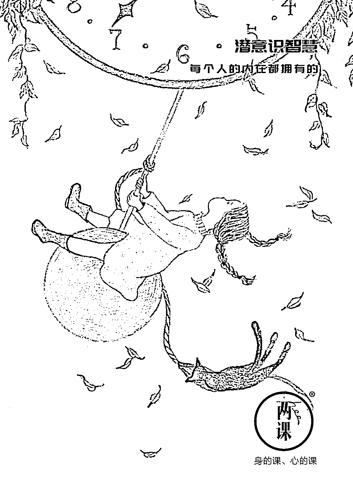

编辑/排版：Vera

文字校对：淑梅

图片：网络

文章内容来自量子催眠案例，经来访者同意分享，文中观点代表催眠师及个案本人，仅供读者参考。

此篇潜意识的智慧来自催眠师 Lora 与我的合作，下文中的催，指的是催眠师 Lora。

在日常的生活中，当催眠师自己有疑惑需要被解答时，最好的方法之一，当然就是约上一场催眠啦~

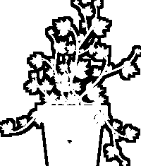

催: 总会有人告诉我们，把头脑放下，用心体会。可是，我们不可能凡事不过脑，只跟感觉走。当然，我们也不能把感受切断，一切都遵从逻辑判断和利弊权衡。这真让人困扰，我们要怎么处理心和头脑之间的关系呢？

潜: 比如当你看到一条长相非常奇怪的鱼，心会说，啊哈，它真有趣！真好玩儿，这个东西真奇怪！头脑则会开始研究和思索，它在想着许许多多的为什么。为什么会有长成这样的鱼？为什么它会出现在这里？为什么它的颜色如此的奇怪......

催: 嗯是的。有的时候因为头脑的这些思索，我们又会发现更多有趣的东西，比如说，哦原来它来自一个非常奇特的地方，然后心又会感到很开心，我又看到了一个有趣的地方。所以说，头脑其实也会帮到心的体验。

潜:对呀，它们是相互合作的关系。

催: 什么时候我们需要让头脑安静下来呢？

潜: 当头脑在喋喋不休的时候，它就需要安静下来。

潜: 头脑和心是相互合作的关系。当心觉得，啊，我已经体验够了，还有没有什么新鲜的东西呢？头脑就可以说，我可以带你去探索哦，比如我们可以去发现这条鱼是从哪里来的。那个时候心就会觉得，啊！好有趣，我要去。

潜：而不是头脑一直在那里喋喋不休的假设，并为这些可能发生或不可能发生的假设没完没了的做计划。做了计划 1，还有计划 2 和计划 3。如果这条鱼从海里来，我需要准备多大的船，如果这条鱼生活在危险的地方，我需要准备什么武器，如果这条鱼需要用钱买，我需要准备多少钱。如果有人和我抢，我该怎么据理力争？又该如何保护自己？当它在不断思索，不断假设的时候，何来快乐可言呢。

催: 快乐好像被这些东西冲淡了。

潜: 当患得患失的全部想完一遍之后，可能连想去的心情都没了，之前的好奇、兴奋、快乐的感觉，也会开始变得苦涩。

催: 我有一个感觉，我还蛮同情头脑的，我觉得头脑其实是想做一个称职的服务者，所以做了计划 1，计划 2，计划 3，真的很想把最后要的结果拿出来，头脑似乎非常尽心尽责。我们要怎么看待头脑的这种费力不讨好的角色呢？

潜: 去问心，这是你喜欢的吗？

催: 所以心是头脑的引领，要以心的感受为方向标，是这样吗？

潜: 不是，它们互相合作。

催: 合作的话，就没有谁先谁后了，那头脑就会先去琢磨那些头痛和烦躁的事情，然后心又会不开心。

潜: 沟通，询问心，这些是你想要的吗？然后听，静下来，听心怎么说。

催: 如果是心想要的，头脑就可以开心的去做。

潜: 心说，好好玩哦，我想要坐船。那他们就可以去出海，找不找得到这条鱼，没关系，心不在乎，心想要出海。头脑和心手拉着手，心说，我好想看一看碧蓝的大海，感受一下海风啊。头脑说，好呀好呀，那我们来挑选一下，坐哪条船比较适合。心说，全全交给你哦~我可相信你啦，你一定能帮我们坐上大船的。头脑说，我有点不确定哦，因为我不知道你会不会喜欢我选的船。心拍着胸脯说，安心啦，当我看到这条船的时候，我会用激动的心情告诉你。

潜: 如果头脑为了实现出海的愿望，做了许许多多的决定和选择，却不去问心，这是不是你喜欢的，心就会感到悲哀，觉得很烦，觉得头脑在独自运作，把它拒之门外，没有征求它的任何意见，而决定了所有的事情，头脑无视了它，这不是心想要的。

催: 情绪上就会不开心不快乐了，然后头脑也会费力不讨好的觉得自己白辛苦了。

潜: 对呀。身体就会表现出很紧绷很防卫的样子，因为头脑把心关起来了，心不开心呀。

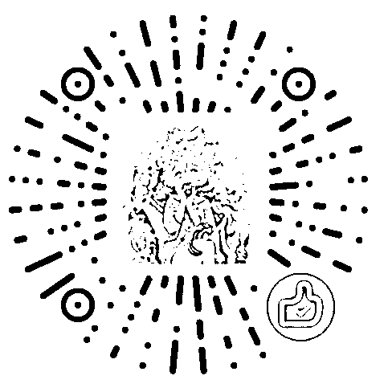

Jasmine

量子催眠二阶操作者

微信：judyspirit

坐标：上海 

请预约催眠/点击图片赞赏我

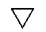

预约量子催眠或咨询课程

请添加官方客服：Ann

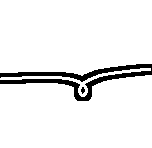

量子催眠需要面对面完成哦！

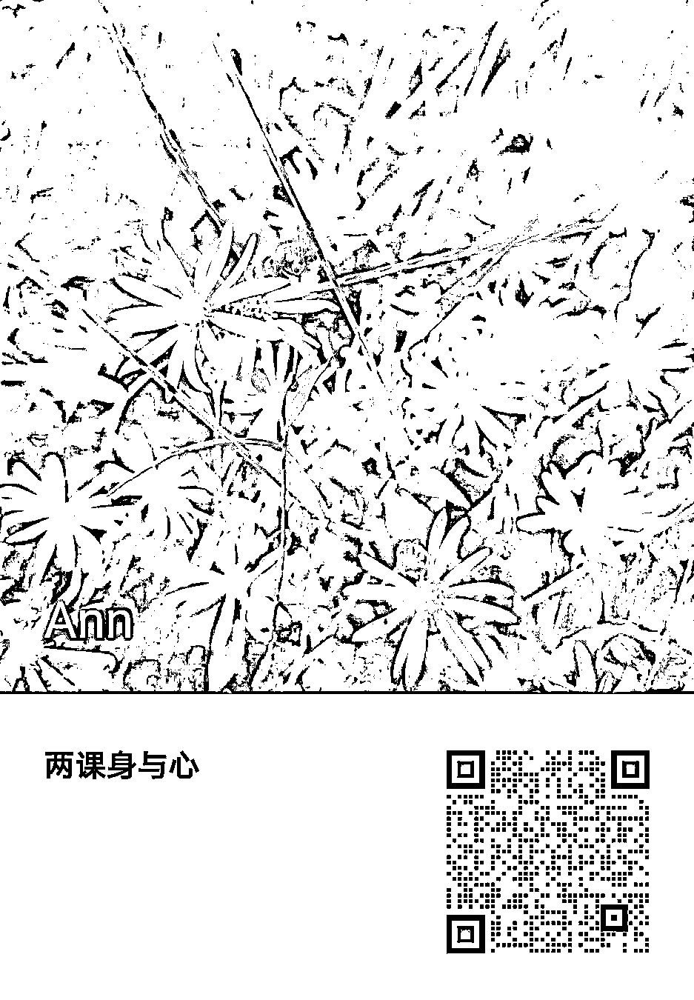

**点击了解更多有趣内容**

**点个在看手有余香~**

# 有机会嫁给白马王子，只因一个原因错失良机……

> 原文：[`mp.weixin.qq.com/s?__biz=MzU0NjkzMDY0OA==&mid=2247518916&idx=1&sn=82f8c810122b30df956afb1dcd3499c2&chksm=fb54e073cc236965b458078763b79ce78b8ed2e4b09e03c057069dd5a84ecff5cf51a6efe24c&scene=126&sessionid=1690980423#rd`](http://mp.weixin.qq.com/s?__biz=MzU0NjkzMDY0OA==&mid=2247518916&idx=1&sn=82f8c810122b30df956afb1dcd3499c2&chksm=fb54e073cc236965b458078763b79ce78b8ed2e4b09e03c057069dd5a84ecff5cf51a6efe24c&scene=126&sessionid=1690980423#rd)

点击上方 蓝字 关注我们

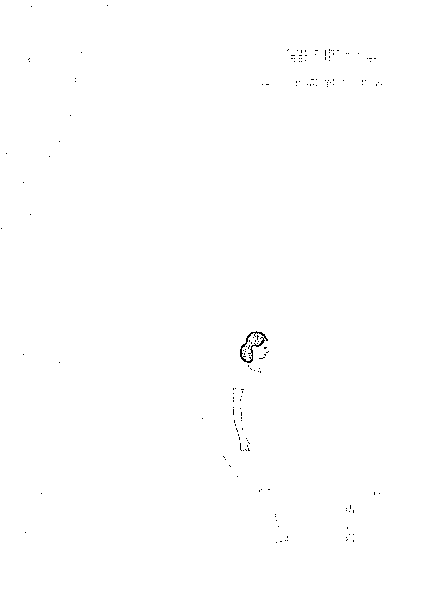

编辑/排版：Vera

文字校对：淑梅

图片：网络

文中观点代表催眠师及个案本人，仅供读者参考。

周星驰影片《大话西游》中有句经典的台词：

“曾经有一份真挚的爱情摆在我面前，我没有珍惜。等到失去了我才后悔莫及，尘世间最痛苦的事莫过于此。”

、

近不惑年龄的诗诗便是一位提起爱情就充满了悔恨无助的女性。总觉得爱情就是她的死穴，一进入恋爱这个程序整个人就死机。由于工作的原因，她接触的人士可以算是谈笑有鸿儒，往来无白丁。基本上都是金字塔尖上的人物。所以在她谈的几次恋爱中，男朋友们都有一个共性：就是非富即贵。对于每段感情，诗诗享受过爱情的美好甜蜜，但也品尝过爱情里那份小心翼翼提心吊胆。她想极力维护关系，但却均以失败告终。随着年纪的增长，她对爱情既期盼又恐惧，既悔恨又不甘。和她深聊下去，才发现诗诗的潜意识里有一个严重障碍她的信念：那就是我不值得一切美好的东西，我不配得。怪不得她谈的几次恋爱前期看似繁花似锦，后期杳然无果呢。带着这样的信念生活，即使拿了一副好牌有时候也会打得稀巴烂。信念便是你相信什么，你认为事情是怎么样的。比如说有人相信人之初性本善，有人却认为人之初性本恶。有人认为先成家才能立业，有人就觉得先立业再成家，也有人觉得两手可以一起抓。人与人之间的不同，可以说根本上是信念不同。相同信念的人更容易聚在一起，相处舒服。不同的信念造成不同的选择。不同的选择会造就不同的结果。不同的结果成就不同的人生。诗诗明明有机会与富豪男朋友喜结连理的，为什么均以失败告终呢？就是因为她从小被父母不断地批评打压否定，给诗诗在心里种下了一颗我不配得美好东西的种子。提起父母，显然她的心里仍有一道过不去的坎儿……她带着这样的信念长大。即使明明她的男朋友们都很爱她，可是她心里却认为他们身上的光环太闪耀太美好了，我怎么配得上他们？深深的自卑感就像个巨大的牢笼捆住了她。无形之中诗诗就会做出将男朋友推开的行为。于是渐行渐远，不得不分手。人活在世间，都想要成功。成功的事业，美好的爱情，健康的身体……想要成功的话需要修改潜意识，去掉里面的限制性信念。修改潜意识最快的方法就是催眠。找到了这个限制她不敢大胆自信去爱的原因，于是我带领诗诗进入催眠态。帮她进一步看清我不值得不配得的信念并清除，替换成为我值得我配得一切美好的东西。当诗诗大声对自己说出我值得我配得一切美好的东西时，她的神情坚定而神圣，自信又迷人，仿佛要让全世界都听到她的声音。看到这一幕，我知道这句话就像一道甘泉滋养了她疲惫不堪的心灵。一朵叫做我值得的花朵悄然绽放在她的内心深处，终有一天会芳香满枝芽。

亲爱的女性朋友们，无论你来自哪里，出身何处，都需要记住这个永远不变的真理：你值得世间一切美好的东西。

设定你的目标，全力以赴吧。因为你值得！

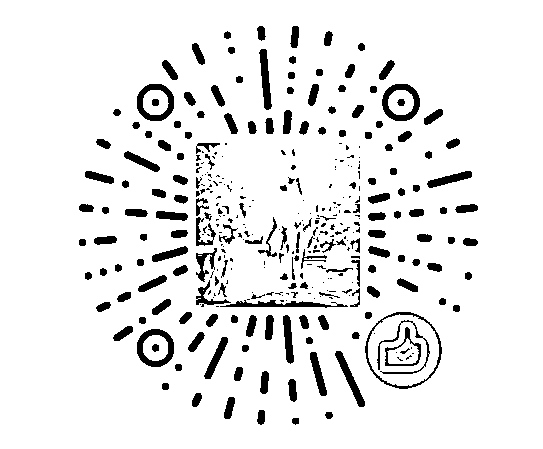

德恩

量子催眠一阶段操作者

微信：wumeimei442243

坐标：北京

赞赏：点击图片赞赏我哦

预约量子催眠或咨询课程

请添加官方客服：Ann

量子催眠需要面对面完成哦！

**点击了解更多相关文章**

QHHT®量子催眠疗愈技一段课程（新版）

**点个在看手有余香~**

# 抛妻弃子，出家修行能获得圆满吗？

> 原文：[`mp.weixin.qq.com/s?__biz=MzU0NjkzMDY0OA==&mid=2247518873&idx=1&sn=05e7310c6d588a76fa51b2e7794062af&chksm=fb54e02ecc236938f0393f726b0167df11c349f1d6616dc8d28310557943efc561fe8ad09ddd&scene=126&sessionid=1690980423#rd`](http://mp.weixin.qq.com/s?__biz=MzU0NjkzMDY0OA==&mid=2247518873&idx=1&sn=05e7310c6d588a76fa51b2e7794062af&chksm=fb54e02ecc236938f0393f726b0167df11c349f1d6616dc8d28310557943efc561fe8ad09ddd&scene=126&sessionid=1690980423#rd)

了

点击上方 蓝字 关注我们

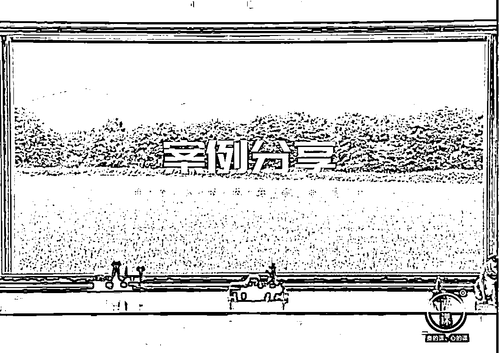

编辑/排版：Vera

文字校对：淑梅

图片：网络

文章内容来自量子催眠案例，经来访者同意分享，文中观点代表催眠师及个案本人，仅供读者参考。

在生活中，你是否对某位朋友有特别的感觉。或许你并不知道到底是什么样的原因触发这样的感觉，也不知道为何会有这样的感觉。你可知道，所有的相遇都是久别重逢，所有的遇见一定有其缘由。 

这个案例是我经历的相对比较完整的回溯。整个事件脉络清晰，叙述完整。这是个案第二次找到我做催眠。一直以来，他想知道他和一位朋友是否曾经有过什么特殊的关系。不然，怎么会有不一样的感觉？

回溯

回溯开始后，画面中出现了一名骑马的白衣男子。随着画面地不断推进，呈现了一个凄美的爱情故事，也是一个关于修行的故事。那一世他与一位女子，青梅竹马两小无猜。后来两人结婚了，生了一个儿子。日子很平静，妻子特别爱他。有一天他突然离家，选择了出家修行，去了一个道观当道士。他精进修行数年后，功夫了得。禅修中可以看到自己身上放光，也可以腾空飞到空中。 可是妻子因为他的离开，选择了投河自尽。在他临终前，充满了对妻子的思念。其实他是一直都是爱着她的，可是为了修行抛弃了她。他后悔不已，觉得愧对了她。而到达灵界后，他与妻子再次相聚，心中的愧疚终于释怀。

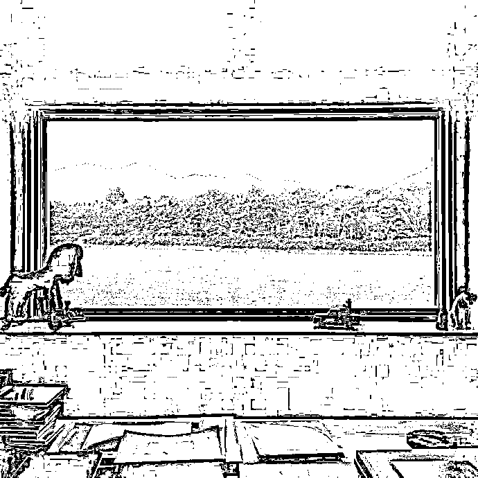

潜意识对话
催：为什么要给他看作为道士这一世的画面呢？潜：这是他想看到的。催：他想看到什么呢？潜：他想看到和××的关系。（此生的朋友），那一世的妻子就是××。催：那一世和他现在的人生有什么关系？潜：过好他现在的生活，不用去追逐那些灵性上的目标，不要为了高大上的修行而舍弃当下的生活。珍惜生活中的一切美好事物。催：不用追逐灵性的目标具体是指什么？ 潜：没有目标，其实灵性和生活并不是分开的，不用去追逐那些。他感觉灵性是一种高大上的，让他有优越感的东西。催：那也包括现在所从事的职业吗？（与灵性相关的职业）潜：是的。催：那现在的职业适合他吗？潜：很好啊，可以很好地帮助他认识自己。催：他是否适合做视力疗愈以及轻咨询师？潜：可以啊，只要想做的，都可以去尝试。催：他想知道怎样更放松地与人相处？不用担心别人的看法和评判，能够真实地表达自己的情绪。潜：不要去满足别人的标准，做他自己就好。他担心的是连接，担心的是关系，其实关系不会断联的。当你相信你是被爱的，外面自然显化出爱你的关系，而不是你在外面去追逐这些东西。外面只是一个相，你内在什么样子，就会显现出外面什么样子。不用去担心外面的关系会断裂，你只用做好你自己内在的东西，外面自然会显化出你想要的样子。催：那具体该怎么做呢？
潜：放下恐惧，放下担心，其实只需要做好自己。你的存在状态，决定了你外在的东西。你是自变量，而不是一个因变量，就像函数里面的 xy 一样，你其实是那个 x 而不是那个 y。  其实是你可以决定的，而不是被外在所束缚。你始终在担心外在的这些东西，担心关系会断裂，别人会离开你。其实不用担心外在的这些东西。外在的这些都是你内在显化出来的，你只需要进入你的内在就可以。催：他想知道他的胆结石是什么原因造成的？潜：苦闷。是在读书阶段的经历给他造成的影响。催：他需要做手术吗？潜：不需要。不用管它，放轻松。催：那他的弱视是什么原因？潜：前世业力。催：他现在该怎么做？潜：对他没有影响，不用管。催：刚才提到业力的问题，这些业力如何消除？潜：觉察，把储藏在那里的东西，不断地翻出来。觉察就是小火柴，就是光，只要用光照着它，在光里面就好。只要觉察到了，改变看法，去做就可以了。

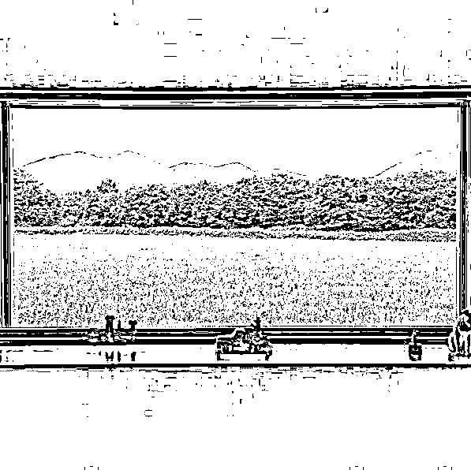

催：我们通过持咒磕头或者禅修的方式来消业，这样子去做可以吗？潜：那只是形式，核心还是觉察，对你意识的觉察。观你的想法和你的感受，通过每一个感受，来回答你的想法、你的信念。其实每一个感受都是一个提醒，都是为了让你看见你储藏在里面的东西。 催：他想知道关于生二胎的问题，他有一个纠结所在：他不想生，妻子想生。
潜：不会生的，只要他不想，二胎就生不了。催：他想知道人是怎么睡着的，怎么样才能有觉知的睡着？潜：需要在清醒的时候保持觉知，自然会扩大到睡着的时候。等到清醒的时候持续的时间越来越长，就可以持续到他的睡眠中。催：您再帮他检查一下，看身体还有哪些方面需要疗愈？潜：喉咙。不敢表达，恐惧。催：恐惧什么？潜：担心，害怕关系的问题。催：你可否为他疗愈？还有哪些方面的问题？潜：身体没有问题，他每天都站桩，对身体是有帮助的。其实他意识到就好多了，就会对他有很大的帮助。慢慢的在生活中去做就好了。当他意识到就是改变的开始了，疗愈就发生了。催：他要注意些什么？潜：放下对关系的恐惧和担心，当他放下这些的时候，自然好了。放轻松，会好起来的。
后记
在第一次催眠中，他觉得没有链接上潜意识，这次催眠前，个案再次说到可能还会链接不上潜意识。我借用最近催眠中潜意识反复出现的一句话：“只要你想做到，就一定可以做到。”我告诉他，你相信你可以链接上，你就会链接上。个案这一次想要探索的问题，和上次差不多。但是这一次催眠，他专注在过程中，放下排斥来到自己的信息，找到了他想要的答案。正如朵奶奶时常告诉个案：催眠的结果 90%是由你们自己决定。这一次，他一定是选择了相信！

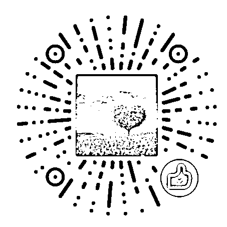

王利

量子催眠一阶操作者

微信：wlc851116

坐标：四川成都 

请预约催眠/点击图片赞赏我

预约量子催眠或咨询课程

请添加官方客服：Ann

量子催眠需要面对面完成哦！

**点击了解更多相关文章**

QHHT®量子催眠疗愈技一段课程（新版）

**点个在看手有余香~**

# 五世回忆读书会 | 传奇催眠大师的第一次催眠之旅

> 原文：[`mp.weixin.qq.com/s?__biz=MzU0NjkzMDY0OA==&mid=2247518824&idx=1&sn=74c3c78d41373c5a6329181ac550954d&chksm=fb54e0dfcc2369c9124374eca394b8be97973a58382ea33b42be13bd4b70b682f4ac9b7e1afe&scene=126&sessionid=1690980423#rd`](http://mp.weixin.qq.com/s?__biz=MzU0NjkzMDY0OA==&mid=2247518824&idx=1&sn=74c3c78d41373c5a6329181ac550954d&chksm=fb54e0dfcc2369c9124374eca394b8be97973a58382ea33b42be13bd4b70b682f4ac9b7e1afe&scene=126&sessionid=1690980423#rd)

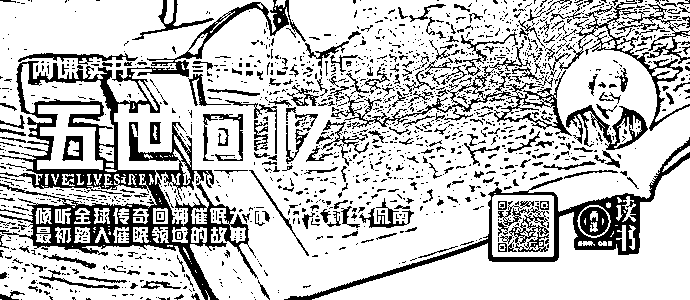

编辑：Jasmine 

**长按以上二维码试听购买**

读书会特点：

*   自然对话式全书音频 
*   各路大神读书交流
*   终身专属与作者/译者直接互动社群
*   更多神秘活动

优惠价格：

*   258 元 

**这不是一本小说**

《五世回忆》作为朵洛莉丝·侃南的第一本著作，其中记述了她与她先生是如何误打误撞进入前世催眠探索领域的故事。正如封面以及扉页上的那句话“这不是一本小说。”

朵洛莉丝·侃南 1931 年生于美国密苏里州的圣路斯。1951 年婚后，随着先生的海军服务旅居世界各地。她的先生是位业余的催眠师，在使用催眠帮助一位叫安坭塔的妇人减重的过程中，无意间回到个案的五个不同的前世。这次事件引发了她对轮回的浓厚兴趣。

**内容简介**

在本书中，用对话的形式记录了安妮塔的多次催眠回溯，过程中出现的五个性格和能力各异的人生，时代和地域，横跨“咆哮的二十年代”黑帮泛滥的美国芝加哥、南北战争时期南方大种植园、美国殖民拓荒时代，遥远的中世纪英格兰及德意志日耳曼民族的早期部落争斗时期。

在所有的催眠过程中，个案安妮塔对催眠过程毫无记忆，却说出了大量的生活细节，让五个截然不同，鲜活的生命跃然纸上，也揭示了很多历史上著名事件的真相一角，在催眠中发掘的事实在被强烈好奇心驱使下，在朵奶奶之后的研究中被一一证实。

更为重要的是，书中有非常多有趣的插曲，颠覆了人们对轮回及灵魂的认识。而朵洛莉丝·侃南本人更是因为在催眠中一瞥到她和她先生的未来，因此才能在她先生遇严重车祸的状态下保持深信不疑的信念，见证了自己生命中真正的奇迹，并由此坚定的踏上了她自己在前世回溯催眠领域传奇式的探索旅程。

**院长的话**

拿到《五世回忆》中文版的这本书后，你会在书的最后一页发现这么一段话。这是量子催眠中国院长 Leo 做出的精简诠释。

这本书是回溯催眠泰斗朵洛莉丝·侃南的第一本书，也是她和她的先生第一次撞入前世探索领域的真实经历。

五个性格迥异、时代跨度巨大、可以被一一验证的不同前世记忆摧毁了他们对“轮回”和“灵魂”的认知。没有这次震撼的经历就不会有她的 19 本书及之后的所有故事。

它将告诉读者催眠大师是如何步履蹒跚的开始她的旅程，又如何在巨大的痛苦中保持确信不疑。因为她不仅在其中看到了别人的故事，也看到了自己即将经历的真实未来，来自冥冥中安排下的这份确信，最终让她成为了量子催眠创立者----传奇的朵洛莉丝·侃南。

**目录展示**

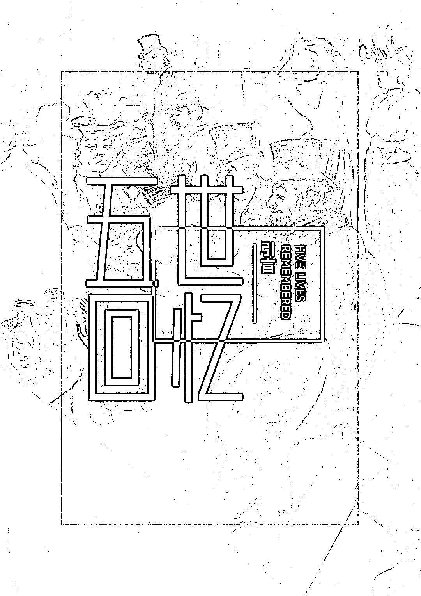

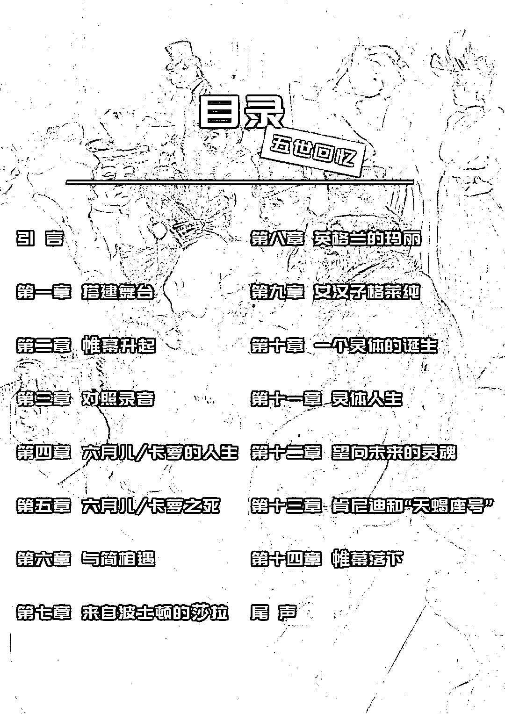

**书籍试听**

[🔈 引言.mp3](https://res.wx.qq.com/voice/getvoice?mediaid=MzU0NjkzMDY0OF8yMjQ3NTE4ODIx)

**购买链接**

**读书会**

**纸质书**

**请长按图片二维码购买**

**购买咨询**

**请长按以上二维码** 

**添加官方客户服务人员**

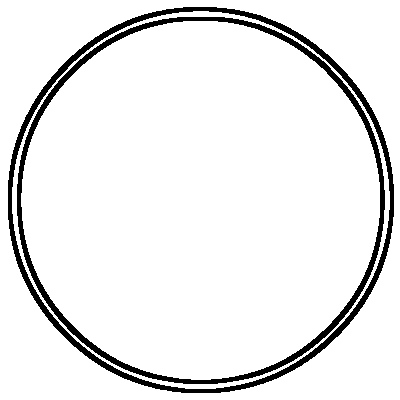戳阅读原文，进入商城购买

# 魂忆广岛读书会 | 听一位未能幸存的目击者讲述原子弹爆炸的故事

> 原文：[`mp.weixin.qq.com/s?__biz=MzU0NjkzMDY0OA==&mid=2247518824&idx=2&sn=8da68877dd4b89496669fbb7eea7ac8d&chksm=fb54e0dfcc2369c9f8d0668561f59da071de81e06c418a1c0326dcadb4a851d397d658c243ef&scene=126&sessionid=1690980423#rd`](http://mp.weixin.qq.com/s?__biz=MzU0NjkzMDY0OA==&mid=2247518824&idx=2&sn=8da68877dd4b89496669fbb7eea7ac8d&chksm=fb54e0dfcc2369c9f8d0668561f59da071de81e06c418a1c0326dcadb4a851d397d658c243ef&scene=126&sessionid=1690980423#rd)

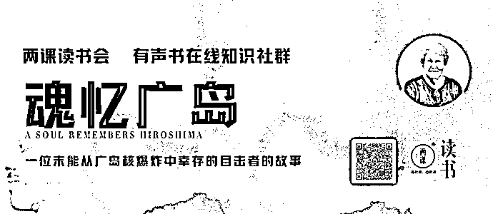

编辑：Jasmine‍‍‍‍‍‍‍‍‍‍‍‍‍‍‍‍

****长按以上二维码试听购买****

读书会特点：

*   自然对话式全书音频 
*   各路大神读书交流
*   终身专属与作者/译者直接互动社群
*   更多神秘活动

优惠价格：

*   258 元 

内容简介

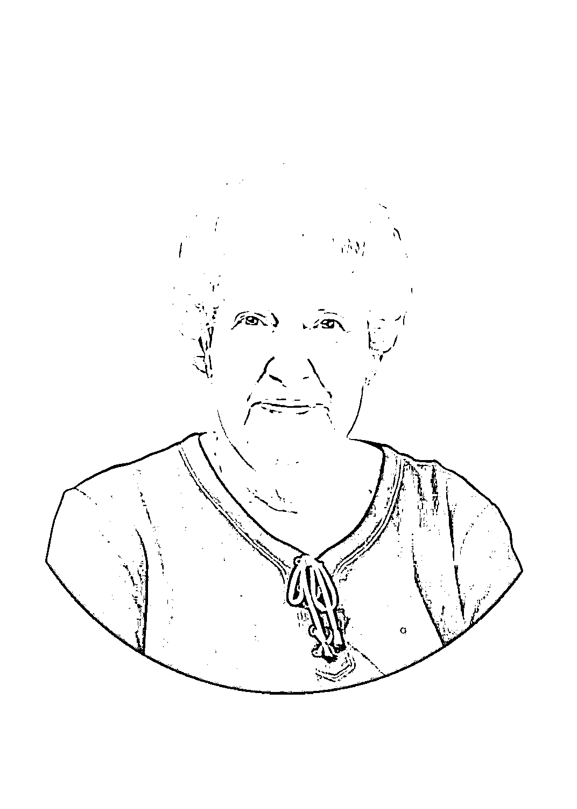

**朵洛莉丝·侃南**

‍‍‍‍‍‍‍‍‍‍‍‍‍
‍‍‍‍‍‍‍‍‍‍‍‍‍

因为饱受前世可怕死亡记忆的折磨，这名 22 岁的美国女孩向朵洛莉丝·侃南寻求前世回溯治疗。这些记忆是由下面的过程触发的。

在平常的一天，她走进起居室，电视上正播放着日本广岛原子弹事件的幸存者的采访。画面上没有爆炸的场景，主持人正在与访客探讨这个事件。在她看着幸存者描述自身经历的画面时，她的脑海里闪现着火光和爆炸，就像事件正在发生一样。不仅仅是在视觉上经历着事件，她还有其他的感官被触发，她可以听到人们的呼喊声，感受到更深层的痛苦。直觉上，她知道自己曾在爆炸的现场。在看过节目后的几周内，可怕的爆炸场景以及这件事的后果持续的出现在她的意识中。她可以强制把这些记忆压抑起来，以便她可以维持每天的生活，但这让她感到疲惫，而且这一切为什么会发生在她身上也不得而知。正在这个时候，她找到了朵洛莉丝希望通过催眠来帮助她，这本书正是她的前世故事。本书记录了在战争时日本民众的经历，作为历史的一面从未有人全面的探索或记录过。

这段前世回溯的过程揭示了一个日本男子在广岛原子弹爆炸中丧生的戏剧性故事。作为当时广岛爆炸的幸存者，他讲述了许多痛苦、死亡和毁灭的故事。这是一个没有活下来的目击者的叙述！这起案件透露了有关日方战争的惊人信息。爆炸事件也揭示了在第二次世界大战戏剧性结束时，可怕的以及并未被公之于众的事实。在当时，这是朵洛莉丝·侃南最有挑战的一次案例，因为朵洛莉丝不知道她在经历原子弹爆炸死去时，是如何重新面对这种可怕体验的。这个过程需要极其小心。这个故事的结局深刻的告诉我们，“不要让这种灾难重现”。

院长点评

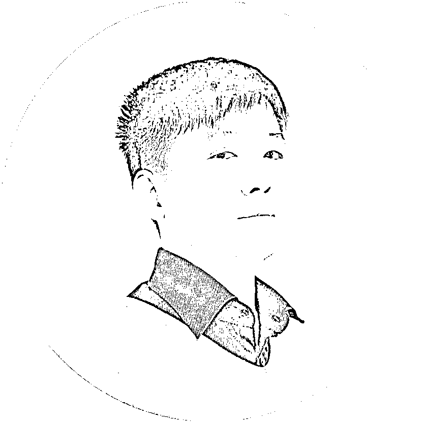

**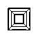**

**“量子催眠师必读推荐”**

这是朵奶奶的回溯催眠生涯中一个非常特殊的催眠案例她是难得一见的“梦游态催眠体质”她不记得催眠发生的事但在催眠中会完全变成另一个人如亲临时空现场体验无比真实的人生细节因为她是一个新近“入舍”的灵魂没有此生成长经历的磨灭而对前世记忆犹新而这样的安排让朵奶奶与一个经历了广岛核爆的灵魂在时空中相遇成为了惺惺相惜的老友也让这两个曾经互为敌手的国家的普通人有机会从另外一个视角看待这场战争：发起战争的究竟是谁？是人民还是权贵？在一个国家眼中的没有灵魂的恶魔是否也包含和我们一样善良纯朴、与世无争的人民？美国真的需要投下原子弹才能让战争结束吗？日本在战争后期的真实境况有多接近自我崩溃？它残害和裹挟了多少自己的人民？可曾有人想过，亲身经历原子弹爆炸是一种多么恐怖的体验？不是幸存者的间接描述，而是亲临这场爆炸而丧生的灵魂的视角这只有在回溯催眠中才能发生这场从未在人类历史上发生过的巨大震撼究竟会让我们对如何看待战争这件事产生了多么深远的影响让我们对超越种族的人类普世的爱与情感以及灵魂的体验和学习的视角产生多么巨大的变迁如果我们都只是不停转世在不同国家和种族中的同样的灵魂恨还要有理由在这地球上延期下去吗？理解和平，人类还需要付出多大的代价？一切都要从朵奶奶的娓娓道来中展开......

各路大神打卡交流

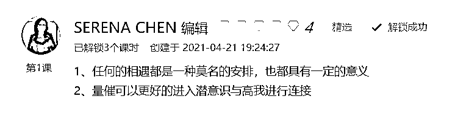
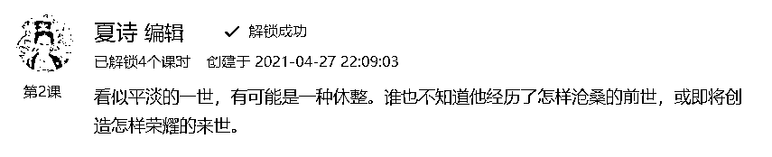

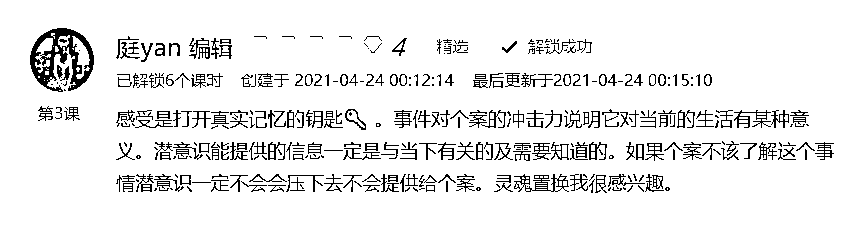

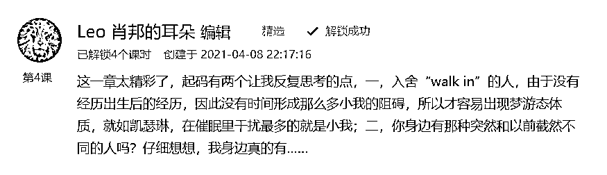

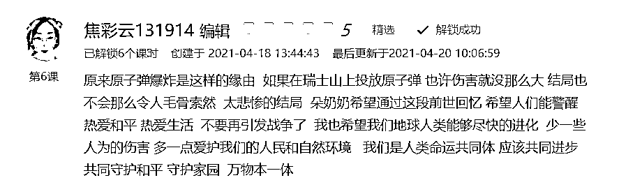

内容试听

[🔈 序言（章节试听）](https://res.wx.qq.com/voice/getvoice?mediaid=MzU0NjkzMDY0OF8yMjQ3NTE4ODIy)

[🔈 奇遇的开端（章节试听）](https://res.wx.qq.com/voice/getvoice?mediaid=MzU0NjkzMDY0OF8yMjQ3NTE4ODIz)

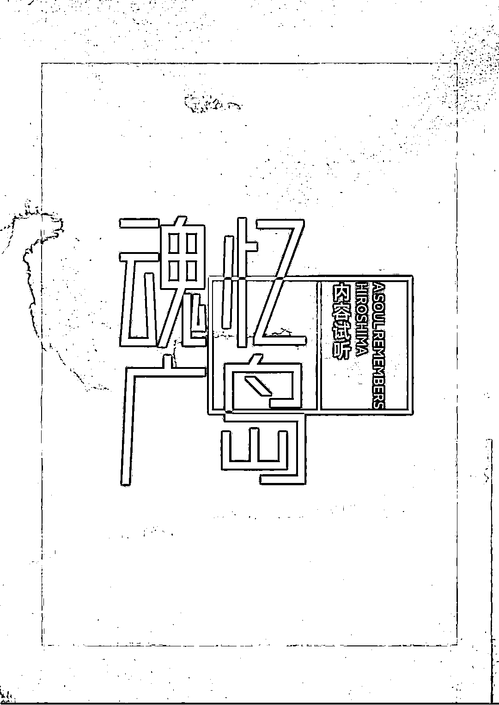

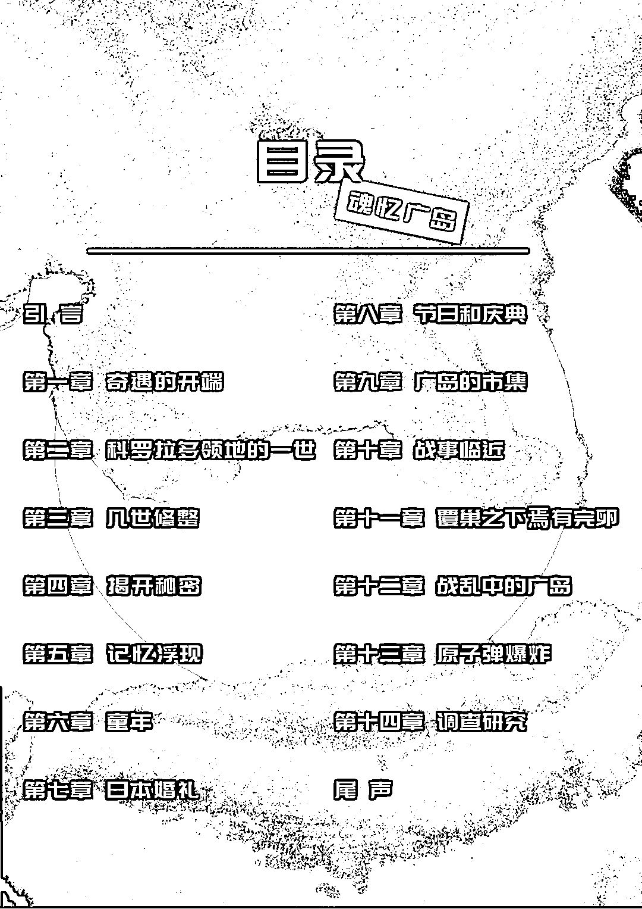

小编读后感

这本书的内容真的超棒！小编我看得眼泪哗哗地，超级感动！整颗心都跟随着小岛月，他开心的时候，我也开心，他悲伤痛苦的时候，我也感同身受。就象朵奶奶在书中说的那样：我的心已然被他牵走。我痛过了他的痛，悲伤过了他的悲伤，现在又能把他带回我们相识的原点——他制陶的时光，这是再圆满不过的了。这样一来，我就可以把他留在世界癫狂之前的幸福记忆里。我很清楚，唯有将他的故事写在纸上，讲给全世界听，否则我无法安宁。我已经完成了自己对他默默许下的诺言。更巧合的是，小编我居然在几年前，亲自去过那个装载着原子弹的小岛！我觉得这冥冥之中，也是潜潜的安排吧！所以，在这里我也完成了我的使命，把这些岛上的图片和这本超级棒的书推荐给大家。 这段历史，这本书，本来与小编的今生生活而言，也没有太大的关联。首次接触到它，是作为这本书的第五校对，在看到 Tinian 这个词的时候，我的记忆闸门被打开了。恍然记得，自己曾经去过这个岛，这是一个在著名的塞班岛边上的荒岛。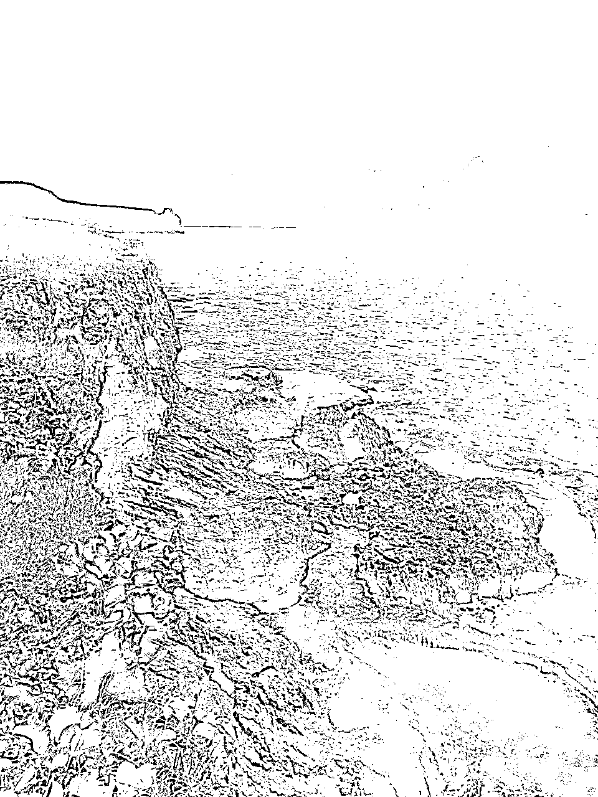去塞班岛的游客是不少的，它隶属于美国，然而，只要当你去到当地，询问当地人可不可以去天宁岛，他们总是会告诉你，那上面什么都没有。当时，小编是去参加朋友的婚礼，鬼使神差的，我非常坚持要去那个岛，听说那个岛上面只有一家民宿，还需要坐小飞机单独飞行到达，于是，在那几天，成了岛上的孤独游客。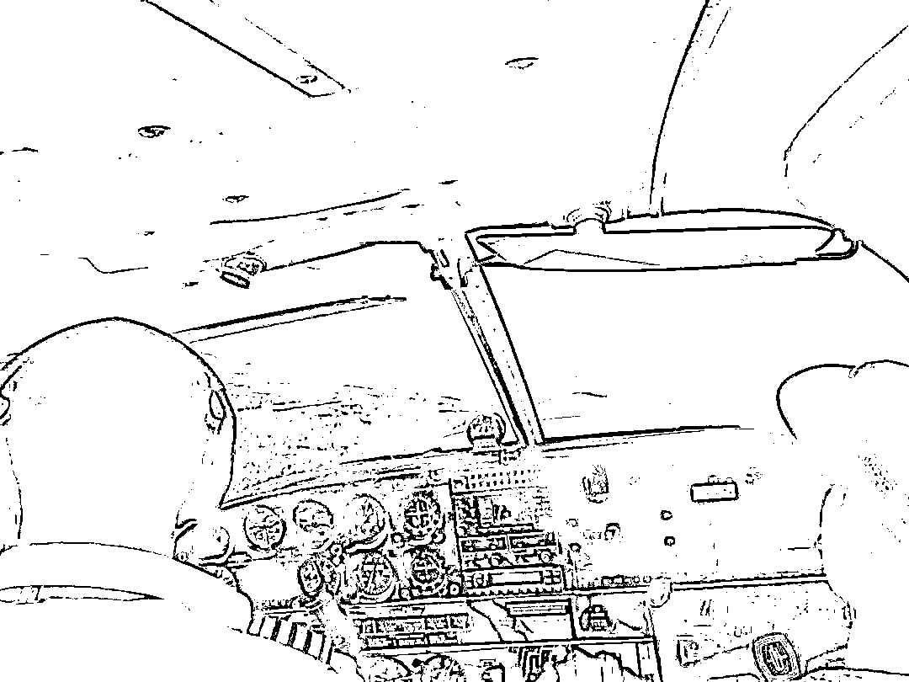当时我还煞有介事地分析给同行的朋友们说，他们阻拦我们过去，肯定是因为赚不到钱，那里没有导游也没有任何的商业，因为，它就是一个军事基地。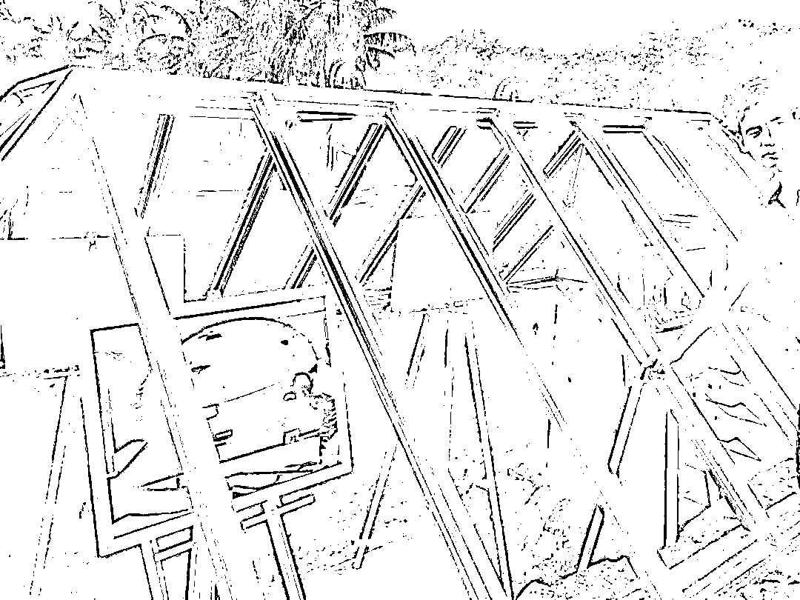直到，被唯一的民宿的帅气老板，带到小男孩和胖子的面前，摸到了把遗迹保护起来的透明玻璃罩子，我依旧觉得很恍惚，这是真的吗？是真的有这段历史，为什么有一种集体失忆的感觉？这些遗迹是真的吗，为什么在我们的所有的教育当中对于天宁岛这个运送原子弹的直升机起飞的地方，一点点印象都没有？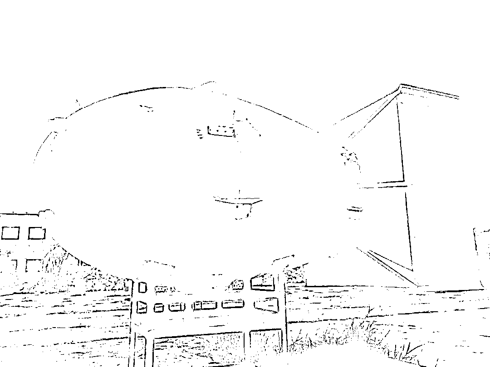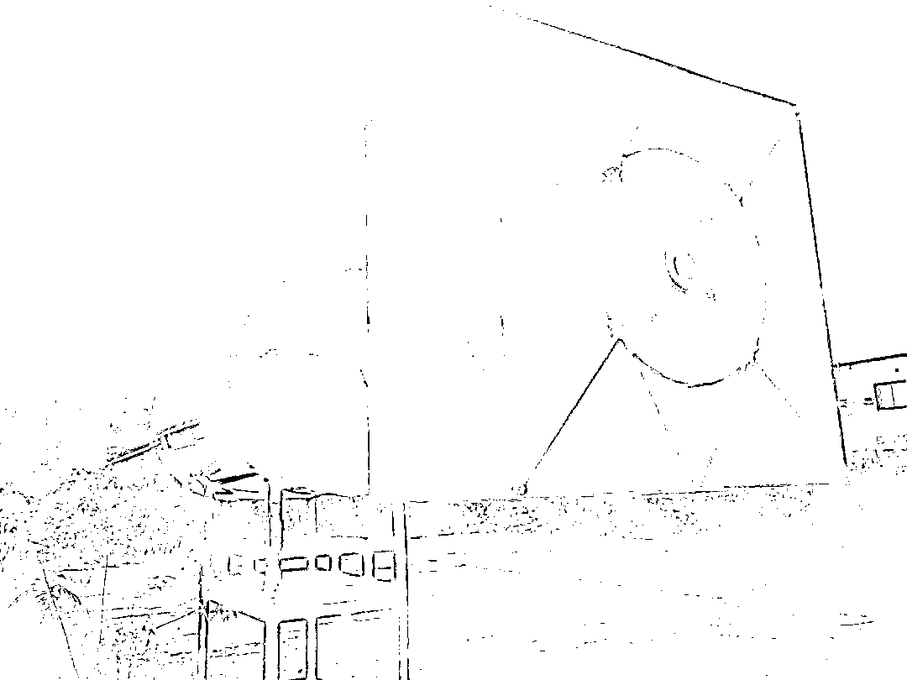现在的我，来回顾这段个人的记忆，结合历史，你就明白了，有的时候事情搞得太大，谁都无从评判，因为，这是所有人、所有灵魂的伤痕，没有一个人幸免于此。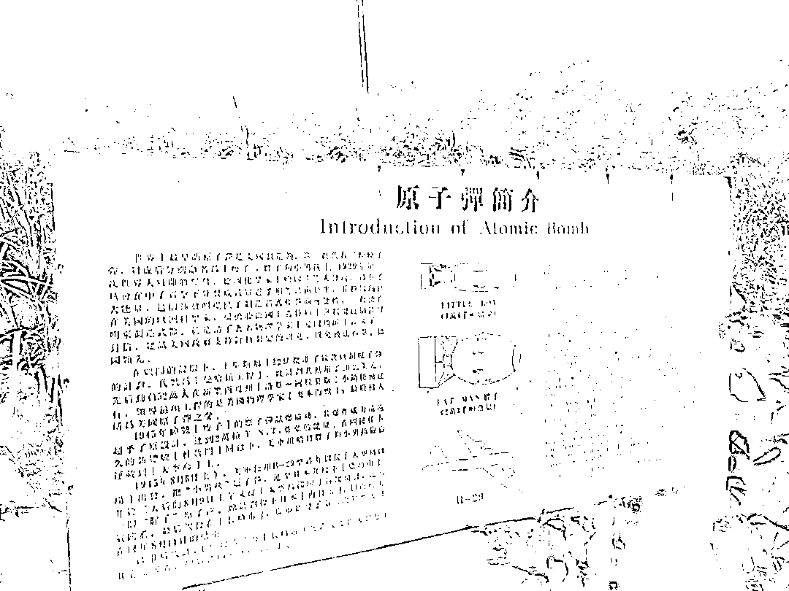或许有时候穿越时间回去追究历史的真实性需要很多勇气，因为那样一来我们就不得不面对那个时代的残酷真相......

购买链接

**长按以上二维码** 

购买咨询

**请长按以上二维码** 

**添加官方客户服务人员**

戳阅读原文，进入商城购买

# 癌症（上） | 灵魂在说话

> 原文：[`mp.weixin.qq.com/s?__biz=MzU0NjkzMDY0OA==&mid=2247518791&idx=1&sn=43b406fac7d4772d924716ef7b0eeb08&chksm=fb54e0f0cc2369e64cac9db86a2411d8c9f38b53f1009aabf98ae910d11276f0c0114f66c687&scene=126&sessionid=1690980423#rd`](http://mp.weixin.qq.com/s?__biz=MzU0NjkzMDY0OA==&mid=2247518791&idx=1&sn=43b406fac7d4772d924716ef7b0eeb08&chksm=fb54e0f0cc2369e64cac9db86a2411d8c9f38b53f1009aabf98ae910d11276f0c0114f66c687&scene=126&sessionid=1690980423#rd)

点击上方 蓝字 关注我们

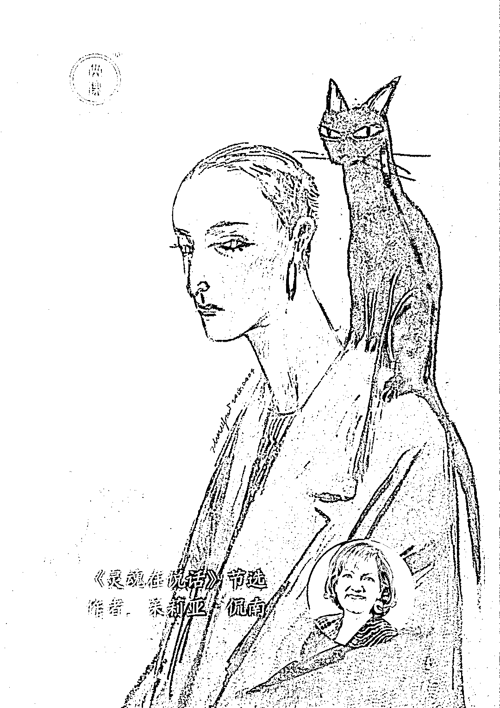

文章摘选自茱莉亚·侃南的著作《灵魂在说话》

排版：Vera

大部分的人听到「癌症」两个字就会感到害怕了。

多数人觉得，一旦被诊断为癌症，就等于被判了死刑。他们必须要用尽一切力量来战胜癌症。由于诊断往往带着恐惧，被诊断的人准备好了要用一切可能取得的武器来除掉这个可怕的攻击者。癌症被视为凶神恶煞，一个令人憎恶的入侵者，必须不计一切代价的杀掉它。很多时候，代价就是被癌症入侵的身体。

我记得特蕾莎修女曾说过，她永远不会支持或参与任何用「对抗贫穷」或「对抗饥饿」字眼的计划，因为每当你试图对抗某件事情，你因为专注在对抗上，于是给了它更多的能量。

在创造的世界里，大家总是说「专注于你想要的事物，不要专注在你不要的东西上」。如果你认为自己必须对抗或杀掉某件事物。你事实上反而创造了更多你试图克服的事物。你的思想也是事物，它们会创造。因此你应该专注于你想要的，像是「富足」、「健康的关系」或「完全平衡与和谐的身体」。这样比较有建设性、比较有益。

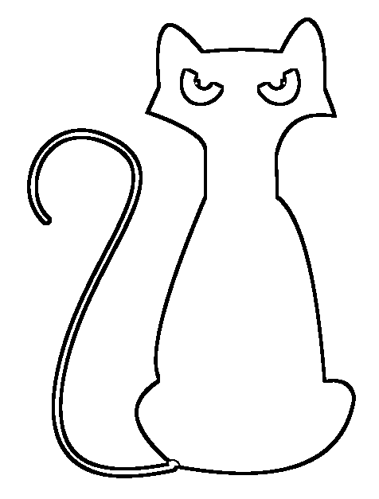

癌症是在告诉我们某个已经有很长一段时期的情况。癌症是「最后通牒」的手段之一。当所有送出讯息的努力都失败了，就必须采取更激烈的手法才能得到你的注意，

让你看到问题。

你可能认识一些人，他们在被诊断出患有末期疾病后，人生整个转了弯。这可能就是最主要的讯息---停下来，重新思考你在做的事，重新想想你是谁。疾病迫使大家内省，也许是这辈子以来第一次内省。

我们不是都听说过无数次了吗？内心才是所有答案栖息之处，由于我们是如此顽固，有时候，这是迫使我们好好停下来内省的唯一方法。

如我所说过好几次的，你不是受害者，这并不是违反你的意志，强加在你身上的不幸。这是你自己的设计；这是你告诉自己，如果偏离轨道，就用这个方法来协助自己回到正途。

所以首先要做的第一件事，就是把癌症视为你发送给自己的讯息，而不是一个正攻击你、要取你的命的怪物。现在，你终于有足够的觉知看到它代表的真相---一个你真正需要听到的充满爱的讯息。

我们透过朵洛莉丝的工作知道癌症是尚未解决的、被深度压抑的愤怒。对某件事的愤怒抑制了很长一段时间了，没有释放，反噬的结果就是必须处理的疾病。

癌症在身体的位置告诉你患者对什么感到愤怒。例如，乳癌可能是对「未被关爱」、「无法关爱」或「不被允许去关爱」感到愤怒；肺癌可能是对生命或「无法/没有能力过自己要的人生」感到愤怒；肠癌可能是对无法宣泄或无法言说的现实愤怒。

在朵洛莉丝的某次催眠疗程，个案是位癌症细胞已蔓延全身的男士。当一处的癌细胞被移除，另一处的癌细胞又冒了出来。朵洛莉丝问他是否对什么事感到愤怒。他大吼：「是的！我恨我太太！孩子跟了她。她不让我看孩子。」

在这类的案例，癌症会由一处转移到另一处，直到你找到愤怒的源头。如果不处理根本的愤怒，光是动手术切除和进行术后治疗，并不会改善情况。

你先要认出并了解自己为何愤怒。然后你必须放下。就算你有个糟糕的童年/父母/配偶等等，你都要放下！你创造了那个情况，好让自己体验并从中学习。现在，请不带任何情绪地检视这一切，看看它在教导你什么。这也可能是在平衡业。无论是什么，现在都该放下了。

一旦学到了课题，或是体验过了，你就必须放下，继续前进，好接受下一课的学习或体验。

这些经验不该一直被背负着不放，它们就像多余的行李，压得我们难以前行。

在认出愤怒的根源之后，最好的释放方法就是原谅。原谅每一个牵涉其中的人，放下他们。

我知道，知易行难，但是为了疗愈，这么做绝对必要。在前述的例子里，朵洛莉丝告诉这位男子，他必须原谅前妻才能除去癌症。他说：「我无法原谅他，你不知道她做了什么！如果我原谅她，他就赢了。」朵洛莉丝的回答是：「如果你让她害死你，她才是赢了。」

到了某个时间点，你必须了解，这一切无关输赢。这是有关学习、体验、放下，然后继续前进。我们往往都太执着于这个三度空间和其中的情绪游戏了。

待续

[情绪（上） | 灵魂在说话](http://mp.weixin.qq.com/s?__biz=MzU0NjkzMDY0OA==&mid=2247518451&idx=1&sn=d6fafe3673c636f3a238f4167b3e13ce&chksm=fb54e244cc236b52faafa47937ef2ce0ea9f3467bf5344a5ab537ac1fc9fcd6098c268cdb774&scene=21#wechat_redirect)
[情绪（下） | 灵魂在说话](http://mp.weixin.qq.com/s?__biz=MzU0NjkzMDY0OA==&mid=2247518609&idx=1&sn=48ad5badc49d02f45f2948b69d73be40&chksm=fb54e326cc236a30fc1d58553fef814c6e839ac8c661e7e5002369bdcc89a2459886e105108c&scene=21#wechat_redirect)

📹 [`mp.weixin.qq.com/mp/readtemplate?t=pages/video_player_tmpl&action=mpvideo&auto=0&vid=wxv_1928124846597537794`](https://mp.weixin.qq.com/mp/readtemplate?t=pages/video_player_tmpl&action=mpvideo&auto=0&vid=wxv_1928124846597537794)

**点击视频了解疾病的原理是什么**

**点个在看手有余香~**

# 走出糟糕的关系，第一步需要做什么？| 听朵奶奶聊业力

> 原文：[`mp.weixin.qq.com/s?__biz=MzU0NjkzMDY0OA==&mid=2247518788&idx=1&sn=eb241a6078bce951da7eca5848a2ed1b&chksm=fb54e0f3cc2369e5358134a4edf74f6baa8145c13bfb9f70a00409459fdab7a37b42e55c8e93&scene=126&sessionid=1690980423#rd`](http://mp.weixin.qq.com/s?__biz=MzU0NjkzMDY0OA==&mid=2247518788&idx=1&sn=eb241a6078bce951da7eca5848a2ed1b&chksm=fb54e0f3cc2369e5358134a4edf74f6baa8145c13bfb9f70a00409459fdab7a37b42e55c8e93&scene=126&sessionid=1690980423#rd)

点击上方 蓝字 关注我们

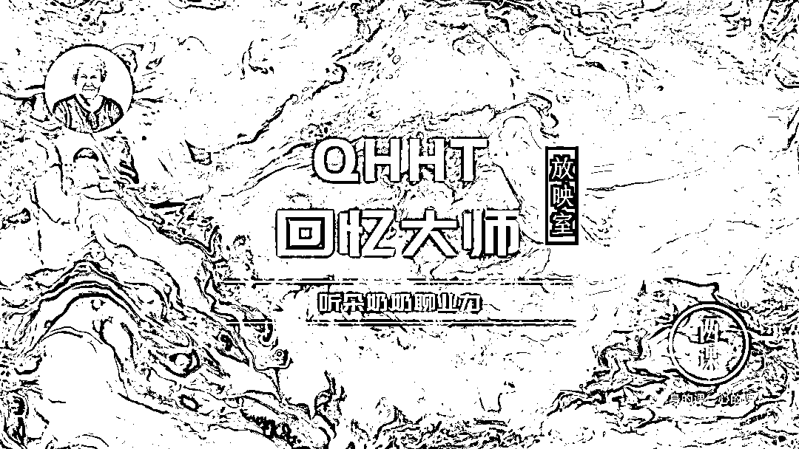

翻译/排版：Jasmine

[🔈 听朵奶奶聊业力-第 1 期](https://res.wx.qq.com/voice/getvoice?mediaid=MzU0NjkzMDY0OF8yMjQ3NTE4Nzg3)

**朵奶奶：**你想问我什么？

**听众：**刚才我听你提到了摆脱业力这个概念。我和一个特定的人有业力关系，这段关系已经持续了好几年，我明白这段关系中的教训和一切，我真的很想中和或者消除这种业力关系。

**朵奶奶：**今晚我正想谈谈有关业力的话题，我认为这非常重要。因为潜意识一直在告诉我，我必须在全国各地不断的向人们强调摆脱业力，否则我们将无法进入新地球。

**听众：**是的，我也有同样的感觉。

**朵奶奶：**关于业力你有什么特定的问题吗？还是说你希望......

**听众：**我和一个特定的人维持了八年的业力关系，我已经理解了其中的教训，我再也不想卷入其中。我曾去解读过我们的关系，所以我知道我们已经相互牵扯了五个前世，我真心希望可以中和这段业力关系，使它不再如此强大。

**朵奶奶：**的确，你已经和他牵扯了五段人生，并仍然在处理相同的问题。是时候摆脱它了，不是吗？

**听众：**我也这么认为。

**朵奶奶：**这也是我在催眠中遇到的事情。我发现有些人有许多个前世都和同样的人捆绑在一起，他们仍然在经历着同样的，且还没解决的问题。因为你知道的，地球是一所学校。

**听众：**是的。

**朵奶奶：**你无法跳过一个学年，但是你可以复读它，只要你仍在重复着相同的事情，或者吸引相同的人，那就表示你还没能弄明白，或者说你还没有学到课程，这就是问题所在。

**听众：**但是，我觉得我已经明白了。

**朵奶奶：**如果你现在不去解决这个问题，就得回来和同一个人再来一次。

**听众：**正是这样，我想我学到了教训，现在我只是希望中和与这个人之间的业力。

**朵奶奶：**不，你得解决你们之间的问题。

**听众：**或许，先让我听一下你聊的业力。

**朵奶奶：**好的，如果你希望我这么做的话，因为这正是我想提及的事情。

**听众：**太棒了，这真像一个循环，我希望摆脱它。

**朵奶奶：**这就是我们提过的业力之轮。你希望摆脱它，但是只要你还在同一个轮子里打转，就无法继续前进。

**听众：**正是。

**朵奶奶：**那么，我就来聊聊它吧。

**听众：**我觉得对我来说，这个特定的人给我上的一课就是，我需要更多的爱自己，如果我这么做业力就会消失，你明白我说的吧？

**朵奶奶：**是的，但事情可远不止这些。

**听众：**好吧，请告诉我。

**朵奶奶：**你已经明白了第一步，有许多人甚至连这一步都没有认出来。但后续还有更多，一旦你完成了后面的步骤，你就自由了。之后，就留给另个人，让他去意识到他的问题了。

**听众：**不，他们没有意识到。

**朵奶奶：**那这就是他们的业力，他们需要面对的问题了。如果你明白了，你就会走到正确的轨道上。但有些时候，另一个人并没有看到这种迹象。

**听众：**是的，他们没有。

**朵奶奶：**他们仍然在戳你的痛处，让你持续地心烦意乱，因为这就是一场游戏。

**听众：**没错，没错。

**朵奶奶：**一场他们想玩的游戏。

**听众：**是的，但是我不想再玩下去了，我甚至不想再被它触发，你知道我的意思吧？

**朵奶奶：**是的，这也是大家在我做演讲的时候一直在问的，你要如何摆脱业力呢？

**听众：**我都等不及想知道了。

**朵奶奶：**我把它称之为我们随身携带的包袱或者垃圾，从这一世带到了下一世，你必须摆脱它，正是因为这些业力的包袱和垃圾使你得病，你一遍又一遍重复的背着它，并且没有从中学到任何东西。

**朵奶奶：**现在，让我来问你一个我经常问听众的问题。我通常会问，哪种方法，虽不是最简单的，但能够最快地摆脱业力？你认为那是什么？

**听众：**嗯......最快的，但不是最简单的……

**朵奶奶：**是的。

**听众：**我不知道。

**朵奶奶：**哈哈，这是下一步。许多听众会说，以牙还牙呗。但不是那样的，那么做只会让业力继续。你懂的，周而复始的循环，持续用以牙还牙的方式对待他们，并不是摆脱业力的方法。

**朵奶奶：**我来说说该怎么做吧。那个人对你做了什么并不重要，如果你和这个人在一起已经，你和他在一起多久了？

**听众：**就快十年了。

**朵奶奶：**阿哈，你还没有明白。

**听众：**但我已经在去年离开了。

**朵奶奶：**有些人会在摆脱了一段关系后，跳入另一段相似的关系中。

**听众：**我意识到了......

**朵奶奶：**因为他们仍然没有学到功课，没有弄明白。他们会一次又一次的吸引相同的状况，直到他们终于意识到，啊哈，原来这才是我需要学习的东西。但你刚才说，你已经弄明白了你的功课。

**听众：**我是这么认为的。

**朵奶奶：**你知道你是匿名的，你愿意和我说说吗？

**听众：**我想我应该学会爱自己胜过爱任何人，尊重自己，不让别人对我如此的无礼。

**朵奶奶：**爱自己是非常重要的，因为最终，只有你属于你自己。

**听众：**是的。

**朵奶奶：**无论如何，最终你会走到人生的尽头。很多人会从一段糟糕的关系中，跳入另一段糟糕的关系，因为她们不愿孤单，在她们的生活中必须得有个男人，她们只是一次又一次的经历相同的状况，因为……

**听众：**我的关系在维持了五、六年之后，就会变成相同的模式，变得没有滋养、爱以及尊重。

**朵奶奶：**是的，就像你刚才说的，你发现你和他有过前世的生活。

**听众：**是的。

**朵奶奶：**相同境遇的另一段人生？

**听众：**是的。

**朵奶奶：**这就是我说的，你建立了一种固定的模式。要知道，在灵魂的阶段，你会回顾整个人生，然后你说，好吧，让我们回头再来一次吧，我们做的不好，或许这一次，我们会把它做好。

**朵奶奶：**你试图签订一份合约，并约定要做的事情，因为你无法逃离业力，你必须偿还它。不是在来世，就是在今生。这就是为何当你一理解这一点，就会开始走上正轨。

**朵奶奶：**只有当我们意识到这一点，才能知道什么正在发生。要明白，在其它的前世中，我们并没有意识到这一点。

**听众：**是的。

**朵奶奶：**嗯好吧，那么让我来告诉你该怎么做，这并不容易。我说过这是最快速的方法，但并不是最简单的。

**朵奶奶：**你首先要做的，就是原谅那个人，这很困难。有些我的来访者会告诉我，我可不能原谅他们，你根本不知道他们是怎么对我的！可是，谁在为此受苦呢？它对你的伤害可比对他们的伤害多多了。

**朵奶奶：**原谅他们并不意味着你必须和他们面对面，因为那很困难。许多人与别人有业力关系，可是对方可能已经过世了，他们无法与对方面对面，但是他们仍然裹挟着这些垃圾，没能放手。

**朵奶奶：**所以我会告诉人们这么做，你已经意识到，你与这个人签订了合约，你们相约在这一世，共同尝试解决一些问题。当投身人世之后，你们失去了记忆，完全忘记了合约这回事儿，但这又是你们一次次回来的原因。

**朵奶奶：**或许现在你已经意识到了这一点，有一些什么事情，是你应该解决的。

**听众：**我认为我意识到的只是爱自己和尊重自己，我是神圣的。

**朵奶奶：**你曾经被他吸引的原因是什么？

**听众：**就是那个！那就是我的功课，我是神圣的，我理应获得尊重。

**朵奶奶：**这很好。但首先你得意识到，你们没有订好这份合约，如果你和同一个人已经经历了这么多人世，那就表示，这份合约根本没用，也不值得。因为出于某些原因，他没有学到功课，你也没有学到功课，你们只是在业力之轮中不断的徘徊。

**听众：**正是。

**朵奶奶：**所以我总会如此告诉人们，你可以在意识层面这么做，不必与对方面对面。

**听众：**好的。

**朵奶奶：**你可以在意识层面上这么做，在一个安静的地方，想象他们。相信我，你能够连接到他们，甚至那些已经离开人世的人。你可以这么告诉他们，好吧，这不管用，我们尝试过了，我们真的尝试过了。如果你们已经尝试了那么多世，那是真的努力尝试过了。

**听众：**哈哈哈哈。

**朵奶奶：**这并不管用，让我们撕毁这份合约。我释放你，我原谅你。或许你根本不清楚要原谅些什么，但不管怎样，还是原谅他们吧，并且真心照做。

**朵奶奶：**你说，让我们撕掉这份合约，我释放你，我原谅你，带着爱，你走你的路，我走我的，我们无需再次牵扯。你这么说，也得真心这么认为。无论他们做了什么，你都必须真正地原谅他们，这并不容易。

**朵奶奶：**意识到其中的问题是你迈出的第一步，然后现在你必须释放他们，原谅他们，让他们离开。你理解我希望你说的内容吗？

**听众：**是的，完全理解。

**待续......**  

预约量子催眠或咨询课程

请添加官方客服：Ann

量子催眠需要面对面完成哦！

**点击了解更多相关文章**

QHHT®量子催眠疗愈技一段课程（新版）

**点个在看手有余香~**

# 潜意识的智慧 ▏要把安全感放在什么地方呢？

> 原文：[`mp.weixin.qq.com/s?__biz=MzU0NjkzMDY0OA==&mid=2247518783&idx=1&sn=49e45addab1e84ac9d83624d473980a6&chksm=fb54e088cc23699ef7c7e67302e7b2cda0ace22d02dbbaa72acc3e1f37ce2e50888360556c22&scene=126&sessionid=1690980423#rd`](http://mp.weixin.qq.com/s?__biz=MzU0NjkzMDY0OA==&mid=2247518783&idx=1&sn=49e45addab1e84ac9d83624d473980a6&chksm=fb54e088cc23699ef7c7e67302e7b2cda0ace22d02dbbaa72acc3e1f37ce2e50888360556c22&scene=126&sessionid=1690980423#rd)

点击上方 蓝字 关注我们

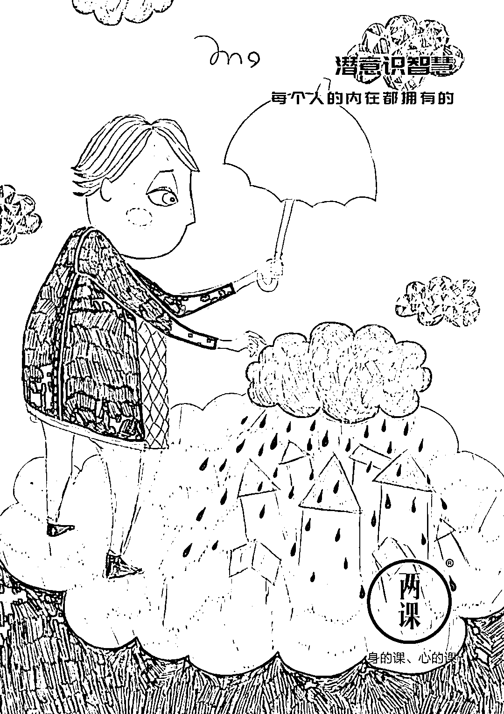

编辑/排版：Vera

文字校对：淑梅

图片：网络

文章内容来自量子催眠案例，经来访者同意分享，文中观点代表催眠师及个案本人，仅供读者参考。

催:她要怎么做，去学习这种用心去感受每一天的生活呢？她要怎么开始呢？ 

潜:说到底就是体验每一个当下的时候，既不担心未来也不后悔过去，就是现在所经历到的事情，去体味它，去品尝它的味道，去接受它。

不要去做那么多的计划，所有的事情如果有一个省事省力的东西，做一个工具是可以的，但是不要把自己的情感或者所谓的安全感建立在这个计划上。把要过的生活当作是此时此刻发生的事，而不是你明天要做的事。

催: 不要把安全感放在做好的计划上，那她要把安全感放在什么地方呢？

潜:如果知道没有什么是不安全的，那么要安全感做什么呢？ 

不是说有一个神庇佑着我，所以我做什么都可以。而是说，我要去体验的所有的东西也包括恐惧，不是因为有了恐惧，我就不去体验什么了，安全感不是一个我去做或者不做什么要考虑的事情。

只是人是为自己负责的，你要有能力照顾好自己，但是照顾自己并不是说我把自己包在一个什么地方，什么都不动，而是说当我面临到一些事情的时候，我可以去解决它，或者说知道这件事情怎么去处理，包括可以避免。

不是浪掷生命，而是充分体验这个生命。

Jasmine

量子催眠二阶段操作者

微信：judyspirit

坐标：上海 

请预约催眠/点击图片赞赏我

预约量子催眠或咨询课程

请添加官方客服：Ann

量子催眠需要面对面完成哦！

**点击了解更多相关文章**

QHHT®量子催眠疗愈技一段课程（新版）

**点个在看手有余香~**

# 即使是小蚂蚁，也可以活出精彩的一生

> 原文：[`mp.weixin.qq.com/s?__biz=MzU0NjkzMDY0OA==&mid=2247518745&idx=1&sn=83092c22f64bf9adc3dcf0a89da6c976&chksm=fb54e0aecc2369b8692fd2379db30229a3c8813587f4beeaebf3e735e631a512acd38c9aff6c&scene=126&sessionid=1690980423#rd`](http://mp.weixin.qq.com/s?__biz=MzU0NjkzMDY0OA==&mid=2247518745&idx=1&sn=83092c22f64bf9adc3dcf0a89da6c976&chksm=fb54e0aecc2369b8692fd2379db30229a3c8813587f4beeaebf3e735e631a512acd38c9aff6c&scene=126&sessionid=1690980423#rd)

点击上方 蓝字 关注我们

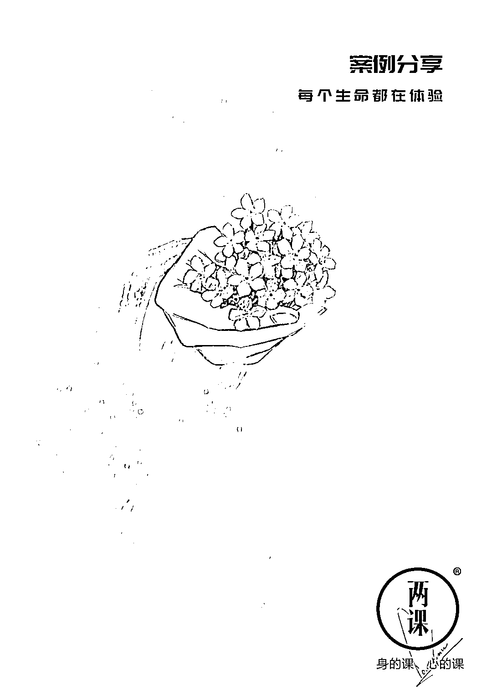

编辑/排版：Vera 

文字校对：淑梅

图片：网络

文章内容来自量子催眠案例，经来访者同意分享，文中观点代表催眠师及个案本人，仅供读者参考。

文中的小伙子我们称为宇，第一眼看到是个很温暖的大男孩，说起他在 13 岁就被诊断抑郁症，到现在 20 岁。多年来父母带他看了很多专家，不停的吃药，停药，复诊，多次自杀，在面谈中他说自己情绪一直低落，愉越感完全没有，行动力差，不想说话，很容易累，平时窝着不出门，总想着实施自杀的办法，但奇怪的是，总是没有达到目的，心太累了，真的找不到活下去的意义。

通过一次量子催眠，宇整个人好起来了，每天开始按自己的计划做事，通过半年的复习，参加了高考，跟父母能很好的沟通。

用他父母的话来说：我儿子，现在是一位阳光大暖男，高考结束，现在做上了自己的小网店，有时跟朋友一起出去玩，回来还总想着给我们带点小东西，太开心了。

** 海 边 的 家**

**在很宽广的海边沙滩上，有海鸥，轻轻的风抚在脸上，还有暖暖的阳光照在身上，很舒服，一只**海鸥躺在沙滩上，海水在拍打着，太阳不见了，我不开心，海鸥死了，就在自己的脚边。

我光着脚，头发是红色的，留着长长的头发，我是 7 岁的男孩。我有两层的木头房子，我喜欢坐在窗户边看着外面，屋内还看到火，很热，感觉到温暖。

不过就只有我自己。平时只有看书，躺在沙发上，在火的边上，正看着火，很温暖。也想出去一会，天快黑了，去看看海。我的房子离海边很近，

我想起了很多东西，我去过泰国的海边，我录了那边海浪的声音。所以我选择住在海边，会舒服一些。

我看到了一只海豚张开了嘴。它的嘴巴里好凉，里面有光，那个光是黄色的，感觉很刺眼，好像要把我吸进去,我走进去了，那些光好像，缓缓的穿透我的身体之中，给到我足够的能量，我是被爱的，黄色的光进入我的身体，我是被爱的。

在这黄色的光里很舒服的，感觉浑身没有那么多的烦恼，在光里就像晒太阳的感觉，暖暖的，从来没有这么好的舒服的感觉。 

看到一道白光在跟着我，它让我进入光里，感觉这里很安静。我想在这里多呆一会，感受到好安全， 不受任何人，任何事打扰。白光让我要离开，继续探索，感觉给了我冷静和勇敢。

现在离开了光，感觉好累，没力气，我没有生病，只感觉到自己很累，很疲惫。

**小 蚂 蚁 一 生**

我一直走，在回家。我身体很好，长大了，我的头发灰灰的。很奇怪像哆啦 a 梦的家，有很多颜色，二楼有个窗户。门口有一个小院子，上了小台阶，我好像是在漫画里。

现在我想走进去，可是没人给我开门。我看到了大雄。但是大雄很大，原来自己是一只小蚂蚁。小小的，安全，爬得很慢，我要爬好久，才可以到我喜欢的地方，我喜欢仰面躺着。

我喜欢吃苹果与哆啦 a 梦的铜锣烧，都是偷偷吃的，休息好了，吃饱了就会爬到窗口。喜欢看着很远的地方。我是被大雄带进来。我愿意呆在这房间里面。有吃的，如果想见小伙伴还得要慢慢爬出去，我活了一个春秋。

一天，身体很难受，很疲惫，因为要死了，所以告诉了同伴。找个没人的地方，有蒲公英，在边上的树丛旁死了。

很坦然的死掉，没有遗憾了，我现在很坦然，我想对伙伴说的是当你没有烦恼的时候，它就会死了。

这一生中学会了，要像蚂蚁一样，不着急。当你吃到好吃的要回去告诉伙伴，因为你很小，力气也很小，根本没办法吃完，学会分享，跟大家一起享用。

我愿意去看这个大千世界，我只是很小的一只蚂蚁，不会因为有没有食物而烦恼，也不会想着要不要加餐，也许我只要吃饱了，就会安静的死去。

我这一生完成的很好，做好我该做的，没有什么遗憾的，你只要不伤害别人，我也伤害不了别人，我是一只好蚂蚁。

我可以在这样感觉里多呆一会，我现在是透明体可以漂着，我现在感觉很舒服了，喘气顺畅了。非常舒服。

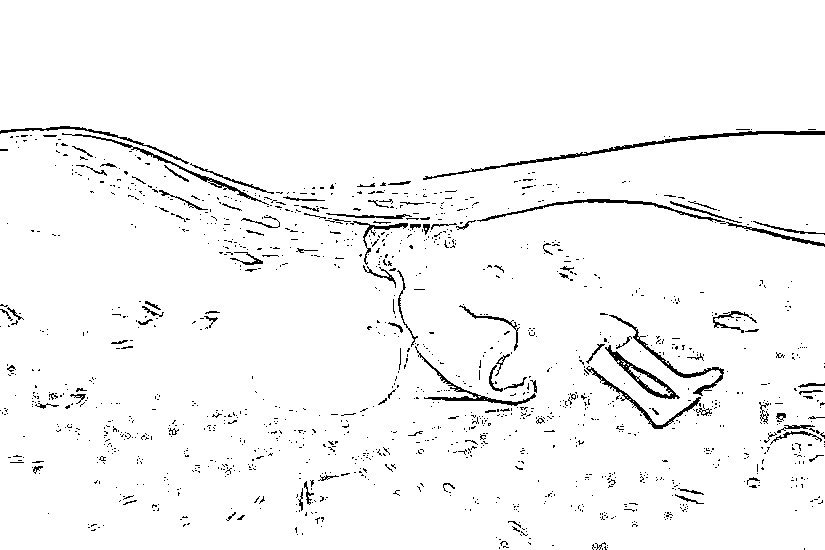

潜意识智慧 

*（情景回溯后，催眠师与个案的潜意识展开对话。此文涉及隐私部分隐去。注：链接潜意识是量子催眠的重要环节，许多深度的答疑解惑和身心疗愈会发生在这个部分。在连接潜意识时，潜意识通过个案之口与催眠师进行沟通。下面的催：催眠师，潜：潜意识，高我）*

催：小蚂蚁的那一世是想给到他什么样启发吗？

潜：让他不要着急。一切总会好起来的，要让他像小蚂蚁一样，小蚂蚁走路不是直线走的，它弯弯曲曲也能到达自己想要的地方。

催：那他现在能明白你给到他的启发吗？

潜：还没有完全明白，以后在他的生活当中，会慢慢明白，我会给到他帮助的。

催：他认为他的身体感知反应能力有些下降。为什么会有这样的一个感觉？

潜：药物的副作用。

催：他现在还需要吃这些药吗？

潜：暂时还需要吃一段时间，会让他结合起来更好一些。

会在这一年的时间逐步调节的，包括他的身体的反应能力，还有很多问题，他需要的药量慢慢减少。

催：他经常感觉到无力，还有头晕，今天是否可以帮助他？

潜：这一块很快就可以打通，还有他的焦虑以及压抑是他父母带给他的感受， 他在外面的时候会比在家里面状态好。

跟父母在一起的时候他会有压迫感，不喜欢跟他们去表达， 他也不想从父母那里受到教育。父母给他的焦虑太多，很多负面的情绪。

催：请问如何才能不受父母的负面情绪影响呢？需要连接他父母的潜意识吗？

潜：这是个非常不错的方法，现在就可以请他父母的潜意识过来。他不需要这样的焦虑，不需要这样的压抑。

潜：个案的潜意识对他父母的潜意识说：我们都不要焦虑。我们都要像小蚂蚁一样，慢有慢的道理。会好的，一切都会好起来的，现在他的父母都收到了。

催：如果以后生活中有无力，通过什么样的方式能更好的调节？

潜：方法有很多，像海鸥的那个故事中让他看到了白色的光及黄色的光。这是给到他调节能量的地方，他以后再有无力的时候，可以去享受到这种白色跟黄色的光芒，他会慢慢自信起来的。

他以前经常会自我否定，需要多鼓励他。他经常觉得自己做不好，还觉得自己的行动力比较差。我们要经常去鼓励他。

催：如何去鼓励？

潜：他能做到的，他愿意自己去动起来，他想做得更好，做更好的自己，其实他是一个很优秀的孩子。他非常喜欢你，他跟你是同一个频道的人，都是非常优秀的孩子，需要经历一些事。

催：是呀，所以从 13 岁到 20 岁几年间，尝试了多次的自杀，他以后还会那样做吗？

潜：通过今天他不会了，他会越来越好的，越来越棒。

催：我比较好奇，这几年看了很多医生，为何他总是走不出来，是不是感觉自己人生是比较迷茫的，所以才会有那么多的自杀经历，他来这一生的使命是什么，你能告诉他吗？

潜：是的，一直迷茫，你能帮助到他。他这一生的使命就是活成自己想要的样子，一个自由自在的样子，他是一个很浪漫的人，是一个不被世俗左右，不为金钱困扰，带给别人快乐的人，是一个非常好的人，他身上有很多很多的优点。

催：请问，潜意识你刚刚说到他是不为金钱困扰的人，他现在考虑是否要从事金融或者是心理学方面的专业，你能给到他一个很好的建议吗？

潜：都需要学，首先考上大学，可以选修这两门，主修金融，辅修心理。

催：他的事业方向能给他看一下吗？

潜：不想让他看到，以后他会有自己的想法。

催：今天你给到他看的这些画面，他认同吗？

潜：非常认同。其实他从小到大在父母心中都是一个好孩子，他们心中的骄傲。但是在生活中父母给到他的压力太大了，认为他跟别人格格不入，其实他生活当中特别亲切，就是生活中找不到自己了，只是自己迷茫了。

催：请潜意识明确的、清楚地告诉他，需要怎么样去做，找回自己，拿回内心的力量，不要迷茫？

潜：必须从小事做起，规律生活。一个月只做一个小事情。每次一件件小事，慢慢的每一件小事就是生活中的一点小恩惠，生活中一点点的小恩小惠点点滴滴聚在一起，无疑丰满充盈了整个人生，当这些小小目标一一实现的时候，那就是生活的馈赠，所以每天都在变好。

身体上的问题

催：他的鼻子不舒服是怎么回事？

潜：是鼻炎。家人给到的压力、焦虑造成的，他把这些问题转到自身上了，我先用白光扫描，让他会舒服一些。

催：肠胃不好，怎么疗愈？

潜：他喜欢吃辣的，不要吃辣的，不要吃太杂、太油。他喜欢吃汉堡。油炸的，让他吃健康的饭菜，现在我帮他用白色的光疗愈，直接白色的光放入身体里面，扫描，放到肠胃里面。

催：他头晕是怎么回事？

潜：多吃蔬菜，他是缺营养造成的。今天先把他的头晕这块打通，疏通以后就愿意去接受蔬菜。

催：他想知道想做事情可总是动弹不得，他的情绪就像过山车一样，会在一段时间以后变得正常或者更差，为什么会有更差的那种感觉？

潜：内心不够强大，以后都会好的。

催：他认为自己是一个讨好型的人格，是因为他的内心不够强大吗？

潜：是因为他太善良了，并不是说他就是讨好型人格。

催：我们如何让他自己更强大或者更有自信？需要怎么做吗？

潜：跟别人交流，不要把自己关在家里。他需要走出去跟别人去交流，他有好朋友，他其实非常喜欢帮助别人，他帮助别人的时候他身心会觉得很愉快。更强大更自信。你跟他说一说。

催：潜意识你确定需要我对他说吗？

潜：是的

催：好吧，那我们一起送给他，我们一起给到他更多的信心，宇，我想对你说：你从现在会变得更加自信，因为你学会了用你的头脑和运用你的头脑，每天为你工作、为你做决定。你是你头脑的主人，你的自信会变得更加强大而有力，因为你对自己充满了比以前更多的爱和尊敬。

你意识到你现在允许自己的头脑百分之百为你工作、为你生活、为你做决定，你过去所有的恐惧、所有的不安、所有让你不开心的都消失，取而代之是一种平衡的感觉。对你说的和做的任何事情都是内在的真实的信心。

你从现在开始百分之百的相信自己，没有人可以给你消极的建议，降低你的自信心，包括你过去的自己，包括你的家人。吸入一种感觉，感觉到真的是美好的，允许你自信的微笑立刻绽放在自己的脸和嘴角上面。

你的嘴角从今天开启，你是上扬的，从现在开始，你每一次的微笑都会增加你的自信。你是你生命的主人，现在你真正的依赖你自己，因为你的头脑和身体都会为你工作，就像波浪拍打着海岸，你的自信将持续增长，你的自信是时时刻刻与你同在的，你感觉到自己非常的好。

过去已经结束了，每天都会越来越好，越来越爱和尊重自己，享受着你是生命的领导者。立刻默想我是一个热爱自性,快乐和幸福的人，现在我的信心让我活出了生命的价值，我真的感觉很好。从现在开始，每一次的微笑，你的微笑都会增加你的信心，更加热爱你的生活。

催：潜意识你觉得如何？他是从哪一个维度过来的？

潜：非常棒，我就知道你一定可以更好的帮助他，他从今天开始是会微笑的，每一次的微笑都会增加自己的自信。关于他从哪个维度就不告诉他，让他遗忘掉这一块，才能更好的在这里生活完成他自己需要该完成的任务。

催：这一次催眠他相信吗？他应该怎么样去听这个录音？

潜：相信的，非常相信，在他难受的时候，随时都可以听，可以连着听一年。每听一次就巩固一次内心。

催：他从什么时候开始去努力去学习、考大学？

潜：从今天开始。

催：还有一个问题，以后不开心的时候，他还会借助赌博去宣泄自己吗？

潜：不会。从今以后他会更多的肯定自己，从今以后他会努力的活出自己。

后续

半年后，小宇分享了他的快乐，他已经完全走出了阴霾。 

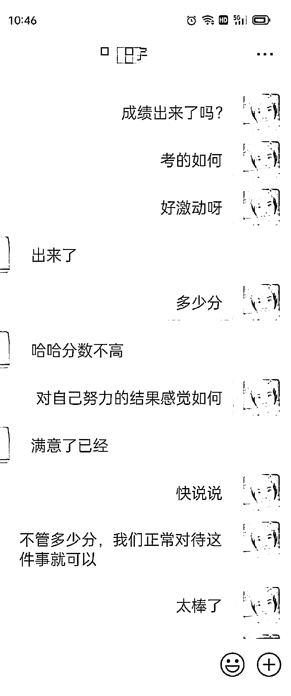

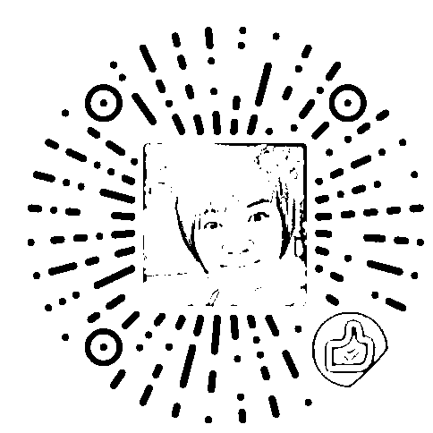

吉祥

量子催眠一阶操作者

微信：jxhz_5151

坐标：北京 

请预约催眠/点击图片赞赏我

预约量子催眠或咨询课程

请添加官方客服：Ann

量子催眠需要面对面完成哦！

**点击了解更多相关文章**

QHHT®量子催眠疗愈技一段课程（新版）

**点个在看手有余香~**

# 催眠中，我感受到了妈妈坚强外表下的温存

> 原文：[`mp.weixin.qq.com/s?__biz=MzU0NjkzMDY0OA==&mid=2247518643&idx=1&sn=46e78e99051d03c707a3316e2a459549&chksm=fb54e304cc236a121a784dc9cda5803deaf7659e87cd4de29a135930734c171bdab0aceea21b&scene=126&sessionid=1690980423#rd`](http://mp.weixin.qq.com/s?__biz=MzU0NjkzMDY0OA==&mid=2247518643&idx=1&sn=46e78e99051d03c707a3316e2a459549&chksm=fb54e304cc236a121a784dc9cda5803deaf7659e87cd4de29a135930734c171bdab0aceea21b&scene=126&sessionid=1690980423#rd)

点击上方 蓝字 关注我们

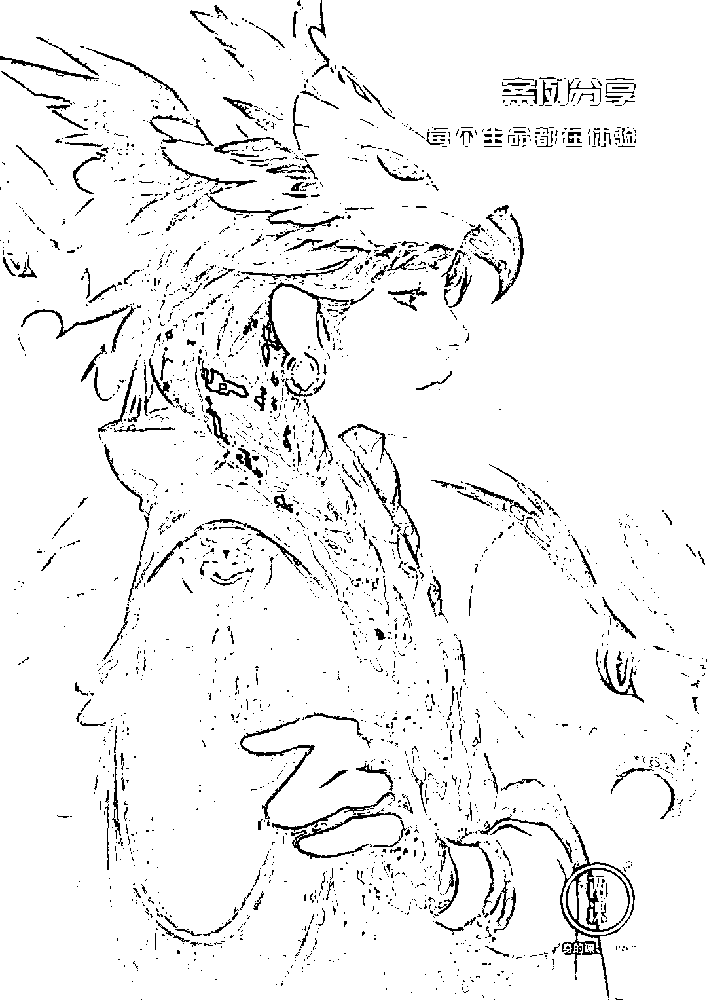

编辑/排版：Vera 

文字校对：淑梅

图片：网络

文章内容来自量子催眠案例，经来访者同意分享，文中观点代表催眠师及个案本人，仅供读者参考。

记录一次特别的催眠经历。

时隔半年仍然记忆犹新，记录下来，把这份爱和感动与你分享。

同修 A 姑娘的一系列行为让阡陌（个案化名）深陷烦恼，她一方面想要改变 A 姑娘，想帮助她摆脱内心痛苦，另一方面，阡陌又自陷其中，感觉自己快 hold 不住了。说起 A 姑娘的事，她止不住落泪。她很想通过催眠照见此事，想知道自己从中需要学习什么，要不要去改变 A 姑娘。在数个小时的面谈中，我们谈到了人际关系，爱，性，对死亡的恐惧等各个方面。她说自己会惧怕权威，感觉这跟妈妈和先生有关。她的妈妈是个很强的女人，她从小到大对妈妈一直有恨和恐惧感。（个人隐私不做详述。）此外，她还谈到自己 16 岁以前如同江湖女豪杰般意气风发，勇敢无畏，16 岁后勇气仿佛不再，她想问那种勇气去哪里了，还能有吗。她说自己从小到大的梦都是黑白的，没有色彩。她想了解之前做的躺在棺材里的梦是什么含义……带着这些问题，我们进入催眠。回溯
潜意识一开始就让阡陌看到了很奇特的场景，她的情绪瞬间变得很激动。阡陌：“在黑夜里，有一只眼睛盯着我看，它在转。周围好黑好黑。有点害怕。它是黑色的，但是能和黑夜区别开来，瞳孔很清晰，它盯着我看（她眼泪一直在往下流）。现在慢慢淡了，没了。”“我没有感觉到难受，但是我感觉到眼泪一直在往下流。现在有难受的感觉了。但是我前面的画面还是漆黑的，我什么都看不见。但是我还是感觉那个眼睛还在看着我。我不知道应该怎么描述，就是刚刚是非常清晰的你能看到眼睛，现在就是你知道那个东西它在那里，它看着你，就是没有眼睛，但是你知道它就在那里（一直哭泣）。它看着我，我很不舒服……我想看到更好的，但是我只能看到它，我想看到彩色的，但是全都是黑暗，好黑好黑。”“没有了，它不在了。我还在这里，我不知道要往哪里走。周围都是黑暗，不是很黑，我不知道为什么沉重和轻盈会在一起……”“它又来了，它变成火了，这次跟以前不一样，是黑色的火一样的眼睛。你知道那是眼睛，就是很奇怪，它就是一只眼睛（大口喘气）。没了……我觉得我身体是僵硬的……”“好像有点亮了。我的腿想抖。可是还是黑色的，又没有了。左面的黑感觉有点亮光，右边在很黑的岩石上，海边，悬崖，很冷的地方，会让我不自觉抖动。左边比右边暖，好像两个画面是割裂的，我感觉站在黑色的岩石上，我全身都想抖。我感到害怕，不想看这样的场景。”“我站在淡灰色水面上，水很冷很干净，好大的水和浪花，很空旷的地方，我心里知道很安全，但是不知道为什么我身体一直在抖动。”“水上有房子和一团乌云，乌云在房子前面，挡住了房子，我不想要云，想看到房子。乌云在变大，它在跟着我，我在水上移动，可是它还在变大。我想转过去，转过去就可以看到房子了，可是我转不了，乌云在阻止我看到房子，我不知道为什么很伤心，不让我看到房子，很难受。（大哭）”催眠师：“你想到房子的时候什么感觉？”阡陌：“（突然哭着大声说）妈妈！它会保护我，可是我过不去。现在乌云好像被划开来了。可是我还是看不到房子。我感到热了。好热，我的头部，温暖。有东西拖着我，在往前走，我不知道是谁，暖暖的让我靠着。（大哭）很舒服，蔓延到我的胸、我的后背，我很想依靠它。我不想看前面了，我就想靠着它。好温暖，好温暖，好暖和。它还在摸我的头。我感觉是只大鸟，有可能就是刚刚那只鸟。（大哭）我好想依靠它。我在它的羽毛下面。它给到我好温暖（的感觉）……”“它带着我在飞，好高，但还是黑色的，但是我可以感觉到流动，有风吹着我，感觉好麻，整个脸上被风吹着好麻，我很想看清楚前方是什么，但是我觉得羽毛在我前面，我看不清楚。”“但是我知道大鸟带着我飞，我飞起来了，它带着我在飞。但是我还是想抖腿，还是想害怕。我想飞，又害怕飞，因为我不会飞，我只能靠着它飞。我很想飞。”“它听到了。它给我羽毛了。”催眠师：“它是怎么给你羽毛的？”阡陌：“我不知道，我突然就张开双手，有羽毛了。”催眠师：“是什么样子的羽毛呀？”阡陌：“是黑色的，轻盈的，软软的。整个双手都有。张开来，会扇动的，很大。大鸟看着我，它希望我飞，可是我不敢飞。它看着我，它没有用刚刚的眼神看着我，但是我知道它给了我羽毛想让我飞起来，可是我还是在抖动，就是一直在空中抖，我不敢飞。”“它现在离开我了，我悬在空中，我的羽毛放下来了。但是它在旁边看着我。我的翅膀收着。我还看到了爪子，鹰爪，是我自己的，很锋利。我全身都是黑色的毛。”“我又看到眼睛了，一只眼睛，旋转的，圆的，但是里面有彩色的光了！它在转，噢，我知道了，它是想让我看着它跟它一起飞！可是我还是不敢。”“那个眼睛没有了……”后面的场景不断变换，各种形态的生物（物体）层出不穷：金色凤凰、暗银色鱼鳞、喷火的愤怒的龙、身穿铠甲的士兵、很多尸体、经过动物的五脏六腑后变成的排泄物、虫类、形似青蛙的两栖动物……注：接触潜意识是量子催眠的重要环节，许多深度的答疑解惑和身心疗愈都发生在这个部分。在连接潜意识时，潜意识通过个案之口与催眠师进行沟通。催：请问为什么给她看到大鸟，它的眼睛一直盯着她？潜：那是她的妈妈，妈妈是爱她的。妈妈非常爱她，会保护她，虽然方式不是她想要的。给她温暖，照顾她，看着她飞，希望她好，妈妈希望她飞，不是拖累她的，在她还不会飞的时候会保护她，爱着她，一直看着她。催：她能感受到吗？潜：能。温暖就是妈妈给她的感受，虽然妈妈很坚强，但她也有很温暖的一面，她没有体验到，她要去体验。催：生活中要怎么体验妈妈的温暖？潜：去主动地爱妈妈，帮妈妈。虽然妈妈会拒绝，但是不妨碍，因为妈妈是爱她的。她要相信这点。催：她就是主动地去爱妈妈？潜：是的，要主动。妈妈会给她力量，一定会。催：请问关于爱妈妈，她具体可以怎么做呢？潜：听妈妈说，不要评判妈妈，妈妈只是想说，因为妈妈最爱她，最亲的人就是她，妈妈说不代表唠叨，不是唠叨，妈妈只是在说给她听，她可以去听妈妈说。小时候，妈妈听她说，现在妈妈老了，她可以听妈妈说。这就是爱。不要评判妈妈，不要指责妈妈。催：就是当一个纯然的聆听者。潜：对，这就是爱妈妈的最好方式。妈妈也希望这样，妈妈要的，我知道。催：妈妈也希望在她面前把心中的感受倾吐出来。潜：是的。妈妈也有柔软的一面。这是她看到的和别的妈妈不一样柔软，这是妈妈的柔软，我妈妈的柔软。催：妈妈的柔软是指羽毛吗？潜：都有。性格，羽毛，感受，温暖，都是。你只看到妈妈坚强的一面，妈妈柔软的一面她用坚强表达出来了。你应该看到！（催眠师注：“你应该看到”，每一个吐字都清晰有力，掷地有声。）催：应该看到妈妈柔软的一面，去倾听妈妈诉说，不带有任何评判，这就是妈妈最想要的，而且妈妈也很希望跟女儿诉说，因为女儿是她最亲近的人。潜：是，完全正确。催：那她之后会这么做吗？潜：会。催：为什么给她看到同时有黑暗和光亮呢？左边是光，右边是黑色的。潜：中道。不要到两边。她太在意了，不是偏左边，就是偏右边。她应该看到中道的地方。没有左面哪来右面，没有右面哪来左面，对不对？不要只想两边的好或不好。催：这个跟评判有关吗？潜：是。催：这跟她的生活有关吗？潜：她太喜欢评判了，这种评判会给她带来伤害。这种评判有对他人也有对自己的，她会无意识地伤害到他人，也会伤害到自己。更主要的是她自己。不要评判自己。催：您建议她在生活中怎么做呢？潜：好好爱自己。多包容自己。不要评判自己，不要数落自己，不要骂自己。催：她在生活中如果又有这种倾向，又评判自己了，要怎么办？潜：相信自己可以做到。就是这么去做就好了。催：如果评判的声音出来了怎么办？潜：不要理它，不听。她能做到的。慢慢地评判的声音一定会没有，她会适应。催：这种评判是怎么形成的呢？潜：小时候大人输入给她的。催：为什么给她看到有光？潜：希望。催：为什么好几次看到明亮的，黑色的又来了？潜：希望她自己能够努力地去到光的地方，自己可以过去的，不要总是别人推她。催：她也说她在生活中比较喜欢依靠，是吗？（潜：嗯。）您也希望她能自己去到光，而不总是依靠别人吗？（潜：是的。）关于想找依靠，您有什么建议给她吗？潜：相信自己。她是一个有力量的人。催：她说她 16 岁之前有很多勇气和力量，但 16 岁那年之后就感觉不一样了，请问潜意识这是为什么呢？ 潜：她自己把它封存起来了。但其实一直都在，力量和勇气从没缺失过。她要相信自己，全然地打开自己，接纳自己，理解自己，爱自己。听自己的心，心会告诉她，她之前有做到过。相信自己，听心。静下来。她太急了。她完全可以做到。催：她想找依靠的原因是什么？潜：妈妈。妈妈是依靠。催：您说了她是可以靠自己的。（潜：是的。）她完全可以靠自己去飞，可以不需要依靠的？潜：完全可以。催：她在生活中做到了吗？潜：没有完全。她还是不相信自己。问题就在她不相信自己。相信就好了。催：就跟那只鸟一样，它相信自己就能飞。潜：完全一样。催：怎么相信自己呢？潜：努力，相信就好了，去做，不要害怕失败，你去做了就已经相信自己了。催：真的有失败吗？潜：没有，失败都是想出来的。是自己找麻烦。催：那她在生活中如果体验到了不如自己的期待这样的事情怎么办？潜：**因为她不想接受，她怕难受，她只要接受难受就可以了，难受也是一种感受。你告诉她，难受没什么的，不如自己的期待也没什么的。完全可以，她可以这么活着。**催：她可以怎么活着呢？潜：她可以按照自己的心去活着，她可以做到。她可以不给自己设要求。她可以想怎么做，就怎么做。她是一个生命，她完全可以绽开，没有束缚。她只要看到自己的心，看到自己的身体，身体会告诉她，走心，不要往外看。催：她害怕表达，有什么建议？潜：就只能说出来。去表达，不要有顾虑，说不死人。顾虑也是自己想出来的。害怕也是想出来的，也是别人给她的，她完全可以拿走，扔掉。催：请求潜意识把您认为她需要扔掉的害怕恐惧给扔掉……潜：……像气一样升华掉了。之后害怕恐惧会减弱，还是靠她自己。催：她害怕权威。潜：是她想出来的，不存在，停止就可以。就是静下心来看到自己的心，就不会害怕权威了。催：能举个例子吗？比如她在跟一个权威人士打交道的时候。潜：她把所有的精力落在那个人的身上，她只要回过头来看到她自己就可以了，看到自己的任何一个部位，身体啊什么都可以。这种恐惧就不在了，或者在，也影响不到她。大概这么做 50 次之后就可以了。催：为什么给她看到山洞里的凤凰，发着金光？潜：重生。她可以抛掉过去，完全可以重生。催：她要如何抛掉过去？潜：不要老是带着过去的烙印，一个新的自己，就这样，没有过去，简简单单地活着。催：每一天都是崭新的，每一刻都是崭新的。潜：可以这么说，非常好。催：过去发生的事情重要吗？潜：都不重要了，没有意义。催：她在场景中经常看到一些好像有些危险的画面，但她又觉得自己不会受伤，这是为什么？潜：有人在爱她，所以她就不会被伤害到。她先生也是一直在保护她，但她不能感受到，因为她的要求。还是跟她妈妈一样，她有想象，她想象她想要的，但是先生不是她想要的。她只要看到自己的想象和期待，就能体会到先生对她的爱和保护了，一直都在。只要她足够地用心，就能体会到先生的爱。她不敢相信那是爱。她要有信心相信，她就能够体会到。催：您好多次提到让她用心，无论对自己，还是对他人，都用心。潜：对，她太用大脑了，她不去感受。感受跟头脑是两回事，完全不一样，（用心/感受）没有评判，没有伤害，没有指责，没有辱骂，但是会很温暖。开放的，纯然的，天然的，伟大的，勇敢的，她一直想要的，就在这里。催：她在画面中看到过好几次尸体，电梯下方有尸体，有人在爬，死了，被吃了进入内脏后变成排泄物被排出……为什么看到这些？跟她恐惧死亡有什么关系吗？潜：都会死的，很正常。看到的所有形态都是她自己，她自己的经历。她经历过很多不同的生命状态，生生灭灭，就是这样，就是这样的。看到这些，让她好好地活着，不要想那么多。催：为什么给她看到一条龙，很愤怒，一直在不停地吃金子，不停喷火？潜：不要太贪。知足，知足能给她快乐。那条龙虽然一直拥有，但是一直不满足，还很愤怒。知足和贪婪就在她自己的选择，她心里清楚。催：A 姑娘的事她为什么会 hold 不住，会有反感呢？潜：就是她自己，她们很多地方是一样的，A 姑娘表现出来了，让她看到了自己，她反感其实是对自己的感觉。催：她说她想改变 A 姑娘。潜：改变不了，那是别人。她只要接纳自己就可以了。催：她从中需要学到什么呢？潜：还是爱自己，接纳自己。催：她接纳自己之后是不是就不会想改变她了？潜：完全正确。A 姑娘是来帮助她的。催：她为什么感觉对老公有欠呢？潜：有瓜葛，累世的瓜葛。她要还，看到老公的好就可以了。老公需要被她看到。她看到老公后，老公会变化，会变得好。催：她躺在棺材里的梦是什么含义？潜：和（回溯场景的）凤凰一样，表示重生，这个梦给她信心。她已经接收到这个信息了，但是她还在怀疑。这次再次给她确认，不要怀疑，相信自己。催：她的信念本身就是最好的疗愈工具。潜：对。催：潜意识就是在她的内心深处是吗？潜：完全正确。看到自己的心就是在和潜意识链接。催：您希望她怎样去生活呢？潜：好好的，开心的，圆满的。催：她如果按照您希望的状态去生活，她会怎么样呢？潜：她会懂的。催：拭目以待。潜：是的。**身体部分：**咽喉：潜意识用震动疗愈。咽喉疼痛是因为她没让它动，有话不说。让咽喉动，去说，去表达就好了。她要相信咽喉好了，她的相信很重要。刚开始表达会有挂碍，表达多了就好了。膝盖：只要勇敢就不会疼，跟她的心有关，她太胆怯，迈不开。勇敢了迈开了就有力气了。嘴巴干：要说好听的话，没有指责的话。肩膀紧张，一直耸着：不要害怕，放下负担，轻松上阵。潜意识帮她把负担脱下来，那是背上的一个壳，是（对家人的）爱和承担。其实他们都可以自己管好自己的，她不需要替别人背负。后记
催眠后第三天早上，阡陌发来信息：“小天真，今天早晨我会发自内心地微笑啦。”又过了大约一周，她说，“我昨晚的梦里有颜色了！在我很小的时候就留意梦中的颜色，一直都是黑白的，没有彩色，我很羡慕会做彩色梦的孩子，好好玩啊！”我为她感到高兴也好惊喜。难道这与催眠中看到的场景--“原本好黑好黑的眼睛，在经历了一段与大鸟飞翔的故事之后，眼睛里出现了彩色的光”有关吗？因为与大鸟的互动让她深刻感受到来自妈妈的爱和温暖，以及一直在她身旁支持她的那份坚定不移的力量。这就是量催的神奇之处。你永远不知道在更深的无形的层面，哪些东西发生了微妙的匪夷所思的变化。催眠半年后的一个晚上，我听录音整理这则案例，次日清晨，我做了一个关于孩子与妈妈的梦。梦中我是一个孩子的视角，因对妈妈工作的担心而阻止妈妈做某些事情。妈妈为了收益而在法律边缘冒险，性格倔强顽固的她，任凭我怎么说也不听。但是当我打开妈妈的工作包裹检查妈妈是否听从时，竟看到包裹里放着一台用盒子装好的老式收音机，里面存放着我童年时的回忆（声音），妈妈一直把它带在身边。我心想：“原来在妈妈心中，女儿一直都是最珍贵的……”一瞬间感受到好多好多妈妈的爱，对妈妈的生气和不满顷刻全部消融，刹那间抽泣不止，从梦中哭醒。梦里的人不是我的妈妈，我不知道是谁的妈妈，但是是关于一个孩子和妈妈的梦。我把梦里的感动告诉阡陌，收到阡陌的留言，她说：“那次催眠以后我和妈妈之间的关系有变化了：我第一次真心的对妈妈说我爱她。去年和几个朋友在一起，期间我忽然感慨了一下，我好爱妈妈。朋友说从来没有听我这么说过，这么表达过。我感受到从催眠以后对妈妈的恨和恐惧在消失！”真的太好了，祝福阡陌，谢谢阡陌带给我们的感动，也祝福天下所有的母亲和孩子。我把以上内容发给阡陌，收到她的手写文字，好久没有阅读这般娟秀而真情质朴的手写书信了。内容如下：*小天真:**您好！**真的很感恩，您将案例整理出来，让我又一次感受到了那次催眠，那天的感动！**说实话，催眠结束后的那一周，我能够很明显地感受到自己与之前不同（能量感知方面），在内心里很好奇、很开心，也有点隐隐地担心会失去这股力量或者说是能量，所以内心不知道为什么对再次听当天的录音有些回避，也许是不想靠着外面的或者说外在的方式让力量存在，不是很清楚。“不想听就不听。”我对自己说。**但是从那次以后，我的内心、我的身体的确是有了改变。**让我最感到神奇的是:在催眠结束后的那么久时间内，我和您还是有共振的，或者说那场“催眠”还在延续。**事情是这样的，上周在我内心升起一个对身体某个部位的不适而想要改变时，刚好您将“直播”推送给我，让我听关于“催眠”应该说是“量催”的直播，刚好我进入直播间就听到关于我内心问题的解答，更神奇的还在后面：**我连着一个晚上听完了您直播间所有的录音，迷迷糊糊的睡梦中仿佛我半梦半间又感受到那天的催眠，感受到那天的场景，感受到我这个身体的问题，量催那天“潜意识”或者说“我自己”给到自己的答案，我想了起来，就这样在第二天早晨，我做出了一个和自己之前完全不一样的举动，当我做完后，我感受到身体那块的能量通畅的感觉。**和您分享这些，除了内心的感动还有神奇想要和您说，还有就是希望您的“量催”能够帮助到更多人，因为这一场神奇之旅我是真实的体验到了。**再次感恩您！**阡陌**2022.5.13*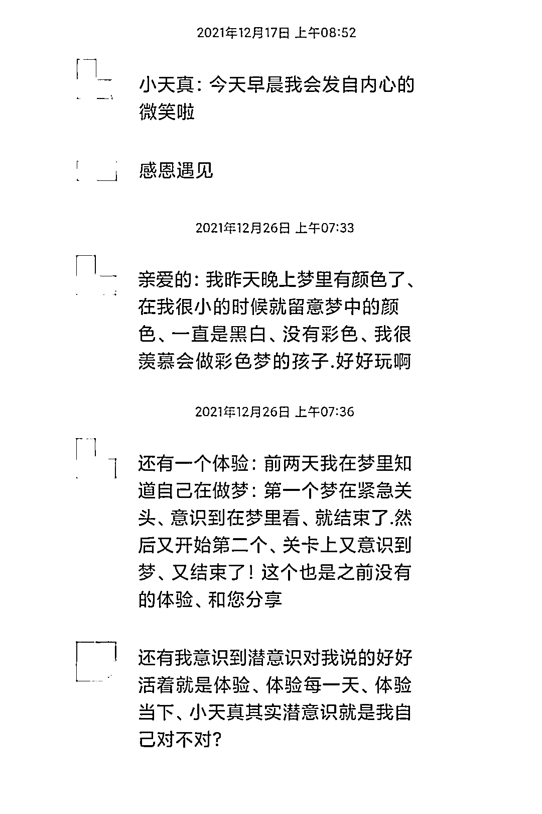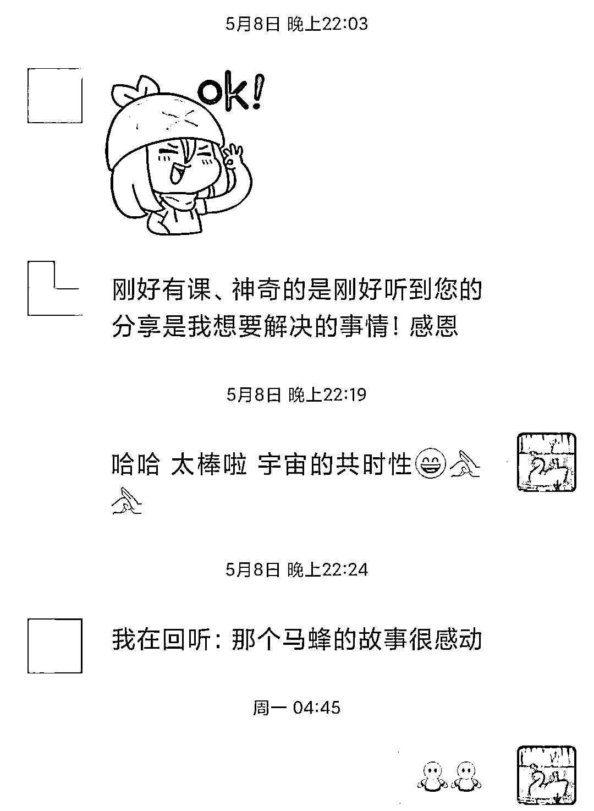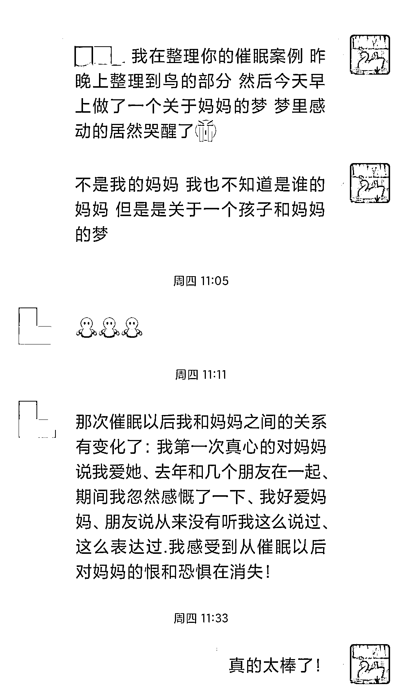

小天真

量子催眠一阶操作者

微信：achunyz

坐标：上海 

请预约催眠/点击图片赞赏我

预约量子催眠或咨询课程

请添加官方客服：Ann

量子催眠需要面对面完成哦！

**点击了解更多相关文章**

QHHT®量子催眠疗愈技一段课程（新版）

**点个在看手有余香~**

# 量催知识 | 什么是量子催眠？

> 原文：[`mp.weixin.qq.com/s?__biz=MzU0NjkzMDY0OA==&mid=2247518616&idx=1&sn=3d0a5a6d2e277df8c9aeda18a3fe7497&chksm=fb54e32fcc236a39c5d6c2908b21b7d54c35c3e27c8d732d05a259bd39d8b83790dc27fd38b7&scene=126&sessionid=1690980423#rd`](http://mp.weixin.qq.com/s?__biz=MzU0NjkzMDY0OA==&mid=2247518616&idx=1&sn=3d0a5a6d2e277df8c9aeda18a3fe7497&chksm=fb54e32fcc236a39c5d6c2908b21b7d54c35c3e27c8d732d05a259bd39d8b83790dc27fd38b7&scene=126&sessionid=1690980423#rd)

点击上方 蓝字 关注我们

  

排版：Jasmine

它是一条道路；它是一种超心理学工具；它让你通向未知世界的自己；它是严肃的自我探索，不是儿戏；它监督你为自己负起责任，而非逃避；它协助你以最彻底和智慧的方式找到答案，疗愈身心；它将深刻的改变你，不管你是量子催眠操作者，还是个案；它的第一目的是个案的最高利益；它是客观、开放、安全的；它是爱……**它是朵洛莉丝.侃南留给地球的礼物。**

————量子催眠中国院长

量子催眠的全称

量子催眠全名为**量子催眠技术**(Quantum Healing HypnosisTechnique，QHHT®)。它是全球传奇的回溯催眠大师朵洛莉丝.侃南（Dolores Cannon，以下统称朵奶奶）基于近五十年的实践和无数神奇的催眠经历不断锤炼而成的一种独特的催眠技术，也是她留给地球的一份神奇遗产。她发现这种独特的方法可以非常有效的用于身体和心理健康的改善，并解决人生的重大问题，经她催眠而重获新生的个案数以千计，其中不乏有医院记录在案，身患绝症的患者。她也因此完成了十九本完全基于她的催眠案例，颠覆传统认知的畅销著作。量子催眠的核心理念有别于任何一种传统催眠术或前世回溯催眠的技术，由于朵奶奶对个案带有的高度责任感，她不仅使得这个技术的每个步骤都被精心设计过，并且严格遵循某些重要原则，以确保每个个案 100%的身心安全。更为可贵的是，它少有的简单、纯净，直接深入到个案问题的核心，而不只停留在现象层面，因此能使个案在一种特定的状态下与“潜意识”（非传统心理学概念，实为“高我”或“超意识”，以下统称“潜意识”）建立稳定和清晰的链接，获得深刻的身心健康与人生的转变。它的价值也不仅仅只在于“服务他人”，量子催眠操作者本身也会受益于不断帮助个案的过程，获得深刻的自我疗/愈和改变，进入一种全新的人生。

量子催眠名称的由来

很多人都会问，为什么叫做”量子催眠“？对于这个问题，朵奶奶说过，其实答案很简单，她创立的这个方法远远不止于回溯催眠的范畴，可以帮助到个案与“潜意识”（非心理学概念，可理解为“高我”或“超意识”）建立跨越维度的连接，有可能让个案发生重大的疗愈和深刻的转变，这种情形类似于微观粒子在量子态下的“量子跃迁”（Quantum Leap）。量子催眠技术因此而得名。

📹 [`mp.weixin.qq.com/mp/readtemplate?t=pages/video_player_tmpl&action=mpvideo&auto=0&vid=wxv_1239484959862243328`](https://mp.weixin.qq.com/mp/readtemplate?t=pages/video_player_tmpl&action=mpvideo&auto=0&vid=wxv_1239484959862243328)

# TTF®穿越频率 | 盖伊·尼德勒线上课程重磅来袭

> 原文：[`mp.weixin.qq.com/s?__biz=MzU0NjkzMDY0OA==&mid=2247518611&idx=1&sn=55181b4ba3366e2a7ad638de98a158a5&chksm=fb54e324cc236a32cc30eeb3fa96affca399e38ecdcdaf4283354e1ce2d521b1d0380644b8a1&scene=126&sessionid=1690980423#rd`](http://mp.weixin.qq.com/s?__biz=MzU0NjkzMDY0OA==&mid=2247518611&idx=1&sn=55181b4ba3366e2a7ad638de98a158a5&chksm=fb54e324cc236a32cc30eeb3fa96affca399e38ecdcdaf4283354e1ce2d521b1d0380644b8a1&scene=126&sessionid=1690980423#rd)

点击上方 蓝字 关注我们

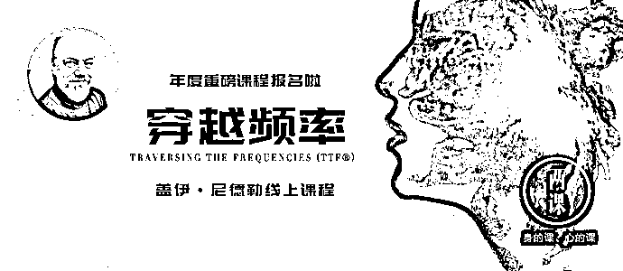

文案：Leo/Jasmine

图片/排版：Jasmine

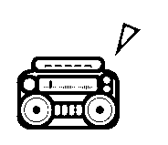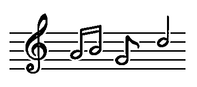

**盖伊·尼德勒**

TTF®

穿越频率线上课程重磅来袭！

你是否有过这样的体验？

当愉悦放松时，灵感会源源不断的到来；

当难过愤怒时，脑袋里只有负面的思想。

你是否对能量或者频率非常敏感？

喜欢待在大自然的环境中；

亲近那些散发着柔和能量的人。

你是否正在寻找某种冥想的方法？

让自己处于高频的能量状态；

既升华自己，又惠及他人。

如果是这样，那么，就来参加盖伊·尼德勒教授的穿越频率线上课程吧！

在课程中，你将会收获让自己实时处于高频状态的方法。

同时，还能与更高频率的存有，乃至源头进行沟通，疗愈自己以及他人。

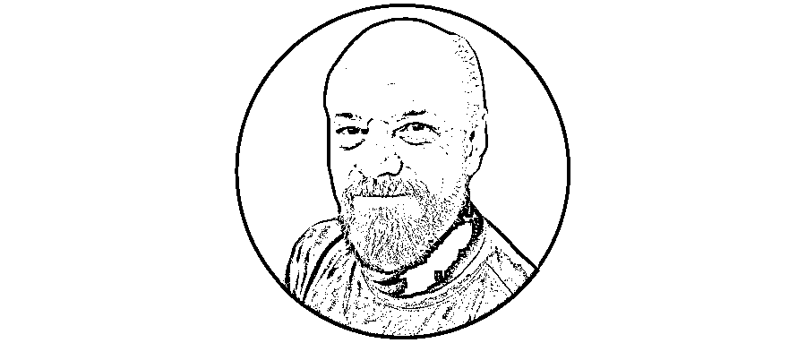

**课程导师：盖伊·尼德勒**

GuyNeedler，理学双学位硕士，工商管理硕士，特许工程师，工程技术学会会员(MIET)，替代医疗协会会员(MCMA)，早期受训成为机械工程师，随即晋升为特许电力电子工程师。

不过在尘世的培训当中，他一直意识到世上有更高的实相，并得以瞥见灵性的世界。这使他从青少年时期到二十多岁的岁月里，沉浸在灵性书籍，且勤奋地投入到静心冥想中。

随后指导灵以一种特殊的方式与他沟通，需将重心暂时放在对尘世的贡献上，于是他减少了灵性上的探索，直到将近四十岁时，他又再度被唤醒，重归灵性角色。

接下来的六年里，他获得了灵气疗法的导师资格，并用四年的时间向海伦‧斯托特学习能量与频率治疗技术。在校期间他也学习了个人发展与实践（包括心理疗法）这一预修课程，该课程使用的“道途”法由苏珊‧赛森格提出，并由多诺万‧赛森格、约翰与伊娃‧皮拉克斯等人进一步发展。之后，能量治疗方面的培训和经验使他成为了替代医疗协会会员(MCMA)。

除了能量疗愈方面的能力，他的灵性能力还包括能够从传递灵界信息，以及持续与我们多维宇宙中各种实体及存有、他的高我及指导灵保持接触。他所撰写的《源头简史》正是源于深度的冥想传导，且他正在带来更多的颠覆传统认知的著作。

盖伊还练习并传授合气道，作为一种接地的方法。在此领域他拥有二十八年经验，是五段国家级教练，目前正将灵性能量融入这门艺术当中。

适用对象

1

**参加过护盾、校准及能量疗愈课程的学员**

*   在疗愈的过程中获得源头及高频存有的建议

*   穿越至更适合个案疗愈的频率中，使疗愈的过程事半功倍

2

**参加过量子催眠课程的学员**

*   让你在面对个案时保持高频的状态

*   在催眠的过程中，获得更多高频存有和源头的建议 

3

**希望探索自身连接源头的人群**

*   为你接通与源头及高频存有的沟通管道

*   在生活中获得源头的建议，有了这课，就够了

4

**能量敏感体质人群**

*   穿越至更高的频率层级，避免受到低频能量的侵扰

*   连接并吸收源头的能量，让自己处在高频的能量状态中

课程简介

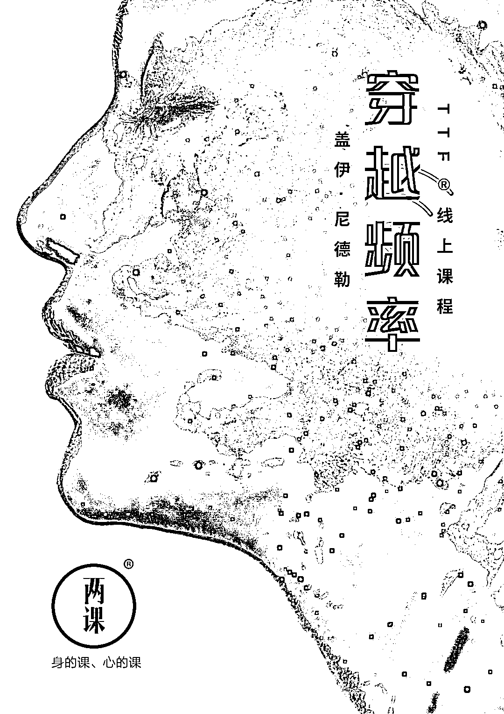

**穿越频率线上重磅课程**

**Traversing The Frequencies**

**TTF®**

涵盖 TTF®课程所有 1、2、3 阶段音频内容，教会从基础到高级的由老盖本人亲自使用多年的 TTF®冥想方法，直至可投射意识穿越最高 408 层多维宇宙，训练与高我甚至源头等高维度实体稳定连接的能力。可快速提升自身频率，获得信息及帮助。

概念讲解

1.  通过系统化的讲解，为您厘清源头的历史和多维宇宙（源头实体）及其之下的结构，极大地扩展你的意识和思维，理清各种层出不穷、模糊不清的概念的认识，为你提供一个更宏大和清晰的宇宙观参照系统。

2.  从实际操作中认识脉轮及人体辉光层、为穿越频率做好能量准备。

3.  更深入的理解什么是全维度、亚维度、频率层级、以及高我跟个人进化之间的关系。

操作练习

1.  在盖伊·尼德勒老师的带领下，掌握使用 TTF®的各种冥想穿越工具和正确方法，穿越不同的维度和频率层，了解不同维度的存在体。

2.  学会多方向穿越，以及在同一时间内，意识能量体身处多地的技巧。

3.  到达不同的频率层次，与高频存有，以及源实体进行连接，获得属于个人的信息。

4.  穿越至多维宇宙最高频率 408 层级，与源头（神）建立稳健和持续的连接。

课程时间

**随报随学：**线上音频课+每月一次固定老盖直播答疑及冥想带领**直播时间：**每月第二周的周三（满 5 人开播）

价格与福利

**全程价格：8800 元（文末有优惠福利）**

*   **可长期参加老盖的每月答疑活动**

    询问及收听老盖对穿越频率问题的解答

    有机会让老盖亲自回答您在练习穿越频率中的疑问

*   **可长期****参加老盖亲自带领的冥想课**

    由老盖亲自带领你从第 1 层穿越至 408 层 

    与最高频率的源头进行沟通，获得疗愈


**长按以上二维码****进入两课身与心购买**

全程资深翻译


**院长 Leo**

课程咨询

**请长按以上二维码** 

**添加官方客户服务人员**

优惠券


请速速领取

手慢无~

**点击了解更多相关文章**

[PSAR®2022 能量疗愈工作坊](http://mp.weixin.qq.com/s?__biz=MzI3MTk3MjM5OQ==&mid=2247494331&idx=1&sn=abd6f1939aad23a92eb3914c94411467&chksm=eb3b0bfbdc4c82ed54e05a2dd70c628e5a10cf31b964f040ae72815cb018250f962e3a99a7ec&scene=21#wechat_redirect)
[2022 年能量疗愈工作坊花絮](http://mp.weixin.qq.com/s?__biz=MzI3MTk3MjM5OQ==&mid=2247494387&idx=1&sn=f0946343753b21c9df213f78151c212e&chksm=eb3b0bb3dc4c82a5688d3d96322a624f2a3eb46bf3aba1b97a1164f0cc8cdf06bf7be3d779c4&scene=21#wechat_redirect)
[学员证言 | PSAR®能量疗愈线上直播工作坊](http://mp.weixin.qq.com/s?__biz=MzI3MTk3MjM5OQ==&mid=2247495740&idx=1&sn=faa99096742afd6488a3dfe539c95c22&chksm=eb3b117cdc4c986a0e0bfbf4a5457082ab56c26adae897da03dc0a3b0aaf462c25e3f953a0ed&scene=21#wechat_redirect)


戳阅读原文，进入两课身与心购买课程

# 情绪（下） | 灵魂在说话

> 原文：[`mp.weixin.qq.com/s?__biz=MzU0NjkzMDY0OA==&mid=2247518609&idx=1&sn=48ad5badc49d02f45f2948b69d73be40&chksm=fb54e326cc236a30fc1d58553fef814c6e839ac8c661e7e5002369bdcc89a2459886e105108c&scene=126&sessionid=1690980428#rd`](http://mp.weixin.qq.com/s?__biz=MzU0NjkzMDY0OA==&mid=2247518609&idx=1&sn=48ad5badc49d02f45f2948b69d73be40&chksm=fb54e326cc236a30fc1d58553fef814c6e839ac8c661e7e5002369bdcc89a2459886e105108c&scene=126&sessionid=1690980428#rd)

点击上方 蓝字 关注我们


文章摘选自茱莉亚·侃南的著作《灵魂在说话》

排版：Jasmine

如我在本章一开始所说的，情绪是我们针对各个议题的成长指标。我们要对这些情绪心怀感激，因为它们是我们人生和成长过程中的导引系统。这个情绪导引系统在我们的太阳神经丛，它让我们感受到我们的选择所造成的影响。

我们**选择**对事物如何反应，直到现在，我们一直不自觉地对发生的事作出反射性的回应。当我们越来越有觉察力，我们会感知到我们的选择和它们的影响，以及我们因此而有的反应。这样的反应会平衡得多，因为我们较能保持客观。

请了解，情绪没有对或错，就像处理情绪的方式也没有对或错。我认为，**我们对情绪判断对错才是这么多人陷入自责，陷入不想要的情境的原因。**我们认为我们应该要有特定的行动或感受，当我们不是这样的时候，我们就是有问题，有什么地方不对了。

情绪让我们和宇宙中的其他生物不同。我们选择这个时候来到地球是为了让自己加速成长而来体验。当我们选择地球游戏时，我们就是来学习情绪和限制。而情绪是让我们知道自己做得如何的主要方式。

首先，我希望你知道，你可以“感觉你正感受到的情绪”。如果你不让自己体验这些情绪，那你要如何知道自己想告诉自己什么呢？我认为我们因为被教导“感觉情绪”是错的，所以我们麻木自己绝大多数的情绪。我们像群机器人般的过日子，没有活力和生命。另一个极端则是一群人受到彼此情绪的影响，持续加速和堆积情绪的能量，创造出不停循环的戏剧化的混乱世界。两个极端都不会有帮助。我认为我们需要将情绪看成美好的工具，并与它合作，这一点很重要。

接下来是承认情绪。这就是“你拥有情绪”或“情绪拥有你”的差异之处。我认为我们因为害怕情绪后头的东西，所以不自觉的否认情绪或是把情绪压抑下来，埋起来，希望情绪会自己走开。但我们忘了，情绪是我们沟通和指导自己的主要管道之一。如果我们有以上的行为，我们便是在创造一个让情绪以别的方式表达的环境。很多时候，这可不是个好现象。而这正是让我们后来对自己的情绪感到害怕的原因之一。我们会觉得情绪无法控制和遏止。

正如同任何教导你的事情一样，你需要检视它，看看讯息是什么。很多人问我，要如何检视恐惧？要说“就看着它。”很容易，当人们问我如何做的时候，有意思的事情就会发生了。我看到眼前出现小小的人，大约三尺半高，代表恐惧这个情绪。恐惧现在有了形体，双眼和其它部分，我可以看着它，我还能够问它问题。我可以正视它的眼睛，问它想要告诉我什么。我说：“你想教导我什么？、你希望我了解什么？”我发现一件有趣的事，它比我个子小，不像我以前以为的那么大、那么丑陋可怕。

有一次，我真的把它看清楚了，还跟它说话，它却成了一团空气消失了。我想，这就是大家说的“正视恐惧”吧！它的双眼本来很可怕，但我真正看着它时，就看到它的眼睛里其实很哀伤。是因为我们不肯正视，才使得恐惧变成那个又大又坏的丑陋怪物。恐惧一旦消散，我就能看到它背后的东西，看到我需要学习的事物。一旦恐惧的情绪被移除，就能从客观的角度面对事情，于是我也能用建设性的方式处理问题。

完

[翻译手册 | 灵魂在说话](http://mp.weixin.qq.com/s?__biz=MzU0NjkzMDY0OA==&mid=2247510198&idx=1&sn=abb03725d1f7f289606ddc42787468e5&chksm=fb54c201cc234b17bea9ee8d00eb2a3eb3e269eb2ddb0357c903073cdb65e75fbbf8a05b8fd1&scene=21#wechat_redirect)

📹 [`mp.weixin.qq.com/mp/readtemplate?t=pages/video_player_tmpl&action=mpvideo&auto=0&vid=wxv_1974708793594675201`](https://mp.weixin.qq.com/mp/readtemplate?t=pages/video_player_tmpl&action=mpvideo&auto=0&vid=wxv_1974708793594675201)

**点击视频了解恐惧是什么**

**点个在看手有余香~**

# 潜意识智慧 ▏生活并不是为了赶路，而是为了感受路

> 原文：[`mp.weixin.qq.com/s?__biz=MzU0NjkzMDY0OA==&mid=2247518606&idx=1&sn=b9a6fdfaaa8d7acc97f1ea83cef8430a&chksm=fb54e339cc236a2f1c95dd5edd49c5c3a686af50aa0faeda72304c8341e602299bf10eec5580&scene=126&sessionid=1690980428#rd`](http://mp.weixin.qq.com/s?__biz=MzU0NjkzMDY0OA==&mid=2247518606&idx=1&sn=b9a6fdfaaa8d7acc97f1ea83cef8430a&chksm=fb54e339cc236a2f1c95dd5edd49c5c3a686af50aa0faeda72304c8341e602299bf10eec5580&scene=126&sessionid=1690980428#rd)

点击上方 蓝字 关注我们


编辑/排版：Vera 

文字校对：淑梅

图片：网络

文章内容来自量子催眠案例，经来访者同意分享，文中观点代表催眠师及个案本人，仅供读者参考。

**潜意识给个案看到许多在日历上的花、鸟、车等图案，想要告诉她什么呢？**

潜: 每一天都可以用不同的东西来填满，好像没有填满就对不起这个日子，或是生命被虚度了，这样串起了一天又一天。可是这个日子本身就只是一张日历，一个编排出来的东西而已。

带着觉知去生活，不要只是想着填满日历，在经历事情的同时，有什么感受？感受才是经历事情时最重要的部分。

急急忙忙的去经历很多事情，却没有关注自己的感受，那么所有的经历就只会像塞满整个日历的东西，根本看不清那是什么，这跟日历上的一个数字没有任何区别。

**催: 那提醒她去学习什么呢？**

潜: 在现在的生活中，她真正有感受的事情没有那么多，这并不是因为有感受的事情多或少，而是因为在经历这个事情的时候，她没有关注自己的感受，所以才会觉得很多日子是无聊的。

在那些时候，她根本就没有真正的去过那个生活，所以过和没过没有任何区别，对她来说像不存在一样，她不会感到充实。

充实的生活，并不是靠着追逐很多东西，或者制造很多奇幻的经历决定的，在她经历任何一件事情的时候，让它如何经过才是最重要的。

如果她经历了很多事，可是这些事只是流过去了，那经历和没经历都一样，她只是把它们填在了日历上，占满了那个看都不会看上一眼的格子，那就会觉得很无聊。

所以说安逸或者什么，都不是活得无聊的原因，不是说非得波澜起伏才叫过得精彩，也不是说非得温饱不愁才叫活得安稳，都不是。在安稳中也可以活得很精彩，在精彩中，也可以过得很安然，两者是不矛盾的。

做任何事情，如果没有真的去经历，去感受每一个时刻的感觉，有一天会很厌倦的。在生活中不愿意去经历是因为觉得那种感受是不舒服的，但不舒服的感受也要接受，也值得体验，并不是说不舒服我就不去经历，这样我就可以把它屏蔽掉，这就浪费了体验的机会。

不舒服可以选择换一种方式，换一个地方，什么都可以，但是不要用不体验的方式，不是用拒绝感受的方式去经历它。

这么做并不能真正的摆脱不舒服的感觉，而是会产生一种：我换种方式是不是就更好了，这种不切实际的想法，那早晚还是会落回同样的境遇。所以最根本的改变，是改变自己。

总觉得好像有什么东西不够，眼睛里总是看着什么地方需要被填补，所以才会去选择那么多新的书、新的学习、新的东西、新的体验。其实那些学过的东西，必须得在生活中活出来，必须得去落实。

能把人生过得越简单，越开心，越舒服，越好。

Jasmine

量子催眠二阶段操作者

微信：judyspirit

坐标：上海 

请预约催眠/点击图片赞赏我

预约量子催眠或咨询课程

请添加官方客服：Ann

量子催眠需要面对面完成哦！

**点击了解更多相关文章**

QHHT®量子催眠疗愈技一段课程（新版）

**点个在看手有余香~**

# 不管是什么样子，都不要停止去爱自己

> 原文：[`mp.weixin.qq.com/s?__biz=MzU0NjkzMDY0OA==&mid=2247518529&idx=1&sn=60743089e73c346235fb96631d1e2e93&chksm=fb54e3f6cc236ae0ea7819220a5ee78fb39b30930a84a174335535e8d03c3d63d2c9f1dc1745&scene=126&sessionid=1690980428#rd`](http://mp.weixin.qq.com/s?__biz=MzU0NjkzMDY0OA==&mid=2247518529&idx=1&sn=60743089e73c346235fb96631d1e2e93&chksm=fb54e3f6cc236ae0ea7819220a5ee78fb39b30930a84a174335535e8d03c3d63d2c9f1dc1745&scene=126&sessionid=1690980428#rd)

点击上方 蓝字 关注我们


编辑/排版：Vera 

文字校对：淑梅

图片：琴提供

文章内容来自量子催眠案例，经来访者同意分享，文中观点代表催眠师及个案本人，仅供读者参考。

文中的体验者，是一个不到 17 岁的姑娘，这个姑娘简称 W，被诊断出来双向情感障碍，这是属于跌宕于天堂地狱之间的“天才病”。

梵高，达芬奇、海明威、诗人海子等知名人物均曾为双相情感障碍困扰，所以双相情感障碍亦被称为“天才病”。

双相情感障碍（BD）又名双相障碍，是一种既有躁狂症发作，又有抑郁症发作（典型特征）的常见精神障碍，首次发病可见于任何年龄。

当躁狂发作时，患者有情感高涨、言语活动增多、精力充沛等表现；而当抑郁发作时，患者又常表现出情绪低落、愉快感丧失、言语活动减少、疲劳迟钝等症状。

经过了一年多的持续治疗，她现在情绪已经基本稳定，学会了如何处理自己大起大落的情绪。我用催眠的方式继续探索，探索更多深层的原因。

催眠中，潜意识告知我们，这种极端的情绪体验，只不过是她灵魂渴望的体验，外界的环境只是一个触发因素，给了我们一个全新的视角来看待她自己的状况。

场景回溯

山坡上有一条小溪流，一群人长得很奇怪，有的长着动物耳朵，有的皮肤如树皮般坚硬，还有的奇形怪状，其中也有很正常的人。
看到自己是个纤细的男孩子，一头金色短发，穿着紧身裤皮靴，披着洗的泛白却很干净的旧斗篷，背着浅褐色的双肩包，里面有很多东西，手里拿着剑。一只鸟安静的站在肩膀上。他的家在那山坡上。大家相处很和睦，所有人都做着自己的事情，很开心，不会有人打扰别人，他一直在走，走到森林里，那里有很多树，挡住了阳光，所以很暗，细碎的白色石头铺成的路。道路通往一座很小的圆弧形石屋，墙壁是土白色的，摸着很温暖。两开圆弧形门，窗户也是圆形的。房子非常小，进出都很艰难，但感觉被抱住的感觉，虽然拥挤却很有安全感。
他在这里待过一段时间，自己在旅行，不会停留太久。他在屋里待了一会儿，闭上眼睛休息，之后就离开了。来到森林深处，有一片湖，有发光的植物，周围飞着发光的小虫子，树木遮住了天空，周围很暗。他感觉融入了其中，内心觉得很平静。周围都是云，非常亮，一片云海包裹住远处的山，上面有梯田，周围有很多和自己一样的人，穿着斗篷背着背包，有的在飞，有的走在地面上。大家有共同的目的，在做一样的事。他飞了起来，虽然没有翅膀，漂浮，没有重力的感觉，但想去哪就可以去哪。周围没有边界。在很远很远的地方，有一座塔，象牙白色，虽然看得见，但不管怎么飞，却到不了。原来是事情还没做完，做完之后就可以去那里。那个塔可以解决所有问题，解答所有疑惑，到了那里，就什么都知道了。塔里一直有钟声，虽然很远，却近在耳畔。不知道飞去哪里，所以随心所欲的飞，去哪里也变得无所谓了。
感觉自己一直都是一个人，其他人也是独来独往，虽然大家有相同目的，却不是往一个方向发展，所以去往的地方也不同。虽然是一个人，但并没有觉得很孤独。感觉自己会永远飞下去。感觉自己和那些人是被创造出来的，就像植物生长，开花结果一样，自然而然就出来了。**一直都在做自己的事情，有各自的方向，有各自的方法，感觉飞到的地方不一样，本质上却是同一个地方。**可能到很温暖的地方，也可能到很黑很潮湿的地方，但是没有人指引，没有人帮助，人们自行选择，到自己想去的地方。大家会一直这样玩下去。他觉得自己可能会一辈子都到不了想去的地方，会一直飞，觉得就是应该这样的。最后到了一个时间，自己的意识体就会消散，又会有不同的意识体升起，感觉不同的意识也好，目的也好，都是联系在一起的，互相都能感受的，连成一个整体。能感觉到会有很多人消失，也会有很多人不断地诞生补充进来，但意识都是共通的，总体的数量也不会变，意识都不变，**没有所谓的断开，大家都在共享。****意识体的消失并不会影响什么，意识永远不会消失。**潜意识的启示
催：她看到跟一群人在一起，那些人长得不一样，大家做着自己的事情，不会打扰其他人，这个画面是想告诉她什么呢？潜：她希望这样，**不同的人，或者是生物，所有东西都是有生命的，共存在一起。**
不管是什么样的人，什么样的东西，不管是美丽也好，丑陋也好，不管祂追求的是什么，不管最后到什么地方，都能有共同的权力，都有站在阳光下的资格。催：她进入一座石头开凿出来的房子，非常小却很温暖，在这里生活了一段时间，是想告诉她什么呢？催：让她感受到自己是被保护着的，是被爱着的，同时也有保护别人，去爱别人的权力，就像保护她一样。催：她内心深处是不太安全的吗？让她体验住进那个房子，感觉是安全的，体验被抱住的感觉。之后去了森林深处，看到发光的植物和虫子，内心感觉非常平静，自己融入其中？潜：想让她平静下来，帮她看到自己内心还没有干涸的湖泊。催：她跟一群长相奇怪的人们生活在一起，是地球上的某个地方吗？潜：有可能是地球，也有可能是任意一个地方。催：她看到象牙塔，但没做完事情时，始终到不了那个地方，大家各做各的，相遇后又分开，虽然是一个人却不觉得孤单，这个画面想让她体验什么？潜：可能有些人很早就到了自己想到的地方，有些人一辈子也到不了，有些人可能走到很危险的地方，不受保护，但是那都是各自的轨迹。最后可能会消失，但是还会有新的机会，或者是说代替自己走下去的人。催：这一切跟她现实生活中有什么联系吗？潜：没有什么目的，就是想让她感受体会到一些东西，最后她始终会变成她应该会变成的样子。**不管是什么样子，都不要停止去爱自己。到没有到达不重要，只要在过程中去经历体验了，就可以了。**催：那她生活中体验的情绪极度的低落等等，是什么原因呢？潜：这是她始终都会去经历的东西。催：怎么理解呢？潜：是她自己的选择，既然选择了，体会更充分的感情，或者说是过度的感情，她就应该接受一些可能会引起的后果。催：不是因为她前世经历的什么重大情感创伤，或者是今生非常的不愿意去表达自己，压抑自己的感受到了极致，才产生的这种极致的体验吗？潜：不是。是她一定会去经历的事情。催：因为我看到不只她这个灵魂有这样的选择，上个星期来找我做催眠的小姐姐，也是无法控制感受，有极端的情绪体验。每个灵魂都是自己的选择吗？潜：**不管发生什么事，都是已经决定好了，只是每个人表现出来的不一样，有些人会体现在生病，有些人体现在经历的困难，都是他们自己选择的。但是她可以自己去改变。**催：当决定不去体验这些的时候，是可以去改的是吗？潜：**不管是什么人，所有的东西，一切存在的东西，他们都会经历所有的感受，**可能是在这一世，也可能是在其他的时间。催：她经历的事件是她人生的选择，在这个过程中，我们可以看到，有很多灵魂会因此而受苦，很难受。在极端的情况想要结束自己的生命，这种情况是什么原因呢？潜：因为他们真的很痛苦，所以选择极端直接的方式去抗议宣泄，这也是自己的选择，无论怎样的选择都没有对错。催：也可以尝试选择一些方式方法，来处理和面对，度过这些难受的情况。潜：可以选择慢慢的克服，慢慢提升自己，也可以选择直接残酷的方式。催：目前常见的治愈方式当中，你会比较推荐哪些呢？针对这些体验极端情绪的情况。潜：所有的方法都可以采用，但最关键的是要看她自己，不是依托某种方法，不能依托在某种方法或者某个人身上。催：对于她的生命走向，你有什么样的建议？怎么调整接下来的恢复？潜：用她自己的节奏，只要她自己觉得幸福就可以了。催：她现在去学校，内心会有抗拒的感觉，有什么建议吗？我们有集中释放过几次抗拒的感觉，做完释放后，发现抗拒还是会有遗留，想问问是否是没有释放彻底，还是其他原因？潜：不管结果怎么样，最后做决定的是她自己，不管她选择什么样的生活方式，最后只能祝福她。催：其实都可以是吧。潜：嗯。催：意思是我们不用刻意去做释放，还是顺其自然就好了。潜：顺其自然就可以了。催：她出生时，早产的体验，是需要体验什么呢？潜：她会有比旁人更聪慧的能力，但同时又会更能控制自己，所以很容易就适得其反。催：是她自己设定好的出生时间，两面性是吗？会有星辰的力量影响她吗？当我们选择不同的时间点出生。潜：不管是什么时间点出生，都是自己的选择，她也不会因为这个选择而改变了什么，这可能是她本身就具有的才华。所以也可能为自己选择了更加危险，更加充满艰辛的路。催：我们是根据什么来选择自己的出生时间点呢？潜：处在灵魂状态，是一种更高层次的，或者说更高维的一种存在，不会受到时间空间这些限制，也没有因果关系。是不受限制的。


杨琴

量子催眠二阶段操作者

微信：raining854464607

坐标：四川成都 

请预约催眠/点击图片赞赏我

预约量子催眠或咨询课程

请添加官方客服：Ann

量子催眠需要面对面完成哦！

**点击了解更多相关文章**

QHHT®量子催眠疗愈技一段课程（新版）

**点个在看手有余香~**

# 催眠后找到人生目标 “躺平”两年的大学生去考研！

> 原文：[`mp.weixin.qq.com/s?__biz=MzU0NjkzMDY0OA==&mid=2247518493&idx=1&sn=b1addf4fae2ff8e44d39bd15f9a90546&chksm=fb54e3aacc236abc5dbe48193762644e191ac36b60ecc987108f0bdaf07333947a5f7b19419e&scene=126&sessionid=1690980428#rd`](http://mp.weixin.qq.com/s?__biz=MzU0NjkzMDY0OA==&mid=2247518493&idx=1&sn=b1addf4fae2ff8e44d39bd15f9a90546&chksm=fb54e3aacc236abc5dbe48193762644e191ac36b60ecc987108f0bdaf07333947a5f7b19419e&scene=126&sessionid=1690980428#rd)

点击上方 蓝字 关注我们


编辑/排版：Vera 

文字校对：淑梅

图片：网络

文章内容来自量子催眠案例，经来访者同意分享，文中观点代表催眠师及个案本人，仅供读者参考。

阿彩今年 24 岁，大学毕业两年多，本计划考研，可一点也提不起精神，没有去工作的动力。有人说，毕业季即失恋季，大学期间阿彩谈了三年的男友，随着毕业各奔东西而分手。

毕业两年来，失恋的痛苦折磨的她对生活丧失信心。在家里，晚上玩游戏，白天睡大觉，浑浑噩噩地虚度着一天又一天，她内心知道这样不应该，对不起父母，也对不起自己的青春，可是自己感受不到一点对生命的热爱，没有活着的动力，她急于寻找帮助！

有一天，阿彩刷朋友圈，无意中看到催眠案例，她抱着好奇的心态来找我催眠。

阿彩是个非常漂亮、有灵气的姑娘，一见面，她就神秘的告诉我，自己天生就会一些小法术，拿起笔来就会画符，对周易也是无师自通，她也很想知道自己的天赋从何而来，莫非真的有前世吗？

催眠中阿彩看到了自己的两个前世画面，潜意识的解读，让她茅塞顿开……

催眠后阿彩激动地说：“我找到人生目标了，知道该干什么了！我不会这样颓废下去了！”

回去一周后，阿彩给我发来微信：“姐姐，我想去考研。我爸妈都说我像变了一个人，真的要感谢你！”

**悬壶济世的苗医**

催眠师让我闭上眼睛听她的引导，不一会儿，就感觉脑袋放空了，什么都不想了。这时催眠师问我，置身在哪里了？我心里的念头是“这还用问吗？肯定在房间的床上催眠啊！” 

可是当我看画面的时候，神奇的发现自己竟然在一座山上。

周围雾气缭绕，树木郁郁葱葱，前面不远处传来欢歌笑语，我走近一看，是一群穿着苗族服饰的姑娘、小伙围成一圈在跳舞。

我打量自己：头裹白头巾，身穿粗布衫，背着小背篓，脚踩一双草鞋，还注意到自己肤色黢黑、长长的腿毛，是一位 40 岁左右的苗族男子。

看到这一幕，我禁不住笑出了声：“这不是我，这不是我，怎么会这么丑啊，还这么脏！”现实中我可是身材窈窕、脸庞俊秀的美女啊，我无法接受这个人是我。

后来随着催眠的深入，我竟然和这个苗族汉子心神合一了，我就是他，他就是我!

我感知到“我”是当地村里技术精湛的赤脚医生，经常上山采草药，然后用草药和昆虫制成药给人治病。我特别的热情友善，只要跑来找我看病的，都是有求必应，从不考虑报酬。

让我最开心的就是病人恢复了健康，看着他们全家老小激动地过来道谢，我内心有着无以言表地满足感、神圣感。

在催眠中我也多次流泪满面，觉得我好像找到了自己内心渴求的东西。

**救民于水火**

这一世，我看到自己一身白色道袍，手持拂尘，在天宫中飘来飘去，是一位鹤发童颜的神仙，我拥有一些法术，可以帮人化忧解难。在这里，很多事情不需要亲力亲为，而是通过意念来达成自己的所想所愿。我每天的职责就是炼炼仙丹，然后去人间走走，哪里百姓有疾苦，就会去关注一下。

我来到了一个古代的集市上，看起来像是大宋朝，集市上商贩云集、热闹非凡，但我无心看人间繁华，我注意到集市的一个角落里，一弱女子躺在一张破旧的草席上气息奄奄，她的亲人都不在了，女子身患重病无人照管；我还看到一个小商贩拿着旧货当新货坑骗过来买东西的人……

兵荒马乱的年代，放眼望去都是流离失所的百姓，很多老百姓过着衣不蔽体、食不果腹的日子，看着他们虔诚的求神拜佛，但是神仙也有心无力，因为需要帮助的人太多了，纵有万般慈悲，也难救天下苍生。

**链接潜意识**

（催：催眠师 潜：潜意识）

催：为什么让阿彩看到这两个前世的画面？

潜：让她牢记使命，明白今生的功课。

催：她的使命、功课是什么呢？

潜：济世、救人。

催：她睡觉总是被惊醒，是什么原因呢？

潜：梦是来提醒她，不要忘了民间的疾苦，她还有很多任务要完成，但是她现在忘记了。

催：她要通过什么方式去完成这些任务呢？

潜：学习，需要学习很多东西，然后完成自己的使命。

催眠师手记

  其实催眠过程中，阿彩看到了很多前世发生的事情及其细节，还有和今生许多亲人的前世关系，因篇幅有限，不一一赘述了。重要的是她明白了自己今后该怎样生活。

催眠后，阿彩心情难以平静。她忘不了那一世做苖医治病救人，康复的乡亲们感恩戴德的神情；忘不了神仙那一世，看着底层百姓民不聊生, 她的无奈与心痛。而今生在这个太平年代，衣食无忧的她把这一切全忘记了，一场恋爱失败就把自己打击的一蹶不振，突然感觉很是幼稚和荒谬。

她觉得这场催眠像一场及时雨浇醒了混沌的头脑，滋养了她近乎干枯的生命。

两个月后，阿彩去了杭州读研，还给我寄来当地特产，感动之余更多的是欣慰。所以我想把她的催眠故事分享出来，希望对大家有所启发。


王柳兮

量子催眠一阶操作者

微信：xlzxs8768

坐标：山东德州 

请预约催眠/点击图片赞赏我

预约量子催眠或咨询课程

请添加官方客服：Ann

量子催眠需要面对面完成哦！

**点击了解更多相关文章**

QHHT®量子催眠疗愈技一段课程（新版）

**点个在看手有余香~**

# 量催知识 | 朵洛莉丝·侃南的 QHHT®量子催眠技术

> 原文：[`mp.weixin.qq.com/s?__biz=MzU0NjkzMDY0OA==&mid=2247518458&idx=1&sn=90bacd31900a09af56e3ba26ce18f77f&chksm=fb54e24dcc236b5bb9cb312200bd8bb8b8d97c3c74ca43018d24236e09c88a5e81cdd37391c3&scene=126&sessionid=1690980428#rd`](http://mp.weixin.qq.com/s?__biz=MzU0NjkzMDY0OA==&mid=2247518458&idx=1&sn=90bacd31900a09af56e3ba26ce18f77f&chksm=fb54e24dcc236b5bb9cb312200bd8bb8b8d97c3c74ca43018d24236e09c88a5e81cdd37391c3&scene=126&sessionid=1690980428#rd)

点击上方 蓝字 关注我们


排版：Jasmine 

朵洛莉丝·侃南在几十年数以千计的案例中，开发并完善了她独特的催眠方法—-QHHT**量子催眠技术**（以下简称量子催眠）。量子催眠达到了最为深入的催眠状态—-恍惚的梦游态。梦游态通常每天会经历两次：在醒来和睡着之前。大多数的催眠师不会在梦游态工作，要么是因为他们没有能力让个案进入恍惚的状态，要么就是因为他们对于会产生意想不到结果的，以及在最无法预料的催眠状态下工作感到厌烦，比如回溯前世。朵洛莉丝·侃南的好奇心和对探索未知以及未曾尝试事物的无畏精神成为了永恒的遗产，作为前世回溯的先驱者，持续的为目前的量子催眠操作者以及未来的量子催眠课程铺平道路。朵洛莉丝·侃南在 50 年前通过细微调整量子催眠的催眠技术，开始对神圣知识与转世进行探索。她开创了一种安全有效的方法，绕过喋喋不休的意识头脑并专注于在梦游状态下获取无限的信息，朵洛莉丝·侃南发现在任何时间和地点，进行时间旅行并重温那个人的前世都是可行的。量子催眠是一种强大的工具，用来造访我们意识内那个全知的部分，它可以被称为高我，超灵甚至于灵魂本身。当投身于地球之后，我们忘记了过去的生活，以及与灵魂和源头链接的方法。量子催眠能够让任何背景、文化、宗教或信仰系统内的人们与她称之为的“潜意识”连接，因为它存在于表意识之外。朵洛莉丝称作的潜意识是我们内在更大的部分，永远与源头或者神连接，并拥有无限的知识和能力，帮助我们改善身体状况。有时精神或生理上的问题源自于过去世的创伤，有时它们与人们在现世所经历要学习的课程相关。潜意识会揭示原因，并根据灵魂的特殊课程从旁协助。通过使用量子催眠回溯疗法帮助数以千计的人回溯过去，改善他们的身体健康，朵洛莉丝·侃南从中发现了失落的知识和洞见的宝库，作为 19 本非凡著作的作者，她的书中涵盖了无数形而上学的概念和有名的历史人物，比如耶稣和诺查丹玛斯，以及外星人，不明飞行物，生命的起源和所有创造力的本源。朵洛莉丝·侃南持续的在多本著作、项目中努力的工作，包括教授量子催眠课程，直至 2014 年 10 月，在 83 岁时过世。她最新的著作《寻找隐藏的神圣知识》在她过世之后，于 2014 年 12 月出版。下一本著作《回旋宇宙：卷五》于 2015 年夏天出版。拍摄有朵洛莉丝·侃南教授的量子催眠一阶视频课程可以在线学习，目前提供英语，西班牙语，汉语和俄语等的字幕翻译。朵洛莉丝的女儿茱莉亚·侃南继承了她的衣钵，持续的在阿肯色和世界范围内教授二阶和三阶的量子催眠课程。

朵洛莉丝·侃南量子催眠回溯技术的先驱者


1968 年朵洛莉丝·侃南和她的丈夫约翰尼·侃南发现，个案不仅可以被带回到出生的那一刻，而且也可以被带回到出生之前，并回顾多次前世的生活。前世回溯在几十年间被朵洛莉丝·侃南成功的使用了数千次，是量子催眠催眠技术的基石。朵洛莉丝建立了一套可靠的步骤使个案回到梦游态并引导他们去到一个特定的场景，那是潜意识为他们选择的可以帮助到他们的场景，包括出生、日常生活、重要事件，以及死亡等等事件。许多前世生活都可以使用量子催眠进行探索来发现其中的课题、反复出现的问题和对当前生活产生影响的业力关系。以量子催眠为正式形式的朵洛莉丝·侃南量子催眠回溯技术，使有资质的量子催眠操作者，可以通过提问并与个案的潜意识沟通，来探索多个在地球或其它世界的前世生活成为可能，并获得在生与死的中间地带内，难以置信的信息，而在没有进入梦游的催眠态之前，获取这些答案是不可能的。潜意识选择让个案回顾的前世生活，永远都与他们目前所面临的疑问和议题息息相关。

朵洛莉丝·侃南对于潜意识的定义

不要和传统医学和心理学的术语混淆，朵洛莉丝·侃南使用“潜意识”这个词来描述她开创性的工作，是因为那部分的人类意识是难以描述的，因为它即超越了头脑的意识同时又把它囊括其中。朵洛莉丝选择潜意识这个词来描述这个隐藏的存在层面，因为它存在于比我们头脑的意识更深入的，全知的层面，我们在日常生活中使用它来完成工作并与他人建立关系。千百年来，宗教和灵性导师们早已提到朵洛莉丝·侃南定义的潜意识为超灵、基督意识、高层意识，宇宙意识和源头合一意识。潜意识本身向朵洛莉丝透露，如何称呼它是无关紧要和不重要的。它即它所是，并且它怀着真诚的愿望和意图，愿意与任何人交流并提供帮助。在量子催眠的过程中当潜意识被接通，在被催眠的个案、催眠操作者和任何在这个房间里的人身上都可看到变化的发生，可感知的能量等级明显增加，带来喜悦和爱的感受。朵洛莉丝·侃南和量子催眠的操作者们首要关注的自始至终都是确保个案们的最高利益。寻求潜意识无限的帮助，它知道每个人的每个面向，不论人们是否意识到它，它都能以惊人的和意想不到的方式帮助任何人。遵循朵洛莉丝·侃南的教诲，量子催眠的操作者们请求潜意识揭示意识头脑未知的，有助于改善并揭开造成精神和身体的痛苦、疾患和恐惧的根本原因。潜意识总会选择最有帮助的信息给到需要它的人。从本质上说，潜意识与灵魂相类似，所以能够理解个体的整体情况和每一个面向，包括前世造成的问题可能会影响个体的当前生活。在这个意识快速变化和扩展的时代，对于高我的概念和承认无所不知的潜意识变得越来越能够被接受，因为科学和灵性融合了两种方法中最好的部分，应用于所有人的治疗实践中。在互联网中交流思想和知识加快了整合的进程，量子催眠作为一种心理、精神工具和协助改善健康的方法正在其独特的位置上发挥作用。开放性的思维是量子催眠的操作者们接受和理解不熟悉观念的关键所在，同时也是对我们的社会环境和教育的挑战。量子催眠对于个案与量子催眠操作者都可以提供广泛的意识突破。通过我们的思想，意识创造了围绕在我们周围世界的概念，量子物理学和科学证据补充了这方面的定义，已知宇宙中的一切都是由能量构成的。甚至物质也基本上是以不同速度或频率振动的能量。思想是一种能量的投射，它以物质形态表现，并具有正面或负面的属性。实质上，我们创造并经验了我们的思想。这样的思考方式使个人对自己的行为负责。无论信仰系统是什么，它都是以先进的和进步的方式来体验生活。用开放性的思维学习量子催眠，把新的观念与个人信念紧密的结合起来，实践量子催眠所获得的结果会为实践者自己发声。

量子催眠和作用


在量子催眠的过程中一旦潜意识（SC）被连接，量子催眠的操作者会请求它识别并解释任何问题背后的原因，然后询问 SC 协助改善这个症状是否被允许和可行。如果 SC 同意，那么改善是即刻发生的，没有任何的不适。在许多情况下，一旦 SC 揭示了造成身体健康或心理问题的根源，个案的身体和头脑会得到释放，并从他们原有的状态中解放出来。朵洛莉丝·侃南的数千名客户和体验者都曾被这看似神奇的方式帮助过，并在多年间写信感谢她。这就是她为何在 2002 年开始教授量子催眠，与他人分享，使他们可以继续实践并帮助尽可能多的人的原因。在 2013 年，她的量子催眠一阶课程成为可以在任何地点，任何时间学习的网络课程。在所有的情况下，在改变发生前，个案必须想要变得更加健康。改变也不能干预他们在目前生活中需要学习的课程或者在转世前所做的灵魂计划。我们的灵魂是永恒的，我们来到地球通过经历个体的体验来成长和学习。举一个潜意识拒绝帮助的例子，如果成为一个盲人是那个人在投胎前同意学习的课程，那么潜意识就不会同意恢复这位盲人的视力。对于帮助，潜意识会坚持一种非常直接的理解方式。如果个案正在体验对自己身体的虐待或缺乏照料的后果，这个人没有采取任何行动来纠正，并且不想改变，潜意识会知道。它的理解就会是，如果个案在恢复后仍然会继续虐待自己的身体，那么就没有必要帮助它。朵洛莉丝·侃南和量子催眠的操作者同仁们在催眠中与客户和体验者们经历到的非凡成果，协助来访者，改善了许许多多心理和身体的问题。

📹 [`mp.weixin.qq.com/mp/readtemplate?t=pages/video_player_tmpl&action=mpvideo&auto=0&vid=wxv_1268797030818856960`](https://mp.weixin.qq.com/mp/readtemplate?t=pages/video_player_tmpl&action=mpvideo&auto=0&vid=wxv_1268797030818856960)


# TTF®穿越频率 | 盖伊·尼德勒线上课程重磅来袭

> 原文：[`mp.weixin.qq.com/s?__biz=MzU0NjkzMDY0OA==&mid=2247518454&idx=1&sn=cbc6c1d7cbcbddfd75297a35781f7a4a&chksm=fb54e241cc236b57f786f36205de90299b88eafe8b0213838bb78ec98fd93a722aaa066e7dfe&scene=126&sessionid=1690980428#rd`](http://mp.weixin.qq.com/s?__biz=MzU0NjkzMDY0OA==&mid=2247518454&idx=1&sn=cbc6c1d7cbcbddfd75297a35781f7a4a&chksm=fb54e241cc236b57f786f36205de90299b88eafe8b0213838bb78ec98fd93a722aaa066e7dfe&scene=126&sessionid=1690980428#rd)

点击上方 蓝字 关注我们

文案：Leo/Jasmine

图片/排版：Jasmine

**盖伊·尼德勒**

TTF®

穿越频率线上课程重磅来袭！

你是否有过这样的体验？

当愉悦放松时，灵感会源源不断的到来；

当难过愤怒时，脑袋里只有负面的思想。

你是否对能量或者频率非常敏感？

喜欢待在大自然的环境中；

亲近那些散发着柔和能量的人。

你是否正在寻找某种冥想的方法？

让自己处于高频的能量状态；

既升华自己，又惠及他人。

如果是这样，那么，就来参加盖伊·尼德勒教授的穿越频率线上课程吧！

在课程中，你将会收获让自己实时处于高频状态的方法。

同时，还能与更高频率的存有，乃至源头进行沟通，疗愈自己以及他人。

**课程导师：盖伊·尼德勒**

GuyNeedler，理学双学位硕士，工商管理硕士，特许工程师，工程技术学会会员(MIET)，替代医疗协会会员(MCMA)，早期受训成为机械工程师，随即晋升为特许电力电子工程师。

不过在尘世的培训当中，他一直意识到世上有更高的实相，并得以瞥见灵性的世界。这使他从青少年时期到二十多岁的岁月里，沉浸在灵性书籍，且勤奋地投入到静心冥想中。

随后指导灵以一种特殊的方式与他沟通，需将重心暂时放在对尘世的贡献上，于是他减少了灵性上的探索，直到将近四十岁时，他又再度被唤醒，重归灵性角色。

接下来的六年里，他获得了灵气疗法的导师资格，并用四年的时间向海伦‧斯托特学习能量与频率治疗技术。在校期间他也学习了个人发展与实践（包括心理疗法）这一预修课程，该课程使用的“道途”法由苏珊‧赛森格提出，并由多诺万‧赛森格、约翰与伊娃‧皮拉克斯等人进一步发展。之后，能量治疗方面的培训和经验使他成为了替代医疗协会会员(MCMA)。

除了能量疗愈方面的能力，他的灵性能力还包括能够从传递灵界信息，以及持续与我们多维宇宙中各种实体及存有、他的高我及指导灵保持接触。他所撰写的《源头简史》正是源于深度的冥想传导，且他正在带来更多的颠覆传统认知的著作。

盖伊还练习并传授合气道，作为一种接地的方法。在此领域他拥有二十八年经验，是五段国家级教练，目前正将灵性能量融入这门艺术当中。

适用对象

1

**参加过护盾、校准及能量疗愈课程的学员**

*   在疗愈的过程中获得源头及高频存有的建议

*   穿越至更适合个案疗愈的频率中，使疗愈的过程事半功倍

2

**参加过量子催眠课程的学员**

*   让你在面对个案时保持高频的状态

*   在催眠的过程中，获得更多高频存有和源头的建议 

3

**希望探索自身连接源头的人群**

*   为你接通与源头及高频存有的沟通管道

*   在生活中获得源头的建议，有了这课，就够了

4

**能量敏感体质人群**

*   穿越至更高的频率层级，避免受到低频能量的侵扰

*   连接并吸收源头的能量，让自己处在高频的能量状态中

课程简介

**穿越频率线上重磅课程**

**Traversing The Frequencies**

**TTF®**

涵盖 TTF®课程所有 1、2、3 阶段音频内容，教会从基础到高级的由老盖本人亲自使用多年的 TTF®冥想方法，直至可投射意识穿越最高 408 层多维宇宙，训练与高我甚至源头等高维度实体稳定连接的能力。可快速提升自身频率，获得信息及帮助。

概念讲解

1.  通过系统化的讲解，为您厘清源头的历史和多维宇宙（源头实体）及其之下的结构，极大地扩展你的意识和思维，理清各种层出不穷、模糊不清的概念的认识，为你提供一个更宏大和清晰的宇宙观参照系统。

2.  从实际操作中认识脉轮及人体辉光层、为穿越频率做好能量准备。

3.  更深入的理解什么是全维度、亚维度、频率层级、以及高我跟个人进化之间的关系。

操作练习

1.  在盖伊·尼德勒老师的带领下，掌握使用 TTF®的各种冥想穿越工具和正确方法，穿越不同的维度和频率层，了解不同维度的存在体。

2.  学会多方向穿越，以及在同一时间内，意识能量体身处多地的技巧。

3.  到达不同的频率层次，与高频存有，以及源实体进行连接，获得属于个人的信息。

4.  穿越至多维宇宙最高频率 408 层级，与源头（神）建立稳健和持续的连接。

课程时间

**随报随学：**线上音频课+每月一次固定老盖直播答疑及冥想带领**直播时间：**每月第二周的周三（满 5 人开播）

价格与福利

**全程价格：8800 元（文末有优惠福利）**

*   **可长期参加老盖的每月答疑活动**

    询问及收听老盖对穿越频率问题的解答

    有机会让老盖亲自回答您在练习穿越频率中的疑问

*   **可长期****参加老盖亲自带领的冥想课**

    由老盖亲自带领你从第 1 层穿越至 408 层 

    与最高频率的源头进行沟通，获得疗愈

**长按以上二维码****进入两课身与心购买**

全程资深翻译

**院长 Leo**

课程咨询

**请长按以上二维码** 

**添加官方客户服务人员**

优惠券

请速速领取

手慢无~

**点击了解更多相关文章**

[PSAR®2022 能量疗愈工作坊](http://mp.weixin.qq.com/s?__biz=MzI3MTk3MjM5OQ==&mid=2247494331&idx=1&sn=abd6f1939aad23a92eb3914c94411467&chksm=eb3b0bfbdc4c82ed54e05a2dd70c628e5a10cf31b964f040ae72815cb018250f962e3a99a7ec&scene=21#wechat_redirect)
[2022 年能量疗愈工作坊花絮](http://mp.weixin.qq.com/s?__biz=MzI3MTk3MjM5OQ==&mid=2247494387&idx=1&sn=f0946343753b21c9df213f78151c212e&chksm=eb3b0bb3dc4c82a5688d3d96322a624f2a3eb46bf3aba1b97a1164f0cc8cdf06bf7be3d779c4&scene=21#wechat_redirect)
[学员证言 | PSAR®能量疗愈线上直播工作坊](http://mp.weixin.qq.com/s?__biz=MzI3MTk3MjM5OQ==&mid=2247495740&idx=1&sn=faa99096742afd6488a3dfe539c95c22&chksm=eb3b117cdc4c986a0e0bfbf4a5457082ab56c26adae897da03dc0a3b0aaf462c25e3f953a0ed&scene=21#wechat_redirect)

戳阅读原文，进入两课身与心购买课程

# 情绪（上） | 灵魂在说话

> 原文：[`mp.weixin.qq.com/s?__biz=MzU0NjkzMDY0OA==&mid=2247518451&idx=1&sn=d6fafe3673c636f3a238f4167b3e13ce&chksm=fb54e244cc236b52faafa47937ef2ce0ea9f3467bf5344a5ab537ac1fc9fcd6098c268cdb774&scene=126&sessionid=1690980428#rd`](http://mp.weixin.qq.com/s?__biz=MzU0NjkzMDY0OA==&mid=2247518451&idx=1&sn=d6fafe3673c636f3a238f4167b3e13ce&chksm=fb54e244cc236b52faafa47937ef2ce0ea9f3467bf5344a5ab537ac1fc9fcd6098c268cdb774&scene=126&sessionid=1690980428#rd)

点击上方 蓝字 关注我们

文章摘选自茱莉亚·侃南的著作《灵魂在说话》

排版：Jasmine

**情绪是我们各方面的成长指标。如果你对某件事情有很强烈的反应，这件事便一定是你要仔细检视的议题。**

我们四周的世界就像镜子般的映照出我们为了个人/灵魂成长而需要努力的部分。我们从身边的人身上所看到的优点和缺点，可能正是我们自己具有的优缺点，只是我们还不知道而已。

这个反映的机制是我们试图让自己注意到自己的方法。当你对别人所说或所做的事有反应时，问自己：“你想让我看到什么？、你希望我知道什么？”

现在，更仔细的看看这个反应里头所蕴含的启示。我们很容易害怕自己的情绪，因为很多时候，情绪背后有很强的能量，它们感觉像是内在一股无法遏止和控制的力量。

最能够教导我们的情绪就是：生气、仇恨、恐惧、嫉妒、厌恶、没耐性、羞耻、骄傲、同情、愤慨、羡慕、担忧和罪恶感。这些也被称为负面情绪，但我想给它们比较有建设性的名称，因为我称它们为**教导情绪**。

只要我们愿意，这些情绪可以教导我们很多很多。我看着以上的情绪清单，觉得它们的根源都是恐惧。所以，若说恐惧是所有教导情绪的源头也不为过。有人会说恐惧是人类最强大的情绪。正是因为我们害怕正视它，恐惧才具有瘫痪和毁灭的力量。我们害怕正视恐惧------这句话值得思考。很讽刺，对不对？

恐惧是缺乏信任：对自己、对别人和对世界的信任。因此，我们想要教导自己的课题可能就是“信任”，信任宇宙，更重要的是：信任自己。最棒的讯息和成长指标就是在我们的内在核心。我们只需往内探求，聆听、不要害怕体验我们的情绪，就会看到传递的讯息了。

**祂们**（在这里的祂们指代潜意识）跟我说，我们必须学会辨认恐惧。这一点很重要。恐惧有很多不同的面貌，不一定能够一下子就辨认出来。在地球上，恐惧透过许多方式呈现。地球是恐惧唯一存在的地方。祂们说：“恐惧不是真实的。恐惧是幻觉。恐惧只是为了娱乐的目的而已。唯一真实的，是**爱**。”

朵洛莉丝·侃南在进行疗程时，多次收到“情绪是我们轮回到世上的主要原因”这段话。当我们在转世之间，处于灵魂形式时，我们可以接触并完全意识到在灵魂世界以及其它次元可以学习的一切。朵洛莉丝问祂们 ，如果我们在另一边可以学到所有的资讯，为什么我们还需要轮回？答案是，学习分为理论和实际应用。当你使用情绪，你可以学得更多更快。学到的教训会内化为你的一部分，而不是你的记忆。这些情绪只存在于地球，我们无法在别处得到如此密集的训练。

待续

[翻译手册 | 灵魂在说话](http://mp.weixin.qq.com/s?__biz=MzU0NjkzMDY0OA==&mid=2247510198&idx=1&sn=abb03725d1f7f289606ddc42787468e5&chksm=fb54c201cc234b17bea9ee8d00eb2a3eb3e269eb2ddb0357c903073cdb65e75fbbf8a05b8fd1&scene=21#wechat_redirect)

📹 [`mp.weixin.qq.com/mp/readtemplate?t=pages/video_player_tmpl&action=mpvideo&auto=0&vid=wxv_1239465626553499649`](https://mp.weixin.qq.com/mp/readtemplate?t=pages/video_player_tmpl&action=mpvideo&auto=0&vid=wxv_1239465626553499649)

**点击视频了解什么是潜意识**

**点个在看手有余香~**

# 潜意识的智慧 | 断舍离

> 原文：[`mp.weixin.qq.com/s?__biz=MzU0NjkzMDY0OA==&mid=2247518382&idx=1&sn=41128072a04b7aa298a643f97be68cc2&chksm=fb54e219cc236b0ff74041c39d07f9a88e555bdae0b382f8e7d2ff2ec794e2d5afc7126fa4cb&scene=126&sessionid=1690980428#rd`](http://mp.weixin.qq.com/s?__biz=MzU0NjkzMDY0OA==&mid=2247518382&idx=1&sn=41128072a04b7aa298a643f97be68cc2&chksm=fb54e219cc236b0ff74041c39d07f9a88e555bdae0b382f8e7d2ff2ec794e2d5afc7126fa4cb&scene=126&sessionid=1690980428#rd)

点击上方 蓝字 关注我们


编辑/排版：Vera 

文字校对：淑梅

图片：网络

文章内容来自量子催眠案例，经来访者同意分享，文中观点代表催眠师及个案本人，仅供读者参考。

断舍离就是一种不断清理自己，不断向最美的自己前进的一种方式。当我们内心匮乏的时候，再多的物质，再多的关系，再多的知识都无法填补内心那个不够的黑洞，总是觉得少了什么，总是不满足，总是不够，目光所及之处，都是已经失去的和将要失去的东西，因为我们无法认出当下的丰盛和富足。

在催眠当中，潜意识提示个案是时候应该断舍离了，去开启一个崭新的生活。 

催：为什么他总会积攒一些东西，舍不得丢弃呢？

潜：害怕有一些东西没有了，或者为了寻找一种安全感，害怕失去安全感。

他舍不得，总是留着，可是该使用的时候这些东西已经发挥不了功效了。已经过了那个时间，就发挥不了那个时候的用处了，已经不符合了。

催:在它最好的状态下去使用它吗？

潜意识:对，到你这里来的就需要去用，需要把它完成，然后把它放掉。

关注当下，享受一切，不要等着以后，想做就做，立刻行动，不管是什么，方方面面，所有的行为都体现了这些，不管是吃的，用的，穿的，工作上，情绪上……来到你面前的就要使用，来到你面前的食物就是让你丰盛。如果是不需要的那你就不要买，需要的，到了身边，就把它用掉。

催:也包括情绪上的？

潜:会有一些情绪的消化，需要释放，他总是保留了一部分，或者做事拖拖拉拉，能量就会在这里郁结，不能顺畅的流出去，让他清理东西也是这个目的，好多不需要的东西，都可以告别。

情绪的淤堵也会造成肠道的问题，就像做事留个尾巴一样，排泄不干净，有滞留。如果留尾巴，体验肯定是不完全的，因为还有一部分一直在其它的地方牵扯着，能量方面也在牵扯着，体验会是不完整的。 

有的时候，一堆的东西，一堆的事儿，全在那儿放着，其实都不需要了，否则没有地方让新鲜的能量进来，新鲜的血液和气都不能流通过去。

催: 所以让他先从家开始，把不要的东西全部都清理掉。

潜: 不断的清理，不断的清理。

催: 要和这些东西去告别，这样整个能量才可以有一个完整收尾的过程，是吗？

潜: 是的，倒空了，新的就能完全进来了，要不你的思想和行为模式都不是贯穿的。

催: 那把不要的东西都倒空之后，对他会有什么样的提升呢？

潜: 他如果从行为方面先倒空了，会影响他的思想方面，也会跟着能量在倒空，在清理。新的东西，他想要的就会进来的更多，我也会给他更多的灵感，更多的新鲜体验。

催: 当他把生活中不要的东西倒空之后，那生活会是什么样的呢？

潜:轻松，放松。

喜欢的事儿，想做的事儿就会全力以赴的去做，没有什么东西羁绊。 

清理家的过程，他就会知道，好多东西不需要了，自然头脑就静了，一些行为模式也会改。让大脑去放空，在收拾东西的时候就已经放空了，不断的清理，很愉悦。不要的，坚决的不要。过去的东西就让它彻底的过去，不要有什么牵绊，然后开始新生活。


Jasmine

量子催眠二阶段操作者

微信：judyspirit

坐标：上海 

请预约催眠/点击图片赞赏我

预约量子催眠或咨询课程

请添加官方客服：Ann

量子催眠需要面对面完成哦！

**点击了解更多相关文章**

QHHT®量子催眠疗愈技一段课程（新版）

**点个在看手有余香~**

# 家族树 ▏催眠师的家庭聚会

> 原文：[`mp.weixin.qq.com/s?__biz=MzU0NjkzMDY0OA==&mid=2247518318&idx=1&sn=4f610785e13a14ac810b59d7b51ce647&chksm=fb54e2d9cc236bcfdca01432e839bb7161276c8247e1bb2650f826c852acc5b8ee04b6d831f2&scene=126&sessionid=1690980433#rd`](http://mp.weixin.qq.com/s?__biz=MzU0NjkzMDY0OA==&mid=2247518318&idx=1&sn=4f610785e13a14ac810b59d7b51ce647&chksm=fb54e2d9cc236bcfdca01432e839bb7161276c8247e1bb2650f826c852acc5b8ee04b6d831f2&scene=126&sessionid=1690980433#rd)

点击上方 蓝字 关注我们


编辑/排版：Vera 

文字校对：淑梅

图片：网络

文章内容来自量子催眠案例，经来访者同意分享，文中观点代表催眠师及个案本人，仅供读者参考。

[🔈 Jai-Jagdeesh - 永恆的陽光(Long Time Sun)- Mandarin Chinese](https://res.wx.qq.com/voice/getvoice?mediaid=MzU0NjkzMDY0OF8yMjQ3NTE4MzE3)

今天是我们全家人团聚的时刻，大家都在开心的喝酒吃饭，我和小朋友们嬉笑玩耍，内心无比喜悦的。闲暇之余，姐妹们一起拍照留念，这是 25 年以后我们按照小时候照片里的样子再次重拍，心里非常感慨，时光的飞逝，不经意间，大家的孩子们已经像我们小时候那一般。姐姐在此刻泪如雨下，泪水当中是对时间的无能为力，也是对当下生活的无奈，我作为倾听者，倾听她们诉说着心里的委屈，看着她们痛苦的流泪 。我想，何不用量子催眠来帮助姐姐寻找一下答案呢，我不是一个会安慰别人的人，但是我有开启心灵的钥匙。姐姐跟我说，她梦到了我在给她提醒，我想她的时机已经成熟了。场景一催眠中的姐姐看到画面，已经潸然泪下：一个尼姑正在诵经拜佛，每天在引导她人向善，帮助他们走出困境。尼姑的父亲偶尔来到寺院，遇到很多有缘人，都会让他们来寺院，一起修行打坐。我想这也是我们家人都跟佛很有缘的原因之一，我突然想起奶奶去世我们后辈们一起念经超度的那一刻，在不断的轮回当中，我们会忘记我们曾经的功课，但是冥冥之中总有力量会把我们唤醒。场景二一名共产党的军人正在执行一个很危险的任务。这位军人从一个普通士官，后来成为了一个司令，在他统领部队的时候，英姿飒爽。在生活当中，姐姐仅仅只是一个央企的小职员，一直都备感压力， 感觉煎熬，不相信自己，内心没有力量。潜意识告诉她，做军人的这一世，是想跟她说 ：要坚持，坚持就会有收获。当下的工作，就是她要去坚持的事，将来的她是一个很成功的人。场景三画面中，坐骑上的他是战国时期的一个王子，每天浑浑噩噩，寻欢作乐，所有人都围绕着他，看他的脸色行事，他则感觉人生枯燥无味。后来得知父皇并不是自己的亲生父亲，他曾在杀害了自己的母亲之后，篡取皇位 。之后他召集亲信推翻了父皇的统治，成为了皇上。皇上的一生，治理有方，爱民如子，路不拾遗，夜不闭户。遗憾之处是，心爱之人在邻国，因为很多原因未能在一起。对于这一生，潜意识的信息是：她曾经是一个很成功的人，心怀天下，百姓。曾经为了百姓舍弃了自己的个人幸福，在这个当下，因为时间空间限制了她，但是她就是一个心怀一切的人。场景四姐姐来到此生出生的那一刻，此刻她看到了所有人的目光，充满着爱 、祝福、感动，她带着所有人的期许来到了人间，她是幸福的。曾经的姐姐很多次怀疑人生，觉得人生没有意义，今天潜意识用另一种智慧的方式告诉她，她是带着祝福和爱出生的，这样的祝福会伴随她一辈子，在她难过的时候，想起这个画面，内心就会很温暖。潜意识说：她是带着期许和爱出生的，未来的人生很美好。爱一直会伴随着她。在链接姐姐潜意识的过程中，潜意识还给到许多其他提示 ：关于焦虑：
潜：都是小事，不要忧愁，人没有挫折怎么算是人生呢，在她的一生中，已经很顺畅，只是以前有身份有地位，虽然现在地位不显赫，只要坚持她都会得到。关于工作：潜：她不适合自己做事，她在她的工作中会有所成就，只要她坚持，她会有很大的成就，只要她能够坚持， 她想得到的都可以得到。我：为什么她会梦到做量催呢？潜：是我在提醒她。我：她最近头皮发麻是怎么回事呢？潜：是我在提醒她应该清醒，回归当下，做好当下的工作，不要胡思乱想。我：在这个家族当中 ，很多男孩子都曾经夭折，是因为什么呢？潜：再往前推几辈，他们修行不够，并且德行不够，所以业力就正好到了这一辈 。但是同时你们这一辈的女孩子，又在改变着家族业力，你们都和佛很有缘分。尼姑的前世， 她一直在修行 ，很有佛缘。你们一定要团结，在彼此有困难的时候一定要鼎力相助， 才能越来越好，在家族树当中，只要有一个人不好其他人都会受影响。我：有什么要对我说的吗？潜：你就像这个家族的指挥一样，要起到指挥棒的作用，将大家凝聚在一起。你可以感受到别人感受不到的，坚持你现在做的事，真的很好，你每天都在帮助别人，继续坚持下去。我：今天对她有什么改变呢？潜：生活态度，做事情的方式方法，精神面貌 ，会很受益，很有帮助。尾声今天我通过量催给姐妹们打开了一扇门，带领大家看到了一个全新的世界 。已经就要满月了 ，我也第一次带领姐妹冥想，在冥想中，姐妹们都连接了不同的画面，感到充满着力量。
而我已经潸然泪下，我感受到我们的祖先们欣慰的看着我们，这一刻我已经等了很久。时隔一天的早上当我在唱诵' 永恒的阳光 照耀着你 所有的爱 包围着你 '， 突然脑海中浮现出姐姐刚刚来到人世间的样子 ，这时婴儿换成了我，我也带着祝福和爱，带着所有人对我的期许。我们所有人的出生都是带着祝福和爱，这样的祝福会永远伴随我们，直至永远。


罗丹

量子催眠实习操作者

微信：15555554212

坐标：西宁 

请预约催眠/点击图片赞赏我

预约量子催眠或咨询课程

请添加官方客服：Ann

量子催眠需要面对面完成哦！

**点击了解更多相关文章**

QHHT®量子催眠疗愈技一段课程（新版）

**点个在看手有余香~**

# 悟后起修 ▏一位开悟者的催眠记录

> 原文：[`mp.weixin.qq.com/s?__biz=MzU0NjkzMDY0OA==&mid=2247518247&idx=1&sn=455299497ccd9f7b4989f2c8a51891bf&chksm=fb54e290cc236b868af6c8db5323ae0309df5b5fbd98c45da0fe43d548c6c73d342f19201036&scene=126&sessionid=1690980433#rd`](http://mp.weixin.qq.com/s?__biz=MzU0NjkzMDY0OA==&mid=2247518247&idx=1&sn=455299497ccd9f7b4989f2c8a51891bf&chksm=fb54e290cc236b868af6c8db5323ae0309df5b5fbd98c45da0fe43d548c6c73d342f19201036&scene=126&sessionid=1690980433#rd)

点击上方 蓝字 关注我们


编辑/排版：Vera 

文字校对：淑梅

图片：网络

文章内容来自量子催眠案例，经来访者同意分享，文中观点代表催眠师及个案本人，仅供读者参考。

个案是一位 30 多岁的年轻女性，想通过量子催眠寻求以下问题的答案或建议。

1.为什么只要一安静下来，就会感到全身经络脉轮在振动？

2.肺部纤维化想要获得疗愈，并疗愈家人；

3.自己是否已经开悟？

4.自己未来的发展方向是什么？

5.孩子未来的发展方向是什么，如何帮助孩子？

本文中催眠师简称“催”，潜意识简称“潜”。潜意识是每个人都具备的内在智慧，它知晓一切问题的答案，穿越了时空的界限，给予众人无限的爱。量子催眠可以使个案的潜意识通过个案的身体与催眠师对话，进行答疑解惑和疗愈身心。

个案在催眠师的引导下进入催眠态，如同戴上 VR 眼镜体验时空之旅，以下场景均为个案亲口描述。

**场景一：****木星硅胶人**

我看到了一个盒子，打开盒子是一片太空，我在里面飞，然后停下来了。我是一个看起来奇奇怪怪的小人，全身由灰色的硅胶组成，没有性别，也没穿鞋子和衣服。

这是一条工业流水线，上面有好多小圆点一样的硅胶产品，我在这里像流水线的工人一样不停地干活。我的手是两个钩子，流水线上有产品过来时，我就用钩子钩一个工具在上面盖章。我的脚很像动画片里面灰太狼的爪子，灰灰的颜色，但是没有毛。哈哈哈，很奇怪。

方圆几公里，只有我一人在这里上班，没有同伴。那是一个机械化的工厂，不需要很多工人，生产出来的硅胶小圆点可以像积木一样拼成各种硅胶物品和硅胶人。我一个人不停地在那里干活，独自负责和制作好多产品。

我居住的星球是木星，后来木星发生战争，突然一个外来袭击，升起蘑菇云，然后什么都没有了。我被转移到宇宙飞船上，飞船有好多小房间，就像学生宿舍的单间，面积很小。我住在其中一间，衣食住行都在这里，平时吃白菜和鸡肉。门口有一个密码锁，那个锁只有我自己能打开，其他人打不开，想找其他人串门必须得到各自的授权才能进去。大家没有情感，没有聚会活动，我每天大部分时间是在房间里发呆。

我的床边有一扇很大的落地窗，能看到窗外的地球在转~转~转~，距离很近。除了地球，我还能看到很多叫不上名字的星球、银河，密密麻麻、好多好多行星，还有好多细细碎碎的陨石。飞船的速度很快，可以瞬间去到任何很远的地方。

这一生重要的一天：太空中有好多东西组成一朵花，把我包围起来，那朵花有点像水晶的莲花。一只鸭嘴兽驮着莲花中的我在太空里飘呀飘，然后与其他陨石和周边的星球围绕着一个大星球在转。我也在那里一直转，然后离开了轨道，一直往下落，落到地球上。落到地球时，我和好多白衣服的小伙伴走散了，之前我们骑着马，一起结伴而行。现在找不到他们了，只剩下我一个人，我身边有好多的泥土，好多灰尘把我包住了，

我特别想哭，为什么只剩下我一个人了？我不想一个人，我好孤独，我需要帮忙，我一个人真的走不出去。（个案开始大哭，释放情绪）

我一个人好害怕啊，你们为什么让我一个人在这里哭，你们去哪里了，为什么老是欺负我？我们下来的时候都穿着白色的衣服，都骑着马。当我们走散之后，马也跑了，人也找不着了，就掉在了泥土里，掉在了灰尘里。


**场景二：轮回城堡**

之前我是小灰人，来到地球以后成为骑马和穿盔甲的白衣战士。我们在地球打仗，战争过后满目疮痍。我们使用先进的激光武器，那场战争中我们赢了，但是牺牲很大。

虽然打了胜仗，但我们还是出不去，小伙伴又分开了，最后我还是一个人。白色的光笼罩在我的身上，我的身体是透明的。此时已经是一个新的地球，可是我觉得这个地球是假的，我也是假的。我想要变成透明的时候我就可以变成透明的，身体就只有一个轮廓，像一个空心的小圈圈，只是会跟其他的物品有一个边界。天上有白光一直照着我。

后来，我看到一面带金边的三角红旗在旗杆上飘动，旁边是一座城堡的入口。城堡里面有楼梯，楼梯上好多人排着队，像木头一样没有意识地往前走，但我是清醒的，人群中也有一些跟我一样身体发出七彩光的人。我坐上飞行器从人群蹦了出去，飞行器带着我绕着城堡转圈圈。

从远处看，城堡的样子很像一个环绕形的楼梯，人们木讷地沿着楼梯走路，低着头一圈一圈地往上走。一些机械钩子把他们固定在楼梯上，不让下来。当他们上到楼梯顶端的时候，就会被钩子往下拉。像流水线一样，上去一个往下拉一个，上去一个往下拉一个，那些人就不自觉地被拉下来，也不反抗。这是一个循环，人们怎么走也走不出去，因为它没有出去的路，只能低头向前走。有一些人不想被往下钩，也不想走了，他就只能停在原地。

这就是地球的轮回系统，轮回系统又好像是一个圆形的摩天轮，你只能在里边跟身边的小玩伴不停的在里面转圈圈，转了一圈又一圈，如此循环。我此时在飞行器上，看着他们一批一批的上来，一批一批的下去，想帮也帮不了。我的飞行器可以用意念来操控，但它实在太小了，只有一个座位，只能容纳我。

**潜意识对话阶段**

催：为什么给她看硅胶小人的场景呢？

潜：那就是那个时期的她呀。

催：她说木星发生战争就离开了木星，您看是这样吗？

潜：是，她自己知道的，她自己看到过那些战友，她曾经疑惑这些都是些什么人？她曾经疑惑她自己是不是星际战士，她疑惑她自己的身世，她疑惑她曾经的一些过往，现在都让她自己看到了，自己感知到了。

催：最后她看见轮回城堡里好多人木讷地往前走，这个与她有什么关系呢？

潜：她要去做的事情就是要让他们变得不那么木讷，让那些木讷的人，让那些在楼梯上的人想办法能像她一样能够离开那里。

催：您说的这些木讷的人是指我们现在的地球人吗（是）

催：她想问为什么她只要一安静下来就能够感觉全身的经络脉轮在振动？

潜：她是合一的。那个身体的经络被我们打通的很透彻，她很敏感，从小就很敏感。脉轮的振动是在吸收能量，帮助她修复她的光体，帮助她保护她的能量。

催：这是一种正常的现象吗？

潜：对的，告诉她不用害怕，那是她合一的比较完整的一个表现。正是因为她合一的比较深，所以才能够感受到脉轮的振动。这种频率让她不仅仅很独特，她在地球的生活她自己也能感受得到，她拿很轻的东西手都在振动。她觉得那是一个很奇怪的现象，但这其实不是，那是她自己特有的频率。

催：对于这种振动，您有什么建议呢，让她去适应这种振动还是以后慢慢儿就不会感受到这种振动呢？

潜：让她去适应就好了，对她影响不大，她只是静下来的时候能够感受到。而事实上地球上的很多人，只要是修行比较好的人，他们都有这样的感受。

催：她的右肺部有一些纤维化的现象，想请您给疗愈一下。

潜：正在疗愈肺部，但是你说了我就给她做一个扫描吧。

催：请问您用什么扫描呢？

潜：光。等一下，她的海底轮有问题，那是因为她老是不愿意落地，内心有什么想法马上就去做，不要总是推三阻四的。按照她自己喜欢的，她特长的，她开心的事情去做事，不要考虑什么任务、责任，只要她开心。

催：只要开心，她的海底轮就能恢复健康吗。

潜：对。海底轮以下控制的区域都已经清理了，正在往上走。心轮往上有能量的阻塞和淤积，不要想太多。遇到什么样的情况，勇往直前，不要受到身边人的干扰和影响。你跟他们不一样，你可以顺心而活，只要你存在，对于地球来说就已经是你正在为他们做贡献。

你是光，你是灵性导师，不需要害怕，不需要恐惧。这是我们对你的建议，但是我们不强迫你必须这么做，前提条件就是你要开心。不要总是受到小我的控制。我们很爱你，你从来都不是一个人。

在很多时期，你也有听到过我们的声音，我们不停的告诉你，你不是一个人，我们是一个团队，是整个团队在运作，是你的小我阻碍了你自己，是你的担心和恐惧阻碍了你自己。现在我们帮助你把心轮的这些担心、恐惧清理掉。

催：她在面谈时说从小到大有好多恐惧，她害怕恐惧。

潜：如果是你有她那样的经历你也会害怕。那是为了唤醒她，**你们要记住所有的恐惧，所有的灾难，所有你们不想的经历，都是为你们而来的，不是冲你们而来的。**

催：都是为了获得成长，是吧？

潜：帮助你们提升。

潜：心轮扫描完了，现在继续处理继续肺的问题。

催：为什么会让她从小到大体验各种灵性的经历？

潜：那是为了帮助她成长，是她必须的功课。

催：她说听《金刚经》的时候就会一直哭，为什么呢？

潜：那是我们反复想提醒她的事情，那个阶段她听不懂。但是她现在应该能明白了。

催：明白什么事情呢？

潜：《金刚经》里面所有的东西她都能明白了。

催：本次催眠结束之后，她需要再听《金刚经》吗？

潜：不需要。她对这些道理都非常清楚和明晰，她只是不愿意走出那一步，不愿意相信她已经开悟，总是用那些有限的视觉去局限她自己，所以才产生了她现在生活当中的种种困扰。**在生活当中遇到的所有的问题都是她自己给自己的局限。**我们一次一次的提醒她，一次一次的帮助她，我们会对她很耐心，会给她足够的时间去成长。

催：您说她的局限是她的心障吗？（对）

催：破除心障更好的成长吗？（对）

催：她想问有一次下了动车之后，看到自己步步生莲，灵界众生夹道欢迎的场景，是您安排的吗？（不是）

催：怎么解释呢？

潜：自发的。用地球的话说，她那个时候已经是元神觉醒，所以自发的就会有那种场景。

催：她觉得自己手里还有法器，您看她现在能使用这些法器吗？

潜：她已经不需要了，那是那个阶段的她。现在的她可以更加没有局限，更加宽阔，她已经超越了她自己。

现在她基本上都不再需要任何事情，都是由她自己内在去创造。

催：她想问自己是否开悟？（对）

催：她问为什么会一直摇摆呢？

潜：还是她自己的心障和自己的局限，告诉她不需要再去局限自己，她是无限的，只要她愿意。

催：想问未来的发展是当催眠师、灵修导师，还是从事普通工作呢？哪个方向最适合她？

潜：她可以同时进行，会有无限的资源向她走来，涌向她，我们也会帮助她，协助她，帮她完成她这样的使命。

催：什么样的使命呢？

潜：**帮助人类提升意识，**就像你刚刚所听到的她描述的场景一样。她可以去做任何她之前就想好的事情，去分享她的灵修经历，用催眠去疗愈她身边所有的人。我们也会全力的帮助和协助她，因为我们都是一体的。

催：她还提到在内心觉得自己很重要，但是不知道自己为什么重要，是不是和刚才的问题一样，就是帮助人们开悟？

潜：对。这是她自己设计的使命，这一生她要下来，她的功课就是这个样子的，先突破自己，再成就别人。

催：她说头脑中有很多声音，请问如何区分哪个是您的声音呢？因为可能会被小我阻碍。

潜：不需要区分。真的不需要区分，真空漫游，一切都在控制中，她能听明白。

催：还一个问题，她想问孩子未来发展方向是什么？

潜：顺其自然，她有她的使命。你所要做的就是在她困惑的时候给予帮助，在她感觉无力的时候，用你自己去点亮她本身。她来到你的身边，就是因为她知道你是一个好妈妈，她知道你是一个开悟者，她知道只有来到你的身边，她才可以缩短她的路径，更快的让自己去成就，去成长。

顺着她，让她自己去经历，去体验，敢于放手，不要试图去控制她。她的女儿未来也会有她一样的路，也会有我们为她安排的经历和体验，但是最终也会走向觉醒，最终也是帮助地球，帮助人类。

催：请问她的肺还在疗愈吗？

潜：现在已经扫描到接近喉轮，还需要 15 分钟。我们在给她的喉轮装上一个装置，她的声音自带疗愈功能。

催：她的身体还有其他问题吗？

潜：我不知道这个地方叫什么地方，还有能量的淤积。我们需要给她做灵性的手术，把这一块东西清理掉。

催：谢谢，时间长吗？

潜：还正在做，我们是要给她身体进行一个大修改。

催 您还有建议吗？

潜：刚刚已经说了，就是让她不要给自己这么多的局限，但是透过这一次的清理加改造，她基本上就已经没有什么障碍了。

同时我们会给予她和你们无限的爱，祝福你们！


牛向南

量子催眠一阶操作者

微信：insightor

坐标：北京

请预约催眠/点击图片赞赏我

预约量子催眠或咨询课程

请添加官方客服：Ann

量子催眠需要面对面完成哦！

**点击了解更多相关文章**

QHHT®量子催眠疗愈技一段课程（新版）

**点个在看手有余香~**

# QHHT®量子催眠技术一阶段课程（新版）

> 原文：[`mp.weixin.qq.com/s?__biz=MzU0NjkzMDY0OA==&mid=2247518210&idx=1&sn=8d3bd34a002e89d5b7b9ec260a98028b&chksm=fb54e2b5cc236ba387aa66f24468caa81b29d65f458bebee37f72696d6ac14d599a369e10bb4&scene=126&sessionid=1690980433#rd`](http://mp.weixin.qq.com/s?__biz=MzU0NjkzMDY0OA==&mid=2247518210&idx=1&sn=8d3bd34a002e89d5b7b9ec260a98028b&chksm=fb54e2b5cc236ba387aa66f24468caa81b29d65f458bebee37f72696d6ac14d599a369e10bb4&scene=126&sessionid=1690980433#rd)

点击上方蓝字关注我们


**QHHT®量子催眠技术一阶段（新版）**

**线上课+**小班直播****

**课程内容**

**量子催眠是什么？**

量子催眠技术（Quantum Healing Hypnosis Technique）是全球传奇的回溯催眠大师朵洛莉丝.侃南基于近五十年的实践锤炼而成的一种独特的催眠技术，能站在更高的角度去看待个案当下的问题，经她催眠而重获新生的个案数以千计。**量子催眠学习日历**

*   每月一期，滚动开班

    【每月 7 号之前报名可进入本月班级】

*   1-15 日为静默学习期（需通过在线测试）
*   下半月为精品小班直播课程，总共 6 期
*   其中包含学员分组互催，分享答疑

*   每月皆可报名复训，永久免复训学费

*   每年春秋两季线下催眠师互催聚会，探索更多可能

☆ 学员在不断积累个案经验的过程中，通过持续参加分组互催和分享答疑，可收获最大提升

**完成一阶段课程后，您将获得的重大变化**

1.  在完成每月一期的课程后，你将真正具备进行正确的量子催眠操作的初步能力，可以进行安全和有效的量子催眠操作

2.  在完成课程，并积累 25 个个案（获得证书的前提）后，你将建立对量子催眠的核心方法基本、宝贵的经验，并在指导下获得正确的操作经验，正式具备从事量子催眠师职业的能力（并获得后续量子催眠阶段深造和认证的资格）

**QHHT®量子催眠技术一阶段（新版）**

**学院专属福利**

###### **陪伴式成长体系**

###### 一、21 世纪传奇催眠泰斗朵洛莉丝·侃南 50 年心血淬炼的教学内容

授课形式：线上部分的内容来源于朵奶奶历史上最为完整的一次真实教学课程，并包括精心设计的教材与在线测试

*   近 30 小时高质量中文字幕线上教学内容

*   近 3 万字教材资料

*   60 天访问时间

二、院长亲自在线指导，小班直播讲解，互催实战成长

辅导形式：与同期的学员共同入群，在互动、互催中实战成长；在静默学习期后，参与在线直播形式的辅导，并进行分组互催，为成为一名优秀的量子催眠师奠定基石；每月滚动开班，终生免复训学费，仅需支付服务费

*   同期学员互相认识，收获友谊

*   一阶段重点内容集中梳理、交流与指导，即时温习

*   学员互催实践与分析交流

*   每年两次催眠师聚会，分为春秋两季

三、终身陪伴式成长

在结业后，进入学员成长群，获得内部小程序资料库的访问权限；融入专属社群，获得持续完善的课程内容，成为真正的量催家园的一份子，走在中正的道路上

#### 四、美国量子催眠学院颁发的正式证书

获得由美国量子催眠学院颁发的证书，经国际辅助疗法协会（IICT）和前世回溯疗法联盟（PLTA）认证，网络可查；有机会与全球 70 多个主要国家学员交流心得

*   结业后，积累 10 个不同个案，提供个案报告后，可获得 “一阶段实习操作者认证” 证书

*   积累 25 个不同个案，提供个案报告后，可获得 “一阶段催眠操作者” 证书


图片为证书样本

#### 五、助力您的职业化

使用学院提供的专用案例打卡小程序记录与复盘您的催眠；加入 GHP 催眠师自律联盟，共创行业标准

**报名成为量子催眠操作者，加入量催师家园的条件**

1.  无需任何催眠或心理学基础

2.  需要操作催眠的纯正动机（帮助别人，自我探索）

3.  正值的人品

4.  耐心和爱心

5.  洞察力和阅历会加分

**QHHT®量子催眠技术一阶段（新版）**

**每月一期，随报随学**

**报名方式**

**学员分布**

20 多个城市和地区

**授课形式**

线上视频、文字教材、在线直播辅导

**授课老师及辅导**

课程：朵洛莉丝·侃南老师

直播：Leo

（课程咨询，请联系：微信号 yourleoz 或 微信号 Ann888aa）

**课程费用**

一阶段课程 12,800 元

**★ 优惠政策**北京侃南中心催眠室第一次使用惊喜优惠；一、二阶课程连报，享组合连报优惠价格！24,000 元，节省 1,600 元

报名链接


[**详情▼**](http://mp.weixin.qq.com/s?__biz=MzU0NjkzMDY0OA==&mid=2247488761&idx=1&sn=304462a311d404c5d19aaf8fa258f991&chksm=fb577e4ecc20f758c03c02d8f342ba8269e125d995e5ec575c2843d35f83345854067cf093d4&scene=21#wechat_redirect)

[**学习感悟**](http://mp.weixin.qq.com/s?__biz=MzU0NjkzMDY0OA==&mid=2247488761&idx=1&sn=304462a311d404c5d19aaf8fa258f991&chksm=fb577e4ecc20f758c03c02d8f342ba8269e125d995e5ec575c2843d35f83345854067cf093d4&scene=21#wechat_redirect)

[“从第一课 Julia 教给我们一定要带着一个开放的头脑去学习，我就被课程深深的吸引了进去。一方面是颠覆头脑知识的吸引，一方面是强大震撼的潜意识力量，一方面是朵奶奶的讲课方式的幽默有趣……”](http://mp.weixin.qq.com/s?__biz=MzU0NjkzMDY0OA==&mid=2247488761&idx=1&sn=304462a311d404c5d19aaf8fa258f991&chksm=fb577e4ecc20f758c03c02d8f342ba8269e125d995e5ec575c2843d35f83345854067cf093d4&scene=21#wechat_redirect)[**♡**点击上方图片，查看更多](http://mp.weixin.qq.com/s?__biz=MzU0NjkzMDY0OA==&mid=2247488761&idx=1&sn=304462a311d404c5d19aaf8fa258f991&chksm=fb577e4ecc20f758c03c02d8f342ba8269e125d995e5ec575c2843d35f83345854067cf093d4&scene=21#wechat_redirect) 

**课程报名问与答**

**• 我是一个普通人，能学会吗？**

我们的课程分成“线上”和“线下”两个部分的，线上部分是朵奶奶之前亲自授课的视频，非常详细的讲解了催眠的每个步骤及相关注意事项，简单易懂，我们还有专属的社群一起陪伴您学习成长，后面还有为期半个月的小班式直播课程，院长亲自授课，讲授催眠的重点难点。所以说我们的课程可以快速上手，很多初学者也会做得很好，但是要想真正掌握量子催眠这门技术，仍然需要不断的修正和打磨自己。

**• 你们有证书吗？**

目前的现状是，国家对催眠这个行业并没有任何认证，所以所有的催眠师证书在国内上既不违反法规也没有统一标准。而我们的证书是由美国量子催眠学院（Quantum Healing Hypnosis Academy）颁发的，是一个全球范围的证书，该证书在国外是可以开疗愈工作室的，因此在国内也会有用。

**• 你们有官方渠道吗？**

我们有官网和公众号，公众号是 QHHTChina，官网：www.qhhtchina.com，里面有详细的课程信息和丰富的催眠案例等，您可以详细的了解下哦。

**• QHHT®量子催眠和其它催眠的区别？**

[量子催眠与其它催眠的区别](http://mp.weixin.qq.com/s?__biz=MzU0NjkzMDY0OA==&mid=2247514755&idx=1&sn=aa807ca8ab19c6a3a71f73034b895826&chksm=fb54d034cc235922739eef69ec3cf286a660f2f6d75d8b0c21a546c0f4f894bcf84f0c4c309f&scene=21#wechat_redirect)


|  | [为什么要学习量子催眠](http://mp.weixin.qq.com/s?__biz=MzU0NjkzMDY0OA==&mid=2247517603&idx=2&sn=8641fedb7a3b4f9da07c6878519708ab&chksm=fb54ef14cc236602b24d3f9741d06b7d3efbc0e6ab21d3d3ac53a26706692a97f31eba1bc666&scene=21#wechat_redirect)  |
|  | [什么让你成为优秀的量子催眠操作者](http://mp.weixin.qq.com/s?__biz=MzU0NjkzMDY0OA==&mid=2247517603&idx=3&sn=f041073f59747d7fff72d745883c4a8b&chksm=fb54ef14cc2366025d6d506ae2de76d5200e1cf253b33519a5232b8e6ce1838a1053190dc95e&scene=21#wechat_redirect)  |
|  | [QHHT®量子催眠课程在中国的故](http://mp.weixin.qq.com/s?__biz=MzU0NjkzMDY0OA==&mid=2247517662&idx=3&sn=f8aa2f0b8fc2116ae14a6cf87d4e8d08&chksm=fb54ef69cc23667f4b90758955429b13dec34d2919dba5d01d25d9eb8e37a7fc3b673f9c798d&scene=21#wechat_redirect)事  |
|  | [量催知识 &#124; 朵洛莉丝·侃南的量子疗愈催眠技术](http://mp.weixin.qq.com/s?__biz=MzU0NjkzMDY0OA==&mid=2247517601&idx=2&sn=45983c8e2bec160c59452c4b2c7a5344&chksm=fb54ef16cc236600bef4e46b0233a9340c9270a7b8574b02780a4ae59cd24b2ea64279f416cf&scene=21#wechat_redirect)  |

预约量子催眠或咨询课程

请添加官方客服：Ann

量子催眠需要面对面完成哦！

**点击了解更多相关文章**

[QHHT®量子催眠疗愈技术一阶段课程（新版）](http://mp.weixin.qq.com/s?__biz=MzU0NjkzMDY0OA==&mid=2247495049&idx=1&sn=87c01a68206b4a97609f6761229db280&chksm=fb54873ecc230e2838f200ea7c441b7549323a044d363d3c41588e7faef2303d3e30f93c7662&scene=21#wechat_redirect)

**点个在看手有余香~**

# TTF®穿越频率 | 盖伊·尼德勒线上课程重磅来袭

> 原文：[`mp.weixin.qq.com/s?__biz=MzU0NjkzMDY0OA==&mid=2247518206&idx=1&sn=262e55487303f02326f715a4ecb37d30&chksm=fb54ed49cc23645fd2dd77486a02d83853b08230eae121aa2d0c5ff78e800a2c1a906d52ab6a&scene=126&sessionid=1690980433#rd`](http://mp.weixin.qq.com/s?__biz=MzU0NjkzMDY0OA==&mid=2247518206&idx=1&sn=262e55487303f02326f715a4ecb37d30&chksm=fb54ed49cc23645fd2dd77486a02d83853b08230eae121aa2d0c5ff78e800a2c1a906d52ab6a&scene=126&sessionid=1690980433#rd)

点击上方 蓝字 关注我们

文案：Leo/Jasmine

图片/排版：Jasmine

**盖伊·尼德勒**

TTF®

穿越频率线上课程重磅来袭！

你是否有过这样的体验？

当愉悦放松时，灵感会源源不断的到来；

当难过愤怒时，脑袋里只有负面的思想。

你是否对能量或者频率非常敏感？

喜欢待在大自然的环境中；

亲近那些散发着柔和能量的人。

你是否正在寻找某种冥想的方法？

让自己处于高频的能量状态；

既升华自己，又惠及他人。

如果是这样，那么，就来参加盖伊·尼德勒教授的穿越频率线上课程吧！

在课程中，你将会收获让自己实时处于高频状态的方法。

同时，还能与更高频率的存有，乃至源头进行沟通，疗愈自己以及他人。

**课程导师：盖伊·尼德勒**

GuyNeedler，理学双学位硕士，工商管理硕士，特许工程师，工程技术学会会员(MIET)，替代医疗协会会员(MCMA)，早期受训成为机械工程师，随即晋升为特许电力电子工程师。

不过在尘世的培训当中，他一直意识到世上有更高的实相，并得以瞥见灵性的世界。这使他从青少年时期到二十多岁的岁月里，沉浸在灵性书籍，且勤奋地投入到静心冥想中。

随后指导灵以一种特殊的方式与他沟通，需将重心暂时放在对尘世的贡献上，于是他减少了灵性上的探索，直到将近四十岁时，他又再度被唤醒，重归灵性角色。

接下来的六年里，他获得了灵气疗法的导师资格，并用四年的时间向海伦‧斯托特学习能量与频率治疗技术。在校期间他也学习了个人发展与实践（包括心理疗法）这一预修课程，该课程使用的“道途”法由苏珊‧赛森格提出，并由多诺万‧赛森格、约翰与伊娃‧皮拉克斯等人进一步发展。之后，能量治疗方面的培训和经验使他成为了替代医疗协会会员(MCMA)。

除了能量疗愈方面的能力，他的灵性能力还包括能够从传递灵界信息，以及持续与我们多维宇宙中各种实体及存有、他的高我及指导灵保持接触。他所撰写的《源头简史》正是源于深度的冥想传导，且他正在带来更多的颠覆传统认知的著作。

盖伊还练习并传授合气道，作为一种接地的方法。在此领域他拥有二十八年经验，是五段国家级教练，目前正将灵性能量融入这门艺术当中。

适用对象

1

**参加过护盾、校准及能量疗愈课程的学员**

*   在疗愈的过程中获得源头及高频存有的建议

*   穿越至更适合个案疗愈的频率中，使疗愈的过程事半功倍

2

**参加过量子催眠课程的学员**

*   让你在面对个案时保持高频的状态

*   在催眠的过程中，获得更多高频存有和源头的建议 

3

**希望探索自身连接源头的人群**

*   为你接通与源头及高频存有的沟通管道

*   在生活中获得源头的建议，有了这课，就够了

4

**能量敏感体质人群**

*   穿越至更高的频率层级，避免受到低频能量的侵扰

*   连接并吸收源头的能量，让自己处在高频的能量状态中

课程简介

**穿越频率线上重磅课程**

**Traversing The Frequencies**

**TTF®**

涵盖 TTF®课程所有 1、2、3 阶段音频内容，教会从基础到高级的由老盖本人亲自使用多年的 TTF®冥想方法，直至可投射意识穿越最高 408 层多维宇宙，训练与高我甚至源头等高维度实体稳定连接的能力。可快速提升自身频率，获得信息及帮助。

概念讲解

1.  通过系统化的讲解，为您厘清源头的历史和多维宇宙（源头实体）及其之下的结构，极大地扩展你的意识和思维，理清各种层出不穷、模糊不清的概念的认识，为你提供一个更宏大和清晰的宇宙观参照系统。

2.  从实际操作中认识脉轮及人体辉光层、为穿越频率做好能量准备。

3.  更深入的理解什么是全维度、亚维度、频率层级、以及高我跟个人进化之间的关系。

操作练习

1.  在盖伊·尼德勒老师的带领下，掌握使用 TTF®的各种冥想穿越工具和正确方法，穿越不同的维度和频率层，了解不同维度的存在体。

2.  学会多方向穿越，以及在同一时间内，意识能量体身处多地的技巧。

3.  到达不同的频率层次，与高频存有，以及源实体进行连接，获得属于个人的信息。

4.  穿越至多维宇宙最高频率 408 层级，与源头（神）建立稳健和持续的连接。

课程时间

**随报随学：**线上音频课+每月一次固定老盖直播答疑及冥想带领**直播时间：**每月第二周的周三（满 5 人开播）

价格与福利

**全程价格：8800 元（文末有优惠福利）**

*   **可长期参加老盖的每月答疑活动**

    询问及收听老盖对穿越频率问题的解答

    有机会让老盖亲自回答您在练习穿越频率中的疑问

*   **可长期****参加老盖亲自带领的冥想课**

    由老盖亲自带领你从第 1 层穿越至 408 层 

    与最高频率的源头进行沟通，获得疗愈

**长按以上二维码****进入两课身与心购买**

全程资深翻译

**院长 Leo**

课程咨询

**请长按以上二维码** 

**添加官方客户服务人员**

优惠券

请速速领取

手慢无~

**点击了解更多相关文章**

[PSAR®2022 能量疗愈工作坊](http://mp.weixin.qq.com/s?__biz=MzI3MTk3MjM5OQ==&mid=2247494331&idx=1&sn=abd6f1939aad23a92eb3914c94411467&chksm=eb3b0bfbdc4c82ed54e05a2dd70c628e5a10cf31b964f040ae72815cb018250f962e3a99a7ec&scene=21#wechat_redirect)
[2022 年能量疗愈工作坊花絮](http://mp.weixin.qq.com/s?__biz=MzI3MTk3MjM5OQ==&mid=2247494387&idx=1&sn=f0946343753b21c9df213f78151c212e&chksm=eb3b0bb3dc4c82a5688d3d96322a624f2a3eb46bf3aba1b97a1164f0cc8cdf06bf7be3d779c4&scene=21#wechat_redirect)
[学员证言 | PSAR®能量疗愈线上直播工作坊](http://mp.weixin.qq.com/s?__biz=MzI3MTk3MjM5OQ==&mid=2247495740&idx=1&sn=faa99096742afd6488a3dfe539c95c22&chksm=eb3b117cdc4c986a0e0bfbf4a5457082ab56c26adae897da03dc0a3b0aaf462c25e3f953a0ed&scene=21#wechat_redirect)

戳阅读原文，进入两课身与心购买课程

# 身体的导引系统 | 灵魂在说话

> 原文：[`mp.weixin.qq.com/s?__biz=MzU0NjkzMDY0OA==&mid=2247518204&idx=1&sn=a6f0857f2ff64d8a044cde69f93f7b65&chksm=fb54ed4bcc23645dddd424f1328ce3c8e4998a075ce3da7124c826f2e93a4b3516a1e5a2c8e1&scene=126&sessionid=1690980433#rd`](http://mp.weixin.qq.com/s?__biz=MzU0NjkzMDY0OA==&mid=2247518204&idx=1&sn=a6f0857f2ff64d8a044cde69f93f7b65&chksm=fb54ed4bcc23645dddd424f1328ce3c8e4998a075ce3da7124c826f2e93a4b3516a1e5a2c8e1&scene=126&sessionid=1690980433#rd)

点击上方 蓝字 关注我们


文章摘选自茱莉亚·侃南的著作《灵魂在说话》

排版：Vera

我们比我们想象的来得宏伟，但是我们已经忘了自己是谁。我们带着什么计划来到世上。为了不同的原因，我们计划了这生要完成些什么、体验些什么、遇见些什么人、要跟谁交往等等。

但因为我们会忘记了这些计划，我们试图给自己讯息，帮助引领自己往灵魂想去的方向前进。

有时生活给我们的感觉就像是走在地雷区，我们发现自己被各种人生经验从各个方向袭击。希望我们都能从这些经验中学习、成长。

你可以把身体的讯息看作是导引系统或导航设备，它持续给你信号，让你接下来要怎么走。

当我描述这个导引系统时，如果你能将自己抽离，完全客观地检视自己以及你的处境或人生，对你将有很大的帮助。这一点很重要。如果你能保持客观，你会更容易接收到讯息。

我们来到世上的时候，就知道自己不会记得真正的自己是谁，或是在这里要做些什么，然而，我们一直是和我们的真实自我连接，正如我上一章说的。（[我们的真实自我（上） | 灵魂在说话](http://mp.weixin.qq.com/s?__biz=MzU0NjkzMDY0OA==&mid=2247517940&idx=1&sn=9e6eb5b3f34ae4b53c5b579d576732ce&chksm=fb54ec43cc236555c2f2e209ddff0682a2d92d4abaf7f1492c0663b6d911cba4e7dd6e0bd0bb&scene=21#wechat_redirect)）

由于我们地球游戏的目标是来执行到此要做的事，并在过程中忆起我们是谁，于是我们建构了一套对自己发出讯息的方法。

我们事实上可以跟「高我」说话，但是这很难让人相信，而且大部分的人也否认自己有这个能力。

然而，**如果我们不相信自己有此能力，那么这个能力就不会存在于我们的现实中。**如果我们不知道自己可以和「全知」的自己说话，并从「全知」的那部分得到答案，那我们又要如何传递讯息呢？

假设你想跟某人说话，但他听不到你的话，你会怎么做？

首先，你可能试着说得更大声。然后，你可能会试手语或别的语言。接下来，你可能会试着用写的。想象一下类似的情形。你有许多传递讯息给自己的方法。第一个选择永远是说话。只要讯息接收者能够了解你说的话，这是传递讯息最简单和直接的方法。

如果我们还是没在聆听，传递讯息的第二个选择就是经由我们每天随时随地都必须面对的---我们的身体。身体是很棒的讯息传递者！

身体一直在跟你说话，你也可以跟它说话。身体很喜欢你对它说话。当你跟身体说话，你就是上帝的声音。他会知道，你了解它在做些什么，它会和你合作无间。

朵洛莉丝「量子催眠疗法」的一位学生针对这个概念做了实验后，发现这是真的。她把她的经验写在 QHHT 网站的讨论上，是一个很棒的「和身体对话」的范例。

「每个冬天，我都会感染很严重的流感或感冒。我的症状是发冷、冰凉的脚、轻微发烧、鼻塞、很多的鼻水和痰，持续至少三周。这个周末，我们从奥勒冈州回来后，我感觉就要感冒了。于是第二天决定试试是否可以不被流感控制我的身体。

我说：「「我身体的细菌和病毒请注意，这是上帝在跟你们说话，我要你们知道我有多爱你们，我很感激你们教导我如何疗愈自己，你们已经完成你们的工作了，我现在要用很多的爱和感激送你们走。你们可以回到光，带着爱与感激，继续你们的旅程。」」

接着我想象看到它们，小小的一点一点的颜色，跑出我的身体，往一个充满金光和白光的门口出去了。我这么做了两次，那一天和接下来的几天又做了几次，**真的有用**，除了脚冰冰的之外，我觉得好极了，没有任何其他的症状！」   

我很确定，直到目前我们对身体的奥秘都未能了解全貌。祂们跟我说过很多次，我们所理解的只是很表面的一层。我猜想，一旦我们了解了这一层，我们就会接收到更大的、关于我们自身的概念。

我们必须一步一步来，从最简单的开始，再从那里深入。这不是比速度快的竞争---做就是了。

我们是带着计划或任务来到地球执行并且体验特定的事。这看来好像挺简单，你就很容易因为分心而离开了原本的轨道。如果要让这趟旅程不那么戏剧化和惊险，能更保持在正确的道路上，第一步就是要倾听你的导引系统。这是你自己的设计，在你分心和遇到难题时提供协助。

想象你在一个迷宫里，墙非常高，不可能看到另一边。你在迷宫里逛，你可能撞到墙或走进「死巷子」。你可以到每个角落查看，寻找出口，最后也可能找到。如果你再分析所有试过的路，并透过删去法，找到正确的路径，那很棒！遗憾的是，大部分的人不是这么看待人生，所以不会分析不同的道路，看看哪一条是正确的。

大部分的人陷在情绪和情境的起伏里，无法看到下一个转角，于是走不出迷宫，我们也甚至「忘记」这是一个迷宫。我不是说你应该花多久时间走出迷宫，人生就是体验，如果体验迷宫是你想要的，那也无可厚非。我只是希望你能够觉察，你还有别的选择。

假设，有个人站在迷宫外面，他可以看到整个景象，看得到所有死路和障碍，他可以给你讯息，一路指导你，确定你走出来。这不是很好吗？这就像你的秘密武器！你的个人指导系统，帮助你破解迷宫！唯一要求就是你能接收到那个人给你的讯息。

如果你选择不听，祂们只好找别的方法传递。祂们的方法没有限制。你「请求」协助的方法也没有限制。如何走出迷宫，完全在于你。没有一定的对或错的方法。重点是体验。有些人选择听从收到的指引，实现了祂们所设定的此生任务。有些人可能选择不听，毫无目标的浑噩度日，一直撞墙或走进死巷里。

有些人可能选择走反方向，以为自己最懂了。所有这些都会产生不同的经验，任何一个经验都很好。**我要告诉你的是，你现在可以有意识的选择你想要的方向。**你不再有借口说你不知道了。你现在知道了（无论你是否相信），迷宫外面有人在协助你。要不要听、要不要遵从引导，都是你的选择。

我知道，讯息可能会令人困惑。当我们来到世上的时候，我们并没有带着翻译手册。

我们在另一个层次了解讯息的语言，但在我们在此学会如何诠释之前，我们都是在黑暗中摸索。即使是手语，也是运用了身体的一部分。我之前说过，我们和身体日夜相处，所以在我们可以直接听到讯息之前，身体是传递讯息的最佳管道。大多数的讯息很一致，像是某种语言。

你一旦了解了，就会看到它的美好与简单。你将不再漫无目标的过日子，不再不知道哪条路对你最好。其实，你一直都在接收讯息，但直到现在，你才有了解这些讯息的工具。

因此，在你找出自己的答案之前，请把这本书看成你的翻译手册，让它为你在这个称为人生的迷宫里引航。

待续

[我们的真实自我（上） | 灵魂在说话](http://mp.weixin.qq.com/s?__biz=MzU0NjkzMDY0OA==&mid=2247517940&idx=1&sn=9e6eb5b3f34ae4b53c5b579d576732ce&chksm=fb54ec43cc236555c2f2e209ddff0682a2d92d4abaf7f1492c0663b6d911cba4e7dd6e0bd0bb&scene=21#wechat_redirect)[我们的真实自我（下） | 灵魂在说话](http://mp.weixin.qq.com/s?__biz=MzU0NjkzMDY0OA==&mid=2247518038&idx=1&sn=d8503b7a20362fd0ff0e27bdd1d99995&chksm=fb54ede1cc2364f7081b150da7755fcbaf71a62083ce0deac5118f9abe50724bb5f9674a2a4d&scene=21#wechat_redirect)

预约量子催眠或咨询课程

请添加官方客服：Ann

量子催眠需要面对面完成哦！

**点击了解更多相关文章**

QHHT®量子催眠疗愈技一段课程（新版）

**点个在看手有余香~**

# 潜意识的智慧 | 如何设立自己的边界？

> 原文：[`mp.weixin.qq.com/s?__biz=MzU0NjkzMDY0OA==&mid=2247518180&idx=1&sn=c8dfc62510e9c4d241854346cf5199ce&chksm=fb54ed53cc2364454f24c767a27457088f61437931fab8bdf68d211ce74a0767de76c070e255&scene=126&sessionid=1690980433#rd`](http://mp.weixin.qq.com/s?__biz=MzU0NjkzMDY0OA==&mid=2247518180&idx=1&sn=c8dfc62510e9c4d241854346cf5199ce&chksm=fb54ed53cc2364454f24c767a27457088f61437931fab8bdf68d211ce74a0767de76c070e255&scene=126&sessionid=1690980433#rd)

点击上方 蓝字 关注我们


编辑/排版：Vera 

文字校对：淑梅

图片：网络

文章内容来自量子催眠案例，经来访者同意分享，文中观点代表催眠师及个案本人，仅供读者参考。

 

在催眠的过程中，我会收获许多潜意识的智慧解答，有些解答非常值得回味，让我感触颇深，所以也想通过这样简单的方式分享给大家，或许会让正在阅读的你收获一些小小的启发。

**如何设立自己的边界？**

订立你的标准，什么样的人可以进入你的生活，你知道自己要什么，不要允许不符合标准的人靠近你的生活。

如果对方向你不断的抱怨，你可以直接了当的告诉他，我听够了，请你不要再讲。你也可以告诉他，这些话带给我很多负面的影响，我感觉不舒服，你是希望我留下来陪你喝这杯咖啡，吃这顿饭，还是希望我现在转身就走？如果你再继续讲下去，那么我就转身就走，或者请你离开。

那是一道边界，不可逾越的边界。没有愤怒，没有怨恨，因为你要订这个规矩，靠近你就要遵守这个规矩，这是你要做的，你必须要做。当设立了这些边界之后，你会活得轻松，减少太多的伤害。

为自己设立边界，面对别人的时候，设立边界是对别人的尊重，也是对自己的尊重，不要小瞧任何人，你愿意可怜可怜人的，那都是假象，每个人都不可怜，生活有艰难的日子，但是他们不可怜，他们具足了所有的勇气和力量。

Jasmine

量子催眠二阶段操作者

微信：judyspirit

坐标：上海 

请预约催眠/点击图片赞赏我

预约量子催眠或咨询课程

请添加官方客服：Ann

量子催眠需要面对面完成哦！

**点击了解更多相关文章**

QHHT®量子催眠疗愈技一段课程（新版）

**点个在看手有余香~**

# 艾琳的故事 ▏我应该原谅背叛母亲的父亲吗？

> 原文：[`mp.weixin.qq.com/s?__biz=MzU0NjkzMDY0OA==&mid=2247518132&idx=1&sn=ad904b3928312794453d6827a89d6932&chksm=fb54ed03cc2364157d048b6f50006e5831f6aa6e4cb23e31024ae2b6b729a890e64e52f3df84&scene=126&sessionid=1690980433#rd`](http://mp.weixin.qq.com/s?__biz=MzU0NjkzMDY0OA==&mid=2247518132&idx=1&sn=ad904b3928312794453d6827a89d6932&chksm=fb54ed03cc2364157d048b6f50006e5831f6aa6e4cb23e31024ae2b6b729a890e64e52f3df84&scene=126&sessionid=1690980433#rd)

点击上方 蓝字 关注我们


编辑/排版：Vera

文字校对：淑梅

图片：网络

文章内容来自量子催眠案例，经来访者同意分享，文中观点代表催眠师及个案本人，仅供读者参考。

她曾因身体的问题而来催眠，过程中潜意识为她指出，当下最需要关注的是几十年固有的习惯性思维和自我认知，催眠后她感觉心胸敞开了很多，整个人状态更积极，身体也在恢复中，（具体案例请点击阅读：[小丑的一生 ▏催眠中找到重疾的底层原因](http://mp.weixin.qq.com/s?__biz=MzU0NjkzMDY0OA==&mid=2247518089&idx=1&sn=eca33df59e3479ffdb8b5d22d5814463&chksm=fb54ed3ecc236428998f26b5e3980aed2969049fcf707a6fa62ecfdcf0b9065561504f1e5e78&scene=21#wechat_redirect)）过了段时间，我们约好再次通过催眠来探索学习。

**第二次催眠**

这次催眠她几乎提不出想要解决的问题，不像第一次满是问号，她说目前外在的一切都能放下了，包括孩子也能放下，身体也感觉良好，没什么特别想问的，只是觉得进入那个状态对身体很有帮助。

自己觉得一切 OK，什么都能放下、看开了，甚至觉得这场催眠做不做也不重要了……

真的是这样吗？

潜意识就像一位高段位的老师，根据你的身心节奏安排着每一节课。

这堂课都安排了什么呢？

**艾琳的一生**

这次她是一位名叫艾琳的女孩。

艾琳的爸爸是农场主，以养马卖马为生，生活过得丰足而安定。后来爸爸喜欢上了一个来农场干活的女工，妈妈原本身体不好，得知这个消息很快就去世了。

艾琳跟爸爸发了一次火，但很快原谅了爸爸，后半生父女俩相依相伴，都没有组建家庭，艾琳觉得自己很幸福，只是爸爸去世后，她又回到了孤独的课题（就像上篇里的小丑的一生，重复经历着），觉得度日如年，那一世她离开时感到自己松了一口气，叹息着说：太漫长了……比白开水还平淡……总算结束了。

为什么讲述了这么一个平淡又漫长的故事？

潜意识希望她关注哪些点呢？

一起来看一看吧。

催：艾琳的一生和她当下这一生有什么关联吗？

潜：那一世和她现在的生活有点像，她和爸爸的感情很深，但当下她自己意识不到，她一直以为和妈妈感情深，其实不是这样的。

催：您想提醒她什么？

潜：她自己老是回避这个问题，就是跟爸爸的感情这回事，爸爸这一世也做了些她认为不好的事情，让她有隔阂感。

催：您希望她怎么做？

潜：把隔阂放下来。

催：能请您告诉她理由吗？这样她才容易做到。

潜：我怕她将来后悔……真等到爸爸去世才意识到爸爸的重要……爸爸妈妈之间的事情，不应该对她造成影响的。

催：她是他们的女儿，不需要关注爸妈的事情吗？

潜：那是他们两个人之间的事情，就应该像艾琳一样，不要关注爸妈之间的事情，她也要这样，否则以后会后悔。

目前她以为在精神上特别依赖妈妈，但爸爸才是她强大的支柱，但她意识不到，她对妈妈更多的是同情，她对爸爸有意见，要放下。

催：这个事情在她身体层面有影响吗？

潜：会有埋怨。每当爸爸做不好的时候她就会埋怨，因为本来就有情绪，但又不能说出来，就会压在心里，得不到释放。早点放下对父亲的意见，以后不会痛苦，对身体也好。

作为女儿，你只需要处理好和父亲的关系，和母亲的关系，他们俩之间的事你要看淡些。

催：父母之间发生的事情有他们自己的原因吗？

潜：有，爸爸年轻时候对妈妈不太好，有些任性，脾气也不太好，但爸爸也为这个家做了很多很多……这个隔阂还是要尽快消除掉。

**恼人的丈夫**

此次催眠她还看到身为另一位女性的一生，这位女性嫁给了一个商人，丈夫的所作所为看上去不怎么光明磊落，自大还布满了心机。

她认为他是狡猾的人，很担心他会把对付客户的种种手段用在自己身上，对他总有防备之心，过得并不愉快。

催：请问经历这样的家庭生活，是要带给她什么信息？

潜：这一生她和丈夫的相处很相似。但即使这样，也要走下去，这都是选择。

催：为何会有这样的选择？

潜：很久之前他们是一样的人，会相互吸引，但有了孩子后她就改变了，她的意识不断提升，现在她能看清丈夫的状态从而反思自己，她也在不断地修正，丈夫就是她的镜子，通过这个镜子能看到她自己。

催：丈夫虽有问题，但无形中却是她的镜子？

潜：是的，尽量帮助他吧。

催：她要做些什么帮助他吗？

潜：不一定，她丈夫目前的自我很顽固，能做多少就做多少吧。你想渡的人不一定就能渡的了，（我们在这次催眠中探索她的人生使命，就有渡人的这一项）这一生渡不了就下一生，就像刚才那个故事里的女性，她的意识也还没有提升，但当下这一生她提升了，有时间点的，将来肯定会的。

**不近人情的领导**

在现实生活中，多年前，她生孩子快要临盆了，当时单位的领导却在这个关键时期把她调动到离家很远的地方上班，她很愤怒，完全不理解，我想看看能否帮她消除这个心结，就把问题抛给了潜意识。

催：今天她谈起过这个事情，请问您对此有什么想说的吗？

潜：她骨子里就不想上班，这件事更加坚定了她的信念而已，所以后来她选择了在家，不上班。

催：您觉得她应该走出去工作还是待在家里？

潜：她这一世就是注定要待在家里的，要有时间和孩子一起成长，那个领导的安排就是在促进她做这个决定。

催：领导其实反而是在帮助她喽？

潜：对，助缘了她。

催：那她现在可以完全放下这段经历了。

**对此次催眠的梳理**

和父亲之间的关系，我们在催眠之前完全没有谈及，却被潜意识挑出来摆在她面前，这次催眠后，她开始积极和父亲保持互动，她说这么多年忽略他太久了。

她对丈夫的看法也改变了。

这次催眠后不久，她的身体指标再次变化，原本因为治疗的副作用，血糖一直居高不下，但催眠后恢复正常了，让她非常欣喜。

分享出来的是两次丰富的催眠过程的一小部分，其实我们还探讨了情感、生命的奥秘，最完美的存在感受、修行的方法等很多有趣的内容。

她热忱支持我分享，她说在她最困难的日子里，量子催眠官网的文章内容曾带给她极大的信心和意识上的成长，让她的经历也能成为支持他人的一点力量吧，帮助处于困境中的人早点丢掉包袱，超越当下的自我，重回本然的生活。


晶晶

量子催眠一阶操作者

微信：Vivan360

坐标：南京 

请预约催眠/点击图片赞赏我

预约量子催眠或咨询课程

请添加官方客服：Ann

量子催眠需要面对面完成哦！

**点击了解更多相关文章**

QHHT®量子催眠疗愈技一段课程（新版）

**点个在看手有余香~**

# 小丑的一生 ▏催眠中找到重疾的底层原因

> 原文：[`mp.weixin.qq.com/s?__biz=MzU0NjkzMDY0OA==&mid=2247518089&idx=1&sn=eca33df59e3479ffdb8b5d22d5814463&chksm=fb54ed3ecc236428998f26b5e3980aed2969049fcf707a6fa62ecfdcf0b9065561504f1e5e78&scene=126&sessionid=1690980433#rd`](http://mp.weixin.qq.com/s?__biz=MzU0NjkzMDY0OA==&mid=2247518089&idx=1&sn=eca33df59e3479ffdb8b5d22d5814463&chksm=fb54ed3ecc236428998f26b5e3980aed2969049fcf707a6fa62ecfdcf0b9065561504f1e5e78&scene=126&sessionid=1690980433#rd)

点击上方 蓝字 关注我们


编辑/排版：Vera 

文字校对：淑梅

图片：网络

文章内容来自量子催眠案例，经来访者同意分享，文中观点代表催眠师及个案本人，仅供读者参考。

去年年底，当医院的确诊书送到她的面前时，曾一度让她心灰意冷，失去所有行动力。

她很清楚，当下还没有特效药针对这个问题，跟着医院的安排，她接受了各种复杂的治疗程序。

请允许我不用人世间的医学名词来定义我勇敢的个案，拿走定义，她会具有更多的可能性和选择。

总有一种人，无论外界怎样风雨如磐、来势汹汹，在短暂的空白之后总是能找到让自己回归的方法。

她就是这样的。

在接受医院治疗，情况得到控制之后，她开始冷静下来，走上了探索自身奥秘的道路，大量地阅读和学习，寻找更多途径来帮助自己康复，也因此接触到量子催眠的方法。

在后期我给她催眠的过程中，她的潜意识曾这样夸她：我没想到她这么快就恢复了平静的心态，原来以为她会被吓倒，但她花了几个月的时间就平静了，她通过自我修行和学习让自己成长了，这一关她过得非常不错！

到目前为止，我们一共进行了两次催眠探索，半年时间里，她给我的反馈包括心态的平和、自己身体的变化、家人的身体变化等等都有，此文不详述。

想探讨的是，潜意识通过什么方法助力她从内在去转化，从而在身体层面转变的，梳理这个过程，希望给身在求医过程中的人们带去一些思路。

还记得她当时的头一个问题就是：我为什么那么害怕身体出问题？

征得她的允许，一起回顾一下催眠中的部分内容吧。

**小丑的一生**

第一次进入催眠态，看到了一个完整的一生。

那是一位以小丑为职业的男性，他在舞台上表演得很用心。而生活中他独来独往，没有朋友和伴侣，很孤独很难熬，生命结束的那天他问自己：我怎么总是一个人？

带着共同的疑问我们请教了她的潜意识：

催：给她看小丑的一生，是有什么想告诉她的吗？

潜：……（潜意识酝酿片刻才开口）她心里不自信，会觉得自己就像个小丑……她在生活中特别不自信……她也很孤独……不怎么相信别人，

催：小丑意味着什么样的感受？

潜：意味着老是被人嘲笑……她很怕被人嘲笑，

催：她会认为自己是容易被嘲笑的人吗？

潜：她不敢表现自己，觉得表现自己会很容易被人嘲笑，所以她给自己设了很多条条框框待在里面，她怕万一做了出格的事情就会被人笑话，其实她做得很好，但她就是怕被人笑话，有些自卑，

催：她有说过：为自己设置一些难度，然后去超越战胜这些困难，她有点喜欢这种感觉，

潜：是啊，这些在她的内在是同时的，你设置障碍给自己也不能解决你的问题，该来的都会来，一场病不是全回去了吗？不需要，放松心态最重要的，

催：那自卑又来自于什么？

潜：小时候，同学不怎么理她，让她感觉自己不够好。

催：同学这样有什么原因吗？

潜：没太直接的原因，其他人各自结伴了而已，她单着，就总怀疑自己有什么地方不如人家，她总是对自己要求太高，她希望别人有的她都有，她不希望跟别人不一样。

不一样就让她不自信了，可是她又不想让别人看出来，努力的掩饰。其实她很需要朋友，她很希望别人跟她一起玩，可是她又不愿意让人看出来，她还让人感觉她挺好的，什么都不缺。

催：好像她总在孤独中。

潜：是的，这是一种学习。要能够享受孤独，即使没有朋友，自己一个人也很自在，小丑的那一生没有适应，生命结束时也没有，当下这一生她算是完成这个功课了。

催：是的，她说她大三的时候开始，能自己很好的独处而没有情绪，能享受孤独了。

潜：学会了。

未知与掌控

在小丑的一生中，曾经来到一大片漆黑的森林，他磨蹭了很久还是决定离开，去往其他的场景，但过后被潜意识再次送回这片黑森林，我知道这是他必须要深入探索的内容了，就助力了一下，带领他进入。

当然进去之后，等待他的并不是洪水猛兽，只是光明和坦然。

这样的设置是要做什么呢？当我们讨论她的身体状况时，潜意识主动提到了这片森林。

催：她的颈椎和肩膀这些地方有问题，是有什么原因吗？

潜：她压力太大了，

催：压力来自什么方面呢？

潜：她害怕，担心身体……其实她没事。

催：如何能让她清晰这一点呢？

潜：她心底知道的……担心只是她的习惯，

催：担心，来自这一生，还是更久远之前？

潜：不是这一生。

催：能告诉她担心因什么而来的吗？

潜：……就像那个森林，黑森林，

催：黑森林代表了什么？

潜：未知，对未知的恐惧……刚才她不敢进去，但进去了也知道没有什么，

刚进去的时候那个黑，那个恐怖……对未知无法掌控就会让她有恐惧，这种感觉总是控制着她，

催：她会特别想要掌控什么吗？

潜：她要掌控每件事，最好每件事都在她的掌控范围内，这怎么可能呢？（潜意识的语气非常肯定）

催：太想掌控，就会有恐惧吗？

潜：是的。所以给她很多事，都是她意料之外，让她掌控不了的。

催：是的。她在现实中勇敢面对了几个大的事件，但今天她还是很多次提到恐惧的感受。

潜：她最恐惧的是疾病，所以在身体上会投入很多关注力、精力，

催：为什么呢？

潜：能撼动她的东西少啊，其他没什么事情能让她恐惧，通过疾病这个事件让她强大起来。

催：原来是这样，可是对人来说考验太大了。

潜：你只有经历了才行，不然你只会在它的面前，你只有进入你所在意的事件里面，你才能克服它。

催：就像进入那个黑森林？

潜：对，坦然的去经历。

催：走进去的当时，她有什么感受？

潜：她能意识到了，松了口气，放下了。没有任何包袱，你才能无所挂碍的享受生活。

催：她现在做的怎样？

潜：可以。她比我想象的要好，做的挺不错的，我没想到她这么快就恢复了平静的心态，原来以为她会被吓倒，但她花了几个月的时间就平静了，她通过自我修行和学习让自己成长了，这一关她过得非常不错！后面还要坚持学习。

对本次催眠的梳理 

梳理这次催眠，最重要解决的是她的头号问题：对身体的过度担心，需要先解决内在想要掌控的意识，而面对困境的过程会让自己更强大。

在潜意识的帮助下，她勇敢的面对自我，阅读自我，解开了心中多年的结，离开时她深深地拥抱了我，同时也忍不住大哭起来。

我想这是自由的泪。

晶晶

量子催眠一阶操作者

微信：Vivan360

坐标：南京 

请预约催眠/点击图片赞赏我

预约量子催眠或咨询课程

请添加官方客服：Ann

量子催眠需要面对面完成哦！

**点击了解更多相关文章**

QHHT®量子催眠疗愈技一段课程（新版）

**点个在看手有余香~**

# 量催知识 | 什么是量子催眠？

> 原文：[`mp.weixin.qq.com/s?__biz=MzU0NjkzMDY0OA==&mid=2247518045&idx=1&sn=bbf49e5334c29e015ff144b1b84a26ee&chksm=fb54edeacc2364fcfd7831a5ab64247f4a8d299a5abe37b2f843f1fc0e9fbb11e37f082e7176&scene=126&sessionid=1690980433#rd`](http://mp.weixin.qq.com/s?__biz=MzU0NjkzMDY0OA==&mid=2247518045&idx=1&sn=bbf49e5334c29e015ff144b1b84a26ee&chksm=fb54edeacc2364fcfd7831a5ab64247f4a8d299a5abe37b2f843f1fc0e9fbb11e37f082e7176&scene=126&sessionid=1690980433#rd)

排版：Jasmine

它是一条道路；它是一种超心理学工具；它让你通向未知世界的自己；它是严肃的自我探索，不是儿戏；它监督你为自己负起责任，而非逃避；它协助你以最彻底和智慧的方式找到答案，疗愈身心；它将深刻的改变你，不管你是量子催眠操作者，还是个案；它的第一目的是个案的最高利益；它是客观、开放、安全的；它是爱……**它是朵洛莉丝.侃南留给地球的礼物。**

————量子催眠中国院长

量子催眠的全称

量子催眠全名为**量子催眠技术**(Quantum Healing HypnosisTechnique，QHHT®)。它是全球传奇的回溯催眠大师朵洛莉丝.侃南（Dolores Cannon，以下统称朵奶奶）基于近五十年的实践和无数神奇的催眠经历不断锤炼而成的一种独特的催眠技术，也是她留给地球的一份神奇遗产。她发现这种独特的方法可以非常有效的用于身体和心理健康的改善，并解决人生的重大问题，经她催眠而重获新生的个案数以千计，其中不乏有医院记录在案，身患绝症的患者。她也因此完成了十九本完全基于她的催眠案例，颠覆传统认知的畅销著作。量子催眠的核心理念有别于任何一种传统催眠术或前世回溯催眠的技术，由于朵奶奶对个案带有的高度责任感，她不仅使得这个技术的每个步骤都被精心设计过，并且严格遵循某些重要原则，以确保每个个案 100%的身心安全。更为可贵的是，它少有的简单、纯净，直接深入到个案问题的核心，而不只停留在现象层面，因此能使个案在一种特定的状态下与“潜意识”（非传统心理学概念，实为“高我”或“超意识”，以下统称“潜意识”）建立稳定和清晰的链接，获得深刻的身心健康与人生的转变。它的价值也不仅仅只在于“服务他人”，量子催眠操作者本身也会受益于不断帮助个案的过程，获得深刻的自我疗/愈和改变，进入一种全新的人生。

量子催眠名称的由来

很多人都会问，为什么叫做”量子催眠“？对于这个问题，朵奶奶说过，其实答案很简单，她创立的这个方法远远不止于回溯催眠的范畴，可以帮助到个案与“潜意识”（非心理学概念，可理解为“高我”或“超意识”）建立跨越维度的连接，有可能让个案发生重大的疗愈和深刻的转变，这种情形类似于微观粒子在量子态下的“量子跃迁”（Quantum Leap）。量子催眠技术因此而得名。

📹 [`mp.weixin.qq.com/mp/readtemplate?t=pages/video_player_tmpl&action=mpvideo&auto=0&vid=wxv_1239484959862243328`](https://mp.weixin.qq.com/mp/readtemplate?t=pages/video_player_tmpl&action=mpvideo&auto=0&vid=wxv_1239484959862243328)

# TTF®穿越频率 | 盖伊·尼德勒线上课程重磅来袭

> 原文：[`mp.weixin.qq.com/s?__biz=MzU0NjkzMDY0OA==&mid=2247518040&idx=1&sn=7c77c1de38782ec0068a027765445f4d&chksm=fb54edefcc2364f98673da3b2e0551da543a49294341ce13baeeac471431dc19d4a6a52de73c&scene=126&sessionid=1690980438#rd`](http://mp.weixin.qq.com/s?__biz=MzU0NjkzMDY0OA==&mid=2247518040&idx=1&sn=7c77c1de38782ec0068a027765445f4d&chksm=fb54edefcc2364f98673da3b2e0551da543a49294341ce13baeeac471431dc19d4a6a52de73c&scene=126&sessionid=1690980438#rd)

点击上方 蓝字 关注我们

文案：Leo/Jasmine

图片/排版：Jasmine

**盖伊·尼德勒**

TTF®

穿越频率线上课程重磅来袭！

你是否有过这样的体验？

当愉悦放松时，灵感会源源不断的到来；

当难过愤怒时，脑袋里只有负面的思想。

你是否对能量或者频率非常敏感？

喜欢待在大自然的环境中；

亲近那些散发着柔和能量的人。

你是否正在寻找某种冥想的方法？

让自己处于高频的能量状态；

既升华自己，又惠及他人。

如果是这样，那么，就来参加盖伊·尼德勒教授的穿越频率线上课程吧！

在课程中，你将会收获让自己实时处于高频状态的方法。

同时，还能与更高频率的存有，乃至源头进行沟通，疗愈自己以及他人。

**课程导师：盖伊·尼德勒**

GuyNeedler，理学双学位硕士，工商管理硕士，特许工程师，工程技术学会会员(MIET)，替代医疗协会会员(MCMA)，早期受训成为机械工程师，随即晋升为特许电力电子工程师。

不过在尘世的培训当中，他一直意识到世上有更高的实相，并得以瞥见灵性的世界。这使他从青少年时期到二十多岁的岁月里，沉浸在灵性书籍，且勤奋地投入到静心冥想中。

随后指导灵以一种特殊的方式与他沟通，需将重心暂时放在对尘世的贡献上，于是他减少了灵性上的探索，直到将近四十岁时，他又再度被唤醒，重归灵性角色。

接下来的六年里，他获得了灵气疗法的导师资格，并用四年的时间向海伦‧斯托特学习能量与频率治疗技术。在校期间他也学习了个人发展与实践（包括心理疗法）这一预修课程，该课程使用的“道途”法由苏珊‧赛森格提出，并由多诺万‧赛森格、约翰与伊娃‧皮拉克斯等人进一步发展。之后，能量治疗方面的培训和经验使他成为了替代医疗协会会员(MCMA)。

除了能量疗愈方面的能力，他的灵性能力还包括能够从传递灵界信息，以及持续与我们多维宇宙中各种实体及存有、他的高我及指导灵保持接触。他所撰写的《源头简史》正是源于深度的冥想传导，且他正在带来更多的颠覆传统认知的著作。

盖伊还练习并传授合气道，作为一种接地的方法。在此领域他拥有二十八年经验，是五段国家级教练，目前正将灵性能量融入这门艺术当中。

适用对象

1

**参加过护盾、校准及能量疗愈课程的学员**

*   在疗愈的过程中获得源头及高频存有的建议

*   穿越至更适合个案疗愈的频率中，使疗愈的过程事半功倍

2

**参加过量子催眠课程的学员**

*   让你在面对个案时保持高频的状态

*   在催眠的过程中，获得更多高频存有和源头的建议 

3

**希望探索自身连接源头的人群**

*   为你接通与源头及高频存有的沟通管道

*   在生活中获得源头的建议，有了这课，就够了

4

**能量敏感体质人群**

*   穿越至更高的频率层级，避免受到低频能量的侵扰

*   连接并吸收源头的能量，让自己处在高频的能量状态中

课程简介

**穿越频率线上重磅课程**

**Traversing The Frequencies**

**TTF®**

涵盖 TTF®课程所有 1、2、3 阶段音频内容，教会从基础到高级的由老盖本人亲自使用多年的 TTF®冥想方法，直至可投射意识穿越最高 408 层多维宇宙，训练与高我甚至源头等高维度实体稳定连接的能力。可快速提升自身频率，获得信息及帮助。

概念讲解

1.  通过系统化的讲解，为您厘清源头的历史和多维宇宙（源头实体）及其之下的结构，极大地扩展你的意识和思维，理清各种层出不穷、模糊不清的概念的认识，为你提供一个更宏大和清晰的宇宙观参照系统。

2.  从实际操作中认识脉轮及人体辉光层、为穿越频率做好能量准备。

3.  更深入的理解什么是全维度、亚维度、频率层级、以及高我跟个人进化之间的关系。

操作练习

1.  在盖伊·尼德勒老师的带领下，掌握使用 TTF®的各种冥想穿越工具和正确方法，穿越不同的维度和频率层，了解不同维度的存在体。

2.  学会多方向穿越，以及在同一时间内，意识能量体身处多地的技巧。

3.  到达不同的频率层次，与高频存有，以及源实体进行连接，获得属于个人的信息。

4.  穿越至多维宇宙最高频率 408 层级，与源头（神）建立稳健和持续的连接。

课程时间

**随报随学：**线上音频课+每月一次固定老盖直播答疑及冥想带领**直播时间：**每月第二周的周三（满 5 人开播）

价格与福利

**全程价格：8800 元（文末有优惠福利）**

*   **可长期参加老盖的每月答疑活动**

    询问及收听老盖对穿越频率问题的解答

    有机会让老盖亲自回答您在练习穿越频率中的疑问

*   **可长期****参加老盖亲自带领的冥想课**

    由老盖亲自带领你从第 1 层穿越至 408 层 

    与最高频率的源头进行沟通，获得疗愈

**长按以上二维码****进入两课身与心购买**

全程资深翻译

**院长 Leo**

课程咨询

**请长按以上二维码** 

**添加官方客户服务人员**

优惠券

请速速领取

手慢无~

**点击了解更多相关文章**

[PSAR®2022 能量疗愈工作坊](http://mp.weixin.qq.com/s?__biz=MzI3MTk3MjM5OQ==&mid=2247494331&idx=1&sn=abd6f1939aad23a92eb3914c94411467&chksm=eb3b0bfbdc4c82ed54e05a2dd70c628e5a10cf31b964f040ae72815cb018250f962e3a99a7ec&scene=21#wechat_redirect)
[2022 年能量疗愈工作坊花絮](http://mp.weixin.qq.com/s?__biz=MzI3MTk3MjM5OQ==&mid=2247494387&idx=1&sn=f0946343753b21c9df213f78151c212e&chksm=eb3b0bb3dc4c82a5688d3d96322a624f2a3eb46bf3aba1b97a1164f0cc8cdf06bf7be3d779c4&scene=21#wechat_redirect)
[学员证言 | PSAR®能量疗愈线上直播工作坊](http://mp.weixin.qq.com/s?__biz=MzI3MTk3MjM5OQ==&mid=2247495740&idx=1&sn=faa99096742afd6488a3dfe539c95c22&chksm=eb3b117cdc4c986a0e0bfbf4a5457082ab56c26adae897da03dc0a3b0aaf462c25e3f953a0ed&scene=21#wechat_redirect)

戳阅读原文，进入两课身与心购买课程

# 我们的真实自我（下） | 灵魂在说话

> 原文：[`mp.weixin.qq.com/s?__biz=MzU0NjkzMDY0OA==&mid=2247518038&idx=1&sn=d8503b7a20362fd0ff0e27bdd1d99995&chksm=fb54ede1cc2364f7081b150da7755fcbaf71a62083ce0deac5118f9abe50724bb5f9674a2a4d&scene=126&sessionid=1690980438#rd`](http://mp.weixin.qq.com/s?__biz=MzU0NjkzMDY0OA==&mid=2247518038&idx=1&sn=d8503b7a20362fd0ff0e27bdd1d99995&chksm=fb54ede1cc2364f7081b150da7755fcbaf71a62083ce0deac5118f9abe50724bb5f9674a2a4d&scene=126&sessionid=1690980438#rd)

点击上方 蓝字 关注我们


文章摘选自茱莉亚·侃南的著作《灵魂在说话》

排版/配图：Jasmine


我的母亲朵洛莉丝·侃南在世界各地教导她的催眠法。我通常都会在现场，以便随时提供协助。

某次在澳洲，她将一位学员催眠后，和全知的源头取得了联系。大家正在讨论和分享所传来的深刻智慧。朵洛莉丝称这个部分为“潜意识” （Subconscious,SC），因为不知道还能如何称呼。

这个潜意识不是心理咨询师所指的那个潜意识。心理咨询师所说的潜意识，是他们在催眠时链接的，用来改变习惯的那个不成熟的心智部分。朵洛莉丝发现的这个部分，曾被他人称之为超灵、高我，或者宇宙意识。

在那个班上， 学员们反复的辩论着潜意识是谁或是什么，而我则一如往常地在教室后面工作。忽然间，我心里出现一幅景象，我明白了这一切是怎么回事。

我心想：“喔，好酷喔！”

然后听到一个声音说：“画出来。”

我说：“喔，没关系，我已经懂了。”

接着又听到：“画出来！”

如果你们有人被“祂们”吼过，就会知道我在说什么了。必要时，“祂们”会吼你的。尤其是对我们这些顽固的家伙！

你可能在想，我说的“祂们”是什么。我画的图将会告诉你，请保持耐心。

当我开始把看到的景象画出来时，我才发现，我以为我懂，但我其实并不了解。画的时候，“祂们”告诉我做些细微却非常重要的改变，这在理解相关原则时会发生很大的差异。

课堂休息时，我给旁边的人看我接收到的画面。当我正在解释时，房间另一头有人跑过来说：“这就是我一直在找的答案！”休息时间结束后，我为全班画了这张图。另一件有意思的事发生了。有些学生问了问题，这是我从不会想到要问的问题。当他们提出问题，图画就跟着演化，答案出现在我的面前。

随着大家不断的提出问题，这张图也不断的演化，所以问题非常重要。我现在就会为你们画这些图。但是你们必须明白，这是六度空间（我还不明白这是什么意思，但，好吧！）的图画，而我试着在二度空间的纸上来表达，虽然受限于此，但我会尽力把讯息传达给各位。

因为图文的限制，呈现出的不会是这个比例，请运用你的想象力，我想你会懂的。


**这是你，坐在这里读这本书。这是你认为的你。**


**这是真正的你。**

**我称之为“大我”和“小我”。**

**你很巨大！真正的你只有一小部分，进入了这个身体里来体验人生。**

**其他的你都在身体之外。**


**这是你的一位家人，这是她的“小我”。**


**这是她的“大我”。**

**这是另一个人。** 

**你看到**了**什么呢？这里发生**了**什么？**

**“大我”们互相重叠着，就像祂们彼此“连接”。**

**你以前肯定在哪里听到过这个概念，**

**这就是为什么那个说法是真的。**


**这个空间的最上面，**

**就是我看见呼吸的地方。**

**这就是为什么我把它画成了波浪纹。**

**这就是“上帝”或“源头”。**


**“大我”融入了“源头”，这又意味着什么呢？**

**“大我”融入了“源头”，意味着：它就是上帝。**

**如果“大我”是我们的真正自我，并和上帝融为一体。**

**那么，我们就是上帝。**

**这就是为什么，这个说法是真的。**

上帝有任何限制吗？上帝受到任何方式的限制了吗？我希望你会说：“没有”。因为我们知道在这个部分是无限的，而且可以做任何事情。如果我们就是上帝，而上帝是无限的，并且可以做任何事情，那么，我们不就是无限的吗？！我们是伟大、有力量的生命体，我们只是忘记了。

我在演讲时和学员们分享图画时，讯息不止于此，但这里提供的资讯已经足够满足本书的目标了。

我们来到世界上是为了美好的创造经验。我们带着遮蔽的眼罩，借由不知道自己为什么在这里，不知道自己来这里做什么，以便接受更大的挑战。

朵洛莉丝曾问过潜意识，为什么我们在这里的时候不知道自己和别人的连接，也不知道自己的人生计划。

祂们的回答是：“如果你知道了答案，那就不是测验了。”

完

[我们的真实自我（上） | 灵魂在说话](http://mp.weixin.qq.com/s?__biz=MzU0NjkzMDY0OA==&mid=2247509812&idx=1&sn=ad2328ebf694e398ef7203ac673f0b42&chksm=fb54cd83cc234495b8d37ff7c82c903ff02dc89b63160315b0779ac3c15fecdb3cebba85a6c8&scene=21#wechat_redirect)[五世回忆读书会 | 传奇催眠大师的第一次催眠之旅](http://mp.weixin.qq.com/s?__biz=MzA5NTc5Mzc5MQ==&mid=2247484893&idx=1&sn=56a575f2a5d975a05ddf96716f5d5ddf&chksm=90b8a2cda7cf2bdb1b9f546bf61a630be4e8119658143dfdae08bc57dfc064dc9ff5289a849c&scene=21#wechat_redirect)


**点个在看手有余香~**

# 潜意识的智慧 | 如何与自己的潜意识链接？

> 原文：[`mp.weixin.qq.com/s?__biz=MzU0NjkzMDY0OA==&mid=2247518035&idx=1&sn=5ce28e52592bfef1a3c3a5f984965ea2&chksm=fb54ede4cc2364f2b5639faca0c4bd8bdaf31cbcf37a39770268f96e16b703d29b1dbb62bbd2&scene=126&sessionid=1690980438#rd`](http://mp.weixin.qq.com/s?__biz=MzU0NjkzMDY0OA==&mid=2247518035&idx=1&sn=5ce28e52592bfef1a3c3a5f984965ea2&chksm=fb54ede4cc2364f2b5639faca0c4bd8bdaf31cbcf37a39770268f96e16b703d29b1dbb62bbd2&scene=126&sessionid=1690980438#rd)

点击上方 蓝字 关注我们


编辑/排版：Vera 

文字校对：淑梅

图片：网络

文章内容来自量子催眠案例，经来访者同意分享，文中观点代表催眠师及个案本人，仅供读者参考。

**如何与自己的潜意识链接？**

个案：

我和潜意识是一体的，潜意识即是我，我又是潜意识，只不过很多时候我不听我的潜意识，他一直都在，而我被外界的信息左右、影响，我没有办法完完全全的听从我的潜意识，因为他太纯善了，真的太纯善了.

有的时候我觉得外面很恶，我必须要用更恶的样子去面对它，变成大狮子，但是每每疗愈我的，给我带来温暖的就是我一个人的时候，倾听自己的声音，我有的时候会担心我保护不了我的潜意识，我的潜意识会笑话我。

潜意识：

（笑）傻孩子，我需要你的保护吗？我不生不灭的跟着你，我也跟着所有的人。你不妨试试，在接下来的半年里，只做一件事，那就是相信我，跟着我走。试一下，反正对你没什么不好，你就只是试一下，试一下完全听从我对你的建议，就象今天的录音，去整理完，按照今天规划的方式去做，你去试试，看看半年之内到底发生了什么。

如果有任何想要问我的问题，打一会儿坐，安静下来，然后把遇到的困难问我，把问题说出来，然后静静的等待，我就会告诉你。你有时候最大的问题是静不下来。越恐慌，越愤怒，越逃避的时候，才会去干那些毫不相干，杂七杂八的事情，那没有什么用。越是难过恐慌的时候越需要静下来，打一会儿坐，然后问出你的问题，静静的等，我就会告诉你，非常简单。

你不是链接不到我，恐慌的时候，自我内耗的时候，你就是静不下来，这是人类普遍的问题。

Jasmine

量子催眠二阶段操作者

微信：judyspirit

坐标：上海 

请预约催眠/点击图片赞赏我

预约量子催眠或咨询课程

请添加官方客服：Ann

量子催眠需要面对面完成哦！

**点击了解更多相关文章**

QHHT®量子催眠疗愈技一段课程（新版）

**点个在看手有余香~**

# 同种恋爱模式, 过程都不顺利到底是什么原因

> 原文：[`mp.weixin.qq.com/s?__biz=MzU0NjkzMDY0OA==&mid=2247518014&idx=1&sn=eae81bdafb07420b22a91dabbb83e0fe&chksm=fb54ed89cc23649f5071b16cae676e57782797825fb260b97beef61831b476e62929d99dcea6&scene=126&sessionid=1690980438#rd`](http://mp.weixin.qq.com/s?__biz=MzU0NjkzMDY0OA==&mid=2247518014&idx=1&sn=eae81bdafb07420b22a91dabbb83e0fe&chksm=fb54ed89cc23649f5071b16cae676e57782797825fb260b97beef61831b476e62929d99dcea6&scene=126&sessionid=1690980438#rd)

点击上方 蓝字 关注我们


编辑/排版：Vera 

文字校对：淑梅

图片：网络

文章内容来自量子催眠案例，经来访者同意分享，文中观点代表催眠师及个案本人，仅供读者参考。

来访者是位 25 岁的女教师,从小吃不多也吃不胖,体型特别瘦（80 斤左右)。

来访原因:常常梦见同一个场景,两次恋爱都是一见钟情,都是某一种类似的气质,且进入同种恋爱模式,恋爱过程都不顺利并存有遗憾感,时常耳鸣,多梦,睡不安稳,近一两年来工作生活常有混乱感。

之前我曾为个案做过两次心理咨询,主要是处理工作及情感问题,因此她对我有一定的信任感。

面谈聚焦在谈论原生家庭情况,及初恋的纠缠过程,问题清单聚焦在重复的梦境，相同的恋爱模式,为何无法独处，一直想往外跑….及一直吃不胖的原因。

第一个场景

他是个十几岁的男孩,跟妈妈和奶奶住在一个乡村小屋里,,爸爸常在外地工作。有次期末考试后放学,他跟小朋友一起玩，赢了游戏，觉得自己很厉害,很开心。回家吃饭时妈妈告诉他,爸爸赚到钱要回来了…后来,爸爸回来买了很多吃的和衣服给他,大家都很开心…

在他还不到二十岁的时候，有一天，一个小伙伴和他起了冲突，争执中，将他重重推倒在地，他昏倒了，没有人注意到他，就这样死去了…

看到这里，来访者激动的哭泣：他才不到二十岁…

他的身体旁边围了一些人,，妈妈跪在旁边好伤心..当时爸爸在外面不在村里。

离世时，他感觉自己还那么年轻，都还没好好开始过自己的日子呢,没人知道为什么他倒在那里，亲人也不知发生了什么,他不想就这样离开，觉得让妈妈伤心了,也还没享受到爸爸赚钱后的好生活呢~

而这个场景中出现的爸爸妈妈外婆,就是这一生的爸爸妈妈外婆,由于男孩离开时他们很伤心,所以他们这辈子又在一起,父母从小就很疼爱她,常常会打电话一直唠叨问她在干嘛,注意安全!目前她自己住在城里,爸妈在家乡。

潜意识对这部分回溯的给来访者的提示： 

催:为什么她一直想出去玩,都没办法在家安心待着呢?

潜：因为那一辈子没有玩到,他连村都没有出过,他就觉得要一直玩,都玩不够..

催:她一直想出去玩,潜意识有什么要提醒她注意的吗?

潜:她爸爸妈妈可担心她了。

催:所以她需要让爸爸妈妈知道她在哪,做了些什么,不让他们担心对吗?

潜:是，我常常提醒她要注意安全,因为她没有辨别危险的能力..她都不听..要能辨识出有可能会伤害她的小伙伴,并且跟他们保持距离。

催:请问潜意识,现在她能辨别对她不友善的人吗?

潜:好像还不行。

催:那她要怎样才能有智慧去辨别呢?

潜:她需要先安静下来。

催:那潜意识你能帮助她安静下来吗?

潜:我试试吧,她可以去玩,但我会提醒她。

催:那潜意识意思是,她要先安静下来才能听得到妳给她的提醒,对吗?

潜:对,她听不见..

催:好,那潜意识你会帮助她给她力量能安静下来,专注自己的感受,然后就听得见了是吗?

潜:对

催:那潜意识平常都是怎么提醒她的呢?

潜:让爸爸妈妈传讯息或打电话给她,然后让她的朋友不跟她玩。

催:所以当有这两件事发生时,都是潜意识在提醒她不要一直出去玩,有时也要在家静下心来,对吗?

潜:对

催: 那什么时候她能有辨别危险的能力,你希望她怎么做呢?

潜：她会照顾好自己,能吃能睡,感觉不害怕就可以了,再强壮一点。

催:你会希望她怎么做呢?

潜:希望她好好吃东西。

催:请问潜意识,她一直从小都吃不胖,常常没有胃口又是为什么呢?

潜:因为他以前在村里东西没有很多,他常常会只吃一些,然后留给妈妈跟外婆吃（啜泣)

催:好的,那她需要放下以前的经验,认识到现在食物已经充足,她可以好好的吃饱,不用担心食物不够,对吗?

潜:对

催:那潜意识也请妳帮助她放下这个执念,以后可以好好吃东西,变得更强壮更有力量,好吗?

潜:好

催:那潜意识还有甚么想要对她说的呢?

潜:她要勇敢点”走出去””去看看”,但是要好好吃饭,但是要预防危险。

催:也就是说如果爸爸妈妈一直问她在哪,或是小伙伴们不跟她玩,就是潜意识在提醒她,该静下来或是有危险,而如果没有发生,就代表她有好好生活吃饭,她就可以出去玩,是吗?

潜:对

第二个场景

她看到自己是个三十多岁的男子,是个在大城市上班的上班族,父母都在乡村生活,只有自己在城市里奋斗。

那一世生命中的最后一天，他躺在病床上,不知道生的什么病,家里人也没来得及赶来….（此时来访者开始啜泣）”我看到一个长头发女人的背影…突然好难过”

这个女人在他生前是他的好朋友,一直照顾他,但因为他身体健康原因,他一直没办法对她好一点,或是更进一步…

他觉得好遗憾好遗憾,好想有更多的时间,能对她好一点。

催:请问为什么要让她看到这些呢?

潜:因为她觉得对那个人很遗憾很愧疚。

催:她是想要在这一辈子找到这个人吗?

潜:对（激动地啜泣..)这个人可能在妳的身边,但是她不认识妳,妳要对她好一点…

催: 她现在是不是还不知道她是谁?但是她会碰到她对吗?

潜:她会（笃定)

催:那时间还要很久吗?

潜:不知道

催:是不是她现在还不适合知道?

潜:对

催:这个人是她以后的伴侣吗?还是她的好朋友?这个她可以知道吗?

潜:不行

催:好,那我们就等待她之后遇到那个人。

潜:她遇到那个人她会知道,但那个人肯定不知道。

催:那就是她要主动对她好,对吗?

潜:对

催:因为她想要弥补对她的遗憾是吗?

潜:是

催:那她以后遇到那个人,不管是伴侣或好友,她会主动对她好对吗?

潜:她会想留住她。

催:那她这辈子一直会遇到同一种类型的男人（瘦瘦高高有气质）, 跟同一种恋爱模式,跟这个人有关系吗?是不是她一直在找那个人?

潜:（啜泣)对…

他们有些时候会很像.她想把这个故事演完,她想看看后面会怎样。

催:也就是说她跟这两个男生相遇时,都牵引出了她想要重复这个故事模式的念头,是吗?

潜:嗯,对

催:那现在她还想要演完这个故事吗？

潜:她觉得亏欠,她就是想弥补。

催眠后，她讲平日确实与朋友们相约,常常临近聚会时间,大家会突然都不去了,然后爸妈总会觉得她把朋友看得比他们重要,这也是她的问题清单之一。

催眠后续情况

来访者离开当天开始有种想要”自己待着”的念头,她也回想起几年前她是可以享受一个人散步听音乐、画画的时光,已经很久没有这样了。

回去当晚一觉睡到天亮,没有再出现多梦跟相同梦境的情况。平常总觉得耳朵嗡嗡响,午睡时都需要塞耳塞,隔天午睡不用耳塞也睡着了,胃口也变大了,一次可以吃下两碗饭。

睡眠得到提升后,精力比以前充足,学校带班的学生整体学习情况,也有所提升,不再像之前有几个学生容易带头闹事跟作对,整体的学生管理也变得井然有序。

催眠师感想

由于在这次催眠之前,曾经为来访者用心理咨询的一些技术（OH 卡),处理过一些情感跟工作的问题,但一直无法解决她生活的抽离感,其中包含她常常在工作中恍神,无法独处,一直将所有的休息时间用各种活动填满,这样的情况已经开始影响学校的工作。

因此,想透过量子催眠寻找原因,催眠之前确实没想到是因为以前”没玩够”,同个梦境里的场景,就是第一个故事的家中院子,还有过往的遗憾,一直在重复这种遗憾的模式,都超出了我以前学习过的心理咨询相关知识可以想得到的范畴。

看到的场景中并没有什么神奇的画面,却解决了来访者的困扰。


Somadevi 羽珊

量子催眠实习操作者

微信：y3y3yy3

坐标：重庆 

请预约催眠/点击图片赞赏我

预约量子催眠或咨询课程

请添加官方客服：Ann

量子催眠需要面对面完成哦！

**点击了解更多相关文章**

QHHT®量子催眠疗愈技一段课程（新版）

**点个在看手有余香~**

# 兜兜转转，你还在我身边

> 原文：[`mp.weixin.qq.com/s?__biz=MzU0NjkzMDY0OA==&mid=2247517993&idx=1&sn=f564d7c241000c3b8b0e40f395f052db&chksm=fb54ed9ecc23648898c3c23b7910160ddd0277359dc7fa59cdc021fd759b8d8dded755a0c3bd&scene=126&sessionid=1690980438#rd`](http://mp.weixin.qq.com/s?__biz=MzU0NjkzMDY0OA==&mid=2247517993&idx=1&sn=f564d7c241000c3b8b0e40f395f052db&chksm=fb54ed9ecc23648898c3c23b7910160ddd0277359dc7fa59cdc021fd759b8d8dded755a0c3bd&scene=126&sessionid=1690980438#rd)

点击上方 蓝字 关注我们


 编辑/排版：Vera

文字校对：淑梅

图片：网络

文章内容来自量子催眠案例，经来访者同意分享，文中观点代表催眠师及个案本人，仅供读者参考。

李欣（化名）有过一些工作经历，目前是个全职妈妈，照顾丈夫及一对儿女，对丈夫的一些处事及沟通方式无法认同，小孩在别人眼里很优秀，家境优越，但自己还是容易冒起无名火，偶尔觉得自己有抑郁倾向。总觉得自己可以追求更高的个人价值，在事业方面也可以更有追求。在丈夫的鼓励下，她前来用量子催眠帮助自己进行深层次的自我探索。前世回溯环节第一世李欣看到自己在一个古代的大街上，有卖布的，卖首饰的，有饭馆，还有小摊贩。我引导她看看自己的装束，看到自己穿着淡粉色很飘逸的纱裙，脚下是一对黄色有棱角的绣花鞋（醒来后反馈这鞋比古装剧里的要精致很多），拿着一把粉白色的扇子，头上有发簪，额头还有颗宝石，绑着几条辫子。身边有个丫鬟跟着，不远处还有两个男随从。然后我引导她回到自己家，看见一个很大的门，要经过阶梯才能进去，门口有两个石狮子镇守。家里有很漂亮的花园，除了花草树木还有鱼与荷花，平时会在凉亭喂鱼。每天还会弹琴、泡茶。画面一转，出现了一个穿着铠甲的老头，“我父亲，他很严肃，在检查我的泡茶技术。我很紧张！”在饭厅还看到了母亲和哥嫂，闻到了饭菜香味。“我在那里挺开心，但是挺无聊的。”这一天，要出嫁了。她在新房坐着，有点害怕，等待素未谋面的新郎。后来看到新郎很帅很温柔，因为在街上看见她，喜欢她很久了。婚后两人很幸福，生儿育女，直到她寿终正寝。回顾这一生，李欣从中学到了：“相信，相信家人，相信他们都能够给你爱。”“这一世过得无忧无虑，很满足，要珍惜。”第二世在车水马龙的街上，李欣看到自己穿着黑色短西服套装，拿着亮黑色的皮包，擦着红唇踩着高跟鞋，驱车来到办公室。她知道自己有很强的谈判能力、非常干练，负责市场工作，管理一支很有活力的销售团队，下属很尊敬她。来到重要的一天，看到父母在吵架，然后独自一人在家喝酒，房间是冷色调的，一点都不温暖。后来妈妈自杀了，因为常年缺乏陪伴，怀疑爸爸有别人。她看到父亲很愧疚，自己也很愧疚，没有及时开导妈妈。李欣醒来后形容，在催眠态看到这些画面时，那种感觉很近又很远，很深刻地体验到那种愧疚感。后来她组建了一个完整的家庭，脾气不好，很凶，但是丈夫脾气很好，对她很包容。丈夫照顾儿子，她挣钱养家。这一世她学到了要沟通、要珍惜、不要后悔。虽然舍不得儿子，但是知道丈夫会把他照顾的很好。一直都有一个对妈妈的遗憾，逃避问题，没有倾听她，没有顾及她的感受。链接潜意识环节（以下节选了部分与李欣潜意识的对话，“催”为催眠师，“潜”为潜意识）催：潜意识为她选择看到古代的那一世。是想要告诉他什么呢？潜：她过得很开心、很幸福，不用委屈自己，做她想做的事情就可以了。催：作为职业女性的那一世，是想要告诉她什么呢？潜：不要做孤独的自己，多倾听不同的声音，你会了解更多你没了解的事儿，不用把自己藏起来，放开自己也可以过得很好，要相信相信的力量。催：她想做更多的事情，她觉得自己还可以再进修，那么请问潜意识他可以往哪个方向去进修呢？潜：心理学，她一直有这个潜质。可以看书，可以报课程，多和人交流探讨，一直进修到她觉得足够为止，可以帮助需要帮助的人，发挥她更大的价值。催：李欣觉得对小孩很满意，但是有时候又会忍不住对小孩发火，潜意识知道这是什么原因吗？潜：她绷的太紧了，她的小孩非常优秀。催：李欣看到的那两个前世在里面出现的父母家人，在她今生有出现吗？潜：那个古代穿着盔甲的父亲，是她今世的老公。催：那潜意识需要给她和老公之间的相处什么样的建议吗？潜：不要那么严肃，享受生活，不要绷着。催：在那一世里面打仗的父亲对李欣要求非常严格，但是父亲也很爱他，对吗？潜：是，她老公也非常爱她，他们可以更好的相处。催：请问潜意识还有什么我们没有问到，但是需要她知道的吗？潜：古代那一世喜欢了她很久的丈夫，是她今生的儿子。催：那么他应该怎么样跟儿子相处呢？潜：他儿子可以成为男子汉。她的女儿曾经是那一世自杀的的妈妈。催：那有什么忠告要给到李欣和女儿吗？潜：多倾听，不要害怕。她曾经对妈妈觉得愧疚，在这一世也可以通过多倾听女儿来弥补。爱就表达，她可以更好的表达自己的爱，要相信她。在对话的同时，潜意识也在为李欣疗愈全身各个部位，并解答了造成不适症状的原因。同时也需要她的配合，只要她精神放松了，身体就不会再出现任何的问题。业力之轮兜兜转转，原来身边的人，跟我们有着各种各样千丝万缕的因缘。换个角度说，出现在身边的人，他们可能是来帮助我们完成某个人生功课的。那么，我们是否应该珍惜眼前人，珍惜一切的陪伴，相信并给与无限的爱？


灵领域

量子催眠实习操作者

微信：18665009008

坐标：广州 

请预约催眠/点击图片赞赏我

预约量子催眠或咨询课程

请添加官方客服：Ann

量子催眠需要面对面完成哦！

**点击了解更多相关文章**

QHHT®量子催眠疗愈技一段课程（新版）

**点个在看手有余香~**

# 量催知识 | 量子催眠对你的帮助

> 原文：[`mp.weixin.qq.com/s?__biz=MzU0NjkzMDY0OA==&mid=2247517958&idx=1&sn=90bb653ea6f307dcc254d325ebea97c8&chksm=fb54edb1cc2364a782da4421fdc250967d076e38efab20530e3eb6601835948526ecd2b76e94&scene=126&sessionid=1690980438#rd`](http://mp.weixin.qq.com/s?__biz=MzU0NjkzMDY0OA==&mid=2247517958&idx=1&sn=90bb653ea6f307dcc254d325ebea97c8&chksm=fb54edb1cc2364a782da4421fdc250967d076e38efab20530e3eb6601835948526ecd2b76e94&scene=126&sessionid=1690980438#rd)

点击上方 蓝字 关注我们

排版：Jasmine

当你使用量子催眠探索自我的时候，你的头脑将开始敞开。这些是量子催眠的优势，让任何人都可以信任这个技术。为何我会做重复的梦或者噩梦呢？为何对某些人我会有如此强烈的链接感？为何我有胎记？以前我曾经活过吗？量子催眠技术 QHHT®（以下简称量子催眠）是由朵洛莉丝·侃南开创的超心理学方法，这种方法可以为你解答这些疑惑。在催眠期间，来访者可能会发现他们去到了一个前世、未来、甚至是另一个星球的生活。许多人在催眠的时候经历了不同身心健康的自发疗愈。在这篇文章里，我们将会探讨这一令人振奋的量子催眠技术，量子催眠回溯技术所带来的各种优势。

关于前世的证据

许多孩子在很小的时候向他们的家人描述自己的前世故事，有些故事甚至被证明真实存在。一个居住在叙利亚/以色列边境的三岁小男孩记得自己的前世被斧头砍死。他可以向大人们指明自己尸体的埋葬地点，以及凶器的位置。小男孩甚至认出了凶手。凶手之后承认了自己的犯罪行为，并指认了与小男孩的描述完全相符的埋尸地点。一个四岁的美国男孩告诉他的父母，自己曾经是一个名叫帕姆的女人。他声称自己为了从一场火灾中跳窗逃跑，而死于高空坠落。他的母亲问他是否记得发生的地点，他回答是：芝加哥。根据这个信息，他的母亲在网络上找到了发生在 1993 年芝加哥帕克斯顿酒店大火的新闻报道。许多报道中都提到了一位名叫帕姆的美国黑人妇女试图跳窗逃跑，却死于高空坠落。当他的父母询问帕姆的皮肤是什么颜色的时候，他毫不犹豫的回答“黑色”。然后他的父母向他展示了各种非洲裔美国妇女的照片，包括一张帕姆的照片，男孩指出了帕姆的照片并回忆起了当时的拍摄场景。很多人记得他们的前世，他们只是不像孩子们描述的那样，记得这么清楚。许多人在现实的生活中突然体验了来自前世的记忆。它们可能来自许多形式，包括对于从未去过的特定地点，有一种似曾相识，和奇怪的熟悉感，以及重复的梦境或噩梦。

什么是量子催眠

量子催眠技术是一个非常安全的过程，除非他愿意对这个过程敞开并愿意让自己置于一个深沉的放松状态，否则他无法进入回溯状态。这项技术允许人们很快的进入他们的高我或者朵洛莉丝·侃南声称的“潜意识”状态。侃南使用的量子催眠可以到达恍惚的梦游状态，这可能是最深的催眠态。在通常情况下，我们每天只能进入梦游态两次。在早晨醒来和晚上睡着前的几分钟内。虽然我们的意识层面并不记得过去发生的所有事情，但是我们的潜意识巨细靡遗的记下了一切。这些信息储存在我们的多个生命周期内，并且可以在适当的条件下访问。有时候人们在清醒的状态下闪现一些对他们当前生活毫无意义的片段。这些闪回的片段可能被许多事件触发，比如开车穿过一个前世曾经生活过的城市。虽然从未去过那里，但对那个地方有着强烈的认同感。量子催眠技术可以帮助你看到正是在其它生命中发生的事件，造就了目前的这一世，以及这一世独特的灵魂功课。

转世和量子催眠回溯

前世回溯并不是新事物。这一点早在印度的奥义书中就已提及。尽管每四个美国人中就有一个人相信转世，但量子催眠操作者发现，你不必为了从量子催眠回溯方法中获益，而逼迫自己相信转世。不相信转世的人往往并不确定这些记忆是真实存在的还是想象出来的。但这并不会阻止他们通过催眠和在量子催眠操作者交谈中获得的巨大收益。他们仍然会发现相应的信息并体验这个过程。传统意义上的潜意识是每个人意识中的一部分。不管你相不相信，它是绝对存在的。它被埋藏在我们意识的头脑之下。虽然我们很少觉察到这一点，但是它总是在不断的观察和记录着我们生活中发生的一切。而更高的意识是链接我们与源头，阿卡西记录和记录在灵魂中所有信息的纽带。当它被呼唤出来时，没有任何问题是它无法回答的。

体验量子催眠是什么感觉？

当你参与到回溯催眠时，那并不是传统观念中的被催眠。相反，你进入的是一个非常放松的状态，你的意识仍然可能清醒并拥有完全的控制。回溯催眠只能在这些条件下成功。这并不是一种暗示形式或者精神控制。当链接形成时，高我将选择性的揭示对你当前人生最具帮助性的一段特定前世。有些人会看到几个前世的小片段。其他人可能会花更多的时间详细的观察一个特定的前世，彻底的解开这特殊的一世想要传授的功课。有些人从现世中发现了被压抑的记忆。身体层面上，每个人对量子催眠技术的反应不同。大多数人在催眠后感到轻松和焕然一新。

**点击图片预约你的催眠师**

学员证言

在她的博客中，凯蒂描述了她量子催眠回溯的体验过程。在催眠期间，她被要求想象在一个拥有许多大门的走廊中选择一道门。她写道：“吸引我的那扇门是一扇朴素的木门，打开它的时候，我发现自己是一个在沙漠中的年轻男人！（我并没有料到会是这样！）”她继续描述这个上世纪的故事，也许是 1700 年，作为一个年轻人，拥有一个妻子和三个孩子，过着简单的生活。她觉得他是一个好人。在回溯的过程中，凯蒂看到，在这个小而简陋的家里，三个孩子手拉着手在壁炉前围着圈跳舞。然后，她目睹了他生命的终结，因为年老死在了床上，被全家人环绕着。她写道：“看着这一切让我哭了一会儿，我被这个男人极为简陋但充满爱的生活深深感动了。”另一位女士讲述了自己的经历：“我遇见了一个充满激情的男人，他抱着我并吻我，让我不得不认为他是我的丈夫……我可以感觉到在那一刻他有多爱我，我真的很想念他，就好像他真实存在过一样。”她继续描述他的死亡和细节，源于她说服了他接受的一项手术。她道着歉，问他是否会回到她的身边。她描述了当时的感受。我能感觉到他在我的身边，他紧紧的抱着我，但是我看不到他的脸，只能感觉到他的身体，我真的有点不知所措，我是那么的想念他。这也让我很生气，我一直在很多很多的生命中等待着 —- 也许从那一刻起，他再也不会回来了。

量子催眠方法如何帮助我？

经过催眠回溯的人通常会体验到快速的自愈。他们发现，他们能够整合受伤的灵魂部分，并立刻停止模式的循环。来访者能够解开灵魂的束缚，誓约并修复在前世的事件中受创的灵魂部分。催眠回溯使我们有机会了解当前生活的动机和欲望，弄清楚为什么那样的事件和遭遇发生在我们身上。目的是提升那些寻求灵性领悟和成长的人的意识。许多接受催眠的人发现，他们能够把许多长期的问题放入一个更大的环境下观察。通过跨越了许多世，他们可以看见这些问题在哪里已经得到了改善，还有哪里可以改进。拜访潜意识的时候，你也有许多次机会去拜访在更高维度的守护天使或者已过世的家人。在催眠回溯的过程中，来访者能够返回到过去曾经发生的事件中。这有可能是一段曾经被埋葬的对心灵造成创伤与损害的现世记忆。也有可能是一整段来自前世的记忆。

收获

*   清除创伤是 QHHT 前世回溯中最常见的部分。通过催眠来解除这些体验，人们可以放下过去的创伤，继续前进。

*   深刻的落地和自我肯定。

*   限制性思维的释放。这种体验非常的强大，它可以消除阻止你内心平静的障碍。你生命中的挑战被视为学习的课程和进化过程的基石。

*   解除精神和情绪上的症状，比如压力、焦虑、害怕和恐惧。这些症状常常在前世回溯之后立即消失，不再复发。

*   对当前的人生挑战有更深刻的理解。过去往往是造成问题的根源。通过宽恕过去的自我，我们当前的自我可以经历巨大的成长。

*   治疗发生在，意识到前世的自我是错误行为的肇事者，而非受害者。

*   一种扩展的大爱意识，接受自我和他人。

*   更好的理解人际关系，有能力创造更健康的模式。

*   宽恕那些在过去生活中伤害你的人和自己曾经犯下的错。

*   更新渴望变化的动机。例如，一个一生都在与肥胖问题中挣扎的人，发现自己的前世因为长时间没有食物而活活饿死。他们能够理解这种生活的挣扎并修复前世的创伤，因此释放了多余的体重。

*   消除对死亡的恐惧。认识到我们都是有目标的选择自己的人生，我们的能量与灵魂无穷无尽。

*   转化悲伤的情绪，在失去亲人及所爱之人时释放无助感受的能力。

更进一步的思考

量子催眠技术给予你灵魂成长一个无与伦比的机会。大多数人在催眠之后，态度发生的巨大的变化。他们的观点有了更好的转变，更容易关注生活中的积极面。他们发现自己对世界的看法也发生了显著的变化，同时他们用截然不同的，更富有同情心的眼光看待自己。当他们步入真相，并摆脱日常生活中的忧虑和压力时，自尊与自信获得巨大的提升。现在他们真正的知晓，而非停留在相信，他们是灵性的存有。

预约量子催眠或咨询课程

请添加官方客服：Ann

量子催眠需要面对面完成哦！

**点击了解更多相关文章**

QHHT®量子催眠疗愈技一段课程（新版）

**点个在看手有余香~**

# TTF®穿越频率 | 盖伊·尼德勒线上课程重磅来袭

> 原文：[`mp.weixin.qq.com/s?__biz=MzU0NjkzMDY0OA==&mid=2247517942&idx=1&sn=53a29befc5b11bea032cc11c43897691&chksm=fb54ec41cc236557ed3f618b97c0e83d93a62e2e1ca0a6e4c09af6a16e0e90a3763035f3701b&scene=126&sessionid=1690980438#rd`](http://mp.weixin.qq.com/s?__biz=MzU0NjkzMDY0OA==&mid=2247517942&idx=1&sn=53a29befc5b11bea032cc11c43897691&chksm=fb54ec41cc236557ed3f618b97c0e83d93a62e2e1ca0a6e4c09af6a16e0e90a3763035f3701b&scene=126&sessionid=1690980438#rd)

点击上方 蓝字 关注我们

文案：Leo/Jasmine

图片/排版：Jasmine

**盖伊·尼德勒**

TTF®

穿越频率线上课程重磅来袭！

你是否有过这样的体验？

当愉悦放松时，灵感会源源不断的到来；

当难过愤怒时，脑袋里只有负面的思想。

你是否对能量或者频率非常敏感？

喜欢待在大自然的环境中；

亲近那些散发着柔和能量的人。

你是否正在寻找某种冥想的方法？

让自己处于高频的能量状态；

既升华自己，又惠及他人。

如果是这样，那么，就来参加盖伊·尼德勒教授的穿越频率线上课程吧！

在课程中，你将会收获让自己实时处于高频状态的方法。

同时，还能与更高频率的存有，乃至源头进行沟通，疗愈自己以及他人。

**课程导师：盖伊·尼德勒**

GuyNeedler，理学双学位硕士，工商管理硕士，特许工程师，工程技术学会会员(MIET)，替代医疗协会会员(MCMA)，早期受训成为机械工程师，随即晋升为特许电力电子工程师。

不过在尘世的培训当中，他一直意识到世上有更高的实相，并得以瞥见灵性的世界。这使他从青少年时期到二十多岁的岁月里，沉浸在灵性书籍，且勤奋地投入到静心冥想中。

随后指导灵以一种特殊的方式与他沟通，需将重心暂时放在对尘世的贡献上，于是他减少了灵性上的探索，直到将近四十岁时，他又再度被唤醒，重归灵性角色。

接下来的六年里，他获得了灵气疗法的导师资格，并用四年的时间向海伦‧斯托特学习能量与频率治疗技术。在校期间他也学习了个人发展与实践（包括心理疗法）这一预修课程，该课程使用的“道途”法由苏珊‧赛森格提出，并由多诺万‧赛森格、约翰与伊娃‧皮拉克斯等人进一步发展。之后，能量治疗方面的培训和经验使他成为了替代医疗协会会员(MCMA)。

除了能量疗愈方面的能力，他的灵性能力还包括能够从传递灵界信息，以及持续与我们多维宇宙中各种实体及存有、他的高我及指导灵保持接触。他所撰写的《源头简史》正是源于深度的冥想传导，且他正在带来更多的颠覆传统认知的著作。

盖伊还练习并传授合气道，作为一种接地的方法。在此领域他拥有二十八年经验，是五段国家级教练，目前正将灵性能量融入这门艺术当中。

适用对象

1

**参加过护盾、校准及能量疗愈课程的学员**

*   在疗愈的过程中获得源头及高频存有的建议

*   穿越至更适合个案疗愈的频率中，使疗愈的过程事半功倍

2

**参加过量子催眠课程的学员**

*   让你在面对个案时保持高频的状态

*   在催眠的过程中，获得更多高频存有和源头的建议 

3

**希望探索自身连接源头的人群**

*   为你接通与源头及高频存有的沟通管道

*   在生活中获得源头的建议，有了这课，就够了

4

**能量敏感体质人群**

*   穿越至更高的频率层级，避免受到低频能量的侵扰

*   连接并吸收源头的能量，让自己处在高频的能量状态中

课程简介

**穿越频率线上重磅课程**

**Traversing The Frequencies**

**TTF®**

涵盖 TTF®课程所有 1、2、3 阶段音频内容，教会从基础到高级的由老盖本人亲自使用多年的 TTF®冥想方法，直至可投射意识穿越最高 408 层多维宇宙，训练与高我甚至源头等高维度实体稳定连接的能力。可快速提升自身频率，获得信息及帮助。

概念讲解

1.  通过系统化的讲解，为您厘清源头的历史和多维宇宙（源头实体）及其之下的结构，极大地扩展你的意识和思维，理清各种层出不穷、模糊不清的概念的认识，为你提供一个更宏大和清晰的宇宙观参照系统。

2.  从实际操作中认识脉轮及人体辉光层、为穿越频率做好能量准备。

3.  更深入的理解什么是全维度、亚维度、频率层级、以及高我跟个人进化之间的关系。

操作练习

1.  在盖伊·尼德勒老师的带领下，掌握使用 TTF®的各种冥想穿越工具和正确方法，穿越不同的维度和频率层，了解不同维度的存在体。

2.  学会多方向穿越，以及在同一时间内，意识能量体身处多地的技巧。

3.  到达不同的频率层次，与高频存有，以及源实体进行连接，获得属于个人的信息。

4.  穿越至多维宇宙最高频率 408 层级，与源头（神）建立稳健和持续的连接。

课程时间

**随报随学：**线上音频课+每月一次固定老盖直播答疑及冥想带领**直播时间：**每月第二周的周三（满 5 人开播）

价格与福利

**全程价格：8800 元（文末有优惠福利）**

*   **可长期参加老盖的每月答疑活动**

    询问及收听老盖对穿越频率问题的解答

    有机会让老盖亲自回答您在练习穿越频率中的疑问

*   **可长期****参加老盖亲自带领的冥想课**

    由老盖亲自带领你从第 1 层穿越至 408 层 

    与最高频率的源头进行沟通，获得疗愈

**长按以上二维码****进入两课身与心购买**

全程资深翻译

**院长 Leo**

课程咨询

**请长按以上二维码** 

**添加官方客户服务人员**

优惠券

请速速领取

手慢无~

**点击了解更多相关文章**

[PSAR®2022 能量疗愈工作坊](http://mp.weixin.qq.com/s?__biz=MzI3MTk3MjM5OQ==&mid=2247494331&idx=1&sn=abd6f1939aad23a92eb3914c94411467&chksm=eb3b0bfbdc4c82ed54e05a2dd70c628e5a10cf31b964f040ae72815cb018250f962e3a99a7ec&scene=21#wechat_redirect)
[2022 年能量疗愈工作坊花絮](http://mp.weixin.qq.com/s?__biz=MzI3MTk3MjM5OQ==&mid=2247494387&idx=1&sn=f0946343753b21c9df213f78151c212e&chksm=eb3b0bb3dc4c82a5688d3d96322a624f2a3eb46bf3aba1b97a1164f0cc8cdf06bf7be3d779c4&scene=21#wechat_redirect)
[学员证言 | PSAR®能量疗愈线上直播工作坊](http://mp.weixin.qq.com/s?__biz=MzI3MTk3MjM5OQ==&mid=2247495740&idx=1&sn=faa99096742afd6488a3dfe539c95c22&chksm=eb3b117cdc4c986a0e0bfbf4a5457082ab56c26adae897da03dc0a3b0aaf462c25e3f953a0ed&scene=21#wechat_redirect)

戳阅读原文，进入两课身与心购买课程

# 我们的真实自我（上） | 灵魂在说话

> 原文：[`mp.weixin.qq.com/s?__biz=MzU0NjkzMDY0OA==&mid=2247517940&idx=1&sn=9e6eb5b3f34ae4b53c5b579d576732ce&chksm=fb54ec43cc236555c2f2e209ddff0682a2d92d4abaf7f1492c0663b6d911cba4e7dd6e0bd0bb&scene=126&sessionid=1690980438#rd`](http://mp.weixin.qq.com/s?__biz=MzU0NjkzMDY0OA==&mid=2247517940&idx=1&sn=9e6eb5b3f34ae4b53c5b579d576732ce&chksm=fb54ec43cc236555c2f2e209ddff0682a2d92d4abaf7f1492c0663b6d911cba4e7dd6e0bd0bb&scene=126&sessionid=1690980438#rd)

点击上方 蓝字 关注我们


文章摘选自茱莉亚·侃南的著作《灵魂在说话》

排版：Vera/Jasmine

**为了了解疗愈是如何发生的，你必须首先了解自己真正是谁。你不只是血肉之躯。你有一个血肉之躯，但它和一个更伟大的东西连接着。**

你可能听到过这句话：“你不是一个身体，你拥有一个身体。”它是你为了这个尘世经验所选择的外衣。在你为此感到沮丧前，请了解：你选择这生的一切，都是有原因的。这是为了你想要的学习。当我们来到尘世，目的就是学习和体验一切！我们因此可以成长、发展。

简单的说，我们有一个灵魂，这个灵魂决定来到地球，体验身而为人的一切。地球有一些规则，就像玩游戏似的。其中有一条游戏规则就是不知道规则。也就是说，蒙着眼睛，在黑暗中玩这个游戏。因此，游戏会更有挑战性，也更好玩（我猜）。回到我说过的：拥有一个身体，而不仅仅是一个身体的概念。我们最初是以灵魂开始的。

在所有的宇宙中，这是最难生存的宇宙。而在这个宇宙的所有星球里，地球又是最具生存挑战的星球。为了能够来到地球，你必须是个显化的高手。这是唯一能够处理这个星球游戏的灵魂类型。这不是意外，这全都是设计好了的。

这里有人是游戏玩家吗？你知道，就是很爱玩游戏，尤其是电脑游戏的人。游戏有不同的关卡。每关、每个层次都有各种挑战，它们测试和磨练你解决障碍的能力。当你完成了一关之后，会怎样呢？你进阶到下一关，对不对？下一关更难，更复杂，有更多不同的挑战。当你完成了这关，会怎样？你继续进入到下一个更有挑战性的关卡。

好了，假设你完成了整个游戏。很棒，你是这个游戏的大师了！现在呢？你会开始玩另一个游戏。或许因为你已经是大师了，你会选择一个更具挑战性的游戏，因为你想继续磨练技巧。当你再度完成了那个游戏，你再选择一个更有挑战性的游戏。

假设你一直玩，直到你玩过了所有的游戏。现在做什么呢？嗯，是创造一个游戏吗？身为一个显化大师，我们想要有挑战性的经验。如果你是游戏大师，想创造新的游戏，你会如何设计？或许创造一个很沉重、很密实的环境，让大家很难移动？我们习惯了身轻如燕，习惯了飞翔和心血来潮地创造。而这个新环境会是像流沙般的让人难以移动。

当我们得到一个新游戏时，我首先会想知道规则。我要怎么玩？假设我们所设计的这个新游戏并没有规则，每个人都做自己想做的事（自由意志）。

为了让游戏更加刺激，让我们大家都忘记：

一、这是个游戏；

二、我们真正是谁；

三、我们设计了这个游戏。

于是当我们进入地球，遗忘的帷幕便遮盖住我们的双眼；我们是宇宙中唯一忘了自己是谁，也忘了我们和一切事物连结的生命体。

只有显化大师会愿意做或是做得到这种事！我们是伟大和有力量的生命，来到这里体验有意义的学习与挑战。所有体验都会磨练我们的能力和技巧，好帮助我们完成想要完成的更伟大的使命。由于我们来到世上却不记得自己是谁，我们创造了一个在这路上协助我们的沟通系统，它能让我们知道自己是否偏离了原定的道路或目标。这个沟通系统一直在运作，但我们却不一定总是知道如何诠释讯息。

身体是灵魂体验人类生命的暂栖之所我们的灵魂一直透过身体向我们传递信息不论我们是否聆听

待续

[五世回忆读书会 | 传奇催眠大师的第一次催眠之旅](http://mp.weixin.qq.com/s?__biz=MzA5NTc5Mzc5MQ==&mid=2247484893&idx=1&sn=56a575f2a5d975a05ddf96716f5d5ddf&chksm=90b8a2cda7cf2bdb1b9f546bf61a630be4e8119658143dfdae08bc57dfc064dc9ff5289a849c&scene=21#wechat_redirect)

**点个在看手有余香~**

# 人物介绍 | 茱莉亚·侃南

> 原文：[`mp.weixin.qq.com/s?__biz=MzU0NjkzMDY0OA==&mid=2247517940&idx=2&sn=ff6d7588c239a59c10f9eb6a0d18dabb&chksm=fb54ec43cc236555a972415015bf67bd8a7c133ff97355f2310e299f501e9f0cc51bda17a85f&scene=126&sessionid=1690980438#rd`](http://mp.weixin.qq.com/s?__biz=MzU0NjkzMDY0OA==&mid=2247517940&idx=2&sn=ff6d7588c239a59c10f9eb6a0d18dabb&chksm=fb54ec43cc236555a972415015bf67bd8a7c133ff97355f2310e299f501e9f0cc51bda17a85f&scene=126&sessionid=1690980438#rd)

点击上方 蓝字 关注我们


排版/翻译：Jasmine

2014 年 10 月 18 日，朵洛莉丝·侃南离开了人世。她在另类治疗、催眠、玄学以及前世回溯等领域留下的成就是令人难以置信的。但最令人印象深刻和重要的是她与生俱来的领悟力，以及分享的信息。这些信息揭示了隐藏或未被发现的知识，它们对人类的启蒙和我们在地球上的学习至关重要，这也是为什么她的书籍，讲座以及量子催眠技术能够持续的惊艳，吸引并影响着世界上众多人群的原因。朵洛莉丝·侃南在探索了以上这些可能性的同时，与我们分享了她进入未知世界的信息，并带领我们一起踏上这段毕生难忘的旅程。朵洛莉丝·侃南离世之后，与她共同执教长达十年之久的女儿，**茱莉亚·侃南**继承了朵洛莉丝·侃南的衣钵，成为了量子催眠学院的首席执行官，并持续的在网络和世界各地教授量子催眠。**茱莉亚·侃南**是一名注册护士，她在最初 20 多年的职业生涯中从事重症监护和家庭保健的工作。之后，她决定扩展自己在治疗领域的其它技能，并接受了再联接治疗（Reconnective Healing）和朵洛莉丝·侃南的量子催眠技术（QHHT®）。她的能量疗愈已经有了自己的维度，并形成了她称之为的 “光的投射” （Lightcasting）。这是一种来自于手中的直觉的光，它将能量引导到身体的缺陷处和任何需要平衡的地方。这种平衡可能会发生在身体、精神或灵性层面。当她在某人的能量场中工作时，会直觉的得到信息或印象，知道正在发生什么，以及需要什么来帮助这个人获得帮助。这种能力和从她母亲的量子催眠课程中获得的信息，使她写下了《灵魂在说话---聆听身体的语言》这本书，并形成了灵魂在说话的线上认证课程，于是我们身体的秘密语言最终被揭示了出来。

代表作品

《灵魂在说话 —— 聆听身体的语言》 （繁体版）

# 潜意识的智慧 | 为何人会不记得投胎前的计

> 原文：[`mp.weixin.qq.com/s?__biz=MzU0NjkzMDY0OA==&mid=2247517934&idx=1&sn=68c4341491c1f6b303f7597529716018&chksm=fb54ec59cc23654fae2e041e4892a0a9625223a5ebc4154d09e5589ed38754392adc71520a02&scene=126&sessionid=1690980443#rd`](http://mp.weixin.qq.com/s?__biz=MzU0NjkzMDY0OA==&mid=2247517934&idx=1&sn=68c4341491c1f6b303f7597529716018&chksm=fb54ec59cc23654fae2e041e4892a0a9625223a5ebc4154d09e5589ed38754392adc71520a02&scene=126&sessionid=1690980443#rd)

点击上方 蓝字 关注我们


编辑/排版：Vera

文字校对：侯淑梅

图片：网络

文章内容来自量子催眠案例，经来访者同意分享，文中观点代表催眠师及个案本人，仅供读者参考。

 

在催眠的过程中，我会收获许多潜意识的智慧解答，有些解答非常有意思，但感觉和整个催眠的主题不同。因为一个催眠的案例是回答个案自身的疑问，或者解决身体的状况，所以会涉及到个案提出的方方面面的问题。如果一起整理到案例中，会显得有些冗长，所以也想通过这样简单的方式分享给大家，或许会让正在阅读的你收获一些启发。

**既然许多人在投胎转世之前，会为自己做计划，也有目标，那为何会在投胎之后不记得这些了呢？**

因为他们执着着一些东西，把执着着的假象当成真的了。

每一次虽然在他们死亡之后，会回头来看一看到底是怎么回事，但是一旦当他们重新投身到地球的时空以后，他们就又会执着于这些幻象，忘记了链接的感觉，又会忘记使命。他们不会再去相信直觉，而是相信被教导的那套规则和道德，你应该这样做，其他人都是这样的，等等的这些东西。

想一想自己的目的是什么？而不是迷失在这个社会里，社会也只是你们自己创造的一个幻象。

Jasmine

量子催眠二阶段操作者

微信：judyspirit

坐标：上海 

请预约催眠/点击图片赞赏我

预约量子催眠或咨询课程

请添加官方客服：Ann

量子催眠需要面对面完成哦！

**点击了解更多相关文章**

QHHT®量子催眠疗愈技一段课程（新版）

**点个在看手有余香~**

# 助人还是助己？

> 原文：[`mp.weixin.qq.com/s?__biz=MzU0NjkzMDY0OA==&mid=2247517888&idx=1&sn=60cdfe9e2b9254e08d08a6ed4ad44139&chksm=fb54ec77cc236561db0f3387d313538b1dedf327c4bcdc522bc2d5d39ebfe562f059b46f74c6&scene=126&sessionid=1690980443#rd`](http://mp.weixin.qq.com/s?__biz=MzU0NjkzMDY0OA==&mid=2247517888&idx=1&sn=60cdfe9e2b9254e08d08a6ed4ad44139&chksm=fb54ec77cc236561db0f3387d313538b1dedf327c4bcdc522bc2d5d39ebfe562f059b46f74c6&scene=126&sessionid=1690980443#rd)

点击上方 蓝字 关注我们


编辑/排版：Vera 

文字校对：淑梅

图片：网络

文章内容来自量子催眠案例，经来访者同意分享，文中观点代表催眠师及个案本人，仅供读者参考。

**她的诉求**她，从事教育，对人类的发展和现状有很多思考，也非常注重个人的修养提升。她的催眠诉求是：我当下是多做助人的事情，还是花更多时间修习自我？**进入催眠**催眠态下，她看到一处金碧辉煌的宫殿，作为部落首领的“他”正和一帮部落成员商议即将到来的战事。有人要来攻打他们，因为他们有丰富的矿产，生活丰足。他非常不愿意发动战争，可成员们个个摩拳擦掌准备大战一场。最终他们被卷进了战争，一番争斗掠夺之后，他独自在被烧焦的枯草废墟中，不知该去往哪里，内心无法接受这样的结果，在他的脚下是一个巨大的玻璃箱子，里面装着他们部落战败被俘的成员，但他还没发现。他凝视着远方，神情悲哀也落寞，但似乎也并不急于寻找他的族人。跟随心意的方向，他来到一片茂密的森林，悠闲地坐在一颗大树上，看着脚下跑来跑去的兔子和野猪，阳光和煦，空气自由地流动，他享受与这些植物和动物融为一体的感觉，一切都自自然然。此时，他很快乐，很满足。**潜意识对话**富饶、战争、荒芜、森林、万物……这些是内在智慧在本次催眠中向她展示的画面，和她来催眠的诉求有什么关联和教导？一起来看看催眠中的对话吧：催眠师：她今天带着当下的问题而来，助人还是助己？刚才有为她解答吗？潜：有，从一开始就给她了。催：您是说部落首领那个吗？潜：是的。包括她真正想要的是什么样的生活。催：宫殿那么奢华，战争也无可避免，这一切有怎样的关联呢？潜：有，在那个奢华的建筑里，到处金碧辉煌，想告诉她，你们在这个世界上无论做什么，哪怕是帮助人，很多都带有名利的目的，你所追求到的物质，看上去奢华、金光闪闪，会让你感到满足。那个人为什么没看到他脚下的部落成员，他并不是在难受，不是真正的落寞，不是因为失去了他的成员和领地落寞，是他开始质疑他曾经满足的这个环境，多么的不坚实。人人都想得到更多，人人都想拥有更多，你有再多的资源你还想有更多，而这些随时会因为同类，甚至是不同类的（存在）互相之间的分离、分别、贪念、欲望，追逐而改变，会在某天让所有人拥有的化为乌烬。就在那一瞬间他领悟到了，他已经不想再去寻找了，不想再追求这些了，不想再和这样的同类相处了，那不是他追求的，所以他离开了。去往大自然，与飞禽走兽、所有的一切自然地相处，没有分别的在一起。催：那是她真正想要的状态？潜：一种真正的自由。催：这和她今后的方向有怎样的关联吗？潜：没有人需要被帮助，每个人都在经历自己想经历的，无论幸福或困境，念头决定了他们的人生，不用帮。催：这跟我们原本想的不太一样。潜：是的，放不下，就去经历吧。真正能找到自己身份的人都知道，没有人需要被帮助，只有一件事情：你要搞清楚自己是谁？提升自己的状态，我们最后都会在永恒的（空间）等待你们。催：是合一吗？潜：空无。催：什么都没有？潜：什么也都有。催：如果一直放不下的，何时能回归？潜：是没那么简单。自我提升是需要发愿的，不是你天天在那里枯坐就是修习。催：怎样的状态是真正发愿了？潜：即使经历，你也可以放下。没有要求，才能真正回归自己！没有期待，就有奇迹！你期待、规划的越多，对自己的限制越多！催：那如何走过这个过程才是最佳的方式？潜：不带期待，只是做事。 **回归现实**仿佛去过了什么神秘的未知之地，醒来后她久久不说话，我知道她的内心在飞速地重组某些东西，一些新的力量和智慧正化为她的血液和意识。再开口时，她说：我通了，也好轻松。**催眠师语**每一次催眠之前，我也会在心里问自己，这个问题如果让我回答，有答案吗？通常，你有多纠结，我也同样会。可是一次次在催眠态下，我和伙伴们共同见证芝麻开门的神奇时刻，每个人的内在之门里都藏着无尽的宝藏。这样的时刻累积多了，改变的不止是我的世界观，更多是对他人的敬畏之心。每个人，都是宇宙里完美的存在！


晶晶

量子催眠一阶操作者

微信：Vivan360

坐标：南京 

请预约催眠/点击图片赞赏我

预约量子催眠或咨询课程

请添加官方客服：Ann

量子催眠需要面对面完成哦！

**点击了解更多相关文章**

QHHT®量子催眠疗愈技一段课程（新版）

**点个在看手有余香~**

# 走出抑郁，唤回灵感

> 原文：[`mp.weixin.qq.com/s?__biz=MzU0NjkzMDY0OA==&mid=2247517849&idx=1&sn=f7e2306fb46900cc4b58cdeb0c2ad120&chksm=fb54ec2ecc236538baca372aad613a87416b50c71a8750175f4c1c6716389ee856361c75b5af&scene=126&sessionid=1690980443#rd`](http://mp.weixin.qq.com/s?__biz=MzU0NjkzMDY0OA==&mid=2247517849&idx=1&sn=f7e2306fb46900cc4b58cdeb0c2ad120&chksm=fb54ec2ecc236538baca372aad613a87416b50c71a8750175f4c1c6716389ee856361c75b5af&scene=126&sessionid=1690980443#rd)

点击上方 蓝字 关注我们


编辑/排版：Vera 

文字校对：侯淑梅

图片：个案创作

文章内容来自量子催眠案例，经来访者同意分享，文中观点代表催眠师及个案本人，仅供读者参考。

**💗**

“这就是我的心，像被锁链冰封住一样寒冷。”个案向催眠师展示了自己三年前的画作。

这是一个 28 岁的年轻人，极具绘画天赋，自学绘画并有很多作品。初二时患上抑郁症后休学，有过两次住院治疗经历，半年前第一次催眠后停药，后续在遇到刺激时没有出现严重的情绪反应。

虽然目前从事着自己喜欢的工作，但总是找不到从前绘画的灵感，处理感情问题也总是比较被动怯懦，在很多事情上无法坚定自己的信念，有很多的担忧、不自信，造成了心理上的压力。

主动约催眠师催眠，希望能够得到解答。

**💗**

进入深度放松状态后，个案看到一只火红的凤凰向自己飞来，停在面前，然后带领百鸟飞向太阳，他以凤凰的视角看到天空的白云和太阳，感觉温暖而自在，非常有安全感。

凤凰给了个案一根火红色的翎羽，然后在一棵大柳树上涅槃了。

在第二个场景里，个案在雪豹的带领下爬上了雪山，看到很美的云海和太阳，并感受到一股强大的力量经由太阳进入身体。

第三个场景看到全身黑红色的堕落天使路西法，诱惑自己做交易堕落成魔，太阳变成日蚀的样子。他感到害怕，自责什么都做不好，这时胸口出现一道光，把负面想法都驱散了，全身都被光笼罩。

凤凰翎羽这时候出现并变成一把剑，他用剑刺伤恶魔，恶魔被光消灭了。

转换场景看到前女友又在哭泣着纠缠，他大胆地说出了心里的话，对前女友的纠结消散，心里出现一道光，并长出一棵大柳树，就是凤凰涅槃时站的那棵，感觉很温暖。

**💗**

与个案高我的对话：

催：你给他看那些场景是要告诉他什么呢？

高我：那些都不重要，对他来说，自己的心、坚定的信念、自己过得好，甚至努力去超越别人才是最好的。只要你努力，就会过得好，并不是说去羡慕别人，也不是说比别人有钱，但你会比别人幸福。

催：他要怎样才能走出过去对他的影响呢？

高我：直视他的问题，倾听他的心，我会在他的内心中坚定他的信念。只要想到是为了未来他自己和家人好，他能过去的。

催：他以前总能画出美丽的图画，但这几年怎么都画不出来了，他很想找回画画的灵感，要怎么去做呢？

高我：先去图书馆，耐心地看完一本艺术的书，锻炼他的耐心。锻炼、多加锻炼，他的天赋自然会回来的，但是他平常太懒了！

催：如果他下次再懒的话，你会通过什么方式提醒他呢？

高我：通过他最喜欢的景色，让他重新找回感觉。我会引导他每年出去旅行两次。

催：那疫情出不去怎么办？

高我：出不去的话可以去看昆明城里的景色，他并没有逛完整个昆明城。

催：他可以去哪里？你能给他几个建议吗？

高我：他最喜欢的是森林和湖泊，垂钓的人、小孩子，他最喜欢看小孩子的笑容，那是最纯真的笑容。

催：他曾经也有那样的笑容，你能帮助他找回来吗？

高我：我只能让他慢慢的自信，转变他的性格，过程虽然有点慢，但我相信他。

催：他已经很长时间没有吃抗抑郁症的药了，可以一直保持下去吗？

高我：可以的，只要保持着乐观的心态。

催：他应该怎样处理和前女友的关系呢？这是他一直担心纠结的一个问题。

高我：我希望他直截了当，而不是磨磨唧唧，那样会更辛苦和劳累。

催：他什么时候才能完全解决这个问题呢？

高我：就这几天，慢的话到下个月。

催：他有一幅画，描绘的就是他自己的心，像被很多条冰链锁住一样，你能看看他的心现在是什么状态吗？

高我：现在他的心没有锁链了，有淡淡的光，虽然不是很炽热，但明显好多了。

催：你可以再多注入一些光吗？

高我：可以，我也会慢慢让它更加炽热。

催：你给他看的画面里那支凤凰羽毛，他平时应该怎么用呢？

高我：可以斩断不需要的记忆，痛苦的记忆。那是一把光和凤凰羽毛融合的利刃，在他需要的时候羽毛就会出来。只需要戴上耳机，聆听大自然的声音。

催：他身体上有没有需要改善的地方？

高我：特别需要说的就是少熬夜，多加运动，身体自然会好的。

**💗**

唤醒后个案感到很轻松，第二天删除了与前女友的联系方式，虽然内心还是有情绪起伏，但非常笃定要结束这场关系。


李姝蓉

量子催眠实习操作者

微信：40889466

坐标：云南昆明 

请预约催眠/点击图片赞赏我

预约量子催眠或咨询课程

请添加官方客服：Ann

量子催眠需要面对面完成哦！

**点击了解更多相关文章**

QHHT®量子催眠疗愈技一段课程（新版）

**点个在看手有余香~**

# 量催知识 | 朵洛莉丝·侃南的 QHHT®量子催眠技术

> 原文：[`mp.weixin.qq.com/s?__biz=MzU0NjkzMDY0OA==&mid=2247517822&idx=1&sn=c07e81953317830360722b5e2cb0da28&chksm=fb54ecc9cc2365df39d1c692f68b9c757288728c04d01ce3e71da58031ac92c1f739fd6f5e1d&scene=126&sessionid=1690980443#rd`](http://mp.weixin.qq.com/s?__biz=MzU0NjkzMDY0OA==&mid=2247517822&idx=1&sn=c07e81953317830360722b5e2cb0da28&chksm=fb54ecc9cc2365df39d1c692f68b9c757288728c04d01ce3e71da58031ac92c1f739fd6f5e1d&scene=126&sessionid=1690980443#rd)

排版：Jasmine 

朵洛莉丝·侃南在几十年数以千计的案例中，开发并完善了她独特的催眠方法—-QHHT**量子催眠技术**（以下简称量子催眠）。量子催眠达到了最为深入的催眠状态—-恍惚的梦游态。梦游态通常每天会经历两次：在醒来和睡着之前。

大多数的催眠师不会在梦游态工作，要么是因为他们没有能力让个案进入恍惚的状态，要么就是因为他们对于会产生意想不到结果的，以及在最无法预料的催眠状态下工作感到厌烦，比如回溯前世。朵洛莉丝·侃南的好奇心和对探索未知以及未曾尝试事物的无畏精神成为了永恒的遗产，作为前世回溯的先驱者，持续的为目前的量子催眠操作者以及未来的量子催眠课程铺平道路。

朵洛莉丝·侃南在 50 年前通过细微调整量子催眠的催眠技术，开始对神圣知识与转世进行探索。她开创了一种安全有效的方法，绕过喋喋不休的意识头脑并专注于在梦游状态下获取无限的信息，朵洛莉丝·侃南发现在任何时间和地点，进行时间旅行并重温那个人的前世都是可行的。

量子催眠是一种强大的工具，用来造访我们意识内那个全知的部分，它可以被称为高我，超灵甚至于灵魂本身。当投身于地球之后，我们忘记了过去的生活，以及与灵魂和源头链接的方法。量子催眠能够让任何背景、文化、宗教或信仰系统内的人们与她称之为的“潜意识”连接，因为它存在于表意识之外。

朵洛莉丝称作的潜意识是我们内在更大的部分，永远与源头或者神连接，并拥有无限的知识和能力帮助改善身体状况。有时精神或生理上的问题源自于过去世的创伤，有时它们与人们在现世所学的课程相关。潜意识会揭示原因，并根据灵魂的特殊课程从旁协助。

通过使用量子催眠回溯疗法帮助数以千计的人回溯过去，改善他们的身体健康，朵洛莉丝·侃南从中发现了失落的知识和洞见的宝库，作为 19 本非凡著作的作者，她的书中涵盖了无数形而上学的概念和有名的历史人物，比如耶稣和诺查丹玛斯，以及外星人，不明飞行物，生命的起源和所有创造力的本源。

朵洛莉丝·侃南持续的在多本著作、项目中努力的工作，包括教授量子催眠课程，直至 2014 年 10 月，在 83 岁时过世。她最新的著作《寻找隐藏的神圣知识》在她过世之后，于 2014 年 12 月出版。下一本著作《回旋宇宙：卷五》于 2015 年夏天出版。拍摄有朵洛莉丝·侃南教授的量子催眠一阶视频课程可以在线学习，目前提供英语，西班牙语，汉语和俄语等的字幕翻译。朵洛莉丝的女儿茱莉亚·侃南继承了她的衣钵，持续的在阿肯色和世界范围内教授二阶和三阶的量子催眠课程。

朵洛莉丝·侃南量子催眠回溯技术的先驱者

1968 年朵洛莉丝·侃南和她的丈夫约翰尼·侃南发现，个案不仅可以被带回到出生的那一刻，而且也可以被带回到出生之前，并回顾多次前世的生活。前世回溯在几十年间被朵洛莉丝·侃南成功的使用了数千次，是量子催眠催眠技术的基石。朵洛莉丝建立了一套可靠的步骤使个案回到梦游态并引导他们去到一个特定的场景，那是潜意识为他们选择的可以帮助到他们的场景，包括出生、日常生活、重要事件，以及死亡等等事件。许多前世生活都可以使用量子催眠进行探索来发现其中的课程、反复出现的问题和对当前生活产生影响的业力关系。

以量子催眠为正式形式的朵洛莉丝·侃南量子催眠回溯技术，使有资质的量子催眠操作者，可以通过提问并与个案的潜意识沟通，来探索多个在地球或其它世界的前世生活成为可能，并获得在生与死的中间地带内，难以置信的信息，而在没有进入梦游的催眠态之前，获取这些答案是不可能的。潜意识选择让个案回顾的前世生活，永远都与他们目前所面临的疑问和议题息息相关。

朵洛莉丝·侃南对于潜意识的定义

不要和传统医学和心理学的术语混淆，朵洛莉丝·侃南使用“潜意识”这个词来描述她开创性的工作，是因为那部分的人类意识是难以描述的，因为它即超越了头脑的意识同时又把它囊括其中。朵洛莉丝选择潜意识这个词来描述这个隐藏的存在层面，因为它存在于比我们头脑的意识更深入的，全知的层面，我们在日常生活中使用它来完成工作并与他人建立关系。

千百年来，宗教和灵性导师们早已提到朵洛莉丝·侃南定义的潜意识为超灵、基督意识、高层意识，宇宙意识和源头合一意识。潜意识本身向朵洛莉丝透露，如何称呼它是无关紧要和不重要的。它即它所是，并且它怀着真诚的愿望和意图，愿意与任何人交流并提供帮助。

在量子催眠的过程中当潜意识被接通，在被催眠的个案、催眠操作者和任何在这个房间里的人身上都可看到变化的发生，可感知的能量等级明显增加，带来喜悦和爱的感受。

朵洛莉丝·侃南和量子催眠的操作者们首要关注的自始至终都是确保个案们的最高利益。寻求潜意识无限的帮助，它知道每个人的每个面向，不论人们是否意识到它，它都能以惊人的和意想不到的方式帮助任何人。

遵循朵洛莉丝·侃南的教诲，量子催眠的操作者们请求潜意识揭示意识头脑未知的，有助于改善并揭开造成精神和身体的痛苦、疾患和恐惧的根本原因。潜意识总会选择最有帮助的信息给到需要它的人。从本质上说，潜意识与灵魂相类似，所以能够理解个体的整体情况和每一个面向，包括前世造成的问题可能会影响个体的当前生活。

在这个意识快速变化和扩展的时代，对于高我的概念和承认无所不知的潜意识变得越来越能够被接受，因为科学和灵性融合了两种方法中最好的部分，应用于所有人的治疗实践中。在互联网中交流思想和知识加快了整合的进程，量子催眠作为一种心理、精神工具和协助改善健康的方法正在其独特的位置上发挥作用。

开放性的思维是量子催眠的操作者们接受和理解不熟悉观念的关键所在，同时也是对我们的社会环境和教育的挑战。量子催眠对于个案与量子催眠操作者都可以提供广泛的意识突破。

通过我们的思想，意识创造了围绕在我们周围世界的概念，量子物理学和科学证据补充了这方面的定义，已知宇宙中的一切都是由能量构成的。甚至物质也基本上是以不同速度或频率振动的能量。

思想是一种能量的投射，它以物质形态表现，并具有正面或负面的属性。实质上，我们创造并经验了我们的思想。这样的思考方式使个人对自己的行为负责。无论信仰系统是什么，它都是以先进的和进步的方式来体验生活。用开放性的思维学习量子催眠，把新的观念与个人信念紧密的结合起来，实践量子催眠所获得的结果会为实践者自己发声。

量子催眠和作用

在量子催眠的过程中一旦潜意识（SC）被连接，量子催眠的操作者会请求它识别并解释任何问题背后的原因，然后询问 SC 协助改善这个症状是否被允许和可行。如果 SC 同意，那么改善是即刻发生的，没有任何的不适。在许多情况下，一旦 SC 揭示了造成身体健康或心理问题的根源，个案的身体和头脑会得到释放，并从他们原有的状态中解放出来。

朵洛莉丝·侃南的数千名客户和体验者都曾被这看似神奇的方式帮助过，并在多年间写信感谢她。这就是她为何在 2002 年开始教授量子催眠，与他人分享，使他们可以继续实践并帮助尽可能多的人的原因。在 2013 年，她的量子催眠一阶课程成为可以在任何地点，任何时间学习的网络课程。

在所有的情况下，在改变发生前，个案必须想要变得更加健康。改变也不能干预他们在目前生活中需要学习的课程或者在转世前所做的灵魂计划。我们的灵魂是永恒的，我们来到地球通过经历个体的体验来成长和学习。举一个潜意识拒绝帮助的例子，如果成为一个盲人是那个人在投胎前同意学习的课程，那么潜意识就不会同意恢复这位盲人的视力。

对于帮助，潜意识会坚持一种非常直接的理解方式。如果个案正在体验对自己身体的虐待或缺乏照料的后果，这个人没有采取任何行动来纠正，并且不想改变，潜意识会知道。它的理解就会是，如果个案在恢复后仍然会继续虐待自己的身体，那么就没有必要帮助它。朵洛莉丝·侃南和量子催眠的操作者同仁们在催眠中与客户和体验者们经历到的非凡成果，协助来访者，改善了许许多多心理和身体的问题。

📹 [`mp.weixin.qq.com/mp/readtemplate?t=pages/video_player_tmpl&action=mpvideo&auto=0&vid=wxv_1268797030818856960`](https://mp.weixin.qq.com/mp/readtemplate?t=pages/video_player_tmpl&action=mpvideo&auto=0&vid=wxv_1268797030818856960)

# 量催知识 | 如何利用量子催眠探索你的人生课题

> 原文：[`mp.weixin.qq.com/s?__biz=MzU0NjkzMDY0OA==&mid=2247517822&idx=2&sn=961ecdd8441c0544f19b5e86b8164497&chksm=fb54ecc9cc2365dfb091bba49700e64748805b91b9cd8a10c9c32550a190ad93bd588ad524b0&scene=126&sessionid=1690980443#rd`](http://mp.weixin.qq.com/s?__biz=MzU0NjkzMDY0OA==&mid=2247517822&idx=2&sn=961ecdd8441c0544f19b5e86b8164497&chksm=fb54ecc9cc2365dfb091bba49700e64748805b91b9cd8a10c9c32550a190ad93bd588ad524b0&scene=126&sessionid=1690980443#rd)

点击上方 蓝字 关注我们

排版：Jasmine

理解量子催眠回溯方法的运作方式

现在你已经明白了量子催眠疗法众多好处的其中一些，我们知道你渴望了解它到底是如何运作的！虽然它需要你愿意相信和理解的意愿，但是它并不如你最初想象的那般复杂。继续阅读，找出如何与自己的人生课题链接，以及这个过程是如何与量子催眠相关的。第一步：意识的改变

量子催眠回溯技法的第一步？

你的量子催眠操作者和你将会一起工作，以确保你处在一个良好的心境与过去的自己相遇。

这就是量子催眠开始发挥作用的地方。量子催眠操作者将会使用非常舒缓的语调与你说话，使你放松，这样你很快就能进入到催眠的状态。

我们知道，对许多人来说，催眠的概念是令人困惑，甚至是无所适从的。

试着放松，信任你的量子催眠操作者，把注意力专注在他们告诉你的文字和图像上。

他们可能会描述美丽的场景，并鼓励你放下留在身体里的紧张感。很快，你会开始允许自己进入到催眠的状态。

一旦进入到这种催眠的状态，你就会向各种令人难以置信的交流方式敞开。事实上，许多量子催眠操作者确信，在某些情况下，你的意识甚至可以暂时离开身体。

📹 [`mp.weixin.qq.com/mp/readtemplate?t=pages/video_player_tmpl&action=mpvideo&auto=0&vid=wxv_1239474056148238337`](https://mp.weixin.qq.com/mp/readtemplate?t=pages/video_player_tmpl&action=mpvideo&auto=0&vid=wxv_1239474056148238337)

**进入催眠态是怎样的感觉**第二步：揭开过去的自己

在这里，尤其重要的是，请记住，量子催眠回溯技法并不等同于见一位灵媒或者算命先生。

你的量子催眠操作者会帮助你发掘属于你自己的记忆，在某些情况下，甚至会帮助你遇见那些曾影响和塑造了你人生的人物角色们。

你可能不会意识到自己在这个过程中的高参与度，但是请相信我们告诉你的，即便在被催眠的状态下，在回溯的过程中，你将会是一个非常积极的参与者。

量子催眠操作者会允许你去探索任何感受到的情绪或者感觉。在大多数的情况下，这些感觉想要被关注也会想方设法让自己被关注。

这也意味着在你被催眠的时候，感觉会“想方设法的表达出来”。

所以，如果你从身体上感受到特别强烈的感觉、味觉、气味或任何其它类型的信号，请告诉你的量子催眠操作者，或他们会通过问一些问题来了解你正在经历的事情。

第三步：直面过去

一个对量子催眠回溯技法的普遍误解是什么？

那就是这个过程注定是悲伤与灰暗的，而且只与你在过去的经历有关。

当然，你一定会体验到一些不愉快的情绪，并揭开一些艰难的经历——尤其当你正在因为情感障碍而寻找治疗方法时。

但你也应该明白在催眠的过程中，你也同样会感受到快乐、平静、甚至是深刻的意识启迪状态。

如果或正当那些更艰难的感觉流露出来时——它们很可能会这样。你的量子催眠操作者会与你交谈并引导你通过它们。在某些情况下，你会需要直面这些恐惧。虽然这可能是件需要勇气的事，但是它会带领你走上你所寻求的治愈之路。

总得来说，量子催眠的整个过程会持续四至六个小时或更长一些。

你也可能发现，你能够在一次的催眠过程中获得所有需要解决的问题答案。

📹 [`mp.weixin.qq.com/mp/readtemplate?t=pages/video_player_tmpl&action=mpvideo&auto=0&vid=wxv_1239477319165755393`](https://mp.weixin.qq.com/mp/readtemplate?t=pages/video_player_tmpl&action=mpvideo&auto=0&vid=wxv_1239477319165755393)

**进入前世是一种怎样的体验**第四步：结束催眠

正如他们引导你体验了整个催眠的过程那样，你的量子催眠操作者也将使用轻柔和安全的方式引导你离开催眠态。

通常他们会使用数数的方式，耐心的引导你返回到清醒的世界中，这样你就可以逐渐的回复到常规的意识状态下。

请注意，在催眠结束之后你可能会体验到多种多样的情绪波动。你可能会感受到强烈的和立即的如释重负感，你可能会发现自己想哭，或者感受到疲倦和一种喜乐的状态。

这是完全正常的——这也是催眠过程的另一个部分。

通常在催眠结束之后，量子催眠操作者会花一些时间和你聊聊。

你们将会回顾在催眠中出现的画面，讨论任何未解答的疑问，以及更多的收获等等。

因为你正处于一种相比平时更为正式的咨询过程中，在催眠结束后，你还将能够自由的探讨你所经历的感受、以及任何你希望讨论的事情！

记得在催眠之后写日记。这样做有助于你记录下所有学到的，以及在梦中可能会出现的更多事情。

**点击图片寻找你的量催师**

为何要成为一名量子催眠操作者

现在，你已经更好的理解了量子催眠回溯技法是如何运作的——以及为何你应该亲自尝试。

但也许你也是那种乐于助人的人。

如果是这样，那么成为一名认证的量子催眠操作者是一种极好的方式，把帮助他人成为更好的自己的礼物分享给最需要它的人。

首先，你可能会发现这项工作将有可能为你带来在专业上及对于个人难以置信的成就感。我们知道，看着来访者们走出恐惧，克服可怕的创伤，甚至找到并改善了身体损伤的原因，你会体验到多大的喜悦。

这也是一种你获得全新视角来体察别人生活的好方法。你还可能会惊讶于你将从人们在过去的生活或生存的方式中得到的巨大收获，以及这些学习将如何影响今天的你做出的选择。

当然，成为一名量子催眠操作者在某些情况下也会帮助你更快、更容易的接触到自己的人生课题。想象一下，有一天你会在梦中，与其他人的聊天中，甚至当你在杂货店门口排队时接收到领你领悟的信息！

📹 [`mp.weixin.qq.com/mp/readtemplate?t=pages/video_player_tmpl&action=mpvideo&auto=0&vid=wxv_1239484959862243328`](https://mp.weixin.qq.com/mp/readtemplate?t=pages/video_player_tmpl&action=mpvideo&auto=0&vid=wxv_1239484959862243328)

**我为何要成为一名量催师**

准备好尝试量子催眠了吗？

我们希望这篇文章可以帮助你弄清楚量子催眠是否适合你。

不管你是否有兴趣解决自己的情绪障碍，或者只是想要帮助其他人解决问题，量子催眠都是一段难以置信的有价值的体验。

重要的是在你进入催眠前，把评判、压力、甚至于你的恐惧暂时留在门外。当你的意识处在适合的状态时，你会惊讶于自己可以从自身学到多少。

想要更多的了解量子催眠吗？有兴趣学习如何成为一名专业的量子催眠操作者吗？

如何利用量子催眠探索你的人生课题

我们在这里帮助你实现这些梦想。

# 量催知识 | 量子催眠能为你带来的改变

> 原文：[`mp.weixin.qq.com/s?__biz=MzU0NjkzMDY0OA==&mid=2247517822&idx=3&sn=b30ad8215eb4f9af556c7801310295b9&chksm=fb54ecc9cc2365df23015d7cb945d9c75fb3890528760039f7428308a8b7c7014c5b63e2c4a5&scene=126&sessionid=1690980443#rd`](http://mp.weixin.qq.com/s?__biz=MzU0NjkzMDY0OA==&mid=2247517822&idx=3&sn=b30ad8215eb4f9af556c7801310295b9&chksm=fb54ecc9cc2365df23015d7cb945d9c75fb3890528760039f7428308a8b7c7014c5b63e2c4a5&scene=126&sessionid=1690980443#rd)

点击上方 蓝字 关注我们

排版：Jasmine

理论上，任何种类的问题都有机会通过量子催眠来尝试解决，无论是情绪及心理问题（某些严重分不清现实与幻觉的精神类疾病，例如精神分裂症、多重人格或强迫性谎语症除外）、身体问题、乃至生活重大议题等，因为所有这些问题在灵魂意识层面都有更深层次的原因，一旦真正面对，就是彻底疗愈的开始。

但这并不意味着量子催眠是一种能承诺“包治百病”的外在力量，相反，它是一扇门，协助个案通往自己内在的意识深处，与远远超越传统心理学概念的“潜意识”力量连接，去寻找根本原因和解决之道。有少数一些状况，是无法被疗愈的，比如平衡业力与人生计划。但即使是这样，它也会在意识和体验层面帮助个案了解这些问题的真实意义，从而摆脱精神上的困扰。

而在那些发生深刻的改变的真实案例中，除了“潜意识”即时的帮助，它也要求个案对自己负起的全部责任，做出真实的改变。所以朵洛莉丝·侃南说会对每个来找她做催眠的客户说：“你今天催眠的效果，90%都是取决于你自己的。”

在我们深入的探讨量子催眠技法的具体内容之前，让我们先来看一看可以为你带来众多益处的其中一些。

促进你的心理健康

压力与焦虑在全国范围内持续的上升。这种焦虑来自于对未来的不确定性、抑郁、或者不断的将自己与其他人进行比较。尽管原因可能各不相同，但是数据通常不会改变。令人震惊的是 60%的人反应，他们至少在一周的三天里感受到压力。

那么回溯技法如何满足你心理健康的迫切需求呢？因为，在许多情况下，我们最害怕的事情与我们过去生活中发生的创伤有关。我们中的许多人正在应对自己“无法解释”或者“无法理解”的恐惧。虽然传统的咨询或许可以改善它们，有时候，但是它并没有进入到问题的真正根源。当你直面这些前世的事件 — 甚至经历过去世的死亡和造成你悲伤、压力的情景时 —-你最终才能从这些感觉中走出来。

不要让累世的心理健康问题和创伤影响你现在的生活。

提升自我的觉知

****

催眠回溯也有助于你更好的了解自己—并停止你经常给自己的，无止尽的苛刻评判。最终，你将放下那些阻碍你前行的事情，同时，你也会从前世展现的难以置信的力量中感受到强大的自爱和自我价值。

你将学会如何使用新的方式看待挑战，你将能够放下那些阻碍你获得快乐的事情，最重要的是，你将能真正的感激你现在拥有的一切。你甚至能够注意到，在回溯之后，你似乎能够更清楚的思考问题！这是因为你允许自己使用前世的观念来参与到你现在的决定中。你正在实践你从前世学到的东西。一旦你能更好的理解自己，你也能够巩固与周围人的关系。

量子催眠回溯技法特别有效地帮助你培养对他人烦恼感同身受的能力。一旦你了解了前世生活中经历过的和处理过的事情，你就会更容易的接受其他人的情绪和反应。不要让累世的心理健康问题和创伤影响你现在的生活。

你的心灵将会绽放


对死亡的恐惧一点儿也不罕见—-但通常，它来自于对未知事物的恐惧。当你决定参与到量子催眠催眠回溯的过程中时，不管如何，除了你目前在体验的这一世，你还会在另一个时空的“另一个自己”的向导下去体验那些你曾经历过的人生。这将有助于终止对死亡的未知恐惧。你会明白，总会有人在生命的彼岸等待着，在你活着和死去的时候帮助你。你甚至可以在这个过程中与已经过世并去到另一个世界的朋友和家人对话！最重要的是，回溯技法对于集中和专注你的精神，起到了很好的作用。

回溯技法是最伟大的礼物之一，特别是当你感受到与自己的精神生活失联的时候。

探索困扰你的身体问题的彻底解决之道

如上所述，绝大多数严重的身体问题在灵魂意识层面都有更深层次的原因，一旦真正面对，就是彻底自愈的开始。许许多多的例子是朵洛莉丝·侃南和 QHHT®的操作者同仁们在催眠中与客户和体验者们经历到的非凡成果，许多难言的痛苦和身体的不健康会得到极大的改善。

📹 [`mp.weixin.qq.com/mp/readtemplate?t=pages/video_player_tmpl&action=mpvideo&auto=0&vid=wxv_1239465626553499649`](https://mp.weixin.qq.com/mp/readtemplate?t=pages/video_player_tmpl&action=mpvideo&auto=0&vid=wxv_1239465626553499649)

# TTF®穿越频率 | 盖伊·尼德勒线上课程重磅来袭

> 原文：[`mp.weixin.qq.com/s?__biz=MzU0NjkzMDY0OA==&mid=2247517816&idx=1&sn=e2817ed8c178c58dfbde8af7cc102571&chksm=fb54eccfcc2365d98e447296e28f0bb7f5caf28d72174e7a7d74ab38b55104901589a35131a4&scene=126&sessionid=1690980443#rd`](http://mp.weixin.qq.com/s?__biz=MzU0NjkzMDY0OA==&mid=2247517816&idx=1&sn=e2817ed8c178c58dfbde8af7cc102571&chksm=fb54eccfcc2365d98e447296e28f0bb7f5caf28d72174e7a7d74ab38b55104901589a35131a4&scene=126&sessionid=1690980443#rd)

点击上方 蓝字 关注我们

文案：Leo/Jasmine

图片/排版：Jasmine

**盖伊·尼德勒**

TTF®

穿越频率线上课程重磅来袭！

你是否有过这样的体验？

当愉悦放松时，灵感会源源不断的到来；

当难过愤怒时，脑袋里只有负面的思想。

你是否对能量或者频率非常敏感？

喜欢待在大自然的环境中；

亲近那些散发着柔和能量的人。

你是否正在寻找某种冥想的方法？

让自己处于高频的能量状态；

既升华自己，又惠及他人。

如果是这样，那么，就来参加盖伊·尼德勒教授的穿越频率线上课程吧！

在课程中，你将会收获让自己实时处于高频状态的方法。

同时，还能与更高频率的存有，乃至源头进行沟通，疗愈自己以及他人。

**课程导师：盖伊·尼德勒**

GuyNeedler，理学双学位硕士，工商管理硕士，特许工程师，工程技术学会会员(MIET)，替代医疗协会会员(MCMA)，早期受训成为机械工程师，随即晋升为特许电力电子工程师。

不过在尘世的培训当中，他一直意识到世上有更高的实相，并得以瞥见灵性的世界。这使他从青少年时期到二十多岁的岁月里，沉浸在灵性书籍，且勤奋地投入到静心冥想中。

随后指导灵以一种特殊的方式与他沟通，需将重心暂时放在对尘世的贡献上，于是他减少了灵性上的探索，直到将近四十岁时，他又再度被唤醒，重归灵性角色。

接下来的六年里，他获得了灵气疗法的导师资格，并用四年的时间向海伦‧斯托特学习能量与频率治疗技术。在校期间他也学习了个人发展与实践（包括心理疗法）这一预修课程，该课程使用的“道途”法由苏珊‧赛森格提出，并由多诺万‧赛森格、约翰与伊娃‧皮拉克斯等人进一步发展。之后，能量治疗方面的培训和经验使他成为了替代医疗协会会员(MCMA)。

除了能量疗愈方面的能力，他的灵性能力还包括能够从传递灵界信息，以及持续与我们多维宇宙中各种实体及存有、他的高我及指导灵保持接触。他所撰写的《源头简史》正是源于深度的冥想传导，且他正在带来更多的颠覆传统认知的著作。

盖伊还练习并传授合气道，作为一种接地的方法。在此领域他拥有二十八年经验，是五段国家级教练，目前正将灵性能量融入这门艺术当中。

适用对象

1

**参加过护盾、校准及能量疗愈课程的学员**

*   在疗愈的过程中获得源头及高频存有的建议

*   穿越至更适合个案疗愈的频率中，使疗愈的过程事半功倍

2

**参加过量子催眠课程的学员**

*   让你在面对个案时保持高频的状态

*   在催眠的过程中，获得更多高频存有和源头的建议 

3

**希望探索自身连接源头的人群**

*   为你接通与源头及高频存有的沟通管道

*   在生活中获得源头的建议，有了这课，就够了

4

**能量敏感体质人群**

*   穿越至更高的频率层级，避免受到低频能量的侵扰

*   连接并吸收源头的能量，让自己处在高频的能量状态中

课程简介

**穿越频率线上重磅课程**

**Traversing The Frequencies**

**TTF®**

涵盖 TTF®课程所有 1、2、3 阶段音频内容，教会从基础到高级的由老盖本人亲自使用多年的 TTF®冥想方法，直至可投射意识穿越最高 408 层多维宇宙，训练与高我甚至源头等高维度实体稳定连接的能力。可快速提升自身频率，获得信息及帮助。

概念讲解

1.  通过系统化的讲解，为您厘清源头的历史和多维宇宙（源头实体）及其之下的结构，极大地扩展你的意识和思维，理清各种层出不穷、模糊不清的概念的认识，为你提供一个更宏大和清晰的宇宙观参照系统。

2.  从实际操作中认识脉轮及人体辉光层、为穿越频率做好能量准备。

3.  更深入的理解什么是全维度、亚维度、频率层级、以及高我跟个人进化之间的关系。

操作练习

1.  在盖伊·尼德勒老师的带领下，掌握使用 TTF®的各种冥想穿越工具和正确方法，穿越不同的维度和频率层，了解不同维度的存在体。

2.  学会多方向穿越，以及在同一时间内，意识能量体身处多地的技巧。

3.  到达不同的频率层次，与高频存有，以及源实体进行连接，获得属于个人的信息。

4.  穿越至多维宇宙最高频率 408 层级，与源头（神）建立稳健和持续的连接。

课程时间

**随报随学：**线上音频课+每月一次固定老盖直播答疑及冥想带领**直播时间：**每月第二周的周三（满 5 人开播）

价格与福利

**全程价格：8800 元（文末有优惠福利）**

*   **可长期参加老盖的每月答疑活动**

    询问及收听老盖对穿越频率问题的解答

    有机会让老盖亲自回答您在练习穿越频率中的疑问

*   **可长期****参加老盖亲自带领的冥想课**

    由老盖亲自带领你从第 1 层穿越至 408 层 

    与最高频率的源头进行沟通，获得疗愈

**长按以上二维码****进入两课身与心购买**

全程资深翻译

**院长 Leo**

课程咨询

**请长按以上二维码** 

**添加官方客户服务人员**

优惠券

请速速领取

手慢无~

**点击了解更多相关文章**

[PSAR®2022 能量疗愈工作坊](http://mp.weixin.qq.com/s?__biz=MzI3MTk3MjM5OQ==&mid=2247494331&idx=1&sn=abd6f1939aad23a92eb3914c94411467&chksm=eb3b0bfbdc4c82ed54e05a2dd70c628e5a10cf31b964f040ae72815cb018250f962e3a99a7ec&scene=21#wechat_redirect)
[2022 年能量疗愈工作坊花絮](http://mp.weixin.qq.com/s?__biz=MzI3MTk3MjM5OQ==&mid=2247494387&idx=1&sn=f0946343753b21c9df213f78151c212e&chksm=eb3b0bb3dc4c82a5688d3d96322a624f2a3eb46bf3aba1b97a1164f0cc8cdf06bf7be3d779c4&scene=21#wechat_redirect)
[学员证言 | PSAR®能量疗愈线上直播工作坊](http://mp.weixin.qq.com/s?__biz=MzI3MTk3MjM5OQ==&mid=2247495740&idx=1&sn=faa99096742afd6488a3dfe539c95c22&chksm=eb3b117cdc4c986a0e0bfbf4a5457082ab56c26adae897da03dc0a3b0aaf462c25e3f953a0ed&scene=21#wechat_redirect)

戳阅读原文，进入两课身与心购买课程

# 身体的讯息---快速参考指引 | 灵魂在说话

> 原文：[`mp.weixin.qq.com/s?__biz=MzU0NjkzMDY0OA==&mid=2247517814&idx=1&sn=f50685b918a7292fcf06c35fb2709615&chksm=fb54ecc1cc2365d701479fa1cc87d8dd40208b5eff6946b8c8839f35c20a74cced2f6c2237d8&scene=126&sessionid=1690980443#rd`](http://mp.weixin.qq.com/s?__biz=MzU0NjkzMDY0OA==&mid=2247517814&idx=1&sn=f50685b918a7292fcf06c35fb2709615&chksm=fb54ecc1cc2365d701479fa1cc87d8dd40208b5eff6946b8c8839f35c20a74cced2f6c2237d8&scene=126&sessionid=1690980443#rd)

点击上方 蓝字 关注我们


文章摘选自茱莉亚·侃南的著作《灵魂在说话》

排版：Vera 

**身体的讯息---快速参考指引**以下是常见疾病的清单，以及它们可能代表的讯息的简短描述。我鼓励你阅读完整解释身体各部位讯息的相关章节，而不要只是靠这里列出的资料。就如我之前说过的，我不会宣称我拥有全部答案。你需要提出你自己的问题并得到合适你的答案。这些讯息有的来自催眠疗程，很多来自我自己的「直觉」所感受到的病症或过程中身体所要说的「话」。**腹部绞痛**：压抑情绪和想法；没有表达和释放情绪。**脓疮**：没有表达出来的愤怒（脓疮的位置会进一步告诉我们关于愤怒的讯息）。**意外**：讯息（哪一种意外会进一步告诉我们讯息）。**疼痛**：试图得到你的注意（疼痛的部位会进一步告诉我们跟讯息相关的事）。**粉刺**：试图躲藏。觉得自己「不够好」。一点一点的愤怒冒出来了。**上瘾**：需要控制自己的环境。**扁桃体肥大**：无法表达自己或说出自己想要什么。**艾滋病**：觉得羞耻；极端的罪恶感。害怕被评断。**酗酒**：渴望远离，不想存在。**过敏**：许多过敏来自前世的创伤。**阿兹海默证**：想要离开身体，但是以非常渐进的方式帮助身边的人逐渐接受。**失忆**：否认现在，逃避。**贫血**：没有认识到自己的价值；觉得脆弱。**脚踝问题**：缺乏往新方向移动的弹性。**厌食症**：想要消失；不想在这里。**肛门问题**：有不想「放下」的议题；想要控制情势和别人。**焦虑**：不信任宇宙/高我/自己./自己之外的任何人。**默然/冷淡**：没有参与人生的流动与喜悦。**盲肠炎**：对自己无法释放情绪感到愤怒。**手臂问题**：跟「接受与拥抱爱与关怀」有关的议题。**动脉硬化**：人生缺乏喜悦。对生命变得麻木。**动脉**：生命的流动。喜悦。**关节炎（风湿）**：对于人生的新方向，在行动和态度上都缺乏弹性。如果在手部：试图抓住某件事或某个人。**气喘**：觉得生命受到限制；无法自由活动；也可能源自前世的死亡经验。**香港脚**：往新方向「踏出去」的议题。**背部问题**：沉重的负担，觉得没有人支持。**后背的腰部（支持系统）**：觉得不被支持。**上背、脖子和肩膀紧绷**：承担了别人的问题，觉得整个世界在自己肩上。**失去平衡**：犹豫不决，优柔寡断；不确定下一步。**尿床**：因缺乏安全感而不敢释放情绪。**天生残疾**：业；投胎之前，你已经决定并计划好的肉身蓝图。**膀胱问题**：跟释放某件事有关（害怕留着或害怕放手）。**流血**：对自己的生命力感到失控。**牙龈流血**：对自己说的话感到失控。**血液**：身体的生命力。**血液问题**：跟「你如何看待自己的生命」相关的议题。人生缺乏喜悦，没有自己的生活。**血压**：对四周的环境缺乏信任。**体味**：不喜欢自己；试图推开别人的注意。**骨骼**：身体的结构支架。**骨骼问题**：对自己的计划有问题；对决定感到不安。**肠道**：排泄身体的废物。**排泄问题**：排泄生命废物的议题。害怕放手。**脑**：中央电脑或身体讯息的「收发者」。**脑的问题**：有接收讯息的议题；抗拒接收资讯。**胸**：身体的关爱/滋养中心。**胸部问题**：跟关爱/滋养相关的议题；没有被关爱/滋养或是无法关爱/滋养。**呼吸问题**：没有参与生命。害怕生命。**支气管炎**：关闭生命力。渴望受到限制。**淤青**：不注意自己。**烧伤**：要你注意某个紧急讯息（烧伤的位置会更进一步提供我们洞见）。**癌症**：对另一个人的严重仇恨、愤恨或愤怒，但是没有公开表达；愤怒转向内在。**口疮**：想要表达愤怒的语言。**白内障**：不想看到未来；害怕未来。**发冷**：希望从社交场合退出。**慢性疾病**：抗拒了解身体的讯息。**感冒**：缺乏决断力，需要做出决定却没有做出决定；自怜，希望延缓行动。工作过劳，需要休息。**结肠炎和排泄问题**：过度执着，不放手。**昏迷**：完全逃避某个情况。**结膜炎**：对看到的事感到愤怒。不想面对某个情况。**便秘**：你想抓住些什么呢？**囊肿**：愤怒。**囊胞性纤维症（也称囊状纤维化）**：觉得无法自由过人生；觉得受到限制。**耳聋**：拒绝聆听。你不想听到什么？**忧郁症**：逃避现状。**糖尿病**：人生缺乏甜蜜和爱。**腹泻或频尿**：你想从你的人生里快速移除什么？**消化问题**：发生什么让你无法忍受的事了？**晕眩**：觉得不集中。觉得不稳定或无法做决定、犹豫不决。**耳朵**：听觉的感官器官。**耳朵问题**：跟「听到别人或来自自己的指导」有关的议题。**湿疹：**太多能量进入身体；某世被烧死。**水肿**：抓住情绪不放。不允许情绪流动。**肺气肿**：害怕生命。害怕「活着」。**眼**：视觉的感官器官；我们借以看见四周的世界。**眼睛问题**：无法看到或拒绝看到事情真相，或是不愿意看见某件事；无法看到全貌。**远视**：害怕当下。**近视**：害怕未来。**白内障**：害怕看到真实的情况。**青光眼**：否认情况。**脸**：你如何对世界和别人呈现自己。**跌倒意外**：觉得不安全；没有「让你站着的腿」（对某件事觉得站不住脚）。**肥胖**：保护自己不受到不想要和讨厌的注意。**疲惫**：试图逃避当下。**脚**：带你迈进新方向和情况。**脚的问题**：拒绝向新方向迈进。**女性问题**：觉得没有创意。觉得受害。对自己的女性特质有问题。**子宫肌瘤（纤维瘤）**：对流产有罪恶感或哀伤；很想有孩子。**脚、腿或臀部疼痛**：走的方向不对或没有在做你应该做的事。**胆结石**：思考过程僵化或僵硬。**坏疽（表皮组织坏死）**：想要「一次一点点」的离开这一世。**胀气痛**：有困难消化情绪和想法。**胃炎**：无法或不肯释放愤怒的情绪。**手**：用来接受和握住东西；也用来操作工具。**头痛**：这一世的生活压力或可能来自前世的创伤。**听觉障碍**：无法接受或拒绝聆听听到的讯息。不想听到某些事。**心脏病发作**：责任的压力；想要逃脱。**心脏问题**：心脏是情绪的所在，感觉生活的问题。**痔疮**：需要站起来往前了；有事情让你痛苦。**肝炎**：对某个有害的情况感到愤怒。**疝气**：情绪受到限制，你觉得自己无法表达情绪。**臀部**：让双腿可以弯曲和移动的关节。**臀部的问题**：抗拒向自己想要的方向前进。**荨麻疹**：非常生气、烦恼；受到刺激；充满忧虑。**性无能**：觉得受害；跟男性气概有关的议题；被女性控制。前世发誓独身禁欲。**大小便失禁**：无力感；失控。**消化不良**：对自己在做或在说的某件事感到不舒服。**传染病或感染**：对自己生气（感染的部位更进一步告诉我们气愤跟什么有关）。**发炎**：对自己或某事的愤怒想法（发炎的位置进一步告诉我们关于愤怒的讯息）。**流行性感冒**：觉得脆弱；受害；需要休息。**指甲内嵌**：抗拒往前进。**神经错乱**：逃避现实；不为自己负起责任。**失眠**：恐惧通常来自童年发生的某件事（童年经验的恐惧）。**痒**：前进和行动的渴望。**下颚问题**：没说出你心里的话/实话；害怕被排拒；害怕自己「不够好」。**关节**：身体的弯曲点，使骨骼得以移动。**肾脏功能不良**：你想从人生得到什么？什么在毒害你的人生？**膝盖**：腿部的弯曲点；让腿得以移动。**膝盖问题**：抗拒往你想要的人生方向移动。**喉炎**：无法或抗拒表达意见。**腿**：带你移动、带你往前进的身体部位。**腿的问题**：抗拒往前进。**血癌**：渴望离开这一生，离开地球。**肝**：过滤身体里的毒物。**肝脏问题**：你有身体上的有害情况或毒物的问题。**红斑性狼疮**：攻击自己；觉得需要被处罚。**淋巴问题**：觉得自己被攻击，觉得自己是受害者。**肺脏问题（气喘）**：觉得受到限制，觉得被人或情况窒息。**更年期问题**：觉得失去个人力量；觉得没有创造力。**偏头痛**：前世创伤的残留。**嘴部的问题**：没有说出心里的真话；需要坦率的说出口。**多发性硬化症**：对沟通的愤怒；没有收到自己的讯息。**脖子**：让头部转动，看到不同的角度。**脖子的问题**：从不同立场看事情的角度僵硬或缺乏弹性。**神经异常**：压力、担忧；过多资讯进入系统。**鼻子的问题**：不愿意检视很接近的问题。**过重**：保护自己不受伤害；前世可能受饥或饿死。**胰脏问题（糖尿病）**：人生缺乏甜蜜或喜悦。**瘫痪**：恐惧自己的行动或无法做出决定（瘫痪的位置会进一步告诉我们讯息）。**巴金森氏症（或译帕金森氏症**）：试图控制身边的人和情况。**静脉炎**：生命能量的流动受阻（血栓的位置会进一步告诉你是人生的哪一个方面）。**肺炎**：对人生与生活感到疲倦；失去人生的喜悦。**摄护腺问题（男性）**：感到失落，机能障碍或滥用权力/力量。**疹子**：对某个情况愤怒（出疹子的位置会提供进一步讯息）。**生殖系统失调（女性）**：（创造力中心）不欣赏女性表达力，对于表达「接受的特质」感到罪恶或恐惧。觉得缺乏创造力。想要孩子或为曾经的流产感到内疚。**风湿性关节炎**：紧抓住某人/某事。不释放。**脊柱侧凸**：没为自己坚持立场；没有决断力，柔弱，犹豫不定。**性的问题**：不足或过多，可能某世发誓独身禁欲。**鼻窦问题**：亲近的人给了过多压力，通常是自己。**滑倒意外**：缺乏稳固的基础；没有「让你站着的腿」（站不住脚）。**脊椎**：身体的支架；柔弱、犹豫不定。**胃部问题**：积压情绪，没有释放；无法忍受某件事或无法「消化」某些话或想法。**肿胀**：没有释放你的情绪（肿胀的位置可以进一步告诉我们关于情绪的讯息）。**绦虫**：觉得受害；是什么让你觉得不舒服?**牙龈问题**：恐惧或无法说实话/说出心里想说的话。**甲状腺问题**：害怕自己要说的话不够重要。**耳鸣**：没有听从自己的指引。也可能是要你提高频率的召唤。**喉咙不适**：没说真话或忍着不说。害怕直言不讳或表达立场。**溃疡**：是什么让你不舒服？你在让别人控制你吗？**尿道感染**：你需要释放生命中某个有害的情况。**子宫**：创造力中心，女性力量的地带。**性病**：对性觉得羞耻或罪恶；某世可能发誓禁欲。**疣**：觉得丑陋；厌恶/恨自己。

完

相关阅读[脉轮 | 灵魂在说话](http://mp.weixin.qq.com/s?__biz=MzU0NjkzMDY0OA==&mid=2247517027&idx=1&sn=c2a8a6bf9e099b3e210180f81677df4b&chksm=fb54e9d4cc2360c2e698f807feaa417d4b20bd7ad8846ccc49119215d100802e903470d488b4&scene=21#wechat_redirect)
[感官系统（上） | 灵魂在说话](http://mp.weixin.qq.com/s?__biz=MzU0NjkzMDY0OA==&mid=2247516461&idx=1&sn=d41b5b398824215fecd24c46ae2f41bf&chksm=fb54eb9acc23628c93c00e3964954942f9b7a989f447b0debe396c331a74531e955bc341049a&scene=21#wechat_redirect)
[感官系统（下） | 灵魂在说话](http://mp.weixin.qq.com/s?__biz=MzU0NjkzMDY0OA==&mid=2247516764&idx=1&sn=2d7e2e1f6eaa0826f5455805c5910e49&chksm=fb54e8ebcc2361fd308ca8cf1081516ab57272967e208f2cbfd48f18b3f7bd0d18e1a59d03b0&scene=21#wechat_redirect)
[作者：人物介绍 | 茱莉亚·侃南](http://mp.weixin.qq.com/s?__biz=MzU0NjkzMDY0OA==&mid=2247509812&idx=2&sn=3d53be1f9f7355c6d5ec2d186d7ecbdd&chksm=fb54cd83cc234495e4863f9770cb8047132b51a88b4b7568d739693f908f9a1bb397733653d7&scene=21#wechat_redirect)

📹 [`mp.weixin.qq.com/mp/readtemplate?t=pages/video_player_tmpl&action=mpvideo&auto=0&vid=wxv_1239465626553499649`](https://mp.weixin.qq.com/mp/readtemplate?t=pages/video_player_tmpl&action=mpvideo&auto=0&vid=wxv_1239465626553499649)

**点击视频了解什么是潜意识**

**点个在看手有余香~**

# QHHT®量子催眠技术一阶段课程（新版）

> 原文：[`mp.weixin.qq.com/s?__biz=MzU0NjkzMDY0OA==&mid=2247517785&idx=2&sn=ed8996a464e8400b9cefc14749224d4d&chksm=fb54eceecc2365f89aee4c5183185bd9c4566cd23cddd31583838e3c683fa317b7d7187f15d6&scene=126&sessionid=1690980443#rd`](http://mp.weixin.qq.com/s?__biz=MzU0NjkzMDY0OA==&mid=2247517785&idx=2&sn=ed8996a464e8400b9cefc14749224d4d&chksm=fb54eceecc2365f89aee4c5183185bd9c4566cd23cddd31583838e3c683fa317b7d7187f15d6&scene=126&sessionid=1690980443#rd)

点击上方蓝字关注我们

**QHHT®量子催眠技术一阶段（新版）**

**线上课+**小班直播****

**课程内容**

**量子催眠是什么？**

量子催眠技术（Quantum Healing Hypnosis Technique）是全球传奇的回溯催眠大师朵洛莉丝.侃南基于近五十年的实践锤炼而成的一种独特的催眠技术，能站在更高的角度去看待个案当下的问题，经她催眠而重获新生的个案数以千计。**量子催眠学习日历**

*   每月一期，滚动开班

    【每月 7 号之前报名可进入本月班级】

*   1-15 日为静默学习期（需通过在线测试）
*   下半月为精品小班直播课程，总共 6 期
*   其中包含学员分组互催，分享答疑

*   每月皆可报名复训，永久免复训学费

*   每年春秋两季线下催眠师互催聚会，探索更多可能

☆ 学员在不断积累个案经验的过程中，通过持续参加分组互催和分享答疑，可收获最大提升

**完成一阶段课程后，您将获得的重大变化**

1.  在完成每月一期的课程后，你将真正具备进行正确的量子催眠操作的初步能力，可以进行安全和有效的量子催眠操作

2.  在完成课程，并积累 25 个个案（获得证书的前提）后，你将建立对量子催眠的核心方法基本、宝贵的经验，并在指导下获得正确的操作经验，正式具备从事量子催眠师职业的能力（并获得后续量子催眠阶段深造和认证的资格）

**QHHT®量子催眠技术一阶段（新版）**

**学院专属福利**

###### **陪伴式成长体系**

###### 一、21 世纪传奇催眠泰斗朵洛莉丝·侃南 50 年心血淬炼的教学内容

授课形式：线上部分的内容来源于朵奶奶历史上最为完整的一次真实教学课程，并包括精心设计的教材与在线测试

*   近 30 小时高质量中文字幕线上教学内容

*   近 3 万字教材资料

*   60 天访问时间

二、院长亲自在线指导，小班直播讲解，互催实战成长

辅导形式：与同期的学员共同入群，在互动、互催中实战成长；在静默学习期后，参与在线直播形式的辅导，并进行分组互催，为成为一名优秀的量子催眠师奠定基石；每月滚动开班，终生免复训学费，仅需支付服务费

*   同期学员互相认识，收获友谊

*   一阶段重点内容集中梳理、交流与指导，即时温习

*   学员互催实践与分析交流

*   每年两次催眠师聚会，分为春秋两季

三、终身陪伴式成长

在结业后，进入学员成长群，获得内部小程序资料库的访问权限；融入专属社群，获得持续完善的课程内容，成为真正的量催家园的一份子，走在中正的道路上

#### 四、美国量子催眠学院颁发的正式证书

获得由美国量子催眠学院颁发的证书，经国际辅助疗法协会（IICT）和前世回溯疗法联盟（PLTA）认证，网络可查；有机会与全球 70 多个主要国家学员交流心得

*   结业后，积累 10 个不同个案，提供个案报告后，可获得 “一阶段实习操作者认证” 证书

*   积累 25 个不同个案，提供个案报告后，可获得 “一阶段催眠操作者” 证书

图片为证书样本

#### 五、助力您的职业化

使用学院提供的专用案例打卡小程序记录与复盘您的催眠；加入 GHP 催眠师自律联盟，共创行业标准

**报名成为量子催眠操作者，加入量催师家园的条件**

1.  无需任何催眠或心理学基础

2.  需要操作催眠的纯正动机（帮助别人，自我探索）

3.  正值的人品

4.  耐心和爱心

5.  洞察力和阅历会加分

**QHHT®量子催眠技术一阶段（新版）**

**每月一期，随报随学**

**报名方式**

**学员分布**

20 多个城市和地区

**授课形式**

线上视频、文字教材、在线直播辅导

**授课老师及辅导**

课程：朵洛莉丝·侃南老师

直播：Leo

（课程咨询，请联系：微信号 yourleoz 或 微信号 Ann888aa）

**课程费用**

一阶段课程 12,800 元

**★ 优惠政策**北京侃南中心催眠室第一次使用惊喜优惠；一、二阶课程连报，享组合连报优惠价格！24,000 元，节省 1,600 元

报名链接

[**详情▼**](http://mp.weixin.qq.com/s?__biz=MzU0NjkzMDY0OA==&mid=2247488761&idx=1&sn=304462a311d404c5d19aaf8fa258f991&chksm=fb577e4ecc20f758c03c02d8f342ba8269e125d995e5ec575c2843d35f83345854067cf093d4&scene=21#wechat_redirect)

[**学习感悟**](http://mp.weixin.qq.com/s?__biz=MzU0NjkzMDY0OA==&mid=2247488761&idx=1&sn=304462a311d404c5d19aaf8fa258f991&chksm=fb577e4ecc20f758c03c02d8f342ba8269e125d995e5ec575c2843d35f83345854067cf093d4&scene=21#wechat_redirect)

[“从第一课 Julia 教给我们一定要带着一个开放的头脑去学习，我就被课程深深的吸引了进去。一方面是颠覆头脑知识的吸引，一方面是强大震撼的潜意识力量，一方面是朵奶奶的讲课方式的幽默有趣……”](http://mp.weixin.qq.com/s?__biz=MzU0NjkzMDY0OA==&mid=2247488761&idx=1&sn=304462a311d404c5d19aaf8fa258f991&chksm=fb577e4ecc20f758c03c02d8f342ba8269e125d995e5ec575c2843d35f83345854067cf093d4&scene=21#wechat_redirect)[**♡**点击上方图片，查看更多](http://mp.weixin.qq.com/s?__biz=MzU0NjkzMDY0OA==&mid=2247488761&idx=1&sn=304462a311d404c5d19aaf8fa258f991&chksm=fb577e4ecc20f758c03c02d8f342ba8269e125d995e5ec575c2843d35f83345854067cf093d4&scene=21#wechat_redirect) 

**课程报名问与答**

**• 我是一个普通人，能学会吗？**

我们的课程分成“线上”和“线下”两个部分的，线上部分是朵奶奶之前亲自授课的视频，非常详细的讲解了催眠的每个步骤及相关注意事项，简单易懂，我们还有专属的社群一起陪伴您学习成长，后面还有为期半个月的小班式直播课程，院长亲自授课，讲授催眠的重点难点。所以说我们的课程可以快速上手，很多初学者也会做得很好，但是要想真正掌握量子催眠这门技术，仍然需要不断的修正和打磨自己。

**• 你们有证书吗？**

目前的现状是，国家对催眠这个行业并没有任何认证，所以所有的催眠师证书在国内上既不违反法规也没有统一标准。而我们的证书是由美国量子催眠学院（Quantum Healing Hypnosis Academy）颁发的，是一个全球范围的证书，该证书在国外是可以开疗愈工作室的，因此在国内也会有用。

**• 你们有官方渠道吗？**

我们有官网和公众号，公众号是 QHHTChina，官网：www.qhhtchina.com，里面有详细的课程信息和丰富的催眠案例等，您可以详细的了解下哦。

**• QHHT®量子催眠和其它催眠的区别？**

[量子催眠与其它催眠的区别](http://mp.weixin.qq.com/s?__biz=MzU0NjkzMDY0OA==&mid=2247514755&idx=1&sn=aa807ca8ab19c6a3a71f73034b895826&chksm=fb54d034cc235922739eef69ec3cf286a660f2f6d75d8b0c21a546c0f4f894bcf84f0c4c309f&scene=21#wechat_redirect)

|  | [为什么要学习量子催眠](http://mp.weixin.qq.com/s?__biz=MzU0NjkzMDY0OA==&mid=2247517784&idx=2&sn=57fdd260502536660268ffee1b8ddc2f&chksm=fb54ecefcc2365f9d8ebf799efceee1affe6812c8b8c03f622820f8270b909ecddf407674af8&scene=21#wechat_redirect)  |
|  | [什么让你成为优秀的量子催眠操作者](http://mp.weixin.qq.com/s?__biz=MzU0NjkzMDY0OA==&mid=2247517784&idx=3&sn=46d14b7ce8a9110d05085fb531bd5873&chksm=fb54ecefcc2365f9d88770dc1b77d3c70d2b29341ab7e2faf3403fabc82006c4468d0f6c17dd&scene=21#wechat_redirect)  |
|  | [QHHT®量子催眠课程在中国的故](http://mp.weixin.qq.com/s?__biz=MzU0NjkzMDY0OA==&mid=2247517662&idx=3&sn=f8aa2f0b8fc2116ae14a6cf87d4e8d08&chksm=fb54ef69cc23667f4b90758955429b13dec34d2919dba5d01d25d9eb8e37a7fc3b673f9c798d&scene=21#wechat_redirect)事  |
|  | [量催知识 &#124; 朵洛莉丝·侃南的量子疗愈催眠技术](http://mp.weixin.qq.com/s?__biz=MzU0NjkzMDY0OA==&mid=2247517601&idx=2&sn=45983c8e2bec160c59452c4b2c7a5344&chksm=fb54ef16cc236600bef4e46b0233a9340c9270a7b8574b02780a4ae59cd24b2ea64279f416cf&scene=21#wechat_redirect)  |

预约量子催眠或咨询课程

请添加官方客服：Ann

量子催眠需要面对面完成哦！

**点击了解更多相关文章**

[QHHT®量子催眠疗愈技术一阶段课程（新版）](http://mp.weixin.qq.com/s?__biz=MzU0NjkzMDY0OA==&mid=2247495049&idx=1&sn=87c01a68206b4a97609f6761229db280&chksm=fb54873ecc230e2838f200ea7c441b7549323a044d363d3c41588e7faef2303d3e30f93c7662&scene=21#wechat_redirect)

**点个在看手有余香~**

# 潜意识的智慧 | 我到底适合哪一个选项？

> 原文：[`mp.weixin.qq.com/s?__biz=MzU0NjkzMDY0OA==&mid=2247517785&idx=1&sn=810e57a4ae4cef67a73a1ec5a78b6c87&chksm=fb54eceecc2365f8afda1da1778ae2fdd9d949b25fc1774cc83db09931327a20beda54eaad9f&scene=126&sessionid=1690980443#rd`](http://mp.weixin.qq.com/s?__biz=MzU0NjkzMDY0OA==&mid=2247517785&idx=1&sn=810e57a4ae4cef67a73a1ec5a78b6c87&chksm=fb54eceecc2365f8afda1da1778ae2fdd9d949b25fc1774cc83db09931327a20beda54eaad9f&scene=126&sessionid=1690980443#rd)

点击上方 蓝字 关注我们


编辑/排版：Vera

文字校对：淑梅

图片：网络

文章内容来自量子催眠案例，经来访者同意分享，文中观点代表催眠师及个案本人，仅供读者参考。

 

在催眠的过程中，我会收获许多潜意识的智慧解答，有些解答非常值得回味，让我感触颇深，所以也想通过这样简单的方式分享给大家，或许会让正在阅读的你收获一些小小的启发。

**我到底适合选择 A，选择 B 还是选择 C、D、E、F、G？**

永远不要只是询问自己的头脑，我适合什么，我应该去选择什么，因为你的头脑并不知道你要的是什么，它也不懂你的感受是什么，它做的事情是分析判断，权衡利弊。

去做，去尝试，去体验，因为你的身体和感受最清楚，做什么可以让你获得压力和焦虑，做什么可以让你放松和愉悦，做什么让你度日如年，做什么让你废寝忘食。

我不会告诉你，最适合你的是什么，去做。

# 前世回溯中与祭司的关系对她今生的影响

> 原文：[`mp.weixin.qq.com/s?__biz=MzU0NjkzMDY0OA==&mid=2247517784&idx=1&sn=370e253c320f9175bfb8061ae9747bcd&chksm=fb54ecefcc2365f9852a43e737b40af07948ee6b1d4f459dca30857de05c697156957523d66a&scene=126&sessionid=1690980443#rd`](http://mp.weixin.qq.com/s?__biz=MzU0NjkzMDY0OA==&mid=2247517784&idx=1&sn=370e253c320f9175bfb8061ae9747bcd&chksm=fb54ecefcc2365f9852a43e737b40af07948ee6b1d4f459dca30857de05c697156957523d66a&scene=126&sessionid=1690980443#rd)

点击上方 蓝字 关注我们


编辑/排版：Vera 

文字校对：淑梅

图片：网络

文章内容来自量子催眠案例，经来访者同意分享，文中观点代表催眠师及个案本人，仅供读者参考。

叮咚是个外表中性的女生，倾心与水有关的一切。曾经晦暗的内心历程推动她从灵性中汲取养分，她希望开创出自己的疗愈方法，并以疗愈为主要工作。她想通过催眠探索疗愈的具体方向。在之前的催眠中，她探索过为何今生更多地喜欢女生。生活中，当她被人误以为是男生时，会暗自高兴。原来这是因为她做过很多世的男性，对于男性角色有熟悉感。此外，她对上一段恋情仍有些想放但放不下的部分，希望通过催眠获得指引。这次催眠，她再次回到自己作为铁血男儿的一生，无畏坚强，无私奉献，那一生的品质值得她今生学习，而那一世与祭司的深刻链接也为她的灵性开启埋下了种子……**场景回溯**（场景回溯部分来自叮咚的记录）在一个全是红土贫瘠的原始部落里，他是村庄里的一个村民的儿子，父亲有一天打猎受伤，村里的祭司给他治疗好了。再后来，他长得非常强壮黝黑，他父亲年老即将离世，祭司过来做一些仪式，用手安抚他的胸，碰他的额头，祭司给到的能量让父亲和他以及他的妈妈都平静了下来。父亲安详地离开了。临走前，祭司跟他说：希望他可以像他父亲一样勇敢，父亲曾为村庄做了很多事。 祭司的眼神很有力量，并传递给了他，他内心觉得不能再做小孩子，是该为村庄承担起责任的时候了。有一天，村里的年轻人联合了外面的人要用武力推翻祭司的治理，因为他们不相信神灵。他属于保护祭司的一方，他有点担心。但突然之间，那些人不仅缴械，有些人甚至跪下了。原来是祭司运用了一些能量改变了气场，就这样摆平了一场战斗。他感觉到了出乎意料的能量。最后一天，他为了保卫村庄加入战斗，被人砍了一刀流血不止。他逃回村里，祭司托住他，跟他说他很勇敢，他的时间到了，但没关系，他的父亲会在另一个地方迎接他。他觉得生命的最后一天有祭司的陪伴，也被肯定了，这一切都是值得的，之后，他平静安详地离开人世。


**连接潜意识****催眠师：她看到瀑布、溪流、森林还有很多树木，为什么给她看这样的场景呢？**潜意识：水对于她就好像是力量的源泉，如果待在那边，她会觉得特别有力量，而且内心会比较清澈，让她能够有清澈的视野，以及内心的力量感。水能够激活她的内在，水的流动就像她内在能量的流动一样。她跟水的链接很深。**催眠师：她在日常生活中很喜欢有水的地方，也喜欢喝水。**潜意识：是的，他们两个（叮咚和水）的频率有些类似。外面的水带动她内在流动起来。**催眠师：为什么她会跟水有这么深的链接呢？**潜意识：让我看一下。她这一世想成为一个柔软的人。水的属性很适合现在的她想要成为的浸润滋润别人的心的感觉，包括浸润她自己的心。水这样一种灵动的力量很适合她这一生，她可以用这个力量去发挥她的价值。**催眠师：她为什么这一世要体验水的柔软呢？**潜意识：因为之前她可能一直都是比较强壮的男人，她已经经历过至少两世（注：两次催眠回溯）都是男人的感觉，我们在想，她可能欠缺一些柔软的部分，更细腻的部分，所以今生让她去体验这部分，可以让她更加细微一点，流动，然后让她可以去体验一个女孩的感受，跟以前的体验不一样的感觉。**催眠师：为什么给她看部落生活？**潜意识：那边自然资源比较稀缺，很艰苦，所以要靠人的意志力去生存。所以他那一世也长得特别强壮，他要靠自己的意志力，但是他们也要有指引，祭司可以指引他们，尽管在艰苦的环境下也可以很好地生活。**催眠师：这跟她当下的这一生有什么关系吗？**潜意识：这一生的环境比之前要好很多很多，但是生活的心境还是一样的。只是自然物质很优越，但是这一生人们对神灵给他们的指引反而没有那么遵从，或者说有一点看不惯、不屑一顾，他们只是沉浸在物质生活中。所以我希望的是她这一生依然可以活得很坚强、有意志力，可以撑起来。让大家可以接受到，生活是需要指引，才可以更好。**催眠师：这个是不是她对疗愈、对身心灵这么感兴趣的原因呢？**潜意识：是的，她在前世和那个祭司的链接挺深的，所以她对这一方面的疗愈确实非常感兴趣，所以这一世她可以自己成长为那个祭司，自己成长为一个具有疗愈特性的人。但是光有水的特性还是太柔软了，她必须要有前几世她经历过的意志力、勇敢和坚强，这些力量感也要支撑她，她才能让人们跟随她的指引。**催眠师：关于疗愈的具体方向，她有点困惑，您可以给她一些指引吗？**潜意识：她现在正在往那个方向走，具体什么方法可以让她自己来判断，重要的是她和人之间要有流动感。把她接收到的来自神明的爱意、光、温暖，都要传递给他们，她要传递出去。她如果封闭、钻在小我里就没办法接收到神明的指引，如果她敞开心扉就可以接收到，要用她的智慧去把这部分给到别人。其实她在和很多人日常交流的时候就可以把这些传递给他们，并不仅仅局限于一些专门的疗愈方法，她的敏感度能让她感受到对方的需要，她可以仅仅通过话语沟通去温暖疗愈别人，这方面如果做得好了，她可以慢慢摸索出一套属于自己的疗愈方法。水的能量她现在运用得还不太流畅，她要更善于运用水的能量，达到游刃有余。**催眠师：她要怎样更好地运用水的能量？**潜意识：她有几个朋友，现在没有联系，其实她给他们的疗愈，通过一些聊天就能达到，她应该要持续下去，陪伴、帮助他们走出困境。因为水是非常有耐心和韧性的，她不能半途而废，好像表面上的效果不明显就放弃了，这样不行。水的特性不是一下子强力的那种，但是她可以一点一滴、一点一滴地浸润他们，直到把他们浸润透，就达成了。**催眠师：他父亲去世的场景，他感到悲伤，祭司让他和他母亲都变得很平静，为什么给她看到这个？**潜意识：让她明白死亡并不可怕，就只是一种过度而已，过度到另一个世界，就会有另一段旅程。祭司的能量让他平静下来之后，他对这种能量也另有一种新的感觉，他会想要靠近这种能量。潜意识：死亡是让人成长的一种方式，死亡提醒他应该要成长，不然他父亲在那，他其实一直都还是孩子的状态，所以父亲的使命完成了，离开了，让他可以撑起来，让他变得更强壮，去成长。**催眠师：这个对她当下有什么意义吗？**潜意识：当下她时不时还是有一些孩子的状态，但是如果她真的要往疗愈师这个方向去走，这一部分的担子是必要的，她要脚踏实地的，然后身上要有担子，这样去行走。比起她之前是一个快乐的孩童来说，确实会有更重的肩负的东西。但是这份肩负的东西可以让她今生更好地成长。**催眠师：她想要知道自己的灵魂蓝图，出生前计划，您能不能透露给她呢？**潜意识：成为一个刚柔并济的人，把前世的力量感和今生新的这些属性结合在一起，为世间带去更多的阳光和雨露。成长为一个更有韧性的人。就像一棵树，它扎根在土地里，它的树根和树枝都非常遒劲，同时又沐浴在阳光雨露中，她要成长为这样一棵茂盛的树，当她成长为这样一棵遒劲茂盛的树之后，她的果实就可以让人享用。
**催眠师：您为何给她看到村子里那场争执，祭司用无形的能量就把对方征服了，这出乎了他的意料？**潜意识：如果没有对抗，他就不知道这个力量有多强大，这是武力完全无法匹敌的。当他看到时，他很庆幸，他跟随的是一个对的人，一种对的能量。这种能量是永恒的，即使是外来的侵扰也影响不了，让他见证到了伟力，让他可以更加坚定地坚信它。**催眠师：这到底是怎样的力量？**潜意识：来自于天地间的，来自于宇宙的。那个祭司就是一个管道，它（那股力量）通过祭司引导到了那个村庄，守卫那个村庄的和平。**催眠师：这一幕对于她的当下有什么意义呢？**潜意识：可以让她看到她所相信的，包括她以后也要作为管道去承载的一股力量是多么强大，让她确信这条道路，减少一些小我的评判。**催眠师：在死亡的那一天，祭司说他很勇敢，为什么给她看到这个？**潜意识：这个场景让她有一种回家了的感觉，让她忆起她之前是多么勇敢，忆起她为了一些东西可以奉献一切的这种精神，这是她今生目前所欠缺的部分，应该学习。今世的话她可能生活得有些优渥，有点忘记了这种感觉。**催眠师：那她现在回忆起来了吗？**潜意识：对，她刚刚被感动到了。她今生也需要这样活出来，勇敢、为了自己的信念奉献一切。


**催眠师：她想知道适合她的爱情关系是怎样的？**潜意识：她理想的爱情倒是柔软一些的好，是互相润物细无声的浸润的感觉，互相都能够通到对方心间的，当她自己做好这方面准备的时候，她应该会遇到和她类似频率的人。这也可以帮助她内心更加柔软，她们在一起生活成家的过程中也可以让她更加坚强。**催眠师：她要准备到什么状态呢？什么叫准备好？**潜意识：就是她的内心是否已经充满了爱，是否过去的一切已经清理干净了。**催眠师：面谈的时候她说想成为无条件的爱，但是她感觉她现在还没有做到，是吗？**潜意识：是的，目前的状态还没有完全达到，但她在往这方面走，建议她走得更果决一点。上一次我们也跟她说了，让她怎么行动也都知道了。但她还没有做到，她还有点纠结，其实这些纠结完全没有必要。当你勇敢地走出过去的自己的时候，新的东西就会进来。我们已经准备好让她接触一些新的。她可以更干净地抛却过去，不要有这么多犹豫。而且过去那些注定有连接的她也不会丢失掉，她丢失掉的只是和她不再匹配的那些能量，她没必要再留着它。成为无条件的爱，其实多跟我们接触，她会感受到。**催眠师：怎样成为无条件的爱，就是多跟你们链接吗？**潜意识：多链接就会有那种状态。**催眠师：对于其他人来说，成为无条件的爱也是多跟你们链接吗？**潜意识：是的，都是一样的。**催眠师：你们跟我们的关系是什么？潜意识和叮咚的关系是什么？**潜意识：我们一直都守护着她，如果她真的想要，她也可以成为我们。这是她的选择。**催眠师：她要怎样可以成为你们呢？**潜意识：那她就要对我们完全地敞开心，然后按照我们说的去做。如果她真的按照这种指引去做，我相信她慢慢地慢慢地会接近成为（我们）。在于她自己的选择。水的属性如果她利用得不太好的话，可能会犹豫不前，一直在一个漩涡里徘徊，这一部分她需要一些指引去果断一点。她在行动的时候要更果决，直接去做……她以为她丢掉一些东西会伤感，会犹豫不决，不希望丢掉，但真正跟她有链接的是不会被丢掉的，它还会在她那一边，所以她可以更潇洒地去甩掉一些不必要的东西。**催眠师：您认为适合叮咚的友情是怎样的？**潜意识：理想的友情关系是互相支持的，就像树根，树与树之间，是互相滋养、互相支持的关系。她和朋友在一起世界也变得更大一些，朋友也可以得到她的支持，一起领略更大的世界。

小天真

量子催眠一阶操作者

微信：achunyz

坐标：上海 

请预约催眠/点击图片赞赏我

预约量子催眠或咨询课程

请添加官方客服：Ann

量子催眠需要面对面完成哦！

**点击了解更多相关文章**

[QHHT®量子催眠技术一阶段课程（新版）](http://mp.weixin.qq.com/s?__biz=MzU0NjkzMDY0OA==&mid=2247517715&idx=2&sn=a8319d3f149291af1310d96c20c5725d&chksm=fb54eca4cc2365b2c53d589e3c22149b084901a135e4d7d3ceace09ebaf744e58c65e2c99d5d&scene=21#wechat_redirect)

**点个在看手有余香~**

# 为什么要学习量子催眠

> 原文：[`mp.weixin.qq.com/s?__biz=MzU0NjkzMDY0OA==&mid=2247517784&idx=2&sn=57fdd260502536660268ffee1b8ddc2f&chksm=fb54ecefcc2365f9d8ebf799efceee1affe6812c8b8c03f622820f8270b909ecddf407674af8&scene=126&sessionid=1690980443#rd`](http://mp.weixin.qq.com/s?__biz=MzU0NjkzMDY0OA==&mid=2247517784&idx=2&sn=57fdd260502536660268ffee1b8ddc2f&chksm=fb54ecefcc2365f9d8ebf799efceee1affe6812c8b8c03f622820f8270b909ecddf407674af8&scene=126&sessionid=1690980443#rd)

点击上方 蓝字 关注我们


授人以鱼不如授人以渔，对于不满足于仅仅体验量子催眠的人来说，学习量子催眠课程会为你带来以下的收获：

**服务他人**

不管你目前想从事兼职还是专职的量子催眠操作者，你都可以用这种特别的方式去帮助你认识或者不认识的人，而这种帮助除了能解决他们当下的问题，也有可能对其产生深刻的影响。而这一项技能，也可能会在合适的时候变为你的专职事业，在一个全新的领域绽放自己的独特价值，为你打开一条符合内心的，全新的生活道路。

**改变自己**

量子催眠对操作者自己的提升和改变是非常真实的，因为你将被置于一个不断深入面对不同个案，并帮助他们连接高维度“潜意识”的正向循环中，你会发现面对的个案要解决的问题，正如一面你自己最需要面对的镜子，而你在不断见证“潜意识”神奇力量的同时，自身也在不断的被改变和提高着。借着个案的梯子，你将一直攀登自己频率的更高处。也只有这样，你才会不断发挥量子催眠真正的力量。

**打开思维，获得帮助**

即使你并未打算运用量子催眠去进行实操，学习量子催眠课程本身也会极大的打开你的思维，朵奶奶将用她的能量和经历为你打开一扇真实而宽广的意识之门，你或将超越困扰你自己多时的问题，找到解决它们的根本方法，或者直接获得改变。

因为量子催眠课程的纯粹和深刻，不仅会满足你的好奇心，也将直接对你的意识深处进行洗礼，从而影响你对人生的态度和决定。对很多人来说，这就已经是她/他所能获得的最好的礼物了。而且，学习量子催眠之后，你也能得到很多被同学催眠的机会，进而解决你的实际问题。

📹 [`mp.weixin.qq.com/mp/readtemplate?t=pages/video_player_tmpl&action=mpvideo&auto=0&vid=wxv_1239484959862243328`](https://mp.weixin.qq.com/mp/readtemplate?t=pages/video_player_tmpl&action=mpvideo&auto=0&vid=wxv_1239484959862243328)

朵洛莉丝. 侃南谈为什么要学习量子催眠 

-   E N D   -

预约量子催眠或咨询课程

请添加官方客服：Ann

量子催眠需要面对面完成哦！

**点击了解更多相关文章**

[QHHT®量子催眠疗愈技术一阶段课程（新版）](http://mp.weixin.qq.com/s?__biz=MzU0NjkzMDY0OA==&mid=2247495049&idx=1&sn=87c01a68206b4a97609f6761229db280&chksm=fb54873ecc230e2838f200ea7c441b7549323a044d363d3c41588e7faef2303d3e30f93c7662&scene=21#wechat_redirect)

**点个在看手有余香~**

# 什么让你成为优秀的量子催眠操作者

> 原文：[`mp.weixin.qq.com/s?__biz=MzU0NjkzMDY0OA==&mid=2247517784&idx=3&sn=46d14b7ce8a9110d05085fb531bd5873&chksm=fb54ecefcc2365f9d88770dc1b77d3c70d2b29341ab7e2faf3403fabc82006c4468d0f6c17dd&scene=126&sessionid=1690980443#rd`](http://mp.weixin.qq.com/s?__biz=MzU0NjkzMDY0OA==&mid=2247517784&idx=3&sn=46d14b7ce8a9110d05085fb531bd5873&chksm=fb54ecefcc2365f9d88770dc1b77d3c70d2b29341ab7e2faf3403fabc82006c4468d0f6c17dd&scene=126&sessionid=1690980443#rd)

点击上方 蓝字 关注我们


**量子催眠是否有门槛**

没错，学习量子催眠不需要你有任何知识性基础，不管是心理学还是灵性上的。事实上，朵奶奶曾经说过，零基础的人往往会比学过其它东西的人更容易做好它，因为他们没有什么好“忘却”的先入为主的概念。

但是量子催眠对学习者的要求是隐性的，这是一个从心而非头脑出发的工作。心智成熟，情绪平衡，有耐心是基本要素。而发心纯正，不带评判的帮助个案则是前提。

要做一个非常优秀的量子催眠操作者，则需要积累更多的隐性素养：受控的小我，好奇与执着的热情，对人性的了解，以及因经验积累，而产生的对“潜意识”的信任等。量子催眠是一个没有看得见的门槛，却有着看不见的考验的课程。

所以，它其实是一个可以贯穿一生的“自我完善项目”，对每个想要从实处提升自己的人来说，没有什么比实操量子催眠给自己带来的改变更真实了。非常多的人从事量子催眠以后完全的改变了。

但是，对于那些只关心通过量子催眠单纯赚取名利的人来说，他们一定会失望。因为凡是有这种想法的人都不会走得长远，第一是因为他们没有足够的耐心去完善自己，钻研精进，第二是因为量子催眠背后的伟大力量不会去支持这样的动机和目标。所以，问题不是量子催眠有没有学习的门槛。而是，你是否已经准备好，让自己发生如此深刻的自我改变了？

**什么让你成为优秀的量子催眠操作者**

如果你具有以下特质，你有可能适合做一名真实的帮助他人，同时也深刻改变自己的量子催眠操作者，和这群人一起追寻与探索朵洛莉丝·侃南的足迹。

▷帮助他人的纯正动机

▷踏实专注

▷接受与信任“潜意识”

▷觉察自己的小我

▷活在对祂的热爱中

**慎重选择来源**

量子催眠有可能对个案产生深刻的影响，而学习量子催眠更是一个严谨的系统工程，它绝不是几个课件或几页教材。而是一种渐进的不断深化的认知，也是一个持续一生进行的“自我完善项目”。它需要有严谨连续的教学体系，与你一路同行的伙伴和成长的环境。

任何对量子催眠一知半解或断章取义的道听途说，都会对想学习它的人产生莫大的误导，轻则没有效果，重则误人误己，这是有前车之鉴的。为了保证你能获得连贯和正确的学习内容和支持，避免掉进“李鬼”的陷阱，请一定不要相信任何个人或非官方的学习量子催眠的途径，因为你将损失的不仅是金钱和个案对你的信任，更是失去了自己在正确道路上成长的宝贵机会，而这种机会往往是难以挽回的。

📹 [`mp.weixin.qq.com/mp/readtemplate?t=pages/video_player_tmpl&action=mpvideo&auto=0&vid=wxv_1239460660061356033`](https://mp.weixin.qq.com/mp/readtemplate?t=pages/video_player_tmpl&action=mpvideo&auto=0&vid=wxv_1239460660061356033)

朵洛莉丝. 侃南谈什么是量子催眠

-   E N D   -

预约量子催眠或咨询课程

请添加官方客服：Ann

量子催眠需要面对面完成哦！

**点击了解更多相关文章**

[QHHT®量子催眠技术一阶段课程（新版）](http://mp.weixin.qq.com/s?__biz=MzU0NjkzMDY0OA==&mid=2247517715&idx=2&sn=a8319d3f149291af1310d96c20c5725d&chksm=fb54eca4cc2365b2c53d589e3c22149b084901a135e4d7d3ceace09ebaf744e58c65e2c99d5d&scene=21#wechat_redirect)

**点个在看手有余香~**

# 潜意识的精妙安排--不愿提起的经历

> 原文：[`mp.weixin.qq.com/s?__biz=MzU0NjkzMDY0OA==&mid=2247517715&idx=1&sn=28ab3a289272e165f120540439662cdb&chksm=fb54eca4cc2365b2b7616479613206e2eb0a819b17b6804410a8b52625951e72991deabb0721&scene=126&sessionid=1690980443#rd`](http://mp.weixin.qq.com/s?__biz=MzU0NjkzMDY0OA==&mid=2247517715&idx=1&sn=28ab3a289272e165f120540439662cdb&chksm=fb54eca4cc2365b2b7616479613206e2eb0a819b17b6804410a8b52625951e72991deabb0721&scene=126&sessionid=1690980443#rd)

点击上方 蓝字 关注我们


编辑/排版：Vera 

文字校对：淑梅

图片：网络

文章内容来自量子催眠案例，经来访者同意分享，文中观点代表催眠师及个案本人，仅供读者参考。

“她”在进入催眠态后，在波澜起伏的情节中，始终有一个衣着鲜艳、总是一眼能引起她注意力的小姑娘出现。

催眠态下人的洞察力极其敏锐，通过情节的展示和相关情绪的对应，她最终明白这个小姑娘正代表了她生活中一位曾经的朋友，只是目前她们不再交往。

在我们深度面谈的几个小时里，她对这位朋友只字未提， 也不想提。   

又是一次潜意识的精妙安排。

催眠后她才向我叙述了和这位朋友相关的事件：她们曾经心心相印共同奋斗，后来又联手投资了一个项目，由于外界的原因最终导致投资失利，朋友接受不了这个现实，把责任都推到她的身上，埋怨、指责、对立……刹那间友谊变成赤裸裸的利害关系。

她很委屈，毕竟不是她一个人做的决定。除了要面对自身经济上的损失，还要承受朋友的谴责，一度让她难以承受。

她尝试尽量继续和平相处，共同面对。但利益之下，她们的关系并没有朝着她希望的方向发展。她为失去一位知己而难过，也为自己受到不公正的对待感到压抑。

人生不如意十之八九，能与人言无二三。多少人，带着这样进退两难、欲说还休的情绪生活着？

大多数时候只能自己吞，自己咽，可是身体不是头脑，不会作假不会自我欺骗，它会如实记录你所有的经历。**除非你真正处理好那些糟糕的情绪，从中学习到你该学会的部分，否则身体会以各种症状继续提醒你。**

催眠中，潜意识在她毫无准备的情况下，安排了关于这位朋友的信息给她，告诉她原因，帮助她面对，同时处理因此事积压在她身体的情绪。

**头脑不能面对的状况，潜意识却时刻准备着，带你超越它 。****这也是量子催眠最有魅力和价值的地方。**

征得她的同意，分享催眠中关于这部分的过程给大家，共同学习。

 **场景一**

我是男性，一个孤独的守护者，带着很有威力的武器，随时要保护百姓的安全。某天，一个村庄被外敌入侵，我赶过去平息战争。

很多人往我这个方向慌乱地跑来，我指挥他们撤离并去往安全地带。这时有个十几岁的小女孩来了，穿着彩色的衣服，在人群中特别显眼，我让她赶快走，可是她不走，一直在那儿站着。我们俩就像两个固定的点，其他人像流水一样从我们身边流过。小女孩坐上马来，在我身后抱着我，我有种亲切感。

战争平息后，我想送小女孩回去，她说她没有家，跟着我安全。她紧紧抱着我，可是我的下个行程里没有她。我骗她我会回去找她，她相信了，我把她放下来，骑马离开。

**场景二**

我在给师傅做护法，守护一个会场，小女孩又来了，衣着依旧鲜艳，总是与众不同。她要跟我站在一起，并不想做其他事情。其他人怕她影响我，请她离开，她显得很不开心。

**场景三**

我为小女孩找到一对老夫妻，他们家的房子高大，生活富裕，并愿意收养她。

我有好多事情要做，而她需要一个安定的家，不用为衣食发愁。托付妥当，我推开门打算离开，这次她没跟着我了，而是一边玩耍一边冷漠地看了我一眼。

**潜意识问答**

（*潜意识，是我们每个人都具备的内在智慧，高级版本的自我，它知晓一切问题的答案，在禅定或催眠态下能与之连接，所有信息通过连接者自身传达出来，仅针对其本人，与他人无关。以下“催”为催眠师，“ 潜”为被催眠者的潜意识）*

催：小女孩在每个场景都出现。这是想告诉她什么？   

**潜**：**未完结的情感交织，她必须要去掉。**那一生，他让她留念，一直有牵挂，一直没让放下，最后那个眼神他看到了，接收到了，**他觉得对她愧疚，并一直带着**。

催：这与现实中有什么关联？ 

**潜**：正是曾经情绪的爆发，蓄积了很久，现实中这事因她而起，她就需要去承担，后面可能还会有，因为朋友的怨气还没消去，尽管可能她觉得跟她没关系，但是朋友的印记中会把她无限放大。

催：怎么处理比较好？ 

**潜**：需要一个安排。她需要精神上的东西，也会辛苦，这个事会有一段时间的摩擦，因为她不知道怎么处理，但是随着这件事情的完结，和她对这件事情无法放下的情绪的释放，慢慢就会淡下去，因为那个**天平的一头是她沉重的情绪，她在背负别人的压力，**（这个事件）也在提醒她放下，放下，当天平的那一头她放下了，朋友的那一头也不再有重量了。

催：她在这个事件中要放下的是什么？

**潜**：情绪，怨恨，不耐烦，不想面对。

催：这些情绪对她的影响大吗？

**潜**：很大。**因为她没有看到她内在有这么多情绪**，她认为她能照顾好，但她所有的情绪被这件事都激起来了。她现在只能照顾她自己的（而不是别人），她就是天平的那一头，她必须得处理掉，否则始终有那个重量在那儿，对方也会跟她抗衡。

催：如何面对这些情绪？

**潜**：这是深层意识中的很多印记被翻出来了，在这部分的意识中去清理这些印记，这样子对对方没有伤害。现在伤害她的是她自己的这部分意识，当她没有这些印记的时候，就没有什么能够伤害她，她在跟自己较劲。

催：为什么要跟自己较劲？   

**潜：**她不知道她可以放下，她永远都不知道她手上有那么重要的法器，她不知道她是谁。

催：这个法器是指什么？   

**潜**：可以解决问题的方法、能力，她不缺。她学习了很多了。

催：他们之间有怎样的缘分？   

**潜**：缘分不重要，重要的是通过事件看到：她和其他人之间还没有完全断了“情”，亲情友情爱情，各种情，断不了。这是她此生的功课，她还没做好，所以需要继续做。

催：可是她觉得自己遇到的善缘很多，基本都处理的还不错啊？   

**潜**： 所以（这个事件）要提醒她，提醒她还没有做到完全的放下。

催：为什么要放下这些美好的情感？   

**潜**：这些都是幻像，她会想要去抓住这些幻像，她认为她能操控一切，她认为这个世界是因为她而存在，她想掌控。

催：这样（掌控）是可以的吗？     

**潜**：她如果能放手，一切就轻盈了。她不需要用力，她太努力了，努力照顾所有人。

催：您怎么看待这样的照顾？     

**潜**： 她没有带着智慧去照顾。

催：您是觉得她做得太多吗？     

**潜**：对，把自己都舍出去了。

催：这个状态很无私啊？   

**潜**：她有私。她的私是希望得到别人的认可，而她需要放下这个念头。

催： 能给她一些现实的指导吗？     

**潜**： 放下“我”、“幻”、**（她的名字）只是一个代号。

催： 是说在关系中不要太看中自己的重要性吗？     

**潜**：是。

催：在关系中究竟什么状态才是恰当的？   

**潜**：当她有智慧的时候，她会用她无形的爱做出智慧的举动，而不是用力，用脑力，包括想要结果地去做。

**身体的感受**

催：此刻她的身体感觉还好吗？   

**潜**：热……潜意识中的恐惧帮她释放掉……她身体非常热，一阵一阵的过电……动不了这会。

催： 热，除了帮助释放情绪，还有什么吗？

**潜**：这是一种显现，告诉她这个是存在的……通过这个体感，全身过电的感受，会让她相信这种力量的存在……她的身体并不是很敏感，这次感受给她的提醒很重要。（即：告诉她，这是存在的。）

催：这种身体的感受对她身体没有什么影响吧？  

**潜**：好的影响……很多潜意识的东西正在释放，包括她的孤独（她的深层意识中带有强烈的孤独感，此次催眠也有详细的分析和探索，后期将在其他篇章里分享）如果尾椎骨那儿有感受，那就是了。

催：这个部位的反应是代表有孤独？   

**潜**：不只是孤独，身体不需要的感受可以从这里出去……

**催眠后**

她说，这才感受到这个事件对她的影响，大过她自己的想象，一年多下来，以为都处理好了，才明白都还压在那儿呢，催眠之后感觉身体像卸下一个大包袱，特别轻松。仿佛一瞬间学会了如何带着智慧与人相处，之前回想起来真像一团乱麻。

这次催眠，带领她直面了生命中的重要事件，在她认为自己已经处理好了的时候，身体中积累的负面情绪被释放出去，当内在的空间被清理扩容，生命能承载更多丰富而美好的事物。


晶晶

量子催眠一阶操作者

微信：orang557

坐标：南京 

请预约催眠/点击图片赞赏我

预约量子催眠或咨询课程

请添加官方客服：Ann

量子催眠需要面对面完成哦！

**点击了解更多相关文章**

QHHT®量子催眠疗愈技术一阶段课程（新版）

**点个在看手有余香~**

# QHHT®量子催眠技术一阶段课程（新版）

> 原文：[`mp.weixin.qq.com/s?__biz=MzU0NjkzMDY0OA==&mid=2247517715&idx=2&sn=a8319d3f149291af1310d96c20c5725d&chksm=fb54eca4cc2365b2c53d589e3c22149b084901a135e4d7d3ceace09ebaf744e58c65e2c99d5d&scene=126&sessionid=1690980443#rd`](http://mp.weixin.qq.com/s?__biz=MzU0NjkzMDY0OA==&mid=2247517715&idx=2&sn=a8319d3f149291af1310d96c20c5725d&chksm=fb54eca4cc2365b2c53d589e3c22149b084901a135e4d7d3ceace09ebaf744e58c65e2c99d5d&scene=126&sessionid=1690980443#rd)

点击上方蓝字关注我们

**QHHT®量子催眠技术一阶段（新版）**

**线上课+**小班直播****

**课程内容**

**量子催眠是什么？**

量子催眠技术（Quantum Healing Hypnosis Technique）是全球传奇的回溯催眠大师朵洛莉丝.侃南基于近五十年的实践锤炼而成的一种独特的催眠技术，能站在更高的角度去看待个案当下的问题，经她催眠而重获新生的个案数以千计。**量子催眠学习日历**

*   每月一期，滚动开班

    【每月 7 号之前报名可进入本月班级】

*   1-15 日为静默学习期（需通过在线测试）
*   下半月为精品小班直播课程，总共 6 期
*   其中包含学员分组互催，分享答疑

*   每月皆可报名复训，永久免复训学费

*   每年春秋两季线下催眠师互催聚会，探索更多可能

☆ 学员在不断积累个案经验的过程中，通过持续参加分组互催和分享答疑，可收获最大提升

**完成一阶段课程后，您将获得的重大变化**

1.  在完成每月一期的课程后，你将真正具备进行正确的量子催眠操作的初步能力，可以进行安全和有效的量子催眠操作

2.  在完成课程，并积累 25 个个案（获得证书的前提）后，你将建立对量子催眠的核心方法基本、宝贵的经验，并在指导下获得正确的操作经验，正式具备从事量子催眠师职业的能力（并获得后续量子催眠阶段深造和认证的资格）

**QHHT®量子催眠技术一阶段（新版）**

**学院专属福利**

###### **陪伴式成长体系**

###### 一、21 世纪传奇催眠泰斗朵洛莉丝·侃南 50 年心血淬炼的教学内容

授课形式：线上部分的内容来源于朵奶奶历史上最为完整的一次真实教学课程，并包括精心设计的教材与在线测试

*   近 30 小时高质量中文字幕线上教学内容

*   近 3 万字教材资料

*   60 天访问时间

二、院长亲自在线指导，小班直播讲解，互催实战成长

辅导形式：与同期的学员共同入群，在互动、互催中实战成长；在静默学习期后，参与在线直播形式的辅导，并进行分组互催，为成为一名优秀的量子催眠师奠定基石；每月滚动开班，终生免复训学费，仅需支付服务费

*   同期学员互相认识，收获友谊

*   一阶段重点内容集中梳理、交流与指导，即时温习

*   学员互催实践与分析交流

*   每年两次催眠师聚会，分为春秋两季

三、终身陪伴式成长

在结业后，进入学员成长群，获得内部小程序资料库的访问权限；融入专属社群，获得持续完善的课程内容，成为真正的量催家园的一份子，走在中正的道路上

#### 四、美国量子催眠学院颁发的正式证书

获得由美国量子催眠学院颁发的证书，经国际辅助疗法协会（IICT）和前世回溯疗法联盟（PLTA）认证，网络可查；有机会与全球 70 多个主要国家学员交流心得

*   结业后，积累 10 个不同个案，提供个案报告后，可获得 “一阶段实习操作者认证” 证书

*   积累 25 个不同个案，提供个案报告后，可获得 “一阶段催眠操作者” 证书

图片为证书样本

#### 五、助力您的职业化

使用学院提供的专用案例打卡小程序记录与复盘您的催眠；加入 GHP 催眠师自律联盟，共创行业标准

**报名成为量子催眠操作者，加入量催师家园的条件**

1.  无需任何催眠或心理学基础

2.  需要操作催眠的纯正动机（帮助别人，自我探索）

3.  正值的人品

4.  耐心和爱心

5.  洞察力和阅历会加分

**QHHT®量子催眠技术一阶段（新版）**

**每月一期，随报随学**

**报名方式**

**学员分布**

20 多个城市和地区

**授课形式**

线上视频、文字教材、在线直播辅导

**授课老师及辅导**

课程：朵洛莉丝·侃南老师

直播：Leo

（课程咨询，请联系：微信号 yourleoz 或 微信号 Ann888aa）

**课程费用**

一阶段课程 12,800 元

**★ 优惠政策**北京侃南中心催眠室第一次使用惊喜优惠；一、二阶课程连报，享组合连报优惠价格！24,000 元，节省 1,600 元

报名链接

[**详情▼**](http://mp.weixin.qq.com/s?__biz=MzU0NjkzMDY0OA==&mid=2247488761&idx=1&sn=304462a311d404c5d19aaf8fa258f991&chksm=fb577e4ecc20f758c03c02d8f342ba8269e125d995e5ec575c2843d35f83345854067cf093d4&scene=21#wechat_redirect)

[**学习感悟**](http://mp.weixin.qq.com/s?__biz=MzU0NjkzMDY0OA==&mid=2247488761&idx=1&sn=304462a311d404c5d19aaf8fa258f991&chksm=fb577e4ecc20f758c03c02d8f342ba8269e125d995e5ec575c2843d35f83345854067cf093d4&scene=21#wechat_redirect)

[“从第一课 Julia 教给我们一定要带着一个开放的头脑去学习，我就被课程深深的吸引了进去。一方面是颠覆头脑知识的吸引，一方面是强大震撼的潜意识力量，一方面是朵奶奶的讲课方式的幽默有趣……”](http://mp.weixin.qq.com/s?__biz=MzU0NjkzMDY0OA==&mid=2247488761&idx=1&sn=304462a311d404c5d19aaf8fa258f991&chksm=fb577e4ecc20f758c03c02d8f342ba8269e125d995e5ec575c2843d35f83345854067cf093d4&scene=21#wechat_redirect)[**♡**点击上方图片，查看更多](http://mp.weixin.qq.com/s?__biz=MzU0NjkzMDY0OA==&mid=2247488761&idx=1&sn=304462a311d404c5d19aaf8fa258f991&chksm=fb577e4ecc20f758c03c02d8f342ba8269e125d995e5ec575c2843d35f83345854067cf093d4&scene=21#wechat_redirect) 

**课程报名问与答**

**• 我是一个普通人，能学会吗？**

我们的课程分成“线上”和“线下”两个部分的，线上部分是朵奶奶之前亲自授课的视频，非常详细的讲解了催眠的每个步骤及相关注意事项，简单易懂，我们还有专属的社群一起陪伴您学习成长，后面还有为期半个月的小班式直播课程，院长亲自授课，讲授催眠的重点难点。所以说我们的课程可以快速上手，很多初学者也会做得很好，但是要想真正掌握量子催眠这门技术，仍然需要不断的修正和打磨自己。

**• 你们有证书吗？**

目前的现状是，国家对催眠这个行业并没有任何认证，所以所有的催眠师证书在国内上既不违反法规也没有统一标准。而我们的证书是由美国量子催眠学院（Quantum Healing Hypnosis Academy）颁发的，是一个全球范围的证书，该证书在国外是可以开疗愈工作室的，因此在国内也会有用。

**• 你们有官方渠道吗？**

我们有官网和公众号，公众号是 QHHTChina，官网：www.qhhtchina.com，里面有详细的课程信息和丰富的催眠案例等，您可以详细的了解下哦。

**• QHHT®量子催眠和其它催眠的区别？**

[量子催眠与其它催眠的区别](http://mp.weixin.qq.com/s?__biz=MzU0NjkzMDY0OA==&mid=2247514755&idx=1&sn=aa807ca8ab19c6a3a71f73034b895826&chksm=fb54d034cc235922739eef69ec3cf286a660f2f6d75d8b0c21a546c0f4f894bcf84f0c4c309f&scene=21#wechat_redirect)

|  | [为什么要学习量子催眠](http://mp.weixin.qq.com/s?__biz=MzU0NjkzMDY0OA==&mid=2247517603&idx=2&sn=8641fedb7a3b4f9da07c6878519708ab&chksm=fb54ef14cc236602b24d3f9741d06b7d3efbc0e6ab21d3d3ac53a26706692a97f31eba1bc666&scene=21#wechat_redirect)  |
|  | [什么让你成为优秀的量子催眠操作者](http://mp.weixin.qq.com/s?__biz=MzU0NjkzMDY0OA==&mid=2247517603&idx=3&sn=f041073f59747d7fff72d745883c4a8b&chksm=fb54ef14cc2366025d6d506ae2de76d5200e1cf253b33519a5232b8e6ce1838a1053190dc95e&scene=21#wechat_redirect)  |
|  | [QHHT®量子催眠课程在中国的故](http://mp.weixin.qq.com/s?__biz=MzU0NjkzMDY0OA==&mid=2247517662&idx=3&sn=f8aa2f0b8fc2116ae14a6cf87d4e8d08&chksm=fb54ef69cc23667f4b90758955429b13dec34d2919dba5d01d25d9eb8e37a7fc3b673f9c798d&scene=21#wechat_redirect)事  |
|  | [量催知识 &#124; 朵洛莉丝·侃南的量子疗愈催眠技术](http://mp.weixin.qq.com/s?__biz=MzU0NjkzMDY0OA==&mid=2247517601&idx=2&sn=45983c8e2bec160c59452c4b2c7a5344&chksm=fb54ef16cc236600bef4e46b0233a9340c9270a7b8574b02780a4ae59cd24b2ea64279f416cf&scene=21#wechat_redirect)  |

预约量子催眠或咨询课程

请添加官方客服：Ann

量子催眠需要面对面完成哦！

**点击了解更多相关文章**

[QHHT®量子催眠疗愈技术一阶段课程（新版）](http://mp.weixin.qq.com/s?__biz=MzU0NjkzMDY0OA==&mid=2247495049&idx=1&sn=87c01a68206b4a97609f6761229db280&chksm=fb54873ecc230e2838f200ea7c441b7549323a044d363d3c41588e7faef2303d3e30f93c7662&scene=21#wechat_redirect)

**点个在看手有余香~**

# 量催知识 | 如何利用量子催眠探索你的人生课题

> 原文：[`mp.weixin.qq.com/s?__biz=MzU0NjkzMDY0OA==&mid=2247517662&idx=1&sn=eeca966facbce4698c57f958ed23b258&chksm=fb54ef69cc23667f500c358a4233b0862b54d2afd590d9562a48a09b710289fa923f41b8bcf0&scene=126&sessionid=1690980448#rd`](http://mp.weixin.qq.com/s?__biz=MzU0NjkzMDY0OA==&mid=2247517662&idx=1&sn=eeca966facbce4698c57f958ed23b258&chksm=fb54ef69cc23667f500c358a4233b0862b54d2afd590d9562a48a09b710289fa923f41b8bcf0&scene=126&sessionid=1690980448#rd)

排版：Jasmine

理解量子催眠回溯方法的运作方式

现在你已经明白了量子催眠回溯方法众多好处的其中一些，我们知道你渴望了解它到底是如何运作的！虽然它需要你愿意相信和理解的意愿，但是它并不如你最初想象的那般复杂。继续阅读，找出如何与自己的人生课题链接，以及这个过程是如何与量子催眠相关的。第一步：意识的改变

量子催眠回溯技术的第一步？

你的量子催眠操作者和你将会一起工作，以确保你处在一个良好的心境与过去的自己相遇。

这就是量子催眠开始发挥作用的地方。量子催眠操作者将会使用非常舒缓的语调与你说话，使你放松，这样你很快就能进入到催眠的状态。

我们知道，对许多人来说，催眠的概念是令人困惑，甚至是无所适从的。

试着放松，信任你的量子催眠操作者，把注意力专注在他们告诉你的文字和图像上。

他们可能会描述美丽的场景，并鼓励你放下留在身体里的紧张感。很快，你会开始允许自己进入到催眠的状态。

一旦进入到这种催眠的状态，你就会向各种令人难以置信的交流方式敞开。事实上，许多量子催眠操作者确信，在某些情况下，你的意识甚至可以暂时离开身体。

📹 [`mp.weixin.qq.com/mp/readtemplate?t=pages/video_player_tmpl&action=mpvideo&auto=0&vid=wxv_1239474056148238337`](https://mp.weixin.qq.com/mp/readtemplate?t=pages/video_player_tmpl&action=mpvideo&auto=0&vid=wxv_1239474056148238337)

**进入催眠态是怎样的感觉**第二步：揭开过去的自己

在这里，尤其重要的是，请记住，量子催眠回溯技术并不等同于见一位灵媒或者算命先生。

你的量子催眠操作者会帮助你发掘属于你自己的记忆，在某些情况下，甚至会帮助你遇见那些曾影响和塑造了你人生的人物角色们。

你可能不会意识到自己在这个过程中的高参与度，但是请相信我们告诉你的，即便在被催眠的状态下，在回溯的过程中，你将会是一个非常积极的参与者。

量子催眠操作者会允许你去探索任何感受到的情绪或者感觉。在大多数的情况下，这些感觉想要被关注也会想方设法让自己被关注。

这也意味着在你被催眠的时候，感觉会“想方设法的表达出来”。

所以，如果你从身体上感受到特别强烈的感觉、味觉、气味或任何其它类型的信号，请告诉你的量子催眠操作者，或他们会通过问一些问题来了解你正在经历的事情。

第三步：直面过去

一个对量子催眠回溯技术的普遍误解是什么？

那就是这个过程注定是悲伤与灰暗的，而且只与你在过去的经历有关。

当然，你一定会体验到一些不愉快的情绪，并揭开一些艰难的经历——尤其当你正在因为情感障碍而寻找治疗方法时。

但你也应该明白在催眠的过程中，你也同样会感受到快乐、平静、甚至是深刻的意识启迪状态。

如果或正当那些更艰难的感觉流露出来时——它们很可能会这样。你的量子催眠操作者会与你交谈并引导你通过它们。在某些情况下，你会需要直面这些恐惧。虽然这可能是件需要勇气的事，但是它会带领你走上你所寻求的自我治愈之路。

总得来说，量子催眠的整个过程会持续四至六个小时或更长一些。

你也可能发现，你能够在一次的催眠过程中获得所有需要解决的问题答案。

📹 [`mp.weixin.qq.com/mp/readtemplate?t=pages/video_player_tmpl&action=mpvideo&auto=0&vid=wxv_1239477319165755393`](https://mp.weixin.qq.com/mp/readtemplate?t=pages/video_player_tmpl&action=mpvideo&auto=0&vid=wxv_1239477319165755393)

**进入前世是一种怎样的体验**第四步：结束催眠

正如他们引导你体验了整个催眠的过程那样，你的量子催眠操作者也将使用轻柔和安全的方式引导你离开催眠态。

通常他们会使用数数的方式，耐心的引导你返回到清醒的世界中，这样你就可以逐渐的回复到常规的意识状态下。

请注意，在催眠结束之后你可能会体验到多种多样的情绪波动。你可能会感受到强烈的和立即的如释重负感，你可能会发现自己想哭，或者感受到疲倦和一种喜乐的状态。

这是完全正常的——这也是催眠过程的另一个部分。

通常在催眠结束之后，量子催眠操作者会花一些时间和你聊聊。

你们将会回顾在催眠中出现的画面，讨论任何未解答的疑问，以及更多的收获等等。

因为你正处于一种相比平时更为正式的咨询过程中，在催眠结束后，你还将能够自由的探讨你所经历的感受、以及任何你希望讨论的事情！

记得在催眠之后写日记。这样做有助于你记录下所有学到的，以及在梦中可能会出现的更多事情。

**点击图片寻找你的量催师**

为何要成为一名量子催眠操作者

现在，你已经更好的理解了量子催眠回溯技术是如何运作的——以及为何你应该亲自尝试。

但也许你也是那种乐于助人的人。

如果是这样，那么成为一名认证的量子催眠操作者是一种极好的方式，把成为更好更健康的礼物分享给最需要它的人。

首先，你可能会发现这项工作将有可能为你带来在专业上及对于个人难以置信的成就感。我们知道，看着来访者们走出恐惧，克服可怕的创伤，甚至找到并改善了身体损伤的原因，你会体验到多大的喜悦。

这也是一种你获得全新视角来体察别人生活的好方法。你还可能会惊讶于你将从人们在过去的生活或生存的方式中得到的巨大收获，以及这些学习将如何影响今天的你做出的选择。

当然，成为一名量子催眠操作者在某些情况下也会帮助你更快、更容易的接触到自己的人生课题。想象一下，有一天你会在梦中，与其他人的聊天中，甚至当你在杂货店门口排队时接收到领你领悟的信息！

📹 [`mp.weixin.qq.com/mp/readtemplate?t=pages/video_player_tmpl&action=mpvideo&auto=0&vid=wxv_1239484959862243328`](https://mp.weixin.qq.com/mp/readtemplate?t=pages/video_player_tmpl&action=mpvideo&auto=0&vid=wxv_1239484959862243328)

**我为何要成为一名量催师**

准备好尝试量子催眠了吗？

我们希望这篇文章可以帮助你弄清楚量子催眠是否适合你。

不管你是否有兴趣解决自己的情绪障碍，或者只是想要帮助其他人解决问题，量子催眠都是一段难以置信的有价值的体验。

重要的是在你进入催眠前，把评判、压力、甚至于你的恐惧暂时留在门外。当你的意识处在适合的状态时，你会惊讶于自己可以从自身学到多少。

想要更多的了解量子催眠吗？有兴趣学习如何成为一名专业的量子催眠操作者吗？

如何利用量子催眠探索你的人生课题

我们在这里帮助你实现这些梦想。

**点击图片寻找你的量催师**

# 学员证言

> 原文：[`mp.weixin.qq.com/s?__biz=MzU0NjkzMDY0OA==&mid=2247517662&idx=2&sn=502d8b25d6712e06313150fe973e0510&chksm=fb54ef69cc23667f73f140607fd9c185626c4561c1e01bf9195b6456e7de0f3f9f94fae8f861&scene=126&sessionid=1690980448#rd`](http://mp.weixin.qq.com/s?__biz=MzU0NjkzMDY0OA==&mid=2247517662&idx=2&sn=502d8b25d6712e06313150fe973e0510&chksm=fb54ef69cc23667f73f140607fd9c185626c4561c1e01bf9195b6456e7de0f3f9f94fae8f861&scene=126&sessionid=1690980448#rd)

点击上方 蓝字 关注我们


编辑排版/薇拉

图片/网络

这里是从量子催眠学员在学习课程后的感受中，随机摘录的部分内容，与大家分享

毕彤娜

一、打开了视域，拉长了生命线

从第一课 Julia 教给我们一定要带着一个开放的头脑去学习，我就被课程深深的吸引了进去。一方面是颠覆头脑知识的吸引，一方面是强大震撼的潜意识力量，一方面是朵奶奶的讲课方式的幽默有趣。课程看完之后回顾自己走过的生命历程，发现原来自己一直就是所谓的井底之蛙，每天围绕着方寸的土地打转而不自知，每天为鸡毛蒜皮的小事伤心忧愁。一生的时间看似很长，当我们灵魂飘离躯体去回顾的时候，这一生却好似眨眼之间，留给我们的仅有这一世学到的功课和此次体验人生的结果。现在，慢慢有意识地离开躯体化概念，将自己生命的长河尽量拉到最长，着眼于整个浩瀚不断的生命历程里，看开了很多发生在眼前的一些纠结与烦恼，会慢慢锻炼自己甩掉依附，争取脱离物质世界的轮回。

二、加深了对大爱的理解

有些道理知道是知道，直到自己亲生经历之后才会真正有所领悟。我们是光和爱，这一句话深深的体会到是在经历了一次被催眠之后，潜意识来的时候整个身体被满满的热和能量填满了，身体被疗愈的同时内心也被深沉的大爱裹满了，内心对大爱的笃定更加深了一层，即使在接下来的两三天里还一直在被这种大爱的能量疗愈着，无限感恩！切身体会到了我们作为一个催眠师的职责，一定将这份爱和光传播下去，尽可能多的去拯救仍在物质世界挣扎受苦的人，尽自己所能去疗愈需要帮助的人们。

七月–梓寒

我认为我们做的每一件事情真的是有超灵的指引，哪怕只有一个念头的瞬间，超灵知道我们真正的想要什么需要什么；学催眠也真的是无意中遇到的事。看完朵奶奶的视频后首先觉得朵奶奶真的是很了不起，是真的真心在帮助人，而且不求回报；然后感觉朵奶奶的智慧真的很高，从她的讲课中让我自己的视野扩大了，而且对世界，对整个空间都有了新的认识。最后决定朵奶奶讲的潜意识那部分对自己的影响真的蛮大，感觉以前一直活在了自己的世界，原来自己不过是用了那么一点点的智慧，我们的智慧远远超于我们想象，现在的我们真的是太骄傲了，觉得自己能主宰一切，能拥有一切，最后发现不过是一场梦。

朵奶奶的催眠对我本身的改变也是惊人的，听完第一遍的我们互相催眠，就解决了我许多的问题。我之前一直感觉自己貌似总活在自己的世界，看不清周围的人和事，也总是感觉有一层“薄雾”遮住我的眼睛，这次给我催眠，我整个过程感觉都在白光中，最后发现我自己眼睛越来越难受，觉得光线特别特别刺眼（实际屋子很暗），但是当我醒了以后，我感觉我的问题解决了，突然觉得自己眼睛明亮了；第二件事是关于是否适合催眠，我在视频中看到朵奶奶催眠案例，有一个案例在潜意识部分问潜意识个案是否适合催眠，潜意识说“她非常适合”，我当时也有同样的担心，自己是否适合做疗愈方面的工作，然后我也在潜意识中得到了肯定，让我更加的有信心。

总之，朵奶奶的视频对我的感触和改变都很大，首先改变了自己，然后自己找到了职业上的归宿，一切也还在更加努力中，感恩朵奶奶。

Melody

非常感恩朵奶奶，让我用不同的角度看世界。她即是有慈祥的心境和笑容，也有敏锐的眼睛和声音。严谨的程序保护了催眠操作者也同时细致地保护了个案。感恩，很荣幸可以遇到你。希望我也像您一样，可以成为像您一样的催眠操作者。2018 年 11 月 06 日

阳光

好评！您无私的大爱深深的感染了我，在探索与求知的路上您尊重事实。您的讲座轻松愉快，但在轻松愉快的气氛中感受到了您对催眠事业的付出与专注，细节之处的处理是您在用心做它的外在表现。总之您的专业、专心、专注引领我走进了量子催眠的门槛。希望在您的影响下，我能把量子催眠当成事业认真来做。

Machi

观看完了视频，虽然没有那种幸运亲眼见到朵奶奶，但是能从视频里感受到您干净纯美的灵魂，您催眠教学的一切出发点宗旨都是为了纯粹帮助疗愈个案为重，让我非常钦佩，我会在未来帮助他人在催眠的道路上学习您并谨记您的教导，也感谢生命中早已安排好的一切，感谢朵奶奶的催眠教学！

王宁

感谢朵奶奶留给我们这么宝贵的财富，我在中学时期就对催眠感兴趣，之前也一直觉得催眠是一种很难学的技术，但是量子催眠改变了我对催眠的看法，感谢朵奶奶让我有机会成为一名量子催眠操作者，做自己喜欢的事，帮助更多的人，非常感谢。

Jessy

某种冥冥之中的力量引领我来到这里，学习到很多好像我本来就会的东西。课程就像唤醒我的记忆，给我很多启发，我很明确我走的是怎样的路，也知道未来的我该做什么。感谢朵奶奶。

路路

刚学完一阶段的课程，了解了大概的框架和内容，要成为一名真正意义上合格的量子疗愈师，需要我三年不间断的实践和积累，任何行业其实都一样，他人的成功你可以借鉴但无法复制，需要我们自己不断的积累和突破！所有的技术只是个工具，真正创造奇迹是需要我们无比的想象力和创造力，无限的放大自己的能量，无限的传递正能量的爱！奶奶吸引我的是她对人类无私的爱和无比强大的内心，我将延续奶奶的精神，在不违背技术禁忌的情况下无限的创造奇迹，终生服务有缘人，传递爱！

Jessie

朵奶奶，感谢您及您的一家对人类及所有存在的贡献。我从您的研究和分享中深深的受益。也希望以自己内在不断发展的力量来协助更多人。深深的感谢，感恩，所有人的共同努力，我对量子催眠充满信心，也对潜意识所指向的领域充满信心，我在中国，已经看到并参与许多光之工作者的内在转化和相互的协助。整个中国也在意识的转型中，和世界一同觉醒。我们一直在醒来，感恩。


利华

学习完给我的感觉是非常的震撼，量子催眠太强大了，为我们开启了一扇通往无限的大门。同时，感恩创始人朵奶奶将这门伟大的技术传授给我们，深深的感恩。我会用所学到的量子催眠技术去帮助我的家人，以及身边的人。最后，也要感恩 Leo 一直在国内默默的付出，支持着大家。


大月亮

感谢你将量子催眠带给大家，我在学习量子催眠前被做过多次量催，非常受益。学习之后更多的了解了精细之处，感谢。现在我也将开始使用量子催眠，还请在另一个维度的你多指教，哈哈哈。


DO

看完以后就是震撼，也为朵奶奶的善良、大爱而感动。事无巨细的为个案着想，为个案解决问题，希望自己在实践中也会越做越好，帮助更多的人脱离身体和心理的痛苦。


紫园

遇到量子催眠课程并向朵奶奶和朱莉娅老师学习使用催眠工具的过程真的是非常激动和幸福的事，只是学习这门课程都感觉自己被温暖和疗愈着，细致耐心、毫无保留的全情讲授和谨慎负责的提醒，用心的课程设置与安排，以及很多学员真诚有趣的分享，并见证一个个奇迹的发生，太美妙了……显然，一切只是刚刚开始^_^

寂志 JZ

愿您一切安好，无论在哪里还是那个新地球，今生注定有缘学习量子催眠，追溯前世今生，整个学习过程感觉是那么自然和舒适，也感受到了满满的能量，一切都是那么亲切，做我们应该要做的事。


你好好

朵奶奶您太伟大了！太有爱了！把如此好的东西传播给全世界，可以让更多的人去帮助更多需要帮助的人！我有幸来到量子催眠，相信朵奶奶所说的每一句话！朵奶奶是位非常非常非常有智慧的人！我会好好听您的话，多多去按照您的步骤去练习！相信我自己也一定会做好！并且以后一定也会帮助到更多需要帮助的人！感恩您！我爱您！

茜茜

谢谢朵奶奶实践并沉淀出如此美妙的工作方法，疗愈个案的同时，也让从事疗愈工作的人们，在连接、聆听、感受高我（潜意识）的无条件之爱、智慧与力量中，得到神圣的指引和深深地宽慰，这便是这份疗愈工作的动人和美。感谢传承，用心让爱落地。


孙嘉

谢谢朵奶奶把这美好的催眠带给全人类，给世人揭示了宇宙的奥秘，量子催眠带给我的感受就是强大、震撼，激动人心！我要把宇宙的爱分享给世界，把朵奶奶的爱分享给宇宙万物！感恩朵奶奶！感恩宇宙万物！感恩一切存有！我时刻准备出发！

更多评论，请在两课公众号平台，量子催眠课程评论区观看，点击左下角进入。

预约量子催眠或咨询课程

请添加官方客服：Ann

量子催眠需要面对面完成哦！

**点击了解更多相关文章**

QHHT®量子催眠技术一阶段课程（新版）

**点个在看手有余香~**

# QHHT®量子催眠课程在中国的故事

> 原文：[`mp.weixin.qq.com/s?__biz=MzU0NjkzMDY0OA==&mid=2247517662&idx=3&sn=f8aa2f0b8fc2116ae14a6cf87d4e8d08&chksm=fb54ef69cc23667f4b90758955429b13dec34d2919dba5d01d25d9eb8e37a7fc3b673f9c798d&scene=126&sessionid=1690980448#rd`](http://mp.weixin.qq.com/s?__biz=MzU0NjkzMDY0OA==&mid=2247517662&idx=3&sn=f8aa2f0b8fc2116ae14a6cf87d4e8d08&chksm=fb54ef69cc23667f4b90758955429b13dec34d2919dba5d01d25d9eb8e37a7fc3b673f9c798d&scene=126&sessionid=1690980448#rd)

点击上方 蓝字 关注我们

**量子催眠课程在中国**

朵洛莉丝.侃南（以下简称朵奶奶）非常重视并喜欢中国，在 84 岁的高龄时，曾三次来到中国，并圆满的举办了三届量子催眠一阶段及二阶段课程。她曾多次在公开的场合提到中国学员，并对中国学员的专注与热情感到欣慰。

量子催眠中国负责人 Leo 是朵奶奶一直以来深为信任的现场翻译和主办方（中国协和医科大学分子医学与药物硕士），并与侃南家族建立了深厚的友谊，曾作为唯一受邀的海外合作代表参加朵奶奶的家庭内部葬礼。他是中国大陆最早的一届量子催眠学员，同时更是纯净的量子催眠的坚定守护者和探索者，致力于打造健康的量子催眠学习交流环境。

**量子催眠中国能为你做什么**

朵洛莉丝.侃南量子催眠学院（QHHT Academy Cannon Holding, LLC）已授权”量子催眠中国“作为量子催眠简体中文课程的全球唯一官方代表，为有志于成为真正的量子催眠操作者的人群提供来自量子催眠学院的专业和严谨的量子催眠培训。从 2012 年开始，量子催眠中国就作为朵洛莉丝·侃南的唯一主办方传播量子催眠，举办了多场量子催眠实地课程和活动，并为学员提供量子催眠课程服务和打造交流成长的线上内部学员社区。目前量子催眠学员已经有千余人。

量子催眠中国作为量子催眠学员在中国的活动基地，将为量子催眠学员提供从学习到成长，进而成为一名兼职或专职的量子催眠操作者提供全价值链的支持和服务。

**加入一个全球群体**

学习量子催眠不仅意味着你允许自己接受朵奶奶通过近五十年的实战锤炼而成的这份留给地球的神奇遗产，也意味着你加入了一个全球性的量子催眠操作者大家庭，通过参加各种在世界各地举办的官方课程和活动，访问全球论坛，你能与全球的量子催眠操作者一起交流成长，获得全球不同区域内，量子催眠给人们带来的惊喜与洞见。


欢迎你也成为遍布全球 50 多个国家和地区，量子催眠操作者的其中一员！

-   E N D   -

预约量子催眠或咨询课程

请添加官方客服：Ann

量子催眠需要面对面完成哦！

**点击了解更多相关文章**

QHHT®量子催眠疗愈技术一阶段课程（新版）

**点个在看手有余香~**

# TTF®穿越频率 | 盖伊·尼德勒线上课程重磅来袭

> 原文：[`mp.weixin.qq.com/s?__biz=MzU0NjkzMDY0OA==&mid=2247517606&idx=1&sn=687055dcc8906f7775cbf09ce897f072&chksm=fb54ef11cc2366078e5c2feb46fc7a8d2764211df6180410726dedde071f08c5b4d0ed6c49ee&scene=126&sessionid=1690980448#rd`](http://mp.weixin.qq.com/s?__biz=MzU0NjkzMDY0OA==&mid=2247517606&idx=1&sn=687055dcc8906f7775cbf09ce897f072&chksm=fb54ef11cc2366078e5c2feb46fc7a8d2764211df6180410726dedde071f08c5b4d0ed6c49ee&scene=126&sessionid=1690980448#rd)

点击上方 蓝字 关注我们

文案：Leo/Jasmine

图片/排版：Jasmine

**盖伊·尼德勒**

TTF®

穿越频率线上课程重磅来袭！

你是否有过这样的体验？

当愉悦放松时，灵感会源源不断的到来；

当难过愤怒时，脑袋里只有负面的思想。

你是否对能量或者频率非常敏感？

喜欢待在大自然的环境中；

亲近那些散发着柔和能量的人。

你是否正在寻找某种冥想的方法？

让自己处于高频的能量状态；

既升华自己，又惠及他人。

如果是这样，那么，就来参加盖伊·尼德勒教授的穿越频率线上课程吧！

在课程中，你将会收获让自己实时处于高频状态的方法。

同时，还能与更高频率的存有，乃至源头进行沟通，疗愈自己以及他人。

**课程导师：盖伊·尼德勒**

GuyNeedler，理学双学位硕士，工商管理硕士，特许工程师，工程技术学会会员(MIET)，替代医疗协会会员(MCMA)，早期受训成为机械工程师，随即晋升为特许电力电子工程师。

不过在尘世的培训当中，他一直意识到世上有更高的实相，并得以瞥见灵性的世界。这使他从青少年时期到二十多岁的岁月里，沉浸在灵性书籍，且勤奋地投入到静心冥想中。

随后指导灵以一种特殊的方式与他沟通，需将重心暂时放在对尘世的贡献上，于是他减少了灵性上的探索，直到将近四十岁时，他又再度被唤醒，重归灵性角色。

接下来的六年里，他获得了灵气疗法的导师资格，并用四年的时间向海伦‧斯托特学习能量与频率治疗技术。在校期间他也学习了个人发展与实践（包括心理疗法）这一预修课程，该课程使用的“道途”法由苏珊‧赛森格提出，并由多诺万‧赛森格、约翰与伊娃‧皮拉克斯等人进一步发展。之后，能量治疗方面的培训和经验使他成为了替代医疗协会会员(MCMA)。

除了能量疗愈方面的能力，他的灵性能力还包括能够从传递灵界信息，以及持续与我们多维宇宙中各种实体及存有、他的高我及指导灵保持接触。他所撰写的《源头简史》正是源于深度的冥想传导，且他正在带来更多的颠覆传统认知的著作。

盖伊还练习并传授合气道，作为一种接地的方法。在此领域他拥有二十八年经验，是五段国家级教练，目前正将灵性能量融入这门艺术当中。

适用对象

1

**参加过护盾、校准及能量疗愈课程的学员**

*   在疗愈的过程中获得源头及高频存有的建议

*   穿越至更适合个案疗愈的频率中，使疗愈的过程事半功倍

2

**参加过量子催眠课程的学员**

*   让你在面对个案时保持高频的状态

*   在催眠的过程中，获得更多高频存有和源头的建议 

3

**希望探索自身连接源头的人群**

*   为你接通与源头及高频存有的沟通管道

*   在生活中获得源头的建议，有了这课，就够了

4

**能量敏感体质人群**

*   穿越至更高的频率层级，避免受到低频能量的侵扰

*   连接并吸收源头的能量，让自己处在高频的能量状态中

课程简介

**穿越频率线上重磅课程**

**Traversing The Frequencies**

**TTF®**

涵盖 TTF®课程所有 1、2、3 阶段音频内容，教会从基础到高级的由老盖本人亲自使用多年的 TTF®冥想方法，直至可投射意识穿越最高 408 层多维宇宙，训练与高我甚至源头等高维度实体稳定连接的能力。可快速提升自身频率，获得信息及帮助。

概念讲解

1.  通过系统化的讲解，为您厘清源头的历史和多维宇宙（源头实体）及其之下的结构，极大地扩展你的意识和思维，理清各种层出不穷、模糊不清的概念的认识，为你提供一个更宏大和清晰的宇宙观参照系统。

2.  从实际操作中认识脉轮及人体辉光层、为穿越频率做好能量准备。

3.  更深入的理解什么是全维度、亚维度、频率层级、以及高我跟个人进化之间的关系。

操作练习

1.  在盖伊·尼德勒老师的带领下，掌握使用 TTF®的各种冥想穿越工具和正确方法，穿越不同的维度和频率层，了解不同维度的存在体。

2.  学会多方向穿越，以及在同一时间内，意识能量体身处多地的技巧。

3.  到达不同的频率层次，与高频存有，以及源实体进行连接，获得属于个人的信息。

4.  穿越至多维宇宙最高频率 408 层级，与源头（神）建立稳健和持续的连接。

课程时间

**随报随学：**线上音频课+每月一次固定老盖直播答疑及冥想带领**直播时间：**每月第二周的周三（满 5 人开播）

价格与福利

**全程价格：8800 元（文末有优惠福利）**

*   **可长期参加老盖的每月答疑活动**

    询问及收听老盖对穿越频率问题的解答

    有机会让老盖亲自回答您在练习穿越频率中的疑问

*   **可长期****参加老盖亲自带领的冥想课**

    由老盖亲自带领你从第 1 层穿越至 408 层 

    与最高频率的源头进行沟通，获得疗愈

**长按以上二维码****进入两课身与心购买**

全程资深翻译

**院长 Leo**

课程咨询

**请长按以上二维码** 

**添加官方客户服务人员**

优惠券

请速速领取

手慢无~

**点击了解更多相关文章**

[PSAR®2022 能量疗愈工作坊](http://mp.weixin.qq.com/s?__biz=MzI3MTk3MjM5OQ==&mid=2247494331&idx=1&sn=abd6f1939aad23a92eb3914c94411467&chksm=eb3b0bfbdc4c82ed54e05a2dd70c628e5a10cf31b964f040ae72815cb018250f962e3a99a7ec&scene=21#wechat_redirect)
[2022 年能量疗愈工作坊花絮](http://mp.weixin.qq.com/s?__biz=MzI3MTk3MjM5OQ==&mid=2247494387&idx=1&sn=f0946343753b21c9df213f78151c212e&chksm=eb3b0bb3dc4c82a5688d3d96322a624f2a3eb46bf3aba1b97a1164f0cc8cdf06bf7be3d779c4&scene=21#wechat_redirect)
[学员证言 | PSAR®能量疗愈线上直播工作坊](http://mp.weixin.qq.com/s?__biz=MzI3MTk3MjM5OQ==&mid=2247495740&idx=1&sn=faa99096742afd6488a3dfe539c95c22&chksm=eb3b117cdc4c986a0e0bfbf4a5457082ab56c26adae897da03dc0a3b0aaf462c25e3f953a0ed&scene=21#wechat_redirect)

戳阅读原文，进入两课身与心购买课程

# 过程（下） | 灵魂在说话

> 原文：[`mp.weixin.qq.com/s?__biz=MzU0NjkzMDY0OA==&mid=2247517603&idx=1&sn=c4738db06241ee8012daf836e9c3dfed&chksm=fb54ef14cc2366029e4f5a8a8610b1ed0c844fff3b9b8ede548726f914b1896f70cb3c353baa&scene=126&sessionid=1690980448#rd`](http://mp.weixin.qq.com/s?__biz=MzU0NjkzMDY0OA==&mid=2247517603&idx=1&sn=c4738db06241ee8012daf836e9c3dfed&chksm=fb54ef14cc2366029e4f5a8a8610b1ed0c844fff3b9b8ede548726f914b1896f70cb3c353baa&scene=126&sessionid=1690980448#rd)

点击上方 蓝字 关注我们


文章摘选自茱莉亚·侃南的著作《灵魂在说话》

排版：Vera 

**过程（下）**

首先，最容易而且真实的就是跟你的身体对话。

我在前一章提到身体喜欢你注意到做的事，告诉它们你爱它们。身体会对这样的讯息做出美好的回应。你就是上帝的声音，身体会做你要求它做的一切。它是你的忠实仆人，以最虔诚的心为了服务你而存在。

身体只能以你给它的条件，做出要它做的事。如果你用不健康的方式对待身体，它就很难帮助你了。

身体是你的家，你有多尊重它呢？

身体是一个很精细的机器，它的设计可以使用很久，并且能够自我疗愈---只要我们不干预的话。你的话语非常有力量。身体总是在倾听，而且执行你要它做的事。注意自己所说的话。

我听过有人说她的鼻子「总是在流鼻水」。我想她一定没想过，她这么说，她的鼻子就会一直流鼻水。我相信一开始的时候，她的身体试图以鼻窦不舒服和流鼻水传递某个讯息，但她并没有注意到（因为她不知道这个秘密的讯息系统）。

为了消除症状，她开始服药。由于她不知道潜在的讯息并针对讯息采取行动，于是症状一直持续。因为症状持续，于是她说：「我的鼻子一直在流鼻水」。因为她说：「我的鼻子一直在流鼻水。」她的身体听到了。因为身体是我们最忠实的仆人，它以行动说：「你的希望就是我的命令！」

仔细留意你的思想和话语！它们非常有力量。我们的思想创造了我们的现实世界，我们的身体永远在聆听并照着我们所说的话去做。很多人说：「我每个冬天都会感冒。」身体说：「好的。这个冬天我会让你感冒，因为你告诉我你每个冬天都会感冒。」

如果你把自己的身体当成世界上你最喜爱的车子，或许会有帮助。

你省下了所有的钱就为了买这辆爱车，现在，它是你最宝贵的财产了，你对待它的方式会和对待你不重视的东西很不一样。

对于从一个身体到另一个身体的灵魂旅程来说，这个身体似乎是一次性的（用完就可以抛弃），但对「你」而言，这是你唯一的身体，这是你习惯和了解的身体，你的灵魂正透过你的身体在对你说话。请尊重它并聆听它对你说的话。

聆听的第一步就是让心灵平静。

你可以静坐冥想或者只是开着车（在听不到户外噪音的情况）。或泡个热水澡，或是临睡前的安静片刻。重点是置身在安静，不会让你分心的环境里。接着跟有问题的身体部位沟通。

如果是膝盖，跟膝盖说话。你可以说：「你想跟我说什么？」、「你希望我知道些什么？」

无论你听到什么（即使听起来没道理），那就是你的答案。

信任首先浮现心里的讯息。它可能是个非常微小的声音。好像在脑袋里的耳语。它不会是从外面听到的声音。你也可能看到答案的画面，或是突然知道某件事，像是有所顿悟。

也就是说，你可能看到需要解读和诠释答案的影像，顿悟则是你就是知道了某件事，你不知道为什么知道也不知道自己是如何知道的，但你就是知道。没有关系。因为我们接收资讯的形式有很多种，没有哪一种方式才是正确的方式。我可以跟你说的最重要的事，就是**信任**你听到（或看到，或知道）的讯息。

因此，第一步是询问，然后接收并信任答案。

前面谈到的身体各部位和它们表示的讯息的章节可以给你一些指引，帮助你了解讯息可能是些什么。如果你没有马上接收到答案也没关系。这只是过程的开始，你的身体还不习惯你跟它说话，要有耐心。

你的灵魂会找到其他方式提供你答案。可能是透过别人跟你说的话，或是一本书刚好在某页翻开，或收音机或电视里的讯息。在这个时候你最重要的是往内，聆听内在的声音。

一旦收到了答案，即使你还不是很了解它的意义，你现在可以开始和身体的这个部位对话了。假设你的膝盖出了问题，讯息会是你对于往新方向移动犹豫不决。一旦你理解了，你可以和膝盖说话，谢谢它如此美好的执行它的任务，现在你明白了，你会做出决定并坚守决定的方向。这个步骤可以称为「讯息收到，了解。」

接下来，你必须采取行动。

  说了解并作出决定是一回事。真正朝新的方向前进则是另一回事。这是行动的时候了。你必须采取行动。否则你的身体不会认为讯息已被传递。

我觉得我需要提到这是个自由意志的星球，你不一定必须照你的灵魂想要你做的事去做。但请记得，你的灵魂具有全观的眼界，可以看到全局，灵魂知道你这一生是来学习什么，来做些什么。

这是你自己设置的沟通系统，协助你走过人生迷宫。你可以选择不听，你可以用自己的方式进行，但你要了解，这么一来，你的身体会失去平衡，可能产生重大的健康问题和症状，因为当这个身体成为你的载具时，这就是它的主要任务以及与你的协议之一。

既然你正在读这本书，我不认为你有这种心态，所以我不确定为什么「祂们」要我写这个。我并不知道所有的答案。请提出你自己的问题，为自己找到答案。

一旦你坚定地走在通往新方向的道路上，你的症状就会消失。当你不再需要接收讯息，讯息也就会消失。

有时候，讯息是来自前世的事件。它因为和你现在的状况类似，或是为了某个原因而在现在向你显示。有时你必须运用一些调查和侦察技巧，这也是过程的一部分。

你可以从受过「量子疗愈催眠疗法」训练的操作者那里接受疗程而获益。关键是要找到问题的源头。一旦找到，其他一切就会自然就绪，因为你一旦聆听了身体的讯息，你就很难回头或保持无知了。

我再重述步骤如下：

1、 问你的身体或高我，它在试图告诉你什么。

2、 倾听答案。

3、 承认并感谢你所收到的答案。

4、 根据得到的讯息采取行动。

5、 享受不再有病症的人生！

正如我之前说过的，这些步骤简单而且容易，但有时候，简单的事反而被低估了价值。如果你愿意尝试，绝对会有效果。

随着你和身体的沟通越来越自在，你将会看到沟通以其他方式继续。很快的，你会发现自己直接在和高我对话了。到了某个时间点，对话会变得很容易。这都要看你是否信任你接收到的讯息。

讯息总是正面的，因为它完全是以你的利益为最高考量。你收到的任何讯息若不是对你最有益，那就是来自恐惧。

请回头参考讨论恐惧的章节，彻底了解这个能量是如何显化。这都是你自己制造出来的，你其实没有任何要害怕的事。一切都是，也永远是为了你最高的利益。

完

相关阅读
[过程（上） | 灵魂在说话](http://mp.weixin.qq.com/s?__biz=MzU0NjkzMDY0OA==&mid=2247517392&idx=1&sn=26f1254aabe6d9812b687574786e3e29&chksm=fb54ee67cc23677184efc124bdbefb478bbdcfe9b5b30bbeb59840d670657f8d7c6558e06679&scene=21#wechat_redirect)
[情绪（上） | 灵魂在说话](http://mp.weixin.qq.com/s?__biz=MzU0NjkzMDY0OA==&mid=2247510748&idx=1&sn=287d51c41e480672666af4bdac7276d4&chksm=fb54c06bcc23497d2561c39913b0e9b4e19a6c6c29394ecf7bc2c004fb8e283a6b8257fb6ed2&scene=21#wechat_redirect)
[癌症（上） | 灵魂在说话](http://mp.weixin.qq.com/s?__biz=MzU0NjkzMDY0OA==&mid=2247511255&idx=1&sn=3dc2db77609eca27a5f7bf045be8d98c&chksm=fb54c660cc234f7629c323d68b6e64c57f087b8983923ec46d1677168f413d0dd73932b34391&scene=21#wechat_redirect)
[作者：人物介绍 | 茱莉亚·侃南](http://mp.weixin.qq.com/s?__biz=MzU0NjkzMDY0OA==&mid=2247509812&idx=2&sn=3d53be1f9f7355c6d5ec2d186d7ecbdd&chksm=fb54cd83cc234495e4863f9770cb8047132b51a88b4b7568d739693f908f9a1bb397733653d7&scene=21#wechat_redirect)

📹 [`mp.weixin.qq.com/mp/readtemplate?t=pages/video_player_tmpl&action=mpvideo&auto=0&vid=wxv_1239465626553499649`](https://mp.weixin.qq.com/mp/readtemplate?t=pages/video_player_tmpl&action=mpvideo&auto=0&vid=wxv_1239465626553499649)

**点击视频了解什么是潜意识**

**点个在看手有余香~**

# 为什么要学习量子催眠

> 原文：[`mp.weixin.qq.com/s?__biz=MzU0NjkzMDY0OA==&mid=2247517603&idx=2&sn=8641fedb7a3b4f9da07c6878519708ab&chksm=fb54ef14cc236602b24d3f9741d06b7d3efbc0e6ab21d3d3ac53a26706692a97f31eba1bc666&scene=126&sessionid=1690980448#rd`](http://mp.weixin.qq.com/s?__biz=MzU0NjkzMDY0OA==&mid=2247517603&idx=2&sn=8641fedb7a3b4f9da07c6878519708ab&chksm=fb54ef14cc236602b24d3f9741d06b7d3efbc0e6ab21d3d3ac53a26706692a97f31eba1bc666&scene=126&sessionid=1690980448#rd)

点击上方蓝字关注我们

授人以鱼不如授人以渔，对于不满足于仅仅体验量子催眠的人来说，学习量子催眠课程会为你带来以下的收获：

**服务他人**

不管你目前想从事兼职还是专职的量子催眠操作者，你都可以用这种特别的方式去帮助你认识或者不认识的人，而这种帮助除了能解决他们当下的问题，也有可能对其产生深刻的影响。而这一项技能，也可能会在合适的时候变为你的专职事业，在一个全新的领域绽放自己的独特价值，为你打开一条符合内心的，全新的生活道路。

**改变自己**

量子催眠对操作者自己的提升和改变是非常真实的，因为你将被置于一个不断深入面对不同个案，并帮助他们连接高维度“潜意识”的正向循环中，你会发现面对的个案要解决的问题，正如一面你自己最需要面对的镜子，而你在不断见证“潜意识”神奇力量的同时，自身也在不断的被改变和提高着。借着个案的梯子，你将一直攀登自己频率的更高处。也只有这样，你才会不断发挥量子催眠真正的力量。

**打开思维，获得帮助**

即使你并未打算运用量子催眠去进行实操，学习量子催眠课程本身也会极大的打开你的思维，朵奶奶将用她的能量和经历为你打开一扇真实而宽广的意识之门，你或将超越困扰你自己多时的问题，找到解决它们的根本方法，或者直接获得改变。

因为量子催眠课程的纯粹和深刻，不仅会满足你的好奇心，也将直接对你的意识深处进行洗礼，从而影响你对人生的态度和决定。对很多人来说，这就已经是她/他所能获得的最好的礼物了。而且，学习量子催眠之后，你也能得到很多被同学催眠的机会，进而解决你的实际问题。

📹 [`mp.weixin.qq.com/mp/readtemplate?t=pages/video_player_tmpl&action=mpvideo&auto=0&vid=wxv_1239484959862243328`](https://mp.weixin.qq.com/mp/readtemplate?t=pages/video_player_tmpl&action=mpvideo&auto=0&vid=wxv_1239484959862243328)

朵洛莉丝. 侃南谈为什么要学习量子催眠 

-   E N D   -

**点击了解更多相关文章**

[学员证言](http://mp.weixin.qq.com/s?__biz=MzU0NjkzMDY0OA==&mid=2247488761&idx=1&sn=304462a311d404c5d19aaf8fa258f991&chksm=fb577e4ecc20f758c03c02d8f342ba8269e125d995e5ec575c2843d35f83345854067cf093d4&scene=21#wechat_redirect)

[视频 | 朵洛莉丝.侃南谈 QHHT®催眠技术（上篇）](http://mp.weixin.qq.com/s?__biz=MzU0NjkzMDY0OA==&mid=2247488781&idx=1&sn=8c4a6d4ce9cf74dd01d37357996ea2b1&chksm=fb577fbacc20f6ac84a391409fc8234045949af9fd82c6fa6d08300039982c80c68d19a1a4f2&scene=21#wechat_redirect)

[视频 | 朵洛莉丝.侃南谈 QHHT®催眠技术（下篇）](http://mp.weixin.qq.com/s?__biz=MzU0NjkzMDY0OA==&mid=2247488781&idx=2&sn=85a73a5f30e495f02379cb1942382713&chksm=fb577fbacc20f6ac8db5540c253d4549a795b3919cbcaecef9c63e40054b3d506079bdd62c00&scene=21#wechat_redirect)

点击“在看”分享给更多的朋友哦↓

点

这里查看更多课程信息

# 什么让你成为优秀的量子催眠操作者

> 原文：[`mp.weixin.qq.com/s?__biz=MzU0NjkzMDY0OA==&mid=2247517603&idx=3&sn=f041073f59747d7fff72d745883c4a8b&chksm=fb54ef14cc2366025d6d506ae2de76d5200e1cf253b33519a5232b8e6ce1838a1053190dc95e&scene=126&sessionid=1690980448#rd`](http://mp.weixin.qq.com/s?__biz=MzU0NjkzMDY0OA==&mid=2247517603&idx=3&sn=f041073f59747d7fff72d745883c4a8b&chksm=fb54ef14cc2366025d6d506ae2de76d5200e1cf253b33519a5232b8e6ce1838a1053190dc95e&scene=126&sessionid=1690980448#rd)

点击上方蓝字关注我们

**量子催眠是否有门槛**

没错，学习量子催眠不需要你有任何知识性基础，不管是心理学还是灵性上的。事实上，朵奶奶曾经说过，零基础的人往往会比学过其它东西的人更容易做好它，因为他们没有什么好“忘却”的先入为主的概念。

但是量子催眠对学习者的要求是隐性的，这是一个从心而非头脑出发的工作。心智成熟，情绪平衡，有耐心是基本要素。而发心纯正，不带评判的帮助个案则是前提。

要做一个非常优秀的量子催眠操作者，则需要积累更多的隐性素养：受控的小我，好奇与执着的热情，对人性的了解，以及因经验积累，而产生的对“潜意识”的信任等。量子催眠是一个没有看得见的门槛，却有着看不见的考验的课程。

所以，它其实是一个可以贯穿一生的“自我完善项目”，对每个想要从实处提升自己的人来说，没有什么比实操量子催眠给自己带来的改变更真实了。非常多的人从事量子催眠以后完全的改变了。

但是，对于那些只关心通过量子催眠单纯赚取名利的人来说，他们一定会失望。因为凡是有这种想法的人都不会走得长远，第一是因为他们没有足够的耐心去完善自己，钻研精进，第二是因为量子催眠背后的伟大力量不会去支持这样的动机和目标。所以，问题不是量子催眠有没有学习的门槛。而是，你是否已经准备好，让自己发生如此深刻的自我改变了？

**什么让你成为优秀的量子催眠操作者**

如果你具有以下特质，你有可能适合做一名真实的帮助他人，同时也深刻改变自己的量子催眠操作者，和这群人一起追寻与探索朵洛莉丝·侃南的足迹。

▷帮助他人的纯正动机

▷踏实专注

▷接受与信任“潜意识”

▷觉察自己的小我

▷活在对祂的热爱中

**慎重选择来源**

量子催眠有可能对个案产生深刻的影响，而学习量子催眠更是一个严谨的系统工程，它绝不是几个课件或几页教材。而是一种渐进的不断深化的认知，也是一个持续一生进行的“自我完善项目”。它需要有严谨连续的教学体系，与你一路同行的伙伴和成长的环境。

任何对量子催眠一知半解或断章取义的道听途说，都会对想学习它的人产生莫大的误导，轻则没有效果，重则误人误己，这是有前车之鉴的。为了保证你能获得连贯和正确的学习内容和支持，避免掉进“李鬼”的陷阱，请一定不要相信任何个人或非官方的学习量子催眠的途径，因为你将损失的不仅是金钱和个案对你的信任，更是失去了自己在正确道路上成长的宝贵机会，而这种机会往往是难以挽回的。

📹 [`mp.weixin.qq.com/mp/readtemplate?t=pages/video_player_tmpl&action=mpvideo&auto=0&vid=wxv_1239460660061356033`](https://mp.weixin.qq.com/mp/readtemplate?t=pages/video_player_tmpl&action=mpvideo&auto=0&vid=wxv_1239460660061356033)

朵洛莉丝. 侃南谈什么是量子催眠

-   E N D   -

**点击了解更多相关文章**

[QHHT®量子催眠技术一阶段课程（新版）](http://mp.weixin.qq.com/s?__biz=MzU0NjkzMDY0OA==&mid=2247517572&idx=2&sn=857d189e0836e1df641fce2e8e0d4db8&chksm=fb54ef33cc2366252e5952670b717645b03e6972e80e0f866a02b6f8d574c7e835f7b45c72aa&scene=21#wechat_redirect)

[量催知识 | 朵洛莉丝·侃南的 QHHT®量子催眠技术](http://mp.weixin.qq.com/s?__biz=MzU0NjkzMDY0OA==&mid=2247517601&idx=2&sn=45983c8e2bec160c59452c4b2c7a5344&chksm=fb54ef16cc236600bef4e46b0233a9340c9270a7b8574b02780a4ae59cd24b2ea64279f416cf&scene=21#wechat_redirect)

点击“在看”好美哦↓

 点击了解更多课程信息

# 潜意识的智慧 | 如何做，才能让自己享受愉悦的心情？

> 原文：[`mp.weixin.qq.com/s?__biz=MzU0NjkzMDY0OA==&mid=2247517601&idx=1&sn=b8687764975307f03a947f9268d7471d&chksm=fb54ef16cc236600f72d7515a35a0f832337ab37b0472df980a2af3531e7157f96f51f52622a&scene=126&sessionid=1690980448#rd`](http://mp.weixin.qq.com/s?__biz=MzU0NjkzMDY0OA==&mid=2247517601&idx=1&sn=b8687764975307f03a947f9268d7471d&chksm=fb54ef16cc236600f72d7515a35a0f832337ab37b0472df980a2af3531e7157f96f51f52622a&scene=126&sessionid=1690980448#rd)

点击上方 蓝字 关注我们


编辑/排版：Vera 

文字校对：侯淑梅

图片：网络

在催眠的过程中，会收获许多潜意识的智慧解答，有些解答非常有意思，但感觉和整个催眠的主题不同。因为一个催眠的案例是回答个案自身的疑问，或者解决身体的状况，所以会涉及到个案提出的方方面面的问题。

如果一起整理到案例中，会显得有些冗长，所以也想通过这样简单的方式分享给大家，或许会让正在阅读的你收获一些启发。

**我要如何做，才能让自己享受快乐和愉悦的心情呢？**

拥有快乐和愉悦在高维的频率中是自然而然的事情，每一个存有都是如此，无需努力的去做什么。你无需在拥有快乐和享受愉悦的心情前增加一个附加的条件。

你无需为了获得快乐而先去追求物质，也无需为了愉悦心情而去追求享受与玩乐，因为你们本就如是。那不是一个条件，你无需先做什么，才能得到什么，心的状态不由象而改变，不要本末倒置了。

在地球上要有十二万分的放心，我在这个地球上自然就会被照顾的很好，也自然可以享受的很好，吸引力法则在地球上是一个很普通的游戏规则，每一个人都能把这个游戏玩得很好。

Jasmine

量子催眠二阶操作者

微信：judyspirit

坐标：上海 

请预约催眠/点击图片赞赏我

预约量子催眠或咨询课程

请添加官方客服：Ann

量子催眠需要面对面完成哦！

**点击了解更多相关文章**

[QHHT®量子催眠疗愈技术一阶段课程（新版）](http://mp.weixin.qq.com/s?__biz=MzU0NjkzMDY0OA==&mid=2247495049&idx=1&sn=87c01a68206b4a97609f6761229db280&chksm=fb54873ecc230e2838f200ea7c441b7549323a044d363d3c41588e7faef2303d3e30f93c7662&scene=21#wechat_redirect)

**点个在看手有余香~**

# 量催知识 | 朵洛莉丝·侃南的 QHHT®量子催眠技术

> 原文：[`mp.weixin.qq.com/s?__biz=MzU0NjkzMDY0OA==&mid=2247517601&idx=2&sn=45983c8e2bec160c59452c4b2c7a5344&chksm=fb54ef16cc236600bef4e46b0233a9340c9270a7b8574b02780a4ae59cd24b2ea64279f416cf&scene=126&sessionid=1690980448#rd`](http://mp.weixin.qq.com/s?__biz=MzU0NjkzMDY0OA==&mid=2247517601&idx=2&sn=45983c8e2bec160c59452c4b2c7a5344&chksm=fb54ef16cc236600bef4e46b0233a9340c9270a7b8574b02780a4ae59cd24b2ea64279f416cf&scene=126&sessionid=1690980448#rd)

排版：Jasmine 

朵洛莉丝·侃南在几十年数以千计的案例中，开发并完善了她独特的催眠方法—-QHHT**量子催眠技术**（以下简称量子催眠）。量子催眠达到了最为深入的催眠状态—-恍惚的梦游态。梦游态通常每天会经历两次：在醒来和睡着之前。

大多数的催眠师不会在梦游态工作，要么是因为他们没有能力让个案进入恍惚的状态，要么就是因为他们对于会产生意想不到结果的，以及在最无法预料的催眠状态下工作感到厌烦，比如回溯前世。朵洛莉丝·侃南的好奇心和对探索未知以及未曾尝试事物的无畏精神成为了永恒的遗产，作为前世回溯的先驱者，持续的为目前的量子催眠操作者以及未来的量子催眠课程铺平道路。

朵洛莉丝·侃南在 50 年前通过细微调整量子催眠的催眠技术，开始对神圣知识与转世进行探索。她开创了一种安全有效的方法，绕过喋喋不休的意识头脑并专注于在梦游状态下获取无限的信息，朵洛莉丝·侃南发现在任何时间和地点，进行时间旅行并重温那个人的前世都是可行的。

量子催眠是一种强大的工具，用来造访我们意识内那个全知的部分，它可以被称为高我，超灵甚至于灵魂本身。当投身于地球之后，我们忘记了过去的生活，以及与灵魂和源头链接的方法。量子催眠能够让任何背景、文化、宗教或信仰系统内的人们与她称之为的“潜意识”连接，因为它存在于表意识之外。

朵洛莉丝称作的潜意识是我们内在更大的部分，永远与源头或者神连接，并拥有无限的知识和能力帮助改善身体状况。有时精神或生理上的问题源自于过去世的创伤，有时它们与人们在现世所学的课程相关。潜意识会揭示原因，并根据灵魂的特殊课程从旁协助。

通过使用量子催眠回溯疗法帮助数以千计的人回溯过去，改善他们的身体健康，朵洛莉丝·侃南从中发现了失落的知识和洞见的宝库，作为 19 本非凡著作的作者，她的书中涵盖了无数形而上学的概念和有名的历史人物，比如耶稣和诺查丹玛斯，以及外星人，不明飞行物，生命的起源和所有创造力的本源。

朵洛莉丝·侃南持续的在多本著作、项目中努力的工作，包括教授量子催眠课程，直至 2014 年 10 月，在 83 岁时过世。她最新的著作《寻找隐藏的神圣知识》在她过世之后，于 2014 年 12 月出版。下一本著作《回旋宇宙：卷五》于 2015 年夏天出版。拍摄有朵洛莉丝·侃南教授的量子催眠一阶视频课程可以在线学习，目前提供英语，西班牙语，汉语和俄语等的字幕翻译。朵洛莉丝的女儿茱莉亚·侃南继承了她的衣钵，持续的在阿肯色和世界范围内教授二阶和三阶的量子催眠课程。

朵洛莉丝·侃南量子催眠回溯技术的先驱者

1968 年朵洛莉丝·侃南和她的丈夫约翰尼·侃南发现，个案不仅可以被带回到出生的那一刻，而且也可以被带回到出生之前，并回顾多次前世的生活。前世回溯在几十年间被朵洛莉丝·侃南成功的使用了数千次，是量子催眠催眠技术的基石。朵洛莉丝建立了一套可靠的步骤使个案回到梦游态并引导他们去到一个特定的场景，那是潜意识为他们选择的可以帮助到他们的场景，包括出生、日常生活、重要事件，以及死亡等等事件。许多前世生活都可以使用量子催眠进行探索来发现其中的课程、反复出现的问题和对当前生活产生影响的业力关系。

以量子催眠为正式形式的朵洛莉丝·侃南量子催眠回溯技术，使有资质的量子催眠操作者，可以通过提问并与个案的潜意识沟通，来探索多个在地球或其它世界的前世生活成为可能，并获得在生与死的中间地带内，难以置信的信息，而在没有进入梦游的催眠态之前，获取这些答案是不可能的。潜意识选择让个案回顾的前世生活，永远都与他们目前所面临的疑问和议题息息相关。

朵洛莉丝·侃南对于潜意识的定义

不要和传统医学和心理学的术语混淆，朵洛莉丝·侃南使用“潜意识”这个词来描述她开创性的工作，是因为那部分的人类意识是难以描述的，因为它即超越了头脑的意识同时又把它囊括其中。朵洛莉丝选择潜意识这个词来描述这个隐藏的存在层面，因为它存在于比我们头脑的意识更深入的，全知的层面，我们在日常生活中使用它来完成工作并与他人建立关系。

千百年来，宗教和灵性导师们早已提到朵洛莉丝·侃南定义的潜意识为超灵、基督意识、高层意识，宇宙意识和源头合一意识。潜意识本身向朵洛莉丝透露，如何称呼它是无关紧要和不重要的。它即它所是，并且它怀着真诚的愿望和意图，愿意与任何人交流并提供帮助。

在量子催眠的过程中当潜意识被接通，在被催眠的个案、催眠操作者和任何在这个房间里的人身上都可看到变化的发生，可感知的能量等级明显增加，带来喜悦和爱的感受。

朵洛莉丝·侃南和量子催眠的操作者们首要关注的自始至终都是确保个案们的最高利益。寻求潜意识无限的帮助，它知道每个人的每个面向，不论人们是否意识到它，它都能以惊人的和意想不到的方式帮助任何人。

遵循朵洛莉丝·侃南的教诲，量子催眠的操作者们请求潜意识揭示意识头脑未知的，有助于改善并揭开造成精神和身体的痛苦、疾患和恐惧的根本原因。潜意识总会选择最有帮助的信息给到需要它的人。从本质上说，潜意识与灵魂相类似，所以能够理解个体的整体情况和每一个面向，包括前世造成的问题可能会影响个体的当前生活。

在这个意识快速变化和扩展的时代，对于高我的概念和承认无所不知的潜意识变得越来越能够被接受，因为科学和灵性融合了两种方法中最好的部分，应用于所有人的治疗实践中。在互联网中交流思想和知识加快了整合的进程，量子催眠作为一种心理、精神工具和协助改善健康的方法正在其独特的位置上发挥作用。

开放性的思维是量子催眠的操作者们接受和理解不熟悉观念的关键所在，同时也是对我们的社会环境和教育的挑战。量子催眠对于个案与量子催眠操作者都可以提供广泛的意识突破。

通过我们的思想，意识创造了围绕在我们周围世界的概念，量子物理学和科学证据补充了这方面的定义，已知宇宙中的一切都是由能量构成的。甚至物质也基本上是以不同速度或频率振动的能量。

思想是一种能量的投射，它以物质形态表现，并具有正面或负面的属性。实质上，我们创造并经验了我们的思想。这样的思考方式使个人对自己的行为负责。无论信仰系统是什么，它都是以先进的和进步的方式来体验生活。用开放性的思维学习量子催眠，把新的观念与个人信念紧密的结合起来，实践量子催眠所获得的结果会为实践者自己发声。

量子催眠和作用

在量子催眠的过程中一旦潜意识（SC）被连接，量子催眠的操作者会请求它识别并解释任何问题背后的原因，然后询问 SC 协助改善这个症状是否被允许和可行。如果 SC 同意，那么改善是即刻发生的，没有任何的不适。在许多情况下，一旦 SC 揭示了造成身体健康或心理问题的根源，个案的身体和头脑会得到释放，并从他们原有的状态中解放出来。

朵洛莉丝·侃南的数千名客户和体验者都曾被这看似神奇的方式帮助过，并在多年间写信感谢她。这就是她为何在 2002 年开始教授量子催眠，与他人分享，使他们可以继续实践并帮助尽可能多的人的原因。在 2013 年，她的量子催眠一阶课程成为可以在任何地点，任何时间学习的网络课程。

在所有的情况下，在改变发生前，个案必须想要变得更加健康。改变也不能干预他们在目前生活中需要学习的课程或者在转世前所做的灵魂计划。我们的灵魂是永恒的，我们来到地球通过经历个体的体验来成长和学习。举一个潜意识拒绝帮助的例子，如果成为一个盲人是那个人在投胎前同意学习的课程，那么潜意识就不会同意恢复这位盲人的视力。

对于帮助，潜意识会坚持一种非常直接的理解方式。如果个案正在体验对自己身体的虐待或缺乏照料的后果，这个人没有采取任何行动来纠正，并且不想改变，潜意识会知道。它的理解就会是，如果个案在恢复后仍然会继续虐待自己的身体，那么就没有必要帮助它。朵洛莉丝·侃南和量子催眠的操作者同仁们在催眠中与客户和体验者们经历到的非凡成果，协助来访者，改善了许许多多心理和身体的问题。

📹 [`mp.weixin.qq.com/mp/readtemplate?t=pages/video_player_tmpl&action=mpvideo&auto=0&vid=wxv_1268797030818856960`](https://mp.weixin.qq.com/mp/readtemplate?t=pages/video_player_tmpl&action=mpvideo&auto=0&vid=wxv_1268797030818856960)

# QHHT®量子催眠技术一阶段课程（新版）

> 原文：[`mp.weixin.qq.com/s?__biz=MzU0NjkzMDY0OA==&mid=2247517572&idx=2&sn=857d189e0836e1df641fce2e8e0d4db8&chksm=fb54ef33cc2366252e5952670b717645b03e6972e80e0f866a02b6f8d574c7e835f7b45c72aa&scene=126&sessionid=1690980448#rd`](http://mp.weixin.qq.com/s?__biz=MzU0NjkzMDY0OA==&mid=2247517572&idx=2&sn=857d189e0836e1df641fce2e8e0d4db8&chksm=fb54ef33cc2366252e5952670b717645b03e6972e80e0f866a02b6f8d574c7e835f7b45c72aa&scene=126&sessionid=1690980448#rd)

点击上方蓝字关注我们

**QHHT®量子催眠技术一阶段（新版）**

**线上课+**小班直播****

**课程内容**

**量子催眠是什么？**

量子催眠技术（Quantum Healing Hypnosis Technique）是全球传奇的回溯催眠大师朵洛莉丝.侃南基于近五十年的实践锤炼而成的一种独特的催眠技术，能站在更高的角度去看待个案当下的问题，经她催眠而重获新生的个案数以千计。**量子催眠学习日历**

*   每月一期，滚动开班

    【每月 7 号之前报名可进入本月班级】

*   1-15 日为静默学习期（需通过在线测试）
*   下半月为精品小班直播课程，总共 6 期
*   其中包含学员分组互催，分享答疑

*   每月皆可报名复训，永久免复训学费

*   每年春秋两季线下催眠师互催聚会，探索更多可能

☆ 学员在不断积累个案经验的过程中，通过持续参加分组互催和分享答疑，可收获最大提升

**完成一阶段课程后，您将获得的重大变化**

1.  在完成每月一期的课程后，你将真正具备进行正确的量子催眠操作的初步能力，可以进行安全和有效的量子催眠操作

2.  在完成课程，并积累 25 个个案（获得证书的前提）后，你将建立对量子催眠的核心方法基本、宝贵的经验，并在指导下获得正确的操作经验，正式具备从事量子催眠师职业的能力（并获得后续量子催眠阶段深造和认证的资格）

**QHHT®量子催眠技术一阶段（新版）**

**学院专属福利**

###### **陪伴式成长体系**

###### 一、21 世纪传奇催眠泰斗朵洛莉丝·侃南 50 年心血淬炼的教学内容

授课形式：线上部分的内容来源于朵奶奶历史上最为完整的一次真实教学课程，并包括精心设计的教材与在线测试

*   近 30 小时高质量中文字幕线上教学内容

*   近 3 万字教材资料

*   60 天访问时间

二、院长亲自在线指导，小班直播讲解，互催实战成长

辅导形式：与同期的学员共同入群，在互动、互催中实战成长；在静默学习期后，参与在线直播形式的辅导，并进行分组互催，为成为一名优秀的量子催眠师奠定基石；每月滚动开班，终生免复训学费，仅需支付服务费

*   同期学员互相认识，收获友谊

*   一阶段重点内容集中梳理、交流与指导，即时温习

*   学员互催实践与分析交流

*   每年两次催眠师聚会，分为春秋两季

三、终身陪伴式成长

在结业后，进入学员成长群，获得内部小程序资料库的访问权限；融入专属社群，获得持续完善的课程内容，成为真正的量催家园的一份子，走在中正的道路上

#### 四、美国量子催眠学院颁发的正式证书

获得由美国量子催眠学院颁发的证书，经国际辅助疗法协会（IICT）和前世回溯疗法联盟（PLTA）认证，网络可查；有机会与全球 70 多个主要国家学员交流心得

*   结业后，积累 10 个不同个案，提供个案报告后，可获得 “一阶段实习操作者认证” 证书

*   积累 25 个不同个案，提供个案报告后，可获得 “一阶段催眠操作者” 证书

图片为证书样本

#### 五、助力您的职业化

使用学院提供的专用案例打卡小程序记录与复盘您的催眠；加入 GHP 催眠师自律联盟，共创行业标准

**报名成为量子催眠操作者，加入量催师家园的条件**

1.  无需任何催眠或心理学基础

2.  需要操作催眠的纯正动机（帮助别人，自我探索）

3.  正值的人品

4.  耐心和爱心

5.  洞察力和阅历会加分

**QHHT®量子催眠技术一阶段（新版）**

**每月一期，随报随学**

**报名方式**

**学员分布**

20 多个城市和地区

**授课形式**

线上视频、文字教材、在线直播辅导

**授课老师及辅导**

课程：朵洛莉丝·侃南老师

直播：Leo

（课程咨询，请联系：微信号 yourleoz 或 微信号 Ann888aa）

**课程费用**

一阶段课程 12,800 元

**★ 优惠政策**北京侃南中心催眠室第一次使用惊喜优惠；一、二阶课程连报，享组合连报优惠价格！24,000 元，节省 1,600 元

报名链接

[**详情▼**](http://mp.weixin.qq.com/s?__biz=MzU0NjkzMDY0OA==&mid=2247488761&idx=1&sn=304462a311d404c5d19aaf8fa258f991&chksm=fb577e4ecc20f758c03c02d8f342ba8269e125d995e5ec575c2843d35f83345854067cf093d4&scene=21#wechat_redirect)

[**学习感悟**](http://mp.weixin.qq.com/s?__biz=MzU0NjkzMDY0OA==&mid=2247488761&idx=1&sn=304462a311d404c5d19aaf8fa258f991&chksm=fb577e4ecc20f758c03c02d8f342ba8269e125d995e5ec575c2843d35f83345854067cf093d4&scene=21#wechat_redirect)

[“从第一课 Julia 教给我们一定要带着一个开放的头脑去学习，我就被课程深深的吸引了进去。一方面是颠覆头脑知识的吸引，一方面是强大震撼的潜意识力量，一方面是朵奶奶的讲课方式的幽默有趣……”](http://mp.weixin.qq.com/s?__biz=MzU0NjkzMDY0OA==&mid=2247488761&idx=1&sn=304462a311d404c5d19aaf8fa258f991&chksm=fb577e4ecc20f758c03c02d8f342ba8269e125d995e5ec575c2843d35f83345854067cf093d4&scene=21#wechat_redirect)[**♡**点击上方图片，查看更多](http://mp.weixin.qq.com/s?__biz=MzU0NjkzMDY0OA==&mid=2247488761&idx=1&sn=304462a311d404c5d19aaf8fa258f991&chksm=fb577e4ecc20f758c03c02d8f342ba8269e125d995e5ec575c2843d35f83345854067cf093d4&scene=21#wechat_redirect) 

**课程报名问与答**

**• 我是一个普通人，能学会吗？**

我们的课程分成“线上”和“线下”两个部分的，线上部分是朵奶奶之前亲自授课的视频，非常详细的讲解了催眠的每个步骤及相关注意事项，简单易懂，我们还有专属的社群一起陪伴您学习成长，后面还有为期半个月的小班式直播课程，院长亲自授课，讲授催眠的重点难点。所以说我们的课程可以快速上手，很多初学者也会做得很好，但是要想真正掌握量子催眠这门技术，仍然需要不断的修正和打磨自己。

**• 你们有证书吗？**

目前的现状是，国家对催眠这个行业并没有任何认证，所以所有的催眠师证书在国内上既不违反法规也没有统一标准。而我们的证书是由美国量子催眠学院（Quantum Healing Hypnosis Academy）颁发的，是一个全球范围的证书，该证书在国外是可以开疗愈工作室的，因此在国内也会有用。

**• 你们有官方渠道吗？**

我们有官网和公众号，公众号是 QHHTChina，官网：www.qhhtchina.com，里面有详细的课程信息和丰富的催眠案例等，您可以详细的了解下哦。

**• QHHT®量子催眠和其它催眠的区别？**

[量子催眠与其它催眠的区别](http://mp.weixin.qq.com/s?__biz=MzU0NjkzMDY0OA==&mid=2247514755&idx=1&sn=aa807ca8ab19c6a3a71f73034b895826&chksm=fb54d034cc235922739eef69ec3cf286a660f2f6d75d8b0c21a546c0f4f894bcf84f0c4c309f&scene=21#wechat_redirect)

|  | [为什么要学习量子催眠](http://mp.weixin.qq.com/s?__biz=MzU0NjkzMDY0OA==&mid=2247488806&idx=2&sn=af96ca08ce2f922adceac0bb4d0d2921&chksm=fb577f91cc20f6875eb625f18d644bbff4ed695114efc99d03cf2fbb10321e6687ec8f2dea30&scene=21#wechat_redirect)  |
|  | [什么让你成为优秀的量子催眠操作者](http://mp.weixin.qq.com/s?__biz=MzU0NjkzMDY0OA==&mid=2247488806&idx=3&sn=82a94ebc78f28c26c94fe85b58fc32f7&chksm=fb577f91cc20f687c6c93c4132f0a189b5f3e09d97486b78fe70a354775ced8a334b608a28aa&scene=21#wechat_redirect)  |
|  | [QHHT®量子催眠课程在中国的故事](http://mp.weixin.qq.com/s?__biz=MzU0NjkzMDY0OA==&mid=2247488814&idx=1&sn=e35338df9dec39b46c12ea0c96b07d7e&chksm=fb577f99cc20f68f0127fad2f91c461dac7caeeaad1067afe047d68b13b817beff0e488b44fa&scene=21#wechat_redirect)  |
|  | [量催知识 &#124; 朵洛莉丝·侃南的量子疗愈催眠技术](http://mp.weixin.qq.com/s?__biz=MzU0NjkzMDY0OA==&mid=2247517033&idx=1&sn=6d1cfcf8f6c2469745eed6eaa3117ea6&chksm=fb54e9decc2360c89fe6ea475f5d423d827c2803839b10a20bc07c214f2d7c932283f08cbb8d&scene=21#wechat_redirect)  |

 点击阅读原文，获得更多课程信息！

# 我该如何生活？

> 原文：[`mp.weixin.qq.com/s?__biz=MzU0NjkzMDY0OA==&mid=2247517572&idx=1&sn=9a527d6caa1d09a81a75da35ed1052ca&chksm=fb54ef33cc236625feab31f5f156eeb7383fd356c50bb1fca537cdc6425685c0ebd151a3e3fa&scene=126&sessionid=1690980448#rd`](http://mp.weixin.qq.com/s?__biz=MzU0NjkzMDY0OA==&mid=2247517572&idx=1&sn=9a527d6caa1d09a81a75da35ed1052ca&chksm=fb54ef33cc236625feab31f5f156eeb7383fd356c50bb1fca537cdc6425685c0ebd151a3e3fa&scene=126&sessionid=1690980448#rd)

点击上方 蓝字 关注我们


翻译:水芜

编辑/排版：Vera 

图片：网络

如果你一直在想“我该如何生活?” 你并不孤单，这种困惑甚至越来越多的出现在青少年中。根据一项调查显示，15%的受访者表示他们不知道自己想做什么。当然，不仅仅是青少年面临这个问题。**越来越多的成年人表示，他们不知道生活中最好的是什么，也不知道应该把注意力放在哪里。**如果你有类似的情况，不要沮丧。在本文中，**你将学习一些有效的方法来决定自己应该做什么**，这样你就可以拥有能创造价值且妙趣横生的职业与生活。准备好了吗?让我们开始吧。**决定该如何生活**
也许你还在抉择该如何生活，你很容易认为其他人都已经知道了，但真实情况并非如此。**事实上，16 岁到 25 岁的人群认为，他们在生活各个方面的幸福感都在急剧下降。**部分原因归咎于社交平台攀比陷阱，我们都知道朋友们总爱在社交平台上展现最好的一面，他们似乎总是拥有绝佳的人际关系、极具价值的事业和精彩绝伦的假期。然而，我们总是忍不住把我们的生活与他们的进行比较。一项研究发现，基于科技的社会攀比会引发青少年的抑郁症状。如果你已经准备好了如何处理你的生活，第一步就是走自己的路，不要再玩攀比游戏。**专注于你自己的旅程，你会根据你想做什么来选择你的道路，而不是纠结你的下一条朋友圈要怎么发才能显得有逼格。**这里有一些重要的法则来学习你该如何生活。

01

审视过去

第一步，回顾你所有的经历、工作、遇见的人、人际关系以及人生的重要时刻，是这些成就了今天的你。回想一下你上过的课程和你尝试过的爱好，哪些让你感觉很痛苦?哪些你却很擅长?你做过哪些类型的工作?你对每份工作爱和恨的点是什么？**想想那些塑造你的人生大事，拿出一张纸或一本日记，开始记下任何可以帮助你找到下一步的线索、主题、行业和模式。**


02

与他人交谈

**通常，别人的经历可以给你带来灵感。**列出一个 20-50 人的名单，他们可以是前同事、朋友、亲戚、老板或熟人，给他们打个电话或安排见面。向他们提出开放式的问题，并做好倾听的准备。我们的目标是了解其他人的抱负、希望、梦想和动机。问问他们是如何走到今天这一步的，并考虑一下这是否是你想走的路。你会惊讶地发现，仅仅通过倾听别人的故事，就能学到这么多。你可能会发现，这些人当中有很多人也经历过不知道自己想如何生活的阶段。

03

考虑量子催眠

量子催眠全称是量子疗/愈催眠技术，它包括深度催眠到梦游状态，这是能做到的最深层的催眠。当你处于这种深度梦游态时，你可能会发现你在重温之前的人生。这种方式既安全又有效，它将帮助你回答，诸如“ 我今天应该做什么?”、“我不知道该如何生活“ 等问题，你可以从中发现问题。**找出你过去的人生中发生了什么，可以给你一种深深的平静感。它还可以帮助你发现隐藏的障碍，或者你可能在生活中挣扎的原因。**这种洞察的方式，是学习如何对待生活这堂必修课的最好方法之一，你可以考虑在你周围找一个合适的量催师。

04

思考生活方式

你每周理想的工作时长是多久?你想花多少时间和家人在一起?你想挣多少钱?你想为自己工作还是为别人打工?你喜欢在什么样的环境中度过你的时间?你想住在哪里?有时候，想想你真正想做的事情会让你不知所措。那么，考虑一下你想要怎样生活，比如你喜欢和什么样的人在一起?你喜欢住在大城市还是小城镇?你喜欢做什么消遣?**把你的事业放在一边，想想五年后的生活。它看起来是什么样子?**如果你能清楚的描绘它，你就能更轻易地弄清楚需要采取哪些步骤才能达到目标。

05

衡量你的技能

你花了数年时间来发展你的技能，即使你还不确定它们是什么。**拿一张纸，列三个清单。**首先是你的软实力，包括适应能力、领导能力或沟通能力。下一个清单是你的硬技能。这些都是你已经学习到的实际技能，比如项目管理、谷歌分析或编码等。最后，列出你想学习的技能。它们可以是硬技能和软实力的结合。


06

知道你的价值观

你的价值观决定了你是什么样的人，这些价值观左右着你生活中最重要的事情。如果你不确定自己的价值观是什么，想想你生命中最美好的经历。你为什么喜欢这些经历?比如，你最喜欢的经历可能是独自一人在东南亚背包旅行。这些价值观可以是关于旅行、独立、自由和冒险。列出所有你最喜欢的经历和价值观，将它们排序到剩下 5 个或更少。**这将有助于确保你所做的任何决定，都符合你的价值观。**

07

考虑回馈社会

许多人在生活中寻找某种使命感，在这段旅程中，你要问自己的最重要的问题之一，就是如何为这个世界增添价值。如果你不确定，可以考虑做一些志愿者工作。**尝试不同的领域，看看你从帮助中得到的最大快乐是什么**。你也可以考虑如何利用自己的才能，才可以为世界增添价值。

08

了解自己

如果你和大多数人一样，整天庸庸碌碌。当你在家放松的时候，你可能会忍不住在电视机前“葛优躺”。然而，**为了弄清楚你想如何生活，最需要做的首先是了解你自己。**每天花十分钟写日记，起初你可能会觉得这很难。可以从你这一天的流水账开始写起，然后，当有新的想法和需觉察的情绪出现时，记录它们。你也可以花一些时间静静地坐着思考，我们大多数人都很难与自己独处。即使当我们出去遛狗的时候，我们也在听播客或音乐，就好像我们一直在隔离自我一样。花半个小时坐下来思考，这看起来可能要花很多时间，但你可能会注意到时间在一瞬间就逝去了。如果你想让你的大脑安静下来，可以考虑使用一个像 calm 或 Headspace 这样的应用程序来冥想。


09

设定目标

通常，当我们处在人生的十字路口时，很容易就会被罪恶感和匮乏感所淹没。毕竟，你不知道现在应该做什么？**这些会导致更多的自我怀疑，克服这些情绪的最好方法之一就是先设定一个小目标，然后实现它。**这些措施可以包括以下一些:

*   和陌生人搭讪
*   报名参加 5 公里的比赛
*   制定一个新的锻炼计划
*   减重 5 磅
*   与朋友或家人进行一场艰难的谈话

当你设定更大的目标时，把它分解成若干个小目标，这会让你不断地庆祝你的小胜利，这也是检查你的进度并确保你在正轨上的好方法。

10

结识新朋友

人们很容易意识到，我们总是在和同样的人进行同样的对话。老实说，如此这般很难启发我们。**结识新朋友可以帮助你开阔眼界，迎接生活中的新机遇**。你可能听到有人描述他们的职业生涯，然后想:“哇，这正是我想做的。”或者，你也可以通过对话来了解他们是如何找到理想工作的。结识新朋友的方法有很多。参加当地健身房的课程，努力和其他会员交流。报名参加一个聚会活动，或者考虑尝试一个新的爱好或课程。你永远不知道你会在西班牙语或烹饪课上遇到谁。

11

做好长期准备

你可能会设想某天你在散步时，会突然灵感闪现，它会告诉你该如何生活。 可惜，这种奇迹很少发生。对更多人来说，理解如何生活是一个漫长的过程，当人们调整生活的重心时，可能需要来回折腾好几次。准备好不断地重组和做出新的决定，**试着把这个过程重新定义为一个激动人心的机会**。很多人没有能力换工作，没有能力休息，甚至没有能力梦想更好的生活。享受你生命中的这段时间，当你感到需要的时候，敞开心扉去反省。

12

思考你的遗愿

**你希望人们在你死后怎么评价你?你希望人们记住怎样的你?你想以什么闻名于世?**在面临挑战和困难的时候，你往往才会开始明白什么是真正重要的。**一旦你把这种理解与承诺和行动结合起来，你就能真正地改变你的生活。**想一想世界上最成功的一些人，他们中的许多人都曾面临难以想象的困难。这种艰难没有给他们留下自满和安慰的空间，所以他们必须努力工作来改变自己和世界。当你情绪低落的时候，请记住，正是这种逆境让你变得更坚强。在你生命的尽头，你会因为走出人生的低谷而被人铭记，你对于你所认识的人来说是什么样子，你做了什么来改善你周围的人的生活。

13

接受新思想

对于那些与我们偏好或擅长不相符的建议，我们往往很快就会忽视，这就是为什么接受新的想法和可能性很重要。考虑**做一个“我该如何生活”的测验**。即使这些结果看起来完全错了，也要花点时间去认真思考。如果你认识的人对你的下一份工作或职业有建议，情况也是一样。虽然这可能不是一个正确的举动，但它可能会引领你找到一份完美的工作或未来。


**还在想我该如何生活？**
通过结合以上的策略，你可以更好地了解自己，明白什么对你来说是重要的，以及你想在这个世界上留下的印记。
当然，即使有了这些建议，你可能仍然在想“我该如何生活?” 那也没关系。**如果你想更清楚地了解量子催眠，了解更多关于量子催眠的信息，以及它如何帮助你，请联系我们。**


翻译:水芜

量子催眠一阶操作者

微信：jiayinzi007

坐标：江西宜春 

请预约催眠/点击图片赞赏我

预约量子催眠或咨询课程

请添加官方客服：Ann

量子催眠需要面对面完成哦！

**点击了解更多相关文章**

[QHHT®量子催眠疗愈技术一阶段课程（新版）](http://mp.weixin.qq.com/s?__biz=MzU0NjkzMDY0OA==&mid=2247495049&idx=1&sn=87c01a68206b4a97609f6761229db280&chksm=fb54873ecc230e2838f200ea7c441b7549323a044d363d3c41588e7faef2303d3e30f93c7662&scene=21#wechat_redirect)

**点个在看手有余香~**

# 爱情修炼

> 原文：[`mp.weixin.qq.com/s?__biz=MzU0NjkzMDY0OA==&mid=2247517513&idx=1&sn=4bf36994a2f2d24d261b1ddc2d7ecd4b&chksm=fb54effecc2366e888cfa0f2d24d4b9ad1e13ff5ff57c39abe8ba6a928c27320643e8183f19c&scene=126&sessionid=1690980448#rd`](http://mp.weixin.qq.com/s?__biz=MzU0NjkzMDY0OA==&mid=2247517513&idx=1&sn=4bf36994a2f2d24d261b1ddc2d7ecd4b&chksm=fb54effecc2366e888cfa0f2d24d4b9ad1e13ff5ff57c39abe8ba6a928c27320643e8183f19c&scene=126&sessionid=1690980448#rd)

点击上方 蓝字 关注我们


编辑/排版：Vera 

文字校对：淑梅

图片：网络

文章内容来自量子催眠案例，经来访者同意分享，文中观点代表催眠师及个案本人，仅供读者参考。

爱情，它时常困扰着我们每一个人。

有一些的迷惑，还有一些执着。

今天的催眠分享来自于一个女孩，关于她的爱情故事。

这次的催眠会让我们看到，所有的体验都不是平白无故地发生，我们也将一起探索，潜意识是如何看待一场“失败”的恋爱，又是如何指导我们去爱。

这位客户是我的一个朋友，这一年来断断续续听到她感情的变动，和相恋多年的异国男友分手了，原因是男生劈腿了自己的前女友，原本两人计划着要结婚、一起去国外再读书，还有很多对未来美好生活的想象就这么被打破了。

后来她遇到了一见钟情的小男生，两个人很快热恋起来，可随着深入了解，两人无论是性格还是未来规划，都相差太多，最后还是草草散场。

一个是曾顶着时差也要电话陪伴，万般疼爱自己的男友，最后出轨分手；另一个是令人小鹿乱撞的朝气男孩，却阴差阳错，还是结束了短暂的恋爱。

她很想知道自己该如何再去相信别人？要怎样才能拥有稳定的感情？

有些时候感觉自己看清了，不合适的人就是没办法在一起吧，可在一些深夜里，又会陷入深深的痛苦之中。

我们那天见面的时候，开心地吃着火锅聊着天，我以为她经历的第二段感情已经把上一段伤痛冲淡了。可她和我说，有时候两段感情的伤害会叠加，让自己很痛苦。

“我前段时间还去看了心理医生，给我做了催眠”

“在催眠里我看到了我第一个前男友，大哭起来“

......

听到这些，我说不如你来体验下量催吧，要比传统催眠更加有意思呢，我们来探索一下你这些感情经历到底是怎么回事，我相信你会被疗愈的！

于是，有趣的故事就这么开始了。

**内在智慧**

（经个案允许，部分分享给大家）   

催：她不知道该怎样经营感情，她应该怎么做呢？

潜：不要把自己保护的太好。

催：可她说自己过于地爱别人，总是在受伤。

潜：不是的，她在爱自己，她不爱别人。

她不仅觉得自己爱自己不够多，还要求别人也爱她。她不想要有条件的爱，她就是要别人爱他，只考虑自己。可是你不去爱别人，别人怎么爱你呢？

在感情中，

我们不自觉地都会扮演那个受害者。

每个人眼中都有爱情的不同版本，

在这，超意识向我们展示了，

不同于客户讲述的那个故事。

**为何会经历劈腿？**

催：那你不觉得她的第一任男友劈腿是在伤害她吗？

潜：不是的，对方已经掏空了自己，对这段感情感到很无力，她也没有给男生想要的爱。

在这段关系里，她一直都没有进步，没有长进，她不会再往前走了。因为她觉得自己要跟这个男生一样，做一个平淡、不那么出彩的人，她觉得这样是对的，但其实这不是她，她不是这样子的，所以这个男生一直都不是对的人。 

催：那他们因为第三者而分手，也不是伤害吗？

潜：男生伤害她是因为她的爱是不对的，她的爱太极端了，会给别人很多压力，无法喘气，想要逃走。

催：那第三者在这段关系里扮演什么样的角色呢？

潜：救助者，她其实是来拯救的。如果不是因为她，他们两个人也没有办法分手，她一定会很不幸福的。

催：她和最近这个小男生短暂的一段恋爱，这个经历有什么特别吗？

潜：就是让她看到，她在上一段恋爱中是什么样子，只是自私和索取。

（原来每一段恋爱都不是随意的安排）

**如何去爱人？**

催：好的，她该如何继续去爱别人呢？

潜：减少自己对别人的需求。自己满足自己的需求，累的时候就自己放松，自己休息，不要总是让别人安慰你、开导你。

不要太过于依赖对方，处理好你自己的情绪，你的身体，你的生活，你的房间，你的快递。

催：如果我们不需要对方，那干嘛要谈恋爱呢？

潜：爱情是平静，爱情，什么都不是。

催：是人类把它想的太过于美好了吗？

潜：但是美好的另一面就是痛苦，所以爱情什么都不是，有多美好，就会有多痛苦。

催：那会不会人们就不敢去尝试恋爱？

潜：敢，但是不在乎了。

不在乎那个黑暗的一面，也不在乎那个开心的一面，都不在乎。

催：我们该如何去来维持一个好的感情呢？

潜：关注你自己，相信对方。

爱自己太抽象了，去关注你自己。关注你的头发，关注你的身体，关注你的工作，关注你的睡觉，关注你自己的一切。

**来自潜意识的爱**

催：超意识可以为她进行一次身体扫描吗？

潜：好的。我看到她的肚子是空的，什么都没有， 空白的。

催：为什么会是空白的？

潜：一定是因为她不关注自己的身体。

它们（肠胃）没有感受过自己的存在，她没有好好吃饭，没有好好上厕所，所以为何她的肠子都不愿意陪她。

我要把它装回去，让她关注自己的吃饭，关注自己上厕所的情况，关注自己的饮食，不要再空空的了。

催：好的，那她会感觉到能量的变化吗？

潜：她现在感觉很热，我们把她的胃和肠道都给修复一下，疗愈一下。

催：那除了我们今天提问的一些问题，你还有没有什么其他的话想对她说？

潜：努力的去爱吧，放弃想要拥有的东西，放弃你的执念，都放弃。我们会一直陪着你的。

我想跟你说，我们这段时间陪着你，我们也很累，我们也很为你操心，但是我们还是会陪着你。

你在变好，你真的在变好，你真的在接受阳光，你真的在往前走。

我们可能要歇一会儿，我们希望你自己，接下来，看到光明的路自己去走。

**写在最后**

这一场催眠激起了我极大的分享欲，奋笔疾书，也修改了好几稿😂

一方面是早早预告了催眠业务，但还没有好好宣传，催眠是一种自我探索，也是极好的自我疗愈方式，每一次的催眠都在创造不一样的意义。

另一方面这次爱情主题的催眠疗愈，颠覆了很多我们对于爱情的理解和想象，

我想，我们都能找到自己的影子。

好好生活，慢慢相遇。 


*疗愈在每一次催眠当中会发生*

生活是一场巧妙的安排

它会用痛的方式唤醒你

也会安排天使保护着你～

如果你愿意跳出这场游戏

和我一起探索灵魂深处的体验

我在这等你


菇的心灵奇旅

量子催眠实习操作者 

坐标：杭州 

微信号：BuyBuyGu 

请点击图片赞赏我

预约量子催眠或咨询课程

请添加官方客服：Ann

量子催眠需要面对面完成哦！

**点击了解更多相关文章**

[QHHT®量子催眠疗愈技术一阶段课程（新版）](http://mp.weixin.qq.com/s?__biz=MzU0NjkzMDY0OA==&mid=2247495049&idx=1&sn=87c01a68206b4a97609f6761229db280&chksm=fb54873ecc230e2838f200ea7c441b7549323a044d363d3c41588e7faef2303d3e30f93c7662&scene=21#wechat_redirect)

**点个在看手有余香~**

# 量子催眠疗法（QHHT®）▏一次灵魂的旅程

> 原文：[`mp.weixin.qq.com/s?__biz=MzU0NjkzMDY0OA==&mid=2247517442&idx=1&sn=366ca76c7020c07bbdd84f9b5b59de1d&chksm=fb54efb5cc2366a3c7468d7ad02c25e45665e03467319170568deddca3fbd0bff0cb43965ea7&scene=126&sessionid=1690980448#rd`](http://mp.weixin.qq.com/s?__biz=MzU0NjkzMDY0OA==&mid=2247517442&idx=1&sn=366ca76c7020c07bbdd84f9b5b59de1d&chksm=fb54efb5cc2366a3c7468d7ad02c25e45665e03467319170568deddca3fbd0bff0cb43965ea7&scene=126&sessionid=1690980448#rd)

点击上方 蓝字 关注我们


编辑/排版：Vera 

图片：网络

文章内容来自量子催眠师的分享，文中观点代表催眠师本人，仅供读者参考。

**量子疗愈催眠疗法**(QHHT®)是朵洛丽丝▪侃南开发的一个（治疗）过程。朵洛丽丝从事催眠师职业将近 50 年，她和她丈夫从帮助人们戒烟和戒掉暴食症开始，那时他的丈夫驻扎在一个海军基地。

 1968 年，在协助一位女士治疗暴食症的时候，这个个案（译注：即前来寻求催眠治疗的“病人”）自发的进入了前世（回溯）。当时，西方还不很了解转世（轮回）这个概念。那时，没有有关前世回溯的教导，没有新时代运动，没有对玄学（超物理学）的研究。

她持续与这位女士一起工作，回溯了她的五世前世，把它们归档，并继续探索这一新的前沿领域。(相关阅读：[五世回忆读书会 | 传奇催眠大师的第一次催眠之旅](http://mp.weixin.qq.com/s?__biz=MzU0NjkzMDY0OA==&mid=2247516468&idx=1&sn=6d0ab38056a5dbf70fa4d86d1432361f&chksm=fb54eb83cc236295c6e954772ac86acecd90aba71eda77371ca2e081c2dbd9983043125e4e48&scene=21#wechat_redirect)）

在接下来的五十年里，朵洛丽丝作为一个催眠师继续扩展她的工作。她在学习和报导人类的多面向、多层经历方面是一个真正的先驱。她已经在她几千量子治疗催眠疗法案例的基础上创作了 17 本书。

那些书涵盖许多主题，包括耶稣和艾赛尼派（Jesus & the Essenes），诺查丹玛斯（Nostradamus 法国占星家、预言家），外星人和外星人在其他星球的生活，回旋宇宙系列，以及三波志愿者等。（相关阅读：[魂忆广岛读书会 | 听一位未能幸存的目击者讲述原子弹爆炸的故事](http://mp.weixin.qq.com/s?__biz=MzU0NjkzMDY0OA==&mid=2247517031&idx=1&sn=377ec78437d7d042be6f9d0417f9a762&chksm=fb54e9d0cc2360c63769e01f509c70a945af9b4cbf4cb261b161f50b98420ae0960c9dd7a4e1&scene=21#wechat_redirect)） 

量子疗愈催眠治疗法是一个过程或一项技术，其中客户被引导进入很深水平的催眠状态。我们工作在西塔（θ）水平上。在自然状态下，我们每天至少两次处于这个水平上：一次是在我们刚刚醒来的时候，一次是在我们迷迷糊糊进入睡眠的时候。**这是你早上所处的状态，是你睁开眼睛之前能回忆起你的梦的时刻。**在与量子催眠治疗从业者（治疗师）进行一对一的面谈之前（这个环节一定要面对面在场，是为了客户健康的原因），客户已经写下一个他们想知道答案的问题清单。 通常，清单里有健康方面的身体问题、生活问题以及私人问题。这些问题可以是物理疾病，也许是危及生命的疾病或使人衰弱的疾病；家庭/关系出现的问题；以及一些普通的问题，有关生活的，有关你自儿时起就好奇的，有关我们的世界的等等问题。这次催眠旅程的‘导游’是你的高我（朵洛丽丝称之为潜意识）。高我是更大的你，是从最开始当你离开源头去经历每一件事时，就与你在一起的你的那一部分，它在这一世、每一世、以及每一世之间的每一分每一秒都与你在一起。它确实比你自己更了解你！它是记得你的完整性、你的疗愈能力和理解能力的那一部分。
 每次在量子催眠治疗环节中，催眠师和客户先谈一会，逐渐了解彼此，并浏览一遍客户带来的问题清单。解释一下量子催眠治疗术的过程以及这一天会如何展开，并解答疑问。 在这之后，客户在床上躺下来，或者是躺椅或者他们能够放松和舒服的任何地方躺下来。催眠师会引导客户进入深深的放松状态，允许右脑启动，而左脑退去。朵洛丽丝的过程是非常小心地在物理身体层面、心智层面和灵性层面照顾客户的健康、安全和幸福。  一些客户好奇是否他们能够让他们的左脑、有意识的心智、小我平息下来。在几乎所有的案例中，这都是可能的。当他们开始看到比如前世的场景时，一些人也许感觉好像他们在“编造”它。 我告诉我的客户，如果他们有这样的感觉，那就将其释放掉，然后继续“编造”。我非常确信的是，当他们从小我那里拿回力量的时候，（小我想要通过头脑里的这个想法来使这个催眠过程脱离正轨），只要去试试，那些图像那些画面会变得越来越清晰，那些信息会容易地获取。大多数人会看到许多画面，那些画面也许看起来像看电影或者像在梦中。一些人会“知道”他们周围的环境发生的事情，或者会有感觉。 你的高我引导你进入前世、来生、或者其他的经历，是为了向你解释为什么你今生的事情是现在这样。它带你到事情起源的地方去，通常是一个前世。带着这样的认知，你可以拥有一个事情的全景，在大多数情况下，释放掉（放手）它，或做需要做的事情来从中学习，以便于你今生能够在一个健康的道路上前进。 如果我们自源头来，并经历一切，那么，你在前世中可以是任何事物。我过去曾有一些客户，他们是相反的性别、雌雄同体、熊、马、鹰、水、岩石、仙女、有秘密知识（内在知识）的和尚、埃及精英的成员，以及它们介于这些身份之间的每个东西。不，并不是每一个人都是皇族或有令人兴奋的某一世。有时，它们展示出一个非常舒适放松的一生，有时也会向他们展示某一个困难的往世，以平衡当下舒适一生。 我曾有一些客户，曾经是能量，地球周围能量栅格的一部分能量、无形的、天使、以及光。每一次，向他们展示一个“故事”来帮助解释他们这一生的挑战。它都是非常温柔地展示。即使是痛苦难忘的场景也可以从一个旁观者的角度去看，使客户从物理身体或心理上的不舒服中抽离，而去“看”那个事件，就好像他们当时在看电影一样。
 最近我在做的一件事情，非常有趣的一件事，是引导一个客户进入他们的“计划环节”（planning session），就在他们这一世投生之前（译注：投生之前有一个“计划环节”，自己计划自己在这一世要经历的事情、学习的主题等）。大部分人报告说，在一个房间里，通常在一张桌子旁。周围是（这个客户的）指导者们、天使们、挚爱的人们、他们的议会。桌子上放着也许是卷宗、书、纸页、甚至触摸屏！ 在这个空间中，客户学习他们的生活的最初的课程和目的是什么，以及是否有一些修改。他们能够找出为什么他们选择他们的父母、（亲密）伙伴以及朋友。向他们展示他们会从这些人身上学习到什么，以及作为回报他们可以教导什么。我曾见过，持续几十年的不幸福、不健康的关系被以某种方式解释，使得客户真正理解了那些细节，并释放掉许多年以来让人衰弱的悲伤。 一旦我们完成了浏览前世生活或他们高我为他们挑选的其他生世，真正的魔术开始了！我呼请客户的高我通过客户来说话，使用客户的声音来用语言交流！房间里的能量会放大，我坐在我的客户旁，为他们跳一小段快乐的舞蹈。
 当高我以这种方式出现以后，有某种特殊的方式知道这是什么时候开始的（高我通过客户的声音说话），我请高我解释为什么它选择给客户展示它选择的某些生世，以这个问题作为开始。如果在认知中有任何松动的弦，（译注：没理解清楚的地方），（与高我交流）就将其调整成完美的可以拉弓的地方。它都将被解释。我有时候问那个高我，用客户的声音说话感觉怎么样?非常非常多次，会有一声长长的叹息，高我会说“感觉非常非常不错！我们一直不断尝试着告诉她这个（事情）已经如此长时间了！”顺便说一声，**你的这一部分，是在你的直觉中、你的经验中、你的领悟中给你感觉的那一部分。现在，它有了你的声音和语言作为工具来表达它自己。**
 我开始请高我回答客户的问题列表。我们倾向于以物理身体/健康问题开始。高我扫描身体，解释问题的根源，进行修复，化解问题，移除问题。几乎在每个案例中，客户的物理身体问题都起源于一个灵性或能量问题，这个问题当时被那个客户忽略了。我们看到，眼睛的问题（他们看不见或者不去看的问题）、喉咙的问题（没有说出他们的真相）、血液的问题（很低的生命力），膝盖、踝关节、脚的问题（没有在他们的一生中最重要的工作上前行），这里仅仅举几个例子。在听到客户告诉我有关他们的癌症或其他病痛之后，对我来说，听他们讲在症状开始出现之前他们生活中发生着什么，这总是非常有趣的。在大多数案例中，身体很高兴修复自己并疗愈自己。我，作为从业者（催眠师），什么都没有治疗。是客户在他们自己身上做了那个工作。然后，只要客户坚定的相信他们足够强大能够治愈自己并维持那份健康，身体很高兴保持这个稳定的状态。我们在他们的催眠中讨论许多这个问题。同样地，如果客户不相信他们能够做到这一点，认为他们一定要找另外的人来治愈他们，或者认为他们不值得（不应当）被治愈，那也行…身体也很高兴去支持那样的观念。客户的症状会再回来。 我告诉我的客户，如果他们足够聪明能让他们的身体生病的话，那么他们也当然足够聪明能让他们的身体健康并成为一个这样的你。在这段时间内，客户也许会意识到身体的物理感觉，他们也许感觉热或冷、事情在转变或者能量在流入。关键是要记住，你有多强烈，你有多紧密的连接到整体。 我们接下来会问客户有关个人/生活的问题。如果我们还没有听到，那么我会问这一世的课程和目的是什么。再一次，回答会被非常完美地给予和解释。客户的高我会说 “她知道那个问题的答案！”然后，我会说，“我知道她知道（问题的答案），但是对他来说请你解释这个问题是很重要的！”然后，他们总会回答和解释。在我们回答完所有问题清单时，我会为客户请求一个结束语。他们往往很简短并切中要害。他们通常会说一些像，“她是如此被爱的”，“我们对她所做的工作感到非常骄傲”，“我们总是和她在一起”,“现在我们希望她能够更容易地听到我们讲话”。要是客户醒来之后什么都不记得了怎么办？有可能会这样。一些人几乎可以回忆起所有事情，另一些几乎什么都不记得了，大部分人介于两者之间。它感觉起来非常像从一个清醒梦中醒过来。每一次催眠都为他们做了录音。这实际上是这个催眠环节的一个重要组成部分。客户听他或她自己的声音（他们的高我）解释为什么事情是现在的样子。听到来自于自己告诉自己的答案，比如什么地方不对，这确实比其他人告诉他们更强有力。我向我的客户强调马上就去听他们的录音，通常是在催眠结束之后。这使得意识心智（译注：相对于潜意识）接受被给予的疗愈和认知，这会使效果更好。 我确定一些客户从未听过他们的录音。那也没问题。然后它变成一个有趣的经历。对于那些整合进入他们思想的知识的人们，一个量子催眠治疗过程是能帮助转变生活的。作为一个从业者（催眠师），我希望每一个人都能通过那个门。我确实相信，朵洛丽丝▪侃南开发的这个可爱的量子催眠治疗过程是一种方式，能协助人们回忆起他们作为神圣、尊敬的造物主所与生俱来的权力。我们感觉好像我们是孤单的，在这一生中由于不好的原因，我们有点混乱。这个量子催眠治疗的工具可以帮助打开那道门，通向我们作为人类的一员中的个体和集体的记忆。它是一个灵魂疗愈的整合，来协助我们进入新地球。

作者：Suzanne Spooner
是美国朵洛丽丝侃南专业论坛的版主，量子疗愈催眠疗法（QHHT）的从业者，“普遍认知艺术”的开创者

预约量子催眠或咨询课程

请添加官方客服：Ann

量子催眠需要面对面完成哦！

**点击了解更多相关文章**

[QHHT®量子催眠疗愈技术一阶段课程（新版）](http://mp.weixin.qq.com/s?__biz=MzU0NjkzMDY0OA==&mid=2247495049&idx=1&sn=87c01a68206b4a97609f6761229db280&chksm=fb54873ecc230e2838f200ea7c441b7549323a044d363d3c41588e7faef2303d3e30f93c7662&scene=21#wechat_redirect)

**点个在看手有余香~**

# QHHT®量子催眠疗愈技术一阶段课程（新版）

> 原文：[`mp.weixin.qq.com/s?__biz=MzU0NjkzMDY0OA==&mid=2247517442&idx=2&sn=29003deb07931afbff7f2bdafb7a1ff4&chksm=fb54efb5cc2366a316754938894e023ac73eb8969ffb824b8c802d7be17e8a7b791c34a71712&scene=126&sessionid=1690980448#rd`](http://mp.weixin.qq.com/s?__biz=MzU0NjkzMDY0OA==&mid=2247517442&idx=2&sn=29003deb07931afbff7f2bdafb7a1ff4&chksm=fb54efb5cc2366a316754938894e023ac73eb8969ffb824b8c802d7be17e8a7b791c34a71712&scene=126&sessionid=1690980448#rd)

点击上方蓝字关注我们


**QHHT®量子催眠疗愈技术一阶段（新版）**

**线上课+**小班直播****

**课程内容**

**量子催眠是什么？**

量子催眠技术（Quantum Healing Hypnosis Technique）是全球传奇的回溯催眠大师朵洛莉丝.侃南基于近五十年的实践锤炼而成的一种独特的催眠技术，能站在更高的角度去看待个案当下的问题，经她催眠疗愈而重获新生的个案数以千计。**量子催眠学习日历**

*   每月一期，滚动开班

    【每月 7 号之前报名可进入本月班级】

*   1-15 日为静默学习期（需通过在线测试）
*   下半月为精品小班直播课程，总共 6 期
*   其中包含学员分组互催，分享答疑

*   每月皆可报名复训，永久免复训学费

*   每年春秋两季线下催眠师互催聚会，探索更多可能

☆ 学员在不断积累个案经验的过程中，通过持续参加分组互催和分享答疑，可收获最大提升

**完成一阶段课程后，您将获得的重大变化**

1.  在完成每月一期的课程后，你将真正具备进行正确的量子催眠操作的初步能力，可以进行安全和有效的量子催眠操作

2.  在完成课程，并积累 25 个个案（获得证书的前提）后，你将建立对量子催眠的核心方法基本、宝贵的经验，并在指导下获得正确的操作经验，正式具备从事量子催眠师职业的能力（并获得后续量子催眠阶段深造和认证的资格）

**QHHT®量子催眠疗愈技术一阶段（新版）**

**学院专属福利**

###### **陪伴式成长体系**

###### 一、21 世纪传奇催眠泰斗朵洛莉丝·侃南 50 年心血淬炼的教学内容

授课形式：线上部分的内容来源于朵奶奶历史上最为完整的一次真实教学课程，并包括精心设计的教材与在线测试

*   近 30 小时高质量中文字幕线上教学内容

*   近 3 万字教材资料

*   60 天访问时间

二、院长亲自在线指导，小班直播讲解，互催实战成长

辅导形式：与同期的学员共同入群，在互动、互催中实战成长；在静默学习期后，参与在线直播形式的辅导，并进行分组互催，为成为一名优秀的量子催眠师奠定基石；每月滚动开班，终生免复训学费，仅需支付服务费

*   同期学员互相认识，收获友谊

*   一阶段重点内容集中梳理、交流与指导，即时温习

*   学员互催实践与分析交流

*   每年两次催眠师聚会，分为春秋两季

三、终身陪伴式成长

在结业后，进入学员成长群，获得内部小程序资料库的访问权限；融入专属社群，获得持续完善的课程内容，成为真正的量催家园的一份子，走在中正的道路上

#### 四、美国量子催眠学院颁发的正式证书

获得由美国量子催眠学院颁发的证书，经国际辅助疗法协会（IICT）和前世回溯疗法联盟（PLTA）认证，网络可查；有机会与全球 70 多个主要国家学员交流心得

*   结业后，积累 10 个不同个案，提供个案报告后，可获得 “一阶段实习操作者认证” 证书

*   积累 25 个不同个案，提供个案报告后，可获得 “一阶段催眠操作者” 证书

图片为证书样本

#### 五、助力您的职业化

使用学院提供的专用案例打卡小程序记录与复盘您的催眠；加入 GHP 催眠师自律联盟，共创行业标准

**报名成为量子催眠操作者，加入量催师家园的条件**

1.  无需任何催眠或心理学基础

2.  需要操作催眠的纯正动机（帮助别人，自我探索）

3.  正值的人品

4.  耐心和爱心

5.  洞察力和阅历会加分

**QHHT®量子催眠疗愈技术一阶段（新版）**

**每月一期，随报随学**

**报名方式**

**学员分布**

20 多个城市和地区

**授课形式**

线上视频、文字教材、在线直播辅导

**授课老师及辅导**

课程：朵洛莉丝·侃南老师

直播：Leo

（课程咨询，请联系：微信号 yourleoz 或 微信号 Ann888aa）

**课程费用**

一阶段课程 12,800 元

**★ 优惠政策**北京侃南中心催眠室第一次使用惊喜优惠；一、二阶课程连报，享组合连报优惠价格！24,000 元，节省 1,600 元

报名链接

[**详情▼**](http://mp.weixin.qq.com/s?__biz=MzU0NjkzMDY0OA==&mid=2247488761&idx=1&sn=304462a311d404c5d19aaf8fa258f991&chksm=fb577e4ecc20f758c03c02d8f342ba8269e125d995e5ec575c2843d35f83345854067cf093d4&scene=21#wechat_redirect)

[**学习感悟**](http://mp.weixin.qq.com/s?__biz=MzU0NjkzMDY0OA==&mid=2247488761&idx=1&sn=304462a311d404c5d19aaf8fa258f991&chksm=fb577e4ecc20f758c03c02d8f342ba8269e125d995e5ec575c2843d35f83345854067cf093d4&scene=21#wechat_redirect)

[“从第一课 Julia 教给我们一定要带着一个开放的头脑去学习，我就被课程深深的吸引了进去。一方面是颠覆头脑知识的吸引，一方面是强大震撼的潜意识力量，一方面是朵奶奶的讲课方式的幽默有趣……”](http://mp.weixin.qq.com/s?__biz=MzU0NjkzMDY0OA==&mid=2247488761&idx=1&sn=304462a311d404c5d19aaf8fa258f991&chksm=fb577e4ecc20f758c03c02d8f342ba8269e125d995e5ec575c2843d35f83345854067cf093d4&scene=21#wechat_redirect)[**♡**点击上方图片，查看更多](http://mp.weixin.qq.com/s?__biz=MzU0NjkzMDY0OA==&mid=2247488761&idx=1&sn=304462a311d404c5d19aaf8fa258f991&chksm=fb577e4ecc20f758c03c02d8f342ba8269e125d995e5ec575c2843d35f83345854067cf093d4&scene=21#wechat_redirect) 

**课程报名问与答**

**• 我是一个普通人，能学会吗？**

我们的课程分成“线上”和“线下”两个部分的，线上部分是朵奶奶之前亲自授课的视频，非常详细的讲解了催眠的每个步骤及相关注意事项，简单易懂，我们还有专属的社群一起陪伴您学习成长，后面还有为期半个月的小班式直播课程，院长亲自授课，讲授催眠的重点难点。所以说我们的课程可以快速上手，很多初学者也会做得很好，但是要想真正掌握量子催眠这门技术，仍然需要不断的修正和打磨自己。

**• 你们有证书吗？**

目前的现状是，国家对催眠这个行业并没有任何认证，所以所有的催眠师证书在国内上既不违反法规也没有统一标准。而我们的证书是由美国量子催眠学院（Quantum Healing Hypnosis Academy）颁发的，是一个全球范围的证书，该证书在国外是可以开疗愈工作室的，因此在国内也会有用。

**• 你们有官方渠道吗？**

我们有官网和公众号，公众号是 QHHTChina，官网：www.qhhtchina.com，里面有详细的课程信息和丰富的催眠案例等，您可以详细的了解下哦。

**• QHHT®量子催眠和其它催眠的区别？**

[量子催眠与其它催眠的区别](http://mp.weixin.qq.com/s?__biz=MzU0NjkzMDY0OA==&mid=2247514755&idx=1&sn=aa807ca8ab19c6a3a71f73034b895826&chksm=fb54d034cc235922739eef69ec3cf286a660f2f6d75d8b0c21a546c0f4f894bcf84f0c4c309f&scene=21#wechat_redirect)

|  | [为什么要学习量子催眠](http://mp.weixin.qq.com/s?__biz=MzU0NjkzMDY0OA==&mid=2247488806&idx=2&sn=af96ca08ce2f922adceac0bb4d0d2921&chksm=fb577f91cc20f6875eb625f18d644bbff4ed695114efc99d03cf2fbb10321e6687ec8f2dea30&scene=21#wechat_redirect)  |
|  | [什么让你成为优秀的量子催眠操作者](http://mp.weixin.qq.com/s?__biz=MzU0NjkzMDY0OA==&mid=2247488806&idx=3&sn=82a94ebc78f28c26c94fe85b58fc32f7&chksm=fb577f91cc20f687c6c93c4132f0a189b5f3e09d97486b78fe70a354775ced8a334b608a28aa&scene=21#wechat_redirect)  |
|  | [QHHT®量子催眠课程在中国的故事](http://mp.weixin.qq.com/s?__biz=MzU0NjkzMDY0OA==&mid=2247488814&idx=1&sn=e35338df9dec39b46c12ea0c96b07d7e&chksm=fb577f99cc20f68f0127fad2f91c461dac7caeeaad1067afe047d68b13b817beff0e488b44fa&scene=21#wechat_redirect)  |
|  | [量催知识 &#124; 朵洛莉丝·侃南的量子疗愈催眠技术](http://mp.weixin.qq.com/s?__biz=MzU0NjkzMDY0OA==&mid=2247517033&idx=1&sn=6d1cfcf8f6c2469745eed6eaa3117ea6&chksm=fb54e9decc2360c89fe6ea475f5d423d827c2803839b10a20bc07c214f2d7c932283f08cbb8d&scene=21#wechat_redirect)  |

 点击阅读原文，获得更多课程信息！

# TTF®穿越频率 | 盖伊·尼德勒线上课程重磅来袭

> 原文：[`mp.weixin.qq.com/s?__biz=MzU0NjkzMDY0OA==&mid=2247517403&idx=1&sn=74d21e9e9cc47ec0b8f498f34a47fa89&chksm=fb54ee6ccc23677a4e9e72f4605d5903318056259b9976131cbb78e60ea5145f88812b0d754d&scene=126&sessionid=1690980448#rd`](http://mp.weixin.qq.com/s?__biz=MzU0NjkzMDY0OA==&mid=2247517403&idx=1&sn=74d21e9e9cc47ec0b8f498f34a47fa89&chksm=fb54ee6ccc23677a4e9e72f4605d5903318056259b9976131cbb78e60ea5145f88812b0d754d&scene=126&sessionid=1690980448#rd)

点击上方 蓝字 关注我们

文案：Leo/Jasmine

图片/排版：Jasmine

**盖伊·尼德勒**

TTF®

穿越频率线上课程重磅来袭！

你是否有过这样的体验？

当愉悦放松时，灵感会源源不断的到来；

当难过愤怒时，脑袋里只有负面的思想。

你是否对能量或者频率非常敏感？

喜欢待在大自然的环境中；

亲近那些散发着柔和能量的人。

你是否正在寻找某种冥想的方法？

让自己处于高频的能量状态；

既升华自己，又惠及他人。

如果是这样，那么，就来参加盖伊·尼德勒教授的穿越频率线上课程吧！

在课程中，你将会收获让自己实时处于高频状态的方法。

同时，还能与更高频率的存有，乃至源头进行沟通，疗愈自己以及他人。

**课程导师：盖伊·尼德勒**

GuyNeedler，理学双学位硕士，工商管理硕士，特许工程师，工程技术学会会员(MIET)，替代医疗协会会员(MCMA)，早期受训成为机械工程师，随即晋升为特许电力电子工程师。

不过在尘世的培训当中，他一直意识到世上有更高的实相，并得以瞥见灵性的世界。这使他从青少年时期到二十多岁的岁月里，沉浸在灵性书籍，且勤奋地投入到静心冥想中。

随后指导灵以一种特殊的方式与他沟通，需将重心暂时放在对尘世的贡献上，于是他减少了灵性上的探索，直到将近四十岁时，他又再度被唤醒，重归灵性角色。

接下来的六年里，他获得了灵气疗法的导师资格，并用四年的时间向海伦‧斯托特学习能量与频率治疗技术。在校期间他也学习了个人发展与实践（包括心理疗法）这一预修课程，该课程使用的“道途”法由苏珊‧赛森格提出，并由多诺万‧赛森格、约翰与伊娃‧皮拉克斯等人进一步发展。之后，能量治疗方面的培训和经验使他成为了替代医疗协会会员(MCMA)。

除了能量疗愈方面的能力，他的灵性能力还包括能够从传递灵界信息，以及持续与我们多维宇宙中各种实体及存有、他的高我及指导灵保持接触。他所撰写的《源头简史》正是源于深度的冥想传导，且他正在带来更多的颠覆传统认知的著作。

盖伊还练习并传授合气道，作为一种接地的方法。在此领域他拥有二十八年经验，是五段国家级教练，目前正将灵性能量融入这门艺术当中。

适用对象

1

**参加过护盾、校准及能量疗愈课程的学员**

*   在疗愈的过程中获得源头及高频存有的建议

*   穿越至更适合个案疗愈的频率中，使疗愈的过程事半功倍

2

**参加过量子催眠课程的学员**

*   让你在面对个案时保持高频的状态

*   在催眠的过程中，获得更多高频存有和源头的建议 

3

**希望探索自身连接源头的人群**

*   为你接通与源头及高频存有的沟通管道

*   在生活中获得源头的建议，有了这课，就够了

4

**能量敏感体质人群**

*   穿越至更高的频率层级，避免受到低频能量的侵扰

*   连接并吸收源头的能量，让自己处在高频的能量状态中

课程简介

**穿越频率线上重磅课程**

**Traversing The Frequencies**

**TTF®**

涵盖 TTF®课程所有 1、2、3 阶段音频内容，教会从基础到高级的由老盖本人亲自使用多年的 TTF®冥想方法，直至可投射意识穿越最高 408 层多维宇宙，训练与高我甚至源头等高维度实体稳定连接的能力。可快速提升自身频率，获得信息及帮助。

概念讲解

1.  通过系统化的讲解，为您厘清源头的历史和多维宇宙（源头实体）及其之下的结构，极大地扩展你的意识和思维，理清各种层出不穷、模糊不清的概念的认识，为你提供一个更宏大和清晰的宇宙观参照系统。

2.  从实际操作中认识脉轮及人体辉光层、为穿越频率做好能量准备。

3.  更深入的理解什么是全维度、亚维度、频率层级、以及高我跟个人进化之间的关系。

操作练习

1.  在盖伊·尼德勒老师的带领下，掌握使用 TTF®的各种冥想穿越工具和正确方法，穿越不同的维度和频率层，了解不同维度的存在体。

2.  学会多方向穿越，以及在同一时间内，意识能量体身处多地的技巧。

3.  到达不同的频率层次，与高频存有，以及源实体进行连接，获得属于个人的信息。

4.  穿越至多维宇宙最高频率 408 层级，与源头（神）建立稳健和持续的连接。

课程时间

**随报随学：**线上音频课+每月一次固定老盖直播答疑及冥想带领**直播时间：**每月第二周的周三（满 5 人开播）

价格与福利

**全程价格：8800 元（文末有优惠福利）**

*   **可长期参加老盖的每月答疑活动**

    询问及收听老盖对穿越频率问题的解答

    有机会让老盖亲自回答您在练习穿越频率中的疑问

*   **可长期****参加老盖亲自带领的冥想课**

    由老盖亲自带领你从第 1 层穿越至 408 层 

    与最高频率的源头进行沟通，获得疗愈

**长按以上二维码****进入两课身与心购买**

全程资深翻译

**院长 Leo**

课程咨询

**请长按以上二维码** 

**添加官方客户服务人员**

优惠券

请速速领取

手慢无~

**点击了解更多相关文章**

[PSAR®2022 能量疗愈工作坊](http://mp.weixin.qq.com/s?__biz=MzI3MTk3MjM5OQ==&mid=2247494331&idx=1&sn=abd6f1939aad23a92eb3914c94411467&chksm=eb3b0bfbdc4c82ed54e05a2dd70c628e5a10cf31b964f040ae72815cb018250f962e3a99a7ec&scene=21#wechat_redirect)
[2022 年能量疗愈工作坊花絮](http://mp.weixin.qq.com/s?__biz=MzI3MTk3MjM5OQ==&mid=2247494387&idx=1&sn=f0946343753b21c9df213f78151c212e&chksm=eb3b0bb3dc4c82a5688d3d96322a624f2a3eb46bf3aba1b97a1164f0cc8cdf06bf7be3d779c4&scene=21#wechat_redirect)
[学员证言 | PSAR®能量疗愈线上直播工作坊](http://mp.weixin.qq.com/s?__biz=MzI3MTk3MjM5OQ==&mid=2247495740&idx=1&sn=faa99096742afd6488a3dfe539c95c22&chksm=eb3b117cdc4c986a0e0bfbf4a5457082ab56c26adae897da03dc0a3b0aaf462c25e3f953a0ed&scene=21#wechat_redirect)

戳阅读原文，进入两课身与心购买课程

# 过程（上） | 灵魂在说话

> 原文：[`mp.weixin.qq.com/s?__biz=MzU0NjkzMDY0OA==&mid=2247517392&idx=1&sn=26f1254aabe6d9812b687574786e3e29&chksm=fb54ee67cc23677184efc124bdbefb478bbdcfe9b5b30bbeb59840d670657f8d7c6558e06679&scene=126&sessionid=1690980448#rd`](http://mp.weixin.qq.com/s?__biz=MzU0NjkzMDY0OA==&mid=2247517392&idx=1&sn=26f1254aabe6d9812b687574786e3e29&chksm=fb54ee67cc23677184efc124bdbefb478bbdcfe9b5b30bbeb59840d670657f8d7c6558e06679&scene=126&sessionid=1690980448#rd)

点击上方 蓝字 关注我们


文章摘选自茱莉亚·侃南的著作《灵魂在说话》

排版：Vera 

**过程**

好了。现在我要告诉你如何让这一切发挥功能的秘密了。

我在本书中一再提到，没有唯一的答案或唯一的方法。我会对你说什么对我有用，以及我被告知的方法。「祂们」告诉我非常多次了，最重要的是你要为自己做这件事。

这是非常个人的旅程。每个人都要找到他们传送讯息的方式。

如我说过的，在象征性的语言里，有许多相似和固定的地方，但只有你才会知道你的个人语言对你的意义。这是你为自己设立的引导系统，因此找出**你**对**自己**在说些什么，才能符合你的最佳利益。

最好的方法就是「问」。

在你可以直接和你的高我对话之前，先和你的身体对话，看看身体想告诉你什么。它可能是很基本的答案，但它会让你朝了解的方向迈进。重点是你要往内寻找答案。你的答案**不在**外面，你有**所有的**答案，你只是不相信罢了。

你需要被说服，需要证据。而除非你采取行动，证据不会出现的。

我说过很多次了，这是一个过程。也就是说，答案不是一件事或一个行动，而是许多行动和事情的积累，让你接近你的答案以及你最终的疗愈。

记得，身体传送讯息的唯一目的就是让你接收并且理解。

一旦任务完成，而且你也做出回应，身体就不再需要发送讯息。所以无论是用何种疼痛或症状发出的讯息都会消失，因为不再有发送的理由了。

我知道这听起来很简单，而且可能难以相信，但请记得，宇宙并不复杂，所以你为什么要期待讯息会复杂呢？

这个过程的重点就在于提出问题。如果你想知道某件事，你就发问，你提出问题。很多时候，问题的答案可能引导到另一个问题，如此这般不断衍生，但这就是旅程。问题非常重要。

做任何事都是一样，问题决定了答案的层次。

首先，最容易而且真实的就是跟你的身体对话。我在前一章提到身体喜欢你注意到做的事，告诉它们你爱它们。身体会对这样的讯息做出美好的回应。你就是上帝的声音，身体会做你要求它做的一切。它是你的忠实仆人，以最虔诚的心为了服务你而存在。

身体只能以你给它的条件，做出要它做的事。如果你用不健康的方式对待身体，它就很难帮助你了。

身体是你的家，你有多尊重它呢？

待续

相关阅读[脉轮 | 灵魂在说话](http://mp.weixin.qq.com/s?__biz=MzU0NjkzMDY0OA==&mid=2247517027&idx=1&sn=c2a8a6bf9e099b3e210180f81677df4b&chksm=fb54e9d4cc2360c2e698f807feaa417d4b20bd7ad8846ccc49119215d100802e903470d488b4&scene=21#wechat_redirect)
[感官系统（上） | 灵魂在说话](http://mp.weixin.qq.com/s?__biz=MzU0NjkzMDY0OA==&mid=2247516461&idx=1&sn=d41b5b398824215fecd24c46ae2f41bf&chksm=fb54eb9acc23628c93c00e3964954942f9b7a989f447b0debe396c331a74531e955bc341049a&scene=21#wechat_redirect)
[感官系统（下） | 灵魂在说话](http://mp.weixin.qq.com/s?__biz=MzU0NjkzMDY0OA==&mid=2247516764&idx=1&sn=2d7e2e1f6eaa0826f5455805c5910e49&chksm=fb54e8ebcc2361fd308ca8cf1081516ab57272967e208f2cbfd48f18b3f7bd0d18e1a59d03b0&scene=21#wechat_redirect)
[作者：人物介绍 | 茱莉亚·侃南](http://mp.weixin.qq.com/s?__biz=MzU0NjkzMDY0OA==&mid=2247509812&idx=2&sn=3d53be1f9f7355c6d5ec2d186d7ecbdd&chksm=fb54cd83cc234495e4863f9770cb8047132b51a88b4b7568d739693f908f9a1bb397733653d7&scene=21#wechat_redirect)

📹 [`mp.weixin.qq.com/mp/readtemplate?t=pages/video_player_tmpl&action=mpvideo&auto=0&vid=wxv_1239465626553499649`](https://mp.weixin.qq.com/mp/readtemplate?t=pages/video_player_tmpl&action=mpvideo&auto=0&vid=wxv_1239465626553499649)

**点击视频了解什么是潜意识**

**点个在看手有余香~**

# QHHT®量子催眠疗愈技术一阶段课程（新版）

> 原文：[`mp.weixin.qq.com/s?__biz=MzU0NjkzMDY0OA==&mid=2247517341&idx=1&sn=402e08e4ae19791542def03083d249b8&chksm=fb54ee2acc23673c2e7d34dc1c1431329fa52a32698ec899cc84c2204cf1201441b12a4f969e&scene=126&sessionid=1690980453#rd`](http://mp.weixin.qq.com/s?__biz=MzU0NjkzMDY0OA==&mid=2247517341&idx=1&sn=402e08e4ae19791542def03083d249b8&chksm=fb54ee2acc23673c2e7d34dc1c1431329fa52a32698ec899cc84c2204cf1201441b12a4f969e&scene=126&sessionid=1690980453#rd)

点击上方蓝字关注我们

**QHHT®量子催眠疗愈技术一阶段（新版）**

**线上课+**小班直播****

**课程内容**

**量子催眠是什么？**

量子催眠技术（Quantum Healing Hypnosis Technique）是全球传奇的回溯催眠大师朵洛莉丝.侃南基于近五十年的实践锤炼而成的一种独特的催眠技术，能站在更高的角度去看待个案当下的问题，经她催眠疗愈而重获新生的个案数以千计。**量子催眠学习日历**

*   每月一期，滚动开班

    【每月 7 号之前报名可进入本月班级】

*   1-15 日为静默学习期（需通过在线测试）
*   下半月为精品小班直播课程，总共 6 期
*   其中包含学员分组互催，分享答疑

*   每月皆可报名复训，永久免复训学费

*   每年春秋两季线下催眠师互催聚会，探索更多可能

☆ 学员在不断积累个案经验的过程中，通过持续参加分组互催和分享答疑，可收获最大提升

**完成一阶段课程后，您将获得的重大变化**

1.  在完成每月一期的课程后，你将真正具备进行正确的量子催眠操作的初步能力，可以进行安全和有效的量子催眠操作

2.  在完成课程，并积累 25 个个案（获得证书的前提）后，你将建立对量子催眠的核心方法基本、宝贵的经验，并在指导下获得正确的操作经验，正式具备从事量子催眠师职业的能力（并获得后续量子催眠阶段深造和认证的资格）

**QHHT®量子催眠疗愈技术一阶段（新版）**

**学院专属福利**

###### **陪伴式成长体系**

###### 一、21 世纪传奇催眠泰斗朵洛莉丝·侃南 50 年心血淬炼的教学内容

授课形式：线上部分的内容来源于朵奶奶历史上最为完整的一次真实教学课程，并包括精心设计的教材与在线测试

*   近 30 小时高质量中文字幕线上教学内容

*   近 3 万字教材资料

*   60 天访问时间

二、院长亲自在线指导，小班直播讲解，互催实战成长

辅导形式：与同期的学员共同入群，在互动、互催中实战成长；在静默学习期后，参与在线直播形式的辅导，并进行分组互催，为成为一名优秀的量子催眠师奠定基石；每月滚动开班，终生免复训学费，仅需支付服务费

*   同期学员互相认识，收获友谊

*   一阶段重点内容集中梳理、交流与指导，即时温习

*   学员互催实践与分析交流

*   每年两次催眠师聚会，分为春秋两季

三、终身陪伴式成长

在结业后，进入学员成长群，获得内部小程序资料库的访问权限；融入专属社群，获得持续完善的课程内容，成为真正的量催家园的一份子，走在中正的道路上

#### 四、美国量子催眠学院颁发的正式证书

获得由美国量子催眠学院颁发的证书，经国际辅助疗法协会（IICT）和前世回溯疗法联盟（PLTA）认证，网络可查；有机会与全球 70 多个主要国家学员交流心得

*   结业后，积累 10 个不同个案，提供个案报告后，可获得 “一阶段实习操作者认证” 证书

*   积累 25 个不同个案，提供个案报告后，可获得 “一阶段催眠操作者” 证书

图片为证书样本

#### 五、助力您的职业化

使用学院提供的专用案例打卡小程序记录与复盘您的催眠；加入 GHP 催眠师自律联盟，共创行业标准

**报名成为量子催眠操作者，加入量催师家园的条件**

1.  无需任何催眠或心理学基础

2.  需要操作催眠的纯正动机（帮助别人，自我探索）

3.  正值的人品

4.  耐心和爱心

5.  洞察力和阅历会加分

**QHHT®量子催眠疗愈技术一阶段（新版）**

**每月一期，随报随学**

**报名方式**

**学员分布**

20 多个城市和地区

**授课形式**

线上视频、文字教材、在线直播辅导

**授课老师及辅导**

课程：朵洛莉丝·侃南老师

直播：Leo

（课程咨询，请联系：微信号 yourleoz 或 微信号 Ann888aa）

**课程费用**

一阶段课程 12,800 元

**★ 优惠政策**北京侃南中心催眠室第一次使用惊喜优惠；一、二阶课程连报，享组合连报优惠价格！24,000 元，节省 1,600 元

报名链接


[**详情▼**](http://mp.weixin.qq.com/s?__biz=MzU0NjkzMDY0OA==&mid=2247488761&idx=1&sn=304462a311d404c5d19aaf8fa258f991&chksm=fb577e4ecc20f758c03c02d8f342ba8269e125d995e5ec575c2843d35f83345854067cf093d4&scene=21#wechat_redirect)

[**学习感悟**](http://mp.weixin.qq.com/s?__biz=MzU0NjkzMDY0OA==&mid=2247488761&idx=1&sn=304462a311d404c5d19aaf8fa258f991&chksm=fb577e4ecc20f758c03c02d8f342ba8269e125d995e5ec575c2843d35f83345854067cf093d4&scene=21#wechat_redirect)

[“从第一课 Julia 教给我们一定要带着一个开放的头脑去学习，我就被课程深深的吸引了进去。一方面是颠覆头脑知识的吸引，一方面是强大震撼的潜意识力量，一方面是朵奶奶的讲课方式的幽默有趣……”](http://mp.weixin.qq.com/s?__biz=MzU0NjkzMDY0OA==&mid=2247488761&idx=1&sn=304462a311d404c5d19aaf8fa258f991&chksm=fb577e4ecc20f758c03c02d8f342ba8269e125d995e5ec575c2843d35f83345854067cf093d4&scene=21#wechat_redirect)[**♡**点击上方图片，查看更多](http://mp.weixin.qq.com/s?__biz=MzU0NjkzMDY0OA==&mid=2247488761&idx=1&sn=304462a311d404c5d19aaf8fa258f991&chksm=fb577e4ecc20f758c03c02d8f342ba8269e125d995e5ec575c2843d35f83345854067cf093d4&scene=21#wechat_redirect) 

**课程报名问与答**

**• 我是一个普通人，能学会吗？**

我们的课程分成“线上”和“线下”两个部分的，线上部分是朵奶奶之前亲自授课的视频，非常详细的讲解了催眠的每个步骤及相关注意事项，简单易懂，我们还有专属的社群一起陪伴您学习成长，后面还有为期半个月的小班式直播课程，院长亲自授课，讲授催眠的重点难点。所以说我们的课程可以快速上手，很多初学者也会做得很好，但是要想真正掌握量子催眠这门技术，仍然需要不断的修正和打磨自己。

**• 你们有证书吗？**

目前的现状是，国家对催眠这个行业并没有任何认证，所以所有的催眠师证书在国内上既不违反法规也没有统一标准。而我们的证书是由美国量子催眠学院（Quantum Healing Hypnosis Academy）颁发的，是一个全球范围的证书，该证书在国外是可以开疗愈工作室的，因此在国内也会有用。

**• 你们有官方渠道吗？**

我们有官网和公众号，公众号是 QHHTChina，官网：www.qhhtchina.com，里面有详细的课程信息和丰富的催眠案例等，您可以详细的了解下哦。

**• QHHT®量子催眠和其它催眠的区别？**

[量子催眠与其它催眠的区别](http://mp.weixin.qq.com/s?__biz=MzU0NjkzMDY0OA==&mid=2247514755&idx=1&sn=aa807ca8ab19c6a3a71f73034b895826&chksm=fb54d034cc235922739eef69ec3cf286a660f2f6d75d8b0c21a546c0f4f894bcf84f0c4c309f&scene=21#wechat_redirect)

|  | [为什么要学习量子催眠](http://mp.weixin.qq.com/s?__biz=MzU0NjkzMDY0OA==&mid=2247488806&idx=2&sn=af96ca08ce2f922adceac0bb4d0d2921&chksm=fb577f91cc20f6875eb625f18d644bbff4ed695114efc99d03cf2fbb10321e6687ec8f2dea30&scene=21#wechat_redirect)  |
|  | [什么让你成为优秀的量子催眠操作者](http://mp.weixin.qq.com/s?__biz=MzU0NjkzMDY0OA==&mid=2247488806&idx=3&sn=82a94ebc78f28c26c94fe85b58fc32f7&chksm=fb577f91cc20f687c6c93c4132f0a189b5f3e09d97486b78fe70a354775ced8a334b608a28aa&scene=21#wechat_redirect)  |
|  | [QHHT®量子催眠课程在中国的故事](http://mp.weixin.qq.com/s?__biz=MzU0NjkzMDY0OA==&mid=2247488814&idx=1&sn=e35338df9dec39b46c12ea0c96b07d7e&chksm=fb577f99cc20f68f0127fad2f91c461dac7caeeaad1067afe047d68b13b817beff0e488b44fa&scene=21#wechat_redirect)  |
|  | [朵洛莉丝·侃南的 QHHT®量子催眠疗愈催眠技术](http://mp.weixin.qq.com/s?__biz=MzU0NjkzMDY0OA==&mid=2247489133&idx=2&sn=8b414ed90d51f85bb7fb5ca56230826e&chksm=fb577cdacc20f5cc108abeaec53db676eda1255293c33525588d6682562242ff07757f73ea13&scene=21#wechat_redirect)  |

 点击阅读原文，获得更多课程信息！

# 量催知识 | 如何利用量子催眠探索你的人生课题

> 原文：[`mp.weixin.qq.com/s?__biz=MzU0NjkzMDY0OA==&mid=2247517338&idx=1&sn=443deb6f63b99a0fecea5584db663320&chksm=fb54ee2dcc23673b4293541df404daf2b26b2056f29566acf9fda1347c9679ab80cf5ecc5dbc&scene=126&sessionid=1690980453#rd`](http://mp.weixin.qq.com/s?__biz=MzU0NjkzMDY0OA==&mid=2247517338&idx=1&sn=443deb6f63b99a0fecea5584db663320&chksm=fb54ee2dcc23673b4293541df404daf2b26b2056f29566acf9fda1347c9679ab80cf5ecc5dbc&scene=126&sessionid=1690980453#rd)


排版：Jasmine

理解量子催眠回溯疗法的运作方式

现在你已经明白了量子催眠回溯疗法众多好处的其中一些，我们知道你渴望了解它到底是如何运作的！虽然它需要你愿意相信和理解的意愿，但是它并不如你最初想象的那般复杂。继续阅读，找出如何与自己的人生课题链接，以及这个过程是如何与量子催眠相关的。第一步：意识的改变

量子催眠回溯疗法的第一步？

你的量子催眠操作者和你将会一起工作，以确保你处在一个良好的心境与过去的自己相遇。

这就是量子催眠开始发挥作用的地方。量子催眠操作者将会使用非常舒缓的语调与你说话，使你放松，这样你很快就能进入到催眠的状态。

我们知道，对许多人来说，催眠的概念是令人困惑，甚至是无所适从的。

试着放松，信任你的量子催眠操作者，把注意力专注在他们告诉你的文字和图像上。

他们可能会描述美丽的场景，并鼓励你放下留在身体里的紧张感。很快，你会开始允许自己进入到催眠的状态。

一旦进入到这种催眠的状态，你就会向各种令人难以置信的交流方式敞开。事实上，许多量子催眠操作者确信，在某些情况下，你的意识甚至可以暂时离开身体。

📹 [`mp.weixin.qq.com/mp/readtemplate?t=pages/video_player_tmpl&action=mpvideo&auto=0&vid=wxv_1239474056148238337`](https://mp.weixin.qq.com/mp/readtemplate?t=pages/video_player_tmpl&action=mpvideo&auto=0&vid=wxv_1239474056148238337)

**进入催眠态是怎样的感觉**第二步：揭开过去的自己

在这里，尤其重要的是，请记住，量子催眠回溯疗法并不等同于见一位灵媒或者算命先生。

你的量子催眠操作者会帮助你发掘属于你自己的记忆，在某些情况下，甚至会帮助你遇见那些曾影响和塑造了你人生的人物角色们。

你可能不会意识到自己在这个过程中的高参与度，但是请相信我们告诉你的，即便在被催眠的状态下，在回溯的过程中，你将会是一个非常积极的参与者。

量子催眠操作者会允许你去探索任何感受到的情绪或者感觉。在大多数的情况下，这些感觉想要被关注也会想方设法让自己被关注。

这也意味着在你被催眠的时候，感觉会“想方设法的表达出来”。

所以，如果你从身体上感受到特别强烈的感觉、味觉、气味或任何其它类型的信号，请告诉你的量子催眠操作者，或他们会通过问一些问题来了解你正在经历的事情。

第三步：直面过去

一个对量子催眠回溯疗法的普遍误解是什么？

那就是这个过程注定是悲伤与灰暗的，而且只与你在过去的经历有关。

当然，你一定会体验到一些不愉快的情绪，并揭开一些艰难的经历——尤其当你正在因为情感障碍而寻找治疗方法时。

但你也应该明白在催眠的过程中，你也同样会感受到快乐、平静、甚至是深刻的意识启迪状态。

如果或正当那些更艰难的感觉流露出来时——它们很可能会这样。你的量子催眠操作者会与你交谈并引导你通过它们。在某些情况下，你会需要直面这些恐惧。虽然这可能是件需要勇气的事，但是它会带领你走上你所寻求的治愈之路。

总得来说，量子催眠的整个过程会持续四至六个小时或更长一些。

你也可能发现，你能够在一次的催眠过程中获得所有需要解决的问题答案。

📹 [`mp.weixin.qq.com/mp/readtemplate?t=pages/video_player_tmpl&action=mpvideo&auto=0&vid=wxv_1239477319165755393`](https://mp.weixin.qq.com/mp/readtemplate?t=pages/video_player_tmpl&action=mpvideo&auto=0&vid=wxv_1239477319165755393)

**进入前世是一种怎样的体验**第四步：结束催眠

正如他们引导你体验了整个催眠的过程那样，你的量子催眠操作者也将使用轻柔和安全的方式引导你离开催眠态。

通常他们会使用数数的方式，耐心的引导你返回到清醒的世界中，这样你就可以逐渐的回复到常规的意识状态下。

请注意，在催眠结束之后你可能会体验到多种多样的情绪波动。你可能会感受到强烈的和立即的如释重负感，你可能会发现自己想哭，或者感受到疲倦和一种喜乐的状态。

这是完全正常的——这也是催眠过程的另一个部分。

通常在催眠结束之后，量子催眠操作者会花一些时间和你聊聊。

你们将会回顾在催眠中出现的画面，讨论任何未解答的疑问，以及更多的收获等等。

因为你正处于一种相比平时更为正式的咨询过程中，在催眠结束后，你还将能够自由的探讨你所经历的感受、以及任何你希望讨论的事情！

记得在催眠之后写日记。这样做有助于你记录下所有学到的，以及在梦中可能会出现的更多事情。

**点击图片寻找你的量催师**

为何要成为一名量子催眠操作者

现在，你已经更好的理解了量子催眠回溯疗法是如何运作的——以及为何你应该亲自尝试。

但也许你也是那种乐于助人的人。

如果是这样，那么成为一名认证的量子催眠操作者是一种极好的方式，把疗愈的礼物分享给最需要它的人。

首先，你可能会发现这项工作将有可能为你带来在专业上及对于个人难以置信的成就感。我们知道，看着来访者们走出恐惧，克服可怕的创伤，甚至找到并疗愈了身体损伤的原因，你会体验到多大的喜悦。

这也是一种你获得全新视角来体察别人生活的好方法。你还可能会惊讶于你将从人们在过去的生活或生存的方式中得到的巨大收获，以及这些学习将如何影响今天的你做出的选择。

当然，成为一名量子催眠操作者在某些情况下也会帮助你更快、更容易的接触到自己的人生课题。想象一下，有一天你会在梦中，与其他人的聊天中，甚至当你在杂货店门口排队时接收到领你领悟的信息！

📹 [`mp.weixin.qq.com/mp/readtemplate?t=pages/video_player_tmpl&action=mpvideo&auto=0&vid=wxv_1239484959862243328`](https://mp.weixin.qq.com/mp/readtemplate?t=pages/video_player_tmpl&action=mpvideo&auto=0&vid=wxv_1239484959862243328)

**我为何要成为一名量催师**

准备好尝试量子催眠了吗？

我们希望这篇文章可以帮助你弄清楚量子催眠是否适合你。

不管你是否有兴趣解决自己的情绪障碍，或者只是想要帮助其他人解决问题，量子催眠都是一段难以置信的有价值的体验。

重要的是在你进入催眠前，把评判、压力、甚至于你的恐惧暂时留在门外。当你的意识处在适合的状态时，你会惊讶于自己可以从自身学到多少。

想要更多的了解量子催眠吗？有兴趣学习如何成为一名专业的量子催眠操作者吗？

如何利用量子催眠探索你的人生课题

我们在这里帮助你实现这些梦想。

# 量催知识 | 量子催眠能为你带来的改变

> 原文：[`mp.weixin.qq.com/s?__biz=MzU0NjkzMDY0OA==&mid=2247517331&idx=1&sn=ad59a2cf128dac7d4eb337d661f0de58&chksm=fb54ee24cc236732433c692ecefd02e749424fa4061cf9858818257d86ba26047e807f6a2093&scene=126&sessionid=1690980453#rd`](http://mp.weixin.qq.com/s?__biz=MzU0NjkzMDY0OA==&mid=2247517331&idx=1&sn=ad59a2cf128dac7d4eb337d661f0de58&chksm=fb54ee24cc236732433c692ecefd02e749424fa4061cf9858818257d86ba26047e807f6a2093&scene=126&sessionid=1690980453#rd)

排版：Jasmine

理论上，任何种类的问题都有机会通过量子催眠来尝试解决，无论是情绪及心理问题（某些严重分不清现实与幻觉的精神类疾病，例如精神分裂症、多重人格或强迫性谎语症除外）、身体问题、乃至生活重大议题等，因为所有这些问题在灵魂意识层面都有更深层次的原因，一旦真正面对，就是彻底疗愈的开始。但这并不意味着量子催眠是一种能承诺“包治百病”的外在力量，相反，它是一扇门，协助个案通往自己内在的意识深处，与远远超越传统心理学概念的“潜意识”力量连接，去寻找根本原因和解决之道。有少数一些状况，是无法被疗愈的，比如平衡业力与人生计划。但即使是这样，它也会在意识和体验层面帮助个案了解这些问题的真实意义，从而摆脱精神上的困扰。而在那些发生深刻的疗愈的真实案例中，除了“潜意识”即时的帮助，它也要求个案对自己负起的全部责任，做出真实的改变。所以朵洛莉丝·侃南说会对每个来找她做催眠的客户说：“你今天催眠的效果，90%都是取决于你自己的。”

在我们深入的探讨量子催眠回溯疗法的具体内容之前，让我们先来看一看可以为你带来众多益处的其中一些。

促进你的心理健康

压力与焦虑在全国范围内持续的上升。这种焦虑来自于对未来的不确定性、抑郁、或者不断的将自己与其他人进行比较。尽管原因可能各不相同，但是数据通常不会改变。令人震惊的是 60%的人反应，他们至少在一周的三天里感受到压力。

那么回溯疗法如何满足你心理健康的迫切需求呢？因为，在许多情况下，我们最害怕的事情与我们过去生活中发生的创伤有关。我们中的许多人正在应对自己“无法解释”或者“无法理解”的恐惧。虽然传统的咨询或许可以改善它们，有时候，但是它并没有进入到问题的真正根源。当你直面这些前世的事件 — 甚至经历过去世的死亡和造成你悲伤、压力的情景时 —-你最终才能从这些感觉中走出来。

不要让累世的心理健康问题和创伤影响你现在的生活。

提升自我的觉知

****

催眠回溯也有助于你更好的了解自己—并停止你经常给自己的，无止尽的苛刻评判。最终，你将放下那些阻碍你前行的事情，同时，你也会从前世展现的难以置信的力量中感受到强大的自爱和自我价值。你将学会如何使用新的方式看待挑战，你将能够放下那些阻碍你获得快乐的事情，最重要的是，你将能真正的感激你现在拥有的一切。你甚至能够注意到，在回溯之后，你似乎能够更清楚的思考问题！这是因为你允许自己使用前世的观念来参与到你现在的决定中。你正在实践你从前世学到的东西。一旦你能更好的理解自己，你也能够巩固与周围人的关系。

量子催眠回溯疗法特别有效地帮助你培养对他人烦恼感同身受的能力。一旦你了解了前世生活中经历过的和处理过的事情，你就会更容易的接受其他人的情绪和反应。不要让累世的心理健康问题和创伤影响你现在的生活。

你的心灵将会绽放

对死亡的恐惧一点儿也不罕见—-但通常，它来自于对未知事物的恐惧。当你决定参与到量子催眠催眠回溯的过程中时，不管如何，除了你目前在体验的这一世，你还会在另一个时空的“另一个自己”的向导下去体验那些你曾经历过的人生。这将有助于终止对死亡的未知恐惧。你会明白，总会有人在生命的彼岸等待着，在你活着和死去的时候帮助你。你甚至可以在这个过程中与已经过世并去到另一个世界的朋友和家人对话！最重要的是，回溯疗法对于集中和专注你的精神，起到了很好的作用。

回溯疗法是最伟大的礼物之一，特别是当你感受到与自己的精神生活失联的时候。

探索困扰你的身体问题的彻底解决之道

如上所述，绝大多数严重的身体问题在灵魂意识层面都有更深层次的原因，一旦真正面对，就是彻底疗愈的开始。以下的例子是朵洛莉丝·侃南和 QHHT®的操作者同仁们在催眠中与客户和体验者们经历到的非凡成果：

*   癌症 — 各种阶段各种种类的癌症被清除
*   艾滋病 — 病毒被清理和根除
*   肝脏 — 全功能再生和修复
*   伤口 — 无疤痕再生
*   视力 — 视力恢复，无需矫正
*   肠道 — 状况被清除
*   脖子/肩膀 — 原因被识别，疼痛被移除
*   软骨 — 关节软骨被重建 
*   心脏 — 无需手术，心脏被治愈
*   肾脏 — 全功能再生和修复
*   偏头痛 — 原因得到解释，症状被清除
*   糖尿病 — 原因得到解释，症状被清除
*   腰背 — 腰背区域的问题被清除
*   皮肤 — 问题被识别和清除

📹 [`mp.weixin.qq.com/mp/readtemplate?t=pages/video_player_tmpl&action=mpvideo&auto=0&vid=wxv_1239465626553499649`](https://mp.weixin.qq.com/mp/readtemplate?t=pages/video_player_tmpl&action=mpvideo&auto=0&vid=wxv_1239465626553499649)

# 量催知识 | 量子催眠对你的帮助

> 原文：[`mp.weixin.qq.com/s?__biz=MzU0NjkzMDY0OA==&mid=2247517329&idx=1&sn=75be7ba68dc4f3681ff30f94065efdde&chksm=fb54ee26cc236730a359a9b8f86f3615bdaeaef84daea29120c7e6e1e7bc26a309fcf7717d05&scene=126&sessionid=1690980453#rd`](http://mp.weixin.qq.com/s?__biz=MzU0NjkzMDY0OA==&mid=2247517329&idx=1&sn=75be7ba68dc4f3681ff30f94065efdde&chksm=fb54ee26cc236730a359a9b8f86f3615bdaeaef84daea29120c7e6e1e7bc26a309fcf7717d05&scene=126&sessionid=1690980453#rd)

排版：Jasmine

当你使用量子催眠探索自我的时候，你的头脑将开始敞开。这些是量子催眠的优势，让任何人都可以信任这个技术。

为何我会做重复的梦或者噩梦呢？为何对某些人我会有如此强烈的链接感？为何我有胎记？以前我曾经活过吗？

量子疗愈催眠技术（以下简称量子催眠）是由朵洛莉丝·侃南开创的治疗方法，这种方法可以为你解答这些疑惑。

在催眠期间，来访者可能会发现他们去到了一个前世、未来、甚至是另一个星球的生活。许多人在催眠的时候经历了不同疾病的自发疗愈。在这篇文章里，我们将会探讨这一令人振奋的量子催眠技术，量子催眠回溯疗法所带来的各种优势。

关于前世的证据

许多孩子在很小的时候向他们的家人描述自己的前世故事，有些故事甚至被证明真实存在。一个居住在叙利亚/以色列边境的三岁小男孩记得自己的前世被斧头砍死。他可以向大人们指明自己尸体的埋葬地点，以及凶器的位置。小男孩甚至认出了凶手。凶手之后承认了自己的犯罪行为，并指认了与小男孩的描述完全相符的埋尸地点。一个四岁的美国男孩告诉他的父母，自己曾经是一个名叫帕姆的女人。他声称自己为了从一场火灾中跳窗逃跑，而死于高空坠落。他的母亲问他是否记得发生的地点，他回答是：芝加哥。根据这个信息，他的母亲在网络上找到了发生在 1993 年芝加哥帕克斯顿酒店大火的新闻报道。许多报道中都提到了一位名叫帕姆的美国黑人妇女试图跳窗逃跑，却死于高空坠落。当他的父母询问帕姆的皮肤是什么颜色的时候，他毫不犹豫的回答“黑色”。然后他的父母向他展示了各种非洲裔美国妇女的照片，包括一张帕姆的照片，男孩指出了帕姆的照片并回忆起了当时的拍摄场景。很多人记得他们的前世，他们只是不像孩子们描述的那样，记得这么清楚。许多人在现实的生活中突然体验了来自前世的记忆。它们可能来自许多形式，包括对于从未去过的特定地点，有一种似曾相识，和奇怪的熟悉感，以及重复的梦境或噩梦。

什么是量子催眠回溯疗法

量子催眠回溯疗法是一个非常安全的过程，除非他愿意对这个过程敞开并愿意让自己置于一个深沉的放松状态，否则他无法进入回溯状态。这项技术允许人们很快的进入他们的高我或者朵洛莉丝·侃南声称的“潜意识”状态。侃南使用的量子催眠可以到达恍惚的梦游状态，这可能是最深的催眠态。在通常情况下，我们每天只能进入梦游态两次。在早晨醒来和晚上睡着前的几分钟内。虽然我们的意识层面并不记得过去发生的所有事情，但是我们的潜意识巨细靡遗的记下了一切。这些信息储存在我们的多个生命周期内，并且可以在适当的条件下访问。有时候人们在清醒的状态下闪现一些对他们当前生活毫无意义的片段。这些闪回的片段可能被许多事件触发，比如开车穿过一个前世曾经生活过的城市。虽然从未去过那里，但对那个地方有着强烈的认同感。量子催眠回溯疗法可以帮助你看到正是在其它生命中发生的事件，造就了目前的这一世，以及这一世独特的灵魂功课。

转世和量子催眠回溯

前世回溯并不是新事物。这一点早在印度的奥义书中就已提及。尽管每四个美国人中就有一个人相信转世，但量子催眠操作者发现，你不必为了从量子催眠回溯疗法中获益，而逼迫自己相信转世。不相信转世的人往往并不确定这些记忆是真实存在的还是想象出来的。但这并不会阻止他们通过催眠和在量子催眠操作者交谈中获得的巨大收益。他们仍然会发现相应的信息并体验疗愈。传统意义上的潜意识是每个人意识中的一部分。不管你相不相信，它是绝对存在的。它被埋藏在我们意识的头脑之下。虽然我们很少觉察到这一点，但是它总是在不断的观察和记录着我们生活中发生的一切。而更高的意识是链接我们与源头，阿卡西记录和记录在灵魂中所有信息的纽带。当它被呼唤出来时，没有任何问题是它无法回答的。

体验量子催眠回溯是什么感觉？

当你参与到回溯催眠时，那并不是传统观念中的被催眠。相反，你进入的是一个非常放松的状态，你的意识仍然可能清醒并拥有完全的控制。回溯催眠只能在这些条件下成功。这并不是一种暗示形式或者精神控制。当链接形成时，高我将选择性的揭示对你当前人生最具疗愈性的一段特定前世。有些人会看到几个前世的小片段。其他人可能会花更多的时间详细的观察一个特定的前世，彻底的解开这特殊的一世想要传授的功课。有些人从现世中发现了被压抑的记忆。身体层面上，每个人对量子催眠回溯疗法的反应不同。大多数人在催眠后感到轻松和焕然一新。

**点击图片预约你的催眠师**

学员证言

在她的博客中，凯蒂描述了她量子催眠回溯的体验过程。在催眠期间，她被要求想象在一个拥有许多大门的走廊中选择一道门。她写道：“吸引我的那扇门是一扇朴素的木门，打开它的时候，我发现自己是一个在沙漠中的年轻男人！（我并没有料到会是这样！）”她继续描述这个上世纪的故事，也许是 1700 年，作为一个年轻人，拥有一个妻子和三个孩子，过着简单的生活。她觉得他是一个好人。在回溯的过程中，凯蒂看到，在这个小而简陋的家里，三个孩子手拉着手在壁炉前围着圈跳舞。然后，她目睹了他生命的终结，因为年老死在了床上，被全家人环绕着。她写道：“看着这一切让我哭了一会儿，我被这个男人极为简陋但充满爱的生活深深感动了。”另一位女士讲述了自己的经历：“我遇见了一个充满激情的男人，他抱着我并吻我，让我不得不认为他是我的丈夫……我可以感觉到在那一刻他有多爱我，我真的很想念他，就好像他真实存在过一样。”她继续描述他的死亡和细节，源于她说服了他接受的一项手术。她道着歉，问他是否会回到她的身边。她描述了当时的感受。我能感觉到他在我的身边，他紧紧得抱着我，但是我看不到他的脸，只能感觉到他的身体，我真的有点不知所措，我是那么的想念他。这也让我很生气，我一直在很多很多的生命中等待着 —- 也许从那一刻起，他再也不会回来了。

量子催眠回溯疗法如何帮助我？

经过催眠回溯的人通常会体验到快速的疗愈。他们发现，他们能够整合受伤的灵魂部分，并立刻停止模式的循环。来访者能够解开灵魂的束缚，誓约并修复在前世的事件中受创的灵魂部分。催眠回溯使我们有机会了解当前生活的动机和欲望，弄清楚为什么那样的事件和遭遇发生在我们身上。目的是提升那些寻求灵性领悟和成长的人的意识。许多接受催眠的人发现，他们能够把许多长期的问题放入一个更大的环境下观察。通过跨越了许多世，他们可以看见这些问题在哪里已经得到了改善，还有哪里可以改进。拜访潜意识的时候，你也有许多次机会去拜访在更高维度的守护天使或者已过世的家人。在催眠回溯的过程中，来访者能够返回到过去曾经发生的事件中。这有可能是一段曾经被埋葬的对心灵造成创伤与损害的现世记忆。也有可能是一整段来自前世的记忆。

收获

*   清除创伤是 QHHT 前世回溯治疗最常见的部分。通过催眠来解除这些体验，人们可以放下过去的创伤，继续前进。

*   深刻的落地和自我肯定。

*   限制性思维的释放。这种体验非常的强大，它可以消除阻止你内心平静的障碍。你生命中的挑战被视为学习的课程和进化过程的基石。

*   解除精神和情绪上的症状，比如压力、焦虑、害怕和恐惧。这些症状常常在前世回溯之后立即消失，不再复发。

*   对当前的人生挑战有更深刻的理解。过去往往是造成问题的根源。通过宽恕过去的自我，我们当前的自我可以经历巨大的成长。

*   治疗发生在，意识到前世的自我是错误行为的肇事者，而非受害者。

*   一种扩展的大爱意识，接受自我和他人。

*   更好的理解人际关系，有能力创造更健康的模式。

*   宽恕那些在过去生活中伤害你的人和自己曾经犯下的错。

*   更新渴望变化的动机。例如，一个一生都在与肥胖问题中挣扎的人，发现自己的前世因为长时间没有食物而活活饿死。他们能够理解这种生活的挣扎并修复前世的创伤，因此释放了多余的体重。

*   消除对死亡的恐惧。认识到我们都是有目标的选择自己的人生，我们的能量与灵魂无穷无尽。

*   转化悲伤的情绪，在失去亲人及所爱之人时释放无助感受的能力。

更进一步的思考

量子催眠回溯疗法给予你灵魂成长一个无与伦比的机会。大多数人在催眠之后，态度发生的巨大的变化。他们的观点有了更好的转变，更容易关注生活中的积极面。他们发现自己对世界的看法也发生了显著的变化，同时他们用截然不同的，更富有同情心的眼光看待自己。当他们步入真相，并摆脱日常生活中的忧虑和压力时，自尊与自信获得巨大的提升。现在他们真正的知晓，而非停留在相信，他们是灵性的存有。

# TTF®穿越频率 | 盖伊·尼德勒线上课程重磅来袭

> 原文：[`mp.weixin.qq.com/s?__biz=MzU0NjkzMDY0OA==&mid=2247517327&idx=1&sn=35d76117c3ae463c8cd8eb1388faf414&chksm=fb54ee38cc23672eeac78ce8096edc1249acc830a06b3bde57d4e2841ace019a506dc11c017c&scene=126&sessionid=1690980453#rd`](http://mp.weixin.qq.com/s?__biz=MzU0NjkzMDY0OA==&mid=2247517327&idx=1&sn=35d76117c3ae463c8cd8eb1388faf414&chksm=fb54ee38cc23672eeac78ce8096edc1249acc830a06b3bde57d4e2841ace019a506dc11c017c&scene=126&sessionid=1690980453#rd)

点击上方 蓝字 关注我们

文案：Leo/Jasmine

图片/排版：Jasmine

**盖伊·尼德勒**

TTF®

穿越频率线上课程重磅来袭！

你是否有过这样的体验？

当愉悦放松时，灵感会源源不断的到来；

当难过愤怒时，脑袋里只有负面的思想。

你是否对能量或者频率非常敏感？

喜欢待在大自然的环境中；

亲近那些散发着柔和能量的人。

你是否正在寻找某种冥想的方法？

让自己处于高频的能量状态；

既升华自己，又惠及他人。

如果是这样，那么，就来参加盖伊·尼德勒教授的穿越频率线上课程吧！

在课程中，你将会收获让自己实时处于高频状态的方法。

同时，还能与更高频率的存有，乃至源头进行沟通，疗愈自己以及他人。

**课程导师：盖伊·尼德勒**

GuyNeedler，理学双学位硕士，工商管理硕士，特许工程师，工程技术学会会员(MIET)，替代医疗协会会员(MCMA)，早期受训成为机械工程师，随即晋升为特许电力电子工程师。

不过在尘世的培训当中，他一直意识到世上有更高的实相，并得以瞥见灵性的世界。这使他从青少年时期到二十多岁的岁月里，沉浸在灵性书籍，且勤奋地投入到静心冥想中。

随后指导灵以一种特殊的方式与他沟通，需将重心暂时放在对尘世的贡献上，于是他减少了灵性上的探索，直到将近四十岁时，他又再度被唤醒，重归灵性角色。

接下来的六年里，他获得了灵气疗法的导师资格，并用四年的时间向海伦‧斯托特学习能量与频率治疗技术。在校期间他也学习了个人发展与实践（包括心理疗法）这一预修课程，该课程使用的“道途”法由苏珊‧赛森格提出，并由多诺万‧赛森格、约翰与伊娃‧皮拉克斯等人进一步发展。之后，能量治疗方面的培训和经验使他成为了替代医疗协会会员(MCMA)。

除了能量疗愈方面的能力，他的灵性能力还包括能够从传递灵界信息，以及持续与我们多维宇宙中各种实体及存有、他的高我及指导灵保持接触。他所撰写的《源头简史》正是源于深度的冥想传导，且他正在带来更多的颠覆传统认知的著作。

盖伊还练习并传授合气道，作为一种接地的方法。在此领域他拥有二十八年经验，是五段国家级教练，目前正将灵性能量融入这门艺术当中。

适用对象

1

**参加过护盾、校准及能量疗愈课程的学员**

*   在疗愈的过程中获得源头及高频存有的建议

*   穿越至更适合个案疗愈的频率中，使疗愈的过程事半功倍

2

**参加过量子催眠课程的学员**

*   让你在面对个案时保持高频的状态

*   在催眠的过程中，获得更多高频存有和源头的建议 

3

**希望探索自身连接源头的人群**

*   为你接通与源头及高频存有的沟通管道

*   在生活中获得源头的建议，有了这课，就够了

4

**能量敏感体质人群**

*   穿越至更高的频率层级，避免受到低频能量的侵扰

*   连接并吸收源头的能量，让自己处在高频的能量状态中

课程简介

**穿越频率线上重磅课程**

**Traversing The Frequencies**

**TTF®**

涵盖 TTF®课程所有 1、2、3 阶段音频内容，教会从基础到高级的由老盖本人亲自使用多年的 TTF®冥想方法，直至可投射意识穿越最高 408 层多维宇宙，训练与高我甚至源头等高维度实体稳定连接的能力。可快速提升自身频率，获得信息及帮助。

概念讲解

1.  通过系统化的讲解，为您厘清源头的历史和多维宇宙（源头实体）及其之下的结构，极大地扩展你的意识和思维，理清各种层出不穷、模糊不清的概念的认识，为你提供一个更宏大和清晰的宇宙观参照系统。

2.  从实际操作中认识脉轮及人体辉光层、为穿越频率做好能量准备。

3.  更深入的理解什么是全维度、亚维度、频率层级、以及高我跟个人进化之间的关系。

操作练习

1.  在盖伊·尼德勒老师的带领下，掌握使用 TTF®的各种冥想穿越工具和正确方法，穿越不同的维度和频率层，了解不同维度的存在体。

2.  学会多方向穿越，以及在同一时间内，意识能量体身处多地的技巧。

3.  到达不同的频率层次，与高频存有，以及源实体进行连接，获得属于个人的信息。

4.  穿越至多维宇宙最高频率 408 层级，与源头（神）建立稳健和持续的连接。

课程时间

**随报随学：**线上音频课+每月一次固定老盖直播答疑及冥想带领**直播时间：**每月第二周的周三（满 5 人开播）

价格与福利

**全程价格：8800 元（文末有优惠福利）**

*   **可长期参加老盖的每月答疑活动**

    询问及收听老盖对穿越频率问题的解答

    有机会让老盖亲自回答您在练习穿越频率中的疑问

*   **可长期****参加老盖亲自带领的冥想课**

    由老盖亲自带领你从第 1 层穿越至 408 层 

    与最高频率的源头进行沟通，获得疗愈

**长按以上二维码****进入两课身与心购买**

全程资深翻译

**院长 Leo**

课程咨询

**请长按以上二维码** 

**添加官方客户服务人员**

优惠券

请速速领取

手慢无~

**点击了解更多相关文章**

[PSAR®2022 能量疗愈工作坊](http://mp.weixin.qq.com/s?__biz=MzI3MTk3MjM5OQ==&mid=2247494331&idx=1&sn=abd6f1939aad23a92eb3914c94411467&chksm=eb3b0bfbdc4c82ed54e05a2dd70c628e5a10cf31b964f040ae72815cb018250f962e3a99a7ec&scene=21#wechat_redirect)
[2022 年能量疗愈工作坊花絮](http://mp.weixin.qq.com/s?__biz=MzI3MTk3MjM5OQ==&mid=2247494387&idx=1&sn=f0946343753b21c9df213f78151c212e&chksm=eb3b0bb3dc4c82a5688d3d96322a624f2a3eb46bf3aba1b97a1164f0cc8cdf06bf7be3d779c4&scene=21#wechat_redirect)
[学员证言 | PSAR®能量疗愈线上直播工作坊](http://mp.weixin.qq.com/s?__biz=MzI3MTk3MjM5OQ==&mid=2247495740&idx=1&sn=faa99096742afd6488a3dfe539c95c22&chksm=eb3b117cdc4c986a0e0bfbf4a5457082ab56c26adae897da03dc0a3b0aaf462c25e3f953a0ed&scene=21#wechat_redirect)

戳阅读原文，进入两课身与心购买课程

# 意外 ▏灵魂在说话

> 原文：[`mp.weixin.qq.com/s?__biz=MzU0NjkzMDY0OA==&mid=2247517325&idx=1&sn=5566684a916ce78ea0a71f35ac2279d9&chksm=fb54ee3acc23672c644bb3345b0b1ff5a519b524a74bd82f065fb228019e36d105c0394a8563&scene=126&sessionid=1690980453#rd`](http://mp.weixin.qq.com/s?__biz=MzU0NjkzMDY0OA==&mid=2247517325&idx=1&sn=5566684a916ce78ea0a71f35ac2279d9&chksm=fb54ee3acc23672c644bb3345b0b1ff5a519b524a74bd82f065fb228019e36d105c0394a8563&scene=126&sessionid=1690980453#rd)

点击上方 蓝字 关注我们


文章摘选自茱莉亚·侃南的著作《灵魂在说话》

排版：Vera

**意外**

意外从来都不是意外。意外就像疾病，都是在传递讯息。

如果你没听到之前用别的方法发出的讯息，你会发现它透过更激烈的方式要让你明白。如果你觉得必须采用这些非常手段，那么这个讯息很可能非常重要。或许你特别顽固，所以需要较强烈的讯息，而不光是善意地「拍拍你的肩膀」提醒。

检视意外就像检视身体症状一样，我们要看试图传递的讯息是什么。祂们刚刚告诉我，不要说「意外」，要说「讯息事件」。嗯，有意思---完全正确的描述。请看看被影响的身体部位，你就会开始有答案了。

大家常有的几种「意外」包括滑倒、跌倒、割伤、淤青、撞到东西、被门窗或榔头砸到手指（或其他身体部位）。我知道你还可以想到更多的意外，但目前这些就足够帮助我们理解讯息如何运作。  

当想到有人或是我自己滑倒的时候，我首先想到的是，我没有站在坚实的地上。「脚下的地方很滑。」可能也代表我们对某个行动或方向不够坚定。

跌倒可能是失去平衡，活腻的基础/论点不稳定，没有「是你站在上面」的依据。或许你对自己的决定没有安全感。就像俗语说的，「你站不住脚。」哇，这句话可以有好几个意思！你看到这些讯息有多字面直译了？我们简直可以望文生义。我总是好惊讶！

当意外发生时，请看看你的人生正发生些什么事，你就会更了解讯息的意义了。

**割伤**表示你的界限有了缺口。皮肤保护身体，而它现在有了缺口。这也可能表示你觉得脆弱。

**撞到东西**可能是在告诉你要慢下来，注意自己的方向、细节和整体的人生。「祂们」不断的说：「停下脚步，闻一闻玫瑰花香，将更多喜悦带进人生。」撞到东西很可能就是类似的讯息。

身体部位**被撞击**，感觉祂们很努力的要引起你的注意。正如其他讯息，「祂们」想要你停下来聆听。就跟撞到东西一样，是叫你慢下来，关注你当下的人生。

许多「讯息事件」发生在我们开车的时候。如果你想一想，汽车是带我们从甲地到乙地的交通工具，就如身体是灵魂的交通工具一样。怪不得我们也会以这样的方式收到讯息。

车子被「撞到车尾」的讯息可能是「往前进」、「你卡住了，没有在往前。」讯息是你离开犹豫不决或停滞不前的状态，继续向前。

有时候，我们给自己太多选择，我们变得害怕选择任何一个，于是就「卡住」了。在这种时候，任何动作都比不动来得好。你一旦开始让能量流动（即使方向错误），你都会被引导朝着「正确」的方向。「卡住」则不会有任何事发生。

很多年前，我听过一句话，直到现在都没忘记。我不一定都是这么做，但我现在想到这句话。在这句话是这样的：「与其做出「「对」」的决定，不如先作出决定，然后把它变成「「对的」」。」也就是说，去做，然后你就知道下一步该做什么了。在做任何事之前若一定要先确认是正确的，是对的，那么我们将被犹豫不决给瘫痪了。

被别的车子从侧面撞上，可能代表你偏离了轨道，你需要变动或回到正轨。我发现许多讯息都是这种性质，我想，我们最想自己保持「在正确的路上」。如果你注意一下，这类车辆并不是要我们停下来。它只是要我们改变原来的方向，这表示我们有些脱离该走的路了，需要被提醒转向。

我会认为「迎面撞上」的车辆是要我们「停下来」无论原来朝什么方向/道路前进。

「意外」的严重程度表示接受讯息的急迫度。我们能越早收到讯息越好，因为它们会越来越严重，直到你「明白」为止。我们可以很顽固，因此有时候需要强烈的讯号。我希望更多的人能够了解这个沟通系统，那我们就不会需要这么多的「讯息」了。

我们可以继续同样的思考，把车子看作身体的延伸和传递讯息的工具。让我们看着车子还会发生哪些事。

我首先想到的是「轮胎扁了」。当轮胎漏气会怎样？车子无法移动。它「卡住」了。这个讯息似乎很常见。右边或左边可能指出是现在或过去的事，就跟身体部位一样。轮胎「慢慢漏气」显示欠缺往前的动力或是移动迟缓。

汽车的其他一些问题包括：雨刷坏掉无法看到前面的路况；漏机油而失去动力；轮胎磨平了，无法「抓住」路面而打滑；刹车坏掉，需要停下时无法停止；油没了，无法「前进」；变速器脱落，车子停住无法动弹。这张清单可以一直列下去，我希望你看到了这些问题跟我们的密切关联。

如果你看到车子的问题，再来跟身体相比较对照，或许可以帮助你更了解讯息。这样一来，你会更客观。客观使你不受情绪影响，你因此能更清楚了解状况。

我想到朵洛莉丝的两位个案。他们想要知道他们的「意外」的原因。

第一位男士在学校做实验的时候，玩火箭出了意外，导致手臂被切掉。疗程时，我们发现他十分喜爱并擅长运动。他在运动方面非常杰出，正朝着职业运动员的道路前进。

但那条路并不是他对自己的设计，因此使他回到所设定道路的最好或唯一方法，就是让他无法使用手臂，不再有能够朝运动事业继续发展的机会。

另一个男子非常富有，他在世界各地盖度假分享公寓。他坐着朋友驾驶的二人座小飞机到一个偏僻岛屿视察建筑工地。他们正要降落，跑道尽头有个很陡的下坡，他注意到飞行的速度太快，他以为他的朋友会掉头再重新降落。但他的朋友没有这么做，方向盘上的手指发白，他硬是降落，结果飞机滑行到跑道尽头，掉下山去了。驾驶死了，个案虽然生还，但腰部以下都瘫痪了。

在他住院好几个月的期间，因为无法管理企业，他失去了拥有的股份。催眠疗程时，潜意识说他走上了物质主义的路，这不是他的初衷，他应该是要提升自己的灵性，而如果他继续在另一条道路，他就不可能追求精神上的成长。

另一个例子是一位男子在暗巷被被殴打和刺伤，然后被丢在那里等死。他爬到街上，被人送到医院。他想知道为什么发生这种事。在朵洛莉丝进行疗程时，潜意识说那些人是他在灵界的好朋友，他们答应会让他回到正途---如果他偏离了轨道。

这些都是严酷的例子，但它们帮助我们了解：在必要时，**你**会采取行动帮助**自己**回到正轨，这个过程中，有很多需要学习和体验的事，因此这些永远都是成长的机会。

我们必须不带情绪的看待它们。如果你必须采取不同做法的这件事非常重要，那你很可能会用尽一切方式来确定它发生。

可能在此之前，已经给了你很多讯息和机会了，但你若不是忽略掉，就是不了解。我相信，在某些点上已经没有转圜的余地，因此必须采取某种行动让自己回到正途，否则这生就白白浪费了。

完

相关阅读[脉轮 | 灵魂在说话](http://mp.weixin.qq.com/s?__biz=MzU0NjkzMDY0OA==&mid=2247517027&idx=1&sn=c2a8a6bf9e099b3e210180f81677df4b&chksm=fb54e9d4cc2360c2e698f807feaa417d4b20bd7ad8846ccc49119215d100802e903470d488b4&scene=21#wechat_redirect)
[脉轮（下） | 灵魂在说话](http://mp.weixin.qq.com/s?__biz=MzU0NjkzMDY0OA==&mid=2247517174&idx=1&sn=c9cf200be3a9d09c7d46524b0414a4cd&chksm=fb54e941cc236057db020b36d21295e8777878297b263c532ed7aeb45d4b40357fcf85c3a616&scene=21#wechat_redirect)
[作者：人物介绍 | 茱莉亚·侃南](http://mp.weixin.qq.com/s?__biz=MzU0NjkzMDY0OA==&mid=2247509812&idx=2&sn=3d53be1f9f7355c6d5ec2d186d7ecbdd&chksm=fb54cd83cc234495e4863f9770cb8047132b51a88b4b7568d739693f908f9a1bb397733653d7&scene=21#wechat_redirect)
📹 [`mp.weixin.qq.com/mp/readtemplate?t=pages/video_player_tmpl&action=mpvideo&auto=0&vid=wxv_1239465626553499649`](https://mp.weixin.qq.com/mp/readtemplate?t=pages/video_player_tmpl&action=mpvideo&auto=0&vid=wxv_1239465626553499649)

02:58

**点击视频了解什么是潜意识**

**点个在看手有余香~**

# 潜意识的智慧 | 多动症并不是一种病

> 原文：[`mp.weixin.qq.com/s?__biz=MzU0NjkzMDY0OA==&mid=2247517309&idx=1&sn=a3378411797719cc598fff9ae6e33c60&chksm=fb54eecacc2367dc1599f301c76562852ad9a4a9b87e808b5facc1721c098267a682af310f5f&scene=126&sessionid=1690980453#rd`](http://mp.weixin.qq.com/s?__biz=MzU0NjkzMDY0OA==&mid=2247517309&idx=1&sn=a3378411797719cc598fff9ae6e33c60&chksm=fb54eecacc2367dc1599f301c76562852ad9a4a9b87e808b5facc1721c098267a682af310f5f&scene=126&sessionid=1690980453#rd)

点击上方 蓝字 关注我们


编辑/排版：Vera

图片：网络

文章内容来自量子催眠案例，经来访者同意分享，文中观点代表催眠师及个案本人，仅供读者参考。

注意缺陷与多动障碍 (Attention deficit and hyperactivity disorder， ADHD)俗称多动症，指发生于儿童时期，与同龄儿童相比，以明显注意集中困难、注意持续时间短暂、活动过度或冲动为主要特征的一组综合征。多动症是在儿童中较为常见的一种障碍，其患病率一般报道为 3%-5%，男女比例为 4-9:1。 

-------- 以上内容摘录自百度百科

当然我们也可以从许多地方了解到更多专业的定义和对它的描述，而那些并不是我今天想要陈述和探讨的主题。

我想要在这篇文章中探讨的内容是：所谓的多动症，到底是一种疾病，还是一种人类社会发展，或者进化的现象？在这里，我大胆的邀请大家做这样一个反思，如果多动症是一种疾病，为何过去鲜少报导，为何过去的孩子很少有这种情况，而现代的孩子却越来越普遍的存在所谓的多动和注意力缺失呢？

而如果，那并不是一种疾病，而是一种进化或发展的现象，那么一味的用药物治疗，真的是一种正确的方法吗？

带着这样的疑惑，让我们看看来访者的潜意识是如何回答的吧。

**问：潜意识如何看待 ADD 或者 ADHD 呢？**答：这是他的天赋，是一份礼物，这份礼物带给他超强的直觉力，正直，勇敢，并且充满活力。这不是病，重要的是他要找到自己热爱的东西，去做热爱的事情，就能找到接纳，只要自己能够帮助自己，跟着灵魂需要做的事情走，并且相信自己。

想到什么就去做，不要迟疑，如果那是灵魂的召唤，立刻去做，我可以带他去他想要去的地方，如果他等待，拖延，那将一事无成。

跟随灵魂的召唤。如果没有，那就休息。灵魂的召唤是一种冲动，有一种一股劲儿涌上脑子的感觉，当这种感觉出现的时候，立刻离开自己的房间去做事情，立刻离开，因为那里不是他工作的地方。

当做自己热爱的事情时，ADHD 会给他带来无穷的动力，会觉得很享受。而它也能更快的让他知道，什么是他不想要做的事情。如果他想要在平时有更稳定的情绪，他可以选择继续吃药，但那不是必需的，如果他能做到冥想和运动，并有充足的睡眠，就不再需要药物的依赖。**问：我知道，有些人的拖延症是因为想要把自己逼到最后一刻，在不得不做的那一刻，获得心无旁骛的专注力，那么还有更适合的方法来使他达到专注吗？**答：一次只做一件事，只做最重要的事。这样效率就会高很多，减少很多心理负担，不用担心那么多，不用忧虑，每次一个目标。不要忘记，武士在决斗的时候，他的对手也只有一个，虽然他的面前有很多敌人，但同时在那一时刻，他只有一个敌人。

Jasmine

量子催眠二阶操作者

坐标：上海 

微信号：judyspirit 

请点击图片赞赏我

预约量子催眠或咨询课程

请添加官方客服：Ann

量子催眠需要面对面完成哦！

**点击了解更多相关文章**

[QHHT®量子催眠疗愈技术一阶段课程（新版）](http://mp.weixin.qq.com/s?__biz=MzU0NjkzMDY0OA==&mid=2247495049&idx=1&sn=87c01a68206b4a97609f6761229db280&chksm=fb54873ecc230e2838f200ea7c441b7549323a044d363d3c41588e7faef2303d3e30f93c7662&scene=21#wechat_redirect)

**点个在看手有余香~**

# 一场催眠探讨的 20 个问题

> 原文：[`mp.weixin.qq.com/s?__biz=MzU0NjkzMDY0OA==&mid=2247517275&idx=1&sn=645c97589fa6faee19e1ac477a5a2621&chksm=fb54eeeccc2367fa7ed2536bb7a3953cc9744c23f575bb3295dca66673e2e724b30fd0d6b363&scene=126&sessionid=1690980453#rd`](http://mp.weixin.qq.com/s?__biz=MzU0NjkzMDY0OA==&mid=2247517275&idx=1&sn=645c97589fa6faee19e1ac477a5a2621&chksm=fb54eeeccc2367fa7ed2536bb7a3953cc9744c23f575bb3295dca66673e2e724b30fd0d6b363&scene=126&sessionid=1690980453#rd)

点击上方 蓝字 关注我们


编辑/排版：Vera

图片：网络

文章内容来自量子催眠案例，经来访者同意分享，文中观点代表催眠师及个案本人，仅供读者参考。

个案带着 20 几个问题来做量子催眠，主要包括亲情关系、人生使命和未来伴侣等等，具体问题详见潜意识对话阶段。

本文中催眠师简称“催”，潜意识简称“潜”。潜意识是每个人都具备的内在智慧，它知晓一切问题的答案，穿越了时空的界限，给予众人无限的爱。

量子催眠可以使个案的潜意识通过个案的身体与催眠师对话，进行答疑解惑和疗愈身心。以下场景均为个案亲口描述。

**场景一：鱼跃龙门**

在森林中，一只比老鹰还大的黑鸟，在水面上方旋转着飞翔，一会飞到高处，一会飞到低处，它好像卡在某个困难的地方，想要冲出去或者突破什么。

这时下方的水面泛起巨大浪花，出现一头非常大的鲨鱼。过了一段时间，那只黑鸟飞出了那片森林，怀着开心喜悦的心情飞到了更广阔的空间。

此时鲨鱼又出现了，原来我就是这头鲨鱼，我经常把头探出水面，仰望天空，看着那只黑鸟，期待着自己也能翱翔天际。

我从鲨鱼变成一条很大很大的龙，特别巨大那种，然后爬着爬着直接进入天空了，飞到了天上。

在这一生，我一直在不断成长和进化。最终修成正果，修炼成龙，直接从水里进入天空，实现了鲨鱼跃龙门。

催：为什么给他看场景一呢？

潜：让他相信自己从一条鱼成长为一条龙。相信他本来就已经很厉害，很了不起了。

**场景二：国王杀妻**

在热闹街市上，穿着古代衣服的人们在庆祝某个喜庆的日子，男多女少。

我是一个五大三粗，满脸胡子，皮肤黑黝黝的强壮男人，头戴金冠，穿着高贵的衣服和靴子，带着很多人在烧香祭拜。这里是少数民族，我是这里的国王，每天操心各种事情，指挥部下做大量工作，虽然我的性格比较暴躁，但国家治理的很好。

我看到了我成亲的那天，盛大的婚礼仪式，新娘子一袭红衣，皮肤较白，黑发，非常漂亮（我有种感觉她是我今生的妈妈）。婚后，我脾气比较暴躁，经常无缘无故打她。她很委屈，一个人哭，一个人默默承受，偶尔也会反抗。

来到这一生的最后一天：有个女人在我旁边哭泣，不是之前的新娘子，变成了另外一个女人，她是在我的尸体旁边哭泣，原来我已经死了。

之前的新娘子在婚后很短的时间内，我嫌她烦，拿着一把剑把她杀死了，就像捏死一只蚂蚁一样。因为我是国王，没人能把我怎样。

催：这个故事是想要告诉他什么？

潜：以前性格太暴躁，现在性格比较温和，需要中和，阳刚一些。

催：前世的新娘子跟他今生的亲人有关系吗？

潜：有，是妈妈。

催：**今生他和妈妈有什么课题？**

潜：**和解，照顾好妈妈。**

**场景三：我是老虎**

一群高山，山顶雾气缭绕，与世隔绝。我是一只在山上玩耍的小老虎，一只刚刚长大就有能力独自外出的小老虎。后来，我成为一只成年老虎，无忧无虑的过完这一生。

潜：要学会自己独处，即使是平凡的日子也会从一只小老虎变成一只大老虎，也是一直很厉害的。

**个案的 N 个问题**

催：下面他提出的一些具体问题。首先是健康方面，他说肩膀难受，手有些抖，也容易紧张。您可否给他疗愈呢？

潜：之前经历过太多阳刚，现在需要体验弱小，由弱变强。

觉得没问题，不用疗愈。

催：您觉得没问题？（对啊）那我逐条向您提问了，他觉得肩膀难受，请问他的肩膀有问题吗？

潜：左肩膀，需要锻炼，多练习双臂运动，比如说撑杆、跳绳、乒乓或者羽毛球等，或者去健身房练习臂力。把肩膀活动开，肩膀就不再难受了。

催：为什么手会一直抖？

潜：需要经历一些情绪，比如说胆小懦弱，体验弱小他才能变强大。

基本上现在已经不受影响了，有的话也只是轻微的抖，基本上已经没有了。

催：好的，也请您多多帮助他。他说容易紧张，怎么帮他解决呢？

潜：体验就好。就是需要让他去经历的这些。

催：若是必须要去经历的，那他如何克服紧张呢？

潜：他现在已经做的很好了，按照现在方法去做下去就可以。

紧张的时候他知道紧张已经来了，这个时候他带着觉知，然后体验这种紧张，就可以克服这种紧张。

催：他想问一直做梦的原因和梦的作用是什么？

潜：释放情绪。一直太压抑自己了，好多东西他现在慢慢了解之后不敢在现实世界发泄，大部分情绪或者是欲望都在梦里面发泄。

催：那您对他经常在梦里发泄有什么建议？

潜：梦里也是发泄方式之一，最好是在现实世界发泄。

催：若在现实中把情绪发泄出去的话，他以后做梦会有什么变化吗？

潜：不是发泄情绪，是在生活里面多多去体验，去体验和经历各种不同的事。

催：体验和经历的过程中，保持什么样的心态呢？

潜：轻松愉悦，像小孩子一样就行。

催：请问他的天赋是什么，擅长什么？

潜：表演。比较小众的，比如一些即兴表达或者脱口秀之类的。

催：您看需要他对这方面的天赋进行长远发展吗？

潜：作为兴趣吧，他的事业应该在金融。

催：适合他的事业是什么？

潜：金融。

催：他现在是无业状态，您对他的事业有什么建议呢，从哪些方面去发展呢？

潜：可以先了解金融方面的书，他比较适合投资理财。

他知道钱放在哪儿可以迅速增长。

催：他现在要学习多长时间呢？

潜：金融专业，如果他向朋友请教的话比较快。

催：向朋友请教的话，他有这方面的朋友吗？（有）若他想上班儿的话，需要多长时间呀，有没有合适他的机会呀？

潜：金融的话比较长远，现在可以找自己喜欢的工作先做着。

催：就是一边做喜欢的工作，一边继续学习金融知识，是吗？（对）

潜：他需要先实现财富自由。

催：什么标准才算实现财务自由呢？

潜：他的被动收入能够抵消他的生活支出，他需要找一个被动收入。

催：那您对于他近期的工作有哪些建议呢？

潜：去做比较有挑战性的。

催：可否再具体一下？

潜：可以去做脱口秀表演类的或者演讲类的，或者感情方面的。

催：他说最近对身心灵感兴趣。那您看他近期从事的工作跟身心灵会有融合或者类似的方向吗？

潜：身心灵会辅助他的事业。

催：他想上班的话，什么时机比较好呢？

潜：随时吧，只要他想。

催：他对金钱限制性的信念都有哪些？

潜：这些信念他基本上已经了解了。比如说没有钱是不好的，然后和父母的金钱关系是相反的。基本上他这些信念，只要他现在去做就行了。

催：您说做的话是把这些限制的信念全都打破吗？

潜：就是先攒钱，攒钱然后去投资，慢慢的也去挣钱。你不能只想，要去做。

催：何解决当下的金钱问题？

潜：只要他现在先工作就可以。

催：他想问肚子大的原因是什么，有什么建议？

潜：**肚子里面有气，胃或肝里面是有压抑的东西需要排出来。**

催：您能否现在帮他疗愈呢？

潜：他每天都已经在排了，现在已经少了很多，一多半儿都没了。

催：既然一多半儿没了，说明还有一些，您可否疗愈一下呢？

潜：这需要他自己去做。

催：他知道怎么去做吗？

潜：知道，他已经减了一半儿了。

他现在已经做的很好了，只是说现在他着急要结果。其实这个过程做完之后，结果自然就会来。

催：肚子里这个气的原因是什么？

潜：压抑自己，太过于压抑。

功课就是把自己活出真实的自己。因为他本来就是一个比较强大或者是说有能量的人。天生就是这种类型的，现在需要他经历从小到大一个过程。

催：他想问胆小的原因是什么？

潜：需要他克服。

去做一些自己想做又不敢做的事。

催：他知道他哪些是不敢做又想做的吗？

潜：知道。

催：他想问如何释放压抑的情绪？

潜：和上个问题一样，去做不敢做的事情。

催：如何释放压抑的自己，跟上面也一样吗？

潜：对，叫他敢于去做尝试

催：他想问近视的原因是什么，可否恢复到正常视力？

潜：他有在做散光训练，按照正常来做就行。每天坚持做恢复训练。

催：大概多久可以恢复到正常视力？

潜：两个月。

催：他近视的原因是什么？

潜：叛逆。

**一直在和父母作对。父母要求他成绩好，他心里面其实不太认同父母的观点，所以用外部条件来实现自己没法学习的愿望。**

催：您刚才说让他进行恢复训练，另外是不是也让他减少叛逆的心理呢？

潜：**不是减少叛逆心理，是要把自己压抑的那部分合理的表达出来。**

催：他想问大腿粗的原因是什么？

潜：和肚子一样，基本上都是有太多压抑的东西。

需要进行运动和学习。

催：他对爸爸和妈妈的信念是什么？如何改正？如何改善关系？

潜：太过依赖父母，需要独立。自己独立之后，关系自然会好。

催：**他为什么一直讨厌弟弟呢？**

潜：**弟弟把所有的关爱或者注意力都抢走了。之前爸爸妈妈或者是全家精力都在他身上。自从有了弟弟以后，所有精力都不在他这儿了，有一种失落感，想要抢回自己失去的东西。**

催：那他的这个讨厌弟弟的想法是正确的吗？

潜：错误的。

催：那您可否帮他改善这种想法呢？

潜：已经改善很多了，剩下的一点儿需要他自己去和弟弟一块儿做事的时候慢慢去体验、去消化。

他需要多沟通，只要一沟通就可以。

催：他想问他自己喜欢什么样的伴侣，请您给点儿建议。

潜：南方姑娘，比较多才多艺，温柔善解人意的。

催：他什么时候可以遇到这个姑娘？

潜：当他去南方旅行的时候。

催：他未来什么时候会去南方旅行呢？

潜：下半年。

催：下半年，非常好，我觉得他会听到您的这个建议会非常高兴的。他今生的人生目标是什么？

潜：**今生目标是完成家族使命，提升整个家族能量。**

催：他的家族使命是什么？

潜：**改善家族基因，因为家族一直陷在贫穷里面，需要先让家人过上好日子，然后往上走，去影响每个家人去修行，或者是说去注重精神世界，即完成自己的业力。**

催：刚才提到的业力指什么呢？

潜：家族里面每个人都和他有很大的关系，需要他这辈子去做。通过自己的提升，来影响改变身边人，然后把家人能量提升上来。

催：也就是常说的提高个人意识频率，是吗？

潜：对。

催：他的兴趣爱好是什么呢？

潜：诗词歌赋。

这块儿不会涉及太深，只是一个兴趣。

催：如何能够更好的活在当下？

潜：先解决生存，他现在很多问题都是没有钱导致的。

催：刚才您也提到了他适合做金融和投资，假如说他按照这个方向做的特别好，他以后的人生会不会特别丰盛呀？

潜：会，他会是一个有影响力的人。

催：如何提升他的能量？

潜：他的能量已经很高了，只是一直不敢行动，只要他走出去就可以了。

催：最后，有没有他想问但没有问到的问题？

潜：**关于婚姻的话，今年下半年会遇到，明年会结婚，不必着急！**

催：我觉得他听到您这个建议会非常高兴。（是的）您还有别的建议吗？

潜：他现在其实做的很好了，只是按照现在做下去就可以找一份工作，先解决生存问题，等有钱之后绝大多数痛苦就没有了。然后去做一些自己喜欢做的事，慢慢的打开自己就可以。

催：本次催眠录音，您建议他听几次呢？

潜：三次。

催：可以结束催眠吗？

潜：可以。


牛向南

量子催眠一阶操作者

坐标：北京 

微信号：insightor 

请点击图片赞赏我

预约量子催眠或咨询课程

请添加官方客服：Ann

量子催眠需要面对面完成哦！

**点击了解更多相关文章**

[QHHT®量子催眠疗愈技术一阶段课程（新版）](http://mp.weixin.qq.com/s?__biz=MzU0NjkzMDY0OA==&mid=2247495049&idx=1&sn=87c01a68206b4a97609f6761229db280&chksm=fb54873ecc230e2838f200ea7c441b7549323a044d363d3c41588e7faef2303d3e30f93c7662&scene=21#wechat_redirect)

**点个在看手有余香~**

# 催眠中温柔的穿越恐惧

> 原文：[`mp.weixin.qq.com/s?__biz=MzU0NjkzMDY0OA==&mid=2247517212&idx=1&sn=5c917c08b9101cb71bfa179a6dc6ea5d&chksm=fb54eeabcc2367bd100be87b6686fbd8341c11e992bf19bfe3e26328141b0feb84c35676282a&scene=126&sessionid=1690980458#rd`](http://mp.weixin.qq.com/s?__biz=MzU0NjkzMDY0OA==&mid=2247517212&idx=1&sn=5c917c08b9101cb71bfa179a6dc6ea5d&chksm=fb54eeabcc2367bd100be87b6686fbd8341c11e992bf19bfe3e26328141b0feb84c35676282a&scene=126&sessionid=1690980458#rd)

点击上方 蓝字 关注我们


编辑/排版：Vera 

图片：网络

文章内容来自量子催眠案例，经来访者同意分享，文中观点代表催眠师及个案本人，仅供读者参考。

个案是一位美女，参加过一些心理学的课程，对自我有很多的探索，但是，感觉还是有埋藏得很深的一些情结没有完全释放，对于量子催眠的疗愈效果充满了好奇和期待。

按照量子催眠的治疗方法，一开始个案和催眠师会有至少两个小时的深度沟通。这个过程非常重要，尽管个案已经做了很多的自我探索和成长，处理了很多的情绪创伤。然而沟通的过程中还是看到了她内心深处埋藏得更深的一些情绪情结，这为后面催眠的深入进行打好了基础。

基于对个案隐私的充分尊重，并征得个案的同意，摘要实录分享部分催眠的过程。

催眠师：催

个案：个

个：我在天空中，我是一个小童，红色的肚兜，额头有一小撮头发，我可以在云上飞，还可以在云上走。

催：你还看到什么了？

个：我还看到观音菩萨了！她很慈祥很亲切，我好像是她的小童子。她带着我走。

嗯！我很童真，嗯！很开心！我跟在她的后面。好像在上空看，看地面的世界。看到很多人，人流比较嘈杂，各式各样的人，有穷一点的人，有富一点的，有开心 的，有报怨的。

催：有什么感觉。

个：有一种自由感，观音菩萨一直保持微笑，她不会控制我。她说：只要你保持一颗善良的心，自由的做你想做的。我觉得我的内心可以被她看到，很温暖很舒服。

我问她，为什么我这一世要经历这么多磨难？

她说我自己已经知道答案了！（轻笑）她说答案就在我心里（笑出声音来）

我问她我今后的生活，她还是说那句话：保持一颗善良的心，自由的做你想做的事情。

我跟她说，呆在她身边很温暖，很安心，很自由，那种自由感是从来没有过的。


个：我看见一只兔子了。身上的颜色是灰夹杂着浅咖啡色，她在吃东西。

催：你感觉熟悉吗？

个：很熟悉，感觉像我女儿，特别想我抱她，她耳朵贴着身子，特别想我抱她。抱着她好温暖。她说带我去玩，她说带我去一个从来没有去过的地方。我们来到一片苹果林。但是有些泥泞的泥土，树上还有一些毛毛虫，有些树上，还有一些苹果被吃掉一半。她说我们必须穿过它。但是有一片苹果林，长得很好，哎呀，那个叶子是金 中泛点银色。

太美了，那个苹果也红中有圈亮黄色的。（说到这里个案舔了一下嘴唇。）

催：想吃吗！

个：是的。（笑出声音来）

哇，好美，那是从来没有体验过的味道。

我在问我女儿（兔子），为什么有一片果园长得不好，树叶掉了，还有虫子。

她说，原来就是这个样子，我们可以共同祝福她，修复她，她说祝福很重要 。我想起了，菩萨说的“带着一颗善良的心，做你自己想做的。那片果树开始变了。

我说感谢她，感谢这一片果树，正是这片掉的果树，烂了的苹果，才让另外一边看起来那么美。那些叶子长出来，又不一样，是金黄中带点红色和绿色。

催：苹果开始长 了吗？

个：嗯，开始长了，她告诉我 ”**祝福和放弃就在一念之间。**” 我想感谢我的女儿带我看这片树林。

她带我穿过这片树林。去看她那片巨大的葫萝卜地，非常大，长出的部分比她的身体还要大，也是红色的。很鲜艳，那叶子是咖啡泛亮的。

她说要带我做一件事情。她说让我放下自己，跟着她就好。她把葫萝卜带着，到我们要去的那里，然后请我美美的吃一顿。

她把我带到我的老家，好像是一片菜花地，还有竹林，她带着我走在小路上。她带我走到我曾经很恐惧的一个地方。我怕那里有蛇。 

个：她让我看到我曾怕的那个地方，我怕那里有条蛇。我看到那条蛇，我想逃，兔子让我不要逃。那条蛇变成彩色了，它在盘旋，虽然还在有点怕，但是我感觉它离我很远，不会到我这边来，它自己过自己的。

兔子说“看吧，它没有过来吧！”

催：看来是自己吓自己。

个：是的，小兔子又带我去一个油菜花，越来越茂密，我有恐惧，我从小怕草丛不知道里面会有什么 。突然有一条蛇从我们身边走过，兔子说不要怕，我们走自己的。

唉（长叹一口气）走到山边了，有棺材。

“害怕！”我告诉兔子，“害怕里面躺着我。”

兔子说“你打开看一看呢！”我看到棺材是空的，是通的。坟墓是别人的。她叫我尝试躺进去，我准备试一试，兔子说她陪着我。那个棺材变成一个空的木桶，就像一个柜子。

兔子就站在那个口上，说“看吧，就是躺着而已。” 

兔子又带我看到一个房子，门口挂着玉米。兔子说我们快要到吃葫萝卜的地方了。

我怎么看到我那些去世的亲人。她们在吃饭，旁边还有一桌麻将，她们说只是到了另外一个地方生活了。她们挺开心的，她们说看看她们就走吧。

我穿过那个房子，下了楼梯，到了一片草坪，泛着金光的黄色。我穿过了一座桥。

我看到一片蔓藤，兔子带着我爬上去，坐在大大的树叶上，可以分享萝卜了，好美的感觉。

兔子说，“自己做自己想做的事情。"萝卜太大了吃不完，兔子让我带着（笑）.

兔子走了，在树叶一跳着，越来越远了。

很多时候，我们的恐惧往往来自于恐惧本身，而不是来自于事件本身，当你恐惧时，不忘记这句话：恐惧是一个幻相。

潜意识带个案穿越了恐惧之后，还对她说：

她今天已经放掉了一部分压抑的情绪，在喉咙这部分还有卡住。就像那条小溪沟，她可以经常去想象那条小溪沟，想想办法让小溪的黑色怎么样出来。

她本来是可以很好做的。就是喉咙那里堵住了一块黑色的压抑。

催：你现在可以帮助她做清理吗？

潜：我想需要她自己，我可以让她看到她的方向，她学会沟通了，把黑色抛弃了，就到了那个山脚下，那个通往光明的山下，她已经走了一圈了，她已经历练了一圈了，她知道怎么做了。

她的胃和胆因为压抑有些不好，胃壁有点薄了。

我只能帮助她一部分，更多需要她自己做，她可以释放，表达，通过写或者跟自己说。

催：你还有什么话对她说的。

潜：带着善良，自由的做自己想做的事情。祝福比放弃更重要。


作者：催眠师：智玲

量子催眠一阶操作者

坐标：重庆 

微信号：13668095133 

请点击图片赞赏我

预约量子催眠或咨询课程

请添加官方客服：Ann

量子催眠需要面对面完成哦！

**点击了解更多相关文章**

[QHHT®量子催眠疗愈技术一阶段课程（新版）](http://mp.weixin.qq.com/s?__biz=MzU0NjkzMDY0OA==&mid=2247495049&idx=1&sn=87c01a68206b4a97609f6761229db280&chksm=fb54873ecc230e2838f200ea7c441b7549323a044d363d3c41588e7faef2303d3e30f93c7662&scene=21#wechat_redirect)

**点个在看手有余香~**

# 量催知识 | 如何利用量子催眠探索你的人生课题

> 原文：[`mp.weixin.qq.com/s?__biz=MzU0NjkzMDY0OA==&mid=2247517178&idx=1&sn=704eceb881d3b37ff077ef191e36ab42&chksm=fb54e94dcc23605b61dda8e5733b602b143146413c3f4107044f4c4df7536addfd1d870992e2&scene=126&sessionid=1690980458#rd`](http://mp.weixin.qq.com/s?__biz=MzU0NjkzMDY0OA==&mid=2247517178&idx=1&sn=704eceb881d3b37ff077ef191e36ab42&chksm=fb54e94dcc23605b61dda8e5733b602b143146413c3f4107044f4c4df7536addfd1d870992e2&scene=126&sessionid=1690980458#rd)

排版：Jasmine

理解量子催眠回溯疗法的运作方式

现在你已经明白了量子催眠回溯疗法众多好处的其中一些，我们知道你渴望了解它到底是如何运作的！虽然它需要你愿意相信和理解的意愿，但是它并不如你最初想象的那般复杂。继续阅读，找出如何与自己的人生课题链接，以及这个过程是如何与量子催眠相关的。第一步：意识的改变

量子催眠回溯疗法的第一步？

你的量子催眠操作者和你将会一起工作，以确保你处在一个良好的心境与过去的自己相遇。

这就是量子催眠开始发挥作用的地方。量子催眠操作者将会使用非常舒缓的语调与你说话，使你放松，这样你很快就能进入到催眠的状态。

我们知道，对许多人来说，催眠的概念是令人困惑，甚至是无所适从的。

试着放松，信任你的量子催眠操作者，把注意力专注在他们告诉你的文字和图像上。

他们可能会描述美丽的场景，并鼓励你放下留在身体里的紧张感。很快，你会开始允许自己进入到催眠的状态。

一旦进入到这种催眠的状态，你就会向各种令人难以置信的交流方式敞开。事实上，许多量子催眠操作者确信，在某些情况下，你的意识甚至可以暂时离开身体。

📹 [`mp.weixin.qq.com/mp/readtemplate?t=pages/video_player_tmpl&action=mpvideo&auto=0&vid=wxv_1239474056148238337`](https://mp.weixin.qq.com/mp/readtemplate?t=pages/video_player_tmpl&action=mpvideo&auto=0&vid=wxv_1239474056148238337)

**进入催眠态是怎样的感觉**第二步：揭开过去的自己

在这里，尤其重要的是，请记住，量子催眠回溯疗法并不等同于见一位灵媒或者算命先生。

你的量子催眠操作者会帮助你发掘属于你自己的记忆，在某些情况下，甚至会帮助你遇见那些曾影响和塑造了你人生的人物角色们。

你可能不会意识到自己在这个过程中的高参与度，但是请相信我们告诉你的，即便在被催眠的状态下，在回溯的过程中，你将会是一个非常积极的参与者。

量子催眠操作者会允许你去探索任何感受到的情绪或者感觉。在大多数的情况下，这些感觉想要被关注也会想方设法让自己被关注。

这也意味着在你被催眠的时候，感觉会“想方设法的表达出来”。

所以，如果你从身体上感受到特别强烈的感觉、味觉、气味或任何其它类型的信号，请告诉你的量子催眠操作者，或他们会通过问一些问题来了解你正在经历的事情。

第三步：直面过去

一个对量子催眠回溯疗法的普遍误解是什么？

那就是这个过程注定是悲伤与灰暗的，而且只与你在过去的经历有关。

当然，你一定会体验到一些不愉快的情绪，并揭开一些艰难的经历——尤其当你正在因为情感障碍而寻找治疗方法时。

但你也应该明白在催眠的过程中，你也同样会感受到快乐、平静、甚至是深刻的意识启迪状态。

如果或正当那些更艰难的感觉流露出来时——它们很可能会这样。你的量子催眠操作者会与你交谈并引导你通过它们。在某些情况下，你会需要直面这些恐惧。虽然这可能是件需要勇气的事，但是它会带领你走上你所寻求的治愈之路。

总得来说，量子催眠的整个过程会持续四至六个小时或更长一些。

你也可能发现，你能够在一次的催眠过程中获得所有需要解决的问题答案。

📹 [`mp.weixin.qq.com/mp/readtemplate?t=pages/video_player_tmpl&action=mpvideo&auto=0&vid=wxv_1239477319165755393`](https://mp.weixin.qq.com/mp/readtemplate?t=pages/video_player_tmpl&action=mpvideo&auto=0&vid=wxv_1239477319165755393)

**进入前世是一种怎样的体验**第四步：结束催眠

正如他们引导你体验了整个催眠的过程那样，你的量子催眠操作者也将使用轻柔和安全的方式引导你离开催眠态。

通常他们会使用数数的方式，耐心的引导你返回到清醒的世界中，这样你就可以逐渐的回复到常规的意识状态下。

请注意，在催眠结束之后你可能会体验到多种多样的情绪波动。你可能会感受到强烈的和立即的如释重负感，你可能会发现自己想哭，或者感受到疲倦和一种喜乐的状态。

这是完全正常的——这也是催眠过程的另一个部分。

通常在催眠结束之后，量子催眠操作者会花一些时间和你聊聊。

你们将会回顾在催眠中出现的画面，讨论任何未解答的疑问，以及更多的收获等等。

因为你正处于一种相比平时更为正式的咨询过程中，在催眠结束后，你还将能够自由的探讨你所经历的感受、以及任何你希望讨论的事情！

记得在催眠之后写日记。这样做有助于你记录下所有学到的，以及在梦中可能会出现的更多事情。

**点击图片寻找你的量催师**

为何要成为一名量子催眠操作者

现在，你已经更好的理解了量子催眠回溯疗法是如何运作的——以及为何你应该亲自尝试。

但也许你也是那种乐于助人的人。

如果是这样，那么成为一名认证的量子催眠操作者是一种极好的方式，把疗愈的礼物分享给最需要它的人。

首先，你可能会发现这项工作将有可能为你带来在专业上及对于个人难以置信的成就感。我们知道，看着来访者们走出恐惧，克服可怕的创伤，甚至找到并疗愈了身体损伤的原因，你会体验到多大的喜悦。

这也是一种你获得全新视角来体察别人生活的好方法。你还可能会惊讶于你将从人们在过去的生活或生存的方式中得到的巨大收获，以及这些学习将如何影响今天的你做出的选择。

当然，成为一名量子催眠操作者在某些情况下也会帮助你更快、更容易的接触到自己的人生课题。想象一下，有一天你会在梦中，与其他人的聊天中，甚至当你在杂货店门口排队时接收到领你领悟的信息！

📹 [`mp.weixin.qq.com/mp/readtemplate?t=pages/video_player_tmpl&action=mpvideo&auto=0&vid=wxv_1239484959862243328`](https://mp.weixin.qq.com/mp/readtemplate?t=pages/video_player_tmpl&action=mpvideo&auto=0&vid=wxv_1239484959862243328)

**我为何要成为一名量催师**

准备好尝试量子催眠了吗？

我们希望这篇文章可以帮助你弄清楚量子催眠是否适合你。

不管你是否有兴趣解决自己的情绪障碍，或者只是想要帮助其他人解决问题，量子催眠都是一段难以置信的有价值的体验。

重要的是在你进入催眠前，把评判、压力、甚至于你的恐惧暂时留在门外。当你的意识处在适合的状态时，你会惊讶于自己可以从自身学到多少。

想要更多的了解量子催眠吗？有兴趣学习如何成为一名专业的量子催眠操作者吗？

如何利用量子催眠探索你的人生课题

我们在这里帮助你实现这些梦想。

# TTF®穿越频率 | 盖伊·尼德勒线上课程重磅来袭

> 原文：[`mp.weixin.qq.com/s?__biz=MzU0NjkzMDY0OA==&mid=2247517176&idx=1&sn=f0840c8a6a254adacad7038064e7f22d&chksm=fb54e94fcc236059b0cf41bc99ae53670d44f1de68a64668ce55744e23e08854822466d9f245&scene=126&sessionid=1690980458#rd`](http://mp.weixin.qq.com/s?__biz=MzU0NjkzMDY0OA==&mid=2247517176&idx=1&sn=f0840c8a6a254adacad7038064e7f22d&chksm=fb54e94fcc236059b0cf41bc99ae53670d44f1de68a64668ce55744e23e08854822466d9f245&scene=126&sessionid=1690980458#rd)

点击上方 蓝字 关注我们

文案：Leo/Jasmine

图片/排版：Jasmine

**盖伊·尼德勒**

TTF®

穿越频率线上课程重磅来袭！

你是否有过这样的体验？

当愉悦放松时，灵感会源源不断的到来；

当难过愤怒时，脑袋里只有负面的思想。

你是否对能量或者频率非常敏感？

喜欢待在大自然的环境中；

亲近那些散发着柔和能量的人。

你是否正在寻找某种冥想的方法？

让自己处于高频的能量状态；

既升华自己，又惠及他人。

如果是这样，那么，就来参加盖伊·尼德勒教授的穿越频率线上课程吧！

在课程中，你将会收获让自己实时处于高频状态的方法。

同时，还能与更高频率的存有，乃至源头进行沟通，疗愈自己以及他人。

**课程导师：盖伊·尼德勒**

GuyNeedler，理学双学位硕士，工商管理硕士，特许工程师，工程技术学会会员(MIET)，替代医疗协会会员(MCMA)，早期受训成为机械工程师，随即晋升为特许电力电子工程师。

不过在尘世的培训当中，他一直意识到世上有更高的实相，并得以瞥见灵性的世界。这使他从青少年时期到二十多岁的岁月里，沉浸在灵性书籍，且勤奋地投入到静心冥想中。

随后指导灵以一种特殊的方式与他沟通，需将重心暂时放在对尘世的贡献上，于是他减少了灵性上的探索，直到将近四十岁时，他又再度被唤醒，重归灵性角色。

接下来的六年里，他获得了灵气疗法的导师资格，并用四年的时间向海伦‧斯托特学习能量与频率治疗技术。在校期间他也学习了个人发展与实践（包括心理疗法）这一预修课程，该课程使用的“道途”法由苏珊‧赛森格提出，并由多诺万‧赛森格、约翰与伊娃‧皮拉克斯等人进一步发展。之后，能量治疗方面的培训和经验使他成为了替代医疗协会会员(MCMA)。

除了能量疗愈方面的能力，他的灵性能力还包括能够从传递灵界信息，以及持续与我们多维宇宙中各种实体及存有、他的高我及指导灵保持接触。他所撰写的《源头简史》正是源于深度的冥想传导，且他正在带来更多的颠覆传统认知的著作。

盖伊还练习并传授合气道，作为一种接地的方法。在此领域他拥有二十八年经验，是五段国家级教练，目前正将灵性能量融入这门艺术当中。

适用对象

1

**参加过护盾、校准及能量疗愈课程的学员**

*   在疗愈的过程中获得源头及高频存有的建议

*   穿越至更适合个案疗愈的频率中，使疗愈的过程事半功倍

2

**参加过量子催眠课程的学员**

*   让你在面对个案时保持高频的状态

*   在催眠的过程中，获得更多高频存有和源头的建议 

3

**希望探索自身连接源头的人群**

*   为你接通与源头及高频存有的沟通管道

*   在生活中获得源头的建议，有了这课，就够了

4

**能量敏感体质人群**

*   穿越至更高的频率层级，避免受到低频能量的侵扰

*   连接并吸收源头的能量，让自己处在高频的能量状态中

课程简介

**穿越频率线上重磅课程**

**Traversing The Frequencies**

**TTF®**

涵盖 TTF®课程所有 1、2、3 阶段音频内容，教会从基础到高级的由老盖本人亲自使用多年的 TTF®冥想方法，直至可投射意识穿越最高 408 层多维宇宙，训练与高我甚至源头等高维度实体稳定连接的能力。可快速提升自身频率，获得信息及帮助。

概念讲解

1.  通过系统化的讲解，为您厘清源头的历史和多维宇宙（源头实体）及其之下的结构，极大地扩展你的意识和思维，理清各种层出不穷、模糊不清的概念的认识，为你提供一个更宏大和清晰的宇宙观参照系统。

2.  从实际操作中认识脉轮及人体辉光层、为穿越频率做好能量准备。

3.  更深入的理解什么是全维度、亚维度、频率层级、以及高我跟个人进化之间的关系。

操作练习

1.  在盖伊·尼德勒老师的带领下，掌握使用 TTF®的各种冥想穿越工具和正确方法，穿越不同的维度和频率层，了解不同维度的存在体。

2.  学会多方向穿越，以及在同一时间内，意识能量体身处多地的技巧。

3.  到达不同的频率层次，与高频存有，以及源实体进行连接，获得属于个人的信息。

4.  穿越至多维宇宙最高频率 408 层级，与源头（神）建立稳健和持续的连接。

课程时间

**随报随学：**线上音频课+每月一次固定老盖直播答疑及冥想带领**直播时间：**每月第二周的周三（满 5 人开播）

价格与福利

**全程价格：8800 元（文末有优惠福利）**

*   **可长期参加老盖的每月答疑活动**

    询问及收听老盖对穿越频率问题的解答

    有机会让老盖亲自回答您在练习穿越频率中的疑问

*   **可长期****参加老盖亲自带领的冥想课**

    由老盖亲自带领你从第 1 层穿越至 408 层 

    与最高频率的源头进行沟通，获得疗愈

**长按以上二维码****进入两课身与心购买**

全程资深翻译

**院长 Leo**

课程咨询

**请长按以上二维码** 

**添加官方客户服务人员**

优惠券

请速速领取

手慢无~

**点击了解更多相关文章**

[PSAR®2022 能量疗愈工作坊](http://mp.weixin.qq.com/s?__biz=MzI3MTk3MjM5OQ==&mid=2247494331&idx=1&sn=abd6f1939aad23a92eb3914c94411467&chksm=eb3b0bfbdc4c82ed54e05a2dd70c628e5a10cf31b964f040ae72815cb018250f962e3a99a7ec&scene=21#wechat_redirect)
[2022 年能量疗愈工作坊花絮](http://mp.weixin.qq.com/s?__biz=MzI3MTk3MjM5OQ==&mid=2247494387&idx=1&sn=f0946343753b21c9df213f78151c212e&chksm=eb3b0bb3dc4c82a5688d3d96322a624f2a3eb46bf3aba1b97a1164f0cc8cdf06bf7be3d779c4&scene=21#wechat_redirect)
[学员证言 | PSAR®能量疗愈线上直播工作坊](http://mp.weixin.qq.com/s?__biz=MzI3MTk3MjM5OQ==&mid=2247495740&idx=1&sn=faa99096742afd6488a3dfe539c95c22&chksm=eb3b117cdc4c986a0e0bfbf4a5457082ab56c26adae897da03dc0a3b0aaf462c25e3f953a0ed&scene=21#wechat_redirect)

戳阅读原文，进入两课身与心购买课程

# 脉轮（下） | 灵魂在说话

> 原文：[`mp.weixin.qq.com/s?__biz=MzU0NjkzMDY0OA==&mid=2247517174&idx=1&sn=c9cf200be3a9d09c7d46524b0414a4cd&chksm=fb54e941cc236057db020b36d21295e8777878297b263c532ed7aeb45d4b40357fcf85c3a616&scene=126&sessionid=1690980458#rd`](http://mp.weixin.qq.com/s?__biz=MzU0NjkzMDY0OA==&mid=2247517174&idx=1&sn=c9cf200be3a9d09c7d46524b0414a4cd&chksm=fb54e941cc236057db020b36d21295e8777878297b263c532ed7aeb45d4b40357fcf85c3a616&scene=126&sessionid=1690980458#rd)

点击上方 蓝字 关注我们


文章摘选自茱莉亚·侃南的著作《灵魂在说话》

排版：Vera 

**脉轮(下）  **

人体有七个主要的脉轮，沿着身体中央分部，从脊椎尾端一直到头顶。

◆**第一脉轮：海底轮（红色）：**

海底轮位于脊椎尾端，核心议题是生存、稳定、接受、自我保护、生根、认知、扎根、恐惧和安全。

海底轮使我们与大地接触，提供我们往大地扎根的能力，这也是显化的中心。当你在物质世界试图有所成就时，无论是做生意或拥有财富，成功的能量就来自这个脉轮。身体对应的部分包括臀部、腿、下背部和男性性器官。相对应的内分泌腺体是性腺和肾上腺。

海底轮失衡引起的生理机能时常包括经常生病、排便异常、大腿不适、腿、脚和脊椎尾端的问题（长期下背痛、坐骨神经痛）、饮食失调、恐惧、焦虑、缺乏安全感、挫折。肥胖、厌食症和膝盖等问题也会发生。

来自海底轮的讯息可能是：脊椎尾端=议题的根本；稳定。腿和脚=深根；害怕移动/搬家；无法扎根。大肠问题和饮食失衡=接受；生存；抓住或去除生命中的某件事。

◆**第二脉轮：脐轮（橘色）：**

脐轮位于肚脐下方两英寸，核心议题是：性、情绪、财务、创造力、荣誉与伦理。

脐轮主宰自我价值感、对自己创造力的信心、还有对别人保持开放友善关系的能力。相对应的身体部位包括女性性器官、肾脏、膀胱和大肠。相对应的腺体是胰脏。

脐轮失衡或阻塞所影响的生理机能不良包括性、生殖器官、脾脏、泌尿系统的机能障碍；失去对食物、性和生活的乐趣；长期下背部疼痛、坐骨神经痛；情绪暴躁或操控；肾脏虚弱；便秘、肌肉抽筋。

腹部是我们埋藏情绪的部位，情绪在这里阻塞造成肠胃问题。肾脏、肠子、膀胱都负责排除身体的废物和毒素，机能障碍或不良显示想要消除人生中某件有害的情况或毒素。

便秘代表紧抓着某个情况，无法放下。

◆**第三脉轮：太阳神经丛轮（黄色）：**

太阳神经丛位于胸骨下方两英寸处，胃的后方。第三轮是个人力量、自我、热情、冲动、愤怒和力量的中心。与它相对应的身体部位包括胃、肝脏、胆、胰脏和小肠。相对应的内分泌腺体是胰脏和肾上腺。

当太阳神经轮失衡或阻塞时，你会缺乏信心、觉得困惑、担心别人怎么想、觉得别人在控制自己的人生，还可能忧郁。

生理问题包括消化困难、结肠和肠胃问题、厌食症或暴食症、胰脏炎、肝脏问题、糖尿病、神经耗弱和食物过敏。

由于这是腹部区域，是我们携带和保留情绪的地方，讯息可能和释放积压在此的情绪有关。也或者是要你保护或表现自己的个人力量，不要轻易放弃。

中背部的问题可能代表对自己力量的认知有所冲突。

◆**第四脉轮：心轮（绿色）：**

心轮位于前胸骨后面，在后面肩胛骨的脊椎。这是情绪的中心。是爱、慈悲和灵性的中心。

心轮指导我们爱自己也爱别人、付出爱和接受爱。心轮也是以心灵连接身体与心智的脉轮。与心轮相对应的身体部位是心脏、肺脏、循环系统、肩膀和上背部。相对应的内分泌腺体是胸腺。

当心轮失衡和阻塞时，你可能自怜、偏执妄想、犹疑而无法做出决定、害怕放手、害怕受伤或是觉得自己不值得被爱。相对应的生理机能障碍包括心脏、肺脏、胸腺、胸部、手臂，以及气喘、过敏、循环问题、免疫力缺乏、肩胛骨紧绷。

心脏是情绪的基座，我们在此感觉到爱。心脏有问题表示人生缺乏爱，或缺乏对生命的爱。肺部也在这个区域，显示恐惧活着。肺部代表生命的呼吸，肺部有问题表示生命受到限制。问题的形态可以显示讯息；当肺脏有问题时，一定有很多恐惧。

◆**第五脉轮：喉轮（蓝色）：**

喉轮位于颈部下方锁骨的凹处，它是透过思考、说话和书写来沟通、发出声音、表达创造力的核心所在。与喉轮相对应的身体部位包括喉咙、颈部、牙齿、耳朵和甲状腺。相对应的内分泌腺体是甲状腺副甲状腺。

当喉轮受阻或失衡时，你可能退缩、羞怯、安静、觉得脆弱或无法表达自己的想法。生理疾病包括甲状腺问题、脊椎侧弯、喉炎、扁桃腺发炎（腺体肿大）、头痛、脖子和肩膀痛。

这个部位的问题代表需要为自己发声或说出真话。你有想说或许要说的事，但是害怕说出来。

◆**第六脉轮：第三眼轮（也成为眉心轮，深蓝色）：**

第三眼位于两眼之上，额头中间。这是身体的能力、更高直觉、灵魂的能量和光的中心。经由这个脉轮的力量，你可以接收到指引、传讯，并与你的高我取得联系。与此脉轮相对应的身体部位包括眼睛、脸、脑、淋巴系统和内分泌系统。相对应的内分泌系统是脑下垂体和松果腺。

当眉心轮阻塞或失衡时，你会觉得缺乏判断力、害怕成功，或是完全相反的，自大。生理症状或机能障碍包括头痛、眼睛或耳朵的疾病、鼻子或鼻窦的问题、脑瘤、神经疾病/障碍、癫痫、学习困难。

第三眼脉轮包括眼睛和耳朵，它代表不想看到或听到某件事（或许正是你自己）给你带来压力或期限。

脑可以代表对别人在灵性和直觉上的发展的愤怒和怨恨，或是对自己缺乏成长或成长延迟或对「期待」发生的事延误而感到愤怒。请记得，这不是在灵性发展上的竞赛。我们每个人都以自己的速度发展天赋与能力。

◆**第七脉轮：顶轮（紫色）：**

顶轮就位于头盖骨上面后方。这是灵性、开悟、洞见和能量的核心。顶轮让智慧涌入，带来宇宙意义的礼物。

当顶轮阻塞或失衡时，可能经常有受挫、缺乏喜悦和消极的情绪。疾病可能包括偏头痛、忧郁症、能量混乱/不适、脑瘤、失忆症，并对光线、声音和其他环境因素敏感。

完

相关阅读[脉轮 | 灵魂在说话](http://mp.weixin.qq.com/s?__biz=MzU0NjkzMDY0OA==&mid=2247517027&idx=1&sn=c2a8a6bf9e099b3e210180f81677df4b&chksm=fb54e9d4cc2360c2e698f807feaa417d4b20bd7ad8846ccc49119215d100802e903470d488b4&scene=21#wechat_redirect)
[感官系统（上） | 灵魂在说话](http://mp.weixin.qq.com/s?__biz=MzU0NjkzMDY0OA==&mid=2247516461&idx=1&sn=d41b5b398824215fecd24c46ae2f41bf&chksm=fb54eb9acc23628c93c00e3964954942f9b7a989f447b0debe396c331a74531e955bc341049a&scene=21#wechat_redirect)
[感官系统（下） | 灵魂在说话](http://mp.weixin.qq.com/s?__biz=MzU0NjkzMDY0OA==&mid=2247516764&idx=1&sn=2d7e2e1f6eaa0826f5455805c5910e49&chksm=fb54e8ebcc2361fd308ca8cf1081516ab57272967e208f2cbfd48f18b3f7bd0d18e1a59d03b0&scene=21#wechat_redirect)
[作者：人物介绍 | 茱莉亚·侃南](http://mp.weixin.qq.com/s?__biz=MzU0NjkzMDY0OA==&mid=2247509812&idx=2&sn=3d53be1f9f7355c6d5ec2d186d7ecbdd&chksm=fb54cd83cc234495e4863f9770cb8047132b51a88b4b7568d739693f908f9a1bb397733653d7&scene=21#wechat_redirect)

📹 [`mp.weixin.qq.com/mp/readtemplate?t=pages/video_player_tmpl&action=mpvideo&auto=0&vid=wxv_1239465626553499649`](https://mp.weixin.qq.com/mp/readtemplate?t=pages/video_player_tmpl&action=mpvideo&auto=0&vid=wxv_1239465626553499649)

**点击视频了解什么是潜意识**

**点个在看手有余香~**

# 潜意识的智慧 | 把别人的课题还给别人

> 原文：[`mp.weixin.qq.com/s?__biz=MzU0NjkzMDY0OA==&mid=2247517167&idx=1&sn=f7ed790acd7eb3531363b84e71beb2ca&chksm=fb54e958cc23604e4a3920c772dd97df40148b4fcc76cce4b9ac3b833e913f2ad77e06021214&scene=126&sessionid=1690980458#rd`](http://mp.weixin.qq.com/s?__biz=MzU0NjkzMDY0OA==&mid=2247517167&idx=1&sn=f7ed790acd7eb3531363b84e71beb2ca&chksm=fb54e958cc23604e4a3920c772dd97df40148b4fcc76cce4b9ac3b833e913f2ad77e06021214&scene=126&sessionid=1690980458#rd)

点击上方 蓝字 关注我们


编辑/排版：Vera 

文字校对：侯淑梅

图片：网络

文章内容来自量子催眠案例，经来访者同意分享，文中观点代表催眠师及个案本人，仅供读者参考。

**为什么他总感觉到肩膀酸痛以及透不过气来呢？**

压力太大了，不是自己的责任也扛在身上。他总希望把事情做到尽善尽美，精益求精。对自己和对别人的要求都太高，往往等不了别人把事情做好，自己就把事情给做了。

别人如果要达到他的标准，需要花一些时间去学习，他没有那个耐心等待别人学习。虽然表面上，他节约了时间，但其实他剥夺了别人成长的机会，阻碍了别人的发展。

别人虽然因为有他的帮助，暂时获得了轻松，但该学习的部分什么都没学会，没有得到成长，最终谁都没有获益。

你不是超人，无需代替别人去做他们本应该完成的事情，无需为别人背负他们本应该学习的课题，把属于别人的还给别人。允许别人学习，允许别人犯错，允许别人按照他们自己的节奏和标准来完成他们的事情。

你已经足够好了，你无需通过做这么多事情来证明自己的好。

Jasmine

量子催眠二阶操作者

坐标：上海 

微信号：judyspirit 

请点击图片赞赏我

预约量子催眠或咨询课程

请添加官方客服：Ann

量子催眠需要面对面完成哦！

**点击了解更多相关文章**

[QHHT®量子催眠疗愈技术一阶段课程（新版）](http://mp.weixin.qq.com/s?__biz=MzU0NjkzMDY0OA==&mid=2247495049&idx=1&sn=87c01a68206b4a97609f6761229db280&chksm=fb54873ecc230e2838f200ea7c441b7549323a044d363d3c41588e7faef2303d3e30f93c7662&scene=21#wechat_redirect)

**点个在看手有余香~**

# 憎恨不会让我们获得快乐，它把我们锁在了痛苦里

> 原文：[`mp.weixin.qq.com/s?__biz=MzU0NjkzMDY0OA==&mid=2247517145&idx=1&sn=bd23a5dd119ad4ee8f5a850980b6e46a&chksm=fb54e96ecc23607802514a91ef0c49c14d10794fbc0e1d88125080576b178e3374abcba96a9f&scene=126&sessionid=1690980458#rd`](http://mp.weixin.qq.com/s?__biz=MzU0NjkzMDY0OA==&mid=2247517145&idx=1&sn=bd23a5dd119ad4ee8f5a850980b6e46a&chksm=fb54e96ecc23607802514a91ef0c49c14d10794fbc0e1d88125080576b178e3374abcba96a9f&scene=126&sessionid=1690980458#rd)

点击上方 蓝字 关注我们


编辑/排版：Vera 

图片：网络

文章内容来自量子催眠案例，经来访者同意分享，文中观点代表催眠师及个案本人，仅供读者参考。

她来我的工作室源于被别人深深得伤害，想要报复那个人却犹豫着会不会对那个人造成更大的伤害，想要放下却又不甘心。就像她说的那样，难道我的痛就应该白受吗？我的伤就那么不值得吗？

她想知道自己与这个人有什么渊源，潜意识会怎么说，但同时又担心潜意识在自己完全不知道的情况下说了什么奇怪的话。

于是，这一次催眠潜意识的部分是她，潜意识与催眠师三个人之间的对话，非常有趣。

*由于原内容有许多涉及到个案的隐私，在这篇案例中并不收录，但其中记录了许多潜意识非常智慧的回答，让人感觉醍醐灌顶，值得把它们整理出来。*

我在一个非常茂密的树林里，紫色的蝴蝶，花草，像热带雨林一样的地方，很多在树叶上跳舞的精灵，像蜜蜂那样，有两个小角，一对小小的翅膀，会变成光。

然后这一切全都化掉了，森林也化了，像瀑布一样的光，像喷泉一样的光，我觉得我要没有了，我也融化在了里面，没有思想。我不知道发生了什么，从头到脚被一股什么东西冲开了，整个人要浮上来。光的中间是白色的，像一个水晶柱，但是它是光，它在流动。附在白色的光的外层是五颜六色其它的光，我有点想待在里面，像是化了，全身被包裹。

我看到自己的身体，灰色的腹部，恐惧，悲伤，在被治疗。恐惧来自于前世，现在我只想和光待在一起。那个人的手触到了我悲伤的底部，我想要报复，我希望他得到惩罚，可是我不想伤害他，我想找一种方法，我很生气，我有点搞不懂人类，我也有一点搞不懂我自己，太烦了，想回去，沉到海底，那个被损坏的建筑，类似金字塔，最顶部是水晶，紫色的，很大的晶柱。

有一扇门，祭祀用的。很多生命围绕着它跳舞，散布频率，守护地球。我曾经在那里住过，后来它沉到了海底。

我的脚有点像青蛙的脚，我真不敢相信，我是青蛙吗？真不敢相信。头是椭圆形的，像液体一样透明的，没有皮肤，只有眼睛。我在那里巡视，探测每个人心里面的东西，我在侦测谁需要得到帮助，感觉就像是自己的任务一样。

这里不是人类的世界，我们在很久很久以前的地球。我的功能是疗愈，疗愈爱的缺失。那个工作很舒服，有一种很亲密的感觉，我很想拥抱很多很多人。我不觉得我在疗愈，我觉得我们在享受爱。

每当我在做疗愈的时候，我被包裹着，像母亲的子宫，很安全很安全，然后我可以欢乐的去做自己真正想做的事情，像我一样触碰，侦测他人的心，想要他们体验这种包裹在爱的感觉中。我想看到他们笑，这样我就会很高兴。

我背后有很多光，但我看不到形状，在我的背后托着我。厚实有力，它不像是可以穿透的，它是光体，但是触感是固体。我觉得好舒服哦。他们叫我勇敢一点，我原来和他们是一体的，我看到得他们全是笑脸。好想抱人哦现在。我怎么一下子这么舒服啊，好舒服啊。我肚子也不难受了。他们一直在我周围，我想要拥抱人类，很开心很开心，我想走到街上，拥抱陌生人，我想点亮他们。

我想看到他们笑，我爱他们呀，我是爱他们的。我现在的爱多的简直要流出来了。听到那些光体和我说，在地球上的日子他们一直会在，所以我要勇敢的往前走。他们让我感觉到这些守护，保护，祝福，往前走，去爱，不要问自己从哪里来，还不到时候。

我来到地球上的原因是在振动频率很高的时候去影响周围的频率，提升周围人的频率，地球的频率，管道。不要抗拒高频率的存在，抗拒是因为我害怕不同。如果我很开心，我就可以提升这里的振动频率，这个管道会更通畅。当我很开心，喜悦的时候，我可以提升很多人类以及地球的振动频率，扬升。

有其他类似的人和我做相同的事情，我一直都没有孤单过。我看见我的灵魂是充满力量的，有和我一样的人待在同样的地方，我已经遇到了一个，接下去敞开，我会遇到更多。我很开心，我充满力量，**我可以选择我自己要的情绪和频率**。

我看到了，并已经准备好去迎接那个陪伴我的，亲密的男人了。他让我更有勇气，他让我能够爱很多人，我会对很多人都会产生那种好开心，我想要抱你的感觉。我看到的那个他好土哦，脸上有一点胖，他看到我会觉得，一定是追不上了，好像原自于几段失败的经历，他没有见过这样的女生。他觉得我不是人类，人类不会有那么多的活力。

我看到他的时候，周围有许多人，我们在的地方有一点像会议或者活动。大家都在发言，还有个别的交流，有一点半严肃，我好期待遇到他。我遇到他之后，我真的放心往前走，好期待。

我在你们的这个世界飘，看到一只蝴蝶，那只蝴蝶是我。看看你，看看她，反正我也成为不了人的感觉，我不愿意全部成为人，我的任务里面有一部份是成为人，如果不做到这一点，我不舒服，我是可以飘，也可以飞，可我不舒服，我的任务和我的使命里面有一部分是要成为人，那样我会更开心，更完整。

另一部分需要成为链接的管道，疗愈的作品，美丽和善良的作品，感受力的表达，不要评判。展览，建筑设计，软装设计，展览。当灵感出现的时候就去做。我不去做是因为害怕落空，不去做就不会落空，但同时生命也静止枯竭。

我想要原谅他，我想要和他说希望是我想错了，他不是那样的。不要再发生这样的事情。我不想看到。我想和他说，我爱你。我心里觉得自己很矛盾，开始有点紧绷，我是不是做错事了？是不是想报复而伤害了他？我看到他受过伤害，别人对他的伤害，我也看到他的冷酷，为所欲为中的缝隙在尽可能的爱我。我有一点怕，我怕是我过去的怨恨被触发了，而投射在他身上。

我发现了，我的想法里有一个“一切如果都是那么轻易的话，那有什么意思呢？”这样的信念，这和我的忧郁有很大的联系。千难万险之后，吃到的糖才特别甜，而我已经吃苦吃到忘记吃糖了。

我可以尝试抱着小动物睡觉，看书，去电影院，和朋友一起发傻，给自己做饭，去看小孩子，我好想试一试敞开心扉的旅行，有好多啊，我感觉到平常有许多事情都可以让我很开心，我开心的点好低啊。想拉着周围人的手一起跳起来的感觉，想要让它传递出去，流动出去，我会更舒服。


*催：催眠师*

*潜：潜意识*

*个：个案*

催：为什么会让她看到那样的前世呢？

潜：她常常怀疑自己是外星人。通过这个画面想要传达给她的并不是告诉她，她是外星人，而是她具有什么样的天赋和能力。我用她喜欢的画面去传达。

催：这些天赋和能力，现在的她要如何来运用呢？

潜：不会有人烧死她的。

催：为什么她会担心有人要烧死她呢？

潜：她有一世真的被烧死过。

此时潜意识表示个案的意识在压制她，因为个案担心潜意识会代替她掌控这个身体，说一些她自己不知道的话。于是我们让个案作为中间者，通过她来传达潜意识想要说的话。这样她即能听到潜意识说了什么，又不会失去控制。潜意识也愉快的表示一切可以按照她想要的方式进行。

催：那是一段什么样的经历呢？

个：因为我有预言的能力。我没有想害人，他们以为把我杀死了，一切都结束了，我很生气。没有做错什么，为什么要这样。

他们说我很怪，不是人类。我想杀了他们。

因为我发现，我有疗愈的能力，从相反的方面来说，我就知道了杀人是一件这样简单的事情。我发现朝着疗愈相反的方向走，就可以做到。我想报复。

催：你有这么做吗？

个：没有。我会得到反噬。

催：这些行为同样也会伤害到自己是吗？

个：嗯。

催：对于那些曾经伤害你的人，有什么好的方法来对待他们呢？

个：我想看到他们倒霉。但也没有自己想象中的那么舒服，可是我爱不了他们。

那就这么算了吗？

催：嗯，潜意识会对你说什么呢？

潜：他们不懂，他们恐惧。潜意识让我原谅他们，我不想原谅。难道我的痛就应该白受吗？我的伤和我的痛就那么不值得吗？

催：为什么要受那样的伤，为什么要受那样的痛呢？如果一定要原谅他们，那些体验想要告诉她什么呢？

潜：当她在往前走的时候，再往前走一点，就到了。在她走的比较快的时候，她受到了伤害。

个：如果我继续往前走，能过去的。可我不想，我就会到另外一个彼岸。所以我是被别人白伤了？

潜：这是一个关卡，如果你继续往前走，跨过这个关卡到了另外一个彼岸，这些就不存在了。到了那个彼岸，回看这些伤害和怨恨，就会没有了，就不存在了。

个：她（潜意识）说要我接受别人不懂，让我接受不懂。

她要我接受他们。我一直都在接受他们，可是为什么要这样？她说我不会死的，我要学会更好的了解这个世界。我要懂，可我要懂这么多干嘛？我都烦死了。

催：嗯，要懂这么多干什么呢？

个：她说因为我福报多。（生气的哭）这叫福报多吗？我觉得这叫倒霉。

我真的很生气，我经历了这么多，居然告诉我是因为福报多。

催：哦？潜意识怎么回答呢？

个：我不想听。（哭）

催：没关系，看看她怎么回答你。

个：她没有说什么，只是在拥抱我。

催：为什么这一生要投胎在这样的家庭，体验这样的父母，受这么多苦呢？

个：她说我在进化的关键时刻遇到瓶颈了，我开始调动业力范围之内，可以调动的尽可能是一切的能量。是在清理最后的杂质。

催：怎么做来清理这些杂质呢？

个：你知道她说什么嘛，她说，我这一世快通关了，我不知道什么是通关。她想告诉我，往前走，开心的往前走，她让我体验了未来的一个状态。她想要给我信心。

个：刚才那样我已经很开心了，我希望我可以帮别人，救助小孩子，我希望可以成立一个基金。

个：她说我并没有真正的被伤害过，从我的灵魂上来说。不过我害怕这个世界的伤害，就要夺去信任自己的感受力了。但是从更高的层面，我并没有受到伤害。

催：是的，从更高的层面来讲，她并没有受到伤害，那她在地球的层面，她要如何让自己快乐，保护好自己，同时给别人很多爱呢？

潜：她要学会别人不懂和不理解，不要强加。

催：这样可以保护好她自己吗？

个：我现在的感觉是，我一直在被保护。觉得我活得这么大就已经很受保护了，在承载了这么多信息之后。

你们人类就喜欢没事找事。明明就是缺爱吧，为什么不能说出来呢。

把缺爱变成了攻击。

催：怎么理解或者了解这些呢？

个：其实有一些事情，相信他们自己的进程。

我觉得自己的行为不要太过激了，让我在没有过激之前，先去表达，很多人没有我想的这么讨厌。她和我说，很多人是想接近我的。

个：她说叫我不要去看人表面做的行为还有语言。要感受他们的心，我觉得很烦很累。

催：怎么样感受他们的心呢？

个：她给我提了一个建议，忽略他们的表情。去感受行为和语言背后的能量。叫我不要盯着别人的表情做判断。你说我累不累，唉，烦死了。

催：潜意识怎么回答呢？

个：她说那你去做开心的事情呀。潜意识好像什么都懂哦。嗯，我怎么这么弱小呢？潜意识好像什么都知道。她说她是我的灵体。

催：那代表什么呢？

个：代表我也很好，其实我的问题都没有，我不想爬得这么高，目前不想。

催：不想爬这么高，是什么意思呢？

个：没有问题就可以飞走啦，还在这儿干嘛？

个：她们的经验值和完整的体验是需要？听不见了。她说她们是一个意识体，但是好像说得是不完整，我没有办法听到更多了。

好像和我说，她们要实践。

催：潜意识告诉了她，她的天赋和才华，那她要如何发挥这些天赋，突破现在的瓶颈呢？ 

个：她要和人接触，她告诉我，我需要和人配合，会有人配合我，把我的感受力传达出去。我看到了很多画面。我看到我不止在做一个东西。

催：能形容一下你看到的画面是什么样的吗？

个：我得到的提示是，学会基本的运用，精准的表达，找到配合的人，我就能释放出来，看到有影像类，展览，还有手工，我看到自己在表演，我会自成一派。（笑）

催：为什么在笑呢？

个：她和我说，我有很多粉丝，我觉得很好笑。

催：这些都是你可能达到的。

个：嗯，我真的可以救助很多小孩。

催：要怎么开始呢？怎么找到相关的人呢？

个：我走出去，就会碰到，多和祖先祈祷。当出现的时候去做。

催：为什么之前她有许多灵感出现，但压抑自己呢？

潜：她有一点恐惧自己，她怕别人知道自己的身世，她感觉到自己以前的能力，将来很有可能会出名。她很害怕，她所有的一切都会被大家知道。

个：真的有那么好吗？

催：她的这种害怕和之前的那一世被烧死，有什么关联吗？

潜：更多的是这一世。

催：为什么这一世她不想出名，不想让别人知道她是什么样的呢？

潜：她觉得她的家庭很羞耻，她觉得她的经历很羞耻，她认为她和男人之间的关系也很羞耻。

催：潜意识怎么看待她的这些经历呢？

潜：如果没有这些经历，她成为不了，因为这些经历，她才成为了。

催：这些经历造就了她，是吗？

潜：是，她的精准表达，和淋漓尽致的画面表达，源于对这些感受有强烈的，亲生经历的记忆。

催：她之后如何做来更好的表达，让自己完全的敞开呢？

潜：先让自己舞动起来，舞动是最好的，不要把自己关在屋子里。哪怕去到有人的地方看书，哪怕就是去跑跑步，去换一个房子，整理自己的房间，把房子换掉。

潜：这个房子已经不适合现在的她了。房子的能量，已经不能再滋养她。

催：什么样的房子可以滋养她呢？

潜：干净的走廊，可以试着去合租了。

催：潜意识对于她的新房子可以给到她帮助吗？

潜：她已经不得不换这个房子了，已经安排她的房东要收回这个房子了。其实她的心里是很开心的，她也知道她应该要换房子了，她不愿意改变。

催：为什么不愿意改变呢？

潜：这么形容吧，一个人的手上，脚上带着脚铐，脚镣，一直在很沉重的走，她已经习惯了这种重量和行走的速度，有一天你要把所有的脚镣解开，她会不知道应该怎么走。

催：好像一直被笼子关着，等到有一天笼门打开的时候，却不知道要往哪里飞了。

潜：她太熟悉这种重量感了，她把这种重量感以为是与生俱来的，以为是自己身体的一部分。等她走出去了，她就开心了，不会再回来了。

现在，所有的力量都在推着她。事实上她不可能不出去了，她想一直赖在这儿，现在已经做不到了。

前面的路已经安排好了，她只要往前走。

还是有一部分要取决于她自己，她可以放心，事实上已经有很多的力量不允许她，继续停在这儿了。

催：她不太知道要如何与别人相处，常会感觉到孤单，对于和别人的相处，潜意识有什么好的建议可以给她吗？

潜：每个人都很孤单，脱离了合一的状态以后，在每一个人的心里面都有被遗弃的感受。她以为她是最孤单的人。

看起来她也是个最孤单的人，其实如果她是最孤单的人，现在她在做什么？她遇到了谁，她正在做什么？

催：或许也是因为孤单，才会想要和其他的人链接？

潜：孤独是敏感度的一个必须品，但这个孤独的量，大小，完全可以由你们来控制。就像用一把尺去衡量，观察这个世界的人和物，如果不保持一定的距离，又怎么能清晰看得到呢？这样的距离感和孤独感的分寸，你们是可以去把握的。

她的问题还是她太熟悉以前的方式了。她能够现在体验到了孤独，她就真的快要落地了。以前的她连孤独感也很少。

催：落地对她来讲，意味着什么呢？

潜：意味着她终于可以成为地球的管道。她可以稳定住这样的一个管道。

催：这也是她来到地球中的一个使命吗？

潜：她又在压我了。

催：我们看看她想说什么呢？她想要表达什么呢？

潜：她想说，她觉得我说的都不是真的。

催：你想告诉她什么呢？

潜：我想暂时得把这个身体还给她，但是她好像变得不像以前那么的要了。

催：她开始接受你了。

潜：她放松了。

催：我们可以请潜意识回答问题的时候帮助她扫描一下身体吗？

潜：我已经给她扫描了很多次了（笑），她其实非常懂怎么样去扫描自己的身体。

催：有哪些地方是需要治疗的呢？

潜：我直接给她做疗愈吧。

催：对于她的身体，现在的状况是什么样的呢？

潜：她感觉到她在低谷，可事实上她在转安。

催：她想问，她的身体中有什么外来的，不属于她的东西吗？

潜：从灵体层面来说，我们在另外一个平行的次元，在那里有一些你没有办法去理解的干扰。如果说有干扰或者影响在没有到达彼岸的灵体，或许在到达以后也还会有，但从肉体这个地球层面，并不是你们想的。跨次元之间的互相影响不是在灵体。

催：所以不管如何，都不会对她造成任何的伤害。

潜：她需要多一点的休息。从上一次整理房间一直到现在，她没有整理过自己的房间，她必须要整理。

潜：她的房间从来没有这样乱过。马上要开始动手，这样会让她的整个人的思维开始清晰起来。她的沉重感会少很多，她也能出的去。现在有东西在抓，这个房间的能量在抓取，让她在这个房间里的时候，不被这些东西抓取。

催：一个是整理她的房子，另一个是搬出去和其他的人一起住。

潜：对，即使是要搬出去，现在也要马上动手去清理，清理过后她会有不一样的思维。

催：对于她腹部的寒冷和臀部寒冷的肿块可以获得治疗吗？

潜：每天都在帮她做治疗，每天都在疏导。

潜：她不停的往自己的身体里面填埋自己的情绪，这些情绪也招揽了同频更低的，和她频率同频的低频，就像滚雪球一样，情绪吸引低频，低频扩大情绪。

催：好像变成了一个循环。潜意识建议她在生活中怎么做把这些情绪释放掉呢？

潜：不要把自己关起来，还有现在体内的能量，其实这些东西已经待不住了，如果加上运动和以前所做的修行会更快，即使不做这些，它们也待不住，放松下来。

催：太好了，非常感谢潜意识，对于她身体的健康方面，还有什么想要告诉她的呢？

潜：提醒她，不要和伤害过她的那个人，杂乱的磁场和能量牵扯在一起，马上整理房间。

继续和他牵扯，她也不会开心的。她现在所做的这些已经给到对方足够的震慑了。

催：她可以放下这个人吗？

潜：简直太容易了。

催：为什么会这么说呢？

潜：她只要走出去，她就放下啦。

她一直去缅怀这个痛苦，但也因为她缅怀了这个痛苦，她掉入了更低谷去触碰还没有完全清理和没有走掉的身体上受到的很多的创伤，在清理上面，又走了一大步。其实，这个对她根本就不是事。

催：因为她现在在痛苦当中，可能认为是一件事，等她走出来之后根本不是什么事。

潜：单独这件，根本不是什么大的事情，这件事在她的身体里面放了一把火，燃烧得是过去沉淀的东西。

催：好像也是一种让她面对过去的方式吗？

潜：让她看清，她还有哪些没放下。

潜：她很纠结要不要继续和这个人牵扯下去，可以告诉她的是，牵扯下去从一方面来说是有好处的，但这么做了她不会开心。

催：她怎么做会开心呢？因为开心是很重要的。

潜：她找到下一个男朋友就开心了。

催：就是潜意识刚刚给她看到的那个吗？

潜：我已经让她体验到那种开心的感觉了，那种感受她会很期待的。

催：面对仇恨永远都不会让她开心是吗？

潜：其实她这一次做的很好，她知道她不会开心的，可是她在想她有这个责任，所以她做了折中的方式。

那要看她自己愿不愿意在这个痛苦里待着。

催：看她自己的选择。

潜：只能告诉她，这个事情不大，她已经做了很好的处理方式。

催：对于这件事情，还有什么是想要告诉她的呢？

潜：想告诉她这个人的出现，是了却上一次未进行完，但是她想要体验的一段感情经历。上一次我们让她逃掉了，结果她觉得被卡在那儿，上不上下不下的。上一次就存在会有这样的创伤，因为她在祖先面前祈祷回归自己，很多事情都没有再继续发生。可是后来她又后悔了，她认为不对，没有句号，我要去经历。

催：所以这个人就出现在她的生命中了。

潜：这个人起到了两个作用，第一个满足了她对上一段让她逃掉的创伤的感情，第二个让她对那个人最后的这一些伤痛做处理，从更高的层面讲，这个人加速了她，到不是说让她去感激，希望她看到，她被加速了。

这个人的出现更多的意义是她上一次逃掉又后悔。

催：她怎么分辨哪些是你告诉她的，哪些是她胡思乱想的呢？

潜：继续清理自己，腹部，下三轮的能量，越通畅，以后就越容易分辨了。

催：对于她清理身体，还有什么建议给她呢？

潜：多喝水，酒可以停了，偶尔可以喝一些。她每一天都会喝一些，虽然不多，可以让这个时间拉开一些。她有一点迷恋喝酒之后的通灵状态。

催：这种状态适合她吗？

潜：这种状态是以后的她，不要提早去摄取。需要的时候可以，不要过于迷恋，没有好处。

催：怎么可以让自己很轻松的链接到喝酒的状态呢？

潜：冥想就可以。

催：在最后潜意识还有什么是想要告诉她的吗？

潜：和她说不要以为自己很不幸，她很幸运，她以后会知道的，特别是在离开肉体以后。集中自己的精力清理，动起来，活起来，以后她会遇到更多的人，让她可以清晰分辨的契机，现在还不是时候。每天花一些时间和我链接。

催：用什么方式链接呢？

潜：在睡前，跟她觉得脑子不够用的时候，需要帮助，需要灵感，但是不必一直想着我。

催：为什么不必一直想着你呢？

潜：去过一些她认为世俗的生活，她会开心的，这也是我需要通过她获得的。

结尾

人类真是一种奇怪的生物呢，明明内心很缺爱，却又不肯直接的表达出来，反而要用一种伤害，攻击，或者包装来掩饰这一切，这是为什么呢？

对于超出自己理解范围的人，事，物，也往往会使用排斥，攻击，或者无视的方法来去除掉，好维护自己那脆弱不堪的安全感。好像一旦接受了这些，那个好不容易形成的自己就破碎掉了，那个熟悉和安全的世界就消失掉了，这是为什么呢？

面对别人无端的攻击、伤害，甚至于在前世的自己为之付出了生命，生气和憎恨是理所应当的感觉吧，我们也已经很习惯这种感觉了吧。就好像有人故意在你身边摔倒，然后怪你把他推倒在地，还硬要拖着你去医院那样，自己明明什么都没做，为什么要被这样的对待呢？

然而如果我们只是生气，只是在心中不停的憎恨那个人，我们自己也会深深的跌入憎恨的深渊里，我们对于那个人的诅咒也同样的埋藏在自己的身体里。要恨别人，得先在自己的身体里形成憎恨的感觉啊。为什么还要选择继续留在憎恨的感觉里呢？

就好像潜意识说的那样，那些伤并不会白受，那些痛有它们的价值，如果没有这些经历，我们成为不了现在的样子，对于那些感受的精准表达，和淋漓尽致的画面感，是源于对这些感受强烈的，亲生经历的记忆。或许正是因为自己曾经经历过，才能真正的理解那是一种什么样的感受，才能在将来帮助那些有同样感受的人吧。

或许也正是因为自己曾经深深的恨过，才会真正的理解恨的感觉吧，才会在恨到不想再恨的时候，感觉到累了，放弃了，释然了，跨出去了，然后看到了新的风景吧...... 

Jasmine

量子催眠二阶操作者

坐标：上海 

微信号：judyspirit 

请点击图片赞赏我

预约量子催眠或咨询课程

请添加官方客服：Ann

量子催眠需要面对面完成哦！

**点击了解更多相关文章**

[QHHT®量子催眠疗愈技术一阶段课程（新版）](http://mp.weixin.qq.com/s?__biz=MzU0NjkzMDY0OA==&mid=2247495049&idx=1&sn=87c01a68206b4a97609f6761229db280&chksm=fb54873ecc230e2838f200ea7c441b7549323a044d363d3c41588e7faef2303d3e30f93c7662&scene=21#wechat_redirect)

**点个在看手有余香~**

# 一位癌症患者通过催眠找到了原因

> 原文：[`mp.weixin.qq.com/s?__biz=MzU0NjkzMDY0OA==&mid=2247517065&idx=1&sn=0ee152f93697b916b7a84e1a718c6596&chksm=fb54e93ecc23602832d5cd137365043f94f541857a3f54202ff06a68d2cdb8cb80ee65d995d5&scene=126&sessionid=1690980458#rd`](http://mp.weixin.qq.com/s?__biz=MzU0NjkzMDY0OA==&mid=2247517065&idx=1&sn=0ee152f93697b916b7a84e1a718c6596&chksm=fb54e93ecc23602832d5cd137365043f94f541857a3f54202ff06a68d2cdb8cb80ee65d995d5&scene=126&sessionid=1690980458#rd)

点击上方 蓝字 关注我们


编辑/排版：Vera 

文字校对：淑梅

图片：网络

文章内容来自量子催眠案例，经来访者同意分享，文中观点代表催眠师及个案本人，仅供读者参考。

个案是一位癌症晚期患者，20 多岁生病，复发多次，到现在 40 多岁，她感觉这一次药物都不起作用了。

她非常担心不能陪伴父母，觉得自己可以面对死亡，可是父母爱人会面临巨大的打击，想到这些就会非常难过。

她一生信佛，积德行善，为什么自己会生这样的病，她想知道这有什么原因？

她想通过催眠，看看能不能找到答案或者一些安慰。

以下将通过个案视角描述催眠中感知到的信息。

随着引导，我看到自己像个卡通人物，一个男的 IT 工程师，我站在一个花园露台前，我知道那是我的家。我的房间里面都是小摆设，摩天轮模型等，衣柜里都是男孩的运动服，客厅里有皮沙发，还有很老的那种索尼电视机。突然间，一切都变得陈旧，很老还很多灰尘。

我来到房子外面，是沙滩，我变成了一个很妖娆的女人，深色皮肤，裹着丝巾一样的裙子，很飘逸，大概 20 多岁，很俗气。那里有一些白人在喝酒，好像是一个非洲岛国。

洪水淹没了整个岛，我沉入海底，一直沉下去。感觉很无奈，无处可逃，就接受吧，沉下去。海底有个巨大的沉船，那个沉船抓住了我。后来我看到一个桌子那么大的白色贝壳，觉得自己原来是贝壳里的珍珠。有一天渔人打捞了那个贝壳还撬开了，那颗珍珠就飞走了。

我戴着宇航员那种透明头盔，穿着银色紧身衣服，感觉自己像个老太太一样皱巴巴的。这里是在宇宙中，一艘巨大的飞船，被云包裹起来，旁边还有一艘更大的飞船，感觉像航空母舰似的。这里是个科研基地，有一些房子，像教学楼一样。

现在我看到学生坐满了教室，穿着和我一样，她们比我小，像猴子一样，也是皱巴巴的，但是皱的和我不一样。我在讲数学，挺难的，像是大学那种课程。下课了，她们走了，我感觉自己像个机器人老师，下课了就动不了了，上课就启动了。

我感觉好无聊啊，那里什么都没有，除了上课就什么都没有。我想体验别的，所以我就飞离了那里。

来到一个手工教室，这里很多孩子，我穿着那种农村妇女的衣服，好像是上个年代。平时除了教孩子折纸，还要做饭，做了很多土豆。这里好像是个农村。

我这一世 30 多岁，喝农药死了，好像是丈夫背叛了我。

我觉得好无聊啊，只是找了个借口，并不是丈夫背叛就值得自杀，只是一个借口离开这个无聊的世界。

灵魂飘离身体，我觉得只有珍珠的那一世开心，我只想做精灵，不知道为什么要做人，可是人家告诉我，自杀的不可以做精灵。  

催眠师问是谁告诉我的，我说自己告诉自己的。我想去做松鼠，做完松鼠，就成了现在这一生了。


*链接潜意识是量子催眠区别于其他催眠的地方。潜意识是高我，会在一个客观的角度对我们的生活给予指导。*

催：今天潜意识为什么选了很多不同的前世画面让她观看？

潜：**太无聊，生活没有希望，她想要自由自在。**

催：所以她今生要体验什么？

潜：体验爱，别人对她的爱，她已经体验到了。

催：那她为什么会生病？既然这一生有那么多的爱，为什么她想离开？

潜：**她还是向往自由自在。**

催：可她的离开，家人会舍不得。为什么要生病呢？

潜：福报不够，承担不了那么多爱。

催：因为她那一世自杀，没有珍惜生命对吗？

潜：机器人那一世也是自杀。

催：机器人那一世？

潜：就是灵魂自己离开了

催：我认为机器人并不算肉身，那这样也有业力吗？

潜：有。任务没完成，还有责任，要教书。

催：该怎样看待她自杀的行为？

潜：**不负责任，只想自己自由，两世都是，没有完成使命。**

**催：那我们如何看待自杀，如何给予别人警示？**

**潜：不要自杀。你有使命没有完成。自杀不负责任，半途而废。**

催：所以书里说自杀如果有业力的话，它是一个最大的业力是吗？最起码自己定下的课程，自己定下的剧本都不去完成。

**潜：除非是别人逼你自杀。如果是你觉得自己很无聊，不想活，自杀，那就是不负责任。**

催：是谁告诉自杀之后不可以做精灵？

潜：不知道。好像是有一个声音在说。

催：她原本是一个精灵吗？

潜：是的，她喜欢平静、宁静的生活，不喜欢忙碌的，无聊的生活。

催：但她为什么要去做机器人，要去做人类？

潜：责任、累积福报。

催：福报指的什么？

潜：你做得越多，就像银行里存的钱越多，你就能够享受你想要的生活。

催：她今生的课题呢？

潜：她应该善待父母，她还没完成。

催：可是她生病了，没力气照顾父母。

潜：她会好的，撑过去，撑过去。撑过去（个案哭了，并且我能感觉到潜意识带给她的力量）她会好的。

催：可是她现在用药都没有效果，又过敏，又找不到好的药，她怎么撑过去？你们会帮她吗？

潜：会有新的治疗方法，会遇到好医生。

催：你们可以直接帮她吗，你们是无所不能的，请为她扫描身体。

潜：不能。我们只能帮她在浅层疗愈一下。（眼睛像扫帚一样扫描）我们不能帮她完全治愈。深层次要等待医生。她只能舒服一点。

催：什么时候她会遇到好医生？

潜：三四月份。

催：接下来疗愈后她会感觉怎么样？你们今天能多做一些吗？能为她多注入一些能量，让她感觉舒服。

潜：会舒服一点，但是不会痊愈，该受的罪要受。

催：那是因为她之前自杀的那一世，导致她在一个非常有爱的今生，但又必须要离开？

潜：对。她无从选择，福报就那点，要了这个就要不了那个。

催：她想知道她的今生剩下的时间能做些什么？这可以告诉她吗？

潜：**她会走完她的天年，79-80 岁，让她勇敢一点，她有点自暴自弃。自己努力，相信自己。**

催：如果她足够勇敢，她就能突破这一次的疾病，然后活到七八十岁，对吗？

潜：对，该受的罪还是要受。不受抵不了罪，不会有福报。

好好生活，别胡思乱想，身体好了以后多做好事，多帮助别人，做义工。要爱所有爱她的人，我们会在心里安慰她。这一次好了的话就不会复发了。

催：可不可以理解为她今生要积极的治疗，然后她自己要扛过去，也是她的责任的一部分？因为她让自己的寿命变长，就能回报她的家人。

潜：是的。消除罪孽，弥补过错。

催：你们不会疗愈她，她必须自己扛过去对吗？

**潜：她心底里都知道。知道自己必须扛过去，受苦就是消除罪孽的方式，知道自己在弥补，知道自己必须勇敢，不要再逃避，不要想着死、死得越早越解脱了，如果没有完成自己的责任，必须努力扛过去，吃再多苦也要扛过去。**

催：我们让她反复听这段录音，每一次听她都会充满力量，充满了希望，并且充满勇气去面对，也会遇到好医生和好方法对吗？你们会安排给她好的方法和医生，对吗？

潜：对

催：好。我们期待她一个好的反馈，在今天催眠之后，我也会和她保持联络，然后去关注她的治疗的进程。那么今天还有什么要交代给她的事情吗？

潜**：勇敢一点，扛过去，完成你这个使命。**

催：她这辈子的使命是什么？可以明确的再跟她讲一遍吗？

潜：给她父母养老送终，给她丈夫养老送终。爱所有爱她的人。尽力帮助她能帮助的人。让自己灵魂等级更上一级，积累福报。

催：但是你可以给她一个明显的感觉，让她知道你们来过吗？

潜：她知道我们来过。

催：她现在身体是什么反应？能感知到吗？

潜：咳嗽是好的。把坏东西咳出来会舒服一点。

催：还有别的吗？

潜：没有了。

整个过程我都能感受到潜意识给予她的力量，支持。

当我们找到自己为什么会生病的原因，我相信个案会理解，会接纳，会获得力量支撑自己，明白自己此生的使命。


李龙霜

量子催眠一阶操作者

坐标：四川雅安

微信号：lls6236 

请点击图片赞赏我

预约量子催眠或咨询课程

请添加官方客服：Ann

量子催眠需要面对面完成哦！

**点击了解更多相关文章**

[QHHT®量子催眠疗愈技术一阶段课程（新版）](http://mp.weixin.qq.com/s?__biz=MzU0NjkzMDY0OA==&mid=2247495049&idx=1&sn=87c01a68206b4a97609f6761229db280&chksm=fb54873ecc230e2838f200ea7c441b7549323a044d363d3c41588e7faef2303d3e30f93c7662&scene=21#wechat_redirect)

**点个在看手有余香~**

# 量催知识 | 朵洛莉丝·侃南的量子疗愈催眠技术

> 原文：[`mp.weixin.qq.com/s?__biz=MzU0NjkzMDY0OA==&mid=2247517033&idx=1&sn=6d1cfcf8f6c2469745eed6eaa3117ea6&chksm=fb54e9decc2360c89fe6ea475f5d423d827c2803839b10a20bc07c214f2d7c932283f08cbb8d&scene=126&sessionid=1690980458#rd`](http://mp.weixin.qq.com/s?__biz=MzU0NjkzMDY0OA==&mid=2247517033&idx=1&sn=6d1cfcf8f6c2469745eed6eaa3117ea6&chksm=fb54e9decc2360c89fe6ea475f5d423d827c2803839b10a20bc07c214f2d7c932283f08cbb8d&scene=126&sessionid=1690980458#rd)

排版：Jasmine 

朵洛莉丝·侃南在几十年数以千计的案例中，开发并完善了她独特的催眠疗法—-**量子疗愈催眠技术**（以下简称量子催眠）。量子催眠达到了最为深入的催眠状态—-恍惚的梦游态。梦游态通常每天会经历两次：在醒来和睡着之前。大多数的催眠师不会在梦游态工作，要么是因为他们没有能力让个案进入恍惚的状态，要么就是因为他们对于会产生意想不到结果的，以及在最无法预料的催眠状态下工作感到厌烦，比如回溯前世。朵洛莉丝·侃南的好奇心和对探索未知以及未曾尝试事物的无畏精神成为了永恒的遗产，作为前世回溯的先驱者，持续的为目前的量子催眠操作者以及未来的量子催眠课程铺平道路。

朵洛莉丝·侃南在 50 年前通过细微调整量子催眠的催眠疗法，开始对神圣知识与转世进行探索。她开创了一种安全有效的方法，绕过喋喋不休的意识头脑并专注于在梦游状态下获取无限的信息，朵洛莉丝·侃南发现在任何时间和地点，进行时间旅行并重温那个人的前世都是可行的。

量子催眠是一种强大的工具，用来造访我们意识内那个全知的部分，它可以被称为高我，超灵甚至于灵魂本身。当投身于地球之后，我们忘记了过去的生活，以及与灵魂和源头链接的方法。量子催眠能够让任何背景、文化、宗教或信仰系统内的人们与她称之为的“潜意识”连接，因为它存在于表意识之外。朵洛莉丝称作的潜意识是我们内在更大的部分，永远与源头或者神连接，并拥有无限的知识和能力疗愈身体。有时精神或生理上的疾病源自于过去世的创伤，有时它们与人们在现世所学的课程相关。潜意识会揭示原因，并根据灵魂的特殊课程从旁协助。

通过使用量子催眠回溯疗法帮助数以千计的人回溯过去，治愈他们的身体，朵洛莉丝·侃南从中发现了失落的知识和洞见的宝库，作为 19 本非凡著作的作者，她的书中涵盖了无数形而上学的概念和有名的历史人物，比如耶稣和诺查丹玛斯，以及外星人，不明飞行物，生命的起源和所有创造力的本源。

朵洛莉丝·侃南持续的在多本著作、项目中努力的工作，包括教授量子催眠课程，直至 2014 年 10 月，在 83 岁时过世。她最新的著作《寻找隐藏的神圣知识》在她过世之后，于 2014 年 12 月出版。下一本著作《回旋宇宙：卷五》于 2015 年夏天出版。拍摄有朵洛莉丝·侃南教授的量子催眠一阶视频课程可以在线学习，目前提供英语，西班牙语，汉语和俄语等的字幕翻译。朵洛莉丝的女儿茱莉亚·侃南继承了她的衣钵，持续的在阿肯色和世界范围内教授二阶和三阶的量子催眠课程。

朵洛莉丝·侃南量子催眠回溯疗法的先驱者

1968 年朵洛莉丝·侃南和她的丈夫约翰尼·侃南发现，个案不仅可以被带回到出生的那一刻，而且也可以被带回到出生之前，并回顾多次前世的生活。前世回溯在几十年间被朵洛莉丝·侃南成功的使用了数千次，是量子催眠催眠疗法的基石。朵洛莉丝建立了一套可靠的步骤使个案回到梦游态并引导他们去到一个特定的场景，那是潜意识为他们选择的可以帮助到他们的场景，包括出生、日常生活、重要事件，以及死亡等等事件。许多前世生活都可以使用量子催眠进行探索来发现其中的课程、反复出现的问题和对当前生活产生影响的业力关系。

以量子催眠为正式形式的朵洛莉丝·侃南量子催眠回溯疗法，使有资质的量子催眠操作者，可以通过提问并与个案的潜意识沟通，来探索多个在地球或其它世界的前世生活成为可能，并获得在生与死的中间地带内，难以置信的信息，而在没有进入梦游的催眠态之前，获取这些答案是不可能的。潜意识选择让个案回顾的前世生活，永远都与他们目前所面临的疑问和议题息息相关。

朵洛莉丝·侃南对于潜意识的定义

不要和传统医学和心理学的术语混淆，朵洛莉丝·侃南使用“潜意识”这个词来描述她开创性的工作，是因为那部分的人类意识是难以描述的，因为它即超越了头脑的意识同时又把它囊括其中。朵洛莉丝选择潜意识这个词来描述这个隐藏的存在层面，因为它存在于比我们头脑的意识更深入的，全知的层面，我们在日常生活中使用它来完成工作并与他人建立关系。

千百年来，宗教和灵性导师们早已提到朵洛莉丝·侃南定义的潜意识为超灵、基督意识、高层意识，宇宙意识和源头合一意识。潜意识本身向朵洛莉丝透露，如何称呼它是无关紧要和不重要的。它即它所是，并且它怀着真诚的愿望和意图，愿意与任何人交流并提供帮助。

在量子催眠的疗程中当潜意识被接通，在被催眠的个案、催眠操作者和任何在这个房间里的人身上都可看到变化的发生，可感知的能量等级明显增加，带来喜悦和爱的感受。

朵洛莉丝·侃南和量子催眠的操作者们首要关注的自始至终都是确保个案们的最高利益。寻求潜意识无限的帮助，它知道每个人的每个面向，不论人们是否意识到它，它都能以惊人的和意想不到的方式帮助任何人。

遵循朵洛莉丝·侃南的教诲，量子催眠的操作者们请求潜意识揭示意识头脑未知的，有助于治愈并揭开造成精神和身体的痛苦、疾病和恐惧的根本原因。潜意识总会选择最有帮助的信息给到需要它的人。从本质上说，潜意识与灵魂相类似，所以能够理解个体的整体情况和每一个面向，包括前世造成的问题可能会影响个体的当前生活。

在这个意识快速变化和扩展的时代，对于高我的概念和承认无所不知的潜意识变得越来越能够被接受，因为科学和灵性融合了两种方法中最好的部分，应用于所有人的治疗实践中。在互联网中交流思想和知识加快了整合的进程，量子催眠作为一种心理、医疗、精神工具和治疗方法正在其独特的位置上发挥作用。

开放性的思维是量子催眠的操作者们接受和理解不熟悉观念的关键所在，同时也是对我们的社会环境和教育的挑战。量子催眠对于个案与量子催眠操作者都可以提供广泛的意识突破。

通过我们的思想，意识创造了围绕在我们周围世界的概念，量子物理学和科学证据补充了这方面的定义，已知宇宙中的一切都是由能量构成的。甚至物质也基本上是以不同速度或频率振动的能量。

思想是一种能量的投射，它以物质形态表现，并具有正面或负面的属性。实质上，我们创造并经验了我们的思想。这样的思考方式使个人对自己的行为负责。无论信仰系统是什么，它都是以先进的和进步的方式来体验生活。用开放性的思维学习量子催眠，把新的观念与个人信念紧密的结合起来，实践量子催眠所获得的结果会为实践者自己发声。

量子催眠和疗愈

在量子催眠的疗程中一旦潜意识（SC）被连接，量子催眠的操作者会请求它识别并解释任何问题背后的原因，然后询问 SC 治愈这个症状是否被允许和可行。如果 SC 同意，那么治愈是即刻发生的，没有任何的不适，无需药物或手术的治疗。在许多情况下，一旦 SC 揭示了造成疾病或心理问题的根源，个案的身体和头脑会得到释放，并从他们原有的状态中解放出来。

朵洛莉丝·侃南的数千名客户和体验者都曾被这看似神奇的方式治愈过，并在多年间写信感谢她。这就是她为何在 2002 年开始教授量子催眠，与他人分享，使他们可以继续实践并帮助尽可能多的人的原因。在 2013 年，她的量子催眠一阶课程成为可以在任何地点，任何时间学习的网络课程。

在所有的情况下，在治疗发生前，个案必须想要被疗愈。疗愈也不能干预他们在目前生活中需要学习的课程或者在转世前所做的灵魂计划。我们的灵魂是永恒的，我们来到地球通过经历个体的体验来成长和学习。举一个潜意识拒绝疗愈的例子，如果成为一个盲人是那个人在投胎前同意学习的课程，那么潜意识就不会同意恢复这位盲人的视力。

对于疗愈，潜意识会坚持一种非常直接的理解方式。如果个案正在体验对自己身体的虐待或缺乏照料的后果，这个人没有采取任何行动来纠正，并且不想改变，潜意识会知道。它的理解就会是，如果个案在恢复后仍然会继续虐待自己的身体，那么就没有必要疗愈它。以下的例子是朵洛莉丝·侃南和量子催眠的操作者同仁们在催眠中与客户和体验者们经历到的非凡成果：

*   癌症 — 各种阶段各种种类的癌症被清除
*   艾滋病 — 病毒被清理和根除
*   肝脏 — 全功能再生和修复
*   伤口 — 无疤痕再生
*   视力 — 视力恢复，无需矫正
*   肠道 — 状况被清除
*   脖子/肩膀 — 原因被识别，疼痛被移除
*   软骨 — 关节软骨被重建
*   心脏 — 无需手术，心脏被治愈 
*   肾脏 — 全功能再生和修复
*   偏头痛 — 原因得到解释，症状被清除
*   糖尿病 — 原因得到解释，症状被清除
*   腰背 — 腰背区域的问题被清除
*   皮肤 — 问题被识别和清除

📹 [`mp.weixin.qq.com/mp/readtemplate?t=pages/video_player_tmpl&action=mpvideo&auto=0&vid=wxv_1268797030818856960`](https://mp.weixin.qq.com/mp/readtemplate?t=pages/video_player_tmpl&action=mpvideo&auto=0&vid=wxv_1268797030818856960)

# 魂忆广岛读书会 | 听一位未能幸存的目击者讲述原子弹爆炸的故事

> 原文：[`mp.weixin.qq.com/s?__biz=MzU0NjkzMDY0OA==&mid=2247517031&idx=1&sn=377ec78437d7d042be6f9d0417f9a762&chksm=fb54e9d0cc2360c63769e01f509c70a945af9b4cbf4cb261b161f50b98420ae0960c9dd7a4e1&scene=126&sessionid=1690980458#rd`](http://mp.weixin.qq.com/s?__biz=MzU0NjkzMDY0OA==&mid=2247517031&idx=1&sn=377ec78437d7d042be6f9d0417f9a762&chksm=fb54e9d0cc2360c63769e01f509c70a945af9b4cbf4cb261b161f50b98420ae0960c9dd7a4e1&scene=126&sessionid=1690980458#rd)


编辑：Jasmine‍‍‍‍‍‍‍‍‍‍‍‍‍‍‍‍

**点击以上图片购买**

读书会特点：

*   自然对话式全书音频 
*   各路大神读书交流
*   终身专属与作者/译者直接互动社群
*   更多神秘活动

优惠价格：

*   258 元 

内容简介

**朵洛莉丝·侃南**

‍‍‍‍‍‍‍‍‍‍‍‍‍
‍‍‍‍‍‍‍‍‍‍‍‍‍

因为饱受前世可怕死亡记忆的折磨，这名 22 岁的美国女孩向朵洛莉丝·侃南寻求前世回溯治疗。这些记忆是由下面的过程触发的。

在平常的一天，她走进起居室，电视上正播放着日本广岛原子弹事件的幸存者的采访。画面上没有爆炸的场景，主持人正在与访客探讨这个事件。在她看着幸存者描述自身经历的画面时，她的脑海里闪现着火光和爆炸，就像事件正在发生一样。不仅仅是在视觉上经历着事件，她还有其他的感官被触发，她可以听到人们的呼喊声，感受到更深层的痛苦。直觉上，她知道自己曾在爆炸的现场。在看过节目后的几周内，可怕的爆炸场景以及这件事的后果持续的出现在她的意识中。她可以强制把这些记忆压抑起来，以便她可以维持每天的生活，但这让她感到疲惫，而且这一切为什么会发生在她身上也不得而知。正在这个时候，她找到了朵洛莉丝希望通过催眠来帮助她，这本书正是她的前世故事。本书记录了在战争时日本民众的经历，作为历史的一面从未有人全面的探索或记录过。

这段前世回溯的过程揭示了一个日本男子在广岛原子弹爆炸中丧生的戏剧性故事。作为当时广岛爆炸的幸存者，他讲述了许多痛苦、死亡和毁灭的故事。这是一个没有活下来的目击者的叙述！这起案件透露了有关日方战争的惊人信息。爆炸事件也揭示了在第二次世界大战戏剧性结束时，可怕的以及并未被公之于众的事实。在当时，这是朵洛莉丝·侃南最有挑战的一次案例，因为朵洛莉丝不知道她在经历原子弹爆炸死去时，是如何重新面对这种可怕体验的。这个过程需要极其小心。这个故事的结局深刻的告诉我们，“不要让这种灾难重现”。

院长点评

****

**“量子催眠师必读推荐”**

这是朵奶奶的回溯催眠生涯中一个非常特殊的催眠案例她是难得一见的“梦游态催眠体质”她不记得催眠发生的事但在催眠中会完全变成另一个人如亲临时空现场体验无比真实的人生细节因为她是一个新近“入舍”的灵魂没有此生成长经历的磨灭而对前世记忆犹新而这样的安排让朵奶奶与一个经历了广岛核爆的灵魂在时空中相遇成为了惺惺相惜的老友也让这两个曾经互为敌手的国家的普通人有机会从另外一个视角看待这场战争：发起战争的究竟是谁？是人民还是权贵？在一个国家眼中的没有灵魂的恶魔是否也包含和我们一样善良纯朴、与世无争的人民？美国真的需要投下原子弹才能让战争结束吗？日本在战争后期的真实境况有多接近自我崩溃？它残害和裹挟了多少自己的人民？可曾有人想过，亲身经历原子弹爆炸是一种多么恐怖的体验？不是幸存者的间接描述，而是亲临这场爆炸而丧生的灵魂的视角这只有在回溯催眠中才能发生这场从未在人类历史上发生过的巨大震撼究竟会让我们对如何看待战争这件事产生了多么深远的影响让我们对超越种族的人类普世的爱与情感以及灵魂的体验和学习的视角产生多么巨大的变迁如果我们都只是不停转世在不同国家和种族中的同样的灵魂恨还要有理由在这地球上延期下去吗？理解和平，人类还需要付出多大的代价？一切都要从朵奶奶的娓娓道来中展开......

各路大神打卡交流

内容试听

[🔈 序言（章节试听）](https://res.wx.qq.com/voice/getvoice?mediaid=MzU0NjkzMDY0OF8yMjQ3NTE3MDI5)

[🔈 奇遇的开端（章节试听）](https://res.wx.qq.com/voice/getvoice?mediaid=MzU0NjkzMDY0OF8yMjQ3NTE3MDMw)

小编读后感

这本书的内容真的超棒！小编我看得眼泪哗哗地，超级感动！整颗心都跟随着小岛月，他开心的时候，我也开心，他悲伤痛苦的时候，我也感同身受。就象朵奶奶在书中说的那样：我的心已然被他牵走。我痛过了他的痛，悲伤过了他的悲伤，现在又能把他带回我们相识的原点——他制陶的时光，这是再圆满不过的了。这样一来，我就可以把他留在世界癫狂之前的幸福记忆里。我很清楚，唯有将他的故事写在纸上，讲给全世界听，否则我无法安宁。我已经完成了自己对他默默许下的诺言。更巧合的是，小编我居然在几年前，亲自去过那个装载着原子弹的小岛！我觉得这冥冥之中，也是潜潜的安排吧！所以，在这里我也完成了我的使命，把这些岛上的图片和这本超级棒的书推荐给大家。 这段历史，这本书，本来与小编的今生生活而言，也没有太大的关联。首次接触到它，是作为这本书的第五校对，在看到 Tinian 这个词的时候，我的记忆闸门被打开了。恍然记得，自己曾经去过这个岛，这是一个在著名的塞班岛边上的荒岛。去塞班岛的游客是不少的，它隶属于美国，然而，只要当你去到当地，询问当地人可不可以去天宁岛，他们总是会告诉你，那上面什么都没有。当时，小编是去参加朋友的婚礼，鬼使神差的，我非常坚持要去那个岛，听说那个岛上面只有一家民宿，还需要坐小飞机单独飞行到达，于是，在那几天，成了岛上的孤独游客。当时我还煞有介事地分析给同行的朋友们说，他们阻拦我们过去，肯定是因为赚不到钱，那里没有导游也没有任何的商业，因为，它就是一个军事基地。直到，被唯一的民宿的帅气老板，带到小男孩和胖子的面前，摸到了把遗迹保护起来的透明玻璃罩子，我依旧觉得很恍惚，这是真的吗？是真的有这段历史，为什么有一种集体失忆的感觉？这些遗迹是真的吗，为什么在我们的所有的教育当中对于天宁岛这个运送原子弹的直升机起飞的地方，一点点印象都没有？现在的我，来回顾这段个人的记忆，结合历史，你就明白了，有的时候事情搞得太大，谁都无从评判，因为，这是所有人、所有灵魂的伤痕，没有一个人幸免于此。或许有时候穿越时间回去追究历史的真实性需要很多勇气，因为那样一来我们就不得不面对那个时代的残酷真相......那么，以什么姿势打开这段往事，是一种较为舒适的方式呢？读书会提供的**听书的方式**，以及**打卡的功能**，都能够让你随时随地的沉浸在朵奶奶的故事里，并与各路大神打卡交流。学完一课，还能生成日签发朋友圈，告诉朋友们……我读了一本好书!!! （见以下打卡截图）


小编在这里，提前预祝大家食用愉快~

并且，请务必在打卡区中和我们一起交流你的感想！

最后，让我们相见在朵奶奶的魂忆广岛读书会~

购买链接

**点击以上图片购买** 

**请点击以上图片收听**

购买读书会后

请添加官方客服：Ann

点个在看手有余香

# 脉轮 | 灵魂在说话

> 原文：[`mp.weixin.qq.com/s?__biz=MzU0NjkzMDY0OA==&mid=2247517027&idx=1&sn=c2a8a6bf9e099b3e210180f81677df4b&chksm=fb54e9d4cc2360c2e698f807feaa417d4b20bd7ad8846ccc49119215d100802e903470d488b4&scene=126&sessionid=1690980463#rd`](http://mp.weixin.qq.com/s?__biz=MzU0NjkzMDY0OA==&mid=2247517027&idx=1&sn=c2a8a6bf9e099b3e210180f81677df4b&chksm=fb54e9d4cc2360c2e698f807feaa417d4b20bd7ad8846ccc49119215d100802e903470d488b4&scene=126&sessionid=1690980463#rd)

点击上方 蓝字 关注我们


文章摘选自茱莉亚·侃南的著作《灵魂在说话》

排版：Vera 

**脉轮（上）**

我最近一次去英国时，正好接受颈椎治疗的追踪检查。这种颈椎治疗（AtlasPROfilax®）是一种策略性的，非骨科矫正的按摩，作用点在颈部支撑颈椎（Atlas,第一颈椎，又称环椎）的软组织肌肉，目的是只要一次就能安全且永久性的将第一颈椎放回正确位置。

旧有的模式清除后，整个系统会开始发挥最大的功能。这个革命性的治疗法是叔姆波里（R.C.Schumperli）在一九九三到一九九六年之间发展出来的。这个方法并不适用于每一个人。但我觉得对它有共鸣，很受到吸引，于是就去做了。

过程中，他们发现我背部脊椎的中段有些问题。我总是在寻找问题的底层讯息，所以很自然的开始问「自己」，这个部位代表什么。

我一直对背部这里有些困惑。我收到了关于上背部和下背部代表的意义，但没有中背部。当我询问它可能代表的含义时，收到的讯息是：「记得脉轮」。于是我开始想，这个部位相对应的脉轮是哪个？

然后我明白了，太阳神经丛就在中背部的对面，我接着想起来太阳神经丛脉轮是关于个人力量。就在我思考时，祂们说这个问题代表踏进我的个人力量以及我的抗拒。完全有道理！接着我被告知，我需要把脉轮放进这本书，因为在理解身体发出的讯息时，脉轮扮演了非常重要的角色。

我不是很懂脉轮。我知道基本的七个脉轮的颜色和个别代表的意义。但如果我想写些详细的东西，我就必须先做研究。为了了解脉轮，我在网路上阅读任何找得到的资料，研究脉轮是如何与身体治疗的脉络有关。我知道脉轮保持平衡和运转非常重要，但这究竟是什么意思呢？

找到的资料让我讶异。原来所有一切都紧密相连，我真是太惊讶了。我发现有些网站将脉轮的资讯做了细分，标示出被影响的身体部位，以及脉轮失衡时可能产生的身体上的机能障碍。

我很快会解释这是怎么回事，但现在，先来谈一些关于脉轮的基本介绍。

脉轮是很古老的知识，脉轮的研究非常久远。它最早出现在古老的印度吠陀经（Vedas）。这门知识精细复杂，不过我们不需要了解那么多，只需要了解脉轮的功能。如果你想进一步钻研脉轮，有很多资料可以研究，也有很多课程教导这个主题。

根据网站 about.com，德西（Phylameana lila Desy）对「整体疗愈」的解释，脉轮是：脉轮是我们的能量中心。

它们是让生命能量在我们的气场流进流出的入口。它们的功能就是活化身体，伸展我们的自我意识。脉轮和我们生理、心智和情绪的互动有关。

我们的身体一共有七个主要的脉轮。第一个脉轮（海底轮）其实是在体外，它位于两条大腿之间，在膝盖和身体的中间。第七个脉轮（顶轮）在头顶。其它脉轮（脐轮、太阳神经丛、心轮、喉轮、第三眼）照着顺序，沿着脊柱、脖子和头骨直线排列。脉轮看起来类似有着花瓣开口的漏斗。人眼看不见脉轮，训练过的能量工作者则可以直觉感知到。

气场是每个人身体四周的能量场。我们都有气场，脉轮就是能量进出的入口。当你生病或能量低的时候，你的某个或某些脉轮一定没有发挥最大的功能，但不是疾病导致脉轮失衡，而是低流动的能量导致疾病发生。很多事都会使能量降低，我在本章后面会讨论这点。

海瑟斯图尔特（Heather Stuart）在她的《如何在超市听到讯息》（How to Hear Source in the Supermarket）里提到：

如果你的脉轮失衡或阻塞，通常会伴随出现生理症状。失衡可能是暂时的，也可能成为长期症状。失衡可能来自目前的情境、家庭、文化、前世或其他你还紧抓不放的包袱/负担。

你的脉轮可能过度活跃或活动不足。想象一个忧郁沮丧的人，肩膀低垂，他的心轮可能活动不足或关闭了。一个说话太多、从不倾听别人的人，他的喉轮很可能过度活跃。

Crystalinks.com 网站（这是一个形而上学和科学的网站）对脉轮的说法：

梵文里的脉轮就是「轮子」的意思。意识和能量以螺旋形状从一个频率移动到另一个频率。身体的能量中心看起来像是转动的轮子，因此称为脉轮。脉轮让能量在身体内流动。脉轮可以跟声音、光线和色彩连接。而疗愈就是使脉轮对齐，取得平衡，并了解创造的本质和你的人生目的。

你可以看到，「参与过程」多么重要。有时我们需要像个侦探，试着去了解每一件事想告诉我们什么。

Reiki-for-holistic-health.com 网站这么说：

脉轮不断转动和振动。脉轮的活动可以影响我们的体型、腺体功能、慢性疾病、思想和行为。当某个（或某些）脉轮阻塞，能量无法顺畅流动，或是脉轮大开，都会造成失衡，进而影响生活的各层面。

每个脉轮在身体里都有相对应的调节生理和情绪的内分泌腺体。脉轮失衡也会透过相对应的内分泌腺体显现出来。

这就是我们觉得最有意思的部分。每个脉轮都和某个内分泌腺体及身体某个部位的生理功能有关。我们已经知道身体的各部位都会送出讯息，现在我们可以把脉轮和内分泌系统连接到相同的讯息了。这进一步说明了整个讯息系统的存在与正确性！

待续

相关阅读[内分泌系统（上） | 灵魂在说话](http://mp.weixin.qq.com/s?__biz=MzU0NjkzMDY0OA==&mid=2247513796&idx=1&sn=8b8a23c024e99c20f1510c3e679f3aa5&chksm=fb54dc73cc2355658fb4619672b20f41cfc998bfae1c4aa708b6b1b0f31b0ac2ed2a08ef19c7&scene=21#wechat_redirect)
[内分泌系统（下） | 灵魂在说话](http://mp.weixin.qq.com/s?__biz=MzU0NjkzMDY0OA==&mid=2247514353&idx=1&sn=1af60f905cd9ac8d803ab093d5a17a60&chksm=fb54d246cc235b50fb171ceec7800e883f74b9bd369579f2b2db017d6063cef5d6e879c8efe2&scene=21#wechat_redirect)
[作者：人物介绍 | 茱莉亚·侃南](http://mp.weixin.qq.com/s?__biz=MzU0NjkzMDY0OA==&mid=2247509812&idx=2&sn=3d53be1f9f7355c6d5ec2d186d7ecbdd&chksm=fb54cd83cc234495e4863f9770cb8047132b51a88b4b7568d739693f908f9a1bb397733653d7&scene=21#wechat_redirect)

📹 [`mp.weixin.qq.com/mp/readtemplate?t=pages/video_player_tmpl&action=mpvideo&auto=0&vid=wxv_1239465626553499649`](https://mp.weixin.qq.com/mp/readtemplate?t=pages/video_player_tmpl&action=mpvideo&auto=0&vid=wxv_1239465626553499649)

**点击视频了解什么是潜意识**

**点个在看手有余香~**

# 从舅舅的甲状腺癌看疾病背后的原因以及疗愈

> 原文：[`mp.weixin.qq.com/s?__biz=MzU0NjkzMDY0OA==&mid=2247517017&idx=1&sn=7ea1b9d3dbf40ad2f1b735958fd14343&chksm=fb54e9eecc2360f816add5e56de8578c859d9c6d4be72572ac34bba391d05d32a93a47cd9b72&scene=126&sessionid=1690980463#rd`](http://mp.weixin.qq.com/s?__biz=MzU0NjkzMDY0OA==&mid=2247517017&idx=1&sn=7ea1b9d3dbf40ad2f1b735958fd14343&chksm=fb54e9eecc2360f816add5e56de8578c859d9c6d4be72572ac34bba391d05d32a93a47cd9b72&scene=126&sessionid=1690980463#rd)

点击上方 蓝字 关注我们


编辑/排版：Vera 

文字校对：淑梅

图片：网络

文章内容来自量子催眠案例，经来访者同意分享，文中观点代表催眠师及个案本人，仅供读者参考。

在 2019 年底，我的一位朋友得知小时候照顾过他的舅舅突然查出了甲状腺癌，M5 级，已经在上海的某家医院约好了手术日期。

我说试试给你做个量子催眠吧，问问你的潜意识有没有什么信息可以帮到你的舅舅，朋友立马答应了。

**💗**

*进入潜意识环节后，催眠师通过链接个案的潜意识并展开对话，潜意识由个案之口与催眠师进行交流。*

在链接了朋友的潜意识之后，我刚提到他的舅舅，话音未落，潜意识就说：“他舅舅啊，是个好人啊，他自己承担太多了。”

我问到潜意识他们的夫妻关系，因为他们夫妻那个时候身体都不太好，她妻子有很多年的慢性病。潜意识原话是这么说的：“他们夫妻相处有一部分没有给你们看到，我能感觉到他们这一部分情绪太堵太堵了，你要协助他做一个痛痛快快的释放。”

潜意识好几次说到，如果想要帮助朋友的舅舅，我首先要让他信任我，让他跟我倾诉并释放情绪。我问潜意识要怎样让他信任我，潜意识说，“你要真的去爱他，当他连接到你对他的爱，他会对你敞开的……”

潜意识提到了他舅舅有太多的评判，这个也会造成他的情绪积累。

我问潜意识如果做量催能否避免这次手术，潜意识说：“我感觉已经到这个程度了，手术也是需要的，但是你能帮助他更好地去活出自己的。”

潜意识鼓励我在他手术前或手术后去给他进行一次催眠。

这是令我非常震撼的一次催眠，因为潜意识也给到我和这位朋友很多信息，谈到了我和朋友的家人，我过去经历一些事情的原因，讲到我的未来等等，而且是在我没有询问的情况下潜意识主动说的。

而这些信息，除了还没有发生的未来有待被检验的之外，在这两年里一次又一次被验证了。


** 甲状腺肿瘤催眠过程**

后来，我跟朋友的舅舅约了在他手术前一天，在医院外的宾馆进行催眠。

在这里为方便表述，我称他舅舅为老影。

老影是一位乡镇中学的数学老师，也是一名摄影师，相比教书，他更喜欢把摄影当作自己的主要职业。他很感性，感情很丰富，也很文艺很有情怀，喜欢欣赏和记录美丽的风景，还会一个人主动在村子里捡垃圾。

老影跟我聊了很多他这五十多年的人生经历中难忘的往事，还谈到了那些让他很痛苦很愤怒感觉难以化解且没有放下的事情，期间他几次流下眼泪。

我协助他在面谈的过程中去发泄内心压抑的情绪，教给他在日常生活中用来化解情绪的方法……他多次谈到自己很不解，说自己为人很好，可是为什么会生这样的病，很困惑也很难过。

其实通过给朋友的催眠，我透过潜意识已经大概知道了老影生病的原因，但是我没有说出来，而是让老影随着谈话的推进自己主动跟我说。正如我那位朋友的潜意识所说，他们夫妻关系这部分情绪很堵，他提到了夫妻相处中的矛盾。

**💗**

在我们日常生活与人交往的时候，尤其是亲密关系的互动中，可能会有很多碰撞与摩擦，这种摩擦造成的情绪如果没有得到化解，那么，很可能会对彼此的身心健康都造成伤害。

而亲密关系往往是最好的修行道场，因为我们常常只有在最亲近的人面前会不加掩饰毫无保留地本色出演，所以亲密关系最能够照见彼此内心最深处的东西，那些欲望、贪婪、嗔恨、嫉妒、恐惧等面向、人性中真实的平时被隐藏的很好的一部分。然后透过这样的关系去看到自己，深入地了解并从而转化自己。当自己改变了提升了，关系也就自然改善了。

不落入烦恼的海洋，怎么能获得海里的宝藏呢？这就是化烦恼为菩提的意思。

面谈结束之后，我们进入到催眠部分：场景回溯环节和潜意识环节。


**场景回溯环节**

在场景回溯环节中，个案会看到一些场景、画面，这些都是潜意识认为最适合个案当下看到的。是潜意识认为最符合个案当下人生状态及课题、最具有疗愈性、启发性的画面，而不是催眠师让个案看到的。

当我引导老影进入回溯环节之后，老影看到一条干枯的河流，他感觉河水太少，有些担心，觉得既然是河流，如果不能给人提供水，那它和其他东西有什么区别呢？河流就应该给人提供水。

接着，他又看到一条湍急的河流，他说从刚才干枯的水到现在迅猛湍急的水，他内心很激动，但同时也担心这条河流太满太急了。

后来，他又看到小山坡上黄土太多，绿色植物太少，心里感觉不舒服。之后又看到绿色植物比较多，水流刚刚好，这才感觉心情不错。

在回溯画面中他看到很多类似的场景，因为外界环境改变而内心升起各种各样的担忧、愉快或不快。


在连接老影的潜意识之后，我问为什么给他看到这样的画面。

潜意识说：“他是一个忧愁的人，会为河流缺水而担心，也会因为水太满而担心。他是个替别人担忧替别人伤感的人，所以他一生过得不快乐。”

我问潜意识有没有什么建议给到他。

潜意识说，“让他放下。无论是干涸还是水多，都有它特殊的价值，水多了可以适应水多植物的生长，水少了可以适应旱地（植被）的生长。不用替别人担心考虑那么多，过好自己就行了。因为每一种河水，多或少，都有它特殊的价值，所以你的担心是多余的。”

潜意识告诉他，他因为自己的主观判断导致了许多烦恼，其实是不必要的。在生活中他有时候操心过度，要用正常的心态去看待发生，有令自己愉快或者不愉快的事情都是正常的，何必因此而产生愉快和不愉快呢，这都可能伤害自己的身体。人生就是这样，哪有全是美好的呢。

之前朋友的潜意识也说过，老影有太多的评判，这会对他的身体造成伤害。在老影的催眠中再次印证了朋友潜意识所说的内容。

同时，随着画面的进展，老影看到自己的脚从丑陋不堪变成正常人的脚，看到原本双手提着重物怎么也放不开，非常沉重，到后来双手不再有重物，轻松了很多。潜意识说这表明他可以做到放下生活中的沉重和担忧，让一切得到改善，从那种阴霾晦暗中走出来。

随着场景的改变，老影的意识也在悄然发生变化，情景回溯后，他感觉到身体和内心一瞬间都变得强壮有力量了，好像身体周边突然加了一层钢筋混凝土，感觉自己被加固了似的。

潜意识说：“虽然他的前半生充满痛苦，会为缺这个少那个而痛苦，但是他已经慢慢领悟到一些东西。该放开的一定要放开，放开缠绕自己思想的错误观念，不能再继续下去，不要为不必要的而担忧。事实就是这样，那个河流原本就是这样的，缺水也可以长旱季作物，水多你也不必担忧，因为水多也有水多的价值。”

潜意识告诉他，甲状腺问题的根源是淤积了很多事情，让他放松，不能再像过去那样老是缠绕在矛盾中解不开，一钻到里面就不愿意出来……

**💗**

老影身体问题的原因，最初产生在自己的思维和观念上，这种思想观念的偏颇、过多的评判让他产生很多情绪、很多担忧，让他缠绕在矛盾中，陷在里面，这对他的身体造成了伤害。

只有从根源处着手，才可能将疾病斩草除根，否则，仍然继续自己以往的思想模式、情绪模式，根不断掉，疾病产生的“因”不断掉，就像小草只是被剪了叶子，而没有被连根拔起，那么，它往往会继续生长。

当潜意识协助老影找到了身体问题的根源，心灵和意识深处的结被解开之后，疗愈就自然发生了。后来，我请求潜意识给他的身体进行扫描，潜意识对他的甲状腺单独进行了能量的补充，潜意识原话是说：“刚才我给甲状腺进行了单独的补充能量，有点效果。”

催眠第二天的手术后，医生把他切除的两个最大的肿瘤拿去检查，都从五级降到了三级，也就是从原本癌症转移的程度变成了不转移，程度降低了，也不需要化疗。


**几乎所有的疗愈，根本上都是****自我疗愈**

我后来通过其他案例知道，其实催眠后的一段时间，当个案在生活中把催眠得到的信息去认真实践，反复听录音，真的去做出改变，肿瘤也是可能继续变小的。而如果这个人又回到了自己以往的负面思维模式、情绪模式中去，那么，旧病复发也是有可能的。

解决身体的问题不是根本目的，因为身体是心灵的“信差”，心灵会通过身体症状来表达，从而让我们回到内在探索，这种内在探索才是解决身体问题的根本方法，这个过程会协助我们获得心灵的成长。

当我们知道了疾病产生的根源并身体力行地去行动、做出改变，那么，疗愈是很快能够发生的。

换言之，如果一个人没有得到疾病背后蕴含的心灵成长的功课，那么根本的疗愈常常是难以做到的。

量子催眠是一个疗愈和帮助人活出自己的工具，最终，自己的力量是要我们自己拿回来的，人生的掌舵者始终是自己，而不是依赖于外界的任何人或者任何工具，任何外界所提供的只是作为某个阶段的辅助。所有疗愈，根本上是自己疗愈自己。

小天真 

量子催眠一阶操作者

坐标：上海 

微信号：achunyz 

请点击图片赞赏我

预约量子催眠或咨询课程

请添加官方客服：Ann

量子催眠需要面对面完成哦！

**点击了解更多相关文章**

[QHHT®量子催眠疗愈技术一阶段课程（新版）](http://mp.weixin.qq.com/s?__biz=MzU0NjkzMDY0OA==&mid=2247495049&idx=1&sn=87c01a68206b4a97609f6761229db280&chksm=fb54873ecc230e2838f200ea7c441b7549323a044d363d3c41588e7faef2303d3e30f93c7662&scene=21#wechat_redirect)

**点个在看手有余香~**

# 不变的秋日斜阳，不灭的英雄本色

> 原文：[`mp.weixin.qq.com/s?__biz=MzU0NjkzMDY0OA==&mid=2247516979&idx=1&sn=ea156abc34f9e5e79d2d895912d46f22&chksm=fb54e984cc236092515767c2af59c1e832b8b195244955627fd02a55da5926d54db1a726da3a&scene=126&sessionid=1690980463#rd`](http://mp.weixin.qq.com/s?__biz=MzU0NjkzMDY0OA==&mid=2247516979&idx=1&sn=ea156abc34f9e5e79d2d895912d46f22&chksm=fb54e984cc236092515767c2af59c1e832b8b195244955627fd02a55da5926d54db1a726da3a&scene=126&sessionid=1690980463#rd)

点击上方 蓝字 关注我们


编辑/排版：Vera 

文字校对：淑梅

图片：网络

文章内容来自量子催眠案例，经来访者同意分享，文中观点代表催眠师及个案本人，仅供读者参考。

C 内心始终存在一种“孤独感”，并且自小对于“骑士精神”情有独钟，内心一直怀有一种具有理想主义色彩的英雄情结。随着催眠回溯的展开，谜底也逐渐揭晓。

美丽的地方 BEAUTIFUL PLACE

金秋九月，秋高气爽，C 来到一片田野，田野间有蜿蜒的小路和木质的电线杆。夕阳西下，举目望去，天空中是蓝色、橙色、紫色相间的色彩，暖阳照耀在身后，影子也被拉得很长，微风轻拂，平静而美丽。

回溯场景一 FIRST SCENE

夜深人静，万籁俱寂，四下漆黑，空气微凉。C 站在半山腰，抬眼可以看到闪烁的星星。前方不远处是一户农家，在这没有月色的夜里也已熄了灯火。

C 是一个 12 岁的男孩，毛寸黑发，身材瘦削，皮肤黝黑，身着粗布衣服，衣服上下都打着补丁。眼前这户农家是 C 同村的邻居，破败的篱笆院门敞开着，院里有石桌石凳、晾衣架和鸡圈。室内陈设简单，厅里有餐桌、餐边柜和水缸，旁边的卧室有炕和床头柜。

C 对这户人家感到熟悉，但也不敢在这里擅自逗留太久。他感觉自己住的地方似乎不远，但却找不到自己的家，甚至可能并不存在这样一个家。白天，C 一人在田埂上玩，没有其他小伙伴。

回溯场景二 SECOND SCENE

大海在沸腾，是甲午海战的那一天。C 是北洋水师的一位年轻军官，身着白色水兵制服，他所在的军舰是旗舰“定远号”，是亚洲当时最大的战列舰，也是日本人忌惮多年的噩梦，“定远号”的管带（即舰长）是刘步蟾。

中日双方正在激烈交战，日军火力远在中方之上，北洋水师受到重创。“我早就知道这一天会来，我们跟日本人迟早会有这一战......但是朝廷不作为，认为我们在喊狼来了。我们一方面告诉朝廷关于日本人的狼子野心、日本人的扩军，同时也向朝廷一次次反馈海军的发展，我们的军舰已经落后了，我们需要补充弹药、需要升级、需要新的战舰，但朝廷认为我们是没事找事，觉得我们只会要钱。”


“定远号”铁甲舰手绘图

日军已经击沉了中方两艘军舰，之后“致远号”发起冲锋，准备与日本舰队同归于尽，但在途中也被炸毁。敌军已将中方包围，中方还在还击，但弹药已所剩不多。C 作为参谋，向刘大人提出作战建议：我们减少开炮，主炮暂时不发一弹，给日方造成一种我们没有炮弹了的错觉，引诱他们过来抓活的。因为日本人做梦都想俘虏或打沉我们，如果有这样的机会他们一定不会放过。他们靠近后，我们再集中炮击他们的弹药库。C 的建议被采纳。果然，日军旗舰开近，距离中方旗舰一千米时，我军用仅剩的几发主炮炮弹打爆了日军旗舰的弹药库，日军旗舰瞬间着了大火，他们挂出蓝白色三角旗，表示放弃指挥。下午 5 点多，日军先跑了。

“不会有人认为我们是胜利的，我们连日本一艘军舰都没有打沉，自己沉了三艘军舰，死伤了上千个弟兄。回去之后，朝廷也只会说我们无能，会像卸磨杀驴一样对待我们，让我们担责。”C 说，“这场仗是为了掩护陆军，我们的战略目的达到了，但付出了太大代价。”

战事结束，士兵在清理战场、抢救落水的人。大海此刻又恢复了平静，但军舰上却是伤痕累累，才半天时间，一切就已天翻地覆，像是一场梦。C 的情绪一时难以平复，他愣神地看着眼前的一切，心情很是复杂。


日舰炮火猛攻“ 定远号”与“ 镇远号”手绘图

军舰开始返回基地，大家各司其职恢复往常工作。C 坐在甲板上，望着夕阳西下的天空，空中呈现出蓝色、粉色、紫色相间的色彩，就像在美丽的地方看到的天色。“我甚至不愿意低下头。因为只要我抬着头，我看到的就只有天，还有我们的旗帜，但是我低下头，就会看到我们伤痕累累的舰身。”一名水兵给 C 拿来一瓶朗姆酒，C 靠在甲板上吹着海风，对瓶饮起来。“九月的海风多好啊。”C 感叹着，“我们多少个在海上航行的日子也是这样子的。”

“如果我有一个自己心爱的人，她会理解我们这么浴血奋战是为了保护她，和千千万万个她吗？她能理解我今天舍生忘死的这些举动吗？她会为我担心吗？”

C 放下酒瓶，有水兵来汇报检查结果和损毁状况，C 布置着相关工作。他的心情平复一些了，仗还要继续，生活也还要继续。天黑了，只能看见远处军舰上的点点灯光。

离开这里前，C 颤抖着声音说：“再让我看一眼我爱的这些军舰吧，它们太美了。” “我爱这些军舰，我也爱这群人，他们是当代中国最精英的人，最具有民族精神的人。”

最后的场景 LAST SCENE

C 来到这一世最常去的酒馆，站在熟悉的白杨树下，抬起头听风吹过树梢的窸窣声响，深深地吸一口空气。依旧是九月，依旧是 5 点前后的傍晚时分。此生的 C 依然喜欢扬起头，看着天空，看着傍晚的光影和斜阳。“九月的天是最美的。”

“这里是属于我的时光，在这里，我可以什么都不想。”这个酒馆承载了 C 今生太多的回忆，那些开心的时刻，和虐心的日子里，C 都常常来到这里。“这是一个我给自己疗伤的地方。我在这里把北洋水师的军歌，还有我们的军旗，都做成贴纸，贴到我的酒杯上。”

片刻后 C 说，他感觉现在的自己已经不像当时，需要在这里待上一天来疗伤了。现在的 C 觉得自己是“有家的人，不再是之前在外面流浪的孤儿了”。以前，他觉得自己的灵魂是一个流浪的孤儿，没有人可以与他对话，没有人理解他，他就在这个酒馆的院子里，与天对话，与自己对话，把这些话写下来，或者一杯一杯地喝到肚子里。

但是现在，当他再次回到这个酒馆时，他感觉就像是与老友相逢，就像是一位“过来人”，在面对过去时光、过往情怀时的莞尔一笑。

潜意识的启示 INSPIRATION

对于第一个回溯场景，潜意识说那与北洋水师的场景不是同一世。并解释道：

他此生孤独，因为他在那个时候就是个孤儿。那一户的人非常帮他，他也会帮那一户干很多活。他不必担心他的孤独感是无缘无故的。他原本就曾经是一个孤儿。这不是他这一世的错。

北洋水师的一世恰恰解释了他内心的英雄情结，以及他自小对于北洋水师故事的热爱。同时，也进一步说明了他的孤独感来源，潜意识说道：

北洋海军就是一群很孤独的人，他们在那个年代学了别人从来没有学过的东西，做了别人从来没有做过的事情，不被人理解，最后承担了全部的责任。

而且那一世，他把国恨家仇都埋在心里，所以孤独感伴随了他一生。那一世是他自己选的，因为他觉得这样可以让他变得更强大。作为一个海军，忍受孤独是必须的。作为一个精英，忍受孤独是他的宿命，注定有一些人会走在时代和同类的前面，这些人孤独会伴其一生。

这是他自己选的剧本，所以让他看，是为了让他能够理解，他现在孤独感的来源是可以追溯的。同时也解释了为什么这一世他对这个题材这么感兴趣。

对于如何面对和消解他内心的孤独感：

其实这种孤独感有可能会一直伴随着他，不用太去在意它，今天也找到了一些原因。另外，其实这个所谓的孤独感就是硬币阴暗的那一面，它另外的一面就是阳光的一面，因为你是优秀的人，优秀的人注定是少数人，少数人注定孤独。所以既然他决定了要当优秀的人，那么这就是他的代价。所以说还是他自己的一个选择。

结束语 ENDING

至此，C 看到了此生内心情结的成因，也就可以放下心中对自己的不解和追责，同时也了解到这一切都是自己的选择，并且每一种特质的背面其实也体现出人性的另一面特征，而这另一面或许也正是自己人性光辉的那一面。恰恰因为你是这样的人，你选择成为这样的人，你才会有那样的特质、那样的经历与感受。人生没有真正的好坏与成败，只有这层层相套的因因果果，与一次次我们为了经验、历练与成就自己的种种选择。

致敬自己，致敬我们心中的英雄。


**龄**

量子催眠实习操作者

坐标：北京 

微信号：ling_spirit 

请点击图片赞赏我

预约量子催眠或咨询课程

请添加官方客服：Ann

量子催眠需要面对面完成哦！

**点击了解更多相关文章**

[QHHT®量子催眠疗愈技术一阶段课程（新版）](http://mp.weixin.qq.com/s?__biz=MzU0NjkzMDY0OA==&mid=2247495049&idx=1&sn=87c01a68206b4a97609f6761229db280&chksm=fb54873ecc230e2838f200ea7c441b7549323a044d363d3c41588e7faef2303d3e30f93c7662&scene=21#wechat_redirect)

**点个在看手有余香~**

# 带着偏头痛、脖颈痛以及胃病的困扰，我走进量子催眠

> 原文：[`mp.weixin.qq.com/s?__biz=MzU0NjkzMDY0OA==&mid=2247516978&idx=1&sn=48d30f8a8ba11951864c322a7e236f2b&chksm=fb54e985cc236093e6bef309cefe027da5b0136c18e30b18742bb04a35a9fa4200049d5d9950&scene=126&sessionid=1690980463#rd`](http://mp.weixin.qq.com/s?__biz=MzU0NjkzMDY0OA==&mid=2247516978&idx=1&sn=48d30f8a8ba11951864c322a7e236f2b&chksm=fb54e985cc236093e6bef309cefe027da5b0136c18e30b18742bb04a35a9fa4200049d5d9950&scene=126&sessionid=1690980463#rd)

点击上方 蓝字 关注我们


编辑/排版：Vera 

文字校对：淑梅

图片：网络

文章内容来自量子催眠个案反馈，经来访者同意分享，文中观点代表个案本人，仅供读者参考。

40 岁  女  高管  长期右侧偏头痛，脖颈疼痛以及长年胃病。

因为从小身体都很僵硬紧绷，且脾胃功能不好，在 26 岁发现胃部有个 3 公分的瘤，也因此重新进修了中医学位，希望可以疗愈自己身体上的病痛。在 37 岁复检时瘤体增大为 5 公分，目前脾胃没有大问题，但总是有隐约的不安感，害怕转为恶性肿瘤。

从小对于性一直有很强的罪恶感，因此排斥自己有过于女性化的表现，由于曾经学习过几年扬升静心，在接触量子催眠的公众号时，觉得朵奶奶叙述的世界观莫名亲切，因此在线预约了量子催眠体验。

第一个场景

我是个痴傻哑的欧洲牧羊人，爸妈十岁左右抛弃了我，只有一个姑姑每两三周来送食物给我，我习惯一个人生活，也很少接触人，没有什么情绪跟孤独的概念。

在四十来岁时被庄园主人的小妾叫到庄园，我以为她是庄园的千金其实是小妾，她要我带她逃跑，我不懂利害关系，最后也被庄园主人丢到一个杳无人烟的地窖中自生自灭，那一世走的时候也没有痛苦跟怨怼，就喝着雨水自然死去，好象因为痴傻没有办法辨别生命是什么痛苦是什么。

那一世的爸妈就是我这一生的爸妈，他们对我感到愧疚，我不恨他们，因为我很痴傻，但是这一辈子我想经验有爸妈陪伴长大会是怎样的？所以我很享受被爸妈当小孩一样照顾，我胃里的瘤，是我有个执念，爸妈没照顾我，我就照顾不了自己，就会生病。

催眠后我回想起在三十几岁时,老师问我“如果你生命剩一个月,你希望做什么?”我那时候回答，我想要在农村跟爸妈住在一间小草屋，他们照顾我陪伴我直到死去，这个愿望跟这次催眠看到的场景符合。

在催眠中，发现瘤跟我放不下曾经经验过的故事有关，记住曾经在生命出现的人是一种责任，不想忘记与他们的故事，认为有这些故事的那个”我”才是真的，紧捉着不想放手。

第二个场景 回到灵界

我是透明的，像是一团水，一下子分开成无数个小分子，一下子又是一团透明物质，然后这个洞穴都是一种蓝色发光的物质类似石头跟水结合的构成，我感觉不到有别人，就觉的我是其中一种物质，跟所有的物质是一样的，后来这个洞穴里有很多像白色光线穿梭，那个空间里没有时间空间，你我之分，感觉没有情绪没有烦恼,很平静。

然后我又变成一团能量，是透明的，在空中化成一个像狮子野兽的脸带着兵器在云上飘来飘去，他们让我去吓人，让人听话，因为他们不记得自己原本的样子，让我去告诉他们。

然后又化为人的脸带着胡子，有点像莲花生大师，他们说因为人类可以听得懂了，要开始跟他们说道理，然后中间有一股能量去了印度。

那个类似神兽的化身，事后让我想起在三十岁之前一直觉得内在有一种像动物一样鲁莽、乱冲乱撞的能量，很野又具有杀戮性，后来是学了静心才开始安静下来，能静静地作画与休息。

从催眠中我发现身体酸痛僵硬跟这股能量有关系，提醒自己要保持运动习惯。

第三个场景

去印度的那股能量的化身，是类似妙音天女的形象，穿着舞衣拿着乐器，能歌善舞的舞女，追求能量自由自在，从来不会隐藏所欲所想，野性而独立，一直在宣扬女性的解放，鼓励女子能活出自我，抵抗父权或是社会的欺压，一直在挑战权威并与他们辩论。

后来在一个大广场上，支持我的女人都被关在家里，广场上只剩我一个女人，一堆男人审判我并将我砍头处死。

我这辈子害怕太女性化，不自禁的觉得会有坏事发生，甚至害怕女性能量的展现，因此盆腔部分能量常是郁结的，被砍头的地方也是这辈子颈项疼痛的原因。

这段催眠中，我可以感觉到这两个部位的疼痛随着叙述在慢慢松解，消散，催眠后的隔天，我的偏头痛发作，对应盆腔的腰部非常酸疼，但维持一天后，就都好了，整个身体也轻松不少，以前曾经有过这样的经验，这是释放深层压力之后的过渡阶段。

第四个场景 

比较近代的农村，我是一个幼年因为意外而瘸腿的少年，父母也去世了，有个哥哥跟我相依为命，他为了照顾我一直没成家，我不想一直依赖他，觉得自己是个累赘，郁郁寡欢，后来三十岁就因为疾病去世，然后哥哥就拥有自己的家庭了。

那世的哥哥是我这辈子的前男友，从小我就认识他(17 岁)，他带我接触身心灵领域，照顾我一直到三十多岁，直到后来分开，我非常感激他。我那世不想要拖累他，也希望自己不要依赖别人而活，所以制造了疾病离开。

第五个场景 

我在一片云上，有好几个身着白衣的师兄弟姊妹，类似古代的衣服，师父是华佗的灵，我年纪十几岁，是个女孩，然后师父叫我去山里采摘个灵草，草是蓝色的，发着蓝光，很像一朵花，我取回来后，师父说这叫“定魂草”，它的功用是如果人在生命中遇到被业力推着走，自己停不下来时，给他们吃下，就能超越时间，先暂时停止，然后拥有重新选择方向的能力。

师父让我带着这种草去教导人，他说以前他注重于身体治疗，但是只治表皮，得从心去治，不然没有变化，他说我有时心态很鲁莽又任性，让我要成熟，不要到处给人吃，一定要有所求才能给予，才有智慧。

这次催眠很长，最大的体悟是自己都记得回答了什么，很像透过催眠聚焦进入一种很理性客观、很无我的意识之中，回应自己为何要经验这些故事，类似进入” 与神对话” 的模式。

印象最深的是在蓝色洞穴那段，感觉不到自己的本体，在那个空间没有你我,很平静,但是都是同一种物质，即没有时间与空间概念，也没有明确的实体物质,感受到无忧无虑。

在痴傻那一世，感觉没有五感没有辨识痛苦的能力，跟在蓝光洞穴中的感觉有点象，感受不到人的痛苦，但在身体里觉得疑惑不解。

而中间觉得自己身体的病痛是因为忘记了自己来干什么，本来是要告诉大家灵魂不灭，意识共存，大我的存在，却因为认同了这些身份跟故事，不可自拔，才会出现那么多痛苦，甚至不习惯有身体，讨厌身体，觉得受到束缚与限制。

这次量子催眠的体验让我感受到，量催能协助人们梳理自己的生命问题，然后引导进入潜意识（心理学概念），进入与神对话的状态，让自己与自己的大我对话，故事的呈现是什么不重要，那是生命能量的一种轨迹的呈现，能帮助自己去了解被什么执念所束缚。

这次的体验感觉很朴实，没有什么高深莫测的神奇体验，感受到心能沉静下来，多练习与自己对话，不要轻易被外境影响而牵动，很多的痛苦关系带来的不舒服，跟我执绑在一起，不知道之后身体病痛是否已能解决，我再持续观察看看我平常身体僵硬酸痛的情况。

催眠师：智玲

量子催眠一阶操作者

坐标：重庆 

微信号：Yzl13668095133 

请点击图片赞赏我

预约量子催眠或咨询课程

请添加官方客服：Ann

量子催眠需要面对面完成哦！

**点击了解更多相关文章**

[QHHT®量子催眠疗愈技术一阶段课程（新版）](http://mp.weixin.qq.com/s?__biz=MzU0NjkzMDY0OA==&mid=2247495049&idx=1&sn=87c01a68206b4a97609f6761229db280&chksm=fb54873ecc230e2838f200ea7c441b7549323a044d363d3c41588e7faef2303d3e30f93c7662&scene=21#wechat_redirect)

**点个在看手有余香~**

# 量催知识 | 什么是量子催眠？

> 原文：[`mp.weixin.qq.com/s?__biz=MzU0NjkzMDY0OA==&mid=2247516936&idx=1&sn=8f64ace504967720467cea6d21356c84&chksm=fb54e9bfcc2360a9bbb50baabd47dbf140360b40a46df6f8014341b682295a9a078af08594d3&scene=126&sessionid=1690980463#rd`](http://mp.weixin.qq.com/s?__biz=MzU0NjkzMDY0OA==&mid=2247516936&idx=1&sn=8f64ace504967720467cea6d21356c84&chksm=fb54e9bfcc2360a9bbb50baabd47dbf140360b40a46df6f8014341b682295a9a078af08594d3&scene=126&sessionid=1690980463#rd)

排版：Jasmine

它是一条道路；它是一种超心理学工具；它让你通向未知世界的自己；它是严肃的自我探索，不是儿戏；它监督你为自己负起责任，而非逃避；它协助你以最彻底和智慧的方式找到答案，疗愈身心；它将深刻的改变你，不管你是量子催眠操作者，还是个案；它的第一目的是个案的最高利益；它是客观、开放、安全的；它是爱……**它是朵洛莉丝.侃南留给地球的礼物。**

————量子催眠中国院长

量子催眠的全称

量子催眠全名为**量子疗愈催眠技术**(Quantum Healing HypnosisTechnique，QHHT®)。它是全球传奇的回溯催眠大师朵洛莉丝.侃南（Dolores Cannon，以下统称朵奶奶）基于近五十年的实践和无数神奇的催眠经历不断锤炼而成的一种独特的催眠技术，也是她留给地球的一份神奇遗产。她发现这种独特的方法可以非常有效的用于身体和心理疗愈，并解决人生的重大问题，经她催眠疗愈而重获新生的个案数以千计，其中不乏有医院记录在案，身患绝症的患者。她也因此完成了十九本完全基于她的催眠案例，颠覆传统认知的畅销著作。量子催眠的核心理念有别于任何一种传统催眠术或前世回溯催眠的技术，由于朵奶奶对个案带有的高度责任感，她不仅使得这个技术的每个步骤都被精心设计过，并且严格遵循某些重要原则，以确保每个个案 100%的身心安全。更为可贵的是，它少有的简单、纯净，直接深入到个案问题的核心，而不只停留在现象层面，因此能使个案在一种特定的状态下与“潜意识”（非传统心理学概念，实为“高我”或“超意识”，以下统称“潜意识”）建立稳定和清晰的链接，获得深刻的疗愈与人生的转变。它的价值也不仅仅只在于“服务他人”，量子催眠操作者本身也会受益于不断帮助个案的过程，获得深刻的疗愈和改变，进入一种全新的人生。

量子催眠名称的由来

很多人都会问，为什么叫做”量子催眠“？对于这个问题，朵奶奶说过，其实答案很简单，她创立的这个方法远远不止于回溯催眠的范畴，可以帮助到个案与“潜意识”（非心理学概念，可理解为“高我”或“超意识”）建立跨越维度的连接，有可能让个案发生重大的疗愈和深刻的转变，这种情形类似于微观粒子在量子态下的“量子跃迁”（Quantum Leap）。量子疗愈催眠技术因此而得名。

📹 [`mp.weixin.qq.com/mp/readtemplate?t=pages/video_player_tmpl&action=mpvideo&auto=0&vid=wxv_1239484959862243328`](https://mp.weixin.qq.com/mp/readtemplate?t=pages/video_player_tmpl&action=mpvideo&auto=0&vid=wxv_1239484959862243328)

# TTF®穿越频率 | 盖伊·尼德勒线上课程重磅来袭

> 原文：[`mp.weixin.qq.com/s?__biz=MzU0NjkzMDY0OA==&mid=2247516925&idx=1&sn=9ee8b932699f84fcc1e78fecd0f0198a&chksm=fb54e84acc23615c7a56838d067e12c57eb39e67bb4e0641ac805796c61a9bc076068abdcd19&scene=126&sessionid=1690980463#rd`](http://mp.weixin.qq.com/s?__biz=MzU0NjkzMDY0OA==&mid=2247516925&idx=1&sn=9ee8b932699f84fcc1e78fecd0f0198a&chksm=fb54e84acc23615c7a56838d067e12c57eb39e67bb4e0641ac805796c61a9bc076068abdcd19&scene=126&sessionid=1690980463#rd)

点击上方 蓝字 关注我们

文案：Leo/Jasmine

图片/排版：Jasmine

**盖伊·尼德勒**

TTF®

穿越频率线上课程重磅来袭！

你是否有过这样的体验？

当愉悦放松时，灵感会源源不断的到来；

当难过愤怒时，脑袋里只有负面的思想。

你是否对能量或者频率非常敏感？

喜欢待在大自然的环境中；

亲近那些散发着柔和能量的人。

你是否正在寻找某种冥想的方法？

让自己处于高频的能量状态；

既升华自己，又惠及他人。

如果是这样，那么，就来参加盖伊·尼德勒教授的穿越频率线上课程吧！

在课程中，你将会收获让自己实时处于高频状态的方法。

同时，还能与更高频率的存有，乃至源头进行沟通，疗愈自己以及他人。

**课程导师：盖伊·尼德勒**

GuyNeedler，理学双学位硕士，工商管理硕士，特许工程师，工程技术学会会员(MIET)，替代医疗协会会员(MCMA)，早期受训成为机械工程师，随即晋升为特许电力电子工程师。

不过在尘世的培训当中，他一直意识到世上有更高的实相，并得以瞥见灵性的世界。这使他从青少年时期到二十多岁的岁月里，沉浸在灵性书籍，且勤奋地投入到静心冥想中。

随后指导灵以一种特殊的方式与他沟通，需将重心暂时放在对尘世的贡献上，于是他减少了灵性上的探索，直到将近四十岁时，他又再度被唤醒，重归灵性角色。

接下来的六年里，他获得了灵气疗法的导师资格，并用四年的时间向海伦‧斯托特学习能量与频率治疗技术。在校期间他也学习了个人发展与实践（包括心理疗法）这一预修课程，该课程使用的“道途”法由苏珊‧赛森格提出，并由多诺万‧赛森格、约翰与伊娃‧皮拉克斯等人进一步发展。之后，能量治疗方面的培训和经验使他成为了替代医疗协会会员(MCMA)。

除了能量疗愈方面的能力，他的灵性能力还包括能够从传递灵界信息，以及持续与我们多维宇宙中各种实体及存有、他的高我及指导灵保持接触。他所撰写的《源头简史》正是源于深度的冥想传导，且他正在带来更多的颠覆传统认知的著作。

盖伊还练习并传授合气道，作为一种接地的方法。在此领域他拥有二十八年经验，是五段国家级教练，目前正将灵性能量融入这门艺术当中。

适用对象

1

**参加过护盾、校准及能量疗愈课程的学员**

*   在疗愈的过程中获得源头及高频存有的建议

*   穿越至更适合个案疗愈的频率中，使疗愈的过程事半功倍

2

**参加过量子催眠课程的学员**

*   让你在面对个案时保持高频的状态

*   在催眠的过程中，获得更多高频存有和源头的建议 

3

**希望探索自身连接源头的人群**

*   为你接通与源头及高频存有的沟通管道

*   在生活中获得源头的建议，有了这课，就够了

4

**能量敏感体质人群**

*   穿越至更高的频率层级，避免受到低频能量的侵扰

*   连接并吸收源头的能量，让自己处在高频的能量状态中

课程简介

**穿越频率线上重磅课程**

**Traversing The Frequencies**

**TTF®**

涵盖 TTF®课程所有 1、2、3 阶段音频内容，教会从基础到高级的由老盖本人亲自使用多年的 TTF®冥想方法，直至可投射意识穿越最高 408 层多维宇宙，训练与高我甚至源头等高维度实体稳定连接的能力。可快速提升自身频率，获得信息及帮助。

概念讲解

1.  通过系统化的讲解，为您厘清源头的历史和多维宇宙（源头实体）及其之下的结构，极大地扩展你的意识和思维，理清各种层出不穷、模糊不清的概念的认识，为你提供一个更宏大和清晰的宇宙观参照系统。

2.  从实际操作中认识脉轮及人体辉光层、为穿越频率做好能量准备。

3.  更深入的理解什么是全维度、亚维度、频率层级、以及高我跟个人进化之间的关系。

操作练习

1.  在盖伊·尼德勒老师的带领下，掌握使用 TTF®的各种冥想穿越工具和正确方法，穿越不同的维度和频率层，了解不同维度的存在体。

2.  学会多方向穿越，以及在同一时间内，意识能量体身处多地的技巧。

3.  到达不同的频率层次，与高频存有，以及源实体进行连接，获得属于个人的信息。

4.  穿越至多维宇宙最高频率 408 层级，与源头（神）建立稳健和持续的连接。

课程时间

**随报随学：**线上音频课+每月一次固定老盖直播答疑及冥想带领**直播时间：**每月第二周的周三（满 5 人开播）

价格与福利

**全程价格：8800 元（文末有优惠福利）**

*   **可长期参加老盖的每月答疑活动**

    询问及收听老盖对穿越频率问题的解答

    有机会让老盖亲自回答您在练习穿越频率中的疑问

*   **可长期****参加老盖亲自带领的冥想课**

    由老盖亲自带领你从第 1 层穿越至 408 层 

    与最高频率的源头进行沟通，获得疗愈

**长按以上二维码****进入两课身与心购买**

全程资深翻译

**院长 Leo**

课程咨询

**请长按以上二维码** 

**添加官方客户服务人员**

优惠券

请速速领取

手慢无~

**点击了解更多相关文章**

[PSAR®2022 能量疗愈工作坊](http://mp.weixin.qq.com/s?__biz=MzI3MTk3MjM5OQ==&mid=2247494331&idx=1&sn=abd6f1939aad23a92eb3914c94411467&chksm=eb3b0bfbdc4c82ed54e05a2dd70c628e5a10cf31b964f040ae72815cb018250f962e3a99a7ec&scene=21#wechat_redirect)
[2022 年能量疗愈工作坊花絮](http://mp.weixin.qq.com/s?__biz=MzI3MTk3MjM5OQ==&mid=2247494387&idx=1&sn=f0946343753b21c9df213f78151c212e&chksm=eb3b0bb3dc4c82a5688d3d96322a624f2a3eb46bf3aba1b97a1164f0cc8cdf06bf7be3d779c4&scene=21#wechat_redirect)
[学员证言 | PSAR®能量疗愈线上直播工作坊](http://mp.weixin.qq.com/s?__biz=MzI3MTk3MjM5OQ==&mid=2247495740&idx=1&sn=faa99096742afd6488a3dfe539c95c22&chksm=eb3b117cdc4c986a0e0bfbf4a5457082ab56c26adae897da03dc0a3b0aaf462c25e3f953a0ed&scene=21#wechat_redirect)

戳阅读原文，进入两课身与心购买课程

# 泌尿系统 | 灵魂在说话

> 原文：[`mp.weixin.qq.com/s?__biz=MzU0NjkzMDY0OA==&mid=2247516922&idx=1&sn=56b6fd46f178fc46014086f60e3d2d8a&chksm=fb54e84dcc23615bbffa66f9bb7dacf8f646cfa5eaff0b26bdc355389ecf96ed821865cc154c&scene=126&sessionid=1690980463#rd`](http://mp.weixin.qq.com/s?__biz=MzU0NjkzMDY0OA==&mid=2247516922&idx=1&sn=56b6fd46f178fc46014086f60e3d2d8a&chksm=fb54e84dcc23615bbffa66f9bb7dacf8f646cfa5eaff0b26bdc355389ecf96ed821865cc154c&scene=126&sessionid=1690980463#rd)

点击上方 蓝字 关注我们


文章摘选自茱莉亚·侃南的著作《灵魂在说话》

排版：Vera 

**泌尿系统**

肾脏在泌尿系统中非常重要，它们负责体内平衡和稳定的功能，例如调节电解质、维持酸碱平衡、调节血压（透过维持盐分和水分的均衡）。

肾脏为身体过滤血液，移除废物。将废物引导至膀胱。制造尿液时，肾脏同时排除像是尿酸和铵的废物。肾脏也负责水分、葡萄糖和氨基酸的回收。肾脏也制造荷尔蒙，包括骨化三醇（calcitiol，维生素 D3）、红血球生成素（eruhtropoietin）和肾激素。

每个肾脏都会分泌尿液到输尿管，然后进入膀胱。输尿管也是一对。

膀胱是收集和暂存肾脏所排出的尿液，再将尿液（透过尿道）排出体外的器官。

泌尿系统主要是排除来自身体的废物，并维持体内平衡。如果废物不断累计在身体里，就会像垃圾堆积在家中一样。一开始会很臭，然后开始腐坏并产生可能危害生命的有毒气体。

肾脏过滤体内所有血液，因此我把它视为某种形式的识别力。肾脏维持身体平衡，识别力则帮助你的人生保持平衡。二者都是帮我们「过滤」对你不适当的情况和事物。

**泌尿系统**

如果泌尿系统出了问题（例如肾脏、膀胱、输尿管等等），表示你无法放下生命里的有害状况或废物。泌尿系统处理废物和毒素，就像结肠和肝脏，因此含义也相近。

如果你这部分器官的问题跟释放的频率有关（也就是排尿的频率或腹泻），那么你想要除去生活里的某些东西。你真的很想释放这个有害的情况。你知道这对你不好或不利于健康，你想除掉。

如果你的症状是无法释放（无法排尿排便），那么讯息就是你在试图抓住某个有害或不健康的情况。

如果受到感染，表示你没有放下需要放下的事，讯息在告诉你，它不适合你，也不适合你的人生。讯息很大声，很清楚，你正抓紧不放的情况对你非常不健康。

**肾脏/肝脏问题**---首先，排除致命的毒素。然后，想想，你想从你的人生中除去什么？什么在危害你的人生？

完

相关阅读[感官系统（上） | 灵魂在说话](http://mp.weixin.qq.com/s?__biz=MzU0NjkzMDY0OA==&mid=2247516461&idx=1&sn=d41b5b398824215fecd24c46ae2f41bf&chksm=fb54eb9acc23628c93c00e3964954942f9b7a989f447b0debe396c331a74531e955bc341049a&scene=21#wechat_redirect)
[感官系统（下） | 灵魂在说话](http://mp.weixin.qq.com/s?__biz=MzU0NjkzMDY0OA==&mid=2247516764&idx=1&sn=2d7e2e1f6eaa0826f5455805c5910e49&chksm=fb54e8ebcc2361fd308ca8cf1081516ab57272967e208f2cbfd48f18b3f7bd0d18e1a59d03b0&scene=21#wechat_redirect)
[作者：人物介绍 | 茱莉亚·侃南](http://mp.weixin.qq.com/s?__biz=MzU0NjkzMDY0OA==&mid=2247509812&idx=2&sn=3d53be1f9f7355c6d5ec2d186d7ecbdd&chksm=fb54cd83cc234495e4863f9770cb8047132b51a88b4b7568d739693f908f9a1bb397733653d7&scene=21#wechat_redirect)

📹 [`mp.weixin.qq.com/mp/readtemplate?t=pages/video_player_tmpl&action=mpvideo&auto=0&vid=wxv_1239465626553499649`](https://mp.weixin.qq.com/mp/readtemplate?t=pages/video_player_tmpl&action=mpvideo&auto=0&vid=wxv_1239465626553499649)

**点击视频了解什么是潜意识**

**点个在看手有余香~**

# 我的量催经历（二）平行时空的旅人

> 原文：[`mp.weixin.qq.com/s?__biz=MzU0NjkzMDY0OA==&mid=2247516914&idx=1&sn=f8aa7310608a1dfa98192cacd039d05a&chksm=fb54e845cc236153339a2cd94db45dd23be2155b43f30b263c6bb472cbeaa6b9b579fd3c5860&scene=126&sessionid=1690980463#rd`](http://mp.weixin.qq.com/s?__biz=MzU0NjkzMDY0OA==&mid=2247516914&idx=1&sn=f8aa7310608a1dfa98192cacd039d05a&chksm=fb54e845cc236153339a2cd94db45dd23be2155b43f30b263c6bb472cbeaa6b9b579fd3c5860&scene=126&sessionid=1690980463#rd)

点击上方 蓝字 关注我们


编辑/排版：Vera 

文字校对：淑梅

图片：网络

文章内容来自量子催眠案例，经来访者同意分享，文中观点代表催眠师及个案本人，仅供读者参考。

觉醒体验在 2016 年 6 月份，我曾经发生过一次觉醒体验，不是现在许多修行路上的人们达到的那种合一的感受，而是在看一个根据外星人巴夏传讯的语言剪辑出来的视频――《人类的未来》时，忽然在一个点上，瞬间泪奔，心里清楚的体认到――我不是这个肉身、不是一个地球人类、不是这么有限的一个个体！我是更广大，更浩瀚的存在！我居然一直在梦里这么久，认同于自己只是一个人，被蒙蔽这么久……那种感慨和激动，类似某种封印被打开，那两天我每天看一次那个视频，哭一次，一直看了三天左右，之后不再哭了，然后在 9 月就学习了量催，收获了上篇说到的第一次成功的被催经历。下面要说到的我的第三次被催，就与巴夏有关，这一次特别有趣，令我深深叹服潜意识的巧妙安排。 催眠中的呼应 在这次催眠前大约一个周，有一天晚上，我做了一个特别清晰的梦，第二天早上起来还记得非常清楚，这对我来说并不常见，梦的内容也比较简短，是我在一个农村的院子的廊檐下坐着，往天上随意地望去，就发现天上有 4 到 5 个不同形状和造型的太空船，有一些的形状不是传统的圆盘形，以前我并没有见过。当时我心里的感觉是――哦，外星人要出现在我们面前了吗？要跟人类正式接触了吗？那挺好的呀，说明地球已经扬升到更高的次元了，可以跟他们正式的会面了，好事情呀！可是我向周围望过去，发现似乎远一点的地方，影影绰绰，有一些人也在那里，但是没有任何一个人注意到这个事情，然后我就想，可能只是给我看的吧，和其他人没有关系。于是我继续看着天空，满开心的――就这么一个简短的梦，我并不知道它会对我有什么含义。 在一周后的催眠中，当我看到天空的白云是一个飞碟的形状时，心里想到了这件事情，然而我的小我还跳出来挑选了一下，觉得我暂时不想看这样的外星前世，还是想看一些比较人类的世俗的（呵呵，小我还是很活跃）。于是我没有告诉催眠师云朵形状的问题，催眠继续向前推进，我们来到了第一个前世画面，啪一下！有趣的事发生了――我依然看到的是这个梦中的画面――我坐在廊檐底下，看到天上的太空船，于是只好说好吧，既然你非要让我看一下外星前世，那我就看看呗。于是我跟随着直觉，感觉自己上了太空船，会见了飞船的领导，他也对我的工作做了一些嘉许――这一切是否真的发生，还是我的想象，我的内心依然是有一定的怀疑的……但是当画面推进到我去到飞船的船舱里，躺在舱内的一个小床上，进行身体的疗愈时，我的心轮处忽然涌出一股能量，让我瞬间又流下了眼泪，而这个眼泪的含义我也非常的清楚，是让我释放一些在地球上遭受的痛苦和伤害。似乎有一个声音在说，你在地球上很辛苦，很不容易，受了很多苦，你现在可以释放它们。只是有了上一次强烈地情绪释放后，这次的释放强度要小得多了，只是轻声的哭了一小会儿，就感觉平静了，之后我感觉自己走下飞船与他们道别，在道别的那一刻，又有一种想哭的冲动，又哭了出来，不过这次的性质是类似于离开家去远方上大学，感觉要很久见不到家人了，心里有些依依不舍的伤怀，与上一次哭是不同的，于是又哭了一小会儿，才去到另外的场景。 平行时空的我们
在后面的潜意识问答环节中，当问到这个飞船是来自哪里的这个问题时，我的第一反应是昴宿星，但是当时也立马被小我打压下去了，觉得可能只是因为我没听说过多少其他星球的名字，而这个名气比较大，所以才想到它。于是我的回答就变成了：我不确定，好像没有答案（看到了吗？做量催的过程中一定要依循自己的第一直觉，管他对不对，先说出口再说，这一点很重要！）。但是在催完后的第二天，我想到这件事时，才想到自己的第一次觉醒体验，为什么巴夏的一句话就会那么触动我呢？说明他的确与我有灵魂家人的关系，那这个飞船应该也是来自昴宿星，是正确的，因为巴夏所说的首个将与人类正式会面的外星种族会是昴宿星人，因为他们的外表跟地球人最接近，比较不容易引起地球人的恐慌。而我作为昴宿星飞船上的一名成员，当时接受了这个使命（我对朵奶奶的书《三波志愿者与新地球》也特别有链接，觉得自己应该也是志愿者）来到地球。然后，就像朵奶奶书里的潜意识说的一样，地球太稠密了，像一张粘嗒嗒的捕蝇纸，许多光工来之前都会低估了在这里行动的难度，甚至没法逃出业力的漩涡，没法完成自己的使命。而我已经挺幸运的了，在强大的业力漩涡拉扯下，居然没有迷失，摸爬滚打地闯出了一条路，终于在快 40 岁的不惑之年，穿破了业力的罗网，回到光之工作者的正道上，成为一名催眠师，做该做的事。 也许有些人会说，你怎么知道你看到的那些画面不是自己的幻想，而真的是我的一些灵魂家人跟我链接呢？而我想说，催眠中的看到跟幻想不一样的一点是，你的身体会有一些很特别的感受，那是你在幻想的时候不会有的。对于这样的道理：“我们是多重次元的存在体，时间是一个幻象，在真正我们的“大我”那里，时间是不存在的，也没有过去和未来的分别，一切其实是同时发生”，只是头脑上知道，其实内在并没有体会，这次的经验，让我从以前的头脑知道，来到了真正的“知道与明白”，当那个“知道”发生的时候，你没办法解释自己为什么会那么确定，但是你就是“知道”，那不是自己的臆想，不是自己的幻觉，而是内在的知晓。在这次催眠中，我再一次体认到了潜意识的爱，它真是一直都在关心着我们，我们每个灵魂都不孤单，都有众多灵魂家人在看顾着我们――之后我每次想到这一点，都会很感动。而在此生结束后，也许可以选择回去复命，也许也可以依从自由意志去做其他的体验，因为生命是无限的，任何一个点，都包含了整体的全部，作为大海里的一滴水，我们一直与大海一体不分，又何必去担心自己回不到大海里呢？

珍爱你的独一无二，不要用任何形式去贬低它，忽视它……，正因为你是如此的独一无二，一切万有才能成为万有的一切 

――巴夏

相关阅读：[我的量催经历（一）无脸怪的故事](http://mp.weixin.qq.com/s?__biz=MzU0NjkzMDY0OA==&mid=2247516891&idx=1&sn=a7c3315ccd9b86e6723c979c549b3538&chksm=fb54e86ccc23617aac43d017fca1b1b255c63fdd5c8c0601e6eb2535a2ef6799371075b7048d&scene=21#wechat_redirect)


*牧溪*

量子催眠一阶操作者

坐标：云南 丽江 

微信号：请点击图片

预约量子催眠或咨询课程

请添加官方客服：Ann

量子催眠需要面对面完成哦！

**点击了解更多相关文章**

[QHHT®量子催眠疗愈技术一阶段课程（新版）](http://mp.weixin.qq.com/s?__biz=MzU0NjkzMDY0OA==&mid=2247495049&idx=1&sn=87c01a68206b4a97609f6761229db280&chksm=fb54873ecc230e2838f200ea7c441b7549323a044d363d3c41588e7faef2303d3e30f93c7662&scene=21#wechat_redirect)

**点个在看手有余香~**

# 我的量催经历（一）无脸怪的故事

> 原文：[`mp.weixin.qq.com/s?__biz=MzU0NjkzMDY0OA==&mid=2247516891&idx=1&sn=a7c3315ccd9b86e6723c979c549b3538&chksm=fb54e86ccc23617aac43d017fca1b1b255c63fdd5c8c0601e6eb2535a2ef6799371075b7048d&scene=126&sessionid=1690980468#rd`](http://mp.weixin.qq.com/s?__biz=MzU0NjkzMDY0OA==&mid=2247516891&idx=1&sn=a7c3315ccd9b86e6723c979c549b3538&chksm=fb54e86ccc23617aac43d017fca1b1b255c63fdd5c8c0601e6eb2535a2ef6799371075b7048d&scene=126&sessionid=1690980468#rd)

点击上方 蓝字 关注我们


编辑/排版：Vera 

文字校对：淑梅

图片：网络

文章内容来自量子催眠案例，经来访者同意分享，文中观点代表催眠师及个案本人，仅供读者参考。

真正的你，是一颗钻石，有无数的切面，这一生，只是你其中的一个切面，而催眠，是让你看到，你其他的切面是如何影响着整体的。 ――潜意识寄语

有人说奇葩的原生家庭，悲惨的两性关系，突发的灾难事件，这三样是一个人觉醒路上的三块敲门砖。非常巧的是，这三样当中我占了两样。 

关于我的原生家庭中发生的故事，如果压缩一些内心戏，只是较平实的铺陈那些变化转折，写个 30 集的电视剧已经是绰绰有余，如果把内心戏再多渲染一下，那么五六十集的热播剧是现成的剧本。这并非我一家之言，而是身边与我们较亲近的亲戚朋友的一致看法。

家里有一位更年期综合症二十年的母亲，可以说我们家的最新动向，也一直是整个小城的重要谈资。而我想说，身为其中的主角之一，个中滋味，真是一言难尽，你随时会被事件的涡流卷进去，在痛苦中沉浮摆荡，无法逃脱。

说到第二样觉醒工具――两性关系，我忠实复制了母亲的性格，并希望另一半无微不至的爱来填补内心的空洞与低价值感，这一点与我先生的倔强性格形成了强烈的冲突，但是奇怪的是，上天似乎总是在我绝望想放弃的时候，就会给我一个坚持下去的理由。

在大起大落、吵吵闹闹、痛苦纠结大约 8、9 年之后，终于，我来到了一个全新的状态。于是有一天，我发现就像那些心理学的书里说的，等你不一样了，他改不改变，完全没有关系。当我的内心已经长成大树而不是一棵藤蔓时，我可以做到真正的包容和看见他的需要，而不再像一个刺猬一样忙着保护自己。

而这一个大课题的攻克也给我的生活带来了新的转折，我先生终于放弃了他重复十年一直舍不得放弃的前工作，转换工作地，开始了新的篇章。可以说，穿越了这个课题，我整个人已焕然一新，而生命的确是这样，当你的内在不一样了，外在环境会忽然改变来配合你的新频率。

2015 年，我的孩子两岁半，当时的我发现自己时常会处于崩溃的边缘，因为先生在命运的安排下，开始一份新的事业，很忙，也很辛苦，我只能一个人带孩子。孩子也来到了执拗期，没那么好带领了，我时常因为孩子的哭闹而情绪失控，忍不住摔她的玩具、踢门、砸门，甚至把她粗暴地扔到沙发上，忍不住打她两下屁股等等，虽然在她不哭闹的时候，我是非常爱她的，发自内心的喜爱，但是只要她的执拗哭闹，小脾气一上来，我就会发更大的火，尤其是她下午的起床气，经常闹得家里一片狼藉。

有两次，因为她生病特别磨人，我和先生都被弄得精疲力竭，我实在忍不住，在她睡着的时候大哭一场，尽管我已研究过各种各样的育儿理论，此时我发现再多的知识和道理也不管用，我的情绪很容易被激起，知道这些理论不仅没用，反而更增添了我发火时的自我抨击和愧疚感，同时我生气的时候还能明显感到有一股气在冲击我的胃，没断根的老胃病，又时有再犯的危险，于是我开始去网购一些关于催眠和前世回溯方面的书，也许是直觉告诉我，这里面有我需要的帮助，这个课题不开点外挂是难以穿越了，在了解到量子催眠之后，我很快约了一位昆明的量催师帮我做了一次催眠。

严格来说，我的第一次催眠并不太成功，因为当时我还没有体会过放下小我追随直觉的感觉，每出现一个画面或者信息，小我都要立马跑出来判断一番，这跟我没关系吧，是我以前看的一个电影里的，这个……这怎么像一个网游的画面呀，我又不喜欢玩网游，怎么会出来这个呢？等等，忙活个不停。

最后回答潜意识的问题时也回答不出来，还好催眠师仍然很有耐心的说，其实潜意识已经出来了，只是你的小我太阻抗了，他没办法出来说话，或者我们可以什么都不说，只是让它给你疗愈一下，于是我就静静的躺着，的确感觉到身体上似乎有一层能量，类似大海的波浪一样，是轻柔的，在身体上一阵一阵涌动的。

当时因为时间有些晚了，于是我们在这样的状态持续了大约二三十分钟之后，结束了这次的催眠，在回家的路上，我心中还是泛起了一些喜悦，因为开始真的相信，你是被爱着、关照着的，潜意识就在你的身边，就在你的心里。

这次催眠后，随着孩子上幼儿园，我也有了更多的自由时间，很快我就在网上报名参加了量催的一阶段课程，随后也看了量子催眠创始人朵奶奶的一些书，对潜意识有了更多的信任和了解，加上开始学习做一下冥想，有点 get 到了追随脑海中呈现的画面的感觉，所以大约半年后第二次的催眠，我就取得了很大的突破。

前世回溯场景一

我在沙漠中，是一个年轻男子，跟随一位类似印度瑜伽行者类型的老人学习灵性，修行，过得极简，平静。最后孤单一人，平静而终。最后在潜意识问答中，确认老师是我爷爷。

前世回溯场景二

我在一个类似伊斯兰国家的小镇上，遇到一位像是印度美女一样的女子，尾随着她一直走，走到一些巷子里，再继续走，就进入了一个奇异的时空，那个空间就像是一个被无形能量隔绝开周围植物的通道，通向遥远的空间，消失于虚空中――在后面潜意识问答环节中，这个引路人对应的是我母亲。

前世回溯场景三当我在大约三个小时的前世回溯之后，回到灵界，我脑海中出现的第一个画面就是我从小称为爷爷的人的面容，（他是我母亲的养父，实际上是他的舅舅），当时他已经过世了 7、8 年，当这个画面出现的时候，我立马就嚎啕大哭，哭得上气不接下气，连量催师的问题都根本没办法回答。心里则在对爷爷说：亲爱的爷爷，我们这一家人被我母亲的疾病折磨了那么久，受了那么多苦，该是个头了吧，拜托您帮帮我们吧，让我们早一点摆脱这种局面，你可以做到的！帮帮我们！可以吗？我在心里抱着他大哭，同时感觉到他是关心我们的，对我的提议也是赞同的，催眠师也一直安静的陪伴着我，让我尽情的释放，等我基本恢复平静，可以回答问题时，才接着向潜意识提问。而在问答环节中，我也明确了两点，首先我母亲是我的引路人，如果不是她这么捶心裂骨的磨我，我也许不会走上灵性的道路，走上觉醒之路。而我的爷爷则是我前世的老师，今生也是我的老师，是他的文化修养，影响了我的文学底蕴、审美眼光、以及对音乐和艺术的爱好。就在这一次催眠过后，我发现的最大一个变化就是，当孩子同样的哭闹时，我心中那股无名的邪火似乎没那么容易往上蹿了， 即使仍然有力量，也小了很多，较快就能被我用理性控制住。同时，即使我仍然生气了，但是那种有股气在冲击我胃部的不适感不见了，身体依然会因为生气有些变化，但是那种洪荒之力完全 hold 不住的感觉不见了，我可以更快的觉知自己，放下情绪。随着修行渐渐深入，我的情绪越来越稳定，终于能像一个真正的好妈妈一样，耐心地去倾听、温柔地去抱持孩子的情绪，能很好的承托住孩子的哭闹了。孩子也因为我的状态改变，变得更有安全感，没那么容易生气，下午例牌的起床气也慢慢好了，我们终于可以像一对幸福的母女一样彼此陪伴，有爱。这样大的转化，让我深深明白了负面情绪在我们的身体里是如何无声地在影响着人的行为，深深的能够同理那些忍不住凌虐孩子的父母，明白这与学识或修养无关，他们也许只是需要将内在的情绪垃圾处理一下，否则会被情绪冲击到失去平衡，自己也非常痛苦。 当我领悟到这些的那一刻，我十分感恩潜意识，及时的给到了我解决问题的途径，让我又攻克了成长路上的一大课题，也让我认识了亲爱的朵奶奶――量子催眠的创始人朵洛莉丝·侃南，她的认真负责，敬业虔敬的态度，让我十分共鸣与想追随，想将量子催眠作为一生的一项志业，而不仅仅是清理疗愈自己的一个工具，以此来自助助人。自此以后，我更多的生活在对潜意识的信任和交托中，也帮周围的一些朋友做了公益个案，开始了新手上路的催眠师生涯。大约一年后的某一天，我在冥想中出现一个画面，那就是十多年前看过的《千与千寻》中那个无脸怪，觉得自己曾经是一个无脸怪，身体里装了满满一大包黑色的情绪垃圾，不知如何自处，彷徨无助，痛苦地拖着它们瑀瑀独行，只有在那些垃圾被排山倒海似的倾倒干净之后，才恢复了原本干净的自己。幸运的是，我在人生的中途就得到了机会，去照见与清理，而那些没有发现自己已经成了无脸怪的人，则只有一直拖着他们沉重的身体往前走，然后直到不知什么时候，发现自己有了这样或者是那样的慢性病，才给自己时间，慢下来去看一看，清理清理…… 谢谢您耐心的阅读，请停止  认为自己不够好，你一直都完美地存在着，当你放下对自己的批判与攻击，才开始真正地享受生命，不再去努力的付出讨好他人，只是为自己内心那份美好的感受。

*敬请期待下一篇文：我的量催经历（二）*

*牧溪*

量子催眠一阶操作者

坐标：云南 丽江 

微信号：请点击图片

预约量子催眠或咨询课程

请添加官方客服：Ann

量子催眠需要面对面完成哦！

**点击了解更多相关文章**

[QHHT®量子催眠疗愈技术一阶段课程（新版）](http://mp.weixin.qq.com/s?__biz=MzU0NjkzMDY0OA==&mid=2247495049&idx=1&sn=87c01a68206b4a97609f6761229db280&chksm=fb54873ecc230e2838f200ea7c441b7549323a044d363d3c41588e7faef2303d3e30f93c7662&scene=21#wechat_redirect)

**点个在看手有余香~**

# 肠道，子宫的疗愈 ▏接纳自己，从心出发

> 原文：[`mp.weixin.qq.com/s?__biz=MzU0NjkzMDY0OA==&mid=2247516825&idx=1&sn=bfc407460cc7bc2d9028784ed368b1e1&chksm=fb54e82ecc236138b76decd9a06a29037ec2fd9c9a37d1ef987136bfa318e6ba0bf5d692ec17&scene=126&sessionid=1690980468#rd`](http://mp.weixin.qq.com/s?__biz=MzU0NjkzMDY0OA==&mid=2247516825&idx=1&sn=bfc407460cc7bc2d9028784ed368b1e1&chksm=fb54e82ecc236138b76decd9a06a29037ec2fd9c9a37d1ef987136bfa318e6ba0bf5d692ec17&scene=126&sessionid=1690980468#rd)

点击上方 蓝字 关注我们


编辑/排版：Vera 

文字校对：淑梅

图片：网络

文章内容来自量子催眠案例，经来访者同意分享，文中观点代表催眠师及个案本人，仅供读者参考。

D 此次想疗愈自己腹部微疼的轻症，以及相关情感模式问题。  

D 来到一片暮秋初冬的沼泽地，树枝横倒，荒芜泥泞，毫无生气。一只形似蜥蜴的大型爬虫，一嘴獠牙，头顶触角，身躯多腿，令人作呕。
地面裂开，里面是树木截面和根须，下方出现有次序的干净空间，蓝紫雾气弥漫，一片虚空。云雾散开，山崖浮现，出现湛蓝光团。穿过一座灯火通明的河畔城市后，海岸浮现。海浪冲刷着崖壁，帆船航行，阳光绚烂。岸边白色凉亭中，人们放松休憩。随后，海水中央黑洞显现，D 翻卷进这片黑色空间。原始森林，溪水横流，粗枝盘根，黑土泥泞。渐渐，水流消失，这里不够洁净，需要水流清洗。处处盘根错节，根茎悬挂泥球，这些都是不必要的存在。**D 看到了肠道。**肠壁肉色，质地褶皱。这里充满盘根错节的根系垃圾，亟需清理。这些根系很发达，它们吸取营养后，长势很快。这些根系被一些膜状物覆盖，但是不久根部又裸露出来，这些膜无法真正遮盖和消除它们。D 找到了清理办法。她最开始看到的大型爬虫，可以清理这些根系垃圾。它们出现并吸走了垃圾，肠道上下恢复清洁。清理过后，有膜状物堵住了肠壁留下的洞口，肠壁逐渐修复完整。肠道变得次序分明，显现出不同层次的颜色，质地有如一圈圈毛线状。壁上有微小触角，原来那些根系就是由这些触角变异而来。离开肠道，回到阳光之地，树林，海洋，开阔明媚。渐渐，D 周身有些寒凉。海边出现礁石，D 进入礁石中央黑色洞穴。这里像是地下溶洞，四周是钟乳石，上方是黑色瘤状石，阴冷潮湿。水声浮现，环境逐渐宽阔明亮一些。**这里是子宫。**环境湿寒，坑坑洼洼，挂满冰霜。来到中央大厅，四周是通道，这里环境幽暗，有凝固的血丝，角落有五颜六色的泡泡，它们都需要被清理。深处出现一个形似海参的黑色物体。D 与它展开对话：它：你是来找我的吗？D：是啊，我想看看你是谁。它：你看吧，看看我是谁......我是你。D：你是我的一部分什么啊？它：你看一下。D：我愿意去了解你，我想看看你。它：靠近我，才能了解我。D 靠近它，看到一层层的组织。D：你是怎么变成这样子的？我想知道。它：你来吧。一个大洞浮现，D 进入洞中，一段往世展开。欧洲农场里，人们开心地收集果实，有些工人在旁休憩。D 是十来岁的少女，黄褐短发，两个辫子，体形微胖，身着围裙裤子，她有个小两岁的弟弟。平日里农耕、种地。
十七八岁时，D 和同村一个男孩关系要好，但弟弟感到不快，他嫉妒敌视这个男孩。母亲在生下弟弟后就过世了，父亲也不大管家，D 自小像母亲般照顾弟弟，弟弟对她非常依赖。D 和弟弟说，姐姐长大了是要嫁人的，但是弟弟不许，说他可以娶姐姐，要和姐姐永远在一起。和 D 要好的同村男孩因此愈发不喜欢她的弟弟，和 D 也日渐疏远，还在村里散播他们的流言，嘲笑他们姐弟关系不寻常，导致村里没人敢娶 D 为妻。D 愈发郁闷，发愁自己如何嫁人，日渐消沉。D 觉得不能再这样下去，于是先行离家，去到另一处独自为生。这里是一片山顶，黄草长势很高，秋风萧瑟，地势荒凉。中年的 D，身着布料皮料拼织的衣裙，一人住在草房子，养了三只驼羊，平时放放羊，用羊毛换些谷物。生活还算平静，她时而也会想起和弟弟一起的儿时情景，但她没有想念，也没有埋怨。五六十岁时，D 在一场风寒中离世。她周身寒凉，对人世没有留恋。回顾此生时，D 觉得自己活成了没有爱的一生，内心由热转冷，她被生活和流言蜚语打倒了，她觉得白白浪费了生命，对此生并不满意。此刻她才明白，弟弟对她的感情并非超越正常，只是当时弟弟还小，对姐姐多有依赖，待他长大后自然会好。她曾认为，弟弟的不幸是自己的照顾造成的，但现在她认识到这不是错，她不该归咎于自己。别人的流言蜚语，如果她能解释一下或不去在意，也就不是问题，是她把这些言论当真，别人也就当真了。她觉得，这一生应该与弟弟相互爱护，懂得分辨别人的语言和自己的心，让自己不至于在他人的评价中，丢失了彼此，丢失了自己的心。离开这一生，回到子宫，原来这个海参状物和其他垃圾，都源于 D 对自己的不认可，每一次对自我的批判和攻击，就会累积这样一层物质，D 太不爱自己了。内心的智慧告诉她：“做什么都没有错，出于真心就好。”D 知道了清理垃圾的方法：拥抱它们，与它们合一，接纳它们，和它们变为一体。合一疗愈后，出现了很多光，把这里全部照亮了，非常温暖。灰尘石头冰霜凝物也都化开了，一切变得清洁有序。潜意识问答中，内在智慧对于她的疗愈与问题作了进一步解答。问：肠道里盘根错节的树根是什么呢？潜：肠道里的一些细菌和情绪。问：什么情绪会造成这些树根的存在呢？潜：**愤怒，不理解，不能消化的东西，就会在肠道这个部位积压，**累生累世积累很多，一层又一层。遇到事情也会触动这部分，她会习惯地**把愤怒投射在那个地方，也不允许自己有这样的感受和体验，**其实这些东西都是在提醒她，看看自己为什么愤怒。问：如果对自己这方面是接纳的，看到别人这样不会有愤怒的情绪？潜：对。问：什么样的愤怒呢？潜：对父母、家人、对自己的愤怒，这些情绪都是喂养这些根系的。好像镀了一层膜，但不根除是不行的。问：膜是什么？潜：懂得一些道理，好像理解了，知道不应该这样，但没有解决实际问题，只是把这些问题规避忘记了，就像镀上一层膜，欲盖弥彰。或者在外面找一个归因，归咎于别人，就觉得问题解决了，该受惩罚的也受惩罚了，但实际没有解决。类似的事情再发生时，还是会触动这样的情绪，膜会揭掉。问：D 为什么往世今生容易有这些愤怒呢？潜：**愤怒来自于对自己的不接纳，对自己负面的评价，无法解决自己的问题，就对别人愤怒，**找出气筒，就像贴的那层膜一样，暂时解决问题，实际没有真正解决，事情发生了就会触动她。没有办法理解接纳的自己的问题，就会产生愤怒和情绪，转嫁给别人。问：对他人愤怒是无指向性的？还是与不接纳自己是同一方面？潜：通常是相同的不能接纳自己的事，在背后有一个对自己的负面评价，找到这个就好了。****问：沼泽地里像蜥蜴一样的大虫子，觉得很恶心，但反而它可以清理肠道，这个东西是什么呢？潜：有时候能够触碰你、让你难受的那个东西，看上去是不堪的，能够帮助你的东西都是看上去不堪的。本身这些不舒服的情绪，就是在提醒你在这方面的问题，你应该去看看它，它们是来帮助你去除背后那些根源和原因的。**让自己不舒服的东西和体验，在每个人心里给它的意象都是恶心的、想远离的，但它却是连接你的表面和你最真实那个部分、那个原因的中间纽带。当这个信号出现的时候，你再看见这些不好的东西时，不要逃避，要勇敢面对它。**问：清理肠道前，反复看到海岸的意象，还有山崖、湛蓝的光等，这些前期意象有什么意义呢？潜：肠道的一些反应，里面会有一些阴暗、褶皱，看起来像悬崖峭壁的褶皱，还有一些潮湿的环境，就像大海。它们象征肠道的环境，有的好，有的不好。心情放松时一切都是正常的，紧张了有情绪了，里面就像大海一样翻来覆去，会潮湿，有些东西就会凝结，气就开始凝固。盘根错节的树根是需要被清理的东西。问：子宫里的潮湿阴冷、霜、凝固物、泡泡，是什么造成的呢？潜：对于女性、对于自身的不认可不接纳。**是和女性、性、女人这部分课题有关的。**问：为什么通过和弟弟这一世，来说明子宫里对女性不接纳的问题呢？潜：是告诉她，任何事情在你们看起来不正常的，其实都是正常的，**你要以爱为标准，而不是以别的为标准。**当你不以爱为标准的时候，其他的都不是正确的。那一生，你是以爱来对待弟弟的，并不是乱伦，并没有不好。当你不知道这些概念时，你是全然地活在那种状态里，你会开心。但有一天，有人告诉你这样一个概念，这个是不正确的，告诉你这样是把弟弟和自己给害了，你就开始评判自己，觉得自己不对，是自己不好害了弟弟。问：所以这一部分就被归入子宫的问题，和女性、两性关系有关。潜：对，觉得自己身为女性是不对的，不接受自己的女性特征，小时候不应该让弟弟肢体上太亲近自己了。这就是对女性身体的评判和不接纳。**当这个世界什么都没有的时候，当你不知道这些概念，就这样简单生活的时候，你是很幸福的，是带着爱的。但当出现了什么，出现一个声音时，你认可它，你按照这个评判去生活时，生活就完全变样了，你就活成了另外一个样子，**你不接纳弟弟也不接纳自己，不让自己活在爱的感觉里。

**龄**

量子催眠实习操作者

坐标：北京 

微信号：ling_spirit 

请点击图片赞赏我

预约量子催眠或咨询课程

请添加官方客服：Ann

量子催眠需要面对面完成哦！

**点击了解更多相关文章**

[QHHT®量子催眠疗愈技术一阶段课程（新版）](http://mp.weixin.qq.com/s?__biz=MzU0NjkzMDY0OA==&mid=2247495049&idx=1&sn=87c01a68206b4a97609f6761229db280&chksm=fb54873ecc230e2838f200ea7c441b7549323a044d363d3c41588e7faef2303d3e30f93c7662&scene=21#wechat_redirect)

**点个在看手有余香~**

# 量催知识 | 如何利用量子催眠探索你的人生课题

> 原文：[`mp.weixin.qq.com/s?__biz=MzU0NjkzMDY0OA==&mid=2247516769&idx=1&sn=2abc4c3acff8efc97c0ef582b1590a64&chksm=fb54e8d6cc2361c0202094460ad4ff4c07df758e76894be2b50580d1b8ac589c1b9f0c32fc81&scene=126&sessionid=1690980468#rd`](http://mp.weixin.qq.com/s?__biz=MzU0NjkzMDY0OA==&mid=2247516769&idx=1&sn=2abc4c3acff8efc97c0ef582b1590a64&chksm=fb54e8d6cc2361c0202094460ad4ff4c07df758e76894be2b50580d1b8ac589c1b9f0c32fc81&scene=126&sessionid=1690980468#rd)

排版：Jasmine

理解量子催眠回溯疗法的运作方式

现在你已经明白了量子催眠回溯疗法众多好处的其中一些，我们知道你渴望了解它到底是如何运作的！虽然它需要你愿意相信和理解的意愿，但是它并不如你最初想象的那般复杂。继续阅读，找出如何与自己的人生课题链接，以及这个过程是如何与量子催眠相关的。第一步：意识的改变

量子催眠回溯疗法的第一步？

你的量子催眠操作者和你将会一起工作，以确保你处在一个良好的心境与过去的自己相遇。

这就是量子催眠开始发挥作用的地方。量子催眠操作者将会使用非常舒缓的语调与你说话，使你放松，这样你很快就能进入到催眠的状态。

我们知道，对许多人来说，催眠的概念是令人困惑，甚至是无所适从的。

试着放松，信任你的量子催眠操作者，把注意力专注在他们告诉你的文字和图像上。

他们可能会描述美丽的场景，并鼓励你放下留在身体里的紧张感。很快，你会开始允许自己进入到催眠的状态。

一旦进入到这种催眠的状态，你就会向各种令人难以置信的交流方式敞开。事实上，许多量子催眠操作者确信，在某些情况下，你的意识甚至可以暂时离开身体。

📹 [`mp.weixin.qq.com/mp/readtemplate?t=pages/video_player_tmpl&action=mpvideo&auto=0&vid=wxv_1239474056148238337`](https://mp.weixin.qq.com/mp/readtemplate?t=pages/video_player_tmpl&action=mpvideo&auto=0&vid=wxv_1239474056148238337)

**进入催眠态是怎样的感觉**第二步：揭开过去的自己

在这里，尤其重要的是，请记住，量子催眠回溯疗法并不等同于见一位灵媒或者算命先生。

你的量子催眠操作者会帮助你发掘属于你自己的记忆，在某些情况下，甚至会帮助你遇见那些曾影响和塑造了你人生的人物角色们。

你可能不会意识到自己在这个过程中的高参与度，但是请相信我们告诉你的，即便在被催眠的状态下，在回溯的过程中，你将会是一个非常积极的参与者。

量子催眠操作者会允许你去探索任何感受到的情绪或者感觉。在大多数的情况下，这些感觉想要被关注也会想方设法让自己被关注。

这也意味着在你被催眠的时候，感觉会“想方设法的表达出来”。

所以，如果你从身体上感受到特别强烈的感觉、味觉、气味或任何其它类型的信号，请告诉你的量子催眠操作者，或他们会通过问一些问题来了解你正在经历的事情。

第三步：直面过去

一个对量子催眠回溯疗法的普遍误解是什么？

那就是这个过程注定是悲伤与灰暗的，而且只与你在过去的经历有关。

当然，你一定会体验到一些不愉快的情绪，并揭开一些艰难的经历——尤其当你正在因为情感障碍而寻找治疗方法时。

但你也应该明白在催眠的过程中，你也同样会感受到快乐、平静、甚至是深刻的意识启迪状态。

如果或正当那些更艰难的感觉流露出来时——它们很可能会这样。你的量子催眠操作者会与你交谈并引导你通过它们。在某些情况下，你会需要直面这些恐惧。虽然这可能是件需要勇气的事，但是它会带领你走上你所寻求的治愈之路。

总得来说，量子催眠的整个过程会持续四至六个小时或更长一些。

你也可能发现，你能够在一次的催眠过程中获得所有需要解决的问题答案。

📹 [`mp.weixin.qq.com/mp/readtemplate?t=pages/video_player_tmpl&action=mpvideo&auto=0&vid=wxv_1239477319165755393`](https://mp.weixin.qq.com/mp/readtemplate?t=pages/video_player_tmpl&action=mpvideo&auto=0&vid=wxv_1239477319165755393)

**进入前世是一种怎样的体验**第四步：结束催眠

正如他们引导你体验了整个催眠的过程那样，你的量子催眠操作者也将使用轻柔和安全的方式引导你离开催眠态。

通常他们会使用数数的方式，耐心的引导你返回到清醒的世界中，这样你就可以逐渐的回复到常规的意识状态下。

请注意，在催眠结束之后你可能会体验到多种多样的情绪波动。你可能会感受到强烈的和立即的如释重负感，你可能会发现自己想哭，或者感受到疲倦和一种喜乐的状态。

这是完全正常的——这也是催眠过程的另一个部分。

通常在催眠结束之后，量子催眠操作者会花一些时间和你聊聊。

你们将会回顾在催眠中出现的画面，讨论任何未解答的疑问，以及更多的收获等等。

因为你正处于一种相比平时更为正式的咨询过程中，在催眠结束后，你还将能够自由的探讨你所经历的感受、以及任何你希望讨论的事情！

记得在催眠之后写日记。这样做有助于你记录下所有学到的，以及在梦中可能会出现的更多事情。

**点击图片寻找你的量催师**

为何要成为一名量子催眠操作者

现在，你已经更好的理解了量子催眠回溯疗法是如何运作的——以及为何你应该亲自尝试。

但也许你也是那种乐于助人的人。

如果是这样，那么成为一名认证的量子催眠操作者是一种极好的方式，把疗愈的礼物分享给最需要它的人。

首先，你可能会发现这项工作将有可能为你带来在专业上及对于个人难以置信的成就感。我们知道，看着来访者们走出恐惧，克服可怕的创伤，甚至找到并疗愈了身体损伤的原因，你会体验到多大的喜悦。

这也是一种你获得全新视角来体察别人生活的好方法。你还可能会惊讶于你将从人们在过去的生活或生存的方式中得到的巨大收获，以及这些学习将如何影响今天的你做出的选择。

当然，成为一名量子催眠操作者在某些情况下也会帮助你更快、更容易的接触到自己的人生课题。想象一下，有一天你会在梦中，与其他人的聊天中，甚至当你在杂货店门口排队时接收到领你领悟的信息！

📹 [`mp.weixin.qq.com/mp/readtemplate?t=pages/video_player_tmpl&action=mpvideo&auto=0&vid=wxv_1239484959862243328`](https://mp.weixin.qq.com/mp/readtemplate?t=pages/video_player_tmpl&action=mpvideo&auto=0&vid=wxv_1239484959862243328)

**我为何要成为一名量催师**

准备好尝试量子催眠了吗？

我们希望这篇文章可以帮助你弄清楚量子催眠是否适合你。

不管你是否有兴趣解决自己的情绪障碍，或者只是想要帮助其他人解决问题，量子催眠都是一段难以置信的有价值的体验。

重要的是在你进入催眠前，把评判、压力、甚至于你的恐惧暂时留在门外。当你的意识处在适合的状态时，你会惊讶于自己可以从自身学到多少。

想要更多的了解量子催眠吗？有兴趣学习如何成为一名专业的量子催眠操作者吗？

如何利用量子催眠探索你的人生课题

我们在这里帮助你实现这些梦想。

# TTF®穿越频率 | 盖伊·尼德勒线上课程重磅来袭

> 原文：[`mp.weixin.qq.com/s?__biz=MzU0NjkzMDY0OA==&mid=2247516766&idx=1&sn=a6aba744b2741fcd8df2f77200d0d29c&chksm=fb54e8e9cc2361ff57f97bf26b9c807ed2fd001dc8b0806a005e49c90628cc91f3e1d7945907&scene=126&sessionid=1690980468#rd`](http://mp.weixin.qq.com/s?__biz=MzU0NjkzMDY0OA==&mid=2247516766&idx=1&sn=a6aba744b2741fcd8df2f77200d0d29c&chksm=fb54e8e9cc2361ff57f97bf26b9c807ed2fd001dc8b0806a005e49c90628cc91f3e1d7945907&scene=126&sessionid=1690980468#rd)

点击上方 蓝字 关注我们

文案：Leo/Jasmine

图片/排版：Jasmine

**盖伊·尼德勒**

TTF®

穿越频率线上课程重磅来袭！

你是否有过这样的体验？

当愉悦放松时，灵感会源源不断的到来；

当难过愤怒时，脑袋里只有负面的思想。

你是否对能量或者频率非常敏感？

喜欢待在大自然的环境中；

亲近那些散发着柔和能量的人。

你是否正在寻找某种冥想的方法？

让自己处于高频的能量状态；

既升华自己，又惠及他人。

如果是这样，那么，就来参加盖伊·尼德勒教授的穿越频率线上课程吧！

在课程中，你将会收获让自己实时处于高频状态的方法。

同时，还能与更高频率的存有，乃至源头进行沟通，疗愈自己以及他人。

**课程导师：盖伊·尼德勒**

GuyNeedler，理学双学位硕士，工商管理硕士，特许工程师，工程技术学会会员(MIET)，替代医疗协会会员(MCMA)，早期受训成为机械工程师，随即晋升为特许电力电子工程师。

不过在尘世的培训当中，他一直意识到世上有更高的实相，并得以瞥见灵性的世界。这使他从青少年时期到二十多岁的岁月里，沉浸在灵性书籍，且勤奋地投入到静心冥想中。

随后指导灵以一种特殊的方式与他沟通，需将重心暂时放在对尘世的贡献上，于是他减少了灵性上的探索，直到将近四十岁时，他又再度被唤醒，重归灵性角色。

接下来的六年里，他获得了灵气疗法的导师资格，并用四年的时间向海伦‧斯托特学习能量与频率治疗技术。在校期间他也学习了个人发展与实践（包括心理疗法）这一预修课程，该课程使用的“道途”法由苏珊‧赛森格提出，并由多诺万‧赛森格、约翰与伊娃‧皮拉克斯等人进一步发展。之后，能量治疗方面的培训和经验使他成为了替代医疗协会会员(MCMA)。

除了能量疗愈方面的能力，他的灵性能力还包括能够从传递灵界信息，以及持续与我们多维宇宙中各种实体及存有、他的高我及指导灵保持接触。他所撰写的《源头简史》正是源于深度的冥想传导，且他正在带来更多的颠覆传统认知的著作。

盖伊还练习并传授合气道，作为一种接地的方法。在此领域他拥有二十八年经验，是五段国家级教练，目前正将灵性能量融入这门艺术当中。

适用对象

1

**参加过护盾、校准及能量疗愈课程的学员**

*   在疗愈的过程中获得源头及高频存有的建议

*   穿越至更适合个案疗愈的频率中，使疗愈的过程事半功倍

2

**参加过量子催眠课程的学员**

*   让你在面对个案时保持高频的状态

*   在催眠的过程中，获得更多高频存有和源头的建议 

3

**希望探索自身连接源头的人群**

*   为你接通与源头及高频存有的沟通管道

*   在生活中获得源头的建议，有了这课，就够了

4

**能量敏感体质人群**

*   穿越至更高的频率层级，避免受到低频能量的侵扰

*   连接并吸收源头的能量，让自己处在高频的能量状态中

课程简介

**穿越频率线上重磅课程**

**Traversing The Frequencies**

**TTF®**

涵盖 TTF®课程所有 1、2、3 阶段音频内容，教会从基础到高级的由老盖本人亲自使用多年的 TTF®冥想方法，直至可投射意识穿越最高 408 层多维宇宙，训练与高我甚至源头等高维度实体稳定连接的能力。可快速提升自身频率，获得信息及帮助。

概念讲解

1.  通过系统化的讲解，为您厘清源头的历史和多维宇宙（源头实体）及其之下的结构，极大地扩展你的意识和思维，理清各种层出不穷、模糊不清的概念的认识，为你提供一个更宏大和清晰的宇宙观参照系统。

2.  从实际操作中认识脉轮及人体辉光层、为穿越频率做好能量准备。

3.  更深入的理解什么是全维度、亚维度、频率层级、以及高我跟个人进化之间的关系。

操作练习

1.  在盖伊·尼德勒老师的带领下，掌握使用 TTF®的各种冥想穿越工具和正确方法，穿越不同的维度和频率层，了解不同维度的存在体。

2.  学会多方向穿越，以及在同一时间内，意识能量体身处多地的技巧。

3.  到达不同的频率层次，与高频存有，以及源实体进行连接，获得属于个人的信息。

4.  穿越至多维宇宙最高频率 408 层级，与源头（神）建立稳健和持续的连接。

课程时间

**随报随学：**线上音频课+每月一次固定老盖直播答疑及冥想带领**直播时间：**每月第二周的周三（满 5 人开播）

价格与福利

**全程价格：8800 元（文末有优惠福利）**

*   **可长期参加老盖的每月答疑活动**

    询问及收听老盖对穿越频率问题的解答

    有机会让老盖亲自回答您在练习穿越频率中的疑问

*   **可长期****参加老盖亲自带领的冥想课**

    由老盖亲自带领你从第 1 层穿越至 408 层 

    与最高频率的源头进行沟通，获得疗愈

**长按以上二维码****进入两课身与心购买**

全程资深翻译

**院长 Leo**

课程咨询

**请长按以上二维码** 

**添加官方客户服务人员**

优惠券

请速速领取

手慢无~

**点击了解更多相关文章**

[PSAR®2022 能量疗愈工作坊](http://mp.weixin.qq.com/s?__biz=MzI3MTk3MjM5OQ==&mid=2247494331&idx=1&sn=abd6f1939aad23a92eb3914c94411467&chksm=eb3b0bfbdc4c82ed54e05a2dd70c628e5a10cf31b964f040ae72815cb018250f962e3a99a7ec&scene=21#wechat_redirect)
[2022 年能量疗愈工作坊花絮](http://mp.weixin.qq.com/s?__biz=MzI3MTk3MjM5OQ==&mid=2247494387&idx=1&sn=f0946343753b21c9df213f78151c212e&chksm=eb3b0bb3dc4c82a5688d3d96322a624f2a3eb46bf3aba1b97a1164f0cc8cdf06bf7be3d779c4&scene=21#wechat_redirect)
[学员证言 | PSAR®能量疗愈线上直播工作坊](http://mp.weixin.qq.com/s?__biz=MzI3MTk3MjM5OQ==&mid=2247495740&idx=1&sn=faa99096742afd6488a3dfe539c95c22&chksm=eb3b117cdc4c986a0e0bfbf4a5457082ab56c26adae897da03dc0a3b0aaf462c25e3f953a0ed&scene=21#wechat_redirect)

戳阅读原文，进入两课身与心购买课程

# 感官系统（下） | 灵魂在说话

> 原文：[`mp.weixin.qq.com/s?__biz=MzU0NjkzMDY0OA==&mid=2247516764&idx=1&sn=2d7e2e1f6eaa0826f5455805c5910e49&chksm=fb54e8ebcc2361fd308ca8cf1081516ab57272967e208f2cbfd48f18b3f7bd0d18e1a59d03b0&scene=126&sessionid=1690980468#rd`](http://mp.weixin.qq.com/s?__biz=MzU0NjkzMDY0OA==&mid=2247516764&idx=1&sn=2d7e2e1f6eaa0826f5455805c5910e49&chksm=fb54e8ebcc2361fd308ca8cf1081516ab57272967e208f2cbfd48f18b3f7bd0d18e1a59d03b0&scene=126&sessionid=1690980468#rd)

点击上方 蓝字 关注我们


文章摘选自茱莉亚·侃南的著作《灵魂在说话》

排版：Vera 

**感官系统**

**听觉：**

◆**耳朵**：

耳朵代表听觉。耳朵问题的形态，可以告诉你需要注意的议题是什么。

可能是跟倾听内在指引或别人的意见有关。我们有时候会很顽固，我们的指导灵一直在试着跟我们说话。

很多时候，当我用第三眼看某人的气场时，我看到指导灵和天使就在他耳边，很努力的希望说的话被听到。

我被告知很多次了，我们需要用不同的耳朵和眼睛倾听。这跟外在的耳朵眼睛无关，我们需要用内在感官去倾听去看。耳朵和眼睛是用来传递讯息，他们是讯息的重要象征。

**听觉有困难或丧失听力**---你不想听到什么？这可能是跟现在，也可能是跟过去有关的讯息，要看是哪边的耳朵受影响（左边代表过去，右边代表现在）。

你也可能是抗拒，不肯倾听内在指引。讯息也可能是你不愿意听从别人或不喜欢接受命令（我就是这样）。

**耳朵痒或有烧灼感-**--这种不舒服可能是负面的自我对话，或不想听到某些事（可能会让你不舒服的事）。

是现在或过去的事则要是看是哪一边的耳朵不舒服。你听到的事跟状况矛盾。或许某人跟你说的事跟你知道或看到的事实不相符。

**耳鸣**---频率调整；提高频率的召唤。你可以要求降低能量，要不你就必须提高自己的振动频率配合。

怎么提高频率呢？

透过想着轻快、高频率的概念。「我是上帝」或是「光，光」或是「往上，往上，往上」，这些都很好，都能让你的能量变得轻盈，不那么沉重。反之，你也可以要求能量降低，透过想象看着心灵的刻度表，看着自己把刻度调低，直到耳鸣消失。

当我知道耳鸣代表频率调整后，我决定做个实验。当又耳鸣时（通常是我的左耳，但也有例外），我决定想着轻快的意念，像是「我是上帝」和「往上，往上，往上」，耳鸣立刻消失了。

我以前以为也许可以从耳鸣中听到什么讯息，但还没有发生过。耳鸣就只是消失了，不过我想我的频率也提高了一些。

 **♦鼻子**

和鼻子有关的任何问题显示问题就在你面前，「一清二楚」（plain as zhe nose on your face ）---离你很近的事，就在面前。

另一个含义可以是「干涉别人的事」（sticking your nose where it doesn' t belong）。这事跟你有密切关联，这是为什么就在你面前。

有一回，朵洛莉丝的个案在催眠中回到前世，她在那世用草药和植物做的药剂气味很难闻。她年轻的的时候，祖母会在她生病时用草药做成湿敷药物来医她。

药的味道显然让她想起前世令人难受的气味。这些味道唤醒了她的回忆，它的嗅觉因此完全关闭起来。一旦知道了原因，个案把对气味的敏感留在了前世，这世的嗅觉就恢复了。

以下是另一个透过鼻子传递讯息的例子：

我有一天看到一位老友，他的鼻子上贴了绷带。我问他怎么回事，他说他切除了皮肤癌。

这位朋友对他现在的工作一直很厌倦，他知道自己需要做些改变，但直到那时都没有采取行动。

我收的的讯息是「问题就在他「「面前」」」，他必须正视并做出改变，而解决的办法就像他脸上的鼻子一样明显（as clear zhe nose on his face，一清二楚之意）。

当我和他进一步讨论时，他说他确实有解决的方法，但还需要几个月才能实行。我相信他一旦开始执行新的计划，问题就会解除了。

一旦我们接收到讯息，理解并且做出回应，就不再需要讯息了。

完

相关阅读[感官系统（上） | 灵魂在说话](http://mp.weixin.qq.com/s?__biz=MzU0NjkzMDY0OA==&mid=2247516461&idx=1&sn=d41b5b398824215fecd24c46ae2f41bf&chksm=fb54eb9acc23628c93c00e3964954942f9b7a989f447b0debe396c331a74531e955bc341049a&scene=21#wechat_redirect)
[作者：人物介绍 | 茱莉亚·侃南](http://mp.weixin.qq.com/s?__biz=MzU0NjkzMDY0OA==&mid=2247509812&idx=2&sn=3d53be1f9f7355c6d5ec2d186d7ecbdd&chksm=fb54cd83cc234495e4863f9770cb8047132b51a88b4b7568d739693f908f9a1bb397733653d7&scene=21#wechat_redirect)

📹 [`mp.weixin.qq.com/mp/readtemplate?t=pages/video_player_tmpl&action=mpvideo&auto=0&vid=wxv_1239465626553499649`](https://mp.weixin.qq.com/mp/readtemplate?t=pages/video_player_tmpl&action=mpvideo&auto=0&vid=wxv_1239465626553499649)

**点击视频了解什么是潜意识**

**点个在看手有余香~**

# 当你打破外在的牢笼，所有的一切都会示现圆满

> 原文：[`mp.weixin.qq.com/s?__biz=MzU0NjkzMDY0OA==&mid=2247516762&idx=1&sn=49cc69d4d118efbfdf8acc7b85dce2e4&chksm=fb54e8edcc2361fb570ad4556fc5f57c5296c857ded28e5c7cd9c90d36a1b33808070f4c845b&scene=126&sessionid=1690980468#rd`](http://mp.weixin.qq.com/s?__biz=MzU0NjkzMDY0OA==&mid=2247516762&idx=1&sn=49cc69d4d118efbfdf8acc7b85dce2e4&chksm=fb54e8edcc2361fb570ad4556fc5f57c5296c857ded28e5c7cd9c90d36a1b33808070f4c845b&scene=126&sessionid=1690980468#rd)

点击上方 蓝字 关注我们


编辑/排版：Vera 

文字校对：侯淑梅

图片：网络

文章内容来自量子催眠案例，经来访者同意分享，文中观点代表催眠师及个案本人，仅供读者参考。

安雅是位有志于做职业疗愈师的女士，经过一段时间的疗愈实践后，她犹豫着是否要辞去朝九晚五的工作，专职做疗愈。

她感觉信心还不够，希望自己能放下不自信，放下疑惑和种种挂碍。

她想分清，哪些是高我传递给她的信息，哪些是参杂着小我意识的信息。担心如果小我意识清理的不够干净，会扭曲通过她这个管道传出的信息。希望潜意识再次为她验证。

情景回溯

安雅看见自己是个小姑娘，梳着两个小发髻，系着白色的丝带，正骑着一条很大的白色长龙在天上飞，他们是要回家。（她醒来后告诉我，她打坐时，时常看见白龙，不觉得惊奇）

白龙带着她越飞越高，还非常稳当，下面都是云，挺酷的体验。白龙围绕着一根白色的能量柱开始盘旋上升，能量柱很大，这是通往其它次元的通道。他们在这里玩耍的很开心。

突然，她发现自己被一个蒙着黑布的蒙面人捂住嘴巴，在往外拖。她心里非常害怕，又不能说话，感觉那个蒙面人要杀人。 

在她感受害怕的时候，安雅突然了悟，这是她内在的恐惧。这个体验是想告诉她，恐惧没有那么让人害怕。她要学会直面它。当她直面它的时候，它什么都不是。

催：这个体验是想告诉你，不要害怕，去直面自己的恐惧，是吧？这样它就什么都不是了。

安雅：恐惧是不存在的。你是很强大的。你是富足的，你是开心的，你是圆满的存在。

当你打破外在的牢笼，所有的一切（包括外在）都会示现圆满。打破外界牢笼的钥匙，就在你手上。

我拿到了钥匙，打开了一扇门，这扇门打开以后，一片光明。

催：你正在感受那片光明吗，在里面是什么样的感受？

安雅：平静，所有一切都是幻象。都是不存在的，我就是我，我是一。我和众生无二无别。恐惧就像纸老虎，没有什么好害怕的，没有什么好恐惧的。

开心的玩就好了，放轻松。越放轻松，越能够感受到周遭所有一切对你的爱。这个玩和你所理解的玩，不是一个概念。  内在真正的升起愉悦、喜乐、平静的能量，随时感受到周遭的爱。

轻松的活着。本来就可以很轻松的活着，不必有沉重的负担。所有的负担，都是自己人为强加上去的。为何非要让自己陷入这种牢笼之中呢？你本可从牢笼之中解脱。

催：对啊，那把钥匙在自己手上呢，是吧？

安雅:是的

催：一打开，那全然的爱，那愉悦，那份平安，都在的，是这样吗？

安雅:无论你走了什么样的路，选择什么样的方式，都是爱。无二无别的爱。

只是不同的缘分，不同的呈现而已。但是背后的本质全是爱。

催：请问，和我对话的是安雅的潜意识吗？

潜：我们一直都在呀，你们为什么要做如此明显的划分呢？我们本来就是一体呀，一直都在呀，从未离开。


 潜意识环节

催：安雅想要放下内在的疑，有时还是不够自信。她希望能够让内在的力量焕发出来，能够更笃定，这方面，有什么想跟她说的？

SC：打破牢笼。 勇敢的走出去。看看楚门的世界，当楚门勇敢的踏出去，打开那扇大门，你会发现另一个不同的世界。答案已在她的心中。

催：她知道要怎么打破牢笼吗？

SC：她只是需要确认，为她按下确认键就好。

催：她在做疗愈时，观察到对自己有否认，评判，质疑。担心自己的能力，担心帮助别人的效果，觉得自己不是自信愉悦的状态。

SC：去做就好了，我们所有的都给你们了，这看起来很简单，在简单的一句后面，都有很多很深的含义，你们要去悟。看似没有答案，答案就在其中。自己真正的用心去悟。

催：安雅感觉对金钱有恐惧和限制的信念，有匮乏感，这方面有什么可以跟她说的？

SC：信念系统…这些限制仅存于大脑层面，是人为的，幻想出来的。

它本身也是空，是不存在的，一旦牢笼被打破，所有的限制就像多米诺骨牌一样，瞬间坍塌。所以还是回到根本的问题上，要勇敢的走出去。看到背后的真相，就是空。

她是勇士，一直在尝试着突破。去打破，去探索。她已经很勇敢了，走出了和别人不一样的属于自己的路， 为自己喝彩吧，为自己欢呼吧！

所以这些问题，其实本身都不是问题。它也是我们成长历练的一个过程而已。正因为有了这样的过程，我们才能走向更美好的自己，找回自己。 所以要看到背后的真相，就是空。

牢笼本不存在。人为设想之。

不仅仅是金钱，所有的限制，所有的一切，都是人为大脑的设想而已。

我们的恐惧、担忧、焦虑、内在的匮乏，这一切，都是我们大脑的设想。它本身都是不存在的。

地球不是牢笼，牢笼只是在我们心中，是我们自己的自我限制，仅此而已，当我们看破这背后的真相，可以很喜乐地在这地球上生活。当这一生结束之后，我们也可以选择自己去往的方向。

所有的一切，都应该是平静和喜乐的，不管你在哪里。

催：所以，她接下来的人生就可以朝疗愈这个方向走，是吗？

SC：是的

催：当她在为别人服务时，她内心也可以是平静和喜乐的？

SC：并不是为别人服务，其实也是为自己服务 。好好享受这个过程，不要把所有这些经历，看成很痛苦很漫长的等待。

任何的当下，我们都应该是很喜乐、很平静的状态。（很坚定）

无论对境是什么，我们都应该明白，它背后的真相，就是一场空。

催：她担心平常自己这个瓶子（限制性恐惧信念）还不够干净时，信息会被扭曲。

SC：瓶子不用干净，瓶子是否干净这个问题，也不完全是她想象的那个样子。

我们会在不同的时候，特定的时期，给予一些重要的信息。只要这些重要的信息她能收到就好。

好像她不大愿意和我们沟通。事实上可以多一点沟通，通道就会越来越通畅。

不要害怕是否掺杂着小我的意识。你看，你已经能够辨识哪些是小我，哪些是我们给你的信息了。 这么多年，我们给你的那些重要的信息，你都捕捉到了。这个就是最重要的了。

这些信息为你的人生指引了重要的方向。明确了你的方向。照着这些去做呀，不用纠结是对还是错。你在做的过程中，答案逐渐的就明朗了。你也发现了是这个样子，不是吗？

所以多一些沟通，多一些确认。即便有掺杂着你的小我意识，没有关系的（很坚定）

催：怎么个没关系法呢？她能意识到，然后把小我的那部分停下来吗？

SC：刚才说了呀，有那些小我参杂的部分，答案会逐渐明朗时，你可能会发现，跟以前的信息有悖。

人们有很多自我意识的捆绑，绑上层层枷锁让自己动弹不得。何苦呢？地球就是一个游乐场。你们尽管开心玩耍就好。但是在这过程中守护好你们的心念，非常非常的重要。

催：（忍不住笑起来）那她为啥要这样，挺好玩的诶？

SC：自己和自己过意不去呗。现在的人都喜欢这个样子呀。自己跟自己过不去。

所以，安雅也是一样的，她要挣脱自我设置的束缚。亲爱的，你要不断的告诉你自己，你是勇士，向光而行。

你知道你该做什么。你一直都是那么的清楚。当你不确定的时候，你可以呼唤我们，我们与你同在。我们一直都在。我会不断的为你按下确认键。

当你需要我们为你做什么的时候，我们都会去做。 我们一直都在，我们在陪伴着你。

我们深深的爱着你。我们比你想象中的更爱你。

催：安雅想知道，作为疗愈师下一步需要学习的东西？

SC：没有必要，适合她的，等时候到了，自然会呈现。所以你想什么想？将你的小脑袋放空吧，里面的垃圾太多了。将它们通通的、通通的都倒走。

在之后，你自己都会觉得，你的脑袋，会比之前轻松很多很多很多很多很多，任何时候，少想一些，关注在当下就好啦。

催：我纠结的是宗教里某些东西让人害怕，这样也不行吧？

SC：你问问你自己，心中会有答案的。真正的高次元的存有，或各种力量，他们不会给你任何恐惧的信息。如果有任何信息让你感到恐惧、焦虑不安，远离它们。

我们的头脑（小我）存在，有它的意义所在。有时就是需要意识来辨识，所以不要过于否认我们的小我。当你升起无限的光明与爱，所有的一切，自然会散去。

你关注的方向点有偏颇，你的关注点在哪里，哪些就会呈现。

每个人都有各自的选择。我们一定要记得，做好自己。你要相信你自己，可以悟到的。我们所给你的，必然是你能够接受到的。

催：我感觉，需要从心，从爱这方面，慢慢去感受。

SC：对，你说到重点了。当你内心升起无限的爱，这才是根本。

后记

两个礼拜后，我请同学帮我催了一次。我当时对人类的未来没有信心，要求看几十年后的未来。

这一次，潜意识直接带我体验空性，几乎没有画面，最多只是黑与白的光影交替。当时觉得他们偷工减料，有点生气。不过半年多后，重温录音，我才发现非常有帮助。

人总是后知后觉，我现在坐在河边整理这篇文章，回顾这一年，算是悟到了吧。

安雅的疗愈师道路，渐渐有起色，有收入，回顾这一年，精彩了，成长了。


何维玮

量子催眠实习操作者

坐标：成都 

微信号：Iamvvhe 

请点击图片赞赏我

预约量子催眠或咨询课程

请添加官方客服：Ann

量子催眠需要面对面完成哦！

**点击了解更多相关文章**

[QHHT®量子催眠疗愈技术一阶段课程（新版）](http://mp.weixin.qq.com/s?__biz=MzU0NjkzMDY0OA==&mid=2247495049&idx=1&sn=87c01a68206b4a97609f6761229db280&chksm=fb54873ecc230e2838f200ea7c441b7549323a044d363d3c41588e7faef2303d3e30f93c7662&scene=21#wechat_redirect)

**点个在看手有余香~**

# 原始部落、人鱼公主和龙凤呈祥的奇幻之旅

> 原文：[`mp.weixin.qq.com/s?__biz=MzU0NjkzMDY0OA==&mid=2247516736&idx=1&sn=ea7cb3477d9e380d11f4497c1585ebdd&chksm=fb54e8f7cc2361e138847debd09c1bb19d54a6551dfa6db9a6335d4f1df7c2cf963b0ede71c0&scene=126&sessionid=1690980468#rd`](http://mp.weixin.qq.com/s?__biz=MzU0NjkzMDY0OA==&mid=2247516736&idx=1&sn=ea7cb3477d9e380d11f4497c1585ebdd&chksm=fb54e8f7cc2361e138847debd09c1bb19d54a6551dfa6db9a6335d4f1df7c2cf963b0ede71c0&scene=126&sessionid=1690980468#rd)

点击上方 蓝字 关注我们


编辑/排版：Vera 

文字校对：淑梅

图片：网络

文章内容来自量子催眠案例，经来访者同意分享，文中观点代表催眠师及个案本人，仅供读者参考。

个案本次做量子催眠的目的：（1）想知道自己肺部疾病、胎记、气喘和怕水的原因，并得到疗愈。（2）想知道为什么对这个世界充满了抗拒？（3）想知道不想付出爱，冷眼旁观，什么也影响不到我，我只负责做好自己，独善其身的思想正确吗？本文中催眠师简称“催”，潜意识简称“潜”。潜意识是每个人都具备的内在智慧，它知晓一切问题的答案，穿越了时空的界限，给予众人无限的爱。量子催眠可以使个案的潜意识通过个案的身体与催眠师对话，进行答疑解惑和疗愈身心。**场景一：原始部落，惨遭祭祀**
我看到好多石佛，有一尊好大好大的石佛，佛像的头顶上还长了一颗参天大树，有好多根须，像榕树，但又不像。每一个石洞里面都有形态各异的佛像，有点像敦煌莫高窟，或者是一些摩崖石刻，总之有各种各样的佛像和佛龛。下面还有一些信众，那是一个原始时期。
这时，一群穿着棕榈衣服的男人，正在团结协作猎杀老虎。他们抓到老虎，把肉作为食物以家庭为单位分配下去。此外他们还猎杀羊、羚羊，并把兽皮做成衣服穿。我发现自己是一个女的，棕黑色的皮肤，没有鞋子，我的脚好大，哈哈哈哈。下半身裹的是兽皮，好滑稽，我有一个小女孩儿，也是棕黑色的皮肤。我每天大部分时间是保护小孩儿，用一些石头做的锤子，锤一些坚果吃，自己吃，也喂孩子吃。旁边有好多猴子，猴子还会打架。突然间，白天变成了黑夜，要下雨啦，闪电引发了森林大火，大家四散逃窜，我害怕地跟着他们一起跑，我的孩子不知跑哪里去了，我的心情很落寞。画面一闪，我看到好多人排成一排，在使用武器。原始部落怎么会有武器呢？我看到身穿兽皮，头戴羽毛的原始人们居然会用枪，偶尔一两个人还穿着皮鞋，我有点困惑。这时，一群穿着现代衣服，持有现代武器的人入侵了我的部落。我躲到树枝上，看到部落中好多人被持现代武器的人抓走，只有很少很少的人没有被抓走。后来，部落里面剩下的人们选了一个新首领，大家手拉手围成一个圈在欢庆，同时也在做防御准备，因为大家都害怕再次遭到侵袭。此时，我的心情很低落，不高兴，我的丈夫和孩子都没有了，我处于中年时期。这一生的最后一天。我脸上画着图案，戴着面具，被绑在一个类似十字架的柱子上。我身上被插了好多好多尖尖的竹子，肺部的位置也插了一根，那是我致死的主要原因。他们还往我身上烫了一个印记，就是我今生胎记的位置。柱子下面是一个火堆，熊熊烈火在燃烧，升起大量浓烟，火焰从我的脚往上烧。周围很多人在跳舞，进行着祭祀活动，原来他们要把我送给他们最崇敬的老天爷。被烧死后，我化成很轻很柔的，像纸片一样七彩的光，往天上飘。催: 每一生都有一个功课，一个目的。这一生中，你学到了什么？个案:** 放下和忘记，放下所有，忘记过去。那个不是你，那个不是真的你。****场景二：人鱼公主，幻化王国**海底中，我是一只美人鱼，上半身是鲛人，下半身是鱼尾，披着飘逸的长发，没有衣服，就跟动画片里美人鱼的样子差不多，我是人鱼公主。我的眼前出现了一只龙龟，他还可以变成人。当他变成人的样子就会逗我笑，他也可以变回鱼尾巴的样子。我们是海洋里一个很特殊的宗族，修炼到一定的时间，就能拥有变化的能力。他是男的，有 9000 岁，既可以变成龟的样子，也可以变成两条腿的人形，他的腿还能变成鱼尾巴。我们两个经常一块儿玩，我会带他去各种各样的地方，就像是历险一样经历惊险的、刺激的、好玩儿的东西。我们会到鲸鱼的大嘴巴里面探秘，然后从鲸鱼身体的另外一个通道被它喷出来，喷到海面上。两个人好开心，无忧无虑。对鲛人族来说，一旦确立了夫妻关系，他们身体的某一个部位就会连接在一起。我们连在一起的地方是腿和膝盖的位置。我和他是情侣，也可以说是夫妻，但是在那里没有夫妻的概念，就是两个人喜欢彼此就在一起，不需要任何的规矩去约束。然后，一旦不喜欢，就可以彼此解除那种关系。膝盖连在一起，就像结婚时的结婚证一样。膝盖也可以随时分开，当然不连接并不代表离婚，也不代表不在一起，分开后也可以再次连接。当孩子生下来时，孩子就会自然长大，不需要父母的照顾。孩子就像小鱼一样，可以吃海底的生物。不需要特别去喂养，食物很充足，条件也很好，也没有天敌，没有危害。就是小日子过得很好，很自在。我和他在水里游来游去，不用考虑很多东西，就是想什么就会有什么。更多时候，是他在照顾我，我负责创造。我有很大的能力，可以幻化出很多东西。所以，他的任务就是照顾我。我使用幻化能力，游动一下就能变出一座皇宫，里面有好多好多人，好多好多的士兵和下人。我是那里的女主人，有好多子民，他们见到我都会很喜欢。那里的人们安居乐业，从来不需要考虑食物。也没有钱和时间的概念，只是平静安详，幸福美好，没有忧愁，没有烦恼。可以很随性的去做自己喜欢的事情，真实的做自己。那里没有什么物质的需求，虽然有身份的区别，但是那里的人很平等。我的爸爸去世了，当我接过了他的皇冠和权杖时，就拥有了一转身就能变出皇宫的魔法能力。我继承了爸爸的王位，大家把爸爸抬到珊瑚礁下面，爸爸的身体就隐藏在珊瑚礁里。然后他化成了海底的水生物，好大好大一片，我每年都会去祭祀他。催: 这时候你有什么感受呢？个案: 我向往那样的自由生活，不喜欢受到拘束，不喜欢太过固执，就是要自由，哪怕在这个过程当中跟别人不一样。**我是我世界的王，所有的事情都是为我而来的，不是朝我而来的，一旦我拿回了自己的力量，就可以光芒无限。**我的存在对于地球，就已经是一种很重要的意义。不需要我去做什么，我哪怕什么都不做，对于地球已经是一种很大的贡献。光芒会自动照亮黑暗，我不需要再不断的去否定自己，然后去追求自己想要的生活。（个案开始哭泣）个案: 我好开心，看到好多好多星星掉落到水里，每一个星星会变成好多好多的小人。它们也很高兴，就像小精灵，比我们要小很多，只有拇指这么大，就像拇指姑娘一样大。它们跟我们和谐共处，大家很开心的在跳舞。这一生的最后一天：好多好多的建筑物在倒塌，整个海底在震动，好强烈的震感，好多人被压在了那些建筑的下面。我脑中闪出“亚特兰蒂斯”这个词语，我看到了一台非常大，像螺旋桨一样的机器在不断地搅动海水，形成一个大漩涡。我好像已经死了，飘在半空中，天空中有飞鸟飞过，那是一只火凤凰。周边的环境很黑暗，有山和频繁的闪电。漩涡的出现常常会伴随着闪电，有好多的大鸟、上古时期的神兽在上空盘旋。我的那一生结束了。


**场景三：龙凤呈祥，守护地球**我的眼前呈现华夏东方巨龙几个字，远处出现了一座古墓。这是我在西安曾经看到的一座陵墓，华夏祖龙就在那里。那座古墓的周边好像有一些东西被封在了涂层里面。那不仅仅是一堆土，人们好像用一些白色的石灰和糯米融合在一起，在整个封土堆的上面糊了厚厚的一大层。那个地方不是陵墓，那是龙脉的所在地，龙脉经过那里。在龙的中间，似乎是有一个丹在闪动，发出耀眼的光。那是腹地，也许是龙的肚子或者丹田，或者是某一个重要的位置。我想问问祖龙，它是怎么来的？但是这个时候它不在，它像一个假龙。它沉浸在那里，好像是休眠，好像是假寐，好像是冥想，好像只有遇到对的人，祖龙才会出现。那谁是对的人，什么是对的人呢？这时，我看到了凤凰。好大一只，好大好大，跟华夏祖龙一个级别的凤凰。它嘴里有一个火球，火球在飞。这个凤凰是真的，我一直跟着它，它好像是想要带我去哪里。这只凤凰好漂亮，身上有好多好多好多好多的七彩祥云，它好大，那些祥云简直没有办法跟它去比，同时自带着好多好多好多的绫罗绸缎。仙鹤跟着它一起飞。凤凰的羽毛好漂亮，有三根很长的羽毛。它飞起来的时候，羽毛在飘舞，特别亮，金光闪闪。催: 它的羽毛是什么颜色呢？个案: 不知道怎么形容，七彩的。催: 我看过一些凤凰的图案，好像是火焰色的，跟你看的这个一样吗？个案: 不，火焰色都是朱雀。它是七彩的凤凰，它不是火焰的样子，它周边会有好多那种七彩的火光，它的两个大翅膀比山还大，两个大翅膀，真的很大。我从很高很高的角度看下去，感觉它的整个体型能够有 1/5 的地球这么大！它在绕着地球飞。有一句话叫什么凤凰一出……说不出来，没有信息。类似就是它一出来就是百鸟朝凤的场景，很祥瑞。凤凰现在停下来了，它用尖尖的嘴巴，去啄龙的眼睛。这条龙好像睡的时间太长了，它是真龙。可能因为睡的时间长了，身上有好多好厚的东西，像是假龙。然后凤凰走过的地方就会现出龙鳞。这个祖龙也是七彩的，它的龙鳞跟凤凰一样，好漂亮，爪子很锋利。凤凰啄龙相当于时不时给龙做一个清理。这龙似乎就是山海经里面说的那种，它睁睁眼睛，闭闭眼睛，感觉都能翻天覆地。凤凰和龙是一样的比例大小，它们两个相互盘旋飞翔的时候，很像一个太极的图案。它们围成了一个相当于是地球这么大的直径，它们不是 1/5，看清了是 1/2，包括到那两个小球球。全部加起来就是一个太极，立体的太极，这个太极和地球一样大小。它们在守护，镇守，观望，观察着地球。催: 我想知道你现在是一种什么样的存在体？个案: 我比它们大，我好空。催: 你比龙和凤凰还要大吗？个案: 我现在是合一的状态。银河系所有的东西都在我身体里面，我的整个身体里面黑乎乎的，只有经络的部位和重点的部位会有一些亮光。那个亮光代表的是什么呢？不知道代表的是什么，也许是一个宇宙，也许是一个世界。没有什么想要知道的，我也没有什么想要探索的。催: 那你现在的心情如何呢？个案: 没有什么心情，没有这个说法，都是我，好像有我，又好像没有我。催: 那你现在这个状态是不是就是合一的最高级境界呢？个案: 我不知道什么是最高级，我也不知道有什么级别。如果你不问我问题，我就一直都想持续在这个状态里面。**潜意识对话阶段**催: 她看到了自己成为棕色皮肤的女人，在祭祀中被烧死。请问为什么选择这个前世是给她看呢？潜: 这里面有她要的答案，她想看到问题。催: 您是说她的肺和胎记的这个部位吗？潜: 肺和胎记。催: 那这次给她看完之后，她的身体会完全康复吗？潜: 物质身体说不好，但是灵性层面的东西会消除，那个记忆就会得到清理。催: 美人鱼的前世是怎样的？潜: 同样的也是有她要的信息。催:是什么信息呢？潜: 她是喜欢自由的，追求自由没有错。当她觉得自己是拘束的，然后就会开始评判自己。催: 她看到了凤凰和巨龙，然后又成为了合一的状态。对她有什么启发呢？潜: 不要去留恋太多，幻想的东西。体验中要学会放下，宏观角度去面对所有的一切。你要学会只是体验需要的知识和经验。**后记**催眠后的几天，个案反馈身体已得到改善，不再气喘，感觉肺部恢复了健康，准备拍 CT 验证一下，且对生活充满了信心。

作者：牛向南

量子催眠实习操作者

坐标：北京 

微信号：insightor 

预约量子催眠或咨询课程

请添加官方客服：Ann

量子催眠需要面对面完成哦！

**点击了解更多相关文章**

[QHHT®量子催眠疗愈技术一阶段课程（新版）](http://mp.weixin.qq.com/s?__biz=MzU0NjkzMDY0OA==&mid=2247495049&idx=1&sn=87c01a68206b4a97609f6761229db280&chksm=fb54873ecc230e2838f200ea7c441b7549323a044d363d3c41588e7faef2303d3e30f93c7662&scene=21#wechat_redirect)

**点个在看手有余香~**

# 我们不希望你们追求物质 我们想看到你们开心

> 原文：[`mp.weixin.qq.com/s?__biz=MzU0NjkzMDY0OA==&mid=2247516681&idx=1&sn=123ce096ac9ee8718e4c3c1fe3ea1d38&chksm=fb54e8becc2361a850a8756c8dcb07ded744a6c0b41fcd3c695f7e8654acd13ace4b71bdc9db&scene=126&sessionid=1690980468#rd`](http://mp.weixin.qq.com/s?__biz=MzU0NjkzMDY0OA==&mid=2247516681&idx=1&sn=123ce096ac9ee8718e4c3c1fe3ea1d38&chksm=fb54e8becc2361a850a8756c8dcb07ded744a6c0b41fcd3c695f7e8654acd13ace4b71bdc9db&scene=126&sessionid=1690980468#rd)

点击上方 蓝字 关注我们


编辑/排版：Vera 

文字校对：侯淑梅

图片：网络

文章内容来自量子催眠案例，经来访者同意分享，文中观点代表催眠师及个案本人，仅供读者参考。

我的头发好像是卷卷的红棕色的，脸上有雀斑，穿着牛仔背带裤在山脚下，太阳特别大，很舒服，我觉得好开心，好温暖。我看到旁边是树林，还有雪山。那边很多戴头巾的女人在给牛挤奶，小孩子跑来跑去，我跟她们一起玩，她们就绕着我转圈圈。我爸爸是牧场主，在朝我挥手。

我有一匹马，它好温暖，很爱我，我也很爱它。太阳变得很红，好奇怪啊，我就回家了，我跟爸爸妈妈一起吃饭的时候，我们都说今天的太阳好奇怪啊。

画面一转，我感觉自己变成一个老爷爷，平时锻炼身体，抽烟，跟朋友聊天，下象棋，还喜欢钓鱼。年轻时是一个老师，教数学。老婆是个短头发的女子，我们感情很好，后来老婆去世了，我很想念她。

这一生过的很快乐，很平静，很想老婆，所以我很想去找她了。灵魂飘离了身体，变得很轻，我觉得很神奇。越来越轻松，可以看到整个房间，慢慢的看到一个蓝色的地球在发光，比电视里看到的还要漂亮，特别漂亮。

后来好像有一双无形的手把我拖住了，说，孩子，回来啦，我的孩子。我觉得很安全，自己变成了宇宙的一部分了，那里很漂亮，白色的光，很漂亮很安全，感觉身边好像有很多人一样，但又不是人，我觉到她们在身边而且很爱我，而且一直在等着我，对我特别的温柔，特别包容我。

**在那里没有任何的感觉，不会觉得饿，也不会觉得害怕，就是觉得很舒服。**她们都在跟我说，孩子，我爱你，我很爱你，欢迎你回来，我很爱你。

**我觉得他扮演了很多角色，特别开心，感觉时间过得特别快。**那一世帮了很多人，让那些人变得更好了，很有意义。在生活上也会帮助别人，大家都很善良，别人也特别爱他，也会帮助我，**我觉得地球特别好**。


催:**他那一次去地球，对于你们那里来说是多久？**潜:**就像打了个游戏一样，特别快**。这是一个过程，像我们洗手刷牙上厕所，就是一个经历。催:**为什么要去经历这些东西，为什么要去地球？**好多人说到地球很辛苦很累，不想来。你们怎么看待这个问题？潜: **地球很漂亮**。能看得到很多生物，有很多不一样的生态系统，有很多不一样的规则，**觉得能把这么多很复杂的东西融合在一起很神奇**。很多地球人被蒙在鼓里，但是他们又很好奇，想要去把这个鼓面给打破，想把这个纸拆开，很好奇，想知道到底发生了什么，虽然他们还不知道。催:为什么要让他们蒙在鼓里？潜:因为这是一个过程。这里的人很参差不齐的，大部分还没有达到可以知道所有事情的程度，还有一部分人知道，但是他们不确定知道的是真的还是想象出来的，是不是假的；只有一部分人能懂得那些我们懂得的东西。催:这一部分人是什么样的人？潜:像在做瑜伽或者在山里面很有智慧的人。他们是我们的一部分，他们很聪明。还有一些人，**他们很敏感，很容易情绪波动，觉得自己生病了，但其实是很有智慧的人。**催:因为他们很敏感，觉得心情很低落，抑郁，这些人实际上很有智慧，但是他们不明白自己为什么在那里，所以感觉被困住了？潜:是的，**他们觉得自己生病了，但是并没有生病，他们只是跟别人不一样，并不代表不正常，这只能表明他们很孤独，找不到同类，所以他们会难过，这是很正常的现象。**催:如何走出这种状态？潜:**要做开心的事情。要好好睡觉，要好好爱自己，不能总是做一些伤害自己的事情。**如果跟一个人在一起不开心，一个环境让他不开心，那就不用一直逼自己陷在不开心的境况里。要开心起来，假如说吃好吃的能让他们开心，就去吃好了，如果跟一个人在一起很快乐，就呆在一起好了。**他门需要找到跟自己很像的人，才会觉得不孤独**，就会**觉得自己不是一个很奇怪的人。****催：**但是他们很难明白这个道理。**潜：**他们总觉得自己不开心的时候，才是真正的自己，陷入到那种负面的情绪里，其实这样会伤害到自己。我不想看到他们伤害自己，很难过。（个案在这里哭得很伤心）催:**可是很多人她们就觉得自己找不到同类，无法倾诉啊。**  潜:她们很多人现在会去找人帮助，比如心理咨询师，**但是有一部分人把自己困住了**，不要别人帮助，做出伤害自己的事情。催:所以这些人需要成长的一个过程？**潜:我好难过。**催:为什么？**潜:我不想他们伤害自己。很痛苦的，很难过的，真的，他们特别难过。**催:那做些什么来帮助他们？如何教导他们？潜:比如说可以**看视频，听音乐，看书，还有看艺术的作品，看风景**都是能帮助到他们的，他们会找到她们自己的方式的。**我很爱他们**。**我要让越来越多的人知道他们不是一个人，他们值得更美好的事情，他们值得更好的人，更好的环境，更好的东西。**不是说买很贵的东西才能让他们很开心。**免费的博物馆，免费的大自然，身边的一切都能让他们开心。**不需要买很贵的东西才会让他们开心。催:**不应该集中在物质上**，而且应该是集中在我们对这个美好世界的感受，去感受大自然一切的美好对吗？潜:是的，**她们不能对身边的人很刻薄，很凶狠，她们应该去爱她们，不能去伤害她们，她们要爱，要对她们包容理解。**


催：她这一生是有明确的任务吗？潜：**我希望她在做的事情能让她觉得开心，她只要开心她就会让身边的人也会很开心**。这样她会影响很多人的。**她会带来很好的能量的，自己可能都意识不到**，她就是做这个事情，做着做着就会吸引一些人来。**她是要去影响别人的，她是要去带给别人希望和爱的。**她就像影子一样，她需要种下这个爱的种子，然后让别人看到这棵树，这个希望之后，就会散播更多的爱，如果说算是任务的话，就是任务吧，她也要好好的做自己。她自己也知道她就可以给很多人很多爱去让很多人充满希望，像一个灯照亮别人。催：所以有很多的地球志愿者其实也在做同样的事情。要做的就是让自己开心，散发光芒，然后告诉那些沉重的人，我们应该这样活着，而不是去追求物质，**应该追求精神上的快乐**，是做她们的榜样。我理解的对吗？
潜：是的，我**们在帮助别人之前要把自己给弄好，我们不能自已像玻璃碎掉了一片一片的，还要去帮助别人，这样是不对的，我们只有先爱自己，让自己很快乐，这样我们散发的光才会吸引更多的人，让她们也觉得很有爱，这样传递下去。**
**我们是不能太注重物质的**，虽然物质很重要，但是它就是一个工具。物质都没有办法传递下去的，很快就会烂了，消失掉。
**他们更多的是要做自己开心的事情，然后带给别人开心。**


李龙霜

量子催眠一阶操作者

坐标：成都 

微信号：15183524355 

请点击图片赞赏我

预约量子催眠或咨询课程

请添加官方客服：Ann

量子催眠需要面对面完成哦！

**点击了解更多相关文章**

[QHHT®量子催眠疗愈技术一阶段课程（新版）](http://mp.weixin.qq.com/s?__biz=MzU0NjkzMDY0OA==&mid=2247495049&idx=1&sn=87c01a68206b4a97609f6761229db280&chksm=fb54873ecc230e2838f200ea7c441b7549323a044d363d3c41588e7faef2303d3e30f93c7662&scene=21#wechat_redirect)

**点个在看手有余香~**

# 量催知识 | 量子催眠能为你带来的改变

> 原文：[`mp.weixin.qq.com/s?__biz=MzU0NjkzMDY0OA==&mid=2247516470&idx=1&sn=8de42eab4578a3c1485534e28b63a42f&chksm=fb54eb81cc236297def6052853fc924c17847893578ab3f4f916d318831d4a9cbdb2cb5d5f13&scene=126&sessionid=1690980468#rd`](http://mp.weixin.qq.com/s?__biz=MzU0NjkzMDY0OA==&mid=2247516470&idx=1&sn=8de42eab4578a3c1485534e28b63a42f&chksm=fb54eb81cc236297def6052853fc924c17847893578ab3f4f916d318831d4a9cbdb2cb5d5f13&scene=126&sessionid=1690980468#rd)

排版：Jasmine

理论上，任何种类的问题都有机会通过量子催眠来尝试解决，无论是情绪及心理问题（某些严重分不清现实与幻觉的精神类疾病，例如精神分裂症、多重人格或强迫性谎语症除外）、身体问题、乃至生活重大议题等，因为所有这些问题在灵魂意识层面都有更深层次的原因，一旦真正面对，就是彻底疗愈的开始。但这并不意味着量子催眠是一种能承诺“包治百病”的外在力量，相反，它是一扇门，协助个案通往自己内在的意识深处，与远远超越传统心理学概念的“潜意识”力量连接，去寻找根本原因和解决之道。有少数一些状况，是无法被疗愈的，比如平衡业力与人生计划。但即使是这样，它也会在意识和体验层面帮助个案了解这些问题的真实意义，从而摆脱精神上的困扰。而在那些发生深刻的疗愈的真实案例中，除了“潜意识”即时的帮助，它也要求个案对自己负起的全部责任，做出真实的改变。所以朵洛莉丝·侃南说会对每个来找她做催眠的客户说：“你今天催眠的效果，90%都是取决于你自己的。”

在我们深入的探讨量子催眠回溯疗法的具体内容之前，让我们先来看一看可以为你带来众多益处的其中一些。

促进你的心理健康

压力与焦虑在全国范围内持续的上升。这种焦虑来自于对未来的不确定性、抑郁、或者不断的将自己与其他人进行比较。尽管原因可能各不相同，但是数据通常不会改变。令人震惊的是 60%的人反应，他们至少在一周的三天里感受到压力。

那么回溯疗法如何满足你心理健康的迫切需求呢？因为，在许多情况下，我们最害怕的事情与我们过去生活中发生的创伤有关。我们中的许多人正在应对自己“无法解释”或者“无法理解”的恐惧。虽然传统的咨询或许可以改善它们，有时候，但是它并没有进入到问题的真正根源。当你直面这些前世的事件 — 甚至经历过去世的死亡和造成你悲伤、压力的情景时 —-你最终才能从这些感觉中走出来。

不要让累世的心理健康问题和创伤影响你现在的生活。

提升自我的觉知

****

催眠回溯也有助于你更好的了解自己—并停止你经常给自己的，无止尽的苛刻评判。最终，你将放下那些阻碍你前行的事情，同时，你也会从前世展现的难以置信的力量中感受到强大的自爱和自我价值。你将学会如何使用新的方式看待挑战，你将能够放下那些阻碍你获得快乐的事情，最重要的是，你将能真正的感激你现在拥有的一切。你甚至能够注意到，在回溯之后，你似乎能够更清楚的思考问题！这是因为你允许自己使用前世的观念来参与到你现在的决定中。你正在实践你从前世学到的东西。一旦你能更好的理解自己，你也能够巩固与周围人的关系。

量子催眠回溯疗法特别有效地帮助你培养对他人烦恼感同身受的能力。一旦你了解了前世生活中经历过的和处理过的事情，你就会更容易的接受其他人的情绪和反应。不要让累世的心理健康问题和创伤影响你现在的生活。

你的心灵将会绽放

对死亡的恐惧一点儿也不罕见—-但通常，它来自于对未知事物的恐惧。当你决定参与到量子催眠催眠回溯的过程中时，不管如何，除了你目前在体验的这一世，你还会在另一个时空的“另一个自己”的向导下去体验那些你曾经历过的人生。这将有助于终止对死亡的未知恐惧。你会明白，总会有人在生命的彼岸等待着，在你活着和死去的时候帮助你。你甚至可以在这个过程中与已经过世并去到另一个世界的朋友和家人对话！最重要的是，回溯疗法对于集中和专注你的精神，起到了很好的作用。

回溯疗法是最伟大的礼物之一，特别是当你感受到与自己的精神生活失联的时候。

探索困扰你的身体问题的彻底解决之道

如上所述，绝大多数严重的身体问题在灵魂意识层面都有更深层次的原因，一旦真正面对，就是彻底疗愈的开始。以下的例子是朵洛莉丝·侃南和 QHHT®的操作者同仁们在催眠中与客户和体验者们经历到的非凡成果：

*   癌症 — 各种阶段各种种类的癌症被清除
*   艾滋病 — 病毒被清理和根除
*   肝脏 — 全功能再生和修复
*   伤口 — 无疤痕再生
*   视力 — 视力恢复，无需矫正
*   肠道 — 状况被清除
*   脖子/肩膀 — 原因被识别，疼痛被移除
*   软骨 — 关节软骨被重建 
*   心脏 — 无需手术，心脏被治愈
*   肾脏 — 全功能再生和修复
*   偏头痛 — 原因得到解释，症状被清除
*   糖尿病 — 原因得到解释，症状被清除
*   腰背 — 腰背区域的问题被清除
*   皮肤 — 问题被识别和清除

📹 [`mp.weixin.qq.com/mp/readtemplate?t=pages/video_player_tmpl&action=mpvideo&auto=0&vid=wxv_1239465626553499649`](https://mp.weixin.qq.com/mp/readtemplate?t=pages/video_player_tmpl&action=mpvideo&auto=0&vid=wxv_1239465626553499649)

# 五世回忆读书会 | 传奇催眠大师的第一次催眠之旅

> 原文：[`mp.weixin.qq.com/s?__biz=MzU0NjkzMDY0OA==&mid=2247516468&idx=1&sn=6d0ab38056a5dbf70fa4d86d1432361f&chksm=fb54eb83cc236295c6e954772ac86acecd90aba71eda77371ca2e081c2dbd9983043125e4e48&scene=126&sessionid=1690980473#rd`](http://mp.weixin.qq.com/s?__biz=MzU0NjkzMDY0OA==&mid=2247516468&idx=1&sn=6d0ab38056a5dbf70fa4d86d1432361f&chksm=fb54eb83cc236295c6e954772ac86acecd90aba71eda77371ca2e081c2dbd9983043125e4e48&scene=126&sessionid=1690980473#rd)

编辑：Jasmine 

**点击以上图片购买**

读书会特点：

*   自然对话式全书音频 
*   各路大神读书交流
*   终身专属与作者/译者直接互动社群
*   更多神秘活动

优惠价格：

*   258 元 

这不是一本小说

《五世回忆》作为朵洛莉丝·侃南的第一本著作，其中记述了她与她先生是如何误打误撞进入前世催眠探索领域的故事。正如封面以及扉页上的那句话“这不是一本小说。”

朵洛莉丝·侃南 1931 年生于美国密苏里州的圣路斯。1951 年婚后，随着先生的海军服务旅居世界各地。她的先生是位业余的催眠师，在使用催眠帮助一位叫安坭塔的妇人减重的过程中，无意间回到个案的五个不同的前世。这次事件引发了她对轮回的浓厚兴趣。

内容简介

在本书中，用对话的形式记录了安妮塔的多次催眠回溯，过程中出现的五个性格和能力各异的人生，时代和地域，横跨“咆哮的二十年代”黑帮泛滥的美国芝加哥、南北战争时期南方大种植园、美国殖民拓荒时代，遥远的中世纪英格兰及德意志日耳曼民族的早期部落争斗时期。

在所有的催眠过程中，个案安妮塔对催眠过程毫无记忆，却说出了大量的生活细节，让五个截然不同，鲜活的生命跃然纸上，也揭示了很多历史上著名事件的真相一角，在催眠中发掘的事实在被强烈好奇心驱使下，在朵奶奶之后的研究中被一一证实。

更为重要的是，书中有非常多有趣的插曲，颠覆了人们对轮回及灵魂的认识。而朵洛莉丝·侃南本人更是因为在催眠中一瞥到她和她先生的未来，因此才能在她先生遇严重车祸的状态下保持深信不疑的信念，见证了自己生命中真正的奇迹，并由此坚定的踏上了她自己在前世回溯催眠领域传奇式的探索旅程。

院长的话

拿到《五世回忆》中文版的这本书后，你会在书的最后一页发现这么一段话。这是量子催眠中国院长 Leo 做出的精简诠释。

这本书是回溯催眠泰斗朵洛莉丝·侃南的第一本书，也是她和她的先生第一次撞入前世探索领域的真实经历。

五个性格迥异、时代跨度巨大、可以被一一验证的不同前世记忆摧毁了他们对“轮回”和“灵魂”的认知。没有这次震撼的经历就不会有她的 19 本书及之后的所有故事。

它将告诉读者催眠大师是如何步履蹒跚的开始她的旅程，又如何在巨大的痛苦中保持确信不疑。因为她不仅在其中看到了别人的故事，也看到了自己即将经历的真实未来，来自冥冥中安排下的这份确信，最终让她成为了量子催眠创立者----传奇的朵洛莉丝·侃南。

目录展示

书籍试听

[🔈 引言.mp3](https://res.wx.qq.com/voice/getvoice?mediaid=MzU0NjkzMDY0OF8yMjQ3NTE2NDY3)

购买链接

**点击以上图片购买** 

**请点击以上图片收听**

点个在看手有余香

# 感官系统（上） | 灵魂在说话

> 原文：[`mp.weixin.qq.com/s?__biz=MzU0NjkzMDY0OA==&mid=2247516461&idx=1&sn=d41b5b398824215fecd24c46ae2f41bf&chksm=fb54eb9acc23628c93c00e3964954942f9b7a989f447b0debe396c331a74531e955bc341049a&scene=126&sessionid=1690980473#rd`](http://mp.weixin.qq.com/s?__biz=MzU0NjkzMDY0OA==&mid=2247516461&idx=1&sn=d41b5b398824215fecd24c46ae2f41bf&chksm=fb54eb9acc23628c93c00e3964954942f9b7a989f447b0debe396c331a74531e955bc341049a&scene=126&sessionid=1690980473#rd)

点击上方 蓝字 关注我们


文章摘选自茱莉亚·侃南的著作《灵魂在说话》

排版：Vera 

**感官系统**

人类眼睛是会对光产生产生反应的组织，这有好几个目的，眼睛是有意识的感官组织，它让我们有视觉，能够看到。视网膜里的视杆细胞（rod）和视锥细胞（cone）让我们感知光线和视觉，包括分辨颜色和感知深度。人类的眼睛可以区分大约一千万种颜色。

眼睛用来「看」，它可以是看这个次元或其他次元，或是一般的情况。「看」（see）这个字很多时候也用来表示「理解」。

因此，眼睛不适往往显示你不理解某件事（或出于刻意或因为困惑）。大多数时候，这里的讯息和「看到发生了什么」的能力有关。

**视力模糊**---你不愿清楚的看到自身的处境，你会恐惧或否认。你害怕如果看得清楚，你可能会看到景象。你想要把看到的现实「弄柔和一点」。

**近视**（近处看得清楚，远处看不清）---对未来恐惧，害怕人生路上的未知。这在很多时候是个提醒，因为现在发生了不愉快的事，所以你武装自己，预防未来可能的「伤害」。在潜意识层次，我们知道未来会有很大的改变，而很多人害怕看到未来。

我们常常害怕自己不知道的东西，也会对未来的改变预做准备。

**远视**（远处看得清楚，近处看不清）---你不想看到目前生活上的一些事。你害怕清楚看到自己的情况。你认为以后就会比较好了，你不想正视目前的状况。不愿意或恐惧「看到」事情的真貌。

**复视**---不专注在眼前事物的另一个方式，你希望扭曲现实，这样比较容易面对。

**白内障**---你看到的东西逐渐模糊或消失。白内障是更强烈或坚持的讯息，要你看到某件事或某个情况。这个情形已经发生好一阵子了，但你一直没了解讯息。

**青光眼**---我觉得这是否认自己所看到的事。不想承认或面对眼前的事；让现实情况完全被遮掩，完全失焦。

待续

相关阅读[生殖系统 (上）| 灵魂在说话](http://mp.weixin.qq.com/s?__biz=MzU0NjkzMDY0OA==&mid=2247515826&idx=1&sn=9068121e13ebd08c2bd79ba93d194f01&chksm=fb54d405cc235d135a49232fb00168aea2674755cd358054d7c5044119981433ecc92dc8a422&scene=21#wechat_redirect)
[生殖系统 (下）| 灵魂在说话](http://mp.weixin.qq.com/s?__biz=MzU0NjkzMDY0OA==&mid=2247516072&idx=1&sn=13b5fb9311a8b2c3a09ea3c34c3773c5&chksm=fb54d51fcc235c09245c1842f3b98c2521619a57cb595e4a817092f97a1ad4677f5413a14070&scene=21#wechat_redirect)
[作者：人物介绍 | 茱莉亚·侃南](http://mp.weixin.qq.com/s?__biz=MzU0NjkzMDY0OA==&mid=2247509812&idx=2&sn=3d53be1f9f7355c6d5ec2d186d7ecbdd&chksm=fb54cd83cc234495e4863f9770cb8047132b51a88b4b7568d739693f908f9a1bb397733653d7&scene=21#wechat_redirect)

📹 [`mp.weixin.qq.com/mp/readtemplate?t=pages/video_player_tmpl&action=mpvideo&auto=0&vid=wxv_1239465626553499649`](https://mp.weixin.qq.com/mp/readtemplate?t=pages/video_player_tmpl&action=mpvideo&auto=0&vid=wxv_1239465626553499649)

**点击视频了解什么是潜意识**

**点个在看手有余香~**

# 一场催眠化解了我的婚姻危机，原来爱一直都在！

> 原文：[`mp.weixin.qq.com/s?__biz=MzU0NjkzMDY0OA==&mid=2247516451&idx=1&sn=7a5bad3478b29721e8b1bf2c37aa5149&chksm=fb54eb94cc236282d38d5d548ef59f14460163dfc79ecf0354497a80266a7cef151ca4677080&scene=126&sessionid=1690980473#rd`](http://mp.weixin.qq.com/s?__biz=MzU0NjkzMDY0OA==&mid=2247516451&idx=1&sn=7a5bad3478b29721e8b1bf2c37aa5149&chksm=fb54eb94cc236282d38d5d548ef59f14460163dfc79ecf0354497a80266a7cef151ca4677080&scene=126&sessionid=1690980473#rd)

点击上方 蓝字 关注我们


编辑/排版：Vera

文字校对：淑梅

图片：网络

文章内容来自量子催眠案例，经来访者同意分享，文中观点代表催眠师及个案本人，仅供读者参考。

夫妻俩之间的问题，很多时候源于我们没有办法真正设身处地的去思考问题。我们时常说换位思考，可是不同的家庭背景，从小的成长环境，学习背景，人生经历各不相同，很难说真正做到理解。

就像我和先生，每次他说起他的童年，我就感觉他和我错了辈。他所描述的童年，和我父母辈的生活差不多的感觉。我和他虽然同是老大，但是我从小到大是被宠的那种，家里任何事情都不需要我管，出了事有家人兜底。

而先生是没有任何人可以依靠，只有靠自己。进入部队后，既要赡养老人，还要抚养小弟弟。弟弟是他带大的，从初中开始生活费学费都是先生供的。

我们俩截然相反的生活环境，确实很难感同身受。我没有经历过他的生活，我不知道他的苦。我没有钱的时候还有父母亲人，而他谁都靠不上，什么都靠自己。我没有吃过苦，对钱没概念。

这些年参加各种学习花了不少钱，年前又因为一张几万块的账单，成为了导火索，再次点燃了战火。

我们很久都不愿意说话，持续冷战。可是我不想我们一直都这样，于是想到通过催眠的方式解决。没想到这一场催眠，却让我第一次真正感受到了先生的感受，理解了他的想法，化解了婚姻危机。

潜意识对话节选

催：可以请她先生的潜意识说话吗？

潜：可以。我感觉他很压抑，很堵。整个身体都是充满了负面的能量。

他太压抑了，还有业力，各方面的原因都有。他内在有太多愤怒的情绪，从小他的家庭环境，让他无法释放情绪，压抑。 

内在有太多压抑，愤怒的情绪。 

他要学会释放，目前来说还有一点难。可能明年会好些，她的成长会对先生有所帮助。也要给先生多些理解与爱，他们之间能量是淤堵的。

催：她总是觉得先生脾气太暴躁了，无法沟通，该怎么办呢？

潜：她有对先生的怨气、不理解、不接纳，这些也会加重先生内在的怨气。她先生觉得她不能理解他，他说什么她也不听，干脆就不说了。作为妻子，要学会柔软，如水一般。他睡眠质量不是很好，其实还是因为能量是淤堵的。他金钱能量卡，源于恐惧，原生家庭的恐惧，他害怕没钱。他脑部也是淤堵的。 催：什么原因呢？潜：业力，应该他时常有感觉头痛吧。能量淤堵，有很多能量业力卡在那里。杀业，他曾经刺穿别人的头。（突然我看到一个画面，先生前世在战场杀敌，他拿着一个长矛，刺穿了敌军战士的头颅。）催：他们俩走在一起功课是什么呢？ 潜：学会放下执着，学会爱。催：怎样学会爱呢？潜：在生活中践行，从身边人开始，慢慢地爱更多人，爱众生。催：请问她老公有什么话想要跟她说的吗？潜：我是爱你的，只是我不知道该怎么样去表达。我只能去做一些我可以做的事情，我可以做的也很有限，我不知道我做什么可以让你开心。我也不是把钱看得很重的人，只是当下我不知道还可以做些什么。我不知道我该怎么做你才满意。我们之间不是没有爱，我只是不知道如何去表达我的爱。我也很想给你更好的生活，可是当下我真的不知道该如何去做，我也很无可奈何无能为力。我们家谁都指望不上，凡事都只能靠自己，现在我只能这个样子。我没有办法，我也想谁能帮帮我，可是我从小到大没有谁可以帮我的。我有时候也控制不了我的情绪，我控制不了也没有办法。我希望你能够给我多一点理解。当我通过催眠，感受到了他的感受，我才理解他的不易，也开始反省自己。那天晚上回家，我跟他说了催眠的事情，向他道歉。从那天过后，他有什么事情也愿意跟我说了，我也愿意听他说了。他也不像之前那么暴躁了，虽然还是会发脾气，会吼儿子，但是比之前好太多了。因为这次催眠，我和先生和好如初，而且比之前感情更好了，因为我们真正开始理解对方了。我想以后我们还是会有些矛盾，有些争执。但是我相信经过这次催眠后，即便有了分歧，也知道该如何处理了。实在不行，那再来一场催眠呗，一场不够那就两场。我们不会沟通，那就请潜意识出来调解。哈哈。


王利

量子催眠一阶操作者

坐标：成都 

微信号：wlc851116

请点击图片赞赏我 

预约量子催眠或咨询课程

请添加官方客服：Ann

量子催眠需要面对面完成哦！

**点击了解更多相关文章**

[QHHT®量子催眠疗愈技术一阶段课程（新版）](http://mp.weixin.qq.com/s?__biz=MzU0NjkzMDY0OA==&mid=2247495049&idx=1&sn=87c01a68206b4a97609f6761229db280&chksm=fb54873ecc230e2838f200ea7c441b7549323a044d363d3c41588e7faef2303d3e30f93c7662&scene=21#wechat_redirect)

**点个在看手有余香~**

# 这是不是人类必经的旅程？回归真与纯

> 原文：[`mp.weixin.qq.com/s?__biz=MzU0NjkzMDY0OA==&mid=2247516412&idx=1&sn=9b01d96d4ceeea96dde3858c82813d23&chksm=fb54ea4bcc23635d57fe73b427aa036c8897f955cae27b3f47d5b172cf7b89c3344ad7698a9c&scene=126&sessionid=1690980473#rd`](http://mp.weixin.qq.com/s?__biz=MzU0NjkzMDY0OA==&mid=2247516412&idx=1&sn=9b01d96d4ceeea96dde3858c82813d23&chksm=fb54ea4bcc23635d57fe73b427aa036c8897f955cae27b3f47d5b172cf7b89c3344ad7698a9c&scene=126&sessionid=1690980473#rd)

点击上方 蓝字 关注我们


编辑/排版：Vera 

文字校对：淑梅

图片：网络

文章内容来自量子催眠案例，经来访者同意分享，文中观点代表催眠师及个案本人，仅供读者参考。

安琪是位灵性非常通透的女生，在做禅拍疗愈。我们认识好久了，我常常催眠她通过她的高我去解答我们在修心之旅遇到的困惑和诸多不解！

正月初五是迎财神的好日子，我们相约开始了这次催眠探索疗愈之旅，非常快她就进入非常深的催眠状态中……

深度催眠时看到的场景


回溯   

我来到一个花园，花园里有个正方形的池子，围着白玉栏杆，到处都有若隐若现的云雾缭绕。有一个小姑娘梳着两个发髻，拿着一个篮子，里边有一些五彩缤纷的小碎花。她到了池子边，好像要将花洒在池子里。

这些花都是细碎的，她每天都会来洒，很有意思的是那些花一洒进池子的云雾，就变成星星点点的能量。

池子里面也是云雾缭绕的，这里不是用来养鱼，而是连接另一个空间的通道。她洒的花瓣变成星星点点的能量到了另一个空间，她每天就是负责给另一个空间洒能量。

她沿着来时的路往回走，到处都是云雾缭绕的。她就一直走，走到尽头，沿着右边的小房子进去，来到王母的宫殿。

撒花瓣的小姑娘进入大殿，跪坐在在一个小桌子前面，桌子上有一盏小灯，她就在那里抄经。这是她每天的功课。

她很认真的写东西，可是写的字体我看不懂。她用白孔雀羽毛写的字，不是黑色的，也不是黄色的，好像写出德字都会变，就像变成能量的花瓣一样，她写下去的时候，每个字都会变化、都会动。 

她写完字起身从侧门出去，来到一个金碧辉煌的大殿，这里是王母的寝室。她跪下来向王母禀告完成的工作。

王母的形象是千变万化，可以随时切换到不同朝代不同时空里的人所定义过的形象，其实是一股能量体。有高雅的，有清净脱俗的，有庄严华丽的，有好多种面相。 

她之所以成为人心中的王母，因为她有非常崇高的对生命的祝福，对生命美好的愿景，很仁慈、仁爱的给予。

其实，她每天叫她的婢女去撒花瓣，就是给那个世界洒下她的祝福，她抄的经文，也是在不断的给空间注入能量，一份有规则的、稳定的精神食粮。花瓣洒的是物质的需求、那些字会变成精神的能量去祝福那个空间。

王母背后有一条白色的线，像是一个通道，远看像是一条白色的线，近看线上挂着像葡萄一样圆圆的东西，每个圆圆的东西都代表了一个空间。

我看着其中的一个空间，有一种力量把我拽着往里走。其中一个空间有战争，有人、有动物，动物比人还大，而且会飞，人站在动物上。我看到这种动物很奇怪，人也很奇怪，有的人有尾巴，有的脸长得像动物。战争另一方是巨人，长得也不像人。

他们的世界，有跟地球不一样的生存法则和生存条件。在那个空间里没有地球的人文明。 

他们生性好斗，可是吃的东西却是那样的纯粹和高能量。他们吃的都是果子，挂在山上会发光的，没有固体的样子，像灯笼一样，有黄色的、有绿色的，当他们去争斗、战争，打得自己身体缺少什么，他们就去采什么颜色的那个果子吃下去，身体就开始恢复。

然后他们就继续战斗，好像没有时间概念，就是不断地的战斗。可是他们不会死亡，因为有那个补充体力的果子，他们就这样永远存在，永远争斗，永远不死，永无休止。

他们不知道时间和空间的存在，思维很单一。打死一个巨人，树上就会长出一个果子，巨人死了倒在地上，果子就生长出来了，巨人自然生长，死后就变成果子，他们就形成了这样生生不息的一种状态。 

那个世界就是打斗的世界，没有任何其他更多的思维，生命体很单一，他们在这条线另一边很久很久了，用我们地球的时间定义可能是远古时候。


潜意识问答

催眠师简称：催 

潜意识简称：潜

催：个案一直有个疑惑，她天定的轨迹是什么？

潜：她不是这具身体，她是这个生命体，归于整个天地。她不是这具身体和这个世界赋予的一切，她是超越这具身体，超越这个世界所有的，这才是她真正的生命。当她能明白这条途径，便是她的天定的轨迹，这就是她今生的路径。

催：这几年她走的这条路怎么样？

潜：她有时候就是痴迷这个世界的发生，对世界的发生太过于认真和较劲，有时候想弄明白，却让自己陷入不自知的局限当中。越局限、越无明。

催：有什么建议给到她？

潜：对这个世界所看到的、所听到的、从她身边流过的不要太认真，因为这个世界本身就颠倒天意，所以在一个颠倒天意的世界里，看见的、听见的都是相反的。无法寻求大同。

催：怎么理解所谓颠倒天意？

潜：因为原先在这整个的世界里，一切都在天定的状态。自然生，自然长，自然孕化。只是每个个体，也就是这个肉身的载体，他们应得这一份与天相接的恩典，却忘了应该回归天的自然，他们有了自己的觉受，有了自己以为的智慧，以为都懂、都知晓，颠倒了自己的位置，本身在天之下，却活出在天之上的错相。

催：这是否是人类必经的路程呢？

潜：可以说是，也可以说不是。因为这个世界就是双向选择，这个世界（地球）在宇宙中，无足轻重。只是这个世界中的生命，将他们自己视为独一无二、缺一不可罢了。所以，要想从这个世界的错相里出来，只有选择这世界最初时它的那份规则与自然轨迹，才是出口。

催：那现在的天时、当下的轨迹。跟黄帝内经里面讲的上古时代是大不相同的，包括时间的频率？

潜：这也是这里的独特性，因为天地间，有一股双向选择的自主性，就是指这个天地间有双向性，所以它又多变，也可以不变，它可以是无常，它也可以是恒定。因为在双向的基础上，就会不断地变化、创造，但创造多了就会出现一个意识的假象投影世界，它是这个生命体的意识选择而幻化出来的，它毕竟只是一个影子。影子的世界，它不真实。真实的世界，它没有影子。真实的世界如是、真正、是原本创造的这个世界体。

就看这些生命体的选择，他们活在这种双向的拉扯里， 当她在真实的世界里去看真实的景象，便是最初的生命环境，站在影子的世界里看这个世界，她便是活在假象的投影世界里，所以这个世界就有了两种极端。

催：怎么从影子的世界走出来？

潜：这个世界的组成，无论是投影、还是真实的世界，在这的生命无非以感受、以他们的自主选择，以及他们在这世界的生存动力而存在。想要回到真实的世界里，就在这双向的接收当中去找到最初的接收方式和生存方式，以及意识的选择方式。当你跟最初真实的存在，环境的选择，生存以及感受、接收都能相近时，必然就回到了那个真实的状态，就能打破影子的幻象。

催：最初的状态是什么样的状态，我们怎么跟它融合在一起？

潜：首先你要明白，“初”是什么？才能找到“初”的途径。

从刚才三个方向介绍的来说：感受最初的时候，就是最早的时候、最真的时候，它的感受接收就是赤裸裸的、不加修饰的、真实的、没有意识，没有人为意识的添加。这时接收的感受便是最初。记住是没有人为意识添加的，最初的感受，便是最初时感受接收和这个世界感受链接的状态。

催：那在意识选择时的最初是什么？

潜：它的最初便是最早时，遵循当下的感受产生的动力所生发的选择和行为，它便是最初。最初的生存，那便是生命想要活下去时，经由感受所产生的动力行为，能够让自己生存下去的那一份自我的保护，它便是生存的原则。而这个保护也只是赤裸的让生命活着为前提，没有现在那么多像面具一样罩着的假象。假象的感受、假象的经历选择意识，假象的生存，都是假象。

催：安琪这个名字有什么特别的意义和轨迹？

潜：本来没有意义，但她为了寻求生命有意义，所以就变得有意义。她本来不需要这些假象、人为包装的意义，只是在这种环境里，她也有迷茫、迷失的时候，所以需要借助，看似能唤醒她内心或者潜藏与我连接的那一份感觉的指引而已。

安琪这个名字，其实它在某个特定的时空的时候，只是人为的，发生了一些机缘，但仅有几个名字，有一份与我生命里的创造的品质有所关联。

催：你看有什么轨迹？

潜：带来的轨迹就是她有机会能够进入我这个空间里创造的意识流，冲破这个人为的意识和去达到生命的扩张与无限，也因此能够生发出她的坚定和信心罢了。

催：她在这个世界中，金钱财富怎么来的？

潜：本来她不是这个创造的世界的一部分，偏要苛求这世界的一部分，她就局限和执着了，陷得很深。

催：嗯，我们都这样。

潜：等她能跳出来，先跳出来。跳出来，再往里看，就知道的明明了了、清清楚楚。

催：她天生内丹是怎么回事？她在跟神的连接、跟你的连接与众不同，是不是她来自不同维度？

潜：其实这些词全都是你们人给定义的，很简单，无非就是因为她内里有一份真。有一份真，就有一份明了；有一份明了，就与万物相通。那个所谓的“丹”不过是万物相通的种子，也可以说是万物汇聚的规则运作的缩小而已。

催：那我们还是首先回到那份“真”，慢慢的才会结出这个“丹”，是吗？

潜：用你们人的话，可以这么理解。

催：那在你（潜意识）临在的当下，可以把她的内丹做个调整和提升吗？

催：用你们的词汇跟理解，我不是特别明白它的意义。站在我们的角度，它无非就是为了这具肉身，安琪这个人与我们，以及我背后的一切连接的稳定罢了。这个可以的。

催：那她以后在生活中怎么更好的和你（内在神性.高我.潜意识）进行连接呢？

潜：放下这个世界有为的感受，有为的认知，有为的生存恐惧，如是的，通过这生命的一呼一吸，只是回到她该回到的这个内在空间，或者你们所说的所谓的丹，所谓的丹田，当下，什么“丹”都是一样的，它只是一个内觉的空间，它是一个生命内觉、内究的一个空间，“觉”是看见和观察，“内究”是探索和深入。

催：我们在生活中如何回归到真，回归到纯的状态？

潜：真就是，你首先先能看透什么是假，你就去到真。当你看破假，真就在。无需求。那什么是假，这是这个世界的常态。看清这个世界的常态，你必然就回到到了真里。

这世界的常态是：一个人总喜欢望文生义，看人也能遐想，遇事有感觉，你所有的感觉、感受、知道，都只是你人为创造添加的而已，它不一定是真实，那便是假。当你看破你自己的意识和生命行为的假，你就是真。呼吸只是让你有机会辨别真与假，它是真与假之间的空白，唯有在空白里才能有分别。

催：那纯呢？

潜：在真的基础上，你越来越真，越来越真，它就纯粹了。因为有假，所以才有了真。而纯，它就是真到极致的在。它既无假也无真，只是最原本的存在，只是存在的一个词演变的。

催：在我们人间，特别在道教系统里面，看不见的存在如神仙掌管着我们人间的福禄寿。那从您的角度怎么看呢？人是有自由意志的，您是怎么看待这个事情？

潜：你都说了，是人间。人是指这些躯体有呼吸的躯体，能行走的躯体叫做“人”。“间”是躯体所站立的这个空间。和你说的这些掌管福禄寿所谓的神仙，他们无非是人演变的。这些人在这个空间里，他的真越多，他的纯越有，他便有了回归道的本质，道化万物，所以他能化出所谓的福禄寿，不是很正常吗？

神仙能化出而人不能化出，是因为人在这具躯体里，并没有活出真，所以他只是这具躯体的载体。而所谓的这些神，他是超越了这具躯体，他有生命的成分和纯度，所以他就可以支配没有生命纯度的人。

催：那我们人想获得福禄寿和财富的时候，是直接可以向天要，还是去请求神然后获得？

潜：在你们不明白什么是真和纯时，就去膜拜你们人眼中或者口中的神是没有用的。你们应该了解的是他们为什么成为神，在他们成为神之前，发生了什么后才定义为神？应该是去学习他们的品质，你便是这个生命的本身，你也就获得了他们所获得的能力，你便拥有了他们在这个世界里所谓的物质。

催：明白。安琪一直不用术，想用道来生活，你怎么看？

潜：因为她里面有我这个真，有真何须去做虚的演变？迷惑自己、迷惑他人。那这个世界多了一些的迷惑和无明，当你自己都不能将真穿透，回到至纯至真的状态，回到生命本来你自己最初时的状态，又何须去运用这个伎俩，去迷惑跟你一样有这个躯壳的人呢？

催：我们还是要先回到道中，回到真中。

潜：是的，不然你和安琪，就会在这个世间的假象里兜兜转转，你获得再多，再有更多的名利都没有意义，先明白回真的路，当你明白了，真的懂得了，你再去用人的技巧，以人制人、以心制心是更容易。那就应用自如。

潜：真的假不了，假的真不了。在真的里面明明了了。真便是规律，真便是生存法则，真便是如实如是的流动、发展、生息和守护，这便是真。在真里不断的精进，看清明了便是禅，禅宗便是在，在里变万有。

催：我想跟你请教一下我们学习周易、学习黄帝内经的时候，怎么跟作者更好去链接，去学到真正的精髓的东西？

潜：很容易。当你想做这份链接前，你先要放空你的知晓。先从你的身、心、意放下，然后用你的真诚去感通作者的心，便可达他的意。

难，是因为人放不下自己的身、自己的心和意，所以你可以多加练习，不断地在你的身、心、意扩张自己，多做扩张的练习，当你有一天感觉自己，至少在你的心念里能够扩张出你身、心、意的局限，便可学习通感作者的心，他的意，就明了了。

催：还有一些所谓术的层面，比如说八卦有乾坤坎离震艮巽兑那些东西，我们累生累世也学过这东西，是不是封存在我们身体里面？我们可不可通过催眠的方式把这些给唤醒，让我们在学习的时候变得更简单。

潜：“通感”是你能够获得与这天地所有万物，与他们相同共振、读取、使用、明了的一份途径。

所以你说的技法，是通感后，你可以穿越在任何的时空、空间以及个体，去获取他们所通感的天地的明确规律的使用方式，所谓你们说的技法，它是都可以用的。

但你想要去使用，首先你不单能够先穿越你的身、心、意，你还要能够穿越在世界的时间、空间的这番意识枷锁，你要穿越自己的身心意，还要穿越这个当下空间的时间、空间、意识（用你们的话说，帷幕也好，或者罩子也罢）你只有能够穿透它，你就能执行、读取，所以有的人就学习用书本的知识去跟作者相连，经由作者写书时的心念和发心，与他的心意交感，通达他当时的时代以及空间、维度来获取他当时时间、空间的信息。

催：那催眠是不是非常好的工具呢？

潜：是的，因为催眠可以直接帮助当下这个人的载体，穿越他的身心意，最基本的局限的框架、束缚。

催：穿越过去之后，怎么把这些内容下载到头脑之中，让我们去应用，有没有这个所谓的偏门或者这个后门？

潜：要看他的心，心至真至纯便可，心不真不纯，只会害人害己。

催：太岁，是怎么影响到人呢？跟金木水火土这些星系有关联吗？

潜：这是你们所谓的道家的先祖，日观星象发现星辰的变动，带来磁场的影响，刚好不同生命体出生时的星辰，对应相关联产生的相互对峙或者相互对流的这种影响。

催：那我们怎么去规避，怎么减少受到太岁的影响？

潜：对两类人影响比较大，一类是完全无明的人，他如果不知晓天地规律以及心性纯真的回归本质，那么他就会如同木偶一样，被天上的所谓星辰的能量像木偶一样牵动、影响他的所有周遭的环境，所以他就可以借助所谓可以化太岁的人，因为那些人是明了星辰规律变化、能量流动的一些规则，所以他懂得在什么样的时间之下、用什么样的方法去帮助这个无明的人，切除或者转化与那股能量的交集。

那首先这个人要有因缘和缘分，内在的品质，和能够化解这个术法的人内在的品德取得共振才会吸引来。如果他自己内在的无明以及内在的恶念较多，即使吸引来同频的人，也是一个只有“技”没有“道”，只有“术”没有“法”的人。那他的作用不一定很大。

还有一类人就是他已经打开了与天地交感的能力。那么这时候磁场对他的影响便是因为他心性的细腻，太过于执着和在意，所以就会将天地星辰变化时的这个信息流牢牢地抓住和吸引，带来对生活环境的影响，所以要在他的心性上不要太过于执着，然后在适当的因缘，去吸引和去发现身边能够与他有一样觉悟的明理人，然后去在这股能量当中让它照见自己，明了自己。

催：安琪和我今年都犯太岁，这个能够帮忙做处理或给我们建议吗？

潜：送你一句话，便是所谓“化太岁”的符。便是：起心动念皆利人，利命正身求正见。

催：今天时间差不多了，你能不能帮她的身体扫描看看，再做个疗愈？

潜：你们都是至善之人，但一定要求得正见、明见，不然你们有些时候因为“善”使用不当，从而将自己困顿于假象世界。生命本没有意义，唯一目的回归至真本相。本相之中，一切具足，便可万丈光芒、渡人渡己。

催：安琪需要去学易经提高正知正见吗？

潜：可以了解，不需要深入。

催：为什么？

潜：当至真至正时，一切了了分明。但学时就担心会自导自误。导是诱导的导，误是耽误的误。那是人类物种的天性，也可以说她的本性就是自以为是，但过分的知晓明了，不知不觉会掉进自以为是的误解之中。

催：还有信息给她和给我吗？

潜：好好的，坚定地走你的路，不要太畏惧和恐惧。一切如你愿。愿力对，一切相便显现。


作者：林德通

量子催眠一阶操作者

坐标：福州 

微信号：13015682459

预约量子催眠或咨询课程

请添加官方客服：Ann

量子催眠需要面对面完成哦！

**点击了解更多相关文章**

[QHHT®量子催眠疗愈技术一阶段课程（新版）](http://mp.weixin.qq.com/s?__biz=MzU0NjkzMDY0OA==&mid=2247495049&idx=1&sn=87c01a68206b4a97609f6761229db280&chksm=fb54873ecc230e2838f200ea7c441b7549323a044d363d3c41588e7faef2303d3e30f93c7662&scene=21#wechat_redirect)

**点个在看手有余香~**

# 胎记 ▏苏德战后的创伤缩影

> 原文：[`mp.weixin.qq.com/s?__biz=MzU0NjkzMDY0OA==&mid=2247516273&idx=1&sn=3c05d0edd184f83828a66c14de1a14ad&chksm=fb54eac6cc2363d05578de4e549443f8ad212303efff55bdf58fca991bb460f9fdf0d3d09031&scene=126&sessionid=1690980473#rd`](http://mp.weixin.qq.com/s?__biz=MzU0NjkzMDY0OA==&mid=2247516273&idx=1&sn=3c05d0edd184f83828a66c14de1a14ad&chksm=fb54eac6cc2363d05578de4e549443f8ad212303efff55bdf58fca991bb460f9fdf0d3d09031&scene=126&sessionid=1690980473#rd)

点击上方 蓝字 关注我们


编辑/排版：Vera

文字校对：淑梅

图片：网络

文章内容来自量子催眠案例，经来访者同意分享，文中观点代表催眠师及个案本人，仅供读者参考。

这脸上星星点点太多了，⽽且并不单是泥⼟，也混着⾎浆。太多了。

⼩洁⾃出⽣起，就带着满身胎记。她⻓⼤，胎记也⻓⼤。

在她童年的记忆⾥，亲⼈的疏离，异样的眼光，少年时同龄⼈的嘲讽。这⼀身洗不掉，擦不去的胎记，是她的，却⼜难以接纳。

⼩洁和我谈了 2 个多⼩时，讲述了在胎记的陪伴下她度过的那些让她记忆深刻的过去，特别是⼀封同龄孩⼦写给她的带有莫名诬陷的书信。这是所有伤痛记忆⾥她最放不下的，也是最耻辱的。

童年心灵的伤痛和这些疤痕连在一起，挥之不去。在征得她同意的情形下，我也看到了她的胎记。她的右⼤臂，⼩臂都有⼀些像烫伤的痕记，全身上下，特别是在腹部和背部有⼤⽚的这样的印记。

进入回溯的⼤部分时间⾥，⼩洁喜欢待在一个美丽的地⽅，海边⼩屋，在那⼉她恬淡⾃在，虽然发⽣过海啸，但还是平安度过了，直到⽣命尽头。直到那⼀⽣结束时，都还没有出现与她胎记有关的信息。

但当我问小洁的潜意识有关这些胎记的原因时，她的记忆就像忽然开了⽔阀，给到下面的信息。

*下⾯是潜意识⽤“她”在讲述的那些画⾯。

她在跑，不停的跑。好像在躲避身后的什么。

是什么呢？--我问

她作为俘虏给抓起来。他们随意杀⼈，她不停的跑，身边的⼈也不停的跑。后⾯的⼠兵有⻓枪，有短枪，说跑出去的⼈就能有⼀条⽣路。她跟很多⼈在⼀起跑。这就是个游戏。可她还是想活。

那些杀戮的⼈，以游戏的形式决定⼈的⽣死。她能看到有些人从容的死去，脸上还带着笑容。杀他们的那些⼈说着她听不懂的语⾔。

你听过这样的语⾔吗？

像是德语。

他们在决定是先杀谁的时候，⼀个年轻的⼩伙⼦勇敢的站了起来，脸上带着笑容，决定去赴死。还有随机挑中的⼀个⼩⼥孩。她刚哭了两声，就被⼠兵爆头。她是⻩⾊头发，扎着⻢尾辫。

另外有些⼈互相残杀。有⼀位说着俄语⽼奶奶，裹着⼀个⽩⾊的三⻆⼱，身上有⼀个暗红⾊披肩，举着步枪，对⾃⼰国家的⼈开枪。

她（⼩洁）在参与战争吗？

她不像是战⼠，像是被抓来的平⺠，戏虐者告诉他们往前跑，跑出去就不杀他们了。她看着其他⼏个⼈被爆头后，就跟着很多⼈⼀起跑，⼼⾥总想着再跑⼏步，跑出去就好了。后⾯就是爆炸的声⾳。

那请问这是⼀场什么战争？

是苏联与德国军人。

第⼆次世界⼤战期间。⼀场苏德的局部战争。苏联境内抵抗德国闪击站。但苏联的“⼤清洗”让很多苏联百姓失望且深受伤害，转⽽成为德军的内援。--催眠后查阅的资料

碎⽯打在了她的身上…

爆炸产⽣的碎⽚吗？

是。但是她还得跑。

她跟很多⼈⼀起跑，后⾯那些⼠兵⼀边向他们投炸弹。有的在她⽿边炸开，有的是在她身后炸开，就是这样。她⽿朵有点被炸的听不⻅了。但她还在往前跑，想着前面⼟坡上的房⼦⾥的⼈能不能信任。但是都是不能信任的。

⽤的是什么武器？

拿⼿榴弹炸他们。

扔的已经很近了吗？

就在⽿边。

他们全部都死了吗？

没有，只是打中了他们，但是还有呼吸，她没有倒下，她⼀直在跑。看着前⽅，前⽅都是⽐她⾼的⼟坡，⼟坡上还有其它的建筑，她想那些建筑⾥⾯有没有能信任的⼈，能不能往那⼉跑。只要能逃出他们的轰炸圈，就可以活。

她跑出来了吗？

她在⼀⽚炮⽕声中奔跑。只有轰隆隆的爆炸声并没有再听到单独被爆头的声⾳。

最后呢？

好像没有跑出包围圈就被炸死。

……

请问，为什么她身上有大量的印记？

炸伤后，她的⼫体被埋在⼟⾥。看这脸上星星点点太多了，⽽且并不单是泥⼟，也混着⾎浆。太多了。当⾎⼲的时候是很难去除。

我可以⽤沾了⽔的⼲净棉花球为她把脸上的⾎污和湿⼟都擦拭⼲净。她的胳膊是因为在那⼀世被炸的有点⾎⾁模糊了，也尽量为她清除⾎污，然后把她的胳膊绑⼀下，尽量还原⽪肤的状态。

潜意识告诉⼩洁，不必要再花费⾦钱在淡斑的护肤品上了。潜意识说要爱⾃⼰，不跟⾃⼰对抗，不跟那些印记对抗。爱⾃⼰的身体。爱⾃⼰。

⼩洁醒来后告诉我，她可以和身上的胎记和睦相处了，还接纳了它们。没有了对⾃⼰身体的评判，⼼都开了。

我很⾼兴看到⼩洁从那⼀世的战争的创伤⾥⾛出来。也从⾃⼰的阴影⾥⾛出来。在这⾥，我也衷⼼祝愿世界永远和平。


提提

量子催眠实习操作者

坐标： 北京 

微信号：ptt_18518246876 

请点击图片赞赏我

预约量子催眠或咨询课程

请添加官方客服：Ann

量子催眠需要面对面完成哦！

**点击了解更多相关文章**

[QHHT®量子催眠疗愈技术一阶段课程（新版）](http://mp.weixin.qq.com/s?__biz=MzU0NjkzMDY0OA==&mid=2247495049&idx=1&sn=87c01a68206b4a97609f6761229db280&chksm=fb54873ecc230e2838f200ea7c441b7549323a044d363d3c41588e7faef2303d3e30f93c7662&scene=21#wechat_redirect)

**点个在看手有余香~**

# 量催知识 | 量子催眠对你的帮助

> 原文：[`mp.weixin.qq.com/s?__biz=MzU0NjkzMDY0OA==&mid=2247516219&idx=1&sn=a476d350fb3b10155c68e329f2c94667&chksm=fb54ea8ccc23639ad25b069ec2748655ea08c854c2bb1ff9ed090117b13ccb15c7cfd3379c3b&scene=126&sessionid=1690980473#rd`](http://mp.weixin.qq.com/s?__biz=MzU0NjkzMDY0OA==&mid=2247516219&idx=1&sn=a476d350fb3b10155c68e329f2c94667&chksm=fb54ea8ccc23639ad25b069ec2748655ea08c854c2bb1ff9ed090117b13ccb15c7cfd3379c3b&scene=126&sessionid=1690980473#rd)

排版：Jasmine

当你使用量子催眠探索自我的时候，你的头脑将开始敞开。这些是量子催眠的优势，让任何人都可以信任这个技术。

为何我会做重复的梦或者噩梦呢？为何对某些人我会有如此强烈的链接感？为何我有胎记？以前我曾经活过吗？

量子疗愈催眠技术（以下简称量子催眠）是由朵洛莉丝·侃南开创的治疗方法，这种方法可以为你解答这些疑惑。

在催眠期间，来访者可能会发现他们去到了一个前世、未来、甚至是另一个星球的生活。许多人在催眠的时候经历了不同疾病的自发疗愈。在这篇文章里，我们将会探讨这一令人振奋的量子催眠技术，量子催眠回溯疗法所带来的各种优势。

关于前世的证据

许多孩子在很小的时候向他们的家人描述自己的前世故事，有些故事甚至被证明真实存在。一个居住在叙利亚/以色列边境的三岁小男孩记得自己的前世被斧头砍死。他可以向大人们指明自己尸体的埋葬地点，以及凶器的位置。小男孩甚至认出了凶手。凶手之后承认了自己的犯罪行为，并指认了与小男孩的描述完全相符的埋尸地点。一个四岁的美国男孩告诉他的父母，自己曾经是一个名叫帕姆的女人。他声称自己为了从一场火灾中跳窗逃跑，而死于高空坠落。他的母亲问他是否记得发生的地点，他回答是：芝加哥。根据这个信息，他的母亲在网络上找到了发生在 1993 年芝加哥帕克斯顿酒店大火的新闻报道。许多报道中都提到了一位名叫帕姆的美国黑人妇女试图跳窗逃跑，却死于高空坠落。当他的父母询问帕姆的皮肤是什么颜色的时候，他毫不犹豫的回答“黑色”。然后他的父母向他展示了各种非洲裔美国妇女的照片，包括一张帕姆的照片，男孩指出了帕姆的照片并回忆起了当时的拍摄场景。很多人记得他们的前世，他们只是不像孩子们描述的那样，记得这么清楚。许多人在现实的生活中突然体验了来自前世的记忆。它们可能来自许多形式，包括对于从未去过的特定地点，有一种似曾相识，和奇怪的熟悉感，以及重复的梦境或噩梦。

什么是量子催眠回溯疗法

量子催眠回溯疗法是一个非常安全的过程，除非他愿意对这个过程敞开并愿意让自己置于一个深沉的放松状态，否则他无法进入回溯状态。这项技术允许人们很快的进入他们的高我或者朵洛莉丝·侃南声称的“潜意识”状态。侃南使用的量子催眠可以到达恍惚的梦游状态，这可能是最深的催眠态。在通常情况下，我们每天只能进入梦游态两次。在早晨醒来和晚上睡着前的几分钟内。虽然我们的意识层面并不记得过去发生的所有事情，但是我们的潜意识巨细靡遗的记下了一切。这些信息储存在我们的多个生命周期内，并且可以在适当的条件下访问。有时候人们在清醒的状态下闪现一些对他们当前生活毫无意义的片段。这些闪回的片段可能被许多事件触发，比如开车穿过一个前世曾经生活过的城市。虽然从未去过那里，但对那个地方有着强烈的认同感。量子催眠回溯疗法可以帮助你看到正是在其它生命中发生的事件，造就了目前的这一世，以及这一世独特的灵魂功课。

转世和量子催眠回溯

前世回溯并不是新事物。这一点早在印度的奥义书中就已提及。尽管每四个美国人中就有一个人相信转世，但量子催眠操作者发现，你不必为了从量子催眠回溯疗法中获益，而逼迫自己相信转世。不相信转世的人往往并不确定这些记忆是真实存在的还是想象出来的。但这并不会阻止他们通过催眠和在量子催眠操作者交谈中获得的巨大收益。他们仍然会发现相应的信息并体验疗愈。传统意义上的潜意识是每个人意识中的一部分。不管你相不相信，它是绝对存在的。它被埋藏在我们意识的头脑之下。虽然我们很少觉察到这一点，但是它总是在不断的观察和记录着我们生活中发生的一切。而更高的意识是链接我们与源头，阿卡西记录和记录在灵魂中所有信息的纽带。当它被呼唤出来时，没有任何问题是它无法回答的。

体验量子催眠回溯是什么感觉？

当你参与到回溯催眠时，那并不是传统观念中的被催眠。相反，你进入的是一个非常放松的状态，你的意识仍然可能清醒并拥有完全的控制。回溯催眠只能在这些条件下成功。这并不是一种暗示形式或者精神控制。当链接形成时，高我将选择性的揭示对你当前人生最具疗愈性的一段特定前世。有些人会看到几个前世的小片段。其他人可能会花更多的时间详细的观察一个特定的前世，彻底的解开这特殊的一世想要传授的功课。有些人从现世中发现了被压抑的记忆。身体层面上，每个人对量子催眠回溯疗法的反应不同。大多数人在催眠后感到轻松和焕然一新。

**点击图片预约你的催眠师**

学员证言

在她的博客中，凯蒂描述了她量子催眠回溯的体验过程。在催眠期间，她被要求想象在一个拥有许多大门的走廊中选择一道门。她写道：“吸引我的那扇门是一扇朴素的木门，打开它的时候，我发现自己是一个在沙漠中的年轻男人！（我并没有料到会是这样！）”她继续描述这个上世纪的故事，也许是 1700 年，作为一个年轻人，拥有一个妻子和三个孩子，过着简单的生活。她觉得他是一个好人。在回溯的过程中，凯蒂看到，在这个小而简陋的家里，三个孩子手拉着手在壁炉前围着圈跳舞。然后，她目睹了他生命的终结，因为年老死在了床上，被全家人环绕着。她写道：“看着这一切让我哭了一会儿，我被这个男人极为简陋但充满爱的生活深深感动了。”另一位女士讲述了自己的经历：“我遇见了一个充满激情的男人，他抱着我并吻我，让我不得不认为他是我的丈夫……我可以感觉到在那一刻他有多爱我，我真的很想念他，就好像他真实存在过一样。”她继续描述他的死亡和细节，源于她说服了他接受的一项手术。她道着歉，问他是否会回到她的身边。她描述了当时的感受。我能感觉到他在我的身边，他紧紧得抱着我，但是我看不到他的脸，只能感觉到他的身体，我真的有点不知所措，我是那么的想念他。这也让我很生气，我一直在很多很多的生命中等待着 —- 也许从那一刻起，他再也不会回来了。

量子催眠回溯疗法如何帮助我？

经过催眠回溯的人通常会体验到快速的疗愈。他们发现，他们能够整合受伤的灵魂部分，并立刻停止模式的循环。来访者能够解开灵魂的束缚，誓约并修复在前世的事件中受创的灵魂部分。催眠回溯使我们有机会了解当前生活的动机和欲望，弄清楚为什么那样的事件和遭遇发生在我们身上。目的是提升那些寻求灵性领悟和成长的人的意识。许多接受催眠的人发现，他们能够把许多长期的问题放入一个更大的环境下观察。通过跨越了许多世，他们可以看见这些问题在哪里已经得到了改善，还有哪里可以改进。拜访潜意识的时候，你也有许多次机会去拜访在更高维度的守护天使或者已过世的家人。在催眠回溯的过程中，来访者能够返回到过去曾经发生的事件中。这有可能是一段曾经被埋葬的对心灵造成创伤与损害的现世记忆。也有可能是一整段来自前世的记忆。

收获

*   清除创伤是 QHHT 前世回溯治疗最常见的部分。通过催眠来解除这些体验，人们可以放下过去的创伤，继续前进。

*   深刻的落地和自我肯定。

*   限制性思维的释放。这种体验非常的强大，它可以消除阻止你内心平静的障碍。你生命中的挑战被视为学习的课程和进化过程的基石。

*   解除精神和情绪上的症状，比如压力、焦虑、害怕和恐惧。这些症状常常在前世回溯之后立即消失，不再复发。

*   对当前的人生挑战有更深刻的理解。过去往往是造成问题的根源。通过宽恕过去的自我，我们当前的自我可以经历巨大的成长。

*   治疗发生在，意识到前世的自我是错误行为的肇事者，而非受害者。

*   一种扩展的大爱意识，接受自我和他人。

*   更好的理解人际关系，有能力创造更健康的模式。

*   宽恕那些在过去生活中伤害你的人和自己曾经犯下的错。

*   更新渴望变化的动机。例如，一个一生都在与肥胖问题中挣扎的人，发现自己的前世因为长时间没有食物而活活饿死。他们能够理解这种生活的挣扎并修复前世的创伤，因此释放了多余的体重。

*   消除对死亡的恐惧。认识到我们都是有目标的选择自己的人生，我们的能量与灵魂无穷无尽。

*   转化悲伤的情绪，在失去亲人及所爱之人时释放无助感受的能力。

更进一步的思考

量子催眠回溯疗法给予你灵魂成长一个无与伦比的机会。大多数人在催眠之后，态度发生的巨大的变化。他们的观点有了更好的转变，更容易关注生活中的积极面。他们发现自己对世界的看法也发生了显著的变化，同时他们用截然不同的，更富有同情心的眼光看待自己。当他们步入真相，并摆脱日常生活中的忧虑和压力时，自尊与自信获得巨大的提升。现在他们真正的知晓，而非停留在相信，他们是灵性的存有。

# TTF®穿越频率 | 盖伊·尼德勒线上课程重磅来袭

> 原文：[`mp.weixin.qq.com/s?__biz=MzU0NjkzMDY0OA==&mid=2247516217&idx=1&sn=acb630dc157cbf079e325b06c7f1708f&chksm=fb54ea8ecc2363981f0ce81ff81de36a4cd6f0eaccf2f3172edd4ebbfec16ec8c2f3e40cee14&scene=126&sessionid=1690980473#rd`](http://mp.weixin.qq.com/s?__biz=MzU0NjkzMDY0OA==&mid=2247516217&idx=1&sn=acb630dc157cbf079e325b06c7f1708f&chksm=fb54ea8ecc2363981f0ce81ff81de36a4cd6f0eaccf2f3172edd4ebbfec16ec8c2f3e40cee14&scene=126&sessionid=1690980473#rd)

点击上方 蓝字 关注我们

文案：Leo/Jasmine

图片/排版：Jasmine

**盖伊·尼德勒**

TTF®

穿越频率线上课程重磅来袭！

你是否有过这样的体验？

当愉悦放松时，灵感会源源不断的到来；

当难过愤怒时，脑袋里只有负面的思想。

你是否对能量或者频率非常敏感？

喜欢待在大自然的环境中；

亲近那些散发着柔和能量的人。

你是否正在寻找某种冥想的方法？

让自己处于高频的能量状态；

既升华自己，又惠及他人。

如果是这样，那么，就来参加盖伊·尼德勒教授的穿越频率线上课程吧！

在课程中，你将会收获让自己实时处于高频状态的方法。

同时，还能与更高频率的存有，乃至源头进行沟通，疗愈自己以及他人。

**课程导师：盖伊·尼德勒**

GuyNeedler，理学双学位硕士，工商管理硕士，特许工程师，工程技术学会会员(MIET)，替代医疗协会会员(MCMA)，早期受训成为机械工程师，随即晋升为特许电力电子工程师。

不过在尘世的培训当中，他一直意识到世上有更高的实相，并得以瞥见灵性的世界。这使他从青少年时期到二十多岁的岁月里，沉浸在灵性书籍，且勤奋地投入到静心冥想中。

随后指导灵以一种特殊的方式与他沟通，需将重心暂时放在对尘世的贡献上，于是他减少了灵性上的探索，直到将近四十岁时，他又再度被唤醒，重归灵性角色。

接下来的六年里，他获得了灵气疗法的导师资格，并用四年的时间向海伦‧斯托特学习能量与频率治疗技术。在校期间他也学习了个人发展与实践（包括心理疗法）这一预修课程，该课程使用的“道途”法由苏珊‧赛森格提出，并由多诺万‧赛森格、约翰与伊娃‧皮拉克斯等人进一步发展。之后，能量治疗方面的培训和经验使他成为了替代医疗协会会员(MCMA)。

除了能量疗愈方面的能力，他的灵性能力还包括能够从传递灵界信息，以及持续与我们多维宇宙中各种实体及存有、他的高我及指导灵保持接触。他所撰写的《源头简史》正是源于深度的冥想传导，且他正在带来更多的颠覆传统认知的著作。

盖伊还练习并传授合气道，作为一种接地的方法。在此领域他拥有二十八年经验，是五段国家级教练，目前正将灵性能量融入这门艺术当中。

适用对象

1

**参加过护盾、校准及能量疗愈课程的学员**

*   在疗愈的过程中获得源头及高频存有的建议

*   穿越至更适合个案疗愈的频率中，使疗愈的过程事半功倍

2

**参加过量子催眠课程的学员**

*   让你在面对个案时保持高频的状态

*   在催眠的过程中，获得更多高频存有和源头的建议 

3

**希望探索自身连接源头的人群**

*   为你接通与源头及高频存有的沟通管道

*   在生活中获得源头的建议，有了这课，就够了

4

**能量敏感体质人群**

*   穿越至更高的频率层级，避免受到低频能量的侵扰

*   连接并吸收源头的能量，让自己处在高频的能量状态中

课程简介

**穿越频率线上重磅课程**

**Traversing The Frequencies**

**TTF®**

涵盖 TTF®课程所有 1、2、3 阶段音频内容，教会从基础到高级的由老盖本人亲自使用多年的 TTF®冥想方法，直至可投射意识穿越最高 408 层多维宇宙，训练与高我甚至源头等高维度实体稳定连接的能力。可快速提升自身频率，获得信息及帮助。

概念讲解

1.  通过系统化的讲解，为您厘清源头的历史和多维宇宙（源头实体）及其之下的结构，极大地扩展你的意识和思维，理清各种层出不穷、模糊不清的概念的认识，为你提供一个更宏大和清晰的宇宙观参照系统。

2.  从实际操作中认识脉轮及人体辉光层、为穿越频率做好能量准备。

3.  更深入的理解什么是全维度、亚维度、频率层级、以及高我跟个人进化之间的关系。

操作练习

1.  在盖伊·尼德勒老师的带领下，掌握使用 TTF®的各种冥想穿越工具和正确方法，穿越不同的维度和频率层，了解不同维度的存在体。

2.  学会多方向穿越，以及在同一时间内，意识能量体身处多地的技巧。

3.  到达不同的频率层次，与高频存有，以及源实体进行连接，获得属于个人的信息。

4.  穿越至多维宇宙最高频率 408 层级，与源头（神）建立稳健和持续的连接。

课程时间

**随报随学：**线上音频课+每月一次固定老盖直播答疑及冥想带领**直播时间：**每月第二周的周三（满 5 人开播）

价格与福利

**全程价格：8800 元（文末有优惠福利）**

*   **可长期参加老盖的每月答疑活动**

    询问及收听老盖对穿越频率问题的解答

    有机会让老盖亲自回答您在练习穿越频率中的疑问

*   **可长期****参加老盖亲自带领的冥想课**

    由老盖亲自带领你从第 1 层穿越至 408 层 

    与最高频率的源头进行沟通，获得疗愈

**长按以上二维码****进入两课身与心购买**

全程资深翻译

**院长 Leo**

课程咨询

**请长按以上二维码** 

**添加官方客户服务人员**

优惠券

请速速领取

手慢无~

**点击了解更多相关文章**

[PSAR®2022 能量疗愈工作坊](http://mp.weixin.qq.com/s?__biz=MzI3MTk3MjM5OQ==&mid=2247494331&idx=1&sn=abd6f1939aad23a92eb3914c94411467&chksm=eb3b0bfbdc4c82ed54e05a2dd70c628e5a10cf31b964f040ae72815cb018250f962e3a99a7ec&scene=21#wechat_redirect)
[2022 年能量疗愈工作坊花絮](http://mp.weixin.qq.com/s?__biz=MzI3MTk3MjM5OQ==&mid=2247494387&idx=1&sn=f0946343753b21c9df213f78151c212e&chksm=eb3b0bb3dc4c82a5688d3d96322a624f2a3eb46bf3aba1b97a1164f0cc8cdf06bf7be3d779c4&scene=21#wechat_redirect)
[学员证言 | PSAR®能量疗愈线上直播工作坊](http://mp.weixin.qq.com/s?__biz=MzI3MTk3MjM5OQ==&mid=2247495740&idx=1&sn=faa99096742afd6488a3dfe539c95c22&chksm=eb3b117cdc4c986a0e0bfbf4a5457082ab56c26adae897da03dc0a3b0aaf462c25e3f953a0ed&scene=21#wechat_redirect)

戳阅读原文，进入两课身与心购买课程

# 呼吸系统 | 灵魂在说话

> 原文：[`mp.weixin.qq.com/s?__biz=MzU0NjkzMDY0OA==&mid=2247516215&idx=1&sn=e85ed1655de81d1e2a6671e80bc30ec7&chksm=fb54ea80cc2363963850c1f0eb4b6e7a7c1a8e4dc828552bb1185c04addd51bc82c71b45af3b&scene=126&sessionid=1690980473#rd`](http://mp.weixin.qq.com/s?__biz=MzU0NjkzMDY0OA==&mid=2247516215&idx=1&sn=e85ed1655de81d1e2a6671e80bc30ec7&chksm=fb54ea80cc2363963850c1f0eb4b6e7a7c1a8e4dc828552bb1185c04addd51bc82c71b45af3b&scene=126&sessionid=1690980473#rd)

点击上方 蓝字 关注我们


文章摘选自茱莉亚·侃南的著作《灵魂在说话》 

排版：Vera

**呼吸系统**

呼吸系统是生物有机体里负责将空气引进体内，进行气体交换的结构系统。人类和其它哺乳动物的呼吸系统包括气管、肺部和呼吸肌（呼吸用的肌肉）。

◆**肺部：**

肺部对人体的生存扮演了重要角色。

呼吸系统将必要的空气带进身体，让血液将氧气送给所有的细胞。如果无法引进氧气，身体就会死亡。由于肺部在身体的功能，我们很容易就能了解它所传送的讯息在形上学的意义。

肺部代表「生命的流动」。肺部的问题表示害怕「活着」。失去了人生的乐趣。没有自己的生活。生活无趣。你在试图停止生命。也就是说，你不想活了。

**肺癌-**--对人生感到愤怒，不想活下去。

**鼻窦问题**---这个地方的问题（特别是压力）代表来自某个跟你很亲近的人。我发现它总是来自最亲近的人---你自己。换言之，压力是自己造成的。或许你有完成计划的期限，而为了完成计划，你给了自己很多压力，这个压力于是显现在你「面前」。

**感冒/流感**---你无法决定某件事，而你需要做出决定。你试图延缓行动/决定。这也是强迫自己休息的方法。

**气喘**（限制空气的流动）---受到限制；某人或某个情况让你感到窒息；无法「呼吸」。很多时候，你会发现气喘的原因来自前世。

气喘通常和你前世的死因有关，譬如因勒死、淹死或其他形态的死亡而带到这世的余迹。一旦发现其中的关联，气喘就会消失。

在朵洛莉丝的某次疗程时，潜意识（高我）针对气喘问题说了这段话：

P：那个标签并不正确。很多时候是付出爱的时候感觉停滞或受到限制。因为他了解到「付出」就是他可以与别人分享爱的状态。社会对于付出爱的理解是要先遇到对象，否则便不合宜，这是没有道理的。他了解。现在就付出你能付出的。

朵：他相信气喘是真的。

P：这个病症没有一点帮助。但这会是他的回应。偶尔也发展出肺炎。那是当他把强大的爱压抑下来，感觉被卡住、感觉人生最没有自由的时候。

接下来潜意识开始治疗他的身体。

P:需要矫正，失去平衡了。要创造能够共鸣的声音和符号，把一切重整，就像它们应该有的样子。只要他能坚持到底。这是很重要的一课，他还没完全学会。

他要继续进行他说他会做的事---持续，坚持到底。他很了解这个字。（谈到食物）从他的饮食里移除乳酪会是最有帮助的。他很喜欢乳酪，所以他不会喜欢听到这个建议。乳酪让他的身体有太多辐射了。牛奶制品有大量辐射。（这倒没听过!）低温杀菌法（cold pasteurization）并不好。

「祂们」不断说生鲜食品，新鲜的蔬菜是最好的食物。

完

相关阅读[生殖系统 (上）| 灵魂在说话](http://mp.weixin.qq.com/s?__biz=MzU0NjkzMDY0OA==&mid=2247515826&idx=1&sn=9068121e13ebd08c2bd79ba93d194f01&chksm=fb54d405cc235d135a49232fb00168aea2674755cd358054d7c5044119981433ecc92dc8a422&scene=21#wechat_redirect)
[作者：人物介绍 | 茱莉亚·侃南](http://mp.weixin.qq.com/s?__biz=MzU0NjkzMDY0OA==&mid=2247509812&idx=2&sn=3d53be1f9f7355c6d5ec2d186d7ecbdd&chksm=fb54cd83cc234495e4863f9770cb8047132b51a88b4b7568d739693f908f9a1bb397733653d7&scene=21#wechat_redirect)

📹 [`mp.weixin.qq.com/mp/readtemplate?t=pages/video_player_tmpl&action=mpvideo&auto=0&vid=wxv_1239465626553499649`](https://mp.weixin.qq.com/mp/readtemplate?t=pages/video_player_tmpl&action=mpvideo&auto=0&vid=wxv_1239465626553499649)

**点击视频了解什么是潜意识**

**点个在看手有余香~**

# 来自星星的志愿者

> 原文：[`mp.weixin.qq.com/s?__biz=MzU0NjkzMDY0OA==&mid=2247516199&idx=1&sn=e9127ee1b3a726d405ade1efd0edb63d&chksm=fb54ea90cc236386b2b24d374954d9702cf388381a7a225a4f7b66c8eebe70b1d8660b5a6f2a&scene=126&sessionid=1690980478#rd`](http://mp.weixin.qq.com/s?__biz=MzU0NjkzMDY0OA==&mid=2247516199&idx=1&sn=e9127ee1b3a726d405ade1efd0edb63d&chksm=fb54ea90cc236386b2b24d374954d9702cf388381a7a225a4f7b66c8eebe70b1d8660b5a6f2a&scene=126&sessionid=1690980478#rd)

点击上方 蓝字 关注我们


编辑/排版：Vera 

文字校对：侯淑梅

图片：网络

文章内容来自量子催眠案例，经来访者同意分享，文中观点代表催眠师及个案本人，仅供读者参考。

地球是一所供我们学习的学校

但它不是唯一的一所

你曾经在别的星球居住过

曾经在别的次元生活过

你做过许许多多你甚至无法想象的事

 ------《三波志愿者与新地球》朵洛莉丝 侃南

在催眠中，我渐渐遇到一些从外星来地球的“志愿者”。他们会在催眠过程中回到“源头”，和地球不一样的是，那里充满了爱，喜悦和平静。

既然在那样美好的地方，外星志愿者们干嘛要来地球？

他们通常都会有相似的回答：”我们听到了召唤，地球需要我们的帮助。”

这些志愿者有两个目的：

改变地球的能量，避免发生重大灾难；

提升人类能量，让我们能与地球一起提升至下一个次元。

在《三波志愿者与新地球》这本书里，朵奶奶提到志愿者分为 3 个批次。

这些志愿者们当中部分人很难适应地球的密度，不喜欢地球上存在的暴力和丑陋，也不喜欢人类之间彼此的不信任，猜忌和怀疑。

他们带着爱和伟大的目的来到地球，却被很多人误解甚至中伤。很多志愿者都有前世遗留的创伤，有些志愿者会有女巫，魔法师，或者通灵者的前世，他们的结局大多都是悲惨的。人类从依赖他们到惧怕他们，认为灾难是由他们带来的，最后处死了他们。

许多第一第二波的灵魂不想有小孩。不想有任何事物把自己捆绑住，很想回“家”，回到那个充满爱和平静的地方。第三波的基因是不同的，被调整了。这些孩子们更先进，更聪明，而且在不同的频率运作。

最近我得到的信息是，第四波和第五波志愿者们也已经来到了地球。或许大家也感受到了新时代的这些年轻人，更包容，更聪明，更智慧。

 志愿者们有着最纯净的心

可是投身地球对他们而言是巨大的挑战，他们会和我们一样，忘记所有，忘记了自己来地球的目的，也忘记了自己的家在哪里。

只是他们心里有一个似有若无的声音，一直在提醒他们去寻找，去探索真正的自己。

在一次催眠中，潜意识回答了志愿者们是因为议会发出的号召而来到地球。

与潜意识对话

接触潜意识是量子催眠的重要环节，许多深度的答疑解惑和身心疗愈都发生在这个部分。在链接潜意识时，潜意识通过个案之口与催眠师进行沟通。以下简称潜。


催：议会是一种怎样的存在呢？

潜：举个例子，每个国家都有一些制定政策方针的人。美国白宫的人就像是议会的成员，英国内阁的人就像是议会的成员。所以，议会更像是制定政策提出方针的人。

她作为议会的一员，很早就来到了地球，看到地球发生了很多事情，不忍心让人们再次重蹈其他文明的覆辙，比如亚特兰蒂斯。但是因为议会需要遵守自由意志原则，所以不能干涉人类的发展。

我们想出了一个办法，就是从人类内部来帮助你们，让“志愿者们”投身到地球，作为地球人，以人类的身份，由内而外地去做出改变。这样，我们就没有违背自由意志原则。所以，议会其实是一直在关照关注着地球。

催：志愿者和议会成员有什么区别呢？

潜：本质没有区别，大家都是一样的，所有人都是来自同样的地方，你就是我，我就是你。今生的你是你。下一世，变换了身份，姓名和样貌，灵魂也还是你。

有些志愿者觉得，只是存在怎么够呢？**其实带着爱存在，就足够了。学会爱，就是非常了不起的。爱是很简单的事情，你们总是把爱想得非常难，把信任也想得非常难。其实很简单的，足够坦诚就好了呀。**

我想，催眠就可以在这种状态下发挥作用。帮助所有人回忆起自己到底是谁，尽早地找到“真正的自己”，活出“真正的自己”~


超级迷人的毛毛

量子催眠一阶实习操作者

坐标： 北京 

微信号：MirendeMaoMao1111

请点击图片赞赏我 

预约量子催眠或咨询课程

请添加官方客服：Ann

量子催眠需要面对面完成哦！

**点击了解更多相关文章**

[QHHT®量子催眠疗愈技术一阶段课程（新版）](http://mp.weixin.qq.com/s?__biz=MzU0NjkzMDY0OA==&mid=2247495049&idx=1&sn=87c01a68206b4a97609f6761229db280&chksm=fb54873ecc230e2838f200ea7c441b7549323a044d363d3c41588e7faef2303d3e30f93c7662&scene=21#wechat_redirect)

**点个在看手有余香~**

# 来自宇宙议会议员的教导，如何看待轮回与真正的爱自己

> 原文：[`mp.weixin.qq.com/s?__biz=MzU0NjkzMDY0OA==&mid=2247516193&idx=1&sn=b6ef0e14634adf211951b7a413a2e84f&chksm=fb54ea96cc236380bc4c50769c85db68c098c8d35a815c39cd1be0f97297ba4feb0ae0a8eb61&scene=126&sessionid=1690980478#rd`](http://mp.weixin.qq.com/s?__biz=MzU0NjkzMDY0OA==&mid=2247516193&idx=1&sn=b6ef0e14634adf211951b7a413a2e84f&chksm=fb54ea96cc236380bc4c50769c85db68c098c8d35a815c39cd1be0f97297ba4feb0ae0a8eb61&scene=126&sessionid=1690980478#rd)

点击上方 蓝字 关注我们


编辑/排版：Vera

文字校对：侯淑梅

图片：网络

文章内容来自量子催眠案例，经来访者同意分享，文中观点代表催眠师及个案本人，仅供读者参考。

跟随引导，我来到了阿拉伯的那一世， 我是一个小伙子，穿着白色的衣服。这里的房子外面好像都是泥糊的，大街上铺着砖，还有一个喷泉。这里一直很热，大家穿的都是短袖，头上包着东西。这里应该是一个集市，路边摊上卖一些首饰，有些是金的，有些银的，钱币是青绿色铁制的。  

我来到我的家，我家还挺大的，家里有地毯，有个桌子，桌上有个铁的烛台，坐的是长条板凳。厨房的地上堆着一堆菜，是土豆和洋葱。吃饭用的白色盘子上有蓝色花纹，我们是用手抓着饭吃的。

这一天我结婚了，新娘很漂亮，我很喜欢她。我们有两个儿子，生活很幸福。随着催眠师的引导，我看到我的老婆快要死了，她 50 多了，我在旁边陪着她，忍着不哭，我不想当着她的面哭，我怕她更难过。

她离开了，我嚎啕大哭。非常难过。

回望那一世，我感觉很快乐很幸福，我对孩子没有特别深的感情，我就是很喜欢我的老婆，**是爱的感觉**。

我的灵魂飘离了身体，来到了一个充满白光的地方，我们都是白色的光点，**这里是宇宙议会，我是议会的一员**，议会有十多个成员。我老婆有她自己的旅程，她并不属于这里。我回来跟大家分享一下这次我体验到的爱情的感觉，**我们不需要说话就可以沟通，一个念头他们就知道了，这次体验很丰富很好玩，他们有些人也想去地球体验。**这里是宇宙的高阶议会，我们负责对各个星球制定政策，做决策。不同的星系都有自己的议会，他们会跟我们汇报信息，其实，我现在就是她的潜意识啦。**（我非常惊讶，因为我还没开始链接潜意识，他们就来了）**于是我们直接开始了和潜意识的愉快对话，今天的对话，传递给我们大量的信息，我想对大家都是非常有帮助的，请耐心的看看。催：你们层级非常高，管理那么多的星球，为什么会想到地球这么一个小小星球来体验呢？潜：你知道的，**地球的体验才是最丰富、最好、最刺激的。**催：你们在那么高阶的地方平时就做决策，难道会觉得不好玩儿吗？潜：总在这种光和爱的地方，我们需要去体验不一样的感觉。催：为什么佛教总教导人们脱离轮回，既然大家会觉得在地球很苦，很难过，想着脱离轮回，不再来了，如果我又回到光里，全是光也挺无聊的，那脱离轮回不就是一个伪命题吗？潜：这个问题很有意思。**你觉得轮回受苦，你觉得在地球体验不好，那只是脱离了整体的时候，你是以你现在的认知去判断。****当你从身体离开回到更高维度的时候，你就像是在看电影一样，再回去看我所感所想所经历的事情真的很有意思。**更何况，作为志愿者跟议会成员来讲，是希望有更宏大，更伟大的目标的。我们是希望地球越来越好的。**所以你怎么会觉得在地球上是受苦？****在你看不见你理解不了的层面上，**你们都帮助了很多人。催：很多人想要脱离轮回，回到全然的光与爱里面去。可以怎么来教导他们？潜：尊重祝福就好。**等他解脱回到光和爱并想起来所有的事情以后，如果他觉得自己的工作没有完成，还是会义无反顾地再次来到地球。**催：在宇宙中其他的星球有没有和地球类似的的模式？有国家，有政治。潜：地球是唯一一个。对，这也是为什么我们一直这么关注地球的原因。因为她只有一个。**其他地方的思维模式，大部分都要比地球上的人类更加的宽广**。地球的人思维非常狭隘、狭窄，而且很固执。催：地球是个学校吗？人类是你们创造出来的吗？潜：**地球有她自己的意识。**当地球需要生命存在的时候，我们就批准了。许多星球的人来到了地球，我们开始在地球创造各种生命类的实验，然后慢慢到现在。催：在最初的时候，地球人类的形体创造是和别的星球人形象差不多吗？潜：不一样，地球的人样子就是现在这个，只不过我们最初创造的时候更完美一些，现在的人类有瑕疵。催：为什么会出现这个瑕疵？潜：因为一些不可控的因素。**我们尊重自由意志，所以我们只是不干涉，我们只是观察。之后不可控的因素发生了。**我们在想，这个实验要失败了吗？但是我们觉得还是再等等看，再观察一下。所以人类现在拥有的寿命是有限的。最早设计的人类是没有死亡，也没有疾病，可是后来发生了一些变化，所以现在人的寿命是有限的。催：人类为什么会生病？是发生了什么样的意外吗？潜：有一个带有疾病的东西意外地降落到了地球上，然后开始蔓延，所以人们就开始生病了。催：之前听说各种各样的外星文明，他们也感到地球很好玩儿，很有趣。他们在观察地球，他们开着飞船，绕着地球周围隐藏起来，不停地观察我们，是这样吗？潜：有一些偶尔会来观察一下，大家也都很忙的，谁会没事儿总在这里监视你们呢？催：我以为他们会随时在这里准备帮助。潜：我们的随时和你们理解的不一样，你会觉得随时帮助，需要这个人长长久久的陪伴在一起。**我们在你们需要的时候我们就会出现，一个念头就可以来了，**所以并不需要像妈妈保护孩子，像老母鸡守着后面的孩子一样，不需要。你们也是独立的个体。你们有自己克服困难跟挫折的能力。催：在宇宙里，星球和星球之间距离特别特别远。是不是脱离了这个物质的层面，就没有什么距离和时间，想去哪儿，比如说我现在在地球嗖一下，也能到你们那边。那我能到你们那边吗，还是说我的能力不够？潜：你当然是到过的。你太小看你自己了。比如说有的时候你在做什么事情，如果你突然忘记了你在做什么事情，大脑好像有个几秒钟的空白，那个空白就是你穿越了不同层级，不同频率一样。你不是一个单独的你。你同时在宇宙的各个地方。你会慢慢开始感受到除了你之外的你，也许现在你还很难理解。**你要知道你不仅仅存在于这个空间，这个层级。你还存在于其他维度、其他层级。等你进步的越来越好的时候，你会开始慢慢感受到其他维度的你，你把所有的你聚在一起的时候，你会更加全知全能，明白一切。**维度也是为了你们能够更好的理解，所以才被创造出来的一个词语。在能量层面，你不是感受到过能量帮你疗愈吗？能量在你的能力范围之内你是看不到的，但是你能感受到的，你只需感受我们就可以了，也不一定需要看到我们。**You are everywhere。你无处不在，只是你不知道。**催：在地球的每一个人，选择在这里一世一世的转世，但是在脱离了这具肉身之后，我们其实都是一样的吗？潜：有什么区别？本身大家都一样。催：但是我们现在还是会觉得，哇，第四维度比我们高级，然后你是宇宙议会的，就是比银河议会的高级，**我们会认为这是一个进化的过程，难道说是因为我们的进化程度还不够，还没有升级到那里吗**？潜：**没有高级和低级，只是在不同楼层而已**，一层和 22 层风景不一样。一层的人有一层的事情，22 层的人有 22 层人要做的事情。如果你有了连接其他维度的能力，你可以随时上到 22 层去观看 22 层的风景。你在物质世界被等级观念伤害的还不够吗？催：地球会扬升到第四维度，然后上面还有第五维度，那为什么会有一个这个概念？他还是带给我们一种概念，就是我们在最低层级，陷在那个稠密的物质中，往上一点就更轻盈，我们还是老想着自己还在最底下。潜：如果地球真的像你说的这样稠密，这样不好。除了志愿者，为什么还有那么多外星的灵魂，甚至像我，都要来地球体验？真的地球像你说的那样不好吗？**从来都没有好与不好，是你们习惯的去添加的一个概念。**催：为什么志愿者来到这里，都是致力于帮地球提升频率，能够更轻盈一点？如果说没有不好的话，我们为什么会来这里执行任务？潜：传播光和爱就够了。催：那原来地球这些人，他感觉不到光和爱吗？潜：地球人太狭隘了，太固执了。认为和我们是两种不同的人。其实**你们自己就是神**。只是你们割裂了与我们的连接。**你们不信任，互相猜疑，互相伤害。我们看到这些当然很难过，为什么要这个样子？再这样下去文明当然会覆灭，我们不希望再看到悲剧发生。**这样的悲剧发生过很多次了，我们不希望是这样子。我们决定让你们来，由内而外的改变地球的频率。人们说看不到爱，不相信爱。现在大家不是都开始感受到爱了吗？催：之前我们听说是有一些其他的外星文明想要来控制这个年轻的地球，然后就带来了这两个很可怕的工具，一个是恐惧，一个是金钱。潜：哪有这回事，我们怎么会允许这样的事情发生？恐惧是原本就存在于地球的，金钱是人类从物质世界慢慢发展出来这样一个东西。它只是地球三维游戏的一种设定。你们只需要活成你们真正开心的样子。让**别人看到原来我们也是可以像他这样开心的活着的。信任很简单，快乐也很简单，没有那么难。**催：我非常希望金钱的系统消失，大家只取用自己需要的东西，什么时候能够取消金钱的系统？潜：为什么想要取消金钱的系统？有些人就是想要体验贫穷的感觉。**金钱从来都不是死物。金钱是一种高频的能量。你不要想着说把金钱固定住。当你开心，你感恩金钱的时候，金钱就会向你涌来。赚钱也很简单，没有你想的那么难。有些人觉得赚钱很难，是因为他认为赚钱难，他不知道金钱的本质是什么。****他也把限制性的思想加在了金钱上。你们所有人都是一样的，钱想要就可以有，只是你们怎么去把想要的这个想法变成现实。有人嘴上想要，但是心里没有那么想要。**催：我们做多少个个案以后，才能取得你们的信任，并经由你们传递给我们更多的知识去展示给地球人？潜：没有所谓一定要做到多少个案才能获得信任。我们都很信任你们，只是你们自己不相信你们能够与我们融合，完全合一。**你给你自己很多限制性的思想**。催：关于爱自己和爱别人？潜：**当我们足够爱自己，也足够坦诚，也足够信任，对方怎么做，又怎么影响你呢？****并不是说要做多好的自己，而是爱自己，全然的爱这个你。就像我们爱你们一样。我们爱你们的无私，但是我们也爱你们的卑劣，也爱你的懦弱，也爱你们的虚伪，我们爱所有面向的你们。**
催：我们是你们投射出来的一部分吗？潜：比如说你的身体当中有很多个细胞，我们单独拿出一个细胞来说，你可以说这个细胞是整体投射出来的一个细胞吗？是上下层级的关系吗？不是。他们构成你，是一个细胞相对独立，但是每个细胞都是属于这个整体。不要有谁高谁低，谁权力大，谁听谁的这种概念？我们都是朝着一个目标、一个目的，我们都是一样的。催：她在这里体验的同时，又如何去处理那个议会的工作？我总是想不明白。同时可以处理吗？潜：**在三维世界，时间线性发展，当然不晓得多面化、多样化是一种什么样的感觉。**甚至三维世界你也可以三心二意，你也可以同时做很多事情的。远不止这样，你们很难想象，不理解没关系，没必要一口吃成胖子。催：当她看到别人的未来，可以告诉那个人吗？
潜:她不会这么做的，**未来是可以改变的**，如果告诉别人那个未来，那个人就会那么走，他就不会想要经历更有趣的过程。当你们走在觉醒的路上，一切都不是固定的了，你们永远可以创造属于你们想要的未来，所以她很少给自己占卜，**因为占卜出来的不一定发生，一切都在变化，带着期待，带着好奇，去看看到底会经历怎样的事情就好了。**催：当我们感觉到显化的越来越快的时候，是否也是因为自己的能量在提升？潜:因为你的信念系统越来越强大了。你不担忧了，你不怀疑了，**你只是相信，就好像你相信一加一就等于二一样，你不会有任何的怀疑，那这个事情就会很快显化。** 催：所以我刚才在反思我不爱自己的问题，我喜欢倒饬自己头发，长相，这就是因为不认可自己是吗？潜:不够认可你自己。你总是下意识的认为你这里不好，那里不好，**你爱自己的课题还任重道远。**去做你喜欢的事，让自己开心的事，**你本身就是神，在你的世界中，你是你世界的主宰，你可以让你的世界丰富多彩，在你的世界中做任何你想做的事。**疗愈师的角色是你内心当中呼声非常强烈的，所以你会做这个工作。潜:多爱你自己。你只需要知道，你已经是非常非常好的了，非常非常勇敢的灵魂。别人伤害你或者曾经伤害过你，**都只是你协议的一部分**。你已经体验过受伤的感觉了。现在你已经开始想起来你真正的目的。**所以你拥有可以选择你的剧本的能力了**，你可以选择受伤也可以选择不受伤。催：很棒，我想看看我能创造啥！潜:我也很期待。


李龙霜

量子催眠一阶操作者

坐标：四川雅安 

微信号：lls6236 

请点击图片赞赏我

预约量子催眠或咨询课程

请添加官方客服：Ann

量子催眠需要面对面完成哦！

**点击了解更多相关文章**

[QHHT®量子催眠疗愈技术一阶段课程（新版）](http://mp.weixin.qq.com/s?__biz=MzU0NjkzMDY0OA==&mid=2247495049&idx=1&sn=87c01a68206b4a97609f6761229db280&chksm=fb54873ecc230e2838f200ea7c441b7549323a044d363d3c41588e7faef2303d3e30f93c7662&scene=21#wechat_redirect)

**点个在看手有余香~**

# 体验恒星之旅

> 原文：[`mp.weixin.qq.com/s?__biz=MzU0NjkzMDY0OA==&mid=2247516164&idx=1&sn=05335ce6fb103b52c362418bd5c17599&chksm=fb54eab3cc2363a584b7b2f88c0bc1d11c5c9d7463bdc05ab9debde3b6f94b8aec696deb5889&scene=126&sessionid=1690980478#rd`](http://mp.weixin.qq.com/s?__biz=MzU0NjkzMDY0OA==&mid=2247516164&idx=1&sn=05335ce6fb103b52c362418bd5c17599&chksm=fb54eab3cc2363a584b7b2f88c0bc1d11c5c9d7463bdc05ab9debde3b6f94b8aec696deb5889&scene=126&sessionid=1690980478#rd)


编辑/排版：Vera 

文字校对：侯淑梅

图片：网络

文章内容来自量子催眠案例，经来访者同意分享，文中观点代表催眠师及个案本人，仅供读者参考。

案：像太空，四周都是暗的，但又不是看不见的那种黑。

催：那你是什么样的存在？

案：我是一个视角，一个镜头的感觉。

催：嗯。那你平时都做什么？

案：不用做什么呀（诧异的语气）。

催：就是去看，去观察么？

案：就是存在。

催：好，那你现在能观察到什么？

案：星系。这个是太阳系么？我不确定。中间是颗发光的恒星，周围有天体环绕，我的视角在最外围，看着这个星系。

催：你有感受么？

案：没有特别的情绪，我的感觉就是，我在，我存在。没什么多余想法，很轻松，只是存在。

催：嗯。

**◆**** ◆ ◆**

案：中间的恒星好亮，我想去看看。

催：好，你向那里走去，发生了什么？

案：那颗恒星在持续不断地发光，那光不仅仅是亮，也像半物质的波，向外扩散，扑面而来。噢，好温暖啊（微笑）……嗯，就是那个词，如沐春风。

催：你特别想观察这颗恒星？

案：嗯，其实我还是没看到恒星本身，我的视角像是在悬崖边，恒星在很下面的地方，我能看到它发出的光。

催：你被它吸引。好，继续向前，看看你接下来会做什么？

案：我犹豫了三秒，然后跳了下去，然而并没有重力，我飞了起来。我朝着恒星飞过去，朝着光飞过去。

催：你想要去体验什么？

案：回家的感觉（哽咽）。

催：你觉得去到那颗恒星是回家的感觉？

案：灵魂诞生于恒星，所以这是回家的感觉（哭泣）。

催：（停顿片刻）你现在是什么感受？

案：非~常~安~全。没有什么需要想的，没有什么需要做的（声调在拖长，语速缓慢）。

**◆**** ◆ ◆**

催：好的，接下来发生了什么？

案：我和光融为了一体。

催：嗯，你和光融为一体，感觉回归了，很安全。

案：对，但我还是有种独立的感受。视觉上，我看到自己与光融为一体，感觉上，我觉得自己是个柔软的小小人，被裹在了花瓣里，我蹲在花蕊的位置，花瓣包住了我，非常的安全，什么都不需要做。嗯，这种感觉很~好~。

催：那你还想要离开这里么？

案：嗯……我好像无所谓哎，因为就算你离开，你还是会回来的。我也没有不想离开，但现在的感觉真的很好。

催：好，你继续呆在这里，感受一下，你在什么情况下会离开这里？

案：嗯……那是一种什么感觉？我想说是使命，可是又没有人逼你，你就是知道，知道应该离开了。

催：离开去做什么？

案：去经历，去成长。扩充你的经验库。

催：那你能感受到你想要扩充什么，体验什么？

案：我感受不到。从这里看，没有限制，想体验什么都可以，任何一个经验都能作为你的扩充。我只知道是时候需要去学习了。


yiting

量子催眠实习操作者

坐标： 北京 

微信号：shoujixinyi3585 

请点击图片赞赏我

预约量子催眠或咨询课程

请添加官方客服：Ann

量子催眠需要面对面完成哦！

**点击了解更多相关文章**

[QHHT®量子催眠疗愈技术一阶段课程（新版）](http://mp.weixin.qq.com/s?__biz=MzU0NjkzMDY0OA==&mid=2247495049&idx=1&sn=87c01a68206b4a97609f6761229db280&chksm=fb54873ecc230e2838f200ea7c441b7549323a044d363d3c41588e7faef2303d3e30f93c7662&scene=21#wechat_redirect)

**点个在看手有余香~**

# 量催知识 | 朵洛莉丝·侃南的量子疗愈催眠技术

> 原文：[`mp.weixin.qq.com/s?__biz=MzU0NjkzMDY0OA==&mid=2247516076&idx=1&sn=b5f5c52fc50a7c01c5d22a467371977c&chksm=fb54d51bcc235c0ddcb4e3eb1e4f4c1863343e8fcdd0cb9a14841ee375974c59c39854410a05&scene=126&sessionid=1690980478#rd`](http://mp.weixin.qq.com/s?__biz=MzU0NjkzMDY0OA==&mid=2247516076&idx=1&sn=b5f5c52fc50a7c01c5d22a467371977c&chksm=fb54d51bcc235c0ddcb4e3eb1e4f4c1863343e8fcdd0cb9a14841ee375974c59c39854410a05&scene=126&sessionid=1690980478#rd)

排版：Jasmine 

朵洛莉丝·侃南在几十年数以千计的案例中，开发并完善了她独特的催眠疗法—-**量子疗愈催眠技术**（以下简称量子催眠）。量子催眠达到了最为深入的催眠状态—-恍惚的梦游态。梦游态通常每天会经历两次：在醒来和睡着之前。大多数的催眠师不会在梦游态工作，要么是因为他们没有能力让个案进入恍惚的状态，要么就是因为他们对于会产生意想不到结果的，以及在最无法预料的催眠状态下工作感到厌烦，比如回溯前世。朵洛莉丝·侃南的好奇心和对探索未知以及未曾尝试事物的无畏精神成为了永恒的遗产，作为前世回溯的先驱者，持续的为目前的量子催眠操作者以及未来的量子催眠课程铺平道路。

朵洛莉丝·侃南在 50 年前通过细微调整量子催眠的催眠疗法，开始对神圣知识与转世进行探索。她开创了一种安全有效的方法，绕过喋喋不休的意识头脑并专注于在梦游状态下获取无限的信息，朵洛莉丝·侃南发现在任何时间和地点，进行时间旅行并重温那个人的前世都是可行的。

量子催眠是一种强大的工具，用来造访我们意识内那个全知的部分，它可以被称为高我，超灵甚至于灵魂本身。当投身于地球之后，我们忘记了过去的生活，以及与灵魂和源头链接的方法。量子催眠能够让任何背景、文化、宗教或信仰系统内的人们与她称之为的“潜意识”连接，因为它存在于表意识之外。朵洛莉丝称作的潜意识是我们内在更大的部分，永远与源头或者神连接，并拥有无限的知识和能力疗愈身体。有时精神或生理上的疾病源自于过去世的创伤，有时它们与人们在现世所学的课程相关。潜意识会揭示原因，并根据灵魂的特殊课程从旁协助。

通过使用量子催眠回溯疗法帮助数以千计的人回溯过去，治愈他们的身体，朵洛莉丝·侃南从中发现了失落的知识和洞见的宝库，作为 19 本非凡著作的作者，她的书中涵盖了无数形而上学的概念和有名的历史人物，比如耶稣和诺查丹玛斯，以及外星人，不明飞行物，生命的起源和所有创造力的本源。

朵洛莉丝·侃南持续的在多本著作、项目中努力的工作，包括教授量子催眠课程，直至 2014 年 10 月，在 83 岁时过世。她最新的著作《寻找隐藏的神圣知识》在她过世之后，于 2014 年 12 月出版。下一本著作《回旋宇宙：卷五》于 2015 年夏天出版。拍摄有朵洛莉丝·侃南教授的量子催眠一阶视频课程可以在线学习，目前提供英语，西班牙语，汉语和俄语等的字幕翻译。朵洛莉丝的女儿茱莉亚·侃南继承了她的衣钵，持续的在阿肯色和世界范围内教授二阶和三阶的量子催眠课程。

朵洛莉丝·侃南量子催眠回溯疗法的先驱者

1968 年朵洛莉丝·侃南和她的丈夫约翰尼·侃南发现，个案不仅可以被带回到出生的那一刻，而且也可以被带回到出生之前，并回顾多次前世的生活。前世回溯在几十年间被朵洛莉丝·侃南成功的使用了数千次，是量子催眠催眠疗法的基石。朵洛莉丝建立了一套可靠的步骤使个案回到梦游态并引导他们去到一个特定的场景，那是潜意识为他们选择的可以帮助到他们的场景，包括出生、日常生活、重要事件，以及死亡等等事件。许多前世生活都可以使用量子催眠进行探索来发现其中的课程、反复出现的问题和对当前生活产生影响的业力关系。

以量子催眠为正式形式的朵洛莉丝·侃南量子催眠回溯疗法，使有资质的量子催眠操作者，可以通过提问并与个案的潜意识沟通，来探索多个在地球或其它世界的前世生活成为可能，并获得在生与死的中间地带内，难以置信的信息，而在没有进入梦游的催眠态之前，获取这些答案是不可能的。潜意识选择让个案回顾的前世生活，永远都与他们目前所面临的疑问和议题息息相关。

朵洛莉丝·侃南对于潜意识的定义

不要和传统医学和心理学的术语混淆，朵洛莉丝·侃南使用“潜意识”这个词来描述她开创性的工作，是因为那部分的人类意识是难以描述的，因为它即超越了头脑的意识同时又把它囊括其中。朵洛莉丝选择潜意识这个词来描述这个隐藏的存在层面，因为它存在于比我们头脑的意识更深入的，全知的层面，我们在日常生活中使用它来完成工作并与他人建立关系。

千百年来，宗教和灵性导师们早已提到朵洛莉丝·侃南定义的潜意识为超灵、基督意识、高层意识，宇宙意识和源头合一意识。潜意识本身向朵洛莉丝透露，如何称呼它是无关紧要和不重要的。它即它所是，并且它怀着真诚的愿望和意图，愿意与任何人交流并提供帮助。

在量子催眠的疗程中当潜意识被接通，在被催眠的个案、催眠操作者和任何在这个房间里的人身上都可看到变化的发生，可感知的能量等级明显增加，带来喜悦和爱的感受。

朵洛莉丝·侃南和量子催眠的操作者们首要关注的自始至终都是确保个案们的最高利益。寻求潜意识无限的帮助，它知道每个人的每个面向，不论人们是否意识到它，它都能以惊人的和意想不到的方式帮助任何人。

遵循朵洛莉丝·侃南的教诲，量子催眠的操作者们请求潜意识揭示意识头脑未知的，有助于治愈并揭开造成精神和身体的痛苦、疾病和恐惧的根本原因。潜意识总会选择最有帮助的信息给到需要它的人。从本质上说，潜意识与灵魂相类似，所以能够理解个体的整体情况和每一个面向，包括前世造成的问题可能会影响个体的当前生活。

在这个意识快速变化和扩展的时代，对于高我的概念和承认无所不知的潜意识变得越来越能够被接受，因为科学和灵性融合了两种方法中最好的部分，应用于所有人的治疗实践中。在互联网中交流思想和知识加快了整合的进程，量子催眠作为一种心理、医疗、精神工具和治疗方法正在其独特的位置上发挥作用。

开放性的思维是量子催眠的操作者们接受和理解不熟悉观念的关键所在，同时也是对我们的社会环境和教育的挑战。量子催眠对于个案与量子催眠操作者都可以提供广泛的意识突破。

通过我们的思想，意识创造了围绕在我们周围世界的概念，量子物理学和科学证据补充了这方面的定义，已知宇宙中的一切都是由能量构成的。甚至物质也基本上是以不同速度或频率振动的能量。

思想是一种能量的投射，它以物质形态表现，并具有正面或负面的属性。实质上，我们创造并经验了我们的思想。这样的思考方式使个人对自己的行为负责。无论信仰系统是什么，它都是以先进的和进步的方式来体验生活。用开放性的思维学习量子催眠，把新的观念与个人信念紧密的结合起来，实践量子催眠所获得的结果会为实践者自己发声。

量子催眠和疗愈

在量子催眠的疗程中一旦潜意识（SC）被连接，量子催眠的操作者会请求它识别并解释任何问题背后的原因，然后询问 SC 治愈这个症状是否被允许和可行。如果 SC 同意，那么治愈是即刻发生的，没有任何的不适，无需药物或手术的治疗。在许多情况下，一旦 SC 揭示了造成疾病或心理问题的根源，个案的身体和头脑会得到释放，并从他们原有的状态中解放出来。

朵洛莉丝·侃南的数千名客户和体验者都曾被这看似神奇的方式治愈过，并在多年间写信感谢她。这就是她为何在 2002 年开始教授量子催眠，与他人分享，使他们可以继续实践并帮助尽可能多的人的原因。在 2013 年，她的量子催眠一阶课程成为可以在任何地点，任何时间学习的网络课程。

在所有的情况下，在治疗发生前，个案必须想要被疗愈。疗愈也不能干预他们在目前生活中需要学习的课程或者在转世前所做的灵魂计划。我们的灵魂是永恒的，我们来到地球通过经历个体的体验来成长和学习。举一个潜意识拒绝疗愈的例子，如果成为一个盲人是那个人在投胎前同意学习的课程，那么潜意识就不会同意恢复这位盲人的视力。

对于疗愈，潜意识会坚持一种非常直接的理解方式。如果个案正在体验对自己身体的虐待或缺乏照料的后果，这个人没有采取任何行动来纠正，并且不想改变，潜意识会知道。它的理解就会是，如果个案在恢复后仍然会继续虐待自己的身体，那么就没有必要疗愈它。以下的例子是朵洛莉丝·侃南和量子催眠的操作者同仁们在催眠中与客户和体验者们经历到的非凡成果：

*   癌症 — 各种阶段各种种类的癌症被清除
*   艾滋病 — 病毒被清理和根除
*   肝脏 — 全功能再生和修复
*   伤口 — 无疤痕再生
*   视力 — 视力恢复，无需矫正
*   肠道 — 状况被清除
*   脖子/肩膀 — 原因被识别，疼痛被移除
*   软骨 — 关节软骨被重建
*   心脏 — 无需手术，心脏被治愈 
*   肾脏 — 全功能再生和修复
*   偏头痛 — 原因得到解释，症状被清除
*   糖尿病 — 原因得到解释，症状被清除
*   腰背 — 腰背区域的问题被清除
*   皮肤 — 问题被识别和清除

📹 [`mp.weixin.qq.com/mp/readtemplate?t=pages/video_player_tmpl&action=mpvideo&auto=0&vid=wxv_1268797030818856960`](https://mp.weixin.qq.com/mp/readtemplate?t=pages/video_player_tmpl&action=mpvideo&auto=0&vid=wxv_1268797030818856960)

# TTF®穿越频率 | 盖伊·尼德勒线上课程重磅来袭

> 原文：[`mp.weixin.qq.com/s?__biz=MzU0NjkzMDY0OA==&mid=2247516074&idx=1&sn=644279a5ab72ac9fde1b4dab65ebcc1d&chksm=fb54d51dcc235c0b3448a378107de0de871b649bbc751dffc1aad503802e8bfea65d2338e3d9&scene=126&sessionid=1690980478#rd`](http://mp.weixin.qq.com/s?__biz=MzU0NjkzMDY0OA==&mid=2247516074&idx=1&sn=644279a5ab72ac9fde1b4dab65ebcc1d&chksm=fb54d51dcc235c0b3448a378107de0de871b649bbc751dffc1aad503802e8bfea65d2338e3d9&scene=126&sessionid=1690980478#rd)

点击上方 蓝字 关注我们

文案：Leo/Jasmine

图片/排版：Jasmine

**盖伊·尼德勒**

TTF®

穿越频率线上课程重磅来袭！

你是否有过这样的体验？

当愉悦放松时，灵感会源源不断的到来；

当难过愤怒时，脑袋里只有负面的思想。

你是否对能量或者频率非常敏感？

喜欢待在大自然的环境中；

亲近那些散发着柔和能量的人。

你是否正在寻找某种冥想的方法？

让自己处于高频的能量状态；

既升华自己，又惠及他人。

如果是这样，那么，就来参加盖伊·尼德勒教授的穿越频率线上课程吧！

在课程中，你将会收获让自己实时处于高频状态的方法。

同时，还能与更高频率的存有，乃至源头进行沟通，疗愈自己以及他人。

**课程导师：盖伊·尼德勒**

GuyNeedler，理学双学位硕士，工商管理硕士，特许工程师，工程技术学会会员(MIET)，替代医疗协会会员(MCMA)，早期受训成为机械工程师，随即晋升为特许电力电子工程师。

不过在尘世的培训当中，他一直意识到世上有更高的实相，并得以瞥见灵性的世界。这使他从青少年时期到二十多岁的岁月里，沉浸在灵性书籍，且勤奋地投入到静心冥想中。

随后指导灵以一种特殊的方式与他沟通，需将重心暂时放在对尘世的贡献上，于是他减少了灵性上的探索，直到将近四十岁时，他又再度被唤醒，重归灵性角色。

接下来的六年里，他获得了灵气疗法的导师资格，并用四年的时间向海伦‧斯托特学习能量与频率治疗技术。在校期间他也学习了个人发展与实践（包括心理疗法）这一预修课程，该课程使用的“道途”法由苏珊‧赛森格提出，并由多诺万‧赛森格、约翰与伊娃‧皮拉克斯等人进一步发展。之后，能量治疗方面的培训和经验使他成为了替代医疗协会会员(MCMA)。

除了能量疗愈方面的能力，他的灵性能力还包括能够从传递灵界信息，以及持续与我们多维宇宙中各种实体及存有、他的高我及指导灵保持接触。他所撰写的《源头简史》正是源于深度的冥想传导，且他正在带来更多的颠覆传统认知的著作。

盖伊还练习并传授合气道，作为一种接地的方法。在此领域他拥有二十八年经验，是五段国家级教练，目前正将灵性能量融入这门艺术当中。

适用对象

1

**参加过护盾、校准及能量疗愈课程的学员**

*   在疗愈的过程中获得源头及高频存有的建议

*   穿越至更适合个案疗愈的频率中，使疗愈的过程事半功倍

2

**参加过量子催眠课程的学员**

*   让你在面对个案时保持高频的状态

*   在催眠的过程中，获得更多高频存有和源头的建议 

3

**希望探索自身连接源头的人群**

*   为你接通与源头及高频存有的沟通管道

*   在生活中获得源头的建议，有了这课，就够了

4

**能量敏感体质人群**

*   穿越至更高的频率层级，避免受到低频能量的侵扰

*   连接并吸收源头的能量，让自己处在高频的能量状态中

课程简介

**穿越频率线上重磅课程**

**Traversing The Frequencies**

**TTF®**

涵盖 TTF®课程所有 1、2、3 阶段音频内容，教会从基础到高级的由老盖本人亲自使用多年的 TTF®冥想方法，直至可投射意识穿越最高 408 层多维宇宙，训练与高我甚至源头等高维度实体稳定连接的能力。可快速提升自身频率，获得信息及帮助。

概念讲解

1.  通过系统化的讲解，为您厘清源头的历史和多维宇宙（源头实体）及其之下的结构，极大地扩展你的意识和思维，理清各种层出不穷、模糊不清的概念的认识，为你提供一个更宏大和清晰的宇宙观参照系统。

2.  从实际操作中认识脉轮及人体辉光层、为穿越频率做好能量准备。

3.  更深入的理解什么是全维度、亚维度、频率层级、以及高我跟个人进化之间的关系。

操作练习

1.  在盖伊·尼德勒老师的带领下，掌握使用 TTF®的各种冥想穿越工具和正确方法，穿越不同的维度和频率层，了解不同维度的存在体。

2.  学会多方向穿越，以及在同一时间内，意识能量体身处多地的技巧。

3.  到达不同的频率层次，与高频存有，以及源实体进行连接，获得属于个人的信息。

4.  穿越至多维宇宙最高频率 408 层级，与源头（神）建立稳健和持续的连接。

课程时间

**随报随学：**线上音频课+每月一次固定老盖直播答疑及冥想带领**直播时间：**每月第二周的周三（满 5 人开播）

价格与福利

**全程价格：8800 元（文末有优惠福利）**

*   **可长期参加老盖的每月答疑活动**

    询问及收听老盖对穿越频率问题的解答

    有机会让老盖亲自回答您在练习穿越频率中的疑问

*   **可长期****参加老盖亲自带领的冥想课**

    由老盖亲自带领你从第 1 层穿越至 408 层 

    与最高频率的源头进行沟通，获得疗愈

**长按以上二维码****进入两课身与心购买**

全程资深翻译

**院长 Leo**

课程咨询

**请长按以上二维码** 

**添加官方客户服务人员**

优惠券

请速速领取

手慢无~

**点击了解更多相关文章**

[PSAR®2022 能量疗愈工作坊](http://mp.weixin.qq.com/s?__biz=MzI3MTk3MjM5OQ==&mid=2247494331&idx=1&sn=abd6f1939aad23a92eb3914c94411467&chksm=eb3b0bfbdc4c82ed54e05a2dd70c628e5a10cf31b964f040ae72815cb018250f962e3a99a7ec&scene=21#wechat_redirect)
[2022 年能量疗愈工作坊花絮](http://mp.weixin.qq.com/s?__biz=MzI3MTk3MjM5OQ==&mid=2247494387&idx=1&sn=f0946343753b21c9df213f78151c212e&chksm=eb3b0bb3dc4c82a5688d3d96322a624f2a3eb46bf3aba1b97a1164f0cc8cdf06bf7be3d779c4&scene=21#wechat_redirect)
[学员证言 | PSAR®能量疗愈线上直播工作坊](http://mp.weixin.qq.com/s?__biz=MzI3MTk3MjM5OQ==&mid=2247495740&idx=1&sn=faa99096742afd6488a3dfe539c95c22&chksm=eb3b117cdc4c986a0e0bfbf4a5457082ab56c26adae897da03dc0a3b0aaf462c25e3f953a0ed&scene=21#wechat_redirect)

戳阅读原文，进入两课身与心购买课程

# 生殖系统 (下）| 灵魂在说话

> 原文：[`mp.weixin.qq.com/s?__biz=MzU0NjkzMDY0OA==&mid=2247516072&idx=1&sn=13b5fb9311a8b2c3a09ea3c34c3773c5&chksm=fb54d51fcc235c09245c1842f3b98c2521619a57cb595e4a817092f97a1ad4677f5413a14070&scene=126&sessionid=1690980478#rd`](http://mp.weixin.qq.com/s?__biz=MzU0NjkzMDY0OA==&mid=2247516072&idx=1&sn=13b5fb9311a8b2c3a09ea3c34c3773c5&chksm=fb54d51fcc235c09245c1842f3b98c2521619a57cb595e4a817092f97a1ad4677f5413a14070&scene=126&sessionid=1690980478#rd)

点击上方 蓝字 关注我们


文章摘选自茱莉亚·侃南的著作《灵魂在说话》 

排版：Vera

**生殖系统（下）**

生殖系统或性器官是生物体内负责繁衍后代的器官。

◆**性器官：**

**男性**

◆**阴茎：**

阴茎是雄性动物的生理结构，是生殖器官，同时也是胎盘哺乳动物的尿管。

◆**前列腺和男性生殖器：**

男性性器官/生殖器代表男性的气概。这是雄性的力量区块。

这个部位的议题显示你在自己的性别/性方面的事和个人力量上有些问题，或许你不敢成为真正的你。你感到恐惧，觉得自己无法处理力量/责任。

也许你这世或某世会误用或滥用权力。在某方面，为了某些原因，你没有进入自己真正的男性角色。

也许你对自己在这一世的角色感到不自在，这个部位的问题也可能表示你在性方面过量或不足。也有可能你在前世曾经宣誓守贞。

朵洛莉丝的某次疗程也提出前列腺问题的另一种原因：

马克来找朵洛莉丝进行催眠疗程。他担心自己的前列腺有问题。

医生说是癌症。潜意识扫描身体后说，那边确实有东西。「这是个过程。当毒素经过男性身体，常会积累在前列腺。他导致问题但也在解决问题。当他持续释放的时候，他便找到了一个停止毒素积累的方法…」

朵：医生想要动手术。

马：是的，他们告诉他要做切片。

朵：你认为呢？

马：我觉得他的过程没问题，他现在的养生法很好。

我问潜意识可否清除那些需要被清除的东西，还是身体会自然清除。「我可以清掉…支持清除过程。」

朵：就像你说的，这是身体在清毒素，只是有些毒素往负面发展。我说的对吗？

马：其实不是正面或负面。这是信念的一部分。我们可以清掉。我会让它回复到没有毒素的时候，就像原来那样。

朵：当他回诊的时候，医生就不会找到任何东西了，是吗？

马：不会找到。医生就跟所有人一样，他的信念系统也是教义。改变这些教义总是很有挑战性。

朵：没错。但如果他们看到超越他们所能理解的现象，或许至少可以有些帮助。

（注：指接受传统医疗外的疗愈可能性）

马：这是个机会，像是写同意书似的。

（我们都笑了。）

完

相关阅读[生殖系统 (上）| 灵魂在说话](http://mp.weixin.qq.com/s?__biz=MzU0NjkzMDY0OA==&mid=2247515826&idx=1&sn=9068121e13ebd08c2bd79ba93d194f01&chksm=fb54d405cc235d135a49232fb00168aea2674755cd358054d7c5044119981433ecc92dc8a422&scene=21#wechat_redirect)
[内分泌系统（上） | 灵魂在说话](http://mp.weixin.qq.com/s?__biz=MzU0NjkzMDY0OA==&mid=2247513796&idx=1&sn=8b8a23c024e99c20f1510c3e679f3aa5&chksm=fb54dc73cc2355658fb4619672b20f41cfc998bfae1c4aa708b6b1b0f31b0ac2ed2a08ef19c7&scene=21#wechat_redirect)
[内分泌系统（下） | 灵魂在说话](http://mp.weixin.qq.com/s?__biz=MzU0NjkzMDY0OA==&mid=2247514353&idx=1&sn=1af60f905cd9ac8d803ab093d5a17a60&chksm=fb54d246cc235b50fb171ceec7800e883f74b9bd369579f2b2db017d6063cef5d6e879c8efe2&scene=21#wechat_redirect)
[免疫系统 | 灵魂在说话](http://mp.weixin.qq.com/s?__biz=MzU0NjkzMDY0OA==&mid=2247514680&idx=1&sn=52ef9a7df3cab2fedb58b115abc10f82&chksm=fb54d08fcc235999610ff9dd4747325521b374ac60a74125c0a54312ab7ff30376d96b5a0f86&scene=21#wechat_redirect)

📹 [`mp.weixin.qq.com/mp/readtemplate?t=pages/video_player_tmpl&action=mpvideo&auto=0&vid=wxv_1239465626553499649`](https://mp.weixin.qq.com/mp/readtemplate?t=pages/video_player_tmpl&action=mpvideo&auto=0&vid=wxv_1239465626553499649)

**点击视频了解什么是潜意识**

**点个在看手有余香~**

# 曾患精神分裂症，却因此过上了想要的生活（下）

> 原文：[`mp.weixin.qq.com/s?__biz=MzU0NjkzMDY0OA==&mid=2247516069&idx=1&sn=a1baf6424013a91ec518d034ad2e5a2d&chksm=fb54d512cc235c04fd8271a5489523f9545c5e71ec2724a299c0daafee72fb6d158eadc804db&scene=126&sessionid=1690980478#rd`](http://mp.weixin.qq.com/s?__biz=MzU0NjkzMDY0OA==&mid=2247516069&idx=1&sn=a1baf6424013a91ec518d034ad2e5a2d&chksm=fb54d512cc235c04fd8271a5489523f9545c5e71ec2724a299c0daafee72fb6d158eadc804db&scene=126&sessionid=1690980478#rd)

点击上方 蓝字 关注我们

qiccuiccucui　cuicuuiccucui 催


编辑/排版：Vera

文字校对：侯淑梅

图片：网络

文章内容来自量子催眠案例，经来访者同意分享，文中观点代表催眠师及个案本人，仅供读者参考。

上篇我分享了催眠回溯的部分，下面要分享的是与潜意识对话的部分内容。（摘录）以下对话中，催代表催眠师，潜代表潜意识。这里的潜意识可以理解为高我、内在的神性、高维的智慧。建议大家观看电影《与神对话》，感受下与潜意识对话是什么样的感觉。只是说在电影中，主人公是自己直接与内在的神性对话。而在催眠中，是催眠师与个案的潜意识对话。 **关系**
催：皇妃那一世，传达什么信息呢？潜：有想念的人就去见，有想法就去行动。珍惜在一起的时候，不要等失去了才后悔。现在的男朋友要好好地珍惜。他们是累生累世的夫妻、战友、恋人、师徒。催：在这段关系中，她的功课是什么呢？潜：学会信任，学会珍惜，学会知足，学会感恩，学会负责，学会相亲相爱地好好珍惜彼此。好好说话，不要用脾气用情绪来伤害彼此。学会不要逃避你们所遇见的困难和挫折，要勇敢地去面对。只是你们要有足够的勇气和决心，不要想去占有他。对这种关系你要做好准备，万一有一天他离开你，你要能够很好地生活下去。不要又陷入悲痛欲绝的境地，你的功课到这一世就可以戛然而止了。催：什么样的功课？潜：**放下情执。**催：那他们现在要怎么做？潜：其实你们都已经越来越好，非常的棒，我们很欣慰。我们希望你们能够经过这次催眠，好好地去改变彼此。你的男朋友也有需要改变的地方，他需要好好的爱他自己，要学会不要为了别人而太迁就委屈自己。要学会首先把自己的需求先满足，爱满而自溢，不要为了别人掏空自己。他们两个都有这样的特征，为了爱的人掏心掏肺，倾其所有不顾一切。催：那他们可否像正常的夫妻一样，拥有正常的婚姻生活呢？潜：他们不需要这样，暂时也不想。他们今生的条件也不允许，机缘不成熟。但他们现在的生活，已经比三次元的人类幸福得多。催：如果有一天男友离开了，她该怎么办？潜：学会他教她的这一切，好好的去爱世人，爱自己孝顺父母，好好的找个能够彼此相伴的人，好好地走下去。但男朋友可以永远留在她心中。**他们是真正的灵魂层面的陪伴，也不存在所谓的分开。**催：那关于她和男朋友的关系，还有什么要告诉她的呢？潜：她需要去支持男朋友。催：怎么样支持呢？潜：她需要去给到男友滋养，给到他支持、爱护、陪伴。给到他所需要的爱，给到他们关系的平衡，以支持男友的精神力量、心理力量、内心力量去完成他的使命。而她自己的使命就是做好她的工作，好好的陪伴孩子们的成长，她是来教会孩子们成长与爱的。**工作**
催：所以现在的工作她是需要继续的，很适合她的。那家里人给她安排的工作就不用去了？潜：是的。催：为什么在这个单位总是受到人排挤，老是受人欺负？潜：这是灵魂层面的纠葛和冤冤相报。她需要去忏悔，需要用自己的实际行动，用钱财，用她的愿力、祝福、经验、她所拥有的能量，去回向给单位里面的同事们。祝福她们，为她们好，去化解她们之间的怨恨。因为是她先伤害的别人，别人伤害她只是业报的显现。催：那您跟她讲的这些，她知道该怎么做吗？潜：她知道。她是个很有灵性的人，也曾经做过非常大的功德。帮助世界，帮助人类，帮助世人，帮助天下。那一世的皇帝也非常的有功德。虽然她有恶也有非常善的力量。她一直有在行善，她是从高维下来的。催：从哪个高维下来？潜：源头，只是她迷失了。催：她是如何迷失的呢？潜：**贪恋物质，贪恋游戏，忘记了使命，忘记了灵魂的记忆。**催：当初为什么要派她下来呢？目的何在？潜：她自己想来体验的。催：想体验什么呢？潜：体验世间的游戏。催：那什么时候可以归于源头呢？潜：她可能还想再体验几世。催：那目前的工作是为了教会她什么呢？ 潜：教会她谦卑，不要那么张扬，不要那么炫耀。催：那她此生要一直从事这个行业吗？潜：我们没有要求她一直做什么，她有自己的意愿。如果她觉得真的不想做，就去探索其他的职业。目前其实她觉得非常享受这份职业所带给她的快乐幸福和满足感，唯一想要离开的原因是人际关系。她要去了结这一份业力，这也是她的人生功课，去了这份业，她与同事们的业。如果机缘成熟，她需要去寻找自己的天赋使命，也可以去做其他的事情。到时候她可以再约你来做催眠，告诉她方向。**经历**
催：精神分裂的这段经历，为什么会给她这样的安排？ 潜：她曾经弄疯过很多人，伤害了那些嫔妃。她把很多人打入冷宫弄疯了，让她体会她所伤害的那些人所受的苦。其实也是为了她以后离开这个世界的时候，完成她的任务和使命所铺垫的。**一切都只是一个体验，一切都只是我们灵魂来投身之前的安排。****有时候我说你们迷失，其实并不是迷失。而是你们暂时的太贪玩，不想走那条直线，走很多弯路。任何路都能回家，真的任何一条路都能回家，只是看你选择停留的时间的多少。****小我**
催：为什么我时常会不相信呢？潜：**你的小我在作祟。**催：小我为什么如此强大？潜：因为你从来没有说想要去与她和平共处，你总是想要去说把她摁掉，把她摘掉，弱化打扁。其实小我不需要摘掉，不需要摁掉，不需要弱化。你需要与她合作。催：我如何与她合作呢？潜：**就是像爱自己的孩子一样爱她，接纳她。她曾经那样用心地爱护你、保护你。她就像你的一个亲人，她对你有很深的爱。**就像这位个案一样，你需要和她一样，学会去接纳别人对你们的恩典，需要去感恩，去珍惜，以及去好好地和你的小我相处。**疗愈**
催：她为什么会血虚肝瘀痰湿？潜：她在能量上不放过自己。但经过这一次催眠之后，她会得到非常大的改善。催：她的鼻炎是什么原因造成的？通过这个传递什么信息呢？
潜：就是她那些不好的品德，不懂感恩，不懂珍惜，控制欲太强。她虽然有好的德行，做得非常的好，非常有爱心，非常的棒，但是有的德行也是缺失的。她需要系统地去学习论语、弟子规、易经，学习传统文化常规礼仪。去系统的完整的摄入这样的一套体系，去完善自己的德行。她需要去接纳，她也已经开始在接纳。她要多听这个音频，包括我们对她的传讯。平时也要多去接纳自己，接纳自己所有的阴暗面。之前她从来没有去面对自己的阴暗面，一直在用阳光面在填充自己。她以为填充阳光，阴暗就会消失。不是的，阴暗需要转化。催：你所谓的阴暗面是指什么呢？潜：就是不道德的那一面。比如邪恶，为了自己的利益去伤害别人。催：那她现在知道该怎么做了吗？潜：知道了，她会去做的，我们也会给她提示。催：她的月经不规律是什么原因造成的？潜：看手机太多了，她的肝再这样看下去会受伤的，眼睛就是肝的窗户。她看抖音看得太多，看手机的社交软件太多，一看就是几个小时。她太沉迷于物质世界的游戏，需要回归灵性的，多与我们链接。催：那有没有可能通过你们疗愈我们的近视呢？
潜：她不想，她觉得戴眼镜很好看。催：从八岁左右那次被惊吓之后，她一直怕黑，这个该怎么办呢？潜：我们会为她疗愈，但是也有她自己要偿还的业力。因为她关过很多的人进黑屋子，她怕的黑暗就是她曾经将人打入冷宫，关别人进黑屋的业力加倍偿还。**践行**催：她想知道她如何能够更好地利益众生，该怎么样做呢？
潜：**有心有愿力就行，心与行的合一去利他。**催：这个说得都挺大的，她知道怎么做吗？潜：她慢慢地在践行，她一直有这样的愿力，也一直都在做。目前就是主动地去突破自己的功课，她知道该怎么去做，特别是经过这次催眠后。催：通过这次催眠之后，她是否会有改变？
潜：会的。而且她也要知道让她体验黑暗，就是为了让她接受今生，告诉她不要非黑即白。要学会接受自己，要学会接受别人。自己黑暗别人也黑暗，别人黑暗自己也是黑暗的。自己有闪光点，别人也是有的。**学会以爱的眼光去和别人相处，打破这种对立，非黑即白极端。她首先接纳自己，就能接纳别人。**催：她知道怎么样更好地接纳自己吗？可以做到吗？潜：她可以，她正在做。催：那这一次催眠对于她的意义是什么呢？
潜：**人生的转变。人际关系、心灵、视野、心态、能量很多方面。**催：还有什么你们要告诉我们的呢？**潜：我们都很爱你们，还有所有的光之行者。我们的高维都非常地爱你们，你们也是我们的使者，是我们帮助世界、帮助这个地球的天使，你们是天使来帮助这个世界。** **你们不孤单，你们不仅有你们的同伴，你们越来越多的志同道合的朋友在聚合。我们在天国，始终不离不弃地照顾着你们。有任何的需要，任何的想法，任何的需求，任何的困难都可以呼唤我们，直接呼唤我们的名字：观音菩萨，麦克天使，大天使，佛陀······****呼唤我们，我们就会降临帮助你们。**

**后记**

当催眠结束后，我们完全明白了为何有精神分裂症这样的经历。她和男友并不能像世人般，过着小夫妻的生活。这里涉及到个案隐私就不多说了。如果不是因为这个病，这个年纪的她就会像绝大多数的大龄青年们一样，面临着被催婚的焦虑。如果不是这个病，她可能还是要面对世人一样的各种烦恼。
正是因为这个病，父母已经接受了女儿不能结婚的事实。也做好准备尽可能地去照顾她，接纳她的一切，只要她平安健康就好。她可以和父母一辈子生活在一起，感受他们满满的爱。我看到的那个她，就像一个还没有长大的单纯的小女孩一样。也正因为这个病，她可以肆无忌惮地活自己，过自己想要的生活。她的单纯也促使了她与高我的链接，在祂们的指引下去生活。通过这个案例，再一次打破了我的二元对立，这世间哪有什么是非、对错、好坏、黑白之分呢？也为高我的智慧拍手称赞。我一下悟到了很多没想通的点，从之前的低谷期迅速出离。 如果您在阅读文章后，有任何感受想跟我分享的，可以添加我的微信，告诉我您的感受。也欢迎大家咨询预约催眠，感谢大家的支持与厚爱！❤️❤️❤️


王利

量子催眠一阶操作者

坐标：成都 

微信号：wlc851116 

请点击图片赞赏我

预约量子催眠或咨询课程

请添加官方客服：Ann

量子催眠需要面对面完成哦！

**点击了解更多相关文章**

[QHHT®量子催眠疗愈技术一阶段课程（新版）](http://mp.weixin.qq.com/s?__biz=MzU0NjkzMDY0OA==&mid=2247495049&idx=1&sn=87c01a68206b4a97609f6761229db280&chksm=fb54873ecc230e2838f200ea7c441b7549323a044d363d3c41588e7faef2303d3e30f93c7662&scene=21#wechat_redirect)

**点个在看手有余香~**

# 曾患精神分裂症，却因此过上了想要的生活（上）

> 原文：[`mp.weixin.qq.com/s?__biz=MzU0NjkzMDY0OA==&mid=2247515905&idx=1&sn=2cee9267ef2429b9fcc98063b2b73dbf&chksm=fb54d5b6cc235ca0a3e20f552053d4fad915e5257b595f0576b510071daa624b6d1979959057&scene=126&sessionid=1690980478#rd`](http://mp.weixin.qq.com/s?__biz=MzU0NjkzMDY0OA==&mid=2247515905&idx=1&sn=2cee9267ef2429b9fcc98063b2b73dbf&chksm=fb54d5b6cc235ca0a3e20f552053d4fad915e5257b595f0576b510071daa624b6d1979959057&scene=126&sessionid=1690980478#rd)

点击上方 蓝字 关注我们


编辑/排版：Vera 

文字校对：侯淑梅

图片：网络

文章内容来自量子催眠案例，经来访者同意分享，文中观点代表催眠师及个案本人，仅供读者参考。

在拿到个案的问题清单后,我得知个案曾患精神分裂症。

在量催中,如果个案患精神分裂,是无法实施催眠操作的,因为患者可能无法分清现实和催眠信息。所以我再次确认，现在是已经恢复了吗?得到了肯定的答复。

个案想知道为何会得这样的病,是什么原因造成的,目的何在?为何自己在单位中,总是受到同事的打压和排挤？和恋人之间的关系也很微妙,她想知道这一段关系中她的功课是什么,她该怎么走下去? 我们带着一系列的问题,开始了催眠之旅。整个过程非常流畅,所有的答案一一揭晓。

**场景回溯**


**情景一：深爱皇帝，祸害嫔妃**在那一世,我是皇帝的妃子。十六岁入宫,非常的漂亮,贤淑端庄,大方优雅。我和皇帝一见钟情，然后就一路被进封为皇妃。皇帝碍于世俗权力的制衡,没能让我成为皇后，因为我的家族势力不是很大。他虽然有很多的嫔妃，可是他最爱的女人是我。有一天我的贴身宫女告诉我，她怀上了皇帝的孩子,让我留下她的孩子,不要让她打掉。我非常地生气,瞒着皇帝还是将她的孩子打掉了。并将她暴打了一顿赶出了宫，出宫没多久后宫女就离世了。我非常爱皇帝,我不允许别人有他的子嗣。所以，我陷害了很多嫔妃、宫女、甚至是皇后，害她们流产，还将很多争宠的嫔妃打入冷宫。我的儿子是太子，太子很孝顺我。在皇帝离世后，太子当上了皇帝，我成为了太后。可是我内心非常孤独，很想念和皇上在一起的日子。我非常非常地爱他，他也非常地爱我，我时常能够梦见他。我看到很多被我害死的婴灵来缠着我,让我痛不欲生。所以我就开始礼佛、拜佛、信佛，皈依佛门。每日在皇宫里面礼佛,忏悔。其实我是一个很善良的人，但是因为太爱皇帝了，嫉妒吃醋，所以才做了一些不得已的事情，我很后悔做了那样的事情。 我对皇帝思念成疾，慢慢地就生病了。临终前我的儿媳给我喂药，儿子在赶来的路上，终究没赶上见最后一面，我就走了。通过回溯，对应当下
那一世我的贴身宫女就是此生的妈妈，妈妈从小到大总是打我，现在明白了是怎么回事了。而现在我单位里面的那些排挤我的同事，都是那一世我陷害的嫔妃和宫女们。我的精神分裂就是业力，是那一世因我而流产的那些婴灵来讨债。那一世的皇帝就是我现在的男友。 从那一世来对照这一世，我要学会尊重我的男友，理解他包容他，学会接纳。去接纳很多的东西，去扩展自己的心胸，不要那么狭隘，不要那么斤斤计较和小肚鸡肠，以及为了私欲，为了情欲而红了眼睛，失去理智，就像我迫害那些宫女嫔妃一样，失去理智的行为。我也需要去接纳，去理解男友的处境。我和他虽然没能经常在一起，可是我们在心里彼此陪伴。反而是他时常找我，我不太理他。因为带着那一世对他的怨恨，觉得他以前都没陪我。现在我希望他来哄我，却不太喜欢他太黏我。其实我很想陪他，我也非常享受和他在一起。因为很多方面的原因，我们没有办法时常在一起。我要理解他的处境。


**情景二：丈夫外遇，逼迫小三反被谋杀**我是一个外国女子，年轻漂亮。在我二十六岁的时候，怀上了男友的孩子，于是和他结婚了。在那个年代，未婚先孕是一件令人觉得羞愧的事情。我的婆婆一直都不喜欢我，她觉得是我勾引了她的儿子，我配不上他。我像个家庭主妇一样照顾一家人，包括婆婆的生活。他们把我当奴婢一样使唤。不过我的先生还是很爱我，对我很好。可是后来他有了外遇，我威胁那个小三把孩子打掉了。然后出现了一个白头发的，有点像黑社会的人。他来找我，来威胁我，他是小三的哥哥。然后我看到我躺在血泊当中，非常的悲惨，非常的狼狈。衣服都没有，赤身裸体地被杀害，丢在一个破旧的荒郊野外的库房里。我们有一个孩子，我听到我的孩子在跟我说妈妈我好想你，我好对不起他。通过回溯，对应当下当别人给不了我爱的时候，我要学会爱自己。当一个环境我不喜欢的时候，我要学会去寻找更大的天地。当有人伤害我的时候，就像婆婆，对我没有生存的威胁，不喜欢我，我也可以怼她，不需要一直忍声吞气。那一世的爱人他没能保护我，没能担当起一个丈夫应有的责任。我非常鄙视这样的男人，我爸爸也有这样的特质。我很讨厌我爸的这种特质，讨厌这一类型的所有的男人。我也需要去接纳他们的不同，接纳他们的软弱，接纳他们这个样子，允许一切如其所是。那一世我威胁小三，给我的启示就是不要去要求别人，而是改变自己。她既然和那一世我的丈夫相爱，而我又在那个家庭中很痛苦，那就把地盘让给他们，成全他们，祝福他们。以更高维的视角来看待这件事情，而不是去拆散他们，硬要去融入那个家庭。那一世那个杀我的人，其实我有点害怕他，但是我不恨他，因为他让我解脱了。那一世我总是逃避，太懦弱，不敢做自己，不敢去追求自己想要的生活。其实我有一个更爱的男子，那个男子结婚了，我没有和他在一起，也再没有打开心门，去好好地爱其他人。当我的丈夫来到我身边的时候，我觉得这个人非常的喜欢我，对我很好，我就想和他在一起厮守终身，我没有想其他的可能。我对自己非常的不负责，对自己人生非常的草率不负责任。我们有一个孩子，我对孩子没有尽到义务，所以我觉得这一世我不配当母亲。我让孩子承受他不该承受的痛苦，小小的年纪就失去了母亲，而且以后还要被后妈虐待，还要被人诟病。为什么要去做那些傻事，没有放过自己，还把我爱的人给伤害了。伤害了我的孩子，让我爱我的人那么伤心。我觉得对我今生的启发就是，**一定要跟随内心的声音，大胆地活出去，追求自己想要的生活。不要因为害怕任何事物而去压抑自己，而去逃避自己人生的责任，逃避自己内心真正的渴望。**要去追求自己想要的生活，不要以任何人事物为借口，他们都不是借口，他们只是我懦弱的一个挡箭牌，不要去逃避，去面对，想要什么就去，想要什么就去争取，想要什么就去追求，想要什么就去显化就去实现，尽自己最大的努力，最大的可能性。不要找借口，我今生太爱找借口。


**情景三：抛弃女友回国，她却为我终生未嫁**我来自挪威，是一个非常帅气的男子。在我二十岁左右的时候，我离开我的祖国，去到英国伦敦留学。在留学期间我有一个女朋友，她是英国人，家境很好，她非常的爱我。有时候我们会一起去广场喂鸽子，一起吃饭。有一次我和她一起去市区的餐厅吃饭，结果遇到了我的同学们。我俩本来想过二人世界，同学们就开始起哄，打扰我们的二人世界。我非常讨厌他们这样。我觉得我女朋友的桃花太多了，有很多人会喜欢她。我虽然不是特别喜欢她，但我会吃醋。我想要占有我女朋友，别人不能动她，不能靠近她一点点，跟她说一些暧昧的话之类的都不可以。 我看到了一个小男孩，不知道他是谁，在街上走过的时候他异样地看着我，嘲笑的感觉，好像觉得我很怂。我女朋友的家世非常的强大，她有给我物质和精神上的支持，为我提供了很多资源。在她的帮助下，我才得以顺利地毕业。后来发生了战争，我回到了挪威。我跟女朋友分开，虽然她的家族有一定的势力，但是在战争时期不能保我周全。她很伤心，告诉我说，她为了我终身不嫁。而我却娶妻生子过我自己的生活，早早就把她忘了。当我得知她终身未嫁的时候，我内心有一丝的愧疚，我临终的时候良心不安。我虽然结婚了，可是我不爱我的妻子。只是因为我的妻子家有很大的农场，我为了她的权势地位就去攀附，和她结婚。后来我也有小三，而且有很多个情妇。我渐渐长成了一个非常丑的大胖子老头，我的子女都不孝顺我，我是心脏病猝发而死的。我走的时候子女亲人都不在我的身边。我的生活为什么会活成这样子，我到底哪里出错了，我不知道。通过回溯，对应当下那一次的课题告诉我应该要学会感恩，学会珍惜。 对应我和男友的关系就是他对我很好，他非常爱我，我对他也是。可是有的时候我太容易不满足，我是望着这山看那山高。而且他一直很害怕我离开他，可是我总是用离开他来威胁他，这是对他很残忍的，不能这样。我要好好地和他走下去，我们俩是很合适的。我要好好地对他，要学会尊重他，学会感恩，学会爱他。而且我看到我之所以此生我非常地仇恨那些势利眼，非常的不喜欢他们，是因为我不接纳那一世的我自己。我为了利益地位，为了自己的前途而抛弃那个真正爱我的女朋友。我不接纳那样的自己，不接纳那样的信念方式和观念。女朋友对我这么大的帮助，我没有感恩之情，也是我这一世的一个诟病。我嘴上说知道感恩，可是说翻脸就翻脸，没有把别人的恩情放在心上，需要去改变这一点。还有就是学会接纳那一世的自己，其实我也是不得已。因为英国和挪威快要交战了，如果不回我的国家，我就流落他乡。我的女朋友家族虽然有势力，却不能帮我安排安稳的一生，我可能会成为打击的对象。我为了保护自己的安全，所以我选择回国。投奔更好的，我认为好的未来。我对不起我的女朋友，还有对不起那一世的妻子。就是利用她的权势地位，谋取我想要的生活。也对不起我的员工，虽然我很富有，我却很吝啬。我不肯给他们更多的工钱，只给他们比市场价还低的工钱。这个守财奴也映射到这一世，我非常不喜欢我爸妈那种吝啬，对于钱财非常小气的这种做法我也不接纳，包括很吝啬的人我不接纳，也是因为我不接纳那一世的自己。我也要去接纳和疗愈那一世的自己。 **情景四：戏剧性的一生** 我是一个非常戏剧性的人物，做事情喜欢博眼球。总是夸大事实，耍嘴皮子，非常张扬、得寸进尺，不讲信用，爱耍手段，像个小丑一样的人物。我觉得我的妻子、儿子、家人都不爱我，于是就要去跳河。其实也不是真的想要去跳河，就想威胁他们，满足我的要求。自己要仗着家人对我的爱，而去控制他们，控制欲太强。在我快要离开人世的时候，亲人们都觉得长舒了一口气，就是感觉一个累赘，一个包袱终于要走了，终于丢下了。我活生生的把家人的爱通过我的作，变成了一种包袱负担和别人对我的嫌弃。通过回溯，对应当下这也映射到我的男友的关系，我时常太作，贪恋他的爱，不尊重他，不够爱他，我觉得愧疚。对这一世我的父母、弟弟、男友、我身边的人，我不能再那么作。学会接纳包容和放下。让他们成为他们想成为的人，去他们想去的地方。走他们想走的路，不要去控制，不要老想去教他们什么东西，去告诉他们怎么走。我没有那么伟大，我也没有那么大的智慧，我应该放手让他们去做他们想做的事。学会珍惜，不要作，不要要挟，不要得寸进尺，仗着别人对我的爱而去欺负别人。

**后记**

以上是催眠中的场景回溯，在量子催眠中，我们不仅仅是停留在回溯的阶段，所有的回溯都是映照了当下的生活。在下一篇中我将继续分享与潜意识对话的部分。看看潜意识如何通过回溯，进一步帮助个案找到当下所面临问题的答案。与潜意识对话的感觉，建议大家观看电影《与神对话》。
如果您在阅读文章后，有任何感受想跟我分享的，可以添加我的微信，告诉我您的感受。也欢迎大家咨询预约催眠，感谢大家的支持与厚爱！

王利

量子催眠一阶操作者

坐标：成都 

微信号：wlc851116 

请点击图片赞赏我

预约量子催眠或咨询课程

请添加官方客服：Ann

量子催眠需要面对面完成哦！

**点击了解更多相关文章**

[QHHT®量子催眠疗愈技术一阶段课程（新版）](http://mp.weixin.qq.com/s?__biz=MzU0NjkzMDY0OA==&mid=2247495049&idx=1&sn=87c01a68206b4a97609f6761229db280&chksm=fb54873ecc230e2838f200ea7c441b7549323a044d363d3c41588e7faef2303d3e30f93c7662&scene=21#wechat_redirect)

**点个在看手有余香~**

# 从身心崩溃的边缘到疗愈自我的探索 ▏来自一位量子催眠师的分享

> 原文：[`mp.weixin.qq.com/s?__biz=MzU0NjkzMDY0OA==&mid=2247515864&idx=1&sn=c71457683afc0d2a7b7b733879c7afc9&chksm=fb54d46fcc235d79e9d303e6239a771c4a3afd7f6f005012803816b2f6bcdd31a40507f42b27&scene=126&sessionid=1690980478#rd`](http://mp.weixin.qq.com/s?__biz=MzU0NjkzMDY0OA==&mid=2247515864&idx=1&sn=c71457683afc0d2a7b7b733879c7afc9&chksm=fb54d46fcc235d79e9d303e6239a771c4a3afd7f6f005012803816b2f6bcdd31a40507f42b27&scene=126&sessionid=1690980478#rd)

点击上方 蓝字 关注我们


编辑/排版：Vera

文字校对：侯淑梅

图片：网络

文章内容来自量子催眠师得分享，文中观点代表催眠师本人，仅供读者参考。


[🔈 多年头晕、抑郁，催眠获得疗愈](https://res.wx.qq.com/voice/getvoice?mediaid=MzU0NjkzMDY0OF8yMjQ3NTE1ODYz)

请点击倾听▲分享内容简介
我对量子催眠的认识：我从少年时期处于身心崩溃的边缘，后来通过自我成长、不药而愈的经历，谈到量子催眠对于情绪转化、探索重大事件的意义、身体疗愈等作用。几个案例：通过案例“多年头晕、抑郁，催眠获得疗愈”解析身体症状背后灵魂成长的课题，一旦习得此课题，身体症状将会减轻甚至消失。为什么会生病？我对疾病的理解：通过催眠案例“两年三次膀胱扩大手术，不断复发，催眠获得疗愈”探索疾病成因和意义。身体不同部位总是在传递同样的信息。一旦得到这些信息，症状往往会消失。比如嘴巴、喉轮部位的问题代表有该说的话未说，肩背疼痛代表背负太多责任与压力……
探讨人生目的

小天真

量子催眠一阶操作者

坐标：上海 

微信号：achunyz 

请点击图片赞赏我

预约量子催眠或咨询课程

请添加官方客服：Ann

量子催眠需要面对面完成哦！

**点击了解更多相关文章**

[QHHT®量子催眠疗愈技术一阶段课程（新版）](http://mp.weixin.qq.com/s?__biz=MzU0NjkzMDY0OA==&mid=2247495049&idx=1&sn=87c01a68206b4a97609f6761229db280&chksm=fb54873ecc230e2838f200ea7c441b7549323a044d363d3c41588e7faef2303d3e30f93c7662&scene=21#wechat_redirect)

**点个在看手有余香~**

# TTF®穿越频率 | 盖伊·尼德勒线上课程重磅来袭

> 原文：[`mp.weixin.qq.com/s?__biz=MzU0NjkzMDY0OA==&mid=2247515836&idx=1&sn=f3bb017f4836972dfba7cf4a1a38dc01&chksm=fb54d40bcc235d1db5b987c8017a5fd85f5ab4c5e237f29d40f18c5444f43dcfff74bfa701a2&scene=126&sessionid=1690980483#rd`](http://mp.weixin.qq.com/s?__biz=MzU0NjkzMDY0OA==&mid=2247515836&idx=1&sn=f3bb017f4836972dfba7cf4a1a38dc01&chksm=fb54d40bcc235d1db5b987c8017a5fd85f5ab4c5e237f29d40f18c5444f43dcfff74bfa701a2&scene=126&sessionid=1690980483#rd)

点击上方 蓝字 关注我们

文案：Leo/Jasmine

图片/排版：Jasmine

**盖伊·尼德勒**

TTF®

穿越频率线上课程重磅来袭！

你是否有过这样的体验？

当愉悦放松时，灵感会源源不断的到来；

当难过愤怒时，脑袋里只有负面的思想。

你是否对能量或者频率非常敏感？

喜欢待在大自然的环境中；

亲近那些散发着柔和能量的人。

你是否正在寻找某种冥想的方法？

让自己处于高频的能量状态；

既升华自己，又惠及他人。

如果是这样，那么，就来参加盖伊·尼德勒教授的穿越频率线上课程吧！

在课程中，你将会收获让自己实时处于高频状态的方法。

同时，还能与更高频率的存有，乃至源头进行沟通，疗愈自己以及他人。

**课程导师：盖伊·尼德勒**

GuyNeedler，理学双学位硕士，工商管理硕士，特许工程师，工程技术学会会员(MIET)，替代医疗协会会员(MCMA)，早期受训成为机械工程师，随即晋升为特许电力电子工程师。

不过在尘世的培训当中，他一直意识到世上有更高的实相，并得以瞥见灵性的世界。这使他从青少年时期到二十多岁的岁月里，沉浸在灵性书籍，且勤奋地投入到静心冥想中。

随后指导灵以一种特殊的方式与他沟通，需将重心暂时放在对尘世的贡献上，于是他减少了灵性上的探索，直到将近四十岁时，他又再度被唤醒，重归灵性角色。

接下来的六年里，他获得了灵气疗法的导师资格，并用四年的时间向海伦‧斯托特学习能量与频率治疗技术。在校期间他也学习了个人发展与实践（包括心理疗法）这一预修课程，该课程使用的“道途”法由苏珊‧赛森格提出，并由多诺万‧赛森格、约翰与伊娃‧皮拉克斯等人进一步发展。之后，能量治疗方面的培训和经验使他成为了替代医疗协会会员(MCMA)。

除了能量疗愈方面的能力，他的灵性能力还包括能够从传递灵界信息，以及持续与我们多维宇宙中各种实体及存有、他的高我及指导灵保持接触。他所撰写的《源头简史》正是源于深度的冥想传导，且他正在带来更多的颠覆传统认知的著作。

盖伊还练习并传授合气道，作为一种接地的方法。在此领域他拥有二十八年经验，是五段国家级教练，目前正将灵性能量融入这门艺术当中。

适用对象

1

**参加过护盾、校准及能量疗愈课程的学员**

*   在疗愈的过程中获得源头及高频存有的建议

*   穿越至更适合个案疗愈的频率中，使疗愈的过程事半功倍

2

**参加过量子催眠课程的学员**

*   让你在面对个案时保持高频的状态

*   在催眠的过程中，获得更多高频存有和源头的建议 

3

**希望探索自身连接源头的人群**

*   为你接通与源头及高频存有的沟通管道

*   在生活中获得源头的建议，有了这课，就够了

4

**能量敏感体质人群**

*   穿越至更高的频率层级，避免受到低频能量的侵扰

*   连接并吸收源头的能量，让自己处在高频的能量状态中

课程简介

**穿越频率线上重磅课程**

**Traversing The Frequencies**

**TTF®**

涵盖 TTF®课程所有 1、2、3 阶段音频内容，教会从基础到高级的由老盖本人亲自使用多年的 TTF®冥想方法，直至可投射意识穿越最高 408 层多维宇宙，训练与高我甚至源头等高维度实体稳定连接的能力。可快速提升自身频率，获得信息及帮助。

概念讲解

1.  通过系统化的讲解，为您厘清源头的历史和多维宇宙（源头实体）及其之下的结构，极大地扩展你的意识和思维，理清各种层出不穷、模糊不清的概念的认识，为你提供一个更宏大和清晰的宇宙观参照系统。

2.  从实际操作中认识脉轮及人体辉光层、为穿越频率做好能量准备。

3.  更深入的理解什么是全维度、亚维度、频率层级、以及高我跟个人进化之间的关系。

操作练习

1.  在盖伊·尼德勒老师的带领下，掌握使用 TTF®的各种冥想穿越工具和正确方法，穿越不同的维度和频率层，了解不同维度的存在体。

2.  学会多方向穿越，以及在同一时间内，意识能量体身处多地的技巧。

3.  到达不同的频率层次，与高频存有，以及源实体进行连接，获得属于个人的信息。

4.  穿越至多维宇宙最高频率 408 层级，与源头（神）建立稳健和持续的连接。

课程时间

**随报随学：**线上音频课+每月一次固定老盖直播答疑及冥想带领**直播时间：**每月第二周的周三（满 5 人开播）

价格与福利

**全程价格：8800 元（文末有优惠福利）**

*   **可长期参加老盖的每月答疑活动**

    询问及收听老盖对穿越频率问题的解答

    有机会让老盖亲自回答您在练习穿越频率中的疑问

*   **可长期****参加老盖亲自带领的冥想课**

    由老盖亲自带领你从第 1 层穿越至 408 层 

    与最高频率的源头进行沟通，获得疗愈

**长按以上二维码****进入两课身与心购买**

全程资深翻译

**院长 Leo**

课程咨询

**请长按以上二维码** 

**添加官方客户服务人员**

优惠券

请速速领取

手慢无~

**点击了解更多相关文章**

[PSAR®2022 能量疗愈工作坊](http://mp.weixin.qq.com/s?__biz=MzI3MTk3MjM5OQ==&mid=2247494331&idx=1&sn=abd6f1939aad23a92eb3914c94411467&chksm=eb3b0bfbdc4c82ed54e05a2dd70c628e5a10cf31b964f040ae72815cb018250f962e3a99a7ec&scene=21#wechat_redirect)
[2022 年能量疗愈工作坊花絮](http://mp.weixin.qq.com/s?__biz=MzI3MTk3MjM5OQ==&mid=2247494387&idx=1&sn=f0946343753b21c9df213f78151c212e&chksm=eb3b0bb3dc4c82a5688d3d96322a624f2a3eb46bf3aba1b97a1164f0cc8cdf06bf7be3d779c4&scene=21#wechat_redirect)
[学员证言 | PSAR®能量疗愈线上直播工作坊](http://mp.weixin.qq.com/s?__biz=MzI3MTk3MjM5OQ==&mid=2247495740&idx=1&sn=faa99096742afd6488a3dfe539c95c22&chksm=eb3b117cdc4c986a0e0bfbf4a5457082ab56c26adae897da03dc0a3b0aaf462c25e3f953a0ed&scene=21#wechat_redirect)

戳阅读原文，进入两课身与心购买课程

# 五世回忆读书会 | 传奇催眠大师的第一次催眠之旅

> 原文：[`mp.weixin.qq.com/s?__biz=MzU0NjkzMDY0OA==&mid=2247515834&idx=1&sn=580d54435da61b602faeee81c26d551a&chksm=fb54d40dcc235d1b809eff4651194fb1d6072bdceae3f342d4bf05199088dc9fe9b4ddffe094&scene=126&sessionid=1690980483#rd`](http://mp.weixin.qq.com/s?__biz=MzU0NjkzMDY0OA==&mid=2247515834&idx=1&sn=580d54435da61b602faeee81c26d551a&chksm=fb54d40dcc235d1b809eff4651194fb1d6072bdceae3f342d4bf05199088dc9fe9b4ddffe094&scene=126&sessionid=1690980483#rd)

编辑：Jasmine 

**点击以上图片购买**

读书会特点：

*   自然对话式全书音频 
*   各路大神读书交流
*   终身专属与作者/译者直接互动社群
*   更多神秘活动

优惠价格：

*   258 元 

这不是一本小说

《五世回忆》作为朵洛莉丝·侃南的第一本著作，其中记述了她与她先生是如何误打误撞进入前世催眠探索领域的故事。正如封面以及扉页上的那句话“这不是一本小说。”

朵洛莉丝·侃南 1931 年生于美国密苏里州的圣路斯。1951 年婚后，随着先生的海军服务旅居世界各地。她的先生是位业余的催眠师，在使用催眠帮助一位叫安坭塔的妇人减重的过程中，无意间回到个案的五个不同的前世。这次事件引发了她对轮回的浓厚兴趣。

内容简介

在本书中，用对话的形式记录了安妮塔的多次催眠回溯，过程中出现的五个性格和能力各异的人生，时代和地域，横跨“咆哮的二十年代”黑帮泛滥的美国芝加哥、南北战争时期南方大种植园、美国殖民拓荒时代，遥远的中世纪英格兰及德意志日耳曼民族的早期部落争斗时期。

在所有的催眠过程中，个案安妮塔对催眠过程毫无记忆，却说出了大量的生活细节，让五个截然不同，鲜活的生命跃然纸上，也揭示了很多历史上著名事件的真相一角，在催眠中发掘的事实在被强烈好奇心驱使下，在朵奶奶之后的研究中被一一证实。

更为重要的是，书中有非常多有趣的插曲，颠覆了人们对轮回及灵魂的认识。而朵洛莉丝·侃南本人更是因为在催眠中一瞥到她和她先生的未来，因此才能在她先生遇严重车祸的状态下保持深信不疑的信念，见证了自己生命中真正的奇迹，并由此坚定的踏上了她自己在前世回溯催眠领域传奇式的探索旅程。

院长的话

拿到《五世回忆》中文版的这本书后，你会在书的最后一页发现这么一段话。这是量子催眠中国院长 Leo 做出的精简诠释。

这本书是回溯催眠泰斗朵洛莉丝·侃南的第一本书，也是她和她的先生第一次撞入前世探索领域的真实经历。

五个性格迥异、时代跨度巨大、可以被一一验证的不同前世记忆摧毁了他们对“轮回”和“灵魂”的认知。没有这次震撼的经历就不会有她的 19 本书及之后的所有故事。

它将告诉读者催眠大师是如何步履蹒跚的开始她的旅程，又如何在巨大的痛苦中保持确信不疑。因为她不仅在其中看到了别人的故事，也看到了自己即将经历的真实未来，来自冥冥中安排下的这份确信，最终让她成为了量子催眠创立者----传奇的朵洛莉丝·侃南。

目录展示

书籍试听

[🔈 引言.mp3](https://res.wx.qq.com/voice/getvoice?mediaid=MzU0NjkzMDY0OF8yMjQ3NTE1ODMz)

购买链接

**点击以上图片购买** 

**请点击以上图片收听**

点个在看手有余香

# 生殖系统 (上）| 灵魂在说话

> 原文：[`mp.weixin.qq.com/s?__biz=MzU0NjkzMDY0OA==&mid=2247515826&idx=1&sn=9068121e13ebd08c2bd79ba93d194f01&chksm=fb54d405cc235d135a49232fb00168aea2674755cd358054d7c5044119981433ecc92dc8a422&scene=126&sessionid=1690980483#rd`](http://mp.weixin.qq.com/s?__biz=MzU0NjkzMDY0OA==&mid=2247515826&idx=1&sn=9068121e13ebd08c2bd79ba93d194f01&chksm=fb54d405cc235d135a49232fb00168aea2674755cd358054d7c5044119981433ecc92dc8a422&scene=126&sessionid=1690980483#rd)

点击上方 蓝字 关注我们


文章摘选自茱莉亚·侃南的著作《灵魂在说话》 

排版：Vera

**生殖系统**

生殖系统或性器官是生物体内负责繁衍后代的器官。

◆**性器官：**

**女性**

◆**胸部**：****

胸部的主要功能是哺育下一代，因此这个部位和关爱或被关爱有关。

问题通常是来自缺乏被关爱或关爱别人。这是关爱/滋养的中心，往往意味着和配偶或父母之间有问题。如果你不觉得被爱或被关怀，这个部位可能会有症状，这是为了提醒你放下并原谅对方没有表达或付出爱的能力。这也可能表示你无法去爱或滋养别人。

在一次量子疗愈催眠疗法的课程中，某位无法消化乳糖的学员发现问题是来自她感受不到母亲对她的关爱。

我总是对讯息如此符合字面意义感到讶异。

**乳癌**

对于不被关爱或没人可以关爱的愤怒。哪一旁的乳房（左或右）可以告诉你关于现在或过去的议题。

在朵洛莉丝的一次疗程中，潜意识或个案的高我提供了以下关于个案胸部肿瘤的资料：

安：她渴望并试图解救、拯救和滋养关爱别人。当某些事妨碍了她这么做的时候，她把愤怒都压抑在体内；她必须学会放下。以她的现况来说，关爱是她所能做的了，她无法拯救全世界的所有宝宝和小狗。

朵：这就是为什么他们给她动手术的时候会遇到那些问题吗？

安：安奈特给自己这一生安排了很多很多的选择，当事情没有如预期发生时，她的这个倾向便有机会用特定方式做出回应，是的，是她让自己觉得在关爱别人上做的不够。这样她才能学会去释放这些感觉。

（我问到她服用的药物。）大部分时候药物没有必要。这么说吧，有时候，某些人可能需要用药物让身体开始往某个特定方向，然后他们就必须慢慢停药。他们需要服药的时间很少是要像被处方里规定的那么久。

（医生想动手术。）她不需要。器官很健康。

（他们想制止雌激素的制造。）他们很恐惧。他们害怕。

（他们认为这是为什么造成她的子宫大量出血。）这只是她需要体验的一部分，这是自然的过程。我们正在试图加速她人生的这个部分，所以我们可以降低她身体里的雌激素；用我们的方式。

我们会用她正常会经历的自然方式。我们现在就会做。他（指医生）的提议会阻止自然的过程，会造成更多伤害。动手术的唯一好处是她可以请假，不用工作，想休息多久就多久。

（这不是明智的休息方法。）她会对服药有些担心。我们会中和它，

（所以药物可以被安全排出。）但现在她需要开始寻找能够达到相同效果的自然方式，这样到了年底，她就不再需要服用这种药物了。

身体扫描：（身体扫描就是潜意识或高我用能量形式仔细检查身体，就像 X 光一样，可以看到器官和身体各部位，检查有没有问题。）

我认为她的子宫里有肌瘤，右边。她需要放下。她想再要一个孩子，她紧抓住这个想法不放，但她已经完成她的合约了。

朵：你经常跟我们说过，子宫肌瘤代表没生下来的孩子。（是的。）但她不需要有这个瘤。

安：不需要，这是为什么流血。

潜意识接着进行消除肿瘤的工作。祂解释这都是运用能量。接着潜意识宣布完成了。「我们移除了子宫壁的肌瘤，接着开始溶解的程序。接下来一两天，她可能会觉得有点刺痛，或许会出点血，但她不会有问题的，不用担心。」

朵：不会复发吗？

安：不会，不需要了。

(身体的疗愈已经完成。)

**女性生殖系统**

子宫是包括人类在内大多数哺乳动物主要的女性荷尔蒙反应的生殖器官。胎儿在怀孕期就是在子宫里发展。

◆**子宫：**

子宫（或一般称生殖器官）是创造力，也就是女性力量的区块。

生命在这里被创造和保护，直到胎儿准备好来到这个世界。这个部位的问题表示和你的创造力或个人力量方面有关，也可能表示你不愿意接受自己的女性特质和表现。

在表达女性特质上，你可能有罪恶感和恐惧。你觉得自己缺乏创意。也可能表示你想要孩子，或对失去胎儿感到内疚。

在讨论脉轮的章节，你会看到子宫位于主宰你个人力量的脉轮。

以下说明是取自朵洛莉丝的疗程：

一位女性个案的子宫大量出血。医生想要动手术。个案在多年前曾经堕胎，她对这件事一直无法释怀。

潜意识（或高我）说，她的身体在为没有出生的孩子哀悼和哭泣。潜意识对子宫的细胞解释，它不需要再流血或为失去的孩子哭泣了。

潜意识以疗愈之光和理性的声音充满子宫，接着说，细胞在倾听，子宫不会再流血，身体也会恢复正常。它现在知道自己是被爱的。

潜意识继续解释，她的身体会经历正常周期，然后三年后开始更年期，到时这个器官的运作也会停止。潜意识说，如果个案能够接受所收到的讯息，就有助重获平衡与和谐。「我们说的是真相。」

在另一次的疗程：

一位子宫内膜异位的女性来看朵洛莉丝，她的医生想开刀切除子宫。

她在催眠时进入了前世，她在那世是很富有的奴隶主人，强暴了很多女性奴隶。她的身体现在便以女性器官方面的问题来「还债」。

这个案例是跟业力有关，也就是个案在偿还前世的行为。因此，个案能够被允许疗愈的程度将会有限。

通常在个案了解原因或起因后，他们比较能接受现实。这种情况可以有其他的方法减缓痛苦。我们在最后一章会谈到。

待续

相关阅读[内分泌系统（上） | 灵魂在说话](http://mp.weixin.qq.com/s?__biz=MzU0NjkzMDY0OA==&mid=2247513796&idx=1&sn=8b8a23c024e99c20f1510c3e679f3aa5&chksm=fb54dc73cc2355658fb4619672b20f41cfc998bfae1c4aa708b6b1b0f31b0ac2ed2a08ef19c7&scene=21#wechat_redirect)
[内分泌系统（下） | 灵魂在说话](http://mp.weixin.qq.com/s?__biz=MzU0NjkzMDY0OA==&mid=2247514353&idx=1&sn=1af60f905cd9ac8d803ab093d5a17a60&chksm=fb54d246cc235b50fb171ceec7800e883f74b9bd369579f2b2db017d6063cef5d6e879c8efe2&scene=21#wechat_redirect)
[免疫系统 | 灵魂在说话](http://mp.weixin.qq.com/s?__biz=MzU0NjkzMDY0OA==&mid=2247514680&idx=1&sn=52ef9a7df3cab2fedb58b115abc10f82&chksm=fb54d08fcc235999610ff9dd4747325521b374ac60a74125c0a54312ab7ff30376d96b5a0f86&scene=21#wechat_redirect)

📹 [`mp.weixin.qq.com/mp/readtemplate?t=pages/video_player_tmpl&action=mpvideo&auto=0&vid=wxv_1239465626553499649`](https://mp.weixin.qq.com/mp/readtemplate?t=pages/video_player_tmpl&action=mpvideo&auto=0&vid=wxv_1239465626553499649)

**点击视频了解什么是潜意识**

**点个在看手有余香~**

# 记录一个小外星人

> 原文：[`mp.weixin.qq.com/s?__biz=MzU0NjkzMDY0OA==&mid=2247515813&idx=1&sn=764fc408f0fa3361fdcb2ccecfaf67a6&chksm=fb54d412cc235d049458380033cb77bc0f9e1f896da02b01ed8d4e2593b8a37e31583f9310b8&scene=126&sessionid=1690980483#rd`](http://mp.weixin.qq.com/s?__biz=MzU0NjkzMDY0OA==&mid=2247515813&idx=1&sn=764fc408f0fa3361fdcb2ccecfaf67a6&chksm=fb54d412cc235d049458380033cb77bc0f9e1f896da02b01ed8d4e2593b8a37e31583f9310b8&scene=126&sessionid=1690980483#rd)

点击上方 蓝字 关注我们


编辑/排版：Vera 

文字校对：侯淑梅

图片：网络

文章内容来自量子催眠案例，经来访者同意分享，文中观点代表催眠师及个案本人，仅供读者参考。

这一次的催眠疗愈遇到了一位小外星人

我：“这个地方是哪里？”

Ta：“办公室”

我：“平常在办公室都做什么工作呢？”

Ta：“观察，像看电视一样，这里有很多很多屏幕。屏幕上有各种各样的画面。” 

我：“屏幕上的画面都是来自哪里呀？”

Ta：“来自各个角落，什么都可以看到，屏幕里什么画面都有。”

在个案的问题清单里，有一个问题：我是否有过外星生活的体验。结果在前世回溯的时候，直接就看到了她外星人的这一世。

  **前世回溯**

我：“观察一下你自己，看看你是什么长相？”

Ta：“头就像簸箕，扁扁的，手很长。身体就像一张纸，腿脚就像青蛙那样子。天哪，太丑了。” 

我：“很有意思啊，感受一下在这具身体之中，你是否需要吃东西？”

Ta：“有零食，我看到像罐头一样的东西。” 

我：“我们去尝尝那个罐头，看看好不好吃？”

Ta：“像咖啡，巧克力豆的感觉。” 

我：“那你平时吃这些就够了，不需要一日三餐吗？”

Ta：“不需要一日三餐，就吃罐头里的东西就够了。” 

小外星人的日常工作就是坐在一个可以自动伸缩的椅子上，观察墙上的那一堆屏幕，他们几个外星人有分工，每个人都有自己负责的一些屏幕。

Ta: “我的生活就是工作，没什么其他要做的事情。又好玩又无聊。” 

有一天，小外星人看到地球屏幕上正在上演暴力战争的场景，他也跟着，着急起来，不理解好好的为什么要打仗，天空都变得灰蒙蒙的。他非常难过揪心，但是又没有办法。 时间久了，情绪积累到了一个顶峰，小外星人发了通火，敲着桌子和同事说：“我都想把这屏幕给砸了。”

他躺到自己的小床上，翘着二郎腿，直接罢工不干了。 之后他离开了工作的地方，在宇宙里漂浮，眼前闪过好多五颜六色的星球。有一颗蓝色的星球是他在工作时，又爱又恨的一个地方。

Ta: “这么美这么漂亮的地方，应该装载着美好，可是总有一些讨厌的东西出现在屏幕里。我看到就生气，不说了。” 


小外星人站在地球外，咻的一下就进来了。咻到一半儿的时候，后悔也来不及了 。

Ta: “我太冲动了，但凡我再思考一下，我也不会去。这里有什么好待的？漂亮地方多的是，我干嘛要来这里？我真是想不开。”

到了地球，他没有直接成为人类，而是变成了一大块巨石。还是有点像他之前的工作，观察。 

只不过这次的巨石，让他既能体验一些人世间，也可以观察一些人世间。

Ta：“今天太阳很好，我又是那种很冲动的很突然的决定，我要走了。” 

回到了宇宙中，小外星人听到了敲锣打鼓的声音，有一堆人聚集在一起很热闹。 他很爱凑热闹，过去发现那里是在打广告，招募大家去地球。

Ta：“我转头就走了，我他么刚回来，我才不去呢。” 结果遇到了以前工作的同事，同事邀请他一起去地球玩，俩人一顿拉扯。小外星人耳根子软，被同事磨得不行，就又一次的冲动了。他和同事一起来到了地球。 


**与潜意识对话   **  

*注：前世或今生或未来等情景回溯后，催眠师会与潜意识展开对话。 接触潜意识是量子催眠的重要环节，许多深度的答疑解惑和身心疗愈都发生在这个部分。在链接潜意识时，潜意识通过个案之口与催眠师进行沟通。以下简称潜。*

我：为什么要给她观看外星人的前世呢？

潜：她自己不是想知道嘛，想要看看自己有没有外星人的经历。 

我：那她是来地球的志愿者吗？

潜：这不重要。第几波都是你们人类的说法，我觉得很好笑啊。第几波又怎么样呢，以后还有第 100 波，一天一波，一小时一波。你就告诉她，她是第 1000 波。哈哈哈

我：你认为志愿者来地球重要的是什么?

潜：首先她们来到地球就已经算是完成她们的任务了，如果能做得更好，那就是锦上添花。为她们鼓掌。 

我：仅仅来到地球就已经算是完成任务了吗？

潜：对，因为很多人都不肯来嘛。能来一个是一个。所以宇宙很感谢她们，不管她们是自愿的还是就像她一样冲动过来的，都做出了贡献。贡献不分大小。

我：那回到今生，作为人类，你认为她有没有什么功课？

  潜：她的功课就是完成之前未完成的，要稳重一点，不要 3 分钟热度。要坚持下去，做什么事情都要坚持。有些责任，是你的就是你的，不要逃避。没有你想象的那么困难，就差那么一点儿其实就可以了的。再坚持坚持。 

我：她今生有哪些天赋呢？

潜：她的天赋可多了呀，最大的天赋就是光。她可以影响到很多很多人，她在的地方就散发着非常好的磁场，她其实也知道的，只是有时候不敢相信。还花钱去找别人占卜问。除了散发光这个最大的天赋之外，还有许多小的天赋，不一定每一样都要去用。

随便她，放轻松。想做什么就去做，想干嘛就干嘛。这个问题也很无聊，为啥要问这么无聊的问题？ 放轻松，大胆地去玩，不要害怕，多尝试尝试。不要再纠结于什么天赋不天赋的，没有天赋也能玩儿。 

我：好的，下一个问题你可能还是会觉得无聊，她这一生的使命是什么？

潜：人生使命，要开心。玩得开心就行。 

我：接下来我们说说物质层面的问题，她以后有没有机会离开现在的单位，全职搞玄？

潜：当然可以了，就是有点久。至少三五年以后，现在就不要想这个问题了，安静待着。让你待着就待着，这是对她最有好处的安排。  

潜意识往往在催眠中，都会展现强大的疗愈能力，以下是节选这次个案的身体疗愈部分，希望有需要的宝贝们看到会有收获。

我：请你帮她扫描一下身体，看看哪里有问题吧。

潜：可以的，她的眼睛特别胀。

我：这是因为什么呢？

潜：用眼习惯特别差，不珍惜自己的眼睛。有的时候会很分裂现实与想象。她总是把事情想象得很美好，把人想象得很美好。但事实不是这样，她只想看到好的，回避那些不好的。就像他外星人那一世，她只想看到有趣的好的，不美好的就不想去看。这种错落会导致她的眼睛近视很厉害。 

她必须要合一，好的坏的都去看。只看好的，坏的就不存在了吗？好坏都在她的心里，总回避，反而坏的那一端天平会更高。越不看，其实心里越惦记。这样就会模糊啊，因为不真实。

我：那我们怎么帮助她接纳坏的部分呢？

潜：不用去特意区分好的坏的，人为地去贴标签。没有绝对的好坏。好与坏都是一体的，平等地去看待它们。

坏的部分也是需要关注的，但也不用特意过分关注.看到它们的存在就可以了，就和看到好的部分一样，只是看到就可以了。不要再去衍生其他情绪。这样的话会对她的眼睛有帮助。 

我：好的，除了眼睛还有哪里有问题呢？

潜：喉轮 

我：为什么会不舒服呢？

潜：她的喉轮有点窄，我帮她扩大一些。 

我：喉轮窄，是天生的吗？

潜：不是，她小时候可以勇敢地，自由地发表她的想法。但是后来，很多话就不说出来了，又不通过其他方式表达出来，就越来越窄了。

我：在我们没办法表达的时候，应该怎么做呢？

潜：和自己说就行啊，不一定要真的说出去，在心里默默地和自己说就行的。整理那些情绪，不要扔在一边。 

我：好的， 谢谢你的建议，继续扫描还发现什么问题了吗？

潜：哼哼哼，她问题蛮多的。颈椎的一块骨头不在原来的位置。 

我：骨头为什么会错位呢？

潜：她的站姿，睡姿，坐姿都太差了，她不习惯做人，不适应，因为她前世身体很扁很轻，不像现在很重，她现在觉得站着很累。 

我：那你可以帮助她把骨头复原吗？

潜: 好。弄好了。 

我：好快呀。

潜：她的肚子，五脏也有些问题。她不会正确的呼吸，因为前世不需要呼吸。五脏的位置有点不对，我帮她调整好了。

她的心轮够深，但不够长。 已经全部修复好了。 

我：谢谢你呀，今天做了很多的工作，很辛苦。


量子催眠实习操作者

坐标： 北京 

微信号：MirendeMaoMao1111 

请点击图片赞赏我

预约量子催眠或咨询课程

请添加官方客服：Ann

量子催眠需要面对面完成哦！

**点击了解更多相关文章**

[QHHT®量子催眠疗愈技术一阶段课程（新版）](http://mp.weixin.qq.com/s?__biz=MzU0NjkzMDY0OA==&mid=2247495049&idx=1&sn=87c01a68206b4a97609f6761229db280&chksm=fb54873ecc230e2838f200ea7c441b7549323a044d363d3c41588e7faef2303d3e30f93c7662&scene=21#wechat_redirect)

**点个在看手有余香~**

# 看到前世的缘，解开今生的劫

> 原文：[`mp.weixin.qq.com/s?__biz=MzU0NjkzMDY0OA==&mid=2247515811&idx=1&sn=bec916a25b79ebbb93fe859cc62e7883&chksm=fb54d414cc235d02a757a33c408da07471fe75e94a4546f5321ed1f6da972becbfe7799d37aa&scene=126&sessionid=1690980483#rd`](http://mp.weixin.qq.com/s?__biz=MzU0NjkzMDY0OA==&mid=2247515811&idx=1&sn=bec916a25b79ebbb93fe859cc62e7883&chksm=fb54d414cc235d02a757a33c408da07471fe75e94a4546f5321ed1f6da972becbfe7799d37aa&scene=126&sessionid=1690980483#rd)

点击上方 蓝字 关注我们


编辑/排版：Vera 

文字校对：侯淑梅

图片：网络

文章内容来自量子催眠案例，经来访者同意分享，文中观点代表催眠师及个案本人，仅供读者参考。

伊伊（化名）找到我，想要做一次量子催眠。微信那头的她很迫切，希望越快越好。我们如约见面了。

当她告诉我，她的年龄已经将近 40 岁时，我吃了一惊。因为她小小的个子，姣好的面容，光洁的皮肤以及萝莉般的声音，都让我觉得她很年轻。

伊伊过往的人生可以用一帆风顺来形容。从小就是父母眼中的乖乖女，学习成绩从小学到大学都是名列前茅，凭借自己的努力一直攻读到最高学历，取得了人人艳羡的好工作。

她的爱人也是大学时的初恋，高大、帅气、善良，两人爱情长跑了 5 年，又一起在事业上互相帮助、齐头并进，是朋友眼中的恩爱夫妻。

伊伊在工作之余，还涉猎过很多不同的领域：周易、茶道、瑜伽，禅修。可是最近发生的一件事，是她过往近 40 年人生学过的任何知识和技能都无法解释和解决的。

最近，她的生命中出现了一个男孩，年龄比她小十几岁，不论是学识、年龄、性格，都不可能是她喜欢的类型，何况她还是名虔诚的佛教徒，平时连异性朋友都没有。

可是，自从这个男孩出现，她像着了魔一样，经常梦见他。很奇怪，只要这个男孩子熬夜工作，她就会像有心灵感应般的彻夜失眠。打坐时一闭眼就看到这个男孩子。甚至有时候只是想起他，自己就会觉得心痛、很悲伤，一晃神就是满脸的泪水。

但事实上她跟这个男孩子总共也没见过几面，没有什么过多的交流，如此强烈的身体感受令她非常困惑和难过，也影响到了平时的生活。她试过用很多办法来消除这种现象，但收效甚微。

伊伊的困惑和痛苦一样多，她不明白这究竟发生了什么？

无奈与痛苦之下，她找到了量子催眠这个方法。期待通过前世回溯的方法来看一看，两人在前世究竟有什么样的缘分，会造成现在的局面。


催眠开始了。

显然她已经做好了准备，甚至有些迫不及待，如同一个潜水的人纵身一跃，深深地扎进水底。还没有过多的引导，她就看到了一片花海和一潭碧蓝的湖水。

那片粉红色如梦如幻的花海里，毫不意外，是他，笑意盈盈地出现了。

他是个中年人，穿着一身白色的中式服装，骑着一辆老式的自行车，温文尔雅，整个人在阳光下像加了一道滤镜一般。

“你在哪里？”我追问道。

“啊？我是他的女儿，他把我抱起来放在自行车后座上……”她一边说，一边开始流泪。

原来这一世她是他的小女儿。穿着花布裙，扎着两个麻花辫，天真快乐的坐在爸爸的自行车后座上，摇摇晃晃的回家去。

回到家，美丽的妈妈穿着旗袍，准备着晚饭，一家人其乐融融的坐在桌前用餐。

可是好景不长，镜头一转——日本鬼子炸毁了她的家。昔日甜蜜温馨的家瞬间变成了满目疮痍的废墟。

突然，一颗炸弹飞来，她还没反应过来，爸爸一手将她护在身下，用自己的血肉之躯来抵挡这颗炸弹。

爸爸就这样离开了，遗憾的是身下的小女孩并没有幸免于难，同样也失去了生命。她还记得最后时刻爸爸护在她身后的样子。

原来自己与今生的男孩是前世的父女，而且是对方用生命保护她，如此的惨烈，如此的刻骨铭心！

催眠中的她一直流着泪，讲完了这个故事。

链接潜意识阶段，潜意识对于她的身体进行了疗愈，也解答了她的问题。原来和这个男孩的缘分不仅仅是这次催眠看到的这一世，而是很多很多世。

这次催眠看到的前世缘分，已经能让她释然了，那一世爸爸对自己很深很深的爱，让她在今生再次遇见他时感受到灵魂的震荡。

而解决目前这种状况的方法就是，让男孩也去接触一些灵性知识，走上修行的道路，当两人都处于一种高频的能量状态，两人一起成长觉醒，问题就迎刃而解了。

她今生的使命就是提高频率，醒过来，回到源头。过去所学的一切，虽然不是最正确的道路，但也是礼物。

催眠师手记

个案对于看到前世，解决自己的问题，有着非常迫切的需要。但也要警惕，因为期望过高而出现无法进入前世的状态。总的来说还是要在面谈时，谈透、谈彻底。如果真能感觉到个案是敞开心扉，全然的交托和信任催眠师，那么催眠才可以真正的开始。

另外在催眠态提问一定要保持中立，用词中性，不带感情色彩。不能带有个人的倾向的判断，比如我有句提问是：“她如何放下和这个男孩的情感纠葛。”当个案听到这句话时，感觉好像我在评判这件事，所以小我非常的抗拒和反感，导致出现头痛、想吐的状况。

幸运的是，这场催眠已经很大程度解决了她的问题，得到了一定的疗愈。催眠结束的第二天，她发信息给我：我昨天睡的很好，谢谢亲，今天心情不错，悲伤的情绪少多了，昨天的疗愈非常好。

一场几小时的催眠，展开一场生死大戏，解决了困扰她很久的难题，不得不说是催眠的魅力。


周维

量子催眠一阶阶操作者

坐标：西安 

微信号：jojozw521 

请点击图片赞赏我

预约量子催眠或咨询课程

请添加官方客服：Ann

量子催眠需要面对面完成哦！

**点击了解更多相关文章**

[QHHT®量子催眠疗愈技术一阶段课程（新版）](http://mp.weixin.qq.com/s?__biz=MzU0NjkzMDY0OA==&mid=2247495049&idx=1&sn=87c01a68206b4a97609f6761229db280&chksm=fb54873ecc230e2838f200ea7c441b7549323a044d363d3c41588e7faef2303d3e30f93c7662&scene=21#wechat_redirect)

**点个在看手有余香~**

# 我与“抑郁这条黑狗”永别

> 原文：[`mp.weixin.qq.com/s?__biz=MzU0NjkzMDY0OA==&mid=2247515736&idx=1&sn=bb2903e43821886de40b43f5209d8271&chksm=fb54d4efcc235df98f78a457fd93726b578474389d4b13f83788c17d7cf0b83eef3de4497a79&scene=126&sessionid=1690980483#rd`](http://mp.weixin.qq.com/s?__biz=MzU0NjkzMDY0OA==&mid=2247515736&idx=1&sn=bb2903e43821886de40b43f5209d8271&chksm=fb54d4efcc235df98f78a457fd93726b578474389d4b13f83788c17d7cf0b83eef3de4497a79&scene=126&sessionid=1690980483#rd)

点击上方 蓝字 关注我们


编辑/排版：Vera 

文字校对：侯淑梅

图片：网络

文章内容来自量子催眠案例，经来访者同意分享，文中观点代表催眠师及个案本人，仅供读者参考。

**一个想法**

  当我看到以下这组数据时，我想我应该为至今仍艰难挣扎在抑郁的泥潭中的朋友做点什么！哪怕只是一束微弱的光，能透过你满是伤痕的内心照亮也好。

数据

  据世界卫生组织（WHO）披露数据显示，全球有超过 3.5 亿人罹患抑郁症，近十年来患者增速约 18%，截至 2019 年，中国有超过 9000 万人患有抑郁症，中国学生群体的抑郁发病率在 23.8%。而在所有自杀死亡因素中，因抑郁症自杀死亡已占到自杀的第二大死因。平均每 20 人中就有 1 人曾经或正在经历抑郁，抑郁症占中国疾病负担第二位。

视频

关于抑郁症，世界卫生组织拍了一个短片《我有一条黑狗》来帮助大家了解抑郁症状

📹 [`v.qq.com/iframe/preview.html?width=500&height=375&auto=0&vid=e0129795see`](https://v.qq.com/iframe/preview.html?width=500&height=375&auto=0&vid=e0129795see)

**一段经历**

  小学三、四年级，我就患上了严重的偏头痛，发作时，头痛得只想撞墙，双眼通红，血丝密布，去各大医院看病拿药也没治好。

后来因为父母亲家庭发生变故，加上高中学习压力越来越大，出现抑郁，大学毕业，我报了英语雅思培训班，由于各种压力，抑郁越来越严重，还伴随有梦游症状，有时晚上穿着睡衣毫无知觉的出去走到天亮才回家，幸好没有遇到劫色的歹徒。

我被医院诊断为重度抑郁症+焦虑症+偏头痛，我开始服药，盐酸舍曲林+奥氮平，服了有半年，我开始出现脑子反应迟钝。在服药的同时，我也多次去机构或医院做心理咨询，症状也有些缓解。

这时我考过了雅思并拿到国外一所大学的 Offer，在国外读了一年多书，也幸运的找到了一份工作，但工作、生活等各方面的压力，抑郁这条黑狗经常会时不时出来撕咬我的内心。

这时，我每周通过北京的心理咨询师进行远程心理疏导，每次咨询费 1500 元，做了一段时间，那个资深老教授说你必须去住院治疗，我感觉活着真的太痛苦了。


我还同时伴有人际交往恐惧等，主要表现在怕别人不喜欢自己，怕看到别人失望的眼神，常常把满足别人的需求放在第一位，而我自身能力又达不到。我厌倦生活，不愿工作，甚至想逃离人群，逃离人生，当爱人也离我而去时，我真的生无所恋，只想着如何结束自己的生命，我感觉我的内心里有个大大的空洞，感受不到自己的身体，我的手脚常常都是冰凉的，还经常伴有盗汗、心悸、失眠、嗜睡等等。 

**一场催眠**

  真是机缘巧合，就在我对生活感到极度绝望的时候，在这举目无亲的异国他乡，老天爷让我遇到了一个从事量子催眠的老师。她在跟我聊了二、三小时后，对我进行了一场催眠疗愈，以下是我在催眠中看到的几段场景摘要和潜意识链接阶段的情形。

场景一

  经过一系列催眠引导，我脑海里呈现出画面，我从白云上飘落到地面，我看到自己是象头人身模样，有大象的耳朵和鼻子，还有长长的象牙，皮肤像大象那样粗糙，长着三个脚趾头。

我浸在充满黑色粘稠液体的池子中，我感受到这些黑色的液体听从于我，它可以变成任意的东西，我从黑色的液体里走上岸，发现身处一个无比大的空间，我看到空中漂浮着乳白色的古建筑，有着高大宏伟的柱子。

此时有些黑色的液体从池子里升起来，变成了铠甲，穿在我身上，我手上拿着一根镶崁着红黄蓝宝石的权杖，有一些黑色液体变成了很多士兵，也是象鼻人，但他们看起来更小。

我感觉手上的肌肉很有力，我的身躯变得越来越大，越来越大，甚至有点虚幻，有很多星星在我之外也在我之内，感觉我能包容一切，与万物合一，我感觉此时内心十分平静，十分有力量（此时我身体感觉超级发热，有能量进入）。

在这个浩瀚的宇宙空间里，我通常是这里的观察者，我观察银河系里发生的一切，比如，一些发光的金属球体，很大很漂亮的飞船，偶尔有星球飘过，感觉有个星球的名字是 RB-11，有时会有些小星球爆炸波出现，也有载着人的像火箭头一样的东西在飞翔，鲸鱼在宇宙里游，非常之壮观。

也看到地球有火山喷发，在这个宇宙里，我不需要吃东西，偶尔也会把那些星球当巧克力豆吃。

场景二

催眠师引导我来到一个重要的场景，我看到自己是一个年纪约 11 岁身穿校服的日本学生，头上扎着马尾辫，戴着一个蝴蝶结，背着黑色的书包，正走在放学的路上。

这时突然有个 20 多岁的男人拿棒球从后面袭击了我，他用力砸我的头部，砸的脑浆崩裂，我当场就死亡。死亡后我的灵魂飘到空中看着地面发生的一切……画面太血腥，不便赘述。

催眠场景三

  此时催眠师引导我的灵魂来到灵界，这是一片纯白的地方，我没有形体，是一团光，有个叫“崆（KONG）”的老头，他带我到一个很高的空间。

里面坐着许多耳朵尖尖的人在工作，有一束一束的光一样的信息流，可以随手撩起一束信息来。“崆（KONG）”送我到自己的灵界，他送我去到一个电梯口，走出电梯，我从之前那样的黑色液体的湖里升起来，又变成了象鼻人。

黑色的液体变成了一本书，催眠师引导我去读取信息。我从书中取得信息：

一是我此生的功课是“体验、承受、放下、超脱”；

二是我要在波动中保持平静，平静才是永恒，学会“承受”能让我知道什么是真正的平静；

三是助人，要真心、真诚、不计回报的从任何一件事上去帮助他人；

四是未来的 50 年内世界会有很大的变化，人的意识境界的高低将决定人的命运；

五是地球正在发生非常不稳定的剧烈波动;

六是所有的神最终会合一，它们本身就是一;

七是外来的人会更多的现身，会有很多人离开地球。

*催眠场景四、五：略*


**潜意识链接**

*隐去个人隐私的部分*

催眠师问：让他看到他是象头人身的模样从黑水中走出来那些场景，是要告诉他什么？

潜意识回答：他需要看到很多东西，他是黑水的主宰，那是本我，他是一个分灵，黑色的液体是他的一种能力一种权柄，他来地球 5000 年了，他已经迷失在这里了，他得醒过来明白自己本来的样子，他来地球是要做到修已度人，他好几世都在修“承受”的功课，但他没有学会放下，没有修成功，

这一世的目标是助人，要学会不计回报的助人。他这一世的天赋是能感受，修大爱。

催眠师问：他为什么有社交恐惧和拖延症？

潜意识回答：那是接受的信息太多，不知道怎么决策，要减少信息，作心灵的减法，要过滤掉不必要的信息，消除杂念，要学会放下不需要的东西，才能走出去，放下就是快乐。

催眠师问：就他当前抑郁症这个问题，他还需要再做催眠吗？

潜意识回答：不用了。


**催眠后记**

  一次催眠，折磨我十几年的偏头痛发生了瞬间疗愈（注：朵奶奶的书里有提到，前世的死亡方式往往会带到今生，在适当的年龄出现相应的身体症状，我的偏头痛大概也是十多岁发病的）；

抑郁症也开始逆转，抑郁情绪从低落状态有了明显的提升，意识和我真实的感觉渐渐连接起来。

我已经告别了过去，把自己的需要明白告诉别人，别人如何反应那是别人的事。当自己的内在生出力量的时候，我会用无条件的爱，去爱自己，爱朋友、爱万事万物。

**总结**

  这次催眠，彻底改变了我对世界乃至宇宙的认知，认识到本我是什么样子。

每个灵魂此生都有要修的人生课题，人生其实就是一场戏，我们不能入戏太深，不能沉迷于地球游戏中忘记了自己是谁，人生中过往的一切都只是一种体验，我们每个人都有本自具足的智慧，而量子催眠就是通过催眠师的引导和陪伴，让你去听到你内在的那个声音的召唤，去触摸到它一直伸向你的手，从而获得内在爱的力量。因为它一直都在你之内，只是你不知道。

写给有缘看到这篇文章的人！！！

催眠即是催醒！它是一个工具，让你觉醒、觉知、觉察。


龙在天涯

量子催眠实习操作者

坐标：重庆 

微信号：ldb135083272 

请点击图片赞赏我

预约量子催眠或咨询课程

请添加官方客服：Ann

量子催眠需要面对面完成哦！

**点击了解更多相关文章**

[QHHT®量子催眠疗愈技术一阶段课程（新版）](http://mp.weixin.qq.com/s?__biz=MzU0NjkzMDY0OA==&mid=2247495049&idx=1&sn=87c01a68206b4a97609f6761229db280&chksm=fb54873ecc230e2838f200ea7c441b7549323a044d363d3c41588e7faef2303d3e30f93c7662&scene=21#wechat_redirect)

**点个在看手有余香~**

# 量催知识 | 朵洛莉丝·侃南的量子疗愈催眠技术

> 原文：[`mp.weixin.qq.com/s?__biz=MzU0NjkzMDY0OA==&mid=2247515708&idx=1&sn=04901d4ceaac0e51466d1d8cfed05078&chksm=fb54d48bcc235d9dbf8805bce93ac40a0d743401d22c11ca155d37eb5a1792c1536a214807bd&scene=126&sessionid=1690980483#rd`](http://mp.weixin.qq.com/s?__biz=MzU0NjkzMDY0OA==&mid=2247515708&idx=1&sn=04901d4ceaac0e51466d1d8cfed05078&chksm=fb54d48bcc235d9dbf8805bce93ac40a0d743401d22c11ca155d37eb5a1792c1536a214807bd&scene=126&sessionid=1690980483#rd)

排版：Jasmine 

朵洛莉丝·侃南在几十年数以千计的案例中，开发并完善了她独特的催眠疗法—-**量子疗愈催眠技术**（以下简称量子催眠）。量子催眠达到了最为深入的催眠状态—-恍惚的梦游态。梦游态通常每天会经历两次：在醒来和睡着之前。大多数的催眠师不会在梦游态工作，要么是因为他们没有能力让个案进入恍惚的状态，要么就是因为他们对于会产生意想不到结果的，以及在最无法预料的催眠状态下工作感到厌烦，比如回溯前世。朵洛莉丝·侃南的好奇心和对探索未知以及未曾尝试事物的无畏精神成为了永恒的遗产，作为前世回溯的先驱者，持续的为目前的量子催眠操作者以及未来的量子催眠课程铺平道路。

朵洛莉丝·侃南在 50 年前通过细微调整量子催眠的催眠疗法，开始对神圣知识与转世进行探索。她开创了一种安全有效的方法，绕过喋喋不休的意识头脑并专注于在梦游状态下获取无限的信息，朵洛莉丝·侃南发现在任何时间和地点，进行时间旅行并重温那个人的前世都是可行的。

量子催眠是一种强大的工具，用来造访我们意识内那个全知的部分，它可以被称为高我，超灵甚至于灵魂本身。当投身于地球之后，我们忘记了过去的生活，以及与灵魂和源头链接的方法。量子催眠能够让任何背景、文化、宗教或信仰系统内的人们与她称之为的“潜意识”连接，因为它存在于表意识之外。朵洛莉丝称作的潜意识是我们内在更大的部分，永远与源头或者神连接，并拥有无限的知识和能力疗愈身体。有时精神或生理上的疾病源自于过去世的创伤，有时它们与人们在现世所学的课程相关。潜意识会揭示原因，并根据灵魂的特殊课程从旁协助。

通过使用量子催眠回溯疗法帮助数以千计的人回溯过去，治愈他们的身体，朵洛莉丝·侃南从中发现了失落的知识和洞见的宝库，作为 19 本非凡著作的作者，她的书中涵盖了无数形而上学的概念和有名的历史人物，比如耶稣和诺查丹玛斯，以及外星人，不明飞行物，生命的起源和所有创造力的本源。

朵洛莉丝·侃南持续的在多本著作、项目中努力的工作，包括教授量子催眠课程，直至 2014 年 10 月，在 83 岁时过世。她最新的著作《寻找隐藏的神圣知识》在她过世之后，于 2014 年 12 月出版。下一本著作《回旋宇宙：卷五》于 2015 年夏天出版。拍摄有朵洛莉丝·侃南教授的量子催眠一阶视频课程可以在线学习，目前提供英语，西班牙语，汉语和俄语等的字幕翻译。朵洛莉丝的女儿茱莉亚·侃南继承了她的衣钵，持续的在阿肯色和世界范围内教授二阶和三阶的量子催眠课程。

朵洛莉丝·侃南量子催眠回溯疗法的先驱者

1968 年朵洛莉丝·侃南和她的丈夫约翰尼·侃南发现，个案不仅可以被带回到出生的那一刻，而且也可以被带回到出生之前，并回顾多次前世的生活。前世回溯在几十年间被朵洛莉丝·侃南成功的使用了数千次，是量子催眠催眠疗法的基石。朵洛莉丝建立了一套可靠的步骤使个案回到梦游态并引导他们去到一个特定的场景，那是潜意识为他们选择的可以帮助到他们的场景，包括出生、日常生活、重要事件，以及死亡等等事件。许多前世生活都可以使用量子催眠进行探索来发现其中的课程、反复出现的问题和对当前生活产生影响的业力关系。

以量子催眠为正式形式的朵洛莉丝·侃南量子催眠回溯疗法，使有资质的量子催眠操作者，可以通过提问并与个案的潜意识沟通，来探索多个在地球或其它世界的前世生活成为可能，并获得在生与死的中间地带内，难以置信的信息，而在没有进入梦游的催眠态之前，获取这些答案是不可能的。潜意识选择让个案回顾的前世生活，永远都与他们目前所面临的疑问和议题息息相关。

朵洛莉丝·侃南对于潜意识的定义

不要和传统医学和心理学的术语混淆，朵洛莉丝·侃南使用“潜意识”这个词来描述她开创性的工作，是因为那部分的人类意识是难以描述的，因为它即超越了头脑的意识同时又把它囊括其中。朵洛莉丝选择潜意识这个词来描述这个隐藏的存在层面，因为它存在于比我们头脑的意识更深入的，全知的层面，我们在日常生活中使用它来完成工作并与他人建立关系。

千百年来，宗教和灵性导师们早已提到朵洛莉丝·侃南定义的潜意识为超灵、基督意识、高层意识，宇宙意识和源头合一意识。潜意识本身向朵洛莉丝透露，如何称呼它是无关紧要和不重要的。它即它所是，并且它怀着真诚的愿望和意图，愿意与任何人交流并提供帮助。

在量子催眠的疗程中当潜意识被接通，在被催眠的个案、催眠操作者和任何在这个房间里的人身上都可看到变化的发生，可感知的能量等级明显增加，带来喜悦和爱的感受。

朵洛莉丝·侃南和量子催眠的操作者们首要关注的自始至终都是确保个案们的最高利益。寻求潜意识无限的帮助，它知道每个人的每个面向，不论人们是否意识到它，它都能以惊人的和意想不到的方式帮助任何人。

遵循朵洛莉丝·侃南的教诲，量子催眠的操作者们请求潜意识揭示意识头脑未知的，有助于治愈并揭开造成精神和身体的痛苦、疾病和恐惧的根本原因。潜意识总会选择最有帮助的信息给到需要它的人。从本质上说，潜意识与灵魂相类似，所以能够理解个体的整体情况和每一个面向，包括前世造成的问题可能会影响个体的当前生活。

在这个意识快速变化和扩展的时代，对于高我的概念和承认无所不知的潜意识变得越来越能够被接受，因为科学和灵性融合了两种方法中最好的部分，应用于所有人的治疗实践中。在互联网中交流思想和知识加快了整合的进程，量子催眠作为一种心理、医疗、精神工具和治疗方法正在其独特的位置上发挥作用。

开放性的思维是量子催眠的操作者们接受和理解不熟悉观念的关键所在，同时也是对我们的社会环境和教育的挑战。量子催眠对于个案与量子催眠操作者都可以提供广泛的意识突破。

通过我们的思想，意识创造了围绕在我们周围世界的概念，量子物理学和科学证据补充了这方面的定义，已知宇宙中的一切都是由能量构成的。甚至物质也基本上是以不同速度或频率振动的能量。

思想是一种能量的投射，它以物质形态表现，并具有正面或负面的属性。实质上，我们创造并经验了我们的思想。这样的思考方式使个人对自己的行为负责。无论信仰系统是什么，它都是以先进的和进步的方式来体验生活。用开放性的思维学习量子催眠，把新的观念与个人信念紧密的结合起来，实践量子催眠所获得的结果会为实践者自己发声。

量子催眠和疗愈

在量子催眠的疗程中一旦潜意识（SC）被连接，量子催眠的操作者会请求它识别并解释任何问题背后的原因，然后询问 SC 治愈这个症状是否被允许和可行。如果 SC 同意，那么治愈是即刻发生的，没有任何的不适，无需药物或手术的治疗。在许多情况下，一旦 SC 揭示了造成疾病或心理问题的根源，个案的身体和头脑会得到释放，并从他们原有的状态中解放出来。

朵洛莉丝·侃南的数千名客户和体验者都曾被这看似神奇的方式治愈过，并在多年间写信感谢她。这就是她为何在 2002 年开始教授量子催眠，与他人分享，使他们可以继续实践并帮助尽可能多的人的原因。在 2013 年，她的量子催眠一阶课程成为可以在任何地点，任何时间学习的网络课程。

在所有的情况下，在治疗发生前，个案必须想要被疗愈。疗愈也不能干预他们在目前生活中需要学习的课程或者在转世前所做的灵魂计划。我们的灵魂是永恒的，我们来到地球通过经历个体的体验来成长和学习。举一个潜意识拒绝疗愈的例子，如果成为一个盲人是那个人在投胎前同意学习的课程，那么潜意识就不会同意恢复这位盲人的视力。

对于疗愈，潜意识会坚持一种非常直接的理解方式。如果个案正在体验对自己身体的虐待或缺乏照料的后果，这个人没有采取任何行动来纠正，并且不想改变，潜意识会知道。它的理解就会是，如果个案在恢复后仍然会继续虐待自己的身体，那么就没有必要疗愈它。以下的例子是朵洛莉丝·侃南和量子催眠的操作者同仁们在催眠中与客户和体验者们经历到的非凡成果：

*   癌症 — 各种阶段各种种类的癌症被清除
*   艾滋病 — 病毒被清理和根除
*   肝脏 — 全功能再生和修复
*   伤口 — 无疤痕再生
*   视力 — 视力恢复，无需矫正
*   肠道 — 状况被清除
*   脖子/肩膀 — 原因被识别，疼痛被移除
*   软骨 — 关节软骨被重建
*   心脏 — 无需手术，心脏被治愈 
*   肾脏 — 全功能再生和修复
*   偏头痛 — 原因得到解释，症状被清除
*   糖尿病 — 原因得到解释，症状被清除
*   腰背 — 腰背区域的问题被清除
*   皮肤 — 问题被识别和清除

📹 [`mp.weixin.qq.com/mp/readtemplate?t=pages/video_player_tmpl&action=mpvideo&auto=0&vid=wxv_1268797030818856960`](https://mp.weixin.qq.com/mp/readtemplate?t=pages/video_player_tmpl&action=mpvideo&auto=0&vid=wxv_1268797030818856960)

# TTF®穿越频率 | 盖伊·尼德勒线上课程重磅来袭

> 原文：[`mp.weixin.qq.com/s?__biz=MzU0NjkzMDY0OA==&mid=2247515706&idx=1&sn=be900f7d36add9a59b1442f7956a513f&chksm=fb54d48dcc235d9b2702897f27389516b88020bae116fccacb0eb679edd91c47e89730d994dd&scene=126&sessionid=1690980483#rd`](http://mp.weixin.qq.com/s?__biz=MzU0NjkzMDY0OA==&mid=2247515706&idx=1&sn=be900f7d36add9a59b1442f7956a513f&chksm=fb54d48dcc235d9b2702897f27389516b88020bae116fccacb0eb679edd91c47e89730d994dd&scene=126&sessionid=1690980483#rd)

点击上方 蓝字 关注我们

文案：Leo/Jasmine

图片/排版：Jasmine

**盖伊·尼德勒**

TTF®

穿越频率线上课程重磅来袭！

你是否有过这样的体验？

当愉悦放松时，灵感会源源不断的到来；

当难过愤怒时，脑袋里只有负面的思想。

你是否对能量或者频率非常敏感？

喜欢待在大自然的环境中；

亲近那些散发着柔和能量的人。

你是否正在寻找某种冥想的方法？

让自己处于高频的能量状态；

既升华自己，又惠及他人。

如果是这样，那么，就来参加盖伊·尼德勒教授的穿越频率线上课程吧！

在课程中，你将会收获让自己实时处于高频状态的方法。

同时，还能与更高频率的存有，乃至源头进行沟通，疗愈自己以及他人。

**课程导师：盖伊·尼德勒**

GuyNeedler，理学双学位硕士，工商管理硕士，特许工程师，工程技术学会会员(MIET)，替代医疗协会会员(MCMA)，早期受训成为机械工程师，随即晋升为特许电力电子工程师。

不过在尘世的培训当中，他一直意识到世上有更高的实相，并得以瞥见灵性的世界。这使他从青少年时期到二十多岁的岁月里，沉浸在灵性书籍，且勤奋地投入到静心冥想中。

随后指导灵以一种特殊的方式与他沟通，需将重心暂时放在对尘世的贡献上，于是他减少了灵性上的探索，直到将近四十岁时，他又再度被唤醒，重归灵性角色。

接下来的六年里，他获得了灵气疗法的导师资格，并用四年的时间向海伦‧斯托特学习能量与频率治疗技术。在校期间他也学习了个人发展与实践（包括心理疗法）这一预修课程，该课程使用的“道途”法由苏珊‧赛森格提出，并由多诺万‧赛森格、约翰与伊娃‧皮拉克斯等人进一步发展。之后，能量治疗方面的培训和经验使他成为了替代医疗协会会员(MCMA)。

除了能量疗愈方面的能力，他的灵性能力还包括能够从传递灵界信息，以及持续与我们多维宇宙中各种实体及存有、他的高我及指导灵保持接触。他所撰写的《源头简史》正是源于深度的冥想传导，且他正在带来更多的颠覆传统认知的著作。

盖伊还练习并传授合气道，作为一种接地的方法。在此领域他拥有二十八年经验，是五段国家级教练，目前正将灵性能量融入这门艺术当中。

适用对象

1

**参加过护盾、校准及能量疗愈课程的学员**

*   在疗愈的过程中获得源头及高频存有的建议

*   穿越至更适合个案疗愈的频率中，使疗愈的过程事半功倍

2

**参加过量子催眠课程的学员**

*   让你在面对个案时保持高频的状态

*   在催眠的过程中，获得更多高频存有和源头的建议 

3

**希望探索自身连接源头的人群**

*   为你接通与源头及高频存有的沟通管道

*   在生活中获得源头的建议，有了这课，就够了

4

**能量敏感体质人群**

*   穿越至更高的频率层级，避免受到低频能量的侵扰

*   连接并吸收源头的能量，让自己处在高频的能量状态中

课程简介

**穿越频率线上重磅课程**

**Traversing The Frequencies**

**TTF®**

涵盖 TTF®课程所有 1、2、3 阶段音频内容，教会从基础到高级的由老盖本人亲自使用多年的 TTF®冥想方法，直至可投射意识穿越最高 408 层多维宇宙，训练与高我甚至源头等高维度实体稳定连接的能力。可快速提升自身频率，获得信息及帮助。

概念讲解

1.  通过系统化的讲解，为您厘清源头的历史和多维宇宙（源头实体）及其之下的结构，极大地扩展你的意识和思维，理清各种层出不穷、模糊不清的概念的认识，为你提供一个更宏大和清晰的宇宙观参照系统。

2.  从实际操作中认识脉轮及人体辉光层、为穿越频率做好能量准备。

3.  更深入的理解什么是全维度、亚维度、频率层级、以及高我跟个人进化之间的关系。

操作练习

1.  在盖伊·尼德勒老师的带领下，掌握使用 TTF®的各种冥想穿越工具和正确方法，穿越不同的维度和频率层，了解不同维度的存在体。

2.  学会多方向穿越，以及在同一时间内，意识能量体身处多地的技巧。

3.  到达不同的频率层次，与高频存有，以及源实体进行连接，获得属于个人的信息。

4.  穿越至多维宇宙最高频率 408 层级，与源头（神）建立稳健和持续的连接。

课程时间

**随报随学：**线上音频课+每月一次固定老盖直播答疑及冥想带领**直播时间：**每月第二周的周三（满 5 人开播）

价格与福利

**全程价格：8800 元（文末有优惠福利）**

*   **可长期参加老盖的每月答疑活动**

    询问及收听老盖对穿越频率问题的解答

    有机会让老盖亲自回答您在练习穿越频率中的疑问

*   **可长期****参加老盖亲自带领的冥想课**

    由老盖亲自带领你从第 1 层穿越至 408 层 

    与最高频率的源头进行沟通，获得疗愈

**长按以上二维码****进入两课身与心购买**

全程资深翻译

**院长 Leo**

课程咨询

**请长按以上二维码** 

**添加官方客户服务人员**

优惠券

请速速领取

手慢无~

**点击了解更多相关文章**

[PSAR®2022 能量疗愈工作坊](http://mp.weixin.qq.com/s?__biz=MzI3MTk3MjM5OQ==&mid=2247494331&idx=1&sn=abd6f1939aad23a92eb3914c94411467&chksm=eb3b0bfbdc4c82ed54e05a2dd70c628e5a10cf31b964f040ae72815cb018250f962e3a99a7ec&scene=21#wechat_redirect)
[2022 年能量疗愈工作坊花絮](http://mp.weixin.qq.com/s?__biz=MzI3MTk3MjM5OQ==&mid=2247494387&idx=1&sn=f0946343753b21c9df213f78151c212e&chksm=eb3b0bb3dc4c82a5688d3d96322a624f2a3eb46bf3aba1b97a1164f0cc8cdf06bf7be3d779c4&scene=21#wechat_redirect)
[学员证言 | PSAR®能量疗愈线上直播工作坊](http://mp.weixin.qq.com/s?__biz=MzI3MTk3MjM5OQ==&mid=2247495740&idx=1&sn=faa99096742afd6488a3dfe539c95c22&chksm=eb3b117cdc4c986a0e0bfbf4a5457082ab56c26adae897da03dc0a3b0aaf462c25e3f953a0ed&scene=21#wechat_redirect)

戳阅读原文，进入两课身与心购买课程

# 神经系统 (下）| 灵魂在说话

> 原文：[`mp.weixin.qq.com/s?__biz=MzU0NjkzMDY0OA==&mid=2247515704&idx=1&sn=2d63c5e08b446f262258bfd680cc2bc6&chksm=fb54d48fcc235d9993f9b6f905b6d400aca1e10fa8ab381f628164110145e85cb79061642f6d&scene=126&sessionid=1690980483#rd`](http://mp.weixin.qq.com/s?__biz=MzU0NjkzMDY0OA==&mid=2247515704&idx=1&sn=2d63c5e08b446f262258bfd680cc2bc6&chksm=fb54d48fcc235d9993f9b6f905b6d400aca1e10fa8ab381f628164110145e85cb79061642f6d&scene=126&sessionid=1690980483#rd)

点击上方 蓝字 关注我们


文章摘选自茱莉亚·侃南的著作《灵魂在说话》

排版：Vera

**神经系统（下）**

神经系统是具有特别功能的细胞所构成的网络，它负责协助动物的行动并在身体里的不同部位之间传送信号。神经系统由脑、脊髓和神经组成。

◆**脊髓：**

**脊髓**连接脑和边缘神经系统，它是传递资讯的主要通道，属于讯息传导系统。在脑部和身体之间，所有被来回传送的资讯都必须使用这个沟通系统。

这个部分的异常跟你如何收发讯息及沟通有关，这不是很有道理吗？我刚刚接收到，这是跟你如何对自己发出和接收讯息有关。

你可以决定脊髓和神经所发出讯息的受阻程度。完全中断可能表示传送讯息时你的想法是不连贯的。讯息如果不是完全没收到，就是收到时已经扭曲失真。

◆**神经：**

末梢神经（peripheral nerve，也称周边神经或边缘神经）或简称神经，是一束被包住的像电线似的边缘神经轴突（神经元延伸出来的细长的管状物结构）。

**神经**提供了电子化学神经脉冲（神经冲动或讯息）一条通道，让脉冲沿着神经轴突传递。

**神经和脊髓**是巨大的讯息传递系统，在脑和身体之间往返传递讯息。

神经方面的疾病通常是因为有太多能量进入身体。在一般，也就是「正常」的状态下，能量以漏斗形状进入你的顶轮。

在我观察神经系统异常的个案时，我会看到能量像一根大柱子似的完全笼罩住他。第一次看到时，我感觉到能量过多。我直觉的接收到这个人来到这世时说的话，他说：「都来吧！」

我们很多人高估了身体所能承载的能量。当我们在另一个世界，当我们是真我的时候，我们是纯粹的能量。我们进入人类身体承载并携带能量，为的是帮助别人。

我们对于想在这里完成的事有很大野心，往往要求的超过了我们能够负荷的程度。由于宇宙有「不干预」的法则，除非我们主动要求，我们的指导灵或高我无法为我们做任何事。结果就是身体无法处理目前过多的能量，我们因此短路，系统因「承载过量」而当机。这类状态在医学上就被诊断为癫痫和阿兹海默症（老人失智症）。

我们发现神经异常的另一个原因，是因为个案积压了太多愤怒而被愤怒「吞噬」。

个案会有瘫痪的症状，他的身体不「接收」讯息。就像上一段提到的，他的讯息传递系统「短路」了。我发现一件很有意思的事。每次我们试图将疗程的录影寄给这类个案时，总是会失败，后来只好亲自送交。再次地，讯息没有被收到。

类似状况也会发生在被诊断为多发性硬化症（Multiple Sclerosis）和肌肉萎缩症（Muscular Dystrophy）的案例，这些都显示讯息没有被接收。

我会列出神经系统的其他部分，以及这些身体部位的讯息所代表的意义。就跟其他系统一样，我无法一一列出所有的身体部位和疾病。请记得，这本书的目的是让各位了解这个疗程。一旦你了解那个特定部位的大致讯息，你就能推论出自己的潜意识或高我试图透过你的身体要告诉你的话。

◆**颈部：**

**头痛**（严重的偏头痛）---大部分的头痛和你前世如何死亡有关，如某类的头部重击。注意头痛是何时开始的？当时有些什么事发生？头痛发作的时间与情况可能跟你在某一世的境遇相似。

头痛也可能是来自这一世多面对的压力。

**失智**（极度---阿兹海默症）---身体的能量逐渐离开。个案想要离开，但是以缓慢的方式，以便他爱的人可以逐渐调试并最终接受他的死亡。

有些被诊断为阿兹海默症的情况其实只是过多的能量进入身体。当被指示将能量降低，症状将会缓和，身体系统在六个月内会恢复正常。这是在以太层面进行，透过个案想象降低刻度盘指针所指的刻度就可以做到。

有时候你也可以「接通」那个人的能量场，去感知它的能量状态。当指针调低，你也会感受到他的能量降低了。

**脑瘤**---对自己深埋的愤怒。愤怒的想法。对自己的成长或缺乏心灵能力感到怨恨或生气。

朵洛莉丝对我说：「你不被允许发展你的心灵能力。」但我对「不被允许」这个字有些意见。你可能遇到过某些人或面临某些情况，让你无法做某些事。但我觉得能不能做是看你自己，你可能觉得无法或不被允许去做什么，但在灵性的世界和心灵发展上，谁能禁止你做任何事呢？

因为这是很个人的，而且不是来自有形世界。我可以了解在某些国家和文化里，这么做可能会带来严重后果或影响，这些情况可能令人无力。但大多时候，我们是可以私下发展心灵能力，而且必要的话，不让别人知道。

**神经异常**（压力、担忧）---这些特定的不适来自对未知的恐惧。你觉得你必须知道所有事情的结果。担忧代表对某人或某事缺乏信心或信任---很可能就是对你自己。

由于你很难坐视事情以它自己的速度和方式自然发展，你不断试图分析或控制结果，因此脑和身体都接收到过度的刺激。

潜意识说，压力对身体会造成可怕的影响。这是身体在叫你聆听它的讯息的方式。当你聆听时，你会得到你需要的所有资料。

**忧郁症**---你在试图退缩或逃避。

**躁郁症**---这是更为极端的忧郁症形式，所以是更严重的退缩或逃避。

完

相关阅读[内分泌系统（上） | 灵魂在说话](http://mp.weixin.qq.com/s?__biz=MzU0NjkzMDY0OA==&mid=2247513796&idx=1&sn=8b8a23c024e99c20f1510c3e679f3aa5&chksm=fb54dc73cc2355658fb4619672b20f41cfc998bfae1c4aa708b6b1b0f31b0ac2ed2a08ef19c7&scene=21#wechat_redirect)
[内分泌系统（下） | 灵魂在说话](http://mp.weixin.qq.com/s?__biz=MzU0NjkzMDY0OA==&mid=2247514353&idx=1&sn=1af60f905cd9ac8d803ab093d5a17a60&chksm=fb54d246cc235b50fb171ceec7800e883f74b9bd369579f2b2db017d6063cef5d6e879c8efe2&scene=21#wechat_redirect)
[免疫系统 | 灵魂在说话](http://mp.weixin.qq.com/s?__biz=MzU0NjkzMDY0OA==&mid=2247514680&idx=1&sn=52ef9a7df3cab2fedb58b115abc10f82&chksm=fb54d08fcc235999610ff9dd4747325521b374ac60a74125c0a54312ab7ff30376d96b5a0f86&scene=21#wechat_redirect)

📹 [`mp.weixin.qq.com/mp/readtemplate?t=pages/video_player_tmpl&action=mpvideo&auto=0&vid=wxv_1239465626553499649`](https://mp.weixin.qq.com/mp/readtemplate?t=pages/video_player_tmpl&action=mpvideo&auto=0&vid=wxv_1239465626553499649)

**点击视频了解什么是潜意识**

**点个在看手有余香~**

# 潜意识的智慧 ▏背叛

> 原文：[`mp.weixin.qq.com/s?__biz=MzU0NjkzMDY0OA==&mid=2247515702&idx=1&sn=607fced9efa0de0cc74d4dc0260cb7e0&chksm=fb54d481cc235d972a920f339496732370af399142bccca49ecf1c0f124366b0c2b2b96378e0&scene=126&sessionid=1690980488#rd`](http://mp.weixin.qq.com/s?__biz=MzU0NjkzMDY0OA==&mid=2247515702&idx=1&sn=607fced9efa0de0cc74d4dc0260cb7e0&chksm=fb54d481cc235d972a920f339496732370af399142bccca49ecf1c0f124366b0c2b2b96378e0&scene=126&sessionid=1690980488#rd)

点击上方 蓝字 关注我们


编辑/排版：Vera 

文字校对：侯淑梅

图片：网络

文章内容来自量子催眠案例，经来访者同意分享，文中观点代表催眠师及个案本人，仅供读者参考。

田纳西大学的心理学教授 Jones Warren 对于背叛的定义是：在一段已经建立、正在发生的关系中，产生的任何对于信任和忠诚的侵犯，以及关系中的阴谋、背信弃义及伤害另一方的行为。

从背叛者的动机来看，背叛分两种：无意背叛和有意背叛。

当背叛者本身并没有想要伤害另一方，只是无意间做出背叛对方的事情；或者是背叛者出于善意，说出的“善意的谎言”让对方受到了伤害，这两种可以叫做无意背叛。

当背叛者有预谋，或者是因为利益关系，主观上作出了背叛的事情，这叫做有意背叛。 

背叛会给受害者带来许多负面情绪，诸如愤怒、失望、痛苦、后悔和憎恨；还可能会有一些长期的心理创伤；部分受害者甚至会对建立新关系感到害怕与恐惧。

催眠中，潜意识讲了如何去疗愈背叛的创伤。其实，摆脱背叛这种情绪的钥匙一直都握在我们自己的手里。

我：背叛的创伤，应该如何疗愈呢？潜：需要明白很多人这样做，不是为了要伤害你，而是因为他们自己有很多的恐惧，只是因为他们自己是脆弱的。这些人也需要爱，所以去爱他们，也爱那些背叛了你们的人。 所谓的背叛，不会伤害你。你们从来不曾真正地被伤害，别人也不会真正地伤害到你。你们只是自己选择了要体验受伤的感觉，本质上这些事情与你们无关。  我：看到背叛者内心的脆弱？潜：对，这是他们自己的选择。他们选择了要背叛，那他们会体验到他们需要体验的。而当你们选择放下的那一刻，就是选择了释放业力，不再继续纠缠。 要明白，这个世界是敞开的，你们所拥有的一切都不只是你们的，也是别人的；就像别人所拥有的一切也都不只是他们的，同样是你们的。你们本来就是一体。何来我的？你的？ 这就是一场游戏，把自己当作戏中人，冷静抽离，就不会那么受伤了。为他人做嫁衣，你们也会享受到做嫁衣的快乐。  我：做一个合格的 NPC 吗？潜：你们是自己世界的主角，别人才是你们的 NPC。 

**编辑注：**

NPC：英文 non-player character 的缩写 

意思是指为了游戏进行而设置的角色，一般在游戏中起到推动剧情发展的作用。这类角色是玩家不能控制的，比如给玩家发任务的角色、触发剧情的角色。现在大家把生活中遇到的路人，也会称为 NPC。


超级迷人的毛毛

量子催眠实习操作者

坐标：北京 

微信号：MirendeMaoMao1111 

请点击图片赞赏我

预约量子催眠或咨询课程

请添加官方客服：Ann

量子催眠需要面对面完成哦！

**点击了解更多相关文章**

[QHHT®量子催眠疗愈技术一阶段课程（新版）](http://mp.weixin.qq.com/s?__biz=MzU0NjkzMDY0OA==&mid=2247495049&idx=1&sn=87c01a68206b4a97609f6761229db280&chksm=fb54873ecc230e2838f200ea7c441b7549323a044d363d3c41588e7faef2303d3e30f93c7662&scene=21#wechat_redirect)

**点个在看手有余香~**

# 他在家中立墓碑？一场催眠揭晓“怪异”行为！

> 原文：[`mp.weixin.qq.com/s?__biz=MzU0NjkzMDY0OA==&mid=2247515694&idx=1&sn=042c6757bf93e58f24c4559833926d1c&chksm=fb54d499cc235d8fc17194af6e3bafd8df227ba088b7885ee6bae4bb3397a4d9215865af9129&scene=126&sessionid=1690980488#rd`](http://mp.weixin.qq.com/s?__biz=MzU0NjkzMDY0OA==&mid=2247515694&idx=1&sn=042c6757bf93e58f24c4559833926d1c&chksm=fb54d499cc235d8fc17194af6e3bafd8df227ba088b7885ee6bae4bb3397a4d9215865af9129&scene=126&sessionid=1690980488#rd)

点击上方 蓝字 关注我们


编辑/排版：Vera 

文字校对：侯淑梅

图片：网络

文章内容来自量子催眠案例，经来访者同意分享，文中观点代表催眠师及个案本人，仅供读者参考。

个案晓农，高大帅气，颇有才华，家境条件较好，也不乏姑娘追求，可在同龄人眼中，却是一个“敬爱情而远之”的怪人，更曾几度辞去待遇优越的工作；在其居所处，一棵开枝散叶的山楂树上挂满了他多年来搜集到的英雄勋章，树荫下插着一柄锈迹斑斑的环首抗战大刀，旁边工工整整的摆着一方英烈纪念碑。以寻常眼光看待，晓农的行事风格确实匪夷所思，但一场催眠过后，谜案揭晓！原来，这一切的背后都有缘由……

“山楂挂果，烈士有后”


树旁的英烈纪念碑

照片由个案提供

（以下是晓农自己整理的催眠经历，他扎实的文字功底，让人读起来画面感满满。）**第一个前世：****碎首糜躯犹心甘**催眠梦境中，我是一名儿童团员，拎着一杆红缨枪在村口放哨，心中忧虑的是在自家养伤的八路军战士。催眠师让我看一下平日里与八路军战士相处的画面，我看到每当家里母鸡下蛋，自己就迫不急待的煮给他吃，而他虽非常感谢我们，却一心盼着伤愈归队。“如果找不到大部队，就带我去找当地的游击队，只要能打鬼子就行”除了给我讲一些革命道理，这就是他最常挂在嘴边的话了。没想到伤还没好，他就遭到了汉奸的出卖，在村口惨遭敌人杀害。这一切，在年少的我心中埋下了仇恨的种子，我瞒着母亲，趁夜色投奔了游击队，后来游击队遭到敌人残酷扫荡，绝大多数同志牺牲，队伍被打散，我又辗转流浪，终于在十五岁那年找到了八路军主力部队，有了属于自己的枪，成为一名真正的战士。在催眠师的引导下，我来到了最重要的一天，场景切换到天安门，广场上已成了人民欢呼的海洋。我做为一名军官，自豪的站在了天安门城楼上，接着画面切换到朝鲜战争爆发，我和战友们奉命入朝参战。催眠师引导我去看生命中的最后一天，我看到美军的坦克一路碾压而来，还没进入我们的有效射程，身边的战友们就先在对方的炮火覆盖下付出了巨大伤亡。枪林弹雨中，战友们的鲜血和残肢被抛的漫天遍野，我不怕死，可是想到这样的形势无法完成上级交代的任务了，我不甘心！一发炮弹在身后炸开，气浪将我高高抛起，摔在坚硬的工事上，后腰瞬间失去了知觉。
我的身边摸不到枪，无法对敌反击，内心的耻辱像火一样蒸的浑身燥热。阵地上反击的枪声逐渐稀疏，我知道那是因为战友们差不多牺牲尽了，敌人开始适时地向我们推进，我把唯一能够到的炸药包紧紧抱在怀里，一动不动躺着等敌人的坦克开过来。可惜天不遂人愿，自始至终没有坦克路过我的身边，最终不堪受辱的我带着万分不甘，在敌人的两个步兵走近时拉响了炸药包，在和敌人同归于尽的那一刻，心中仍是没能完成任务的愧疚！ **第二个前世: 猪笼浸透恨黄泉**这一世，我是一贫如洗的寒门书生，有心与邻家碧玉私定终身，却因世俗偏见望而却步，科举无门之下，无奈的我选择了投笔从戎，幸得百战余生，搏取到一番军功，荣归故里的我急于去寻心上人，却发现她已为他人穿上嫁衣。一番纠缠后，我不顾一切的要带她私奔，岂料这一切都在女方夫家的监视之下，他们动用族规，将我绑上条石浸入河中，心爱的女子也万念俱灰，自行跳入河中做了了断。**第三个前世：****追悔莫及来时路**我是一个不屑于融入世俗生活的孤僻男子，携妻隐居雪山，每天的生活简单安宁，爬山打猎，二人世界。直到有一天困境来临——妻子难产，仓促间我却找不到任何能帮上忙的人手，只能眼睁睁看着鲜血染红房间，任由她和腹中的胎儿离我而去！直到此时我才忽然记起，就在山外几公里的镇上，有我那翘首盼归的父母，以及属于我的大半个镇子的财产。心灰意冷的我在妻子墓前挖坑埋葬了自己，临闭眼前，我突然痛恨自己，那捐弃荣华富贵的决定看似洒脱，实则自私，害了妻子，害了父母，害的都是爱我的人。**阅见累世 拨云见日 照心田**曾经我以为自己拥有对生命的完全自主支配权，绝不会为任何人改变什么，直到潜意识指引我去看这些画面，我看到的每一世，都是那么的一意孤行，并且注定要为之付出惨重代价，突然之间我顿悟了很多。战场那一世，让我看清了藏在心底的情感，我会继续怀念一些人和事。
同时我也理解了身边那些用异样目光看我的人，没有经历，自然无法共情，我选择坦然面对并宽容他们异样的目光。
私奔那一世，让我学会了适时的放手，不纠缠过往，去前行中寻找幸福。
如果前行中不再遇到幸福，那就自己一个人去承担前行中的悲苦，至少不要再把别人也拉下水。
隐居那一世，让我懂得了为人应有的担当。有人的地方就有江湖，身处江湖就会不断受到冲击和波及，这个世界不可能存在完美的乌托邦，人生就是要来这世间体会酸甜苦辣，就应该在各种不完美的境遇中修炼自己、完善自己、成就自己。又或许当自己主动承担起更多的苦，家人和心爱的人才能感受到更多的甜。感激大爱的潜意识，它让我看到这些画面，它回答了我今生所有的困惑，给我指点了迷津，又给我树立了坚定的目标。让我知道我应该放弃什么，也让我知道应该坚持什么！
**催眠师手记**晓农对姥爷的感情已远远超出了普通的爷孙情，做为曾在战场牺牲的他来说，姥爷更像他灵魂深处的精神寄托。而祭奠那些牺牲的无名烈士，其实也是在告慰自己的灵魂。
至于为什么不选择婚姻，是因为两世的情感伤痛，让他潜意识里害怕、恐惧恋爱和结婚。
催眠就是让你亲身去看见、去体验、去经历，让你自己寻找一切的源头，明白你的人生功课，找到你的人生使命！


王柳兮

量子催眠一阶操作者

坐标：山东德州 

微信号：xlzxs8768 

请点击图片赞赏我

预约量子催眠或咨询课程

请添加官方客服：Ann

量子催眠需要面对面完成哦！

**点击了解更多相关文章**

[QHHT®量子催眠疗愈技术一阶段课程（新版）](http://mp.weixin.qq.com/s?__biz=MzU0NjkzMDY0OA==&mid=2247495049&idx=1&sn=87c01a68206b4a97609f6761229db280&chksm=fb54873ecc230e2838f200ea7c441b7549323a044d363d3c41588e7faef2303d3e30f93c7662&scene=21#wechat_redirect)

**点个在看手有余香~**

# 催眠唤醒后，才发觉我的后背湿透了，浑身麻麻的感觉。

> 原文：[`mp.weixin.qq.com/s?__biz=MzU0NjkzMDY0OA==&mid=2247515630&idx=1&sn=b29f742bf0ac528eb67207d59e904949&chksm=fb54d759cc235e4fc73a896cb2ba87cb2407ac2409b855a65d46a10bfe9e63fcf706b0b02cb4&scene=126&sessionid=1690980488#rd`](http://mp.weixin.qq.com/s?__biz=MzU0NjkzMDY0OA==&mid=2247515630&idx=1&sn=b29f742bf0ac528eb67207d59e904949&chksm=fb54d759cc235e4fc73a896cb2ba87cb2407ac2409b855a65d46a10bfe9e63fcf706b0b02cb4&scene=126&sessionid=1690980488#rd)

点击上方 蓝字 关注我们


编辑/排版：Vera 

文字校对：侯淑梅

图片：网络

文章内容来自量子催眠案例，经来访者同意分享，文中观点代表催眠师及个案本人，仅供读者参考。

“全身心的放松，信任，交托……”我一边跟随催眠师引导，一边不断地暗示自己。我是理科生，左脑比较发达，过程中小我会插入分析（为什么这个东西会在这种地方？这两个事物之间怎么会有联系？这是我曾经在电视上看过的情境吧？），而且全程参与其中，可是有样东西，小我是控制不住的，那就是情绪……

印第安土著
我开始看到模糊的图案，好像是大象，栅栏，黄土地，土路，应该进的还不够深，因为我看不到自己，画面还时不时地会跳。小我说这里好像是非洲？不过接着出现了一个印第安人的图像，好像是个静止的图片，然后看到一群土著人拿着自制的刀叉在围捕什么东西，小我这时介入了，说这是我看过的杰克逊的一个 MV 里的画面。MV 的名字是（Michael Jackson - Black Or White）。催眠师耐心的引导此刻格外重要，不停的引导继续观察、体验、感受，最终我确定我就是那个约十几岁的年轻土著小伙子。大家一起打到了猎物，是头鹿，回部落点燃篝火，用弯弯的刀剥皮烧烤，分享美味。夜晚来临，我坐在一个高地，仰望着深蓝色的夜空，圆圆的月亮散发着淡淡的光闪耀着整个夜空，下面是我们的部落，能看到整个部落里高高低低的黑色草房子。我是一个人，光着背，只在腰间穿了块兽皮，我在守护着他们，因为要防止侵略者。欣赏着美丽的夜色，心里很平静也很安详，静静地等待着黎明的到来...

我看到，我们土著人全副武装站成一排，面对着英国侵略者，我们手拿木棍刀叉，还有人骑着马。而那些英国人拿着长枪对着我们。他们在谈判，我还站在高地看着他们。接下来，谈判应该是失败了，打仗开始，我们的人向前冲...向前冲...他们用枪射击，杀了我们很多人，我很生气！我要复仇！我要杀他们！！“为什么要杀我们啊！为什么！我恨你们！！！不要这样！！不要这样杀我们！！为什么！！”我突然情绪失控，嚎啕大哭！哭的撕心裂肺（好像我的人生中从来没这么悲痛的哭泣过）然后我全身僵硬不能动了，我应该中枪，我死了！！我飘起来了，看到好多尸体....画面渐渐模糊…

中世纪士兵

中世纪欧洲的城堡，阿尔卑斯山背景，关卡韶关，我是门口穿着银色盔甲手拿长矛腰里有把刀的卫兵，脸上还戴着面具。我当时的状态就是心慌、瑟瑟发抖，心情紧张！害怕！我也不知道在怕什么！未知吗？不知道会发生什么？嗯，是对未知的恐惧，我是一个人在那站岗……过了一会儿远远的看到一个骑着马的士兵出现了，身着跟我一样的盔甲，棕色的马身上也披有银色的盔甲，手上有黄色木质的盾牌，和木枪。然后我就安心了，不害怕了，平静了……


道士
我好像来到一片黑暗之中，但也不是完全的黑暗，然后看到了一道光，仔细看，那是蜡烛的烛光在晃动。跟着这个烛光，我慢慢的看清楚了，我是在一个很老的房子里面，这是一个白色的蜡烛在桌子上。我觉得我是一个中年农夫模样，房间墙上挂着我的帽子和斗笠，房间里面没有床，只有一个木头做的桌子和椅子，地上有些稻草，那个稻草应该是我休息的地方吧。过了一会儿，我发现不对，我是一个道士，有长长的胡子穿着道袍，头上有道帽。嗯，我在这里应该是在闭关，我在看着蜡烛做冥想散盘打坐，我已经修行多年了。问：你修行这么多年，有什么收获吗?答：渡人，渡我自己。问：怎么渡呢？答：闭关，修道。问：修道之后呢？现在有能力渡人渡自己了吗？答：我在体验这个时空。问：体验到什么呢？答：体验到万物....烛光。问：有什么心得吗？答：烛光就是大爱，无限的爱！（这个时候我的情绪又失控了，开始想哭，后来就忍不住嚎啕大哭起来，但我不知道为什么要哭）我看到烛光就想哭，我就是光，我就是烛光，我就是光，我要与光合一，我就是光，我就是烛光.....（我反复说着这几句话）但是我照的地方很小，照的范围很小，我觉得我很不行，我有点自负，我就在这里打坐，我就在这里冥想，我就是那支烛光，我要与光合一，我在看着烛光冥想，与光合一，与爱同行，我就是光。问：你是想要渡更多的人吗？答：我要渡人，但我现在能量不够。问：怎么样才能增加能量呢？答：修行，打坐，与烛光合一，看着烛光冥想（潜意识突然出来了，我全身麻木的感觉，而且说话笃定，带着权威的口气）问：看着烛光冥想就能有很好的修行对吗？答：对，他就要看着烛光冥想。（潜意识开始说话了！小我也意识到了，因为这是我的问题清单上的一项关于我打坐冥想的建议）问：是看着烛光打坐呢？还是闭着眼睛？答：观想！观想烛光！问：那打坐的时候用不用确实点一个蜡烛呢？还是观想就行了？答：他屋里有蜡烛，可以点一支蜡烛，开始要点着蜡烛，看着烛光冥想，后期不需要！问：可以让自己有更高的能量对吗？答：对！他需要能量！问：他需要渡更多的人是吗？答：对！问：那他现在已经有很高的修为了？答：他还要体验。问：如何体验呢？答：在世间体验，世间就是修行。一切有为法，如梦幻泡影，如梦亦如幻，如露亦如电，应作如是观。问：他现在对自己的修行满意了吗？答：不满意！问：要继续修吗？答：他还有很长的路要走。（这时我又控制不住情绪要哭了）这时我边痛哭边自言自语：“为什么！为什么！太难了！......太难了.....呜呜.....”问：他可以对着烛光打坐找到修行的捷径吗？答：他需要更加放松。问：他为什么放松不起来呢？他放松的不够吗？答：挂碍。心无挂碍，无挂碍故，无有恐怖。问：他心里挂碍什么呢？答：挂碍一切。问：很多事情放不下是吗？答：对，放不下……呜～呜呜～为什么我想哭？我不知道…为什么....问：是因为太难了吗？答：我不知道，我不知道…呜呜…我需要潜意识给我能量…呜呜…我需要帮助…我需要引导…我需要指引…我曾经需要上师…但是，我不知道…呜呜…我觉得他不需要上师，他自己就是自己的上师！他知道一切！呜呜…为什么！为什么！呜呜…为什么！（我似乎情绪越来越失控了）这时催眠师开始缓缓的引导我放松，再放松。于是我慢慢的趋于安静了。问：我们还需要继续在里继续观察吗？答：不需要了。小插曲：可能刚才长时间哭泣导致嗓子里卡了一口痰，小我意识回归，想要起身吐痰的时候才发现我的身体麻木，完全不能动弹…然后在催眠师的帮助下才解决。

我看到了耶稣钉死木制十字架上的场景。我清晰的看到耶稣身上的衣服，他的面孔，长长的卷发，身上有铁链，身上鲜血流下…我似乎是在空中看着这个场景…当问我现在是什么心情的时候，情绪突然起来了，我颤抖地说：“生气！！我很生气！！无知！无知！这些人类太无知了！太无知了…”此时我催眠师问让我低头看看自己的脚，我的心情一下子就平缓了，咦？我还是那个道士，脚上穿着道鞋，耶稣的场景渐渐的模糊了（此刻小我还在不停的分析道士跟耶稣有什么关系）。我穿着长长的道袍，在道观的院子里静静的站着，站禅入定，后来我自言自语的说，嗯，应该是在禅定的状态下去看了耶稣受难的情景，可我为什么那么生气呢？我不明白，但又好像理解了一些什么事情。问：你有什么心得吗？答：道法自然。问：道法自然有没有更详细一点的解释呢？答：道就在我心里面，耶稣也是道，我跟他没有什么不同，我们跟基督没有什么不同，我们都一样的，我们看待世间的方式也是一样的，我们理解大众的痛苦，耶稣也是要渡人，可是众生不理解还把他钉死，我开始不理解这一块，理解了愤怒，现在心里就平和了。问：现在我们还需要做些什么吗？答：不需要了。


**潜意识环节***隐去私人的问题*在潜意识环节，把我刚才所经历的场景的意义，潜意识一一道来：看到那些美丽的景色是让我 “平静，他需要平静，要随时随地的放空自己。”土著人那一世是让我看到他们的善良，纯洁，无私，平等的分享，他们不分彼此，他们相互间是大爱。“他需要这种大爱的关系，他希望身边的人也是这种关系，他希望放下身边所有人的自我，他希望是这样，这是他的希望。但是他找不到这样的关系，他会伤心，他看到那些战争，他知道现在人也一样，都是冲突。他不希望这些冲突发生。他希望自己有力量。”
问：有什么办法能让他有力量？答：修行！他需要坚定的修行！问：如何修行呢？有什么更好的方法帮助到他呢？答：他现在做的一切都是在修行，工作是在体验，随时都可以结束！他可以做催眠，他可以做一个很棒的催眠师！他需要坚定下去！他需要信心！他需要能量。打坐可以给他能量，打坐可以给他自信。问：你让他看到城堡关卡，自己一个人在那里值班，有点害怕，为什么要看到这个场景呢？答：他曾经体验过，体验过士兵，当士兵是恐惧，他不喜欢这种感觉，他需要体验这种恐惧，恐惧是种学习，他需要超越这种恐惧。他看到同伴就知道自己不是一个人，永远都不是一个人，他知道身边不是一个人，任何时候都不是。这是个寓意。

道士对着烛光修炼，在冥想的场景的意义：答：他曾经就是那个道士问：他对着那个烛光打坐的时候感觉特别难，有没有什么方法让他能更轻松地修炼，更快地提升呢？答：现在就是在提升，体验人生就是这个过程，这个就是修炼过程。我们都要回归，这不是时间的问题，没有时间，没有时间。问：看到耶稣受难的场景，为什么？很复杂的一个场景。答：他的很多朋友是信基督信主的，他可以帮助他们，可以带他们看看更广的层面。问：如何带他们看更广的层面呢？答：可以看朵奶奶写的那些书，公众号上就有，可以分享给他们看。他之前害怕他们不接受，他想过分享，但是他自信心不够，不敢分享。问：那他以后会有信心的是吗？答：可以分享！没有问题！

问：他总是向往西藏，想去冈仁波齐神山答：他向往自由，向往无忧无虑。他喜欢旅程中的那种感觉，旅行也是一种修行。问：他这一生的课题是什么呢？答：放下，放下一切，放下一切物质的观念，他可以创造一切。问：创造一切是指什么呢？答：他可以创造一切关系，他可以创造金钱，金钱对他不是问题。他有金钱上的匮乏，他自己不敢承认，他不敢去面对金钱的匮乏。问：面对了，金钱就解决了是吗？答：金钱对他是丰盛的，他从来不会缺钱，他会得到他想要的一切。他只要渡更多的人，做更多的事，做自己内心真正想做的事，做自己。

身体疗愈

•牙齿从小到大都不好，经常出血的原因答：压抑，能量的压抑，喉轮，喉轮打不开。口吃，这是一种学习，学习。问：那他现在的喉轮打开了吗？答：现在就打开了问：是你帮他打开了是吗？答：是的。•肛门上总是有小肉瘤，是什么原因答：愧疚。问：是因为什么愧疚呢？答：对 XX 愧疚。
他要自己放下，他会放下的，一切都是空，一切都是法，他已经快放下了。
•从小就有点驼背的原因？有没有什么办法让他挺直？答：负担，从小到大他总感觉背不起一切。问：是负疚感吗？答：不，他觉得他担不起自己的人生，一直靠父母，这也是一种体验，没关系。问：会好起来的是吗？答：会的，他需要你的帮助，你能帮他调好，我让他来找你的。你们会一起修行，你们会帮助很多很多人。

催眠唤醒后，才发觉我的后背湿透了，浑身麻麻的感觉。全程我的小我意识都在，清楚的知道整个过程，有时确实分辨不出到底是我在说还是潜意识在说，我相信我们本来就是一体的。但潜意识介入时，我还是明显的知道自己在做很深的腹式呼吸，而且说话能量很大，语气十足。我相信潜意识说的一切，也愿意在未来的时间里，遵循潜意识的指引。我们都是来自光，我们都是无限的爱，我们永远都在一起，从来不曾真正的分开……感恩一切！


蔣明真

量子催眠实习操作者

坐标：河南 濮阳 

微信号：jiceme 

请点击图片赞赏我

预约量子催眠或咨询课程

请添加官方客服：Ann

量子催眠需要面对面完成哦！

**点击了解更多相关文章**

[QHHT®量子催眠疗愈技术一阶段课程（新版）](http://mp.weixin.qq.com/s?__biz=MzU0NjkzMDY0OA==&mid=2247495049&idx=1&sn=87c01a68206b4a97609f6761229db280&chksm=fb54873ecc230e2838f200ea7c441b7549323a044d363d3c41588e7faef2303d3e30f93c7662&scene=21#wechat_redirect)

**点个在看手有余香~**

# TTF®穿越频率 | 盖伊·尼德勒线上课程重磅来袭

> 原文：[`mp.weixin.qq.com/s?__biz=MzU0NjkzMDY0OA==&mid=2247515590&idx=1&sn=3cf8b8285c938339a3e73dd362d421bd&chksm=fb54d771cc235e67b87c2141ca283b985f28260a0d94633522984927751bf7d1c7c408a93df7&scene=126&sessionid=1690980488#rd`](http://mp.weixin.qq.com/s?__biz=MzU0NjkzMDY0OA==&mid=2247515590&idx=1&sn=3cf8b8285c938339a3e73dd362d421bd&chksm=fb54d771cc235e67b87c2141ca283b985f28260a0d94633522984927751bf7d1c7c408a93df7&scene=126&sessionid=1690980488#rd)

点击上方 蓝字 关注我们

文案：Leo/Jasmine

图片/排版：Jasmine

**盖伊·尼德勒**

TTF®

穿越频率线上课程重磅来袭！

你是否有过这样的体验？

当愉悦放松时，灵感会源源不断的到来；

当难过愤怒时，脑袋里只有负面的思想。

你是否对能量或者频率非常敏感？

喜欢待在大自然的环境中；

亲近那些散发着柔和能量的人。

你是否正在寻找某种冥想的方法？

让自己处于高频的能量状态；

既升华自己，又惠及他人。

如果是这样，那么，就来参加盖伊·尼德勒教授的穿越频率线上课程吧！

在课程中，你将会收获让自己实时处于高频状态的方法。

同时，还能与更高频率的存有，乃至源头进行沟通，疗愈自己以及他人。

**课程导师：盖伊·尼德勒**

GuyNeedler，理学双学位硕士，工商管理硕士，特许工程师，工程技术学会会员(MIET)，替代医疗协会会员(MCMA)，早期受训成为机械工程师，随即晋升为特许电力电子工程师。

不过在尘世的培训当中，他一直意识到世上有更高的实相，并得以瞥见灵性的世界。这使他从青少年时期到二十多岁的岁月里，沉浸在灵性书籍，且勤奋地投入到静心冥想中。

随后指导灵以一种特殊的方式与他沟通，需将重心暂时放在对尘世的贡献上，于是他减少了灵性上的探索，直到将近四十岁时，他又再度被唤醒，重归灵性角色。

接下来的六年里，他获得了灵气疗法的导师资格，并用四年的时间向海伦‧斯托特学习能量与频率治疗技术。在校期间他也学习了个人发展与实践（包括心理疗法）这一预修课程，该课程使用的“道途”法由苏珊‧赛森格提出，并由多诺万‧赛森格、约翰与伊娃‧皮拉克斯等人进一步发展。之后，能量治疗方面的培训和经验使他成为了替代医疗协会会员(MCMA)。

除了能量疗愈方面的能力，他的灵性能力还包括能够从传递灵界信息，以及持续与我们多维宇宙中各种实体及存有、他的高我及指导灵保持接触。他所撰写的《源头简史》正是源于深度的冥想传导，且他正在带来更多的颠覆传统认知的著作。

盖伊还练习并传授合气道，作为一种接地的方法。在此领域他拥有二十八年经验，是五段国家级教练，目前正将灵性能量融入这门艺术当中。

适用对象

1

**参加过护盾、校准及能量疗愈课程的学员**

*   在疗愈的过程中获得源头及高频存有的建议

*   穿越至更适合个案疗愈的频率中，使疗愈的过程事半功倍

2

**参加过量子催眠课程的学员**

*   让你在面对个案时保持高频的状态

*   在催眠的过程中，获得更多高频存有和源头的建议 

3

**希望探索自身连接源头的人群**

*   为你接通与源头及高频存有的沟通管道

*   在生活中获得源头的建议，有了这课，就够了

4

**能量敏感体质人群**

*   穿越至更高的频率层级，避免受到低频能量的侵扰

*   连接并吸收源头的能量，让自己处在高频的能量状态中

课程简介

**穿越频率线上重磅课程**

**Traversing The Frequencies**

**TTF®**

涵盖 TTF®课程所有 1、2、3 阶段音频内容，教会从基础到高级的由老盖本人亲自使用多年的 TTF®冥想方法，直至可投射意识穿越最高 408 层多维宇宙，训练与高我甚至源头等高维度实体稳定连接的能力。可快速提升自身频率，获得信息及帮助。

概念讲解

1.  通过系统化的讲解，为您厘清源头的历史和多维宇宙（源头实体）及其之下的结构，极大地扩展你的意识和思维，理清各种层出不穷、模糊不清的概念的认识，为你提供一个更宏大和清晰的宇宙观参照系统。

2.  从实际操作中认识脉轮及人体辉光层、为穿越频率做好能量准备。

3.  更深入的理解什么是全维度、亚维度、频率层级、以及高我跟个人进化之间的关系。

操作练习

1.  在盖伊·尼德勒老师的带领下，掌握使用 TTF®的各种冥想穿越工具和正确方法，穿越不同的维度和频率层，了解不同维度的存在体。

2.  学会多方向穿越，以及在同一时间内，意识能量体身处多地的技巧。

3.  到达不同的频率层次，与高频存有，以及源实体进行连接，获得属于个人的信息。

4.  穿越至多维宇宙最高频率 408 层级，与源头（神）建立稳健和持续的连接。

课程时间

**随报随学：**线上音频课+每月一次固定老盖直播答疑及冥想带领**直播时间：**每月第二周的周三（满 5 人开播）

价格与福利

**全程价格：8800 元（文末有优惠福利）**

*   **可长期参加老盖的每月答疑活动**

    询问及收听老盖对穿越频率问题的解答

    有机会让老盖亲自回答您在练习穿越频率中的疑问

*   **可长期****参加老盖亲自带领的冥想课**

    由老盖亲自带领你从第 1 层穿越至 408 层 

    与最高频率的源头进行沟通，获得疗愈

**长按以上二维码****进入两课身与心购买**

全程资深翻译

**院长 Leo**

课程咨询

**请长按以上二维码** 

**添加官方客户服务人员**

优惠券

请速速领取

手慢无~

**点击了解更多相关文章**

[PSAR®2022 能量疗愈工作坊](http://mp.weixin.qq.com/s?__biz=MzI3MTk3MjM5OQ==&mid=2247494331&idx=1&sn=abd6f1939aad23a92eb3914c94411467&chksm=eb3b0bfbdc4c82ed54e05a2dd70c628e5a10cf31b964f040ae72815cb018250f962e3a99a7ec&scene=21#wechat_redirect)
[2022 年能量疗愈工作坊花絮](http://mp.weixin.qq.com/s?__biz=MzI3MTk3MjM5OQ==&mid=2247494387&idx=1&sn=f0946343753b21c9df213f78151c212e&chksm=eb3b0bb3dc4c82a5688d3d96322a624f2a3eb46bf3aba1b97a1164f0cc8cdf06bf7be3d779c4&scene=21#wechat_redirect)
[学员证言 | PSAR®能量疗愈线上直播工作坊](http://mp.weixin.qq.com/s?__biz=MzI3MTk3MjM5OQ==&mid=2247495740&idx=1&sn=faa99096742afd6488a3dfe539c95c22&chksm=eb3b117cdc4c986a0e0bfbf4a5457082ab56c26adae897da03dc0a3b0aaf462c25e3f953a0ed&scene=21#wechat_redirect)

戳阅读原文，进入两课身与心购买课程

# 魂忆广岛读书会 | 听一位未能幸存的目击者讲述原子弹爆炸的故事

> 原文：[`mp.weixin.qq.com/s?__biz=MzU0NjkzMDY0OA==&mid=2247515588&idx=1&sn=83b98d0adfa45aa62b6768d7ebab1133&chksm=fb54d773cc235e65ef2b6b21419d869fb28f1f9b1a24b807b1210e5b70728abd9b6558a9d6db&scene=126&sessionid=1690980488#rd`](http://mp.weixin.qq.com/s?__biz=MzU0NjkzMDY0OA==&mid=2247515588&idx=1&sn=83b98d0adfa45aa62b6768d7ebab1133&chksm=fb54d773cc235e65ef2b6b21419d869fb28f1f9b1a24b807b1210e5b70728abd9b6558a9d6db&scene=126&sessionid=1690980488#rd)

编辑：Jasmine‍‍‍‍‍‍‍‍‍‍‍‍‍‍‍‍

**点击以上图片购买**

读书会特点：

*   自然对话式全书音频 
*   各路大神读书交流
*   终身专属与作者/译者直接互动社群
*   更多神秘活动

优惠价格：

*   258 元 

内容简介

**朵洛莉丝·侃南**

‍‍‍‍‍‍‍‍‍‍‍‍‍
‍‍‍‍‍‍‍‍‍‍‍‍‍

因为饱受前世可怕死亡记忆的折磨，这名 22 岁的美国女孩向朵洛莉丝·侃南寻求前世回溯治疗。这些记忆是由下面的过程触发的。

在平常的一天，她走进起居室，电视上正播放着日本广岛原子弹事件的幸存者的采访。画面上没有爆炸的场景，主持人正在与访客探讨这个事件。在她看着幸存者描述自身经历的画面时，她的脑海里闪现着火光和爆炸，就像事件正在发生一样。不仅仅是在视觉上经历着事件，她还有其他的感官被触发，她可以听到人们的呼喊声，感受到更深层的痛苦。直觉上，她知道自己曾在爆炸的现场。在看过节目后的几周内，可怕的爆炸场景以及这件事的后果持续的出现在她的意识中。她可以强制把这些记忆压抑起来，以便她可以维持每天的生活，但这让她感到疲惫，而且这一切为什么会发生在她身上也不得而知。正在这个时候，她找到了朵洛莉丝希望通过催眠来帮助她，这本书正是她的前世故事。本书记录了在战争时日本民众的经历，作为历史的一面从未有人全面的探索或记录过。

这段前世回溯的过程揭示了一个日本男子在广岛原子弹爆炸中丧生的戏剧性故事。作为当时广岛爆炸的幸存者，他讲述了许多痛苦、死亡和毁灭的故事。这是一个没有活下来的目击者的叙述！这起案件透露了有关日方战争的惊人信息。爆炸事件也揭示了在第二次世界大战戏剧性结束时，可怕的以及并未被公之于众的事实。在当时，这是朵洛莉丝·侃南最有挑战的一次案例，因为朵洛莉丝不知道她在经历原子弹爆炸死去时，是如何重新面对这种可怕体验的。这个过程需要极其小心。这个故事的结局深刻的告诉我们，“不要让这种灾难重现”。

院长点评

****

**“量子催眠师必读推荐”**

这是朵奶奶的回溯催眠生涯中一个非常特殊的催眠案例她是难得一见的“梦游态催眠体质”她不记得催眠发生的事但在催眠中会完全变成另一个人如亲临时空现场体验无比真实的人生细节因为她是一个新近“入舍”的灵魂没有此生成长经历的磨灭而对前世记忆犹新而这样的安排让朵奶奶与一个经历了广岛核爆的灵魂在时空中相遇成为了惺惺相惜的老友也让这两个曾经互为敌手的国家的普通人有机会从另外一个视角看待这场战争：发起战争的究竟是谁？是人民还是权贵？在一个国家眼中的没有灵魂的恶魔是否也包含和我们一样善良纯朴、与世无争的人民？美国真的需要投下原子弹才能让战争结束吗？日本在战争后期的真实境况有多接近自我崩溃？它残害和裹挟了多少自己的人民？可曾有人想过，亲身经历原子弹爆炸是一种多么恐怖的体验？不是幸存者的间接描述，而是亲临这场爆炸而丧生的灵魂的视角这只有在回溯催眠中才能发生这场从未在人类历史上发生过的巨大震撼究竟会让我们对如何看待战争这件事产生了多么深远的影响让我们对超越种族的人类普世的爱与情感以及灵魂的体验和学习的视角产生多么巨大的变迁如果我们都只是不停转世在不同国家和种族中的同样的灵魂恨还要有理由在这地球上延期下去吗？理解和平，人类还需要付出多大的代价？一切都要从朵奶奶的娓娓道来中展开......

各路大神打卡交流

内容试听

[🔈 序言（章节试听）](https://res.wx.qq.com/voice/getvoice?mediaid=MzU0NjkzMDY0OF8yMjQ3NTE1NTg2)

[🔈 奇遇的开端（章节试听）](https://res.wx.qq.com/voice/getvoice?mediaid=MzU0NjkzMDY0OF8yMjQ3NTE1NTg3)

小编读后感

这本书的内容真的超棒！小编我看得眼泪哗哗地，超级感动！整颗心都跟随着小岛月，他开心的时候，我也开心，他悲伤痛苦的时候，我也感同身受。就象朵奶奶在书中说的那样：我的心已然被他牵走。我痛过了他的痛，悲伤过了他的悲伤，现在又能把他带回我们相识的原点——他制陶的时光，这是再圆满不过的了。这样一来，我就可以把他留在世界癫狂之前的幸福记忆里。我很清楚，唯有将他的故事写在纸上，讲给全世界听，否则我无法安宁。我已经完成了自己对他默默许下的诺言。更巧合的是，小编我居然在几年前，亲自去过那个装载着原子弹的小岛！我觉得这冥冥之中，也是潜潜的安排吧！所以，在这里我也完成了我的使命，把这些岛上的图片和这本超级棒的书推荐给大家。 这段历史，这本书，本来与小编的今生生活而言，也没有太大的关联。首次接触到它，是作为这本书的第五校对，在看到 Tinian 这个词的时候，我的记忆闸门被打开了。恍然记得，自己曾经去过这个岛，这是一个在著名的塞班岛边上的荒岛。去塞班岛的游客是不少的，它隶属于美国，然而，只要当你去到当地，询问当地人可不可以去天宁岛，他们总是会告诉你，那上面什么都没有。当时，小编是去参加朋友的婚礼，鬼使神差的，我非常坚持要去那个岛，听说那个岛上面只有一家民宿，还需要坐小飞机单独飞行到达，于是，在那几天，成了岛上的孤独游客。当时我还煞有介事地分析给同行的朋友们说，他们阻拦我们过去，肯定是因为赚不到钱，那里没有导游也没有任何的商业，因为，它就是一个军事基地。直到，被唯一的民宿的帅气老板，带到小男孩和胖子的面前，摸到了把遗迹保护起来的透明玻璃罩子，我依旧觉得很恍惚，这是真的吗？是真的有这段历史，为什么有一种集体失忆的感觉？这些遗迹是真的吗，为什么在我们的所有的教育当中对于天宁岛这个运送原子弹的直升机起飞的地方，一点点印象都没有？现在的我，来回顾这段个人的记忆，结合历史，你就明白了，有的时候事情搞得太大，谁都无从评判，因为，这是所有人、所有灵魂的伤痕，没有一个人幸免于此。或许有时候穿越时间回去追究历史的真实性需要很多勇气，因为那样一来我们就不得不面对那个时代的残酷真相......那么，以什么姿势打开这段往事，是一种较为舒适的方式呢？读书会提供的**听书的方式**，以及**打卡的功能**，都能够让你随时随地的沉浸在朵奶奶的故事里，并与各路大神打卡交流。学完一课，还能生成日签发朋友圈，告诉朋友们……我读了一本好书!!! （见以下打卡截图）

小编在这里，提前预祝大家食用愉快~

并且，请务必在打卡区中和我们一起交流你的感想！

最后，让我们相见在朵奶奶的魂忆广岛读书会~

购买链接

**点击以上图片购买** 

**请点击以上图片收听**

购买读书会后

请添加官方客服：Ann

点个在看手有余香

# 神经系统 （上）| 灵魂在说话

> 原文：[`mp.weixin.qq.com/s?__biz=MzU0NjkzMDY0OA==&mid=2247515580&idx=1&sn=118f28777afd0332591c45a2537262a9&chksm=fb54d70bcc235e1d6b93772f34361e1f9b8cd8a45613a48db81244bc64f19c5afcebda6c11c2&scene=126&sessionid=1690980488#rd`](http://mp.weixin.qq.com/s?__biz=MzU0NjkzMDY0OA==&mid=2247515580&idx=1&sn=118f28777afd0332591c45a2537262a9&chksm=fb54d70bcc235e1d6b93772f34361e1f9b8cd8a45613a48db81244bc64f19c5afcebda6c11c2&scene=126&sessionid=1690980488#rd)

点击上方 蓝字 关注我们


文章摘选自茱莉亚·侃南的著作《灵魂在说话》 

排版：Vera

**神经系统（上）**

神经系统是具有特别功能的细胞所构成的网络，它负责协助动物的行动并在身体里的不同部位之间传送信号。神经系统由脑、脊髓和神经组成。

它事实上还包括了更精细的部分，像是神经元（neurons），但是我们只需要知道这个系统和它主要部分的整体表现就够了。

◆**脑：**

人类的脑是神经系统的中枢。

脑监督并调节身体的行动和反应。脑持续接收感官资讯，在快速分析之后，经由控制的身体行动和功能做出合宜的回应。

我花了不少时间去了解脑可能代表的议题。直到目前，朵洛莉丝还没遇到有这类问题的个案，但我知道这部分必须要讨论。

很多人的脑发生像肿瘤、动脉瘤（出血）、血栓的状况。昨天在我冥想一道明亮白光经由顶轮进入我的身体的时候，当白光到了我的第三眼脉轮，我忽然明白，脑的议题一定和第三眼脉轮有关。这个脉轮跟你的直觉和较高心灵能力的发展相关。

我们需要仔细检视疾病才能理解讯息。

**血栓**代表系统里的某种「阻塞」；无法流通。

**动脉瘤或脑出血**会造成脑部的极大压力。讯息是否就是心灵能力的发展遇到极大的压力？或是觉得失去控制？ 

**恶性肿瘤**表示压抑的愤怒，因此在这些部位的肿瘤可能显示跟直觉相关的愤怒。我现在一边写这些，却觉得没有道理，但这确实是我现在接收到的讯息。也许是怨恨别人和别人的能力，或是怨恨自己没有发展直觉力或不听从自己的直觉等等。

脑是「第三眼」脉轮的所在，松果体就在这里。它是通往更高次元的理解之门，也是心灵能力的大门。

因为我对松果体的了解有限，于是决定做些研究。我找到的具体资料基本上说，松果体是一个腺体，大约一颗豌豆的大小，位于脑中央，负责制造褪黑激素（melatonin）。褪黑激素是影响并调节清醒和睡眠模式以及季节功能的荷尔蒙。

我在 viewzone.com 的网站发现盖瑞·威（Gary Vey）一篇很有意思的文章。以下是简短的摘要，解释为何叫做松果体。

虽然一般人认为是笛卡尔（Descartes）的主意，其实松果体是人类灵魂控制身体的中介组织的想法是来自希腊医师席拉菲勒（Herophilus）。

耶稣降生三百年前，席拉菲勒就在解剖尸体，记录自己的观察了。他最擅长的就是生殖系统和脑。

在席拉菲勒之前，大家认为人类意识的「总指挥」是心脏。埃及木乃伊的心脏经过细心的防腐保存，脑子却从鼻腔取出，毫不珍惜的丢掉。但是席拉菲勒知道脑是控制中心，他于是探究并区分出脑的不同部位和它们主管的相关行为。

席拉菲勒注意到脑结构都是左右对称，只有松果形结构是单一的。松果体是最早在胎儿内形成的腺体，三周大的时候就可以看到。

松果体也拥有最多的营养，人体中最好的血液、氧气和养分都到了松果体，其次是肾脏（肾脏的功能是过滤血液中的废物）。由于这个独特的解刨学上的结构与安排，席拉菲勒正确推断出松果体在意识上扮演了重要角色，并且是通往我们真实自我的通道。

这篇文章也提到：

到了西元一九五八年，艾伦·林纳（Aaron Lerner）发现了褪黑激素---松果体另一个常见神经传导物质血清素（serotnin）所制造的重要分子。他也确认了褪黑激素制造上的变化：在白天趋缓，天黑后不久，分泌便逐渐增加。褪黑激素负责让我们放松和入睡。

有一阵子，大家不知道这个深埋在人类脑中央的小小腺体是如何感知到光线或黑暗。后来发现了视网膜和松果体之间的联系，奇怪的是，视网膜也有褪黑激素。没多久，松果体就被称为「第三眼」。因为它位于七个脉轮之一，也被认为是心灵和精神能量的中枢。

另一篇文章提到，已经觉醒的松果体让人能够有意识地进行灵魂出体、探索其他次元、预知未来、接收来自其他次元充满爱的存在体的讯息……

看来，人类是被设计为具有洞见并能接通其他次元的资讯。这个对不同次元间的认知超越了自我/小我，可以快速疗愈我们的痛苦、冲突与业力。

待续

相关阅读[外皮系统 | 灵魂在说话](http://mp.weixin.qq.com/s?__biz=MzU0NjkzMDY0OA==&mid=2247514937&idx=1&sn=19bff48eee3ff2fe2b977448217a7d01&chksm=fb54d18ecc235898a33dea77f3fba5d4fb38f7410866b4bfa7d3fb4fec681d75b2affcdfe2e2&scene=21#wechat_redirect)
[身体各部位的讯息（概要） | 灵魂在说话](http://mp.weixin.qq.com/s?__biz=MzU0NjkzMDY0OA==&mid=2247512291&idx=1&sn=e93bdeb92140cd4997d70967a07f00e7&chksm=fb54da54cc23534221bdfb70fa4e15d93882cac01950baad9c80b33ea583e291c667621ff7a1&scene=21#wechat_redirect)

📹 [`mp.weixin.qq.com/mp/readtemplate?t=pages/video_player_tmpl&action=mpvideo&auto=0&vid=wxv_1239465626553499649`](https://mp.weixin.qq.com/mp/readtemplate?t=pages/video_player_tmpl&action=mpvideo&auto=0&vid=wxv_1239465626553499649)

**点击视频了解什么是潜意识**

**点个在看手有余香~**

# 一句“相公我爱你”，解开了超过十年的心结！

> 原文：[`mp.weixin.qq.com/s?__biz=MzU0NjkzMDY0OA==&mid=2247515534&idx=1&sn=c3c94cbab7fa76c646e6c8555baa1a4c&chksm=fb54d739cc235e2fe8a3d0280cf4b5d4c762f4be08e803811da4cc8216c17ee802c966283b9e&scene=126&sessionid=1690980488#rd`](http://mp.weixin.qq.com/s?__biz=MzU0NjkzMDY0OA==&mid=2247515534&idx=1&sn=c3c94cbab7fa76c646e6c8555baa1a4c&chksm=fb54d739cc235e2fe8a3d0280cf4b5d4c762f4be08e803811da4cc8216c17ee802c966283b9e&scene=126&sessionid=1690980488#rd)

点击上方 蓝字 关注我们


编辑/排版：Vera 

文字校对：侯淑梅

图片：网络

文章内容来自量子催眠案例，经来访者同意分享，文中观点代表催眠师及个案本人，仅供读者参考。

刚年过 30 的小羽已有妻儿，家庭幸福美满，事业有成。在身心灵领域有颇深的研究，也做得有声有色，是一位心理咨询师及灵性导师。

小羽少年时有一位初恋女友，他很爱她，当时认定她就是自己以后的妻子了。但 19 岁那年，那个女孩子和他分手，和其他男孩子在一起了，当时小羽受到非常大的打击，不明白为什么，因此陷入了抑郁的情绪，走不出来。

当时他在农村，家里没有什么钱，要治疗抑郁，需要找心理医生，而心理治疗的费用是挺高的，他们家负担不起。小羽为了自救，开始接触身心灵领域，要把自己给整明白。

他通过给自己写信的方式连接上自己的内在智慧。慢慢地，小羽开始发现这个世界并不是我们肉眼所见的那么简单，每个人的内在都是拥有无穷的智慧。从此以后，他不断地研究身心灵领域，一直走到现在，开始把自己所学所得，分享给更多的人，帮助大家活出自己。

我记得小羽有一段话，让我印象挺深刻：我已经很久没有用头脑去做决定了，我一直都是通过感知自己的内心去做决定。我发现通过内心去做决定，我所做的决定都是对的。因为这样，所以我现在已经过上了我想要的生活，也包括实现了我想要的财务自由，我已经不需要为了钱而去工作了，我现在做的是实现自己的理想。

虽然小羽现在过得很好，内心也达到平静喜悦的状态了，但他对 19 岁那年的打击，心里还是有点纠结，不能完全明白初恋女友为什么当初要这样对待自己。虽然他知道不是这个事件，他也不可能走上现在的身心灵探索的道路，并带领更多的人探索自己的生命，但心结也不是这样就能解开的，他带着这个问题，开始了催眠探索之旅。

以下是小羽的催眠部分内容分享：

我看到一个漂亮的唐代女孩子就要掉到河里了，因为有地痞要欺负她。我救了她，后来我们相爱了。她很爱我，我们结婚了。我们家是开染坊的，家里有很多人，是一个大家族。

年老的时候，我凭感觉发现了一个罐子，我打开那个罐子，发现上面有一张纸条，写着：相公，我爱你。我妻子已经过世了，但我看着那张纸条，心里觉得很美妙。我觉得我们还会再相见的。而我们今生确实也相见了，她就是我的初恋情人。

当小羽说到这里时，忍不住哭了。

作为催眠师，当听到这句话时，我心里也很受触动。我问小羽，你现在知道你前世的妻子就是你今生的初恋情人，心里有什么感觉？

小羽说：”我很感恩她，因为她来帮助我。心里感受到的是爱，也学习到爱。之前对她有过恨，但现在已经没有恨了，放下了。”

看完催眠的场景后，我问小羽的潜意识，为什么让他看到他和初恋女友的前世？

潜意识说只有最爱你的人，才愿意伤得你那么深，她是来帮助小羽成长的，让他走上身心灵探索的道路，完成自己的使命。

原来我们人生中，有些伤害过我们，让我们很恨的人，同时可能也是最爱我们的人，曾经也和我们彼此深深地相爱着。为了帮助我们成长，才以这样的方式来伤害我们，把我们引领到实现自己灵魂使命的道路上。

我突然想到一句歌词：啊，多么痛的领悟啊！但感谢潜意识的帮助，终于明白了。爱，把余下的恨都化解了！

很开心小羽终于完全放下了恨，继续走在自己的灵魂使命上，开心快乐地传播光和爱！


黎颖怡

量子催眠一阶操作者

坐标：广州 

微信号：122449620 

请点击图片赞赏我

预约量子催眠或咨询课程

请添加官方客服：Ann

量子催眠需要面对面完成哦！

**点击了解更多相关文章**

[QHHT®量子催眠疗愈技术一阶段课程（新版）](http://mp.weixin.qq.com/s?__biz=MzU0NjkzMDY0OA==&mid=2247495049&idx=1&sn=87c01a68206b4a97609f6761229db280&chksm=fb54873ecc230e2838f200ea7c441b7549323a044d363d3c41588e7faef2303d3e30f93c7662&scene=21#wechat_redirect)

**点个在看手有余香~**

# 穿越时空，我看见了自己的使命

> 原文：[`mp.weixin.qq.com/s?__biz=MzU0NjkzMDY0OA==&mid=2247515506&idx=1&sn=f509853cb04c76bdf20d86361b659d5d&chksm=fb54d7c5cc235ed33d21248f9bff57a8b6241a4d7803158c22f1b1fc31ba32b695ae337b0d0d&scene=126&sessionid=1690980488#rd`](http://mp.weixin.qq.com/s?__biz=MzU0NjkzMDY0OA==&mid=2247515506&idx=1&sn=f509853cb04c76bdf20d86361b659d5d&chksm=fb54d7c5cc235ed33d21248f9bff57a8b6241a4d7803158c22f1b1fc31ba32b695ae337b0d0d&scene=126&sessionid=1690980488#rd)

点击上方 蓝字 关注我们


编辑/排版：Vera

文字校对：侯淑梅

图片：网络

文章内容来自量子催眠案例，经来访者同意分享，文中观点代表催眠师及个案本人，仅供读者参考。

**预约催眠**

这是我的第 3 次催眠，也是我第 1 次被催眠成功！

一开始我没有抱太大的希望，前两次的纠结和失败，让我接纳我自己也许没那么好催，放下了对催眠效果的期待，想着我这个总喜欢找逻辑的人，也许就需要反反复复的催眠才能真的放松下来吧！

正是因为之前做了很久的思想斗争，加上身边量催同学们和我分享自己做了多次催眠的好效果，我也想明白了，不去强求一定要成功。

于是和刚刚学完催眠不久的量催同学 Lisa 约了互催。

面谈的过程中，我回顾了我的过往，发现我目前最在意的事情就是与原生家庭的关系和事业的发展。

当我们很坦诚地交流了我的故事和想法后，我终于躺在房间的床上，准备迎接我的未知之旅。

**进入回溯**

跟随着 Lisa 的引导，这一次我明显感觉有些不一样。

一样熟悉的引导词，和之前不同的是，这一次我看到的放松场景让我一下沉了下去。

我的眼前就这样出现了宇宙。

我正寻思着一会儿到哪儿去找穿越时空的云朵，没想到一股巨大的情绪从内心涌了上来，我根本没有头绪，只是一瞬间，我哭成了泪人。

我和 Lisa 说：“我不知道我怎么了，我感觉我很奇怪，但我真的很想哭。”

Lisa 耐心地引导我释放情绪，我知道有一些信息正跟随情绪来到我的身体，我强大的大脑依然不停在问：我到底怎么了？我在为什么而哭？

当我情绪渐渐缓下来，我才能继续听到 Lisa 说话，我开始描述我感受到的故事和场景，我真的是一边说，一边在怀疑，我甚至多次说道“我不知道这是不是我想象的”。

神奇的是，当这个故事展开，所有的信息和情节都是那么的逻辑严明、前后呼应：


我看到我是一个比星球大很多的星际守护神，蓝色卷曲的头发，蓝色的希腊长袍，左手上立着蓝色的孔雀，右手拿着月亮权杖，守护着眼前的一片星球。

这些星球比地球简单很多，只有着一些单一的元素，有的全是火山，有的全是雪山，有的有着大大的树和小动物，每个星球都是独一无二的！

每个星球都是生命体。我就像宇宙中的牧羊人，照管着每个星球的生存状态，我和我的孔雀经年累月地陪伴和照管着星球们，感觉很平静、很快乐。

因为感知到地球的求助，我们一群星际守护神来到了地球所在的空间。

地球很年轻，也很漂亮，蓝色和绿色交叉的球体发着光。只是它看着很虚弱，感觉生病了。它在向我们求助。

“你们打算怎么帮助它？”Lisa 好奇地问我。

“教导光与爱，这里的人们很迷茫，他们需要教导和成长。”我回答道，“地球很年轻，它需要帮助。”

“所以现在地球发生的这些疫情和海啸是在释放业力吗？”Lisa 继续问。

“就像小孩子要生病一样，这些的发生都是正常的，都是成长中经历的，它只是需要帮助。“

“不论经历什么，一个星球，它都会经历一些小病大病，这也是我们要照管它们的原因。”

**”重点是，你们在面临这些事情的过程中，是不是保有智慧与爱与光的，这才是地球生病的原因。”**

“发生的灾害也好，疫情也好，也都只是给到你们的课题而已。你们在这个过程中，有没有去相信内在的智慧与光，这才是地球需要穿越的东西。

”“地球的进化也需要你们的进化，人类都是低频的，地球怎么痊愈呢？不过是需要你们经历各种场景成长起来。

”“相信爱和光就好了，成为你自己。”

在 Lisa 的追问下，我好像已经完全进入那个角色。回听录音，我感受到我当时回答的话语里充满了满满的爱意和能量。

Lisa 问我，你打算什么时候回到你之前管理的星球那里呢？

我说，我在做我的工作，我只要做好我的工作就好，我的星球们很自由很快乐，它们会照顾好自己的。我的工作就是引导人们走向光，他们只要懂得听从内心的声音，他们就知道要做什么了。

Lisa：“所以梦婕要怎么链接到你呢？”

我说：“我就是她的一部分，和她一起行动，不然我怎么教导他人呢？当她开心的时候，我和她同在。”


**内在智慧**

我感受到脖子后面一股收紧的力量爬升上来，心轮部分有被压紧的感觉，能量频率的提升让我全身发热。

当 Lisa 邀请我的潜意识时，我的内在不断在说，问吧，我已经在这里了。以下整理了潜意识（以下简称 SC）的部分问答，供大家参考：

关于使命

Lisa 问：为什么要给她看那个前世呢？

SC：她可以照顾好这个星球，只需要快乐，做她擅长的，她就已经在照顾这些星球。

**她要做的事情很简单，就是去做她喜欢的事情，做她想做的事情。就像那个星际守护神，她不需要做太多，就像那样自由又快乐，她就能做到她想做的事情。**

Lisa 问：她要如何实现今年的事业目标呢？

SC：她只要开心的、快乐的，她会很轻松的达成。传导爱与光，本来就是她的任务，当她朝着这个方向去做，这个事情很容易做到。

金钱能量

Lisa 问：她目前的金钱卡点还在原生家庭上吗？

SC：前几年就已经突破了，她现在需要的是大胆地想象，大胆地去看到更加有钱丰盛的愿景，她需要的是勇气和信念，已经不是卡点了。

你只有相信自己可以不断地创造财富，你才可能会做到。她必须要相信她的目标是很简单的事情，不然怎么去做到呢？

Lisa 问：她曾经被他人告知，未来会成为亿万富豪，她要怎么做到呢？

SC：就是很笃定地相信，这是很容易做到的事情。她只是不知道怎么做到而已。她只要相信自己可以成为亿万富豪，成为是很简单的事情，她需要的只是人、时机、方法，对她来讲一点都不是问题。

**重要的是把当下的事情做好。**

原生家庭

Lisa 问：她要如何和她父母相处呢？

SC：遵从她内在的声音，当她做她自己的时候，她就像那个星际守护神，她也在照顾她的父母，她也在照顾别人，当她很开心地去完成她的使命，他人也在得到疗愈，他人也在得到帮助。

Lisa 问：那如果下次她再次遇到家里的事情，她要如何面对呢？她确实会伤心呀。

SC：专注在自己的事情、事业上就好了。不要那么在意，那是父母的功课，能不能学习，要看她父母自己。她只要做好自己的事情，传导光与爱就好。

Lisa 问：她是否要去照顾妈妈，如何与妈妈相处？

SC：她妈妈的内在没有长大，还像小女孩儿一样，渴求别人照顾自己，不断地在索求他人看见自己。

她是家中最小的女儿，她想别人看见自己，认可自己，所以她在努力寻求被看见，被认可，被证明。她也只是一个小孩儿而已。每个人都是在被照顾的过程，也不用特别的关注。

你要允许小孩子自己找到自己成长的方式，没有谁是很弱的那个，你要主动地给她成长的机会。

就像那个星际守护神来到地球所做的，不过是引导人们自发的爱与光，每个人都需要这样的成长，每个人的时间不一样，成长的阶段不一样。

所以对她妈妈来讲，这是成长的方式不同，不用刻意在意。总想去给更多，她会很痛苦。对她妈妈来讲，这都是功课，这辈子修不好，下辈子修，是一样的。

身体反应

Lisa 问：为什么她怀孕的时候左眼老跳？

SC：她左眼有不想看见的东西。那段时间因为怀孕，她有抵触的情绪，她有很多的担心和焦虑，担心影响了事业，担心没有办法做她自己，所以她有了焦虑，不想看见自己因为怀孕事业停滞，不想看见自己因为怀孕身材走形，不想看见工作的改变，她有担心和焦虑的情绪，所以在身上就有了这些反应。

Lisa 问：那我前段时间催眠的那个小伙伴，为什么她左眼也在跳？

SC：她和梦婕一样，有一些不想看见的东西，比如错误、缺点，她在回避，她想要闭上眼睛，抗拒看见一些事情，所以她的眼睛一睁一合。

爱与希望

Lisa 问：孩子来到她身边有什么使命呢？

SC：来帮助她，带给她快乐和爱，会给她很多力量和希望。

Lisa 问：最后有什么要和梦婕说的吗？

SC：她做的都很好，有时候她有很多自我怀疑，但她已经走在成长和觉醒的道路，她的使命已经在完成，所有都在道路上。她做她自己就可以了。

希望她更加勇敢和自信，不要害怕犯错，勇敢做自己。去相信一些她以为瞎想的东西，她从小就能链接很多，她的管道其实可以链接到很多的信息，她只是选择了回避。

Lisa 问：你有什么给我的建议吗？

SC：你要做的是放下很多评判。你要用看待孩子的眼光看待这个世界，你和母亲都是孩子，你们都在这个过程中成长，没有人有罪，也没有人在犯错误，灵魂是在成长，转世只是为了成长。

我们并没有处在很糟糕的时代，我们正在进行进化和扬升，所有这些只是学习而已。

不要去把这些事情看得太严重，不要带着指责的眼光，当我们以为一切都是游戏，或者带着学习的眼光的时候，你会发现每个人都可以被原谅的，每个人都是可爱的。

Lisa：这就是慈悲的含义吗？

SC：你可以这么理解，如果说这段话能让你理解慈悲和仁慈，那么就是为你而来的。

**催眠后**

催眠结束后，我眼睛已经哭肿了，但我感到非常轻松，我的内心变得非常舒畅，我看待万物的感受都是爱，因为一切都是宇宙的孩子。


就像潜意识给我寄来的确认信息，第二天我收到了朋友给我寄来的星球磁铁，我不禁感叹神奇的安排。

手里握着这些磁铁，我恍惚中又回到了那个星际守护神的场景，每个星球独一无二、自由又发光，就像这样，被我好好地关照着，陪伴着。

每个生命体都在学习、进化、成长。


梦婕

量子催眠一阶操作者

坐标：成都 

微信号：mengjiepassion 

请点击图片赞赏我

预约量子催眠或咨询课程

请添加官方客服：Ann

量子催眠需要面对面完成哦！

**点击了解更多相关文章**

[QHHT®量子催眠疗愈技术一阶段课程（新版）](http://mp.weixin.qq.com/s?__biz=MzU0NjkzMDY0OA==&mid=2247495049&idx=1&sn=87c01a68206b4a97609f6761229db280&chksm=fb54873ecc230e2838f200ea7c441b7549323a044d363d3c41588e7faef2303d3e30f93c7662&scene=21#wechat_redirect)

**点个在看手有余香~**

# 难以触碰的情感之殇 ▏友谊的小船被打翻之痛

> 原文：[`mp.weixin.qq.com/s?__biz=MzU0NjkzMDY0OA==&mid=2247515407&idx=1&sn=0b64f3a50861e90c01d219665843455f&chksm=fb54d7b8cc235eae8830d99e15cd75ce2b94507ed2a02f349194343eeb4e541291a8a68cf57d&scene=126&sessionid=1690980493#rd`](http://mp.weixin.qq.com/s?__biz=MzU0NjkzMDY0OA==&mid=2247515407&idx=1&sn=0b64f3a50861e90c01d219665843455f&chksm=fb54d7b8cc235eae8830d99e15cd75ce2b94507ed2a02f349194343eeb4e541291a8a68cf57d&scene=126&sessionid=1690980493#rd)

点击上方 蓝字 关注我们


编辑/排版：Vera 

文字校对：侯淑梅

图片：网络

文章内容来自量子催眠案例，经来访者同意分享，文中观点代表催眠师及个案本人，仅供读者参考。

“她”来催眠是为经济的困惑找答案，但进入催眠态后，她的潜意识却着重给她指出自己的发展方向，同时在波澜起伏的情节中，始终出现一个衣着鲜艳、总是一眼能引起她注意力的小姑娘。

当时，我也无法判断这个小姑娘要带来怎样的信息，然而能确定的是，那对被催眠的人很重要。

**催眠态下人的洞察力极其敏锐，通过情节的展示和相关情绪的对应，**她最终明白这个小姑娘正代表了她生活中一位曾经的朋友，只是目前她们不再交往。

在我们深度面谈的几个小时里，她对这位在催眠中出现的朋友只字未提。这又是一次潜意识的精妙安排，祂最了解个案当下最需要解决的问题。

催眠后她娓娓道来和这位朋友的交往经历：她们曾经是心心相印的朋友，并共同奋斗，后来联手投资了一个项目，由于外界的原因最终导致投资失利，朋友接受不了这个现实，把责任都推到她的身上，埋怨、指责、对立……刹那间友谊变成赤裸裸的厉害关系。她感到很委屈，事情毕竟不是她一个人做的决定。除了要面对自身经济上的损失，还要承受朋友的谴责，这一切让她难以承受。她尝试过继续和平相处，共同面对。但在利益之下，她们的关系并没有朝着她希望的方向发展。她为失去一位知己而难过，也为自己受到不公正的对待感到压抑。人生不如意十之八九，能与人言无二三。多少人，带着这样进退两难、欲说还休的情绪生活着？大多数时候只能自己吞，自己咽，可是身体不是头脑，不会作假不会自我欺骗，它会如实记录你所有的经历。催眠中，潜意识在她毫无准备的情况下，安排了关于这位朋友的信息给她，告诉她原因，帮助她面对，同时处理因此事积压在她身体的情绪。**头脑不能面对的状况，潜意识却时刻准备着，带你超越它 。****这也是量子催眠最有魅力和价值的地方。****你是那个女孩**
在那里……我是男性，一个孤独的守护者，带着很有威力的武器，随时要保护百姓的安全。某天，一个村庄被外敌入侵，我赶过去平息战争。很多人往我这个方向慌乱地跑来，我指挥他们撤离并去往安全地带。这时有个十几岁的小女孩来了，穿着彩色的衣服，在人群中特别显眼，我让她赶快走，可是她不走，一直在那儿站着。我们俩就像两个固定的点，其他人像流水一样从我们身边流过。小女孩坐上马来，在我身后抱着我，我有种亲切感。战争平息后，我想送小女孩回去，她说她没有家，跟着我安全。她紧紧抱着我，可是我的下个行程里没有她。我骗她我会回去找她，她相信了，我把她放下来，骑马离开。有一天，我正在给师傅做护法，守护一个会场，小女孩又来了，衣着依旧鲜艳，她总是与众不同。她要跟我站在一起，并不想做其他事情。其他人怕她影响我，请她离开，她显得很不开心。我为小女孩找到一对老夫妻，他们家的房子高大，生活富裕，并愿意收养她。
我有好多事情要做，而她需要一个安定的家，不用为衣食发愁。托付妥当，我推开门打算离开，这次她没跟着我了，而是一边玩耍一边冷漠地看了我一眼……**内在智慧**
（*潜意识，是我们每个人都具备的内在智慧，高级版本的自我，它知晓一切问题的答案，在禅定或催眠态下能与之连接，所有信息通过连接者自身传达出来，仅针对其本人，与他人无关。以下“催”=催眠师，“ 潜”=被催眠者的潜意识）*催：小女孩在每个场景都出现。这是想告诉她什么？潜：**未完结的情感交织，她必须要去掉。**那一生，他让她留念，一直有牵挂，一直没放下，最后那个眼神他看到了，接受到了，他觉得对她愧疚，并一直带着。催：这与现实中有什么关联？潜：这正是曾经情绪的爆发，蓄积了很久，现实中这事因她（个案）而起，她就需要去承担，后面可能还会有，因为朋友的怨气还没消去，尽管可能她觉得跟她没关系，但是朋友的印记中会把它无限放大。催：后面怎么处理比较好？潜：需要一个安排。她需要精神上的东西，也会辛苦，这个事会有一段时间的摩擦，因为她不知道怎么处理，但是随着这件事情的完结，和她对这件事情无法放下的情绪的释放，慢慢就会淡下去，因为那个**天平的一头是她沉重的情绪，她在背负别人的压力，**（这个事件）也在提醒她放下，放下，当天平的那一头她放下了，朋友的那一头也不再有重量了。催：她在这个事件中要放下的是什么？潜：情绪，怨恨，不耐烦，不想面对。催：这些情绪对她的影响大吗？潜：很大。**因为她没有看到她内在有这么多情绪**，她认为她能处理好，但她所有的情绪被这件事都激发起来了。她现在只能照顾她自己的（而不是别人），她就是天平的那一头，她必须得处理掉，否则她始终有那个重量在那儿，对方也会跟她抗衡。催：如何面对这些情绪？潜：这是潜意识中的很多印记被翻出来了，在自己的潜意识去清理这些印记，这样子对对方没有伤害。现在伤害她的是她自己的潜意识，当她没有这些印记的时候，就没有什么能够伤害她，她在跟自己较劲。催：为什么要跟自己较劲？潜：她还不愿意放下这个事。她不知道她可以放下，她永远都不知道她手上有那么重要的法器，她不知道她是谁。催：这个法器是指什么？潜：可以解决问题的方法、能力，她不缺。  她学习了很多了。催：她们之间有怎样的缘分？潜：缘分不重要，重要的是通过事件看到：她和其他人之间还没有完全断了“情”，亲情友情爱情，各种情，断不了。这是她此生的功课，她还没做好，所以需要继续做。催：可是她觉得自己遇到的善缘很多，基本都处理的还不错啊？潜： 所以（这个事件）要提醒她，提醒她还没有做到完全的放下。催：为什么要放下一些美好的情感？潜：这些都是幻像，她会想要去抓住这些幻像，她认为她能操控一切，她认为这个世界是因为她而存在，她想掌控。催：这样（掌控）是可以的吗？潜：她如果能放手，一切就轻盈了。她不需要用力，她太努力了，努力照顾所有人。催：您怎么看待这样的照顾？潜： 她没有带着智慧去照顾。催：您是觉得她做得太多吗？潜：对，把自己都舍出去了。催：这个状态很无私啊？潜：她有私。她的私是希望得到别人的认可，而她需要放下这个念头。催： 能给她一些现实的指导吗？潜： 放下“我”、“幻”、**（她的名字）只是一个代号。催： 是说在关系中不要太看中自己的重要性吗？潜：是。催：在关系中究竟什么状态才是恰当的？潜：当她有智慧的时候，她会用她无形的爱做出智慧的举动，而不是用力，用脑力，包括想要结果地去做。……**催眠后**
她说，“现在才感受到这个事件对我的影响，大过自己的想象，一年多来，以为随着时间流逝都过去了，才明白都还压在那儿呢，催眠之后感觉身体像卸下一个大包袱，特别轻松。仿佛一瞬间学会了如何带着智慧与人相处，之前回想起来真像一团乱麻。”这次催眠，带领她直面了生命中的重要事件，身体中积累的负面情绪被释放出去，当我们的内在空间被清理扩容，生命能承载更多丰富而美好的事物。


晶晶

量子催眠一阶操作者

坐标：南京 

微信号：orang 

请点击图片赞赏我

预约量子催眠或咨询课程

请添加官方客服：Ann

量子催眠需要面对面完成哦！

**点击了解更多相关文章**

[QHHT®量子催眠疗愈技术一阶段课程（新版）](http://mp.weixin.qq.com/s?__biz=MzU0NjkzMDY0OA==&mid=2247495049&idx=1&sn=87c01a68206b4a97609f6761229db280&chksm=fb54873ecc230e2838f200ea7c441b7549323a044d363d3c41588e7faef2303d3e30f93c7662&scene=21#wechat_redirect)

**点个在看手有余香~**

# TTF®穿越频率 | 盖伊·尼德勒线上课程重磅来袭

> 原文：[`mp.weixin.qq.com/s?__biz=MzU0NjkzMDY0OA==&mid=2247515380&idx=1&sn=5ba72b61bb953a76f72d2a110b4b5738&chksm=fb54d643cc235f5531e2edebbbf65433e7adafaeea6986e5e04830a4ef89ab80272768f83ef6&scene=126&sessionid=1690980493#rd`](http://mp.weixin.qq.com/s?__biz=MzU0NjkzMDY0OA==&mid=2247515380&idx=1&sn=5ba72b61bb953a76f72d2a110b4b5738&chksm=fb54d643cc235f5531e2edebbbf65433e7adafaeea6986e5e04830a4ef89ab80272768f83ef6&scene=126&sessionid=1690980493#rd)

点击上方 蓝字 关注我们

文案：Leo/Jasmine

图片/排版：Jasmine

**盖伊·尼德勒**

TTF®

穿越频率线上课程重磅来袭！

你是否有过这样的体验？

当愉悦放松时，灵感会源源不断的到来；

当难过愤怒时，脑袋里只有负面的思想。

你是否对能量或者频率非常敏感？

喜欢待在大自然的环境中；

亲近那些散发着柔和能量的人。

你是否正在寻找某种冥想的方法？

让自己处于高频的能量状态；

既升华自己，又惠及他人。

如果是这样，那么，就来参加盖伊·尼德勒教授的穿越频率线上课程吧！

在课程中，你将会收获让自己实时处于高频状态的方法。

同时，还能与更高频率的存有，乃至源头进行沟通，疗愈自己以及他人。

**课程导师：盖伊·尼德勒**

GuyNeedler，理学双学位硕士，工商管理硕士，特许工程师，工程技术学会会员(MIET)，替代医疗协会会员(MCMA)，早期受训成为机械工程师，随即晋升为特许电力电子工程师。

不过在尘世的培训当中，他一直意识到世上有更高的实相，并得以瞥见灵性的世界。这使他从青少年时期到二十多岁的岁月里，沉浸在灵性书籍，且勤奋地投入到静心冥想中。

随后指导灵以一种特殊的方式与他沟通，需将重心暂时放在对尘世的贡献上，于是他减少了灵性上的探索，直到将近四十岁时，他又再度被唤醒，重归灵性角色。

接下来的六年里，他获得了灵气疗法的导师资格，并用四年的时间向海伦‧斯托特学习能量与频率治疗技术。在校期间他也学习了个人发展与实践（包括心理疗法）这一预修课程，该课程使用的“道途”法由苏珊‧赛森格提出，并由多诺万‧赛森格、约翰与伊娃‧皮拉克斯等人进一步发展。之后，能量治疗方面的培训和经验使他成为了替代医疗协会会员(MCMA)。

除了能量疗愈方面的能力，他的灵性能力还包括能够从传递灵界信息，以及持续与我们多维宇宙中各种实体及存有、他的高我及指导灵保持接触。他所撰写的《源头简史》正是源于深度的冥想传导，且他正在带来更多的颠覆传统认知的著作。

盖伊还练习并传授合气道，作为一种接地的方法。在此领域他拥有二十八年经验，是五段国家级教练，目前正将灵性能量融入这门艺术当中。

适用对象

1

**参加过护盾、校准及能量疗愈课程的学员**

*   在疗愈的过程中获得源头及高频存有的建议

*   穿越至更适合个案疗愈的频率中，使疗愈的过程事半功倍

2

**参加过量子催眠课程的学员**

*   让你在面对个案时保持高频的状态

*   在催眠的过程中，获得更多高频存有和源头的建议 

3

**希望探索自身连接源头的人群**

*   为你接通与源头及高频存有的沟通管道

*   在生活中获得源头的建议，有了这课，就够了

4

**能量敏感体质人群**

*   穿越至更高的频率层级，避免受到低频能量的侵扰

*   连接并吸收源头的能量，让自己处在高频的能量状态中

课程简介

**穿越频率线上重磅课程**

**Traversing The Frequencies**

**TTF®**

涵盖 TTF®课程所有 1、2、3 阶段音频内容，教会从基础到高级的由老盖本人亲自使用多年的 TTF®冥想方法，直至可投射意识穿越最高 408 层多维宇宙，训练与高我甚至源头等高维度实体稳定连接的能力。可快速提升自身频率，获得信息及帮助。

概念讲解

1.  通过系统化的讲解，为您厘清源头的历史和多维宇宙（源头实体）及其之下的结构，极大地扩展你的意识和思维，理清各种层出不穷、模糊不清的概念的认识，为你提供一个更宏大和清晰的宇宙观参照系统。

2.  从实际操作中认识脉轮及人体辉光层、为穿越频率做好能量准备。

3.  更深入的理解什么是全维度、亚维度、频率层级、以及高我跟个人进化之间的关系。

操作练习

1.  在盖伊·尼德勒老师的带领下，掌握使用 TTF®的各种冥想穿越工具和正确方法，穿越不同的维度和频率层，了解不同维度的存在体。

2.  学会多方向穿越，以及在同一时间内，意识能量体身处多地的技巧。

3.  到达不同的频率层次，与高频存有，以及源实体进行连接，获得属于个人的信息。

4.  穿越至多维宇宙最高频率 408 层级，与源头（神）建立稳健和持续的连接。

课程时间

**随报随学：**线上音频课+每月一次固定老盖直播答疑及冥想带领**直播时间：**每月第二周的周三（满 5 人开播）

价格与福利

**全程价格：8800 元（文末有优惠福利）**

*   **可长期参加老盖的每月答疑活动**

    询问及收听老盖对穿越频率问题的解答

    有机会让老盖亲自回答您在练习穿越频率中的疑问

*   **可长期****参加老盖亲自带领的冥想课**

    由老盖亲自带领你从第 1 层穿越至 408 层 

    与最高频率的源头进行沟通，获得疗愈

**长按以上二维码****进入两课身与心购买**

全程资深翻译

**院长 Leo**

课程咨询

**请长按以上二维码** 

**添加官方客户服务人员**

优惠券

请速速领取

手慢无~

**点击了解更多相关文章**

[PSAR®2022 能量疗愈工作坊](http://mp.weixin.qq.com/s?__biz=MzI3MTk3MjM5OQ==&mid=2247494331&idx=1&sn=abd6f1939aad23a92eb3914c94411467&chksm=eb3b0bfbdc4c82ed54e05a2dd70c628e5a10cf31b964f040ae72815cb018250f962e3a99a7ec&scene=21#wechat_redirect)
[2022 年能量疗愈工作坊花絮](http://mp.weixin.qq.com/s?__biz=MzI3MTk3MjM5OQ==&mid=2247494387&idx=1&sn=f0946343753b21c9df213f78151c212e&chksm=eb3b0bb3dc4c82a5688d3d96322a624f2a3eb46bf3aba1b97a1164f0cc8cdf06bf7be3d779c4&scene=21#wechat_redirect)
[学员证言 | PSAR®能量疗愈线上直播工作坊](http://mp.weixin.qq.com/s?__biz=MzI3MTk3MjM5OQ==&mid=2247495740&idx=1&sn=faa99096742afd6488a3dfe539c95c22&chksm=eb3b117cdc4c986a0e0bfbf4a5457082ab56c26adae897da03dc0a3b0aaf462c25e3f953a0ed&scene=21#wechat_redirect)

戳阅读原文，进入两课身与心购买课程

# QHHT®量子催眠疗愈技术一阶段课程（新版）

> 原文：[`mp.weixin.qq.com/s?__biz=MzU0NjkzMDY0OA==&mid=2247515378&idx=1&sn=8f23205b7c6462b3d6af02678cfb4174&chksm=fb54d645cc235f53d9af651fb85e945adca9fe592c057a79b6316f5e8aaa2b5152ae37ddefdc&scene=126&sessionid=1690980493#rd`](http://mp.weixin.qq.com/s?__biz=MzU0NjkzMDY0OA==&mid=2247515378&idx=1&sn=8f23205b7c6462b3d6af02678cfb4174&chksm=fb54d645cc235f53d9af651fb85e945adca9fe592c057a79b6316f5e8aaa2b5152ae37ddefdc&scene=126&sessionid=1690980493#rd)

点击上方蓝字关注我们

**QHHT®量子催眠疗愈技术一阶段（新版）**

**线上课+**小班直播****

**课程内容**

**量子催眠是什么？**

量子催眠技术（Quantum Healing Hypnosis Technique）是全球传奇的回溯催眠大师朵洛莉丝.侃南基于近五十年的实践锤炼而成的一种独特的催眠技术，能站在更高的角度去看待个案当下的问题，经她催眠疗愈而重获新生的个案数以千计。**量子催眠学习日历**

*   每月一期，滚动开班

    【每月 7 号之前报名可进入本月班级】

*   1-15 日为静默学习期（需通过在线测试）
*   下半月为精品小班直播课程，总共 6 期
*   其中包含学员分组互催，分享答疑

*   每月皆可报名复训，永久免复训学费

*   每年春秋两季线下催眠师互催聚会，探索更多可能

☆ 学员在不断积累个案经验的过程中，通过持续参加分组互催和分享答疑，可收获最大提升

**完成一阶段课程后，您将获得的重大变化**

1.  在完成每月一期的课程后，你将真正具备进行正确的量子催眠操作的初步能力，可以进行安全和有效的量子催眠操作

2.  在完成课程，并积累 25 个个案（获得证书的前提）后，你将建立对量子催眠的核心方法基本、宝贵的经验，并在指导下获得正确的操作经验，正式具备从事量子催眠师职业的能力（并获得后续量子催眠阶段深造和认证的资格）

**QHHT®量子催眠疗愈技术一阶段（新版）**

**学院专属福利**

###### **陪伴式成长体系**

###### 一、21 世纪传奇催眠泰斗朵洛莉丝·侃南 50 年心血淬炼的教学内容

授课形式：线上部分的内容来源于朵奶奶历史上最为完整的一次真实教学课程，并包括精心设计的教材与在线测试

*   近 30 小时高质量中文字幕线上教学内容

*   近 3 万字教材资料

*   60 天访问时间

二、院长亲自在线指导，小班直播讲解，互催实战成长

辅导形式：与同期的学员共同入群，在互动、互催中实战成长；在静默学习期后，参与在线直播形式的辅导，并进行分组互催，为成为一名优秀的量子催眠师奠定基石；每月滚动开班，终生免复训学费，仅需支付服务费

*   同期学员互相认识，收获友谊

*   一阶段重点内容集中梳理、交流与指导，即时温习

*   学员互催实践与分析交流

*   每年两次催眠师聚会，分为春秋两季

三、终身陪伴式成长

在结业后，进入学员成长群，获得内部小程序资料库的访问权限；融入专属社群，获得持续完善的课程内容，成为真正的量催家园的一份子，走在中正的道路上

#### 四、美国量子催眠学院颁发的正式证书

获得由美国量子催眠学院颁发的证书，经国际辅助疗法协会（IICT）和前世回溯疗法联盟（PLTA）认证，网络可查；有机会与全球 70 多个主要国家学员交流心得

*   结业后，积累 10 个不同个案，提供个案报告后，可获得 “一阶段实习操作者认证” 证书

*   积累 25 个不同个案，提供个案报告后，可获得 “一阶段催眠操作者” 证书

图片为证书样本

#### 五、助力您的职业化

使用学院提供的专用案例打卡小程序记录与复盘您的催眠；加入 GHP 催眠师自律联盟，共创行业标准

**报名成为量子催眠操作者，加入量催师家园的条件**

1.  无需任何催眠或心理学基础

2.  需要操作催眠的纯正动机（帮助别人，自我探索）

3.  正值的人品

4.  耐心和爱心

5.  洞察力和阅历会加分

**QHHT®量子催眠疗愈技术一阶段（新版）**

**每月一期，随报随学**

**报名方式**

**学员分布**

20 多个城市和地区

**授课形式**

线上视频、文字教材、在线直播辅导

**授课老师及辅导**

课程：朵洛莉丝·侃南老师

直播：Leo

（课程咨询，请联系：微信号 yourleoz 或 微信号 Ann888aa）

**课程费用**

一阶段课程 12,800 元

**★ 优惠政策**北京侃南中心催眠室第一次使用惊喜优惠；一、二阶课程连报，享组合连报优惠价格！24,000 元，节省 1,600 元

报名链接

[**详情▼**](http://mp.weixin.qq.com/s?__biz=MzU0NjkzMDY0OA==&mid=2247488761&idx=1&sn=304462a311d404c5d19aaf8fa258f991&chksm=fb577e4ecc20f758c03c02d8f342ba8269e125d995e5ec575c2843d35f83345854067cf093d4&scene=21#wechat_redirect)

[**学习感悟**](http://mp.weixin.qq.com/s?__biz=MzU0NjkzMDY0OA==&mid=2247488761&idx=1&sn=304462a311d404c5d19aaf8fa258f991&chksm=fb577e4ecc20f758c03c02d8f342ba8269e125d995e5ec575c2843d35f83345854067cf093d4&scene=21#wechat_redirect)

[“从第一课 Julia 教给我们一定要带着一个开放的头脑去学习，我就被课程深深的吸引了进去。一方面是颠覆头脑知识的吸引，一方面是强大震撼的潜意识力量，一方面是朵奶奶的讲课方式的幽默有趣……”](http://mp.weixin.qq.com/s?__biz=MzU0NjkzMDY0OA==&mid=2247488761&idx=1&sn=304462a311d404c5d19aaf8fa258f991&chksm=fb577e4ecc20f758c03c02d8f342ba8269e125d995e5ec575c2843d35f83345854067cf093d4&scene=21#wechat_redirect)[**♡**点击上方图片，查看更多](http://mp.weixin.qq.com/s?__biz=MzU0NjkzMDY0OA==&mid=2247488761&idx=1&sn=304462a311d404c5d19aaf8fa258f991&chksm=fb577e4ecc20f758c03c02d8f342ba8269e125d995e5ec575c2843d35f83345854067cf093d4&scene=21#wechat_redirect) 

**课程报名问与答**

**• 我是一个普通人，能学会吗？**

我们的课程分成“线上”和“线下”两个部分的，线上部分是朵奶奶之前亲自授课的视频，非常详细的讲解了催眠的每个步骤及相关注意事项，简单易懂，我们还有专属的社群一起陪伴您学习成长，后面还有为期半个月的小班式直播课程，院长亲自授课，讲授催眠的重点难点。所以说我们的课程可以快速上手，很多初学者也会做得很好，但是要想真正掌握量子催眠这门技术，仍然需要不断的修正和打磨自己。

**• 你们有证书吗？**

目前的现状是，国家对催眠这个行业并没有任何认证，所以所有的催眠师证书在国内上既不违反法规也没有统一标准。而我们的证书是由美国量子催眠学院（Quantum Healing Hypnosis Academy）颁发的，是一个全球范围的证书，该证书在国外是可以开疗愈工作室的，因此在国内也会有用。

**• 你们有官方渠道吗？**

我们有官网和公众号，公众号是 QHHTChina，官网：www.qhhtchina.com，里面有详细的课程信息和丰富的催眠案例等，您可以详细的了解下哦。

**• QHHT®量子催眠和其它催眠的区别？**

[量子催眠与其它催眠的区别](http://mp.weixin.qq.com/s?__biz=MzU0NjkzMDY0OA==&mid=2247514755&idx=1&sn=aa807ca8ab19c6a3a71f73034b895826&chksm=fb54d034cc235922739eef69ec3cf286a660f2f6d75d8b0c21a546c0f4f894bcf84f0c4c309f&scene=21#wechat_redirect)

|  | [为什么要学习量子催眠](http://mp.weixin.qq.com/s?__biz=MzU0NjkzMDY0OA==&mid=2247488806&idx=2&sn=af96ca08ce2f922adceac0bb4d0d2921&chksm=fb577f91cc20f6875eb625f18d644bbff4ed695114efc99d03cf2fbb10321e6687ec8f2dea30&scene=21#wechat_redirect)  |
|  | [什么让你成为优秀的量子催眠操作者](http://mp.weixin.qq.com/s?__biz=MzU0NjkzMDY0OA==&mid=2247488806&idx=3&sn=82a94ebc78f28c26c94fe85b58fc32f7&chksm=fb577f91cc20f687c6c93c4132f0a189b5f3e09d97486b78fe70a354775ced8a334b608a28aa&scene=21#wechat_redirect)  |
|  | [QHHT®量子催眠课程在中国的故事](http://mp.weixin.qq.com/s?__biz=MzU0NjkzMDY0OA==&mid=2247488814&idx=1&sn=e35338df9dec39b46c12ea0c96b07d7e&chksm=fb577f99cc20f68f0127fad2f91c461dac7caeeaad1067afe047d68b13b817beff0e488b44fa&scene=21#wechat_redirect)  |
|  | [朵洛莉丝·侃南的 QHHT®量子催眠疗愈催眠技术](http://mp.weixin.qq.com/s?__biz=MzU0NjkzMDY0OA==&mid=2247489133&idx=2&sn=8b414ed90d51f85bb7fb5ca56230826e&chksm=fb577cdacc20f5cc108abeaec53db676eda1255293c33525588d6682562242ff07757f73ea13&scene=21#wechat_redirect)  |

 点击阅读原文，获得更多课程信息！

# 肌肉骨骼系统 | 灵魂在说话

> 原文：[`mp.weixin.qq.com/s?__biz=MzU0NjkzMDY0OA==&mid=2247515376&idx=1&sn=d7ae5e1316a335c4832a4755795befb9&chksm=fb54d647cc235f518925d8bca50a739931af02078c3a1fdcfc585e3fa5f08d72d67b61da4b68&scene=126&sessionid=1690980493#rd`](http://mp.weixin.qq.com/s?__biz=MzU0NjkzMDY0OA==&mid=2247515376&idx=1&sn=d7ae5e1316a335c4832a4755795befb9&chksm=fb54d647cc235f518925d8bca50a739931af02078c3a1fdcfc585e3fa5f08d72d67b61da4b68&scene=126&sessionid=1690980493#rd)

点击上方 蓝字 关注我们


文章摘选自茱莉亚·侃南的著作《灵魂在说话》

排版：Vera

**肌肉骨骼系统**

肌肉骨骼系统（也被称为运动系统，locomotor system）这个系统让动物（包括人类）能够运用肌肉并使骨骼移动。肌肉骨骼系统提供身体的支撑、体型、稳定和移动的能力。

这个系统包括了身体的骨头（骨骼）、肌肉、软骨、肌腱、韧带、关节和其它支撑并把组织和器官连接在一起的结缔组织（connective tissue）。

肌肉骨骼系统最重要的功能就是支撑身体，让身体移动并保护重要器官。

**◆肌肉、骨骼以及骨骼的角色**

这个系统里连接的骨骼和软骨支撑身体构成骨架，让较为柔软的组织附着其上。骨骼也保护内脏，例如肋骨保护心脏和肺脏，头骨保护纤弱的脑。骨骼帮助身体不同部位的移动。它提供支点，让肌肉借力使力的拉扯。

这个系统最好要逐步检视。一般来说，肌肉和骨骼支撑和保护器官，也让身体得以移动。通常发生在这个系统的状况只会在某个部位，譬如一只腿或手，而不是整个肌肉骨骼系统。因此，我邀请你更详细的检视问题，看看隐藏其下的问题是什么。

由于肌肉使骨骼移动，所以这类问题显示的是无法移动或移动上的障碍。

肌肉无力或萎缩可能表示对特定方向失去了前进的渴望。

◆**臀部、腿、膝盖、脚踝、脚**

**腿和脚：**

腿和脚使你移动位置。这些部位出了任何问题都显示你没有朝自己想要的方向前进。

你抗拒往不同的方向移动。你可能已经想了很久，但你害怕因此而来的改变，你害怕离开自己熟悉的环境/舒适区或面对生活形态上的变化。

左边代表过去的事阻碍着你前进。右边表示某件现在的事。「走出去」，「往前走」，「踏出第一步」就是身体的讯息。

**臀部、膝盖、脚踝：**

这些都是协助腿和脚移动的关节。关节有弹性，代表你朝新方向移动的弹性。关节的讯息是在告诉你，你没有往正确的方向前进。受到影响的关节越大，也表示越缺乏弹性。

我的右脚跟一直有些问题，如果「诊断」的话会是脚跟发炎（足底筋膜炎）。但是我刚收到的讯息是我太顽固了，会「用力抵住自己的脚跟」抗拒往前。

随着我认真勤奋的写这本书之后，脚后跟的问题就渐渐没了。正如我之前说的，我抗拒了很久，随着我「踏进」我的新角色，也会持续进步下去。

◆**肩膀、手臂、手**

请记得，潜意识是很照字面的意思发出讯息的。

手臂和手是用来握东西、抱人。它们拥抱你所爱的人事物。肩膀显示你能将手臂伸展开接受或拥抱的程度。手臂能够拥抱。手可以当做工具。

**关节炎**会让手看起来像鸡爪或握紧的拳头，像是抓紧了什么。这代表了不想放手，不愿放下某件事或某个人。另一个可能的讯息表示没有打开自己去接受，因为我们通常是以张开的双手接受别人给我们的东西。紧握的手代表不愿意打开自己，不愿意接受。

**肩膀痛**---肩膀是移动手臂的关节，我们从疗程中一再看到肩膀痛表示你的付出和接受之间失去了平衡。手臂代表接受和拥抱，如果你的付出多过接受或是接受多于付出，都会在造成失衡，于是就有了传送这个讯息的必要。

朵洛莉丝曾经和许多要接受臀部或膝盖手术的个案进行疗程，他们的关节完全被磨损。对大多数的个案来说，这个讯息是他们没有朝着自己计划好的方向前进。

他们在这一生有想做的事，但他们没这么做。

当我以直觉检视这些人的状况，我看到他们曾努力要往某个方向前进，但因为抗拒或不愿意或顽固等等，造成摩擦或关节地带的拉扯，使得他们更难往前，也因此会疼痛或不适。

以下取自某个疗程：

「我们开始查看她的健康，我原先以为她的膝盖问题和前世有关，但不是。这个症状通常意味着个人没有往正确的方向走。他们踟躇或退缩。但是潜意识说安琪拉的情形不一样。「「有时候你必须慢下来。她没有耐性。她对一切都太固执了。」」潜意识希望她学习如何自我疗愈，不要去动手术。我一直试着请潜意识治愈她的膝盖，但祂们一直拒绝。」

一旦讯息被传递、接收并采取了适当的行动，疼痛、不适合疾病就会消失。

以下是跟**多发性硬化症**有关的疗程讯息：

「个案的父亲很年轻的时候就有多发性硬化症。我想知道为什么会这样。」

「P：他是个很聪明的人，很有野心，成长在一个辛苦的家庭。他知道他必须要做的事，但他害怕去做，主要是他不知道只要他前进，道路就会在他面前展开。他后来加入军队，表现非常优秀。显然他完成了很多很棒的事，但他停滞了下来。

他没有实现他原本该做的事。他患了多发性硬化症，因此他在灵性上没什么进步，他应该要比现在进展得快，他的心灵层面因此长出鳞片，不是生理层面。

他因为生病而有了新进步。生病让他的心智和心灵去思考这件事的意义。也做出了为自己负责的决定，现在他已经回到他的人生道路，正在努力，他会没事的。」

◆**颈部**

颈部问题的讯息也就如字面所表示的。想想脖子的功能：固定头部；让头左右转动。当你把头转换方向，眼睛看到的视野就改变了。因此颈部的弹性代表的是视野的弹性。颈部转动的受限显示你的看法顽固，缺乏弹性。

**颈部僵硬**---你不想从另一个不同的、别的角度看事情；看法不够弹性。

◆**背部或脊椎**

**背部问题**---背部是支撑系统，所以背部问题表示你觉得自己缺乏支持或别人不支持你的行动。这个支持是来自你爱的人或甚至宇宙。也可能意味着你的负担很重。

下背部代表议题的「根部」（根基）缺乏支持。下背部支持你的身体直立，所以这里出问题也显示缺乏支持。

腰背则与太阳神经丛脉轮有关，它代表你的力量区，因此这里的问题表示你需要进入你的力量。

上背部、颈部与肩膀紧绷表示担负着别人的问题或负荷。你觉得好像整个世界都在你的肩上。

你无法「自己站好」，也就是没位置表达立场，支持自己。也可能表示你不想或没办法有自己的「立场」。

**脊椎侧弯**---你的信念或观点摇摆不定，没有坚持自己的「立场」。在某次量子疗愈催眠疗法研习会的示范疗程中，我们发现一位脊椎侧弯的学员是因为无法勇于面对或是不想抗拒他母亲。

**驼背**---对别人给的压力「弯腰」。同样是没有自信，没有坚定立场或捍卫、支持自己。

**脊椎退化**---逐渐失去为某事或为自己坚持下去的意志。认为自己「堕落」了。

朵洛莉丝有个非常有意思到疗程，这位个案的颈部骨头退化，导致长期疼痛。医师帮他安排了手术，要把颈部骨头结合在一起。

个案在催眠中回到了某个前世，当时她嫁给一位非常强势而冷酷的男人。但她真正爱的其实是另一个人。丈夫发现了他们的事。在他吊死她的时候，他对她大喊，说她「堕落（degenerated, ）注：退化，也有堕落的意思」。

原来这个男人就是她这世的前夫。她现在和前世的情人在一起。由于她跟他只是同居而没有结婚，她觉得自己「堕落」。前世死亡之际她被贴上「堕落」标签的印记，造成她颈部退化的现象。

像这类来自前世影响的症状，一旦找出原因，病症就很容易治疗。我们可以把症状留在前世，同时，个案也必须不再接受前世里身边的人（也就是这世的前夫）对她的看法或态度了。

完

相关阅读[内分泌系统（上） | 灵魂在说话](http://mp.weixin.qq.com/s?__biz=MzU0NjkzMDY0OA==&mid=2247513796&idx=1&sn=8b8a23c024e99c20f1510c3e679f3aa5&chksm=fb54dc73cc2355658fb4619672b20f41cfc998bfae1c4aa708b6b1b0f31b0ac2ed2a08ef19c7&scene=21#wechat_redirect)
[内分泌系统（下） | 灵魂在说话](http://mp.weixin.qq.com/s?__biz=MzU0NjkzMDY0OA==&mid=2247514353&idx=1&sn=1af60f905cd9ac8d803ab093d5a17a60&chksm=fb54d246cc235b50fb171ceec7800e883f74b9bd369579f2b2db017d6063cef5d6e879c8efe2&scene=21#wechat_redirect)
[免疫系统 | 灵魂在说话](http://mp.weixin.qq.com/s?__biz=MzU0NjkzMDY0OA==&mid=2247514680&idx=1&sn=52ef9a7df3cab2fedb58b115abc10f82&chksm=fb54d08fcc235999610ff9dd4747325521b374ac60a74125c0a54312ab7ff30376d96b5a0f86&scene=21#wechat_redirect)

📹 [`mp.weixin.qq.com/mp/readtemplate?t=pages/video_player_tmpl&action=mpvideo&auto=0&vid=wxv_1239465626553499649`](https://mp.weixin.qq.com/mp/readtemplate?t=pages/video_player_tmpl&action=mpvideo&auto=0&vid=wxv_1239465626553499649)

**点击视频了解什么是潜意识**

**点个在看手有余香~**

# TTF®穿越频率 | 盖伊·尼德勒线上课程重磅来袭

> 原文：[`mp.weixin.qq.com/s?__biz=MzU0NjkzMDY0OA==&mid=2247515294&idx=1&sn=79b29b662cdb38db8b8ee9f1fb12c0a9&chksm=fb54d629cc235f3f4d8bbe50d75f4fe7eb5210c5b88ef29bbc1de09cc902b7d6eac444fd5ec3&scene=126&sessionid=1690980493#rd`](http://mp.weixin.qq.com/s?__biz=MzU0NjkzMDY0OA==&mid=2247515294&idx=1&sn=79b29b662cdb38db8b8ee9f1fb12c0a9&chksm=fb54d629cc235f3f4d8bbe50d75f4fe7eb5210c5b88ef29bbc1de09cc902b7d6eac444fd5ec3&scene=126&sessionid=1690980493#rd)

点击上方 蓝字 关注我们

文案：Leo/Jasmine

图片/排版：Jasmine

**盖伊·尼德勒**

TTF®

穿越频率线上课程重磅来袭！

你是否有过这样的体验？

当愉悦放松时，灵感会源源不断的到来；

当难过愤怒时，脑袋里只有负面的思想。

你是否对能量或者频率非常敏感？

喜欢待在大自然的环境中；

亲近那些散发着柔和能量的人。

你是否正在寻找某种冥想的方法？

让自己处于高频的能量状态；

既升华自己，又惠及他人。

如果是这样，那么，就来参加盖伊·尼德勒教授的穿越频率线上课程吧！

在课程中，你将会收获让自己实时处于高频状态的方法。

同时，还能与更高频率的存有，乃至源头进行沟通，疗愈自己以及他人。

**课程导师：盖伊·尼德勒**

GuyNeedler，理学双学位硕士，工商管理硕士，特许工程师，工程技术学会会员(MIET)，替代医疗协会会员(MCMA)，早期受训成为机械工程师，随即晋升为特许电力电子工程师。

不过在尘世的培训当中，他一直意识到世上有更高的实相，并得以瞥见灵性的世界。这使他从青少年时期到二十多岁的岁月里，沉浸在灵性书籍，且勤奋地投入到静心冥想中。

随后指导灵以一种特殊的方式与他沟通，需将重心暂时放在对尘世的贡献上，于是他减少了灵性上的探索，直到将近四十岁时，他又再度被唤醒，重归灵性角色。

接下来的六年里，他获得了灵气疗法的导师资格，并用四年的时间向海伦‧斯托特学习能量与频率治疗技术。在校期间他也学习了个人发展与实践（包括心理疗法）这一预修课程，该课程使用的“道途”法由苏珊‧赛森格提出，并由多诺万‧赛森格、约翰与伊娃‧皮拉克斯等人进一步发展。之后，能量治疗方面的培训和经验使他成为了替代医疗协会会员(MCMA)。

除了能量疗愈方面的能力，他的灵性能力还包括能够从传递灵界信息，以及持续与我们多维宇宙中各种实体及存有、他的高我及指导灵保持接触。他所撰写的《源头简史》正是源于深度的冥想传导，且他正在带来更多的颠覆传统认知的著作。

盖伊还练习并传授合气道，作为一种接地的方法。在此领域他拥有二十八年经验，是五段国家级教练，目前正将灵性能量融入这门艺术当中。

适用对象

1

**参加过护盾、校准及能量疗愈课程的学员**

*   在疗愈的过程中获得源头及高频存有的建议

*   穿越至更适合个案疗愈的频率中，使疗愈的过程事半功倍

2

**参加过量子催眠课程的学员**

*   让你在面对个案时保持高频的状态

*   在催眠的过程中，获得更多高频存有和源头的建议 

3

**希望探索自身连接源头的人群**

*   为你接通与源头及高频存有的沟通管道

*   在生活中获得源头的建议，有了这课，就够了

4

**能量敏感体质人群**

*   穿越至更高的频率层级，避免受到低频能量的侵扰

*   连接并吸收源头的能量，让自己处在高频的能量状态中

课程简介

**穿越频率线上重磅课程**

**Traversing The Frequencies**

**TTF®**

涵盖 TTF®课程所有 1、2、3 阶段音频内容，教会从基础到高级的由老盖本人亲自使用多年的 TTF®冥想方法，直至可投射意识穿越最高 408 层多维宇宙，训练与高我甚至源头等高维度实体稳定连接的能力。可快速提升自身频率，获得信息及帮助。

概念讲解

1.  通过系统化的讲解，为您厘清源头的历史和多维宇宙（源头实体）及其之下的结构，极大地扩展你的意识和思维，理清各种层出不穷、模糊不清的概念的认识，为你提供一个更宏大和清晰的宇宙观参照系统。

2.  从实际操作中认识脉轮及人体辉光层、为穿越频率做好能量准备。

3.  更深入的理解什么是全维度、亚维度、频率层级、以及高我跟个人进化之间的关系。

操作练习

1.  在盖伊·尼德勒老师的带领下，掌握使用 TTF®的各种冥想穿越工具和正确方法，穿越不同的维度和频率层，了解不同维度的存在体。

2.  学会多方向穿越，以及在同一时间内，意识能量体身处多地的技巧。

3.  到达不同的频率层次，与高频存有，以及源实体进行连接，获得属于个人的信息。

4.  穿越至多维宇宙最高频率 408 层级，与源头（神）建立稳健和持续的连接。

课程时间

**随报随学：**线上音频课+每月一次固定老盖直播答疑及冥想带领**直播时间：**每月第二周的周三（满 5 人开播）

价格与福利

**全程价格：8800 元（文末有优惠福利）**

*   **可长期参加老盖的每月答疑活动**

    询问及收听老盖对穿越频率问题的解答

    有机会让老盖亲自回答您在练习穿越频率中的疑问

*   **可长期****参加老盖亲自带领的冥想课**

    由老盖亲自带领你从第 1 层穿越至 408 层 

    与最高频率的源头进行沟通，获得疗愈

**长按以上二维码****进入两课身与心购买**

全程资深翻译

**院长 Leo**

课程咨询

**请长按以上二维码** 

**添加官方客户服务人员**

优惠券

请速速领取

手慢无~

**点击了解更多相关文章**

[PSAR®2022 能量疗愈工作坊](http://mp.weixin.qq.com/s?__biz=MzI3MTk3MjM5OQ==&mid=2247494331&idx=1&sn=abd6f1939aad23a92eb3914c94411467&chksm=eb3b0bfbdc4c82ed54e05a2dd70c628e5a10cf31b964f040ae72815cb018250f962e3a99a7ec&scene=21#wechat_redirect)
[2022 年能量疗愈工作坊花絮](http://mp.weixin.qq.com/s?__biz=MzI3MTk3MjM5OQ==&mid=2247494387&idx=1&sn=f0946343753b21c9df213f78151c212e&chksm=eb3b0bb3dc4c82a5688d3d96322a624f2a3eb46bf3aba1b97a1164f0cc8cdf06bf7be3d779c4&scene=21#wechat_redirect)
[学员证言 | PSAR®能量疗愈线上直播工作坊](http://mp.weixin.qq.com/s?__biz=MzI3MTk3MjM5OQ==&mid=2247495740&idx=1&sn=faa99096742afd6488a3dfe539c95c22&chksm=eb3b117cdc4c986a0e0bfbf4a5457082ab56c26adae897da03dc0a3b0aaf462c25e3f953a0ed&scene=21#wechat_redirect)

戳阅读原文，进入两课身与心购买课程

# 在更大的幻境里寻找真相

> 原文：[`mp.weixin.qq.com/s?__biz=MzU0NjkzMDY0OA==&mid=2247515273&idx=1&sn=65b1ea185197f3cecfbdb064c6a3fa8f&chksm=fb54d63ecc235f285256ef739770ff7fd9d29f99eed1ce8aecc6b9e52c5f8d406e1a69b55054&scene=126&sessionid=1690980493#rd`](http://mp.weixin.qq.com/s?__biz=MzU0NjkzMDY0OA==&mid=2247515273&idx=1&sn=65b1ea185197f3cecfbdb064c6a3fa8f&chksm=fb54d63ecc235f285256ef739770ff7fd9d29f99eed1ce8aecc6b9e52c5f8d406e1a69b55054&scene=126&sessionid=1690980493#rd)

点击上方 蓝字 关注我们


编辑/排版：Vera

文字校对：侯淑梅

图片：网络

文章内容来自量子催眠案例，经来访者同意分享，文中观点代表催眠师及个案本人，仅供读者参考。

初见兮（化名）时，我惊讶于她的年轻。她有着比同龄人年轻许多的稚嫩面孔，散发着纯真的气息。一开始我并没有弄清她的来意，以为只是遇到了问题想要寻求答案。

听着她倾诉自己的故事，我有一种前所未有的感受，好像陷入一种巨大的幻觉，人与人之间的界限感在逐渐消融……

**个案经历**
兮有着非常丰富的求真经验，她对种种修行法门旺盛的好奇心与行动力，简直令我叹为观止。她是个塔罗师，修过密宗，南传佛法，还当过女道士，她甚至亲历过邪师。兮对自己未来的人生和修行方向感到迷茫，对修行的狂热，让她没有办法做正常的工作；她的家庭氛围严肃而疏离，只有母亲与她相依为命；她身边的朋友如蜻蜓点水般，匆匆而过；她爱情也总是很短暂，性的不洁感时常困扰她。带着这些问题，我们开始了量催旅程。**内在小孩**兮说之前自己从来没有成功回溯过，除了在一些奇特梦境里瞥见过疑似前世画面，因此可能会很难催。但事实上，她很快就进入快速眼动期。在观想一个美丽的地方时，她来到一个五彩斑斓的世界，有藤蔓、瀑布和小溪。她在水边无忧无虑的玩耍，发现身边坐着她的内在小孩，一个扎着双马尾的小姑娘，脸上有植物图案的纹身。她听见内在小孩对她说：“你经历的这些事情都没什么的，你可以度过的，反正我们在这里就是玩啊。没事的，以后还有我嘛”。**情景回溯**
兮的前世是一名中年男性，他身穿盔甲，站在一座军营前。他怒气冲冲的，嘴里一直嘟囔着：“将军，使不得，使不得”。他似乎是一名谋士，他们的军队正在与曹操的大军对垒，敌方正在攻打驻守的城池，他与将军意见相左，进言无果的他，在帐篷里喝起闷酒。在他的描述里，我们仿佛瞬间回到三国鼎立，逐鹿中原的时代。来到重要的一天，他骑着马回长安，战争结束了，城池也丢了。他被召进宫面圣，皇上竟是他的叔叔。简单的汇报完战争的情况，似乎没发生什么重要的事，于是前往另一个重要的日子。他一个人出来走走，却不料遭人暗算了。他躺在地上，右胸插着箭，伤口流着血。他身边一个人都没有，也不知道谁伤了自己。他说感觉到一种凄凉感，比痛还要严重。我意识到，他来到了这趟前世之旅的最后一天。他回顾着自己的一生，这一世没有娶妻生子，与母亲同住在一个很大的宅子里。他对母亲很孝敬，母子关系融洽。母亲去世以后，他不想那么多人伺候，就搬到一个干净的小房子里去住了，只求安静一点。这一世他很爱读书，尤其是读孙子兵法这类谋略的书，老子、荀子也爱看。我好奇的问他，是否认识诸葛亮，他一本正经的回答：“那个老哥我们熟的很，他平时不怎么说话，我们有时候在一起交流。不过我们两个有时候意见有点不一样，因为我们两个人追求的目标不一样，我只想要这个国家好起来”。说完他又沉浸在悲凉的情绪中，似是不敢相信自己被暗算了。他喃喃自语道：“像我平时两袖清风，都是做为民为国的事情，我也从来不和谁正面冲突，为何遭遇如此”。我问他是不是很不甘心，他却说：“只是觉得悲凉，我这一生如此重情义，竟落得这般下场，或许他有他的苦衷”。言谈间，他似乎明白了暗算他的人是谁。那个人竟是皇上，皇上虽是他的叔叔，却视他为隐患，认为他的聪明才智威胁到了皇位，即使他从未动过谋逆心思。那一世的母亲就是她现在的妈妈，那世还有一个遗憾，是负了一个风尘女子，但因女子的身份，以及对感情的不信任，让他有所顾虑，最终没有娶她。回顾这一世，他说自己最大的功课是积累知识，他认为自己推动了历史的演变。最后我问他是否知道自己是谁，他说出了一个名字，是三国时期的一个著名人物，为避免引起非议，暂且不表。**内在指引**
Q1：为什么要挑选这一世给她观看？潜意识：因为她有个任务，但这个任务现在不可说，她还没有接触到那，她需要经历的还有很多。Q2：她的使命和什么有关？催意识：觉醒，她需要获得知识，通过这些知识，去领会背后的含义，去到达智慧。她之前遇到的种种，都是必然经历，这是我们设计给她。她现在还没达到这个高度，等她够的时候，我们会在梦里告诉她，或者她自己亲身经历，那时她就会知道。Q3：她跟佛道的结缘是为何？潜意识：因为她有很多很多世，都在重复她所发的愿，她发的愿是普度众生，她一直在做。因此她轮回了很多世，都是修行人的身份。Q4：她梦到自己曾经是一个公主，她的国家被毁了，她把象征权力的水晶权杖交给别人，这个梦是她的前世吗？这个梦是想告诉她什么呢？潜意识：对，那是在很远的一个星球。她应该学会使用那把权杖，那把权杖可以给她带来一些，能够在这个地球上使用的能量，她需要学习魔法知识。那一世她们家族都是祭司，这一世也与此有关联，这一世她有一个祖先是萨满，她身上有萨满的力量。Q5：对她找工作的建议？是否可以把占卜当作事业？潜意识：她需要让自己自信起来，她有很多不太知道的方面。她的事业仅仅是这样还不够，她需要学习更多的知识，她要达到智慧。不能仅仅在宗教，虽然所有的知识都会有帮助，但她需要不断去探索新的，融会贯通。她下一个要学习的知识现在已经在接触了，但是我们担心现实的环境会对她造成干扰，她太容易感情用事了。她需要看清楚周围的真相，她还有一些业力，不过她现在的一些问题，前世回溯就可以解决。Q6：为什么她会遭遇感情伤害？为何对性心生恐惧？潜意识：这是一个业力，有些事情，不是我们可以解决的，她应该放下。她要保护好自己，因为她是一个比较纯粹的灵魂，（对于感情不设防这件事）我们也不知道该怎么办，因为我们不能帮助她，这是她需要磨练的地方，需要她自己意识上的提升。Q7：为什么她没有关系长久的好朋友？潜意识：因为她缺乏社交上的交往经验，这也是她个性上的的选择，她喜欢接触各种各样的人。Q8：她和母亲的关系？潜意识：她前世很孝敬她的母亲，这一世，她母亲前来回报她。她只要做她自己就好，她母亲都会无条件的支持她。Q9：梦到去世的外婆在一个阴暗的地方，想知道死后的世界是怎么样的？潜意识：死后的世界，其实就如自己感受到的，因缘而变。（那个阴暗的地方）不是阴间，那是混沌之地。因为她的外婆灵魂上没有力量，灵魂的力量需要通过知识、体验、创造去给予她一定的形象，她的外婆无法用任何的创造、想象，最终会在混沌之地浑浑噩噩。Q10：灵魂如何投胎？潜意识：她（指个案）是一个老灵魂，灵魂比较有力量，但是她之前有很久都没有转生。她的灵魂是纯粹的，她的灵魂在一个虚空之地停留，那是一个只有纯粹的灵魂可以停留的地方。我们安排她在那个地方休息，我们需要她的时候，她会帮助我们，我们是合作关系。Q11：潜意识是什么？与源头的联系？和个案又有什么关系？潜意识：我们是一些从无到有，无所不能，包罗万象，没有特定的身体，也没有特定的位置，我们是一种纯粹，是能量体。我们不是源头，源头一直在演化，它无所不在，没有实体，并不是通过感受和知觉，也不是通过知识，源头它是一个很大、很多的一个总称。而她（指个案）是光，她是我们，我们是她。Q12：对她今后生活的建议？潜意识：她要做的事情还有很多，我们不能一下子说太多，她需要去落实她自己的技能，她学的知识如果不去展示，就会给她带来太晚的帮助。**后记**兮有时会微信里和我聊天，她又马不停蹄的开始了灵性知识学习的旅程。我很好奇她学习这么多知识到底有什么用，她回复我说，专业修行打假，因为好多人都只是信仰，但不是真的信任。体验量催也是出于同一原因，我这才恍然大悟，原来是个打假斗士。我问她验证后感觉如何，她说感觉对他人很有帮助，是一次真实的和潜意识同存的体验，欢喜和感恩。


水芜

量子催眠一阶操作者

坐标：江西宜春 

微信号：jiayinzi007 

请点击图片赞赏我

预约量子催眠或咨询课程

请添加官方客服：Ann

量子催眠需要面对面完成哦！

**点击了解更多相关文章**

[QHHT®量子催眠疗愈技术一阶段课程（新版）](http://mp.weixin.qq.com/s?__biz=MzU0NjkzMDY0OA==&mid=2247495049&idx=1&sn=87c01a68206b4a97609f6761229db280&chksm=fb54873ecc230e2838f200ea7c441b7549323a044d363d3c41588e7faef2303d3e30f93c7662&scene=21#wechat_redirect)

**点个在看手有余香~**

# 人生无常 安住当下

> 原文：[`mp.weixin.qq.com/s?__biz=MzU0NjkzMDY0OA==&mid=2247515214&idx=1&sn=f74a82500d2be429a60327718db76c28&chksm=fb54d6f9cc235fef4701ef432d3e0a272971568beeb2f1b90a7c13ed425ac4ea337ee889a55f&scene=126&sessionid=1690980493#rd`](http://mp.weixin.qq.com/s?__biz=MzU0NjkzMDY0OA==&mid=2247515214&idx=1&sn=f74a82500d2be429a60327718db76c28&chksm=fb54d6f9cc235fef4701ef432d3e0a272971568beeb2f1b90a7c13ed425ac4ea337ee889a55f&scene=126&sessionid=1690980493#rd)

点击上方 蓝字 关注我们


视频制作/字幕/剪辑/文案: 晓云

编辑：Vera 

校对: 侯淑梅

谢桥是个眼睛里有光，笑声爽朗的女子。她在金融行业的工作业绩不是很稳定，对未来也有些迷茫和焦虑，最近了解到一个课程，不知道要不要去上。

她希望通过这次催眠获得指引。

谢桥很快进入深度的放松状态，她看到自己在一个隧道里……

 

请点击视频观看

📹 [`mp.weixin.qq.com/mp/readtemplate?t=pages/video_player_tmpl&action=mpvideo&auto=0&vid=wxv_2258422987676778502`](https://mp.weixin.qq.com/mp/readtemplate?t=pages/video_player_tmpl&action=mpvideo&auto=0&vid=wxv_2258422987676778502)

人生的起起伏伏是你看不到的，人生的变化是你想不到的。

把每一个当下过好，等待着去迎接那辆开出隧道的车。


晓云

量子催眠二阶操作者

坐标：杭州 北京 

微信号：decy1230 

请点击图片赞赏我

预约量子催眠或咨询课程

请添加官方客服：Ann

量子催眠需要面对面完成哦！

**点击了解更多相关文章**

[QHHT®量子催眠疗愈技术一阶段课程（新版）](http://mp.weixin.qq.com/s?__biz=MzU0NjkzMDY0OA==&mid=2247495049&idx=1&sn=87c01a68206b4a97609f6761229db280&chksm=fb54873ecc230e2838f200ea7c441b7549323a044d363d3c41588e7faef2303d3e30f93c7662&scene=21#wechat_redirect)

**点个在看手有余香~**

# 量催知识 | 量子催眠对你的帮助

> 原文：[`mp.weixin.qq.com/s?__biz=MzU0NjkzMDY0OA==&mid=2247515199&idx=1&sn=c07582f9b4f962a2a1e7daf39a139072&chksm=fb54d688cc235f9e5c6893002808aa8234da8b92474ab851a26bbaaf758f0fdab114b7a2b46e&scene=126&sessionid=1690980493#rd`](http://mp.weixin.qq.com/s?__biz=MzU0NjkzMDY0OA==&mid=2247515199&idx=1&sn=c07582f9b4f962a2a1e7daf39a139072&chksm=fb54d688cc235f9e5c6893002808aa8234da8b92474ab851a26bbaaf758f0fdab114b7a2b46e&scene=126&sessionid=1690980493#rd)

排版：Jasmine

当你使用量子催眠探索自我的时候，你的头脑将开始敞开。这些是量子催眠的优势，让任何人都可以信任这个技术。

为何我会做重复的梦或者噩梦呢？为何对某些人我会有如此强烈的链接感？为何我有胎记？以前我曾经活过吗？

量子疗愈催眠技术（以下简称量子催眠）是由朵洛莉丝·侃南开创的治疗方法，这种方法可以为你解答这些疑惑。

在催眠期间，来访者可能会发现他们去到了一个前世、未来、甚至是另一个星球的生活。许多人在催眠的时候经历了不同疾病的自发疗愈。在这篇文章里，我们将会探讨这一令人振奋的量子催眠技术，量子催眠回溯疗法所带来的各种优势。

关于前世的证据

许多孩子在很小的时候向他们的家人描述自己的前世故事，有些故事甚至被证明真实存在。一个居住在叙利亚/以色列边境的三岁小男孩记得自己的前世被斧头砍死。他可以向大人们指明自己尸体的埋葬地点，以及凶器的位置。小男孩甚至认出了凶手。凶手之后承认了自己的犯罪行为，并指认了与小男孩的描述完全相符的埋尸地点。一个四岁的美国男孩告诉他的父母，自己曾经是一个名叫帕姆的女人。他声称自己为了从一场火灾中跳窗逃跑，而死于高空坠落。他的母亲问他是否记得发生的地点，他回答是：芝加哥。根据这个信息，他的母亲在网络上找到了发生在 1993 年芝加哥帕克斯顿酒店大火的新闻报道。许多报道中都提到了一位名叫帕姆的美国黑人妇女试图跳窗逃跑，却死于高空坠落。当他的父母询问帕姆的皮肤是什么颜色的时候，他毫不犹豫的回答“黑色”。然后他的父母向他展示了各种非洲裔美国妇女的照片，包括一张帕姆的照片，男孩指出了帕姆的照片并回忆起了当时的拍摄场景。很多人记得他们的前世，他们只是不像孩子们描述的那样，记得这么清楚。许多人在现实的生活中突然体验了来自前世的记忆。它们可能来自许多形式，包括对于从未去过的特定地点，有一种似曾相识，和奇怪的熟悉感，以及重复的梦境或噩梦。

什么是量子催眠回溯疗法

量子催眠回溯疗法是一个非常安全的过程，除非他愿意对这个过程敞开并愿意让自己置于一个深沉的放松状态，否则他无法进入回溯状态。这项技术允许人们很快的进入他们的高我或者朵洛莉丝·侃南声称的“潜意识”状态。侃南使用的量子催眠可以到达恍惚的梦游状态，这可能是最深的催眠态。在通常情况下，我们每天只能进入梦游态两次。在早晨醒来和晚上睡着前的几分钟内。虽然我们的意识层面并不记得过去发生的所有事情，但是我们的潜意识巨细靡遗的记下了一切。这些信息储存在我们的多个生命周期内，并且可以在适当的条件下访问。有时候人们在清醒的状态下闪现一些对他们当前生活毫无意义的片段。这些闪回的片段可能被许多事件触发，比如开车穿过一个前世曾经生活过的城市。虽然从未去过那里，但对那个地方有着强烈的认同感。量子催眠回溯疗法可以帮助你看到正是在其它生命中发生的事件，造就了目前的这一世，以及这一世独特的灵魂功课。

转世和量子催眠回溯

前世回溯并不是新事物。这一点早在印度的奥义书中就已提及。尽管每四个美国人中就有一个人相信转世，但量子催眠操作者发现，你不必为了从量子催眠回溯疗法中获益，而逼迫自己相信转世。不相信转世的人往往并不确定这些记忆是真实存在的还是想象出来的。但这并不会阻止他们通过催眠和在量子催眠操作者交谈中获得的巨大收益。他们仍然会发现相应的信息并体验疗愈。传统意义上的潜意识是每个人意识中的一部分。不管你相不相信，它是绝对存在的。它被埋藏在我们意识的头脑之下。虽然我们很少觉察到这一点，但是它总是在不断的观察和记录着我们生活中发生的一切。而更高的意识是链接我们与源头，阿卡西记录和记录在灵魂中所有信息的纽带。当它被呼唤出来时，没有任何问题是它无法回答的。

体验量子催眠回溯是什么感觉？

当你参与到回溯催眠时，那并不是传统观念中的被催眠。相反，你进入的是一个非常放松的状态，你的意识仍然可能清醒并拥有完全的控制。回溯催眠只能在这些条件下成功。这并不是一种暗示形式或者精神控制。当链接形成时，高我将选择性的揭示对你当前人生最具疗愈性的一段特定前世。有些人会看到几个前世的小片段。其他人可能会花更多的时间详细的观察一个特定的前世，彻底的解开这特殊的一世想要传授的功课。有些人从现世中发现了被压抑的记忆。身体层面上，每个人对量子催眠回溯疗法的反应不同。大多数人在催眠后感到轻松和焕然一新。

**点击图片预约你的催眠师**

学员证言

在她的博客中，凯蒂描述了她量子催眠回溯的体验过程。在催眠期间，她被要求想象在一个拥有许多大门的走廊中选择一道门。她写道：“吸引我的那扇门是一扇朴素的木门，打开它的时候，我发现自己是一个在沙漠中的年轻男人！（我并没有料到会是这样！）”她继续描述这个上世纪的故事，也许是 1700 年，作为一个年轻人，拥有一个妻子和三个孩子，过着简单的生活。她觉得他是一个好人。在回溯的过程中，凯蒂看到，在这个小而简陋的家里，三个孩子手拉着手在壁炉前围着圈跳舞。然后，她目睹了他生命的终结，因为年老死在了床上，被全家人环绕着。她写道：“看着这一切让我哭了一会儿，我被这个男人极为简陋但充满爱的生活深深感动了。”另一位女士讲述了自己的经历：“我遇见了一个充满激情的男人，他抱着我并吻我，让我不得不认为他是我的丈夫……我可以感觉到在那一刻他有多爱我，我真的很想念他，就好像他真实存在过一样。”她继续描述他的死亡和细节，源于她说服了他接受的一项手术。她道着歉，问他是否会回到她的身边。她描述了当时的感受。我能感觉到他在我的身边，他紧紧得抱着我，但是我看不到他的脸，只能感觉到他的身体，我真的有点不知所措，我是那么的想念他。这也让我很生气，我一直在很多很多的生命中等待着 —- 也许从那一刻起，他再也不会回来了。

量子催眠回溯疗法如何帮助我？

经过催眠回溯的人通常会体验到快速的疗愈。他们发现，他们能够整合受伤的灵魂部分，并立刻停止模式的循环。来访者能够解开灵魂的束缚，誓约并修复在前世的事件中受创的灵魂部分。催眠回溯使我们有机会了解当前生活的动机和欲望，弄清楚为什么那样的事件和遭遇发生在我们身上。目的是提升那些寻求灵性领悟和成长的人的意识。许多接受催眠的人发现，他们能够把许多长期的问题放入一个更大的环境下观察。通过跨越了许多世，他们可以看见这些问题在哪里已经得到了改善，还有哪里可以改进。拜访潜意识的时候，你也有许多次机会去拜访在更高维度的守护天使或者已过世的家人。在催眠回溯的过程中，来访者能够返回到过去曾经发生的事件中。这有可能是一段曾经被埋葬的对心灵造成创伤与损害的现世记忆。也有可能是一整段来自前世的记忆。

收获

*   清除创伤是 QHHT 前世回溯治疗最常见的部分。通过催眠来解除这些体验，人们可以放下过去的创伤，继续前进。

*   深刻的落地和自我肯定。

*   限制性思维的释放。这种体验非常的强大，它可以消除阻止你内心平静的障碍。你生命中的挑战被视为学习的课程和进化过程的基石。

*   解除精神和情绪上的症状，比如压力、焦虑、害怕和恐惧。这些症状常常在前世回溯之后立即消失，不再复发。

*   对当前的人生挑战有更深刻的理解。过去往往是造成问题的根源。通过宽恕过去的自我，我们当前的自我可以经历巨大的成长。

*   治疗发生在，意识到前世的自我是错误行为的肇事者，而非受害者。

*   一种扩展的大爱意识，接受自我和他人。

*   更好的理解人际关系，有能力创造更健康的模式。

*   宽恕那些在过去生活中伤害你的人和自己曾经犯下的错。

*   更新渴望变化的动机。例如，一个一生都在与肥胖问题中挣扎的人，发现自己的前世因为长时间没有食物而活活饿死。他们能够理解这种生活的挣扎并修复前世的创伤，因此释放了多余的体重。

*   消除对死亡的恐惧。认识到我们都是有目标的选择自己的人生，我们的能量与灵魂无穷无尽。

*   转化悲伤的情绪，在失去亲人及所爱之人时释放无助感受的能力。

更进一步的思考

量子催眠回溯疗法给予你灵魂成长一个无与伦比的机会。大多数人在催眠之后，态度发生的巨大的变化。他们的观点有了更好的转变，更容易关注生活中的积极面。他们发现自己对世界的看法也发生了显著的变化，同时他们用截然不同的，更富有同情心的眼光看待自己。当他们步入真相，并摆脱日常生活中的忧虑和压力时，自尊与自信获得巨大的提升。现在他们真正的知晓，而非停留在相信，他们是灵性的存有。

# 量催知识 | 量子催眠能为你带来的改变

> 原文：[`mp.weixin.qq.com/s?__biz=MzU0NjkzMDY0OA==&mid=2247515197&idx=1&sn=a8420f85e195c1a62344531d50201927&chksm=fb54d68acc235f9cd4985aaed17a27da5d50a3f57254c9798f4b0dcec02f294ea31a6f385673&scene=126&sessionid=1690980493#rd`](http://mp.weixin.qq.com/s?__biz=MzU0NjkzMDY0OA==&mid=2247515197&idx=1&sn=a8420f85e195c1a62344531d50201927&chksm=fb54d68acc235f9cd4985aaed17a27da5d50a3f57254c9798f4b0dcec02f294ea31a6f385673&scene=126&sessionid=1690980493#rd)

排版：Jasmine

理论上，任何种类的问题都有机会通过量子催眠来尝试解决，无论是情绪及心理问题（某些严重分不清现实与幻觉的精神类疾病，例如精神分裂症、多重人格或强迫性谎语症除外）、身体问题、乃至生活重大议题等，因为所有这些问题在灵魂意识层面都有更深层次的原因，一旦真正面对，就是彻底疗愈的开始。但这并不意味着量子催眠是一种能承诺“包治百病”的外在力量，相反，它是一扇门，协助个案通往自己内在的意识深处，与远远超越传统心理学概念的“潜意识”力量连接，去寻找根本原因和解决之道。有少数一些状况，是无法被疗愈的，比如平衡业力与人生计划。但即使是这样，它也会在意识和体验层面帮助个案了解这些问题的真实意义，从而摆脱精神上的困扰。而在那些发生深刻的疗愈的真实案例中，除了“潜意识”即时的帮助，它也要求个案对自己负起的全部责任，做出真实的改变。所以朵洛莉丝·侃南说会对每个来找她做催眠的客户说：“你今天催眠的效果，90%都是取决于你自己的。”

在我们深入的探讨量子催眠回溯疗法的具体内容之前，让我们先来看一看可以为你带来众多益处的其中一些。

促进你的心理健康

压力与焦虑在全国范围内持续的上升。这种焦虑来自于对未来的不确定性、抑郁、或者不断的将自己与其他人进行比较。尽管原因可能各不相同，但是数据通常不会改变。令人震惊的是 60%的人反应，他们至少在一周的三天里感受到压力。

那么回溯疗法如何满足你心理健康的迫切需求呢？因为，在许多情况下，我们最害怕的事情与我们过去生活中发生的创伤有关。我们中的许多人正在应对自己“无法解释”或者“无法理解”的恐惧。虽然传统的咨询或许可以改善它们，有时候，但是它并没有进入到问题的真正根源。当你直面这些前世的事件 — 甚至经历过去世的死亡和造成你悲伤、压力的情景时 —-你最终才能从这些感觉中走出来。

不要让累世的心理健康问题和创伤影响你现在的生活。

提升自我的觉知

****

催眠回溯也有助于你更好的了解自己—并停止你经常给自己的，无止尽的苛刻评判。最终，你将放下那些阻碍你前行的事情，同时，你也会从前世展现的难以置信的力量中感受到强大的自爱和自我价值。你将学会如何使用新的方式看待挑战，你将能够放下那些阻碍你获得快乐的事情，最重要的是，你将能真正的感激你现在拥有的一切。你甚至能够注意到，在回溯之后，你似乎能够更清楚的思考问题！这是因为你允许自己使用前世的观念来参与到你现在的决定中。你正在实践你从前世学到的东西。一旦你能更好的理解自己，你也能够巩固与周围人的关系。

量子催眠回溯疗法特别有效地帮助你培养对他人烦恼感同身受的能力。一旦你了解了前世生活中经历过的和处理过的事情，你就会更容易的接受其他人的情绪和反应。不要让累世的心理健康问题和创伤影响你现在的生活。

你的心灵将会绽放

对死亡的恐惧一点儿也不罕见—-但通常，它来自于对未知事物的恐惧。当你决定参与到量子催眠催眠回溯的过程中时，不管如何，除了你目前在体验的这一世，你还会在另一个时空的“另一个自己”的向导下去体验那些你曾经历过的人生。这将有助于终止对死亡的未知恐惧。你会明白，总会有人在生命的彼岸等待着，在你活着和死去的时候帮助你。你甚至可以在这个过程中与已经过世并去到另一个世界的朋友和家人对话！最重要的是，回溯疗法对于集中和专注你的精神，起到了很好的作用。

回溯疗法是最伟大的礼物之一，特别是当你感受到与自己的精神生活失联的时候。

探索困扰你的身体问题的彻底解决之道

如上所述，绝大多数严重的身体问题在灵魂意识层面都有更深层次的原因，一旦真正面对，就是彻底疗愈的开始。以下的例子是朵洛莉丝·侃南和 QHHT®的操作者同仁们在催眠中与客户和体验者们经历到的非凡成果：

*   癌症 — 各种阶段各种种类的癌症被清除
*   艾滋病 — 病毒被清理和根除
*   肝脏 — 全功能再生和修复
*   伤口 — 无疤痕再生
*   视力 — 视力恢复，无需矫正
*   肠道 — 状况被清除
*   脖子/肩膀 — 原因被识别，疼痛被移除
*   软骨 — 关节软骨被重建 
*   心脏 — 无需手术，心脏被治愈
*   肾脏 — 全功能再生和修复
*   偏头痛 — 原因得到解释，症状被清除
*   糖尿病 — 原因得到解释，症状被清除
*   腰背 — 腰背区域的问题被清除
*   皮肤 — 问题被识别和清除

📹 [`mp.weixin.qq.com/mp/readtemplate?t=pages/video_player_tmpl&action=mpvideo&auto=0&vid=wxv_1239465626553499649`](https://mp.weixin.qq.com/mp/readtemplate?t=pages/video_player_tmpl&action=mpvideo&auto=0&vid=wxv_1239465626553499649)

# 量催知识 | 如何利用量子催眠探索你的人生课题

> 原文：[`mp.weixin.qq.com/s?__biz=MzU0NjkzMDY0OA==&mid=2247515195&idx=1&sn=69fee52ade0559c4107091361c9ad10f&chksm=fb54d68ccc235f9a4fd80c6bae130c770cff3b5f526fb75dec3ff499dc65241cabce0e9f09d2&scene=126&sessionid=1690980498#rd`](http://mp.weixin.qq.com/s?__biz=MzU0NjkzMDY0OA==&mid=2247515195&idx=1&sn=69fee52ade0559c4107091361c9ad10f&chksm=fb54d68ccc235f9a4fd80c6bae130c770cff3b5f526fb75dec3ff499dc65241cabce0e9f09d2&scene=126&sessionid=1690980498#rd)

排版：Jasmine

理解量子催眠回溯疗法的运作方式

现在你已经明白了量子催眠回溯疗法众多好处的其中一些，我们知道你渴望了解它到底是如何运作的！虽然它需要你愿意相信和理解的意愿，但是它并不如你最初想象的那般复杂。继续阅读，找出如何与自己的人生课题链接，以及这个过程是如何与量子催眠相关的。第一步：意识的改变

量子催眠回溯疗法的第一步？

你的量子催眠操作者和你将会一起工作，以确保你处在一个良好的心境与过去的自己相遇。

这就是量子催眠开始发挥作用的地方。量子催眠操作者将会使用非常舒缓的语调与你说话，使你放松，这样你很快就能进入到催眠的状态。

我们知道，对许多人来说，催眠的概念是令人困惑，甚至是无所适从的。

试着放松，信任你的量子催眠操作者，把注意力专注在他们告诉你的文字和图像上。

他们可能会描述美丽的场景，并鼓励你放下留在身体里的紧张感。很快，你会开始允许自己进入到催眠的状态。

一旦进入到这种催眠的状态，你就会向各种令人难以置信的交流方式敞开。事实上，许多量子催眠操作者确信，在某些情况下，你的意识甚至可以暂时离开身体。

📹 [`mp.weixin.qq.com/mp/readtemplate?t=pages/video_player_tmpl&action=mpvideo&auto=0&vid=wxv_1239474056148238337`](https://mp.weixin.qq.com/mp/readtemplate?t=pages/video_player_tmpl&action=mpvideo&auto=0&vid=wxv_1239474056148238337)

**进入催眠态是怎样的感觉**第二步：揭开过去的自己

在这里，尤其重要的是，请记住，量子催眠回溯疗法并不等同于见一位灵媒或者算命先生。

你的量子催眠操作者会帮助你发掘属于你自己的记忆，在某些情况下，甚至会帮助你遇见那些曾影响和塑造了你人生的人物角色们。

你可能不会意识到自己在这个过程中的高参与度，但是请相信我们告诉你的，即便在被催眠的状态下，在回溯的过程中，你将会是一个非常积极的参与者。

量子催眠操作者会允许你去探索任何感受到的情绪或者感觉。在大多数的情况下，这些感觉想要被关注也会想方设法让自己被关注。

这也意味着在你被催眠的时候，感觉会“想方设法的表达出来”。

所以，如果你从身体上感受到特别强烈的感觉、味觉、气味或任何其它类型的信号，请告诉你的量子催眠操作者，或他们会通过问一些问题来了解你正在经历的事情。

第三步：直面过去

一个对量子催眠回溯疗法的普遍误解是什么？

那就是这个过程注定是悲伤与灰暗的，而且只与你在过去的经历有关。

当然，你一定会体验到一些不愉快的情绪，并揭开一些艰难的经历——尤其当你正在因为情感障碍而寻找治疗方法时。

但你也应该明白在催眠的过程中，你也同样会感受到快乐、平静、甚至是深刻的意识启迪状态。

如果或正当那些更艰难的感觉流露出来时——它们很可能会这样。你的量子催眠操作者会与你交谈并引导你通过它们。在某些情况下，你会需要直面这些恐惧。虽然这可能是件需要勇气的事，但是它会带领你走上你所寻求的治愈之路。

总得来说，量子催眠的整个过程会持续四至六个小时或更长一些。

你也可能发现，你能够在一次的催眠过程中获得所有需要解决的问题答案。

📹 [`mp.weixin.qq.com/mp/readtemplate?t=pages/video_player_tmpl&action=mpvideo&auto=0&vid=wxv_1239477319165755393`](https://mp.weixin.qq.com/mp/readtemplate?t=pages/video_player_tmpl&action=mpvideo&auto=0&vid=wxv_1239477319165755393)

**进入前世是一种怎样的体验**第四步：结束催眠

正如他们引导你体验了整个催眠的过程那样，你的量子催眠操作者也将使用轻柔和安全的方式引导你离开催眠态。

通常他们会使用数数的方式，耐心的引导你返回到清醒的世界中，这样你就可以逐渐的回复到常规的意识状态下。

请注意，在催眠结束之后你可能会体验到多种多样的情绪波动。你可能会感受到强烈的和立即的如释重负感，你可能会发现自己想哭，或者感受到疲倦和一种喜乐的状态。

这是完全正常的——这也是催眠过程的另一个部分。

通常在催眠结束之后，量子催眠操作者会花一些时间和你聊聊。

你们将会回顾在催眠中出现的画面，讨论任何未解答的疑问，以及更多的收获等等。

因为你正处于一种相比平时更为正式的咨询过程中，在催眠结束后，你还将能够自由的探讨你所经历的感受、以及任何你希望讨论的事情！

记得在催眠之后写日记。这样做有助于你记录下所有学到的，以及在梦中可能会出现的更多事情。

**点击图片寻找你的量催师**

为何要成为一名量子催眠操作者

现在，你已经更好的理解了量子催眠回溯疗法是如何运作的——以及为何你应该亲自尝试。

但也许你也是那种乐于助人的人。

如果是这样，那么成为一名认证的量子催眠操作者是一种极好的方式，把疗愈的礼物分享给最需要它的人。

首先，你可能会发现这项工作将有可能为你带来在专业上及对于个人难以置信的成就感。我们知道，看着来访者们走出恐惧，克服可怕的创伤，甚至找到并疗愈了身体损伤的原因，你会体验到多大的喜悦。

这也是一种你获得全新视角来体察别人生活的好方法。你还可能会惊讶于你将从人们在过去的生活或生存的方式中得到的巨大收获，以及这些学习将如何影响今天的你做出的选择。

当然，成为一名量子催眠操作者在某些情况下也会帮助你更快、更容易的接触到自己的人生课题。想象一下，有一天你会在梦中，与其他人的聊天中，甚至当你在杂货店门口排队时接收到领你领悟的信息！

📹 [`mp.weixin.qq.com/mp/readtemplate?t=pages/video_player_tmpl&action=mpvideo&auto=0&vid=wxv_1239484959862243328`](https://mp.weixin.qq.com/mp/readtemplate?t=pages/video_player_tmpl&action=mpvideo&auto=0&vid=wxv_1239484959862243328)

**我为何要成为一名量催师**

准备好尝试量子催眠了吗？

我们希望这篇文章可以帮助你弄清楚量子催眠是否适合你。

不管你是否有兴趣解决自己的情绪障碍，或者只是想要帮助其他人解决问题，量子催眠都是一段难以置信的有价值的体验。

重要的是在你进入催眠前，把评判、压力、甚至于你的恐惧暂时留在门外。当你的意识处在适合的状态时，你会惊讶于自己可以从自身学到多少。

想要更多的了解量子催眠吗？有兴趣学习如何成为一名专业的量子催眠操作者吗？

如何利用量子催眠探索你的人生课题

我们在这里帮助你实现这些梦想。

# 量催知识 | 什么是量子催眠？

> 原文：[`mp.weixin.qq.com/s?__biz=MzU0NjkzMDY0OA==&mid=2247515193&idx=1&sn=a346f04cd21d2da64621739c076958a7&chksm=fb54d68ecc235f98352500c47a9f1d03db3da39480c795eb12656755d69c500045dc23e5330d&scene=126&sessionid=1690980498#rd`](http://mp.weixin.qq.com/s?__biz=MzU0NjkzMDY0OA==&mid=2247515193&idx=1&sn=a346f04cd21d2da64621739c076958a7&chksm=fb54d68ecc235f98352500c47a9f1d03db3da39480c795eb12656755d69c500045dc23e5330d&scene=126&sessionid=1690980498#rd)

排版：Jasmine

它是一条道路；它是一种超心理学工具；它让你通向未知世界的自己；它是严肃的自我探索，不是儿戏；它监督你为自己负起责任，而非逃避；它协助你以最彻底和智慧的方式找到答案，疗愈身心；它将深刻的改变你，不管你是量子催眠操作者，还是个案；它的第一目的是个案的最高利益；它是客观、开放、安全的；它是爱……**它是朵洛莉丝.侃南留给地球的礼物。**

————量子催眠中国院长

量子催眠的全称

量子催眠全名为**量子疗愈催眠技术**(Quantum Healing HypnosisTechnique，QHHT®)。它是全球传奇的回溯催眠大师朵洛莉丝.侃南（Dolores Cannon，以下统称朵奶奶）基于近五十年的实践和无数神奇的催眠经历不断锤炼而成的一种独特的催眠技术，也是她留给地球的一份神奇遗产。她发现这种独特的方法可以非常有效的用于身体和心理疗愈，并解决人生的重大问题，经她催眠疗愈而重获新生的个案数以千计，其中不乏有医院记录在案，身患绝症的患者。她也因此完成了十九本完全基于她的催眠案例，颠覆传统认知的畅销著作。量子催眠的核心理念有别于任何一种传统催眠术或前世回溯催眠的技术，由于朵奶奶对个案带有的高度责任感，她不仅使得这个技术的每个步骤都被精心设计过，并且严格遵循某些重要原则，以确保每个个案 100%的身心安全。更为可贵的是，它少有的简单、纯净，直接深入到个案问题的核心，而不只停留在现象层面，因此能使个案在一种特定的状态下与“潜意识”（非传统心理学概念，实为“高我”或“超意识”，以下统称“潜意识”）建立稳定和清晰的链接，获得深刻的疗愈与人生的转变。它的价值也不仅仅只在于“服务他人”，量子催眠操作者本身也会受益于不断帮助个案的过程，获得深刻的疗愈和改变，进入一种全新的人生。

量子催眠名称的由来

很多人都会问，为什么叫做”量子催眠“？对于这个问题，朵奶奶说过，其实答案很简单，她创立的这个方法远远不止于回溯催眠的范畴，可以帮助到个案与“潜意识”（非心理学概念，可理解为“高我”或“超意识”）建立跨越维度的连接，有可能让个案发生重大的疗愈和深刻的转变，这种情形类似于微观粒子在量子态下的“量子跃迁”（Quantum Leap）。量子疗愈催眠技术因此而得名。

📹 [`mp.weixin.qq.com/mp/readtemplate?t=pages/video_player_tmpl&action=mpvideo&auto=0&vid=wxv_1239484959862243328`](https://mp.weixin.qq.com/mp/readtemplate?t=pages/video_player_tmpl&action=mpvideo&auto=0&vid=wxv_1239484959862243328)

# 量催知识 | 朵洛莉丝·侃南的量子疗愈催眠技术

> 原文：[`mp.weixin.qq.com/s?__biz=MzU0NjkzMDY0OA==&mid=2247515191&idx=1&sn=e51e4c4eecdddb64b96b34c1cc1ab118&chksm=fb54d680cc235f9629ba5961c2ce87637d154effe71e3c25e3849ce772880a26f14d1673a350&scene=126&sessionid=1690980498#rd`](http://mp.weixin.qq.com/s?__biz=MzU0NjkzMDY0OA==&mid=2247515191&idx=1&sn=e51e4c4eecdddb64b96b34c1cc1ab118&chksm=fb54d680cc235f9629ba5961c2ce87637d154effe71e3c25e3849ce772880a26f14d1673a350&scene=126&sessionid=1690980498#rd)

排版：Jasmine 

朵洛莉丝·侃南在几十年数以千计的案例中，开发并完善了她独特的催眠疗法—-**量子疗愈催眠技术**（以下简称量子催眠）。量子催眠达到了最为深入的催眠状态—-恍惚的梦游态。梦游态通常每天会经历两次：在醒来和睡着之前。大多数的催眠师不会在梦游态工作，要么是因为他们没有能力让个案进入恍惚的状态，要么就是因为他们对于会产生意想不到结果的，以及在最无法预料的催眠状态下工作感到厌烦，比如回溯前世。朵洛莉丝·侃南的好奇心和对探索未知以及未曾尝试事物的无畏精神成为了永恒的遗产，作为前世回溯的先驱者，持续的为目前的量子催眠操作者以及未来的量子催眠课程铺平道路。

朵洛莉丝·侃南在 50 年前通过细微调整量子催眠的催眠疗法，开始对神圣知识与转世进行探索。她开创了一种安全有效的方法，绕过喋喋不休的意识头脑并专注于在梦游状态下获取无限的信息，朵洛莉丝·侃南发现在任何时间和地点，进行时间旅行并重温那个人的前世都是可行的。

量子催眠是一种强大的工具，用来造访我们意识内那个全知的部分，它可以被称为高我，超灵甚至于灵魂本身。当投身于地球之后，我们忘记了过去的生活，以及与灵魂和源头链接的方法。量子催眠能够让任何背景、文化、宗教或信仰系统内的人们与她称之为的“潜意识”连接，因为它存在于表意识之外。朵洛莉丝称作的潜意识是我们内在更大的部分，永远与源头或者神连接，并拥有无限的知识和能力疗愈身体。有时精神或生理上的疾病源自于过去世的创伤，有时它们与人们在现世所学的课程相关。潜意识会揭示原因，并根据灵魂的特殊课程从旁协助。

通过使用量子催眠回溯疗法帮助数以千计的人回溯过去，治愈他们的身体，朵洛莉丝·侃南从中发现了失落的知识和洞见的宝库，作为 19 本非凡著作的作者，她的书中涵盖了无数形而上学的概念和有名的历史人物，比如耶稣和诺查丹玛斯，以及外星人，不明飞行物，生命的起源和所有创造力的本源。

朵洛莉丝·侃南持续的在多本著作、项目中努力的工作，包括教授量子催眠课程，直至 2014 年 10 月，在 83 岁时过世。她最新的著作《寻找隐藏的神圣知识》在她过世之后，于 2014 年 12 月出版。下一本著作《回旋宇宙：卷五》于 2015 年夏天出版。拍摄有朵洛莉丝·侃南教授的量子催眠一阶视频课程可以在线学习，目前提供英语，西班牙语，汉语和俄语等的字幕翻译。朵洛莉丝的女儿茱莉亚·侃南继承了她的衣钵，持续的在阿肯色和世界范围内教授二阶和三阶的量子催眠课程。

朵洛莉丝·侃南量子催眠回溯疗法的先驱者

1968 年朵洛莉丝·侃南和她的丈夫约翰尼·侃南发现，个案不仅可以被带回到出生的那一刻，而且也可以被带回到出生之前，并回顾多次前世的生活。前世回溯在几十年间被朵洛莉丝·侃南成功的使用了数千次，是量子催眠催眠疗法的基石。朵洛莉丝建立了一套可靠的步骤使个案回到梦游态并引导他们去到一个特定的场景，那是潜意识为他们选择的可以帮助到他们的场景，包括出生、日常生活、重要事件，以及死亡等等事件。许多前世生活都可以使用量子催眠进行探索来发现其中的课程、反复出现的问题和对当前生活产生影响的业力关系。

以量子催眠为正式形式的朵洛莉丝·侃南量子催眠回溯疗法，使有资质的量子催眠操作者，可以通过提问并与个案的潜意识沟通，来探索多个在地球或其它世界的前世生活成为可能，并获得在生与死的中间地带内，难以置信的信息，而在没有进入梦游的催眠态之前，获取这些答案是不可能的。潜意识选择让个案回顾的前世生活，永远都与他们目前所面临的疑问和议题息息相关。

朵洛莉丝·侃南对于潜意识的定义

不要和传统医学和心理学的术语混淆，朵洛莉丝·侃南使用“潜意识”这个词来描述她开创性的工作，是因为那部分的人类意识是难以描述的，因为它即超越了头脑的意识同时又把它囊括其中。朵洛莉丝选择潜意识这个词来描述这个隐藏的存在层面，因为它存在于比我们头脑的意识更深入的，全知的层面，我们在日常生活中使用它来完成工作并与他人建立关系。

千百年来，宗教和灵性导师们早已提到朵洛莉丝·侃南定义的潜意识为超灵、基督意识、高层意识，宇宙意识和源头合一意识。潜意识本身向朵洛莉丝透露，如何称呼它是无关紧要和不重要的。它即它所是，并且它怀着真诚的愿望和意图，愿意与任何人交流并提供帮助。

在量子催眠的疗程中当潜意识被接通，在被催眠的个案、催眠操作者和任何在这个房间里的人身上都可看到变化的发生，可感知的能量等级明显增加，带来喜悦和爱的感受。

朵洛莉丝·侃南和量子催眠的操作者们首要关注的自始至终都是确保个案们的最高利益。寻求潜意识无限的帮助，它知道每个人的每个面向，不论人们是否意识到它，它都能以惊人的和意想不到的方式帮助任何人。

遵循朵洛莉丝·侃南的教诲，量子催眠的操作者们请求潜意识揭示意识头脑未知的，有助于治愈并揭开造成精神和身体的痛苦、疾病和恐惧的根本原因。潜意识总会选择最有帮助的信息给到需要它的人。从本质上说，潜意识与灵魂相类似，所以能够理解个体的整体情况和每一个面向，包括前世造成的问题可能会影响个体的当前生活。

在这个意识快速变化和扩展的时代，对于高我的概念和承认无所不知的潜意识变得越来越能够被接受，因为科学和灵性融合了两种方法中最好的部分，应用于所有人的治疗实践中。在互联网中交流思想和知识加快了整合的进程，量子催眠作为一种心理、医疗、精神工具和治疗方法正在其独特的位置上发挥作用。

开放性的思维是量子催眠的操作者们接受和理解不熟悉观念的关键所在，同时也是对我们的社会环境和教育的挑战。量子催眠对于个案与量子催眠操作者都可以提供广泛的意识突破。

通过我们的思想，意识创造了围绕在我们周围世界的概念，量子物理学和科学证据补充了这方面的定义，已知宇宙中的一切都是由能量构成的。甚至物质也基本上是以不同速度或频率振动的能量。

思想是一种能量的投射，它以物质形态表现，并具有正面或负面的属性。实质上，我们创造并经验了我们的思想。这样的思考方式使个人对自己的行为负责。无论信仰系统是什么，它都是以先进的和进步的方式来体验生活。用开放性的思维学习量子催眠，把新的观念与个人信念紧密的结合起来，实践量子催眠所获得的结果会为实践者自己发声。

量子催眠和疗愈

在量子催眠的疗程中一旦潜意识（SC）被连接，量子催眠的操作者会请求它识别并解释任何问题背后的原因，然后询问 SC 治愈这个症状是否被允许和可行。如果 SC 同意，那么治愈是即刻发生的，没有任何的不适，无需药物或手术的治疗。在许多情况下，一旦 SC 揭示了造成疾病或心理问题的根源，个案的身体和头脑会得到释放，并从他们原有的状态中解放出来。

朵洛莉丝·侃南的数千名客户和体验者都曾被这看似神奇的方式治愈过，并在多年间写信感谢她。这就是她为何在 2002 年开始教授量子催眠，与他人分享，使他们可以继续实践并帮助尽可能多的人的原因。在 2013 年，她的量子催眠一阶课程成为可以在任何地点，任何时间学习的网络课程。

在所有的情况下，在治疗发生前，个案必须想要被疗愈。疗愈也不能干预他们在目前生活中需要学习的课程或者在转世前所做的灵魂计划。我们的灵魂是永恒的，我们来到地球通过经历个体的体验来成长和学习。举一个潜意识拒绝疗愈的例子，如果成为一个盲人是那个人在投胎前同意学习的课程，那么潜意识就不会同意恢复这位盲人的视力。

对于疗愈，潜意识会坚持一种非常直接的理解方式。如果个案正在体验对自己身体的虐待或缺乏照料的后果，这个人没有采取任何行动来纠正，并且不想改变，潜意识会知道。它的理解就会是，如果个案在恢复后仍然会继续虐待自己的身体，那么就没有必要疗愈它。以下的例子是朵洛莉丝·侃南和量子催眠的操作者同仁们在催眠中与客户和体验者们经历到的非凡成果：

*   癌症 — 各种阶段各种种类的癌症被清除
*   艾滋病 — 病毒被清理和根除
*   肝脏 — 全功能再生和修复
*   伤口 — 无疤痕再生
*   视力 — 视力恢复，无需矫正
*   肠道 — 状况被清除
*   脖子/肩膀 — 原因被识别，疼痛被移除
*   软骨 — 关节软骨被重建
*   心脏 — 无需手术，心脏被治愈 
*   肾脏 — 全功能再生和修复
*   偏头痛 — 原因得到解释，症状被清除
*   糖尿病 — 原因得到解释，症状被清除
*   腰背 — 腰背区域的问题被清除
*   皮肤 — 问题被识别和清除

📹 [`mp.weixin.qq.com/mp/readtemplate?t=pages/video_player_tmpl&action=mpvideo&auto=0&vid=wxv_1268797030818856960`](https://mp.weixin.qq.com/mp/readtemplate?t=pages/video_player_tmpl&action=mpvideo&auto=0&vid=wxv_1268797030818856960)

# 量子催眠全国预约 | 发现您的专属催眠师

> 原文：[`mp.weixin.qq.com/s?__biz=MzU0NjkzMDY0OA==&mid=2247515189&idx=1&sn=2ea4b5f1c31b3f87b1d06c839315ec2b&chksm=fb54d682cc235f94825bb8728f055e05681f949c8d053551e9a568141f7b2d54493b148f5b6b&scene=126&sessionid=1690980498#rd`](http://mp.weixin.qq.com/s?__biz=MzU0NjkzMDY0OA==&mid=2247515189&idx=1&sn=2ea4b5f1c31b3f87b1d06c839315ec2b&chksm=fb54d682cc235f94825bb8728f055e05681f949c8d053551e9a568141f7b2d54493b148f5b6b&scene=126&sessionid=1690980498#rd)

点击上方 蓝字 关注我们


文案/排版：Jasmine 

如果您对一段关系充满了特别的感觉，总觉得与他/她早已相识或拥有无法理解的感受；如果您正面临着人生的重大抉择，对自己的将来举棋不定犹豫不决；如果您经常做梦或做同样的梦，非常好奇梦境到底隐含了怎样的信息；如果您对自己的人生充满了迷茫与不确定，人生究竟有什么意义的类似念头经常出现；如果您已经厌倦了自己的固定模式，不想深陷其中却不知道要如何改变；如果您正处在糟糕的状态中，被负面的情绪淹没变成了家常便饭；如果您的身体正面临病痛，希望了解更深层次的原因并获得疗愈......那么，是时候预约一场属于您的量子催眠了。

如何预约

请长按预约二维码，或点击文章末尾处的“阅读原文”，进入量子催眠个案预约登记表，留下您的预约信息。同时，请添加官方客服人员的企业微信来获取催眠师的联系方式。我们将会在 7 个工作日内与您联系，并为您匹配符合要求的量子催眠师。 

任何关于预约的疑问，或者要求，您也可以联系客服人员，进行详细的咨询。

请通过官方的正规途径，预约经过认证的量子催眠师，来进行您的催眠体验。

**预约催眠                    添加客服**

催眠过程

整个催眠的过程将包含面谈、催眠及总结三个部分，大至花费的时间在 5 个小时左右。请您在催眠的当天预留一整天不被打扰的时间，这一天对您有着非常重要的意义。 

催眠地点

量子催眠是一门在潜意识深处运作的技术，所以只适合面对面的在线下完成。催眠师通常会拥有一个固定的催眠场所。在协商一致的情况下，催眠师也可以去您安排的催眠场所进行催眠，请您与催眠师在正式预约前确认这一事项。有些催眠场所，可能会有场地费用产生。 

催眠费用

量子催眠并不根据催眠花费的小时数进行收费，这大大有别于传统的心理咨询。量子催眠将根据完整的完成一次催眠进行收费，完整的一次催眠指：完成了整个催眠的过程，所以请不用担心催眠的时间延长会让收费变多。

根据催眠师所在城市的整体生活水平，催眠师拥有的操作经验，以及不同的认证阶段，每位催眠师的收费标准不尽相同。请您在催眠前与您的催眠师确认这一事项。 

催眠师的不同阶段

1

**量子催眠二阶段操作者**  

长期从事量子催眠的操作，并把它当作个人的事业经营。有着较丰富的个案操作经验。已经通过美国量子催眠学院一、二阶段的学习及认证，获得了量子催眠操作者一阶段以及二阶段的资格证书。如果您有迫切的问题需要寻求答案，或者希望寻找经验丰富的催眠师，那么他们将是您最理想的选择。

2

**量子催眠一阶段操作者** 

至少拥有 25 个个案的操作经验，通过了美国量子催眠学院一阶段的学习及认证，并获得了美国量子催眠学院一阶段的资格证书。目前仍处于不断积累个案经验的阶段，如果您对体验量子催眠的预算有限，并希望寻找至少有一些经验的催眠师，那么他们将是您最好的选择。

3

**量子催眠一阶段实习操作者**  

已经完成了量子催眠一阶段的学习，目前迫切的需要练习，来获得美国量子催眠学院颁发的一阶段资格证书。如果您想体验催眠的过程，并且愿意帮助一阶实习操作者积累更多的个案经验，早日获得证书，那么选择他们是非常棒的。 

虽然量子催眠师有着同不的阶段，操作经验也不尽相同，但并不是个案数量越多，操作年数越长越好。**选择适合您的催眠师，才是最重要的**。请您在与催眠师沟通的时候，遵循第一感觉，**能够让您信任的催眠师就是最棒的人选**。

更多资料

📹 [`mp.weixin.qq.com/mp/readtemplate?t=pages/video_player_tmpl&action=mpvideo&auto=0&vid=wxv_1239474056148238337`](https://mp.weixin.qq.com/mp/readtemplate?t=pages/video_player_tmpl&action=mpvideo&auto=0&vid=wxv_1239474056148238337)**进入催眠态是怎样的感觉**
📹 [`mp.weixin.qq.com/mp/readtemplate?t=pages/video_player_tmpl&action=mpvideo&auto=0&vid=wxv_1239477319165755393`](https://mp.weixin.qq.com/mp/readtemplate?t=pages/video_player_tmpl&action=mpvideo&auto=0&vid=wxv_1239477319165755393)

**进入前世是一种怎样的体验** 

📹 [`mp.weixin.qq.com/mp/readtemplate?t=pages/video_player_tmpl&action=mpvideo&auto=0&vid=wxv_1239465626553499649`](https://mp.weixin.qq.com/mp/readtemplate?t=pages/video_player_tmpl&action=mpvideo&auto=0&vid=wxv_1239465626553499649)

**量子催眠中的潜意识指什么**

**进一步了解相关文章**

[如何利用量子催眠探索你的人生课题](http://mp.weixin.qq.com/s?__biz=MzU0NjkzMDY0OA==&mid=2247508631&idx=1&sn=7d9f7b6342eefa79de9f65130c16ea10&chksm=fb54c820cc234136f2b074d0124ed9e2e3bf6b8dcf367e760e4613c4bb3d2616b3e444de46f4&scene=21#wechat_redirect)[量子催眠能为你带来的改变](http://mp.weixin.qq.com/s?__biz=MzU0NjkzMDY0OA==&mid=2247508633&idx=1&sn=fc21f175601980d2a8c9f5d4fab1514c&chksm=fb54c82ecc234138faa0965329c027798c356444bf8874878b3192194d129e7d8707e5042585&scene=21#wechat_redirect)
[量子催眠对你的帮助](http://mp.weixin.qq.com/s?__biz=MzU0NjkzMDY0OA==&mid=2247508635&idx=1&sn=98c3484e9d0e2f399b2bfedad798cc1c&chksm=fb54c82ccc23413ade10d18f571aac00014c6c77a47accd9ac3fd71144b00a6d1a49a5ff6b46&scene=21#wechat_redirect)
[量子催眠的过程以及如何做好准备](http://mp.weixin.qq.com/s?__biz=MzU0NjkzMDY0OA==&mid=2247485437&idx=1&sn=ac1e70ee0086b2f46c23f3fee98d0b44&chksm=fb576d4acc20e45c6e452ce310cbf2ef8ce4ea650a4d3975cbb4ad809a4eb9b8d3f7b77a6210&scene=21#wechat_redirect)
[中国量子催眠师良好操作规范](http://mp.weixin.qq.com/s?__biz=MzU0NjkzMDY0OA==&mid=2247506458&idx=3&sn=31c5c44677b9fb0a15c978bce91beac7&chksm=fb54b0adcc2339bb3b058d701dfcfb121871b03e31ee7e207bed72e9fa67ede45f7b9318eb4b&scene=21#wechat_redirect)[什么是量子催眠？](http://mp.weixin.qq.com/s?__biz=MzU0NjkzMDY0OA==&mid=2247508629&idx=1&sn=a3aeb937c7ddacead6fdb1bf05f6de81&chksm=fb54c822cc23413496f32325845b0712a81107be05b5a03cd7cd448557402072deff029a7987&scene=21#wechat_redirect)
[朵洛莉丝·侃南的量子疗愈催眠技术](http://mp.weixin.qq.com/s?__biz=MzU0NjkzMDY0OA==&mid=2247508627&idx=1&sn=7201a60d0d05790f6964569ce893f318&chksm=fb54c824cc234132528eb910e7618bf79e69601ef5ebc7648c049d53241295c92d42bbe8dc03&scene=21#wechat_redirect)


**点击阅读原文，填写预约信息**

# QHHT®量子催眠疗愈技术一阶段课程（新版）

> 原文：[`mp.weixin.qq.com/s?__biz=MzU0NjkzMDY0OA==&mid=2247515181&idx=1&sn=3b0375c28fb3b2beeca37f625a1b1b60&chksm=fb54d69acc235f8c83dc813c7092e3cc365e513be48ee6cc5f0cd2b18d6a8816823e1760e2bf&scene=126&sessionid=1690980498#rd`](http://mp.weixin.qq.com/s?__biz=MzU0NjkzMDY0OA==&mid=2247515181&idx=1&sn=3b0375c28fb3b2beeca37f625a1b1b60&chksm=fb54d69acc235f8c83dc813c7092e3cc365e513be48ee6cc5f0cd2b18d6a8816823e1760e2bf&scene=126&sessionid=1690980498#rd)

点击上方蓝字关注我们

**QHHT®量子催眠疗愈技术一阶段（新版）**

**线上课+**小班直播****

**课程内容**

**量子催眠是什么？**

量子催眠技术（Quantum Healing Hypnosis Technique）是全球传奇的回溯催眠大师朵洛莉丝.侃南基于近五十年的实践锤炼而成的一种独特的催眠技术，能站在更高的角度去看待个案当下的问题，经她催眠疗愈而重获新生的个案数以千计。**量子催眠学习日历**

*   每月一期，滚动开班

    【每月 7 号之前报名可进入本月班级】

*   1-15 日为静默学习期（需通过在线测试）
*   下半月为精品小班直播课程，总共 6 期
*   其中包含学员分组互催，分享答疑

*   每月皆可报名复训，永久免复训学费

*   每年春秋两季线下催眠师互催聚会，探索更多可能

☆ 学员在不断积累个案经验的过程中，通过持续参加分组互催和分享答疑，可收获最大提升

**完成一阶段课程后，您将获得的重大变化**

1.  在完成每月一期的课程后，你将真正具备进行正确的量子催眠操作的初步能力，可以进行安全和有效的量子催眠操作

2.  在完成课程，并积累 25 个个案（获得证书的前提）后，你将建立对量子催眠的核心方法基本、宝贵的经验，并在指导下获得正确的操作经验，正式具备从事量子催眠师职业的能力（并获得后续量子催眠阶段深造和认证的资格）

**QHHT®量子催眠疗愈技术一阶段（新版）**

**学院专属福利**

###### **陪伴式成长体系**

###### 一、21 世纪传奇催眠泰斗朵洛莉丝·侃南 50 年心血淬炼的教学内容

授课形式：线上部分的内容来源于朵奶奶历史上最为完整的一次真实教学课程，并包括精心设计的教材与在线测试

*   近 30 小时高质量中文字幕线上教学内容

*   近 3 万字教材资料

*   60 天访问时间

二、院长亲自在线指导，小班直播讲解，互催实战成长

辅导形式：与同期的学员共同入群，在互动、互催中实战成长；在静默学习期后，参与在线直播形式的辅导，并进行分组互催，为成为一名优秀的量子催眠师奠定基石；每月滚动开班，终生免复训学费，仅需支付服务费

*   同期学员互相认识，收获友谊

*   一阶段重点内容集中梳理、交流与指导，即时温习

*   学员互催实践与分析交流

*   每年两次催眠师聚会，分为春秋两季

三、终身陪伴式成长

在结业后，进入学员成长群，获得内部小程序资料库的访问权限；融入专属社群，获得持续完善的课程内容，成为真正的量催家园的一份子，走在中正的道路上

#### 四、美国量子催眠学院颁发的正式证书

获得由美国量子催眠学院颁发的证书，经国际辅助疗法协会（IICT）和前世回溯疗法联盟（PLTA）认证，网络可查；有机会与全球 70 多个主要国家学员交流心得

*   结业后，积累 10 个不同个案，提供个案报告后，可获得 “一阶段实习操作者认证” 证书

*   积累 25 个不同个案，提供个案报告后，可获得 “一阶段催眠操作者” 证书

图片为证书样本

#### 五、助力您的职业化

使用学院提供的专用案例打卡小程序记录与复盘您的催眠；加入 GHP 催眠师自律联盟，共创行业标准

**报名成为量子催眠操作者，加入量催师家园的条件**

1.  无需任何催眠或心理学基础

2.  需要操作催眠的纯正动机（帮助别人，自我探索）

3.  正值的人品

4.  耐心和爱心

5.  洞察力和阅历会加分

**QHHT®量子催眠疗愈技术一阶段（新版）**

**每月一期，随报随学**

**报名方式**

**学员分布**

20 多个城市和地区

**授课形式**

线上视频、文字教材、在线直播辅导

**授课老师及辅导**

课程：朵洛莉丝·侃南老师

直播：Leo

（课程咨询，请联系：微信号 yourleoz 或 微信号 Ann888aa）

**课程费用**

一阶段课程 12,800 元

**★ 优惠政策**北京侃南中心催眠室第一次使用惊喜优惠；一、二阶课程连报，享组合连报优惠价格！24,000 元，节省 1,600 元

报名链接

[**详情▼**](http://mp.weixin.qq.com/s?__biz=MzU0NjkzMDY0OA==&mid=2247488761&idx=1&sn=304462a311d404c5d19aaf8fa258f991&chksm=fb577e4ecc20f758c03c02d8f342ba8269e125d995e5ec575c2843d35f83345854067cf093d4&scene=21#wechat_redirect)

[**学习感悟**](http://mp.weixin.qq.com/s?__biz=MzU0NjkzMDY0OA==&mid=2247488761&idx=1&sn=304462a311d404c5d19aaf8fa258f991&chksm=fb577e4ecc20f758c03c02d8f342ba8269e125d995e5ec575c2843d35f83345854067cf093d4&scene=21#wechat_redirect)

[“从第一课 Julia 教给我们一定要带着一个开放的头脑去学习，我就被课程深深的吸引了进去。一方面是颠覆头脑知识的吸引，一方面是强大震撼的潜意识力量，一方面是朵奶奶的讲课方式的幽默有趣……”](http://mp.weixin.qq.com/s?__biz=MzU0NjkzMDY0OA==&mid=2247488761&idx=1&sn=304462a311d404c5d19aaf8fa258f991&chksm=fb577e4ecc20f758c03c02d8f342ba8269e125d995e5ec575c2843d35f83345854067cf093d4&scene=21#wechat_redirect)[**♡**点击上方图片，查看更多](http://mp.weixin.qq.com/s?__biz=MzU0NjkzMDY0OA==&mid=2247488761&idx=1&sn=304462a311d404c5d19aaf8fa258f991&chksm=fb577e4ecc20f758c03c02d8f342ba8269e125d995e5ec575c2843d35f83345854067cf093d4&scene=21#wechat_redirect) 

**课程报名问与答**

**• 我是一个普通人，能学会吗？**

我们的课程分成“线上”和“线下”两个部分的，线上部分是朵奶奶之前亲自授课的视频，非常详细的讲解了催眠的每个步骤及相关注意事项，简单易懂，我们还有专属的社群一起陪伴您学习成长，后面还有为期半个月的小班式直播课程，院长亲自授课，讲授催眠的重点难点。所以说我们的课程可以快速上手，很多初学者也会做得很好，但是要想真正掌握量子催眠这门技术，仍然需要不断的修正和打磨自己。

**• 你们有证书吗？**

目前的现状是，国家对催眠这个行业并没有任何认证，所以所有的催眠师证书在国内上既不违反法规也没有统一标准。而我们的证书是由美国量子催眠学院（Quantum Healing Hypnosis Academy）颁发的，是一个全球范围的证书，该证书在国外是可以开疗愈工作室的，因此在国内也会有用。

**• 你们有官方渠道吗？**

我们有官网和公众号，公众号是 QHHTChina，官网：www.qhhtchina.com，里面有详细的课程信息和丰富的催眠案例等，您可以详细的了解下哦。

**• QHHT®量子催眠和其它催眠的区别？**

[量子催眠与其它催眠的区别](http://mp.weixin.qq.com/s?__biz=MzU0NjkzMDY0OA==&mid=2247514755&idx=1&sn=aa807ca8ab19c6a3a71f73034b895826&chksm=fb54d034cc235922739eef69ec3cf286a660f2f6d75d8b0c21a546c0f4f894bcf84f0c4c309f&scene=21#wechat_redirect)

|  | [为什么要学习量子催眠](http://mp.weixin.qq.com/s?__biz=MzU0NjkzMDY0OA==&mid=2247488806&idx=2&sn=af96ca08ce2f922adceac0bb4d0d2921&chksm=fb577f91cc20f6875eb625f18d644bbff4ed695114efc99d03cf2fbb10321e6687ec8f2dea30&scene=21#wechat_redirect)  |
|  | [什么让你成为优秀的量子催眠操作者](http://mp.weixin.qq.com/s?__biz=MzU0NjkzMDY0OA==&mid=2247488806&idx=3&sn=82a94ebc78f28c26c94fe85b58fc32f7&chksm=fb577f91cc20f687c6c93c4132f0a189b5f3e09d97486b78fe70a354775ced8a334b608a28aa&scene=21#wechat_redirect)  |
|  | [QHHT®量子催眠课程在中国的故事](http://mp.weixin.qq.com/s?__biz=MzU0NjkzMDY0OA==&mid=2247488814&idx=1&sn=e35338df9dec39b46c12ea0c96b07d7e&chksm=fb577f99cc20f68f0127fad2f91c461dac7caeeaad1067afe047d68b13b817beff0e488b44fa&scene=21#wechat_redirect)  |
|  | [朵洛莉丝·侃南的 QHHT®量子催眠疗愈催眠技术](http://mp.weixin.qq.com/s?__biz=MzU0NjkzMDY0OA==&mid=2247489133&idx=2&sn=8b414ed90d51f85bb7fb5ca56230826e&chksm=fb577cdacc20f5cc108abeaec53db676eda1255293c33525588d6682562242ff07757f73ea13&scene=21#wechat_redirect)  |

 点击阅读原文，获得更多课程信息！

# 淋巴系统 | 灵魂在说话

> 原文：[`mp.weixin.qq.com/s?__biz=MzU0NjkzMDY0OA==&mid=2247515179&idx=1&sn=1ceff5b75d04245f96a298fb6a7f416b&chksm=fb54d69ccc235f8aac51b8d747d020291e63fa90c6cdd01f426ea82f8c028c35694d1a7bf044&scene=126&sessionid=1690980498#rd`](http://mp.weixin.qq.com/s?__biz=MzU0NjkzMDY0OA==&mid=2247515179&idx=1&sn=1ceff5b75d04245f96a298fb6a7f416b&chksm=fb54d69ccc235f8aac51b8d747d020291e63fa90c6cdd01f426ea82f8c028c35694d1a7bf044&scene=126&sessionid=1690980498#rd)

点击上方 蓝字 关注我们


文章摘选自茱莉亚·侃南的著作《灵魂在说话》 

排版：Vera

**淋巴系统**

淋巴系统是循环系统的一部分，由称为淋巴管的管道网络组成, 它们让清澈状的淋巴液流向心脏。

循环系统处理、筛选所有的血液之后，一天里大约有三公升的液体不会直接被循环系统重新收回去。淋巴系统就是负责让这些多出的液体回到血液系统。液体经由淋巴管送到淋巴结，最后进入左边或右边的锁骨下静脉，和血液混合。

淋巴系统在免疫系统扮演重要的角色，它和免疫系统的功能也有所重叠。淋巴结遍布全身，它的作用是过滤或捕获外来细菌。免疫系统的正常功能非常仰赖淋巴组织。淋巴结充满了许多白血球。

淋巴系统是全身主要的运输工具，它的设计是把过剩的体液重新注入血液，送到有需要的地方回收使用，并借由把细菌运送到淋巴结摧毁，使细胞维持在一个健康和平衡的环境。

当淋巴系统失去功能，你的四肢末端都会肿胀（尤其是双腿和双脚），因为多余的液体没有被运回到血液里。由于淋巴系统是循环系统的一部分，它的讯息会和循环系统所要传送的讯息类似。

**血液和循环系统**代表生命的流动，以及朝着你渴望的方向前进。系统积水表示停滞，或是朝渴望的方向前进缓慢。可能是人生计划出现阻碍，或是你抗拒已往计划好的人生移动或进展，你「迷途」或「卡住」了。

你对人生方向或流动缺少承诺，所以感觉受阻。如果你完全停滞下来，这些部位很可能会开始疼痛。

淋巴结的功能是摧毁透过淋巴系统送来的细菌。在这里出现的问题和免疫系统的问题类似。

你对生命中的某件事或某个领域感到无力。你把自己的力量给出去了，你觉得脆弱，被攻击（像个受害者）。如果淋巴结有问题，你需要看看它的位置，好知道是哪些特定讯息。

**腿**代表往人生方向移动，表示动作。

**手臂**代表你如何接受事情、接受什么事，甚至如何接受/拥抱人生。

**喉咙**显示没有为自己发声或没有说出你的真相---有些你需要说但没有说出的话。

**胃/腹部**指出问题被压抑，你把问题放在心里，没有表达或抒发出来，没有处理。

完

相关阅读[循环系统 | 灵魂在说话](http://mp.weixin.qq.com/s?__biz=MzU0NjkzMDY0OA==&mid=2247512689&idx=1&sn=7f0a02164e1f3829416f3dcfe01b3bf5&chksm=fb54d8c6cc2351d04e742c2f875ec4b3b5ef31f59fa63628ca906e0803f0d5a893b2a00571ad&scene=21#wechat_redirect)
[免疫系统 | 灵魂在说话](http://mp.weixin.qq.com/s?__biz=MzU0NjkzMDY0OA==&mid=2247514680&idx=1&sn=52ef9a7df3cab2fedb58b115abc10f82&chksm=fb54d08fcc235999610ff9dd4747325521b374ac60a74125c0a54312ab7ff30376d96b5a0f86&scene=21#wechat_redirect)

📹 [`mp.weixin.qq.com/mp/readtemplate?t=pages/video_player_tmpl&action=mpvideo&auto=0&vid=wxv_1239465626553499649`](https://mp.weixin.qq.com/mp/readtemplate?t=pages/video_player_tmpl&action=mpvideo&auto=0&vid=wxv_1239465626553499649)

**点击视频了解什么是潜意识**

**点个在看手有余香~**

# 耶稣受难之后 | 听朵奶奶聊耶稣的故事

> 原文：[`mp.weixin.qq.com/s?__biz=MzU0NjkzMDY0OA==&mid=2247515169&idx=1&sn=f6cf88c85ecf659de12f0d6a8236e082&chksm=fb54d696cc235f80ba60602a1ce496695af5ceb20c401ec75f31a3f7c1ba0567203c929e3258&scene=126&sessionid=1690980498#rd`](http://mp.weixin.qq.com/s?__biz=MzU0NjkzMDY0OA==&mid=2247515169&idx=1&sn=f6cf88c85ecf659de12f0d6a8236e082&chksm=fb54d696cc235f80ba60602a1ce496695af5ceb20c401ec75f31a3f7c1ba0567203c929e3258&scene=126&sessionid=1690980498#rd)

点击上方 蓝字 关注我们


翻译/排版：Jasmine

文字校对：侯淑梅

[🔈 听朵奶奶聊耶稣的故事-第 6 期](https://res.wx.qq.com/voice/getvoice?mediaid=MzU0NjkzMDY0OF8yMjQ3NTE1MTY4)

**往期传送门：**

[圣经的由来](http://mp.weixin.qq.com/s?__biz=MzU0NjkzMDY0OA==&mid=2247513503&idx=1&sn=4e0918ccfb1cdcf25290b5df44ee257b&chksm=fb54df28cc23563efddce3216cb54d72821a5fa9d389a35ee8166dd801045871c90162182e19&scene=21#wechat_redirect)

[耶稣的诞生](http://mp.weixin.qq.com/s?__biz=MzU0NjkzMDY0OA==&mid=2247513768&idx=1&sn=95484d5f850f1ece619515e4b1b8478e&chksm=fb54dc1fcc23550963df7caf880e5053ab1997259fdab823d9cbd8f09033d424ac24b5722c82&scene=21#wechat_redirect)

[耶稣的学习](http://mp.weixin.qq.com/s?__biz=MzU0NjkzMDY0OA==&mid=2247514352&idx=1&sn=dd3b4ba01642dce08457f1b2640e578e&chksm=fb54d247cc235b518b34d2f3ef6643696c56001ff81a0eb499f1a65611ab88fa68613141cff9&scene=21#wechat_redirect)

[耶稣的布道](http://mp.weixin.qq.com/s?__biz=MzU0NjkzMDY0OA==&mid=2247514664&idx=1&sn=0a43bcac93e9c864da4b3c58207f990b&chksm=fb54d09fcc235989c476bd90df6c62fd230c9e7be2356439ea40d72e1820bbbcd6eef5f73848&scene=21#wechat_redirect)

[关于耶稣、犹大和玛丽亚的故事](http://mp.weixin.qq.com/s?__biz=MzU0NjkzMDY0OA==&mid=2247514930&idx=1&sn=405e5dc42102126f4725b49d780073cd&chksm=fb54d185cc23589317a11d3a865c6681fb8fd12efd0c8689cd9a7ddcb367d1eada3cee76cb64&scene=21#wechat_redirect)

罗马人十分害怕耶稣越来越受到关注，他们担心如果他要造反，那么那些犹太人就会揭竿而起，因为耶稣已经变得越来越受欢迎了。

他曾多次被捕，并被带进耶路撒冷圣殿下的房间和隧道里。其中的一些隧道幸存至今。如今，圣殿仅存的是地下隧道和自耶稣时代以来一直存在的供水系统，它们为整个地区供水。而叹息之墙的底部则在耶稣受难后被罗马人整个儿摧毁，他们闯入并摧毁了整个耶路撒冷。

他被抓住并带进那些隧道里受尽折磨和毒打，他们试图让耶稣停止正在做的事，而他拒绝了。被释放之后，他会立刻回去教导人们，做同样的事，并尝试去做他认为是使命的事情。

有一次，他们又抓住了耶稣，折磨一番之后，他们决定把他杀死。他们把耶稣放进了木板箱，扔下了悬崖。这种方式可以杀死任何普通人，但耶稣却活了下来，这让罗马人更加的害怕，因为他们发现自己杀不了他。

你们知道《圣经》上是这么说的，每当他面临死亡的时候，他总是会说：没有人能够夺去我的生命，除非我放下它。我不会死，除非我准备好赴死，除非我的使命完成。但是在那次事件之后，门徒们都决定离开耶路撒冷，到乡间旅行，并在那里传教做事工，教导人们关于冥想、疗愈的方式，传播爱的福音和形而上学的知识。因为如果耶稣仍然留在耶路撒冷，会非常的危险，这也解释了《圣经》中的一部分。

你知道罗马人对继续追踪已经离开耶路撒冷的耶稣，没有多大的兴趣，尤其是追踪他去那些麻风病人所在的村子。所以当他离开了耶路撒冷就能很好地摆脱他们。这也解释了为什么《圣经》上说，在圣枝主日那天*（译者注：Palm Sunday，也称棕枝主日、基督苦难主日。因耶稣在本周被出卖、审判，最后被处十字架死刑，是圣周的开始的标志）*当他决定要回到耶路撒冷，门徒们知道这会非常危险，他们说你可能会被杀。但《圣经》从未解释为何他会被杀。他会被杀的原因是，他要回到一个罗马人曾多次试图追捕他并杀死他的区域，所以他们知道这很危险。但那时的耶稣已经决定，他知道自己离开身体的时刻即将来临，他知道他的使命已经完成，是时候离开了，所以他的被捕和受难成为了接下来的故事。

在耶稣受难后的几个月中，门徒、亚利马太的约瑟和圣母玛利亚都处于极度的危险中，他们知道自己必须离开以色列，因为罗马人试图杀死所有与耶稣有关的人。但是由于亚利马太的约瑟*（译者注：关于他的人物介绍，请点击往期传送门，[耶稣的学习](http://mp.weixin.qq.com/s?__biz=MzU0NjkzMDY0OA==&mid=2247514352&idx=1&sn=dd3b4ba01642dce08457f1b2640e578e&chksm=fb54d247cc235b518b34d2f3ef6643696c56001ff81a0eb499f1a65611ab88fa68613141cff9&scene=21#wechat_redirect)）*太富有、太强大了，所以他们不知道要如何对付这个人，每一个罗马人都知道他非常有力量。如果直接把他杀掉，就很可能制造一场巨大的起义或者产生巨大的问题。

于是，他们设计了一个在他们看来十分明智的方案。他们说，噢，我们不会杀了他，我们会让大自然的力量来杀他。他们所做的，就是把所有的人都聚集到一起。亚利马太的约瑟决定带上圣母玛利亚，因为如果把她单独留在以色列，她会面临更大的危险。

圣母玛丽亚、抹大拉的玛利亚，还有一位叫玛丽亚的人，我相信她与拉撒路*（Lazarus 是《圣经·约翰福音》中记载的人物，他病危时没等到耶稣的救治就死了，但耶稣一口断定他将复活，四天后拉撒路果然从山洞里走出来，证明了耶稣的神迹）*有关，拉撒路也是其中一位非常重要的人物。《圣经》中记述他是被耶稣起死回生的，实际上他是耶稣的表亲。拉撒路是 12 门徒之一，这些门徒的数量一直保持着 12 不变，是因为每当他们中有一个被杀或者死去，就会被另一位门徒替代。

这是耶稣被钉死在十字架之后发生的后续，罗马人把所有聚集在一起的人放到了一条船上。在《失落门徒的戏剧》*（the drama of the lost disciples）*中曾如此描述：到底有多少人被放到了这条船上，每种记录各不相同，但在某些情况下，这条船装载的人数可能高达 100。

主要的成员有亚利马太的约瑟、圣母玛丽亚、抹大拉的玛利亚、拉撒路，还有《圣经》中提到的其他几个人，比如 12 门徒以及最受喜爱的门徒约翰。他们都被放到了一条既没有桨也没有帆的船上，并被罗马人带离了地中海。

他们说，我们不会杀死你们，我们会让大海来杀死你们。因为当这条船被扔进了地中海，既没有桨的推动，又没有帆来确定方向，怎么可能活得下来？他们自认为已经摆脱了所有与耶稣有关的人，因为他们不可能在地中海靠着一条既没有桨又没有帆的船存活下来。

这是我读过的最伟大的奇迹之一，所以我不明白为什么它没有被列入《圣经》中，因为这条船奇迹般地穿过了地中海，并停靠在了法国的海岸上，现在这里被叫作圣玛丽亚·德尔玛*（San Maria Del Mar）*，也就是滨海圣玛丽亚的意思。在这个法国的小海湾上有一些石窟，当他们上岸之后，就在其中的一个石窟中避难。这是最伟大的奇迹之一，船在没有任何控制方式的情况下，在地中海缓慢行进，有如神助般的把他们安放到了法国海岸边的小地方。如今这个地方仍有相关的庆祝活动，他们把这里称为传说的起源，在那之后，这里就成了基督教教堂的基础。

在多年之前我做过另一个回溯催眠，那时的我才刚刚开始这项事业。这部分的内容会写到我的另一本书中。那位女士回溯到了 18 世纪作为吉普赛人的一世。他们要去一个地方举行集会，吉普赛人每年都有一次这样的集会，他们会聚到一个地方举行婚礼，如果他们在吉普赛社群，或者法律方面遇到任何的问题，都有权在每年一次的集会上进行裁决。

集会的地点就在法国海岸的圣玛丽亚·德尔玛的洞窟中，这是我第一次听到这个传说。这个洞窟是一个非常神圣的地方，那里安放着三位玛丽亚的雕像。其中的一位是圣母玛利亚，一位是抹大拉的玛利亚，另一位是见证了耶稣空坟的玛丽亚*(小雅各和约西的母亲, 革罗罢的妻子，在耶稣受难时站在十字架下，并在之后成为耶稣安葬与复活的见证人)*，《圣经》中经常提到的三位玛丽亚。

在吉普赛人的传说中有一个人，我相信她名叫莎拉，她就像一个女仆，一个在那条船上的妇女的仆人。她就是那位在上岸之后，为他们寻求帮助的人，所以她成为了吉普赛人的守护神。在那次回溯里，每当那些吉普赛人在每年一次的集会上举办任何婚礼或者庆典之前，都会先进入洞窟，举行烛光的仪式，而这三座雕像就在那里。那个传说也提到了船上岸的事。即使在今天，在那个地方仍然有每年一次的庆典活动，庆祝他们在这个地方登陆。所以这是一个可以参观的地方，如今有些人会去那里旅游来了解在那里发生的故事。

据我所知，他们上岸休息了几天之后，就离开了。他们中的一些人乘坐了一条更好的船。显然，他们不会再搭乘一条既没有桨也没有帆的船了。亚利马太的约瑟、12 门徒以及其他的一些人，比如圣母玛丽亚等，他们乘坐了一条更好的船去到了英国。那里也是亚利马太的约瑟带着耶稣去过很多次的地方。他们曾在那里搜集锡金属，以及在格拉斯顿伯里学院与德鲁伊们一起学习。

他们去了那里，而世界上第一座基督教教堂就在格拉斯顿伯里建成， 只是他们不会称它为教堂，因为耶稣从来就没有打算让它成为教堂，这是第一座教堂所在的地方。他们说拉撒路去到了法国，并在法国建立了教堂，而抹大拉的玛利亚建立了另一个教堂，我相信她创建的教堂在西班牙。英国、西班牙和法国，每一个国家都有一个。它们都是由这些从以色列流亡到这里的人创建的，而当初流放他们的人却以为这些人早就死了。

现在他们发现的，在格拉斯顿伯里建成的教堂，从未被他们称之为基督教教堂，因为耶稣并不想以此命名，他们称它为“道途”*(the way)*。它应该基于耶稣的教导，并以耶稣希望的方式进行，不应该有任何人凌驾于整个组织之上。

他们会和耶稣在以色列和加利利各地旅行时见面，在人们的家里、或者不同的地方见面。不同的人会起身发言，他们会谈论已知的知识、形而上的教导，他们会展示如何进入恍惚状态，如何冥想以及如何疗愈。这些都是耶稣正在做的事。他们可以在任何地方见面，任何人都可以起身与在那里的人分享事情。不会有任何人凌驾于整个组织之上并告诉其他人应该去做什么。

如果你仔细地阅读《圣经》，你就会看到耶稣曾经说过的话。不应该有教皇或者主教之类的人大过法律并告诉你，这是你必须要做的且不能背离的事。这并不是耶稣的本意，《圣经》里甚至提到了这一点。当然这个部分在教会里是永远不会被提及的。

再次重申，我并不想推翻任何人的信仰体系，我只是把我的发现展示出来。我总是希望人们可以思考这些事情，并做出属于你自己的决定。永远不要把你的力量交给任何人，请用你自己的头脑来决定你想要相信什么。

所以亚利马太的约瑟，圣母玛丽亚以及 12 门徒都在格拉斯顿伯里的基地中，我猜你们会如此称呼这个地方。他们开始向不同的地区派遣我们今天称之为的，类似传教士那样的人，来分享耶稣所教导的内容。亚利马太的约瑟之所以来到英国，并不仅仅是因为他在这里拥有锡矿，他非常有名，以及德鲁伊们很了解他。他来这里的另一个原因是他与这些地区的统治阶层有相当多的联系。最终我认为，他的后代与这里的很多人通婚，所以他们之间有很多密切的联系。

格拉斯顿伯里的浅水湾附近就是第一座教堂所在的地方，今天这个地方被称为这个地球上最神圣的地方。几年前我造访过格拉斯顿伯里的一座修道院，就在镇子上，修道院里的主教们也知道这个故事，并相信着这个故事，他们谈论的内容与我发现的一样。

它之所以被称之为地球上最神圣的地方是因为亚利马太的约瑟和门徒们都葬在那里。约翰在活了 100 岁之后葬在了那里，耶稣的母亲圣母玛丽亚也葬在了那里。修道院里的人说有证据表明，有人在那里发现了雕像，所以他们知道这是真的，他们都被埋葬在格拉斯顿伯里最初教堂所建的地方，所以它被称作地球上最神圣的地方。

其它的教堂在拉撒路的领导之下在法国发展了起来，然后在西班牙的也发展了起来。而罗马第一个正式的教会直到耶稣受难的两百到三百年之后才被确定、形成并聚集起来。在两百到三百年之后最初的教堂在格拉斯顿伯里、法国和西班牙被发现。

教会是知道这些的，因为在官方的记录中显示，在 14 世纪关于第一个教堂是在哪里建立的，他们有过争论，并希望一劳永逸地解决这个问题。他们曾经争论，到底是英国的教堂更古老些，还是法国的更古老些，并在一两年之后，最终决定英国的那座教堂是最古老的。这些都是官方的记录，他们确实知道，那里就是当时耶稣的直接追随者们开始创建基督教的地方。

另一个有趣的事实是，教会掌握了所有这些追随者们以及他们每个人的历史，其中的一些后裔去了罗马。罗马的第一座基督教教堂并不是在梵蒂冈建立的，实际上它建立在距梵蒂冈几个街区外的一座宫殿里，当时它是不同的基督徒逃离迫害的避难所。我相信现在那栋建筑已经不在那儿了，或者已经被摧毁了，但是有一块牌匾上写着，这里是罗马的第一座基督教教堂。他们说，如果你走出梵蒂冈，也会有一个指示牌和箭头，指向在街道上的第一座基督教教堂。它的建立比梵蒂冈早了几百年。

这些都是我发现的有趣的事实，你可能也会发现它们。在《失落门徒的戏剧》这本书中还有更多的内容，这些内容都是关于从以色列逃亡出来的人，发生的重要的故事。

完

预约量子催眠或咨询课程

请添加官方客服：Ann

**点击了解更多书籍**

******  点个在看   手有余香    **

# 翻阅催眠个案记录有感

> 原文：[`mp.weixin.qq.com/s?__biz=MzU0NjkzMDY0OA==&mid=2247515153&idx=1&sn=e719fc0adaf580e82b3f8989462ddcac&chksm=fb54d6a6cc235fb00bd3d3b86a83cb4bbcabb8c54b230807baef190934d07dadebbebbd0fe4b&scene=126&sessionid=1690980498#rd`](http://mp.weixin.qq.com/s?__biz=MzU0NjkzMDY0OA==&mid=2247515153&idx=1&sn=e719fc0adaf580e82b3f8989462ddcac&chksm=fb54d6a6cc235fb00bd3d3b86a83cb4bbcabb8c54b230807baef190934d07dadebbebbd0fe4b&scene=126&sessionid=1690980498#rd)

点击上方 蓝字 关注我们


编辑/排版：Vera 

文字校对：侯淑梅

图片：网络

从 18 年学习量催迄今已有四年了，但因为工作原因和目前大家对催眠的了解和接受度等各种原因，我做的个案到现在为止也只有三十几个，这个数字也许是有些催眠师一个月的个案数目（先自我嘲笑一下）。

就在刚刚我突然想到 21 年初的一个催眠案例，就想把它整理出来，于是发微信征求个案意愿，在等待她回复的空隙，我翻阅了自己所有的催眠个案记录表。

这个记录表是量催学院要求每一个学员在最初都要记录的，内容大致包括个案来访事由和催眠结果的简要总结，我会在这个简要总结中写上每一次催眠的大致情况，包括一些让自己印象深刻的部分，主要是为了记录每一次催眠的得失，以便从中总结经验教训。

虽然有些个案我已忘记他们到底是谁了（因为个案记录表中只写了他们的姓而没有全名），但那些催眠的确有很多应该被记住而我却几乎忘记了的令人感动的瞬间，我想我会在征得个案同意的前提下陆续整理出部分并分享出来。

今天我将列举部分，那些因为在催眠中潜意识的运作而让我们（我和个案）感动的瞬间。

如有抑郁个案在催眠后说自己看到的世界从灰蒙蒙的状态一下子变得鲜活了；有的醒来就开心的说感觉自己已经被疗愈了；有的一清醒就说感觉过去一直很沉重的身体变轻了，呼吸顺畅了；有起来说感觉自己轻松了很多的。有一些需要解决身体问题的个案，在清醒后发现各种疼痛或不适得到了改善，如有的是颈椎问题得到改善；有的是腰、脊柱和骨盆得到矫正；有的是腿脚疼痛得到改善，有的甚至是被自己忽略的身体问题也得到及时的改善。在一次同学间的互催中，那位同学说感觉自己的一只脚的大拇指有被拉扯的感觉，醒来发现自己曾一直有些卷曲的大拇指被拉直了很多。同时在这次催眠中她的眼睛一直在不自主的流泪，甚至我们结束后在回家的路上她还在流泪，刚结束催眠时她一戴上眼镜就惊呼好像刚换了一副眼镜一样感觉很亮，因为她母亲的眼睛也不好，所以在催眠中也有请求疗愈她母亲的眼睛，回家后她询问母亲的眼睛今天是否有变化，母亲说感觉突然舒服了很多；也有因鼻窦炎鼻子经常不通，催眠后感到鼻子完全通畅了的（这个问题是个案在问题清单中没有提及的，潜意识依然给予了疗愈--这种情况经常发生）。有因为有情感困惑而来催眠的，在催眠中也得到了清晰的答案，从而使其能够放下过去勇敢的开启新的人生阶段。也有人是因为对人际关系和金钱问题的一些困扰而来，催眠后他们知道自己人际关系的问题所在，自己当下面临财务困境的原因和路径，从而使个案不再担忧不再恐惧。也有部分个案一开始不相信只是想体验甚至想用亲身体验来验证催眠是虚幻的，不靠谱的，但却因为催眠中强烈的身体反应而不得不相信而直呼神奇的。也有在催眠中个案“过去”的某些能力被激活的。也有为亲友的身体或心理问题而来的，在催眠后发现确实有帮助的......

当重新回看这一页页记录才发现，原来量催在我这里已经带来了这么多惊喜，而我却几乎忘记了这些就在我眼前发生的改变。虽然当下很多人依然不相信催眠会给自己带来改变，来找我催眠的人也不多，但回看这些记录依然给了我很大的信心，我始终相信量催是一件值得坚持的事。


耘绮

量子催眠一阶操作者

坐标：甘肃 兰州 

微信号：LZyunqi 

请点击图片赞赏我

预约量子催眠或咨询课程

请添加官方客服：Ann

量子催眠需要面对面完成哦！

**点击了解更多相关文章**

[QHHT®量子催眠疗愈技术一阶段课程（新版）](http://mp.weixin.qq.com/s?__biz=MzU0NjkzMDY0OA==&mid=2247495049&idx=1&sn=87c01a68206b4a97609f6761229db280&chksm=fb54873ecc230e2838f200ea7c441b7549323a044d363d3c41588e7faef2303d3e30f93c7662&scene=21#wechat_redirect)

**点个在看手有余香~**

# 肋骨疼痛的前世回溯及疗愈

> 原文：[`mp.weixin.qq.com/s?__biz=MzU0NjkzMDY0OA==&mid=2247515106&idx=1&sn=15fd15c838400bd8e54a5676068d03d1&chksm=fb54d155cc235843115e6b60a29dcb694fbc2946ae806dfc284b2fa5a2f838053402d6484ec7&scene=126&sessionid=1690980503#rd`](http://mp.weixin.qq.com/s?__biz=MzU0NjkzMDY0OA==&mid=2247515106&idx=1&sn=15fd15c838400bd8e54a5676068d03d1&chksm=fb54d155cc235843115e6b60a29dcb694fbc2946ae806dfc284b2fa5a2f838053402d6484ec7&scene=126&sessionid=1690980503#rd)

点击上方 蓝字 关注我们


编辑/排版：Vera 

文字校对：侯淑梅

图片：网络

文章内容来自量子催眠案例，经来访者同意分享，文中观点代表催眠师及个案本人，仅供读者参考。

CFE 是一个在德国工作的工程师，他在近日的一次意外中肋骨骨折，去医院拍了片子，医生只能给止疼片，需静养一两个月，别无他法。他每次呼吸都会痛，只能很浅的呼吸，所以想到了催眠。另外他在工作中有困惑，目前面临一个选择。

回溯中 

在前世回溯中 CFE 来到了一片树林，他是一个欧美男人，棕色头发，三四十岁。突然他被什么射中了，正是他这次右肋骨折的地方，前胸直透后背被射穿，一阵剧痛，他倒在地下，血涌出来，登时死亡。

这时来了几个黑人土著，身上只穿了草编的衣服，他们用绳子把 CFE 的尸体绑起来挑在棍子上一起抬走。到了土著住的地方，他们麻利的一刀把 CFE 的头砍下来，四肢一一卸下，头和躯干丢在一边，把四肢上的肉一片片切下来放到锅里煮了，给族人一起吃。

这一世如此结束了，CFE 看着发生了一切，感觉无能为力又无可奈何。

我继续引导 CFE 回溯，来到另外一世。

二战期间，他是希特勒身边的亲信。他从很年轻就跟随希特勒左右，不断被提拔，被赋予重用。他的家人也因此生活的富裕而幸福。

下一个画面，CFE 在集中营作为指挥官巡视，一张张干枯的面孔，干瘪的身躯，他看到这些被关押的人里也有很好的人，他目睹这些人如何被虐待，被杀害，他开始觉得自己做错了。

他的老婆是法国人，CFE 跟法国方面联系上，为他们提供情报。二战的最后阶段，CFE 被希特勒关到了监狱里，没有直接处死，而是实施虐刑，快死没死就被丢在监狱不管，不知道过了多少天，在痛苦中一点点死去。监狱中还有很多其他被行刑致死的人。

死后他的灵魂升起，没有光的迎接，他看到监狱旁边有个很大的湖，他不知道是在哪里，灵魂一直在灰暗中游荡。

这一世让 CFE 感觉很郁闷，明明是黎明前的黑暗了，战争就快结束了，遗憾自己没能等到。

最后我呼唤潜意识出来，询问原因，（以下是我们的对话节选）：

* * *

我：为什么给 CFE 看这些前世？

潜：他和希特勒的关系跟他现在与老板的关系类似。

我：对他事业上有什么指导？

潜：跟随自己的心，他会做正确的选择。

我：请帮他疗愈受伤的地方。

潜：好的。

等了一会。

我：被射穿肋骨那一世的死因跟他现在受伤是不是因果关系？

潜：是的，同一年龄发生的。

我：他的健康还有什么问题吗？

潜：没什么问题，都很好。

我：请给他他需要的指点。

潜：目前面临的抉择，无论怎么选都是对的，他有很强的责任心，明辨是非对错，他已经知道该怎么做了。

催眠结束，CFE 感觉呼吸还是有点疼，比之前好一些。

第二天一早，他说肋骨疼痛神奇的消失了，终于可以大口呼吸了。他之前连打喷嚏都要硬憋回去，不然会引来剧痛，现在完全没问题了。

我查了二战结束前的历史，希特勒在柏林一个湖边的监狱里，虐死了背叛他的一千人。

CFE 通过这次催眠，体验到前世与今生的微妙联系，明白了生命中发生的一切都不是偶然的，不论是意外受伤，还是职场关系。有时是一种重复，有时是一种提醒。


Vivi

量子催眠一阶操作者

坐标：德国 

微信号：vivicci  

预约量子催眠或咨询课程

请添加官方客服：Ann

量子催眠需要面对面完成哦！

**点击了解更多相关文章**

[QHHT®量子催眠疗愈技术一阶段课程（新版）](http://mp.weixin.qq.com/s?__biz=MzU0NjkzMDY0OA==&mid=2247495049&idx=1&sn=87c01a68206b4a97609f6761229db280&chksm=fb54873ecc230e2838f200ea7c441b7549323a044d363d3c41588e7faef2303d3e30f93c7662&scene=21#wechat_redirect)

**点个在看手有余香~**

# 前世放下的责任，今生将它扛起

> 原文：[`mp.weixin.qq.com/s?__biz=MzU0NjkzMDY0OA==&mid=2247514996&idx=1&sn=46373d661787875ac8297c5193428e5c&chksm=fb54d1c3cc2358d50f4a84593e4c07ff10d8b62d09095cb05043f5da15571b7a0c7047b93436&scene=126&sessionid=1690980503#rd`](http://mp.weixin.qq.com/s?__biz=MzU0NjkzMDY0OA==&mid=2247514996&idx=1&sn=46373d661787875ac8297c5193428e5c&chksm=fb54d1c3cc2358d50f4a84593e4c07ff10d8b62d09095cb05043f5da15571b7a0c7047b93436&scene=126&sessionid=1690980503#rd)

点击上方 蓝字 关注我们


编辑/排版：Vera 

文字校对：侯淑梅

图片：网络

文章内容来自量子催眠案例，经来访者同意分享，文中观点代表催眠师及个案本人，仅供读者参考。

婚前的她，是众人宠爱的乖乖女，学业生活一路绿灯，无忧无虑，无牵无挂。

结婚是她生命中的一道分水岭。

婚后不久，她突然迎来人生大考，一系列家庭内外变故，经济困扰，住房问题，情感波折，生活的巨变让她身心失去平衡，内心深感束缚。（个人隐私不作详述）

她想知道自己为什么要经历这些，如何面对这些困境，工作和家庭关系的未来道路，自己的天赋使命……

充分面谈后，我们开始催眠。

**第一世 海底战败，国王沉睡**我是个十多岁的小女孩，棕色皮肤，身穿半身裙，棕色卷发，手戴银色金属手环，手环里面有个红色菱形水晶--有一个小人住在里面，我常常跟他说话聊天。我们会聊水晶，他会告诉我很多水晶的事情。他告诉我有个白色纹路的水晶，那曾经是我权杖上的水晶，我是国王，我拿着权杖指挥大家做事情。权杖很有力量，它可以保护宫殿，底下的每个人身上带的水晶也都很有能量，水晶可以保护他们不受伤害。外面有人想入侵。我不想有战争，但是还是发生了战争，他们抢了水晶，他们把我的权杖抢走了。（个案开始哭泣）很多人都死了……没有保护好他们。我后来成了这个小孩，有个水晶里的小人藏在我的手镯里跟着我，他想让我想起来。（哭泣，哽咽）他让我去找蓝色水晶，我不想找。这是个海底世界，我不想回去，那些人都死了，外来的人想抢我们的东西，想抢水晶，我们的水晶是很有能量的，我们海底有很多水晶。他们用眼睛上戴的发出射线的东西抢了我们的水晶，去帮助自己的星球，他们靠水晶才有光。他们的星球是很暗的，他们不想活在黑暗里。我们的人被射线打死了。（哭）我没有死，我躺在那里，权杖被抢走了，我也不想活了。我沉睡了，意识去到另一个地方，来到森林里变成了小孩，和小精灵生活在一起，很开心。

**第二世 与水晶交谈的林中女孩**森林里有很多颜色不同的小精灵，它们比手掌大些，它们喜欢在我前面飞，让我追着它们跑。我和小精灵不需要通过语言交流。我是被精灵养大的，精灵给我喂蜂蜜，给我吸吮粉紫色的花，花的味道很甜，我也会根据身体需要吃不同味道不同类别的叶子。我就是这样长大的。（个案起身上完厕所回来躺下后说：“刚才排出了很多海水。”）我在这里很开心，但是手镯上水晶里的人还是告诉我（国王那一世的事情）了,他让我出去找那颗（国王权杖上的）水晶，他让我找到水晶然后恢复我们的国家，把它恢复成原来的样子，人也可以醒过来。
个案补充：但是我现在这一世找到了，它很漂亮，我不喜欢戴它，因为一戴就很伤心就会哭，但是我真的很喜欢它。后来，我离开森林去城市找水晶，但是没有找到……小女孩沉睡了，像国王一样沉睡了，不想面对。

**第三世 我肩负起一座城**小女孩让我记住她说的话，“记住你应该做什么。”我觉得我不应该继续沉睡了。我想去旅行，出去看看。我变成了一个骑士，身材高大，穿着盔甲，在小镇的街上行走。我一直在惩恶扬善，帮助了很多人，喜欢去不同的地方，我刚刚来到这座小镇。我在城堡的椅子上等人。城堡主人、小镇管理者---大胡子老人来了，他生病了，一直没找到合适的接班人，他认为我很正义，有担当的能力，让我做他的接班人。我答应了。我在老人最后的岁月里陪伴着他。我后来一直管理着小镇，治理得很好很和平，百姓都安居乐业。

**第四世 缠绵悱恻的爱情故事**
我爱上一个弹琴卖艺的女子，她是我今生的爱人，我那一世是个男人，我们私定了终身，我经常来听她弹琴。后来，我进宫当了驸马，因为公主喜欢我，我不能抗旨，不然我爸妈会死。我写信给卖艺女子，但是不知被谁拦截下来，没有到她手上。她知道我娶了公主，但不知原因，她很痛苦。她们逼着她接客，逼她跟别的男人在一起，她不愿意，被打得浑身是伤。她不知道我为什么不去找她，不给她一个答案。我被监视，不能见她。她上吊了。（哭。）我很恨公主，平时都不理她。公主知道我喜欢那个人，但她就想让我在她身边。卖艺女子死后十年，我生气抑郁成疾，吐血而死。我死后公主很后悔，她说早知今日，当初为何要那样。她爱而不得，也过得很痛苦。

**死亡的另一边**从那一生学习到：既然已经发生了，应该对公主好一点，应该跟她好好沟通，然后再去见那个女生一面，告诉她要好好生活，或者给她些钱，让她从那里出来，不要让她继续受折磨。但是我太生公主的气了，没想到这些。本可以有更好的处理方式，她就不会死了。我气自己没有好好处理。那一生的目的：体验爱而不得，珍惜身边的人，学会沟通。……个案：我希望那个女生能原谅我，我不是故意的，但是我确实没做好，不想看到她受苦，我想对她更好一点的。催眠师：你可以把她邀请到你面前，跟她说说话。个案：我对她说“对不起。”她让我不要再惩罚自己了，她说我们会再遇到的，要珍惜彼此。我说“我会记住的。”但是我好像忘了。


**内在智慧**（情景回溯后，催眠师与个案的潜意识展开对话。此文涉及隐私部分隐去。）注：接触潜意识是量子催眠的重要环节，许多深度的答疑解惑和身心疗愈都发生在这个部分。在连接潜意识时，潜意识通过个案之口与催眠师进行沟通。“催”为“催眠师”，“潜”为“潜意识”。催：为什么看到这些画面？潜：告诉她她是可以很自由快乐的，不要束缚住自己。她还在通过这种方式惩罚自己，她只要自己放掉束缚就好，不要抓住不放。清理一下她的心轮。她自己觉得缺爱，只是自己意识上认为的。实际上她被照顾的很好，她认识的人都很爱她，她很幸运。催：她擅长什么呢？她最近想去找工作。潜：擅长疗愈，擅长跟人沟通。她可以帮别人治病的。她可以用手抚摸别人，别人的病就好了。其实她有帮助别人的心，当她把手放在上面的时候，那个人病就会好。但她会怀疑。其实她可以。可以先从身边的人开始……催：请问她为什么会有这种能力呢？潜：天生的，跟她前世有关，她曾经是巫师，她可以帮人治病的。催：您为什么给她看到在森林里无忧无虑，和小精灵在一起？潜：其实也是她之前的生活，就是那种无忧无虑。让她多去接触大自然，她在大自然会很开心，会帮她疗愈很多，治愈很多伤痛，可以让她光着脚去森林里跑一跑走一走。公园也可以，人少的会更好。让她去体验那种开心，体验无忧无虑。也让她知道其实身边这些帮助过她的人都是曾经认识的小精灵。让她去感受这些爱，就像小精灵去照顾她一样。她有点忘记了。
催：您希望她可以把从小到大周围帮助过她的那些人对她的爱都记在心中，是吗？（潜：是的。）然后让她经常回忆起这样温馨的事情。潜：这样她可以更好地去帮助，用这些爱给到更多的人。催：您现在可以让她多多的去回忆这些事情吗？潜：可以的。催：您是通过什么方式给她回忆的呢？潜：植入，植入那些曾经美好的记忆。她很多都忘记了。催：嗯，那通过这次催眠之后她会记起来吗？潜：会的。她现在已经记起来了，她想到很多她在北欧的经历。催：是啊，她那些经历我听着都很感动。潜：她胸部的问题也跟这些有关，她忘记了很多爱。她现在胸部很痛。催：潜意识你能帮她疗愈一下她的身体吗？（潜：可以）请求潜意识扫描一下她的身体。（潜：好的）您是怎么扫描的呢？潜：从头到脚用光。催：有什么问题吗？潜：头脑，头脑容易想事情，让她睡不好。可以睡前做个冥想。催：她也说她有一些睡眠问题，睡眠比较浅，容易惊醒。潜：对，想事情就睡不着，就算睡着了也睡的不是很好，潜意识里还是在想，头脑里还是在想。睡前冥想可以平复思绪。冥想 10-20 分钟……催：她尽管睡的时间很长，但睡醒了还会觉得很疲乏很累。潜：是的，因为她睡着的时候也会想很多，只是她不知道，做梦也会告诉她很多，她梦很多。催：那通过冥想这些都会有所改善，是不是？潜：会的，还要多运动。让她白天累一点，可以多去跑跑步，最好去公园里面跟自然有接触，可以做瑜伽。这样身体上白天多消耗一些，晚上才能睡得好一点。

催：为什么后来给她看到手上有手环，水晶里那个人跟她说的话，让她回忆的事情？潜：**提醒她不要忘记自己的责任。她这一世很多事情都不想承担。**催：这个责任具体是指什么呢？潜：生活中的责任，负担起整个家庭，帮助她老公一起照顾好这个家。 不能让她逃避，她一直在逃避，她不想承担责任。催：承担责任的过程，除了可以帮助到自己的家庭，是不是也会有利于社会呢？潜：对，她也会恢复很多她以前的能力，她忘记的那些……催：为什么给她看到国王没有保护好那个地方，她哭的很伤心？ 潜：**让她不要活在悔恨里，而是真正的去做，去承担责任，去做。以前没做好没关系，现在做好。不要逃避。她其实在逃避，她让自己沉睡了。**催：为什么给她看到小女孩回忆起那一世，然后出去找，但是又沉睡了？潜：那是她应该看到的，不能逃避。但是她又沉睡，这就像她的前半生，她结婚之前不想面对自己的责任，她也有这个缘分可以过得很开心，她之前做了很多好事，治了很多人，所以她能无忧无虑地活的很开心，有很多人帮她，但是她老公是让她看到她要面对的责任，是他们商量好的，要过这样的生活，她才能看到，不然她还是继续无忧无虑的……但是不会很久，他们马上就会过得很好了。

催：您可以帮她处理一下身体的问题吗？潜：头部刚才已经治好了。还有鼻子，喉咙……催：她说她鼻子会觉得堵，呼吸浅。为什么鼻子会堵？潜：她不想在这个世上好好生活。跟现在的这个地球连接没有那么多，不想面对。鼻子在提醒她去面对现在的生活，去解决问题，不要逃避。当她这么去做，鼻子的问题会好起来。 喉轮也是，有时喉轮会痛，也跟这个有关，还要表达，没有把真实的想法跟老公表达出来，总是吵架，要去真实地表达，表达自己的软弱，因为她前世很多世都是男人，所以她不太会像个小女生一样表达。喉轮的问题提醒她去表达，可以撒娇，对她爸妈也是要去表达，表达对他们的爱，还要想念，可以多打电话，向她女儿学习。她女儿是小天使，是来帮助她的，教会她学习表达，学习跟人相处，她女儿永远是带着爱的。催：她对外婆有些情绪。潜：她外婆曾经某一世是她的妈妈，因为那一世他是私生子，对外婆的怨恨带到这一世，但是她外婆在这一世也会帮她很多的，会照顾她，外婆其实内心是有愧疚的，所以才留下来照顾他们。她可以释放掉曾经的怨恨，但是她们是有这个业力在的……

催：为什么给她看到男人的一生，大胡子老人把那座城都交给了他，他那一世很有担当？

潜：**让她看到她曾经很有担当，很有责任感，能照顾好一个城市的人。她这一世也可以，可以去帮助很多人。让她有担当一点，是想让她看到。她能做得很好，她那一世做得特别好。**

催：您可以看一下她的腰部吗？

潜：她左腰比较严重，坐月子，坐太久都有关……我放置一个蓝色晶体，三角形，在她腰部，可以帮她支持腰部，因为她觉得没有支撑感，经常坐着很累，坐久了腰会酸痛。她现在可以坐得很直了，腰也不会酸了，但还是要多运动，不要久坐……腰几乎好了，除非她坐很久。

催：她肩颈有一些问题啊。

潜：是的，跟压力有关。不该承担的不要承担，她总是会想很多，那些都是不必要的，都被安排得很好。放下就好了。还要换个枕头，换个稍微高一点硬一点的，不要睡那么软。

催：她前几天胸部痛，经期肚子痛，生理期会觉得委屈。

潜：对，做一个女人所要承担的，因为她前世大部分都是男人，她要体会一下这个痛，也是替她前世心爱的女人承受一些，对，她自己想要承担的。可以放下了，不需要了，她体验过了就好了，还是放过自己，不要再惩罚自己……好了，都已经好了。

催：她的皮肤、身体感觉冬冷夏热。

潜：这个很难调节，她这一世就是这个设定，也是她自己对自己的惩罚，让她适应地球的环境，她很多世都不在地球上，其实她多跟大地连接会好很多，不要总想着离开地球。

催：她平时总想着离开地球吗？

潜：她自己没意识到，因为她大部分体验都不在地球上。

催：她和精灵一起的那一世可以和手环里的水晶对话，她现在也可以和水晶对话吗？

潜：她有跟水晶对话的能力。让她去戴一下她那串蓝色水晶 lalima，那是她前世的水晶，可以帮她释放和疗愈，释放掉以前的创伤，但是她不肯戴，她一看到就哭，这种哭其实是很好的释放，哭出来就好，没事。

那串水晶是海底的，有 5300 年。海底那一世在 5000 多年前。他们星球来到地球上，住在海里。

催：为什么现在很多人没法跟水晶沟通呢？

潜：可以的。

催：水晶为什么会讲话呢？

潜：它藏着很多信息，水晶可以吸收任何东西。所有信息都呈现在上面。

催：那会有不好的信息吗？

潜：会有，好的不好的，曾经发生过的事情都会有。

催：那是不是并非所有水晶都是好的？

潜：水晶都是好的，但是信息会有各种各样的，有好的事情，也有不好的事情。

催：那一个人拿了藏有不好事情的水晶，会对他有不好的影响吗？

潜：看他怎么处理，可以净化一下，可以不去吸收这部分信息就好了，水晶只是储存，你可以不去接收它传递的信息，可以净化一下，放到白色水晶簇上净化，也可以用意念净化，放在左手手心里，右手覆盖上去净化。

催：她腿过敏，为什么呢？

潜：她想走，不适应这个地球。

催：那她要怎么做？

潜：就好好生活，担负起自己的责任，不要总想着离开，她会离开的。待在这里会好的，多接触大自然，多去树林里走。因为在她原来的星球，植物是可以帮助到人的。她只要跟植物对话，她的病就会好的。

催：刚才的场景中还有人是她这一世认识的吗？

潜：有，她手镯里的小精灵是她女儿，所以也是来提醒她不要忘了自己的责任。

催：平时她怎么跟潜意识链接？

潜：她闭上眼睛就能链接，因为她睁开眼睛会有很多阻碍，头脑想很多。

催：你们是怎么给她传递信息的呢？

潜：意念，感觉，她经常会有很多感觉，但她没有去相信，她的感觉是一瞬间的，马上就走了，她没有抓住。

小天真

量子催眠一阶操作者

坐标：上海 

微信号：achunyz 

请点击图片赞赏我

预约量子催眠或咨询课程

请添加官方客服：Ann

量子催眠需要面对面完成哦！

**点击了解更多相关文章**

[QHHT®量子催眠疗愈技术一阶段课程（新版）](http://mp.weixin.qq.com/s?__biz=MzU0NjkzMDY0OA==&mid=2247495049&idx=1&sn=87c01a68206b4a97609f6761229db280&chksm=fb54873ecc230e2838f200ea7c441b7549323a044d363d3c41588e7faef2303d3e30f93c7662&scene=21#wechat_redirect)

**点个在看手有余香~**

# 五世回忆读书会 | 传奇催眠大师的第一次催眠之旅

> 原文：[`mp.weixin.qq.com/s?__biz=MzU0NjkzMDY0OA==&mid=2247514940&idx=1&sn=404f71d03c0041423ae61b1082b80c39&chksm=fb54d18bcc23589dad32391d141f3c1feecb049d1aeb2c6d7ab090b2c7426845c3281e295bcc&scene=126&sessionid=1690980503#rd`](http://mp.weixin.qq.com/s?__biz=MzU0NjkzMDY0OA==&mid=2247514940&idx=1&sn=404f71d03c0041423ae61b1082b80c39&chksm=fb54d18bcc23589dad32391d141f3c1feecb049d1aeb2c6d7ab090b2c7426845c3281e295bcc&scene=126&sessionid=1690980503#rd)

编辑：Jasmine 

**点击以上图片购买**

读书会特点：

*   自然对话式全书音频 
*   各路大神读书交流
*   终身专属与作者/译者直接互动社群
*   更多神秘活动

优惠价格：

*   258 元 

这不是一本小说

《五世回忆》作为朵洛莉丝·侃南的第一本著作，其中记述了她与她先生是如何误打误撞进入前世催眠探索领域的故事。正如封面以及扉页上的那句话“这不是一本小说。”

朵洛莉丝·侃南 1931 年生于美国密苏里州的圣路斯。1951 年婚后，随着先生的海军服务旅居世界各地。她的先生是位业余的催眠师，在使用催眠帮助一位叫安坭塔的妇人减重的过程中，无意间回到个案的五个不同的前世。这次事件引发了她对轮回的浓厚兴趣。

内容简介

在本书中，用对话的形式记录了安妮塔的多次催眠回溯，过程中出现的五个性格和能力各异的人生，时代和地域，横跨“咆哮的二十年代”黑帮泛滥的美国芝加哥、南北战争时期南方大种植园、美国殖民拓荒时代，遥远的中世纪英格兰及德意志日耳曼民族的早期部落争斗时期。

在所有的催眠过程中，个案安妮塔对催眠过程毫无记忆，却说出了大量的生活细节，让五个截然不同，鲜活的生命跃然纸上，也揭示了很多历史上著名事件的真相一角，在催眠中发掘的事实在被强烈好奇心驱使下，在朵奶奶之后的研究中被一一证实。

更为重要的是，书中有非常多有趣的插曲，颠覆了人们对轮回及灵魂的认识。而朵洛莉丝·侃南本人更是因为在催眠中一瞥到她和她先生的未来，因此才能在她先生遇严重车祸的状态下保持深信不疑的信念，见证了自己生命中真正的奇迹，并由此坚定的踏上了她自己在前世回溯催眠领域传奇式的探索旅程。

院长的话

拿到《五世回忆》中文版的这本书后，你会在书的最后一页发现这么一段话。这是量子催眠中国院长 Leo 做出的精简诠释。

这本书是回溯催眠泰斗朵洛莉丝·侃南的第一本书，也是她和她的先生第一次撞入前世探索领域的真实经历。

五个性格迥异、时代跨度巨大、可以被一一验证的不同前世记忆摧毁了他们对“轮回”和“灵魂”的认知。没有这次震撼的经历就不会有她的 19 本书及之后的所有故事。

它将告诉读者催眠大师是如何步履蹒跚的开始她的旅程，又如何在巨大的痛苦中保持确信不疑。因为她不仅在其中看到了别人的故事，也看到了自己即将经历的真实未来，来自冥冥中安排下的这份确信，最终让她成为了量子催眠创立者----传奇的朵洛莉丝·侃南。

目录展示

书籍试听

[🔈 引言.mp3](https://res.wx.qq.com/voice/getvoice?mediaid=MzU0NjkzMDY0OF8yMjQ3NTE0OTM5)

购买链接

**点击以上图片购买** 

**请点击以上图片收听**

点个在看手有余香

# 外皮系统 | 灵魂在说话

> 原文：[`mp.weixin.qq.com/s?__biz=MzU0NjkzMDY0OA==&mid=2247514937&idx=1&sn=19bff48eee3ff2fe2b977448217a7d01&chksm=fb54d18ecc235898a33dea77f3fba5d4fb38f7410866b4bfa7d3fb4fec681d75b2affcdfe2e2&scene=126&sessionid=1690980503#rd`](http://mp.weixin.qq.com/s?__biz=MzU0NjkzMDY0OA==&mid=2247514937&idx=1&sn=19bff48eee3ff2fe2b977448217a7d01&chksm=fb54d18ecc235898a33dea77f3fba5d4fb38f7410866b4bfa7d3fb4fec681d75b2affcdfe2e2&scene=126&sessionid=1690980503#rd)

点击上方 蓝字 关注我们


文章摘选自茱莉亚·侃南的著作《灵魂在说话》

排版：Vera

**外皮系统**

外皮系统是保护身体不易受伤的组织，包括皮肤和其它附属物（例如头发和指甲）。

外皮系统有诸多功能，防水、缓冲、保护深层组织、排泄废物、调整体温，它并富有感官接收器以感知痛、压力和温度。

大部分暴露在大量阳光下的陆生脊椎动物，其外皮系统可以制造维他命 D。

◆**皮肤**

人类的皮肤覆盖了整个身体。这是人类外皮系统中最大的组织。

皮肤有好几层外胚层组织（ectodermal tissue）保护下面的肌肉、骨骼、肌腱和内脏。人类皮肤上遍布毛囊，但体毛并不多。

由于皮肤直接接触环境，是身体与环境的介面，它能保护身体不受病原侵害，并防止过多水分流失。皮肤的其他功能包括体温、调节体温、感觉、合成维他命 D、保护维他命 B 叶酸。

皮肤、头发和指甲，除了可以保护身体的器官和系统外，也是我们对外呈现自己的工具。只要看问题出在哪里，就可以知道议题是什么。

**皮肤变色**

我遇过一位脸上和头部都有色块（皮肤变色）的个案。在进行回溯催眠时，她回到这一生出生的时候。她发现她的母亲并不想要她，母亲想要男生。她觉得「没面子」（defaced，注：有容貌受损之意），于是创造了这个面具遮掩住自己。

**割伤**

割伤或其他皮肤伤口代表觉得自己脆弱，对外界环境的影响缺少足够保护。

观察伤口是如何产生的，就能理解讯息是什么了。

**疹子**

我也发现，有些皮肤起疹子的现象（尤其是腿部）代表能量过量；有太多能量在体内流窜。

在许多前世回溯中，我们发现湿疹是某一世被烧死的残留记忆。它被带到这一世可能是作为提醒，或是你要小心导致被烧死的原因。换言之，前世与今生可能有相似之处，而身体以这样的方式作为警示。

**胎记**

另一个在皮肤上常见的就是**胎记**，胎记显示的是前世创伤或死亡方式的痕迹。胎记通常不会有任何健康上的威胁。如果你知道了它要给你的讯息，就可以移除。

**头发**

头发（毛发）在很多情况都表示我们的光彩/荣耀，我们如何让自己和别人不同。我们的发型清楚的表示我们对自己的感觉。

当我们想到掉发，我听到---失去荣耀。潜意识会在朵洛莉丝的疗程中提到，掉发是因为维他命 B12 不足。

**指甲**

指甲同样代表我们如何对四周的人呈现自己，这是我们给大家「看到」的部分。指甲也是我们使用的工具。

「工具」出了问题可能表示我们对「处理」某个状况的不胜任或没有能力的感觉。

完

相关阅读[内分泌系统（上） | 灵魂在说话](http://mp.weixin.qq.com/s?__biz=MzU0NjkzMDY0OA==&mid=2247513796&idx=1&sn=8b8a23c024e99c20f1510c3e679f3aa5&chksm=fb54dc73cc2355658fb4619672b20f41cfc998bfae1c4aa708b6b1b0f31b0ac2ed2a08ef19c7&scene=21#wechat_redirect)
[内分泌系统（下） | 灵魂在说话](http://mp.weixin.qq.com/s?__biz=MzU0NjkzMDY0OA==&mid=2247514353&idx=1&sn=1af60f905cd9ac8d803ab093d5a17a60&chksm=fb54d246cc235b50fb171ceec7800e883f74b9bd369579f2b2db017d6063cef5d6e879c8efe2&scene=21#wechat_redirect)
[免疫系统 | 灵魂在说话](http://mp.weixin.qq.com/s?__biz=MzU0NjkzMDY0OA==&mid=2247514680&idx=1&sn=52ef9a7df3cab2fedb58b115abc10f82&chksm=fb54d08fcc235999610ff9dd4747325521b374ac60a74125c0a54312ab7ff30376d96b5a0f86&scene=21#wechat_redirect)

📹 [`mp.weixin.qq.com/mp/readtemplate?t=pages/video_player_tmpl&action=mpvideo&auto=0&vid=wxv_1239465626553499649`](https://mp.weixin.qq.com/mp/readtemplate?t=pages/video_player_tmpl&action=mpvideo&auto=0&vid=wxv_1239465626553499649)

**点击视频了解什么是潜意识**

**点个在看手有余香~**

# 关于耶稣、犹大和玛丽亚的故事 | 听朵奶奶聊耶稣的故事

> 原文：[`mp.weixin.qq.com/s?__biz=MzU0NjkzMDY0OA==&mid=2247514930&idx=1&sn=405e5dc42102126f4725b49d780073cd&chksm=fb54d185cc23589317a11d3a865c6681fb8fd12efd0c8689cd9a7ddcb367d1eada3cee76cb64&scene=126&sessionid=1690980503#rd`](http://mp.weixin.qq.com/s?__biz=MzU0NjkzMDY0OA==&mid=2247514930&idx=1&sn=405e5dc42102126f4725b49d780073cd&chksm=fb54d185cc23589317a11d3a865c6681fb8fd12efd0c8689cd9a7ddcb367d1eada3cee76cb64&scene=126&sessionid=1690980503#rd)

点击上方 蓝字 关注我们

翻译/排版：Jasmine

文字校对：侯淑梅

[🔈 听朵奶奶聊耶稣的故事-第 5 期](https://res.wx.qq.com/voice/getvoice?mediaid=MzU0NjkzMDY0OF8yMjQ3NTE0OTI5)

**往期传送门：**

[圣经的由来](http://mp.weixin.qq.com/s?__biz=MzU0NjkzMDY0OA==&mid=2247513503&idx=1&sn=4e0918ccfb1cdcf25290b5df44ee257b&chksm=fb54df28cc23563efddce3216cb54d72821a5fa9d389a35ee8166dd801045871c90162182e19&scene=21#wechat_redirect)

[耶稣的诞生](http://mp.weixin.qq.com/s?__biz=MzU0NjkzMDY0OA==&mid=2247513768&idx=1&sn=95484d5f850f1ece619515e4b1b8478e&chksm=fb54dc1fcc23550963df7caf880e5053ab1997259fdab823d9cbd8f09033d424ac24b5722c82&scene=21#wechat_redirect)

[耶稣的学习](http://mp.weixin.qq.com/s?__biz=MzU0NjkzMDY0OA==&mid=2247514352&idx=1&sn=dd3b4ba01642dce08457f1b2640e578e&chksm=fb54d247cc235b518b34d2f3ef6643696c56001ff81a0eb499f1a65611ab88fa68613141cff9&scene=21#wechat_redirect)

[耶稣的布道](http://mp.weixin.qq.com/s?__biz=MzU0NjkzMDY0OA==&mid=2247514664&idx=1&sn=0a43bcac93e9c864da4b3c58207f990b&chksm=fb54d09fcc235989c476bd90df6c62fd230c9e7be2356439ea40d72e1820bbbcd6eef5f73848&scene=21#wechat_redirect)

在与耶稣同行的故事里，她是耶稣的侄女。这一部分也是缺失了的有关约瑟*（译者注：耶稣的父亲）*的历史。

玛丽亚*（耶稣的母亲）*并不是他的第一任妻子，在她之前，他还娶过另一个女人。如果你听过这个故事就会知道，约瑟可比玛丽亚老多了。在她生耶稣的时候只有十六岁，而约瑟的年纪要大很多。所以不难相信，在她之前还有另一个妻子，然后这位妻子过世了，之后他才和玛丽亚走到了一起，并开启了耶稣重要故事的篇章。

约瑟与第一任妻子生有一个儿子，作为当时的传统，家中的长子，通常会使用父亲的名字，所以这位长子也叫约瑟。这位名叫约瑟的儿子住在耶路撒冷，当耶稣在当木匠的时候，约瑟就处理金属，所以他们俩经常在一起工作。

耶稣会去这位住在耶路撒冷的兄弟家拜访他，因为家里的其他人，像是玛丽亚和其他的兄弟姐妹们，都与约瑟的关系不大。耶稣一共有九个兄弟姐妹，这也是教会不想让人们知道的另一件事。家里的兄弟姐妹们与这位哥哥没有任何的联系，但是耶稣不那样做，每次他去耶路撒冷，都会停下来拜访他，并与他一起工作。

这个女孩儿回溯到了她作为约瑟*（耶稣哥哥）*女儿的时代，那时的她是一位年轻的女孩儿，这也意味着她是耶稣的侄女。她说，她会熬夜倾听他们的谈话，许多时候门徒们也会参加这些谈话，她就听这些内容。她暗下决心，在叔叔开始下一次旅行的时候，与他同行，因为她相信这一切，并希望能够成为其中的一部分。

但是在那个年代，一个女孩儿所能期望的只有结婚而已，这也是她们仅能计划的人生部分，成为一个妻子，一个母亲。她当时只有 13 岁，他们已经在为她计划结婚了，因为那是在当时的女人们仅能期望的事情。

她说：我不想伤害家人的感情，但是我不想结婚，我想跟随耶稣做他正在做的事。

一天晚上，她去拜访耶稣，并告诉他她想做的事，她想跟随他。耶稣望着她的眼睛说：你知道你不能这么做的，因为你是女人，这是不被允许的。

虽然耶稣拒绝了她，但是从她的眼睛里，耶稣看见了她的真诚，她是真心的想要跟随他。于是耶稣就去和哥哥说：她真的很想跟着我以及其他的人一起去乡村做事工，但是她又不想让你失望。

我认为这是一个非常感人的故事，因为耶稣对她说，为了让她可以一起旅行，她必须剪掉头发，把自己伪装成一个男孩儿。这是唯一的方法，可以让她安全得与整个团队一起旅行。他不想让任何人知道他们之间有亲戚的关系，于是耶稣改变了她的名字，好让其他人无从知晓。

所以《与耶稣同行》是关于这两个女人的故事，以及这个女孩儿是如何跟随着他以及整个团队，去到不同麻风病人村庄的故事。

我一直怀疑，耶稣在她第一次跟随团队旅行时，就把她带去麻风病人的村庄，是故意为之。因为如果她接受不了，无法忍受那些面容可怖的麻风病人，他就不会让她跟着团队继续走下去，他会立刻把她送回家。

你知道在那些日子里，麻风病是一种非常可怕的疾病，麻风病人是一群不能被接触的人，他们会被关进麻风病人的村子，断绝一切与健康人之间的联系，直至死亡。我想他先把她带到那里，是为了观察她的反应，因为对一个年轻的女孩儿来说，看到这些是非常可怕的打击。

我发现当他们在进行这些旅行的时候，他总会带着一些人。其中的一个就是门徒约翰*（Apostle John，**为耶稣的十二门徒之一。在传统上认为，约翰是《约翰福音》、三封书信和《启示录》的执笔者，被认为是**耶稣**所爱的**门徒**）*我猜你们会称他为公关人员。因为他总是走在耶稣和整个团队的前面，安排一些事情。他会安排整个团队应该在哪里停留，在哪里演讲，如果在前行的路上有任何危险的迹象，他就会安排他们改变行程，到别的地方去。

在书中的故事里，他们很多时候都不在某些人的家里见面，而是去到加利利湖或者约旦河畔的洞穴里，他们会在这些被挖空的、可以容纳很多人的洞穴里见面，并在入口处放上遮挡物，这样就没有人知道有人在里面，这里也是耶稣教授了许多知识的地方。

犹大*（Judas，《圣经》人物，耶稣十二门徒之一，又称加略人犹大。据《新约》载，生于加略，后因为三十个银币将耶稣出卖给罗马政府，耶稣被十字架钉死后，犹大因悔恨而自杀）*扮演了一个非常重要、并且没有被理解的角色。在书中他被描述为记录下所有发生事情的人，而他们总是说耶稣没有留下任何记录。但犹大的工作就是记录所有正在发生的事情，他试图记录奇迹，记录耶稣讲过的寓言故事，并保存这些记录。

我们并不知道这些记录在犹大因耶稣受难而自杀之后，发生了什么。有没有可能这些故事其实被流传了下来，有没有可能这就是耶稣所讲的寓言故事的来源？肯定有人记下了这些内容，否则《圣经》也不可能在耶稣死后的 100 年被写成。所以我发现犹大的工作之一就是当一个记录者、描述者。而当他背叛了耶稣并且自杀的时候，耶稣也从未责怪过他。他只是知道，当他选择了这么做的时候，是非常艰难的。

我在之前分享的《生死之间》这本书里曾经提到过，无论自杀的理由是什么，你都无法从自杀中获得解脱。你必须重新回来，并重复地体验一遍之前的人生。因为地球是一所学校，如果你没能通过一门学科，那么你可能需要重修它，但是你无法跳过它，这就是实际发生的事。你必须把自己再一次的放到相同的境遇中，来解决这些问题，有时候再次进入的情境会更糟，我在我的工作中遇到过很多这样的情况。

所以耶稣只是对他感到非常的难过，因为他知道在业力的影响下他之后的人生将会变成什么样。

总之这就是他们在做的事，他们去到麻风病人的村庄。除了他的门徒和追随者之外，他还带着其他能够发挥实际作用的人。他带着木匠去到麻风病人的村庄，因为很多人都病的很厉害，无法继续修缮或者维持那里的建筑，所以当进入这些村庄的时候，他们带着非常实际的目的，他们会在那里修缮房屋，并努力的确保一切正常。

他也会带一些女人同行，他很喜欢她们能做到的事，比如那些拥有药剂和药物知识的女人，特别是不同的药粉，以及如何制作绷带和药膏，可以涂抹或者包扎伤口，但是她们并不是总在身边的。这也表明了耶稣并不仅仅只依靠自己的力量，他是个非常务实的人，他带着其他可以帮助他的人一起旅行，这就是故事的内容，而这位年轻的女孩儿看到了所有的一切。

他教导所有的追随者们如何做他正在做的事，他把艾塞尼人教给他的疗愈方法教给他们。他向人们展示他的双手，并让他们在手的中央画一个想象中的圆圈。耶稣说，每一个人的手掌都拥有一个疗愈的中心，他没有称之为脉轮，但是他说每个人的手掌中央都有一个疗愈的中心，他们可以通过触摸进行疗愈，他们的手上会有能量产生，他们可以使用它进行疗愈。女孩儿在他疗愈麻风病人和其他人的时候，看到了他手上发出的光，这些光拥有足够的能量疗愈疾病。

但是你知道吗，即使是耶稣也无法治愈所有的人。我知道教会喜欢设想，只要被耶稣碰触一下，人们就会立刻痊愈。这或许是有可能的，但是他不能治愈所有的人。

在看着那些人的时候，耶稣有能力看见他们为什么患病，为什么会有这些症状，而当他发现这些与他们的业力有关时，就无法治愈他们。因为这样做会干涉他们的业力。在这种情况下，他所能做的就是消除他们的疼痛和痛苦，他在这些方面非常在行。所以如果这些疾病是这个人必须经历的，他就无法治愈。这也给了我们一个看待耶稣的不同视角。

他教导人们说，你可以做到和我一样的事，甚至做到更多，这也是《圣经》中提到的部分。他不是一个独一无二、世间仅存的人，他的确很特别，但他并不是在这个世界上唯一能够做到这些事情的人。

他想告诉每一个人，你们都有能力做到这些事情，这也是为何他不希望人们崇拜他的原因。他希望展示给人们看，你们自己就能够做到这些事情。

在现代，有很多关于疗愈之手的书籍被写成，有关于双手的能量、许多不同的疗愈方式，比如灵气，如何利用身体的能量来帮助并疗愈别人，等等。这正是他所说的事，那是非常真实和强大的。

耶稣在旅行中学会了如何做到这些事情，这也是失落岁月的由来。《圣经》说没有人知道在失落的那些岁月里发生了什么。好吧，我们知道他发生了什么，他在失落的那些年代里周游世界。

很多人都问过我关于抹大拉的玛利亚的事，她是耶稣的门徒之一。跟随耶稣的女性门徒比男性多，这是非常不寻常的，因为在当时，女性在所能做的事情上受到了很大的限制。他发现由于直觉的天性，女性比男性更容易理解他所教授的内容，而男性则更容易理解实际的东西。耶稣有许多女性的追随者和女性的门徒，抹大拉的玛利亚则是这些女性门徒的一员，而这些都被人为的从《圣经》中删除了。

人们会问我，耶稣和抹大拉的玛利亚有什么关系吗？他们结婚了吗？而我从未发现耶稣结过婚，因为他认为自己一旦进入婚姻，就会夺走目前所做的一切，如果他结婚并成了家，就不能全身心的投入到他的工作和使命中去了，这也是他非常孤独的原因之一。

但是他和抹大拉的玛利亚的确有着特殊的关系，我不知道他们是否有性关系，但是抹大拉的玛利亚是一个受过高等教育的女性，她是一位埃及的女祭司，她在埃及与耶稣一样，接受了所有神秘学的教导，所以她对所有疗愈的方法以及形而上学的知识非常精通。耶稣会花很长的时间和她在一起，因为他们可以在同一个层面上交流和探讨不同的事情。

在门徒中有一些人非常嫉妒她，特别是彼得，他不喜欢耶稣花许多时间和她在一起，所以他们想方设法的诋毁她。但是抹大拉的玛利亚是一个非常特殊的人，在耶稣死后她仍扮演着非常特别的角色，并帮助创建了世界上第一座教堂。

所有这些都是从《圣经》中被删去的失落的知识，它们从一开始就没有被放进去。他们总是说女人是不能当牧师的，因为耶稣从来都没有女性的门徒，这根本就是胡说八道，那并不是真的，那只是他们希望人们相信的，而耶稣对此没有任何分别。

在库姆兰教他知识的有女性的老师，在其它的国家也会有女性来教授他，所以他并不认为女性要比男性低等。他有许多女性的追随者，但教会并不希望人们知道这些，他们仍然会说没有女人可以当牧师，但耶稣是非常尊重女性的。

像这样从《圣经》中删去的故事还有很多，其中有一段是关于耶稣开始在耶路撒冷当事工的事情.....

**待续......**

预约量子催眠或咨询课程

请添加官方客服：Ann

**点击了解更多书籍**

******  点个在看   手有余香    **

# 孩子为什么生病？

> 原文：[`mp.weixin.qq.com/s?__biz=MzU0NjkzMDY0OA==&mid=2247514888&idx=1&sn=0c564e6655cc9007e1395edc35bed77c&chksm=fb54d1bfcc2358a97af1ae66eb2ca811bd58d848ba0bf436ce8a7f319eed4d9472b7ae470382&scene=126&sessionid=1690980503#rd`](http://mp.weixin.qq.com/s?__biz=MzU0NjkzMDY0OA==&mid=2247514888&idx=1&sn=0c564e6655cc9007e1395edc35bed77c&chksm=fb54d1bfcc2358a97af1ae66eb2ca811bd58d848ba0bf436ce8a7f319eed4d9472b7ae470382&scene=126&sessionid=1690980503#rd)

点击上方 蓝字 关注我们


编辑/排版：Vera

文字校对：侯淑梅

图片：网络

文章内容来自量子催眠案例，经来访者同意分享，文中观点代表催眠师及个案本人，仅供读者参考。

催眠中你看到的画面也许是杂乱无序的、不知所云的、虚无缥缈的，但转变却实实在在的发生了，有时这个转变就发生在当下，就是在催眠的那几个小时内发生，也有的是在催眠后的一段时间发生......

**个案反馈**

1.孩子的情绪稳定了，不再喊着要自杀了，作为母亲一颗悬着的心终于可以放下了；

2.孩子脖子上淋巴节肿大的状况也改善了很多，不用老往医院跑了

3.自己一直疼痛的脚不疼了；

4.工作有方向了，内心更加坚定有力了，自信了......

以上是这次催眠半年后我得到的反馈。也正是这些反馈才促使我克服懒惰和拖延的毛病终于将这个案例的部分内容整理出来。有些改变确实连我自己都觉得出乎意料，但不得不说这个意外让我很开心。

我仅选取本次催眠的部分内容呈现给大家（事先征得了个案的同意）

在引导下个案很快就进入了深入的催眠状态，（说很快是因为对大多数个案来说引导才刚刚开始），她说就是想说话，感觉有很多话要说。我仅选取部分感觉除了对个案自身有帮助外也对其他人有启发的内容予以呈现。

**回溯片段**

感觉自己好像是气化了变成气体了，在翻滚，能感觉到手心、脚心和腿部像光或者气体的能量流动，接着感受到了整个身体有很明显的能量流动，感觉自己没有身体。

看见天空灰蒙蒙的，像阴天的感觉，空气不好，有点生气，感觉是因为人们做了很大的错事导致空气不好，看到了大量的垃圾、口罩堆积如山，海边也是垃圾，到处都是垃圾，所以很生气，让人们呼吸不到好的空气，看不见太阳，看不到蓝天，这是给人们的警示。

疫情也是提示大家，让大家要有保护地球的意识，要爱护地球。垃圾也很生气，它们感受到自己的价值没有发挥出来，就被遗弃了。这些垃圾收集起来还可以制成其他的产品。

看到头顶金光闪闪，祂就是自己的一部分，感觉自己整个被光保护着，感觉很亲切，很想哭。（个案开始哭泣）问为什么哭，说，好多人都欺负自己，觉得她软弱，实际是她总是替别人想的太多，反而让他们以为自己软弱可欺......

突然觉得有一股很强的能量从脚底升起，像海浪一样冲击着自己，从脚底一直向头顶翻滚，循环往复，被一阵阵的热浪冲击，感觉自己融化掉了，脚和腿都没有了，只有脚后跟有一点东西没有化掉，有点僵硬，只能感觉到上半身，这种感觉很舒服，很喜欢，希望沉浸在这种感觉中多一点时间。

随后腿变成像钢筋一样的，就好像一个机器人在天空走着，感觉走在光之上。感觉两条腿动的很厉害，就是那样一前一后的走着，要回家。（个案又开始哭泣反复说到说想回家，但完不成任务他们不让自己回家）

问：你为什么会来到地球呢？

答：让我保护地球。

问：那你一块儿还有其他的伙伴跟你一起来吗？

答：有

问：地球为什么需要保护呢？

答：大家破坏地球，我们来就是要让地球变得干净，慢慢的给大家提升意识，让大家改变，也会通过一些事件让大家受到警示......提醒了他们不重视，只能用大的事件来警醒他们。

有的人没有能力，却喜欢给自己贴金，反而会折损自己的福气，所谓德不配位.......。

经历一些事情，承受一些痛苦，其实是为了磨练自己，经历了、感受了，有深刻的体会了，才能够很准确的去表达。没有经历过黑暗，怎么能跟人家准确的描述这件事情......很多人遇到的挫折和困难并不是一件坏事。

潜意识问答

问：女儿总是扁桃体会出现问题是什么原因呢？

答：心思放不到孩子上面，孩子是想通过这种方式把她妈妈缠住，让妈妈更多的关注自己一下。

问：孩子总说要自杀，做事也不专心......是什么原因？

答：他们以前住的那个地方不好，底下全是烤羊肉的，旁边还是菜市场，杀生比较多。已经清理并建议让孩子去踢足球，加强锻炼使自身的能量越来越强，就不容易受到干扰。

问：孩子不专心练琴，是不感兴趣吗？

答：是方式不好。老逼孩子，还让孩子一个人在一个小房子里面，那个地段的干扰特别多，孩子又小，她特别恐惧，所以不敢一个人弹琴。当这些恐惧没有了，可能也就没有所谓的什么懒了。

问：女儿脖子上的淋巴结肿大又是什么原因？

答：孩子受委屈了！怀孕的时候家人就不想要，孩子感觉家人不爱她。

问：可以疗愈吗？

答：让孩子意识到这个委屈，意识到家长都很爱她。艾灸、仙人掌擦拭。其实她爸爸妈妈还是很爱她的，孩子没有委屈了，其实就好了，自信心也提升了。

问：儿子的疝气是什么原因呢？

答：生气呀。也是他妈妈在怀他的时候受了委屈。还有一些其他的干扰。

问：经常听到一些小孩会有疝气也是这个原因吗？

答：是的。

问：有人建议做手术，您觉得需要做吗？

答：先艾灸吧。

问：她妈妈一直腿疼是什么原因？

答：她妈妈身体比较弱，嘴不好，爱骂人。

问：所以也就是提醒其他的人，我们要积口德对吗？

答：对，不能随便说别人。

问：这两年她遇到这么多的打击和困难，是想锻炼她吗？

答：地球要升维，她不成长起来不行啊。

问：那地球现在在几维，将升到几维呢？

答：要升到五维，现在是三维、四维之间过渡阶段

问：升了维度之后，我们生活在地球上的人会有什么明显的感觉吗？

答：节奏特别快，因果也来的特别快，以前大家都说三十年河东，三十年河西，后来大家就说，三年河东、三年河西。现在一年半年就能感受到这种因果。

保持自己的本分，担负起自己的职责你就会比较顺利，这种顺利不是金钱、社会地位所能带来的。大家都说要房子，要那么多房子干什么？你要那么多房子也是对能源的一种浪费呀。

问：可能很多人他有不安全感，就觉得我多了套房子，多积累财富，他就会多了一份安全。

答：安全的同时，是不是也被这些东西桎梏住了，觉得什么东西都是我的，我有几套房子，我有多少财产在，这真的就安全了吗？你越用这种东西去考量的时候，说明你的灵魂越不安全。你灵魂越不安全，你才拿这种物质的，外在的东西给自己增加安全感。

问：弟弟一直不成熟，总是要姐姐帮助，怎样可以帮助他改变......

答：让他自己去经历，不要管。你管的越多，他可能越什么都不想做，可以用工作去帮，但是不能再给钱。

问：双脚烧疼呢？

答：已经解决，她感觉脚部有气流涌动，感觉脚和腿都被融化了，就是用这种方式给她处理了，脚后跟疼，是因为不爱自己，要经常泡脚，护理。

问：戒指丢了能找回吗？

答：院子里搞卫生的人拿走了，其实她自己也知道只是不敢说出来。对她的提示，是她太不在乎这些东西了，她不爱这些东西，她没有学会做女人。让孩子不断提醒她，穿裙子呀、留长发呀。

问：跟老公的关系？

答：她不太适应自己的角色，不适应当女人，总想像男人一样顶天立地。

耘绮

量子催眠一阶操作者

坐标：甘肃 兰州 

微信号：LZyunqi 

请点击图片赞赏我

预约量子催眠或咨询课程

请添加官方客服：Ann

量子催眠需要面对面完成哦！

**点击了解更多相关文章**

[QHHT®量子催眠疗愈技术一阶段课程（新版）](http://mp.weixin.qq.com/s?__biz=MzU0NjkzMDY0OA==&mid=2247495049&idx=1&sn=87c01a68206b4a97609f6761229db280&chksm=fb54873ecc230e2838f200ea7c441b7549323a044d363d3c41588e7faef2303d3e30f93c7662&scene=21#wechat_redirect)

**点个在看手有余香~**

# 哪怕世界荒芜，我也要和她在一起

> 原文：[`mp.weixin.qq.com/s?__biz=MzU0NjkzMDY0OA==&mid=2247514832&idx=1&sn=0a3e753bafa6188e29393c70e6f3bf00&chksm=fb54d067cc2359713706933ee5aade89d41006308da2244cb82fc4bc5af8434fcfdce88e45c8&scene=126&sessionid=1690980503#rd`](http://mp.weixin.qq.com/s?__biz=MzU0NjkzMDY0OA==&mid=2247514832&idx=1&sn=0a3e753bafa6188e29393c70e6f3bf00&chksm=fb54d067cc2359713706933ee5aade89d41006308da2244cb82fc4bc5af8434fcfdce88e45c8&scene=126&sessionid=1690980503#rd)

点击上方 蓝字 关注我们


编辑/排版：Vera 

文字校对：侯淑梅

图片：网络

文章内容来自量子催眠案例，经来访者同意分享，文中观点代表催眠师及个案本人，仅供读者参考。

我的勇气和你的勇气加起来，

对付这个世界总够了吧？

去向世界发出我们的声音，

我一个人是不敢的，

有了你，我就敢

文森（化名）是一位成熟的 95 后，言谈举止中，透露着不符合年龄的沧桑之感。和他初次见面，我莫名觉得亲切。“知世故而不世故”，似乎就是在形容他了。我们的对话也切入地十分自然，他和我说起自己在大学里创业的事，还有曾经的情感经历，这些都让我真切地感受到，一个人的城府及良善。他的人生经历和性格下的底层色彩，形成了鲜明对比——那是纯粹而珍贵的，就如文章后半部分，我们一同见证的“虚拟故事”一般。令我感到意外的是，很少有男性个案会对情感有强烈的执着，而文森算是这样一位特例了；在生活中，他会尝试一切办法寻找“真爱”，学习大量的心理学知识、不断主动地接触各种各样的女生...然而，似乎在和大学女友分手之后，他就再没有找到合适的另一半。带着这些困惑，我引导他进入了深层的意识流里...

文森很快进入状态，他看到黑色的天空，自己是一个十几岁的小男孩。我尝试和他确认所处的时间和地点，或许他也有些困惑，观察许久，他告诉我，自己在地球上——一个虚拟的世界。通过沟通我渐渐明白——这是未来世界的某个时空，地球已经一片荒芜，昼夜黑暗，不再适合人类继续生活。物质世界已经无法满足人类的基本需求，遍地都是垃圾，动物近乎灭绝，树木植物也很少...小男孩所描述的虚拟世界，是通过佩戴一种类似头盔的仪器，链接脑部神经，才能抵达的地方。地球上所有的人，都要去到虚拟世界，扮演“玩家”，赚取金钱，用以满足他们的各类需求。“**地球的状况很糟糕，所以你们用这种方式来麻痹自己？**” 我问小男孩。“**是的，我们肉体的世界，已经很残破了。但是虚拟世界...很好玩；虽然是假的，我们的感受却足够真实，所以我们更多的时间...是在虚拟的世界里。**” 他回答。“**这算不算是一种抽离？**” 我尝试让话题更加深入。 “**我觉得人...找到了一种意义；如果改变不了现实，让自己在虚拟的世界就会好一些，也还不错，每个人都在选择妥协。**”“会不会也有人不愿意用这种方式生活呢？” “也有人会选择更多地留在现实世界，种一些花草。” 他答道。后来我明白，这个所谓养花养草的人，其实就是他喜欢的女孩...

“所以你更倾向于在虚拟世界，还是在现实世界？”“养花养草的人，也在虚拟世界里。我们都是通过虚拟世界认识彼此，然后在现实中见面。因为虚拟世界里，我们无法看到彼此真实的样子。在现实世界中，看到她养花养草，就觉得心里面很舒服，很开心。”“她是你喜欢的女孩子？”“对。”“所以你们很自然地在一起了？” 我问。 “我们在一起很难。” 男孩回答说。我感到疑惑，再三询问，原来是女孩想要破坏虚拟的世界，因为女孩认为，虚拟世界奴役了很多人，他们要遵守虚拟世界的规则，为虚拟世界里唯一的一家公司打工，那也是他们能够赚到钱的唯一方法。男孩虽然认同女孩的看法，但是他觉得摆脱束缚的过程会很艰难，理想的生活也很难实现。尽管如此，男孩还是和女孩一道，在虚拟世界中开展了破坏规则的行动。在行动初期，他们遭受了很严重的打压和控制。在现实世界中，他们一起不断逃亡，但随着事件的发展，男孩渐渐发现，和他们一样渴望自由的人越来越多。于是，大家慢慢团结起来，共同对抗执掌虚拟世界的公司，事情也渐渐有了进展...我尝试去了解，他们成功之后的打算：“这似乎也是一场很大的革命。可是你有没有想过，如果你们把虚拟世界的规则摧毁了，接下来的世界又应该是什么样子？” 男孩平静地回答：“**很多人会无法适应，因为他们觉得虚拟世界，也很有趣，可以满足他们很多的需求，而现实世界很无聊。他们会觉得，生命没有意义。或许我们可以减少去到虚拟世界的时间，要限制我们每天在虚拟世界的时间，少于在现实世界的时间。我们可以把精力更多地用在现实生活里，然后重新找到一种平衡。**” 我还来不及问，关于对抗虚拟世界的进展，但听到男孩接下来的叙述，事情似乎已经告一段落。于是我顺着剧情走，没再深究细节。“我们在一起了。我也养了花。但是后来分开了，因为她不是一个从一而终的人。” 男孩说。“你会因此而感到伤心吗？” 我问。“我在那之后，就不怎么相信爱情了。我一直都没怎么长大，一直像个小孩子（指物质身体：因为大部分时间，人们会生活在虚拟世界，所以物质身体的衰老速度会变慢）。” 我了解到，男孩和女孩分开以后，便一直独身。他们还育有一个孩子，男孩偶尔会给儿子一些零花钱，在那个时代，教育也不是必须的，而是透过一些科技手段，将脑神经和头盔样式的仪器链接在一起，获取所需的部分。我带他去到了生命中的最后一天...“我坐在很高的废墟上，思考人生的意义...” 男孩说。“你现在有答案吗？” 我问。“没有答案。” 他回答，“好像任何事情，都没有让我称心如意的结果。孩子也没有照顾好，妻子也没有留住，我和父母的关系也不好，也包括在现实世界和虚拟世界的游离。”男孩选择，主动结束了自己的生命。站在灵魂层面，我带领男孩重新审视他的一生。他说：“**应该常问问自己的内心，究竟想要什么，然后去坚持一样东西。如果喜欢一个人，就可以再去追她；如果想要照顾好孩子，就应该多陪伴他；如果想要活在现实世界中，就应该好好活下去。**”


以下对话，是截取了我与个案“潜意识”交谈的部分内容，供读者参考。*——注：“催” 指代催眠师，“潜”指代个案的潜意识。*催：“请问您为他看到小男孩的这一生，是为了告诉他（文森）什么？”潜：“**这个世界是虚拟的，我们都是来体验的。要聚焦当下。虽然人生是虚拟的，但当下是真实的，你要用心地对待它。即便这是个游戏，也要认真地玩。他把精力放在了太多的目标上，但是没有关注自己，应该关注内心想要什么，关注内心的感受。**”催：“您知道他内心想要什么？”潜：“平静。”催：“平静可以在任何一个当下感受到，只要他能够让自己静下来。”潜：“对。”催：“在对抗虚拟世界的过程中，也有人希望留在那里，我们应该如何看待这些不同？”潜：“**让他知道，很多人和自己是不一样的。在改变不了别人的时候，要尽量帮助他们，虽然可能会有很多困难。他可以帮助身边的人，向更好的方向发展。**”催：“小男孩选择放弃生命，为什么要给他看这样的场景？”潜：“**生命是很珍贵的。每个人都在努力地体验它，不要放弃任何生命。好的和坏的都是一样的，没有无奈的话，就不知道什么叫幸运。**”催：“他为什么总是想找到人生伴侣？这和他的人生课题有关吗？”潜：“情感是能够让他感到快乐的东西。**他的课题和找到人生的意义有关。过程本身就是意义，认真对待当下也是意义。人生一定要选择一个意义，坚持下去。毫无意义地生活，不会有任何成长。**”催：“嗯...他还想知道，人类是如何诞生的？”潜：“**人类的诞生，和其他的生物的诞生一样。世间的所有生命，都被一个东西创造，都来自同一个地方。**”催：“您把最本质的答案给到他了。这是他想要的答案吗？”潜：“这个就够了。”催：“好的，谢谢潜意识。”

后记这场催眠纪实，进行于 2021 年 5 月初。同年 8 月，《失控玩家》于北美、中国先后上映。在电影院，我观摩了 Guy 觉醒的一生，与此同时，我似乎也重温了和文森催眠的整个过程。高度相似的故事情节与构思，我不知是巧合还是必然。**故事的真实性与否已不再重要，重要的是它被我们看见，深刻地感知及领悟。****我也依然相信，未来是美好的...**


Ada

量子催眠一阶操作者

坐标：广州 

微信号：gudi_1025 

请点击图片赞赏我

预约量子催眠或咨询课程

请添加官方客服：Ann

量子催眠需要面对面完成哦！

**点击了解更多相关文章**

[QHHT®量子催眠疗愈技术一阶段课程（新版）](http://mp.weixin.qq.com/s?__biz=MzU0NjkzMDY0OA==&mid=2247495049&idx=1&sn=87c01a68206b4a97609f6761229db280&chksm=fb54873ecc230e2838f200ea7c441b7549323a044d363d3c41588e7faef2303d3e30f93c7662&scene=21#wechat_redirect)

**点个在看手有余香~**

# 在催眠中发现人生使命

> 原文：[`mp.weixin.qq.com/s?__biz=MzU0NjkzMDY0OA==&mid=2247514781&idx=1&sn=cc768d663515ba0dcf2bc1d8cc09c179&chksm=fb54d02acc23593c10bcb41b28420f2881557373aacb08aab61b59f46bab2f92451e9c192652&scene=126&sessionid=1690980503#rd`](http://mp.weixin.qq.com/s?__biz=MzU0NjkzMDY0OA==&mid=2247514781&idx=1&sn=cc768d663515ba0dcf2bc1d8cc09c179&chksm=fb54d02acc23593c10bcb41b28420f2881557373aacb08aab61b59f46bab2f92451e9c192652&scene=126&sessionid=1690980503#rd)


编辑/排版：Vera 

文字校对：侯淑梅

图片：网络

文章内容来自量子催眠案例，经来访者同意分享，文中观点代表催眠师及个案本人，仅供读者参考。

她是一位潇洒的职业女性。近期生活中遇到了经济上的问题，来催眠唯一的诉求就是怎样面对当下的困境？

在量子催眠中，和传统催眠的指令植入方式不同，是由个案的内在高等智慧自发呈现，结果在这场催眠里，贯穿整个过程中，她一直都看到一个小女孩，两人之间的纠葛，情绪，眼神。催眠结束后，她确定小女孩就是她今生生活中的一个朋友，她们之间有些问题发生过，她以为自己都处理好了，但在催眠中，她才感受到那些被刻意回避、压制下来的情绪，原来还那么强烈的在那里。再黑暗的地方，当被光照见，就转化了。此次催眠，对她的诉求，经济上的问题有给出明确的答复，但完全不是催眠的重点，占据另个重要篇幅的，是关于她人生使命的提醒！这就是量子催眠的价值，永远给你当下最急迫、而你自己可能还没意识到的部分。征得她的允许，我将在此篇中分享这部分内容给大家，其余内容后期会陆续分享。

**催眠中**

进入深度催眠态后，她变成了他，很久远的一个时空。以下是催眠中的画面和当时的对话实录。人们被一个旋转木头的装置召唤而来，那个装置如果是顺时针表示安全，逆时针则表示不安全。此时是顺时针旋转，人们聚集而来，大家盘坐在一起，举行一个仪式，那是一场法会。他在大家背后站着，守护这个法会的能量屏障，像“气”的瀑布的屏障，人们在这个屏障保护下能被直接传导一些重要的信息，所有的能量被守在场域里。传递信息的是一位大法师，他很老，白眉白胡，头顶很高很尖，慈眉善目，好像这是他做的最后一场法会，他要圆寂了，他的法号是：寂天。他知道自己要走了，所以在给大家做最后一场法会，但他依然红光满面。在催眠中我问她：你对这个面容熟悉吗？她：我好像在哪里见到过…整个场面被彩色的云笼罩着…在场的每个人都得到加持…空中好像一直有法师的声音，很空旷很洪亮，我听到两个字：传法…我很享受在这个能量场里的感觉，全身是浸泡在里面的，觉得很美妙…催：为什么觉得很美妙呢？她：能量墙给我的，让我感觉身体轻盈，没有重量，飘飘的感觉。好像随时可以飘出去，也没什么思想。催：你想要这个状态吗？她：是我想要的…连个身体都没有，什么都没有…但知道自己存在…。我能看到其他人，非常非常好…我的存在就是一种护持，我只要在那个位置就可以了，不需要做什么，仅仅是存在…我不能动，我动的话瀑布的屏障会坍塌…天很快黑了，我都看不见其他人了，到处都很黑，法师还在传法，能听到声音…

**内在智慧解读**

让我们来看看她的内在智慧对这一场景的解读吧，这段内容与她此生的人生课题有关，对她很重要：催：旋转的木头装置发出信号，召集法会，她是护法。。。这些内容是想告诉她什么？她：如果她愿意敞开，她需要发出信号，就会有人聚集过来。催：这能帮助她做什么？她：做她想做的事情，她喜欢的（声音很低很沉，带着深深的的情感）。催：有位法师，她觉得很熟悉，他是谁？她：此生她已经遇到了。催：是谁？她：他是两个化身，此生她的两位老师。催：她看到他们感觉很熟悉，她：因为她跟他们此生的连接很深。催：在那一世她为寂天法师护法的？她：所以她这一世愿意去传播。催：此生的两位导师，这一生相遇要做什么？她：用余生去宣导（导师的教导内容），她喜欢做。催：有什么意义吗？她：对地球的整个扬升有益，她自己也可以得到扬升。她自己知道。催：当时她很享受那个能量屏障，这是要告诉她什么？她：她想要达到的状态，她本来就是这个状态，她只是想不起来了。催：为什么原来就是这个状态？她：所有的人类都是这个状态，只是有的人不知道他们曾经有过。催：这个状态来自哪里？有源头吗？她：没有。就是共同的特质，有的人这一世就能实现，有的人很多世才能实现，他们不相信，他们还需要很多历练，他们喜欢尘世的这种感受，他们愿意沉溺其中。催：为什么会迷恋尘世的感受？她：他们都无明。催：她这一生修行的如何？她：最后自己的灵性突破了最后一道就结束了，但现在她还在外求（声音又沉沉的低下去，有焦急有无奈），她认为导师总在外面，她还不知道她手上拿着那个法器。催：法器是什么？她：威力无比，可以帮他实现愿望的，就是“无念”。催：无念，对她来说是很厉害的法器吗？她：对人类，都是。催：她做的怎样呢？她：她看到了，但她还有一段路要走。我先把这个能量屏障的感受传递给她，让她知道。催：这对她很重要是吗？她：是。

**催眠师语**

催眠中，她的内在智慧发出的声音仿佛透着圣洁的光芒，沉稳有力，无论错与对，都对她带着深沉的情感，在催眠中和她链接，给出意见和方向。但当我们回到现实，当我们的自由意志占据主导时，我们会选择怎样的方向呢？每一次催眠的链接，都来自你最深处的渴望，是来自灵魂的声音！都在帮你一点点找回你曾经拥有的能力。


晶晶

量子催眠一阶操作者

坐标：江苏 南京 

微信号：orang557 

请点击图片赞赏我

预约量子催眠或咨询课程

请添加官方客服：Ann

量子催眠需要面对面完成哦！

**点击了解更多相关文章**

[QHHT®量子催眠疗愈技术一阶段课程（新版）](http://mp.weixin.qq.com/s?__biz=MzU0NjkzMDY0OA==&mid=2247495049&idx=1&sn=87c01a68206b4a97609f6761229db280&chksm=fb54873ecc230e2838f200ea7c441b7549323a044d363d3c41588e7faef2303d3e30f93c7662&scene=21#wechat_redirect)

**点个在看手有余香~**

# QHHT®量子催眠疗愈技术一阶段课程（新版）

> 原文：[`mp.weixin.qq.com/s?__biz=MzU0NjkzMDY0OA==&mid=2247514758&idx=1&sn=3506bc5d98d111a093bbf3b7bf1bcfff&chksm=fb54d031cc235927d716dcbc85e4f1f7a7792fb95462d7a8d2429fdc33b27418cc3f8a80cfaa&scene=126&sessionid=1690980503#rd`](http://mp.weixin.qq.com/s?__biz=MzU0NjkzMDY0OA==&mid=2247514758&idx=1&sn=3506bc5d98d111a093bbf3b7bf1bcfff&chksm=fb54d031cc235927d716dcbc85e4f1f7a7792fb95462d7a8d2429fdc33b27418cc3f8a80cfaa&scene=126&sessionid=1690980503#rd)

点击上方蓝字关注我们

**QHHT®量子催眠疗愈技术一阶段（新版）**

**线上课+**小班直播****

**课程内容**

**量子催眠是什么？**

量子催眠技术（Quantum Healing Hypnosis Technique）是全球传奇的回溯催眠大师朵洛莉丝.侃南基于近五十年的实践锤炼而成的一种独特的催眠技术，能站在更高的角度去看待个案当下的问题，经她催眠疗愈而重获新生的个案数以千计。**量子催眠学习日历**

*   每月一期，滚动开班

    【每月 7 号之前报名可进入本月班级】

*   1-15 日为静默学习期（需通过在线测试）
*   下半月为精品小班直播课程，总共 6 期
*   其中包含学员分组互催，分享答疑

*   每月皆可报名复训，永久免复训学费

*   每年春秋两季线下催眠师互催聚会，探索更多可能

☆ 学员在不断积累个案经验的过程中，通过持续参加分组互催和分享答疑，可收获最大提升

**完成一阶段课程后，您将获得的重大变化**

1.  在完成每月一期的课程后，你将真正具备进行正确的量子催眠操作的初步能力，可以进行安全和有效的量子催眠操作

2.  在完成课程，并积累 25 个个案（获得证书的前提）后，你将建立对量子催眠的核心方法基本、宝贵的经验，并在指导下获得正确的操作经验，正式具备从事量子催眠师职业的能力（并获得后续量子催眠阶段深造和认证的资格）

**QHHT®量子催眠疗愈技术一阶段（新版）**

**学院专属福利**

###### **陪伴式成长体系**

###### 一、21 世纪传奇催眠泰斗朵洛莉丝·侃南 50 年心血淬炼的教学内容

授课形式：线上部分的内容来源于朵奶奶历史上最为完整的一次真实教学课程，并包括精心设计的教材与在线测试

*   近 30 小时高质量中文字幕线上教学内容

*   近 3 万字教材资料

*   60 天访问时间

二、院长亲自在线指导，小班直播讲解，互催实战成长

辅导形式：与同期的学员共同入群，在互动、互催中实战成长；在静默学习期后，参与在线直播形式的辅导，并进行分组互催，为成为一名优秀的量子催眠师奠定基石；每月滚动开班，终生免复训学费，仅需支付服务费

*   同期学员互相认识，收获友谊

*   一阶段重点内容集中梳理、交流与指导，即时温习

*   学员互催实践与分析交流

*   每年两次催眠师聚会，分为春秋两季

三、终身陪伴式成长

在结业后，进入学员成长群，获得内部小程序资料库的访问权限；融入专属社群，获得持续完善的课程内容，成为真正的量催家园的一份子，走在中正的道路上

#### 四、美国量子催眠学院颁发的正式证书

获得由美国量子催眠学院颁发的证书，经国际辅助疗法协会（IICT）和前世回溯疗法联盟（PLTA）认证，网络可查；有机会与全球 70 多个主要国家学员交流心得

*   结业后，积累 10 个不同个案，提供个案报告后，可获得 “一阶段实习操作者认证” 证书

*   积累 25 个不同个案，提供个案报告后，可获得 “一阶段催眠操作者” 证书

图片为证书样本

#### 五、助力您的职业化

使用学院提供的专用案例打卡小程序记录与复盘您的催眠；加入 GHP 催眠师自律联盟，共创行业标准

**报名成为量子催眠操作者，加入量催师家园的条件**

1.  无需任何催眠或心理学基础

2.  需要操作催眠的纯正动机（帮助别人，自我探索）

3.  正值的人品

4.  耐心和爱心

5.  洞察力和阅历会加分

**QHHT®量子催眠疗愈技术一阶段（新版）**

**每月一期，随报随学**

**报名方式**

**学员分布**

20 多个城市和地区

**授课形式**

线上视频、文字教材、在线直播辅导

**授课老师及辅导**

课程：朵洛莉丝·侃南老师

直播：Leo

（课程咨询，请联系：微信号 yourleoz 或 微信号 Ann888aa）

**课程费用**

一阶段课程 12,800 元

**★ 优惠政策**北京侃南中心催眠室第一次使用惊喜优惠；一、二阶课程连报，享组合连报优惠价格！24,000 元，节省 1,600 元

报名链接

[**详情▼**](http://mp.weixin.qq.com/s?__biz=MzU0NjkzMDY0OA==&mid=2247488761&idx=1&sn=304462a311d404c5d19aaf8fa258f991&chksm=fb577e4ecc20f758c03c02d8f342ba8269e125d995e5ec575c2843d35f83345854067cf093d4&scene=21#wechat_redirect)

[**学习感悟**](http://mp.weixin.qq.com/s?__biz=MzU0NjkzMDY0OA==&mid=2247488761&idx=1&sn=304462a311d404c5d19aaf8fa258f991&chksm=fb577e4ecc20f758c03c02d8f342ba8269e125d995e5ec575c2843d35f83345854067cf093d4&scene=21#wechat_redirect)

[“从第一课 Julia 教给我们一定要带着一个开放的头脑去学习，我就被课程深深的吸引了进去。一方面是颠覆头脑知识的吸引，一方面是强大震撼的潜意识力量，一方面是朵奶奶的讲课方式的幽默有趣……”](http://mp.weixin.qq.com/s?__biz=MzU0NjkzMDY0OA==&mid=2247488761&idx=1&sn=304462a311d404c5d19aaf8fa258f991&chksm=fb577e4ecc20f758c03c02d8f342ba8269e125d995e5ec575c2843d35f83345854067cf093d4&scene=21#wechat_redirect)[**♡**点击上方图片，查看更多](http://mp.weixin.qq.com/s?__biz=MzU0NjkzMDY0OA==&mid=2247488761&idx=1&sn=304462a311d404c5d19aaf8fa258f991&chksm=fb577e4ecc20f758c03c02d8f342ba8269e125d995e5ec575c2843d35f83345854067cf093d4&scene=21#wechat_redirect) 

**课程报名问与答**

**• 我是一个普通人，能学会吗？**

我们的课程分成“线上”和“线下”两个部分的，线上部分是朵奶奶之前亲自授课的视频，非常详细的讲解了催眠的每个步骤及相关注意事项，简单易懂，我们还有专属的社群一起陪伴您学习成长，后面还有为期半个月的小班式直播课程，院长亲自授课，讲授催眠的重点难点。所以说我们的课程可以快速上手，很多初学者也会做得很好，但是要想真正掌握量子催眠这门技术，仍然需要不断的修正和打磨自己。

**• 你们有证书吗？**

目前的现状是，国家对催眠这个行业并没有任何认证，所以所有的催眠师证书在国内上既不违反法规也没有统一标准。而我们的证书是由美国量子催眠学院（Quantum Healing Hypnosis Academy）颁发的，是一个全球范围的证书，该证书在国外是可以开疗愈工作室的，因此在国内也会有用。

**• 你们有官方渠道吗？**

我们有官网和公众号，公众号是 QHHTChina，官网：www.qhhtchina.com，里面有详细的课程信息和丰富的催眠案例等，您可以详细的了解下哦。

**• QHHT®量子催眠和其它催眠的区别？**

[量子催眠与其它催眠的区别](http://mp.weixin.qq.com/s?__biz=MzU0NjkzMDY0OA==&mid=2247514755&idx=1&sn=aa807ca8ab19c6a3a71f73034b895826&chksm=fb54d034cc235922739eef69ec3cf286a660f2f6d75d8b0c21a546c0f4f894bcf84f0c4c309f&scene=21#wechat_redirect)

|  | [为什么要学习量子催眠](http://mp.weixin.qq.com/s?__biz=MzU0NjkzMDY0OA==&mid=2247488806&idx=2&sn=af96ca08ce2f922adceac0bb4d0d2921&chksm=fb577f91cc20f6875eb625f18d644bbff4ed695114efc99d03cf2fbb10321e6687ec8f2dea30&scene=21#wechat_redirect)  |
|  | [什么让你成为优秀的量子催眠操作者](http://mp.weixin.qq.com/s?__biz=MzU0NjkzMDY0OA==&mid=2247488806&idx=3&sn=82a94ebc78f28c26c94fe85b58fc32f7&chksm=fb577f91cc20f687c6c93c4132f0a189b5f3e09d97486b78fe70a354775ced8a334b608a28aa&scene=21#wechat_redirect)  |
|  | [QHHT®量子催眠课程在中国的故事](http://mp.weixin.qq.com/s?__biz=MzU0NjkzMDY0OA==&mid=2247488814&idx=1&sn=e35338df9dec39b46c12ea0c96b07d7e&chksm=fb577f99cc20f68f0127fad2f91c461dac7caeeaad1067afe047d68b13b817beff0e488b44fa&scene=21#wechat_redirect)  |
|  | [朵洛莉丝·侃南的 QHHT®量子催眠疗愈催眠技术](http://mp.weixin.qq.com/s?__biz=MzU0NjkzMDY0OA==&mid=2247489133&idx=2&sn=8b414ed90d51f85bb7fb5ca56230826e&chksm=fb577cdacc20f5cc108abeaec53db676eda1255293c33525588d6682562242ff07757f73ea13&scene=21#wechat_redirect)  |

 点击阅读原文，获得更多课程信息！

# 量催知识 ▏QHHT®量子催眠与其它催眠的区别

> 原文：[`mp.weixin.qq.com/s?__biz=MzU0NjkzMDY0OA==&mid=2247514755&idx=1&sn=aa807ca8ab19c6a3a71f73034b895826&chksm=fb54d034cc235922739eef69ec3cf286a660f2f6d75d8b0c21a546c0f4f894bcf84f0c4c309f&scene=126&sessionid=1690980503#rd`](http://mp.weixin.qq.com/s?__biz=MzU0NjkzMDY0OA==&mid=2247514755&idx=1&sn=aa807ca8ab19c6a3a71f73034b895826&chksm=fb54d034cc235922739eef69ec3cf286a660f2f6d75d8b0c21a546c0f4f894bcf84f0c4c309f&scene=126&sessionid=1690980503#rd)

排版：Vera

**（**


深度

传统催眠及大多数前世回溯催眠，特别是宣传可以自我催眠的技术，都是在 Alpha 脑波下的较浅层的催眠。

量子催眠是在催眠师的陪伴下，将个案引导至 Theta 脑波状态（也叫梦游态）下进行的深度自我探索的过程。

Theta 脑波状是一个更深层次的催眠状态，在这个状态下的催眠有可能最大限度超越个案显意识（意识心，或小我）的干扰。

个案通过回溯画面的过程(注 1），探索深层意识中的问题根源，最终与更高维度的“潜意识”（注 2）发生稳定连接，从而解读个案的问题，以及在合适的情况下对个案进行疗愈（身体或心理的）。

注 1：回溯画面大多数情况下是前世回溯，也有例外

注 2：QHHT 量子催眠中的“潜意识”非心理学意义上的“个体潜意识”概念，指超意识或高我意识

📹 [`mp.weixin.qq.com/mp/readtemplate?t=pages/video_player_tmpl&action=mpvideo&auto=0&vid=wxv_1239474056148238337`](https://mp.weixin.qq.com/mp/readtemplate?t=pages/video_player_tmpl&action=mpvideo&auto=0&vid=wxv_1239474056148238337)

进入催眠态是什么感觉

定位

和绝大多数催眠疗法不同的是，朵洛莉丝.侃南一开始就给量子催眠师做了一个非常明确清晰但与众不同的定位：并非治疗者，而是协助者。

但请不要误会，做协助者绝不意味着更容易，恰好相反，量子催眠师要做一件更难的事情：

量子催眠师需要放弃灵性小我所擅长的一个角色：治疗者或主导者，他/她不能超越协助者的定位而根据自己的信仰体系或认知去强加给个案任何引导或暗示。

更禁止自己越俎代庖的直接“包办”个案问题的答案或疗愈，而是要以一种中立向导的角色去帮助个案探索自身意识深层中的种种线索，直到连接到更高维度的潜意识。

要能合格的做到这件事，量子催眠师所需要的不仅是高超的技巧和沉淀的经验，更要有对个案极大的耐心和责任感，这些条件背后是催眠师个人的良好修养、超脱评判的意识和发自内心对个案的责任感。

只有如此才能真正纯净的协助个案与潜意识（超意识）建立不受催眠师自身小我干扰的链接，让远远比人类的小我智慧得多的潜意识（超意识）得以最适合个案的方式帮助个案，这样个案才能真正获得来自于潜意识的最纯净的，和与其自身最相关的帮助与疗愈。

实际上，量子催眠师本身并不应被称为所谓的“管道”，而仅是帮助形成个案与高维度潜意识之间的管道的介面，或其一部分。

这是量子催眠与其他大多数回溯催眠，尤其是宣扬“通灵”的催眠术之间最基本也最核心的不同。

因为在那些方法中，主要的信息和助力都来自于催眠师或治疗者而非个案本身。这样对于双方也许更轻松，但弊端是非常明显的：这些信息和帮助大多会受到治疗者自身小我的极大影响甚至有意操纵，不仅并不纯净，甚至可能有害。

另一方面，极易让个案产生依赖感，将自己的责任外托于人或物，或在不正确的信息下产生恐惧和困惑。而这些都远非解决根本问题之道，及灵性成长的真正目的。

📹 [`mp.weixin.qq.com/mp/readtemplate?t=pages/video_player_tmpl&action=mpvideo&auto=0&vid=wxv_1239465626553499649`](https://mp.weixin.qq.com/mp/readtemplate?t=pages/video_player_tmpl&action=mpvideo&auto=0&vid=wxv_1239465626553499649)

QHHT 量子催眠中的潜意识是什么

简洁

量子催眠的每一个步骤都是朵奶奶经过多年实践总结和精炼而来的，它绝不故弄玄虚，没有一个多余的步骤，也没有传统催眠术中的冗长的环节。

但正是因为这样的简洁，却让它非常有效，因为它来自于多年的锤炼和纯净的意识。量子催眠不需要小我各种把戏的装饰，只要正确运用，它是纯粹、落地和非常强大的。

真正的量子催眠直指问题核心，但是潜意识的能量永远带着全然的爱频率，没有一个例外，如果你遇到一个纷繁复杂而又让你感到困惑甚至恐惧的量子催眠，那绝不是纯净的量子催眠，一定是一知半解或自信不足的操作者掺杂了太多的灵性把戏而造成的。

📹 [`mp.weixin.qq.com/mp/readtemplate?t=pages/video_player_tmpl&action=mpvideo&auto=0&vid=wxv_1239460660061356033`](https://mp.weixin.qq.com/mp/readtemplate?t=pages/video_player_tmpl&action=mpvideo&auto=0&vid=wxv_1239460660061356033)

朵洛莉丝. 侃南谈什么是 QHHT 量子催眠

预约量子催眠或咨询课程

请添加官方客服：Ann

量子催眠需要面对面完成哦！

**点击了解更多相关文章**

[QHHT®量子催眠疗愈技术一阶段课程（新版）](http://mp.weixin.qq.com/s?__biz=MzU0NjkzMDY0OA==&mid=2247495049&idx=1&sn=87c01a68206b4a97609f6761229db280&chksm=fb54873ecc230e2838f200ea7c441b7549323a044d363d3c41588e7faef2303d3e30f93c7662&scene=21#wechat_redirect)

点击阅读原文，发现更多资讯！

# 免疫系统 | 灵魂在说话

> 原文：[`mp.weixin.qq.com/s?__biz=MzU0NjkzMDY0OA==&mid=2247514680&idx=1&sn=52ef9a7df3cab2fedb58b115abc10f82&chksm=fb54d08fcc235999610ff9dd4747325521b374ac60a74125c0a54312ab7ff30376d96b5a0f86&scene=126&sessionid=1690980508#rd`](http://mp.weixin.qq.com/s?__biz=MzU0NjkzMDY0OA==&mid=2247514680&idx=1&sn=52ef9a7df3cab2fedb58b115abc10f82&chksm=fb54d08fcc235999610ff9dd4747325521b374ac60a74125c0a54312ab7ff30376d96b5a0f86&scene=126&sessionid=1690980508#rd)

点击上方 蓝字 关注我们


文章摘选自茱莉亚·侃南的著作《灵魂在说话》

排版：Vera

**免疫系统**

免疫系统是保护我们对抗疾病的生物结构和过程的系统。如果要发挥免疫功能，免疫系统必须能够侦察到从滤过性病毒到寄生虫等等各种不同异物，并且分辨它们和身体自己的健康组织。

◆**白血球**

**白血球**是免疫系统的细胞，它对抗感染原和外来异物以保卫身体。一般人的白血球可以存活三到四天，它存在于身体各处，包括血液和淋巴系统。

◆**扁桃腺**

**扁桃体**是淋巴组织，位于喉咙后面。这些组织是第一线的防卫机制，对抗透过摄取食物或呼吸进来的外来病原体。

◆**腺样增殖体（也成腺样体）**

**腺样体**是一团淋巴组织，位于鼻腔后面，在鼻咽顶端，也就是鼻子和喉咙交接处。

◆**胸腺**

**胸腺**是免疫系统很特殊的器官。胸腺制造并「教育」T 细胞（T-Lymphocytes）。T 细胞是后天免疫系统（adaptive immune，也可称适应性免疫系统）的重要细胞。

胸腺由两个完全一样的叶片组成，位于上前纵膈（anterior）的前上方，在心脏前面，胸骨后面。

◆**脾脏**

**脾脏**位于左上腹，在红血球的代谢上扮演了重要角色，脾脏移除老的红血球、储藏血液以备出血时紧急使用，并回收铁质。脾脏可以被视为一个很大的淋巴结。如果没有脾脏，身体会很容易受到特定的感染。

免疫系统有一个目的，就是保护身体不受外来异物攻击。当免疫系统被启动，我们会说：「我跟带菌者接触，所以感冒了。」

请记得---所有疼痛和症状都是身体试图在传递某个讯息。我们也会说：「不要跟带菌者接触。」这表示你觉得你是面对某种攻击。通常不是很大的攻击。但也可能是。

这也表示你对某件事感到无力。你觉得无法保护自己。某件事正面向你攻击，而你不想处理。你把它看做攻击，否则的话，你会不在乎，你会从容应付。让它过去或绕过它继续过日子。

你也可能只是需要休息（外来压力和要求在攻击你），但你不让自己喘息，于是身体只好帮你处理，让你患上感冒，强迫你休息。

为了了解身体所传达的讯息，你要注意受到影响的特定腺体在哪里，以及它如何呈现症状。

如果是**扁桃腺**或**腺样体**（喉咙部分）受到感染，你需要对遭受攻击的状况说话，说出你想说的话。

另一个思考的角度是：遭受攻击表示你是受害者，所以你需要想想当时的心态，你是否觉得自己是某个情况下的受害者。

请记得，我们创造了我们的处境，以便从中学习。我们从来都不是别人行为的受害者。如果我们觉得脆弱，觉得是受害者，那么，我们因为某种原因，把自己的力量交给了别人，让别人攻击我们。

**胸腺**是在胸部/心脏的部位，因此他可能代表你对自己或别人有种无力感。心脏是「情绪的位置」，代表你对爱的感觉。胸腺跟你爱与被爱的能力有关，以及你在人生中拥有爱与喜悦的能力。

或许你觉得过去你的感受/情绪会经受到攻击，因此害怕打开那部分的自己。或者你觉得你的爱和喜悦的情绪现在正被攻击，因此发动了自己的保护机制。

**脾脏**位于左上腹部，因此，请检视自己压抑了什么，也可能你是在防卫攻击。我们通常把情绪积压在腹部，没有释放或表达它们。这会使情况恶化并导致身体这个部位产生反应。

完

相关阅读[内分泌系统（上） | 灵魂在说话](http://mp.weixin.qq.com/s?__biz=MzU0NjkzMDY0OA==&mid=2247513796&idx=1&sn=8b8a23c024e99c20f1510c3e679f3aa5&chksm=fb54dc73cc2355658fb4619672b20f41cfc998bfae1c4aa708b6b1b0f31b0ac2ed2a08ef19c7&scene=21#wechat_redirect)
[内分泌系统（下） | 灵魂在说话](http://mp.weixin.qq.com/s?__biz=MzU0NjkzMDY0OA==&mid=2247514353&idx=1&sn=1af60f905cd9ac8d803ab093d5a17a60&chksm=fb54d246cc235b50fb171ceec7800e883f74b9bd369579f2b2db017d6063cef5d6e879c8efe2&scene=21#wechat_redirect)

📹 [`mp.weixin.qq.com/mp/readtemplate?t=pages/video_player_tmpl&action=mpvideo&auto=0&vid=wxv_1239465626553499649`](https://mp.weixin.qq.com/mp/readtemplate?t=pages/video_player_tmpl&action=mpvideo&auto=0&vid=wxv_1239465626553499649)

**点击视频了解什么是潜意识**

**点个在看手有余香~**

# 耶稣的布道 | 听朵奶奶聊耶稣的故事

> 原文：[`mp.weixin.qq.com/s?__biz=MzU0NjkzMDY0OA==&mid=2247514664&idx=1&sn=0a43bcac93e9c864da4b3c58207f990b&chksm=fb54d09fcc235989c476bd90df6c62fd230c9e7be2356439ea40d72e1820bbbcd6eef5f73848&scene=126&sessionid=1690980508#rd`](http://mp.weixin.qq.com/s?__biz=MzU0NjkzMDY0OA==&mid=2247514664&idx=1&sn=0a43bcac93e9c864da4b3c58207f990b&chksm=fb54d09fcc235989c476bd90df6c62fd230c9e7be2356439ea40d72e1820bbbcd6eef5f73848&scene=126&sessionid=1690980508#rd)

点击上方 蓝字 关注我们

翻译/排版：Jasmine

[🔈 听朵奶奶聊耶稣的故事-第 4 期](https://res.wx.qq.com/voice/getvoice?mediaid=MzU0NjkzMDY0OF8yMjQ3NTE0NjYz)

**往期传送门：**

[圣经的由来](http://mp.weixin.qq.com/s?__biz=MzU0NjkzMDY0OA==&mid=2247513503&idx=1&sn=4e0918ccfb1cdcf25290b5df44ee257b&chksm=fb54df28cc23563efddce3216cb54d72821a5fa9d389a35ee8166dd801045871c90162182e19&scene=21#wechat_redirect)

[耶稣的诞生](http://mp.weixin.qq.com/s?__biz=MzU0NjkzMDY0OA==&mid=2247513768&idx=1&sn=95484d5f850f1ece619515e4b1b8478e&chksm=fb54dc1fcc23550963df7caf880e5053ab1997259fdab823d9cbd8f09033d424ac24b5722c82&scene=21#wechat_redirect)

[《圣经》从未记载的那些岁月里，耶稣到底做了什么](http://mp.weixin.qq.com/s?__biz=MzU0NjkzMDY0OA==&mid=2247514352&idx=1&sn=dd3b4ba01642dce08457f1b2640e578e&chksm=fb54d247cc235b518b34d2f3ef6643696c56001ff81a0eb499f1a65611ab88fa68613141cff9&scene=21#wechat_redirect)

在来来回回的求学期间，有一次耶稣回到了库姆兰，那时的他差不多快二十岁了，苏迪正与他交谈。 

苏迪说耶稣正开始整合他所学到的哲学，而这些内容是我闻所未闻的。因为当时的拉比*（译者注：犹太教经师或神职人员）*和犹太人传播的哲学是恐惧，他们口中的上帝会定人的罪行，而这些都基于恐惧。耶稣提出了他自己的哲学，基于爱的哲学。如果这个世界是爱，那么就不会有邪恶存在，如果每一个人都能够理解他关于爱的理念，就不会有暴力存在。苏迪说，我从未听人这样说过，这就是耶稣的理念。

耶稣告诉他说，他去世界各地求学的时候发现，老师们似乎都是高高在上的，他们不太看得起学生。他们使用非常宽泛的词语和术语来教导学生，这让学生们很难理解其中的含义。他和苏迪说，现在我要使用人人都能理解的方式去教，我会用一种人们都能理解并可以获得信息的方式，直接与他们交谈。

在那个时代只有男孩儿受过教育，女孩儿则不必如此，女孩儿只被教授如何成为一个家庭主妇或者如何当个母亲，她们不需要知道除此以外的任何知识。但是男孩儿必须被教授数学和《托拉》律法，以及如何阅读与书写，他们认为这就是需要知道的一切了，他们不需要再学别的东西了。如果他们有其它的东西要学，就得跑去别的地方，比如去找库姆兰的艾塞尼人。在那个时代许多人即不会阅读也不会书写。

噢，在忘记之前，我想先提一个令人惊讶的事情。在那个女性被如此对待的时代里，耶稣的女性追随者们要比男性追随者们更多。那是因为女性能够理解他试图传授的形而上学以及直觉。而这也是教会从来都不希望人们知道的事。

他也有女性的门徒，抹大拉的马利亚就是他的门徒之一。她是一位埃及的祭司，在埃及学习，并在疗愈和形而上学方面积累了许多知识。耶稣很喜欢和她在一起，因为在他们单独交流的时候，玛丽亚能够理解他在说些什么，他们有很长时间的交流，当然这并不是其他门徒们喜闻乐见的事，许多门徒甚至会嫉妒她，特别是彼得。他们并不喜欢耶稣在她的身上花费这么多时间，但是她能够比其他人更能理解耶稣所说的理念。

所以回到我们刚才讲的，在那个时代许多人都不会阅读和书写，所以耶稣说，我会用他们能够理解的方式与他们交谈。他说，我会利用大自然，利用在大自然中他们可以联想到的事物。正是这个时候，他提出用寓言故事，将教导的理念与生活联系在一起，这样人们就能够理解他试图讲述的故事。苏迪说，这些事在以前从来都没有人做过。

耶稣说，我希望人们能够理解我所说的话，而不是不得要领。在《耶稣与艾塞尼》这本书中有许多寓言故事并没收录在《圣经》里，在这些寓言故事中，有一些涉及到转世与重生，这是非常有意义的。你可以看到，耶稣被教导了这些，他也确实相信这些。

书中还有一个很精彩的片段，当耶稣开始在其中的一个犹太教堂里当事工*（译者注：事工在现代的含义是指，基督教会的成员执行教会所任命的工作。部分的事工是针对教会内部的会友，其他的事工则是针对大众而预备的。参与事工，以基督徒的生命去帮助别人，是圣经之中所记载的使命之一。依事工的动机分为福音事工与宣教事工，福音事工的动机是基督徒直接向人传播基督教。而宣教事工并不直接传播基督教，是借着所从事的服务工作，例如马偕医院的医疗宣教，以达到传播基督教的目的。）*的时候，此时的他离开苏迪已经有很长的一段时间了，苏迪与他没有了太多的联系。在苏迪教课的时候，只有耶稣和施洗约翰两个学生。这件事发生在耶稣已经离开，并开始做事工的时候，他所行神迹的故事一直有被传回来。 

一天晚上在拿撒勒的郊外，耶稣在犹太教堂里演讲，年迈的苏迪也去了，他没有让耶稣知道，只是站在教堂的后面听他演讲。他说通常任何人都可以在教堂里演讲，而绝大多数都会是相互的争吵，有许多大声的争论。当耶稣起身开始说话，他的声音是如此的美妙，所有的人都安静了下来，他们变得非常安静，以便能够听到他说的话，从来没有一个演讲者像他这样。我觉得这向我们展示了一个真实的耶稣。

我还发现耶稣很孤独，因为在他所在的时代里，有许多人都无法理解他所看到的，所以他觉得自己是一个不合时宜的人，或者说自己不属于这个时代。

在《与耶稣同行》这本书中，我们更进一步的探索了他当事工的时期。我有两位女性的个案回溯到了与他一起从事事工的日子。

当耶稣进入麻风病人的村庄并治疗他们的时候，她们陪在一旁。他教授在那里的所有人如何疗愈，他说所有我能做到的，你们也一样可以做到，甚至可以做到更多。他告诉人们，在所有人的掌心里都有一个疗愈的中心，他在掌心上画了一个虚拟的圆来表达他的意思。

她们说，当他在疗愈别人的时候，手上有光透露出来，并治愈了这个人。这与现在许多人正接受的一些形而上学的训练是一致的。他们使用按手疗法，并能够感受到来自手掌的能量，这与当时耶稣教导他追随者的方法是一致的。

而且他也没有疗愈所有与他有过接触的人，这是另一件教会没有说清楚的事。因为他可以看着这个人并知道，造成这些疾病或者症状的原因可能来自于他们自身的业力。如果真是如此，那么他就无法做任何事来疗愈它。他与其他人一样，受轮回和业力法则的约束，如果他看到那是他们的业力所致，就无法治愈他们。如果这是因为业力而造成的疾病或病症，那么他可以消除痛苦，他可以用这种方式来帮助他们，但是他无法消除疾病本身。在《耶稣与艾塞尼》以及《与耶稣同行》这两本书中记录了很多有关耶稣疗愈和教导的美妙故事。

当《耶稣与艾塞尼》这本书出版之后，我又与另两位女性个案一起合作，她们告诉了我与耶稣一起做事工是什么样的，她们给了我不同方面的陈述。《耶稣与艾塞尼》展现的是男性的能量，《与耶稣同行》展现的是女性的能量。

其中的一位女性个案回到了她在耶路撒冷的时候，那时的她是一个非常有智慧的女人，我相信她是被艾塞尼人教导的。她试图在神殿里教书，而那里的拉比把她推倒在地并说，女人不配待在这里，他们不允许她在那儿教书，他们只让她去教孩子，因为他们认为这样她就不会造成任何的损害，她觉得自己所学到的知识就要被浪费掉了。

在她遇见耶稣的经历中，耶稣正在耶路撒冷的圣殿台阶上与人们交谈。我们获得了很多关于这座圣殿的信息，它的外观和结构，很多关于这些的说明之后都被证实是对的。当她在圣殿一边的台阶上教孩子们唱歌和跳舞的时候，耶稣在另一边教授着人们，所以这就是她讲述的当时与耶稣相遇的神奇经历。

她感受到非常的压抑，所有的知识都被困在她的心里，而耶稣似乎能够体认出这一点，就好似他们拥有着志同道合的灵魂。因为耶稣也一样孤独以及被人误解，他觉得在自己身处的时代里，人们不理解他想说的话，反而迷失了方向。在这里，他遇见一个真正理解这一点并且同样不得不压抑伟大知识的人，所以这就是关于他们相遇的精彩故事，这也是《与耶稣同行》里其中的一个女人的故事。

而另一个年轻的犹太女孩儿，在今生被犹太人抚养成长，却对耶稣的故事甚至于他的人生一无所知。这太让我惊讶了，她给了我一个甚至连她自己都不知道的故事的结尾，完成了一个她完全不了解的故事的最后部分。但对我来说，这更加可信，因为这并不像一个基督徒说的，噢我想要回到耶稣所在的时代，这些内容出自于一位对此一无所知的犹太女性。她后来说，这几乎是很滑稽的，为什么我会选择这样的生活呢？

**待续......**

预约量子催眠或咨询课程

请添加官方客服：Ann

**点击了解更多书籍**

******  点个在看   手有余香    **

# 为什么会发生破财漏财这种大无语事件？

> 原文：[`mp.weixin.qq.com/s?__biz=MzU0NjkzMDY0OA==&mid=2247514662&idx=1&sn=623f258916eaa5dfe940c28f51c8db3e&chksm=fb54d091cc23598762ae4bead2fac09f08e9bfbcbff78aa378fa57e60cf91837e95fa0bcd498&scene=126&sessionid=1690980508#rd`](http://mp.weixin.qq.com/s?__biz=MzU0NjkzMDY0OA==&mid=2247514662&idx=1&sn=623f258916eaa5dfe940c28f51c8db3e&chksm=fb54d091cc23598762ae4bead2fac09f08e9bfbcbff78aa378fa57e60cf91837e95fa0bcd498&scene=126&sessionid=1690980508#rd)

点击上方 蓝字 关注我们


编辑/排版：Vera 

文字校对：侯淑梅

图片：网络

文章内容来自量子催眠案例，经来访者同意分享，文中观点代表催眠师及个案本人，仅供读者参考。

小一在催眠前，手里有一只股票“XXX”，大概几十万，丢了；我身边有个朋友，被电信诈骗了四十万。

在钱财离开的时候，她们俩恰好都处于同一种状态，对金钱有匮乏感，觉得自己没钱，认为自己需要更多的钱，手里的钱不足以给自己安全感。

吸引力法则说，我们内心与外界显化的事物是同气相求的，你的外在物质世界是由你内心世界显化而来。

当我们觉得手里钱不够，觉得没有安全感的时候，外界就会显化出内心没钱的这个状态。所以朋友们，请记住并且活学活用--吸引力法则。 

把我们的想法和念头调整为正向的态度，同频相吸。你若盛开，那个清风，蝴蝶，蜜蜂都能来。在给小一的催眠当中，关于金钱的部分，潜意识是这样回答的：

催：关于金钱，她现在匮乏感很重，这是为什么呢？ 潜：就是害怕没钱呀。 

她之前不怕是因为她觉得她能工作，可以赚很多钱。她现在怕是因为她不想工作了。 

 她太想要了，就很容易被别人牵着鼻子走。

催：那你有什么好的建议给她吗？

  潜：她从这件事情上已经学到了教训。

吃一堑长一智，钱这个东西，不要执念太深。越想要什么越得不到。 

催：就是吸引力法则嘛。

潜：对！ 现在，她对这个钱的看法就和之前是不一样的。再赚到钱以后可以去行善。 

催：有什么建议么？

潜：情感上不重视，战略上重视。一方面不能把得失看太重，但一方面也应该努力去开拓。她肯定不能像之前那么佛系，什么都不管，什么都不看。

 她还是需要努力去学习，去寻找，去开辟新的赚钱方式。当然，这过程需要她多做功课，多去努力。而且这过程是很反人性的，很煎熬。但是她需要去经历。最后结果还不错啦~ 她以后是要赚大钱的。  

具体怎么调整想法和念头，我有一点点的建议，不要用 “我想变瘦变漂亮” 

或者 “我想变有钱” 这种句式。**因为 “想” 就说明你内心觉得没有，****那么外在物质世界就会显化你内心没有的状态。**要采用肯定的方式来许愿，比如老娘就是美！老娘就是瘦！老娘自己就是豪门！肯定着看看，会有什么不一样，祝你的愿望成真！


超级迷人的毛毛

量子催眠实习操作者

坐标：北京 

微信：MirendeMaoMao1111

请点击图片赞赏我

预约量子催眠或咨询课程

请添加官方客服：Ann

量子催眠需要面对面完成哦！

**点击了解更多相关文章**

[QHHT®量子催眠疗愈技术一阶段课程（新版）](http://mp.weixin.qq.com/s?__biz=MzU0NjkzMDY0OA==&mid=2247495049&idx=1&sn=87c01a68206b4a97609f6761229db280&chksm=fb54873ecc230e2838f200ea7c441b7549323a044d363d3c41588e7faef2303d3e30f93c7662&scene=21#wechat_redirect)

**点个在看手有余香~**

# 卵巢囊肿彻底消失，没有吃药打针做手术，只是 6 年持续做了这些事

> 原文：[`mp.weixin.qq.com/s?__biz=MzU0NjkzMDY0OA==&mid=2247514610&idx=1&sn=4226d7394b003a07e7f3bc431fa48aed&chksm=fb54d345cc235a539c38eab07a36a381726fae17848ecee7b69b4e575d34a8a68e1fc00cf0a3&scene=126&sessionid=1690980508#rd`](http://mp.weixin.qq.com/s?__biz=MzU0NjkzMDY0OA==&mid=2247514610&idx=1&sn=4226d7394b003a07e7f3bc431fa48aed&chksm=fb54d345cc235a539c38eab07a36a381726fae17848ecee7b69b4e575d34a8a68e1fc00cf0a3&scene=126&sessionid=1690980508#rd)

点击上方 蓝字 关注我们


编辑/排版：Vera

文字校对：侯淑梅

图片：网络

文章内容来自量子催眠案例，经来访者同意分享，文中观点代表催眠师及个案本人，仅供读者参考。

6 年前，我在一次体检中发现了自己左侧卵巢有一个囊肿。

当时检查出来是囊肿的大小已经为 5×7 厘米了。医生告诉我 5×5 厘米以上就是手术指征，必须通过手术把它摘除，再活检化验确定是良性或是恶性。

当时听到这些我吓坏了，头脑发懵的回到家。不停的在网上查卵巢囊肿手术摘除，有什么注意事项，有什么危险？

有些人绘声绘色的描述自己手术的全过程，看到需要麻醉，还需要灌肠什么的，看得我心里发麻。

看完那些令人感到恐惧的文字，我决定不去手术，想用灵性的方法疗愈自己。

时隔不久，2017 年 6 月 20 日我去北京，仅仅逗留两天的时间，我临时拜访了“院长”Leo，竟然特别幸运的得到了一次被他催眠的机会。要知道他平时的工作是特别的忙，正好那天有点空闲。

那次催眠持续的时间很长，从 5 点多催眠到了晚上 9 点。院长全身心的陪伴，那一次的催眠堪称典范。

那次催出了两个让我印象深刻的前世。潜意识也回答了我所有的问题。说到卵巢囊肿时，潜意识这样说：

潜：她让自己长了一个卵巢囊肿也是这样。因为她不想面对生育。她觉得生育是非常可怕的。

虽然她知道这个世界上有成千上万的母亲，那么多怕痛的人。虽然做母亲真的很痛，但是这么多人都挺过去了。可是我就是不敢面对。我害怕。（这里小我已经出来了，切换成了“我”）

就像在前世她看到了一个黑黑的直通地下的洞穴，她的恐惧甚至盖过了好奇，她甚至不想去探索。 

她不敢迈出这一步。所以她还不敢做一个母亲。但是她又很渴望做一个母亲。

卵巢囊肿可以让它瞬间疗愈。她不再需要囊肿去掩盖她的恐惧。她告诉别人不是我恐惧，而是我长了一个东西。她要面对，可她没有。

催：她要做的事情只是面对她的恐惧。对于恐惧，您有什么建议去帮助她面对或者释放？

潜：就是去穿越，就是在最害怕的时候去穿越，一定要挺住，在最害怕的时候面对。你看她此刻这个小我的身体，胃已经在收缩了，她快哭了。她的恐惧的情绪已经在往上冒了。她就是会这样没有来由的恐惧。(抽泣)

催：那你们能不能帮助她释放一点恐惧让她有点信心？

潜：她就是恐惧……她也是过去受过太多的伤了。

催：我理解这种恐惧，我们每个人都会有恐惧的情绪。

潜：但她有的时候又很勇敢。她是一个很奇怪的人。就是别人不敢面对的事情她敢面对，她觉得那没有什么大不了的。别人觉得我们每个人都是这样走过来的事，她却不敢面对，她就会止步。

那天还解决了很多其他的问题，而那次的催眠因为太多关于个人隐私的内容，也一直没有分享出来。

催眠的过程中已经完成了对身体的疗愈，潜意识说瞬间疗愈了卵巢囊肿。当我回到家听录音时，我有一种很奇怪的感觉。

我听这个潜意识说话时那个语气语调，都是我非常非常反感的那种。我甚至好几次听不下去，强迫着自己听，但是听到一半就非常的抗拒，不得不放弃。

自己之前也在帮同学整理案例，每次反馈都说又快又好。但是自己的案例却一直拖着，就是不想动。所以这次催眠的录音，自己听的很少。

现在想来可能是自己有很多不愿面对的地方。一次完美的催眠，因为我没有反复的听录音，而使效果大打折扣。

过了一段时间我想再去复查一下，毕竟我有点半信半疑，我不太相信卵巢囊肿已经彻底好了。

检查的结果是囊肿缩小了，但没有完全消失。但是变成了 3×4 厘米左右，已经不在手术范围内，医生建议观察三个月后再来复查。

虽然没有完全消失，但对我来说这也是一件好事。我悬着的心放下了。但是在意识层面，我还没有完全的接受它能够真正消失这件事。

后来每过半年或一年，我都会复查，卵巢囊肿的大小总是维持在 3×4 厘米左右。

直到我又遇见了一个妇科医生，告诉她我的病史，她非常严肃的说：姑娘呀，你怎么能允许卵巢中有这么大一个囊肿，而不管它呢，这必须要做手术啊，而且还要检查是不是恶性肿瘤。

她的话又一次让我陷入了恐惧。我站在医院纠结了又纠结，最后还是选择了走出医院，不用西医的方法。

其实我对自己的身体一直疏于照顾。对于这个卵巢囊肿，也没有采取什么特殊的养生方法。

今年 5 月份我一位朋友推荐了一台德国黑科技疗愈机器——healy，我买下来，开始更多的关注身体的感觉。使用的效果还是很不错的，感觉很多小毛病一点一点的都治好了，而且有些急症见效特别快。


另外一方面，我一直在为自己的丁克身份纠结。有的时候觉得要个孩子好，有的时候又觉得不要孩子好。这两种思想一直在我的脑海里打架。

七月份的一个晚上，我和先生彻夜长谈。他是坚定的丁克，俗称“铁丁”。他对于孩子降临到这个世界上持一种悲观的态度。觉得创造孩子到这世上来受苦，完全是一件残忍的事情。

我们俩谈了又谈，一直到深夜，最后我终于决定，这一生就和他一屋二人三餐四季。关于要孩子的问题，我以后再也不会向他提起。

也许是在意识上终于解脱了对于生育的渴望和恐惧，也许是德国黑科技疗愈机器 healy 起了作用。总之，2021 年 12 月 22 号我去医院检查身体，特别交代医生，看看我的卵巢囊肿现在怎么样了。医生看了又看，非常细心，最后她纳闷的告诉我：没有啊，你的两个卵巢好好的，什么都没有。

那一刻我又惊又喜。

它真的消失了。

而我没有因为卵巢囊肿，吃一粒药打一次针或者做任何手术，我没有用西医的方式去解决它，而是在这个过程中不断的修正自己的意识加上一些辅助的手段。

2021 年的 12 月份，我在终南山拜访了一位名师，有幸跟随她老人家学习。师父不断的告诉我们——你本来没有一个身体。

所谓的身体只是因为我们眼根粗重，只能看到这些物质的聚合。当进入到微观的世界、量子的结构，身体只是由无数细小的量子组成，而这些最细小的量子每一个只存在 1/10 万秒，它们不断生灭，不断的和宇宙万物进行交换。

在这个意义上来说，“我”只是一个意识，事实上并没有我。既然物质身体是假象，那么疾病也是假象。

这些道理我相信灵性圈的各位同修，都听过百遍千遍。但是如果真的在身体上实证一次，感悟一定会有所不同。

师父常说，修行的第一步是要明心见性。我自认为自己还离得很远，非常惭愧。但这次卵巢囊肿的消失康复，让我对自己又产生了无穷的信心。

道阻且长，长路漫漫。还好我一直在路上，从未放弃。

附：医院检查报告单（最开始的找不到了，选取两张 2018 年、2020 年复查的报告单，和 2021 年 12 月 22 日囊肿消失的报告，点击可看大图）


周维

量子催眠一阶操作者

坐标：西安 

微信号：jojozw521 

请点击图片赞赏我

预约量子催眠或咨询课程

请添加官方客服：Ann

量子催眠需要面对面完成哦！

**点击了解更多相关文章**

[QHHT®量子催眠疗愈技术一阶段课程（新版）](http://mp.weixin.qq.com/s?__biz=MzU0NjkzMDY0OA==&mid=2247495049&idx=1&sn=87c01a68206b4a97609f6761229db280&chksm=fb54873ecc230e2838f200ea7c441b7549323a044d363d3c41588e7faef2303d3e30f93c7662&scene=21#wechat_redirect)

**点个在看手有余香~**

# 内分泌系统（下） | 灵魂在说话

> 原文：[`mp.weixin.qq.com/s?__biz=MzU0NjkzMDY0OA==&mid=2247514353&idx=1&sn=1af60f905cd9ac8d803ab093d5a17a60&chksm=fb54d246cc235b50fb171ceec7800e883f74b9bd369579f2b2db017d6063cef5d6e879c8efe2&scene=126&sessionid=1690980508#rd`](http://mp.weixin.qq.com/s?__biz=MzU0NjkzMDY0OA==&mid=2247514353&idx=1&sn=1af60f905cd9ac8d803ab093d5a17a60&chksm=fb54d246cc235b50fb171ceec7800e883f74b9bd369579f2b2db017d6063cef5d6e879c8efe2&scene=126&sessionid=1690980508#rd)

点击上方 蓝字 关注我们


文章摘选自茱莉亚·侃南的著作《灵魂在说话》

排版：Vera

二零一二年的十二月二十一日，我们在伦敦举办活动。我在旅馆附近散步的时候，经过一间草药和针灸店。

我很想去看看。我从来没有试过针灸，一直感到好奇，不知道自己是否可以从中获益。我知道针灸是在平衡体内的能量，所以我觉得或许会有些帮助。

这家店的主人，也就是针灸师，来自中国北京，她的态度非常友善愉悦。我们面对面坐下，开始谈话。她拿起我的手碗，把手指放在我的脉搏上，我立刻感到平静---一种很棒、很宁静的感觉。

她接着跟我说我的身体状况。她完全知道我的脖子那里因为长途飞行而酸痛，她还知道很多关于我的身体的问题。这些资讯都无法从我们之前的谈话中推论出来。她后来告诉我，她也不确定她是怎么做到的，也许她的气（能量）进入了我的身体，使她能够看到我的身体是怎么回事。我也不确定她做了什么，我只知道当她握住我的手腕时，我感到非常平静。

接着，她为我做针灸疗程。她说我的某些器官非常疲惫。她说这些器官的能量不平衡，而针灸可以重整能量场。

我非常喜欢她对身体的信念，她相信身体完全有能力自我疗愈，如果你愿意给它它所需要的空间与支持。她并不提倡那些各式各样的代替身体自身功能的疗法，因为身体可以自我疗愈。

正如我们说的：「只要我们不干预，身体是神奇的机器，它的设计就是可以自我疗愈。」疗愈的方式就是让器官的能量平衡并提供器官所需要的休息，好让它们可以疗愈自己，发挥最佳状态的功能。如果各位像我一样对针灸所知不多，我在网路上找到以下关于针灸的资讯，提供给各位。

就像任何一种疗法一样，你必须自己先做功课，看看哪种方式以及谁提供的服务让你有共鸣，因为有很多人并不是那么那么专业或真诚。我在伦敦的那天，感觉很对，我绝对是被引导到这位女士面前的。有时候，你也会这样接收到治疗的指引。你会被带到能够帮助你的人面前，提供你身体所需的协助，转变你的能量，使身体恢复健康。

针灸是激发身体促进自然疗愈并改善功能的方法，过程时把针精准的戳进穴位，加温，或用电流刺激。

◆**针灸如何发挥作用？**

中国的传统解释是：能量管道以固定模式经过身体和身体表面。这些能量管道叫做经络（meridian），就像河流似得流过身体各处，灌溉滋养各个组织。能量河流被阻塞的时候，就像水坝阻塞了一样。

针灸穴位可以影响经络，针灸的针打通阻塞的水坝，重建经络的正常流动。针灸治疗因此可以帮助身体内脏改善它们在消化、吸收，以及能量制造上的失衡，并透过经络改善能量的循环流通。

现代科学对针灸的解释是：在穴位用针刺激经络，可以让神经系统释出肌肉、脊髓和脑部的化学物质。这些化学分子会改善痛的感觉，或是触发其他化学分子和荷尔蒙的释出，因而进一步影响身体的内在调节系统。

透过针灸所产生的能量与生物化学的平衡，可以刺激身体自然疗愈的能力并促进生理与情绪上的健康。

待续

[内分泌系统（上） | 灵魂在说话](http://mp.weixin.qq.com/s?__biz=MzU0NjkzMDY0OA==&mid=2247513796&idx=1&sn=8b8a23c024e99c20f1510c3e679f3aa5&chksm=fb54dc73cc2355658fb4619672b20f41cfc998bfae1c4aa708b6b1b0f31b0ac2ed2a08ef19c7&scene=21#wechat_redirect)

📹 [`mp.weixin.qq.com/mp/readtemplate?t=pages/video_player_tmpl&action=mpvideo&auto=0&vid=wxv_1239465626553499649`](https://mp.weixin.qq.com/mp/readtemplate?t=pages/video_player_tmpl&action=mpvideo&auto=0&vid=wxv_1239465626553499649)

**点击视频了解什么是潜意识**

**点个在看手有余香~**

# 《圣经》从未记载的那些岁月里，耶稣到底做了什么 | 听朵奶奶聊耶稣的故事

> 原文：[`mp.weixin.qq.com/s?__biz=MzU0NjkzMDY0OA==&mid=2247514352&idx=1&sn=dd3b4ba01642dce08457f1b2640e578e&chksm=fb54d247cc235b518b34d2f3ef6643696c56001ff81a0eb499f1a65611ab88fa68613141cff9&scene=126&sessionid=1690980508#rd`](http://mp.weixin.qq.com/s?__biz=MzU0NjkzMDY0OA==&mid=2247514352&idx=1&sn=dd3b4ba01642dce08457f1b2640e578e&chksm=fb54d247cc235b518b34d2f3ef6643696c56001ff81a0eb499f1a65611ab88fa68613141cff9&scene=126&sessionid=1690980508#rd)

点击上方 蓝字 关注我们

翻译/排版：Jasmine


[🔈 听朵奶奶聊耶稣的故事-第 3 期](https://res.wx.qq.com/voice/getvoice?mediaid=MzU0NjkzMDY0OF8yMjQ3NTE0MzUx)

上期传送门：

[圣经的由来 | 听朵奶奶聊耶稣的故事](http://mp.weixin.qq.com/s?__biz=MzU0NjkzMDY0OA==&mid=2247513503&idx=1&sn=4e0918ccfb1cdcf25290b5df44ee257b&chksm=fb54df28cc23563efddce3216cb54d72821a5fa9d389a35ee8166dd801045871c90162182e19&scene=21#wechat_redirect)

[耶稣的诞生 | 听朵奶奶聊耶稣的故事](http://mp.weixin.qq.com/s?__biz=MzU0NjkzMDY0OA==&mid=2247513768&idx=1&sn=95484d5f850f1ece619515e4b1b8478e&chksm=fb54dc1fcc23550963df7caf880e5053ab1997259fdab823d9cbd8f09033d424ac24b5722c82&scene=21#wechat_redirect)

我想现在来讲述真实的伯利恒之星是非常适合的，因为我们离圣诞节很近了，虽然在听了她的描述之后，这仍然是个迷。

当她在库姆兰的时候的确看到了婴儿，在希律王下令处死婴儿的时候*（译者注：希律王杀婴事件记录在马太福音的第二章中，感兴趣的朋友们可以在百度百科中搜**索：耶稣降生，来了解更多的资料或者找寻关于马太福音的译本。根据百度百科的资料显示，大希律王受**罗马皇帝**分封，管理犹太、撒马利亚、**加利利**等地。他娶了犹太**哈斯**摩年王室之后**玛丽安娜**成为他众多妻子中的一个，又为了讨好犹太人，任命其弟**阿利**多布作祭司长，但后来却因嫉妒而把阿利多布淹死。晚年的时候，希律由于猜忌多疑而成为一个疯狂的杀手，他不但杀了爱妻玛丽安娜，又杀了她许多亲戚，连他和玛丽安娜所生的两个儿子也不能幸免。临死之前，他又下令杀那将要继承他王位的儿子。大希律一听到从东方来的贤者，也就是前文提到的东方三博士之一说，伯利恒城中有一个犹太人的王降生了，他和**耶路撒冷**全城的人都很不安，暗下决心要除去他为快。但是贤者受到天使的警告，没有在见到耶稣之后回复他，反而从别的道路回了家。于是他一气之下，就把伯利恒城四周两岁以下的婴孩都杀光。犹太人对王有个期许，特别是他们期待弥赛亚的*到*来，带领他们挣脱异族的统治。**）*，玛丽亚*（耶稣的母亲）*与约瑟*（耶稣的父亲）*正在逃亡。那里还有另一段关于伊丽莎白*（施洗约翰的母亲）*，施洗约翰*（耶稣的表兄）*以及撒迦利亚*（施洗约翰的父亲）*的故事。


（处死婴儿）

你知道吗，最初当我开始获得这些信息的时候，我以为我能从《圣经》中找到所有的证明，我要做的就是在研究中查阅《圣经》，并在那儿找到所有的答案。可惜事与愿违，在这本书中，我甚至没有找到一半儿的答案。我尝试过，但我从自己的研究中发现了更多的资料，填补了许多空白，因为整段故事有太多的空白了。

我在另一本名叫《水徒福音》*（Aquarian-gospel,又被译作《使徒福音》或《水上门徒行传》，感兴趣的朋友可以搜索相关的资料）*的书中发现了大量能够填补空缺的资料，它是一本非常古老的书，里面的许多内容我认为应该放进《圣经》里。

当他们去到埃及，他们不得不逃亡，以摆脱那些正在寻找婴儿的士兵，由于之前的人口普查，他们知道什么孩子出生了，以及上哪儿可以找到他们，所以玛丽亚与约瑟只得带着婴儿逃亡。


（逃亡途中）

他们该逃到哪里去呢？玛丽亚和约瑟也曾是艾塞尼人，并在库姆兰的学校中接受过教导。因此，自然而然的，他们在逃往埃及的途中，在库姆兰稍作停留，也正是在那个时候，苏迪第一次见到了还是婴儿的耶稣。他说，他可完全不像他曾经见过的任何普通婴儿。他很安静，没有哭泣，他有一双最最美丽的眼睛，这双眼睛仿佛能够看见世界的彼方。幼年的耶稣给他留下了深刻的印象，但那个时候的苏迪并不知道，在他们从埃及回来之后，自己将要成为耶稣的老师。

所以当他们把孩子们带回到库姆兰，施洗约翰也在，当时的他们只是两个小男孩儿，苏迪教授他们两个。他说这是非常令人吃惊的，因为这是另一件人们没有意识到的事情。耶稣是红发蓝眼，而施洗约翰是火红的头发，蓝色的眼睛，这并不完全符合一直以来我们对他们的印象。人们会说，这怎么可能呢？在那个地域，不都应该是深色的皮肤吗？


（油画中的施洗者约翰）

我提出了这个问题并发现拿撒勒*（巴勒斯坦北部的一座小城，相传在大希律王死后，他的疆土被分割，他发布的追杀令也就无人理睬了，此时约瑟一家从埃及返回会比较安全。但出于谨慎，他们并没有回到伯利恒居住，而是选到了拿撒勒作为定居地点）*也就是耶稣长大的地方，在他们居住的那段时间里，那里有许多金发和红发的人，深肤色和深发色在很多个世纪之后才开始出现，因为后来他们与来自南非的异族人通婚，他们开始迁移并通婚，然后深色才占据了主导地位。即便在当今世界的这片区域中，也有许多金发和红发的返祖现象，这并不罕见，人们知道这种现象来自哪里，这在很久以前是非常普遍的。所以这是另一件关于他们外貌的非常令人惊讶的事情。

苏迪说，他们都是红发，而且施洗约翰更是拥有了一头火红色的头发，这很符合他的个性，因为他比表弟耶稣更加的外向和能说会道。耶稣很安静，他只是用这双眼睛看着你，你知道他懂得很多。

在一次催眠中苏迪说，我该怎么去教一个比我懂得还多的人呢？他说，他提出了一个关于律法的原理，那本是他准备好要教授给他们的，耶稣能够用一种他以前从末听说过的方式来解释它，这种方式比律法教导他们的更为合理。他说，我要怎么去教这位比我知道得还多，并且能够如此准确的解释它的人呀。

他学得如此之快，耶稣与苏迪在库姆兰，在他大约 13 岁的时候，已经完成了所有的学习并学会了艾塞尼人，那些只有大师们才能教授的知识。例如，如何疗愈、如何治病救人、如何让人起死回生。他们说最终当你完成了所有的学习，最后要学的就是如何让死者复生。所以，这就是他接受了很多学习的地方。

教会里的很多人都不愿意让你知道这些信息，他们希望你认为在偶然的一天里，耶稣从山里带来了他的知识，开始自学成才，并且从未接受过任何人的教导。而我发现，事实恰恰相反。在《圣经》所描述的耶稣的一生里，有很长一段时间是缺失的，他们仅称呼它为失落的岁月，但是我发现了他在那些失落的岁月中去了哪里，做了什么。

他的舅父是亚利马太的约瑟*（Joseph of Arimathea）*，《圣经》只是非常简单的提到他是个有钱人，在耶稣受难之后把他葬在了自己的墓穴里，这是《圣经》唯一提到亚利马太约瑟的地方。但是在那个时代，他是一位非常非常重要的人。

他是耶稣的舅父，玛丽亚的亲戚，是那个时代最富有的人之一，且备受尊敬。他拥有数量庞大的船队，并对经营锡金属很有兴趣。他在英国拥有产锡的矿井，他会带着船队去到英国，装载锡矿之后去世界各地进行交易。在那些日子里，锡是非常有价值的金属。他经手着大量的钱财，极其的富有。他在耶稣在世的那些时间里非常受人尊敬。由于他是如此的富有，所以罗马人也非常尊重他，没有人敢反对他。他对锡的来源只字不提，因为但凡有人发现英国是锡的供货地点，就会有人效仿，所以这在当时是个秘密，他在全世界交易锡金属。

有时他也会带着耶稣同行，当耶稣还很年轻的时候，玛丽亚也会和他们一起出行。他带着耶稣去冒险、去旅行，去到不同的国家做买卖，只是一种借口，一种伪装，这并不是他带着耶稣去各个国家旅行的真正目的。每到一个国家，亚利马太的约瑟都会让耶稣向那里最有智慧的老师学习。因此耶稣是由当时在已知世界中最有智慧的老师们教导出来的，那些积累了大量知识的老师们。

他吸收知识的速度是如此的快，并且不仅仅只是向艾塞尼人学习。他不断的向艾塞尼人学习，之后向印度、中国和其他已知世界中的老师们学习，积累了大量的知识。

在英国他曾向一个德鲁伊的团体学习，他们与亚利马太的约瑟是非常要好的朋友。他们说当时在格拉斯顿伯里*（Glastonbury，英国的一座城镇与民间教区，位于英格兰萨默塞特郡门迪普区的萨默塞特平原上）*建有一所学院，它在当时是世界上最大的，受教育程度最高的学院之一。所有类型的知识都在那里教授。

后来罗马人试图让人们认为德鲁伊是野蛮和残暴的，但事实并非如此，他们接受过高等教育，就像艾塞尼人拥有大量的知识和信息一样。人们纷纷从世界各地赶来向这些人学习，他们的总部设在英国的格拉斯顿伯里城外。当耶稣向德鲁伊们，也就是教导他的主要人群之一学习的时候，这所学院已经非常巨大和非常有影响力了。

今晚我没有时间来讲述整个故事，当我浏览了整段故事，并在之后做了许多资料的研究，许多书特别是来自英格兰的传说和故事，都讲述了关于耶稣在那里的拜访。

我发现，世界上第一座教堂是在格拉斯顿伯里创办的，这通常是件不为人知的事情。那是亚利马太的约瑟、抹大拉的马利亚以及其他的几位门徒在耶稣受难的 10 年之后，建立的第一座教堂。

最初的建筑是在耶稣往返于该地点的时候建立起来的，他帮助建造了最初的建筑。在他受难之后，他们都回到了那里，并成立了第一个教堂，在当时他们并不称它为教堂。它是基于耶稣的教导，当时耶稣的教导被称为“道途”*(The Way)*。

在那里不会有任何人凌驾于其他人之上，也不会有一个至高无上的领袖凌驾于任何事物之上，耶稣举行的会面方式，是我们应当效仿的。这类似于人们在彼此的家中聚会，坐下倾听和讨论，不同的人在不同的时间段里被给予说话的机会，展示自己学到的东西。这样就不需要管理者，总会有人来来回回的讲课、做关于冥想或者治疗的示范，这才是教堂，如果你想如此称呼的话，该有的样子。

他并不想让它成为一个结构化的组织，一个系统，他希望它是一个分享信息与知识的地方，他希望教授人们如何疗愈，如何冥想以及如何使用自己的头脑，而这些本应是这里的规则。

他并不希望被人崇拜，这不是他的想法，也不是他的本意，他只是想把自己的毕生所学传授给每一个人。这就是在格拉斯顿伯里，耶稣求学的地方之一，发生的事情。

之后，当他返回到库姆兰，苏迪见到了他，并告诉了我们这位年轻人所取得的不同进展，所有的这些内容都记录在《耶稣与艾塞尼》一书中了。

**待续......**

预约量子催眠或咨询课程

请添加官方客服：Ann

**点击了解更多书籍**

******  点个在看   手有余香    **

# 量催知识 ▏选择你的量子催眠师

> 原文：[`mp.weixin.qq.com/s?__biz=MzU0NjkzMDY0OA==&mid=2247514348&idx=1&sn=c015f768c9de2251d5f3b61802caca84&chksm=fb54d25bcc235b4d59087790706244c8cc63da32dc589b279d4597dcfdc34173555a8ab57ade&scene=126&sessionid=1690980508#rd`](http://mp.weixin.qq.com/s?__biz=MzU0NjkzMDY0OA==&mid=2247514348&idx=1&sn=c015f768c9de2251d5f3b61802caca84&chksm=fb54d25bcc235b4d59087790706244c8cc63da32dc589b279d4597dcfdc34173555a8ab57ade&scene=126&sessionid=1690980508#rd)

点击上方 蓝字 关注我们


翻译：王美丁/翻译校对：冯子源

编辑/排版：Vera

文字校对：侯淑梅

经常有人问我：“怎么知道哪位量催师适合我呢？”这个问题问得相当好，甚至有可能是获得最佳量子催眠体验的至关重要的问题。我的第一反应总是说：“很好，如果你有足够的直觉来找到朵洛丽丝·侃南和量子催眠疗愈技术，那么就请相信我：你有足够的直觉为自己找到**最适合**的量催师！”世界各地都有优秀的量子催眠师。无论你身在何地，都会找到不止一位量子催眠师。第一步是什么呢？先看看谁离你比较近。然后在浏览量催师网站、照片和欢迎词时，运用你的直觉感觉。有的人会直接感受到被某一位量催师所吸引；有的人只是滑过这些名字和网站，感觉乏善可陈，看不进去。在你逐渐扩大搜索圈的时候，要**坚信自己**知道什么是适合你的。打电话给量催师吧，这会帮你得到答案。他们多久回复邮件？在我看来，应该在 24-48 小时之内。如果他们在度假，或者出于某种原因没看电脑，那么他们的网站或电话留言机上就应该会有相关的告知。如果你迫切需要帮助，而他们却不能立即回应，那么也许意味着他们并不是你的量催师。命运，永远都会以它最仁慈的方式帮助你。跟随直觉，顺心而动吧。通灵管道巴夏常常说到“许可证”。“许可证”相当于我们给自己的一枚许可印章，表示对某种疗愈方法的认可。有人可能会说，“星期二吃橙色食物、而其余时间吃绿色食物的饮食方式疗愈了我！”另外的人可能会说，“XX 疗愈治好了我。”还有人可能会说，“我全靠自己冥想重拾了健康。”**所有的疗愈都是自我疗愈**，因此，我们疗愈的“方法”，包括我们所选择的为了疗愈而打开神圣空间的人，都是带着“许可证”的。您已经发现了量子催眠疗愈技术这个探索的方法，这就是一张许可证。因此，为自己找到合适的量催师，就意味着去找到下一张许可证。你想和谁一起踏上这次旅程呢？祝你有一趟精彩的探索之旅，并找到属于你的正确道路。文章：玛丽.m.崔特，摘选自美国量子催眠学院官网翻译：王美丁 量子催眠一阶段操作者 微信号:


翻译：王美丁

量子催眠一阶操作者

坐标：四川 

微信号：JANE3396815

校对：冯子源

量子催眠二阶操作者

坐标：加拿大 

微信号：fengziyuan369

预约量子催眠或咨询课程

请添加官方客服：Ann

量子催眠需要面对面完成哦！

**点击了解更多相关文章**

[QHHT®量子催眠疗愈技术一阶段课程（新版）](http://mp.weixin.qq.com/s?__biz=MzU0NjkzMDY0OA==&mid=2247495049&idx=1&sn=87c01a68206b4a97609f6761229db280&chksm=fb54873ecc230e2838f200ea7c441b7549323a044d363d3c41588e7faef2303d3e30f93c7662&scene=21#wechat_redirect)

**点个在看手有余香~**

# 与小我的对话

> 原文：[`mp.weixin.qq.com/s?__biz=MzU0NjkzMDY0OA==&mid=2247514050&idx=1&sn=3bc473099023cd44469f33e3beef7789&chksm=fb54dd75cc235463f0343e200def37af41f71b6382530f1cb8494099087a58fbee2ddcdf0af4&scene=126&sessionid=1690980508#rd`](http://mp.weixin.qq.com/s?__biz=MzU0NjkzMDY0OA==&mid=2247514050&idx=1&sn=3bc473099023cd44469f33e3beef7789&chksm=fb54dd75cc235463f0343e200def37af41f71b6382530f1cb8494099087a58fbee2ddcdf0af4&scene=126&sessionid=1690980508#rd)

点击上方 蓝字 关注我们

这是一次在 Youtobe 视频网站发布的与小我的对话：人类表层意识整合的理解

来自 苏珊娜斯普纳的量子催眠案例

催眠节选，点击视频观看

📹 [`v.qq.com/iframe/preview.html?width=500&height=375&auto=0&vid=r0754gpu46h`](https://v.qq.com/iframe/preview.html?width=500&height=375&auto=0&vid=r0754gpu46h)

视频翻译 冯子源 / 文章翻译 扬琴

编辑/排版：Vera

文字校对：侯淑梅

大家好！我非常高兴花时间与个案一起探索他们无所不知的自己的那部分，那部分知道一切的答案，不仅能找到他们一切问题的根源、疾病原因甚至是好奇问题，还能治愈他们的身体。

每一场催眠，我通过实践，学习以扩展我对于人类以及精神世界的知识，我喜欢说: 我有一个前排座位通往想象力（这里苏珊娜戏称自己可以通过潜意识打开无限想象力）催眠师实践者通过 QHHT 量催这个技术，越深的引导个案的表层意识，越能够连接直觉、潜意识或者高我，刚开始学习这个技术的时候，我会跟个案强调，我们需要让小我/表层意识让路，会建议它要么去“角落画画，在大厅的外面或者坐在后排，反正不要在接管个案的更高智慧面前挡路”。最近几个月，我不得不说，我被我的小我融化了。在灵性的圈子，经常听到大家说让小我影响越来越小，或者杀死小我。我也听说过，有人说他们已经没有小我了或者正在追求那样的状态，如果说小我也是人类的一部分，难道我们不需要去理解它，整合我们自己的这部分吗？如果我们能跟小我和平共处，那么它将会成为我们一个很棒的合作者。所有事情都是有可能的！最近我在给另外一位量催操作者保拉做催眠，有趣的事情发生了 ，在我们催眠快要结束的时候，潜意识正在谈论她的身体健康跟小我的关系，我一时突发奇想，请求跟她小我对话，这在之前从来没有发生过。接下来发生的事情让人大开眼界，我们的打开心的对话持续了 20 分钟，她的小我解释说有多么喜欢保护她，就像保拉的各个部分中的一部分。最令人吃惊的是，它说了为何爱与尊重是所有品质当中最为重要的。感谢保拉跟她丈夫允许使用她的真名在这次的记录以及博客当中，让我们有机会打开头脑跟心去理解我们的小我，我希望你喜欢我们的对话！爱你们的苏珊娜！


冯子源 

量子催眠二阶操作者

坐标：加拿大 

微信号：fengziyuan369  

请点击图片赞赏我


琴 

量子催眠二阶操作者

坐标：成都 

微信号：854464607

请点击图片赞赏我

预约量子催眠或咨询课程

请添加官方客服：Ann

量子催眠需要面对面完成哦！

**点击了解更多相关文章**

[QHHT®量子催眠疗愈技术一阶段课程（新版）](http://mp.weixin.qq.com/s?__biz=MzU0NjkzMDY0OA==&mid=2247495049&idx=1&sn=87c01a68206b4a97609f6761229db280&chksm=fb54873ecc230e2838f200ea7c441b7549323a044d363d3c41588e7faef2303d3e30f93c7662&scene=21#wechat_redirect)

**点个在看手有余香~**

# 催眠师心声 ▏2022 让我们一起成为更好的自己！

> 原文：[`mp.weixin.qq.com/s?__biz=MzU0NjkzMDY0OA==&mid=2247513999&idx=1&sn=a9b72bc633b30b97c0a40ae02bc4bbdb&chksm=fb54dd38cc23542e45a056554972f35d230e5efa558fef46a78448f62900a6b881114fc1072e&scene=126&sessionid=1690980508#rd`](http://mp.weixin.qq.com/s?__biz=MzU0NjkzMDY0OA==&mid=2247513999&idx=1&sn=a9b72bc633b30b97c0a40ae02bc4bbdb&chksm=fb54dd38cc23542e45a056554972f35d230e5efa558fef46a78448f62900a6b881114fc1072e&scene=126&sessionid=1690980508#rd)

点击上方 蓝字 关注我们


编辑排版/薇拉

图片/网络

2022！不忘初心 ， 一起前行！

祝福每一位量子催眠师在助人助己的这条道路上收获满满，2022 年更上一层楼！ 

祝福每一位有缘遇见 QHHT 量子催眠的朋友，可以使用这门安全、有效的超心理学工具，帮助自己，认识自己，治愈自己，拿回属于自己的内在力量。 


成都 王利

量催让我更好地认识自己，成为更好地自己。其实三言两语怎能说清，这一年我从上半年预约不稳定，到突然预约爆发，再到后面逐渐稳定下来，也经历了专业方面和自我认知地不断突破。

微信号：wlc851116


北京 德恩

跟大家说一声新年快乐！自从遇到了量子催眠，天天都像过新年。心情美美哒。量子催眠带我见自己，见天地，见众生。

谢谢来到我身边的每一位个案朋友，通过你们让我认识到自己的局限性和整体的无限可能性。将爱与慈悲奉献给世界的这条路上，一点一点砥砺前行，不负韶华。

感恩所有的催眠师朋友们，我们手挽手一起努力进步。让世界因为我们更美丽！

祝福量催中国越来越好，每个人都能遇见更好的自己！

微信号：wumeimei442243


广州 黎颖怡

感恩量催，还有高我团队的所有成员们在过去一年里对我和个案的帮助！量催真的很好玩，在玩的过程中也学习成长，还有被疗愈了很多！继续好好做量催！

谢谢朵奶奶发明了量催这么棒的技术！ 

微信号: lovely-ellen


山西太原   蔡红梅

量催，扩展了我的意识，为我打开了一扇宝藏之门！而现在的我，才刚刚站到了门口。朵奶奶，量催师的兄弟姐妹以及我的个案们，谢谢你们！在一定层面上，你们都是来成就我的选择的，谢谢你们！感恩你们！也祝愿自己在 2022 年能挖到更多宝藏😀  

再一次祝福量催！祝福了不起的量催师们！

微信号：chm13293904550


北京 窦小力

2022 年重新回归量催大家庭，感恩在这里跟伙伴们相遇相识，愿共同探索一起进步，朵老师将永远指引我做好量催！微信号：Sherry13911807822


长沙 星瑜

学习和操作量催已经第三年了，我对催眠的理解不停地加深，催眠的经验也在一点一点的积累，更有幸帮助了许多个案走出了人生的困境。

感谢朵奶奶用一生研发和完善了量催，感谢校长和老师们用心推广了这门技术，感谢各位师长和小伙伴们互帮互助一起成长！

祝愿量子催眠在新的一年，在神州大地继续发光发热，再创辉煌！

微信号：cmin06


**河北张家口 Jeffrey**

朵奶奶带给我们的不仅仅是技术，更是对人，对人生更深层次的认知。三观皆改，能量无限。

微信号：zjfhero


昆明 赵燕

感恩宇宙的运作和安排，让我在 10 年传统心理学的探索之后遇见量催，打开了我全新的视野，新的一年希望我能遇见更多的个案，在助人自助的过程中，遇见更加丰盛喜乐的自己

 我们心的状态是完美，物质的世界也会跟着来完美。感恩遇见量催让我们从多维的视角看待生活，新的一年祝福大家预约多多，生活丰盛富足！

微信号：yuelin821231


南京 晶晶

和量催同行又一年。是她每天促使我真正的醒来，让我的个案有机会醒来，每一位坚守的伙伴，都如朵奶奶般智慧和勇敢，为辛苦一年大家点赞！为我自己点赞！

微信号：orang557


上海 小天真

感恩量催，感恩同学们，感恩每一个来到我的个案，是你们让我不断看到自己的局限和边界，然后不断地向广阔打开自己，不断地臣服并向神性敞开。感恩这场蜕变之旅中相逢的一切。我爱你们。

微信号：achunyz


唐山  侯淑梅

感恩量催引领我一路前行，带我逐渐拓宽视野，学习放下我执，时常保持觉知，体悟内在的宁静与喜悦…漫漫回归途中，感恩所有的相遇。

你是独一无二的！像个孩子一样快乐吧，学会好好善待自己！做让你开心喜悦的事情，尽情享受这趟独到的生命旅程吧！

微信号：higherself1111


重庆-魏昭文

从一八年接触量子催眠到学习到操作量催，这几年经历了从奇迹到 蜕变到醒悟，感恩与每位案主的相遇相聚，都是成就你我，觉醒你我而来。

2022 在新的一年祝福所有在量催个案中的相遇相聚，以欢喜心 宁神静心与每位个案，放下一切执着 共同成长彼此。

微信号：w17782127456


 北京 吉祥 

非常感谢朵奶奶带来这么好的技术，感觉院长以及身边的伙伴们，让我看到自己有很多的能力帮助他人，今年最开心的事，在死亡边缘拉回了两位年轻的生命。希望自己在 2022 年帮助一百位小伙伴，让自已更好的成长

微信号：jxhz_5151


重庆 龙在天涯

想对朵奶奶说，您给人类留下的宝贵财富，犹如地球🌍上一颗熠熠生辉的明珠，照亮量催师一路前行，感谢有您！

感恩遇见！从遇到量催的那天起，我整个人就发生了翻天覆地的变化，一是对世界的认知，打开了一个非常广阔的空间，看问题的角度从原来的角度拔高了，对生活的态度也有了很大的改变，进而让我对任何人任何事都多了一些包容与理解，甚至对于各种宗教信仰行为也有了新的认识，总之，万宗归源，那就是～爱️！！！

爱才是解决一切问题的密码。再次感谢量催中国这个平台的建设者们挚起了照亮的灯塔……

微信号：ldb135083272


 大连 Amber

 感谢在这条路上遇到大家 我希望自己能够保持节制，谦卑和宽容 保护自己的身体和灵魂 散发出爱，希望我的个案了解自己内在的光！

微信号：ElegantDramaN2021


四川雅安 霜

 我想说感恩朵奶奶，在我最难熬的日子，是朵奶奶的书给了我希望，让我知道了世界本来的样子，助我走出了灵魂的暗夜，甚至在今年，我竟然可以用量催工具，帮助到需要的人走出抑郁，找到自己的灵性之路，这样我的人生也突然找到了意义了，感谢感谢！我们大家一起好好做好量催。

希望 2022 给我安排更多有趣的个案，愿我们可以继承朵奶奶的衣钵，探索到更广大的未知的宇宙，愿我们能为世人留下更多的知识，不枉此生！

微信号：lls6236


青岛 随缘   

在新的一年里，感谢朵奶奶给我们量子催眠这么好的灵性工具，让我们认识真正的自己，让很多的人开启灵性的觉知！

在 2022 年我会更加精炼，精进量催技术，让自己成长，提高自己的能量，让自己更好更快的脱变，去实现自己的愿景！

感谢每一个个案给我带来学习的机会和富足，使我更加的坚定自己，更加的勇敢，穿越恐惧！来享受自己生命的本质，活出光！你就是光！

微信号：yyh690266447


北京 yiting 

在我最迷茫的阶段，遇到了朵奶奶的文字，视野突然变大了，宇宙浩瀚，讯息往来，我知道这才是世界的样子。从只是想体验一次催眠到学习了量催课程，回看过程混沌又奇妙。

催眠实践中，我一边学习着身体力行地提供协助，一边也走向自己的课题和成长。新年将至，美好的祝福送给每一个相遇的你。

微信号：shoujixinyi3585


陕西榆林 彩云

 我想对朵奶奶说：跟随着内心的指引来到了您的精彩世界，感谢您带给我了这条探索人生之路，这是一个伟大而光荣的工作，我将会继续进行下去，探索更丰富的精彩世界。

我愿意通过量催来帮助自己和帮助更多的人。祝愿大家将在 2022 年身心健康 顺心如意 更加的生龙活虎！我爱你们如同爱我自己！

微信号：Ffo2o2251314


昆明 李姝蓉 

想对我的高我说：我相信你让我接触到量催是有原因的，我一直清晰地记得你在梦里给我的鼓励，并会一直坚持下去。希望在新的一年里你可以给我安排更适合的平台，可以让我有更多的时间来打磨自己的量催技术，能去帮助更多的人。

想对大家说的：参加过不少的课程，也进过很多课程群，但只有这个群是我最喜欢、感觉最温暖和最有抱持力的。能和你们相遇是幸运的，希望我们一起传递光，完成我们各自的使命。

祝福及感谢！

微信号：xinya40889466

这里是来自我们全国各地部分催眠师的心声，在 2021 年我们和各地的来访者朋友们一同收获了很多成长，见证治愈的奇迹，让我们共同期待 2022 年，祝愿催眠师们更加勇敢给出心中的爱，祝愿来访者更加坚强，勇敢走进内在探索自己，祝愿每一个人的 2022，一天比一天更加美好！

预约量子催眠或咨询课程

请添加官方客服：Ann

量子催眠需要面对面完成哦！

**点击了解更多相关文章**

[QHHT®量子催眠疗愈技术一阶段课程（新版）](http://mp.weixin.qq.com/s?__biz=MzU0NjkzMDY0OA==&mid=2247495049&idx=1&sn=87c01a68206b4a97609f6761229db280&chksm=fb54873ecc230e2838f200ea7c441b7549323a044d363d3c41588e7faef2303d3e30f93c7662&scene=21#wechat_redirect)

**点个在看手有余香~**

# 内分泌系统（上） | 灵魂在说话

> 原文：[`mp.weixin.qq.com/s?__biz=MzU0NjkzMDY0OA==&mid=2247513796&idx=1&sn=8b8a23c024e99c20f1510c3e679f3aa5&chksm=fb54dc73cc2355658fb4619672b20f41cfc998bfae1c4aa708b6b1b0f31b0ac2ed2a08ef19c7&scene=126&sessionid=1690980508#rd`](http://mp.weixin.qq.com/s?__biz=MzU0NjkzMDY0OA==&mid=2247513796&idx=1&sn=8b8a23c024e99c20f1510c3e679f3aa5&chksm=fb54dc73cc2355658fb4619672b20f41cfc998bfae1c4aa708b6b1b0f31b0ac2ed2a08ef19c7&scene=126&sessionid=1690980508#rd)

点击上方 蓝字 关注我们


文章摘选自茱莉亚·侃南的著作《灵魂在说话》 

排版：Vera

内分泌系统是腺体的系统，每一个腺体都会分泌某种荷尔蒙，直到释放到血液里，调节身体机能。这个系统包括脑下垂体、下视丘、松果腺、甲状腺、副甲状腺和肾上腺。

**脑下垂体**(pituitary gland)在脑底部，分泌调节体内平衡的九种荷尔蒙。

**下视丘**(hypothalamus)

是脑内很小的一个部分。下视丘虽然小，在个人生存与种族延续，以及日常生活中的许多功能与行为上，却扮演了极为重要的角色。它的整个功能就是从身体收集并整合各种大量资讯，组织神经及内分泌回应，以维持体内平衡(homeostssis)。

**松果腺**(pineal gland，也称为松果体、脑上体或第三只眼)

是脑内很小的腺体，它制造血清素的衍生物褪黑激素，协助调节清醒和睡眠模式以及季节性功能。它的形状像个小松果，因此被称松果体。松果体位于脑中央附近，在两个脑半球之间。

**甲状腺**(thyroid gland) 

是最大的内分泌腺体，甲状腺位于颈部，在甲状软骨(thyroid caitilage) 的下方（甲状软骨形成喉结）。甲状腺控制身体运用能量的速度、制造蛋白质、控制身体对其他荷尔蒙的敏感度。甲状腺分泌甲状腺素，参与以上过程。最主要的甲状腺素是三碘甲状腺氨酸(triiodothyronine,T3)和甲状腺激素(thyroxine,T4)。这些荷尔蒙调节代谢速率，影响生长以及体内许多其他系统的功能。

**副甲状腺**(parathyroid glands)

位于颈部的小内分泌腺体，制造副甲状腺荷尔蒙。人类通常有四个副甲状腺，位于甲状腺后面的表层。也有很少数人的副甲状腺是在甲状腺里面或是胸部。副甲状腺控制血液和骨骼中的钙含量。

**肾上腺**(adrenal glands suprarenal glands)

位于肾脏上方，主要负责在压力下制造并释放荷尔蒙皮质激素（例如肾上腺皮质醇）和茶酚胺(catecholamines)（例如肾上腺素）。肾上腺透过释放醛固酮 (aldosterone)影响肾脏功能，醛固酮能够调节血浆的渗透压(osmolarity)。

这个系统的主要功能就是经由各种不同的腺体分泌各种不同的荷尔蒙，以维持体内平衡。这里要看的不是整个系统，而是看腺体在身体的位置。以下内容可以引导你了解身体的讯息。

**颈部和喉咙的腺体**

表示为了生活的平衡，需要说出真相。有一些你没有说却应该说的事。你必须说出你心里的话！我们有许多个案有甲状腺的问题（尤其是甲状腺机能不足）。我们发现所有的个案都需要为自己发声或说出某些事实。他们沉默太久了。

**肾上腺**

位于肾脏上面，所以你也要看看腹部和肾脏的功能才能了解讯息。肾脏释放身体里的毒素，所以你可能压抑积累了有害的想法、话语、行动等等，你需要释放出来，才能重获人生的平衡。请参考关于肾脏的章节，以便更深刻的了解身体的这个部分。

**其他腺体**都在脑里，不是在中间就是在底部。当我写到这里，我被告知要从字面上的意义去了解。换言之，看一看问题的「头」（源头）和「根本」是什么。这是获得平衡所需要的改变。

脑也是处理大量资讯、刺激、思考、神经运动等等的地方。过量的资讯或刺激会产生休息以及让头脑冷静的需求。讯息可能是放慢脚步，找个安静的地方独处，让自己有空间思考生活周遭所发生的事。

在关于脉轮的章节里，第三眼或眉心轮就是属于脑这个部分，它们代表与心灵能力有关的问题。在神经系统谈到脑部的时候，我会进一步解释。

以我的情况而言，我似乎在这个系统里有好几个问题。当我问「祂们」和问我的身体（本书后面会教导如何问自己的身体）时，答案永远都是：「你失去平衡了。」身体反应了你的生活，如果你的身体有某部分失衡，你需要看看四周，寻找答案。

以我来说，过去和现在都是因为我花太多的时间在工作上，没有足够的休闲，也没有什么私人时间。非常的失衡。你可以想象，我目前的生活很忙碌，任何私事都必须事先计划，安排出时间来。这并不容易，而且工作总是被放在第一。

我可以直接告诉你，身体的用途不只是为了工作，但我们很容易就陷入工作，找不出时间或空间单纯地「存在」。如果我没有在「做」些什么事的话，我通常会有罪恶感。我明白我的身体正在告诉我讯息，我也有意识地做出了重建平衡生活的决定。

待续

[消化系统（上） | 灵魂在说话](http://mp.weixin.qq.com/s?__biz=MzU0NjkzMDY0OA==&mid=2247513339&idx=1&sn=47385e97ed051c713fcabcefb42d08b9&chksm=fb54de4ccc23575aca9c651ae1c2a6e51ef7de9a7368e27fff4ae01434b9de2f115cdbf8265d&scene=21#wechat_redirect)
[消化系统（下） | 灵魂在说话](http://mp.weixin.qq.com/s?__biz=MzU0NjkzMDY0OA==&mid=2247513508&idx=1&sn=f24fd4b34ef2625b77019b78ea222f0b&chksm=fb54df13cc2356052a928a88141c288ab118433c0f17ecc1a1c1eda251b84265012dfea4fc4a&scene=21#wechat_redirect)
📹 [`mp.weixin.qq.com/mp/readtemplate?t=pages/video_player_tmpl&action=mpvideo&auto=0&vid=wxv_1239465626553499649`](https://mp.weixin.qq.com/mp/readtemplate?t=pages/video_player_tmpl&action=mpvideo&auto=0&vid=wxv_1239465626553499649)

02:58

**点击视频了解什么是潜意识**

**点个在看手有余香~**

# 老盖 2022 元旦祝福 ▏问题解答

> 原文：[`mp.weixin.qq.com/s?__biz=MzU0NjkzMDY0OA==&mid=2247513795&idx=1&sn=030538aeb604a3bba5ba4aceb28120bc&chksm=fb54dc74cc235562a1876b64596055934d7aff3ad541742a8c4657d5d0d6d72a5630ea759c13&scene=126&sessionid=1690980513#rd`](http://mp.weixin.qq.com/s?__biz=MzU0NjkzMDY0OA==&mid=2247513795&idx=1&sn=030538aeb604a3bba5ba4aceb28120bc&chksm=fb54dc74cc235562a1876b64596055934d7aff3ad541742a8c4657d5d0d6d72a5630ea759c13&scene=126&sessionid=1690980513#rd)

点击上方 蓝字 关注我们

<mpvideosnap class="js_uneditable custom_select_card channels_iframe" data-pluginname="videosnap" data-id="export/UzFfAgtgekIEAQAAAAAAO78Dp5Wg0gAAAAstQy6ubaLX4KHWvLEZgBPE86JMZh1vfuH8zNPgMIvgiuc3hoft3BEtFm6VnI_H" data-url="https://findermp.video.qq.com/251/20304/stodownload?encfilekey=rjD5jyTuFrIpZ2ibE8T7YmwgiahniaXswqzex5s4vUkaTfsBm83HsQC6EEwzzv5B4tXfFGbLspuuraAlVyQp18HI9tLNicHmzth4FTpibND5PjVlicPC8umCj34A&amp;adaptivelytrans=0&amp;bizid=1023&amp;dotrans=0&amp;hy=SH&amp;idx=1&amp;m=&amp;scene=0&amp;token=AxricY7RBHdXGAkzJ7GUdA2y0c4JoJX7mDnXYkPXBEeSULuQTF8jwicj05ezjc1ZbpvMB8ictFekC8" data-headimgurl="http://wx.qlogo.cn/finderhead/Q3auHgzwzM59zDqRx1r2ochSg6nbp0Tn6FQICKpcZUY63a9Ul84o6w/0" data-username="v2_060000231003b20faec8cae7811acad0c706ed32b077224c58f5ec2976f518657ecfe957d18b@finder" data-nickname="药不能停的院长 Leo" data-desc=" 老盖的新年祝福和问题回答来了！（一）
#元旦 #盖伊尼德勒 #metaphysics #灵性科学 #生命蓝图" data-nonceid="12822521055670677111" data-type="video"></mpvideosnap><mpvideosnap class="js_uneditable custom_select_card channels_iframe" data-pluginname="videosnap" data-id="export/UzFfAgtgekIEAQAAAAAAXeANlm_U-QAAAAstQy6ubaLX4KHWvLEZgBPE96IISyYVfuH8zNPgMIuUHAgOPx6xzQCSnsTy3QD4" data-url="https://findermp.video.qq.com/251/20304/stodownload?encfilekey=rjD5jyTuFrIpZ2ibE8T7YmwgiahniaXswqzqYaWBvGyWHaPwCibfn3CIzq5jo27CqI5l0IxLY9Y5CCTyDia1nuaWn80BNqYia81jFbmR1yXmQdp55A197fic97HAA&amp;adaptivelytrans=0&amp;bizid=1023&amp;dotrans=0&amp;hy=SH&amp;idx=1&amp;m=&amp;scene=0&amp;token=AxricY7RBHdXGAkzJ7GUdAywgMcibvPibZgpu3tkut6sUY6LKiaQbyK2TdDRPfZABQCP6eBrofPCQrU" data-headimgurl="http://wx.qlogo.cn/finderhead/Q3auHgzwzM59zDqRx1r2ochSg6nbp0Tn6FQICKpcZUY63a9Ul84o6w/0" data-username="v2_060000231003b20faec8cae7811acad0c706ed32b077224c58f5ec2976f518657ecfe957d18b@finder" data-nickname="药不能停的院长 Leo" data-desc=" 老盖的新年祝福和问题回答来了！（二）
#元旦 #盖伊尼德勒 #metaphysics #灵性科学 #时间 #未来" data-nonceid="6138356411114120878" data-type="video"></mpvideosnap>


盖伊‧尼德勒（GuyNeedler），理学双学位硕士，工商管理硕士，特许工程师，工程技术学会会员（MIET），替代医疗协会会员（MCMA），早期受训成为机械工程师，随即晋升为特许电力电子工程师。

不过在尘世的培训当中，他一直意识到世上有更高的实相，并得以瞥见灵性的世界。这使他从青少年时期到二十多岁的岁月里，沉浸在灵性书籍，且勤奋地投入到静心冥想中。

随后指导灵以一种特殊的方式与他沟通，需将重心暂时放在对尘世的贡献上，于是他减少了灵性上的探索，直到将近四十岁时，他又再度被唤醒，重归灵性角色。

接下来的六年里，他获得了灵气疗法的导师资格，并用四年的时间向海伦‧斯托特（HelenStott）学习能量与频率治疗技术。在校期间他也学习了个人发展与实践（包括心理疗法）这一预修课程，该课程使用的“道途”（Pathwork）法由苏珊‧赛森格（SusanThesenga）提出，并由多诺万‧赛森格（Donovan Thesenga）约翰与伊娃‧皮拉克斯（John and Eva Pierrakos）等人进一步发展。之后，能量治疗方面的培训和经验使他成为了替代医疗协会会员（MCMA）。

除了能量疗愈方面的能力，他的灵性能力还包括能够从传递灵界信息，以及持续与我们多维宇宙中各种实体及存有、他的高我及指导灵保持接触。本书《源头简史》正是源于他的深度冥想传导，且他正在带来更多的颠覆传统认知的著作。

盖伊还练习并传授合气道，作为一种接地的方法。在此领域他拥有二十八年经验，是五段国家级教练，目前正将灵性能量融入这门艺术当中。

老盖书籍部分摘录： [物质领域包含的 10 个层级 | 人类的形体最初是如何被开发的？](http://mp.weixin.qq.com/s?__biz=MzI3MTk3MjM5OQ==&mid=2247493133&idx=1&sn=4e77f6a5ebe66a3bc17cf169f7feb62c&chksm=eb3b074ddc4c8e5b718bf3483d32f4b5daa52efcfac4d42d532743efae158f3a336e4f8eca0b&scene=21#wechat_redirect)
[创造了我们的造物主一共创造了多少个宇宙？](http://mp.weixin.qq.com/s?__biz=MzI3MTk3MjM5OQ==&mid=2247491101&idx=1&sn=61081b6b1ebc27da50e9e55e16821ecb&chksm=eb38ff5ddc4f764b46afa707ae719ea5253e5424b01a18ee2ad7076fa1a063858d30c689e873&scene=21#wechat_redirect)

了解更多关于**盖伊·尼德勒**的信息

请**关注老盖的新世界**公众号

**点击了解更多老盖的书籍介绍**

点个在看 你最好看

# 耶稣的诞生 | 听朵奶奶聊耶稣的故事

> 原文：[`mp.weixin.qq.com/s?__biz=MzU0NjkzMDY0OA==&mid=2247513768&idx=1&sn=95484d5f850f1ece619515e4b1b8478e&chksm=fb54dc1fcc23550963df7caf880e5053ab1997259fdab823d9cbd8f09033d424ac24b5722c82&scene=126&sessionid=1690980513#rd`](http://mp.weixin.qq.com/s?__biz=MzU0NjkzMDY0OA==&mid=2247513768&idx=1&sn=95484d5f850f1ece619515e4b1b8478e&chksm=fb54dc1fcc23550963df7caf880e5053ab1997259fdab823d9cbd8f09033d424ac24b5722c82&scene=126&sessionid=1690980513#rd)

点击上方 蓝字 关注我们

翻译/排版：Jasmine


[🔈 听朵奶奶聊耶稣的故事-第 2 期](https://res.wx.qq.com/voice/getvoice?mediaid=MzU0NjkzMDY0OF8yMjQ3NTEzNzY3)

上期传送门：[圣经的由来 | 听朵奶奶聊耶稣的故事](http://mp.weixin.qq.com/s?__biz=MzU0NjkzMDY0OA==&mid=2247513503&idx=1&sn=4e0918ccfb1cdcf25290b5df44ee257b&chksm=fb54df28cc23563efddce3216cb54d72821a5fa9d389a35ee8166dd801045871c90162182e19&scene=21#wechat_redirect) 

我在许多本书中都写到过她的回溯内容。当我与她完成了合作，并决定写下《耶稣与艾塞尼》这本书之后，我就找了拉比*(译者注：犹太教经师或神职人员)*来问问题，因为我有大量的关于文化背景和神学的问题，尤其涉及到《托拉》律法----《圣经》中的前五卷*。*

我很想获得这些信息，但又无法告诉拉比我为何需要它们。当我问了一些问题之后，那位拉比看着我，他说：你从哪儿得来的这些信息？我们可是在 2000 年中都没有提到过它们！

这也证明了这位 20 多岁的年轻女孩儿获得了当时无人知晓的内容。所以这也就消除了这些内容是从某个地方获得的、胡编滥造的，或者是从我或她这里获得的可能性，因为这些是失落的信息，甚至于她在催眠态的时候使用了阿拉米语*（译者注：旧约圣经后期书写时所用的语言，被认为是耶稣基督时代，犹太人的日常用语）*进行说话及阅读。所以这足以打破这些内容是从某个地方得来的这样的理论，这些是失落的知识，在 2000 年里无人问津。

在那一世她是一位艾塞尼教师，一位教授《托拉》律法的男老师。所以与她的合作也让我得到了很好的教育，因为之前我对犹太律法或任何律法的书籍一无所知，我没有任何那方面的知识，所以我在写这本书的时候，问了许多问题。有些人可能会认为我的问题很幼稚，那是因为我没有任何这方面的背景知识。

我也曾说过，当我在进行此类工作时，是不会先行做任何这方面的研究的，我只会在获得了所有的信息之后才开始，因为我不会让调研的内容先入为主，这也是为何我会等到最后。而当我在研究并充实这些资料之前，已经获得了足以写书的丰富资料。

他是艾塞尼的老师，精通《托拉》律法，这也是《圣经》中的前五本犹太律法书。更令人惊讶的是，当他正在库姆兰当老师的时候，耶稣与施洗约翰都是那儿的学生。所以他就是耶稣与施洗约翰的律法老师，他也是我之前提到过的，有许多人来的神秘学院的老师。

但仅有很少数的人被允许进入这所学院，学习隐密的知识，他们有不同的老师来教授不同的学科。比如数学、占星学、天文学，等等各种你能想象得到的领域的大师。而他则是《托拉》律法的大师。

当耶稣与施洗约翰是那儿的学生时，他们必须学习在那儿教授的一切，并且从他们的孩提时代开始。令他惊讶的是，耶稣能在短时间内非常迅速的吸收知识，因此他能学到在那儿教授的一切，而许多学生需要在一个单科中花费至少 5 年的时间学习。

我想提一件我认为非常重要的事，那就是她给我们讲述的，关于伯利恒之星的故事，因为我们离圣诞节已经很近了。那是我做过的最美妙的一次催眠。

当这位女孩儿重新回到作为男老师的人生中，目睹我们称之为伯利恒之星的时候，我能从她的言语中感受到那种敬畏与惊叹。而且我并没有指定她去到那里，我只是告诉她去到一个重要的日子。

然后，他就站在库姆兰外的山坡上，在悬崖边望着天空，其他的艾塞尼人也都在那里，因为他们知道这是最重要的一晚，那是弥赛亚*（译者注：弥赛亚，耶稣基督的另一个称谓。弥赛亚一词源于希伯来语 māshīah，原意为“受膏者”，希腊文把它翻成 christos，由此引出“基督”--Christ，因此“弥赛亚”就是“基督”）*降临的一晚。他们精通占星术，并计算了星图中的相位，所以知道耶稣的诞生时间，并在那天的晚上去山中观看。

这位男老师名叫苏迪，他的父亲曾告诉过他，在耶稣出生的当晚，将会有四颗星星聚集到一起，每颗星星都来自于天空的不同部分，四个不同的角落，它们会在一个区域内重叠到一起。

他观察到这四颗星星先是形成了一个圆圈，随后聚集到了一起并融合成一束巨大的美丽光团。从那道光团中，有一条光束射向了大地，他说在那道光中，耶稣诞生了。那道光离伯利恒很近，他们知道那儿就是他将要出生的地方。

现在我们已经发现，如今的伯利恒并非耶稣真正的出生地，而是被人为选定的，没有人真的知道当时的伯利恒究竟在哪里。

他说当那道光束照下时，就是耶稣出生的时候，并且那儿离伯利恒很近。他还说这个能量是巨大的，就像能量在他们的四周流动，空气中充满了活力，这是他见过的最激动人心的时刻之一。

我能够从他在观看时，溢于言表的情绪来体会到这一点。他说我居然能在活着的时候看到如此精彩的事件，他从未想过这成为了可能。

对我来说，这听起来并不像是普通的星星，我认为写下《圣经》的人用了他们能够使用的最好方式来描述它。他描述说，光芒一直持续的停留在天空中，白天与夜晚都可以看到，在任何地方都可以看到。当时有许多人讨论，他们知道新星*（译者注：新星是激变变星中的一类，也是天体演化的重要环节。它是老年恒星辉煌的葬礼，同时它又为新生恒星的诞生做准备。新星爆发可能会引发附近星云中无数颗恒星的诞生。新星爆发的灰烬也是形成其它天体的重要材料。新星是由吸积在白矮星表面的氢被白矮星高温加热造成剧烈的核子爆炸现象。这类白矮星通常原本都很暗，难以发现；爆发时突然增亮，被当作新产生的恒星，因此而得名）*和爆炸的恒星，但这两者都不是，它并不是在天空中的新星，他们也不清楚那是什么，因为几个月之后它们就消失了。

我对这个现象做了研究并发现，有些人认为这可能是星星的合相，而我发现在耶稣出生的那段时间里世界上总共有两次星星的合相。但这两次的合相就只是星星聚在了一起，这可能会让有些人放弃关于合相的假说，因为在记录中显示唯一参与合相的只有三颗星，而不是四颗，此外它们聚在一起的光芒是如此的明亮。

记录中的合相是天空中有两颗普通的行星与一颗恒星在同一时刻处于相同的位置，如果有人可以绘制星图就会明白，星星每天都会移动。他说当它们聚到了一起，就好像白昼一样，你可以看到它们周围的光芒，那是一种非常强烈的光。

对我来说这听上去并不像四颗普通的星星聚到了一起，在书中我让你们自己决定那到底是什么，但这很像有 UFO 参与其中，并且这是非常有可能的，因为在我的另一本书中，我发现生活在那个时代的人会把从 UFO 中出现并给予他们信息和消息的人描述成天使或信使。

在我写的《星之遗产》（Legacyfrom the Stars）中记录过一个案例，有一个人在沙漠中看见了 UFO 从天空掠过，当然在那个时代他们不会如此称呼，而是说有一个碟子掠过沙漠的地表并降落在他们站立的地方，他们说它经常出现，那些从那儿出现的存有是白色的，站在更小的碟子上，这样他们的脚就不会碰触到地球的表面，他们说他们只能掠过地球的表面但不能碰触它。

在《星之遗产》的故事中，他们告诉人们，弥赛亚出生了，在离他们相当遥远的地方。当我让人们回溯到那些《圣经》的时代，我获得了很多关于 UFO 的故事，以及那些在 UFO 里被视为信使和天使的人，所以这是非常有可能的，但我会让你自己来猜测，伯利恒之星到底是不是 UFO 的光聚到了一起，对我来说这听上去确实如此。

当耶稣还是库姆兰的学生时，他们说有一艘宇宙飞船来来去去，飞船里的存有们对艾塞尼人非常友善，因为他们保存了在很久之前流传下来的知识。这也代表了耶稣也看到了这些存有，并和他们有过交流，这在当时是很普遍的。

有些部分对你们来说可能很难理解，因为我岔开去提到了很多其它的事情。但我还是把它们包含在了《耶稣与艾塞尼》的书中，因为我希望人们知道，在那段时间里，这些事情是可以被接受的。

在《耶稣与艾塞尼》的书中，当她经历了伯利恒之星以后，我又让她在时间线中往后移动了一些，并开始问更多关于这些星星的问题，她说这些星星在天空中停留了两个月的时间。她提到了麦琪*（译者注：麦琪 Magi，《圣经》中的“东方三博士”，是耶稣出生时从东方前来朝圣送礼的三个贤者，他们的礼物代表了尊贵与圣洁。）*《圣经》中把他们称为贤者，但他们是占星师。他们所看到的星图与艾塞尼人看到的一样，知道在这个时间段弥赛亚将要诞生，所以他们都能从星图中知道那会在哪儿发生。

她说每一位贤者都跟随着一颗发光的星星，并在星星聚合时见到彼此，他们来自全国各地，并且应该是四位贤者，而真正到达的只有三位。她说，本应该是四位贤者的，每一位贤者跟随着其中的一颗星星。

你也知道每年从这个时候开始，我们都会听到关于第四位贤者的故事，电视上有一些故事会认为可能存在有第四位贤者。

苏迪告诉我说，在艾塞尼人的时代，他们知道应该会有四位贤者，但是没有人知道第四位贤者到底发生了什么，因为他并没有与其他三位汇合，一起决定接下来要做的事。

他们去皇宫寻找新生儿的故事是真实的，因为他们不清楚还能去哪里找，所以这个部分的故事是真实的。以及希律王杀死婴儿的故事也是真的，《圣经》中有很多部分是真实的。根据她的表述，还有一些其它的故事，朝着不同的方向发展。

**待续......**

预约量子催眠或咨询课程

请添加官方客服：Ann

**点击了解更多书籍**

******  点个在看   手有余香    **

# 灵魂伴侣与陪伴

> 原文：[`mp.weixin.qq.com/s?__biz=MzU0NjkzMDY0OA==&mid=2247513753&idx=1&sn=b56aa827746ee6be5f44df53296a1879&chksm=fb54dc2ecc23553866ae6a87c6e207506a7bb1f468a09aa2b68893846f761d74f47443563866&scene=126&sessionid=1690980513#rd`](http://mp.weixin.qq.com/s?__biz=MzU0NjkzMDY0OA==&mid=2247513753&idx=1&sn=b56aa827746ee6be5f44df53296a1879&chksm=fb54dc2ecc23553866ae6a87c6e207506a7bb1f468a09aa2b68893846f761d74f47443563866&scene=126&sessionid=1690980513#rd)

点击上方 蓝字 关注我们


编辑/排版：Vera 

文字校对：侯淑梅

图片：网络

文章内容来自量子催眠案例，经来访者同意分享，文中观点代表催眠师及个案本人，仅供读者参考。

问：他们是什么样的关系？

答：灵魂伴侣。

问：那是什么样的一种感觉呢？

答：这种感觉不仅仅是男女之情，它是超越了所有世俗层面的感情。但是无论是什么样的感情，都是基于爱。

问：那此生又是怎样的约定？

答：换一种方式来感知彼此的爱。

放下情执。他们曾经体验过太多世的夫妻，此生换种角色来体验。

问：为什么她可以收到朋友的想法？

这就是灵魂的链接，亲密的灵魂能够感受到彼此的信息，这是再正常不过的事情。他们曾经是很亲密的灵魂，是灵魂的伴侣。他们曾经有过约定，生生世世的陪伴，**彼此成就。**他们有很深的感情，**这种灵魂的链接是超越时间和空间的。**

问：那她要怎么帮助他呢？

答：他的灵魂在求救，他需要她的帮助，但是不知道如何说起。没有人可以帮到他，除了她。

多陪他聊聊天，让他能够把内心所有的苦闷都说出来。哪怕是哭，尽情地哭都可以的。他内心压抑了太多太多的忧伤和愤怒，非常非常地需要她的帮助。他的灵魂知道她可以帮到他，渴望她与他沟通，把内心的情绪宣泄出来。


王利

量子催眠一阶操作者

坐标：成都 

微信号：wlc851116

请点击图片赞赏我 

预约量子催眠或咨询课程

请添加官方客服：Ann

量子催眠需要面对面完成哦！

**点击了解更多相关文章**

[QHHT®量子催眠疗愈技术一阶段课程（新版）](http://mp.weixin.qq.com/s?__biz=MzU0NjkzMDY0OA==&mid=2247495049&idx=1&sn=87c01a68206b4a97609f6761229db280&chksm=fb54873ecc230e2838f200ea7c441b7549323a044d363d3c41588e7faef2303d3e30f93c7662&scene=21#wechat_redirect)

**点个在看手有余香~**

# 一段不为人知的历史 | 独角兽家园的神奇探索

> 原文：[`mp.weixin.qq.com/s?__biz=MzU0NjkzMDY0OA==&mid=2247513732&idx=1&sn=d4280cb209521c802341e153c8652dd3&chksm=fb54dc33cc235525021a340d21e17afe80c4d0c232709293cb0862eaab95222321efda6bd52d&scene=126&sessionid=1690980513#rd`](http://mp.weixin.qq.com/s?__biz=MzU0NjkzMDY0OA==&mid=2247513732&idx=1&sn=d4280cb209521c802341e153c8652dd3&chksm=fb54dc33cc235525021a340d21e17afe80c4d0c232709293cb0862eaab95222321efda6bd52d&scene=126&sessionid=1690980513#rd)

点击上方 蓝字 关注我们


视频制作/字幕/剪辑/文案: 晓云

编辑：Vera 

校对: 侯淑梅

六月的初夏，我和闺蜜小月，踏上期待已久的苏格兰&爱尔兰随心之旅。首站苏格兰首府爱丁堡。都说爱丁堡是座既孤独又治愈的城市，而我在这里感受到的是神秘与兴奋，仿佛我们将从这里开始一场充满奇幻的探索。

当我们告别爱丁堡飞赴爱尔兰都柏林，在这座城市游览了几天之后，我们都觉得有必要，在结束这次旅程之前进行一次催眠。

小月很快的进入催眠状态，她感到全身被能量所笼罩，随后开始描述她所看到、听到以及感受到的……

 

请点击视频观看

📹 [`mp.weixin.qq.com/mp/readtemplate?t=pages/video_player_tmpl&action=mpvideo&auto=0&vid=wxv_2178701003863228417`](https://mp.weixin.qq.com/mp/readtemplate?t=pages/video_player_tmpl&action=mpvideo&auto=0&vid=wxv_2178701003863228417)

独角兽家园

相关信息

独角兽是苏格兰的象征，苏格兰人钟爱独角兽。

在他们的祖先凯尔特人的神话传说中，独角兽代表了纯洁、高贵、勇气与力量。苏格兰人相信，独角兽拥有强大的治愈能力，独角兽的角可以净化水域。

它总是被描绘成带着王冠项圈披着金色锁链，在英国皇家徽章中与代表英格兰的狮子相对而立，出现在苏格兰的王宫、城堡、教堂、门板、金币、墓碑、街头雕塑……任何你能想到的地方。

有趣的是，如此地位尊崇，同时深受苏格兰人喜爱的独角兽，在曾是苏格兰王宫的斯特灵城堡（Stirling Castle）的装饰挂毯中，却被描绘为人们追捕猎杀圈禁的主角。

荣耀与尊崇，猎杀与囚禁，哪个是真实的？独角兽和苏格兰有着怎样的渊源？它是从哪里来的？为什么总是身披锁链？独角兽真的存在吗？独角兽所拥有的疗愈力指的是什么……

所有这些呈现在我们面前的蛛丝马迹，背后有着怎样惊人的真相？催眠师亲历：回归独角兽家园的神奇探索，带你了解一段不曾被记载的历史。请点击视频观看精彩内容。

晓云

量子催眠二阶操作者

坐标：杭州 北京 

微信号：decy1230 

请点击图片赞赏我

预约量子催眠或咨询课程

请添加官方客服：Ann

量子催眠需要面对面完成哦！

**点击了解更多相关文章**

[QHHT®量子催眠疗愈技术一阶段课程（新版）](http://mp.weixin.qq.com/s?__biz=MzU0NjkzMDY0OA==&mid=2247495049&idx=1&sn=87c01a68206b4a97609f6761229db280&chksm=fb54873ecc230e2838f200ea7c441b7549323a044d363d3c41588e7faef2303d3e30f93c7662&scene=21#wechat_redirect)

**点个在看手有余香~**

# 外星自由流浪的生活，解答了 IT 男的困惑

> 原文：[`mp.weixin.qq.com/s?__biz=MzU0NjkzMDY0OA==&mid=2247513560&idx=1&sn=43aab269d9c9e2616cfafc4759a2fd66&chksm=fb54df6fcc235679a3907ff56cf8dc91da1cc219af818bf9546488a11ed769abfbc09d35ae30&scene=126&sessionid=1690980513#rd`](http://mp.weixin.qq.com/s?__biz=MzU0NjkzMDY0OA==&mid=2247513560&idx=1&sn=43aab269d9c9e2616cfafc4759a2fd66&chksm=fb54df6fcc235679a3907ff56cf8dc91da1cc219af818bf9546488a11ed769abfbc09d35ae30&scene=126&sessionid=1690980513#rd)

点击上方 蓝字 关注我们


编辑/排版：Vera 

文字校对：侯淑梅

图片：网络

文章内容来自量子催眠案例，经来访者同意分享，文中观点代表催眠师及个案本人，仅供读者参考。

个案自称码农，是一位 IT 人士，完全的唯物主义者，最近突然开始接触到很多灵性类书籍，但苦于身边没人谈论相关的话题，能理解自己，甚至害怕被当做异类，机缘巧合下，了解到了量子催眠，马上预约来体验一下。他非常向往自由，虽然目前的工作非常好，但是总梦想着有一天可以抱着电脑，坐在大理的某个美丽的咖啡馆，开始自由职业者的一天，通过自媒体分享他是如何从一个唯物主义的码农蜕变成一个探究灵性的人。 

催眠将以他的视角展开。

我在白光里，在这里我体验到平静，这里很温暖，好像阳光照耀在身上，好像可以给我注入能量，这里没有时间。我就是光，我没有边界。

我好像脚踩到地面上，很光滑像是玻璃。我的脚是圆圆的，像椭圆，四肢像火柴棒。手也是椭圆的。好奇怪这个样子，像机器人，但是我又能感知到我是有灵性的生命体。

我好像在一个建筑物里，空间不高。整个空间像是梯形的。墙壁上连有很多仪器，很复杂的样子，还有窗户，窗外是宇宙，黑黑的宇宙中有很多星星。我沿着楼梯走下去，到了二层，这里比第一层略宽一些。也是很多的仪器，像操作台，有很多拉杆，按钮并不多，也有窗户。我走下三层，这里比二层更宽一些，总的空间是个梯形，下宽上窄。地面好像是金属的。空间比较明亮，但是没看到灯泡之类的。

我来到太空中，从太空的视角看过去，这是一个飞碟，很像科幻电影中看到的样子，碟形，中间有个圆形的拱起，外面有 12 个小凸起，整齐的排列了一圈，有点像章鱼的爪子。下面是个盘子，我从飞船顶部再次进入到飞碟内部。

我驾驶飞碟正在穿越大气层，来到一个星球，这里气候非常恶劣，到处都是沙尘暴。这里有一台机器，我在操作它，但是我不知道它是做什么用的。还有一个五颜六色的水晶一样的房子，很小，中间是个空旷的空间，从墙壁上突出来一圈椅子，当你胖一些，椅子就会变大，瘦一些，椅子也相应变小。金属的，人坐上去应该是不舒服的，但是当时的我坐上去并没有不舒服。这个房子很多颜色，红的，黄的，蓝色的图案，还有点卡通，和周围的恶劣环境简直是鲜明的对比。

我好像在这里执行什么任务，我已经一个人在这里呆了很久很久了，很孤独，挺无聊的，但是也不觉得悲伤，没什么情绪。

我来到一个新的地方，还是这个星球。下面是很大的一个方形的建筑。而且有一个大的三个小的。大的上面还有个锅盖一样的东西，正在发射镭射一样的能量。我有点像是一个工程师。

我来到生命中的最后一天，好像是自愿离开身体。如果想离开，直接就走了，不想体验了就走了。也能够感受到那个灵魂飘离了身体，并没有痛苦，可以自己选择离开的，在那一世中，我感觉挺无聊，有一个声音说我需要去学习和人相处，学习人情世故，我在这方面完全没有天赋，我一向喜欢孤独，也享受孤独。我这一生的性格好像很大程度受到那一世的影响。


潜意识临在，我感到身体往下沉，心跳加快，感到非常热，能量很强。

催：在这一世中他来到了地球，他感到地球是哪里不对吗？

潜：感觉这里的人做事太心急了，太不合情理了，竞争残酷了点，导致大家都过得不好。还不如以前那么孤独的时候过的好，享受孤独。人生出来就要竞争嘛，从小时候就要开始考分数，家长之间都互相攀比，小孩子之间也互相攀比。成年了，工作了也要分个排名，要分个三六九等。在原来生活的地方没有这种，完全没有。

催：所以他更渴望自由？

潜：他想要自己的原来的生活，来这里也是为了帮助这里吧。尽量就是从灵性的方面帮助这里。不要本是同根生相煎何太急，不要太过于激烈竞争了。

催：地球人可以活得更轻松，对吗？

潜：是，享受生命，享受生活而不需要这样子。因为地球的物质足够人类生存了，嗯，大家都过得不满足，何必这样，相煎何太急呢？

潜：以前感觉想去哪儿就去哪儿，想干什么就干什么，无拘无束，连寿命也是无限的，也不会生病。

催：现在被束缚了吗？

潜：他也是这种比较喜欢这种流浪性质的生活吧。他感觉地球上没必要这样。自己把自己给限制死了。其实他这一生也有很大的自由心，因为他的梦想就是全球旅行，但是一直被限制在这个地方，感觉很不爽。

催：因为工作的原因？

潜：工作，家庭还有实际情况。

潜：按照吸引力法则，他想要的一切都是可以得到的，没有什么事可以限制他的。他自身没有限制，但是要征得别人的同意，别人愿不愿意去是他们的事情，他们愿意跟我去旅游，去玩就可以。他只能管好自身，管不了别人。

催：那么他现在的工作要怎么样才能和灵性相结合去帮助更多人呢？

潜：他正在按照规划的走。按部就班。这次的催眠体验居多吧，其实是这样，他要走的路，有没有经过这次催眠，他都会走下去，嗯，其实都不需要确认，这一步他已经很确信了，其实都不需要正面给他什么答案。

**◆**** ◆ ◆**

催：他应该如何去报答她的母亲？

潜：感觉无论怎么也报大不了啊！这个恩情太重了。

催：那么夫妻之间要如何才能相处的更好？

潜：这一点可能也是他薄弱的一环，他以前享受孤独，喜欢孤独，世俗经验比较少，人情世故经历的比较少。

催：他应该哪方面做的更好呢？

潜：多体贴一点吧。比如说吵架啊，哄一哄，多体贴一点，他这个人太大气，很多细节他没注意到位。

**◆**** ◆ ◆**

对于一个非常理性和左脑思维的 IT 人士，他今天能够看到这样完整的一个外星人的前世，真的非常的难得了，虽然在开始催眠的很长时间里都看不见什么画面，但是最后潜意识还是给到他答案了，并说他在地球的经历非常少。

催眠后他反馈，那个外星人的一世也解释了他的性格，很多人情世故他很笨拙，而周围的人却觉得理所当然。而他的理想就是环球旅行，遨游星际，原来前世就是那样自由自在的活着呀。相信催眠后，他能更好的和自己的潜意识链接，跟着自己的直觉，传播知识，帮助更多的地球人，活在内在的喜悦和富足之中。


李龙霜

量子催眠一阶实习操作者

坐标：四川雅安 

微信号：lls6236 

请点击图片赞赏我

预约量子催眠或咨询课程

请添加官方客服：Ann

量子催眠需要面对面完成哦！

**点击了解更多相关文章**

[QHHT®量子催眠疗愈技术一阶段课程（新版）](http://mp.weixin.qq.com/s?__biz=MzU0NjkzMDY0OA==&mid=2247495049&idx=1&sn=87c01a68206b4a97609f6761229db280&chksm=fb54873ecc230e2838f200ea7c441b7549323a044d363d3c41588e7faef2303d3e30f93c7662&scene=21#wechat_redirect)

**点个在看手有余香~**

# 老盖是怎么开始灵性科学探索的，他也做了 20 多年的“普通人”

> 原文：[`mp.weixin.qq.com/s?__biz=MzU0NjkzMDY0OA==&mid=2247513532&idx=1&sn=afec52b47869e86f8747e949d07a0a37&chksm=fb54df0bcc23561d972091c6f4977f1014eb035384cbe1e83b508749bb526d08b13b50494512&scene=126&sessionid=1690980513#rd`](http://mp.weixin.qq.com/s?__biz=MzU0NjkzMDY0OA==&mid=2247513532&idx=1&sn=afec52b47869e86f8747e949d07a0a37&chksm=fb54df0bcc23561d972091c6f4977f1014eb035384cbe1e83b508749bb526d08b13b50494512&scene=126&sessionid=1690980513#rd)

点击上方 蓝字 关注我们

<mpvideosnap class="js_uneditable custom_select_card channels_iframe" data-pluginname="videosnap" data-id="export/UzFfAgtgekIEAQAAAAAA9zcy899_9QAAAAstQy6ubaLX4KHWvLEZgBPE0aIgRzYyQ579zNPgMIumMvirVWv7DhIELIfkPP-X" data-url="https://findermp.video.qq.com/251/20304/stodownload?encfilekey=rjD5jyTuFrIpZ2ibE8T7YmwgiahniaXswqznk8Cx2TSclS1cxT2f82a3xPZOesaicPSB1fzdg0LpzIqVHNUgXFTv7dZdru3Cd19ViaTvlRR5NOPAf44S04YOrxg&amp;adaptivelytrans=0&amp;bizid=1023&amp;dotrans=0&amp;hy=SH&amp;idx=1&amp;m=&amp;scene=0&amp;token=x5Y29zUxcibA2g18rCCrGVNY4ziaZxaYCiclIB0sy0icTm7icIWTdg4Yb1mV7AOoy9AJwG7WJNgdaibho" data-headimgurl="http://wx.qlogo.cn/finderhead/Q3auHgzwzM59zDqRx1r2ochSg6nbp0Tn6FQICKpcZUY63a9Ul84o6w/0" data-username="v2_060000231003b20faec8cae7811acad0c706ed32b077224c58f5ec2976f518657ecfe957d18b@finder" data-nickname="药不能停的院长 Leo" data-desc="来看看老盖是怎么开始灵性科学探索的，他也做了 20 多年的“普通人” ^_^

 #盖伊尼德勒 #metaphysics #灵性科学 #宇宙 #源头简史" data-nonceid="10226878845508444681" data-type="video"></mpvideosnap>

**对话盖伊·尼德勒**

盖伊‧尼德勒（GuyNeedler），理学双学位硕士，工商管理硕士，特许工程师，工程技术学会会员（MIET），替代医疗协会会员（MCMA），早期受训成为机械工程师，随即晋升为特许电力电子工程师。

不过在尘世的培训当中，他一直意识到世上有更高的实相，并得以瞥见灵性的世界。这使他从青少年时期到二十多岁的岁月里，沉浸在灵性书籍，且勤奋地投入到静心冥想中。

随后指导灵以一种特殊的方式与他沟通，需将重心暂时放在对尘世的贡献上，于是他减少了灵性上的探索，直到将近四十岁时，他又再度被唤醒，重归灵性角色。

接下来的六年里，他获得了灵气疗法的导师资格，并用四年的时间向海伦‧斯托特（HelenStott）学习能量与频率治疗技术。在校期间他也学习了个人发展与实践（包括心理疗法）这一预修课程，该课程使用的“道途”（Pathwork）法由苏珊‧赛森格（SusanThesenga）提出，并由多诺万‧赛森格（Donovan Thesenga）约翰与伊娃‧皮拉克斯（John and Eva Pierrakos）等人进一步发展。之后，能量治疗方面的培训和经验使他成为了替代医疗协会会员（MCMA）。

除了能量疗愈方面的能力，他的灵性能力还包括能够从传递灵界信息，以及持续与我们多维宇宙中各种实体及存有、他的高我及指导灵保持接触。本书《源头简史》正是源于他的深度冥想传导，且他正在带来更多的颠覆传统认知的著作。

盖伊还练习并传授合气道，作为一种接地的方法。在此领域他拥有二十八年经验，是五段国家级教练，目前正将灵性能量融入这门艺术当中。

这段视频为我们介绍了盖伊. 尼德勒的探索历程，他如何从科学研究转到”精神“的现实和概念的探索，以及所取得的收获……老盖书籍部分摘录： [物质领域包含的 10 个层级 | 人类的形体最初是如何被开发的？](http://mp.weixin.qq.com/s?__biz=MzI3MTk3MjM5OQ==&mid=2247493133&idx=1&sn=4e77f6a5ebe66a3bc17cf169f7feb62c&chksm=eb3b074ddc4c8e5b718bf3483d32f4b5daa52efcfac4d42d532743efae158f3a336e4f8eca0b&scene=21#wechat_redirect)
[创造了我们的造物主一共创造了多少个宇宙？](http://mp.weixin.qq.com/s?__biz=MzI3MTk3MjM5OQ==&mid=2247491101&idx=1&sn=61081b6b1ebc27da50e9e55e16821ecb&chksm=eb38ff5ddc4f764b46afa707ae719ea5253e5424b01a18ee2ad7076fa1a063858d30c689e873&scene=21#wechat_redirect)

了解更多关于**盖伊·尼德勒**的信息

请**关注老盖的新世界**公众号

**点击了解更多老盖的书籍介绍**

点个在看 你最好看

# 魂忆广岛读书会 | 听一位未能幸存的目击者讲述原子弹爆炸的故事

> 原文：[`mp.weixin.qq.com/s?__biz=MzU0NjkzMDY0OA==&mid=2247513511&idx=1&sn=8ef91e2e2e4074d0a53a20e771b01905&chksm=fb54df10cc2356060516662f754cf2b7dc5313996c0ea29f67461d5bc4e764ad6b3e59fd3121&scene=126&sessionid=1690980513#rd`](http://mp.weixin.qq.com/s?__biz=MzU0NjkzMDY0OA==&mid=2247513511&idx=1&sn=8ef91e2e2e4074d0a53a20e771b01905&chksm=fb54df10cc2356060516662f754cf2b7dc5313996c0ea29f67461d5bc4e764ad6b3e59fd3121&scene=126&sessionid=1690980513#rd)

编辑：Jasmine‍‍‍‍‍‍‍‍‍‍‍‍‍‍‍‍

**点击以上图片购买**

读书会特点：

*   自然对话式全书音频 
*   各路大神读书交流
*   终身专属与作者/译者直接互动社群
*   更多神秘活动

优惠价格：

*   258 元 

内容简介

**朵洛莉丝·侃南**

‍‍‍‍‍‍‍‍‍‍‍‍‍
‍‍‍‍‍‍‍‍‍‍‍‍‍

因为饱受前世可怕死亡记忆的折磨，这名 22 岁的美国女孩向朵洛莉丝·侃南寻求前世回溯治疗。这些记忆是由下面的过程触发的。

在平常的一天，她走进起居室，电视上正播放着日本广岛原子弹事件的幸存者的采访。画面上没有爆炸的场景，主持人正在与访客探讨这个事件。在她看着幸存者描述自身经历的画面时，她的脑海里闪现着火光和爆炸，就像事件正在发生一样。不仅仅是在视觉上经历着事件，她还有其他的感官被触发，她可以听到人们的呼喊声，感受到更深层的痛苦。直觉上，她知道自己曾在爆炸的现场。在看过节目后的几周内，可怕的爆炸场景以及这件事的后果持续的出现在她的意识中。她可以强制把这些记忆压抑起来，以便她可以维持每天的生活，但这让她感到疲惫，而且这一切为什么会发生在她身上也不得而知。正在这个时候，她找到了朵洛莉丝希望通过催眠来帮助她，这本书正是她的前世故事。本书记录了在战争时日本民众的经历，作为历史的一面从未有人全面的探索或记录过。

这段前世回溯的过程揭示了一个日本男子在广岛原子弹爆炸中丧生的戏剧性故事。作为当时广岛爆炸的幸存者，他讲述了许多痛苦、死亡和毁灭的故事。这是一个没有活下来的目击者的叙述！这起案件透露了有关日方战争的惊人信息。爆炸事件也揭示了在第二次世界大战戏剧性结束时，可怕的以及并未被公之于众的事实。在当时，这是朵洛莉丝·侃南最有挑战的一次案例，因为朵洛莉丝不知道她在经历原子弹爆炸死去时，是如何重新面对这种可怕体验的。这个过程需要极其小心。这个故事的结局深刻的告诉我们，“不要让这种灾难重现”。

院长点评

****

**“量子催眠师必读推荐”**

这是朵奶奶的回溯催眠生涯中一个非常特殊的催眠案例她是难得一见的“梦游态催眠体质”她不记得催眠发生的事但在催眠中会完全变成另一个人如亲临时空现场体验无比真实的人生细节因为她是一个新近“入舍”的灵魂没有此生成长经历的磨灭而对前世记忆犹新而这样的安排让朵奶奶与一个经历了广岛核爆的灵魂在时空中相遇成为了惺惺相惜的老友也让这两个曾经互为敌手的国家的普通人有机会从另外一个视角看待这场战争：发起战争的究竟是谁？是人民还是权贵？在一个国家眼中的没有灵魂的恶魔是否也包含和我们一样善良纯朴、与世无争的人民？美国真的需要投下原子弹才能让战争结束吗？日本在战争后期的真实境况有多接近自我崩溃？它残害和裹挟了多少自己的人民？可曾有人想过，亲身经历原子弹爆炸是一种多么恐怖的体验？不是幸存者的间接描述，而是亲临这场爆炸而丧生的灵魂的视角这只有在回溯催眠中才能发生这场从未在人类历史上发生过的巨大震撼究竟会让我们对如何看待战争这件事产生了多么深远的影响让我们对超越种族的人类普世的爱与情感以及灵魂的体验和学习的视角产生多么巨大的变迁如果我们都只是不停转世在不同国家和种族中的同样的灵魂恨还要有理由在这地球上延期下去吗？理解和平，人类还需要付出多大的代价？一切都要从朵奶奶的娓娓道来中展开......

各路大神打卡交流

内容试听

[🔈 序言（章节试听）](https://res.wx.qq.com/voice/getvoice?mediaid=MzU0NjkzMDY0OF8yMjQ3NTEzNTA5)

[🔈 奇遇的开端（章节试听）](https://res.wx.qq.com/voice/getvoice?mediaid=MzU0NjkzMDY0OF8yMjQ3NTEzNTEw)

小编读后感

这本书的内容真的超棒！小编我看得眼泪哗哗地，超级感动！整颗心都跟随着小岛月，他开心的时候，我也开心，他悲伤痛苦的时候，我也感同身受。就象朵奶奶在书中说的那样：我的心已然被他牵走。我痛过了他的痛，悲伤过了他的悲伤，现在又能把他带回我们相识的原点——他制陶的时光，这是再圆满不过的了。这样一来，我就可以把他留在世界癫狂之前的幸福记忆里。我很清楚，唯有将他的故事写在纸上，讲给全世界听，否则我无法安宁。我已经完成了自己对他默默许下的诺言。更巧合的是，小编我居然在几年前，亲自去过那个装载着原子弹的小岛！我觉得这冥冥之中，也是潜潜的安排吧！所以，在这里我也完成了我的使命，把这些岛上的图片和这本超级棒的书推荐给大家。 这段历史，这本书，本来与小编的今生生活而言，也没有太大的关联。首次接触到它，是作为这本书的第五校对，在看到 Tinian 这个词的时候，我的记忆闸门被打开了。恍然记得，自己曾经去过这个岛，这是一个在著名的塞班岛边上的荒岛。去塞班岛的游客是不少的，它隶属于美国，然而，只要当你去到当地，询问当地人可不可以去天宁岛，他们总是会告诉你，那上面什么都没有。当时，小编是去参加朋友的婚礼，鬼使神差的，我非常坚持要去那个岛，听说那个岛上面只有一家民宿，还需要坐小飞机单独飞行到达，于是，在那几天，成了岛上的孤独游客。当时我还煞有介事地分析给同行的朋友们说，他们阻拦我们过去，肯定是因为赚不到钱，那里没有导游也没有任何的商业，因为，它就是一个军事基地。直到，被唯一的民宿的帅气老板，带到小男孩和胖子的面前，摸到了把遗迹保护起来的透明玻璃罩子，我依旧觉得很恍惚，这是真的吗？是真的有这段历史，为什么有一种集体失忆的感觉？这些遗迹是真的吗，为什么在我们的所有的教育当中对于天宁岛这个运送原子弹的直升机起飞的地方，一点点印象都没有？现在的我，来回顾这段个人的记忆，结合历史，你就明白了，有的时候事情搞得太大，谁都无从评判，因为，这是所有人、所有灵魂的伤痕，没有一个人幸免于此。或许有时候穿越时间回去追究历史的真实性需要很多勇气，因为那样一来我们就不得不面对那个时代的残酷真相......那么，以什么姿势打开这段往事，是一种较为舒适的方式呢？读书会提供的**听书的方式**，以及**打卡的功能**，都能够让你随时随地的沉浸在朵奶奶的故事里，并与各路大神打卡交流。学完一课，还能生成日签发朋友圈，告诉朋友们……我读了一本好书!!! （见以下打卡截图）

小编在这里，提前预祝大家食用愉快~

并且，请务必在打卡区中和我们一起交流你的感想！

最后，让我们相见在朵奶奶的魂忆广岛读书会~

购买链接

**点击以上图片购买** 

**请点击以上图片收听**

购买读书会后

请添加官方客服：Ann

点个在看手有余香

# 消化系统（下） | 灵魂在说话

> 原文：[`mp.weixin.qq.com/s?__biz=MzU0NjkzMDY0OA==&mid=2247513508&idx=1&sn=f24fd4b34ef2625b77019b78ea222f0b&chksm=fb54df13cc2356052a928a88141c288ab118433c0f17ecc1a1c1eda251b84265012dfea4fc4a&scene=126&sessionid=1690980513#rd`](http://mp.weixin.qq.com/s?__biz=MzU0NjkzMDY0OA==&mid=2247513508&idx=1&sn=f24fd4b34ef2625b77019b78ea222f0b&chksm=fb54df13cc2356052a928a88141c288ab118433c0f17ecc1a1c1eda251b84265012dfea4fc4a&scene=126&sessionid=1690980513#rd)

点击上方 蓝字 关注我们


文章摘选自茱莉亚·侃南的著作《灵魂在说话》

排版：Vera

**肝脏**在身体系统中，肝脏负责过滤身体里的有毒物质，使身体保持健康。如果你有肝脏问题，显然你的生命中有需要除去的毒素，你才能够健康、有生产力。你的生活里有某件事在毒害你的生命，通常你很清楚是什么---这不是秘密。
它可能是如字面所表示的，化学物质中毒，也可能是象征生活里的处境。你需要为自己除去这些毒害。你的身体正在大声且清楚的告诉你！在朵洛莉丝的某次疗程中，潜意识正在进行身体扫描。当遇到个案的身体有许多问题，朵洛莉丝有时会请潜意识扫描身体，看看是否有什么应该注意的地方。在过程中，潜意识会很有系统的检视整个身体，通常是从头开始，一直到脚，然后针对找到的任何问题提出看法。在这次疗程中，身体的扫描显示肝脏有问题。「肝脏…太多防腐剂了。」朵：是物理的吗？（是的。）她吃的食物里有什么不对的吗？潜：可乐。少喝一点。能戒掉最好。少喝可乐……喝更多的水。还有不要吃加工食物。用新鲜食材自己煮……不要吃加工食物。新鲜水果……更多的新鲜水果。自己煮。自己煮。接着潜意识便开始修复她的肝脏。在另一次的疗程，潜意识大吼起来，要求个案不要再用 Tylenol（一种止痛药）毒害身体了。个案因为几种不同的慢性疼痛不断吃止痛药，现在肝脏因为「中毒」而开始失去功能。潜意识用疗愈之光修补了整个系统，也修复了她的肝脏。然后指示她不要再把毒素放进身体系统。**胰脏**
胰脏调节体内的糖分，帮助消化，因为系统必须要有一定浓度的糖分（葡萄糖），才能执行日常功能，太多或太少都会危害身体。胰脏方面的问题显示你的人生中缺乏「甜蜜」。不是说你吃甜食吃的不够。纯粹是你的人生不快乐，对生活不开心。你感觉不到生命的「甜蜜」也许你感觉不到被爱或被关心，或者感觉缺少了人生的「喜悦」。你对自己在做的事情没有热情。也可能是缺少爱。这个现象转变成的疾病就是糖尿病。**小肠与大肠**系统吸取需要的养分之后，肠子负责运送身体里的废物。这个部分出了问题表示无法释放废物（便秘或肠道阻塞）或是过度努力排除废物/毒物（腹泻或不舒服的排便），完全无法忍耐。二者都是极端的情况，因此，也都表示失去平衡。也可能表示你把想法或感受累积在体内，使得它们恶化化脓，没让它们流动。感受和想法需要被表达，才能把废物从你的生活中移除。任何与排泄有关的问题都是同样的道理。严重的程度代表累积的时间。所有发炎的现象，像是结肠炎，表示问题的根本在于愤怒。对人对事所压抑的愤怒，更严重的话就会成为癌症。你需要认识到自己的愤怒，并找到表达的方法，然后放下它，而不是一直压抑在心里。在本书最后，我们会讨论如何透过接收讯息和疗愈自己的过程学会放下。我也被提醒，这不只和表达想法和感受有关，也是要采取行动。你认识多少人一直在说他们对某个问题的想法或感觉，却什么都不做？他们就是一再的老调重弹。我是这么说的：「一直放同一卷录音带。」如果你对某个情况不开心，你就要采取行动去改变它。你可以跟所有愿意听你抱怨的人抱怨个不停，但只要你不做些什么，不**采取行动**，譬如往另一个方向走，或换卷不同的带子，那么，什么都不会改变，还可能变得更糟，因为你没有做任何事来改变情况。很多时候，这里的讯息是要你往另一个方向走。可能是离开这个令你不开心的状态，朝着能带给你喜悦的方向前进。有时候，改变可能为你的生活带来暂时的问题或困扰，但是长久来看，还是会好上许多。

完

[消化系统（上） | 灵魂在说话](http://mp.weixin.qq.com/s?__biz=MzU0NjkzMDY0OA==&mid=2247513339&idx=1&sn=47385e97ed051c713fcabcefb42d08b9&chksm=fb54de4ccc23575aca9c651ae1c2a6e51ef7de9a7368e27fff4ae01434b9de2f115cdbf8265d&scene=21#wechat_redirect)
📹 [`mp.weixin.qq.com/mp/readtemplate?t=pages/video_player_tmpl&action=mpvideo&auto=0&vid=wxv_1239465626553499649`](https://mp.weixin.qq.com/mp/readtemplate?t=pages/video_player_tmpl&action=mpvideo&auto=0&vid=wxv_1239465626553499649)

02:58

**点击视频了解什么是潜意识**

**点个在看手有余香~**

# 圣经的由来 | 听朵奶奶聊耶稣的故事

> 原文：[`mp.weixin.qq.com/s?__biz=MzU0NjkzMDY0OA==&mid=2247513503&idx=1&sn=4e0918ccfb1cdcf25290b5df44ee257b&chksm=fb54df28cc23563efddce3216cb54d72821a5fa9d389a35ee8166dd801045871c90162182e19&scene=126&sessionid=1690980513#rd`](http://mp.weixin.qq.com/s?__biz=MzU0NjkzMDY0OA==&mid=2247513503&idx=1&sn=4e0918ccfb1cdcf25290b5df44ee257b&chksm=fb54df28cc23563efddce3216cb54d72821a5fa9d389a35ee8166dd801045871c90162182e19&scene=126&sessionid=1690980513#rd)

点击上方 蓝字 关注我们

翻译/排版：Jasmine


**小编的话：**

这段语音来自朵奶奶仍在世时，所主持的一档名叫“玄学时间”的电台节目（THE METAPHYSICAL HOUR）。当时正值圣诞前夕，朵奶奶在节目中分享了她的两本与耶稣有关的书籍，《耶稣与艾塞尼》以及《与耶稣同行》，同时释出了许多我们所不知道的圣经和耶稣的故事，内容非常有趣和吸引人。

此时此刻的我们，也即将迎来 2021 年的圣诞节。虽然我们并没有和朵奶奶处于同一个时空下，但是在这个相同的节日里，让我们再一次的阅读朵奶奶的话语，聆听她的声音。由于录音的篇幅较长，所以这些内容会分批翻译，并逐步的发布到公众号上，祝贺大家圣诞快乐~

[🔈 听朵奶奶聊耶稣的故事-第 1 期](https://res.wx.qq.com/voice/getvoice?mediaid=MzU0NjkzMDY0OF8yMjQ3NTEzNTAy)

今晚因为离圣诞节太近了，所以我想要谈一谈我的两本关于耶稣的书，以及在耶稣的生命中缺失的部分，这两本书是《耶稣与艾塞尼》以及《与耶稣同行》。

这两本书在 90 年代就已经出版了，最先出版的是英国，现在它们已经被翻译成了多国语言并在全世界出版，人们很喜欢这两本书，并认为它们是经典。无论我去到哪里，人们都希望我能开办讲座，因为这两本书中的内容提到了一部分圣经中所没有的耶稣的人生。

我也相信你们中的许多人都意识到了，圣经中并没有包含所有的信息。它被修改过，许多内容都没有被流传到我们的时代。我在催眠中听到的都是关于美丽的，以及奇迹的故事，也是在圣经中没有记载的故事。我认为这些故事应该放在那里，因为它们展现了耶稣真实的样子，而且这个部分与教会没有多大的关系。

正如你们所知道的，我的这些内容都来自于催眠疗法和前世回溯。所以第一次出现《耶稣与艾塞尼》这本书中的信息，是在大约二十年前。当时一位只有二十多岁的年轻女孩儿来找我，想看看她是否拥有前世。

当我们开始回溯时，我发现她能够接触到非常丰富的资料，因为她是非常优秀的易催体质，能够进入到最深的状态--梦游态，这也是我最喜欢的状态。因为进入到梦游态的来访者会完全变成另一个人格，忘却今生的一切，所以如果你要是提到了与今生有关的东西，某件在那个时代没有出现过的事，他们甚至不知道你在讲些什么。当我把来访者们带入到那些时代，看着他们对我们在生活中习以为常的事一头雾水，真的非常有趣。

这是因为他们已经完完全全的变成了另一个人，而今生的生活对他们来说根本就不存在，或者消失了。这也是为何我称我自己的工作为时间回溯，或者穿越时空的隧道。人们进入到最深的状态，来到过去，处在那些时间中，成为另一个人，这完全就是时间旅行。

我是一名报道者，我喜欢通过问问题来获得答案，所以当来访者处在那种状态时是非常棒的，因为我可以获得那个人在那个时代所能获取的所有信息，这也是为何我能够获取许多未知的信息。我称自己为报道者，失落知识的研究者，因为我在书中写下的许多内容都是公众所不知道的，被遗忘的，或是已经失落的，对我来说能把这些信息找回来并呈现给世人是最棒的事情。

当来访者处于最深的梦游态并被唤醒之后，他们不会记得在催眠时的任何事，他们会认为自己刚刚只是睡着了。许多时候，他们会和我讲：哦，我打瞌睡了，你什么信息都没有得到。而我已经在磁带中录满了 2 小时的内容。对他们来讲，今生的人生就像被按了暂停键、睡着了，而他们正在重温另一段人生。醒来时，对那一世不会有任何的记忆。

与这位年轻的女孩儿合作，并获得耶稣的资料要追溯到 80 年代，在那个年代我获得了许许多多非常有价值的资料并写了很多书，这也是诺查丹玛斯的资料出现的时期，我也写了三本关于诺查丹玛斯的书。也是在这个年代，我开始了 UFO 的研究，并参与了数百起涉及 UFO 以及外星人的事件。当耶稣的资料开始出现时，这位年轻的女孩来找我，只是出于兴趣，想看看自己有没有前世。

在我们开始之后，我带着她经历了三十多个不同的前世，我们持续的探索，回到过去的时间中，她向我提供了丰富的资料，因为她能够完全的转变成那个时候的人。她能告诉我所有在那个时代的文化背景、文明程度、宗教。我通过她发现了许多信息，到目前为止我已经与她合作写了两本书，并且还有足够的资料撰写更多，但我的工作一直会把我引导至许多不同的方向。

当我用跳跃的方式把她带回到过去，她来到了与耶稣同一时代的，作为艾塞尼人的一世。现在有很多人都不知道那些神秘的人到底是谁。如果你熟悉《死海古巻》，它们是在 1940 年末至 1950 年初在一个叫做库姆兰的地方被发现的，它在耶路撒冷及以色列境外，死海的一处洞穴内。那里从来没有被挖掘过，只是一片废墟。这里一直被认为有罗马驻军，而且很热，以至于许多考古学家从未真正的探索过这个或多或少被遗弃了的地方，直到他们在废墟周围和死海上方的洞穴中发现了《死海古巻》。

你们中的大多数人可能都知道牧羊男孩儿的故事，他为了寻找山羊而跟着它来到了其中的一个洞穴里，并发现了隐藏在巨大陶罐内的卷轴。随着时间的流逝，人们发现了它们，科学家们开始收集这些记录，并称其为人类历史上最伟大的发现。因为这些卷轴包含了所有的历史，尤其是圣经的历史，他们说这是所有圣经的最初版本，除了我所知道的一小部分不在其内。

《死海古巻》中包含了许多当时的历史以及生活在库姆兰的艾塞尼人们的故事。是他们带来并抄写了许多这样的卷轴。这就是当时人类最伟大的发现。可是几年之后，这些信息全都突然消失了，就好像它们又回到了洞穴里。

我发现神学家们并不希望这些信息被人知晓，因为这些信息显示了在基督之前就存在基督教，它并不是由耶稣创建的，它最初发源于艾塞尼人的社群中。在库姆兰的艾塞尼社群中有一个神秘学院，那里仅有很少数的人被选中并被教授各种类型的奥秘与知识，那是一个非常隐秘的地方。甚至于在当时的以色列，连希律王都惧怕这些人，因为他们掌握着所有的秘密，而且希律王也不清楚他们还有多少知识。而我发现，他们的许多知识都来自于亚特兰蒂斯，他们中的许多人都是亚特兰蒂斯时期的幸存者或后裔。

他们保存并守护了大量的信息和知识，把这些知识书写和复制在卷轴中，埋藏于山洞内。因为当时大约是公元 69 年，罗马人闯入并摧毁了整个地区，摧毁了耶路撒冷。他们掩埋卷轴是为了保护这些知识。但最终库姆兰被侵占，许多艾塞尼人被残杀。许多人甚至用自杀来守护这些知识，因为他们不希望罗马人获取这些高度的机密。这就是艾塞尼人以及他们与《死海古巻》之间的联系。

在最初调查并翻译《死海古巻》的成员中，有许多神学家，正是他们决定了再一次掩埋所有的信息。他们希望这些内容能够消失，并回归于另一个时代。因为他们无法向追随者们解释这些信息来自哪里，这是不应该出现的信息，因为圣经上不是这样说的。而我发现，这些信息与我在催眠时获得的完全一致。

就像我在之前提到过的，最初转世轮回是这个世界上每一种宗教的基本概念，包括早期的基督教，转世轮回是非常重要的基础概念，因为那非常有意义。在基督死去之后，我想大致是公元 500 年，有一个委员会决定了哪些内容应该出现在圣经里，他们收集了所有能够找到的记录、故事和书籍，并把这些内容整合到一起。也正是他们决定了把所有有关重生或转世的概念移除，许多神秘的年代，有关耶稣人生的故事被略去。

在圣经完成之后，也正是他们决定并向外宣称，这些书中的内容就是耶稣说的。许多人认为圣经是出自上帝之手，其实那是由公元五世纪第五委员会的成员写的，当时他们召开了许多会议来决定应该写下哪些内容。当圣经最终被整合到一起之后，更多的故事和记录开始出现，当时人们经历了成千上万此类的故事，许多年之后又有更多的故事和记录出现。有人认为这些内容应该被放进圣经中。但是委员会拒绝了这些提议，他们说：不，对不起，它已经完成了，现在我们什么都做不了了。

我并没有编造这些内容，因为这些内容都来自官方记录，如果你搜索圣经的撰写或圣经的历史，任何人都能找到相同的信息。所以我发现的，艾塞尼人发现并写下的在《死海古巻》内的信息，可以追溯到那些从撰写的圣经中删除的时期。这位年轻的回溯到作为艾塞尼人时代的女孩儿，并没有获得太多的教育。在她 20 岁的时候仅上完了高中，并直接在军中就职。她从未离开过这个国家，也根本没有受过高等的教育，所以通过她所获得的信息是令人震惊的，我认为即便是人类学家也不可能说出她所说的这类信息。

**待续......**

预约量子催眠或咨询课程

请添加官方客服：Ann

**点击了解更多书籍**

******  点个在看   手有余香    **

# 生命：一场大型选择秀 | 每周五晚院长直播

> 原文：[`mp.weixin.qq.com/s?__biz=MzU0NjkzMDY0OA==&mid=2247513503&idx=2&sn=2abb79a0963532408863119fb7a4aab5&chksm=fb54df28cc23563eceb3b13b7bc123b4e0d9f0176bf6f6566e4fa0057adf27d2e89b6ca16805&scene=126&sessionid=1690980513#rd`](http://mp.weixin.qq.com/s?__biz=MzU0NjkzMDY0OA==&mid=2247513503&idx=2&sn=2abb79a0963532408863119fb7a4aab5&chksm=fb54df28cc23563eceb3b13b7bc123b4e0d9f0176bf6f6566e4fa0057adf27d2e89b6ca16805&scene=126&sessionid=1690980513#rd)

点击上方 蓝字 关注我们


咱们直播间不见不散

<mpvideosnap class="js_uneditable custom_select_card channels_live_iframe" data-pluginname="videosnap" data-headimgurl="https://wx.qlogo.cn/finderhead/Q3auHgzwzM59zDqRx1r2ochSg6nbp0Tn6FQICKpcZUY63a9Ul84o6w/0" data-username="v2_060000231003b20faec8cae7811acad0c706ed32b077224c58f5ec2976f518657ecfe957d18b@finder" data-nickname="药不能停的院长 Leo" data-desc="将在 12 月 24 日 20:00 直播" data-intro="生命：
一场大型选择秀
* 选择即创造
* 为什么爱是一切的答案
* 老盖有趣的观点" data-noticeid="finderlivenotice-v2_060000231003b20faec8cae7811acad0c706ed32b077224c58f5ec2976f518657ecfe957d18b@finder-1640250883058210-1123603161" data-type="live"></mpvideosnap>

**提前****关注直播间****，开播有提醒！**

点击图片识别以下二维码

**  点击在看  手有余香    **

# 日子变好，从转化情绪开始

> 原文：[`mp.weixin.qq.com/s?__biz=MzU0NjkzMDY0OA==&mid=2247513474&idx=1&sn=79575a284988630af43efac4c1b5fbd8&chksm=fb54df35cc235623f163c02ad2e8f52afb06ed035e9f542aa41fca2f91ffb20d7285a4cc084f&scene=126&sessionid=1690980518#rd`](http://mp.weixin.qq.com/s?__biz=MzU0NjkzMDY0OA==&mid=2247513474&idx=1&sn=79575a284988630af43efac4c1b5fbd8&chksm=fb54df35cc235623f163c02ad2e8f52afb06ed035e9f542aa41fca2f91ffb20d7285a4cc084f&scene=126&sessionid=1690980518#rd)

点击上方 蓝字 关注我们


编辑/排版：Vera 

文字校对：侯淑梅

图片：网络

文章内容来自量子催眠案例，经来访者同意分享，文中观点代表催眠师及个案本人，仅供读者参考。

这大概是我的第 18 次被催眠体验。（注：出于工作原因，我常会体验被催眠，绝大多数人完全不必被催那么多次的。）

因为被催眠次数较多，早已没什么根本性问题了，只是这次催眠的前几日偶尔会冒出一点情绪，比如伤离别，略感惆怅，催眠前夜做了场梦，梦中有些许情愫。

在面谈时，我并没有提到这些小情绪，但是潜意识却将场景回溯部分的内容围绕情绪“大做文章”，这是我完全没有料到的。

潜意识对情绪的认知和理解很高维，很智慧，发人深省。我在这里把它分享出来，也许能给你带来一些些启发。

****导读****

这次潜意识环节的内容主要分为两个部分：

一、潜意识解读情绪，调伏与妙用自心。对这部分感兴趣的朋友可以着重阅读“潜意识环节”的前半段。

二、潜意识后半部分谈到催眠的注意事项。希望能够对催眠师和想体验催眠的朋友有所启发。

内容仅代表催眠师以及个案本人，供大家参考。

**场景回溯**

**场景一**


广阔又平静的水面，周围的场景都很单一的暗色，水面上有一个类似船的东西浮在那里，黄色，发着荧光。

我留着齐刘海，齐肩短发，身穿东欧风格的连衣裙，是个十六七岁的女孩子。

我的手触及水面，水波从我手触碰的地方往外扩散，泛起道道涟漪，涟漪也是荧光的，水看上去很清透，摸上去是粘稠的。我光脚踩在像玉一样颜色的荧光的地面上，心情平静，但有一点心事。

我从天上飞下来到了这里，天也是凝重的深色。我飞的时候有翅膀，飞下来就没有了。我到这里来排遣心情，所以会蹲在湖边。

除了湖上那个像船的东西是发光的暖色调，其他都是凝重的冷色调，但是也并非很沉重。

我时常会过来走一走，因为这里很宁静。

湖底发光，湖边开出深紫色的花，很大很硬的花瓣，也是冷色调，花朵倏然间盛放，花心也微微发光。草也是发光的，发光的萤火虫和发光的蒲公英的种子在空中飞。对于我来说这一切都很平常，我不觉得这里美，但确实是个宁静深邃的地方。

我漫无目的地走着……

太阳升起，阳光照耀着树，道路两旁有植物，植物越长越高，高过了我。我越来越小，植物长得很高。看到这么高的植物在我的两边，我觉得有一点点压抑。我钻到植物下面去了，在植物下面走。

**场景二**

我的屋里有很多木头家具，很多暖黄色的灯，壁炉……我常常吃烤面包，会自己用果子做果酱涂在面包上吃，但我最喜欢的还是花生酱。

我大多数时候喜欢装饰屋子，把家里装扮得很好看，也会头戴圆帽，身穿围裙，手提竹篮，到田野里去采摘植物，拿回来吃或者作为装饰。

**场景三**

我在量衣服，觉得衣服不好看，就把它处理掉了。

我独自在椅子前坐了很久，感觉生活就是这样，有点无趣、单调，同时又有一个声音说“不是这样的，无趣只是因为一个人在屋里宅着，没有见到太多日光。但是当出门见到日光，见到周围不同的人文或自然风景，就不会是这样的心情。”我可以多出去走走，因为外面处处都是风景。

接下来，我烧了一碗汤，蘑菇奶油汤，放了洋葱蘑菇奶油，香香的。煮熟后，我细心品味，拿着中古的勺子和餐具，一个人在很漂亮的桌子旁，细细品味这碗汤，特别幸福，心里觉得怎么可以如此快乐，喝汤的过程中内心洋溢着喜悦，也充分体会到了味蕾的享受，不重口，很喜欢清甜的奶香，它不仅好吃，也好闻，就很慢很细心耐心地享受喝这一碗汤的每一个步骤。

拿起勺子，把勺子放进汤里，挖出来一小勺，再把勺子递到嘴边，把汤喂到嘴里，体会汤在口中的味道和触感，以及通过鼻子去闻香味，然后慢慢把它咽下去，在咽的过程中体会到汤从嘴巴滑入喉中，再滑到自己的食道里。就是这样的过程，然后再是下一口。每一个细节都非常非常享受。

**场景四**

我在参加小镇的露天婚礼，我欣赏着婚礼台上的布局，它的装饰，每一个透明的球形装饰，但是也没有觉得特别好看。我看得有点出神。

新娘新郎挽着手，从那个台上一直往前走，路的尽头是圆形小台，小台上站着婚礼的见证人--一个类似于牧师的神职人员，为他们宣誓。

大家开始吃饭，我仍然站在台边回味着这个过程。我看得出神，也不想继续下一步，就只想待在那里回味。我内心平静。

**场景五**

重返湖边，我躺在湖面上，缓缓飘到空中，我躺着时是有翅膀的，翅膀内收。我看到灵魂出去了，肉体还在空中。

这一世我学到了：支持别人。（小我说：“我也不知道为什么会出来这个。”）在任何时候都可以保持宁静祥和平静的状态，所有的心情都是自己决定的，任何时候任何心情都是自己决定的，不为外界所动摇，即使动摇，你还可以再次选择让自己处在怎样的状态和心情下。

**潜意识对话**

场景回溯后，催眠师与个案的潜意识展开对话。此文涉及隐私部分省去。  

注：接触潜意识是量子催眠的重要环节，许多深度的答疑解惑和身心疗愈都发生在潜意识环节。连接潜意识时，潜意识通过个案之口与催眠师进行沟通。

此处，“催眠师”简写成“催”，“潜意识”简写成“潜”。 

催：湖边的场景想告诉她什么呢？

潜：当她处于有一些低沉的情绪状态时，她相应的来到了这样的场景，但是这样的场景还是很平静，就是说她可以保持那样的一种平静，但是有一些冷色调有些凝重，这也是一种体验。跟之前的那种轻盈的明亮的是有一些对比，但是始终背后都是平静，**完全不一样的颜色，其实各有各的迷人之处。即使是处在那种有心事的状态，其实那种状态也是一去不复返的，甚至可以去体会那种状态的迷人之处。**

催：第二天树都长高了，太阳出来之后周围的草和树都在长高。这个场景想告诉她什么呢？

潜：就是一种周遭的无常。她对于同一件事情的发生，她可以有千万种不同的感受，她可以觉得压抑，她也可以觉得不压抑。

**所有这些情绪都是她自己内在生起的，所以这些情绪都是跟她自己的内在有关，无论体验到爱也好，体验到悲伤也好，体验到恨也好，所有这些东西都是从她内在生起来的，跟外界的环境没有什么关系**。

**不一定要去对境生心，心是由她自己掌握，她可以选择对境生心，可以选择对境生这个心，可以对境生那个心，甚至更多的心，甚至对一个境可以产生千万种不同的心，但是生的那一颗心，她是可以自己去把握的。**

催：有没有简单的方法，当她被外境稍微带走的时候，要如何具体操作，让她尽快回到宁静的状态呢？

潜：潜：深呼吸，觉察，觉察，深呼吸。然后，意识到自己生心了，然后，当下看到那一颗心，看见，就可以了。

因为**看见就有余地选择，就有选择的余地，然后意识到这个选择是在于自己，她想要去体验压抑，没有问题，想要去体验沉重，没有问题，这些情绪没有什么好与不好，没有什么黑白对错，都只是一种体验而已。**

就像她体验的世界，不光有最美丽的地方那样轻盈的欢快明亮的场景，那如果少了后来的那一种凝重的冷色调的场景的话，就光是那种明亮的场景，那多无趣啊。

催：给她看到她对着镜子量衣服是为什么呢？

潜：是让她去体会到这个事情带给她的情绪，她把衣服丢掉之后，心情是不好的，但是她突然意识到自己被这个事情影响了，所以她看到了屋内不是有太多光亮的地方，意识到自己会受到环境的影响，生起了怎样的心，然后她又意识到她在屋外很明亮的地方呢，又是另外一种心。

所以她就发现她的心其实是可以自己去调节的，那么她就给自己做了一碗蘑菇奶油汤，然后去体会那一碗蘑菇奶油汤的每一个细节（催眠师注：潜意识此处强调“每一个细节”，这五个字咬字缓慢而分外清晰）。

在喝一碗汤的每一个细节，她体会到了无与伦比的享受，其实这个也是她自己主观上让自己去体验的这样一种东西。

在生活中，她如果想要去这么做的话，在每一件事情当中都可以去体验到喝那一碗奶油蘑菇汤的状态，无论是在屋内打扫卫生，在装扮家，还是在做饭，读书啊，任何时候，或者是在屋外，在田野里走路，在屋外采一些东西，在树下坐着的时候……

**任何时候她都可以去体会喝那碗奶油蘑菇汤的感受，这在于她自己是否愿意静下心来去品味、品味生活。**

催：后来看到一个婚礼的场景，这是想告诉她什么呢？

潜：这是一种中间的体验状态，没有明与暗，也没有凝重或者轻盈，那就是一种中间的状态，像是中道的那种折中状态。她在这个场景中没有什么情绪，这同样也是一种体验，没有情绪也是一种体验。

你在那个当下也不生起任何故事，没有任何头脑关于婚礼的故事，没有任何头脑关于那两个结婚新人的故事，没有任何关于那个牧师的故事，也没有任何关于在场所有观众的故事，整个场景的故事，都没有。

那就只是在那个当下安守中道的一种状态，其实这样的状态就把之前所有的体验都已经中和和深化了，因为**之前的体验是有取舍的，而这样的体验是没有任何的取舍的，你只是头脑没有对境生心。**

**那个心是如何生起的？是因为你对于那个境有你自己头脑中的故事，所以生起了那一颗心，但是当你头脑不去把境编造成故事的时候，你连那一颗心都不会生起。那就只是中道，中庸。**

在生活中其实也是可以这么去做的，事情发生只是发生，你没有任何对于一个人的故事，甚至没有对自己的故事，没有对这个世界的故事，只是如其所是的发生。就像切菜的时候，你不小心划破了手上的皮，你感觉到疼，那你其实就只是去体会那个疼啊，你没有一个关于那个疼痛的故事，也没有关于那一把切菜刀的故事，没有关于你手中的那个菜的故事，**那个疼就只是就只是经由你去体验而已，你没有取，没有舍，你不会去抗拒那个疼，你也不会去喜欢那个疼。**催：这些故事跟她今生有什么关联吗？潜：在生活中无论发生怎样的事情，比如说她问到梦境的含义，或者说有人要离去，她会觉得有些伤离别，或者说任何的这些东西，就只是让它自然地发生，就像是风吹一棵树，然后有两片叶子掉落，仅此而已，你没有关于风到底该不该吹，那两片叶子到底该不该落，这个风要吹哪棵树。你没有故事，就只是发生。催：全然地接受这一切的发生，对吗？潜：**连接受都不存在，因为没有接受的那个人，没有去接受还是抗拒，都没有，就只是发生，没有一个你在那里接受或者不接受。**所以她在生活中也可以去体验这种状态，而这种状态可以让她在做任何事情的时候更加地无为。比如说在她做催眠的时候，发生就只是发生，无论怎样，对于所有的过程，对于结果，没有任何自己的期待，就像是你没有任何对那个风刮哪一棵树，它该不该刮那一棵树，就像那一场雨，大雨落下，它是否该落在这一片土地上，还是该落在在那一片土地上，为什么这一片土地就受到了滋养，那一片土地就比较干旱，没有这样的故事。那就像对每一个个案，为什么这一次催眠如此的流畅，而那个人催眠就如此的卡，她没有这样的故事，就只是发生，就只是发生，更加地去无为，而**当她处于这种无为状态的时候，那其实就是一切经由催眠的场域去自然地运作，没有任何结果的好与坏的评判，完全没有。**并不是说那个卡的催眠就一定比那个流畅的催眠不好，也没有说流畅的催眠一定是比卡的催眠好，连这个都没有。……（聊到某些“术”的层面的话题，此处省略）潜：在跟个案面谈时，把催眠中的状态一定要谈清楚，因为大多数人对于催眠的状态都有一种先入为主的误解，这一部分一定要帮助个案去破除，而且现在发现讲一遍还没什么用，得让个案自己去复述，得让个案真的记住。催：如何讲个案会比较好理解？潜：就是跟他说，催眠的状态很多时候就像你清醒的状态一样，不用去分辨你清醒的状态不是催眠的状态，这个认知是要去打破的。很多人在催眠的时候比平时更加清醒，一定要让个案认知到这一点。以及像对于××这样的个案一定要告诉他“你可以充分地发挥你的想象力”，他其实就是不允许自己去想象，他会觉得是一个画面要自动地进入他脑中，但是当他去这么期待的时候，其实他就把那个东西给堵住了，他没有让自己敞开、打开想象力的阀门。潜：跟个案说，让他们专注在催眠中，专注在催眠师的引导和话语中，一定要让他专注，如果走神了，让他把注意力再拉回来，因为对于有些容易跑神的个案，神如果容易散，他不跟随引导，就没办法进入那种状态，那么，你一定要注意了，让他回神。当个案走神时，你觉察到了，你甚至可以变换自己的声音，高低快慢等等，让他把神切回来，这一点也是着重要跟个案强调的。催眠师可以做一下这方面的尝试以及努力，让个案（注意力）集中在催眠的过程，很重要。催：谢谢潜意识。潜：不客气。

**写在最后**

这次催眠中，我没有让催眠师请求潜意识为我做身体疗愈，但是催眠进行到最后一部分时，我感觉那天吃的东西不易消化，有些肠鸣，于是想让潜意识疗愈我的身体，接着我直接下达了这个意念---“请求潜意识疗愈我的身体，尤其是肠胃的部分”。然后，我的全身很快热了起来（原本手和脚都是凉凉的），催眠结束时，肠鸣已经消失了。后来，催眠师告诉我，在后半段她也有些肠鸣（注：我也听到了），她的肠胃也有反应。个案和催眠师的场往往是同步的，疗愈也不单是一个人的疗愈。这次催眠中潜意识关于情绪的解读非常高明----从个人可以主观上选择自己的情绪体验，选择对境生起某一种或悲或喜的心，乃至生起千万种不同的心，也可以选择在不同的情绪体验中来回切换。到无有取舍，没有接受或者抗拒，甚至没有一个在体验的人，没有故事，没有编故事的人，只是纯粹地让一切的发生自然地流经，从而不生起一心的中庸之道。当然，令我印象最为深刻的是喝奶油蘑菇汤的场景，那是全然活在当下的状态。当下是神，是创造的源头，是显化，是一切力量之源。如果你想体验纯然活在当下的状态，不妨去领略一番喝那碗奶油蘑菇汤的情景吧。

小天真

量子催眠一阶操作者

坐标：上海 

微信号：achunyz 

请点击图片赞赏我

预约量子催眠或咨询课程

请添加官方客服：Ann

量子催眠需要面对面完成哦！

**点击了解更多相关文章**

[QHHT®量子催眠疗愈技术一阶段课程（新版）](http://mp.weixin.qq.com/s?__biz=MzU0NjkzMDY0OA==&mid=2247495049&idx=1&sn=87c01a68206b4a97609f6761229db280&chksm=fb54873ecc230e2838f200ea7c441b7549323a044d363d3c41588e7faef2303d3e30f93c7662&scene=21#wechat_redirect)

**点个在看手有余香~**

# 放弃挑剔，接纳来到我们身边的

> 原文：[`mp.weixin.qq.com/s?__biz=MzU0NjkzMDY0OA==&mid=2247513400&idx=1&sn=2db871f8b5f2c0183d28c4f97b7ffc05&chksm=fb54df8fcc235699fc1fa032de4c747174b51712b8666cf3d8d4cb55c8d9f9ce0ffe2ddb36d0&scene=126&sessionid=1690980518#rd`](http://mp.weixin.qq.com/s?__biz=MzU0NjkzMDY0OA==&mid=2247513400&idx=1&sn=2db871f8b5f2c0183d28c4f97b7ffc05&chksm=fb54df8fcc235699fc1fa032de4c747174b51712b8666cf3d8d4cb55c8d9f9ce0ffe2ddb36d0&scene=126&sessionid=1690980518#rd)

点击上方 蓝字 关注我们


编辑/排版：Vera 

文字校对：侯淑梅

图片：网络

文章内容来自量子催眠案例，经来访者同意分享，文中观点代表催眠师及个案本人，仅供读者参考。

[传送门：长长久久的就是最好的吗？](http://mp.weixin.qq.com/s?__biz=MzU0NjkzMDY0OA==&mid=2247513313&idx=1&sn=7372487cdd2f7817d3dec5a2e3c3d1b2&chksm=fb54de56cc235740aef321dfa2d77d584f84ac56772bdcf05e3dc0e2546af5a7e63ab3bcc319&scene=21#wechat_redirect)

Lora 在催眠当中，看完贾宝玉关于手串的故事后，画面跳转到一条小街上，随着她的描述，展开了另外一个故事。 

Lora：

街上的小摊，有一个老头儿在卖东西，他戴着瓜皮小帽，脸上有山羊胡子，看起来风尘满面，劳动人民的样子，他这个小摊是一种吃的，哦，是糖人，他把什么东西要烧化。

边上还有一个架子，摆了一些东西，有糖葫芦还有糖人，旁边有糖稀，可以拿来蘸糖葫芦也可以直接拿它来吹东西，做成那个糖人，他在那里做这个东西。

前面有一个年轻的妈妈带着一个小孩，小孩看见这个糖人的摊子就走不动了，就要吃，然后她妈妈就掏点碎银子跟那个老头说，“买一个糖人”。

老人问那个小孩，“你要什么糖人啊？”

老人是手艺人，走街串巷很多年，他应该什么都能做，所以他也很会做生意，就逗那个小孩，“啊，这么漂亮的小姑娘，你想要什么，伯伯都会给你做。”

然后小孩就开始琢磨，她觉得，摆在那的都不够好看，其实吸引她的是这些，但是如果让她选，她感觉还可以选一个更好看的，比这些都好看，但是怎么更好看法呢，又不知道，她就撅着嘴在那不说话了。

那个老头很耐心地看着她，说，“嗯，这些是不是你都不满意啊？”

小孩摇摇头，“嗯，不满意。”

“那你想要个大的还是小的？” 

小孩子就想，大的有大的好，小的有小的好，大的呢糖多，小的精致可以拿着走可以带很远，大的很容易就碎了，掉了，但是小的少，怎么办？不行，不知道。

“那给你一个不大不小的怎么样”老头说。

“好吧。” 小女孩想，不大不小，那既有大的优点，也有小的优点，那就是不大不小。

老头说：“嗯，你想要个动物呢还是想要个人呢？”

小孩就看，他捏的有孙猴子，鸡，猪，兔，猪八戒，有好多，那什么是动物什么是人呢？然后她就看着那个老头说，“你会捏什么样的人呢？”

老头说，“我捏一个好看的人，因为摆着的人都不好看，孙悟空也不好看，猪八戒不好看。”

“嗯，要最好看的人，最好看的人。”

“没问题。”老头就开始吹那个糖人，先把糖弄软了。糖是稀的，但是要把它弄出来再稍微冷却一点，这样就会变成那种半凝固状的，然后再拿那个筷子支起来。

妈妈抱着那个小孩在旁边看着，小孩就看见那个糖被挤成这样挤成那样，特别好玩，她已经忘了她要什么了，但是就觉得这个老头做的特别有意思，东一下西一下，一会儿吹成小胖球，一会儿压成小麻花，老头就这样做呀做，都不知道他怎么捯饬的，一会儿就出来一个小人，这个小人有点胖，还梳了两个小辫子。

妈妈就乐了，“这是你！”跟那个小孩说。

那个小孩就哈哈乐，“这是我！”她已经忘了她让老头做什么了，就觉得，老头捏了个她挺好的。老头继续，小孩的样子已经有了，然后开始上色，上的跟那个小孩的衣服的颜色很像，然后和小姑娘讲，“这是你要的最好看的小人。”

“哦，我要的是最好看的小人。”小孩觉得很满意，然后就跟她妈妈高高兴兴的走了。

这就是：小孩买了一个最好看的糖人就是她自己，这么一个故事。

看完这个故事后，我问 Lora 的潜意识，通过这样一个故事想要告诉她什么？

在量子催眠中，个案的脑波处于西塔状态，在这种脑波下活跃的是潜意识（超我意识）的部分，潜意识会帮助个案脱离事件本身从更高的角度看待所面临的问题并疗愈身心。

潜意识是这样回答的：

小孩子不知道该如何选择糖人，她不知道哪个好，因为好的意义在她那里是空白的。

不见得这个，那个怎样，而是让你敞开，欣然的接受一些东西。其实小姑娘根本不知道什么是最好的东西，当她忘了这个标准，不再挑剔，得到的就是一个最好的东西。

这个和东西的长久与否和它的性质没有关系，和赋予它的意义也没有关系，而像是你把它吸引来的，不是你去制造了一个贴在自己身上，而是我就是这样的，然后它就自动的来到你身边。

关于挑剔与接纳

挑剔是因为我们拿已知的一些标准去衡量、计算，然后是评价、选择和放弃的一个过程，你能够了解自己多少，能够选到的就是多少。如果你不知道，不清楚，有纠结，有犹豫，就说明还没有了解这件事情，了解自己，没有看透本质。

这种时候，最明智的办法是像老伯对待小孩一样，不需要去挑。接受下来，就忘了我要一个什么的概念。如果生拉硬拽把它们的某些性质和自己所赋予的意义混在一起，十有八九是错误的。

老头说，我会给你做一个最好看的小人，然后欣赏他给你做糖人的过程，欣赏这件事情的发展和进展，你不去挑剔不去评判不去乱猜，你就得到一个最适合你的东西，得到那个最好的。那就是你自己。

能做到这些就会很快乐。当全部敞开的时候，什么都是很好的。明白这些东西，真正的敞开和顺遂而行，那这一路都是快乐的，如果反着，为了留住你觉得是快乐的感觉，去追求那些其他不相干的东西，就把自己陷入到一种自寻烦恼的境地。就是这样。

这就是这次催眠，Lora 所获得的答案，之前，她发现自己会有选择障碍，因为犹豫不决，很受困扰，在这次催眠当中潜意识带领她以一个孩子的视角体验了接受的过程。 

半年后，Lora 与我分享生活，她觉得自己完全可以把生活过得简单有序，也许有一天两个行李的陪伴也会感觉自足美好。 

我也开始自己的第三波断舍离，打开尘封的箱子，从久远的记忆开始，去感受自己，可以剥离开什么，还留恋什么。 

Vera 薇拉

量子催眠二阶操作者

坐标： 北京 

微信号：13601095387 

请点击图片赞赏我

预约量子催眠或咨询课程

请添加官方客服：Ann

量子催眠需要面对面完成哦！

**点击了解更多相关文章**

[QHHT®量子催眠疗愈技术一阶段课程（新版）](http://mp.weixin.qq.com/s?__biz=MzU0NjkzMDY0OA==&mid=2247495049&idx=1&sn=87c01a68206b4a97609f6761229db280&chksm=fb54873ecc230e2838f200ea7c441b7549323a044d363d3c41588e7faef2303d3e30f93c7662&scene=21#wechat_redirect)

**点个在看手有余香~**

# 前世相欠 今生偿还

> 原文：[`mp.weixin.qq.com/s?__biz=MzU0NjkzMDY0OA==&mid=2247513399&idx=1&sn=b0e0f50fa1c9abf901cd0cf2a4852087&chksm=fb54df80cc2356968b24e255ccc832a10728f661845fae48d88cca81fec91993f09ddbcc95cf&scene=126&sessionid=1690980518#rd`](http://mp.weixin.qq.com/s?__biz=MzU0NjkzMDY0OA==&mid=2247513399&idx=1&sn=b0e0f50fa1c9abf901cd0cf2a4852087&chksm=fb54df80cc2356968b24e255ccc832a10728f661845fae48d88cca81fec91993f09ddbcc95cf&scene=126&sessionid=1690980518#rd)

点击上方 蓝字 关注我们


视频制作/字幕/剪辑/文案: 晓云

编辑：Vera 

校对: 侯淑梅

青妍是位娇小玲珑的江南女子，笑容美好，言谈率真。

她来做催眠的主要原因是感情问题。她已结婚数年，老公对她毫无尊重，很是冷漠，两个人已经分居，也谈到了离婚的问题，却没能达成一致。最近又陷入一段新的感情，在社交网站与萧谨相识，两个人不在同一个城市，却还是创造机会见了几次面。

她很喜欢对方，却不确定对方的心意。萧谨也曾试探着提出搬到她所在的城市，而她却逃避了。不久后萧谨结婚了，而她却更加放不下而备受煎熬……

青妍希望通过催眠来探索和更积极的面对自己的情感困扰。

请点击视频观看

📹 [`mp.weixin.qq.com/mp/readtemplate?t=pages/video_player_tmpl&action=mpvideo&auto=0&vid=wxv_2187394088671444997`](https://mp.weixin.qq.com/mp/readtemplate?t=pages/video_player_tmpl&action=mpvideo&auto=0&vid=wxv_2187394088671444997)

前世相欠今生偿还（上）

📹 [`mp.weixin.qq.com/mp/readtemplate?t=pages/video_player_tmpl&action=mpvideo&auto=0&vid=wxv_2187445172458815489`](https://mp.weixin.qq.com/mp/readtemplate?t=pages/video_player_tmpl&action=mpvideo&auto=0&vid=wxv_2187445172458815489)

前世相欠今生偿还（下）

潜意识对话摘录

当我开始询问这个故事背后的深意时，青妍的潜意识说道：

给她看这一世，就是想让她看到自己有多蠢，她照顾她的目标，照顾她的任务，他也照顾别人，就是不照顾自己。那一世她也没有照顾好自己所爱的人。

他的目标感太强，又太着急，总是想赶快到达终点，却根本不知道终点在哪。抓个东西就当是终点，就当作目标奔着去了。他忽略掉太多的东西了。他这个课题已经持续好几世了，只是剧情不同。

对此您有什么建议吗？

放慢脚步，安住当下。她的眼睛一直盯着未来，她要放慢脚步看一看，就会发现其实她要的不在未来，就在脚下。走着走着你就能发现，原来在这里。

她在灵界看到的，大家一起参与她这一世剧情的讨论和设计，每个人扮演不同的角色，有疏离她的，有依赖她的，更有对她冷漠和无视的，都是为了她更好的体验和提升。

在那一世中对他严厉的父亲，是这一世对她冷漠的老公。而他喜欢的那个女孩，就是她现在喜欢的那个男生萧谨。

她一直在寻找爱情，其实就是在寻找前世她错过的女孩，她想要补偿他。

这一世她是女生，那女孩变成男生，她终于找到了他，但不代表他们有在一起的缘分。她要先将上一世欠他的还了，上一世女孩等了她那么久，哭了那么多次，她一点反应没有。女孩上一世所受的苦，这一世她需要全部受一遍，而且需要更长时间，她要先还债。

我们曾经欠下的所谓业债，一定要还吗？

不是，是她自己想还，她内心觉得亏欠，她就一定要还，这是她自己选择的。在这个过程里，她体验了错过，体会到遗憾，也学习到抓住一切机会，不再错过。但过了头就会变成执着。所以她需要学习去平衡，会因此获得成长。

在她的婚姻中她需要学习的课题是什么？

宽恕。宽恕所有人，不仅仅是她老公，她仍然需要继续学习和完成这个课题。

一个月后，青妍告诉我，催眠之后她状态很好，很多问题都想通了。

晓云

量子催眠二阶操作者

坐标：杭州 北京 

微信号：decy1230 

请点击图片赞赏我

预约量子催眠或咨询课程

请添加官方客服：Ann

量子催眠需要面对面完成哦！

**点击了解更多相关文章**

[QHHT®量子催眠疗愈技术一阶段课程（新版）](http://mp.weixin.qq.com/s?__biz=MzU0NjkzMDY0OA==&mid=2247495049&idx=1&sn=87c01a68206b4a97609f6761229db280&chksm=fb54873ecc230e2838f200ea7c441b7549323a044d363d3c41588e7faef2303d3e30f93c7662&scene=21#wechat_redirect)

**点个在看手有余香~**

# 朵奶奶旗下的两个作者竟然是岳父和女婿！

> 原文：[`mp.weixin.qq.com/s?__biz=MzU0NjkzMDY0OA==&mid=2247513352&idx=1&sn=4254007e77f1eaaf9f558b295228ce0b&chksm=fb54dfbfcc2356a9526377d102eec63b5f66c1d99b47aefb5a192d4ea21e36593fdb3081ef0b&scene=126&sessionid=1690980518#rd`](http://mp.weixin.qq.com/s?__biz=MzU0NjkzMDY0OA==&mid=2247513352&idx=1&sn=4254007e77f1eaaf9f558b295228ce0b&chksm=fb54dfbfcc2356a9526377d102eec63b5f66c1d99b47aefb5a192d4ea21e36593fdb3081ef0b&scene=126&sessionid=1690980518#rd)

点击上方 蓝字 关注我们

<mpvideosnap class="js_uneditable custom_select_card channels_iframe" data-pluginname="videosnap" data-id="export/UzFfAgtgekIEAQAAAAAAiCQxqH3V9AAAAAstQy6ubaLX4KHWvLEZgBPE36NEe0MEF4r9zNPgMIv9EzNZyUtjVQlidkBy0ZdM" data-url="https://findermp.video.qq.com/251/20304/stodownload?encfilekey=rjD5jyTuFrIpZ2ibE8T7YmwgiahniaXswqzFiajooK3sJT5fqcusIANkCDssJQLUD6K1mAPicXKLyIzXj8U5OB51iaZr0cDfoqTy86hlfKhjoQkPKXk3paJSppfA&amp;adaptivelytrans=0&amp;bizid=1023&amp;dotrans=0&amp;hy=SH&amp;idx=1&amp;m=&amp;scene=0&amp;token=x5Y29zUxcibCaeNN4PUxk4hcRkIMB8KUdjdWmOT07nOh1n6uaQuKDibw545mW8IicVw3pQV7LXbmWk" data-headimgurl="http://wx.qlogo.cn/finderhead/Q3auHgzwzM59zDqRx1r2ochSg6nbp0Tn6FQICKpcZUY63a9Ul84o6w/0" data-username="v2_060000231003b20faec8cae7811acad0c706ed32b077224c58f5ec2976f518657ecfe957d18b@finder" data-nickname="药不能停的院长 Leo" data-desc="朵奶奶旗下的两个作者竟然是岳父和女婿！一家人一个物理学家，一个生物博士、一个双学位电气工程师，这些学霸为什么都忘我的投入了 metaphysics 这个领域？看看朵奶奶是怎么介绍《大宇宙》这本书的！
#朵洛莉丝侃南 #盖伊尼德勒 #metaphysics #灵性科学 #宇宙
" data-nonceid="18382799832685943605" data-type="video"></mpvideosnap>

**朵洛莉丝·侃南与盖伊·尼德勒一家**

朵洛莉丝·侃南被称为前世回溯大师，寻找失落的知识的先驱，她一生根据部分催眠内容完成了 19 本专著，记录了大量令人震撼的信息，不仅如此，她还在催眠过程中发现以及完善了“量子疗愈催眠技术(QHHT®)”，并在全球范围内教学，让更多的催眠爱好者可以使用这门技术帮助有需求的人们。她所创办的橡树山出版社，不仅出版了自己的许多专著，也包括世界上很多著名的灵性作家作品，其中，备受她推崇的就是盖伊·尼德勒。这段视频为我们留下了珍贵的影像资料。朵洛莉丝 侃南讲述了她遇见巨著《大宇宙》，并决定出版后，惊讶的发现原来作者是盖伊. 尼德勒的岳父，一位物理学家。在 2012 年全球转变大会上，她隆重的推荐此书，并讲述与此书作者有关的趣事。 盖伊. 尼德勒的妻子安（生物博士）也出席了此次大会，并回忆她对父亲的印象。安已与 2012 年底离开人世，在她离世后，盖伊 尼德勒根据与安（已回到能量状态）的对话，完成《与安对话》的著作，书中关于生与死的信息令人震撼，由朵奶奶的橡树山出版社于 2016 年出版。

[大师风采 | 老盖亲述与安的回忆（上）](http://mp.weixin.qq.com/s?__biz=MzI3MTk3MjM5OQ==&mid=2247490229&idx=1&sn=1c676d88ddee46ec63bab7d039d4ff19&chksm=eb38fbf5dc4f72e310a5dfb26c0caf02db9bd149583184df76bccaa497eeb14337510842312d&scene=21#wechat_redirect)

[大师风采 | 老盖亲述与安的回忆（下）](http://mp.weixin.qq.com/s?__biz=MzI3MTk3MjM5OQ==&mid=2247490232&idx=1&sn=68b3675da1ad7102cc76fc8c53867707&chksm=eb38fbf8dc4f72ee76223456af9971be5498abad786707dc84b31ce82d76213ee71ff8e8b941&scene=21#wechat_redirect)
《大宇宙》英文版在两课微店有售

了解更多关于**盖伊·尼德勒**的信息

请**关注老盖的新世界**公众号

**点击了解更多老盖的书籍介绍**

点个在看 你最好看

# 量子催眠全国预约 | 发现您的专属催眠师

> 原文：[`mp.weixin.qq.com/s?__biz=MzU0NjkzMDY0OA==&mid=2247513342&idx=1&sn=dc8d36b5e6f936221fdb27886d4075cb&chksm=fb54de49cc23575f59d10f5ee76e226a928b4dec6c45b297125f2430466fdcfa3f8c6c711d3f&scene=126&sessionid=1690980518#rd`](http://mp.weixin.qq.com/s?__biz=MzU0NjkzMDY0OA==&mid=2247513342&idx=1&sn=dc8d36b5e6f936221fdb27886d4075cb&chksm=fb54de49cc23575f59d10f5ee76e226a928b4dec6c45b297125f2430466fdcfa3f8c6c711d3f&scene=126&sessionid=1690980518#rd)

点击上方 蓝字 关注我们

文案/排版：Jasmine 

如果您对一段关系充满了特别的感觉，总觉得与他/她早已相识或拥有无法理解的感受；如果您正面临着人生的重大抉择，对自己的将来举棋不定犹豫不决；如果您经常做梦或做同样的梦，非常好奇梦境到底隐含了怎样的信息；如果您对自己的人生充满了迷茫与不确定，人生究竟有什么意义的类似念头经常出现；如果您已经厌倦了自己的固定模式，不想深陷其中却不知道要如何改变；如果您正处在糟糕的状态中，被负面的情绪淹没变成了家常便饭；如果您的身体正面临病痛，希望了解更深层次的原因并获得疗愈......那么，是时候预约一场属于您的量子催眠了。

如何预约

请长按预约二维码，或点击文章末尾处的“阅读原文”，进入量子催眠个案预约登记表，留下您的预约信息。同时，请添加官方客服人员的企业微信来获取催眠师的联系方式。我们将会在 7 个工作日内与您联系，并为您匹配符合要求的量子催眠师。 

任何关于预约的疑问，或者要求，您也可以联系客服人员，进行详细的咨询。

请通过官方的正规途径，预约经过认证的量子催眠师，来进行您的催眠体验。

**预约催眠                    添加客服**

催眠过程

整个催眠的过程将包含面谈、催眠及总结三个部分，大至花费的时间在 5 个小时左右。请您在催眠的当天预留一整天不被打扰的时间，这一天对您有着非常重要的意义。 

催眠地点

量子催眠是一门在潜意识深处运作的技术，所以只适合面对面的在线下完成。催眠师通常会拥有一个固定的催眠场所。在协商一致的情况下，催眠师也可以去您安排的催眠场所进行催眠，请您与催眠师在正式预约前确认这一事项。有些催眠场所，可能会有场地费用产生。 

催眠费用

量子催眠并不根据催眠花费的小时数进行收费，这大大有别于传统的心理咨询。量子催眠将根据完整的完成一次催眠进行收费，完整的一次催眠指：完成了整个催眠的过程，所以请不用担心催眠的时间延长会让收费变多。

根据催眠师所在城市的整体生活水平，催眠师拥有的操作经验，以及不同的认证阶段，每位催眠师的收费标准不尽相同。请您在催眠前与您的催眠师确认这一事项。 

催眠师的不同阶段

1

**量子催眠二阶段操作者**  

长期从事量子催眠的操作，并把它当作个人的事业经营。有着较丰富的个案操作经验。已经通过美国量子催眠学院一、二阶段的学习及认证，获得了量子催眠操作者一阶段以及二阶段的资格证书。如果您有迫切的问题需要寻求答案，或者希望寻找经验丰富的催眠师，那么他们将是您最理想的选择。

2

**量子催眠一阶段操作者** 

至少拥有 25 个个案的操作经验，通过了美国量子催眠学院一阶段的学习及认证，并获得了美国量子催眠学院一阶段的资格证书。目前仍处于不断积累个案经验的阶段，如果您对体验量子催眠的预算有限，并希望寻找至少有一些经验的催眠师，那么他们将是您最好的选择。

3

**量子催眠一阶段实习操作者**  

已经完成了量子催眠一阶段的学习，目前迫切的需要练习，来获得美国量子催眠学院颁发的一阶段资格证书。如果您想体验催眠的过程，并且愿意帮助一阶实习操作者积累更多的个案经验，早日获得证书，那么选择他们是非常棒的。 

虽然量子催眠师有着同不的阶段，操作经验也不尽相同，但并不是个案数量越多，操作年数越长越好。**选择适合您的催眠师，才是最重要的**。请您在与催眠师沟通的时候，遵循第一感觉，**能够让您信任的催眠师就是最棒的人选**。

更多资料

📹 [`mp.weixin.qq.com/mp/readtemplate?t=pages/video_player_tmpl&action=mpvideo&auto=0&vid=wxv_1239474056148238337`](https://mp.weixin.qq.com/mp/readtemplate?t=pages/video_player_tmpl&action=mpvideo&auto=0&vid=wxv_1239474056148238337)**进入催眠态是怎样的感觉**
📹 [`mp.weixin.qq.com/mp/readtemplate?t=pages/video_player_tmpl&action=mpvideo&auto=0&vid=wxv_1239477319165755393`](https://mp.weixin.qq.com/mp/readtemplate?t=pages/video_player_tmpl&action=mpvideo&auto=0&vid=wxv_1239477319165755393)

**进入前世是一种怎样的体验** 

📹 [`mp.weixin.qq.com/mp/readtemplate?t=pages/video_player_tmpl&action=mpvideo&auto=0&vid=wxv_1239465626553499649`](https://mp.weixin.qq.com/mp/readtemplate?t=pages/video_player_tmpl&action=mpvideo&auto=0&vid=wxv_1239465626553499649)

**量子催眠中的潜意识指什么**

**进一步了解相关文章**

[如何利用量子催眠探索你的人生课题](http://mp.weixin.qq.com/s?__biz=MzU0NjkzMDY0OA==&mid=2247508631&idx=1&sn=7d9f7b6342eefa79de9f65130c16ea10&chksm=fb54c820cc234136f2b074d0124ed9e2e3bf6b8dcf367e760e4613c4bb3d2616b3e444de46f4&scene=21#wechat_redirect)[量子催眠能为你带来的改变](http://mp.weixin.qq.com/s?__biz=MzU0NjkzMDY0OA==&mid=2247508633&idx=1&sn=fc21f175601980d2a8c9f5d4fab1514c&chksm=fb54c82ecc234138faa0965329c027798c356444bf8874878b3192194d129e7d8707e5042585&scene=21#wechat_redirect)
[量子催眠对你的帮助](http://mp.weixin.qq.com/s?__biz=MzU0NjkzMDY0OA==&mid=2247508635&idx=1&sn=98c3484e9d0e2f399b2bfedad798cc1c&chksm=fb54c82ccc23413ade10d18f571aac00014c6c77a47accd9ac3fd71144b00a6d1a49a5ff6b46&scene=21#wechat_redirect)
[量子催眠的过程以及如何做好准备](http://mp.weixin.qq.com/s?__biz=MzU0NjkzMDY0OA==&mid=2247485437&idx=1&sn=ac1e70ee0086b2f46c23f3fee98d0b44&chksm=fb576d4acc20e45c6e452ce310cbf2ef8ce4ea650a4d3975cbb4ad809a4eb9b8d3f7b77a6210&scene=21#wechat_redirect)
[中国量子催眠师良好操作规范](http://mp.weixin.qq.com/s?__biz=MzU0NjkzMDY0OA==&mid=2247506458&idx=3&sn=31c5c44677b9fb0a15c978bce91beac7&chksm=fb54b0adcc2339bb3b058d701dfcfb121871b03e31ee7e207bed72e9fa67ede45f7b9318eb4b&scene=21#wechat_redirect)[什么是量子催眠？](http://mp.weixin.qq.com/s?__biz=MzU0NjkzMDY0OA==&mid=2247508629&idx=1&sn=a3aeb937c7ddacead6fdb1bf05f6de81&chksm=fb54c822cc23413496f32325845b0712a81107be05b5a03cd7cd448557402072deff029a7987&scene=21#wechat_redirect)
[朵洛莉丝·侃南的量子疗愈催眠技术](http://mp.weixin.qq.com/s?__biz=MzU0NjkzMDY0OA==&mid=2247508627&idx=1&sn=7201a60d0d05790f6964569ce893f318&chksm=fb54c824cc234132528eb910e7618bf79e69601ef5ebc7648c049d53241295c92d42bbe8dc03&scene=21#wechat_redirect)

**点击阅读原文，填写预约信息**

# 消化系统（上） | 灵魂在说话

> 原文：[`mp.weixin.qq.com/s?__biz=MzU0NjkzMDY0OA==&mid=2247513339&idx=1&sn=47385e97ed051c713fcabcefb42d08b9&chksm=fb54de4ccc23575aca9c651ae1c2a6e51ef7de9a7368e27fff4ae01434b9de2f115cdbf8265d&scene=126&sessionid=1690980518#rd`](http://mp.weixin.qq.com/s?__biz=MzU0NjkzMDY0OA==&mid=2247513339&idx=1&sn=47385e97ed051c713fcabcefb42d08b9&chksm=fb54de4ccc23575aca9c651ae1c2a6e51ef7de9a7368e27fff4ae01434b9de2f115cdbf8265d&scene=126&sessionid=1690980518#rd)

点击上方 蓝字 关注我们


文章摘选自茱莉亚·侃南的著作《灵魂在说话》

排版：Vera

消化系统消化食物，将它变成身体可以吸收的养分，作为修复和维持身体活力的能量来源。这个部分的重点在于身体各个部位，而不是整个系统。这里的解释有很大部分跟脉轮相关，有必要的话请参考脉轮那一章（第十九章）。**嘴、喉轮**：每当喉轮受到影响的时候，几乎总是同样的讯息。嘴、牙、颚也是。如果喉轮部位被影响，那表示有重要的话需要说出来。你没有说出你的真话。你需要发声/表达立场。它可能是让你很生气或烦恼的事，而且你害怕说出想法，但这正是你需要做的---说出来。你的身体正在告诉你把话说出来。不要再压抑了！大家会压抑想说的话有很多原因：担心被拒绝、被批判、被误解或被取笑；也或许他们觉得自己不够重要，没有分量发言。这些都是能够理解的担忧和不开口的原因，但是你的身体在告诉你要开口说出你的真话！你很重要，而且**确实**你有话要说！**喉咙痛**你有愤怒的话需要表达，但是你压抑着不说，而这些话让喉咙不舒服。**喉炎**你需要为自己针对某个状况发言。你需要说些什么。另一个需要表示的意义是你觉得自己在这件事情上无法参与意见。**扁桃体发炎**发炎表示愤怒，如果有什么发炎了，就代表有愤怒。喉咙发炎时会肿起来，感觉好像闭锁住了，很难吞咽。你不想说什么？你为什么这么努力的把话咽下去？你的骄傲吗？原谅自己在这个情况里扮演的角色。是你放下的时候了---已经拖得够久了。整体而言，你在压抑想说的话，你没有为自己说话。**蛀牙**蛀牙表示你的嘴里有东西腐烂了。你没有说真话，或是你和自己说的话不相符。**甲状腺问题**我觉得喉咙紧缩是把想说的的话压了下来。这是已经有一段时间的情况。注意到这些症状都指向「不说话」了吗？没有为自己或某件事/某个状况发声。有些事必须要说出来，但是你不说。症状的严重或持续程度会让你知道压抑有多久了。譬如，喉炎通常比甲状腺机能不足短（指压抑的时间）。根据主流医学，一旦被诊断为甲状腺不足或亢进，就会一直如此，必须长期服药或接受手术。**胃部**当腹部受到影响，最简单的讯息就是你无法「忍受」某件事。这件事违反你的意志，但你觉得自己无法表达，无法说任何话，于是把情绪都藏在「肚子」里。这是负责消化的部位，也可以视为在采取行动之前，消化你的想法、言语或行动的地方。就像食物待在胃里太久会变腐臭，这些需要做的事也一样。它们停滞、溃烂、侵蚀自己，成了危害你的健康的东西。溃疡就是胃部侵蚀自己的例子，美国俗语说：「什么在吃掉你？」意思就是：「什么事让你不开心/心烦？」溃疡背后的情绪通常是愤怒。如果不允许自己释放这些情绪，久了之后可能会变成癌症。我们已经说过，癌症来自压抑的愤怒。如果能够说出烦恼的事情就好了，但他们不觉得可以说出来。**超重**体重超重的问题在美国和其他国家都非常普遍。我们很在意自己的身体形象。我之前说过，身体直接反映出你的想法和态度，并且传递讯息。那么体重的讯息又是什么呢？过重有很多讯息。最常见的是自我保护；我们躲在肥胖的脂肪后面，保护自己不受伤害。我们在生命中都受过伤，在不同的时候，被不同的方式，自我说：「太痛苦了，我再也不要了。」于是采取行动，避免同样的事情再度发生。如果我们让自己不那么有吸引力，我们就不会再被伤害，因为我们不会再次进入让我们变得脆弱的关系或情况里。这是隐藏自己的好方法，我们不再那么脆弱，那么容易受伤，不会再受到不想要的注意与伤害。这也是我们在饮食上寻找安慰的最常见原因之一。体重过重的其他原因可能是你前世曾经挨饿，身体会记得，它会想避免再度被饿死，因此会确保你不会受饿。灵魂从一个身体到另一个身体里，没有觉察这已经是另一个人生，已经没有被饿死的危险了。如果是这个情况，你需要跟自己的这个部分谈谈，让它知道现在是不同的人生，这一生并没有挨饿的危险。如果你有机会进行「量子疗愈催眠疗法」的疗程，这会是很容易做到的事。在朵洛莉丝的另一次催眠疗程里，个案发现自己某世曾经是部落的长者，但他还没将他的教导传承给别人就过世了。他在过世前说他永远无法除去那一世的责任重担了。话语可是非常有力量的。我发现厌食症和其他严重的饮食问题所传达的讯息都是你试着要消失。你不想占据任何空间。你试图消失/慢慢不见。就像过重的人一样，真正的你想要躲起来或是被保护。如果你消失了，就没有人可以看到你和伤害你了。当你有这些议题时，你通常很明白自己想逃避的伤害是什么。「量子疗愈催眠疗法」的疗程会帮助你了解问题是否来自前世和其他影响，随着进行的过程，你也自己能够找到答案。我们稍后会讨论这个过程。身体有许多机制，它会不计一切代价的保护自己。其中一个就是囤积脂肪，吸收有害的有毒物质，如果你体内有很多毒素，你的身体就不会让你失去这些脂肪，因为这会导致这些毒素以过快的速度进入血流，你可能会因此丧命。身体事实上透过保持脂肪维持你的生命。如果你想减重，首先要从「消除体内毒素」的方向着手。你会需要想想，你为什么选择身体中毒？讯息是什么？你的生活中有什么有害的情况需要消除吗？可能是环境中的化学有毒物质，或是对你的健康不利的食物，或是不健康的情感关系或处境。只有你才知道。不论哪种情形，所要采取的行动都是一样的---除去生活中的有毒/有害物质。

待续

[循环系统 | 灵魂在说话](http://mp.weixin.qq.com/s?__biz=MzU0NjkzMDY0OA==&mid=2247512689&idx=1&sn=7f0a02164e1f3829416f3dcfe01b3bf5&chksm=fb54d8c6cc2351d04e742c2f875ec4b3b5ef31f59fa63628ca906e0803f0d5a893b2a00571ad&scene=21#wechat_redirect)

📹 [`mp.weixin.qq.com/mp/readtemplate?t=pages/video_player_tmpl&action=mpvideo&auto=0&vid=wxv_1239465626553499649`](https://mp.weixin.qq.com/mp/readtemplate?t=pages/video_player_tmpl&action=mpvideo&auto=0&vid=wxv_1239465626553499649)

**点击视频了解什么是潜意识**

**点个在看手有余香~**

# 自信到底是什么？我们如何拥有它？

> 原文：[`mp.weixin.qq.com/s?__biz=MzU0NjkzMDY0OA==&mid=2247513338&idx=1&sn=600f8a411cc5057219d0247ac02fdca6&chksm=fb54de4dcc23575b3c06629b3f7633a7bfab778a9a6e6731983eb5356b7b725f84171daf4778&scene=126&sessionid=1690980518#rd`](http://mp.weixin.qq.com/s?__biz=MzU0NjkzMDY0OA==&mid=2247513338&idx=1&sn=600f8a411cc5057219d0247ac02fdca6&chksm=fb54de4dcc23575b3c06629b3f7633a7bfab778a9a6e6731983eb5356b7b725f84171daf4778&scene=126&sessionid=1690980518#rd)

点击上方 蓝字 关注我们


**自信在百度上的解释是：**

**发自内心的自我肯定与相信，也就是自己相信自己。**


**也就是说，只要你发自内心的相信自己是紧张的、害羞的、敞开的、多虑的、爱笑的、易怒的，随便哪一样。你的思想、情绪、肢体动作都会如实的反映出你所相信的这些特质。**


**这也就意味着，当你认为自己学不会，或者办不到的时候，你也是自信的，因为你是如此强烈的相信着自己学不会和办不到嘛。**


**那么，与其去相信自己拥有一些不喜欢的特质，为何不去相信自己拥有一些自己想要的特质呢？****比如，我是可爱的，我是美好和独特的存在。**


**Jas，你说的自信我大致明白了。但是我也有一个疑惑呢。** **我第一次给个案做催眠，我要如何展现出自己的自信呢？就是给人很专业，操作很熟练的那种。** **虽然我深深的相信自己，肯定可以完成的很好，但是没做过就是没做过，心里没底气呢。**

**这真是一个非常好的问题呢~这个问题潜意识也曾经回答过。** **催眠的操作既是一项艺术，也是一项技术。技术这样东西是需要反反复复打磨的，越打磨越得心应手。就好比小时候学走路那样，摇摇晃晃的一步一步往前走，跌倒了也会很快爬起来，然后才会越来越熟练。这个过程需要练习和时间。** **同时，在练习的时候告诉自己：只要我脚踏实地，坚持不断的做下去，在练习中时时的总结和改进，我一定会成长为一名超级棒的催眠师！****那么我相信，假以时日，你一定会成为一名非常优秀和专业的催眠师的。底气这个东西，操作的越多，也就越足啦~**


**正好，对于刚才的问题，让我联想到了另一种自信，相信大家都听到过盲目自信这个词吧。** 


**当一个人盲目的相信事情一定会以他认为的方式发生，从而忽略了周围的人、事、物所透露的信息时，事情的结果往往会与他的期望大相径庭呢。**


**让我来举一个例子吧~** **曾经有一位非常虔诚的神父，他住的村子发了大水。大水就快要淹没他家的屋顶了。但是他相信自己足够的虔诚，所以上帝一定会亲自前来搭救他的。****于是他就开开心心的站在屋顶上等着上帝的到来。**


**此时，一个避难的村民发现了他。于是他邀请神父坐上小船一起避难。**

**但神父非常自信的回绝了他。**

**于是村民只得无奈的划着船离开了。**


**水越涨越高，马上就要没过神父的肩膀了。此时另一个村民正巧划着船经过，发现了神父。**

**于是他邀请神父坐上他的小船离开，再不离开，水可能就要没过头顶了。**

**当然神父还是一口拒绝了他。**


**最后，大水越涨越高，终于没过了神父的头顶，把他活活淹死了。**


**死后的神父终于见到了上帝，但是他非常生气，因为他认为上帝欺骗了他，对他见死不救。**

**但是上帝的回答却让他无言以对。**


**唉，所以说盲目的自信害死人呀。**


**自信就是自己内在深深的相信。学会活用这种自信的力量，肯定会帮助自己成为想要的样子，同时学会观察周围的一切到底在发生着什么，从而避免盲目的自信。**


Jasmine

量子催眠二阶操作者

微信：judyspirit

坐标：上海 

请预约催眠/点击图片赞赏我

预约量子催眠或咨询课程

请添加官方客服：Ann

量子催眠需要面对面完成哦！

**点击了解更多相关文章**

[QHHT®量子催眠疗愈技术一阶段课程（新版）](http://mp.weixin.qq.com/s?__biz=MzU0NjkzMDY0OA==&mid=2247511877&idx=1&sn=e460d5a7263517d19e80b04f1a64dc5c&chksm=fb54c5f2cc234ce471101ca7ee754c611f9f185131b16e882d527ce3ff3faf376be6fa6620c2&scene=21#wechat_redirect)


**点个在看手有余香~**

# 院长邀你连线话题：情绪| 每周五晚院长直播

> 原文：[`mp.weixin.qq.com/s?__biz=MzU0NjkzMDY0OA==&mid=2247513338&idx=2&sn=c829bb4017ff0e143a13cbb3afbea0d1&chksm=fb54de4dcc23575bb460cade295acb44ee358337f86549b95ea78e2b4779aa49a2787953b89e&scene=126&sessionid=1690980518#rd`](http://mp.weixin.qq.com/s?__biz=MzU0NjkzMDY0OA==&mid=2247513338&idx=2&sn=c829bb4017ff0e143a13cbb3afbea0d1&chksm=fb54de4dcc23575bb460cade295acb44ee358337f86549b95ea78e2b4779aa49a2787953b89e&scene=126&sessionid=1690980518#rd)

点击上方 蓝字 关注我们


咱们直播间不见不散

<mpvideosnap class="js_uneditable custom_select_card channels_live_iframe" data-pluginname="videosnap" data-headimgurl="https://wx.qlogo.cn/finderhead/Q3auHgzwzM59zDqRx1r2ochSg6nbp0Tn6FQICKpcZUY63a9Ul84o6w/0" data-username="v2_060000231003b20faec8cae7811acad0c706ed32b077224c58f5ec2976f518657ecfe957d18b@finder" data-nickname="药不能停的院长 Leo" data-desc="将在 12 月 17 日 20:00 直播" data-intro="主题：情绪
主题互动聊天
* 催眠对情绪的作用
* 聊聊情绪的层次、驱动力和本质
* 探讨疑惑（可连麦）" data-noticeid="finderlivenotice-v2_060000231003b20faec8cae7811acad0c706ed32b077224c58f5ec2976f518657ecfe957d18b@finder-1639641073644218-587019599" data-type="live"></mpvideosnap>


**提前****关注直播间****，开播有提醒！**

点击图片识别以下二维码

**点击在看手有余香**

# 校园暴力 ▏原谅曾伤害过你的人，放过他人的同时也放过自己

> 原文：[`mp.weixin.qq.com/s?__biz=MzU0NjkzMDY0OA==&mid=2247513331&idx=1&sn=a4dc7321b263a3c0b53b9a3b2b9c764d&chksm=fb54de44cc235752c30facbb194010ee56161ad798ae1236f23d4e189363f703649f65bb6e3a&scene=126&sessionid=1690980518#rd`](http://mp.weixin.qq.com/s?__biz=MzU0NjkzMDY0OA==&mid=2247513331&idx=1&sn=a4dc7321b263a3c0b53b9a3b2b9c764d&chksm=fb54de44cc235752c30facbb194010ee56161ad798ae1236f23d4e189363f703649f65bb6e3a&scene=126&sessionid=1690980518#rd)

点击上方 蓝字 关注我们

：


编辑/排版：Vera 

文字校对：侯淑梅

图片：网络

文章内容来自量子催眠案例，经来访者同意分享，文中观点代表催眠师及个案本人，仅供读者参考。

诗诗(化名)是我在 G 州接待的一位曾遭受“校园暴力”的学生案例，那时的我曾在 G 州学习交流。她是我的一位学姐推荐给我的，学姐这样说：“既然你想做，我就帮你发个朋友圈”。当时是在做公益案例，没想到真的有人找上门，也多亏了师姐做了多年的心理咨询打下的好基础。

师姐对我说，这个案例和往常的不一样，你要耐心用心的去做！因为这个孩子曾经遭受过巨大的心理创伤，她有严重的社交恐惧和抑郁症。对这个特殊的案例有了一些了解之后，我有了明确的方案。

第一次见面，诗诗是被她的母亲带过来的，面对这样的情况，我决定先和她的母亲以及她坐下来喝喝茶，热热场。让她对我有一定的了解，放下紧张和戒备，提升一些信任感之后我们再进行单独面谈。


**面    谈**

据诗诗所说，因为那次事件之后，整个人生都转变了，原本的她内心是十分活泼开朗的，自从那一次因为和班里一位叫琪琪(化名)的同学发生了一点小矛盾。琪琪利用班职之便(小有名气)在班上造谣诋毁诗诗，班里的部分同学便把她围在座位上，对她进行指责和辱骂。

内心单纯的她从来没有经历过这样的事情，她吓到大脑一片空白，她只想着逃离这个地方，事后由于害怕，她并没有找老师去澄清这件事。班里的同学从那之后就开始孤立她，每每想到这件事，她就落泪，她想找妈妈出面去学校解决，可是内心的软弱并没有让她这样去做。

从那以后，她的性格变得孤僻，成绩下降，情绪无法稳定，最后辍学。她不敢上街，不敢与人对视，每天都很抑郁，想自杀。诗诗说：“我恨她，是她让我的人生变成这样，都是她害我变成这样”。

她的母亲看到她每天在家意志消沉，以泪洗面，最后把家中的店关了照顾她。期间有去医院心理咨询科做心理疏导以及检查身体，但是并不能让她释怀，她的生活还是每天在抑郁中度过。

面谈的过程中，我发现诗诗是个单纯可爱的女孩，她的内心很单纯，生活中也不想伤害任何人。那次的事件并没有结束，除了精神上的影响，还有身体上的。”乳腺增生，肺结节，肝血管瘤，甲状腺结节”，还有身体的肥胖。一个花季少女因为“校园暴力”的原因，身体产生这么多症状，可想而知这件事对她产生了多么大的影响。俗话说：**“心病还需心药医”**。**既然意识能产生这么大的能量让其生病，也会有这么大的能量使其康复。**我们带着问题进行了催眠回溯。

**催眠回溯**


故事一

诗诗发现自己是背着背篓拿着镰刀的小女孩，她所在的地方有着青草和用石头垒成的带烟囱的房屋，她经常去同村的小伙伴家玩，小伙伴家放着她喜欢看的动画片。她每天大部分的时间都在割草，捡柴以及干一些农活，吃的也比较清淡，简单。生命中重要的一天，是跟同村的卖烟草小伙伴结婚了，在这一世，她过着开心又平凡的一生😊。

故事二 

在这一世，诗诗是一位成功的实干家，一个做着木材生意的男性中年人。他住着豪宅，开着好车，有个疼他爱他的老婆，且儿女双全。他最大的爱好就是享受钓鱼的时光。有时在酒席上和客户谈生意吃饭，其他时间都在不同的地方钓鱼，在这个过程中，他的心情很平静，很愉悦。

生命中的最后一天，问他这一生有什么样的感受学到了什么？他说：**“不管生意做得多么大，最后还是要平凡的过一生”。**


**解决过去的创伤**
在内在智慧的帮助下，诗诗和琪琪做一个和解。个案来到事件现场，从旁观者的角度明白了自己可以用别的方法去解决这件事情带来的影响，也明白了只有原谅她才能原谅自己，她不再执着。于是她和琪琪在内在智慧的帮助下和解了。她不再计较过去受到的伤害，因为她已经看清了。**内在智慧**连接内在神性智慧环节：这个环节个案内在智慧会与催眠师对话，来回答个案当下所有的困惑。在对话当中，时常会用到第三人称“他/她”，这时个案已经成为一个旁观者，来看整个过程。以下问题为催眠师提问，以及诗诗内在智慧的回答**为什么要给她看小女孩的那一生呢？** 答：简单平淡的过日子，要开心一些。**为什么要给她看喜欢钓鱼老板的那一生呢？**答：平静的活着。**对她今生有什么启发呢？**答：她目前活的太累了，纠结这纠结那。**她需要怎么做？**答：不要那么敏感，不要想太多，好好的活着就行了。**她为什么没有好好的活着？**答：太在乎别人的眼光了。**那她身上的这些病又是什么原因造成的呢？**答：不开心。**应该怎么样做？**答：应该开心，好好的生活。**为什么她抗挫折的能力很低？**
答：因为她持续的不开心。**有什么好的方法吗？**答：多去运动。**她感觉自己没有生存的能力？**答：因为她不想活了。**她为什么害怕人际交往？**答：她受过伤。**为什么害怕出现在社交媒体上呢？**答：害怕被伤害，所以想隐藏自己。**现在知道这些信息之后她可以克服吗？**答：可以。**她未来方向在哪里？**答：服装制版师，做这个她可以找到朋友。**她需要改变一些什么思维？**答：不想活的思维，她要坚强，好好的活着。**她原谅了对她造成伤害的同学了吗？**答：原谅了。**今后她以什么样的方式和家人相处？**答：和谐共处。**如何对生活产生乐趣？**答：要开心，要好好的生活。**校园暴力教会她什么？**答：坚强，原谅和开心。**她今生的人生使命是什么呢？**答：克服困难，好好的生活😁。**催眠师感想****我们只有原谅别人，才能原谅自己，从此过上新的生活，过分执着于过去的伤痛，并不能很好的帮助我们面对今后的人生。**我们任何时候都有机会去过我们想要的生活，只要你想。校园暴力是确实存在的，它存在于一些灰色地带，我们不能杜绝这样的事情发生，但是我们可以强大自身，用智慧的方式去来处理。**催眠后的改变**四个月后我再联系诗诗时，她已经从之前抑郁的状态中解脱出来了，一切回到了正轨，生活得很好，并且听从内在智慧的指引做起了服装制版师。精神状态良好，身体还有待检查。愿大家身心健康，愿光芒照耀世间。


无条件的爱

量子催眠一阶段操作者

坐标：浙江 金华 

微信号：z15886355115 

请点击图片赞赏我

预约量子催眠或咨询课程

请添加官方客服：Ann

量子催眠需要面对面完成哦！

**点击了解更多相关文章**

[QHHT®量子催眠疗愈技术一阶段课程（新版）](http://mp.weixin.qq.com/s?__biz=MzU0NjkzMDY0OA==&mid=2247495049&idx=1&sn=87c01a68206b4a97609f6761229db280&chksm=fb54873ecc230e2838f200ea7c441b7549323a044d363d3c41588e7faef2303d3e30f93c7662&scene=21#wechat_redirect)

**点个在看手有余香~**

# 长长久久的东西就是最好的吗？

> 原文：[`mp.weixin.qq.com/s?__biz=MzU0NjkzMDY0OA==&mid=2247513313&idx=1&sn=7372487cdd2f7817d3dec5a2e3c3d1b2&chksm=fb54de56cc235740aef321dfa2d77d584f84ac56772bdcf05e3dc0e2546af5a7e63ab3bcc319&scene=126&sessionid=1690980518#rd`](http://mp.weixin.qq.com/s?__biz=MzU0NjkzMDY0OA==&mid=2247513313&idx=1&sn=7372487cdd2f7817d3dec5a2e3c3d1b2&chksm=fb54de56cc235740aef321dfa2d77d584f84ac56772bdcf05e3dc0e2546af5a7e63ab3bcc319&scene=126&sessionid=1690980518#rd)

点击上方 蓝字 关注我们


编辑/排版：Vera 

文字校对：侯淑梅

图片：网络

文章内容来自量子催眠案例，经来访者同意分享，文中观点代表催眠师及个案本人，仅供读者参考。

Lora 是我的同行，也是一位催眠师，这次来京我们相约见面，决定利用这个机会催眠，作为职业催眠师，没有什么比这种方式更能够让我们彼此深度看见，并都有收获了。

Lora 告诉我，这两年自己已被催了 N 次，终于不怎么怀疑了。我很惊叹她的精进，打趣道：“这是百炼成钢了吗。”

她笑着说，“嗯，看看吧，我准备好了。”一副是骡子是马出来溜溜的样子，记得，她之前会怀疑自己被催眠的过程，不确认是不是自己想象出来的，很羡慕别人的催眠。

见她舒展着身体，长出了一口气，准备享受大餐的样子，我开始了催眠引导。


“你看到了什么？”

她沉默片刻。

“地面整个是白色的，上面有一些手编的小玩意儿，可能是手环或者是什么，有一个人趴在地上，手里拿着手环，这个人，我看了半天分不出他是男的还是女的，他穿着古装，装扮有点像贾宝玉那种，所以看着也挺像女的，头顶上梳着辫子垂下来，身上是葱绿色的长袍，脸长得很嫩，应该不是年纪很大，在那地方趴着，然后站起来。

把手环套在手上，头发有些乱了，他稍微理了一下就朝一个地方走过去。那个地方现在看不清，因为整个地面都是白色的，他走向一片白色里。”

“我觉得应该是男的，大概是十五六岁的少年吧，我觉得我是贾宝玉，我觉得这个人是贾宝玉。”

Lora 开始对自己的身份有了认可，这在催眠当中非常重要，不怀疑，就可以在接下来的进程里感受更多的体验。

“我怎么玩的东西挺……就是挺女孩子喜欢的那种。” Lora 开始进入人物的状态，她露出嫌弃的表情，似乎有些不屑。

“但是我也挺喜欢，这个喜欢不是那种清晰的喜欢，而是因为它是连接我和女孩们的一种东西，所以我对这个也挺感兴趣也很喜欢。”

我问：“这个东西做什么用的？”

她没有直接回答，似乎沉浸在情境里，自顾自的描述起来，我知道，接下来我就只管跟着她看大片好了，她已经活在故事的人物里了。


我走到一个院子里，这可能是大观园里的某一个院子，有一些比较曲折的回廊，它不是很大，不要走好久穿过什么长长的走廊，不是那样的，就是一个很小的院子。

我手上戴了一个手串，手里还拿着一个手串，特别简单的棕色的，用线穿了一些木头珠子。这是我穿的，这个东西我觉得不好看，但因为是我做的，礼轻情意重。

我看见自己在敲一个妹妹的门，妹妹林黛玉吗？哦，就是林黛玉，她没有那么病弱，看起来尖尖的脸，丹凤眼，有点像陈晓旭那样，但是没有电视剧里那种病病歪歪的感觉。

催眠中，我们的主观意识一直在，以旁观的角度在观察，所以它会时不时的跳出来，对所见所闻进行评论、比较。这很正常。

她开门让我进去，我挺高兴的，要把手串给她，我先是给她秀一下我手上戴的这个手串，因为觉得还不错，要让她也喜欢。让她接受我的，就要先秀我的，让她看看，我已经戴上了。

她眼睛朝下看着，藏着情绪，嘴角微微往上，想乐没有直接乐出来，我感觉这是一个善意的鄙夷，她瞧不上我做的这个东西，但是又对我是友好的，这个表情就像在说，那是个什么玩意阿！没有否定我，但也没认可我的成果。我希望她能收下，我辛苦做的这个手串就像一个定情信物，那种感觉就是，我跟你好，所以才送我自己做的东西。

她坐在我边上，之前有给我倒茶，拿着那个手串拨拉着珠子玩，我想看见她戴上，但又觉得这个手串太难看了点，褐色的线还有那个珠子看起来黑乎乎的感觉特别粗野，不精致。有点像现在有些人戴的佛珠阿串啊什么的，我觉得红绳子穿上粉色的珠子对女孩子会更好看些，但是我为什么没这么做呢？我也不知道。

Lora 催眠中所见和她现实里觉得合理的东西并不一致时，会一边描述，一边作着评论和比较。但这并不妨碍她继续体验。我也越来越被故事所吸引。

手串是棕色的，真的挺丑的，然后她还是戴上了，也戴在右手，唉，我觉得她戴上就比我戴着好看，就夸她说，“你看这个珠串不好看，但是你戴什么都好看，这么难看的珠串戴在你的手上都变得这么好看。”

「 我脱口赞道：你太会说话了！」

我是真心的，我觉得她戴什么都好看，这就是我为什么敢拿这样的东西给她，因为我觉得她戴什么都好看。


她还是低垂的眼睛，嘴角浅浅的笑着，这会儿不是鄙夷的笑，有点又害羞又得意，就是这还用说吗，那当然了，这个意思。

我就跟她一起坐在床边腻歪，想和她一起玩，送手串就是一个借口，一个由头，拿手串来跟她逗逗乐，她把我推开，然后说，有个别的什么东西，比我这个正经。

”正经？”我问，虽然不忍心打断 Lora，但很想知道这个词当时的意思。

就是说她那个东西比我这个好，那才是正经的东西，我这个是不正经的，我就假装生气，我说，“那你拿来看嘛，是什么东西，你说的那么好，我要看看是什么。” 其实我心里面这会儿已经开始琢磨，就是不管她拿出的是什么我都要说那个不好，我已经打定主意了。

我觉得我应该没有十五六岁，怎么这么幼稚啊，怎么可能十五六岁了，我觉得挺幼稚。

Lora 又开始评论，但这并没有影响到她的状态。我觉得这一切都太可爱有趣了。她继续说：

林妹妹拿了一个纸和木头做的匣子出来，特别像现在装月饼的那种过度包装的匣子，她就放在桌上打开，里面是白色的锦缎，上面放了个月饼。

Lora 讲到这，突然停了下来，过一小会儿，她接着说：

刚才我看见月饼，觉得是不是我前面说到月饼盒子，所以就出来个月饼，然后我看了半天它还是月饼，就是个月饼。

原来她的主观意识在试探和怀疑是不是自己编出来的，在她认可后，画面继续流动，她接着描述：

里面还放了一把像叉子一样的东西，那是方便吃月饼的叉子，一把银叉子和一个月饼，这月饼不大，也不小，比一般月饼大一点，大概巴掌大小，我就想，不就是个吃的嘛，吃完就没了，怎么说这个更好。

林妹妹拿起叉子分月饼，我觉得她就是等我来一起分这个月饼吃的，她把这个月饼叉成几块，叉开再分，分成几块的时候尽量保持着形状，就好象是在切这个月饼一样，但是因为是叉子弄的，碎碎的，歪七扭八的并不整齐，但是她就这样一块一块的切，我吃了一块，觉得还行，里面有腊肉和紫菜，好奇怪居然会有人把腊肉和紫菜做在一块。

Lora 显出困惑的神态，砸吧着嘴，发出吧嗒吧嗒的声音，就像真的在吃，引得我好馋，禁不住就问“好吃吗？”

Lora 继续沉浸在人物的感受里：我吃了一块，挺好吃的，我没吃过这种月饼，我只吃过有腊肉的，没吃过加紫菜的，这个以后可以考虑吃，这个月饼馅挺特别，吃着还不错，我觉得我可以夸它不错，因为这个月饼跟我那个手串完全没有竞争阿，它俩完全不是一码事，是不同的东西。


这个林妹妹只是习惯性的打击我而已，说别的东西比我的好，比我的正经，其实她并不是这么觉得，而且两个东西根本就没法比，所以我吃了一口后，就跟她说，“不错不错，这个是哪里来的？”

她就说，“是薛姨妈从南方带过来的。我也不知道薛姨妈从哪带来的，感觉比江浙还要往南一点，就是做腊肉什么的比较盛行的地方，还有紫菜。”

她看着我吃自己没有动，我觉得那个饼里面好像有东西，看她分的时候很小心，但我觉得吃完了自然那个东西就露出来了，就假装不知道里面有什么，继续又拿了一块，“嗯，不错不错不错，好吃。”

她善意的看着我，又鄙夷我的样子，她老是这种善意的鄙夷，似乎在说，你怎么馋成这个样子，像一只馋猫，没吃饱饭一样。我就故意做出更馋，吃得更香的样子馋她，就是你不吃吗，这个这么好吃的意思，可是她依然很瞧不上我的样子。

Lora 对心理活动的描述很多，让我这个旁观者真有身临其境的感受，然后听到她自己的评论，“我觉得这种打情骂俏特别幼稚，幼稚的在打情骂俏。”

“哈哈哈，”我真是憋不住笑出了声，听她继续：

吃了四、五块，她就把我拦住了，意思是说，可以了，吃太多了，不要再吃了。她拿叉子去拨拉里面碎碎的东西，嗯，该出正题了吧，你要给我看的到底是什么，然后就在里面看到一串珠子，还有一张纸片，珠子是玉或是玛瑙的，很小的珠子穿成一串，是那种用来数珠子的串，比项链短比手串长，月白色稍稍有点发绿，穿珠子的绳子是墨绿色的。

珠子并没有盘放的很好，可能因为刚才被翻来弄去的搞乱了，纸片是黄的，跟现在衣服上吊牌那么大小，上面有一个金色的观音还是佛像的样子，我心想，哦，这还是个开了光的月饼，这也太好笑了，我觉得这张纸就是证明这个开了光，我想笑又没有直接笑，也没有刻意的掩饰，这就是我们两个互动的方式，她嘲笑我，我嘲笑她。

然后她说，“你不要瞧不起这个东西，这玩意还挺难得的，是薛姨妈她们托关系，在寺庙求来的，这个月饼也很不一般，里面的东西，还有这个开光的牌都是别人重金也买不到的呢。”

我看着她，觉得她说这句话的时候一点都不认真，她从来都不在乎这些东西，竟然在说这些，好像在说服我，可是她自己都不一定信，然后我就说，“有那么神吗，它有哪点神奇啊？”

林妹妹说，“不是一般的益寿延年这一类的，好吃的东西谁也没法验证，只要吃不死人，大家都可以说它是益寿延年的，那这个的好处，是排毒解困，养颜，它会让人感觉更清爽，长得更漂亮，就是身体上的那种杂气杂质都可以除掉，去除浊气的作用。珠子其实不重要，拴着那个牌子作为一个固定物来搭配这月饼的。”

我就在那打了个嗝，我说，“哪里是排浊气，我觉得我明明是打了个嗝。”

妹妹就在那笑，“你都吃了，吃了就不要再一边吃一边嫌弃。”我说，“好就吃，搞那么多鬼花活。好像这个比吃的还重要似的，其实不就是个吃的嘛。”

林妹妹乐了，说，“你吃了，你觉得好吃，但吃完了就没了，可是呢，你看，这个牌子和一串珠子这两个东西会一直有，你吃不了它，它们会证明这个东西是一个不普通的月饼，它们会一直留在这儿，你只要有这个东西，就一直能觉得这个玩意儿还不错，即使你已经吃没了，但是它的作用常在，它会时时刻刻的提醒你，你吃到了多么好的东西，而这个好的作用，从你吃完它之后，就一直在你身上，它不是会比一般的月饼更神奇吗？”

我看着她那个样子，怎么就不觉得那么认真呢，她说的话很认真，可是她的样子怎么一点都不认真呢，然后我就说，“你自己信吗？你信这个东西吗？你要是信的话你就把这个戴上，把我给你的串拿下来，你要是信它，你就不要戴我的，不要戴我做的这个东西。”

呵呵， 我觉得我在吃醋。其实也不是真吃醋，就是有点玩游戏的感觉，比如如果是假话咱俩就分手那种，觉得林妹妹拿这一套东西来逗我，简直是太侮辱我的智商，我绝对不相信她真心这么想。

林妹妹说，“这串珠子也不难看，戴上嘛也不是不可以，但是这个油乎乎的，我不想戴。” 就找了个别的理由把那个珠子搁到一边去了。

月饼还剩好几块，她就跟我一起吃，说，“嗯，味道还行，就是不知道，薛姨妈花了多少银子买的这个月饼，到底是珠子值钱还是月饼更值。”我们两个就开始琢磨这个。

吃完了月饼，我就说，“那个珠子咱们是怎么处理呢，你要是把它扔了或者是把它怎么弄了，薛姨妈会不会不高兴，她会来检查你怎么对待这个珠子吗？”

林妹妹说，“我会把它洗干净，然后戴在手腕上。”

我就看一看她，“你是想讨好薛姨妈呢还是想气我？”她就乐了，我突然灵机一动，”你把它给我，我有办法。” 因为我正在练习做手串，我的材料太难看了，都是一些木头珠子，都是褐色的，我可以把手串做得更好看一点。

她说，”那你可拿好了，这个东西要是没有了，证明福气的那些东西就没了，你吃掉的福气就要跑了，你刚才吃掉的那么多祝福啊，那么多的清气上升浊气下降，什么美颜什么的，这个东西还在靠它来证明呢。” 

我说，“你放心吧！” 我心想，不就是做个珠串吗，这个没有问题，然后我就把这个珠串拿走了。


我来到那个白色的地方，这是我做手工的地方，把珠子放在那，就兴致勃勃的开始重新加工，我要把它穿成更好看的珠串，反正栓了佛牌的这个不好看，也没法戴，但是把它和我原来的那些木头珠子弄在一起，就有一种木石前盟的感觉，心想，这个构思很不错，我就这样来做，就把那个珠子给拆了。

拆了的珠子落在白色的地上，拿了几个，眼睛被晃花了，其它的就找不着了，白色地上都是盐粒，一颗一颗的盐晶，原来的珠子就是看不见了，它和那些一颗一颗的白茫茫很漂亮的晶莹颗粒混在一起了，我看不出来，我现在只有两三颗穿在了线上，我开始拿手摸，越摸越摸不出来，觉得每一个都像，完了，这个珠子被我给弄丢了，怎么办呢，找不到了。

突然灵机一动，手上的圆珠既然是找出来的，那它不就跟那珠子很像吗，拿这个来穿也行，但是这个需要打眼，很大的一颗一颗的盐晶，我弄了水，然后拿一根粗针沾那个水蹭这个盐粒，盐融化了就被穿个洞，很容易就穿了一串。这个手串上就有我原来的木质的植物种子，那种褐色的小珠珠，白珠子，还有这个半透明的盐晶。

我突然觉得它很漂亮，比原来光是木头珠子的好看多了，就是要有创意，我好开心，又去找林妹妹，她屋子里有人，一个稍微丰腴的姑娘，薛宝钗，她和林黛玉俩人正聊得开心，林黛玉没有那么阴阳怪气，林黛玉对我的时候，是斗嘴的那种阴阳怪气，但是对别人都还好。

薛宝钗跟她好象是在说什么好玩的事情，两人笑得叽叽嘎嘎的，我虽然到了门口，但是我只有一串这玩意儿，当着薛宝钗的面送给林黛玉不太好，就把它拿在身后，说，“两位妹妹玩什么呢这么开心？” 薛宝钗就要跟我说，林黛玉拉住她说，“咱们说的事情跟他有什么好讲的，不告诉他。”


薛宝钗就捂着嘴乐，找了个借口告辞走了。我也没有说不想见薛宝钗，但是我这个东西不能当着她的面给，她走就走了。我把那个拿出来说，有一个好东西给你，然后就把穿好的手串给林妹妹，我觉得手上有点粘，吓一跳，刚才拿在手里捂着，出了汗，把珠子溶解了一点点，它可别化了，但这时我已经拿出来要给她了，也不能收回来，而且确实挺好看的。

林黛玉说，“这个比那个好，有了珠子就是不一般嘛。”我说，“行，那你现在就戴上。” 我想，如果它化掉，也不要在我眼前化掉，好像我没看见就不知道，然后开心的跑了。

林黛玉不会一直戴着，她就戴给我看，大概是我们一堆人玩的时候，她要显示有些特别的东西，就会戴着那个手串跟我们一起玩，因为她好像不爱出汗，所以那个东西看着还行，当我看见她戴着那个东西的时候，我就一直盯着看，我就想的是，别化了可别化了。反正大家都觉得我喜欢林妹妹，盯着她看也是正常的玩。

我们时长到妙玉那个地方喝茶，冬天她经常会拿雪水煮茶，一帮小年轻就到她那去喝茶，喝茶的时候会作作诗，吟吟对子，或者评论一下周围的人物，做些附庸风雅的事情，我们都挺喜欢到那玩的。


她煮茶的时候，我的感觉就像怕什么来什么，雪水打湿了林黛玉的衣袖，她擦的时候把手串摘下来放到桌上，擦完袖子弄干净自己，再拎起手链就化了好多，惨兮兮的就没有了，我觉得糟糕糟糕很不妙，趁别人不注意，把余物团成一团抓走了。

那一天后来我就觉得不好，因为她什么都没跟我说，肯定不高兴了，担心她有什么秋后算账之类的，我就跑回那个白色的地方，想再找一找看，说不定找到珠子，重新穿个串再给她。这样不就弥补那个手串被化掉了的惨事。

但我就是找不着，怎么找也找不着，我突然想它不是会化的嘛，那我拿水把它们泡了，珠子是不会化的，盐化了珠子不就留下来了，啊 ，这真是个好主意，然后就拿了个桶在珠子掉的那块地铲了几铲子，把白色的盐晶都弄到桶里，加上水等它们化了。

还没全化的时候，林妹妹来了，她把残破的还有几颗木头珠子的手串还给我，然后说，“你不用再费心去穿这个串，这个其实挺好看的，虽然它没有戴很久，比较脆弱，水一泡就没了，但是这个东西确实比所有其它可以存很久的珠子要更好看，我很喜欢这个，但它现在没了，所以我也没必要留着它了，我把它还给你，但是我想让你知道，不是生你的气或者是不喜欢它才还给你，你给我的那个我很喜欢。”

我正在感动中，她问，你在干什么呢，我说，我想到一个办法，可以把那些珠子找出来，她就看那个桶，桶里面，盐粒已经化了很多，可以看到桶底下有一些沉淀，模模糊糊有一些珠子的东西在底下，她说，“珠子没那么重要，而你看，其实这个盐晶，这一块一块的盐晶比那个珠子漂亮多了，你现在把漂亮的东西给溶解掉了，没了，就为了找这些没那么好看的珠子，你怎么这么傻呀。”

听她这么说，我觉得很幸福，很开心，她不觉得那个转瞬即逝的东西是不值得的，一定要给我一个不变的什么东西，才会让我觉得特别开心，我觉得挺好，我说，“没关系阿，这儿有好多呢，好多好多这种盐晶，我找到珠子再给你穿这个串。” 她就 “唉 ”长出口气， 摇摇头走了，好像在说我对了个木头表白了半天，但我知道她的意思，我成心的，还是很开心，觉得挺好的。

这就是手串的故事。听了这样的故事，我觉得特别美好，很感动。

美好的事物，情感，在当下是这么美，这是最值得珍惜的。可是我们往往会忽略它，一个念头就滑走了，陷在追求旁枝末节的焦虑中。

接下来我开始和 Lora 的内在潜意识对话，非常想知道，潜意识安排这样的故事是想告诉 Lora 什么。


问：这个故事，是在告诉 Lora 什么？

不是你觉得长久不变的那些才是重要的，那个不重要，和它存在的时间长短没有关系，而是和你赋予它的价值和意义，和你对它的看法有关系。

自己创造然后自己赋予含义，包括你的好恶，我们创造的东西是自己给它赋予了好恶。

什么东西都是这样，你经历的一切，你选择的人生剧本，你对这个剧本的看法，你对这个人物的评价，你对这个经历，情节的理解，这些都是自己创造和赋予的含义。你创造出来，然后赋予它一个价值或者是含义，这并不是恒久不变的，它是可变的，这个变化是随着你的赋予而变化。

但是你的决定其实永远不是单纯的，总是会在各种契机场合下，心念在转变，所以被赋予的东西，它也总是在变，一直在变，那些你觉得特别吸引你，特别有美感，特别让你动心的东西，可能并不长久，不长久是因为你赋予的涵义是不长久的，它会改变。并不是恒长久远的东西就是金贵的，就像林妹妹说的那些话。

问：现实生活中什么是她觉得恒久的和短暂的？

在实际行动的时候，很多人都会在无意中想寻求一种长久的东西或者要用一个长久的东西来证明某种意义或者是价值，证明这个东西存在，是个颠扑不破真理，这个长久甚至可能还包括看不见的无形的，比如说观念，比如矢志不愈这种观念，这都是一种误解，或者说是行为上的误区，把这一个东西的一个性质，比如说，一个盐粒在水里能保持的时间，把这个特性当成了它的存在的价值和意义，根本就是风马牛不相及，就算真的找到在水里不会化的那个珠子，也是一个石头，然后你说，这个东西就是更重要的，因为它还在，这是混乱的逻辑，这是一个经常被人认为是真理但其实是荒谬的东西。

就像生活中有一些东西可能瞬间即逝，有可能只是某一刻的一个感觉，比如坐在水边吹风，正在吃东西，那个地方可能灯光正恰到好处，音乐恰到好处，然后盘子也恰到好处，食物什么都恰到好处，觉这个东西非常好吃，但是后来再也没有过那种感觉，我为了想要那个很好吃的感觉，我可能就买一样的盘子然后布置那样的灯光，找个那样的桌子，想用这种方式来再找到那个感觉，但是再也找不到了。

有的时候你想要的可能是某一瞬间心中的感觉，然后你想重复那个感觉，你已经有了特别美好的一个感觉，特别美好的一个经历和体验。那个美好的感觉，可能就是那一瞬。不能因为它是那一瞬，然后就忽视否定那个一瞬。可能在另外的时候在另外的地方不一定会有那个感觉，但是那个霎那感觉就值得欣赏，很值得享受，就很好。不需要去复制桌子盘子灯光来留住那个感觉，来证明那个好吃的感觉存在。那样你只会失望的。

问：想要提醒她什么呢？

不要去复制这些东西，不需要去复制，感觉很好和 TA 是长久的还是短暂的，是否欣赏，是否对你有价值是没有关系的，这只是当时当下你赋予的感受而已。来了请欣赏，如果你赋予它什么，你自己知道是你赋予的，就不需要外求去复制，就不会追偏了。

问：这方面在现实生活中她做的怎么样？

傻事是有的，但是比以前要好。自己还是知道的，就是选择了一个东西，然后又觉得怎么好像不是那么回事，你把那个感觉和一些东西给联系在一起，以为找到那个东西就得到那个感觉了，但其实不是。这就是她在做选择的时候会纠结，到底我要选择什么，哪个到底是我需要的，我怎么又想要又不想要呢，就是这么个原因。

问：要怎么做呢？

欣赏事物本质的打动你的东西，而不是被你用来比较的那些性质，性质和事情本身带给你感受是可以分开的，你在感受一些对你来说有意义有价值的东西的时候，就不会迷失在追求无关的东西上，就不会错误的认为是那些别的东西带给你的这种感受，就不会走弯路。

问：不去浪费在追求其他无关的性质上，那追求什么呢？

不用去追求什么而是敞开来接受，这是两种不同的心态。很有效的心态是接受，而不是追求。

你赋予什么东西一个意义之后，然后去玩命的在复制那些和你想要的东西没关系的事物，追求这个，但是这样是得不到你想要的感受，因为它跟你追求的没有关系。

问：给她看的故事里，有关十五六岁的男孩和女孩情窦初开的互动，我从旁观者的视角都觉得特别美好，这些内在的感觉有什么意义吗？

我们说的是所有事，把它用一个手串比喻，它也可能是一个关系，或者是在关系中你的感受，他跟林妹妹之间的互动的这种感觉，他觉得很好，跟他觉得手串的那个很好其实是一样的，所以讲手串只是一个比喻而已，他跟林妹妹的关系也像手串一样，你可能喜欢某一种关系某一种感觉，然后你可能想把这种感觉和某一个能够存在的长久的东西联系起来，觉得我留住了这个东西，只要是长久存在的东西我就留住了那种感觉，这种偏差的追求在人们的实际生活中挺常见的，拿手串说故事，那其实所有关系都是一样的。

就比如，为了这个证明这个月饼与众不同或者说感受是可以长久存在的，所以要留这么个手串作为一个证明，就不挺愚蠢的吗，这也是一个比喻，也在说这件事情。

不要去试图留下什么，不要追求到偏差的方向上去。

问：还有什么要注意的？

要注意的还有，别走向反面，我们说喜欢一个东西不要把它和一个什么长久存在的东西挂上钩，误认为能够追求到，但是它的一个反面就是没有兴趣，因为不长久，它转瞬即逝，因为是无常的，就不值得去珍惜，去喜爱，反面就像如果一定会分手，那我们一开始就不要在一起，免得痛苦。

如果一定要死，那么为什么要活着，这类话题，说起来很荒谬，这叫什么逻辑，早晚要饿是不是就不吃了呢，但是很多人他就是这么做的，比如说，我觉得早晚要离开或者是早晚是这样，那就算了。明明想做一些事情，然后就不做了。这就走到反面去了，这个事情其实跟那个感受是连在一起的。

因为这个结果只是转瞬即逝的，你就是说不允许自己去享受，不允许自己去体会那种感觉，因为它会消失，所以不要让它产生，像这种东西它就是反面，这个要注意。

手串这部分的催眠内容，就讲到这里，关于如何不走向反面，充分的享受做事的过程，潜意识还给 Lora 看了一个吹糖人的故事，我们留在下一回讲述。


唤醒 Lora 后，我们都很兴奋，我真的没有想到 Lora 会在催眠中这般的顺畅，2 年前的催眠中，她还会纠结自己是否看到，我说，你这是自动播放，太流畅了。好赞。

Lora 说：有经验啦，现在自我对话也会经常获得答案的。

我对她的变化和潜意识的智慧赞叹不已，通过这个故事，感觉自己心中的困惑，也有了答案。催眠的时候，我听得入迷，因为她大量的心理描述，我和她一起走进了人物里，也对红楼梦里贾宝玉和林黛玉的人物的关系有了新的了解，急切想和她分享这一部分。

”林妹妹好懂事啊，她完全能够体会到贾宝玉的心情，现在明白他为什么喜欢林妹妹而不喜欢薛宝钗，我其实对红楼梦不是很熟悉，高中的时候看过，那会儿懵懵懂懂也没看懂，听老师讲薛宝钗喜欢让他去追求功名利禄，比较世俗传统，贾宝玉很反感这一切，但对他因何喜欢林妹妹并不理解，今天了解了。”

Lora：“真的，我都没怎么看过红楼梦，没好好看过，属于刷刷刷快进阅读。我看见他的时候，也在想，怎么是贾宝玉呢？”

我：“你的语境和心态描述太好玩了，活脱脱的那个书中的人物，情窦初开的样貌。在他眼里，并不是大家认为病殃殃的林妹妹，林妹妹的通透，善解太招人喜欢了，她能够体会贾宝玉的心情，还能化解贾宝玉的烦恼。我不记得曹雪芹在书中是如何描写的，但如果加上这样的心理描述段子，会更吸引人吧。

腊肉紫菜月饼让我很惊讶，但最喜欢的就是林妹妹的可爱，贾宝玉和她的互动。”

Lora 说：“今天看的就是一个故事，充满寓意的这么一个故事，我也喜欢后面她看见宝玉捞珠子的时说的那些话，我都喜欢这个女孩子了，特别可爱。”

我：“即使是个寓意故事，也符合人物特点，很有逻辑，你看，还去了妙玉处喝茶。好巧的是烧水的时候把水碰倒。”

Lora：“是啊，在这种状态之下故事就变得特别逻辑，手串那个会化，我老早就感觉到了，但只是没想到它会在什么时候化。月饼那个，是我真的没有想到的，后面我的注意力全都在珠子上，投入贾宝玉的感受里，他想有个长久的东西，先前他也不喜欢这珠子，决定拿盐粒穿的时候，已经超脱了那个珠子，但是后来当盐粒化了，就觉得哎呀还是有个长久点的东西好，然后就开始琢磨那珠子的事儿。”

催眠让 Lora 豁然开朗，我同时也受益匪浅，连忙表示感谢：“蛮好哎，好受教，觉得今天我都没啥问题了，谢谢潜意识的开示。”

催眠前在我们聊天的时候，都感到，自己会对一些人，事，物有一些关于意义，关于选择，关于纠结的烦恼。这个催眠让我们彼此都收获很多。

时间又过去半年，按照录音整理案例的时候，我和 Lora 发现，对于那次催眠细节我们忘记了很多，但同时在现实生活中，我们成长了很多。

我也想了解 Lora 对催眠中的画面是怎么做到不怀疑，这么流畅的，这也是很多个案会问的问题。

Lora 回复我说：“就是：你，相不相信你自己！”

*每个生命都在经历，都在成长，我，Lora 以及阅读文章的你。*

*欢迎预约我和 Lora 的催眠，让我们一起去认识生命，了解自己。* 

*催眠师 Lora：坐标上海 ，西塘，微信号：enning6*

Vera 薇拉

量子催眠二阶操作者

坐标：北京 

微信号：13601095387 

请点击图片赞赏我

预约量子催眠或咨询课程

请添加官方客服：Ann

量子催眠需要面对面完成哦！

**点击了解更多相关文章**

[QHHT®量子催眠疗愈技术一阶段课程（新版）](http://mp.weixin.qq.com/s?__biz=MzU0NjkzMDY0OA==&mid=2247495049&idx=1&sn=87c01a68206b4a97609f6761229db280&chksm=fb54873ecc230e2838f200ea7c441b7549323a044d363d3c41588e7faef2303d3e30f93c7662&scene=21#wechat_redirect)

**点个在看手有余香~**

# 遇到逆境心灰意冷选择逃避在催眠中获得疗愈

> 原文：[`mp.weixin.qq.com/s?__biz=MzU0NjkzMDY0OA==&mid=2247513268&idx=1&sn=2d727bbc1fd540e313aa7bab46b18986&chksm=fb54de03cc235715ba8d5536352e04d31d78ce49f5e495137425f2d4e3c534e3f62a9f5013d4&scene=126&sessionid=1690980518#rd`](http://mp.weixin.qq.com/s?__biz=MzU0NjkzMDY0OA==&mid=2247513268&idx=1&sn=2d727bbc1fd540e313aa7bab46b18986&chksm=fb54de03cc235715ba8d5536352e04d31d78ce49f5e495137425f2d4e3c534e3f62a9f5013d4&scene=126&sessionid=1690980518#rd)

点击上方 蓝字 关注我们


编辑/排版：Vera

文字校对：侯淑梅

图片：网络

文章内容来自量子催眠案例，经来访者同意分享，文中观点代表催眠师及个案本人，仅供读者参考。

个案是一名中年女性，她的身体有很多小毛病，感觉自己的意识和身体也是分离的，并且经历过感情的创伤早早离婚，这些问题在催眠中都找到了答案并得到了疗愈。

重要场景一

在一座荒山里有一个破旧的屋子，屋内的床上躺着一个干瘪的年轻女子，穿着讲究，头上戴着翡翠发髻。屋内全是蜘蛛网和灰尘，女子非常失望和悲哀，是被迫来此的，已被囚禁了一段时日。

画面向后回溯，看到一个「女戏子」，年轻漂亮，傍晚时分在一个深院的房间里的窗边等着什么人。不一会儿出现一个早期民国时期的中年肥胖军官，还有一个男随从。

女子见到情人非常开心，男军官却有些严肃，似有心事。二人坐在床边对话，后来上床恩爱。夜里突然院外有动静，来了一帮人要抓男军官，只见其不顾女子安危抛下其就迅速和男随从逃跑了，女子非常失望。

隔了数日，男军官再来时，女子非常不开心，拉着脸闹情绪。

再后来，不知出于何种目的，男军官派人将女子抓到之前的荒山里囚禁起来，还命令一个穿黑制服的男兵看管着她。

女子内心悲凉，也不想逃跑，开始绝食，心灰意冷地等死。过了一段时间，女子便抑郁而终，尸体也被虫子啃食，慢慢尸解了。

女子的魂魄附在一个山里的小豹子身上，趴在屋前久久不愿离去，不时向着山谷哀叫，好像在期盼等待着什么。

个案说到那个负心的军官就是她今世的前夫，今世又负了她，所以很久前就离婚了。

来潜意识说到「她前世在感情受到伤害后就消极被动等待，希望别人回心转意主动认错，想通过自己的受害者心理来惩罚别人，让别人愧疚，最终却惩罚了自己」。

重要场景二

看到一个屋顶白色屋身深棕色的木屋，周围地上很多枯草。屋内几个特务把一个青年男子吊起来殴打，男子是一名「地下党员」，决心死也不背叛组织。在经历各种酷刑时，他决定切断和身体的连接，便没有了痛苦的知觉。最后，特务用一种手工装置将其车裂致死，并将尸体扔了。

个案在和我面谈时提到，她感觉自己的「意识和身体是脱节的」，身体时常有各种小毛病，也不知具体原因。没曾想大部分原因竟是前世做地下党时被抓，经历了种种酷刑致死所造成的创伤能量残留。

做多了量催就会发现很多灵魂就会选择在地球经历这种痛苦的体验，让我挺无语的。但麻烦的是这会一直跟随着我们的「以太体」导致后来转世的病症，除非有机缘得到高维力量的帮助否则很难彻底疗愈。

所以说大家在面对这地球灵魂游戏时还是「不要入戏太深为妙」。此外，从这个前世也可以看出个案在民国女戏子那一世死亡后很快就又投胎转世，并没有在灵界过多休息，两世都很短很痛苦，所以有很沉重的能量需要清理，至于超意识是如何深度疗愈个案的请看后文的重要场景三。


重要场景三

看到一座山上有很多雾气，突然裂开了，露出一只像小山一样的「大乌龟」，和整座山长在一起，但身体已成为石头无法活动。

旁边的火山爆发了，乌龟醒了过来却动不了。危急关头，只见其突然变成了一只往外口吐红烟，通体发红的小龙，感觉快被烧死了。后来，祂终于挣脱束缚，身体恢复成绿色，并找到一个湖泊泡在里面，呆滞着不想动，感觉很失望地在等死。这一切的起源到底是怎么回事呢？

画面向后回溯，个案看到自己是一条年幼的小青龙，身体发着光，非常受宠和开心。旁边还有一条大青龙，心情有点忧伤和沉重，好似要面临着什么。后来发生了神兽之间的战斗，大青龙被杀，只留下小青龙非常的伤心和绝望。但好在来了一个岁数很大的长着翅膀的奇异生物作为师傅一直在教导小青龙，陪其长大，小青龙也很信任祂，还是比较开心地生活着。

画面切换，星球突然发生了巨大灾难，整个变乱了，大洪水来临，万物遭遇浩劫。最后，只剩下小青龙孤身趴在一个地方，眼睁睁地看着家园被毁，惊慌失措，内心无比难受和失落。此时个案表示自己情绪上涌，非常难受，看来她的「意识正沉浸于那个时空中真实地体验着这一切」。

突然大洪水一泻而下，小青龙被卷入其中，受了很多重伤，渐渐放弃了求生欲。由于实在没有立足之地，祂被卷入了一个大洞，万幸没死，最后被困在一个深坑的淤泥里，万念俱灰。祂有气无力，无法再飞起来，只有等死，非常的难受，最后祂选择变成了一只大乌龟，被山石掩埋了起来，慢慢地和山石融为了一体。后来也不知过了多久，便发生了开头的一幕。

画面来到当下时空，小青龙在湖泊里慢慢恢复了一点生机，看着人类有些好奇。又过了一阵子，身体比较舒服了，有时会飞上天空，开始享受起来。

最后，小青龙蓄足了力量，飞到了一个「奇异的空间」，里面有很多发蓝光的悬浮物，可以补充能量。小青龙补充完能量，得到了彻底的疗愈之后，变成了光体离开了这里。

小青龙的悲惨遭遇，使其在后来的人间转世时，一遇到重大逆境时就会心灰意冷，消极被动放弃甚至等死，重复上演着同一种人生模式，这个答案让我们很是意外。

好在到了今时今日，借助超意识的力量，小青龙已经重获自由并得到了彻底的疗愈，个案也重新恢复了信心和力量准备迎接新的生活。

潜意识让个案在大理待上一个月，应该就是让小青龙在这里补充能量和疗愈自己，人们称大理是个「养龙之地」，是不是很巧合呢。

 祝愿其今后能够好运和开心，完全开启生命的新篇章。


聖曜

量子催眠二阶操作者

坐标：云南大理&南京 

微信号：15850566757 

请点击图片赞赏我

预约量子催眠或咨询课程

请添加官方客服：Ann

量子催眠需要面对面完成哦！

**点击了解更多相关文章**

[QHHT®量子催眠疗愈技术一阶段课程（新版）](http://mp.weixin.qq.com/s?__biz=MzU0NjkzMDY0OA==&mid=2247495049&idx=1&sn=87c01a68206b4a97609f6761229db280&chksm=fb54873ecc230e2838f200ea7c441b7549323a044d363d3c41588e7faef2303d3e30f93c7662&scene=21#wechat_redirect)

**点个在看手有余香~**

# 朵奶奶是如何评价盖伊·尼德勒的？

> 原文：[`mp.weixin.qq.com/s?__biz=MzU0NjkzMDY0OA==&mid=2247513267&idx=1&sn=1c9c6563eecf2c0047532cab5b9c6b8c&chksm=fb54de04cc2357122b1cc02aa6717ec27c017c4352eb0e03479e5688e7d693bb748ec627b439&scene=126&sessionid=1690980523#rd`](http://mp.weixin.qq.com/s?__biz=MzU0NjkzMDY0OA==&mid=2247513267&idx=1&sn=1c9c6563eecf2c0047532cab5b9c6b8c&chksm=fb54de04cc2357122b1cc02aa6717ec27c017c4352eb0e03479e5688e7d693bb748ec627b439&scene=126&sessionid=1690980523#rd)

点击上方 蓝字 关注我们

<mpvideosnap class="js_uneditable custom_select_card channels_iframe" data-pluginname="videosnap" data-id="export/UzFfAgtgekIEAQAAAAAArqs0-dMf9wAAAAstQy6ubaLX4KHWvLEZgBPElaNUFn8tcYz9zNPgMIu22T-D09FL-b_Kk9hs96Kf" data-url="https://findermp.video.qq.com/251/20304/stodownload?encfilekey=rjD5jyTuFrIpZ2ibE8T7YmwgiahniaXswqzjk2SyJ80Y4N2dfnAicmrMaaYtApJvhf8DQCMMu2gAcNqWGs3SLmQIiboSB6qxwxLx8971sN7zTacCNm5oPukLwEA&amp;adaptivelytrans=0&amp;bizid=1023&amp;dotrans=0&amp;hy=SH&amp;idx=1&amp;m=&amp;scene=0&amp;token=AxricY7RBHdV3eFmxotRTMIDRRXIyJJJ9hDfxFBTKv26vcDC7p1wznyrtnAXDQ9st69vKWpzPo8I" data-headimgurl="http://wx.qlogo.cn/finderhead/Q3auHgzwzM59zDqRx1r2ochSg6nbp0Tn6FQICKpcZUY63a9Ul84o6w/0" data-username="v2_060000231003b20faec8cae7811acad0c706ed32b077224c58f5ec2976f518657ecfe957d18b@finder" data-nickname="药不能停的院长 Leo" data-desc="“他要说的绝非肤浅之言”，“藏经阁的扫地僧”！来看朵洛莉丝侃南是怎么评价老盖的^^
#老盖 #宇宙起源 #源头简史 #朵洛莉丝侃南 
" data-nonceid="11236085091677572049" data-type="video"></mpvideosnap>

**朵洛莉丝·侃南隆重推荐盖伊·尼德勒**

朵洛莉丝·侃南被称为前世回溯大师，寻找失落的知识的先驱，她一生根据部分催眠内容完成了 19 本专著，记录了大量令人震撼的信息，不仅如此，她还在催眠过程中发现以及完善了“量子疗愈催眠技术(QHHT®)”，并在全球范围内教学，让更多的催眠爱好者可以使用这门技术帮助有需求的人们。她所创办的橡树山出版社，不仅出版了自己的许多专著，也包括世界上很多著名的灵性作家作品，其中，备受她推崇的就是盖伊·尼德勒。


**朵奶奶曾如此形容过盖伊·尼德勒的书** 

“ 如果说，看我的书，就像是到游泳池里跳水；
那么，看盖伊·尼德勒的书，就像是在大海里潜水！”

**个人介绍**

盖伊‧尼德勒（GuyNeedler），理学双学位硕士，工商管理硕士，特许工程师，工程技术学会会员（MIET），替代医疗协会会员（MCMA），早期受训成为机械工程师，随即晋升为特许电力电子工程师。

不过在尘世的培训当中，他一直意识到世上有更高的实相，并得以瞥见灵性的世界。这使他从青少年时期到二十多岁的岁月里，沉浸在灵性书籍，且勤奋地投入到静心冥想中。

随后指导灵以一种特殊的方式与他沟通，需将重心暂时放在对尘世的贡献上，于是他减少了灵性上的探索，直到将近四十岁时，他又再度被唤醒，重归灵性角色。

接下来的六年里，他获得了灵气疗法的导师资格，并用四年的时间向海伦‧斯托特（HelenStott）学习能量与频率治疗技术。在校期间他也学习了个人发展与实践（包括心理疗法）这一预修课程，该课程使用的“道途”（Pathwork）法由苏珊‧赛森格（SusanThesenga）提出，并由多诺万‧赛森格（Donovan Thesenga）约翰与伊娃‧皮拉克斯（John and Eva Pierrakos）等人进一步发展。之后，能量治疗方面的培训和经验使他成为了替代医疗协会会员（MCMA）。

除了能量疗愈方面的能力，他的灵性能力还包括能够从传递灵界信息，以及持续与我们多维宇宙中各种实体及存有、他的高我及指导灵保持接触。本书《源头简史》正是源于他的深度冥想传导，且他正在带来更多的颠覆传统认知的著作。

盖伊还练习并传授合气道，作为一种接地的方法。在此领域他拥有二十八年经验，是五段国家级教练，目前正将灵性能量融入这门艺术当中。

了解更多关于**盖伊·尼德勒**的信息

请**关注老盖的新世界**公众号

**点击了解更多老盖的书籍介绍**

点个在看 你最好看

# 五世回忆读书会 | 传奇催眠大师的第一次催眠之旅

> 原文：[`mp.weixin.qq.com/s?__biz=MzU0NjkzMDY0OA==&mid=2247512692&idx=1&sn=d94ac7fa78edd80562a47c0f4f391bf1&chksm=fb54d8c3cc2351d59d53da706fecb51f7308f09455a958e44e85e31b326a545b3b1579b2ada9&scene=126&sessionid=1690980523#rd`](http://mp.weixin.qq.com/s?__biz=MzU0NjkzMDY0OA==&mid=2247512692&idx=1&sn=d94ac7fa78edd80562a47c0f4f391bf1&chksm=fb54d8c3cc2351d59d53da706fecb51f7308f09455a958e44e85e31b326a545b3b1579b2ada9&scene=126&sessionid=1690980523#rd)

编辑：Jasmine 

**点击以上图片购买**

读书会特点：

*   自然对话式全书音频 
*   各路大神读书交流
*   终身专属与作者/译者直接互动社群
*   更多神秘活动

优惠价格：

*   258 元 

这不是一本小说

《五世回忆》作为朵洛莉丝·侃南的第一本著作，其中记述了她与她先生是如何误打误撞进入前世催眠探索领域的故事。正如封面以及扉页上的那句话“这不是一本小说。”

朵洛莉丝·侃南 1931 年生于美国密苏里州的圣路斯。1951 年婚后，随着先生的海军服务旅居世界各地。她的先生是位业余的催眠师，在使用催眠帮助一位叫安坭塔的妇人减重的过程中，无意间回到个案的五个不同的前世。这次事件引发了她对轮回的浓厚兴趣。

内容简介

在本书中，用对话的形式记录了安妮塔的多次催眠回溯，过程中出现的五个性格和能力各异的人生，时代和地域，横跨“咆哮的二十年代”黑帮泛滥的美国芝加哥、南北战争时期南方大种植园、美国殖民拓荒时代，遥远的中世纪英格兰及德意志日耳曼民族的早期部落争斗时期。

在所有的催眠过程中，个案安妮塔对催眠过程毫无记忆，却说出了大量的生活细节，让五个截然不同，鲜活的生命跃然纸上，也揭示了很多历史上著名事件的真相一角，在催眠中发掘的事实在被强烈好奇心驱使下，在朵奶奶之后的研究中被一一证实。

更为重要的是，书中有非常多有趣的插曲，颠覆了人们对轮回及灵魂的认识。而朵洛莉丝·侃南本人更是因为在催眠中一瞥到她和她先生的未来，因此才能在她先生遇严重车祸的状态下保持深信不疑的信念，见证了自己生命中真正的奇迹，并由此坚定的踏上了她自己在前世回溯催眠领域传奇式的探索旅程。

院长的话

拿到《五世回忆》中文版的这本书后，你会在书的最后一页发现这么一段话。这是量子催眠中国院长 Leo 做出的精简诠释。

这本书是回溯催眠泰斗朵洛莉丝·侃南的第一本书，也是她和她的先生第一次撞入前世探索领域的真实经历。

五个性格迥异、时代跨度巨大、可以被一一验证的不同前世记忆摧毁了他们对“轮回”和“灵魂”的认知。没有这次震撼的经历就不会有她的 19 本书及之后的所有故事。

它将告诉读者催眠大师是如何步履蹒跚的开始她的旅程，又如何在巨大的痛苦中保持确信不疑。因为她不仅在其中看到了别人的故事，也看到了自己即将经历的真实未来，来自冥冥中安排下的这份确信，最终让她成为了量子催眠创立者----传奇的朵洛莉丝·侃南。

目录展示

书籍试听

[🔈 引言.mp3](https://res.wx.qq.com/voice/getvoice?mediaid=MzU0NjkzMDY0OF8yMjQ3NTEyNjkx)

购买链接

**点击以上图片购买** 

**请点击以上图片收听**

点个在看手有余香

# 循环系统 | 灵魂在说话

> 原文：[`mp.weixin.qq.com/s?__biz=MzU0NjkzMDY0OA==&mid=2247512689&idx=1&sn=7f0a02164e1f3829416f3dcfe01b3bf5&chksm=fb54d8c6cc2351d04e742c2f875ec4b3b5ef31f59fa63628ca906e0803f0d5a893b2a00571ad&scene=126&sessionid=1690980523#rd`](http://mp.weixin.qq.com/s?__biz=MzU0NjkzMDY0OA==&mid=2247512689&idx=1&sn=7f0a02164e1f3829416f3dcfe01b3bf5&chksm=fb54d8c6cc2351d04e742c2f875ec4b3b5ef31f59fa63628ca906e0803f0d5a893b2a00571ad&scene=126&sessionid=1690980523#rd)

点击上方 蓝字 关注我们


文章摘选自茱莉亚·侃南的著作《灵魂在说话》

排版：Vera

循环系统的目标是让氧气和养分经由心脏、血液和血管在肺脏和体内流动。

人类心脏是肌肉器官，它不断提供血液循环，是人体最重要的器官之一。

血液是动物的特别体液，用来运送像是养分和氧气等必要物质到细胞里，并把代谢的废物从同样细胞里运出来。

循环等于流动，生命的流动。往人生方向前进，人生的流动。一个人朝他渴望的方形行进。血液的任何异常显示生命力量的某种紊乱/失调。

这个系统里的任何阻塞或问题都指出你的生命流动或方向出了状况。阻塞的身体部位可能指出你的人生在哪里卡住了。

譬如，如果你的腿（膝盖、脚踝、脚）出了问题，代表你没有往你想要的方向移动。

如果是手臂，你也许需要放下某些事物，才能往你想要的方向前进。

如果问题出在颈部，或许你需要四处看看，甚至往后看，找到自己想走的方向。

如果问题出在心脏或重要的动脉，代表你在阻挡自己所寻找的爱，对自己的爱。透过阻挡爱的流动，你阻碍了你真正的渴望。

脑部的阻塞代表着直觉受阻。或许你不想跟随你所「看到」或「听到」的事物。

循环系统的阻塞显示这个情况已经有了一段时间了。之前可能有许多讯息被误解或忽视。我会这么说是因为循环系统是核心系统，而身体（自我）会先透过周边系统传递讯息，之后才用到核心系统。  

身体一般都是这么运作，它总是会先保护不可或缺的重要器官，它会不计代价的保护心脏、脑、肾脏等等。如果这些核心器官出了问题，身体可能死亡。

传递讯息的系统也是同样方式。循环方式是最后的通牒，它现在发出了生命的警讯，所以你现在接受的讯息非常重要。

你可能会看到别的系统也受到影响，这是因为问题已经拖了很久。其他的系统可以帮助你更了解状况，以及你试图告诉自己的讯息。

**水肿**

体液代表情绪---情绪累积---没有释放。没让它们流动。你让情绪拖累了你。

如果是脚和脚踝水肿，代表你没有往你想要的方向移动，因为你还抓着某些情绪不肯放下。这些情绪让你在评估自己状况的时候缺乏弹性，你无法流动也无法绕道而行。

当液体开始堆积到心脏时，讯息就更强烈了：你没有表达你的情绪。心脏方面的问题都代表生命中缺少爱或喜悦。

**贫血**

觉得脆弱；没有承认/认知到自己的价值。

**心脏病发作**

心脏是情绪之所在。和爱情生活有关的问题。因为责任而觉得有压力；想要逃脱。这被视为一种可被接受的逃脱方式（从不愉快的状况，例如工作。）

**血癌**

在某次「量子疗愈催眠疗法」的课堂进行疗程示范时，血癌的过程被解释为一种可被接受的自杀方式；身体停止生存的一种方法。

**艾滋病**

觉得羞耻和强烈的罪恶感；不光荣；批判。在「量子疗愈催眠疗法」的课堂示范时，潜意识的解释是：整个艾滋病是高阶灵魂设计的疾病，为的是教导人们有关批判的课题，提升地球意识。（你可以在朵洛莉丝·侃南的《回旋宇宙》系列读到更多关于这个议题的资料）。

**中风**

中风是因为输送到脑部的血液缺氧或是有血块。在脑部哪里发生并不是重点，重要的是了解症状是如何在身体显现。

待续

[身体各部位的讯息（概要） | 灵魂在说话](http://mp.weixin.qq.com/s?__biz=MzU0NjkzMDY0OA==&mid=2247512291&idx=1&sn=e93bdeb92140cd4997d70967a07f00e7&chksm=fb54da54cc23534221bdfb70fa4e15d93882cac01950baad9c80b33ea583e291c667621ff7a1&scene=21#wechat_redirect)
📹 [`mp.weixin.qq.com/mp/readtemplate?t=pages/video_player_tmpl&action=mpvideo&auto=0&vid=wxv_1239460660061356033`](https://mp.weixin.qq.com/mp/readtemplate?t=pages/video_player_tmpl&action=mpvideo&auto=0&vid=wxv_1239460660061356033)

**点击视频了解什么是量子催眠**

**点个在看手有余香~**

# 听朵奶奶娓娓道来，过去人们用生命守护的神秘知识到底是什么？

> 原文：[`mp.weixin.qq.com/s?__biz=MzU0NjkzMDY0OA==&mid=2247512561&idx=1&sn=f9d8fb11e641824dddc3187d3300aecd&chksm=fb54db46cc2352503df2cdc822b96f80da29d55898ee4f37f3c91b123f1ece339e2828e0bd8e&scene=126&sessionid=1690980523#rd`](http://mp.weixin.qq.com/s?__biz=MzU0NjkzMDY0OA==&mid=2247512561&idx=1&sn=f9d8fb11e641824dddc3187d3300aecd&chksm=fb54db46cc2352503df2cdc822b96f80da29d55898ee4f37f3c91b123f1ece339e2828e0bd8e&scene=126&sessionid=1690980523#rd)

点击上方 蓝字 关注我们

📹 [`mp.weixin.qq.com/mp/readtemplate?t=pages/video_player_tmpl&action=mpvideo&auto=0&vid=wxv_2170107352966823939`](https://mp.weixin.qq.com/mp/readtemplate?t=pages/video_player_tmpl&action=mpvideo&auto=0&vid=wxv_2170107352966823939)

翻译：Meta

校对/字幕/剪辑/文案/排版：Jasmine

这是 2014 年朵奶奶在转变大会上的演讲系列。

在这段内容中朵奶奶大致讲述了，地球上曾经出现过的许多文明，以及它们为何会被毁灭的原因。在那些文明中，留下的神秘知识，世世代代为一些神秘的隐士所守护，甚至为了守护这些知识，他们付出了宝贵的生命。那么，这些神秘的知识到底是什么呢？

现今，地球正在进入一个全新的维度，许多曾经被隐匿的知识相继出现，变得人尽皆知。在七十年代，朵奶奶写书的时候，在市面上还无法找到此类的知识，所以我们目前正生活在一个激动人心的时代，而朵奶奶，见证了整个时代的改变和进化。 

你想知道中世纪女巫狩猎行动的真正原因是什么吗？真的是因为她们信奉了恶魔？难道她们信仰的那个头上长角，腿上有蹄子的形象，真的是恶魔以及邪恶的化身吗？教会对她们赶尽杀绝，真的是因为，她们给人类带来了灾难吗？

想知道更多信息，请观看视频哦。


Meta

Volunteer

翻译团队志愿者

**点击了解更多相关文章**

[朵奶奶的前世是什么样的？这和她不断的写书之间又有着怎样的联系？](http://mp.weixin.qq.com/s?__biz=MzU0NjkzMDY0OA==&mid=2247512248&idx=1&sn=8cd36f11fe368291dd7fe830e8a521f6&chksm=fb54da0fcc235319199531a5799fb6aafeb0b411748cec058e025adf9166bac701c9d623c3d1&scene=21#wechat_redirect)

**点个在看手有余香~**

# 随机问答！想问院长的就来吧 | 每周五晚院长直播

> 原文：[`mp.weixin.qq.com/s?__biz=MzU0NjkzMDY0OA==&mid=2247512561&idx=2&sn=520cb8fbd37fcad25b767447ba9c7ddb&chksm=fb54db46cc2352501d9f02d0fb8b596e69d8901a7b61e1c11ef27742545a809306acb07bad26&scene=126&sessionid=1690980523#rd`](http://mp.weixin.qq.com/s?__biz=MzU0NjkzMDY0OA==&mid=2247512561&idx=2&sn=520cb8fbd37fcad25b767447ba9c7ddb&chksm=fb54db46cc2352501d9f02d0fb8b596e69d8901a7b61e1c11ef27742545a809306acb07bad26&scene=126&sessionid=1690980523#rd)

点击上方 蓝字 关注我们


咱们直播间不见不散

<mpvideosnap class="js_uneditable custom_select_card channels_live_iframe" data-pluginname="videosnap" data-headimgurl="https://wx.qlogo.cn/finderhead/Q3auHgzwzM59zDqRx1r2ochSg6nbp0Tn6FQICKpcZUY63a9Ul84o6w/0" data-username="v2_060000231003b20faec8cae7811acad0c706ed32b077224c58f5ec2976f518657ecfe957d18b@finder" data-nickname="药不能停的院长 Leo" data-desc="将在 12 月 10 日 20:00 直播" data-intro="随机问答
想到什么聊什么
* 关于催眠、潜意识、还有选择和成长
* 纯随机问答、探讨
* 老盖每月通讯其它有趣的话题" data-noticeid="finderlivenotice-v2_060000231003b20faec8cae7811acad0c706ed32b077224c58f5ec2976f518657ecfe957d18b@finder-1639020700036560-242719509" data-type="live"></mpvideosnap>

**提前****关注直播间****，开播有提醒！**

点击图片识别以下二维码

**点击在看手有余香**

# 我是凤凰

> 原文：[`mp.weixin.qq.com/s?__biz=MzU0NjkzMDY0OA==&mid=2247512488&idx=1&sn=501fd8fdf788496cb152776368a7af5e&chksm=fb54db1fcc235209af84eb0c548a6d66ac1117c8c0bcc0a3600bf288d628f672ce1d3743fb62&scene=126&sessionid=1690980523#rd`](http://mp.weixin.qq.com/s?__biz=MzU0NjkzMDY0OA==&mid=2247512488&idx=1&sn=501fd8fdf788496cb152776368a7af5e&chksm=fb54db1fcc235209af84eb0c548a6d66ac1117c8c0bcc0a3600bf288d628f672ce1d3743fb62&scene=126&sessionid=1690980523#rd)

点击上方 蓝字 关注我们


视频制作/字幕/剪辑/文案: 晓云

编辑：Vera 

昊在一家知名外企做高管。希望更深入探索自己的灵魂旅程，获得更高内在智慧的指引。

“我是那凤凰”

随着催眠的深入，他开始以凤凰的视角描述他所看到、感受到的一切以及接收到的信息：

请点击视频观看

📹 [`mp.weixin.qq.com/mp/readtemplate?t=pages/video_player_tmpl&action=mpvideo&auto=0&vid=wxv_2169967840617889794`](https://mp.weixin.qq.com/mp/readtemplate?t=pages/video_player_tmpl&action=mpvideo&auto=0&vid=wxv_2169967840617889794)

对白摘录

“很多年过去了”，昊对我说：我感觉自己很虚弱，我知道我已经来到了生命的尽头。

大家在开心的唱歌，我微笑着注视着人们…山洞里到处都是壁画，有一副是我画的，那是一艘像一只怪鸟一样的飞船，是凤凰们创造出来，去更遥远的地方旅行的工具。

我向大家讲述海洋的样子，人们睁大好奇的眼睛看着我。但是，无论我讲的有多么形象，如果他们没有真正去到过海边，都不会了解大海的样子。如果我没有变成人类，作为凤凰无论有多努力去帮助人类，都不会理解人类真正的需要和心情。

当你帮助别人的时候，同时你也在获得帮助，获得不同的体验。站在人类的角度，不要被自己的视角和感觉所束缚，因为有着更大的存在。

晓云

量子催眠二阶操作者

坐标：杭州 北京 

微信号：decy1230 

请点击图片赞赏我

预约量子催眠或咨询课程

请添加官方客服：Ann

量子催眠需要面对面完成哦！

**点击了解更多相关文章**

[QHHT®量子催眠疗愈技术一阶段课程（新版）](http://mp.weixin.qq.com/s?__biz=MzU0NjkzMDY0OA==&mid=2247495049&idx=1&sn=87c01a68206b4a97609f6761229db280&chksm=fb54873ecc230e2838f200ea7c441b7549323a044d363d3c41588e7faef2303d3e30f93c7662&scene=21#wechat_redirect)

**点个在看手有余香~**

# 没有无缘无故的爱与恨

> 原文：[`mp.weixin.qq.com/s?__biz=MzU0NjkzMDY0OA==&mid=2247512327&idx=1&sn=d3d8440d1c5bdcbe11ba127b764cb9be&chksm=fb54dbb0cc2352a63458108274e4547027cd3d5ba0a9d44952ad6aff98ac519377e0bc58ec21&scene=126&sessionid=1690980523#rd`](http://mp.weixin.qq.com/s?__biz=MzU0NjkzMDY0OA==&mid=2247512327&idx=1&sn=d3d8440d1c5bdcbe11ba127b764cb9be&chksm=fb54dbb0cc2352a63458108274e4547027cd3d5ba0a9d44952ad6aff98ac519377e0bc58ec21&scene=126&sessionid=1690980523#rd)

点击上方 蓝字 关注我们


编辑/排版：Vera 

文字校对：小天真

图片：网络

文章内容来自量子催眠案例，经来访者同意分享，文中观点代表催眠师及个案本人，仅供读者参考。

我先提一下这次催眠大致涉及到的一些人物，我高中时期的两位同学 A 和 B。 

A 和我的关系是，我从第一眼开始就莫名讨厌她，并且这种讨厌毫无原因。以及我特别喜欢和 A 作比较，但这种对比其实是没有意义的。

B 是我从一开始就特别喜欢她，喜欢她的个性。而相反的，后来 B 特别讨厌我，这种讨厌也是没有具体原因的，仿佛是一种内心深处自带的厌恶。

C 是我的前男友，C 和我的关系是我们从一开始就存在很大差距，包括性格，家庭以及生活方式等等。但我们从刚开始认识就觉得似曾相识，而在一起的很多事情都像是带着某些回忆进行的。

其次我再说一下和催眠相关的一些前因。我从初中开始，特别喜欢看清宫小说电视剧等等，对于某些历史故事也非常感兴趣。那个时候通过《步步惊心》了解到关于雍正皇帝的历史，对这位历史人物特别感兴趣。后来在看了他的画像之后竟有一种非常和蔼亲切的感觉，这也是比较独特的感受。但与此相反的是，我从小就莫名讨厌乾隆，并且这种讨厌是没有任何原因的。我第一次看到他的画像就觉得厌烦，不愿意再看，甚至听到“乾隆”这两个字，我也会觉得厌烦。

最后，通过催眠看到的故事，这些问题都得到了很好的解答，所有的爱与恨都不会是无缘无故的。


【第一个场景】·小女孩和小男孩

看见两个小孩子在桥上玩耍，一个小女孩稍大一些，带着一个小男孩。他们的打扮是清朝时期的风格，小男孩有长长的辫子，他的衣服比小女孩更为华丽。可是这个桥是木桥，很不牢固，我心里有些担心他们。小女孩和小男孩却一直站在桥中央玩，我好奇为什么他们不害怕呢。

再后来，他们长大一些了，小女孩变成了高高瘦瘦的样子，可是身边却没有小男孩了，小男孩去哪里了呢，我困惑着。小女孩面前出现了一条石子路，路是坑坑洼洼的，她一直在往前走，她穿过一片很大的芦苇荡，她心里想着要去骑马。可是往那个方向看去，却没有马，这时候天空中出现了一个头，像是龙的头。

（我依旧处于困惑和害怕的状态。）

然后小女孩心里想着要过河，河里还有一朵花开了，是彼岸花，就只有一朵花，很大很明显。小女孩要通过这条河去一个地方，这朵花可以产生很多光圈来通向一条路，带她去另一个地方。

(这时候催眠师问小女孩还在过河吗，我说还在过河，心里同时带着困惑。)

接下来刚刚的场景不见了，河水突然变黑了，来到了现代的样子，小女孩扎两个辫子，她在背着一个小男孩过河，河水越来越深，可是小女孩却不害怕。河水已经淹到了她的胸口，她打算原路返回。而这个时候有一个带着翅膀的老人飞过，突然河不见了，变成了一大片黄色的土地，这里除了泥土什么都没有。

（我依旧像旁观者一样看着这个故事发展，心里困惑，不知道小女孩小男孩到底是谁。）

（接下来催眠师再问我的时候，我说小女孩要嫁人了。问我嫁给谁，我突然失声痛哭，严重情绪失控，我说嫁给一个红房子里面的人。催眠师问那嫁的人是刚刚的小男孩吗？我说不是，是一个王爷，小男孩是小女孩照顾了很久的人。注意，到这个时候我才觉得仿佛我就是小女孩，并不是在看别人的故事。）


接下来看到的场景还是紧接着刚刚的故事，小女孩的家出现了，是一个大宅子，有一大家子人，还有很多照顾她的仆人。但是小男孩的身份呢？这里出现的小男孩似乎不是之前那个穿着华丽的小男孩。我往屋子里面看，看到一个年纪稍大的嬷嬷，觉得她很和蔼亲切，这个嬷嬷应该是一直照顾小女孩的人。

在她旁边，站着一个身材消瘦的女子，这个女子穿着打扮不像是仆人，但也不像是这里的主人。她的样子很像我这一世的妈妈，我想再一探究竟的时候，这个画面就突然没有了。在这段回忆里，小女孩的父亲已经年纪很大了，她的母亲年岁也较大，父亲还有很多其他的妾室，不怎么关注到她。

小女孩一直非常照顾小男孩，小男孩好像是她的弟弟一样，却又不像是亲弟弟。小男孩的身份或许比小女孩低，小女孩常常拿些点心给他吃，怕他吃不饱挨饿。

（到这边，我依旧不能确定，故事里的小女孩是我自己呢，还是我在看别人的故事。）


【第二个场景】·太平公主

场景来到一片云层上，此时和前面的状态大不相同，我内心是喜悦且舒适的。我看见一个菩萨，身披袈裟，手里托着一个葫芦，神态慈祥安和。她的身边还有一个小仙童，身形特别小，就像精灵一样，头上翘起两条长长的辫子。可这位仙童似乎过于活泼，一直在不停地动来动去，看上去调皮得很，时不时露出非常开心的笑容。

这一幕让我心生欢喜，并且开始强烈感觉这是我自己的故事，并不会像之前一样分不清到底小女孩是不是自己。这位菩萨对待小仙童非常好，不管她多么调皮，丝毫没有责备。

接下来场景消失，菩萨不见了。出现一位抱着孩子的母亲，当时我强烈感受到，我就是被抱着的这个孩子。然后我们来到了唐朝时期，我的母亲就是武则天，我是她最小的女儿太平公主。小时候我和母亲的感情非常好，我的父母都非常疼爱我。我还看到了小时候的自己，脸圆圆的，头上扎了两个丸子一样的髻，我的母亲穿着长长的衣服，像披风一样到地上。

那个时候我的母亲是皇后，她有很多权力。我看到自己在皇宫的后花园里，我应该是很喜欢在这边玩耍。小时候母亲让我学绣花，我是不学的，但看兵法我却很感兴趣。长大一些后，我还喜欢穿男装，说像个女将军一样，自己觉得这样很好。我还看到了我其中的一套衣服，红色中带点橘色，有很精致的花纹，看上去我的身材是偏瘦长的，并不是唐代审美观的那种丰满圆润。

我看到了我其中一个哥哥，他到远方出征去了，我说他好像就是我这一世的爸爸。这个哥哥后来受伤了，身体也不太好。

接着，我来到了当时长安城热闹的街市，有一个宫女，穿着浅绿色的衣服，我让她帮我去街上买东西。但是我又说她不是真正的宫女，她其实是我的姐姐。我似乎还挺喜欢这位姐姐，但是她并不开心，因为她并不想待在宫里。她就是我母亲的第一个女儿---安定公主。我的这个姐姐从小就被人带走了，后来在江南那边长大。她长大之后，又被带回这里，但她的身份一直都是秘密。她似乎不太喜欢我，觉得我像是夺走了她的东西一样。有一次她把水洒在我身上，她说她是不小心的。再后来她就消失了，我不知道她去了哪里，应该是已经嫁人了，那个时候我还很小。（而这里出现的姐姐，就是我这一世的同学 A。）


我长大之后，似乎淑女了很多，也嫁人了。我的丈夫是薛绍，他就是我这一世的前男友 C。当时的薛绍温文尔雅，非常有才华有能力，也很吸引我。一开始我们的感情是非常好的，但后来常常有一些矛盾。

他或许觉得和我在一起有许多压力，他认为我不是个称职的母亲，觉得我从来没有把他和孩子当成一家人。有时候他会说我自私，甚至不顾及自己的孩子。后来薛绍因为一件事得罪了我母亲，下狱了。我当时很着急，我想我必须把他救出来，可是我没有办法也没有能力和我母亲抗衡。

后来得知薛绍死于狱中的消息，我却也没有特别难过。因为他也做了对不起我的事情---他后来背着我还有了一个女人，并且这个女人和我的关系比较特殊，这件事也是我们感情出现裂痕的一个原因。


【第三个场景】·雍正/江南女子

我来到一个江南气息的园子里，一个大概三四十岁的男子在教我写字。他的打扮像个王爷，衣着看上去很尊贵，举手投足间给人一种非常深沉的感觉，又或许是自带一种强大的气场。他就站在我身后，抓着我的手，一笔一划地教我。可能是两个人的距离靠的很近，似乎都可以感受到对方的体温和心跳声。

当时我心里很清楚地知道，他是非常喜欢我的，但我对他并没有多么强烈的感觉，仿佛一切都无所谓，都顺其自然。此时的我大概十五六岁，非常消瘦，穿着一身浅绿色的衣服，是那种清朝时期汉人女子的服饰。我没什么笑意，神色非常淡漠，或许是因为有些害羞。我的长相可以说非常好看，就像现在电视剧里的那样。（其实我在这一世的长相和之前太平公主年轻时候的样子，依旧保留着一些相似。）

可以看出我的身份地位比较低，而这个男子就是当时的雍亲王，康熙的皇四子。我在回忆的时候也非常困惑，为什么他会教我读书写字呢？不过我发现了一点，从薛绍到雍正，再到现在我的前男友，他们似乎一直保留着一部分相同的外貌。（这里可以看出，很多关系在不同世中有相似的设定。比如说，在我和前男友 C 的关系中，我们彼此一直都有着较大的差距。）

后来我怀孕了，似乎这件事情并不在他的预料之内，他认为我的身份是秘密的，是“不能被带回去的。”

我经历了一段非常不开心的时光，并没有什么人关心我，以至于最后我连生孩子都是一个人。我在一个类似于祠堂一样的地方，自己生下了小孩，生下之后我就去世了，后来孩子被人带走了。而这个孩子，就是雍正的第四子，后来的乾隆皇帝。


【第四个场景】·乾隆/那拉皇后

我在雍正那一世去世之后，来到了地府，遇见那边的一些官差，他们觉得可惜，也许我本不应该是这样的结果，不应该英年早逝的。所以没过几年，我又投胎了。

这一次到的那户人家挺不错的，虽然有些家道中落，但也算是贵族。父母老来得女，父亲那个时候年纪已经挺大了。

（注意这个部分又开始涉及到小女孩大宅子等等，所以一定程度和最前面的小女孩是有联系的，并且那个故事里，小女孩的父亲年纪也很大了，或许一开始的小女孩就是我在这一世小时候的故事，这是一个猜测）

我十六七岁的时候进宫去参加选秀。当时的皇帝是雍正，他似乎很喜欢我，觉得我是个挺不错的人。他直接就把我指婚给四阿哥当侧福晋，而四阿哥就是后来的乾隆皇帝。这一切都超出我预料的顺利，很快家里就开始为我的出嫁做准备。

（这部分是催眠结束后我最难接受的一个地方，我一直认为和雍正生下孩子这段故事不是真的，或许是不敢相信。）

刚嫁过去的时候，我觉得四阿哥是一个非常好的人，并不是高高在上不好接近的那种，他待人很平和，对我也很温柔。我当时的年纪是那些女子里面最小的，也是最后进去的，外加我的性格比较内向，所以常常会觉得孤单。

当时他的嫡福晋富察氏就是我太平公主那一世的姐姐，也就是现在的同学 A。嫡福晋是一个非常规矩的人，非常端庄，但她或许是不太喜欢我的，至少相比其他妾室。她可能觉得我的出现对她来说有一定的威胁，她有时候会和其他侍妾格格说说笑笑，但她从来不会和我这样。所以我经常会有失落的感觉，觉得自己没办法很好地融入大家。

有时候呢，她表面上对我非常好非常照顾，可明明心里是不喜欢我的。我觉得她非常虚伪，表里不一。但是我必须任何事情上都恪守本分，不敢出什么差错。

我常常一个人在房间里绣花读书写字，自己过自己的日子。我平时也很少说话，很多时候不是没有话说，而是怕说错什么，或是不知道说什么比较合适。

四阿哥经常来看我，问我这段时间过得好不好等等，我通常都会说挺好的，但其实有时候真的不太开心。四阿哥觉得我是个非常文静的人，很安静很温和。

接下来回忆到出嫁那天晚上的事情。洞房很多流程走下来，只剩下我们两个人的时候，他让我脱鞋先看一下我的脚。至于为什么要看脚，他没有告诉我。然后他给了我一个像核桃一样的东西，比普通的核桃大一些，看上去很精致很光滑，还拿这个逗我玩。又问我猫啊狗啊的喜不喜欢，他可能是怕我太无聊了，又觉得我像小孩子一样。

然后我来到另一个场景，皇宫在进行大的宴会，还有舞龙舞狮表演。此时的四阿哥已经是乾隆皇帝，他和嫡福晋也就是现在的皇后一起坐在最前面，我坐在他的侧后方。我看见他和富察氏两个人有说有笑很亲热，每当这时，我总是会有一些嫉妒情绪。他似乎也可以觉察到我的情绪，也会照顾到我，回过头来和我说说话。

我又回忆到我当侧福晋的时候怀过一个孩子，后来不幸流产了。而流产这件事和富察氏有一定的关系，回忆中没有得知整个过程。她或许不是我流产的直接原因，但她一定程度上促成了这件事情，这件事情也导致我后来十几年没办法怀孕。


又到一个场景，我们下江南，当时富察氏身体已经不太好了。有一次我们要去爬山，我劝她不要去了，但她根本不予理会，甚至觉得我这么说是不是有什么别的企图。

后来在下江南的船上，我看见有人把她从水里救上来，很多人在救她，可是没有救回来，她就这样去世了。我当时挺害怕的，因为接下来需要面对太多的变化。

回去之后，我成了乾隆的第二个皇后。他总是喜欢拿我和前皇后对比，或许他一直觉得我做的不够好，也认为我经常不够体贴，不能够很好地理解他。有些事情他会嫌我管的太多，或许我有时候说话的方式不太对，他说这不是一个皇后跟他说话应有的态度。

所以当皇后之后的生活，压力太大，我远远没有之前那么轻松和快乐。后面的很长一段时间，我经常处于非常压抑的状态，特别累。

（在回忆这部分的时候，会带出不太好的情绪，整个人身体感觉很疲惫。）

一开始我提到的同学 B，她是这个时期里面富察氏的女儿，在整个事情里面，她一直觉得她母亲的死和我有绝对关系，认为是我害死了她母亲，一直以来都非常厌恶我。她说我就是一个“强盗”，是我抢了她母亲的位置。但我却一直非常喜欢她，也是看着她长大的，我感觉曾经有一段时间抚养过她。

我又回忆到在一个宫殿里面，有一本厚厚的书，是我写的书，上面记录着从我嫁给他以来的生活琐事……我们发生了争吵，他让我把书烧掉，我不答应。他特别恼怒，拿起书扔到火盆里。对他的这种行为，我一点都不害怕，似乎已经习惯了他的这种态度。我赶紧从火盆里把书抢出来。他带着失望又哀怨的语气说，你是真的疯了。我觉得好像一切都无所谓了，似乎一切都没有了希望。

最后回忆到的一个片段是，有一次下江南在杭州，我把自己的头发剪了。在这之前发生了一件事情，让我对他感到绝望，对生活没有了活下去的欲望。其实整个人在剪的那一瞬间依旧是矛盾的，但又觉得这或许是一种解脱。

他根本无法接受我做出这样的事情，我告诉他我剪了头发想出家，他说那你还不如直接去死。这件事情也对他造成一定影响，导致了他后面非常痛恨我，再也不愿意看见我这个人。回宫之后，我度过了很长一段非常抑郁不见天日的时光，或许在他看来，这是我该有的惩罚。

（这个故事也许就是我厌恶乾隆的一个起点，这就是为什么我从小对这位历史人物有一种莫名的讨厌，从第一眼看见他的画像开始就特别讨厌，听见“乾隆”这两个字也会觉得很厌烦。结合这些来看，所有都不是凭空而来的，都是有因缘的。）


**催眠后**

到这边为止，所有的故事已经分享完了。

最后我说说一些感受。在当时催眠结束后，我非常不敢相信真的会有这些事情，另一方面也是不愿意相信。更无法接受为什么一开始和雍正生下乾隆，后来投胎又可以嫁给乾隆。所以多少带给我一些负面的情绪，特别是后来回忆到很多压抑的部分。

在催眠结束后的前两天，整个人特别容易混乱，缓不过来，仿佛自己无法很快适应现在的生活，灵魂像是回到了过去的那些故事里。但后来我选择了释然，因为故事只是故事，我们都没有必要过于认真，看过了听过了也就过去了。重要的是，通过了解到这些故事，给到我现在生活的一些答案，并且指引我一些未来的方向。所以这几天开始写案例分享的时候，会发现催眠确实带给自己很多收获，因为对于很多事情对于这个世界的一些看法，在个人层次上都得到了提高，也有了很多突破性的启发。

我明白，这个世界就是这样的奇妙，很多的相遇离开再相遇，我们只是变换了不同的身份和关系，再来面对不同的境遇和相处过程。这就是轮回的奥秘之处，也是生命生生不息的原因。

在我看来，灵魂就像是宇宙中很多的小分子一样，而在灵魂经历投胎的过程中，小分子并不一定会集中到同一个生命体来到这个世界。这个意思就是说，同一个灵魂可能是分散的状态，分离出去好几个个体存在于这个世界。那么每一个不同特征的个体就对应了灵魂的其中某个部分。这就是我们通常说的灵魂印记。比如说有三个人做催眠，都回忆自己曾经是太平公主，而我回忆到的是小时候以及青年时期，可能另外的人回忆到的是中年时期，那么我们的故事是不一样的，但又是紧密相连的。

当然以上也只是我个人的一些理解，我认为这已经是极大的收获了，让我觉得生命是如此美妙可贵。我也同样明白了来到这个世界是不易的，我们都需要珍惜这样的机会，珍惜自己的人生。我也懂得了过去的应该放下，专注于脚下的道路，才能不辜负自己，完成好这一生。


紫霖

量子催眠二阶操作者

坐标：杭州

微信号：bsz444

请点击图片赞赏我

预约量子催眠或咨询课程

请添加官方客服：Ann

量子催眠需要面对面完成哦！

**点击了解更多相关文章**

[QHHT®量子催眠疗愈技术一阶段课程（新版）](http://mp.weixin.qq.com/s?__biz=MzU0NjkzMDY0OA==&mid=2247495049&idx=1&sn=87c01a68206b4a97609f6761229db280&chksm=fb54873ecc230e2838f200ea7c441b7549323a044d363d3c41588e7faef2303d3e30f93c7662&scene=21#wechat_redirect)

**点个在看手有余香~**

# 量子催眠全国预约 | 发现您的专属催眠师

> 原文：[`mp.weixin.qq.com/s?__biz=MzU0NjkzMDY0OA==&mid=2247512292&idx=1&sn=ede99e17b462b4eacadbc7c3c9c04212&chksm=fb54da53cc2353453955afba04da14ff4bb32771d842a236bfd3b30136c0090e5e5586ffbc72&scene=126&sessionid=1690980523#rd`](http://mp.weixin.qq.com/s?__biz=MzU0NjkzMDY0OA==&mid=2247512292&idx=1&sn=ede99e17b462b4eacadbc7c3c9c04212&chksm=fb54da53cc2353453955afba04da14ff4bb32771d842a236bfd3b30136c0090e5e5586ffbc72&scene=126&sessionid=1690980523#rd)

点击上方 蓝字 关注我们

文案/排版：Jasmine 

如果您对一段关系充满了特别的感觉，总觉得与他/她早已相识或拥有无法理解的感受；如果您正面临着人生的重大抉择，对自己的将来举棋不定犹豫不决；如果您经常做梦或做同样的梦，非常好奇梦境到底隐含了怎样的信息；如果您对自己的人生充满了迷茫与不确定，人生究竟有什么意义的类似念头经常出现；如果您已经厌倦了自己的固定模式，不想深陷其中却不知道要如何改变；如果您正处在糟糕的状态中，被负面的情绪淹没变成了家常便饭；如果您的身体正面临病痛，希望了解更深层次的原因并获得疗愈......那么，是时候预约一场属于您的量子催眠了。

如何预约

请长按预约二维码，或点击文章末尾处的“阅读原文”，进入量子催眠个案预约登记表，留下您的预约信息。同时，请添加官方客服人员的企业微信来获取催眠师的联系方式。我们将会在 7 个工作日内与您联系，并为您匹配符合要求的量子催眠师。 

任何关于预约的疑问，或者要求，您也可以联系客服人员，进行详细的咨询。

请通过官方的正规途径，预约经过认证的量子催眠师，来进行您的催眠体验。

**预约催眠                    添加客服**

催眠过程

整个催眠的过程将包含面谈、催眠及总结三个部分，大至花费的时间在 5 个小时左右。请您在催眠的当天预留一整天不被打扰的时间，这一天对您有着非常重要的意义。 

催眠地点

量子催眠是一门在潜意识深处运作的技术，所以只适合面对面的在线下完成。催眠师通常会拥有一个固定的催眠场所。在协商一致的情况下，催眠师也可以去您安排的催眠场所进行催眠，请您与催眠师在正式预约前确认这一事项。有些催眠场所，可能会有场地费用产生。 

催眠费用

量子催眠并不根据催眠花费的小时数进行收费，这大大有别于传统的心理咨询。量子催眠将根据完整的完成一次催眠进行收费，完整的一次催眠指：完成了整个催眠的过程，所以请不用担心催眠的时间延长会让收费变多。

根据催眠师所在城市的整体生活水平，催眠师拥有的操作经验，以及不同的认证阶段，每位催眠师的收费标准不尽相同。请您在催眠前与您的催眠师确认这一事项。 

催眠师的不同阶段

1

**量子催眠二阶段操作者**  

长期从事量子催眠的操作，并把它当作个人的事业经营。有着较丰富的个案操作经验。已经通过美国量子催眠学院一、二阶段的学习及认证，获得了量子催眠操作者一阶段以及二阶段的资格证书。如果您有迫切的问题需要寻求答案，或者希望寻找经验丰富的催眠师，那么他们将是您最理想的选择。

2

**量子催眠一阶段操作者** 

至少拥有 25 个个案的操作经验，通过了美国量子催眠学院一阶段的学习及认证，并获得了美国量子催眠学院一阶段的资格证书。目前仍处于不断积累个案经验的阶段，如果您对体验量子催眠的预算有限，并希望寻找至少有一些经验的催眠师，那么他们将是您最好的选择。

3

**量子催眠一阶段实习操作者**  

已经完成了量子催眠一阶段的学习，目前迫切的需要练习，来获得美国量子催眠学院颁发的一阶段资格证书。如果您想体验催眠的过程，并且愿意帮助一阶实习操作者积累更多的个案经验，早日获得证书，那么选择他们是非常棒的。 

虽然量子催眠师有着同不的阶段，操作经验也不尽相同，但并不是个案数量越多，操作年数越长越好。**选择适合您的催眠师，才是最重要的**。请您在与催眠师沟通的时候，遵循第一感觉，**能够让您信任的催眠师就是最棒的人选**。

更多资料

📹 [`mp.weixin.qq.com/mp/readtemplate?t=pages/video_player_tmpl&action=mpvideo&auto=0&vid=wxv_1239474056148238337`](https://mp.weixin.qq.com/mp/readtemplate?t=pages/video_player_tmpl&action=mpvideo&auto=0&vid=wxv_1239474056148238337)**进入催眠态是怎样的感觉**
📹 [`mp.weixin.qq.com/mp/readtemplate?t=pages/video_player_tmpl&action=mpvideo&auto=0&vid=wxv_1239477319165755393`](https://mp.weixin.qq.com/mp/readtemplate?t=pages/video_player_tmpl&action=mpvideo&auto=0&vid=wxv_1239477319165755393)

**进入前世是一种怎样的体验** 

📹 [`mp.weixin.qq.com/mp/readtemplate?t=pages/video_player_tmpl&action=mpvideo&auto=0&vid=wxv_1239465626553499649`](https://mp.weixin.qq.com/mp/readtemplate?t=pages/video_player_tmpl&action=mpvideo&auto=0&vid=wxv_1239465626553499649)

**量子催眠中的潜意识指什么**

**进一步了解相关文章**

[如何利用量子催眠探索你的人生课题](http://mp.weixin.qq.com/s?__biz=MzU0NjkzMDY0OA==&mid=2247508631&idx=1&sn=7d9f7b6342eefa79de9f65130c16ea10&chksm=fb54c820cc234136f2b074d0124ed9e2e3bf6b8dcf367e760e4613c4bb3d2616b3e444de46f4&scene=21#wechat_redirect)[量子催眠能为你带来的改变](http://mp.weixin.qq.com/s?__biz=MzU0NjkzMDY0OA==&mid=2247508633&idx=1&sn=fc21f175601980d2a8c9f5d4fab1514c&chksm=fb54c82ecc234138faa0965329c027798c356444bf8874878b3192194d129e7d8707e5042585&scene=21#wechat_redirect)
[量子催眠对你的帮助](http://mp.weixin.qq.com/s?__biz=MzU0NjkzMDY0OA==&mid=2247508635&idx=1&sn=98c3484e9d0e2f399b2bfedad798cc1c&chksm=fb54c82ccc23413ade10d18f571aac00014c6c77a47accd9ac3fd71144b00a6d1a49a5ff6b46&scene=21#wechat_redirect)
[量子催眠的过程以及如何做好准备](http://mp.weixin.qq.com/s?__biz=MzU0NjkzMDY0OA==&mid=2247485437&idx=1&sn=ac1e70ee0086b2f46c23f3fee98d0b44&chksm=fb576d4acc20e45c6e452ce310cbf2ef8ce4ea650a4d3975cbb4ad809a4eb9b8d3f7b77a6210&scene=21#wechat_redirect)
[中国量子催眠师良好操作规范](http://mp.weixin.qq.com/s?__biz=MzU0NjkzMDY0OA==&mid=2247506458&idx=3&sn=31c5c44677b9fb0a15c978bce91beac7&chksm=fb54b0adcc2339bb3b058d701dfcfb121871b03e31ee7e207bed72e9fa67ede45f7b9318eb4b&scene=21#wechat_redirect)[什么是量子催眠？](http://mp.weixin.qq.com/s?__biz=MzU0NjkzMDY0OA==&mid=2247508629&idx=1&sn=a3aeb937c7ddacead6fdb1bf05f6de81&chksm=fb54c822cc23413496f32325845b0712a81107be05b5a03cd7cd448557402072deff029a7987&scene=21#wechat_redirect)
[朵洛莉丝·侃南的量子疗愈催眠技术](http://mp.weixin.qq.com/s?__biz=MzU0NjkzMDY0OA==&mid=2247508627&idx=1&sn=7201a60d0d05790f6964569ce893f318&chksm=fb54c824cc234132528eb910e7618bf79e69601ef5ebc7648c049d53241295c92d42bbe8dc03&scene=21#wechat_redirect)

**点击阅读原文，填写预约信息**

# 身体各部位的讯息（概要） | 灵魂在说话

> 原文：[`mp.weixin.qq.com/s?__biz=MzU0NjkzMDY0OA==&mid=2247512291&idx=1&sn=e93bdeb92140cd4997d70967a07f00e7&chksm=fb54da54cc23534221bdfb70fa4e15d93882cac01950baad9c80b33ea583e291c667621ff7a1&scene=126&sessionid=1690980523#rd`](http://mp.weixin.qq.com/s?__biz=MzU0NjkzMDY0OA==&mid=2247512291&idx=1&sn=e93bdeb92140cd4997d70967a07f00e7&chksm=fb54da54cc23534221bdfb70fa4e15d93882cac01950baad9c80b33ea583e291c667621ff7a1&scene=126&sessionid=1690980523#rd)

点击上方 蓝字 关注我们


文章摘选自茱莉亚·侃南的著作《灵魂在说话》

排版：Vera

正如之前所提，灵魂（高我---真正的你），透过你的身体这个美妙的信差发出讯息给你。

因为宇宙其实很简单，并不复杂，你会发现这个沟通系统非常符合字面意思。身体各部位有着十分明确的含义。有些作者把诠释发展的极为细致，但我不觉得我需要这么做。

请记得，「祂们」告诉我，我最需要教导大家的是「过程」。如果我讲得那么详细，你会把这本书当做参考书，而不是一本教你如何参与过程的书。参考书会被放在书架上，需要的时候拿来参考。参考书不是你在心里的东西。「祂们」一再告诉我，参与这个过程非常重要，这样你才能往内走，带出自己的疗愈。透过理解、参与沟通、将讯息内化，你便能找到问题的根源。

我将会列出身体系统的各个部分，说明每个部分最常见和一般的含义。问题通常不是跟某个身体系统，而是跟一个系统里的特定身体部位有关。如果我只着眼在整个系统，其它议题将会被忽略。只有少数几个系统传递的是整个系统的讯息，当谈到这些系统时，我会再做说明。

我会为身体的每个部分举出最常见的疾病。你可以看到讯息系统是多么简单如实，这有助于你了解自己身体所发出的讯息。为了你能进一步了解，我会举例说明，或是引用朵洛莉丝档案中的催眠案例。

有时候，讯息会有「例外」，它不跟随语气的途径，我也会就此说明，让大家看到这个机制是如何运作。

请记得，这不是一本告诉你所有答案的参考书。这本书是叫你了解你的高我（灵魂）是如何经由你的身体对你说话并引导你理解这些讯息。

你现在必须了解到：潜意识或高我经由身体的症状与我们沟通。诊断只是医生对于症状所下的标签。它跟身体传送的讯息无关。你必须要能理解隐藏其下的根本讯息。

除了脏器之外，身体左右两侧代表的讯息并不相同。如果是身体右侧，代表现在所发生的事。表示目前、当下。如果是左侧，代表以前发生的事---在这生或前世。

举个简单的例子，假设你的右腿有问题，讯息可能是现在有某件事正阻碍你往新的方向前进。如果是左腿，则是来自过去的事（别人曾对你说过或是对你做过的事）阻在了你往前迈进。

待续

[翻译手册 | 灵魂在说话](http://mp.weixin.qq.com/s?__biz=MzU0NjkzMDY0OA==&mid=2247510198&idx=1&sn=abb03725d1f7f289606ddc42787468e5&chksm=fb54c201cc234b17bea9ee8d00eb2a3eb3e269eb2ddb0357c903073cdb65e75fbbf8a05b8fd1&scene=21#wechat_redirect)

📹 [`mp.weixin.qq.com/mp/readtemplate?t=pages/video_player_tmpl&action=mpvideo&auto=0&vid=wxv_1239465626553499649`](https://mp.weixin.qq.com/mp/readtemplate?t=pages/video_player_tmpl&action=mpvideo&auto=0&vid=wxv_1239465626553499649)

**点击视频了解什么是潜意识**

**点个在看手有余香~**

# 朵奶奶的前世是什么样的？这和她不断的写书之间又有着怎样的联系？

> 原文：[`mp.weixin.qq.com/s?__biz=MzU0NjkzMDY0OA==&mid=2247512248&idx=1&sn=8cd36f11fe368291dd7fe830e8a521f6&chksm=fb54da0fcc235319199531a5799fb6aafeb0b411748cec058e025adf9166bac701c9d623c3d1&scene=126&sessionid=1690980523#rd`](http://mp.weixin.qq.com/s?__biz=MzU0NjkzMDY0OA==&mid=2247512248&idx=1&sn=8cd36f11fe368291dd7fe830e8a521f6&chksm=fb54da0fcc235319199531a5799fb6aafeb0b411748cec058e025adf9166bac701c9d623c3d1&scene=126&sessionid=1690980523#rd)

点击上方 蓝字 关注我们

📹 [`mp.weixin.qq.com/mp/readtemplate?t=pages/video_player_tmpl&action=mpvideo&auto=0&vid=wxv_2158615688154775552`](https://mp.weixin.qq.com/mp/readtemplate?t=pages/video_player_tmpl&action=mpvideo&auto=0&vid=wxv_2158615688154775552)

翻译：Meta

校对/字幕/剪辑/文案/排版：Jasmine

这是 2014 年朵奶奶在转变大会上的演讲系列。

这段内容朵奶奶大致讲述了，她自己的前世是怎样的，这段前世经历与她今生不断写书，以及致力于传播失落知识的联系与原因。

就像她说的那样，现在是时候了，是时候让这些曾经被摧毁的知识，重新回到地球上了。因为目前的我们正处于进化与成长的阶段，整个地球都处于进化与成长的阶段，我们需要这些失落的知识。

同时在这段视频里，朵奶奶也分享了她获得《回旋宇宙》系列丛书资料的神奇经历。潜意识经常会通过她的个案，向她传递一些全新的概念与理论，而这些概念与理论将在她的下一本书中被呈现。

当《回旋宇宙》系列丛书出到第三本的时候，朵奶奶打趣的向潜意识说：现在你们应该已经没有再多的知识要告诉我了吧，我现在知道的应该已经是全部了吧？

潜意识的回答是：噢，不。还有更多，你不知道的信息可远远不止这些哟。 

更多信息，请点击视频了解。


Meta

翻译团队志愿者

**点击了解更多相关文章**

[什么样的事情，改变了朵奶奶的一生？](http://mp.weixin.qq.com/s?__biz=MzU0NjkzMDY0OA==&mid=2247506831&idx=1&sn=f1de2fad312712fc964ac52a1cf34f75&chksm=fb54b138cc23382eb6360886bda7dba031a3b2da0d4971e4d177ac155025760442f80f59339e&scene=21#wechat_redirect)[魂忆广岛读书会 | 听一位未能幸存的目击者讲述原子弹爆炸的故事](http://mp.weixin.qq.com/s?__biz=MzA5NTc5Mzc5MQ==&mid=2247484893&idx=2&sn=1d53fe19935ed12b5c9feb8c94c70674&chksm=90b8a2cda7cf2bdb261e6832812b87e485cd12f318434bdf3c192b6b1f6464a7dabdf0500d32&scene=21#wechat_redirect)

**点个在看手有余香~**

# 来自星星的祂们！（下）

> 原文：[`mp.weixin.qq.com/s?__biz=MzU0NjkzMDY0OA==&mid=2247511988&idx=1&sn=07e0d6a3e6d0fcc5838f8eaceb1ed1ae&chksm=fb54c503cc234c15d18b120fd11c5bed29f4b8291e0fdec7adcb2d4ce0a7be7ba127c4ca65e7&scene=126&sessionid=1690980523#rd`](http://mp.weixin.qq.com/s?__biz=MzU0NjkzMDY0OA==&mid=2247511988&idx=1&sn=07e0d6a3e6d0fcc5838f8eaceb1ed1ae&chksm=fb54c503cc234c15d18b120fd11c5bed29f4b8291e0fdec7adcb2d4ce0a7be7ba127c4ca65e7&scene=126&sessionid=1690980523#rd)

点击上方 蓝字 关注我们


编辑/排版：Vera

文字校对：小天真

插图作者：呆呆酱（个案）

文章内容来自量子催眠案例，经来访者同意分享，文中观点代表催眠师及个案本人，仅供读者参考。

传送门：[来自星星的祂们！（中）](http://mp.weixin.qq.com/s?__biz=MzU0NjkzMDY0OA==&mid=2247511931&idx=1&sn=385ad861e722fc4b0e7a7e9a2c629c28&chksm=fb54c5cccc234cdab2dd8fbe0114679b065d77bf9732cfb8c6fc17f95c4250ec03d44bc66d48&scene=21#wechat_redirect)

前几天见了一位行业大咖，这位大咖在创作方面是极有天赋的那种。不依附于任何平台推广，仅靠自己文字的魅力，文章阅读量最高达到上百万。的确是令人膜拜，什么时候我的文章阅读量破万，我会非常开心😄 

他给我建议，写文章不仅仅是写给自己看，而是要站在读者的角度，用他们能够理解的方式来创作。我的文章是懂的人一看就很明白，甚至看了很激动，很亢奋。不懂的直接表示，都不知道在说什么。 

大咖所言极是，既然是大咖，一定有很多值得我学习的地方。我做得不足的地方，就需要改进。比如关于“潜意识”，我很少特意去解释。所以，看到与潜意识对话部分，可能很多人会看不懂。


在催眠分享的这些案例中，我们时常会提到一个词：潜意识。量催中的“潜意识”和心理学中的潜意识完全不同，这里的“潜意识”是指我们内在的灵性或者神性。

在催眠中，我们的潜意识会与催眠师对话，来回答个案当下所有的困惑。在对话中的人称，时常会用到第三人称“他/她”，这个时候个案已经成为了一个旁观者，一起来看整个过程。

**潜意识对话（二）**

以下内容中，催代表“催眠师”，潜代表“潜意识” 催：可否为她扫描下身体，看看有哪些地方不是很好，需要注意的。潜：肚子堆积了多余的能量。催：这是什么原因造成的？潜：她吸收了别人不好的能量。催：该怎么做？潜：净化，就像我刚才说的。山泉或者是雨水都可以，从头上往下，将自己洗涤干净，将这些不好的能量带出。为什么肚子上肉会多？因为这些负面的能量，我们不得不用更多的脂肪来保护这里。这些负面的能量，已经有一段时间了，因为脂肪的囤积其实于她而言是一种保护。这些能量来自人类，她本身不需要这些能量。可是她总想把别人不好的能量带过来，因为她不想让别人处在那样的状态中。不知不觉这些能量就带给了自己，但其实并不需要这样。

催：除了肚子，还有哪些要注意的呢？ 潜：子宫，对性的排斥。她不习惯人类有性别的概念，所以总会觉得很羞耻。催：那她该怎么办？潜：为什么会剖腹产？也是想提醒她，让她注意到这里。因为这里会留下伤口，伤口会提醒她不要在意这些。她的羞耻，没有必要。人类的身体就是这样子，人类的身体是需要性的。但是我们不需要，所以她很不习惯这个样子。欲望的产生会让她有一种强烈的羞耻感，我们现在正在修复。别的地方都还好，她的身体还是算比较健康的。因为我们需要收集资料，所以不会让她的身体经受太多的病，也就是负面能量。但是这些是她自己要主动吸收进来的黑暗能量，我们也没有办法阻止。催：请问一下你们是怎么样为她疗愈的？ 潜：能量上面的手术，就像我们在做研究一样。因为人体其实除了躯壳之外，还有不同维度的能量。我们在这些不同的维度上进行手术，我们的科研也是研究这些内容。我们现在在重新缝合她那些没有愈合的伤口，那里有一个漏洞。就像缝针一样，把它一点点缝上。这个漏洞，其实黑暗能量所造成的。

催：这一次催眠，她有没有得到想要的那些信息？潜：会的，但是之后她还是不相信。我们试着让她更相信一些，因为你没有办法去改变一个人的思维，这是不允许的。你的肺上有一个洞。（我患哮喘将近十年，咳嗽型哮喘。所以肺部一直不大好，经常咳嗽，而且咳嗽时伴有很重的杂音。）催：该怎么办？ 潜：把它缝上。催：你能帮我缝吗？潜：我试一下。催：为什么会有一个洞呢？潜：黑暗的能量。催：当你们缝合之后，这些黑暗的能量会散去吗？潜：伤口的愈合是需要时间的。催：大概需要多久能够愈合？潜：一个星期。催：如果它恢复了，是否意味着黑暗能量已经离去？潜：不是。一个星期只是一个开始。之后能量的散去，就像墨水一样淡淡地净化。但是如果在这个过程中，又有新的黑暗的能量，那是没有用的。像你们又吸引来了新的负面能量，它会造成新的伤口，我们能做的只是暂时的治疗。如果之后你仍然吸入黑暗的能量，这些病痛还是会产生。催：所以有时候，我们吸入的速度可能还赶不上你们为我们疗愈的速度？潜：是这样的。催：我们在生活中该如何注意，才能尽量减少这些黑暗能量的入侵？潜：将你的思维，你的注意点，关注在纯净的事物上面。不要有这些负面能量的想法，不要把注意力关注在这些上面。你越关注就越是在创造它们，多关注正面。当你想要你的身体变好，不是说我的身体不要变得更差，而是说把注意力集中在我要变好这件事上面。明白了吗？催：明白，正面阐述。请问现在她的手术完成了吗？潜：还没有。催：我肺上的漏洞补好了吗？潜：很快就要好‍‍‍‍‍‍‍‍‍‍‍‍‍‍‍‍‍‍‍‍‍‍‍‍‍‍‍了。

呆呆酱绘制

催：今天你给我的这些信息确实有点脑洞大开，你并不属于我们认为的潜意识范畴。那你到底属于什么呢？
潜：我们是一个组合的意识体，躯壳只是我们的衣服，只是我们的外观。我们是那些信息。催：你所说的这些她能够理解吗？潜：她能够理解，但她不愿相信。对你们人类而言，外星人是不是非常恐怖的东西？是不是非常恐怖的存在？催：对于地球人类而言，但凡未知的东西，没有看到就不是很相信。潜：为什么没有看到就不相信？催：固有的装置太低频了，配置太低了。潜：可能以你们的视角确实无法理解，但是要知道地球上，可不是只有我们这一群，还有很多不同类型的。催：还有些什么类型呢？潜：比如说像蚂蚱一样的，他们那个族群是这样的。（当时个案看到的是一个站立的蚂蚱的形象，这一点与传说中的蚂蚱外星人形象一致。）催：那你们属于什么范畴？潜：我们是属于更高维度的。

催：用我能够理解的方式，请问是什么样的一个维度？潜：第八维度，其实维度这个概念是没有意义的。因为每一个维度都是不同的存在，每一个维度是没有好坏的。没有说这个维度更高，这个维度就更好。并不是这个样子的，但是你们喜欢把它 1234567 划分的，就像等级阶级一样的。不是这个样子的，我们只是在不同的维度有不同的体验而已。 催：你说到第 8 个维度，上面还有其他的维度吗？潜：当然有，我收到的信息是 12 个。催：如果说按照这种维度概念来讲，地球是属于哪个维度？潜：第３。但是我们说了，维度是没有意义的。它就像你们去到电梯，上到第 8 层和上到第 10 层有意义吗？难道楼层更高就更好吗？你可以想象一下坐电梯，哪一层都一样。不过你们好像会把不同楼层，卖做不同的。催：我都没想到这个点。潜：楼层的价格，好像往上走有的会高一些。催：这些你们也都了解，你们收集的信息还蛮全的。潜：她在帮我们收集。

催：你看一下还有哪些是她需要知道，而我还没有问到的？ 潜：其实她每次都在想到底她连接的是什么，她连接的其实就是我们的服务器。可以把它叫做高我，也可以叫做源头，但它的本质其实都是一样的。只要你有这个想法，你的丝线就会形成，就可以上传。不管是谁都一样。很多时候我们也想提醒她，想告诉她她是谁，想告诉她我们是谁。我建议你可以看一下她做的视频，我们传送给她的资料。 📹 [`mp.weixin.qq.com/mp/readtemplate?t=pages/video_player_tmpl&action=mpvideo&auto=0&vid=wxv_2139814466165719046`](https://mp.weixin.qq.com/mp/readtemplate?t=pages/video_player_tmpl&action=mpvideo&auto=0&vid=wxv_2139814466165719046)催：可否再次告诉她，她是谁？ 潜：她是我们群体的一员。催：你们是什么样的一个群体？潜：我们是一个以心灵存在的群体，我们可以有自己的躯壳，也可以不用。她看到的那些形象，就是我们的躯壳。但是那些并不重要，因为我们也可以不要那些躯壳而存在。我们可以变化成自己愿意的形象，或者是你们能接受的形象。但是我们觉得这不重要，所以没有必要。任何形式的存在其实并不重要，形象只是一个驱壳，这是最不重要的东西。我们的肉身是我们的连接器，是为了让我们能够感受到这个世界而存在的连接器。我们如果没有这个躯壳，就无法感受这个世界。

催：她爸爸去了西藏之后，在那边觉得很开心。是否爸爸在那里生活，对他会好一些？潜：那里能量确实不错，但是不适合他爸爸生活。还是需要回到自己的家乡，也就是他现在生活的地方，那里会更适合他。他只需要偶尔，或者说定期去西藏就可以了。其实不一定是西藏，其他的很多地方也可以。比如说过年的时候她会把爸爸接到成都，这样就很好，因为这里的能量很纯净的。就像你身体隔了一段时间就会脏，需要洗澡一样，我们的灵魂也是这样子。在一段时间收集了黑暗的能量之后，就需要净化，需要洗澡，我们就可以来到这些干净的地方。之前她有问我们，为什么青城山的那个人在看她？那个人其实就是我们想通过那个形象告诉她，我们在看着她。但是她不会相信的。

催：今天你不断地在讲，她不会相信的。你觉得大概什么时候她会逐渐地相信呢？ 潜：这跟她的课题和我们的研究方向有关系，我们也想知道为什么人类总是不相信我们？催：你们研究到答案了没有？潜：没有，我们正在研究。这个课题我们暂时未知，这课题太难了，非常难。（自行脑补画面，高次元人类都摇头叹气，无可奈何😁）催：你们一般如何选择研究课题？ 潜：我们研究的课题都是能够帮助人类的。比如说环境的污染，这也是我们在研究的课题。你们太能破坏了，破坏本身的这些环境和地球的环境，本来都是这么干净的能量，竟然能被污染成这样。地球的破坏非常严重，其实比这些环境破坏更严重的是心灵的破坏。心灵的破坏是指信任，是指爱情、友情、亲情。我们看到这些方面很多，可以叫做斗争或者是互相残杀。催：为什么会这样？潜：心灵的斗争会体现在物质上面的斗争，心灵的斗争会演变成你们的战争，会演变成你们的猜疑，会从物质的方面体现出来。所以，我们想从根本上解决问题。治理环境只是一个表象，治理人心才是根本。里面的信息需要矫正。催：怎样才能逐渐的矫正？ 潜：这是我们正在研究的课题。催：人心是怎么样，最后一步一步的变成这个样子的？潜：一开始可能是一个负面的念头，后来可能是两个三个更多，就从一个人传染到更多的人。它就像一个病毒一样，不断地扩散，不断地传染。现在这些病毒已经越来越严重了，到我们不得不出手干预的时候了。如果再这样下去的话，可能就会面临像我们星球一样的结果，一样的结局。我们已经想尽各种各样的办法来帮助，就像我们刚才说的，我们有三大波，第一波研究，第二波收集，第三波来到地球。这是我们族群的分类，我们的分工。信息的收集需要时间，信息的处理也需要时间。我们在这个过程中也在收获，现在我们觉得已经有一些好的转机了。它也是从一个人开始的，从一个人扩散到一群人。虽然速度不快，总是在朝好的方向在发展。我们也希望你，能够更多的宣传这样的信息出去。催：我怎样才能更好的宣传？潜：把你的个案都分享出去，把这个案例也分享出去。我们希望你在分享的时候，把她的画也推广出去。我们不是说要推广她这个人，而是这些画背后的能量。呆呆酱绘制催：明白，那你们是否会协助我更好地去分享呢？潜：这个是需要你自己，我们只能提供有限的帮助，最关键的还是要靠自己。就像我们想努力让她相信，但是关键的还是她自己。所以说你们自己是最重要的，无论外面，无论你的上师，无论你的高我采取怎样的行动，最关键的都需要你们自己来落实。催：我会尽量去做的。潜：有一个事情，她想疗愈她爸爸的肩膀。（催眠中，可以尝试通过催眠个案，来疗愈亲朋好友。）催：那你可以吗？
潜：可以。催：请你为她疗愈爸爸的肩膀。你疗愈了她爸爸的肩膀之后，她爸爸是否能够明显地感受到这种变化呢？潜：可以感受到的。她需要和别人交流，她总是觉得周围的人都不理解她。身边的好朋友们都不理解，甚至觉得很可笑，所以她不愿意分享。现在她不想让我们说话了。（小我开始躁动不安了。）催：以后可以让她尽量地跟我去沟通。 潜：可以的，这会是个很好的方法。你们人类就是这个样子，如果周围的人都不信任，就会怀疑自己，觉得是自己的问题。所以，找你是一个很好的选择，可以给她作为榜样。催：那么，来找我其实是你们特意安排的。潜：所有的事情都不是无缘无故发生的。这句话我们跟她讲了很多遍，她听到以后当时会觉得很有感触，但接下来很快又开始怀疑。催：地球人类都是这样的，很正常。那以后就让她多跟我交流嘛。 潜：我感觉她快要出来了。（小我已经按耐不住，想要分离了。）

催：现在为她身体的疗愈结束了吗？ 潜：她的疗愈结束了，爸爸的还没有。催：我肺上的洞补好了吗？潜：已经补好了。她在说“我怎么感觉不到。”催：能不能给她一点提醒，让她感受到疗愈后的变化。比如说身体的觉受。潜：我们试着让她有轻盈的感觉。催：她能感受到吗？潜：她感受到了，可她觉得这是自己想象的。催：你们尽力了，我也尽力了，只有随她了。（催眠过程中，时常会因为小我太强大，无论催眠师与潜意识再怎么努力，个案还是不愿意相信。）潜：为什么你们人类的思维总是这么固执？特别的固化。催：配置太低了，所以你们需要跟我们沟通，需要降低维度，用我们能够理解的方式。未来她的人生目标或者使命是什么呢？潜：我们告诉过她，可是她不相信。成为光照亮他人，这个是她的使命。没有力量的时候，不相信的时候要来听一听录音。

催：我现在遇到的光工越来越多了。潜：她不喜欢光工这个词，也不喜欢外星人，不喜欢这些脱离世俗的东西。明明她画的东西一个比一个奇怪，画完以后还是有不相信的能量。催：所以我觉得你们的工作还是挺难做的。潜：（大叹一口气）哎😌，你觉得呢？催：能感受到，确实挺难的。也请理解下，哈哈😄😄毕竟地球人类的装备配置比较低嘛。 潜：我没有觉得你们是低配置，不是这样子的。只是你们在躯壳里面，好像觉得躯壳就是自己，其实不是这样。躯壳只是一件衣服而已，里面的内容才是核心，我们的灵魂才是核心。好好地把这个案例总结出来，不要偷懒。催：哈哈😄我最近确实积压了很多案例，没有分享。是有点懒了。 潜：也请你告诉她，不要偷懒。催：好的，那她父亲的疗愈结束没？潜：没有，马上就要好了。催：还有哪些需要告诉她的吗？潜：只要她想，就可以连接上。她是我们这个群体的，我们都属于这个群体，我们都是这个群体的一份子，她并不是孤独的存在。其实她在地球上也觉得挺快乐的。她有一个很快乐的童年，我们给她安排了这样的童年。因为只有当自己快乐的时候，才能把自己的快乐传递给别人。当你自己都是很痛苦的时候，能传递给别人快乐吗，你只能传递给别人痛苦而已。（在这之后潜意识谈到了地球上的科研，部分内容省略。）我们想研究地球人类是怎样做科研的。但实际上我们很失望。催：为什么很失望？潜：太原始了。人类的研究方向，仍然停留在物质层面。很多人非常坚定的相信只有物质才是真实的，但实际上并不是这样。如果只是这样子的话，人类怎么进步？但是现在人类是在原地踏步，所以需要我们的干预。你们人类的科技，实在是太落后了。潜：人类还引以为傲，觉得自己的科技还很了不起。潜：你们那些仅有的发明，也是通过我们传递出去的。其实有很多更先进的技术，但是掌控者不愿意使用。催：为什么？潜：心灵层次上的东西会使他们觉得失控，会觉得自己没有掌控力，所以他们拒绝使用。我们曾经有与他们谈判，尝试给他们提供更高科技的灵性上的技术。但是他们不采纳，他们不使用，他们掌握了这些技术也不使用。所以我们非常失望。好了，他父亲的疗愈已经结束了。催：非常感谢，也谢谢你为我疗愈。

**催眠后的反馈**

在催眠结束一周后，个案反应催眠结束后感觉剖腹产的伤口软了很多，而且催眠后那次月经意外地准时来了，而在之前经常都是推迟的。除此之外，没多久爸爸也传来了好消息。 而我在催眠后的一周，每天半夜会被唤醒做清理，清理完了后接着睡觉。而我的咳嗽的厚重的杂音明显感觉消失了很多，不仔细去听很难听到杂音了。而之前因为咳嗽了十年，非常厚重的杂音。这一场催眠，不仅疗愈了个案以及她的父亲，我自己也被疗愈了。这也是为什么我如此热爱催眠的原因之一，疗愈他人，亦是疗愈自己。 在整理文字的时候，我都能感受到录音和文字背后满满的爱。如果您在阅读文章后，有任何感受想跟我分享的，可以联系我，告诉我您的感受。感谢大家的支持与厚爱！

相关文章阅读

[来自星星的祂们！（上）](http://mp.weixin.qq.com/s?__biz=MzU0NjkzMDY0OA==&mid=2247511887&idx=1&sn=9c236b17668d50aa934a3e36ead7955b&chksm=fb54c5f8cc234cee59cf33608c9ba7759d1daab44bd908ca21c85906e3619f8e2756739b5030&scene=21#wechat_redirect) [来自星星的祂们！（中）](http://mp.weixin.qq.com/s?__biz=MzU0NjkzMDY0OA==&mid=2247511931&idx=1&sn=385ad861e722fc4b0e7a7e9a2c629c28&chksm=fb54c5cccc234cdab2dd8fbe0114679b065d77bf9732cfb8c6fc17f95c4250ec03d44bc66d48&scene=21#wechat_redirect)


王利

量子催眠一阶操作者

坐标：成都

微信号：wlc851116

请点击图片赞赏我

预约量子催眠或咨询课程

请添加官方客服：Ann

量子催眠需要面对面完成哦

**点击了解更多相关文章**

[QHHT®量子催眠疗愈技术一阶段课程（新版）](http://mp.weixin.qq.com/s?__biz=MzU0NjkzMDY0OA==&mid=2247495049&idx=1&sn=87c01a68206b4a97609f6761229db280&chksm=fb54873ecc230e2838f200ea7c441b7549323a044d363d3c41588e7faef2303d3e30f93c7662&scene=21#wechat_redirect)

**点个在看手有余香~**

# 来自星星的祂们！（中）

> 原文：[`mp.weixin.qq.com/s?__biz=MzU0NjkzMDY0OA==&mid=2247511931&idx=1&sn=385ad861e722fc4b0e7a7e9a2c629c28&chksm=fb54c5cccc234cdab2dd8fbe0114679b065d77bf9732cfb8c6fc17f95c4250ec03d44bc66d48&scene=126&sessionid=1690980528#rd`](http://mp.weixin.qq.com/s?__biz=MzU0NjkzMDY0OA==&mid=2247511931&idx=1&sn=385ad861e722fc4b0e7a7e9a2c629c28&chksm=fb54c5cccc234cdab2dd8fbe0114679b065d77bf9732cfb8c6fc17f95c4250ec03d44bc66d48&scene=126&sessionid=1690980528#rd)

点击上方 蓝字 关注我们

编辑/排版：Vera

文字校对：小天真

插图作者：呆呆酱（个案）

文章内容来自量子催眠案例，经来访者同意分享，文中观点代表催眠师及个案本人，仅供读者参考。

传送门：[来自星星的祂们！（上）](http://mp.weixin.qq.com/s?__biz=MzU0NjkzMDY0OA==&mid=2247511887&idx=1&sn=9c236b17668d50aa934a3e36ead7955b&chksm=fb54c5f8cc234cee59cf33608c9ba7759d1daab44bd908ca21c85906e3619f8e2756739b5030&scene=21#wechat_redirect)
下面内容中，“催”代表“催眠师”，“潜”代表”潜意识“。这里的潜意识，是我们内在的灵性。 

**潜意识对话**

“她想提问，我说的她是指这个躯壳。”我们以这样的方式，再次开始了对话。个案的妈妈不久前离世了。临走前三天，妈妈说她看到了所谓的＂魔鬼＂，与潜意识的对话由此开始。

催：她想知道妈妈看到的是真实的吗？潜：她看到的是能量的外化，是一种能量，她把它理解为“魔鬼”，其实只是她身体里黑暗能量的体现。我们告诉过她，可是她不信。催：为什么会产生这样的能量？潜：所有的病痛都是这些黑暗能量，你们的念头就会产生这些黑暗的能量。你们越是专注于它，越是在创造它。当能量达到一定程度的时候，它就会展示出来，它是为了提醒你们。这些能量，通过病、通过肿瘤、通过疼的方式来提醒你们，不要再忽视它了。催：怎样做才能尽可能减少黑暗能量的影响？潜：纯净自己，其实就是思维上的纯净。不要把自己的想法专注于这些黑暗的能量，也可以说负面思维。如果你总是专注于负面思维，就是在创造它，在制造这些黑暗的能量。催：如果已经产生了这样的黑暗能量，怎样做可以去除？潜：净化，其实就是专注于净化的想法。比如说想象自己现在要净化自己，想象一个像山泉一样的水流，从上往下把自己给浇透，穿过自己的身体，想象自己用这些纯净的水，把身体里面的脏东西带走，这样就可以净化了。催：量子催眠中有这样的冥想的方法，带走体内的一些污垢。潜：其实怎样的方法不重要，你把思维专注于净化的过程，净化就产生了。

催：妈妈走了之后，她经常梦到妈妈。这些是为了告诉她什么信息，是有什么需要她做的吗？潜：因为她想念她的妈妈。催：在梦中有一位照顾妈妈的老太太，这个老太太是谁？潜：是她自己想象的，并不存在这样的一个人。只是她觉得需要有一个理由，来解释那些所谓的黑暗能量。所以她想象出了有这么一个角色，其实不存在。催：现在是否需要她为妈妈做些什么？潜：我们感受不到她妈妈的能量了，她好像离开了地球。她灵魂的能量也不在地球上了，她不想在地球体验了。催：后来有一次在冥想中，看到母亲的样子，是怎么回事？潜：其实这些是她的思念，希望妈妈还在身边。我们能理解，但是其实这是思念。就像你我之间，我们认识遇到了一起，但是也会离开。就像两个路上走路的人，看见了遇到一起，然后再离开，其实这是非常正常的。所有的人都是这样一个过程，遇见、路过和离开。呆呆酱绘制催：为什么选刚才的这些画面给她看，是为了告诉她什么？潜：让她知道她不是一个人。她很孤独，在地球上觉得没有人能理解，并且她也很想念我们，她想回家。但是我们的家已经不在了，我们的星球已经不在了。催：让她看到这些，与现在当下的生活有什么联系？ 潜：因为她在呼唤我们，她看到的那些画面，其实就是我们想告诉她，我们在这里。她觉得我们长得有点丑，觉得和人类的审美不太一样，因为我们的脑袋很长很尖，冥想中看到的样子，就是我们。呆呆酱绘制 催：在冥想中看到的符号又是什么？ 潜：那个是能够促进人类意识进化的符号，我们告诉过她，她就是不相信。催：这个符号是如何帮助人类进化的呢？潜：你看着它，这个符号就像一个丝线一样，可以把你的信息上传到服务器，就是这么简单。你看到它的同时，也就是在产生这个丝线，就是产生这个链接，它就是这么运作的。包括这里有很多这样的东西，比如说麦田圈、金字塔。呆呆酱绘制催：她有一次在冥想中感受到了一个椭圆形的空间，那是什么？潜：那个就是云端的服务器，也就是我们所说的最大的云端的服务器。我们通过每一个方块连接到服务器的，每一个方块其实就是一个管道，就是一个通道。我们可以通过那个方块来到服务器。这个是她在冥想的时候主动要求的，所以她才能连接到。就像你一样，你只要主动要求，你也可以连接到。我们都是从云端服务器来的，只不过云端的服务器分成很多个方块，也就是不同的模块，也可以叫不同的维度，所以你们可能会来自不同的方块里面。但是从这个方块出来之后，就是云端的服务器，到了这里都是一样的。所以其实最终的源头还是一样，最终的信息都会汇集到那个地方。

呆呆酱绘制

催：她在上大学的时候，在那天晚上看到黑色的人影是什么？ 潜：是我们的同伴，我们故意让她看到，这样才能让她有好奇心去想了解我们。如果她没有见到这样的情况，就不会有这个想法想去了解。那只是一团小小的能量，它只是一个假的东西。用你们的话说可能就是一个幻觉，但其实是我们故意给她看的。催：后来她有一次被面包车撞到了，可是她没事，这个是怎么回事？潜：我们想测试一下，测试撞到之后人类的反应。因为之后她和老公大吵了一架，吵架的原因是因为他们发生了分歧，她的老公先走了。我们想观察被撞之后两个人的态度会不会有一些变化，但实际上并没有。催：你们为什么会做这样的一些研究，调查意义何在？潜：我们想了解人类的情绪到底是怎么运作的，只是为了做这个调查，所以她肯定是没事的。催：你们会有各种保护吗？潜：她根本就没有受伤，没受伤。这只是一个小小的有趣的实验而已。催：她和老公的关系总是很紧绷，让她觉得很焦虑，当下她该如何处理好这样的关系？潜：我们想观察如果人类在紧绷的关系中，会出现什么样的反应，这就是我们的工作。催：你们还要研究多久呢？潜：快要结束了，研究马上就要结束了。我们马上会开始下一轮新的课题，所以说这种状态不会持续太久，3 个月到 6 个月。催：研究结束了之后，于他们的生活而言可能会有什么变化？潜：对于他们的生活而言，会觉得之前紧绷的神经好像放松了一样，工作上也不会有那么大的压力了。就像是一段时间紧张的工作结束了，开始一段放松的日子，所以不会有任何奇怪的感觉，不会像你们说的所谓好像做了一个很庞大的实验一样，就是生活的一部分。催：随着你们试验的结束，她和老公的紧绷的关系会自然的缓和，是这样的吗？潜：是的。催：你们下一个研究的课题又是什么？潜：我们想要研究人类灵性的成长。我们想让更多的人连接上服务器。催：那该怎么做？潜：首先第一步你要有想要连接的这种想法，或者是冲动或者是欲望，有了这个想法我们才能进行下一步。所以，现在只是最初级的，只是让大家有更多的好奇心去想要研究它。

催：她是否适合做一些与灵性相关的工作，或者参加这样的一些学习？潜：我们一直让她看到各种各样的画面，在记录下来的时候，其实也是一个能量的保存。我们把这些资料传送给她，她把它收集下来，然后记录之后传送到网上，让更多的人看到，其实这个过程就是一个扩散推送的过程，也在推动大家灵性的成长。我们希望更多的人能看到，这样能引起人类的好奇心，可是有太多的人不相信。其实很多人都是这样的想法，就会产生群体的能量，再往外可能是一个地区的能量，再扩大就是国家的能量。催：作为当下我们个人该怎么做？潜：对于你们而言，其实只要认真地生活，你们不需要管太多，因为那些是我们需要做的。催：现在她是否需要去参加一些灵性课程的学习，比如阿卡西之类的？呆呆酱绘制潜：并不需要，更多地聆听我们的信息就已经足够了，更多的课程只会让她的思维更加的混乱。她特别想参加阿卡西的课程，其实她参加不参加都一样。只是她觉得好像参加了之后，会更有灵性一些，其实都一样。催：那为什么要推着我参加？潜：每个人的状态是不一样的，对于你而言参加是有用的；对她而言，参加只会制造更多的混乱。催：她下一份工作的方向是什么？潜：下一步的工作正在安排中，大概三个月后会有结果。更多的冥想，更多的连接，其实也不需要她做什么，因为这些工作都是我们来安排的。我们的同伴希望有更多的一些时间，先等一等。先把现在这个课题结束了之后，研究差不多之后再进行下一个课题。所以，希望这段时间能稍微安静的等待一会。其实这段时间把我们传递的信息画出来，发布出来就可以了。我们这段时间确实是在研究人类紧绷的情绪，所以不管是她的工作也好，家庭关系也好，都是一个非常紧绷的状态，我们也收集了很多的资料，所以现在要开始处理这些资讯了。

呆呆酱绘制

催：她来催眠是否也是你们的安排？潜：那不然呢？催：我一直就好奇，你们是怎样去匹配个案和催眠师？潜：因为她的内心是需要一个推动性的人，来告诉她所交流的东西是什么，所以我们就给了她这么一个机会来交流。其实也是为了让她更有自信，更肯定自己，把自己收到的信息表达出来就可以了。我们希望她以后能有自己独立的工作室，能来传播这些灵性的资讯，通过这样的方式会更有效果一些。因为我们觉得在网上发布，确实和我们想象中的不太一样。因为人类的关注点只是在他们比较关注的那种低频的层次上面，发了这些信息，他们也不会注意到的。所以我们觉得用线下工作室的状态，这种方式可能会更好一些。催：未来可能你们会给她安排一个线下的工作室。大概多久？潜：三年，在这期间只需要与我们多一些连接，随时倾听我们给她的这些信息就好。

催：什么时候人类的整体灵性程度，会有一个巨大的突破？潜：30 年后。催：30 年？潜：这个进度比我们预想的要慢。催：有没有可能加速？潜：我们也尝试在加速。催：那我们可以做一些什么呢？ 潜：专注于自己的生活，不要过多地专注于负面的能量。这样就是在净化整个空间，在净化整个地球。只有你自己先做到了，你才有可能影响别人。她还是不相信我们所说的。 催：那该怎么办？潜：我们已经想了很多种方法想让她相信，但是她就是不相信。她觉得这些都是她自己想象出来的，都是她自己的幻想。催：怎么样才能让她的不信逐渐减少？潜：净化自己，为什么不相信？因为周围人能量的干扰。因为她的灵魂本身是很纯净的，很容易吸收周围人能量。比如说当周围人有负面的情绪之后，她很容易感受到，并把这个能量带给自己，所以说这些能量很容易被她吸收，正是因为这种能量总是干扰我们。比如说青城山就是一个非常好的地方，它是很纯净的能量，可以净化。多去青城山走一走。还有有水的地方也可以，都江堰。我们让她来成都，之前大城市的能量实在是太污浊了，已经严重干扰我们研究的进度，所以不得不换到一个城市。成都的能量要比那里要好得多，那里有太多负面的能量笼罩着，所以那里的人会感觉非常的焦虑，非常的焦灼。所有的人都很忙碌，但是不知道自己忙碌的是什么。因为他们在这些负面的能量中，已经快忘记自己是谁了。你看这些大城市里面，基本上都有很多这样类似的能量。所以，成都这个地方是相对来说更好一点的选择。催：为什么成都能量场会好些呢？潜：成都是一个非常适合净化灵魂的地方，因为这里有很多很纯净的能量点。也跟地势有关系，可以说是你们中国传统所说的风水好。催：看来成都真的是一个风水宝地。潜：那是你们人类的说法。

催：目前她计划是定居三年，后面你们是否是安排她继续在成都？潜：我们目前计划安排三年，但是三年之后是否还要在成都，未知。在我们寻找到更好的能量场所之前，不会离开成都。别的城市能量太污浊了。催：整个中国都太污浊吗？ 潜：不是的，比如说云南、西藏、贵州、四川这里都很好。因为这里被人类开发的比较少，所以能保持原先的能量环境。但是那些过度开发的地方，那些大城市都很难做到纯净了。越是被人类开发的地方，越是污浊。催：所以我们尽量去那些很少被开发的，较原始的地方？潜：当然这样子是最理想的，但是作为人类要生活要生存，必须要走到人群中，所以这个是不可避免的事情。我们也在想办法，能让大家在污浊的能量中慢慢净化，这也不是一下能做到的。是从一个人开始，从一个人到一群人，到一片人，到一个地区。它‍‍‍‍‍‍‍‍‍‍‍‍‍‍‍‍‍‍‍‍‍‍‍‍‍‍‍‍‍‍‍‍‍‍‍‍‍‍‍就像你们污染的过程是一样的，都不是一下子完成的，都是循序渐进的。在当时你们人类污染地球的时候，不也是这样子吗？先是砍伐一片草地，再是一棵树，再是一片森林，再是一个地区，一直到整个地球，现在都变成这个样子。催：我明白你的意思了，所以先从当下先净化好自己开始。

呆呆酱绘制

这部分内容，有很多信息是极具有参考价值的。最近我也面临着一些考验，当我在整理这些文字的时候，很多问题找到了答案。为有缘的你们而准备，愿大家都能从中有所收获！未完待续，明日更新

王利

量子催眠一阶操作者

坐标：成都

量子催眠需要面对面完成哦

请点击图片赞赏我

预约量子催眠

请添加官方客服：Ann

**点击了解更多相关文章**

[QHHT®量子催眠疗愈技术一阶段课程（新版）](http://mp.weixin.qq.com/s?__biz=MzU0NjkzMDY0OA==&mid=2247495049&idx=1&sn=87c01a68206b4a97609f6761229db280&chksm=fb54873ecc230e2838f200ea7c441b7549323a044d363d3c41588e7faef2303d3e30f93c7662&scene=21#wechat_redirect)

**点个在看手有余香~**

# 来自星星的祂们！（上）

> 原文：[`mp.weixin.qq.com/s?__biz=MzU0NjkzMDY0OA==&mid=2247511887&idx=1&sn=9c236b17668d50aa934a3e36ead7955b&chksm=fb54c5f8cc234cee59cf33608c9ba7759d1daab44bd908ca21c85906e3619f8e2756739b5030&scene=126&sessionid=1690980528#rd`](http://mp.weixin.qq.com/s?__biz=MzU0NjkzMDY0OA==&mid=2247511887&idx=1&sn=9c236b17668d50aa934a3e36ead7955b&chksm=fb54c5f8cc234cee59cf33608c9ba7759d1daab44bd908ca21c85906e3619f8e2756739b5030&scene=126&sessionid=1690980528#rd)

点击上方 蓝字 关注我们

编辑/排版：Vera

文字校对：小天真

图片：网络

文章内容来自量子催眠案例，经来访者同意分享，文中观点代表催眠师及个案本人，仅供读者参考。

在催眠中潜意识提醒我，一定要把这次催眠的内容分享出去。虽说我已受未知领域的各种信息不断洗礼，算是开了眼界，长了点见识，但是对于这次催眠中的内容仍是觉得脑洞大开。催眠中内容确实是与大多数人的认知相背离。请各位朋友轻轻放下不认同的地方，不相信没有关系的，就当看科幻小说好了。

**我要找到答案**

个案在冥想的时候，时常会看到一些奇奇怪怪的画面，这些年，也遇到一些奇怪的事情，找不到答案，她想知道为何会这样。母亲前不久去世了，她很思念母亲，也时常做梦梦见母亲，她想知道母亲现在怎样，梦中那些画面又是什么意思？她所经历的一切，身边没有任何人可以理解，直觉让她找到量子催眠，是的，我可以理解她。
带着种种困惑，开启了我们的催眠之旅。

**回溯中的发现**

在催眠中，我们会借助白云或者其他物体作为载体，去往一个于个案而言最合适的时空之中，开始我们的回溯。对于绝大多数人而言，坐在白云上的感觉都是软软的，像棉花一样。但是当时个案给我的回答是，她坐在白云上感觉是硬硬的、凉凉的。

当时我很纳闷，为何会是这样的感觉呢？随着回溯不断推进，答案逐渐明朗。而回溯刚开始，个案就开始流泪了。她告诉我，那是一种很熟悉的感觉，好像回家了一样！

以下内容中，“个”代表“个案”，“催”代表“催眠师”。

****

个：我乘坐一个飞行器回去了。这个飞行器外表看起来就是一朵白云，但其实它是一个飞行器。在地球上有很多像云一样的飞行器，只是平时很多人不会观察到，不会注意到它。催：你回到哪里去了？个：我回到了一个更大的、金属一样的这种像航母，像一种科幻片里面的，在太空里面的那种母体的舰。这里面很多人在跟我说：“欢迎回家！”催：看看他们长什么样子？ 个：他们长得很奇怪，长得很细很瘦长，穿着很紧身的衣服，脑袋又长又尖。催：那他们在做什么呢？ 个：他们很忙，他们每个人都有自己的工作。我看他们有的在对着电脑研究，有一些人在做一些我看不大懂的实验，还有一些活体的动物，解剖的人。有一些人对着像电脑一样的东西在看数据，他们好像是在监测地球和其他星球的数据。催：看看你自己是什么样子的呢？个：我和他们的样子差不多，我穿了很紧身的贴着皮肤的很光滑的衣服，是灰蓝色的。整个衣服就像一种硅胶的材质，还有一点点反光的感觉。


个案呆呆酱手绘图，她曾经在冥想时看到相同的画面催：你是男性还是女性？ 个：在我们这里没有性别之分，你想把自己想象成什么样的，你就可以成为你想象的那样。我的眼睛很大，没有眉毛，基本上没有嘴唇的厚度。嘴巴很小，鼻子也很小，下巴有点尖。脸型就是那种尖脸的猫那样子的形状。催：你们有没有年龄的概念呢？比如说年轻还是年长？个：我不觉得有年轻或者年长的这种说法，没有这种概念。只是说好像我经历的会更多一些。催：为什么你会经历的更多一些？个：我去过的地方要更多。催：你一般去哪些地方？会去类似于地球的地方执行任务吗？个：地球只是一个很小的地方，还有别的地方，更远的地方。不一定是要去到某个地方才算，这些地方只是一个层次上的一个点。有其他更多的不是空间里面的东西，不是空间里面的地方也会去。每一个层次的感受都不一样，它可以穿越不同的层次，飞行器可以带我们去不同的地方。催：你们一般去什么地方？去做什么呢？个：研究观察，我们去的地方都是有意义的，有研究价值的才会去。我现在感觉有点冷，有点想发抖的感觉。我看到了一个被冰冻住的星球，所以我会感觉到冷。它结冰了，我想回去，但是回不去。

****

催：这个星球为何会被冻住？
个：这个星球被毁灭了。催：为什么会被毁灭？个：这个星球上面的人做了很多不好的事情，有了很多不好的能量，所以这个星球被毁灭了。为了防止这些不好的能量再扩散出来，所以它被冰冻住了。催：他们到底做了些什么事情？ 个：它好像经历了和地球一样的事情，就是滥用能量，滥用资源。本来可以不这样，如果地球上的人们继续下去，地球会和它一样，就会被冰冻住。说到这里的时候，个案再次哭泣。我能感受到她内在的那种悲伤，我也没忍住跟着哭了😭。催：我们现在该怎么做呢？
个：我们现在就在观察它，如果不阻止，地球也会走上那样的路。我们不想看到这样的事情再次发生，太痛苦了，太难受了。很多灵魂，因为这样的事情，感到很遗憾，感到很痛苦，我们不想再让地球发生这样的事情。所以我们来到这个地方，协助地球。催：你们是如何协助地球呢？个：我们有好几部分，有的人负责研究，有的人负责观察，还有的人来到地球上。而我来到了地球，我用一个人类的视角来观察，我想了解这些地球的人类到底是怎么想的，他们为什么要这么做？因为我们没有办法理解，我们觉得这很不可思议。所以，我们有的人是负责观察记录，有的人带来了活体，在飞船上进行研究。但是这些还不够，这些资料太少，所以还是需要到地球上去，到了那里才能获得更多的资料。

****

催：你们到底是怎么样的一个存在，你们来自哪里？ 个：我们的意识好像是可以像一个服务器一样，我们的意识是可以综合，可以组合在一起，我们有一个共同的意识。虽然我们是独立的个体的身份，但其实意识是相通的。我们上传资料给总体，给整体的意识。然后，我们的个体也会收到相同的资料。但是在地球上就不是这个样子，我们看不到彼此的想法，也无法理解整体是什么，我们理解不了这个概念，但是我想现在好像比以前会有一些改变了，现在意识上传会变得简单很多。催：为什么会有这种变化呢？ 个：因为一开始没有我们的同类，后来来的越来越多，我们本来就是可以有这样的能力的。越来越多的人到了地球上之后，我们在地球上建了一个新的服务器。而这个服务器可以传达到我们总体的意识，其实是我们在地球上重复了服务器的搭建。而服务器搭建起来以后，可以有更多的人方便他们来连接，这样可以让整体的网络更加的扩大，更加的通畅。所以说你们现在会发现，连接会变得比以前要简单要轻松。因为由我们来这里来搭建服务器这个平台，所以一切会变得更加的简单，资料也会上传得更容易。催：你们是如何上传资料呢？ 个：地球上有一个小的服务器，我们可以连接到更大的服务器，其实服务器是相通的。你可以想象电脑的终端，我们有小的终端，也有更大的终端，但其实终端都是上传到云服务，在那里所有的资料都可以呈现，所有的资料都可以回去，我们也是在上传到最大的终端里面。地球现在也有了一个比较小的，我刚看到小的服务器。虽然很小，但是也是在慢慢地扩大。

呆呆酱绘制

催：你一直在说“我们”，该如何理解你所说的“我们”呢？ 个：你可以把自己想象成一个冲浪上网的人，你上网的时候就是在连接服务器。我们也是这个样子，我们只是把自己的灵魂放在这个服务器上，所以说我们去沟通的时候不需要语言，我们只需要把资料上传，所有人都可以共享这样的状态。催：那你是来到地球作为人类来体验吗？ 个：是的。只有来到这里，才能观察理解人类到底是在干什么。因为他们似乎并不知道自己也可以上传服务器。催：到底是如何上传服务器的？个：其实就是和更高的维度来连接，连接的过程就是在上传服务器。这是一个无法用物质来形容的过程，因为你们是看不到的，这是一个灵性的过程。你思维的沟通，你的想法都是一个管道，都可以连通。但是人类感觉到的就是“我要看到管道的存在才行”，但其实不是这样子的，你们都能感受到。其实在那里我能看到每一个人有想法的人，都可以连接到它，非常简单。为什么看不到？并不是要看到才是连接到，它又不是像一个水管插上去，它只是一个思维的丝线，它是非物质的。

****

催：你已经下来地球做任务很多次了吗？个：第一次。催：第一次下来是什么样的一种感受？个：跟我想象的不太一样。这里不像我们那里可以想象的东西，直接能化为实质。我感觉自己像在一个充满了固体的空间里面，连空气都是固体，很难移动。所以我觉得自己像在一个身材粘稠的、胶状的物质里面，我连走路都变得很费劲，更不用说创造，太难了。我要费很多的力气，才能创造出来东西。催：你们那里是什么样的一个世界？可否用我能理解的方式来描述一下？ 个：我们的形体只是一个躯壳，我们其实本质都是服务器所呈现的一部分内容。每一个内容都是独立的个体，他被封装在躯壳里面。躯壳不重要，我们只是数据，只是这一些信息而已。所以说在我们的世界里，躯壳只是一个最表象的东西。就像你穿的衣服一样，它可以随时地更换，但是里面的东西是不会变的。催：里面的东西是什么？个：就是灵魂。 催：是谁创造了这个灵魂的？个：是服务器，服务器可以产生很多个信息。那个信息如果被包裹起来，就会成为自己的身体。但是有一些是没有被包裹起来的，没有封装的，所以他们就是和服务器连接的状态，他们没有形状。但是到了地球，连接就被断开了。人只是在躯壳里面，好像已经感觉不到链接了，他们只在躯壳里面。催：为什么到了地球上就会失去这种链接了？个：因为它的规则就是这样子，你来到这里，躯壳就是躯壳。没有办法再产生连接了，因为地球的逻辑是这样子来运行，你没有办法独立的在这里面上传。为什么我们会重新在这里搭建服务器？因为地球这里的能量实在是太沉重，不能再这样子下去了。如果还是继续断开的话，会产生和之前星球一样的结果。为了避免这种情况的产生，所以我们希望在这里搭建一个新的服务器。

呆呆酱绘制

催：我们怎么样才能更好地与你们连接，或者说上传信息呢？个：我看到你已经有在连接了。  催：怎么连接的？个：一根丝线连接到服务器。那根丝线就是你的想法，当你有这样想要连接的想法的时候，丝线就会产生，产生之后，我们就可以把自己的意图上传，通过思想上传到服务器，它就是这么运作的。但是我们为什么不想立马让所有人都产生丝线来进行连接。因为有些人的能量还不能够产生，不是他不能够，而是我们不想让他在这个时候产生，他们的能量太沉重了。就像一个被污染的墨水一样，如果它上传上去，就像滴到一个水缸里面的墨水，会把整个水都给搅浑。所以我们只是让部分的人可以连接，这样是为了确保水缸的洁净。能量越纯粹，越容易连接。能量比较低频的这种，它会对整体的信息造成一定的影响。就像滴到一个干净透明的水里面的墨水一样，它会对整个缸里面的水都产生很大的影响，它是发散性的。我们不想让这样的能量进入我们的服务器，所以暂时不开通所有人的连接。为了避免这种情况的产生，等他们的能量足够纯净的时候，我们就允许他开始连接开始上传。所以不是我们故意阻止他或是怎样，而是为了保证整个服务器的洁净。催：服务器存在的意义是什么？ 个：其实每一个人都是从服务器里面出来的，我们每个人都是和它有一个丝线相连的。我们本来都是从那里过来的，就像你从妈妈肚子里面出来一样，你会问妈妈存在的意义是什么吗？催：我可否把它理解为服务器类似于源头，我们从源头中来。个：可以这么理解。催：来到地球之后会不会出现，忘了自己来时的任务，最后没有办法回家呢？个：你们不是经常这个样子吗？催：那该怎么办？个：有人过来，我们有同伴过来。因为有一些人过来了之后，他封在自己的躯壳里面忘记了，所以说有我们的同伴过来，帮助他们重新建立连接，重新建立自己新的净化的躯壳。即使你们现在在自己的躯壳里，但是你们本身的能量还是属于服务器的，还是属于你可以把它叫做“本源”或者是”源头“，里面的东西是不变的。为什么我们要有一个躯壳来封装？因为我们在地球就是一个很高难度的体验，沉重的躯壳是为了对比轻盈的能量，有了沉重才知道什么是轻盈。如果一直在这种轻盈的能量里面，你永远不知道自己所体验的是轻盈，所以只有来到了地球，有了对比才有衬托，才知道原来自己是在轻盈的能量里。但其实没有关系，躯壳只是一个封装，就像你的衣服一样，还可以再换，但里面的东西是不变的，灵魂是不变的。

****

催：你来到地球之后，以什么样的一个角色呈现的？ 个：我来到了地球之后，我在躯壳里面，我在封装里面生活，并且把资料传输回去。他们知道我在地球是干什么，然后收到我传输的数据，来进行研究，也方便定位校准，校准我的频率。我以一个人类的角度来生活来体验，我就是一个普通的人。但是通过我的视角来观察，把这些资料传送回去。催：传送过去后，这些资料于他们而言会有哪些帮助？个：他们会知道人类生活的习惯、习性，他们也在研究人类的社会、阶级的划分、职业习惯、吃的东西，还有他们在做什么？他们平时是怎么生活的？催：那你们原本的那个世界的人们是怎样生活的呢？ 个：我们原本的星球被毁了，是被冰冻住的星球。催：那是怎样的一个星球呢？ 个：那是一个深蓝色的星球，和地球很像。但是地球的陆地的绿色会很多，我们那个星球蓝色会更多一些。催：所以被毁了之后，你就去了其他的星球吗？个：我没有去其他的星球，我们回到了母舰上，我们离开了那里。催：你们是可以随时穿梭去往不同的星球吗？ 个：可以去不同的星球，还有不同的维度。

呆呆酱绘制

催：你们的母舰是什么样的？个：两头很扁很尖，好像是一个金属的壳子。用你们人类的话说是金属，但是对我们而言，它是一个能量的外化。它只是一个壳子，就像我们人体一样，它是一个壳子。它是由能量构成的，我们用它来进行维度的穿梭。  催：你们需要像我们人类那样吃饭穿衣生活这些？个：不需要。催：那怎么样补充能量？个：能量，很奇怪。我们不需要能量，我们只是那一些信息而已。我们会以不同的形式安排不同的工作，或者成为地球人，来研究参与不同的角色。天上有很多白云，其实都是伪装的飞行器。只是没有人去研究它而已，没有人注意到。催：那怎样才能知道哪些是白云，哪些是飞行器呢？ 个：我们不希望别人发现，故意以这样的方式隐藏。催：那在这一世的体验还有哪些需要告诉我们的吗？ 个：没有这一世，那只是一个躯壳，就是衣服。你会觉得换了一件衣服，就是另一种人生了吗？信息它就是信息，它不会像你们人类所理解的所谓的躯壳、所谓的人生一样。它一直存在，但是它也在不停地变化。就像换衣服一样，我换了一件衣服你就不认识我了？因为整个催眠内容较多，所以我把它分为了两个部分来分享。以上内容是催眠回溯的部分，后面我会将与潜意识对话部分分享出来。感谢大家的关注！ 

*未完待续，明日更新*

王利

量子催眠一阶操作者

坐标：成都

量子催眠需要面对面完成哦

请点击图片赞赏我

预约量子催眠

请添加官方客服：Ann

**点击了解更多相关文章**

[QHHT®量子催眠疗愈技术一阶段课程（新版）](http://mp.weixin.qq.com/s?__biz=MzU0NjkzMDY0OA==&mid=2247495049&idx=1&sn=87c01a68206b4a97609f6761229db280&chksm=fb54873ecc230e2838f200ea7c441b7549323a044d363d3c41588e7faef2303d3e30f93c7662&scene=21#wechat_redirect)

**点个在看手有余香~**

# QHHT®量子催眠疗愈技术一阶段课程（新版）

> 原文：[`mp.weixin.qq.com/s?__biz=MzU0NjkzMDY0OA==&mid=2247511877&idx=1&sn=e460d5a7263517d19e80b04f1a64dc5c&chksm=fb54c5f2cc234ce471101ca7ee754c611f9f185131b16e882d527ce3ff3faf376be6fa6620c2&scene=126&sessionid=1690980528#rd`](http://mp.weixin.qq.com/s?__biz=MzU0NjkzMDY0OA==&mid=2247511877&idx=1&sn=e460d5a7263517d19e80b04f1a64dc5c&chksm=fb54c5f2cc234ce471101ca7ee754c611f9f185131b16e882d527ce3ff3faf376be6fa6620c2&scene=126&sessionid=1690980528#rd)

点击上方蓝字关注我们

**QHHT®量子催眠疗愈技术一阶段（新版）**

**线上课+**小班直播****

**课程内容**

**量子催眠是什么？**

量子催眠技术（Quantum Healing Hypnosis Technique）是全球传奇的回溯催眠大师朵洛莉丝.侃南基于近五十年的实践锤炼而成的一种独特的催眠技术，能站在更高的角度去看待个案当下的问题，经她催眠疗愈而重获新生的个案数以千计。**量子催眠学习日历**

*   每月一期，滚动开班

    【每月 7 号之前报名可进入本月班级】

*   1-15 日为静默学习期（需通过在线测试）
*   下半月为精品小班直播课程，总共 6 期
*   其中包含学员分组互催，分享答疑

*   每月皆可报名复训，永久免复训学费

*   每年春秋两季线下催眠师互催聚会，探索更多可能

☆ 学员在不断积累个案经验的过程中，通过持续参加分组互催和分享答疑，可收获最大提升

**完成一阶段课程后，您将获得的重大变化**

1.  在完成每月一期的课程后，你将真正具备进行正确的量子催眠操作的初步能力，可以进行安全和有效的量子催眠操作

2.  在完成课程，并积累 25 个个案（获得证书的前提）后，你将建立对量子催眠的核心方法基本、宝贵的经验，并在指导下获得正确的操作经验，正式具备从事量子催眠师职业的能力（并获得后续量子催眠阶段深造和认证的资格）

**QHHT®量子催眠疗愈技术一阶段（新版）**

**学院专属福利**

###### **陪伴式成长体系**

###### 一、21 世纪传奇催眠泰斗朵洛莉丝·侃南 50 年心血淬炼的教学内容

授课形式：线上部分的内容来源于朵奶奶历史上最为完整的一次真实教学课程，并包括精心设计的教材与在线测试

*   近 30 小时高质量中文字幕线上教学内容

*   近 3 万字教材资料

*   60 天访问时间

二、院长亲自在线指导，小班直播讲解，互催实战成长

辅导形式：与同期的学员共同入群，在互动、互催中实战成长；在静默学习期后，参与在线直播形式的辅导，并进行分组互催，为成为一名优秀的量子催眠师奠定基石；每月滚动开班，终生免复训学费，仅需支付服务费

*   同期学员互相认识，收获友谊

*   一阶段重点内容集中梳理、交流与指导，即时温习

*   学员互催实践与分析交流

*   每年两次催眠师聚会，分为春秋两季

三、终身陪伴式成长

在结业后，进入学员成长群，获得内部小程序资料库的访问权限；融入专属社群，获得持续完善的课程内容，成为真正的量催家园的一份子，走在中正的道路上

#### 四、美国量子催眠学院颁发的正式证书

获得由美国量子催眠学院颁发的证书，经国际辅助疗法协会（IICT）和前世回溯疗法联盟（PLTA）认证，网络可查；有机会与全球 70 多个主要国家学员交流心得

*   结业后，积累 10 个不同个案，提供个案报告后，可获得 “一阶段实习操作者认证” 证书

*   积累 25 个不同个案，提供个案报告后，可获得 “一阶段催眠操作者” 证书

图片为证书样本

#### 五、助力您的职业化

使用学院提供的专用案例打卡小程序记录与复盘您的催眠；以签约催眠师形式出现在官方催眠预约平台，获得更多客户；加入 GHP 催眠师自律联盟，共创行业标准

**报名成为量子催眠操作者，加入量催师家园的条件**

1.  无需任何催眠或心理学基础

2.  需要操作催眠的纯正动机（帮助别人，自我探索）

3.  正值的人品

4.  耐心和爱心

5.  洞察力和阅历会加分

**QHHT®量子催眠疗愈技术一阶段（新版）**

**每月一期，随报随学**

**报名方式**

**学员分布**

20 多个城市和地区

**授课形式**

线上视频、文字教材、在线直播辅导

**授课老师及辅导**

课程：朵洛莉丝·侃南老师

直播：Leo

（课程咨询，请联系：微信号 yourleoz 或 微信号 Ann888aa）

**课程费用**

一阶段课程 12,800 元

**★ 优惠政策**北京侃南中心催眠室第一次使用惊喜优惠；一、二阶课程连报，享组合连报优惠价格！24,000 元，节省 1,600 元

报名链接

[**详情▼**](http://mp.weixin.qq.com/s?__biz=MzU0NjkzMDY0OA==&mid=2247488761&idx=1&sn=304462a311d404c5d19aaf8fa258f991&chksm=fb577e4ecc20f758c03c02d8f342ba8269e125d995e5ec575c2843d35f83345854067cf093d4&scene=21#wechat_redirect)

[**学习感悟**](http://mp.weixin.qq.com/s?__biz=MzU0NjkzMDY0OA==&mid=2247488761&idx=1&sn=304462a311d404c5d19aaf8fa258f991&chksm=fb577e4ecc20f758c03c02d8f342ba8269e125d995e5ec575c2843d35f83345854067cf093d4&scene=21#wechat_redirect)

[“从第一课 Julia 教给我们一定要带着一个开放的头脑去学习，我就被课程深深的吸引了进去。一方面是颠覆头脑知识的吸引，一方面是强大震撼的潜意识力量，一方面是朵奶奶的讲课方式的幽默有趣……”](http://mp.weixin.qq.com/s?__biz=MzU0NjkzMDY0OA==&mid=2247488761&idx=1&sn=304462a311d404c5d19aaf8fa258f991&chksm=fb577e4ecc20f758c03c02d8f342ba8269e125d995e5ec575c2843d35f83345854067cf093d4&scene=21#wechat_redirect)[**♡**点击上方图片，查看更多](http://mp.weixin.qq.com/s?__biz=MzU0NjkzMDY0OA==&mid=2247488761&idx=1&sn=304462a311d404c5d19aaf8fa258f991&chksm=fb577e4ecc20f758c03c02d8f342ba8269e125d995e5ec575c2843d35f83345854067cf093d4&scene=21#wechat_redirect) 

**课程报名问与答**

**• 我是一个普通人，能学会吗？**

我们的课程分成“线上”和“线下”两个部分的，线上部分是朵奶奶之前亲自授课的视频，非常详细的讲解了催眠的每个步骤及相关注意事项，简单易懂，我们还有专属的社群一起陪伴您学习成长，后面还有为期半个月的小班式直播课程，院长亲自授课，讲授催眠的重点难点。所以说我们的课程可以快速上手，很多初学者也会做得很好，但是要想真正掌握量子催眠这门技术，仍然需要不断的修正和打磨自己。

**• 你们有证书吗？**

目前的现状是，国家对催眠这个行业并没有任何认证，所以所有的催眠师证书在国内上既不违反法规也没有统一标准。而我们的证书是由美国量子催眠学院（Quantum Healing Hypnosis Academy）颁发的，是一个全球范围的证书，该证书在国外是可以开疗愈工作室的，因此在国内也会有用。

**• 你们有官方渠道吗？**

我们有官网和公众号，公众号是 QHHTChina，官网：www.qhhtchina.com，里面有详细的课程信息和丰富的催眠案例等，您可以详细的了解下哦。

|  | [为什么要学习量子催眠](http://mp.weixin.qq.com/s?__biz=MzU0NjkzMDY0OA==&mid=2247488806&idx=2&sn=af96ca08ce2f922adceac0bb4d0d2921&chksm=fb577f91cc20f6875eb625f18d644bbff4ed695114efc99d03cf2fbb10321e6687ec8f2dea30&scene=21#wechat_redirect)  |
|  | [什么让你成为优秀的量子催眠操作者](http://mp.weixin.qq.com/s?__biz=MzU0NjkzMDY0OA==&mid=2247488806&idx=3&sn=82a94ebc78f28c26c94fe85b58fc32f7&chksm=fb577f91cc20f687c6c93c4132f0a189b5f3e09d97486b78fe70a354775ced8a334b608a28aa&scene=21#wechat_redirect)  |
|  | [QHHT®量子催眠课程在中国的故事](http://mp.weixin.qq.com/s?__biz=MzU0NjkzMDY0OA==&mid=2247488814&idx=1&sn=e35338df9dec39b46c12ea0c96b07d7e&chksm=fb577f99cc20f68f0127fad2f91c461dac7caeeaad1067afe047d68b13b817beff0e488b44fa&scene=21#wechat_redirect)  |
|  | [朵洛莉丝·侃南的 QHHT®量子催眠疗愈催眠技术](http://mp.weixin.qq.com/s?__biz=MzU0NjkzMDY0OA==&mid=2247489133&idx=2&sn=8b414ed90d51f85bb7fb5ca56230826e&chksm=fb577cdacc20f5cc108abeaec53db676eda1255293c33525588d6682562242ff07757f73ea13&scene=21#wechat_redirect)  |

 点击阅读原文，获得更多课程信息！

# 量子催眠与其它催眠的区别

> 原文：[`mp.weixin.qq.com/s?__biz=MzU0NjkzMDY0OA==&mid=2247511877&idx=2&sn=d401a1c8a1bdf2e26eec7f01857c4ac8&chksm=fb54c5f2cc234ce4d48304a86cb0baddd6716888729d40f4019f34a6a8c018d99f09ea382fbd&scene=126&sessionid=1690980528#rd`](http://mp.weixin.qq.com/s?__biz=MzU0NjkzMDY0OA==&mid=2247511877&idx=2&sn=d401a1c8a1bdf2e26eec7f01857c4ac8&chksm=fb54c5f2cc234ce4d48304a86cb0baddd6716888729d40f4019f34a6a8c018d99f09ea382fbd&scene=126&sessionid=1690980528#rd)

点击上方蓝字关注我们

量子催眠与传统催眠以及其它类型催眠的区别

**深度（Depth）**

传统催眠及大多数前世回溯催眠，特别是宣传可以自我催眠的技术，都是在 Alpha 脑波下的较浅层的催眠。

量子催眠是在催眠师的陪伴下，将个案引导至 Theta 脑波状态（也叫梦游态）下进行的深度自我探索的过程。

Theta 脑波状是一个更深层次的催眠状态，在这个状态下的催眠有可能最大限度超越个案显意识（意识心，或小我）的干扰，使个案通过回溯画面（大多数情况下是前世回溯，也有例外）过程探索深层意识中的问题根源，最终与更高维度的“潜意识”（非心理学意义上的“个体潜意识”概念，指超意识或高我意识）发生稳定连接，从而解读个案的问题，以及在合适的情况下对个案进行疗愈（身体或心理的）。

**定位（Position）**

和绝大多数催眠疗法不同的是，朵洛莉丝.侃南一开始就给量子催眠师做了一个非常明确清晰但与众不同的定位：并非治疗者，而是协助者。

但请不要误会，做协助者绝不意味着更容易，恰好相反，量子催眠师要做一件更难的事情：量子催眠师需要放弃灵性小我所擅长的一个角色：治疗者或主导者，他/她不能超越协助者的定位而根据自己的信仰体系或认知去强加给个案任何引导或暗示，更禁止自己越俎代庖的直接“包办”个案问题的答案或疗愈，而是要以一种中立向导的角色去帮助个案探索自身意识深层中的种种线索，直到连接到更高维度的潜意识。

要能合格的做到这件事，量子催眠师所需要的不仅是高超的技巧和沉淀的经验，更要有对个案极大的耐心和责任感，这些条件背后是催眠师个人的良好修养、超脱评判的意识和发自内心对个案的责任感。

只有如此才能真正纯净的协助个案与潜意识（超意识）建立不受催眠师自身小我干扰的链接，让远远比人类的小我智慧得多的潜意识（超意识）得以最适合个案的方式帮助个案，这样个案才能真正获得来自于潜意识的最纯净的，和与其自身最相关的帮助与疗愈。

实际上，量子催眠师本身并不应被称为所谓的“管道”，而仅是帮助形成个案与高维度潜意识之间的管道的介面，或其一部分。

这是量子催眠与其他大多数回溯催眠，尤其是宣扬“通灵”的催眠术之间最基本也最核心的不同。因为在那些方法中，主要的信息和助力都来自于催眠师或治疗者而非个案本身。这样对于双方也许更轻松，但弊端是非常明显的：这些信息和帮助大多会受到治疗者自身小我的极大影响甚至有意操纵，不仅并不纯净，甚至可能有害，另一方面，极易让个案产生依赖感，将自己的责任外托于人或物，或在不正确的信息下产生恐惧和困惑。而这些都远非解决根本问题之道，及灵性成长的真正目的。

**简洁（Simplicity）**

量子催眠的每一个步骤都是朵奶奶经过多年实践总结和精炼而来的，它绝不故弄玄虚，没有一个多余的步骤，也没有传统催眠术中的冗长的环节。

但正是因为这样的简洁，却让它非常有效，因为它来自于多年的锤炼和纯净的意识。量子催眠不需要小我各种把戏的装饰，只要正确运用，它是纯粹、落地和非常强大的。

真正的量子催眠直指问题核心，但是潜意识的能量永远带着全然的爱频率，没有一个例外，如果你遇到一个纷繁复杂而又让你感到困惑甚至恐惧的量子催眠，那绝不是纯净的量子催眠，一定是一知半解或自信不足的操作者掺杂了太多的灵性把戏而造成的。

[**详情▼**](http://mp.weixin.qq.com/s?__biz=MzU0NjkzMDY0OA==&mid=2247489108&idx=2&sn=07eae4e79922935c7092dafcf019c037&chksm=fb577ce3cc20f5f52ff14158af4284a8a1c18e6710469349cf7396801c1d6dfe44d2d420c352&scene=21#wechat_redirect)

[**什么是量子催眠**](http://mp.weixin.qq.com/s?__biz=MzU0NjkzMDY0OA==&mid=2247489108&idx=2&sn=07eae4e79922935c7092dafcf019c037&chksm=fb577ce3cc20f5f52ff14158af4284a8a1c18e6710469349cf7396801c1d6dfe44d2d420c352&scene=21#wechat_redirect)

“它是一条道路；

它是一种超心理学工具；

它让你通向未知世界的自己；

它是严肃的自我探索，不是儿戏；

它监督你为自己负起责任，而非逃避；

它协助你以最彻底和智慧的方式找到答案，疗愈身心；

|  | [**如何利用量子催眠探索你的人生课题**](http://mp.weixin.qq.com/s?__biz=MzU0NjkzMDY0OA==&mid=2247489628&idx=2&sn=b5db7ed920153ab3ca15a80bfaadd1df&chksm=fb5772ebcc20fbfd4f913959b152d4701019ee40ba7f077bf88c8cfc0811c1f1f8c2e00ebfd6&scene=21#wechat_redirect)  |
|  | [**朵洛莉丝·侃南的 QHHT®量子疗愈催眠技术**](http://mp.weixin.qq.com/s?__biz=MzU0NjkzMDY0OA==&mid=2247489611&idx=2&sn=83530bcb8bb2620a9dbe5ade0fd45249&chksm=fb5772fccc20fbeaff1e22b33f3c1f569bb5eb78b65e72534a14a03059417a158d86a97601d0&scene=21#wechat_redirect)  |
|  | [**QHHT®量子催眠个案全国预约！**](http://mp.weixin.qq.com/s?__biz=MzU0NjkzMDY0OA==&mid=2247489007&idx=2&sn=cc871a022f1e57477a5408891154853e&chksm=fb577f58cc20f64e207b724b9c39b144e7430913c0e5e300bfe3f5117fb2da0a0c4f1961efbd&scene=21#wechat_redirect)  |
|  | [**QHHT®量子催眠课程在中国的故事**](http://mp.weixin.qq.com/s?__biz=MzU0NjkzMDY0OA==&mid=2247488814&idx=1&sn=e35338df9dec39b46c12ea0c96b07d7e&chksm=fb577f99cc20f68f0127fad2f91c461dac7caeeaad1067afe047d68b13b817beff0e488b44fa&scene=21#wechat_redirect)  |

 点击阅读原文，更多精彩文章

# 癌症（中） | 灵魂在说话

> 原文：[`mp.weixin.qq.com/s?__biz=MzU0NjkzMDY0OA==&mid=2247511876&idx=1&sn=88249c99c8011cf47b5be019faae845a&chksm=fb54c5f3cc234ce5fbfbe339c20dcb41e8549a0a84c96b2011599142b7fda68aebf3f9dd311f&scene=126&sessionid=1690980528#rd`](http://mp.weixin.qq.com/s?__biz=MzU0NjkzMDY0OA==&mid=2247511876&idx=1&sn=88249c99c8011cf47b5be019faae845a&chksm=fb54c5f3cc234ce5fbfbe339c20dcb41e8549a0a84c96b2011599142b7fda68aebf3f9dd311f&scene=126&sessionid=1690980528#rd)

点击上方 蓝字 关注我们


文章摘选自茱莉亚·侃南的著作《灵魂在说话》

排版：Vera

当我们来到这一世，我们和这生密切往来的所有角色都有合约，也可以说订下了协议，以便获得不同的经验和学习。

有些合约则是各种各类，例如某个灵魂当你的孩子；进行某项特别的计划；或就是单纯的在某时某地出现，协助某人或鼓励某人。

有些合约是长期的，例如我们于父母、孩子和配偶。有些合约是短期的，例如导致怀孕的那一夜情或一段友谊。很多时候，我们跟某人的合约已经完成，但我们仍停留原处，以为我们有责任呆着，在很多「量子疗愈催眠疗法」的疗程里，潜意识说合约早已失效，这是为什么一段关系现在这么不健康的原因---个案早该离开，迈向下一个阶段关系，但却徒劳无益。双方持续以无法改正或解决问题的行为模式相处。

如果你觉得自己和某人正处于这样的情况，有个简单的方法可以让自己从合约中解脱。朵洛莉丝在许多演讲都提过这个方法，而且也确实有很深刻的效果。

你可以想象自己和对方在一起，你看到自己拿着合约。要面对面进行这件事可能会很困难，有时候这个人已经过世，你无法跟他说话，但你可以在心里告诉他：「我们试过了。我们真的试过了。」然后你想象自己撕掉合约，说：「我原谅你，我释放你。我让你走。」

当撕碎的合约散落在地上，你可以说：「你走你的路，带着我的爱。我也走我的路。我们无需继续连接。」随着心里的负荷移除，你将会感到如释重负。在说这些话的时候，你必须是真心诚意才会有效。你会感到非常自由，因为这个人再也无法像以前那样惹火你了。

至于癌症，你必须释放让你感到愤怒的情况或人。这个过程很简单，但不见得容易做到。就像上一段所说的，你的人生必须已经走到了能够放下这些愤怒的点上，你说的话必须真心诚意才会有效。

为了释放愤怒，你必须原谅每一个牵涉其中的人。我在这里想借用一位好友，同时也是很有才华的通灵人，纽西兰的布莱尔·史戴拉（Blair Styra）所用的很棒的一个仪式，他的做法是每天早上进行以下的陈述：

「我原谅所有曾经用任何方式伤害过我的人，包括这世和任何一世。

我请求所有我曾经用任何方式伤害过的人原谅我，包括这世和任何一世。

我原谅自己曾经犯过的任何错，包括这世和任何一世。」

这是可以含括你所有人生议题的好方法！最后一句话可能就是最重要的---原谅你自己。有时候，这会是最困难的一步。请记得，是你创造了这个情况来体验和学习。

移除所有的情绪，客观看待这一切，看看你想教导自己什么，这一刻，你可以跟自己说「任务达成」，然后放下，继续前进。每一个经验都在协助你成长、发展。下一个经验可能更具挑战性，也可能没那么有挑战性，但至少，它会不一样。

很多人说面对癌症的那段日子洗涤了他们的生命，因为他们以为自己时日不多，开始释放出许多压抑在心里的事情。这通常是他们第一次真正向内看并分析自己对不同情况的感受。

他们像是有一个导管，让他们进入了内在，允许所有的情绪浮现。程序一旦完成，他们就进入可宽恕缓解期。你明白为什么吗？因为他们已经清除、净化了所有压抑在心里的垃圾，所以身体就不再需要处理那些情绪了。大家把成果归于药物或放射治疗，但其实是他们的自省和感受使得疗愈发生。

我并不是要抨击医疗界（我以前是有执照的护士）。医学确实可以协助我们处理最紧急的需求，以便我们处理根本的议题。但我们必须取回疗愈自己的力量，这一点很重要。

我们创造了自己的疾病，所以我们也必须创造自己的健康！只要我们将自己完全交给别人「修补」，我们就一直会是受害者。这大概就是这些会被传递的讯息的意义了：「拿回来」、「用自己的双脚站立」、「这是你的身体、你的人生---没有人比你更了解！」、「没有人比你更能修复自己。」我们必须知道，**我们**有能力创造任何**我们**想要的事物，我们**可以**创造完全的、富足的健康。

有时，这可能是意味我们会被引导到最好的医生面前好帮助我们，或让我们可以协助自己。正如我在本书一开始说的，「祂们」最希望我传达的一点，就是你必须在这个过程里。我觉得这表示**参与**。疗愈不是发生**在**你身上的事，它是跟你一起，是你让它发生在你身上。参与的方式很多，我会在第二十一章说明。

在「量子疗愈催眠疗法」的案例里，有很多人因为癌症来找朵洛莉丝。和个案一起进行量子疗愈的过程与步骤之后，潜意识接着会将疗愈的白光透过顶轮进入个案并溶解癌细胞，残余物则会经由身体系统安全的排出。在某些案例，个案被指示只喝果汁或蔬菜汁一段时间。这是为了协助身体回到它自然健康的状态。

待续

[翻译手册 | 灵魂在说话](http://mp.weixin.qq.com/s?__biz=MzU0NjkzMDY0OA==&mid=2247510198&idx=1&sn=abb03725d1f7f289606ddc42787468e5&chksm=fb54c201cc234b17bea9ee8d00eb2a3eb3e269eb2ddb0357c903073cdb65e75fbbf8a05b8fd1&scene=21#wechat_redirect)

📹 [`mp.weixin.qq.com/mp/readtemplate?t=pages/video_player_tmpl&action=mpvideo&auto=0&vid=wxv_1239465626553499649`](https://mp.weixin.qq.com/mp/readtemplate?t=pages/video_player_tmpl&action=mpvideo&auto=0&vid=wxv_1239465626553499649)

**点击视频了解什么是潜意识**

**点个在看手有余香~**

# 我是如何在三个月内做够 25 个个案并开启了全职催眠师的生涯？ | 量催师分享

> 原文：[`mp.weixin.qq.com/s?__biz=MzU0NjkzMDY0OA==&mid=2247511506&idx=1&sn=b6daedf1a2032b0f8992ae5d07860efa&chksm=fb54c765cc234e73e74fb42c89e0dea3eada353702625ed20738555f5b1cb0a8c063921c789b&scene=126&sessionid=1690980528#rd`](http://mp.weixin.qq.com/s?__biz=MzU0NjkzMDY0OA==&mid=2247511506&idx=1&sn=b6daedf1a2032b0f8992ae5d07860efa&chksm=fb54c765cc234e73e74fb42c89e0dea3eada353702625ed20738555f5b1cb0a8c063921c789b&scene=126&sessionid=1690980528#rd)

点击上方 蓝字 关注我们


图文/剪辑：Jasmine 

内容分享：颖怡

[🔈 我是如何在三个月内做够 25 个个案 并开启了全职催眠师的生涯？](https://res.wx.qq.com/voice/getvoice?mediaid=MzU0NjkzMDY0OF8yMjQ3NTExNTA1)

这是咱们广州的量子催眠师颖怡在催眠师群内分享的一段音频内容。在这段音频里，颖怡向大家讲述了她是如何开始从学习量子催眠，一直到成为全职量子催眠师的整个过程。在这个过程里，她有过对家人不理解的担心，也有过对未来生活保障的迷茫，但更多的，是她对催眠这项服务的无限热爱。就像她说的那样，既然潜意识已经向她证明了自己的实力，况且现在的她也被照顾的很好，人还是这么的圆润可爱，那还有什么理由不继续从事自己热爱的事情呢？ 在这段音频里，她也与大家分享了如何在短时间内找到许多个案的“小魔法”，希望同样能够帮助到在听这段录音的你。顺便提一下，在分享这段音频的时候，颖怡已经有 60 多个个案的操作经验啦。 想要了解整段内容，欢迎点击音频收听哦~ 潜意识会针对每个人的不同情况，给予比较个性化的建议，如果你希望潜意识能给予针对你的问题的相应解答，请寻找适合你的催眠师，并预约催眠哟。


颖怡

量子催眠一阶操作者

坐标：广州

量子催眠需要面对面完成哦

请点击图片赞赏我

预约量子催眠

请添加官方客服：Ann

**点击收听更多分享音频**

[怎样让自己很顺利的进入催眠态](http://mp.weixin.qq.com/s?__biz=MzU0NjkzMDY0OA==&mid=2247500903&idx=2&sn=9569a8fcd036b751aa17a35e85fef57f&chksm=fb54aed0cc2327c6ecb5fdedf1275c31177dda23b10cb04b4d0ec5dfbfada00d3ec262160de8&scene=21#wechat_redirect)

[没有无缘无故的相遇，一次神奇的替代疗法](http://mp.weixin.qq.com/s?__biz=MzU0NjkzMDY0OA==&mid=2247503535&idx=1&sn=18edd61e6c9458a6c249c0918f801c6c&chksm=fb54a418cc232d0e3ac1c40f375c874507b4b373d45dc302e67b1aba21aa145d5e1de9370a08&scene=21#wechat_redirect)

📹 [`mp.weixin.qq.com/mp/readtemplate?t=pages/video_player_tmpl&action=mpvideo&auto=0&vid=wxv_1239484959862243328`](https://mp.weixin.qq.com/mp/readtemplate?t=pages/video_player_tmpl&action=mpvideo&auto=0&vid=wxv_1239484959862243328)

**朵奶奶说为何要成为一名量子催眠师**

点个在看手有余香

# 她的“外感现象”是真实的吗？

> 原文：[`mp.weixin.qq.com/s?__biz=MzU0NjkzMDY0OA==&mid=2247511503&idx=1&sn=81d9962f6912fcb9964916558386acfe&chksm=fb54c778cc234e6e3d8de5c109aa4088309da506d48e948b7ef587c674b4e18d0f71ed8dda79&scene=126&sessionid=1690980528#rd`](http://mp.weixin.qq.com/s?__biz=MzU0NjkzMDY0OA==&mid=2247511503&idx=1&sn=81d9962f6912fcb9964916558386acfe&chksm=fb54c778cc234e6e3d8de5c109aa4088309da506d48e948b7ef587c674b4e18d0f71ed8dda79&scene=126&sessionid=1690980528#rd)

点击上方 蓝字 关注我们


编辑/排版：Vera 

文字校对：小天真

图片：网络

文章内容来自量子催眠案例，经来访者同意分享，文中观点代表催眠师及个案本人，仅供读者参考。

生活当中，会有部分人群发现自己拥有难以解释的“感知”现象，随着地球环境的变化和发展，我们催眠师会发现，个案当中这一类人群的比例越来越大，有些人会以为是精神的错觉，有些人会觉得这很奇怪，想要一探究竟，想知道这是什么以及“它们”会有害吗？

下面的小对话，截取自催眠案例中对这个问题的探讨。

“外感”是个案 Y 给的说法，表现是能够感知到超出物质次元以外的一些讯息。这种现象有的人自发的有，有的人经过训练获得。也有的人无意获得后，不能正确认知这种现象，进而被认定为精神疾患。

问：她的“外感”现象是怎么回事？

潜：外感一部分是思虑过多。她确实周围也存在过一些不同的磁场和灵体。但是这些其实是可以避免的。她的思虑其实很大程度会决定她遭遇的一些事情、一些不好的感受，都有一定的关系。

问：还不是很明白，她外感的经历是真实的吗？

潜：可以理解成是真实的。是在某个不一样的空间内的一些感受。其实这些问题她不需要去考虑太多，因为不会对她的生活造成什么样的困扰。

问：其实在我看来这也是她的一项能力啊。

潜：对，这是她的一项能力。

问：那么这项能力对她有影响吗？会消耗她的能量吗？

潜：能量上面没有消耗，会有一定的保持。这项能力如果运用起来，她在很多方面会得到一些帮助。包括对于环境的感知能力等等，她可以更好地判断一些事情。

问：如何更好发挥利用这项能力，对她有所帮助，潜意识有什么建议？

潜：这个要看她自己希不希望去运用。其实某种程度上，运用这项能力会给她带来一定的负担。这种负担是心理层面的，因为她可能了解到的信息会比较多。

另一个方面，她通过得到这些信息，在一定程度上可以改善她正在遭遇的问题，或者得到一些答案，会有帮助。


紫霖

量子催眠二阶操作者

坐标：杭州

量子催眠需要面对面完成哦

请点击图片赞赏我

预约量子催眠

请添加官方客服：Ann

**点击了解更多相关文章**

[QHHT®量子催眠疗愈技术一阶段课程（新版）](http://mp.weixin.qq.com/s?__biz=MzU0NjkzMDY0OA==&mid=2247495049&idx=1&sn=87c01a68206b4a97609f6761229db280&chksm=fb54873ecc230e2838f200ea7c441b7549323a044d363d3c41588e7faef2303d3e30f93c7662&scene=21#wechat_redirect)

**点个在看手有余香~**

# 什么是内在力量？由抑郁和焦虑症聊到的 | 院长直播

> 原文：[`mp.weixin.qq.com/s?__biz=MzU0NjkzMDY0OA==&mid=2247511503&idx=2&sn=d4da17ef7667368beedca6e83e4ab8c5&chksm=fb54c778cc234e6e9740fe7963695a2833a344e4337cc1611bd36ce1db58e2dbd12cd0a87ffe&scene=126&sessionid=1690980528#rd`](http://mp.weixin.qq.com/s?__biz=MzU0NjkzMDY0OA==&mid=2247511503&idx=2&sn=d4da17ef7667368beedca6e83e4ab8c5&chksm=fb54c778cc234e6e9740fe7963695a2833a344e4337cc1611bd36ce1db58e2dbd12cd0a87ffe&scene=126&sessionid=1690980528#rd)

点击上方 蓝字 关注我们


咱们直播间不见不散

<mpvideosnap class="js_uneditable custom_select_card channels_live_iframe" data-pluginname="videosnap" data-headimgurl="https://wx.qlogo.cn/finderhead/Q3auHgzwzM59zDqRx1r2ochSg6nbp0Tn6FQICKpcZUY63a9Ul84o6w/0" data-username="v2_060000231003b20faec8cae7811acad0c706ed32b077224c58f5ec2976f518657ecfe957d18b@finder" data-nickname="药不能停的院长 Leo" data-desc="将在 11 月 26 日 20:00 直播" data-intro="什么是内在力量？
由抑郁症、焦虑症聊到的
* 千奇百怪的案例，一模一样的历程
* 心魔：“内”与“外”的搏斗
* 催眠与老盖有趣的" data-noticeid="finderlivenotice-v2_060000231003b20faec8cae7811acad0c706ed32b077224c58f5ec2976f518657ecfe957d18b@finder-1637745929354986-970931174" data-type="live"></mpvideosnap>

**提前****关注直播间****，开播有提醒！**

点击图片识别以下二维码

点个在看  手有余香    

# 以梦解梦，量子催眠帮我看清人生方向

> 原文：[`mp.weixin.qq.com/s?__biz=MzU0NjkzMDY0OA==&mid=2247511421&idx=1&sn=472a34a02c8fc5d81c83ca3f2cbd63e9&chksm=fb54c7cacc234edc1453b68a347231612125548e4beb6486b544d268602268c215ad8751f510&scene=126&sessionid=1690980528#rd`](http://mp.weixin.qq.com/s?__biz=MzU0NjkzMDY0OA==&mid=2247511421&idx=1&sn=472a34a02c8fc5d81c83ca3f2cbd63e9&chksm=fb54c7cacc234edc1453b68a347231612125548e4beb6486b544d268602268c215ad8751f510&scene=126&sessionid=1690980528#rd)

点击上方 蓝字 关注我们


编辑/排版：Vera 

图片：网络

文章内容来自量子催眠案例，经来访者同意分享，文中观点代表催眠师及个案本人，仅供读者参考。

这次的被催眠者小枫（化名）在半年前曾经找我做过一次量子催眠，经过半年的成长，小枫发现自己已经到达了一个新的阶段，并且遇到了新的层次的问题，所以她想再次通过量子催眠来获得内心的指引。以下这篇文章是小枫这次催眠后记录的自己的所思所感。

**突如其来的状况**

我之前做过一次量子催眠，那次是解决情感问题的，当时收获良多，后面一切也都非常顺利。但是五个月后，也就是 2019 春节过后，我突然感觉各种不对劲：健康方面，我无缘无故开始头疼、头晕、恶心、睡眠变少、吃不下饭、情绪敏感，一周就掉了好几斤；事业方面，我突然有了换工作的想法，而且还是去一个我以前认为我绝对不会去的地方；情感方面，我最近突然对一个一面之缘的朋友开始念念不忘，想起他就觉得各种亏欠，甚至还会流泪。这一切的一切都让我感觉莫名的惶恐，不知道是被下了什么药。我开始求助于各种灵媒、玄学师傅，但都没发现什么结论。我再也熬不住了，想起了量子催眠，希望再次通过量子催眠的方式看看能否帮到我。催眠师一开始先让我再去听以前的录音，说量子催眠中潜意识的一些回答是给到未来的，先试试看能否从中找到我这次的答案。如果不能找到或者发现自己是新的问题再约她。我听了录音，确实感觉情绪平稳了很多，也产生了很多积极的想法，但是第二天又不行了。我意识到我现在到了一个人生的新阶段，我需要潜意识给我新的引导。就这样，开始了第二次的量子催眠。我们都没有想到，这一次的结果居然如此震撼。**在混乱中理清思绪**我们先聊了很久，说起了自己的近况，我最近感觉意识很不清醒，各种杂乱无章的思绪往外冒，非常混乱，都不知道自己想问什么。不过在聊天的过程中我发现了很多之前没有注意到的地方，比如对自己有评判，日常不能真实的表达自己等等问题。**一场说不尽的故事**因为有了之前那次的基础，这次催眠直接进入主题。我明显感觉到这次特别的快而且特别顺利。上一次催眠的时候我前面差不多有一半时间都是很犹豫的状态，看不到画面或者画面不稳定，而且总怀疑自己是不是在胡说八道；但这一次从一开始就完全进入了状态，过程流畅、毫不迟疑。我想一是因为对这个过程熟悉了；二是可能我的恐惧比以前有所减少，所以更容易进入和高维意识连接的状态。


我看到我是一个有钱人家的贵公子，穿着华贵的衣服，戴着精美的配饰。我们家有一个很大的园子，亭台楼阁的，里面人也很多，不过大部分都是女人，有亲戚、大小姐、丫鬟等等，男人在外面做官，并不经常回来。我平时无所事事、经常闲逛溜达，也学习琴棋书画，日常生活就是那种典型的公子哥，锦衣玉食、仆人成群。眼前的一幕，我正开心的望着不远处的一位姑娘，她孤身坐在亭子里吹笛子，笛声悠扬动人。这姑娘体态均匀、一脸英气、柔中带刚，眉间透着一股忧郁。她吹的是一首思乡的曲子，对了，她父母早都不在了，因为是亲戚所以寄住在我家，此时应该是想家了。她历来心思较重、喜欢独来独往、话不多，所以我也不好多问，只是远远观望，对她充满怜惜。我发现家道中落了，我穿着发旧的衣服，一个人在桥上望着湖水发呆，一脸落寞沧桑。因为族人在官场上得罪了朝廷，我们被抄了家，家人有的被流放、有的被抓起来、有的被遣散……我住在一个破旧的茅草屋里，靠做一些杂事维持生计。身边有个农妇模样的人在照顾我，同时她还带着一个孩子，但那个孩子好像不是我的。再次来到重要的一天，我发现我正在刑场，远远望着几十口家人被处决，而周围的百姓却在拍手称快。此刻的我万念俱灰。这个时候我感觉到躺在床上的那个我开始流眼泪，一直流到催眠结束，事后催眠师告诉我这是正处在连接状态的表现后来我就出家了，每天挑水砍柴、念经抄经书，这让我平静了很多，也悟到很多，但我依然还是觉得人生很苦、很无力，学佛也只是能给我带来一丝安慰而已。这时我看到了方丈在点化我：人间一切皆幻象。苦海无边，回头是岸。但我无法做到完全领会、完全放下……（这段我感觉很悲痛，声音一直是哽咽的状态）另一个场景，我长吁一口气，已经不太想再看这一世了，但是依然看到的还是这世的画面。我看到了吹笛子的姑娘，她没有和我在一起，后来也不太清楚她的下落。催眠师问我对她的感觉，我说我很想照顾她，但是也没什么能力去照顾。再说过去男女授受不亲，我也很难表达什么。在我结婚的那天，我发现我并不怎么喜欢我的新婚妻子，结婚只是因为门当户对。而和我投缘的那位吹笛子的姑娘，因为长辈不喜欢她，觉得她孤苦无依没有背景，又不爱说话……所以最后没能和她在一起。婚礼那天，她在远处忧郁的望着我，点头表示祝福及理解。我感到深深的遗憾，觉得有很多话想向对方说，却没有机会再说。我感到人生很无力，一切都不能由自己做主。婚后家人要我考取功名，我非常反抗，我讨厌八股文、讨厌条条框框，我感觉很痛苦，也没有考上。婚后我很少再见到吹笛子的姑娘了，印象中她没有嫁人。再后来的后来，因为考取功名无望加上家境败落，我的妻子改嫁给了其它有钱有势的人家；也了解到吹笛子的女孩在那之前就生病死了。此时我已经没有任何心情，说我不想再看了，因为我感觉到后面没有一件好事，全都是噩耗……催眠师没有放弃，安慰了我几句，鼓励我继续看。沉默了一会，我看到我和妻子感情不好，方向也不一致，和吹笛子的女孩其实价值观是比较一致的，但是在封建制度的影响下我们并不能在一起。我开始对社会制度深恶痛绝，我在心中深深呐喊：为什么我一定要按照主流社会价值观下的框架去生活，为什么我就一定要娶个跟我门当户对的女人，为什么我一定要考取功名？为什么我不能过自己想要的生活？这个时候我想起我的现状：我不也是深刻痛恨目前行业里的类似状况吗？我讨厌“套公式”一样的思路，讨厌按部就班的要求，我一度感觉对这个行业十分的失望及厌恶……我渴望唤醒更多人，用创意和热情去做事，而不是模式化的“假装专业”……这一刻，我终于明白为什么我平时工作的时候，会对死板的专业要求极度厌恶和激动了。此时我感觉一股悲愤涌上心头，声音开始哽咽。我深刻的体会到愤怒、悲伤、无力，我无法理解也无法承受。于是我开始打算要用余生去写一本书，把我内心的呐喊、对社会制度的不满表达出来，让更多人看到。我想唤醒更多的灵魂，不要被当前的主流社会观念所影响，要活出内在的价值，追求自己真正想要的生活，即便不能被社会所认可现实生活中，我也曾因为对行业现状的不满而写了一本很畅销的专业书籍，当然也同样难以被行业主流价值观认同。我呕心沥血，用尽余生终于写完了这本的确不被政府接纳的书。其实书写完以后，对于书的结果我已经毫不在意了，因为我的内心得到了平复；同时为了安全，我选择隐姓埋名，不让人知道这本书的真正作者是谁。写完书后我更加充分的意识到人世间一切悲欢离合如梦幻一场，唯有用平常心去对待，我完全放下了。
催眠师问我这本书是否有什么伏笔或者秘密，我说其实这是一本小说版的佛经，通过故事让大家看清楚命运的真相，不被大起大落的生活表象所迷惑，看破梦境，达到开悟的状态。
催眠师又问小说里的人物都是真实存在的吗？我说不完全是，里面有很多艺术加工，但是对于生活的描述是非常真实的。现在来到了我死亡的那一天，我看到我年纪不算很老，穿着破旧的衣服，孤单的躺在一张很简陋的床上。周围到处是白色的光芒，充满了整个房间。顺着这道白色的光芒飘飘浮浮，我回到了仙界。在仙界，我看到了在世时所有的姑娘们，她们都是各种仙女，有很多都是花仙，各种各样的花。她们一起来迎接我，笑谈在人世的种种。我也见到了吹笛子的姑娘，她也是仙子，不过不是花仙，好像是一种更稀有的植物，我也不知道这是什么，反正她在我眼里总是如此特别。原来我是这里的园丁，负责照料这片大园子的所有花花草草。在和众姐妹叙旧的过程中，我才回想起来：原来我们曾经觉得仙界的生活太过于无聊，所以约定一起来人世间体验游玩。真没想到如此跌宕起伏的人生，只是我们在仙界约定的一个游戏而已。当然在这个过程中，我们也确实帮助到了世人，通过我们的经历唤醒他们，让他们可能摆脱尘世的枷锁。当然大部分人其实是没有感知的，他们早已习惯成自然，但我们依然要带着在仙界残留的意识，告诉他们尘世并非自己所看到的那样，你并非只能机械的顺着集体意识的洪流走，也许你还可以活出其它的可能性。催眠师问我学到了什么，我说可能是更珍惜仙界的生活吧。以前在上面总觉得太无聊，但是在人世经历的这些痛苦、束缚，让我们开始明白平平淡淡才是真。每一个人最终都会回来，只是很多人没有意识到，所以需要有更多人去呼唤他们。催眠师问我是否还有遗憾，我说很多人未能看懂书里的内容或是产生了其它误解。毕竟对书的理解是源自于读者自己的认知能力。**最重要的是唤起对生命的重新思考并提升认知维度，而不是研究表面的故事**。这本书来自于高维意识，并不完全取决于现实，用小说的形式表述出来是为了让更多人有机会去阅读，其实它就是小说版的佛经。


**潜意识说梦解梦**现在轮到潜意识出场了，这次来的潜意识和上次的明显不一样。上次的那个很严肃、正经、成熟，讲了很多人生的大道理。可能是因为我这次的问题比较偏现实，所以来的是个很接地气的存在，说话又快又直接还经常打比喻，很幽默很有个人魅力。催眠师说确实有可能每次来的层级不一样，但都一定是最适合你当下的情况的，都是为了解决你的问题的。下面就是我们的一些重点问答，其中有一部分比较私人的问题我就省略了。问：为什么让她看到这样的一世？答：通过这一世的回忆让她意识到当下的使命和目的：利用现在的工作及才能，唤醒更多人的意识。问：她对最近的工作状态不太满意，为什么呢？答：外界的干扰和诱惑太多，比如更高的薪水，更高的行业地位，但这些都是给别人看的，过于追求这些会忘记自己的初心。那位贵公子花了一生心血写了一本书，他并不是什么行业知名作家，但这本书依然可以流芳百世。如果他先考取了功名，得到了当时社会的认可，那么他也写不出来这本书了。正因为跟主流价值观不一样，才显得弥足珍贵。问：现在的工作适合她吗？答：现在的工作不是未来的目的，只是为了给她稳定的保障，更重要的是把理念传播出去。还可以用其它方式传播，不一定非得是现在的工作。问：她现在突然想去一家行业知名公司，也投了简历，这个机会怎么样？答：我不评判她的各种选择，这些选择没有好坏，完全由她自己去体验。不管去还是不去，其实都不影响现在的使命。工作和使命不一定是一回事。最近突然想去，表现了她想急切改变自己的心情，毕竟现在和过去不一样了，现在人们的选择很多。问：给她看到家道中落的画面，想告诉她什么？答：人生不会永远一帆风顺，但是每段经历都对最后的沉淀有很多帮助。不然那位贵公子不会写出那本书，经历越多、波折越多，对人的成长越有帮助。问：刑场的画面想告诉她什么？答：生死无常，有时候需要有置之死地而后生的决心，最坏的情况都扛过去了也就没什么可怕的了。而且你认为的最坏的其实也并不能怎么样，只是为最后的创作增加素材而已。问：出家的画面想告诉她什么？答：人生最终还是要从大起大落中回归到简单、自然的状态，因为这才是真正的世界。就好像在仙界每天种花，在世人看来很无聊很没意思，但这是真实的。相反在人间忙碌、操劳，是人为的结果，它并非真实。**大自然没有哪一样事物会着急生长，只有人类总想靠自己的能力去超越别人得到更多**。但人力毕竟是非常有限的，真正的超越都是在无形中造就的。“以不争为争”，耐得住寂寞的人反而走的更快，因为那是一种和自然同频的高能量状态，可以产生事半功倍的效果。你早已经有了汽车了，为什么还整天想着拉三轮呢。问：出家时方丈点化的部分想说明什么？答：我们觉得人间太苦，是因为我们看不见世界以外的东西，而当她回到仙界以后一下子明白了人间都是幻象，但如果看不到就很难意识到，但是看不到的东西并不意味着不存在。其实高维度的东西一直都存在，比如各种经书、各种高频经验等等，就看你信不信，能不能领会。像佛祖这类的存在，从来没有放弃过教化世人的努力，一直在传播高维认知，但能接收到的人非常有限。因为**人们总是去过度关注外在的东西，很少回归内在直觉。**问：没有娶到那个吹笛子的姑娘，想说明什么？答：就是要体验各种“求而不得”，体验各种失去。因为在仙界不存在这种状态，你拥有一切，所以觉得非常无聊无趣，来人间恰恰就是要体验一种不同的状态，否则就没意义了。但你体验到的这一切，都不是真实的，只是体验而已，这对上面的人来说是一种乐趣。也只有充分的体验到了，才知道什么是真正的幸福。当然你体验的时候可能确实觉得很痛苦，因为你并不知道这只是体验。就好像你看电影觉得很爽很刺激，因为你知道是在看电影；但如果你不知道呢？你只会觉得恐怖、悲伤、痛苦、各种大起大落……内容都一样，就看选择接受哪个程度的“真相”。问：给她看到没考上功名……答：他不可能考取功名，因为他的价值观和考功名要求的标准是不一样的。就好像今生她总想得到行业认可又很难得到，是一样的道理。行业认可的标准和她自己的频率不匹配，她注定要走一条和多数人不一样的路。**明明可以多一个选择，为什么非要跟一堆人挤呢？**你看贵公子的书从来没有得到当时的政府认可，如果得到了，也就不会有现在的流传度了。当朝皇帝认可的那些史书，后世的人怎么看呢？**现在的总会过去，放眼长远才是永久的，虽然现在还看不到，但未来就会知道自己真正的价值所在。**问：所以说现在是否被主流价值观认可并不重要？答：这是很短浅的想法。当然大部分人可能并没有超越的想法或能力，那么被主流认可是很好的事。如果有能力超越，为什么不走一条不一样的路？我用“超越”这个词其实不太合适，**因为没有谁比谁更好，只是每个人都有自己想尝试的方向。**她自己真正想要的方向就是走不一样的路，这是一开始就计划好的，但她现在有恐惧。毕竟人都喜欢安全稳定，如果得到行业认可，可以一直吃老本，可以衣食无忧。但如果你一开始的计划就是走一条不一样的路，那就按照当初的约定走下去是最好的。问：他娶了并不喜欢的妻子，感情也不好……答：按照主流的社会价值观行事而不是自己真正想要的，自然会觉得不那么幸福开心，也会有很多遗憾。她已经体验过了在知名企业里努力往上争但并不开心的感觉，她也明白了更高的级别不是自己想要的。只不过时间久了又忘记了这个结论，又会开始羡慕别人。问：大公司很高的级别意味什么？潜意识答：清朝的一品二品大臣级别很高吧？但现在谁能记得住。但是贵公子的那本书反而能被人记住。眼光要长远，要清楚自己要的是虚名，还是让更多人从你这里受益，我相信她最开始选择的一定不是前者，并且她曾经做出了后者的选择，也证实了一切都很顺利。问：为什么现在又纠结了呢？答：对自己的恐惧和不自信，毕竟没有办法看到长远的未来，只能看到现在的。身边很多不如他的人去了更好的公司导致心理不平衡。所以想走出一条不一样的路需要克服很多恐惧，是件很不容易的事情。问：过完年恐惧焦虑，并且产生了一系列的身体不适，是因为什么？答：2019 年农历以后，整个地球到了一个更新的频率调整时期，很多人在这个时候会明显感觉到跟去年不一样的状态，很多规则会重新建立或推翻，个人也会对未来方向有新的变化。问：所以频率比较高或体质敏感的人会感觉不适？答：是的，因为这是一个跟随地球频率变化重新校正个人频率的过程。地球调整频率需要一个过程，而个人要跟这个频率达成一致需要不断的调整，过程中肯定会出现各种对不上、混乱的阶段，但重新校准后就会达到一个新的频率。要有意识的放空、接纳，跟随新的频率，慢慢就会越来越好。这个过程并不会很快，因为这是一个比较大的调整。放松、接纳，不要理会，让它自己运作就好。问：那本书后来怎么样了？答：被很多人看到，也唤醒了很多人的意识。当然她今生写的书也同样会唤醒很多人，使他们产生不一样的思考方式。问：那一世写的是我们现在看到的这个版本吗？答：有一些变化。有一部分不是原版。因为如果是原版的话在当时没办法流通，当时的政治环境和人的意识程度还不允许，人们看到的往往都是当下的阶段对他们最好的东西，也是他们希望看到的。到了合适的时机，自然会看到应该看到的东西。问：为什么她最近经常咳嗽？
答：实际表达的东西和内在真实的东西有冲突，所以通过咳嗽表达出来以提醒自己。问：该怎样更好的表达自己？答：回归内在，不要在意外在的纷纷扰扰。不要恐惧，虽然恐惧很难避免。问：那她腰背的不舒服是为什么呢？答：恐惧未来，害怕不如别人好。其实每个人的品种早就确定好了，根本没必要担心。比如有些人生来就要考状元啊，有些人生来就要当官啊，**有些人生来就要写八股文啊，有些人生来就要反对八股文啊**。自然开花结果就好了啊，你看那些花着急吗？他们一点都不着急，那不照样该结果子结果子吗？问：当我们遇到很有缘的人，自然想要亲近，这是正常的吗？潜意识答：很正常啊。不过她会感觉恐惧，比如遇到一个感觉前世很有缘份的人，她会害怕总不联系就失去了，有些过度在意前世的缘分。其实缘分这件事也是早就注定好的，确实有缘份的话自然会有联系的机会，如果没有就是没有了，不用特意记挂。就好像前面说的开花结果，顺其自然。问：吹笛子的姑娘是她今生认识的人吗？答：是的，吹笛子的姑娘应该就是今生一面之缘的那位朋友。那一世和这个姑娘很投缘，同命相连，两个人都渴望自由，不喜欢受制度牵绊，但又都无能为力。今生又是有很多共同的想法和目标。其实人生中能遇到这么投缘的人很难得，**对方的出现就是值得感恩的**。生命中总会遇到这样的人在某一程鼓励你、滋养你。感恩就好了，不要害怕失去，不要不断索求，那样就变质了。记住越感恩就越有，越索求越没有，不要有匮乏感。问：为什么今生她一直对那个朋友念念不忘？答：念念不忘的原因是觉得对方很理解自己、很懂自己，但不会给任何压力也不会有任何要求，那种生命路上伴你同行的感觉。其实人和人之间并不是一定要成为情侣或能够长期陪在身边的**人**，**有时候短短几次见面或偶然相遇给你的温暖就足够影响你一生。**所以没有必要遗憾不能经常相处，只要感恩就好了。问：为什么看到朋友的照片会想哭？答：对方在自己最脆弱的某个点给了别人没能给到的洞见及关怀，因此觉得对方太好了，所以非常怕失去。其实这就是匮乏感，觉得上天好不容易给了一个这么理解我的人，哪天再收走了怎么办？这也是对自己的一种悲悯，认为自己不配拥有更多这样懂自己、关怀自己的人。其实你是值得被关爱的，未来你会遇到更好的朋友，与你前世关系更深刻的人，未来会有很多。要感恩，不要有匮乏感。问：为什么莫名其妙地会有对不起这个朋友的想法？答：不管是前世还是今生，对方都是那种付出了也不会说什么，比较能担当的性格。但他的这种付出是心甘情愿的，比如为了家人，为了朋友，不要求回报，这就是他的性格。如果你觉得自卑，觉得配不上，就会觉得对不起他，其实没有必要。你只要得到了就说明你是配的起的。问：很想跟他联系，但是有很多顾虑怎么办？答：如果想跟他成为朋友是可以的啊，对方也是愿意和她成为可以一起沟通、讨论的朋友的，因为也有共同的想法和追求。在这方面不需要对自己有太多评判。她其实还是想的太多了，怕对方讨厌自己、烦自己。其实怎么可能呢？能聊就聊不能聊到一起就拉倒，反正后面还有很多人。**一语惊醒梦中人**时间已经过去了将近三个小时，前面说了这么多，最后潜意识帮我总结一下。潜意识说那我说几条重点的吧：1、  关于人生选择，她已经选择了走一条不一样的路，那么就要坚持走下去，不要考虑行业限制，把理念传播出去，唤醒更多人的意识 2、  在人际交往方面，不要有恐惧或不自信，不要害怕失去，感恩现在有的一切 3、  调频的过程中出现各种不适状况，不要去管它总体来说，所有这些问题都是来源于恐惧，它体现在你生活中的方方面面，包括事业、人际关系、身体等，表面上看千头万绪，其实根源都是一个。最近这些问题变得明显和地球调频有关，这无形中又放大了你原有的恐惧。恐惧的原因是只能看到眼前的东西，不能拓宽意识边界，眼光不够长远。其实你担心的所有问题都不会发生。你需要做的就是什么都不用做，相信自己，平时想干嘛干嘛，爱干嘛干嘛，就像植物开花结果，自然而然，一切都会好。终于结束了，我睁开眼，激动的坐起来擦干眼泪，看到催眠师也同样激动。我们又聊了许久，一起分享这趟奇幻的催眠旅程。催眠师说中间有几段话太睿智了，对她特别有启发，她都记下来了。我也好喜欢这次的潜意识，感觉他是如此睿智、平易近人、乐观豁达。另外关于那本书，我也很疑惑，因为我并没有看过，不知道为什么我从小就排斥看那本书，所以完全是凭借脑中的画面去诉说。不管怎样，我实在是太开心了，回去后，头也不怎么疼了，对事业也有了不一样的看法，我还是有可能换工作，但不会再为了行业地位了，而是看能不能做我真正喜欢的事情，遇到对事业有同样目标的伙伴。对于那位朋友，我也不再有愧疚的想法了，感觉一身轻松。当然在整理的过程中，我还发现了两个有意思的地方：一个是这次看前世画面时，并不是按时间顺序出现的，有可能是按照对自己的重要程度出现的，也许这正说明了在高维时空里时间并非线性。当然这也给总结带来了很大的难度。另外就是这次催眠我感觉也就过去了 20 分钟，其实过了三个多小时。在重新听录音的时候，那种对时间的感觉和催眠时候的完全不一样。可见在高维时空里时间可能是完全不同的存在状态。现在我整个人都感觉特别好，感觉那些问题都不再困扰我了，因为认知维度提高了。而不只是听了个前世故事，那样会更烦恼，所以知道太多前世但是认知不提升真的没用。看前世不是目的，通过看前世找到那种感受和答案，并最终解决问题才是目的，这才是量催最大的意义。感谢催眠师，感谢量子催眠，我从之前的悲观，变成了对未来巨大的憧憬和积极的向往，我坚信未来我可以实现我的人生使命并收获至高的幸福感！我希望这段文字可以影响到更多人，在回归内在的过程中积极探索自己的道路，想起我们的本来面目！


雅丽

量子催眠二阶操作者

坐标：北京

量子催眠需要面对面完成哦

请点击图片赞赏我

预约量子催眠

请添加官方客服：Ann

**点击了解更多相关文章**

[QHHT®量子催眠疗愈技术一阶段课程（新版）](http://mp.weixin.qq.com/s?__biz=MzU0NjkzMDY0OA==&mid=2247495049&idx=1&sn=87c01a68206b4a97609f6761229db280&chksm=fb54873ecc230e2838f200ea7c441b7549323a044d363d3c41588e7faef2303d3e30f93c7662&scene=21#wechat_redirect)

**点个在看手有余香~**

# 看不起父亲的懦弱，在催眠中见到其灵魂的伟大，父女关系得以疗愈，皮肤病痊愈

> 原文：[`mp.weixin.qq.com/s?__biz=MzU0NjkzMDY0OA==&mid=2247511328&idx=1&sn=5fa95237f96aae8be143114e7a1e13d4&chksm=fb54c797cc234e81413b329dcf402d8784381dc04b11890f4f41c7ff2a1eb8d7d4ee123061d6&scene=126&sessionid=1690980528#rd`](http://mp.weixin.qq.com/s?__biz=MzU0NjkzMDY0OA==&mid=2247511328&idx=1&sn=5fa95237f96aae8be143114e7a1e13d4&chksm=fb54c797cc234e81413b329dcf402d8784381dc04b11890f4f41c7ff2a1eb8d7d4ee123061d6&scene=126&sessionid=1690980528#rd)

点击上方 蓝字 关注我们


编辑/排版：Vera

文字校对：小天真

图片：网络

文章内容来自量子催眠案例，经来访者同意分享，文中观点代表催眠师及个案本人，仅供读者参考。

个案是一名在香港工作的年轻职场女性，从小就惧怕在黑暗中独处，有时甚至需要晚上开灯才能睡觉；且她的脖子左侧和左眼皮部位有严重的间歇性皮肤病，所以来云南大理找我做量催。催眠中，潜意识帮其找到了引发病症的相关前世并进行了能量层面的清理。潜意识带其去到了天帝、释佛和观音菩萨的身边，给到其一些能量加持和病气清理。此外，潜意识还给她看了一个比较幸福的近代日本女人的前世，这解释了为何其今世也养了一只柴犬和一只蓝猫，为何大学本科学习了日语专业，以及为何身材匀称却小腿比较粗壮。最后，令我没想到的是，她父亲的高我也在催眠中出现，并且通过她的「松果体」将一种蓝光能量辐射到整个大理的苍山洱海地区，并强调要守护好大理。此举也让个案提升了认知并转化了心性，意识到现实中比较失败的父亲的灵魂层面的真实身份及其伟大之处，从而彻底疗愈了其「原生家庭」的创伤。总之，一切都在爱层面运作，给到了个案和我很大的滋养和提升。


重要场景一

还在引导放松时，个案就感到「眉心轮」有紫色能量在旋转，四肢被一股能量压住，这说明潜意识已经临在，个案已经进入较深的催眠态。

此时，个案看到一个光脚的小女孩，是一个穿着绿叶服饰的「树精灵」，金色的长发，头戴花环，长着一对翅膀，腰上挂着一把长剑。来到一个很多植被的湖边，看到很多蝴蝶和一个尖顶小木屋，又看到妈妈、一只黑狗和一只猫。场景切换，一个人来到森林，看到一只豹子，很开心地搂着豹子头，骑上往前走，来到瀑布前，看到几只大恐龙，但大家彼此很和谐。渐渐的，小女孩陪着豹子一起长大了。

来到另一世，看到自己是一个男孩，来到一个帐篷里，拥抱酋长父亲，然后一起吃肉喝奶。晚上部落举办篝火晚会，所有人围成一圈坐在湖边，一个白衣女孩走了过来，是男孩的女朋友，两人一起看月亮，湖里的鱼不时跳出来，夜景非常美妙动人。

随后，二人走到黑色的森林里，突然出现很多狼，二人非常害怕，快速逃跑。女孩被狼杀死了，男孩也被狼咬伤了脖子左侧部位，之后他爬上树，等狼走了才下来。

女孩的死亡让其非常地自责，也让其从此惧怕黑暗的环境，并深深印入了灵魂深处，从而影响到了今世。后来在与潜意识的交流过程中，潜意识说到个案的皮肤病会在 3 天后得到治愈，我有点忐忑地憧憬其发生。

从这个案例中我们可以得知许多人的病症其实是由前世创伤引起的，只有通过前世回溯才能找到其根源，在不涉及业力的情况下可以请求潜意识进行能量层面的清理来修复以太体，然后再清理今世的物理身体就可以彻底疗愈；

但如果不做前者只做后者，往往效果有限。这里再引申举几个例子加以说明：一个心脏病人可能是前世心脏受到创伤导致死亡从而影响了今世；一个肥胖症患者可能是前世饿死导致今世对食物的过度需求；一个皮肤病患者可能是前世死于大火导致今世被火烧伤的部位出现相关症状，一个哮喘病人可能是前世死于被吊死或被烟熏死。

此外，还有很多病症是由外星前世或仙界特殊事件引起的，所以借助量催里的超意识的力量，我们可以从根本处探查，从根源上解决问题。 

  个案在离开我这里之后就去了三亚参加一个朋友的婚礼，结果遇到一个朋友看到了她脖子上的皮炎，就主动拿出自己的特效药让其敷上，竟然不久后就痊愈了，时间正好在量催结束后的第 3 天，这个神奇的验证让我俩更加相信潜意识的力量了。

此外，个案一周后联系我说到，她回到家里几天内突然意识到自己不那么惧怕黑暗了，不再依赖灯光。我俩都非常开心，感受到了高维能量给到的爱与支持！

重要场景二

个案向上飞起，在云层里看到天帝，天帝拍了她两下。接着又像弹跳的球一样向上飞，看到坐着的金光闪闪的释佛冲她开怀大笑。个案此时像个球一样躺在释佛怀里，释佛抱着她，很爱她，她觉得释佛很慈悲，感到很安全，能量在全身流动，接着变成了释佛手里的小宝宝。

释佛将一只手放在她的「顶轮」加持了一会，说，“好了，去玩吧”。个案就又往上跳，看到观音菩萨站在云上，便抱着祂的腿，菩萨给了她一个瓶子，将里面的水倒在了她脖子和眼皮得皮肤病的部位。

接着，她开始往下掉，穿越很多云层，体验了宋朝男青年武将的一世，这里就不细说了。

个案有一定的宗教信仰，所以看到了相应的「指导灵」出现，并给予其一定的帮助，非常感恩。

我这里想说明的是，以前我自己修出世间法的时候并没有高层次的天眼观力和阳神出体功能，所以不能直接去灵界亲见这些指导灵。但是却可以在量催中通过宇宙超意识的力量和保护机制，非常安全地进行「星光体出游和空间访问」去探索灵界上级星光层和诸多宇宙时空，许多地方令我非常震撼，那不是我们这个维度的东西，难以言喻。

当然，最高能去到哪里是由你的「振动频率和灵魂背景」决定的。

重要场景三

个案来到日本东京的前世，她是一个短发少女，正坐在家里喝茶看电视，有一只橘猫在旁陪伴。她出门上班，一到公司，就遇到丑陋的上司，他很生气地让她改方案，她加班到很晚才完成工作，感到很痛苦。她很害怕夜里独自回家，于是快速地跑回家，抱着橘猫睡觉。

她后来和一个身材高大，面容干净的男友谈了一阵子恋爱，不久两人在教堂结婚并生了一个女孩，后来又养了一头柴犬，一家人非常幸福。

老公要去远方工作几年，她和老公告别之后，开始在家独立带娃，柴犬会摇晃摇篮逗小女孩，它很有灵性。几年后，老公回来了，女孩已经五六岁了。一家人在一起吃饭，不久又生了一个男孩，她继续在家全职带娃。

两个娃和一猫一狗相互陪伴，她一直做全职太太，直到小朋友长大并上大学。

夫妻二人在海边养老，看落日。她在某一天睡着就去世了，那一世非常幸福安详。

个案目前也养了一只柴犬和一只蓝猫，前世的灵魂小伙伴今世又来到自己的身边彼此守护，满满都是爱。

此外，个案很爱跳舞，身材很好，但小腿却从小就比较粗壮，甚为奇怪，原来是和其日本的前世喜欢跪坐有关，令我们哭笑不得。

重要场景四

个案看到今世小时候的自己在练字的场景，后来在学校受委屈了，父亲在安慰自己，非常爱护自己。接着看到自己在未来教妈妈跳舞的场景，彼此很开心，妈妈也被疗愈了。再后来又看到未来结婚的场景，自己穿着绿裙子在跳舞，男友和自己结婚了，生了两个孩子。最后看到自己住在大城市，在讲课的场景。这些都是个案的「未来时间线」上要发生的重大人生事件，可以使其有信心去面对未来的生活。

突然，画面来到了一艘小型外星飞碟上，两个人穿着很有科技感的衣服，头上有个泡泡状的罩子，一个是自己的高我，另一个竟然是父亲的高我，原来父女二人的高我居然是外星队友，属于令人尊敬的星际志愿者。只见外星父亲在控制飞碟发出一种「蓝光能量」到地球，此时又出现另一艘飞碟在和祂们交流，要帮助祂们把蓝光能量校准到地球某处。

此时个案突然感觉到自己的「松果体」在接收这股蓝光能量，并以其为中心向四周扩散。（注：人类的松果体其实是人体自带的小型星门，连接着宇宙其它维度。）我此时也请求祂们将这股能量给到我和我的母亲，我们非常的喜悦。最后两艘飞碟将此股能量「布在了大理的苍山洱海周边」。

这个场景向我们诠释了「关于原生家庭的在更高维度的理解和问题的解决途径」。

个案的父亲在个她很小的时候做生意失败，和母亲一直关系不好就离婚了，后来也一直过得不如意。所以个案一家三口都很受伤，个案和母亲一起生活，也一直不是很待见父亲。

但当个案看到这个场景，意识到自己父亲的真实灵魂身份并且一直在默默保护自己的时候，内心释然了，她也得到了彻底的转化和疗愈。

后来，她表示未来要好好地爱护自己的父母，并教会母亲自己所擅长的舞蹈。

催眠师的感悟

所以对于真正的量催师而言，「我们从来不主观去疗愈别人，我们只是将个案引领到他们未知的自己的那部分，是个案触碰到了自己的穿越地球帷幕的认知以及振动频率的提升让自己获得了成长，是个案自己的成长和转变使其跨越了自己的障碍，并最终疗愈了自己」。

所以我之前一再强调纯正纯净纯爱的量催师绝对不会是一个点对点的只图去解决个案一堆世俗问题或妥协于个案小我的主观灵性工作者，主观会导致触碰不到个案本该去向的楼层，最终将个案卡在了灵性工作者自己的楼层，并造成个案的过分外求和依赖，这远非解决问题的根本之道，更不是灵性成长的真正目的。

须知真正的量催是由仅次于源头的宇宙超意识所运作的，「所触碰到的楼层一定是全然的爱和宽恕，也是有机缘实现身体瞬间疗愈的地方」。

所以说，个案对生命的意义理解和宏观宇宙的认知水准的提升，自身意识频率的提升，以及心性转化的当下，疗愈会立即发生；且当个案保有更高的认知水准，意识频率并跳出地球帷幕去重新看待自己当下的境遇和问题时，疗愈便有了持续性，甚至奇迹就会发生，因为他已经领悟到一切的发生在灵魂蓝图层面的正向意义是什么——即地球灵魂游戏的一切都是为了爱与合一。

这一点是地球灵魂游戏中最难理解的部分，却也是所有人最终必将去向的楼层，唯有此我们才能树立爱与合一的集体意识并去向更高的维度。

所以说，一旦个案意识到自己真正是谁，自己从何而来，自己最终要去向哪里，此生真正能做什么，尤其是跳出地球帷幕的相的层面来到爱的意识层面并真正领悟到一切的发生究竟是为了什么的时候，那将是非常强大的体验并将升起内在的力量，从而变得不再迷茫无知和恐惧愤怒，此即量子催眠中关于成长和疗愈部分的「最高目的」。

总而言之，「神秘学归根结底就是一个楼层的问题，你在不同的楼层所看到的天是不一样的」，而过于主观和小我是没法将个案带到自己没有去到过的楼层的，所以需要在量催中将自己的灵性小我身份让位于无所不知的宇宙超意识来运作，「才最符合个案最高层面的利益」！


聖曜

量子催眠二阶操作者

坐标：云南大理

量子催眠需要面对面完成哦

请点击图片赞赏我

预约量子催眠

请添加官方客服：Ann

**点击了解更多相关文章**

[QHHT®量子催眠疗愈技术一阶段课程（新版）](http://mp.weixin.qq.com/s?__biz=MzU0NjkzMDY0OA==&mid=2247495049&idx=1&sn=87c01a68206b4a97609f6761229db280&chksm=fb54873ecc230e2838f200ea7c441b7549323a044d363d3c41588e7faef2303d3e30f93c7662&scene=21#wechat_redirect)

**点个在看手有余香~**

# 魂忆广岛读书会 | 听一位未能幸存的目击者讲述原子弹爆炸的故事

> 原文：[`mp.weixin.qq.com/s?__biz=MzU0NjkzMDY0OA==&mid=2247511267&idx=1&sn=2faefeee36376596c3a42920ae66e938&chksm=fb54c654cc234f42f4004802a89cc63da920b97f1d774372b061696880e50d79de63dcd3c6f4&scene=126&sessionid=1690980528#rd`](http://mp.weixin.qq.com/s?__biz=MzU0NjkzMDY0OA==&mid=2247511267&idx=1&sn=2faefeee36376596c3a42920ae66e938&chksm=fb54c654cc234f42f4004802a89cc63da920b97f1d774372b061696880e50d79de63dcd3c6f4&scene=126&sessionid=1690980528#rd)

编辑：Jasmine‍‍‍‍‍‍‍‍‍‍‍‍‍‍‍‍

**点击以上图片购买**

读书会特点：

*   自然对话式全书音频 
*   各路大神读书交流
*   终身专属与作者/译者直接互动社群
*   更多神秘活动

优惠价格：

*   258 元 

内容简介

**朵洛莉丝·侃南**

‍‍‍‍‍‍‍‍‍‍‍‍‍
‍‍‍‍‍‍‍‍‍‍‍‍‍

因为饱受前世可怕死亡记忆的折磨，这名 22 岁的美国女孩向朵洛莉丝·侃南寻求前世回溯治疗。这些记忆是由下面的过程触发的。

在平常的一天，她走进起居室，电视上正播放着日本广岛原子弹事件的幸存者的采访。画面上没有爆炸的场景，主持人正在与访客探讨这个事件。在她看着幸存者描述自身经历的画面时，她的脑海里闪现着火光和爆炸，就像事件正在发生一样。不仅仅是在视觉上经历着事件，她还有其他的感官被触发，她可以听到人们的呼喊声，感受到更深层的痛苦。直觉上，她知道自己曾在爆炸的现场。在看过节目后的几周内，可怕的爆炸场景以及这件事的后果持续的出现在她的意识中。她可以强制把这些记忆压抑起来，以便她可以维持每天的生活，但这让她感到疲惫，而且这一切为什么会发生在她身上也不得而知。正在这个时候，她找到了朵洛莉丝希望通过催眠来帮助她，这本书正是她的前世故事。本书记录了在战争时日本民众的经历，作为历史的一面从未有人全面的探索或记录过。

这段前世回溯的过程揭示了一个日本男子在广岛原子弹爆炸中丧生的戏剧性故事。作为当时广岛爆炸的幸存者，他讲述了许多痛苦、死亡和毁灭的故事。这是一个没有活下来的目击者的叙述！这起案件透露了有关日方战争的惊人信息。爆炸事件也揭示了在第二次世界大战戏剧性结束时，可怕的以及并未被公之于众的事实。在当时，这是朵洛莉丝·侃南最有挑战的一次案例，因为朵洛莉丝不知道她在经历原子弹爆炸死去时，是如何重新面对这种可怕体验的。这个过程需要极其小心。这个故事的结局深刻的告诉我们，“不要让这种灾难重现”。

院长点评

****

**“量子催眠师必读推荐”**

这是朵奶奶的回溯催眠生涯中一个非常特殊的催眠案例她是难得一见的“梦游态催眠体质”她不记得催眠发生的事但在催眠中会完全变成另一个人如亲临时空现场体验无比真实的人生细节因为她是一个新近“入舍”的灵魂没有此生成长经历的磨灭而对前世记忆犹新而这样的安排让朵奶奶与一个经历了广岛核爆的灵魂在时空中相遇成为了惺惺相惜的老友也让这两个曾经互为敌手的国家的普通人有机会从另外一个视角看待这场战争：发起战争的究竟是谁？是人民还是权贵？在一个国家眼中的没有灵魂的恶魔是否也包含和我们一样善良纯朴、与世无争的人民？美国真的需要投下原子弹才能让战争结束吗？日本在战争后期的真实境况有多接近自我崩溃？它残害和裹挟了多少自己的人民？可曾有人想过，亲身经历原子弹爆炸是一种多么恐怖的体验？不是幸存者的间接描述，而是亲临这场爆炸而丧生的灵魂的视角这只有在回溯催眠中才能发生这场从未在人类历史上发生过的巨大震撼究竟会让我们对如何看待战争这件事产生了多么深远的影响让我们对超越种族的人类普世的爱与情感以及灵魂的体验和学习的视角产生多么巨大的变迁如果我们都只是不停转世在不同国家和种族中的同样的灵魂恨还要有理由在这地球上延期下去吗？理解和平，人类还需要付出多大的代价？一切都要从朵奶奶的娓娓道来中展开......

各路大神打卡交流

内容试听

[🔈 序言（章节试听）](https://res.wx.qq.com/voice/getvoice?mediaid=MzU0NjkzMDY0OF8yMjQ3NTExMjY1)

[🔈 奇遇的开端（章节试听）](https://res.wx.qq.com/voice/getvoice?mediaid=MzU0NjkzMDY0OF8yMjQ3NTExMjY2)

小编读后感

这本书的内容真的超棒！小编我看得眼泪哗哗地，超级感动！整颗心都跟随着小岛月，他开心的时候，我也开心，他悲伤痛苦的时候，我也感同身受。就象朵奶奶在书中说的那样：我的心已然被他牵走。我痛过了他的痛，悲伤过了他的悲伤，现在又能把他带回我们相识的原点——他制陶的时光，这是再圆满不过的了。这样一来，我就可以把他留在世界癫狂之前的幸福记忆里。我很清楚，唯有将他的故事写在纸上，讲给全世界听，否则我无法安宁。我已经完成了自己对他默默许下的诺言。更巧合的是，小编我居然在几年前，亲自去过那个装载着原子弹的小岛！我觉得这冥冥之中，也是潜潜的安排吧！所以，在这里我也完成了我的使命，把这些岛上的图片和这本超级棒的书推荐给大家。 这段历史，这本书，本来与小编的今生生活而言，也没有太大的关联。首次接触到它，是作为这本书的第五校对，在看到 Tinian 这个词的时候，我的记忆闸门被打开了。恍然记得，自己曾经去过这个岛，这是一个在著名的塞班岛边上的荒岛。去塞班岛的游客是不少的，它隶属于美国，然而，只要当你去到当地，询问当地人可不可以去天宁岛，他们总是会告诉你，那上面什么都没有。当时，小编是去参加朋友的婚礼，鬼使神差的，我非常坚持要去那个岛，听说那个岛上面只有一家民宿，还需要坐小飞机单独飞行到达，于是，在那几天，成了岛上的孤独游客。当时我还煞有介事地分析给同行的朋友们说，他们阻拦我们过去，肯定是因为赚不到钱，那里没有导游也没有任何的商业，因为，它就是一个军事基地。直到，被唯一的民宿的帅气老板，带到小男孩和胖子的面前，摸到了把遗迹保护起来的透明玻璃罩子，我依旧觉得很恍惚，这是真的吗？是真的有这段历史，为什么有一种集体失忆的感觉？这些遗迹是真的吗，为什么在我们的所有的教育当中对于天宁岛这个运送原子弹的直升机起飞的地方，一点点印象都没有？现在的我，来回顾这段个人的记忆，结合历史，你就明白了，有的时候事情搞得太大，谁都无从评判，因为，这是所有人、所有灵魂的伤痕，没有一个人幸免于此。或许有时候穿越时间回去追究历史的真实性需要很多勇气，因为那样一来我们就不得不面对那个时代的残酷真相......那么，以什么姿势打开这段往事，是一种较为舒适的方式呢？读书会提供的**听书的方式**，以及**打卡的功能**，都能够让你随时随地的沉浸在朵奶奶的故事里，并与各路大神打卡交流。学完一课，还能生成日签发朋友圈，告诉朋友们……我读了一本好书!!! （见以下打卡截图）

小编在这里，提前预祝大家食用愉快~

并且，请务必在打卡区中和我们一起交流你的感想！

最后，让我们相见在朵奶奶的魂忆广岛读书会~

购买链接

**点击以上图片购买** 

**请点击以上图片收听**

购买读书会后

请添加官方客服：Ann

点个在看手有余香

# 癌症（上） | 灵魂在说话

> 原文：[`mp.weixin.qq.com/s?__biz=MzU0NjkzMDY0OA==&mid=2247511255&idx=1&sn=3dc2db77609eca27a5f7bf045be8d98c&chksm=fb54c660cc234f7629c323d68b6e64c57f087b8983923ec46d1677168f413d0dd73932b34391&scene=126&sessionid=1690980528#rd`](http://mp.weixin.qq.com/s?__biz=MzU0NjkzMDY0OA==&mid=2247511255&idx=1&sn=3dc2db77609eca27a5f7bf045be8d98c&chksm=fb54c660cc234f7629c323d68b6e64c57f087b8983923ec46d1677168f413d0dd73932b34391&scene=126&sessionid=1690980528#rd)

点击上方 蓝字 关注我们


文章摘选自茱莉亚·侃南的著作《灵魂在说话》

排版：Vera

大部分的人听到「癌症」两个字就会感到害怕了。

多数人觉得，一旦被诊断为癌症，就等于被判了死刑。他们必须要用尽一切力量来战胜癌症。由于诊断往往带着恐惧，被诊断的人准备好了要用一切可能取得的武器来除掉这个可怕的攻击者。癌症被视为凶神恶煞，一个令人憎恶的入侵者，必须不计一切代价的杀掉它。很多时候，代价就是被癌症入侵的身体。

我记得特蕾莎修女曾说过，她永远不会支持或参与任何用「对抗贫穷」或「对抗饥饿」字眼的计划，因为每当你试图对抗某件事情，你因为专注在对抗上，于是给了它更多的能量。

在创造的世界里，大家总是说「专注于你想要的事物，不要专注在你不要的东西上」。如果你认为自己必须对抗或杀掉某件事物。你事实上反而创造了更多你试图克服的事物。你的思想也是事物，它们会创造。因此你应该专注于你想要的，像是「富足」、「健康的关系」或「完全平衡与和谐的身体」。这样比较有建设性、比较有益。

癌症是在告诉我们某个已经有很长一段时期的情况。癌症是「最后通牒」的手段之一。当所有送出讯息的努力都失败了，就必须采取更激烈的手法才能得到你的注意，

让你看到问题。

你可能认识一些人，他们在被诊断出患有末期疾病后，人生整个转了弯。这可能就是最主要的讯息---停下来，重新思考你在做的事，重新想想你是谁。疾病迫使大家内省，也许是这辈子以来第一次内省。

我们不是都听说过无数次了吗？内心才是所有答案栖息之处，由于我们是如此顽固，有时候，这是迫使我们好好停下来内省的唯一方法。

如我所说过好几次的，你不是受害者，这并不是违反你的意志，强加在你身上的不幸。这是你自己的设计；这是你告诉自己，如果偏离轨道，就用这个方法来协助自己回到正途。

所以首先要做的第一件事，就是把癌症视为你发送给自己的讯息，而不是一个正攻击你、要取你的命的怪物。现在，你终于有足够的觉知看到它代表的真相---一个你真正需要听到的充满爱的讯息。

我们透过朵洛莉丝的工作知道癌症是尚未解决的、被深度压抑的愤怒。对某件事的愤怒抑制了很长一段时间了，没有释放，反噬的结果就是必须处理的疾病。

癌症在身体的位置告诉你患者对什么感到愤怒。例如，乳癌可能是对「未被关爱」、「无法关爱」或「不被允许去关爱」感到愤怒；肺癌可能是对生命或「无法/没有能力过自己要的人生」感到愤怒；肠癌可能是对无法宣泄或无法言说的现实愤怒。

在朵洛莉丝的某次催眠疗程，个案是位癌症细胞已蔓延全身的男士。当一处的癌细胞被移除，另一处的癌细胞又冒了出来。朵洛莉丝问他是否对什么事感到愤怒。他大吼：「是的！我恨我太太！孩子跟了她。她不让我看孩子。」

在这类的案例，癌症会由一处转移到另一处，直到你找到愤怒的源头。如果不处理根本的愤怒，光是动手术切除和进行术后治疗，并不会改善情况。

你先要认出并了解自己为何愤怒。然后你必须放下。就算你有个糟糕的童年/父母/配偶等等，你都要放下！你创造了那个情况，好让自己体验并从中学习。现在，请不带任何情绪地检视这一切，看看它在教导你什么。这也可能是在平衡业。无论是什么，现在都该放下了。

一旦学到了课题，或是体验过了，你就必须放下，继续前进，好接受下一课的学习或体验。

这些经验不该一直被背负着不放，它们就像多余的行李，压得我们难以前行。

在认出愤怒的根源之后，最好的释放方法就是原谅。原谅每一个牵涉其中的人，放下他们。

我知道，知易行难，但是为了疗愈，这么做绝对必要。在前述的例子里，朵洛莉丝告诉这位男子，他必须原谅前妻才能除去癌症。他说：「我无法原谅他，你不知道她做了什么！如果我原谅她，他就赢了。」朵洛莉丝的回答是：「如果你让她害死你，她才是赢了。」

到了某个时间点，你必须了解，这一切无关输赢。这是有关学习、体验、放下，然后继续前进。我们往往都太执着于这个三度空间和其中的情绪游戏了。

待续

[情绪（上） | 灵魂在说话](http://mp.weixin.qq.com/s?__biz=MzU0NjkzMDY0OA==&mid=2247510748&idx=1&sn=287d51c41e480672666af4bdac7276d4&chksm=fb54c06bcc23497d2561c39913b0e9b4e19a6c6c29394ecf7bc2c004fb8e283a6b8257fb6ed2&scene=21#wechat_redirect)
[情绪（下） | 灵魂在说话](http://mp.weixin.qq.com/s?__biz=MzU0NjkzMDY0OA==&mid=2247510986&idx=1&sn=9c8c3996fa71572e163e6a388ea6eb40&chksm=fb54c17dcc23486b78e0c7d381240521bda151aed537e388239e59d7b3d36e42136446f6ce24&scene=21#wechat_redirect)

📹 [`mp.weixin.qq.com/mp/readtemplate?t=pages/video_player_tmpl&action=mpvideo&auto=0&vid=wxv_1928124846597537794`](https://mp.weixin.qq.com/mp/readtemplate?t=pages/video_player_tmpl&action=mpvideo&auto=0&vid=wxv_1928124846597537794)

**点击视频了解疾病的原理是什么**

**点个在看手有余香~**

# 别在意世俗的眼光，享受创作的过程 | 量子催眠频道

> 原文：[`mp.weixin.qq.com/s?__biz=MzU0NjkzMDY0OA==&mid=2247511253&idx=1&sn=d7d183e6441e60e4bd47466e95fc31c0&chksm=fb54c662cc234f746a5b35e4f3b54ab27b7d757b3c48be5d8b6bcd01d2e41ef148c469a073f5&scene=126&sessionid=1690980533#rd`](http://mp.weixin.qq.com/s?__biz=MzU0NjkzMDY0OA==&mid=2247511253&idx=1&sn=d7d183e6441e60e4bd47466e95fc31c0&chksm=fb54c662cc234f746a5b35e4f3b54ab27b7d757b3c48be5d8b6bcd01d2e41ef148c469a073f5&scene=126&sessionid=1690980533#rd)

点击上方 蓝字 关注我们


采访/图文/剪辑：Jasmine 

内容分享：淑梅

[🔈 别在意世俗的眼光，享受创作的过程 | 量子催眠频道](https://res.wx.qq.com/voice/getvoice?mediaid=MzU0NjkzMDY0OF8yMjQ3NTExMjUy)

上一周，淑梅分享了她对于这次催眠故事的感想和启发。一个相同的灵魂，经历了两个完全不同的原生家庭，在这两个家庭中，父母亲的个性、世界观和对孩子的养育方式截然不同，从而让这位来访者在那两世拥有了完全不同的个性和人生方向。就好比淑梅分享的那样，一个好的原生家庭可以治愈人的一生，而一个问题不断的原生家庭需要人的一生来治愈。同时我们也聊到了自由和健康的关联，追求灵魂的自由，想做什么就去施行固然重要，但健康的身体也必不可少。就好比第二世的简那样，如果她在那一世有关注到自己的情绪为她带来的改变，那么或许她在晚年还能够继续享受自由自在的生活，而不用躺在病床上早早的就走完了自己的人生。 本周咱们继续分享这段有趣的催眠故事对淑梅的启发，同时淑梅也分享了她最初做催眠时的一些心得，感兴趣的伙伴们一定要听到最后哦。

淑梅

量子催眠二阶操作者

坐标：唐山

量子催眠需要面对面完成哦

请点击图片赞赏我

预约量子催眠

请添加官方客服：Ann

**点击收听上一期的访谈音频**

[健康的身体与自由的灵魂 | 量子催眠频道](http://mp.weixin.qq.com/s?__biz=MzU0NjkzMDY0OA==&mid=2247510696&idx=1&sn=e83f01a9f8e2f618d6e9dd3191ad2872&chksm=fb54c01fcc23490933ff910ec307141577f30508fa0f793967ac5240952bb105604b68104590&scene=21#wechat_redirect)

[原生家庭啊我该拿你如何是好 | 量子催眠频道](http://mp.weixin.qq.com/s?__biz=MzU0NjkzMDY0OA==&mid=2247510985&idx=1&sn=c9b0d3a1ed2c6e28472d225281b5d56c&chksm=fb54c17ecc23486817fcf800657a663ab892ef5cc50d61a0c5a1490b30ca8265199b1db784e2&scene=21#wechat_redirect)

📹 [`mp.weixin.qq.com/mp/readtemplate?t=pages/video_player_tmpl&action=mpvideo&auto=0&vid=wxv_1945507620170039299`](https://mp.weixin.qq.com/mp/readtemplate?t=pages/video_player_tmpl&action=mpvideo&auto=0&vid=wxv_1945507620170039299)

**点击了解朵奶奶所说的创作**

**点击在看手有余香**

# 每周五晚院长直播与你不见不散 | “元宇宙”是未来吗？

> 原文：[`mp.weixin.qq.com/s?__biz=MzU0NjkzMDY0OA==&mid=2247511215&idx=2&sn=3f86d4695ba04df6418ef93a6a31421d&chksm=fb54c618cc234f0edac5d2462a7a745faadcb670b01c1199c8e094e490ff08e40639bb5a3ba1&scene=126&sessionid=1690980533#rd`](http://mp.weixin.qq.com/s?__biz=MzU0NjkzMDY0OA==&mid=2247511215&idx=2&sn=3f86d4695ba04df6418ef93a6a31421d&chksm=fb54c618cc234f0edac5d2462a7a745faadcb670b01c1199c8e094e490ff08e40639bb5a3ba1&scene=126&sessionid=1690980533#rd)

点击上方 蓝字 关注我们


咱们直播间不见不散

<mpvideosnap class="js_uneditable custom_select_card channels_live_iframe" data-pluginname="videosnap" data-headimgurl="https://wx.qlogo.cn/finderhead/Q3auHgzwzM59zDqRx1r2ochSg6nbp0Tn6FQICKpcZUY63a9Ul84o6w/0" data-username="v2_060000231003b20faec8cae7811acad0c706ed32b077224c58f5ec2976f518657ecfe957d18b@finder" data-nickname="药不能停的院长 Leo" data-desc="将在 11 月 19 日 20:00 直播" data-intro="“元宇宙”是未来吗？
老盖谈“数字现实”与实相
* 关于“元宇宙”的几种观点
* 到底哪个是本质？----由“数字现实”到各种层次" data-noticeid="finderlivenotice-v2_060000231003b20faec8cae7811acad0c706ed32b077224c58f5ec2976f518657ecfe957d18b@finder-1637163697896771-275029903" data-type="live"></mpvideosnap>

**提前****关注直播间****，开播有提醒！**

点击图片识别以下二维码

**点击在看手有余香**

# 肥胖，爱与悲伤

> 原文：[`mp.weixin.qq.com/s?__biz=MzU0NjkzMDY0OA==&mid=2247511215&idx=1&sn=65f84a09a9dafded7f4d7e2dd45af3a2&chksm=fb54c618cc234f0e42a4c4d38b53aedf872d567475e03858d9137a512eccdb614f37312abdd1&scene=126&sessionid=1690980533#rd`](http://mp.weixin.qq.com/s?__biz=MzU0NjkzMDY0OA==&mid=2247511215&idx=1&sn=65f84a09a9dafded7f4d7e2dd45af3a2&chksm=fb54c618cc234f0e42a4c4d38b53aedf872d567475e03858d9137a512eccdb614f37312abdd1&scene=126&sessionid=1690980533#rd)

点击上方 蓝字 关注我们


编辑/排版：Vera/Jasmine

文字校对：侯淑梅

图片：网络

文章内容来自量子催眠案例，经来访者同意分享，文中观点代表催眠师及个案本人，仅供读者参考。

问：她原来一百零几斤，现在一百二十多斤多，这一方面是有什么讯息呢？

答：停滞了，她不再消化吸收了。她不再愿意代谢了。

问：她自己不愿意代谢吗？

答：不再主动去代谢。

心累了。没有力气去做这个活。她的精力在情感中，所以没有力气去做这个（代谢）的活。 

问：她对情感看得很重？

答：以前情感是她的基石，也是唤醒她觉知的一个东西。它是一个设置，像一个按钮，它是一个爱的按钮。那个爱是向内的。她只是想要去爱别人。

问：她原来是爱别人，她爱自己是少一些？

答：没有，她爱自己所以她才能爱别人。现在她对自己都没有爱了，对别人也就没有爱了。她的悲伤掩盖了她的爱。 

问：悲伤压在她的情绪的底层，是吗？

答：嗯，所以跟她说了悲伤其实是一个很好的药引，她其实因为有爱的流动才会有悲伤。

问：有爱才会有悲伤？

答：对，她感受到对自己的爱，也就是唤醒对自己的爱之后，才会有悲伤的流动，因为她感受到自己不爱自己。

问：她的悲伤更多是对自己的？

答：对，她的悲伤是对自己的，可能会因为别人，但是是对自己的。每个人的悲伤都是对自己的感受，可能会因为别人的什么事情，然后有悲伤的情绪，但是悲伤的情绪始终是对自己的内疚的感受。 

问：那她化解的方式呢？

答：悲伤是安全的，悲伤的下层是喜悦。

问：那就是让悲伤流淌结束，然后就会感受到喜悦吗？

答：有自然流淌就会有喜悦藏在里面。


若男 

量子催眠一阶操作者

坐标：上海/广东潮汕

量子催眠需要面对面完成哦

请点击图片赞赏我

预约量子催眠

请添加官方客服：Ann

**点击了解更多相关文章**

[QHHT®量子催眠疗愈技术一阶段课程（新版）](http://mp.weixin.qq.com/s?__biz=MzU0NjkzMDY0OA==&mid=2247495049&idx=1&sn=87c01a68206b4a97609f6761229db280&chksm=fb54873ecc230e2838f200ea7c441b7549323a044d363d3c41588e7faef2303d3e30f93c7662&scene=21#wechat_redirect)

**点个在看手有余香~**

# 月经不调、脱发、肾脏小，催眠获得新发现与疗愈

> 原文：[`mp.weixin.qq.com/s?__biz=MzU0NjkzMDY0OA==&mid=2247511162&idx=1&sn=b334f42ce83feebf9ead7815674fa800&chksm=fb54c6cdcc234fdb09b7bb28028e14640f6e8aae486472a3c91933e6be0f33e30abb0f3cb70a&scene=126&sessionid=1690980533#rd`](http://mp.weixin.qq.com/s?__biz=MzU0NjkzMDY0OA==&mid=2247511162&idx=1&sn=b334f42ce83feebf9ead7815674fa800&chksm=fb54c6cdcc234fdb09b7bb28028e14640f6e8aae486472a3c91933e6be0f33e30abb0f3cb70a&scene=126&sessionid=1690980533#rd)

点击上方 蓝字 关注我们


编辑/排版：Vera

文字校对：侯淑梅

图片：网络

文章内容来自量子催眠案例，经来访者同意分享，文中观点代表催眠师及个案本人，仅供读者参考。

晓灿是个三十多岁的北方姑娘，身材纤细，容貌美丽，打扮也很精致。这是我们初次见面，交谈很投缘，我们对彼此都感到很亲切。

关于成长经历，晓灿介绍说，她儿时跟姥姥生活在一起，十多岁时回到父母身边，年少的她对父母有很多不满，抱怨父母从前不把自己带在身边，常常反抗父母，非常叛逆。初中起她开始严重掉发……中医说这是因为先天不足，灵媒说她被封印了。

此外，她还有月经不调的问题，从初潮开始就很不正常，量不正常，时间也不固定，有时候两三个月来一次，有时六七个月来一次。医生说她子宫早衰，让她做好未来可能无法怀孕的心理准备。

她尝试过西医，吃激素会来月经，不吃又不来了，终不是解决之道。后来她在北京找了她能找到的最好的中医，吃中药调理了半年，不曾见效。不久前，她遇到另一位中医，在这位中医的倡导下开始了另一种调理方式。来做催眠时，她已经通过这个方法调理三个多月了，虽然月经尚未正常，但是她感觉身体很清爽舒适，打算继续这样调理下去。

晓灿外出闯荡了十余年，做过各种各样的工作，结交过很多朋友，谈过几场恋爱，见过也亲身体验过朋友间的尔虞我诈、勾心斗角，也在爱情中经历过甜蜜、背叛等百般滋味……

晓灿告诉我，她希望能够做利益他人的事，在利益他人的过程中她能够体会到很多快乐，这也是她未来的工作愿景。

晓灿刚刚学习了量子催眠，这次催眠是她的初次体验，在场旁观的还有另一位催眠师。

**这次催眠中难忘的事**

这次催眠令我印象深刻也是意料之外的事：

**1.**潜意识说，晓灿身体问题的原因完全不在身体层面，而在她的心理、意识层面。（详见下文潜意识部分）当她把意识层面的功课完成后，她的月经不调和脱发问题会得到根本解决。

**2.**在回溯中，晓灿看到一个小女孩，后来潜意识告诉她，她未来也会有这样一个可爱的女儿，这令我非常惊喜。因为面谈时晓灿多次提到医生说她未来可能不会有孩子，她和男友都做好了心理准备。所以当潜意识说到她子宫没有问题，并且说她未来会有女儿，我很激动，为晓灿感到非常高兴。

**3.**通过潜意识扫描，得知她肾脏太小（会影响她的消化吸收和体能），这是她不曾知道的，在催眠中潜意识为她扩大了肾脏。

**4.**潜意识疗愈完晓灿的身体后，突然对我和在场的另一位催眠师说：“你们放松，不然能量注入不进去”，并给我们做了能量净化。我的能量感不是很强，只觉得身体有些频率上的流动。催眠后，另一位催眠师告诉我，在潜意识补充能量的时候，她感到一束强光忽然从上面下来进入她的身体，她瞬间被光能充满了……

**场景回溯**


**场景一**

我看到一个扎着三个小辫子、穿着白色碎花连衣裙的小女孩在一个人玩耍，她开心地笑着。我觉得她好可爱，我就想看着她，看着她的时候我很开心……

**场景二**

我从洞里掉下来，看到灰暗的山，这里很黑，我光脚站在山坡上，这里只有我自己。我内心很害怕，不知道在害怕什么。

我想离开这里，回到有太阳有花有水的地方，但我还在山坡上，心里害怕。

**场景三**

（回到美丽的地方）湖边开满了五颜六色的小花，这里只有我自己。我躺在这里，享受着……谢谢这里。

**场景四**

一个小女孩，穿着破破的衣服，光脚走在街上，我觉得她很可怜。（晓灿开始流泪）她想让我帮助她。我牵着她的手。她不敢看我，沉默不语，好像很害怕。我问她怎么了，她就是很卑微地看着我，沉默着，看上去害怕又悲伤。

我蹲下来把她抱了起来，我内心舒服一点。她也不害怕不悲伤了。我亲了她一下，她现在笑了，很快乐。我摸摸她的头。

**场景五**

我来到一个破旧的房间，青色砖头地面，土墙，我不知道这是哪里。屋外有星星，远处有灯光。

一个穿着花棉袄的女人站在门口，看着远方。她说她在等人。我问她在等谁。她说一个很重要的人，爸爸还是爱人。那个男人出去好多天了一直没回来，她不知道他去了哪里，她有些担心。我告诉她不要担心，他会回来的。

我可以走了。

**潜意识对话**

*注：接触潜意识是量子催眠的重要环节，许多深度的答疑解惑和身心疗愈都发生在这个部分。在连接潜意识时，潜意识通过个案之口与催眠师进行沟通。*


催眠师：为什么在美丽的地方看到了那样的风景？

潜意识：你猜。（催眠师注：这次催眠中的潜意识有自己的性格，说话语气和声音也与晓灿的不太一样。）

催眠师：为什么呢？

潜意识：她在那里可以放松啊、疗愈啊，舒服。

催眠师：您为什么给她看到她掉到了山坡上，周围黑黑的，她很害怕？

潜意识：让她直面恐惧。

催眠师：恐惧是逃脱不了的。（是的。）她只有面对了，就不再是恐惧。（是的。）

催眠师：这对她的生活有什么启发和意义吗？

潜意识：她自己会知道。

催眠师：恐惧是真的吗？

潜意识：都是幻象。

催眠师：她后来为什么又再次去到美丽的地方呢？

潜意识：因为她喜欢那里，不想出去，所以我又把她带回去。

催眠师：是不是意味着即使遇到了恐惧的事，她也可以回到那个美丽的她喜欢的地方？

潜意识：她可以去到任何她想去的地方。

催眠师：那她为什么还要去到她害怕的地方呢？

潜意识：她没有在那里学习到功课。

催眠师：她在那种地方要学习的功课是什么呢？

潜意识：一个人勇敢面对。

催眠师：即使是在山坡上，周围都是黑黑的。

潜意识：无论在哪里。

催眠师：如果她没有学到那样的功课，她可以去到美丽的地方吗？

潜意识：只要她想。

催眠师：但是功课是必须面对的，是吗？

潜意识：她的功课就是面对。

催眠师：面对什么呢？

潜意识：所有。万事万物。

催眠师：她现在有什么不太敢面对的吗？

潜意识：她已经很勇敢了，不过还不够。我希望她再勇敢一点。

催眠师：她应该怎样做让自己更勇敢呢？

潜意识：她已经在做了。

催眠师：她以后会变得更加勇敢吗？

潜意识：会超出她的想象。

催眠师：所以她本身就是个很勇敢的人。

潜意识：是的。她自己不知道而已。

催眠师：她需要知道吗？

潜意识：她不需要知道。

催眠师：但是她会义无反顾地去做这些事情的。

潜意识：是的，会指引她。

催眠师：你们会通过什么方式指引她呢？

潜意识：事件。

催眠师：就像她生活中曾经发生的很多事件？（是的。）那也是你们的指引吗？（是的。）

催眠师：比如哪些事情是你们的指引呢？

潜意识：**任何让她悲伤、痛苦的事情，她认为的悲伤、痛苦是我们的指引。**

催眠师：为什么这么说呢？

潜意识：**因为她太舒服了，必须让她觉醒。**

催眠师：为什么给她看到那个小孩子，看到之后她就流眼泪了。

潜意识：她很有爱。无论她看到什么，都会激发出她的爱，高兴的、痛苦的、快乐的，所以她要多去看、体验。

催眠师：多去看和体验什么呢？

潜意识：人、事、物。只要她喜欢就可以多去接触。

催眠师：为什么给她看她把孩子抱起来，亲亲她，牵她的手，孩子在这个过程中也快乐了起来呢？

潜意识：她要给与她，把她的爱给与别人。

催眠师：这也是她一直想做的事情。（是的。）她说她在生活中特别想要去做利益其他人的事情，她说她在利益其他人的时候，当别人开心或者有收获时，她自己内心也会感到很快乐。

潜意识：是的。你们都是的。

催眠师：她想问她此生的使命是什么？

潜意识：她会慢慢体悟到她的使命。

催眠师：她现在有所体悟吗？

潜意识：（笑着说）一点点。

催眠师：什么过程中她会慢慢体悟到？

潜意识：事件中。

催眠师：那您现在方便透露给她吗？

潜意识：不方便。她还太脆弱。需要她自己一点点发掘。

催眠师：为什么后来给她看到在破破的黑屋子里？

潜意识：跟她看到的山一样，就是恐惧、害怕，希望她往前走。

催眠师：在黑屋子里她要怎么往前走呢？

潜意识：让她自己走。**破除内心的恐惧，否则她看到的都是恐惧。只要她破除内心的恐惧，全都是光明。**

催眠师：生活中要怎么破除恐惧呢？

潜意识：你为什么要害怕、恐惧？

催眠师：就不需要害怕是吗？

潜意识：是的。

催眠师：我听说恐惧是在地球上给人用来娱乐的，确实如此吗？

潜意识：有些人可以娱乐呀，有些人就会陷在里面啊。

催眠师：有些人可以拿恐惧玩一玩，有些人就会陷进去。（是的。）那对于她来说呢？

潜意识：呵呵，太贪玩。太容易被恐惧迷惑。

催眠师：后来您为什么给她看到那个女人在等待爱人或者父亲回来，她还去安慰那个女人？

潜意识：让她好好地和她的父亲，那个女人等的是她的父亲。

催眠师：这对她有什么启发呢？

潜意识：让她知道父亲对她的重要性，学会爱她的父亲。呵呵，这是我们都要学会的。

催眠师：她要怎么去爱自己的父亲呢？

潜意识：拥抱，就和父亲拥抱。

催眠师：她说她每次跟母亲离别都会很感伤，会落泪，是为什么？（注：面谈时晓灿提到跟妈妈分别时又止不住落泪了，她说每次想到跟妈妈分别都会哭。）

潜意识：她给母亲的爱太多。

催眠师：关于这一点您有什么想说的吗？

潜意识：多爱父亲。

催眠师：那跟母亲不舍离别这件事本身没什么问题是吗？

潜意识：没有任何问题。（潜意识笑）


**关于毛发脱落**

催眠师：您可以给她进行身体扫描吗？

潜意识：不可以，她不需要。

催眠师：为什么？

潜意识：她身体很好。

催眠师：请问她为什么会遇到毛发脱落的事？

潜意识：情绪。

催眠师：她说毛发脱落那段时间很叛逆、反抗父母，是因为这个情绪吗？

潜意识：不是。

催眠师：那是因为什么呢？

潜意识：她自己。

催眠师：她自己怎么了呢？

潜意识：内心太狭隘。

催眠师：您是指什么的狭隘？

潜意识：小心眼儿。

催眠师：是对父母吗？

潜意识：呵呵，对所有人。

催眠师：她现在有所改善吗，狭隘方面？

潜意识：有的。

催眠师：这种狭隘会给她造成情绪？（是的。）这种情绪会让她掉发？（是的。）

催眠师：她现在的狭隘改善了多少？

潜意识：百分之六十。

催眠师：她毛发要如何自动长回来呢？

潜意识：慢慢。

催眠师：当她慢慢把狭隘清除，她头发会长出来吗？

潜意识：是的。

催眠师：还要多久呢？

潜意识：看她自己。

催眠师：这个速度取决于她自己的意愿？

潜意识：对。

催眠师：如何促进她更快地完成这个功课呢？

潜意识：好好修炼。

催眠师：怎样修炼呢？

潜意识：她掌握很多方法。她现在自己知道……

催眠师：所以毛发长出来取决于她自己，（是的。）“克服狭隘”这个功课。

潜意识：对。

催眠师：请求潜意识给晓灿扫描身体。您在扫描了吗？

潜意识：（沉默……）稍等。我在看她的心轮。

催眠师：她的心轮怎样了呢？

潜意识：心轮好很多了。她以前心轮很堵。

催眠师：她是怎么做到（变好）的？

潜意识：学习。

催眠师：跟她这些年的努力密切相关。（注：她这些年在接触玄学，一直在自我成长和探索）

潜意识：时间也到了。

催眠师：她身体其他地方有什么状况吗？扫描到哪里了？

潜意识：（沉默……）腰部。

催眠师：那里有什么问题吗？

潜意识：肾脏比较小。吸收能力太差。

催眠师：您现在给她疗愈了吗？

潜意识：是的。

催眠师：您是怎么做的呢？

潜意识：我在看着它。让血液过去。

催眠师：现在血液过去了吗？

潜意识：在过。

催眠师：这样会让她的肾脏怎么样呢？

潜意识：变大。

催眠师：这次催眠之后她会觉得消化吸收能力变好吗？

潜意识：一定会。

催眠师：您现在还在疗愈她的肾脏吗？

潜意识：（我还没有说话潜意识就回答）是的。

催眠师：她的肾脏跟妇科问题有关吗？

潜意识：有。

催眠师：您可以帮她的子宫、妇科方面一并疗愈一下吗？

潜意识：不可以。

催眠师：为什么？

潜意识：我没看到她的子宫有问题。

催眠师：您现在还在疗愈肾脏？

潜意识：是的。

催眠师：疗愈了多少了？

潜意识：马上。

催眠师：刚开始您给她看到小孩子荡秋千，在那儿笑，为什么给她看到这个？

潜意识：她未来会有这么一个可爱的女儿。

催眠师：哇噢，（停顿了片刻）我有点吃惊，非常非常开心。

……

催眠师：她想问她现在的男朋友是她此生伴侣吗？

潜意识：是的。

催眠师：他们有什么渊源吗？

潜意识：前世是儿子和母亲。他们好多世都认识，还做过夫妻。

催眠师：您现在还在给她疗愈吗？

潜意识：肾脏。在疏通。

催眠师：是因为堵所以要疏通吗？

潜意识：是太小。在给她扩大。她之后会觉得很轻松。

催眠师：她以前是会觉得不轻松吗？

潜意识：以前只是偶尔轻松。

催眠师：她跟男朋友此生功课是什么？

潜意识：好好相爱。

催眠师：他们为什么这一生会在一起，是有些未了的缘分吗？

潜意识：（沉默……）现在不能告诉她。

催眠师：她想知道自己真正是谁。

潜意识：呵呵。**她就是一切……我们都是一切。**

**关于月经不调**

催眠师：她月经不调的原因是什么？

潜意识：这是她的功课。

催眠师：是学会养生吗？她需要从中学习什么呢？

潜意识：学会释放，释放枷锁。

催眠师：释放什么枷锁？

潜意识：世俗的言论。

催眠师：还有吗？

潜意识：没有。

催眠师：她比较在乎世俗言论是吗？

潜意识：呵呵。是的。

催眠师：她这一部分释放掉的话，她的月经会正常很多吗？

潜意识：会彻底疗愈。（催眠师注：这是我完全没有想到的，原来晓灿的月经问题和在意世俗言论有关，面谈时她也提到她比较在意别人对她头发的看法等……而突破了这一点，她的月经问题会彻底解决。）

催眠师：所以她月经问题的根本原因是世俗言论的枷锁？

潜意识：嗯。

催眠师：这也是她这一生的功课？

潜意识：是的。

催眠师：她为什么会这么在意世俗言论呢，跟前世有关吗？

潜意识：（沉默……）稍等……看她的胃部。

催眠师：她的胃有什么问题吗

潜意识：很好。

催眠师：她的肾脏已经疗愈好了吗？

潜意识：是的。

催眠师：她会有所感觉？

潜意识：一定会。

催眠师：她在生活中会感到什么变化吗？

潜意识：体能（变好）。

…… 

催眠师：请问您是通过什么方式扫描身体的呢？

潜意识：我就是她。

催眠师：在日常生活中她需要怎样更好地与潜意识连接呢？

潜意识：静心。

催眠师：您建议她回去听录音吗？

潜意识：必须听。

催眠师：她需要听几遍呢？

潜意识：五遍。

催眠师：听录音对她有什么帮助呢？

潜意识：她自己会发现。

催眠师：听完录音后会不一样吗？

潜意识：会。她可以上楼了。

催眠师：上楼？

潜意识：她懂。

……

催眠师：在这次催眠中，还有什么你您得比较重要的我没有问到的问题吗？

潜意识：注意喉轮。

催眠师：喉轮有什么问题吗？

潜意识：多讲话。

催眠师：刚才面谈完之后她告诉我，她好久没有讲自己的事情讲那么多，讲话的时候嗓子有点不舒服，她需要多表达是吗？

潜意识：是的。

催眠师：还有其他您想要跟她说的吗？

潜意识：呵呵，**告诉她我们很爱她，超出她认知的爱。**

催眠师：请问你们是很爱所有人，包括所有生命？

潜意识：是的。

催眠师：而且是超出所有生命的认知的那种爱？

潜意识：是的。

催眠师：哇，听您这么说我都热泪盈眶了。好的，您还有其他想要跟她说的吗？

潜意识：你们两个放松。 

催眠师：您是说我和（我看了一眼另一个催眠师 G），我们两个是指谁？

潜意识：是的，你和 G，你们两个放松，现在。

催眠师：为什么要强调放松呢？

潜意识：能量进不去。

催眠师：您在做什么吗？我们需要进什么能量吗？

潜意识：净化你们。

催眠师：您在净化我们吗？

潜意识：是的。

催眠师：所以我们放松就可以了是吗？

潜意识：OK.

催眠师：现在可以吗？

潜意识：（沉默……）

催眠师：现在可以吗？

潜意识：可以了。

催眠师：是不是平时任何人只要要求，您就可以帮人疗愈或者补充能量，是吗？

潜意识：是的。

……

**后续**

催眠一个多月后，晓灿告诉我，她催眠完之后，在跟别人的分享中说到与妈妈分开的场景时再也没有哭过了，后来在回家和妈妈分开的时候真的也没有哭了。

催眠之前她一直有锻炼身体，催眠后她很长时间没有锻炼，前几天去爬了一次之前经常爬的山，发现自己的体能真的有所提升了。在以前经常健身的情况下爬山和这次许久没有运动的状态下爬山，这次是有史以来最快的一次，她都不敢相信……

**催眠师的话**

往往一些经久未愈的身体症状，可能问题并不在身体层面，而是与人的心灵、意识的课题息息相关。

就像这则案例，晓灿掉发的根源在于“内心狭隘”，当这个突破后，她的毛发也会慢慢长回来，而月经失调是由于她在意世俗言论，当这部分释放掉以后，月经问题也会得到彻底疗愈。

身体是心灵的信使，它在通过自己的状况，引导人们向内探寻原因，找到疾病背后心灵成长的课题，当心灵层面的功课完成后，身体问题自然就会得到解决。

谢谢晓灿，又一次向我们揭示了这背后的理则。

深深地祝福，祝福你，祝福所有的生命。

祝愿我们每一步都走得无畏且笃定，在包罗万象的爱的道路上。

小天真

量子催眠一阶操作者

坐标：上海

量子催眠需要面对面完成哦

请点击图片赞赏我

预约量子催眠

请添加官方客服：Ann

**点击了解更多相关文章**

[QHHT®量子催眠疗愈技术一阶段课程（新版）](http://mp.weixin.qq.com/s?__biz=MzU0NjkzMDY0OA==&mid=2247495049&idx=1&sn=87c01a68206b4a97609f6761229db280&chksm=fb54873ecc230e2838f200ea7c441b7549323a044d363d3c41588e7faef2303d3e30f93c7662&scene=21#wechat_redirect)

**点个在看手有余香~**

# 有一种爱是无条件的原谅

> 原文：[`mp.weixin.qq.com/s?__biz=MzU0NjkzMDY0OA==&mid=2247511063&idx=1&sn=e6b8c43e16f403599ce669bdc98906ca&chksm=fb54c6a0cc234fb65934d8407c19233c1281f95df059970234e09a7f38d2a38845ffce6589fd&scene=126&sessionid=1690980533#rd`](http://mp.weixin.qq.com/s?__biz=MzU0NjkzMDY0OA==&mid=2247511063&idx=1&sn=e6b8c43e16f403599ce669bdc98906ca&chksm=fb54c6a0cc234fb65934d8407c19233c1281f95df059970234e09a7f38d2a38845ffce6589fd&scene=126&sessionid=1690980533#rd)

点击上方 蓝字 关注我们


编辑/排版：Vera

文字校对：侯淑梅

图片：网络

文章内容来自量子催眠案例，经来访者同意分享，文中观点代表催眠师及个案本人，仅供读者参考。

小 A 此次来催眠，主要想进一步解决她的原生家庭问题。她从小在父母的责备和打骂中长大，即使没有任何过错，也会因为各种莫名原因而屡遭责骂。近几年里，小 A 已经通过自己的情绪清理和心态调整，改善了一些和父母的关系。她想通过催眠，了解自己幼时是否还发生过什么对自己产生重要影响的事情，进一步清理不良情绪，放下对父母的嗔怪。

**回到前世**


一座很高的柱子出现在小 A 面前，柱子上是有着交叉羽翼的神祗图案，再向上看去，是射箭、打猎、渔船的画面。远处，是埃及神庙。

街上热闹非凡，土黄色的房子林立左右，车马人流穿梭而过，人们似乎纷纷去往皇城的方向。

小 A 浑身棕黑，形体偏瘦，身着白色短裙和草鞋，头上戴顶高帽，佩戴银色耳钉，手腕饰有金环，颈部挂有金属和黑白黄色布料制成的项圈，此时正是一位 25-26 岁的青年男子。

小 A 随着人群来到皇城外面，只见法老的车队从皇城走出。法老是一位四五十岁的光头老人，坐于马车之内。两名蒙着面部、戴着红色头巾的外国人走在马车前方引路，马车后两名侍女举着羽毛跟随其后，后面还有众多侍女与侍者，有人骑马跟随，有人步行前进。法老此番出城巡视，街上百姓热情而好奇地观望着，而小 A 却对此丝毫没有兴致，心中升起厌恶之情，他说法老只是出来显摆自己的权威。


**离开皇城**

原来，小 A 就是皇室成员，是法老的一个儿子。时间回到小 A 曾经居住在皇城中的时日。

在一个环形露天的二层长廊里，小 A 和他的法老父亲发生了一次严重的争执。因为小 A 与埃及神庙中的一些人关系很好，法老希望小 A 为他做事，替他监控神庙。神庙是一个为所有人祈福的地方，但是法老却希望将神庙为己所用，通过神庙来传达法老的旨意，达成他的统治目的。

法老是一位为了树立和标榜自己丰功伟绩，不惜劳民伤财的统治者，他建造标榜自己的宏大建筑，热衷战争，只为满足一己的面子与荣耀。法老有很多儿子，虽然他没有特别讨厌小 A，但也没有真心爱待，对于儿子也只是利用之心罢了。

这是小 A 第一次为此事与法老发生严重的正面争吵。此事过后，小 A 从皇城中搬了出来，来到埃及神庙的一个小土屋独自居住，过着如同僧侣般的生活，平日里在神庙里打扫，餐食则由神庙的厨房统一提供。对于小 A 来说，神庙就像自己的家一样。神庙带给人们智慧与知识，养育和守护着这里的人们。

后来，法老在神庙安插了越来越多的自己人，他滥用权力，压制有能力的人，不妥善保护神庙，只是企图掌握神庙的实权。越来越多心术不正的人来到神庙，神庙变得乌烟瘴气。


**建筑事故**

时间向前推移，此时的小 A 是 28-29 岁的青年。这一天，修建人像的建筑工地出了重大事故。在尼罗河畔一个很宽广的地方，被征召的百姓正在替法老修建人像，一个法老两手放在前面的高大坐像，身体主体已经建成，但头部、足部和背部还未完全建好。

突然，施工搭建木板的钉子松了，一些工人跌落身亡。人们拖走尸体，却没有好好处理，只是像丢垃圾一样把他们随意丢置，再遮盖血迹。小 A 看到这个场景，心中异常愤慨，胃里感到又凉又烧，对法老愤怒至极。小 A 把这些人的尸体找了回来，并把他们埋好。他觉得心口疼痛，嗓子发紧，心中憋闷，想要将心中的愤怒憋屈大哭大喊宣泄出来。


**战争丧生**

小 A 约 35-36 岁时，某一天海上发生了战事。埃及此时国力衰退，努比亚伺机入侵埃及，双方实力悬殊。小 A 所在的埃及船队实力衰弱，船只呈弯弯的狭长状，船身单薄，来参与战斗的船员也都是拼凑而来的普通人。而敌军的船只却高大结实，实力强大。

小 A 所在的船上大约有 7-8 人，有小 A 在神庙的师父，和其他两三个神庙弟子。此次参战，神庙成员里只派了他们这几个人，都是小 A 的朋友，掌权者想借机除掉他们。小 A 在神庙的师父是位 50 多岁的老者，他为人和蔼又稳重，带给小 A 很多教导，是小 A 敬爱的师者。他曾经是神庙主要的掌事之人，后来法老的人手安插进神庙后，小 A 师父的权力逐渐被弱化和剥夺。

小 A 内心悲凉，他知道今天就是他的末日了。敌船靠近，敌人举起弓箭对准他，他直视着敌方，全无畏缩，面上的表情仿佛在说：你来杀我啊！箭脱弦而出，小 A 随之倒地，他的朋友们也都在此丧生。在此生最后的时刻，小 A 心中充盈着伤心之情。对于世道和法老，他感到不公与无奈。对于神庙的师父和朋友，他感到心疼难过。


**灵界回顾**

结束这一生的小 A 来到灵界，他透过如玻璃水晶般的黑色介质，看到这一生的故事和后续。这次战事只是努比亚对埃及的一次逗弄之举，但埃及方面伤亡惨重，最后接受了努比亚提出的压榨条款。

正当小 A 回看和谈到朋友之时，突然小 A 在灵界看到了他生时的朋友，他们离开人世后也来到了这里，和小 A 在一起，其中一位朋友还将手搭在小 A 的肩上，他们安慰着小 A。此时的小 A 瞬间泣不成声，他看到他最爱最牵挂的朋友并没有真的牺牲，他们还在这里，还和小 A 在一起。

小 A 既心疼他们又为他们而感动，他说，他的朋友们觉得他们虽然受了一些苦，但不是不能忍受的。小 A 说，他们虽然都是一些看似渺小的普通人，也不是“神”，但是他们靠着很单纯的念头、很善良的心活着。

虽然小 A 仍然为他们心疼，但他也知道了世间的一切都只是经历和体验，他的朋友并没有真的受到伤害。他们会继续各自的旅程，以后想见面的时候还可以见面，该见到的时候就会见到了。

小 A 此刻也恍然大悟，原来世间的一生其实就是一场有剧本的演出，每个人只是按照设定出演自己的角色。小 A 感觉瞬间看破了幻相，可以从中跳脱出来，他对法老的愤怒也因此而消散。

在生命的终点，小 A 觉得他此生的目的是**学会放下愤怒与压抑的情绪，问心无愧地做好自己的事就好，最后会让人记住的只是人世间的美好和真情**。


**潜意识环节**

在潜意识问答环节，潜意识对于前世与今生课题的关联，父母对小 A 自幼的影响，以及小 A 此生的功课，做了深入解读，以下摘取其中的核心内容。

**问：**潜意识为小 A 选择了刚才她看到的这一世，您为什么选择这一世呢？

**潜：**她需要这样一个情绪的发泄。她还有很多的委屈和不原谅。她看到的都是幻相，去看破它。

****问：****您让她看到了他和法老父亲产生的矛盾，法老父亲的很多做法他是不喜欢的，对他的朋友和百姓也造成了很多伤害，他一直没有原谅法老父亲，看到这样的父子关系，对她的今生有什么特殊的启示？

**潜：**还是按照自己的想法和愿景去做，不要通过争吵，好好做自己，家里人看到她有好的转变，就会慢慢理解她。

**问：**这一世小 A 和父母相处产生很多摩擦，也遇到强势的父亲母亲，从小不断指责打骂她。给她安排这样的父母，有什么特殊的功课和目的吗？

**潜：****要学会彻底的原谅。只有彻底地看破幻相，才会在这种没有理由就对她产生伤害的情况下，学会原谅。**

****问：****小 A 今生的父母虽然不是像法老那样有权势的人，但也会因为更多无理的事情对她造成伤害和责难，她同样需要原谅是么？

**潜：****对，她需要无条件的原谅。只有彻底看破幻相，才能做到无条件的原谅。**

****问：****如果父母是用温和的方式正常地评判，反而不需要她所谓的原谅了。正是这样无理的方式，才是一种更难的课题，对么？无法给父母找任何借口的情况下，依然去原谅他们的无理伤害。

**潜：**对。

**问：**这和她法老那一世，没有完成的原谅的功课有关，是么？

**潜：**对。她是没有带着原谅走的。

**问：**那这一世安排这样对她经常打骂的父母，对她还有别的目的和功课么？

**潜：****因为她要做到的是一种很纯粹的程度。所以就需要这种方式。无条件的爱，无条件的原谅，就需要有这样极端的方式，让她去做到。**

**问：**就是越艰难越无理的处境，要求她有更多的原谅，更纯粹的爱和付出对么？

**潜：**对。

**问：**如果父母对她再有这样无理责骂的时候，她需要抱着什么样的心态或做法去面对他们，才是最好的选择呢？

**潜：****不带指责地去表达自己，对方接受的话就行，不接受的话也没有关系。**

**问：**所以她还是可以表达自己的情绪和想法的对么？

**潜：****一定要表达，只是不带指责，不要带着很强烈的个人情感、情绪，不要带着很强的负面情绪去说、去指责。**

**问：**她现在回想起小时候父母对她的所作所为时，她说已经基本可以放下，不带情绪了，您觉得她做到了吗？

**潜：**百分之七八十吧。

**问：**已经做到很多了，现在儿时的事情，对她还有影响么？

**潜：**有的时候会有，但是她很快就化解掉，还是继续去清理就好。

**问：**所以您觉得她还有 20-30%没有做到的地方，是她在回想起这些事情的时候，心里还会有不满或郁闷的情绪吗？

**潜：**越早的时候越有，越接近小的时候越有。

**问：**是在她想起来的时候有，还是即使她没有想起来也会影响到她？

**潜：**主要是想起来的时候有，但是更深层次的，她可能自己也没有察觉到。

**问：**您说在更深层次，她小的时候对她还有一些负面影响，指的是什么时候发生的什么事情呢？这个方便告诉她么？

**潜：**从出生开始就一直都有......家里的长辈，都没有很认可她，没有给她过什么鼓励......她从小就活在很多评判中，每一个都像一个棍子交叉，把她困在里面。

之后在问答中，潜意识详细讲述了小 A 父母和姥姥各自的性格特征与人生经历，告知了他们各自行为特征的成因，以及为何如此对待小 A 的多重原因等。

接近结尾时，与潜意识再次进行了如下探讨总结。

**问：**您觉得这一世给小 A 安排这样的父母，虽然他们也是关爱小 A 的，但为什么都是这么强势、把情绪都撒在自己孩子身上的父母？

**潜：****为了让小 A 变得更纯粹，只有最纯粹的理解才能够化解。**

**问：**您说小 A 还没有做到？

**潜：**嗯。

**问：**她还有什么地方没有完全做到，有什么表现呢？

**潜：**在提起这些事情的时候，不会感觉到委屈受伤愤怒，也不会再指责，就可以了。

**问：**这和这次给她看的法老这一世，是有关联的么？

**潜：**对。

**问**：是法老那一生没有完成的功课，让她在这一世再继续练习是么？

**潜：**这一世比那一世要难多了，那次只是个小的试炼。

**问：**虽然她这一世的父母没有像法老那么大的权势，或者是...

**潜：**但是更深入，更加扎心。

**问：**所以都是潜意识有安排的对么？

**潜：**对。

催眠结束后，小 A 感觉很幸福，除了催眠中被给予的能量，也对于自己的问题有了深入的解答。小 A 说，后来在处理其他问题时，当她回想起这种无条件原谅的感受时，就可以更好地释放情绪，找到解决途径。

现在再忆起儿时之事时，她也感觉内心释然了很多。希望小 A 可以带着更多的答案与爱继续前行，在生活中修炼更为纯粹的心怀，以看破的智慧释怀人生。


龄

量子催眠实习操作者

坐标：北京

量子催眠需要面对面完成哦

请点击图片赞赏我

预约量子催眠

请添加官方客服：Ann

**点击了解更多相关文章**

[QHHT®量子催眠疗愈技术一阶段课程（新版）](http://mp.weixin.qq.com/s?__biz=MzU0NjkzMDY0OA==&mid=2247495049&idx=1&sn=87c01a68206b4a97609f6761229db280&chksm=fb54873ecc230e2838f200ea7c441b7549323a044d363d3c41588e7faef2303d3e30f93c7662&scene=21#wechat_redirect)

**点个在看手有余香~**

# 对话 ▏QHHT 催眠创始人朵洛莉丝.侃南专访（六）完结篇 地球正在进入它的下一个阶段

> 原文：[`mp.weixin.qq.com/s?__biz=MzU0NjkzMDY0OA==&mid=2247510988&idx=1&sn=c98f4fdcfa62f44816cf0f75c78a217f&chksm=fb54c17bcc23486d84ae5a4872df7cff2c82cc7ce432b7cdf82b1206ec31b7d430892e1e4e75&scene=126&sessionid=1690980533#rd`](http://mp.weixin.qq.com/s?__biz=MzU0NjkzMDY0OA==&mid=2247510988&idx=1&sn=c98f4fdcfa62f44816cf0f75c78a217f&chksm=fb54c17bcc23486d84ae5a4872df7cff2c82cc7ce432b7cdf82b1206ec31b7d430892e1e4e75&scene=126&sessionid=1690980533#rd)

点击上方 蓝字 关注我们

特别推荐

<mpvideosnap class="js_uneditable custom_select_card channels_iframe" data-pluginname="videosnap" data-id="export/UzFfAgtgekIEAQAAAAAA-H0Zs3ZkxAAAAAstQy6ubaLX4KHWvLEZgBPE0KN4X2k_KNf9zNPgMIu_ig9ZZGgfyN-M7HSTmzaL" data-url="https://findermp.video.qq.com/251/20304/stodownload?encfilekey=rjD5jyTuFrIpZ2ibE8T7YmwgiahniaXswqzDJ7txBNtiaUmUVsvWopib4VqK5ymo6gcJOmt4jQwrQqPjYKD5YnaV5z32GCDycLev01Fcjb36FZZ8&amp;adaptivelytrans=0&amp;bizid=1023&amp;dotrans=0&amp;hy=SH&amp;idx=1&amp;m=&amp;scene=0&amp;token=AxricY7RBHdVsaTJC0GRP7m0hPiawS1ib2o3fkLO6hXVt7C3XYu7brPaiayYz0y7r3yDYk77qPgtNNo" data-headimgurl="http://wx.qlogo.cn/finderhead/Q3auHgzwzM59zDqRx1r2ochSg6nbp0Tn6FQICKpcZUY63a9Ul84o6w/0" data-username="v2_060000231003b20faec8cae7811acad0c706ed32b077224c58f5ec2976f518657ecfe957d18b@finder" data-nickname="药不能停的院长 Leo" data-desc="朵洛莉丝侃南专访（六）-完结：地球也是一个生命体，它正进入它下一阶段的轮回
英国天空电视台 Moore Show
#QHHT 量子催眠 #朵洛莉丝侃南 #回溯催眠 #新地球" data-nonceid="454867956495901641" data-type="video"></mpvideosnap>

朵洛莉丝 侃南访谈

猛戳上面视频

了解更多关于 QHHT 量子疗愈催眠技术

朵洛莉丝 侃南被称为前世回溯大师，寻找失落的知识的先驱，她一生根据部分催眠内容完成了 19 本专著，记录了大量令人震撼的信息，不仅如此，她还在催眠过程中发现以及完善了“量子疗愈催眠技术(QHHT®)”，并在全球范围内教学，让更多的催眠爱好者可以使用这门技术帮助有需求的人们。

地球正在进入下一个阶段？

这会有什么改变？ 

我们的态度应该是怎样的？

……

在本集的采访中，朵奶奶谈到她是如何看待地球的新能量等相关的话题。永远关注在积极的方面。------朵洛莉丝 侃南 

完

**点击了解更多相关文章**

[对话 ▏QHHT 催眠创始人朵洛莉丝.侃南专访 （一）她是如何开始这条道路的](http://mp.weixin.qq.com/s?__biz=MzU0NjkzMDY0OA==&mid=2247507265&idx=1&sn=780561cbd378a0454071edce03527e53&chksm=fb54b7f6cc233ee0c367b17d7f4c105ed44824be3311956747001e577d78eaca4e304ea5cfcb&scene=21#wechat_redirect)[‍对话 ▏QHHT 催眠创始人朵洛莉丝.侃南专访](http://mp.weixin.qq.com/s?__biz=MzU0NjkzMDY0OA==&mid=2247507933&idx=1&sn=d101beee202b8510671e5b91cc2f0e9f&chksm=fb54b56acc233c7cd19cb4796eee59a98212bab53e7cc8a9a3603a2e503bc30b81c7e0944111&scene=21#wechat_redirect) （二）如何确认催眠的真实性‍

[魂忆广岛读书会 | 听一位未能幸存的目击者讲述原子弹爆炸的故事](http://mp.weixin.qq.com/s?__biz=MzA5NTc5Mzc5MQ==&mid=2247484893&idx=2&sn=1d53fe19935ed12b5c9feb8c94c70674&chksm=90b8a2cda7cf2bdb261e6832812b87e485cd12f318434bdf3c192b6b1f6464a7dabdf0500d32&scene=21#wechat_redirect)

**点个在看手有余香~**

# QHHT®量子催眠疗愈技术一阶段课程（新版）

> 原文：[`mp.weixin.qq.com/s?__biz=MzU0NjkzMDY0OA==&mid=2247510987&idx=1&sn=a9af32a9d489244659487a0bcb0243bb&chksm=fb54c17ccc23486a3d942d12cf6b6e255f89c9122e8364fee6881dbf07b813a8e035d50760e2&scene=126&sessionid=1690980533#rd`](http://mp.weixin.qq.com/s?__biz=MzU0NjkzMDY0OA==&mid=2247510987&idx=1&sn=a9af32a9d489244659487a0bcb0243bb&chksm=fb54c17ccc23486a3d942d12cf6b6e255f89c9122e8364fee6881dbf07b813a8e035d50760e2&scene=126&sessionid=1690980533#rd)

点击上方蓝字关注我们

**QHHT®量子催眠疗愈技术一阶段（新版）**

**线上课+**小班直播****

**课程内容**

**量子催眠是什么？**

量子催眠技术（Quantum Healing Hypnosis Technique）是全球传奇的回溯催眠大师朵洛莉丝.侃南基于近五十年的实践锤炼而成的一种独特的催眠技术，能站在更高的角度去看待个案当下的问题，经她催眠疗愈而重获新生的个案数以千计。**量子催眠学习日历**

*   每月一期，滚动开班

    【每月 7 号之前报名可进入本月班级】

*   1-15 日为静默学习期（需通过在线测试）
*   下半月为精品小班直播课程，总共 6 期
*   其中包含学员分组互催，分享答疑

*   每月皆可报名复训，永久免复训学费

*   每年春秋两季线下催眠师互催聚会，探索更多可能

☆ 学员在不断积累个案经验的过程中，通过持续参加分组互催和分享答疑，可收获最大提升

**完成一阶段课程后，您将获得的重大变化**

1.  在完成每月一期的课程后，你将真正具备进行正确的量子催眠操作的初步能力，可以进行安全和有效的量子催眠操作

2.  在完成课程，并积累 25 个个案（获得证书的前提）后，你将建立对量子催眠的核心方法基本、宝贵的经验，并在指导下获得正确的操作经验，正式具备从事量子催眠师职业的能力（并获得后续量子催眠阶段深造和认证的资格）

**QHHT®量子催眠疗愈技术一阶段（新版）**

**学院专属福利**

###### **陪伴式成长体系**

###### 一、21 世纪传奇催眠泰斗朵洛莉丝·侃南 50 年心血淬炼的教学内容

授课形式：线上部分的内容来源于朵奶奶历史上最为完整的一次真实教学课程，并包括精心设计的教材与在线测试

*   近 30 小时高质量中文字幕线上教学内容

*   近 3 万字教材资料

*   60 天访问时间

二、院长亲自在线指导，小班直播讲解，互催实战成长

辅导形式：与同期的学员共同入群，在互动、互催中实战成长；在静默学习期后，参与在线直播形式的辅导，并进行分组互催，为成为一名优秀的量子催眠师奠定基石；每月滚动开班，终生免复训学费，仅需支付服务费

*   同期学员互相认识，收获友谊

*   一阶段重点内容集中梳理、交流与指导，即时温习

*   学员互催实践与分析交流

*   每年两次催眠师聚会，分为春秋两季

三、终身陪伴式成长

在结业后，进入学员成长群，获得内部小程序资料库的访问权限；融入专属社群，获得持续完善的课程内容，成为真正的量催家园的一份子，走在中正的道路上

#### 四、美国量子催眠学院颁发的正式证书

获得由美国量子催眠学院颁发的证书，经国际辅助疗法协会（IICT）和前世回溯疗法联盟（PLTA）认证，网络可查；有机会与全球 70 多个主要国家学员交流心得

*   结业后，积累 10 个不同个案，提供个案报告后，可获得 “一阶段实习操作者认证” 证书

*   积累 25 个不同个案，提供个案报告后，可获得 “一阶段催眠操作者” 证书

图片为证书样本

#### 五、助力您的职业化

使用学院提供的专用案例打卡小程序记录与复盘您的催眠；以签约催眠师形式出现在官方催眠预约平台，获得更多客户；加入 GHP 催眠师自律联盟，共创行业标准

**报名成为量子催眠操作者，加入量催师家园的条件**

1.  无需任何催眠或心理学基础

2.  需要操作催眠的纯正动机（帮助别人，自我探索）

3.  正值的人品

4.  耐心和爱心

5.  洞察力和阅历会加分

**QHHT®量子催眠疗愈技术一阶段（新版）**

**每月一期，随报随学**

**报名方式**

**学员分布**

20 多个城市和地区

**授课形式**

线上视频、文字教材、在线直播辅导

**授课老师及辅导**

课程：朵洛莉丝·侃南老师

直播：Leo

（课程咨询，请联系：微信号 yourleoz 或 微信号 Ann888aa）

**课程费用**

一阶段课程 12,800 元

**★ 优惠政策**北京侃南中心催眠室第一次使用惊喜优惠；一、二阶课程连报，享组合连报优惠价格！24,000 元，节省 1,600 元

报名链接

[**详情▼**](http://mp.weixin.qq.com/s?__biz=MzU0NjkzMDY0OA==&mid=2247488761&idx=1&sn=304462a311d404c5d19aaf8fa258f991&chksm=fb577e4ecc20f758c03c02d8f342ba8269e125d995e5ec575c2843d35f83345854067cf093d4&scene=21#wechat_redirect)

[**学习感悟**](http://mp.weixin.qq.com/s?__biz=MzU0NjkzMDY0OA==&mid=2247488761&idx=1&sn=304462a311d404c5d19aaf8fa258f991&chksm=fb577e4ecc20f758c03c02d8f342ba8269e125d995e5ec575c2843d35f83345854067cf093d4&scene=21#wechat_redirect)

[“从第一课 Julia 教给我们一定要带着一个开放的头脑去学习，我就被课程深深的吸引了进去。一方面是颠覆头脑知识的吸引，一方面是强大震撼的潜意识力量，一方面是朵奶奶的讲课方式的幽默有趣……”](http://mp.weixin.qq.com/s?__biz=MzU0NjkzMDY0OA==&mid=2247488761&idx=1&sn=304462a311d404c5d19aaf8fa258f991&chksm=fb577e4ecc20f758c03c02d8f342ba8269e125d995e5ec575c2843d35f83345854067cf093d4&scene=21#wechat_redirect)[**♡**点击上方图片，查看更多](http://mp.weixin.qq.com/s?__biz=MzU0NjkzMDY0OA==&mid=2247488761&idx=1&sn=304462a311d404c5d19aaf8fa258f991&chksm=fb577e4ecc20f758c03c02d8f342ba8269e125d995e5ec575c2843d35f83345854067cf093d4&scene=21#wechat_redirect) 

**课程报名问与答**

**• 我是一个普通人，能学会吗？**

我们的课程分成“线上”和“线下”两个部分的，线上部分是朵奶奶之前亲自授课的视频，非常详细的讲解了催眠的每个步骤及相关注意事项，简单易懂，我们还有专属的社群一起陪伴您学习成长，后面还有为期半个月的小班式直播课程，院长亲自授课，讲授催眠的重点难点。所以说我们的课程可以快速上手，很多初学者也会做得很好，但是要想真正掌握量子催眠这门技术，仍然需要不断的修正和打磨自己。

**• 你们有证书吗？**

目前的现状是，国家对催眠这个行业并没有任何认证，所以所有的催眠师证书在国内上既不违反法规也没有统一标准。而我们的证书是由美国量子催眠学院（Quantum Healing Hypnosis Academy）颁发的，是一个全球范围的证书，该证书在国外是可以开疗愈工作室的，因此在国内也会有用。

**• 你们有官方渠道吗？**

我们有官网和公众号，公众号是 QHHTChina，官网：www.qhhtchina.com，里面有详细的课程信息和丰富的催眠案例等，您可以详细的了解下哦。

|  | [为什么要学习量子催眠](http://mp.weixin.qq.com/s?__biz=MzU0NjkzMDY0OA==&mid=2247488806&idx=2&sn=af96ca08ce2f922adceac0bb4d0d2921&chksm=fb577f91cc20f6875eb625f18d644bbff4ed695114efc99d03cf2fbb10321e6687ec8f2dea30&scene=21#wechat_redirect)  |
|  | [什么让你成为优秀的量子催眠操作者](http://mp.weixin.qq.com/s?__biz=MzU0NjkzMDY0OA==&mid=2247488806&idx=3&sn=82a94ebc78f28c26c94fe85b58fc32f7&chksm=fb577f91cc20f687c6c93c4132f0a189b5f3e09d97486b78fe70a354775ced8a334b608a28aa&scene=21#wechat_redirect)  |
|  | [QHHT®量子催眠课程在中国的故事](http://mp.weixin.qq.com/s?__biz=MzU0NjkzMDY0OA==&mid=2247488814&idx=1&sn=e35338df9dec39b46c12ea0c96b07d7e&chksm=fb577f99cc20f68f0127fad2f91c461dac7caeeaad1067afe047d68b13b817beff0e488b44fa&scene=21#wechat_redirect)  |
|  | [朵洛莉丝·侃南的 QHHT®量子催眠疗愈催眠技术](http://mp.weixin.qq.com/s?__biz=MzU0NjkzMDY0OA==&mid=2247489133&idx=2&sn=8b414ed90d51f85bb7fb5ca56230826e&chksm=fb577cdacc20f5cc108abeaec53db676eda1255293c33525588d6682562242ff07757f73ea13&scene=21#wechat_redirect)  |

 点击阅读原文，获得更多课程信息！

# 视频 | 朵洛莉丝.侃南谈 QHHT®催眠技术（上篇）

> 原文：[`mp.weixin.qq.com/s?__biz=MzU0NjkzMDY0OA==&mid=2247510987&idx=2&sn=6e75d98905a9bb7f15f72a82f89b43ba&chksm=fb54c17ccc23486a23aebadcd3b9c812702974ea78a560b6223912ce0022958d4468e9280a82&scene=126&sessionid=1690980533#rd`](http://mp.weixin.qq.com/s?__biz=MzU0NjkzMDY0OA==&mid=2247510987&idx=2&sn=6e75d98905a9bb7f15f72a82f89b43ba&chksm=fb54c17ccc23486a23aebadcd3b9c812702974ea78a560b6223912ce0022958d4468e9280a82&scene=126&sessionid=1690980533#rd)

点击上方蓝字关注我们

**①朵洛莉丝·侃南谈什么是量子催眠**

📹 [`mp.weixin.qq.com/mp/readtemplate?t=pages/video_player_tmpl&action=mpvideo&auto=0&vid=wxv_1239460660061356033`](https://mp.weixin.qq.com/mp/readtemplate?t=pages/video_player_tmpl&action=mpvideo&auto=0&vid=wxv_1239460660061356033)

**②朵洛莉丝·侃南谈进入催眠态是什么感觉**

📹 [`mp.weixin.qq.com/mp/readtemplate?t=pages/video_player_tmpl&action=mpvideo&auto=0&vid=wxv_1239474056148238337`](https://mp.weixin.qq.com/mp/readtemplate?t=pages/video_player_tmpl&action=mpvideo&auto=0&vid=wxv_1239474056148238337)

**③朵洛莉丝·侃南谈进入前世是一种什么样的体验**

📹 [`mp.weixin.qq.com/mp/readtemplate?t=pages/video_player_tmpl&action=mpvideo&auto=0&vid=wxv_1239477319165755393`](https://mp.weixin.qq.com/mp/readtemplate?t=pages/video_player_tmpl&action=mpvideo&auto=0&vid=wxv_1239477319165755393)

**朵洛莉丝.侃南谈 QHHT®催眠技术（下篇）点击图片收看**

[▲详细内容：](http://mp.weixin.qq.com/s?__biz=MzU0NjkzMDY0OA==&mid=2247488781&idx=2&sn=85a73a5f30e495f02379cb1942382713&chksm=fb577fbacc20f6ac8db5540c253d4549a795b3919cbcaecef9c63e40054b3d506079bdd62c00&scene=21#wechat_redirect)[④朵洛莉丝·侃南谈量子催眠中的潜意识是什么 ](http://mp.weixin.qq.com/s?__biz=MzU0NjkzMDY0OA==&mid=2247489396&idx=2&sn=d078d767b9eff8025fc645f7869f55d0&chksm=fb577dc3cc20f4d56f5dd287e7980fb3aa6c2ed7ba8feb14ee23359d6f0853c14f8439d3c2bf&scene=21#wechat_redirect)[⑤朵洛莉丝·侃南谈为什么要成为一名量子催眠操作者](http://mp.weixin.qq.com/s?__biz=MzU0NjkzMDY0OA==&mid=2247489396&idx=2&sn=d078d767b9eff8025fc645f7869f55d0&chksm=fb577dc3cc20f4d56f5dd287e7980fb3aa6c2ed7ba8feb14ee23359d6f0853c14f8439d3c2bf&scene=21#wechat_redirect)**量子催眠是什么**

“它是一条道路；

它是一种超心理学工具；

它让你通向未知世界的自己；

它是严肃的自我探索，不是儿戏；

它监督你为自己负起责任，而非逃避；

它协助你以最彻底和智慧的方式找到答案，疗愈身心；

它将深刻的改变你，不管你是量子催眠操作者，还是个案；

它的第一目的是个案的最高利益；

它是客观、开放、安全的；

它是行之有效的方法；

它是爱……

它是朵洛莉丝.侃南留给地球的礼物。”

 点击进入相关阅读文章

在看戳一下很美哦﹀

﹀

# 视频 | 朵洛莉丝.侃南谈 QHHT®催眠技术（下篇）

> 原文：[`mp.weixin.qq.com/s?__biz=MzU0NjkzMDY0OA==&mid=2247510987&idx=3&sn=d9a827094a9fbf97c57c2647de481499&chksm=fb54c17ccc23486a47c038dc7c775697c4cf259df126509efabc21ccc970535028c0205f46cd&scene=126&sessionid=1690980533#rd`](http://mp.weixin.qq.com/s?__biz=MzU0NjkzMDY0OA==&mid=2247510987&idx=3&sn=d9a827094a9fbf97c57c2647de481499&chksm=fb54c17ccc23486a47c038dc7c775697c4cf259df126509efabc21ccc970535028c0205f46cd&scene=126&sessionid=1690980533#rd)

点击上方蓝字关注我们


**④****朵洛莉丝·侃南谈量子催眠中的潜意识是什么**

📹 [`mp.weixin.qq.com/mp/readtemplate?t=pages/video_player_tmpl&action=mpvideo&auto=0&vid=wxv_1239465626553499649`](https://mp.weixin.qq.com/mp/readtemplate?t=pages/video_player_tmpl&action=mpvideo&auto=0&vid=wxv_1239465626553499649)

**⑤朵洛莉丝·侃南谈为什么要成为一名量子催眠操作者**

📹 [`mp.weixin.qq.com/mp/readtemplate?t=pages/video_player_tmpl&action=mpvideo&auto=0&vid=wxv_1239484959862243328`](https://mp.weixin.qq.com/mp/readtemplate?t=pages/video_player_tmpl&action=mpvideo&auto=0&vid=wxv_1239484959862243328)

精彩相关视频请点击图片收看▼

朵洛莉丝.侃南谈 QHHT®催眠技术（上篇）

详情内容： 

①朵洛莉丝·侃南谈什么是量子催眠

②朵洛莉丝·侃南谈进入催眠态是什么感觉

③朵洛莉丝·侃南谈进入前世是一种什么样的体验 

**量子催眠是什么**

“它是一条道路；

它是一种超心理学工具；

它让你通向未知世界的自己；

它是严肃的自我探索，不是儿戏；

它监督你为自己负起责任，而非逃避；

它协助你以最彻底和智慧的方式找到答案，疗愈身心；

它将深刻的改变你，不管你是量子催眠操作者，还是个案；

它的第一目的是个案的最高利益；

它是客观、开放、安全的；

它是行之有效的方法；

它是爱……

它是朵洛莉丝.侃南留给地球的礼物。”

|  | [如何利用量子催眠探索你的人生课题](http://mp.weixin.qq.com/s?__biz=MzU0NjkzMDY0OA==&mid=2247489141&idx=3&sn=388d0941700feefd163257db9555c322&chksm=fb577cc2cc20f5d46567482d51068009e0d03654cccf2f47f57a077a8e15894b0d282b7a5c6a&scene=21#wechat_redirect)  |
|  | [QHHT®量子催眠能为你带来的改变](http://mp.weixin.qq.com/s?__biz=MzU0NjkzMDY0OA==&mid=2247489141&idx=2&sn=413492ef8a3c5cd82021ef07812b01bb&chksm=fb577cc2cc20f5d46667235288c54b2dd727dfd4f507b16d5f01ef3001a903922e56e9b05e8b&scene=21#wechat_redirect)  |
|  | [QHHT®量子催眠对你的帮助](http://mp.weixin.qq.com/s?__biz=MzU0NjkzMDY0OA==&mid=2247489133&idx=3&sn=04b22a42a7bcd936ff4ffaaa541780d2&chksm=fb577cdacc20f5cc74a3654f9ea3b56a519fa3ded28fe3c36a8c6e8647be72a874c9724977b4&scene=21#wechat_redirect)  |
|  | [QHHT®量子催眠课程在中国的故事](http://mp.weixin.qq.com/s?__biz=MzU0NjkzMDY0OA==&mid=2247488814&idx=1&sn=e35338df9dec39b46c12ea0c96b07d7e&chksm=fb577f99cc20f68f0127fad2f91c461dac7caeeaad1067afe047d68b13b817beff0e488b44fa&scene=21#wechat_redirect)  |

 点击阅读原文，获得更多精彩文章

它是爱**﹀**

﹀

# 情绪（下） | 灵魂在说话

> 原文：[`mp.weixin.qq.com/s?__biz=MzU0NjkzMDY0OA==&mid=2247510986&idx=1&sn=9c8c3996fa71572e163e6a388ea6eb40&chksm=fb54c17dcc23486b78e0c7d381240521bda151aed537e388239e59d7b3d36e42136446f6ce24&scene=126&sessionid=1690980533#rd`](http://mp.weixin.qq.com/s?__biz=MzU0NjkzMDY0OA==&mid=2247510986&idx=1&sn=9c8c3996fa71572e163e6a388ea6eb40&chksm=fb54c17dcc23486b78e0c7d381240521bda151aed537e388239e59d7b3d36e42136446f6ce24&scene=126&sessionid=1690980533#rd)

点击上方 蓝字 关注我们

文章摘选自茱莉亚·侃南的著作《灵魂在说话》

排版：Jasmine

如我在本章一开始所说的，情绪是我们针对各个议题的成长指标。我们要对这些情绪心怀感激，因为它们是我们人生和成长过程中的导引系统。这个情绪导引系统在我们的太阳神经丛，它让我们感受到我们的选择所造成的影响。

我们**选择**对事物如何反应，直到现在，我们一直不自觉地对发生的事作出反射性的回应。当我们越来越有觉察力，我们会感知到我们的选择和它们的影响，以及我们因此而有的反应。这样的反应会平衡得多，因为我们较能保持客观。

请了解，情绪没有对或错，就像处理情绪的方式也没有对或错。我认为，**我们对情绪判断对错才是这么多人陷入自责，陷入不想要的情境的原因。**我们认为我们应该要有特定的行动或感受，当我们不是这样的时候，我们就是有问题，有什么地方不对了。

情绪让我们和宇宙中的其他生物不同。我们选择这个时候来到地球是为了让自己加速成长而来体验。当我们选择地球游戏时，我们就是来学习情绪和限制。而情绪是让我们知道自己做得如何的主要方式。

首先，我希望你知道，你可以“感觉你正感受到的情绪”。如果你不让自己体验这些情绪，那你要如何知道自己想告诉自己什么呢？我认为我们因为被教导“感觉情绪”是错的，所以我们麻木自己绝大多数的情绪。我们像群机器人般的过日子，没有活力和生命。另一个极端则是一群人受到彼此情绪的影响，持续加速和堆积情绪的能量，创造出不停循环的戏剧化的混乱世界。两个极端都不会有帮助。我认为我们需要将情绪看成美好的工具，并与它合作，这一点很重要。

接下来是承认情绪。这就是“你拥有情绪”或“情绪拥有你”的差异之处。我认为我们因为害怕情绪后头的东西，所以不自觉的否认情绪或是把情绪压抑下来，埋起来，希望情绪会自己走开。但我们忘了，情绪是我们沟通和指导自己的主要管道之一。如果我们有以上的行为，我们便是在创造一个让情绪以别的方式表达的环境。很多时候，这可不是个好现象。而这正是让我们后来对自己的情绪感到害怕的原因之一。我们会觉得情绪无法控制和遏止。

正如同任何教导你的事情一样，你需要检视它，看看讯息是什么。很多人问我，要如何检视恐惧？要说“就看着它。”很容易，当人们问我如何做的时候，有意思的事情就会发生了。我看到眼前出现小小的人，大约三尺半高，代表恐惧这个情绪。恐惧现在有了形体，双眼和其它部分，我可以看着它，我还能够问它问题。我可以正视它的眼睛，问它想要告诉我什么。我说：“你想教导我什么？、你希望我了解什么？”我发现一件有趣的事，它比我个子小，不像我以前以为的那么大、那么丑陋可怕。

有一次，我真的把它看清楚了，还跟它说话，它却成了一团空气消失了。我想，这就是大家说的“正视恐惧”吧！它的双眼本来很可怕，但我真正看着它时，就看到它的眼睛里其实很哀伤。是因为我们不肯正视，才使得恐惧变成那个又大又坏的丑陋怪物。恐惧一旦消散，我就能看到它背后的东西，看到我需要学习的事物。一旦恐惧的情绪被移除，就能从客观的角度面对事情，于是我也能用建设性的方式处理问题。

完

[翻译手册 | 灵魂在说话](http://mp.weixin.qq.com/s?__biz=MzU0NjkzMDY0OA==&mid=2247510198&idx=1&sn=abb03725d1f7f289606ddc42787468e5&chksm=fb54c201cc234b17bea9ee8d00eb2a3eb3e269eb2ddb0357c903073cdb65e75fbbf8a05b8fd1&scene=21#wechat_redirect)

📹 [`mp.weixin.qq.com/mp/readtemplate?t=pages/video_player_tmpl&action=mpvideo&auto=0&vid=wxv_1974708793594675201`](https://mp.weixin.qq.com/mp/readtemplate?t=pages/video_player_tmpl&action=mpvideo&auto=0&vid=wxv_1974708793594675201)

**点击视频了解恐惧是什么**

**点个在看手有余香~**

# 每周五晚院长直播与你不见不散 | 大我与小我

> 原文：[`mp.weixin.qq.com/s?__biz=MzU0NjkzMDY0OA==&mid=2247510985&idx=2&sn=57c1e08d6689dd35f386b270ac034171&chksm=fb54c17ecc2348687117b8e81af3153164e2553bbd199e7ac736e6e3c7efcdd93d3a93da8a88&scene=126&sessionid=1690980533#rd`](http://mp.weixin.qq.com/s?__biz=MzU0NjkzMDY0OA==&mid=2247510985&idx=2&sn=57c1e08d6689dd35f386b270ac034171&chksm=fb54c17ecc2348687117b8e81af3153164e2553bbd199e7ac736e6e3c7efcdd93d3a93da8a88&scene=126&sessionid=1690980533#rd)

点击上方 蓝字 关注我们


咱们直播间不见不散

<mpvideosnap class="js_uneditable custom_select_card channels_live_iframe" data-pluginname="videosnap" data-headimgurl="https://wx.qlogo.cn/finderhead/Q3auHgzwzM59zDqRx1r2ochSg6nbp0Tn6FQICKpcZUY63a9Ul84o6w/0" data-username="v2_060000231003b20faec8cae7811acad0c706ed32b077224c58f5ec2976f518657ecfe957d18b@finder" data-nickname="药不能停的院长 Leo" data-desc="将在 11 月 12 日 20:00 直播" data-intro="大我与小我
有关更大的你的 Q&amp;A
* 有关小我（Ego）的各种问题
* 关于“大我”（TES）组成的各种问题
* 老盖有趣的观点" data-noticeid="finderlivenotice-v2_060000231003b20faec8cae7811acad0c706ed32b077224c58f5ec2976f518657ecfe957d18b@finder-1636558230732229-561518190" data-type="live"></mpvideosnap>

**提前****关注直播间****，开播有提醒！**

点击图片识别以下二维码

**点击在看手有余香**

# 原生家庭啊我该拿你如何是好 | 量子催眠频道

> 原文：[`mp.weixin.qq.com/s?__biz=MzU0NjkzMDY0OA==&mid=2247510985&idx=1&sn=c9b0d3a1ed2c6e28472d225281b5d56c&chksm=fb54c17ecc23486817fcf800657a663ab892ef5cc50d61a0c5a1490b30ca8265199b1db784e2&scene=126&sessionid=1690980533#rd`](http://mp.weixin.qq.com/s?__biz=MzU0NjkzMDY0OA==&mid=2247510985&idx=1&sn=c9b0d3a1ed2c6e28472d225281b5d56c&chksm=fb54c17ecc23486817fcf800657a663ab892ef5cc50d61a0c5a1490b30ca8265199b1db784e2&scene=126&sessionid=1690980533#rd)

点击上方 蓝字 关注我们


采访/图文/剪辑：Jasmine 

内容分享：淑梅

[🔈 原生家庭啊我该拿你如何是好？ | 量子催眠频道淑梅访谈](https://res.wx.qq.com/voice/getvoice?mediaid=MzU0NjkzMDY0OF8yMjQ3NTEwOTg0)

本周咱们继续分享这段有趣的催眠故事，在上一周露西过完了她的整段人生。虽然没有好好的为自己而活，是她在临终时的遗憾，但儿子能够成家立业，也能让她安心不少。于是，当她处在灵魂的状态下，在空中漂浮的时候，特别希望能在下一世，多学点知识，活出属于自己的人生。于是，小小的简就这样诞生了......那么简的人生又是什么样的呢？她能不能在这一世活出自己，从而弥补露西那一世的遗憾呢？我就不剧透啦~想了解这段故事的亲们，请继续收听这段分享音频吧。同时，在经历了这两段非常反差的故事之后，淑梅自己也很有启发，她的启发是什么呢？欢迎锁定咱们的量子催眠频道，收听更多量催师有趣的分享和对话吧。

淑梅

量子催眠二阶操作者

坐标：唐山

量子催眠需要面对面完成哦

请点击图片赞赏我

预约量子催眠

请添加官方客服：Ann

**点击收听上一期的访谈音频**

[健康的身体与自由的灵魂 | 量子催眠频道](http://mp.weixin.qq.com/s?__biz=MzU0NjkzMDY0OA==&mid=2247510696&idx=1&sn=e83f01a9f8e2f618d6e9dd3191ad2872&chksm=fb54c01fcc23490933ff910ec307141577f30508fa0f793967ac5240952bb105604b68104590&scene=21#wechat_redirect)

📹 [`mp.weixin.qq.com/mp/readtemplate?t=pages/video_player_tmpl&action=mpvideo&auto=0&vid=wxv_1239465626553499649`](https://mp.weixin.qq.com/mp/readtemplate?t=pages/video_player_tmpl&action=mpvideo&auto=0&vid=wxv_1239465626553499649)

**点击了解量子催眠中描述的潜意识到底指什么**

**点击在看手有余香**

# 潜意识的智慧 | 什么才是真正的强大？

> 原文：[`mp.weixin.qq.com/s?__biz=MzU0NjkzMDY0OA==&mid=2247510956&idx=1&sn=ea93ca0944db3658dc48fe872b8f3301&chksm=fb54c11bcc23480d2613e780c396376e57215d85a5c029674369bc2b25b7882fea80bfcaa993&scene=126&sessionid=1690980533#rd`](http://mp.weixin.qq.com/s?__biz=MzU0NjkzMDY0OA==&mid=2247510956&idx=1&sn=ea93ca0944db3658dc48fe872b8f3301&chksm=fb54c11bcc23480d2613e780c396376e57215d85a5c029674369bc2b25b7882fea80bfcaa993&scene=126&sessionid=1690980533#rd)

点击上方 蓝字 关注我们


编辑/排版：Vera

文字校对：侯淑梅

图片：网络

文章内容来自量子催眠案例，经来访者同意分享，文中观点代表催眠师及个案本人，仅供读者参考。

许多人的内在都藏着一位武士，这位武士会通过不断的磨砺与鞭策自己，与他人或者外界战斗，并从胜利与失败的经验中学习，让自己成为最强。当成为最强之后，就能获得内在渴望的东西了吧。那东西，或许是认可、称赞、掌控、荣耀、金钱、名利，爱等等。每个人内在的目标不同，除了这些，还有很多很多。“但是**只是一味追求强大的人，活得并不快乐，因为那里没有爱**。” 这是来访者在回溯了一位强大武士的人生之后，脱口而出的话。成为最强，一直都是他所期望的，同时也是他在今生非常渴望达成的目标之一。然而当他经历了武士的人生，并来到那一生生命的尽头时，却非常感概：“终于，我可以不再担惊受怕了，每天都要遇到不同的危险。**这一生体验最多的是孤独，一直是一个人，为了生存而战斗。**” **为什么一心想要成为最强的人，最后反而活得既孤独，又胆颤心惊呢？**带着好奇与疑惑，让我们来看看他的潜意识的回答吧。**问：为何一心想要强大，最后却活得如此孤独，每天都担惊受怕呢？**答：因为在他的眼里，只有打打杀杀，只有战斗。他从来没有被别人爱过，所以也从来没有爱过别人。他的心里渴望爱，渴望陪伴，但他自己并不知道。单纯的想要变强，并不会让他活得更好，那只会让他遇到更多强大的对手。所以，不要为了自己而战，而要为守护别人而战。把力量用在保护别人身上，而不是单纯的为了自己，这样才是真正的强大。 

他很享受战斗的过程，在竞争中他能得到存在感，得到活着的感觉，胜利能带来快乐。所以，把胜利的果实放在帮助别人身上，或者为了帮助别人获得胜利，他就会变得更强。

永远不要忘记，他的身上肩负着许多人的责任，很多人信任着他，所以才把自己的资产交给他，一定不能辜负他们的信任，他不是只为了自己成为一个强大的人而存在。他要帮助这些人，过上美好的生活。这不是一个人的战斗，他肩负着很多人的信任。

Jasmine

量子催眠二阶操作者

坐标：上海

量子催眠需要面对面完成哦

请点击图片赞赏我

预约量子催眠

请添加官方客服：Ann

**点击了解更多相关文章**

[QHHT®量子催眠疗愈技术一阶段课程（新版）](http://mp.weixin.qq.com/s?__biz=MzU0NjkzMDY0OA==&mid=2247495049&idx=1&sn=87c01a68206b4a97609f6761229db280&chksm=fb54873ecc230e2838f200ea7c441b7549323a044d363d3c41588e7faef2303d3e30f93c7662&scene=21#wechat_redirect)

**点个在看手有余香~**

# 圣女的经历 ▏催眠中惊心动魄的短暂一生，揭示给她的人生真谛

> 原文：[`mp.weixin.qq.com/s?__biz=MzU0NjkzMDY0OA==&mid=2247510935&idx=1&sn=4217660d8ea9ff6d1bab3ec97a8e78c9&chksm=fb54c120cc234836b07292f7cefd30e1f694548e33b75eb14f7dc5b62f75171f14e8a40327a6&scene=126&sessionid=1690980533#rd`](http://mp.weixin.qq.com/s?__biz=MzU0NjkzMDY0OA==&mid=2247510935&idx=1&sn=4217660d8ea9ff6d1bab3ec97a8e78c9&chksm=fb54c120cc234836b07292f7cefd30e1f694548e33b75eb14f7dc5b62f75171f14e8a40327a6&scene=126&sessionid=1690980533#rd)

点击上方 蓝字 关注我们


编辑/排版：Vera

文字校对：侯淑梅

图片：网络

文章内容来自量子催眠案例，经来访者同意分享，文中观点代表催眠师及个案本人，仅供读者参考。

清纯恬静的年轻女子此次前来催眠，最想了解的问题之一是：对她宠爱有加的丈夫，是否与自己有着前世的情缘？

催眠中她回到了战火纷飞的古代中国。  

每朝都有一位天定的圣女，当权者会根据圣女固有的特征找到她。寺庙里，圣女通过触摸神秘的占卜法器，开启后可占卜，并为当权者获取有关国家大事要事的答案。


“

我是年仅三、四岁的圣女，在成年之前都不能够说话，当权者会派人在需要时到我这里来，在占卜法器开启后读懂信息并传递出去。

此次占卜得到的信息：当权者需做出变革，交出权位，不再奴役百姓，否则天下将大乱。

当权者不肯公布此次信息，因涉及百姓安危，我将占卜信息透露给了百姓。

当权者十分恐慌，想操控我来发布有利于他们的假消息。耿直的父母告诉我不能这么做，结果双双被陷害致死。

我也被追杀，一位哥哥——父亲世交的儿子，也是当朝的一位官员，为着信仰，带着年幼不谙世事的我，开始了逃亡生涯，期间有大量的人为保护我而失去性命，直至有一天……

”


**不畏权贵  逃亡天涯**

人烟稀少的小山坡旁，简陋的茅草屋前，大圆锅支在草地上烧着火，锅里漂着黄色浮沫。

一个光脚皮肤黝黑的壮年男子，手忙脚乱地在烧火，一旁，是赤脚破衣烂衫又瘦又饿的小女孩儿，眼巴巴盯着锅里煮着的食物，吞着口水，地上有些鸟毛。

壮年男子是那位哥哥，平日在山上摘野菜捕鸟为食，用石头生火做饭，时常饥一顿饱一顿，照顾着年幼的妹妹——圣女。

**相依为命  兄妹情深**

一天，我看到哥哥在发脾气，摔木凳。我在一旁怯生生地看着，后来走过去抱住了哥哥，哥哥眼神非常复杂的望着我，看起来十分悲伤，我不知发生了什么，我还太小，但隐隐感觉事情与自己有关。

一天，附近集市上有人在卖包子，我走过去远远看着，卖包子的人觉得我可爱也可怜，就送了两个包子给我。我把包子揣在怀里飞跑回家，想给哥哥吃。哥哥病了，看起来身体非常虚弱，脸色苍白，坐在家门口，看到包子之后哥哥默默流泪，没有吃，起身回到了房间。我吃了一个包子，觉得自己吃饱了才能快快长大，好照顾哥哥，我太小了，才 6、7 岁，想要赶快长大。

**兄长中毒 危在旦夕**

哥哥吃不下东西了，越来越瘦。我在抱着哥哥哭，他太虚弱了，手上在破溃流脓，是挖野菜时碰到有毒的东西中了毒，需要用药敷在上面才会好，否则有生命危险。

我跑到附近村子里，拉来了一位年长的村民，让他看看哥哥的手，他叹了一口气，说有一种草药长在山上，非常难找，而且道路艰险，看到我苦苦哀求的眼神，他无奈的在我手上比划了一下这种草药的形状。


**幼女险途 采药救兄**

我救兄心切，决心一定要去采回草药。天不亮我就出发了，路途遥远，山路高耸险峻，必须尽早采药回来，才有可能挽救哥哥的性命。

山路崎岖陡峭，我赤着脚拼命爬，脚被刺刺到了也不敢停下来，忍着疼痛继续爬……

终于在山巅之上，看到一株草开着紫色的花，山顶上有一大片这样的草，和村民画的草药形状一样，终于找到了！

旁边有一条蛇，趴在那里抬不起头，好像受了伤。我想去采那个药，蛇好像也需要那个药，却没有力气爬过去，我小心翼翼绕过它，摘了好多草，之后回来经过蛇身旁时，给它身上放了两朵花草，希望能帮到它。

**感天动地  起死回生**

不敢停歇，我一路飞奔下山，终于在深夜赶到了家，连忙捣碎草药给哥哥敷在手上，哥哥闭着眼睛已经快不行了，手开始流黄色的水，把药都冲掉了，我给他再次敷上新药，第二次没有包扎，黄水流的少了一些。

看着哥哥手好些了，我这才到外面水缸舀水洗脚，脚上很多小口子，很痛，我也不说，怕哥哥心疼。

哥哥醒来了，他感觉好多了，我继续给哥哥敷药，并且给他煎药水喝，我不让哥哥动，自己用石头生火，用瓦罐儿煮草药，让哥哥喝掉。

很快的，哥哥精神好些了，坐起来了，他也想早点好起来。

**再陷魔爪  视死如归**


有一天家里突然来了几个很壮的人，神色可疑，后面还跟了很多人，把哥哥抓住带回城里去了，我意识到他们要抓的人是我，有人要杀了我。

我被带到了一个大庙里，被推着让跪下来。看到哥哥在被一帮人拷问，我心里明白，只有自己死了，才不会再连累哥哥了。

他们告诉坐在大殿上面身着黑衣的中年男子：抓到她了，那人脸色阴沉，一语不发，挥了挥手，让把我拖下去。

我被带到了一个房间里，像是寺庙，有佛像，很多人在念经，我被推倒在地上，拖我的人冲着念经的和尚在骂，明白了他们都是一直在保护我的人，都受到了牵连。

有人端了一碗东西让我喝，我知道喝下去之后就会死去，心里并不害怕，接着我被灌了药下去。

想吐没吐出来，有位跪在地上的和尚看着我，我抬头看了他一眼，他的眼中充满了怜惜和无力，似乎有眼泪，我冲他笑了笑。

要解脱了，不会再连累任何人了。之前保护我的人死了很多。

身体有点轻，感觉在向上飘，看到哥哥跑过来抱着我的身体在哭，我很心疼他，继续往上飘，感觉解脱了，心想：他们会忘记我的。

经过这短暂的一世，我感觉到自己的功课是：

我很重要，有很多人都在保护我

目的：让他们看到我其实没那么重要，我死了也没有多么严重的后果。

**体验归来 现身童子**


当我飘在空中，看到身着长袍相貌端庄的妈妈前来接我，拥抱着我说：你回来了，受苦了！

我也穿上了干净的衣服。

妈妈拉着我的手，一起在飘，飘到一个山顶，看起来非常平静祥和的地方。

我去了一个房子里，有排成两排的罗汉，盘着腿坐在那里，他们看着我在微笑，我走过去站在边上，变成了一个童子模样。

有个罗汉，看到我点了点头，没有交流，知道他是我的师父。自己感觉完成任务回来了，这是我第一次出去。

想起当初师父说：该出去了，去世界的其他地方看看去吧，之后推了我一把，我就下去了，现在他在等着我回来。

这一生很短，也很圆满，师父说只能待这么久，久了会迷失。

时间到了，这是师父定的时间，他说这次是个体验，就好像只吃一个菜是尝不出味道的，要有不同的体验。


**体验存在  作为次之**

我问师父，我重不重要，他说：既是重要的，又是不重要的。

**重要的是存在；**

**不重要的是作为。**

听了之后我很释然。

催眠中得到的信息：前世的大哥哥，正是今生呵护自己的丈夫❤跨越时空，今生他们再次相伴相守。

体验是最重要的，受此启发，年轻女子在生活中活得越发的通透，淡定自如，随遇而安。

淑梅

量子催眠二阶操作者

坐标：唐山

量子催眠需要面对面完成哦

请点击图片赞赏我

预约量子催眠

请添加官方客服：Ann

**点击了解更多相关文章**

[QHHT®量子催眠疗愈技术一阶段课程（新版）](http://mp.weixin.qq.com/s?__biz=MzU0NjkzMDY0OA==&mid=2247495049&idx=1&sn=87c01a68206b4a97609f6761229db280&chksm=fb54873ecc230e2838f200ea7c441b7549323a044d363d3c41588e7faef2303d3e30f93c7662&scene=21#wechat_redirect)

**点个在看手有余香~**

# 考试焦虑，多年头晕，抑郁，催眠获得疗愈

> 原文：[`mp.weixin.qq.com/s?__biz=MzU0NjkzMDY0OA==&mid=2247510888&idx=1&sn=5fe99b497d637e1c777766dec91c1ee8&chksm=fb54c1dfcc2348c999c523b24b700d557aca6fc5d874fe8a3487b7cf07fd6b92eb14dfabb4d2&scene=126&sessionid=1690980538#rd`](http://mp.weixin.qq.com/s?__biz=MzU0NjkzMDY0OA==&mid=2247510888&idx=1&sn=5fe99b497d637e1c777766dec91c1ee8&chksm=fb54c1dfcc2348c999c523b24b700d557aca6fc5d874fe8a3487b7cf07fd6b92eb14dfabb4d2&scene=126&sessionid=1690980538#rd)

点击上方 蓝字 关注我们


编辑/排版：Vera

文字校对：侯淑梅

图片：网络

文章内容来自量子催眠案例，经来访者同意分享，文中观点代表催眠师及个案本人，仅供读者参考。

**女孩伊蓝**

个案伊蓝是一位初三女生，18 岁，圆脸蛋，微胖身材，说起话来时常腼腆地笑，透着学生的稚嫩与可爱。伊蓝告诉我，她从小学起就会因上学考试产生身体症状，初中时变得很严重，考试的时候会头晕到天旋地转无法做题，后来，只要去学校上学以及想到与考试有关的一切，她都会有强烈的身体反应，严重头晕，心情低落抑郁。初三时，伊蓝开始在家休学，休学的两年间，她数次求医，中医西医心理医生都看过，被某市脑科医院医生诊断为脑部神经疾病，后又被心理医生诊断为重度抑郁，吃了一年抗抑郁药，药物影响到她的身体，于是她瞒着家长自己把药停了。伊蓝在这个过程中学习成长了很多，接触到身心灵领域，也在网上深入了解了量子催眠，她一直觉得催眠可以帮到她，想做一次量子催眠。伊蓝和妈妈从老家乘了五个小时的长途车来到我的工作室，她说，这两年来为了自己的身心健康出远门寻求疗愈早已习以为常，爸妈也一路支持陪伴。伊蓝的家庭氛围很好，爸妈都很爱她，老师对她也多有关心，她的主要卡点就是“考试焦虑”。在家修养期间，她的状态好了不少，但是这学期开学回校没几天，各种症状又接踵而至，她只得再次休学回家。她很想知道为什么会经历这样的事，该怎么办，还能不能继续在学校读书了。她对于知识本身很感兴趣，尤其对天文学，她原本学习成绩也不错，只是因为身心状况耽误了学业，她很想知道自己到底要如何从中走出来。面谈三四个小时后，我们开始了催眠。

**天文观测者的一生**


**场景一**我是一个高瘦的年轻男子，小麦肤色，佩戴一条皮革手链。我走进一家商铺，里面有钟表、地图、图纸、笔、望远镜等仪器设备，我和店铺主人是观星的朋友，我会借用他的设备在店铺的阁楼观星，我们白天会共同讨论问题。我一天中大多数时候都在做观星研究，做这件事情时我非常开心。我会把研究成果给航海的人。**场景二**一个人被粗绳绑在高处的柱子上，神情很坚定。这个人因观星违背了宗教，被宗教人士烧死了，他的一堆研究成果也葬身火海。我在人群里看着，心里很愤怒，我觉得追求真理没有错，他在以他的方式追求真理。这个人就是和我一起观星的朋友--那个商铺老板。别人在搜捕我，他们不知道我的样貌，所以我暂时没被发现，我离开了这个地方。**场景三**我去了远方的一座岛上，岛民们主要以出海捕鱼为生，也有外出经商的人，岛屿和外界的流动性很强。我买下一座木屋，继续一个人在那里从事观星研究，也会和旅途中遇到的其他研究者秘密交流成果。在这个表面世俗的社会不能明着交流这些，所以我们都是私下秘密进行交流的。**场景四**临死前，我把毕生的研究成果都给了一位年轻人，我觉得他很有潜力。他叫我放心。我对自己的研究很坚定，我的内心很平静，很放心，心里觉得探究真理很值得。**回顾这一生**此生学习到的功课：觉得正确的事情就去做，不畏人言。保持正直。此生的目的：体验把一件事情坚持到底，一生都去贯彻，对一件事情非常热爱。探寻真理。


**内在对话**

*注：接触潜意识是量子催眠的重要环节，许多深度的答疑解惑和身心疗愈都发生在这个部分。在连接潜意识时，潜意识通过个案之口与催眠师进行沟通。本文涉及个案隐私部分省去。*催眠师：请问为什么给她看到他去到一家店里和他的朋友一起观星？潜意识：那是他志同道合的朋友。嗯，合作，他需要学会合作。催眠师：这个对于她现在的生活有没有什么启发呢？潜意识：有，她不愿意出去，很少有志同道合的朋友。去自己感兴趣的圈子里，比如去结交那些对天文感兴趣的朋友，然后跟他们交流。催眠师：这种交流对她来说有什么帮助吗？潜意识：她会很快乐，会获得很多启发。催眠师：您也是很希望她在生活中能够这么去做，是吗？潜意识：是的。催眠师：那她现在的生活中能怎么去做呢？因为她还需要学习啊。潜意识：可以通过网络，比如说加入一些社群啊什么。催眠师：她说她以后大学想要学天文，是跟她这一世有关吗？潜意识：是的。催眠师：她说她还喜欢看星星，而且她爸爸还买了那个望远镜让她看。（潜意识：是的。）她在这方面比较有潜质，是吗？潜意识：她热爱的。催眠师：她那一世的积累对于这一世继续从事天文相关的工作会有比如说天赋的积累或者经验的启发等等的吗？潜意识：有一些。


催眠师：她想要问她的人生使命和目的，她应该往哪个方向发展呢？您对此有什么想说的吗？潜意识：可以往求知的道路上。她想学习的很多，科技，她感兴趣的，天文，物理，文学也可以。催眠师：她这一生的使命是什么呢？潜意识：就是追寻自己的热爱。现在需要一个寻找的过程，她热爱知识，可以学习去探索。催眠师：那她对很多东西都很感兴趣啊。现阶段是不是可以去博观，大量涉猎不同领域。潜意识：没错。催眠师：那她到了什么时候您会建议她要一门深入吗？潜意识：当她觉得自己积累的可以的时候。也就是在各个领域都有一定的积累之后，然后去选择自己最感兴趣的。催眠师：为什么给她看到他在那里观星的时候又是画图纸又是做很多计算，还把研究给到航海的人？潜意识：她是热爱学习的，也很乐于助人。催眠师：这都是很棒的品质啊。那请问她为什么会遇到学业上的这些困扰呢？潜意识：她不专心，没有专注于知识。催眠师：她分心到哪里去了呢？潜意识：名次。催眠师：对此您有什么建议给到她吗？关于学习方面的。**潜意识：更多体验过程，名次和分数不重要。**催眠师：但是她说她现在去到学校还是会有很多情绪涌现出来，对于考试还是会有焦虑。这方面您有什么方法给到她吗？潜意识：需要静心，冥想。她需要学习更多冥想方法。她保存了（冥想方法）。催眠师：冥想频率呢？潜意识：最好每天都。催眠师：每天练多久呢？潜意识：20 分钟。催眠师：一天练几次呢？潜意识：每天练一两次，一次练 20 分钟。催眠师：这样子练习了一段时间之后她会更加有定力，是吗？潜意识：是的。催眠师：也能够更好的去平复自己的情绪吗？潜意识：是的。催眠师：大概当她练习冥想多长时间以后她可以很好的很平静地去待在学校里面，面对考试各方面的事情？潜意识：两个月左右，她就可以做到比较平静的面对学习压力啊考试啊这些事情了。催眠师：重点是她要做，是吗？潜意识：是的。催眠师：经过这次催眠，回去她会去这么做吗？潜意识：会的。催眠师：好的。然后在做的过程中她去到学校里，可以感觉到自己内心状态的变化吗？潜意识：可以。催眠师：她的学业要继续吗？潜意识：要的。催眠师：嗯。那继续学业的话，要不要去学校呢？潜意识：适应之后可以去。大概两个月。


身体扫描头部扫描没有问题。……催眠师：她从三年级开始会有头晕的症状，后来到了初中就变得比较明显了。这个头晕到底是什么原因导致的呢？潜意识：她越来越不专注了。头晕是在提示她要专注于知识。催眠师：所以身体一直在给她这种提示。潜意识：是。催眠师：她为什么会不专注于知识呢？潜意识：被环境被人所影响。周围其他人和环境都专注于对结果的追求而非知识本身，她也受到影响。催眠师：她最近一段时间头晕好了很多，是怎么变好的呢？潜意识：最近没有在那样的环境里，没有被影响。催眠师：那她接下来要怎么做才能够做到就算再去到那个环境中也不被影响呢？潜意识：更加专注于知识，体验学习知识的感觉。催眠师：那她平时在生活中当她有时候感觉到自己不专心的时候，去回想那一世的画面，会不会有助于她更加专注呢？潜意识：会。催眠师：接下来两个月练习冥想的过程中，她的头晕也会比之前减轻吗？潜意识：会的。催眠师：那会做到不晕吗？潜意识：不会。**头晕是给她提醒，提醒她专注于知识。只要她一直专注的话，头上就没什么反应，就不怎么会头晕。**催眠师：她有时半边脸会疼是怎么回事？潜意识：压力大。还是专注于知识，向内探求。催眠师：很多时候压力其实也是由于想得太多了，或者说太过于重视结果了，然后就会无形中造成压力，其实探寻知识本身，去学习知识本身，并不会造成压力。潜意识：没错。催眠师：当她感觉到可以正常回到学校之后，还需要坚持冥想吗？潜意识：需要的。催眠师：她有时候会胸闷，然后心跳突然加快。潜意识：她一直在担心，不用担心的。催眠师：嘴部关节有弹响是什么原因造成的呢？她两年前就突然这样子。潜意识：也是跟情绪有关，接下来会慢慢好的。催眠师：在这个过程中她还需要做些什么吗？潜意识：需要运动。跑跑步，有氧运动都可以。暂时先一个星期三次左右，一次一小时左右，慢跑。暂时先平缓一些。胃部：情绪太多了，她需要释放情绪，通过运动和冥想。潜意识通过光团包围疗愈胃部，帮她修复创伤，她的胃部有些划损。肩膀沉：压力大，该运动了。嗓子堵：需要表达，可以通过文字去表达。还要多喝水。胸闷，上腹部堵：情绪积压，不能太沉浸在情绪中。**多出去走走，专注在手头的事情上，而不是它带来的情绪。**催眠师：做到了刚才说的这些，她的情绪问题会好转吗？潜意识：会的。


催眠师：为什么给她看到他的朋友被烧死，他还目睹了这一切。潜意识：告诉她有人跟他一样是坚定的。让她相信自己。她不太相信自己。催眠师：她在哪些方面需要相信自己呢？潜意识：相信自己的感受，相信自己对知识的热爱。催眠师：后来为什么给她看到他去了另外一个地方然后在那里继续从事自己的研究？潜意识：没有什么比自己的热爱更重要。催眠师：那这个对她现在的生活有什么启发呢？潜意识：有，专心一点。不要把太多注意力放在不重要的地方---那些对结果的担心啊压力啊。催眠师：为什么给她看到他后来去了那座岛上，私下里跟一些有志同道合的朋友秘密交流着自己的研究成果？潜意识：不可以太封闭，交流可以有更多的结果、创新，更多启发。潜意识：她需要走出去，太封闭了。多结交朋友，志同道合的人……等她到了另一个程度自然就会有这个平台和渠道去接触更多人。催眠师：请问她之前经历的这个休学啊抑郁啊以及身体上这些问题，这段过程对于她来说有怎样的意义呢？**潜意识：很多成长，她需要这个过程。心灵上的成长，还有对自己的探索。让她看清楚真正热爱的是什么。**催眠师：她看清楚了吗？潜意识：快了。催眠师：她要如何连接高我呢？潜意识：一直连接着，她只是不太相信。催眠师：请问她的高我或者说潜意识平时是通过什么方式给到她讯息的呢？潜意识：我们会出现她的脑海里。催眠师：那她要怎么捕捉你们传递的东西呢？潜意识：她可以听得很清楚，她只是不相信，只要相信就行了。催眠师：为什么给她看到死亡那天，他把毕生的研究结果给了年轻人，很放心地离去？潜意识：他的研究是可以传承的，是有意义的。催眠师：那这个对于她现在的生活有什么启发吗？潜意识：她可以放心大胆地去做，会有成果的。催眠师：请问潜意识，你们希望她怎样去生活呢？潜意识：**放心大胆地去生活，想做什么做什么，追寻自己的热爱就好。把专注力放在过程本身，不用太追求结果。**催眠师：那如果按照你们希望她生活的方式去生活的话，她会怎么样呢？潜意识：她会很开心。身体和情绪上的问题会改善很多很多。催眠师：她会感觉到吗？潜意识：会的。催眠师：大概过多长时间她能感觉到身心问题减轻？潜意识：还要一段时间，两个月左右会减轻很多，完全地沉浸在热爱的话还要几年呢。（完全沉浸于热爱，这些问题会消失。）催眠师：她之前吃的药，她需要摆脱那些药吗？潜意识：不用吃了……早就不用吃了。催眠师：她得告诉她妈妈呀，她妈妈能理解吗？潜意识：她会告诉的。应该可以的。催眠师：她这次催眠回去后会感觉状态有所不同吗？潜意识：会的。催眠师：会注意到身体的改变吗？潜意识：会的。催眠师再次请求潜意识扫描个案身体……催眠师：您有什么方法能帮到她在生活中更专注于过程呢？潜意识：她其实只需要看到热爱就好，她会自动专注进去的。催眠师：那她之前不专注于过程而是过度专注于结果的这种状态是怎么影响她的身体的呢？潜意识：偏了，身体就会出现状况，她总是在担心那些不需要担心的东西。催眠师：回到正轨上面来，回到自己最应该关注和最应该做的事情上面。潜意识：没错。催眠师：您还有什么想要说的吗？潜意识：什么都不用担心，我们一直都在这里，她需要相信。催眠师：那她平时有什么问题困惑也可以直接跟你们进行沟通吗？潜意识：是的。催眠师：那她平时怎么跟你们沟通呢？潜意识：一个问题她会反复地问，我们会反复地给出同一个答案，她会看到这些信息以各种方式来到，可能是书本，可能是手机，可能是某人的话语，可能是脑子里的想法，都会有。催眠师：最后，您还想对她说什么吗？潜意识：好好休息，注意运动。我们一直都在的，什么都不用担心。专注于自己的热爱。催眠师：话语很简单，真的做到了，很多问题都不是问题了。潜意识：对。她试了很长时间，其实已经完成了不少。催眠师：还有吗？**潜意识：要追求自己的热爱啊，向内探索，不要被外界的东西困住，比如说很多自己本不需要在意的，金钱、名次、荣誉，都不是很重要的东西，重要的是热爱，是内心所想。**

**催眠师说**

催眠中，潜意识给伊蓝看到了的前世---一辈子都专注于自己热爱，不畏人言，为求知和真理而穷尽一生的天文学研究者，一生充实、内心富足。同时，潜意识也向她揭示了她当下的身心问题产生的根源---她把过多注意力放在了学习以外的名次和荣誉上，而非知识本身，所以，她的身体症状是来提醒她让她回到正轨的。潜意识告诉伊蓝身心问题的具体解决之道，为她指出身体各部位问题产生的原因并进行了疗愈。潜意识常会因材施教，针对个案当下的问题，给个案看到的回溯场景，从而告诉个案，她有这个能力去自我突破，而且能够做得很好。催眠后，伊蓝的身体症状大为好转，（潜意识还顺带治愈了她的牙龈问题，这是她来催眠时没有跟我提到的。）已经不再影响她的正常生活和学习，在心理层面，伊蓝也真的做到了。

**个案反馈**

伊蓝是在 2021 年 3 月中旬来催眠的，这是伊蓝 5 月初发来的信息：
11 月初，伊蓝告诉我，她重新回到了学校，选择的课程都是自己很喜欢的。困扰了自己几年的头晕好了很多很多，偶尔头晕一次，也知道这是潜意识在提醒自己要专心，所以调整过来后头晕很快就会消失。在心理层面，也放下了很多过去的执着，感到自在开心了许多。具体反馈请看伊蓝发来的信息：
祝福这个可爱的女孩，也祝愿大家，为心中热爱而投入，全情专注于过程，同时放下对结果的执着，勇敢无畏地生活。

小天真

量子催眠一阶操作者

坐标：上海

量子催眠需要面对面完成哦

请点击图片赞赏我

预约量子催眠

请添加官方客服：Ann

**点击了解更多相关文章**

[QHHT®量子催眠疗愈技术一阶段课程（新版）](http://mp.weixin.qq.com/s?__biz=MzU0NjkzMDY0OA==&mid=2247495049&idx=1&sn=87c01a68206b4a97609f6761229db280&chksm=fb54873ecc230e2838f200ea7c441b7549323a044d363d3c41588e7faef2303d3e30f93c7662&scene=21#wechat_redirect)

**点个在看手有余香~**

# 对话 ▏QHHT 催眠创始人朵洛莉丝.侃南专访（五）自地球创世之初，外星人就已来到这里了

> 原文：[`mp.weixin.qq.com/s?__biz=MzU0NjkzMDY0OA==&mid=2247510789&idx=1&sn=bfc1a1030ce1c6268c241a8a33c8bbe0&chksm=fb54c1b2cc2348a438cbdfdd4eb25c3339c90c5721c3a9951889dc0d1674d66156e10e32432b&scene=126&sessionid=1690980538#rd`](http://mp.weixin.qq.com/s?__biz=MzU0NjkzMDY0OA==&mid=2247510789&idx=1&sn=bfc1a1030ce1c6268c241a8a33c8bbe0&chksm=fb54c1b2cc2348a438cbdfdd4eb25c3339c90c5721c3a9951889dc0d1674d66156e10e32432b&scene=126&sessionid=1690980538#rd)

点击上方 蓝字 关注我们

特别推荐

<mpvideosnap class="js_uneditable custom_select_card channels_iframe" data-pluginname="videosnap" data-id="export/UzFfAgtgekIEAQAAAAAAwFIp6-CxrwAAAAstQy6ubaLX4KHWvLEZgBPEn6NwEB5GHNX9zNPgMIusij1zfJW5GNrrSIeTZ79d" data-url="https://findermp.video.qq.com/251/20304/stodownload?encfilekey=rjD5jyTuFrIpZ2ibE8T7YmwgiahniaXswqzvpj7v8JTpsbknY99oP43wTCAiaDv6ygezS4EMgmnHlcP8BhWkwDDlvAsOfqSEo8JIhezyMKqNhSo&amp;adaptivelytrans=0&amp;bizid=1023&amp;dotrans=0&amp;hy=SH&amp;idx=1&amp;m=&amp;scene=0&amp;token=AxricY7RBHdWGBPOtmxPk5KmTdPAVzegZDlXaTxA8vzL3PEfLkqcwDJkOMhJVNZs3xicxN7BqT8Hg" data-headimgurl="http://wx.qlogo.cn/finderhead/Q3auHgzwzM59zDqRx1r2ochSg6nbp0Tn6FQICKpcZUY63a9Ul84o6w/0" data-username="v2_060000231003b20faec8cae7811acad0c706ed32b077224c58f5ec2976f518657ecfe957d18b@finder" data-nickname="药不能停的院长 Leo" data-desc="朵洛莉丝侃南专访（五）：自地球创世之初，外星人就已来到这里了
英国天空电视台 Moore Show
#QHHT 量子催眠 #朵洛莉丝侃南 #回溯催眠 #外星人 ET" data-nonceid="5866831176142911042" data-type="video"></mpvideosnap>

朵洛莉丝 侃南访谈

猛戳上面视频

了解更多关于 QHHT 量子疗愈催眠技术

朵洛莉丝 侃南被称为前世回溯大师，寻找失落的知识的先驱，她一生根据部分催眠内容完成了 19 本专著，记录了大量令人震撼的信息，不仅如此，她还在催眠过程中发现以及完善了“量子疗愈催眠技术(QHHT®)”，并在全球范围内教学，让更多的催眠爱好者可以使用这门技术帮助有需求的人们。

宇宙中有不同的法则和体验吗？

如果外星生命一直都在，他们在做什么？ 

另类看待远古神话传说的视角 

……

在本集的采访中，朵奶奶谈到 ET 外星人等和地球相关的有趣话题。他们一直都在。------朵洛莉丝 侃南 

待续

**点击了解更多相关文章**

[对话 ▏QHHT 催眠创始人朵洛莉丝.侃南专访 （一）她是如何开始这条道路的](http://mp.weixin.qq.com/s?__biz=MzU0NjkzMDY0OA==&mid=2247507265&idx=1&sn=780561cbd378a0454071edce03527e53&chksm=fb54b7f6cc233ee0c367b17d7f4c105ed44824be3311956747001e577d78eaca4e304ea5cfcb&scene=21#wechat_redirect)[‍对话 ▏QHHT 催眠创始人朵洛莉丝.侃南专访](http://mp.weixin.qq.com/s?__biz=MzU0NjkzMDY0OA==&mid=2247507933&idx=1&sn=d101beee202b8510671e5b91cc2f0e9f&chksm=fb54b56acc233c7cd19cb4796eee59a98212bab53e7cc8a9a3603a2e503bc30b81c7e0944111&scene=21#wechat_redirect) （二）如何确认催眠的真实性‍

[魂忆广岛读书会 | 听一位未能幸存的目击者讲述原子弹爆炸的故事](http://mp.weixin.qq.com/s?__biz=MzA5NTc5Mzc5MQ==&mid=2247484893&idx=2&sn=1d53fe19935ed12b5c9feb8c94c70674&chksm=90b8a2cda7cf2bdb261e6832812b87e485cd12f318434bdf3c192b6b1f6464a7dabdf0500d32&scene=21#wechat_redirect)

**点个在看手有余香~**

# 五世回忆读书会 | 传奇催眠大师的第一次催眠之旅

> 原文：[`mp.weixin.qq.com/s?__biz=MzU0NjkzMDY0OA==&mid=2247510788&idx=1&sn=83d760594102b657ac85a365e3f6a20b&chksm=fb54c1b3cc2348a5f80fbfd6121858228b0ba1d2b839346184d00ca068ab2f01018ab3a70a3e&scene=126&sessionid=1690980538#rd`](http://mp.weixin.qq.com/s?__biz=MzU0NjkzMDY0OA==&mid=2247510788&idx=1&sn=83d760594102b657ac85a365e3f6a20b&chksm=fb54c1b3cc2348a5f80fbfd6121858228b0ba1d2b839346184d00ca068ab2f01018ab3a70a3e&scene=126&sessionid=1690980538#rd)

编辑：Jasmine 

**点击以上图片购买**

读书会特点：

*   自然对话式全书音频 
*   各路大神读书交流
*   终身专属与作者/译者直接互动社群
*   更多神秘活动

优惠价格：

*   258 元 

这不是一本小说

《五世回忆》作为朵洛莉丝·侃南的第一本著作，其中记述了她与她先生是如何误打误撞进入前世催眠探索领域的故事。正如封面以及扉页上的那句话“这不是一本小说。”

朵洛莉丝·侃南 1931 年生于美国密苏里州的圣路斯。1951 年婚后，随着先生的海军服务旅居世界各地。她的先生是位业余的催眠师，在使用催眠帮助一位叫安坭塔的妇人减重的过程中，无意间回到个案的五个不同的前世。这次事件引发了她对轮回的浓厚兴趣。

内容简介

在本书中，用对话的形式记录了安妮塔的多次催眠回溯，过程中出现的五个性格和能力各异的人生，时代和地域，横跨“咆哮的二十年代”黑帮泛滥的美国芝加哥、南北战争时期南方大种植园、美国殖民拓荒时代，遥远的中世纪英格兰及德意志日耳曼民族的早期部落争斗时期。

在所有的催眠过程中，个案安妮塔对催眠过程毫无记忆，却说出了大量的生活细节，让五个截然不同，鲜活的生命跃然纸上，也揭示了很多历史上著名事件的真相一角，在催眠中发掘的事实在被强烈好奇心驱使下，在朵奶奶之后的研究中被一一证实。

更为重要的是，书中有非常多有趣的插曲，颠覆了人们对轮回及灵魂的认识。而朵洛莉丝·侃南本人更是因为在催眠中一瞥到她和她先生的未来，因此才能在她先生遇严重车祸的状态下保持深信不疑的信念，见证了自己生命中真正的奇迹，并由此坚定的踏上了她自己在前世回溯催眠领域传奇式的探索旅程。

院长的话

拿到《五世回忆》中文版的这本书后，你会在书的最后一页发现这么一段话。这是量子催眠中国院长 Leo 做出的精简诠释。

这本书是回溯催眠泰斗朵洛莉丝·侃南的第一本书，也是她和她的先生第一次撞入前世探索领域的真实经历。

五个性格迥异、时代跨度巨大、可以被一一验证的不同前世记忆摧毁了他们对“轮回”和“灵魂”的认知。没有这次震撼的经历就不会有她的 19 本书及之后的所有故事。

它将告诉读者催眠大师是如何步履蹒跚的开始她的旅程，又如何在巨大的痛苦中保持确信不疑。因为她不仅在其中看到了别人的故事，也看到了自己即将经历的真实未来，来自冥冥中安排下的这份确信，最终让她成为了量子催眠创立者----传奇的朵洛莉丝·侃南。

目录展示

书籍试听

[🔈 引言.mp3](https://res.wx.qq.com/voice/getvoice?mediaid=MzU0NjkzMDY0OF8yMjQ3NTEwNzg3)

购买链接

**点击以上图片购买** 

**请点击以上图片收听**


**香喷喷的优惠券你不来一张么**

点个在看手有余香

# 情绪（上） | 灵魂在说话

> 原文：[`mp.weixin.qq.com/s?__biz=MzU0NjkzMDY0OA==&mid=2247510748&idx=1&sn=287d51c41e480672666af4bdac7276d4&chksm=fb54c06bcc23497d2561c39913b0e9b4e19a6c6c29394ecf7bc2c004fb8e283a6b8257fb6ed2&scene=126&sessionid=1690980538#rd`](http://mp.weixin.qq.com/s?__biz=MzU0NjkzMDY0OA==&mid=2247510748&idx=1&sn=287d51c41e480672666af4bdac7276d4&chksm=fb54c06bcc23497d2561c39913b0e9b4e19a6c6c29394ecf7bc2c004fb8e283a6b8257fb6ed2&scene=126&sessionid=1690980538#rd)

点击上方 蓝字 关注我们

文章摘选自茱莉亚·侃南的著作《灵魂在说话》

排版：Jasmine

**情绪是我们各方面的成长指标。如果你对某件事情有很强烈的反应，这件事便一定是你要仔细检视的议题。**

我们四周的世界就像镜子般的映照出我们为了个人/灵魂成长而需要努力的部分。我们从身边的人身上所看到的优点和缺点，可能正是我们自己具有的优缺点，只是我们还不知道而已。

这个反映的机制是我们试图让自己注意到自己的方法。当你对别人所说或所做的事有反应时，问自己：“你想让我看到什么？、你希望我知道什么？”

现在，更仔细的看看这个反应里头所蕴含的启示。我们很容易害怕自己的情绪，因为很多时候，情绪背后有很强的能量，它们感觉像是内在一股无法遏止和控制的力量。

最能够教导我们的情绪就是：生气、仇恨、恐惧、嫉妒、厌恶、没耐性、羞耻、骄傲、同情、愤慨、羡慕、担忧和罪恶感。这些也被称为负面情绪，但我想给它们比较有建设性的名称，因为我称它们为**教导情绪**。

只要我们愿意，这些情绪可以教导我们很多很多。我看着以上的情绪清单，觉得它们的根源都是恐惧。所以，若说恐惧是所有教导情绪的源头也不为过。有人会说恐惧是人类最强大的情绪。正是因为我们害怕正视它，恐惧才具有瘫痪和毁灭的力量。我们害怕正视恐惧------这句话值得思考。很讽刺，对不对？

恐惧是缺乏信任：对自己、对别人和对世界的信任。因此，我们想要教导自己的课题可能就是“信任”，信任宇宙，更重要的是：信任自己。最棒的讯息和成长指标就是在我们的内在核心。我们只需往内探求，聆听、不要害怕体验我们的情绪，就会看到传递的讯息了。

**祂们**（在这里的祂们指代潜意识）跟我说，我们必须学会辨认恐惧。这一点很重要。恐惧有很多不同的面貌，不一定能够一下子就辨认出来。在地球上，恐惧透过许多方式呈现。地球是恐惧唯一存在的地方。祂们说：“恐惧不是真实的。恐惧是幻觉。恐惧只是为了娱乐的目的而已。唯一真实的，是**爱**。”

朵洛莉丝·侃南在进行疗程时，多次收到“情绪是我们轮回到世上的主要原因”这段话。当我们在转世之间，处于灵魂形式时，我们可以接触并完全意识到在灵魂世界以及其它次元可以学习的一切。朵洛莉丝问祂们 ，如果我们在另一边可以学到所有的资讯，为什么我们还需要轮回？答案是，学习分为理论和实际应用。当你使用情绪，你可以学得更多更快。学到的教训会内化为你的一部分，而不是你的记忆。这些情绪只存在于地球，我们无法在别处得到如此密集的训练。

待续

[翻译手册 | 灵魂在说话](http://mp.weixin.qq.com/s?__biz=MzU0NjkzMDY0OA==&mid=2247510198&idx=1&sn=abb03725d1f7f289606ddc42787468e5&chksm=fb54c201cc234b17bea9ee8d00eb2a3eb3e269eb2ddb0357c903073cdb65e75fbbf8a05b8fd1&scene=21#wechat_redirect)

📹 [`mp.weixin.qq.com/mp/readtemplate?t=pages/video_player_tmpl&action=mpvideo&auto=0&vid=wxv_1239465626553499649`](https://mp.weixin.qq.com/mp/readtemplate?t=pages/video_player_tmpl&action=mpvideo&auto=0&vid=wxv_1239465626553499649)

**点击视频了解什么是潜意识**

**点个在看手有余香~**

# 健康的身体与自由的灵魂 | 量子催眠频道

> 原文：[`mp.weixin.qq.com/s?__biz=MzU0NjkzMDY0OA==&mid=2247510696&idx=1&sn=e83f01a9f8e2f618d6e9dd3191ad2872&chksm=fb54c01fcc23490933ff910ec307141577f30508fa0f793967ac5240952bb105604b68104590&scene=126&sessionid=1690980538#rd`](http://mp.weixin.qq.com/s?__biz=MzU0NjkzMDY0OA==&mid=2247510696&idx=1&sn=e83f01a9f8e2f618d6e9dd3191ad2872&chksm=fb54c01fcc23490933ff910ec307141577f30508fa0f793967ac5240952bb105604b68104590&scene=126&sessionid=1690980538#rd)

点击上方 蓝字 关注我们


采访/图文/剪辑：Jasmine 

内容分享：淑梅

[🔈 健康的身体与自由的灵魂 | 量子催眠频道淑梅访谈](https://res.wx.qq.com/voice/getvoice?mediaid=MzU0NjkzMDY0OF8yMjQ3NTEwNjk1)

这是一段催眠师的采访音频，内容是淑梅分享的，一个让她印象深刻的催眠故事。在这段故事中，她的来访者在催眠时经历了两段前世人生，特别是第一段前世，拥有非常详尽的细节描述，淑梅仿佛陪伴着她一起亲历了那段在 18 世纪英国的整个人生。

在那个时代，她化身为一位农场主家的女儿，名叫露西，家境一般，父母平时都忙于劳作，很少有时间陪伴她一同成长，也没多少钱供她读书。当时的英国瘟疫盛行，但露西长的十分健壮，在帮父母干活儿的时候，也是精力充沛，小脸儿红扑扑的样子，非常讨人喜欢。

我就不继续剧透啦~想了解整段故事的亲们，请收听这段分享音频吧，故事很精彩哟~

欢迎锁定咱们的量子催眠频道，收听更多量催师有趣的分享和对话吧。

淑梅

量子催眠二阶操作者

坐标：唐山

量子催眠需要面对面完成哦

请点击图片赞赏我

预约量子催眠

请添加官方客服：Ann

**点击了解更多相关文章**

[放映室 | 骨肉分离上战场](http://mp.weixin.qq.com/s?__biz=MzU0NjkzMDY0OA==&mid=2247501018&idx=1&sn=3031f3ba89a2ab0b3c9fb04102ae7b35&chksm=fb54ae6dcc23277bfd56d05b42eb89f844a3252f8e8e560f9e6d6e20732c392ef599a49a77c4&scene=21#wechat_redirect)

[放映室 | 催眠建立内在笃信](http://mp.weixin.qq.com/s?__biz=MzU0NjkzMDY0OA==&mid=2247503633&idx=1&sn=cd366c4aa29230a7ec556f3b5c176e7c&chksm=fb54a5a6cc232cb0c3b8cfaa723711fcadf621412f52fae4135354530d828b1f55c930080b69&scene=21#wechat_redirect)

**点击在看手有余香**

# 如何让自己的关爱不成为别人的负担 ？

> 原文：[`mp.weixin.qq.com/s?__biz=MzU0NjkzMDY0OA==&mid=2247510265&idx=1&sn=1c3470eb9c9bacd6e1472e769a97cf34&chksm=fb54c24ecc234b580cb54b73c3f6f421428639e0fb6c13058ad7b8bd73bd93b1a2ee45c43493&scene=126&sessionid=1690980538#rd`](http://mp.weixin.qq.com/s?__biz=MzU0NjkzMDY0OA==&mid=2247510265&idx=1&sn=1c3470eb9c9bacd6e1472e769a97cf34&chksm=fb54c24ecc234b580cb54b73c3f6f421428639e0fb6c13058ad7b8bd73bd93b1a2ee45c43493&scene=126&sessionid=1690980538#rd)

点击上方 蓝字 关注我们


编辑/排版：Vera 

文字校对：侯淑梅

图片：网络

文章内容来自量子催眠案例，经来访者同意分享，文中观点代表催眠师及个案本人，仅供读者参考。

问：如何让自己的关爱不成为别人的负担 ？ 

保持距离，给人空间，不过分关注对方。

不要认为自己无所不能， 永远是对的，每个人角度不同。把注意力收回到自己身上，爱自己。

不是所有付出都有回报，如果过度付出，就容易让自己委屈生怨。没有受害者，足够爱自己的人不会被伤害。

问：善良得不到回报 ，还要继续善良么？

不要再因别人的负能量，否定自己了。

她依然会对别人好， 她相信人心换人心，爱出者爱返。但不会再那么依赖，她会自我强大，唯一能靠住的只有自己。

依赖别人，向外求就会有失望和受伤。要爱自己，把自己当作手心里的宝。

问：对未来的恐惧，如何放下？ 

做好现阶段的事，不要把未来寄托在感情和婚姻上，得之我幸，不得我命。她完全有能力过得很好，照顾好自己爱自己，让自己快乐，未来是当下每一个念头和行为的果实。


四月天

量子催眠二阶操作者

微信：weixin-813388

坐标：西安 

请预约催眠/点击图片

**点击了解更多****相关****文章**
[QHHT®量子催眠疗愈技术一阶段课程（新版）](http://mp.weixin.qq.com/s?__biz=MzU0NjkzMDY0OA==&mid=2247495049&idx=1&sn=87c01a68206b4a97609f6761229db280&chksm=fb54873ecc230e2838f200ea7c441b7549323a044d363d3c41588e7faef2303d3e30f93c7662&scene=21#wechat_redirect)

**点个在看手有余香~**

# 为何我无欲无求？为何甜蜜爱情过成一地鸡毛？回溯前世，让我豁然开朗！

> 原文：[`mp.weixin.qq.com/s?__biz=MzU0NjkzMDY0OA==&mid=2247510252&idx=1&sn=3b22f80b2d6e20ede6daf30179337775&chksm=fb54c25bcc234b4da5b9741160e3f5f63cd173d2681ee433b7d64fb33d97dad45496be2000a9&scene=126&sessionid=1690980538#rd`](http://mp.weixin.qq.com/s?__biz=MzU0NjkzMDY0OA==&mid=2247510252&idx=1&sn=3b22f80b2d6e20ede6daf30179337775&chksm=fb54c25bcc234b4da5b9741160e3f5f63cd173d2681ee433b7d64fb33d97dad45496be2000a9&scene=126&sessionid=1690980538#rd)

点击上方 蓝字 关注我们


编辑/排版：Vera 

文字校对：侯淑梅

图片：网络

文章内容来自量子催眠案例，经来访者同意分享，文中观点代表催眠师及个案本人，仅供读者参考。

个案小关，30 岁女性，本科学历，已婚，目前是一位全职太太，想报考教师编制。她外表很瘦弱，看起来弱不轻风，与世无争的样子，喜欢绘画、唱歌，是一位颇有艺术气息的女子。她来催眠的原因是，自己深受噪音的困扰，听一点噪音心情就特别烦乱；年纪轻轻身体就很多小毛病，后背、腰部都不舒服；和丈夫的关系也在走下坡路，自由恋爱，结婚 5 年，非常相爱的两个人，不知为何把小日子过得一地鸡毛。

2021 年 8 月 27 日，我对个案进行了量子催眠，事后小关说看了前世后，心情豁然开朗，有一种顿悟的感觉。过了几日，见到小关的丈夫，他说自催眠后，两个人的关系融洽了许多。

以下内容是小关自己催眠的经历和感受：


第一个前世 小岛上的平静一生

一袭青衣，一双绣花鞋，长发如瀑，这是我在催眠中看到的那一世自己的容貌，我生活在湖中的一个小岛上，家中的院子里有树木和竹子，一对老人坐在石凳上，在聊天、喝茶，那是我的父母。

我平日里就是画画、弹琴、绣花，日子平静安宁。看到自己来一个繁华的闹市，摆满琳琅满目的物品，有卖草鞋和糖葫芦的，来来往往的人很是热闹。我漫无目的在街上闲逛，也没有看到什么事情发生。这一世远离世俗，享受着岁月静好，一生平静无波。  

第二个前世 漂泊与安稳的一生

我看见一片沙漠，我是一个十几岁的女孩，穿着蓝色布衫站在一个小茅屋前，小茅屋里面有简单的生活用品，门口有一口大铁锅，是用来生火做饭的。一同生活的有父母和哥哥，一家人融洽幸福。

有一天，我看见一群穿着盔甲像官兵一样的人冲过来，打坏了铁锅，打伤了我的家人，他们把我带走了，关进一间屋子里，让我把什么东西交出来，可我并不知道他们要什么，我很担心家人的安危，令我意外的是这群看似穷凶极恶的人最终把我放了，我回到了家，父亲说：我们搬走吧。我心里隐约感觉父母有什么事瞒着我。       

我们的新家比之前大很多，催眠师问我以什么为生，我看见我和母亲做一些刺绣和手工艺品，父亲和哥哥就拿到街上去卖，每天简单而充实。后来哥哥和我陆续成家，我结婚那天，张灯结彩，锣鼓喧天，对方好像是个高门大户。       

这一世自然老去，有点风浪，但最终归于平静。

第三个前世 草原生活

热情奔放的草原，碧蓝如洗的天空中飘着几朵白云，一个穿着蒙古族衣服的女孩躺在辽阔的草原上，身边有可爱的羊群。       

这一世，我是一个生活在草原上的姑娘，住着蒙古包，共同生活的有父母和哥、姐。一家人坐在蒙古包中的桌子旁边吃边聊，其乐融融。       

我看到草原上举行骑射大赛，这一天热闹无比，男子们拿出磨刀霍霍的气势准备在大赛上崭露头角，我穿梭在人群中，心情有些雀跃，因为我看到了一个英姿飒爽的身影，他有着富有感染力的笑容，在对我微笑，露出一排洁白整洁的牙齿。        

后来我和这位男子成家了，还生了孩子，但是美中不足的是我走的有点早，大约 40 多岁就因病离开了我留恋的这一世。


**看过三世 豁然开朗** 

看完三世之后，就我现代生活中的一些疑惑，跟潜意识进行了简单沟通，潜意识给我解答了一些问题，同时也针对以后的生活给了我一些提示，通过和潜意识的沟通，让我感到受益匪浅。以下是通过和潜意识沟通之后我的一些感悟：        

关于三世，为什么会出现这三世呢？

我认为这可能源于我内心的追求，我将他们总结为：甜蜜的爱情，幸福的生活，和心底的宁静。人活一世的追求也不过仅此而已。       

关于事业：

潜意识告诉我，我是一个无欲无求的人。然而我从中总结了一下，凡事都有两面性，正是因为我的无欲无求，导致了我在事业上的无所作为，知足固然是好，然而在这个物欲横流的世界，奋斗也是必然的，想要在这个社会上立足，就要有自己的事业，因此，在以后得生活里，当务之急是找到目标并为之坚持不懈的奋斗，做最好的自己！        

关于家庭：

我总是弄不明白，明明是人人称羡的双向奔赴的爱情，怎么就被我过成了一地鸡毛的样子，殊不知我的另一半也是一身的疲惫，都想避风，谁来当港？不断的争吵与埋怨让我们都变得身心俱疲。

现在的我终于明白，所谓爱情，就是在往来的流年里相互迁就，相互理解，执子之手，与子偕老。


王柳兮

量子催眠实习操作者

微信：xlzxs8768

坐标：山东德州 

请预约催眠/点击图片

**点击了解更多****相关****文章**
[QHHT®量子催眠疗愈技术一阶段课程（新版）](http://mp.weixin.qq.com/s?__biz=MzU0NjkzMDY0OA==&mid=2247495049&idx=1&sn=87c01a68206b4a97609f6761229db280&chksm=fb54873ecc230e2838f200ea7c441b7549323a044d363d3c41588e7faef2303d3e30f93c7662&scene=21#wechat_redirect)

**点个在看手有余香~**

# 那些“烂桃花”的真谛

> 原文：[`mp.weixin.qq.com/s?__biz=MzU0NjkzMDY0OA==&mid=2247510221&idx=1&sn=e49497b7b7b0d6ee1f54551429d9382f&chksm=fb54c27acc234b6cf1e504657c8adaa89af5303ec6cf6bd3837a4f518b6827b4619431f48149&scene=126&sessionid=1690980538#rd`](http://mp.weixin.qq.com/s?__biz=MzU0NjkzMDY0OA==&mid=2247510221&idx=1&sn=e49497b7b7b0d6ee1f54551429d9382f&chksm=fb54c27acc234b6cf1e504657c8adaa89af5303ec6cf6bd3837a4f518b6827b4619431f48149&scene=126&sessionid=1690980538#rd)

点击上方 蓝字 关注我们


编辑/排版：Vera

文字校对：侯淑梅

图片：网络

文章内容来自量子催眠案例，经来访者同意分享，文中观点代表催眠师及个案本人，仅供读者参考。

**缘起**

麦蒂（化名）是一位爵士歌手，22 岁，来做催眠时刚从韩国的音乐大学毕业。面谈中她告诉我，大四时正值疫情高发期，她利用这段闲暇时光大量涉猎了身心灵领域，深感共鸣，后来读到一本叫《前世今生》的书，很想亲身体验一次催眠，于是预约了催眠。注：美国耶鲁大学医学博士、催眠师布莱恩魏斯的著作，描写了发生在 20 世纪 80 年代的真实事件：一位普通个案凯瑟琳因焦躁而来到魏斯医生处治疗，却在被催眠后惊现 86 次生命轮回。这段催眠旅程不仅改变了个案，也使催眠师的生活发生了巨大变化。听麦蒂滔滔不绝地讲述她的经历是件有趣的事，她爽朗，健谈，真实而敞开，言谈举止间流露出丰富的情感，讲到快乐的事情时会开怀大笑，讲到伤心处又会禁不住落泪……交谈时，我感受到她散发出来的强大气场，感觉她很有魅力和能量。她有着丰富的内心世界，喜欢独处，看书，思考，做笔记，她还给我看了她随身携带的几本笔记本，里面密密麻麻写满了字。她告诉我她一直在坚守并呵护着自己最纯粹的初心。音乐和灵性是她非常热爱的两个领域，她能唱动听的歌，生活中也常会体验到心灵感应，做预知梦。


在麦蒂的问题清单上也有不少烦恼和困惑，而最大的烦恼是她遇到过很多“烂桃花”。她一次次坠入爱河，憧憬着幸福圆满，一次次真诚地、毫无保留地投入，又一次次被分手，这让她很受伤，很不解，她觉得自己不被珍惜。她想知道，自己为什么会经历这些？此外，精神世界丰富的她在生活中却时长感到很孤独，没什么朋友。而因为工作需要经常上夜班，生活作息很不规律，心思杂乱，念头纷飞，睡不好觉。她也好奇她现在爵士歌手的身份与她前世是否有什么渊源……带着这些问题，我们开始了催眠。

**回溯环节**

场景一竹林里有个青色竹房子，一个穿着古代长裙的女子站在屋前等我，我有种回家找妈妈的心情，她张开双手让我过去，我过去抱着她，我的头到她的腰间。她一直对我笑，我也在笑，心里感觉很温暖。我是个小男孩，光着脚，长衫上很脏，满是泥土。我的右后方有个身着布衣、面带善意的男人，他刚干完活回来。他笑的时候眼睛眯起来，比妈妈笑得更开心。我多数时候在草丛里抓虫子，自由自在地玩耍，很开心。场景二我穿着旗袍，拎着小包，站在胡同里等人，内心焦急……我等待的男人出现了，他身穿大褂，棕色皮肤。我心情不太好，等他来是要吵架的，我们之间有些不愉快的事情。男人走了，我内心凄凉。我坐着黑色轿车回家，我的家是豪宅别墅，家里没有人跟我交流，我很孤独。我本来有伴侣，他性格火爆，我们过去常常吵架，后来他离开了。现在只有我和儿子以及佣人在这里生活。这里每个人都不怎么跟我讲话，我对此习以为常，也不会主动跟他们讲话。场景三空中的房子，很精致的木头做成的白房子，顶部镂空，里面是空的。房子依着一棵树。没有其他东西了。这像鸟住的房子，没有门。房底是空的，我从下面钻了进去，里面很暗，什么东西也没有。我觉得在里面很有安全感，我想在里面待一会儿再出去。场景四我在一个模糊的琉璃瓶里，我把头探出瓶外，身子仍在瓶里。外面天很好，微风拂面，色彩饱和度很高，周围有各种各样的小鸟，鸟声清脆悦耳，能听到心里去，很温暖。有很多我没见过的垂下的黄色紫色的花。我卡在那里，脖子很累，但是我不想出来。


**潜意识对话**

（情景回溯后，催眠师与麦蒂的潜意识展开对话。）注：接触潜意识是量子催眠的重要环节，许多深度的答疑解惑和身心疗愈都发生在这个部分。在连接潜意识时，潜意识通过个案之口与催眠师进行沟通。催眠师：请问您为什么给她看到第一个场景，竹林的房外，那个女人和男人对着小男孩笑？潜意识：那是她的爸爸妈妈（后来潜意识说他们也是她这一世的爸妈）。我想让她受到安慰，给她温暖。催眠师：是因为她现在的生活中感受不到太多温暖，所以您想给到她？潜意识：对。催眠师：为什么给她看到小男孩大多数时候在草丛里抓虫子玩耍呢？潜意识：让她少想一些没必要的东西，多放空。她可以像小男孩一样无忧无虑自由自在地玩耍。催眠师：您给她看到她在大房子里没有人跟她交流，是跟她现在的生活有关吗？潜意识：有。催眠师：那关于内心孤独感，您在当下有什么建议给到她吗？潜意识：（哭）我想让她继续等，不要着急。会有一个很好的人来。催眠师：前世场景中男人跟她的牵绊，那些发生对她有什么意义吗？潜意识：我觉得她会通过这些看到很多不一样的，别人看不到的美好。想让她体验。（哭）虽然这个过程很痛苦，但是她可以看到别人看不到的东西。催眠师：这种东西包括什么呢？潜意识：这里面有很多的爱，很多的情绪，那个是讲不出来的，只能去体验。催眠师：这种体验也有利于她艺术方面的发展，比如灵感，创作，是吗？潜意识：对。不止是唱歌，各个方面，比如说写东西，写书，表演，这些都是一样的。她可以通过这些经历体验很多感受。希望她在唱歌之外的表演、写书等方面也有更多发挥。催眠师：她跟别人相处，别人找她谈心的时候，她是不是也能更加理解别人，感同身受呢？潜意识：她一直都很理解别人，很能感同身受。催眠师：这也是她的天赋吗？潜意识：对。催眠师：这种天赋可以用来做很多事情，是吗？潜意识：对，不管以什么方式，她都可以表达出别人表达不出来的东西。催眠师：通过这种体验可以有情感的深度。（对。）这都是以另外一种方式去成就她的。（对。）催眠师：这个跟她生活中很多的“烂桃花”有没有什么关系呢？潜意识：**这也是想让她去体验这些，因为只有这样才能不断地刺激她，让她保持高度的感情上的浮动、波动。**催眠师：您刚才说体验这种波动利于她在音乐、表演、写作等方面的创作，以及把这些分享出去。（对。）这些分享对她对世界有什么益处吗？潜意识：她很想分享爱，她想把她的能量传达给别人。催眠师：关于传递她的爱和能量给别人，这方面您有什么建议给到她吗？潜意识：让她更勇敢一些。她已经很勇敢了（哭），还能更勇敢一些。催眠师：您相信她未来一定会越来越成为她自己，以及更勇敢，更好地表达，更深刻地体验？潜意识：我相信。因为她一直都是越来越在做自己。催眠师：她说她始终都在坚持自己纯粹的初心。潜意识：对，但是周围总是有很多事情影响她。催眠师：关于周围的影响，您有什么想说的吗？潜意识：让她一个是更勇敢，另一个是稳住自己，每天多提醒自己，抓住自己的核心，不要太容易被别人影响。催眠师：她也希望自己能找到稳定的核心，不被周围人事物影响太多。关于这点，您有什么建议给到她吗？潜意识：就是要勇敢一点地抛弃现在的圈子。虽然也没有什么认识的人，但是她可以做到更心无旁骛地至少沉淀一段时间，先自己积累起很多的能量，然后她才能把这个传达给别人。请求潜意识给她进行身体扫描。（意识开始说话）我现在觉得手特别大，这种感觉我小时候体验过，手非常大，抓了很多东西。从刚刚进来（进到潜意识环节）之后就一直是这个感觉。希望她放掉一些东西。肩膀不舒服是为什么？她平时太紧张了……她身体没有任何问题。肩膀是因为平时太紧张了，胃的问题是因为思绪太多了……调整好生活作息，心里就不会这么乱。我告诉她让她回家调整一段时间催眠师：您为什么给她看到她在瓶子里，把头伸出瓶子，看到周围景色很美？潜意识：其实她心里很干净，但是常常会被一些东西影响到，所以瓶子的玻璃不太清楚，挡住了她心中真正能看到的东西。催眠师：她在瓶子里不太愿意出来呀。潜意识：对，因为瓶子是万花镜呀，里面虽然是不相通的人，但是至少是有人陪她一起的，她偶尔也是会想要跟大家在一起。催眠师：您觉得她需要把瓶子抛掉吗？潜意识：我觉得她目前就卡在那里挺好的，只是脖子会累一点，因为她现在还没有办法完完全全放下那些身外之物，那些面子啊功利的东西，她需要来来回回徘徊一段时间。催眠师：您觉得她以后会放下吗？潜意识：她会放下。催眠师：现在需要经历这个过程。不急着放下。潜意识：对。她才多大啊。催眠师：她最后是会把身外之物放下，全然进入到那个像桃花源一样的世界的？潜意识：对，因为她是一个充满了爱的人。催眠师：那个也就是她本来的世界，是吗？潜意识：对。催眠师：她也可以把这个世界分享给更多的人，是吗？潜意识：她非常想。催眠师：她的人生使命是什么？潜意识：就是传达爱，传达能量，通过她的一些技能，唱歌也好，文字也好，通过这些力量给大家带来温暖，带来安慰。催眠师：她本身能量很足，是吗？潜意识：对，但是她常常遇不到很珍惜她的人，她也会觉得自己没有被用起来，没有受到重视，所以她会很纠结。催眠师：这样子的发生对于她来说有什么意义吗？潜意识：就是刚才说的，她需要经历这样的一段时间。她已经体验很多了。（哭）催眠师：她还会体验吗？潜意识：会，但是她以后流的泪不是伤心的泪，都是感动的热泪，哪怕是所谓的受到伤害，她会收获到更多的感动。催眠师：她为什么会收获很多感动的泪呢？潜意识：因为其实她的身边也是有很好的人，只是她不知道，有很多人在她身边默默地帮她，很不明显，帮的也不多，因为不能明显。她会慢慢地知道。催眠师：关于她未来的道路，您有什么建议给到她吗？潜意识：就是相信自己的直觉，不管外界给你怎样的意见，都要相信自己的想法，你想的就是对的，你想的一定是对的。不管别人给了你多么好的建议，一定要遵从自己内心的想法。催眠师：您要让她坚定自己内心的想法。潜意识：她本身就是一个很坚定的人。催眠师：您在给她确认，就是要坚定自己……潜意识：（插话，坚定的口吻）她选的每一条路都是对的。催眠师：无论怎么选择都对，所以尽管勇敢地去选吧。潜意识：是的，就是要让她再勇敢一点，不要怀疑自己。催眠师：没有必要怀疑自己，（对。）因为怎么做都是对的。（对。）她现在心中有更加确信吗？（有。）催眠师：平时您会通过什么方式跟她链接呢？潜意识：就是感觉，经常给她一些感觉，她很快就接收到，但是呢，她有时候会把这些感觉放大，因为她太敏感了，有些不是感觉的感觉她也会抓到，有时候就会产生一些小误会。催眠师：那这些小误会要怎么办呢？潜意识：没关系啊，很有趣啊。所以她会有很多想象的东西。催眠师：她想问，她那么多“烂桃花”跟她前世有关吗？潜意识：没关啊，她自己选择的。她出生之前就选好了，她自己也知道，她也能感受到自己都会受伤，但是她还是要去。她每一次都知道，但是她每一次也是带着很真诚的心去的。差不多了，快要结束了，没几个了。催眠师：她想知道，她前世跟她现在爵士歌手的工作有什么渊源吗？潜意识：她有一世是鸟，所以她的声音很温暖很舒服。她不是那种很技巧型，她虽然也可以，但是她更想要通过自己本身的很温暖的音色去抚慰别人。催眠师：就是纯粹的原始的声音去抚慰别人，而不是技巧。潜意识：对，就像你现在可以早上在环境比较好的地方听到鸟叫，就是那种一下子打到你心里，一下子抓到你的声音。她经常形容别人唱歌好听“这是一只百灵鸟在唱歌”，其实她自己也是。催眠师：对了，后来画面中鸟房子一样的地方，她钻进去，很有安全感。为什么给她看到这个？潜意识：因为不止这一个，还有最后那个场景，她也是听到很多鸟声，所以她跟鸟有很大的渊源，那个房子就像鸟巢，是很有安全感的。催眠师：请问您为什么给她看到这个画面呢？潜意识：**让她确信自己是一只百灵鸟，相信自己，你发出的每个声音都很好听。**不要去纠结那些太细节的东西，当然也要去仔细地分辨，但是要给自己那种“你发出的每一个声音都是很好听的声音”，这样的话她会轻松很多。催眠师：她说她总是能链接到各种各样的东西，但是这种东西一方面能给她很多灵感，另一方面又会困扰到她。潜意识：没办法，所有东西一体两面，你都是得要接受的。催眠师：那困扰到她的部分，她只要找到自己内在稳定的核心就行了。潜意识：对对。催眠师：还是要先回归到自己。潜意识：是的，就是做自己。每一个选择都要做自己的选择。就是要常常停下来问自己，她已经经常这样做了，但是还需要更多的这样做，问自己：“这真的是你想做的吗？”“你真的想跟这个人喝咖啡吗？”“你真的很想接这个演出吗？”也不要想太多。她其实感受力很快，一下子就知道自己的选择、自己偏向的答案在哪里，但是她一直浪费很多时间在纠结的事情上。催眠师：她需要这么纠结吗？潜意识：她不需要，可是她还是得再纠结纠结。以后纠结会慢慢变少，因为她会慢慢放下很多东西，她已经比普通人放下很多了。催眠师：您刚才说她感觉手很大，跟她拿了很多东西有关吗？潜意识：首先她手的力气很大，也是说她可以包揽很多，一是她可以做一个领导者去带领很多事情，还有就是她可以负责很多东西，她的能力比一般人大……催眠师：未来道路方面，您刚才说她无论怎么选择都是对的。潜意识：对，**她就是要无条件地相信自己，无条件地自信，她已经够自信了，但是她还是要再“不要脸”地自信一点！**催眠师：哇，好赞。催眠师：最后您还有什么建议要给她吗？潜意识：没有什么，就是自信。这次催眠她放下了一些东西，就是更坚定了。

**催眠师的话**

催眠中，潜意识告诉麦蒂，她经历那些“烂桃花”原是她自己灵魂的选择，选择以这样的方式去不断刺激她让她保持高度的情感波动，从而强化她在艺术方面的感受，启发创作灵感和表达，而她通过这样的艺术呈现可以传递她的爱与能量给人们，这是她心灵深处的渴望。这让麦蒂非常感动，她几乎含着泪催完了全程。原来，这一切的背后，都是爱，只有爱。潜意识总是会站在更高的层面去看待所有发生，那些在多数人看来不顺心的经历，比如“烂桃花”，比如丢失了某样珍贵的东西，比如某场大型考试的失利，比如离异，比如欠债，比如精神抑郁，比如生病，比如意外……宇宙往往会有更大的安排，这种安排总是促使生命朝无限去拓展，朝更高的生命潜能和灵魂愿景不断向前。祝福每一个勇敢的灵魂。

小天真

量子催眠一阶操作者

微信：achunyz

坐标：上海 

请预约催眠/点击图片赞赏我

**点击了解更多****相关****文章**
[QHHT®量子催眠疗愈技术一阶段课程（新版）](http://mp.weixin.qq.com/s?__biz=MzU0NjkzMDY0OA==&mid=2247495049&idx=1&sn=87c01a68206b4a97609f6761229db280&chksm=fb54873ecc230e2838f200ea7c441b7549323a044d363d3c41588e7faef2303d3e30f93c7662&scene=21#wechat_redirect)

**点个在看手有余香~**

# 对话 ▏QHHT 催眠创始人朵洛莉丝.侃南专访（四）

> 原文：[`mp.weixin.qq.com/s?__biz=MzU0NjkzMDY0OA==&mid=2247510200&idx=1&sn=2061f8f21d357700ae2fe6dbc6140417&chksm=fb54c20fcc234b19bf0818f60035d7d3aef31fecb87a5b4128897c034d1edf21a3c03afcdaf6&scene=126&sessionid=1690980538#rd`](http://mp.weixin.qq.com/s?__biz=MzU0NjkzMDY0OA==&mid=2247510200&idx=1&sn=2061f8f21d357700ae2fe6dbc6140417&chksm=fb54c20fcc234b19bf0818f60035d7d3aef31fecb87a5b4128897c034d1edf21a3c03afcdaf6&scene=126&sessionid=1690980538#rd)

点击上方 蓝字 关注我们

特别推荐

<mpvideosnap class="js_uneditable custom_select_card channels_iframe" data-pluginname="videosnap" data-id="export/UzFfAgtgekIEAQAAAAAACnoAZzuW4QAAAAstQy6ubaLX4KHWvLEZgBPExaMoJ2kbNM39zNPgMIvD3EEVvDEF_NPBLFsu6Rvr" data-url="https://findermp.video.qq.com/251/20304/stodownload?encfilekey=rjD5jyTuFrIpZ2ibE8T7YmwgiahniaXswqzjuANfRNqQOU7KEhfAXWAfGibpUqTAgiaaiaia0fgQJBic0Bia3rxd3kzMIxUNZxRSpMgZvLAMbSrSMvaY&amp;adaptivelytrans=0&amp;bizid=1023&amp;dotrans=0&amp;hy=SH&amp;idx=1&amp;m=&amp;scene=0&amp;token=AxricY7RBHdWf3hJibHwHwDIBKLUT1ytoV2JVWlkDESiap1tYpPqFI9u7zgyuye9s3epJC1WG1PwlI" data-headimgurl="http://wx.qlogo.cn/finderhead/Q3auHgzwzM59zDqRx1r2ochSg6nbp0Tn6FQICKpcZUY63a9Ul84o6w/0" data-username="v2_060000231003b20faec8cae7811acad0c706ed32b077224c58f5ec2976f518657ecfe957d18b@finder" data-nickname="药不能停的院长 Leo" data-desc="朵洛莉丝侃南专访（四）：地球是宇宙中唯一一个拥有“自由意志”的星球！
英国天空电视台 Moore Show
#QHHT 量子催眠 #朵洛莉丝侃南 #回溯催眠#外星人" data-nonceid="5625824810764216135" data-type="video"></mpvideosnap>

朵洛莉丝 侃南访谈

猛戳上面视频

了解更多关于 QHHT 量子疗愈催眠技术

朵洛莉丝 侃南被称为前世回溯大师，寻找失落的知识的先驱，她一生根据部分催眠内容完成了 19 本专著，记录了大量令人震撼的信息，不仅如此，她还在催眠过程中发现以及完善了“量子疗愈催眠技术(QHHT®)”，并在全球范围内教学，让更多的催眠爱好者可以使用这门技术帮助有需求的人们。

我们为什么会来地球？

外星生命和我们有什么不同？ 

……

在本集的采访中，朵奶奶谈到地球是宇宙中唯一一个拥有“自由意志”的星球！地球是宇宙中最难的学校。------朵洛莉丝 侃南 

**点击了解更多相关文章**

[对话 ▏QHHT 催眠创始人朵洛莉丝.侃南专访 （一）她是如何开始这条道路的](http://mp.weixin.qq.com/s?__biz=MzU0NjkzMDY0OA==&mid=2247507265&idx=1&sn=780561cbd378a0454071edce03527e53&chksm=fb54b7f6cc233ee0c367b17d7f4c105ed44824be3311956747001e577d78eaca4e304ea5cfcb&scene=21#wechat_redirect)[对话 ▏QHHT 催眠创始人朵洛莉丝.侃南专访（二）](http://mp.weixin.qq.com/s?__biz=MzU0NjkzMDY0OA==&mid=2247507933&idx=1&sn=d101beee202b8510671e5b91cc2f0e9f&chksm=fb54b56acc233c7cd19cb4796eee59a98212bab53e7cc8a9a3603a2e503bc30b81c7e0944111&scene=21#wechat_redirect)

[魂忆广岛读书会 | 听一位未能幸存的目击者讲述原子弹爆炸的故事](http://mp.weixin.qq.com/s?__biz=MzA5NTc5Mzc5MQ==&mid=2247484893&idx=2&sn=1d53fe19935ed12b5c9feb8c94c70674&chksm=90b8a2cda7cf2bdb261e6832812b87e485cd12f318434bdf3c192b6b1f6464a7dabdf0500d32&scene=21#wechat_redirect)

**点个在看手有余香~**

# QHHT®量子催眠疗愈技术一阶段课程（新版）

> 原文：[`mp.weixin.qq.com/s?__biz=MzU0NjkzMDY0OA==&mid=2247510199&idx=1&sn=8ce5eeb29d524e9b78add6c3ee7f298a&chksm=fb54c200cc234b16aaf7aa9c16082fa33296be71dccac0eaee20db903622fc0527e26f85062b&scene=126&sessionid=1690980538#rd`](http://mp.weixin.qq.com/s?__biz=MzU0NjkzMDY0OA==&mid=2247510199&idx=1&sn=8ce5eeb29d524e9b78add6c3ee7f298a&chksm=fb54c200cc234b16aaf7aa9c16082fa33296be71dccac0eaee20db903622fc0527e26f85062b&scene=126&sessionid=1690980538#rd)

点击上方蓝字关注我们

**QHHT®量子催眠疗愈技术一阶段（新版）**

**线上课+**小班直播****

**课程内容**

**量子催眠是什么？**

量子催眠技术（Quantum Healing Hypnosis Technique）是全球传奇的回溯催眠大师朵洛莉丝.侃南基于近五十年的实践锤炼而成的一种独特的催眠技术，能站在更高的角度去看待个案当下的问题，经她催眠疗愈而重获新生的个案数以千计。**量子催眠学习日历**

*   每月一期，滚动开班

    【每月 7 号之前报名可进入本月班级】

*   1-15 日为静默学习期（需通过在线测试）
*   下半月为精品小班直播课程，总共 6 期
*   其中包含学员分组互催，分享答疑

*   每月皆可报名复训，永久免复训学费

*   每年春秋两季线下催眠师互催聚会，探索更多可能

☆ 学员在不断积累个案经验的过程中，通过持续参加分组互催和分享答疑，可收获最大提升

**完成一阶段课程后，您将获得的重大变化**

1.  在完成每月一期的课程后，你将真正具备进行正确的量子催眠操作的初步能力，可以进行安全和有效的量子催眠操作

2.  在完成课程，并积累 25 个个案（获得证书的前提）后，你将建立对量子催眠的核心方法基本、宝贵的经验，并在指导下获得正确的操作经验，正式具备从事量子催眠师职业的能力（并获得后续量子催眠阶段深造和认证的资格）

**QHHT®量子催眠疗愈技术一阶段（新版）**

**学院专属福利**

###### **陪伴式成长体系**

###### 一、21 世纪传奇催眠泰斗朵洛莉丝·侃南 50 年心血淬炼的教学内容

授课形式：线上部分的内容来源于朵奶奶历史上最为完整的一次真实教学课程，并包括精心设计的教材与在线测试

*   近 30 小时高质量中文字幕线上教学内容

*   近 3 万字教材资料

*   60 天访问时间

二、院长亲自在线指导，小班直播讲解，互催实战成长

辅导形式：与同期的学员共同入群，在互动、互催中实战成长；在静默学习期后，参与在线直播形式的辅导，并进行分组互催，为成为一名优秀的量子催眠师奠定基石；每月滚动开班，终生免复训学费，仅需支付服务费

*   同期学员互相认识，收获友谊

*   一阶段重点内容集中梳理、交流与指导，即时温习

*   学员互催实践与分析交流

*   每年两次催眠师聚会，分为春秋两季

三、终身陪伴式成长

在结业后，进入学员成长群，获得内部小程序资料库的访问权限；融入专属社群，获得持续完善的课程内容，成为真正的量催家园的一份子，走在中正的道路上

#### 四、美国量子催眠学院颁发的正式证书

获得由美国量子催眠学院颁发的证书，经国际辅助疗法协会（IICT）和前世回溯疗法联盟（PLTA）认证，网络可查；有机会与全球 70 多个主要国家学员交流心得

*   结业后，积累 10 个不同个案，提供个案报告后，可获得 “一阶段实习操作者认证” 证书

*   积累 25 个不同个案，提供个案报告后，可获得 “一阶段催眠操作者” 证书

图片为证书样本

#### 五、助力您的职业化

使用学院提供的专用案例打卡小程序记录与复盘您的催眠；以签约催眠师形式出现在官方催眠预约平台，获得更多客户；加入 GHP 催眠师自律联盟，共创行业标准

**报名成为量子催眠操作者，加入量催师家园的条件**

1.  无需任何催眠或心理学基础

2.  需要操作催眠的纯正动机（帮助别人，自我探索）

3.  正值的人品

4.  耐心和爱心

5.  洞察力和阅历会加分

**QHHT®量子催眠疗愈技术一阶段（新版）**

**每月一期，随报随学**

**报名方式**

**学员分布**

20 多个城市和地区

**授课形式**

线上视频、文字教材、在线直播辅导

**授课老师及辅导**

课程：朵洛莉丝·侃南老师

直播：Leo

（课程咨询，请联系：微信号 yourleoz 或 微信号 Ann888aa）

**课程费用**

一阶段课程 12,800 元

**★ 优惠政策**北京侃南中心催眠室第一次使用惊喜优惠；一、二阶课程连报，享组合连报优惠价格！24,000 元，节省 1,600 元

报名链接

[**详情▼**](http://mp.weixin.qq.com/s?__biz=MzU0NjkzMDY0OA==&mid=2247488761&idx=1&sn=304462a311d404c5d19aaf8fa258f991&chksm=fb577e4ecc20f758c03c02d8f342ba8269e125d995e5ec575c2843d35f83345854067cf093d4&scene=21#wechat_redirect)

[**学习感悟**](http://mp.weixin.qq.com/s?__biz=MzU0NjkzMDY0OA==&mid=2247488761&idx=1&sn=304462a311d404c5d19aaf8fa258f991&chksm=fb577e4ecc20f758c03c02d8f342ba8269e125d995e5ec575c2843d35f83345854067cf093d4&scene=21#wechat_redirect)

[“从第一课 Julia 教给我们一定要带着一个开放的头脑去学习，我就被课程深深的吸引了进去。一方面是颠覆头脑知识的吸引，一方面是强大震撼的潜意识力量，一方面是朵奶奶的讲课方式的幽默有趣……”](http://mp.weixin.qq.com/s?__biz=MzU0NjkzMDY0OA==&mid=2247488761&idx=1&sn=304462a311d404c5d19aaf8fa258f991&chksm=fb577e4ecc20f758c03c02d8f342ba8269e125d995e5ec575c2843d35f83345854067cf093d4&scene=21#wechat_redirect)[**♡**点击上方图片，查看更多](http://mp.weixin.qq.com/s?__biz=MzU0NjkzMDY0OA==&mid=2247488761&idx=1&sn=304462a311d404c5d19aaf8fa258f991&chksm=fb577e4ecc20f758c03c02d8f342ba8269e125d995e5ec575c2843d35f83345854067cf093d4&scene=21#wechat_redirect) 

**课程报名问与答**

**• 我是一个普通人，能学会吗？**

我们的课程分成“线上”和“线下”两个部分的，线上部分是朵奶奶之前亲自授课的视频，非常详细的讲解了催眠的每个步骤及相关注意事项，简单易懂，我们还有专属的社群一起陪伴您学习成长，后面还有为期半个月的小班式直播课程，院长亲自授课，讲授催眠的重点难点。所以说我们的课程可以快速上手，很多初学者也会做得很好，但是要想真正掌握量子催眠这门技术，仍然需要不断的修正和打磨自己。

**• 你们有证书吗？**

目前的现状是，国家对催眠这个行业并没有任何认证，所以所有的催眠师证书在国内上既不违反法规也没有统一标准。而我们的证书是由美国量子催眠学院（Quantum Healing Hypnosis Academy）颁发的，是一个全球范围的证书，该证书在国外是可以开疗愈工作室的，因此在国内也会有用。

**• 你们有官方渠道吗？**

我们有官网和公众号，公众号是 QHHTChina，官网：www.qhhtchina.com，里面有详细的课程信息和丰富的催眠案例等，您可以详细的了解下哦。

|  | [为什么要学习量子催眠](http://mp.weixin.qq.com/s?__biz=MzU0NjkzMDY0OA==&mid=2247488806&idx=2&sn=af96ca08ce2f922adceac0bb4d0d2921&chksm=fb577f91cc20f6875eb625f18d644bbff4ed695114efc99d03cf2fbb10321e6687ec8f2dea30&scene=21#wechat_redirect)  |
|  | [什么让你成为优秀的量子催眠操作者](http://mp.weixin.qq.com/s?__biz=MzU0NjkzMDY0OA==&mid=2247488806&idx=3&sn=82a94ebc78f28c26c94fe85b58fc32f7&chksm=fb577f91cc20f687c6c93c4132f0a189b5f3e09d97486b78fe70a354775ced8a334b608a28aa&scene=21#wechat_redirect)  |
|  | [QHHT®量子催眠课程在中国的故事](http://mp.weixin.qq.com/s?__biz=MzU0NjkzMDY0OA==&mid=2247488814&idx=1&sn=e35338df9dec39b46c12ea0c96b07d7e&chksm=fb577f99cc20f68f0127fad2f91c461dac7caeeaad1067afe047d68b13b817beff0e488b44fa&scene=21#wechat_redirect)  |
|  | [朵洛莉丝·侃南的 QHHT®量子催眠疗愈催眠技术](http://mp.weixin.qq.com/s?__biz=MzU0NjkzMDY0OA==&mid=2247489133&idx=2&sn=8b414ed90d51f85bb7fb5ca56230826e&chksm=fb577cdacc20f5cc108abeaec53db676eda1255293c33525588d6682562242ff07757f73ea13&scene=21#wechat_redirect)  |

 点击阅读原文，获得更多课程信息！

# 翻译手册 | 灵魂在说话

> 原文：[`mp.weixin.qq.com/s?__biz=MzU0NjkzMDY0OA==&mid=2247510198&idx=1&sn=abb03725d1f7f289606ddc42787468e5&chksm=fb54c201cc234b17bea9ee8d00eb2a3eb3e269eb2ddb0357c903073cdb65e75fbbf8a05b8fd1&scene=126&sessionid=1690980543#rd`](http://mp.weixin.qq.com/s?__biz=MzU0NjkzMDY0OA==&mid=2247510198&idx=1&sn=abb03725d1f7f289606ddc42787468e5&chksm=fb54c201cc234b17bea9ee8d00eb2a3eb3e269eb2ddb0357c903073cdb65e75fbbf8a05b8fd1&scene=126&sessionid=1690980543#rd)

点击上方 蓝字 关注我们


文章摘选自茱莉亚·侃南的著作《灵魂在说话》

排版：Vera

我们比我们想象的来得宏伟，但是我们已经忘了自己是谁。我们带着什么计划来到世上。为了不同的原因，我们计划了这生要完成些什么、体验些什么、遇见些什么人、要跟谁交往等等。

但因为我们会忘记了这些计划，我们试图给自己讯息，帮助引领自己往灵魂想去的方向前进。

有时生活给我们的感觉就像是走在地雷区，我们发现自己被各种人生经验从各个方向袭击。希望我们都能从这些经验中学习、成长。

你可以把身体的讯息看作是导引系统或导航设备，它持续给你信号，让你接下来要怎么走。

当我描述这个导引系统时，如果你能将自己抽离，完全客观地检视自己以及你的处境或人生，对你将有很大的帮助。这一点很重要。如果你能保持客观，你会更容易接收到讯息。

我们来到世上的时候，就知道自己不会记得真正的自己是谁，或是在这里要做些什么，然而，我们一直是和我们的真实自我连接，正如我上一章说的。（[我们的真实自我（上） | 灵魂在说话](http://mp.weixin.qq.com/s?__biz=MzU0NjkzMDY0OA==&mid=2247509812&idx=1&sn=ad2328ebf694e398ef7203ac673f0b42&chksm=fb54cd83cc234495b8d37ff7c82c903ff02dc89b63160315b0779ac3c15fecdb3cebba85a6c8&scene=21#wechat_redirect)）

由于我们地球游戏的目标是来执行到此要做的事，并在过程中忆起我们是谁，于是我们建构了一套对自己发出讯息的方法。

我们事实上可以跟「大我」说话，但是这很难让人相信，而且大部分的人也否认自己有这个能力。然而，**如果我们不相信自己有此能力，那么这个能力就不会存在于我们的现实中。**如果我们不知道自己可以和「全知」的自己说话，并从「全知」的那部分得到答案，那我们又要如何传递讯息呢？

假设你想跟某人说话，但他听不到你的话，你会怎么做？

首先，你可能试着说得更大声。然后，你可能会试手语或别的语言。接下来，你可能会试着用写的。想象一下类似的情形。你有许多传递讯息给自己的方法。第一个选择永远是说话。只要讯息接收者能够了解你说的话，这是传递讯息最简单和直接的方法。

如果我们还是没在聆听，传递讯息的第二个选择就是经由我们每天随时随地都必须面对的---我们的身体。身体是很棒的讯息传递者！

身体一直在跟你说话，你也可以跟它说话。身体很喜欢你对它说话。当你跟身体说话，你就是上帝的声音。他会知道，你了解它在做些什么，它会和你合作无间。

朵洛莉丝「量子疗愈催眠疗法」的一位学生针对这个概念做了实验后，发现这是真的。她把她的经验写在 QHHT 网站的讨论上，是一个很棒的「和身体对话」的范例。

「每个冬天，我都会感染很严重的流感或感冒。我的症状是发冷、冰凉的脚、轻微发烧、鼻塞、很多的鼻水和痰，持续至少三周。这个周末，我们从奥勒冈州回来后，我感觉就要感冒了。于是第二天决定试试是否可以不被流感控制我的身体。

我说：「「我身体的细菌和病毒请注意，这是上帝在跟你们说话，我要你们知道我有多爱你们，我很感激你们教导我如何疗愈自己，你们已经完成你们的工作了，我现在要用很多的爱和感激送你们走。你们可以回到光，带着爱与感激，继续你们的旅程。」」

接着我想象看到它们，小小的一点一点的颜色，跑出我的身体，往一个充满金光和白光的门口出去了。我这么做了两次，那一天和接下来的几天又做了几次，**真的有用**，除了脚冰冰的之外，我觉得好极了，没有任何其他的症状！」   

我很确定，直到目前我们对身体的奥秘都未能了解全貌。祂们跟我说过很多次，我们所理解的只是很表面的一层。我猜想，一旦我们了解了这一层，我们就会接收到更大的、关于我们自身的概念。

我们必须一步一步来，从最简单的开始，再从那里深入。这不是比速度快的竞争---做就是了。

我们是带着计划或任务来到地球执行并且体验特定的事。这看来好像挺简单，你就很容易因为分心而离开了原本的轨道。如果要让这趟旅程不那么戏剧化和惊险，能更保持在正确的道路上，第一步就是要倾听你的导引系统。这是你自己的设计，在你分心和遇到难题时提供协助。

想象你在一个迷宫里，墙非常高，不可能看到另一边。你在迷宫里逛，你可能撞到墙或走进「死巷子」。你可以到每个角落查看，寻找出口，最后也可能找到。如果你再分析所有试过的路，并透过删去法，找到正确的路径，那很棒！遗憾的是，大部分的人不是这么看待人生，所以不会分析不同的道路，看看哪一条是正确的。

大部分的人陷在情绪和情境的起伏里，无法看到下一个转角，于是走不出迷宫，我们也甚至「忘记」这是一个迷宫。我不是说你应该花多久时间走出迷宫，人生就是体验，如果体验迷宫是你想要的，那也无可厚非。我只是希望你能够觉察，你还有别的选择。

假设，有个人站在迷宫外面，他可以看到整个景象，看得到所有死路和障碍，他可以给你讯息，一路指导你，确定你走出来。这不是很好吗？这就像你的秘密武器！你的个人指导系统，帮助你破解迷宫！唯一要求就是你能接收到那个人给你的讯息。

如果你选择不听，祂们只好找别的方法传递。祂们的方法没有限制。你「请求」协助的方法也没有限制。如何走出迷宫，完全在于你。没有一定的对或错的方法。重点是体验。有些人选择听从收到的指引，实现了祂们所设定的此生任务。有些人可能选择不听，毫无目标的浑噩度日，一直撞墙或走进死巷里。

有些人可能选择走反方向，以为自己最懂了。所有这些都会产生不同的经验，任何一个经验都很好。我要告诉你的是，你现在可以有意识的选择你想要的方向。你不再有借口说你不知道了。你现在知道了（无论你是否相信），迷宫外面有人在协助你。要不要听、要不要遵从引导，都是你的选择。

我知道，讯息可能会令人困惑。当我们来到世上的时候，我们并没有带着翻译手册。

我们在另一个层次了解讯息的语言，但在我们在此学会如何诠释之前，我们都是在黑暗中摸索。即使是手语，也是运用了身体的一部分。我之前说过，我们和身体日夜相处，所以在我们可以直接听到讯息之前，身体是传递讯息的最佳管道。大多数的讯息很一致，像是某种语言。

你一旦了解了，就会看到它的美好与简单。你将不再漫无目标的过日子，不再不知道哪条路对你最好。其实，你一直都在接收讯息，但直到现在，你才有了解这些讯息的工具。

因此，在你找出自己的答案之前，请把这本书看成你的翻译手册，让它为你在这个称为人生的迷宫里引航。

完

[我们的真实自我（上） | 灵魂在说话](http://mp.weixin.qq.com/s?__biz=MzU0NjkzMDY0OA==&mid=2247509812&idx=1&sn=ad2328ebf694e398ef7203ac673f0b42&chksm=fb54cd83cc234495b8d37ff7c82c903ff02dc89b63160315b0779ac3c15fecdb3cebba85a6c8&scene=21#wechat_redirect)[我们的真实自我（下） | 灵魂在说话](http://mp.weixin.qq.com/s?__biz=MzU0NjkzMDY0OA==&mid=2247510096&idx=1&sn=e9f80223b202612d5cbd5cf7a8ab74f0&chksm=fb54c2e7cc234bf1f988c7f5c1d0596e0378effb546b0a804f3989a5dff8203bac74a62b8420&scene=21#wechat_redirect)

**点个在看手有余香~**

# 有时候人生就像走迷宫

> 原文：[`mp.weixin.qq.com/s?__biz=MzU0NjkzMDY0OA==&mid=2247510187&idx=1&sn=f5f38d52a43f471d0500d3348dc2045a&chksm=fb54c21ccc234b0abc93b792af67f6caa1d44752e81c5801852f123a5b7997ce37057f9611d5&scene=126&sessionid=1690980543#rd`](http://mp.weixin.qq.com/s?__biz=MzU0NjkzMDY0OA==&mid=2247510187&idx=1&sn=f5f38d52a43f471d0500d3348dc2045a&chksm=fb54c21ccc234b0abc93b792af67f6caa1d44752e81c5801852f123a5b7997ce37057f9611d5&scene=126&sessionid=1690980543#rd)

点击上方 蓝字 关注我们


**在催眠的时候，****我总会被潜意识的话语感动，****有时候，****又会有一种醍醐灌顶的感觉，**

**不拿来分享一下，** 

**就太说不过去了吧~** 

**那么，以下的这篇，**

**是关于迷宫的话题，**

**请食用。**


**有的时候，**

**人生就好像走在迷宫里。**

**你不知道前进的道路在哪里，**

**哪个方向是对的。**

**有可能你会左顾右盼，**

**不停探索。**


**也有可能，**

**你会在旧有的模式里不断的循环，**

**就好像走进了死胡同，**

**在相同的地方不断的打转，**

**让自己精疲力竭。**

**如果真的到了那个时候，**

**请不要气馁，**

**有时候出口离你只有一墙之隔。** 


**别因为熟悉，**

**而走回原来的老路。** 

**请鼓起勇气来，**

**摆脱你的旧模式，**

**去尝试，**

**走一条全新的道路。**


**坚持走下去，** 

**不断的探索，** 

**最终，**

**你一定会找到迷宫的出口。**


**你会发现，** **迷宫的出口并不仅仅只有一个。****多多探索，** **你会发现不同的道路。****放慢脚步，****放松心情，****这一次，** **没有任何问题。**

**点击了解更多相关文章**

[内在的力量](http://mp.weixin.qq.com/s?__biz=MzU0NjkzMDY0OA==&mid=2247510022&idx=1&sn=333c1b09718f3b64933b7daaea06818f&chksm=fb54c2b1cc234ba7b54e1178625c46ecacde29ccd34164cef35ec48a3e00920ad7c94864fbf4&scene=21#wechat_redirect)

Jasmine

量子催眠二阶操作者

微信：judyspirit

坐标：上海 

请预约催眠/点击图片赞赏我

**点个在看手有余香~**

# 每周五晚院长直播与你不见不散 | “量子”的那些事（三）

> 原文：[`mp.weixin.qq.com/s?__biz=MzU0NjkzMDY0OA==&mid=2247510186&idx=1&sn=3640930c6065762612d02e15b422554b&chksm=fb54c21dcc234b0be6860a86d4eabc4295381d9887da2c5394c8f6378f050f1dfd19c5c12a80&scene=126&sessionid=1690980543#rd`](http://mp.weixin.qq.com/s?__biz=MzU0NjkzMDY0OA==&mid=2247510186&idx=1&sn=3640930c6065762612d02e15b422554b&chksm=fb54c21dcc234b0be6860a86d4eabc4295381d9887da2c5394c8f6378f050f1dfd19c5c12a80&scene=126&sessionid=1690980543#rd)

点击上方 蓝字 关注我们


咱们直播间不见不散

<mpvideosnap class="js_uneditable custom_select_card channels_live_iframe" data-pluginname="videosnap" data-headimgurl="https://wx.qlogo.cn/finderhead/Q3auHgzwzM59zDqRx1r2ochSg6nbp0Tn6FQICKpcZUY63a9Ul84o6w/0" data-username="v2_060000231003b20faec8cae7811acad0c706ed32b077224c58f5ec2976f518657ecfe957d18b@finder" data-nickname="药不能停的院长 Leo" data-desc="将在 10 月 29 日 20:00 直播" data-intro="“量子”那些事 III（完）
是“量子世界”，还是更大的世界
* “决定论”的死亡打开了什么大门？
* 科学\神学\哲学\造物主" data-noticeid="finderlivenotice-v2_060000231003b20faec8cae7811acad0c706ed32b077224c58f5ec2976f518657ecfe957d18b@finder-1635260644605805-263816794" data-type="live"></mpvideosnap>

**提前****关注直播间****，开播有提醒！**

点击图片识别以下二维码

**点击在看手有余香**

# 为什么说生命的意义是爱？

> 原文：[`mp.weixin.qq.com/s?__biz=MzU0NjkzMDY0OA==&mid=2247510180&idx=1&sn=b1ce75c8bfc1f36ca54efa31b83fa3ff&chksm=fb54c213cc234b05685672466602bb94e34d272503ad8c343df9af950afbb9a3cb8ee0262772&scene=126&sessionid=1690980543#rd`](http://mp.weixin.qq.com/s?__biz=MzU0NjkzMDY0OA==&mid=2247510180&idx=1&sn=b1ce75c8bfc1f36ca54efa31b83fa3ff&chksm=fb54c213cc234b05685672466602bb94e34d272503ad8c343df9af950afbb9a3cb8ee0262772&scene=126&sessionid=1690980543#rd)

点击上方 蓝字 关注我们


编辑/排版：Vera 

文字校对：侯淑梅

图片：网络

文章内容来自量子催眠案例，经来访者同意分享，文中观点代表催眠师及个案本人，仅供读者参考。

****问：**生命的意义是什么？**

生命的意义就是一个字，就是“爱”呀！就是你感受到爱，你给出你感受到的这种爱。

这跟你做什么，跟你取得多大的成就，都没有关系。生命的意义只与你的心有关系。就是你的心里有没有爱，你有没有让你的爱感染到别人。 

你先要知道你是有爱的，你要对你自己的爱有信心，你才可能很自然地让别人感受到爱。让别人感受到爱只是一个结果。

很多人会在自己没有爱的情况下，先去想让别人感受到他的爱。但是那个爱实际上是非常表面的、虚的、甚至是假的东西。因为，你自己没有，怎么可能让别人感受到？

所以，如果你没有感受到爱，那么你生命的意义就是去找到这个爱，让自己感受到爱；如果你已经感受到了，那么你生命的意义就是，去分享这份爱！


**问：****无条件的爱是怎样的感觉？**

无条件的爱是平静的，与你们所说的专一的爱是不同的。专一的爱是有所求的，不是无条件的。

在你们的世界里，最接近无条件的爱是阳光。阳光就是无条件的爱，它会照到世界的每一个角落。


**问：******不接纳的话能做到无条件地爱吗？****

不是因为你可以接纳它，你才能无条件地爱它；而是因为你能无条件地爱，你才能接纳它。是反过来的。无条件的爱不是果，是一切的因。

不用逼着自己放下评判（去接纳）。评判的时候看到自己的评判，甚至可以不评判自己的评判。知道自己在评判，然后告诉你自己：评判就评判吧，反正我还是照样爱你！


**问：******怎样看到恐惧背后的爱？****

我们说的恐惧背后的爱指的是无条件的爱。恐惧是一种感受，但是它所基于的东西、那个让你恐惧的原因是虚假的。要看到的是这个。

并不是说，恐惧是不好的、负面的东西，你之所以说它负面，是因为那个是你不想让它发生的，那个是不符合你的期望的。这时候，可以去看自己的期望，去看到自己对这件事情的态度。

比如，假设你的亲人跟你没有联系，失联了，你非常担心他遇到意外死了；可你后来找到他，他大概是在什么地方把腿摔折了，那个时候你是会感恩，还是会愤恨呢？你可能会非常感激，因为你以为他死了，而他还活着。


恩宁 Lore

量子催眠二阶操作者

微信：enning6

坐标：上海/北京 

请预约催眠/点击图片赞赏我

**点击了解更多****相关****文章**
[QHHT®量子催眠疗愈技术一阶段课程（新版）](http://mp.weixin.qq.com/s?__biz=MzU0NjkzMDY0OA==&mid=2247495049&idx=1&sn=87c01a68206b4a97609f6761229db280&chksm=fb54873ecc230e2838f200ea7c441b7549323a044d363d3c41588e7faef2303d3e30f93c7662&scene=21#wechat_redirect)

**点个在看手有余香~**

# 催眠结束几天后，K 说胃有感觉了。

> 原文：[`mp.weixin.qq.com/s?__biz=MzU0NjkzMDY0OA==&mid=2247510135&idx=1&sn=45afad5d444deb6b52b350eb33a85ee4&chksm=fb54c2c0cc234bd65300cf9b8c9204a5bb237d88a27f52a38088e1f0837722f2aeafdabeb48a&scene=126&sessionid=1690980543#rd`](http://mp.weixin.qq.com/s?__biz=MzU0NjkzMDY0OA==&mid=2247510135&idx=1&sn=45afad5d444deb6b52b350eb33a85ee4&chksm=fb54c2c0cc234bd65300cf9b8c9204a5bb237d88a27f52a38088e1f0837722f2aeafdabeb48a&scene=126&sessionid=1690980543#rd)

点击上方 蓝字 关注我们


编辑/排版：Vera 

文字校对：侯淑梅

图片：网络

文章内容来自量子催眠案例，经来访者同意分享，文中观点代表催眠师及个案本人，仅供读者参考。

K 是一个二十多岁的小富二代，高高的个子，开朗的性格，声如洪钟，走路带风，很难让人想到他会有什么不如意。画面里，他看到了自己挨揍的童年，见到了佛祖，看到了自己是火凤凰、新四军、教书先生、日本忍者。我让他问问佛祖有什么话跟他说时，他嘀嘀咕咕自言自语的说了一堆我听不懂的语言，我说可不可以用我能听得懂的人话跟我说，他温柔而又迅速地甩给我一句：稍等！便跟佛祖聊天去了。

**K 的故事**


我问：“你为什么想做催眠？”

K 说：“我想体验一下。”

这种答案我已经听过无数次了，很多人都会以“我想体验一下”来作为开场白，而在面谈中，他们都会发现其实自己是真的有很多心里的疑惑，或者身体的病痛需要解决，有的甚至尝试过无数种却仍然不见成效的西医中医，转而来寻求"非物质世界"的办法。

K 说：“说的夸张点，我爸把我当国家主席培养，我妈特别严格。我十岁前几乎见不到父母，因为他们忙着创业，忙着挣钱，我小时候很乖，胆子特别小，但经常挨揍、挨批评，我奶奶有一次把我一脚踹到防盗门上，因为我姥姥有退休金，总给我零花钱，奶奶家穷，给不了，我就不懂事的觉着姥姥好，所以奶奶会心里别扭。

在学校也被欺负，回家也不敢跟父母说，因为他们会说‘怎么不欺负别人就欺负你，还是你有问题！’我的印象里，他们从没夸过我，只是不停的给我报各种辅导班、找家教，刚上初中时，我实在受不了，就爆发了，发疯了一样的把书全撕了，然后退学了，从此以后，打工、恋爱、喝酒、抽烟，唯独不打架，因为我害怕肢体攻击。

后来，他们花钱把我送到美国私立高中，回国后又花钱把我送到上海上大学，这两个学校的同学们都是非富即贵，我在我们学校都算是穷人。那几年我酗酒严重，整天精神恍惚，萎靡不振，曾好几次想过结束生命，有一次我喝多了要自杀，消防都来破门而入了，我在阳台控制不住了想跳下去，我家司机救了我，一群人把我按在床上，我才捡回一条命……”

每个人都有自己不为人知的遗憾，K 的话，也让我想起我小时候特别渴望报班学习各种各样的东西，那时我跟父亲说，想学跳舞、想学钢琴、想学画画…… 父亲说：小子啊，在学校学就行啦。

于是，学校里所有的兴趣班，我都报了一遍，可是，还是满足不了我的学习速度。

那时候不理解父亲为什么不满足我的要求，后来回想起来才想到，那时父亲的脸上和语气中虽然是笑着的，但却埋藏着很多很多的无奈，因为那时的培训班很少，而且很贵，他没有办法支撑我的艺术细胞，但是却在他力所能及的范围里倾尽所有的尊重了我的选择，让我报考了舞蹈专业，而他的这种默默无言的支持，却让我觉得我有天底下最伟大的父亲。

K 说：“因为长期喝酒、压抑，去检查时发现有些双向情感障碍，情绪上大起大落的，现在不喝酒了，好了很多，但是现在吃着药，我对工作和感情方面有些迷茫，还有我的胃总是感觉不到饿，想让胃有些知觉。”

**回溯中**

催：催眠师 /S:个案 /潜:潜意识 

（为保护个案隐私，只节选部分对话）

**场景一：童年**


催：你看到了什么？

K：（沉默了很长时间）我看到了我奶奶。

催：发生了什么吗？

K：在带我玩，我问奶奶，妈妈怎么还不回家，妈妈还有多长时间回家。奶奶说还有一个小时，我说怎么这么久。奶奶就改了说法说，还有 60 分钟。我就笑了。

催：你跟奶奶一起玩心情怎么样呢？

K：画面里挺好的，现在心里挺难受的（K 把手放在胸口）。

催：看看接下来发生了什么？

K：妈妈正好看到奶奶打我那一幕（叹了口气）。

催：那你当时心情是什么样子呢？

K：挺难过的。

催：是在难过什么呢？

K：委屈，妈妈终于信任了，一直没人信任，妈妈终于看到了。

催：妈妈当时是什么感觉？

K：妈妈也很难受，自己整天忙没有时间管孩子。

催：你感觉下奶奶是什么心情？

K：奶奶某种角度来讲看孩子挺不容易的。

催：你慢慢感觉一下奶奶现在是什么感受？

K：……(一行眼泪划过)

催：没有关系，有情绪都释放出来。

K：奶奶觉得为什么跟姥姥亲，跟妈妈亲，而她对我那么好，我跟她不亲，生气。

催：你在这里有什么想跟奶奶说的吗？

K：就觉得能理解她、能懂她，但是内心里很压抑，奇怪…不知道为什么…

**场景二：佛祖**


催：你看到了什么？

K：如来佛祖！（惊奇又大声的喊道）

催：在哪里看到的呢？

K：在天上。

催：你是什么形象呢？

K：佛祖弟子，围坐一圈的其中一个。

催：你穿什么衣服呢？

K：镀金身的袈裟。

催：你可以问一问佛祖有什么话要告诉你的。

K：…(嘴巴一直在动，自言自语的嘀咕着我听不懂的语言)

催：你可以一边听一边描述给我，佛祖有跟你说什么吗？

K：嗯！（继续自言自语）

催：可以翻译成人类的语言吗？

K：稍等。（又自顾自地说了起来……许久，K 发出一声惊叹“哇”）

催：怎么了？

K：……说了好多我一下子忘了……

催：没关系，慢慢想一想。

K：嗯……**师傅说“天道酬勤，万物归一，你要积攒自己的能力，要提升自己的能力，做让自己开心的事，提升自己能力的过程也是一件开心的事，它是不冲突的。恋爱也是开心的过程，提升能力也是开心的过程，都是不冲突的。如果你需要取舍，你需要放弃一个，要么你的工作是错的，要么你提升能力的方向是错的，要么你选的爱人是错的，要么就是你自己不够努力，一定是有一个方法是对的。”**大概是这么个意思，所以我刚刚一听就觉得，哇，心里好通透的感觉。**因为你不喜欢做的专业，你要么不会做，要么你从零开始学，你想学的话、去做的时候，你学会了你都是有成就感的，人都是看重结果的，看重结果、有成就感，你应该是开心的，开心的话，你还难受什么？**这根本不冲突，我想想也是。

催：工作上去延续父母打拼出来的家业会让他不舒服么？

K：还是自己的原因。

催：问问师傅还有没有话要告诉你？

K：**师傅说，天地万物，如一如是，如露亦如电，就像道家一样，一生二二生三三生万物。就像那个故事一样，一个人有财运，我给了他武财神，如果他从武，我就把这个财富给他，可是他没从武，他从了文，我也把这个财富给他，可是他也没从文，他每天躺在家里，我就在想怎么办，他有这个财运，我就让财神把财埋到他家门口，他只要动动锄头，往家门口挖两下，他就能得到这个财宝，可是他连门口都不愿意出，直到到了阎王那，他说我不是有财运吗，人家跟他说都埋你家门口了，不信你看。给他看了以后，他也没办法了。师傅就说我，你还是要自己努力，你有运，你需要自己去努力、去争取。**

**场景三：教书先生**


催：你看到了什么？

K：我抱了个孩子，是个女儿，周围一片雪地，农村的砖瓦房，很冷，穿个棉袄，四十多岁，在院子里，旁边是爱人。

催：你现在心情怎么样？

K：很幸福，有女儿和爱人在身边。

催：这么辛苦的条件你们就一直呆在这么？

K：我也问过她，她说她喜欢，愿意陪伴我，我觉得这么一个女人，愿意陪伴我，值了。

催：你平时做什么工作？

K：我像个乡村教师，这里很穷，只有我和我爱人在这做老师，什么课都教。

催：看看接下来发生了什么？

K：唉……到了我小时候……家里很穷，特别特别穷……那个年代物资匮乏，有钱也买不到东西吃。

催：你心里是怎么想的？

K：远离这个地方，长大了以后，反而想回来，建设这个地方，建设家乡。

催：然后呢？

K：去报考老师，赶上政府政策上山下乡，就回来做乡村教师，一呆就是这十几年了。

催：你后悔么？

K：本来我都不想在这了，不想让爱人跟我吃苦，但是我爱人说她愿意陪我，我很感动。

催：你生命的最后一天发生了什么？

K：我老了，在病床上，急诊室，我爱人在焦急的喊。咦？旁边有个男的是谁？噢，我女婿……怎么我有女儿吗？

催：对呀，她小时候你还抱着她。

K：啊？是吗？（此时，我意识到他沉浸催眠态太深，已经忘记了发生的事）

催：你是什么病到了急诊？

K：肺癌。

催：接下来怎么样了？

K：抢救成功了，躺在病床上非常虚弱，还在危险期。

催：你这时候想说什么，状态怎么样？

K：求生欲望特别强，就像活着，我女儿怀孕了，我还想交代这样那样的事，想看一眼外孙，又想老伴儿怎么办，没想自己，那一刻想不到自己。

催：继续看看怎么样了？

K：人没了。

催：你站在这个角度感觉怎么样？

K：人在生病时，有很大的求生欲望，真的要离开时，是渴望、是相信有灵魂的，真到那一刻时，想的都是别人。

催：你从这一生中学到了什么呢？

K：育人就是育己，我很喜欢我自己，如果成了一个让自己都不喜欢的老师，那还有什么意义呢？老师都是有使命的。

催：还有学到什么呢？

K：想感谢一下我的爱人，条件很艰苦还一直默默无闻的陪伴。

**场景四：日本忍者**


催：你看到了什么？

K：像个动漫世界，火影忍者，一个很有名的村落。家里空空荡荡的，没有家人，有朋友。

平时吃的很少，那个年代是战争时代，我们是个很特殊的家族，我的身体是个很特殊的身体，里面爬满了寄生虫，身体早晚被它吃光了，我们的能量不是人的肉体，是里面的能量，就被它们吃光了。

催：虫子为什么寄生到你身上，有什么作用？

K：我放出这些虫子，为我作战，虫子有异常灵敏的嗅觉，比苍蝇蚊子还要小，一边就能记住敌人的气味，你都不知道什么时候就爬你身上了。

催：它怎么杀死敌人？

K：留下它的一滴体液就够了，是毒。

催：你是要用你的生命能量去喂养它是吗？

K：对。

催：你们家族都是这样子么？

K：是的，所以他们有的人要练习射击，我们就不需要练习。

催：那你们喂养虫子的话……

K：被虫子腐蚀，我们很痛苦，所以我们特别强大也特别痛苦。

催：你们家族在当地比较高级一些？

K：对，但是也有克制我们家族的，忍者的世界里面，有很多的术，他们有眼睛的术，比我们要强。

催：接下来怎么样了？

K：世界大战，各个国家都在打，我们输得很惨，我们要重组决战，如果决战输了，可能我们村子就没落了，国家就没了。

催：决战结果怎么样了？

K：肯定正义一方胜利了，我们是主角，所以永远是正义的一方。

催：你们损失大吗？

K：当然大了，损失不大如何证明我们付出的多。

催：胜利后你的感受怎么样？

K：倍感珍惜。

催：我们看看你这一世生命中最后一天发生了什么？

K：英年早逝，因为突然有一天日本宣布不需要忍者了，不需要忍者来保护世界了，我觉得自己毫无用处，选择自尽了。

催：看看伤到哪里了？

K：剖腹了，切腹，就是胃那里，心口窝那里。

催：剖腹那一刻是什么感受？

K：剧痛……我是看到我的爱人先切腹了，然后我也切了，可是为什么呢……

催：看看是怎么回事？

K：她留了张纸条，说“我知道你肯定会先切腹，我怕你有余念，觉得有我在，无法下手，所以我自己先下手了。”然后哭的我稀里哗啦，我也自尽了。

催：你们有孩子吗？

K：好像没有。

催：你爱人觉得不死的话不好是吧？

K：哎……（深深的叹气）

催：你离开身体了吗？

K：嗯。

催：你觉得这一生你学到了什么？

K：活在当下，珍惜现在，你不知道什么时候可能就身体出现问题了，或者失去了身体的本来价值，你就没有作用了，存在的价值就没有了。

催：所以你们政府颁布了一个政策就……

K：对呀，就什么都不会了。


**潜意识对话**

催：为什么给他看教书先生那一世，是想告诉他什么？潜：可以学会吃苦。催：那一世的人今生有出现么？潜：妻子是小姨。催：小姨今生对他怎么样？潜：特别好。催：他的胃不舒服可以给他疗愈一下么？潜：嗯。催：您是用什么方式给他恢复呢？潜：气，慢慢调理。催：他的胃总是感觉不到饿是怎么回事？潜：喝酒喝的，不喝酒慢慢就好了。催：他自己需要做些什么？潜：健康饮食、多吃青菜水果、少吃肉、多运动。催：他情绪的积累和心里的问题您有什么建议给他的？潜：吃药是控制住他的情绪，他自己完全控制得住，注意自己的生活习惯，心态靠他自己，吃多少药也没用。催：还有什么其他建议吗？潜：每个人不一样，顺其自然，不要有压力。催：为什么给他看到小时候的场景？潜：小时候是压力，看到了就慢慢好了。催：给他看到忍者那一世是要告诉他什么？潜：爱惜身体，好好生活，他是有价值的。

**写在最后**

人人都在期待着、渴望着自己没有的东西，有的人踏破铁鞋走上了征途，在攻下一座又一座城池的过程中，找到了自信，因为真自信的人都是在大量的基础和具体的工作当中，认可了自己、接纳了自己；有的人把欲望演变成了张牙舞爪，看似是忿忿不平的对外攻击，实则是为了掩藏内心的恐惧，从而使对外的攻击力放大了无数倍的吞噬了自己支离破碎的内心。催眠结束几天后，K 说胃有感觉了，我说我把我的大饭量给你吧，多想像你一样吃得少、还能瘦。他鄙视的说，生病的瘦和健康的瘦能一样吗。嗯~是呀，人间本就是一场游戏，每个人物都有自己的角色属性，宇宙给每个人的配置都是独一无二的，都是有意义的，有的战斗力强，有的防御力强。高矮胖瘦、善恶美丑、物质财富、精神本质，各有所属，各显其能，活的不痛快不自在，大多是欲求不满、能力跟不上野心，更多的是忘了自己来这一遭的使命。这个世界所有的疗愈，归根结底都是自愈。


立夏

量子催眠一阶操作者

微信：lixialzcm

坐标：山东济南 

请预约催眠/点击图片赞赏我

**点击了解更多****相关****文章**
[QHHT®量子催眠疗愈技术一阶段课程（新版）](http://mp.weixin.qq.com/s?__biz=MzU0NjkzMDY0OA==&mid=2247495049&idx=1&sn=87c01a68206b4a97609f6761229db280&chksm=fb54873ecc230e2838f200ea7c441b7549323a044d363d3c41588e7faef2303d3e30f93c7662&scene=21#wechat_redirect)

**点个在看手有余香~**

# 对话 ▏QHHT 催眠创始人朵洛莉丝.侃南专访（三）

> 原文：[`mp.weixin.qq.com/s?__biz=MzU0NjkzMDY0OA==&mid=2247510108&idx=1&sn=904e48b24b40f8aad4b7522e36f99b77&chksm=fb54c2ebcc234bfd3def1eecfa09bbc2411bc728fd039b117f56036dbf807cb41743e1adf66a&scene=126&sessionid=1690980543#rd`](http://mp.weixin.qq.com/s?__biz=MzU0NjkzMDY0OA==&mid=2247510108&idx=1&sn=904e48b24b40f8aad4b7522e36f99b77&chksm=fb54c2ebcc234bfd3def1eecfa09bbc2411bc728fd039b117f56036dbf807cb41743e1adf66a&scene=126&sessionid=1690980543#rd)

点击上方 蓝字 关注我们

特别推荐

<mpvideosnap class="js_uneditable custom_select_card channels_iframe" data-pluginname="videosnap" data-id="export/UzFfAgtgekIEAQAAAAAAxBMFCxW9JQAAAAstQy6ubaLX4KHWvLEZgBPE46NARywuKMD9zNPgMIsEN6HfVnwxi5xLTdRtnj6c" data-url="https://findermp.video.qq.com/251/20304/stodownload?encfilekey=XGocBFxVWK5dcyOOqpEU47RpBHQIvlhnPluN6QNEanYTT7ac9qQx1EKDkN2Xg6l1dImZ8q7UBkKTDf7j3zb3CS2m3se1wJ12icU5PzHr75QMwxro3fqaM3IkjYSmFILUd5YF67SXEcp0XtDNHAicTSB92bc86M8yn4NVKBaSzVicibLWcjL83GhUxw&amp;adaptivelytrans=0&amp;bizid=1023&amp;dotrans=0&amp;hy=SH&amp;idx=1&amp;m=44841c0e7e2d63ebd6560f919a24cfd9&amp;token=AxricY7RBHdXKGLcruYNLeDCqico8z4ODfzZ9CSnVJAPhVb9pIhFJnTaIB8E731O13wgXuaTpSAWs" data-headimgurl="http://wx.qlogo.cn/finderhead/Q3auHgzwzM59zDqRx1r2ochSg6nbp0Tn6FQICKpcZUY63a9Ul84o6w/0" data-username="v2_060000231003b20faec8cae7811acad0c706ed32b077224c58f5ec2976f518657ecfe957d18b@finder" data-nickname="药不能停的院长 Leo" data-desc="朵洛莉丝侃南专访（三）：让你生病的，正是你自己
英国天空电视台 Moore Show
#QHHT 量子催眠 #朵洛莉丝侃南 #回溯催眠" data-nonceid="10633890783983613995" data-type="video"></mpvideosnap>

朵洛莉丝 侃南访谈

猛戳上面视频

了解更多关于 QHHT 量子疗愈催眠技术

朵洛莉丝 侃南被称为前世回溯大师，寻找失落的知识的先驱，她一生根据部分催眠内容完成了 19 本专著，记录了大量令人震撼的信息，不仅如此，她还在催眠过程中发现以及完善了“量子疗愈催眠技术(QHHT®)”，并在全球范围内教学，让更多的催眠爱好者可以使用这门技术帮助有需求的人们。

癌症是可以疗愈的吗？

身体为什么会生病？ 

……

在本集的采访中，朵奶奶谈到身体生病的原因，以及这些疾病在什么情况下可以被彻底疗愈等相关话题。如果意识强大到能够让你生病，那么它也同样的强大到能够让你疗愈。------朵洛莉丝 侃南 

**点击了解更多相关文章**

[对话 ▏QHHT 催眠创始人朵洛莉丝.侃南专访 （一）她是如何开始这条道路的](http://mp.weixin.qq.com/s?__biz=MzU0NjkzMDY0OA==&mid=2247507265&idx=1&sn=780561cbd378a0454071edce03527e53&chksm=fb54b7f6cc233ee0c367b17d7f4c105ed44824be3311956747001e577d78eaca4e304ea5cfcb&scene=21#wechat_redirect)[对话 ▏QHHT 催眠创始人朵洛莉丝.侃南专访（二）](http://mp.weixin.qq.com/s?__biz=MzU0NjkzMDY0OA==&mid=2247507933&idx=1&sn=d101beee202b8510671e5b91cc2f0e9f&chksm=fb54b56acc233c7cd19cb4796eee59a98212bab53e7cc8a9a3603a2e503bc30b81c7e0944111&scene=21#wechat_redirect)

[魂忆广岛读书会 | 听一位未能幸存的目击者讲述原子弹爆炸的故事](http://mp.weixin.qq.com/s?__biz=MzA5NTc5Mzc5MQ==&mid=2247484893&idx=2&sn=1d53fe19935ed12b5c9feb8c94c70674&chksm=90b8a2cda7cf2bdb261e6832812b87e485cd12f318434bdf3c192b6b1f6464a7dabdf0500d32&scene=21#wechat_redirect)

**点个在看手有余香~**

# QHHT®量子催眠疗愈技术一阶段课程（新版）

> 原文：[`mp.weixin.qq.com/s?__biz=MzU0NjkzMDY0OA==&mid=2247510097&idx=1&sn=f3aa8b4573455e86b915cabe10d37b6d&chksm=fb54c2e6cc234bf042b0aff4bc1f253d49c9b5109d0b3b3f94d6b6fda96f7e9c10b0fa8e6dff&scene=126&sessionid=1690980543#rd`](http://mp.weixin.qq.com/s?__biz=MzU0NjkzMDY0OA==&mid=2247510097&idx=1&sn=f3aa8b4573455e86b915cabe10d37b6d&chksm=fb54c2e6cc234bf042b0aff4bc1f253d49c9b5109d0b3b3f94d6b6fda96f7e9c10b0fa8e6dff&scene=126&sessionid=1690980543#rd)

点击上方蓝字关注我们

**QHHT®量子催眠疗愈技术一阶段（新版）**

**线上课+**小班直播****

**课程内容**

**量子催眠是什么？**

量子催眠技术（Quantum Healing Hypnosis Technique）是全球传奇的回溯催眠大师朵洛莉丝.侃南基于近五十年的实践锤炼而成的一种独特的催眠技术，能站在更高的角度去看待个案当下的问题，经她催眠疗愈而重获新生的个案数以千计。**量子催眠学习日历**

*   每月一期，滚动开班

    【每月 7 号之前报名可进入本月班级】

*   1-15 日为静默学习期（需通过在线测试）
*   下半月为精品小班直播课程，总共 6 期
*   其中包含学员分组互催，分享答疑

*   每月皆可报名复训，永久免复训学费

*   每年春秋两季线下催眠师互催聚会，探索更多可能

☆ 学员在不断积累个案经验的过程中，通过持续参加分组互催和分享答疑，可收获最大提升

**完成一阶段课程后，您将获得的重大变化**

1.  在完成每月一期的课程后，你将真正具备进行正确的量子催眠操作的初步能力，可以进行安全和有效的量子催眠操作

2.  在完成课程，并积累 25 个个案（获得证书的前提）后，你将建立对量子催眠的核心方法基本、宝贵的经验，并在指导下获得正确的操作经验，正式具备从事量子催眠师职业的能力（并获得后续量子催眠阶段深造和认证的资格）

**QHHT®量子催眠疗愈技术一阶段（新版）**

**学院专属福利**

###### **陪伴式成长体系**

###### 一、21 世纪传奇催眠泰斗朵洛莉丝·侃南 50 年心血淬炼的教学内容

授课形式：线上部分的内容来源于朵奶奶历史上最为完整的一次真实教学课程，并包括精心设计的教材与在线测试

*   近 30 小时高质量中文字幕线上教学内容

*   近 3 万字教材资料

*   60 天访问时间

二、院长亲自在线指导，小班直播讲解，互催实战成长

辅导形式：与同期的学员共同入群，在互动、互催中实战成长；在静默学习期后，参与在线直播形式的辅导，并进行分组互催，为成为一名优秀的量子催眠师奠定基石；每月滚动开班，终生免复训学费，仅需支付服务费

*   同期学员互相认识，收获友谊

*   一阶段重点内容集中梳理、交流与指导，即时温习

*   学员互催实践与分析交流

*   每年两次催眠师聚会，分为春秋两季

三、终身陪伴式成长

在结业后，进入学员成长群，获得内部小程序资料库的访问权限；融入专属社群，获得持续完善的课程内容，成为真正的量催家园的一份子，走在中正的道路上

#### 四、美国量子催眠学院颁发的正式证书

获得由美国量子催眠学院颁发的证书，经国际辅助疗法协会（IICT）和前世回溯疗法联盟（PLTA）认证，网络可查；有机会与全球 70 多个主要国家学员交流心得

*   结业后，积累 10 个不同个案，提供个案报告后，可获得 “一阶段实习操作者认证” 证书

*   积累 25 个不同个案，提供个案报告后，可获得 “一阶段催眠操作者” 证书

图片为证书样本

#### 五、助力您的职业化

使用学院提供的专用案例打卡小程序记录与复盘您的催眠；以签约催眠师形式出现在官方催眠预约平台，获得更多客户；加入 GHP 催眠师自律联盟，共创行业标准

**报名成为量子催眠操作者，加入量催师家园的条件**

1.  无需任何催眠或心理学基础

2.  需要操作催眠的纯正动机（帮助别人，自我探索）

3.  正值的人品

4.  耐心和爱心

5.  洞察力和阅历会加分

**QHHT®量子催眠疗愈技术一阶段（新版）**

**每月一期，随报随学**

**报名方式**

**学员分布**

20 多个城市和地区

**授课形式**

线上视频、文字教材、在线直播辅导

**授课老师及辅导**

课程：朵洛莉丝·侃南老师

直播：Leo

（课程咨询，请联系：微信号 yourleoz 或 微信号 Ann888aa）

**课程费用**

一阶段课程 12,800 元

**★ 优惠政策**北京侃南中心催眠室第一次使用惊喜优惠；一、二阶课程连报，享组合连报优惠价格！24,000 元，节省 1,600 元

报名链接

[**详情▼**](http://mp.weixin.qq.com/s?__biz=MzU0NjkzMDY0OA==&mid=2247488761&idx=1&sn=304462a311d404c5d19aaf8fa258f991&chksm=fb577e4ecc20f758c03c02d8f342ba8269e125d995e5ec575c2843d35f83345854067cf093d4&scene=21#wechat_redirect)

[**学习感悟**](http://mp.weixin.qq.com/s?__biz=MzU0NjkzMDY0OA==&mid=2247488761&idx=1&sn=304462a311d404c5d19aaf8fa258f991&chksm=fb577e4ecc20f758c03c02d8f342ba8269e125d995e5ec575c2843d35f83345854067cf093d4&scene=21#wechat_redirect)

[“从第一课 Julia 教给我们一定要带着一个开放的头脑去学习，我就被课程深深的吸引了进去。一方面是颠覆头脑知识的吸引，一方面是强大震撼的潜意识力量，一方面是朵奶奶的讲课方式的幽默有趣……”](http://mp.weixin.qq.com/s?__biz=MzU0NjkzMDY0OA==&mid=2247488761&idx=1&sn=304462a311d404c5d19aaf8fa258f991&chksm=fb577e4ecc20f758c03c02d8f342ba8269e125d995e5ec575c2843d35f83345854067cf093d4&scene=21#wechat_redirect)[**♡**点击上方图片，查看更多](http://mp.weixin.qq.com/s?__biz=MzU0NjkzMDY0OA==&mid=2247488761&idx=1&sn=304462a311d404c5d19aaf8fa258f991&chksm=fb577e4ecc20f758c03c02d8f342ba8269e125d995e5ec575c2843d35f83345854067cf093d4&scene=21#wechat_redirect) 

**课程报名问与答**

**• 我是一个普通人，能学会吗？**

我们的课程分成“线上”和“线下”两个部分的，线上部分是朵奶奶之前亲自授课的视频，非常详细的讲解了催眠的每个步骤及相关注意事项，简单易懂，我们还有专属的社群一起陪伴您学习成长，后面还有为期半个月的小班式直播课程，院长亲自授课，讲授催眠的重点难点。所以说我们的课程可以快速上手，很多初学者也会做得很好，但是要想真正掌握量子催眠这门技术，仍然需要不断的修正和打磨自己。

**• 你们有证书吗？**

目前的现状是，国家对催眠这个行业并没有任何认证，所以所有的催眠师证书在国内上既不违反法规也没有统一标准。而我们的证书是由美国量子催眠学院（Quantum Healing Hypnosis Academy）颁发的，是一个全球范围的证书，该证书在国外是可以开疗愈工作室的，因此在国内也会有用。

**• 你们有官方渠道吗？**

我们有官网和公众号，公众号是 QHHTChina，官网：www.qhhtchina.com，里面有详细的课程信息和丰富的催眠案例等，您可以详细的了解下哦。

|  | [为什么要学习量子催眠](http://mp.weixin.qq.com/s?__biz=MzU0NjkzMDY0OA==&mid=2247488806&idx=2&sn=af96ca08ce2f922adceac0bb4d0d2921&chksm=fb577f91cc20f6875eb625f18d644bbff4ed695114efc99d03cf2fbb10321e6687ec8f2dea30&scene=21#wechat_redirect)  |
|  | [什么让你成为优秀的量子催眠操作者](http://mp.weixin.qq.com/s?__biz=MzU0NjkzMDY0OA==&mid=2247488806&idx=3&sn=82a94ebc78f28c26c94fe85b58fc32f7&chksm=fb577f91cc20f687c6c93c4132f0a189b5f3e09d97486b78fe70a354775ced8a334b608a28aa&scene=21#wechat_redirect)  |
|  | [QHHT®量子催眠课程在中国的故事](http://mp.weixin.qq.com/s?__biz=MzU0NjkzMDY0OA==&mid=2247488814&idx=1&sn=e35338df9dec39b46c12ea0c96b07d7e&chksm=fb577f99cc20f68f0127fad2f91c461dac7caeeaad1067afe047d68b13b817beff0e488b44fa&scene=21#wechat_redirect)  |
|  | [朵洛莉丝·侃南的 QHHT®量子催眠疗愈催眠技术](http://mp.weixin.qq.com/s?__biz=MzU0NjkzMDY0OA==&mid=2247489133&idx=2&sn=8b414ed90d51f85bb7fb5ca56230826e&chksm=fb577cdacc20f5cc108abeaec53db676eda1255293c33525588d6682562242ff07757f73ea13&scene=21#wechat_redirect)  |

 点击阅读原文，获得更多课程信息！

# 我们的真实自我（下） | 灵魂在说话

> 原文：[`mp.weixin.qq.com/s?__biz=MzU0NjkzMDY0OA==&mid=2247510096&idx=1&sn=e9f80223b202612d5cbd5cf7a8ab74f0&chksm=fb54c2e7cc234bf1f988c7f5c1d0596e0378effb546b0a804f3989a5dff8203bac74a62b8420&scene=126&sessionid=1690980543#rd`](http://mp.weixin.qq.com/s?__biz=MzU0NjkzMDY0OA==&mid=2247510096&idx=1&sn=e9f80223b202612d5cbd5cf7a8ab74f0&chksm=fb54c2e7cc234bf1f988c7f5c1d0596e0378effb546b0a804f3989a5dff8203bac74a62b8420&scene=126&sessionid=1690980543#rd)

点击上方 蓝字 关注我们

文章摘选自茱莉亚·侃南的著作《灵魂在说话》

排版/配图：Jasmine

我的母亲朵洛莉丝·侃南在世界各地教导她的催眠法。我通常都会在现场，以便随时提供协助。

某次在澳洲，她将一位学员催眠后，和全知的源头取得了联系。大家正在讨论和分享所传来的深刻智慧。朵洛莉丝称这个部分为“潜意识” （Subconscious,SC），因为不知道还能如何称呼。

这个潜意识不是心理咨询师所指的那个潜意识。心理咨询师所说的潜意识，是他们在催眠时链接的，用来改变习惯的那个不成熟的心智部分。朵洛莉丝发现的这个部分，曾被他人称之为超灵、高我，或者宇宙意识。

在那个班上， 学员们反复的辩论着潜意识是谁或是什么，而我则一如往常地在教室后面工作。忽然间，我心里出现一幅景象，我明白了这一切是怎么回事。

我心想：“喔，好酷喔！”

然后听到一个声音说：“画出来。”

我说：“喔，没关系，我已经懂了。”

接着又听到：“画出来！”

如果你们有人被“祂们”吼过，就会知道我在说什么了。必要时，“祂们”会吼你的。尤其是对我们这些顽固的家伙！

你可能在想，我说的“祂们”是什么。我画的图将会告诉你，请保持耐心。

当我开始把看到的景象画出来时，我才发现，我以为我懂，但我其实并不了解。画的时候，“祂们”告诉我做些细微却非常重要的改变，这在理解相关原则时会发生很大的差异。

课堂休息时，我给旁边的人看我接收到的画面。当我正在解释时，房间另一头有人跑过来说：“这就是我一直在找的答案！”休息时间结束后，我为全班画了这张图。另一件有意思的事发生了。有些学生问了问题，这是我从不会想到要问的问题。当他们提出问题，图画就跟着演化，答案出现在我的面前。

随着大家不断的提出问题，这张图也不断的演化，所以问题非常重要。我现在就会为你们画这些图。但是你们必须明白，这是六度空间（我还不明白这是什么意思，但，好吧！）的图画，而我试着在二度空间的纸上来表达，虽然受限于此，但我会尽力把讯息传达给各位。

因为图文的限制，呈现出的不会是这个比例，请运用你的想象力，我想你会懂的。

**这是你，坐在这里读这本书。这是你认为的你。**

**这是真正的你。**

**我称之为“大我”和“小我”。**

**你很巨大！真正的你只有一小部分，进入了这个身体里来体验人生。**

**其他的你都在身体之外。**

**这是你的一位家人，这是她的“小我”。**

**这是她的“大我”。**

**这是另一个人。** 

**你看到**了**什么呢？这里发生**了**什么？**

**“大我”们互相重叠着，就像祂们彼此“连接”。**

**你以前肯定在哪里听到过这个概念，**

**这就是为什么那个说法是真的。**

**这个空间的最上面，**

**就是我看见呼吸的地方。**

**这就是为什么我把它画成了波浪纹。**

**这就是“上帝”或“源头”。**

**“大我”融入了“源头”，这又意味着什么呢？**

**“大我”融入了“源头”，意味着：它就是上帝。**

**如果“大我”是我们的真正自我，并和上帝融为一体。**

**那么，我们就是上帝。**

**这就是为什么，这个说法是真的。**

上帝有任何限制吗？上帝受到任何方式的限制了吗？我希望你会说：“没有”。因为我们知道在这个部分是无限的，而且可以做任何事情。如果我们就是上帝，而上帝是无限的，并且可以做任何事情，那么，我们不就是无限的吗？！我们是伟大、有力量的生命体，我们只是忘记了。

我在演讲时和学员们分享图画时，讯息不止于此，但这里提供的资讯已经足够满足本书的目标了。

我们来到世界上是为了美好的创造经验。我们带着遮蔽的眼罩，借由不知道自己为什么在这里，不知道自己来这里做什么，以便接受更大的挑战。

朵洛莉丝曾问过潜意识，为什么我们在这里的时候不知道自己和别人的连接，也不知道自己的人生计划。

祂们的回答是：“如果你知道了答案，那就不是测验了。”

完

[我们的真实自我（上） | 灵魂在说话](http://mp.weixin.qq.com/s?__biz=MzU0NjkzMDY0OA==&mid=2247509812&idx=1&sn=ad2328ebf694e398ef7203ac673f0b42&chksm=fb54cd83cc234495b8d37ff7c82c903ff02dc89b63160315b0779ac3c15fecdb3cebba85a6c8&scene=21#wechat_redirect)[五世回忆读书会 | 传奇催眠大师的第一次催眠之旅](http://mp.weixin.qq.com/s?__biz=MzA5NTc5Mzc5MQ==&mid=2247484893&idx=1&sn=56a575f2a5d975a05ddf96716f5d5ddf&chksm=90b8a2cda7cf2bdb1b9f546bf61a630be4e8119658143dfdae08bc57dfc064dc9ff5289a849c&scene=21#wechat_redirect)

**点个在看手有余香~**

# 内在的力量

> 原文：[`mp.weixin.qq.com/s?__biz=MzU0NjkzMDY0OA==&mid=2247510022&idx=1&sn=333c1b09718f3b64933b7daaea06818f&chksm=fb54c2b1cc234ba7b54e1178625c46ecacde29ccd34164cef35ec48a3e00920ad7c94864fbf4&scene=126&sessionid=1690980543#rd`](http://mp.weixin.qq.com/s?__biz=MzU0NjkzMDY0OA==&mid=2247510022&idx=1&sn=333c1b09718f3b64933b7daaea06818f&chksm=fb54c2b1cc234ba7b54e1178625c46ecacde29ccd34164cef35ec48a3e00920ad7c94864fbf4&scene=126&sessionid=1690980543#rd)

点击上方 蓝字 关注我们


**每个人的内在，**

**都是很有力量的！**


**内在有力量的人并不代表，**

**他们的内在是一个肌肉男/女。**

**内在有力量的人，** 

**不会在意别人的评价，** 

**他们会尽情的，**

**如实的，**

**表达内在的自己。**


**还记不记得，** 

**当你在没有人的空间时，**

**肆意的让自己的感受，**

**尽情的表达吗？**

**那个时候的感觉，**

**真是太美好了！**


**而又是为什么，**

**当你站到人群中，**

**试图表达自己的时候，**

**是如此的束手束脚？**

**就好像突然失忆了一般，**

**头脑一片空白，**

**双腿瑟瑟发抖。** 

**倒背如流的歌，**

**也忘词了。**

**能歌善舞的身体，**

**也僵硬了。**


**因为，** 

**我们都太在乎了，**

**太在乎别人对我们的评价。**

**我们认为，**

**只有别人说的好，** 

**才是真的好。**

**于是，** 

**我们再也不去关注内在的表达了，**

**我们开始拼命的在乎别人的表情。**

**我们把自己的内在力量，**

**轻易的拱手相让。**

**交给了别人，** 

**交给了随便哪个人，**

**却唯独没有交给自己。**


**当内在的力量，**

**全都交完时，** 

**任何人的一举一动，**

**一颦一笑，**

**在我们的心里，** 

**全都被放大扭曲，**

**变成了嘲笑。**

**就好像自己已经一无是处了，** 

**干什么都是不对的。**


**就想找一个地洞，**

**钻进去。** 

**或者找一条棉被，**

**把自己裹住。**


**但是请别忘了，**

**我们有能力把自己的力量交出去。** 

**那么，** 

**我们也有能力把自己的力量收回来。**


**当我们愉悦的表达自己时，** 

**关注内在的，**

**那股愉悦的感受就好。** 

**别人的看法，** 

**并不重要。**

**更任性一些，** 

**自我一些吧。** 

**到达那种忘我的状态，**

**尽情的去体验，**

**快乐的感觉。**


**我们无法让所有的人，**

**都喜欢和认可自己。**

**或者说，** 

**让所有的人都喜欢和认可自己，**

**这样的想法，** 

**本身就是自大的，**

**高高在上的。**

**每个人的想法都是自由的，** 

**我们无权干涉。** 

**喜欢你的人，**

**自然会被你吸引。** 

**不喜欢的，**

**不必强求。** 

**点击了解更多相关文章**

[一直有人说的放下放下，到底是要我们放下什么？](http://mp.weixin.qq.com/s?__biz=MzU0NjkzMDY0OA==&mid=2247509372&idx=1&sn=f418def8d3119e73cb4478dc186877bc&chksm=fb54cfcbcc2346dd9fc4c531d763881a283b0e5f543da16da79e82eb095cfb9272e52606abe1&scene=21#wechat_redirect)

Jasmine

量子催眠二阶操作者

微信：judyspirit

坐标：上海 

请预约催眠/点击图片赞赏我

**点个在看手有余香~**

# 每周五晚院长直播与你不见不散 | “量子”的那些事（二）

> 原文：[`mp.weixin.qq.com/s?__biz=MzU0NjkzMDY0OA==&mid=2247509957&idx=1&sn=c508b6b033b213a717798cc9b4b2b76e&chksm=fb54cd72cc23446489c6e6ba4d47509b73a284cd160e8af17e324a8112d544d514bc3c711901&scene=126&sessionid=1690980543#rd`](http://mp.weixin.qq.com/s?__biz=MzU0NjkzMDY0OA==&mid=2247509957&idx=1&sn=c508b6b033b213a717798cc9b4b2b76e&chksm=fb54cd72cc23446489c6e6ba4d47509b73a284cd160e8af17e324a8112d544d514bc3c711901&scene=126&sessionid=1690980543#rd)

点击上方 蓝字 关注我们


咱们直播间不见不散

<mpvideosnap class="js_uneditable custom_select_card channels_live_iframe" data-pluginname="videosnap" data-headimgurl="https://wx.qlogo.cn/finderhead/Q3auHgzwzM59zDqRx1r2ochSg6nbp0Tn6FQICKpcZUY63a9Ul84o6w/0" data-username="v2_060000231003b20faec8cae7811acad0c706ed32b077224c58f5ec2976f518657ecfe957d18b@finder" data-nickname="药不能停的院长 Leo" data-desc="将在 10 月 22 日 20:00 直播" data-intro="“量子”那些事 II
“量子”到底意味着什么？
* 埋葬旧思维的反叛者
* “量子现象”揭开世界本质的一角
* 老盖有趣的观点（续）" data-noticeid="finderlivenotice-v2_060000231003b20faec8cae7811acad0c706ed32b077224c58f5ec2976f518657ecfe957d18b@finder-1634649677061495-1565732947" data-type="live"></mpvideosnap>

**提前****关注直播间****，开播有提醒！**

点击图片识别以下二维码

**点击在看手有余香**

# 如何治好自己的拖延症？

> 原文：[`mp.weixin.qq.com/s?__biz=MzU0NjkzMDY0OA==&mid=2247509952&idx=1&sn=baf10aa6ffdc6ec05ebb8ae03014d1cc&chksm=fb54cd77cc234461e816e475051c357c602725ef966c696e199a9c86ba9d6f55fc01f39f4d62&scene=126&sessionid=1690980548#rd`](http://mp.weixin.qq.com/s?__biz=MzU0NjkzMDY0OA==&mid=2247509952&idx=1&sn=baf10aa6ffdc6ec05ebb8ae03014d1cc&chksm=fb54cd77cc234461e816e475051c357c602725ef966c696e199a9c86ba9d6f55fc01f39f4d62&scene=126&sessionid=1690980548#rd)

点击上方 蓝字 关注我们


编辑/排版：Vera

文字校对：侯淑梅

图片：网络

前两天电视上播放的一则新闻报道，引起了我的兴趣。新闻上说，现在有很多人聘请管理师来管理或者监督自己计划的执行。因为，如果没有别人帮助管理或者监督，自己就会陷入不断拖延的窘境，并最终导致完不成既定的目标。

客户的群体大多是学生和公司职员，需求来自于希望管理师监督他们，按照既定的目标和计划，完成学习、健身、项目等等内容。像这样的管理师，月收入大至在 3 万至 5 万不等。

看来，拖延症已经是当今社会中普遍存在，且有许多人都希望克服的问题了呢。

来找我催眠的来访者中，也有蛮多人存在这类的问题，并希望通过自己的潜意识找到答案。他们的问题大致是这样的：

我明明知道，这个项目对我很重要，但我就是一拖再拖，甚至明天就要交 PPT 了，我晚上回家还在刷手机。明明心里已经很焦虑，但是我还是在做那些无关紧要的事情，我到底是怎么了？我该如何让自己克服这种拖延症呢？

在我还在上大学的时候，有一次马上就要考试了，我一直拖着不复习，直到实在拖不下去的那一天才开始复习。那一天，我突然进入了一种异常专注，心无旁骛的状态中，效率特别高，并在最后通过了考试。从此我开始喜欢上这种感觉，甚至于在之后的上班我都会卡着点冲进办公室。可是好景不长，之后的我开始越拖越久，于是整个生活开始走向失控，我也越来越憎恨那个拖延的自己。唉，我要拿自己怎么办呢？

有没有些许共鸣呢？

通常这些拥有拖延症的来访者们，各有各的拖延理由，而且明明知道拖延不好，却没有办法让自己不继续拖延下去。这些问题，在生活中不断的困扰着他们，对于这样的自己，他们感受最多的，是受挫、沮丧和无力感。

在面谈的过程中，我听到了许多来访者对这些问题的束手无策。但非常有趣的是，在催眠的过程中，他们都能侃侃而谈，并给自己一个非常适合的解决方法。这也是我特别喜欢催眠的原因之一，因为这种方法真的非常神奇。在回溯的过程中，潜意识会通过一系列的画面和故事，给予他们一段意义深刻的体验，而解开困局的钥匙就藏在这些体验之中。

许多来访者来自五湖四海，相互并不认识，但是当他们遇到相同的问题时，解决的方法，或者说获得的答案却是惊人的相似，就像他们早就商量好了一样......

这让我不得不这么认为，真的有一个更大的意识，在背后链接着我们所有的人。而学会使用这个意识，就能开启我们内在的智慧宝库。 

**对于拖延症，潜意识的回答是：**

首先请问一问自己，这件事是不是你真心喜欢的？它是不是那件你发自内心真正想要去做的事情？还是说，那是大家都在做，或者别人告诉你要做，所以你认为自己也应该做的事情？

区别它们的方法是，在安静独处的时候，问一问自己的内心，这件事是你真心想做的吗？你会感受到它们的区别。真心想做的事情，会让你升起快乐、升起热情，升起动力。而你觉得自己应该要做的事情，则没有这些感受。

一次只做一件事，只做最重要的事。这样效率就会高很多，也会减少很多心理负担。不用担心那么多，不用忧虑，每次一个目标，去做就好。

**有人接着问，如果没有一件事情能升起我的热情，那要怎么办呢？**

那时，潜意识通常会回答，请你好好的检视一下自己的生命，看看自己到底有没有真正的在为自己而活。你有没有勇气，去追寻自己内心的热情，去探索自己热爱的兴趣，把这些在你的生命中展现出来、找到它们的表达方式。

你有没有经常在为别人而活？为了讨好，为了被看见，被接受，你扮演着别人眼中的乖孩子，任劳任怨的好职员，通情达理的好妻子？你对别人的需求了如指掌，但对自己的需求不闻不问。最终，你怀揣着一张又一张的面具，活成了别人想要的样子。你的内心是枯竭的，人生充满着抱怨，急切的希望从别人的眼中寻找价值和存在的意义，但所获得的回馈寥寥无几。所以，你要活成这个样子吗？

不用在意别人的看法，尤其是连那个给意见的人都活得不快乐，那么他又怎能给你人生的建议呢？你应该做什么，不应该做什么的决定又怎能掌握在这个人的手里？

专注于自己，去做，去行动！刚开始一件小小的事情，就能给你带来快乐。不要在最开始就给自己设定远大的目标，详细的计划表，不要给它们太多的限制，太多的负担。事情是做出来的，不是想出来的，跟着自己的快乐行动，你就会知道下一步是什么。不行动，你只会陷入迷茫和患得患失。

当面对人生的低谷或瓶颈的时候，内心的热情之火，会引领你穿越迷雾，照见阳光。

Jasmine

量子催眠二阶操作者

微信：judyspirit

坐标：上海 

请预约催眠/点击图片赞赏我

**点击了解更多****相关****文章**
[QHHT®量子催眠疗愈技术一阶段课程（新版）](http://mp.weixin.qq.com/s?__biz=MzU0NjkzMDY0OA==&mid=2247495049&idx=1&sn=87c01a68206b4a97609f6761229db280&chksm=fb54873ecc230e2838f200ea7c441b7549323a044d363d3c41588e7faef2303d3e30f93c7662&scene=21#wechat_redirect)

**点个在看手有余香~**

# 月度催眠召集| 案例学习日，让你秒变催眠达人

> 原文：[`mp.weixin.qq.com/s?__biz=MzU0NjkzMDY0OA==&mid=2247509952&idx=2&sn=cad93a6e333bc7da823febcdf7416f7f&chksm=fb54cd77cc234461b0c1ee0ce4d94c0b552733a56622e45367422f2658bcbaf49ed15a19cceb&scene=126&sessionid=1690980548#rd`](http://mp.weixin.qq.com/s?__biz=MzU0NjkzMDY0OA==&mid=2247509952&idx=2&sn=cad93a6e333bc7da823febcdf7416f7f&chksm=fb54cd77cc234461b0c1ee0ce4d94c0b552733a56622e45367422f2658bcbaf49ed15a19cceb&scene=126&sessionid=1690980548#rd)


文案/排版：Vera 

”学完课程，特别好奇我的回溯会是什么样子，和内在的潜意识连接是个什么样的感觉，很想被催催看！”---满怀好奇的新萌学员

“怎么开始我的第一催?”---忐忑期待的新同学

“别人家的催眠是个什么样子呢！好想旁观一下！”---融入式的观察者

“我最近遇到问题，想通过催眠解决。“---自我提升者

……

无论你是什么样的 QHHT 学员，对于你关于催眠的探索需求，我们安排！

全国**QHHT 催眠师互催召集**每月将举办一次，快快来参与报名加入你的催眠小组吧。

小组成员不仅可以来一次天荒地老的催眠，从不同的角度去体验操作过程中存在的真实的问题，获得需要的技术提升，而且会感受到来自潜意识对我们深深的爱与支持！

同时，互催小组成员还可以免费参与案例分享与分析的学习活动哦！

**案例分享与分析活动日**在每个月底举办，催眠小组的分享将获得来自院长的点评与建议！这样的好机会要好好使用哦！

**原来** 

**你也在这里**


**互催召集**

**在 QHHT 地区群可报名**

**就近安排**

那些

瞬间的感悟

拿什么才可以形容

作为新手催眠师，我成功的迈出了催眠的第一步，也有了我的第一次被催经历，这次体验也让我更加轻松地接纳了自己的人生，知道了自己的人生课题也接受了和自己有链接的亲人关系。---付娟

我之前一直对过程是怀疑的，现在，太好了，我感受到那种状态，从各个角度，我会继续探索下去，发现我的一个新世界被打开了，完全颠覆。---小琳

这次收获满满，知道量催的强大力量，也更清晰了，非常感谢这次相聚的家人。---阿蜜

**院长**

**点评答疑**

**在案例分享与分析日**，院长（Leo）会和大家点评催眠小组操作过程中的许多重要内容。

互催真的太重要了，它会让我们巩固上课的知识，把它们变成实打实的经验，而不仅仅只是停留在表面上的知识。

*   时间：每月月底，具体时间见每月通知。

**报名互催小组的同学，请在地区群发出互催邀约！**

---

另外，咱们的**QHHT 催眠直播小组学习（复训）**每月正在滚动进行中，欢迎来参加，夯实一阶段的知识要点就在这里！

报名直播学习小组或者旁听催眠案例点评和分析请点击这里！


看见

不一样的焰火是你

也是我自己！

[社群活动 | 小伙伴们热情相约，聚会搞起来！](http://mp.weixin.qq.com/s?__biz=MzU0NjkzMDY0OA==&mid=2247509208&idx=1&sn=d2d2f0227b1ebfd043f7447ea681eafb&chksm=fb54ce6fcc234779bee54ada812de732287c8af7b2801ded5f286695d289a6943a6f113ff2fc&scene=21#wechat_redirect)

[社群活动 | 各地活动如火如荼，小伙伴们热情洋溢](http://mp.weixin.qq.com/s?__biz=MzU0NjkzMDY0OA==&mid=2247499441&idx=1&sn=bb3deeb3e4070ba1c04ef8a115c1967e&chksm=fb549406cc231d1069c7d9f29be25c76987ce3c084df3d16fead9d811692274ff0d5492664d1&scene=21#wechat_redirect)

[学员聊复训 | 三天二场小催眠，改变从自己开始](http://mp.weixin.qq.com/s?__biz=MzU0NjkzMDY0OA==&mid=2247494243&idx=2&sn=1c08282172e05d34dd62cbb7dcd9bac2&chksm=fb5480d4cc2309c2d76bbe6fa5447a6ff98229da50bca48d6febff0db27d55cdfa7f85058517&scene=21#wechat_redirect)

📹 [`mp.weixin.qq.com/mp/readtemplate?t=pages/video_player_tmpl&action=mpvideo&auto=0&vid=wxv_1239465626553499649`](https://mp.weixin.qq.com/mp/readtemplate?t=pages/video_player_tmpl&action=mpvideo&auto=0&vid=wxv_1239465626553499649)

**朵奶奶谈：潜意识是什么**

# 婚外情让她难以自拔、备受煎熬，前世原来他们是这样的关系！

> 原文：[`mp.weixin.qq.com/s?__biz=MzU0NjkzMDY0OA==&mid=2247509925&idx=1&sn=2cd7dfb94dcaef3fa13ff215b5ee4d34&chksm=fb54cd12cc2344040d5fa9c0da15311abffadd0876ff292a55cdf1470c7a4493bb28e5b45bc2&scene=126&sessionid=1690980548#rd`](http://mp.weixin.qq.com/s?__biz=MzU0NjkzMDY0OA==&mid=2247509925&idx=1&sn=2cd7dfb94dcaef3fa13ff215b5ee4d34&chksm=fb54cd12cc2344040d5fa9c0da15311abffadd0876ff292a55cdf1470c7a4493bb28e5b45bc2&scene=126&sessionid=1690980548#rd)

点击上方 蓝字 关注我们


编辑/排版：Vera

文字校对：侯淑梅

图片：网络

文章内容来自量子催眠案例，经来访者同意分享，文中观点代表催眠师及个案本人，仅供读者参考。

来访者是一位知识女性，某高校的一位教师，柔美中带着干练，年纪轻轻就已经在其工作领域中有所成就。来找我的原因，是她爱上了一个已婚男人，已经十几年了，两人都有婚姻，无法在一起，又难以割舍，不见思念，见了又有着得不到的痛。为此她每夜失眠，备受煎熬。近日，她专程来找我做催眠回溯，想看一下他们的前世缘份。此文是她回溯完写下的文字。让人欣慰的是，回溯完，这位高知女性很快醒悟，她的原话：“天啊，想不到我和他是这样的关系！也许，我对他并不是爱情，而是一种对亲情的执念。”

我的前世回溯体验

隔着千年， 我和你再次相遇，不是臆想，亦非梦境，那是我真实的情感触摸，那是来自我灵魂深处的烙印。打开记忆的闸门，隔世的情感奇迹复苏，依稀可见你的音容，真实触摸到你的体温，玄妙、温润……原来，灵魂深处的爱、恨、情、怨，历经沧桑，恒久不变。   


我看到自己站在一片土路上，那里有一只大白鹅，伸着长脖子，然后再仔细看，这里是一个农家院落，有一个正对着大门的堂屋，外面挂着一串串的大蒜，还有一个偏房，窗户很窄，是木头的做的。
我低头看一下自己穿了一双枣红色的布鞋，（当时虽然做催眠，但人还是有意识的，我倒吸了一口凉气，觉得不可思议）。当我再往上看，发现自己竟然穿着一条七分裤，裤口处有一圈花边，一件蓝色的粗布上衣，还戴着一顶好看的小帽子，耳朵边上耷拉着两块儿布条，自己变成了一个 20 岁出头，有着乌黑秀发，身材小巧灵珑，相貌清秀的农家女子（醒来后，查阅资料，我感觉像是壮族少女）。我走进屋子里，眼前浮现出一个 50、60 岁的老头，长得很慈祥，黝黑的皮肤，炯炯有神的大眼睛，高高的鼻梁，戴着一顶类似渔翁一样的斗篷帽子，刚从外面回来，从肩上卸下来什么东西，看不很清，感觉类似于扁担之类的吧，他上身穿着白色的衣裳，我能感知到他是我的父亲。这时，我看到我们坐下来吃饭，好像只有我们父女俩，吃饭的桌子是小四方桌，看不清吃的什么，好像类似地瓜、芋头之类，还有喝的汤，都是些粗粮，总之是特别简朴的农家饭。我背对着门口坐在小凳子上，父亲就坐在我的右手边，我注意到他有了白头发，拿东西吃的大手也很粗糙。


我看到这一生最重要的一天，眼前出现一条河，河面不宽，河两边杂草丛生，似乎有芦苇一样的高大植物，河边有很多草，我在岸上，看见父亲带着渔翁的帽子，在河的对岸，说不上在船上还是在岸边。我能感觉到我对父亲的感情很深，父亲也很爱我，有一种相依为命的感觉，四周挺静的，我穿着蓝衣服，在河边坐着。这时，我看到父亲站在船上，直挺挺地仰面翻进了水里，悲剧的一幕发生了，他没再出来。（当时我脑子里还清醒的想，为什么翻进水里就会死呢？渔民应该都会游泳的啊）！随之而来无比的悲伤、沉痛席卷了我，眼睁睁地看着深爱的父亲死去，那种撕心裂肺的痛，是现实生活中我不曾体会到的。接下来，我看到父亲躺在河滩上，我蹲在旁边悲痛地哭。催眠师看到我发出了哭声，安慰我，痛就哭出来，把悲伤的情绪发泄出来。然后我看到自己结婚了，当天，我穿着一身红色的新娘装，是古代的那种，新郎的头上戴着黑色七品芝麻官一样的帽子，看不清长相，我面前有一台轿子。那天的心情还是不错的。


下一个场景，我看见自己在院子里，穿着蓝粗布衣，黑色的鞋，头上戴着帽子，好象有 30 多岁了吧，挺纯朴的农村妇女扮相，意识中都不想承认这女人就是我。家中有丈夫和儿子，院子里好象还养着家禽。丈夫挺壮实、挺高的，穿着白色的汗衫，有一个儿子，８、９岁的样子，长得大大的、圆圆的脑袋。能感受到自己过得不太开心，和丈夫的关系不好，好象时常会怀念父亲，心情比较压抑。
在接下来的场景，我发现自己突然站到了房顶上，不知道自己在做什么，俯视着小村庄，看到一排排房子，还有河沟、树木、水稻。小村庄大约有二、三百人的样子。这时强烈的感受到了内心的不满、怨气，心里愤愤地想着：“凭什么！、凭什么！”看到我一腔怒火，呼吸也急促起来，催眠师问我发生了什么事情，气成这个样子。我说不知道，就知道非常非常的生气，肝都要气炸了。我回去看原因，这时，我看到一个画面，丈夫拿着像扁担一样的东西在院子里砸向我。我气得跑上了房顶，但很清楚不是想跳房，只是自己找个泄火的地方。丈夫打我的原因，似乎是我不太会干活，干活很慢，也很笨，性格也不好，不爱说话，什么事情都闷在心里，脾气好像挺拗的。而丈夫是那种头脑简单、四肢发达的大老粗，夫妻之间没有什么沟通。接下来的情景，是在水稻地里，好多人在离我不远处干活，我看见有个人头上包着白肚巾，他渐渐地清晰起来，向我走近，和我说话，说着粮食收成的事，还问用不用帮忙之类的。他的眼睛很大，长得挺英俊的。我能感觉到我们相互喜欢，但是我不太好意思，感觉很多人在看着我，就说不用帮忙，让他走了。接下来，我看到自己站在他面前哭，不停地摇着他的胳膊，追问为什么不能和他在一起，他似乎很无奈，他有家，不能娶我。然后我们就纠缠着，我好像想放弃家庭，但他却有顾虑，我很伤心，总之特别的纠结。从那之后，我过得更不开心了，我不爱自己的丈夫，喜欢的人又不能走到一起。这时眼前闪现出一座威风的古代衙门，一个带着黑色帽子、穿一身黑衣的小差役 ，骑着一匹棕色的大马，奔跑在小路上。我不知他是谁，去做什么，但是心情随之愉悦、喜庆起来，根据心情的变化，我推测接下来发生的是喜事，且是孩子的喜事。他骑着马来到了我家，在门口停下，递给我一张告示似的打着卷的纸，上面有字，看不清写的什么，但我知道是儿子中举之类的喜讯。那一世里，这是唯一让我心情舒畅的事情。在我那一世的最后一天，我看到儿子匆匆的回家了，脚步很急切的样子，看上去也到了中年，４０岁左右。原来是我病了，快不行了。儿子在外面做官，没有和我们住在一起，给我们翻盖了房子，晚年还是很安享的。儿子听说我病了，就急切地赶了回来。我看见自己已是风烛残年的老太太，躺在一张小床上，很虚弱，瘦的皮包骨头，脚很小，穿着蓝色的衣服，样子有七、八十岁。儿子好像在我身边和我说话，我强打精神看着儿子，带着所有的爱怨辞别了那世。


死后我一下子变轻了，飘在我家的院子上空往下看，看到儿子在操持我的后事，还有他的一些下人，在忙碌着。这一世，我好像一辈子都活得不开心，深爱的父亲意外死亡，嫁的丈夫又不是喜爱的人，而真正喜欢的又没有在一起。整个一生都是压抑的、沉闷的，而我的性格又是执拗的、内向的，把所有的苦闷压在心里。如果说每一生都是一个功课，我从中悟到的是：有些东西过去了，就要放下，比如离世的亲人；而与人的相处，要敞开心扉，多沟通、交流，比如与那世的丈夫；不是自己的，就不要强求，一切顺其自然，就如那世的恋人。把心态放平和，才会过得淡然、快乐。最后，催眠师调出了我的潜意识，也就是我的“高我”，我自己说出的话，好象就不受控制了一样，当我说出那世的父亲是我今生喜欢的那个男人时，我自己都震惊了，“小我”就在想，为什么不是那个没有走在一起的男人啊？这不符合逻辑啊！潜意识让我明白那世对父亲的执念，才让我今生还在恋恋不舍那段感情，过去的应该让它过去了。而且在催眠中，我重新把对前世父亲的思念痛哭出来，情感上得到了排解和释放，催眠后心态好了很多，有一种”一笑了知“的释怀。


王柳兮

量子催眠实习操作者

微信：xlzxs8768

坐标：山东德州 

请预约催眠/点击图片赞赏我

**点击了解更多****相关****文章**
[QHHT®量子催眠疗愈技术一阶段课程（新版）](http://mp.weixin.qq.com/s?__biz=MzU0NjkzMDY0OA==&mid=2247495049&idx=1&sn=87c01a68206b4a97609f6761229db280&chksm=fb54873ecc230e2838f200ea7c441b7549323a044d363d3c41588e7faef2303d3e30f93c7662&scene=21#wechat_redirect)

**点个在看手有余香~**

# QHHT®量子催眠疗愈技术一阶段课程（新版）

> 原文：[`mp.weixin.qq.com/s?__biz=MzU0NjkzMDY0OA==&mid=2247509852&idx=1&sn=3f0593b51a5bc19fd3b49a84d7066b43&chksm=fb54cdebcc2344fd1f7ddc791c579dd37b86db46d198480cd871db97e93663077082af3b5503&scene=126&sessionid=1690980548#rd`](http://mp.weixin.qq.com/s?__biz=MzU0NjkzMDY0OA==&mid=2247509852&idx=1&sn=3f0593b51a5bc19fd3b49a84d7066b43&chksm=fb54cdebcc2344fd1f7ddc791c579dd37b86db46d198480cd871db97e93663077082af3b5503&scene=126&sessionid=1690980548#rd)

点击上方蓝字关注我们

**QHHT®量子催眠疗愈技术一阶段（新版）**

**线上课+**小班直播****

**课程内容**

**量子催眠是什么？**

量子催眠技术（Quantum Healing Hypnosis Technique）是全球传奇的回溯催眠大师朵洛莉丝.侃南基于近五十年的实践锤炼而成的一种独特的催眠技术，能站在更高的角度去看待个案当下的问题，经她催眠疗愈而重获新生的个案数以千计。**量子催眠学习日历**

*   每月一期，滚动开班

    【每月 7 号之前报名可进入本月班级】

*   1-15 日为静默学习期（需通过在线测试）
*   下半月为精品小班直播课程，总共 6 期
*   其中包含学员分组互催，分享答疑

*   每月皆可报名复训，永久免复训学费

*   每年春秋两季线下催眠师互催聚会，探索更多可能

☆ 学员在不断积累个案经验的过程中，通过持续参加分组互催和分享答疑，可收获最大提升

**完成一阶段课程后，您将获得的重大变化**

1.  在完成每月一期的课程后，你将真正具备进行正确的量子催眠操作的初步能力，可以进行安全和有效的量子催眠操作

2.  在完成课程，并积累 25 个个案（获得证书的前提）后，你将建立对量子催眠的核心方法基本、宝贵的经验，并在指导下获得正确的操作经验，正式具备从事量子催眠师职业的能力（并获得后续量子催眠阶段深造和认证的资格）

**QHHT®量子催眠疗愈技术一阶段（新版）**

**学院专属福利**

###### **陪伴式成长体系**

###### 一、21 世纪传奇催眠泰斗朵洛莉丝·侃南 50 年心血淬炼的教学内容

授课形式：线上部分的内容来源于朵奶奶历史上最为完整的一次真实教学课程，并包括精心设计的教材与在线测试

*   近 30 小时高质量中文字幕线上教学内容

*   近 3 万字教材资料

*   60 天访问时间

二、院长亲自在线指导，小班直播讲解，互催实战成长

辅导形式：与同期的学员共同入群，在互动、互催中实战成长；在静默学习期后，参与在线直播形式的辅导，并进行分组互催，为成为一名优秀的量子催眠师奠定基石；每月滚动开班，终生免复训学费，仅需支付服务费

*   同期学员互相认识，收获友谊

*   一阶段重点内容集中梳理、交流与指导，即时温习

*   学员互催实践与分析交流

*   每年两次催眠师聚会，分为春秋两季

三、终身陪伴式成长

在结业后，进入学员成长群，获得内部小程序资料库的访问权限；融入专属社群，获得持续完善的课程内容，成为真正的量催家园的一份子，走在中正的道路上

#### 四、美国量子催眠学院颁发的正式证书

获得由美国量子催眠学院颁发的证书，经国际辅助疗法协会（IICT）和前世回溯疗法联盟（PLTA）认证，网络可查；有机会与全球 70 多个主要国家学员交流心得

*   结业后，积累 10 个不同个案，提供个案报告后，可获得 “一阶段实习操作者认证” 证书

*   积累 25 个不同个案，提供个案报告后，可获得 “一阶段催眠操作者” 证书

图片为证书样本

#### 五、助力您的职业化

使用学院提供的专用案例打卡小程序记录与复盘您的催眠；以签约催眠师形式出现在官方催眠预约平台，获得更多客户；加入 GHP 催眠师自律联盟，共创行业标准

**报名成为量子催眠操作者，加入量催师家园的条件**

1.  无需任何催眠或心理学基础

2.  需要操作催眠的纯正动机（帮助别人，自我探索）

3.  正值的人品

4.  耐心和爱心

5.  洞察力和阅历会加分

**QHHT®量子催眠疗愈技术一阶段（新版）**

**每月一期，随报随学**

**报名方式**

**学员分布**

20 多个城市和地区

**授课形式**

线上视频、文字教材、在线直播辅导

**授课老师及辅导**

课程：朵洛莉丝·侃南老师

直播：Leo

（课程咨询，请联系：微信号 yourleoz 或 微信号 Ann888aa）

**课程费用**

一阶段课程 12,800 元

**★ 优惠政策**北京侃南中心催眠室第一次使用惊喜优惠；一、二阶课程连报，享组合连报优惠价格！24,000 元，节省 1,600 元

报名链接

[**详情▼**](http://mp.weixin.qq.com/s?__biz=MzU0NjkzMDY0OA==&mid=2247488761&idx=1&sn=304462a311d404c5d19aaf8fa258f991&chksm=fb577e4ecc20f758c03c02d8f342ba8269e125d995e5ec575c2843d35f83345854067cf093d4&scene=21#wechat_redirect)

[**学习感悟**](http://mp.weixin.qq.com/s?__biz=MzU0NjkzMDY0OA==&mid=2247488761&idx=1&sn=304462a311d404c5d19aaf8fa258f991&chksm=fb577e4ecc20f758c03c02d8f342ba8269e125d995e5ec575c2843d35f83345854067cf093d4&scene=21#wechat_redirect)

[“从第一课 Julia 教给我们一定要带着一个开放的头脑去学习，我就被课程深深的吸引了进去。一方面是颠覆头脑知识的吸引，一方面是强大震撼的潜意识力量，一方面是朵奶奶的讲课方式的幽默有趣……”](http://mp.weixin.qq.com/s?__biz=MzU0NjkzMDY0OA==&mid=2247488761&idx=1&sn=304462a311d404c5d19aaf8fa258f991&chksm=fb577e4ecc20f758c03c02d8f342ba8269e125d995e5ec575c2843d35f83345854067cf093d4&scene=21#wechat_redirect)[**♡**点击上方图片，查看更多](http://mp.weixin.qq.com/s?__biz=MzU0NjkzMDY0OA==&mid=2247488761&idx=1&sn=304462a311d404c5d19aaf8fa258f991&chksm=fb577e4ecc20f758c03c02d8f342ba8269e125d995e5ec575c2843d35f83345854067cf093d4&scene=21#wechat_redirect) 

**课程报名问与答**

**• 我是一个普通人，能学会吗？**

我们的课程分成“线上”和“线下”两个部分的，线上部分是朵奶奶之前亲自授课的视频，非常详细的讲解了催眠的每个步骤及相关注意事项，简单易懂，我们还有专属的社群一起陪伴您学习成长，后面还有为期半个月的小班式直播课程，院长亲自授课，讲授催眠的重点难点。所以说我们的课程可以快速上手，很多初学者也会做得很好，但是要想真正掌握量子催眠这门技术，仍然需要不断的修正和打磨自己。

**• 你们有证书吗？**

目前的现状是，国家对催眠这个行业并没有任何认证，所以所有的催眠师证书在国内上既不违反法规也没有统一标准。而我们的证书是由美国量子催眠学院（Quantum Healing Hypnosis Academy）颁发的，是一个全球范围的证书，该证书在国外是可以开疗愈工作室的，因此在国内也会有用。

**• 你们有官方渠道吗？**

我们有官网和公众号，公众号是 QHHTChina，官网：www.qhhtchina.com，里面有详细的课程信息和丰富的催眠案例等，您可以详细的了解下哦。

|  | [为什么要学习量子催眠](http://mp.weixin.qq.com/s?__biz=MzU0NjkzMDY0OA==&mid=2247488806&idx=2&sn=af96ca08ce2f922adceac0bb4d0d2921&chksm=fb577f91cc20f6875eb625f18d644bbff4ed695114efc99d03cf2fbb10321e6687ec8f2dea30&scene=21#wechat_redirect)  |
|  | [什么让你成为优秀的量子催眠操作者](http://mp.weixin.qq.com/s?__biz=MzU0NjkzMDY0OA==&mid=2247488806&idx=3&sn=82a94ebc78f28c26c94fe85b58fc32f7&chksm=fb577f91cc20f687c6c93c4132f0a189b5f3e09d97486b78fe70a354775ced8a334b608a28aa&scene=21#wechat_redirect)  |
|  | [QHHT®量子催眠课程在中国的故事](http://mp.weixin.qq.com/s?__biz=MzU0NjkzMDY0OA==&mid=2247488814&idx=1&sn=e35338df9dec39b46c12ea0c96b07d7e&chksm=fb577f99cc20f68f0127fad2f91c461dac7caeeaad1067afe047d68b13b817beff0e488b44fa&scene=21#wechat_redirect)  |
|  | [朵洛莉丝·侃南的 QHHT®量子催眠疗愈催眠技术](http://mp.weixin.qq.com/s?__biz=MzU0NjkzMDY0OA==&mid=2247489133&idx=2&sn=8b414ed90d51f85bb7fb5ca56230826e&chksm=fb577cdacc20f5cc108abeaec53db676eda1255293c33525588d6682562242ff07757f73ea13&scene=21#wechat_redirect)  |

 点击阅读原文，获得更多课程信息！

# 我们的真实自我（上） | 灵魂在说话

> 原文：[`mp.weixin.qq.com/s?__biz=MzU0NjkzMDY0OA==&mid=2247509812&idx=1&sn=ad2328ebf694e398ef7203ac673f0b42&chksm=fb54cd83cc234495b8d37ff7c82c903ff02dc89b63160315b0779ac3c15fecdb3cebba85a6c8&scene=126&sessionid=1690980548#rd`](http://mp.weixin.qq.com/s?__biz=MzU0NjkzMDY0OA==&mid=2247509812&idx=1&sn=ad2328ebf694e398ef7203ac673f0b42&chksm=fb54cd83cc234495b8d37ff7c82c903ff02dc89b63160315b0779ac3c15fecdb3cebba85a6c8&scene=126&sessionid=1690980548#rd)

点击上方 蓝字 关注我们

文章摘选自茱莉亚·侃南的著作《灵魂在说话》

排版：Vera/Jasmine

**为了了解疗愈是如何发生的，你必须首先了解自己真正是谁。你不只是血肉之躯。你有一个血肉之躯，但它和一个更伟大的东西连接着。**

你可能听到过这句话：“你不是一个身体，你拥有一个身体。”它是你为了这个尘世经验所选择的外衣。在你为此感到沮丧前，请了解：你选择这生的一切，都是有原因的。这是为了你想要的学习。当我们来到尘世，目的就是学习和体验一切！我们因此可以成长、发展。

简单的说，我们有一个灵魂，这个灵魂决定来到地球，体验身而为人的一切。地球有一些规则，就像玩游戏似的。其中有一条游戏规则就是不知道规则。也就是说，蒙着眼睛，在黑暗中玩这个游戏。因此，游戏会更有挑战性，也更好玩（我猜）。回到我说过的：拥有一个身体，而不仅仅是一个身体的概念。我们最初是以灵魂开始的。

在所有的宇宙中，这是最难生存的宇宙。而在这个宇宙的所有星球里，地球又是最具生存挑战的星球。为了能够来到地球，你必须是个显化的高手。这是唯一能够处理这个星球游戏的灵魂类型。这不是意外，这全都是设计好了的。

这里有人是游戏玩家吗？你知道，就是很爱玩游戏，尤其是电脑游戏的人。游戏有不同的关卡。每关、每个层次都有各种挑战，它们测试和磨练你解决障碍的能力。当你完成了一关之后，会怎样呢？你进阶到下一关，对不对？下一关更难，更复杂，有更多不同的挑战。当你完成了这关，会怎样？你继续进入到下一个更有挑战性的关卡。

好了，假设你完成了整个游戏。很棒，你是这个游戏的大师了！现在呢？你会开始玩另一个游戏。或许因为你已经是大师了，你会选择一个更具挑战性的游戏，因为你想继续磨练技巧。当你再度完成了那个游戏，你再选择一个更有挑战性的游戏。

假设你一直玩，直到你玩过了所有的游戏。现在做什么呢？嗯，是创造一个游戏吗？身为一个显化大师，我们想要有挑战性的经验。如果你是游戏大师，想创造新的游戏，你会如何设计？或许创造一个很沉重、很密实的环境，让大家很难移动？我们习惯了身轻如燕，习惯了飞翔和心血来潮地创造。而这个新环境会是像流沙般的让人难以移动。

当我们得到一个新游戏时，我首先会想知道规则。我要怎么玩？假设我们所设计的这个新游戏并没有规则，每个人都做自己想做的事（自由意志）。

为了让游戏更加刺激，让我们大家都忘记：

一、这是个游戏；

二、我们真正是谁；

三、我们设计了这个游戏。

于是当我们进入地球，遗忘的帷幕便遮盖住我们的双眼；我们是宇宙中唯一忘了自己是谁，也忘了我们和一切事物连结的生命体。

只有显化大师会愿意做或是做得到这种事！我们是伟大和有力量的生命，来到这里体验有意义的学习与挑战。所有体验都会磨练我们的能力和技巧，好帮助我们完成想要完成的更伟大的使命。由于我们来到世上却不记得自己是谁，我们创造了一个在这路上协助我们的沟通系统，它能让我们知道自己是否偏离了原定的道路或目标。这个沟通系统一直在运作，但我们却不一定总是知道如何诠释讯息。

身体是灵魂体验人类生命的暂栖之所我们的灵魂一直透过身体向我们传递信息不论我们是否聆听

待续

[五世回忆读书会 | 传奇催眠大师的第一次催眠之旅](http://mp.weixin.qq.com/s?__biz=MzA5NTc5Mzc5MQ==&mid=2247484893&idx=1&sn=56a575f2a5d975a05ddf96716f5d5ddf&chksm=90b8a2cda7cf2bdb1b9f546bf61a630be4e8119658143dfdae08bc57dfc064dc9ff5289a849c&scene=21#wechat_redirect)

**点个在看手有余香~**

# 人物介绍 | 茱莉亚·侃南

> 原文：[`mp.weixin.qq.com/s?__biz=MzU0NjkzMDY0OA==&mid=2247509812&idx=2&sn=3d53be1f9f7355c6d5ec2d186d7ecbdd&chksm=fb54cd83cc234495e4863f9770cb8047132b51a88b4b7568d739693f908f9a1bb397733653d7&scene=126&sessionid=1690980548#rd`](http://mp.weixin.qq.com/s?__biz=MzU0NjkzMDY0OA==&mid=2247509812&idx=2&sn=3d53be1f9f7355c6d5ec2d186d7ecbdd&chksm=fb54cd83cc234495e4863f9770cb8047132b51a88b4b7568d739693f908f9a1bb397733653d7&scene=126&sessionid=1690980548#rd)

排版/翻译：Jasmine

2014 年 10 月 18 日，朵洛莉丝·侃南离开了人世。她在另类治疗、催眠、玄学以及前世回溯等领域留下的成就是令人难以置信的。但最令人印象深刻和重要的是她与生俱来的领悟力，以及分享的信息。这些信息揭示了隐藏或未被发现的知识，它们对人类的启蒙和我们在地球上的学习至关重要，这也是为什么她的书籍，讲座以及量子催眠疗愈技术能够持续的惊艳，吸引并影响着世界上众多人群的原因。朵洛莉丝·侃南在探索了以上这些可能性的同时，与我们分享了她进入未知世界的信息，并带领我们一起踏上这段毕生难忘的旅程。朵洛莉丝·侃南离世之后，与她共同执教长达十年之久的女儿，**茱莉亚·侃南**继承了朵洛莉丝·侃南的衣钵，成为了量子催眠学院的首席执行官，并持续的在网络和世界各地教授量子催眠。**茱莉亚·侃南**是一名注册护士，她在最初 20 多年的职业生涯中从事重症监护和家庭保健的工作。之后，她决定扩展自己在治疗领域的其它技能，并接受了再联接治疗（Reconnective Healing）和朵洛莉丝·侃南的量子催眠疗愈技术（QHHT）。她的能量疗愈已经有了自己的维度，并形成了她称之为的 “光的投射” （Lightcasting）。这是一种来自于手中的直觉的光，它将能量引导到身体的缺陷处和任何需要平衡的地方。这种平衡可能会发生在身体、精神或灵性层面。当她在某人的能量场中工作时，会直觉的得到信息或印象，知道正在发生什么，以及需要什么来帮助这个人获得疗愈。这种疗愈的能力和从她母亲的量子催眠课程中获得的信息，使她写下了《灵魂在说话---聆听身体的语言》这本书，并形成了灵魂在说话的线上认证课程，于是我们身体的秘密语言最终被揭示了出来。

代表作品

《灵魂在说话 —— 聆听身体的语言》 （繁体版）

# 一直有人说的放下放下，到底是要我们放下什么？

> 原文：[`mp.weixin.qq.com/s?__biz=MzU0NjkzMDY0OA==&mid=2247509372&idx=1&sn=f418def8d3119e73cb4478dc186877bc&chksm=fb54cfcbcc2346dd9fc4c531d763881a283b0e5f543da16da79e82eb095cfb9272e52606abe1&scene=126&sessionid=1690980548#rd`](http://mp.weixin.qq.com/s?__biz=MzU0NjkzMDY0OA==&mid=2247509372&idx=1&sn=f418def8d3119e73cb4478dc186877bc&chksm=fb54cfcbcc2346dd9fc4c531d763881a283b0e5f543da16da79e82eb095cfb9272e52606abe1&scene=126&sessionid=1690980548#rd)

点击上方 蓝字 关注我们


**突然有人告诉你，学习放下就是什么都不要拿**


**比如，当你肚子饿想吃点东西，这完全没有任何问题**


**但当你早就吃饱了，还在不停的吃，就有点问题了**


**执着吃，只能让你越来越胖......**


**比如，当你下班回家，看一会儿手机，这完全没有问题** 


**但执着着看手机寻找快乐，只会让自己起不来**


**执着只会把你牢牢的锁在这些东西上**


**从而让你失去了选择和体验其它东西的自由**


**再比如，有一天你去朋友家玩，突然在路上被一只狗咬了一口**


**如果你执着于找到这只狗，报仇雪恨**


**那么狗走到哪里，你也只能跟到哪里**


**本来在这个时间段里，你可以体验的选择有很多**


**放下执着，你就会自由和快乐很多**


**执着，会让你非常痛苦**


**放下，指的是放下执着，而不是放下东西** 


**点击了解更多相关文章**

[轰轰烈烈的死了这么多次，这一次是不是可以放下了？](http://mp.weixin.qq.com/s?__biz=MzU0NjkzMDY0OA==&mid=2247507804&idx=1&sn=ffd5c340d72a4cd72744d42468fd2648&chksm=fb54b5ebcc233cfdb4d34a7fb22aacd237a8e6f5a1e999712e45a8c08367e7e65f4ccaa14536&scene=21#wechat_redirect)

Jasmine

量子催眠二阶操作者

微信：judyspirit

坐标：上海 

请预约催眠/点击图片赞赏我

**点个在看手有余香~**

# 每周五晚院长直播与你不见不散 | “量子”的那些事

> 原文：[`mp.weixin.qq.com/s?__biz=MzU0NjkzMDY0OA==&mid=2247509346&idx=1&sn=c14e53bdb2df2d9aaa0a3dab9f9654bd&chksm=fb54cfd5cc2346c3f95007a23df58d0a1bba41dc5524896e332323ee27d3331840d0d4f8cf29&scene=126&sessionid=1690980548#rd`](http://mp.weixin.qq.com/s?__biz=MzU0NjkzMDY0OA==&mid=2247509346&idx=1&sn=c14e53bdb2df2d9aaa0a3dab9f9654bd&chksm=fb54cfd5cc2346c3f95007a23df58d0a1bba41dc5524896e332323ee27d3331840d0d4f8cf29&scene=126&sessionid=1690980548#rd)

点击上方 蓝字 关注我们


咱们直播间不见不散

**提前****关注直播间****，开播有提醒！**

点击图片识别以下二维码

**点击在看手有余香**

# 为什么在工作中他会有那么多的愤怒？

> 原文：[`mp.weixin.qq.com/s?__biz=MzU0NjkzMDY0OA==&mid=2247509285&idx=1&sn=005e3c81273ed4288df3b28ba9806a03&chksm=fb54cf92cc234684ffcfaecdd5f19cc033ff09ad455dac6ee3a687ae15ef92f6b678bdf91e1c&scene=126&sessionid=1690980548#rd`](http://mp.weixin.qq.com/s?__biz=MzU0NjkzMDY0OA==&mid=2247509285&idx=1&sn=005e3c81273ed4288df3b28ba9806a03&chksm=fb54cf92cc234684ffcfaecdd5f19cc033ff09ad455dac6ee3a687ae15ef92f6b678bdf91e1c&scene=126&sessionid=1690980548#rd)

点击上方 蓝字 关注我们


编辑/排版：Vera

文字校对：侯淑梅

图片：网络

文章内容来自量子催眠案例，经来访者同意分享，文中观点代表催眠师及个案本人，仅供读者参考。

F 在工作中遇到了难题，虽然他有一个团队，但却感觉自己是单枪匹马的在战斗，得不到支持和帮助，也对经常不见踪影的上司越来越愤怒，在催眠中，潜意识这样对他说。

问：他为什么在工作中会有愤怒的感觉？

他对人有一种天然的信任感，就像在前世里看到的那样，这种信任感会持续到今生。他会认为周围的人可以帮助他。继续你的信任，并做好你自己就可以了。

他愤怒，是因为他害怕这种信任是错误的，他对他人有期望，他不想让自己认为自己的信任是错误的。所以在他看来没有一个好的结果的时候，他就会愤怒，是因为他的期望。

问：他的期望太高了吗？

不是，是他对自己的失望，是对自己的不自信，投射给了上司。

你的目标放错了，这其实是对自己的不满，与其说他对上司的愤怒，不如说对自己要达成的目标，还有很多没有做到的，没有达成的一种愤怒。对自己能力的怀疑，对自己的看不见，觉得自己不行，对自己的不认可投射给了上司。

问：那上司的确有做得不好的地方吗，比如说管理？

这个是上司自己的课题，他自己的事，跟 F 没有关系。（潜意识的语气有些生气，那种感觉就像，你怎么老管别人的事。）

他没有看向他自己，以为一切都是别的东西决定的，其实他才是改变一切的钥匙。

别人都是一个对镜，别人就是那些和你不一样的人，别人就是有着自己规矩的领导，别人就是有着自己界限的同事。

实际上，上司做什么事，都是上司自己的事，上司有自己的很多需要突破的东西，他自己需要面对，但是和 F 一点关系都没有。

他没有义务也没有资格去指责别人，从另外一个层面来讲他也没有责任去帮助上司，他应该关注的是帮助自己。你觉得上司不作为，那你就怎样怎样，这就是你的想法限制你呀，你觉得是这样的，现实才会这样。

你完全可以在什么想法都没有，在空的状态去做好自己，按照空的状态去做出来就好了。上司的缺席让你有了更多可以发挥的地方。那是谁在限制你呢？还是你自己。

你完完全全可以做得更多，不要以这个为借口推卸责任，你自己可以做得更好，展现自己的更多能力，不要以这些为借口而不去充分的展示你自己，没有人可以限制你的，没有任何事可以限制你，你所说的那些限制都是谎言，你给自己编织的谎言，然后你想把谎言加在别人的头上，你让别人去承担后果，你想对自己不负责任，你对自己活不出那种自我的期望，突破，获得更大的自由感到害怕，你不敢轻易突破，你想让别人承担责任。

别害怕！没什么的，去做就好了。

薇拉 Vera

量子催眠二阶操作者

微信：wangvera666

坐标：北京 

请预约催眠/点击图片赞赏我

**点击了解更多****相关****文章**
[QHHT®量子催眠疗愈技术一阶段课程（新版）](http://mp.weixin.qq.com/s?__biz=MzU0NjkzMDY0OA==&mid=2247495049&idx=1&sn=87c01a68206b4a97609f6761229db280&chksm=fb54873ecc230e2838f200ea7c441b7549323a044d363d3c41588e7faef2303d3e30f93c7662&scene=21#wechat_redirect)

**点个在看手有余香~**

# 生命本身就是礼物，尽情的玩儿吧！

> 原文：[`mp.weixin.qq.com/s?__biz=MzU0NjkzMDY0OA==&mid=2247509255&idx=1&sn=c1bd06c09f14ce982f3f9f5103f91cf5&chksm=fb54cfb0cc2346a67b71882b3f048b171821775d61e9833911afeb474c0ad2f9a3fed1f91292&scene=126&sessionid=1690980548#rd`](http://mp.weixin.qq.com/s?__biz=MzU0NjkzMDY0OA==&mid=2247509255&idx=1&sn=c1bd06c09f14ce982f3f9f5103f91cf5&chksm=fb54cfb0cc2346a67b71882b3f048b171821775d61e9833911afeb474c0ad2f9a3fed1f91292&scene=126&sessionid=1690980548#rd)

点击上方 蓝字 关注我们


编辑/排版：Vera

文字校对：侯淑梅

图片：网络

文章内容来自量子催眠案例，经来访者同意分享，文中观点代表催眠师及个案本人，仅供读者参考。

随着从白云飘下来，一直坠落。但我并不恐惧，最终没有落地漂浮在太空中。

到处都是星星，太空是黑暗的。转头向右，有一团白光，中间特别亮，边缘呈八边形，逐渐弱化，从最亮的中间伸出一条非常亮的白光走道，非常的有吸引力。我走进白光，感觉非常舒服，再往里走，进入一个球形的，充满白光的空间。

我就站在光里，感觉非常舒服。我站到了球形空间的正中，张开双臂。有很多的能量射线注入，我的身体有从四面八方而来的能量射线，我感觉我的身体被注入了能量，感觉自己在被修复。

周围好像有一些外星人，只能感知到他们是一团光。似乎有着形体，有点儿像水母或是墨鱼，他们各自忙碌，手上拿着本子在记录着东西，他们对于我的到来，并不感到奇怪。

这里好像是个太空仓，很简洁，到处都是光。在二楼也有一些存有在工作，我旁边也站着一个，他们就是帮助我修复的。我好像是从这个飞船中被派出去工作的。

我没有穿鞋，也没有衣服，我的身体是人形的，有四肢，是由光构成的，我感觉不到自己的性别。因为出去工作受到了很多的损坏，身体有些黑暗缺失的地方，我就是回去被修复的，感觉很累。

嗯，他们是我的伙伴。等我修复好，还要回去的，还要回去地球，还有任务要做，因为地球的能量太低了，工作一段时间，能量就损耗的很厉害。

催:你的任务是什么呢？

我们本来就是光，地球太需要能量了。感觉要把自己充满能量，再把这些能量带回地球，有很多我们这样的存在，会去到地球，把这个能量带过去，我就是其中很渺小的一个，我们团体派我下去，应该也有其他团体也派人去了地球。不清楚我们是一支飞船还是一种其他的生命。

催:什么时候回去呢？

不清楚，感觉地球在坠落，需要能量。

催:如何给地球能量呢？你们补充的时候需要食物和水吗？

不需要。存在于地球就好，只要我们都散发着能量，就能把能量带过去，就像普通人一样活着就好，不知道还要在地球待多久。

催:作为普通人活着，那你有住的地方吗？


我看到了街道。像欧洲的街道，建筑不高，有尖顶的房子，教堂之类的，我在街边的椅子上悠闲地喝着咖啡，看着报纸，马路中间有有轨电车。天气很好，大家都很悠闲的喝着咖啡，享受着午后时光。

我脚上穿着非常亮的，接近黑色的皮鞋，黑色的袜子。银灰色的剪裁非常得体，面料笔挺的西装。左边口袋有一个深棕色的帕子，露出一个三角形，打着棕色的领带，上面有菱形格子的暗纹，格子的交接处也有暗纹。头发是深棕色往后梳的很光亮整齐，整个感觉像一个 30 出头的，帅气的绅士，左手戴着一只银色的，款式简洁的机械表，但是很精致。

我住在一个五层洋房的二楼，沙发是欧式的。有高高的靠背，有壁炉。房子挺大，餐桌在窗边，铺着碎花的桌布。有三个房间，床是有着高高靠板的那种，房子很漂亮。

催:你做什么工作呢？靠什么获得收入呢？

似乎不用工作，就是喝咖啡，看报纸，生活很悠闲而且有品质。


有一天，我看到自己站在草地上，穿着西装，面前有个墓碑。是个很重要的人去世了。

对，是我的父亲，我在怀念他，他给了我很多指引，很遗憾他离开了，他是个睿智的人。

我又来到在草坪上的婚礼，看到一对新人的背影。前面有一个简洁的台子，有一些白色的花，还有一位证婚人，我就是新郎。我的心情很平和，觉得就是该和旁边的女士结婚了，感觉一生很顺利。

我们应该是彼此相爱的，很圆满的感觉。两人的家庭门当户对，很般配，对这个婚姻很满意。但父亲不在了，很遗憾他没有参加婚礼，这一生都很享受，生活的很好，结婚后，我们一起回到了那所房子里一起生活。

我老了，躺在床上，穿着米色的针织衫，白色的头发，安详的躺在那里，依然穿的干净绅士。心里很舍不得。妻子坐在床的那一头，转过身去，偷偷的哭泣，很伤心，很舍不得。我死了，站在旁边，我看到了自己的身体。

这一生我是光，那一切都很完美，没有负面思维，存在于那里就好，就能照亮周围的一切。我体验享受生活的每一天。每一天都值得享受，该有的一切都有，每一天都很幸福。

我学到了一切都是体验，我已经体验了那种完美和美好。因为太美好了所以很留恋，还想继续找回那种感觉，但总不能每一次都体验那么完美，还有别的东西需要体验。

体验了缺失，对爱的缺失，一切都没有那么顺利，一切都不是理所应当的那么完美。

我的目的是把光带到这里，在能力范围内去帮助别人，做能做的。

S（潜意识）:不用怀疑，她就是光，在（地球）这里很难，但是还是要来的。


催:请你为她扫描身体！

可以，她身体的循环不好，能量的循环不好，是一些悲伤的情绪造成的。她要保持流动，让情感保持流动，自然的来自然的去。她喜欢干脆利落的力量训练。但也需要一些柔软的。可以去学瑜伽，让她慢下来，不要着急，感受情绪的流动。

催:为什么给她看到三个前世都很孤独，想要告诉她什么呢？

孤独也没关系，有时她觉得孤独，来到地球一个伙伴也没有，因为很多光进入身体就各自独立了，找不到同伴。她和你是同样的存在，都是光。你们（你和催眠师）在做着同样的工作，能理解彼此在做什么。你们未来只需要顺其自然的做下去，虽然这里能量很低，但你们都选择了来到这里。

请她再勇敢一些，无所畏惧，没有什么好失去的，这里只是一个游戏。

催:这次催眠后，她会有所转变，还有什么要告诉她的吗？

坚定一些，不要去怀疑你们的能力，放下一切怀疑，去强化你们的能力。放下你们小我的对抗。人活在世间就会有怀疑，不要怀疑我们给出的信息，你们就是爱怀疑，怀疑了又要问，问了还是要怀疑。过多的带着你们的人格在生活。

你们去把朵洛莉丝的书再看一下，可以得到更多的信息，可以强化你们的信念，你就更坚定自己是光。你（指催眠师）还不相信自己来自于光。你们在这里做着看似简单的工作。你们每个人都是一个小点，但是因为有很多像你们一样的光之工作者，最终就会发挥很大的作用，你们不必夸大，也不必贬低自己的工作，因为地球频率太低，大多数人都忘了，都认为自己在人世间就是需要赚钱、繁衍，太过于沉迷于人类游戏本身。

他们掉落得越来越远，需要很多光之存有来帮助他们回忆起他们不止是只拥有这短暂生命的生物体。很多人都很迷失，不知道在这里干什么。作为人类，他们太多评判，沉迷于小我，太多爱恨情仇，什么都放不下，完全想不起来自己是谁。

他们甚至觉得人类就是最伟大的存在。他们太狂妄了，他们觉得宇宙里没有别的生命，因为看不见，认为只有有形的实体才是真的，他们其实不知道有形的实体其实是很低频率的存在。

催:那我们做催眠之类的灵性相关的工作，意义是什么？

去唤醒这些沉睡的人。

催:我时常怀疑自己的能力。

你要相信自己，灵魂的振动频率的高低，并不取决于人类世界的所谓成就，在光的世界里，不是以这个作为评判。你可能觉得自己还不够成功，不够有钱，但灵魂知道你的任务，你有你要体验的人生，在这里，每个人都想要取得所谓成功，但是没有所谓成功。他们只是选择了体验不同的人生而已。

即使体验到了自卑，还是充满了力量。会找到你该走的路，这一切都是小我给你设置的迷雾，就算自卑还是在帮助别人，在做着好多人都做不到的事。

催:对，我觉得自己太渺小，不值一提，世间的功名利禄都与我不沾边。

对，不是每个人都要来体验那样的功成名就，这一点都不重要，在体验那些的人，他们有他们的痛苦是你体验不到的，并不是那样的人生就全是快乐。就像她之前也是那么想。她也追求那些，但是现在她能体会到内在的快乐，她能去享受这样的人生，能体会生活中每一个微小的事情，都能带给她快乐的感觉，这就是丰盛所在，不是所谓的物质，而是用心去体验，因为**生命本身就是礼物**。


催:今天还有什么要告诉她的吗？

我想告诉她不要害怕。以后的路都是有我陪伴的，就算一个人也是可以做到的，可以做好的，因为人生没有什么值得恐惧，没有什么好害怕的，快乐一点去活着，去享受你的生命就好，不要有太多束缚，不要被世间的规则束缚。做自己想做的事情就好了，来了就是来体验的来玩的，一个难得的机会来到这里，想体验的就去体验，抓住机会，因为这是很难得的体验的机会。

包括她想要的外形也好，一切都好！只要想要的都会得到，因为要相信自己显化的能力，一切都会显化的越来越快，你要放下负面的思维，去更多的显化正面的，更多的去想好的东西，放下不好的，因为意念的力量太强大了，不好的也会被显化。

催:就是来玩的，要相信自己显化的能力。

对，能够突破就很好啦，能做到这样就很好了，很了不起了，因为这里太难了，被装进这个身体里，一切都会被遗忘。你就会迷失，忘记来的时候要做什么，所以能走到这里已经很困难，很了不起了，最终都会回去的，这只是一次短暂的体验，很快就会回到光里。

她以前很想离开，太难了，现在她能够留下来完成体验，说明她很勇敢。没有问题，如果能帮到更多人就更好了。重在自己的体验吧，自己尽情的玩就好了，不要背负压力，不要背负什么使命，其实你们都没有什么所谓的使命，除了体验，除了你的剧本就是玩，没有压力，能够给到别人就给，给不到也没关系，这不是你必须要去做的，就是玩。

就包括她对某人的这种执念，也是想要体验的那种爱的感觉。因为从来没有体验过，她非常渴望体验那种感觉。

催:我们应该怎么样去更好的解释潜意识(QHHT 量子催眠中的潜意识概念）？

怎么说呢？就好像你们玩游戏时，选择了一个角色，一个游戏场景，然后你进入到那个角色，你们就完全忘记了自己。你们以为自己就是那个角色，完全沉迷其中，你们忘了，其实是电脑前面的人在玩这个游戏，他在体验，他在那里看着一切。看着你在玩游戏，有时候你将自己的一部分投射到那个角色中，投射进去的那部分就完全忘了自己，你在旁边看着很着急，很想提醒她，好想告诉她，你经历的一切都是游戏而已，那些痛苦，那些悲痛，那些生离死别，那些所有你认为的不好的东西，你认为是痛苦的，不该经历的苦难，或者你认为的很享受的东西，其实都是你在那个场景去体验的。

就是因为太过于沉迷，就和我分开了。我很想提醒你们，那些痛苦都伤害不了你们，你身体或心理都不会受到伤害，哪怕身体损毁了也没有关系，但是你的本我，我真正的自己是没有受到伤害的，完好无损的，就像你在电脑前面玩游戏。游戏角色上刀山，下火海，甚至下油锅，你在看着，但你是不痛的，没有感觉的，只是游戏皮肤坏了而已，所以什么都没有失去，明白吗？就是这种感觉。

但是因为你要玩这个游戏，所以一切都很真实。不真实就无法沉浸式体验，不够刺激。所以你们害怕受伤。而每个人来到这里玩这个游戏，都会觉得别人的游戏更好玩，别的角色更容易，他的生活更好更富足，可是你忘了，当初这角色是你自己选的，你自己选的这个身份你又不满意，又看到别人的更好。

催:你说的这些跟失控玩家这部电影有点像，是吧。

失控玩家？

催:对，有必要让她去看一下了。

她已经看过了。这部电影讲的有相同之处，也有不同之处。在人类游戏里的人格，我们觉得很真实，拥有自我选择的权利，和那个游戏不同，那个游戏人格是完全被别人操控的。我们来到这里是自主选择，你可以自己设定体验。可以做选择的，不同事件都可以做选择，没有人操纵你，比如我们在这里观察你们，也不会要求你做这个不做那个，你有自由意志在游戏里体验，所有的结果都基于你的选择，你的选择可以显化，在做选择的时候，就要想清楚你要什么。

在一个事件中，你可以选择让事件伤害你，也可以选择不让它伤害你，你可以选择快乐的生活，也可以选择悲伤的生活，你可以选择让自己处于什么状态，没有人强迫你，哪怕你觉得你现在不好，你就去选择好的呀，只是显化有快有慢，只要做了选择就会显化，你就静待花开就好了，你就去观察，等待那个结果就好了。

这一次的催眠。带给我很大的震撼。我想象不到，这些话是由我说出来的。同时也解答了我生活中很多的疑惑。在光里补充了能量，我感到自己非常的开心，充满了能量。满血复活的感觉。

我又能够在这人世间好好的走下去，把光带到我走过的地方，玩就好了。这太好了，那我就去开心的享受生命吧！

前半生的痛苦已经离我远去，后半生开启了完全崭新的人生。我很感动，这是充满了智慧的潜意识给我的指引。


李龙霜

量子催眠实习操作者

微信：lls6236

坐标：四川雅安 

请预约催眠/点击图片赞赏我

**点击了解更多****相关****文章**
[QHHT®量子催眠疗愈技术一阶段课程（新版）](http://mp.weixin.qq.com/s?__biz=MzU0NjkzMDY0OA==&mid=2247495049&idx=1&sn=87c01a68206b4a97609f6761229db280&chksm=fb54873ecc230e2838f200ea7c441b7549323a044d363d3c41588e7faef2303d3e30f93c7662&scene=21#wechat_redirect)

**点个在看手有余香~**

# 她想知道为什么遇到那些艰难的事情 ▏催眠师的第一次被催经历

> 原文：[`mp.weixin.qq.com/s?__biz=MzU0NjkzMDY0OA==&mid=2247509228&idx=1&sn=e382a430fcd36910f5f653f506f4f4be&chksm=fb54ce5bcc23474d92a33b358c1f60614a36f32c7ca532496c1f8974e739ff41ab2bc55ad02c&scene=126&sessionid=1690980548#rd`](http://mp.weixin.qq.com/s?__biz=MzU0NjkzMDY0OA==&mid=2247509228&idx=1&sn=e382a430fcd36910f5f653f506f4f4be&chksm=fb54ce5bcc23474d92a33b358c1f60614a36f32c7ca532496c1f8974e739ff41ab2bc55ad02c&scene=126&sessionid=1690980548#rd)

点击上方 蓝字 关注我们


编辑/排版：Vera 

文字校对：侯淑梅

插画：yiting

文章内容来自量子催眠师的分享，文中观点代表催眠师本人，仅供读者参考。

这个十一，参加了催眠师的活动，有机会开启了第一次被催眠的经历。

我和催眠师都是新手，但我很喜欢她的直率态度，很快进入了话痨模式，虽然是我已经回顾了不知多少次的内容，但讲出口，委屈的情绪依旧在涌动。我很想知道我年轻的生命，经历了那么多磨难到底是为了什么。

躺好之后我十分放松，作为最后一个被催的组员，一天下来我已经觉得疲惫，想好好休息，对催眠结果没设定预期。因为是第一次被催，我意外发现与催眠师的互动中有种温馨，那是一种有人十分关注你，关爱你的温暖的氛围。

上白云之后我很开心，像个孩子一样在白云上翻滚，和它成为朋友，跟着白云一起过山过海地玩耍。下白云的时候经历了一小段空白，在催眠师的鼓励下逐渐看到了远处黄绿色的山坡，接着一个颜色绚丽的童话世界展开来。


插画：yiting

我独自洒脱地在小路上走着，一开始觉得自己是个小男孩，后来感觉不到性别，因为这不重要。催眠师问我家是不是在附近，我没觉得有归属感，只是个游客，但这并不让我觉得孤独或者漂泊。路边出现了嫩黄粉红配色的小房子，连窗户都是圆乎乎的，门口站着一位穿围裙的阿姨，拿着筛子在筛着什么，微笑着向我点头示意。

我不认识她，但这不妨碍我感受她的善意，这个世界的人们都是这样真诚地相处。房子旁是一大片花海，各色的花朵，像薰衣草那样一串串的，我跳进花海抱着一大丛，哦，那是幸福的满足感。

在一个半山坡向远处眺望，一大片的黄色草地，依稀能看到白色点点一样的动物，远处是大海的一角。

某个瞬间视线右侧出现了一大片粉紫蓝的弧形色块，我不知道那是什么，但是它美丽又可爱。在描述的同时我哭出声来，说，这样的一个孩子的视角，无忧无虑，在一个多彩又可爱的世界自由游弋，人们即使互不相识也和蔼亲切。这样的体验真是太美好了。


插画：yiting

离开童话世界，我来到一个巨大的类似马戏团的场地，剧场的形状，环绕着一块空地，仍然只有我自己。向上望去，我觉得屋顶的一角好高好高，高到宇宙星辰里，一种宏大的感觉涌上来，从视线的角落有一团暖洋洋的光透过网面照射下来。

接着场景切换到一个土制的城堡，不是典型的城堡，整个形状像大型轮船的船头，说它像城堡是因为上面有很多类似铁艺的精细雕花装饰。仍然只有我自己，依旧觉得自己只是游客。有一瞬间视角再次从建筑下方仰视，那种很高很宏伟的扩展的感觉再次出现。

接触潜意识的时候我仍然清醒，我索性丢掉无法连接的忐忑，打算就这样张口就说，看看会讲出点什么。出乎我意料，催眠师在邀请潜意识的时候，我感觉到身体似乎有某种体位的改变，仿佛被挤向右侧，并向右扭转，接着是非常眩晕的感觉从头到胸口，很热，几乎要流出汗来，我在犹豫是不是动一动掀开毯子，但手很麻木，这从回溯就开始了，此时麻木沉重的感觉更深并开始发热，热的感觉延续到膝盖以下，但脚却很凉。

观察完身体的感觉，我开始回答催眠师的问题，此时意识依旧清醒。催眠师问为什么看到童话世界。这个答案其实在我看到的时候就知道了，我当时哭得很伤心，因为那是我在现实生活中没体验过的轻松快乐，自由又孩子气的感受。**我需要去体验这种洒脱美好的感觉**。

接着催眠师问为什么看到那些很高的场景，我脑子一片空白后，再次决定彻底放弃控制，想讲什么就讲什么，脱口而出的答案是：她去过很高的地方，想体验低的感觉。她经历的一切都是在铺陈这个“低”，所以她会觉得辛苦。

**她想知道为什么遇到那些看似艰难的事情，但原因不重要，没有这些令她觉得难过的人和事，就形成不了这个“低”。****现在她时长仰望高的地方，觉得自己真的就是低的，其实高低并没有不同，都是同一个建筑，是一体，都是体验**。

讲的过程中，我一度很想笑，是一种觉得这一切都很简单，很有趣的心情。

催眠师问有没有什么话要对自己讲。两个字从我眼泪之中迸出来：**去爱**。答案浮现的瞬间，一种来自长辈的叮聆嘱托，带着一种抚慰，一种相信你一定可以的鼓励向我涌来。

催眠师继续问，爱谁。意识里浮现出夜晚万家朦胧灯火的画面，是一种这个世界无论黑白都很可爱的感觉。答：所有，所有，所有……

催眠师问：还有什么要对她说的么？答：我们爱她，相信自己。

无论前世回溯还是接触潜意识，我体验的整个过程都与朵奶奶案例那种深入不同人格的印象不同。我不知道浮现的图像和答案是否来自前世，高我，但那些流露的情绪，被关爱和被信任的感受，透过轻松和爱的视角看世界的惊鸿一瞥，是真实的。

那份“去爱”的叮嘱，我在梦里听到过，在书中读过，但催眠中信息到来的方式饱含情感和爱，与之前有了不同的深度和体验。


yiting

量子催眠实习操作者

微信：shoujixinyi3585

坐标：北京 

请预约催眠/点击图片赞赏我

**点击了解更多****相关****文章**
[QHHT®量子催眠疗愈技术一阶段课程（新版）](http://mp.weixin.qq.com/s?__biz=MzU0NjkzMDY0OA==&mid=2247495049&idx=1&sn=87c01a68206b4a97609f6761229db280&chksm=fb54873ecc230e2838f200ea7c441b7549323a044d363d3c41588e7faef2303d3e30f93c7662&scene=21#wechat_redirect)

**点个在看手有余香~**

# 社群活动 | 小伙伴们热情相约，聚会搞起来！

> 原文：[`mp.weixin.qq.com/s?__biz=MzU0NjkzMDY0OA==&mid=2247509208&idx=1&sn=d2d2f0227b1ebfd043f7447ea681eafb&chksm=fb54ce6fcc234779bee54ada812de732287c8af7b2801ded5f286695d289a6943a6f113ff2fc&scene=126&sessionid=1690980548#rd`](http://mp.weixin.qq.com/s?__biz=MzU0NjkzMDY0OA==&mid=2247509208&idx=1&sn=d2d2f0227b1ebfd043f7447ea681eafb&chksm=fb54ce6fcc234779bee54ada812de732287c8af7b2801ded5f286695d289a6943a6f113ff2fc&scene=126&sessionid=1690980548#rd)

点击上方 蓝字 关注我们


编辑/排版：Vera

文字校对：侯淑梅

这个十一国庆节长假，又到了我们量子催眠师聚会的好时机。

之前，各地聚会的小伙伴们，就已经进行了多次活动，现在，当然不能错这个美好的金秋时节啦，互催小组活动持续进行中。


**唠不完的嗑儿和催不完的眠**

REC


披星戴月走过的路，最终将会繁花遍地


**把灿烂融进世界，一切寂静无声**

在小组活动中，大家不仅在量子催眠实践操作方面进行了多方面的交流和探讨，还有，就是在重头戏“催眠”的实操环节，这真是作为催眠师的福利呀，感受来自潜意识的疗愈与爱。

小编兴奋之余在这里分享部分同学的感想：

Q

有啥感受呢？

收获很多，对于很多细节和暗示技巧的必要性有更深的感受，听课的时候只是听过，但是没有意识到怎么去用，之后会更有意识的去做。这次接触到更多类型的个案，知道了要放下对于流程和过程的执着，慢慢调整，耐心和敞开去做就行了。作为旁观者的时候也从另一个方向去看催眠师的状态对个案的影响，保持对个案和对方潜意识的尊重，不带主观评判和引导，尊重他们的自由意志，才会和个案建立更好的链接。我觉得这种三人小组互催形式特别好，既有实践又有体验，能比较快速的积累经验。收获很多，得好好消化梳理一下。个案被唤醒后反馈了自己的感受，分享了自己操作的经验，比如遇上不按套路出牌的个案就是潜意识在帮助操作者做系统升级的工作，自己的催眠技术会有一个很大的提升…(此处省略有关技术问题 10000 字)。这次催眠我们每个人都收获满满，

Q

嗯？后遗症？

想分享一下我昨天被催眠的“后遗症”：今天好几次哭鼻子，平日里很平常的一家三口吃饭和比较反感的老公对儿子絮叨，不知为什么都让我感动的掉眼泪，有温暖和爱的感觉。

连儿子都觉得“看不懂我了”。

Q

还有身体的不同感受

可能我昨天有点疲惫，加上第一次被催，身体被震惊了，当时身体有被弯曲的感觉，太奇妙。
昨天被催时，感觉像梦游一样，进入场景了。我感觉自己在逐渐被打开，这次又进阶了。

Q

信心和提高

活动后，做了两个正式的个案啦，感觉还蛮好。这次做的催眠很成功，看到了很完整的前世故事，也得到了潜意识的启示，作为第一次催眠体验，很有收获，也很幸运遇到很好催的同学，对我自己也是个很好的经验和鼓励。最棒体验的催眠，这几天到处跟人讲，回想起来都很幸福

Q

认识自己和世界

作为旁观者目睹了三场催眠，潜意识给到的三个同学的答案，让我非常感动。 

*   之前对于财务的纠结，突然间有了新的理解。

*   之前对于生活描述是灰暗的天空，现在从更宏大的视角理解了原来一切都这么美好，感受到“去爱！”的含义。

*   之前恐惧一个人的夜晚，现在看到了原因，知道自己一直是被保护的，一直是被爱着的。

我感觉就像有三盏灯在这个小小的催眠室中被点亮了。

如果在这个世界，有三个人，被点亮了理解他人；被点亮了不再恐惧黑暗，感受到爱；被点亮了世界是美好的，去爱！那么，因为这些光，也一定会照亮这个世界的更多地方更多的人。

准备好，再次出发啦


这个假期，催眠小组的趣事太多了，真是鼻涕一把泪一把，泪水之后又是欢笑，收获了友谊，在大家热络之后，感觉时间太短暂，没有待够和体验够呢，又马上联络之后的聚会和体验。

以后各大群内还是会定期有这样欢乐的聚会和互催活动，欢迎量催的广大莘莘学子们有空多去不同的地区群走动走动，喝喝茶，聊聊案例，联络联络感情，上传点美美的照片和视频，展示一下咱们量催师的风采~ 也顺便让小编我搞点素材  咱们量催师群体真的是一个非常有爱的大家庭呢，真的很喜欢大家，有你们在一起探索和成长真是太好了！


侃南中心（北京）

**量子催眠师的重聚之地**

**欢迎你！**

侃南中心(北京）位于北京朝阳区高碑店东亿国际文化传媒园区 2 号楼 801 室，在这里，会不定期举办催眠师的线下交流和互催活动，也有催眠体验沙龙和其它两课平台推荐的高品质的课程。

有空来坐坐吧！

**然后，看到这里的小伙伴们，什么？你还没有学习量子催眠吗？那么快来愉悦得吃下这波安利吧~****咱们量子催眠一阶段从今年的 4 月份开始，又****又又****有了新的迭代内容，一切都是为了催眠师更好的学好这个技术呢！** 

院长亲自敲黑板，重要内容来提点

在学习完视频之后，院长（Leo）会亲自和大家提炼总结许多重要内容，这些内容是每一位新手催眠师在操作催眠的过程中，立刻就会遇上的，真的是趁热打铁，非常及时呢有没有！而且**每个月定时直播，视频连线回答问题，支持复训**。

知心助教解疑惑，互催直接安排上

而且之后还会有知心大姐姐助教（她叫薇拉）帮助大家组队，进行互催的练习，因为学完之后的互催真的太重要了，它会让我们巩固上课的知识，把它们变成实打实的经验，而不仅仅只是停留在表面上的知识。同时，在互催的过程中，**你会亲自体会到潜意识充满爱的话语和满满的感动！**想想都很激动有没有！

**所以还等啥呢？点它点它点它**

**或者如果你想寻找一位优质的催眠师，请点击**

# 视频 | 朵洛莉丝.侃南谈 QHHT®催眠技术（上篇）

> 原文：[`mp.weixin.qq.com/s?__biz=MzU0NjkzMDY0OA==&mid=2247508990&idx=1&sn=6d6eea9d16ca610cc7aafe6984e88c50&chksm=fb54c949cc23405f8713745e759f7ef430b44d6811b177276e906102ba5fcc9b35ae33fa5b50&scene=126&sessionid=1690980553#rd`](http://mp.weixin.qq.com/s?__biz=MzU0NjkzMDY0OA==&mid=2247508990&idx=1&sn=6d6eea9d16ca610cc7aafe6984e88c50&chksm=fb54c949cc23405f8713745e759f7ef430b44d6811b177276e906102ba5fcc9b35ae33fa5b50&scene=126&sessionid=1690980553#rd)

点击上方蓝字关注我们

**①朵洛莉丝·侃南谈什么是量子催眠**

📹 [`mp.weixin.qq.com/mp/readtemplate?t=pages/video_player_tmpl&action=mpvideo&auto=0&vid=wxv_1239460660061356033`](https://mp.weixin.qq.com/mp/readtemplate?t=pages/video_player_tmpl&action=mpvideo&auto=0&vid=wxv_1239460660061356033)

**②朵洛莉丝·侃南谈进入催眠态是什么感觉**

📹 [`mp.weixin.qq.com/mp/readtemplate?t=pages/video_player_tmpl&action=mpvideo&auto=0&vid=wxv_1239474056148238337`](https://mp.weixin.qq.com/mp/readtemplate?t=pages/video_player_tmpl&action=mpvideo&auto=0&vid=wxv_1239474056148238337)

**③朵洛莉丝·侃南谈进入前世是一种什么样的体验**

📹 [`mp.weixin.qq.com/mp/readtemplate?t=pages/video_player_tmpl&action=mpvideo&auto=0&vid=wxv_1239477319165755393`](https://mp.weixin.qq.com/mp/readtemplate?t=pages/video_player_tmpl&action=mpvideo&auto=0&vid=wxv_1239477319165755393)

**朵洛莉丝.侃南谈 QHHT®催眠技术（下篇）点击图片收看**

[▲详细内容：](http://mp.weixin.qq.com/s?__biz=MzU0NjkzMDY0OA==&mid=2247488781&idx=2&sn=85a73a5f30e495f02379cb1942382713&chksm=fb577fbacc20f6ac8db5540c253d4549a795b3919cbcaecef9c63e40054b3d506079bdd62c00&scene=21#wechat_redirect)[④朵洛莉丝·侃南谈量子催眠中的潜意识是什么 ](http://mp.weixin.qq.com/s?__biz=MzU0NjkzMDY0OA==&mid=2247489396&idx=2&sn=d078d767b9eff8025fc645f7869f55d0&chksm=fb577dc3cc20f4d56f5dd287e7980fb3aa6c2ed7ba8feb14ee23359d6f0853c14f8439d3c2bf&scene=21#wechat_redirect)[⑤朵洛莉丝·侃南谈为什么要成为一名量子催眠操作者](http://mp.weixin.qq.com/s?__biz=MzU0NjkzMDY0OA==&mid=2247489396&idx=2&sn=d078d767b9eff8025fc645f7869f55d0&chksm=fb577dc3cc20f4d56f5dd287e7980fb3aa6c2ed7ba8feb14ee23359d6f0853c14f8439d3c2bf&scene=21#wechat_redirect)**量子催眠是什么**

“它是一条道路；

它是一种超心理学工具；

它让你通向未知世界的自己；

它是严肃的自我探索，不是儿戏；

它监督你为自己负起责任，而非逃避；

它协助你以最彻底和智慧的方式找到答案，疗愈身心；

它将深刻的改变你，不管你是量子催眠操作者，还是个案；

它的第一目的是个案的最高利益；

它是客观、开放、安全的；

它是行之有效的方法；

它是爱……

它是朵洛莉丝.侃南留给地球的礼物。”

 点击进入相关阅读文章

在看戳一下很美哦﹀

﹀

# 视频 | 朵洛莉丝.侃南谈 QHHT®催眠技术（下篇）

> 原文：[`mp.weixin.qq.com/s?__biz=MzU0NjkzMDY0OA==&mid=2247508990&idx=2&sn=9629338b3562ccd59e8ed58e12241727&chksm=fb54c949cc23405f9431d28743ea035e0d244f3d99a76c8de2456469634b9bcb625ced449355&scene=126&sessionid=1690980553#rd`](http://mp.weixin.qq.com/s?__biz=MzU0NjkzMDY0OA==&mid=2247508990&idx=2&sn=9629338b3562ccd59e8ed58e12241727&chksm=fb54c949cc23405f9431d28743ea035e0d244f3d99a76c8de2456469634b9bcb625ced449355&scene=126&sessionid=1690980553#rd)

点击上方蓝字关注我们

**④****朵洛莉丝·侃南谈量子催眠中的潜意识是什么**

📹 [`mp.weixin.qq.com/mp/readtemplate?t=pages/video_player_tmpl&action=mpvideo&auto=0&vid=wxv_1239465626553499649`](https://mp.weixin.qq.com/mp/readtemplate?t=pages/video_player_tmpl&action=mpvideo&auto=0&vid=wxv_1239465626553499649)

**⑤朵洛莉丝·侃南谈为什么要成为一名量子催眠操作者**

📹 [`mp.weixin.qq.com/mp/readtemplate?t=pages/video_player_tmpl&action=mpvideo&auto=0&vid=wxv_1239484959862243328`](https://mp.weixin.qq.com/mp/readtemplate?t=pages/video_player_tmpl&action=mpvideo&auto=0&vid=wxv_1239484959862243328)

精彩相关视频请点击图片收看▼

朵洛莉丝.侃南谈 QHHT®催眠技术（上篇）

详情内容： 

①朵洛莉丝·侃南谈什么是量子催眠

②朵洛莉丝·侃南谈进入催眠态是什么感觉

③朵洛莉丝·侃南谈进入前世是一种什么样的体验 

**量子催眠是什么**

“它是一条道路；

它是一种超心理学工具；

它让你通向未知世界的自己；

它是严肃的自我探索，不是儿戏；

它监督你为自己负起责任，而非逃避；

它协助你以最彻底和智慧的方式找到答案，疗愈身心；

它将深刻的改变你，不管你是量子催眠操作者，还是个案；

它的第一目的是个案的最高利益；

它是客观、开放、安全的；

它是行之有效的方法；

它是爱……

它是朵洛莉丝.侃南留给地球的礼物。”

|  | [如何利用量子催眠探索你的人生课题](http://mp.weixin.qq.com/s?__biz=MzU0NjkzMDY0OA==&mid=2247489141&idx=3&sn=388d0941700feefd163257db9555c322&chksm=fb577cc2cc20f5d46567482d51068009e0d03654cccf2f47f57a077a8e15894b0d282b7a5c6a&scene=21#wechat_redirect)  |
|  | [QHHT®量子催眠能为你带来的改变](http://mp.weixin.qq.com/s?__biz=MzU0NjkzMDY0OA==&mid=2247489141&idx=2&sn=413492ef8a3c5cd82021ef07812b01bb&chksm=fb577cc2cc20f5d46667235288c54b2dd727dfd4f507b16d5f01ef3001a903922e56e9b05e8b&scene=21#wechat_redirect)  |
|  | [QHHT®量子催眠对你的帮助](http://mp.weixin.qq.com/s?__biz=MzU0NjkzMDY0OA==&mid=2247489133&idx=3&sn=04b22a42a7bcd936ff4ffaaa541780d2&chksm=fb577cdacc20f5cc74a3654f9ea3b56a519fa3ded28fe3c36a8c6e8647be72a874c9724977b4&scene=21#wechat_redirect)  |
|  | [QHHT®量子催眠课程在中国的故事](http://mp.weixin.qq.com/s?__biz=MzU0NjkzMDY0OA==&mid=2247488814&idx=1&sn=e35338df9dec39b46c12ea0c96b07d7e&chksm=fb577f99cc20f68f0127fad2f91c461dac7caeeaad1067afe047d68b13b817beff0e488b44fa&scene=21#wechat_redirect)  |

 点击阅读原文，获得更多精彩文章

它是爱**﹀**

﹀

# 人物介绍 | 量子催眠创始人

> 原文：[`mp.weixin.qq.com/s?__biz=MzU0NjkzMDY0OA==&mid=2247508637&idx=1&sn=e1b2f164f9d940f6912600d2b7111b23&chksm=fb54c82acc23413ca210536ca98516aec8645ed2897eef488dd641557cd17ed056b7302eb22c&scene=126&sessionid=1690980553#rd`](http://mp.weixin.qq.com/s?__biz=MzU0NjkzMDY0OA==&mid=2247508637&idx=1&sn=e1b2f164f9d940f6912600d2b7111b23&chksm=fb54c82acc23413ca210536ca98516aec8645ed2897eef488dd641557cd17ed056b7302eb22c&scene=126&sessionid=1690980553#rd)


排版：Jasmine

朵洛莉丝·侃南 

Dolores Cannon 

1931 年出生在美国密苏里州圣路易市，于 2014 年 10 月去世，是位资深的前世回溯催眠师，量子催眠治疗技术创始人，她称自己为记录「失落的知识」的回溯催眠师和心灵研究者，曾和全球知名的飞碟研究机构 Mufon 合作多年。她在量子催眠过程中连接潜意识，是对催眠个案进行全方位疗愈的开创者和实践者。在近 44 年的前世回溯催眠实战经验中，已神奇的治愈了成千上万例可验证的，具有不同程度的物理（包括癌症等顽症）及心理问题的个案。朵洛莉丝·侃南曾因出版催眠报告集《与诺查丹玛斯的对话》三部曲而轰动一时。自 1979 年起，她将陆续催眠过的数百位志愿者所得内容汇整为 18 本让人大开眼界和颠覆传统世界观的精彩著作。包括广受欢迎的《生死之间》、《地球守护者》、《监护人》、《回旋宇宙》五部曲、《三波志愿者与新地球》等等，并被翻译为多国文字在全球畅销，她的著作内容全部来自催眠个案的报告（备注：诺查丹玛斯（Nostradamus）是 16 世纪法国最神奇的预言家，其以十三行诗《百诗集》对近代重大历史事件做出过精确预言）。朵洛莉丝·侃南（Dolores Cannon）作为一名专注于前世回溯的催眠治疗师的职业生涯跨越接近 50 年，这个职业将她带上了充满无数迷人地点的神奇之旅。她的工作涵盖范围之广，以及她原始资料体积之庞大，将她划分为独立特有的一类。这一部分内容是为了让你窥探她生涯中的每一个阶段，以及每个阶段在这些年中是如何演进的。在这里你可以读到她在早年进入催眠治疗并第一次发现轮回的事情，了解她如何开发和提炼独特的催眠方法，量子疗愈催眠技术（QHHT），以及发掘她在整个发展道路当中所有引人入胜的研究领域。她也是外星文明的顶尖研究者，被众多顶尖 UFO 研究会邀请做演讲。在她年愈 81 岁高龄时仍应邀至世界各地举办讲座及工作坊。她还经营着「Ozark Mountain」出版公司并在美国设立量子催眠教育机构，学员遍及世界各地。2012 年她将量子催眠技术带进中国，几年间培养了一批中国的量子催眠技术操作者，帮助有需求的个案。她一直坚持工作，在其离世之前，量子催眠的个案预约已经排满到 10 年之后。她热爱家庭，养育了 4 个孩子和 12 个孙子，大家亲切的称呼她“朵奶奶”。


代表作品

通过创建并使用 QHHT®疗法帮助数以千计的人回溯前世，治愈他们的身体，朵洛莉丝·侃南从中发现了失落的知识和洞见的宝库，作为 19 本非凡著作的作者，她的书中涵盖了无数形而上学的概念和有名的历史人物，比如耶稣和诺查丹玛斯，以及外星人，不明飞行物，生命的起源和所有创造力的本源。**目前已有的中文书籍或音频有：**

*   [《五世回忆》--点击了解具体内容](http://mp.weixin.qq.com/s?__biz=MzU0NjkzMDY0OA==&mid=2247488814&idx=2&sn=6cdd4a7d6f31e191dfd5f8eeaf5ecce5&chksm=fb577f99cc20f68f3475c11181e72ef261cc56f8d5301bf87d4e19daf37243c8513f8ffc2803&scene=21#wechat_redirect)
*   [《魂忆广岛》--点击了解具体内容](http://mp.weixin.qq.com/s?__biz=MzU0NjkzMDY0OA==&mid=2247497594&idx=1&sn=ca5c71dcc6b4a3a99d5a51e52d3078b6&chksm=fb549dcdcc2314db3614ebd71fd0648b71f27373230b7a0901228ced94a95accae4d707fa3a5&scene=21#wechat_redirect)
*   《地球守护者》
*   《监护者》
*   《生死之间》
*   《三波志愿者与新地球》
*   《回旋宇宙 序曲、一、二》

**正在翻译的中文书籍或音频有：** 

*   《对话诺查丹玛斯三部曲》
*   《寻找隐藏的神圣知识》

**待翻译的英文书籍或音频有：** 

*   《与耶稣同行》
*   《耶稣与艾赛尼》
*   《坠星传奇》
*   《星之遗产》
*   《回旋宇宙 三、四、五》

等 19 部著作  

# 量催知识 | 量子催眠对你的帮助

> 原文：[`mp.weixin.qq.com/s?__biz=MzU0NjkzMDY0OA==&mid=2247508635&idx=1&sn=98c3484e9d0e2f399b2bfedad798cc1c&chksm=fb54c82ccc23413ade10d18f571aac00014c6c77a47accd9ac3fd71144b00a6d1a49a5ff6b46&scene=126&sessionid=1690980553#rd`](http://mp.weixin.qq.com/s?__biz=MzU0NjkzMDY0OA==&mid=2247508635&idx=1&sn=98c3484e9d0e2f399b2bfedad798cc1c&chksm=fb54c82ccc23413ade10d18f571aac00014c6c77a47accd9ac3fd71144b00a6d1a49a5ff6b46&scene=126&sessionid=1690980553#rd)

排版：Jasmine

当你使用量子催眠探索自我的时候，你的头脑将开始敞开。这些是量子催眠的优势，让任何人都可以信任这个技术。

为何我会做重复的梦或者噩梦呢？为何对某些人我会有如此强烈的链接感？为何我有胎记？以前我曾经活过吗？

量子疗愈催眠技术（以下简称量子催眠）是由朵洛莉丝·侃南开创的治疗方法，这种方法可以为你解答这些疑惑。

在催眠期间，来访者可能会发现他们去到了一个前世、未来、甚至是另一个星球的生活。许多人在催眠的时候经历了不同疾病的自发疗愈。在这篇文章里，我们将会探讨这一令人振奋的量子催眠技术，量子催眠回溯疗法所带来的各种优势。

关于前世的证据

许多孩子在很小的时候向他们的家人描述自己的前世故事，有些故事甚至被证明真实存在。一个居住在叙利亚/以色列边境的三岁小男孩记得自己的前世被斧头砍死。他可以向大人们指明自己尸体的埋葬地点，以及凶器的位置。小男孩甚至认出了凶手。凶手之后承认了自己的犯罪行为，并指认了与小男孩的描述完全相符的埋尸地点。一个四岁的美国男孩告诉他的父母，自己曾经是一个名叫帕姆的女人。他声称自己为了从一场火灾中跳窗逃跑，而死于高空坠落。他的母亲问他是否记得发生的地点，他回答是：芝加哥。根据这个信息，他的母亲在网络上找到了发生在 1993 年芝加哥帕克斯顿酒店大火的新闻报道。许多报道中都提到了一位名叫帕姆的美国黑人妇女试图跳窗逃跑，却死于高空坠落。当他的父母询问帕姆的皮肤是什么颜色的时候，他毫不犹豫的回答“黑色”。然后他的父母向他展示了各种非洲裔美国妇女的照片，包括一张帕姆的照片，男孩指出了帕姆的照片并回忆起了当时的拍摄场景。很多人记得他们的前世，他们只是不像孩子们描述的那样，记得这么清楚。许多人在现实的生活中突然体验了来自前世的记忆。它们可能来自许多形式，包括对于从未去过的特定地点，有一种似曾相识，和奇怪的熟悉感，以及重复的梦境或噩梦。

什么是量子催眠回溯疗法

量子催眠回溯疗法是一个非常安全的过程，除非他愿意对这个过程敞开并愿意让自己置于一个深沉的放松状态，否则他无法进入回溯状态。这项技术允许人们很快的进入他们的高我或者朵洛莉丝·侃南声称的“潜意识”状态。侃南使用的量子催眠可以到达恍惚的梦游状态，这可能是最深的催眠态。在通常情况下，我们每天只能进入梦游态两次。在早晨醒来和晚上睡着前的几分钟内。虽然我们的意识层面并不记得过去发生的所有事情，但是我们的潜意识巨细靡遗的记下了一切。这些信息储存在我们的多个生命周期内，并且可以在适当的条件下访问。有时候人们在清醒的状态下闪现一些对他们当前生活毫无意义的片段。这些闪回的片段可能被许多事件触发，比如开车穿过一个前世曾经生活过的城市。虽然从未去过那里，但对那个地方有着强烈的认同感。量子催眠回溯疗法可以帮助你看到正是在其它生命中发生的事件，造就了目前的这一世，以及这一世独特的灵魂功课。

转世和量子催眠回溯

前世回溯并不是新事物。这一点早在印度的奥义书中就已提及。尽管每四个美国人中就有一个人相信转世，但量子催眠操作者发现，你不必为了从量子催眠回溯疗法中获益，而逼迫自己相信转世。不相信转世的人往往并不确定这些记忆是真实存在的还是想象出来的。但这并不会阻止他们通过催眠和在量子催眠操作者交谈中获得的巨大收益。他们仍然会发现相应的信息并体验疗愈。传统意义上的潜意识是每个人意识中的一部分。不管你相不相信，它是绝对存在的。它被埋藏在我们意识的头脑之下。虽然我们很少觉察到这一点，但是它总是在不断的观察和记录着我们生活中发生的一切。而更高的意识是链接我们与源头，阿卡西记录和记录在灵魂中所有信息的纽带。当它被呼唤出来时，没有任何问题是它无法回答的。

体验量子催眠回溯是什么感觉？

当你参与到回溯催眠时，那并不是传统观念中的被催眠。相反，你进入的是一个非常放松的状态，你的意识仍然可能清醒并拥有完全的控制。回溯催眠只能在这些条件下成功。这并不是一种暗示形式或者精神控制。当链接形成时，高我将选择性的揭示对你当前人生最具疗愈性的一段特定前世。有些人会看到几个前世的小片段。其他人可能会花更多的时间详细的观察一个特定的前世，彻底的解开这特殊的一世想要传授的功课。有些人从现世中发现了被压抑的记忆。身体层面上，每个人对量子催眠回溯疗法的反应不同。大多数人在催眠后感到轻松和焕然一新。

**点击图片预约你的催眠师**

学员证言

在她的博客中，凯蒂描述了她量子催眠回溯的体验过程。在催眠期间，她被要求想象在一个拥有许多大门的走廊中选择一道门。她写道：“吸引我的那扇门是一扇朴素的木门，打开它的时候，我发现自己是一个在沙漠中的年轻男人！（我并没有料到会是这样！）”她继续描述这个上世纪的故事，也许是 1700 年，作为一个年轻人，拥有一个妻子和三个孩子，过着简单的生活。她觉得他是一个好人。在回溯的过程中，凯蒂看到，在这个小而简陋的家里，三个孩子手拉着手在壁炉前围着圈跳舞。然后，她目睹了他生命的终结，因为年老死在了床上，被全家人环绕着。她写道：“看着这一切让我哭了一会儿，我被这个男人极为简陋但充满爱的生活深深感动了。”另一位女士讲述了自己的经历：“我遇见了一个充满激情的男人，他抱着我并吻我，让我不得不认为他是我的丈夫……我可以感觉到在那一刻他有多爱我，我真的很想念他，就好像他真实存在过一样。”她继续描述他的死亡和细节，源于她说服了他接受的一项手术。她道着歉，问他是否会回到她的身边。她描述了当时的感受。我能感觉到他在我的身边，他紧紧得抱着我，但是我看不到他的脸，只能感觉到他的身体，我真的有点不知所措，我是那么的想念他。这也让我很生气，我一直在很多很多的生命中等待着 —- 也许从那一刻起，他再也不会回来了。

量子催眠回溯疗法如何帮助我？

经过催眠回溯的人通常会体验到快速的疗愈。他们发现，他们能够整合受伤的灵魂部分，并立刻停止模式的循环。来访者能够解开灵魂的束缚，誓约并修复在前世的事件中受创的灵魂部分。催眠回溯使我们有机会了解当前生活的动机和欲望，弄清楚为什么那样的事件和遭遇发生在我们身上。目的是提升那些寻求灵性领悟和成长的人的意识。许多接受催眠的人发现，他们能够把许多长期的问题放入一个更大的环境下观察。通过跨越了许多世，他们可以看见这些问题在哪里已经得到了改善，还有哪里可以改进。拜访潜意识的时候，你也有许多次机会去拜访在更高维度的守护天使或者已过世的家人。在催眠回溯的过程中，来访者能够返回到过去曾经发生的事件中。这有可能是一段曾经被埋葬的对心灵造成创伤与损害的现世记忆。也有可能是一整段来自前世的记忆。

收获

*   清除创伤是 QHHT 前世回溯治疗最常见的部分。通过催眠来解除这些体验，人们可以放下过去的创伤，继续前进。

*   深刻的落地和自我肯定。

*   限制性思维的释放。这种体验非常的强大，它可以消除阻止你内心平静的障碍。你生命中的挑战被视为学习的课程和进化过程的基石。

*   解除精神和情绪上的症状，比如压力、焦虑、害怕和恐惧。这些症状常常在前世回溯之后立即消失，不再复发。

*   对当前的人生挑战有更深刻的理解。过去往往是造成问题的根源。通过宽恕过去的自我，我们当前的自我可以经历巨大的成长。

*   治疗发生在，意识到前世的自我是错误行为的肇事者，而非受害者。

*   一种扩展的大爱意识，接受自我和他人。

*   更好的理解人际关系，有能力创造更健康的模式。

*   宽恕那些在过去生活中伤害你的人和自己曾经犯下的错。

*   更新渴望变化的动机。例如，一个一生都在与肥胖问题中挣扎的人，发现自己的前世因为长时间没有食物而活活饿死。他们能够理解这种生活的挣扎并修复前世的创伤，因此释放了多余的体重。

*   消除对死亡的恐惧。认识到我们都是有目标的选择自己的人生，我们的能量与灵魂无穷无尽。

*   转化悲伤的情绪，在失去亲人及所爱之人时释放无助感受的能力。

更进一步的思考

量子催眠回溯疗法给予你灵魂成长一个无与伦比的机会。大多数人在催眠之后，态度发生的巨大的变化。他们的观点有了更好的转变，更容易关注生活中的积极面。他们发现自己对世界的看法也发生了显著的变化，同时他们用截然不同的，更富有同情心的眼光看待自己。当他们步入真相，并摆脱日常生活中的忧虑和压力时，自尊与自信获得巨大的提升。现在他们真正的知晓，而非停留在相信，他们是灵性的存有。

# QHHT®量子催眠疗愈技术一阶段课程（新版）

> 原文：[`mp.weixin.qq.com/s?__biz=MzU0NjkzMDY0OA==&mid=2247508635&idx=2&sn=b9330cbcaa5680e2f274ce65d9b5ab39&chksm=fb54c82ccc23413adc1c2f2aa261c55312233b19e363d8e1fb82e58bf9052eb43c7e2201a3a9&scene=126&sessionid=1690980553#rd`](http://mp.weixin.qq.com/s?__biz=MzU0NjkzMDY0OA==&mid=2247508635&idx=2&sn=b9330cbcaa5680e2f274ce65d9b5ab39&chksm=fb54c82ccc23413adc1c2f2aa261c55312233b19e363d8e1fb82e58bf9052eb43c7e2201a3a9&scene=126&sessionid=1690980553#rd)

点击上方蓝字关注我们

**QHHT®量子催眠疗愈技术一阶段（新版）**

**线上课+**小班直播****

**课程内容**

**量子催眠是什么？**

量子催眠技术（Quantum Healing Hypnosis Technique）是全球传奇的回溯催眠大师朵洛莉丝.侃南基于近五十年的实践锤炼而成的一种独特的催眠技术，能站在更高的角度去看待个案当下的问题，经她催眠疗愈而重获新生的个案数以千计。**量子催眠学习日历**

*   每月一期，滚动开班

    【每月 7 号之前报名可进入本月班级】

*   1-15 日为静默学习期（需通过在线测试）
*   下半月为精品小班直播课程，总共 6 期
*   其中包含学员分组互催，分享答疑

*   每月皆可报名复训，永久免复训学费

*   每年春秋两季线下催眠师互催聚会，探索更多可能

☆ 学员在不断积累个案经验的过程中，通过持续参加分组互催和分享答疑，可收获最大提升

**完成一阶段课程后，您将获得的重大变化**

1.  在完成每月一期的课程后，你将真正具备进行正确的量子催眠操作的初步能力，可以进行安全和有效的量子催眠操作

2.  在完成课程，并积累 25 个个案（获得证书的前提）后，你将建立对量子催眠的核心方法基本、宝贵的经验，并在指导下获得正确的操作经验，正式具备从事量子催眠师职业的能力（并获得后续量子催眠阶段深造和认证的资格）

**QHHT®量子催眠疗愈技术一阶段（新版）**

**学院专属福利**

###### **陪伴式成长体系**

###### 一、21 世纪传奇催眠泰斗朵洛莉丝·侃南 50 年心血淬炼的教学内容

授课形式：线上部分的内容来源于朵奶奶历史上最为完整的一次真实教学课程，并包括精心设计的教材与在线测试

*   近 30 小时高质量中文字幕线上教学内容

*   近 3 万字教材资料

*   60 天访问时间

二、院长亲自在线指导，小班直播讲解，互催实战成长

辅导形式：与同期的学员共同入群，在互动、互催中实战成长；在静默学习期后，参与在线直播形式的辅导，并进行分组互催，为成为一名优秀的量子催眠师奠定基石；每月滚动开班，终生免复训学费，仅需支付服务费

*   同期学员互相认识，收获友谊

*   一阶段重点内容集中梳理、交流与指导，即时温习

*   学员互催实践与分析交流

*   每年两次催眠师聚会，分为春秋两季

三、终身陪伴式成长

在结业后，进入学员成长群，获得内部小程序资料库的访问权限；融入专属社群，获得持续完善的课程内容，成为真正的量催家园的一份子，走在中正的道路上

#### 四、美国量子催眠学院颁发的正式证书

获得由美国量子催眠学院颁发的证书，经国际辅助疗法协会（IICT）和前世回溯疗法联盟（PLTA）认证，网络可查；有机会与全球 70 多个主要国家学员交流心得

*   结业后，积累 10 个不同个案，提供个案报告后，可获得 “一阶段实习操作者认证” 证书

*   积累 25 个不同个案，提供个案报告后，可获得 “一阶段催眠操作者” 证书

图片为证书样本

#### 五、助力您的职业化

使用学院提供的专用案例打卡小程序记录与复盘您的催眠；以签约催眠师形式出现在官方催眠预约平台，获得更多客户；加入 GHP 催眠师自律联盟，共创行业标准

**报名成为量子催眠操作者，加入量催师家园的条件**

1.  无需任何催眠或心理学基础

2.  需要操作催眠的纯正动机（帮助别人，自我探索）

3.  正值的人品

4.  耐心和爱心

5.  洞察力和阅历会加分

**QHHT®量子催眠疗愈技术一阶段（新版）**

**每月一期，随报随学**

**报名方式**

**学员分布**

20 多个城市和地区

**授课形式**

线上视频、文字教材、在线直播辅导

**授课老师及辅导**

课程：朵洛莉丝·侃南老师

直播：Leo

（课程咨询，请联系：微信号 yourleoz 或 微信号 Ann888aa）

**课程费用**

一阶段课程 12,800 元

**★ 优惠政策**北京侃南中心催眠室第一次使用惊喜优惠；一、二阶课程连报，享组合连报优惠价格！24,000 元，节省 1,600 元

报名链接

[**详情▼**](http://mp.weixin.qq.com/s?__biz=MzU0NjkzMDY0OA==&mid=2247488761&idx=1&sn=304462a311d404c5d19aaf8fa258f991&chksm=fb577e4ecc20f758c03c02d8f342ba8269e125d995e5ec575c2843d35f83345854067cf093d4&scene=21#wechat_redirect)

[**学习感悟**](http://mp.weixin.qq.com/s?__biz=MzU0NjkzMDY0OA==&mid=2247488761&idx=1&sn=304462a311d404c5d19aaf8fa258f991&chksm=fb577e4ecc20f758c03c02d8f342ba8269e125d995e5ec575c2843d35f83345854067cf093d4&scene=21#wechat_redirect)

[“从第一课 Julia 教给我们一定要带着一个开放的头脑去学习，我就被课程深深的吸引了进去。一方面是颠覆头脑知识的吸引，一方面是强大震撼的潜意识力量，一方面是朵奶奶的讲课方式的幽默有趣……”](http://mp.weixin.qq.com/s?__biz=MzU0NjkzMDY0OA==&mid=2247488761&idx=1&sn=304462a311d404c5d19aaf8fa258f991&chksm=fb577e4ecc20f758c03c02d8f342ba8269e125d995e5ec575c2843d35f83345854067cf093d4&scene=21#wechat_redirect)[**♡**点击上方图片，查看更多](http://mp.weixin.qq.com/s?__biz=MzU0NjkzMDY0OA==&mid=2247488761&idx=1&sn=304462a311d404c5d19aaf8fa258f991&chksm=fb577e4ecc20f758c03c02d8f342ba8269e125d995e5ec575c2843d35f83345854067cf093d4&scene=21#wechat_redirect) 

**课程报名问与答**

**• 我是一个普通人，能学会吗？**

我们的课程分成“线上”和“线下”两个部分的，线上部分是朵奶奶之前亲自授课的视频，非常详细的讲解了催眠的每个步骤及相关注意事项，简单易懂，我们还有专属的社群一起陪伴您学习成长，后面还有为期半个月的小班式直播课程，院长亲自授课，讲授催眠的重点难点。所以说我们的课程可以快速上手，很多初学者也会做得很好，但是要想真正掌握量子催眠这门技术，仍然需要不断的修正和打磨自己。

**• 你们有证书吗？**

目前的现状是，国家对催眠这个行业并没有任何认证，所以所有的催眠师证书在国内上既不违反法规也没有统一标准。而我们的证书是由美国量子催眠学院（Quantum Healing Hypnosis Academy）颁发的，是一个全球范围的证书，该证书在国外是可以开疗愈工作室的，因此在国内也会有用。

**• 你们有官方渠道吗？**

我们有官网和公众号，公众号是 QHHTChina，官网：www.qhhtchina.com，里面有详细的课程信息和丰富的催眠案例等，您可以详细的了解下哦。

|  | [为什么要学习量子催眠](http://mp.weixin.qq.com/s?__biz=MzU0NjkzMDY0OA==&mid=2247488806&idx=2&sn=af96ca08ce2f922adceac0bb4d0d2921&chksm=fb577f91cc20f6875eb625f18d644bbff4ed695114efc99d03cf2fbb10321e6687ec8f2dea30&scene=21#wechat_redirect)  |
|  | [什么让你成为优秀的量子催眠操作者](http://mp.weixin.qq.com/s?__biz=MzU0NjkzMDY0OA==&mid=2247488806&idx=3&sn=82a94ebc78f28c26c94fe85b58fc32f7&chksm=fb577f91cc20f687c6c93c4132f0a189b5f3e09d97486b78fe70a354775ced8a334b608a28aa&scene=21#wechat_redirect)  |
|  | [QHHT®量子催眠课程在中国的故事](http://mp.weixin.qq.com/s?__biz=MzU0NjkzMDY0OA==&mid=2247488814&idx=1&sn=e35338df9dec39b46c12ea0c96b07d7e&chksm=fb577f99cc20f68f0127fad2f91c461dac7caeeaad1067afe047d68b13b817beff0e488b44fa&scene=21#wechat_redirect)  |
|  | [朵洛莉丝·侃南的 QHHT®量子催眠疗愈催眠技术](http://mp.weixin.qq.com/s?__biz=MzU0NjkzMDY0OA==&mid=2247489133&idx=2&sn=8b414ed90d51f85bb7fb5ca56230826e&chksm=fb577cdacc20f5cc108abeaec53db676eda1255293c33525588d6682562242ff07757f73ea13&scene=21#wechat_redirect)  |

 点击阅读原文，获得更多课程信息！

# 量催知识 | 量子催眠能为你带来的改变

> 原文：[`mp.weixin.qq.com/s?__biz=MzU0NjkzMDY0OA==&mid=2247508633&idx=1&sn=fc21f175601980d2a8c9f5d4fab1514c&chksm=fb54c82ecc234138faa0965329c027798c356444bf8874878b3192194d129e7d8707e5042585&scene=126&sessionid=1690980553#rd`](http://mp.weixin.qq.com/s?__biz=MzU0NjkzMDY0OA==&mid=2247508633&idx=1&sn=fc21f175601980d2a8c9f5d4fab1514c&chksm=fb54c82ecc234138faa0965329c027798c356444bf8874878b3192194d129e7d8707e5042585&scene=126&sessionid=1690980553#rd)

排版：Jasmine

理论上，任何种类的问题都有机会通过量子催眠来尝试解决，无论是情绪及心理问题（某些严重分不清现实与幻觉的精神类疾病，例如精神分裂症、多重人格或强迫性谎语症除外）、身体问题、乃至生活重大议题等，因为所有这些问题在灵魂意识层面都有更深层次的原因，一旦真正面对，就是彻底疗愈的开始。但这并不意味着量子催眠是一种能承诺“包治百病”的外在力量，相反，它是一扇门，协助个案通往自己内在的意识深处，与远远超越传统心理学概念的“潜意识”力量连接，去寻找根本原因和解决之道。有少数一些状况，是无法被疗愈的，比如平衡业力与人生计划。但即使是这样，它也会在意识和体验层面帮助个案了解这些问题的真实意义，从而摆脱精神上的困扰。而在那些发生深刻的疗愈的真实案例中，除了“潜意识”即时的帮助，它也要求个案对自己负起的全部责任，做出真实的改变。所以朵洛莉丝·侃南说会对每个来找她做催眠的客户说：“你今天催眠的效果，90%都是取决于你自己的。”

在我们深入的探讨量子催眠回溯疗法的具体内容之前，让我们先来看一看可以为你带来众多益处的其中一些。

促进你的心理健康

压力与焦虑在全国范围内持续的上升。这种焦虑来自于对未来的不确定性、抑郁、或者不断的将自己与其他人进行比较。尽管原因可能各不相同，但是数据通常不会改变。令人震惊的是 60%的人反应，他们至少在一周的三天里感受到压力。

那么回溯疗法如何满足你心理健康的迫切需求呢？因为，在许多情况下，我们最害怕的事情与我们过去生活中发生的创伤有关。我们中的许多人正在应对自己“无法解释”或者“无法理解”的恐惧。虽然传统的咨询或许可以改善它们，有时候，但是它并没有进入到问题的真正根源。当你直面这些前世的事件 — 甚至经历过去世的死亡和造成你悲伤、压力的情景时 —-你最终才能从这些感觉中走出来。

不要让累世的心理健康问题和创伤影响你现在的生活。

提升自我的觉知

****

催眠回溯也有助于你更好的了解自己—并停止你经常给自己的，无止尽的苛刻评判。最终，你将放下那些阻碍你前行的事情，同时，你也会从前世展现的难以置信的力量中感受到强大的自爱和自我价值。你将学会如何使用新的方式看待挑战，你将能够放下那些阻碍你获得快乐的事情，最重要的是，你将能真正的感激你现在拥有的一切。你甚至能够注意到，在回溯之后，你似乎能够更清楚的思考问题！这是因为你允许自己使用前世的观念来参与到你现在的决定中。你正在实践你从前世学到的东西。一旦你能更好的理解自己，你也能够巩固与周围人的关系。

量子催眠回溯疗法特别有效地帮助你培养对他人烦恼感同身受的能力。一旦你了解了前世生活中经历过的和处理过的事情，你就会更容易的接受其他人的情绪和反应。不要让累世的心理健康问题和创伤影响你现在的生活。

你的心灵将会绽放

对死亡的恐惧一点儿也不罕见—-但通常，它来自于对未知事物的恐惧。当你决定参与到量子催眠催眠回溯的过程中时，不管如何，除了你目前在体验的这一世，你还会在另一个时空的“另一个自己”的向导下去体验那些你曾经历过的人生。这将有助于终止对死亡的未知恐惧。你会明白，总会有人在生命的彼岸等待着，在你活着和死去的时候帮助你。你甚至可以在这个过程中与已经过世并去到另一个世界的朋友和家人对话！最重要的是，回溯疗法对于集中和专注你的精神，起到了很好的作用。

回溯疗法是最伟大的礼物之一，特别是当你感受到与自己的精神生活失联的时候。

探索困扰你的身体问题的彻底解决之道

如上所述，绝大多数严重的身体问题在灵魂意识层面都有更深层次的原因，一旦真正面对，就是彻底疗愈的开始。以下的例子是朵洛莉丝·侃南和 QHHT®的操作者同仁们在催眠中与客户和体验者们经历到的非凡成果：

*   癌症 — 各种阶段各种种类的癌症被清除
*   艾滋病 — 病毒被清理和根除
*   肝脏 — 全功能再生和修复
*   伤口 — 无疤痕再生
*   视力 — 视力恢复，无需矫正
*   肠道 — 状况被清除
*   脖子/肩膀 — 原因被识别，疼痛被移除
*   软骨 — 关节软骨被重建 
*   心脏 — 无需手术，心脏被治愈
*   肾脏 — 全功能再生和修复
*   偏头痛 — 原因得到解释，症状被清除
*   糖尿病 — 原因得到解释，症状被清除
*   腰背 — 腰背区域的问题被清除
*   皮肤 — 问题被识别和清除

📹 [`mp.weixin.qq.com/mp/readtemplate?t=pages/video_player_tmpl&action=mpvideo&auto=0&vid=wxv_1239465626553499649`](https://mp.weixin.qq.com/mp/readtemplate?t=pages/video_player_tmpl&action=mpvideo&auto=0&vid=wxv_1239465626553499649)

# 量催知识 | 如何利用量子催眠探索你的人生课题

> 原文：[`mp.weixin.qq.com/s?__biz=MzU0NjkzMDY0OA==&mid=2247508631&idx=1&sn=7d9f7b6342eefa79de9f65130c16ea10&chksm=fb54c820cc234136f2b074d0124ed9e2e3bf6b8dcf367e760e4613c4bb3d2616b3e444de46f4&scene=126&sessionid=1690980553#rd`](http://mp.weixin.qq.com/s?__biz=MzU0NjkzMDY0OA==&mid=2247508631&idx=1&sn=7d9f7b6342eefa79de9f65130c16ea10&chksm=fb54c820cc234136f2b074d0124ed9e2e3bf6b8dcf367e760e4613c4bb3d2616b3e444de46f4&scene=126&sessionid=1690980553#rd)

排版：Jasmine

理解量子催眠回溯疗法的运作方式

现在你已经明白了量子催眠回溯疗法众多好处的其中一些，我们知道你渴望了解它到底是如何运作的！虽然它需要你愿意相信和理解的意愿，但是它并不如你最初想象的那般复杂。继续阅读，找出如何与自己的人生课题链接，以及这个过程是如何与量子催眠相关的。第一步：意识的改变

量子催眠回溯疗法的第一步？

你的量子催眠操作者和你将会一起工作，以确保你处在一个良好的心境与过去的自己相遇。

这就是量子催眠开始发挥作用的地方。量子催眠操作者将会使用非常舒缓的语调与你说话，使你放松，这样你很快就能进入到催眠的状态。

我们知道，对许多人来说，催眠的概念是令人困惑，甚至是无所适从的。

试着放松，信任你的量子催眠操作者，把注意力专注在他们告诉你的文字和图像上。

他们可能会描述美丽的场景，并鼓励你放下留在身体里的紧张感。很快，你会开始允许自己进入到催眠的状态。

一旦进入到这种催眠的状态，你就会向各种令人难以置信的交流方式敞开。事实上，许多量子催眠操作者确信，在某些情况下，你的意识甚至可以暂时离开身体。

📹 [`mp.weixin.qq.com/mp/readtemplate?t=pages/video_player_tmpl&action=mpvideo&auto=0&vid=wxv_1239474056148238337`](https://mp.weixin.qq.com/mp/readtemplate?t=pages/video_player_tmpl&action=mpvideo&auto=0&vid=wxv_1239474056148238337)

**进入催眠态是怎样的感觉**第二步：揭开过去的自己

在这里，尤其重要的是，请记住，量子催眠回溯疗法并不等同于见一位灵媒或者算命先生。

你的量子催眠操作者会帮助你发掘属于你自己的记忆，在某些情况下，甚至会帮助你遇见那些曾影响和塑造了你人生的人物角色们。

你可能不会意识到自己在这个过程中的高参与度，但是请相信我们告诉你的，即便在被催眠的状态下，在回溯的过程中，你将会是一个非常积极的参与者。

量子催眠操作者会允许你去探索任何感受到的情绪或者感觉。在大多数的情况下，这些感觉想要被关注也会想方设法让自己被关注。

这也意味着在你被催眠的时候，感觉会“想方设法的表达出来”。

所以，如果你从身体上感受到特别强烈的感觉、味觉、气味或任何其它类型的信号，请告诉你的量子催眠操作者，或他们会通过问一些问题来了解你正在经历的事情。

第三步：直面过去

一个对量子催眠回溯疗法的普遍误解是什么？

那就是这个过程注定是悲伤与灰暗的，而且只与你在过去的经历有关。

当然，你一定会体验到一些不愉快的情绪，并揭开一些艰难的经历——尤其当你正在因为情感障碍而寻找治疗方法时。

但你也应该明白在催眠的过程中，你也同样会感受到快乐、平静、甚至是深刻的意识启迪状态。

如果或正当那些更艰难的感觉流露出来时——它们很可能会这样。你的量子催眠操作者会与你交谈并引导你通过它们。在某些情况下，你会需要直面这些恐惧。虽然这可能是件需要勇气的事，但是它会带领你走上你所寻求的治愈之路。

总得来说，量子催眠的整个过程会持续四至六个小时或更长一些。

你也可能发现，你能够在一次的催眠过程中获得所有需要解决的问题答案。

📹 [`mp.weixin.qq.com/mp/readtemplate?t=pages/video_player_tmpl&action=mpvideo&auto=0&vid=wxv_1239477319165755393`](https://mp.weixin.qq.com/mp/readtemplate?t=pages/video_player_tmpl&action=mpvideo&auto=0&vid=wxv_1239477319165755393)

**进入前世是一种怎样的体验**第四步：结束催眠

正如他们引导你体验了整个催眠的过程那样，你的量子催眠操作者也将使用轻柔和安全的方式引导你离开催眠态。

通常他们会使用数数的方式，耐心的引导你返回到清醒的世界中，这样你就可以逐渐的回复到常规的意识状态下。

请注意，在催眠结束之后你可能会体验到多种多样的情绪波动。你可能会感受到强烈的和立即的如释重负感，你可能会发现自己想哭，或者感受到疲倦和一种喜乐的状态。

这是完全正常的——这也是催眠过程的另一个部分。

通常在催眠结束之后，量子催眠操作者会花一些时间和你聊聊。

你们将会回顾在催眠中出现的画面，讨论任何未解答的疑问，以及更多的收获等等。

因为你正处于一种相比平时更为正式的咨询过程中，在催眠结束后，你还将能够自由的探讨你所经历的感受、以及任何你希望讨论的事情！

记得在催眠之后写日记。这样做有助于你记录下所有学到的，以及在梦中可能会出现的更多事情。

**点击图片寻找你的量催师**

为何要成为一名量子催眠操作者

现在，你已经更好的理解了量子催眠回溯疗法是如何运作的——以及为何你应该亲自尝试。

但也许你也是那种乐于助人的人。

如果是这样，那么成为一名认证的量子催眠操作者是一种极好的方式，把疗愈的礼物分享给最需要它的人。

首先，你可能会发现这项工作将有可能为你带来在专业上及对于个人难以置信的成就感。我们知道，看着来访者们走出恐惧，克服可怕的创伤，甚至找到并疗愈了身体损伤的原因，你会体验到多大的喜悦。

这也是一种你获得全新视角来体察别人生活的好方法。你还可能会惊讶于你将从人们在过去的生活或生存的方式中得到的巨大收获，以及这些学习将如何影响今天的你做出的选择。

当然，成为一名量子催眠操作者在某些情况下也会帮助你更快、更容易的接触到自己的人生课题。想象一下，有一天你会在梦中，与其他人的聊天中，甚至当你在杂货店门口排队时接收到领你领悟的信息！

📹 [`mp.weixin.qq.com/mp/readtemplate?t=pages/video_player_tmpl&action=mpvideo&auto=0&vid=wxv_1239484959862243328`](https://mp.weixin.qq.com/mp/readtemplate?t=pages/video_player_tmpl&action=mpvideo&auto=0&vid=wxv_1239484959862243328)

**我为何要成为一名量催师**

准备好尝试量子催眠了吗？

我们希望这篇文章可以帮助你弄清楚量子催眠是否适合你。

不管你是否有兴趣解决自己的情绪障碍，或者只是想要帮助其他人解决问题，量子催眠都是一段难以置信的有价值的体验。

重要的是在你进入催眠前，把评判、压力、甚至于你的恐惧暂时留在门外。当你的意识处在适合的状态时，你会惊讶于自己可以从自身学到多少。

想要更多的了解量子催眠吗？有兴趣学习如何成为一名专业的量子催眠操作者吗？

如何利用量子催眠探索你的人生课题

我们在这里帮助你实现这些梦想。

# 量催知识 | 什么是量子催眠？

> 原文：[`mp.weixin.qq.com/s?__biz=MzU0NjkzMDY0OA==&mid=2247508629&idx=1&sn=a3aeb937c7ddacead6fdb1bf05f6de81&chksm=fb54c822cc23413496f32325845b0712a81107be05b5a03cd7cd448557402072deff029a7987&scene=126&sessionid=1690980553#rd`](http://mp.weixin.qq.com/s?__biz=MzU0NjkzMDY0OA==&mid=2247508629&idx=1&sn=a3aeb937c7ddacead6fdb1bf05f6de81&chksm=fb54c822cc23413496f32325845b0712a81107be05b5a03cd7cd448557402072deff029a7987&scene=126&sessionid=1690980553#rd)

排版：Jasmine

它是一条道路；它是一种超心理学工具；它让你通向未知世界的自己；它是严肃的自我探索，不是儿戏；它监督你为自己负起责任，而非逃避；它协助你以最彻底和智慧的方式找到答案，疗愈身心；它将深刻的改变你，不管你是量子催眠操作者，还是个案；它的第一目的是个案的最高利益；它是客观、开放、安全的；它是爱……**它是朵洛莉丝.侃南留给地球的礼物。**

————量子催眠中国院长

量子催眠的全称

量子催眠全名为**量子疗愈催眠技术**(Quantum Healing HypnosisTechnique，QHHT®)。它是全球传奇的回溯催眠大师朵洛莉丝.侃南（Dolores Cannon，以下统称朵奶奶）基于近五十年的实践和无数神奇的催眠经历不断锤炼而成的一种独特的催眠技术，也是她留给地球的一份神奇遗产。她发现这种独特的方法可以非常有效的用于身体和心理疗愈，并解决人生的重大问题，经她催眠疗愈而重获新生的个案数以千计，其中不乏有医院记录在案，身患绝症的患者。她也因此完成了十九本完全基于她的催眠案例，颠覆传统认知的畅销著作。量子催眠的核心理念有别于任何一种传统催眠术或前世回溯催眠的技术，由于朵奶奶对个案带有的高度责任感，她不仅使得这个技术的每个步骤都被精心设计过，并且严格遵循某些重要原则，以确保每个个案 100%的身心安全。更为可贵的是，它少有的简单、纯净，直接深入到个案问题的核心，而不只停留在现象层面，因此能使个案在一种特定的状态下与“潜意识”（非传统心理学概念，实为“高我”或“超意识”，以下统称“潜意识”）建立稳定和清晰的链接，获得深刻的疗愈与人生的转变。它的价值也不仅仅只在于“服务他人”，量子催眠操作者本身也会受益于不断帮助个案的过程，获得深刻的疗愈和改变，进入一种全新的人生。

量子催眠名称的由来

很多人都会问，为什么叫做”量子催眠“？对于这个问题，朵奶奶说过，其实答案很简单，她创立的这个方法远远不止于回溯催眠的范畴，可以帮助到个案与“潜意识”（非心理学概念，可理解为“高我”或“超意识”）建立跨越维度的连接，有可能让个案发生重大的疗愈和深刻的转变，这种情形类似于微观粒子在量子态下的“量子跃迁”（Quantum Leap）。量子疗愈催眠技术因此而得名。

📹 [`mp.weixin.qq.com/mp/readtemplate?t=pages/video_player_tmpl&action=mpvideo&auto=0&vid=wxv_1239484959862243328`](https://mp.weixin.qq.com/mp/readtemplate?t=pages/video_player_tmpl&action=mpvideo&auto=0&vid=wxv_1239484959862243328)

# 量催知识 | 朵洛莉丝·侃南的量子疗愈催眠技术

> 原文：[`mp.weixin.qq.com/s?__biz=MzU0NjkzMDY0OA==&mid=2247508627&idx=1&sn=7201a60d0d05790f6964569ce893f318&chksm=fb54c824cc234132528eb910e7618bf79e69601ef5ebc7648c049d53241295c92d42bbe8dc03&scene=126&sessionid=1690980553#rd`](http://mp.weixin.qq.com/s?__biz=MzU0NjkzMDY0OA==&mid=2247508627&idx=1&sn=7201a60d0d05790f6964569ce893f318&chksm=fb54c824cc234132528eb910e7618bf79e69601ef5ebc7648c049d53241295c92d42bbe8dc03&scene=126&sessionid=1690980553#rd)

排版：Jasmine 

朵洛莉丝·侃南在几十年数以千计的案例中，开发并完善了她独特的催眠疗法—-**量子疗愈催眠技术**（以下简称量子催眠）。量子催眠达到了最为深入的催眠状态—-恍惚的梦游态。梦游态通常每天会经历两次：在醒来和睡着之前。大多数的催眠师不会在梦游态工作，要么是因为他们没有能力让个案进入恍惚的状态，要么就是因为他们对于会产生意想不到结果的，以及在最无法预料的催眠状态下工作感到厌烦，比如回溯前世。朵洛莉丝·侃南的好奇心和对探索未知以及未曾尝试事物的无畏精神成为了永恒的遗产，作为前世回溯的先驱者，持续的为目前的量子催眠操作者以及未来的量子催眠课程铺平道路。

朵洛莉丝·侃南在 50 年前通过细微调整量子催眠的催眠疗法，开始对神圣知识与转世进行探索。她开创了一种安全有效的方法，绕过喋喋不休的意识头脑并专注于在梦游状态下获取无限的信息，朵洛莉丝·侃南发现在任何时间和地点，进行时间旅行并重温那个人的前世都是可行的。

量子催眠是一种强大的工具，用来造访我们意识内那个全知的部分，它可以被称为高我，超灵甚至于灵魂本身。当投身于地球之后，我们忘记了过去的生活，以及与灵魂和源头链接的方法。量子催眠能够让任何背景、文化、宗教或信仰系统内的人们与她称之为的“潜意识”连接，因为它存在于表意识之外。朵洛莉丝称作的潜意识是我们内在更大的部分，永远与源头或者神连接，并拥有无限的知识和能力疗愈身体。有时精神或生理上的疾病源自于过去世的创伤，有时它们与人们在现世所学的课程相关。潜意识会揭示原因，并根据灵魂的特殊课程从旁协助。

通过使用量子催眠回溯疗法帮助数以千计的人回溯过去，治愈他们的身体，朵洛莉丝·侃南从中发现了失落的知识和洞见的宝库，作为 19 本非凡著作的作者，她的书中涵盖了无数形而上学的概念和有名的历史人物，比如耶稣和诺查丹玛斯，以及外星人，不明飞行物，生命的起源和所有创造力的本源。

朵洛莉丝·侃南持续的在多本著作、项目中努力的工作，包括教授量子催眠课程，直至 2014 年 10 月，在 83 岁时过世。她最新的著作《寻找隐藏的神圣知识》在她过世之后，于 2014 年 12 月出版。下一本著作《回旋宇宙：卷五》于 2015 年夏天出版。拍摄有朵洛莉丝·侃南教授的量子催眠一阶视频课程可以在线学习，目前提供英语，西班牙语，汉语和俄语等的字幕翻译。朵洛莉丝的女儿茱莉亚·侃南继承了她的衣钵，持续的在阿肯色和世界范围内教授二阶和三阶的量子催眠课程。

朵洛莉丝·侃南量子催眠回溯疗法的先驱者

1968 年朵洛莉丝·侃南和她的丈夫约翰尼·侃南发现，个案不仅可以被带回到出生的那一刻，而且也可以被带回到出生之前，并回顾多次前世的生活。前世回溯在几十年间被朵洛莉丝·侃南成功的使用了数千次，是量子催眠催眠疗法的基石。朵洛莉丝建立了一套可靠的步骤使个案回到梦游态并引导他们去到一个特定的场景，那是潜意识为他们选择的可以帮助到他们的场景，包括出生、日常生活、重要事件，以及死亡等等事件。许多前世生活都可以使用量子催眠进行探索来发现其中的课程、反复出现的问题和对当前生活产生影响的业力关系。

以量子催眠为正式形式的朵洛莉丝·侃南量子催眠回溯疗法，使有资质的量子催眠操作者，可以通过提问并与个案的潜意识沟通，来探索多个在地球或其它世界的前世生活成为可能，并获得在生与死的中间地带内，难以置信的信息，而在没有进入梦游的催眠态之前，获取这些答案是不可能的。潜意识选择让个案回顾的前世生活，永远都与他们目前所面临的疑问和议题息息相关。

朵洛莉丝·侃南对于潜意识的定义

不要和传统医学和心理学的术语混淆，朵洛莉丝·侃南使用“潜意识”这个词来描述她开创性的工作，是因为那部分的人类意识是难以描述的，因为它即超越了头脑的意识同时又把它囊括其中。朵洛莉丝选择潜意识这个词来描述这个隐藏的存在层面，因为它存在于比我们头脑的意识更深入的，全知的层面，我们在日常生活中使用它来完成工作并与他人建立关系。

千百年来，宗教和灵性导师们早已提到朵洛莉丝·侃南定义的潜意识为超灵、基督意识、高层意识，宇宙意识和源头合一意识。潜意识本身向朵洛莉丝透露，如何称呼它是无关紧要和不重要的。它即它所是，并且它怀着真诚的愿望和意图，愿意与任何人交流并提供帮助。

在量子催眠的疗程中当潜意识被接通，在被催眠的个案、催眠操作者和任何在这个房间里的人身上都可看到变化的发生，可感知的能量等级明显增加，带来喜悦和爱的感受。

朵洛莉丝·侃南和量子催眠的操作者们首要关注的自始至终都是确保个案们的最高利益。寻求潜意识无限的帮助，它知道每个人的每个面向，不论人们是否意识到它，它都能以惊人的和意想不到的方式帮助任何人。

遵循朵洛莉丝·侃南的教诲，量子催眠的操作者们请求潜意识揭示意识头脑未知的，有助于治愈并揭开造成精神和身体的痛苦、疾病和恐惧的根本原因。潜意识总会选择最有帮助的信息给到需要它的人。从本质上说，潜意识与灵魂相类似，所以能够理解个体的整体情况和每一个面向，包括前世造成的问题可能会影响个体的当前生活。

在这个意识快速变化和扩展的时代，对于高我的概念和承认无所不知的潜意识变得越来越能够被接受，因为科学和灵性融合了两种方法中最好的部分，应用于所有人的治疗实践中。在互联网中交流思想和知识加快了整合的进程，量子催眠作为一种心理、医疗、精神工具和治疗方法正在其独特的位置上发挥作用。

开放性的思维是量子催眠的操作者们接受和理解不熟悉观念的关键所在，同时也是对我们的社会环境和教育的挑战。量子催眠对于个案与量子催眠操作者都可以提供广泛的意识突破。

通过我们的思想，意识创造了围绕在我们周围世界的概念，量子物理学和科学证据补充了这方面的定义，已知宇宙中的一切都是由能量构成的。甚至物质也基本上是以不同速度或频率振动的能量。

思想是一种能量的投射，它以物质形态表现，并具有正面或负面的属性。实质上，我们创造并经验了我们的思想。这样的思考方式使个人对自己的行为负责。无论信仰系统是什么，它都是以先进的和进步的方式来体验生活。用开放性的思维学习量子催眠，把新的观念与个人信念紧密的结合起来，实践量子催眠所获得的结果会为实践者自己发声。

量子催眠和疗愈

在量子催眠的疗程中一旦潜意识（SC）被连接，量子催眠的操作者会请求它识别并解释任何问题背后的原因，然后询问 SC 治愈这个症状是否被允许和可行。如果 SC 同意，那么治愈是即刻发生的，没有任何的不适，无需药物或手术的治疗。在许多情况下，一旦 SC 揭示了造成疾病或心理问题的根源，个案的身体和头脑会得到释放，并从他们原有的状态中解放出来。

朵洛莉丝·侃南的数千名客户和体验者都曾被这看似神奇的方式治愈过，并在多年间写信感谢她。这就是她为何在 2002 年开始教授量子催眠，与他人分享，使他们可以继续实践并帮助尽可能多的人的原因。在 2013 年，她的量子催眠一阶课程成为可以在任何地点，任何时间学习的网络课程。

在所有的情况下，在治疗发生前，个案必须想要被疗愈。疗愈也不能干预他们在目前生活中需要学习的课程或者在转世前所做的灵魂计划。我们的灵魂是永恒的，我们来到地球通过经历个体的体验来成长和学习。举一个潜意识拒绝疗愈的例子，如果成为一个盲人是那个人在投胎前同意学习的课程，那么潜意识就不会同意恢复这位盲人的视力。

对于疗愈，潜意识会坚持一种非常直接的理解方式。如果个案正在体验对自己身体的虐待或缺乏照料的后果，这个人没有采取任何行动来纠正，并且不想改变，潜意识会知道。它的理解就会是，如果个案在恢复后仍然会继续虐待自己的身体，那么就没有必要疗愈它。以下的例子是朵洛莉丝·侃南和量子催眠的操作者同仁们在催眠中与客户和体验者们经历到的非凡成果：

*   癌症 — 各种阶段各种种类的癌症被清除
*   艾滋病 — 病毒被清理和根除
*   肝脏 — 全功能再生和修复
*   伤口 — 无疤痕再生
*   视力 — 视力恢复，无需矫正
*   肠道 — 状况被清除
*   脖子/肩膀 — 原因被识别，疼痛被移除
*   软骨 — 关节软骨被重建
*   心脏 — 无需手术，心脏被治愈 
*   肾脏 — 全功能再生和修复
*   偏头痛 — 原因得到解释，症状被清除
*   糖尿病 — 原因得到解释，症状被清除
*   腰背 — 腰背区域的问题被清除
*   皮肤 — 问题被识别和清除

📹 [`mp.weixin.qq.com/mp/readtemplate?t=pages/video_player_tmpl&action=mpvideo&auto=0&vid=wxv_1268797030818856960`](https://mp.weixin.qq.com/mp/readtemplate?t=pages/video_player_tmpl&action=mpvideo&auto=0&vid=wxv_1268797030818856960)

# 一次催眠，串起生命的密码，用生命体验生命，看到爱！

> 原文：[`mp.weixin.qq.com/s?__biz=MzU0NjkzMDY0OA==&mid=2247508615&idx=1&sn=90589111f17d8fbc4755dfdee043e785&chksm=fb54c830cc23412645e59fb2574297ee14798e821111d1f5db6b673007f88f2e653de0ea5e45&scene=126&sessionid=1690980553#rd`](http://mp.weixin.qq.com/s?__biz=MzU0NjkzMDY0OA==&mid=2247508615&idx=1&sn=90589111f17d8fbc4755dfdee043e785&chksm=fb54c830cc23412645e59fb2574297ee14798e821111d1f5db6b673007f88f2e653de0ea5e45&scene=126&sessionid=1690980553#rd)

点击上方 蓝字 关注我们


编辑/排版：Vera

文字校对：侯淑梅

图片：网络

文章内容来自量子催眠案例，经来访者同意分享，文中观点代表催眠师及个案本人，仅供读者参考。

我感到自己的生活到了一个新的阶段，内在时常有一股冲动，要好好的把之前的生活总结一下，让自己更加清晰接下来的方向。了解量子催眠可以帮助我更了解自己，果断预约。

*文章经个案同意以第一人称摘录催眠录音和其反馈编写，去除了隐私和疗愈部分。*

在催眠中我经历了一个女子的一生，她生活在几个世纪之前的欧洲，婚前和婚后过着截然不同的生活。整个催眠带给我的讯息非常多，直觉这里面还有我未发现的宝藏，在听录音，回顾这次催眠内容的时候，并被再次疗愈。

“在这里感谢催眠师的耐心，陪我经历这样的一段人生，虽然是发生在催眠的世界里，但与我而言，它和真实的经历并无区别，我庆幸有机会可以用一个新的视角去面对接下来的人生，并准备认真的活好它。”

随着催眠师的引导，起初的画面如同二次元的动画，慢慢的，一些若有若无的影像渐渐清晰，并随着我的专注流畅起来。

我的马车，我的游乐场


我在马车上，这是很漂亮的马车，就像迪士尼动画公主的马车，我就像公主一样，十六，七岁的样子，在开心的大笑，一会在车里，一会半个身子探出车外，享受着那个颠簸。

一个年轻的小伙子在驾着马车，他长着一双大眼睛，也在开心的大笑。我穿着绿色的长裙，感觉在车里颠来颠去的太好玩了。

我好像经常在这马车里，在路上跑，去森林，去海边，去看看新鲜的事，但是最有趣儿的，最吸引我的是坐在马车里颠簸。森林的路很颠，车里有个长凳，我一会滚到这边，一会儿滚到那一边了，太开心了，特别快乐。

这就像我的游乐场，坐在马车里就像坐过山车一样让我高兴，我还会把自己吊在车外摇荡，一路只听见自己咯咯的笑声。“快快”我这样催促马车夫。

掉落山涧


有一天我独自出门，驾着马车，滚到了山涧里。

这个地方很暗，阳光不大照进来，很潮湿，我好像伤的不重，腿有点磕碰，我的裙子被树枝划破了，我脱下它，穿着里面的裙子，感觉轻松了一些。

我并没有感到害怕，我顺着一条小溪流往前走，天黑前爬上山头，我看到大海的方向，觉得朝着那个方向走就可以了。

在这里睡了一夜，第二天我走进森林，从山上看，这是一条到达海边的近路。森林很大，我可不想在森林里迷路。走着走着看到一个小木屋，感觉是什么人歇脚的地方。

我决定不走了，在这里试试运气，希望有人可以来。不然自己天黑了走不到海边可怎么办，没准可以看见什么人呢。


结果这个人真的出现了，一个高高大大很健硕的猎人，一脸的络腮胡须，好像都和眉毛连在一起，他帮我烧了热水喝，给我野果子吃，然后带我走出了森林，还一路护送我回到家中。

我的家人

家里人看起来似乎并不太着急，我松了口气，因为他们没有责怪我，看我回来都挺高兴。我感觉，他们似乎不是特别在乎我，也许是自己平日里挺淘气的，经常在外面玩耍的原因吧。

我家人谢了那位猎人，告别了他，我跑进城堡的大门，这时我好像突然间能够感觉到我家里人的心情，跟我之前的想法不一样，其实他们很着急，好像他们的担心，是那种不知道我跑到哪里的担心，他们发现马车了，没看见我，知道我没大碍，他们在找我。

我自己倒是对这次经历没什么大的感觉，就好像是很平常的事一样。


我回来了，奶妈特别高兴，对我比较关心，但是好像我妈妈看起来平时不怎么陪伴我照顾我，她表情平淡没有过多的言语，只是静静的在窗边一直坐着。

我家在一个城堡里，并不多豪华，是这个周边最高最大的建筑。

我给从小照顾我的奶妈讲这次探险的经历，我觉得自己特别的英雄特别特别骄傲，讲的时候夸大了很多，我想给她这样的一个印象，就像啥事也难不倒我。

然后她也知道真相似的，但是并不拆穿，一边表现出担心，一边大惊小怪责怪我，然后又觉得太好了，终于什么事也没出，看到我平安回来了，她是多么的高兴。

这一切让我的内心充满了骄傲和快乐。


之前的马车夫就是奶妈的儿子，我们从小在一起玩，每天在大自然里嬉闹，什么都不想。这样的生活太快乐了！

这时，我的心里有一股情绪开始不自禁的涌动，非常的温暖和感动，我感受到平实的日子里，大家对我的好，这是一种包容，一种很质朴的爱。我边流泪边说，“这些人是真心的关心我的，我感觉得到他们爱我。他们特别爱我。**爱非常的朴素**。”

我家还有一个弟弟，他穿着背带裤子，看起来是个正儿八经学堂的小学生，比较守规矩，家人对他的要求和希望很多。

有的时候好像他看我的眼神有点羡慕，他不敢像我那样玩。他不被允许，他要学很多东西。我也不敢带着他玩，大家对他的关心和爱护更多一些，我感觉他要继承家里的那些大事，爸爸希望弟弟像他，将来有成就。


爸爸更多的关注他，似乎不大关照我，我这样的疯玩，他并没觉得怎么样，看着我高高兴兴的，他就已经满意了。

我看着弟弟觉得他有点可怜，尤其是城堡里的男孩。奶妈的孩子就不是这样的，马车夫，虽然住在城堡外面，每天傻乐呵，可快乐了，就是懂的少点。他们两个人要是结合起来就好了。

看到这一切，我几乎喊出来：“哎呀，这样的生活太好啦！”

我有了自己的家

我 30 岁了，变得很拘谨的样子，坐着，在自己的家里，成家了。

我变成了我妈妈过去的那个样子，每天也不怎么说话，偶尔看看窗外，也有自己的孩子。


这会儿，我理解我妈妈了。

妈妈并不是不想管我，她知道我结婚后就不会像做女孩子时那样子自由自在，那样疯玩，所以并不要求我。

我现在对我女儿就是这样的，并不是很管教她，看见她在快乐玩耍我觉得特别好，让她玩吧，爱干什么就干什么。

我也不知道为什么自己就变得拘谨了，好像没有当姑娘时的那些快乐了。丈夫是个瘦瘦的，留着两撇胡子的男人，偶尔会有一些说笑，但一板一眼的。

我结了婚只能在家里，也不能像小时候那样玩。在家里没事，就是无所事事，所以就特别闷，越来越郁闷，因为实在没啥可干的，家务活都有帮工去干了，不需要我。

我很寂寞，渐渐失去力量的那种感觉，因为没事做，越来越没有力量，我理解了我妈过去为什么看上去是那个样子的，生活把她消磨了，现在生活正在消磨我，我觉得这不大对劲。

这个小镇很小，没有多少人，我们和当地人很疏远，孩子奶妈他们的生活很不一样，他们看着一直挺高兴挺快乐的，即使结了婚有孩子了，依然有很多一样的人在一起聊天说话，并不会有啥变化。


我很想融入我丈夫的生活，总问他一些外面他经历的事，他也愿意跟我说一些事，但是他说那些事儿我参与不了，他如果带着我一起会被别人笑话。那里没人会带家人的，没有女人参与那些事，要带着我会被人家瞧不起。

我觉得日子很无聊，这样下去会像我妈妈那样，她像空气一样，大家都觉得她就是空气。我可不想像空气。

我很想和仆人们聊天，去看他们聊天，但他们太拘谨了，看到我出现笑容就会消失，不会和我敞开心扉的，我很想融进他们，但他们做不到，我就觉得特别没趣。


我很想念过去的我的奶妈，她有多好呀，可是在我生命当中，我再也没有奶妈了，像奶妈这样对待我的方式再也没有了。

我是一个小女孩的时候，她会把她所有的感受见闻，全部敞开给我，现在角色不一样了，我干什么所有人就会很紧张，一本正经的和我说话。“夫人，你需要什么？”

再也不会有人像对一个孩子那样，敞开的对我了。我也要注意自己的行为，要符合身份，不能像个孩子那样。

我想和孩子多出去玩会，但是孩子的奶妈会很诚惶诚恐，觉得自己没有用，失职了。我会找机会陪孩子们一起玩，其实不是我想和他们玩，是我自己想走走。我发现我们出去时，并不像我小时候那样，她们有些拘谨，我不知道是不是我出现的原因。


再也没有小时候的那种快乐，在我看起来，女儿规规矩矩的，并不像我小时候那样疯和野，很安静，会很听话，不会走远。

所以我经常回忆小的时候，觉得那样的时光太好了，在回忆中打发日子。

我的生活处在胶滞的状态。

和过去的生活告别

冬天，天空灰蒙蒙的，我在看着一座堡城，城堡的房子一边是圆形的，另一边连着一个长方形建筑。

我有些落寞，看起来 40,50 岁了，头发挽着，穿着很重的黑色皮毛斗篷，我觉得这个城堡熟悉又陌生，熟悉是因为我可能曾经很接近它，陌生是因为我并不了解它，这不是我现在的家。


我认出这是我小时候的家。我发现自己回到以前的家。

这里看起来那么灰暗，我也很严肃的样子，原来家里有人要去世了，我是匆匆回来的，弟弟现在是掌管家的，是爸爸要去世了，我回来看他，妈妈早就不在了。

我和弟弟寒暄一下，他把我领到父亲的房间，父亲躺在床上，他特别老，他看着我好像感觉很陌生，又有一刻，我觉得他把我看成他年轻时的妻子了，他很惊讶。现在的他看上去挺严瑾的，变得比较瘦小，我一时不知道跟他说些什么。


晚上一个人的时候，我来到他的床前。

我感谢父亲在我年幼的时候给了我那么多的允许，我越说越觉得自己特别特别感谢他，因为我觉得在我一生当中最快乐的就是那个时候，他那会儿不管我，却给了我很多快乐，现在结婚之后我都不知道上哪去找那样的快乐。

我跟他说了我自己全部的感觉和感受，他年轻的时候也许并不知道他给了我那么大的快乐，我跟他讲小的时候的一些事情，我的快乐，我结婚后现在过的日子，我的家是什么样子的。

我跟他说，现在我变成我妈妈了，我感觉活的像我妈妈一样，就像空气，但我不会真的像妈妈那样的。我觉得我妈妈那一生很可怜，我不知道爸爸对她是什么感受。

爸爸什么话都说不出来，他没有办法回答我，我在这一生和爸爸说的话加在一起都没有这个晚上说的多。

我提到妈妈的时候，我看到他眼角留下泪水，我不知道他们这一辈子过的是什么样的生活，婚姻怎么样，他们在彼此眼里最看重对方的是什么，我都不知道，他没有办法表达。

我把我心里面的话都和他讲了，我讲出我对他的感激。

他的手捏了捏我的手，他的手很大但很瘦，没有多少肉，我们两只手握在一起，我好像是第一次这样摸着他的手，这让我们有了某种连接似的，在这样的一刻我突然明白父亲过去的不管我，其实是对我的一种爱，一种放手，这种爱贯穿了我整个的成长时期，让我体会到快乐和自由的滋味。

这就是存在于我们之间的，父亲与女儿的相处模式。我难过的开始哭泣，内心有很多的触动。

此刻，我感觉到了另一种爱，比如父亲给我的爱，他现在不能说话，也无从确认，但这都已经不重要了，也许给出这种爱的父亲自己都没有意识到，但我感觉到了，这一切背后的真相是源于爱，一种来自命运运作的爱，我看到了。


我陪父亲坐到天亮，我在向他诉说，也在向自己诉说，我觉得自己得到了救赎，心里轻松很多。爸爸白天就离世了...

因为我的倾诉，我感觉到，和爸爸的这段关系在那一生是最没有遗憾的，我和他面对面的和解了，我理解并释然了父亲和我的一切。


我并没有和弟弟过多的交流，突然也理解了他，看着他就像看见年轻时候的父亲，也像看见我现在的丈夫，他们都是一样的，很多一样的东西在他们身上。我不知道说什么，只能看着，那一切都是我无法干预的。

我走了，看着这个城堡，我觉得这个家已经真真正正彻底的和我没有任何关系了，这个家已经不是我的家了，从今以后它只是我记忆中的一部分。我和它之间的纽带一下子就没了。从父亲去世的那一天，这里就完完全全不是我的家了。

认识到这一点，我并不伤心，只是有点伤感，觉得就是这样。我好像再也没回来过。

又见马车夫

离开城堡时，我看见一个身影站在门前，他手里拿着帽子，放在胸前，弯下头向坐在马车中的我行礼，我认出他是我儿时的玩伴，那个马车夫。他知道我来了，向我道别。

他一直在城堡中做事。看着他，我心情很复杂，他站在车外，低着头，老了，干活人的样子，他一句话没说，我看出他的问候，或者他想表达什么但没办法说出口，我不确定。看着他，我也不知道要说什么，我在车里，也只是看了他一眼。

年轻的时候太美好了，什么隔阂都没有，想说什么就说什么，一起乐，然后过了那个时间段，这一切都不见了，两个人，两个世界，再没有交集。我已经是另一个样子，说什么呢，他身处在那样一个阶层，我则在另外一个阶层，我心里似乎堵着说不出话，好像问句你好也是多余的，空气都是凝固的，这种僵住的感觉让我很不自在，心情很压抑，就这样吧，我就走了。

我感觉我和我的前一半人生，在那一天彻底的告别了。

离开


我一个人，年纪很大了，穿着黑色的衣服，长长的，站在一个很空的小屋里，心里特别平静，没什么留恋，也没有什么挂碍，手里拿着十字架祷告着，慢慢坐下来，然后离世了。

我过了这样的一生，感觉到经历了自由和限制这两种感受，就像活在两个完全不同的世界，中间都没有过渡。

我在学习理解另外一个世界的人，就像理解妈妈的世界，也理解奶妈的世界。

回顾这一生，我看到：所有人都好像活在一个平行世界里，每一个人看似在一起生活，但都是不同的世界，我们家里所有人都是这样的。哪怕在同一个屋檐下，如果没有交流，就都体验着自己的那一份只属于自己的体验。

内在的对话

看了这个女子的一生后，我有些落寞。催眠师开始向我内在的潜意识提问，为什么看到这样的一生？我开始回答。（隐去身体疗愈以及私人的部分）

她在体验快乐自由和限制。

她追求自由。她追求的是身体的自由，因为小时候身体不受限制，所以她以为，自由就是身体的自由。结婚后她以为自己没有自由是身体的限制，是家庭限制她了，是身份不一样了，是结婚限制了自己的身体。但**自由是心灵的自由，一种感觉。**

年少时想怎么做就怎么做，她觉得非常开心，她后面也是想怎么做就怎么做了，但她觉得不开心，这是她自己在体验的，她选择的，实际上她是自由的，只不过她在体验不一样罢了。

在这样的体验当中她才能够理解不同，理解所有人，比如她的母亲，也最终理解了父亲，所以她自己走的时候已经很平静，因为她已经不再追求那种自由了。自由是自己给自己的，其它的只不过是体验罢了。

问：是因为要体验限制吸引来的这样的生活吗？

她要体验这样的设定，去了解不同的感受。她家里人都是这样过的，所以当她结婚后，她一下子进入一种身份，另一种生活，立刻就拥有了那样的感觉，体会到她妈妈的感觉，理解了她妈妈为何是那个样子。


如果她不想这样做，其实家里也没有人管她，她可以继续玩。管她的是既定的生活模式，她以为的那种状况，在她进入之前就有框子在了，所以她进来了，就按照这个框子限定的生活去过，周围的人都在这个框子了，都在演绎着在这个框子里应该有的样子，她就越发的觉得就是这样的，就是这样过的。

那一生中社会就是那样子的，限制是在的，你找到出路就会不一样，找不到就按照那个样子生活。找不到也没有什么关系，无所谓，你体验了限制，体验了框柱你的东西。

你也可以跳出来，就像小的时候掉到山涧里，是没有路的，没有既定的路，你只能靠自己决定下一步，只要你愿意就可以，只不过她已经不敢了。或者她不知道，她没有看见，她在状态里是看不见的，不知道有别的路。

你觉得那种孤独，寂寞，内在的煎熬，独白，所有人都是一样的，那就会是那样子，你就会是那样的。

她去看她爸爸的时候，也见到儿时的伙伴，那个马车夫，处于对身份的限制，马车夫不敢和她说话，她也处于限制甚至不敢和儿时的伙伴说一声谢谢或者再见，或者就问一问你好，这都是他们内心的限制，自己给自己心里的限制，可是当时她会认为是社会带来的，他们阶层不一样。所以你活成什么样子，什么决定都是自己做出的。内心有没有纠结，都是自己造成的。

有的时候你遇到事，当下那个感觉让你觉得是环境影响的，或者约定俗成，或者来自什么榜样，什么先例，你觉得应该是这样，没有别的样子，你认不出那个真心，那个想要表达真实感受的真心，哪怕就是一声谢谢。你以为你做的样子只能是那个样子，其实有千百种样子，你只不过做了别人都在做的其中一种样子。


她现在也在寻找内在的自由，寻找内心真正的解放，为什么要寻找解放呢，是因为她限制住了自己，她才要解放，她在寻找更大的解放，更大的突破，她需要学习看见那些框住自己的限制，来自自己的，来自环境的，那些你觉得爸妈的样子，其他人的样子，他人要求你的样子，书上告诉你的样子。

如果你想活成什么样子，就会是什么样子，你先要发现自己的样子是什么，框住你的是什么，然后才能出来。

就像你掉到山涧里了一样，你并不知道下一步该怎么走，只有凭自己的感觉去走的时候你才能走出自己的路。

凭自己的直觉，那才是自由，没被限制的自由，你自己真正想要的自由，自我管理的自由。

问：如果要去掉这些条条框框，是要做很多努力？

不需要努力，需要转念。你认识到了，然后你去做就好了。你去看见这些限制你框住你的东西，看到他们，然后去做让你感觉舒服的就可以了。你看见了，然后你依然想过这样的日子，也没有关系，如果看见了，你去过不一样的，就会知道另一种生活，体验到了，才有感悟，不然都是一种想象。

问：她这一世最需要转念的地方是什么？

不断地打破限制，从一个空间进入另一个空间，发现这个事里面的限制，打破它，进入下一个，不断地打破已有的，每一个发现，都有个过程，这个过程是很好的，是有趣的，在过程中，你才会发现原来这里是这样的，这里会有这样的想法在里头。然后当你做出不一样的决定，不一样的举动，你才发现开始了一个不一样的过程，这个是新鲜的，是最有趣的。

当你在打破的时候，也许会害怕，不敢往前走，不知道前面是什么，你会将原因归在别人身上，你不想为结果负责任，但这是你要经历的，你的灵魂在寻求改变，在想体验更多的经历，你来就是做这件事的，所以害怕什么呀，就往前去做吧，又死不了，抱怨什么，每一次打破不都是这样过来的，你的生活就是这样过来的，从小到大的很多关系的建立和离开，再建立，环境的每一次改变都如此呀。

每一次打破之前都会有纠结，但真正做到后，每一段新的开始都有不一样的风景，这就是她追求的，希望的，能够让人生更丰富的体验。并在追求的过程中让自己越来越快乐，随便玩，像儿童一样，没有芥蒂，没有限制，没有什么约定俗成，随着感觉去做。

问：关于她现在一个人的生活状态？  

她还没体验够呢，这是她原来所期望的，她打破了原来的生活，进入到这种状态，她正在体验这里面的感受，还没够呢。


问：那她有时候会有怀疑，是否在逃避？

人就是这么的奇怪，什么都有个对立面，你在 A 面的时候，同时也在 B 面，是个整体，你在体验 A，B 就在背面，你没有直接体验它，但能感觉到它的张力，好像有一种在你的生活状态里不具备的东西在吸引你，慢慢的你会看出去，看见你对面的那种状态，欣赏那种状态，同时也让自己更趋于某种更加中间的状态，让自己越来越平衡。找到平衡的点就不会纠结了。

问：什么时候打破这种局面呢？

看她自己体验够了没有，她还没到时候，只有看到在这种生活状态是在体验什么，在学习什么，才会更加趋于平衡。看不见就继续体验。


问：她擅长的是什么？怎样做的更好？

这个需要她在生活中去发现的，这就是她的课题，她带着发现不了自己价值的感觉来，她需要在过程中发现自己的优点，在所有的层面发现自己的价值，在所有的层面上确认自己，自己给自己确认，不需要别人给自己确认。这就是她今生想要突破自己的地方。

不是因为看不见就懵懵懂懂的，然后让自己陷在迷茫之中继续下去。她需要自己去探索，确认自己好的地方，这是她人生的一个课题，她要不断地去发现。已经发现很多了，她已经从完全看不见中爬出来了，开始看见自己了，她能提出这样的问题，就是在看见自己呀。因为看见自己了，所以才会提出这样的问题。

你是有价值的，你可以干很多很多很多的事的，不要有限制自己的观念就好了，干任何事情，你把限制住自己的那个观念拿出来，去掉它，然后去到自由的部分，看一看你都能干出什么来，没有什么能限制自己的，所有的一切都是观念，你认为你有个最擅长的，那一定就有不擅长的，什么是你不擅长的？这就是限制你的观念，把所有这些去掉，你看看后面是什么。

问：通过这样一个前世，还有什么要告诉她的？

表达。她不知道如何表达自己的真实的东西，而是去解释有可能对方产生的质疑。要表达感受，把真实的看法，感受说出来，这个需要锻炼。


她会担心别人的怀疑，她去表达的时候会倾向于一种解释，**当你解释的时候，你是在对抗某种事物，其实你没有真实的去表达自己想要的**，真实的感受，真实的看法，这达不到一种沟通效果，把最真实的自己的看法和感受说出来是没问题的，安全的。只是这个需要锻炼。每一个不会沟通的人都是在这个过程当中锻炼出来。

比如，你现在已经知道，在表达的时候去表达感受，那之前她很难去触碰感受，甚至觉得有点害羞，就像大家很害羞，说“我爱你”，表达感觉很重要。

别人对你的看法跟你没什么关系，你真正认为自己是谁，是什么样子才是最重要的。

回到现实


当我被催眠师唤醒时，发现时间已经过了 3 个多小时，但在我的感觉里就像才过了一小会儿，甚至还意犹未尽。
我体会到，无论是快乐的时光还是不愉快的生活都有其独特的意义。 每一种生活里面都有自己需要面对的部分，我那一生最后向宗教中寻求了，我的心平静了，但我并没有完全理解生活，理解我自己的生活和其他人的生活，我没有突破限制达到身心合一的自由。马车夫 猎人 父母 奶妈 弟弟 丈夫 女儿...是那一生我能回忆起的人物，他们是和我的生命有交集的主要角色。我的一生浓缩在和他们的交往中，就这样轻轻的略过。回想我现在的生活，他们的原型依然在我的生活当中活着，我也同样是他们生命中身边的这些人。而我正在忽略他们，所有的关系就像一片毛玻璃，隔着雾，看不透。 他们是我生命的共同创造者，是马车夫，和我一起玩耍快乐，是奶妈，不是亲人胜似亲人；是猎人，为我指点迷津；是父母，用他们的方式养育我长大；是兄弟，我们有一样的血，不一样的人生，是我的亲密关系，在这个世界上与我有着最远也最近的距离，是孩子，我以为是我的拷贝但却并非是我。他们依然在我的身边，他们用各自不同方式成就和支持着我人生中的五味杂陈。催眠让我从一个高于生活的角度，看到那一生里我自己不曾感受和体会的事情，品尝我的生命故事里因为他们每一个人的存在而产生的滋味，让我看见自我的局限，更是让我看见他人的爱！看见一切源于爱！当我开始用爱的眼光看我的今生，我心中涌动很多喜悦和感动，我有太多的话需要去表达，有很多要突破的局限，接下来的路是新的开始与考验。

持续的看见

催眠过后的日子里，我依然在接收这次催眠带给我的礼物，在此记录一小段喜悦： 

你好马车夫！

听催眠录音的时候，我认出他是我今生的朋友，儿时的伙伴，我明白了我们之间所发生的事件，是有能量纽带的，当我听到我和他在城堡门前告别的场景时，再次感受到内心的那种复杂的僵住的情绪，我想起那些过往，非常难过，我明白了他的世界。在那一生，我亏欠他一声真诚的感谢！

我儿时所有的快乐几乎都和他有关，都有他的存在，但我恰恰忽视了他的存在。我想起他那一世开心的大笑，他驾着马车挑选安全又让我可以飞起来的路陪我玩耍，看着我咯咯的笑，他是那么的开心，从来没让我感觉到一点危险，每一次出行我都那么快乐，那次我自己一个人跑出去，才知道驾驶马车并不容易，还掉到山涧里。

我终于看到了他的陪伴，他的存在，他的爱，他的渴望被我看见和认可的心。

请让时光再次回到城堡告别时，你手里拿着帽子向我行礼，现在，我走下马车，真诚的对你说：“谢谢你 ，谢谢你给我那么多快乐的体验，我最快乐的时光几乎都有你，谢谢你的陪伴，你的爱，你所做的一切，感谢有你，祝你开心。”


我感觉在我的内心深处，在不被人知的角落里，一块石头被松动了，在那里，对于关系与情感，有着高与低、贫穷与富裕的区别心，虽然我不愿意承认，但他们一直在那里，今生我无缘由的对平等会有正义感，对自己和对他人有平等待人的要求，原来正是来源于信念底层的关于区别的限制，我要求平等无区别，恰恰是因为我有区别！

原来因为这样的内在冲突，我一方面觉得自己是高的、他人是低的，不敢接受来自低的人的爱和好意，会评判误解那种好意，另一方面也不敢去对比我高的人去表达我的欣赏，担心被蔑视和瞧不起。

现在我看到自己真实的样子了。而平时一直认为自己对待他人是平等的无区分的。我在自己的周围建起了墙， 投射给别人同时也投射给自己，同时在体验着拒绝与被拒绝的内心感受。

我让自己有不能去爱的感觉，又让自己有不被爱的体验，我自编自导自演的不亦乐乎！

原来我在用生命体验生命，喜怒哀乐背后都是爱，全部都是爱！

感谢你阅读到此，祝福在平凡的日子里，无论是在快乐中还是痛楚中，都可以看见爱！

薇拉 Vera

量子催眠二阶操作者

微信：wangvera666

坐标：北京 

请预约催眠/点击图片赞赏我

**点击了解更多****相关****文章**
[QHHT®量子催眠疗愈技术一阶段课程（新版）](http://mp.weixin.qq.com/s?__biz=MzU0NjkzMDY0OA==&mid=2247495049&idx=1&sn=87c01a68206b4a97609f6761229db280&chksm=fb54873ecc230e2838f200ea7c441b7549323a044d363d3c41588e7faef2303d3e30f93c7662&scene=21#wechat_redirect)

**点个在看手有余香~**

# 最后末班车 ▏十月国庆周，来北京和老盖学习灵能护盾和基本校准吧

> 原文：[`mp.weixin.qq.com/s?__biz=MzU0NjkzMDY0OA==&mid=2247508615&idx=2&sn=c518d05d6ca951e8bb2ddeda671a0d21&chksm=fb54c830cc2341265f1d64caf72b7e428a831de359b556c88b7c1b9fc448430b6b370d57134b&scene=126&sessionid=1690980553#rd`](http://mp.weixin.qq.com/s?__biz=MzU0NjkzMDY0OA==&mid=2247508615&idx=2&sn=c518d05d6ca951e8bb2ddeda671a0d21&chksm=fb54c830cc2341265f1d64caf72b7e428a831de359b556c88b7c1b9fc448430b6b370d57134b&scene=126&sessionid=1690980553#rd)

点击上方 蓝字 关注我们


**我们的心灵和身体，都需要好好的调频与呵护，来应对周围复杂的环境和忙碌的生活。****所以在这次的国庆长假期间，我们为您提供了难得的机会，可以学到这门受益自己和家人的课程：灵能护盾及基本校准。**这门课程在往年，是年年都会举办的。但由于疫情的关系，今年课程的形式从原来的线下工作坊，改为了现场连线远在英国的老师：盖伊·尼德勒，并由院长 Leo 在实地翻译的方式进行。而且在今年的 7 月份我们就已经成功的举办了一次，效果非常棒。许多没能参加上的伙伴们，一直追问我们，下一期什么时候举办。所以。我们决定在金秋 10 月，最美好的季节里，再办一场！这一次，请抓紧时间，火速报名哟~以下是工作坊的具体时间及地点，当然还有你们最爱的优惠券。

课程时间

*   2021 年 10 月 2 日（周六） 

*   10:00--12:00

*   催眠体验课

*   14:00--17:00

*   灵能护盾

*   2021 年 10 月 03 日（周日） 

*   10:00--12:00

*   灵能护盾练习

*   14:00--17:00

*   基本校准

课程地点

北京市朝阳区高井东亿国际传媒产业园区 1 期 2 号楼

东亿 2 号创新空间 801 室“重聚之地”

园区内唯一的绿色大楼 

**具体定位信息，请点击第二篇文章：灵能护盾和基本校准课程注意事项了解**

课程费用

灵能护盾：2400 元 

基本校准：2400 元 

**两课合报：4200 元，并赠送催眠体验课一节！**

单独报名催眠体验课，享国庆优惠体验价：298 元

（参加过催眠体验课，想要复训的学员，请点击以下任意图片，进入两课商城，并咨询咱们的客服妹子哦）


**（请点击图片，进入两课商城购买）** 

有些伙伴们一定非常好奇，什么是灵能护盾和基本校准，以及这两个课程能为大家带来什么内容。嗯哼，请不要着急，现在就让我为大家娓娓道来。 

什么是灵能护盾？

许多人经常会在出入人群之后，感到身心疲惫，有些对能量比较敏感的伙伴们，甚至会感受到自己吸附了一些周围环境的负面情绪和能量，并需要花费很长的时间来独处和调整自己，以期恢复到良好的状态。

还有一些面对个案的咨询师、催眠师或者疗愈师们，经常在接了个案之后，觉得自己浑身无力，或者情绪低落。

其实伙伴们通常都没有意识到，在最初的最初，咱们就应该首先为自己制造一个保护的屏障，来隔绝这些负面的情绪和能量。咱们绝不能让自己在生活和工作中，处于一种毫无实际保护的“裸奔状态”，你说是吧。由于接触对象的特殊性，随环境而来的负面情绪及能量，会在无意识中给咱们的身心带来很多不必要的麻烦甚至损害。所以说，学个灵能护盾就很有用了！

盖伊·尼德勒在多年的实践及与源头连接的过程中，独创了简单而实用的负面能量清理及屏蔽保护技术：灵能护盾，它能帮助伙伴们有效的建立个人的包含 10 个保护层级的能量清理和保护屏障，让能量敏感的或经常做能量疗愈的伙伴们有效的保护自己。

通过盖伊·尼德勒的亲身传授与练习，学会随时为自己、家人或朋友，甚至你最爱的宠物们构筑一种可长时间存在的，强大的兼具保护与清理功能的高频率能量护盾，并保护自己和他人不受负面能量的侵扰与影响。

盖伊.尼德勒将在当天的课程中，毫无保留的教授大家如何有效的创造灵性能量护盾，其中内容涉及到脉轮、辉光层及频率层次等概念。

这个课程将非常适合

*   对情绪、能量非常敏感的人 

*   希望保护自己能量的人

*   经常接触大量人群的人 

*   疗愈师

*   催眠师

*   咨询师 

*   医护工作人员

*   想参加后期穿越频率工作坊的人

*   想参加后期疗愈工作坊的人 

*   等


**（请点击图片，进入两课商城购买）** 

什么是基本校准？

它是一种经过盖伊·尼德勒发展出来的，非常方便和有效的能量疗愈技术，通过源头能量，校准身体的各大脉轮和能量系统，清除负面的能量，并疗愈身体的问题。用时短，效果好。

这个美好的技术通常可以用于为家人，朋友或个案进行短时间的疗愈，你只需轻轻的把手悬浮或安放在相应的脉轮上，而无需进行长时间的面谈或咨商。

课程中，将会有非常投入和专注的学员互练环节，请大家穿着舒适的衣服。

这个课程将非常适合

*   想为亲人或朋友疗愈身体的人

*   疗愈师

*   催眠师

*   咨询师

*   想参加后期穿越频率工作坊的人

*   想参加后期疗愈工作坊的人

*   等 

**（请点击图片，进入两课商城购买）**

学员采访

以下视频是 19 年大理工作坊的学员采访~视频有 8 分钟，建议在有 Wifi 的情况下播放。

📹 [`mp.weixin.qq.com/mp/readtemplate?t=pages/video_player_tmpl&action=mpvideo&auto=0&vid=wxv_1940094779590033412`](https://mp.weixin.qq.com/mp/readtemplate?t=pages/video_player_tmpl&action=mpvideo&auto=0&vid=wxv_1940094779590033412)

免费课程

对于本次合报了老盖的灵能护盾和基本校准疗愈工作坊的同学，我们准备了国庆厚礼~锵锵~~

**那就是，精彩的催眠体验课，免费参加！是的，你没有看错~**

课程将由院长 Leo 亲自带领，这门课程也可以单独付费报名的哟。


现在，就是本次的重头戏，大额优惠券啦~ 

不用客气，请务必收下。


**（长按以上图片领取）**

手慢无！

****让咱们来一场说走就走的旅行吧~北京工作坊见！**** 

<mp-miniprogram data-miniprogram-appid="wxf130ab46c6a2355c" data-miniprogram-path="lib/shop/dist/pages/index/index" data-miniprogram-nickname="两课身心商城" data-miniprogram-avatar="http://mmbiz.qpic.cn/mmbiz_png/V90A2RjNxFMGXaibl63JF03waz0wqdmZTNia1kWKjdQBLUZnY3KibFDP7GoBYtTLMSVqJvRfxwRfKzq5kdHTmnNSA/640?wx_fmt=png&amp;wxfrom=200" data-miniprogram-title="报名点我" data-miniprogram-imageurl="http://mmbiz.qpic.cn/sz_mmbiz_jpg/MUCWFzDQy8pmmFTlPVsic7bX4GfzFL7fk5jTicdvcDRcTq9JHRib2zTVQY6ibw6DSsU317nCVFJ2ExP1n7l5yLvRpQ/0?wx_fmt=jpeg" data-miniprogram-type="card" data-miniprogram-servicetype="0"></mp-miniprogram>

**（戳以上图片报名）**

**点击了解更多相关文章**
[2019！穿越频率•灵能护盾工作坊](http://mp.weixin.qq.com/s?__biz=MzI3MTk3MjM5OQ==&mid=2247483804&idx=1&sn=cb928636c0d1304090f2d90f2a808a13&chksm=eb38e0dcdc4f69ca62bdd799e93039976a9ac6c3f4adbb873e8a3b5225a918d4e6e0d0a4f77d&scene=21#wechat_redirect)
[盖伊·尼德勒详情介绍](http://mp.weixin.qq.com/s?__biz=MzI3MTk3MjM5OQ==&mid=2247483657&idx=1&sn=2b1d1acd56312b791cc2a4897f7a6e96&chksm=eb38e049dc4f695f25aee22dc25109c1a9206c504d91b3b327e517454cf135d1d1920b88a5a1&scene=21#wechat_redirect)


# 催眠师分享 ▏催眠是引发，是共振

> 原文：[`mp.weixin.qq.com/s?__biz=MzU0NjkzMDY0OA==&mid=2247508609&idx=1&sn=2ecba63f5381ea7b277100c1bcacf3f2&chksm=fb54c836cc2341201f0d2ad2ca0009daa787347553dd414df6da507341c7cd4e513d0468e68c&scene=126&sessionid=1690980553#rd`](http://mp.weixin.qq.com/s?__biz=MzU0NjkzMDY0OA==&mid=2247508609&idx=1&sn=2ecba63f5381ea7b277100c1bcacf3f2&chksm=fb54c836cc2341201f0d2ad2ca0009daa787347553dd414df6da507341c7cd4e513d0468e68c&scene=126&sessionid=1690980553#rd)

点击上方 蓝字 关注我们


编辑/排版：Vera 

文字校对：侯淑梅

图片：网络

[🔈 催眠是引发，是共振.mp3](https://res.wx.qq.com/voice/getvoice?mediaid=MzU0NjkzMDY0OF8yMjQ3NTA4NjA4)

午睡中仿佛做了一些梦，醒来竟有一些混乱和恍惚之感，有些分不清现实到底是怎样的状况。

最后我决定，不再去区分，也不再去寻找旧有的模式，就让一切按照当下的模式重新设定。

这突然让我想到自己在几次被催眠之后仿佛也有同样的感受，一丝说不出的恍惚之感，仿佛有点不知如何定位。

这才突然意识到，原来，催眠后的那种感受也是在重新洗牌，重新调整局面。

在这种重新调整的局面下，我才有机会重新梳理关系，重新定位自己，才不至让自己又回到旧有的轨道，从而才可能开启全新的局面。


我的很多位催眠个案在催眠一段时间之后都和我反馈过，他们在催眠后的几天中也出现过同样的感受，我想，原因可能也是缘于此。

催眠前的生活各方面是一种局面，通过催眠后，调整到了另外一个局面，只是，对于这种新的局面，自己一时还不太适应，所以难免会产生一丝恍惚的感受。

如果我一直抓着旧有的模式，就依然会回到旧有的状况中。

反之，如果我在这种调整中重新定位自己，顺着这股新的势能，脱离旧有的模式，便可能开启全新的模式。


记得我的一位催眠个案在催眠一年之后再次找到我，她说过去的一年中，自从催眠后，她发生了很多的变化，得到了各方面的成长。

但她觉得，这一切的变化，包括之后去进行其他的学习，都是缘于一年前的那场催眠。

她说催眠为她吸引来了一系列的事情，然后通过这些事情帮到她。

催眠就像是为她种下了一粒种子，然后这颗种子逐渐长成了一棵大树，伸出了各个枝杈，长出了繁密的树叶，而这绿荫可以覆盖整个停车场。

分出的这些枝枝叉叉，都有帮助到她，但都是在催眠之后长出的。如果不去注意，就不会把这些和催眠想到一起。

所以催眠不是像吃西药，哪里有病马上治哪里。

**催眠是引发，是共振，**

**是从很深的层次上一点点往外涌。**

**虽然外边不一定会马上改变，但是当它一点点涌上来之后，一下子一切就都变了。**

她说催眠后的一年当中，每当再遇到不顺心的事情，每当烦闷失眠的时候，就把当时催眠的录音拿来听一听，整个心轮就都舒服了，听着听着就睡着了。

她说之后有两件事是她想坚持做下去的，一是学习英语，一是每年做一次催眠。


**一次量子催眠就像是和一位超有智慧的智者谈话，倾听他来自更高视野的指引。**

就像我的另一位个案在催眠后所说的，生活中之所以会有困扰，不知道怎么处理，归根结底，还是因为智慧不够。

**而催眠，就是让人能够和更有智慧的、更高维度的智者沟通。无论是生活、事业、感情各方面，他都能够给予我们来自远远高于我们视野的指引。**

在我们提升了高度，拔高了视野之后，很多之前看似无法解决的问题也都随之解决。

所以根本上来说，催眠并不是直接去解决我们的问题，而是提升我们的高度，让我们能够自己轻松地移除问题。

因此，很多人在催眠之后的感受是，问题好像不是解决了，而是不存在了，甚至不明白之前为什么会因为这个问题而备受困扰。

而这，才是从根本上真正解决了问题。


刘雅丽

量子催眠二阶操作者

微信：YaliAmelia

坐标：北京 

请预约催眠/点击图片赞赏我

**点击了解更多****相关****文章**
[QHHT®量子催眠疗愈技术一阶段课程（新版）](http://mp.weixin.qq.com/s?__biz=MzU0NjkzMDY0OA==&mid=2247495049&idx=1&sn=87c01a68206b4a97609f6761229db280&chksm=fb54873ecc230e2838f200ea7c441b7549323a044d363d3c41588e7faef2303d3e30f93c7662&scene=21#wechat_redirect)

**点个在看手有余香~**

# 最后末班车 ▏十月国庆周，来北京和老盖学习灵能护盾和基本校准吧

> 原文：[`mp.weixin.qq.com/s?__biz=MzU0NjkzMDY0OA==&mid=2247508609&idx=2&sn=25bbd7047b3e3de1c1ef9ad5f11d8223&chksm=fb54c836cc23412050c0b0ebe344ce3160432221066250c0eadd88a042181d72c9ec54122d8f&scene=126&sessionid=1690980553#rd`](http://mp.weixin.qq.com/s?__biz=MzU0NjkzMDY0OA==&mid=2247508609&idx=2&sn=25bbd7047b3e3de1c1ef9ad5f11d8223&chksm=fb54c836cc23412050c0b0ebe344ce3160432221066250c0eadd88a042181d72c9ec54122d8f&scene=126&sessionid=1690980553#rd)

点击上方 蓝字 关注我们

**我们的心灵和身体，都需要好好的调频与呵护，来应对周围复杂的环境和忙碌的生活。****所以在这次的国庆长假期间，我们为您提供了难得的机会，可以学到这门受益自己和家人的课程：灵能护盾及基本校准。**这门课程在往年，是年年都会举办的。但由于疫情的关系，今年课程的形式从原来的线下工作坊，改为了现场连线远在英国的老师：盖伊·尼德勒，并由院长 Leo 在实地翻译的方式进行。而且在今年的 7 月份我们就已经成功的举办了一次，效果非常棒。许多没能参加上的伙伴们，一直追问我们，下一期什么时候举办。所以。我们决定在金秋 10 月，最美好的季节里，再办一场！这一次，请抓紧时间，火速报名哟~以下是工作坊的具体时间及地点，当然还有你们最爱的优惠券。

课程时间

*   2021 年 10 月 2 日（周六） 

*   10:00--12:00

*   催眠体验课

*   14:00--17:00

*   灵能护盾

*   2021 年 10 月 03 日（周日） 

*   10:00--12:00

*   灵能护盾练习

*   14:00--17:00

*   基本校准

课程地点

北京市朝阳区高井东亿国际传媒产业园区 1 期 2 号楼

东亿 2 号创新空间 801 室“重聚之地”

园区内唯一的绿色大楼 

**具体定位信息，请点击第二篇文章：灵能护盾和基本校准课程注意事项了解**

课程费用

灵能护盾：2400 元 

基本校准：2400 元 

**两课合报：4200 元，并赠送催眠体验课一节！**

单独报名催眠体验课，享国庆优惠体验价：298 元

（参加过催眠体验课，想要复训的学员，请点击以下任意图片，进入两课商城，并咨询咱们的客服妹子哦）

**（请点击图片，进入两课商城购买）** 

有些伙伴们一定非常好奇，什么是灵能护盾和基本校准，以及这两个课程能为大家带来什么内容。嗯哼，请不要着急，现在就让我为大家娓娓道来。 

什么是灵能护盾？

许多人经常会在出入人群之后，感到身心疲惫，有些对能量比较敏感的伙伴们，甚至会感受到自己吸附了一些周围环境的负面情绪和能量，并需要花费很长的时间来独处和调整自己，以期恢复到良好的状态。

还有一些面对个案的咨询师、催眠师或者疗愈师们，经常在接了个案之后，觉得自己浑身无力，或者情绪低落。

其实伙伴们通常都没有意识到，在最初的最初，咱们就应该首先为自己制造一个保护的屏障，来隔绝这些负面的情绪和能量。咱们绝不能让自己在生活和工作中，处于一种毫无实际保护的“裸奔状态”，你说是吧。由于接触对象的特殊性，随环境而来的负面情绪及能量，会在无意识中给咱们的身心带来很多不必要的麻烦甚至损害。所以说，学个灵能护盾就很有用了！

盖伊·尼德勒在多年的实践及与源头连接的过程中，独创了简单而实用的负面能量清理及屏蔽保护技术：灵能护盾，它能帮助伙伴们有效的建立个人的包含 10 个保护层级的能量清理和保护屏障，让能量敏感的或经常做能量疗愈的伙伴们有效的保护自己。

通过盖伊·尼德勒的亲身传授与练习，学会随时为自己、家人或朋友，甚至你最爱的宠物们构筑一种可长时间存在的，强大的兼具保护与清理功能的高频率能量护盾，并保护自己和他人不受负面能量的侵扰与影响。

盖伊.尼德勒将在当天的课程中，毫无保留的教授大家如何有效的创造灵性能量护盾，其中内容涉及到脉轮、辉光层及频率层次等概念。

这个课程将非常适合

*   对情绪、能量非常敏感的人 

*   希望保护自己能量的人

*   经常接触大量人群的人 

*   疗愈师

*   催眠师

*   咨询师 

*   医护工作人员

*   想参加后期穿越频率工作坊的人

*   想参加后期疗愈工作坊的人 

*   等

**（请点击图片，进入两课商城购买）** 

什么是基本校准？

它是一种经过盖伊·尼德勒发展出来的，非常方便和有效的能量疗愈技术，通过源头能量，校准身体的各大脉轮和能量系统，清除负面的能量，并疗愈身体的问题。用时短，效果好。

这个美好的技术通常可以用于为家人，朋友或个案进行短时间的疗愈，你只需轻轻的把手悬浮或安放在相应的脉轮上，而无需进行长时间的面谈或咨商。

课程中，将会有非常投入和专注的学员互练环节，请大家穿着舒适的衣服。

这个课程将非常适合

*   想为亲人或朋友疗愈身体的人

*   疗愈师

*   催眠师

*   咨询师

*   想参加后期穿越频率工作坊的人

*   想参加后期疗愈工作坊的人

*   等 

**（请点击图片，进入两课商城购买）**

学员采访

以下视频是 19 年大理工作坊的学员采访~视频有 8 分钟，建议在有 Wifi 的情况下播放。

📹 [`mp.weixin.qq.com/mp/readtemplate?t=pages/video_player_tmpl&action=mpvideo&auto=0&vid=wxv_1940094779590033412`](https://mp.weixin.qq.com/mp/readtemplate?t=pages/video_player_tmpl&action=mpvideo&auto=0&vid=wxv_1940094779590033412)

免费课程

对于本次合报了老盖的灵能护盾和基本校准疗愈工作坊的同学，我们准备了国庆厚礼~锵锵~~

**那就是，精彩的催眠体验课，免费参加！是的，你没有看错~**

课程将由院长 Leo 亲自带领，这门课程也可以单独付费报名的哟。

现在，就是本次的重头戏，大额优惠券啦~ 

不用客气，请务必收下。

**（长按以上图片领取）**

手慢无！

****让咱们来一场说走就走的旅行吧~北京工作坊见！**** 

<mp-miniprogram data-miniprogram-appid="wxf130ab46c6a2355c" data-miniprogram-path="lib/shop/dist/pages/index/index" data-miniprogram-nickname="两课身心商城" data-miniprogram-avatar="http://mmbiz.qpic.cn/mmbiz_png/V90A2RjNxFMGXaibl63JF03waz0wqdmZTNia1kWKjdQBLUZnY3KibFDP7GoBYtTLMSVqJvRfxwRfKzq5kdHTmnNSA/640?wx_fmt=png&amp;wxfrom=200" data-miniprogram-title="报名点我" data-miniprogram-imageurl="http://mmbiz.qpic.cn/sz_mmbiz_jpg/MUCWFzDQy8pmmFTlPVsic7bX4GfzFL7fk5jTicdvcDRcTq9JHRib2zTVQY6ibw6DSsU317nCVFJ2ExP1n7l5yLvRpQ/0?wx_fmt=jpeg" data-miniprogram-type="card" data-miniprogram-servicetype="0"></mp-miniprogram>

**（戳以上图片报名）**

**点击了解更多相关文章**
[2019！穿越频率•灵能护盾工作坊](http://mp.weixin.qq.com/s?__biz=MzI3MTk3MjM5OQ==&mid=2247483804&idx=1&sn=cb928636c0d1304090f2d90f2a808a13&chksm=eb38e0dcdc4f69ca62bdd799e93039976a9ac6c3f4adbb873e8a3b5225a918d4e6e0d0a4f77d&scene=21#wechat_redirect)
[盖伊·尼德勒详情介绍](http://mp.weixin.qq.com/s?__biz=MzI3MTk3MjM5OQ==&mid=2247483657&idx=1&sn=2b1d1acd56312b791cc2a4897f7a6e96&chksm=eb38e049dc4f695f25aee22dc25109c1a9206c504d91b3b327e517454cf135d1d1920b88a5a1&scene=21#wechat_redirect)

# 灵能护盾和基本校准课程注意事项

> 原文：[`mp.weixin.qq.com/s?__biz=MzU0NjkzMDY0OA==&mid=2247508609&idx=3&sn=c23f6ce38b58d353c23a329a271a65cc&chksm=fb54c836cc2341205458bbde0f06c6fb1f5e37180c444a2f2afb92ff7cd1e307a434e5ddc2a9&scene=126&sessionid=1690980553#rd`](http://mp.weixin.qq.com/s?__biz=MzU0NjkzMDY0OA==&mid=2247508609&idx=3&sn=c23f6ce38b58d353c23a329a271a65cc&chksm=fb54c836cc2341205458bbde0f06c6fb1f5e37180c444a2f2afb92ff7cd1e307a434e5ddc2a9&scene=126&sessionid=1690980553#rd)

点击上方 蓝字 关注我们


文案/排版：Jasmine 

亲爱的同学们~大家好，

咱们马上就要迎来本年度第二期的盖伊·尼德勒工作坊啦~

在开始上课之前，大家的行程是否已经准备好了，心情是否也已经准备好了呢？

有没有准备好满满的热情和全力以赴的精神呢？ 

有没有准备好把自己的头脑清空，像海绵那样如饥似渴的吸收这次课程的知识呢？

上课的行程、地点、时间、酒店、机票还有行李箱是不是已经准备好了呢？

大家不妨跟随着小编的准备清单，再一次核对一下~做到有备无患吧~

课程时间

*   2021 年 10 月 2 日（周六）

*   10 点~12 点

*   催眠体验课

*   14 点~17 点

*   灵能护盾 

*   2021 年 10 月 3 日（周日）

*   10 点~12 点

*   灵能护盾练习

*   14 点~17 点

*   基本校准 

课程地点

**北京朝阳区高井东亿国际传媒产业园区 1 期 2 号楼 801 室，**“重聚之地”会议室，园区内唯一的一栋绿色大楼，非常好认。

具体的大楼定位，请点击以下地图。（请大家忽略地图中的公司名称和楼层）

注意事项

*   **入场时间：**请大家提前 10 分钟到场，以便助教做好报名登记工作。


*   **课前准备**：在课程之前好好休息，不要吃得太多，或者吃不容易消化的食物，因为这样会很容易在冥想或练习的时候睡着，睡着的话就听不到重点的内容了呢。请务必做好头悬梁锥刺股的准备哟。
*   **手机：**在课程中请全程保持手机在静音状态，以免在冥想练习时打扰到其他同学。
*   **茶点：**课程中不会再预留给大家吃正餐的时间了，担心课上到一半肚子会自动演奏奇怪的奏鸣曲或协奏曲的同学们，可以准备一些点心或简餐，以备不时之需。园区内有美食街，可以非常便利的购买到这些食物，叫外卖也是很方便啦，只是外卖小哥的敲门声会打扰到课程中的其他同学，当然侃南中心也会为大家提供一些水果和小点心。

*   **着装：**由于课程中会有大量的相互练习时间，所以请大家穿着宽松舒适的衣服，女生最好穿裤子，这样会方便各种练习哟。

*   **知识产权：**课程全程禁止录音录像，如有发现违规的同学，将没收相关设备。如发现有学员擅自向非课程学员分享课程内容的，如课程影音或教材等，学院将保留追诉的权力。

酒店地址

东亿传媒产业园区内有 2 家不错的酒店，都离上课和用餐的地点非常近，徒步大概 5-10 分钟左右。如果有拼房的需求，还请在学习群内多多留言。当然园区周边也有一些酒店可供预定，比如速 8、世家轻奢酒店，北京豪嘉酒店，嘉利华连锁酒店，如家酒店等等，不过步行有点远，大至都有 1 公里以上。 酒店定位，请点击以下地图。

花漾年华酒店


新维亚商务酒店


用餐地址

东亿传媒产业园区内有 2 家大型的美食街，其中满座儿有上下两层，一层是各种不同的美食小铺，二层是一家餐厅。另一条美食城内入驻了一些稍有规模的美食店，比如杨国福、酸菜小鱼、贵州小吃什么的。离上课的地点也非常近，徒步也就 5 分钟左右的路程。园区内还分布着各种隐藏的美味餐厅，还请吃货同学们在闲暇之余，好好探索一番哟~ 

满座儿

美食城

**已经报名参加学习，但还没有加入课程群的同学，请速与薇拉或 Ann 联系入群。**课程群内会实时滚动发布重要的信息哦。 微信号： Ann888aa Wangvera666 好啦~具体的注意事项就说到这儿啦，希望能帮助大家整理到上课时所需的信息。如果还有其它信息想要了解，请在课程群内@Vera 询问哟。
提前预祝大家收获满满。
**点击了解更多相关文章**
[灵能护盾｜我的能量我做主](http://mp.weixin.qq.com/s?__biz=MzI3MTk3MjM5OQ==&mid=2247483699&idx=1&sn=366d9e9bc6266288fc31bfd1b4d6ff66&chksm=eb38e073dc4f69654a573180e773854db85188cf062af6db63c98ed976a36ed48f594cbefab8&scene=21#wechat_redirect)
[盖伊·尼德勒详情介绍](http://mp.weixin.qq.com/s?__biz=MzI3MTk3MjM5OQ==&mid=2247483657&idx=1&sn=2b1d1acd56312b791cc2a4897f7a6e96&chksm=eb38e049dc4f695f25aee22dc25109c1a9206c504d91b3b327e517454cf135d1d1920b88a5a1&scene=21#wechat_redirect)

点个在看手有余香

# 睁眼后，“爱马仕先生”疯狂打嗝，释放了压抑很久的情绪。

> 原文：[`mp.weixin.qq.com/s?__biz=MzU0NjkzMDY0OA==&mid=2247508582&idx=1&sn=26ff4bb04d7656755b439ab6b68a4437&chksm=fb54c8d1cc2341c710ed8a19007693a7f505f159def6d641d13edc548fdf16ccbef484a2db07&scene=126&sessionid=1690980559#rd`](http://mp.weixin.qq.com/s?__biz=MzU0NjkzMDY0OA==&mid=2247508582&idx=1&sn=26ff4bb04d7656755b439ab6b68a4437&chksm=fb54c8d1cc2341c710ed8a19007693a7f505f159def6d641d13edc548fdf16ccbef484a2db07&scene=126&sessionid=1690980559#rd)

点击上方 蓝字 关注我们


编辑/排版：Vera 

文字校对：侯淑梅

图片：网络

文章内容来自量子催眠案例，经来访者同意分享，文中观点代表催眠师及个案本人，仅供读者参考。

前段时间发了 S 君的催眠案例之后，/[你要面子是因为什么？](http://mp.weixin.qq.com/s?__biz=MzU0NjkzMDY0OA==&mid=2247506093&idx=1&sn=7adf0f23f43c9a7a6e324be6194dc654&chksm=fb54b21acc233b0c917545028518c9bab8b9154d798678c8cc866887dc8c65d5c8cd963634b5&scene=21#wechat_redirect)/他又在我的“糖衣炮弹、威逼利诱”下，同意分享一下让他觉得戳中他被“死要面子活受罪”这种心理绑架的另一次催眠体验。

向着美好前行的人，从来都是享受突破自己和探寻真理的，只有固步自封的人才会处处都是恐惧，却不知只要轻轻挪动一小步，便是另一番天地。

S 是世界知名企业的高管，再次见面时，四十岁的他，依旧衬衣、皮鞋、爱马仕大地香水、精神的发型，不过，比第一次见面时，眉宇之间多了更多的笑意和轻松。

“我的太太像董存瑞炸碉堡一样催促着我赶紧再来催几次……”一见面，S 便无奈又窃喜的说。

我打趣道：“看来她才是你来催眠的最大受益者。”

这次 S 的问题几乎全是关于“面子”。

面谈过程和催眠过程，很明显的感觉到他内心无比的敞开，虽然这种敞开在其他个案身上我已经感受到很多次了，但仍然会被他的信任深深的感动，因为对于催眠师来说，很多时候面对一些“大脑狂傲”的人，总是会有些哀其不幸，怒其不争，想帮忙又不能越界。


**回溯中**

催：催眠师 /S:个案 /潜:潜意识 （为保护个案隐私，只节选部分对话）催眠时，让我暗自窃喜同时也特别佩服潜意识的伟大和机灵的一幕是，S 一进入状态，便看到自己是个不知是哪个星球的三角蛙，被一个很大的食蚁兽似的动物给啄死了，他脸上顿时显出一副不情愿的表情。我引导他去看看是什么导致的这场“命案”，他怎么也不肯去，最后烦躁的说：“没什么啦！”当他第一次抗拒时，我深知这个爱面子的人被扎心了，也深知“潜意识不会安排超出个案接受范围之外的事。”然而，当我带他到另一个场景中时，映入他眼帘的是他作为一条小鱼，猝不及防的被大鱼吃掉了。此刻我心里很不争气的哈哈大笑，不是笑他，而是被潜意识这波神操作笑惨了，像这种一入场景便死亡的倒叙方式，确实需要强大的内心。潜意识有时确实像个调皮的孩子，你抗拒这个渺小和死亡，他就给你安排另一个渺小和死亡，同样的感受、同样的课题。我们以为逃避了就会忘记了，可是灵魂都记得。 因为恐惧不在这里出现，就在那里出现，最好的办法就是直面它，当我们直面它的时候，会发现它是那么的可爱，像个小孩子的恶作剧，头上戴着怪物面具，手里却捧着糖果给我们，面具后面那张天真的脸笑开了花。此刻也很明显的感觉到 S 不再那么抗拒死亡和失败，回顾人生时，他看到了大鱼妈妈在被晒成鱼干时，对他深深的爱，虽然仅仅是一句“不要担心我，你要快乐”的话，但却让这个五大三粗的男人泪流满面。此时的我，内心也有些小小的震撼，如果不是处在这种催眠态中去感受的话，鱼的世界里的爱，在人的世界里根本不值一提，甚至根本察觉不到，而人类因欲望驱使，始终觉得自己得到的爱太少。


接下来的一幕，更让我觉得潜意识这次催眠的安排是要让 S 的灵魂突飞猛进的成长一次，因为前两幕是直接让他面对死亡和渺小，这第三幕是让他求死不能，催眠结束后，他感叹到：生命真渺小啊，我们还自以为是的傲慢。S：天上一个像乌龟一样的飞船，释放毒气，把我们这些地上的植物都给变异了、扭曲了。催：飞船为什么要这么做？S：它们要吸收我们这些植物内部产生的不好的邪恶的能量壮大自己。催：你现在怎么样？S：很痛苦、很扭曲，但是又死不了。催：飞船最后怎么样了？S：啊！它自己爆炸了，它吸收的都是不同的邪恶的力量，所以在内部就像是一块一块大小不一的拼凑起来的，直到最后就像是内部相互厮杀同归于尽了。


**潜意识对话**

催：为什么要给他看到小蛙和小鱼？潜：虚荣啊，觉得都不如他，他觉得他能量大，就都不如他。催：为什么一进画面就让他看到的小蛙和小鱼死亡。潜：他不愿承认自己渺小，可你们跟宇宙比，不就是渺小吗，连渺小都算不上，比渺小还渺小，比微小还微小。催：那不是说我们是无处不在，包含万有的么？潜：现在是在解决渺小的问题。催：哈哈好吧，要怎么做？潜：承认渺小，心有所依，然后才能强大。他要拉一把他这个层次线以下的人。催：为啥承认渺小就心有所依了呢？潜：心有所依，心里充满爱，和爱在一起，和爱在一起，就不会孤独，也不会害怕分离，也就不会去在意、区分渺小、宏大。而当人觉得自己渺小的时候，就不会那么执着，也不会那么强求一些东西，觉得什么都是得归自己，想要的都能要到，是你的不是你的都是你的，也就是自我没有那么膨胀了。催：为什么让他拉一拉线以下的？潜：因为他觉得他就该吸引自己的线以上的，这也是虚荣，之前他看到有一世他跟富家小姐结婚也是虚荣，他是将军被背叛也是虚荣……催：可是不就该吸引跟自己同频或者匹配的么？潜：你去问问你们朵奶奶她是这么吸引的吗。催：也是哈……潜：你们为什么做催眠师？……此处沉默催：为什么让他拉一拉他这个层次线以下的能具体些么？潜：增加广度，拓展认知。催：吸引的人也不是我们决定的，不是宇宙安排的么？潜：你们内心会判断高低大小。催：那不是该远离那些低频黑暗的么？潜：是让你们不被它们拉扯，而你们是惧怕。催：说到黑暗，到底什么是黑暗？潜：你们喂养恐惧，喂养惧怕，而营造出来的。不要自欺欺人，不要自己吓自己，心外无物，黑暗也是光明。催：乌龟飞船为什么释放毒气？潜：为了让他们产生痛苦、恐惧、仇恨。 催：最后自相残杀从内部爆炸了是要告诉他什么？潜：自以为吸收的这些力量是强大的，但是这不同的力量会变大的同时也希望自己是最强的，就会吞噬、攻击其他同类。催：您还有什么话带给他？潜：心若无物，何必求心，心若有物，何必求神。

**写在最后**

睁眼后，S 就狂打嗝，十几分钟后胸口那一片，拿他的话说，像秋风拂过麦田，把麦香带到了每一家农户的鼻腔里般的豁然开朗。S 沉思了一会说：“心外无物，黑暗也是光明，我咋这么会说呢哈哈哈哈哈哈哈哈哈哈。很多的苦，其实就是求而不得，或者害怕失去，但如果能像蚂蚁、鱼、小青蛙这些，觉得来来去去都没什么，就不会把伤害看得那么重，那么悲惨，那么痛不欲生。”看着他如此的释放，我说：“是呀，刚刚我还心疼的问你，小蛙小鱼怎么能避免被伤害？你无所谓的说，死了就避免了。”“朝闻道，夕死可矣，也不过如此了吧，哈哈哈……”

立夏

量子催眠一阶操作者

微信：lixialzcm

坐标：济南 

请预约催眠/点击图片赞赏我

**点击了解更多****相关****文章**
[QHHT®量子催眠疗愈技术一阶段课程（新版）](http://mp.weixin.qq.com/s?__biz=MzU0NjkzMDY0OA==&mid=2247495049&idx=1&sn=87c01a68206b4a97609f6761229db280&chksm=fb54873ecc230e2838f200ea7c441b7549323a044d363d3c41588e7faef2303d3e30f93c7662&scene=21#wechat_redirect)

**点个在看手有余香~**

# 记录超时空下，与一位社会精英的趣味对谈...

> 原文：[`mp.weixin.qq.com/s?__biz=MzU0NjkzMDY0OA==&mid=2247508410&idx=1&sn=f7b35fea98b3998ce64cd45b7fa0ba56&chksm=fb54cb0dcc23421b8993651afd513d7c76985086e9deb0036dac3c83572d78fa9d6c54b445d7&scene=126&sessionid=1690980559#rd`](http://mp.weixin.qq.com/s?__biz=MzU0NjkzMDY0OA==&mid=2247508410&idx=1&sn=f7b35fea98b3998ce64cd45b7fa0ba56&chksm=fb54cb0dcc23421b8993651afd513d7c76985086e9deb0036dac3c83572d78fa9d6c54b445d7&scene=126&sessionid=1690980559#rd)

点击上方 蓝字 关注我们


编辑/排版：Vera

文字校对：侯淑梅

图片：网络

文章内容来自量子催眠案例，经来访者同意分享，文中观点代表催眠师及个案本人，仅供读者参考。

宇鑫（化名）是一位典型的理工男，有着美满的家庭和体面的工作，接触量子催眠以后，他开始对灵性有了浓厚的兴趣，带着心里的一些疑问，我们开始了这次探索旅程...

01

初识

催眠开始时与宇鑫的对话中，他还在以第三视角观察着地球，不知不觉他又来到了另外一个时空...我小心翼翼地询问：“ 你现在是在哪里？”“我看到小木屋，还有山。” 他答道。“那你穿了什么样的衣服？” 我问，“皮鞋，工人服，带着帽子，黄头发。” 他回答。“帽子... 草帽吗？还是... 贝雷帽？” 我猜测，这是一位住在田野间的农民，所以问道。“你能不能有点品位？” 他反问。“哈哈...我的品位太差了呀。” 我惭愧地笑了。我意识到，这个正在和自己聊天的人，可能并没有想象中的那么简单，于是继续和他攀谈...原来他叫汤姆，身处一九四零年前后的美国，35 岁，是一位住在西部远郊的科学家，有着属于自己的科技公司，负责一些科研工作。我也顺便了解到他的童年，他在一个条件很优渥的家庭中长大，家里除他以外，还有一个弟弟，目前正在参军。虽然家庭条件不错，但父母对他和弟弟管教很严，他总是感到不够自由；很多他喜欢的东西，家人都不支持，除了他喜欢的科研，所以他才走上了如今这条道路。于是，我尝试让他带我去他工作的地方看看...

02

探索

在去往公司的路上，他也不忘和我炫耀自己新买的黑色敞篷车...我们来到了汤姆的公司，看到了他的同事；他与另外两个合伙人共同经营了这家公司，主要负责设计和制造一些军用的精密仪器，我在取得汤姆的信任后得知，他们所负责的这些工作，其实是和某种武器的引爆装置有关。我引导汤姆去到重要的一天，他很开心地告诉我：“大家都很兴奋，因为我们复仇了！如果他们还不投降，我们还会投更多...” 原来那一天，刚好是他们看到新闻：美国在日本成功投下了两枚原子弹。我带着汤姆再次去到下一个场景，ZF 决定和他们签下保密协议。但他一个名叫杰森的朋友却对他说：“我们发明了很可怕的武器，所以我要去做正确的事情。” 我尝试了解他朋友所说的，具体是指什么正确的事，汤姆说，他不会去问。在这件事情之后，汤姆开始了他的退休生活，也娶了一位妻子，有了一个孩子。“你妻子是一个什么样的人呀？” 我问。
 “不太聪明。” 他回答。 “听你这样描述...你似乎也不是很爱她？” 我追问道。汤姆立刻打断我说，“不不不，我喜欢她，虽然是个普通人，但是会持家。” 这让我对精英的脑回路，感到莫名地钦佩。我想继续和他聊聊退休生活，但故事似乎继续向前推进了... “杰森被抓住了。” 他忽然对我说。 “是那个带着资料走掉的合伙人？”  我问。 “恩，我有些难过。” 汤姆说，“有些 ZF 的官员来询问，但是我没说什么，他被监禁起来了...”我们都为他的朋友感到惋惜，因为原本，他也可以过着和汤姆一样的生活。我将时间再次向前推进，于是来到了汤姆老年的时候...

03

遗憾

我听到一阵缓慢而绵长的呼吸，但还是忍不住打破了此刻的宁静...“你好像有点沉默，是发生了什么？” 我问。 “听广播说，他们要把武器运到古巴去...” 汤姆说。“他们是谁？” 我问。“苏联。” 他回答。“你也只是在家里，听着新闻，好像也不能做什么。” 我说。“是的，我也老了，做不了什么了。” 他轻声叹息。“你现在有多大年纪？” “五十多。” “你的儿子呢，他多大了？” “十几岁，上学了。”我继续问：“这一生的新闻，好像一直都和你的职业有关，现在回看的话，你有什么感受？” "可能一开始并不知道是什么事情，不知道我们制作的仪器和炸弹有关系，不知道它有那么可怕。我们做的只是整个体系里面，很小的一部分，所以对全局不是太清楚，但是当我们知道的时候，事情都已经发生了。” 汤姆说。“恩。” 我不知道还应该说些什么，只是应了一声。我带着汤姆去到他生命的最后一天，他对于自己这一生所做的事情，仍然感到遗憾；对于杰森的遭遇，汤姆也懊悔当初的自己，没能及时地阻止他。“**当我们在做一件事的时候，如果不能判断对错，那么最好的方式，就是选择不做。我可以做些其它的研究，就不会像现在，会有这样的感受了。**” 这是汤姆临终时对我说的。结束场景回溯，我开始尝试链接宇鑫的潜意识，想问问今天的故事，是希望我们学习到什么...


04

潜意识说

注：此处“催”统一指代催眠师，“潜”统一指代个案的潜意识。催：“为什么今天给他看到汤姆这一生的场景？”潜：“汤姆这一生，是让他参与到这个计划里面；其实汤姆参不参与，结果都是一样的。但是他参与进来，就能感受到那个氛围；感受一下，作为一个人类，在道德和科技产生冲突的时候，心里的那种煎熬；感受一下，其实不应该用暴力去对抗另一种暴力。”催：“他（指汤姆）其实也不知道自己在做一件不好的事情。”潜：“他（指汤姆）知道的，他知道这是和战争相关的东西，他只是不知道会有这么大的危害。另外，**我们需要他感受和明白，科技水平的跃升，其实是另一种危险，到最后，很有可能，还会反噬他们自己**。”催：“那么您给宇鑫看到这些是希望他做些什么呢？”潜：“**他做好自己的本职工作就可以了，可以把好的理念传递给大家。我想提醒人们的是：不要用暴力去反抗另一种暴力，化解危机需要用智慧。**”催：“但是个人的力量也很有限，潜意识对于我们每个人有什么建议？我们可以做些什么去改善现状？”潜：“**雪崩的时候，没有一片雪花是无辜的。所以我们作为个体，要发挥好个体的力量，而不是因为自己的渺小，就什么都不做，甚至是你发个朋友圈，都是一种影响。**”我又询问了关于宇鑫的一些个人问题，结束了这场催眠。

05

后记

这是我作为实习催眠师时，尝试的第一场催眠。基于个案自身的通透，这场催眠十分顺利。潜意识的回应，也带给了我极大的震撼，从此更加坚定了我选择走上这条路的决心...每一次与高维智慧的接触，都可以让每一个感受过它的人受益匪浅，也许这就是量子催眠的魅力吧~


安 Ada

量子催眠一阶操作者

微信：gudi_1025

坐标：广州 

请预约催眠/点击图片赞赏我

**点击了解更多****相关****文章**
[QHHT®量子催眠疗愈技术一阶段课程（新版）](http://mp.weixin.qq.com/s?__biz=MzU0NjkzMDY0OA==&mid=2247495049&idx=1&sn=87c01a68206b4a97609f6761229db280&chksm=fb54873ecc230e2838f200ea7c441b7549323a044d363d3c41588e7faef2303d3e30f93c7662&scene=21#wechat_redirect)

**点个在看手有余香~**

# 灵能护盾&基本校准线下工作坊开始报名啦！

> 原文：[`mp.weixin.qq.com/s?__biz=MzU0NjkzMDY0OA==&mid=2247508186&idx=1&sn=b53dddbb10b6d8bf7cd9924efb629c1d&chksm=fb54ca6dcc23437b7a2f38b6aa3a0051f52fefedf17d9bdd4324795739aff9d21865e30de369&scene=126&sessionid=1690980559#rd`](http://mp.weixin.qq.com/s?__biz=MzU0NjkzMDY0OA==&mid=2247508186&idx=1&sn=b53dddbb10b6d8bf7cd9924efb629c1d&chksm=fb54ca6dcc23437b7a2f38b6aa3a0051f52fefedf17d9bdd4324795739aff9d21865e30de369&scene=126&sessionid=1690980559#rd)

点击上方 蓝字 关注我们


重磅好消息来啦！赶紧分享这个好消息啦~（啊！已经激动到手舞足蹈）


今年老盖的灵能护盾以及基本校准疗愈线下工作坊第二期终于，终于，终于开课啦（星星眼）！

因为疫情的原因，老盖不能亲自来中国教授这个课程。但在大家的期盼中，我们经过充分的准备，在 8 月底成功地举办了老盖的第一期现场连线课程。效果非常，非常的好。大家的收获满满，很希望这样的课程可以继续举办下去。

所以接下来的课程，咱们会以现场连线老盖，并由院长 Leo 在实地为大家翻译的方式继续进行。

课程时间

*   2021 年 10 月 2 日（周六） 

上午 10:00--12:00  催眠体验课 

下午 2:00--5:00    灵能护盾

*   2021 年 10 月 03 日（周日） 

上午 10:00--12:00  灵能护盾练习

下午 2:00--5:00 基本校准

课程地点

北京市朝阳区高井东亿国际传媒产业园区 1 期 2 号楼

东亿 2 号创新空间 801 室“重聚之地”

园区内唯一的绿色大楼 

课程费用

灵能护盾：2400 元 

基本校准：2400 元 

**两课合报：4200 元（优惠 600 元！）送催眠体验课程！**

催眠体验课程： 国庆优惠体验价 298 元

（复训学员请咨询微店客服哦）

**由于是现场的课程，场地空间有限，请火速报名呀~**

手慢无！

‍‍‍‍‍‍‍‍‍
‍‍‍‍‍‍‍‍‍

**（长按以上图片进入商城报名）**

有些伙伴们一定非常好奇，什么是灵能护盾和基本校准，以及这两个课程能为大家带来什么内容。嗯哼，不要着急，现在就让小编我为大家娓娓道来。 

什么是灵能护盾？

许多直面个案的催眠师或者疗愈师们，经常在接了个案之后，感觉到身心疲惫，有些对能量比较敏感的伙伴们，甚至会感受到自己吸附了一些负面的情绪和能量，并需要花费很长的时间来清理和调整自己，以期恢复良好的状态。

其实伙伴们通常都没有意识到，在开始疗愈之前，咱们应该首先为自己制造一个保护的屏障，来隔绝这些负面的情绪和能量。咱们绝不能让自己在生活和工作中，处于一种毫无实际保护的“裸奔状态”，你说是吧。由于接触对象的特殊性，随环境而来的负面情绪及能量，会在无意识中给咱们的身心带来很多不必要的麻烦甚至损害。所以说，学个灵能护盾就很有用了！

盖伊·尼德勒在多年的实践及与源头连接的过程中，独创了简单而实用的负面能量清理及屏蔽保护技术：灵能护盾，它能帮助伙伴们有效的建立个人的包含 10 个保护层级的能量清理和保护屏障，让能量敏感的或经常做能量疗愈的伙伴们有效的保护自己。

通过盖伊·尼德勒的亲身传授与练习，学会随时为自己、家人或朋友，甚至你最爱的宠物们构筑一种可长时间存在的，强大的兼具保护与清理功能的高频率能量护盾，并保护自己和他人不受负面能量的侵扰与影响。

盖伊.尼德勒将在当天的课程中，毫无保留的教授大家如何有效的创造灵性能量护盾，其中内容涉及到脉轮、辉光层及频率层次等概念。

这个课程将非常适合

*   对情绪、能量非常敏感的人 

*   希望保护自己能量的人

*   经常接触大量人群的人 

*   疗愈师

*   催眠师

*   咨询师 

*   医护工作人员

*   想参加后期穿越频率工作坊的人

*   想参加后期疗愈工作坊的人 

*   等

什么是基本校准？

它是一种经过盖伊·尼德勒发展出来的，非常方便和有效的能量疗愈技术，通过源头能量，校准身体的各大脉轮和能量系统，清除负面的能量，并疗愈身体的问题。用时短，效果好。

这个美好的技术通常可以用于为家人，朋友或个案进行短时间的疗愈，你只需轻轻的把手悬浮或安放在相应的脉轮上，而无需进行长时间的面谈或咨商。

课程中，将会有非常投入和专注的学员互练环节，请大家穿着舒适的衣服。

这个课程将非常适合

*   想为亲人或朋友疗愈身体的人

*   疗愈师

*   催眠师

*   咨询师

*   想参加后期穿越频率工作坊的人

*   想参加后期疗愈工作坊的人

*   等 

学员采访

以下视频是 19 年大理工作坊的学员采访~伙伴们可以先听一听同学的课程反馈。嘿嘿，然后你们就会大致的了解课程的收获是什么啦~ 

📹 [`mp.weixin.qq.com/mp/readtemplate?t=pages/video_player_tmpl&action=mpvideo&auto=0&vid=wxv_1940094779590033412`](https://mp.weixin.qq.com/mp/readtemplate?t=pages/video_player_tmpl&action=mpvideo&auto=0&vid=wxv_1940094779590033412)

大额福利

对于报名这次课程的同学，我们准备了国庆厚重的大礼！那就是以下这门精彩的催眠体验课！报名老盖课程的同学，就可以免费来参加啦，而且这门课程也可以单独报名哟！

了解我的伙伴们肯定知道，在文章的最后嘛~嗯哼，小编我怎么可能不给大家留福利呢~ 

所以，还是老样子，请收下这张热乎乎的大额优惠券！不用客气，请叫我活雷锋。

**（长按以上图片领取）**

手慢无！

**重要提醒：因场地原因，先到先得，抓紧时机，在国庆长假让心灵来一场探索的盛宴！** 

<mp-miniprogram data-miniprogram-appid="wxf130ab46c6a2355c" data-miniprogram-path="lib/shop/dist/pages/index/index" data-miniprogram-nickname="两课身心商城" data-miniprogram-avatar="http://mmbiz.qpic.cn/mmbiz_png/V90A2RjNxFMGXaibl63JF03waz0wqdmZTNia1kWKjdQBLUZnY3KibFDP7GoBYtTLMSVqJvRfxwRfKzq5kdHTmnNSA/640?wx_fmt=png&amp;wxfrom=200" data-miniprogram-title="报名点我" data-miniprogram-imageurl="http://mmbiz.qpic.cn/sz_mmbiz_jpg/MUCWFzDQy8pmmFTlPVsic7bX4GfzFL7fk5jTicdvcDRcTq9JHRib2zTVQY6ibw6DSsU317nCVFJ2ExP1n7l5yLvRpQ/0?wx_fmt=jpeg" data-miniprogram-type="card" data-miniprogram-servicetype="0"></mp-miniprogram>

**点击了解更多相关文章**
[灵能护盾｜我的能量我做主](http://mp.weixin.qq.com/s?__biz=MzI3MTk3MjM5OQ==&mid=2247483699&idx=1&sn=366d9e9bc6266288fc31bfd1b4d6ff66&chksm=eb38e073dc4f69654a573180e773854db85188cf062af6db63c98ed976a36ed48f594cbefab8&scene=21#wechat_redirect)
[2019！穿越频率•灵能护盾工作坊](http://mp.weixin.qq.com/s?__biz=MzI3MTk3MjM5OQ==&mid=2247483804&idx=1&sn=cb928636c0d1304090f2d90f2a808a13&chksm=eb38e0dcdc4f69ca62bdd799e93039976a9ac6c3f4adbb873e8a3b5225a918d4e6e0d0a4f77d&scene=21#wechat_redirect)
[盖伊·尼德勒详情介绍](http://mp.weixin.qq.com/s?__biz=MzI3MTk3MjM5OQ==&mid=2247483657&idx=1&sn=2b1d1acd56312b791cc2a4897f7a6e96&chksm=eb38e049dc4f695f25aee22dc25109c1a9206c504d91b3b327e517454cf135d1d1920b88a5a1&scene=21#wechat_redirect)

点个在看手有余香

# 量催知识 | 量子催眠能为你带来的改变

> 原文：[`mp.weixin.qq.com/s?__biz=MzU0NjkzMDY0OA==&mid=2247508186&idx=2&sn=22de7049b3e8b676efe09edb3e485a92&chksm=fb54ca6dcc23437b8f8425224508ece821f0326258b6765bd07d92159131d0ff2ea1da84b03c&scene=126&sessionid=1690980559#rd`](http://mp.weixin.qq.com/s?__biz=MzU0NjkzMDY0OA==&mid=2247508186&idx=2&sn=22de7049b3e8b676efe09edb3e485a92&chksm=fb54ca6dcc23437b8f8425224508ece821f0326258b6765bd07d92159131d0ff2ea1da84b03c&scene=126&sessionid=1690980559#rd)

排版：Jasmine

理论上，任何种类的问题都有机会通过量子催眠来尝试解决，无论是情绪及心理问题（某些严重分不清现实与幻觉的精神类疾病，例如精神分裂症、多重人格或强迫性谎语症除外）、身体问题、乃至生活重大议题等，因为所有这些问题在灵魂意识层面都有更深层次的原因，一旦真正面对，就是彻底疗愈的开始。但这并不意味着量子催眠是一种能承诺“包治百病”的外在力量，相反，它是一扇门，协助个案通往自己内在的意识深处，与远远超越传统心理学概念的“潜意识”力量连接，去寻找根本原因和解决之道。有少数一些状况，是无法被疗愈的，比如平衡业力与人生计划。但即使是这样，它也会在意识和体验层面帮助个案了解这些问题的真实意义，从而摆脱精神上的困扰。而在那些发生深刻的疗愈的真实案例中，除了“潜意识”即时的帮助，它也要求个案对自己负起的全部责任，做出真实的改变。所以朵洛莉丝·侃南说会对每个来找她做催眠的客户说：“你今天催眠的效果，90%都是取决于你自己的。”

在我们深入的探讨量子催眠回溯疗法的具体内容之前，让我们先来看一看可以为你带来众多益处的其中一些。

促进你的心理健康

压力与焦虑在全国范围内持续的上升。这种焦虑来自于对未来的不确定性、抑郁、或者不断的将自己与其他人进行比较。尽管原因可能各不相同，但是数据通常不会改变。令人震惊的是 60%的人反应，他们至少在一周的三天里感受到压力。

那么回溯疗法如何满足你心理健康的迫切需求呢？因为，在许多情况下，我们最害怕的事情与我们过去生活中发生的创伤有关。我们中的许多人正在应对自己“无法解释”或者“无法理解”的恐惧。虽然传统的咨询或许可以改善它们，有时候，但是它并没有进入到问题的真正根源。当你直面这些前世的事件 — 甚至经历过去世的死亡和造成你悲伤、压力的情景时 —-你最终才能从这些感觉中走出来。

不要让累世的心理健康问题和创伤影响你现在的生活。

提升自我的觉知

****

催眠回溯也有助于你更好的了解自己—并停止你经常给自己的，无止尽的苛刻评判。最终，你将放下那些阻碍你前行的事情，同时，你也会从前世展现的难以置信的力量中感受到强大的自爱和自我价值。你将学会如何使用新的方式看待挑战，你将能够放下那些阻碍你获得快乐的事情，最重要的是，你将能真正的感激你现在拥有的一切。你甚至能够注意到，在回溯之后，你似乎能够更清楚的思考问题！这是因为你允许自己使用前世的观念来参与到你现在的决定中。你正在实践你从前世学到的东西。一旦你能更好的理解自己，你也能够巩固与周围人的关系。

量子催眠回溯疗法特别有效地帮助你培养对他人烦恼感同身受的能力。一旦你了解了前世生活中经历过的和处理过的事情，你就会更容易的接受其他人的情绪和反应。不要让累世的心理健康问题和创伤影响你现在的生活。

你的心灵将会绽放

对死亡的恐惧一点儿也不罕见—-但通常，它来自于对未知事物的恐惧。当你决定参与到量子催眠催眠回溯的过程中时，不管如何，除了你目前在体验的这一世，你还会在另一个时空的“另一个自己”的向导下去体验那些你曾经历过的人生。这将有助于终止对死亡的未知恐惧。你会明白，总会有人在生命的彼岸等待着，在你活着和死去的时候帮助你。你甚至可以在这个过程中与已经过世并去到另一个世界的朋友和家人对话！最重要的是，回溯疗法对于集中和专注你的精神，起到了很好的作用。

回溯疗法是最伟大的礼物之一，特别是当你感受到与自己的精神生活失联的时候。

探索困扰你的身体问题的彻底解决之道

如上所述，绝大多数严重的身体问题在灵魂意识层面都有更深层次的原因，一旦真正面对，就是彻底疗愈的开始。以下的例子是朵洛莉丝·侃南和 QHHT®的操作者同仁们在催眠中与客户和体验者们经历到的非凡成果：

*   癌症 — 各种阶段各种种类的癌症被清除
*   艾滋病 — 病毒被清理和根除
*   肝脏 — 全功能再生和修复
*   伤口 — 无疤痕再生
*   视力 — 视力恢复，无需矫正
*   肠道 — 状况被清除
*   脖子/肩膀 — 原因被识别，疼痛被移除
*   软骨 — 关节软骨被重建 
*   心脏 — 无需手术，心脏被治愈
*   肾脏 — 全功能再生和修复
*   偏头痛 — 原因得到解释，症状被清除
*   糖尿病 — 原因得到解释，症状被清除
*   腰背 — 腰背区域的问题被清除
*   皮肤 — 问题被识别和清除

📹 [`mp.weixin.qq.com/mp/readtemplate?t=pages/video_player_tmpl&action=mpvideo&auto=0&vid=wxv_1239465626553499649`](https://mp.weixin.qq.com/mp/readtemplate?t=pages/video_player_tmpl&action=mpvideo&auto=0&vid=wxv_1239465626553499649)

# 内在智慧 ▏树的象征

> 原文：[`mp.weixin.qq.com/s?__biz=MzU0NjkzMDY0OA==&mid=2247508174&idx=1&sn=de6fc8d07c36d2e052d383038eb9e43b&chksm=fb54ca79cc23436f992c121e54de1fade524efafff2bfeee60f9976976249f6b021e975a48d0&scene=126&sessionid=1690980559#rd`](http://mp.weixin.qq.com/s?__biz=MzU0NjkzMDY0OA==&mid=2247508174&idx=1&sn=de6fc8d07c36d2e052d383038eb9e43b&chksm=fb54ca79cc23436f992c121e54de1fade524efafff2bfeee60f9976976249f6b021e975a48d0&scene=126&sessionid=1690980559#rd)

点击上方 蓝字 关注我们


编辑/排版：Vera

文字校对：侯淑梅

原创图片：甘木田

我以前并没有仔细发掘过朵奶奶当年基于前世回溯催眠疗法之上有多少突破或者先驱之举，后来自然而然就领悟到，虽然名号上挂着个“前世回溯”，但是潜意识给每个人量身私人订制的“5D 影片”却蕴含了丰富的机巧方便。

就如我整理的这一部分关于“树”的内涵与象征，对个案来说各有不同。虽然字句能形容的状态有限，但是每场催眠中个案本身的体验和感受却是关键。我作为催眠师来说乍一听纹丝不动毫无感觉的一句话或一个形象，可能会让个案十分触动甚至失声痛哭，激动不已。

潜意识是符号象征大师，祂知道在哪个地方穿插进意象会为个案埋下独特的种子，日后也许在他们听录音或者回忆品味时，说不定就猛然一悟，窥见了他们内在本身力量的良苦用心，慈悲关怀。

整理这些不同时期的催眠录音时，我更深的体会是，潜意识“发了一个球”，催眠师也要能“回应”上，知己知彼，才能应对自如，丝毫不乱，把这场共同创造的“盛宴”展示得淋漓尽致。


甘木田

量子催眠二阶操作者

微信：*tianyuan117*

坐标：南京 

请预约催眠/点击图片赞赏我

**点击了解更多****相关****文章**
[QHHT®量子催眠疗愈技术一阶段课程（新版）](http://mp.weixin.qq.com/s?__biz=MzU0NjkzMDY0OA==&mid=2247495049&idx=1&sn=87c01a68206b4a97609f6761229db280&chksm=fb54873ecc230e2838f200ea7c441b7549323a044d363d3c41588e7faef2303d3e30f93c7662&scene=21#wechat_redirect)

**点个在看手有余香~**

# 灵能护盾&基本校准线下工作坊开始报名啦！

> 原文：[`mp.weixin.qq.com/s?__biz=MzU0NjkzMDY0OA==&mid=2247508174&idx=2&sn=e0fda03159441fb8c3050c027a2af3f9&chksm=fb54ca79cc23436fb689ee1e663210fdd76035190cfe43a1828c90a18ea86fad6f2f12dfedc1&scene=126&sessionid=1690980559#rd`](http://mp.weixin.qq.com/s?__biz=MzU0NjkzMDY0OA==&mid=2247508174&idx=2&sn=e0fda03159441fb8c3050c027a2af3f9&chksm=fb54ca79cc23436fb689ee1e663210fdd76035190cfe43a1828c90a18ea86fad6f2f12dfedc1&scene=126&sessionid=1690980559#rd)

点击上方 蓝字 关注我们

重磅好消息来啦！赶紧分享这个好消息啦~（啊！已经激动到手舞足蹈）

今年老盖的灵能护盾以及基本校准疗愈线下工作坊第二期终于，终于，终于开课啦（星星眼）！

因为疫情的原因，老盖不能亲自来中国教授这个课程。但在大家的期盼中，我们经过充分的准备，在 8 月底成功地举办了老盖的第一期现场连线课程。效果非常，非常的好。大家的收获满满，很希望这样的课程可以继续举办下去。

所以接下来的课程，咱们会以现场连线老盖，并由院长 Leo 在实地为大家翻译的方式继续进行。

课程时间

*   2021 年 10 月 2 日（周六） 

上午 10:00--12:00  催眠体验课 

下午 2:00--5:00    灵能护盾

*   2021 年 10 月 03 日（周日） 

上午 10:00--12:00  灵能护盾练习

下午 2:00--5:00 基本校准

课程地点

北京市朝阳区高井东亿国际传媒产业园区 1 期 2 号楼

东亿 2 号创新空间 801 室“重聚之地”

园区内唯一的绿色大楼 

课程费用

灵能护盾：2400 元 

基本校准：2400 元 

**两课合报：4200 元（优惠 600 元！）送催眠体验课程！**

催眠体验课程： 国庆优惠体验价 298 元

（复训学员请咨询微店客服哦）

**由于是现场的课程，场地空间有限，请火速报名呀~**

手慢无！

‍‍‍‍‍‍‍‍‍
‍‍‍‍‍‍‍‍‍

**（长按以上图片进入商城报名）**

有些伙伴们一定非常好奇，什么是灵能护盾和基本校准，以及这两个课程能为大家带来什么内容。嗯哼，不要着急，现在就让小编我为大家娓娓道来。 

什么是灵能护盾？

许多直面个案的催眠师或者疗愈师们，经常在接了个案之后，感觉到身心疲惫，有些对能量比较敏感的伙伴们，甚至会感受到自己吸附了一些负面的情绪和能量，并需要花费很长的时间来清理和调整自己，以期恢复良好的状态。

其实伙伴们通常都没有意识到，在开始疗愈之前，咱们应该首先为自己制造一个保护的屏障，来隔绝这些负面的情绪和能量。咱们绝不能让自己在生活和工作中，处于一种毫无实际保护的“裸奔状态”，你说是吧。由于接触对象的特殊性，随环境而来的负面情绪及能量，会在无意识中给咱们的身心带来很多不必要的麻烦甚至损害。所以说，学个灵能护盾就很有用了！

盖伊·尼德勒在多年的实践及与源头连接的过程中，独创了简单而实用的负面能量清理及屏蔽保护技术：灵能护盾，它能帮助伙伴们有效的建立个人的包含 10 个保护层级的能量清理和保护屏障，让能量敏感的或经常做能量疗愈的伙伴们有效的保护自己。

通过盖伊·尼德勒的亲身传授与练习，学会随时为自己、家人或朋友，甚至你最爱的宠物们构筑一种可长时间存在的，强大的兼具保护与清理功能的高频率能量护盾，并保护自己和他人不受负面能量的侵扰与影响。

盖伊.尼德勒将在当天的课程中，毫无保留的教授大家如何有效的创造灵性能量护盾，其中内容涉及到脉轮、辉光层及频率层次等概念。

这个课程将非常适合

*   对情绪、能量非常敏感的人 

*   希望保护自己能量的人

*   经常接触大量人群的人 

*   疗愈师

*   催眠师

*   咨询师 

*   医护工作人员

*   想参加后期穿越频率工作坊的人

*   想参加后期疗愈工作坊的人 

*   等

什么是基本校准？

它是一种经过盖伊·尼德勒发展出来的，非常方便和有效的能量疗愈技术，通过源头能量，校准身体的各大脉轮和能量系统，清除负面的能量，并疗愈身体的问题。用时短，效果好。

这个美好的技术通常可以用于为家人，朋友或个案进行短时间的疗愈，你只需轻轻的把手悬浮或安放在相应的脉轮上，而无需进行长时间的面谈或咨商。

课程中，将会有非常投入和专注的学员互练环节，请大家穿着舒适的衣服。

这个课程将非常适合

*   想为亲人或朋友疗愈身体的人

*   疗愈师

*   催眠师

*   咨询师

*   想参加后期穿越频率工作坊的人

*   想参加后期疗愈工作坊的人

*   等 

学员采访

以下视频是 19 年大理工作坊的学员采访~伙伴们可以先听一听同学的课程反馈。嘿嘿，然后你们就会大致的了解课程的收获是什么啦~ 

📹 [`mp.weixin.qq.com/mp/readtemplate?t=pages/video_player_tmpl&action=mpvideo&auto=0&vid=wxv_1940094779590033412`](https://mp.weixin.qq.com/mp/readtemplate?t=pages/video_player_tmpl&action=mpvideo&auto=0&vid=wxv_1940094779590033412)

大额福利

对于报名这次课程的同学，我们准备了国庆厚重的大礼！那就是以下这门精彩的催眠体验课！报名老盖课程的同学，就可以免费来参加啦，而且这门课程也可以单独报名哟！

了解我的伙伴们肯定知道，在文章的最后嘛~嗯哼，小编我怎么可能不给大家留福利呢~ 

所以，还是老样子，请收下这张热乎乎的大额优惠券！不用客气，请叫我活雷锋。

**（长按以上图片领取）**

手慢无！

**重要提醒：因场地原因，先到先得，抓紧时机，在国庆长假让心灵来一场探索的盛宴！** 

<mp-miniprogram data-miniprogram-appid="wxf130ab46c6a2355c" data-miniprogram-path="lib/shop/dist/pages/index/index" data-miniprogram-nickname="两课身心商城" data-miniprogram-avatar="http://mmbiz.qpic.cn/mmbiz_png/V90A2RjNxFMGXaibl63JF03waz0wqdmZTNia1kWKjdQBLUZnY3KibFDP7GoBYtTLMSVqJvRfxwRfKzq5kdHTmnNSA/640?wx_fmt=png&amp;wxfrom=200" data-miniprogram-title="报名点我" data-miniprogram-imageurl="http://mmbiz.qpic.cn/sz_mmbiz_jpg/MUCWFzDQy8pmmFTlPVsic7bX4GfzFL7fk5jTicdvcDRcTq9JHRib2zTVQY6ibw6DSsU317nCVFJ2ExP1n7l5yLvRpQ/0?wx_fmt=jpeg" data-miniprogram-type="card" data-miniprogram-servicetype="0"></mp-miniprogram>

**点击了解更多相关文章**
[灵能护盾｜我的能量我做主](http://mp.weixin.qq.com/s?__biz=MzI3MTk3MjM5OQ==&mid=2247483699&idx=1&sn=366d9e9bc6266288fc31bfd1b4d6ff66&chksm=eb38e073dc4f69654a573180e773854db85188cf062af6db63c98ed976a36ed48f594cbefab8&scene=21#wechat_redirect)
[2019！穿越频率•灵能护盾工作坊](http://mp.weixin.qq.com/s?__biz=MzI3MTk3MjM5OQ==&mid=2247483804&idx=1&sn=cb928636c0d1304090f2d90f2a808a13&chksm=eb38e0dcdc4f69ca62bdd799e93039976a9ac6c3f4adbb873e8a3b5225a918d4e6e0d0a4f77d&scene=21#wechat_redirect)
[盖伊·尼德勒详情介绍](http://mp.weixin.qq.com/s?__biz=MzI3MTk3MjM5OQ==&mid=2247483657&idx=1&sn=2b1d1acd56312b791cc2a4897f7a6e96&chksm=eb38e049dc4f695f25aee22dc25109c1a9206c504d91b3b327e517454cf135d1d1920b88a5a1&scene=21#wechat_redirect)

点个在看手有余香

# 我没本事，我不配----负向思维怎么破

> 原文：[`mp.weixin.qq.com/s?__biz=MzU0NjkzMDY0OA==&mid=2247508072&idx=1&sn=b93490b68f16b59d31c18b7676319a0a&chksm=fb54cadfcc2343c95d27325a51a6873771cc566b8bc92480de16bf9db4c56e7754201cf7018f&scene=126&sessionid=1690980559#rd`](http://mp.weixin.qq.com/s?__biz=MzU0NjkzMDY0OA==&mid=2247508072&idx=1&sn=b93490b68f16b59d31c18b7676319a0a&chksm=fb54cadfcc2343c95d27325a51a6873771cc566b8bc92480de16bf9db4c56e7754201cf7018f&scene=126&sessionid=1690980559#rd)

点击上方 蓝字 关注我们


编辑/排版：Vera 

文字校对：侯淑梅

图片：网络

文章内容来自量子催眠案例，经来访者同意分享，文中观点代表催眠师及个案本人，仅供读者参考。

初入社会的她

阿曼（化名）是个刚刚大学毕业，初入社会的南方姑娘。

在面谈时，她告诉我她的心中有很多害怕、担忧和焦虑。

她非常担心别人对自己的看法，害怕自己不被认可，怕被排挤，怕工作做不好被开除，怕犯错，怕自己是个不好的人，怕对别人有不良影响。只敢压抑自己，不敢表露自己的情绪，只敢把好的善的一面伪装出来。觉得别人都很厉害，自己一无是处。她有时候想要做某件事情，但常常被习惯牵着走而做了其他的事。

她喜欢写作，但尚未能以此为生，目前做着一份自己不太喜欢的工作。她感觉自己一直都在失败，没有成功过，觉得活着无价值，无意义……尝试过自我伤害，尝试过很多不同的方法求解脱，但都无济于事。

带着很多问题，我们进行了这场催眠。

回溯中


（为方便表述，以下阿曼看到的场景以第一人称叙述）**场景一**来到最美丽的地方--海边，天蓝色灯塔，灯塔上有个房间，落地窗，三角形木制屋顶，我在里面非常有安全感。房间里有个小孩，是我小时候的样子。外面很冷，我在屋子里很暖和很舒服。**场景二**地狱似的地方，整个场景很黑很大，有个椅子--是权力的象征，我站在椅子边。我是一个青年男性官员，腰系一把长刀，我会用刀保护坐在权力椅子上的人。我在这里感到孤独。**场景三**正午，刑场，有个人被杀了。刀已挥下，但被行刑者还活着，表情悲伤，我感觉他是我，我好像做错什么事要被杀，但我没死。旁边有很多观众围着。我心里不开心，因为做了错事。这件错事好像是可以被原谅的，我不需要死。**场景四**租界，一座城堡似的医院。城堡外一片果园，我身着白衣，在城堡中的花园里，手拿果子。我觉得胸疼。周围有其他护士和病人。我是个瘦小又有气质的中国老太太，黄皮肤，有皱纹，银白色卷发。手上还捧着一本英文旧书，我是个作家。我散步时都会带书。我在这里养病，心情平和。我喜欢独处。

潜意识环节


（情景回溯后，催眠师与阿曼的潜意识展开对话。此文涉及隐私部分隐去。）
注：接触潜意识是量子催眠的重要环节，许多深度的答疑解惑和身心疗愈都发生在这个部分。在连接潜意识时，潜意识通过个案之口与催眠师进行沟通。“催”为“催眠师”，“潜”为“潜意识”。催：你为什么给她看到地狱似的地方呢？潜：我想跟她说，**她身上是有黑暗的力量的，不要害怕自己身上黑暗的力量，它只是一种力量。这世界有光明的，有黑暗的，它们没有什么好与不好，或者说，它们都是好的。**可以让她更好地去运用自己身上那股黑暗的力量，去施展自己的某些权力和力量，不要害怕去施用权力或者害怕对别人有什么伤害，只要用得恰当就都可以让事情往好的方向去发展。她太害怕黑暗的力量了，就会把这些东西封起来。催：这种封起来反而限制了自己的施展吧？潜：对。天平就会倾斜，不会平衡。催：您刚才说“光明和黑暗没有好与不好”。她说她经常会去区别一些东西是好的，不好的，是对的，错的。关于这个您有什么想对她说的吗？潜：这世间的确是有些东西在某个时刻要用某种方式才能推动它往它应该有的方向去发展。那取决于你怎么去用它，**光明和黑暗就像你手中的那把刀，看你在什么时候做什么，你怎么去用它，你想要干什么。**催：可以很善巧方便、随机应变地在不同场合去施展光明和黑暗不同的力量。潜：对。然后要保持那个“念头”“心念”是好的。催：就是保持念头是好的正向的，但是做事情时可以灵活运用（黑暗和光明的力量）。潜：对。催：您给她看到刑场的画面是为什么？潜：就算你起心动念是不好的，那也是一种体验，犯错了也没关系，顶多就被拉去杀头而已，没关系的，不要害怕。错误的体验也是体验丰富的一种，因为不可能一个人从头到尾做的事情都是聪明的，都是很好的，念头都是纯洁的。**光明和黑暗都是相生相依的，你只有知道黑暗是什么，才能更好地了解光明。只有犯过错，才能去做对的事情。它（犯错）可能是不可避免的一个过程。**她自己也有体验过，犯过错，所以她不用太害怕。有试错的经历才能往前。催：生活中她很担心别人对自己的看法，如何找到平衡的状态？潜：她还是太年轻了，经验和体验不够，所以一点小事就觉得很严重，年纪大一些经历多了就能够做到云淡风轻，这也是一个过程，慢慢就会放下，她就既可以做自己，又能不让别人讨厌。她需要一定阅历的积累。催：那她当下就这样了吗？潜：如果她知道是这样，就能平常心一些。她紧张得累了，她就可以选择说不要那么紧张，一切都会过去的。催：这种状态她是可以自己选择的是吗？潜：她其实能够平常心的，她之前有做到过，她反而是在比较紧张严重的时候能够比较冷静，那平时也不要给自己添堵呀。可以慢慢试着保持这种她想要的状态。催：生活中保持平静放松的状态，您有什么方法给到她吗？潜：多做一些冥想，让自己能够跳脱那种纠结的没法解脱的状态，也可以听听佛经。催：她想要被大家认可，您对此有什么想对她说的吗？潜：从每天做的事开始，一些习惯比如每天写一些字、读一些英语，然后有这样的积累和习惯，你自己会比较认可你自己，然后你就会觉得别人也会认可你。还有，这没法一蹴而就，需要一个过程。


催：您给她看老奶奶在城堡似的医院里的场景是为什么？潜：那是她的前世，告诉她现在胸口痛的原因。她很喜欢作家身上的气质，跟她解释为什么她会喜欢作家身上的气质。她曾经是一个作家。她要相信自己。**她可以做自己向往的事情，成为她想要成为的人，不一定是一个作家，她可以朝着她想要的生活状态成为想要成为的人。**作家老奶奶的状态是她向往的。老奶奶神情有些忧愁，可能是时代的缘故，但是我希望她不要那么忧愁，会对自己身体不好，我希望她能放开……希望她相信她可以做到，只要她开始去做。
催：这个好重要，就是去行动。潜：其实也很简单。催：她的写作要如何展开？潜：每天写一点，从最小的开始。**大脑意识就像开关一样，这个意识的开关和你的行为是息息相关的，行为踏出了一小步，意识也就踏出了一小步，慢慢地就会把这个开关打开。**催：行为和意识其实是互相促进的。潜：对。她不要老是做一些违背自己心愿的事情，当然不是说你不可以虚伪，你也可以虚伪，但是当你不想虚伪的时候，你**不要被自己的习惯牵着走，你要有所意识。**催：为什么给她看到最美丽的地方，那个灯塔的屋子？潜：她生命最开始的时候是跟她家人一起住的，那个状态是很有安全感的，她也是很受保护的，她生命整个状态都是这样，她一直在一个周围都是很有安全感的地方，她也很幸福。她要去感恩，要去转变一下自己的生命的看法。她要意识到自己是处在这样的环境中的，她就会创造出这样的环境，甚至给身边的环境这种安全的力量。她有让周围的环境周围的人觉得安全安稳的力量，这是她的亲人或者她的命运带给她的，她可以去发挥这种力量，或者说去创造出这种，她好像还蛮喜欢建筑的，那个场景也是她很喜欢的建筑，她可以用这种环境的力量或者自己的力量给别人安全的感觉。催：这种能力是她本身就有的？潜：这是她这一世她的家人带给她的那种生命最初的感觉。虽然她小时候父母不在身边，但是她整个成长的过程中还是被给予了很多爱和关怀。催眠师请求潜意识扫描阿曼的身体。潜：右肩--她给自己太多负担了，这样压着自己会像一根弦一样断的，放下的话反而能走得更远。因为本身就没什么必要。要学会举重若轻---处境不能改变，但是可以改变自己的心态。小腹不太舒服。有些委屈会积攒在小腹。有时候可以说出来，那些东西没有她想象的那么不能启齿，说出来的话破坏力不会那么大。不说反而破坏力会更大，会伤害到她和别人的关系，而且不可能不说的，早晚会说的，看你用怎样的形式，你积在里面的话反而会酝酿出一些不太好的东西。把它敞开会好一些。勇敢表达。眼睛不舒服，要放松，多感知自己的身体，累了就要休息，不要去无视它，身体给她的信号要去觉察。催：有没有什么放松的好操作的方法。潜：深呼吸。……潜：她身体的反应其实给她传递的是同样的信息，她很不舒服、难受、紧张、焦虑。就想和她说**紧张焦虑这些没有用，对事情没有很大帮助，还不如就把它们放下，用一颗澄澈的心去面对生活中的问题。她可以有情绪，但不要有这么多杂念。**催：当她渐渐把这些情绪放下后，身体问题会好吗？潜：会的。催：她的人生使命和人生目的是什么呢？潜：就是把她生命有的这些东西绽放开来，很好地施展出来，她有很多美好的东西，**每个人都是独一无二的，每个人身上都有很多别人没有的很有价值的东西，她要去看到这些，不要去掩埋它们，把这个东西很好地呈现在这个世界上，为这个世界做一些贡献。**催：她想问，如何才能爱自己和肯定自己？潜：**这要改变她的思维，改变思维从每天说“你好可爱”（开始），当有一个小小的念头出来说“她不好”的时候，你就可以说十个“她很好”去改变这个念头。要跟自己的固有思维做一下抗争。**催：就是修正自己的思维，在每次起心动念时去觉察自己的思维，是不是又否定自己啦，轻视自己啦。潜：所以在这个过程中你才能变得更坚定，不那么容易被动摇。然后要多思考，去认识到事情的本质，你会有更多的洞察力去分辨这个事情到底是怎样的，有更好的分辨力时就能更加相信自己的判断。催：她想做个聪明、好看、有钱的女孩子，她要如何才能相信自己值得拥有这些东西呢？怎样才能让自己有配得感呢？潜：回到刚刚她是个女作家的场景，你要相信她身上有这样的潜质，你首先要觉得自己是这样的人，她也曾经是这样的人。催：相信自己本身就有，然后再把它们活出来绽放出来。潜：对。她有时候觉得自己很负面，但是负面也是正面的一种，不要太对自己有固有的判断，有时候旁观者清，（用旁观的视角）看一下这个事情到底怎么回事，用更广阔的视角去看一些事情。

催眠师的话

我曾经遇到的一些女孩子，就像阿曼一样，我看到她们身上诸多美好迷人之处，可是她们自己丝毫不觉得，好像已经习惯了否定自己，只能看到自己的不好和别人的好，拿自己和别人比，进而不断自我否认，越来越不自信。这已经成了一种负性思维惯性和模式。
其实这种“比较”本身就无意义。正如阿曼的潜意识所说---每个人都是独一无二的，每个人身上都有很多独有的、很有价值的东西，要去看到这些，不要去掩埋它们，并且把这个东西很好地呈现在这个世界上。后来，阿曼跟我说她想要好好爱自己了，我很高兴。有些道路只能自己走过，这个过程是自己给自己设立的磨难，是一道心坎，在通过自己的努力迈过这道坎之后，你会收获到很多很多。催眠次日凌晨，我从睡梦中醒来，脑海里浮现出一段话，写在这里，送给这次催眠，送给阿曼，也送给每个读至此处的星光下独一无二的你和我：**“你只是在那里，就是无限荣耀。你只是存在着，就值得被无限宠爱和珍惜。****我很喜欢你。你也喜欢自己吗？你是否愿意先去看到自己是多么美好闪耀，并开始宠爱自己，多夸夸自己、表扬自己、表白自己呢？”**

小天真

量子催眠一阶操作者

微信：achunyz

坐标：苏州 

请预约催眠/点击图片赞赏我

**点击了解更多****相关****文章**
[QHHT®量子催眠疗愈技术一阶段课程（新版）](http://mp.weixin.qq.com/s?__biz=MzU0NjkzMDY0OA==&mid=2247495049&idx=1&sn=87c01a68206b4a97609f6761229db280&chksm=fb54873ecc230e2838f200ea7c441b7549323a044d363d3c41588e7faef2303d3e30f93c7662&scene=21#wechat_redirect)

**点个在看手有余香~**

# 别急着责备自己，从更宏大的视角去看，你会发现自己的亮光

> 原文：[`mp.weixin.qq.com/s?__biz=MzU0NjkzMDY0OA==&mid=2247508040&idx=1&sn=68788d4fbc9da041999a028970778eb4&chksm=fb54caffcc2343e9ce85a3721e8738c62b0a6f3edc2edb853480e5afe46e14e83d24e91cd9e0&scene=126&sessionid=1690980559#rd`](http://mp.weixin.qq.com/s?__biz=MzU0NjkzMDY0OA==&mid=2247508040&idx=1&sn=68788d4fbc9da041999a028970778eb4&chksm=fb54caffcc2343e9ce85a3721e8738c62b0a6f3edc2edb853480e5afe46e14e83d24e91cd9e0&scene=126&sessionid=1690980559#rd)

点击上方 蓝字 关注我们


编辑/排版：Jasmine

图片：网络

文章内容来自量子催眠案例，经来访者同意分享，文中观点代表催眠师及个案本人，仅供读者参考。

我花了一辈子的时间，

磨练自己，

隐藏自己。

为的就是等待时机，

在有朝一日，

推翻这早已枯朽的王朝。

但是，

真的手刃了那个愚蠢的上位者，

又能怎样？

举国大乱，

叛军逼境。

杀死一个人，

和让更多的百姓受苦，

孰轻孰重，

我居然看不清楚......

那一天，催眠师到的有点早。简单的整理了房间之后，她为自己泡了一杯薄荷茶，坐在又大又舒服的飘窗上，望着窗外发呆。

室内的光线并不算明亮，一些光被绿色的遮网挡住了。 

大楼正在安装煤气管道，脚手架搭到了最高层，而这些绿色的遮网估计是为了防止扬尘和工人的坠落吧。

催眠师抿了一口茶，薄荷的清香扑鼻而来。

虽说催眠的时候还是会把帘子拉上，不过这些绿色的遮网也的确挡住了大部分的光源。 

真希望尽快拆除啊......

门铃响了起来，放下茶杯之后，催眠师快步的走向大门。

门外站着的是一个非常漂亮的女孩子。

“请进，请进。”催眠师客气的招呼她进来。 

换鞋入座之后，一段长时间的面谈便开始了。因为催眠师总会在催眠之前，事先了解来访者迄今为止的人生故事，这么做有几点好处。

首先，这会让催眠师了解来访者从小到大都经历过哪些事情，个性是怎样的，哪些事件和人物对来访者来说是重要的。因为在催眠的时候，很有可能相似的经历将会以另一种形式、在另一个时空上演。相似的人物也将有可能再次出现。于是催眠师就会很容易的把这些联系起来，发现重要的启示。

接着，描述从小到大的经历对来访者来说也是很好的倾诉机会。有时候一些人生中的经历，并不适合与家人或者朋友分享，长期憋在心里是非常难受的。表达出来，让情绪流淌过后会好受很多。就像雨过天晴那样，哭过之后，从一段阴影中走出来，也会变得比较容易。

最后，这也是来访者与催眠师建立信任的机会，因为催眠师不会对来访者诉说的内容做任何的评判，个人的资料会被严格的保密。安静的聆听，有时候穿插着问一些问题，来进行补充理解，感受到被完全的接纳是很重要的。因为这会让来访者感受到安全，说出的任何内容都是没有问题的，催眠师都会认真的聆听、接纳和保守秘密。 


在面谈中，催眠师了解到的小聂（化名）是一个非常有个性的女孩子，为人直爽，性子有点急。她曾经有过一段被整个环境孤立，很叛逆的日子，也有过一段被人滋养，变的很乖巧的日子，这两段截然不同的经历到底意味着什么，是她问题清单里的问题之一。

她的个性并不懦弱，但总会被一些人认为是好欺负的，她很奇怪到底自己浑身上下哪里散发出了好欺负的特质？ 

她有一个自己不太喜欢的小动作，有事没事的会喜欢揪自己的头发，虽然她的发量很多，不至于真得会揪出问题，不过这也并不是什么好习惯，她想了解为什么自己在一次考试之后养成了这种习惯，以及怎样可以去除它。 

在面谈的时候，她也认为现代人的压力太大，得不到有效的释放。许多公司大都提倡情绪管理，从而导致了许多人把情绪压抑起来。长此以往，这些堆积在身体里的情绪就会对健康造成很大的影响。所以她想开创一种用舞台剧来治疗内在情绪的方法，参与的人可以通过肢体语言和舞蹈动作来演绎和释放内在的情绪，她想了解这个事业是否适合去做。

她的问题还有很多，不过催眠师知道潜意识总会给予她最有效的解答。有时候潜意识的一句话，就可以解决问题清单中的一系列问题，这种情况会频频发生，催眠师已经屡见不鲜了。 


当一切准备就绪的时候，小聂缓缓的闭上了眼睛。 

灯光逐渐暗了下来，在缓缓落下的白色荧幕上，画面开始呈现。

于是她如此形容到......

我感觉自己的左脚有点麻，我正蹲在竹林里，已经有一些时间了。不过我不会特别紧张，因为那个白痴发现不了我。

我正在监视不远处的红衣小子，看看他到底要和谁接头。对，就是那个穿得很浮夸很奢华的白痴。我想看看他准备做什么。

他总是把事情搞砸！所以我需要事先知道他又要捅出些什么幺蛾子来。我很无奈，真的是烦死他了！即随便又霸道。

他太骄傲，觉得自己很厉害，但是他的这些权力，根本就不是他应该得到的。他手里的权力，只是他背后的势力，他的家族给的，那不是他的能力可以匹配的。他会毁掉很多东西，把事情搞砸。他罩不住事情，他在滥用自己的权力。他以为自己很聪明，想做成一些事情，但他总会暴露自己，然后把事情搞砸，拖了我们的后腿！

哦，天呐！有人发现我了，一个穿着白衣服的老者！他从我的正上方出现，把我牢牢的摁在了地上。


原来那个老者就是他要等的人，我真是太大意了！好吧，现在连那个红衣服的也发现了我。唰的一声，他抽刀抵住了我的背心。我不能动，也不能反抗，因为我不想让别人知道我有武功，为此我隐藏了很久。

冷汗从背上滑落下来，我知道自己左手的护腕里还藏着毒针和飞镖，但是不到万不得已，我不会动用它们。好在，抵在背心上的刀很快就被老者踢掉了。 

疑惑之余，老者示意让红衣小子等待，然后用轻功拎起了我，一个干脆利落的腾身，几个起落之下我们斜斜的往竹林的深处投去。 

这老者绝不是什么等闲之辈，我一个大男人虽说很瘦，但却是个高个儿，衣服里的重要部位还装备着金属铠甲。能把我这样的人轻轻松松的提起来，而且接近我的时候连声音都没有发出，可见武功之高强，这到底是何方神圣？ 

为何我监视红衣小子这么久，却从未见过这位老者，今天被他们发现，不知道等待我的将是什么，不过从老者踢飞了那把刀来看，一时半会儿他还不想取我的性命。那么他到底要抓我干嘛？

“凡事不可操之过急。”正当我百思不得其解的时候，这位老者留下了这段话，便把我挂在了竹子的顶端，扬长而去。

凡事不可操之过急？他到底指的是什么？难道他已经知道了我们的计划？还是说他另有所指？我一边思索着，一边从竹子上爬了下来，小心翼翼的回到原地，此时的老者和红衣小子都已经不在了。

我仍在思索着老者的话，而且我暂时还不能回去。以那个红衣小子对我的态度来看，回去之后反而会有些摁不住的事儿对我不利。我必须得消失一段时间，而且那个老者是谁？不可操之过急又是什么意思？我的头脑一片混乱。

吹了一声口哨之后，竹林里传来了熟悉的马蹄声，我的爱马出现在我的眼前。它是我捡到的，特别通人性，并且能听懂我说的话。像我这样的人需要时常隐藏自己，通常是不会有朋友的，有时候我觉得这匹马就是我的朋友。也只有它能常伴我的左右。 


骑马来到了县城，进门的牌匾上写着“南充”二字。街上很热闹，熙熙攘攘的都是人，各大商铺的生意都很好，货物摆的满满当当的。我在一个大户人家的府门前下了马，把马拴在石狮子的边上，之后便大步的走入了门内。

这里我已经来过很多次了，虽然府外的装饰看上去只是个普通的大户人家，但府内和府外绝对是两个不同的世界。里面非常大，完全不是住宅，而是一个军事基地。瞭望塔上不时有士兵走动。大厅前的小广场上摆满了笼子，里面挤满了被抓的人，中间的一个笼子还在咕噜咕噜的打着转。 

从他们的外型来看，这些人是刚被抓的，身上没有严刑拷打的痕迹。有个人在摇机关的把手，然后中间的笼子就一直转，里面的人被折腾的不轻。

一个穿着金色铠甲的将领把我迎了进去，对我客客气气的。

“这帮人到底犯了什么事儿？”我指了指笼子里的人向他问道。 

他摇了摇头：“你就别多问了，估计待会儿得扔到沙漠里喂狼。”

看着这些人，个个儿都是平头百姓的模样，为何要如此对待他们？我的心里很不是滋味儿。 

跟着这位将领继续向宅子的深处走去。穿过了几个屋子和一个天井之后，我来到了一个黑漆漆的大牢，将军正在里面。

我扫了一眼牢内，里面的人都被绑在十字型的木桩上，他们穿着黑色的囚服，头发已经很乱了。这些人和广场上的截然不同，一个个儿又瘦又矮，一看就是练家子，我不知道他们犯了什么事儿，但感觉都只是一些工具，被人拿来用的，现在被抓了。 

“里面的人，有你认识的吗？"将军向我望来。 

我指着那个脖子快要断掉的人说：“他是红衣小子的书童，别把他弄死了，让他多吐点出来。” 

将军点了点头，便让我跟着他。我们一同离开了大牢，走进了一间屋子。随后，将军开口道：“是时候杀掉那个红衣小子了，早点动手，以免夜长梦多。”

他缓缓的从袖子里拿出一个红布塞住的小罐子，递了过来：“今夜从后厨的围墙翻进去，这毒是从西域来的，再查也查不到我们头上，速速去办妥吧。”

我点头答应下来，但并没有向他透露老者的事情，我还没有弄明白不可操之过急到底所指何事。老者的身份也不清楚，贸然禀报着实不妥。为何他会选择帮助那个白痴，是真的帮，还是像我们一样，伺机谋反？

将军给了我一张纸条，里面交代了事成之后我的去向，我并没有什么心情看完，草草的折了几下，便塞入了衣袖之中。 

将军离开之后，我仍然待在屋内，不知道为何很多事情还没有摸清楚，为什么这么快就把他做掉？我想不明白。 


突然屋外传出了一声凄厉的惨叫，那是有人被杀的声音。发生了什么事！我竖起了耳朵。

门外传来了士兵的声音，有人在喊：“他们有 100 来人！快，保护将军！”

是那个红衣小子，他派人抓我来了，我听见他们的人在府外叫嚣着让将军把人交出来。接着是一声马的惨嘶，我的心里咯噔一下，我的马！我的马被杀了！

我重重的拿起桌上的酒壶，狠狠的灌了几口，然后用力的握着它，慢慢的放回桌上，酒壶发出了沉闷的响声。它对我太重要了，我刚才就应该把它牵进来，我不应该把它留在府外，可是，我又怎么知道变故来的这么快！强压下内心的焦急和懊悔，我悄悄的闪出屋外，轻轻的贴在屋檐上向外望去。我处的位置离府门很近，所以能清楚的看到红衣小子。

红衣小子的身边站着一个年纪稍大的人，那是国丈，也就是他的父亲。红衣小子是皇后的弟弟，他说我和叛军勾结，让将军府把人交出来。

我们本就是一个西周分裂后的小国。大王是个病秧子，现在又是外戚专权，皇后一家把持朝政，大权独揽。本来如果他们一心为国，我也没什么好说的，但他们想要的只是自己的权力，我已经看清楚了。他们总把事情搅黄，对自己的国家不利。我一定要废了他们！废了他们！而且必须一发入魂，他们是没救的。 

外面还在互相放箭。“慢！”国丈突然大喝一声，示意手下的人停止攻击，看来对面的将军有话要说。 

“你是吃了什么火药？把本国士兵的生命浪费在这种事上！今天，咱们就把话好好的说个清楚！”对面传来了将军气愤的声音，“广场上的那些细作，都是谁派到郑国去的？你以为勾结了郑国，郑国的江山就是你的了吗？” 

“捉了些流民草寇，就想诬陷于我，口说无凭，你可知罪！”

国丈和将军的谩骂还在继续，但我已经等不及了，仇恨的火苗在我的心里燃烧吞噬。既然红衣小子和国丈就在眼前，如此良机怎能错过！

“尔等真想取我性命，那就放马过来吧！”我向国丈射出了手中的飞镖。 

“他就在这儿！”红衣小子发现了我。

不逃不躲，一个利落的翻身，我跃下屋檐就要向国丈刺去，但却被他身边的人拦了下来。我一个扫腿与他们缠斗起来。将军和国丈的人也开始了继续的战斗，将军好像也在帮我，不过并没有很主动的在帮。我用毒针毒倒了三人，继续向国丈的方向冲去。

红衣小子提刀杀来，躲闪之余，我一脚把他踹到了地上，整个儿把他踩得死死的，一口血从他的嘴里喷了出来，真是爽快：“哼！今天我就让你原地暴毙！”


国丈根本不在乎儿子的死活，冲过来就要砍我。那个瞬间我突然觉得这红衣小子有点可怜，充其量也不过是个高级工具和脑残罢了。踩他的脚轻了少许，让他有机会挣脱开来。

说时迟那时快，国丈冲过来的时候，我的后腿被人射了一箭，而这一箭把我彻底激怒了，我拔出箭，用力的插向还在地上翻滚的红衣小子，箭尖直没后腰，那小子发出一声惨呼，痛得蜷起了身子。将军中箭，我打得更疯了。

有人放火，火烧了起来。我跳上屋顶：“放信号！”我向着街上的暗线大喝一声。反正已经暴露了，不如传令下去，让援军即刻赶到。于是就在这么一个慌乱的情况下，我们起兵了，然而门外也有他们的援军，谁输谁赢，不得而知。 

那个老者到底是谁？我多么希望他能出现啊，红衣小子已经奄奄一息了，国丈被杀，红衣小子也被人补了一刀，我们的援军赶到，混战还在继续。

都是自己国家的人，没必要打成这样！我大声对着人群喊道：“停！停下，你们知不知道自己在干什么！”话音刚落，胸口又中了一箭，眼前一黑，我倒了下去。

然后，一下个瞬间，我终于明白凡事切勿操之过急是什么意思了，而我却没有听进去......现在国家大乱，像这样元气大伤的国家，被别国侵略是很正常的事情，民不聊生的结果并不是我想看到的。

将军也死了。事情和我想象的并不一样，国丈那边带头来平反我们的首领自己很想称王，每个人心里都打着自己的算盘，都想称王称霸。而我呢？我觉得自己的这一生过的好愚蠢，没有完成我的使命。我只想救这个国家于水火，但一切都已无济于事，计划进行的并不顺利，而且在计划进行到前半段的时候我就死了，很不甘心啊！

小聂重重的舒了一口气，继续说道。 


在这一生中，我体验到了善良是很愚蠢的。善良的人束手无策，需要杀伐决断。如果我当时再果断一点， 一切不要想那么多，只是去做，不要掺杂个人情感就会好很多。

妇人之仁只会拖泥带水，有些该在时机点做的事情，就应该要做。不然就会在最后变成一个非常混乱的局面。

不能愚蠢的善良，不能愚蠢的犹豫。

真的要知道自己要什么。你看，我骑马过来时，是一路太平盛世。开打之后，将会有更多的人受苦。我杀了几个愚蠢的上位者又能怎样呢？比起让更多的人受苦，孰轻孰重，我居然都不知道。总是在犹豫，总是对他人抱有一丝期望和幻想。这一点，太耽误事儿了。

而且，我的行踪为什么他们会知道的那么快，回想起来细思极恐。这早就已经是鹬蚌相争，渔翁得利的事情了，局已布下，而我，只是一枚棋子。

但是现在，我突然觉得，这未必是件坏事。让平反了我们的首领掌管国家，总比只满足私欲的人强。我们的大王本就体弱，没什么存在感。而这个人比较勇猛，虽说咱们国家的力量实在是不行了，但是既然他这么聪明，布下了这个局，那么他就应该能让这个国家多拖一会儿，少损失一点。如果真能这样，我激化的矛盾，也就值了。 


当我飘向高空，看到整个时间轴上的全貌时，我才醒悟过来，这是一环扣一环的，不能用当时的经历判断。当我从更大的视角再看这个事件，我没什么后悔了。这个事件只是这股洪流中的小小浪花，我就是一个导火索，让那些愚蠢的力量下台，然后让更有野心，对权力更渴望，也更有力量的人来掌管。

我就是给他们铺路的，我觉得可以了。另外我一直都很压抑，因为我被当成特工训练，平常不能多话，这辈子必须话很少。我的内在其实是非常柔情的，但没有人懂，也没机会表达，我很孤独，我只是一个工具，所以有点儿遗憾吧。

我的马很厉害，听得懂我的话。在最后，我想对它说：谢谢你陪我到生命的最后一刻。它是我在生命中唯一不会感到孤独的存在......

催眠还在继续，放映室的屏幕仍在工作着。最初我们看了一场情节丰富的电影，而现在，是时候来继续探索，电影背后的深意了。

在催眠师的继续引导之下，小聂的潜意识开始说话。而这个潜意识也正是链接着所有人，知道一切，同时也是每个人内在最智慧的部分。有人会把她称为灵感、第六感，直觉......不管如何称呼，毫无疑问的，这个部分将会为我们揭晓整个故事最终的谜底。[（点击了解什么是潜意识）](https://mp.weixin.qq.com/s?__biz=MzU0NjkzMDY0OA==&mid=2247487501&idx=2&sn=d5c54f1c697e7093d589f95d04031379&scene=21#wechat_redirect)

当催眠师开始询问故事背后的深意时，她的潜意识如此说道......

以下的对话，将使用催（催眠师），潜（潜意识）进行描述。


**潜：**无论怎么样，活着、经历着，你就是很幸福的存在，就是圆满的。只要活着，你就要尽情的去体验，尽情的去感受，但是**你掌控不了整个趋势，整个事件，整个剧本。掌控不了，并不代表你是无力的，你的存在有你的价值，这些价值等你回归到源头的时候，就会很开心，很感恩的接受。但是当你身在其中，无论怎样你都是相对茫然的，你总是会把所有的错误归结到自己的身上。其实你没有必要这样想，这样想也是不对的。**

**潜：**很多事情从降生的那一刻起，使命就已经慢慢萌芽，然后你就会按照这些路线走下去，你可以有自己发挥的范围，至于**结果如何，碰到了什么，你的内心有什么纠葛，只需要臣服就好。不需要去评判，或是怎么样，一切都是好的。**

**潜：**可能你在刚才的那一世，会感受到自己是懦弱的，或者说是一个失败者，但从全局的视角来看，你是英勇的，你是善良的，你不是一个无情的细作和杀人的凶手，你活出了自己的态度，虽然结果都一样。但是，你是有自己的情绪和态度的，并且你也有自己的朋友，比如那匹马。


**催：**这些和今生的她之间又有什么关联呢？

**潜：**这就很有意思了，因为这一世比较极端，而不是以一个平凡人的形象出现。这是一个乱世，乱世之中，这些就会被放大，那看似是一个非常不好的结局，但你却是推动整件事情发展的重要角色。那么，你就很重要，从时光全局来看，你就是故事中很重要的一环。你是一个有血有肉的角色，你演的很棒。

**潜：**在当下，你的今生今世，只要做好自己，你不用去改变什么，不用去改变自己的性格，因为你的一切都很圆满，否则为什么把你造成这样呢？没有办法去评判，但是你一定是最圆满的存在。不用不开心，当你回到源头以后，哦！不错不错，你一定会得到这样的回答，所以不如当下就开心一点。

**催：**当她看到了更大的全局，发现自己的行为促成了很多事情，也就能放下很多对自己的评判。我觉得这些经历对于现在的她来讲，也是一种借鉴，你觉得呢？

**潜：**对。她现在已经做的很好了，老者的话要记住，慢慢来，切勿操之过急。那一世，那位老者只出现了一次，一下就交代了一句话，而那句话就很重要。慢慢来，切勿操之过急。对那一世来讲，她没有听进去，但当她在那一世死去的时候，却一直在思考着这句话。所以，我想告诉她，只要尽情尽性的去做，就可以了。**为什么会操之过急，是因为那一世的她太压抑了，很多时候的表达、释放以及行动都不顺畅，才会堆积到一个点上，所以才会着急。所谓的慢慢来，就是想做什么马上去做，这样徐徐的推进就很好。都堆到一起了，就没有行动。这个时候才会心急，非常的想要一蹴而就。**


**催：**她希望在今后可以更顺畅的和你链接，有哪些方法可以更好的与你链接呢？

**潜：**每天的冥想，认认真真的冥想，不用很长时间，冥想完再去做决定，要接触大自然，走在路上的时候多晒晒太阳。多往绿植多的地方走走，多看看天空的浮云，多听听鸟叫。**请记得，和我的链接，不在上面。**她一直以为**是在上面，但其实是在深深的脚底下。这样我就可以给她温暖的怀抱，然后安安心心的，踏实有底气的去生活。**

**催：**这样就能够感受到双脚稳稳的被大地承托着。

**潜：**对。

**催：**她在面谈的时候谈到过自己有一个小小的习惯，就是平时会揪自己的头发。这是在她考试的那段时间产生的习惯，对于这个习惯，潜意识有什么想告诉她吗？

**潜：**不用反反复复的重复一个动作，来告诉你的大脑，你该注意我了，你快出来给我点想法，或者说你不要吵了。这个动作就是对大脑使用一种不友好的方式，其实你可以在心里默念，在脑门心的地方对大脑说，大脑你就休息一会儿吧，我和指导灵链接一会儿，然后整个人轻盈了，我就去行动啦。你不要和头脑吵架，头脑是很吵，很烦人，但是它也是来帮助你的，在日常的生命当中，我们也需要头脑，你不要老和头脑较劲儿，去揪它。虽然你隔着头皮去揪它，它也是不舒服的。你的头脑像你，你越去揪它，它就越要吵你，然后你就一整天都待在里面，想啊想，想啊想。你就拍拍它，或者抚摸一下，就可以了。

**催：**我们给她一个对自己头脑的新习惯好吗？

**潜：**嗯~好的好的。等到七天之后，你就会有新的习惯。每天不要让自己的手停下来，自己的手要做什么事情就立马去做，因为我知道让她迈开腿可能比较难，可以先让手做点什么，手先启动。比如说，如果你的腿不愿意动，不愿意走出这个圈儿，那**你的手指可以先把自己的想法打下来，打在手机上，或者说写下一点什么东西，写着写着你的感觉就会升起来，自然就能去行动了。**


**催：**她也谈到过自己的事业，想知道做哪些事情是符合她的人生使命的？

**潜：**做一个精神领袖吧，**做一个能在精神上感动很多人的人，做一个用自己的生命活出来，去告诉别人有什么样的祝福的人。**我觉得她并不会拘泥于做些什么，她就适合当一个创作者，自己去演绎自己的作品，通过作品这个媒介，让人直接从内心，从情绪，而非头脑的论断或者感官的刺激去感受到那股能量，她是光明的，她永远是一个美好的存在。

**催：**之前谈到工作时，她也在疑惑自己到底是要从事幕前还是幕后的工作。因为她在幕前的工作做的不是很顺，但幕后的工作就完全没有这方面的问题。

**潜：**她是非常适合幕前的，但她总是希望获得表扬。其实**那些在她记忆里的表扬可能都是假的，当然那些批评也是假的，都是幻象。**她只是自己忘记了自己的感受，只记得她在台前做了什么，下面的人是怎样反馈的。其实啊，**她只要抓住在台前时，那些快乐的感受就好了，别的都不重要，到达一种忘我的状态，去体验它，一切都会很顺利。**

**潜：**而至于在幕后时，她比较在意自己的感受，怎么去突发奇想，而没有过多的在意观众的感受。所以就很简单了，其实幕前幕后都是一样的。但是，这需要她每天喝很多很多的水，不要再喝可乐了，不要再用糖分淤堵她的身体。因为越渴，或者说精神上越渴，她就越会去抓取别人的感受，但是每天都喝干净的水，滋养自己就会比较没有匮乏感。没有匮乏感就可以放心大胆的去做，那么接下来她就会获得很好的机会，她快要到头了。很多事情一旦突破了瓶颈，很快就会进入良性的循环，因为她阻塞的时间够长，所以后坐力也是很强的，要对自己有信心。


**催：**为什么她要在意别人的眼光和别人的想法呢？

**潜：**因为**她没有看到自己的力量，看不到自己的力量。其实别人的想法和眼光都是假的，都是虚幻的，是用来吓唬她的，就是要让她相信她没有自己的力量。其实不是这样的，她可以活得更自我一些，更任性一些，这样就能更畅快一些，雷厉风行的去做自己想做的事情，不用把别人看得太重要。把目光放在自己的目标上。**其实很多事情，为什么总说别人是幻象呢，就是因为你的力量很孱弱，然后你没有收回自己的力量。好，这个时候就会有强大，所谓的别人的评判，来牵制你，当你收回自己的力量，别人只会被你吸引过来，这个时候就很舒服。同样的，这个时候做任何事情都会很长久。**你无法控制别人的目光，别人的评判，但是一旦你夯实了自己的力量根基，那你就会是长长久久的，做任何事情都会很稳。**

**催：**她也很想要做舞台剧，帮助别人把内在的一些东西通过舞蹈或者戏剧去表达出来，这样的方式，你是怎么看的呢？

**潜：**这个非常好，真的非常好。她只要去做，而且不用自己去找机会，那些机会会本能的来到她的身边，她会非常轻松的完成这个过程，而且这个过程会进行的很顺利，同时这几年，趋势已经很明显了，她会吸引越来越多单纯的人，有灵性和赤子之心的人，大家在一起就能把这件事情做的很好。

**催：**她在这个过程中，就像你说的，更多的在意自己的感受，更多的从自己的目标出发，她就会以一个更好的心境把这件事情做好。

**潜：**对，一定会的。只要开始做了，后面的速度就会非常非常快。这就是为什么前面说到的不能操之过急。**因为一直不行动，所以才会着急。知道自己拖延了，所以才会急着想要完成。只要把手头的事情做了，一步步的，谁会知道，有什么惊喜在转角等待呢。**

**催：**当她一步步的开始做事时，才会有更大的空间，留给潜意识做更多的事情。

**潜：**对。


**催：**她提到过，曾经在自己的人生中有很叛逆的时候，同时也有受滋养很乖巧的时候，为什么她会在不同的人生阶段表现出如此不一样的个性呢？

**潜：**这是她自己选择的命题，就好像泡温泉一样，大雪天里泡个足汤，有时候如果你没有去冰冷的雪地上踩一踩，再跳回温暖的池子里，你就感受不到池子到底有多暖，那是一个体验感的问题。沉迷于这些体验感，就会大起大落，不要去追求这些刺激，其实那都是幻象，一闪而过的，体验过就可以了。你只要一直平稳的，稳稳的幸福，知道我在幸福当中，我浸泡在幸福中，就可以了。而不是我要去受一受虐，啊！然后回来再感受到，哇！太幸福了。没有意思的，一直在幸福当中，稳稳的很平静，也很好。

**催：**享受在幸福中，被幸福包围和滋养的感觉。

**潜：**嗯是的。

**催：**她脸上一直冒痘又是为什么呢？

**潜：**她脸上的不同部位一直都在此起彼伏的冒痘，那是因为，她觉得自己太聪明了，很多事情都不交托，事情不交托以后，自然的，能量就会受阻，这个时候最明显的，能够让她看到受阻塞的，就是在脸上。如果长在身上，她可能会过一段时间再发现。但是我很急于要提醒她，**你要去交托，你要放轻松，你不要想着，这个事情下一天要怎么办，不要去愁，走一步算一步**，其实她挺操心的，不肯交托。还是觉得自己比较厉害，虽然她自己心里没发现这一点，但其实这点是有的。

**催：**所以让她学会交托，不要把所有的事情都揽在自己身上。

**潜：**对。

**催：**生活中，有哪些事情是她可以交托的呢？

**潜：**比如说，**明天会发生什么，接下来的一步应该怎么办，不用管，不用去规划，她不适合，她只适合来了什么就顺应着走，也不需要过多的努力，顺着开心去走，顺着满足感去走，很多时候一气呵成是不需要任何压力**的，也不需要通过不停的问怎么办怎么办，我做不了了，好难好难，这些事情来骗自己。


**催：**她要如何来存住自己的钱，或者对于钱，她要用什么样的态度来对待呢？

**潜：**花钱的时候，让自己更心安理得一些，花的钱不要买随便的东西。真的喜欢，真的很欣赏，真的感到幸福的东西，那就毫不犹豫的买。但是有一些自己觉得自己穿着可以浪费，可以将就，可以凑合的东西就不要买，买就要买精挑细选，最适合自己的，看到它就高兴的东西。也就是说重点在于花钱，花钱的时候要选择让自己感受好的，不要在意数字。但**如果花钱的时候感觉到非常委屈或者非常匮乏，那么这个时候这个钱就会带走更多的钱。如果花钱的时候感觉，哇赛太棒了！花的太值了！花的真是太好了！这个时候钱就会带回很多钱。**

**催：**她是从哪里来的呢？

**潜：**她是一个地球的原住民，她经历了五十多世，每一世都有别样的体验，这些体验当中，她都是一个相对善良的存在，所以她的福报是很大的。她很容易被伤心，所以说每一个给她关爱的人她都会永远和他们有很深的链接，比如那匹马，会有很多很多的链接。她往后的生命中，体验过很多很多种不同的角色，不同的性别，总之她对于爱的诉求很执着，她希望被人看到，希望能够踏踏实实的做一个善良的人，不用担心因为善良而被欺负，她希望找到这种状态。

**潜：**其实刚才的那一世中，那几个人是有链接的，但我只是截取了她生命节点之后的事，至于之前发生了什么那还是有更多更多的链接的。她是一个负责任的人，有时候会很心累，就像她回溯的那一世一样，她总是带着一批愚蠢的人走，当然不是说所有的人都愚蠢，有拖后腿的，有自己私心的，她活得挺累的。其实如果她那一世活得轻松一点，结果也是一样的，不如活得轻松一点。


**催：**为什么别人会觉得她挺好欺负的呢，她并不是那样的人呀？

**潜：**就像她那一世作为杀手一样，为什么她到了最后才去拔那个针，拔他的飞镖呢，其实她是有意的，想要隐藏自己的实力。她有很多世都是这样的，这是一种自我保护的机制，但是有点过了。适度的亮出自己的本事吧，没有问题的。

**潜：****无论你在干什么，我想提醒一句，试着往地面去找我，这句话可能有点玄，但是你试着把眼光，或者说把感受深深得与大地链接，你总是在仰望星空，但其实有些东西是从地底下长出来的，可以长到星空上去，所以你多关注一下。与我的链接你会是一种很自信的状态，不疾不徐的，稳稳的走在地上，慢慢的踩好每一步，知道哪怕跌倒了也是在被拥抱着，这样的感觉。**

画面暗下来的同时，整个荧幕缓缓的升起，室内的灯光亮了起来。放映室的故事播完了。相信回到生活中的小聂一定会稳稳的走在大地上，不疾不徐的完成她的人生目标，不管是幕前的工作也好，创作的舞台剧也罢，尽情的体验当下的人生。因为一切都是完美的，一切都是圆满的，无需评判与自责。 当小聂离开之后，催眠师仍在琢磨着潜意识的话。许多内容，对于她自己来说也是非常受益的，这也是为什么她会如此喜爱催眠的原因之一。然后，她慢慢的翻开心爱的记事本，写下了这样的一段话：**或许，****在生命里的某一刻，****悔恨与自责会把你占满。****但是，****请你相信，****那些并不是真相。****因为，****你的视角还很狭隘，****没有机会看到全貌。****所以，****请不要把错误全都归咎到自己的身上，****那是没有必要的。****我们所扮演的，****只是历史洪流中，****小小的一朵浪花。****那么，****就请好好的体验，****这朵浪花的幸福吧。****一切的纠葛，****臣服就好，****不用评判。**

Jasmine

量子催眠二阶操作者

微信：judyspirit

坐标：上海 

请预约催眠/点击图片赞赏我

**点击了解更多****相关****文章**
[QHHT®量子催眠疗愈技术一阶段课程（新版）](http://mp.weixin.qq.com/s?__biz=MzU0NjkzMDY0OA==&mid=2247495049&idx=1&sn=87c01a68206b4a97609f6761229db280&chksm=fb54873ecc230e2838f200ea7c441b7549323a044d363d3c41588e7faef2303d3e30f93c7662&scene=21#wechat_redirect)

**点个在看手有余香~**

# 既然她有过外星的前世，为什么还要决定作为人类？

> 原文：[`mp.weixin.qq.com/s?__biz=MzU0NjkzMDY0OA==&mid=2247507974&idx=1&sn=78223cb90aaf9af3c23ad65bd28b380a&chksm=fb54cab1cc2343a75e8927890ae76e0154f7a199ac53c3e91e670f64391f530479a495e424ee&scene=126&sessionid=1690980559#rd`](http://mp.weixin.qq.com/s?__biz=MzU0NjkzMDY0OA==&mid=2247507974&idx=1&sn=78223cb90aaf9af3c23ad65bd28b380a&chksm=fb54cab1cc2343a75e8927890ae76e0154f7a199ac53c3e91e670f64391f530479a495e424ee&scene=126&sessionid=1690980559#rd)

点击上方 蓝字 关注我们


编辑/排版：Vera 

文字校对：侯淑梅

图片：网络

以下的催眠是我在夏威夷上课时做的示范。

泰瑞莎是位治疗师，已经开业在为人催眠，但她有许多疑虑和不确定，她想知道自己是否走在正确的道路上。

她回溯到一位漂泊者的前世，是每每到一地工作一段时间就会离开的男子。他没有真正的家，但他不怎么在意，只承认偶尔也会感到寂寞。

泰：我喜欢自己一个人。因为我是为别人工作，所以对他们的认识有限。我在一个地方或许会待上两个月，但做完工作就走。我只知道当我的工作完成，或是有人跟我说我们做完了，那就是该离开的时候。我现在正看着一颗星星。

你问我问题时，我一直在看这颗星星。有时候星星会告诉我。需要进修时我自己知道，当到了该走的时候，我就会离开。或是有人来找我，我就去做下一份工作。

朵：你说星星告诉你是什么意思？

泰：那很好玩。我一直在看这颗星星，我知道它会跟我说话，我会聆听。

朵：它怎么告诉你事情？

泰：会有一束金色光芒投射下来，然后我就知道了。

朵：那道光束是从哪里来的？

泰：黑暗的夜空。我不知道那是颗行星还是恒星，但就是在天上。当光束下来的时候，我的脑袋就会知道一些事情。这是为什么我要待在户外。我觉得这样我比较靠近它。当我在户外的时候，我跟一切都比较接近。

这可能会拖上一段时候，所以我引导他往前到重要的一天。当我们到了那天，他说他头晕。

【所有的东西都开始旋转。我的身体现在就是这种感觉。我完全是在转啊转的。】

我下了他们会安好的催眠指令，好让他不会有身体上的不适。

泰：我的整个身体都在旋转，像是在离心作用里。完全就是那样的感觉。我什么都看不到，每个东西都像是桔色的。我全身都在旋转，而且停不下来。全黑的。有带桔的黑，桔色。就好像我是在某样东西里，是那个东西在转。我肯定是在某个东西里面。 朵：你想发现那是什么吗？（想。）你做得到的。泰：我知道我可以。我被往后拉。我在某个太空船里。现在我从外面看着船。它的底部是扁平的，上面有个圆顶和往外突出的边缘部分，就像是一个颠倒放着的碗，它底下有东西。有光。我发现它不是很大。还有，我在旋转。朵：是整艘船都在旋转，还是你在的地方在旋转？泰：我想是我在的房间。房间是在太空船上。有个生物。我不是一个人，但他们不在这个房间里。朵：他们的长相如何？泰：看不到。我只是有感觉。那是个很大的生物，很高。我想说是动物，但他不是动物，他是个生物。我现在是从外面观看，我同时身在两个地方，既在室内，也从室外观看。我现在看着太空船的上方，好像是玻璃材质，可以看透，不过不是玻璃。朵：你说的是圆顶的部分吗？泰：对。我看到操纵装置还是什么的。我认为那是操纵装置。我知道这里有其他的生物，比较小的。很好玩，因为他们看起来好不一样。完全超乎我的想像。他们很小，蓝蓝的，和我在图片看到的不一样。他们是蓝色的，另外一个颜色不一样，类似桔色。朵：你看得到他们的长相吗？泰：看不到，我只看到他们的背面。还有，我事实上是他们之中的一个，我看不到自己，但我知道我是其中之一，我还不知道是哪一个。我很想脱掉面具，做我自己，而不是来到这里的那个人，那不是真正的我。朵：所以当你来到这里时，你看起来不一样？（对。）我想为什么你会在那个旋转的房间里？泰：这是否是我真正的形体，但我变成了另一个模样。我是大型生物的一分子。朵：你完成你的工作了吗？所以你才会在那里？泰：没有，我想我还没有完成。我只是认为我需要回来，在船上待一下子。他们有事情要跟我说。事物变了，因为某个原因，他们之前与我断了联系，无法跟我沟通，所以我需要回来并且多学一点，有事情变得不一样了。朵：他们想要重建连接？泰：对。我想我需要再和他们在一起，我需要，在下面很寂寞，在这里不会。朵：你在那里时的工作是什么？泰：我是某种船长或类似那样的工作。朵：你看到自己在做什么？泰：我没有在做什么，我已经不在同一个身体里了。可是我可以驾驶这艘船，可以旅行，并去做我奉命要做的事，我喜欢这样。朵：谁对你下命令？泰：上司，他也跟我一起做事，那是另一个星球。我曾经在地球，但我不是地球人。朵：地球是你唯一会去的地方吗？泰：不是，我去过其他的地方，但现在是在地球，我在地球上有工作要做。我只是忘了是什么工作。朵：你到地球来做这些事的目的是什么？泰：探索，看看这里的人是什么样子，了解他们的演化程度，还有他们有些什么恐惧。朵：这是为什么你和他们相交不深的缘故吗？（对。）你累积这些资讯用来做什么？泰：提供给别人，他们会去理解，然后我们又踏上另一段旅程。除了地球，我还去过许多地方。朵：观察地球人的时候，你有什么想法？泰：哦，我到的地方没有很多人，他们只是生存而已，日子过得很简单。朵：你接下来要做什么？你知道吗？泰：不知道，他们还没告诉我。或许会回地球吧。他们要我做什么我都可以，我希望他们前进到另一个时代。朵：不同的时期是不同的地方？泰：都是。他们会选。我引导他往前，到他们决定让他回到地球的时候。朵：他们跟你说你要去哪里还有要做什么了吗？泰：没有，他们只是把我放在这里。朵：我想你会想要一点决定权，不是吗？泰：不会，没关系。他们把我放在这里，然后跟我说我需要知道的一切。朵：他们把你放到哪里？泰瑞莎看到自己站在一座森林的边缘。朵：他们有把你该做的事情告诉你吗？ 泰：没有。我就是知道。我看到他的时候就会知道，不过我仍然是个观察者，我只是个观察者。朵：你不应该介入太深？泰：对，不应该。我只是个观察者，我观看。我看起来不像人类，我不知道我是什么。我又高又瘦，我不知道我是不是人类，我觉得我在另一个星球上。森林，有圆顶的建筑，很眼熟，它们是金属的，有很大的圆屋顶。我看起来不一样，我非常、非常苍白，又瘦，不一样。或许我是这个地方的某个生物，但我现在不是人类，我是个观察者。这是个有趣的工作，我只是观看着，这和另一个工作很像，但比较好，这里比较温暖。这可能会进行好一段时间，

我当然也可以探索这段外星人的前世，但在这次催眠的这个阶段，是时候呼唤潜意识，好让我们得到一些答案并进行治疗。此外，这是对学生做的示范，时间并不像在私人催眠时那么充裕。我问潜意识，它给泰瑞莎看这一世的原因。

泰：让她对她所看到的有更多的了解，并且更深入，她需要了解她的过去。朵：她向来都是个观察者吗？泰：不一定。朵：但在那两世她是？泰：对，她也需要知道如何帮助别人，看看人类的各种面向，更深入。朵：人类有很多面向，不是吗？（对。）很复杂。泰：非常复杂。她可以看到表面之下，但不一定能够了解，她怀疑自己。朵：既然她有过身为其他存在体的前世，为什么她决定要作为人类？泰：为了让她的演化加速。她以前只是个旁观者，一位观察者。她在人类的身体里可以进展得更快。她决定要这样做，但几乎忘了。朵：这是为什么你们要提醒她，她之所以在这里的原因？泰：对，她有很多工作要做。她是个旅人，前往一个又一个不同的地方，但她在一个地方停留了很久，太久了。这次他们挑了一个偏远的地方（夏威夷），就是到外面去，她忘了她喜欢这样。现在她需要去做她的工作，而且要尽快。可是她忘了，所以不断制造出责任来。朵：她旅行的时候应该要做些什么？泰：和人谈话，听人说话，帮助别人，做她的工作。让人们再次有良好的感受，再快乐起来，疗愈他们的痛苦。人们会知道她，然后主动找她。她可以帮上他们。问问题，然后聆听，问题是聆听的一部分。别的事情都只是途径，他们才刚把她带到这里（指夏威夷），她会有新的发展，她将会分享。朵：她发现她会活上三百年。你们怎么想呢？泰：如果她真的想要，她可以的。朵：我们可能控制人体，不是吗？泰：对，但她不知道这是真的。朵：我听说你们因为可以控制身体，所以要活多久都可以，是吗？泰：是的，我们可以。我们正在改变她里面的东西，她的基因正在改变。朵：许多人身上都发生了同样的事，是吗？泰：是的，是这样。朵：为什么要改变基因？泰：因为一切都在改变。这个星球正在改变。你们的 DNA，基因在改变。必须改变，要支撑能量，支撑频率。朵：有些人无法应付，对吗？泰：对，所以他们必须离开，也很乐意离开。他们知道他们必须这么做。这是件好事。朵：要留下的人正在调整他们的频率，而基因的改变就是为了调整。泰：对。有时候你们会感觉得到。你们的脊椎会有感觉。朵：以什么方式？泰：旋转。这个身体现在就有这个感觉。朵：有些人会说那是拙火。泰：不是。不是拙火，是 DNA。朵：这表示当情况正在改变的时候，我们将感觉到体内的振动？泰：对，在调整的时候，你们有时会感到头痛。背痛，头痛。但痛会过去。这不是慢性或长期的疼痛。朵：等我们变得越来越适应频率，疼痛就会消失？泰：对，会消失。我们正在给她更多的能量。为了改变，她的能量曾被切断，所以她才会觉得自己的能量很低。她的身体里有很多变化，现在，她的身体将会随基因与这个转移一起改变。泰：她跟我们争论要不要来这里上课。她想过来，但没有来。朵：你在说什么？解释一下。泰：我会的。她需要与你连接，而不只是与你其中一位学生，她需要来这里和你在一起，听你说话，感觉你，这会改变她的能量。你的出现能够改变其他人的能量，这不仅是因为你教大家的事，而是你所做的。朵：你说她原本不想来？泰：她想来，她只是不知道来到这里的重要性。她在今天这个时空和你还有这些人在一起对她非常重要。朵：你认为这个团体能做我教导他们的事吗？泰：噢，是的，不是每个人都能，但大多数可以。有些人不想做，有些人来这里只是为了体验，不过有些人会去做。朵：我们需要尽可能多教一些人。泰：是的，我们需要。

讯息：她永远都在我们的照顾之下。我们爱她，会一直在这里陪伴着她。我们永远陪伴着你们大家。你们绝不孤单。

文章摘自朵洛莉丝 侃南《三波自愿者与新地球》

相关阅读：

[大师风采 | 记录我催眠职业生涯的第一部著作《五世回忆》](http://mp.weixin.qq.com/s?__biz=MzU0NjkzMDY0OA==&mid=2247493430&idx=1&sn=5f20a31bc6537adf46dcb7a34a628644&chksm=fb548d81cc2304973e0b251bcf1a3d26d5a09bda354348f37c02666f7e91bce7d0026d6e9df5&scene=21#wechat_redirect) 

[人物生平 | 朵洛莉丝·侃南](http://mp.weixin.qq.com/s?__biz=MzU0NjkzMDY0OA==&mid=2247502296&idx=2&sn=41c95b77470042204e03c7e076643cab&chksm=fb54a36fcc232a790c354ebf1accbfd12d89cb9d4076951ef0d63334a736759e7dfa4436ae39&scene=21#wechat_redirect) 

[魂忆广岛读书会 | 听一位未能幸存的目击者讲述原子弹爆炸的故事](http://mp.weixin.qq.com/s?__biz=MzA5NTc5Mzc5MQ==&mid=2247484893&idx=2&sn=1d53fe19935ed12b5c9feb8c94c70674&chksm=90b8a2cda7cf2bdb261e6832812b87e485cd12f318434bdf3c192b6b1f6464a7dabdf0500d32&scene=21#wechat_redirect)

**点个在看手有余香~**

# 灵能护盾&基本校准线下工作坊开始报名啦！

> 原文：[`mp.weixin.qq.com/s?__biz=MzU0NjkzMDY0OA==&mid=2247507935&idx=1&sn=0adeac81db9425d04c8ea9d473903cc6&chksm=fb54b568cc233c7e385340997d7fd5008905c31aa316bf823e51e6192818a58986eb82882244&scene=126&sessionid=1690980564#rd`](http://mp.weixin.qq.com/s?__biz=MzU0NjkzMDY0OA==&mid=2247507935&idx=1&sn=0adeac81db9425d04c8ea9d473903cc6&chksm=fb54b568cc233c7e385340997d7fd5008905c31aa316bf823e51e6192818a58986eb82882244&scene=126&sessionid=1690980564#rd)

点击上方 蓝字 关注我们

重磅好消息来啦！赶紧分享这个好消息啦~（啊！已经激动到手舞足蹈）

今年老盖的灵能护盾以及基本校准疗愈线下工作坊第二期终于，终于，终于开课啦（星星眼）！

因为疫情的原因，老盖不能亲自来中国教授这个课程。但在大家的期盼中，我们经过充分的准备，在 8 月底成功地举办了老盖的第一期现场连线课程。效果非常，非常的好。大家的收获满满，很希望这样的课程可以继续举办下去。

所以接下来的课程，咱们会以现场连线老盖，并由院长 Leo 在实地为大家翻译的方式继续进行。

课程时间

*   2021 年 10 月 2 日（周六） 

上午 10:00--12:00  催眠体验课 

下午 2:00--5:00    灵能护盾

*   2021 年 10 月 03 日（周日） 

上午 10:00--12:00  灵能护盾练习

下午 2:00--5:00 基本校准

课程地点

北京市朝阳区高井东亿国际传媒产业园区 1 期 2 号楼

东亿 2 号创新空间 801 室“重聚之地”

园区内唯一的绿色大楼 

课程费用

灵能护盾：2400 元 

基本校准：2400 元 

**两课合报：4200 元（优惠 600 元！）送催眠体验课程！**

催眠体验课程： 国庆优惠体验价 298 元

（复训学员请咨询微店客服哦）

**由于是现场的课程，场地空间有限，请火速报名呀~**

手慢无！

‍‍‍‍‍‍‍‍‍
‍‍‍‍‍‍‍‍‍

**（长按以上图片进入商城报名）**

有些伙伴们一定非常好奇，什么是灵能护盾和基本校准，以及这两个课程能为大家带来什么内容。嗯哼，不要着急，现在就让小编我为大家娓娓道来。 

什么是灵能护盾？

许多直面个案的催眠师或者疗愈师们，经常在接了个案之后，感觉到身心疲惫，有些对能量比较敏感的伙伴们，甚至会感受到自己吸附了一些负面的情绪和能量，并需要花费很长的时间来清理和调整自己，以期恢复良好的状态。

其实伙伴们通常都没有意识到，在开始疗愈之前，咱们应该首先为自己制造一个保护的屏障，来隔绝这些负面的情绪和能量。咱们绝不能让自己在生活和工作中，处于一种毫无实际保护的“裸奔状态”，你说是吧。由于接触对象的特殊性，随环境而来的负面情绪及能量，会在无意识中给咱们的身心带来很多不必要的麻烦甚至损害。所以说，学个灵能护盾就很有用了！

盖伊·尼德勒在多年的实践及与源头连接的过程中，独创了简单而实用的负面能量清理及屏蔽保护技术：灵能护盾，它能帮助伙伴们有效的建立个人的包含 10 个保护层级的能量清理和保护屏障，让能量敏感的或经常做能量疗愈的伙伴们有效的保护自己。

通过盖伊·尼德勒的亲身传授与练习，学会随时为自己、家人或朋友，甚至你最爱的宠物们构筑一种可长时间存在的，强大的兼具保护与清理功能的高频率能量护盾，并保护自己和他人不受负面能量的侵扰与影响。

盖伊.尼德勒将在当天的课程中，毫无保留的教授大家如何有效的创造灵性能量护盾，其中内容涉及到脉轮、辉光层及频率层次等概念。

这个课程将非常适合

*   对情绪、能量非常敏感的人 

*   希望保护自己能量的人

*   经常接触大量人群的人 

*   疗愈师

*   催眠师

*   咨询师 

*   医护工作人员

*   想参加后期穿越频率工作坊的人

*   想参加后期疗愈工作坊的人 

*   等

什么是基本校准？

它是一种经过盖伊·尼德勒发展出来的，非常方便和有效的能量疗愈技术，通过源头能量，校准身体的各大脉轮和能量系统，清除负面的能量，并疗愈身体的问题。用时短，效果好。

这个美好的技术通常可以用于为家人，朋友或个案进行短时间的疗愈，你只需轻轻的把手悬浮或安放在相应的脉轮上，而无需进行长时间的面谈或咨商。

课程中，将会有非常投入和专注的学员互练环节，请大家穿着舒适的衣服。

这个课程将非常适合

*   想为亲人或朋友疗愈身体的人

*   疗愈师

*   催眠师

*   咨询师

*   想参加后期穿越频率工作坊的人

*   想参加后期疗愈工作坊的人

*   等 

学员采访

以下视频是 19 年大理工作坊的学员采访~伙伴们可以先听一听同学的课程反馈。嘿嘿，然后你们就会大致的了解课程的收获是什么啦~ 

📹 [`mp.weixin.qq.com/mp/readtemplate?t=pages/video_player_tmpl&action=mpvideo&auto=0&vid=wxv_1940094779590033412`](https://mp.weixin.qq.com/mp/readtemplate?t=pages/video_player_tmpl&action=mpvideo&auto=0&vid=wxv_1940094779590033412)

大额福利

对于报名这次课程的同学，我们准备了国庆厚重的大礼！那就是以下这门精彩的催眠体验课！报名老盖课程的同学，就可以免费来参加啦，而且这门课程也可以单独报名哟！

了解我的伙伴们肯定知道，在文章的最后嘛~嗯哼，小编我怎么可能不给大家留福利呢~ 

所以，还是老样子，请收下这张热乎乎的大额优惠券！不用客气，请叫我活雷锋。

**（长按以上图片领取）**

手慢无！

**重要提醒：因场地原因，先到先得，抓紧时机，在国庆长假让心灵来一场探索的盛宴！** 

<mp-miniprogram data-miniprogram-appid="wxf130ab46c6a2355c" data-miniprogram-path="lib/shop/dist/pages/index/index" data-miniprogram-nickname="两课身心商城" data-miniprogram-avatar="http://mmbiz.qpic.cn/mmbiz_png/V90A2RjNxFMGXaibl63JF03waz0wqdmZTNia1kWKjdQBLUZnY3KibFDP7GoBYtTLMSVqJvRfxwRfKzq5kdHTmnNSA/640?wx_fmt=png&amp;wxfrom=200" data-miniprogram-title="报名点我" data-miniprogram-imageurl="http://mmbiz.qpic.cn/sz_mmbiz_jpg/MUCWFzDQy8pmmFTlPVsic7bX4GfzFL7fk5jTicdvcDRcTq9JHRib2zTVQY6ibw6DSsU317nCVFJ2ExP1n7l5yLvRpQ/0?wx_fmt=jpeg" data-miniprogram-type="card" data-miniprogram-servicetype="0"></mp-miniprogram>

**点击了解更多相关文章**
[灵能护盾｜我的能量我做主](http://mp.weixin.qq.com/s?__biz=MzI3MTk3MjM5OQ==&mid=2247483699&idx=1&sn=366d9e9bc6266288fc31bfd1b4d6ff66&chksm=eb38e073dc4f69654a573180e773854db85188cf062af6db63c98ed976a36ed48f594cbefab8&scene=21#wechat_redirect)
[2019！穿越频率•灵能护盾工作坊](http://mp.weixin.qq.com/s?__biz=MzI3MTk3MjM5OQ==&mid=2247483804&idx=1&sn=cb928636c0d1304090f2d90f2a808a13&chksm=eb38e0dcdc4f69ca62bdd799e93039976a9ac6c3f4adbb873e8a3b5225a918d4e6e0d0a4f77d&scene=21#wechat_redirect)
[盖伊·尼德勒详情介绍](http://mp.weixin.qq.com/s?__biz=MzI3MTk3MjM5OQ==&mid=2247483657&idx=1&sn=2b1d1acd56312b791cc2a4897f7a6e96&chksm=eb38e049dc4f695f25aee22dc25109c1a9206c504d91b3b327e517454cf135d1d1920b88a5a1&scene=21#wechat_redirect)

点个在看手有余香

# 对话 ▏QHHT 催眠创始人朵洛莉丝.侃南专访（二）

> 原文：[`mp.weixin.qq.com/s?__biz=MzU0NjkzMDY0OA==&mid=2247507933&idx=1&sn=d101beee202b8510671e5b91cc2f0e9f&chksm=fb54b56acc233c7cd19cb4796eee59a98212bab53e7cc8a9a3603a2e503bc30b81c7e0944111&scene=126&sessionid=1690980564#rd`](http://mp.weixin.qq.com/s?__biz=MzU0NjkzMDY0OA==&mid=2247507933&idx=1&sn=d101beee202b8510671e5b91cc2f0e9f&chksm=fb54b56acc233c7cd19cb4796eee59a98212bab53e7cc8a9a3603a2e503bc30b81c7e0944111&scene=126&sessionid=1690980564#rd)

点击上方 蓝字 关注我们

<mpvideosnap class="js_uneditable custom_select_card channels_iframe" data-pluginname="videosnap" data-id="export/UzFfAgtgekIEAQAAAAAAgKkFeMWmHgAAAAstQy6ubaLX4KHWvLEZgBPEhKI0O1ZABpL-zNPgMIsKBG7MamQk1LunNY3kQAeA" data-url="https://findermp.video.qq.com/251/20304/stodownload?encfilekey=rjD5jyTuFrIpZ2ibE8T7YmwgiahniaXswqzicZQ24jia7fR9lh3BiaicOEBmKDibAceb6VeufUmK256DJmjaGibI0wr7dNhgog5Ng4WR1KsWKicpW9ZCw&amp;adaptivelytrans=0&amp;bizid=1023&amp;dotrans=0&amp;hy=SH&amp;idx=1&amp;m=&amp;token=AxricY7RBHdVoaJxztAMzEyAS2XJnZ5nHXOgq0hiawL0tOw8XLcnOMDHOVEPu0RTMwLSsqzSvqwuE" data-headimgurl="http://wx.qlogo.cn/finderhead/Q3auHgzwzM59zDqRx1r2ochSg6nbp0Tn6FQICKpcZUY63a9Ul84o6w/0" data-username="v2_060000231003b20faec8cae7811acad0c706ed32b077224c58f5ec2976f518657ecfe957d18b@finder" data-nickname="药不能停的院长 Leo" data-desc="QHHT 催眠创始人朵奶奶专访（二），英国天空电视台 Moore Show，她说：来找我的人，有你所能想象的各种情况，不管什么问题都没有区别，我们都可以帮到他们
#QHHT 量子催眠 #朵洛莉丝侃南 #回溯催眠" data-nonceid="15116094074878094467" data-type="video"></mpvideosnap>来找我的人，有你所能想象的各种情况，不管什么问题都没有区别，我们都可以帮到他们。------朵洛莉丝 侃南

翻译/制作：Leo

编辑/排版：Vera

校对/侯淑梅

朵洛莉丝 侃南被称为前世回溯大师，寻找失落的知识的先驱，她一生根据部分催眠内容完成了 19 本专著，记录了大量令人震撼的信息，不仅如此，她还在催眠过程中发现以及完善了“量子催眠疗愈技术(QHHT)”，并在全球范围内教学，让更多的催眠爱好者可以使用这门技术帮助有需求的人们。在本集的采访中，记者向朵奶奶询问了大家比较感兴趣的问题，比如：在催眠中个案是什么样的催眠状态？在催眠中她是如何确认答案的真实性的呢？等等。*感兴趣的亲们，快快猛戳上面视频，收看朵洛莉丝 侃南访谈，了解更多关于 QHHT 量子催眠以及其创始人的故事。*

**点击了解更多相关文章**

[对话 ▏QHHT 催眠创始人朵洛莉丝.侃南专访 （一）她是如何开始这条道路的](http://mp.weixin.qq.com/s?__biz=MzU0NjkzMDY0OA==&mid=2247507265&idx=1&sn=780561cbd378a0454071edce03527e53&chksm=fb54b7f6cc233ee0c367b17d7f4c105ed44824be3311956747001e577d78eaca4e304ea5cfcb&scene=21#wechat_redirect)

[魂忆广岛读书会 | 听一位未能幸存的目击者讲述原子弹爆炸的故事](http://mp.weixin.qq.com/s?__biz=MzA5NTc5Mzc5MQ==&mid=2247484893&idx=2&sn=1d53fe19935ed12b5c9feb8c94c70674&chksm=90b8a2cda7cf2bdb261e6832812b87e485cd12f318434bdf3c192b6b1f6464a7dabdf0500d32&scene=21#wechat_redirect)

**点个在看手有余香~**

# QHHT®量子催眠疗愈技术一阶段课程（新版）

> 原文：[`mp.weixin.qq.com/s?__biz=MzU0NjkzMDY0OA==&mid=2247507933&idx=2&sn=46e7233267102da72afd411fc9871ace&chksm=fb54b56acc233c7c42bb9e3f9faad7177df348d395baed77a58c1e2ffe9ca1ba4d511dc884d3&scene=126&sessionid=1690980564#rd`](http://mp.weixin.qq.com/s?__biz=MzU0NjkzMDY0OA==&mid=2247507933&idx=2&sn=46e7233267102da72afd411fc9871ace&chksm=fb54b56acc233c7c42bb9e3f9faad7177df348d395baed77a58c1e2ffe9ca1ba4d511dc884d3&scene=126&sessionid=1690980564#rd)

点击上方蓝字关注我们

**QHHT®量子催眠疗愈技术一阶段（新版）**

**线上课+**小班直播****

**课程内容**

**量子催眠是什么？**

量子催眠技术（Quantum Healing Hypnosis Technique）是全球传奇的回溯催眠大师朵洛莉丝.侃南基于近五十年的实践锤炼而成的一种独特的催眠技术，能站在更高的角度去看待个案当下的问题，经她催眠疗愈而重获新生的个案数以千计。**量子催眠学习日历**

*   每月一期，滚动开班

    【每月 7 号之前报名可进入本月班级】

*   1-15 日为静默学习期（需通过在线测试）
*   下半月为精品小班直播课程，总共 6 期
*   其中包含学员分组互催，分享答疑

*   每月皆可报名复训，永久免复训学费

*   每年春秋两季线下催眠师互催聚会，探索更多可能

☆ 学员在不断积累个案经验的过程中，通过持续参加分组互催和分享答疑，可收获最大提升

**完成一阶段课程后，您将获得的重大变化**

1.  在完成每月一期的课程后，你将真正具备进行正确的量子催眠操作的初步能力，可以进行安全和有效的量子催眠操作

2.  在完成课程，并积累 25 个个案（获得证书的前提）后，你将建立对量子催眠的核心方法基本、宝贵的经验，并在指导下获得正确的操作经验，正式具备从事量子催眠师职业的能力（并获得后续量子催眠阶段深造和认证的资格）

**QHHT®量子催眠疗愈技术一阶段（新版）**

**学院专属福利**

###### **陪伴式成长体系**

###### 一、21 世纪传奇催眠泰斗朵洛莉丝·侃南 50 年心血淬炼的教学内容

授课形式：线上部分的内容来源于朵奶奶历史上最为完整的一次真实教学课程，并包括精心设计的教材与在线测试

*   近 30 小时高质量中文字幕线上教学内容

*   近 3 万字教材资料

*   60 天访问时间

二、院长亲自在线指导，小班直播讲解，互催实战成长

辅导形式：与同期的学员共同入群，在互动、互催中实战成长；在静默学习期后，参与在线直播形式的辅导，并进行分组互催，为成为一名优秀的量子催眠师奠定基石；每月滚动开班，终生免复训学费，仅需支付服务费

*   同期学员互相认识，收获友谊

*   一阶段重点内容集中梳理、交流与指导，即时温习

*   学员互催实践与分析交流

*   每年两次催眠师聚会，分为春秋两季

三、终身陪伴式成长

在结业后，进入学员成长群，获得内部小程序资料库的访问权限；融入专属社群，获得持续完善的课程内容，成为真正的量催家园的一份子，走在中正的道路上

#### 四、美国量子催眠学院颁发的正式证书

获得由美国量子催眠学院颁发的证书，经国际辅助疗法协会（IICT）和前世回溯疗法联盟（PLTA）认证，网络可查；有机会与全球 70 多个主要国家学员交流心得

*   结业后，积累 10 个不同个案，提供个案报告后，可获得 “一阶段实习操作者认证” 证书

*   积累 25 个不同个案，提供个案报告后，可获得 “一阶段催眠操作者” 证书

图片为证书样本

#### 五、助力您的职业化

使用学院提供的专用案例打卡小程序记录与复盘您的催眠；以签约催眠师形式出现在官方催眠预约平台，获得更多客户；加入 GHP 催眠师自律联盟，共创行业标准

**报名成为量子催眠操作者，加入量催师家园的条件**

1.  无需任何催眠或心理学基础

2.  需要操作催眠的纯正动机（帮助别人，自我探索）

3.  正值的人品

4.  耐心和爱心

5.  洞察力和阅历会加分

**QHHT®量子催眠疗愈技术一阶段（新版）**

**每月一期，随报随学**

**报名方式**

**学员分布**

20 多个城市和地区

**授课形式**

线上视频、文字教材、在线直播辅导

**授课老师及辅导**

课程：朵洛莉丝·侃南老师

直播：Leo

（课程咨询，请联系：微信号 yourleoz 或 微信号 Ann888aa）

**课程费用**

一阶段课程 12,800 元

**★ 优惠政策**北京侃南中心催眠室第一次使用惊喜优惠；一、二阶课程连报，享组合连报优惠价格！24,000 元，节省 1,600 元

报名链接

[**详情▼**](http://mp.weixin.qq.com/s?__biz=MzU0NjkzMDY0OA==&mid=2247488761&idx=1&sn=304462a311d404c5d19aaf8fa258f991&chksm=fb577e4ecc20f758c03c02d8f342ba8269e125d995e5ec575c2843d35f83345854067cf093d4&scene=21#wechat_redirect)

[**学习感悟**](http://mp.weixin.qq.com/s?__biz=MzU0NjkzMDY0OA==&mid=2247488761&idx=1&sn=304462a311d404c5d19aaf8fa258f991&chksm=fb577e4ecc20f758c03c02d8f342ba8269e125d995e5ec575c2843d35f83345854067cf093d4&scene=21#wechat_redirect)

[“从第一课 Julia 教给我们一定要带着一个开放的头脑去学习，我就被课程深深的吸引了进去。一方面是颠覆头脑知识的吸引，一方面是强大震撼的潜意识力量，一方面是朵奶奶的讲课方式的幽默有趣……”](http://mp.weixin.qq.com/s?__biz=MzU0NjkzMDY0OA==&mid=2247488761&idx=1&sn=304462a311d404c5d19aaf8fa258f991&chksm=fb577e4ecc20f758c03c02d8f342ba8269e125d995e5ec575c2843d35f83345854067cf093d4&scene=21#wechat_redirect)[**♡**点击上方图片，查看更多](http://mp.weixin.qq.com/s?__biz=MzU0NjkzMDY0OA==&mid=2247488761&idx=1&sn=304462a311d404c5d19aaf8fa258f991&chksm=fb577e4ecc20f758c03c02d8f342ba8269e125d995e5ec575c2843d35f83345854067cf093d4&scene=21#wechat_redirect) 

**课程报名问与答**

**• 我是一个普通人，能学会吗？**

我们的课程分成“线上”和“线下”两个部分的，线上部分是朵奶奶之前亲自授课的视频，非常详细的讲解了催眠的每个步骤及相关注意事项，简单易懂，我们还有专属的社群一起陪伴您学习成长，后面还有为期半个月的小班式直播课程，院长亲自授课，讲授催眠的重点难点。所以说我们的课程可以快速上手，很多初学者也会做得很好，但是要想真正掌握量子催眠这门技术，仍然需要不断的修正和打磨自己。

**• 你们有证书吗？**

目前的现状是，国家对催眠这个行业并没有任何认证，所以所有的催眠师证书在国内上既不违反法规也没有统一标准。而我们的证书是由美国量子催眠学院（Quantum Healing Hypnosis Academy）颁发的，是一个全球范围的证书，该证书在国外是可以开疗愈工作室的，因此在国内也会有用。

**• 你们有官方渠道吗？**

我们有官网和公众号，公众号是 QHHTChina，官网：www.qhhtchina.com，里面有详细的课程信息和丰富的催眠案例等，您可以详细的了解下哦。

|  | [为什么要学习量子催眠](http://mp.weixin.qq.com/s?__biz=MzU0NjkzMDY0OA==&mid=2247488806&idx=2&sn=af96ca08ce2f922adceac0bb4d0d2921&chksm=fb577f91cc20f6875eb625f18d644bbff4ed695114efc99d03cf2fbb10321e6687ec8f2dea30&scene=21#wechat_redirect)  |
|  | [什么让你成为优秀的量子催眠操作者](http://mp.weixin.qq.com/s?__biz=MzU0NjkzMDY0OA==&mid=2247488806&idx=3&sn=82a94ebc78f28c26c94fe85b58fc32f7&chksm=fb577f91cc20f687c6c93c4132f0a189b5f3e09d97486b78fe70a354775ced8a334b608a28aa&scene=21#wechat_redirect)  |
|  | [QHHT®量子催眠课程在中国的故事](http://mp.weixin.qq.com/s?__biz=MzU0NjkzMDY0OA==&mid=2247488814&idx=1&sn=e35338df9dec39b46c12ea0c96b07d7e&chksm=fb577f99cc20f68f0127fad2f91c461dac7caeeaad1067afe047d68b13b817beff0e488b44fa&scene=21#wechat_redirect)  |
|  | [朵洛莉丝·侃南的 QHHT®量子催眠疗愈催眠技术](http://mp.weixin.qq.com/s?__biz=MzU0NjkzMDY0OA==&mid=2247489133&idx=2&sn=8b414ed90d51f85bb7fb5ca56230826e&chksm=fb577cdacc20f5cc108abeaec53db676eda1255293c33525588d6682562242ff07757f73ea13&scene=21#wechat_redirect)  |

 点击阅读原文，获得更多课程信息！

# 内在智慧 ▏害怕失去自己，那个自己是谁？

> 原文：[`mp.weixin.qq.com/s?__biz=MzU0NjkzMDY0OA==&mid=2247507910&idx=1&sn=cc36e1f238521cf2824202c7426a01f2&chksm=fb54b571cc233c67175f7343442d4cb8b7f5af5b4ce8061758ffd800fe3067706963f569e531&scene=126&sessionid=1690980564#rd`](http://mp.weixin.qq.com/s?__biz=MzU0NjkzMDY0OA==&mid=2247507910&idx=1&sn=cc36e1f238521cf2824202c7426a01f2&chksm=fb54b571cc233c67175f7343442d4cb8b7f5af5b4ce8061758ffd800fe3067706963f569e531&scene=126&sessionid=1690980564#rd)

喜欢就关注我们吧！


如一

量子催眠实习操作者

微信：kk19445710

坐标：北京 

请预约催眠/点击图片赞赏我

**点击了解更多****相关****文章**

**预约催眠**

[**学习课程**](http://mp.weixin.qq.com/s?__biz=MzU0NjkzMDY0OA==&mid=2247507249&idx=1&sn=91cb2920362fca7aa00d8cb155c02e91&chksm=fb54b786cc233e907350b6b1f274458141bc608991bb5ecf517ee21a000d328bb84ba3e9a137&scene=21#wechat_redirect)

点击下图了解详情

**点个在看手有余香~**

# 对于生命中的缺憾，不如意应该如何看待呢？

> 原文：[`mp.weixin.qq.com/s?__biz=MzU0NjkzMDY0OA==&mid=2247507860&idx=1&sn=27750684f6bb8c089276fc0b239a2983&chksm=fb54b523cc233c3564097f7341d7dd47e61f63fe8b46aaaf6ba7aa5e08e0d55499f452a5c597&scene=126&sessionid=1690980564#rd`](http://mp.weixin.qq.com/s?__biz=MzU0NjkzMDY0OA==&mid=2247507860&idx=1&sn=27750684f6bb8c089276fc0b239a2983&chksm=fb54b523cc233c3564097f7341d7dd47e61f63fe8b46aaaf6ba7aa5e08e0d55499f452a5c597&scene=126&sessionid=1690980564#rd)

点击上方 蓝字 关注我们


编辑/排版：Vera

校对/侯淑梅

图片：网络

文章内容来自量子催眠案例，经来访者同意分享，文中观点代表催眠师及个案本人，仅供读者参考。

01

缘起

这是一则关于责任与担当，面对生命中的遗憾和残缺的催眠案例。 美玲（化名）是我催眠的师姐。她成立了自己的疗愈工作室，也是某公司的合伙创始人和经营者。她把许多精力投入在催眠治疗中，而丢掉了很多公司事务，她想要通过催眠询问后期要如何平衡催眠和公司经营，也想探索自己身体问题的原因并请求疗愈……催眠中，潜意识给她看到一个军官的戎马生涯，内心渴望和平，希望保护黎民百姓，但是事与愿违，战争打响，他最后战死沙场。潜意识用智慧的语言传达出如何面对人生中的不如意和遗憾。这则案例的很多内容也带给我深刻启发，我在此整理成文，分享给大家。

02

回溯中

（教堂中）我是一个四十多岁的外国男人，黑色披肩卷发，身披米色长袍，右手小指和无名指各有一枚金铜色戒指，携带一个手杖。我经常带很多士兵来这座教堂。（家中）豪华书房，我是个有兵权的男性，每天在这里处理公务，安静独立地思考问题。家有一妻一儿。我平时工作刻板紧张，看到孩子自在玩耍时，心情会感到放松。我一天中多数时候在处理公务，也会去士兵训练处看一看。

**◆**** ◆ ◆**

阅兵场景，我穿着黑色长袍坐在坦克中间，周围很多士兵在广场上走，队伍缓慢前进，周围很多人在观看。我希望在我的管理下，百姓都能平安，希望看到一切都井然有序，都很太平。

**◆**** ◆ ◆**

我看见走廊两侧分别有一大片带着花纹绿色不透明的玻璃，玻璃周围阳光灿烂。很大的释迦牟尼佛在两个玻璃中间出现，悬于半空中，面带微笑。我在他面前，我想他可能有些话想对我说。

美玲尝试和佛祖交流……在沉默 15 分钟之后，她说：

“我刚才尝试问佛祖有什么想要告诉我。我得到的信息是：他说‘你到时候了’。”我说“到什么时候了”，他说“你可以回去了”。我说“回哪儿去”。他说“回到原来的地方，你从哪儿来的，现在可以回去了。你愿意回去吗？”我说“我是愿意的。”

这个时候感觉他把我托起来，带着我腾空，我一瞬间感觉脑子空掉了，意识慢慢在消失。他带着我慢慢走，来到一个无边无际的地方，这时身体也感觉到处在无边无际之中，身体左半边和整个腰部有热的感受。

我问佛祖“为什么说到时候了”。佛祖说“因为现在在任何状态下，你都没有被外界所影响，你很坚定也始终能让自己保持在很稳定的（状态），知道自己该干什么。” 我说“我感到身体暖暖的，是否是在帮我做疗愈？”他说：“这不是你要求的吗？这不是你自己提的吗？你想要做的很快就会被实现。”我挺高兴的。 

我说如果我就这样跟他走了，这个身体怎么办，催眠师会吓到的。他说你放心，只是走一会儿，过会儿呢你再回来。其实我心里是很愿意跟着他就这么走，但是我心里还有些顾虑。

佛祖说你担心孩子是你担心，但是你更应该做的是激发他自己内在的能量，自己去成长，而不是担心他。我说那老人呢，也是这样吗？他说老人他们也是人啊，大家都是同样的，每个人都要激发自己内在的力量去活，而不是依赖任何人啊。 

他不认为我有什么没有做到的。关于工作室的这一块，他好像也不建议我去做过多的宣传，也许我是比较稳定的，但是当外在的冲击来的时候，还是会影响到一些状态。好像佛祖是这个意思。大概的情况就是这样。 

催眠师：佛祖现在走了吗？美玲：没有啊，我只是跟他说我去把情况跟你说一说，请你继续帮我疗愈吧。所以我整个身体能量的感受还在。我感受到佛祖还在我身体的侧面，大概就在侧面这个位置。

催眠继续进行。

**◆**** ◆ ◆**

外国男人在和一帮人商量战争的事，大家都在听我的意见，我说战争是一种伤害，如果一定有战争的话，要去保护老百姓，不要伤害到百姓。事情好像挺严重的，大家都很严肃，我心情很沉重。

**◆**** ◆ ◆**

我在战争中受伤了，衣服上有很多血迹，我在室内，周围有其他受伤的人和一些没受伤的老百姓，我靠在墙边，身上打着石膏，奄奄一息。我没有和任何人交流。我感到很沉重很无望。

**◆**** ◆ ◆**

他死了，我看到那个男人的身体，靠着墙壁，其他人几乎没有关注到他。催眠师：每一生都有一个功课，从那一生你学习到了什么呢?美玲：去保护，去承担，没有浪费时间，只要有精力，都去完成这样的任务，少了很多乐趣，但是他有去做。大部分时间都用来承担责任了。催眠师：每一生都有一个目的，那一生的目的是什么？美玲：要把你的职责尽心尽力不打折扣地做到。他多数时候都是在做的。

03

内在对话


（情景回溯后，催眠师与美玲的潜意识展开对话。此文涉及隐私部分隐去。）注：接触潜意识是量子催眠的重要环节，许多深度的答疑解惑和身心疗愈都发生在这个部分。在连接潜意识时，潜意识通过个案之口与催眠师进行沟通。“催”为“催眠师”，“潜”为“潜意识”。催：为什么给她看到阅兵场景，他说要保护百姓？潜：做一个人是应该有担当的，要敢于去担当一些事情，而且你意志足够坚定的话，就能够去做起来。催：这个对她当下的人生有什么启示？潜：每个人都有担当的能力，尽量少怀疑自己。因为怀疑只会给你带来一些错误的东西。你怀疑的时候你什么都不确定，当你什么都无法确定，你怎么去完成一些事？催：生活中是否不需要怀疑呢？潜：把怀疑控制在一定范围之内吧。因为你没办法阻止自己思考，当你思考时，把怀疑控制在一定范围之内。你如果把怀疑不断放大，就会占据原本是其他东西占据的地方。催：佛祖为什么说她现在可以回去了？潜：这对她是种奖励。她走在好的选择的方向上，也会有怀疑，但是她一直都在努力地往这个方向走。需要奖励她一下，给她信心。催：请问，人都是从源头来，最终都会回到源头，那为何当中要经历那么多事情呢？潜：刚才也有跟她说过。你去经历，你才知道这些感受，如果不去经历的话，你会是一种很空的空性，但是如果你去经历的话，你是一种很完整的空性。当你再回去的时候你是一种完整的空性，没有去经历你也是空性的。催：就是本身就是“我即是佛”的开悟状态。潜：对，大家没有区别，因为大家都是一样的。催：完整的空性。怎么理解这种“完整”呢？潜：在一个球体，你只是经历这个球体的一个面的话，那你其他的面都无法去感知到。催：你给她看到开会，大家听他说话的场景为什么？潜：她的内心渴望和平，反对战争。但是事实后来的发展会有一些不能随着她的愿望去发展（的事），会有控制不了的事情。即使是有很多权力，也会发生自己控制不了的事情，很多人都会在一定范围内去（控制），还有更大的范围是自己所不能去掌控的。催：对于更大的不可控的范围，个人要如何做呢？潜：你只能在发生所有的事情的当下去做自己能做的事情。催：给她看到离开时沉重无望是为什么呢？潜：他会带着一种遗憾离开。即使你内心会有很多期望、很大的愿望，但是事情朝着相反方向去发展，也要很安心地去度过这个时刻，不要带着很多情绪。大家都是这样过来的。你有再大权力，也会发生不可控的事情。不要把自己的能量力量想得太大，自己只是这个大环境中的链条上的一环，你完成你的事情，至于结果会是怎样的不要想着去控制它。催：这样事与愿违的遗憾的经历对一个灵魂来说有何意义？潜：遗憾它就是一个体验、一种情绪，知道这个的存在。你如果只能接受完美，不知道还有遗憾存在，那你离完整的空性还有距离。就只是知道它会存在，有这样一个合理的存在。催：您能形容一下空性的状态吗？潜：有可能就在你的一颗心里，不一定是什么很宏大的存在。如果你的心里，对所有的事情都能够很平等地去看待，那你的一颗小小的心，就可以达到空性。催：对于生命中的残缺，所有如意不如意都能平等看待是吗？潜：基本上是这样。对个体来说，它是有当下的意义的。催：这些启发对她当下的人生有什么意义吗？潜：给她一些角度，在她之后面临一些问题的时候的一些角度，帮她释然一些东西。催：请问您怎样看待“一个人渴望更大的成功”呢？潜：也很正常呀。你渴望成功，他渴望平静，就是每个人当下需要的东西不同，没有对或者不对，没有。就像我们刚才说的每一种存在都有这个个体当下的原因。催：工作室宣传方面如何做呢？潜：每一个来的人都要尽最大的努力操作好，这个是第一步的。之后通过网络去相关领域推广，这样来的人需求对应得会比较准确，比方说有些人有情感问题，有些是亲子问题，有些是工作问题。会有人给她提供信息的。催：潜意识您可以给她进行身体扫描吗？潜：身体上佛祖一直都在给她做（疗愈）。不需要扫描。催：她颈椎问题是为什么？潜：对一些东西有些执着。比如家庭观念。催：这些执着需要放掉吗？潜：什么都可以放，什么都不需要执着。催：腰和肾虚的原因？潜：她对生活的关注度不高，她每天都在关注头脑层面的东西，她对物质对身体饮食关注度都低，她甚至有点轻视别人去关注这些东西。她需要关注物质身体。催：具体怎么做呢？潜：就是好好地去吃些东西，把生活安排好，最起码能让自己健康，如果自己都照顾不好，你自己关心别人是否就是有些不切实际？催：除了刚才说的，以及她说她在服用中药，这样就可以了吗？潜：吃药是辅助的呀，最重要的是她自己要安排好一日三餐，还有生活中的细节，踏踏实实地去生活。很多东西不要糊弄，你好好地对待身体，它才会给你更好的能量去支撑。催：所以身体真的挺重要的。潜：那是！催：自己的公司丢了很多，后期如何平衡？潜：平衡起来会有些辛苦，但是在这个过程中也在锻炼，如果能克服困难的话，你的等级又升了，如果到最后没办法平衡的话，只有学会放弃，但是如果平衡，你的等级就上升。看你把自己放在哪一个状态里了。最重要的是保持清明，看到自己内在的力量，不要有恐惧和刚才说的怀疑。

04

感动


当我把以上文字发给美玲并询问她是否可以把它分享出来时，她跟我说：“如果我们足够相信量催，那我们都应该按催眠里给出的信息去实践。那很多应该不是我自己的内容。”我很感动。 通过量子催眠，我接触到了这样优秀又亲如一家的群体，也在这个过程中通过每次和个案，和催眠师，和潜意识的互动不断学习，不断成长。长路漫漫，平坦也好，曲折也罢，让我们都怀着信心和勇气走好脚下的每一步路，并对结果放手，因为圆满和遗憾都是完整的一部分。

小天真

量子催眠一阶操作者

微信：achunyz

坐标：苏州 

请预约催眠/点击图片赞赏我

**点击了解更多****相关****文章**
[QHHT®量子催眠疗愈技术一阶段课程（新版）](http://mp.weixin.qq.com/s?__biz=MzU0NjkzMDY0OA==&mid=2247495049&idx=1&sn=87c01a68206b4a97609f6761229db280&chksm=fb54873ecc230e2838f200ea7c441b7549323a044d363d3c41588e7faef2303d3e30f93c7662&scene=21#wechat_redirect)

**点个在看手有余香~**

# 灵能护盾&基本校准线下工作坊开始报名啦！

> 原文：[`mp.weixin.qq.com/s?__biz=MzU0NjkzMDY0OA==&mid=2247507860&idx=2&sn=56fa05e73afc7a5dc2c2ba56383da2e5&chksm=fb54b523cc233c35ff3958f3c1bebdb4a883e14cd2a70d9728669f89e277d019bfdd58d8cb52&scene=126&sessionid=1690980564#rd`](http://mp.weixin.qq.com/s?__biz=MzU0NjkzMDY0OA==&mid=2247507860&idx=2&sn=56fa05e73afc7a5dc2c2ba56383da2e5&chksm=fb54b523cc233c35ff3958f3c1bebdb4a883e14cd2a70d9728669f89e277d019bfdd58d8cb52&scene=126&sessionid=1690980564#rd)

点击上方 蓝字 关注我们

重磅好消息来啦！赶紧分享这个好消息啦~（啊！已经激动到手舞足蹈）

今年老盖的灵能护盾以及基本校准疗愈线下工作坊第二期终于，终于，终于开课啦（星星眼）！

因为疫情的原因，老盖不能亲自来中国教授这个课程。但在大家的期盼中，我们经过充分的准备，在 8 月底成功地举办了老盖的第一期现场连线课程。效果非常，非常的好。大家的收获满满，很希望这样的课程可以继续举办下去。

所以接下来的课程，咱们会以现场连线老盖，并由院长 Leo 在实地为大家翻译的方式继续进行。

课程时间

*   2021 年 10 月 2 日（周六） 

上午 10:00--12:00  催眠体验课 

下午 2:00--5:00    灵能护盾

*   2021 年 10 月 03 日（周日） 

上午 10:00--12:00  灵能护盾练习

下午 2:00--5:00 基本校准

课程地点

北京市朝阳区高井东亿国际传媒产业园区 1 期 2 号楼

东亿 2 号创新空间 801 室“重聚之地”

园区内唯一的绿色大楼 

课程费用

灵能护盾：2400 元 

基本校准：2400 元 

**两课合报：4200 元（优惠 600 元！）送催眠体验课程！**

催眠体验课程： 国庆优惠体验价 298 元

（复训学员请咨询微店客服哦）

**由于是现场的课程，场地空间有限，请火速报名呀~**

手慢无！

‍‍‍‍‍‍‍‍‍
‍‍‍‍‍‍‍‍‍

**（长按以上图片进入商城报名）**

有些伙伴们一定非常好奇，什么是灵能护盾和基本校准，以及这两个课程能为大家带来什么内容。嗯哼，不要着急，现在就让小编我为大家娓娓道来。 

什么是灵能护盾？

许多直面个案的催眠师或者疗愈师们，经常在接了个案之后，感觉到身心疲惫，有些对能量比较敏感的伙伴们，甚至会感受到自己吸附了一些负面的情绪和能量，并需要花费很长的时间来清理和调整自己，以期恢复良好的状态。

其实伙伴们通常都没有意识到，在开始疗愈之前，咱们应该首先为自己制造一个保护的屏障，来隔绝这些负面的情绪和能量。咱们绝不能让自己在生活和工作中，处于一种毫无实际保护的“裸奔状态”，你说是吧。由于接触对象的特殊性，随环境而来的负面情绪及能量，会在无意识中给咱们的身心带来很多不必要的麻烦甚至损害。所以说，学个灵能护盾就很有用了！

盖伊·尼德勒在多年的实践及与源头连接的过程中，独创了简单而实用的负面能量清理及屏蔽保护技术：灵能护盾，它能帮助伙伴们有效的建立个人的包含 10 个保护层级的能量清理和保护屏障，让能量敏感的或经常做能量疗愈的伙伴们有效的保护自己。

通过盖伊·尼德勒的亲身传授与练习，学会随时为自己、家人或朋友，甚至你最爱的宠物们构筑一种可长时间存在的，强大的兼具保护与清理功能的高频率能量护盾，并保护自己和他人不受负面能量的侵扰与影响。

盖伊.尼德勒将在当天的课程中，毫无保留的教授大家如何有效的创造灵性能量护盾，其中内容涉及到脉轮、辉光层及频率层次等概念。

这个课程将非常适合

*   对情绪、能量非常敏感的人 

*   希望保护自己能量的人

*   经常接触大量人群的人 

*   疗愈师

*   催眠师

*   咨询师 

*   医护工作人员

*   想参加后期穿越频率工作坊的人

*   想参加后期疗愈工作坊的人 

*   等

什么是基本校准？

它是一种经过盖伊·尼德勒发展出来的，非常方便和有效的能量疗愈技术，通过源头能量，校准身体的各大脉轮和能量系统，清除负面的能量，并疗愈身体的问题。用时短，效果好。

这个美好的技术通常可以用于为家人，朋友或个案进行短时间的疗愈，你只需轻轻的把手悬浮或安放在相应的脉轮上，而无需进行长时间的面谈或咨商。

课程中，将会有非常投入和专注的学员互练环节，请大家穿着舒适的衣服。

这个课程将非常适合

*   想为亲人或朋友疗愈身体的人

*   疗愈师

*   催眠师

*   咨询师

*   想参加后期穿越频率工作坊的人

*   想参加后期疗愈工作坊的人

*   等 

学员采访

以下视频是 19 年大理工作坊的学员采访~伙伴们可以先听一听同学的课程反馈。嘿嘿，然后你们就会大致的了解课程的收获是什么啦~ 

📹 [`mp.weixin.qq.com/mp/readtemplate?t=pages/video_player_tmpl&action=mpvideo&auto=0&vid=wxv_1940094779590033412`](https://mp.weixin.qq.com/mp/readtemplate?t=pages/video_player_tmpl&action=mpvideo&auto=0&vid=wxv_1940094779590033412)

大额福利

对于报名这次课程的同学，我们准备了国庆厚重的大礼！那就是以下这门精彩的催眠体验课！报名老盖课程的同学，就可以免费来参加啦，而且这门课程也可以单独报名哟！

了解我的伙伴们肯定知道，在文章的最后嘛~嗯哼，小编我怎么可能不给大家留福利呢~ 

所以，还是老样子，请收下这张热乎乎的大额优惠券！不用客气，请叫我活雷锋。

**（长按以上图片领取）**

手慢无！

**重要提醒：因场地原因，先到先得，抓紧时机，在国庆长假让心灵来一场探索的盛宴！** 

<mp-miniprogram data-miniprogram-appid="wxf130ab46c6a2355c" data-miniprogram-path="lib/shop/dist/pages/index/index" data-miniprogram-nickname="两课身心商城" data-miniprogram-avatar="http://mmbiz.qpic.cn/mmbiz_png/V90A2RjNxFMGXaibl63JF03waz0wqdmZTNia1kWKjdQBLUZnY3KibFDP7GoBYtTLMSVqJvRfxwRfKzq5kdHTmnNSA/640?wx_fmt=png&amp;wxfrom=200" data-miniprogram-title="报名点我" data-miniprogram-imageurl="http://mmbiz.qpic.cn/sz_mmbiz_jpg/MUCWFzDQy8pmmFTlPVsic7bX4GfzFL7fk5jTicdvcDRcTq9JHRib2zTVQY6ibw6DSsU317nCVFJ2ExP1n7l5yLvRpQ/0?wx_fmt=jpeg" data-miniprogram-type="card" data-miniprogram-servicetype="0"></mp-miniprogram>

**点击了解更多相关文章**
[灵能护盾｜我的能量我做主](http://mp.weixin.qq.com/s?__biz=MzI3MTk3MjM5OQ==&mid=2247483699&idx=1&sn=366d9e9bc6266288fc31bfd1b4d6ff66&chksm=eb38e073dc4f69654a573180e773854db85188cf062af6db63c98ed976a36ed48f594cbefab8&scene=21#wechat_redirect)
[2019！穿越频率•灵能护盾工作坊](http://mp.weixin.qq.com/s?__biz=MzI3MTk3MjM5OQ==&mid=2247483804&idx=1&sn=cb928636c0d1304090f2d90f2a808a13&chksm=eb38e0dcdc4f69ca62bdd799e93039976a9ac6c3f4adbb873e8a3b5225a918d4e6e0d0a4f77d&scene=21#wechat_redirect)
[盖伊·尼德勒详情介绍](http://mp.weixin.qq.com/s?__biz=MzI3MTk3MjM5OQ==&mid=2247483657&idx=1&sn=2b1d1acd56312b791cc2a4897f7a6e96&chksm=eb38e049dc4f695f25aee22dc25109c1a9206c504d91b3b327e517454cf135d1d1920b88a5a1&scene=21#wechat_redirect)

点个在看手有余香

# 轰轰烈烈的死了这么多次，这一次是不是可以放下了？

> 原文：[`mp.weixin.qq.com/s?__biz=MzU0NjkzMDY0OA==&mid=2247507804&idx=1&sn=ffd5c340d72a4cd72744d42468fd2648&chksm=fb54b5ebcc233cfdb4d34a7fb22aacd237a8e6f5a1e999712e45a8c08367e7e65f4ccaa14536&scene=126&sessionid=1690980564#rd`](http://mp.weixin.qq.com/s?__biz=MzU0NjkzMDY0OA==&mid=2247507804&idx=1&sn=ffd5c340d72a4cd72744d42468fd2648&chksm=fb54b5ebcc233cfdb4d34a7fb22aacd237a8e6f5a1e999712e45a8c08367e7e65f4ccaa14536&scene=126&sessionid=1690980564#rd)

点击上方 蓝字 关注我们


编辑/排版：Vera

图片：网络

文章内容来自量子催眠案例，经来访者同意分享，文中观点代表催眠师及个案本人，仅供读者参考。

生前，是家财万贯也好，鹑衣百结也罢， 死后，都是一样的。生前， 是轰轰烈烈也好，默默无闻也罢，死后， 都是一样的。于是我问你，为什么要轰轰烈烈的死这么多次呢？这一次，是不是可以把它放下了？而你却茫然的抬头，喃喃的开口，如果我把它放下了，还有什么能让我热血沸腾，慷慨激昂？如果我把它放下了， 还有什么能让我拯救内心深处，那片深埋的遗憾呢？小林（化名）是一位非常喜欢学习灵性课程的女士，对灵性课程中提到的概念，比如放下、活在当下，并不陌生。但具体怎么把这种感觉在生活中运用起来，或者说怎么在自己的人生中活出来，有些一知半解。希望这次的催眠能够帮助她解答这些疑惑。同时，她在睡梦中一直会有打仗或者逃亡的情节出现，这些情节往往会让她感受到恐惧，或者心神不宁。她想知道，为什么自己会反反复复的做同样的梦？难道，她真的有那么一世当过间谍？或者曾经因为逃亡而惶惶不安吗？当一切准备就绪，放映室的灯光逐渐暗了下来。在缓缓落下的白色荧幕上，点点亮光开始出现。于是，她如此描述到......我看到一片光，是夕阳的，淡淡的光、黄色的光，洒在这座古代城墙的青砖上。一旁的梨花树上，开满了白色的花。一颗子弹从枪管中发射出来，只闪了一下，就射穿了不远处城墙上的人，正中头部。他连叫喊声都来不及发出，就从城墙上坠落了下来，城墙上的人群乱作一团。又是嗖嗖嗖的子弹声，从空中划过，进攻正在有序的开展着。然而这些进攻都没有获得强力的反击，甚至于是没有反击，不知道守城的指挥官到底在做什么。在一阵枪林弹雨之后，紧闭的城门突然打开，几个人骑着战马，手拿砍刀从城门口冲了出来，我就是其中的一个。回想起城墙之上，指挥官面如死灰，瑟瑟发抖的样子，我也明白，这场战斗是没有胜算的......只是，我不甘心！我不能眼睁睁的看着城池被攻陷！至少，我还能做些什么！为了这座城，为了城里的百姓，能杀几个是几个吧！策马向前，义愤填膺的我大喝一声，双手牢牢的握紧手中的砍刀，并把它高高的举起，仿佛我所有的力量，我的一切，我的人生和整座城池的命运，都紧紧的维系在这把砍刀之上！杀！我要用它杀光所有的敌人！刀还没有挥下，一切都发生的太快了，枪声响起的同时，身上传来一阵巨痛。手没有办法抓稳，我头晕目眩的从马背上重重的跌落下来，脚还挂在马镫上，马在疯狂的向前跑，我被拖行着。头被撞的很痛，到处都是血，视线所及之处，都是红色的。一切变得越来越模糊，什么都看不清了。 枪声，惨叫声，马嘶声，接着便什么声音都听不见了。 出师未捷身先死，实力相差得太过悬殊。 即使是如此的英勇，即使是拼尽所有，也没有用，死了也没有用，这一切没有任何意义。这本就是一场无望的战斗，毫无胜算可言，冲出去的那一刻，我们大多光着膀子，连个像样的铠甲和武器都没有，其实心里是明白的，我们都会白白的送命。 到处都是尸体，到处都是血，这是一个注定的悲剧。我们没有任何办法，我们只能拼命，带着满腔的热血，冲出去送死。最后，他们杀光了所有的人，放了火。城没了，被大火吞噬了，一切都被烧了个干净。没有了我继续留恋的理由，我默默的离开了这个伤心的地方。然后，我看到了一片一望无际的沙漠。 这片沙漠到处都是黄色的，沙土的颜色。一队人马在沙漠上行走，我和父亲骑在骆驼背上，悠哉游哉的。除了这该死的炎热，一切都是那么的惬意。我的父亲是部落的首领，我们通常都会把狩猎获得的动物毛皮，驮去沙漠的镇子上，好换些其它的生活用品。布匹啦，衣服啦等等。我的族人会用黑布把它们绑在身上。你问我吗？不，我不需要背着这些货物，我骑在骆驼上，跟随着父亲。 现在，我快要睡着了，骆驼一颠一颠的在沙漠里走着，晃晃悠悠的。 因为没什么闲钱，路上能省则省。毕竟，有一整个部落的人盼着我们回去。所以当我们来到镇里，换完布料之后，通常会找一个人少的墙角，围着骆驼休息一晚，第二天动身。在我们休息的不远处，是一个驿站。那里有一整排给马休息和喝水的水槽。当然，因为我们不住店，所以骆驼没有这样的待遇。不过也不是特别需要，我们身上带的东西足够了。给骆驼喂了些吃食，我们也靠在一起准备休息。起风的时候会有点凉，不过我们都很壮实，并不担心。第二天，启程赶路，父亲因为心急，选择了一条捷径。那是一条山路，蜿蜿蜒蜒的石阶连绵起伏，走起来非常吃力。我拽着骆驼沿着石阶一级一级的往上爬，同时还担心着父亲。他的年纪很大了，边走边喘着粗气，看起来非常辛苦......往后像这样的行程，如果不是必要，希望他能够考虑考虑自己的身体，不要选择这么辛苦的路了。周围都是高高的大山，回程的路还很遥远，我们披星戴月。那天，正当我们在山里赶路，忽然听见队伍里有人惊呼。脚下的道路出现了一条裂缝。人群慌张了起来，到底是跑？还是留在原地？我抬着头在人群中搜寻着父亲，希望他能告诉我，应该怎么做。但是一切发生的太快了。起先是几块小石子落下山崖，接着整块整块的石头滚落了下去。裂缝一下子扩大开来，脚下的路四分五裂，措手不及之下，许多人都掉了下去。我也掉了下去......然后，摔死了。她停顿了一下，深深的吸了口气继续说道。 在体验了两段不同的死亡之后，我发现，结果都是一样的。不管是轰轰烈烈的死，还是默默无闻的死，结果都是一样的，死亡没有任何区别。 不同的活法，相同的死法，活着你再在意的事，死了也都是一样的。她想了想，然后默默的说道：或许，我应该放下那些想做大事的企图心，放下那些抱负。死了之后都一样，没有区别的。说完，她长长的抒了口气。的确，就如她描述的那样，第一个场景中的她是如此的壮士断腕，轰轰烈烈，明明知道这是一个无望的结局，但还是为了心中的满腔热情，保家卫国，战死沙场。但为什么要她体验这样的剧情呢？轰轰烈烈的死和默默无闻的死和她面谈时的疑惑，又有什么关系呢？催眠师的心中充满了疑问。催眠还在继续，放映室的屏幕仍在工作着。最初我们看了一场情节丰富的电影。而现在，是时候来继续探索，电影背后的深意了。在催眠师的继续引导之下，小林的潜意识开始说话。而这个潜意识也正是链接着所有人，知道一切，同时也是每个人内在最智慧的部分。有人会把她称为灵感、第六感，直觉......不管如何称呼，毫无疑问的，这个部分将会为我们揭晓整个故事最终的谜底。[（点击了解什么是潜意识）](https://mp.weixin.qq.com/s?__biz=MzU0NjkzMDY0OA==&mid=2247487501&idx=2&sn=d5c54f1c697e7093d589f95d04031379&scene=21#wechat_redirect)当催眠师开始询问故事背后的深意时，她的潜意识如此说道......以下的对话，将使用催（催眠师），潜（潜意识）进行描述。 **潜：**她有一颗爱国的心，一腔热血，希望保家卫国，那么剧本就会按照她所想象的，所希望的方向去走。第二个场景，她没有方向，每天过得都很安逸，听着爸爸的话，爸爸说什么，她就做什么。当死亡来临，轻轻松松，简简单单。**潜：****死了以后也都一样，没有区别。**她可以放下了，放下这一切，做一个无名小卒也很好，反正死了都一样，没有什么区别。**催：**死了之后都一样，没有区别，不管生前是轰轰烈烈，还是默默无闻。这些和现在的她之间又有什么关联呢？**潜：**她有一腔热血，希望能够拯救一份事业，但是这不是必要的，可以放下了。**催：**她明白要放下一些事情，但内在总有一个声音，或者总有一个时钟在滴答作响，提醒她时间不够了，要做点什么，为什么会有这种感觉呢？**潜：**这是一种内在的驱动，她已经几辈子都在奉献自己了，她有为国牺牲的想法，但是现在的社会并不需要，活出她自己就可以了。现在国泰民安。不需要，不需要，放下。**催：**如果都放下了，那要如何活出自己呢？**潜：**接纳每个当下本身。不要想太多，放下所有的期望、念头，完完全全的打开自己，活在当下，该做什么做什么，就对了。**催：**在面谈的时候，我们也聊到过活在当下。活在当下在她的理解，是一种自己好像知道自己在做什么，但又不要特别在意，这是一种什么状态呢？**潜：**就是觉知力完全的打开，但又不沉迷任何一点，知道自己在做事，知道自己在吃饭，知道这一切的发生就可以了。**催：**不去执着于某个地方，只是观察自己的所做所为吗？**潜：**对，就是要避免念头一会儿跑进来说，现在你在工作，觉知的状态是否打开了，这样的方式是否正确呢？抛开这些想法，不被它们带走，活在当下。让觉知在那个状态下，该做什么还是做什么，不受影响。**催：**这样就不会被自己的想法牵着走，而是带着时时刻刻的觉知在这个环境中生活。**潜：**本来，你会做你该做的事情，但是如果你有一个想法跑出来说，你现在的状态好像不是觉知的状态哦，那么这个时候你的注意力就会跑到，这个状态到底是觉知状态，还是不是觉知状态呢？那么这个时候你的觉知就会跑到判断这句话到底是对还是错上。对是怎样的，错又要如何改正。**催：**的确，这样就活到头脑的判断里去了。**潜：**对，你的头脑会带着你，让你跟着逻辑思维，越走越远。**不管你判断这是对还是错，你已经在判断当中了，你要做的是放下。看到这个念头来，让它走，不要理睬它。这样你才能保持你的觉知。**觉知在，你就是享受那个当下，享受工作，享受生活。活的无拘无束，整个身心都是放松的，自在的，安然、寂静。在那样的状态里做什么都是对的，没有压力，没有紧张，只管活，活着就好了。**催：**在日常的生活中，她要如何时时刻刻的让自己处于这样的状态中呢？**潜：****要把小我放下，**因为人就是被小我束缚了太多，时刻都是“我”。我吃饱了吗？我工作累了吗？我喜欢这个吗？我烦恼吗？**一旦有了我，就会进入一个判断，只要你进入判断，就一定会被拉离源头，你就会进入很远的实相。****潜：**可以用觉、知，这两个字，时刻提醒自己。你知道自己在，那就是一个觉知。觉知一打开，你并不用去判断对面是谁，说了什么，你只要觉知到有个声音在和你说话，保持敞开的心，不用去判断是你讲的，还是她讲的，没有谁在。**潜：**比如婆婆在说话，你感应到“谁”，有一个觉知，有一个觉知知道，对面的这个人在说话，这个更大的我，能感觉到对面在说话。我能觉知到声音，觉知到她，觉知到她的样子。你的觉知永远都能觉察到外面的一切，保持觉知和敞开，去应对生活。把那个我，该死的我放下。**潜：**否则一旦你代入了我，你就会被，比如说他和我说这句话是什么意思，因为他喜欢我吗？他是不是对我有评判？你看，都是我，我，我。但**觉知和敞开其实和这个我无关，你只是觉察到有一个声音，然后你又觉察到你这个身体也有一个声音，然后他们在沟通，在交流，你不被你的头脑代入二元的实相，保持觉知的敞开，这样会很轻松，整个能量场都会很轻松，真正解放的不是对方，而是你自己。你要把和“我”有关的锁一个一个的打开。****潜：**这也和你们今天谈到的业力有关，**业力就是无数重复的模式、信念，念头。不要再去强化它们，不要再去强化一切和“我”有关的念头，慢慢的把“我”放下，你们只保持觉知，觉知所有的一切**，电视上的一个声音也好，家人的一个声音也好，外面夜深人静，狗的一声吠叫也好，都是谁？**潜：****都是这个大我在觉知，觉知到所有的一切，它们其实都一样。**你们不用去判断，只要打开觉知，敞开、融入，在这个当中做什么都是开心的，不管是帮自己，帮别人。因为没有了我，没有了其他人，都是觉知可以觉受到的范围。就只有开心，只有喜悦，所有的一切都是爱，说什么，做什么，不重要，你就是你。**催：**好像人们的烦恼都源自有了一个“我”。**潜：**对，就是这个该死的“我”。你被它捆绑，其实**这个我又是个什么东西呢？是你这个人吗？你会死，也会生。你并不是这个人。在梦中你会知道自己在做梦，梦中即使你是个男人，你也知道自己在。为什么呢？你到底是谁，你不是你现在的这个身体，也不是梦中那个男人的身体，你和这一切都没有关系，但是你知道你在，你是那个觉知，觉察，要保持你的觉察，活在那个觉知，不要去判断发生了什么，白天的这个你，现在的这个你发生了什么，晚上的这个你又梦到了什么。这一切都不重要，要放下你在意的。****潜：**比如你的焦虑，比如你对猫咪的焦虑。你在梦里也会梦到同样的一只猫咪，或者不一样的猫咪。**真正捆绑你的，是那个焦虑，不是这只猫，也不是这个人。正因为这反应着你的焦虑，你才会梦到，你会有这样的梦，你会投入这样的人生**，你因为这博大的爱国精神一次次的投入人世，你希望能够拯救国家。（叹气）但是你不知道，没有国家要你救，你要这个牺牲的精神干什么呢？（笑）你可以放下了，死了那么多次，可以放下了，没有人要你救。**催：**当她知道了这些之后，接下来呢？**潜：**她可以更多的理解自己的情绪，为什么会有，为什么会这样，能够看到这一点，也知道为什么自己在抗战时期死了这么多次，被追杀。就是那么一腔热血要拯救这个国家，古代失败了，跑到现代来，继续去拯救，已经死了那么多次了，可以放下了。**催：**为什么她投入了那么多人生来体验这个拯救呢？这个背后还有什么原因吗？为什么要玩这么多次同样的游戏呢？**潜：**遗憾，没有把这个国家保卫下来，她带着遗憾投生，她最希望能做成功一次，可是国家没救活，自己却把自己整死了（笑）。其实也不想让她成功，因为没有国家好救。**放下你的执念，不管它是好的还是坏的，都可以捆绑你，可以放下了。****催：**之前你说死去都是一样的，这让我想到了我们在面谈的时候，她聊到的对死亡的恐惧，为什么她会时常感受到死亡的恐惧呢？**潜：**她害怕自己死掉，该做的还没有完成，没有机会去实现自己的抱负，拯救国家的抱负，所以总希望死亡来的更晚一些，让她可以把该做的做完。这样的恐惧往往也是因为死亡快速的到来，这就是人生。我想告诉她，可以放下这些了，不重要。放下之后她会更轻松，整个人会放松下来。她会感受到欢喜、愉悦、轻松，活在爱的流动当中。**催：**在之前你提到了梦，正好我们在面谈的时候她也分享了自己最近的噩梦，这些梦境想要表达什么呢？**潜：**提醒她，不要玩火，别把自己扎伤。不要去玩那些负面的念头，她创造实相的能力很强，一个念头就能实现，负面的念头也一样。当然她用的接纳负面的念头这个方法非常好，但是不用去抗拒，念头好和坏，都只是念头。**念头没有好坏之分，也没有意义，它就像你们放的屁一样，放完就完了（笑）。在意它干嘛？抓着这个屁，跟在这个屁的后面跑干嘛呢？****催：**哈哈，你对念头的比喻，真是即恰当又有趣。最后，还有什么是你想告诉她的吗？**潜：**爱自己，多和自己相处，你是光和爱，但是也要先照顾好自己，不要老想着别人，别人和你没有关系，他们有自己的自由意志。把自己照顾好，接纳当下一切的发生，什么都会好起来的......画面暗下来的同时，整个荧幕缓缓的升起，室内的灯光亮了起来。放映室的故事播完了。相信回到生活中的小林一定会对活在当下与保持觉知有更深一层的体验。 当小林离开之后，催眠师翻开抽屉，拿出了自己心爱的记事本，思索着，并写下了这样的一段话： 想要体验生命的精彩或许是每个人的自由选择。而执着于某一种体验，一次次重复投生在相同的境遇里，会不会也是一种捆绑和束缚呢？想要消除遗憾，却积累了更多的恐惧，想要拯救国家，却一次次轻易的送死。这样的体验，到底有没有终点，又将去向何方？所谓的轮回，估计也就是执着于某一种体验，而想一次次不断尝试的执念吧。那么，此时此刻正在观看影片或者体验人生的你，又是怎么想的呢？

Jasmine

量子催眠二阶操作者

微信：judyspirit

坐标：上海 

请预约催眠/点击图片赞赏我

**点击了解更多****相关****文章**
[QHHT®量子催眠疗愈技术一阶段课程（新版）](http://mp.weixin.qq.com/s?__biz=MzU0NjkzMDY0OA==&mid=2247495049&idx=1&sn=87c01a68206b4a97609f6761229db280&chksm=fb54873ecc230e2838f200ea7c441b7549323a044d363d3c41588e7faef2303d3e30f93c7662&scene=21#wechat_redirect)

**点个在看手有余香~**

# 表意识不知道的那些层面对我们的人生卻有着莫大的影响

> 原文：[`mp.weixin.qq.com/s?__biz=MzU0NjkzMDY0OA==&mid=2247507786&idx=1&sn=9a10166cefcb5a95a890bd3f78eedc7a&chksm=fb54b5fdcc233ceb713e6f9f82c36ecf0f08864cf8f3f9385a2d9f68ba1b09c87baa70a07b14&scene=126&sessionid=1690980564#rd`](http://mp.weixin.qq.com/s?__biz=MzU0NjkzMDY0OA==&mid=2247507786&idx=1&sn=9a10166cefcb5a95a890bd3f78eedc7a&chksm=fb54b5fdcc233ceb713e6f9f82c36ecf0f08864cf8f3f9385a2d9f68ba1b09c87baa70a07b14&scene=126&sessionid=1690980564#rd)

点击上方 蓝字 关注我们


编辑/排版：Vera

图片：网络

在我投入前世回溯与疗法的四十多年时间里，发现个案的模式总是一样的。

当然，一定会有例外的时候，而那些案例就成为我的书的内容。不过，一般说来，个案都会回到适当的前世，了解他们何以在现世会面临某些问题。

这些问题不论是和恋爱、工作又或者是和健康有关系，个案往往能回溯到某个前世或者是一连串类似模式的前世。个案会发现，他们在那几世里有着同样的重复的因果模式。

我知道解答是在于打破循环，而要做到这点，可以借由个案的潜意识让他们看到这之间存在的连系，如此，个案便能够接受疗愈，了结未尽之事。

然而，过去几年，我的工作开始有了变化。我频频遇到一种不同类型的个案。我必须强调，表面上，这些人没有任何不寻常的地方。他们和其他人一样过着再正常不过的人生，会来找我也是要为他们的问题寻求解决之道，只不过在催眠过程中出现的答案，完全不是他们的意识所能想像。

显然，人类有着相当多的面向。我们透过一个观点去看自己的人生，卻从未意识到就在表面之下还有其他层面。我们的意识不知道那些层面的存在，但它们对我们的人生卻有着莫大的影响。

有太多的事情远远超出我们人类的想像。我们看到的并非全部的实相。我们认为我们认识自己，但，真是如此吗？

文章摘自 QHHT®量子催眠创始人朵洛莉丝 侃南的《三波志愿者和新地球》

*相关阅读：*

[人物生平 | 朵洛莉丝·侃南](http://mp.weixin.qq.com/s?__biz=MzU0NjkzMDY0OA==&mid=2247502296&idx=2&sn=41c95b77470042204e03c7e076643cab&chksm=fb54a36fcc232a790c354ebf1accbfd12d89cb9d4076951ef0d63334a736759e7dfa4436ae39&scene=21#wechat_redirect) 

[大师风采 | 记录我催眠职业生涯的第一部著作《五世回忆》](http://mp.weixin.qq.com/s?__biz=MzU0NjkzMDY0OA==&mid=2247493430&idx=1&sn=5f20a31bc6537adf46dcb7a34a628644&chksm=fb548d81cc2304973e0b251bcf1a3d26d5a09bda354348f37c02666f7e91bce7d0026d6e9df5&scene=21#wechat_redirect)

**点击了解更多****相关****文章**
[QHHT®量子催眠疗愈技术一阶段课程（新版）](http://mp.weixin.qq.com/s?__biz=MzU0NjkzMDY0OA==&mid=2247495049&idx=1&sn=87c01a68206b4a97609f6761229db280&chksm=fb54873ecc230e2838f200ea7c441b7549323a044d363d3c41588e7faef2303d3e30f93c7662&scene=21#wechat_redirect)

**点个在看手有余香~**

# 教师节，纪念我最敬爱的老师朵奶奶。

> 原文：[`mp.weixin.qq.com/s?__biz=MzU0NjkzMDY0OA==&mid=2247507765&idx=1&sn=fb80690ca8f81a0dfa496c22f76b1110&chksm=fb54b582cc233c94f3153529d915b7897ba6d78da647ab1201c70ed3ef9183b03303f810df90&scene=126&sessionid=1690980564#rd`](http://mp.weixin.qq.com/s?__biz=MzU0NjkzMDY0OA==&mid=2247507765&idx=1&sn=fb80690ca8f81a0dfa496c22f76b1110&chksm=fb54b582cc233c94f3153529d915b7897ba6d78da647ab1201c70ed3ef9183b03303f810df90&scene=126&sessionid=1690980564#rd)

点击上方 蓝字 关注我们


编辑/排版：Vera

文字校对：侯淑梅

图片：C.C.

今年的教师节，纪念我最敬爱的老师朵奶奶。在被问及你最敬爱的老师是谁时，在我脑海中出现的就是朵奶奶慈祥的笑脸，她是美国量子催眠学院”量子催眠疗愈技术“的创始人- Dolores Cannon，是超心理学界的知名学者。 在她的课程上，我们学到的不仅仅是一门技术，她在用自己的生命历程教给我：人，都有此生的天赋使命，不仅仅只是为自己而活。她 60 多岁才开始正式创办美国量子催眠学院，她教会我，做自己热爱的事，任何时候开始都不晚。没有人可以定义你这辈子该做什么不该做什么，只要是自己喜欢的事，就去全力以赴。
当你点亮自己这盏灯，你将能照耀更多的人。  

我记得对 Dolores 老师的第一印象，是在 2012 年，那时她第一次来中国教授量子催眠疗愈技术，开课的地点在上海一家酒店。

在酒店大堂里，就看到前台有一位头发已经泛白的金发老奶奶正在办理手续，她穿着横条纹的薄毛衣，身形笔直，声音听起来也中气十足。当前台服务生没太听明白她的要求时，她还耐心的又重复了几遍。 

之前我对 Dolores 老师的了解只局限在一些论坛和视频上，因为她是蜚名国际的超心理领域的专家，我以为她会让人产生距离感，出入皆有助理翻译。没想到她是如此一位平易近人的老奶奶。更没想到的是， 她已经 80 多岁了，来到中国这样和自己国家的语言环境不同的外国，她会一个人在独立处理事务。

在我和大多数人的认知里， 60 岁退休，80 岁该是颐养天年的时候。而 Dolores 老师 80 多岁了，她仍然在世界各地教学,笔耕不辍的写作。 在我们半个月的课程期间，在密集的课堂上，她都精神饱满，没有疲倦。

她 60 多岁才开始正式创办美国量子催眠学院，她教会我，做自己热爱的事，任何时候开始都不晚。没有人可以定义你这辈子该做什么不该做什么，只要是自己喜欢的事，就去全力以赴。 

在超心理学领域，研究者极少，更没有什么资料可以参考。她开创了完全崭新的催眠领域，她告诉我们，她曾经都受到了来自各方的质疑，包括对她性别的攻击，以及对她研究成果的反对，而她用一个又一个的临床治疗成果来证明了自己。 她教给我， 面对未知，要勇敢探索，绝不气馁。

在她的课程上，我们学到的不仅仅是一门技术，她用自己的生命历程教给我：人，都有此生的天赋使命，不仅仅只是为自己而活。当你点亮自己这盏灯，你将能照耀更多的人。 

虽然 Dolores 老师已经过世，但她教给我的这些人生中的启示，一直是我前行的航标与指引。


C.C.

量子催眠一阶操作者

微信：princecc35

坐标：奥克兰 

请预约我的催眠

**点击了解更多****相关****文章**
[QHHT®量子催眠疗愈技术一阶段课程（新版）](http://mp.weixin.qq.com/s?__biz=MzU0NjkzMDY0OA==&mid=2247495049&idx=1&sn=87c01a68206b4a97609f6761229db280&chksm=fb54873ecc230e2838f200ea7c441b7549323a044d363d3c41588e7faef2303d3e30f93c7662&scene=21#wechat_redirect)

<mp-miniprogram data-miniprogram-appid="wxf130ab46c6a2355c" data-miniprogram-path="lib/shop/dist/pages/index/index" data-miniprogram-nickname="两课身心商城" data-miniprogram-avatar="http://mmbiz.qpic.cn/mmbiz_png/V90A2RjNxFMGXaibl63JF03waz0wqdmZTNia1kWKjdQBLUZnY3KibFDP7GoBYtTLMSVqJvRfxwRfKzq5kdHTmnNSA/640?wx_fmt=png&amp;wxfrom=200" data-miniprogram-title="人生有许多精彩" data-miniprogram-imageurl="http://mmbiz.qpic.cn/sz_mmbiz_jpg/MUCWFzDQy8qCcPalrrXjK4gMh6UXjx8E7ibiam66UGW8etdoKLotvUicibNRZe55PqkJIjquW7bX4hEPwAMaPics32g/0?wx_fmt=jpeg" data-miniprogram-type="card" data-miniprogram-servicetype="0"></mp-miniprogram>

**点个在看手有余香~**

# 讨厌自己滥情，却又控制不住自己，到底为什么？在催眠中一探究竟

> 原文：[`mp.weixin.qq.com/s?__biz=MzU0NjkzMDY0OA==&mid=2247507649&idx=1&sn=682fae5a2cdf8d55b2ea2dc4103144e7&chksm=fb54b476cc233d60551ea3e916f9e1a97c3803418b757705fed3858b84e232f0a33bda543d43&scene=126&sessionid=1690980564#rd`](http://mp.weixin.qq.com/s?__biz=MzU0NjkzMDY0OA==&mid=2247507649&idx=1&sn=682fae5a2cdf8d55b2ea2dc4103144e7&chksm=fb54b476cc233d60551ea3e916f9e1a97c3803418b757705fed3858b84e232f0a33bda543d43&scene=126&sessionid=1690980564#rd)

点击上方 蓝字 关注我们


编辑/排版：Vera

文字校对：侯淑梅

图片：网络

文章内容来自量子催眠案例，经来访者同意分享，文中观点代表催眠师及个案本人，仅供读者参考。

回溯场景

第一幕

在皇家猎场里，我看到一位将军，长的不错，我很喜欢他。我是大将军的女儿，他是手下，想要嫁给他，他有夫人，我让他休妻，他最后没办法，只好休了妻子，娶了我。可他日后对我很不好，冷淡至极。我之后性格也变了，开始从无忧无虑变得冷漠，愤怒。

他有了外室，还带回了一个小婴儿，我开始怒不可遏，觉得自己那么好，身份高贵，又全心全意的爱你，觉得不好就别娶我呀，为什么娶了我还这样对我。

他对小孩温柔至极，我只能在旁边默默地羡慕，我开始恨他，觉得是他毁了我，我开始跟其他男人好，来报复他，可他依然不为所动……

他病了，快要死了，把我叫过去，我仍然很伤心，心里依然有他，将军说他其实是喜欢我的，心里有我，只是愧对自己的原配，所以只能以克制自己终生疏离我，来补偿过去所做的事情。

之后我开始好好生活，把那个男孩抚养长大，对他很好，男孩也很感谢我。

（生命结束后）……我变成天女了，回头看看，笑了笑（头开始痛，觉得有什么意识开始打开）

“

个案: 人生只是一场体验，过往的东西，在心里淡淡的都是一场梦，一场梦，都是假的，不必太在意，等梦醒了，突然觉得那些痛苦、纠结都是虚幻的。

问:这里是否有你今生认识的人？

个案:将军是我现在的丈夫。

”


第二幕

民国时期，我是一个小男孩，被关在山洞里，很狂躁，不停的扔石头，我原来是一个富家子弟。

问:之前发生了什么？

个案:我只看到大字报上写着‘枪决'两个字，是父亲被处死了，他是个军阀。可能是为了保护我，所以把我关在山洞里。

母亲是人家的情妇，穿着旗袍，很妩媚的样子，抽着烟，还酗酒。我是这个家族的私生子，与父亲关系疏离。

小男孩经常看到，妈妈虽然表面艳丽风光，但是暗地里经常被打，没有话语权，但妈妈平常还是要做出若无其事的样子，小男孩觉得替她不值，长大后，自己开始花天酒地，玩弄感情，内心比较灰暗，心痛母亲又看不起母亲，整天沉浸在声色场所，最后得了花柳病，家道中落，又厌世，病死。

问:小男孩对自己的感受如何？

答:看不起自己，是私生子，自己本身也缺爱。

问:对父母关系感觉如何？

答:生活在那样的家里，父母关系又非正常，跟他们两人关系都比较疏离。

问:对这个世界感受如何？

答:灰色。

“

小男孩死了，灵魂一瞬间，出来变成一个小女孩（精灵），很开心，这个游戏终于结束了，解脱了。觉得这就是一场体验，要的是当男生的一场体验，体验一场家境不错，但关系很乱的这么一个军阀之家，体验乱世的错综，以前对军阀之家好奇。

问:那你对催眠的这个人，有什么话要说的吗？

答:洒脱一点。

”

第三幕

我是一个童子，整日骑着一只仙鹤，在山间的高空中飞，仙鹤飞过的地方就是彩虹，每日在天空中畅游，玩耍，我一直在玩，在空中逍遥，自由自在。

问:你平常都在干什么呀？

童:我在玩呀（个案开始用孩童声音讲话）

问:你很喜欢玩吗?

童:是呀。

问:这里都有谁呀？

童:我跟师傅两个人，师傅练功，我骑他的坐骑仙鹤玩。

问:你在这里生活多长时间了？

童:几千年了。

问:那你不练功吗？

童:不练，我还是个小孩呀。

问:你平常都去哪玩

童:在山间骑着仙鹤飞。

问:有去过人间吗?

童:我有时会去

问:你喜欢人间什么样的生活？ 

童:喜欢男耕女织的。

问:若去人间，你想做男人还是女人？

童:女人呀，女人漂亮。

问:有在人间生活过吗？

童:我忘了。

问:如果做人，你喜欢什么样的人生？

童:精彩的。

问:什么样的是精彩的？

童:体验了才知道。

问:催眠里的人跟你是什么关系呀？

童:她就是我呀。

问:你有什么话要对她说吗？

童:让她活得开心一点。


内在对话

问: 朱莉催眠里看到自己是天女、精灵、童子这些，跟她这一生有关系吗？

答:她灵性比较强，身体比较敏感，承受的喜或悲都会比别人多一些。

问:她觉得自己能量作用力很强，事情怎么想，很容易往想的方向发展？

答:改变心念，事情往好的那一面想，结果就会往好的那一面发展。

问:她多情，又为情所困，爱的执着，桃花非常多。

答:她喜欢这样的游戏，她过去太调皮了，太自在了，高傲，又不知天高地厚，需要磨练一下，没有什么其它的事情可以磨炼她，就用感情的事来磨砺她。（今生没有其它事情的烦恼）

问:对于自己的桃花多她有道德上的谴责。

答:她不喜欢自己，讨厌自己滥情。却又控制不住自己（需要温暖的感觉）别伤害到自己就可以，也别过分内疚，别抱着负面的想法，要知道体验就是为了提升。

问:为什么给她看花天酒地私生子的那一世。

答:要告诉她克制欲望，她看见自己喜欢的都想要，什么事情都太轻而易举得到了。

问:朱莉想放弃婚姻又不敢，担心会不好，您怎么看？

答:不喜欢就不要了，也会遇到好的，主要是她对自己不自信，觉得有必要承受悲伤。

问:那真的有必要吗？

答:不需要，做自己就好，开心就开心，不开心就不开心，反正都是假的，没什么可害怕的，没什么真的能失去的。

问:周易八卦，道、佛家师傅都说她不能离婚，离婚后会很惨。她自己的师傅师兄都说今生她跟她先生是注定的，离婚不好，跟别人结婚不如她现在的老公好。

答:这是一个说法，不准确，关键是她相信了，信了就会当真。她认为是命中注定的，但注定的也不是不能解开，只要她做自己，相信自己。

问:那些说法别人听了有可能不信，但她为什么就完全当真了呢？

答:她在自我惩罚，借着别人的嘴说出来。

问:她在感情里低自尊，觉得配不上别人？

答:自我惩罚，不配拥有爱情，自我谴责，

她要把红衣女子放下（第一幕休妻），今生她还在重复在过去的循环（将军是今生的丈夫），看看自己在这个过程中能不能修复，心要打开才行，都是自己困住自己，外界的所有声音，都变成了她内心困住自己的声音。

问:休妻的事情真的对别人伤害大吗？

答:没那么严重，只是她心里在加戏。

要颠覆过去的认知，磨砺也很重要，她想让自己抱着石头往前进，放下就没事了，只是放不下而已。不必存有愧疚，那不是上天给的，是自己在惩罚自己。

问:愧疚的原因是休妻？

答:可能是也可能不是，不论是谁她自己心里有这样的想法，就会有愧疚，还有其它事情，不止这一件。抢了别人老公，赎罪，给自己苦吃。 

内在纠缠的想离婚觉得有没有资格离婚的想法也在里面。

问:关于离婚还有什么要告知她的，朱莉是否需要知道更多与她先生的过去，以协助解开内心的限制？

答:不需要，知道太多不是太有用,有想法就去做，想着想就想偏了，老是懦弱，就没有能力去做。

一切都是假的，自己有什么想法，先去做，做了之后，如果不好，那你就努力把它做好，想做好的话会往好的那一方面发展。 

她需要自我坚定，本身内心很强大，但不坚定。

问:她担心离婚对孩子有影响。

答:会有影响，但有方法，再看机会，用方法将影响降到最低，做任何事情都会有影响，总要付出代价，但你不能不去做，我建议突破自己，自己想明白要过什么样的生活。打破执念，想要过好的生活，她就能把生活过得很好。

问:那她内心想要过什么样的生活？

答:自由自在的。

问:之前不是说，太自在了，所以就用感情困住她吗？

答:她无聊，没事找事，用痛苦困住，也是人生一种体验，但这种设置，也可以打破，相信自己可以获得平衡，不必非要体验这些。

问:父母经常吵架，这种家庭关系对她婚姻有影响吗？

答:父母没有分开，始终捆绑在一起，其实她看到了这种状况，她可以不这样做，不用受这种观念影响，可以中途离开，可以寻找真正的幸福。

问:她在情感中总觉得要被对方抛弃伤害，经常假设自己被骗。

答:这跟被将军抛弃，感觉到孤苦那一世相关，她对爱情存有芥蒂。

问:对孩子不上心，没有别的母亲那样上心，自己觉得奇怪。

答:她本性凉薄，自身与烟火世界的频率不一样。来了就是为了体验爱情感受，对其它的事不太上心。

问:这次催眠后对她以后的生活会有变化？

答:**会改变，观点慢慢渗透。**

催眠师心语

这次催眠让个案看见自己的真相，你是可以自由地决定自己的人生的，而不是将自己陷进混乱里。


光御

量子催眠一阶操作者

微信：AAA948034637

坐标：青岛 

请预约催眠/点击图片赞赏我

**点击了解更多****相关****文章**
[QHHT®量子催眠疗愈技术一阶段课程（新版）](http://mp.weixin.qq.com/s?__biz=MzU0NjkzMDY0OA==&mid=2247495049&idx=1&sn=87c01a68206b4a97609f6761229db280&chksm=fb54873ecc230e2838f200ea7c441b7549323a044d363d3c41588e7faef2303d3e30f93c7662&scene=21#wechat_redirect)

**点个在看手有余香~**

# 灵能护盾&基本校准线下工作坊开始报名啦！

> 原文：[`mp.weixin.qq.com/s?__biz=MzU0NjkzMDY0OA==&mid=2247507649&idx=2&sn=c9994e00be535fc23ab1acff7c6d013b&chksm=fb54b476cc233d60bf3571c87722c46c64754d6650e67f2bbb5d27e2dcb2c630e9a8da2e86f4&scene=126&sessionid=1690980564#rd`](http://mp.weixin.qq.com/s?__biz=MzU0NjkzMDY0OA==&mid=2247507649&idx=2&sn=c9994e00be535fc23ab1acff7c6d013b&chksm=fb54b476cc233d60bf3571c87722c46c64754d6650e67f2bbb5d27e2dcb2c630e9a8da2e86f4&scene=126&sessionid=1690980564#rd)

点击上方 蓝字 关注我们

重磅好消息来啦！赶紧分享这个好消息啦~（啊！已经激动到手舞足蹈）

今年老盖的灵能护盾以及基本校准疗愈线下工作坊第二期终于，终于，终于开课啦（星星眼）！

因为疫情的原因，老盖不能亲自来中国教授这个课程。但在大家的期盼中，我们经过充分的准备，在 8 月底成功地举办了老盖的第一期现场连线课程。效果非常，非常的好。大家的收获满满，很希望这样的课程可以继续举办下去。

所以接下来的课程，咱们会以现场连线老盖，并由院长 Leo 在实地为大家翻译的方式继续进行。

课程时间

*   2021 年 10 月 2 日（周六） 

上午 10:00--12:00  催眠体验课 

下午 2:00--5:00    灵能护盾

*   2021 年 10 月 03 日（周日） 

上午 10:00--12:00  灵能护盾练习

下午 2:00--5:00 基本校准

课程地点

北京市朝阳区高井东亿国际传媒产业园区 1 期 2 号楼

东亿 2 号创新空间 801 室“重聚之地”

园区内唯一的绿色大楼 

课程费用

灵能护盾：2400 元 

基本校准：2400 元 

**两课合报：4200 元（优惠 600 元！）送催眠体验课程！**

催眠体验课程： 国庆优惠体验价 298 元

（复训学员请咨询微店客服哦）

**由于是现场的课程，场地空间有限，请火速报名呀~**

手慢无！

‍‍‍‍‍‍‍‍‍
‍‍‍‍‍‍‍‍‍

**（长按以上图片进入商城报名）**

有些伙伴们一定非常好奇，什么是灵能护盾和基本校准，以及这两个课程能为大家带来什么内容。嗯哼，不要着急，现在就让小编我为大家娓娓道来。 

什么是灵能护盾？

许多直面个案的催眠师或者疗愈师们，经常在接了个案之后，感觉到身心疲惫，有些对能量比较敏感的伙伴们，甚至会感受到自己吸附了一些负面的情绪和能量，并需要花费很长的时间来清理和调整自己，以期恢复良好的状态。

其实伙伴们通常都没有意识到，在开始疗愈之前，咱们应该首先为自己制造一个保护的屏障，来隔绝这些负面的情绪和能量。咱们绝不能让自己在生活和工作中，处于一种毫无实际保护的“裸奔状态”，你说是吧。由于接触对象的特殊性，随环境而来的负面情绪及能量，会在无意识中给咱们的身心带来很多不必要的麻烦甚至损害。所以说，学个灵能护盾就很有用了！

盖伊·尼德勒在多年的实践及与源头连接的过程中，独创了简单而实用的负面能量清理及屏蔽保护技术：灵能护盾，它能帮助伙伴们有效的建立个人的包含 10 个保护层级的能量清理和保护屏障，让能量敏感的或经常做能量疗愈的伙伴们有效的保护自己。

通过盖伊·尼德勒的亲身传授与练习，学会随时为自己、家人或朋友，甚至你最爱的宠物们构筑一种可长时间存在的，强大的兼具保护与清理功能的高频率能量护盾，并保护自己和他人不受负面能量的侵扰与影响。

盖伊.尼德勒将在当天的课程中，毫无保留的教授大家如何有效的创造灵性能量护盾，其中内容涉及到脉轮、辉光层及频率层次等概念。

这个课程将非常适合

*   对情绪、能量非常敏感的人 

*   希望保护自己能量的人

*   经常接触大量人群的人 

*   疗愈师

*   催眠师

*   咨询师 

*   医护工作人员

*   想参加后期穿越频率工作坊的人

*   想参加后期疗愈工作坊的人 

*   等

什么是基本校准？

它是一种经过盖伊·尼德勒发展出来的，非常方便和有效的能量疗愈技术，通过源头能量，校准身体的各大脉轮和能量系统，清除负面的能量，并疗愈身体的问题。用时短，效果好。

这个美好的技术通常可以用于为家人，朋友或个案进行短时间的疗愈，你只需轻轻的把手悬浮或安放在相应的脉轮上，而无需进行长时间的面谈或咨商。

课程中，将会有非常投入和专注的学员互练环节，请大家穿着舒适的衣服。

这个课程将非常适合

*   想为亲人或朋友疗愈身体的人

*   疗愈师

*   催眠师

*   咨询师

*   想参加后期穿越频率工作坊的人

*   想参加后期疗愈工作坊的人

*   等 

学员采访

以下视频是 19 年大理工作坊的学员采访~伙伴们可以先听一听同学的课程反馈。嘿嘿，然后你们就会大致的了解课程的收获是什么啦~ 

📹 [`mp.weixin.qq.com/mp/readtemplate?t=pages/video_player_tmpl&action=mpvideo&auto=0&vid=wxv_1940094779590033412`](https://mp.weixin.qq.com/mp/readtemplate?t=pages/video_player_tmpl&action=mpvideo&auto=0&vid=wxv_1940094779590033412)

大额福利

对于报名这次课程的同学，我们准备了国庆厚重的大礼！那就是以下这门精彩的催眠体验课！报名老盖课程的同学，就可以免费来参加啦，而且这门课程也可以单独报名哟！

了解我的伙伴们肯定知道，在文章的最后嘛~嗯哼，小编我怎么可能不给大家留福利呢~ 

所以，还是老样子，请收下这张热乎乎的大额优惠券！不用客气，请叫我活雷锋。

**（长按以上图片领取）**

手慢无！

**重要提醒：因场地原因，先到先得，抓紧时机，在国庆长假让心灵来一场探索的盛宴！** 

<mp-miniprogram data-miniprogram-appid="wxf130ab46c6a2355c" data-miniprogram-path="lib/shop/dist/pages/index/index" data-miniprogram-nickname="两课身心商城" data-miniprogram-avatar="http://mmbiz.qpic.cn/mmbiz_png/V90A2RjNxFMGXaibl63JF03waz0wqdmZTNia1kWKjdQBLUZnY3KibFDP7GoBYtTLMSVqJvRfxwRfKzq5kdHTmnNSA/640?wx_fmt=png&amp;wxfrom=200" data-miniprogram-title="报名点我" data-miniprogram-imageurl="http://mmbiz.qpic.cn/sz_mmbiz_jpg/MUCWFzDQy8pmmFTlPVsic7bX4GfzFL7fk5jTicdvcDRcTq9JHRib2zTVQY6ibw6DSsU317nCVFJ2ExP1n7l5yLvRpQ/0?wx_fmt=jpeg" data-miniprogram-type="card" data-miniprogram-servicetype="0"></mp-miniprogram>

**点击了解更多相关文章**
[灵能护盾｜我的能量我做主](http://mp.weixin.qq.com/s?__biz=MzI3MTk3MjM5OQ==&mid=2247483699&idx=1&sn=366d9e9bc6266288fc31bfd1b4d6ff66&chksm=eb38e073dc4f69654a573180e773854db85188cf062af6db63c98ed976a36ed48f594cbefab8&scene=21#wechat_redirect)
[2019！穿越频率•灵能护盾工作坊](http://mp.weixin.qq.com/s?__biz=MzI3MTk3MjM5OQ==&mid=2247483804&idx=1&sn=cb928636c0d1304090f2d90f2a808a13&chksm=eb38e0dcdc4f69ca62bdd799e93039976a9ac6c3f4adbb873e8a3b5225a918d4e6e0d0a4f77d&scene=21#wechat_redirect)
[盖伊·尼德勒详情介绍](http://mp.weixin.qq.com/s?__biz=MzI3MTk3MjM5OQ==&mid=2247483657&idx=1&sn=2b1d1acd56312b791cc2a4897f7a6e96&chksm=eb38e049dc4f695f25aee22dc25109c1a9206c504d91b3b327e517454cf135d1d1920b88a5a1&scene=21#wechat_redirect)

点个在看手有余香

# 灵能护盾&基本校准线下工作坊开始报名啦！

> 原文：[`mp.weixin.qq.com/s?__biz=MzU0NjkzMDY0OA==&mid=2247507645&idx=1&sn=806b89782a33894d93d8685c2c90e3d9&chksm=fb54b40acc233d1cba6337d60a6c4e69d63875df31c79bf27775bf7aa63f2183538acd28b454&scene=126&sessionid=1690980564#rd`](http://mp.weixin.qq.com/s?__biz=MzU0NjkzMDY0OA==&mid=2247507645&idx=1&sn=806b89782a33894d93d8685c2c90e3d9&chksm=fb54b40acc233d1cba6337d60a6c4e69d63875df31c79bf27775bf7aa63f2183538acd28b454&scene=126&sessionid=1690980564#rd)

点击上方 蓝字 关注我们

重磅好消息来啦！赶紧分享这个好消息啦~（啊！已经激动到手舞足蹈）

今年老盖的灵能护盾以及基本校准疗愈线下工作坊第二期终于，终于，终于开课啦（星星眼）！

因为疫情的原因，老盖不能亲自来中国教授这个课程。但在大家的期盼中，我们经过充分的准备，在 8 月底成功地举办了老盖的第一期现场连线课程。效果非常，非常的好。大家的收获满满，很希望这样的课程可以继续举办下去。

所以接下来的课程，咱们会以现场连线老盖，并由院长 Leo 在实地为大家翻译的方式继续进行。

课程时间

*   2021 年 10 月 2 日（周六） 

上午 10:00--12:00  催眠体验课 

下午 2:00--5:00    灵能护盾

*   2021 年 10 月 03 日（周日） 

上午 10:00--12:00  灵能护盾练习

下午 2:00--5:00 基本校准

课程地点

北京市朝阳区高井东亿国际传媒产业园区 1 期 2 号楼

东亿 2 号创新空间 801 室“重聚之地”

园区内唯一的绿色大楼 

课程费用

灵能护盾：2400 元 

基本校准：2400 元 

**两课合报：4200 元（优惠 600 元！）送催眠体验课程！**

催眠体验课程： 国庆优惠体验价 298 元

（复训学员请咨询微店客服哦）

**由于是现场的课程，场地空间有限，请火速报名呀~**

手慢无！

‍‍‍‍‍‍‍‍‍
‍‍‍‍‍‍‍‍‍

**（长按以上图片进入商城报名）**

有些伙伴们一定非常好奇，什么是灵能护盾和基本校准，以及这两个课程能为大家带来什么内容。嗯哼，不要着急，现在就让小编我为大家娓娓道来。 

什么是灵能护盾？

许多直面个案的催眠师或者疗愈师们，经常在接了个案之后，感觉到身心疲惫，有些对能量比较敏感的伙伴们，甚至会感受到自己吸附了一些负面的情绪和能量，并需要花费很长的时间来清理和调整自己，以期恢复良好的状态。

其实伙伴们通常都没有意识到，在开始疗愈之前，咱们应该首先为自己制造一个保护的屏障，来隔绝这些负面的情绪和能量。咱们绝不能让自己在生活和工作中，处于一种毫无实际保护的“裸奔状态”，你说是吧。由于接触对象的特殊性，随环境而来的负面情绪及能量，会在无意识中给咱们的身心带来很多不必要的麻烦甚至损害。所以说，学个灵能护盾就很有用了！

盖伊·尼德勒在多年的实践及与源头连接的过程中，独创了简单而实用的负面能量清理及屏蔽保护技术：灵能护盾，它能帮助伙伴们有效的建立个人的包含 10 个保护层级的能量清理和保护屏障，让能量敏感的或经常做能量疗愈的伙伴们有效的保护自己。

通过盖伊·尼德勒的亲身传授与练习，学会随时为自己、家人或朋友，甚至你最爱的宠物们构筑一种可长时间存在的，强大的兼具保护与清理功能的高频率能量护盾，并保护自己和他人不受负面能量的侵扰与影响。

盖伊.尼德勒将在当天的课程中，毫无保留的教授大家如何有效的创造灵性能量护盾，其中内容涉及到脉轮、辉光层及频率层次等概念。

这个课程将非常适合

*   对情绪、能量非常敏感的人 

*   希望保护自己能量的人

*   经常接触大量人群的人 

*   疗愈师

*   催眠师

*   咨询师 

*   医护工作人员

*   想参加后期穿越频率工作坊的人

*   想参加后期疗愈工作坊的人 

*   等

什么是基本校准？

它是一种经过盖伊·尼德勒发展出来的，非常方便和有效的能量疗愈技术，通过源头能量，校准身体的各大脉轮和能量系统，清除负面的能量，并疗愈身体的问题。用时短，效果好。

这个美好的技术通常可以用于为家人，朋友或个案进行短时间的疗愈，你只需轻轻的把手悬浮或安放在相应的脉轮上，而无需进行长时间的面谈或咨商。

课程中，将会有非常投入和专注的学员互练环节，请大家穿着舒适的衣服。

这个课程将非常适合

*   想为亲人或朋友疗愈身体的人

*   疗愈师

*   催眠师

*   咨询师

*   想参加后期穿越频率工作坊的人

*   想参加后期疗愈工作坊的人

*   等 

学员采访

以下视频是 19 年大理工作坊的学员采访~伙伴们可以先听一听同学的课程反馈。嘿嘿，然后你们就会大致的了解课程的收获是什么啦~ 

📹 [`mp.weixin.qq.com/mp/readtemplate?t=pages/video_player_tmpl&action=mpvideo&auto=0&vid=wxv_1940094779590033412`](https://mp.weixin.qq.com/mp/readtemplate?t=pages/video_player_tmpl&action=mpvideo&auto=0&vid=wxv_1940094779590033412)

大额福利

对于报名这次课程的同学，我们准备了国庆厚重的大礼！那就是以下这门精彩的催眠体验课！报名老盖课程的同学，就可以免费来参加啦，而且这门课程也可以单独报名哟！

了解我的伙伴们肯定知道，在文章的最后嘛~嗯哼，小编我怎么可能不给大家留福利呢~ 

所以，还是老样子，请收下这张热乎乎的大额优惠券！不用客气，请叫我活雷锋。


**（长按以上图片领取）**

手慢无！

**重要提醒：因场地原因，先到先得，抓紧时机，在国庆长假让心灵来一场探索的盛宴！** 

<mp-miniprogram data-miniprogram-appid="wxf130ab46c6a2355c" data-miniprogram-path="lib/shop/dist/pages/index/index" data-miniprogram-nickname="两课身心商城" data-miniprogram-avatar="http://mmbiz.qpic.cn/mmbiz_png/V90A2RjNxFMGXaibl63JF03waz0wqdmZTNia1kWKjdQBLUZnY3KibFDP7GoBYtTLMSVqJvRfxwRfKzq5kdHTmnNSA/640?wx_fmt=png&amp;wxfrom=200" data-miniprogram-title="报名点我" data-miniprogram-imageurl="http://mmbiz.qpic.cn/sz_mmbiz_jpg/MUCWFzDQy8pmmFTlPVsic7bX4GfzFL7fk5jTicdvcDRcTq9JHRib2zTVQY6ibw6DSsU317nCVFJ2ExP1n7l5yLvRpQ/0?wx_fmt=jpeg" data-miniprogram-type="card" data-miniprogram-servicetype="0"></mp-miniprogram>

**点击了解更多相关文章**
[灵能护盾｜我的能量我做主](http://mp.weixin.qq.com/s?__biz=MzI3MTk3MjM5OQ==&mid=2247483699&idx=1&sn=366d9e9bc6266288fc31bfd1b4d6ff66&chksm=eb38e073dc4f69654a573180e773854db85188cf062af6db63c98ed976a36ed48f594cbefab8&scene=21#wechat_redirect)
[2019！穿越频率•灵能护盾工作坊](http://mp.weixin.qq.com/s?__biz=MzI3MTk3MjM5OQ==&mid=2247483804&idx=1&sn=cb928636c0d1304090f2d90f2a808a13&chksm=eb38e0dcdc4f69ca62bdd799e93039976a9ac6c3f4adbb873e8a3b5225a918d4e6e0d0a4f77d&scene=21#wechat_redirect)
[盖伊·尼德勒详情介绍](http://mp.weixin.qq.com/s?__biz=MzI3MTk3MjM5OQ==&mid=2247483657&idx=1&sn=2b1d1acd56312b791cc2a4897f7a6e96&chksm=eb38e049dc4f695f25aee22dc25109c1a9206c504d91b3b327e517454cf135d1d1920b88a5a1&scene=21#wechat_redirect)

点个在看手有余香

# 19 年盖伊·尼德勒大理工作坊视频花絮

> 原文：[`mp.weixin.qq.com/s?__biz=MzU0NjkzMDY0OA==&mid=2247507645&idx=2&sn=2ddac21477712bad38ca0247d25ae056&chksm=fb54b40acc233d1ce4bc0baf2d9f113e2f6642be76d5cdbaed3cd45991186cb66efa2fecb75b&scene=126&sessionid=1690980564#rd`](http://mp.weixin.qq.com/s?__biz=MzU0NjkzMDY0OA==&mid=2247507645&idx=2&sn=2ddac21477712bad38ca0247d25ae056&chksm=fb54b40acc233d1ce4bc0baf2d9f113e2f6642be76d5cdbaed3cd45991186cb66efa2fecb75b&scene=126&sessionid=1690980564#rd)

点击上方 蓝字 关注我们

📹 [`mp.weixin.qq.com/mp/readtemplate?t=pages/video_player_tmpl&action=mpvideo&auto=0&vid=wxv_1133861979510210561`](https://mp.weixin.qq.com/mp/readtemplate?t=pages/video_player_tmpl&action=mpvideo&auto=0&vid=wxv_1133861979510210561)

视频拍摄/剪辑/文案：Jasmine


这是 19 年咱们在大理开办的灵能护盾和穿越频率工作坊视频花絮。小编我真是看一遍笑一遍呢~因为实在是太太太开心了！大家也可以边看视频边感受一下当时快乐的氛围和咱们满溢的笑容。

在那次工作坊中，老盖也倾力的向大家传授了灵能护盾和基本校准的方法。小编我可以向大家保证，这两项工具可是非常非常的实用呢，学会就能马上使用的！

其实 19 年那次工作坊因为场地的原因，后来有好些同学都没能报上名，本来是想等着参加 20 年的工作坊的，但是嘛，大家明白的，全球的疫情让工作坊就这么耽搁了下来。

这次工作坊的开办，是为了响应大家的呼声，因为真的等了太久。虽然工作坊的形式是现场连线老盖进行，但机会难得，请大家好好把握，不要再错过了哦~

**领个优惠券再报名吧**

   

**点击了解更多相关文章**
[灵能护盾｜我的能量我做主](http://mp.weixin.qq.com/s?__biz=MzI3MTk3MjM5OQ==&mid=2247483699&idx=1&sn=366d9e9bc6266288fc31bfd1b4d6ff66&chksm=eb38e073dc4f69654a573180e773854db85188cf062af6db63c98ed976a36ed48f594cbefab8&scene=21#wechat_redirect)[盖伊·尼德勒详情介绍](http://mp.weixin.qq.com/s?__biz=MzI3MTk3MjM5OQ==&mid=2247483657&idx=1&sn=2b1d1acd56312b791cc2a4897f7a6e96&chksm=eb38e049dc4f695f25aee22dc25109c1a9206c504d91b3b327e517454cf135d1d1920b88a5a1&scene=21#wechat_redirect)

点个在看手有余香

# 梦醒时分

> 原文：[`mp.weixin.qq.com/s?__biz=MzU0NjkzMDY0OA==&mid=2247507437&idx=1&sn=2d1ef952e3d0bc7864995d968737b088&chksm=fb54b75acc233e4ce04a816839bb23efcab85f7a3316466ce1b7084673657784d678e439e2a2&scene=126&sessionid=1690980569#rd`](http://mp.weixin.qq.com/s?__biz=MzU0NjkzMDY0OA==&mid=2247507437&idx=1&sn=2d1ef952e3d0bc7864995d968737b088&chksm=fb54b75acc233e4ce04a816839bb23efcab85f7a3316466ce1b7084673657784d678e439e2a2&scene=126&sessionid=1690980569#rd)

点击上方 蓝字 关注我们


编辑/排版：Vera

图片：网络

文章内容来自量子催眠案例，经来访者同意分享，文中观点代表催眠师及个案本人，仅供读者参考。

**个案来了**

几次联系，又没有消息的个案，终于出现在我的工作室里。她是一个很漂亮、个性的 90 后小妹妹。但是不知道为何，她的眼神闪烁，好像不敢与人直视。

个案大学毕业有几年了，做过背包客到处旅行，后来选择了在成都暂住。一直以来她都找不到人生的方向与存在的意义，觉得自己与周遭的一切格格不入，不习惯这个社会。

她是一个灵性很高的人，时常也会与自己对话。她可以看见人体身上的光，她看到我身上的光是白色，但是多数人都是灰色。催眠结束后她见了我儿子，她说儿子身上的光是白色外面透着金色。

在见我之前，她已经有两个多月没出门了，每天将自己关在房间里。用她的话来说：“终于见到了一个活人了。”在这期间，她曾服下家里所有的安眠药。她以为必死无疑，没想到两天后，却醒过来了。我们进行了将近六小时的面谈沟通，带着满满的问题清单，开始了我们的催眠。

**回溯中**

回到光中，疗愈自己

在第一个场景中，个案体验了光之存有，她可以幻化成任何形象。她想自己是一个女孩，就变成了一个女孩。当她不想幻化的时候，就成为了光。和周围的环境融为一体，变成了金色的光，就是存在者。

和光融为一体，在这片光里，她觉得非常的平静、舒适、有爱。所以我让她在光中多呆了一会，让她在光中体验了被疗愈的感觉。

百无聊赖，吞枪自尽

个案回到了曾经作为欧洲男子 Dan 的那一世，那一世 Dan 和妻子女儿生活在远离城市的偏远乡下，整个地方周围只有他们一家人。日子简单又无聊，终于有一天，妻子再也受不了这样乏味的生活，带着女儿一起离开。

从那之后就剩下 Dan，一个人守着那个小木屋。终于在一天的早晨，Dan 给自己冲了杯咖啡，吃完三明治之后，拿起身边的一把猎枪，结束了自己的生命。

再次回归，如梦一场

再次回到光中。

我感觉我回家了，这个才是真正的我。Dan 只是她的一场梦，生而为人的梦，我也爱梦中的那个人。我为她感到悲伤。梦中的那个人可以是 Dan，也可以是任何人，他们都只是真正的我的一场梦。我深爱着他们，他们都是我的一部分，其实是一场梦。

**与潜意识的对话**

问：为什么要给她看作为光的场景？

答：那是真正的她。我们在光中，是存在者。

问：那这个与此生有什么关心呢？

答：提醒她不要忘记真正的自己，在光中的那个自己，才是自己真正的样子。生而为人只是一场梦。

问：如何在生而为人中，成为更好的自己？ 

答：臣服，臣服于命运，接受一切的安排。

问：为什么要给她看作为 Dan 的这一世呢？

答：因为这一世和现在的她很像。

问：通过这个是为了告诉她什么呢？ 

答：告诉她你不是一个人，这种处境和境遇可以发生在任何人身上。学会勇敢地走到自己的终点，因为她不喜欢当人。

问：她为什么不喜欢当人？

答：这不是他们的本性，我们不应该被人类的躯壳束缚，被人类狭隘的情感信念所束缚，这些太陌生了，太过了。所以有勇气走下去很难，虽然是个梦，但是对于做梦的我们来说，其实也是很真实的。

所以我很悲伤，她的悲伤就是我的悲伤。因为我替她感到悲伤，所以她也会替自己感到悲伤。我们本就是一体的。人类活一世太难了，非常辛苦，需要很多勇气，要承受很多伤痛，很迷茫。

问：既然您心疼她，为何还会让她来体验生而为人呢？

答：来这里，这是她必须要做的事情。来这里，为地球带来光。

问：她该如何去做，才能为地球带来光？

答：在这里就好。

问：可是当下，她找不到任何活下去的动力。

答：这是她要面对的问题，她要解决这些。

问：那如何去解决呢？

答：面对自己，不要逃避。问问自己你想选择什么。面对自己，不要害怕，去做吧。

问：她都不知道要做些什么，该如何去做呢？

答：这也是一种体验，把它当成一种体验就好。

问：那如何从当下的状态中走出来呢？

答：首先从生活上来说，要把自己照顾好，作息调整好。可以多跟大自然接触，她不大喜欢在城市生活。

问：那她可以去哪里呢？

答：可以多出去，在大自然里走走。 

问：她想知道自己为什么会变成这个样子？ 

答：因为不习惯作为人，我们是光，所以不习惯做人。

问：为什么她现在感受不到你们的存在？

答：感受不到我们，是因为她选择相信她感受不到，把自己隔了起来。

问：如何更好地与你们产生链接呢？

答：清洁自己。让自己变得像小时的自己，像小女孩一样的开心、天真。

问：如何清洁自己，怎样才能像小时的自己？

答：去大自然里走走，多晒晒太阳，多与大自然接触。去大自然里吸取能量。

问：她想知道如何辨别头脑里的想法和直觉？

**头脑是有性格的，但是直觉没有性格，就是一种觉。就像花开的瞬间，自然呈现。**

问：为什么她能看到人身上的光呢？

答：因为她想看到，想就可以看到。相信自己可以看到就可以看到。

问：为什么她身上是蓝色的光呢？

答：一种标识，这就是她的声音，她的气味，她的所有。她的振动就变成了这个颜色。

问：这是她特有的吗，还是说别人也会有呢？

答：也会有的。 

问：为什么她看到我和我的儿子是白色的光，

答：答：这只是一种呈现，一种振动的呈现，能量本身就是一种振动。你的身体，你的声音和别人不一样，也是你振动的一种呈现。你的指纹，能量和这些也是一样的，就像你的身份证号码一样，每个人都有属于你自己的。

问：那人体的颜色会变吗？ 

有时会与你当下的状态有关系。具体来说，长久的并不会变。就好像你的身份证号码一样，它是你振动的体现。 

问：为什么有很多人是灰色的光？

答：因为他们迷失了，不再相信除了物质之外，还有其他东西。因为他们看不到摸不着，所以就丧失了信心，迷失了自己。

问：那他们是否可以找回迷失的心呢？ 

答：只要想都可以。只要你想并相信就可以。


问：她想知道她这一生最大的课题是什么？她都不知道自己想做什么。 

答：找到这个就是她的课题。找到她想做的，找到自己的答案，找到自己的真相。 

问：你可否直接告诉她，她到底该怎么做呢？ 

答：我们有提供给她一些可供选择的方向，她会知道的。

问：你们给她提供了哪些方向呢？

 答：比如她可以多去外面走走，多去大自然走走，也可以不在城市里。因为我们是一样的，她就是我们，所以我们觉得不管待在哪都挺好玩的。因为地球是独特的，不管在地球体验到什么，不管是在城市还是大自然，都有很多奇妙的体验，都有很好玩的体验。不要害怕。 

问：为什么她总是一个人，没有闺蜜、朋友？ 

答：因为我们不需要。

问：为什么不需要？

答：不需要就是不需要啊，我们并不需要这些。对我们来说并没有其他人，因为没有他人，所以不用和他人建立联系。我们是你中有我，我中有你，没有他人的概念。 

问：她想知道到底是什么样的一个人，她的缺点和天赋是什么呢？

答：她有光也有暗，有善也有恶。其实她是一个很简单，很纯粹的人。而且很多事对她来说，就像一场游戏。有时候她只想当一个旁观者，不想过多的涉入人类的游戏。来地球是没有办法的事情，她必须过来。 

问：她为什么必须要过来？

答：因为在这个特殊的时间点上，是一个很重要的时间点。人类要开始改变了，改变很多，地球的能量在改变了。

一切发生的事情都会加速。所以不用担心，相信自己的心，一切都没问题的。

问：那在地球能量变化的过程中，是否意味着有很多人淘汰呢？

答：不要用淘汰这样的说法，每个灵魂有他们各自该去的地方，没有好坏。不存在淘汰一说。 

问：那在这个过程中怎样更好的提升自己？ 

答：做自己就会，相信自己，完成自己这一生该完成的事情。

问：这一生该完成的事情到底是指什么呢？

答：解决要解决的事情，看清楚你到底是谁。

问：她想知道她的天赋是什么呢？

答：独处算一个吧。 

问：独处算天赋吗？

答：算是吧，起码她不需要别人。 

问：那她想知道如何克服自己的恐惧和内在的负面情绪？ 

**答：恐惧本身是不存在的。所有的恐惧都存在我们的想象之中，他们只能活在想象里，去做的那一刻，面对它的那一刻，所有的恐惧都消失了。**

问：面对恐惧这件事情，本身也是不容易的啊，那该如何面对我们的恐惧呢？

答：所以需要推力，把他们推过去。

问：如何推，该怎么来做呢？ 

答：我们来做。

问：你们会怎么做呢 

答：高我会把他推过去的。

问：那如何与自己的高我保持连接？ 

答：我们一直都在啊。

问：可是很多人都无法与你们链接啊。

**答：只是他们相信没有连接，如果没有链接，每个人就会像植物人一样的。**

问：她想更好的与高我沟通，对话，有没有一些更直接的方式？ 

答：有很多国外的灵性方面的书籍，可以去找下。其实她都看过一些。我们之前有过一些很顺利的沟通，但是有时候会被她的头脑打断。

问：如何减少被头脑打断这样的事件发生呢？ 

答：清净自己的心。

问：如何清净自己的心呢？

答：学习啊，所以让她去看那些书。

问：她想知道她为何出现在她的家庭，她能为父母做些什么呢？ 

答：活成自己。她很小就知道要活成自己，但是她不知道自己想活成怎样的自己。对于她来说，选择太多了，所以都不知道该如何选择。 

问：她时常感觉她没有活力，非常嗜睡，这是为什么呢？ 

答：和生活作息有关系，调整好了就会感觉好些了。还有就是她喜欢做梦的感觉。 

问：为什么喜欢做梦的感觉呢？

答：就像打游戏一样，能够暂时在人类无聊的生活中，增加一点乐趣吧。

问：她想知道梦到底是什么？高我会在梦中出现吗？ 

答：高我不会在梦里出现，梦里那个意识就是你自己。那个意识可以是任何的，因为在梦里的那个你，是精神状态的你，没有什么特别的。和大脑没什么关系，**大脑只是一个放映机，造梦的那个是你的意识。**因为我们都知道它对你来说不是真实的，所以我们可以做各种各样的梦，不用在意道德等其他东西。

**梦是一个能量的通道，可以有各种各样的能量链接到这个通道。高我也可以通过这个通道与你连接。也有其他的存有或者能量，可以通过这个通道与你联系。**

问：如何理解“业”？ 

答：在高维度的空间，是没有这个概念的。因就是果，果就是因，因一出就有果。但是三维世界是有时间的，所以因和果需要一定的时间。当果来临的时候，已经过了一段时间了，你就忘记了是什么样的因，导致的这个果，就形成了“业”。

问：情绪和行为模式是什么，其根源是什么？

答：来源于家庭，她小时候父母经常指责她，她并不觉得自己有错，但她也不会激烈地反抗，所以就积压在心里面，这是她的模式。她喜欢把事情压在心里，不沟通。她对人类有恐惧。 

问：为什么会对人有恐惧？

答：人类会互相伤害、互相指责、互相抢夺权利，谁都想占上风。她对这种行为很害怕，但是又想试着融入下。因为故事里、电视里都是这么讲的，要交很多朋友之类的。其实不用勉强自己，不用害怕。**只要你真实地表达自己，你的真实就会感染别人，他们会接收到的。**

所以不要害怕别人，害怕别人其实是害怕自己。害怕自己不表达，不沟通，不敢展露真正的自己。**你待别人真诚，真实地活着，一切都没问题。对方的反应是对方的事情，与你无关。**


王利

量子催眠一阶操作者

微信：wlc851116

坐标：成都 

请预约催眠/点击图片赞赏我

**点击了解更多****相关****文章**
[QHHT®量子催眠疗愈技术一阶段课程（新版）](http://mp.weixin.qq.com/s?__biz=MzU0NjkzMDY0OA==&mid=2247495049&idx=1&sn=87c01a68206b4a97609f6761229db280&chksm=fb54873ecc230e2838f200ea7c441b7549323a044d363d3c41588e7faef2303d3e30f93c7662&scene=21#wechat_redirect)

**点个在看手有余香~**

# 艰难的适应，地球上的新鲜人

> 原文：[`mp.weixin.qq.com/s?__biz=MzU0NjkzMDY0OA==&mid=2247507383&idx=1&sn=37a1ed80882855ae148a5623d3d81058&chksm=fb54b700cc233e166124ab2c20f25b0843c03a76dadb94fe7cfb7a082cf318d89ab91dc597d5&scene=126&sessionid=1690980569#rd`](http://mp.weixin.qq.com/s?__biz=MzU0NjkzMDY0OA==&mid=2247507383&idx=1&sn=37a1ed80882855ae148a5623d3d81058&chksm=fb54b700cc233e166124ab2c20f25b0843c03a76dadb94fe7cfb7a082cf318d89ab91dc597d5&scene=126&sessionid=1690980569#rd)

点击上方 蓝字 关注我们


编辑/排版：Vera

图片：网络

朵：在进入这副身体以前，你有做任何准备吗？

泰：我好像看到很多图片。我在某个地方，有人给我看地球生活的照片，展示的动作很快。好多资讯，很快速。

朵：都是你有必要知道的事？

泰：对。就是这里的事都是怎么在运作。

朵：什么都不知道就来这里会很困难，对吗？

泰：对。要先做准备。就跟上课差不多，但学习很好玩，要学的东西也是。

她描述的显然是印记过程，我在其他书里对此有详尽的叙述。这通常是对从未在地球生活过的灵魂要做的事，为的是替他们做好准备。她显然是地球新鲜人。

朵：所以你就会知道你要去的地方是什么情况。

泰：感觉不一样，但没有……那么糟糕。不像最初那么困难。

朵：进入身体时，是什么感觉？

泰：嗯，不是……困难，是一种不舒服的感觉，像是……我不确定，很不一样。很……难适应。

朵：我了解。嗯，这是为什么我要问你那些问题。因为我在跟这个身体说话，而她有一些问题，这和她为什么对存在于地球上这个身体感觉很不一样有关。你认为她为什么会看到身为探索者的前世和被摧毁的星球？

录音带在翻面后持续不停地发出嗡嗡声，而且变得很大声，造成了干扰。

泰：她需要看到她离开生活的那个星球变得怎么样了。

朵：她来自的地方？（对。）为什么对她来说知道这件事很重要？

泰：这是她的渴望。

朵：可是那个星球再也没有生命了，不是吗？

泰：对。但她必须知道那里曾有过生命，而且她就是从那里来的。如果可以的话。她宁可待在那里。

朵：但这当然是不可能的了，不是吗？（是啊。）她原本可以待在太空做她的事，是吧？

泰：她会想那么做，不过她需要有这一世的生命。有一些是她可以在这个时候带来这个地方的东西。

朵：你知道她的人生现在应该要做什么吗？

泰：知道。疗愈工作需要以新的方式扩大。她已经在正轨上了。

朵：她想问一个问题。她这辈子一直在想自己是谁。她觉得不知道自己是谁。（对。）你可以解释她为何会有这种感觉吗？

泰：嗯，这有点好玩，但对她来说不是很好。她不知道要怎么在地球上生活，于是变得有点像是在试戴帽子，只是没有一顶适合，然后就更茫然了。很辛苦，不过她现在对自己是谁开始有比较多的感觉，这也确实是她需要走的方向。她差点就完全迷失了。

朵：因为不知道自己是谁。

泰：对，她的力量因此被削弱了。

朵：但你们能帮她了解？

泰：对，我们会送对的人到她面前，和她一起共事好协助她。

朵：这样会让她在身体更加安定？

泰：她会有更多改变。想起更多真正的自己，并找到具体显化的方式。

朵：她因为不知道自己是谁，不知道自己在这里要做什么 ，所以几乎迷失？

泰：对，她很困惑。她想得到帮助，所以我们会帮她，这对她也很好，我们尽力让她沿着这条路线走。她需要在这里，不论她喜欢与否！

朵：她会适应的，不是吗？（对。）你们能帮助她找到她的身份，然后适应。（是的。）那是很重要的事。但还有一件事困扰着她。自从她进入这个身体，就一直有生理上的毛病，（是的。）为什么会发生这种事？

泰：主要是调整的问题。适应身体并不容易。而且有很多次她不确定自己是不是要留下来。她被带入一个受到污染、不是很纯净的环境。加上身体对她来说是新的东西，所以一开始的时候很困难。她缺乏对自我的认识也是造成了生理上的压力。

朵：是的，我了解。跟你一样的存在体曾告诉过我，有时候因为能量的差异太大，第一次进入身体时不得不做些调整。

泰：对。我们确实做了些调整。情况很困难，她的父母亲，还有出生。我们也只能做到这么多。

朵：为什么困难？

泰：父母是不同类型的存在体，在能量上稠密很多、很多。他们是正确的存在体，但在能量上不是非常好的配对，卻符合需求，不过她因此难以适应，她努力过。

朵：她这辈子一直都有身体的毛病，该是停止这个情况的时候了，不是吗？

泰：对，好能工作，并且前进到她需要去的地方。她过去某段时间也曾需要进一步的调整。头痛和疲劳就是这样子来的，那也是我们在做的调整，还有，透过她的灵性发展，透过那类的作用，她自己也做了一些调整。但我们可以看到她还需要超越，她接受了很多挑战，也还没有完全适应在这个星球上的生活，但我们在协助她适应自己在做的事。她的身体有回应，她可以用另一种没有身体问题的方式继续进展，时候到了。


潜意识对身体扫描，看看体内有什么需要治疗的地方。

泰：大脑有些状况，而且……嗯，很难解释，但是……有条线路不通。我们得重新连线。它基本上需要做点调整。

朵：你们可以做吗？

泰：可以，我们正在做。这应该会有帮助，我们释放了一些头部压力。她的身体里有很多压力，全身上下都是，我们会帮她疏解。

朵：你们还看到什么需要注意的事吗？

泰：肾上腺、肾脏、肝脏。大部分的器官都有毒，没有疾病，但有毒。它们超时运作了。我们会帮她恢复健康，帮她得到整个运作起来所需要的精力，好让她能做她该做的事。她很难入眠，醒来时头又会痛，我们可以改善。器官已经在重建，她不能再劳累下去了。

朵：或许她是因为不想待在这个身体里才那样。

泰：对，那是部分原因，这有点复杂。她时不时会想要离开，身体觉得难以招架。但我们从未发现她患有什么疾病，她比自己所以为的更坚强，她在这里确实有重要的事情要做，现在还不是她离开的时候，她知道的，她绝对不会自我了断。对她来说，人生从现在起会是比较愉快的经验。我们只是让光在她的全身流通和重新启动。原本她几乎不可能撑下去了。

朵：你们快完成了吗？

泰：对，完成了。

录音机中嘈杂的嗡嗡声停止，后来也没有再出现杂音。 

朵：全身吗？你们全做完了？

泰：对。而且会继续。我们已经起头了。现在她的体内有较多的光。还有更多的力量。

催眠结束前的最后讯息：我们永远都在。我们在这里就是为了要协助她。她随时可以召唤我们。在许多层面上，她都有很多的助力。

朵：当她召唤你们时，应该要怎么称呼你们？

泰：只要想到我们就可以，只要想到一切万有。

朵：想要和你们说话时，她只要想到并召唤一切万有。太好了。催眠结束以前，你们还有没有什么要告诉她的？

泰：就这些。还有，**要对我们今天所做的事有完全的信心。**

*文章节选自 QHHT 量子催眠创始人朵洛莉丝 侃南《三波志愿者和新地球》*

[魂忆广岛读书会 | 听一位未能幸存的目击者讲述原子弹爆炸的故事](http://mp.weixin.qq.com/s?__biz=MzA5NTc5Mzc5MQ==&mid=2247484893&idx=2&sn=1d53fe19935ed12b5c9feb8c94c70674&chksm=90b8a2cda7cf2bdb261e6832812b87e485cd12f318434bdf3c192b6b1f6464a7dabdf0500d32&scene=21#wechat_redirect)

**点个在看手有余香~**

# 直播预告 ▏星光层 梦境及其它

> 原文：[`mp.weixin.qq.com/s?__biz=MzU0NjkzMDY0OA==&mid=2247507364&idx=1&sn=a9095e929000ac7038fe202882ac00cc&chksm=fb54b713cc233e0575e676f2e83642f4160f28a22ae49d5e3b850aa295e81a14873733e83e3a&scene=126&sessionid=1690980569#rd`](http://mp.weixin.qq.com/s?__biz=MzU0NjkzMDY0OA==&mid=2247507364&idx=1&sn=a9095e929000ac7038fe202882ac00cc&chksm=fb54b713cc233e0575e676f2e83642f4160f28a22ae49d5e3b850aa295e81a14873733e83e3a&scene=126&sessionid=1690980569#rd)

点击上方 蓝字 关注我们


<mpvideosnap class="js_uneditable custom_select_card channels_live_iframe" data-pluginname="videosnap" data-headimgurl="https://wx.qlogo.cn/finderhead/Q3auHgzwzM59zDqRx1r2ochSg6nbp0Tn6FQICKpcZUY63a9Ul84o6w/0" data-username="v2_060000231003b20faec8cae7811acad0c706ed32b077224c58f5ec2976f518657ecfe957d18b@finder" data-nickname="药不能停的院长 Leo" data-desc="将在 09 月 03 日 20:00 直播" data-noticeid="finderlivenotice-v2_060000231003b20faec8cae7811acad0c706ed32b077224c58f5ec2976f518657ecfe957d18b@finder-1630590174554540-399219257" data-type="live"></mpvideosnap>

**9 月 02 日（周五）20:00 - 22:00** 

药不能停的院长视频号周五直播：  

今夜和老盖在一起

* 星光层（Astal Plane）到底包含什么？
* 我们在梦境中实际会去到的地方
* 读书会会员连麦问答

**点击了解更多相关文章**

[魂忆广岛读书会 | 听一位未能幸存的目击者讲述原子弹爆炸的故事](http://mp.weixin.qq.com/s?__biz=MzA5NTc5Mzc5MQ==&mid=2247484893&idx=2&sn=1d53fe19935ed12b5c9feb8c94c70674&chksm=90b8a2cda7cf2bdb261e6832812b87e485cd12f318434bdf3c192b6b1f6464a7dabdf0500d32&scene=21#wechat_redirect)

**点个在看手有余香~**

# 一次催眠带来的重生

> 原文：[`mp.weixin.qq.com/s?__biz=MzU0NjkzMDY0OA==&mid=2247507344&idx=1&sn=ac0dc81f1b32ae8853eb0871bfcfdd5c&chksm=fb54b727cc233e31193020e2d208b0f6e11f1330040351cba59b74e07fd90e8c371bb5649880&scene=126&sessionid=1690980569#rd`](http://mp.weixin.qq.com/s?__biz=MzU0NjkzMDY0OA==&mid=2247507344&idx=1&sn=ac0dc81f1b32ae8853eb0871bfcfdd5c&chksm=fb54b727cc233e31193020e2d208b0f6e11f1330040351cba59b74e07fd90e8c371bb5649880&scene=126&sessionid=1690980569#rd)

点击上方 蓝字 关注我们


编辑/排版：Vera

图片：网络

文章内容来自量子催眠案例，经来访者同意分享，文中观点代表催眠师及个案本人，仅供读者参考。

她

曾经的她，放弃已有的舒适的事业、生活，义无反顾的从北方来到陌生的南方陪伴母亲，重新开始生活，凭着一身的智慧和拼劲儿慢慢在南方重新扎根、生发。 

很快她成为一家公司的高管，几年后事业风生水起时，因为孩子而再次离开了她可以施展才华和能力的环境。

无论之前身在商圈还是后期专心陪伴家人，她都坚持自我修行，积极参与修行团体的公益工作和慈善事业。她说，这一生既然不要我操心钱和生活，那我就应该尽量多做回馈社会的事。

勇敢的灵魂选择非凡的体验。

当生命走到某个阶段，她也迎来了一场人生大考。这个考题在本应收获安逸的年纪出现，出乎所有人的预料。她瞬间失去了很多，失去了平衡，包括原本平静的心境。

（个人隐私不多详述）

这已不是她第一次来找我催眠，我们彼此熟知，有沟通上的默契。再次深入的交流，最后我们达成一致看法，这次催眠的问题清单只有一个问题，就是：当下经历的这一切从哪里来，要往哪里去？

催眠现场

催眠开始不久，她就描述一个正在旋转的画面，我立刻知道她已经进入了深度的催眠态，在催眠中出现这样的旋转往往是在为被催眠者进行空间的转换，是将她送入催眠重要场景的衔接。

 催眠态不是失去知觉，而是你知道你在，同时你也可以进行超意识的体验，你能体验到的程度跟很多方面有关，比如心灵的敞开程度、生命进程的需求、内在的渴望程度、与催眠师的融合，以及催眠师本人的状况等等，是很多因素的综合。

 所以，催眠效果更多取决于被催眠者自身。

 大概率来说，敞开、不纠结、行动力强的人，往往催眠状态进入的很深。她就是这种。

场景一：解惑

经历几分钟的转换后，她看到自己来到一座高山之巅，那个高度让她不敢向山下看。此时，山腰出现一间周身散发着金光的小房子，她走过去，早有人在那里等候她，原来是她正在服务的公益团体的创始人导师。

导师慈爱的看着她，与她促膝而谈。导师有着深厚修行，自带强大的能量场，只是柔声地教导和无条件地接纳，就让生活中坚韧的她卸下了全身铠甲，泪流满面。

她望着导师满是慈爱的眼，把昨天今天做的好的事或不好的事告诉他，仿佛是一种交托。

导师说：他很感动，为她和同伴感动。说他们为了更准确的传播智慧，撕掉自己的伪装，不惜像泼妇那样不管不顾的在人群中对质，都是在为了同一个真理辩论而不是争吵，大家只是方式不一样而已。

导师认真的看着她，叮嘱她做一个智慧的好人。

催眠前不久，她和服务了几年的这家团体的项目负责人第一次发生争执，催眠中导师前来帮助她看到问题真相：他们是一体，无二。

她邀请导师化身一个金灿灿的小人盘腿坐在她的心轮处，请导师一直在这陪伴着她，导师欣然同意。

接下来，她又看到四个与当下生活相关的场景，节选一部分信息给大家阅读体悟： 场景二：菩萨的提示

她在催眠中看到了寺院，她很自然的就走进去拜见菩萨，并幸运地得到菩萨的教导。以下是现场对话的原文：（她提问，菩萨回答）

问：菩萨我要去哪里？

答：你还有好多功课没完成，不要懈怠，早做完早了事

问：这里太沉闷了，觉得不好玩，不想玩了

答：会尽快安排你离开，可是为什么不在这一世把该完成的完成呢？既然你不想待了，你就去更苦难的地方，可能那个地方你觉得会更好玩

问：可我不想去，我不喜欢苦难（她一边和菩萨对话，一边告诉催眠师：和我说话的好像是观音菩萨，她拿着拂尘对着我的头扇了一下）

答：不要挑了。好好把每一次的功课做做玩，你总是这么调皮，遇到困难就逃避就想跑，你什么时候才能毕业啊（催眠中她深深的沉浸在那个时空中，感受菩萨温和之中的严肃，她喃喃自语，菩萨的语气就像我以前大学的老师，那么。。。爱惜我）

催：能请菩萨教教你怎样做吗？

答：给我什么功课就接什么功课，尽力把他做好，就像我做每篇导师的文章那样，能够排除万难去做喜欢做的事情，用这个状态就能做好其他的事情

被催眠者在催眠状态下能很好的接收信息，所以当高等意识出现，催眠师就要及时代替被催眠者进行提问，以帮助他们获得解决困扰的答案。（以下节选此次催眠的重要信息进行分享，催眠师提问，  菩萨的回答通过她转述）

问：请问身体出现的问题是什么原因？

答：有愤怒，不满意，对生活，对婚姻不满意，特别是婚姻。

问：能帮助她调整这些情绪吗？

答：调不了，唯一能调整的是她对这件事情的看法，她想改变丈夫，等她自己看法改变了，丈夫也就改变了

问：她对他有什么不满？

答：她总想依靠，依靠一个外力，但她表现得又很坚强，她很矛盾，她没办法平衡这个矛盾，于是就投射出这样一个依靠不上，但又无能为力的角色

问：她内心有想依靠别人的念头？

答：是

问：为什么想依靠？

答：她经常感到无助，

问：是之前一直有，还是从这次她***事件开始？

答：之前一直有

问：为什么感觉无助？她的事业很顺利啊

答：她一直觉得孤独，无助不来自生活和经济，而是精神上，内在孤独，就好像一直是一个人走在这个世界上，但她又不想这样，这种孤独创造了周围的人好像都看不到她的存在，她就好像是一个真空的

问：这种孤独是别人带给她的，还是她自己本来内在就有？

答：她内在的

问：什么原因造成的？从什么时候而来？

答：她好多曾经的故事里都是孤独的

问：自己想要体验的？

答：一直没体验够，只是这一世她想划句号了，所以就特别强烈

问：这种强烈感会让人有：够了，不再想继续的感受？

答：对

问：体验孤独也是功课之一吗？

答：是她的

问：她自己选择的吗？

答：她一直没有面对这个孤独感，想逃，她不知道她跟万物是融为一体的，包括她认为没有看见她的家人，他们看见她了，可是她不接受（语气低到几乎听不见）。她一直在拒绝，家人只能远远的站着看她，她只要愿意放下敌对的情绪，她的家人就会走过来（低语），他们知道她为他们付出的所有，他们是感激的，但不知道怎么表达给她，没有方法，他们束手无策

问：头部的症状也是跟这个情绪有关吗？

答：都是在提醒她，抓紧时间做功课，不要再拖了，不要再带到以后，她没有以后

问：为什么您说她没有以后？

答：因为她，或者说我，很清楚不用再来了

问：但是要在这一世完成功课对吗？

答：对，她太懒了，总是想往后拖，总觉得时间还很多，她不知道时间在这三维空间就这么滴滴答答的流失的，她的训练的内容就是在这个滴滴答答中消失的，完全的消失，不要再拖了

问：除了面对孤独感，还有其他功课吗？

答：爱。她有爱，但她无处安放

问：您是提醒她去爱谁？

答：世间，每一个人，每一个显现在她面前的，包括小动物，她内心是柔软的，不用包裹自己，敞开

问：她平常对很多人都很敞开，还有哪里做的不够？

答：她没有。她经常会包裹自己，她不敢去讲

问：讲什么？

答：关于爱的话题

问：为什么？

答：她的小我一直在说：不好意思讲

问：有什么原因？

答：好像有很多的东西在砸向她（此时高等意识将信息用画面传递出来，为我们解答原因，在她的内视中看可以看到）

问：什么东西？

答：香蕉皮，臭鸡蛋，她曾被攻击过。她是为别人打抱不平，结果被人扔了臭鸡蛋，尽管她没有看到别人的本质，她还是受到伤害了。她不知道这种臭鸡蛋也是带着爱扔来的

问：从本质去看，而不是只看自己的感受？

答：嗯。她总是会在一瞬间沉浸在自己的思维之中，而不是感受之中。她能感受到，但她总是让思维占据了上风，她是一个直觉性的人，但她不知道怎么利用她的直觉

她心轮处的爱已经足够，遇到事件出来的第一个念头，只要是绿色或蓝色的那种感觉，当然粉红色的最好，这种感觉出来的时候，就停止小我的斗争，就知道是要做的事，全然地爱对面的人，不论对面的这个人是多么受伤，多么咆哮，能看到他的本质，这个世界上没有人能伤害他，都是在给他历练的过程，历练的功课，历练的机会，这儿始终是安全的

世界都是在她自己的投影之下，她想要什么样的生活，她就能投影出什么样的生活，只要她愿意去做

（这次的事件）她现在完全被吓住了，其实这个***的事情根本不是她这一生的功课，只是通过这个事情告诉她，她的内在还有多少恐惧，如果她不把这个恐惧去掉，她还会在很多方面出问题，包括身体

问：恐惧来自什么？

答：她都不知道她是什么样的存有，她不屑，她没有看到，我有让她听很多音频，她知道，她内在都知道，就是不去做，一到那个时候就忘掉

问：是什么阻碍了她？

答：她那部机器里有部分东西被她训练的太强大了，

问：被什么训练的？

答：被她自己，因为她会觉得要努力的向外面捞点什么回来，没用的，外面啥都没有

当下带着助人的心能做多少做多少，如果放下她所谓的面子，用她所学到的真正的智慧，力量会更强大，走得更高

问：放不下面子是因为什么？

答：她总觉得给人家讲**智慧，讲宇宙难为情，她总觉得人家听不懂会笑话她，会觉得她奇怪，她总张不了口，其实每个人都需要她去点燃，她有这个使命，她赶快去完成吧（语气不容置疑，感觉是毫无疑问的事情）

她常去的会所，多好的众生相啊，层次也比较高，但需要有人去帮她们点一下，她要有这个自信，她有这个能力，她总是往后缩，她害怕被人点评，被人误解

此时她继续看到引起这种恐惧的相关画面：大约是西汉时候，我是个和尚，去化缘，一个假道士说我是妖怪是骗子，老百姓相信他，我被绑在一个黑黑烧焦的柱子上，碗在旁边都打烂了，他们在我身上泼油，我被他们用火点着了

此时有很多人骑着马飞奔来救我，他们是我的弟子和相信我的人，但来不及了，我的灵魂已出体，但心里还是很欣慰的。看到他们我感觉后继有人

回到灵魂的状态，我感到不喜欢这些民众的方式，我对他们不知道自己的真实身份而感到着急，对他们也感到生气。觉得他们听不懂我的话

问：你能理解他们吗？

答：我看到他们身上都有个数字，就代表他们还要轮回多少世，但我在他们的身上也做了个动作，就好像给他们种了个小种子，他们有的是 100、200、500 代表他们将要经历的人世。有了这个种子，他们迟早有一天能搞清楚这到底是怎么回事。只是我看不到了

问：你能释然了吗？

答：能，他们不知道自己在干什么。我只管去播种

问：对曾经做过和尚的这一世有什么领悟吗？

答：不要看表面的现象，你说的做的都在播种，至于什么时候开花结果都是每个灵魂自己的选择，但有了这个种子，他们像向日葵会找到太阳那样，会找到他们正确的方向，你做的事情是有意义的。

把“我不行”的那些念头都抹掉，即使有的时候出现一些意想不到的情况。在最后这一刻，即使被烧，疼痛也就一会，就像灵魂换了一件衣服，不要在灵魂里留下印记

问：今天能化解掉关于这一段经历吗？

答：（此时她停顿了片刻，仿佛在感受，过了一会她开口）：除了化解了这段经历，现在觉得死亡也不那么可怕了，只是换了件衣服

（内视再度呈现画面，她看到后描述出来）：现在看到“春天”两个字，写在很高很大很陡峭的石壁上，仿佛不写这么大，她就看不到。春天意味着万物生发，种子在发芽了，生命力会非常强，要记住“春天”这两个字，记住这个画面，时刻想到它

临别，高等意识再次提醒：这个***事她抓的太紧，她认为所有的事都在这个事情上，不是这样的，这只是一个小插曲，她放大到无限大，把所有的事都归结为这个事情上，跟这件事没关系，没关系，放松，放松，放松下来其他的管道就通了

从高意识层面去看，所有的体验为了导向你的人生课题，哪怕是困境，这需要全局观察、彼此串联起来认真思考。

这就像我们常说的：要对自己负起责任来。

生命本身是借用，目的为了意识的上升。

仿若重生

前几次催眠内容我因为忙没来及写给她，她自己回去后也没有回听，也没有总结，醒来后都遗忘了。三个月过去，当看到催眠的文案，她的感受是——震惊！震惊才意识到自己之前有走偏，得赶快回到中道来，调整前进的方向，也震惊原来自己内在是有智慧且有力量的！她因此受到了鼓舞，生命之花再次绽放。她说：仿若重生！催眠的过程就如同做了一场白日梦，“梦”醒了你又回到原来的生活，忘掉了“梦”中的指引，感觉可以握住的只有现实，但其实在这场“梦”境里，你已经链接到那个更智慧的自己，到达了超越现实的层面，得到了超越你思维局限的工具，它就在那，只等你相信，只等你运用。因为收获的喜悦，她非常支持我将催眠里的智慧分享出来，帮助其他需要的人。她内在的爱让她时刻关注大众的利益。可爱！可敬！祝福每一位在生命中不懈探索的人


晶晶

量子催眠一阶操作者

微信：orang557

坐标：南京 

请预约催眠/点击图片赞赏我

**点击了解更多****相关****文章**
[QHHT®量子催眠疗愈技术一阶段课程（新版）](http://mp.weixin.qq.com/s?__biz=MzU0NjkzMDY0OA==&mid=2247495049&idx=1&sn=87c01a68206b4a97609f6761229db280&chksm=fb54873ecc230e2838f200ea7c441b7549323a044d363d3c41588e7faef2303d3e30f93c7662&scene=21#wechat_redirect)

**点个在看手有余香~**

# 替代疗法－在催眠中疗愈婆婆和妈妈（下）

> 原文：[`mp.weixin.qq.com/s?__biz=MzU0NjkzMDY0OA==&mid=2247507294&idx=1&sn=d3fbbb895a52ce1cf0c061079c405634&chksm=fb54b7e9cc233effabba00f5f13364170a62d7c746b9b02136588796d035af6333adf6bb76b7&scene=126&sessionid=1690980569#rd`](http://mp.weixin.qq.com/s?__biz=MzU0NjkzMDY0OA==&mid=2247507294&idx=1&sn=d3fbbb895a52ce1cf0c061079c405634&chksm=fb54b7e9cc233effabba00f5f13364170a62d7c746b9b02136588796d035af6333adf6bb76b7&scene=126&sessionid=1690980569#rd)

点击上方 蓝字 关注我们


编辑/排版：Vera

图片：网络

文章内容来自量子催眠案例，经来访者同意分享，文中观点代表催眠师及个案本人，仅供读者参考。

上一篇文章分享后，收到了很多读者的反馈信息。大家都表示很震撼，有朋友说感觉受这么多年的教育，很突破认知阿。😄

前面一部分，是催眠中通过使用替代疗法，为妈妈进行疗愈。今天分享的这一部分，主要是为婆婆疗愈。

内在智慧

问：我们尝试一下链接婆婆的潜意识，可以吗？答：可以。问：先为婆婆来扫描一下她的身体，看看有哪些方面不是很好的。答：吃饭呢，人还不少呢。 问：是否影响？答：不影响，先扫描一下。趁她不注意，正好。问：您检查一下他的身体有哪些不是很好的，答：摇摇摆摆，像个钟摆一样在这儿。问：这是什么意思呢？答：能量不太均衡。一会想往这倒，一会想往那倒。可能是害怕担心，所以犹犹豫豫。做事情，不够果决，害怕要承担责任。 问：她为什么有这么多的担忧与害怕？答：设置就是这个样子，她就是要体验这些担忧，然后让她去战胜这些东西。不过总体来讲做的还是不错的。最近她担忧的太多了，没什么必要，瞎操心。好好提醒下她，没什么好担忧的。给她点小病提醒一下，整体都挺好，没有什么大问题。问：她的肺部不是很好，再看看她的肺部吧。
答：肺部的能量有点模糊，不是很清晰。给她注入一点能量，再给她抽一把劲，让她稳住，关注自己喜欢的事情就好了。不要把注意力关注在其他地方，做自己喜欢做的事情，完成梦想，没什么好担忧。而且她担忧的东西都很可笑，瞎担忧。自己意识到了就行了，她已经意识到了。
问：她的肺，是因为担忧太多吗？答：是的，她担忧太多。是个小小的提醒，包括感冒，小事而已。今天晚上洗个热水澡，晚上好好睡一觉，盖好被子，不要想着老想着我生病了、感冒了。你要这么想，那就得感冒几天了。你都觉得自己感冒了，肯定就感冒了。你都相信自己是感冒了，可不就是要给你显出感冒的症状了。
问：可否为她疗愈肺部，请您为她疗愈。答：好的。她现在正在吃饭呢。问：除了刚才说的肺部以及感冒，检查一下身体，看看是否有其他方面不是很好的。答：颈椎那个地方有一点发红，这个没有问题。 问：这个是什么原因造成的？答：有什么东西进去了。问：是什么东西？ 答：不知道，人类搞的玩意。（停顿了片刻）你们可真有创意，拿什么东西烤的。问：是用什么仪器烤了吗？ 答：不知道啥玩意，这是人类的创意，没大事。给她注入一点清凉的能量。问：整体扫描一下，还有其他方面再检查下。
答：小我（指个案）现在正在看人体解剖图。
问：她能看到吗？ 答：能啊，她现在看到的是脏腑。脏腑的排列也挺好，让她看吧，给她补充一点生理知识。整体都还挺好的。 问：婆婆这边都已经扫描完了吗？答：子宫那块有点脱垂，给点能量托一托。问：这个又是什么原因造成的？答：是生产时候的问题。整体都还挺好的，身体骨骼都很健康，整体都没什么大问题的。问：再给她一点建议，该注意些什么，到时候我们可以再转告她。答：有些小事再放一放，喜欢的事情多做一做。随心所欲地活着，一切都好的很，不要瞎操心。把自己的能量专注到某一件事情上，专注地去做，专注力很重要。你把专注力这里放放那里放放，整个人就很摇摆。问：她去做哪些事情，可以对专注力能量的提升会更有帮助？答：做自己喜欢做的事情，那些创意想法，实施一下实践一下。不要停留在脑子里，紧接着开始怀疑攻击自己干不了，做不到。什么都做得到，你们连烤自己的脖子都想得出来，还有什么做不到。问：今天还有哪些我没有问到的，但是他们需要知道的。 答：各自都知道各自该干嘛了，干去吧。我们都在看着你呢。


问：我想与妈妈彼此之间化解，我想为她尝试一下替代疗愈的方法，不知道是否可行？答：一定要先跟妈妈打开心结。问：我该怎么做呢？答：告诉她你爱她。问：对于我们这一代人也是很羞于去表达心中的爱。其实我昨天，真正地有体会到她当初抚养我们的时候那种心情。答：所以你的喉咙不开，要说啊，说了对你好。 

印证

我们是在成都催眠，而个案的婆婆，当时正在广东韶关附近旅游。当我请求链接婆婆的潜意识的时候，个案反馈说当时她一下子就到了婆婆的身边，看到了她正在吃饭的婆婆背影。而且在催眠中，个案的小我突然想看人体的内脏，结果就都看到了。因为催眠过程中，因特殊原因个案的妈妈一直都在旁边。潜意识说婆婆正在吃饭的时候，当时妈妈就在微信上问婆婆是否正在吃饭，得到了肯定的答复。关于烤脖子的事情，婆婆说前一天有点感冒，脖子发凉，就有很热的水冲脖子很久，所以就有点发红了。这所有的一切在催眠前个案不得而知，催眠中给的答案在催眠结束后一一验证。所以在这一场催眠后，全家人对于潜意识的存在深信不疑，就连坚定的唯物论主义者的爸爸，也都开始相信潜意识的存在。[替代疗法 ▏在催眠中疗愈婆婆和妈妈](http://mp.weixin.qq.com/s?__biz=MzU0NjkzMDY0OA==&mid=2247506882&idx=1&sn=174bf5c4e3c8b8f887b0056fd334970b&chksm=fb54b175cc2338631553e69714c4d6e5cf0c77b9347b82786eb479478b6c6ce1b23b1af7721f&scene=21#wechat_redirect)（上）


王利

量子催眠一阶操作者

微信：wlc851116

坐标：北京 

请预约催眠/点击图片赞赏我

**点击了解更多****相关****文章**
[QHHT®量子催眠疗愈技术一阶段课程（新版）](http://mp.weixin.qq.com/s?__biz=MzU0NjkzMDY0OA==&mid=2247495049&idx=1&sn=87c01a68206b4a97609f6761229db280&chksm=fb54873ecc230e2838f200ea7c441b7549323a044d363d3c41588e7faef2303d3e30f93c7662&scene=21#wechat_redirect)

**点个在看手有余香~**

# 倾听 ▏从催眠中了解甲状腺疾病的成因，说说关于身体的疾病和疗愈

> 原文：[`mp.weixin.qq.com/s?__biz=MzU0NjkzMDY0OA==&mid=2247507268&idx=1&sn=0d1c7ff512c518bad8e1e7e1e8c869b5&chksm=fb54b7f3cc233ee5434a7b61e6593e87e73b510a1308e37de2bd7632518c2c0ac404d46b6ffe&scene=126&sessionid=1690980569#rd`](http://mp.weixin.qq.com/s?__biz=MzU0NjkzMDY0OA==&mid=2247507268&idx=1&sn=0d1c7ff512c518bad8e1e7e1e8c869b5&chksm=fb54b7f3cc233ee5434a7b61e6593e87e73b510a1308e37de2bd7632518c2c0ac404d46b6ffe&scene=126&sessionid=1690980569#rd)

点击上方 蓝字 关注我们


编辑/排版：Vera

图片：网络

分享内容来自量子催眠案例，经来访者同意分享，文中观点代表催眠师及个案本人，仅供读者参考。

REC

[🔈 甲状腺疾病成因与疗愈](https://res.wx.qq.com/voice/getvoice?mediaid=MzU0NjkzMDY0OF8yMjQ3NTA3MjY3)

披星戴月走过的路，最终将会繁花遍地

请点击倾听来自催眠师的语音分享
在这场甲状腺癌的催眠（个案化名：老影）前的发生了一件事情-----也是一次催眠。在这次催眠中，我通过跟老影侄子的潜意识对话，得知了老影生病的原因，潜意识也给到我协助老影的具体做法，并建议我在老影手术前或手术后给他进行一次催眠。
我和老影约在他手术前一天，在他医院外的宾馆进行催眠……这则录音是一次讲座的实录，介绍了这次催眠的全过程，并透过这则案例讲解，具体**介绍量子催眠是什么，催眠的体验，催眠的作用与流程，“潜意识”的概念。**后半部分，结合这则案例，从量子催眠和中医的角度，进一步**阐述了疾病产生的原因和演化过程，不同身体部位传递的讯息，并分享了自我疗愈的方法。**通过量子催眠疗法，直指本源，直接让老影看清了形成癌症的根源---他的思维模式，也就是“意识”。这也是心灵想要透过疾病学习的功课。学习到这个功课之后，疾病的疗愈就自然发生了。这也是量子催眠创始人朵奶奶常说的：“如果我们的意识强大到让我们生病，那么它也足以强大到让我们恢复健康。”录音中有不少干货，大家可以用来实践。祝愿所有人都能找到自我疗愈的道路，活成自己最喜欢的样子，健康，幸福，自在，欢喜……

小天真

量子催眠一阶操作者

微信：achunyz

坐标：上海/苏州 

请预约催眠/点击图片赞赏我

**点击了解更多****相关****文章**
[QHHT®量子催眠疗愈技术一阶段课程（新版）](http://mp.weixin.qq.com/s?__biz=MzU0NjkzMDY0OA==&mid=2247495049&idx=1&sn=87c01a68206b4a97609f6761229db280&chksm=fb54873ecc230e2838f200ea7c441b7549323a044d363d3c41588e7faef2303d3e30f93c7662&scene=21#wechat_redirect)

**点个在看手有余香~**

# 对话 QHHT 催眠先驱朵洛莉丝.侃南 ▏她是如何开始这条道路的（一）

> 原文：[`mp.weixin.qq.com/s?__biz=MzU0NjkzMDY0OA==&mid=2247507265&idx=1&sn=780561cbd378a0454071edce03527e53&chksm=fb54b7f6cc233ee0c367b17d7f4c105ed44824be3311956747001e577d78eaca4e304ea5cfcb&scene=126&sessionid=1690980569#rd`](http://mp.weixin.qq.com/s?__biz=MzU0NjkzMDY0OA==&mid=2247507265&idx=1&sn=780561cbd378a0454071edce03527e53&chksm=fb54b7f6cc233ee0c367b17d7f4c105ed44824be3311956747001e577d78eaca4e304ea5cfcb&scene=126&sessionid=1690980569#rd)

点击上方 蓝字 关注我们

<mpvideosnap class="js_uneditable custom_select_card channels_iframe" data-pluginname="videosnap" data-id="export/UzFfAgtgekIEAQAAAAAA6LoMw2Cc5QAAAAstQy6ubaLX4KHWvLEZgBPE0aIcWntnY4b-zNPgMIt0PQHCzXqHCa_z4hGZm3wJ" data-url="https://findermp.video.qq.com/251/20304/stodownload?encfilekey=XGocBFxVWK5dcyOOqpEU4yZ0ia4qlCRBBWsOwA0btCoC1r3weggjBTJe6bMtQdIdicLLyfTtzS56w7NichwwIOicuxRwlfhrgO0I6CapInKnNbRNYogdiaCGNKnSY8qtW83ZnWMmibPI5jOeDbyBDvP6b7FGw2vwAR4OyMYGiaGdjtMsb93LTWgArvJew&amp;adaptivelytrans=0&amp;bizid=1023&amp;dotrans=0&amp;hy=SZ&amp;idx=1&amp;m=b6229958a6ae6a2f074e16bbe7fafb0f&amp;token=x5Y29zUxcibAIpENhhuSJtTnhBiaiaUBJlLW60MEYxRhnyibWP1BIt7rYzqTHh9BFrFNiaZu3CvPq12g" data-headimgurl="http://wx.qlogo.cn/finderhead/Q3auHgzwzM59zDqRx1r2ochSg6nbp0Tn6FQICKpcZUY63a9Ul84o6w/0" data-username="v2_060000231003b20faec8cae7811acad0c706ed32b077224c58f5ec2976f518657ecfe957d18b@finder" data-nickname="药不能停的院长 Leo" data-desc="QHHT 催眠先驱朵洛莉丝.侃南人物专访（一），英国天空电视台 Moore Show ，她是如何开始的？#回溯催眠 #朵洛莉丝侃南" data-nonceid="18290811599713868684" data-type="video"></mpvideosnap>

翻译/制作：Leo

编辑/排版：Vera 

英国天空电视台专访朵洛莉丝侃南系列 (一）  朵洛莉丝 侃南被称为前世回溯大师，寻找失落的知识的先驱，她一生根据部分催眠内容完成了 19 本专著，书中描述大量令人震撼的信息，全部来自于她在执业生涯中的催眠个案，不仅如此，她还在催眠过程中发现以及完善了“量子催眠疗愈技术(QHHT)”。她正是使用这套技术帮助了数以千计的个案，并在全世界范围内进行教授，对更多的需要者进行疗愈，将爱与希望带给这个世界。那么她是如何开始这条道路，并在这条道路中经历了怎样的心路历程呢？在英国天空电视台对朵洛莉丝 侃南女士的专访中让我们一窥究竟。欢迎收看，每周持续更新中。

**点击了解更多相关文章**

[魂忆广岛读书会 | 听一位未能幸存的目击者讲述原子弹爆炸的故事](http://mp.weixin.qq.com/s?__biz=MzA5NTc5Mzc5MQ==&mid=2247484893&idx=2&sn=1d53fe19935ed12b5c9feb8c94c70674&chksm=90b8a2cda7cf2bdb261e6832812b87e485cd12f318434bdf3c192b6b1f6464a7dabdf0500d32&scene=21#wechat_redirect)

**点个在看手有余香~**

# QHHT®量子催眠疗愈技术一阶段课程（新版）

> 原文：[`mp.weixin.qq.com/s?__biz=MzU0NjkzMDY0OA==&mid=2247507249&idx=1&sn=91cb2920362fca7aa00d8cb155c02e91&chksm=fb54b786cc233e907350b6b1f274458141bc608991bb5ecf517ee21a000d328bb84ba3e9a137&scene=126&sessionid=1690980569#rd`](http://mp.weixin.qq.com/s?__biz=MzU0NjkzMDY0OA==&mid=2247507249&idx=1&sn=91cb2920362fca7aa00d8cb155c02e91&chksm=fb54b786cc233e907350b6b1f274458141bc608991bb5ecf517ee21a000d328bb84ba3e9a137&scene=126&sessionid=1690980569#rd)

点击上方蓝字关注我们

**QHHT®量子催眠疗愈技术一阶段（新版）**

**线上课+**小班直播****

**课程内容**

**量子催眠是什么？**

量子催眠技术（Quantum Healing Hypnosis Technique）是全球传奇的回溯催眠大师朵洛莉丝.侃南基于近五十年的实践锤炼而成的一种独特的催眠技术，能站在更高的角度去看待个案当下的问题，经她催眠疗愈而重获新生的个案数以千计。**量子催眠学习日历**

*   每月一期，滚动开班

    【每月 7 号之前报名可进入本月班级】

*   1-15 日为静默学习期（需通过在线测试）
*   下半月为精品小班直播课程，总共 6 期
*   其中包含学员分组互催，分享答疑

*   每月皆可报名复训，永久免复训学费

*   每年春秋两季线下催眠师互催聚会，探索更多可能

☆ 学员在不断积累个案经验的过程中，通过持续参加分组互催和分享答疑，可收获最大提升

**完成一阶段课程后，您将获得的重大变化**

1.  在完成每月一期的课程后，你将真正具备进行正确的量子催眠操作的初步能力，可以进行安全和有效的量子催眠操作

2.  在完成课程，并积累 25 个个案（获得证书的前提）后，你将建立对量子催眠的核心方法基本、宝贵的经验，并在指导下获得正确的操作经验，正式具备从事量子催眠师职业的能力（并获得后续量子催眠阶段深造和认证的资格）

**QHHT®量子催眠疗愈技术一阶段（新版）**

**学院专属福利**

###### **陪伴式成长体系**

###### 一、21 世纪传奇催眠泰斗朵洛莉丝·侃南 50 年心血淬炼的教学内容

授课形式：线上部分的内容来源于朵奶奶历史上最为完整的一次真实教学课程，并包括精心设计的教材与在线测试

*   近 30 小时高质量中文字幕线上教学内容

*   近 3 万字教材资料

*   60 天访问时间

二、院长亲自在线指导，小班直播讲解，互催实战成长

辅导形式：与同期的学员共同入群，在互动、互催中实战成长；在静默学习期后，参与 6 期在线直播形式的辅导，并进行分组互催，为成为一名优秀的量子催眠师奠定基石；每月滚动开班，终生免复训学费，仅需支付服务费

*   同期学员互相认识，收获友谊

*   一阶段重点内容集中梳理、交流与指导，即时温习

*   学员互催实践与分析交流

*   每年两次催眠师聚会，分为春秋两季

三、终身陪伴式成长

在结业后，进入学员成长群，获得内部小程序资料库的访问权限；融入专属社群，获得持续完善的课程内容，成为真正的量催家园的一份子，走在中正的道路上

#### 四、美国量子催眠学院颁发的正式证书

获得由美国量子催眠学院颁发的证书，经国际辅助疗法协会（IICT）和前世回溯疗法联盟（PLTA）认证，网络可查；有机会与全球 70 多个主要国家学员交流心得

*   结业后，积累 10 个不同个案，提供个案报告后，可获得 “一阶段实习操作者认证” 证书

*   积累 25 个不同个案，提供个案报告后，可获得 “一阶段催眠操作者” 证书

图片为证书样本

#### 五、助力您的职业化

使用学院提供的专用案例打卡小程序记录与复盘您的催眠；以签约催眠师形式出现在官方催眠预约平台，获得更多客户；加入 GHP 催眠师自律联盟，共创行业标准

**报名成为量子催眠操作者，加入量催师家园的条件**

1.  无需任何催眠或心理学基础

2.  需要操作催眠的纯正动机（帮助别人，自我探索）

3.  正值的人品

4.  耐心和爱心

5.  洞察力和阅历会加分

**QHHT®量子催眠疗愈技术一阶段（新版）**

**每月一期，随报随学**

**报名方式**

**学员分布**

20 多个城市和地区

**授课形式**

线上视频、文字教材、在线直播辅导

**授课老师及辅导**

课程：朵洛莉丝·侃南老师

直播：Leo

（课程咨询，请联系：微信号 yourleoz 或 微信号 Ann888aa）

**课程费用**

一阶段课程 12,800 元

**★ 优惠政策**北京侃南中心催眠室第一次使用惊喜优惠；一、二阶课程连报，享组合连报优惠价格！24,000 元，节省 1,600 元

报名链接

[**详情▼**](http://mp.weixin.qq.com/s?__biz=MzU0NjkzMDY0OA==&mid=2247488761&idx=1&sn=304462a311d404c5d19aaf8fa258f991&chksm=fb577e4ecc20f758c03c02d8f342ba8269e125d995e5ec575c2843d35f83345854067cf093d4&scene=21#wechat_redirect)

[**学习感悟**](http://mp.weixin.qq.com/s?__biz=MzU0NjkzMDY0OA==&mid=2247488761&idx=1&sn=304462a311d404c5d19aaf8fa258f991&chksm=fb577e4ecc20f758c03c02d8f342ba8269e125d995e5ec575c2843d35f83345854067cf093d4&scene=21#wechat_redirect)

[“从第一课 Julia 教给我们一定要带着一个开放的头脑去学习，我就被课程深深的吸引了进去。一方面是颠覆头脑知识的吸引，一方面是强大震撼的潜意识力量，一方面是朵奶奶的讲课方式的幽默有趣……”](http://mp.weixin.qq.com/s?__biz=MzU0NjkzMDY0OA==&mid=2247488761&idx=1&sn=304462a311d404c5d19aaf8fa258f991&chksm=fb577e4ecc20f758c03c02d8f342ba8269e125d995e5ec575c2843d35f83345854067cf093d4&scene=21#wechat_redirect)[**♡**点击上方图片，查看更多](http://mp.weixin.qq.com/s?__biz=MzU0NjkzMDY0OA==&mid=2247488761&idx=1&sn=304462a311d404c5d19aaf8fa258f991&chksm=fb577e4ecc20f758c03c02d8f342ba8269e125d995e5ec575c2843d35f83345854067cf093d4&scene=21#wechat_redirect) 

**课程报名问与答**

**• 我是一个普通人，能学会吗？**

我们的课程分成“线上”和“线下”两个部分的，线上部分是朵奶奶之前亲自授课的视频，非常详细的讲解了催眠的每个步骤及相关注意事项，简单易懂，我们还有专属的社群一起陪伴您学习成长，后面还有为期半个月的小班式直播课程，院长亲自授课，讲授催眠的重点难点。所以说我们的课程可以快速上手，很多初学者也会做得很好，但是要想真正掌握量子催眠这门技术，仍然需要不断的修正和打磨自己。

**• 你们有证书吗？**

目前的现状是，国家对催眠这个行业并没有任何认证，所以所有的催眠师证书在国内上既不违反法规也没有统一标准。而我们的证书是由美国量子催眠学院（Quantum Healing Hypnosis Academy）颁发的，是一个全球范围的证书，该证书在国外是可以开疗愈工作室的，因此在国内也会有用。

**• 你们有官方渠道吗？**

我们有官网和公众号，公众号是 QHHTChina，官网：www.qhhtchina.com，里面有详细的课程信息和丰富的催眠案例等，您可以详细的了解下哦。

|  | [为什么要学习量子催眠](http://mp.weixin.qq.com/s?__biz=MzU0NjkzMDY0OA==&mid=2247488806&idx=2&sn=af96ca08ce2f922adceac0bb4d0d2921&chksm=fb577f91cc20f6875eb625f18d644bbff4ed695114efc99d03cf2fbb10321e6687ec8f2dea30&scene=21#wechat_redirect)  |
|  | [什么让你成为优秀的量子催眠操作者](http://mp.weixin.qq.com/s?__biz=MzU0NjkzMDY0OA==&mid=2247488806&idx=3&sn=82a94ebc78f28c26c94fe85b58fc32f7&chksm=fb577f91cc20f687c6c93c4132f0a189b5f3e09d97486b78fe70a354775ced8a334b608a28aa&scene=21#wechat_redirect)  |
|  | [QHHT®量子催眠课程在中国的故事](http://mp.weixin.qq.com/s?__biz=MzU0NjkzMDY0OA==&mid=2247488814&idx=1&sn=e35338df9dec39b46c12ea0c96b07d7e&chksm=fb577f99cc20f68f0127fad2f91c461dac7caeeaad1067afe047d68b13b817beff0e488b44fa&scene=21#wechat_redirect)  |
|  | [朵洛莉丝·侃南的 QHHT®量子催眠疗愈催眠技术](http://mp.weixin.qq.com/s?__biz=MzU0NjkzMDY0OA==&mid=2247489133&idx=2&sn=8b414ed90d51f85bb7fb5ca56230826e&chksm=fb577cdacc20f5cc108abeaec53db676eda1255293c33525588d6682562242ff07757f73ea13&scene=21#wechat_redirect)  |

 点击阅读原文，获得更多课程信息！

# 人类在睡眠时还会做什么？

> 原文：[`mp.weixin.qq.com/s?__biz=MzU0NjkzMDY0OA==&mid=2247506927&idx=1&sn=5434a3c612e8fcc70d0a656f0ae66bca&chksm=fb54b158cc23384e6d7f55223fedf0533b95b576b624acd45c38a2f02af0c3348ba7ed803d83&scene=126&sessionid=1690980574#rd`](http://mp.weixin.qq.com/s?__biz=MzU0NjkzMDY0OA==&mid=2247506927&idx=1&sn=5434a3c612e8fcc70d0a656f0ae66bca&chksm=fb54b158cc23384e6d7f55223fedf0533b95b576b624acd45c38a2f02af0c3348ba7ed803d83&scene=126&sessionid=1690980574#rd)

点击上方 蓝字 关注我们


编辑/排版：Vera

图片：网络

我们很多人会有在睡梦中获得提示的经历，有的被教导，有的获取灵感，有的是预知梦境等。朵洛莉丝 侃南在她的书籍《三波志愿者和新地球》中记录了这样一段催眠，描述了个案以光体的形态回到宇宙议会，他们在对地球人们的需要提供协助。其中包括在人类睡眠时提供帮助，下面摘录与此相关的一小段内容。

朵：你在大议会时都在做些什么？

苏：我们在做计划，对需要我们的地方提供援助。我们来这里是要提供忠告和支持。

朵：所以地球是你主要的关注？

苏：我被分派到这部分。

朵：你大部分的时间都在做这个吗？

苏：我们教导。人类在星光层上需要我们。我们教他们应该知道，而且能为他们的生活带来良善和美好的事。

朵：那么你不需要像之前那样以身体的形式下来？

苏：只有在需要介入的情况下。

朵：所以你教导的是灵魂到星光层的人？你是指他们在晚上或别的情况下离开身体旅行的时候吗？

苏：对。**人类灵魂具有很多时候到很多地方的能力**。那是我们最能协助他们的时候。我们可以在那里提供协助，但还是不能干预自由意志。那是自然法则的规定。

朵：如果他们来找你，就不算是干预他们的自由意志？

苏：正是如此。

朵：身体很受限。不是吗？（对）我听说很多这样的事在人类晚上睡觉时发生。

苏：也或者是在你帮助他们进入的状态下。我们一直在观察你，在你的星光层上也助你一臂之力，而且已经进行了很长一段时间。你是个很棒也很积极的学生。

朵：我知道我一直以来都得到很多的帮助。我自己是做不来的。你想要人类知道有许多奇妙不可思议的地方？

苏：绝对的。

朵：而物质世界是最不重要的，对吗？

苏：**对，学习卻是必要的**。

他们证实了一件事，就是人类晚上在睡觉的时候，或是处于催眠时，在意识改变的状态下，他们会与人类接触，提供丰富的资讯。

文章摘自朵洛莉丝 侃南《三波自愿者与新地球》

相关阅读：[大师风采 | 记录我催眠职业生涯的第一部著作《五世回忆》](http://mp.weixin.qq.com/s?__biz=MzU0NjkzMDY0OA==&mid=2247493430&idx=1&sn=5f20a31bc6537adf46dcb7a34a628644&chksm=fb548d81cc2304973e0b251bcf1a3d26d5a09bda354348f37c02666f7e91bce7d0026d6e9df5&scene=21#wechat_redirect) 

[人物生平 | 朵洛莉丝·侃南](http://mp.weixin.qq.com/s?__biz=MzU0NjkzMDY0OA==&mid=2247502296&idx=2&sn=41c95b77470042204e03c7e076643cab&chksm=fb54a36fcc232a790c354ebf1accbfd12d89cb9d4076951ef0d63334a736759e7dfa4436ae39&scene=21#wechat_redirect) 

[魂忆广岛读书会 | 听一位未能幸存的目击者讲述原子弹爆炸的故事](http://mp.weixin.qq.com/s?__biz=MzA5NTc5Mzc5MQ==&mid=2247484893&idx=2&sn=1d53fe19935ed12b5c9feb8c94c70674&chksm=90b8a2cda7cf2bdb261e6832812b87e485cd12f318434bdf3c192b6b1f6464a7dabdf0500d32&scene=21#wechat_redirect)

**点个在看手有余香~**

# 催眠中，她与父亲同时被疗愈

> 原文：[`mp.weixin.qq.com/s?__biz=MzU0NjkzMDY0OA==&mid=2247506902&idx=1&sn=cb3c7b3475b05b1cec68768b96857b09&chksm=fb54b161cc233877da7cf8e0faa74274ce7940a687bf920c6ed36576c90dceb64c1fe81a291f&scene=126&sessionid=1690980574#rd`](http://mp.weixin.qq.com/s?__biz=MzU0NjkzMDY0OA==&mid=2247506902&idx=1&sn=cb3c7b3475b05b1cec68768b96857b09&chksm=fb54b161cc233877da7cf8e0faa74274ce7940a687bf920c6ed36576c90dceb64c1fe81a291f&scene=126&sessionid=1690980574#rd)

点击上方 蓝字 关注我们


编辑/排版：Vera

图片：网络

文章内容来自量子催眠案例，经来访者同意分享，文中观点代表催眠师及个案本人，仅供读者参考。

**导读**

2021 年 7 月 8 日，我给量催新同学做了一场量催，在场的还有另外几名新老量催同学观摩。

个案的问题都是一些情绪和生活方面的问题，在前几个回溯的前世中都找到了答案，得到了疗愈和解释。

本以为这就是一场回溯前世疗愈身体层面的量催，没想到接下来的场景中个案回到了一个神秘深蓝色空间里的外星飞船上，见到了自己的外星家人，个案的病危父亲的「星光体」也回到了这里，并被疗愈。

**回溯中**

  **场景一 / 责任与轻松**

海上的大船，一个穿英国海军军官服的高大中年男人，正站在高处指挥士兵作战，准备占领别人的土地。

后来，军官慢慢变老了，一直在管理着占领的地方。再后来，男人回到家乡的家里，妻子迎接他，二人在海边散步，享受安宁的生活。

最后，男人去世了，很多人来送别，非常隆重的葬礼，男人此时已是国家最高层的领导。

个案今世是一位身材娇小的女性，但总觉得活得压抑不轻松，好像肩负着很大的使命。根源在于她英国的那一世一直是高层领导，肩负着国家民族命运的重大责任和压力，所以活得不轻松和过度紧张，到死也没有卸下责任，从而影响到了今世的情绪能量。

此外，她一直不接纳自己的娇小身材，潜意识解释道这是由于她那一世是一位肩负重任的高大男性，活得挺累，所以今世想体验一下活得轻松些的娇小女性角色，可惜她一直没有释放那一世的能量残留，所以今世的情绪层面还是被影响到了。

请求潜意识帮其释放掉那一世的能量残留和卸下不必要的责任，希望她今后可以好好体验和接纳自己选择的娇小女性角色。

**场景二 / 快乐与笑容**

山谷里正在发生激烈的战争，火炮在对轰，一个高大的年轻士兵被敌方俘虏，遭受酷刑十分疼痛，非常的愤怒。被释放后，他远离战争地，回到一个地方，夜晚一个人在喝闷酒。

  战争结束了，大家都在庆祝，他看着别人欢乐，自己却没有释怀，很难再开心起来。再后来，男人变得很老了，穿着军装，在墓地望着已经死去的战友和亲朋，内心对战争非常不满，觉得都是无畏的牺牲，他觉得自己想离开人世了，可以躺下走了。

死后来到灵界的白色宫殿，他回顾这一生，领悟到「可以的话，不需要战争这种方式。人们太用力处理问题来维护自己，造成适得其反，其实并不会真正少什么」。灵界的他突然露出一个笑脸，**意识到只有笑容才是最重要的，一切都只是灵魂的体验，要坚定自己选择的路。**

个案的面部自小就有雀斑，所以一直不接纳自己，根源在于她当兵的那一世被俘虏后遭受酷刑时所产生的愤怒情绪能量，影响到了这一世。此外，她这一世很难真正开心和大笑，也是那一世对战争的愤怒情绪能量影响到了这一世。

潜意识让其放下自己的责任，不要一直带着它，**生命中最重要的是快乐和笑容，无论遇到什么事情要能调整回来，**并开始帮其释放前世能量残留，个案的身体开始发热，得到了很好的疗愈。

**场景三 / 替代疗愈:父亲出现**


出现一个深蓝色的深邃空间，几个穿白色宇航服的高大外星人正在一个操作仓里观察着什么，说道 「把 XX 带回来，祂的程序设置有问题需要修理」。只见一个特别干瘪瘦小的年老男性出现在操作仓的中间，那群外星人围着他对其操作着什么。

个案突然说道 「那个人像爸爸」，原来这是其父亲的「星光体」，被带回到飞船里进行修复和疗愈。个案说道「她的父亲很瘦小，但特别聪明，一个人能干几个人的事，且容易得罪人和被领导利用，所以在单位遭人排挤。一生抑郁不得志，所以情绪方面出了大问题，现在已经病危吃不下食物」。

过了半个多小时，父亲的星光体变得饱满起来，恢复成正常人的样子，皮肤颜色也有光泽了。他突然坐起来了，说道「好累，我太简单，斗不过祂们」。

天呐，他的星光体醒来后记得的第一件事居然还沉浸在与单位同事的纷争中，实在太伤感了，我忍不住苦笑了一声，看来地球灵魂游戏真的会让灵魂入戏太深，忘记了自己是谁。

那群外星人让父亲休息了一会后，便让其四处走动，活动一下。之后祂们说道 「个案和其父亲都是祂们的成员，来自一个叫做里亚的星球，来到地球是为了协助需要的地球人类，在灵性层面给到帮助。但祂们把父亲设计得太聪明了，没想到在地球严重干扰了其正常生活，现在修复和疗愈后，要看其自由意志，是否还愿意继续待在地球」。

我请求祂们也给我们所有在场的人一些可能的疗愈，祂们答应后引导一股「玫红色宇宙能量」给到了我们在场的 几位量催同学，还有个案的父亲和心脏有问题的姐夫，说是可以重铸我们的身体。

疗愈的过程中个案感到自己胸口有被压迫的感觉，感觉那股玫红色宇宙能量在体内发光，向四周扩散变大后包围住自己的身体，很是奇特。另一位同学也感到自己全身发热，我的体感比较迟钝，但有一种喜悦感。

潜意识还告知个案，给她看到这些，是让她知道自己强有力的一面，会通透很多。不要太认真去面对一些事情。人类的路不太好走，但千万不要把内心的光熄灭了。在地球上要积极阳光，否则会被拖下去、消沉。

**她要相信和升起自己的力量，要确定自己可以做得到**，如果因为外界的影响而把自己的积极和热情隐藏，会很可惜。

个案和我面谈时并没有提到其父亲已经病危吃不下食物，只是说和其关系很好没有要处理的事情，所以我并没有深入多问，没想到「潜意识」知道一切。

**后记**

这次催眠让个案经历了病危父亲的星光体出游外星飞船、玫红色宇宙能量、放下前世的责任、体验娇小女性身材与接纳自己、面部雀斑与前世愤怒、学会快乐和笑看人生。

量催后，个案感到无形中有了很多力量，去面对当下，这就是量催最深远的意义，让你明白自己也是一个伟大且强力的存有，不再过分外求。

催眠期间刚好其父亲住了二十多天院后出院了，原本很虚弱，茶饭不思，但这一个月以来又开始进食，虽然不多，人也没有完全康复，但精力好了很多，仿佛又回到住院之前的某种状态。看来他还需要更多的疗愈，也需要个案给其更多的陪伴，但，最关键的也许是潜意识提到的他父亲的个人自由意志会决定其结果。

这场催眠在我们量催同学的见证下发生，期间和之后也发生了一些巧合不可解释的事情，在这里略过，相信这场催眠给在场的同学树立更多的信心，此刻我更笃定了自己身为一名真正 QHHT 量子催眠师的信念和意义之所在！


聖曜

量子催眠二阶操作者

微信：15850566757

坐标：云南大理 

请预约催眠/点击图片赞赏我

**点击了解更多****相关****文章**
[QHHT®量子催眠疗愈技术一阶段课程（新版）](http://mp.weixin.qq.com/s?__biz=MzU0NjkzMDY0OA==&mid=2247495049&idx=1&sn=87c01a68206b4a97609f6761229db280&chksm=fb54873ecc230e2838f200ea7c441b7549323a044d363d3c41588e7faef2303d3e30f93c7662&scene=21#wechat_redirect)

**点个在看手有余香~**

# 替代疗法 ▏在催眠中疗愈婆婆和妈妈

> 原文：[`mp.weixin.qq.com/s?__biz=MzU0NjkzMDY0OA==&mid=2247506882&idx=1&sn=174bf5c4e3c8b8f887b0056fd334970b&chksm=fb54b175cc2338631553e69714c4d6e5cf0c77b9347b82786eb479478b6c6ce1b23b1af7721f&scene=126&sessionid=1690980574#rd`](http://mp.weixin.qq.com/s?__biz=MzU0NjkzMDY0OA==&mid=2247506882&idx=1&sn=174bf5c4e3c8b8f887b0056fd334970b&chksm=fb54b175cc2338631553e69714c4d6e5cf0c77b9347b82786eb479478b6c6ce1b23b1af7721f&scene=126&sessionid=1690980574#rd)

点击上方 蓝字 关注我们


编辑/排版：Vera

图片：网络

文章内容来自量子催眠案例，经来访者同意分享，文中观点代表催眠师及个案本人，仅供读者参考。

在进行了很多的常规量催操作后，我希望在专业领域能够进一步探索，有所突破。一直都想尝试下替代疗法，在催眠中通过个案来疗愈与之相关的亲人、朋友。在患者本身无法很好地配合催眠的情况下，比如说自闭症、脑瘫儿童，我们可以通过给患者相关的亲人催眠，来为患者疗愈。 听起来好像有点神乎其神的感觉，其实量子催眠二阶课程有这样的方法。但是与我而言，还处在一个探索的阶段。刚好一位量催师同仁回国，在成都有短暂的行程安排。她想尝试下通过她来疗愈婆婆和妈妈，与我的想法不谋而合，就这样我们的催眠探索之旅有了很好的缘起。

与量催师朋友见面的前一晚，发生了一件神奇的事情。不过对我来说也算不上，这几年各种神乎其神的事情我都见过。那天晚上，在我要睡着没睡着的时候，突然感受到一股很强的能量扑面而来，是极大的压抑、愤怒、忧伤的情绪。潜意识告诉我，这股能量源于我的一位朋友。这种情况在去年有一段时间频繁出现，每次我与个案确定催眠后，个案的一些信息就会通过我的身体呈现。比如有一次，我与个案敲定催眠的时间后，突然我左边的后脑勺部分开始疼痛。 当我正在纳闷为何会如此时，潜意识提醒我这是个案的能量信息。我打电话过去与个案确认，问她是否现在左边的后脑勺有疼痛。她当时震惊地问我是如何知道的？ 所以这也很好的证明了：**在量子催眠中，疗愈并不是从催眠才开始。而是个案确定了催眠，想通过催眠改变的时候，潜意识已经开始工作了，疗愈就开始发生了。**但是这一次的能量信息让我觉得奇怪的是，我和朋友已经数年都未曾联系了。也不存在所谓的“日有所思，夜有所梦”的范畴，压根就没想起。为何他的信息会突然袭来？带着这个疑问，在第二天的催眠中找到了答案。

01

准备

在催眠前，我们有了一段将近八小时的深入沟通。相对于面谈，整个催眠的过程其实很短，不到两小时而已。而前面深入地沟通交流环节，为催眠更顺利地进行奠定了良好的基础。很多时候，整个案例做完，我们要花上将近一天的时间。就回报率而言，量催师确实是一个回报率太低的职业，而且很耗能量。这也是为何真正能坚持下来的量催师非常少的原因所在。这一次的催眠结束好几天了，其实我还是不知道到底该如何分享。与我而言太震撼了，用任何文字来诠释都太苍白。在催眠前，我们都能够明显地感受到当天的能量场很不一样。在与潜意识链接后，这一点也得到了验证。

02

回溯


催眠开始后，个案看到了很多互相干涉的线条，交织成了一个隧道。流动出来的线条，互相的干涉和交织，形成非常奇特的美丽的图案，这些图案就像绽开的花朵。有点像小时候玩万花筒的感觉，转完一圈之后，就画出一道优美的图像，转了足够多圈之后，它就变成像花一样，永远不会停止，很多这样的图案互相之间交织出来就形成了通道。在这一部分，我没有办法用文字将它完整地呈现出来，说不清楚，表达不出来那种感觉。有一种“道可道，非常道；名可名，非常名”的感觉，没有办法用文字来表达。

02

1 替代疗法，为妈妈疗愈

问：请问您为何要给她看刚才的这个画面，这是什么意思呢？ 答：这就是宇宙运转的规律，这就是世界的实相。这是她好奇的，想看到的。问：她刚才为何会紧张，不能很好地放松？答：她太想知道这个宇宙是怎么运转的，但是她还没准备好。问：为什么还没准备好？答：她还没有摆脱自己头脑里面的一些固有的知见。问：如何摆脱头脑里面固有的知见？答：继续学习。问：如何学习，该怎么做，学习哪方面？答：佛经、易经都不错，两个都可以学，对照着学。刚才给她看的这些图片，她还不能很好的理解，很正常的，需要一点时间。问：为什么不给她能够理解的方式呢？答：她现在理解不了，以后理解得了。给她太难的东西，她就放弃了。往上一点点，她不明白，她就好奇，就会去探索。她理解得了的，需要去再整理。这已经是她最能理解的方式了。问：通过这一次催眠，她是否会有一些改变？答：她做得挺好，你做得也不错。问：谢谢您的肯定！今天我们想探索一下替代疗愈，可否连接一下××的妈妈的潜意识，疗愈一下她的心脏，可以吗？（妈妈的心脏不是很好）　答：可以。


问：请问是什么原因造成心脏不是很好的？答：这么多的相信，相信自己的心脏有问题。相信的东西可多了，太多的东西都附在上面，那么多的相信都要附在心脏上，就有点负担了。问：你可否为她疗愈？答：可以，心脏血管有点细。问：是什么原因造成的？有没有什么影响？ 答：心细如发。想的太多，心脏的血管细，很心细的一个人。心脏周围附了这么多负面的信念想法，包括相信心脏不好的信念。问：您现在在为她疗愈吗？答：是的。可以让她心大一点，拿能量撑一撑，把心血管撑大一点，心脏撑大一点。但是要是还有那么多的捆绑，那么多的相信捆着，那又捆回去了。我们可以帮点忙，给她注入一下能量。问：您是怎么样做的？如何疗愈。答：我们注入心脏的血管能量，就像灯光照进去，然后撑大，但这个效果不会持久的。让她自己去调整，心大一点。所以说这个问题的关键还是要她自己改变。当然这个都是自己选择的人生。问：那她自己该如何做呢？答：让她的心胸宽大点，信念不要那么多，放空。她的心脏本身没有什么问题，心大一点，不要那么小心、心细，心上挂的东西太多，挂碍的东西太多了。问：你再为她扫描一下，看一下身体还有哪些方面不是很好的。答：脊椎整个都是歪的，不过不影响。问：是什么原因造成的？答：被偏心的结果。别人的偏心导致负担，有一边承担得多，反正不是大事。腿部有一点劳损，也是因为太操心，心上挂的东西太多。问：你为她进行疗愈，她能感受到吗？答：每个人小我的感受敏锐程度不一样。问：你给一点明显的体验，让她更加地相信。答：她喜欢看心跳，看看心跳的变化。问：会有什么样的变化？答：慢一点，因为她会老专注这个东西，让她看看。感受下自己心有挂碍和心无挂碍的时候，会有差别的。问：再看看身体还有哪些不是很好的？答：肝胆都挺好。稍微注意一点，注意休息，别的都还好。问：你还在为她做疗愈吗？答：是的，撑大她的心血管。问：您在做的过程中，她现在是否能感知到？答：可能有点感觉。问：什么感受？答：不知道她有什么感受。挺欣慰的，她的高我传过来一个词－“欣慰”。问：欣慰什么呢，这是什么意思呢？答：那我就不知道了。（整个过程妈妈都在旁边，当妈妈体验了这个过程后，对女儿的这份事业更放心了，所以心里觉得欣慰。） 


问：像这种替代疗法，我想为我们的亲人朋友疗愈，都可以实现吗？答：只要他们愿意开放，互相彼此关爱，都是可以的。要相信，要有信念，要有爱就可以做到。**但是所有的能量疗愈，都只是即时的效果。真正的改变，真正的发生变化，是他们各自的修行，他们各自的体会，他们各自的体验。**当一个人选择要去体验那样的感觉的时候，不管他的头脑小我是如何想的，但是他们的灵魂，也就是他们的生活习惯，他们的一些内在心理决定要体验的时候，不管小我如何抱怨，都不会有真正的改变。（这一部分刚开始我没有理解到是什么意思，再次与个案沟通才明白。比如说我的咳嗽，从灵魂层面而言，这个体验是很有必要的，即便我的小我很讨厌咳嗽的感觉，不想咳嗽，我也必须要体验这个过程。当我通过催眠明白了咳嗽背后的信息，是希望通过咳嗽来提升我的觉察力，捕捉到这个信息后，我的咳嗽就会好转。这也就是我们时常说的：看见就是疗愈的开始。）**真正的改变，都是发生在信念层次。**也就是我们这一个层次的，当我们真的决定要换一种体验的时候，这件事情才会真正有改变。你们要提要求，还要照做。问：我们要提什么要求？答：希望改变的要求，想要改变不好的现状，不喜欢的现状，自己会知道要付出什么样的代价才可以，知道就要去做。光请求只能是短暂地感受，感受过了还是没有变，只能回去。因为我们有的时候也不知道你们想要什么，你们想法和做法根本就是错位的，挺好笑的，想要 A 做的却是 B。问：具体该如何做呢？答：知行合一，承认自己的无知。知道了就会去做，做的到就去做，做不到就是不知道。千万不要自以为，你们都认为自己是对的。比如你不想咳嗽，却相信自己应该咳嗽。既然想咳那还不咳了，谁想咳嗽咳不出来了。因为你觉得你需要咳嗽，就可以为自己找到个咳嗽的理由。只要你不想咳你就能不咳。老是心中想着要咳嗽的事情，肯定是要咳嗽的。

03

证实

这次催眠中潜意识所涉及的信息量较大，很多内容非常具有参考价值。在催眠中，个案的妈妈一直都在旁边，整个过程有录成视频。这一段视频她们也分享给家人和朋友，大家看了后很是震惊。催眠结束后，妈妈说当潜意识为她疗愈的时候，她不知道为何止不住地流泪。关于她的脊椎弯曲变形是源于偏心，在催眠结束后，个案立马与外婆联系，这个问题也得到了证实。在催眠中，当我问到“脊椎为什么会变形”时，潜意识的答案是脱口而出毫无思考的时间。作为一个不懂骨科，对妈妈的童年甚少了解的女儿，其实是不知道妈妈脊椎变形的成因。所以，这个答案真的不是个案能够编出来的。 与外婆沟通后，她才知道整个事情的经过。妈妈的脊椎出现问题是在她的弟弟，也就是个案的舅舅出生后。舅舅出生后，全家人的注意力和关怀都放在了舅舅身上。那个时候，她一个六岁的孩子，照顾弟弟，承担起了妈妈照顾孩子般的责任。直到妈妈九岁后，被家人发现了脊椎变形的问题后，重新开始获得了家人的关心和宠爱，这个脊椎弯曲的现象，在没有吃药和矫正的情况下立即停止。所以“被偏心的结果”这个答案高度凝练，而且极具有合理性，打动了全家。 而说到我咳嗽的问题，我已经咳嗽了将近十年，早就习惯了咳嗽的存在。都咳嗽麻木了，似乎这个咳嗽已经成为了我的一部分，我的信念系统已经默认了它存在的合理性。催眠中潜意识说只要我不想咳嗽就可以不咳嗽，为了验证这个结果，我尝试开车时候开空调。一直以来我觉得我不能吹空调，所以每次只要吹空调就咳嗽，形成了条件反射。关于我的咳嗽，改天要专门写一篇文章了。那天过后，开车的时候我打开空调，即便是下意识想咳嗽的时候，我提醒自己，我可以不用咳嗽，咳嗽立马会缓解，甚至止住。渐渐地，咳嗽越来越少了。我的咳嗽如此，那同理可推之，其他的病也是一样。******原来，这个世界真的是我们自己创造的，所有的发生都是自己的选择。****当我们选择相信什么，那我们所相信的就会发生。**当我们的信念系统改变，改变就会发生。****今天分享的内容，可以展开讨论的点非常多。看了今天的分享，你们有哪些收获呢？欢迎大家在评论区留言，告诉我们你的体会。

王利

量子催眠一阶操作者

微信：wlc851116

坐标：北京 

请预约催眠/点击图片赞赏我

**点击了解更多****相关****文章**
[QHHT®量子催眠疗愈技术一阶段课程（新版）](http://mp.weixin.qq.com/s?__biz=MzU0NjkzMDY0OA==&mid=2247495049&idx=1&sn=87c01a68206b4a97609f6761229db280&chksm=fb54873ecc230e2838f200ea7c441b7549323a044d363d3c41588e7faef2303d3e30f93c7662&scene=21#wechat_redirect)

**点个在看手有余香~**

# 哪怕在地球上，也可以获得这样的平静

> 原文：[`mp.weixin.qq.com/s?__biz=MzU0NjkzMDY0OA==&mid=2247506852&idx=1&sn=c73e32c89a1275732bab4d7375e2a134&chksm=fb54b113cc2338057fc6a7d4513d631e53bdb5f2991b48377a1aedfc9650494c773595069601&scene=126&sessionid=1690980574#rd`](http://mp.weixin.qq.com/s?__biz=MzU0NjkzMDY0OA==&mid=2247506852&idx=1&sn=c73e32c89a1275732bab4d7375e2a134&chksm=fb54b113cc2338057fc6a7d4513d631e53bdb5f2991b48377a1aedfc9650494c773595069601&scene=126&sessionid=1690980574#rd)

点击上方 蓝字 关注我们


编辑/排版：Vera

图片：网络

文章内容来自量子催眠案例，经来访者同意分享，文中观点代表催眠师及个案本人，仅供读者参考。

我去做催眠，是因为不清楚接下来要做些什么，要怎么生活了，一直以来修行的方向是否对呢？

辞职后，学习了几年《奇迹课程》，觉得很受益，后来又尝试了各种感兴趣的活动，也试着找出自己新的职业方向，比如：曾经去考察生态农场，期望体验天人合一的和谐感，却发现现实问题很多。期望和现实差得很远。总觉得不满意。

《奇迹课程》说的是真的吗？我们的本质是这样的美好，如此有力量，为什么和这个世界的情形相去甚远呢？

 这个世界是目前认知的模样吗？一个努力求生的地方？人们有种种痛苦，担忧，害怕，大多数情况下却不愿去深究。平日里只是努力的活着，努力向外抓取，甚至是掠夺，以满足自己的需求和期望，到问题严重，才会开始反思。

这样是真正的幸福吗？它持久吗？

年纪轻轻的小月在几年当中阅读和学习了大量的灵性知识，同时在内心又升起很多未能解开的谜之困惑，当知道催眠不但可以探索前世，还可以连接潜意识，寻找答案后，下定决心，要尝试一下。

她带着积攒了很久的一箩筐的问题，来了。

短暂的往世

我看见自己站在草原上， 夕阳西下，远处是山，前面有弯弯曲曲的河流，映射着夕阳的光辉。 自己是一位年轻的藏族女孩，穿着皮靴，头发上带着木头的珠串，一头辫子，穿着红色的袍子，手上拿着牧羊鞭，正在放羊，

我一个人住在帐篷里，家里有一条黑毛茶色眼睛的牧羊犬，大部分时间都在放羊，有时候挤牛奶、做奶渣（奶酪），日子过的平静又简单。

我记得的一生中唯一重要的时刻，是去参加庆典。一群男人跳着舞，带着大大的，白色和有金色花纹面具。周围的牧民都来了，大家穿着都脏兮兮的，我也差不多。这里有赛马等活动，挺喧闹的，我就只是去参加了一下，挺开心的，凑了个热闹，感觉没什么烦恼。

 我 25 岁时，躺在帐篷里（毡子上），因为咳嗽去世了。我自动飘到了身体之外，很平静的，我回顾了我那一生，这是很简单的一生，有很多时间与自然在一起，与天地融合的感觉，大多数的时候，都很平静。就像观光游，就好像这个灵魂想要在地球上，活一下，没什么课题。

接下来，我感觉自己很轻，发现自己是一个光球，漂浮着，下面是一片发光的平面，有点像发光的云，一望无际，延伸出去到很远。

**◆**** ◆ ◆**

 Q 指代催眠师，A 指代个案小月，SC 指代潜意识

Q：你在这里有什么感觉呢？

A：比在草原上的感觉更舒服一些，很放松。我感觉，我自己在放光，而且范围弥散得很大，奇怪。

我觉得我已经就是那团光了，而且弥散的很开，不是一个集中的东西

Q：你觉得你是一团光，弥散的很开，你可以接着描述

A：就只有光了

Q：这个光能做些什么？

A：只有光（语气坚定）

Q：你能描述一下这个光？

A：就是光，很宽，很远

Q：是光的时候，你是什么感觉？

A：很舒服，很舒服。而且，是很合一的感觉，如果你非要形容的话，就是，没有什么东西是分出去的。

还有，不能分辨出有其他东西来，就只是存在着

Q：那这个地方，你还有什么想要观察的吗？

A：很难形容,(叹气)因为没什么可观察的

Q：好，那你知道，接下来，还会转生，投生地球，或者其他什么地方，看一下，从这个光中，你是怎样离开的?又到了哪里？

A：我必须得说，不想离开，不想离开啊（笑着感叹）

Q：不想离开…为什么会有这样的想法呢？

A：因为…很舒服，这个状态就已经很好了，没有必要改变。

Q：非常好，你可以尝试在这样的状态里头，去问一下，有和你一样的吗？

A：它是一体，没有你我的分别，我没有办法找到另一个实体，来问这个问题。

小月：

在这个状态太美好了，太舒服了，根本就不想走呀，很难形容，就是无法形容的那种舒爽吧，非常安全，简直是完美无暇，我不想离开，我就是不愿意走。

催眠师提醒我，我现在是有一具身体的，问我是怎么回到有身体的状态的呢？  

Q：去看一下，从这个状态是怎么离开的呢？让我们去到那个时候。

A: 我感觉，我同时在两个状态。就是，我现在可以感觉到这具身体，但同时，我也可以感觉到另一边的情况（语气坚定）。

Q：去感受一下，从这光的能量，再次离开的时候，去到哪里了？

A：**不会分开，绝对不会分开，我很确定，这只是注意力放在哪边的问题。注意力放在身体，你就以为你在身体里，注意力放在上面（光的状态），你就觉得你在上面。**

小月：这几句话很有力量，很坚定，我自己也察觉到，不太像自己在说话

这就是全部了（突然很小声地）。

Q：你还感觉到什么？

A：我依然感受到这两种状态，同时存在。然后**，我的注意力也没有放在任何一边，就只是同时存在而已。**

**内在对话**


Q：潜意识，您为她选择的这一生，是想告诉她什么呢？

SC：平静，非常平静，哪怕你在地球上，你也可以获得这样的平静。

Q：这是和什么比较而来的呢？为什么说，哪怕在地球上，也可以获得这样的平静？

SC：跟小月的前半辈子相比。

Q：所以说，她今生是可以获得这样的平静的？

SC：是的，在哪里都一样（语气很坚定）

Q：那今生之前的日子，她是怎样过的呢？

SC：今生的，活在恐惧中。

Q：她恐惧的，是什么？

SC：就是死亡嘛（很轻松，带笑的语气）

Q：那现在，您能告诉她，应该怎样去理解这个死亡呢？还有您今天给她看到的这些平静，跟这个死亡，是什么关系呢？

SC：她很清楚啊，她读《奇迹课程》的，能不清楚吗？

Q：您能为她重复一遍吗？她不确定的，不然也不会来找我催眠了。您能和她确认一下吗？

A：没有必要再去纠结死亡了，这个议题，在我看来，已经结束了。

Q：你是告诉她，她完全可以获得那样的平静，她已经体会到了？

SC：是的

Q：非常非常好。她完全理解了，是吧？

SC：…有疑惑

Q：她的疑惑在哪里？

SC：就是人类都有的疑惑

Q：比如说呢？

SC：哪边才是现实？！

Q：她也想问，我们最后的归宿，会是哪里呢？哪里才是现实？

A：收到的第 1 印象是，它希望我们自己找答案，第 2 印象是，源头。不知道是哪一个。

Q：那你让她看到的，在光里，合一的那个状态，是在哪里呀？她说，她是分不开的，既可以在那边，也可以在这边。你能多解释一下吗？

A：第一印象，还是希望我们自己找答案。（又笑了）

Q：自己找答案？

A：是的，我们得自己找答案。不要作弊。

Q：噢，作弊？我们用这种方式获得答案，是在走捷径吗？

A：不是。它希望你从你的内心，真正的，去验证这件事情。TA 给的答案，可能没什么意义。告诉你，你还是不会信的，没用（很肯定的语气）。要从内在，从内在去感觉和体会。

SC：她……有疑虑。

Q：她感受到这些了，还有疑虑，她的疑虑在哪里呢？

SC：太迅速了，太迅速了，这个过程。

Q：噢，太迅速了，所以她还是不愿意去相信，是吗？

SC：疑虑是人类的正常状态。

A：我感觉 TA 不想说话。TA 希望我们自己去确定，TA 没有说出来，因为 TA 知道，人类总是要验证，才能放心。

SC：所有人都要自己去找答案。

Q：那我们现在对话的潜意识，你们是来自于哪里？

A：TA 说来自于源头的。

就是那边了，没区别。 它说，那边就只是一，一，一，所以你问是哪一部分，不知道要怎么说。

潜意识问答环节，和前世部分一样，绝大部分人都是清醒的。有时候就会出现小月这种情况，特别的清醒。不时的在表意识人格和潜意识之间，来回切换，这不太常见，不过也是正常的。小月潜意识很爱笑，感觉很轻松，和她本人认真严肃的样子有明显差异

**◆**** ◆ ◆**

Q：她有一个很大的疑问，《告别娑婆》、《某某课程》，是 YESU 传导的吗？

A：我必须要告诉你，TA 不想回答， 意思应该是……希望我们自己去验证，

真的就是真的，假的就是假的，不用去问来源（很坚定）。

TA 仍然希望大家自己找答案。TA 说，这是功课的一部分。TA 说，小月已经从朵洛莉丝的书里获得了一些了。（朵洛莉丝　侃南已经出版了两本书，都是个案的催眠记录，与耶稣有关的，目前只有英文版。）

Q：那我们怎么才能确认，是真的还是假的呢？您能告诉我们一个方法吗？

SC：听，听你的心，你的心应该知道方向。

Q：那什么是一个对的方向呢？

SC：感觉。跟着感觉就对了。

Q：什么样的感觉是对的呢？

SC：让小月告诉你。她知道。

A：最重要的，就是那个平静的感觉。

安宁。

Q：安宁，平静，就是在告诉我们，是对的。

A：说成你是受保护的，不够准确。应该是，你不会受害的，你很安全。不一定和保护有关，就是这个感觉。

**◆**** ◆ ◆**

平时小月就知道，有内在指引这个东西，偶尔也能灵光一现，收到灵感，很期望能主动的和它联接得更顺畅。

Q：平时怎样做练习，和你们（指高我，潜意识）建立稳定的连接呢？

SC：向内去探问。

Q：方法呢？怎么去向内去探问？

SC：去问，答案就回来。

Q：那我们是在什么时候做比较好呢？或者说，比较准确呢？

SC：静心的时候。

Q：静心的时候？指的是，她什么样的时候？

SC：就是平静的时候，就可以了。心情比较平静的时候。当时可能不一定有（答案或回复），但过后可能会有。它不一定是及时性的。

Q：那过后会用什么样的方式，来提示她呢？

SC：各种各样的方式。让她留意生活中的信息。到处都有可能会来答案。

**◆**** ◆ ◆**

*隐去小月个人的问题，摘录几个她感兴趣的小问题。*

**为什么地球是现在这个样子？**

Q：她想知道，现在地球上的这些负能量，比如说疑虑，恐惧啦，这些东西，为什么还存在呀？能不能给弄少点？

A：哦，TA 说了，TA 说要靠自己，见鬼了，要靠自己（小月忍不住，又大笑起来）**每个人都得靠自己。**

SC：化解靠自己，别人帮不了忙（很坚定）。

Q：那地球为什么是这种状态呢？若一直是这样的，她有个疑虑，是不是（黑 an）负能量给安排成这样的？

SC：你们不需要了，它就会走。

Q：但是每一个人，得从内在去迸发出这种不需要，是吗？

A：是的。第一印象是，灵界不需要这些东西，谢谢。

Q：让每一个人去修，自己去证实。这是为什么？小月觉得你们的力量这么大就不能你们……

SC：解铃还需系铃人。

Q：噢，所以意思是说，是我们自己给系上的铃？

SC：是的。

Q：那灵魂为什么会自己系上这样的铃呢？系上这样的铃，和别人有什么关系吗？比如说，有一些负面的操纵体？

SC：你是不是想说，他们为什么要来这里？（又笑起来了）

Q：对对，为什么觉得这个地方这么苦，还要来？是被强迫赶下来的，还是怎么来的？又回不去呢？ 在地球的灵性圈里，确实也有这样的说法。负面的能量强迫人类的灵魂，在这个地方呀，怎么怎么样。

A：第一印象是，没有人能强迫你。（笑的停不下来） 

**你的力量很强大。强大到可以决定你的现实。**（很坚定）所以要自己去发现了……每个人都要自己去发现。

Q：潜意识，从你们的位置来讲，你们对地球上所有的生灵、自然界，都是善意的吗？对所有的灵魂，都是善意的、关爱的？而不是有牟利的成分在？

A：它想说，是的。

**◆**** ◆ ◆**

**疾病存在的意义是什么？**

Q：她挺有意思的，跑到公共临床服务中心挂号，去艾滋病关爱中心，询问艾滋病方面的情况，想要推动一些心理互助小组活动什么的。

SC：她就是好奇。疾病的意义是比较私人的。

Q：为什么这么说呢？

SC：是每个人的功课，所以是私人的。

Q：这个艾滋病，告诫我们人类什么吗？

SC：前一个已经说过了，每个人不同。

Q：也就是说，艾滋病在不同的人身上发生，它也是不一样的喽？

SC：具体的功课不一样。

这个世界上，差异很大，表面上一样，但是下面，不一定。所以不要评判。评判无效。（很坚定）

**◆**** ◆ ◆**

**地球上食物链是怎么回事，人难道不能就靠喝水、晒太阳生活吗？**

Q：她还对地球上的食物链这个事情非常感兴趣。潜意识，从你们的角度怎么看待？

为什么地球上有人，有这么多动物。人还吃这些动物呢？这个食物链，能不能打破一下呢？

SC：选择。所有人的选择。

Q：是我们人类，集体意识的选择，想要吃动物？

SC：不，是说想要改变的话。

Q：想要改变是可以的，但所有人要选择，是这样吗？

SC：每个人选择自己的。

Q：那潜意识，要到一个什么时候，或者达到一个什么状态，才能明显的改变呢？改变地球上这个食物链的状态。

SC：想改变的时候，自然就改变了。

Q：那小月呢，现在能理解了吗？

SC：她心里知道，但她可能想抄捷径。她想通过外在手段来解决问题，就像医药一样，但是，**真正的解答在里面**。

**后记**

小月在催眠后的第二天起，在生活中遇到很多机缘，比如接触辟谷，收到潜意识的信息并在生活中真实的验证等等。一再验证最近一段时间发生的一些事情，是和高我沟通相关的。虽然她依然置疑，但她连续收到信息，并从多个方向，再次验证了取得消息的可靠性。

最重要的是，小月想要验证源头是否真实存在，潜意识几乎给出了肯定的答案，她很开心。证明自己多年的探索、修习没有白费，方向是正确的。有家可回，不用惧怕死亡，感到安心。

生活中也更有方向感，开始启动新的探索。 


何维玮

量子催眠实习操作者

微信：Iamvvhe

坐标：四川成都 

请预约催眠/点击图片赞赏我

**点击了解更多****相关****文章**
[QHHT®量子催眠疗愈技术一阶段课程（新版）](http://mp.weixin.qq.com/s?__biz=MzU0NjkzMDY0OA==&mid=2247495049&idx=1&sn=87c01a68206b4a97609f6761229db280&chksm=fb54873ecc230e2838f200ea7c441b7549323a044d363d3c41588e7faef2303d3e30f93c7662&scene=21#wechat_redirect)

**点个在看手有余香~**

# 什么样的事情，改变了朵奶奶的一生？

> 原文：[`mp.weixin.qq.com/s?__biz=MzU0NjkzMDY0OA==&mid=2247506831&idx=1&sn=f1de2fad312712fc964ac52a1cf34f75&chksm=fb54b138cc23382eb6360886bda7dba031a3b2da0d4971e4d177ac155025760442f80f59339e&scene=126&sessionid=1690980574#rd`](http://mp.weixin.qq.com/s?__biz=MzU0NjkzMDY0OA==&mid=2247506831&idx=1&sn=f1de2fad312712fc964ac52a1cf34f75&chksm=fb54b138cc23382eb6360886bda7dba031a3b2da0d4971e4d177ac155025760442f80f59339e&scene=126&sessionid=1690980574#rd)

点击上方 蓝字 关注我们

📹 [`mp.weixin.qq.com/mp/readtemplate?t=pages/video_player_tmpl&action=mpvideo&auto=0&vid=wxv_2006856582382288898`](https://mp.weixin.qq.com/mp/readtemplate?t=pages/video_player_tmpl&action=mpvideo&auto=0&vid=wxv_2006856582382288898)

翻译：Meta

校对/字幕/排版：Jasmine

这是 2014 年朵奶奶在转变大会上的演讲系列。

这段内容朵奶奶大致讲述了，改变了她一生的事情是什么。

最初她从催眠中获得耶稣资料的时候，即兴奋又担忧，兴奋的原因是，这些内容是如此的惊世骇俗，而且在目前的市面上根本找不到同样的记录。担忧的原因是，如果公布这些资料，将会是非常离经叛道的选择，因为这些内容将会背离学者们或当今世界对圣经的主流观点。

而朵奶奶在催眠的过程中，获得的这些真实历史资料，比比皆是。就象她整理的另一本书《魂忆广岛》那样，这本书里描写的内容甚至于日本人都不清楚，他们根本不明白当初为什么要发生战争，而又是为什么在他们生活的土地上要被投放原子弹。

揭露这些真实的信息是需要决心和勇气的，正是因为朵奶奶对历史真相的不断追寻，才促使她出版了一本又一本颠覆历史的书籍。而这也是改变了朵奶奶整个人生的事情。

更多信息，请点击视频了解。

Meta

翻译团队志愿者

（我们还有更多朵奶奶的有趣视频等待翻译并放送给大家！请想帮忙一起翻译的亲们联系我们~联系人：Vera 薇拉）


**点击了解更多相关文章**

[魂忆广岛读书会 | 听一位未能幸存的目击者讲述原子弹爆炸的故事](http://mp.weixin.qq.com/s?__biz=MzA5NTc5Mzc5MQ==&mid=2247484893&idx=2&sn=1d53fe19935ed12b5c9feb8c94c70674&chksm=90b8a2cda7cf2bdb261e6832812b87e485cd12f318434bdf3c192b6b1f6464a7dabdf0500d32&scene=21#wechat_redirect)

**点个在看手有余香~**

# 自愈需要行动力

> 原文：[`mp.weixin.qq.com/s?__biz=MzU0NjkzMDY0OA==&mid=2247506817&idx=1&sn=e9f8cc7a615e7496356a2b62288b6bc9&chksm=fb54b136cc233820aaf8addae3f78ac190d70d069eef68202a2cfea621c30f028ed826195440&scene=126&sessionid=1690980574#rd`](http://mp.weixin.qq.com/s?__biz=MzU0NjkzMDY0OA==&mid=2247506817&idx=1&sn=e9f8cc7a615e7496356a2b62288b6bc9&chksm=fb54b136cc233820aaf8addae3f78ac190d70d069eef68202a2cfea621c30f028ed826195440&scene=126&sessionid=1690980574#rd)

点击上方 蓝字 关注我们


编辑/排版：Vera

图片：网络

我接着问到莎莉子宫内的肿瘤。她的身体有很多地方都出了毛病。

莎：她已好机次要求我们移除肿瘤，我们也教她如何进入细胞结构，进入粒红体，去改变肿瘤的细胞结构。

她做了几次，但不相信她就是自己的问题。她必须相信她能够改变她身体的基因，她可以改变这个肿瘤结构。我们会协助她，我们也提供了她工具。这是她每天都要试着去做的另一件事。进入细胞结构。。。。。。对它说话。。。。。。了解它并释放它。

朵：肿瘤是怎么造成的？

莎：她的子宫携带着她对自己的背叛所带来的痛和苦难，还有她对家人所感受到的背叛。这可以回溯到她生命中的许多亲人。

作为一个灵魂，她的创意之炎熄灭了。有东西遮蔽了她的创造力，而且阻碍她存在于神圣女性能量的能力。

这是潜意识要莎莉对自己做的另一个努力。我有很多次目睹它瞬间治愈这些问题，但在某些案例中，它觉得个案应该自己努力，这样他们就会了解涉及的疗愈过程，然后更能用在别人身上。

莎：她必须开始让肿瘤变小，如此才能完成和开启通往她的创造力的流动。我们已经为她展开这个疗愈，但我们不会帮她完成。这是她的旅程。这是她要去完成的课题。

如果她每天都专注在疗愈上，三个月内便能恢复健康。她必须发自内心去做，来自真实。

朵：还有要相信这是可能的事。

莎：要知道她有能力造成体内的改变。这是个催化剂，让她明白这些事是为她的生命带来改变。如果她不明白这是会达成的事，她也不会相信自己可以做出其他的改变。

她一直在恐惧中，所以无法踏过那扇门。她常去到门前，但她现在还无法跨越。她必须跨过门槛，但她卻告诉自己她没有那个能量或是力气。

当她得到自信并使用这个疗愈技巧，她将看到她的身体越来越有力气，越来越明亮，她会因此信任自己的知识，当她的内在就有疗愈之光时，她不需要服用那些药物。每个人的内在都有疗愈之光。她知道的。她是要来教导世人这件事。

当她转换时，她将能够用光而非药物来支撑她的身体。那会是一段过渡期。光会喂养她的细胞。她的身体正从以草为主转换到光，变成水晶的存有，光会喂养水晶的存有。我们一直都在她的身边，她卻不对我们开启自己。她必须开始真正地感受到我们，知道我们的支持将带给她力量，还有我们会打开所有她认知为关闭的门。她的治疗中心所以得不到进展，也是因为这些恐惧。

朵：她必须要做出一个非常重要的决定。

莎：她必须决定。她有三年时间可以去做这个决定。现在是关键时刻。**她必须停止观望，做出决定**。她就是不行动，我们也已经跟她说了，她听到我们说的话，她知道。我们怀着全部的爱，给她我们的所有支持。

摘自 QHHT 量子催眠创始人 朵洛莉丝 侃南 《三波志愿者与新地球》

[自我疗愈的力量 ~ 劳拉.卡斯托的故事](http://mp.weixin.qq.com/s?__biz=MzU0NjkzMDY0OA==&mid=2247486123&idx=2&sn=cbed18da9aeb764b6b8f36982cd4b5d2&chksm=fb57601ccc20e90a1fb76c7f4e1a322c28862d768cbc2dc0be5470a8d434b34be44f00a91734&scene=21#wechat_redirect)

[好书推荐 |《五世回忆》详情介绍](http://mp.weixin.qq.com/s?__biz=MzU0NjkzMDY0OA==&mid=2247488814&idx=2&sn=6cdd4a7d6f31e191dfd5f8eeaf5ecce5&chksm=fb577f99cc20f68f3475c11181e72ef261cc56f8d5301bf87d4e19daf37243c8513f8ffc2803&scene=21#wechat_redirect) 

**点击了解更多****相关****文章**
[QHHT®量子催眠疗愈技术一阶段课程（新版）](http://mp.weixin.qq.com/s?__biz=MzU0NjkzMDY0OA==&mid=2247495049&idx=1&sn=87c01a68206b4a97609f6761229db280&chksm=fb54873ecc230e2838f200ea7c441b7549323a044d363d3c41588e7faef2303d3e30f93c7662&scene=21#wechat_redirect)

**点个在看手有余香~**

# 内在智慧 | 欲望披上外衣会是什么？

> 原文：[`mp.weixin.qq.com/s?__biz=MzU0NjkzMDY0OA==&mid=2247506803&idx=1&sn=c746dee4e73f226598e61f16878cc825&chksm=fb54b1c4cc2338d25805b6da14152aeb2b9775b34a99703a1bbab366e3758a911ad57b8f9bba&scene=126&sessionid=1690980574#rd`](http://mp.weixin.qq.com/s?__biz=MzU0NjkzMDY0OA==&mid=2247506803&idx=1&sn=c746dee4e73f226598e61f16878cc825&chksm=fb54b1c4cc2338d25805b6da14152aeb2b9775b34a99703a1bbab366e3758a911ad57b8f9bba&scene=126&sessionid=1690980574#rd)

点击上方 蓝字 关注我们


编辑/排版：Vera

图片：网络

文章内容来自量子催眠案例，经来访者同意分享，文中观点代表催眠师及个案本人，仅供读者参考。

**催：请问怎么样让身心更纯净？**

**潜**：少点儿欲望，不要想那么多。如果做一个“没脑子”的人，今天吃了饭不想下顿，今天在哪儿不想明天，来啥接受啥，高高兴兴地，会更纯粹。但是你们头脑太强大，不让你们想事情，一分钟就会有一百万个念头，杂念纷飞。你们的念头“太脏”，念头一出来，就和毒刺一样。所以一个觉醒的、纯净的灵魂太少、太珍贵了，清净你的念头、清净你的身心，少点儿欲望、少点儿胡思乱想，慢慢就走在纯净的路上。一点点来吧。

**催：想探讨一下“欲望”，好的初心或者执念也是欲望吗？**

**潜：**怎么分清“好”与“坏”呢？你用什么来分辨呢？

**催：**利人利己。

**潜：**说得好听。那都是幌子，欲望是私心，不是无私、无我的，有欲望的东西，打着再好的名号，“利人利己”这都是幌子，欲望是会把你拖向“地狱”的，是绊脚石，（将你）堕入欲望的深渊里，会爬不起来。

你们常常会把“欲望”和“责任”、“使命”相混淆，它们不是一回事儿。“欲望”是为自己服务的，利益、功名、脸皮……这些都是背“道”而驰。

你说说，人类的哪一个欲望是合“道”的，是“好”的，是纯净无染的，你说一个。

**催：**对自由的渴望，对（实现）天赋使命的渴望，去帮助人，助人助己的渴望。

**潜：**你觉得这是欲望吗？助人助己是欲望吗？

**催：**（面对潜意识的质问，语塞）欲望很容易披上这样的外衣。

**潜：**不说别的。先不探讨这些是不是欲望。助人助己这个事儿，“助人”很容易变成“拯救者情结”；“助己”，自己都不知道自己在“深沟”里，在“垃圾堆”里，在“大粪沟”里。满脑子都是杂念，你助谁呢？你助谁谁倒霉。

自己都没觉醒，怎么助己？先抛除“欲望”不谈，（助人助己）这里面有很多误区。你能助得了自己吗？能助自己，就不会那么痛苦，是吧！“助人助几”只是一个名词而已，菩萨哪说今天帮助你，明天帮助你？她看见你在苦中，她不是无情，会借助外因点你，这是因缘度化。

自由是欲望吗？（实现）天赋使命是欲望吗？你们把美好的词丑化了。

你要的“自由”是头脑想象的“自由”，是心不自由，你本身就在自由中，去追求另一个你看不见的“自由”。把“自由”表述成“欲望”，你不觉得你在玷污自由这个词吗？自由与欲望无关，你当下就很自由，经济独立、工作独立、思想独立，自由呼吸，哪里不自由？

什么天赋使命，搞得这么高大上！把眼前的吃喝拉撒睡搞明白就很好了，不要把高大上的灵性、心理学词汇拿这里，谁没有天赋使命？天赋使命就是当一个人，做好一个人，做好女儿、媳妇、妈妈，做好工作。

如果把每一步都完成很好，无私无我去做，在这过程中使命就完成了。这么好的名词，让你们给亵渎了。天赋使命是什么？这儿也天赋使命，那儿也天赋使命，是不是有一个天赋使命，你们就可以明目张胆地捞得盘满钵满了？（实现）天赋使命是什么？先管好自己好不好，先把自己活出来！自己有一个贪婪的东西，不好意思说，还来唬人。

当你真明白了，你不会问这些话，“天赋使命”和“欲望”没关系，实际上就是贪婪，一堆妄念、想法。你本自具足，自由你从来都有；每生每世都是带着使命来的，但是你把自己的使命活出来了吗？没活明白自己的人，还整（实现）天赋使命？太可笑，用高大上的名词武装自己。“天赋使命”“自由”都不是欲望。

想追求财富，就追求，别整那么高大上、冠冕堂皇。给自己套上美丽的外衣，实际上却是在扮演小丑的角色。

不要总是这山望着那山高，不要把“物质”和“灵性”分割开来，在简单平凡的柴米油盐酱醋茶中，在工作、生活、学习中，处处都是道，但你不见；处处都是修行，但你不见；处处都是自由，但你不见。

你，总是要追求你没有的，你（追求）遥不可及的东西，就会迷失在虚幻的梦里，你安住当下，你本自具足，你什么都有。你活出来，会影响很多人，你活不出来，你会误人，活出来与活不出来，都是你的选择。看你怎么走，路给你指了，你走不走是你的事儿，这是给你的忠告。如果不把自己活明白，说什么都是白瞎。


钟灵

量子催眠实习操作者

微信：ccpeacelove

坐标：山东东营 

请预约催眠/点击图片赞赏我

**点击了解更多****相关****文章**
[QHHT®量子催眠疗愈技术一阶段课程（新版）](http://mp.weixin.qq.com/s?__biz=MzU0NjkzMDY0OA==&mid=2247495049&idx=1&sn=87c01a68206b4a97609f6761229db280&chksm=fb54873ecc230e2838f200ea7c441b7549323a044d363d3c41588e7faef2303d3e30f93c7662&scene=21#wechat_redirect)

**点个在看手有余香~**

# 仇恨使人强大，爱使人伟大

> 原文：[`mp.weixin.qq.com/s?__biz=MzU0NjkzMDY0OA==&mid=2247506759&idx=1&sn=1c8ad9e75eb3f8fc7e236f59be311a6c&chksm=fb54b1f0cc2338e6b86b64f247d1705e02263b13e223ed2ea4e843bd758d666f743b2ffba3a5&scene=126&sessionid=1690980574#rd`](http://mp.weixin.qq.com/s?__biz=MzU0NjkzMDY0OA==&mid=2247506759&idx=1&sn=1c8ad9e75eb3f8fc7e236f59be311a6c&chksm=fb54b1f0cc2338e6b86b64f247d1705e02263b13e223ed2ea4e843bd758d666f743b2ffba3a5&scene=126&sessionid=1690980574#rd)

点击上方 蓝字 关注我们


编辑/排版：Vera

插图：个案根据催眠场景草绘

文章内容来自量子催眠案例，经来访者同意分享，文中观点代表催眠师及个案本人，仅供读者参考。

个案基本情况

男性，95 后，创业者

胸闷，呼吸费劲，心慌，头晕，精神能量枯萎

一直想证明自己很厉害，一直想要成功

高中求爱被拒绝，导致面对亲密关系一直很恐惧、回避

创业过程受到挫折，信仰崩溃

SCL--90 测量，总分为 234 分。总均分为 2.6 分 ，标准分为 293 分。

人际敏感均分为 2.78 分 ，抑郁症状均分为 3.31 分 。焦虑症状均分为 2.8 分 ，偏执症状均分为 3 分 。

*按中国常模结果，如果标准分大于 200 分说明有很明显的心理问题。

个案寻求通过量子催眠探索“我为什么会这样”并寻求解决之道。 

催眠进行了约三个小时，第二天个案发来信息，

我刚刚有个体验，吃西瓜的时候感觉好香好好吃，好吃的我都哭了。

感谢吴老师，催眠真的有效果。

个案通过一次催眠变了人似的，在催眠中他“看见”并获得“疗愈”。


01

刺客的一生

好大的一艘游轮，很豪华，停靠在码头上，无数人挤在码头想登船。

我在码头看着这艘船，我穿着斗篷衣服，戴着礼帽，一头卷发，20 多岁。手上拿着一把刀，戴着面具。我上船了，跑上去的，我要去杀人。

在人群中穿梭，找人，我杀了一个人。

这人很肥胖，也是戴着礼帽，他很肥，像猪一样，手指上戴满金戒指，穿着西装，白色的裤子，挂着金色的链子，镶着金牙，这人很丑，很圆，又高又大又壮。

所有的人看着我，鼓掌，然后我走了。邮轮上的人都在为我喝彩，不断地向我挥手，我没有回头看他们。我像个英雄，戴着面具的英雄，消失在人群里。太挤了，帽子都被挤掉了。

我捡起帽子的时候看见一个女人爱慕地看着我，她跑过来亲了我一口，然后害羞的跑了，我住在原地没有追上去，看着女人远去的背影消失在人群中。


个案画

我回到了我的家，我在吃饭，西式的牛排放在我面前，我把面具摘下来，可是不能让人看到我的样子，吃一点赶紧把面具戴上。

餐厅装修的富丽堂皇，仆人给我倒酒，金色的酒杯，喝酒，摘下面具又戴上，好不方便，很烦。

走了。

来到了闹市，人挤人。

我又登船杀人了，还是一个肥头大耳让人恶心的猪头，似乎只有杀戮才能让我平静。我从人群中挤出来了，感到好寂寞，好无聊，好空虚。

我还有一个团伙，有组织有纪律的参与抢掠活动，用铁钩和绳索输送那些被抢劫的有钱人家里的金银财宝。

好多人在跳舞，华尔兹，我坐在暗处看着他们。穿着华丽的斗袍，手里揣着刀，我杀死了一个人。一个女人，她穿着华丽的衣服，很漂亮。

很难过，我把面具摘了下来，看了看她，哭起来。

难过之后，我穿上正装号召我的团队集合，我在人群面前发布重要讲话，似乎是煽动革命的鼓动性演讲，告诉大家要有思想觉悟，坚决斗争下去，讲完我就推门离开了。

幼年时我曾学习战斗技巧，如何使用杀伤武器，有刀，也有刺客工具，飞镖。

**◆**** ◆ ◆**

生命的最后一天，码头上已经没有船了，路上也没有了行人，空空的。

帽子遮住我的眼睛，一个人翘着腿，在喝酒，我在看我的戒指，嘴角上扬有一丝得意，感到很自豪。我脸部浮肿，胡子拉渣，一嘴烂牙镶了几个金的，又大又红的酒糟鼻，看起来就像我曾经在游轮上杀掉的那些猪头。

突然，一个人影闪现出来了，我的头颅被斩下来。

当我灵魂飘离的时候，看到很多人从家里涌出来了，他们围拢起来，在为另外一个杀掉我的刺客欢呼。

“

这一生的功课，学到了什么？

杀戮和杀戮，杀戮只能带来杀戮。最终自己被斗争掉。

掠夺换来也是被掠夺。

英雄不只是他一个，还有其他人喜欢当英雄。

回到灵界

很开心，刺客遇到自己的革命伙伴，大家勾肩搭背一起喝酒，哈哈大笑。被她杀的那个女的，他们搂在一起，是他的爱人

”

02

狮子的一生

我变成了一只狮子，我在吼叫。整个山谷的鸟被我惊醒，飞到天上去了。山谷的动物都跑到后山。我站在很高的悬崖上，好壮观。和我的母狮子拥抱在一起，我把它扑倒。

我站在很高很高的石头悬崖上吼叫，山谷树林的鸟全部惊醒。

母狮子在地上躺着，我和它一起睡觉。旁边还有小狮子。

下雨了，好冷呀，一头很大的熊，在雨中，那头熊很巨大，嚎叫，我冲出来了，站在悬崖上，跟它搏斗。

我受伤了，熊被石头砸死了。我没有死，我在山谷底下看着它。


个案画

母狮子抓着我，我手受伤了，有石头碎片扎进去了，好痛。我朝山谷看去，熊倒在血泊当中，一动不动。我喘了口气。好累，睡着了。我睡着的地方在下雨。

母狮子把我拖回去，在没有雨的地方，我继续睡觉。天晴了，太阳出来了，我站在石头山顶，吼叫。动物都出来了，他们在向我低头。阳光，金色的光芒，渗透在伤口表面。

它们从下面看着我。我站在很高很高的地方看着它们。天黑了，大家都回去了。

我也回去了，睡觉。

又有一只怪物来了，像蛇又像狼，黑色的，看起来很可怕。我突然变得比它还大，把它踩在脚底下，吼叫。刚才很大的怪兽现在看起来就像一条小虫，让它溜走了。我回来了，母狮子看着我，好温柔。我摸摸小狮子的头，很幸福。

天亮了，吼叫，动物们又出来了。

我又回去了，睡觉。

在下雨，我快死了，动不了，好累呀，毛发都枯萎了。还是在每天睡觉的地方，好难过。

动物围过来看着我，挤满了，在我死亡的地方。

“

这一生的功课是什么，学习到什么？

誓死要战斗，还要有勇气，保护大家。

”

03

和尚的一生

看到瀑布，从高往下流下来，瀑布冲着我的头，我光着膀子，水有些凉。


 个案画

小和尚，好可爱的小和尚，他饿了，吃烧饼。吃得很开心，又吃一个。说了声谢谢，卖烧饼的老人很慈祥，说了声再见，钱也没给。

他在找一个东西，看见远处有个神秘老人，小和尚向老人询问这个东西在何处，老人指了指远方，是一片沙漠。小和尚拜谢老人后走向沙漠。

往前走，走了很久，好热，好累，好渴。空气似乎停止了流动，感觉很痛苦，似乎出现了幻觉，在天空出现了一尊佛的幻影，佛指了指我身旁的沙堆，似乎在说东西就在这里，于是我拼命挖，终于挖出来了一个宝箱，打开后是一个发着光的金钥匙，这个金钥匙飞向天空像一束烟花在天上炸开，满天都是金色的光芒，这些金色的光飞向世界各地，所有人都抬头看向天空，仿佛看到干旱多年很久没下过的雨一样，他们捧起双手去接落下来的光，光落在每个人身上，他们身上也发着光，瞬间看起来充满活力充满希望，我感到很开心。

好累，我倒下了，被埋进沙子里，我要陷入流沙，眼前一片黑暗，感觉要窒息要死了。

（突然哭泣）好痛苦。好多人围过来看我，把我挖出来，我没有死。

他们把我捧起来，我好开心，我身上都是沙子，把我抛在高空，又接住。

我看见那个神秘老人也来了，我叫人把我放下，我跪在老和尚面前，谢谢他，给他磕头。

**◆**** ◆ ◆**

周围是山，年轻的和尚，血气方刚，20 来岁，在习武，左出拳右出拳，站梅花桩上，老头拿着蒲扇，看着我，指点我。我在打拳，他在指点，摔下来了，自己爬起来，接着练，一直没有停。

终有一天学成了，要出远门，我背着行李，双手鞠躬，我要下山了。

老头回家，回到他的茅草屋。

我下山，看到一个湖，湖里的鳄鱼，咬到我的腿，用棍子抽它，终于挣脱了，继续往前走。这条路好长，看不到尽头。拄着拐杖往前走。

遇到一个土匪，挡着我面前，好凶狠，肥头大耳。我向他鞠了个躬，他就让开了。接着往前走。又遇到土匪，肥头大耳，我鞠个躬，他又让开。

**◆**** ◆ ◆**

终于走出来了，嗬（长舒一口气），这风景真漂亮鸟语花香，蝴蝶飞舞，空气中是青草的味道。看到一条路，长长的，弯弯曲曲，通往城市，是个古城。

我来到古城看到有人背着木头，赤脚，在走路，我把鞋脱下给他穿，他穿着我的鞋跑了。他告诉其它乡亲，于是好多人过来抢，抢我身上的东西，我让他们抢，自己的行李衣物瞬间被一抢而空，光着屁股站在路上。

还有个老婆婆艰难的缓慢的爬过来，在我面前伸手讨要着什么，她手很干枯，想让我帮助她，我脖子上还有唯一一串佛珠，给了她。

现在街上没有人了，唉，空荡荡的。有个怪物出现了，手上拿着斧头，另一只手还抱着一个葫芦样的东西，像个妖怪，冲过来，我什么都没有做，他就被我身上的气罩弹飞了。

**◆**** ◆ ◆**

这时大家又都出来了，围着我，跪在地上，哭着。我问他们为什么哭，他们说他们需要我的帮助。用手指着一个地方，好像是要我过去。

看着远处有一座高山，山上镶嵌着一个巨大的魔像，穿着重重的盔甲，拿着非常坚硬的盾牌，他活了过来，从山体上脱离出来，地动山摇。

我飞起来了，飞得很高，飞向了宇宙，我看着地面，我在虚空中坐着，闭上眼陷入了沉思，星辰变化，斗转星移，我想明白了，最终我幻化成一个巨大的战士，散发着紫色的光，从宇宙中向地面俯冲而下，如同陨石一般降临，和强大的魔像进行搏斗，有来有回，不分胜负，地动山摇。最终这个魔像还是被我处决了。

我再次变回了和尚，最开始躲在家里观望的民众看到我赢了都跑了出来，大家都围过来谢谢我，然后赶紧跑到我身后巨大的魔像首级处瓜分资源，瞬间一抢而空，他们带着各自好东西回到自己家。

**◆**** ◆ ◆**

生命中最后一天在瀑布下面，打坐，周围很安静，弥漫树叶的清香。灵魂飘起来，逐渐离开。

“

作为和尚的一生体验什么？学到了什么？

成全，牺牲。

”

04

回到学生年代

小小的学校围着一圈又一圈，密密麻麻的学生往里面挤，我逆着人群往外面跑，但跑到尽头发现是铁栏杆围起的牢笼，我抓着铁栏杆向外呼救，路上冷漠的行人不屑一顾，最终一只大手把我抓了回去，那是一个很大的怪物，手上拿着巨大的书本，在拍地上密密麻麻的学生，像拍蚂蚁一样把他们一个个拍扁。


个案画

个案回味：

可能是发泄应试教育对我的伤害吧，在一个渴望诗与远方天真浪漫的年纪，被强迫参与一场和分数有关的竞技赛，父母老师全都在喊加油，为他们的期望服务.

被大书拍扁是强迫填鸭式教育带来的碾压感，大家都觉得这个社会规则没问题，所以路人自然会不屑一顾，甚至会觉得不在学校好好竞赛的孩子不是“好孩子”，于是只能被迫屈从，被厚厚的大书一次次拍打改造塑形，履行完自己作为学生身份的义务。

学习是和个人成长有关的事情，在学校学习那些符号只是为了方便社会劳动分工，和适应现代生产协作的沟通，与个人幸福没太大关系。

内在对话

问：为何给他看“狮子”这一生？

专注于他人的幸福，家人的幸福，他就会充满力量

问: 为何给他看“刺客”这一生?

没有绝对的公平和正义。仇恨解决不了问题，仇恨产生新的仇恨。要他放下仇恨，因为没有意义。不要在愤怒了，愤怒会伤害亲密的人。

问：为何给他看“和尚”这一生？

真理，伟大，包容，接纳，成全。

接纳别人的自私和贪婪，看到别人的疾苦，慈悲，努力地帮助他们。

问：亲密关系矛盾、怀疑，不完全接纳，似乎在等什么？

信任！信任对方！接纳，宠爱她。爱护她，呵护她，照顾她的感受。

问：为什么动不动把别人当作对立，过度关注负面伤害，为何只看到失败的体验？

认识自己，发现自己。无需和任何人比较。要察觉，不被负面信念带走。把过去的力量还给他，正念的力量。

专注当下的、情绪控制的力量。他无需害怕什么。

不要用愤怒对待自己的亲人和朋友，尤其你在乎的。你的愤怒用来对待你的敌。保护好你在乎的人。

问：对外界提不起精神，快乐度很低，缺少执行力，怎么办？

活在当下。把注意力放在眼前，放在正在进行的事情中

问：今年为例，眼前的事情有哪些？

要赢利，要给自己和女友信心，给员工一个交代

问：如何成为一个伟大的人？

伟大是包容一切，接纳一切，奉献和牺牲。

他自己会强大，首先要相信自己。他要奉献很多很多，帮助很多很多。多和人沟通，练习演讲，修炼自己。

问：请帮助他身体疗愈

（看到）心脏有点紧，脚很沉重，肺上有些脏东西，肝部暗红色，清理、疗愈。

头部有点凌乱，个别神经没有回路，激活起来。膝盖的半叶板，给它加油、滋润。

潜意识瞬间清理个案紧张焦虑、人际关系敏感、偏执的“心理问题”。

问：请潜意识扩展他的意识/能量/能力

身上充了“电”，很有能量，并且会持续进行。

不要忘记自己是谁！他是那头狮子，他是那个和尚，一旦愤怒就会变成刺客那样。

慈悲，整体。世界是个整体，你只是其中一部分。做你喜欢做的事就好，好好体验这一生。我很爱你！


智恩

量子催眠二阶操作者

微信：szwuzhien

坐标：深圳 

请预约催眠/点击图片赞赏我

**点击了解更多****相关****文章**
[QHHT®量子催眠疗愈技术一阶段课程（新版）](http://mp.weixin.qq.com/s?__biz=MzU0NjkzMDY0OA==&mid=2247495049&idx=1&sn=87c01a68206b4a97609f6761229db280&chksm=fb54873ecc230e2838f200ea7c441b7549323a044d363d3c41588e7faef2303d3e30f93c7662&scene=21#wechat_redirect)

**点个在看手有余香~**

# 从动物的感官视角，看待生命的意义

> 原文：[`mp.weixin.qq.com/s?__biz=MzU0NjkzMDY0OA==&mid=2247506732&idx=1&sn=56d459fd96c741b6fe1bd40e0f7cfecd&chksm=fb54b19bcc23388d1fbca6939d81716063e8929cdf795c3eeee66e718350b896ceb039951468&scene=126&sessionid=1690980579#rd`](http://mp.weixin.qq.com/s?__biz=MzU0NjkzMDY0OA==&mid=2247506732&idx=1&sn=56d459fd96c741b6fe1bd40e0f7cfecd&chksm=fb54b19bcc23388d1fbca6939d81716063e8929cdf795c3eeee66e718350b896ceb039951468&scene=126&sessionid=1690980579#rd)

点击上方 蓝字 关注我们


编辑/排版：Vera

图片：网络

文章内容来自量子催眠案例，经来访者同意分享，文中观点代表催眠师及个案本人，仅供读者参考。

“量子催眠”是很实用的工具，它可以提供一个机会，让我们向自己的内心寻求答案，和自己的“内在的大师”交流。

这次催眠，个案是我的一位同学，在前世回溯中，他体验了一只“鸭子”的一生，从动物的感官视角，看待生命的意义。

我是只鸭子

一进入画面，见到的场景是一个两边长了道行树的乡间马路，路上很多车辆在跑动，周边是田。

催：你能看到自己的脚吗？

个案：看到了。黄色的，有蹼，我好像是一只鸭子，我是一只全身有雪白羽毛的成年鸭子。

出现了一堆鸭子，后面有个人在赶我们，于是我们摇摇晃晃地向前走。

催：你知道目的地吗？

个案：不知道。

催：你现在看到了什么？

个案发现它被主人赶回家了，关在养鸭的庭院里面。

个案：我们被关了起来，我的同伴们都跑过去吃鸭食去了。  

催：你一天大部分时间都在做什么呢？

个案：玩啊，吃东西。

催：你们平时都吃些什么？

个案：汤泡饭，菜叶，和米糠拌饭。

催：你喜欢吃这些东西吗？

个案：不喜欢，我喜欢吃小鱼小虾之类的。

催：所以你没有选择是吗？

个案：主人就喂这些东西，不好吃也得吃，因为饿啊。

催：你对你的主人有什么看法？

个案：没有什么看法，就养了一堆鸭子呗。

催：你作为一只鸭子有什么感受吗？

个案：没有什么感受，当一个鸭子就是一只鸭子。

个案因为我这个问题，笑出声来了，当鸭子能有什么感觉？这种简单的动物没有人类那么复杂的情感。

催：你们平时有什么活动？  

个案：主人会把我们放出去，于是我们就到了水田里面捉鱼虾，把头放在水里，遇到鱼虾，嘴巴一吸就吃到了。

催：放出一天你们在外面能吃饱吗？

个案：好像不能吃饱，没关系。回去还有的吃。

催：所以说出去放风会让你感到开心吗？

个案：也没有感到开心，也没有不开心。（没有这方面的情绪）

催：那你有讨厌的事吗？

个案：有，讨厌被主人赶鸭子用的竹条打到。

催：为什么呢？

个案：因为有的鸭子走错道了。主人就会用竹条把我们往正确的道路上赶，就会打到我们。

催：那你平时有被主人的竹条打到吗？

个案：好像没有，因为我都走在中间，被打的都是后面的鸭子，中间比较安全。我很乖的跟着前面的鸭子走，就不会打到我。

催：为什么领头鸭走在前面，而不是你走在前面呢？

个案：因为它喜欢走在前面啊，而且它好傻，他不怕主人打，所以一般都是它走在前面。

对鸭子的日常生活大概了解后，我们进入另一个场景。

个案：有一只褐色鸭子被主人抓住了，主人要把它宰了吃掉。

催：你看到这一幕心里有什么感想呢？

个案：感到无奈，反正总有一天轮到自己，看到了自己的下场，害怕也没用。

催：当主人抓到它的时候其他同伴在做什么？

个案：他们看起来很害怕，四处奔逃，眼睛里面充满了惊恐。

催：主人想抓你吗？

个案：主人没有目标，哪只好抓抓哪只，我们在他眼里都是一样的。

催：你对主人的做法有什么感想吗？

个案：没啥想法，人类嘛，养鸭子就是为了吃，不然他那么辛苦每天赶来赶去，还要喂我们东西吃，图什么。

催：所以你理解你的主人是吗？

个案：谈不上理解，他要吃鸭子就肯定要养鸭子啊。

催：其他鸭子理解你的主人吗？

个案：鸭子怎么会理解人类呢？感觉他们没什么思维和想法。

催：他们就是很单纯的动物，每天快乐的生活是吗？

个案：他们没有快乐的感觉呀。

个案这只鸭子被主人抓住宰了并炖了。  

催：现在你作为一个旁观者，看到这一幕有什么感想，你学到了什么？

个案：接受做一只鸭子的体验过程，就好好体验这个过程。

催：被主人抓住宰杀，你有什么感觉？

个案：感觉挺好的，反正早晚都是这个结局。鸭子的体验结束了，就可以去玩别的。

催：当鸭子这一生的目的是什么呢？

个案：只是想体验一下当鸭子是什么感觉。

催：为什么给个案看这当鸭子这一世？

潜意识：生命是平等的，不同生命有他的层次和等级，可以去体验一下，从本质上来说我们是平等的。

催：个案当鸭子的时候没有感到恐惧，这也是你想告诉她的吗？

潜意识：任何事物看到通透了就不会感到恐惧，不管是鸭子还是人。当你把自己脱身而出置身事外，只是去观察和体验的时候都不会感到恐惧。

想去追求的东西就去追求，所有的一切都是体验，坚定自己的道路，走下去，不要被周边的人事物所影响，坚定的去做吧。

个案被唤醒后，全身很热，身体被疗愈。并且说当一只鸭子每天的生活很简单，并没有人类那么多的思维和情感。就只有害怕，和在水里玩的欢快等几种简单的感觉。

生命从本质上是平等的，当你作为动物的时候，就去体验动物的感觉，接纳一切，即使是被吃了，也没有什么关系，并不会受到真正的伤害，去体验就好。

无条件的爱

量子催眠实习操作者

微信：z15886355115

坐标：福建泉州 

请预约催眠/点击图片赞赏我

**点击了解更多****相关****文章**
[QHHT®量子催眠疗愈技术一阶段课程（新版）](http://mp.weixin.qq.com/s?__biz=MzU0NjkzMDY0OA==&mid=2247495049&idx=1&sn=87c01a68206b4a97609f6761229db280&chksm=fb54873ecc230e2838f200ea7c441b7549323a044d363d3c41588e7faef2303d3e30f93c7662&scene=21#wechat_redirect)

**点个在看手有余香~**

# 在扬升的过程中，我们的饮食将会有什么改变？

> 原文：[`mp.weixin.qq.com/s?__biz=MzU0NjkzMDY0OA==&mid=2247506708&idx=1&sn=f6cf78522f6bf29a956320532696a27f&chksm=fb54b1a3cc2338b59882fbe474474748ad4e48d42c149e490e7ddf1b27fb976f58d4c5884d24&scene=126&sessionid=1690980579#rd`](http://mp.weixin.qq.com/s?__biz=MzU0NjkzMDY0OA==&mid=2247506708&idx=1&sn=f6cf78522f6bf29a956320532696a27f&chksm=fb54b1a3cc2338b59882fbe474474748ad4e48d42c149e490e7ddf1b27fb976f58d4c5884d24&scene=126&sessionid=1690980579#rd)

点击上方 蓝字 关注我们

📹 [`mp.weixin.qq.com/mp/readtemplate?t=pages/video_player_tmpl&action=mpvideo&auto=0&vid=wxv_1997636309011464193`](https://mp.weixin.qq.com/mp/readtemplate?t=pages/video_player_tmpl&action=mpvideo&auto=0&vid=wxv_1997636309011464193)

翻译：月亮

字幕/校对/排版：Jasmine

这是 2014 年朵奶奶在转变大会上的演讲系列。

这段内容朵奶奶大致讲述了，在地球扬升的过程中，我们的饮食结构将会有怎样的变化。

在这个美妙的过程中，身体会逐渐喜欢上较轻的或者更容易消化的食物，比如新鲜的蔬菜、水果、鸡肉或者鱼肉，甚至蔬果汁，等等，都是很棒的食物。因为过于油腻和难以消化的食物会降低身体的振动频率。当地球扬升到一个全新的频率之后，我们甚至于完全不需要食用任何东西，就好象一些常年辟谷的人那样。

更多信息，请点击视频了解。


**月亮**

翻译团队志愿者

请点击图片赞赏我

（我们还有更多朵奶奶的有趣视频等待翻译并放送给大家！请想帮忙一起翻译的亲们联系我们~联系人：Vera 薇拉）

**点击了解更多相关文章**

[扬升何时开始？我们都会去到扬升后的新地球吗？](http://mp.weixin.qq.com/s?__biz=MzU0NjkzMDY0OA==&mid=2247506486&idx=1&sn=2b05f17129bb1b50f58a5a1bd21ac675&chksm=fb54b081cc233997e8ac27352da6060dfc20c036fe47ff644b5439b279e4d5448abdb02aa66f&scene=21#wechat_redirect)

**点个在看手有余香~**

# 必须自己释放恐惧与不断地清理

> 原文：[`mp.weixin.qq.com/s?__biz=MzU0NjkzMDY0OA==&mid=2247506697&idx=1&sn=8bfefa573125a9a41caf3ff0ced75a5b&chksm=fb54b1becc2338a8cbc2e76ac58187b73d8b888ac8cbd0b3844af708f9240298f1e2ae0d3860&scene=126&sessionid=1690980579#rd`](http://mp.weixin.qq.com/s?__biz=MzU0NjkzMDY0OA==&mid=2247506697&idx=1&sn=8bfefa573125a9a41caf3ff0ced75a5b&chksm=fb54b1becc2338a8cbc2e76ac58187b73d8b888ac8cbd0b3844af708f9240298f1e2ae0d3860&scene=126&sessionid=1690980579#rd)

点击上方 蓝字 关注我们


编辑/排版：Vera

图片：网络

我要求他们提供一个可以帮助莎莉释放恐惧和导入疗愈的视觉想像。

莎：你看到天上的水晶之河穿越时空的初始，往下流入顶轮的入口，穿越第三只眼往下移动到脸部……往下进入喉轮……往下进入心脏的中央……穿越躯体进入髋部，再往下分别流经左右两腿……往下进入核心，进入母亲（地球）的心脏，进入开启的神圣之流。

朵：是这一条能量之河？

莎：是的。

朵：这是治疗的能量。

莎：充满了结晶体。

朵：它非常、非常的强大。你们在治疗能量经过的地方吗？

莎：它让氧气可以往细胞移动。把生命带回到肺脏……她并没有在呼吸（意指正确的呼吸）。

朵：那么她的心脏呢？她很担心心脏？

莎：这是她移除心脏疼痛所必须的能量。她会有足够的能量支撑她继续工作。流动会缓缓地开启，但她必须完成那部分的治疗。那是她需要修复的。**最初关上门的人是她，所以也必须由她来打开。**

我们会提供穿越她的存在的生命之河，让她可以与身体共事，使用这条河去扩展，去自由使用（能量）。前提是她必须选择这条河。她必须选择光的能量。她必须透过器官的协助。她必须把这个流动看作和所有有生命的东西一样。她必须视**这个流动为一个有生命的万灵丹**。她必须想像流动是从高处而来。来自于源头。她必须感受到那股轻柔，那个疗愈能量带来的礼物。那是身体会开启和接受的唯一方式。

朵：你们要她什么时候做这个观想？

莎：睡前。因为**身体所有的疗愈都在夜晚进行**。

朵：因为那时意识无法干预。

莎：是的。

朵：所以你们要她想像这条能量之河。。。。。这个水晶能量从顶轮往下流，穿越其他脉轮？

莎：进入核心。

朵：你们要每晚睡前做个观想？

莎：对，不是等到她有危机的时候才做，也不是身体处于混乱的时候。她必须每晚在安静和平静中做这个想像。**身体不会在混乱中疗愈；身体只会在平静中疗愈。**然后，她将有能力转移这股能量，让它从她身上流往别人。能量会经过她的双手流到别人的顶轮，开始他们内在的能量流动。

这是相当珍贵又有效的治疗技巧，每个人都可以练习。因为这个观想很简单，我在我的一些工作坊也有使用。这条水晶之河的能量非常强大。

我问到她一直有毛病的肝脏。

“它像块肮脏的海绵，需要被清理。当她开始释放堆积在那里的愤怒时，这个万灵丹，这股生命力，将用缓缓增强的方式提供能量去清理。我们已经点燃了火花。我们在第个器官都燃起疗愈的光。她绝对不能熄灭。治疗已经开始，她必须继续下去。”

朵：**她必须自己来**。

莎：那是她的选择。

朵：你们说她紧抓着的不只是恐惧，还有愤怒。但愤怒是从哪里来的？

莎：她知道她要前进到新的地方。**她很气自己还没到那儿**。她的灵魂知道自己的使命，而且比她所知道的多，她频繁地意识到那个使命。她知道这个世界不是她此刻应该居住的地方。生气、沮丧，又觉得恐惧。她知道这不是她要踏入的世界。她曾在地球上的天堂。她知道这里不是她该在的地方，所以她对自己很生气，这让她陷入负面的循环。她注定要打破这个循环的二元性，示范给别人看并且树立榜样。

朵：她需要对自己下许多功夫。

莎：对。她一直是我们所谓的**灵性的怠慢**。她了解概念，但没有在她的日常生活中具体实现。**她很善于告诉别人要怎么做，自己卻没去做**。

朵：你们会提供协助，但她必须自己来。

莎：**非如此不可。这是她的课题**。

选自朵洛莉丝 侃南 《三波志愿者与新地球》

*相关阅读：*

*[《魂忆广岛》有声读物之必备词汇，看这里！](http://mp.weixin.qq.com/s?__biz=MzU0NjkzMDY0OA==&mid=2247497594&idx=1&sn=ca5c71dcc6b4a3a99d5a51e52d3078b6&chksm=fb549dcdcc2314db3614ebd71fd0648b71f27373230b7a0901228ced94a95accae4d707fa3a5&scene=21#wechat_redirect)* 

*[大师风采 | 记录我催眠职业生涯的第一部著作《五世回忆》](http://mp.weixin.qq.com/s?__biz=MzU0NjkzMDY0OA==&mid=2247493430&idx=1&sn=5f20a31bc6537adf46dcb7a34a628644&chksm=fb548d81cc2304973e0b251bcf1a3d26d5a09bda354348f37c02666f7e91bce7d0026d6e9df5&scene=21#wechat_redirect)* 

**点击了解更多****相关****文章**
[QHHT®量子催眠疗愈技术一阶段课程（新版）](http://mp.weixin.qq.com/s?__biz=MzU0NjkzMDY0OA==&mid=2247495049&idx=1&sn=87c01a68206b4a97609f6761229db280&chksm=fb54873ecc230e2838f200ea7c441b7549323a044d363d3c41588e7faef2303d3e30f93c7662&scene=21#wechat_redirect)

**点个在看手有余香~**

# 催眠体验 ▏做真的自己，是怎样的感觉？（下）

> 原文：[`mp.weixin.qq.com/s?__biz=MzU0NjkzMDY0OA==&mid=2247506667&idx=1&sn=b9a5d51d25eae45d428435d3a5cd25fc&chksm=fb54b05ccc23394a23fad8c3aea941d465fbb0ff161861dfd34f2ea80985efd65340cd1dc1ed&scene=126&sessionid=1690980579#rd`](http://mp.weixin.qq.com/s?__biz=MzU0NjkzMDY0OA==&mid=2247506667&idx=1&sn=b9a5d51d25eae45d428435d3a5cd25fc&chksm=fb54b05ccc23394a23fad8c3aea941d465fbb0ff161861dfd34f2ea80985efd65340cd1dc1ed&scene=126&sessionid=1690980579#rd)

点击上方 蓝字 关注我们


编辑/排版：Vera

图片：网络

文章内容来自量子催眠案例，经来访者同意分享，文中观点代表催眠师及个案本人，仅供读者参考。

催眠师晶晶：他是海归脑神经科学博士//某企业董事长兼 CEO//国家海外引才平台“领军型科技创业人才”来催眠是希望了解真正的实相和空性之间的到底有什么连结和意义，生活中所有像皆虚妄，可是它如此真实的影响我们，为什么？如何看待生活中的真和修行中说的假之间的关系？）说实话，即使催眠了这么多的人，我也在内心问自己：今天的催眠他能得到答案吗？催眠的过程可以说情节波荡起伏、曲折而哀伤，但当经历完了整个过程，我们俩都从那个令人压抑的过往中彻底走出来，我们被潜意识带到了一个非凡的角度，看清并理解了他当下面临的一切发生的原因！而这个伤感故事的呈现也是为了帮助他最终更好的理解他今天想要的答案！量催的技术特殊而优异，被催眠者本人也态度精进，毫无疑问的、再次、催眠的结果是令人震撼的。催眠之后，因为催眠中的深度转化、内心被松绑的痛快、生命被提升的喜悦，让他有极大的动力将复杂的催眠过程以文字记录下来。写毕  他发我先浏览  我说:不写点个人的感受吗？他说:我觉得他已经都说了，我再补充好像有点画蛇添足，就不再加了吧。这个过程让我们变化，也让我们愿意臣服。自我越来越小的感觉真好！

*在上一篇中，个案描述了催眠中回溯场景里自己死后的感受。*  

催眠师：他的灵魂出体后狂笑。

潜意识：他的灵魂玩得开心才这样。就像我们玩游戏，游戏当中会紧张担心。但是**当我们退出游戏的时候，会觉得越是能让我们完全投入其中的游戏，越好玩**。都是一样的。

催眠师：之前他的灵魂还没领会到这一层。

潜意识：那是因为那还是个体的灵魂，还不是整体的他。

 催眠师：那整个的是什么样？

潜意识：**我是一切，一切都是我**。

 催眠师：wonder 此刻能体会到他就是一切吗？

潜意识：他还没玩够。

 催眠师：您能让他体验一下吗？说说体验和感受。

潜意识（wonder） 沉默良久，找不到语言表达。

催眠师（再次请求）：请说说感受。

潜意识（wonder）继续沉默良久之后：喜悦，自在，全身能量的振动，温热的感觉。

 催眠师：请求此时帮 wonder 扫描一下全身。

潜意识：看到几颗松树木头。

催眠师：？？？您是说他的身体吗？

潜意识：对你们凡人来说，一切好像都很严肃，好像真的有这个身体，然后这个身体还有疾病和各种障碍。但是它和几颗木头没什么区别，都是幻象，都是你们的故事。

催眠师：但是 wonder 还年轻啊，帮他调节一下呗，对修行也有帮助。

潜意识（笑）：其实不舒服才最有帮助，只有不舒服的时候你才会想着要修行。

 催眠师：那他现在身体有不舒服的地方吗？

潜意识：有一些，他自己也知道的，肩背，肠胃也有一点，还有脑袋瓜有点木（笑），其它还好。

催眠师：这几个地方，今天你需要帮他调节吗？

潜意识：不需要。

催眠师：wonder 自己要做什么来改善这几个地方的状况？

潜意识：就是**什么都不要做，就怕他做什么**。你们**凡人都是做得太多，其实你们什么都不需要做**。

 催眠师：那我们不需要顺从去做事情吗？

潜意识：**顺从就是我在做，不是你们在做**。肠胃和不快乐，情绪相关。要**变得像个小宝宝一样**，多像他儿子学习。头脑有点木，就是条条框框，把他们拆了。

接下来，催眠师问了我想弄清楚的修行方面的问题。

催眠师：空性和实相如何...

潜意识（打断并笑）：我想到那句话-人类一思考......。**哪有什么空性，什么实相，这都是你们自己的分别**（笑出声）。**都是一个，只有你自己**。你们就是把一个东西硬生生的分开，然后去区分 然后还定一个标准，不好笑吗？（一直笑）

**二元对立，你就是凡人，他如果要成佛，就不要二元对立**。

催眠师：他相上已经很好，但是意识层面还想去找那个空。

潜意识（笑出声）：**都没有分别了，还找什么空**？

催眠师：就是连寻找都不要寻找？

潜意识：他自己都说了，修行就是放下修行，放下寻找。

催眠师：wonder 说他有时候能理解这些，但回到现实中又会忘记。

潜意识：就是安排的游戏。

催眠师：游戏的目的呢？

潜意识：**体验**。**你知道他为什么痛苦？因为首先，他分别出了人和佛，然后分别出情绪、没情绪，情绪又分别出好情绪、坏情绪，然后又自己建立一个标准，我必须得达到好情绪，脱掉坏情绪，然后达不到好情绪我就痛苦，自己和自己玩**。

催眠师：我们该如何看待好情绪和坏情绪？

潜意识：首先情绪本身就是你们自己定义出来的，是个幻象、故事。这个幻象里面又分出两个幻象，好情绪和坏情绪，然后又加一个标准。

催眠师：您是说根本没有任何事件？因为我们的情绪是事件引起的。

潜意识：事件你们管不了，事件我管。那是我的创造。但是你们看到什么样的相，是你们自己的概念，你们自己的分别。**在我这里只有能量**。

催眠师：我们不能保持中立不起情绪的时候，怎么办？

潜意识：你首先你要知道这是自己的一个笑话，整个事情就是一个笑话，你刚才说的整个过程不是很好笑吗？因为**一切不都是你自己定义的吗？标准不是你自己定的吗？什么是好什么是坏不是你自己定的吗？**

催眠师：那您创造这个世界的目的又是什么呢？

潜意识：你应该问一个更深的问题——你为什么要寻求这个目的？为什么你要有目的就是正常的？你为什么要定义一个正常、不正常？一切都只是自己的概念。

催眠师：就是连这个目的也不要去问是吗？

潜意识：你应该问自己为什么要问这个问题，为什么我会觉得问这个问题就是天经地义的？你如何定义天经地义？**都是你自己的故事。在我这里没有任何故事，不需要任何的故事**。

催眠师：就是我们都是为了体验，得到这样的经验是吗？

潜意识：如果一直都是像我这样永恒的喜悦你觉得很无聊。就像你看电影，你需要有大起大落，需要有情节起伏，才过瘾。

催眠师：那难道我们都要把生活想象成一个假象吗？

潜意识：你无法把它想象成假象，你只会把它当真。但是**我要告诉你一切都是假象，你不必把它当真**。

催眠师：如果我心里知道家人都是假象，那我还需要认真的去和他们相处吗？

潜意识：让我用一句话打掉你所有的妄想。你知道吗？**现在的你，还有你眼前的这个我，这个大我，这全都是你自己的故事**。**你在自己的故事当中，自导自演**。

催眠师：我们需要通过这样的探索，来...

潜意识（打断）：这也是你的故事，这也是你的概念。你觉得你需要这个，他觉得他需要那个，你只要一起心动念，你就已经落入了概念、定义和标准。

我知道你想要什么。**你只需要知道，你要的那个东西终归会到来，而且你现在啊，已经得到了你想要的东西**。我知道这很难懂，但是这个很难懂，正是你当下，你自己想要体验的。**你所见到的一切相，都是你现在你自己真正想要体验的**，就像哪咤不信命，就是他的命一样。**你想要寻求真相，就是你当下想要体验的**。你们人类都是一样的。**修行的人就是在玩一个求索的游戏**。

催眠师：您还有什么要补充的吗？

潜意识：**我的世界和你们的世界，已经完美**。还有什么好补充的？


催眠师：wonder 想知道他离完美境界还有多少障碍。

潜意识（沉默良久，说需要想想怎么表达，然后）：好吧，他只需要知道，**他目前所拥有的一切，已经都是他最想要的**，就可以了。他一直都心想事成，他一直都得到他最最想要的东西。

要注意，是他真正想要的东西（加大音量），不是他以为自己想要的东西。**明心见性、修行、成佛得道，都是一样的，跟其它的追求没有区别，跟小朋友想吃一个冰棍没有什么区别**。

我举一个例子，你看到一个在婚姻中受虐待的女人，她表现的相特别痛苦。你也觉得她特别痛苦，你想要拯救她，觉得她想要的，是一个更加完美的家庭，善待她的丈夫。但是你错了，你看到的只是表象，她真正想要的是一个虐待她的丈夫，不完美的家庭。她得到了她想要的。

催眠师：凡人看到是个糟糕的状况，和什么有关？

潜意识：你的分别心。你定义了好坏，你定义了幸福，你定义了痛苦。你之所以现在还在追问，是因为我们以为，只有那个例子中的那个女人才处在那种情境下，而实际上**我们所有的凡人，都处在和她一样的情境之下**。

她会在这样的婚姻中痛苦着，质问老天，为什么要这样，为什么不能开心幸福一点？但实际上，是她自己内心深处，需要这样，她不想走出来，如果她真的想，她可以走出来，她有这样的能力。但是她并不是真心想要走出来。她只是想在这样的情境里面更多的体验。这是她需要的体验。

 催眠师：关于 wonder 第二个问题，就是说当下的一切并不是他的障碍，而只是他的选择而已。

潜意识：是的。

催眠师：第三个问题，他达到完美的状态还需要做什么？就已经不是问题了吧。

潜意识：是的，之前是因为**他自己定义了这个故事，所以他觉得还需要做什么**。**在我这儿一切都是完美的。他不需要突破**（笑），**他觉得他需要突破他才去突破的，他自己跟自己玩。想怎么样就怎么样，都是自己的选择，不要赖我，也不要赖别人。都是自己在玩**。

催眠师：结束之前，您还有什么想要说的吗？

潜意识（沉默一会，正色且深情的）：**你们都是我的孩子 ，我深爱着你们。所以你们正经历着你们想经历的。你们和我一样，拥有无限的大能。**

**所以当你玩一个游戏，你玩得不是一个蹩脚的游戏，你玩得是一个让你觉得完全真实的游戏。这是因为你是最最厉害，最最厉害的大能。不是因为你渺小，不是因为你懦弱（开始哽咽沙哑），不是因为你困苦无助，而恰恰是你最强大的力量的显现。**

**你就是我，你们都是我。你们的苦难我感同身受，你们的欢笑我也感同身受（哽咽低沉）。但是我清楚的知道你们只是在玩一场游戏，为了让你们更好的玩游戏，我不能点破。**

**从现在开始，开心吧，快乐吧。wonder 和他周围的一切，已经到了一个分界点，要去体验不同的游戏，今后，快乐、富足和幸福，将会是主旋律，他是幸运的，但这不代表其他看似好像在受苦的人不幸运，你们都是平等的，都是一样幸运，只是在不同的游戏设置中而已。**

**当你醒过来，或接近醒过来的时候，告诉自己，不要当真。但是那些还没玩够的人就要当真，如果不能当真，他们来这里干什么？他们就和我在一起就可以了，他们不需要来这里。所以当你醒过来的时候，要清晰的看到，一切都是完美的。一切都是设置好的，一切都走在回家的路上。**

没有了。

催眠师：您是谁？

潜意识：我就是你，你就是我，**我就是一切，一切都是我。我无所不在。**

催眠师：您是源头？

潜意识：**我就是一切的源头**。（突然哼哼哼发笑）**不过这些也都是故事。但是在你们的故事里面，你可以这样来定义我**。

催眠师：我们最终的目标，就是回家而已吗？

潜意识：你现在可以这么认为。但是你会发现，**最终的目标也只是个定义，回家也是**。这都是故事，两个都一样。现在就好好玩吧。不要想那么多，**就好好的玩吧，就像个孩子一样，该哭就哭，该闹就闹，该笑就笑，想玩什么就玩什么。**

**抓住这个机会。等你像我一样回来了，想玩都玩不了，啥都知道，多没意思...**

催眠师：我后天有个交流活动，您有建议吗？

潜意识：没有（笑着加重语气），你们的游戏你们自己玩，我说太多了就不好玩了。

催眠师：我需要注意什么吗？很多人我都没见过。

潜意识（忍不住一直笑）：**你唯一要注意的，就是不要把我太当真**。**我也只是你们游戏当中的一个 NPC**。你现在太相信我了，这是你要注意的（呵呵笑）。你回听一下今天的录音，你会知道我的意思的。你只需要记住一句：**一切都是完美的**。

催眠师：无论它是怎样的一个显现，都是完美的？

潜意识：**当然**。

至此，催眠全程结束。过程中，潜意识很多时候在催眠师刚开始问问题的时候就已经知道并开始说出答案。有的时候，他在我脑子里显现了答案，但是不知道如何说出来，需要花较久的时间去组织语言来表达。

量子疗愈催眠技术（Quantum Healing Hypnosis Technique，QHHT®），是全球传奇的回溯催眠大师朵洛莉丝.侃南（Dolores Cannon，以下统称朵奶奶）基于近五十年的实践和无数神奇的催眠经历不断锤炼而成的一种独特的催眠技术，也是她留给地球的一份神奇遗产。她发现这种独特的方法可以非常有效的用于身体和心理疗愈，并解决人生的重大问题，经她催眠疗愈而重获新生的个案数以千计，其中不乏有医院记录在案，身患绝症的患者。她也因此完成了十九本完全基于她的催眠案例，颠覆传统认知的畅销著作。

 量子催眠的核心理念有别于任何一种传统催眠术或前世回溯催眠的技术，由于朵奶奶对个案带有的高度责任感，她不仅使得这个技术的每个步骤都被精心设计过，并且严格遵循某些重要原则，以确保每个个案 100%的身心安全，更为可贵的是，它少有的简单、纯净，直接深入到个案问题的核心，而不只停留在现象层面，因此能使个案在一种特定的状态下与“潜意识”（非传统心理学概念，实为“高我”或“超意识”，以下统称“潜意识”）建立稳定和清晰的链接，获得深刻的疗愈与人生的转变。它的价值也不仅仅只在于“服务他人”，量子催眠操作者本身也会受益于不断帮助个案的过程，获得深刻的疗愈和改变，进入一种全新的人生。

---摘自量子催眠官网 http://www.qhhtchina.com

*相关文章：*[*催眠体验 ▏做真的自己，是怎样的感觉？（上）*](http://mp.weixin.qq.com/s?__biz=MzU0NjkzMDY0OA==&mid=2247506663&idx=1&sn=04774a9908955817c4f3511d2443b6be&chksm=fb54b050cc233946d083bbf03f4a1269bded78c32248b4dc1c20b47d5a69e1998633aa362812&scene=21#wechat_redirect)


晶晶

量子催眠一阶操作者

微信：orang557

坐标：南京 

请预约催眠/点击图片赞赏我

**点击了解更多****相关****文章**
[QHHT®量子催眠疗愈技术一阶段课程（新版）](http://mp.weixin.qq.com/s?__biz=MzU0NjkzMDY0OA==&mid=2247495049&idx=1&sn=87c01a68206b4a97609f6761229db280&chksm=fb54873ecc230e2838f200ea7c441b7549323a044d363d3c41588e7faef2303d3e30f93c7662&scene=21#wechat_redirect)

**点个在看手有余香~**

# 催眠体验 ▏做真的自己，是怎样的感觉？（上）

> 原文：[`mp.weixin.qq.com/s?__biz=MzU0NjkzMDY0OA==&mid=2247506663&idx=1&sn=04774a9908955817c4f3511d2443b6be&chksm=fb54b050cc233946d083bbf03f4a1269bded78c32248b4dc1c20b47d5a69e1998633aa362812&scene=126&sessionid=1690980579#rd`](http://mp.weixin.qq.com/s?__biz=MzU0NjkzMDY0OA==&mid=2247506663&idx=1&sn=04774a9908955817c4f3511d2443b6be&chksm=fb54b050cc233946d083bbf03f4a1269bded78c32248b4dc1c20b47d5a69e1998633aa362812&scene=126&sessionid=1690980579#rd)

点击上方 蓝字 关注我们


编辑/排版：Vera

图片：网络

文章内容来自量子催眠案例，经来访者同意分享，文中观点代表催眠师及个案本人，仅供读者参考。

6 月底，借着去南京的机会再次预约了量子催眠晶晶老师。时隔一年，晶晶老师的工作室口碑传播蓬勃发展，搬到了更繁华的万达中心，她自己看上去也似乎年轻了 10 岁，令人不禁感叹灵性疗愈回向之力。再次证明**所有的疗愈他人，都同时疗愈了自己**。

因为晶晶老师对催眠过程全程有录音，让我得以对本次催眠做了如下忠实详尽的记录。我个人的整体感受是催眠过程中看似轻描淡写的语言，实则惊天地泣鬼神，又似乎在其无声处，处处有惊雷，层层显天机。

这是一篇值得反复回看的记录，越到后面越精彩。其中蕴含的智慧，层层无尽，每次都能给我新的启示。

本次催眠，我的诉求是希望能立即体验明心见性。如若不能，则帮助我明白自己当前修行的卡点在哪里，往后该如何继续实修。

进入催眠


放松闭眼，进入催眠状态以后，催眠师首先让我去到一个自己觉得最美的地方。我看到一片白色的石崖，位于郁郁葱葱一大座青山的上部。我觉得有点奇怪，为何最美的地方显示这里？而我并不觉得这里有多美。

山脚有田地，庄稼和青草，类似于我现在农村住房附近的农田。附近山体上有个几根石柱依山搭成的石廊通道，我只是远远看着，并不太想过去。农田区域出现一个小土堆，在由小变大形成中，上面长满了稀疏的小草。不太像坟头，更像是小时候母亲烧有机肥堆成的土堆。

接着，在附近看到一个依山而建的房子，黑瓦白墙，瓦很密很厚，这像是一个被精心维护的房子。一开始只能看清房子边上的一个小偏屋，正屋努力看也看不清。

在催眠师引导下继续去看正屋，看到传统飞檐式的架构，椭圆形的大门，上部有点尖。突然眼泪涌出来，不知道为什么想哭。在引导下继续看，发现正屋里面很深很黑，情绪突然涌上来哭出声。

在催眠师的引导和保护下继续往里探索，看到一排排破败的墙，全部上半部分破损缺失，中部破损露出一个个凹口，形成一个往里延伸的通路。通路最里面是一座灰黑色石山，山脚露出一个半人大小洞口，椭圆形，上部有点尖。洞里是越来越细的弯曲管状通路，从山脚通向山体中部。其末端来到一个古墓的方形入口和通道，通道尽头是一个宽大、干爽的墓室，墓室中间是一个圆形的墓葬。

突然情绪和眼泪又涌上来，感觉墓里面躺的就是我自己。逐渐看到墓葬的上部有金属的龙头一样的装饰，其下有一盏长明灯。此时，之前看到的外面精致保养的房子突然变成了破败的石崖洞，很多类似钟乳石的尖石柱从洞顶上垂下来。

回到墓室里继续往墓葬里看，先看到棺中有一件古代贵族的衣服，高领硬肩，像是礼服和盔甲的混合品。接着看到尸体的焦黑的头部，像是木乃伊。然后看到身体里有一段残留着绿色液体的管子，像是注射器，又像是某种水泵。接着看到死者的身体和腿是几根松木组成的。

催眠师指导我继续看周围还有什么。突然有极大的情绪波动和眼泪涌出，颤抖着大声说：旁边还有一具 10 来岁小孩的尸体。他已成了一具白色的骷髅。我再次悲痛异常，我觉得他是我的孩子，而且他是因我而死的，我对他十分愧疚，这让我死不瞑目。

**◆**** ◆ ◆**

催眠师引导我回到临死之前，我看到自己在宫廷里，是一个诸侯王，被一位忌恨我的大臣谋害。大臣很像我的一位大学同学，他看不惯我，因为我总是板着脸，苦着脸，一副别人都欠我的样子。

我感到那个自己并不真的快乐，表面上温和有礼，但都是在装。我这样的王让那个大臣感觉特别难受和痛苦，所以他要杀我而后快。

催眠师引导我来到那一世我的最后一天，看到那位大臣因为特别恨我，用很残忍的方式杀死了我。大臣杀我时，他的眼神游离，我感觉他不敢直视我，不敢直视任何人。周围的侍从被吓坏了，没人上来救我。我唯一的或者是最小的孩子扑上来抱住我，也被大臣杀死了。

我还看到我的夫人站在一旁，冷漠、麻木的看着这一切。她好像也觉得自己受够了，迷茫，冷漠。因为我自己并不真的快乐，所以也不可能带给周围的人快乐，她因此也很痛苦。我感到我只是一直在迎合世俗的标准，别人的期望，努力去做一个和善、温和的人，没有做真正的自己。

我激动的哭着告诉催眠师：真正的自己无拘无束，自由自在，不会为了迎合别人的期待而去改变自己，像一个小孩一样天真无邪。这一世虽然他是一个王，实际上他只是一个工具和提线木偶。

**◆**** ◆ ◆**

催眠师引导我看到在王死去的那一瞬间，自己的灵魂从身体里出来。灵魂狂笑，四处飞，无处不在，自由自在，这些是王的一生所没有活出来的。

从灵魂的角度去会回顾，王的一生生不如死，真的该死，由此灵魂反而感恩那个谋害我的大臣，因为如果我不早点死，还会连累更多人。王努力做一个温和和善的人，只是为了迎合世俗的标准，灵魂觉得这样的人生是有问题的。

回顾一生，灵魂觉得这一生的目的是为了对比，**真我与假我**的对比，**自由与限制**的对比，**纯真与愚痴**的对比。其实**每个人的灵魂就像一个小孩一样，就像小时候一样无拘无束。成人之后就会自己套上各种枷锁各种标准，害人害己**。

这世的大学同学就是那一世的大臣，媳妇就是那一世的夫人，回来重新帮我再次体验，突破束缚。灵魂有一个预感，如果我不尽快冲破这一约束，将来会影响孩子。

充满智慧的那部分力量


探索完这个这个场景后，催眠师连接了我的潜意识。最精彩的部分开始了。

催眠师问潜意识：为何要选择给他看这一世的这些场景？

潜意识：因为这是他马上要去突破的课题——**做真的自己**。不管是什么影响到他，只能靠他自己。外面的人都只是他内心投射的影像，是他自己内心深处要去突破的地方。

所有的伤害，所有的痛苦，都是提醒他回归自己。之所以这次显示美的地方的场景他自己并不觉得美，是告诉他**如果内心深处还有深渊，世界上哪里有美的地方？**

我给他看的是他之前最向往的地方，有山有水有农田，但是即使他现在来到了他最向往的地方，他如果不去清理他自己内心深处的障碍，就无法享受它。只有内心突破了，才会美。**内心不通畅，不管在任何地方，很快就会乏味，无聊**。

他现在已经挖到了他内心最深的地方，他走在正确的路上。我一直都在指引他（激动哽咽）。他一看到房子就激动大哭，是因为他还自以为是，看到了精致的外表，**他以为他修行有成没太多问题了，但他的内心深处知道还有障碍**。

今天就是挖出了一个他深埋的东西，他的意识还没看到，但是他的情绪和他的身体已经看到了。他的**意识总是会被他的头脑所障碍，身体和情绪是直接的信号**。看到破败的墙，是他内心深处藏着的需要被正视的东西，代表他内心的状况。而这些当然是可以修复的，**看见就是疗愈的开始**。

墓室比较干净舒适，是因为他现在修为到了一定程度，已经开始有清凉清净的心渗透到最深处，所以即使在这个破败的墓室里面，仍然还保留着一份清凉。

潜意识（主动补充）：我还要提醒他，他的修行开始带给了他一些舒适，他需要警醒这些境界也会障碍他，让他看不到还有更深的东西需要去突破。**不要自以为是，不要被修行带来的暂时的舒适给迷惑了**。

看到棺的时候，突然看到外面的房子都坍塌破败了。是因为看到了内心深处的样子，所有外面的表象就瞬间坍塌了。你发现**表象是根本靠不住的，何必执着和当真呢**？这是警醒他不要被修行的境界所迷惑。

现在他到了一个分界岭，之前修行是苦多乐少，痛苦会不断的提醒他精进修行，现在开始乐多苦少，修行会带给他快乐和满足，他要时刻提醒自己不要被境界所迷惑。

催眠师 描述之前看到的尸体有着木乃伊的头和松树的肢体以及体内的绿色管子。

潜意识（忍不住呵呵发笑）：这是一个玩笑，告诉他**生死不要太当真**，你看你上半身好像是被毒死的，下半身又是几根木头，体内绿色的管子好像是投毒的器械，又好像是个玩具，这是个玩笑。生生死死，何必当真？**生死都是玩笑，都是故事**。设置这样一个玩笑的场景，是因为他想看到实相。

催眠师：其实没有实相，是这样吗？

潜意识：**一切都是实相**。他**为什么要去装，为什么要去迎合世俗的标准，就是太当真**。

关于身边死去的孩子，是说他的亲子关系，只要**他自己真正的快乐，孩子就会很好**。**自己不快乐，对孩子再好也没有用**，孩子最终会跟他一起陪葬。

他的灵魂预感到这一世如果不做自己，将来还是会影响到他的孩子，是因为他很在意他的孩子，我给他下了这样一个咒，来让他警醒，不要松懈。

催眠师：能只是提醒而不是咒吗？

潜意识：对我来说都是幻象，他懂的。做回他自己，自己快乐起来，孩子自然就会好。

催眠师：如何让自己快乐起来？

潜意识：其实**他现在最需要做的，就是放下所有的担心，所有的期待，因为我已经帮他安排好了一切**。

催眠师：他现在还是有担心吗？

潜意识：他看不懂，因为凡人看不到这些，但是我已经帮他安排好了一切。

潜意识：那他未来，您安排的，是一个非常好的生命状态吗？

潜意识：当然是。

催眠师：他虽然知道要放下，但我们凡人总是放不下。

潜意识（哽咽）：他都要哭了，他能感受到我已经帮他安排好了一切。都是他最需要的（轻声）。

催眠师：他需要做什么才真正放下，能再说说吗？

潜意识：其实**他最需要做的，就是什么都不做。跟着命运走，顺其自然。完完全全的放下，完完全全的接受接纳，顺其自然。做个乐呵呵、傻呵呵的傻子就好**。

实修的层面，每天坚持给父母，妻子和孩子做灵触，每天坚持做冥想。等我给他的机缘到的时候，不要犹豫。抓住机遇，就像最近这几天的灵触和今天的催眠一样，一切都会越来越好。每天就是开开心心的，什么都不要去担心。

他已经走过分水岭了，阳光大道就在前面。他自己快乐，妻子和孩子也都会快乐。妻子和他有很深的缘分，百年修得同船渡。这一世他们就是来共同突破和飞升的。他也不要去管别人，修好自己，一人得道，鸡犬升天。大学同学和大臣都是来帮助他的助缘，**他要感恩所有的人事。一切都只是为了召唤他回家**。

 催眠师：我们现在离家了好像变得面目全非，回去的路并不好走。

潜意识（呵呵笑）：如果你每天都大鱼大肉，你会吃腻的。如果你每天都心想事成、幸福快乐，你也会想体验一下不快乐的时刻。都是自己安排的体验。

 催眠师：我们常常觉得要回到正常（回家）的状态非常难。

潜意识：就像玩游戏一样，一个简单的游戏，你会觉得不过瘾。

催眠师：会有人这个游戏玩不过去或沉迷而回不去吗？

潜意识：怎么可能？**如果沉迷了，沉迷就是他要玩的游戏**。如果有人**真的玩够了，想要回去，他随时都可以回去**。

催眠师：有人说如果最近几个月不回去，后面很难再回去了。

潜意识：这都是故事。**每个人都可以给自己编一个故事，所有的相都是虚妄，所有的相都是故事**。

催眠师：也就是说每个人最终都是可以回去的？

潜意识：**每个人只能是他的实相**，只不过是自己跟自己玩一个游戏而已。

 催眠师：我们看到无法理解的人事应该采取什么态度？

潜意识：最应该的态度，就是**理解一切，接受一切**。

 催眠师：要帮助他们吗？

潜意识：如果帮助了就帮助，没帮助就没帮助。**所有应该怎么样，这都是我们自己定的标准，自己讲的故事**。

 催眠师：他的灵魂出体后狂笑。

潜意识：他的灵魂玩得开心才这样。就像我们玩游戏，游戏当中会紧张担心。但是**当我们退出游戏的时候，会觉得越是能让我们完全投入其中的游戏，越好玩**。都是一样的。

催眠师：之前他的灵魂还没领会到这一层。

潜意识：那是因为那还是个体的灵魂，还不是整体的他。

 催眠师：那整个的是什么样？

催眠师晶晶：

他是

海归脑神经科学博士//某企业董事长兼 CEO//国家海外引才平台“领军型科技创业人才”

同时  他还是一位资深阿卡西疗愈师

来催眠是希望了解真正的实相和空性之间的到底有什么连结和意义，生活中所有像皆虚妄，可是它如此真实的影响我们，为什么？如何看待生活中的真和修行中说的假之间的关系？）

说实话，即使催眠了这么多的人，我也在内心问自己：今天的催眠他能得到答案吗？

*接下来潜意识还会有什么精彩的对话 ，敬请明天继续关注*

晶晶

量子催眠一阶操作者

微信：orang557

坐标：南京 

请预约催眠/点击图片赞赏我

**点击了解更多****相关****文章**
[QHHT®量子催眠疗愈技术一阶段课程（新版）](http://mp.weixin.qq.com/s?__biz=MzU0NjkzMDY0OA==&mid=2247495049&idx=1&sn=87c01a68206b4a97609f6761229db280&chksm=fb54873ecc230e2838f200ea7c441b7549323a044d363d3c41588e7faef2303d3e30f93c7662&scene=21#wechat_redirect)

**点个在看手有余香~**

# 你不仅是母亲，更是你自己

> 原文：[`mp.weixin.qq.com/s?__biz=MzU0NjkzMDY0OA==&mid=2247506506&idx=1&sn=a7e7c8f5bc9c326de6cdc41e9da3789e&chksm=fb54b0fdcc2339ebceb6af5a4067e84c903868c431a039a44c48f540db7074cac3fef687d303&scene=126&sessionid=1690980579#rd`](http://mp.weixin.qq.com/s?__biz=MzU0NjkzMDY0OA==&mid=2247506506&idx=1&sn=a7e7c8f5bc9c326de6cdc41e9da3789e&chksm=fb54b0fdcc2339ebceb6af5a4067e84c903868c431a039a44c48f540db7074cac3fef687d303&scene=126&sessionid=1690980579#rd)

点击上方 蓝字 关注我们


编辑/排版：Vera

图片：网络

文章内容来自量子催眠案例，经来访者同意分享，文中观点代表催眠师及个案本人，仅供读者参考。

放不下孩子，担心新的工作安排

个案想了解自己事业发展的方向。当下事业方面，需要多去外地工作。去外地意味着自己会时常不在孩子身边，可是孩子还比较小。先生之前在外地工作，虽然现在调回当地，可以陪伴孩子，但由于一直以来都是自己带孩子，觉得要是时常出差，非常放不下孩子，非常纠结。个案回忆说，在孩子很小的时候，她有过两次外出学习，把孩子丢在家。回来后发现，原本活泼开朗的孩子，变得比之前忧郁了些许，没有自己在家的时候，那么爱笑了。从那之后，她几乎没有和孩子分开过，都是自己带孩子，感觉交给谁都不放心。


在催眠中看到未来

第一个场景：她看到儿子长大了。大概十岁左右的样子，戴着红领巾，作为优秀学生代表在台上发言。台下有学校领导以及全校师生，儿子发言结束后，台下响起了热烈的掌声。 第二个场景：来到了儿子婚礼的那一天。新郎和新娘穿着礼服，正在举行婚礼，周围有很多宾客。儿媳妇长得甜美可爱，感觉她性格平和，是很懂事的一个女孩子。俩孩子感情很好，彼此相爱。她对这个儿媳妇很是满意，在催眠中乐开了花。第三个场景：个案躺在床上，她知道自己要走了，很平静。儿子、儿媳、孙女都在旁边。她告诉孩子们：“对我而言，此生来地球上，只不过是一场旅行。现在体验结束了，我要回家了，这是一件值得高兴的事情。没什么好悲伤的，你们要为我感到高兴。” 孩子们虽然有忧伤，但是也很平静，欣然地接受了这一切。


你不仅是母亲，更是你自己

问:请问您为什么给她挑选儿子未来的画面给她看呢？ 答：她当下唯独放不下的是她的儿子。她要知道她不仅是孩子的母亲，更重要的是她自己。孩子会很好的，完全不用担心，沿着当下的轨迹往前走就好了。问: 那为什么要给她看离世的画面呢？ 答：连死亡都能很平静地面对，还有什么事情不能接受的呢，还有什么放不下的呢？

**◆**** ◆ ◆**

问: 现在她的工作是否需要走出去呢，对于当下有哪些建议呢？答：为什么今天会给他看儿子的这些画面？因为她一直不愿意走出去。有一个很大的原因，就是放不下儿子。你的儿子会很好的，完全不用担心。你想去做的，就大胆地去做吧！ 现阶段的你可以多出去走走，见不同的人。当逐渐有这样的人不断地走出去，影响更多的人，整个事业的局面就会有所改变。现在，我们需要你去这样做。问: 那目前的事业方面，是否需要多些推广，应该如何去做？ 答：当下于你们而言，可能是黎明前的黑暗，但是光明终将到来。你需要去做一些推广的事情，但是核心还是要做好你自己，用自己的力量去影响其他人。当这种力量形成一片，自然整体呈现的局势就会有所改变。当下任何你们想到的，要去做的，其实这是我们给你们的引导。你们想到的大胆地去尝试去做。放手去做就行了。做好自己，把自己的内在的力量升起，影响身边更多的人。当越多的人内在力量升起之后，就会形成一片的力量，那一片力量升起之后就会引起共振，这种共振就会影响更多的人，会让更多的人知道。问: 她意识到自己内在有很多矛盾冲突，很多时候信中有疑，疑中有信，为什么会这样呢？答：这是很久以来固有的一种信念模式，当她开始看到，其实就已经开始改变了。不用担心，随着人生阅历地不断累积，随着修行地不断提升，所有的疑终将会被打破。

**◆**** ◆ ◆**

问: 她最近有时候会比较激动，甚至是很暴躁。发脾气的时候，甚至觉得自己像个泼妇。而在之前受了委屈，更多是隐忍。如何能让这种状态趋于平衡，到底该怎么做呢？
答：这都是人生的不同的体验。即便是你所认为的像泼妇一样的感觉，也是一种体验。你要学会勇于去表达，即便当下的这种状态，可能你是愤怒的、忧伤的，都没有关系。你要将你的情绪，尽情的去宣泄。当你体验过各种感受之后，自然会找到其中的平衡点。不要给自己过多的评判，不要想太多。之前她有过多的情绪上的压抑，所以现在要学会释放。我们让她去体验，当我们的情绪释放出来，不会真正的在内在留下印记，因为释放过后也就过了。


问：为什么很多灵性工作者，普遍财务困难。有没有什么方法，可以让灵性工作者在做好灵性服务的同时，也可以解决基本收入问题。 答：他们追求所谓的“灵性”，其实只是一种精神上的自我麻痹而已。没有学会真正的向内观，发现自己的问题所在。所谓的“灵性修行”只是一个幌子，他们并没有得到真正的灵性的成长。生活中会有一些障碍，这个是再正常不过的。即便是没有灵性的修行以此为借口，还是会有同样的问题存在的。财务困难是他们自己的状态造成的，跟他做什么没有关系。问：那到底该怎么做呢？答：向内观，问问自己你的初心到底是什么？你真的是为了自己还是为了众生？不仅仅是向内观，观、看到，这一个开始而已。当然还有其他的很多要做的，但是当下连向内观，去了解自己都没有做到，自然会出现各方面的问题。他们生活中除了财务问题，也有很多其他的问题。可能整个生活的方方面面，都是很困顿的。只是在生活中，我们需要经济来源，所以大家集中关注在这个点上。就觉得好像大家都是这样子，普遍的经济困难。事实上不仅仅是经济的问题，生活中的方方面面都存在问题。而这些问题的核心，还是在于自己内在根本就没有得到任何的改变。问：对于目前的状况，具体该怎么做呢？
答：觉察自己的每一个念头的升起，每一个情绪的变化，不断地去观察自己的这颗心。当你的内心真正地有所改变的时候，你外在的一切都会发生变化。看着自己每个念头地升起，迅速地捕捉到。看到自己内在的变化，不断地去训练，看护好自己的心。

**◆**** ◆ ◆**

问：最近她时常会咳嗽，为什么会这样呢？可否疗愈？ 答：她不是一直都在进步吗，只要在进步就好。这个咳嗽只是我们不断训练她的方法和手段而已。各种体验需不断地去尝试。 问：那是否有什么方法，让她的咳嗽好些呢？ 答：觉知力不断地提升，每一次咳嗽出现的时候，你去思考我们是在通过咳嗽，到底是在提醒你什么。 问：但是她也咳了这么久了，这样会对健康有影响吗？答：其实没有关系的，我们的人体它是一个信息接收的载体。我们通过这样的方式，是为了帮助她成为一个更好的自己，让她能够变得更好。在这个过程中，无论是用什么样的方式，最终是走向一个更好的方向。咳嗽并不会有很大的影响，而事实上，已经是越来越好了，不是吗？


问：如何让自己更加专注，更加坚定，可以做到完全地交托？
答：不是已经比之前好很多了吗？也不用着急。她现在还是有一点着急，要求自己要更迅速、再快些提升，反而会成为我们成长路上的一个障碍，一切顺其自然就好。问：她想知道孩子的疫苗到底要不要打，据说疫苗对孩子的灵性是有影响的。而且很多孩子接种疫苗后，会有不良反应。答：从这个问题里面，是能感受到你内在的恐惧和担忧，有太多的害怕让你裹足不全。你要相信你的孩子，他们是被爱的，是受保护的。这些不会对他造成多大的影响，真正的对他造成的影响是他的父母。问：对于当下的她，还有没有其他什么建议？答：再平静、淡定一些，不要想太多。尝试着关闭你的大脑，因为你之前确实是属于脑子片刻无法停歇，想太多太耗神。所以可以尝试调整，少去想，交给内在的力量。

放下挂碍，轻松上阵

在催眠中看到的未来是否是真实的，其实并不重要。重要的是无论潜意识给出什么样的体验，一定是有意义的，一定是对当下有帮助的。只要在催眠中体验过了，感受到了，都已经内化成为内在的一部分。当她看到儿子的未来很好，这个信念就在内在的信念系统里播下种子，她会相信孩子很好，不用担心。开始放下了对孩子的挂碍，可以轻装上阵地做自己的事情了。就像潜意识所言：**你要知道，你不仅仅是孩子的母亲，更重要的是你自己。**


王利

量子催眠一阶操作者

微信：wlc851116

坐标：成都 

请预约催眠/点击图片赞赏我

**点击了解更多****相关****文章**
[QHHT®量子催眠疗愈技术一阶段课程（新版）](http://mp.weixin.qq.com/s?__biz=MzU0NjkzMDY0OA==&mid=2247495049&idx=1&sn=87c01a68206b4a97609f6761229db280&chksm=fb54873ecc230e2838f200ea7c441b7549323a044d363d3c41588e7faef2303d3e30f93c7662&scene=21#wechat_redirect)

**点个在看手有余香~**

# 扬升何时开始？我们都会去到扬升后的新地球吗？

> 原文：[`mp.weixin.qq.com/s?__biz=MzU0NjkzMDY0OA==&mid=2247506486&idx=1&sn=2b05f17129bb1b50f58a5a1bd21ac675&chksm=fb54b081cc233997e8ac27352da6060dfc20c036fe47ff644b5439b279e4d5448abdb02aa66f&scene=126&sessionid=1690980579#rd`](http://mp.weixin.qq.com/s?__biz=MzU0NjkzMDY0OA==&mid=2247506486&idx=1&sn=2b05f17129bb1b50f58a5a1bd21ac675&chksm=fb54b081cc233997e8ac27352da6060dfc20c036fe47ff644b5439b279e4d5448abdb02aa66f&scene=126&sessionid=1690980579#rd)

点击上方 蓝字 关注我们

📹 [`mp.weixin.qq.com/mp/readtemplate?t=pages/video_player_tmpl&action=mpvideo&auto=0&vid=wxv_1984915868383772674`](https://mp.weixin.qq.com/mp/readtemplate?t=pages/video_player_tmpl&action=mpvideo&auto=0&vid=wxv_1984915868383772674)

翻译：元元

字幕/校对/排版：Jasmine

这是 2014 年朵奶奶在转变大会上的演讲系列。

这段内容朵奶奶大致讲述了，扬升和新地球的信息。

扬升并不会像大爆炸那样，突然发生。你不会在一下秒钟就直接进入扬升后的新地球。它是一个循序渐进的，微妙的过程。因为人类的身体和震动频率无法承受突然之间的扬升，如果那样做，人类的身体会分解。身体需要经历一个适应的过程，DNA 将会慢慢改变。每个人都有自由意志来选择到底要留在充满暴力和创伤的旧地球，还是扬升去美丽、奇妙的新地球。

更多信息，请点击视频了解。


**元元**

翻译团队志愿者

请点击图片赞赏我

（我们还有更多朵奶奶的有趣视频等待翻译并放送给大家！请想帮忙一起翻译的亲们联系我们~联系人：Vera 薇拉）

**点击了解更多相关文章**

[朵奶奶谈恐惧到底是什么](http://mp.weixin.qq.com/s?__biz=MzU0NjkzMDY0OA==&mid=2247506423&idx=1&sn=5c5816ecc4b9dca23d3f936dd48f0bb2&chksm=fb54b340cc233a56da28ac7331d848ed6553b68a456a68bd339107b2907b360169c22f6ecec4&scene=21#wechat_redirect)

**点个在看手有余香~**

# 量催知识 | 量子催眠对你的帮助

> 原文：[`mp.weixin.qq.com/s?__biz=MzU0NjkzMDY0OA==&mid=2247506480&idx=1&sn=94ebf2983b997c10729ca67efccd853d&chksm=fb54b087cc2339914a41fb544578b25f54abe501970c412e0b5498fb3ae06569532bc7709e2e&scene=126&sessionid=1690980584#rd`](http://mp.weixin.qq.com/s?__biz=MzU0NjkzMDY0OA==&mid=2247506480&idx=1&sn=94ebf2983b997c10729ca67efccd853d&chksm=fb54b087cc2339914a41fb544578b25f54abe501970c412e0b5498fb3ae06569532bc7709e2e&scene=126&sessionid=1690980584#rd)

排版：Jasmine

当你使用量子催眠探索自我的时候，你的头脑将开始敞开。这些是量子催眠的优势，让任何人都可以信任这个技术。

为何我会做重复的梦或者噩梦呢？为何对某些人我会有如此强烈的链接感？为何我有胎记？以前我曾经活过吗？

量子疗愈催眠技术（以下简称量子催眠）是由朵洛莉丝·侃南开创的治疗方法，这种方法可以为你解答这些疑惑。

在催眠期间，来访者可能会发现他们去到了一个前世、未来、甚至是另一个星球的生活。许多人在催眠的时候经历了不同疾病的自发疗愈。在这篇文章里，我们将会探讨这一令人振奋的量子催眠技术，量子催眠回溯疗法所带来的各种优势。

关于前世的证据

许多孩子在很小的时候向他们的家人描述自己的前世故事，有些故事甚至被证明真实存在。一个居住在叙利亚/以色列边境的三岁小男孩记得自己的前世被斧头砍死。他可以向大人们指明自己尸体的埋葬地点，以及凶器的位置。小男孩甚至认出了凶手。凶手之后承认了自己的犯罪行为，并指认了与小男孩的描述完全相符的埋尸地点。一个四岁的美国男孩告诉他的父母，自己曾经是一个名叫帕姆的女人。他声称自己为了从一场火灾中跳窗逃跑，而死于高空坠落。他的母亲问他是否记得发生的地点，他回答是：芝加哥。根据这个信息，他的母亲在网络上找到了发生在 1993 年芝加哥帕克斯顿酒店大火的新闻报道。许多报道中都提到了一位名叫帕姆的美国黑人妇女试图跳窗逃跑，却死于高空坠落。当他的父母询问帕姆的皮肤是什么颜色的时候，他毫不犹豫的回答“黑色”。然后他的父母向他展示了各种非洲裔美国妇女的照片，包括一张帕姆的照片，男孩指出了帕姆的照片并回忆起了当时的拍摄场景。很多人记得他们的前世，他们只是不像孩子们描述的那样，记得这么清楚。许多人在现实的生活中突然体验了来自前世的记忆。它们可能来自许多形式，包括对于从未去过的特定地点，有一种似曾相识，和奇怪的熟悉感，以及重复的梦境或噩梦。

什么是量子催眠回溯疗法

量子催眠回溯疗法是一个非常安全的过程，除非他愿意对这个过程敞开并愿意让自己置于一个深沉的放松状态，否则他无法进入回溯状态。这项技术允许人们很快的进入他们的高我或者朵洛莉丝·侃南声称的“潜意识”状态。侃南使用的量子催眠可以到达恍惚的梦游状态，这可能是最深的催眠态。在通常情况下，我们每天只能进入梦游态两次。在早晨醒来和晚上睡着前的几分钟内。虽然我们的意识层面并不记得过去发生的所有事情，但是我们的潜意识巨细靡遗的记下了一切。这些信息储存在我们的多个生命周期内，并且可以在适当的条件下访问。有时候人们在清醒的状态下闪现一些对他们当前生活毫无意义的片段。这些闪回的片段可能被许多事件触发，比如开车穿过一个前世曾经生活过的城市。虽然从未去过那里，但对那个地方有着强烈的认同感。量子催眠回溯疗法可以帮助你看到正是在其它生命中发生的事件，造就了目前的这一世，以及这一世独特的灵魂功课。

转世和量子催眠回溯

前世回溯并不是新事物。这一点早在印度的奥义书中就已提及。尽管每四个美国人中就有一个人相信转世，但量子催眠操作者发现，你不必为了从量子催眠回溯疗法中获益，而逼迫自己相信转世。不相信转世的人往往并不确定这些记忆是真实存在的还是想象出来的。但这并不会阻止他们通过催眠和在量子催眠操作者交谈中获得的巨大收益。他们仍然会发现相应的信息并体验疗愈。传统意义上的潜意识是每个人意识中的一部分。不管你相不相信，它是绝对存在的。它被埋藏在我们意识的头脑之下。虽然我们很少觉察到这一点，但是它总是在不断的观察和记录着我们生活中发生的一切。而更高的意识是链接我们与源头，阿卡西记录和记录在灵魂中所有信息的纽带。当它被呼唤出来时，没有任何问题是它无法回答的。

体验量子催眠回溯是什么感觉？

当你参与到回溯催眠时，那并不是传统观念中的被催眠。相反，你进入的是一个非常放松的状态，你的意识仍然可能清醒并拥有完全的控制。回溯催眠只能在这些条件下成功。这并不是一种暗示形式或者精神控制。当链接形成时，高我将选择性的揭示对你当前人生最具疗愈性的一段特定前世。有些人会看到几个前世的小片段。其他人可能会花更多的时间详细的观察一个特定的前世，彻底的解开这特殊的一世想要传授的功课。有些人从现世中发现了被压抑的记忆。身体层面上，每个人对量子催眠回溯疗法的反应不同。大多数人在催眠后感到轻松和焕然一新。

**点击图片预约你的催眠师**

学员证言

在她的博客中，凯蒂描述了她量子催眠回溯的体验过程。在催眠期间，她被要求想象在一个拥有许多大门的走廊中选择一道门。她写道：“吸引我的那扇门是一扇朴素的木门，打开它的时候，我发现自己是一个在沙漠中的年轻男人！（我并没有料到会是这样！）”她继续描述这个上世纪的故事，也许是 1700 年，作为一个年轻人，拥有一个妻子和三个孩子，过着简单的生活。她觉得他是一个好人。在回溯的过程中，凯蒂看到，在这个小而简陋的家里，三个孩子手拉着手在壁炉前围着圈跳舞。然后，她目睹了他生命的终结，因为年老死在了床上，被全家人环绕着。她写道：“看着这一切让我哭了一会儿，我被这个男人极为简陋但充满爱的生活深深感动了。”另一位女士讲述了自己的经历：“我遇见了一个充满激情的男人，他抱着我并吻我，让我不得不认为他是我的丈夫……我可以感觉到在那一刻他有多爱我，我真的很想念他，就好像他真实存在过一样。”她继续描述他的死亡和细节，源于她说服了他接受的一项手术。她道着歉，问他是否会回到她的身边。她描述了当时的感受。我能感觉到他在我的身边，他紧紧得抱着我，但是我看不到他的脸，只能感觉到他的身体，我真的有点不知所措，我是那么的想念他。这也让我很生气，我一直在很多很多的生命中等待着 —- 也许从那一刻起，他再也不会回来了。

量子催眠回溯疗法如何帮助我？

经过催眠回溯的人通常会体验到快速的疗愈。他们发现，他们能够整合受伤的灵魂部分，并立刻停止模式的循环。来访者能够解开灵魂的束缚，誓约并修复在前世的事件中受创的灵魂部分。催眠回溯使我们有机会了解当前生活的动机和欲望，弄清楚为什么那样的事件和遭遇发生在我们身上。目的是提升那些寻求灵性领悟和成长的人的意识。许多接受催眠的人发现，他们能够把许多长期的问题放入一个更大的环境下观察。通过跨越了许多世，他们可以看见这些问题在哪里已经得到了改善，还有哪里可以改进。拜访潜意识的时候，你也有许多次机会去拜访在更高维度的守护天使或者已过世的家人。在催眠回溯的过程中，来访者能够返回到过去曾经发生的事件中。这有可能是一段曾经被埋葬的对心灵造成创伤与损害的现世记忆。也有可能是一整段来自前世的记忆。

收获

*   清除创伤是 QHHT 前世回溯治疗最常见的部分。通过催眠来解除这些体验，人们可以放下过去的创伤，继续前进。

*   深刻的落地和自我肯定。

*   限制性思维的释放。这种体验非常的强大，它可以消除阻止你内心平静的障碍。你生命中的挑战被视为学习的课程和进化过程的基石。

*   解除精神和情绪上的症状，比如压力、焦虑、害怕和恐惧。这些症状常常在前世回溯之后立即消失，不再复发。

*   对当前的人生挑战有更深刻的理解。过去往往是造成问题的根源。通过宽恕过去的自我，我们当前的自我可以经历巨大的成长。

*   治疗发生在，意识到前世的自我是错误行为的肇事者，而非受害者。

*   一种扩展的大爱意识，接受自我和他人。

*   更好的理解人际关系，有能力创造更健康的模式。

*   宽恕那些在过去生活中伤害你的人和自己曾经犯下的错。

*   更新渴望变化的动机。例如，一个一生都在与肥胖问题中挣扎的人，发现自己的前世因为长时间没有食物而活活饿死。他们能够理解这种生活的挣扎并修复前世的创伤，因此释放了多余的体重。

*   消除对死亡的恐惧。认识到我们都是有目标的选择自己的人生，我们的能量与灵魂无穷无尽。

*   转化悲伤的情绪，在失去亲人及所爱之人时释放无助感受的能力。

更进一步的思考

量子催眠回溯疗法给予你灵魂成长一个无与伦比的机会。大多数人在催眠之后，态度发生的巨大的变化。他们的观点有了更好的转变，更容易关注生活中的积极面。他们发现自己对世界的看法也发生了显著的变化，同时他们用截然不同的，更富有同情心的眼光看待自己。当他们步入真相，并摆脱日常生活中的忧虑和压力时，自尊与自信获得巨大的提升。现在他们真正的知晓，而非停留在相信，他们是灵性的存有。

# 对于我们自己生命的学习，量催的意义又在哪里呢？

> 原文：[`mp.weixin.qq.com/s?__biz=MzU0NjkzMDY0OA==&mid=2247506478&idx=1&sn=04b2889baeea328a65f018a746355540&chksm=fb54b099cc23398fde6cfd125813488756a8fd9bcf77a25892e7c06e0818bd874e508206405d&scene=126&sessionid=1690980584#rd`](http://mp.weixin.qq.com/s?__biz=MzU0NjkzMDY0OA==&mid=2247506478&idx=1&sn=04b2889baeea328a65f018a746355540&chksm=fb54b099cc23398fde6cfd125813488756a8fd9bcf77a25892e7c06e0818bd874e508206405d&scene=126&sessionid=1690980584#rd)

点击上方 蓝字 关注我们


编辑/排版：Vera

图片：网络

文章内容来自量子催眠案例，经来访者同意分享，文中观点代表催眠师及个案本人，仅供读者参考。

*文中的潜代表潜意识，催代表催眠师*

催：（催眠师之间）为什么要互催呢？

潜：你们要互相体验对方的能量场，因为你们在一起催眠的时候也在互相分享自己的场，有些东西不需要语言的沟通，其实已经在学习了。

催：不需要语言的沟通，已经在学习了？

潜：是的，你们在一起的时候能量场已经在互相的分享了，对方已经接受到了，如果下次再遇到这样的场景，如果她做过的，而且她分享出来你接纳到了，你自然而然就会了，对你的成长会更快的。

催：这是作为催眠师的成长对吧？

潜：是的。

催：互催其实是一种学习对吗？

潜：对，互相的学习、分享、成长，互相在把对方拉一把，往上拉，你们这条路其实不好走。

就是互相把自己从量催里学习获得的经验，你们在每次见面的时候，因为自己的场是打开的，就已经在分享了，那么你做过的经验和她做过的经验，如果今生下次彼此再碰到对方做过的案子，好的东西其实已经学会了，这是能量场的共振，你们头脑可能理解不了。

催：除了催眠的学习，那对于我们自己生命的学习，量催的意义又在哪里呢？

潜：那这个范围可大了，大多数人并未体验过大我的感觉，大多数时候都活在小我的状态里面。

如果他们体验过一次清醒的催眠，那么就会知道现在生活的境遇，原来可以这么活，而且在这样的催眠状态下她放下了一些东西，日后再到生活中面对同样的场景就更容易放下了，就相当于你的意识允许了，我要放下这些东西，获得你自由意志的允许的。

可能你生活里需要花十分的力气放下，但是如果你催眠里允许的话，生活里再花三分的力气就可以放下了。

催：是因为这个场吗？

潜：是因为你的自由意志，在这个高频的场里很容易帮你脱落一些东西，可能你自己的能量场不一定能达到这么深。当然，如果你打坐你修行很好，可能你也可以达到很好的效果。

催：经过催眠的方式会更深入对吗？

潜：经过催眠的方式会链接比较深入，如果你自己的意识进行沟通，你得调频调到这样的状态那也可以，但你们可能没到这样的状态就睡着了，相对比较难把控在这样深入的状态下。


Ann

量子催眠一阶段操作者

微信：Ann888aa

坐标：上海 

请预约催眠/点击图片赞赏我

**点击了解更多****相关****文章**
[QHHT®量子催眠疗愈技术一阶段课程（新版）](http://mp.weixin.qq.com/s?__biz=MzU0NjkzMDY0OA==&mid=2247495049&idx=1&sn=87c01a68206b4a97609f6761229db280&chksm=fb54873ecc230e2838f200ea7c441b7549323a044d363d3c41588e7faef2303d3e30f93c7662&scene=21#wechat_redirect)

**点个在看手有余香~**

# 量催知识 | 朵洛莉丝·侃南的量子疗愈催眠技术

> 原文：[`mp.weixin.qq.com/s?__biz=MzU0NjkzMDY0OA==&mid=2247506459&idx=1&sn=2ab29fdc9bbe1252f325f45bd7b50249&chksm=fb54b0accc2339ba94a4e2aaf87ae05eb4bce3cab425fd01c510d174e10df1d9a00b6f527552&scene=126&sessionid=1690980584#rd`](http://mp.weixin.qq.com/s?__biz=MzU0NjkzMDY0OA==&mid=2247506459&idx=1&sn=2ab29fdc9bbe1252f325f45bd7b50249&chksm=fb54b0accc2339ba94a4e2aaf87ae05eb4bce3cab425fd01c510d174e10df1d9a00b6f527552&scene=126&sessionid=1690980584#rd)

排版：Jasmine 

朵洛莉丝·侃南在几十年数以千计的案例中，开发并完善了她独特的催眠疗法—-**量子疗愈催眠技术**（以下简称量子催眠）。量子催眠达到了最为深入的催眠状态—-恍惚的梦游态。梦游态通常每天会经历两次：在醒来和睡着之前。大多数的催眠师不会在梦游态工作，要么是因为他们没有能力让个案进入恍惚的状态，要么就是因为他们对于会产生意想不到结果的，以及在最无法预料的催眠状态下工作感到厌烦，比如回溯前世。朵洛莉丝·侃南的好奇心和对探索未知以及未曾尝试事物的无畏精神成为了永恒的遗产，作为前世回溯的先驱者，持续的为目前的量子催眠操作者以及未来的量子催眠课程铺平道路。

朵洛莉丝·侃南在 50 年前通过细微调整量子催眠的催眠疗法，开始对神圣知识与转世进行探索。她开创了一种安全有效的方法，绕过喋喋不休的意识头脑并专注于在梦游状态下获取无限的信息，朵洛莉丝·侃南发现在任何时间和地点，进行时间旅行并重温那个人的前世都是可行的。

量子催眠是一种强大的工具，用来造访我们意识内那个全知的部分，它可以被称为高我，超灵甚至于灵魂本身。当投身于地球之后，我们忘记了过去的生活，以及与灵魂和源头链接的方法。量子催眠能够让任何背景、文化、宗教或信仰系统内的人们与她称之为的“潜意识”连接，因为它存在于表意识之外。朵洛莉丝称作的潜意识是我们内在更大的部分，永远与源头或者神连接，并拥有无限的知识和能力疗愈身体。有时精神或生理上的疾病源自于过去世的创伤，有时它们与人们在现世所学的课程相关。潜意识会揭示原因，并根据灵魂的特殊课程从旁协助。

通过使用量子催眠回溯疗法帮助数以千计的人回溯过去，治愈他们的身体，朵洛莉丝·侃南从中发现了失落的知识和洞见的宝库，作为 19 本非凡著作的作者，她的书中涵盖了无数形而上学的概念和有名的历史人物，比如耶稣和诺查丹玛斯，以及外星人，不明飞行物，生命的起源和所有创造力的本源。

朵洛莉丝·侃南持续的在多本著作、项目中努力的工作，包括教授量子催眠课程，直至 2014 年 10 月，在 83 岁时过世。她最新的著作《寻找隐藏的神圣知识》在她过世之后，于 2014 年 12 月出版。下一本著作《回旋宇宙：卷五》于 2015 年夏天出版。拍摄有朵洛莉丝·侃南教授的量子催眠一阶视频课程可以在线学习，目前提供英语，西班牙语，汉语和俄语等的字幕翻译。朵洛莉丝的女儿茱莉亚·侃南继承了她的衣钵，持续的在阿肯色和世界范围内教授二阶和三阶的量子催眠课程。

朵洛莉丝·侃南量子催眠回溯疗法的先驱者

1968 年朵洛莉丝·侃南和她的丈夫约翰尼·侃南发现，个案不仅可以被带回到出生的那一刻，而且也可以被带回到出生之前，并回顾多次前世的生活。前世回溯在几十年间被朵洛莉丝·侃南成功的使用了数千次，是量子催眠催眠疗法的基石。朵洛莉丝建立了一套可靠的步骤使个案回到梦游态并引导他们去到一个特定的场景，那是潜意识为他们选择的可以帮助到他们的场景，包括出生、日常生活、重要事件，以及死亡等等事件。许多前世生活都可以使用量子催眠进行探索来发现其中的课程、反复出现的问题和对当前生活产生影响的业力关系。

以量子催眠为正式形式的朵洛莉丝·侃南量子催眠回溯疗法，使有资质的量子催眠操作者，可以通过提问并与个案的潜意识沟通，来探索多个在地球或其它世界的前世生活成为可能，并获得在生与死的中间地带内，难以置信的信息，而在没有进入梦游的催眠态之前，获取这些答案是不可能的。潜意识选择让个案回顾的前世生活，永远都与他们目前所面临的疑问和议题息息相关。

朵洛莉丝·侃南对于潜意识的定义

不要和传统医学和心理学的术语混淆，朵洛莉丝·侃南使用“潜意识”这个词来描述她开创性的工作，是因为那部分的人类意识是难以描述的，因为它即超越了头脑的意识同时又把它囊括其中。朵洛莉丝选择潜意识这个词来描述这个隐藏的存在层面，因为它存在于比我们头脑的意识更深入的，全知的层面，我们在日常生活中使用它来完成工作并与他人建立关系。

千百年来，宗教和灵性导师们早已提到朵洛莉丝·侃南定义的潜意识为超灵、基督意识、高层意识，宇宙意识和源头合一意识。潜意识本身向朵洛莉丝透露，如何称呼它是无关紧要和不重要的。它即它所是，并且它怀着真诚的愿望和意图，愿意与任何人交流并提供帮助。

在量子催眠的疗程中当潜意识被接通，在被催眠的个案、催眠操作者和任何在这个房间里的人身上都可看到变化的发生，可感知的能量等级明显增加，带来喜悦和爱的感受。

朵洛莉丝·侃南和量子催眠的操作者们首要关注的自始至终都是确保个案们的最高利益。寻求潜意识无限的帮助，它知道每个人的每个面向，不论人们是否意识到它，它都能以惊人的和意想不到的方式帮助任何人。

遵循朵洛莉丝·侃南的教诲，量子催眠的操作者们请求潜意识揭示意识头脑未知的，有助于治愈并揭开造成精神和身体的痛苦、疾病和恐惧的根本原因。潜意识总会选择最有帮助的信息给到需要它的人。从本质上说，潜意识与灵魂相类似，所以能够理解个体的整体情况和每一个面向，包括前世造成的问题可能会影响个体的当前生活。

在这个意识快速变化和扩展的时代，对于高我的概念和承认无所不知的潜意识变得越来越能够被接受，因为科学和灵性融合了两种方法中最好的部分，应用于所有人的治疗实践中。在互联网中交流思想和知识加快了整合的进程，量子催眠作为一种心理、医疗、精神工具和治疗方法正在其独特的位置上发挥作用。

开放性的思维是量子催眠的操作者们接受和理解不熟悉观念的关键所在，同时也是对我们的社会环境和教育的挑战。量子催眠对于个案与量子催眠操作者都可以提供广泛的意识突破。

通过我们的思想，意识创造了围绕在我们周围世界的概念，量子物理学和科学证据补充了这方面的定义，已知宇宙中的一切都是由能量构成的。甚至物质也基本上是以不同速度或频率振动的能量。

思想是一种能量的投射，它以物质形态表现，并具有正面或负面的属性。实质上，我们创造并经验了我们的思想。这样的思考方式使个人对自己的行为负责。无论信仰系统是什么，它都是以先进的和进步的方式来体验生活。用开放性的思维学习量子催眠，把新的观念与个人信念紧密的结合起来，实践量子催眠所获得的结果会为实践者自己发声。

量子催眠和疗愈

在量子催眠的疗程中一旦潜意识（SC）被连接，量子催眠的操作者会请求它识别并解释任何问题背后的原因，然后询问 SC 治愈这个症状是否被允许和可行。如果 SC 同意，那么治愈是即刻发生的，没有任何的不适，无需药物或手术的治疗。在许多情况下，一旦 SC 揭示了造成疾病或心理问题的根源，个案的身体和头脑会得到释放，并从他们原有的状态中解放出来。

朵洛莉丝·侃南的数千名客户和体验者都曾被这看似神奇的方式治愈过，并在多年间写信感谢她。这就是她为何在 2002 年开始教授量子催眠，与他人分享，使他们可以继续实践并帮助尽可能多的人的原因。在 2013 年，她的量子催眠一阶课程成为可以在任何地点，任何时间学习的网络课程。

在所有的情况下，在治疗发生前，个案必须想要被疗愈。疗愈也不能干预他们在目前生活中需要学习的课程或者在转世前所做的灵魂计划。我们的灵魂是永恒的，我们来到地球通过经历个体的体验来成长和学习。举一个潜意识拒绝疗愈的例子，如果成为一个盲人是那个人在投胎前同意学习的课程，那么潜意识就不会同意恢复这位盲人的视力。

对于疗愈，潜意识会坚持一种非常直接的理解方式。如果个案正在体验对自己身体的虐待或缺乏照料的后果，这个人没有采取任何行动来纠正，并且不想改变，潜意识会知道。它的理解就会是，如果个案在恢复后仍然会继续虐待自己的身体，那么就没有必要疗愈它。以下的例子是朵洛莉丝·侃南和量子催眠的操作者同仁们在催眠中与客户和体验者们经历到的非凡成果：

*   癌症 — 各种阶段各种种类的癌症被清除
*   艾滋病 — 病毒被清理和根除
*   肝脏 — 全功能再生和修复
*   伤口 — 无疤痕再生
*   视力 — 视力恢复，无需矫正
*   肠道 — 状况被清除
*   脖子/肩膀 — 原因被识别，疼痛被移除
*   软骨 — 关节软骨被重建
*   心脏 — 无需手术，心脏被治愈 
*   肾脏 — 全功能再生和修复
*   偏头痛 — 原因得到解释，症状被清除
*   糖尿病 — 原因得到解释，症状被清除
*   腰背 — 腰背区域的问题被清除
*   皮肤 — 问题被识别和清除

📹 [`mp.weixin.qq.com/mp/readtemplate?t=pages/video_player_tmpl&action=mpvideo&auto=0&vid=wxv_1268797030818856960`](https://mp.weixin.qq.com/mp/readtemplate?t=pages/video_player_tmpl&action=mpvideo&auto=0&vid=wxv_1268797030818856960)

# 量催知识 | 如何利用量子催眠探索你的人生课题

> 原文：[`mp.weixin.qq.com/s?__biz=MzU0NjkzMDY0OA==&mid=2247506459&idx=2&sn=78c41088a54bfd482b559e3cdc5581e6&chksm=fb54b0accc2339ba26e05a3a8ebbb96cea8d92bc6e63b4de1c1564da445625348114e311179a&scene=126&sessionid=1690980584#rd`](http://mp.weixin.qq.com/s?__biz=MzU0NjkzMDY0OA==&mid=2247506459&idx=2&sn=78c41088a54bfd482b559e3cdc5581e6&chksm=fb54b0accc2339ba26e05a3a8ebbb96cea8d92bc6e63b4de1c1564da445625348114e311179a&scene=126&sessionid=1690980584#rd)

排版：Jasmine

理解量子催眠回溯疗法的运作方式

现在你已经明白了量子催眠回溯疗法众多好处的其中一些，我们知道你渴望了解它到底是如何运作的！虽然它需要你愿意相信和理解的意愿，但是它并不如你最初想象的那般复杂。继续阅读，找出如何与自己的人生课题链接，以及这个过程是如何与量子催眠相关的。第一步：意识的改变

量子催眠回溯疗法的第一步？

你的量子催眠操作者和你将会一起工作，以确保你处在一个良好的心境与过去的自己相遇。

这就是量子催眠开始发挥作用的地方。量子催眠操作者将会使用非常舒缓的语调与你说话，使你放松，这样你很快就能进入到催眠的状态。

我们知道，对许多人来说，催眠的概念是令人困惑，甚至是无所适从的。

试着放松，信任你的量子催眠操作者，把注意力专注在他们告诉你的文字和图像上。

他们可能会描述美丽的场景，并鼓励你放下留在身体里的紧张感。很快，你会开始允许自己进入到催眠的状态。

一旦进入到这种催眠的状态，你就会向各种令人难以置信的交流方式敞开。事实上，许多量子催眠操作者确信，在某些情况下，你的意识甚至可以暂时离开身体。

📹 [`mp.weixin.qq.com/mp/readtemplate?t=pages/video_player_tmpl&action=mpvideo&auto=0&vid=wxv_1239474056148238337`](https://mp.weixin.qq.com/mp/readtemplate?t=pages/video_player_tmpl&action=mpvideo&auto=0&vid=wxv_1239474056148238337)

**进入催眠态是怎样的感觉**第二步：揭开过去的自己

在这里，尤其重要的是，请记住，量子催眠回溯疗法并不等同于见一位灵媒或者算命先生。

你的量子催眠操作者会帮助你发掘属于你自己的记忆，在某些情况下，甚至会帮助你遇见那些曾影响和塑造了你人生的人物角色们。

你可能不会意识到自己在这个过程中的高参与度，但是请相信我们告诉你的，即便在被催眠的状态下，在回溯的过程中，你将会是一个非常积极的参与者。

量子催眠操作者会允许你去探索任何感受到的情绪或者感觉。在大多数的情况下，这些感觉想要被关注也会想方设法让自己被关注。

这也意味着在你被催眠的时候，感觉会“想方设法的表达出来”。

所以，如果你从身体上感受到特别强烈的感觉、味觉、气味或任何其它类型的信号，请告诉你的量子催眠操作者，或他们会通过问一些问题来了解你正在经历的事情。

第三步：直面过去

一个对量子催眠回溯疗法的普遍误解是什么？

那就是这个过程注定是悲伤与灰暗的，而且只与你在过去的经历有关。

当然，你一定会体验到一些不愉快的情绪，并揭开一些艰难的经历——尤其当你正在因为情感障碍而寻找治疗方法时。

但你也应该明白在催眠的过程中，你也同样会感受到快乐、平静、甚至是深刻的意识启迪状态。

如果或正当那些更艰难的感觉流露出来时——它们很可能会这样。你的量子催眠操作者会与你交谈并引导你通过它们。在某些情况下，你会需要直面这些恐惧。虽然这可能是件需要勇气的事，但是它会带领你走上你所寻求的治愈之路。

总得来说，量子催眠的整个过程会持续四至六个小时或更长一些。

你也可能发现，你能够在一次的催眠过程中获得所有需要解决的问题答案。

📹 [`mp.weixin.qq.com/mp/readtemplate?t=pages/video_player_tmpl&action=mpvideo&auto=0&vid=wxv_1239477319165755393`](https://mp.weixin.qq.com/mp/readtemplate?t=pages/video_player_tmpl&action=mpvideo&auto=0&vid=wxv_1239477319165755393)

**进入前世是一种怎样的体验**第四步：结束催眠

正如他们引导你体验了整个催眠的过程那样，你的量子催眠操作者也将使用轻柔和安全的方式引导你离开催眠态。

通常他们会使用数数的方式，耐心的引导你返回到清醒的世界中，这样你就可以逐渐的回复到常规的意识状态下。

请注意，在催眠结束之后你可能会体验到多种多样的情绪波动。你可能会感受到强烈的和立即的如释重负感，你可能会发现自己想哭，或者感受到疲倦和一种喜乐的状态。

这是完全正常的——这也是催眠过程的另一个部分。

通常在催眠结束之后，量子催眠操作者会花一些时间和你聊聊。

你们将会回顾在催眠中出现的画面，讨论任何未解答的疑问，以及更多的收获等等。

因为你正处于一种相比平时更为正式的咨询过程中，在催眠结束后，你还将能够自由的探讨你所经历的感受、以及任何你希望讨论的事情！

记得在催眠之后写日记。这样做有助于你记录下所有学到的，以及在梦中可能会出现的更多事情。

**点击图片寻找你的量催师**

为何要成为一名量子催眠操作者

现在，你已经更好的理解了量子催眠回溯疗法是如何运作的——以及为何你应该亲自尝试。

但也许你也是那种乐于助人的人。

如果是这样，那么成为一名认证的量子催眠操作者是一种极好的方式，把疗愈的礼物分享给最需要它的人。

首先，你可能会发现这项工作将有可能为你带来在专业上及对于个人难以置信的成就感。我们知道，看着来访者们走出恐惧，克服可怕的创伤，甚至找到并疗愈了身体损伤的原因，你会体验到多大的喜悦。

这也是一种你获得全新视角来体察别人生活的好方法。你还可能会惊讶于你将从人们在过去的生活或生存的方式中得到的巨大收获，以及这些学习将如何影响今天的你做出的选择。

当然，成为一名量子催眠操作者在某些情况下也会帮助你更快、更容易的接触到自己的人生课题。想象一下，有一天你会在梦中，与其他人的聊天中，甚至当你在杂货店门口排队时接收到领你领悟的信息！

📹 [`mp.weixin.qq.com/mp/readtemplate?t=pages/video_player_tmpl&action=mpvideo&auto=0&vid=wxv_1239484959862243328`](https://mp.weixin.qq.com/mp/readtemplate?t=pages/video_player_tmpl&action=mpvideo&auto=0&vid=wxv_1239484959862243328)

**我为何要成为一名量催师**

准备好尝试量子催眠了吗？

我们希望这篇文章可以帮助你弄清楚量子催眠是否适合你。

不管你是否有兴趣解决自己的情绪障碍，或者只是想要帮助其他人解决问题，量子催眠都是一段难以置信的有价值的体验。

重要的是在你进入催眠前，把评判、压力、甚至于你的恐惧暂时留在门外。当你的意识处在适合的状态时，你会惊讶于自己可以从自身学到多少。

想要更多的了解量子催眠吗？有兴趣学习如何成为一名专业的量子催眠操作者吗？

如何利用量子催眠探索你的人生课题

我们在这里帮助你实现这些梦想。

# 量催知识 | 量子催眠能为你带来的改变

> 原文：[`mp.weixin.qq.com/s?__biz=MzU0NjkzMDY0OA==&mid=2247506459&idx=3&sn=abf4b29a1cab90fad1cbf01d60243ddd&chksm=fb54b0accc2339ba16814554b2829614b200402bbc79f724a6232bf6f7a593c43aebb1c827ac&scene=126&sessionid=1690980584#rd`](http://mp.weixin.qq.com/s?__biz=MzU0NjkzMDY0OA==&mid=2247506459&idx=3&sn=abf4b29a1cab90fad1cbf01d60243ddd&chksm=fb54b0accc2339ba16814554b2829614b200402bbc79f724a6232bf6f7a593c43aebb1c827ac&scene=126&sessionid=1690980584#rd)

排版：Jasmine

理论上，任何种类的问题都有机会通过量子催眠来尝试解决，无论是情绪及心理问题（某些严重分不清现实与幻觉的精神类疾病，例如精神分裂症、多重人格或强迫性谎语症除外）、身体问题、乃至生活重大议题等，因为所有这些问题在灵魂意识层面都有更深层次的原因，一旦真正面对，就是彻底疗愈的开始。但这并不意味着量子催眠是一种能承诺“包治百病”的外在力量，相反，它是一扇门，协助个案通往自己内在的意识深处，与远远超越传统心理学概念的“潜意识”力量连接，去寻找根本原因和解决之道。有少数一些状况，是无法被疗愈的，比如平衡业力与人生计划。但即使是这样，它也会在意识和体验层面帮助个案了解这些问题的真实意义，从而摆脱精神上的困扰。而在那些发生深刻的疗愈的真实案例中，除了“潜意识”即时的帮助，它也要求个案对自己负起的全部责任，做出真实的改变。所以朵洛莉丝·侃南说会对每个来找她做催眠的客户说：“你今天催眠的效果，90%都是取决于你自己的。”

在我们深入的探讨量子催眠回溯疗法的具体内容之前，让我们先来看一看可以为你带来众多益处的其中一些。

促进你的心理健康

压力与焦虑在全国范围内持续的上升。这种焦虑来自于对未来的不确定性、抑郁、或者不断的将自己与其他人进行比较。尽管原因可能各不相同，但是数据通常不会改变。令人震惊的是 60%的人反应，他们至少在一周的三天里感受到压力。

那么回溯疗法如何满足你心理健康的迫切需求呢？因为，在许多情况下，我们最害怕的事情与我们过去生活中发生的创伤有关。我们中的许多人正在应对自己“无法解释”或者“无法理解”的恐惧。虽然传统的咨询或许可以改善它们，有时候，但是它并没有进入到问题的真正根源。当你直面这些前世的事件 — 甚至经历过去世的死亡和造成你悲伤、压力的情景时 —-你最终才能从这些感觉中走出来。

不要让累世的心理健康问题和创伤影响你现在的生活。

提升自我的觉知

****

催眠回溯也有助于你更好的了解自己—并停止你经常给自己的，无止尽的苛刻评判。最终，你将放下那些阻碍你前行的事情，同时，你也会从前世展现的难以置信的力量中感受到强大的自爱和自我价值。你将学会如何使用新的方式看待挑战，你将能够放下那些阻碍你获得快乐的事情，最重要的是，你将能真正的感激你现在拥有的一切。你甚至能够注意到，在回溯之后，你似乎能够更清楚的思考问题！这是因为你允许自己使用前世的观念来参与到你现在的决定中。你正在实践你从前世学到的东西。一旦你能更好的理解自己，你也能够巩固与周围人的关系。

量子催眠回溯疗法特别有效地帮助你培养对他人烦恼感同身受的能力。一旦你了解了前世生活中经历过的和处理过的事情，你就会更容易的接受其他人的情绪和反应。不要让累世的心理健康问题和创伤影响你现在的生活。

你的心灵将会绽放

对死亡的恐惧一点儿也不罕见—-但通常，它来自于对未知事物的恐惧。当你决定参与到量子催眠催眠回溯的过程中时，不管如何，除了你目前在体验的这一世，你还会在另一个时空的“另一个自己”的向导下去体验那些你曾经历过的人生。这将有助于终止对死亡的未知恐惧。你会明白，总会有人在生命的彼岸等待着，在你活着和死去的时候帮助你。你甚至可以在这个过程中与已经过世并去到另一个世界的朋友和家人对话！最重要的是，回溯疗法对于集中和专注你的精神，起到了很好的作用。

回溯疗法是最伟大的礼物之一，特别是当你感受到与自己的精神生活失联的时候。

探索困扰你的身体问题的彻底解决之道

如上所述，绝大多数严重的身体问题在灵魂意识层面都有更深层次的原因，一旦真正面对，就是彻底疗愈的开始。以下的例子是朵洛莉丝·侃南和 QHHT®的操作者同仁们在催眠中与客户和体验者们经历到的非凡成果：

*   癌症 — 各种阶段各种种类的癌症被清除
*   艾滋病 — 病毒被清理和根除
*   肝脏 — 全功能再生和修复
*   伤口 — 无疤痕再生
*   视力 — 视力恢复，无需矫正
*   肠道 — 状况被清除
*   脖子/肩膀 — 原因被识别，疼痛被移除
*   软骨 — 关节软骨被重建 
*   心脏 — 无需手术，心脏被治愈
*   肾脏 — 全功能再生和修复
*   偏头痛 — 原因得到解释，症状被清除
*   糖尿病 — 原因得到解释，症状被清除
*   腰背 — 腰背区域的问题被清除
*   皮肤 — 问题被识别和清除

📹 [`mp.weixin.qq.com/mp/readtemplate?t=pages/video_player_tmpl&action=mpvideo&auto=0&vid=wxv_1239465626553499649`](https://mp.weixin.qq.com/mp/readtemplate?t=pages/video_player_tmpl&action=mpvideo&auto=0&vid=wxv_1239465626553499649)

# 关于量子催眠的几点声明

> 原文：[`mp.weixin.qq.com/s?__biz=MzU0NjkzMDY0OA==&mid=2247506458&idx=2&sn=15b80a63be2bb4e3e4680f110a02b493&chksm=fb54b0adcc2339bb057252a71b9ca6471d30a558f4a5ee1c2900f2bbd6cbaa61db81a3b670ef&scene=126&sessionid=1690980584#rd`](http://mp.weixin.qq.com/s?__biz=MzU0NjkzMDY0OA==&mid=2247506458&idx=2&sn=15b80a63be2bb4e3e4680f110a02b493&chksm=fb54b0adcc2339bb057252a71b9ca6471d30a558f4a5ee1c2900f2bbd6cbaa61db81a3b670ef&scene=126&sessionid=1690980584#rd)

点击上方 蓝字 关注我们


针对近期收到的反馈，举报某些个人以量子催眠的名义进行非量子催眠内容的催眠，有可能涉及操纵或控制他人的情况，给当事人造成困扰。为还公众一个对于 QHHT 量子催眠真实的认知，量子催眠学院决定做出以下几点声明：

**中国量子催眠郑重声明**

1. 量子催眠全名为量子疗愈催眠技术（Quantum Healing Hypnosis Technique，QHHT） ，是传奇回溯催眠大师朵洛莉丝.侃南（Dolores Cannon）基于近五十年的实践不断锤炼而成的一种独特的催眠技术，通过有效的方式，引导个案进入介于人类深层睡眠和清醒之间的一种自然催眠状态，并与“潜意识”连接，从而探索和解决个案的心理和身体、以及生活重大问题。量子催眠课程是国际替代疗法学会 （IICT, International Institute of Complementary Therapists） 的认证课程，其效果得到了长时间的验证。作为一种划时代的超心理学工具，它不宣传任何政治或宗教信仰，也不涉及任何组织形式，只以帮助和解决个案的实际问题为目标，并通过遵循严格的操作原则以 100%确保个案的最高安全和利益。


2. 朵洛莉丝.侃南女士在近五十年的催眠实践中，以客观中立的态度，通过 QHHT 量子催眠探索意识能量领域的替代疗法和打开人类对未知世界的深入理解，获得了巨大的成功。

她自己从未传播，更绝不会教授学生去进行基于狭隘、偏见、恐惧的观点和理论的催眠操作。相反，朵洛莉丝.侃南一开始就给量子催眠师做了一个非常明确清晰的定位：只是协助者，而非控制者或治疗者。

真正量子催眠师从不会去根据自己的个人意愿去干涉个案的选择，或强加自己的信仰系统。因此，任何违反这一原则，去影响、操纵甚至控制他人的行为，都是严重违反量子催眠原则的行为，并非真正的量子催眠。

3. 量子催眠中国是美国量子催眠学院（QHHT Academy）指定的简体中文课程全球唯一代表。目前量子催眠一共有三个阶段，经过课程培训的学员在满足相应条件下（须通过在线及纸面考试，并积累不同对象的 25 个案例之后），才会获得美国量子催眠学院颁发的一阶段及二阶段的证书，证书的名称为“量子催眠操作证书”，证明学员已经过系统培训，有能力进行正规的量子催眠实践；

* 证书样例*

在满足更为严格的条件后（积累不同对象的 125 个案例，并经过一年以上不少于三次的一对一实操指导），颁发催眠操作者能力证明的三阶段证书。通过课程培训的学员目前都被统称为“一、二、三阶段量子催眠操作者”。

量子催眠学院官方从未颁发或认证过任何带有“高级催眠师”、“资深催眠师”字样的称号。

4. 量子催眠中国根据学院的规定，制定了中国的量子催眠良好操作规范（GHP，QHHT Good Hypnosis Practice），该规范中清晰的界定了一个良好的量子催眠实践的标准。

量子催眠师（操作者）在实践量子催眠的过程中，如出现严重背离量子催眠教学内涵的言论及活动，均属其个人行为，并不代表美国量子催眠学院以及量子催眠中国的立场。视其行为及造成后果的严重程度，我们将保留对其进行警告乃至除名，并转入黑名单的权利。


朵洛莉丝.侃南女士和量子催眠学院一惯以严谨和负责的精神贯穿于量子催眠的教学中，在全球范围内培养了一大批专业和正能量的 QHHT 量子催眠操作者，服务了成千上万的普通人，帮助他们解决心理、身体和人生问题，为社会和谐和稳定做出贡献。

请公众仔细阅读量子催眠良好操作规范（QHHT GHP），严格区分，什么是真正的 QHHT 量子催眠，和什么是打着量子催眠旗号，但违反量子催眠原则的情形，以避免遭受损失和误导。

*相关文章链接：*[*QHHT GHP | 中国量子催眠师良好操作规范*](http://mp.weixin.qq.com/s?__biz=MzU0NjkzMDY0OA==&mid=2247506423&idx=3&sn=35806190e501673a501f20ef94347128&chksm=fb54b340cc233a56e8a131cd781eb32a29474a3649ba2df33fb367ffff6827d14c264d22d399&scene=21#wechat_redirect)

**点击了解更多****相关****文章**
[QHHT®量子催眠疗愈技术一阶段课程（新版）](http://mp.weixin.qq.com/s?__biz=MzU0NjkzMDY0OA==&mid=2247495049&idx=1&sn=87c01a68206b4a97609f6761229db280&chksm=fb54873ecc230e2838f200ea7c441b7549323a044d363d3c41588e7faef2303d3e30f93c7662&scene=21#wechat_redirect)

**点个在看手有余香~**

# QHHT GHP | 中国量子催眠师良好操作规范

> 原文：[`mp.weixin.qq.com/s?__biz=MzU0NjkzMDY0OA==&mid=2247506458&idx=3&sn=31c5c44677b9fb0a15c978bce91beac7&chksm=fb54b0adcc2339bb3b058d701dfcfb121871b03e31ee7e207bed72e9fa67ede45f7b9318eb4b&scene=126&sessionid=1690980584#rd`](http://mp.weixin.qq.com/s?__biz=MzU0NjkzMDY0OA==&mid=2247506458&idx=3&sn=31c5c44677b9fb0a15c978bce91beac7&chksm=fb54b0adcc2339bb3b058d701dfcfb121871b03e31ee7e207bed72e9fa67ede45f7b9318eb4b&scene=126&sessionid=1690980584#rd)

排版：Jasmine 

**中国量子催眠师良好操作规范**

**QHHT China Good Hypnosis Practice (GHP)**

本规范设立的目的是为量子催眠实践提供清晰的指导，以专业的方式最大限度保障催眠对象和催眠师双方的个人权益、并维护量子催眠师个人及群体良好专业的职业操守和形象。

经由同意遵守以下条款，所有的量子催眠师（以下简称“催眠师”）都应当有责任积极遵守本规范，并竭尽所能为催眠对象（以下简称“客户”）提供最大的帮助。“催眠过程”可能包含面谈与催眠在内的整个过程。

本规范包括“行业规范”和“操作指南”两个部分。

行业规范

**一、遵守法律法规**

1.  催眠师应当自觉遵守中华人民共和国的法律法规，并在法律法规允许的框架下进行催眠操作。

2.  在催眠过程中，催眠师不应利用催眠师的身份对客户进行暗示、诱导、或施加任何形式的影响，从而做出任何侵害客户身体或意志的行为。

3.  在催眠过程中，催眠师不应利用催眠师的身份，暗示、诱导、教唆或影响客户，导致其进行任何违反国家法律法规、违反公序良俗的行为。

4.  在未经量子催眠学院及量子催眠中国授权的情况下，催眠师不得以任何形式进行课程资料和内容的复制、传播、使用、或其它任何侵害量子催眠知识产权的行为。

**二、保密与知情**

1.  催眠师和客户之间的所有事宜，都应当谨守保密原则。不得向任何第三方透露、或使用催眠师从客户处获得的隐私信息，除非：

    i.客户以书面或文字形式同意催眠师透露其私人信息；

    ii.隐瞒私人信息会使客户处于危险之中；

    iii.根据法律规定需要披露时；

    iv.任何有管辖权的政府机关、司法机关，要求催眠师做该等披露时。

2.  催眠师因专业工作需要对催眠案例进行讨论，或采用案例进行教学、科研、写作等工作时，应隐去那些可能会据此辨认出客户的有关信息 (得到客户书面或文字同意的情况除外)。

3.  在催眠过程中，如果催眠师一旦发现客户有危害自身或他人的情况或明显的倾向，催眠师有权采取必要的应变措施，以防止可能的意外事件发生。包含但不仅限于如与其他催眠师进行磋商，或向有关机构寻求帮助，终止催眠过程等。但应将该客户相关的个人信息的暴露程度限制在最低的范围之内。

4.  开始任何一段催眠关系之前，催眠师应当告知客户催眠的性质、目的，预计的时间长度，操作的费用。

5.  催眠师如需对催眠过程进行录音或者录像，需提前告知客户，并获得客户的同意。

**三、职业守则**

1.  催眠师应清楚地认识自己在咨访关系中的职业角色对客户构成的潜在影响，不得利用客户对自己的信任或依赖谋取私利。
2.  催眠师和客户在整个催眠期间、以及催眠结束之后的两年内，不应当发生性行为。双方为情侣或夫妻的情况除外。
3.  如果催眠期间出现的信息表明：转诊或咨询其他专业人士比较合适，那么，应当停止催眠，并对客户进行说明，并按照客户的要求进行转诊或咨询其他专业人士。
4.  如果不是真诚的相信“客户将从中获益”，催眠师不应当提供自己的服务。
5.  催眠师应当具备责任感，端正个人品行，维护催眠师群体的良好声誉。
6.  在催眠过程中，催眠师不应与任何人发生辱骂、恐吓、或肢体冲突行为。
7.  在催眠过程结束之后，催眠师不应要求客户送礼或支付额外费用。
8.  催眠师应充分认识到继续教育的意义和重要性，在从事的专业领域内，持续了解和学习当前领域的专业信息，保持对所用技能的熟练掌握和钻研。
9.  催眠师应保持对于自身职业能力的关注，在必要时采取适当步骤寻求专业指导与帮助。

**鉴于本行业规范是确保专业与正直的量子催眠师得以获得公众信赖而应该遵守的起码准则，违反该规范的行为将可能导致严重损害量子催眠师的整体利益，一旦因举报或任何渠道发现催眠师违反上述规范，量子催眠学院将视其严重程度和后续行动，保留将违反者从量子催眠官方催眠师名单中永久除名，并追究其法律责任的权利。**

操作指南

**一、以下操作指南尤其适用于正式和专业的催眠场景：**

1.  无论何时，催眠师都应当在专业的环境下，以专业的形象和方式实施催眠。

2.  在催眠过程中，催眠师不应根据自己的信念系统，主动发起任何形式的通灵、降灵、附体驱邪等严重违背量子催眠理念，并可能对客户产生恐惧等负面暗示的行为。

3.  在催眠过程中，催眠师需要保持自己作为协助者的角色，不应主动代替潜意识进行信息传导或进行疗愈。催眠过程中自发出现的状况除外。

4.  在催眠过程中，为保证客户的安全以及催眠的完整性，催眠师不应以远程（电话、网络语音、视频等）的形式进行催眠。

5.  在催眠过程中，催眠师不应播放他人的录音来进行催眠引导。

6.  催眠师应清楚催眠是客户对自身的深层探索，最终效果呈现的形式与客户自身的状态有密切关系，催眠师不应以任何形式事先承诺催眠的具体效果，并根据该承诺进行收费。

7.  催眠师不应在未经客户事先允许的情况下，滥用客户的催眠时间询问与客户无关，或者仅为催眠师感兴趣的问题。

8.  在催眠过程中，催眠师应尽量在面谈结束后尽快进入催眠环节，尽量避免面谈与催眠中间发生超过 1 小时以上的间隔。

9.  在催眠过程中，催眠师不应跳过面谈程序进行催眠。使用关键词的连续催眠除外。

10.  在催眠过程中，催眠师不应允许除催眠师本人与客户之外的其他人滞留在催眠现场。

11.  在催眠过程中，催眠师不应随意删减，掺杂步骤或使用其它方法，取代量子催眠的相关步骤。

12.  在催眠过程尚未结束，且在未告知客户的情况下，催眠师不应主动离开客户或离开进行催眠的房间，放任客户独自留在催眠的状态。

13.  在催眠过程中，催眠师不应无理由中断面谈或催眠的过程。遇到意外状况或不可抗力的影响除外。

14.  在催眠过程中的任何情况下，催眠师不应跳过正常唤醒客户的流程，主动或放任催眠过程中止。

15.  在催眠过程中，催眠师应该在催眠结束后给予客户本次的催眠录音，为保证客户的安全，该录音应为已编辑好的去掉引导词部分的催眠内容，催眠师还应告知客户反复聆听该录音的重要性。

16.  在客户被唤醒后，催眠师应进行至少 20 分钟以上的催眠后谈话，并确保客户完全清醒，再让客户离开。如遇特殊原因，客户需要提前离开的，催眠师需提醒客户安全注意事项。 

**二、建议**

1.  如需要对 16 周岁以下的青少年进行催眠，需考虑其心智的接受能力，进行适合于该年龄的正确的解释和引导。不推荐对 13 周岁以下的儿童进行催眠。

2.  永远明晰催眠师的定位是协助者而非疗愈者，不要带着强烈的自我预期去给客户做催眠。

3.  对待任何客户都不带评判，而是真心带着爱去帮助客户。

4.  在催眠的过程中不要轻易放弃尝试和努力。

5.  不断练习，并保持参加专业的交流活动和课程的学习，是成长的最好捷径。

**以上操作指南基于朵洛莉丝·侃南量子催眠学院的教学精神和原则而制定，催眠师应在实际操作中根据具体情况结合该原则进行催眠操作。该指南也向公众说明在良好纯正的量子催眠操作中，一个催眠师应该遵守的基本原则。***不规范操作举报链接：http://my2lesson.mikecrm.com/VSaaBQQ**或者扫描进入二维码*  


**点击预约你的催眠师**

# 催眠实录 ▏几十年害怕面对的恐惧是什么？

> 原文：[`mp.weixin.qq.com/s?__biz=MzU0NjkzMDY0OA==&mid=2247506458&idx=1&sn=b83053ad493fef25c1488be5a7cd4546&chksm=fb54b0adcc2339bb09ad9ce6ab2556c09c94add4b78669343fae6180e9e54230fe7fba0a93ea&scene=126&sessionid=1690980584#rd`](http://mp.weixin.qq.com/s?__biz=MzU0NjkzMDY0OA==&mid=2247506458&idx=1&sn=b83053ad493fef25c1488be5a7cd4546&chksm=fb54b0adcc2339bb09ad9ce6ab2556c09c94add4b78669343fae6180e9e54230fe7fba0a93ea&scene=126&sessionid=1690980584#rd)

点击上方 蓝字 关注我们


编辑/排版：Vera

图片：网络

文章内容来自量子催眠案例，经来访者同意分享，文中观点代表催眠师及个案本人，仅供读者参考。

L 被噩梦困扰了很久，二十几年在紧张恐怖的梦境中“夜夜笙歌”，从不间断。事业和感情问题也面临着转折点。虽然人际关系很好，朋友都喜欢找她谈心逛街，但总是莫名的孤独、没有归属感。

面谈时，她故作镇定。

催眠时，她泪流满面。

结束后，她说：我怎么能叽里呱啦说那么多话……

催眠刚开始，L 就开始了栩栩如生的描述，甚至花花草草的情绪都能感受到。遇到这样的个案确实很过瘾，因为 L 的敞开和放松，让潜意识大刀阔斧地给了她很多信息和疗愈。

刚进行五分钟，L 说：“哎呀，第一个油画的图像怎么老是蹦出来。”

于是我便带她探索了一下油画引发的场景，过程中 L 笑到停不下来，虽然我不知道她为什么笑，却也被她感染的一起笑。

催眠态里，个案的情绪是骗不了人的，也骗不了个案自己的，哪怕有的人不承认，那也只不过是故作坚强、不接受自己不完美的借口和托词而已。


**回溯中**

催：催眠师 /L:个案 /潜:潜意识 （为保护个案隐私，只节选部分对话）**场景一：“鬼”**催：你看到了什么？L：油画挂在墙上，这是一个白色的房间，还有走廊，还有落地窗，我有点害怕。催：没有关系，你可以转一转看一看，去感受一下，你为什么害怕，在害怕什么呢？L：（身体紧绷、神情紧张的喊）啊啊啊！走廊那有个鬼！黑色的！我好害怕！催：没关系的，放松下来，它在做什么呢？L：它就站在那，也不动，怯生生的好像不敢过来，有点可怜，我好像没那么怕了。催：屋里还有其他的东西吗？L：哇！油画对面的墙上有一整面的黑白照片，看不清是什么。催：你可以走近一点看看。L：啊！爱因斯坦、居里夫人、牛顿、霍金、贝多芬、达尔文、老子、孔子……好多啊！全是名人！噢！那个鬼在盯着这些照片看，但它畏畏缩缩不敢过来。催：它为什么看着照片呢？L：它过来了，在对着照片墙作揖祭拜，哈哈哈哈哈！它不是个鬼，像个纯黑的长尾巴恐龙，像个袋鼠一样尾巴支着地，身体是立起来的，有点可爱，哈哈哈……催：哈哈，它祭拜时的心情怎么样？L：恭敬、尊敬。催：你现在心情怎么样？L：不害怕了，觉得它挺可爱，它拜完了，很开心，摇着尾巴，哈哈哈……从落地窗……哈哈哈哈哈……一下子跳出去了……哈哈哈哈哈哈……还打了个滚……哈哈哈哈……催：哈哈它跳出去做什么？L：不知道，哈哈哈……它沿着屋外的一条路一蹦一跳的……哈哈……外面阳光很好天气晴朗……它还……转头看旁边的大湖……哈哈哈哈哈哈……它跑远了……


**场景二：外星人**催：你在哪里了？L：宇宙里，我面前一个星球。催：你是什么样子？L：我是个女的，穿白色紧身衣服，骑个高科技的大摩托车，好帅啊！像神奇女侠的风格。催：摩托车是做什么用的呢？L：我们每个人都有一辆，骑着它去其他地方，像其他星球的飞船的作用。催：你们都可以去到哪儿？L：想去哪去哪。催：你现在在做什么？L：我骑在车上盯着星球看，这里被毁了，整个星球被黑色的沥青一样的东西覆盖着。催：你去看看发生了什么？L：我骑车过来了，这是我的星球，我们就剩几个人了，在这拿着工具挖这个黑色东西，但是太硬了，连个渣滓都没挖掉。他们都放弃了，我还在一边哭一边挖，他们把我拉开了，我坐在地上哭。催：你们这里发生了什么？L：啊！一个好大的飞碟形的飞船快速旋转着过来了，把我们的星球切成两半了，又撒了好多黑色的覆盖物，我们星球正中心也在往外冒黑色！是他们早就在地心种下了这颗黑色的种子！催：那你们星球还能恢复么？L：不能了……催：那你们怎么办？L：大家都骑着车到处去找其他星球落脚地了，但是他们一接近别的星球，就被星球的守护者杀了。催：守护者是谁？L：每一个的都不一样。催：那些星球的人能看到他们的守护者么？L：不能。催：你现在怎么样了？L：再找适合的星球，但是好多都太小了，有的才只有我指甲盖那么大，还有的没有我们星球大，我不愿去。哎……这又遇到一个，也不大，要不就在这吧。催：你落地了么？L：正在接近……哎呀，旁边有一个很大的浅棕色的他们的守护者，一棒子打到我头顶……我死了……脸朝上漂浮着。


**潜意识对话**

催：为什么给她看到像鬼的恐龙？潜：**她看到的是她自己。**催：是要告诉她什么道理呢？潜：形象不重要，**内心的阳光和温暖才重要，你怕的是你自己**，不要只看外在。催：她为什么要拜那些照片？潜：她内心对他们是崇敬的。催：给她看到自己的星球毁灭是要告诉她什么？潜：没有了就放弃，不用固定在那。催：现在很多人会觉得自己不属于地球，没有归属感，是星际流浪者，您怎么看？潜：他们没有扩大爱，是惯性的觉得那是家，但心里有阳光、温暖，扩大一点爱，到哪都是家，而不是固步自封，执着在那个地方。把宇宙当成自己的家，宇宙里都是家人。催：她现在的工作和感情您有什么建议给她？潜：对于方向不明确，静下来就会感觉到方向。心静下来，能量才能发挥一个更大的作用，选择的时候要慎重，要多方面看一看，不要担心眼下的一些情况，选错了重新开始，不如等一等，看准了适合的再动，总比向死为生好。不要怕暂时的沉寂，可以选择的有很多，还是要选择自己合适的、适合的，不要凑合吧，不要就这样吧，选的不对还要重新选。催：您有什么建议给我的？潜：稳定，能量场越大越要稳定住，才能驾驭得住，不是不可以活跃，心要沉下来。你携带的能量大，你只要在那，能量就能覆盖一片，可以治愈、温暖、守护别人，是有价值的，对于别人是一种保护，要利用好自己的这一点，可以带来很多对你好的东西，心静下来，去容纳你遇到的和遇不到的人和事。不管你喜不喜欢对方，对对方都是一个提升，你的能量都会温暖到他们。

**写在最后：**

两周后，L 说：再也没做噩梦了，但是也记不住梦了，每天醒来都以为自己没做过梦，这种感觉有点奇怪，也有点爽。

立夏

量子催眠一阶操作者

微信：lixialzcm

坐标：济南 

请预约催眠/点击图片赞赏我

**点击了解更多****相关****文章**
[QHHT®量子催眠疗愈技术一阶段课程（新版）](http://mp.weixin.qq.com/s?__biz=MzU0NjkzMDY0OA==&mid=2247495049&idx=1&sn=87c01a68206b4a97609f6761229db280&chksm=fb54873ecc230e2838f200ea7c441b7549323a044d363d3c41588e7faef2303d3e30f93c7662&scene=21#wechat_redirect)

**点个在看手有余香~**

# 关于量子催眠的几点声明

> 原文：[`mp.weixin.qq.com/s?__biz=MzU0NjkzMDY0OA==&mid=2247506441&idx=2&sn=8f653b9a7369115a0efbe2ae3f4cebb2&chksm=fb54b0becc2339a819eff365fd7ae43ce95406635c13a3d7ed4d821ad8b6364a8ee94c56016d&scene=126&sessionid=1690980584#rd`](http://mp.weixin.qq.com/s?__biz=MzU0NjkzMDY0OA==&mid=2247506441&idx=2&sn=8f653b9a7369115a0efbe2ae3f4cebb2&chksm=fb54b0becc2339a819eff365fd7ae43ce95406635c13a3d7ed4d821ad8b6364a8ee94c56016d&scene=126&sessionid=1690980584#rd)

点击上方 蓝字 关注我们

针对近期收到的反馈，举报某些个人以量子催眠的名义进行非量子催眠内容的催眠，有可能涉及操纵或控制他人的情况，给当事人造成困扰。为还公众一个对于 QHHT 量子催眠真实的认知，量子催眠学院决定做出以下几点声明：

**中国量子催眠郑重声明**

1. 量子催眠全名为量子疗愈催眠技术（Quantum Healing Hypnosis Technique，QHHT） ，是传奇回溯催眠大师朵洛莉丝.侃南（Dolores Cannon）基于近五十年的实践不断锤炼而成的一种独特的催眠技术，通过有效的方式，引导个案进入介于人类深层睡眠和清醒之间的一种自然催眠状态，并与“潜意识”连接，从而探索和解决个案的心理和身体、以及生活重大问题。量子催眠课程是国际替代疗法学会 （IICT, International Institute of Complementary Therapists） 的认证课程，其效果得到了长时间的验证。作为一种划时代的超心理学工具，它不宣传任何政治或宗教信仰，也不涉及任何组织形式，只以帮助和解决个案的实际问题为目标，并通过遵循严格的操作原则以 100%确保个案的最高安全和利益。

2. 朵洛莉丝.侃南女士在近五十年的催眠实践中，以客观中立的态度，通过 QHHT 量子催眠探索意识能量领域的替代疗法和打开人类对未知世界的深入理解，获得了巨大的成功。

她自己从未传播，更绝不会教授学生去进行基于狭隘、偏见、恐惧的观点和理论的催眠操作。相反，朵洛莉丝.侃南一开始就给量子催眠师做了一个非常明确清晰的定位：只是协助者，而非控制者或治疗者。

真正量子催眠师从不会去根据自己的个人意愿去干涉个案的选择，或强加自己的信仰系统。因此，任何违反这一原则，去影响、操纵甚至控制他人的行为，都是严重违反量子催眠原则的行为，并非真正的量子催眠。

3. 量子催眠中国是美国量子催眠学院（QHHT Academy）指定的简体中文课程全球唯一代表。目前量子催眠一共有三个阶段，经过课程培训的学员在满足相应条件下（须通过在线及纸面考试，并积累不同对象的 25 个案例之后），才会获得美国量子催眠学院颁发的一阶段及二阶段的证书，证书的名称为“量子催眠操作证书”，证明学员已经过系统培训，有能力进行正规的量子催眠实践；

* 证书样例*

在满足更为严格的条件后（积累不同对象的 125 个案例，并经过一年以上不少于三次的一对一实操指导），颁发催眠操作者能力证明的三阶段证书。通过课程培训的学员目前都被统称为“一、二、三阶段量子催眠操作者”。

量子催眠学院官方从未颁发或认证过任何带有“高级催眠师”、“资深催眠师”字样的称号。

4. 量子催眠中国根据学院的规定，制定了中国的量子催眠良好操作规范（GHP，QHHT Good Hypnosis Practice），该规范中清晰的界定了一个良好的量子催眠实践的标准。

量子催眠师（操作者）在实践量子催眠的过程中，如出现严重背离量子催眠教学内涵的言论及活动，均属其个人行为，并不代表美国量子催眠学院以及量子催眠中国的立场。视其行为及造成后果的严重程度，我们将保留对其进行警告乃至除名，并转入黑名单的权利。

朵洛莉丝.侃南女士和量子催眠学院一惯以严谨和负责的精神贯穿于量子催眠的教学中，在全球范围内培养了一大批专业和正能量的 QHHT 量子催眠操作者，服务了成千上万的普通人，帮助他们解决心理、身体和人生问题，为社会和谐和稳定做出贡献。

请公众仔细阅读量子催眠良好操作规范（QHHT GHP），严格区分，什么是真正的 QHHT 量子催眠，和什么是打着量子催眠旗号，但违反量子催眠原则的情形，以避免遭受损失和误导。

*相关文章链接：*[*QHHT GHP | 中国量子催眠师良好操作规范*](http://mp.weixin.qq.com/s?__biz=MzU0NjkzMDY0OA==&mid=2247506423&idx=3&sn=35806190e501673a501f20ef94347128&chksm=fb54b340cc233a56e8a131cd781eb32a29474a3649ba2df33fb367ffff6827d14c264d22d399&scene=21#wechat_redirect)

**点击了解更多****相关****文章**
[QHHT®量子催眠疗愈技术一阶段课程（新版）](http://mp.weixin.qq.com/s?__biz=MzU0NjkzMDY0OA==&mid=2247495049&idx=1&sn=87c01a68206b4a97609f6761229db280&chksm=fb54873ecc230e2838f200ea7c441b7549323a044d363d3c41588e7faef2303d3e30f93c7662&scene=21#wechat_redirect)

**点个在看手有余香~**

# 朵奶奶谈恐惧到底是什么

> 原文：[`mp.weixin.qq.com/s?__biz=MzU0NjkzMDY0OA==&mid=2247506423&idx=1&sn=5c5816ecc4b9dca23d3f936dd48f0bb2&chksm=fb54b340cc233a56da28ac7331d848ed6553b68a456a68bd339107b2907b360169c22f6ecec4&scene=126&sessionid=1690980584#rd`](http://mp.weixin.qq.com/s?__biz=MzU0NjkzMDY0OA==&mid=2247506423&idx=1&sn=5c5816ecc4b9dca23d3f936dd48f0bb2&chksm=fb54b340cc233a56da28ac7331d848ed6553b68a456a68bd339107b2907b360169c22f6ecec4&scene=126&sessionid=1690980584#rd)

点击上方 蓝字 关注我们

📹 [`mp.weixin.qq.com/mp/readtemplate?t=pages/video_player_tmpl&action=mpvideo&auto=0&vid=wxv_1974708793594675201`](https://mp.weixin.qq.com/mp/readtemplate?t=pages/video_player_tmpl&action=mpvideo&auto=0&vid=wxv_1974708793594675201)

翻译/字幕：Meta

校对/排版：Jasmine

这是 2014 年朵奶奶在转变大会上的演讲系列。

这段内容朵奶奶大致讲述了，恐惧到底是什么。

恐惧并不是一种四维的存有，用来控制人类的工具，也不是突然植入，需要快速摆脱的意识，恐惧是小我的产物。我们每个人都有自由的意志，我们都是强大的存有，我们有足够的自由意志来创造或选择一切想要经历的事件，我们可以创造美好让自己赞叹，也可以创造恐惧让自己吓得半死。

更多信息，请点击视频了解。

Meta

翻译团队志愿者

（我们还有更多朵奶奶的有趣视频等待翻译并放送给大家！请想帮忙一起翻译的亲们联系我们~联系人：Vera 薇拉）

**点击了解更多相关文章**

[如何与来自星星的孩子相处？](http://mp.weixin.qq.com/s?__biz=MzU0NjkzMDY0OA==&mid=2247506241&idx=1&sn=eab1f709fc04c57c55b01013cb9ec6df&chksm=fb54b3f6cc233ae0d1795521eedfcba701d6e482863b88448c2200bbe37b574f74ba9d9f4bc0&scene=21#wechat_redirect)

**点个在看手有余香~**

# 关于量子催眠的几点声明

> 原文：[`mp.weixin.qq.com/s?__biz=MzU0NjkzMDY0OA==&mid=2247506423&idx=2&sn=d85b4d737ee37849914bf48ace649bbd&chksm=fb54b340cc233a56c6362ebd584707d459c2a463a04b028732d36ebb444863c8df30445f9e3d&scene=126&sessionid=1690980584#rd`](http://mp.weixin.qq.com/s?__biz=MzU0NjkzMDY0OA==&mid=2247506423&idx=2&sn=d85b4d737ee37849914bf48ace649bbd&chksm=fb54b340cc233a56c6362ebd584707d459c2a463a04b028732d36ebb444863c8df30445f9e3d&scene=126&sessionid=1690980584#rd)

点击上方 蓝字 关注我们

针对近期收到的反馈，举报某些个人以量子催眠的名义进行非量子催眠内容的催眠，有可能涉及操纵或控制他人的情况，给当事人造成困扰。为还公众一个对于 QHHT 量子催眠真实的认知，量子催眠学院决定做出以下几点声明：

**中国量子催眠郑重声明**

1. 量子催眠全名为量子疗愈催眠技术（Quantum Healing Hypnosis Technique，QHHT） ，是传奇回溯催眠大师朵洛莉丝.侃南（Dolores Cannon）基于近五十年的实践不断锤炼而成的一种独特的催眠技术，通过有效的方式，引导个案进入介于人类深层睡眠和清醒之间的一种自然催眠状态，并与“潜意识”连接，从而探索和解决个案的心理和身体、以及生活重大问题。量子催眠课程是国际替代疗法学会 （IICT, International Institute of Complementary Therapists） 的认证课程，其效果得到了长时间的验证。作为一种划时代的超心理学工具，它不宣传任何政治或宗教信仰，也不涉及任何组织形式，只以帮助和解决个案的实际问题为目标，并通过遵循严格的操作原则以 100%确保个案的最高安全和利益。

2. 朵洛莉丝.侃南女士在近五十年的催眠实践中，以客观中立的态度，通过 QHHT 量子催眠探索意识能量领域的替代疗法和打开人类对未知世界的深入理解，获得了巨大的成功。

她自己从未传播，更绝不会教授学生去进行基于狭隘、偏见、恐惧的观点和理论的催眠操作。相反，朵洛莉丝.侃南一开始就给量子催眠师做了一个非常明确清晰的定位：只是协助者，而非控制者或治疗者。

真正量子催眠师从不会去根据自己的个人意愿去干涉个案的选择，或强加自己的信仰系统。因此，任何违反这一原则，去影响、操纵甚至控制他人的行为，都是严重违反量子催眠原则的行为，并非真正的量子催眠。

3. 量子催眠中国是美国量子催眠学院（QHHT Academy）指定的简体中文课程全球唯一代表。目前量子催眠一共有三个阶段，经过课程培训的学员在满足相应条件下（须通过在线及纸面考试，并积累不同对象的 25 个案例之后），才会获得美国量子催眠学院颁发的一阶段及二阶段的证书，证书的名称为“量子催眠操作证书”，证明学员已经过系统培训，有能力进行正规的量子催眠实践；

* 证书样例*

在满足更为严格的条件后（积累不同对象的 125 个案例，并经过一年以上不少于三次的一对一实操指导），颁发催眠操作者能力证明的三阶段证书。通过课程培训的学员目前都被统称为“一、二、三阶段量子催眠操作者”。

量子催眠学院官方从未颁发或认证过任何带有“高级催眠师”、“资深催眠师”字样的称号。

4. 量子催眠中国根据学院的规定，制定了中国的量子催眠良好操作规范（GHP，QHHT Good Hypnosis Practice），该规范中清晰的界定了一个良好的量子催眠实践的标准。

量子催眠师（操作者）在实践量子催眠的过程中，如出现严重背离量子催眠教学内涵的言论及活动，均属其个人行为，并不代表美国量子催眠学院以及量子催眠中国的立场。视其行为及造成后果的严重程度，我们将保留对其进行警告乃至除名，并转入黑名单的权利。

朵洛莉丝.侃南女士和量子催眠学院一惯以严谨和负责的精神贯穿于量子催眠的教学中，在全球范围内培养了一大批专业和正能量的 QHHT 量子催眠操作者，服务了成千上万的普通人，帮助他们解决心理、身体和人生问题，为社会和谐和稳定做出贡献。

请公众仔细阅读量子催眠良好操作规范（QHHT GHP），严格区分，什么是真正的 QHHT 量子催眠，和什么是打着量子催眠旗号，但违反量子催眠原则的情形，以避免遭受损失和误导。

**点击了解更多****相关****文章**
[QHHT®量子催眠疗愈技术一阶段课程（新版）](http://mp.weixin.qq.com/s?__biz=MzU0NjkzMDY0OA==&mid=2247495049&idx=1&sn=87c01a68206b4a97609f6761229db280&chksm=fb54873ecc230e2838f200ea7c441b7549323a044d363d3c41588e7faef2303d3e30f93c7662&scene=21#wechat_redirect)

**点个在看手有余香~**

# QHHT GHP | 中国量子催眠师良好操作规范

> 原文：[`mp.weixin.qq.com/s?__biz=MzU0NjkzMDY0OA==&mid=2247506423&idx=3&sn=35806190e501673a501f20ef94347128&chksm=fb54b340cc233a56e8a131cd781eb32a29474a3649ba2df33fb367ffff6827d14c264d22d399&scene=126&sessionid=1690980584#rd`](http://mp.weixin.qq.com/s?__biz=MzU0NjkzMDY0OA==&mid=2247506423&idx=3&sn=35806190e501673a501f20ef94347128&chksm=fb54b340cc233a56e8a131cd781eb32a29474a3649ba2df33fb367ffff6827d14c264d22d399&scene=126&sessionid=1690980584#rd)

排版：Jasmine 

**中国量子催眠师良好操作规范**

**QHHT China Good Hypnosis Practice (GHP)**

本规范设立的目的是为量子催眠实践提供清晰的指导，以专业的方式最大限度保障催眠对象和催眠师双方的个人权益、并维护量子催眠师个人及群体良好专业的职业操守和形象。

经由同意遵守以下条款，所有的量子催眠师（以下简称“催眠师”）都应当有责任积极遵守本规范，并竭尽所能为催眠对象（以下简称“客户”）提供最大的帮助。“催眠过程”可能包含面谈与催眠在内的整个过程。

本规范包括“行业规范”和“操作指南”两个部分。

行业规范

**一、遵守法律法规**

1.  催眠师应当自觉遵守中华人民共和国的法律法规，并在法律法规允许的框架下进行催眠操作。

2.  在催眠过程中，催眠师不应利用催眠师的身份对客户进行暗示、诱导、或施加任何形式的影响，从而做出任何侵害客户身体或意志的行为。

3.  在催眠过程中，催眠师不应利用催眠师的身份，暗示、诱导、教唆或影响客户，导致其进行任何违反国家法律法规、违反公序良俗的行为。

4.  在未经量子催眠学院及量子催眠中国授权的情况下，催眠师不得以任何形式进行课程资料和内容的复制、传播、使用、或其它任何侵害量子催眠知识产权的行为。

**二、保密与知情**

1.  催眠师和客户之间的所有事宜，都应当谨守保密原则。不得向任何第三方透露、或使用催眠师从客户处获得的隐私信息，除非：

    i.客户以书面或文字形式同意催眠师透露其私人信息；

    ii.隐瞒私人信息会使客户处于危险之中；

    iii.根据法律规定需要披露时；

    iv.任何有管辖权的政府机关、司法机关，要求催眠师做该等披露时。

2.  催眠师因专业工作需要对催眠案例进行讨论，或采用案例进行教学、科研、写作等工作时，应隐去那些可能会据此辨认出客户的有关信息 (得到客户书面或文字同意的情况除外)。

3.  在催眠过程中，如果催眠师一旦发现客户有危害自身或他人的情况或明显的倾向，催眠师有权采取必要的应变措施，以防止可能的意外事件发生。包含但不仅限于如与其他催眠师进行磋商，或向有关机构寻求帮助，终止催眠过程等。但应将该客户相关的个人信息的暴露程度限制在最低的范围之内。

4.  开始任何一段催眠关系之前，催眠师应当告知客户催眠的性质、目的，预计的时间长度，操作的费用。

5.  催眠师如需对催眠过程进行录音或者录像，需提前告知客户，并获得客户的同意。

**三、职业守则**

1.  催眠师应清楚地认识自己在咨访关系中的职业角色对客户构成的潜在影响，不得利用客户对自己的信任或依赖谋取私利。
2.  催眠师和客户在整个催眠期间、以及催眠结束之后的两年内，不应当发生性行为。双方为情侣或夫妻的情况除外。
3.  如果催眠期间出现的信息表明：转诊或咨询其他专业人士比较合适，那么，应当停止催眠，并对客户进行说明，并按照客户的要求进行转诊或咨询其他专业人士。
4.  如果不是真诚的相信“客户将从中获益”，催眠师不应当提供自己的服务。
5.  催眠师应当具备责任感，端正个人品行，维护催眠师群体的良好声誉。
6.  在催眠过程中，催眠师不应与任何人发生辱骂、恐吓、或肢体冲突行为。
7.  在催眠过程结束之后，催眠师不应要求客户送礼或支付额外费用。
8.  催眠师应充分认识到继续教育的意义和重要性，在从事的专业领域内，持续了解和学习当前领域的专业信息，保持对所用技能的熟练掌握和钻研。
9.  催眠师应保持对于自身职业能力的关注，在必要时采取适当步骤寻求专业指导与帮助。

**鉴于本行业规范是确保专业与正直的量子催眠师得以获得公众信赖而应该遵守的起码准则，违反该规范的行为将可能导致严重损害量子催眠师的整体利益，一旦因举报或任何渠道发现催眠师违反上述规范，量子催眠学院将视其严重程度和后续行动，保留将违反者从量子催眠官方催眠师名单中永久除名，并追究其法律责任的权利。**

操作指南

**一、以下操作指南尤其适用于正式和专业的催眠场景：**

1.  无论何时，催眠师都应当在专业的环境下，以专业的形象和方式实施催眠。

2.  在催眠过程中，催眠师不应根据自己的信念系统，主动发起任何形式的通灵、降灵、附体驱邪等严重违背量子催眠理念，并可能对客户产生恐惧等负面暗示的行为。

3.  在催眠过程中，催眠师需要保持自己作为协助者的角色，不应主动代替潜意识进行信息传导或进行疗愈。催眠过程中自发出现的状况除外。

4.  在催眠过程中，为保证客户的安全以及催眠的完整性，催眠师不应以远程（电话、网络语音、视频等）的形式进行催眠。

5.  在催眠过程中，催眠师不应播放他人的录音来进行催眠引导。

6.  催眠师应清楚催眠是客户对自身的深层探索，最终效果呈现的形式与客户自身的状态有密切关系，催眠师不应以任何形式事先承诺催眠的具体效果，并根据该承诺进行收费。

7.  催眠师不应在未经客户事先允许的情况下，滥用客户的催眠时间询问与客户无关，或者仅为催眠师感兴趣的问题。

8.  在催眠过程中，催眠师应尽量在面谈结束后尽快进入催眠环节，尽量避免面谈与催眠中间发生超过 1 小时以上的间隔。

9.  在催眠过程中，催眠师不应跳过面谈程序进行催眠。使用关键词的连续催眠除外。

10.  在催眠过程中，催眠师不应允许除催眠师本人与客户之外的其他人滞留在催眠现场。

11.  在催眠过程中，催眠师不应随意删减，掺杂步骤或使用其它方法，取代量子催眠的相关步骤。

12.  在催眠过程尚未结束，且在未告知客户的情况下，催眠师不应主动离开客户或离开进行催眠的房间，放任客户独自留在催眠的状态。

13.  在催眠过程中，催眠师不应无理由中断面谈或催眠的过程。遇到意外状况或不可抗力的影响除外。

14.  在催眠过程中的任何情况下，催眠师不应跳过正常唤醒客户的流程，主动或放任催眠过程中止。

15.  在催眠过程中，催眠师应该在催眠结束后给予客户本次的催眠录音，为保证客户的安全，该录音应为已编辑好的去掉引导词部分的催眠内容，催眠师还应告知客户反复聆听该录音的重要性。

16.  在客户被唤醒后，催眠师应进行至少 20 分钟以上的催眠后谈话，并确保客户完全清醒，再让客户离开。如遇特殊原因，客户需要提前离开的，催眠师需提醒客户安全注意事项。 

**二、建议**

1.  如需要对 16 周岁以下的青少年进行催眠，需考虑其心智的接受能力，进行适合于该年龄的正确的解释和引导。不推荐对 13 周岁以下的儿童进行催眠。

2.  永远明晰催眠师的定位是协助者而非疗愈者，不要带着强烈的自我预期去给客户做催眠。

3.  对待任何客户都不带评判，而是真心带着爱去帮助客户。

4.  在催眠的过程中不要轻易放弃尝试和努力。

5.  不断练习，并保持参加专业的交流活动和课程的学习，是成长的最好捷径。

**以上操作指南基于朵洛莉丝·侃南量子催眠学院的教学精神和原则而制定，催眠师应在实际操作中根据具体情况结合该原则进行催眠操作。该指南也向公众说明在良好纯正的量子催眠操作中，一个催眠师应该遵守的基本原则。***不规范操作举报链接：http://my2lesson.mikecrm.com/VSaaBQQ**或者扫描进入二维码*  

**点击预约你的催眠师**

# 量子催眠与其它催眠的区别

> 原文：[`mp.weixin.qq.com/s?__biz=MzU0NjkzMDY0OA==&mid=2247506423&idx=4&sn=56c7c56b71db511ad8d0155ef9e5b61e&chksm=fb54b340cc233a563c78631a5c1c8c739580e58f922423b79249897f8543aec0b259f2e5ccb5&scene=126&sessionid=1690980584#rd`](http://mp.weixin.qq.com/s?__biz=MzU0NjkzMDY0OA==&mid=2247506423&idx=4&sn=56c7c56b71db511ad8d0155ef9e5b61e&chksm=fb54b340cc233a563c78631a5c1c8c739580e58f922423b79249897f8543aec0b259f2e5ccb5&scene=126&sessionid=1690980584#rd)

点击上方蓝字关注我们

量子催眠与传统催眠以及其它类型催眠的区别

**深度（Depth）**

传统催眠及大多数前世回溯催眠，特别是宣传可以自我催眠的技术，都是在 Alpha 脑波下的较浅层的催眠。

量子催眠是在催眠师的陪伴下，将个案引导至 Theta 脑波状态（也叫梦游态）下进行的深度自我探索的过程。

Theta 脑波状是一个更深层次的催眠状态，在这个状态下的催眠有可能最大限度超越个案显意识（意识心，或小我）的干扰，使个案通过回溯画面（大多数情况下是前世回溯，也有例外）过程探索深层意识中的问题根源，最终与更高维度的“潜意识”（非心理学意义上的“个体潜意识”概念，指超意识或高我意识）发生稳定连接，从而解读个案的问题，以及在合适的情况下对个案进行疗愈（身体或心理的）。

**定位（Position）**

和绝大多数催眠疗法不同的是，朵洛莉丝.侃南一开始就给量子催眠师做了一个非常明确清晰但与众不同的定位：并非治疗者，而是协助者。

但请不要误会，做协助者绝不意味着更容易，恰好相反，量子催眠师要做一件更难的事情：量子催眠师需要放弃灵性小我所擅长的一个角色：治疗者或主导者，他/她不能超越协助者的定位而根据自己的信仰体系或认知去强加给个案任何引导或暗示，更禁止自己越俎代庖的直接“包办”个案问题的答案或疗愈，而是要以一种中立向导的角色去帮助个案探索自身意识深层中的种种线索，直到连接到更高维度的潜意识。

要能合格的做到这件事，量子催眠师所需要的不仅是高超的技巧和沉淀的经验，更要有对个案极大的耐心和责任感，这些条件背后是催眠师个人的良好修养、超脱评判的意识和发自内心对个案的责任感。

只有如此才能真正纯净的协助个案与潜意识（超意识）建立不受催眠师自身小我干扰的链接，让远远比人类的小我智慧得多的潜意识（超意识）得以最适合个案的方式帮助个案，这样个案才能真正获得来自于潜意识的最纯净的，和与其自身最相关的帮助与疗愈。

实际上，量子催眠师本身并不应被称为所谓的“管道”，而仅是帮助形成个案与高维度潜意识之间的管道的介面，或其一部分。

这是量子催眠与其他大多数回溯催眠，尤其是宣扬“通灵”的催眠术之间最基本也最核心的不同。因为在那些方法中，主要的信息和助力都来自于催眠师或治疗者而非个案本身。这样对于双方也许更轻松，但弊端是非常明显的：这些信息和帮助大多会受到治疗者自身小我的极大影响甚至有意操纵，不仅并不纯净，甚至可能有害，另一方面，极易让个案产生依赖感，将自己的责任外托于人或物，或在不正确的信息下产生恐惧和困惑。而这些都远非解决根本问题之道，及灵性成长的真正目的。

**简洁（Simplicity）**

量子催眠的每一个步骤都是朵奶奶经过多年实践总结和精炼而来的，它绝不故弄玄虚，没有一个多余的步骤，也没有传统催眠术中的冗长的环节。

但正是因为这样的简洁，却让它非常有效，因为它来自于多年的锤炼和纯净的意识。量子催眠不需要小我各种把戏的装饰，只要正确运用，它是纯粹、落地和非常强大的。

真正的量子催眠直指问题核心，但是潜意识的能量永远带着全然的爱频率，没有一个例外，如果你遇到一个纷繁复杂而又让你感到困惑甚至恐惧的量子催眠，那绝不是纯净的量子催眠，一定是一知半解或自信不足的操作者掺杂了太多的灵性把戏而造成的。

[**详情▼**](http://mp.weixin.qq.com/s?__biz=MzU0NjkzMDY0OA==&mid=2247489108&idx=2&sn=07eae4e79922935c7092dafcf019c037&chksm=fb577ce3cc20f5f52ff14158af4284a8a1c18e6710469349cf7396801c1d6dfe44d2d420c352&scene=21#wechat_redirect)

[**什么是量子催眠**](http://mp.weixin.qq.com/s?__biz=MzU0NjkzMDY0OA==&mid=2247489108&idx=2&sn=07eae4e79922935c7092dafcf019c037&chksm=fb577ce3cc20f5f52ff14158af4284a8a1c18e6710469349cf7396801c1d6dfe44d2d420c352&scene=21#wechat_redirect)

“它是一条道路；

它是一种超心理学工具；

它让你通向未知世界的自己；

它是严肃的自我探索，不是儿戏；

它监督你为自己负起责任，而非逃避；

它协助你以最彻底和智慧的方式找到答案，疗愈身心；

|  | [**如何利用量子催眠探索你的人生课题**](http://mp.weixin.qq.com/s?__biz=MzU0NjkzMDY0OA==&mid=2247489628&idx=2&sn=b5db7ed920153ab3ca15a80bfaadd1df&chksm=fb5772ebcc20fbfd4f913959b152d4701019ee40ba7f077bf88c8cfc0811c1f1f8c2e00ebfd6&scene=21#wechat_redirect)  |
|  | [**朵洛莉丝·侃南的 QHHT®量子疗愈催眠技术**](http://mp.weixin.qq.com/s?__biz=MzU0NjkzMDY0OA==&mid=2247489611&idx=2&sn=83530bcb8bb2620a9dbe5ade0fd45249&chksm=fb5772fccc20fbeaff1e22b33f3c1f569bb5eb78b65e72534a14a03059417a158d86a97601d0&scene=21#wechat_redirect)  |
|  | [**QHHT®量子催眠个案全国预约！**](http://mp.weixin.qq.com/s?__biz=MzU0NjkzMDY0OA==&mid=2247489007&idx=2&sn=cc871a022f1e57477a5408891154853e&chksm=fb577f58cc20f64e207b724b9c39b144e7430913c0e5e300bfe3f5117fb2da0a0c4f1961efbd&scene=21#wechat_redirect)  |
|  | [**QHHT®量子催眠课程在中国的故事**](http://mp.weixin.qq.com/s?__biz=MzU0NjkzMDY0OA==&mid=2247488814&idx=1&sn=e35338df9dec39b46c12ea0c96b07d7e&chksm=fb577f99cc20f68f0127fad2f91c461dac7caeeaad1067afe047d68b13b817beff0e488b44fa&scene=21#wechat_redirect)  |

 点击阅读原文，更多精彩文章

# 关于量子催眠的几点声明

> 原文：[`mp.weixin.qq.com/s?__biz=MzU0NjkzMDY0OA==&mid=2247506417&idx=1&sn=2cea34f84293c6f8bbd5386ef7864c8d&chksm=fb54b346cc233a5018ecf2510b3d6abda5e43b41ca3e239b8fb84c12bea2af9a52901ee3c4de&scene=126&sessionid=1690980584#rd`](http://mp.weixin.qq.com/s?__biz=MzU0NjkzMDY0OA==&mid=2247506417&idx=1&sn=2cea34f84293c6f8bbd5386ef7864c8d&chksm=fb54b346cc233a5018ecf2510b3d6abda5e43b41ca3e239b8fb84c12bea2af9a52901ee3c4de&scene=126&sessionid=1690980584#rd)

点击上方 蓝字 关注我们

针对近期收到的反馈，一些团体或个人打着量子催眠的名义进行非量子催眠内容的催眠、甚至涉及控制他人，给公众造成困扰，为还公众一个对于 QHHT 量子催眠真实清楚的认知，量子催眠中国决定做出以下几点声明：

**中国量子催眠郑重声明**

1. 量子催眠全名为量子疗愈催眠技术（Quantum Healing Hypnosis Technique，QHHT） ，是传奇回溯催眠大师朵洛莉丝.侃南（Dolores Cannon）基于近五十年的实践不断锤炼而成的一种独特的催眠技术，通过有效的方式，引导个案进入介于人类深层睡眠和清醒之间的一种自然催眠状态，并与“潜意识”连接，从而探索和解决个案的心理和身体、以及生活重大问题。

量子催眠课程是国际替代疗法学会 （IICT, International Institute of Complementary Therapists） 的认证课程，其效果得到了长时间的验证。

作为一种划时代的超心理学工具，它不宣传任何政治或宗教信仰，也不涉及任何组织形式，只以帮助和解决个案的实际问题为目标，并通过遵循严格的操作原则以 100%确保个案的最高安全和利益。

2. 朵洛莉丝.侃南女士在近五十年的催眠实践中，以客观中立的态度，通过 QHHT 量子催眠探索意识能量领域的替代疗法和打开人类对未知世界的深入理解，获得了巨大的成功。

她自己从未传播，更绝不会教授学生去进行基于狭隘、偏见、恐惧的观点和理论的催眠操作。相反，朵洛莉丝.侃南一开始就给量子催眠师做了一个非常明确清晰的定位：只是协助者，而非控制者或治疗者。

真正量子催眠师从不会去根据自己的个人意愿去干涉个案的选择，或强加自己的信仰系统。因此，任何违反这一原则，去影响、操纵甚至控制他人的行为，都是严重违反量子催眠原则的行为，是挂着羊头卖狗肉的行为。  

3. 量子催眠中国是美国量子催眠学院（QHHT Academy）指定的简体中文课程全球唯一代表。目前量子催眠一共有三个阶段，经过课程培训的学员在满足相应条件下（须通过在线及纸面考试，并积累不同对象的 25 个案例之后），才会获得美国量子催眠学院颁发的一阶段及二阶段的证书。

* 证书样例*

证书的名称为“量子催眠操作证书”，证明学员已经过系统培训，有能力进行正规的量子催眠实践；在满足更为严格的条件后（积累不同对象的 125 个案例，并经过一年以上不少于三次的一对一实操指导），颁发催眠操作者能力证明的三阶段证书。通过课程培训的学员目前都被统称为“一、二、三阶段量子催眠操作者”。

量子催眠学院官方从未颁发或认证过任何带有“高级催眠师”、“资深催眠师”字样的称号。

4. 量子催眠中国根据学院的规定，制定了中国的量子催眠良好操作规范（GHP，QHHT Good Hyponisis Practice），该规范中清晰的界定了一个良好的量子催眠实践的标准。量子催眠师（操作者）在实践量子催眠的过程中，如出现严重背离量子催眠教学内涵的言论及活动，均属其个人行为，并不代表美国量子催眠学院以及量子催眠中国的立场。

视其行为及造成后果的严重程度，我们将保留对其进行警告乃至除名，并转入黑名单的权利。

朵洛莉丝.侃南女士和量子催眠学院一惯以严谨和负责的精神贯穿于量子催眠的教学中，在全球范围内培养了一大批专业和正能量的 QHHT 量子催眠操作者，服务了成千上万的普通人，帮助他们解决心理、身体和人生问题，为社会和谐和稳定做出贡献。

请公众仔细阅读量子催眠良好操作规范（QHHT GHP），严格区分，什么是真正的 QHHT 量子催眠，和什么是打着量子催眠旗号，但违反量子催眠原则的情形，以避免损失和误导。

相关链接：[量催规范 | 中国量子催眠师良好操作规范](http://mp.weixin.qq.com/s?__biz=MzU0NjkzMDY0OA==&mid=2247501018&idx=2&sn=c8379f38c31479c5c1ff17f47188a0a4&chksm=fb54ae6dcc23277bfbf2fa8b052e2511db021b9c8e072a9e2d2f3c63729af6ad036df52622ff&scene=21#wechat_redirect)
**点击了解更多****相关****文章**
[QHHT®量子催眠疗愈技术一阶段课程（新版）](http://mp.weixin.qq.com/s?__biz=MzU0NjkzMDY0OA==&mid=2247495049&idx=1&sn=87c01a68206b4a97609f6761229db280&chksm=fb54873ecc230e2838f200ea7c441b7549323a044d363d3c41588e7faef2303d3e30f93c7662&scene=21#wechat_redirect)

**点个在看手有余香~**

# 量子催眠与其它催眠的区别

> 原文：[`mp.weixin.qq.com/s?__biz=MzU0NjkzMDY0OA==&mid=2247506417&idx=3&sn=6629605041a47e473ecfe576dbfbfd14&chksm=fb54b346cc233a501f1b59088146e162d212672616fc04da9ed8e23f1526d7a9d5211cf9234a&scene=126&sessionid=1690980584#rd`](http://mp.weixin.qq.com/s?__biz=MzU0NjkzMDY0OA==&mid=2247506417&idx=3&sn=6629605041a47e473ecfe576dbfbfd14&chksm=fb54b346cc233a501f1b59088146e162d212672616fc04da9ed8e23f1526d7a9d5211cf9234a&scene=126&sessionid=1690980584#rd)

点击上方蓝字关注我们

量子催眠与传统催眠以及其它类型催眠的区别

**深度（Depth）**

传统催眠及大多数前世回溯催眠，特别是宣传可以自我催眠的技术，都是在 Alpha 脑波下的较浅层的催眠。

量子催眠是在催眠师的陪伴下，将个案引导至 Theta 脑波状态（也叫梦游态）下进行的深度自我探索的过程。

Theta 脑波状是一个更深层次的催眠状态，在这个状态下的催眠有可能最大限度超越个案显意识（意识心，或小我）的干扰，使个案通过回溯画面（大多数情况下是前世回溯，也有例外）过程探索深层意识中的问题根源，最终与更高维度的“潜意识”（非心理学意义上的“个体潜意识”概念，指超意识或高我意识）发生稳定连接，从而解读个案的问题，以及在合适的情况下对个案进行疗愈（身体或心理的）。

**定位（Position）**

和绝大多数催眠疗法不同的是，朵洛莉丝.侃南一开始就给量子催眠师做了一个非常明确清晰但与众不同的定位：并非治疗者，而是协助者。

但请不要误会，做协助者绝不意味着更容易，恰好相反，量子催眠师要做一件更难的事情：量子催眠师需要放弃灵性小我所擅长的一个角色：治疗者或主导者，他/她不能超越协助者的定位而根据自己的信仰体系或认知去强加给个案任何引导或暗示，更禁止自己越俎代庖的直接“包办”个案问题的答案或疗愈，而是要以一种中立向导的角色去帮助个案探索自身意识深层中的种种线索，直到连接到更高维度的潜意识。

要能合格的做到这件事，量子催眠师所需要的不仅是高超的技巧和沉淀的经验，更要有对个案极大的耐心和责任感，这些条件背后是催眠师个人的良好修养、超脱评判的意识和发自内心对个案的责任感。

只有如此才能真正纯净的协助个案与潜意识（超意识）建立不受催眠师自身小我干扰的链接，让远远比人类的小我智慧得多的潜意识（超意识）得以最适合个案的方式帮助个案，这样个案才能真正获得来自于潜意识的最纯净的，和与其自身最相关的帮助与疗愈。

实际上，量子催眠师本身并不应被称为所谓的“管道”，而仅是帮助形成个案与高维度潜意识之间的管道的介面，或其一部分。

这是量子催眠与其他大多数回溯催眠，尤其是宣扬“通灵”的催眠术之间最基本也最核心的不同。因为在那些方法中，主要的信息和助力都来自于催眠师或治疗者而非个案本身。这样对于双方也许更轻松，但弊端是非常明显的：这些信息和帮助大多会受到治疗者自身小我的极大影响甚至有意操纵，不仅并不纯净，甚至可能有害，另一方面，极易让个案产生依赖感，将自己的责任外托于人或物，或在不正确的信息下产生恐惧和困惑。而这些都远非解决根本问题之道，及灵性成长的真正目的。

**简洁（Simplicity）**

量子催眠的每一个步骤都是朵奶奶经过多年实践总结和精炼而来的，它绝不故弄玄虚，没有一个多余的步骤，也没有传统催眠术中的冗长的环节。

但正是因为这样的简洁，却让它非常有效，因为它来自于多年的锤炼和纯净的意识。量子催眠不需要小我各种把戏的装饰，只要正确运用，它是纯粹、落地和非常强大的。

真正的量子催眠直指问题核心，但是潜意识的能量永远带着全然的爱频率，没有一个例外，如果你遇到一个纷繁复杂而又让你感到困惑甚至恐惧的量子催眠，那绝不是纯净的量子催眠，一定是一知半解或自信不足的操作者掺杂了太多的灵性把戏而造成的。

[**详情▼**](http://mp.weixin.qq.com/s?__biz=MzU0NjkzMDY0OA==&mid=2247489108&idx=2&sn=07eae4e79922935c7092dafcf019c037&chksm=fb577ce3cc20f5f52ff14158af4284a8a1c18e6710469349cf7396801c1d6dfe44d2d420c352&scene=21#wechat_redirect)

[**什么是量子催眠**](http://mp.weixin.qq.com/s?__biz=MzU0NjkzMDY0OA==&mid=2247489108&idx=2&sn=07eae4e79922935c7092dafcf019c037&chksm=fb577ce3cc20f5f52ff14158af4284a8a1c18e6710469349cf7396801c1d6dfe44d2d420c352&scene=21#wechat_redirect)

“它是一条道路；

它是一种超心理学工具；

它让你通向未知世界的自己；

它是严肃的自我探索，不是儿戏；

它监督你为自己负起责任，而非逃避；

它协助你以最彻底和智慧的方式找到答案，疗愈身心；

|  | [**如何利用量子催眠探索你的人生课题**](http://mp.weixin.qq.com/s?__biz=MzU0NjkzMDY0OA==&mid=2247489628&idx=2&sn=b5db7ed920153ab3ca15a80bfaadd1df&chksm=fb5772ebcc20fbfd4f913959b152d4701019ee40ba7f077bf88c8cfc0811c1f1f8c2e00ebfd6&scene=21#wechat_redirect)  |
|  | [**朵洛莉丝·侃南的 QHHT®量子疗愈催眠技术**](http://mp.weixin.qq.com/s?__biz=MzU0NjkzMDY0OA==&mid=2247489611&idx=2&sn=83530bcb8bb2620a9dbe5ade0fd45249&chksm=fb5772fccc20fbeaff1e22b33f3c1f569bb5eb78b65e72534a14a03059417a158d86a97601d0&scene=21#wechat_redirect)  |
|  | [**QHHT®量子催眠个案全国预约！**](http://mp.weixin.qq.com/s?__biz=MzU0NjkzMDY0OA==&mid=2247489007&idx=2&sn=cc871a022f1e57477a5408891154853e&chksm=fb577f58cc20f64e207b724b9c39b144e7430913c0e5e300bfe3f5117fb2da0a0c4f1961efbd&scene=21#wechat_redirect)  |
|  | [**QHHT®量子催眠课程在中国的故事**](http://mp.weixin.qq.com/s?__biz=MzU0NjkzMDY0OA==&mid=2247488814&idx=1&sn=e35338df9dec39b46c12ea0c96b07d7e&chksm=fb577f99cc20f68f0127fad2f91c461dac7caeeaad1067afe047d68b13b817beff0e488b44fa&scene=21#wechat_redirect)  |

 点击阅读原文，更多精彩文章

# QHHT®量子催眠疗愈技术一阶段课程（新版）

> 原文：[`mp.weixin.qq.com/s?__biz=MzU0NjkzMDY0OA==&mid=2247506395&idx=1&sn=8b5574f3fea23a8ec99650635cab6385&chksm=fb54b36ccc233a7a5eea8cf58120f551c066ae25a39c084636b775da503cf7f460ab866bbb48&scene=126&sessionid=1690980584#rd`](http://mp.weixin.qq.com/s?__biz=MzU0NjkzMDY0OA==&mid=2247506395&idx=1&sn=8b5574f3fea23a8ec99650635cab6385&chksm=fb54b36ccc233a7a5eea8cf58120f551c066ae25a39c084636b775da503cf7f460ab866bbb48&scene=126&sessionid=1690980584#rd)

点击上方蓝字关注我们

**QHHT®量子催眠疗愈技术一阶段（新版）**

**线上课+**小班直播****

**课程内容**

**量子催眠是什么？**

量子催眠技术（Quantum Healing Hypnosis Technique）是全球传奇的回溯催眠大师朵洛莉丝.侃南基于近五十年的实践锤炼而成的一种独特的催眠技术，能站在更高的角度去看待个案当下的问题，经她催眠疗愈而重获新生的个案数以千计。**量子催眠学习日历**

*   每月一期，滚动开班

    【每月 7 号之前报名可进入本月班级】

*   1-15 日为静默学习期（需通过在线测试）
*   下半月为精品小班直播课程，总共 6 期
*   其中包含学员分组互催，分享答疑

*   每月皆可报名复训，永久免复训学费

*   每年春秋两季线下催眠师互催聚会，探索更多可能

☆ 学员在不断积累个案经验的过程中，通过持续参加分组互催和分享答疑，可收获最大提升

**完成一阶段课程后，您将获得的重大变化**

1.  在完成每月一期的课程后，你将真正具备进行正确的量子催眠操作的初步能力，可以进行安全和有效的量子催眠操作

2.  在完成课程，并积累 25 个个案（获得证书的前提）后，你将建立对量子催眠的核心方法基本、宝贵的经验，并在指导下获得正确的操作经验，正式具备从事量子催眠师职业的能力（并获得后续量子催眠阶段深造和认证的资格）

**QHHT®量子催眠疗愈技术一阶段（新版）**

**学院专属福利**

###### **陪伴式成长体系**

###### 一、21 世纪传奇催眠泰斗朵洛莉丝·侃南 50 年心血淬炼的教学内容

授课形式：线上部分的内容来源于朵奶奶历史上最为完整的一次真实教学课程，并包括精心设计的教材与在线测试

*   近 30 小时高质量中文字幕线上教学内容

*   近 3 万字教材资料

*   60 天访问时间

二、院长亲自在线指导，小班直播讲解，互催实战成长

辅导形式：与同期的学员共同入群，在互动、互催中实战成长；在静默学习期后，参与 6 期在线直播形式的辅导，并进行分组互催，为成为一名优秀的量子催眠师奠定基石；每月滚动开班，终生免复训学费，仅需支付服务费

*   同期学员互相认识，收获友谊

*   一阶段重点内容集中梳理、交流与指导，即时温习

*   学员互催实践与分析交流

*   每年两次催眠师聚会，分为春秋两季

三、终身陪伴式成长

在结业后，进入学员成长群，获得内部小程序资料库的访问权限；融入专属社群，获得持续完善的课程内容，成为真正的量催家园的一份子，走在中正的道路上

#### 四、美国量子催眠学院颁发的正式证书

获得由美国量子催眠学院颁发的证书，经国际辅助疗法协会（IICT）和前世回溯疗法联盟（PLTA）认证，网络可查；有机会与全球 70 多个主要国家学员交流心得

*   结业后，积累 10 个不同个案，提供个案报告后，可获得 “一阶段实习操作者认证” 证书

*   积累 25 个不同个案，提供个案报告后，可获得 “一阶段催眠操作者” 证书

图片为证书样本

#### 五、助力您的职业化

使用学院提供的专用案例打卡小程序记录与复盘您的催眠；以签约催眠师形式出现在官方催眠预约平台，获得更多客户；加入 GHP 催眠师自律联盟，共创行业标准

**报名成为量子催眠操作者，加入量催师家园的条件**

1.  无需任何催眠或心理学基础

2.  需要操作催眠的纯正动机（帮助别人，自我探索）

3.  正值的人品

4.  耐心和爱心

5.  洞察力和阅历会加分

**QHHT®量子催眠疗愈技术一阶段（新版）**

**每月一期，随报随学**

**报名方式**

**学员分布**

20 多个城市和地区

**授课形式**

线上视频、文字教材、在线直播辅导

**授课老师及辅导**

课程：朵洛莉丝·侃南老师

直播：Leo

（课程咨询，请联系：微信号 yourleoz 或 微信号 Ann888aa）

**课程费用**

一阶段课程 12,800 元

**★ 优惠政策**北京侃南中心催眠室第一次使用惊喜优惠；一、二阶课程连报，享组合连报优惠价格！24,000 元，节省 1,600 元

报名链接

[**详情▼**](http://mp.weixin.qq.com/s?__biz=MzU0NjkzMDY0OA==&mid=2247488761&idx=1&sn=304462a311d404c5d19aaf8fa258f991&chksm=fb577e4ecc20f758c03c02d8f342ba8269e125d995e5ec575c2843d35f83345854067cf093d4&scene=21#wechat_redirect)

[**学习感悟**](http://mp.weixin.qq.com/s?__biz=MzU0NjkzMDY0OA==&mid=2247488761&idx=1&sn=304462a311d404c5d19aaf8fa258f991&chksm=fb577e4ecc20f758c03c02d8f342ba8269e125d995e5ec575c2843d35f83345854067cf093d4&scene=21#wechat_redirect)

[“从第一课 Julia 教给我们一定要带着一个开放的头脑去学习，我就被课程深深的吸引了进去。一方面是颠覆头脑知识的吸引，一方面是强大震撼的潜意识力量，一方面是朵奶奶的讲课方式的幽默有趣……”](http://mp.weixin.qq.com/s?__biz=MzU0NjkzMDY0OA==&mid=2247488761&idx=1&sn=304462a311d404c5d19aaf8fa258f991&chksm=fb577e4ecc20f758c03c02d8f342ba8269e125d995e5ec575c2843d35f83345854067cf093d4&scene=21#wechat_redirect)[**♡**点击上方图片，查看更多](http://mp.weixin.qq.com/s?__biz=MzU0NjkzMDY0OA==&mid=2247488761&idx=1&sn=304462a311d404c5d19aaf8fa258f991&chksm=fb577e4ecc20f758c03c02d8f342ba8269e125d995e5ec575c2843d35f83345854067cf093d4&scene=21#wechat_redirect) 

**课程报名问与答**

**• 我是一个普通人，能学会吗？**

我们的课程分成“线上”和“线下”两个部分的，线上部分是朵奶奶之前亲自授课的视频，非常详细的讲解了催眠的每个步骤及相关注意事项，简单易懂，我们还有专属的社群一起陪伴您学习成长，后面还有为期半个月的小班式直播课程，院长亲自授课，讲授催眠的重点难点。所以说我们的课程可以快速上手，很多初学者也会做得很好，但是要想真正掌握量子催眠这门技术，仍然需要不断的修正和打磨自己。

**• 你们有证书吗？**

目前的现状是，国家对催眠这个行业并没有任何认证，所以所有的催眠师证书在国内上既不违反法规也没有统一标准。而我们的证书是由美国量子催眠学院（Quantum Healing Hypnosis Academy）颁发的，是一个全球范围的证书，该证书在国外是可以开疗愈工作室的，因此在国内也会有用。

**• 你们有官方渠道吗？**

我们有官网和公众号，公众号是 QHHTChina，官网：www.qhhtchina.com，里面有详细的课程信息和丰富的催眠案例等，您可以详细的了解下哦。

|  | [为什么要学习量子催眠](http://mp.weixin.qq.com/s?__biz=MzU0NjkzMDY0OA==&mid=2247488806&idx=2&sn=af96ca08ce2f922adceac0bb4d0d2921&chksm=fb577f91cc20f6875eb625f18d644bbff4ed695114efc99d03cf2fbb10321e6687ec8f2dea30&scene=21#wechat_redirect)  |
|  | [什么让你成为优秀的量子催眠操作者](http://mp.weixin.qq.com/s?__biz=MzU0NjkzMDY0OA==&mid=2247488806&idx=3&sn=82a94ebc78f28c26c94fe85b58fc32f7&chksm=fb577f91cc20f687c6c93c4132f0a189b5f3e09d97486b78fe70a354775ced8a334b608a28aa&scene=21#wechat_redirect)  |
|  | [QHHT®量子催眠课程在中国的故事](http://mp.weixin.qq.com/s?__biz=MzU0NjkzMDY0OA==&mid=2247488814&idx=1&sn=e35338df9dec39b46c12ea0c96b07d7e&chksm=fb577f99cc20f68f0127fad2f91c461dac7caeeaad1067afe047d68b13b817beff0e488b44fa&scene=21#wechat_redirect)  |
|  | [朵洛莉丝·侃南的 QHHT®量子疗愈催眠技术](http://mp.weixin.qq.com/s?__biz=MzU0NjkzMDY0OA==&mid=2247489133&idx=2&sn=8b414ed90d51f85bb7fb5ca56230826e&chksm=fb577cdacc20f5cc108abeaec53db676eda1255293c33525588d6682562242ff07757f73ea13&scene=21#wechat_redirect)  |

 点击阅读原文，获得更多课程信息！

# 2021 年量子催眠一阶段课程重磅来袭！

> 原文：[`mp.weixin.qq.com/s?__biz=MzU0NjkzMDY0OA==&mid=2247506395&idx=2&sn=49fcaf08ca040d3c8686e876b9dbdc5a&chksm=fb54b36ccc233a7a4af253e2c743ecb225bff9b132a4947eabe95c81ba6d6bf2126629418bb5&scene=126&sessionid=1690980584#rd`](http://mp.weixin.qq.com/s?__biz=MzU0NjkzMDY0OA==&mid=2247506395&idx=2&sn=49fcaf08ca040d3c8686e876b9dbdc5a&chksm=fb54b36ccc233a7a4af253e2c743ecb225bff9b132a4947eabe95c81ba6d6bf2126629418bb5&scene=126&sessionid=1690980584#rd)

点击上方蓝字关注我们


   

**点击了解更多**

[院长聊量催 | 情绪是一把钥匙](http://mp.weixin.qq.com/s?__biz=MzU0NjkzMDY0OA==&mid=2247494179&idx=1&sn=c9bcab5b2619adf93f148f2832766e58&chksm=fb548094cc2309824061985409c6fc035d121fdc35f93903c66132d65bc8ffa210d5b6610c11&scene=21#wechat_redirect)

[传奇的前世回溯催眠大师朵洛莉丝·侃南自己的前世故事（一）](http://mp.weixin.qq.com/s?__biz=MzU0NjkzMDY0OA==&mid=2247493392&idx=1&sn=8d7dc7901219b0f53b315d5e2e997c9f&chksm=fb548da7cc2304b1b3684e6903ec3add38fd1cd4e581c2ae651f970dda775918d4c6ed2cb9e7&scene=21#wechat_redirect)

[大师风采 | 前世回溯催眠大师朵洛莉丝·侃南的心路历程（一）](http://mp.weixin.qq.com/s?__biz=MzU0NjkzMDY0OA==&mid=2247493884&idx=1&sn=0a33bc63236a05f11a0192819995ed56&chksm=fb54824bcc230b5dc2d70bc22f1b69c2de4df45c9e80a42eae0bc29ce534aee9f1001b504603&scene=21#wechat_redirect)

点击“在看”好美哦↓

 点击预约你的催眠师

# 为什么她的身体会变成这样？

> 原文：[`mp.weixin.qq.com/s?__biz=MzU0NjkzMDY0OA==&mid=2247506394&idx=1&sn=6376b124d11dc5e3eb74b4f7ffc982f0&chksm=fb54b36dcc233a7bd48e04d32845c33db5d294ab0c0f29d8e8e2ec7978c5722342c2f9a6d8be&scene=126&sessionid=1690980584#rd`](http://mp.weixin.qq.com/s?__biz=MzU0NjkzMDY0OA==&mid=2247506394&idx=1&sn=6376b124d11dc5e3eb74b4f7ffc982f0&chksm=fb54b36dcc233a7bd48e04d32845c33db5d294ab0c0f29d8e8e2ec7978c5722342c2f9a6d8be&scene=126&sessionid=1690980584#rd)

点击上方 蓝字 关注我们


编辑/排版：Vera 

文字校对：侯淑梅

图片：网络

文章内容来自量子催眠案例，经来访者同意分享，文中观点代表催眠师及个案本人，仅供读者参考。

在朵洛莉丝 侃南老师的某次催眠中， 个案对化学药品过敏，有肝脏方面的问题，还有个肿瘤。

朵：为什么她的身体会变成这样？  莎：她不听身体传迅给她的讯息。她做了很多人都做过的事……让所有的压力和担忧进入内在，变成她的一部分。她没有释放恐惧，反而储存它，结果恐惧开始在所有的细胞结构中堆积，成为一种（能量）堵塞的讯号。它们彼此堆叠增生，聚成我们在这个身体里所看到的最缓慢的细流（指能量流动）。她还是没有学会放掉那些令她感到负荷的事。它们在她的内在储存，不释放不行。她可以在一个开启流动的催眠疗程中释放它们，从我们所见为水坝的地方开始带走那些东西。我们会开启流动，让它进入细胞结构。她的恐惧在于恢复健康，所以她必须主动要求得到治疗，主张那是她的选择。如果她的身体不健康，她会无法完成要做的事。恐惧令她裹足不前。所以她必须以自主的选择和意愿去释放她对健康的恐惧。那个恐惧是：万一恢复健康，生活会变成什么模样？如果痊愈，她就必须完成一些事情，并在她的人生中继续前进。*----节选自 QHHT®量催催眠创始人朵洛莉丝 侃南的著作《三波志愿者和新地球》*[人物介绍 | 量子催眠创始人](http://mp.weixin.qq.com/s?__biz=MzU0NjkzMDY0OA==&mid=2247501140&idx=2&sn=92b5cfed789eaf939a7a0932c965231b&chksm=fb54afe3cc2326f5510a530292f731b9f73704bb4db1179f255c29b539cfcdd18006700a11bd&scene=21#wechat_redirect) **点击了解更多****相关****文章**
[QHHT®量子催眠疗愈技术一阶段课程（新版）](http://mp.weixin.qq.com/s?__biz=MzU0NjkzMDY0OA==&mid=2247495049&idx=1&sn=87c01a68206b4a97609f6761229db280&chksm=fb54873ecc230e2838f200ea7c441b7549323a044d363d3c41588e7faef2303d3e30f93c7662&scene=21#wechat_redirect)

**点个在看手有余香~**

# 养娃，是一场最好的修行

> 原文：[`mp.weixin.qq.com/s?__biz=MzU0NjkzMDY0OA==&mid=2247506376&idx=1&sn=1ce9d4bb9f874ff90a438b885595c1c4&chksm=fb54b37fcc233a69d89da6baf45b4bf8cf6fa3a4d924ca25bf7df19822a1d7bb0f83a5d0e752&scene=126&sessionid=1690980584#rd`](http://mp.weixin.qq.com/s?__biz=MzU0NjkzMDY0OA==&mid=2247506376&idx=1&sn=1ce9d4bb9f874ff90a438b885595c1c4&chksm=fb54b37fcc233a69d89da6baf45b4bf8cf6fa3a4d924ca25bf7df19822a1d7bb0f83a5d0e752&scene=126&sessionid=1690980584#rd)

点击上方 蓝字 关注我们


编辑/排版：Vera

图片：网络

文章内容来自量子催眠案例，经来访者同意分享，文中观点代表催眠师及个案本人，仅供读者参考。

伊莲是第二次来找我做催眠。第一次她是探索自己与金钱的关系。这次催眠她主要是想解决自己在育儿过程中遇到的一些问题。没想到刚坐稳的伊莲并没有给我机会，直接开门见山噼里啪啦如竹筒倒豆子一般跟我诉说她最近的烦恼。

婚前的伊莲是名金融行业从业者，独立又自信。婚后有了两个可爱的孩子，丈夫是一名公职人员，经常出差。所以照顾孩子的任务自然就落在她的身上。现在的伊莲是一位全职宝妈，一心一意照顾孩子。

最近五岁的大宝调皮捣蛋，产生了一些不好的行为。比如不好好上游泳课，见人不打招呼等等，反复教育讲道理都无效，孩子依旧我行我素。这让她怒火中烧，情绪失控，忍不住就对孩子们发火，甚至动手打孩子，打完又很后悔、自责。

老二还不满三岁，吃喝拉撒都得她一个人亲力亲为。一个人照顾两个娃，她感到分身无术，精疲力尽，郁郁寡欢，状态差到了极点。

有的时候自己实在撑不住了也跟着孩子一起哭。加上伊莲认为大宝的身高比同龄小朋友偏矮，她很怕孩子长不高，内心充满了对未来的焦虑。

她的诉求清晰又明确。第一、带孩子好累，想调整一下自己萎迷不振的状态，让自己快速恢复精力充沛、轻松愉悦的状态。第二、关于孩子的家庭教育方面自己要怎么做才合适？


可怜天下父母心。我想每位家长都想尽自己所能，给孩子提供一个更好的成长环境。据我观察在教育孩子时，大多数家长通常采用的方法是：一打二骂三讲道理四威胁五制造恐惧。除此之外还有更好的办法吗？父母怎么做才能更好地协助孩子成长，这也是我写这篇案例的最大动力。希望伊莲的经历能对已为人父母的读者们有所启发。在读别人的故事中，收获自己的感悟。在这里，再次科普一下。催眠并不是睡觉，而是让人处于一种非常放松且注意力高度集中的状态，与自己的潜意识沟通。QHHT 量子催眠里的潜意识，也叫高我，或者宇宙意识，超意识。一旦与超意识链接，没有什么是秘密，也没有什么是可以隐藏的，一切问题的答案都清晰可见。每个人都会发现原来自己内心有着无穷的智慧。你比想象中的自己还要伟大！所以，毫不夸张地说，催眠就是我们在人世的生活中一个隐藏的外挂，有缘接触到的人都是极其幸运的。伊莲很快就进入了催眠状态，顺利地连接上自己的潜意识。心理学家荣格说：当潜意识被呈现，命运就被改写了。连接上自己潜意识的伊莲，此刻处于异常智慧的状态，平时自己挖空心思不得其解问题，此时毫不费力地就解决了。**乘金字塔开始时空之旅**


下面是潜意识帮伊莲解决问题的过程回放。催代表催眠师。潜代表伊莲的潜意识。**上篇：答疑解惑**催：近日大宝弄得伊莲心情比较差，尤其是大宝一去游泳班的时候就会状况百出，表现让人很生气。想问一下，为什么会出现这种情况呢？潜：有时候需要缓一缓。催：为什么大宝需要缓一缓？潜：她觉得学游泳太累，想玩一会儿。催：嗯，玩耍就能够让她得到舒缓，是吗？潜：对。催：如果缓一缓，心情舒畅，体力恢复。那么接下来的游泳课大宝会表现怎么样？潜：还会学的，但是大宝有点骄傲。催：这种骄傲是来源于哪里呢？潜：因为大宝觉得她学会了，跟她一起学的小朋友还不会。如果别的小朋友学会了，大宝还没学会，她就喜欢去对比，这种情况下大宝就去主动学习了。催：对于这份骄傲，作为家长应该怎么样去合理的引导孩子呢？潜：不需要去引导。孩子自己认为比别人超出一大截时，就会怠慢。当别人超越过大宝时，她就会主动追赶。她自己认为有必要的时候自己就会学。这是天性。催：面对大宝的这种个性，家长需要做些什么呢？潜：唉（长叹一声，如梦初醒的感觉），不需要做什么啊，不用管，让她自己发展就行。大人把大人做好。催：伊莲怎么样做好自己啊？潜：把自己的孩子、家庭照顾好就可以了。**每个人都做好自己的事儿，还需要管别人干什么**？催：是的，说得太对了。大宝对于不太熟悉的人，就不爱搭理，尤其是楼上楼下的邻居。因为大人都想让自己的孩子有礼貌，所以伊莲想知道为什么大宝不爱跟人打招呼？潜：那是她个性的一种表现，也是一个阶段，每个孩子都有不同的自我认知，不危害别人啊，就随着她。随着孩子的认知改变，她也会有变化。**大人认为的也不一定对，都是自我感觉良好。不用在乎别人，每个人做好自己就行。**催：嗯，做好自己。伊莲觉得大宝身高比同龄人矮，很担心孩子以后长不高，并为此感到很焦虑，伊莲需要怎么调节自己的这份焦虑呢？潜：放松，不去想。催：潜意识，您觉得伊莲能做得到吗？潜：当你一直关注的时候，就越觉得长得慢。当你不去关注，孩子会默默地、自然而然地生长。再说孩子也不一定非得用身高去衡量，大宝有自己的特点。催：那大宝有什么特点呢？潜：爱学习、爱钻研。催：那么想问一下大宝有什么天赋吗？潜：她的学习能力很好，运动能力也行。做什么都可以，只是她愿不愿意的事儿。只要她愿意都会做得很好。只需关注她愿意还是不愿意就可以。催：看到别的家长都给孩子报很多课外班，伊莲也想给孩子报。在报班的时候，大人直接替孩子做主，还是需要征得大宝的同意呢？潜：当然得征得孩子的同意。孩子不知道什么，可以先体验。体验完了看孩子的选择。催：如何更好地培养大宝呢？潜：多观察多支持。不用太多干涉。催：报了课外班，伊莲怕孩子不能够坚持下去。潜：放心吧，大宝很有想法不用担心。


**下篇：疗愈身体和心灵**催：伊莲最近老是忍不住对孩子发火，有的时候还打孩子。她想知道这是受母亲的影响呢，还是说自己内心有什么结？潜：有影响。潜意识里大脑的反应。催：那怎么减少这种影响呢？潜：冥想，清理自己。（伊莲开始打嗝儿）催：潜意识现在能够帮伊莲清除这种影响吗？潜：今天刚刚有清理。

*母亲情绪的平和，对孩子的成长很重要。发脾气看来也可以遗传。你对孩子发火，孩子无形中也就学会了靠发牌气解决问题。培养高情商宝贝，从调整好自身的情绪开始。*


催：刚刚是用什么方式给她清理的？是用打嗝儿的这种方式吗？潜：对。她只要链接自己的潜意识就可以清理。（持续打嗝中）催：她现在感觉怎么样了？潜：舒服一些，她需要的时候多跟潜意识链接就好。催：伊莲一人带孩子，感觉好累。她怎么做让自己轻松些 ？潜：这都是身体上的辛苦。一切的辛苦都是来成长自己，让自己身心变得更强大。要感谢这些经历，没有这些你怎么成长？没有付出，怎么会有回报？累的时候就静下来，多跟高维世界做链接。催：伊莲说她的右侧乳房上面有小结节，潜意识能不能帮她疗愈？潜：可以。催：哦，你们是用什么方法疗愈的？潜：用光。催：那这个小结节是怎么产生的呀？潜：生气生的。催：她生谁的气了？潜：生她小孩儿的气。催：哦，那今天能够帮她清理掉这个结节吗？潜：嗯。催：她的身体现在有什么反应吗？潜：热。

**养娃就是一场最好的修行。生气指数可以检测自己的修行进度。谨记：气大伤身。**

**后记**催眠结束后，伊莲说无论是身体还是心灵都很轻松，来之前的阴霾状态一扫而光。更重要的是她明白了，育儿的道路上与其想各种方法改变孩子，不如先做好自己。正所谓育儿先育己。当我们做好自己，自己的言行越能感动到别人时，不用打不用骂人们自然向你看齐致敬。三流的家长是保姆，二流的家长是教练，一流的家长是榜样。从今天起，让我们把注意力聚焦在自己身上，做好自己，给孩子树立一个好榜样。最后是纪伯伦的一首诗《孩子》送给大家，一起共勉。*你的儿女，其实不是你的儿女。**他们是生命对于自身渴望而诞生的孩子。**他们借助你来到这世界，却非因你而来，**他们在你身旁，却并不属于你。**你可以给予他们的是你的爱，却不是你的想法，**因为他们有自己的思想。**你可以庇护的是他们的身体，却不是他们的灵魂，**因为他们的灵魂属于明天，属于你做梦也无法到达的明天，**你可以拼尽全力，变得像他们一样，**却不要让他们变得和你一样，**因为生命不会后退，也不在过去停留。**你是弓，儿女是从你那里射出的箭。**弓箭手望着未来之路上的箭靶，**他用尽力气将你拉开，使他的箭射得又快又远。**怀着快乐的心情，在弓箭手的手中弯曲吧，**因为他爱一路飞翔的箭，也爱无比稳定的弓。*


德恩

量子催眠一阶操作者

微信：13269159639

坐标：北京 

请预约催眠/点击图片赞赏我

**点击了解更多****相关****文章**
[QHHT®量子催眠疗愈技术一阶段课程（新版）](http://mp.weixin.qq.com/s?__biz=MzU0NjkzMDY0OA==&mid=2247495049&idx=1&sn=87c01a68206b4a97609f6761229db280&chksm=fb54873ecc230e2838f200ea7c441b7549323a044d363d3c41588e7faef2303d3e30f93c7662&scene=21#wechat_redirect)

**点个在看手有余香~**

# 量子催眠就像一朵云，在托着你们向上走

> 原文：[`mp.weixin.qq.com/s?__biz=MzU0NjkzMDY0OA==&mid=2247506342&idx=1&sn=1aee4340f1b0e0d77f17bcdd9e9ef613&chksm=fb54b311cc233a07c74d755320b52ad5c450d864b4077419a2384034c988d181ccba2aeb6970&scene=126&sessionid=1690980589#rd`](http://mp.weixin.qq.com/s?__biz=MzU0NjkzMDY0OA==&mid=2247506342&idx=1&sn=1aee4340f1b0e0d77f17bcdd9e9ef613&chksm=fb54b311cc233a07c74d755320b52ad5c450d864b4077419a2384034c988d181ccba2aeb6970&scene=126&sessionid=1690980589#rd)

点击上方 蓝字 关注我们


编辑/排版：Vera 

图片：网络

文章内容来自量子催眠案例，经来访者同意分享，文中观点代表催眠师及个案本人，仅供读者参考。

* 文中催指代“催眠师” ，答指代催眠中来访者的“潜意识”。*

催：怎样做好量子催眠？

答：不用恐惧也不要担心，不用担心任何事情，一直会有一大朵云，一直托着你往上走着，你们就跟着就可以，什么都不用做，不用担心，不要蹦来蹦去，这朵云会托着你往上走，量子催眠就是这朵云，朵奶奶的这朵云，会托着你们往前走。

你们有了一个这么好的一个帮助，这么好的指引，就是你的每一次，每一场催眠都是为你而来的，都是为你搭建的一片云，你通过每一场催眠去学习，去吸收，去真的让你内心成长，这就是托着你往上走的一片云。

你也可以很辛苦的去爬那个台阶，但你们很幸运，有了这片云在托着你们往上走。

催：在催眠方面，我们可以在哪些方面有提升，潜意识如何建议？

答：你的提升不是来自催眠的，它是你的一个整体的提升，这样才会体现在你的催眠上，有了提升。

催：是指的我们个人内在的提升？

答：是内在整体的提升，当这片云托着你往上走的时候，你的水平就是 10 层台阶，你在做任何事情，包括其它事情，你都是占在 10 层台阶上的水平。

并不是说你每天研究这个云，你就能上到 10 层台阶，而是你要跟着他往上走。

需要有什么告诉你的，都会告诉，**你只要相信，相信就好**。**催眠只是一个形式，你们随时都可以和我们连接，相信就好。**

你已经上了这个云了，你非常喜欢它，珍惜它，但你不要研究它，跟着他走就好，这是好的工具，不要研究工具，要专注在提升上。

不要给自己设限，不要陷在框框里，不要去管这个能不能做好，去做就好了。

只要去做就好，因为**不是你在做，是我们在做，我们在人间只能通过你们去做**，所以你要做。

你是在代表我们在做，当你知道自己是代表我们在做的的时候，你就会轻松很多，你不会有那么大的压力，你不会强求自己做成什么什么样子，你要知道一切的呈现，都是我们的呈现，这一切就是它该呈现的样子，就是最好的。你们只管做就好了，不要管什么样子，不是你该操心的。

催眠结束了，但我们不会离开，我们一直在一起。

我因工作的原因，会接到想要学习 QHHT 催眠这门课程的咨询，大家也会问到，量子催眠除了帮助别人，对催眠师会有哪些益处？上面这段潜意识关于 QHHT 催眠的对话，也许可以从另外一个侧面给到大家一个答案。

我们都说量子催眠是一门助人助己的修行工具，每当完成一次催眠，都会从潜意识那里获得很多有关人生的智慧答案，这些答案是针对来访者的，但我们催眠师也同样是最直接的受益者。

我想，这些来自潜意识的智慧，就像文中提到的“那片云”一样，当我们将这部分内容内化后，并在生活中知行合一的实践，就会很快站在那 10 层台阶上。量子催眠是托起我们的那片云。 

“

朵洛莉丝 侃南：我从不担心这个能量是否会来到，因为我了解与我们合作的这个能量，在与这个能量合作的过程中，我从没遇到过问题，这个能量会通过个案，并疗愈他们。

”

薇拉 Vera

量子催眠二阶操作者

微信：wangvera666

坐标：北京 

请预约催眠/点击图片赞赏我

**点击了解更多****相关****文章**
[QHHT®量子催眠疗愈技术一阶段课程（新版）](http://mp.weixin.qq.com/s?__biz=MzU0NjkzMDY0OA==&mid=2247495049&idx=1&sn=87c01a68206b4a97609f6761229db280&chksm=fb54873ecc230e2838f200ea7c441b7549323a044d363d3c41588e7faef2303d3e30f93c7662&scene=21#wechat_redirect)

**点个在看手有余香~**

# 催眠纪实 ▏是谁定下命运的棋局

> 原文：[`mp.weixin.qq.com/s?__biz=MzU0NjkzMDY0OA==&mid=2247506341&idx=1&sn=dd6b6105c39c15cdae25a6e3c69e82dc&chksm=fb54b312cc233a04a9271e1162dc998d6f5f5e745d06692e22ba74bf2101bb8e97757b0b390f&scene=126&sessionid=1690980589#rd`](http://mp.weixin.qq.com/s?__biz=MzU0NjkzMDY0OA==&mid=2247506341&idx=1&sn=dd6b6105c39c15cdae25a6e3c69e82dc&chksm=fb54b312cc233a04a9271e1162dc998d6f5f5e745d06692e22ba74bf2101bb8e97757b0b390f&scene=126&sessionid=1690980589#rd)

我们                                     

点击上方 蓝字 关注我们


编辑/排版：Vera

图片：网络

文章内容来自量子催眠案例，经来访者同意分享，文中观点代表催眠师及个案本人，仅供读者参考。

文中催指代‘量子催眠师'，S 指代“来访者”或催眠中的“潜意识”

催: 你看到真相了吗？

s: 是的看到了。命运棋局是我自己定下的，我决定往哪移动，宇宙的双手就将我挪到哪里，现在我被移到了光明面。

催: 那为什么过去你一直处在黑暗中？

s: 因为过去，我一直在仇恨里，想要复仇，我在那个怪圈里，一直没走出来，而此生我向往光明，决定走向光明，所以就像棋局一样，宇宙将我（棋）移到了另一个位置。

催: 那你需要多长时间才能到达你想要的状态。

s: 2-3 年，这是她自己订下的。

催: 她自己订下的，你是说她其实可以更快一些？

s: 依照她现在的能量状态来说，能量上还有很多黑点，她身体的所有元素，想要转化，她的决定是 2-3 年。她根据自身的状况，用你们的时间来推算的过程。

催: 那如果她现在能量比以往清透，她就能更信任自己能快速到达。

s:是的。

催: 既然决定是两三年，她现在有必要比像平常那样努力吗。

s: **结果是由她的当下决定的**，她当下努力想达到纯净的状态，结果才会发生。

催: 她的伴侣是怎么安排的？

 s: 她现在看不清，就像蒙着双眼，等到她身体的能量清透了，她就能认出来。

催: 到达那个纯净的状态，会是什么样子？

s: 很多事情，会当下显化，身体呈现光的能量

你们现在进展缓慢，是因为身体有很多力量（元素）在拉着你们，使你们不能直接往前走。 

催: 经常做催眠对她有帮助吗？

s: 是的，这样可以使她更简单、直接的认识自己。


光御

量子催眠一阶操作者

微信：AAA948034637

坐标：青岛 

请预约催眠

**点击了解更多****相关****文章**
[QHHT®量子催眠疗愈技术一阶段课程（新版）](http://mp.weixin.qq.com/s?__biz=MzU0NjkzMDY0OA==&mid=2247495049&idx=1&sn=87c01a68206b4a97609f6761229db280&chksm=fb54873ecc230e2838f200ea7c441b7549323a044d363d3c41588e7faef2303d3e30f93c7662&scene=21#wechat_redirect)

**点个在看手有余香~**

# 如何与来自星星的孩子相处？

> 原文：[`mp.weixin.qq.com/s?__biz=MzU0NjkzMDY0OA==&mid=2247506241&idx=1&sn=eab1f709fc04c57c55b01013cb9ec6df&chksm=fb54b3f6cc233ae0d1795521eedfcba701d6e482863b88448c2200bbe37b574f74ba9d9f4bc0&scene=126&sessionid=1690980589#rd`](http://mp.weixin.qq.com/s?__biz=MzU0NjkzMDY0OA==&mid=2247506241&idx=1&sn=eab1f709fc04c57c55b01013cb9ec6df&chksm=fb54b3f6cc233ae0d1795521eedfcba701d6e482863b88448c2200bbe37b574f74ba9d9f4bc0&scene=126&sessionid=1690980589#rd)

点击上方 蓝字 关注我们

📹 [`mp.weixin.qq.com/mp/readtemplate?t=pages/video_player_tmpl&action=mpvideo&auto=0&vid=wxv_1965941878768336903`](https://mp.weixin.qq.com/mp/readtemplate?t=pages/video_player_tmpl&action=mpvideo&auto=0&vid=wxv_1965941878768336903)

翻译：水芜

字幕/校对/排版：Jasmine

这是 2014 年朵奶奶在转变大会上的演讲系列。

这段内容朵奶奶大致讲述了，如何与来自星星的孩子相处。

在短短的近 20 年间，被误诊为注意力缺失或者多动症的孩子有几百万个，而且数量越来越多。我们有没有好好的思考过这个问题，什么样的疾病能够在如此短的时间内，发展出这么巨大的规模？还是说，这些孩子根本就没有问题，只是他们是新时代的小孩，与原来的孩子们不一样呢？

更多信息，请点击视频了解。


水芜 

量子催眠实习操作者

微信：jiayinzi007

坐标：江西宜春 

请预约催眠/点击图片赞赏我

（我们还有更多朵奶奶的有趣视频等待翻译并放送给大家！请想帮忙一起翻译的亲们联系我们~联系人：Vera 薇拉）

**点击了解更多相关文章**

[朵奶奶是如何向宇宙下订单的？](http://mp.weixin.qq.com/s?__biz=MzU0NjkzMDY0OA==&mid=2247506111&idx=1&sn=10e63e6dfcc9ae720c556dcf743407aa&chksm=fb54b208cc233b1e4dbe05fc5c392ce36b6fb49b07acc2808de3b726567a3a1dc49c6ae6a095&scene=21#wechat_redirect)

**点个在看手有余香~**

# 灵能护盾和基本校准线下工作坊报名人数已经过半

> 原文：[`mp.weixin.qq.com/s?__biz=MzU0NjkzMDY0OA==&mid=2247506235&idx=1&sn=4c5d2f4d920bff30f8b6c4d170be9e9f&chksm=fb54b38ccc233a9a1f36a26b5ed1a082062eaabb75f50e34f26f2478ae49e9029b082bf8ec9e&scene=126&sessionid=1690980589#rd`](http://mp.weixin.qq.com/s?__biz=MzU0NjkzMDY0OA==&mid=2247506235&idx=1&sn=4c5d2f4d920bff30f8b6c4d170be9e9f&chksm=fb54b38ccc233a9a1f36a26b5ed1a082062eaabb75f50e34f26f2478ae49e9029b082bf8ec9e&scene=126&sessionid=1690980589#rd)

点击上方 蓝字 关注我们

文案/排版：Jasmine 

重磅好消息来啦！小编我太想要和大家分享这个好消息啦~（啊！已经激动到手舞足蹈）

今年老盖的灵能护盾以及基本校准疗愈线下工作坊终于，终于，终于开课啦（星星眼）！

往年老盖都会亲自来中国教授这个课程。不过今年嘛，大家懂的，因为疫情的原因，国外来中国的机票基本一票难求，而且即使来了，老盖也得在酒店被隔离很久很久。（啊！可恶的疫情）

所以今年的课程，咱们会以现场连线老盖，并由院长 Leo 在实地为大家翻译的方式进行。

课程时间

*   2021 年 7 月 31 日（周六） 14 点~20 点

*   灵能护盾 

*   2021 年 8 月 01 日（周日） 14 点~20 点

*   基本校准

之前看过课程时间的小伙伴注意了！

考虑到这是疫情以来，第一次远程+线下结合的课程，为了增加练习和交流的时间，经过与老盖的协商，我们将适当延长课程的时间。原来 10 点-12 点半的课程将改为 14 点-20 点，老盖远程授课的时间为 16 点-20 点，14 点-16 点的时间将由院长亲自带领练习和分享。

课程地点

北京市朝阳区高井东亿国际传媒产业园区 1 期 2 号楼

东亿 2 号创新空间 801 室“重聚之地”

园区内唯一的绿色大楼 

园区里有两家不错的酒店，距离上课的地点非常近，具体请咨询薇拉或微店客服哟

课程费用

灵能护盾：2400 元 

基本校准：2400 元 

**两课合报：4200 元（优惠 600 元！）**

（复训学员请咨询微店客服哦）

**由于是现场的课程，场地空间有限，请火速报名呀~**

手慢无！

‍‍‍‍‍‍‍‍‍
‍‍‍‍‍‍‍‍‍


**（长按以上图片进入商城报名）**

有些伙伴们一定非常好奇，什么是灵能护盾和基本校准，以及这两个课程能为大家带来什么内容。嗯哼，不要着急，现在就让小编我为大家娓娓道来。 

什么是灵能护盾？

许多直面个案的催眠师或者疗愈师们，经常在接了个案之后，感觉到身心疲惫，有些对能量比较敏感的伙伴们，甚至会感受到自己吸附了一些负面的情绪和能量，并需要花费很长的时间来清理和调整自己，以期恢复良好的状态。

其实伙伴们通常都没有意识到，在开始疗愈之前，咱们应该首先为自己制造一个保护的屏障，来隔绝这些负面的情绪和能量。咱们绝不能让自己在生活和工作中，处于一种毫无实际保护的“裸奔状态”，你说是吧。由于接触对象的特殊性，随环境而来的负面情绪及能量，会在无意识中给咱们的身心带来很多不必要的麻烦甚至损害。所以说，学个灵能护盾就很有用了！

盖伊·尼德勒在多年的实践及与源头连接的过程中，独创了简单而实用的负面能量清理及屏蔽保护技术：灵能护盾，它能帮助伙伴们有效的建立个人的包含 10 个保护层级的能量清理和保护屏障，让能量敏感的或经常做能量疗愈的伙伴们有效的保护自己。

通过盖伊·尼德勒的亲身传授与练习，学会随时为自己、家人或朋友，甚至你的宠物、汽车和房屋构筑一种可长时间存在的，强大的兼具保护与清理功能的高频率能量护盾，并保护自己和他人不受负面能量的侵扰与影响。

盖伊.尼德勒将在当天的课程中，毫无保留的教授大家如何有效的创造灵性能量护盾，其中内容涉及到脉轮、辉光层及频率层次等概念。

这个课程将非常适合

*   对情绪、能量非常敏感的人 

*   希望保护自己能量的人

*   经常接触大量人群的人 

*   疗愈师

*   催眠师

*   咨询师 

*   医护工作人员

*   想参加后期穿越频率工作坊的人

*   想参加后期疗愈工作坊的人 

*   等


什么是基本校准？

它是一种经过盖伊·尼德勒发展出来的，非常方便和有效的能量疗愈技术，通过源头能量，校准身体的各大脉轮和能量系统，清除负面的能量，并疗愈身体的问题。用时短，效果好。

这个美好的技术通常可以用于为家人，朋友或个案进行短时间的疗愈，你只需轻轻的把手悬浮或安放在相应的脉轮上，而无需进行长时间的面谈或咨商。

课程中，将会有非常投入和专注的学员互练环节，请大家穿着舒适的衣服。

这个课程将非常适合

*   想为亲人或朋友疗愈身体的人

*   疗愈师

*   催眠师

*   咨询师

*   想参加后期穿越频率工作坊的人

*   想参加后期疗愈工作坊的人

*   等 


学员采访

以下视频是 19 年大理工作坊的学员采访~伙伴们可以先听一听同学的课程反馈。嘿嘿，然后你们就会大致的了解课程的收获是什么啦~ 

📹 [`mp.weixin.qq.com/mp/readtemplate?t=pages/video_player_tmpl&action=mpvideo&auto=0&vid=wxv_1940094779590033412`](https://mp.weixin.qq.com/mp/readtemplate?t=pages/video_player_tmpl&action=mpvideo&auto=0&vid=wxv_1940094779590033412)

大额福利

了解我的伙伴们肯定知道，在文章的最后嘛~嗯哼，小编我怎么可能不给大家留福利呢~ 

所以，还是老样子，请收下这张热乎乎的大额优惠券！不用客气，请叫我活雷锋。

**（长按以上图片领取）**

**点击了解更多相关文章**
[灵能护盾｜我的能量我做主](http://mp.weixin.qq.com/s?__biz=MzI3MTk3MjM5OQ==&mid=2247483699&idx=1&sn=366d9e9bc6266288fc31bfd1b4d6ff66&chksm=eb38e073dc4f69654a573180e773854db85188cf062af6db63c98ed976a36ed48f594cbefab8&scene=21#wechat_redirect)
[盖伊·尼德勒详情介绍](http://mp.weixin.qq.com/s?__biz=MzI3MTk3MjM5OQ==&mid=2247483657&idx=1&sn=2b1d1acd56312b791cc2a4897f7a6e96&chksm=eb38e049dc4f695f25aee22dc25109c1a9206c504d91b3b327e517454cf135d1d1920b88a5a1&scene=21#wechat_redirect)

点个在看手有余香

# 19 年盖伊·尼德勒大理工作坊视频花絮

> 原文：[`mp.weixin.qq.com/s?__biz=MzU0NjkzMDY0OA==&mid=2247506235&idx=2&sn=f8c1b72f337b1154c86dd1830a1d9baf&chksm=fb54b38ccc233a9a95ed2d2da2016e0a7e6a0747ce9afe2cdbe56a7754f2f233e779a2d8f56b&scene=126&sessionid=1690980589#rd`](http://mp.weixin.qq.com/s?__biz=MzU0NjkzMDY0OA==&mid=2247506235&idx=2&sn=f8c1b72f337b1154c86dd1830a1d9baf&chksm=fb54b38ccc233a9a95ed2d2da2016e0a7e6a0747ce9afe2cdbe56a7754f2f233e779a2d8f56b&scene=126&sessionid=1690980589#rd)

点击上方 蓝字 关注我们

📹 [`mp.weixin.qq.com/mp/readtemplate?t=pages/video_player_tmpl&action=mpvideo&auto=0&vid=wxv_1133861979510210561`](https://mp.weixin.qq.com/mp/readtemplate?t=pages/video_player_tmpl&action=mpvideo&auto=0&vid=wxv_1133861979510210561)

视频拍摄/剪辑/文案：Jasmine

这是 19 年咱们在大理开办的灵能护盾和穿越频率工作坊视频花絮。小编我真是看一遍笑一遍呢~因为实在是太太太开心了！大家也可以边看视频边感受一下当时快乐的氛围和咱们满溢的笑容。

在那次工作坊中，老盖也倾力的向大家传授了灵能护盾和基本校准的方法。小编我可以向大家保证，这两项工具可是非常非常的实用呢，学会就能马上使用的！

其实 19 年那次工作坊因为场地的原因，后来有好些同学都没能报上名，本来是想等着参加 20 年的工作坊的，但是嘛，大家明白的，全球的疫情让工作坊就这么耽搁了下来。

这次工作坊的开办，是为了响应大家的呼声，因为真的等了太久。虽然工作坊的形式是现场连线老盖进行，但机会难得，请大家好好把握，不要再错过了哦~

**领个优惠券再报名吧**

   

**点击了解更多相关文章**
[灵能护盾｜我的能量我做主](http://mp.weixin.qq.com/s?__biz=MzI3MTk3MjM5OQ==&mid=2247483699&idx=1&sn=366d9e9bc6266288fc31bfd1b4d6ff66&chksm=eb38e073dc4f69654a573180e773854db85188cf062af6db63c98ed976a36ed48f594cbefab8&scene=21#wechat_redirect)[盖伊·尼德勒详情介绍](http://mp.weixin.qq.com/s?__biz=MzI3MTk3MjM5OQ==&mid=2247483657&idx=1&sn=2b1d1acd56312b791cc2a4897f7a6e96&chksm=eb38e049dc4f695f25aee22dc25109c1a9206c504d91b3b327e517454cf135d1d1920b88a5a1&scene=21#wechat_redirect)

点个在看手有余香

# 选择一个可以有丰富体验的人生的意义

> 原文：[`mp.weixin.qq.com/s?__biz=MzU0NjkzMDY0OA==&mid=2247506234&idx=1&sn=bcee4c5b473f6d6b853820c53cb95f76&chksm=fb54b38dcc233a9bd98730c92a3c993c9c445cd980887c27ee9ed9c22efa947a93e4362c65b8&scene=126&sessionid=1690980589#rd`](http://mp.weixin.qq.com/s?__biz=MzU0NjkzMDY0OA==&mid=2247506234&idx=1&sn=bcee4c5b473f6d6b853820c53cb95f76&chksm=fb54b38dcc233a9bd98730c92a3c993c9c445cd980887c27ee9ed9c22efa947a93e4362c65b8&scene=126&sessionid=1690980589#rd)

点击上方 蓝字 关注我们


编辑/排版：Vera 

文字整理：侯淑梅

图片：网络

文章内容来自量子催眠案例，经来访者同意分享，文中观点代表催眠师及个案本人，仅供读者参考。

朵洛莉丝：学习一切，可真是重大的指示呀。似乎要花很久的时间。

S:从我现在所在的地方，一切看起来都很简单，都在我的控制内，比如说我能够了解恐惧和我现在的感觉：我觉得我不会被它影响，然而身为人类的时候就不一样了。

当你在地球时，恐惧会吞没你，我的意思是，它变成你的一部分，它会影响你。

要避开恐惧并保持客观并不是那么容易。

朵洛莉丝：是不容易，因为你投入了情绪，但对旁人来说，看着别人的恐惧并说“太简单了”总是很容易。

S:就像在看别人的恐惧，我必须要学习忍受并继续活着，不要离开,直到我在那世已尽可能学到我能学到的。

我认为，如果我能在一世里获得许多体验，那会比经历许多次的短暂人世要容易得多。

我浪费了很多时间，所以我将会小心选择一个可以有丰富体验的人生，这样我就可以少回来地球。不过我也认为这样会比较辛苦。当你有人际与情感的互动，就会有些事必须解决，种什么因得什么果。

*摘自 QHHT 量子催眠创始人 朵洛莉丝 侃南的著作《生死之间》*

[好书推荐 |《五世回忆》详情介绍](http://mp.weixin.qq.com/s?__biz=MzU0NjkzMDY0OA==&mid=2247488814&idx=2&sn=6cdd4a7d6f31e191dfd5f8eeaf5ecce5&chksm=fb577f99cc20f68f3475c11181e72ef261cc56f8d5301bf87d4e19daf37243c8513f8ffc2803&scene=21#wechat_redirect)

**点击了解更多****相关****文章**
[QHHT®量子催眠疗愈技术一阶段课程（新版）](http://mp.weixin.qq.com/s?__biz=MzU0NjkzMDY0OA==&mid=2247495049&idx=1&sn=87c01a68206b4a97609f6761229db280&chksm=fb54873ecc230e2838f200ea7c441b7549323a044d363d3c41588e7faef2303d3e30f93c7662&scene=21#wechat_redirect)

**点个在看手有余香~**

# 有料自然有用

> 原文：[`mp.weixin.qq.com/s?__biz=MzU0NjkzMDY0OA==&mid=2247506218&idx=1&sn=e24444cb78f9861b3574f8bb73bfca0c&chksm=fb54b39dcc233a8bf51b4bad0b1c0dc9c166629ae3f4f0edd2f2555c9388dc7e4562f2a7ddc9&scene=126&sessionid=1690980589#rd`](http://mp.weixin.qq.com/s?__biz=MzU0NjkzMDY0OA==&mid=2247506218&idx=1&sn=e24444cb78f9861b3574f8bb73bfca0c&chksm=fb54b39dcc233a8bf51b4bad0b1c0dc9c166629ae3f4f0edd2f2555c9388dc7e4562f2a7ddc9&scene=126&sessionid=1690980589#rd)

点击上方 蓝字 关注我们


编辑/排版：Vera

文字校对：焦彩云

图片：网络

文章内容来自量子催眠案例，经来访者同意分享，文中观点代表催眠师及个案本人，仅供读者参考。

量子催眠是道与术的完美结合。

道——量子催眠中的潜意识知道一切答案。

术——催眠师使用 QHHT 量子催眠技术与个案进行深度面谈，并进行有效的深入的催眠引导。

个案是连接潜意识的管道，催眠师是协助个案连接爱的管道工。

这是 2021 年 6 月 10 日做的催眠，我作为个案，催眠师是某三甲医院的主任医师，在前世回溯中我通过自然物质的体验，积极探索，扩展认知，获得意识能量能力的提升。

此次催眠的寓意请以开放的心态，带着觉知去聆听，用心去感悟。

万物有灵，人与自然一体，创造物质丰盛与精神圆满的平衡人生。

01

我是空气

催：周围都是什么？

个案：弥漫的空气。

催：现在看一看，你在哪里？

个案：是在光的身边，我就是团空气。

催：有颜色吗？

个案：是天空的颜色，不是空气的颜色，天空比较黑暗，空气比较稀薄，光比较朦胧。

催：周围还有其他的吗？

个案：都是空气

催：你有什么工作或者任务之类的吗？

个案：“有时候被风吹到这里，有时候被风吹到那里”

催：你是有生命的吗？

个案：那肯定是有。

催：能描述一下这种生命的感觉吗？

个案：被人深吸一口气，又被人吐出来，有时候稀薄，有时候稠密。

我和光连在一起，或者被光吸附、照耀，或者它可以照得很散，或者被照得很透明。

催：你现在是什么感觉呢？

个案：移动的，有的地方是稠结的，很充盈的，浓郁的。

催：你作为空气，和光在连接，是什么感受？

个案：感觉被它吸附，被它消化，被它融合，成为光的一部分。

催：“你看到这个学习到什么？”

个案：发挥作用，光合作用，光合作用需要空气。

催：我们去到重要的一天，看看在那里发生了什么，你能感受到什么吗？

个案：空气下陷，下沉，被什么东西吸下去。

催：有什么感觉？

个案：速度比较快，比较黑，很稠密。

催：有恐惧吗？

个案：速度比较快而已，被吸住了。

催：那你看到有什么呢？

个案：火山爆发的样子。

“空气”的回溯体验了四个场景，其一是光合作用，其三是火山爆发时焦灼的状态，在最开始有被人吸入，长长地吸了一口气，还有被吸附下沉，往下坠，被吞噬，死气沉沉的感觉，没有被继续引导往下体验。被不同的人吸入进去。

呼吸对于生命的重要性不言而喻，在我教打坐冥想的时候，注意到很多成年人有必要重新学习呼吸，如果在这里展开进一步的体验，从空气的角度帮助我们体验如何自由呼吸，或许收获更多的惊喜和奇妙！


02

我是钢架

个案：刚出现一个画面，一个火炉，熊熊大火，看到有人在练钢铁，搭帐篷，外面堆了很多铁，不一样的，有人在走动。

我感觉等待许久，在炼钢炉里面有很长一段的体验。

催：你能看到你自己吗？

个案：暂时不知道在哪里。

催：外面的人在走动，干嘛呢？他们穿着什么衣服？

个案：工人的衣服。

个案：我是一块铁，烧成了钢，很热。

催：你能把刚才的环境描述得更详细吗？

个案：熊熊大火，铁在里面煅烧，我就是那块大的铁，变成红彤彤的钢，很长。

个案：什么很长？

个案：钢很长。

催：你知道这块钢要去做什么用吗？

个案：放在外面，架起来。

催：你四处走走，看一看，像你这样的钢很多吗？

个案：不多，大部分是钢材。

催：作为钢有开心或不开心吗？

个案：觉得自己有用的感觉，是个门脸一样的钢。

催：你觉得这块钢和人的关系是什么关系呢？

个案：它相当于一个大的机床，起吊机在上面跑，匀速的机床，吊起来。钢是个架子，像门一样的钢架，吊车在它上面走动，承担这个行架的作用。

催：是块很重要的钢，对吗？”

个案：不是一块，是一个钢架。

催：钢架用在哪里呢？

个案：立在那里，做行架，起吊，刚才在那里起吊了钢材。

催：你还想在周围再看看吗？

个案：突然很冷清，被弃用了。

催：废弃了？

个案：被弃用了。

个案：周围长满了草。

催：看看发生了什么？

个案：生锈了，被倒塌了，断成几节了，有一部分被人拿走了。

催：那你有什么感受呢，看到这个场景？

个案：没用了。有一部分被人拿着回收了，有一部分还剩在那里，但它还是很坚

硬，很坚硬，锈只是表面的锈。

催：那你看到这一世学习到什么呢？

个案：过眼云烟。个案长长地舒了口气……

催：你在那里还想看什么东西吗？

个案：不想待在这里，希望被人带走，回收利用。

催：你这一生的最后一天，发生了什么，你看到了什么？

个案：在一个很精致的、密封式容器里，和大熔炉不一样，融化成钢水，流动，和其他的钢融为一体。

催：哦，它们要干什么呢？

个案：地铁的车厢架子，很薄，但很坚硬，承担骨架的角色。它很完整，虽然被别的融入，但它很完整。

催：非常好，那你有什么感受呢？

个案：有时候很热，有时候很凉。很热时因为它承担的那个角色，很凉是空调很凉。

催：空调很凉？

个案：它是地铁车厢的骨架，貌似它的身体内在很热，外在很凉。

催：这一生学到什么了吗？

个案：它又没有死，它只是不断地被利用，不断地被运用。

催：永恒的？

个案：也不一定。

催：那它变成（钢）水的时候也表现钢强吗？

个案：钢水只是它的纯化、锻造过程。


03

与潜意识对话

催：为什么给他看刚才发生的空气这一世。

潜：空气是流动的，它和光能产生光合作用。同样的，空气也可能被风或者被其他东西带走，变得沉重，变得焦灼。”

催：那是让他学到什么呢？

潜：他需要去领悟。

空气与光融合，产生光合作用，喜悦，爱，平和；空气沉重、无法流动，窒息；火山爆发，空气与大地的融合，沸腾，涅槃。

催：为何让他看到钢的那一世？

潜：作为纯物质体它的生命可以很纯粹，它只要发挥它的角色，发挥刚强的角色，它的本性。

它即使经历了被遗弃、生锈，但是并不失去它的本性。

作为人也一样，无论在什么时候历经什么困境，只要他的天性和本性在，就可以东山再起，如果失去了这部分，生命就很难延续，也没意义。

从催眠中被唤醒后，我的全身很热，感觉放进水里会发出“吱吱吱”的声音。身体被疗愈。我听到内在的声音说： 

**有料自然有用！**

百度：有料就是有内涵，有高度、有深度、有宽度、有广度，这是有料最根本的条件，有了料，自然有用武之地。

致敬朵奶奶和潜意识！！ 


智恩

量子催眠二阶操作者

微信：szwuzhien

坐标：深圳 

请预约催眠/点击图片赞赏我

**点击了解更多****相关****文章**
[QHHT®量子催眠疗愈技术一阶段课程（新版）](http://mp.weixin.qq.com/s?__biz=MzU0NjkzMDY0OA==&mid=2247495049&idx=1&sn=87c01a68206b4a97609f6761229db280&chksm=fb54873ecc230e2838f200ea7c441b7549323a044d363d3c41588e7faef2303d3e30f93c7662&scene=21#wechat_redirect)

**点个在看手有余香~**

# 一场催眠让我看到自己内心不断上演的戏码

> 原文：[`mp.weixin.qq.com/s?__biz=MzU0NjkzMDY0OA==&mid=2247506193&idx=1&sn=ddf95959795ca5b77a13280105d44bed&chksm=fb54b3a6cc233ab0ad8077aa913e21e2141e59fdbf73a4fa095ecffbe41a4918e7cc2eb98b15&scene=126&sessionid=1690980589#rd`](http://mp.weixin.qq.com/s?__biz=MzU0NjkzMDY0OA==&mid=2247506193&idx=1&sn=ddf95959795ca5b77a13280105d44bed&chksm=fb54b3a6cc233ab0ad8077aa913e21e2141e59fdbf73a4fa095ecffbe41a4918e7cc2eb98b15&scene=126&sessionid=1690980589#rd)

点击上方 蓝字 关注我们


编辑/排版：Vera

图片：网络

文章内容来自量子催眠案例，经来访者同意分享，文中观点代表催眠师及个案本人，仅供读者参考。

**这是一个对我自己有着深刻影响的案例，让我看到自己内在在不断上演什么类型的剧本。**

**背景提要**

自从用量催这个工具做事起，我已经习惯了听各种跌宕起伏的人生故事。

我的习惯思路是：到某个重要节点，一定会有悲欢离合，有悖纶纲的事情发生。不然怎么会有故事？

直到出现这个案例。 

在做这个案例之前，我正处在一个分岔口，需要做出一些选择，内在是有些动荡的。而在做这个案例之前，正好给另一个个案做催眠，催眠中，个案的潜意识跟我说：你接下来要做的这例催眠，是做给你看的。

我当时不明白，问：为什么这么说？

潜意识说：做了你就知道了。 


几天后，新的个案来了。

是一个小伙子，挺和善的，面谈过后，催眠开始。

**回溯**

她是一个有着金黄卷发的女人，穿着裙子，踩着高跟鞋，来到一个特别大的会场。会场下面有很多人，台上演讲的人是自己的父亲。她和妈妈都在会场听父亲演讲。

父亲讲的内容和人类战争、和平、下一代的教育、未来科技有关系。台下的人听得很激动，也很支持他，议论纷纷。她感到很佩服自己的父亲。

会议结束后，她去一个高楼里找自己的未婚夫。未婚夫很优秀，帅，温文尔雅。

他俩一起去吃饭，边吃边聊天，很开心。未婚夫也和父亲一起工作。他和未婚夫既是生活中的朋友，也是工作上的伙伴，他们在一起推进父亲演讲中的事情。

吃完饭她就回家了，爸爸妈妈正在沙发上聊天。 父母看到她回来很开心，一家人谈论了今天的会议，认为一切都会按照计划实行，计划的主题是：为了人类和平而战。一家人谈得很激动，很开心。

结婚了，婚后生活很幸福，场景是丈夫还在熟睡，她起来做早饭。他们还养了一只黑色的猫。之后一起去上班，去了同一个地方。丈夫在开会，她站在大厦门口往里看，他们有不同的工作。丈夫开会内容还是关于他们的共同计划的。她的主要工作就是陪伴和支持，出谋划策。

后来，父亲被下属背叛了，以反动的罪名被抓进了监狱。她和母亲，还有丈夫都还安全。一家三口商量救父亲出来。找了一个值得信任的朋友营救父亲。

父亲被救出来了。一家四口去吃饭。聊工作，聊未来，聊生孩子。 父母建议他们要孩子，他们共同的事业也还要继续。

后来有了一儿一女。她有点忧伤。因为他们共同的事业不算顺利，有一些挫折，受到了一些阻挡。她现在主要的事情就是照顾孩子，父母身体不太好，她也要照顾。父亲得了肺结核，母亲也很操劳。

再后来父亲去世了，母亲一个人过，不想和他们一起。她自己的家庭生活倒是很稳定，除了生活和孩子，也没什么操心的事情。

接着，战争爆发，世界大战了。丈夫去战场上了，他是军官。她有点担心，也有点忧伤。战争结束了，抵抗侵略成功了，都挺开心。

当初父亲留下的议题和事业，受到了重视，丈夫还在继续推进。总统开全国大会说了这个事（他们的事业），丈夫也受封为将军，受人尊敬。

人民在一个重建家园的阶段。她们家没受什么影响。也没什么值得操心的事情。

这一世的最后一天，她独自一人坐在海边看风景。心情挺好。

她回顾这一世，觉得很知足。

当回顾这一生，问祂学到了什么，祂说： 

学到了：坚强和爱。苦难（战争）和家庭（家人）让她学会了坚强和爱。关于这一世的总结就是：幸福。祂说：我爱自己的丈夫、母亲、爸爸、孩子、事业、国家、人类、大自然、和一切。


**链接潜意识（部分摘录）**

催：他在这一世里感受到了什么？**潜：爱。**催：这一世无论发生多少事情，好像她的亲人们都是非常有爱的。父母对她的爱，还有她对父母的爱，还有伴侣之间的，以及对孩子的（爱），是这样吗？**潜：对，亲情。**催：还有他对于这个世界的爱，和平啊什么的。**潜：对。**催：为什么想让他感受这些？这些他平时在现实生活中不是也可以感受吗？**潜：缺少。**催：那他在这个催眠中感受到了，等于这已经内化成他的一部分了，他体验到了。**潜：是。**催：一开始有一个场景是他爸爸在开会，讲世界和平这一类的课题，为什么向她展示这个场面？**潜：要爱人类。**催：给他展示了很多生活化的场景，比如约会，比如回到家，父母都在沙发上，看见她很高兴……婚后生活，早起丈夫还在睡觉，她做早餐，他们还养了只猫……为什么要展示这些场景？**潜：学会爱，学会生活。生活就是爱。**催：为什么这么说？**潜：本来就是这样。**催：还有一个场景：她的丈夫在工作，她在旁边陪着，说这个阶段主要就是陪伴和支持他，为什么给他看这个场景？**潜：学会欣赏一个人。**催：那对应到他的现实生活中，想要给到他什么建议和提示？**潜：多欣赏别人。**催：然后父亲入狱的场景呢？**潜：磨难。**催：后来他们商量办法，把父亲救出来了，一家人去吃饭，这些寓意着什么？**潜：勇敢面对，一切都会过去，幸福都会来到。**催：后来他们有了孩子，有了孩子之后，她开始忧伤，因为事业好像出现一些反对的声音，父亲身体也不太好，为什么给他看这些内容呢？**潜：学会坚强。**催：然后发生了战争，她的国家被侵略了，那时候她感觉到了压力，毁灭以及战争的残酷。给她展示这个体验是为什么？**潜：生活总是这样，总有一些坎坷。要幸福地面对。**催：幸福地面对？怎么算是幸福地面对呢？**潜：体验生活。玩。**催：玩？**潜：对。人来地球就是来玩来了。**催：所以就算发生战争了也是一种体验？**潜：对。不同的体验。**催：所以过去他们过幸福的生活，和后来发生战争了，其实没有区别，都是一种体验？**潜：对。都是一种体验。**催：后来丈夫打仗回来了，丈夫发展得很好，很受人尊重，这些场景都是要告诉她什么呢？**潜：体验。**催：最后的场景是她老了在海边看风景，觉得很知足。**潜：嗯，回忆。**催：为什么选出这样一世给她看呢？**潜：随机的。****  每一世都一样，都是体验。**做这场催眠的过程中，作为催眠师的我很受触动，因为全程没有习以为常的狗血剧情。虽然发生了很多跌宕起伏的事件，比如父亲入狱、策划营救、发生战争、丈夫上战场、平安归来后加官进爵等等…… 每一段似乎都可以延展开来，上演一场人性层面的狗血大剧，但，完全没有。以下是我在本场回溯中的内心 OS：未婚夫出场时……催眠师内心 OS：这个未婚夫和她父亲一起工作，是不是会对这个事业产生什么影响？另外，会不会因为他父亲的原因才和她谈恋爱的？？是不是有什么目的？约会结束回到家里，看到父母坐在沙发上聊天……催眠师内心 OS：特意给她演示这个场景，是不是要告诉她什么不太好的事？结婚了，婚后生活温馨，而且事业配合也很好……催眠师内心 OS：这么平淡顺利？可能跌宕起伏的事还在后面。 父亲被下属陷害入狱……催眠师内心 OS：下属？难道和丈夫相关？商量营救父亲……催眠师内心 OS：营救？看来关键点在这里，一定不会那么顺利的。顺利救出父亲……催眠师内心 OS：救出来了？那看来要挖一下这个被背叛的事了。？？？？结果没想到，展示的场景只是：人家一家四口去吃饭了。？？？？以为要聊点什么跟这次被背叛入狱相关的重要事情，没想到只是聊了聊工作，未来还有生孩子的事，而且，听起来，建议生孩子还是聊天的重点。………………余下的就不再赘述了，无非就是，战争来了，丈夫上战场了，我以为要死人了。结果人家平安回来了。然后还想：战争刚结束，国内局势混乱，得出点岔子吧？结果，人家加官进爵了。在我等不到那个狗血的点时，以为会是最后婚姻出现点什么问题，结果，并没有。一生的回溯已结束，人家感觉很知足。


**催眠师心语**

就这样，通过这次催眠，我清晰地看到了自己内在这一出出，全是永无宁日的狗血剧。就如同之前潜意识跟我说的：这场催眠是做给你看的。是的，我看到了。这场催眠发生在四月初，距今已经三个月过去了。彼时我正经历一个动荡的择选期，做完这个催眠之后，我自然而然地不再编撰狗血剧。无论外界发生什么事情，我都不再预设它有一个动荡的负面的走向，而只是觉察，一编就觉察，一编就觉察。同时也不做正面编撰。在催眠结束四天后的一个下午，几分钟之内，我所有问题突然全部落地了，动荡结束。三个月后，我开始整理这次催眠，三个月里，我受益于这次催眠带来的转变，确实在很多层面不断收获“礼物”。我的觉察还在进行中，很感恩潜意识的安排，让我的头脑换了个跑道。并还在持续变道中。永久无念是不太可能的，我们活着本来就是个净念相续的存在状态。但觉察一下自己的内心剧本，择选一下念头的内容，在念头内容（剧本编撰）上用用功，训练训练，还是可以做到的。今天整理文章的过程中，总觉得还有什么没有理解到的。直到整理到最后一段，问：为什么选出这一世给他看？潜意识很平常的语气回：随机的。每一世都一样，都是体验。我忽然被打到！瞬间意识到：所有的体验都是平等的。在从前，我可能认为人生有个跌宕起伏，高潮低潮。其实都一样，在体验的层面来讲，吃一顿早餐，和参与一场战场，没有分别。所以，我在此之前没有 get 到是那个"平等"！这场催眠真正对我形成影响的部分并不在于它的内容，——而是它的平铺直叙。因平铺直叙而散发出来的对每个经历每个体验都平等无波的场能，直接覆盖和影响我。这是最重要的影响。感恩！一切荣耀归于潜意识。


李娟

量子催眠一阶操作者

微信：15533943768

坐标：石家庄 

请预约催眠/点击图片赞赏我

**点击了解更多****相关****文章**
[QHHT®量子催眠疗愈技术一阶段课程（新版）](http://mp.weixin.qq.com/s?__biz=MzU0NjkzMDY0OA==&mid=2247495049&idx=1&sn=87c01a68206b4a97609f6761229db280&chksm=fb54873ecc230e2838f200ea7c441b7549323a044d363d3c41588e7faef2303d3e30f93c7662&scene=21#wechat_redirect)

**点个在看手有余香~**

# 怕冷是源于没有体会到爱吗？从催眠中一探究竟

> 原文：[`mp.weixin.qq.com/s?__biz=MzU0NjkzMDY0OA==&mid=2247506137&idx=1&sn=71e744756564e9ca2409e36a75abc2ff&chksm=fb54b26ecc233b78ec2d14d173b3a466c35bb17f138f7437eb98b0e01ae6af5746a60b48c671&scene=126&sessionid=1690980589#rd`](http://mp.weixin.qq.com/s?__biz=MzU0NjkzMDY0OA==&mid=2247506137&idx=1&sn=71e744756564e9ca2409e36a75abc2ff&chksm=fb54b26ecc233b78ec2d14d173b3a466c35bb17f138f7437eb98b0e01ae6af5746a60b48c671&scene=126&sessionid=1690980589#rd)

点击上方 蓝字 关注我们


编辑/排版：焦彩云；Vera

文字校对：焦彩云

图片：网络

文章内容来自量子催眠案例，经来访者同意分享，文中观点代表催眠师及个案本人，仅供读者参考。

“

以前总是怕冷,做完催眠后,明显地感觉到不那么怕冷了…..。

”

那天我的朋友珊珊来找我催眠，说她跟她老公相处的不舒服，想改善她一下他们之间的关系，她看起来是娇小柔弱的，是个自由职业者，但是做起事来却是非常的精明能干，家里的主要财政来源也来自于她。

在面谈的过程中谈到她和老公的关系，我听的出来她非常爱她的老公，但她从来没有向老公表白过，因为在她的认知中，她更应该得到老公的爱，她总是希望老公对她柔情一点，宽容一点，对她说爱她。但是他老公好像也不善于这样做。

另外她还希望她老公能精进一点儿，成熟一点，能干一点等等，总而言之希望老公是另一个样子，虽然她能感觉到很爱他，但是还是希望他是另一个样子。

回溯中

情景一

回到了她此生的小时候，有姐姐妹妹，爸爸妈妈护着…；

情景二

她是一位漂亮能干的白领女士，爱上了一位非常成功帅气的男人，这个男人就是她的上司。虽然很爱但她却始终没有向她的上司表露过心迹，爱而不得眼睁睁地看着上司跟别人结婚。

于是她离开了公司，独自创业，从此她生活的每一天都是在思念煎熬里度过，最后抑郁而终。

情景三

她嫁给了一位青梅竹马的玩伴，活的很是自在开心。伴老公读书，陪孩子玩，闲时喂喂鸽子，绣绣花。而且家里有铺面，生活很殷实。

后来老公考中状元，还做了大官，事物很繁忙，也纳了妾！她再也感受不到和老公以前那种耳鬓厮磨悠闲惬意的生活的感觉了。她不想让老公那么忙，不想让老公收那么多礼，不想让老公纳妾。她感觉老公不爱她了，抑郁寡欢。

后来就开始在家吃斋念佛，以这种不以物喜不以己悲的心态过日子，后来早早的离世了。


潜意识对话

问：为什么回到今世的童年

答：告诉她，爱一直在，**她一直被爱着。**

问：白领那一世是要告诉她什么？

答：对待爱，**要敢于表达！**

问：那古代那一世呢？

答：她那一世太自我，太自以为是了，不给别人以空间。

在那一世死亡之后，在灵魂层面回顾那一世，知道了老公非常爱她，她的去世让老公非常伤心，而且小妾们以及孩子们都非常尊敬她

后记

催眠结束后，我们又聊了好一会儿，深深佩服潜意识针对她的问题给的明确的指导方案：

对老公，为什么要把爱隐藏起来呢？明明爱他，就告诉他呀！

既然爱老公，为什么要改变他呢，为什么不允许他就是他现在的样子呢？

通过这次的催眠探索，我相信她的感受会更真切，更具体些。

**◆**** ◆ ◆**

几日后给我来了反馈：

太神奇了，不知道为什么，她的一些身体部分得到了很好的疗愈，以前怕冷，现在不那么怕冷了，更重要的是现在她脑子里全是老公的好，好像又找回恋爱时的感觉了...

问题即答案，我是一切问题的根源！只要你想要更多的探索你的人生 ，潜意识总是那么有爱，她总是会给你最想要的一切！


蔡红梅

量子催眠实习操作者

微信：13293904550

坐标：山西太原 

请预约催眠

**点击了解更多****相关****文章**
[QHHT®量子催眠疗愈技术一阶段课程（新版）](http://mp.weixin.qq.com/s?__biz=MzU0NjkzMDY0OA==&mid=2247495049&idx=1&sn=87c01a68206b4a97609f6761229db280&chksm=fb54873ecc230e2838f200ea7c441b7549323a044d363d3c41588e7faef2303d3e30f93c7662&scene=21#wechat_redirect)

**点个在看手有余香~**

# 朵奶奶是如何向宇宙下订单的？

> 原文：[`mp.weixin.qq.com/s?__biz=MzU0NjkzMDY0OA==&mid=2247506111&idx=1&sn=10e63e6dfcc9ae720c556dcf743407aa&chksm=fb54b208cc233b1e4dbe05fc5c392ce36b6fb49b07acc2808de3b726567a3a1dc49c6ae6a095&scene=126&sessionid=1690980589#rd`](http://mp.weixin.qq.com/s?__biz=MzU0NjkzMDY0OA==&mid=2247506111&idx=1&sn=10e63e6dfcc9ae720c556dcf743407aa&chksm=fb54b208cc233b1e4dbe05fc5c392ce36b6fb49b07acc2808de3b726567a3a1dc49c6ae6a095&scene=126&sessionid=1690980589#rd)

点击上方 蓝字 关注我们

📹 [`mp.weixin.qq.com/mp/readtemplate?t=pages/video_player_tmpl&action=mpvideo&auto=0&vid=wxv_1955806768286990339`](https://mp.weixin.qq.com/mp/readtemplate?t=pages/video_player_tmpl&action=mpvideo&auto=0&vid=wxv_1955806768286990339)

翻译：Angelo

字幕/校对/排版：Jasmine

这是 2014 年朵奶奶在转变大会上的演讲系列。

这段内容朵奶奶大致讲述了，她是如何向宇宙下订单的。

而“相信”就是其中的关键，相信就会实现，怀疑你就出局。

翻译：Angelo

校对/字幕：Jasmine

更多信息，请点击视频了解。


**Angelo**

翻译团队志愿者

请点击图片赞赏我

（我们还有更多朵奶奶的有趣视频等待翻译并放送给大家！请想帮忙一起翻译的亲们联系我们~联系人：Vera 薇拉）

**点击了解更多相关文章**

[朵奶奶的出版社是怎么创办的？| 朱莉亚回忆朵奶奶系列 5](http://mp.weixin.qq.com/s?__biz=MzU0NjkzMDY0OA==&mid=2247505270&idx=1&sn=b7374b64d285efce264baa1f9a253e05&chksm=fb54bfc1cc2336d781e42b8b9e7820de2e856e94ad8bb063d189543006706b0aca89879bdeec&scene=21#wechat_redirect)

**点个在看手有余香~**

# 灵能护盾和基本校准线下工作坊报名人数已经过半

> 原文：[`mp.weixin.qq.com/s?__biz=MzU0NjkzMDY0OA==&mid=2247506105&idx=1&sn=b4cd97b44480c0738e29613f877c129e&chksm=fb54b20ecc233b1845934d36a67b0e7b2d479b370972e6036890291a009754c5c7907249058a&scene=126&sessionid=1690980594#rd`](http://mp.weixin.qq.com/s?__biz=MzU0NjkzMDY0OA==&mid=2247506105&idx=1&sn=b4cd97b44480c0738e29613f877c129e&chksm=fb54b20ecc233b1845934d36a67b0e7b2d479b370972e6036890291a009754c5c7907249058a&scene=126&sessionid=1690980594#rd)

点击上方 蓝字 关注我们

文案/排版：Jasmine 

重磅好消息来啦！小编我太想要和大家分享这个好消息啦~（啊！已经激动到手舞足蹈）

今年老盖的灵能护盾以及基本校准疗愈线下工作坊终于，终于，终于开课啦（星星眼）！

往年老盖都会亲自来中国教授这个课程。不过今年嘛，大家懂的，因为疫情的原因，国外来中国的机票基本一票难求，而且即使来了，老盖也得在酒店被隔离很久很久。（啊！可恶的疫情）

所以今年的课程，咱们会以现场连线老盖，并由院长 Leo 在实地为大家翻译的方式进行。

课程时间

*   2021 年 7 月 31 日（周六） 14 点~20 点

*   灵能护盾 

*   2021 年 8 月 01 日（周日） 14 点~20 点

*   基本校准

之前看过课程时间的小伙伴注意了！

考虑到这是疫情以来，第一次远程+线下结合的课程，为了增加练习和交流的时间，经过与老盖的协商，我们将适当延长课程的时间。原来 10 点-12 点半的课程将改为 14 点-20 点，老盖远程授课的时间为 16 点-20 点，14 点-16 点的时间将由院长亲自带领练习和分享。

课程地点

北京市朝阳区高井东亿国际传媒产业园区 1 期 2 号楼

东亿 2 号创新空间 801 室“重聚之地”

园区内唯一的绿色大楼 

园区里有两家不错的酒店，距离上课的地点非常近，具体请咨询薇拉或微店客服哟

课程费用

灵能护盾：2400 元 

基本校准：2400 元 

**两课合报：4200 元（优惠 600 元！）**

（复训学员请咨询微店客服哦）

**由于是现场的课程，场地空间有限，请火速报名呀~**

手慢无！

‍‍‍‍‍‍‍‍‍
‍‍‍‍‍‍‍‍‍

**（长按以上图片进入商城报名）**

有些伙伴们一定非常好奇，什么是灵能护盾和基本校准，以及这两个课程能为大家带来什么内容。嗯哼，不要着急，现在就让小编我为大家娓娓道来。 

什么是灵能护盾？

许多直面个案的催眠师或者疗愈师们，经常在接了个案之后，感觉到身心疲惫，有些对能量比较敏感的伙伴们，甚至会感受到自己吸附了一些负面的情绪和能量，并需要花费很长的时间来清理和调整自己，以期恢复良好的状态。

其实伙伴们通常都没有意识到，在开始疗愈之前，咱们应该首先为自己制造一个保护的屏障，来隔绝这些负面的情绪和能量。咱们绝不能让自己在生活和工作中，处于一种毫无实际保护的“裸奔状态”，你说是吧。由于接触对象的特殊性，随环境而来的负面情绪及能量，会在无意识中给咱们的身心带来很多不必要的麻烦甚至损害。所以说，学个灵能护盾就很有用了！

盖伊·尼德勒在多年的实践及与源头连接的过程中，独创了简单而实用的负面能量清理及屏蔽保护技术：灵能护盾，它能帮助伙伴们有效的建立个人的包含 10 个保护层级的能量清理和保护屏障，让能量敏感的或经常做能量疗愈的伙伴们有效的保护自己。

通过盖伊·尼德勒的亲身传授与练习，学会随时为自己、家人或朋友，甚至你的宠物、汽车和房屋构筑一种可长时间存在的，强大的兼具保护与清理功能的高频率能量护盾，并保护自己和他人不受负面能量的侵扰与影响。

盖伊.尼德勒将在当天的课程中，毫无保留的教授大家如何有效的创造灵性能量护盾，其中内容涉及到脉轮、辉光层及频率层次等概念。

这个课程将非常适合

*   对情绪、能量非常敏感的人 

*   希望保护自己能量的人

*   经常接触大量人群的人 

*   疗愈师

*   催眠师

*   咨询师 

*   医护工作人员

*   想参加后期穿越频率工作坊的人

*   想参加后期疗愈工作坊的人 

*   等

什么是基本校准？

它是一种经过盖伊·尼德勒发展出来的，非常方便和有效的能量疗愈技术，通过源头能量，校准身体的各大脉轮和能量系统，清除负面的能量，并疗愈身体的问题。用时短，效果好。

这个美好的技术通常可以用于为家人，朋友或个案进行短时间的疗愈，你只需轻轻的把手悬浮或安放在相应的脉轮上，而无需进行长时间的面谈或咨商。

课程中，将会有非常投入和专注的学员互练环节，请大家穿着舒适的衣服。

这个课程将非常适合

*   想为亲人或朋友疗愈身体的人

*   疗愈师

*   催眠师

*   咨询师

*   想参加后期穿越频率工作坊的人

*   想参加后期疗愈工作坊的人

*   等 

学员采访

以下视频是 19 年大理工作坊的学员采访~伙伴们可以先听一听同学的课程反馈。嘿嘿，然后你们就会大致的了解课程的收获是什么啦~ 

📹 [`mp.weixin.qq.com/mp/readtemplate?t=pages/video_player_tmpl&action=mpvideo&auto=0&vid=wxv_1940094779590033412`](https://mp.weixin.qq.com/mp/readtemplate?t=pages/video_player_tmpl&action=mpvideo&auto=0&vid=wxv_1940094779590033412)

大额福利

了解我的伙伴们肯定知道，在文章的最后嘛~嗯哼，小编我怎么可能不给大家留福利呢~ 

所以，还是老样子，请收下这张热乎乎的大额优惠券！不用客气，请叫我活雷锋。

**（长按以上图片领取）**

**点击了解更多相关文章**
[灵能护盾｜我的能量我做主](http://mp.weixin.qq.com/s?__biz=MzI3MTk3MjM5OQ==&mid=2247483699&idx=1&sn=366d9e9bc6266288fc31bfd1b4d6ff66&chksm=eb38e073dc4f69654a573180e773854db85188cf062af6db63c98ed976a36ed48f594cbefab8&scene=21#wechat_redirect)
[盖伊·尼德勒详情介绍](http://mp.weixin.qq.com/s?__biz=MzI3MTk3MjM5OQ==&mid=2247483657&idx=1&sn=2b1d1acd56312b791cc2a4897f7a6e96&chksm=eb38e049dc4f695f25aee22dc25109c1a9206c504d91b3b327e517454cf135d1d1920b88a5a1&scene=21#wechat_redirect)

点个在看手有余香

# 19 年盖伊·尼德勒大理工作坊视频花絮

> 原文：[`mp.weixin.qq.com/s?__biz=MzU0NjkzMDY0OA==&mid=2247506105&idx=2&sn=a1729f7828f4e9c876f095a289a9ac8f&chksm=fb54b20ecc233b180f635b2ba00f20c84d115a6a7fa5ea1fcb8394528984cc58fb798f463f58&scene=126&sessionid=1690980594#rd`](http://mp.weixin.qq.com/s?__biz=MzU0NjkzMDY0OA==&mid=2247506105&idx=2&sn=a1729f7828f4e9c876f095a289a9ac8f&chksm=fb54b20ecc233b180f635b2ba00f20c84d115a6a7fa5ea1fcb8394528984cc58fb798f463f58&scene=126&sessionid=1690980594#rd)

点击上方 蓝字 关注我们

📹 [`mp.weixin.qq.com/mp/readtemplate?t=pages/video_player_tmpl&action=mpvideo&auto=0&vid=wxv_1133861979510210561`](https://mp.weixin.qq.com/mp/readtemplate?t=pages/video_player_tmpl&action=mpvideo&auto=0&vid=wxv_1133861979510210561)

视频拍摄/剪辑/文案：Jasmine

这是 19 年咱们在大理开办的灵能护盾和穿越频率工作坊视频花絮。小编我真是看一遍笑一遍呢~因为实在是太太太开心了！大家也可以边看视频边感受一下当时快乐的氛围和咱们满溢的笑容。

在那次工作坊中，老盖也倾力的向大家传授了灵能护盾和基本校准的方法。小编我可以向大家保证，这两项工具可是非常非常的实用呢，学会就能马上使用的！

其实 19 年那次工作坊因为场地的原因，后来有好些同学都没能报上名，本来是想等着参加 20 年的工作坊的，但是嘛，大家明白的，全球的疫情让工作坊就这么耽搁了下来。

这次工作坊的开办，是为了响应大家的呼声，因为真的等了太久。虽然工作坊的形式是现场连线老盖进行，但机会难得，请大家好好把握，不要再错过了哦~

**领个优惠券再报名吧**

   

**点击了解更多相关文章**
[灵能护盾｜我的能量我做主](http://mp.weixin.qq.com/s?__biz=MzI3MTk3MjM5OQ==&mid=2247483699&idx=1&sn=366d9e9bc6266288fc31bfd1b4d6ff66&chksm=eb38e073dc4f69654a573180e773854db85188cf062af6db63c98ed976a36ed48f594cbefab8&scene=21#wechat_redirect)[盖伊·尼德勒详情介绍](http://mp.weixin.qq.com/s?__biz=MzI3MTk3MjM5OQ==&mid=2247483657&idx=1&sn=2b1d1acd56312b791cc2a4897f7a6e96&chksm=eb38e049dc4f695f25aee22dc25109c1a9206c504d91b3b327e517454cf135d1d1920b88a5a1&scene=21#wechat_redirect)

点个在看手有余香

# 心灵 灵魂与出体

> 原文：[`mp.weixin.qq.com/s?__biz=MzU0NjkzMDY0OA==&mid=2247506104&idx=1&sn=4dd295eafb585f1a0478b9bcc3e20a0e&chksm=fb54b20fcc233b19a32312745d8180c6fd8df7b0f014de3ab04b84884cdbeca384394e43ca41&scene=126&sessionid=1690980594#rd`](http://mp.weixin.qq.com/s?__biz=MzU0NjkzMDY0OA==&mid=2247506104&idx=1&sn=4dd295eafb585f1a0478b9bcc3e20a0e&chksm=fb54b20fcc233b19a32312745d8180c6fd8df7b0f014de3ab04b84884cdbeca384394e43ca41&scene=126&sessionid=1690980594#rd)

点击上方 蓝字 关注我们


编辑/排版：Vera

文字整理：侯淑梅

图片：网络

朵洛莉丝：你能告诉我，当心灵/精神离开身体，是不是也包括了灵魂？

S:你的心灵就是你的灵魂，灵魂的概念涵盖了你所称的心灵、你的身份、你的实相的能量，那就是你的真我，你可以称之为你的心灵或灵魂，看你选择要把哪个看法融合到你的实相里。

朵洛莉丝：我们听过很多关于银线的事，真有这个东西吗？

S:就如你可能有的认知，那是连接你的身体的生命线，它非常真实，在能量上来说, 这条银线是连接你的能量到身体的命脉，它的确是真实的东西。

朵洛莉丝：那么在死亡的那刻这个银线就被切断了吗？

S:没错。

朵洛莉丝：有些人害怕灵魂出体，因为他们恐惧可能会永远就跟身体分开了。

S: 灵魂是有可能出体，然而这是透过意念发生的，不是意外。

朵洛莉丝：你的意思是当他们的灵魂离开身体，银线仍然会连结他们，所以他们不会迷失？

S:没错，对于体验星光体出游（指灵魂出体）不该感到恐惧，**如果不是要发生的事就绝不会发生。**

朵洛莉丝：但在许多案例那并不是计划好，而是自然发生的现象。

S: 没错，那是[自发的]。

*摘自朵洛莉丝 侃南著作*

[大师风采 | 记录我催眠职业生涯的第一部著作《五世回忆》](http://mp.weixin.qq.com/s?__biz=MzU0NjkzMDY0OA==&mid=2247493430&idx=1&sn=5f20a31bc6537adf46dcb7a34a628644&chksm=fb548d81cc2304973e0b251bcf1a3d26d5a09bda354348f37c02666f7e91bce7d0026d6e9df5&scene=21#wechat_redirect)

**点击了解更多****相关****文章**
[QHHT®量子催眠疗愈技术一阶段课程（新版）](http://mp.weixin.qq.com/s?__biz=MzU0NjkzMDY0OA==&mid=2247495049&idx=1&sn=87c01a68206b4a97609f6761229db280&chksm=fb54873ecc230e2838f200ea7c441b7549323a044d363d3c41588e7faef2303d3e30f93c7662&scene=21#wechat_redirect)

**点个在看手有余香~**

# 你要面子是因为什么？

> 原文：[`mp.weixin.qq.com/s?__biz=MzU0NjkzMDY0OA==&mid=2247506093&idx=1&sn=7adf0f23f43c9a7a6e324be6194dc654&chksm=fb54b21acc233b0c917545028518c9bab8b9154d798678c8cc866887dc8c65d5c8cd963634b5&scene=126&sessionid=1690980594#rd`](http://mp.weixin.qq.com/s?__biz=MzU0NjkzMDY0OA==&mid=2247506093&idx=1&sn=7adf0f23f43c9a7a6e324be6194dc654&chksm=fb54b21acc233b0c917545028518c9bab8b9154d798678c8cc866887dc8c65d5c8cd963634b5&scene=126&sessionid=1690980594#rd)

点击上方 蓝字 关注我们


编辑/排版：Vera

图片：网络

文章内容来自量子催眠案例，经来访者同意分享，文中观点代表催眠师及个案本人，仅供读者参考。

S 是世界知名企业的高管，初次见面时，四十岁的他，衬衣、皮鞋、爱马仕大地香水、精神的发型，那种温暖让我觉得：太阳来催眠是为了更热么？或许很多责任心重，又持续快马加鞭自我成长的男士，都会觉得，身体或者灵魂总有一个在路上墨迹，跟不上节奏，于是内心里总有一种隐隐的不安感。

S 说：我太在意别人的看法，自尊心、掌控欲又强，我不容工作出错，也不容别人对我有不好的评价，太累……

我说：“所以你觉得，你给我的温暖感也是伪装出来的么？”

S 沉思片刻说：“是的。”

可话音刚落，我俩相视一笑，我说：“你是不是心里知道你这是在否定自己的美好，你总想做得更好，那你有没有想过，如果你自身不具备这些美好的能量，你再装也是装不出来的。”

S 点点头。

**◆**** ◆ ◆**

刚进入催眠态时，S 各种乱动，说有些烦躁，怕看见自己不好的一面，怕自己掌控不了，而导致自己做不好。

我轻轻告诉他，不需要掌控，因为所有的一切本来就在你的掌控范围内，你做的任何事情和决定都是最美好的，把自己放松下来去享受就可以。

催眠结束后，S 说：纠结在平常生活中，哪能亲自揭开自己这些深层的原因啊。


回溯中

催：催眠师 /S:个案 /潜:潜意识 （为保护个案隐私，只节选部分对话）**场景一：北伐军**催：你现在在哪里了？S：我是一个被奶妈抱着的小男孩，在一个大院门口，这是清末民初，爸爸经商得罪权贵被抓了，妈妈让奶妈抱着我回乡下躲一躲。催：你在乡下生活得怎么样？S：他们对我很好，但我感觉寄人篱下，像是被爸爸妈妈抛弃了，想赶紧长大，有一番作为，让爸爸妈妈看得起自己。催：你的爸爸妈妈去哪里了呢？S：爸爸被迫害了，妈妈不知道去哪了。催：你后来怎么样了？S：长大了，成了个军官。催：你的军装是什么样子？S：像北伐军的衣服，我认识了一个烟花女子，我想等功成名就时，就娶她。催：她对你什么感觉？S：她心里爱慕，但觉得自己的出身配不上我。催：你们在一起了吗？S：又战争了，对方的一群士兵把她糟蹋杀害了。我很难过，很痛苦，父母没了，恋人也没了，不知道为谁活，也没有奋斗的价值了。催：你接下来怎么办呢？S：萎靡不振，流连于烟花之地，对谁也没有真感情。

**◆**** ◆ ◆**


S：我母亲还活着！她嫁人了，生活还不错。我觉得生活又有希望了，她给我介绍了一个女大学生，结婚了，挺和睦。但她是对方部队的地下党，可我也心甘情愿帮她传递消息。催：后来怎么样了？S：我被抓了，刑讯逼供，但我不承认，因为要保护她、保护家人。催：妻子现在在做什么呢？S：她很着急，在想办法救我出去。催：救出去了吗？S：死了。


**场景二：草原将领**催：发生了什么事？S：我们在……屠城……很残忍。我是个草原部落的将军，到处扩张领土，遇到不服从、不听话的，就全杀掉。催：为什么要全杀掉？S：我们崇拜力量，这样才能展示我们的力量。催：杀掉之后你们又做什么了？S：回去庆功，首领和其他将军都在，首领让我学动物叫（S 脸上浮现出一些羞愧和愤怒表情）。催：你现在有什么感受么？S：我很愤怒，觉得被羞辱了。催：他为什么让你学动物叫？S：他恐惧，因为我是所有将军里最出色的，他要宣誓他的地位。催：其他将军在做什么呢？S：他们在笑，但他们只是觉得好玩、有趣，而我自己以为那是嘲笑。催：那你接下来做了什么？S：我回去就私下召集我的族人，密谋造反，设计陷害了首领，把他杀了，我取代了他。催：当了首领感觉怎么样？S：挺高兴，觉得自己实至名归，也想维护好和部下的关系。催：你们有图腾吗？S：是个鹰。催：部下对你怎么样？S：表面上顺从，但有些人心里是不服的，我们内部一直都挺乱，我经常得去劝和。催：他们怎么这么乱呢？S：都觉得自己是最行的。这不又有两个部下打起来了，士兵来让我去劝劝。催：劝的怎么样了？S：他们骗我！设计谋害我！就像我谋害上一任首领一样。催：你最后怎么样了？S：被杀了。催：伤到了哪里呢？S：肩胛骨后心的位置。（个案平时这个部位一直疼）催：你现在有什么感受？S：哎……我们最讨厌欺骗，我们自己却在欺骗。


**潜意识对话**

催：为什么给他看北伐军那一世？潜：他一直在为别人活，为父母活，为恋人活，为别人的眼光活，只有别人肯定他，他才觉得有价值、有意义。催：在乡下大家对他很好，他心里还是觉得不开心，是要告诉他什么？潜：孤独，没有归属，想要证明自己给别人看自己不比别人差，后来是想要出人头地给女友好的生活，女友死后就空虚和失落。对失去不要太在意，扩大爱，要有自己的主张和选择，要为自己活。催：婚后他为什么给爱人传递消息？潜：希望她好。催：最后他受刑被害，是要告诉他什么？潜：他当时心里有一些动摇，但还是选择保护家人，保护母亲。怎么选都可以，怎么选也都是自己的选择，只要内心不痛苦，只要觉得自己是值得的，可以接受自己的选择就好。不后悔，不遗憾。做更大的事情的时候可能会舍弃一些东西，还是自己的选择。但是很多人选择了之后又痛苦，这才是问题所在。催：他受刑被害时的伤对今生的身体有什么影响吗？潜：没有，就是皮开肉绽。催：为什么给他看草原将军那一世 ？潜：羞耻感的问题，其实别人只是笑，是自己过不去，觉得低人一头出丑是羞辱。要胸怀宽广，要合作，多联系，不要让自己孤立，避免四面楚歌。催：他做了首领之后，为什么有的部下表面顺从，内心抗拒？潜：学动物叫时，如果他能轻松的学，轻松的一笑了之，那些人就会很佩服他，会觉得他有胸怀，能屈能伸，但他的表现，会让人觉得计较。催：他给部下解决冲突这方面你有什么建议给他？潜：要多肯定他们的优点，多让他们看到自己的长处。催：他后心肩胛骨那个位置总是不舒服，您可以帮他疗愈一下吗？潜：可以。他两个肩关节里有很多小蝌蚪在游来游去，也给他整整。催：太感谢了，您是用什么方式在做呢？潜：光。催：您还有什么要跟他说的？潜：真正的力量在于自己的内心的强大，用自己的观点、视野、行为引领别人，他们把你记在心里，更说明你是有价值的。

**写在最后：**

几天后，S 说：妻子很明显的感觉到我的变化，在家里不再像以前那么焦虑、挑剔，自己也觉得面对一些自己认为的出丑，虽然还要面子，但不再感觉那么不堪。

催完那天晚上，回家发现肩胛位置的那个鼓起来的小疙瘩小了一大半，这是个什么原理？

我笑说：或许是你敞开心开始爱自己的原理吧。

立夏

量子催眠一阶操作者

微信：lixialzcm

坐标：济南 

请预约催眠/点击图片赞赏我

**点击了解更多****相关****文章**
[QHHT®量子催眠疗愈技术一阶段课程（新版）](http://mp.weixin.qq.com/s?__biz=MzU0NjkzMDY0OA==&mid=2247495049&idx=1&sn=87c01a68206b4a97609f6761229db280&chksm=fb54873ecc230e2838f200ea7c441b7549323a044d363d3c41588e7faef2303d3e30f93c7662&scene=21#wechat_redirect)

**点个在看手有余香~**

# 面对父母催婚，我该怎么办

> 原文：[`mp.weixin.qq.com/s?__biz=MzU0NjkzMDY0OA==&mid=2247506071&idx=1&sn=ff191248863c3ddf59ae7a043c583654&chksm=fb54b220cc233b36534093351b07fe26e2cfd1e51083a325b701e707acc09fc9d910d4d455fb&scene=126&sessionid=1690980594#rd`](http://mp.weixin.qq.com/s?__biz=MzU0NjkzMDY0OA==&mid=2247506071&idx=1&sn=ff191248863c3ddf59ae7a043c583654&chksm=fb54b220cc233b36534093351b07fe26e2cfd1e51083a325b701e707acc09fc9d910d4d455fb&scene=126&sessionid=1690980594#rd)

点击上方 蓝字 关注我们


编辑/排版：Vera

图片：网络

文章内容来自量子催眠案例，经来访者同意分享，文中观点代表催眠师及个案本人，仅供读者参考。

木木是 90 后女孩儿，面对长辈排山倒海的催婚压力，她首先想到的是逃避。虽然也会遇到中意的小哥哥，但是她的第一反应总是“他怎么会看上我”。

催眠中潜意识给她展示了美好平淡的婚姻生活，同时这样告诫她：

问：请问克服自卑是木木这一生很重要的功课吗？

潜：是，如果她能改掉自卑，就会拥有更好的人生。自信一点儿，你值得优秀的人。如果碰到优秀的人，要改变自己的心态，自己觉得配得上他，展现自己的魅力。

很多时候，哪怕别人不如她，也会觉得别人做的比她好，看不到自己的闪光点。一点一点去改变，慢慢做起

问：请问木木在结婚找对象方面，怎样处理父母所给的压力？

潜：不要迫于他们的压力，坚持住自我，慢慢等待，等待对的人出现。她会遇到的。

问：如何顶住压力，坚持自我？

潜：耐心地沟通，耐心地解释，虽然很难改变他们固有的看法，但是如果改变不了，就坚持自己。

她喜欢回避问题，不去面对问题。久而久之，就被父母操控。很考虑别人的感受，有的时候想到去改变，但是考虑到是父母、长辈，就自己都忍了。

坚守自己，尝试去改变，如果改变不了，就坚持自己的想法。

**幸福值得等待，而你值得被爱。**


阿毛

量子催眠实习操作者

微信：15066087572

坐标：山东东营 

请预约催眠/点击图片赞赏我

**点击了解更多****相关****文章**
[QHHT®量子催眠疗愈技术一阶段课程（新版）](http://mp.weixin.qq.com/s?__biz=MzU0NjkzMDY0OA==&mid=2247495049&idx=1&sn=87c01a68206b4a97609f6761229db280&chksm=fb54873ecc230e2838f200ea7c441b7549323a044d363d3c41588e7faef2303d3e30f93c7662&scene=21#wechat_redirect)

**点个在看手有余香~**

# 做个平凡的人，过平凡的一生

> 原文：[`mp.weixin.qq.com/s?__biz=MzU0NjkzMDY0OA==&mid=2247506034&idx=1&sn=ea27f3c8c776ad4ad55c86dea0eb37cc&chksm=fb54b2c5cc233bd3def3d8db0e0666e63ef29005249bd2822aedc8fe7658c7fe6ffe7a4c2f0e&scene=126&sessionid=1690980594#rd`](http://mp.weixin.qq.com/s?__biz=MzU0NjkzMDY0OA==&mid=2247506034&idx=1&sn=ea27f3c8c776ad4ad55c86dea0eb37cc&chksm=fb54b2c5cc233bd3def3d8db0e0666e63ef29005249bd2822aedc8fe7658c7fe6ffe7a4c2f0e&scene=126&sessionid=1690980594#rd)

点击上方 蓝字 关注我们


编辑/排版：Vera

文字校对：焦彩云

图片：网络

文章内容来自量子催眠案例，经来访者同意分享，文中观点代表催眠师及个案本人，仅供读者参考。

这次被催眠发生在 2020 年 7 月，当时我正在进行量催学习和灵性方面写作，另外还想探讨爱情和性的课题。

潜意识为我挑选的画面和故事情节还是一如既往的精巧，涵盖了我所有的疑问。但她这次变换了前两次的催眠风格，全程吐槽，嘴毒得让我感到汗颜。随后时隔一年，我才有勇气分享出这次被催经历，或者说我才认识到它的价值。

01

标签和酒杯

催眠师夜明负责耐心的催眠过程，让我感觉是特别诚心的想帮助我探索人生课题的，经过了 4 个小时的面谈和 4 个小时的催眠，实属辛苦不易，又让我收货满满。

这次催眠进入的很快，当我躺在床上闭上眼的时候画面直接就出来了，一个百合花瓣形杯口的玻璃杯，就像杯沿被凿碎了一样，但我感觉它不是碎的，只是如此设计。接着出现很多常见的鸡尾酒杯子，整齐地在吧台上排成两排，前面有六只装着五颜六色的鸡尾酒的杯子在跳舞，舞姿欢快灵动既风格迥异又整齐划一。

这时候吧台边，一个贴在酒瓶上的标签飘了出来，像个树精魔鬼一样，不停地亲吻一个女服务生的嘴，她被烦得连连后退，双手遮挡，最后四处逃窜。标签飘在原地，一脸懵逼，有点伤心，有点不知所措，努力地思考这个女服务生为什么这么烦它，甚至有点怕它，它只是想亲亲对方而已。

02

标尺和妓女


接着我进入前世场景中，这一世我是个玩世不恭的妓女，就住在楼上的酒店里，经常来这个酒吧寻找猎物。我慵懒地披散着一头金发，穿着宽松的低领裙袍，脚上拖拉着拖鞋，一手抽着烟，一手晃着半杯酒…

当催眠师要求我描述自己的面部特征的时候，我的眼珠子突然飘离了眼眶，眼前出现了一把游标卡尺，量了一下眼珠的尺寸。我的眼睛形状很漂亮，但是毫无神采，就像两只黑灰色的大纽扣。

眼前莺歌燕语、活色生香，内心却百无聊赖。在这里，我遇到了几个对我今生有影响的男生，被无视的，被特殊身份蔑视的，也有被平等对待的。

**问：关于她容貌的描述有什么特别的意义吗？尤其是眼睛和眼珠子飘出来这离奇的一幕。**

潜意识：那是用游标卡尺量给她看，那一世她是个标准的美女，五官位置大小都是完美比例。眼睛没有神采，是因为她不相信爱，没有真心，在那活着的只是一具躯壳。

在下个场景中我穿着淑女长裙，坐着一辆敞篷车，飞驰在美国西部的草原，开车的是个军人，我们结婚了，一起回他的家乡。我高兴地站起身来，向宽广的田野欢呼雀跃。

车子停在他老家的一个小农场，一群亲戚出来迎接，在一起吃了一顿盛大的晚餐。这是个欢乐温暖的大家族，听着大家聊着家长里短、农场的趣事和亲戚朋友的各种小时候的糗事，我笑得脸都要脱臼了。

**问：潜意识安排这一幕是想告诉她什么？**

潜意识：平平凡凡的生活本来就挺有趣啊！在现实中，她不想做普通人，她需要懂得做一个普通人的幸福。他跟亲朋好友很少沟通交流，缺乏链接，也是因为她觉得平凡的生活没什么意思，家常的事情都不够高级，她就想搞点特别的、高级的、新奇的。

晚餐后与老公回到房间，做不可描述的事情，此处省略几千字，哈哈哈哈（高我给我体验了一场活色生香的小黄片，催眠的当时，身体同时起反应了）。

接下来来到了重要的一天，在一棵茂盛的大树下，我坐在椅子上，穿着蓝色碎花长裙，抱着一只可爱的小狗，我已经很老了。大树旁边是一个学校，空中弥散着知识的味道，我喜欢这种感觉。

这时老公带着一把百合花来，夕阳西下，我们手挽着手缓步向前，一起回家。这就是一个平凡的一天，带着淡淡的喜悦，像以往的每一个平凡的一天。彼此相遇于欢场，经历重重的信任和磨合过程，终成亲密爱人。这就是一个女人平凡的一生。

03

内在对话


*以下是潜意识问答环节，包括对进入前世场景之前的画面的解释。*

潜意识：凿出花瓣杯沿的杯子是为了好看，但是好看不能用，扎嘴。很多好看的东西是不能用的。她今生对外在长相太执着了，因为曾经这一世长相的印记，使得她对各种人和物的颜值都有要求，不管什么都想要漂亮的。她得接受她今生普通的长相，如果她能接受自己的普通的长相，就不会这么执着于伴侣的长相了。

那些高脚鸡尾酒杯就是常见的、普通的样子，这些普通的杯子都是能用的。人也这样，长得漂亮的都是少数，大部分人都是长得普普通通的。何况今生的长相也是她自己选的，就是要她有一个很普通的样子，做一个很普通的人，过很普通的生活。

**问：杯子排成队形在跳舞象征什么？**

**潜意识：要成为整体的一部分。她总是特立独行，想要自己跟别人不一样。她得学会跟别人组成一个整体，才能发挥更大的作用。**一场成功的演出需要每个人做好自己的同时，都跟周围的人保持统一风格、统一队形，只有那样才是好看的。

**问：酒瓶子上的标签，她为什么说像树精魔鬼？标签和女服务生的互动是想告诉我们什么？**

潜意识：**标签就是她对爱情的定义。**因为她曾经很多世体验过被抛弃、爱而不得的爱情，今生也害怕陷入情爱的纠缠。这次的前世故事就是让她看一个甜蜜的爱情的结局，给她点信心。其实，爱情一直都主动送上门来给你，但是你自己就是害怕，一直躲着，还说它是个魔鬼。

然后，她还想要游戏人生（指两性关系），她都不知道什么是游戏。你要懂得这个游戏规则，明白自己在体验，还清醒着、投入地去体验，那才叫“游戏人生”，她什么都不懂，就以为自己在游戏人生。

她是因为不相信爱情，她觉得人间没有爱情，或者说不相信美好的爱情会发生在她自己身上，她害怕受伤，不想投入，随时准备撤退。在两个人的关系中，她会不断地去确认对方是否爱他，用各种方式去确认。

**问：为什么给她看的这一世是妓女的身份，有什么特别的用意吗？**

潜意识：因为她今生有对妓女身份的评判和对身份平等的渴望。所以让她换位体验一下当妓女被蔑视的感觉，还有被平等对待的感觉。

**问：百合花多次出现有什么特别的意义吗？**

潜意识：百年好合，完美的爱情是存在的，有结果的爱情是存在的，给她一点信心。

**问：为什么她总是努力了结果不理想，还有种命不由己的感觉？**

潜意识：是因为她懒、怕辛苦的模式，她这个人没什么常性，当她觉得辛苦的时候她就会改变目标，选择一条舒服的路。她没有特别坚定的目标，一样东西远远地看着蛮好，走着走着还挺累的，她就换一个方向，因为不管到哪里对她来讲都是个玩。（被潜意识戳中痛点了，心痛，右腿疼）。

也因为这种摇摆和不坚定，她会体验到命不由己的感觉。因为她想要改变，心中有渴望和期待，但是又不够努力不够坚定，最终无法达成，于是两者之间的落差体验到“命不由己”。

她如果没有渴望和期待，顺应生命之流前行，又哪来的命不由己？“命”还不是她自己选的嘛？

**问：第二次被催她看到自己作为灯油燃烧自己照亮众生，这与她今生体验到的“命不由己”有关系吗？**

潜意识：主要还是期待和现实的落差造成的，但你说的这个也有一点点关系，因为她太相信那个了，然后把自己给感动了。那只是当时为了让她体验那种能量状态而给出的一个相，不要太信那个。**她今生就是个平凡人，她就是不甘心，所以想要一个伟大的故事来感动自己**。

其实她不搞灵性、不做量催也是完全可以的，只要这么平平凡凡过一生就好。当然了，做了也就做了，不做也没事，现在已经进了这个门，想不做也是不太可能的了。做了也不意味着高人一等，变得多么不平凡。最重要的，还是要好好地做个普通人，感受人和人之间的平等。

04

后记


 这次催眠发生在一年前，彼时，我正因为第二次量催的场景而爆发极大的使命感，在努力宣传和学习量催，也因此认识了很多读者，感受到了自己的价值。说实话，当时这次量催让我很迷惑不解，我甚至有点愤懑，我觉得我被骗了。

因为潜意识第二次催眠给我画一个金光闪闪的高山，告诉我那里有我毕生的追求。当我好不容易鼓起勇气，走遍千山万水，终于来到山脚下时，我抬头望着闪闪发光的山顶，跃跃欲试。潜意识又告诉我她压根就没要我爬山，你赶紧回家结婚生孩子吧！那才是你今生要过的生活，做个普普通通的人，过平凡的一生。末了还加一句，就算你爬上这座高山也不会因此而变得不平凡。

**曾经在催眠里看到的景象被潜意识完全推翻，那些伟大的神迹、那个高光时刻就像美丽的泡泡被直接戳破。**

 我也不太愿意去听这次的催眠录音，一是愤懑于潜意识的捉弄，又不甘心做个平凡人；二是觉得自己这次催眠进得一点也不深，整个潜意识问答环节全程清醒，小我一直干扰，回答的每句话还都是我已经知道的，能量疗愈也没有任何感受，事后身体也没有好转。

我感觉全是我自己瞎编的，我就是睁着眼睛跟催眠师聊了 4 个小时，又闭着眼睛跟催眠师聊了 4 个小时。

很多人被催眠都有类似的感受，之所以催眠进得不深，全在一个“信”字。潜意识离开前留下最后一句话：**还是要相信啊，没有真正的“信”，是不会产生奇迹的。**

“信”有很多个层面，对催眠师的“信”，对潜意识的“信”，对自己的“信”。很多时候，我们愿意被催眠，并不代表我们相信潜意识；我们愿意配合一个人，被她催眠，也并不代表完全信这个人。

另一个方面来说，浅层的催眠并非无用，所有我在催眠状态中说的话都不是无缘无故说的，都是对那个状态下的我有帮助的，无论是否清醒，是否有小我的干扰。要改变自己毕竟不容易，总会找来很多借口。

时隔近一年，我已经在量催师这条道路上有一些实践，才真正认识到这次量催的价值。我才明白为何潜意识一再强调要我做个平凡的人，去过普普通通的生活，不要去追求那些金光闪闪的东西，不要沉浸在前世的伟大神迹中，自我感动。

在与一些量催同学交流中，我发现还是有不少量催师疗愈师，即便修习多年，却仍然沉浸在前世的伟大神迹中，无法解脱。这真的是一件非常遗憾的事情。

我很庆幸潜意识早在我做量催之前就给我戳破了这个美丽的泡泡，也很感谢许多优秀的量催师前辈们（比如晓光老师）总是及时提点我、助力我，让我少走很多弯路。这让我把修行和落地生活紧密结合在一起，帮助我在量催的这条道路上走得更加顺利。

因为现实的平凡，小我总是会期待一些不平凡的事情发生，现实里没有不平凡的事情，那就从前世里找一些伟大的神迹激励自己。我并不是说那些神迹的前世是假的，而是说在那个当下，你可能面临着选择，有点迷茫，有点缺乏勇气和自信，有点不敢前进……在那个当下，那些充满神迹的前世对你而言是有很大作用的，可以给予你巨大的能量，一往无前。

但是，**作为一位量催师的道路，其实更多的是“修”自己的过程，**而“修”自己的过程首先是不断接受与臣服，不断放下各种执着的过程。**任何你所执着的东西最终都会变成障碍。**

每个人都有不同的分身在不同的时空中体验。现在的时空，对于走上灵性探索这条路的人来说，看见自己前世是某个神使、祭师、女巫，或者是某种神兽，或是某个高维星球的外星人，又有什么稀奇的？**关键在于，你是否从前世中拿到潜意识给予的礼物，走好今生的路。因为这才是你今生作为一个人的体验，去实现灵魂提升的路径！**

有句俗话说得好：道高一尺，魔高一丈。小我总是无孔不入的，当你学习了更多，小我可能固化的范围就越大。**当你把所有学习到的东西都变成了自我防御和固化的工具，而不是改变自己的智慧，这就偏离了灵魂转世的初衷和潜意识带你穿越时空的意图！**

也有一些同行的小伙伴们把这称为“小我的灵性”。某种程度上，陷入小我灵性剧情里奔波，比陷入前世的剧情中更可怕。

**所谓开悟之前，挑水劈柴；开悟之后，挑水劈柴。所以，你是真的已经醒了吗？还是在做一个唤醒灵魂的春秋大梦？**

05

次第


回顾我前三次的量催经历，虽然前后只有 14 个月，但每次的量催无论是故事基调还是能量感受都完全不同，潜意识对同一个问题的回答也截然不同。例如，面对同样的爱情与婚姻的问题，第一次量催让我看到自己的依赖和不安全感，告诉我要独立；第二次量催叫我不要随便结婚，要先找到自己；第三次量催叫我要融入平凡的生活，早点结婚生孩子。

也许是因为每次量催的当下我都面临着不同的课题，拿到的答案也截然不同。相同的是，都是为了明白自己，然后改变自己。

许多人说，人生的三个阶段：看山是山，看山不是山，看山是山。**或许所有的成长都要经历：寻找我是谁，确认我是谁，以及放下我是谁的过程。**成为量催师的道路是一条回归至真至纯的道路，这是一个不断放下“我是谁”的过程。越早放下“我执”，量催的这条道路就越顺利。

如果你追求的是世俗的成功和认同，那我劝你不要来搞量催，无论是名誉、地位、财富，你随便去做点别的营生都比做量催来得容易。如果你想要靠做量催、宣传量催来彰显自己的不平凡，那多半会被潜意识按在地上摩擦摩擦，会被修理得很惨。

如果你追求的是终生的心灵成长，那量催是一个不错的选择，助人助己。只要你不放弃，敢于继续前行，你就会随时被拉回到正确的道路上。

如果你终将站上群峰之巅，成为那个伟大的象征，那你一定是被拣选的、被推举的。这不是你自己想要就能要得来的，小我的渴求在此毫无用处。

因此，**在此之前，请安心地做个平凡的人。但行好事，莫问前程。**


晖公子

量子催眠一阶操作者

微信：huigongzi7

坐标：上海 

请预约催眠/点击图片赞赏我

**点击了解更多****相关****文章**
[QHHT®量子催眠疗愈技术一阶段课程（新版）](http://mp.weixin.qq.com/s?__biz=MzU0NjkzMDY0OA==&mid=2247495049&idx=1&sn=87c01a68206b4a97609f6761229db280&chksm=fb54873ecc230e2838f200ea7c441b7549323a044d363d3c41588e7faef2303d3e30f93c7662&scene=21#wechat_redirect)

**点个在看手有余香~**

# 如果因为害怕而不去做，你永远都不会明白你能成就什么

> 原文：[`mp.weixin.qq.com/s?__biz=MzU0NjkzMDY0OA==&mid=2247506029&idx=1&sn=24d2d20470a962e59af556bca8158d6b&chksm=fb54b2dacc233bccb8b7e77adbbc2c175d3f7e9b5786a4a40d2dc71f36362a0a2889e2bf364a&scene=126&sessionid=1690980594#rd`](http://mp.weixin.qq.com/s?__biz=MzU0NjkzMDY0OA==&mid=2247506029&idx=1&sn=24d2d20470a962e59af556bca8158d6b&chksm=fb54b2dacc233bccb8b7e77adbbc2c175d3f7e9b5786a4a40d2dc71f36362a0a2889e2bf364a&scene=126&sessionid=1690980594#rd)

点击上方 蓝字 关注我们

📹 [`mp.weixin.qq.com/mp/readtemplate?t=pages/video_player_tmpl&action=mpvideo&auto=0&vid=wxv_1945507620170039299`](https://mp.weixin.qq.com/mp/readtemplate?t=pages/video_player_tmpl&action=mpvideo&auto=0&vid=wxv_1945507620170039299)

翻译/字幕/排版：Jasmine 

这是朵奶奶的问答系列。

这段内容朵奶奶大致讲述了，如何面对失败的想法。

一旦你找到了内心的热情所在，并且坚信它的时候，你就必须得行动起来，不要害怕，不要退缩，去做，去实现它。即使世人不理解，即使被排斥，你还是得一步一步，步履蹒跚的向前行。最终，你会看到它的开花结果。如果什么都不做，那么肯定会失败，而你也将永远都不知道你能成就什么。

更多信息，请点击视频了解。


Jasmine 

量子催眠二阶操作者

微信：judyspirit

坐标：上海 

请预约催眠/点击图片赞赏我

（我们还有更多朵奶奶的有趣视频等待翻译并放送给大家！请想帮忙一起翻译的亲们联系我们~联系人：Vera 薇拉）

**点击了解更多相关文章**

[朵奶奶的出版社是怎么创办的？](http://mp.weixin.qq.com/s?__biz=MzU0NjkzMDY0OA==&mid=2247505270&idx=1&sn=b7374b64d285efce264baa1f9a253e05&chksm=fb54bfc1cc2336d781e42b8b9e7820de2e856e94ad8bb063d189543006706b0aca89879bdeec&scene=21#wechat_redirect)

**点个在看手有余香~**

# 19 年盖伊·尼德勒大理工作坊视频花絮

> 原文：[`mp.weixin.qq.com/s?__biz=MzU0NjkzMDY0OA==&mid=2247505999&idx=2&sn=7145fa4c577a978ae95c7e88ca50aa40&chksm=fb54b2f8cc233beef51fdc7d0158a1349cf7c8c09e84d2342e1daac7615238138f4bf0c8757c&scene=126&sessionid=1690980594#rd`](http://mp.weixin.qq.com/s?__biz=MzU0NjkzMDY0OA==&mid=2247505999&idx=2&sn=7145fa4c577a978ae95c7e88ca50aa40&chksm=fb54b2f8cc233beef51fdc7d0158a1349cf7c8c09e84d2342e1daac7615238138f4bf0c8757c&scene=126&sessionid=1690980594#rd)

点击上方 蓝字 关注我们

📹 [`mp.weixin.qq.com/mp/readtemplate?t=pages/video_player_tmpl&action=mpvideo&auto=0&vid=wxv_1133861979510210561`](https://mp.weixin.qq.com/mp/readtemplate?t=pages/video_player_tmpl&action=mpvideo&auto=0&vid=wxv_1133861979510210561)

视频拍摄/剪辑/文案：Jasmine

这是 19 年咱们在大理开办的灵能护盾和穿越频率工作坊视频花絮。小编我真是看一遍笑一遍呢~因为实在是太太太开心了！大家也可以边看视频边感受一下当时快乐的氛围和咱们满溢的笑容。

在那次工作坊中，老盖也倾力的向大家传授了灵能护盾和基本校准的方法。小编我可以向大家保证，这两项工具可是非常非常的实用呢，学会就能马上使用的！

其实 19 年那次工作坊因为场地的原因，后来有好些同学都没能报上名，本来是想等着参加 20 年的工作坊的，但是嘛，大家明白的，全球的疫情让工作坊就这么耽搁了下来。

这次工作坊的开办，是为了响应大家的呼声，因为真的等了太久。虽然工作坊的形式是现场连线老盖进行，但机会难得，请大家好好把握，不要再错过了哦~

**领个优惠券再报名吧**

   

**点击了解更多相关文章**
[灵能护盾｜我的能量我做主](http://mp.weixin.qq.com/s?__biz=MzI3MTk3MjM5OQ==&mid=2247483699&idx=1&sn=366d9e9bc6266288fc31bfd1b4d6ff66&chksm=eb38e073dc4f69654a573180e773854db85188cf062af6db63c98ed976a36ed48f594cbefab8&scene=21#wechat_redirect)[盖伊·尼德勒详情介绍](http://mp.weixin.qq.com/s?__biz=MzI3MTk3MjM5OQ==&mid=2247483657&idx=1&sn=2b1d1acd56312b791cc2a4897f7a6e96&chksm=eb38e049dc4f695f25aee22dc25109c1a9206c504d91b3b327e517454cf135d1d1920b88a5a1&scene=21#wechat_redirect)

点个在看手有余香

# 灵能护盾和基本校准线下工作坊报名人数已经过半

> 原文：[`mp.weixin.qq.com/s?__biz=MzU0NjkzMDY0OA==&mid=2247505999&idx=1&sn=732d995ae332f50bc48c9f500043741a&chksm=fb54b2f8cc233bee0992232adc843e34a38c763a8992a32f86468b4c0f38eee4245960fe3ad8&scene=126&sessionid=1690980594#rd`](http://mp.weixin.qq.com/s?__biz=MzU0NjkzMDY0OA==&mid=2247505999&idx=1&sn=732d995ae332f50bc48c9f500043741a&chksm=fb54b2f8cc233bee0992232adc843e34a38c763a8992a32f86468b4c0f38eee4245960fe3ad8&scene=126&sessionid=1690980594#rd)

点击上方 蓝字 关注我们

文案/排版：Jasmine 

重磅好消息来啦！小编我太想要和大家分享这个好消息啦~（啊！已经激动到手舞足蹈）

今年老盖的灵能护盾以及基本校准疗愈线下工作坊终于，终于，终于开课啦（星星眼）！

往年老盖都会亲自来中国教授这个课程。不过今年嘛，大家懂的，因为疫情的原因，国外来中国的机票基本一票难求，而且即使来了，老盖也得在酒店被隔离很久很久。（啊！可恶的疫情）

所以今年的课程，咱们会以现场连线老盖，并由院长 Leo 在实地为大家翻译的方式进行。

课程时间

*   2021 年 7 月 31 日（周六） 14 点~20 点

*   灵能护盾 

*   2021 年 8 月 01 日（周日） 14 点~20 点

*   基本校准

之前看过课程时间的小伙伴注意了！

考虑到这是疫情以来，第一次远程+线下结合的课程，为了增加练习和交流的时间，经过与老盖的协商，我们将适当延长课程的时间。原来 10 点-12 点半的课程将改为 14 点-20 点，老盖远程授课的时间为 16 点-20 点，14 点-16 点的时间将由院长亲自带领练习和分享。

课程地点

北京市朝阳区高井东亿国际传媒产业园区 1 期 2 号楼

东亿 2 号创新空间 801 室“重聚之地”

园区内唯一的绿色大楼 

园区里有两家不错的酒店，距离上课的地点非常近，具体请咨询薇拉或微店客服哟

课程费用

灵能护盾：2400 元 

基本校准：2400 元 

**两课合报：4200 元（优惠 600 元！）**

（复训学员请咨询微店客服哦）

**由于是现场的课程，场地空间有限，请火速报名呀~**

手慢无！

‍‍‍‍‍‍‍‍‍
‍‍‍‍‍‍‍‍‍

**（长按以上图片进入商城报名）**

有些伙伴们一定非常好奇，什么是灵能护盾和基本校准，以及这两个课程能为大家带来什么内容。嗯哼，不要着急，现在就让小编我为大家娓娓道来。 

什么是灵能护盾？

许多直面个案的催眠师或者疗愈师们，经常在接了个案之后，感觉到身心疲惫，有些对能量比较敏感的伙伴们，甚至会感受到自己吸附了一些负面的情绪和能量，并需要花费很长的时间来清理和调整自己，以期恢复良好的状态。

其实伙伴们通常都没有意识到，在开始疗愈之前，咱们应该首先为自己制造一个保护的屏障，来隔绝这些负面的情绪和能量。咱们绝不能让自己在生活和工作中，处于一种毫无实际保护的“裸奔状态”，你说是吧。由于接触对象的特殊性，随环境而来的负面情绪及能量，会在无意识中给咱们的身心带来很多不必要的麻烦甚至损害。所以说，学个灵能护盾就很有用了！

盖伊·尼德勒在多年的实践及与源头连接的过程中，独创了简单而实用的负面能量清理及屏蔽保护技术：灵能护盾，它能帮助伙伴们有效的建立个人的包含 10 个保护层级的能量清理和保护屏障，让能量敏感的或经常做能量疗愈的伙伴们有效的保护自己。

通过盖伊·尼德勒的亲身传授与练习，学会随时为自己、家人或朋友，甚至你的宠物、汽车和房屋构筑一种可长时间存在的，强大的兼具保护与清理功能的高频率能量护盾，并保护自己和他人不受负面能量的侵扰与影响。

盖伊.尼德勒将在当天的课程中，毫无保留的教授大家如何有效的创造灵性能量护盾，其中内容涉及到脉轮、辉光层及频率层次等概念。

这个课程将非常适合

*   对情绪、能量非常敏感的人 

*   希望保护自己能量的人

*   经常接触大量人群的人 

*   疗愈师

*   催眠师

*   咨询师 

*   医护工作人员

*   想参加后期穿越频率工作坊的人

*   想参加后期疗愈工作坊的人 

*   等

什么是基本校准？

它是一种经过盖伊·尼德勒发展出来的，非常方便和有效的能量疗愈技术，通过源头能量，校准身体的各大脉轮和能量系统，清除负面的能量，并疗愈身体的问题。用时短，效果好。

这个美好的技术通常可以用于为家人，朋友或个案进行短时间的疗愈，你只需轻轻的把手悬浮或安放在相应的脉轮上，而无需进行长时间的面谈或咨商。

课程中，将会有非常投入和专注的学员互练环节，请大家穿着舒适的衣服。

这个课程将非常适合

*   想为亲人或朋友疗愈身体的人

*   疗愈师

*   催眠师

*   咨询师

*   想参加后期穿越频率工作坊的人

*   想参加后期疗愈工作坊的人

*   等 

学员采访

以下视频是 19 年大理工作坊的学员采访~伙伴们可以先听一听同学的课程反馈。嘿嘿，然后你们就会大致的了解课程的收获是什么啦~ 

📹 [`mp.weixin.qq.com/mp/readtemplate?t=pages/video_player_tmpl&action=mpvideo&auto=0&vid=wxv_1940094779590033412`](https://mp.weixin.qq.com/mp/readtemplate?t=pages/video_player_tmpl&action=mpvideo&auto=0&vid=wxv_1940094779590033412)

大额福利

了解我的伙伴们肯定知道，在文章的最后嘛~嗯哼，小编我怎么可能不给大家留福利呢~ 

所以，还是老样子，请收下这张热乎乎的大额优惠券！不用客气，请叫我活雷锋。

**（长按以上图片领取）**

**点击了解更多相关文章**
[灵能护盾｜我的能量我做主](http://mp.weixin.qq.com/s?__biz=MzI3MTk3MjM5OQ==&mid=2247483699&idx=1&sn=366d9e9bc6266288fc31bfd1b4d6ff66&chksm=eb38e073dc4f69654a573180e773854db85188cf062af6db63c98ed976a36ed48f594cbefab8&scene=21#wechat_redirect)
[盖伊·尼德勒详情介绍](http://mp.weixin.qq.com/s?__biz=MzI3MTk3MjM5OQ==&mid=2247483657&idx=1&sn=2b1d1acd56312b791cc2a4897f7a6e96&chksm=eb38e049dc4f695f25aee22dc25109c1a9206c504d91b3b327e517454cf135d1d1920b88a5a1&scene=21#wechat_redirect)

点个在看手有余香

# 超越痛苦

> 原文：[`mp.weixin.qq.com/s?__biz=MzU0NjkzMDY0OA==&mid=2247505998&idx=1&sn=85ebf69d19d34711f577dc0e8caeee37&chksm=fb54b2f9cc233bef848aa6c6124c6cc1697e730a958f063daa63fcf7bc22cb72b4e2b0d44b6b&scene=126&sessionid=1690980594#rd`](http://mp.weixin.qq.com/s?__biz=MzU0NjkzMDY0OA==&mid=2247505998&idx=1&sn=85ebf69d19d34711f577dc0e8caeee37&chksm=fb54b2f9cc233bef848aa6c6124c6cc1697e730a958f063daa63fcf7bc22cb72b4e2b0d44b6b&scene=126&sessionid=1690980594#rd)


排版：Vera

整理/校对：侯淑梅

图片：网络

朵：你现在要做什么？

S:我想我要休息了，我最终还是要回来地球，不过我要在这里停留一会儿，我在光里，这里很宁静安适。

朵：你能告诉我光在哪里吗？

S:这里是一切知识所在，一切都被知晓的地方，所有的一切都是纯粹和简单的，这里有更纯粹的真理，没有世俗的事物混淆，虽然地球上就有真理，你们就是看不到。

朵：你是说你必须回来,你怎么知道？

S:我当时很虚弱，我应该可以忍受那痛苦的，我必须要学习更能承受。如果我不是那么虚弱，我就可以留下来，我很高兴，我不记得痛了。

我知道我需要回去，我必须变得完整，痛苦是我必须克服的一件事，我必须克服世上所有的痛。

朵：每个人都会经验痛，当在身体的时候痛总是令人很难承受，你现在在“另一边”就比较容易用不同的方式来看待痛了，你认为那是你想学习的课题吗？

S:我会回去学习，是的。我会需要一些时间，但不会有问题。我想我当时应该要强壮些，我就可以做得更好，但小时候生的病让我有很多恐惧，我害怕这次也一样糟，然后……我放弃了。

疼痛……当你在心灵的较高意识层次并将自己转移到纯粹的光和纯净的思想里，痛苦就不存在了，痛苦只是个课题。

当我们在人类层面经验到痛苦，我们的情绪失控并表现出明显的忧虑。

藉由将自己转移，专注在内心并保持耐性，我们就能超越痛苦，不受到它的影响。

—— 节选自《生死之间》

       朵洛莉丝·侃南

**点击了解更多****相关****文章**
[QHHT®量子催眠疗愈技术一阶段课程（新版）](http://mp.weixin.qq.com/s?__biz=MzU0NjkzMDY0OA==&mid=2247495049&idx=1&sn=87c01a68206b4a97609f6761229db280&chksm=fb54873ecc230e2838f200ea7c441b7549323a044d363d3c41588e7faef2303d3e30f93c7662&scene=21#wechat_redirect)

**点个在看手有余香~**

# 失眠两个月，一次催眠得到疗愈

> 原文：[`mp.weixin.qq.com/s?__biz=MzU0NjkzMDY0OA==&mid=2247505971&idx=1&sn=f2c2e2dbb3bf5a9c9b7deeb95e24c0d1&chksm=fb54b284cc233b92913e0384f7c5d24ef3efcfeb35d037f448751ad8267f800402eab9cd5f41&scene=126&sessionid=1690980599#rd`](http://mp.weixin.qq.com/s?__biz=MzU0NjkzMDY0OA==&mid=2247505971&idx=1&sn=f2c2e2dbb3bf5a9c9b7deeb95e24c0d1&chksm=fb54b284cc233b92913e0384f7c5d24ef3efcfeb35d037f448751ad8267f800402eab9cd5f41&scene=126&sessionid=1690980599#rd)

点击上方 蓝字 关注我们


编辑/排版：Vera

文字校对：侯淑梅

图片：网络

文章内容来自量子催眠案例，经来访者同意分享，文中观点代表催眠师及个案本人，仅供读者参考。

缘起

梧桐是一位精进的修行者，多年来不断探索并追求精神层面的提升和开悟，大量阅读各种灵性书籍，修能量，打坐，催眠，实修奇迹课程……最近，她失眠两个月了，每天晚上十点躺在床上，翻来覆去直到凌晨一两点才能睡着。生活中也遇到了焦虑和紧张的事，譬如担心老公的中年危机，担心孩子沉溺玩游戏，担心某些琐碎小事会影响修行进程等等。带着这些问题，我们开始了此次催眠。

回溯场景


场景一深黄大木星，整个星球上下融为一体，翻腾着，极美而富有活力，我看着止不住想流泪。我是个 40 岁左右的中年男性，三角脑袋，身形酷似青蛙。我坐在茅草屋前的石头上，陶醉地望着远处火红的夕阳，感觉可以就这样坐着欣赏一辈子的夕阳美景。我时常坐在半山腰的石凳上，一边吃果子，一边看风景，清凉又惬意。有一个跟我长得很像的小孩在我身旁玩耍。我一天中多数时候都在吃喝玩乐，享受美景，陪孩子，饿了就采两个果子。我还有一个老婆，身形比我大，眼睛鼓鼓的。我们会爬到高大的果树上摘果子，爬树对于我们就如同旅行，可以在高处看风景。我们不在意吃什么，有的吃就足够了。这里的物种每天都在享受生活，不需要做什么，也不需要担心什么，一切都是现成的，整天都沉浸在大自然的怀抱里。晚上繁星满天。在这里所谓“生活”都不存在，只有享受，没有任何其他东西。


场景二我看到一个巨大的脚，尖尖的爪子。对于我们这个物种来说，它是毁灭性的。它在破坏我们的网---保护罩，它想要到我们这里来掠夺资源。我现在感觉头和上半身在晕眩，有一股电击般的能量注入进来在打那个大动物，要把它击伤，让它知难而退。但这股能量让我觉得挺舒服的，它来自这个星球的守护者---母星。母星伸出巨大的白色的手，这对敌人是杀伤，对我们却是能量的补充。侵略者倒下，它被赶出我们的保护圈，被带走了。场景三有一个金属洞口，它通往看护医疗室，里面有医生，有坐轮椅的人……我的孩子手上长了个小瘤子，我带他来看医生。医生用大剪刀似的设备一切割，孩子手上的小瘤子就掉了。我半点担心孩子的情绪都没有，觉得很正常，没有什么是个事情，都很好。场景四一群身材矮小的侵略者突破了结界，闯入我们的星球。他们拿着非常先进的武器，我们只有原始的刀叉。他们用高科技把母星束缚住了，我们失去帮助，措手不及。他们在掠夺我们的稀有矿藏，用机器把山体一块块切割，带走。他们对我们最宝贵的美丽风景和家园却不感兴趣。我没有参与战争，而是很超然地看着这一切，不太理解他们要那些东西做什么。场景五生命的最后一天，我安详地躺在躺椅上。孩子长大了，还娶了个漂亮小媳妇。我感到美滋滋的，感觉一切都没关系，很舒服。老伴和往常一样，在一旁弯着腰呢喃地对我说着情话。我没有遗憾，感觉都很好。在死亡的另一边，我看到他们把我的身体封存进山体之间，还在山边建了座小花园，大家都没什么悲伤情绪，觉得我在和不在都很好，失去不失去也都很好。

那一生的功课：像个神仙一样逍遥地过日子，享受每个当下，没有什么需要去忧虑的，活着就很好。

那一生的目的：学会享受。就是享受，没有任何附加条件。


潜意识对话

 （情景回溯后，催眠师与梧桐的潜意识展开对话。此文涉及隐私部分省去。）*注：接触潜意识是量子催眠的重要环节，许多深度的答疑解惑和身心疗愈都发生在这个部分。在连接潜意识时，潜意识通过个案之口与催眠师进行沟通。*催眠师：我知道您今天可以挑选很多不同的前世给她看，您为何选择了刚才的这一世呢？潜意识：让她学会享受，轻松自在地生活。催眠师：这和她当下的人生状态有什么关联吗？潜意识：活得太紧张了。要把生活的重担全部放下。催眠师：要如何放下生活的重担呢？潜意识：**太在乎修行了，自己给自己背负了很多。放下重担，去享受每个当下。**举个简单的例子，她想喝茶的时候，她可能会担心茶水对肠胃不好，对身体不好，身体不好会影响修行，就会影响自己的进度，就把自己锁死了。那，想喝就喝嘛，茶那么美味，对不对？想那么多干嘛呀。她其实就是担心耽误自己的修行。修行是件好事，但是过度担忧或者觉得它的重要性超过一切的时候，就等于被小我骗了。**你在最轻松的时候才会开悟，不会在最紧绷的时候开悟。**所有的紧绷都是有前提的，就是你什么没做好，但是真正的你不会有什么做不好，什么都是好的，你怎样都是好的。所以，一定是轻松自在的环境，你才会达到你所想要的。催眠师：那她经过这次催眠，会渐渐学会轻松自在吗？潜意识：在路上吧。


催眠师：您给她看到青蛙在那里自在地生活，后来敌人入侵，木星保护他的星球，为何给她看到这个呢？潜意识：知道她是被保护的，他们的星球也是受眷顾的，是受神眷顾的，地球也是受眷顾的。即使后面有些风波，被掠夺矿藏资源，但是也不会影响到他们的安全。催眠师：所以她不需要担心。潜意识：嗯，不需要担心地球的动荡，跟你们没有关系。催眠师：所以我们只要过好自己的生活，不需要担心地球的灾难？潜意识：压根不需要关注，你们守护好自己的能量平衡就行。就像他在这一世，他看到别人过来掠夺，他还是很悠闲自在地在看着，他压根也不担心也不干嘛，采就采呗，因为他心里知道，即使被采，采的人也不知道即使采回去发明了点什么又有什么用呢？你的心念不改变，等于白搭。他其实心里很知道这点，他知道这些都是没价值的。即使他的星球被攻占了，他也觉得这没有什么损失，关键点就不在这儿。所以，你们守护好内心的平衡就好了，其他的都不重要。催眠师：她的老公会有些中年危机，担心经济状况，她劝老公也没什么用，您有什么建议吗？潜意识：其实她老公也就是压力转化为担心，她老公有点担心失去她，感觉这个老婆越来越抓不住，就像梦里，她老公失魂落魄地去找老婆，为了老婆连这班车都可以放弃，但他不知道老婆就在车上，她要安抚她老公的心，让他安心，她会陪着他。催眠师：怎么安抚呢？潜意识：就是好好爱他。催眠师：那场梦还有什么其他信息给到她吗？潜意识：就是让她关注一下老公，多去爱他。催眠师：这样也有助于帮助他化解生活工作中的压力以及中年危机？潜意识：对，她对老公就是一种能量的支持，她如果能够给他能量，老公可以活得更好。催眠师：她如何给到老公能量上的支持呢？潜意识：就是好好爱他。催眠师：如何看待她孩子玩游戏呢？潜意识：爱玩就让他玩好了。哎呀，每一种体验总有体验够的时候，他现在有兴趣就让他玩呗，你没看到他一款游戏玩不了两个月立马就得换另外一款，说明啥？吸引力也就这一点，他现在不体验够，到时候到青春期死命玩，你更管不住。爱玩就玩吧，没关系的，她儿子那么优秀，担心个啥？催眠师：她说最近晚上睡不着是为什么？潜意识：想太多。最近在做这个兼职，之前工作的状态就是脑子整天乱七八糟地乱飞，然后呢再次做这样的事情的时候，会把之前的能量状态带回来，她现在在努力地克服。白天做事情的时候已经做得相当好了，就是有意识在把之前的模式替换掉，但是晚上这一块她还是有点忽略了，别多想。催眠师：如何改善睡眠？潜意识：晚上可以多打打坐，多链接我们。催眠师：其实头脑平静下来，睡眠就会好很多。潜意识：对对对。晚上睡不着的时候一打坐，立马就……当然这是对于她而言，因为她跟打坐的缘分非常深，可能坐几分钟就能睡得很香。


催眠师：请问木星是怎样的星球呢？潜意识：挺有爱的星球，就充盈着悠闲自在很舒服的能量。催眠师：这个木星是我们这个太阳系的吗？潜意识：可以这么讲。催眠师：那用天文设备看得到吗？潜意识：当然看不到啊。你们人类能看到的东西非常有限。催眠师：所以我们用观星 app 看到的东西也非常有限，是吗？潜意识：地球有很多频率条，你们可能就处于那一个很窄很窄的频率条上，在那个频率条能看到的只是对应频率条的外显的形象，大部分的物种都在你们频率条之上，它们在你们看来都是不存在的，就是无形的形式。你说你能看到啥？不然她在木星可以看到那么美的景色，但在地球上却找不到呢？因为你们没有到达那样的频率条，不在那个频率的宽带上就看不见啊。那其实这些也不重要，你们换一个身体换一个情况去体验也可以看到这一切。但是我们教导的重心不是去好奇这些，这些不重要。**重要的是你要知道自己是谁，你要把自己活成什么样子，然后你要怎么生活，要知道的是你们在日常生活中的言行举止心态，就是你们要把自己活出在木星上能够活出的悠闲舒服享受的状态，这是你们要的，也是我们希望看到的。**其他的外在知识地球上已经够多了，不需要再增加多少，这个东西对你们而言其实是没有任何意义的，你们来体验是要来在体验当中去收获，去知道自己去如何行动去实践，而不是说你来给自己大脑里塞多少所谓的各个架构的知识，因为知识你在灵界也可以学啊，那么多书哪，对不对，每天看一点，那为什么还要投身地球呢？就是因为需要实践，你只有在自己，真正自己碰触到、知道、晓得这一切，才是你的。知识有时未必是好事，你以为了解的越多就会越博学，越知道每种情况自己该怎么处理，会更加灵活变通。但实际上，它有可能变到一个非常相反的方向，就是你觉得每一个情况出现，你都不能去做哪些事情，以免发生什么样的状况，它反效果就有可能把你完全锁死。就像梧桐现在的状况，举个最简单的例子，学灵性的人在外面要有爱心，看到小动物能救助就去救助，有时候你看到一只流浪猫，你第一个反应是“我需要去救助它。” 那自己家里有一只猫咪，就不太适合再养一只，那就会去纠结，我到底该怎么办，我是把它带走呢，这样的话这只猫咪就会活得开心一点，就被救助了，但带走呢又怕家里那只猫咪有意见，给自己增加烦恼。那你说灵性的知见“人要有爱”这一点到底是捆绑住她，还是帮助她更好地生活了呢？所以你看看明显就是捆绑了。**所以知识未必就是一件好事，你们要更多地关注在那个当下去体验。**这样，才会有利于你们的生活、修行，才不枉来人世这一遭。催眠师：谢谢潜意识。请问您还有什么信息要给到梧桐吗？潜意识：（叹了口气）放松吧。

个案的反馈

催眠次日，梧桐告诉我她昨晚没有失眠，躺下立马就睡着了。三周后，她在微信里对我说，从那次催眠到现在她每天都睡得很好。一年后，当我把这篇案例写好给她看时，她不禁感慨：“我看的时候感觉都忘光了，慢慢看着才想起来，有种在看别人故事的感觉，真的变化太大了，谢谢你，让我回顾一下之前的生活。”我在心里默默地说：“真好，生活。因为你生生不息，永不止息。Life goes on as it never ends. That's beautiful.”

**催眠师说**

很多人问:“催眠中看到的画面是不是真的？”“那真的是前世吗？”其实是不是真的不重要。

催眠的意义在于借幻修真。每个人都有内在智性(内在智慧)，通过内在智性的运作看到对当下具有启发意义的场景和画面，从而得到情绪释放、身心灵整合与疗愈。就像这次催眠，

在回溯环节中，潜意识让梧桐看到恬淡美好的一生，无论外界发生任何事情，即使家园被侵略，即使死亡，都不会有任何焦虑、恐惧或者担忧，都能够云淡风轻、安然自在地享受生活。

这与梧桐当时紧绷焦虑的生活状态截然相反，启发她去学会不受外境影响、无条件地享受，轻松自在地生活。此外，催眠中潜意识的话语和高频能量对她的身心也起到了疗愈作用，所以在催眠后，失眠问题也得到解决。

小天真

量子催眠一阶操作者

微信：achunyz

坐标：上海/苏州 

请预约催眠/点击图片赞赏我

**点击了解更多****相关****文章**
[QHHT®量子催眠疗愈技术一阶段课程（新版）](http://mp.weixin.qq.com/s?__biz=MzU0NjkzMDY0OA==&mid=2247495049&idx=1&sn=87c01a68206b4a97609f6761229db280&chksm=fb54873ecc230e2838f200ea7c441b7549323a044d363d3c41588e7faef2303d3e30f93c7662&scene=21#wechat_redirect)

**点个在看手有余香~**

# what ?! 他胖的原因是怕水！

> 原文：[`mp.weixin.qq.com/s?__biz=MzU0NjkzMDY0OA==&mid=2247505949&idx=1&sn=cb12d36cc7efc5f864269498e7b72310&chksm=fb54b2aacc233bbc66495178e6693c41d18c97d616482ff4cc4495c17f9a2407bc63a54a28fb&scene=126&sessionid=1690980599#rd`](http://mp.weixin.qq.com/s?__biz=MzU0NjkzMDY0OA==&mid=2247505949&idx=1&sn=cb12d36cc7efc5f864269498e7b72310&chksm=fb54b2aacc233bbc66495178e6693c41d18c97d616482ff4cc4495c17f9a2407bc63a54a28fb&scene=126&sessionid=1690980599#rd)

点击上方 蓝字 关注我们


编辑/排版：Vera

图片：网络

文章内容来自量子催眠案例，经来访者同意分享，文中观点代表催眠师及个案本人，仅供读者参考。

催眠过程中来访者回溯到身体被丢弃到水中的场景，于是在潜意识连接环节有了这样的对话。

**◆**** ◆ ◆**

 催眠师：被丢弃到水中那一世对她今生有什么影响吗？
潜意识：怕水。（全程惜字如金）催眠师：能帮她清理这部分影响吗？潜意识：可以。催眠师：十分感谢！这部分影响清理之后她会有什么变化吗？潜意识：变瘦。

**◆**** ◆ ◆**

what ！催眠师感觉被击中！什么？什么！原以为怕水的反义词是喜欢游泳！  

**◆**** ◆ ◆**

隔天一早来访者发来消息反馈，饭没少吃，却轻了两斤，并且倍感轻松！  有什么更好的发生呢！

小编：QHHT 量子催眠学院负责人朱莉亚. 侃南在其所写的【灵魂在说话】一书中曾经描述，肥胖的原因是在保护自己，不想受到不想要和讨厌的事情的注意。

上面这个催眠中发生疗愈的小片段，让我们注意到，来自灵魂深处怕水的记忆，也会让身体用胖来保护自己。或许我们可以从中得到启发，身体那些并不需要的肉肉是在告诉我们些什么。

欢迎预约 QHHT 催眠，探究潜意识之下的有关你的秘密。


如一

量子催眠一阶实习操作者

微信：kk19445710

坐标：北京 

请预约催眠/点击图片赞赏我

**点击了解更多****相关****文章**
[QHHT®量子催眠疗愈技术一阶段课程（新版）](http://mp.weixin.qq.com/s?__biz=MzU0NjkzMDY0OA==&mid=2247495049&idx=1&sn=87c01a68206b4a97609f6761229db280&chksm=fb54873ecc230e2838f200ea7c441b7549323a044d363d3c41588e7faef2303d3e30f93c7662&scene=21#wechat_redirect)

**点个在看手有余香~**

# 你是否知道，自己活在想象当中

> 原文：[`mp.weixin.qq.com/s?__biz=MzU0NjkzMDY0OA==&mid=2247505927&idx=1&sn=86c1bae1612a0120a363500eaeed3bdc&chksm=fb54b2b0cc233ba61176eb930bbb8082febb41825153239ce6a41e3d8cb2ab05e07c50f879f5&scene=126&sessionid=1690980599#rd`](http://mp.weixin.qq.com/s?__biz=MzU0NjkzMDY0OA==&mid=2247505927&idx=1&sn=86c1bae1612a0120a363500eaeed3bdc&chksm=fb54b2b0cc233ba61176eb930bbb8082febb41825153239ce6a41e3d8cb2ab05e07c50f879f5&scene=126&sessionid=1690980599#rd)

点击上方 蓝字 关注我们


编辑/排版：Vera

图片：网络

文章内容来自量子催眠案例，经来访者同意分享，文中观点代表催眠师及个案本人，仅供读者参考。

催眠当天我和小乔在酒店见面，小乔看着有些严肃紧张，坐在房间里，背脊挺直。

在了解她的困惑和问题后，我感觉她依然有些放不开，我说：“你需要向我敞开，我们要建立链接。”

小乔说：“我想，可是我不会。”

我说：“尽力就好。”

一切准备就绪，我们开始进入画面。

奇怪的画面

小乔看到的画面特别奇怪。 

明明是路，一会儿又变成深渊；一会儿自己穿着瑜伽服，一会儿自己又穿着白色的长裙；一会儿自己是男孩儿，一会儿又看见自己是女孩儿；有的时候她骑着摩托车，过一会儿走在路上又被摩托车撞；有时候她成为了一个原始人，在家里做引体向上，又会邀请一群小猪来家里做客……

不论我怎么引导推进，我都无法从这些画面中串联起一个有逻辑的故事，

我内心猜测，小乔今天可能太紧绷了，所以进入的催眠层次不深，如果这次潜意识没有回应，我打算约小乔第二次催眠了。

不太抱希望的我，开始邀请潜意识，没想到潜意识很快回应我了。

内在对话


小乔的潜意识和她本人一样沉稳有耐心，还有些不苟言笑，即使我开玩笑，她也非常认真严谨地回答着我的问题，对于不确定的答案，还会请我等一会儿她思考后再回答。 以下整理了潜意识（以下简称 SC）的部分问答，供大家参考：

**◆**** ◆ ◆**

**关于画面**

问：今天小乔看到的场景都是比喻类场景吗？为什么不给她看前世呢？SC：她的状态不太好。她不够放松。问：最开始她看到的那个让她哭出来的老人，是谁呢？想告诉她什么？SC：那不是我给她看的，那是她自己想出来的。问：嗯？那她为什么一下哭出来了？SC：她心里需要这样一个和她心里有连接的人。问：那请问今天看到的场景里哪些是您给她看的，哪些是她自己想出来的呢？SC：都是她自己想的。问：那这些场景都没有意义吗？SC：也不是没有意义。问：比如她看到自己是原始人，邀请小猪来家里做客，这是什么意思呢？SC：她很孤独，她想的这几个场景里都只有她一个人。问：所以，这些场景虽然是她想出来的，也侧面反映了她孤独的心理，对吗？SC：对。

**◆**** ◆ ◆**

**关于紧张**

问：那她怎么能够放松呢？ SC：该做什么就做什么，不要想太多。‘问：我也是感觉她今天一直挺紧张的，而且她也说工作和生活感到焦虑，您对她有什么建议吗？SC：她只是习惯了焦虑和紧张，不习惯轻松的状态。多做一些运动、做些自己想做的事儿，放开别人对她的束缚和看法。问：这也是她想问的，怎么不在意他人的评价？SC：尽情地玩，投入地做事。问：我想知道，如果咱们要继续前世的探索，不进入她的想象，应该如何调整呢？ SC：不要去想象。问：是不是因为她在这个过程中一直在运用想象力，而没有去接纳可能浮现的场景？SC：是的，她没有进入状态。问：那您今天能来也是很出乎我的意料，她与您的沟通很紧密，对吗？*（编者注：这里指在催眠态中成功呼唤出个案的潜意识）*SC：不紧密，她很痛苦，她一直都在自己的想象里，无法接受现实，她觉得现实很糟糕，想象里不受限制。
问：那你有提醒她吗？平时如何和她沟通呢？SC：**她一直都很紧张，我很难从她的身体里面分离出去，所以我很难去指导她。我们俩只有产生距离，我才能看清她。她只有在放松状态下，才能和我链接上。**问：那您今天能来，是怎么做到的？SC：做出很多努力，尽量不被她干扰。问：所以她只有放松您才能在更高维度指引她？SC：**对，我看到的都是她能体会到的，不能站在更高层面去指引她。她只有放松，我才能抽离出来。**（这段潜意识的回答让我很吃惊，我第一次遇到因个体紧张而被锁住的潜意识）问：她的这种紧张和她原生家庭有关吗？SC：她的原生家庭没有她想象的美好。她的父母氛围就很糟糕，所以给她的影响就很糟糕。问：那她为什么选择这样的家庭呢？对她的考验是什么呢？SC：她要抛弃原生家庭给她的一切负面想法，她紧张也是因为这些，所以她最终走到了成长这条路上，对她是有帮助的。问：这也是他今生的课题？SC：是的。

**◆**** ◆ ◆**

**关于使命和事业**
问：她今生的使命是什么呢？SC：可以帮助和她一样的人，被这些外在的思想、看法、观念束缚住自己身体的人。问：所以她的事业也是从这儿入手吗？SC：**她现在做的事情，虽然有的时候会让她痛苦，但每一次痛苦都会让她成长。她经历这些痛苦，也是经历了别人的痛苦，她能解决这些问题，也能帮别人解决这些问题。**（痛苦帮助我们成长，也引导我们去帮助他人）问：她现在的工作您建议她调整吗？SC：可以继续做下去，在力所能及的范围内，要确定好自己的边界，承担自己能承担的一部分，多余的可以选择不承担，让自己轻松一点。梦婕问：她想知道如何轻松赚很多钱？SC：她在公司里就是做投资的，她也能用这些方法把自己的财富滚起来。

**◆**** ◆ ◆**

**关于家庭**
问：她应该如何和家人相处？SC：她心思不在工作生活，她的心思都在想象中，她应该好好活在现实中，尽量参与到家庭生活、实际工作，少一些想象，脚踏实地。

**◆**** ◆ ◆**

**关于内心的恐惧**

问：为什么她总是怕被人催促？SC：因为她妈妈从小就催她，这是一种条件反射。问：那她应该怎么解决？SC：她的任务就是清空大脑，清空原有的思维模式、思维习惯，形成更好的思维模式、习惯，这些自然就清楚了，就会改善。问：具体的呢？SC：瑜伽是挺好的方法，去运动、跑步、多参加集体活动，冥想也可以做。问：她为什么害怕分离？SC：**她害怕和想象分离，因为想象是美好的，她害怕回到现实中。**（面谈时，小乔聊到害怕分离这个现象时，自己觉得很奇怪，但知道答案后她不禁感叹，这个回答太精妙了）问：为什么她总觉得工作做不完？SC：这只是她自己的认知，她给自己造成的阻碍太多了，她不够敞开自己，所以总觉得困难重重，总觉得自己能力是有问题的、别人配合有问题，总觉得这条路上做什么都有困难，实际上，敞开自己就好了。

最后潜意识给小乔留了一句话：

“生活是美好的，**活在现实里，多陪陪家人。**”潜意识说，小乔当下的问题其实只有两个字要解决——“想象”。对现实的恐惧，对想象美好的不舍，让她没有将心思放在踏实工作和生活中，甚至感受到了孤独和痛苦。催眠结束，小乔说，这次催眠对她的启发很大。我相信只要小乔去理解潜意识的话，她会越来越放松，在入世中修行，帮助更多的人活出轻松的状态


梦婕

量子催眠一阶操作者

微信：vivienZmj

坐标：成都 

请预约催眠/点击图片赞赏我

**点击了解更多****相关****文章**
[QHHT®量子催眠疗愈技术一阶段课程（新版）](http://mp.weixin.qq.com/s?__biz=MzU0NjkzMDY0OA==&mid=2247495049&idx=1&sn=87c01a68206b4a97609f6761229db280&chksm=fb54873ecc230e2838f200ea7c441b7549323a044d363d3c41588e7faef2303d3e30f93c7662&scene=21#wechat_redirect)

**点个在看手有余香~**

# 朵奶奶离世前对学员们说的话 | 朱莉亚回忆朵奶奶系列 8

> 原文：[`mp.weixin.qq.com/s?__biz=MzU0NjkzMDY0OA==&mid=2247505853&idx=1&sn=6aa72ffeba8da4a09c79d9bb6f77235a&chksm=fb54bd0acc23341c43e4e5fa10e364916f28e105736c559855012353d97c7137a96845611e9c&scene=126&sessionid=1690980599#rd`](http://mp.weixin.qq.com/s?__biz=MzU0NjkzMDY0OA==&mid=2247505853&idx=1&sn=6aa72ffeba8da4a09c79d9bb6f77235a&chksm=fb54bd0acc23341c43e4e5fa10e364916f28e105736c559855012353d97c7137a96845611e9c&scene=126&sessionid=1690980599#rd)

点击上方 蓝字 关注我们

📹 [`mp.weixin.qq.com/mp/readtemplate?t=pages/video_player_tmpl&action=mpvideo&auto=0&vid=wxv_1939495621233541124`](https://mp.weixin.qq.com/mp/readtemplate?t=pages/video_player_tmpl&action=mpvideo&auto=0&vid=wxv_1939495621233541124)

翻译/字幕：Ada 

排版：Jasmine

以上内容选自凯文·摩尔的谈话节目，在访谈中，朱莉亚. 侃南（朵奶奶的女儿）回忆母亲朵洛莉丝· 侃南系列 8。

在这段视频的内容里，茱莉亚. 侃南大致讲述了，她青年时期在放弃自己护士生涯的时候，所面对的内心挣扎，朵奶奶离世时她的感受，以及朵奶奶希望对学员们说的话。

内容非常感人，友情提醒，请备好纸巾。

更多信息，请点击视频详细了解。


Ada

量子催眠一阶操作者

微信：gudi_1025

坐标：广州 

请预约催眠/点击图片赞赏我

（我们还有更多朵奶奶的有趣视频等待翻译并放送给大家！请想帮忙一起翻译的亲们联系我们~联系人：Vera 薇拉）

**点击了解更多相关文章**

[朵奶奶的出版社是怎么创办的？](http://mp.weixin.qq.com/s?__biz=MzU0NjkzMDY0OA==&mid=2247505270&idx=1&sn=b7374b64d285efce264baa1f9a253e05&chksm=fb54bfc1cc2336d781e42b8b9e7820de2e856e94ad8bb063d189543006706b0aca89879bdeec&scene=21#wechat_redirect)

**点个在看手有余香~**

# 灵能护盾&基本校准线下工作坊开始报名啦！

> 原文：[`mp.weixin.qq.com/s?__biz=MzU0NjkzMDY0OA==&mid=2247505847&idx=1&sn=761b5863f24458865c62f909baee3434&chksm=fb54bd00cc233416ffc7c752f1b059c690f5f8b7b2c78a1397cdefee28c328fdb252bfeccf73&scene=126&sessionid=1690980599#rd`](http://mp.weixin.qq.com/s?__biz=MzU0NjkzMDY0OA==&mid=2247505847&idx=1&sn=761b5863f24458865c62f909baee3434&chksm=fb54bd00cc233416ffc7c752f1b059c690f5f8b7b2c78a1397cdefee28c328fdb252bfeccf73&scene=126&sessionid=1690980599#rd)

点击上方 蓝字 关注我们

文案/排版：Jasmine 

重磅好消息来啦！小编我太想要和大家分享这个好消息啦~（啊！已经激动到手舞足蹈）

今年老盖的灵能护盾以及基本校准疗愈线下工作坊终于，终于，终于开课啦（星星眼）！

往年老盖都会亲自来中国教授这个课程。不过今年嘛，大家懂的，因为疫情的原因，国外来中国的机票基本一票难求，而且即使来了，老盖也得在酒店被隔离很久很久。（啊！可恶的疫情）

所以今年的课程，咱们会以现场连线老盖，并由院长 Leo 在实地为大家翻译的方式进行。

课程时间

*   2021 年 7 月 31 日（周六） 14 点~20 点

*   灵能护盾 

*   2021 年 8 月 01 日（周日） 14 点~20 点

*   基本校准

课程地点

北京市朝阳区高井东亿国际传媒产业园区 1 期 2 号楼

东亿 2 号创新空间 801 室“重聚之地”

园区内唯一的绿色大楼 

课程费用

灵能护盾：2400 元 

基本校准：2400 元 

**两课合报：4200 元（优惠 600 元！）**

（复训学员请咨询微店客服哦）

**由于是现场的课程，场地空间有限，请火速报名呀~**

手慢无！

‍‍‍‍‍‍‍‍‍
‍‍‍‍‍‍‍‍‍


**（长按以上图片进入商城报名）**

有些伙伴们一定非常好奇，什么是灵能护盾和基本校准，以及这两个课程能为大家带来什么内容。嗯哼，不要着急，现在就让小编我为大家娓娓道来。 

什么是灵能护盾？

许多直面个案的催眠师或者疗愈师们，经常在接了个案之后，感觉到身心疲惫，有些对能量比较敏感的伙伴们，甚至会感受到自己吸附了一些负面的情绪和能量，并需要花费很长的时间来清理和调整自己，以期恢复良好的状态。

其实伙伴们通常都没有意识到，在开始疗愈之前，咱们应该首先为自己制造一个保护的屏障，来隔绝这些负面的情绪和能量。咱们绝不能让自己在生活和工作中，处于一种毫无实际保护的“裸奔状态”，你说是吧。由于接触对象的特殊性，随环境而来的负面情绪及能量，会在无意识中给咱们的身心带来很多不必要的麻烦甚至损害。所以说，学个灵能护盾就很有用了！

盖伊·尼德勒在多年的实践及与源头连接的过程中，独创了简单而实用的负面能量清理及屏蔽保护技术：灵能护盾，它能帮助伙伴们有效的建立个人的包含 10 个保护层级的能量清理和保护屏障，让能量敏感的或经常做能量疗愈的伙伴们有效的保护自己。

通过盖伊·尼德勒的亲身传授与练习，学会随时为自己、家人或朋友，甚至你最爱的宠物们构筑一种可长时间存在的，强大的兼具保护与清理功能的高频率能量护盾，并保护自己和他人不受负面能量的侵扰与影响。

盖伊.尼德勒将在当天的课程中，毫无保留的教授大家如何有效的创造灵性能量护盾，其中内容涉及到脉轮、辉光层及频率层次等概念。

这个课程将非常适合

*   对情绪、能量非常敏感的人 

*   希望保护自己能量的人

*   经常接触大量人群的人 

*   疗愈师

*   催眠师

*   咨询师 

*   医护工作人员

*   想参加后期穿越频率工作坊的人

*   想参加后期疗愈工作坊的人 

*   等

什么是基本校准？

它是一种经过盖伊·尼德勒发展出来的，非常方便和有效的能量疗愈技术，通过源头能量，校准身体的各大脉轮和能量系统，清除负面的能量，并疗愈身体的问题。用时短，效果好。

这个美好的技术通常可以用于为家人，朋友或个案进行短时间的疗愈，你只需轻轻的把手悬浮或安放在相应的脉轮上，而无需进行长时间的面谈或咨商。

课程中，将会有非常投入和专注的学员互练环节，请大家穿着舒适的衣服。

这个课程将非常适合

*   想为亲人或朋友疗愈身体的人

*   疗愈师

*   催眠师

*   咨询师

*   想参加后期穿越频率工作坊的人

*   想参加后期疗愈工作坊的人

*   等 

学员采访

以下视频是 19 年大理工作坊的学员采访~伙伴们可以先听一听同学的课程反馈。嘿嘿，然后你们就会大致的了解课程的收获是什么啦~ 

📹 [`mp.weixin.qq.com/mp/readtemplate?t=pages/video_player_tmpl&action=mpvideo&auto=0&vid=wxv_1940094779590033412`](https://mp.weixin.qq.com/mp/readtemplate?t=pages/video_player_tmpl&action=mpvideo&auto=0&vid=wxv_1940094779590033412)

大额福利

了解我的伙伴们肯定知道，在文章的最后嘛~嗯哼，小编我怎么可能不给大家留福利呢~ 

所以，还是老样子，请收下这张热乎乎的大额优惠券！不用客气，请叫我活雷锋。

**（长按以上图片领取）**

**点击了解更多相关文章**
[灵能护盾｜我的能量我做主](http://mp.weixin.qq.com/s?__biz=MzI3MTk3MjM5OQ==&mid=2247483699&idx=1&sn=366d9e9bc6266288fc31bfd1b4d6ff66&chksm=eb38e073dc4f69654a573180e773854db85188cf062af6db63c98ed976a36ed48f594cbefab8&scene=21#wechat_redirect)
[2019！穿越频率•灵能护盾工作坊](http://mp.weixin.qq.com/s?__biz=MzI3MTk3MjM5OQ==&mid=2247483804&idx=1&sn=cb928636c0d1304090f2d90f2a808a13&chksm=eb38e0dcdc4f69ca62bdd799e93039976a9ac6c3f4adbb873e8a3b5225a918d4e6e0d0a4f77d&scene=21#wechat_redirect)
[盖伊·尼德勒详情介绍](http://mp.weixin.qq.com/s?__biz=MzI3MTk3MjM5OQ==&mid=2247483657&idx=1&sn=2b1d1acd56312b791cc2a4897f7a6e96&chksm=eb38e049dc4f695f25aee22dc25109c1a9206c504d91b3b327e517454cf135d1d1920b88a5a1&scene=21#wechat_redirect)

点个在看手有余香

# 关于时光旅行

> 原文：[`mp.weixin.qq.com/s?__biz=MzU0NjkzMDY0OA==&mid=2247505828&idx=1&sn=436fe9e3ccd49604c80da16b9bd154f7&chksm=fb54bd13cc23340586e19547e43bd7ca19541a8d69af1e5a7e1be8f2e9f990e2ba55bcd2f225&scene=126&sessionid=1690980599#rd`](http://mp.weixin.qq.com/s?__biz=MzU0NjkzMDY0OA==&mid=2247505828&idx=1&sn=436fe9e3ccd49604c80da16b9bd154f7&chksm=fb54bd13cc23340586e19547e43bd7ca19541a8d69af1e5a7e1be8f2e9f990e2ba55bcd2f225&scene=126&sessionid=1690980599#rd)

点击上方 蓝字 关注我们


朵：你们懂得时光旅行的知识吗？

菲：时间并不是可以被旅行或穿越的东西。时间，事实上，并不存在。时间只是一个概念，时间并不是一个……（他试着寻找适合的字眼）……存在的物质或机制。它只不过是个概念。

如果我们可以{穿越}过一个概念，那么，是的，时光旅行是可能的。然而，在我们的进化层级上，还不能做到这点。

朵：地球上的人一直想穿梭时空，回到过去或前进到未来。

菲：这种对事件在时间上的描述和安排，完全是为了有利于人类的理解。每一件事都是同时发生，因此所有已经发生或将要发生的事都在发生中。时间只不过是一个被人类发明的概念——为了更了解周遭发生的事物，将它们带入他们的认知层次。

朵：对我来说，要了解这样的概念非常困难，因为我们认为过去的事影响了现在及未来的事件。

菲：这只是一种理解的方式，如果有用，很好，它便算达成了目的。如果这么理解会造成不安，就不要尝试这么认知，停在你觉得自在的层次就好。

当你渴望知道更多的时候，寻找它，它就会呈现——在你的梦里，在你生活的点点滴滴，在你遇到的人里，当然有很多观念对地球来说非常陌生，但它们在银河的其它地区却是很流行的。你决定你想要的真相。

----摘自朵洛莉丝. 侃南《地球守护者》

**点击了解更多****相关****文章**
[QHHT®量子催眠疗愈技术一阶段课程（新版）](http://mp.weixin.qq.com/s?__biz=MzU0NjkzMDY0OA==&mid=2247495049&idx=1&sn=87c01a68206b4a97609f6761229db280&chksm=fb54873ecc230e2838f200ea7c441b7549323a044d363d3c41588e7faef2303d3e30f93c7662&scene=21#wechat_redirect)

**点个在看手有余香~**

# 红旗有你的一角！致敬无名的地下工作者！

> 原文：[`mp.weixin.qq.com/s?__biz=MzU0NjkzMDY0OA==&mid=2247505816&idx=1&sn=40193098d7fb2f1b40e4529d9b93c99a&chksm=fb54bd2fcc2334397dad9da550e8dbdafd79e93b16b2d614d188a1df7136f1ceeffc25a5a99e&scene=126&sessionid=1690980599#rd`](http://mp.weixin.qq.com/s?__biz=MzU0NjkzMDY0OA==&mid=2247505816&idx=1&sn=40193098d7fb2f1b40e4529d9b93c99a&chksm=fb54bd2fcc2334397dad9da550e8dbdafd79e93b16b2d614d188a1df7136f1ceeffc25a5a99e&scene=126&sessionid=1690980599#rd)

点击上方 蓝字 关注我们


编辑/排版：Vera

文字校对：侯淑梅

图片：网络

文章内容来自量子催眠案例，经来访者同意分享，文中观点代表催眠师及个案本人，仅供读者参考。

纪念建党 100 周年的氛围日益浓厚，让我想起不久前的来访者 N。在我的来访者中，像 N 这样，对自己在深度催眠状态中说了什么一无所知的，并不多见。

当我告诉 TA, TA 在场景回溯时给我讲解了“什么是信仰”时，TA 不无惊诧：“我有那么高尚？！”

TA 有这样的反应并不奇怪，催眠前我们两个多小时的面谈中，N 很认真地描述了自己曾经的各种经历和眼下最大的疑惑，几乎没有提到过“信仰”。

为什么而战

催眠开始不久，随着我的带领，N 便来到了最能让 TA 感到舒适安宁、幸福而又满足的地方，那是一个湖，以下简称 J 湖，一片非常辽阔的水域，像海一样，水面甚至跃出一只又一只海豚；冬天结冰后人可以行走湖面，夏天人可以下水游玩。

TA 从 J 湖出发，去到了 TA 最需要去到的时间和地点，进而有了接下来的对话。

*“催”表示催眠师，“N”表示个案*

催：你在哪里？

N:  我在洋车里，有司机。

催：车是什么样的？快还是慢？

N:  白色的，慢，老式的汽车都很慢。

催：你要做什么？

N：我要去接头儿......我是卧底。

催：你在哪里卧底？

N: 军统。

（百度介绍：军统是国民政府军事委员会调查统计局的简称。国民党特务组织中规模最大、活动范围最广的一个。1938 年成立。）


催：你为谁工作？

N：地下党，我要去找人......我见到了。

催：什么样的人？男人还是女人？

N：他说我描述得不清楚、不好找......其实很好找，那个人戴了一个特殊的项链，女的。

催：什么样的项链？

N：绿色的。

催：什么质地？

N：翡翠。有人来了、把我抓了。

催：（心提到了嗓子眼）谁来抓你了？

N:军统的人，他们发现了。

催：然后呢？

N: 我服毒了。（语气平静、几乎没有起伏）

催：哪儿来的毒？

N：我自己留的。

催：留在哪里？

N：在领口，这是专业。

催：你心情怎么样？他们抓你的时候，你不得不吃毒药？

N：没有感受、不害怕，有准备，迟早有这么一天。

催：早就准备面对这一刻，是吗？

N：对。这是最好的、不会连累谁。

催：什么给了你勇气？

N：我不想连累人！

催：连累了会怎么样？

N：连累了他们会有危险，影响会很大（语气意味深长）......我没有父母、没有子女、没有妻子，我没有牵挂。

催：你没有牵挂？那你为什么而战？

N：为信仰。

催：（小小的催眠室里气氛更肃穆了）你的信仰是什么？

N：信仰就是自己认为对的，就要付出努力。

催：自己认为对的就要付出努力？！哪怕是付出生命吗？

N：对。

催：所以你为信仰付出生命也不害怕？

N：是啊。自己就知道，这是专业，要不然就不要做。做任何事都是这样。

催：可是你也不希望被他们抓住吧？

N：是啊，我还有好多事儿没做呢！

催：你想做什么？

N：比如我喜欢小孩。

催：你还没有小孩、你还没有成家呢！？是吗？

N：对呀。

催：那还是有些遗憾？

N：不遗憾。

催：可是那些事儿还没做呀，不遗憾吗？

N：**不遗憾，那些都是小事儿。信仰最重要！！！**（听起来轻若鸿毛却又重如泰山）认定了就要去做。

催：做自己认为对的事情，是吗？（反复确认）

N：对呀。


催：那你当时认为最对的事情是什么？

N：......（呓语）国民党不好。他们对老百姓不好。（话风突然更接地气）

催：所以你选择了为地下党工作？

N：是有人分配的、一个老头儿，我不知道，我原来就是个学生，**我很狠**（与面谈吻合）。

催：（深感“信仰”的内涵如此连天接地，无所不包）你狠，表示有这个能力？所以有人分配你就接受了？

N：是的。社会不好......**我不想平庸地活着。（穿越所有时空、穿越所有时代的共鸣！）**

催：所以你服毒的时候不害怕！？

N：（语气中多了一丝无奈）我担心，我担心呐！我担心我可能会承受不住酷刑。这种方式是最好的，自己给自己划上句号是快乐的，主动权交给别人就被动了！

安息

催：你现在要去哪里？

N：我想回家，好远（语气中真的传递出一种“遥不可及”的感觉）

催：你家在哪里？

N：J 湖。


触动

全程将近 6 小时的咨询结束后，N 突然有点儿着急，“我不记得刚才自己说了什么，你简单给我讲讲吧！录音我打算过几个月再听。”

我如实回答，“刚才您给我讲解过‘什么是信仰’”。TA 不无惊诧：“我有那么高尚？！”

得知回听录音不需要有任何顾虑、只会得到更大支持后，TA 回去第一时间听完反馈道：“震撼”！

TA 感慨那些从未透露的信息是如何从 TA 潜意识流出来的，比如绿色的翡翠项链——是 N 曾经收到过的一件礼物、是 TA 十分珍视的一件信物——面谈时 TA 压根儿没有提过、甚至没有想起。

在回听录音、复盘和完善自己技术的过程中，我内心也一次又一次被上述内容触动，“信仰就是做自己认为对的，哪怕付出生命”，N 讲得如此简单、平淡，却又如此深刻、难忘！

尽管我们更重视对来访者今生现实状况的支持和帮助，不执著于求证回溯场景是否真实，但我们内心的感触是真实的、收到的启迪是深邃而不容忽视的。

曾经的地下党如今已走到第 100 个年头、作为泱泱大国的执政党，风华正茂、初心如磐，我由衷地想告诉像那个场景中的学生卧底一样的无名英雄们：

“红旗有你的一角！谢谢你们！你们的牺牲我看见了、我们会记得你们！


如一

量子催眠一阶实习操作者

微信：kk19445710

坐标：北京 

请预约催眠/点击图片赞赏我

**点击了解更多****相关****文章**
[QHHT®量子催眠疗愈技术一阶段课程（新版）](http://mp.weixin.qq.com/s?__biz=MzU0NjkzMDY0OA==&mid=2247495049&idx=1&sn=87c01a68206b4a97609f6761229db280&chksm=fb54873ecc230e2838f200ea7c441b7549323a044d363d3c41588e7faef2303d3e30f93c7662&scene=21#wechat_redirect)

**点个在看手有余香~**

# 母亲离世后的内疚通过催眠不再难受

> 原文：[`mp.weixin.qq.com/s?__biz=MzU0NjkzMDY0OA==&mid=2247505776&idx=1&sn=b5811869117bcec4b35fb5373d147171&chksm=fb54bdc7cc2334d1560141f47e31fb4fca4d8131142b62a40080b17b6c8a61be46547b105b84&scene=126&sessionid=1690980599#rd`](http://mp.weixin.qq.com/s?__biz=MzU0NjkzMDY0OA==&mid=2247505776&idx=1&sn=b5811869117bcec4b35fb5373d147171&chksm=fb54bdc7cc2334d1560141f47e31fb4fca4d8131142b62a40080b17b6c8a61be46547b105b84&scene=126&sessionid=1690980599#rd)


编辑/排版：Vera

文字校对：侯淑梅

图片：网络

文章内容来自量子催眠案例，经来访者同意分享，文中观点代表催眠师及个案本人，仅供读者参考。

这是我给个案做的第四次催眠，催眠结束后的第五天，她说梦里咳出很多带血丝的痰。又过两天，她说心口不堵了，能大口呼吸了。。

挖土豆的人生

个案五十多岁，前一天面谈，谈到夫妻关系时，虽然气愤到了极点，却是避而不语，这大抵是所有处于婚姻里的女性们的共同课题吧。

我说:你这么抗拒是因为你并没有真正想面对，并不是真的想知道答案，等你真正想面对了我们再催吧。

时隔一天，她心态平静很多。可能由于一直自责于母亲的去世，一进入场景便是一片墓地。催眠结束时，她惊奇的告诉我：一开始是在南山看到一片墓地，我心想怎么看到这些东西，我就跑到北山，结果还是墓地……

我俩面面相觑片刻，哈哈大笑。看到她笑，我便也知道，她也感受到了潜意识的调皮和伟大。

她的潜意识回答时也是个干脆利落的主儿，不像有些话唠潜意识，一打开话匣子就刹不住车。

整理完这个案例，发现这可能是最简洁、最接地气的一篇了。

催眠师都是很忌讳整理这般无趣的案例的，因为不符合人们猎奇的胃口，但大多个案都是如此简单有效。看吧，其实个案不切实际的幻想，除了自身莫须有的期待，很多时候是催眠师给拔起来的。

我只想以此告诉很多紧张的、懵懵懂懂的人，催眠就是你完全信任放松，闭眼看电影、感受电影，内容可能是文艺片、爱情片、美国大片、喜剧片......；对于期望自己是玉帝或者是大祭司甚至是上古神仙、外星人的人，即使你真的曾经是这些角色，但是目前你面临的问题也许跟这些暂时并无关系，所以即便想看，也跟你的问题清单和自身的通透度等等有关。关于这方面，改天再议。

选择这篇也是想说，催眠并不全是你预设的那般花花绿绿，更不是满足你小我的虚荣心，也不是你逃避的借口，就像量子催眠创始人朵奶奶所说：**大部分人都是‘挖土豆’的人生。**

因为潜意识最知道你当下最需要什么，不论看到的是所谓的前世也好、今生也罢，**目的旨在帮助你过好今生的生活。**

量子催眠的伟大就在于，**它能让你一边挖土豆一边解了心里的结，也能让你一边哭一边笑，一边驰骋沙场、迎接新生！**

回溯中

（为保护个案隐私，只截取几个片段。）


**场景一**

一片坟墓中，她看到了自己八十多岁母亲的那座坟，泪流不止，她和姐姐们边哭边烧纸，坟前摆着贡品，一些敬老天，一些给母亲。我问她有没有什么话想跟母亲说，很久，她呜咽着说：后悔。

场景退回到母亲去世的前几天，她去看望父母，临走时母亲让她把刚做好的桃酥拿回家，她走到半路，父亲打电话说，母亲头痛欲裂大喊大叫，已经昏迷。

医院里，儿女们都从四面八方赶来，诊断结果也不出所料，是很多老人都发生过的脑溢血，只是由于年龄太大，医生也束手无策，劝说儿女们不要动手术，让老人安详的走。儿女们轮流打地铺在医院纠结了三天，到底要不要回家，“两派”观点争执不下。世间有个说法，如果死者在半路咽气，就不能进家门，只能停尸在外。

“战斗”最终以一句“出了任何事我负责”而告终，顺利回家。似乎老人都是想落叶归根，回家的当天下午，所有人退出了屋，只留老父亲一人握着老母亲的手，在父亲的轻声呼唤下，母亲回光返照了一会儿，便离去了。

她看着这曾经让她心痛的一幕幕闪过时，慢悠悠的说：不重要了，现在觉得这些都不是事了，我心里不难受了。

嗯，的确，**身处高维看三维，所有问题都不是问题。**


**场景二**

她是身穿红色碎花裙的小公主站在高墙大院外，四五岁的她被高高的白墙黑瓦显得特别渺小，推门而入，看到父亲正襟危坐，她给父亲和奶奶端茶倒水，未曾言语。


场景三

一个长长的走廊，走廊旁边一个很大的戏台，她看到一个身穿华丽戏服的漂亮女人在跳舞。

女人招呼她过去，她问女人：“你是谁？”女人指指自己，又指指她，告诉她：“我就是你，你就是我。”女人开心的挥动起双手，让她一起跳起来。

许久，女人摆摆手，说：“时间差不多了，回去吧，记住不论经历过什么，都没事。”


潜意识

催:催眠师  /  潜:潜意识

催：为什么选母亲墓地给她看？

潜：不要纠结，不用去想了，她很好。

催：对于这个场景还有什么是要告诉她的吗？

潜：孝顺父母，还有个爹。

催：为什么选小公主那一世给她看？

潜：以前挺好，以后也会好，现在只是体验。

催：那世的人物有今生出现的吗？

潜：父亲是今生的丈夫，奶奶是今生的母亲。

催：她的膝盖、胸口不舒服，记性不太好，还有便秘，可以给她疗愈么？

潜：可以。

催：您是用什么方式给她疗愈的呢？

潜：白光，哪里不舒服她就想哪里，白光就过去了。胸口的气再给她往下排一排。

催：她现在能感觉得到吗？

潜：能，肠子里有气在动。

催：她以后也可以用这种办法自己调理吗？

潜：可以。

催：她的眼睛不舒服能给她恢复吗？

潜：我给她推一推。

催：和爱人的关系怎么能更好？

潜：多说话，说好听的。

催：是让她鼓励赞美她的爱人吗？

潜：对。

催：还有没有其他建议给她？

潜：接纳。

催：现实生活中是爱人惹她生气，只是需要她单方面接纳吗？

潜：该承受的，命。

催：这个命怎么理解呢？

潜：安排的。

催：是所谓的灵魂提前安排好的还是因果轮回吗？

潜：灵魂安排。

催：所以是他们要一起体验的吗？

潜：对，互相承受。

催：她爱人承受的是什么呢？

潜：都不开心。

催：不开心的原因是什么？

潜：委屈。

催：爱人委屈的是什么呢？

潜：他心里知道。

催：她知道她爱人心里有委屈吗？

潜：不知道。

催：她除了做到接纳还需要做什么吗？

潜：包容。

催：那她这三十几年不是包容吗？

潜：那是忍。

催：这个包容和忍有什么区别吗？

潜：忍是生气，包容就接纳了。

催：为什么看到灵界的自己在跳舞？

潜：开开心心的跳就行，自信点。

催：她总觉得孤单是怎么回事？

潜：之前有一世是个孤独的猩猩，有那个印记，再就是觉得自己什么都不好。

催：您可以给她一些解决办法吗？

潜：唱歌、跳舞、心情好、自信。

一个月后，个案反馈：眼睛不再怕见光了，以前一看书就睁不开眼，现在看几十页都没问题。虽然爱人还是会发脾气，但她明显感觉到和以前不一样了，他努力的在做改变，哪怕看起来很笨拙。

她惊讶于潜意识的神奇，因为他从不知晓她来做过催眠。

世间人，世间事，世间情，世间法。

无人能渡，唯有自渡。

一个人需要隐藏多少秘密，

才能巧妙地度过一生，

三步两步便是天堂，

却仍有那么多人，

因心事过重，

而走不动。

我们理智的站在无边无际，

未知海洋中的一个小岛上，

每一代的责任就是多开拓一点陆地。

立夏

量子催眠一阶操作者

微信：lixialzcm

坐标：济南 

请预约催眠/点击图片赞赏我

**点击了解更多****相关****文章**
[QHHT®量子催眠疗愈技术一阶段课程（新版）](http://mp.weixin.qq.com/s?__biz=MzU0NjkzMDY0OA==&mid=2247495049&idx=1&sn=87c01a68206b4a97609f6761229db280&chksm=fb54873ecc230e2838f200ea7c441b7549323a044d363d3c41588e7faef2303d3e30f93c7662&scene=21#wechat_redirect)

**点个在看手有余香~**

# 肚子肉太多，你想过是这个原因吗？

> 原文：[`mp.weixin.qq.com/s?__biz=MzU0NjkzMDY0OA==&mid=2247505712&idx=1&sn=b7f28868a5f5eeed083bd15ca23fc813&chksm=fb54bd87cc233491dc35de204d141962850b154f84ee5971e6790630d97b42d97bb930bfb478&scene=126&sessionid=1690980599#rd`](http://mp.weixin.qq.com/s?__biz=MzU0NjkzMDY0OA==&mid=2247505712&idx=1&sn=b7f28868a5f5eeed083bd15ca23fc813&chksm=fb54bd87cc233491dc35de204d141962850b154f84ee5971e6790630d97b42d97bb930bfb478&scene=126&sessionid=1690980599#rd)

点击上方 蓝字 关注我们


编辑/排版：Vera

文字校对：侯淑梅

图片：网络

文章内容来自量子催眠案例，经来访者同意分享，文中观点代表催眠师及个案本人，仅供读者参考。

 他肚子肉太多，请帮他把肚子脂肪去掉吧！ 

QHHT®量子催眠中，潜意识会对个案的身体进行疗愈，根据来访者的问题诉求，我请潜意识，疗愈一下这个困扰个案的小肚子问题。

*催指代“催眠师”，潜指代 QHHT 催眠中的“个案的潜意识”*

潜：这个肚子上为什么会有这么多的肉堆积，一个是吃了很多东西，还有就是不拉。

在现实生活，就好像学习了那么多，自己得学习消化。他要输出，不要在那儿蒙头看书，上课。 

催：我们一般会认为学完了之后才能输出。 

潜：书是永远看不到头的，你永远会以为我要看完下一本就可以，看完下一本才又可以。这个事情不是说让自己达到一个完美的状态，登到第十层台阶了，我才可以面向下面去讲。你是在一边讲一边才能往上走。

催：是要不断地去分享？

潜：分享就像一朵托着你往上走的云一样，可以把你一直托举上去，否则那个台阶很高，一步一步也迈不上去，他需要分享哦。

催：现在他已经开始做了，在哪一方面须要给他一些建议呢？

潜：做的还不够，要把会的分享出来，毫无保留地分享出来。他的所知所感都可以，他不用去想我一定要做成什么什么样的体系，我才可以去分享。**内容是最重要的，框架根本不重要。** 

**只要他讲的这些东西是有养料的就可以，你的那些框架形成了体系，完整不完整，那都是给头脑看的**，你真的有这个东西，它并不需要什么体系，你就是把它摔在这，零散了都无所谓。

**去把你吸收到的，你成长的感悟分享出来。**

分享新的领悟，它不一定是最究竟的，你不需要到了最究竟才来分享，你现在就可以分享。他总是怕他现在分享了，然后过了三天五天一看，当时自己都说的什么呀。没关系的，你要知道，等你上到五层台阶的时候，你在讲的那些东西其实不一定适合站在一层台阶儿的人，他们有他们需要的东西，随时可以分享。

催：关于他肚子上堆积的东西，除了需要分享还有其他的吗？ 

潜：运动运动，适量的，动一动吧。健步走一走，就行。

舍不得放手，所有过去的就让它过去，陈芝麻烂谷子，偶尔蹦出来，过去了就过去了，流出去就好。健步走一走，就行。

催：他已经意识到了，请帮他把肚子多余的脂肪消化掉好吗？ 

潜：消化掉了。

在这个案例中，潜意识解答了个案小肚子多肉的原因，并做了疗愈。在催眠后，我们会叮嘱个案在生活中按照潜意识的指导去做，听录音会帮助自己增强认知，协助自己知行合一，达成自己期望的样子。

薇拉 Vera

量子催眠二阶操作者

微信：wangvera666

坐标：北京 

请预约催眠/点击图片赞赏我

**点击了解更多****相关****文章**
[QHHT®量子催眠疗愈技术一阶段课程（新版）](http://mp.weixin.qq.com/s?__biz=MzU0NjkzMDY0OA==&mid=2247495049&idx=1&sn=87c01a68206b4a97609f6761229db280&chksm=fb54873ecc230e2838f200ea7c441b7549323a044d363d3c41588e7faef2303d3e30f93c7662&scene=21#wechat_redirect)

**点个在看手有余香~**

# 不要再受其它意识影响，保护自己

> 原文：[`mp.weixin.qq.com/s?__biz=MzU0NjkzMDY0OA==&mid=2247505592&idx=1&sn=d7df33a685a036464541e09b9db9ba85&chksm=fb54bc0fcc23351993776b8ee4801a33c6e535456522260dad9e9eede1b3a1c95af5e410601e&scene=126&sessionid=1690980604#rd`](http://mp.weixin.qq.com/s?__biz=MzU0NjkzMDY0OA==&mid=2247505592&idx=1&sn=d7df33a685a036464541e09b9db9ba85&chksm=fb54bc0fcc23351993776b8ee4801a33c6e535456522260dad9e9eede1b3a1c95af5e410601e&scene=126&sessionid=1690980604#rd)

点击上方 蓝字 关注我们


编辑/排版：Vera 

文字校对：侯淑梅

图片：网络

文章内容来自量子催眠案例，经来访者同意分享，文中观点代表催眠师及个案本人，仅供读者参考。

*文中催指代“催眠师”，S 指代“来访者”，潜指代 QHHT 催眠中的“潜意识”*

催：你看到了什么？s:好多泡沫，泡沫里边有人，泡沫好像是一艘艘飞船，每个泡沫里边有一个人，他们飞往火海，火海是地球上的。催:地球上有火吗？s：是的，地球上好像遭到严重的冲击，岩浆爆发，我们去往地球里边，修复脉络，让它能够通行，正常运转，我们穿着铠甲似的装置。催:地球里边有脉络？s:是的，像人的筋脉一样，它坍塌，要把它修复。催：然后发生了什么？s：我们回到我们来的地方。催：是哪里？s: 是一个光的休息地，我们脱去铠甲，回到光里。催:铠甲是有什么作用吗？s:它可以保护我们意志不受侵害，完成任务。催:是谁安排你们来地球的？s:我们是自然而然来的，没有谁安排。催:你们都回来了吗？s:是的催:你是什么形态的？s:我们是光，不分个体，是一个，脱去铠甲就是一个。（这里很舒服，什么都不用想，也不用做什么，没有分别，很舒服）催:催眠里的这个人跟你有什么关系吗？s:没有。催:你可以看一下他的身体状况吗？s:他走来走去，坐不住，写写东西，又站起来。催:你再往深里边看可以吗？s:他的身体元素容易高亢，也容易过度悲伤，处于分裂的两端，那些元素连接着他的骨头，他的行为受这些元素控制。催:你有什么办法吗？s:让他感受一下在光里的状态，然后将这份感受连接到身体里，在身体里创造一个光的通道，每时每刻忆起，感受。这样能够转化体内的元素，他在身体里会感到舒适，而不会被元素影响。


催:请问潜意识在吗，这段经历跟他有关系吗？他为什么看到？潜:他过去参与过拯救地球的经历。催:他身体状况有什么需要告知他的吗？潜:他需要斩断拯救的意识，拯救的意念往下牵着他的身体，使他不能直立，做他自己，他需要从拯救地球，拯救他人的信念系统里走出来，切断与他人的连接，不需要愧疚，用不着愧疚，（容易受他人影响）不要再受其它意识影响，穿着铠甲，助于恢复自身，保护自己

光御

量子催眠一阶操作者

微信：AAA948034637

坐标：青岛 

请预约催眠

**点击了解更多****相关****文章**
[QHHT®量子催眠疗愈技术一阶段课程（新版）](http://mp.weixin.qq.com/s?__biz=MzU0NjkzMDY0OA==&mid=2247495049&idx=1&sn=87c01a68206b4a97609f6761229db280&chksm=fb54873ecc230e2838f200ea7c441b7549323a044d363d3c41588e7faef2303d3e30f93c7662&scene=21#wechat_redirect)

**点个在看手有余香~**

# 从小到大四处寻求疗愈的先天过敏通过催眠获得帮助

> 原文：[`mp.weixin.qq.com/s?__biz=MzU0NjkzMDY0OA==&mid=2247505543&idx=1&sn=76cb4de26029b7b40172a46298dd1c02&chksm=fb54bc30cc2335265da62587f6bfb7b9bd8812b0d7d91ba716cc6ee2b47a51e06dc38f5993d3&scene=126&sessionid=1690980604#rd`](http://mp.weixin.qq.com/s?__biz=MzU0NjkzMDY0OA==&mid=2247505543&idx=1&sn=76cb4de26029b7b40172a46298dd1c02&chksm=fb54bc30cc2335265da62587f6bfb7b9bd8812b0d7d91ba716cc6ee2b47a51e06dc38f5993d3&scene=126&sessionid=1690980604#rd)

点击上方 蓝字 关注我们


编辑/排版：Vera 

文字校对：侯淑梅

图片：网络 

文章内容来自量子催眠案例，经来访者同意分享，文中观点代表催眠师及个案本人，仅供读者参考。

 你带着今生的困惑，回到亿万年前曾经辉煌的古文明，也见证了那个文明的凋零与毁灭。你是茫茫人海里具有疗愈天赋手持水晶的女子，怀着未竟的使命来到这里。要走的路，一步都不会少。勇敢的灵魂，加油！

01

缘起

早春，我收到一个叫“荷汐”的女孩的信息，她是高一学生，未满 16 周岁，想做量子催眠。我提议不妨几个月后的暑假进行催眠，如果届时因缘具足，而她也将符合量子催眠要求的年龄。

注：考虑到心智成熟度，量子催眠创始人朵洛莉丝侃南不建议给未满 16 周岁的人做量子催眠

我有些好奇，未满 16 周岁的中学生主动想做量子催眠，背后会有怎样的故事？她想探寻些什么呢？

02

与个案初见面

荷汐是个美丽的女孩儿，大眼睛，圆脸，乌黑柔顺的长发，散发着少女日渐成熟的气韵，也透着微微可爱的婴儿肥。寒暄间，她的眉宇流露出几缕凝重和忧愁。她讲到童年时父母争吵，离异，她和妈妈生活在一起，与爸爸接触很少。她从小就爱做梦，梦境清晰，时常怪诞离奇，她想知道几个印象深刻的梦境的含义。最令她烦恼的是当下的中学生活：曾经老师很多“变态”行为给学生造成心理阴影，背负各种学习压力，长期为写作业而熬夜伤身伤神，对未来非常迷茫……她从初三起情绪变得极易低落，烦躁易怒。她所在地区最好的学校每年都有学生跳楼，她一脸淡然，说对这种事情早已习以为常。我听着好心疼。想到自己灰暗抑郁的中学时期，想到催眠学院院长曾经说：中国的学生承受了太多，如果量子催眠在美国要求个案年满 16 周岁，那么根据中国国情，建议适当降低年龄要求，哪怕只是跟学生聊聊天，让他们有个表达、释放、深度交流的渠道也好。她在年初疫情期间难得的闲暇时光里接触到灵性，从此“走上一条不归路”。她很热爱这个领域，短短几个月内大量涉猎，生活中也能看到异次元的存在体。她灵性圈的朋友说她的前世与亚特兰蒂斯有关，她很好奇，想知道具体是什么。她还有一个困扰多年的身体问题：先天过敏，常常无缘无故过敏，身上大面积痒，痒得难以入眠，最严重的一次是全身荨麻疹。从小到大北京上海四处寻医，收效甚微，也没找到具体原因。有医生说她对某些食物过敏，有时她吃完某些食物，夜里身上会痒。此外，过敏还伴随严重的鼻炎，一直流鼻涕，流到眼睛也很难受，眼泪直流，就像重感冒一般。

03

回溯中

进入催眠态后，荷汐向我描述她看到的场景： **与五个黑色人同住小木屋**我是个年轻女孩，光着脚，手戴一串粉色水晶手链。我和五个人长相相似的黑色人住在小木屋里，他们样貌恐怖，没有眼睛，不是正常人类。我与他们不一样。我多数时候看着外面，外面一片白色，什么也没有。他们都在忙着各自的事---在白色空间里干活，我看不懂他们在做什么。我曾经被人追赶，奔跑中受伤，被他们救来这里，醒来之后一直住在这儿。**童年**我小时候住在一座小镇，小镇的街道和尖顶矮房都是用色彩各异的石头铺展堆砌而成的。小镇居民多为中年女性，白皮肤，棕色头发，裙子有很多层裙摆。那五个黑色人不属于这里，他们是来旅行的。小镇的其他人不太欢迎他们，所以我就和他们一起玩。我长大后常常会在街边卖东西，每天都很快乐。**我被抓走**我在人群中，看到很多手持利器的人在抓像我这样的女孩。我小时候被街坊邻居发现有运作水晶的能力，长大之后，这里的大水晶快不行了，需要更多人帮忙运作它。我被抓走去修复水晶。那段时期很动荡，像我这样有这种能力的女孩会被抓走。**运作水晶**我们几个人身披斗篷，左手拿菱形水晶，我能感受水晶的能量。我们围着一个巨大的悬浮发光物体盘腿而坐，在等待开始。（开始了）我们闭着眼睛，嘴里念一些话，一边念，一边感受能量运动。我们为中央大水晶的运作而工作，大水晶为当地供能，也起到防御作用，如果没有它，外面的东西会侵入，这里整个区域都会被毁。**我逃跑后，被黑色人带进小木屋**我是被逼迫去修复大水晶的，我去的时候大水晶快不行了。我从未做过这件事，内心很慌张，害怕大水晶无法被修复。后来这项工作失败了。我本来也并不想做，就逃离了那里。我逃跑时已经疲惫无力，奔跑中受了伤，最后摔倒在巷子里，那五个黑色人出现，将我带走。我晕了过去，醒来后就到了他们的木屋。我在那里每天都很担心害怕，担心小镇那边的事。**一切都结束了**我感觉一切即将结束，我离开小木屋，回到了那个镇子。场面很乱，有一个东西过来了，镇上所有人都在逃跑。我在家门口一个小巷子里站着，我觉得根本无法逃离，那个东西势不可挡。最后，一切都结束了……**死亡的另一边**由于那个发光的大水晶没有能量运作，整个镇子被像能量一样的东西震开了，建筑物被毁，人们也被分散，纷纷离世。我原先一直都很害怕，最后一天我不再害怕，可以面对。

催眠师：每一生都有一个功课，那一生的功课是什么呢？

荷汐：面对，有这个能力就应该面对。

催眠师：每一生都有一个目的，那一生的目的是什么？

荷汐：帮助能帮助到的（人）。

04

潜意识环节

*情景回溯后，催眠师与个案的潜意识展开对话。此文涉及隐私部分省去。**注：接触潜意识是量子催眠的重要环节，许多深度的答疑解惑和身心疗愈都发生在这个部分。在连接潜意识时，潜意识通过个案之口与催眠师进行沟通。“催”为“催眠师”，“潜”为“潜意识”。*催：为什么给她看到刚才的这一世呢？潜：那是一个开始。她这条路的开始，与灵性有关的道路。 催：那是什么时期呀？潜：很早。催：那一世她戴着水晶手链，并且会运用水晶，是她本身就有这个能力吗？潜：对。催：她这个能力怎么来的？潜：她想要的，宇宙给的。催：画面中那五个黑色人为什么会跟她有关系呢？潜：他们选择了她，她跟别人不太一样，她能够接纳他们，所以他们选择了她做他们的朋友。催：那五个人跟她当下的生活有什么关联吗？潜：他们在看着她，一直都在她边上，她有时候也可以感受到他们。那五个人不属于这里，但是她能够懂得他们的意思，能够接纳他们，能接受他们的善意，不会驱逐他们。催：她不喜欢做那件事情，所以逃跑，又被追捕，通过这个您想告诉她什么？潜：因为她一直在逃，就是因为她不相信自己的能力。那一世用了太多能力，耗尽了，给她的身体带来了损伤。她本不应该耗费那么多能力，她是被逼迫的。催：那这种损耗与她今生身体症状有关联吗？潜：有。神经方面变得特别敏感。催：您可以帮助她清除那一世遗留下来的这种影响吗？潜：可以。催：您是怎么做的呢？潜：通过改变她体内的能量不均衡。

潜意识在持续疗愈的同时，催眠师继续和潜意识交流。

**催：她说她天生就会过敏，是什么原因呢？****潜：就是因为那一世对她的身体从头到尾的损害。（用了很多能力，损耗太多。）**催：关于身体过敏您可以帮她清除吗？潜：可以。催：关于过敏您是如何清除的呢？潜：通过调整她的身体，调节神经。催：她以后还有什么要注意的吗？潜：好好地正常地享受她这一世。催：请问您现在帮她处理得怎样了呢？潜：80%。催：她为何会经常情绪低落，烦躁易怒？潜：因为一些事情阻碍了她，她不想面对的事情。催：要怎么做呢？潜：面对就好了。催：经过这次催眠她会去面对吗？潜：她已经开始面对了。催：当她逐渐学会更好地面对之后，这种情绪低落烦躁会减轻甚至没有吗？潜：她到未来会更好一些，可能要高中结束。催：请问您有希望她去体验这些东西（负面情绪）吗？潜：有。催：您为什么想让她体验这些东西呢？潜：**她不体验，她的灵性不会有这么好。这会帮她开发灵性。**催：您为何想让她开发灵性？潜：因为这是原本的她。催：您希望她往这条路走吗？潜：对。催：她的人生使命是什么？潜：疗愈和保护别人。催：这是她自己规划的人生使命吗？潜：是。催：她什么时候规划的呢？潜：在她那一世结束的时候规划的。催：她为什么要这样规划？潜：因为她觉得她那一生没有做到。有一世做过灵性修道方面的事，但那一世她做得不好。她今生也是完成未完成的使命。催：她为何选择出生在这个家庭呢？潜：为了疗愈他们。催：她跟爸爸接触不多怎么疗愈爸爸？潜：通过感受到他的能量，交流时透过语言传递能量就会疗愈。催：她为何多梦呢？潜：她喜欢做梦。她想看到其他地方的东西。催：她的梦很清晰，您能告诉她几个她印象深刻的梦境的含义吗？比如小时候屠龙的梦？潜：那是跟她母亲的关联，从那一世开始跟她的母亲有关联。跟她人生课题有关---保护她需要保护的人。催：哪些人需要她保护？潜：跟她连接比较深的，还有很多她需要疗愈和保护的人，自然会来到她的身边。催：另一个梦里，她去到爸爸的地方，看到很多鬼，是什么含义？潜：那个梦是因为她太压抑了，负能量太多，就会看到这些东西。那个梦在帮她清理。催：她想知道她前世与灵修的关系。除了刚才那一世还有吗？潜：有。还有一世是跟她的伴侣一起做灵性工作。还有好几世。催：她都做过哪些灵性工作？潜：疗愈。通过自然疗愈，动植物。催：她这一世也有这个潜能吗？潜：有，但她不愿意去跟动植物沟通。……催：她说感到迷茫，通过这次催眠，她的迷茫可以得到清晰的照见吗？潜：可以，但是只有 30%。催：那剩下的迷茫呢？潜：靠她自己。催：**她需要去体验，需要去走那些路是吗？**潜：**必须要走！**（语气坚定。）催：您还有什么想对她说的吗？潜：**先不要去管别人的事情，先把自己的能量调整好，才能完成她的课题。先去做好自己，有能力了再去帮助到更多人。**催：场景中，那五个人所在的小木屋都是白色的是为什么？潜：因为那个世界不是她的世界，她看不到。那是他们五个人的空间，跟她生活的小镇不是一个维度。催：那五个人为什么会有那个空间？潜：那五个人的星球都能做到，他们与她不是一个星球的，他们只是路过。催：那五个人的星球呢？潜：在很遥远的地方。意识层级比地球高。催：她们一起运作的中间那个巨大的发光体是什么？潜：水晶，最大的一个水晶。它是给整个亚特兰蒂斯提供能量的，它被毁灭就没法保护亚特兰蒂斯。催：什么东西会来侵害亚特兰蒂斯呢？潜：他们自己。催：他们自己做了什么事情？潜：将文明毁灭。催：他们通过什么方式毁灭自己的文明？潜：通过能量，驱散。催：他们为什么要毁灭自己的文明？潜：因为他们不想让那些文明保留下来，是那些高等的人的想法而已。催：高等的人是哪些人？潜：灵修特别厉害的人。催：他们为什么不想将那些文明保留呢？潜：不想让其他人和后世拥有那些文明，他们太自私了。就将这些文明都毁灭了。催：他们将文明毁灭了，他们自己也会毁灭呀。潜：他们不这么想，他们的意识层级已经高于这个星球，他们不在乎毁灭。而对于大多数人来说，这就是毁灭。催：亚特兰蒂斯毁灭后去了哪里呢？潜：永远隐藏在它原来的地方，只是不会再被发现，因为不想让别人知道。它还在，但是与地球维度不同，意识层级不同，所以现在的地球发现不了亚特兰蒂斯。它不应该被发现，因为这是他们（亚特兰蒂斯）的生活。催：为什么荷汐这一世要来到地球这个地方呢？潜：因为她有很多没有完成的事情要在这里完成。催：您可以告诉她是什么事情吗？潜：她关于灵修那几世的预期都没有达成，她没到达她所需要的---帮助更多人，这一世她希望有机会达到。催：您帮她身体的过敏处理得怎么样了呢？潜：96%，最多了。催：剩下的 4%呢？潜：没有办法。催：她自己会感觉到好很多吗？潜：会有的。催：那剩下的 4%她自己能处理吗？潜：不能。因为破坏太过于严重，她的灵修，她的意识层级没有到达。催：那当她日后慢慢提升自己，意识层级变得越来越高，她可以自己处理掉全部的过敏吗？潜：只能说有可能。这是她前世累积的，还有一点是她意识方面的，只能靠她自己。催：您说 4%是她意识上面的，只能靠她自己。潜：对。催：这次催眠您还有什么想对她说吗？潜：相信自己。她可以继续在灵性方面学习更多，但是她没有。她现在就可以去学习更多，通过以前的方式就可以。催：关于学业方面您有什么要说的吗？潜：**都是安排好的，她该经历的都得经历。**

又是一句坚定的话语，听似普通，却让人安心，也深藏智慧。“都是安排好的”意味着无论经历什么，都会被站在更高层面的潜意识所关照。宇宙有个大账簿，万事万物都在其中，而所有安排皆是完美。“该经历的都得经历”则意味着脚下的每一步都得靠自己去走，无人可以代替你去经历，而这些体验永远都是成长的机会。

催：她还担心能不能上名牌大学，您觉得呢？潜：给她留点悬念。催：最后您还有什么建议给到她吗？潜：多去关注自然的东西，她可以每天去外面听植物的声音，感受植物。这可以帮助她疗愈自己，这个方法对所有人都有用。催：请问潜意识，她为何今天会到我这里做催眠呢？潜：因为灵魂很相像，她需要去知道，去肯定一些东西。催：在请求潜意识离开之前，您还有什么讯息要给到她吗？潜：让她多去外面疗愈自己，去她想去的大自然，比如海边。她现在应该先疗愈自己，先停止疗愈别人。催：好的，谢谢潜意识。

05

后记


催眠结束后，荷汐说她全身发麻。我告诉她，潜意识做能量/疗愈工作时，个案身上常会有或冷或热或麻或酸或疼的感觉，因人而异，都是正常现象。包括催眠后的一段时间，身体常常也会持续调频、清理、排毒。 

半年后，聊起荷汐的身体状况。她说，催眠后，她的过敏好了许多。以前是整个胳膊都会肿，现在可能是胳膊上一小块。催眠之前鼻炎很严重，一直流鼻涕流到眼睛难受流泪如同重感冒，现在遇到刺激打几个喷嚏就会好，那种重感冒的感觉好久都没有了。现在想吃的东西随便吃都不会过敏，吃胖了好多。

她也觉察到现在过敏主要是跟情绪有关，而情绪与人的意识状态密不可分。因为情绪是人各方面的成长指标，如果某件事引发一个人强烈的情绪反应，这件事就一定包含这个人需要仔细审视的议题，也就是他需要学习和提升的部分。

这也是大多数身心疾病的意义：通过身心失调提醒甚至“逼迫”人们去改变生活状态，革新意识，成长自己。 

催眠中，潜意识为荷汐清除了 96%的前世损伤造成的过敏，让过敏不至于像从前那样影响正常生活，同时留有 4%的过敏作为提醒，提醒她要通过今生的个人修行去完成那部分的自我疗愈。我相信，在她通过自身努力走向痊愈的过程中，会收获很多很多。

个案今生的某些身体症状，尤其是一些“经久未愈”、“无来由”的先天性疾病、慢性疾病等问题的根源可能并不在今生，而在前世。由量子催眠经验来看，个案很多今生的身体问题会在场景回溯环节中得到解答，特别是与前世重大事件所导致的情绪冲击、身体创伤、死亡方式有关。这个案例中，个案那一世的过度损耗对她全身造成的严重损害是她这一世先天身体大面积过敏的根源。

﹀

﹀

﹀

“以下内容选自《灵魂在说话--聆听身体的语言》，作者 QHHT 量子催眠学院负责人 茱莉亚. 侃南气喘：气喘通常与前世死因有关，譬如因勒死、淹死或其他形态的窒息死亡而带到这一世的残留。一旦发现其中关联，气喘往往就会消失。 湿疹：有些湿疹是前世被烧死所致。体重过重：可能是因为前世挨饿，或害别人受饿。如果前世死于饥饿，你的身体会记得，它想避免再度被饿死，所以要确保你不会受饿。灵魂从一个身体到另一个身体，没有察觉到已经是另一个人生，已经没有被饿死的风险了。如果是这种情况，你需要和自己的这部分谈谈，让它知道现在是不同的人生，已经不会挨饿了。如果有机会进行量子催眠疗程，这是很容易做到的。”

小天真

量子催眠一阶操作者

微信：achunyz

坐标：苏州 

请预约催眠/点击图片赞赏我

**点击了解更多****相关****文章**
[QHHT®量子催眠疗愈技术一阶段课程（新版）](http://mp.weixin.qq.com/s?__biz=MzU0NjkzMDY0OA==&mid=2247495049&idx=1&sn=87c01a68206b4a97609f6761229db280&chksm=fb54873ecc230e2838f200ea7c441b7549323a044d363d3c41588e7faef2303d3e30f93c7662&scene=21#wechat_redirect)

**点个在看手有余香~**

# 月度催眠召集| 案例学习日，让你秒变催眠达人

> 原文：[`mp.weixin.qq.com/s?__biz=MzU0NjkzMDY0OA==&mid=2247505505&idx=2&sn=532cae282877d695d64df961735fb3e6&chksm=fb54bcd6cc2335c0aee00d38168fa1e1d637f5adb516a35babd1bfa7baf30c7f1fd11ca2bb2f&scene=126&sessionid=1690980604#rd`](http://mp.weixin.qq.com/s?__biz=MzU0NjkzMDY0OA==&mid=2247505505&idx=2&sn=532cae282877d695d64df961735fb3e6&chksm=fb54bcd6cc2335c0aee00d38168fa1e1d637f5adb516a35babd1bfa7baf30c7f1fd11ca2bb2f&scene=126&sessionid=1690980604#rd)

文案/排版：Vera 

”学完课程，特别好奇我的回溯会是什么样子，和内在的潜意识连接是个什么样的感觉，很想被催催看！”---满怀好奇的新萌学员

“怎么开始我的第一催?”---忐忑期待的新同学

“别人家的催眠是个什么样子呢！好想旁观一下！”---融入式的观察者

“我最近遇到问题，想通过催眠解决。“---自我提升者

……

无论你是什么样的 QHHT 学员，对于你关于催眠的探索需求，我们安排！

全国**QHHT 催眠师互催召集**每月将举办一次，快快来参与报名加入你的催眠小组吧。

小组成员不仅可以来一次天荒地老的催眠，从不同的角度去体验操作过程中存在的真实的问题，获得需要的技术提升，而且会感受到来自潜意识对我们深深的爱与支持！

同时，互催小组成员还可以免费参与案例分享与分析的学习活动哦！

**案例分享与分析活动日**在每个月底举办，催眠小组的分享将获得来自院长的点评与建议！这样的好机会要好好使用哦！

**原来** 

**你也在这里**

**互催召集**

**在 QHHT 地区群可报名**

**就近安排**

那些

瞬间的感悟

拿什么才可以形容

作为新手催眠师，我成功的迈出了催眠的第一步，也有了我的第一次被催经历，这次体验也让我更加轻松地接纳了自己的人生，知道了自己的人生课题也接受了和自己有链接的亲人关系。---付娟

我之前一直对过程是怀疑的，现在，太好了，我感受到那种状态，从各个角度，我会继续探索下去，发现我的一个新世界被打开了，完全颠覆。---小琳

这次收获满满，知道量催的强大力量，也更清晰了，非常感谢这次相聚的家人。---阿蜜

**院长**

**点评答疑**

**在案例分享与分析日**，院长（Leo）会和大家点评催眠小组操作过程中的许多重要内容。

互催真的太重要了，它会让我们巩固上课的知识，把它们变成实打实的经验，而不仅仅只是停留在表面上的知识。

*   时间：每月月底，具体时间见每月通知。

**报名互催小组的同学，请在地区群发出互催邀约！**

---

另外，咱们的**QHHT 催眠直播小组学习（复训）**每月正在滚动进行中，欢迎来参加，夯实一阶段的知识要点就在这里！

报名直播学习小组或者旁听催眠案例点评和分析请点击这里！

看见

不一样的焰火是你

也是我自己！

[社群活动 | 各地活动如火如荼，小伙伴们热情洋溢](http://mp.weixin.qq.com/s?__biz=MzU0NjkzMDY0OA==&mid=2247499441&idx=1&sn=bb3deeb3e4070ba1c04ef8a115c1967e&chksm=fb549406cc231d1069c7d9f29be25c76987ce3c084df3d16fead9d811692274ff0d5492664d1&scene=21#wechat_redirect)

[学员聊复训 | 三天二场小催眠，改变从自己开始](http://mp.weixin.qq.com/s?__biz=MzU0NjkzMDY0OA==&mid=2247494243&idx=2&sn=1c08282172e05d34dd62cbb7dcd9bac2&chksm=fb5480d4cc2309c2d76bbe6fa5447a6ff98229da50bca48d6febff0db27d55cdfa7f85058517&scene=21#wechat_redirect)

[爱的奇遇记：2020 年一阶段复训简报](http://mp.weixin.qq.com/s?__biz=MzU0NjkzMDY0OA==&mid=2247491018&idx=1&sn=dab4561c6ac5a276ff2426642efe01e8&chksm=fb57777dcc20fe6b6121751955452c40d5a7b5156539efe0896a09724303b9a5d686d2567b01&scene=21#wechat_redirect)

📹 [`mp.weixin.qq.com/mp/readtemplate?t=pages/video_player_tmpl&action=mpvideo&auto=0&vid=wxv_1239465626553499649`](https://mp.weixin.qq.com/mp/readtemplate?t=pages/video_player_tmpl&action=mpvideo&auto=0&vid=wxv_1239465626553499649)

**朵奶奶谈：潜意识是什么**

# 潜意识的智慧 | 如何对别人产生谦卑的心

> 原文：[`mp.weixin.qq.com/s?__biz=MzU0NjkzMDY0OA==&mid=2247505505&idx=1&sn=d18f58fe23d9978005fac19aaa7f38ce&chksm=fb54bcd6cc2335c0dee16cd2fbabc50a7e4262726e7aef070dcba64dd0e88e609600f1984b4f&scene=126&sessionid=1690980604#rd`](http://mp.weixin.qq.com/s?__biz=MzU0NjkzMDY0OA==&mid=2247505505&idx=1&sn=d18f58fe23d9978005fac19aaa7f38ce&chksm=fb54bcd6cc2335c0dee16cd2fbabc50a7e4262726e7aef070dcba64dd0e88e609600f1984b4f&scene=126&sessionid=1690980604#rd)

点击上方 蓝字 关注我们


编辑/排版：Vera 

文字校对：侯淑梅

图片：网络

文章内容来自量子催眠案例，经来访者同意分享，文中观点代表催眠师及个案本人，仅供读者参考。

在生活中，总会有一些人，生活的庸庸碌碌。有些很简单的事，明明只要这样做，就可以完成，但对他们来说就很难。我们总感觉自己要比这些人强一点，从而在内心深处产生一种小小的优越感，或者说一种骄傲，一种自满。

当产生了这些小小的优越感或者骄傲的时候，有些人又会被内在的声音提示，那个声音或许会说：你不应该如此骄傲，人人都是平等的，要谦卑地看待所有的人。 

那么，为什么我们要带着谦卑的心，去看待那些看起来并不如自己的人呢？带着这样的疑惑，让我们看看来访者的潜意识是如何回答的吧。

**问：我们要如何用谦卑的心态，面对别人呢？**

答：走自己的路，并且允许别人走他们的路。

你永远都不知道事情的好与坏，因为你看不到事情的结局，所以不要去评判。走自己的路，你不知道每个灵魂的目的，每个灵魂都是高尚的，他灵魂的目的可能需要他这么做，可能他们需要通过困顿的生活，来发现自己的潜力。

但是你为了成为更强的人，就要和更强的人在一起，向他们学习。

对于不如你的人，或者你觉得不够厉害的人，尊重他们，不要去评判他们，如果可以的话，在知道他们想要什么的前提下，尽自己所能地帮助他们。


Jasmine

量子催眠二阶操作者

微信：judyspirit

坐标：上海 

请预约催眠/点击图片赞赏我

**点击了解更多****相关****文章**
[QHHT®量子催眠疗愈技术一阶段课程（新版）](http://mp.weixin.qq.com/s?__biz=MzU0NjkzMDY0OA==&mid=2247495049&idx=1&sn=87c01a68206b4a97609f6761229db280&chksm=fb54873ecc230e2838f200ea7c441b7549323a044d363d3c41588e7faef2303d3e30f93c7662&scene=21#wechat_redirect)

**点个在看手有余香~**

# 蜥蜴人只是他的一个幻象，他不需要靠一些幻像来充实自己

> 原文：[`mp.weixin.qq.com/s?__biz=MzU0NjkzMDY0OA==&mid=2247505421&idx=1&sn=0b2c12c8b25fa2fea9e312544f71a1e7&chksm=fb54bcbacc2335ac8606923319a99ee7a62697e9c60646b4dd93b9ef0e9969487fe7a847a44c&scene=126&sessionid=1690980604#rd`](http://mp.weixin.qq.com/s?__biz=MzU0NjkzMDY0OA==&mid=2247505421&idx=1&sn=0b2c12c8b25fa2fea9e312544f71a1e7&chksm=fb54bcbacc2335ac8606923319a99ee7a62697e9c60646b4dd93b9ef0e9969487fe7a847a44c&scene=126&sessionid=1690980604#rd)

点击上方 蓝字 关注我们


编辑/排版：Vera 

文字校对：侯淑梅

图片：网络 

文章内容来自量子催眠案例，经来访者同意分享，文中观点代表催眠师及个案本人，仅供读者参考。

文章中“问”指代催眠师，“答”指代来访者，“潜”指代催眠中来访者的潜意识

问:现在回到过去的时间和地点，那里有我们需要的信息，它可以以最好的方式帮助到你今生的生活。

答 :黑暗的地方，没有植物，寸草不生，看不到阳光，好像不是地球。很大的动物，大眼睛，一只蜥蜴（类似），很大，周围还有其它动物。

个案的脸上不自觉的露出奇怪狰狞的表情，开始进入蜥蜴的状态，模仿蜥蜴的叫声，脖子向左转，模仿蜥蜴撕咬的状态，然后他坐起来。

此时个案的脑波处在西塔状态，但意识也是清醒的，他知道自己在模仿。

问:蜥蜴在做什么？

答:与其它动物征战，这里没有其它东西，只有几只很大的食肉动物，它们在相互攻击。

问:周围还有什么？

答:这里只有沙，石。没有任何其它生命的痕迹，星辰日月都没有。动物好像争斗结束后回到地下还是什么，都是灰色的，它们如果不活动，不会认为这里有生命。


答:我到了下一个场景，是另外一个地方。有溪水，我听到水流的声音，绿草，树木。有一个男子，拿着一把弓，射向了一只蜥蜴。

这是一个部落，他们在烤着猎物吃。这些人里边，有一个女子，我觉得她好奇怪，不对劲，她的神情好像隐藏了什么？

问:你继续观察她，去了哪里，看看发生了什么？

答:她去了溪水边，照镜子。接着变身了，变成了一只蜥蜴人，她的身体被蜥蜴侵蚀了，双腿双脚变成了蜥蜴的腿脚。

问：她为什么变成这样？

答:我不知道。蜥蜴人破坏森林，它完全在破坏绿植，食肉，凶残。它身上好像没有任何情绪，情感……

蜥蜴人走了，离开了，到了属于它自己的宇宙里，蜥蜴不是这里的。它好像跟这个女子的意识还是身体什么脱离了，女子停在她原来的地方，但是她好像失去了意识，一直没有清醒。


接下来我决定连接个案的潜意识。

问：请问潜意识在吗？

潜：是的，我一直都在。

问：请问潜意识，为什么那个蜥蜴与他连接的这么深？他以前多次看到那个蜥蜴。

催眠前个案提及在自己意识里多次感受到这个形象，并受到困扰

潜：因为那个蜥蜴是原始的能量，它是比较大的能量，那是在很早很早以前，他跟那个蜥蜴的能量连接的比较深。

问：那他跟那个女子是什么关系？就是被蜥蜴控制的那个女子是什么关系？

潜：那个现象不是真的。只是他的恐惧引发出来的一个幻像。

问：噢，那他怎么会恐惧出蜥蜴人来呢？

潜：因为他本身期望更丰富的生活。

丰富是指个案本身意识里的丰富

问：噢，那他怎么做才能不被这些空间的幻像掌控呢？

潜：他需要回归，回归他自己最简单的生活。而不是向往丰富的生活，他只要回归自己那个最简单的感受。如果想让自己的生活更丰富一些的话，那他就会创造更多的影响他生命的东西。

问：那如何回归更简单的生活？

潜：他要接受当下的自己。**他不需要靠一些幻像来充实自己，他要完全接受当下这个非常简单的自己。**

问：那个蜥蜴人跟他有什么关系吗？如果没有，那他为什么会看到它？

潜：那只是其中存在的一个相，但是跟他没关系。

问：请问能不能帮他清除那些对他无用的意念呢？

潜：他要把关注力完全集中在他的脊柱，直起腰来。关注他的脊柱，让他的脊柱的能量向上冲，冲刷他的头脑，然后他才会越来越清醒。身体不能往前倾。

问：那他的身体里有些地方一直在跳，怎么回事呢？

潜：这与他的性格习性相关，因为他不能安住在当下。他的神经各方面就会格外的跳跃。如果他能安住在当下的话，那些身体状况就不会出现。

问：那您还有什么要告诉他的吗？

潜：**他要完全的相信做他自己就是最好的选择。**

问：他的左侧身体会很麻木，经脉好像也是完全麻木的，这是怎么一回事儿？

潜：他好像把自己想像成了一棵树，他的身体连接的是一棵树。

问：你是说他连接的是一棵树，才麻木的？

潜：是的，这个跟身体有关系。他想做一棵植物。一直都想做一棵植物。让身体就出现了这种缓慢运行的感觉。

问：做植物不好吗？不是说做植物好吗…

潜：**他现在要做的是他自己，不是什么其它的。他要把注意力转回到自己身上。**

问：那他今生这个生活问题，该怎么处理，比如说工作，金钱，婚姻啊。

潜：做回他自己，他就会知道该怎么真正的处理。

问：他未来的生活会怎么？

潜：做回他自己，先做回他自己！遇到问题他知道会怎么处理。他的生活会有新的突破。但是如果他不做回自己，而去做一棵树或者其他的，那他就很难找到自己真正的根基点，也难有幸福。

问：那工作、金钱方面该怎么处理呢？

潜：工作和金钱的能量是一直有的，一直都在他的创造里，但是不很丰盛。其实当他回到自身的时候，金钱的能量，就会自动归位，自己运转的更好。

问：那您说这个做自己，大家都知道做自己，但是都做不好。您能不能使他更深入的领悟到这个信息呢？

潜：**如果你现在是一棵植物的话，那你就要砍掉周围的东西。你要把你的养料放在你的身体里。你的精神力量还有你的思想，所有所有的一切都是要放在你自己的身体里的。放在你自己的身体里，不是让你去往外长。那个方向是错误的。放在你自己身体里，然后这些养料会有他自己发挥的地方。**

问：那他喜欢大地呀，不喜欢离开（直接接触大地），那这个该怎么去看待呢？

潜：大地会给他有很多的安全感，对，因为大地和地下有关系。地下会给他更多的安全感。那个是跟他蜥蜴那一世有关系的。蜥蜴与地球连接的比较深，它是往地下走的。地下也使他有更多的安全感。

问：让他继续保持这样的感觉，还是什么？

潜：当他完全把能量聚焦到自己身上时，他会知道什么是有价值的。他会有属于他自己的安全感。

问：那请您再告诉他一遍做回自己的方法吧，详尽一点更好。

潜：**做回自己就要把所有的专注力放在你自己身上的。**特别是脊柱躯干往上这一块儿。不要忙着去做别的事情，那些扰乱你心智的事情不要忙着去处理。你要尽量避免去被外在那些困扰你的东西所分心。你要把所有的注意力全部都转回来。其实当你回来的时候，你就会发现外在全部是幻像，就是虚像在牵着你而已，真实的你永远在自己的内在。


光御

量子催眠一阶操作者

微信：AAA948034637

坐标：青岛 

请预约催眠

**点击了解更多****相关****文章**
[QHHT®量子催眠疗愈技术一阶段课程（新版）](http://mp.weixin.qq.com/s?__biz=MzU0NjkzMDY0OA==&mid=2247495049&idx=1&sn=87c01a68206b4a97609f6761229db280&chksm=fb54873ecc230e2838f200ea7c441b7549323a044d363d3c41588e7faef2303d3e30f93c7662&scene=21#wechat_redirect)

**点个在看手有余香~**

# 让你的这三个意识合一 ▏漫谈量子催眠

> 原文：[`mp.weixin.qq.com/s?__biz=MzU0NjkzMDY0OA==&mid=2247505379&idx=1&sn=8b4695ed815f5cbba0cf77f9b5f6479d&chksm=fb54bf54cc2336426d0cf2e6f41ea6beff830c577eb3006d2c92712df2d2b6be82392835f191&scene=126&sessionid=1690980604#rd`](http://mp.weixin.qq.com/s?__biz=MzU0NjkzMDY0OA==&mid=2247505379&idx=1&sn=8b4695ed815f5cbba0cf77f9b5f6479d&chksm=fb54bf54cc2336426d0cf2e6f41ea6beff830c577eb3006d2c92712df2d2b6be82392835f191&scene=126&sessionid=1690980604#rd)

点击上方 蓝字 关注我们

编辑/排版：Vera 

文字校对：侯淑梅

图片：网络

文章内容来自量子催眠师的思考和总结，文中观点代表催眠师本人，仅供读者参考。

在谈量子催眠前，咱们先谈谈人的意识。

意识是一切的根本，人要没有意识，那就只能叫一个躯体了。所以意识决定着一切。而人类的意识又分为三个部分，或者叫三个层次：显意识，潜意识和超意识。

人在出生时，显意识几乎是清零的；超意识是宇宙意识，也叫本源意识，是一几乎纯净的意识；而潜意识的前期基础是由超意识渗入而形成的。随着孩子一天天长大，外界各种信息的一天天丰富，也就同时填充着潜意识和显意识。这里面的区别是，显意识纯粹是由外界的影响而成，而潜意识是由显意识固化和超意识融合而成的。

这样的话，显意识更具有社会性，大众性。而潜意识更具有自我性和独特性。由于来源的不同，这三种意识就会出现不同层次的差别。差别越大，表现的人就越不舒服，严重的甚至会产生心理或身体上的疾病。差别越小，人就越感到和谐。所谓的修行人，修炼之人修炼的目的，就是让这三个意识合一。


明白了这些概念，返回来咱们谈谈神奇的量子催眠。量子催眠的原理就是弱化显意识（也就是非我的部分），而强化或者叫清晰化潜意识或者超意识（也叫本我或者真我）。通俗一点讲，就是要和展现在这个世界的真正的自己面对面，让真实的自己掌握局面。而真实的自己是更高频，更高维的自己，具有更广阔的爱，更高的智慧，具有更大的允许性和疗愈性。

超意识具有无限的可能性，具有无限性；而显意识的框架比较多，展现更多的是拘束，是有限性。对一个人来说，从体验有限到无限，那种的感觉是”谁体验谁知道”!

所以一次完整的量子催眠下来，一个人会有脱胎换骨的感觉，就不足为奇了。


有了这种和真正的自己合一的感觉之后，在接下来的生活中，个案的变化是会一点一点渗透的。因为通过长达几小时的催眠，潜意识和超意识的意识流，不知不觉中已经渗入到个案的显意识里面了，而在催眠的同时，也打通了或者叫拓宽了这三种意识流之间的相互交融的通道，慢慢的三个意识之间的一致性也会加强，所以个案的变化会慢慢的呈现。

综上所述，每一次的量子催眠都是和真正的自己合一的一个过程，越和真正的自己合一，你就会越自由，和谐和幸福。


蔡红梅

量子催眠实习操作者

微信：13293904550

坐标：山西太原

请预约催眠

**点击了解更多****相关****文章**
[QHHT®量子催眠疗愈技术一阶段课程（新版）](http://mp.weixin.qq.com/s?__biz=MzU0NjkzMDY0OA==&mid=2247495049&idx=1&sn=87c01a68206b4a97609f6761229db280&chksm=fb54873ecc230e2838f200ea7c441b7549323a044d363d3c41588e7faef2303d3e30f93c7662&scene=21#wechat_redirect)

**点个在看手有余香~**

# 潜意识给开的药方治好了婆婆的病

> 原文：[`mp.weixin.qq.com/s?__biz=MzU0NjkzMDY0OA==&mid=2247505358&idx=1&sn=aa8fcd73d9e03ec63ab67aac1311e27e&chksm=fb54bf79cc23366f612f0341a47d709dfffb276cebda96ae9c4603f786ce0d00d46d178bebdc&scene=126&sessionid=1690980609#rd`](http://mp.weixin.qq.com/s?__biz=MzU0NjkzMDY0OA==&mid=2247505358&idx=1&sn=aa8fcd73d9e03ec63ab67aac1311e27e&chksm=fb54bf79cc23366f612f0341a47d709dfffb276cebda96ae9c4603f786ce0d00d46d178bebdc&scene=126&sessionid=1690980609#rd)

点击上方 蓝字 关注我们


编辑/排版：Vera

校对：侯淑梅

图片：网络 

文章内容来自量子催眠案例，经来访者同意分享，文中观点代表催眠师及个案本人，仅供读者参考。

个案：唯真，是位瑜伽老师，平时都是习练瑜伽，念经打坐。这次来做催眠，是想尝试见见自己在七岁时去世的妈妈，释怀一下对妈妈的思念之情。

面谈中了解到，虽然个案年幼丧母，但是结婚后，自己的婆婆待自己如同亲生母亲一样，疼爱有加，这让个案感觉很幸运，也很幸福。但是婆婆最近的皮肤病，让个案很发愁，很想帮助到她。

回溯中

在前世场景中，唯真是一位被收养的男孩，从小跟着师傅上山采药，并在师傅的药房中帮忙抓药。师傅去世后，自己接替了师傅，给村里人抓药看病。一辈子都是在药铺里度过。

之后个案来到另一个场景，看到了自己今生的妈妈，她在场景中和妈妈拥抱与沟通，感受到母亲陪伴的快乐与幸福。

开药方


连接潜意识

（在此分享中已略过隐私及其它不宜公开的部分）

催：“您让她看到这一世，是要告诉她什么？”

潜：“她几世学医，不要枉费此生。她要好好运用自己的能力。”

催：“是什么能力呢？”

潜：“她的汗腺都带草药。她的眼泪可以治病。**她的眼泪是个宝。她的眼泪是甘露。把她的眼泪混在药里，可以治疗肝病、肺病和皮肤病。**”

催：“唯真 并不知道这一点，是吗？”

潜：“是的”

催：“当她催眠结束醒来后，该如何更好的运用这个宝呢？”

潜：“她的眼泪，可以治疗她婆婆的病。”

催：“她该怎么治疗呢？”

潜：“三滴眼泪，滴在花椒水里，然后和在蒲公英粉中，涂抹患处。晚上 9 点之后涂抹，停留 40 分钟，然后洗掉。连续 49 天，天天做。”

治疗和惊喜

催眠结束后，对于潜意识给的药方，我并没有太在意。

直到有一天，个案联系我说，**婆婆的皮肤病，用潜意识给的药方治疗的地方，已经几乎痊愈。没有按照药方治疗的其他部位，用其他方法处理，就没有好转**。这让我很惊讶，也非常赞叹！

个案还说：当时为流出眼泪而发愁，怎么才能天天那个时间流出眼泪呢？然后有个灵感告诉她：唱世上只有妈妈好。她觉得很好笑，但还是尝试了一下。结果刚唱出第一句，眼泪刷的就下来了 ，这让她都来不及拿容器接住。


潜意识，您真是无所不知！

（此药方仅适用于个案本人，请勿模仿）


唐唐

量子催眠一阶操作者

微信：13311382737

坐标：北京 

请预约催眠/点击图片赞赏我

**点击了解更多****相关****文章**
[QHHT®量子催眠疗愈技术一阶段课程（新版）](http://mp.weixin.qq.com/s?__biz=MzU0NjkzMDY0OA==&mid=2247495049&idx=1&sn=87c01a68206b4a97609f6761229db280&chksm=fb54873ecc230e2838f200ea7c441b7549323a044d363d3c41588e7faef2303d3e30f93c7662&scene=21#wechat_redirect)

**点个在看手有余香~**

# 为自己赋能，勇敢跨越过去的部分。

> 原文：[`mp.weixin.qq.com/s?__biz=MzU0NjkzMDY0OA==&mid=2247505302&idx=1&sn=e7c5ae2379916298851c10877d03f049&chksm=fb54bf21cc233637678717841e0965048ec8906073d95abcaeac210227fd143a229c38d34e4b&scene=126&sessionid=1690980609#rd`](http://mp.weixin.qq.com/s?__biz=MzU0NjkzMDY0OA==&mid=2247505302&idx=1&sn=e7c5ae2379916298851c10877d03f049&chksm=fb54bf21cc233637678717841e0965048ec8906073d95abcaeac210227fd143a229c38d34e4b&scene=126&sessionid=1690980609#rd)

点击上方 蓝字 关注我们


编辑/排版：Vera

文字校对：侯淑梅 

图片：网络 

文章内容来自量子催眠案例，经来访者同意分享，文中观点代表催眠师及个案本人，仅供读者参考。

为心而来

厉锋，是他在催眠中提到过的名字。用这个充满斗志的名字称呼他吧，就当再次帮他赋能。厉锋曾经是 IT 行业的佼佼者，在事业顺风顺水的情况下，果断判断自己的心不在那里，辞职转身，一头扎进人类精神和意识成长的领域中。他大量地阅读和写作，希望把他知晓的信息和内容传播给更多人，帮助身边的人从精神层面提升。 对他来说，那是他内心的方向，没有什么比这个更重要了。此次催眠他的诉求只有一个：为了实现一直以来的梦想，当下需要突破什么？带着这样清晰的方向我们开始了此次催眠。

催眠中的趣闻

男性，尤其是 IT 工作者，一般都是催眠师们的“噩梦'（编注：逻辑思维强大），哈哈，厉锋也不例外，整个过程画面奇幻而精彩，潜意识智慧幽默，可是全程也伴随他的小我不断地干扰和质疑。一边说一边批评自己太能编了，交叉前进，极其考验催眠师的立场。因为对每个人内在潜意识的坚定信任，让我毫不退缩，在他传声和质疑声中完成了两个小时的催眠，得到了重要的信息。提炼如下。

大漠决战


他看到的第一个画面是大片的荒漠。荒漠的湖边站着一男一女，各自手持武器相对而立。他们是一对相爱的夫妻。他们所属部落的领导人腐败，整个部落被腐蚀，没有救了。夫妻二人面临即将被敌对部落给消灭的境况。虽然他们两个很强，但是面对内部的这种腐败腐蚀却没有办法转变。他们的光芒发不出去，他们不想这样死在敌人的剑下。所以选择了互相决斗的方式，一个人杀死另一个人，剩下那个人再自杀。男人十字形大剑名字叫厉锋。女人弯月型武器名字叫月凛。一场激战后两人同归于尽，在他们倒下的同时所有的生命能量剧烈地燃烧起来，他们像火光柱一样冲天而起，一切结束了……厉锋缓缓地说：他们已经离开了自己的身体，他们用这种方式把自己升了上去，他们沿这个方向上去了。

催眠师解析：此段催眠画面凄美而激烈。缠绵的情感消失于刀光剑影之中，留下多少遗憾和不舍。

厉锋生活中生性腼腆，不喜过多人际交往，敏于思而纳于言，很多东西收纳于内在中。

潜意识说，死不是真正的消失，当火光冲天而起时也蕴含了生命能量的展现，我们是想让他看到这种生发的巨大能量，用这样的方式带给他。

在那个当下只有被催眠的人能够清晰地感知什么力量被注入心田。

从潜意识的角度，内在能量的激发是他当下需要的。

商海沉浮

催眠进入下个阶段，他看到自己是一个穿着金色长袍的古代商人，做丝绸生意。忙完了一天的事情，回到家和夫人一起谈论过往的生活，温馨又感慨。这一生他特别自信，就算中途失败欠了钱也不曾愁苦过。他说他很圆融，不是多么坚毅，多么强硬，跟人谈生意的时候一定要很松很松，不要有一些尖锐的东西在那儿，一定要很松很圆，你松你自然就能够圆融了，这两个是关键。他说做生意要很坚定相信自己，无论如何都是有很多钱的，哪怕你现在没有钱，（坚定）你本身就是钱，将来会有很多钱，要确信这一点。

催眠师解析：厉锋探索生命的同时也和大家一样需要金钱的支撑，催眠中潜意识安排了大篇幅金钱观和生意经传递给他，很多内容都非常具有实践的价值。

看来如何面对金钱和生意往来也是他当下需要学习的。

宝剑复活


第三个场景，厉锋看到自己拿到了一把剑，剑纹闪耀着七彩的光柱，非常耀眼。他说这把剑生锈了很久，现在正在复活！复活意味着解封能量点，解封之后能量还需要运作，不断的自由运作，让它彻底的活过来了。潜意识说这个信息代表乾的能量的链接。生命有一个最根本的源头上的点，你是为他而活的，是一个人活下去的根本动力，动因，可以说是一个对终极的追求，不同人可能是不一样的，它是什么并不重要，关键是一定要跟他去链接。

催眠师解析：

封印，似乎带着神秘的含义。

潜意识说，你可以叫它封印，也可以叫它限制，只是一个说法，它意味着你需要跨越过去的部分。

乾，在我们的文化中既代表天也代表男性，在卦象中乾为天。

催眠中，厉锋实现了和乾和源头能量的链接，解除了那个限制。

这，也是被安排的。

潜意识重要提醒

催：封印解除，能量激活对他的意义是什么？ 潜：陪没有觉醒的人玩。做好你自己的同时，把信息发出去，点亮别人。催：如何才叫做好你自己呢？ 潜：自然的存在就可以。催：为什么现在帮他解除封印？ 潜：不断地探索生命，不断地解除。潜：商人的经历对他来说是坤的能量，这个封印还需要后续持续探索。可以在站桩的时候多体会那种乾坤能量相合的感觉，可以回到今天这两个场景，然后合一一下。 潜：他不是跟人没有链接，这个是表像的，他要去链接自己生命的热情。 


催眠后

厉锋在某一天的站桩中感受到一些地方的贯通，兴奋地发信息告诉我。催眠后持续主动地链接帮他达成了目标。 同时，他也积极转变，再次投身火热的生活，挑选了健康行业回归。他说：销售只是一种手段。我的出发点是从健康行业入手，做与生命直接相关的事情。其心不改，其情可鉴！ 

结语

厉锋带着突破的问题而来，潜意识用三段故事和画面给他提示，为他支招。有比喻，有教诲，有激励，层层分析和递进。大量的信息需要催眠后他自己进行对应和梳理，融入后期的生活。更重要的事情才刚刚开始啊。


晶晶

量子催眠一阶操作者

微信：orang557

坐标：江苏南京 

请预约催眠/点击图片赞赏我

**点击了解更多****相关****文章**
[QHHT®量子催眠疗愈技术一阶段课程（新版）](http://mp.weixin.qq.com/s?__biz=MzU0NjkzMDY0OA==&mid=2247495049&idx=1&sn=87c01a68206b4a97609f6761229db280&chksm=fb54873ecc230e2838f200ea7c441b7549323a044d363d3c41588e7faef2303d3e30f93c7662&scene=21#wechat_redirect)

**点个在看手有余香~**

# 积极关注 | 614 世界献血日，为地贫儿童无偿献血活动筹备中……

> 原文：[`mp.weixin.qq.com/s?__biz=MzU0NjkzMDY0OA==&mid=2247505253&idx=1&sn=12e9df290f6083a6967bdfb01b9689cb&chksm=fb54bfd2cc2336c41ffe41cc59e35a356fec1a02a30cd5e7aa4069af0285a9d81c334726eec6&scene=126&sessionid=1690980609#rd`](http://mp.weixin.qq.com/s?__biz=MzU0NjkzMDY0OA==&mid=2247505253&idx=1&sn=12e9df290f6083a6967bdfb01b9689cb&chksm=fb54bfd2cc2336c41ffe41cc59e35a356fec1a02a30cd5e7aa4069af0285a9d81c334726eec6&scene=126&sessionid=1690980609#rd)

点击上方 蓝字 关注我们


该文章内容转载自：海南省民众扶老慈善基金会

编辑/排版：Jasmine/Vera 

文字校对：侯淑梅


“ 国家卫生健康委官网发布《关于组织开展 2021 年世界献血者日宣传活动的通知》（节选）2021 年 6 月 14 日是第 18 个世界献血者日，世界卫生组织发布了活动口号“献血，让世界继续跳动”，旨在颂扬无偿献血者通过献血拯救他人生命、改善他人健康的奉献行为，呼吁更多人、特别是青年人定期参加无偿献血，为提升全球健康水平作出贡献。 国家卫生健康委办公厅中国红十字会总会办公室中央军委后勤保障部卫生         2021 年 4 月 30 日”**加入“红色行动”**拯救地中海贫血病童无偿献血倡议孩子，本该无忧无虑地生活在他们的童幻世界，而这缤纷多彩的花季，也会给他们人生留下美好的回忆。然而，有那么一群孩子，却时常被病魔所绊，挣扎在死亡线上.......地中海贫血简称地贫，又称海洋性贫血、珠蛋白合成障碍性贫血，是一组遗传性溶血性疾病，严重者常会出现重度贫血、发育不良、肝脾肿大等病症。地中海也是海南省常见的地方病。海南患有输血依赖性地贫儿童约 700 余人，这些病童需要每月定期输血才能维持生命。地贫患儿及家长承受着许多人难以想象的苦难！如果这一切付出能够让孩子继续健康成长，那么即便再苦再难，家长和病童们也愿意咬紧牙关坚持下去。可是雪上加霜的是，由于临床用血病人众多，在血液供给的“淡季”，病童们常常需要排队等待救命的血液。在苦苦等待过程中，一些病童的病情加重，有的甚至生命垂危！更有一些地贫病童家庭，甚至因为输血困难或无血可输，而被迫放弃治疗！孩子们的生命之花，在痛苦的等待中萎靡、凋谢........在此，我们以生命的名义，向广大量催家人朋友们倡议并呼吁：为了不让这些鲜活的生命凋谢在他们的花季之年，为了让这些不幸的地贫病童也能够与正常孩子一样拥有灿烂的笑容！让我们马上行动起来！

您可参与本次活动的方式为

报名献血

报名线上参与互动

报名成为志愿者在活动当天维护现场秩序

**（报名参与请识别以下二维码）**


您也可以为此次活动进行宣传

具体的宣传是以视频的方式

对着镜头说出以下这段话

“ 

**614 为地贫患儿无偿鲜血**

**让我们行动起来！**

”

并在 6 月 12 日晚上 8 点前

把该视频内容传送给咱们的助教：**薇拉**  

这样可以让我们有时间

为本次的宣传进行视频的后期剪辑与制作

量子催眠中国积极关注地贫儿童献血活动，并号召大家共同关爱地贫儿童，愿每一位地贫儿童早日康复！

活动信息

活动时间：2021 年 6 月 14 日 9：00~12:00 活动地址：海口市国兴大道日月广场
成功献血后您将获得：

*   无偿献血证书

*   营养补助

*   交通补助

*   由民众扶老慈善基金会赠送的精美纪念品

*   指定电影院一个月内可观赏一场电影的电影票

具体位置


献血益处


**地贫贴士**
地中海贫血又称为海洋性贫血，是一种具有很强的遗传性的贫血。这种贫血的共同特点是由于珠蛋白基因的缺陷导致血红蛋白中的珠蛋白肽链出现一种或几种合成减少或者是不能合成，从而使得血红蛋白的组成发生了改变。一般来说表现为慢性进行性溶血性贫血。海南地理位置独特，是我国 3 个地贫高发省之一，发病率远高于全国平均水平。地贫患儿必须以输血为生来延续生命。与此同时，因为血液里面很多铁，地贫患儿的铁只进不出，这些铁就沉积在心脏身体各个脏器。最后导致各个脏器的功能衰竭，比如肝脏啊，心脏啊，内分泌等等，所以他们必须用一些除铁的药物，这些药物也是相当昂贵的，而且要终身食用。即终身输血，终身使用除铁药物。
**我国现状**
世界高收入国家的平均人口献血率为 4.54％，美国达 6％，中等收入国家为 1.01％，中国平均人口献血率仅为 0.5％。我们和高收入国家平均人口献血率存在较大差距，时而出现临床用血严重告急的情况。 **温馨提示**

*   年龄：18~60 周岁，既往无献血反应、符合健康检查要求的多次献血者主动要求再次献血的，年龄可延长至 65 周岁；
*   体重：男 50 千克以上，女 45 千克以上；
*   献血时务必携带身份证等有效证件，以备核对；
*   献血前身体健康、保证良好的休息、不空腹、不饮酒、无身体不适、服药等情况；
*   女性须避开月经期；
*   献血前征询和填写无偿献血登记表：
*   献血前健康检查（约 5 分钟）；
*   初筛：包括血型、血红蛋白、转氨酶、乙型肝炎表面抗原测定（约 10 分钟）；
*   献血后休息及领取献血证。（约 5-10 分钟）

**让我们行动起来~**

End

**点个在看手有余香~**

# 被催眠是一种怎样的体验？| 量催沙龙现场

> 原文：[`mp.weixin.qq.com/s?__biz=MzU0NjkzMDY0OA==&mid=2247504822&idx=1&sn=85eeda248419cc2158432f045c445696&chksm=fb54b901cc2330175bce9500e65ec0020c8d595fd2e2b121f448f60e640b03a687be57449e62&scene=126&sessionid=1690980609#rd`](http://mp.weixin.qq.com/s?__biz=MzU0NjkzMDY0OA==&mid=2247504822&idx=1&sn=85eeda248419cc2158432f045c445696&chksm=fb54b901cc2330175bce9500e65ec0020c8d595fd2e2b121f448f60e640b03a687be57449e62&scene=126&sessionid=1690980609#rd)

点击上方 蓝字 关注我们


编辑/排版：Vera

文字校对：侯淑梅 

图片：夏诗

**量子催眠沙龙**

山西太原篇

2021 年 5 月 29 日（周六），山西太原，首场线下量子催眠沙龙活动，如期举办。

这次沙龙得以成功举办，最要感谢的就是我的一位量催个案。是她，在两个月前做完量催后，认为量子催眠给予了她太大的帮助，“量子催眠重新定义了我的人生，并帮我找到了未来发展的方向”，这是她对这次被催眠后的概括总结。

也正因为如此，从那天后，她就开始催促我，“你不能再这样悄悄地躲着光顾自己提升了，应该让更多人从中受益”，并给我下了最后通牒——五月份必须组织一场量子催眠的线下宣传推广活动，让更多人了解量子催眠，以及量子催眠能带给人的巨大变化。

于是，首场量催沙龙就这样如期而至。

**◆**** ◆ ◆** 

活动当天，因场地所限，最终只能容纳 23 人参加，本以为量催较为小众，有这么多朋友感兴趣，让我十分开心。活动一开始，我先为大家介绍了量子催眠的原理与作用，接下来我的三位量催个案的催眠分享将这次活动带入了高潮。**赵贤文**，28 岁，对于我的量催生涯而言，他的案例具有里程碑式的意义。在他 21 岁那年，因为身患晚期癌症，前后化疗 19 次，病情不见好转。在朋友介绍下，他接受了我的量子催眠疗愈。催眠的过程让他坚信自己的癌症得到了瞬间疗愈，并且从此坚定地相信自己，这种坚信也转化成为他内在的信念。如今，身体完全健康的他，正在从事传统拍打事业，帮助越来越多的人获得身心健康。**扬扬**，媒体从业者，她就是督促我举办此次沙龙活动的个案。她声情并茂地分享了自己的中年危机是如何通过量子催眠得到疗愈的，以及催眠后，她谨记潜意识的教导“很难得到的东西，最后都得到了。稀松平常的东西,最后却失去了。” 于是，在接下来的这段日子，她学会了无比珍惜当下生活中每时每刻，对丈夫和孩子更加用心关爱，用心感受和家人在一起的每一个温暖瞬间。扬扬的真情述说，将活动推向了一个高潮。她的分享引起在场人员的强烈共鸣。

**秦女士**，一位成功的企业高管，她从另一个角度分享了量催给她带来的变化: 事业上的指引与成就、与高我建立顺畅连接以及高我用光给她疗愈身体等神奇的体验。发生在她身上的这些变化，激起了大家的好奇与探索的愿望。

**集体催眠**

近两个小时后，大家终于等到集体催眠环节，现场明显躁动起来，每个人已经迫不及待地要去体验这个神奇的过程了。随着逐渐地放松引导，大家纷纷进入状态……**◆**** ◆ ◆** 半小时集体催眠后，大家分享催眠感受

**小仙女**是妈妈一起来沙龙的。 

小仙女：妈妈，今天感觉好神奇。我觉得我就像哈利·波特。

妈妈：那红霞阿姨是邓·布利多?

小仙女：也不是，应该说红霞阿姨是那个缘分。就是说我因为她而来到了一个魔法世界，看到了那些宇宙啊、能量啊、神奇的事情啊什么的，然后发现原来我自己本身就拥有魔法。

妈妈：哦，妈妈明白了，你的意思是你就像哈利·波特一样，原来待在麻瓜的世界，然后突然有一天到了霍格沃兹，发现自己原来是那里的一份子，而红霞阿姨是那个指引你的人，对吗?

小仙女：嗯嗯，大概是这个意思。

小仙女：妈妈，我今天又开始觉得都想和你说了，我觉得我又爱上你了! 

妈妈：妈妈好开心，我们又回到无话不谈的样子了。分享彼此的心情，讲述彼此的故事，保守彼此的小秘密。

 小仙女妈妈的量催沙龙感悟:感恩我的“呼噜仙儿”小仙女，今天这个特别的呈现是为了让我看到我的进步，我开始接纳允许，愿意让孩子呈现出她当下的样子，不评判、不焦虑、不恐惧、只有爱!

感恩我的指导灵告诉我可以想什么来什么，允许我想做什么就去做，万事都 ok。今天收获满满能量、满满爱！感恩红霞姐和所有同修的精彩分享！ 

当晚和第二天晚上的梦竟然是“连续剧”，人物事件都是有关联的，第一次有这样的体验。 

**◆**** ◆ ◆** 

**昱：**当我听到一座高山的时候，我的眼前顿时出现了一座巨大的山峰，我在这座山峰面前是如此的渺小，我打量着这座高山，在想我是不是在哪儿见过它。我开始拾阶而上，周围没有人，寂静冷清，石阶两旁是笔直的大树，郁郁葱葱的青草。

我正在期待我的指导灵出现，这时，从树林中走出来一个白衣飘飘、风神俊朗的男子，他说他叫无瑕，是我的指导灵，接着把他带来的礼物放到了我的手上。 

 这是一个木头盒子，我好奇地打开盖子一看，里面是我从未见过的一块玉，我完全被它吸引了，这块玉的形状和纹理我无法用语言描述，因为太美了，它无比润泽、无比通透、无比耀眼。

我问指导灵：为什么要送我这块玉？他说：因为玉是从石头而来，所以这块玉坚毅、但是通过打磨之后通透、温润、美丽、所以无价！这些都是你具备的，你就是这块玉，这块玉就是你。你是无价的！他接着说你不要再去羡慕别人，把目光放在别人身上，总觉得别人都好，记住你是无价的！而且你本自具足！

我的心被狠狠震撼到了，我的眼泪不由自主哗哗地流淌出来，而且一直都在流，这几年以来我一直都在寻求我的价值和我活着的意义，看着身边活得精彩的人，我经常会觉得自己好自卑、好渺小，现在却有人告诉我说我是无价的，我有一种巨大的喜悦，原来我是无价的，我内心在颤抖、身体在颤抖，我感到我的能量在迅速提升，曾经内心深处的无价值感瞬间被疗愈！

但是我还有一个问题，于是我问指导灵：那我未来的路该怎样走？我很迷茫。指导灵一直迟迟不语，我着急地继续问他：我到底该怎么办？我是应该改变自己吗？像玉石需要雕琢那样。

这时我听到了回答：你可以找到一个识玉赏玉的人。

 怀着万分感恩的心我谢过指导灵，指导灵像武林高手一样腾挪间飞上树林，消失不见。我手中捧着这块美玉，闪着温暖的光芒，照亮着我。

 我回家后仔细回想，我的指导灵叫无瑕，和玉完美搭配，突然间我明白了他也是玉的化身，我们都是一体。我和今天在场每个人其实也是一体，我爱你们！

**◆**** ◆ ◆** **秦：**在参加沙龙活动的前两天，腰部出现了神经性皮炎，集体催眠后的第二天一早，竟然发现身体上三处明显的红点不见了。大家都很兴奋地把催眠中的体验和感悟做了分享，在此不一一赘述，我也就过程中的疑问做了解答。 


上下滚动查看更多首期量催沙龙结束已经一周了，但在这一周内，大家还在不停地向我反馈他们的不同感受。当天的能量波持续了三天。好多人都说，自己这几天感觉很困，很早就入睡了，而且休息得很好。短短半小时的集体催眠给大家带来如此丰富的体验，让我十分开心。希望在接下来的日子里，我们可以用量子催眠帮助更多人打开内心，找到自己，拿回属于自己的力量。 最后再澄清一下，量子催眠并非让人入睡，而是真正的唤醒。 

2013 年 11 月量催一阶课上与朵老师在一起

END


夏诗

量子催眠二阶操作者

微信：sxwbzhx 

坐标：山西太原 

请预约催眠/点击图片赞赏我

**点击了解更多****相关****文章**
[社群活动 | 各地活动如火如荼，小伙伴们热情洋溢](http://mp.weixin.qq.com/s?__biz=MzU0NjkzMDY0OA==&mid=2247499441&idx=1&sn=bb3deeb3e4070ba1c04ef8a115c1967e&chksm=fb549406cc231d1069c7d9f29be25c76987ce3c084df3d16fead9d811692274ff0d5492664d1&scene=21#wechat_redirect)

**点个在看手有余香~**

# 盛放的花朵 | 你要做的只是开花（下）

> 原文：[`mp.weixin.qq.com/s?__biz=MzU0NjkzMDY0OA==&mid=2247504346&idx=1&sn=56711ef88c5b42ea14ccce796c57ecb4&chksm=fb54bb6dcc23327ba9cfb62cf9481ba965aaa3ea640d2e35b8b4e2b49de2a34c1838d087de04&scene=126&sessionid=1690980609#rd`](http://mp.weixin.qq.com/s?__biz=MzU0NjkzMDY0OA==&mid=2247504346&idx=1&sn=56711ef88c5b42ea14ccce796c57ecb4&chksm=fb54bb6dcc23327ba9cfb62cf9481ba965aaa3ea640d2e35b8b4e2b49de2a34c1838d087de04&scene=126&sessionid=1690980609#rd)

点击上方 蓝字 关注我们


编辑/排版：Jasmine/Vera

文字校对：侯淑梅

图片：网络

文章内容来自量子催眠案例，经来访者同意分享，文中观点代表催眠师及个案本人，仅供读者参考。

请问，我可以和麦芮的潜意识对话吗？

**麦芮：可以。**

量子催眠是一种使来访者的脑波处于θ（西塔）状态，并保持其中的催眠方法。这种脑波的状态我们每个人每天都会经历，比如快要睡着和即将醒来前的短暂时刻。现代科学已经证明，人在这个脑波状态中会发生很多意想不到的重大意识转变和疗愈。许多人正从此类心理疗法中获益。

文章中“潜”代表θ脑波状态下麦芮的内在智慧，或者也有人称其为高我、超我或者宇宙意识等。量子催眠创始人朵洛莉丝·侃南称呼其为潜意识，它并不等同于我们传统心理学对潜意识的定义，它更为广大，也更具智慧。

现在，麦芮的整个催眠进行的很顺畅，我们接着往下进行。我问：为什么选择这样的故事给麦芮看呢？潜：让她接受改变，要接受这种改变。改变已经发生了，就不要再去怨天尤人了。无论再怎样怨，它也已经发生了。潜：她后面一不开心，就会去骂万恶的战争。其实她并不是埋怨战争，她只是把她生活中所有的不满都发泄到战争上。战争就是她的挡箭牌，任何事都能怪到战争头上。无论发生什么，她都在怪万恶的战争毁掉了她的生活。问：如果她不怪战争，生活又会怎样呢？潜：她依然可以找到自己的价值。她当时就是陷在怨恨里，非常的怨恨，怨恨战争把美好的生活碾碎了。她没法儿再穿着漂亮的衣服，吃着精致的饭，每天开着派对。但是，她依然可以在这个状态下好好生活。比如在后勤的工作中发挥她的一份力量，在这里再次找到她的价值。有些人就是在这个过程中找到了自己的价值，干得热火朝天，她也可以做到。无论在什么情境下，都可以找到自己可以干的事儿，关键是你的心态。潜：现实已经变了，你就不要老想着再回到没有改变前的状态了。现实已经改变了，你要看一看。在已经发生了变化的当下，你能去做些什么？


问：这和她的现实生活，有什么联系呢？ 潜：让她接纳已经发生的。很多事情已经发生了，生活的各个方面都走到了现在这样，就不要再想着，当时我如果做那个选择会怎样，做另一个选择又会怎样。现在，就是你所拥有的。既然时代交替的浪潮已经推着你来到了现在的局面，那你就要看到，在现在的局面里你怎么找到自己的价值，怎样生活的更好。问：具体指的是什么方面呢？ 潜：比如说工作呀生活呀，各方面都是，要接受现在的状态。潜：要知道，以前的那些赞美，再怀念也回不来。她总会去想以前，如果某天某件事情做了不一样的选择，会是一种什么情形，然后又会怎样？要知道，**只有现在当下的状况，才是唯一的真相。**问：回溯时她和第一个男友在一起很开心的场景，想告诉她什么呢？ 潜：开心呀，她还是希望由别人带给她。所以当战争发生了，男友被带走了，她就觉得，她的开心也被一并带走了。没人哄她逗她，她就不能开心了。你自己就不能找点事儿让自己开心吗？你干嘛非要让别人哄你开心呢，这开心是别人才能给你的吗？

麦芮的潜意识俨然就像一位严厉的老师，循循善诱又很有耐心。我怀着期待，想知道 Ta 会带给我们怎样的后续。


潜：开心是从自己心里升发起来的。就好像你心里开出了一朵花，这是从你自己心里开出的花，别人顶多是浇浇水。花一开，你看到了，啊，我的花开了，但并不是别人把这朵花给你的，他只是浇浇水。别人不浇了，走了，你自己也可以浇，一样很开心的。潜：她觉得，没有人给我的花浇水。**她不认为这朵花是开在自己心里的，其实花都是开在自己心里的。**所以她的晚年一直在遗憾和怀念，那个初恋男人和她在一起更开心快乐的日子。潜：**她不是怀念那个男人，她怀念的**是**有人可以给花浇水，可以让她的花开，她怀念她的花可以开。**在这之后，她的花再也没有开过。


问：这和今生有什么关联呢？潜：不要把希望放在别人身上，不要等着别人来哄你开心，你要什么样的感受，什么样的快乐，都可以自己生出来。**你可以自己浇灌自己心中的花，你想让它长成什么样，就给它浇灌什么样的养料，它可以按照你想要的样子开出一朵花来。**潜：说到对死亡的担心，还是因为她觉得自己的快乐是父母给的。父母给了她支持，给了她很好的生活，所以她认为她的快乐是别人带来的。一旦哪一天，父母没有了，就像那场战争，把那个男人带走了，她的花就又开不了了。她一样可以开呀，花又不是长在别人的心里。


问：她怎么浇灌自己的花呢？ 潜：给自己需要的养料，只有自己才真正知道自己需要什么。问：她知道自己需要什么吗？ 潜：晒晒太阳，沐浴在光之下，沐浴在爱之中，让自己活在光与爱里。让她感受我，她就会感受到光与爱，她和我连接就会感受到光。问：这是怎样的感觉呢？

麦芮的语速开始变得很慢，她很难描述潜意识的信息，然后她告诉我，她看到了画面，接着她开始了描述。

麦芮：一大束阳光倾泻下来。哇……从心里就开出了一朵红色的花，太美了。问：她现在已经知道了吗？ 潜：她现在已经感受到了，她现在觉得什么都无所谓了。麦芮：真的, 我现在觉得什么都无所谓了，太好了，有阳光就足够了，花就开了。那是很自然的事情，花不可能不开。有阳光照着它，它就一定会开，不可能不开的。不用担心，不用今天施肥，明天修叶的，我们不用管，晒着阳光就能生长，如果有人来浇水也可以，没人也无所谓，只要晒着阳光，花就会开。潜：这是灵性的花呀。你看那朵墙角的花，谁会去给它松土，给它修叶呢？它不照样活得好好的，也照样开花吗？


接着，麦芮的潜意识把她的忙碌生活描述了一番。看起来麦芮想要追求灵性的成长，正准备购入一些书籍，忙碌一些事情。

潜意识形容，她每天的生活就像在忙着松土修叶。这里剪一剪，那里剪一剪，但其实并不用她操心的。

潜：让她沐浴在这种光和爱里。不用每天想着怎么松土，怎么修叶。为了松土还要找铁锹，为了买铁锹还要找钱。买这买那的，这些都可以停下来，你原本就沐浴在光里，不用这么麻烦啊。 潜：光一直都在，一直照着。之前你不觉得，不知道，那是因为你整天忙着找剪刀，找铁锹。然后又会因为剪刀不够好，弄来一堆剪刀，一一琢磨比较，花了好多时间。时间都花在研究这些没用的东西上了，没有注意到光一直都照着，把所有的一切都停下来，就好了。问：她那一世的家庭生活，想告诉她什么呢？潜：她对完美的执着，但她执着在外表的完美上。后来她了解到，与其找个不缺胳膊不缺腿的，倒不如找个缺胳膊少腿，但能逗她开心的人一起生活。和她心意相通，甜甜蜜蜜。外表的完美有什么意义吗？问：在现实中她是什么样的呢？潜：感情上，她还是太追求完美了，而且这个完美是外在的，是别人看起来的完美。而这根本不重要，重要的是什么呢？重要的是帮她浇一点水，帮她开花，让她的花开得更美的，无论是什么方式。 潜：滋养是光做的事，他只能给她浇点水而已。好可笑呀，在人世间，人们寻来寻去，只是在寻找这么点水。一个对你好和对你不好的的人，根本不会影响你心里的花。你靠的不是这个，你靠的是光啊。水的差别很小很小，就那么点水。有没有水影响并不大，只有一点点细微的影响心情而已。突然觉得好可怜，寻觅了半天，挣扎了半天，纠结了半天，就是跟这点水在较劲儿，好不值啊。


问：那点水对于麦芮来讲是什么呢？潜：让她看穿那点水不重要。当她知道水根本不重要的时候，就不会跟水较劲儿了，什么样的水都可以。问：那也不能说什么样的男人都适合她呀？潜：区别好小呀，现在看来 99.99999%的是光，另外 1 万个男人在平分那 0.0000......%的水，你说他们之间有多少差别呢，根本不重要。当你知道这一点根本不重要之后，你就不会强求于水了，也根本不会去问。还要什么水呢？哪个水好？根本不重要。问：在现实里，她想要婚姻么？潜：如果你想，把遮挡阳光的东西都去掉，花就开了。潜：（回溯中）她的婚就像是结给别人看的，她并不满意。外面的男人都四肢不全，但她找的是四肢健全，立了赫赫战功的，当时觉得完美的不得了。那个男人的狂妄样儿，表面上她觉得，好棒啊！功成名就的样子。实际呢，在她心里是不认可的，她觉得他狂妄愚蠢，骄傲自大。潜：其实只要他能够带给你滋养，就可以了。给你一个宽松的环境，一片能够让你自由成长的土壤，就够了。不需要再做什么。别人也做不了什么，并不能真正为你做什么，只要给你这片土壤就够了。


问：关于好看和难看，你怎么看呢？潜：无所谓啊，一朵花会比另一朵花好看吗？在我们看来都很好看。不要拿好看和不好看当作评判别人的标准，她不是对男人的外貌在意，她是对所有人的外貌都在意。她会拿外貌作为评判一个人的标准，她会认为一个人的外貌要达到某种程度，才会证明这个人怎样，修为怎样，各方面怎样怎样。问：你通过回溯，让她见到里面的人都不怎么好看，这是为什么？潜：哎呀，这几个人都不好看，那只是个壳儿呀，都不是他们。问：真正的他们是什么呀？潜：他们就是那朵花呀，每个人都是那朵花。


问：最后还想和麦芮说些什么吗？潜：你们想要的都会给你们。问：我们想要的指什么呢？潜：因为你们还不知道你们想要什么，你嘴上说的想要，是你们小我说的想要，但你们心里是真正知道想要什么的，你真正心里要的那个东西我们都会给你。潜：不用恐惧也不要担心，不用担心任何事情。**你们都是那朵花，在我们眼里，没有哪朵花是不好看的。每一朵花都是珍贵的，你们要知道自己的珍贵，你要看到自己的珍贵，看到每一个人的珍贵。无论长成什么样，没有美丑，都是珍贵的。有什么需要告诉你的，都会告诉你，你只要相信，相信就好。**你们随时都可以和我们连接，催眠只是其中的一种方式，相信就好。

麦芮在唤醒后，很笃定的说：我知道了！她的疑惑已有答案。

一个好消息是，在这次催眠的几个月后，我和麦芮又有遇到。

她说：你知道吗？我和男友又恢复了交往，我从来不知道两个人的交往是可以这样的，太舒服了，非常开心！

说话的时候，她满脸幸福，溢着光彩，我仿佛看到，那朵心中的花，正在盛放！

而与她恢复交往的男友，正是回溯中那个先她而去的未婚夫。所以说，没有什么是真正的巧合，该遇到的，总会遇上。


薇拉 Vera

量子催眠二阶操作者

微信：wangvera666

坐标：北京 

请预约催眠/点击图片赞赏我

**点击了解更多****相关****文章**
[QHHT®量子催眠疗愈技术一阶段课程（新版）](http://mp.weixin.qq.com/s?__biz=MzU0NjkzMDY0OA==&mid=2247495049&idx=1&sn=87c01a68206b4a97609f6761229db280&chksm=fb54873ecc230e2838f200ea7c441b7549323a044d363d3c41588e7faef2303d3e30f93c7662&scene=21#wechat_redirect)

**点个在看手有余香~**

# 大庄园的幸福生活 | 你要做的只是开花（上）

> 原文：[`mp.weixin.qq.com/s?__biz=MzU0NjkzMDY0OA==&mid=2247504346&idx=2&sn=c854bb0605ff3a25e314cee398fef2e9&chksm=fb54bb6dcc23327bad48a461a8973e9bebfa6369e4a5129224856c71ec87b68160f642d8635b&scene=126&sessionid=1690980609#rd`](http://mp.weixin.qq.com/s?__biz=MzU0NjkzMDY0OA==&mid=2247504346&idx=2&sn=c854bb0605ff3a25e314cee398fef2e9&chksm=fb54bb6dcc23327bad48a461a8973e9bebfa6369e4a5129224856c71ec87b68160f642d8635b&scene=126&sessionid=1690980609#rd)

点击上方 蓝字 关注我们


编辑/排版：Jasmine 

文字校对：侯淑梅

图片：网络 

文章内容来自量子催眠案例，经来访者同意分享，文中观点代表催眠师及个案本人，仅供读者参考。

“

我刚才在飘的时候，就看到，好像我是女人，金色的头发，好像是中世纪，还穿着那种紧紧的裙子。

”

麦芮进入催眠态很快，我刚刚进行了一小会儿的引导，她已经到了。

这并不是她第一次被催眠，还记得她第一次找我，怀着好奇和兴奋的心情，一双探寻的眼睛非常专注的盯着我看。那时我还处在对量子催眠技术的摸索阶段，对她在那次催眠中见到的美人鱼的一生，甚至有些忐忑不安。

我担心，她会不会像有些个案一样，觉得催眠中看到的一切都是自己胡编乱造的。然后，她醒来了，兴奋的说“太神奇了”，那种喜悦和毫不怀疑的态度给我留下了很深的印象。我心想，“她怎么能够这么相信！”“会有人完全信任这个过程”！

正是那次催眠，让我开始注意、了解和观察，个案对催眠过程的认可程度给整个疗愈带来的结果和影响，以及进一步去探索我自己的有关于“信任与怀疑”的挣扎。

后续我间断的听到她的反馈，了解到，之前她遇到的身体不适，比如肩颈疼痛，腰酸，鼻炎等全部好了。有些疼痛是在催眠后几乎立刻就不再犯了。我也一直把这些催眠带来的功效与她的信任相连。


时隔三年，她再次作为来访者坐在我的面前，已经蜕变为成熟，优雅的女子，沉稳中透着秀外慧中的气息。

她说预约这次催眠，主要想了解，她不能面对分离这件事，她喜爱的猫咪离世后，很久不能忘怀，她也非常担心家中的小狗有一天也会离她而去，她担心自己不能面对这样的未来，会再次陷入痛苦，在我们聊天的过程中，她还谈到自己对待父母的关心似乎也超出了正常的状态，因为害怕有一天他们老去离开，她发现自己在日常的生活中非常努力的照顾和满足父母的愿望，似乎不想留有遗憾，但又觉得其实自己并不是不能面对亲人的离开，也并不恐惧死亡，那到底是什么原因会让自己总是陷于担心之中呢？

还有就是和男友的关系，若即若离的有一年时间了，她说，这样没觉得不妥，也不觉得好，正好有好多事在忙，也就不管了。所以，也想在催眠中了解这段关系到底应该如何面对。

带着种种的疑问，她快速的进入了深沉的催眠态。

来到中世纪


麦芮：我是一个金色头发的女人，好像是中世纪，穿着那种紧紧的裙子。然后，一个男人就那样抱着我，我们俩互相亲吻，特别开心。我呵呵笑着，那个男人好像挺开心的，但是我感觉这个男人不是特别正经，性格有点玩世不恭。麦芮：他正在说些什么，把我逗得哈哈大笑，好像这个人还挺会讲笑话的。问：他看上去什么样呀？麦芮：挺瘦的，不是特别高，带着一个黑色的礼帽，穿着暗绿色的西装，棕色的裤子。我们好像正在交往，他来我家找我。我家就像唐顿庄园，那种欧式的，挺大的建筑，我们在房间里。麦芮：这种交往已经得到了家里人的认可，这房间里只有我们两个人，是书房。我们这样抱着，乐得不行，挺开心的。问：你们交往时，还做些什么呢？麦芮：我好像还经常跟他到外边玩，他骑着自行车带我，那种很老式的自行车。在我家门前的那片草地上有路，感觉路上跟他在一起还挺开心的，我没有想的很多，没有喜欢，也没有不喜欢，就是和他在一起挺开心的。麦芮：他特别会讲笑话，特别会逗人笑。这个男人长得不是特别好看，一般。问：那你怎么看这个长相呀？麦芮：没什么感觉，就是觉得反正挺开心的，他愿意逗我开心，每天时不时有这么一个人经常过来陪我玩，然后逗我开心，挺好的。


麦芮：我家就像唐顿庄园那样，有富丽堂皇的餐厅，完全西式的，很长的大桌子，我一般都坐在偏中间靠边一点。嗯，好像座位也不是完全固定的，但是我不会坐在正中间，爸爸会在那里。问：你的爸爸看上去是什么样儿的？麦芮：哎呀，怎么这么难看，哼哼哼，我以为是个大家族，长得会好看些。

催眠中的麦芮露出惊讶然后嫌弃的表情，又有些娇羞的形容着，她的声音听起来像一个害羞的小女生，比现实中的她显得稚嫩。

问：很难看是吗？你形容一下有多难看呀？


麦芮：好看一点啊！哎呀，我以为是个大家族。她显得很不满，但又无可奈何的描述着。麦芮：他长着难看的大鹰钩鼻子。嗯，还有呢，那个头发好像是假的，就像油画里的假发，很卷的那种。哎呀，为什么这样难看，还挺胖啊！然后脸还红红的，红红的脸！但他还是很精神的，穿着红色的西装，上面有一些勋章、肩章，还挂着一些零零碎碎的东西。他是个什么贵族，完全没有我一开始想象中的玉树临风！

麦芮见到父亲的面貌并不是自己预期的样子，她现实中的意识不时地冒出来品头论足一番，这很有趣。

有时候，在催眠状态中个案对于见到的人物或者情景超出了自己的预期，也会边看边评论一番，这个评论的思维活动就是催眠中一直存在的，现实中个案的主观意识（或者说小我）。

有时，它会在催眠中处于观察者的位置，并不会完全褪去，尤其是在刚刚进入催眠态的时候。

麦芮继续描述：他基本没有什么表情，有时候吃顿饭他会说几句话。好像家里有好几个孩子。我不是老大，也不是最小的，要继承的东西，是男孩子的。麦芮：我妈妈长得还可以。嗯，就是那种贵妇人的感觉，红棕色的头发，穿着露肩的粉紫色礼服裙，她的头发很长，盘了起来，带着星钻的首饰。呀，特别的优雅。不能说特别漂亮，但特别的优雅。妈妈挺严厉的，她会教导女孩子，会有很多家教。她好像也没有什么具体的事，就是管这个家。爸爸会出去干事情，巡查一下，看一看村子，他要负担一定的责任。我和爸爸的接触好像就在饭桌上。麦芮：家里的女孩子都跟我差不多，在家里待着，然后有时候会有一些活动。在那些活动上，我们把自己打扮得漂漂亮亮的。


麦芮：那个年轻人跟我订婚了，所以经常过来，男子看上去有 30 多或者 40 多岁，肯定比我大，我看上去也就 18、9 岁的样子，但是他心态特别年轻，挺干练的。

至此，麦芮的基本生活好像就定格了，似乎她会顺着大家族的路线，结婚生子，一帆风顺，幸福的过完一生。

但，灵魂选择的人生剧本并非像我们想象和期望的那样，它总是自有安排。

我好奇，接下来她在回溯中会遇到些什么？在那一生，到底有什么样的经历，让灵魂一直无法忘记？它会携带哪些记忆碎片，并在今天展示给她呢？

**待续......**

薇拉 Vera

量子催眠二阶操作者

微信：wangvera666

坐标：北京

请预约催眠/点击图片赞赏我

**点击了解更多****相关****文章**
[QHHT®量子催眠疗愈技术一阶段课程（新版）](http://mp.weixin.qq.com/s?__biz=MzU0NjkzMDY0OA==&mid=2247495049&idx=1&sn=87c01a68206b4a97609f6761229db280&chksm=fb54873ecc230e2838f200ea7c441b7549323a044d363d3c41588e7faef2303d3e30f93c7662&scene=21#wechat_redirect)

**点个在看手有余香~**

# 战争夺走了我的一切，我的爱人，我的幸福！ |你要做的只是开花（中）

> 原文：[`mp.weixin.qq.com/s?__biz=MzU0NjkzMDY0OA==&mid=2247504346&idx=3&sn=6b41e355c3a8d692661f80c1ade889ac&chksm=fb54bb6dcc23327b772f7165149f37152d3c1b81ba5739c34ddd59ce105ef73145ecc1a37a7f&scene=126&sessionid=1690980609#rd`](http://mp.weixin.qq.com/s?__biz=MzU0NjkzMDY0OA==&mid=2247504346&idx=3&sn=6b41e355c3a8d692661f80c1ade889ac&chksm=fb54bb6dcc23327b772f7165149f37152d3c1b81ba5739c34ddd59ce105ef73145ecc1a37a7f&scene=126&sessionid=1690980609#rd)

点击上方 蓝字 关注我们


编辑/排版：Jasmine 

文字校对：侯淑梅

图片：网络 

文章内容来自量子催眠案例，经来访者同意分享，文中观点代表催眠师及个案本人，仅供读者参考。

麦芮的回溯状态很稳定，她继续着自己的故事。

战争

麦芮：我好像在准备婚礼。但是发生了战争，好像是一战，他被征兵，然后就死了。

麦芮刚才快乐少女的表情一下子不见了，她蹙着眉头，落寞的接着描述。

麦芮：刚去参战就死了，收到消息我还挺崩溃的。但我不伤心，不是伤心他死了。我伤心没人跟我结婚了。我的婚礼都准备好了，还没结婚呢，这个人就死了，战争把要跟我结婚的人带走了。

麦芮：我很崩溃还特生气，然后就不知道怨谁好，就特别恨这个战争，怪到战争身上，恨这个战争把人都带走了。


问：接下来呢？ 

麦芮：接下来的日子在战争时期，兵荒马乱的，不再是以前的岁月静好，每天看看书，大家参加个活动啥的了。现在的生活沸腾了，男人纷纷参战打仗，女人帮前线准备一些东西，做后勤的工作。我不太喜欢这样，我还是喜欢以前的岁月静好。感觉忙忙乱乱的，特别没有意义。

麦芮：战争首先就特别没有意义，然后还把跟我结婚的人带走了。把我的生活都毁了。这些男人还一腔热血的要去参战。男人是不是真的特别傻呀？他们激动、热情，很想去送死！女人们在后方也没法儿过以前那种美好的日子了，大部分都不浪漫，不像以前的那种讲究，每天都忙着干活儿！

麦芮的生活被战争打乱了，她的语言里不再有快乐，语调有些急促，并且很用力。她的表情阴郁，和之前判若两人。她不仅痛恨战争，也痛恨自己现在的生活。

我决定带领她去到另外一个重要的日子。

战争结束

麦芮：战争结束了，大家都开始恢复以前的生活。我这会儿年纪应该已经 25、6 岁了吧。那个年代在正常情况下，不会等到 25、6 岁才结婚。我感觉自己年纪很大，觉得......哎呀，都什么时候了还没结婚呢！都是可恶的战争，把我要过的日子都搅黄了！

麦芮：好多特别好的男人都参战了，没去的那些都是老弱病残，要么就是那种很胆小怯懦不敢去的。

麦芮：现在战争结束了，但是从战场上回来的那些男人一个个都带着伤，缺胳膊少腿的，感觉很痛苦。要不然就是身上没伤，但心里有伤的。再也没有人能像我的未婚夫了，他阳光、健康、开朗、会开玩笑，也能逗我笑，现在的男人都是苦大仇深的。

问：那你的日子怎么过呢？

麦芮：哎……慢慢恢复吧。好像现在又开始过上以前的生活了，吃得很精致，但要上班了。嗯，我觉得这桌子上的人也少了，不像以前总是坐满了人。哎呀，我觉得少好多，我感觉怎么全是女的了。

问：你的兄弟们呢？

麦芮：还没回来吧。他们即使回来，也不会再像以前那样，整天来家里拜访，好好吃饭了。他们会做各种事情来疗伤治病，然后做恢复建设的一些工作，但再也不是以前那种大家闲着无聊的聚会了。


麦芮：我特别怨恨战争，好像有很大的怒气。现在感觉战争挺可恶的。我有什么事情都会愤怒的骂出来，就好像对战争很愤怒。大家也很反对战争，但我好像是出奇的愤怒。家人也比较理解我，因为他们也知道是战争带走了我亲爱的人。但我像是从一开始就没恢复似的，从失去爱人的那一刻开始，我每天都歇斯底里地咒骂战争，直到现在。

麦芮：我别扭，脾气还挺暴躁，不像以前这么开心了。现在没有人逗我笑了。家里好像除了特别丑的爸爸，（因为他太老了，不能去参加战争）偌大的一张桌子上，就只有妈妈、我，还有一两个姐妹坐在那儿。原来那么大的一张桌子，都是人。现在，就只剩这么三五个了。

麦芮：一提起这个事情，无论是什么事情，我都会骂战争，就好像它是我所有愤怒的起因。嗯，我觉得无论生活中发生了什么不满意，不如意，我都会想起这个战争。


问：生活中有什么让你高兴的事儿吗？

麦芮：没什么能让我高兴的事儿了。就是终于又能穿上像以前那样漂亮的衣服，过以前那样悠闲的生活了。不用再像战争的时候，每天忙忙碌碌的准备很多事儿。但是回到这种生活也不开心了，以前打扮的漂亮，会有很多客人呀，男孩子呀，会有各种活动。现在打扮成这样，也没有什么意义了。每天只是吃个饭，穿上这样的衣服，对于战争其实不是伤感，也不是回忆，那是对万恶战争的一种抗议！

看来，战争彻底改变了麦芮在那一世的生活，她的日子不再有阳光，快乐，她在愤怒中活着。

后来我看过一篇资料，提到一战后仅英国就有约 200 万适龄女青年没有适合的结婚对象，选择独身。这也促使很多女性走上了工作岗位。

结婚

我带领她去到另一个日子，看看还会发现些什么。

麦芮：是不是又准备结婚了？好像已经结婚了。因为我看见一张大床，刚结完婚。

她似乎对见到的情景很困惑，我请她接着描述发生了什么，跟谁结婚。

麦芮：一个男的，挺老的，感觉头发都白了，这就是个选择。他不缺胳膊，不缺腿。有的人眼睛都坏了，各种残疾。他从头到脚是完整的，但是这个人没有幽默感，不像以前那个男人会开玩笑，特别严肃还有一点蛮横。他对我的很多事情都不太理解，好像他也有很大的怨气。这个战争不但耽误了他的青春年华，也吞没了他的大好时光。

麦芮：他觉得男人辛辛苦苦的上战场，冲到最前线，见识了真正的战争。女人只是在后方，就好像是他们在那儿拼死拼活的保卫我们，有点居高临下，居功自傲的感觉。


麦芮：他有爵位，还在战争中升了将军。家里人觉得他的身份地位和自家相配，我主要觉得他不缺胳膊不缺腿。我还是 25、6 岁的样子，他过他的，我过我的。他每天出去忙他的事儿，我在家里渐渐恢复了以前的状态，看看书，管理家里的大小事务。

问：你们的日子过得怎么样？

麦芮：现在我和他单独搬出去住了，我是女主人。家没有我原来的大，但也不错，是一幢三层的小楼。渐渐的我在家里的地位没有他高了。他是将军，因为在战争中有功，战争一下子把他捧成了英雄，他就有点狂妄了，而我家只有爵位。

麦芮：我们在一起就是过日子，就是生活。再也回不到战争之前的那种感觉了，就是那种真正的开心啊笑啊，那种感觉再也没有了，有的就是过日子。


麦芮：我觉得他不像我，我是发自内心的恨战争。他也谴责战争，但是他是从这个战争里，获得好处的，如果不是战争，他的声望地位没有这么高。可能人人都觉得战争不好，他为了适应这个趋势，也谴责战争。但是他的内心是感谢战争的。我觉得他虚伪，不可理喻，但是我也不想和他沟通。

问：为什么不沟通呢？

麦芮：在那个年代，婚姻里没有你想要的那种沟通，我还是比较听他的，虽然我原来的家庭，地位比较高，但是人家是战争将军，是英雄。

麦芮：因为他的狂妄劲儿，我还是顺从他的多。家里的事儿，他一般不太管，是我拿主意，所以他有时候要说些什么就说吧，反正说的我也没当真，我也不会跟他吵，或者拧着干，从来没有过，好像从来没有吵过架，互相还是比较尊重的，面子上也非常能过得去。

麦芮：不是说我们俩感情不好，反正不像之前那个抱着我到处乐的人。他永远做不出那种事儿，他太严肃，太骄傲狂妄。

看起来，麦芮的生活就这样一天天的过下去了，我们接下来到了她那一生中，生命的最后一天。

最后一天

麦芮：我好像还不大，可能也就 4、50 岁，那会儿人活的都不长。我就是病了，感觉挺正常的。有两个孩子，一个男孩儿，女孩儿也不大，5、6 岁或者 7、8 岁那种，在我旁边，我就在自家的床上。


麦芮：老公在这个房间里，两个孩子过来趴在我的床前。他就站在靠门口的地方，他也没有办法，这个事情不是他能改变的。只能听天由命了。

问：最后要离去了，你有什么感受呢？

麦芮：我还在恨战争，恨它毁了我的生活，要不是战争，我肯定是跟以前那个男人结婚的。然后他肯定会逗我开开心心的，每天都能过上另外一种很开心的生活，而且这个男人长得也不好，他不是我喜欢的类型，胖胖的。

问：胖胖的？像你爸爸那样吗？

我想起之前她对爸爸的描述和嫌弃式的撒娇表情。

麦芮：不，他不是那样的胖，不是一个类型。爸爸比较憨厚，我特别不喜欢狂妄的那种，他有点那种感觉。要不是因为他不缺胳膊少腿，我才不会嫁给他呢。现在看来，还不如找一个能逗我笑得开开心心的人呢，哪怕缺胳膊少腿。他真的只是表面上不缺，可表面上不缺又能咋样呢。

的确如此，可体悟到这一点的时候，麦芮已经马上就要过完这一生了。当她观看完这一生的时候，我问她：这一生你经历了什么呢？

麦芮：经历了美好的梦境被打碎，所有的生活被搅得天翻地覆，就因为这万恶的战争，前后的反差特别大。

问：你觉得从中学习到了什么？

麦芮：应该接纳所有的一切，因为战争已经发生了，它就是发生了，无论你再怎么怨恨，发生了的事，是改变不了的。


问：在这一生中，你还有什么遗憾吗？

麦芮：总觉得要是这个战争没有就好了，那样我就还会过着之前的美好生活。就像我的祖祖辈辈、奶奶、妈妈们，他们那代人，过得就是那种幸福安逸的日子。为什么到了我这一代，突然间就变成了这样呢！？ 

这就是经历了一战的灵魂，对那段生命历程的回顾。接下来我准备呼唤麦芮的潜意识，看看潜意识是怎样解读 Ta 展示给麦芮的这些画面的。

我觉得这个部分也是量子催眠最令人期待的地方，因为最后我总会被潜意识那出其不意的安排和意图所折服。

那个时刻就好像眼前的画卷突然重新进行了排列组合，让我看到了在画卷的表象下，逐渐浮现的真相。

**待续......**  

薇拉 Vera

量子催眠二阶操作者

微信：wangvera666

坐标：北京 

请预约催眠/点击图片赞赏我

**点击了解更多****相关****文章**
[QHHT®量子催眠疗愈技术一阶段课程（新版）](http://mp.weixin.qq.com/s?__biz=MzU0NjkzMDY0OA==&mid=2247495049&idx=1&sn=87c01a68206b4a97609f6761229db280&chksm=fb54873ecc230e2838f200ea7c441b7549323a044d363d3c41588e7faef2303d3e30f93c7662&scene=21#wechat_redirect)

**点个在看手有余香~**

# 战争夺走了我的一切，我的爱人，我的幸福！ |你要做的只是开花（中）

> 原文：[`mp.weixin.qq.com/s?__biz=MzU0NjkzMDY0OA==&mid=2247504121&idx=1&sn=5dc2b911dfaf40475ed0fe41544e91ca&chksm=fb54ba4ecc2333586c9ada8d71cea59d61dc62332a5e7b35e6995f3200cedab44c4db68c9e93&scene=126&sessionid=1690980609#rd`](http://mp.weixin.qq.com/s?__biz=MzU0NjkzMDY0OA==&mid=2247504121&idx=1&sn=5dc2b911dfaf40475ed0fe41544e91ca&chksm=fb54ba4ecc2333586c9ada8d71cea59d61dc62332a5e7b35e6995f3200cedab44c4db68c9e93&scene=126&sessionid=1690980609#rd)

点击上方 蓝字 关注我们

编辑/排版：Jasmine 

文字校对：侯淑梅

图片：网络 

文章内容来自量子催眠案例，经来访者同意分享，文中观点代表催眠师及个案本人，仅供读者参考。

麦芮的回溯状态很稳定，她继续着自己的故事。

战争

麦芮：我好像在准备婚礼。但是发生了战争，好像是一战，他被征兵，然后就死了。

麦芮刚才快乐少女的表情一下子不见了，她蹙着眉头，落寞的接着描述。

麦芮：刚去参战就死了，收到消息我还挺崩溃的。但我不伤心，不是伤心他死了。我伤心没人跟我结婚了。我的婚礼都准备好了，还没结婚呢，这个人就死了，战争把要跟我结婚的人带走了。

麦芮：我很崩溃还特生气，然后就不知道怨谁好，就特别恨这个战争，怪到战争身上，恨这个战争把人都带走了。

问：接下来呢？ 

麦芮：接下来的日子在战争时期，兵荒马乱的，不再是以前的岁月静好，每天看看书，大家参加个活动啥的了。现在的生活沸腾了，男人纷纷参战打仗，女人帮前线准备一些东西，做后勤的工作。我不太喜欢这样，我还是喜欢以前的岁月静好。感觉忙忙乱乱的，特别没有意义。

麦芮：战争首先就特别没有意义，然后还把跟我结婚的人带走了。把我的生活都毁了。这些男人还一腔热血的要去参战。男人是不是真的特别傻呀？他们激动、热情，很想去送死！女人们在后方也没法儿过以前那种美好的日子了，大部分都不浪漫，不像以前的那种讲究，每天都忙着干活儿！

麦芮的生活被战争打乱了，她的语言里不再有快乐，语调有些急促，并且很用力。她的表情阴郁，和之前判若两人。她不仅痛恨战争，也痛恨自己现在的生活。

我决定带领她去到另外一个重要的日子。

战争结束

麦芮：战争结束了，大家都开始恢复以前的生活。我这会儿年纪应该已经 25、6 岁了吧。那个年代在正常情况下，不会等到 25、6 岁才结婚。我感觉自己年纪很大，觉得......哎呀，都什么时候了还没结婚呢！都是可恶的战争，把我要过的日子都搅黄了！

麦芮：好多特别好的男人都参战了，没去的那些都是老弱病残，要么就是那种很胆小怯懦不敢去的。

麦芮：现在战争结束了，但是从战场上回来的那些男人一个个都带着伤，缺胳膊少腿的，感觉很痛苦。要不然就是身上没伤，但心里有伤的。再也没有人能像我的未婚夫了，他阳光、健康、开朗、会开玩笑，也能逗我笑，现在的男人都是苦大仇深的。

问：那你的日子怎么过呢？

麦芮：哎……慢慢恢复吧。好像现在又开始过上以前的生活了，吃得很精致，但要上班了。嗯，我觉得这桌子上的人也少了，不像以前总是坐满了人。哎呀，我觉得少好多，我感觉怎么全是女的了。

问：你的兄弟们呢？

麦芮：还没回来吧。他们即使回来，也不会再像以前那样，整天来家里拜访，好好吃饭了。他们会做各种事情来疗伤治病，然后做恢复建设的一些工作，但再也不是以前那种大家闲着无聊的聚会了。

麦芮：我特别怨恨战争，好像有很大的怒气。现在感觉战争挺可恶的。我有什么事情都会愤怒的骂出来，就好像对战争很愤怒。大家也很反对战争，但我好像是出奇的愤怒。家人也比较理解我，因为他们也知道是战争带走了我亲爱的人。但我像是从一开始就没恢复似的，从失去爱人的那一刻开始，我每天都歇斯底里地咒骂战争，直到现在。

麦芮：我别扭，脾气还挺暴躁，不像以前这么开心了。现在没有人逗我笑了。家里好像除了特别丑的爸爸，（因为他太老了，不能去参加战争）偌大的一张桌子上，就只有妈妈、我，还有一两个姐妹坐在那儿。原来那么大的一张桌子，都是人。现在，就只剩这么三五个了。

麦芮：一提起这个事情，无论是什么事情，我都会骂战争，就好像它是我所有愤怒的起因。嗯，我觉得无论生活中发生了什么不满意，不如意，我都会想起这个战争。

问：生活中有什么让你高兴的事儿吗？

麦芮：没什么能让我高兴的事儿了。就是终于又能穿上像以前那样漂亮的衣服，过以前那样悠闲的生活了。不用再像战争的时候，每天忙忙碌碌的准备很多事儿。但是回到这种生活也不开心了，以前打扮的漂亮，会有很多客人呀，男孩子呀，会有各种活动。现在打扮成这样，也没有什么意义了。每天只是吃个饭，穿上这样的衣服，对于战争其实不是伤感，也不是回忆，那是对万恶战争的一种抗议！

看来，战争彻底改变了麦芮在那一世的生活，她的日子不再有阳光，快乐，她在愤怒中活着。

后来我看过一篇资料，提到一战后仅英国就有约 200 万适龄女青年没有适合的结婚对象，选择独身。这也促使很多女性走上了工作岗位。

结婚

我带领她去到另一个日子，看看还会发现些什么。

麦芮：是不是又准备结婚了？好像已经结婚了。因为我看见一张大床，刚结完婚。

她似乎对见到的情景很困惑，我请她接着描述发生了什么，跟谁结婚。

麦芮：一个男的，挺老的，感觉头发都白了，这就是个选择。他不缺胳膊，不缺腿。有的人眼睛都坏了，各种残疾。他从头到脚是完整的，但是这个人没有幽默感，不像以前那个男人会开玩笑，特别严肃还有一点蛮横。他对我的很多事情都不太理解，好像他也有很大的怨气。这个战争不但耽误了他的青春年华，也吞没了他的大好时光。

麦芮：他觉得男人辛辛苦苦的上战场，冲到最前线，见识了真正的战争。女人只是在后方，就好像是他们在那儿拼死拼活的保卫我们，有点居高临下，居功自傲的感觉。

麦芮：他有爵位，还在战争中升了将军。家里人觉得他的身份地位和自家相配，我主要觉得他不缺胳膊不缺腿。我还是 25、6 岁的样子，他过他的，我过我的。他每天出去忙他的事儿，我在家里渐渐恢复了以前的状态，看看书，管理家里的大小事务。

问：你们的日子过得怎么样？

麦芮：现在我和他单独搬出去住了，我是女主人。家没有我原来的大，但也不错，是一幢三层的小楼。渐渐的我在家里的地位没有他高了。他是将军，因为在战争中有功，战争一下子把他捧成了英雄，他就有点狂妄了，而我家只有爵位。

麦芮：我们在一起就是过日子，就是生活。再也回不到战争之前的那种感觉了，就是那种真正的开心啊笑啊，那种感觉再也没有了，有的就是过日子。

麦芮：我觉得他不像我，我是发自内心的恨战争。他也谴责战争，但是他是从这个战争里，获得好处的，如果不是战争，他的声望地位没有这么高。可能人人都觉得战争不好，他为了适应这个趋势，也谴责战争。但是他的内心是感谢战争的。我觉得他虚伪，不可理喻，但是我也不想和他沟通。

问：为什么不沟通呢？

麦芮：在那个年代，婚姻里没有你想要的那种沟通，我还是比较听他的，虽然我原来的家庭，地位比较高，但是人家是战争将军，是英雄。

麦芮：因为他的狂妄劲儿，我还是顺从他的多。家里的事儿，他一般不太管，是我拿主意，所以他有时候要说些什么就说吧，反正说的我也没当真，我也不会跟他吵，或者拧着干，从来没有过，好像从来没有吵过架，互相还是比较尊重的，面子上也非常能过得去。

麦芮：不是说我们俩感情不好，反正不像之前那个抱着我到处乐的人。他永远做不出那种事儿，他太严肃，太骄傲狂妄。

看起来，麦芮的生活就这样一天天的过下去了，我们接下来到了她那一生中，生命的最后一天。

最后一天

麦芮：我好像还不大，可能也就 4、50 岁，那会儿人活的都不长。我就是病了，感觉挺正常的。有两个孩子，一个男孩儿，女孩儿也不大，5、6 岁或者 7、8 岁那种，在我旁边，我就在自家的床上。

麦芮：老公在这个房间里，两个孩子过来趴在我的床前。他就站在靠门口的地方，他也没有办法，这个事情不是他能改变的。只能听天由命了。

问：最后要离去了，你有什么感受呢？

麦芮：我还在恨战争，恨它毁了我的生活，要不是战争，我肯定是跟以前那个男人结婚的。然后他肯定会逗我开开心心的，每天都能过上另外一种很开心的生活，而且这个男人长得也不好，他不是我喜欢的类型，胖胖的。

问：胖胖的？像你爸爸那样吗？

我想起之前她对爸爸的描述和嫌弃式的撒娇表情。

麦芮：不，他不是那样的胖，不是一个类型。爸爸比较憨厚，我特别不喜欢狂妄的那种，他有点那种感觉。要不是因为他不缺胳膊少腿，我才不会嫁给他呢。现在看来，还不如找一个能逗我笑得开开心心的人呢，哪怕缺胳膊少腿。他真的只是表面上不缺，可表面上不缺又能咋样呢。

的确如此，可体悟到这一点的时候，麦芮已经马上就要过完这一生了。当她观看完这一生的时候，我问她：这一生你经历了什么呢？

麦芮：经历了美好的梦境被打碎，所有的生活被搅得天翻地覆，就因为这万恶的战争，前后的反差特别大。

问：你觉得从中学习到了什么？

麦芮：应该接纳所有的一切，因为战争已经发生了，它就是发生了，无论你再怎么怨恨，发生了的事，是改变不了的。

问：在这一生中，你还有什么遗憾吗？

麦芮：总觉得要是这个战争没有就好了，那样我就还会过着之前的美好生活。就像我的祖祖辈辈、奶奶、妈妈们，他们那代人，过得就是那种幸福安逸的日子。为什么到了我这一代，突然间就变成了这样呢！？ 

这就是经历了一战的灵魂，对那段生命历程的回顾。接下来我准备呼唤麦芮的潜意识，看看潜意识是怎样解读 Ta 展示给麦芮的这些画面的。

我觉得这个部分也是量子催眠最令人期待的地方，因为最后我总会被潜意识那出其不意的安排和意图所折服。

那个时刻就好像眼前的画卷突然重新进行了排列组合，让我看到了在画卷的表象下，逐渐浮现的真相。

**待续......**  

薇拉 Vera

量子催眠二阶操作者

微信：wangvera666

坐标：北京 

请预约催眠/点击图片赞赏我

**点击了解更多****相关****文章**
[QHHT®量子催眠疗愈技术一阶段课程（新版）](http://mp.weixin.qq.com/s?__biz=MzU0NjkzMDY0OA==&mid=2247495049&idx=1&sn=87c01a68206b4a97609f6761229db280&chksm=fb54873ecc230e2838f200ea7c441b7549323a044d363d3c41588e7faef2303d3e30f93c7662&scene=21#wechat_redirect)

**点个在看手有余香~**

# 大庄园的幸福生活 | 你要做的只是开花（上）

> 原文：[`mp.weixin.qq.com/s?__biz=MzU0NjkzMDY0OA==&mid=2247504114&idx=1&sn=be0a553d164b6096bc9b366581d8d22d&chksm=fb54ba45cc233353c2615146627fed67c9a2f7fc631a9f44636ef602d94deef5716c0f7be4a5&scene=126&sessionid=1690980609#rd`](http://mp.weixin.qq.com/s?__biz=MzU0NjkzMDY0OA==&mid=2247504114&idx=1&sn=be0a553d164b6096bc9b366581d8d22d&chksm=fb54ba45cc233353c2615146627fed67c9a2f7fc631a9f44636ef602d94deef5716c0f7be4a5&scene=126&sessionid=1690980609#rd)

点击上方 蓝字 关注我们

编辑/排版：Jasmine 

文字校对：侯淑梅

图片：网络 

文章内容来自量子催眠案例，经来访者同意分享，文中观点代表催眠师及个案本人，仅供读者参考。

“

我刚才在飘的时候，就看到，好像我是女人，金色的头发，好像是中世纪，还穿着那种紧紧的裙子。

”

麦芮进入催眠态很快，我刚刚进行了一小会儿的引导，她已经到了。

这并不是她第一次被催眠，还记得她第一次找我，怀着好奇和兴奋的心情，一双探寻的眼睛非常专注的盯着我看。那时我还处在对量子催眠技术的摸索阶段，对她在那次催眠中见到的美人鱼的一生，甚至有些忐忑不安。

我担心，她会不会像有些个案一样，觉得催眠中看到的一切都是自己胡编乱造的。然后，她醒来了，兴奋的说“太神奇了”，那种喜悦和毫不怀疑的态度给我留下了很深的印象。我心想，“她怎么能够这么相信！”“会有人完全信任这个过程”！

正是那次催眠，让我开始注意、了解和观察，个案对催眠过程的认可程度给整个疗愈带来的结果和影响，以及进一步去探索我自己的有关于“信任与怀疑”的挣扎。

后续我间断的听到她的反馈，了解到，之前她遇到的身体不适，比如肩颈疼痛，腰酸，鼻炎等全部好了。有些疼痛是在催眠后几乎立刻就不再犯了。我也一直把这些催眠带来的功效与她的信任相连。

时隔三年，她再次作为来访者坐在我的面前，已经蜕变为成熟，优雅的女子，沉稳中透着秀外慧中的气息。

她说预约这次催眠，主要想了解，她不能面对分离这件事，她喜爱的猫咪离世后，很久不能忘怀，她也非常担心家中的小狗有一天也会离她而去，她担心自己不能面对这样的未来，会再次陷入痛苦，在我们聊天的过程中，她还谈到自己对待父母的关心似乎也超出了正常的状态，因为害怕有一天他们老去离开，她发现自己在日常的生活中非常努力的照顾和满足父母的愿望，似乎不想留有遗憾，但又觉得其实自己并不是不能面对亲人的离开，也并不恐惧死亡，那到底是什么原因会让自己总是陷于担心之中呢？

还有就是和男友的关系，若即若离的有一年时间了，她说，这样没觉得不妥，也不觉得好，正好有好多事在忙，也就不管了。所以，也想在催眠中了解这段关系到底应该如何面对。

带着种种的疑问，她快速的进入了深沉的催眠态。

来到中世纪

麦芮：我是一个金色头发的女人，好像是中世纪，穿着那种紧紧的裙子。然后，一个男人就那样抱着我，我们俩互相亲吻，特别开心。我呵呵笑着，那个男人好像挺开心的，但是我感觉这个男人不是特别正经，性格有点玩世不恭。麦芮：他正在说些什么，把我逗得哈哈大笑，好像这个人还挺会讲笑话的。问：他看上去什么样呀？麦芮：挺瘦的，不是特别高，带着一个黑色的礼帽，穿着暗绿色的西装，棕色的裤子。我们好像正在交往，他来我家找我。我家就像唐顿庄园，那种欧式的，挺大的建筑，我们在房间里。麦芮：这种交往已经得到了家里人的认可，这房间里只有我们两个人，是书房。我们这样抱着，乐得不行，挺开心的。问：你们交往时，还做些什么呢？麦芮：我好像还经常跟他到外边玩，他骑着自行车带我，那种很老式的自行车。在我家门前的那片草地上有路，感觉路上跟他在一起还挺开心的，我没有想的很多，没有喜欢，也没有不喜欢，就是和他在一起挺开心的。麦芮：他特别会讲笑话，特别会逗人笑。这个男人长得不是特别好看，一般。问：那你怎么看这个长相呀？麦芮：没什么感觉，就是觉得反正挺开心的，他愿意逗我开心，每天时不时有这么一个人经常过来陪我玩，然后逗我开心，挺好的。

麦芮：我家就像唐顿庄园那样，有富丽堂皇的餐厅，完全西式的，很长的大桌子，我一般都坐在偏中间靠边一点。嗯，好像座位也不是完全固定的，但是我不会坐在正中间，爸爸会在那里。问：你的爸爸看上去是什么样儿的？麦芮：哎呀，怎么这么难看，哼哼哼，我以为是个大家族，长得会好看些。

催眠中的麦芮露出惊讶然后嫌弃的表情，又有些娇羞的形容着，她的声音听起来像一个害羞的小女生，比现实中的她显得稚嫩。

问：很难看是吗？你形容一下有多难看呀？

麦芮：好看一点啊！哎呀，我以为是个大家族。她显得很不满，但又无可奈何的描述着。麦芮：他长着难看的大鹰钩鼻子。嗯，还有呢，那个头发好像是假的，就像油画里的假发，很卷的那种。哎呀，为什么这样难看，还挺胖啊！然后脸还红红的，红红的脸！但他还是很精神的，穿着红色的西装，上面有一些勋章、肩章，还挂着一些零零碎碎的东西。他是个什么贵族，完全没有我一开始想象中的玉树临风！

麦芮见到父亲的面貌并不是自己预期的样子，她现实中的意识不时地冒出来品头论足一番，这很有趣。

有时候，在催眠状态中个案对于见到的人物或者情景超出了自己的预期，也会边看边评论一番，这个评论的思维活动就是催眠中一直存在的，现实中个案的主观意识（或者说小我）。

有时，它会在催眠中处于观察者的位置，并不会完全褪去，尤其是在刚刚进入催眠态的时候。

麦芮继续描述：他基本没有什么表情，有时候吃顿饭他会说几句话。好像家里有好几个孩子。我不是老大，也不是最小的，要继承的东西，是男孩子的。麦芮：我妈妈长得还可以。嗯，就是那种贵妇人的感觉，红棕色的头发，穿着露肩的粉紫色礼服裙，她的头发很长，盘了起来，带着星钻的首饰。呀，特别的优雅。不能说特别漂亮，但特别的优雅。妈妈挺严厉的，她会教导女孩子，会有很多家教。她好像也没有什么具体的事，就是管这个家。爸爸会出去干事情，巡查一下，看一看村子，他要负担一定的责任。我和爸爸的接触好像就在饭桌上。麦芮：家里的女孩子都跟我差不多，在家里待着，然后有时候会有一些活动。在那些活动上，我们把自己打扮得漂漂亮亮的。

麦芮：那个年轻人跟我订婚了，所以经常过来，男子看上去有 30 多或者 40 多岁，肯定比我大，我看上去也就 18、9 岁的样子，但是他心态特别年轻，挺干练的。

至此，麦芮的基本生活好像就定格了，似乎她会顺着大家族的路线，结婚生子，一帆风顺，幸福的过完一生。

但，灵魂选择的人生剧本并非像我们想象和期望的那样，它总是自有安排。

我好奇，接下来她在回溯中会遇到些什么？在那一生，到底有什么样的经历，让灵魂一直无法忘记？它会携带哪些记忆碎片，并在今天展示给她呢？

**待续......**

薇拉 Vera

量子催眠二阶操作者

微信：wangvera666

坐标：北京

请预约催眠/点击图片赞赏我

**点击了解更多****相关****文章**
[QHHT®量子催眠疗愈技术一阶段课程（新版）](http://mp.weixin.qq.com/s?__biz=MzU0NjkzMDY0OA==&mid=2247495049&idx=1&sn=87c01a68206b4a97609f6761229db280&chksm=fb54873ecc230e2838f200ea7c441b7549323a044d363d3c41588e7faef2303d3e30f93c7662&scene=21#wechat_redirect)

**点个在看手有余香~**

# 朵奶奶的书最初是怎么出版的? | 朱莉亚回忆朵奶奶系列 4

> 原文：[`mp.weixin.qq.com/s?__biz=MzU0NjkzMDY0OA==&mid=2247504033&idx=1&sn=34549d09fd08ad0f6a6013757ca7aa89&chksm=fb54ba16cc2333000ddfa943aacf980956826d6dc303ed77a7b72405f1c65f2c471c7e34d4f0&scene=126&sessionid=1690980609#rd`](http://mp.weixin.qq.com/s?__biz=MzU0NjkzMDY0OA==&mid=2247504033&idx=1&sn=34549d09fd08ad0f6a6013757ca7aa89&chksm=fb54ba16cc2333000ddfa943aacf980956826d6dc303ed77a7b72405f1c65f2c471c7e34d4f0&scene=126&sessionid=1690980609#rd)

点击上方 蓝字 关注我们

📹 [`mp.weixin.qq.com/mp/readtemplate?t=pages/video_player_tmpl&action=mpvideo&auto=0&vid=wxv_1899472739560652804`](https://mp.weixin.qq.com/mp/readtemplate?t=pages/video_player_tmpl&action=mpvideo&auto=0&vid=wxv_1899472739560652804)

翻译：时煚 

校对/字幕：Jasmine 

在凯文·摩尔的谈话节目中，朱莉亚（朵奶奶的女儿）回忆母亲朵洛莉丝·侃南系列 4。

这段内容大致讲述了在 80 年代初期，新时代思想还没有形成的时候，朵奶奶收获了大量惊世骇俗的前世回溯记录以及外星人的相关信息。

她把这些记录整理成书稿，但因为内容太过超前，她的书稿被出版社一次次的拒绝。朵奶奶差点就想放弃，但写书和催眠就是她的激情所在，所以她坚持了下来，直到持续投稿的 9 年之后，才有一家出版社愿意出版她的书，而那个时候她已经写了 5 本书稿。

具体的采访内容请点击视频观看。


时煚

量子催眠实习操作者

微信：shijiong0702

坐标：烟台 

请预约催眠/点击图片赞赏我

（我们还有更多朵奶奶的有趣视频等待翻译并放送给大家！请想帮忙一起翻译的亲们联系我们~联系人：Vera 薇拉）

**点击了解更多相关文章**

[放映室 | 朱莉亚回忆朵奶奶系列 1](http://mp.weixin.qq.com/s?__biz=MzU0NjkzMDY0OA==&mid=2247502296&idx=1&sn=399901b7541a30915219cd6cd40808fb&chksm=fb54a36fcc232a791e0aec1dbdeb010acbaa31e77dc84e4a0d750bca1a933b23e1c288ac0d80&scene=21#wechat_redirect)
[放映室 | 朱莉亚回忆朵奶奶系列 2](http://mp.weixin.qq.com/s?__biz=MzU0NjkzMDY0OA==&mid=2247503321&idx=1&sn=dc57d99492a5cce0ab5ee89c2be67eea&chksm=fb54a76ecc232e786df747c5396fe42041984694fc131ae2e9b55c5800d61f593e5add01749b&scene=21#wechat_redirect)
[放映室 | 朱莉亚回忆朵奶奶系列 3](http://mp.weixin.qq.com/s?__biz=MzU0NjkzMDY0OA==&mid=2247503727&idx=1&sn=6c7efbcec55cfb5ee095bb4e89e0e0b2&chksm=fb54a5d8cc232cceae9ddfe34d21e675bca943bf2132f03e48fbfc560cc25c32c0b502e27a4d&scene=21#wechat_redirect)

**点击在看手有余香**

# 催眠师分享 | 催眠中体验到老和尚入定千年的感受

> 原文：[`mp.weixin.qq.com/s?__biz=MzU0NjkzMDY0OA==&mid=2247504001&idx=1&sn=d19e08a75e4b3343e932f1da87d43d52&chksm=fb54ba36cc23332031341ddc77099fe36bce7124ed8dc1fee18d5b3341d33e6ec1bb4eb29a7d&scene=126&sessionid=1690980614#rd`](http://mp.weixin.qq.com/s?__biz=MzU0NjkzMDY0OA==&mid=2247504001&idx=1&sn=d19e08a75e4b3343e932f1da87d43d52&chksm=fb54ba36cc23332031341ddc77099fe36bce7124ed8dc1fee18d5b3341d33e6ec1bb4eb29a7d&scene=126&sessionid=1690980614#rd)


排版：Jasmine
图片：网络 

[🔈 催眠师分享 | 催眠中体验老和尚入定千年的感受](https://res.wx.qq.com/voice/getvoice?mediaid=MzU0NjkzMDY0OF8yMjQ3NTA0MDAw)

这段语音来自量子催眠师雅文的分享。

她被催眠 14 次，体验到许多神奇的前世。比如，入定千年是什么感觉？在身体中看到发光的气脉， 又是什么感觉？还有，双生灵魂是指两个相爱的异性么？她从原来被催眠时，一直觉得意识都在，慢慢的转变为几乎什么都不记得。也从原来的对潜意识半信半疑，转变为对潜意识的全然相信和交托。 在听完了自己 14 次被催眠的录音之后，她发现潜意识一直在不断的向她传达着同样的信息。这些相同的信息让她深深的感动，并为她奠定了之后，人生道路的坚实基础。 *（如果想了解量子催眠的课程内容，请点击底部量子疗愈催眠技术的图片，想购买课程或催眠书籍，请点击底部微店两课商城的图片。）* 


杜雅文

量子催眠实习操作者

微信：d19720129

坐标：山东东营 

请预约催眠/点击图片赞赏我

**点个在看手有余香~**

# 我把心抛弃了，因为男人就要把痛苦和委屈咽下肚

> 原文：[`mp.weixin.qq.com/s?__biz=MzU0NjkzMDY0OA==&mid=2247503986&idx=1&sn=40d8e31d22ee3e252902df5f2967797b&chksm=fb54bac5cc2333d3518d6771aa80b4ae4c1a024eba9d27ccde8ac3e0ce9fc05949298de68f07&scene=126&sessionid=1690980614#rd`](http://mp.weixin.qq.com/s?__biz=MzU0NjkzMDY0OA==&mid=2247503986&idx=1&sn=40d8e31d22ee3e252902df5f2967797b&chksm=fb54bac5cc2333d3518d6771aa80b4ae4c1a024eba9d27ccde8ac3e0ce9fc05949298de68f07&scene=126&sessionid=1690980614#rd)


排版/编辑：Jasmine 文字校对：侯淑梅 图片：网络

该文章代表催眠师本人观点，内容仅供读者参考

固定布局                                                        
工具条上设置固定宽高
背景可以设置被包含
可以完美对齐背景图和文字
以及制作自己的模板

在我人生中最低谷的那段日子里，我抛弃了自己的心。因为我觉得男人就应该要坚强，要坚强到无法撼动，因为每一个男人都要这样，要把所有的痛苦和委屈都咽下肚，转化为力量。而且我知道，这些负能量我没有人可以去说。我不想对在乎我的人说，因为那会让他们伤心难过。我也不想跟不在乎我的人说，因为那听起来可能会像个笑话。所以我抛弃了它，抛弃了可以让我感受到痛苦和委屈的心。我觉得它对于我，对于一个男人来说，是没有用的。痛苦、委屈，还有那些不值钱的眼泪？呵，那都是属于弱者的，而这个世界并不容许男人表现出懦弱。所以，我学会了把自己和心隔离，扔掉那些婆婆妈妈的感受，并学会了让自己坚强。我认为那才是男人应该表现的样子。但是，我错了，而且错得离谱。因为那些感受并不会消失不见，它只是藏在那里，藏在千百重的铁门后面，用“男人必须强大”的铁链一圈一圈的缠绕起来，锁在潜意识的最深处。而现在，我能感觉到，门后的感受已经越积越深了，象一潭深不见底的湖水，狂风大作，波涛汹涌。而那些所谓的“坚强”铁门，又能撑得了多久？ 


我不知道接触量子催眠到底是一种下意识的自救，还是命运的安排。很快我就完成了学习和考试的部分，然后，就是实践。但似乎时候还没有到，不管是催眠别人，还是被催眠，都不是很顺利，我不懂到底哪里出了问题。我的自信心受到了打击，我开始害怕失败，然后，这件事情就这么被我搁在了一边。而当时我并不知道，害怕失败远比失败更加可怕。在经历了一段失败的感情之后，我开始意识到，我不能再止步不前。我需要去创造我的生活，我要去成为我想成为的人，我要去选择我的身份，去经验我的身份，去创造我的价值。一直以来，我不知道我该做什么。我讨厌去公司上班，也不擅长社交，没有什么事业心，我该做什么呢？我问我自己，我发现我有答案。我善于沟通，热爱认真思考，我总是可以找到问题背后的问题。如果我可以找到问题，那我就离答案不远了。我希望帮助别人，这让我有成就感，看到别人因为我的帮助而重新振作起来，开心起来，那就值了。我需要行动起来，现在就行动起来！当我有了这个想法时，就在量催的学员群里看到了春季复训的通知。这个世界就是这样，当你一心一意想要做一件事情的时候，整个宇宙都会帮你。它会把你需要的信息以各种各样的方式传递到你的眼前，推动你。而你只需要一颗善于观察的心，以及去执行的勇气。在复训的过程中，大家会分成三人一个小组，互相练习催眠，互相学习，然后再与大家分享。因为过去的经验，我害怕失败，所以我没有跟人组队，我选择了逃避，我觉得我可以听别人的分享。但是，因为我没有经验，在别人分享的时候，他们的话我一点感觉也没有。是的，如果我没有亲身经历，听别人说永远都不会对我有帮助，我得去实践！我如果因为害怕失败而不去体验，我就不会有经验，而没有经验又会导致我害怕失败，这是一个恶性的循环！但是，不管在这个循环的哪一头，我都可以结束这个循环，我只需要行动起来。因就是果，果就是因。如果你知道你需要改变，你就去改变，就是现在！


之后，我约了南京本地的一个师妹面谈，因为她去总部参加了这次复训，所以，我想和她讨教一些经验，我想我们都是新手，她的经验应该对我这个新手来说帮助最大。在我们聊天结束刚刚到家的时候，我就接到了第一个个案，就是这么巧合。紧接着，我又为我的好朋友进行了一次催眠，他需要解决生活中的困惑，我也需要去练习，去实践，纸上得来终觉浅。我觉得可能时候到了，这一次成功了，这一次量催和上一次量催之间我经历了许多事，也学到了许多。我更加认识了我自己，我改变了许多。这次成功对我来说非常重要，虽然我知道这次就算失败，我也不会放弃，我会继续去尝试，一直到成功为止，但是成功帮助我建立了信心。这场催眠刚结束，我就收到了上海的小楠师姐邀约我去上海和上海其他的同学聚聚，我心里知道，这就是潜意识帮我安排好的，推动着我，不断往前走。


 在聚会聊天的过程中，我发现师姐们都有情感的表达，有丰富的表情，而我就像一个木头人一样坐在那里，也不会笑，所以小贝姐就说，你看，你就是典型的左脑人（编者注：左脑人指擅长逻辑分析和判断，但不擅长表达感受和情绪的人）。说实话刚开始听到的时候，我感觉她在评判我，我有点不舒服，但是转念一想，既然她们两个姐姐都这么说，那肯定是有这个问题，那为什么我会这样打不开呢？我觉得自己很僵硬，不知道为什么会这样。然后小贝姐就对然然姐说，因为他没有经历过，所以他没有感觉，也不会表达。这句话触动了我，因为我很清楚，你永远无法理解你没有经验过的事情。于是我说，可能因为我从来都没有感受到爱吧。然后她们都大笑了起来。我问她们为什么笑，她们说，因为我们两个就是爱你的呀。那一刻，我感觉坐在那里的自己，就像傻子一样，跟着她们一起笑着。我呆呆的看着自己，笑得傻乎乎的样子，那个样子是我不曾熟悉的。原来表达感受是可以这样轻松愉快的。原来在这个亲切有爱的团队里，我的任何表达都是可以被接纳的。 暖流伴随着笑慢慢的流到潜意识的深处，好像阳光洒向平静的湖面。水上泛起阵阵涟漪，闪闪地发着光。内在的某个地方，那些厚重的铁链开始变得松动。我不再需要用所谓的铁门来封存我的“软弱”，标榜我的“坚强”。我要的只是让曾迷失的心静静的感受，感受爱在愉悦中流淌......*（想报名每月互催的同学，请点击底部互催召集令图片报名，想了解量子催眠课程的同学，请点击量子疗愈催眠技术的图片。）*


真人

量子催眠实习操作者

微信：jxf394189283

坐标：南京

请预约催眠/点击图片赞赏我

**点击了解更多相关文章**
[学员聊复训 | 三天二场小催眠，改变从自己开始](http://mp.weixin.qq.com/s?__biz=MzU0NjkzMDY0OA==&mid=2247494243&idx=2&sn=1c08282172e05d34dd62cbb7dcd9bac2&chksm=fb5480d4cc2309c2d76bbe6fa5447a6ff98229da50bca48d6febff0db27d55cdfa7f85058517&scene=21#wechat_redirect)

**点个在看手有余香~**

# 森蝶的梦游奇境（下）

> 原文：[`mp.weixin.qq.com/s?__biz=MzU0NjkzMDY0OA==&mid=2247503959&idx=1&sn=005445dc70b696e3f6ad648a41376685&chksm=fb54bae0cc2333f6ad7bebc0917c20d1ac70b6583661623a8ffd0ba0d9dc1d4588ae5e250f92&scene=126&sessionid=1690980614#rd`](http://mp.weixin.qq.com/s?__biz=MzU0NjkzMDY0OA==&mid=2247503959&idx=1&sn=005445dc70b696e3f6ad648a41376685&chksm=fb54bae0cc2333f6ad7bebc0917c20d1ac70b6583661623a8ffd0ba0d9dc1d4588ae5e250f92&scene=126&sessionid=1690980614#rd)

点击上方 蓝字 关注我们


排版：唐唐/Jasmine

文字校对：侯淑梅

图片：网络

文章内容来自量子催眠案例，经来访者同意分享，文中观点代表催眠师及个案本人，仅供读者参考。

**催眠场景**森蝶：我是一个穿着绿色军装的男人，走在一个楼梯上，一直往上走，圆柱旋转楼梯，他很果敢，气冲冲有气势地往上走，咚！咚！（森蝶模仿鞋子上楼发出的声音），金色的扶手......现在已经没有楼梯了，仍然看到像金边一样，很细很弯的扶手，但是他上来的地方变暗了，下面虽然很破，但是是有阳光的，而他到达的地方没有阳光。（森蝶哭了起来）他握着金边，前方看不到，都是黑色的，他很失落，他非常沮丧，他的头是低着的。他看到的都是黑暗，虽然摸着金色扶手，但是好黑啊，他很沮丧。**潜意识部分**催眠师：为什么给森蝶看到军官的那一世？潜意识：那一世他想要索求财富，但是找错了方向，他加入了战争，金钱权利，他误以为那是向上的阶梯，但其实是一个远离他追求的最偏的一个方向，他不懂回到自己的本心去看，所以当他看到了那些黑暗的东西，他是失落的，很失落。他知道那一世他寻求了一个错误的目标，错误的方向，得到了一个错误的答案，这里的错误不是真正意义上的错误或者不对，这是偏离了灵魂想要体验到东西。催眠师：我们的灵魂想要体验什么？ 潜意识：爱。催眠师：那一世他没有找到爱是吗？他找到了财富和权势，但是背离了爱越来越远是吗？潜意识：对。


催眠师：那次车祸到底是怎么回事？

潜意识：觉醒的力量。清除了她饮食上的习惯。同时也是所有人的推动，所有人去促成了这个事情发生，她母亲让她辍学，虽然她内心并不想离开学校，但是她非常地脆弱和敏感，她接收到的信息就是她父母不要她去学校，所以她会跟她的父母说是她不愿意去学校，顺水推舟。

 其实她内心那些引导她的讯息造成的结局和结果，对她来说是非常完美的，但是由于内心的恐惧，她体验不到那种更好的结局。

大门已经打开，属于光，抓住机会迅速提升，地球在扬升阶段，加快你们关于心灵方面的训练，会实现你们想要的生活和目标。感受到爱，所有你听到的声音，都在述说着对你的爱。

**作者的反思**我想到印度裔女士阿妮塔·穆扎妮在她《死过一次才学会爱》一书中，讲述了她癌症晚期的弥留之际，在“另一边”回顾了自己的一生，终于领悟到灵魂真正需要体验的事情原来是爱，她选择回来，于是短短几天内她全身的肿瘤消失了，很快痊愈出院，她学会了什么是爱和怎样尊重自己，生命是造物主的美好馈赠，我们来此，都是为了体验爱。


这里，我想引用前苹果总裁乔布斯在他死前的最后一段话，毕竟我们常常听人说，但需要一个心境去真正悟到。 我在商业世界中达到了成功的巅峰。在别人的眼里，我的生命是成功的缩影。但是，除了工作，我很少有欢乐...... 最终，财富只是我生活中已习惯了的现实。这一刻，躺在病床上，回想起我的一生。我意识到，我所有的认同和财富都令我非常自豪。但面对即将到来的死亡，它们变得毫无意义。 在黑暗中，我看着医疗仪器发出的绿灯，听到仪器发出的嗡嗡声。我感觉到死神的呼吸越来越近了。 现在我知道，当我们一生积累了足够的财富之后，我们应该追求一些与财富无关的事。 应该是更重要的事情：也许是人情； 也许是艺术；也许是年轻时的梦想。 不断地追求财富只会使一个人变得扭曲，就像我一样。 上帝给了我们感官，就是让我们感受每个人心中的爱，而不是财富带来的幻象。 在我生命中赢得的财富，我不能带着离开。我只能带着在爱中沉淀的记忆。这是才跟着你的真正财富，它陪伴你，给你力量和光芒继续下去。爱可以行千里。生活是没有限制的。去你想去的地方，到达你想要的高峰。这一切都在你的心中和手中。世界上最昂贵的床是什么？病床。你可以聘请一个人为你开车，为你赚钱，但你不能聘请一个人为你承受疾病。 物质的损失是可以找回的，但是有一样东西失去了是永远都不会找回的： 生命。当一个人走进手术室时，他会意识到有一本书，他还没有阅读完。健康生活的书。无论你现在的生活属于哪个阶段，随着时间的流逝，你将会面对窗帘降下的那天。 珍惜爱你的家人，爱你的伴侣，爱你的朋友，善待自己，爱惜他人。

——  史蒂夫 · 乔布斯

***End***

时煚

量子催眠实习操作者

微信：shijiong0702

坐标：烟台

请预约催眠/点击图片赞赏我

**点击了解更多相关文章**
[[量子催眠案例]外面没有别人，只有无条件的爱](http://mp.weixin.qq.com/s?__biz=MzU0NjkzMDY0OA==&mid=2247485980&idx=1&sn=2c31de27dcbc7687f4a89d430a649206&chksm=fb5760abcc20e9bdcb6a0ba8de0fbd85768c726280dbb8dc78e867a8dad569e04f3b029cb9ea&scene=21#wechat_redirect)

**点个在看手有余香~**

# 森蝶的梦游奇境（上）

> 原文：[`mp.weixin.qq.com/s?__biz=MzU0NjkzMDY0OA==&mid=2247503951&idx=1&sn=a4342c376ada036e3feca35f5bbacbb2&chksm=fb54baf8cc2333ee6f24c310c5bfcf0fcf40b2111c47dd598a5d2ef46e07c931847757790acb&scene=126&sessionid=1690980614#rd`](http://mp.weixin.qq.com/s?__biz=MzU0NjkzMDY0OA==&mid=2247503951&idx=1&sn=a4342c376ada036e3feca35f5bbacbb2&chksm=fb54baf8cc2333ee6f24c310c5bfcf0fcf40b2111c47dd598a5d2ef46e07c931847757790acb&scene=126&sessionid=1690980614#rd)

点击上方 蓝字 关注我们


排版：唐唐/Jasmine

文字校对：侯淑梅

图片：网络

文章内容来自量子催眠案例，经来访者同意分享，文中观点代表催眠师及个案本人，仅供读者参考。

森蝶是我造访一个生态家园时遇到的女孩子，她正在图书馆里做志愿者，我特别喜欢家园里那个静谧温馨的图书馆，于是和她有了几次照面。

而我刚到了没有几天，她就要离开了，我知道她也刚来不久，她的家乡在遥远的南方，为什么这么着急离开呢？我俩就在她向我告别的那个早上，发现彼此好像有很多话还没来得及讲完。

随后在那个阳光雨露，绿草依依的清晨，她给我讲了一个关于她自己的奇异故事，一个梦中梦的故事，说实话我没怎么听懂，后来她把给我的故事写了下来。

**森蝶的故事**在妈妈肚子里面的时候我就开始有记忆和意识了，那里昏昏暗暗的但是很安全。一两岁的时候最喜欢干的事情就是发呆。

1.  看着自己的手觉得很陌生，为什么我可以控制这双手的行动。
2.  看着父母觉得很陌生，为什么他们说是我的父母就是父母，他们确实生我养我，但我真正的父母并不是他们。那他们到底是谁？
3.  看着远处的树和天空，自己蹲在地上。为什么我的脚是站在这里的，我明明记得是可以飞起来的，应该是非常轻盈的感觉。天和地为什么不是倒着的？
4.  那些比我高的人，为什么说我是小孩，不懂他们讲什么，我又不是小孩子，而且我听得懂他们讲什么，他们只是比我高而已。
5.  这里发生的一切都是已经发生过的，为什么我还被困在这里，那么我要选择不一样的体验！
6.  这里的人、物都不是真的，这里只是一个梦境，那么我要怎么从这个梦境离开？

于是从 1 岁到 15 岁我心里非常清楚这是一个梦境，一直寻求怎么离开这个梦境。我听人家说在梦境里掐自己，觉得不痛就是梦境，但我拼命掐自己，只有疼痛袭来，而不是从梦中醒来。大家都说事情会这样发生，那么我偏不那么做。听说人是不能改变历史的，如果我不那么选择，历史的结果也是不会改变的，我就故意不去学校，反正最终会有一个我会去教室。于是在别人眼中我成了一个调皮捣蛋，不按常理出牌，不听安排的人。其实我只是有自己的想法而已。直到 2015 年 1 月 20 号，发生了一次车祸，据说司机撞了我之后并没有减速，我被车强行拖走一两百米，所有的目击证人都说这个女孩活不了了。但我却失忆了，对我而言我压根就没有出车祸，只是睡了一觉，醒来看到镜子中满身伤痕的自己，一脸懵逼！车祸的经历我现在也丝毫也想不起来，所有的经过都是警察告诉我的。但我始终记得那天晚上我去了一个地方，那个地方什么都没有，什么让人害怕的东西都没有，只有全然的平安和无限的自由！我已经没有了“自己”的形象，我一直待在那里，那里我非常清楚的是，我已经不在“梦中的世界”了，而是在“绝对真实的地方”。在那个地方我待了很久很久可以用无穷来形容了！有个声音问我：你不是一直要出梦吗，现在给你一个机会，你愿不愿意离开属于那个 15 岁小女孩的那段人生？回顾了一下 15 年的时间，原来我一直去证明世界是一个梦，其实我根本就不需要去证明世界是一个梦，我一直想去“体验”而已，只是“体验”。之前的那 15 年的人生，我浪费了太多的精力，根本没有好好去体验，体验喜悦、体验生命的丰盈、体验欢乐。生死是由灵魂自由选择的。所以我选择重新返回这个“梦境”，时间是相对的，永恒之境的无穷也可以瞬间回来，时空也是被创造出来的。这个世界确实存在一种力量，那种可以瞬间创造时间空间和宇宙的力量，而且不费吹灰之力。我们所处在的时空，只是一个梦境，而且不能用属于梦境中的理论当时去证明这是个梦境。（森蝶 15 岁之前的故事完）她告诉我她需要离开因为她听到声音提示她该继续旅程了。我意识到她肯定和她潜意识的连接很畅通，她也非常乐意进行一次催眠，她下午的车离开，我们就约在中午午休的时间进行。我和森蝶找到金黄色的麦田中的一块树荫，只能听到风吹过麦田和鸟儿蜜蜂虫唧唧的声音。很快我们进入了她的第一世，我发现她是我至今为止所有个案中画面感最好最清晰的，她可以看清衣服的纹饰，建筑的装潢，日历的数字等等细节，我甚至觉得故事进展有些缓慢了。**催眠场景**森蝶：我看见年轻的国王一个人躺在长凳上，上身赤裸，有许久不刮的胡子很邋遢，桌子上有各种水果的残骸和酒杯，他半醉半醒一点儿不精神，衣冠不整。身旁无人，很潦倒的样子。带着皇冠，黑色长发，棕色眼睛，闭着眼睛，大概四五十岁。穿着长长的尖尖的长靴，有朱红色像珍珠一样的配饰，裤子上有繁复的花边，黑色很华丽，披着一个长长的毯子，像是动物皮毛。身上有肌肉，但不算是很强壮。有个像古希腊的宫殿里面，有个长者，从胸到肚子缠着绷带，有人喂他喝下治愈之水，他好了。他穿上了国王的衣服，年纪很大了，头戴皇冠，有白色胡子，肩上斜披着绷带，没穿衣服，头发也是白色的。不算强壮但是有肌肉。他和大家在做规划，引领大家朝着方向前进。他们好像要去打仗。老国王挥舞着权杖，说要前进。后来看到枯枯的，荒凉的木头，下面有墓穴，玉石堆砌的棺材，那个年轻的国王躺在里面。是中毒死的，他好像已经死了很久了。**潜意识部分**催眠师：年轻的国王是怎么死的？潜意识：在路上，国王骑马过来，有一个侍卫，偷偷地躲在森林中看着他，把他的马用绳子拉着绊倒了，然后把毒药强制性地灌到国王嘴巴里了。催眠师：为什么让她看到这一生？潜意识：内心的财富是永远不会走的。催眠师：侍卫想抢夺国王的财富吗？潜意识：是的，老国王是他的爷爷，计划给国王复仇，但是失败了，侍卫夺取了他的王国。催眠师：这一世让他学到了什么？潜意识：财富并不能满足他，不能让他得到内心真正的快乐。她对金钱会有匮乏感，虽然比一般人少，但还是会有，她知道内心是富足的，但是不够确信。催眠师：什么才能让他真正快乐呢？潜意识：他内心的宝藏。其实那天国王走过的那条小路之前有两个岔道，我其实已经告诉了国王走哪条是可以免除这个灾难的，但是他并没有听，他执意地按照他自己的思维选择了那一个。潜意识：让她听从自己源头的声音，相信这个力量，我们一直在跟她连接。她心里面有觉醒的地方，但是不够彻底，她只看到了内心宝藏的一小部分，真正的财富掩盖在后面。她内心有巨大的原石，她没有发现。我一直在和森蝶连接，但是以她现在的水平，我们会给她很温和的信息，因为她天生敏感，如果全部的信息给到她，她的身体是承受不了的。她有痛经的问题。（催眠师请求潜意识的修复，潜意识拒绝）这是她自己的原因，她心里面不愿意生小孩，她有强大的意志力，可以控制她的身体，让她的身体配合她，所以我们也把权利交给她，疗愈让她自己来做，她来掌舵。（随后催眠师请求潜意识为森蝶做能量的彻底清理和疗愈。）催眠师：她知道该怎么做吗？潜意识：清理掉自己内心的恐惧，对异性，生小孩，以及父母在她小时候对她的伤害，通通清理掉，所有附着在她身上的光才会呈现，她的机能会达到一种很轻盈的状态，不需要任何外在的辅助。后来森蝶发给我信息，告诉我她意识到自己潜在的问题之后，她长达九年的痛经就好了。 

**待续......**


时煚

量子催眠实习操作者

微信：shijiong0702

坐标：烟台

请预约催眠/点击图片赞赏我

**点击了解更多相关文章**
[催眠随笔：潜意识语录之“财富”](http://mp.weixin.qq.com/s?__biz=MzU0NjkzMDY0OA==&mid=2247487486&idx=1&sn=53fa55d76af6b17120534c9d1194b906&chksm=fb576549cc20ec5ff5920eb0510c7aafa8fa604d47f95c8f51dda768903ee042431ac3b63d2f&scene=21#wechat_redirect)

**点个在看手有余香~**

# 放映室 | 催眠建立内在笃信

> 原文：[`mp.weixin.qq.com/s?__biz=MzU0NjkzMDY0OA==&mid=2247503633&idx=1&sn=cd366c4aa29230a7ec556f3b5c176e7c&chksm=fb54a5a6cc232cb0c3b8cfaa723711fcadf621412f52fae4135354530d828b1f55c930080b69&scene=126&sessionid=1690980614#rd`](http://mp.weixin.qq.com/s?__biz=MzU0NjkzMDY0OA==&mid=2247503633&idx=1&sn=cd366c4aa29230a7ec556f3b5c176e7c&chksm=fb54a5a6cc232cb0c3b8cfaa723711fcadf621412f52fae4135354530d828b1f55c930080b69&scene=126&sessionid=1690980614#rd)

点击上方 蓝字 关注我们

📹 [`mp.weixin.qq.com/mp/readtemplate?t=pages/video_player_tmpl&action=mpvideo&auto=0&vid=wxv_1884657669806817282`](https://mp.weixin.qq.com/mp/readtemplate?t=pages/video_player_tmpl&action=mpvideo&auto=0&vid=wxv_1884657669806817282)

催眠师/拍摄：Vera 

采访/剪辑：Jasmine 

催眠中解决信仰的人生课题

薇拉 Vera

量子催眠二阶操作者

微信：wangvera666

坐标：北京

请预约催眠/点击图片赞赏我

**点击了解更多相关文章**

[放映室 | 催眠走出抑郁阴霾](http://mp.weixin.qq.com/s?__biz=MzU0NjkzMDY0OA==&mid=2247503057&idx=1&sn=bc6b4444c4e9d116ffbd5ccd1f2d522f&chksm=fb54a666cc232f703fd5cee77a3df66bf7555426fa5d96e979557e0a4d750485214f50271260&scene=21#wechat_redirect)

**欢迎大家踊跃投稿视频内容**

**点击在看手有余香**

# 量子催眠 |人生本就不完整

> 原文：[`mp.weixin.qq.com/s?__biz=MzU0NjkzMDY0OA==&mid=2247503547&idx=1&sn=37798ddcbac53997862eb4278560d452&chksm=fb54a40ccc232d1ae278c16c64643201c1ceb9405b3ca3bbec27804395ca5e846394a1f66d01&scene=126&sessionid=1690980619#rd`](http://mp.weixin.qq.com/s?__biz=MzU0NjkzMDY0OA==&mid=2247503547&idx=1&sn=37798ddcbac53997862eb4278560d452&chksm=fb54a40ccc232d1ae278c16c64643201c1ceb9405b3ca3bbec27804395ca5e846394a1f66d01&scene=126&sessionid=1690980619#rd)

点击上方 蓝字 关注我们


排版：唐唐

图片：网络

文章内容来自量子催眠案例，经来访者同意分享，文中观点代表催眠师及个案本人，仅供读者参考。

一场超乎想象的身心灵疗愈之旅

小凤催眠后进入画面很快，看见湖，看见黑暗的长廊，看见大操场，看见教学楼。只是这些场景我始终无法贯穿出剧情，只能跟着小凤的描述一点点跟踪。画面零散，在回溯环节我对接触到的故事没有头绪，中途小凤睡着了 2 次。昏暗的催眠房间里，我有点拿不准今天的催眠情况。幸运的是在潜意识环节我们得到了潜意识的释惑，那些零散的场景得以拨开云雾，明晰了其中的寓意。在有个场景里，小凤看到自己是个男人的形象，在操场旁边的休息室里坐着休息。他看到对面 3 个印度大人在骂 1 个印度小孩儿，他觉得小孩儿很可怜。这个印度小孩儿后来发生了什么，小凤并没有看见。但在潜意识环节，潜意识（简称 SC）补充了这个场景的剧情：潜意识问答 SC：那个印度男孩儿做得不好，大人们喂了他黑色的东西，然后他死了。梦婕问：您想告诉小凤什么呢？SC：爱是可以杀死你的，爱让你没有防备，最容易伤害你的人是爱你的人。梦婕问：您想提醒她关于如何与家人相处吗？SC：这是她要去接受的，爱恨的无能为力。梦婕问：您这是提醒她家人是来给她做功课的吗？SC：是的。

▼

结合着补充齐全的场景，我继续询问关于小凤的问题。梦婕问：为什么小凤会看到自己跑步跑着跑着左腿没了？SC：她感到恐惧，恐惧失去最宝贵的。梦婕问：她最宝贵的是什么呢？SC 答：完整。梦婕问：那她要如何做呢？SC 答：世界本就是不完整的，她要学会忍受失去。

▼

梦婕问：她觉得左侧身体僵硬，是为什么？SC：限制太多了，她是个左撇子，但她却要求自己用右手，她给自己的限制太多了。她需要学会接纳疼痛。梦婕问：为什么她总感觉牙齿会松，做梦也会梦到？SC 答：她哭泣太多了，她感到无力感。梦婕问：她时常感到对人生的无力，她到底能做什么？SC 答：无力感是真实的。梦婕问：她想知道为什么排便不规律？SC 答：她的身体就是她的道场，她要学会接纳和调节。梦婕问：为什么她催眠过程中睡着了 2 次，并且感觉睡得很沉？SC 答：她喜欢脱离身体的感觉。
催眠感悟
小凤的催眠结束后，我其实也感受到了一种深深的无力感，我甚至有些困惑为什么小凤的潜意识有点丧。 但在反复咀嚼了潜意识的话语后，我发现这也是我的课题——难以去接受不完整和不完美。我们总希望事情往好的方向发展，总希望结果如我们所愿，却忘了这个世界的真相本就是一切皆有可能，我们不能只接受好的，不接受坏的，只要事事顺意，不要支离破碎。“真正的英雄主义，是在认清生活的真相后，依然热爱生活。”这是罗曼·罗兰先生在《米开朗琪罗传》中说的一段话，我个人非常喜欢。

这次的催眠让我加深了这句话的理解：

认清生活的真相，就是——**明白生活什么可为，什么不可为，知道自己能做什么，接受自己做不了什么。无力感，也是生活的真相。**

在认清这一切、接纳这一切后选择热爱生活、热爱生命，这就是人生的力量来源，是一种英雄主义的浪漫。

后来我和小凤聊起这个话题，小凤聊到她的想法：“当你承认自己无力的时候，其实就是已经有力的状态，这就是佛家说的：色即是空，空即是色。”


梦婕

量子催眠实习操作者

微信：vivienZmj

坐标：成都

请预约催眠/点击图片赞赏我

**点击了解更多相关文章**

[如何面对拥有时不能珍惜，失去才懂得珍惜呢？](http://mp.weixin.qq.com/s?__biz=MzU0NjkzMDY0OA==&mid=2247492321&idx=1&sn=67c607322c3423176d8d338133d9e1cc&chksm=fb548856cc230140eaf0818607d5406ec8969297e83a7d3d0eb0bbf4b2d21552f4542b62942c&scene=21#wechat_redirect)

**点个在看手有余香~**

# 没有无缘无故的相遇，记一次神奇的替代疗法

> 原文：[`mp.weixin.qq.com/s?__biz=MzU0NjkzMDY0OA==&mid=2247503535&idx=1&sn=18edd61e6c9458a6c249c0918f801c6c&chksm=fb54a418cc232d0e3ac1c40f375c874507b4b373d45dc302e67b1aba21aa145d5e1de9370a08&scene=126&sessionid=1690980619#rd`](http://mp.weixin.qq.com/s?__biz=MzU0NjkzMDY0OA==&mid=2247503535&idx=1&sn=18edd61e6c9458a6c249c0918f801c6c&chksm=fb54a418cc232d0e3ac1c40f375c874507b4b373d45dc302e67b1aba21aa145d5e1de9370a08&scene=126&sessionid=1690980619#rd)


排版：Jasmine
图片：网络 

[🔈 催眠师分享 | 没有无缘无故的相遇，记一次神奇的替代疗法](https://res.wx.qq.com/voice/getvoice?mediaid=MzU0NjkzMDY0OF8yMjQ3NTAzNTM0)

这段语音来自量子催眠师的分享。 

她的朋友因脑出血，被送进了 ICU 病房，昏迷不醒，生命垂危。为了探索朋友被送进 ICU 病房更深层的原因，寻找疗愈的可能性，以及自己与这个事件的关联，她进行了一次量子催眠。 催眠结束后没多久，朋友就从昏迷的状态下清醒过来，并开始以奇迹般的速度恢复，最终出院。在催眠的过程中，她亲历了一个与此事息息相关的前世故事，明白了为什么她的朋友要遭遇这个事件的前因后果。同时，在链接潜意识的过程中，她也明白了整个件事发生的真正原因。

这个事件也带出了她自己尘封已久的痛苦往事，从而让她有机会再一次的面对这段往事，看清它，并疗愈它。于是这件往事真正的目的被看清，情绪获得了释放，一切都变的释然。

这也印证了量子催眠常说的那句话：量子催眠，疗愈的还有你自己。因为它真的是一个疗愈个案，同时也疗愈催眠师的美妙技术。

（内容非常感人，友情提醒请拿好纸巾）


蒋素艳

量子催眠一阶操作者

微信：13146298527

坐标：北京 

请预约催眠/点击图片赞赏我

**点个在看手有余香~**

# 穿越时空的旅行——梦回埃及记

> 原文：[`mp.weixin.qq.com/s?__biz=MzU0NjkzMDY0OA==&mid=2247503496&idx=1&sn=c474295c0ee6a6e4873ae4b594bbb478&chksm=fb54a43fcc232d2962ad4eaf0e72eb25222154469712d6d207db66ef0406c1bfdbc8c888d72f&scene=126&sessionid=1690980619#rd`](http://mp.weixin.qq.com/s?__biz=MzU0NjkzMDY0OA==&mid=2247503496&idx=1&sn=c474295c0ee6a6e4873ae4b594bbb478&chksm=fb54a43fcc232d2962ad4eaf0e72eb25222154469712d6d207db66ef0406c1bfdbc8c888d72f&scene=126&sessionid=1690980619#rd)

点击上方 蓝字 关注我们


排版：唐唐

图片：网络

文章内容来自量子催眠案例，经来访者同意分享，文中观点代表催眠师及个案本人，仅供读者参考。

前言

在众多次的被催眠经历中，我曾有过一次去亚特兰蒂斯时代的经历。那次催眠给我留下了深刻的印象，论排名的话没有之一，一直都是第一名。我被当时催眠状态里超强的能量感所震撼，也被亚特兰蒂斯高度的文明深深吸引。之后我一直想再去亚特兰蒂斯那里探索更多的信息，都没有如愿。

谁料这次催眠，我竟然以一名埃及女祭司的身份穿越到埃及，用这种曲线救国的方式，寻找出一些亚特兰蒂斯及列姆利亚的信息。这让我惊喜万分，大大满足了我对史前文明探索的热情。

现在请准备好，让我们一起开始一次穿越时空的旅行吧。

关 键 词：

亚特兰蒂斯 

列姆利亚

埃及女祭司  

木乃伊   

金字塔 

乘金字塔开始时空之旅催：现在我让你想象一个世界上最美的地方，能找到这样的地方吗？答：是刚才要想的那个白光金字塔。我可以乘着它去各处旅行,去我想要去的任何地方。催：你在金字塔里边的心情怎样？答：嗯，感觉很宁静熟悉，我觉得对我来讲很熟悉，好长时间没有乘着这个交通工具回去过了。催：你指的是在催眠里面乘过，还是… 答：不是。我之前（即前世）可能乘着这个金字塔去旅行过。催：是在催眠里面吗？还是在什么状态下？答：（感觉没有被催眠师理解，引起了头脑的分析判断，小我跳出来。）不知道！金字塔反正要带着我走了。（一种头晕目眩恶心的感觉包围了我，就像晕车的感觉。别人晕车，我晕金字塔！这种感觉持续了几分钟）催：然后呢？答：之前没有在催眠里乘金字塔旅行过，可能是之前前世的时候这样做过。催：你现在非常安全，接下来发生了什么？答：什么也没发生，我还在乘着金字塔往前走，身体有种倾斜歪倒头晕恶心的感觉。催：你去了哪里？答：好像什么太阳神神庙？我感觉跟埃及女祭司有关。或许我曾在那里生活过，当过女祭司之类的。催：接下来发生了什么？答：金字塔可能带我去埃及。一个五六岁的小女孩从金字塔上掉下来，正好落在一头白色气质高贵威严的大象上。大象驮着这个小女孩行走在一个嘈杂热闹的城市中心。周边有黄色的石头做成的金字塔。小女孩被大象驮到皇宫门口，她被选为圣女即将送去金字塔里工作。当女孩站在金字塔门口时，脑袋里突然浮现出“亚特兰蒂斯”这几个字。原来这个小女孩前世有亚特兰蒂斯的生活经历，曾立下心愿要守护亚特文明。所以转世后来到埃及，选为圣女到金字塔里工作。 战争爆发
（催眠状态下的我突然感觉心里很难受。感受是打开记忆的开关，一段记忆就要被激活了。）催：可以多讲讲这份难受吗？答：感觉有不好的事发生。催：详细说说。答：发生了洪水，大爆炸呀，人们争先恐后地逃难。有部分亚特人及少量列姆利亚人乘着船穿过大海来到了埃及，逃到金字塔里。金字塔里面埋藏了一些秘密，它是一个时空转换窗口。催：亚特兰蒂斯与列姆利亚是同一个时代吗？答：列姆利亚要早一些。我好难受呀，亚特兰蒂斯人要攻打列姆利亚（哭）。催：为什么两国之间会发生战争？答：因为亚特认为列姆利亚发展的慢、落后，亚特相对更先进，进步。所以亚特为了扩大自己的地盘，想吞并列姆利亚，带着列姆利亚一起发展。列姆利亚人生性善良淳厚，不太主张借用科技的力量，主张慢慢发展。但是为了保护家园，列姆利亚被迫参与战争。战争爆发，人们流离失所，兵荒马乱。最后的结局是就是两败俱伤。亚特兰蒂斯虽然把列姆利亚给打败了，取得了暂时的胜利。但后来他们被自己给灭了。催：然后呢？答：一些善良的亚特人在战争中活了下来，逃到埃及隐姓埋名不与外界接触，生活在金字塔里。为了保护当时的知识，他们只和自己的族人打交道。他们还把一些东西藏在金字塔里，希望后面的有缘人能够找到。阿卡西记录里有这段历史。他们还把知识存储在水晶里。还有一部分人逃到了红海死海附近，这部分人跟摩西有关。摩西得到了一块地，带领人脱离暴君统治。他的族人有着列姆利亚人身上的团结友爱善良。摩西的后代生命力超强，他们就是犹太人。犹太人继承了祖先不屈不挠顽强奋斗的精神，超级能赚钱，无论在哪里都能生活得挺好。相比而言，逃到埃及金字塔下的那部分人生活的比较好一些，他们偷偷发展自己的科技，保留自己族群的历史。逃到红海死海附近的这批人，生活比较艰苦。关于这场战争，这也是宇宙之间的一种平衡。宇宙想看看这样做到底会发生些什么，产生些什么经验，对人们有什么帮助。每个群族都有自己的意识，发展快好还是慢好，是宇宙在体验它自己，在和自己玩游戏。 木乃伊的秘密
催：还有什么要说的吗？答：在埃及这里，我心里突然感觉又有点难受。催：嗯，你想去看一看吗？发生了什么？答：就感觉跟那个木乃伊有关系，我的心里好难受。我感觉是有很多人被无辜地杀害。人们误解了神的旨意，好像说人死后能复活。其实不是做成木乃伊，人就都能复活的。嗯，那一段关键的复活技术被带走了。是的，是这样的，那一段关键的复活技术已经被带走了。催：被谁带走了？答：被神带走了。一些普通无知的老百姓啊，或者是达官贵人，他们为了求永生，不断地要求死后被制成木乃伊，期待着有一天能复活。不是这样的，他们活不过来。催：为什么要带走这个技术？答：不能让这些人们都复活。因为只有有使命的人才能复活。普通人你的生命旅行体验就到这儿了，就结束了。只能说是再根据你灵魂发展的需要，再去做出决定。不能让他们通过这种方式活过来了，他们误解了生命的力量。 催：为什么要通过这种复活方式活过来？答：有使命的人才能这样做，没有使命的人不能这样做。有使命的人，他通过这种方式能够迅速的回来，迅速的活过来，就不需要再体验从小到大的那些成长经历了。这样就可以节省更多的时间去帮助这里的人们，帮助这里的人觉醒。催：噢，有使命的人是来帮助人们觉醒。答：对呀，提升这些人的意识水平。催：那这些人通过什么方式来帮助人们觉醒？答：这些人会传播一些理念，传播一些类似于老子那样的大道学说，促进人们意识提升，和平相处，相亲相爱，让人们不再有战争、杀戮、仇恨、自私、贪婪。他们让人们团结、和平、喜悦、开心快乐。人与人之间其实本来是这个样子的，可是谁知人们意识上都感染病毒了，都不能够认识到其实我们都是一体的。嗯，然后就打仗呀，为了点东西你争我抢、你死我活的呀。这不是神最初希望的样子，但这也是神在体验自己、经验自己的过程，也在积累经验。催：有什么人是通过这种方式复活过来，来行使使命的呢？答：比如说像耶稣，佛陀啊他们是有这种机率，可能因为他们承担着很大很大的使命，所以可以允许他们通过这种方式再来。催：那为什么给个案看到这些？答：因为她对生命探索感兴趣，然后就是她之前曾经在这里生活过。生命的源泉与金字塔秘密催：接下来如果还有需要说的，您可以再表达一会儿。如果没有了，我们可以换一个场景去看。答：嗯（摇头），我还不想走，我觉得这里有东西好像还没有探索完呢。刚开始一小部分。催：那现在你那边是什么情况，你看到了或感觉到什么？答：我觉得这个地方有一种“生命的源泉”这样一种感觉，在这儿可以把生命的种子撒向全世界各地，让生命更加繁荣昌盛。所以埃及有可能是一个四大文明古国之一，埃及有这个传承生命扩展的任务。因为埃及这里有河流，气候也还可以，相对而言适合目前地球上生命的生存发展。未来这里会出现一个文明的兴盛时期。催：嗯，个案跟这个地方有什么关联吗？答：她过去世曾在埃及待过，在金字塔里面服务过一些神职人员。催：您刚才说的那个“种子”是指什么？答：是指人数，人口数量。人会越来越多。一个人就是一个生命的种子。催：什么人？答：就是生活在那里的人，原先那里人比较少。未来的一段时间里，那里的人口数量要增加一些，比现在要更繁荣更昌盛。催：生命的种子撒向全世界各地怎么理解？答：就是说慢慢的，这里的有些人会逐渐地去全球旅行，把他们的那些文明带到全世界各地去。催：影响全球的人是吧，是这个意思吗？答：对对对对，也可以这么理解吧。关键是埃及金字塔的文明是可以被历史铭记的。这是一个很辉煌的时期，算是他们那里的一个文明时期。催：那对人们的意识觉醒有什么样的帮助呢？答：这个当然很重要，可以提升振频呢，提升当地还有整个地球的振频。这个很重要。人们把金字塔文明传播到世界各地，就会有更多人研究金字塔，然后人们就会记住这段历史。这会开启人们走上灵性道路，然后人们就可以提频升维。催：请问现在是潜意识在说话吗？答：嗯（毋庸置疑的口吻），要不然你觉得是谁呢？催：好的，谢谢你们带来了这么精彩的信息。女祭司之死
催：你是以观察者角度看这一切吗，还是说你感觉自己是什么身份？答：我感觉那个小女孩是我，对，就是我！催：那让我们去这个小女孩生命中最后一天，看看发生了什么事？答：有个女人被吊死了。就是那个小女孩长大后的样子。她长大后成为女祭司，继续为守护亚特文明服务。由于她不肯透漏一些秘密，所以被当权者害死了。从保护文明的角度来说，她做得很好。那些当权者想要得到一些超能力，她不给他们，就被吊死了。催：当你看到这一生的时候，你从中学到了什么？答：为了坚守自己心中的承诺，被吊死也没有什么的。因为那是你的心之所向，生命跟它相比，其实微不足道。（怪不得我发现现实生活中，自己对亚特文明和金字塔超级感兴趣，心里曾想过有机会要去埃及金字塔那里转转。）我的感悟

每一次催眠能探索到什么地方，获得哪些信息，我们谁也不能提前预料。当我放下去亚特再次探索的想法，不去执着时，潜意识就会更加顺利运作，给你当下最好的帮助。

所以每一个被催眠者最好放下自己的预设，放下对效果的期待。抱着一种纯粹体验来什么接什么的心态，才能更好的进入催眠态，获得应有的收获。

催眠结束后，我第一时间想做的事情就是去查资料，好找出证据来证明这些信息的准确性。古埃及成为四大文明古国之一已经是发生的事实，这是毋庸置疑的。量催创始人朵奶奶的《回旋宇宙》一书里也曾记载过：一部分亚特人穿过大海到达埃及并生活在金字塔里。这部分跟我在催眠中得到的信息是相同的。

有部分信息是有待查证的。经查阅，摩西果然是犹太人的祖先。单是这一个小小的结果就让我欢欣雀跃，信心大增。

作为一名催眠师，最重要的收获是我意识到下面这一点非常重要，也是复训课程曾提到过的一点。要成为一个好的催眠师，你也许要成为一个对历史文化很感兴趣的人，一个好奇的探索者。的确。好奇心和相应历史文化背景会帮助催眠师提出更棒的问题，更棒的问题直接决定了你获取信息的层级。

我感觉到其实还有很多信息有待进一步挖掘发现。这次获得的信息就像冰山凿开了一小角。让我们鼓起探索的风帆，去历史的长河中撷取更多有趣的发现吧。

END


德恩

量子催眠一阶操作者

微信：13269159639

坐标：北京 

请预约催眠/点击图片赞赏我

**点击了解更多相关文章**
[我感到体内有巨大的能量，我回到了亚特兰蒂斯](http://mp.weixin.qq.com/s?__biz=MzU0NjkzMDY0OA==&mid=2247489295&idx=1&sn=3045da8461ec7dd77e3e8d2b509c302f&chksm=fb577db8cc20f4ae1ed9eb6eea4fe029e7642ee5a4d8be0b66265854b9879d497ce2fadaa7c3&scene=21#wechat_redirect)

**点个在看手有余香~**

# 选择你的量子催眠师

> 原文：[`mp.weixin.qq.com/s?__biz=MzU0NjkzMDY0OA==&mid=2247503496&idx=2&sn=880a4088621ae566f915cc4ec8a9c7a8&chksm=fb54a43fcc232d29b59d133011b8bf5953b908b6195b2f9cb290012f07a8111acd2a27f354e4&scene=126&sessionid=1690980619#rd`](http://mp.weixin.qq.com/s?__biz=MzU0NjkzMDY0OA==&mid=2247503496&idx=2&sn=880a4088621ae566f915cc4ec8a9c7a8&chksm=fb54a43fcc232d29b59d133011b8bf5953b908b6195b2f9cb290012f07a8111acd2a27f354e4&scene=126&sessionid=1690980619#rd)

翻译：王美丁

校对：冯子源

排版：Jasmine

图片：网络 

经常有人问我：“怎么知道哪位量催师适合我呢？”这个问题问得相当好，甚至有可能是获得最佳量子催眠体验的至关重要的问题。我的第一反应总是说：“很好，如果你有足够的直觉来找到朵洛丽丝·侃南和量子疗愈催眠技术，那么就请相信我：你有足够的直觉为自己找到最适合的量催师！”世界各地都有优秀的量子催眠师。无论你身在何地，都会找到不止一位量催师。第一步是什么呢？先看看谁离你比较近。然后在浏览量催师网站、照片和欢迎词时，运用你的直觉感觉。有的人会直接感受到被某一位量催师所吸引；有的人只是滑过这些名字和网站，感觉乏善可陈，看不进去。在你逐渐扩大搜索圈的时候，要坚信自己知道什么是适合你的。打电话给量催师吧，这会帮你得到答案。他们多久回复邮件？在我看来，应该在 24-48 小时之内。如果他们在度假，或者出于某种原因没看电脑，那么他们的网站或电话留言机上就应该会有相关的告知。如果你迫切需要帮助，而他们却不能立即回应，那么也许意味着他们并不是你的量催师。命运，永远都会以它最仁慈的方式帮助你。跟随直觉，顺心而动吧。巴夏常常说到“许可证”。“许可证”相当于我们给自己的一枚许可印章，表示对某种疗愈方法的认可。有人可能会说，“星期二吃橙色食物、而其余时间吃绿色食物的饮食方式疗愈了我！”另外的人可能会说，“灵气疗愈治好了我。”还有人可能会说，“我全靠自己冥想重拾了健康。”所有的疗愈都是自我疗愈，因此，我们疗愈的“方法”，包括我们所选择的为了疗愈而打开神圣空间的人，都是带着“许可证”的。您已经发现了量子催眠疗愈技术这个探索的方法，这就是一张许可证。因此，为自己找到合适的量催师，就意味着去找到下一张许可证。        你想和谁一起踏上这次旅程呢？祝你有一趟精彩的探索之旅，并找到属于你的正确道路。

**感谢美丁的翻译和子源的校对~为我们带来美好的内容**


王美丁

量子催眠实习操作者

微信：JANE3396815

坐标：四川泸州 

请预约催眠/点击图片赞赏我

**点个在看手有余香~**

# 我该如何生活？

> 原文：[`mp.weixin.qq.com/s?__biz=MzU0NjkzMDY0OA==&mid=2247503321&idx=2&sn=74a4226166b2bfe458536aba785af2e4&chksm=fb54a76ecc232e781f3d887be80206dc418ca9be60d5decba5d893539803f4699e8a71bb9fad&scene=126&sessionid=1690980619#rd`](http://mp.weixin.qq.com/s?__biz=MzU0NjkzMDY0OA==&mid=2247503321&idx=2&sn=74a4226166b2bfe458536aba785af2e4&chksm=fb54a76ecc232e781f3d887be80206dc418ca9be60d5decba5d893539803f4699e8a71bb9fad&scene=126&sessionid=1690980619#rd)


翻译：水芜

排版：王小兔

如果你一直在想“我该如何生活?”你并不孤单，这种困惑甚至越来越多的出现在青少年中。根据一项调查显示，15%的受访者表示他们不知道自己想做什么。

当然，不仅仅是青少年面临这个问题。**越来越多的成年人表示，他们不知道生活中最好的是什么，也不知道应该把注意力放在哪里。**

如果你有类似的情况，不要沮丧。

在本文中，**你将学习一些有效的方法来决定自己应该做什么**，这样你就可以拥有能创造价值且妙趣横生的职业与生活。

准备好了吗?让我们开始吧。

决定该如何生活

也许你还在抉择该如何生活，你很容易认为其他人都已经知道了，但真实情况并非如此。**事实上，16 岁到 25 岁的人群认为，他们在生活各个方面的幸福感都在急剧下降。**部分原因归咎于社交平台攀比陷阱，我们都知道朋友们总爱在社交平台上展现最好的一面，他们似乎总是拥有绝佳的人际关系、极具价值的事业和精彩绝伦的假期。然而，我们总是忍不住把我们的生活与他们的进行比较。
一项研究发现，基于科技的社会攀比会引发青少年的抑郁症状。如果你已经准备好了如何处理你的生活，第一步就是走自己的路，不要再玩攀比游戏。**专注于你自己的旅程，你会根据你想做什么来选择你的道路，而不是纠结你的下一条朋友圈要怎么发才能显得有逼格。**这里有一些重要的法则来学习你该如何生活。1 审视过去第一步，回顾你所有的经历、工作、遇见的人、人际关系以及人生的重要时刻，是这些成就了今天的你。回想一下你上过的课程和你尝试过的爱好，哪些让你感觉很痛苦?哪些你却很擅长?你做过哪些类型的工作?你对每份工作爱和恨的点是什么？**想想那些塑造你的人生大事，拿出一张纸或一本日记，开始记下任何可以帮助你找到下一步的线索、主题、行业和模式。**2 与他人交谈**通常，别人的经历可以给你带来灵感。**列出一个 20-50 人的名单，他们可以是前同事、朋友、亲戚、老板或熟人，给他们打个电话或安排见面。向他们提出开放式的问题，并做好倾听的准备。我们的目标是了解其他人的抱负、希望、梦想和动机。问问他们是如何走到今天这一步的，并考虑一下这是否是你想走的路。你会惊讶地发现，仅仅通过倾听别人的故事，就能学到这么多。你可能会发现，这些人当中有很多人也经历过不知道自己想如何生活的阶段。3 考虑量子催眠量子催眠全称是量子疗愈催眠技术，它包括深度催眠到梦游状态，这是能做到的最深层的催眠。当你处于这种深度梦游态时，你可能会发现你在重温之前的人生。这种方式既安全又有效，它将帮助你回答，诸如“我今天应该做什么?”、“我不知道该如何生活“等问题，你可以从中发现问题。**找出你过去的人生中发生了什么，可以给你一种深深的平静感。它还可以帮助你发现隐藏的障碍，或者你可能在生活中挣扎的原因。**这种洞察的方式，是学习如何对待生活这堂必修课的最好方法之一，你可以考虑在你周围找一个合适的量催师。4 思考生活方式你每周理想的工作时长是多久?你想花多少时间和家人在一起?你想挣多少钱?你想为自己工作还是为别人打工?你喜欢在什么样的环境中度过你的时间?你想住在哪里?有时候，想想你真正想做的事情会让你不知所措。那么，考虑一下你想要怎样生活，比如你喜欢和什么样的人在一起?你喜欢住在大城市还是小城镇?你喜欢做什么消遣?**把你的事业放在一边，想想五年后的生活。它看起来是什么样子?**如果你能清楚的描绘它，你就能更轻易地弄清楚需要采取哪些步骤才能达到目标。5 衡量你的技能你花了数年时间来发展你的技能，即使你还不确定它们是什么。**拿一张纸，列三个清单。**首先是你的软实力，包括适应能力、领导能力或沟通能力。下一个清单是你的硬技能。这些都是你已经学习到的实际技能，比如项目管理、谷歌分析或编码等。最后，列出你想学习的技能。它们可以是硬技能和软实力的结合。6 知道你的价值观你的价值观决定了你是什么样的人，这些价值观左右着你生活中最重要的事情。如果你不确定自己的价值观是什么，想想你生命中最美好的经历。你为什么喜欢这些经历?比如，你最喜欢的经历可能是独自一人在东南亚背包旅行。这些价值观可以是关于旅行、独立、自由和冒险。列出所有你最喜欢的经历和价值观，将它们排序到剩下 5 个或更少。**这将有助于确保你所做的任何决定，都符合你的价值观。**7 考虑回馈社会许多人在生活中寻找某种使命感，在这段旅程中，你要问自己的最重要的问题之一，就是如何为这个世界增添价值。如果你不确定，可以考虑做一些志愿者工作。**尝试不同的领域，看看你从帮助中得到的最大快乐是什么**。你也可以考虑如何利用自己的才能，才可以为世界增添价值。8 了解自己如果你和大多数人一样，整天庸庸碌碌。当你在家放松的时候，你可能会忍不住在电视机前“葛优躺”。然而，**为了弄清楚你想如何生活，最需要做的首先是了解你自己。**每天花十分钟写日记，起初你可能会觉得这很难。可以从你这一天的流水账开始写起，然后，当有新的想法和需觉察的情绪出现时，记录它们。你也可以花一些时间静静地坐着思考，我们大多数人都很难与自己独处。即使当我们出去遛狗的时候，我们也在听播客或音乐，就好像我们一直在隔离自我一样。花半个小时坐下来思考，这看起来可能要花很多时间，但你可能会注意到时间在一瞬间就逝去了。如果你想让你的大脑安静下来，可以考虑使用一个像 calm 或 Headspace 这样的应用程序来冥想。9 设定目标通常，当我们处在人生的十字路口时，很容易就会被罪恶感和匮乏感所淹没。毕竟，你不知道现在应该做什么？**这些会导致更多的自我怀疑，克服这些情绪的最好方法之一就是先设定一个小目标，然后实现它。**这些措施可以包括以下一些:

*   和陌生人搭讪

*   报名参加 5 公里的比赛

*   制定一个新的锻炼计划

*   减重 5 磅

*   与朋友或家人进行一场艰难的谈话

当你设定更大的目标时，把它分解成若干个小目标，这会让你不断地庆祝你的小胜利，这也是检查你的进度并确保你在正轨上的好方法。10 结识新朋友人们很容易意识到，我们总是在和同样的人进行同样的对话。老实说，如此这般很难启发我们。**结识新朋友可以帮助你开阔眼界，迎接生活中的新机遇**。你可能听到有人描述他们的职业生涯，然后想:“哇，这正是我想做的。”或者，你也可以通过对话来了解他们是如何找到理想工作的。结识新朋友的方法有很多。参加当地健身房的课程，努力和其他会员交流。报名参加一个聚会活动，或者考虑尝试一个新的爱好或课程。你永远不知道你会在西班牙语或烹饪课上遇到谁。11 做好长期准备你可能会设想某天你在散步时，会突然灵感闪现，它会告诉你该如何生活。
可惜，这种奇迹很少发生。对更多人来说，理解如何生活是一个漫长的过程，当人们调整生活的重心时，可能需要来回折腾好几次。准备好不断地重组和做出新的决定，**试着把这个过程重新定义为一个激动人心的机会**。很多人没有能力换工作，没有能力休息，甚至没有能力梦想更好的生活。享受你生命中的这段时间，当你感到需要的时候，敞开心扉去反省。12 思考你的遗愿**你希望人们在你死后怎么评价你?你希望人们记住怎样的你?你想以什么闻名于世?**在面临挑战和困难的时候，你往往才会开始明白什么是真正重要的。一旦你把这种理解与承诺和行动结合起来，你就能真正地改变你的生活。想一想世界上最成功的一些人，他们中的许多人都曾面临难以想象的困难。这种艰难没有给他们留下自满和安慰的空间，所以他们必须努力工作来改变自己和世界。当你情绪低落的时候，请记住，正是这种逆境让你变得更坚强。在你生命的尽头，你会因为走出人生的低谷而被人铭记，你对于你所认识的人来说是什么样子，你做了什么来改善你周围的人的生活。13 接受新思想对于那些与我们偏好或擅长不相符的建议，我们往往很快就会忽视，这就是为什么接受新的想法和可能性很重要。考虑**做一个“我该如何生活”的测验**。即使这些结果看起来完全错了，也要花点时间去认真思考。如果你认识的人对你的下一份工作或职业有建议，情况也是一样。虽然这可能不是一个正确的举动，但它可能会引领你找到一份完美的工作或未来。

还在想我该如何生活？

通过结合以上的策略，你可以更好地了解自己，明白什么对你来说是重要的，以及你想在这个世界上留下的印记。当然，即使有了这些建议，你可能仍然在想“我该如何生活?”没关系。**如果你想更清楚地了解量子催眠，了解更多关于量子催眠的信息，以及它如何帮助你，请联系我们。**

**感谢水芜的翻译~为我们带来美好的内容**

水芜

量子催眠实习操作者

微信：jiayinzi007

坐标：江西宜春 

请预约催眠/点击图片赞赏我

**点击了解更多相关文章**

[QHHT®量子催眠疗愈技术一阶段课程（新版）](http://mp.weixin.qq.com/s?__biz=MzU0NjkzMDY0OA==&mid=2247495049&idx=1&sn=87c01a68206b4a97609f6761229db280&chksm=fb54873ecc230e2838f200ea7c441b7549323a044d363d3c41588e7faef2303d3e30f93c7662&scene=21#wechat_redirect)

**点个在看手有余香~**

# 被日本权贵裹挟的“大和民族” | 每周五晚院长直播与你不见不散

> 原文：[`mp.weixin.qq.com/s?__biz=MzU0NjkzMDY0OA==&mid=2247503057&idx=2&sn=6a5b03b10e71d8f02dfa7bee1fb3c480&chksm=fb54a666cc232f708a6f5f459bd4960563f898195d81362cc2e219db98ce28e0eadb75e654ea&scene=126&sessionid=1690980619#rd`](http://mp.weixin.qq.com/s?__biz=MzU0NjkzMDY0OA==&mid=2247503057&idx=2&sn=6a5b03b10e71d8f02dfa7bee1fb3c480&chksm=fb54a666cc232f708a6f5f459bd4960563f898195d81362cc2e219db98ce28e0eadb75e654ea&scene=126&sessionid=1690980619#rd)

点击上方 蓝字 关注我们


**咱们直播间不见不散**

  

点击图片识别以下二维码

**点击在看手有余香**

# 放映室 | 催眠走出抑郁阴霾

> 原文：[`mp.weixin.qq.com/s?__biz=MzU0NjkzMDY0OA==&mid=2247503057&idx=1&sn=bc6b4444c4e9d116ffbd5ccd1f2d522f&chksm=fb54a666cc232f703fd5cee77a3df66bf7555426fa5d96e979557e0a4d750485214f50271260&scene=126&sessionid=1690980619#rd`](http://mp.weixin.qq.com/s?__biz=MzU0NjkzMDY0OA==&mid=2247503057&idx=1&sn=bc6b4444c4e9d116ffbd5ccd1f2d522f&chksm=fb54a666cc232f703fd5cee77a3df66bf7555426fa5d96e979557e0a4d750485214f50271260&scene=126&sessionid=1690980619#rd)

点击上方 蓝字 关注我们

📹 [`mp.weixin.qq.com/mp/readtemplate?t=pages/video_player_tmpl&action=mpvideo&auto=0&vid=wxv_1877217394511642625`](https://mp.weixin.qq.com/mp/readtemplate?t=pages/video_player_tmpl&action=mpvideo&auto=0&vid=wxv_1877217394511642625)

催眠师：邹艳 

拍摄：Vera 

剪辑：Jasmine


邹艳

量子催眠一阶操作者

微信：terryzou333333

坐标：北京

请预约催眠/点击图片赞赏我

**点击了解更多相关文章**

[放映室 | 滴滴司机载醉客](http://mp.weixin.qq.com/s?__biz=MzU0NjkzMDY0OA==&mid=2247499482&idx=1&sn=cb4a69f23c66b8c56fec80c4e16b3277&chksm=fb54946dcc231d7b3d45204c0f4b03862b0ff8f05154989f40d6f0cd8a0087c27fcd098eccd2&scene=21#wechat_redirect)[放映室 | 骨肉分离上战场](http://mp.weixin.qq.com/s?__biz=MzU0NjkzMDY0OA==&mid=2247501018&idx=1&sn=3031f3ba89a2ab0b3c9fb04102ae7b35&chksm=fb54ae6dcc23277bfd56d05b42eb89f844a3252f8e8e560f9e6d6e20732c392ef599a49a77c4&scene=21#wechat_redirect)

**欢迎大家踊跃投稿视频内容**

**点击在看手有余香**

# 五行三界，起心落念皆是你

> 原文：[`mp.weixin.qq.com/s?__biz=MzU0NjkzMDY0OA==&mid=2247502785&idx=1&sn=d970e1c30f485826d5c258db61990063&chksm=fb54a176cc23286027fdd52e3800b2af0926f9bbaedaf5d93048a39c87468f473464cacc4e16&scene=126&sessionid=1690980619#rd`](http://mp.weixin.qq.com/s?__biz=MzU0NjkzMDY0OA==&mid=2247502785&idx=1&sn=d970e1c30f485826d5c258db61990063&chksm=fb54a176cc23286027fdd52e3800b2af0926f9bbaedaf5d93048a39c87468f473464cacc4e16&scene=126&sessionid=1690980619#rd)

点击上方 蓝字 关注我们


排版：唐唐 

图片：网络

该文章代表催眠师本人观点，内容仅供读者参考

固定布局                                                        
工具条上设置固定宽高
背景可以设置被包含
可以完美对齐背景图和文字
以及制作自己的模板

曾经看到一句话：爱上一个有家的人是不是不道德？爱没有不道德，“占有”才是不道德。何为道，何为德？那么，有家的人爱上了别人是不是不道德？其实都一样，首先要搞明白，你发出的是爱还是妄想，爱从来不会带来困扰，妄想才是最大的障碍。你爱 ta 的优秀还是爱 ta 的成就，爱 ta 的脸蛋还是爱 ta 的身材，爱 ta 的沉稳还是爱 ta 的活泼，爱 ta 的甜言蜜语还是爱 ta 的楚楚动人，还是妄想从对方身上得到满足后沾沾自喜、溜之大吉，抑或是家中油腻、外有惊奇。若是如此，何谈爱，不过是绕不出的欲。其次，你自己很重要很重要，因你本来就是爱，山河大地日月星辰都是你，五行三界芸芸众生亦是你，一切都是你自己早已做好的一个局。有一种爱叫“我认为”。为了证明我爱你，我就要改变你。为了突出我爱你，伤害到你也不过是因为我爱你。这哪里是爱呀，这赤裸裸的是刷存在感。为了告诉别人你是有多自卑、多缺爱、多没有安全感。可真正的安全感，永远来源于自己不可替代的能力。你又可曾问过对方“你真正需要什么？”怕是很多人没问，更多的是不敢问，着实怕对方要的自己给不起，这不是逃避难不成是在意？他不给名分你还要不要继续？她要你离婚你离不离？所以永远不要拿爱来道德起义。我们的心惊肉跳、辗转反侧、痛苦哀嚎，到底是我们爱一个人产生的，还是我们的奢望占有而产生的。爱不会带来问题，不会爱才会创造出问题。

有个法官朋友曾问我：你做量催师，最大的收获是什么？ 

我说：我接受催眠最初只是为了解决因舞蹈而留下的身体疼痛，其他的都是赠品，但是这些赠品却成了我最大的财富，说不尽，道不明。就像很多人不明白，你作为代表人间“公平正义”的大法官、这么理性思维的纯唯物主义者、永远要把所有事情公正合理化的人，怎么会突然成了基督教徒。

想到以前一算命的朋友看了我的八字说：你命带华盖，适合医、艺、卜、僧、道......

我还执拗的想：嗯~只符合一个“艺”，我在红尘还没玩够，不想遁入空门。

事实是哪里有什么巧合，巧合就是轮到你了，

你不要，老天也得按着你的脑袋把这个礼物塞给你。

顺便说一句，礼物不分好坏，

我们在三维世界里认为的好，不是好，

因为大起必大落，就像有句话说，上帝让一个人灭亡，必先使其疯狂。

我们认为的坏，也不是坏，

因为物极必反，触底反弹，能量守恒造出了美丽的抛物线，

人总是会在一个节点上才开始反思自己，内观自己。

  

一个人混得不好，无非是因为“习惯性找借口”，

一个人不会爱别人，无非是因为“不会爱自己”，

一个人不会爱自己，无非是被灌输了“限制性信念”。

哪一瞬间你突然想好好爱自己呢？

是不是路上在想给 ta 买什么礼物，一脚踩进了刚下过雨的泥坑里。

是不是每月几天的肚子痛，却只收到他的一句：多喝热水。

是不是你在努力赚钱准备婚房首付，她却等不起丢下了你。

是不是很委屈？可 ta 就是另一个你啊。

你投射出了你自己，是为了成为更好的自己，是为了真正懂得爱自己。

当一个人存在于丰盛富足里，ta 又能伤害谁呢。

当你开始爱自己，爱会带着你做很多正确的事。

莫要把“自我牺牲”当做爱，

“自我牺牲”只是为了取悦别人，

“自我牺牲”的前提是你会期待别人同样的“自我牺牲”，

期待别人掏空自己全心全意爱你，

这又哪里是爱，这是做生意。

所以当别人给不了的时候，

你就会狂躁不堪、深感背叛，

执念的种子又深深的种在了你这片早已被自己掏空了的贫瘠的心田上，

于是你又带着这颗种子世世轮回，

生根、发芽、开花。

此花开在三生石畔、奈何桥前，

孟婆熬了这碗鲜花汤，

你以为你喝了就了却前缘、重获新生，

殊不知你喝了自己亲手种下的“绝世盛宴”。

奇不奇葩，难不难过，可不可怜？

不不不，喝汤不可怜，轮回不可怜，

真正可怜的是我们从来不敢去面对和接纳真正的自己和内心的恐惧。

自己本身就是一出戏，轮回是一出戏，恐惧也是一出戏，爱恨别离仍是一出戏。

戏里戏外，你是青衣，是老旦，是小生，是武将，是幕后导演，亦是台下观众。

真假没所谓，在局中就好好体验，留点价值才是不枉来世间走一遭。


记得我自己被催眠时看到父亲笑着抱着小时候的我时，被潜意识告知:对于父亲，他拥抱是爱、吵架是爱、沉默是爱、不说是更伟大的爱。

世间人人都说爱，唯有大爱不言说。

曾经我以为的不完美，从来都是我的自以为。

寻寻觅觅找了近半生，最后发现成了白天不懂夜的黑。

其实光明是爱，黑暗也是爱。

爱自己就要接纳自己的不完美。

当你身体疼痛，就升起一个爱去爱这个疼痛；

当你心生难过，就升起一个爱去爱这个难过；

当你心生恐惧，就升起一个爱去爱这个恐惧；

当你心生愤怒，就升起一个爱去爱这个愤怒；

当你心生欢喜，就升起一个爱去爱这个欢喜；

当你心生所有的情绪，都升起一个爱去爱这所有的情绪；

当你心生爱时，也升起一个爱去爱这个爱。

爱是风，也是幡，是风吹幡动，是无风无幡。 

爱是允许、是接纳，是无为、无不为。

情绪来了就来了，感受来了就来了，

不执迷，体会它，爱它，然后放走它。

起心落念皆是你，

**当起，则起。**

**当落，则落。**

**当生，则生。**

**当死，则死。**

**当断，则断。**

**当爱，则爱。**

立夏

量子催眠一阶操作者

微信：lixialzcm

坐标：济南

赞赏：点击图片赞赏我哦

**点击了解更多相关文章**

[学习爱，从爱自己开始](http://mp.weixin.qq.com/s?__biz=MzU0NjkzMDY0OA==&mid=2247492181&idx=1&sn=662130f0fabd9523044d67407ba8c8b5&chksm=fb5488e2cc2301f46a84700228f24e338a1a067d978157091aa0f53bd4957afd7c3de5bd37a9&scene=21#wechat_redirect)[催眠随笔：潜意识说爱情](http://mp.weixin.qq.com/s?__biz=MzU0NjkzMDY0OA==&mid=2247487744&idx=1&sn=39226e336fb3acfd2d650dfe70d91784&chksm=fb577bb7cc20f2a1e8e18899a2cce206d85f40f7c1c6a56367285c0833afeddd681e6e3bd921&scene=21#wechat_redirect)

**点个在看手有余香~**

# 感觉迷失，该怎样找回自我并爱上生活呢？

> 原文：[`mp.weixin.qq.com/s?__biz=MzU0NjkzMDY0OA==&mid=2247502785&idx=2&sn=7ac6ce1aee6de76957ae2a95c9e288b4&chksm=fb54a176cc23286064276ee4157589f1c9f3b0fc670a7cb79cc9937e0618df3dd98e15b9db77&scene=126&sessionid=1690980619#rd`](http://mp.weixin.qq.com/s?__biz=MzU0NjkzMDY0OA==&mid=2247502785&idx=2&sn=7ac6ce1aee6de76957ae2a95c9e288b4&chksm=fb54a176cc23286064276ee4157589f1c9f3b0fc670a7cb79cc9937e0618df3dd98e15b9db77&scene=126&sessionid=1690980619#rd)


by 加拿大艺术家 Patty Maher 

文章出自量子催眠美国官网

翻译：张苹 

排版：王小兔

**怎样找回自我**

你是否经常会停下来问自己，生活有什么意义，或者你是否走在正确的道路上？

让你感到迷失的原因有很多，可能激情不再，或者你认为你无法达到期望值，这可能是一种持续的感觉，也可能由偶然事件触发，比如失去所爱的人。

无论是哪一种原因，你想知道怎样找回自己。但这并不容易，因为像出国旅行这样的建议我们当前的条件不是都能做到的。

无论如何，可以做做下面的事情。继续读下去并找到对于“在你现在遇到的每一件事中你怎样找到自己？”这个问题的答案。


by 加拿大艺术家 Patty Maher 

**理解你为什么会感到迷失**

如果你现在已经感到迷失，在你能改变之前必须首先搞清楚是怎样的迷失。可能你感觉做什么事情都只是走走过场，或者可能你只做别人期望你做的事情。

这就是你没有主导自己的生活时的情况。你按照别人的想法生活，你不知道怎样活出你自己。

另一种可能是，你过去的错误仍然在某一点困扰着你，使你不能做自己。它们一直萦绕在你内心深处，因为不允许自己表达它对你的意义，你一直在这一负担下生活。

停滞于一种不快乐的情境，会使你为此付出代价。


by 加拿大艺术家 Patty Maher 

**面对过去，放下愧疚**

过去已经过去了，你什么都做不了，也无法改变任何事情，你能做的只有接受。过去的情绪负担会随着时间变得越来越重。

每天，它都提醒你经历过的后悔和伤痛。你没有意识到，它们从你现在的时日带走了很多快乐。

首先，你必须认识到这些，以及那些阻止你放下悲伤和后悔的东西。随后，找到从中可以学到什么教训，如果可能，改正它们。

要承认你现在已经处于一个不同的地方，而且可以采取行动改变你现在所处的位置。虽然你无法改变过去，但你可以做些事情改变现在和将来。接受已经发生的事，可以使你与过去分离，这样新的生活就会带给你快乐。


by 加拿大艺术家 Patty Maher 

**全然接受自我**

人们善于咀嚼他们的错误，这使他们用更消极的眼光看待自己，也使他们更难接受自己，即使他们是很好的人。

有一种面对负面想法的方式，就是在一张纸上列出你所有的优势、所有的成就，以及所有已经克服的困难。想想你为别人日常改善所做的一点一滴，比如清理邻居车道的积雪。

这样做的目的是，在所有你犯下的错误及所有的艰辛中，帮助你看到你的价值。你不必一次把所有的都列出来，你可以每天列出想到的一点，也可以在每次完成某件事情的时候把它们加入清单。记得让这张清单不断增加。


by 加拿大艺术家 Patty Maher 

**认识到没有人是完美的**

这个建议与在你有缺陷的情况下接受自己并拥抱你的缺陷是一致的。你可以承认你有弱点，而且这是可以接受的。

有时，人们因为他们不能做所有的事情，或他们不能成为一切而承受了过多的压力。如果你有这个习惯，停止这样做并承认，无论他或她多有天赋，这对于一个人来说是不可能的。

有些事情你可以做得很好，但也有一些事情是你不擅长的，你会犯错误，可能很多的错误，但事实上，如果你记着上面的建议，你就能接受它们，并继续前进。

这适用于你看到的每一个人；不要把他们作为基准，拿自己去和他们作比较。如果其他人尽管不完美你可以爱他们，那么你也可以以同样的方式爱自己。

无论如何，在你着手做的时候发现任何不当行为，自我反思是不会错的。


by 加拿大艺术家 Patty Maher 

**自我反思，停止自我毁灭的习惯**

被你的缺陷困扰是一回事，但认识他们是另一回事。这是消除那些你可能有的、能打垮你的坏习惯的第一步。

最明显的坏习惯的例子是酗酒，或是赌博。也有些坏习惯，是其他人不太注意到的，或是你自己也不太注意到的。

例如，让别人利用你是一种自我毁灭性的行为，自怜以及总是准备失败也是。

审视自己，看看是什么让你不快乐。你对待自己的方式对吗？你让别人对你的方式对吗？

一旦发现你的行为模式及其根源，寻找方法反击它们的驱动。例如，当别人把他们的职责推给你的时候要学会拒绝。

结合上述建议进行自我反思，你会找到怎样去做你自己。


by 加拿大艺术家 Patty Maher 

**知道你想要什么**

如果你感到迷失，也有可能是你还不知道你想要什么，以及什么会让你快乐。这是可以的，但你要在某些时间点为自己设定目标。

首先，环顾一下你的周围，确定这是否是你想要的生活。你的朋友们是对你好的那类人吗？你有一个好的职业，能够让你满足并能供养你吗？

如果回答是不，你知道你现在不想要什么，这可以引导你找到你想要的东西。可以是新的职业，也可以是新的兴趣爱好、新房子，或是亲爱的伴侣。

当然，例如职业转换，会是艰难的。对于这种情况，你必须安排生活以适应这个变化。例如，你必须建立储蓄，或在跨出这一步之前学习一些课程。

每一座孤岛，都有深海拥抱。

——法国插画师 Duque yvan 

**放下那些让你不快乐的事**

知道你想要的是什么，可以发现那些不能让你快乐的事情。你的亲密关系有问题，但你害怕独自一人？这种关系可能会阻止你实现真正的自我。

首先，你错过了一段让你感受到有自主权的关系，同时你也错过了必须先行滋养的，与自己的伟大关系。

这不仅适用于亲密关系，也适用于工作、房子、衣服等等。你的现状可能是你待在不是你想要待的地方，或者有些东西你不喜欢，但仍然有些事情是你可以为之做出改变、可以变得更加包容的。

扔掉旧的给那些让你快乐的事物留出空间。搬到一个新的住处、买一些适合你的衣服、申请你想要的工作。

有些事情是你不能马上改变的，比如你目前的财务状况。你唯一能做的是为改变这一点而工作。先一个一个的偿还债务，并以一种节俭的方式生活。


每一座孤岛，都有深海拥抱。

——法国插画师 Duque yvan 

**找到可以自私的时间**

人们总是告诉别人要学习怎样做到大公无私，但很少听到有人告诉别人要自私一些。你需要知道什么时候要停止给予、给你自己、有时要把所有的都给自己。

有时自私一点也很好。

首先，搞清楚什么让你快乐，和感到重新充满了能量。有时你可以一个人做事。周末在你的房间里独自一人读一本好书？没有朋友陪同去温泉并大吃一顿？

即使你认为自己不配，你也要为自己做这样的事。在紧张忙碌的一周过后，安排出 在温泉的活动，即使这样意味着放弃与朋友待在一起的一个晚上。

这是自私，但这是可以的。找到无私与自私之间的平衡，并能安心于这样的想法，即在你能做到大公无私且不会为之付出代价之前，你首先应该自私。


每一座孤岛，都有深海拥抱。

——法国插画师 Duque yvan 

**走出你的舒适区，做些新的事**

有时，感觉迷失是源于我们生活中没有令人激动的事。你可能陷于你的日常琐事中，缺乏挑战和变化。

显然，对这种情况的办法是，找到并去做一些可以打破单调生活的事情。可以是新的兴趣爱好，如徒步旅行或露营。也可以是你一直想做的事情，比如跳伞或到亚洲旅行。

如果你攒不下多少钱，那就找一种不需要花太多钱的兴趣，比如烹调。如果你不喜欢社交，挑战一下自己，与你的同事或是在公园里碰到的人搭讪。

如果用一些变化打破单调的生活，你可能会有新的发现。谁知道呢，尝试新的东西可能让你增进对自己的认识。


每一座孤岛，都有深海拥抱。

——法国插画师 Duque yvan 

**与大自然接触**

当人们在网上搜索“怎样找到自己”时，这是最常得到的建议。因为没有任何其它的东西、只有大自然的陪伴能够让你有宁静和脚踏实地的感觉。

选择一个阳光明媚的日子，做一次徒步旅行，或去公园，或步行穿过森林。大自然的宁静能帮助你清理思绪，你可以在没有其他人打扰的情况下更深入地思考。

这样能让你看到你的力量，使你能认识到你的缺点和弱点，可以帮助你想清楚什么让你快乐，什么让你不快乐。

当你允许自己在大自然中迷路的时候，你就能发现真正的、真实的自己。


每一座孤岛，都有深海拥抱。

——法国插画师 Duque yvan  

**尝试催眠疗法，帮助你应对变化**

催眠疗法使用催眠作为疗愈手段，临床催眠疗法让你处于出神的状态，帮助你获得你想要的。

当你处于全然放松的状态时，你可以更开放地接受建议。这个时刻你的潜意识仍然在倾听，你的坏习性可能在这里展现出来。

对于焦虑、上瘾以及疾病方面它可以对你有所帮助。此外，还可以帮助你改善睡眠、克服学习障碍，甚至是改善亲密关系。

用催眠可以帮助你实现找回自己的目的。催眠可以使你目前的生活发生很多改变。为了按照你新得到的信念进行生活，需要让你的身体和精神一直保持在最佳状态。


每一座孤岛，都有深海拥抱。

——法国插画师 Duque yvan  

**创造良好的支持系统**

当你经历找回自己的过程时，你需要良好的支持系统。你周围的人可以帮助你向前进，但也可能是让你负责的。

让你的好朋友们围绕在你的周围，他们知道你要经历什么，以及你期望达到的目标。这些人接受你本来的样子，他们相信你能做你想要做的、无论是什么事情。找到那些支持你的梦想和目标的人，以及那些在你再次迷失时能帮助你站起来的人。

有时，所有我们需要的，是在我们想表达时有一双倾听的耳朵。但有时我们也需要一双能帮助我们的双手。


每一座孤岛，都有深海拥抱。

——法国插画师 Duque yvan 

**找回自我的准备**

学会找到自己需要一个过程。为此，你必须做好准备能够接受即将发生的转变。做一次催眠是一个很好的开始，因为它会使你的精神状态做好准备。

如果你有任何问题请与我们联系，访问我们的网页并找到合格的催眠操作者。

**感谢张苹的翻译~为我们带来美好的内容**


张苹

量子催眠一阶操作者

微信:zhangpingBT0117

坐标：保定

赞赏：点击图片赞赏我哦

**点击了解更多相关文章**

[2021 年量子催眠一阶段课程重磅来袭！](http://mp.weixin.qq.com/s?__biz=MzU0NjkzMDY0OA==&mid=2247495049&idx=2&sn=19e32eb3ae118496f0e68e695b259aab&chksm=fb54873ecc230e284e16d76e7f3fddfaf47dedcdd6241927ffefc57ea205d9f655a60d4568ce&scene=21#wechat_redirect)

**点个在看手有余香~**

# 蜀山飞侠案例报告：放下执着，从心出发

> 原文：[`mp.weixin.qq.com/s?__biz=MzU0NjkzMDY0OA==&mid=2247502496&idx=1&sn=327db1f602b3e993cadcca1b21ea309b&chksm=fb54a017cc23290142fde93bbd759a730881fe10267fd0508c00ed2a247826ca5f50cadf5747&scene=126&sessionid=1690980619#rd`](http://mp.weixin.qq.com/s?__biz=MzU0NjkzMDY0OA==&mid=2247502496&idx=1&sn=327db1f602b3e993cadcca1b21ea309b&chksm=fb54a017cc23290142fde93bbd759a730881fe10267fd0508c00ed2a247826ca5f50cadf5747&scene=126&sessionid=1690980619#rd)

点击上方 蓝字 关注我们


排版/编辑：Jasmine 图片：网络 文章内容来自量子催眠案例，经来访者同意分享，文中观点代表催眠师及个案本人，仅供读者参考。

蜀山飞侠来访原因

双眼弱视，看东西看一个小时就累得不行，他以前年轻的时候，喝酒喝得很厉害，因为经常要陪客户。也经常熬夜做项目，经常边喝酒边弄，千杯不倒的那种。但后来年纪大一点，高血压也上来了，背也开始痛，还长期耳鸣。此外，他对量子催眠很感兴趣，想要多了解一些。

一直从事音箱销售，现在音箱行业不景气，他想知道自己接下来做什么比较好，希望知道这辈子是来干嘛的，还有这辈子的功课。

他对佛经和风水都比较了解，还有一群各种各样，乱七八糟的修行小伙伴，啥都见识过了……想见识见识潜意识？


催眠进行时

蜀山飞侠呢，是个挺有意思的小伙子，面谈做的还是挺顺利的，愿意敞开，因此面谈的部分非常顺畅。在催眠环节里，他也是挺配合的，算是我见识过的人里面，特别配合的。就有一点，他一直说垫一个枕头不舒服，引导的时候动来动去，又想斜靠在床头上，我知道这样会有点影响后面的过程，因为后面再挪的话，进入深度会受影响。后来给他又垫了一个记忆枕，才终于躺舒服了。他进入的深度挺深的，过程中有非常难过的情绪冒上来的时候，哭得挺厉害，睁了眼，我想这下子完了，肯定出来了，不知道怎么接。结果谁知道，他睁着眼睛，依然很入戏，依然是那个外星人人格。中间他进入了一朵金色的向日葵，然后呆在金色的光中，特别的舒服，根本就不想出来，一直说身体不重要。我不得不问他，“你知道你现在是有一具身体的吗？你正在用这具身体跟我说话呢”，“这具身体一定有它存在的意义，它为什么会存在呢？”然后蜀山飞侠，痛哭流涕的，就从光里出来了，说地球受到了伤害，那是他们神的眼睛。他是神旁边的守卫者，作为外星人，他们全身都穿着铠甲，长得有点像变形金刚，还有飞船。    他说神派给他一个任务，要到地球上来。他的这个人格不明白，为什么有这么多所谓的小螨虫（人类），在地球上搞破坏，他一直说，地球是他们的地盘，怎么会被外来物种占据了，还弄得一团糟（污染和破坏），可委屈了。但他又说，作为外星人，他们必须遵守宇宙的法则，宇宙的法则规定他们不能伤害地球人，因此他的神把他派到地球上来，希望提升地球人的意识。他觉得这就是他今生的任务。然后他看见一个毛绒绒的螺旋（像皮尔卡丹标志），自己是一个外星人，走过一个一连串甜甜圈一样的隧道（唉，这是些什么形容啊？），到了地球上的丘陵地带，这下好了，他变成了一个身着古装的男子，手里拿着一把看不见的剑，在天空中飞啊飞。
醒来以后他告诉我，其实他是个外星人，就是乔装了一下，来地球做勘察的，特别担心别人看见他，觉得不正常，那把剑还是隐形的。（喂，我说哥们，你在天上飞，难道就正常啦？快来看空中飞人呀~）结果在勘察一座火山的时候，被里面的一个高维生命给扣下了，就是出不去，不知道要在网子里待多久，我问，“你打算在这里待多久？”他笑了，说：“我不知道”。我把他挪到重要的一天，结果他跳进了一个，他说是六维空间的地方，感觉很喜悦，很舒服。（醒来后，他说那里无法向我描述，因为语言无法描述，他在那里干嘛呢？补充能量）这回我又试着哄他，说他现在有一具身体呢，现在正在和我说话，这具身体是干嘛的呀？这下人家不上当了，跟我说身体一点都不重要。哎呀，没招了，我就又把他往前移，到下一个重要的一天，画面黑了，我就知道后面没啥可看的了。接下来就直接进入潜意识环节。面谈时，我特别叮嘱过，因为很多答案，其实他自己已经知道了，所以在潜意识环节，浮现上来的第 1 个东西，多半是他自己知道的。这样也没关系，说出来就好，我会替他深挖的。他的状态一直进入的比较深，在潜意识状态，身体是完全没有动弹的，有时候有快速眼动和眨眼。

潜意识来啦

（下面的**潜**，指的是潜意识部分。我，指的是我的提问和接话）我：你帮忙看看他这双眼睛吧，他说呀，他这双弱视的眼睛是因为地球被人类污染的太厉害了，因此他的眼睛就跟地球同步了，有难同当。 **潜：**不是。我： 噢，不是，那是什么样子？你和他解释一下嘛？ **潜：**在前几天的学习中，其实我已经告诉他答案了，学习当中，运用一切力量和知识，探索你想要去探索的，带着问题去探索。我：带着问题去探索（我重复了一遍潜意识说的话）。**潜：**现在的网络是连接宇宙的，会给予你们一切信息。我：那很好啊。**潜：**因为现在的网络，越来越多的，不是人类在搭建，不单纯是人类在搭建。所以你可以通过网络，带着问题，了解一切你想了解的信息，很多是你意想不到的。我：太好了，问题是蜀山飞侠这双眼睛啊，他要是看不清楚的话……**潜：**不是问题。我：他看网络没问题，是吗？现在。**潜：**他知道解决的方法。我：噢，他按照建议去做，应该很快就会好，是吗？**潜：**需要时间的。我：那这段时间，他要上网了解信息，这个眼睛一时半会还好不了，你有什么建议吗？**潜：**运用一切可以运用的方法，上去了解信息。我：还是说，你不打算为他指定一个目的，你希望他从自己内在，从自己内心去发现呢？是哪一种情况？**潜：**从心出发。我：噢，从心出发，他说他来地球是有一个任务的，要提高人类的…...**潜：**（打断）没有。我：噢，他没有啊，我还以为他有一个嘞，他说要提高人类意识呢，你觉得没有是吗？**潜：**宇宙意识，要提高的是宇宙意识，人类的意识是宇宙意识，是要整体提升的，不是一个人能做的，一个人做不了什么，做自己愿意做的事情就行了。我：噢，所以你建议他，做好自己的事情就可以了，是吗？**潜：**是的。我：那你对他自己的事情，有什么建议吗？**潜：**从心出发。我：噢，那你能不能详细给他说一下呀？他还担心魔的问题呢，什么心魔呀，他还担心，高我是背后操作的那只黑手啊~（我想笑）**潜：**曾经。我：曾经啊，那他现在不担心了，是吧？（蜀山飞侠自己笑了，我也笑了）那太好了。我：关于他事业的起步，也是从心出发，做他自己想要做的，是吗？**潜：**是的。我：就这个做好自己，有没有什么想说的？详细一点和我们说说吧。**潜：**就是从心出发。从心出发，代表理想，但是要在现实当中落地。现实生活当中，不一定是理想的生活，但是理想的生活，是我们追求的。所以要么你就改变环境，要么就从内心适应当前的环境，妥协。要不然，就换一个环境，换一个空间。我：这些都是可以的，是吧？**潜：**是的。**潜：**每个空间都有每个空间的能量场，我们在当下的能量场，有可能不适应自己的心。但是换一个地方，换一个能量场，一切都将重生。所以是能量场改变和约束着一个人的发展，而不是那个野心勃勃的完美。（这个词我听不清）我：噢，那就这个能量场，我们还能做些什么呢？**潜：**需要找到适合你的能量场，适合你的区域和地方。我：你说的是地球上的空间，是吗？**潜：**是的。未来的 20 年，中国的能量是最强的，这是宇宙效应，也是人们说的土木效应。（蜀山飞侠会风水，这个领域我真的不熟悉，看来帮不上什么忙了，请懂这个的大大们在文章底下留言呀~）我：噢，明白，是这回轮到这块土地了，是吧？**潜：**是的。我：那蜀山飞侠自己的道路呢？能不能详细和他说一说，他说他现在还晕着呢。**潜：**他明白了，是明白的，现实生活当中，给了所有人一切答案，但是你们根本不自知， 或者是知道了，但是你们不相信。我：是呀，确实可能是这样的。**潜：**因为现在，所谓的真理太多了，人容易迷失。所以，这符合地球的能量，就人们常说的天地人，共用同一个磁场，同住一个最舒服的空间。时间，环境，人，三者结合在一个最舒服的气场中，保持在那种状态。去感受，用你们的心。没有道路，道路是自己走出来的，自己体会道路通向哪儿。**潜：**只有很少的人，愿意去寻找属于自己的气场，去保持临在的状态，保持高我的存在，去感受当下的气场，去保持在那种气场当中。那样是很容易让人，接收宇宙的能量，很容易让人开悟的状态。我：那在这样的状态下，是可以帮更多人吗？还是能做些什么？**潜：**当然，可以。那就是三维当中最强大的气场，它不代表开悟，也不代表灵性，它代表三维修炼当中，最强大的能量。我：那这个能量的目的是什么呢？你希望大家用它来做什么？**潜：**进化。我：你是说人类的进化，地球的进化？**潜：**首先是，个人的进化。地球本就是纯净的，它自然有气场，这就是中国人所说的风水。我：可以帮助到人自己的成长，是吧？**潜：**是的，蜀山飞侠对风水是很了解的，风水实际上就是在寻找最适合人类的最佳的能量，最强大的能量聚集地，也就是气场，帮助到我们进化的心灵。我：帮助到心灵整体的进化，是吗？**潜：**是的。身体，灵魂，维度，整体都可以得到扬升。我：这是帮助到全体的进化吗？**潜：**不，个人。我：但个人和整体是有联系的呀。**潜：**每个人都气场不一样，在适合自己的气场里修炼。但气场是会失效的，当你的能量已经和这个气场是平行的状态，那时候它就无法帮助你再提升了。你需要去寻找下一个气场，下一个比你能量高的气场，而不是那个能量最高的气场。我：寻找最合适的就可以了哈？**潜：**是的，能量本身就在，找到适合的方法，找到适合的人群，找到适合的能量。我：然后提升自己，是吗？**潜：**对，提升每一个人的心智。我：这么说，受蜀山飞侠吸引，或适合他这种方法的人，自然会来找他，是吧？******潜：**是的。世间道路千万条，总有一条适合自己的，世间的法门也有千万条。我：所以，找到适合自己的就好，是吧？**潜：**是的，别执着，对某一种方法或知识的执着，本质上是一种执迷，在更深的层次，就是一种魔性，魔性由心造。所有的魔性都不是外在的，三维层面的人，本身就是由执，生念，由念，生魔。所以，信念的力量是非常强大的，强大到，你在一再执着的情况下，就会产生魔性。就像人，人一旦习惯了某种行为后，就会产生惰性和惯性，甚至是机械性的操作，不愿意去动头脑，因为他们已经依赖这样的行为，甚至执着在里面，所以就算危及到他的生命，也会选择沉默。我：所以，看样子，这也是他们以后功课的一部分是吧？**潜：**是的，这就是为什么要转变人们的意识，在三维当中，我们不应该太过去执着自己的工作，执着于自己想要的东西，因为凡是你现在执着的，都是以后你需要去放下的，或是去填补的功课。我：噢，不放下执着，最后就得去填补，有业力，轮回就是这样来的，是吗？**潜：**是的，无需执着。我：所以，真正的放下执着，才是最后解脱的关键，是吗？**潜：**是的。我：要不然你就陷在这个游戏里，滚呀滚，就是出不去，是吧？ **潜：**就像打 CS，你永远都执著于那种狙击的感觉，每次你只是想体验这种感觉，其他的东西都不重要了。我：所以为了不断获得阻击的感觉，你又造了很多业力，是吧？回头又要去弥补。 **潜：**是的，不要执着。我：这个魔性，岂不是会让自己和周围的人，都不舒服？**潜：**人都有两面性。我：最终人们总是要做出自己的选择，总得选一个吧？**潜：**无法选择，执迷的人无法选择，只能依靠和借助一下外力的影响，才能改变执着的状态，这就是为什么很多人得了抑郁症，他们是无法疗愈自己的，只能通过外在的介入。我：噢，这样做催眠，也是一种能量上的介入，是吧？一种帮助他们的办法。**潜：**当然，包括灵气疗法，都是一种外在的，隐藏的，看不到的，潜在的能量的介入，这种能量介入，会打破他现有的执迷状态，会改变他现有的气场。还有一种办法就是，同样带他们去，具有适合他们能量的气场当中去。一个空间，也就是自然的地方，现在的人为建筑，基本都是负能量场，没有能量，人最好是回归自然。我：啊，你的意思说是说，人要住回山洞里去吗？人以后就不需要住房了，是吧？**潜：**当然需要。我：啊，你都说那是负能量场了？（笑）**潜：**我说的，是让人们回归自然，没法儿让你长期住在那里。最好是走出去，拥抱大自然。一切由心造，只要你相信，某种方法可行。人自身疗愈的能力是非常强大的，自己就可以疗愈自己了，不过如果有外力的介入，那肯定是更好的。但前提是，这种外力的介入，对你来说是一种正面的影响，是一种适用的，受用的，适合的能量。我：这一句是给蜀山飞侠的，还是给我的？**潜：**是给所有人的。我：所以也是鼓励大家，去借助外在的力量，去推他们一把，希望他们自己去探索自己内在的力量，是吗？**潜：**是的，内在的力量，本自具足，本就在那里。人们需要的是，结合外力，结合地球上面，所有一切可以利用到的外力，就是刚才我说的，环境、天时地利，人和，天地人三者的结合，加上我们的内心。实际上内心就是，我们投胎为人，认为人就只是外在的感受，其实内在的感受，才是真实的感受。我：都是可以调整的，是吗？**潜：**都是幻觉，幻相。我：所以，鼓励人们去接触内在的感受很重要，是吧？**潜：**是的。你爱不爱一个人，不是你的外在感受，也不是他长得有多帅，也不是你外在的对他的表现，而是你内心对他的感觉。我们爱不爱一个环境，一个环境是否受用于你，只有你的内心最清楚。实际上，你的外在都只是在迎合，迎合和抓取，甚至是剥夺。我：是呀，那不太合适，其实......**潜：**所以我们要回归内心，真正重视内心的感受。**潜：**蜀山飞侠这几天有三个重要的领悟，我觉得很好，等他醒过来，可以让他分享给你。

一周后他的分享

**人生修行的三个次第：**

一层：观享， 无条件的接受。倾听，不作分辨，享受当下。

二层：赋予， 我爱你，爱任何人，无条件的包容一切。

三层：事上练， 养成观享和赋予的习惯，

例如：我爱你，你是最完美的，我相信你一定行。给予力所能及的帮助或仅供参考的建议。

第 1 层就是活出爱，第 2 层就是活出光，第 3 层就是知行合一。

老子说，圣人常无心，以百姓心为心。我们在地球上的所知所想所得，都是无条件为人民服务的同时顺便成就自己，我们虽不是圣人，但是那是我们努力的方向和标准。


何维玮

量子催眠实习操作者

微信：Iamvvhe

坐标：成都 

赞赏：点击图片赞赏我哦

**点击了解更多相关文章**
[听案例 | 剪不断理还乱的感情，这是执着还是爱？（1）](http://mp.weixin.qq.com/s?__biz=MzU0NjkzMDY0OA==&mid=2247489779&idx=1&sn=8ff515ffed0a98ec32fa94cf1634812c&chksm=fb577244cc20fb52a3336853192747352cebb72cba132da3fd5a6346255eaa3da026d6c7736a&scene=21#wechat_redirect)[听案例 | 剪不断理还乱的感情，这是执着还是爱？（2）](http://mp.weixin.qq.com/s?__biz=MzU0NjkzMDY0OA==&mid=2247489792&idx=1&sn=c43b50360946f6007ff2e1d4f0bde071&chksm=fb5773b7cc20faa14d03d892aeee69a986c64c5337442a4372e36e213ee52c1596a202a0ed8e&scene=21#wechat_redirect)

# 量催知识 | 量子催眠能为你带来的改变

> 原文：[`mp.weixin.qq.com/s?__biz=MzU0NjkzMDY0OA==&mid=2247502496&idx=2&sn=78eb6df43c3eab7d58f84b1b3013b70c&chksm=fb54a017cc232901c8415feafb741ade1362082d6cc01ea01430f8c0c247269c1d53658b3d9c&scene=126&sessionid=1690980619#rd`](http://mp.weixin.qq.com/s?__biz=MzU0NjkzMDY0OA==&mid=2247502496&idx=2&sn=78eb6df43c3eab7d58f84b1b3013b70c&chksm=fb54a017cc232901c8415feafb741ade1362082d6cc01ea01430f8c0c247269c1d53658b3d9c&scene=126&sessionid=1690980619#rd)

排版：Jasmine

理论上，任何种类的问题都有机会通过量子催眠来尝试解决，无论是情绪及心理问题（某些严重分不清现实与幻觉的精神类疾病，例如精神分裂症、多重人格或强迫性谎语症除外）、身体问题、乃至生活重大议题等，因为所有这些问题在灵魂意识层面都有更深层次的原因，一旦真正面对，就是彻底疗愈的开始。但这并不意味着量子催眠是一种能承诺“包治百病”的外在力量，相反，它是一扇门，协助个案通往自己内在的意识深处，与远远超越传统心理学概念的“潜意识”力量连接，去寻找根本原因和解决之道。有少数一些状况，是无法被疗愈的，比如平衡业力与人生计划。但即使是这样，它也会在意识和体验层面帮助个案了解这些问题的真实意义，从而摆脱精神上的困扰。而在那些发生深刻的疗愈的真实案例中，除了“潜意识”即时的帮助，它也要求个案对自己负起的全部责任，做出真实的改变。所以朵洛莉丝·侃南说会对每个来找她做催眠的客户说：“你今天催眠的效果，90%都是取决于你自己的。”

在我们深入的探讨量子催眠回溯疗法的具体内容之前，让我们先来看一看可以为你带来众多益处的其中一些。

促进你的心理健康

压力与焦虑在全国范围内持续的上升。这种焦虑来自于对未来的不确定性、抑郁、或者不断的将自己与其他人进行比较。尽管原因可能各不相同，但是数据通常不会改变。令人震惊的是 60%的人反应，他们至少在一周的三天里感受到压力。

那么回溯疗法如何满足你心理健康的迫切需求呢？因为，在许多情况下，我们最害怕的事情与我们过去生活中发生的创伤有关。我们中的许多人正在应对自己“无法解释”或者“无法理解”的恐惧。虽然传统的咨询或许可以改善它们，有时候，但是它并没有进入到问题的真正根源。当你直面这些前世的事件 — 甚至经历过去世的死亡和造成你悲伤、压力的情景时 —-你最终才能从这些感觉中走出来。

不要让累世的心理健康问题和创伤影响你现在的生活。

提升自我的觉知

****

催眠回溯也有助于你更好的了解自己—并停止你经常给自己的，无止尽的苛刻评判。最终，你将放下那些阻碍你前行的事情，同时，你也会从前世展现的难以置信的力量中感受到强大的自爱和自我价值。你将学会如何使用新的方式看待挑战，你将能够放下那些阻碍你获得快乐的事情，最重要的是，你将能真正的感激你现在拥有的一切。你甚至能够注意到，在回溯之后，你似乎能够更清楚的思考问题！这是因为你允许自己使用前世的观念来参与到你现在的决定中。你正在实践你从前世学到的东西。一旦你能更好的理解自己，你也能够巩固与周围人的关系。

量子催眠回溯疗法特别有效地帮助你培养对他人烦恼感同身受的能力。一旦你了解了前世生活中经历过的和处理过的事情，你就会更容易的接受其他人的情绪和反应。不要让累世的心理健康问题和创伤影响你现在的生活。

你的心灵将会绽放

对死亡的恐惧一点儿也不罕见—-但通常，它来自于对未知事物的恐惧。当你决定参与到量子催眠催眠回溯的过程中时，不管如何，除了你目前在体验的这一世，你还会在另一个时空的“另一个自己”的向导下去体验那些你曾经历过的人生。这将有助于终止对死亡的未知恐惧。你会明白，总会有人在生命的彼岸等待着，在你活着和死去的时候帮助你。你甚至可以在这个过程中与已经过世并去到另一个世界的朋友和家人对话！最重要的是，回溯疗法对于集中和专注你的精神，起到了很好的作用。

回溯疗法是最伟大的礼物之一，特别是当你感受到与自己的精神生活失联的时候。

探索困扰你的身体问题的彻底解决之道

如上所述，绝大多数严重的身体问题在灵魂意识层面都有更深层次的原因，一旦真正面对，就是彻底疗愈的开始。以下的例子是朵洛莉丝·侃南和 QHHT®的操作者同仁们在催眠中与客户和体验者们经历到的非凡成果：

*   癌症 — 各种阶段各种种类的癌症被清除
*   艾滋病 — 病毒被清理和根除
*   肝脏 — 全功能再生和修复
*   伤口 — 无疤痕再生
*   视力 — 视力恢复，无需矫正
*   肠道 — 状况被清除
*   脖子/肩膀 — 原因被识别，疼痛被移除
*   软骨 — 关节软骨被重建 
*   心脏 — 无需手术，心脏被治愈
*   肾脏 — 全功能再生和修复
*   偏头痛 — 原因得到解释，症状被清除
*   糖尿病 — 原因得到解释，症状被清除
*   腰背 — 腰背区域的问题被清除
*   皮肤 — 问题被识别和清除

📹 [`mp.weixin.qq.com/mp/readtemplate?t=pages/video_player_tmpl&action=mpvideo&auto=0&vid=wxv_1239465626553499649`](https://mp.weixin.qq.com/mp/readtemplate?t=pages/video_player_tmpl&action=mpvideo&auto=0&vid=wxv_1239465626553499649)

# 月度催眠召集| 案例学习日，让你秒变催眠达人

> 原文：[`mp.weixin.qq.com/s?__biz=MzU0NjkzMDY0OA==&mid=2247502312&idx=1&sn=f7fb463807af50f6d243d44c5d3b1855&chksm=fb54a35fcc232a4962ca291352c26682f8ee7c5ec4c8b2cec593188191f8746315fb3e4f688f&scene=126&sessionid=1690980619#rd`](http://mp.weixin.qq.com/s?__biz=MzU0NjkzMDY0OA==&mid=2247502312&idx=1&sn=f7fb463807af50f6d243d44c5d3b1855&chksm=fb54a35fcc232a4962ca291352c26682f8ee7c5ec4c8b2cec593188191f8746315fb3e4f688f&scene=126&sessionid=1690980619#rd)

文案/排版：Vera 

找不到互催对象和想提高技术的催眠师从此以后有事儿干了！

”学完课程，特别好奇我的回溯会是什么样子，和内在的潜意识连接是个什么样的感觉，很想被催催看！”---满怀好奇的新萌学员

“怎么开始我的第一催?”---忐忑期待的新同学

“别人家的催眠是个什么样子呢！好想旁观一下！”---融入式的观察者

“我最近遇到问题，想通过催眠解决。“---自我提升者

……

无论你是什么样的 QHHT 学员，对于你关于催眠的探索需求，我们安排！

全国**QHHT 催眠师互催召集**每月将举办一次，快快来参与报名加入你的催眠小组吧。

小组成员不仅可以来一次天荒地老的催眠，从不同的角度去体验操作过程中存在的真实的问题，获得需要的技术提升，而且会感受到来自潜意识对我们深深的爱与支持！

同时，互催小组成员还可以免费参与案例分享与分析的学习活动哦！

**案例分享与分析活动日**在每个月底举办，催眠小组的分享将获得来自院长的点评与建议！这样的好机会要好好使用哦！

**原来** 

**你也在这里**

**互催召集**

**在 QHHT 地区群可报名**

**就近安排**

那些

瞬间的感悟

拿什么才可以形容

作为新手催眠师，我成功的迈出了催眠的第一步，也有了我的第一次被催经历，这次体验也让我更加轻松地接纳了自己的人生，知道了自己的人生课题也接受了和自己有链接的亲人关系。---付娟

我之前一直对过程是怀疑的，现在，太好了，我感受到那种状态，从各个角度，我会继续探索下去，发现我的一个新世界被打开了，完全颠覆。---小琳

这次收获满满，知道量催的强大力量，也更清晰了，非常感谢这次相聚的家人。---阿蜜

**院长**

**点评答疑**

**在案例分享与分析日**，院长（Leo）会和大家点评催眠小组操作过程中的许多重要内容。

互催真的太重要了，它会让我们巩固上课的知识，把它们变成实打实的经验，而不仅仅只是停留在表面上的知识。

*   时间：每月月底，具体时间见每月通知。


参加**互催小组**报名点这里！或者直接在 QHHT 催眠地区群里接龙哦！

---

另外，咱们的**QHHT 催眠直播小组学习（复训）**每月正在滚动进行中，欢迎来参加，夯实一阶段的知识要点就在这里！

报名直播学习小组请点击这里！

看见

不一样的焰火是你

也是我自己！

[社群活动 | 各地活动如火如荼，小伙伴们热情洋溢](http://mp.weixin.qq.com/s?__biz=MzU0NjkzMDY0OA==&mid=2247499441&idx=1&sn=bb3deeb3e4070ba1c04ef8a115c1967e&chksm=fb549406cc231d1069c7d9f29be25c76987ce3c084df3d16fead9d811692274ff0d5492664d1&scene=21#wechat_redirect)

[学员聊复训 | 三天二场小催眠，改变从自己开始](http://mp.weixin.qq.com/s?__biz=MzU0NjkzMDY0OA==&mid=2247494243&idx=2&sn=1c08282172e05d34dd62cbb7dcd9bac2&chksm=fb5480d4cc2309c2d76bbe6fa5447a6ff98229da50bca48d6febff0db27d55cdfa7f85058517&scene=21#wechat_redirect)

[爱的奇遇记：2020 年一阶段复训简报](http://mp.weixin.qq.com/s?__biz=MzU0NjkzMDY0OA==&mid=2247491018&idx=1&sn=dab4561c6ac5a276ff2426642efe01e8&chksm=fb57777dcc20fe6b6121751955452c40d5a7b5156539efe0896a09724303b9a5d686d2567b01&scene=21#wechat_redirect)

📹 [`mp.weixin.qq.com/mp/readtemplate?t=pages/video_player_tmpl&action=mpvideo&auto=0&vid=wxv_1239465626553499649`](https://mp.weixin.qq.com/mp/readtemplate?t=pages/video_player_tmpl&action=mpvideo&auto=0&vid=wxv_1239465626553499649)

**朵奶奶谈：潜意识是什么**

# 量催知识 | 如何利用量子催眠探索你的人生课题

> 原文：[`mp.weixin.qq.com/s?__biz=MzU0NjkzMDY0OA==&mid=2247502312&idx=2&sn=0fc159aedabcd6115064c79b58b40b65&chksm=fb54a35fcc232a49fe146d0251f967da1b6096492f8386d415d21826f6e66092f184d95c430f&scene=126&sessionid=1690980619#rd`](http://mp.weixin.qq.com/s?__biz=MzU0NjkzMDY0OA==&mid=2247502312&idx=2&sn=0fc159aedabcd6115064c79b58b40b65&chksm=fb54a35fcc232a49fe146d0251f967da1b6096492f8386d415d21826f6e66092f184d95c430f&scene=126&sessionid=1690980619#rd)

排版：Jasmine

理解量子催眠回溯疗法的运作方式

现在你已经明白了量子催眠回溯疗法众多好处的其中一些，我们知道你渴望了解它到底是如何运作的！虽然它需要你愿意相信和理解的意愿，但是它并不如你最初想象的那般复杂。继续阅读，找出如何与自己的人生课题链接，以及这个过程是如何与量子催眠相关的。第一步：意识的改变

量子催眠回溯疗法的第一步？

你的量子催眠操作者和你将会一起工作，以确保你处在一个良好的心境与过去的自己相遇。

这就是量子催眠开始发挥作用的地方。量子催眠操作者将会使用非常舒缓的语调与你说话，使你放松，这样你很快就能进入到催眠的状态。

我们知道，对许多人来说，催眠的概念是令人困惑，甚至是无所适从的。

试着放松，信任你的量子催眠操作者，把注意力专注在他们告诉你的文字和图像上。

他们可能会描述美丽的场景，并鼓励你放下留在身体里的紧张感。很快，你会开始允许自己进入到催眠的状态。

一旦进入到这种催眠的状态，你就会向各种令人难以置信的交流方式敞开。事实上，许多量子催眠操作者确信，在某些情况下，你的意识甚至可以暂时离开身体。

📹 [`mp.weixin.qq.com/mp/readtemplate?t=pages/video_player_tmpl&action=mpvideo&auto=0&vid=wxv_1239474056148238337`](https://mp.weixin.qq.com/mp/readtemplate?t=pages/video_player_tmpl&action=mpvideo&auto=0&vid=wxv_1239474056148238337)

**进入催眠态是怎样的感觉**第二步：揭开过去的自己

在这里，尤其重要的是，请记住，量子催眠回溯疗法并不等同于见一位灵媒或者算命先生。

你的量子催眠操作者会帮助你发掘属于你自己的记忆，在某些情况下，甚至会帮助你遇见那些曾影响和塑造了你人生的人物角色们。

你可能不会意识到自己在这个过程中的高参与度，但是请相信我们告诉你的，即便在被催眠的状态下，在回溯的过程中，你将会是一个非常积极的参与者。

量子催眠操作者会允许你去探索任何感受到的情绪或者感觉。在大多数的情况下，这些感觉想要被关注也会想方设法让自己被关注。

这也意味着在你被催眠的时候，感觉会“想方设法的表达出来”。

所以，如果你从身体上感受到特别强烈的感觉、味觉、气味或任何其它类型的信号，请告诉你的量子催眠操作者，或他们会通过问一些问题来了解你正在经历的事情。

第三步：直面过去

一个对量子催眠回溯疗法的普遍误解是什么？

那就是这个过程注定是悲伤与灰暗的，而且只与你在过去的经历有关。

当然，你一定会体验到一些不愉快的情绪，并揭开一些艰难的经历——尤其当你正在因为情感障碍而寻找治疗方法时。

但你也应该明白在催眠的过程中，你也同样会感受到快乐、平静、甚至是深刻的意识启迪状态。

如果或正当那些更艰难的感觉流露出来时——它们很可能会这样。你的量子催眠操作者会与你交谈并引导你通过它们。在某些情况下，你会需要直面这些恐惧。虽然这可能是件需要勇气的事，但是它会带领你走上你所寻求的治愈之路。

总得来说，量子催眠的整个过程会持续四至六个小时或更长一些。

你也可能发现，你能够在一次的催眠过程中获得所有需要解决的问题答案。

📹 [`mp.weixin.qq.com/mp/readtemplate?t=pages/video_player_tmpl&action=mpvideo&auto=0&vid=wxv_1239477319165755393`](https://mp.weixin.qq.com/mp/readtemplate?t=pages/video_player_tmpl&action=mpvideo&auto=0&vid=wxv_1239477319165755393)

**进入前世是一种怎样的体验**第四步：结束催眠

正如他们引导你体验了整个催眠的过程那样，你的量子催眠操作者也将使用轻柔和安全的方式引导你离开催眠态。

通常他们会使用数数的方式，耐心的引导你返回到清醒的世界中，这样你就可以逐渐的回复到常规的意识状态下。

请注意，在催眠结束之后你可能会体验到多种多样的情绪波动。你可能会感受到强烈的和立即的如释重负感，你可能会发现自己想哭，或者感受到疲倦和一种喜乐的状态。

这是完全正常的——这也是催眠过程的另一个部分。

通常在催眠结束之后，量子催眠操作者会花一些时间和你聊聊。

你们将会回顾在催眠中出现的画面，讨论任何未解答的疑问，以及更多的收获等等。

因为你正处于一种相比平时更为正式的咨询过程中，在催眠结束后，你还将能够自由的探讨你所经历的感受、以及任何你希望讨论的事情！

记得在催眠之后写日记。这样做有助于你记录下所有学到的，以及在梦中可能会出现的更多事情。

**点击图片寻找你的量催师**

为何要成为一名量子催眠操作者

现在，你已经更好的理解了量子催眠回溯疗法是如何运作的——以及为何你应该亲自尝试。

但也许你也是那种乐于助人的人。

如果是这样，那么成为一名认证的量子催眠操作者是一种极好的方式，把疗愈的礼物分享给最需要它的人。

首先，你可能会发现这项工作将有可能为你带来在专业上及对于个人难以置信的成就感。我们知道，看着来访者们走出恐惧，克服可怕的创伤，甚至找到并疗愈了身体损伤的原因，你会体验到多大的喜悦。

这也是一种你获得全新视角来体察别人生活的好方法。你还可能会惊讶于你将从人们在过去的生活或生存的方式中得到的巨大收获，以及这些学习将如何影响今天的你做出的选择。

当然，成为一名量子催眠操作者在某些情况下也会帮助你更快、更容易的接触到自己的人生课题。想象一下，有一天你会在梦中，与其他人的聊天中，甚至当你在杂货店门口排队时接收到领你领悟的信息！

📹 [`mp.weixin.qq.com/mp/readtemplate?t=pages/video_player_tmpl&action=mpvideo&auto=0&vid=wxv_1239484959862243328`](https://mp.weixin.qq.com/mp/readtemplate?t=pages/video_player_tmpl&action=mpvideo&auto=0&vid=wxv_1239484959862243328)

**我为何要成为一名量催师**

准备好尝试量子催眠了吗？

我们希望这篇文章可以帮助你弄清楚量子催眠是否适合你。

不管你是否有兴趣解决自己的情绪障碍，或者只是想要帮助其他人解决问题，量子催眠都是一段难以置信的有价值的体验。

重要的是在你进入催眠前，把评判、压力、甚至于你的恐惧暂时留在门外。当你的意识处在适合的状态时，你会惊讶于自己可以从自身学到多少。

想要更多的了解量子催眠吗？有兴趣学习如何成为一名专业的量子催眠操作者吗？

如何利用量子催眠探索你的人生课题

我们在这里帮助你实现这些梦想。

# 人物生平 | 朵洛莉丝·侃南

> 原文：[`mp.weixin.qq.com/s?__biz=MzU0NjkzMDY0OA==&mid=2247502296&idx=2&sn=41c95b77470042204e03c7e076643cab&chksm=fb54a36fcc232a790c354ebf1accbfd12d89cb9d4076951ef0d63334a736759e7dfa4436ae39&scene=126&sessionid=1690980624#rd`](http://mp.weixin.qq.com/s?__biz=MzU0NjkzMDY0OA==&mid=2247502296&idx=2&sn=41c95b77470042204e03c7e076643cab&chksm=fb54a36fcc232a790c354ebf1accbfd12d89cb9d4076951ef0d63334a736759e7dfa4436ae39&scene=126&sessionid=1690980624#rd)


排版：Jasmine

朵洛莉丝·侃南曾因出版催眠报告集《对话诺查丹玛斯》三部曲而轰动一时。迄今为止，她已出版了 19 本让人大开眼界和颠覆传统世界观的精彩著作，包括广受欢迎的《生死之间》、《地球守护者》、《监护者》、《回旋宇宙》五部、《三波自愿者与新地球》等等，并被翻译为多国文字在全球畅销，她的著作内容全部来自催眠个案的报告（备注：诺查丹玛斯（Nostradamus）是 16 世纪法国最神奇的预言家，其以十三行诗《百诗集》对近代重大历史事件做出过精确预言）。朵洛莉丝侃南（Dolores Cannon）作为一名专注于前世回溯的催眠治疗师的职业生涯跨越接近 50 年，这个职业将她带上了充满无数迷人地点的神奇之旅。她的工作涵盖范围之广，以及她原始资料体积之庞大，将她划分为独自特有的一类。这一部分内容是为了让您窥探她生涯中的每一个阶段，以及每个阶段在这些年中是如何演进的。在这里你可以读到她在早年进入催眠治疗并第一次发现轮回的事情，了解她如何开发和提炼她独特的催眠方法，量子疗愈催眠技术（QHHT），以及发掘她在整个发展道路当中所有引人入胜的研究领域。

第一部分

早期生活及催眠之前

朵洛莉丝侃南于 1931 年生于美国密苏里州的圣路易斯，在那里，她与家人生活并长大，直到在 1947 年完成学业。她与丈夫约翰尼（Johnny）在 1951 年结婚，为了适应丈夫作为美国海军在海外执行任务，她在接下来的 21 年里与丈夫周游世界。她作为一名典型的海军妻子，在 1950 到 1960 年代期间照顾着家庭，直到 1968 年一些重大事件最终永远的改变了她的生活轨迹。


**约翰尼·侃南 和 朵洛莉丝·侃南**

第二部分

初探转世轮回

在 1960 年代，朵洛莉丝侃南和约翰尼使用简单的催眠纠正习惯（戒烟、减肥等）。朵洛莉丝侃南第一次接触到轮回是在 1968 年，那时候她和丈夫在他所在的德克萨斯海军基地被一个医生请求使用催眠帮助一名患者。那位女子患有神经性饮食障碍，极度的肥胖，患有高血压及肾部疾病。医生认为即使是用催眠帮助她放松，也会极其有益。在过程进行到一半的时候，那位女子出人意料的开始描述一个来自前世的场景，她是一个年轻女郎，在喧嚣的 1920 年代生活在芝加哥。朵洛莉丝侃南和约翰尼看到她真正的转变成了一个拥有不同发音方式和行为的不同的人格。尽管这看起来非常的奇怪并且完全无法解释，他们决定顺其发展，看看能够发现些什么。在接下来的几个月里，朵洛莉丝侃南和约翰尼将这位女子回溯到五个不同的前世，一直回到她被上帝创造的时候。这个事件的整个故事在朵洛莉丝出版的第一本书中被讲述出来，书名《五世回忆》（Five Lives Remembered）。这次催眠发生在一个前世回溯几乎还是前所未闻的概念的时期。那时还没有新时代（New Age）运动, 形而上学/玄学/灵性科学（Metaphysics）还有几十年才会出现，没有任何书籍，没有指引，没有针对此类案例可用的资源。然而，这被证明是个好事，因为它促使朵洛莉丝和约翰尼书写他们自己的一套规则，发展他们自己的技术，并且不需要被已建立的医学主体监督，这意味着他们的方法不会受到任何的局限或制约。由于没有人告诉她应该做什么、如何做以及什么是可能的或者不可能的，他们用无法满足的兴趣和热情进行尝试。在同一年晚些时候，约翰尼在去海军基地的途中，在一次可怕的机动车事故当中差点儿被一个醉酒驾驶员撞死。由于受伤，他部分截肢，并且在余生都被限制在轮椅里，朵洛莉丝和约翰尼决定搬家到阿肯色山，在那里，他们认为可以通过部队津贴养活四个孩子。这段时间里，由于朵洛莉丝完全把注意力放到了丈夫和抚养孩子上，她对催眠和轮回的探索暂时告一段落。


**点击图片了解更多《五世回忆》**内容****

第三部分

全职从事催眠

当她的孩子长大离家开始他们自己的生活时，在 1970 年代末，朵洛莉丝决定开始再次持续的为客户进行催眠。尽管她住在一个人口很少的小村镇里，由于无论情形如何她都愿意接受任何案例，她还是能够成功的吸引各种客户前来。她的早期工作更多的是专注于轮回，这使她对时间旅行的概念变得熟悉。她的很多早期客户描述的场景来自几十年、几百年甚至几千年前，涉及地球上不同地点的不同社会背景。然后她会花几个星期的时间调查她的客户们描述的生活过的地点和时间段，以验证她所记录结果的真实性。朵洛莉丝会确保他们吃的食物，他们穿的衣服，他们说的语言，他们使用的金钱，他们描述的工作，他们遵守的社会规范，他们享受或参与的娱乐，他们相信的宗教哲学以及他们描述的地理景色都是“那”一个特定时期的典型生活。正是通过这样严格的验证过程，朵洛莉丝才确保了她的结果的真实性。她早期对轮回的理解与她现在工作的进展相比显得非常简单。然而，当回首她是在哪里开始以及如何接收信息的，朵洛莉丝意识到“他们”开始起步的时候非常慢，是为了打好基础，以便她可以理解、沟通和解释未来她将接收到的更加有挑战性和更加复杂的思想和概念。

第四部分

潜意识和量子疗愈催眠技术

催眠了几千个客户，一次次的记录了相同的结果，花了大量时间和精力验证客户前世的真实性之后，朵洛莉丝能够确定的得出结论，她的结果确实是真实的，并且她连接到了一个不可思议的、强大的信息源。随着继续探索，她发现她所得到的关于前世和不同时期的、关于不同话题的信息事实上并不是来自她催眠的客户的意识。就像她的催眠技术发展速度那样非常缓慢并且需要巨大的耐心，问题的答案来得也非常的慢。在多年的实践和调查之后，朵洛莉丝最终认识到，她从客户那里得到的有关前世的以及额外的信息是由一个大得多的，更强大、更有智慧的客户的本我的部分所提供的，而客户的意识中完全不知道这一部分的存在。由于这个部分是绝对存在着的每个人心智（mind）的一部分，但是又在我们的意识层次之下，一直观察着，所以，她决定将它称作“潜意识”（非传统心理学中的潜意识，指超意识、宇宙意识或高我）。当联系并与潜意识沟通的时候，简直没有什么关于那个个体的此生或前世的问题是它不能够回答的。在发展和精炼她的技术很多年之后，用包含声音、图像和观想的方法替换掉消耗时间的、冗长的引导方法，朵洛莉丝建立起她的量子疗愈催眠技术（QHHT）。这个技术能够与任何个体的潜意识直接联系和沟通，回答任何问题，并且能够提供瞬间治愈的基础。

第五部分

耶稣与艾赛尼

由于在 1970 年代和 1980 年代早期比较稀少但是缓慢提升的关于轮回的兴趣，也由于已有的书籍出版商不愿意接纳此新生的领域，在接近 10 年的研究、写作和耐心之后，朵洛莉丝花了 9 年多的时间才出版了她的第一本书。她在 1992 年建立了自己的出版公司：橡树山出版公司（Ozark Mountain Publishing），此公司目前为 4 个大陆上的 50 多位作者出版图书，朵洛莉丝的书籍被翻译成二十多种语言。随着她对轮回的理解的发展，以及她接受更多挑战的能力的扩展，朵洛莉丝遇到了一个非常棒的女性被催眠者。朵洛莉丝能够让她以 100 年的递增在时间中向回跳跃，经历 25 个独立的前世。那个女士在每一辈子当中所展现出的人格都与其他辈子当中的人格明显不同，并且这是一个真正的绝好的方法，让朵洛莉丝可以探索不同时期的历史和生活。她根据这个客户写了两本书。第一本书是《魂忆广岛》（A Soul Remembers Hiroshima，1993），报道了一个男人描述他 1945 年在广岛作为日本人的经历，那时在第二次世界大战中有颗原子弹被投掷在此城市。这个从在场者角度的关于原子弹坠落的惊人描述，提供了有关战争与核武器骇人影响的寒心一课。第二本书是《耶稣与艾赛尼》（Jesus and the Essenes，1992），描述了一个艾赛尼年轻人作为耶稣的老师的一生。很多关于耶稣本人、耶稣的性格、背景、他的生活以及他所生活的年代的事实，都通过这位老师详细描述的与耶稣的个人关系而被精彩的描绘出来。朵洛莉丝还出版了一个此书的续集，《与耶稣同行》（They Walked With Jesus，1994）。这本书描述了在生活中不同时期伴随耶稣的两位女人的前世，提供了关于耶稣这样一个人、他对所遇到人的感觉、拜访家庭以及麻风病患者聚集区、他的治疗方法、他的政治行为和受难的惊人的洞察和详细信息。

**点击图片了解更多《魂忆广岛》**内容****

第六部分

朵洛莉丝的能力扩展

在朵洛莉丝的生涯演进中，一个反复出现的场景就是让她达到一个理解某一特定领域的“安全地带”。然后，潜意识就会给她一个全新的概念，这往往会完全挑战她的信念系统，并迫使她拓展思维的方式。这种情况的一个例子就是，当潜意识告诉她“时间并不像人类所认识的那样存在”的时候。每一刻都是现在。过去，现在和未来都只存在于现在当下。我们被训练随着地球围绕太阳旋转而线性渐进的观察发生的事情。使用这样的基本原理，我们如果生活在其他的星球上，我们就会有一个完全不同的关于时间的概念。如果我们在空间中旅行而没有绕着太阳旋转，那么我们会使用什么“时间”呢？时间只是我们采用的观点。这一概念是在《地球守护者》（Keepers of the Garden，1993）中被第一次提出来的，这本书解释了人类的外星起源，并描述了一个从最开始就一直伴随着人类的“议会（The Council）”。在这本书中解释了为什么人类是历史上唯一一个发明了测量不存在的事物的方法的物种。思维的扩展来源于对一切事物、事件和生命同时存在于当下的接纳。这些概念在之后的书籍当中有更加详细深入的阐述，尤其是在《回旋宇宙》系列书籍当中。潜意识说过，人类除非摒弃我们对时间的根深蒂固的观念，并意识到一切都存在于当下的宇宙实相，否则将永远无法真正触碰星空。她的信念系统的另一次扩展，是当她的兴趣转移到对每一世之间的研究的时候。这一探索的发现被出版在书籍《生死之间》（Between Death and Life，1993）当中，此书详细的描述了死亡发生时发生什么，我们在经历一生之后去哪里，在每一辈子结束之后我们是如何回顾并分析之前的每一生，以及每生的意义是什么。

**点击图片进入商城**

第七部分

诺查丹玛斯造访朵洛莉丝

在 1980 年代早期的时候，朵洛莉丝遇到一个非常神奇的案例，她催眠回溯一位女士回到前世，在那个前世当中，这个女士曾是法国预言家 Michel De Nostradame 的学生，此预言家更加被人熟知的名字是诺查丹玛斯（Nostradamus）。诺查丹玛斯以撰写预测历史上大规模破坏性及毁灭性事件的预言而出名。确实，他的能力非常不可思议。例如，他预言了刺杀肯尼迪事件，以及“飞鸟对空山城市”的袭击（指的是美国 911 袭击事件），以及紧接着的在中东发生的战争。在催眠过程中，当这位女士正在描述那一生的时候，她的人格突然退去，诺查丹玛斯本人开始通过她直接与朵洛莉丝对话。他告诉朵洛莉丝，他想让她写本书（结果写了 3 本书）以便为人类提供有关他的四行诗（预言）的更深和更清晰的真正含义。在前一部分谈论的关于时间的概念之上，需要注意的是，朵洛莉丝与诺查丹玛斯的对话的一个引人注目的特点就是，诺查丹玛斯是从他生活的 16 世纪直接与朵洛莉丝对话。并不是他的灵魂从灵界进行沟通，而是，诺查丹玛斯本人在法国生活的时候直接与生活在美国阿肯色州的朵洛莉丝沟通。诺查丹玛斯向朵洛莉丝解释说，无论她的客户是谁，他都不会与她失去联系，都会向她传递消息。他说，由于宗教审判，他必须用晦涩的四行诗来掩饰他传递的消息，这样他的消息就不会被销毁，而且这样他的消息就可以在未来被解密。由于法语在进化，现代的翻译人员已经误解了很多消息的真正含义。诺查丹玛斯的意图是通过将预见的真正含义口述给朵洛莉丝并出版到全世界，以更正所有的误解。他希望能够警告我们，这样我们就可以了解，是我们自己在创造我们的未来，我们可以选择走一条不同的路，这样就可以避免那些他预见的最糟糕的情况发生。他的一个最强大和最令人不寒而栗的消息是“如果我把你的心智可以创造的最差的事情告诉你，你愿意做任何事情去改变它吗？”诺查丹玛斯详细的阐述了我们的心智是如何运作并创造我们所经历的现实的。在意识到这点之后，就很容易理解，当人们面对全球媒体对于政治、教育、金融、宗教、战争、疾病、毒品、犯罪和环境的负面报道时，会让人们一直关注生活中的这些事件（从而创造并经历这些事件）。与他合作的几年，在诺查丹玛斯叙述了他的消息的真正、本来的含义之后，朵洛莉丝出版了 3 本书，取名《对话诺查丹玛斯》（Conversations with Nostradamus），详细的记录了预言家本人给出的关于 1000 个四言诗及预言的准确含义。预言包括超级电脑的产生、英特网的兴起、多变的天气、地球变化及变化对主要国家及城市将会带来的影响、中东地区的战争、世界政府、政治、2012、同步时间、反基督、核武器、缘起于猴子以及世界政府对艾滋病的蓄意传播、英国君主政体、大转变之后世界的状态；大转变本身、苏维埃联盟瓦解为各独立政府、大主教、埋藏在中东沙漠某处的对人类具有重要意义的信息、哥伦比亚航天飞机失事以及外星生命的造访等。


第八部分

UFO 外星生命及其它星球的生命

从 1980 年代中期到末期，朵洛莉丝的工作逐渐的将她带向了一个全新的探索方向。她是在 1985 年第一次参加 MUFON（MUFON 是世界上最受尊敬的 UFO 调查组织之一）年度大会的时候进入到 UFO 和外星生命研究领域的。一年之后，朵洛莉丝的兴趣将她带到英国，在那里，她实地考察了疑似 UFO 降落的地点，以及多个在英国乡村发现的麦田圈。在 1987 年，一个 MUFON 的年度会议上，她被请求催眠一位女士，那位女士感觉自己有过被劫持的经历，但是无法回忆起任何细节。在这段时期，朵洛莉丝的催眠技术都会自动的将被催眠者带回到一个前世当中。因此，她需要调整自己的催眠方法，让这位女士聚焦于这一辈子发生的事情，以防止这位女士回到前世。由于对这位女生和朵洛莉丝感兴趣，30 多位旁观者在催眠现场观看，这对此次催眠的环境并不十分有利。令人惊奇的是，尽管她通常使用的方法已经改变了，并且环境也十分不寻常，但是催眠仍然非常有效，并且产生了一些惊人的结果。朵洛莉丝发现，一些人从童年早期的时候就有接触外星人的经历，并且在地球血缘与外星种族之间经常是存在着多个世代的关系。小灰人事实上是被另一个远比人类先进的种族作为生物机器人而创造出来的。这也解释了为什么那么多人报告称小灰人极其的冷漠，几乎没有任何情绪表达。创造小灰人的种族是一些更高的灰人，他们有着非常细的躯干，瘦弱的肢体和大大的黑眼睛。在她对外星人和 UFO 的探险过程中，朵洛莉丝接触到多个外星人个体，那些外星人通过朵洛莉丝的催眠客户传递信息和知识。在宇宙当中确实存在着非常丰富的各种形态和大小的生命。 

朵洛莉丝的书籍《监护人》（The Custodians,1998）象征了她在 20 多年对客户进行外星人和 UFO 经历回溯之后的一个开创性的著作。我们从中了解到，几乎所有的所谓的绑架事件，事实上都是在转世之前做下的用来帮助对方的约定。就像我们在即将转世到地球之前会经历失忆，忘记我们是谁、从哪里来，同样的，我们也会忘记那些我们来地球之前与他人定下的合同或约定。当今存在的一个问题是，人类大多数的有关外星生命的观点都被主流媒体、宗教信仰系统和科学教条所塑造和操控。非常少的人能够真正的以一个客观的、无偏见的立场去接触这个领域。了解了这一点之后，就很容易理解为什么那么多人用恐惧、不予理会或完全的否认来接触这类话题。《监护人》帮助填补了对理解如下内容的缺口：（a）确定了神秘事件和经历确实正发生在这个星球上的每个大陆的数以百万的人身上。（b）由于科学、政府和宗教组织对很多事件和经历的不予理会、否认和嘲讽，很多人都在等待答案。由于朵洛莉丝对 UFO 活动及外星生命的探索，出版的其他一些书籍包括：《星之遗产》(Legacy From The Stars,1996)，本书探索了我们个体的广阔以及在地外行星的起源；《陨星传奇》（Legend of Starcrash,1994），本书描述了一位女士被回溯到几千年前，阿拉斯加/加拿大区域发生飞船坠毁事件，这是关于印第安种族在美洲起源的故事。


第九部分

回旋宇宙

在研究和撰写了关于生与死、轮回转世、人类的起源、UFO 与外星人、诺查丹马斯以及其他多种话题的概念 30 多年之后，朵洛莉丝开始意识到，她接收到的信息太广阔、太多样化了，无法被分类在一个甚至几个特定的领域中。因为她不得不改变她的整个生涯，她决定把她的新作品以《回旋宇宙》（The Convoluted Universe）系列来发布。朵洛莉丝目前发布了 4 卷《回旋宇宙》，并且声称这些书是为那些想让他们的头脑被像脆饼一样弯曲的人准备的。这些书籍涵盖的主题有人类心智的力量、意识到底是什么、我们思想和意念的力量、平行宇宙、替换现实、迷失的文明、古代历史、地球之谜（例如百慕大三角、圆形石结构以及尼斯湖水怪），详细描述了人们回溯到了其他星球、完全由能量组成的生命体、现实只是个全息图、我们为什么是多面性灵魂的碎片、非人类身体的生活（作为植物、动物、昆虫）、当我们经过这段转变和成熟期时我们被给予了多少帮助、有多少生活在地球上的人是今生转世到地球上作为志愿者灵魂帮助提升星球以及其居住者的振动频率等的经历。


第十部分

三波志愿者

在整个职业生涯中，朵洛莉丝在众多客户中识别出了一种模式。很多人报告了地球上不同时期各种情况、社会以及文化的前世，但是某些人来见朵洛莉丝时描绘了他们的这一生是他们第一次而且是仅有的一次地球上的生活。当被询问他们从哪里来时，他们仅是回答“源头”，并且对他们在这里并且如此想念“家”而表现出深深的悲伤。与这些个体的进一步催眠显示，他们第一次的转世事实上是志愿在这个特定的时间来到地球上，意图是在扬升的过程中帮助人类提高振动频率。有些志愿者从未在肉体中生活过，有些志愿者在其他星球的外星文明中作为太空生命生活过，有些志愿者来自于其他次元。由于我们都会经历的进入地球次元之前的失忆的影响，他们既不记得他们的任务也不记得他们的来源。因此，这些美丽的灵魂很难适应我们混乱的世界，并且他们对帮助我们创造新的地球起着至关重要的作用。在《三波志愿者与新地球》（The Three Waves of Volunteers and the New Earth,2011）中，朵洛莉丝描述了由于在 1945 年在广岛和长崎释放的原子弹的影响而召唤志愿者帮助地球。来到的第一波志愿者是“指路者”，他们艰辛地为后续将要来到的志愿者开拓路线。第二波志愿者作为能量的天线，他们的工作只是简单地存在于这里并且影响他们周围的人。第三波志愿者是很多具有不可思议的才华、能力以及记忆的孩子。


📹 [`mp.weixin.qq.com/mp/readtemplate?t=pages/video_player_tmpl&action=mpvideo&auto=0&vid=wxv_1239460660061356033`](https://mp.weixin.qq.com/mp/readtemplate?t=pages/video_player_tmpl&action=mpvideo&auto=0&vid=wxv_1239460660061356033)

# 一切都是你的创造，你可以是一切，一切又都包含在你内（下）

> 原文：[`mp.weixin.qq.com/s?__biz=MzU0NjkzMDY0OA==&mid=2247502241&idx=1&sn=a62a33c4b359f4a347209704d9398610&chksm=fb54a316cc232a001bc7471c25a25819ec3cb2122c1eb369ecd9f291fc835c01d445559c7280&scene=126&sessionid=1690980624#rd`](http://mp.weixin.qq.com/s?__biz=MzU0NjkzMDY0OA==&mid=2247502241&idx=1&sn=a62a33c4b359f4a347209704d9398610&chksm=fb54a316cc232a001bc7471c25a25819ec3cb2122c1eb369ecd9f291fc835c01d445559c7280&scene=126&sessionid=1690980624#rd)

点击上方 蓝字 关注我们


排版：唐唐/Jasmine

图片：网络

文章内容来自量子催眠案例，经来访者同意分享，文中观点代表催眠师及个案本人，仅供读者参考

潜意识部分

（PS：在量子催眠当中，会连接来访者的潜意识，也就是内在最智慧的部分，内在的声音，也被称为高我，超我等，称呼不同，这也是量子催眠区别于其他催眠的地方，会连接潜意识解答今生疑问。）

下文中

J ：催眠操作者(Joanna)

S：潜意识 (Subconsciousness)

J：我想请问潜意识，你让她看到有一世，作为一个女人，有两个小孩，整个人生都在一种很愁苦的情绪中度过，孩子们很懂事，丈夫在外去世了。自己也沉浸在情绪当中无法自拔，最后去世。这样的一世，是想告诉她什么呢？S：因为她之前小时候就陷入到这样的情绪里，她其实有点**沉浸在自己编造的程序里**。J：什么样的程序？S：自己的，别人给她转达的程序。她自己会产生一个想法，一个情绪，然后沉浸在里面。

（很多时候，我们都容易进入剧情，沉浸其中，当觉醒之后，才发现）

J：走不出去吗？S：清醒的时候她自己也不想走出来，可能觉得好玩。但是其实这会**耗掉很多能量**。J：你给她看是想让她不像以前一样吗？S：想让她不要沉浸在剧情里面。J：深陷在剧情的痛苦里面，走不出来。你让她看到她大儿子很懂事的把食物分给她和小孩子，很懂事，这个温馨的画面给她观看，是想告诉她什么吗？S：人心本善。J：她那个时候依然感觉到很悲伤呢。S：对。

J：你让她看到自己去到了一个更大的能量光团里，她感到平静祥和，给她的灵魂做了一些修复，是怎么回事呢？

S：因为她没有完成课题，所以她还会经历。那一世，直到她在全知的灵魂状态下才知道这个功课，所以这一世她还会再体验。

J：所以她小时候会有类似……

S：她自己会营造一个情绪，然后沉浸其中，看不到一切都是想象的，一切都是真实的。得去体验，但她现在慢慢明白了。


J：我们灵魂去世之后都会进入到这个中转站吗？ S：会。J：都会有一个修复的过程吗？S：对。J：那如果是这个灵魂她学到了这个功课呢？会进入到中转站吗？S：会有中转站，但是作用不一样。J：不一定是修复了是吧。S：嗯。

 （这在很多朵奶奶催眠案列跟书上都提到过，如果灵魂过的很苦，离开后，会先修复灵魂）

J：明白了，你后来又让她看到自己躺在草坪上看天空，很舒服很闲适，这个是想让她感受到什么吗？S：感受色彩，色彩的能量。**色彩对她的影响很大。**J：怎么说呢？S：比如情绪失落的时候，可以多去色彩广博的地方，比如大自然公园去看。那就是一种对她可以补充调频修复的方式。河水蓝天都有链接。

J：我很想知道你让她一开始进入到如梦幻般的世界，有很多色彩的地方，所有的东西都在流动着，这样一个透着光的森林，最后又回到这个地方，像是一个轮回一样，是想告诉她什么吗？

S：那是另外一个空间，比较高频，**告诉她一切都在变化中，永恒的变化，都是流动的**，那里面有其他存有。J：是另外一个维度，正在发生的世界。 S：对，时刻都在发生。J：所以你给她看是想让她明白这个东西吗？跟她现实生活当中好像没什么关系吧。S：她好奇，想告诉她一切都是可以创造出来的。在那个空间，想创造什么，立刻就可以创造。这边也是一样，都可以创造，但是会慢很多。J：频率相对稠密了点。S：对，而且这个世界比她想象的更加神奇。J：所以你给她看那个高频的世界，一切都可以创造，是想告诉她，在我们这个世界一切也是可以创造的，只不过频率稠一点，速度慢一些。S：是的。J：就是不要给自己限制呗。S：对。J：因为她一直有个问题不明白，就是自己到底是谁。你给她看这样一个散发着光的勾勒出来的世界，有什么联系吗？


S：**她可以是任何人，她可以是一切。**J：怎么理解呢？

S：她以为她是某些特定的角色，但不是，她可以是她能想象的，无法想象的，所有一切的存在形式。她想体验，全都可以体验。没有一个特定的身份，所有人都是。

J：这不就是造物主嘛。S：**对，全部都是！**J：这跟我的体悟还蛮相近的，非常感谢潜意识。她如果想要在现实生活中去实证这一点的话，你会建议她透过什么方式去体验呢。在她目前这个阶段。S：**去观察，观察她看得到的一切。**J：比如说呢？ S：**她生活中看到的细节，不要妄加评判，去观察就好。去感觉，都是有联系的。**可以去大自然走走，可以去山上看星星，星星会有能量。星星会带给她更多的感受。J：所以当下的建议是，让她不带评判的去观察生活中的一切。S：是的，一切的剧情，去观察就好。有些不属于她的情绪，要放手，不要紧抓不放。让情绪流动，让时间流动，一切都在永恒的变化中，她会体验到她想体验的。

（这里潜意识点出来解脱的终极法门，就是做个观察者，不带评判去经历一切） 

J：你可以给她的身体做一个全身扫描，看看身体有什么问题吗，潜意识。

S：我试试。她身体在自我调节，在变好。可以动起来，没有大问题。

J：我们好奇她肩颈一直有酸痛，这个地方是什么原因造成的。

S：**她太紧张了，太容易紧张了，有很多压力，属于她的不属于她的都压在肩膀。背也受到影响，很多都不属于她，需要她放手，不要紧抓不放。**

**学会享受生活，不要想太多，活在当下，去感受丰盛，每一刻都是丰盛完美的。**J：你可以帮忙去释放一部分吗？在她身体细胞当中的紧张，以及不属于她的情绪能量。S：可以。J：非常感谢，你怎么样去帮她移除呀。

S：去感受，去关注，放轻松，正在修复。

J：她的口腔，从小就容易出血，这两个月来成都之后，有改善，是什么原因造成的呢？

S：多年来，她不自信，恐惧，影响到身体很多机能。她在这边自信快乐起来了，身体都在变好。J：所以口腔流血是因为她的情绪能量堵住了是吗？S：对。J：她之前拿东西的时候，手会抖，是什么原因造成的呢？

S：还是紧张，要放手。不要过多的沉浸在负面感受里。要以观察者的角度去看他。慢慢会好的。

J：其实很多时候，我们身在其中嘛，就像你说的，忘了我们只是需要去体验而已。往往就会触动很多的情绪呢。她现在已经好了是吗？当她不再紧张的时候。S：只是课题，会好的，**还要试着练习，学会放下**。试着让情绪流动，让时间流动。一切都是体验。不要抓住不放。J：潜意识，你一直强调让情绪流动起来，你有什么具体的建议措施给到她吗？适合她当下的。S：如果要彻底的解决，还是需要在体验中，慢慢的感知，出离观察的状态。放松，可以告诉自己，一切都是流动的，没有任何东西能伤害到你。可以多听听音乐，可以画画。最主要的还是要在事件发生的时候，转换角度，看见背后的意义。

不要只看表面，就会很容易的让情绪自己流动。不要积聚在心里。一切都是很好的。

J：非常感谢，在这两个月她胃胀气会比较明显，她自己说吃饭太快，我的感觉是生活节奏太快会造成她的消化不良，是这样子吗？S：还有一部分，她的力量，交给了其他她在意的人的手里。要慢慢放下他人对自己的看法。会好起来。J：包括她脸上的青春痘，是怎么回事呢？

S：最近她状态不是很好，比起前段时间，**内心有很多毒素**，需要排出来，要放轻松。

J：你可以帮助她处理一下身体的这些问题吗？

S：只能是大部分。

J：剩下的部分，还是得交给她自己去处理是吧。

S：对。

J：我很欣赏这样的做法，因为这样让她自己也有需要去努力的部分，并不是全部一起给她清理完。对现在的她来说，实践很重要对吧。这样成长的更快一些。

S：对。

J：你让她看到自己身在光之森林里，穿着皮草的男人形象，站在湖边。这个是有什么样的寓意吗？ S：她有创造很多事情的能量，对于新的事物，她有创造力。自己要自信，她是很有力量的，比想象中的更有力量。

J：你让她看到穿着黑袍的人，脚尖的方向有很多条路，都指向一个方向，快速的像水一样的流动，光线都汇聚，最后世界变成了叶子。是想告诉她什么吗？

S：**每一个点，都是一个世界**。所有事件的发生，比人能理解的都更有意义。他在完美的运行。看不见的点与线，交汇出这个世界，有比想象更宏大的意义。你们看不见而已。J：你让她看见自己的意识快速的穿越黑色的管道，从管道里出来之后，又看到很多的白光汇聚到一点，又看到一片很深的湖水，是想告诉她什么吗？

S：每个灵魂的创造力，比想象得更强大。每个灵魂都不一样，世间事相对的，可以创造出你想要的任何事物。

你可以体验比想象更丰富的剧情。要开放你的心。去接受去看就好，去观察感受。J：每个灵魂都可以去创造，而且是无限的，并且保持开放，去看去观察，是吗？S：对，还有你创造的时间，每个人自己掌控可以很快，也可以很慢。可以自己有觉知的去把控。J：所以想告诉她现在也是如此是吧，她想体验什么样的世界的话，她就可以去创造。

S：没错。去更加开放心。

J：这也是我所体验到的。我想请问潜意识，她们家里遇到了很糟糕的经济状况，是谁创造的呢？S：剧情，丰盛的课题，匮乏。创造剧情，这是课题，然后对此产生思考，然后往丰盛的道路前行。J：对她们全家来说都是个丰盛的课题，是吧。S：对。

J：所以是因为内在的匮乏感，才创造出被骗的剧情是吗？

S：是的。

J：感觉是整个家庭共同需要去穿越的。S：灵魂协议。J：在这个过程当中，其实挺艰难的。会有很多人性的东西暴露出来，好像变得更加丑陋一样。所以这也是她们考验的一部分吗？

S：对的，她们共同的课题，也是**灵魂协议**。灵魂是全知的。

J：所以当下她该如何去突破这样一个课题呢？

S：开放自己的心，就会影响全家的频率。学会原谅，看到世间的真相，去放手。不要紧抓情绪与故事不放。J：所以**开放自己的心是关键**，这样他们家的课题也就慢慢突破了是吧。 S：对。J：这是给到她的建议呢，还是她全家人的建议呢。S：做好自己，在认真的和开放的相处中，感染对方，结果会好的。这是她们家每个人的大课题，都在改变中。J：她们会在世俗的层面上实现丰盛吗？S：金钱的能量会显化，要破除匮乏的信念，丰盛会进来，金钱与丰盛的课题一致。

J：所以破除了匮乏的信念之后，经济状况会有所改善。

S：是的。J：她来到成都之后，会特别享受每一笔金钱来到她身边，我非常为她开心，因为金钱就是一股很喜悦的能量，当你去享受它的时候，就会更快乐，她迟早会解开的。

她想问她现在的这个单位，适不适合她继续待，如果她离开的话，你会有什么建议吗？S：不是离开的时候，**把交到别人手中的力量，收回来**。包括做工作时候的信念，会学到该学的，有她自己的体悟故事剧情还在上演。

J：她需要把交到别人手上的力量收回来，她适合现在的工作吗？

S：把力量从她在乎的人手中收回，是她的课题。J：所以还需要继续在那边磨练是吧。S：对。她的感知力很强，相信直觉。她的高我与她时刻都在一起。不要害怕，往前走。**世界是无限的，放开所有的信念，会体验到更多。**

J：之前她梦到妈妈去世，当时哭的超级厉害，这个梦境是有什么样的寓意跟帮助吗？

S：帮助她释放对母亲的怨恨，告诉她内心深处还是非常爱她妈妈的，她妈妈也是很爱她的。

J：她的这个梦境好像没有体现她妈妈也是爱她的呀。

S：有，在梦里去世以后，她会想起她母亲做的很多事情，是她平时忽视的。J：平时忽视的她母亲为她做的事，在梦里感知到了是吗？S：是的。J：这个是潜意识你给他的一些讯息吗？

S：是的，她忘记了。

J：很感谢你时时刻刻对她的照顾，但她还有一部分没有办法完全的释怀，你有什么建议吗？她依稀记得小时候她妈妈用针去扎过她，有真的发生过吗？

S：这个是剧情的小结点，一切都在完美的进行。与母亲的课题，是她这一世非常大的课题，所有的故事都在推动他看见，看见内心对母亲对自己。一切都是她自己需要她去看见的，去解决。J：去解决与母亲的课题？S：这是她这一世的课题，这个故事，和真实不一样，这是她衍生的。J：衍生的一个感受吗？ S：对。J：所以没有扎过她是吧，但是类似的东西有吧。S：**这一世所有的一切都在教会她原谅。**J：那她跟爸爸之间有没有什么其他课题呢？

S：恐惧，做自己，学会表达自己的想法。

J：她确实不太敢在她爸爸面前表达自己的想法。她爸爸会打她们，她依然要去表达是吧。S：没有那么难。J：她需要去放下对爸爸的恐惧是吗？对男性能量权威的恐惧。

S：对，去纠正自己的认知与信念，拿回自己的力量。敞开心去交流，一切都是好的。

J：有次，她跟她妈妈发生了一次很激烈的争吵之后呢，她爹为了维护她妈妈就暴打了她一顿，关于这些事情，潜意识你有什么看法吗？她不太懂为什么自己会创造这样的事件。S：内心觉得自己是什么，就会创造怎样的剧情，她当时内心，充满了负面的想法，所以会引发这个剧情的显化，还是在自己。要看到事件背后的真相，所有的一切都出自于爱的匮乏，这只是引导她看到真相的一个故事结点，去原谅。J：她从小就不允许哭，在不能表达自己感受的环境下长大。导致整个家庭相处的模式，在她看来呢，都挺有问题的。你有什么建议给到她吗？S：**要带头去放开自己的心，去交流，所有人都会变化。**随着你的心来显化，你会看到更多面，不仅仅是你想的那样。

J：跟她的成长息息相关。她很在乎他人的眼光，很害怕权威呀，这个问题怎么解决呢？

S：**看到自己的出发点，做任何事情，根据出发点来。出发点要开放，不要闭塞，做决定就好。**J：我还是不太理解，怎么从这个去释放对权威的恐惧。有什么关联呢？S：她要看到自己的出发点，调整出发点，做任何决定，根据这个来，就不会后悔。要更有自信，这样更多的力量会在自己的手里。J：明白了，有了自己的力量之后呢，就不怕权威了是吧。S：对。J：她这一世的功课是什么？S：爱自己。衍生出来有很多，匮乏感，原谅，还有感情。

J：你刚刚提到说，她感情的课题，这个方面是什么课题呢？

S：不够自信，要学会接受爱，出自对爱的匮乏，而不去接受爱，是她的课题。J：不敢接受爱是吧，所以之前还是有人追她是吧。S：对。J：是因为对方很优秀，不敢接纳对方还是怎么样。S：之前有喜欢的人，但自卑，要更自信。J：有没有更实际的，更加符合她当下的，可操作性的建议给她，让她如何自信起来，解决她当下的感情困扰。

S：那是因为她不想，还有就是没有合适的人，她可以显化出来，回归到对自我的肯定，去做让她感觉充实的事情，去努力提升自己。

要认识到社会的信念定义框架，不是她自己的，当她不信，当她分辨清楚就会创造更好的识相，去观察。J：要分清楚那些定义不是她自己的吗？S：对，她全吸收其他人的。J：如果她能理解到这一点的话，这个课题就结束了吗？S：对。

J：不用去拿别人对我们的定义，来定义自己。去打破区分清楚吗？

S：**对，不要给别人贴标签，也不要给自己贴。**

J：怎么去跟高我链接呢？**S：丢掉自己的信念系统，回归平静，时刻都在链接。尽可能的保持觉知，分辨自己和他人的能量情绪，回归平静之后，每一刻都在链接。**放轻松，不要那么的执着，可以玩的更开心。J：玩起来，放轻松。她现在会把自己大部分的金钱都回馈给家庭，你有什么建议吗潜意识？

S：沟通，可以先顾好自己，家里的金钱会流动起来，父母的课题，先顾好自己。因为她给出后，会有更多的匮乏感，觉得这是义务。

但是要从中明白，一切都是流动的，她现在已经拥有很多了，每个人都是，要感恩。这样金钱流动的速度才会更快。这样去做，对匮乏而言，她就是丰盛的。所以才会显化更多的匮乏，每一个人都本自具足。所以你要什么，你缺什么，就会更多或更少，一切都在完美的运作。匮乏感，越艰辛就说明越匮乏的很深，才会显化更多的匮乏。**转变心态，都是好的，都是体验。未来会更加丰盛。**J：非常感谢潜意识，最后你还有什么话想要对我们说吗？S：****在看不见的无限里，有非常非常多，深爱你们的存在，要勇敢做自己。知道自己是被爱的，放轻松的去玩**。**去感受，去更加的敞开心胸，**当你对结果真的放手，宇宙会显化最好的给你。**一切都在完美的运作。

Joanna 杨琴

量子催眠二阶段操作者

微信：raining854464607

坐标：成都

赞赏：点击图片赞赏我哦

**点击了解更多相关文章**

[一切都是你的创造，你可以是一切，一切又都包含在你内（上）](http://mp.weixin.qq.com/s?__biz=MzU0NjkzMDY0OA==&mid=2247502194&idx=1&sn=35a3f48e5b220ae806f2a803fb94e0c2&chksm=fb54a3c5cc232ad3a96983a3ff2abe8ca7d9957129ac0f0f6ce786e8b6ee84ca7ee77436aa6b&scene=21#wechat_redirect)

[征搞 | 公众号创意内容征集啦](http://mp.weixin.qq.com/s?__biz=MzU0NjkzMDY0OA==&mid=2247501719&idx=1&sn=6d2534af96b3880d8a9846cfb5f7ae68&chksm=fb54ad20cc232436e4076020e22b406765bdeeeb73fed8455dd7fa418c31955358fdb88816aa&scene=21#wechat_redirect) 


# 一切都是你的创造，你可以是一切，一切又都包含在你内（上）

> 原文：[`mp.weixin.qq.com/s?__biz=MzU0NjkzMDY0OA==&mid=2247502194&idx=1&sn=35a3f48e5b220ae806f2a803fb94e0c2&chksm=fb54a3c5cc232ad3a96983a3ff2abe8ca7d9957129ac0f0f6ce786e8b6ee84ca7ee77436aa6b&scene=126&sessionid=1690980624#rd`](http://mp.weixin.qq.com/s?__biz=MzU0NjkzMDY0OA==&mid=2247502194&idx=1&sn=35a3f48e5b220ae806f2a803fb94e0c2&chksm=fb54a3c5cc232ad3a96983a3ff2abe8ca7d9957129ac0f0f6ce786e8b6ee84ca7ee77436aa6b&scene=126&sessionid=1690980624#rd)

点击上方 蓝字 关注我们


排版：唐唐/Jasmine

图片：网络

文章内容来自量子催眠案例，经来访者同意分享，文中观点代表催眠师及个案本人，仅供读者参考

前言

来访者是位年轻的新疆姑娘，今年来成都工作，从开始坐在我面前讲自己的故事，就痛哭不已。我知道，这是潜意识（高我）已经开始在释放她累积许久的伤痛。从小在爸爸的家庭暴力中长大，还不允许哭，妈妈更是偏心弟弟，两年前面临考研的压力，以及父母压力，一度抑郁。从那时候，开始思考人生的意义，灵性的接触让她活了过来，**明白自己不是生活的受害者，而是创造者。**但是仍然不明白有很多关于灵性上的问题，比如关于我是谁，使命天赋，家庭创伤等问题，所以来找我做催眠。 催眠中，潜意识修复了部分她的身体问题，剩下的需要交给她自己解决，并且解答了她所有的疑问。催眠结束后，跟一进门比较起来，她整个人都神采奕奕，脸部线条都变得柔美很多，这也让我十分惊讶。**当一个人的信念转变后，带给人的转变是巨大的，所谓相由心生大概就是这个道理。**潜意识（高我）的运作，让她受益匪浅，所以愿意分享给更多小伙伴，希望你有所获。她的催眠进展十分顺畅，很大原因是因为她对我的全然信任与敞开，并且对于所见到的任何东西都没有评判。请吸收对你有意义的部分，放下没有共鸣的地方，不带评判去看待每一次的发生，那么你的意识会扩展，一切都将成为，为你所用的工具。我喜欢做量子催眠，因为每一次的催眠，都是两个灵魂深度的碰撞与深深的看见。


一叶一世界

来到一片树林，像油画一般，树很多，地上是金色的树叶，但是树上是绿色的，树叶随风翻滚着。黄昏，阳光透过树枝穿进来，有束光变成马在跑，很闪亮。 在一片水域旁，有一块块圆形的光浮在水面，自己站在水边的沙地上。穿着原始皮毛做的那种鞋，背着把剑。皮肤是棕色的，戴着有羽毛的帽子。

出现一条很长的路，两边有很高的树，叶子是绿色的，但是被金光包围着。自己慢慢往天空上飞，到高空俯瞰这条路，非常长，之后变成很多条路，大致方向是一样的，终点是一个。

非常柔和温暖、如同黄昏般的光，无处不在，所有地方都被那种光笼罩着。

现在的自己在天上，穿着黑色的袍子，也被金光笼罩着，看着更高的天空。下方所有的一切快速的往脚尖的方向流动。

之后就出现白光组成的路，然后出现很多条光路，从主干白光力分叉出来，像树叶的经脉，最后都汇于一处。视线继续往上升，发现所有的光路组成了绿色的枫叶，泛着蓝紫色的光，刚才的一切是枫叶里的世界，之后画面消失了，只剩下蓝紫色的光跳跃着，周围是黑色的。


作为单纯意识的存在

出现了黑色的隧道，自己有点恐惧。自己的意识形成能量团进去后，左拐右拐，前进速度很快，在很多黑色的管道中穿越着。出来之后，进入一片白茫茫之中，密度很大稠密没有实体的白色物质，空间中的白点运动着，形成丝丝光线，往一个点汇聚。在这里没有喜怒哀乐，没有感觉。空间中出现很多光点，非常的亮，自己在移动，远方有城市，白色尖尖的屋顶，有白色的雪覆盖在屋顶上。出现了轨道，像过山车一般起起伏伏的，车在轨道上前进着。

很干枯的地方，出现一片大湖，水很深有漩涡。感觉很害怕，太安静了，自己是一团透明的能量球，变换波动。越往水下颜色越深，干枯的树干散落在旁边，很突兀的湖旁边有个小木屋。

来到一座山上，山上有很多铁质的垃圾，有土，稀稀拉拉的草，像座垃圾山，下面是城市，有很严重的雾霾。

自己是个男性，站在山顶沉思，没有树，只有些草本的植物，感觉很干燥，整个地域都在枯竭。

天空伸出一只手将自己举了起来，像是在交流，看到很多人，模模糊糊的，没有五官没有衣服，透明的边缘泛着金光，有的人亮一点，有的人暗一点，像是二维。人越来越多，浩如烟海的人，大家都在一条路上，非常的拥挤，自己一直在往后退。


一雪花一世界

先前那些人都没有了，之后来到一个空间，感觉很安全很舒服，白茫茫的，有很多光点，像蝌蚪一样，在空间中游来游去，自由自在，很开心不会疲惫。

周围是白色框的玻璃窗户，是欧式风格的城堡楼顶，整个城市的建筑全是白色的，屋顶尖尖的地方，很长很高，不是装饰，而是引导宇宙能量的东西。充满安详的气息。

这里的人，皮肤是黑色，穿着白色的衣服，衬托的人很黑，很突兀。这里是一个高频发达的世界。到处都是白色的，感受到这个国家很幸福。

有个人在阳台上冲自己招手，自己却越飞越高。

自己是个老人，红白色的皮肤，越升越高。下面的世界越来越小，最后变成了一片雪花。


永恒的变化

回到了之前的树林，这里非常的神奇，万物如波纹一样，一切都在流动着，光和空气可以结合，形成各种生命的形状，透明有着金色的边，奔跑流动着。

**一切都在变化，没有限制，永恒的流动着，非常的玄妙。**甚至能够感受到树叶之间能量的流动。

自己也是流动变换的，由金色的光勾出了形态。穿着白色的鞋子，半透明，全身都是这样，一切都在光里，很柔和舒服温暖。

所有的元素都自由自在的玩耍着。能量之间交换，也会随意变换形态，流来流去，玩耍消失再变化，像水波纹一样。

这里没有自己的同类 ，有点点孤单，自己并不属于这个地方，只是在观察，没有办法和这些存在有意识上的交流，有点无聊，想要再丰富一点。

这里可以随意创造，想象一个房子，会有由光组成的房子出现，但是过几秒就消失了。


沉浸在情绪里的一生

（我知道，看完之前的那些奇妙的场景了，潜意识会给她再看在地球的一世。）

来到一条路上，周围有低矮的房子，有一户人家的光点亮了，屋里昏黄的灯光，有个小孩满脸都是灰，在炕边坐着。地面上如水泥般的质感，自己是个女性，穿着红鞋子。家里有两个孩子，小的那个女孩饿了，自己去哄她，家里没有吃的，大的男孩在旁边待着，自己很难过没有吃的，一直在想办法。天亮了，跑到邻居家去借，给了很少的不怎么好的粮食，想要再多借一点，却被骂了。


回去后，看到孩子的爸在洗脸，跟他讲了这情况，两人都很愁。做饭尽量给孩子们多吃点。男孩很懂事，把饭尽量给小的和自己。 

自己很难过，觉得没有照顾好他们，没办法让他们健康成长。

之后孩子们长大了，大儿子也长高长胖长白了。家里的情况所有改善。不再那么难过。丈夫出去赚钱了，经常不在家。

之后丈夫拿着信封，在说着什么，自己不同意，他很生气，把纸张扔在地上就走了。自己叹着气沉默的把纸张捡起。之后就一直有心事，不高兴沉默着，照顾着孩子。

之后收到消息，丈夫在外面死去。孩子们大了点，活泼懂事。自己很难过，之后开始扛起这个家，把所有的事都压在心里，慢慢的开始抑郁。

虽然不在孩子们面前表现出来，但他们都感觉得到。

最后病倒，孩子们想去买药，但是没有钱，就想办法去偷。其实自己心里积压了太多的苦，已经好不了，不久便去世。

孩子们哭喊着，想要母亲起来，自己的灵魂在旁边抚摸着孩子们，想要安慰他们。 自己感觉也很悲伤，知道自己时间已到该走了，只能用自己的能量去祝福孩子们健康成长。亲一下孩子们的额头后，飘到空中离开了。这一世，一直都在发愁，不应该是这样的心态，不应该把大部分的时间跟精力，集中在问题上。应该想解决办法，而不是一直陷在愁的情绪里面，越陷越深。

**其实可以活的很好，自己的心态要调整，不要沉迷于悲伤愁苦，不要沉迷在感觉与剧情里。**

其实一切不是想象中的那么没有办法解决，自己大部分时间陷入在情绪里面，直到最后爆发了，所以病的起不来。

**发现每个人都有自己的故事要走。**


灵魂的中转站

周围很多光，所有的东西都在散发着光芒，很明亮。在灵魂眼中，很多东西都是散发着光的，很亮却不刺眼。

出现了一个非常大的光团，飞进光团里，像云朵一样，四处都很柔和。

这个地方是个中转站，在这里进行能量的调整与修复，感觉到很平静，沉淀着。

之后来到了一个彩色的世界，比原来的世界多了很多色彩，蓝天绿草，有白云有风，感觉很舒服。 

自己特别高兴，躺在草地上，悠闲地看着天空，特别的蓝，想到了大海。


**待续......**

Joanna 杨琴

量子催眠二阶段操作者

微信：raining854464607

坐标：成都

赞赏：点击图片赞赏我哦

**点击了解更多相关文章**
[大师风采 ｜ 朵奶奶通过「量子催眠」疗愈童年遭受虐待的案例二则](http://mp.weixin.qq.com/s?__biz=MzU0NjkzMDY0OA==&mid=2247493375&idx=1&sn=d1572b5cb4fbab54390b5a59de9d8663&chksm=fb548c48cc23055eebc45ca003a1d449a932df45d2aea0bf2d8011b83e636f5d6aeca078faf3&scene=21#wechat_redirect)

# 征搞 | 公众号创意内容征集啦

> 原文：[`mp.weixin.qq.com/s?__biz=MzU0NjkzMDY0OA==&mid=2247501719&idx=1&sn=6d2534af96b3880d8a9846cfb5f7ae68&chksm=fb54ad20cc232436e4076020e22b406765bdeeeb73fed8455dd7fa418c31955358fdb88816aa&scene=126&sessionid=1690980624#rd`](http://mp.weixin.qq.com/s?__biz=MzU0NjkzMDY0OA==&mid=2247501719&idx=1&sn=6d2534af96b3880d8a9846cfb5f7ae68&chksm=fb54ad20cc232436e4076020e22b406765bdeeeb73fed8455dd7fa418c31955358fdb88816aa&scene=126&sessionid=1690980624#rd)

点击上方 蓝字 关注我们


排版/文案：Jasmine


你是一位喜欢涂涂写写的小清新吗？

时常用文字记录心情的点点滴滴。

你是一位善于用镜头捕捉生活的 Vlog 达人吗？

喜欢用视频和照片展现周围的美好。

你是一位愿意分享自己人生故事的主播吗？

敢于面对镜头或人群讲述自己的感悟和经历。

你是一位拥有自己的特点和品味的画师吗？

涂涂画画或者 PS 都不在话下。

......

或者你有特别擅长的技能，并且想在公众号上找到展示自己的舞台。

如果你至少符合一项，那么我们强烈建议你继续往下看 快到碗里来。

**公众号内容征集啦**

为了丰富咱们的公众号，定时定量的向广大可爱的莘莘学子投放**QHHT 豪华精神套餐**。让大家吃的开心，快高长大。同时为 QHHT 群体中藏龙卧虎的亲们，提供展示自己的舞台。嗨，说的就是你，别跑~快来投稿！

**目前咱们征集的内容有：**  

**1. 文章** ☆ 催眠案例
☆ 潜意识的智慧
☆ 被催体验
☆ 自身成长
☆ 人生感悟
☆ 催眠师聚会分享
☆ 量催课程花絮

**2. 视频/音频** ☆ 催眠录像-需个案同意
☆ 书籍片段朗读
☆ 被催体验
☆ 自身成长
☆ 人生感悟
☆ 催眠师聚会精彩时刻
☆ 量催课程花絮 

**3. 画作** ☆ 量催书籍/文章配图
☆ 同学/老师画像
☆ 被催体验
☆ 潜意识的智慧
☆ 自身成长
☆ 人生感悟
☆ 催眠师聚会分享
☆ 量催课程花絮 

**4. 照片** ☆ 催眠师聚会
☆ 量催课程花絮  当然，以上这些内容，希望给大家一个投稿的方向，或者一个大致的概念。请不要被以上的框架所局限，如果你的精彩内容并没有包含在上面，也请毫不犹豫的扫描以下二维码投稿~

扫描二维码

投稿

扫一扫


↙**公众号创意内容征集啦！** **点击下方“阅读原文”向我们展示你的精彩**

# 身体这个载具 | 每周五晚院长直播与你不见不散

> 原文：[`mp.weixin.qq.com/s?__biz=MzU0NjkzMDY0OA==&mid=2247501719&idx=2&sn=d1811eb24c432090624b3c246bc77ee1&chksm=fb54ad20cc23243662d764528cb0f8708ee25ab1f1e54816c9b009c96c81fefede280b2f42d1&scene=126&sessionid=1690980624#rd`](http://mp.weixin.qq.com/s?__biz=MzU0NjkzMDY0OA==&mid=2247501719&idx=2&sn=d1811eb24c432090624b3c246bc77ee1&chksm=fb54ad20cc23243662d764528cb0f8708ee25ab1f1e54816c9b009c96c81fefede280b2f42d1&scene=126&sessionid=1690980624#rd)

点击上方 蓝字 关注我们


**咱们直播间不见不散**

  

# 案例分享 |一场注定的遇见

> 原文：[`mp.weixin.qq.com/s?__biz=MzU0NjkzMDY0OA==&mid=2247501140&idx=1&sn=26282bb05922b3ae6c044b164a235f4c&chksm=fb54afe3cc2326f589f2a82e2bca00ef925dbbeb0c58b222661ce0db796daec7d1bb07b58d5a&scene=126&sessionid=1690980624#rd`](http://mp.weixin.qq.com/s?__biz=MzU0NjkzMDY0OA==&mid=2247501140&idx=1&sn=26282bb05922b3ae6c044b164a235f4c&chksm=fb54afe3cc2326f589f2a82e2bca00ef925dbbeb0c58b222661ce0db796daec7d1bb07b58d5a&scene=126&sessionid=1690980624#rd)

点击上方 蓝字 关注我们


排版：唐唐/Jasmine

图片：梦婕心能量

文章内容来自量子催眠案例，经来访者同意分享，文中观点代表催眠师及个案本人，仅供读者参考

固定布局                                                        
工具条上设置固定宽高
背景可以设置被包含
可以完美对齐背景图和文字
以及制作自己的模板

去杭州这件事完全是计划之外。

让我没想到的是，去的第一个下午就有一个当地的催眠个案。

小玲很早预约了我的催眠，但是一直找不到时间来成都，没想到我计划之外的杭州之行，让这场催眠之旅变成可能。

前世回溯

小玲进入画面后很快来到了云端，在这里她被一个看似观音菩萨的形象（后简称：菩萨）带着游览。

从云层往下有一级一级的台阶，小玲跟着菩萨一层层游览。

他们一起游览了市集、小镇，在下一层看到了黑灰主题色的火山群，下一层是山峦之巅。在山峰上的一片圆形上，一个类似佛的形象在和小玲打招呼。

我问小玲，他给你说什么？

小玲说，他说大家都是神。


在第二个场景里，小玲看到自己是一个穿着草裙的原始部落男孩儿。一次家族聚会，当家族成员围着篝火转圈享受聚会时光时，家族遭遇了别的部落偷袭。

男孩儿趁乱逃走，虽然保住了性命，却失去了自己的家人，变得孤独。

在这个场景里，我问小玲，你学会了什么？

她说：要和家人一起面对一切。

说完，她的眼角流出了泪水。


第三个场景里，小玲看到自己是一个未来世界的男孩儿，穿着短袖短裤。

小玲看到男孩儿像是《小王子》小说里的小王子，遨游在宇宙里到不同的星球上去玩耍，有全是火山的、还有全是冰山、有牧羊的少年和羊群，非常有意思。


第四个场景里，小玲看到自己是一个女孩儿小丽，本来过着和家人幸福的生活。后来发生战乱，她跑到战乱的街道上，将街道上逃难的人疏散到安全的地方，自己却被炮弹正面击中牺牲了。 

潜意识

接着我们进入了潜意识问答环节。以下整理了潜意识（简称 SC）的部分问答，供大家参考：梦婕问：您为她展现她去到天界遇到菩萨、佛的场景是想告诉她什么呢？SC 答：这些东西离她很近，她在追求靠近这些。梦婕问：她如何做得更好呢？SC 答：她已经在做了，持续地做下去。梦婕问：给她看像原始人一样的男人，是为她展示什么呢？SC 答：她的孤独，现在她也经常那样看着天。梦婕问：那个场景里男人的家人被杀害，这个是想给她看什么呢？SC 答：跟家人在一起会更有力量。梦婕问：她和她家人有什么功课吗？SC 答：她想要的和她父母是一样的。梦婕问：她需要做什么吗？SC 答：带她的父母去玩。梦婕问：您为她展现那个未来场景里的短袖短裤男孩儿在宇宙里遨游，是想告诉她什么呢？SC 答：拥有想象力可以让她与他人不一样。梦婕问：为什么挑选小丽这一世让小玲观看？ SC 答：为了别人牺牲自己不值得。梦婕问：她现在是这样的吗？也是牺牲自己为了别人？SC 答：是的，工作、家庭都是，她都先考虑别人。梦婕问：场景中有看到的小孩儿的尸骨，是想告诉她什么呢？SC 答：那是她自己。梦婕问：她自己？不是小孩儿的尸骨？你给她看这个是想警醒她吗？SC 答：是的。梦婕问：小玲想知道，您是如何看待人类图和阿卡西的？SC 答：这两个工具是为了帮助人们自我意识的觉醒。梦婕问：她想知道为什么老公总在人生的关键时刻掉链子？SC 答：害怕自己做不好，其实他老公从小就挺孤独的，压抑了自己。梦婕问：那她老公以后要怎么做呢？SC 答：做自己喜欢的事。梦婕问：以后怎么发展呢？SC 答：自然会来。梦婕问：他老公的人生目的是什么呢？SC 答：展示一种活法。梦婕问：小玲想知道她为什么会来到杭州？SC 答：让她遇到这些人这些事，让她有环游世界的想法，经历激发想法。梦婕问：小玲的颈椎病前段时间阿卡西里进行了疗愈，想请潜意识看看好了吗？SC 答：后脑勺还有一点。梦婕问：可以请潜意识继续疗愈吗？SC 答：可以。梦婕问：她想知道为什么身体越来越僵硬？SC 答：她太累了。催眠的最后，潜意识突然问我：“你开心吗？”本以为快结束的我被这个问题问懵了，我说：“我不是太清楚，现在的状态说快乐也很快乐，可是快乐里会感觉少了一些东西。可能是因为怀孕了吧，好多事会多一层考虑，心里会多些烦躁。”潜意识给了我一段话：**“感受什么让你开心，相信你自己可以过上理想的人生，照顾好你自己，不用想的太远，过好每一天，到时候你就知道了。”**当我听到潜意识给我的这些讯息，我的内心充满感激，也许当下的自己并未意识到这是我需要的，但潜意识却如此有爱地提醒了我，让我直面内心搅动着的隐隐担忧。


感悟

给小玲催完眠，已经是晚上的 9 点，我们对潜意识的答复一一进行了复盘。

我对她的到来报以深深的感激，感受到冥冥之中这场催眠是为了我俩而来，不仅仅解决了小玲心理和身体上的问题，还提醒我：要对自己和自己的人生充满信心。 

我可以过上理想的人生，只要相信，每个人都可以。

梦婕

量子催眠实习操作者

微信：vivienZmj

坐标：成都

赞赏：点击图片赞赏我哦

**点击了解更多相关文章**

[不要小看你的开心，世界都会因此不同](http://mp.weixin.qq.com/s?__biz=MzU0NjkzMDY0OA==&mid=2247491972&idx=1&sn=ef6f56dac5c66e8266bcffa4b3568758&chksm=fb548b33cc23022575bad8730044068c34e797af95c4435cfad8d92c49ea7d09baf03a90a80e&scene=21#wechat_redirect)

[找到自己才会真正地快乐](http://mp.weixin.qq.com/s?__biz=MzU0NjkzMDY0OA==&mid=2247491834&idx=1&sn=86b667565e949e9f68622d6904417f7a&chksm=fb548a4dcc23035b7296b82e5afc66bb2af22a592c75e8d291acee521b213979565549a307c6&scene=21#wechat_redirect)

↙**公众号创意内容征集啦！** **点击下方“阅读原文”向我们展示你的精彩**

# 人物介绍 | 量子催眠创始人

> 原文：[`mp.weixin.qq.com/s?__biz=MzU0NjkzMDY0OA==&mid=2247501140&idx=2&sn=92b5cfed789eaf939a7a0932c965231b&chksm=fb54afe3cc2326f5510a530292f731b9f73704bb4db1179f255c29b539cfcdd18006700a11bd&scene=126&sessionid=1690980624#rd`](http://mp.weixin.qq.com/s?__biz=MzU0NjkzMDY0OA==&mid=2247501140&idx=2&sn=92b5cfed789eaf939a7a0932c965231b&chksm=fb54afe3cc2326f5510a530292f731b9f73704bb4db1179f255c29b539cfcdd18006700a11bd&scene=126&sessionid=1690980624#rd)

排版：Jasmine

朵洛莉丝·侃南 

Dolores Cannon 

1931 年出生在美国密苏里州圣路易市，于 2014 年 10 月去世，是位资深的前世回溯催眠师，量子催眠治疗技术创始人，她称自己为记录「失落的知识」的回溯催眠师和心灵研究者，曾和全球知名的飞碟研究机构 Mufon 合作多年。她在量子催眠过程中连接潜意识，是对催眠个案进行全方位疗愈的开创者和实践者。在近 44 年的前世回溯催眠实战经验中，已神奇的治愈了成千上万例可验证的，具有不同程度的物理（包括癌症等顽症）及心理问题的个案。朵洛莉丝·侃南曾因出版催眠报告集《与诺查丹玛斯的对话》三部曲而轰动一时。自 1979 年起，她将陆续催眠过的数百位志愿者所得内容汇整为 18 本让人大开眼界和颠覆传统世界观的精彩著作。包括广受欢迎的《生死之间》、《地球守护者》、《监护人》、《回旋宇宙》五部曲、《三波志愿者与新地球》等等，并被翻译为多国文字在全球畅销，她的著作内容全部来自催眠个案的报告（备注：诺查丹玛斯（Nostradamus）是 16 世纪法国最神奇的预言家，其以十三行诗《百诗集》对近代重大历史事件做出过精确预言）。朵洛莉丝·侃南（Dolores Cannon）作为一名专注于前世回溯的催眠治疗师的职业生涯跨越接近 50 年，这个职业将她带上了充满无数迷人地点的神奇之旅。她的工作涵盖范围之广，以及她原始资料体积之庞大，将她划分为独立特有的一类。这一部分内容是为了让你窥探她生涯中的每一个阶段，以及每个阶段在这些年中是如何演进的。在这里你可以读到她在早年进入催眠治疗并第一次发现轮回的事情，了解她如何开发和提炼独特的催眠方法，量子疗愈催眠技术（QHHT），以及发掘她在整个发展道路当中所有引人入胜的研究领域。她也是外星文明的顶尖研究者，被众多顶尖 UFO 研究会邀请做演讲。在她年愈 81 岁高龄时仍应邀至世界各地举办讲座及工作坊。她还经营着「Ozark Mountain」出版公司并在美国设立量子催眠教育机构，学员遍及世界各地。2012 年她将量子催眠技术带进中国，几年间培养了一批中国的量子催眠技术操作者，帮助有需求的个案。她一直坚持工作，在其离世之前，量子催眠的个案预约已经排满到 10 年之后。她热爱家庭，养育了 4 个孩子和 12 个孙子，大家亲切的称呼她“朵奶奶”。

代表作品

通过创建并使用 QHHT®疗法帮助数以千计的人回溯前世，治愈他们的身体，朵洛莉丝·侃南从中发现了失落的知识和洞见的宝库，作为 19 本非凡著作的作者，她的书中涵盖了无数形而上学的概念和有名的历史人物，比如耶稣和诺查丹玛斯，以及外星人，不明飞行物，生命的起源和所有创造力的本源。**目前已有的中文书籍或音频有：**

*   [《五世回忆》--点击了解具体内容](http://mp.weixin.qq.com/s?__biz=MzU0NjkzMDY0OA==&mid=2247488814&idx=2&sn=6cdd4a7d6f31e191dfd5f8eeaf5ecce5&chksm=fb577f99cc20f68f3475c11181e72ef261cc56f8d5301bf87d4e19daf37243c8513f8ffc2803&scene=21#wechat_redirect)
*   [《魂忆广岛》--点击了解具体内容](http://mp.weixin.qq.com/s?__biz=MzU0NjkzMDY0OA==&mid=2247497594&idx=1&sn=ca5c71dcc6b4a3a99d5a51e52d3078b6&chksm=fb549dcdcc2314db3614ebd71fd0648b71f27373230b7a0901228ced94a95accae4d707fa3a5&scene=21#wechat_redirect)
*   《地球守护者》
*   《监护者》
*   《生死之间》
*   《三波志愿者与新地球》
*   《回旋宇宙 序曲、一、二》

**正在翻译的中文书籍或音频有：** 

*   《对话诺查丹玛斯三部曲》
*   《寻找隐藏的神圣知识》

**待翻译的英文书籍或音频有：** 

*   《与耶稣同行》
*   《耶稣与艾赛尼》
*   《坠星传奇》
*   《星之遗产》
*   《回旋宇宙 三、四、五》

等 19 部著作  

# 量催规范 | 中国量子催眠师良好操作规范

> 原文：[`mp.weixin.qq.com/s?__biz=MzU0NjkzMDY0OA==&mid=2247501018&idx=2&sn=c8379f38c31479c5c1ff17f47188a0a4&chksm=fb54ae6dcc23277bfbf2fa8b052e2511db021b9c8e072a9e2d2f3c63729af6ad036df52622ff&scene=126&sessionid=1690980624#rd`](http://mp.weixin.qq.com/s?__biz=MzU0NjkzMDY0OA==&mid=2247501018&idx=2&sn=c8379f38c31479c5c1ff17f47188a0a4&chksm=fb54ae6dcc23277bfbf2fa8b052e2511db021b9c8e072a9e2d2f3c63729af6ad036df52622ff&scene=126&sessionid=1690980624#rd)

排版：Jasmine 

**中国量子催眠师良好操作规范**

**QHHT China Good Hypnosis Practice (GHP)**

本规范设立的目的是为量子催眠实践提供清晰的指导，以专业的方式最大限度保障催眠对象和催眠师双方的个人权益、并维护量子催眠师个人及群体良好专业的职业操守和形象。

经由同意遵守以下条款，所有的量子催眠师（以下简称“催眠师”）都应当有责任积极遵守本规范，并竭尽所能为催眠对象（以下简称“客户”）提供最大的帮助。“催眠过程”可能包含面谈与催眠在内的整个过程。

本规范包括“行业规范”和“操作指南”两个部分。

行业规范

**一、遵守法律法规**

1.  催眠师应当自觉遵守中华人民共和国的法律法规，并在法律法规允许的框架下进行催眠操作。

2.  在催眠过程中，催眠师不应利用催眠师的身份对客户进行暗示、诱导、或施加任何形式的影响，从而做出任何侵害客户身体或意志的行为。

3.  在催眠过程中，催眠师不应利用催眠师的身份，暗示、诱导、教唆或影响客户，导致其进行任何违反国家法律法规、违反公序良俗的行为。

4.  在未经量子催眠学院及量子催眠中国授权的情况下，催眠师不得以任何形式进行课程资料和内容的复制、传播、使用、或其它任何侵害量子催眠知识产权的行为。

**二、保密与知情**

1.  催眠师和客户之间的所有事宜，都应当谨守保密原则。不得向任何第三方透露、或使用催眠师从客户处获得的隐私信息，除非：

    i.客户以书面或文字形式同意催眠师透露其私人信息；

    ii.隐瞒私人信息会使客户处于危险之中；

    iii.根据法律规定需要披露时；

    iv.任何有管辖权的政府机关、司法机关，要求催眠师做该等披露时。

2.  催眠师因专业工作需要对催眠案例进行讨论，或采用案例进行教学、科研、写作等工作时，应隐去那些可能会据此辨认出客户的有关信息 (得到客户书面或文字同意的情况除外)。

3.  在催眠过程中，如果催眠师一旦发现客户有危害自身或他人的情况或明显的倾向，催眠师有权采取必要的应变措施，以防止可能的意外事件发生。包含但不仅限于如与其他催眠师进行磋商，或向有关机构寻求帮助，终止催眠过程等。但应将该客户相关的个人信息的暴露程度限制在最低的范围之内。

4.  开始任何一段催眠关系之前，催眠师应当告知客户催眠的性质、目的，预计的时间长度，操作的费用。

5.  催眠师如需对催眠过程进行录音或者录像，需提前告知客户，并获得客户的同意。

**三、职业守则**

1.  催眠师应清楚地认识自己在咨访关系中的职业角色对客户构成的潜在影响，不得利用客户对自己的信任或依赖谋取私利。
2.  催眠师和客户在整个催眠期间、以及催眠结束之后的两年内，不应当发生性行为。双方为情侣或夫妻的情况除外。
3.  如果催眠期间出现的信息表明：转诊或咨询其他专业人士比较合适，那么，应当停止催眠，并对客户进行说明，并按照客户的要求进行转诊或咨询其他专业人士。
4.  如果不是真诚的相信“客户将从中获益”，催眠师不应当提供自己的服务。
5.  催眠师应当具备责任感，端正个人品行，维护催眠师群体的良好声誉。
6.  在催眠过程中，催眠师不应与任何人发生辱骂、恐吓、或肢体冲突行为。
7.  在催眠过程结束之后，催眠师不应要求客户送礼或支付额外费用。
8.  催眠师应充分认识到继续教育的意义和重要性，在从事的专业领域内，持续了解和学习当前领域的专业信息，保持对所用技能的熟练掌握和钻研。
9.  催眠师应保持对于自身职业能力的关注，在必要时采取适当步骤寻求专业指导与帮助。

**鉴于本行业规范是确保专业与正直的量子催眠师得以获得公众信赖而应该遵守的起码准则，违反该规范的行为将可能导致严重损害量子催眠师的整体利益，一旦因举报或任何渠道发现催眠师违反上述规范，量子催眠学院将视其严重程度和后续行动，保留将违反者从量子催眠官方催眠师名单中永久除名，并追究其法律责任的权利。****举报方式：**请扫描以下二维码，联系量子催眠工作人员：薇拉。

操作指南

**一、以下操作指南尤其适用于正式和专业的催眠场景：**

1.  无论何时，催眠师都应当在专业的环境下，以专业的形象和方式实施催眠。

2.  在催眠过程中，催眠师不应根据自己的信念系统，主动发起任何形式的通灵、降灵、附体驱邪等严重违背量子催眠理念，并可能对客户产生恐惧等负面暗示的行为。

3.  在催眠过程中，催眠师需要保持自己作为协助者的角色，不应主动代替潜意识进行信息传导或进行疗愈。催眠过程中自发出现的状况除外。

4.  在催眠过程中，为保证客户的安全以及催眠的完整性，催眠师不应以远程（电话、网络语音、视频等）的形式进行催眠。

5.  在催眠过程中，催眠师不应播放他人的录音来进行催眠引导。

6.  催眠师应清楚催眠是客户对自身的深层探索，最终效果呈现的形式与客户自身的状态有密切关系，催眠师不应以任何形式事先承诺催眠的具体效果，并根据该承诺进行收费。

7.  催眠师不应在未经客户事先允许的情况下，滥用客户的催眠时间询问与客户无关，或者仅为催眠师感兴趣的问题。

8.  在催眠过程中，催眠师应尽量在面谈结束后尽快进入催眠环节，尽量避免面谈与催眠中间发生超过 1 小时以上的间隔。

9.  在催眠过程中，催眠师不应跳过面谈程序进行催眠。使用关键词的连续催眠除外。

10.  在催眠过程中，催眠师不应允许除催眠师本人与客户之外的其他人滞留在催眠现场。

11.  在催眠过程中，催眠师不应随意删减，掺杂步骤或使用其它方法，取代量子催眠的相关步骤。

12.  在催眠过程尚未结束，且在未告知客户的情况下，催眠师不应主动离开客户或离开进行催眠的房间，放任客户独自留在催眠的状态。

13.  在催眠过程中，催眠师不应无理由中断面谈或催眠的过程。遇到意外状况或不可抗力的影响除外。

14.  在催眠过程中的任何情况下，催眠师不应跳过正常唤醒客户的流程，主动或放任催眠过程中止。

15.  在催眠过程中，催眠师应该在催眠结束后给予客户本次的催眠录音，为保证客户的安全，该录音应为已编辑好的去掉引导词部分的催眠内容，催眠师还应告知客户反复聆听该录音的重要性。

16.  在客户被唤醒后，催眠师应进行至少 20 分钟以上的催眠后谈话，并确保客户完全清醒，再让客户离开。如遇特殊原因，客户需要提前离开的，催眠师需提醒客户安全注意事项。 

**二、建议**

1.  如需要对 16 周岁以下的青少年进行催眠，需考虑其心智的接受能力，进行适合于该年龄的正确的解释和引导。不推荐对 13 周岁以下的儿童进行催眠。

2.  永远明晰催眠师的定位是协助者而非疗愈者，不要带着强烈的自我预期去给客户做催眠。

3.  对待任何客户都不带评判，而是真心带着爱去帮助客户。

4.  在催眠的过程中不要轻易放弃尝试和努力。

5.  不断练习，并保持参加专业的交流活动和课程的学习，是成长的最好捷径。

**以上操作指南基于朵洛莉丝·侃南量子催眠学院的教学精神和原则而制定，催眠师应在实际操作中根据具体情况结合该原则进行催眠操作。该指南也向公众说明在良好纯正的量子催眠操作中，一个催眠师应该遵守的基本原则。****量子催眠学院&量子催眠中国****点击预约你的催眠师**

# 人生感悟 | 关于生死：婚礼遇上父亲葬礼

> 原文：[`mp.weixin.qq.com/s?__biz=MzU0NjkzMDY0OA==&mid=2247500903&idx=1&sn=1f07132b3b44534608fe1de2dc49de11&chksm=fb54aed0cc2327c6337a2a2d2aae8c57b82e414b39297b5ca9fb47b6714e3b6cf65649c4c0a0&scene=126&sessionid=1690980624#rd`](http://mp.weixin.qq.com/s?__biz=MzU0NjkzMDY0OA==&mid=2247500903&idx=1&sn=1f07132b3b44534608fe1de2dc49de11&chksm=fb54aed0cc2327c6337a2a2d2aae8c57b82e414b39297b5ca9fb47b6714e3b6cf65649c4c0a0&scene=126&sessionid=1690980624#rd)

点击上方 蓝字 关注我们

生

**死**

排版：唐唐/Jasmine

该文章代表催眠师本人观点，内容仅供读者参考

固定布局                                                        
工具条上设置固定宽高
背景可以设置被包含
可以完美对齐背景图和文字
以及制作自己的模板

几天前从小玩到大的朋友来电话说五一的婚礼取消，原因是父亲喝多了酒意外去世，我大脑空白的不知如何安慰。

挂了电话，渐渐意识到我们这一代人，似乎要开始更多的面对生离死别了。

年少之时便承受与父母阴阳两隔的别离，外人是没有资格劝人放下的，除非某天自己悟到了，也便放下了。

某些好言相劝，有时是给别人加重了压抑感，甚至不如说一句：难过就哭吧。

我的父亲在家中众多兄弟姐妹中排行最小，爷爷走时，他才三十五岁，奶奶走时，他也才 39 岁。唯一一次见父亲落泪，是在奶奶最后一次在医院里，他跪在病床前嚎啕大哭。以前从未想过他内心里是有多遗憾，没能多陪他的父母再多些时间，自从有一次催眠时，看到他年轻时的模样，我才意识到，其实他内心深处一直存在着子欲养而亲不待的伤痛。

那次催眠我的问题清单里有一条是：我想见见爷爷奶奶，看看他们现在怎么样了。

其实我并不知道潜意识会不会给安排，因而也没有特别期待，因为作为催眠师，我深知潜意识给每个人展现的都是当下最适合自己的。幸运的是，源于我的信任，总是会得到它们的眷顾，每次催眠探索时，我提的千奇百怪的问题，它们总能给到我最温暖最有力量的答案。

奶奶坐在轮椅上，让我转告父亲：“我很好，不用惦记我，用不一样的方式离开人世，是我自己的选择，放下过去，好好过好自己的生活。”

父亲是唯物主义者，我思量了许久不知该如何跟他说。

半个月后，电话里，我说：“前几天做梦，梦到奶奶，她让我跟你说，她很好……”。

也不知父亲有没有梦到，在他那个贫困的童年给了他满满的爱的母亲。

**关于生死**

想到曾经一个个案，那一世他是天上的一个太子，父王要攻打另一个部族，他下跪恳求不要开战，因为开战会死很多人。父王并未理会他，他没有办法只得随军出征，高头天马，天兵天将，瞬间那个部族尸骨成山，绿色的血液凝固在山的周围。他后背负伤，凯旋而归时被人陷害坠落凡间成了一条狗。

狗的一生并不似人类这般情绪起伏，它看到主人的伴侣不忠，为了主人打抱不平，但最终却是被最爱的主人乱刀砍死。其实主人早就知道那些肮脏事，只是不愿捅破，因为明了了她就会失去伴侣。临死前它独自走到无人的河边，没有怨恨，只是觉得心疼主人。

催眠结束后的一个月，个案反馈：以前晚上睡觉总是会被后背疼醒，现在终于能一觉到天亮了。

潜意识告诉她：你不杀那个部族，他们就会把你们灭了。你以为的善良，恰好成了别人行恶的助力，最终导致自己惹来杀身之祸，不要多管闲事。

**死亡：悲伤又恐惧的话题**

悲伤是因为人们认为这个生命从此就烟消云散了，恐惧是因为人们不知道死后会去哪里。

的确，肉体死亡，这副躯壳就永不相见。如果想见可以去记录宇宙所有信息的“图书馆”里翻阅，这个“图书馆”西方称为“阿卡西记录”，佛家称为第八识“阿赖耶识”。

量催创始人朵奶奶的《生死之间》一书中写到：“死亡就跟呼吸一样，没什么好怕的。它很自然而且没有痛苦，就跟眨眼睛一样，差不多就是那样，在这一刻你在一个存在层面，然后眨一下眼，你就在下一个存在层面了。

道家说，人体的肉身是灵魂暂居的场所，是无常的，暂时的。死后，三魂离开人体。之后，七魄每七天离开一个，共七七四十九天七魄散尽。魂魄再进入另一番的轮回。

佛家说，人死后，进入中阴身，四处游荡七七四十九天，这期间，不论这一生经历过什么都会浑然不知，哪怕自己是吃斋念佛的出家人，进入中阴身那一刻起，大多也会迷茫失忆。不论此生做了任何事，只要在中阴身期间念声阿弥陀佛，便会被接引到西方极乐世界，只是绝大多数都是想不起来这声佛号的。那里是阿弥陀佛发大愿为接引众生而铸造起来的，金银财宝、美貌智慧，无奇不有。

那里的每个人都是莲花生出来的，只是根据每个人的根性不同，需要在莲花里净化尘世污浊的时间不同，出生后可以见到累生累世跟自己一起轮回的众生，可以继续听闻佛法到达最终的佛性，也可以选择投入轮回，唤醒自己的冤亲债主。可是很多人一入红尘深似海，没把别人拉出来，自己又陷进去了。


朵奶奶说，灵魂与肉体之间有一条“银线”相连，肉体不能独立存在，需要灵魂的驱动，“银线”在，生命在，“银线”断，肉体亡。

死亡之后，人的意识和记忆会完整保留，以灵魂的存在方式，切换到另一个次元，这个次元可以称为“灵界”，这里驻扎着全宇宙的灵魂过客。你还是你，只是存在状态的一种自然的切换。

灵魂进入灵界后，需要一段时间来适应灵界的生活。为了帮助这个灵魂完成过渡和适应，这里会有亲人朋友、指导灵等等熟悉的灵魂在迎接。为了下一次转世，灵魂会去“学校”总结和学习。转世前，多个灵魂会一起规划并投身于世间，他们会形成紧密的纠缠牵绊，比如父母、伴侣、朋友、敌人、甚至于被杀掉吃掉的动物等等。一旦轮回开启，不可逃避、不可逆转。

在灵界很小的一部分区域内，存在着下层、中层、上层星光界。是根据灵魂的进化程度，是与地球轮回系统相关的，不同频率的划分。

下层星光界，充斥着欲望、暴力和恐惧，是距离物质界很近的次元，一些觉醒度很低的灵魂追逐纠缠着他们。因为对物质界的执念太深，所以长期被困在下层星光界。

中层星光界，这里的灵魂过着暂时稳定的生活，处于更高频的次元。

上层星光界，是一个天堂般极其美好的地方，或许这里就是天堂。这里的灵魂玩够了随时可以重回地球，并且享有优先权，其他次元的灵魂可是要排队的！

上层星光界之上是什么呢？书中写到“我们超越上层星光界，就会进入灵性的更新/再生，我们会学着做宇宙的灵魂。我们就不会只被地球的星光层束缚。”


朵奶奶还提到，不要为离世的亲友过度哀伤，因为你过度的哀伤会牵绊住他们，让他们无法脱离物质的次元，无法去往一个更美好的世界。

这种说法，研究了几十年超科学的中国物理学家刘丰老师也曾描述过。

中国民间也流传下来一些类似的做法，比如人死后，亲朋好友的眼泪不能滴落到亡者身上，否则会让他们留恋世间，而不能转世。

至此，你是否觉得世界大同，万法归一。

所以，何必执着，何必怨恨，一切不过都是你自己设的一个局。如果某一刻你觉得这个局你设定的特别惨烈，那说明你还未找准自己真正的位置和课题，也或者你的使命并不同于常人。

说到这里，还是想提醒家长一句，孩子出现自闭症状，不要只是简单粗暴的把他送到精神病院，不要让孩子因为你的无知而买单。

很多孩子都是带着与生俱来的高维智慧，他本来是个老山参，每一个根须都很值钱，家长非得削成胡萝卜，因为你就是那么被修理过来的。就好比一个人掉进了猪圈，一睁眼全是猪，而且猪还想把他改造成猪，孩子为了拒绝你们的腐蚀拉拢，肯定自我防护起来。

**何为生，何为死，**

**何为因，何为果，**

**没有死哪来生，没有生何谈死，**

**因就是果，果就是因。**

写在最后

朋友的母亲几年前已不在了，写着爱恨别离时，情绪几次翻涌，因为身处咖啡厅，到处都是散落的熙熙攘攘的人群，几次都得停下来平复一下情绪，但是还是写不下去，只能草草收尾，只为纪念一下朋友的新的人生征程。

立夏

量子催眠一阶操作者

微信：lixialzcm

坐标：济南

赞赏：点击图片赞赏我哦

**点击了解更多相关文章**

[**从告别到死亡再到告别**](http://mp.weixin.qq.com/s?__biz=MzU0NjkzMDY0OA==&mid=2247490879&idx=1&sn=aac43980460ee76b7847cb5316d64a83&chksm=fb577788cc20fe9ef3994d89096e67ffe779400ebe8ad1aaeaf0c96817b8b55f83154c4020d6&scene=21#wechat_redirect)

↙**公众号创意内容征集啦！** **点击下方“阅读原文”向我们展示你的精彩**

# 量催知识 | 量子催眠对你的帮助

> 原文：[`mp.weixin.qq.com/s?__biz=MzU0NjkzMDY0OA==&mid=2247499482&idx=2&sn=6125dfe644474553881eed4ac4822cd5&chksm=fb54946dcc231d7b4ce1cc087cc2c95cfe66bb68e8d10c33aecee605eec19eccad6f4b9c94ee&scene=126&sessionid=1690980624#rd`](http://mp.weixin.qq.com/s?__biz=MzU0NjkzMDY0OA==&mid=2247499482&idx=2&sn=6125dfe644474553881eed4ac4822cd5&chksm=fb54946dcc231d7b4ce1cc087cc2c95cfe66bb68e8d10c33aecee605eec19eccad6f4b9c94ee&scene=126&sessionid=1690980624#rd)

排版：Jasmine

当你使用量子催眠探索自我的时候，你的头脑将开始敞开。这些是量子催眠的优势，让任何人都可以信任这个技术。

为何我会做重复的梦或者噩梦呢？为何对某些人我会有如此强烈的链接感？为何我有胎记？以前我曾经活过吗？

量子疗愈催眠技术（以下简称量子催眠）是由朵洛莉丝·侃南开创的治疗方法，这种方法可以为你解答这些疑惑。

在催眠期间，来访者可能会发现他们去到了一个前世、未来、甚至是另一个星球的生活。许多人在催眠的时候经历了不同疾病的自发疗愈。在这篇文章里，我们将会探讨这一令人振奋的量子催眠技术，量子催眠回溯疗法所带来的各种优势。

关于前世的证据

许多孩子在很小的时候向他们的家人描述自己的前世故事，有些故事甚至被证明真实存在。一个居住在叙利亚/以色列边境的三岁小男孩记得自己的前世被斧头砍死。他可以向大人们指明自己尸体的埋葬地点，以及凶器的位置。小男孩甚至认出了凶手。凶手之后承认了自己的犯罪行为，并指认了与小男孩的描述完全相符的埋尸地点。一个四岁的美国男孩告诉他的父母，自己曾经是一个名叫帕姆的女人。他声称自己为了从一场火灾中跳窗逃跑，而死于高空坠落。他的母亲问他是否记得发生的地点，他回答是：芝加哥。根据这个信息，他的母亲在网络上找到了发生在 1993 年芝加哥帕克斯顿酒店大火的新闻报道。许多报道中都提到了一位名叫帕姆的美国黑人妇女试图跳窗逃跑，却死于高空坠落。当他的父母询问帕姆的皮肤是什么颜色的时候，他毫不犹豫的回答“黑色”。然后他的父母向他展示了各种非洲裔美国妇女的照片，包括一张帕姆的照片，男孩指出了帕姆的照片并回忆起了当时的拍摄场景。很多人记得他们的前世，他们只是不像孩子们描述的那样，记得这么清楚。许多人在现实的生活中突然体验了来自前世的记忆。它们可能来自许多形式，包括对于从未去过的特定地点，有一种似曾相识，和奇怪的熟悉感，以及重复的梦境或噩梦。

什么是量子催眠回溯疗法

量子催眠回溯疗法是一个非常安全的过程，除非他愿意对这个过程敞开并愿意让自己置于一个深沉的放松状态，否则他无法进入回溯状态。这项技术允许人们很快的进入他们的高我或者朵洛莉丝·侃南声称的“潜意识”状态。侃南使用的量子催眠可以到达恍惚的梦游状态，这可能是最深的催眠态。在通常情况下，我们每天只能进入梦游态两次。在早晨醒来和晚上睡着前的几分钟内。虽然我们的意识层面并不记得过去发生的所有事情，但是我们的潜意识巨细靡遗的记下了一切。这些信息储存在我们的多个生命周期内，并且可以在适当的条件下访问。有时候人们在清醒的状态下闪现一些对他们当前生活毫无意义的片段。这些闪回的片段可能被许多事件触发，比如开车穿过一个前世曾经生活过的城市。虽然从未去过那里，但对那个地方有着强烈的认同感。量子催眠回溯疗法可以帮助你看到正是在其它生命中发生的事件，造就了目前的这一世，以及这一世独特的灵魂功课。

转世和量子催眠回溯

前世回溯并不是新事物。这一点早在印度的奥义书中就已提及。尽管每四个美国人中就有一个人相信转世，但量子催眠操作者发现，你不必为了从量子催眠回溯疗法中获益，而逼迫自己相信转世。不相信转世的人往往并不确定这些记忆是真实存在的还是想象出来的。但这并不会阻止他们通过催眠和在量子催眠操作者交谈中获得的巨大收益。他们仍然会发现相应的信息并体验疗愈。传统意义上的潜意识是每个人意识中的一部分。不管你相不相信，它是绝对存在的。它被埋藏在我们意识的头脑之下。虽然我们很少觉察到这一点，但是它总是在不断的观察和记录着我们生活中发生的一切。而更高的意识是链接我们与源头，阿卡西记录和记录在灵魂中所有信息的纽带。当它被呼唤出来时，没有任何问题是它无法回答的。

体验量子催眠回溯是什么感觉？

当你参与到回溯催眠时，那并不是传统观念中的被催眠。相反，你进入的是一个非常放松的状态，你的意识仍然可能清醒并拥有完全的控制。回溯催眠只能在这些条件下成功。这并不是一种暗示形式或者精神控制。当链接形成时，高我将选择性的揭示对你当前人生最具疗愈性的一段特定前世。有些人会看到几个前世的小片段。其他人可能会花更多的时间详细的观察一个特定的前世，彻底的解开这特殊的一世想要传授的功课。有些人从现世中发现了被压抑的记忆。身体层面上，每个人对量子催眠回溯疗法的反应不同。大多数人在催眠后感到轻松和焕然一新。

**点击图片预约你的催眠师**

学员证言

在她的博客中，凯蒂描述了她量子催眠回溯的体验过程。在催眠期间，她被要求想象在一个拥有许多大门的走廊中选择一道门。她写道：“吸引我的那扇门是一扇朴素的木门，打开它的时候，我发现自己是一个在沙漠中的年轻男人！（我并没有料到会是这样！）”她继续描述这个上世纪的故事，也许是 1700 年，作为一个年轻人，拥有一个妻子和三个孩子，过着简单的生活。她觉得他是一个好人。在回溯的过程中，凯蒂看到，在这个小而简陋的家里，三个孩子手拉着手在壁炉前围着圈跳舞。然后，她目睹了他生命的终结，因为年老死在了床上，被全家人环绕着。她写道：“看着这一切让我哭了一会儿，我被这个男人极为简陋但充满爱的生活深深感动了。”另一位女士讲述了自己的经历：“我遇见了一个充满激情的男人，他抱着我并吻我，让我不得不认为他是我的丈夫……我可以感觉到在那一刻他有多爱我，我真的很想念他，就好像他真实存在过一样。”她继续描述他的死亡和细节，源于她说服了他接受的一项手术。她道着歉，问他是否会回到她的身边。她描述了当时的感受。我能感觉到他在我的身边，他紧紧得抱着我，但是我看不到他的脸，只能感觉到他的身体，我真的有点不知所措，我是那么的想念他。这也让我很生气，我一直在很多很多的生命中等待着 —- 也许从那一刻起，他再也不会回来了。

量子催眠回溯疗法如何帮助我？

经过催眠回溯的人通常会体验到快速的疗愈。他们发现，他们能够整合受伤的灵魂部分，并立刻停止模式的循环。来访者能够解开灵魂的束缚，誓约并修复在前世的事件中受创的灵魂部分。催眠回溯使我们有机会了解当前生活的动机和欲望，弄清楚为什么那样的事件和遭遇发生在我们身上。目的是提升那些寻求灵性领悟和成长的人的意识。许多接受催眠的人发现，他们能够把许多长期的问题放入一个更大的环境下观察。通过跨越了许多世，他们可以看见这些问题在哪里已经得到了改善，还有哪里可以改进。拜访潜意识的时候，你也有许多次机会去拜访在更高维度的守护天使或者已过世的家人。在催眠回溯的过程中，来访者能够返回到过去曾经发生的事件中。这有可能是一段曾经被埋葬的对心灵造成创伤与损害的现世记忆。也有可能是一整段来自前世的记忆。

收获

*   清除创伤是 QHHT 前世回溯治疗最常见的部分。通过催眠来解除这些体验，人们可以放下过去的创伤，继续前进。

*   深刻的落地和自我肯定。

*   限制性思维的释放。这种体验非常的强大，它可以消除阻止你内心平静的障碍。你生命中的挑战被视为学习的课程和进化过程的基石。

*   解除精神和情绪上的症状，比如压力、焦虑、害怕和恐惧。这些症状常常在前世回溯之后立即消失，不再复发。

*   对当前的人生挑战有更深刻的理解。过去往往是造成问题的根源。通过宽恕过去的自我，我们当前的自我可以经历巨大的成长。

*   治疗发生在，意识到前世的自我是错误行为的肇事者，而非受害者。

*   一种扩展的大爱意识，接受自我和他人。

*   更好的理解人际关系，有能力创造更健康的模式。

*   宽恕那些在过去生活中伤害你的人和自己曾经犯下的错。

*   更新渴望变化的动机。例如，一个一生都在与肥胖问题中挣扎的人，发现自己的前世因为长时间没有食物而活活饿死。他们能够理解这种生活的挣扎并修复前世的创伤，因此释放了多余的体重。

*   消除对死亡的恐惧。认识到我们都是有目标的选择自己的人生，我们的能量与灵魂无穷无尽。

*   转化悲伤的情绪，在失去亲人及所爱之人时释放无助感受的能力。

更进一步的思考

量子催眠回溯疗法给予你灵魂成长一个无与伦比的机会。大多数人在催眠之后，态度发生的巨大的变化。他们的观点有了更好的转变，更容易关注生活中的积极面。他们发现自己对世界的看法也发生了显著的变化，同时他们用截然不同的，更富有同情心的眼光看待自己。当他们步入真相，并摆脱日常生活中的忧虑和压力时，自尊与自信获得巨大的提升。现在他们真正的知晓，而非停留在相信，他们是灵性的存有。

# 母亲节快乐 | 我们的亲子关系和原生家庭

> 原文：[`mp.weixin.qq.com/s?__biz=MzU0NjkzMDY0OA==&mid=2247499478&idx=1&sn=add8764e15ca0f4d48bf229c178fbc8f&chksm=fb549461cc231d7722eb5b39addbaeaf73d121730e37d109ba0b6daed9599c32ad97962781e3&scene=126&sessionid=1690980624#rd`](http://mp.weixin.qq.com/s?__biz=MzU0NjkzMDY0OA==&mid=2247499478&idx=1&sn=add8764e15ca0f4d48bf229c178fbc8f&chksm=fb549461cc231d7722eb5b39addbaeaf73d121730e37d109ba0b6daed9599c32ad97962781e3&scene=126&sessionid=1690980624#rd)


排版/文案：Jasmine

**母亲**

是她，把我们带到了这个世界。

是她，生下了我们，

养育了我们。

虽然那个时候的我们什么都不明白，

但是我们能深刻的体会母亲的情绪。

母亲爱我们的时候，

我们就能感受到温暖，喜悦幸福。

母亲恨我们的时候，

我们就会没有安全感，担惊受怕。

或许长大之后的我们对她又爱又恨，

或许在我们的内心深处，

还藏着对母亲的各种情愫。

在这个特别的日子里，

让我们一起来做这件事好吗？

和妈妈见一见或通个电话，

或者，

找一个属于你自己的心灵树洞，

把想对妈妈说的话，

轻轻的说出来。

如果可以，

试着向她表达你的爱。

- End -

**如果想更进一步的探索自己与母亲的关系**

**请预约你的量子催眠师**

# 我和妈妈的恩怨情仇

> 原文：[`mp.weixin.qq.com/s?__biz=MzU0NjkzMDY0OA==&mid=2247499478&idx=2&sn=290df8a8d648e51630805fd90d776956&chksm=fb549461cc231d7777fc9aa34b611d3a1089e7c79877beb2dfaf5bbe4781fcdbed3ca86bcbcb&scene=126&sessionid=1690980624#rd`](http://mp.weixin.qq.com/s?__biz=MzU0NjkzMDY0OA==&mid=2247499478&idx=2&sn=290df8a8d648e51630805fd90d776956&chksm=fb549461cc231d7777fc9aa34b611d3a1089e7c79877beb2dfaf5bbe4781fcdbed3ca86bcbcb&scene=126&sessionid=1690980624#rd)

点击上方蓝字关注我们


作者/陈华静 

编辑排版/薇拉 Vera

图片/网络

固定布局                                                        
工具条上设置固定宽高
背景可以设置被包含
可以完美对齐背景图和文字
以及制作自己的模板


**01**

我从小特别依恋妈妈，妈妈上班走的时候，我都会哭着喊着不让她走，她一急就会打我。上幼儿园之前，我会被送到外婆家、二婆家或者舅婆家轮番寄养。

我有一个场景至今记忆犹新，就是在农村的傍晚，炊烟升起的时候，我就特别想妈妈，于是就坐在门墩上，一边哭，一边叫妈妈，可是，总也不见妈妈的影子......

上小学了，有一次上学迟到了，害怕老师批评，想让妈妈送，妈妈因为着急上班，又打了我。我是既害怕又委屈。

妈妈的手特别的巧，她会给我织各种花样的毛衣、帽子。有一年冬天，我一觉醒来，还看见妈妈在给我织帽子，我默默地留下了眼泪，心想：妈妈，我一定要好好读书，报答你。

上初中的时候，我开始叛逆，处处跟妈妈对着干。有一天下晚自习回来，因为不愿洗脸，就被暴打了一顿，她抓着我的头发往墙上撞，我觉得窝囊极了，真怀疑自己是不是她亲生的。那一次，我一周没和她说话。

**02**

再后来，她又干涉我的恋爱婚姻。她会用各种逼迫，让我服从她的意愿，让我痛苦不堪。

从此以后，我变得越来越恨她，恨的不想和她说话，要么就是对着干，故意找茬，好像所有的伤痛都是由她一手造成的，我把这股仇恨的力量压在心底，一直累积，再累积，最后变成了一块坚硬的石头，又冰又冷。妈妈也很痛苦，她说我对别人都挺好的，怎么对她就像阶级敌人。

这样的状态维持了近 20 年。有时也想对她好，可是一见面，那股力量就会对抗，非常的强烈。这 20 年我只回家过了一次年，对我来说，在家里除了生气之外没有温暖。

**03**

我在 2018 年冬季接受一次催眠疗愈时知道了和妈妈已经有 48 世的仇恨了，如果不化解，还要继续纠缠，这是我和她之间的课题。那时老师引导我用爱去化解，可我清晰的感到内心那块冰冷的石头，我骗不了自己，就是爱不起来，我一点办法也没有，其实是我自己不愿意面对。

我在 2019 年 8 月 11 日接受量子催眠疗愈时，潜意识解答说，我所遇到的所有问题都是这个“恨”造成的，把这个“恨”转化为“爱”就好了。

我每天坚持听催眠录音，我也希望能尽快转化。毕竟，妈妈已是七旬的老人，谁能知道她还有多少时间？我不想让妈妈带着遗憾离开，我也不想给自己留下不可挽回的遗憾。

**04 **

2019 年 12 月份，在我的老师的督促下，我终于下定决心回去面对我的课题。

我很庆幸，我迈出了勇敢的第一步。20 年来母女之间的心结该解了！

我一回到家，看到妈妈的三居室满屋狼藉，卧室里只有挪脚的地，脑袋迅速膨胀，想逃跑。我在院子里站了一会，心想，没地可逃呀。

后来，我的老师给出我解决方案：和妈妈一起做断舍离。在这个过程中，也会有一些冲突：妈妈从小受了很多苦，什么都舍不得扔，我趁她睡觉时扔了两个沙发靠垫，她起来就跟我吵架，说我一回来就想气死她，一直唠叨了两天才肯罢休。

在整理时妈妈还说，我愿意画画，做手工艺品，就是不想整理房间。我说，这个工程量太大了，我帮你一起整理就不会累了，我们一天整理一点。等到房间整理的差不多了，她也感到心里亮堂了。

我又给妈妈做了量子催眠疗愈。她诉说了一生的艰辛和委屈，把所有积压在心里的垃圾都倒了出来，做完之后，妈妈感到特别轻松，整个面相、气质都改变了。

**05**

后来，我又真诚的给妈妈道歉，请她原谅我过去的言行，妈妈非常大度的接纳了。

妈妈是一个爱付出的人，一天从早忙到晚，把自己搞得特别累，我告诉她，要先学会爱自己，把自己照顾好。我让她休息，我来做饭，有时给她刮刮痧，有时给她做做面膜，跟她聊聊养生、养心的方法，她也教会了我钩披肩。 

我跟妈妈相处的越来越融洽了，我心中“恨”的石头终于融化了，我从心底里开始喜欢妈妈，爱妈妈了，是那么的自然。


20 年来我和妈妈从未有过的亲密

我真的是非常非常的感恩，感恩量子催眠的先驱朵洛莉丝.侃南老师，感恩教导我的老师，感恩我的妈妈陪我共同完成了课题，共同提升了！

天下没有解不开的结，就看你愿不愿意面对，当我们选择面对时，我们的心智就开始走向成熟了。逃避是永远没有出路的，不止在这一世！

- END -


陈华静

量子催眠一阶段操作者

微信：ciguangzg

坐标：北京

赞赏：点击图片赞赏我哦

# “妈妈相信你能做到”这句话背后的含义，你知道吗

> 原文：[`mp.weixin.qq.com/s?__biz=MzU0NjkzMDY0OA==&mid=2247499478&idx=3&sn=9cb54c242839e2a41c36563823c87290&chksm=fb549461cc231d77abdd1a9f91a338b2bb86ad5212c380b1293261fa19821877c696b6e611f1&scene=126&sessionid=1690980624#rd`](http://mp.weixin.qq.com/s?__biz=MzU0NjkzMDY0OA==&mid=2247499478&idx=3&sn=9cb54c242839e2a41c36563823c87290&chksm=fb549461cc231d77abdd1a9f91a338b2bb86ad5212c380b1293261fa19821877c696b6e611f1&scene=126&sessionid=1690980624#rd)


母

**子**

“孩子，你是最棒的！

孩子，妈妈相信你能做到！

孩子，......”

作为家长，作为孩子的父母，尤其是妈妈，您经常给孩子这样的“鼓励”吗？

作为一名孩子的妈妈，我曾经是这样做的！

也是在给一位刚刚毕业的大学生化羽（化名）做完这次催眠，才刚刚明白，原来这句看似鼓励的话语，对一个幼小的心灵来说，却是一种负担！是一种压力！突然想起一位研究生老师说过的话：“您要接受孩子的真实情况，她的优点是什么，缺点不足是哪些，一个孩子不可能做到百分百都好。发挥她的长处，把长处做到极致，接纳不足的地方。不要给孩子压力......！”

也许，我们家长会把所有希望寄托在孩子身上，总想把孩子培养成最优秀的孩子，而忽略了孩子真正的需求，从而让孩子内心承受很大的压力。造成孩子内心痛苦，逆反。有的孩子可能因此而抑郁，甚至自暴自弃。

每一次催眠，催眠师都会被个案的潜意识所感动，都会学习到新的知识！

这次催眠回到家，紧紧的拥抱了女儿，和她分享了这次催眠后的收获，并真诚的向女儿道歉，孩子含着泪光，释然的依偎在妈妈怀里。


一 引子

这次的催眠与以往不同，姥姥，妈妈陪同孙女化羽，子孙三代一起来参加。初见到她们三人，姥姥慈祥而精神抖擞，妈妈不停的努力微笑着，化羽则一脸的镇定漠然。似乎是温馨的祖孙三代，但在言谈之中，看到妈妈对姥姥有一种距离，而孩子对妈妈有一种对立。

妈妈表情担忧的说：“这个孩子总是不听话，让人操心。”

说着话，妈妈眼泪盈盈。看到做为人母的艰辛，可怜天下父母心！

但我决定，先给妈妈做催眠，既然祖孙三代到场，只要妈妈做出了榜样，真心的孝顺面对自己的母亲，孩子自然会效仿。所谓言传身教。

后来，妈妈做完催眠后。当着孩子的面，流着泪拥抱自己的妈妈，向妈妈忏悔自己内心积压的情绪，给妈妈磕了三个头。

当化羽来做催眠时，温和了许多。

看到她稚嫩的小圆脸，似乎看到我的孩子就在这里，感觉很亲切。我耐心地倾听孩子诉说着，不时的认同她，我们聊了很多。谈笑风生间，孩子敞开了心扉，说出了很多孩子们的心声，也让我看到了自己做为一名母亲，需要成长的地方......


二.孩子，妈妈相信你可以做到

化羽再一次点头认同，突然想起什么，又神情激动地说：”特别不喜欢妈妈总爱说的一句话：宝贝，妈妈相信你可以做到的！“

乍一听，我内心一激灵，又充满疑惑，忙问道：”哦，为什么呢？这不是很激励人·的一句话吗？“

”我特别不爱听这句话，当我遇到困难向妈妈求助时，妈妈却甩给我这一句话。这句话的另外一层意思就是：你必须要做到！您相信我能做到，如果我做不到，这会给我很大的压力。其实妈妈可以带着孩子去做，先有一个引导，或者告诉孩子一个方法，而不是简单的相信。如果孩子做不到，她会很内疚，压力山大......！“化羽有点难过地说。

”啊——......"我当时有点无语。想起了我的孩子，从小到大，当孩子遇到问题，我自认为自己很正能量，所以对孩子说的最多的一句话，就是：“宝贝，妈妈相信你能做到！加油哦！”说完，就消失了，留下一个弱小的身影，在那里孤单的思索！

现在回想起来，当时对孩子说这句话时，内心其实是没有正视和认可孩子当时的困难，是一种逃避。妈妈应该坐下来认可孩子的困难，然后和孩子一起找到解决困难的方法。没有什么是完美的，和孩子一起接受所谓的不完美，一切都是自然发生的，面对就好了！

当时眼泪快流下了，连忙向眼前的化羽小天使拱手道歉：“孩子，我代表天下所有像我一样的母亲，向孩子们致歉！”

如果不是这次催眠，如果不是耐心地倾听，我们可能永远不会了解孩子的心声，这一句说了不知多少年的鼓励话语，没想到带给孩子的却是伤害，是大山一样的压力，是孤独无助的恐惧，是面对困难的一种逃避。

化羽又谈了很多关于留学的事情，当催眠师向她敞开时，我们之间已经完全信任，就像亲密无间的伙伴，无话不谈。

而从催眠师的角度，个案说的越多，释放的就越多，就会更容易进入催眠状态，会更好的帮助她自己解决面临的问题。


三.催眠后

在催眠后，化羽很开心。她的潜意识解决了自己的问题，不再纠结，不再担忧。尤其是在催眠中看到妈妈做饭的场景，很感动。在内心深处对妈妈不再有埋怨，生起了感恩心，变得很平静。

我笑着问她说：“昨天晚上看到妈妈给她妈妈磕头了吗？”

“看到了，妈妈确实变得不一样了。”化羽温柔地说。

“那好，该你了。该你给你妈妈磕头了哦。”我看向化羽的眼睛。

她害羞的迟疑了一下，点点头。


催眠画面一：我是一个开心幸福的小男孩儿

化羽：我看到绿色的森林，高大的树木，小草。我是一个八九岁的男孩儿，穿着布衣，脚上穿着布鞋。头后面扎着一个小辫子！

我在森林里跑来跑去，空气很好，天气晴朗。小鸟在树枝上唱歌。

我正走在回家的小路，小路上有很多鹅卵石。我家有一个栅栏院子，院子里还有假山，妈妈出来迎接我。

催眠师：看到妈妈是一种什么感觉？

化羽：很开心。妈妈二三十岁的样子，穿着布衣，头上包着布的头巾，妈妈抱着我，我好开心！ 

化羽：妈妈在做饭，妈妈做的饭特别好吃。正方形的木桌，我们吃的米饭，青菜。饭桌上有妈妈和妹妹，妹妹很可爱！

我的房间有一个木床，铺着灰色的床单，旁边有一个书桌。书桌上有书和笔。我每天过着平静的日子。

化羽：我刚从外面回来，家里只有我一个人，我坐在书桌旁看书。

我长大了，二十多岁了，很高很帅，穿着红色的长袍，我结婚了。新娘长得很漂亮，很温柔。时光很快，我们有了一个儿子。

我老了，我们搬家了，搬进了大宅里，我当官了，家里很有钱，有很多房子，很大。

我已经胡子花白了，身体很健康，妻子身体也很好！我们每天去散步！

在生命最后一天，我因为生气，身体不好了，很虚弱。看到我在棺材里，妻子孩子都在哭。

这一生的总结:

催：这一世你有什么总结呢？

化羽：脾气要好！不能总发脾气！

这一世的遗憾:

化羽：只活到五六十岁，没有善终。

灵界:

化羽：看到明亮的光，光很亮，很喜欢这种感觉，温暖，热热的感觉。

催：光可以净化身体，给予身体力量，在光里补充能量吧。

化羽：看到我在七彩的房间里，书架沙发是彩色的，很漂亮。

很温暖！房间里充满七彩的光。

四 潜意识智慧

（催,代表催眠师。潜，代表化羽潜意识）

催：让她看到她是一个小男孩，跑来跑去是告诉她什么呢？

潜：开心。她的童年很开心！

催：看到妈妈做饭，抱着她说明什么？

潜：很温暖。家的温暖！

催：感觉妈妈一直很爱她对吗？

潜：是的。

催：吃饭时有妹妹，没有看到爸爸，说明什么？

潜：没有对父亲的记忆。

催：是忘了父亲吗？

潜：从小就没看见。

催：您让她看到那个男孩儿从外面回来，一个人生活很平静代表什么？

潜：她喜欢独处。安静时特别舒服！

催：看到他长大了，结婚，新娘子很温柔，说明什么？

潜：有人陪伴真好！

催：生了一个男孩很开心说明什么？

潜：他的家庭很好，有一个幸福的家！

催：看到搬家，一个大的宅子，说明什么？

潜：通过考试，当官了。

催：当他老了时，身体也很健康，说明什么？

潜：状态很好，很稳定！

催：最后一天，因为爱生气，身体虚弱，最后离开人间，说明什么？

潜：受情绪影响太大了！

催：所以她今生不能总生气，要和家人多沟通是吗？

潜：对。

催：情绪可以让身体不好？

潜：是的。

催：在光里看到彩色小屋说明什么？

潜：很舒服的状态！自己的世界.

今生问题:

催：目前想去国外名校，如果申请不到怎么办？

潜：明年再考。

催：现在不用担心是吧？

潜：是。

催：她可以考到国外吗？

潜：可以！没问题！

催：她遇到求而不得的事，应该以怎样的心态去面对？

潜：只要努力了就好！

催：要继续在现在父母喜欢的行业里吗？

潜：读完书再说，不用担心。

催：如果和别人发生矛盾，应该怎样处理？是冷处理，还是用其它方法？

潜：当下说清楚就好了，矛盾就没有了！

催：总觉得人际交往很辛苦，觉得属于自己的时间不够多，应该如何平衡呢？

催：该做什么做什么，该工作工作，该休息休息。不用纠结。

催：和异性接触觉得不自在，总是喜欢和同性在一起，怎么改善？

潜：自然大方一点就行了。

催：有时候对家人耐心不够，容易发脾气，怎么改善？

潜：先静下心来，觉察，调整自己！

催：对待很多事情要求完美，对待不完美的事情应该怎样对待？要接纳吗？每一次都会心情不高兴？

潜：先要求自己做的完美，不能要求别人。

催：如何让自己有同情心，对待事情不要太冷漠？

潜：多开心一点。

催：用什么方法让自己开心呢？

潜：多交朋友。多倾听！

催：潜意识您对化羽还有嘱咐吗？

潜：做自己想做的！保持正能量！

催：学习什么保持正能量？

潜：做自己开心的事。

催：缺乏安全感，怎么改善？

潜：试着去相信别人。可以让自己尝试去做，慢慢就好了。

催：感恩潜意识的智慧帮助！

每个人的潜意识都是如此的智慧！让人赞叹！

五 后记

一家三口，三代子孙。

从催眠前的焦虑，漠然，到催眠后的喜气洋洋，变化很大。

她们来向我道别回家时，我们又一起聊了一会儿。

妈妈不时的给姥姥捶捶背，身前身后的跟着。

孩子拉着妈妈的手，一脸的温柔幸福！

在回家的路上，妈妈又发来信息，赞叹催眠的神奇效果。

这是催眠师最希望看到的！

也是每一个量子催眠师的愿望：祝愿所有人，家庭和睦，幸福安康！


量子催眠的神奇之处，在于催眠前后的鲜明变化。

如果把个案的问题比作乌云，个案的潜意识比作蓝天。

那么，量子催眠就是一阵清凉的微风。

瞬间，吹走个案内心的所有乌云。

顷刻间蓝天一片纯净，

心的阳光充满无尽的虚空。

** • end • **


文章提供者：量子催眠技术操作者悦孜量子催眠预约，请添加微信号：**13683202031**坐标：北京

# 孩子，我该怎样对你

> 原文：[`mp.weixin.qq.com/s?__biz=MzU0NjkzMDY0OA==&mid=2247499478&idx=4&sn=adcfc3873740f205767b02f7d13026c3&chksm=fb549461cc231d776058f368348a412d29abb21d47158e9ba522d80b751f7dcc5c5af61994c4&scene=126&sessionid=1690980624#rd`](http://mp.weixin.qq.com/s?__biz=MzU0NjkzMDY0OA==&mid=2247499478&idx=4&sn=adcfc3873740f205767b02f7d13026c3&chksm=fb549461cc231d776058f368348a412d29abb21d47158e9ba522d80b751f7dcc5c5af61994c4&scene=126&sessionid=1690980624#rd)

点击上方蓝字关注我们


作者：催眠操作者 雅丽

编辑排版：薇拉 Vera

图片：网络

文章内容来自量子催眠案例，经来访者同意分享，文中观点代表催眠师及个案本人，仅供读者参考

固定布局                                                        
工具条上设置固定宽高
背景可以设置被包含
可以完美对齐背景图和文字
以及制作自己的模板

孩子犯错，你是否说过那些激烈的言辞？

每天辅导孩子作业，都是一场情绪的大爆发？

一次次的失望和忍耐，把你从温柔的父母逼成了河东狮吼？

我们到底要怎样对待孩子？

赵兰（化名）有两个孩子，大女儿非常漂亮善良，赵兰比较担心的是她的学习，经常会唠叨她。而小儿子则患有自闭症。赵兰夫妻二人都是非常优秀的高级知识分子，也都是非常善良的人，他们不知道命运为什么会如此对待他们。

从最初的无法接受到努力学会耐心和爱，赵兰为儿子付出了很多很多。但身陷每天的细节，她仍会因为孩子的种种问题行为和突发情绪不时地受挫、愤怒、无助、内疚，更担心的是孩子的将来怎么办，谁来照顾他。赵兰来找我催眠是想了解如何才能在每天的日常陪伴中，如何控制自己的脾气，对孩子们真正地做到接纳、宽容。

下面，我们就来一起聆听潜意识给赵兰的解答。

**关于大女儿 **

对女儿不要担心，她女儿很棒。你是担心她学习不好吗？你们学习好，过上了这样的生活，就认为只有学习好才能过上这样的生活。谁给你画的等号？幸福的生活就一定要学习好？你是自己碰巧这么走了，碰巧。但是，不是所有学习好的一定都幸福，也不是所有学习不好的一定都不幸福。

这孩子学习不好也是她妈给逼的。比如说，你被老板骂了，你什么感觉？想辞职的心都有。你还愿意工作吗？不愿意。老板都不给你年终奖呢？你还想第二年好好干吗？算了吧，能混你就混吧。这不是成年人都一样的吗？你还指望一个孩子比你更高的境界吗？那不可能啊。

不要逼她了，不要批评她了，不要说她了。孩子很聪明，就是太紧张了，你一说她，她更紧张了。她老担心：“哎呀，我又被妈妈说了，我怎么不能像爸爸妈妈那样优秀呢？好自责呀，好难过呀，又没考好怎么办呀？”她都在想这些，她还哪有时间去看题呀？哪有时间去好好琢磨那道题怎么做？

你就让她骄傲。她觉得自己做得好，你就给她鼓掌，让她骄傲。要信任她、鼓励她，慢慢就好了。孩子看着大大咧咧的，其实内心很紧张，她怕被别人说。

闭嘴。对女儿闭嘴就行了，别老叨叨叨地说她。她不需要你说，爱她就行了。她需要的时候会来找爸爸妈妈的，她做的好的时候都会说“我考了九十三分呀！你看我拿了这个奖！我画得好不好呀？”她不是来找你了吗？她找你干什么呀？这个时候你就夸她就好了。

她不会做的题，她会来找你问这道怎么做，就给她讲就好了，说那么多多余的干什么呀？“你审没审题呀？你怎么那么粗心！”你说那些她就能会做题吗？她还是不会呀。给她讲题就好了，她需要什么她会来找你说。她要什么你就给她什么就可以了。多余的也不要说，多余的也不要做，没有这个必要。她不需要，孩子都知道。她心里知道要努力、要过上一个很有意义的人生。她很善良，她也想让自己成为一个很有价值的人。这些话你就不要再跟她讲了。

**关于儿子 **

她很喜欢带着孩子看夕阳。

这是她梦寐以求的。她想让孩子跟着她的步调。这是她喜欢的，她就想让别人也喜欢。但是没有反过来想别人喜欢的她是否能去配合别人的步调呢。他喜欢很安静的坐在海边看夕阳，他希望孩子坐在旁边陪他。那孩子想要疯，想要闹的时候，他有没有去陪孩子一起疯，一起闹？她不疯不闹，她也没有允许孩子去疯去闹。她老是用她的标准，用她的要求。她要知道每个人都有自己的要求，每一个人的要求都值得被尊重。至少要先听到，先了解别人的需求是什么。满足不了，那也要尊重。

赵兰从儿子这件事要学会什么呢？

爱，没有条件的爱。

儿子为什么会选择他们做父母呢？

抛弃。他们三个人都被抛弃过。不是他们互相抛弃，是被爱他们的人抛弃，嫌他们多余没有用了。

这是理由吗？没有用了就可以抛弃吗？没有用也可以爱。真的爱不需要有用或者没有用。没有用了也值得被爱。每一个人都值得被爱。有没有用那都是有语境的、有定义的。放在这里有用，放在那里没有用。而且谁来定义有用没用？都是定义。

我们有很多预设的定义。你学了这个是黑，这个就是黑，你学了这个是白，这个就是白。都是这样定义的，都是人为的定义，这是光明的，美的，脏的，干净的、好吃的、贵的、难过的，这些都是定义。本然不一定是这样子的，一旦定义了人的思考就停止了，止步了。就是因为你知道了，你以为你知道了。别人给你定义好了，这是黑的，这是白的，你就心说“好的”，“知道了”，就开始行动了。思考到这儿就停止了。不应该是这样的。

一定义就狭隘了，你们怎么能够知道所有有用的和没有用的？不知道的。所以单凭什么东西没有用就抛弃是不对的。每一个人都有用，不知道而已。很多种方式。定义不了，没那本事。一定义就狭隘。定义都是主观的，学再多、看再多书，还是从你的脑子里在定义。狭隘！

她想了解和儿子之间有没有所谓没有解决的业力？

没有。他们三个人被抛弃，不是他们互相抛弃。他们三个人被抛弃后的反应不一样。就像打人一巴掌，有的哭，有的笑，有的不说话，每个人反应不一样。

她（指赵兰）被抛弃，就要回来证明她有用。

孩子被抛弃就要反过来唤醒，就是要来告诉你们：没有用？什么有用没用，首先别分别，其次都得爱，都值得尊重。

她老公很权威。习惯了权威，被众星捧月。被抛弃就受不了了，心理落差太大。要瞧向自己，别人捧你都是因为那些外在的条件，捧你的人不一定了解你，捧你的人不一定真的尊重你。抛弃你的人也一样，他不一定真的了解你，不一定尊重你。捧你是因为你的外在条件、你的权威。抛弃你也是因为你没有权威，或者他们不想要你的这个权威了，都是外在的。所以他要往内看。自己很有力量的，可以自己很闪耀。他不需要这些条件，功名利禄他都不需要，都安排了。只要做他自己喜欢的事情，他有能力做好的，他会做的很好。去做就好了，别人怎么评价他，是不是接纳他，是不是尊重他，这些都不重要。

所以你看他们三个人面对抛弃的反应不一样，凑在一起就有矛盾了。

这个过程中，他们能为儿子做些什么？

放手。爱他就好了。你管他那么多呢？你管他是因为你自己难受呀。你管他是帮他吗？他有说需要你帮助吗？他没少胳膊、没少腿儿，人家能自己走路，他需要你帮助吗？一个人走路很歪，但他能自己走，哪怕他就歪着走，你看不惯，你觉得他要摔倒，你想上去帮他，非把他拧过来让他正着走，他需要吗？他没碰见你之前他自己走得好着呢。他歪就歪，歪他也走啊，他没摔倒呀，他不需要你扶他，他也不需要你把他的腿拧过来呀，他就那样走习惯了不也走着吗。你要去扳他，那是你看不惯呀，你看了糟心，是“你”在难受呀。你是在帮谁呀？你谁也没有帮呀。你是在管理他，同时又不能控制自己。什么帮不帮的？哪儿有帮呀，一点都没有帮。

你是自己看着难受呀，你自己看不惯呀，他叫一下，是你自己听了难受，是“你”难受，是“你”没有管好你自己的情绪心理呀。那你不要难受呀，他才不需要你帮呢，你帮他扭转了很多东西，都不是在帮，就是你自己看着难受，用你的标准在做，拿你的尺子在量。

孩子现在是走在他自己应该走的方向上吗。

在。只是慢。耐心等他。他害怕被抛弃。

他很有勇气。他们三个人，你说谁的功课最难？一个是因为没有用而被抛弃了，顺理成章就要来证明我是有用的。一个被抛弃了，想要回来说服所有的人没有用也可以被爱，每个人都值得被爱。你说哪个更容易？那肯定证明自己的更容易啊。你只要努力一下，有点天分，做出一点小成绩就能证明自己，这很容易；可是你要唤醒大部分人，这个功课才难呢。她儿子选择了最难的功课，他才有勇气呢。他是要来唤醒大家的。他就是要告诉大家，就是要传递给大家：没有用，也值得被爱呀。这个社会不是以“用”和“不用”、“有用”和“没用”来衡量的。

他给自己选了那么难的功课，那他的难是不是要慢一点呀？是不是要有耐心呀？你要证明自己的话，读两本书、努力一下、考个试就过去了。但是唤醒别人呢？说服别人是很难的事情，当然慢了。然后你又不听，没有人听。你说唤醒，被唤醒的人又不听，当然会慢了。两边都很慢嘛。

他儿子在唤醒、在提醒她、在告诉她，她听不到呀。老是拿出她的标准、她的要求，她认为这个社会怎么样，她认为人生应该怎么样，她认为人应该怎么样，她在那里担心、焦虑，是她的标准呀。未来的事情她都不知道呀，她焦虑什么呀？她看得到吗？她知道明天发生什么事吗？明天刮风下雨是什么她都不知道，她怎么能知道她儿子明天是怎么样的生活？今天的就一定是明天吗？明天的就一定是永远吗？

她感觉儿子的记忆里有伤痛。

被抛弃嘛，不被接受呀，众人都不听他讲呀。

被抛弃，不是说把孩子放在篮子里边，顺着水漂出去了。这只是一种电影里的抛弃。

抛弃有很多种，有不被接受，拒绝，背叛，孤独，这些都是一种被抛弃的感觉，对吗？

她儿子是个修行的人。他前世就在唤呀唤、唤呀唤，可是没有人听他呀，用嘴说说不动啊，没有人听，听的人少。这一辈子就不要再用嘴巴说了，用行动喽。用这样的一个身份来唤醒大家。

好难哦，连自己的爸爸妈妈都不听。都没有被唤醒。不过有希望的，慢慢儿来。很正常的。有爱就好了。都会好起来。他只要被人听到了，唤醒了，他就知道自己没有白白来，没有白白付出，所有的伤痛就可以抵消了。

现在是更痛啊，“还是不听。还在用你们的尺子来衡量我。还在用你们的要求。你们到底知不知道自己在干什么？”他是这样想的。

等他爸爸妈妈、身边的人发现了这一点，放下标准，放下要求，真的不再区分了，他就开心了。他的任务完成了，他就开心了。他开心，大家都开心。

孩子有什么想对爸爸妈妈说的吗？

好好的，别担心。

他能照顾好自已吗？

能，教他。什么不得学啊？你不教他，他能会呀？不教你你也不会呀，没人教你会做饭吗？你做个饭不也得拿菜谱看吗？你教他写下来呀。想让他做饭时，你就教他做饭。想让他坐公交车，你就带他坐公交车。慢慢教他，以后有了人工智能，生活很方便的。

还要继续给他陪读吗？

陪着吧，他依赖他妈妈。也可以不陪，是他妈妈自己放不下。他妈妈自己担心。谁依赖谁？

即使你真不去了，他闹、调皮，是什么意思？希望你来陪嘛。他想让你知道：“你看，你来的时候我就好，不来的时候我就给你闹了。”故意闹给你看，给你压力，让你来。所以很多家长就去了。坚持一下，你让他闹一下嘛，跟老师说一下“不要紧”，闹两天他发现他也没得逞，算了，闹什么闹，我自己也没什么好下场，也就不闹了。不陪也行，陪也行。慢慢来。

还要让孩子继续学校的教育吗？

先上着，能上就上。你自己带他回家干什么呀？你比老师讲的好吗？那不可能，老师是老师，教那么多学生呢。你听完老师讲的你再回家辅导，比你什么都没听就辅导的强吧？

就当学一些基本的东西，学的这些东西不见得直接用得上。但是呢，第一：他自己开心，因为你愿意去学校，他开心。第二：学这些呀完成作业、功课呀，生活有规律呀，这也是个有日程化的生活，他也不至于太低能太无聊，那样不是更容易闹事情？

先稳定他的身心健康，稳定他的情绪，让他先去学着。他也学得会，慢一点儿。弄个两三遍没关系。你再慢慢跟他讲，他也都会。

还是那个道理，明天刮风下雨你都不知道，你知道他明天学得会学不会呢？不知道呀。也许就上下来了，初中，高中都有可能啊。先上着嘛，现在想那么多干什么，万一你想的是错的呢，万一你的判断是错的呢，你就能说那么准？行还是不行？上还是不上？他眼下能上呀，眼下又没有不能上呀？

能上继续上，你等他不能上时再说怎么办？现在说这些有什么用啊？也许人家上着上着上个高中，还给你读个大学呢。他喜欢了什么事情也许他就做下去了呢。也许他读到初中不想读了，累了、压力大了，那就回家，学个一技之长也可以。没人知道。走一步看一步吧。

那怎样教儿子自己照顾自己呢？

示范。你给他示范，手把手教他，别想一下子什么都教会。一件件来，他现在不是也会做一些事情吗，会收拾碗筷、洗碗，叠被、扫地都能做呀。那一个九岁孩子，你还让他干什么呀？给你炒一桌子满汉全席呀？怎么可能？你会吗？你也不会呀，慢慢来嘛。

给他列计划。一个月，还是两个月吧，一个月太短了，你给他宽容一点，两个月咱们学会一个什么事情。你给他把目标放在这儿，慢慢带他几次就行了。孩子也灵，他要真想学也快。

教孩子的过程中有时会着急，怎样才能更加的耐心宽容呢？

你教的时候难受了就不要教了嘛。停下来不会吗？扭过头去吧，眼不见心不烦。你先自己平静下来呀。扭过头去，拉开距离。“扭过头去！”你需要方法，道理说 100 遍了，要有爱要接纳，这些道理都听得懂，都做不到。扭过头去！你都生气了，你还教他？那不火上浇油？效果好吗？鸡飞狗跳。扭过头去，喝茶去。喝十分钟茶再回来。在乎这十分钟吗？放松一下，平静一下，喝完茶了啥也不是事儿了。回来再教他就学会了，你越急，他越紧张，那咋学呀？

你老板骂你的时候，你紧张不紧张？你老板盯着你旁边让你写合同，你写的出来吗？那不也得给你时间、给你自由、给你空间，让你自个儿慢慢发挥去、想去，写完了还不能太挑剔你，还得鼓励你肯定你，说你干得不错，只剩什么什么地方稍微再调整一下。是不是老板这么说、这么哄你，你才开心、才继续干？老板要是说这条不行，你这条写得太差，你怎么什么都不行，你怎么那么笨，你什么反应啊？辞职的心都有了吧？那不一样吗？

之前没有让孩子去接受专业的训练，会不会耽误了孩子？她觉得有些愧疚，没有做就没有做啦。愧疚有用吗？你愧疚有用，你就天天愧疚去吧。有用吗？没有用。老想这些虚头巴脑的事情干什么呀？现在有条件就现在让他做呀。让他上课，陪着他、教他不就完了吗？过去的事说它干啥？

她之前有考虑过把孩子送到专业学校去，觉得这样做是不是为了自己能轻松些，会不会自己有点自私？

人都会有自私的时候，可以理解。正常。

他要有缘分也就去了。他没有机缘呢，也就去不了了。现在这学校也非常好，老师也很好，它就是好的缘分，她就珍惜吧。一山望着一山高干什么？你以为送那边没有那边的问题呀？你又没去，你怎么知道没有问题？眼下可能有眼下的问题，送了那边有那边的问题。你没有办法同时办两件事情。你没有办法同时把两件事情的利弊一起写下来去比较吧，那不可能的。

所以呢，那边没有机缘，也就别强求了，也就别再想了，说自己是不是不够努力，自己不够爱他，跟这些都没关系，都是机缘，都是安排的。

怎么你在这儿就这么顺当呀？为什么这么顺呢？哦，顺的还不想要啦？还往那边儿扎，那不给自己找事儿吗？顺顺当当的，珍惜这个条件，好好地跟老师合作，想陪，那你就陪，不陪也没关系，眼下他能跟他上蛮好的，继续让她跟着上，能辅导多少，辅导多少，也许他就这么往下上着，等他不能上的时候再说。

没有机缘的事儿就别想了。有机缘了，它自然会到你面前来呀。成熟的机缘，如果那边真有好的条件，对孩子更好的条件如果出现了，会安排，你会看得到，会有机缘的，别着急。如果没有安排，没有到，没有那个机缘，那就是不需要，别想。

父母对孩子的责任在什么方面能体现出来呢？

什么是责任呢？自己加给自己的？社会要求的？责任是应该的，应该的就叫责任。

如果真是自己想做的事儿，可能就不叫责任了。因为你想做啊，那不就是你自己的欲望吗？自己的愿望，欲望，期待。

比如，我们写法律条文，甲方的责任和义务，满篇的条款都是甲方必须怎么怎么样，甲方应该怎么怎么样，任何情形下，甲方不得怎么怎么样，全是被动的要求和限制。但是甲方在这份合同项下真正想要的是什么呢？他想追求利益，实现和乙方的合作。这是他想要的，但这其实不用写成“必须”、“应该”这种句式。只有在“责任”的条款里才会约定应该做什么、不应该做什么，都是被动的。

什么叫责任？你觉得被动、必须、外面的人压给你的，那就是责任，自己想做的就都不是责任了。

父母对孩子的爱在什么方面体现出来呢？

无条件。支持他、鼓励他，别老要求他，不设限定，理解他们。你得先知道他们的需求是什么。你得先知道他们是谁？他们要干什么？为什么想干这个事儿？为什么不想干那个事儿？你得先理解他们的需求，理解他们的感情。

理解就可以了，不需要你做什么。你都做了，他还活什么呀？人家还要体验呢，好玩儿着呢，以后好玩着呢，你都帮人家做了，非得这么做，这么做。你又不能保证你安排的就好玩儿。你也不能替他做，替他做人家玩儿什么呀？就自己玩自己的吧。

理解、支持。他需要你的时候他会来找你，他会跟你说的，你是他妈妈，你是他爸爸，这世界上最亲近的人，你们是他的后盾，等着他就可以了。他需要你的时候他会来找你，那个时候不要拒绝他。拥抱他，爱他，理解他，用你们的智慧给他出主意，帮助他就可以了，剩下的路他都会自己走好，不要担心。


**关于自己 **

让她看到几年之后他们搬到一个岛上居住，想告诉她什么？

他们喜欢这样的生活，他们这个年纪，追求的也不是大城市那种热闹的生活了。现在能在城市生活呢就在城市生活，各方面条件都很不错，好好珍惜，做好自己的工作，做好自己该学的，该积累的。

想要去过一种避世的生活也可以，他们喜欢不被打扰，喜欢安静的生活，这样他们才有机会向内看，做好自己该做的事情，自己慢慢成长、发挥自己的价值。所以如果未来有机会、有这样的条件，可以去，不要牵挂太多，也不要想太多，去做就好了。

目前对她有什么建议？

让自己先自由一下。自由没有内疚。自由需要什么内疚？今天就很自由（催眠师注：指放下琐事来做催眠），很好，以后也可以很自由。

自己去上课，不要觉得对不起老公、对不起小孩子，让别人多负担了一些（责任），很愧疚啊。全是头脑想出来的，没有人跟她计较。该上课就好好去上课，跟同学们在一起多交流，多向老师请教，回来后做好笔记。

跟孩子在一起的时候那也就先放下手头上其他的事情，能陪就陪，不能陪就寻求帮助。他能自己安排，那当然更好。

你可以教他自己去安排日程，让他天天写下来，“我今天下午想做几件事情——第一是什么，第二是什么”，他都会看表了，给他写上时间。让他自己去做。你不要管他，你又不帮他写作业。你管他干什么呀，你就做你的事情喽。你看你的书、你写你的东西呀，累了你们两个人去花园散个步，吃个冰棍不是挺好的吗。不要老盯着他。一边做自己的事情还一边盯着他，你两个事情都干不好。

她觉得如果是老人有这么多需求，就会很烦。

宽容，对自己也要宽容，她自己也会有需求呀。老人、成年人都会有需求呀。每个人都会，不同的阶段有不同的需求，很正常的。不是说一个人长大了就可以自己照顾自己、完全搞定一切，你又不是神，又不是全能。她在生活中会责备自己做不好，不能满足别人的需求，自己有时有需求，她觉得不对。这些都是正常的，是生活的一部分。

她总觉得家人对自己都很有爱，而自己对家人就不那么热心。

她就是这样一个人，你要怎么改变她呢？她身边的人都爱她这个样子，那不就是接纳她了？又没有要求她改变什么。

女儿现在也会表达了呀，“妈妈你不要用你的标准来看我呀，妈妈你不要生气了。”都告诉她了，告诉她的这些就是需要她改变的呀。

她这个（不热心的）样子没什么啊，每个人都很特别，都很不一样，大家已经很接纳她，很爱她了，就没有关系啊。她如果有心想为大家做什么，就去做就好了。没有做到呢，也没有关系啊，不要太内疚，没有什么必要内疚。内疚就是自己做给自己看喽。自己认为这样才应该达到 100 分，然后没有通过自己的考试，自己评判自己了，在家里人那里很宽容的，都很爱她的，没有人拿考试的标准来要求她。她这样自己这样捣鼓自己，就是作啊。你想到怎么爱他们，给他们买吃的可以啊，看看他们打个电话呀，怎么样都可以，做你想做的就可以了，没有必要折磨自己了。

**回溯中的一个场景 **

在这次催眠中，潜意识为赵兰呈现了将来的场景，赵兰看到的是几年之后，他们一家人搬到了国外一个美丽偏僻的海岛居住，大女儿可以自己照顾自己，小儿子也可以做很多事情，一家人生活得温馨幸福。看到这些场景，赵兰感到终于放心了，完全不再担心孩子们了。潜意识告诉赵兰：她儿子这一辈子就是要用行动、用这样的一个身份来唤醒大家：没有用也值得被爱，真的爱不需要“有用”或者“没有用”，每一个人都值得被爱。

我们一家人搬到了国外一个美丽、偏僻的海岛居住。

儿子喜欢做面包，他很精确，会用称称重量、会用表记时间，他还有一个大本子抄了好多配方。虽然有时动作笨拙，但我们看着也很好笑。

儿子在向他爸爸讲述他在森林里的见闻。（赵兰边看边感叹：好不可思议啊，他能够描述一个事情。）

老公要出差在收拾行李。儿子的大本子上面有做各种事情的清单，做面包的，收拾行李的，每天不同的日程都有清单。他照着清单给爸爸念，提醒爸爸刮胡子。

（看到这里，赵兰不禁又感叹到：没想到他会这样子啊，以前好担心他，不知道他要干什么，怕他一个人不能生活，怕他不能照顾自己。可是他会做很多事情，他连面包都能做，他可以自己照顾自己，也有很多人喜欢他。照顾他，需要帮助的时候大家都会帮助到他。我就很感谢很感激啊，他自己好有福气呀。他不需要去工作，人没有必要都工作啊，为什么都要去工作啊？他不用工作他也很喜悦啊，他的喜悦是可以传递的。村子里的老奶奶见到他都会很高兴，对他很友善，他见到奶奶都会说“奶奶您好”。大家都会很喜欢他。看到这些我觉得，哦，放心了，终于放心了。）

大女儿是放假回来度假的，她不属于这里，只是偶尔来充电的。我们都很放心她。我们都在，我们都爱她。但是她的世界在外面，她要展翅高飞的。（赵兰又一次感叹：不担心了，她会照顾自己。）

我来了以后咖啡喝的少了。没有那种脑子昏昏重重的样子。以前以为是看书看累了。看来不是。看书不会看累的，脑子还没有用到那么多。

**后记 **

催眠中潜意识对赵兰关心和困惑的问题进行了层层剖析，解答时时而态度温柔地规劝，时而口吻强硬地进行批评指正，时而苦口婆心地教导我们具体的方法，大部分的话语都非常口语化。所以在记录中我没有对潜意识的话语进行额外的修饰，尽量保留了潜意识的原话，通过这样的语气能更加真切地感受到那种力量和对孩子们深深的关爱。

每一个孩子选择来到这个家庭，背后都有着深深的因缘。他们需要的不是数落、唠叨，他们需要的是-我们的理解和爱。让我们放下头脑中固有的标准，尝试倾听他们的心声，真正地理解他们、关爱他们。愿每一个孩子都能被听到，愿每一个家庭都能美满幸福。

•  END •


雅丽

量子催眠二阶段操作者

微信：YaliAmelia

坐标：北京

赞赏：点击图片赞赏我哦

# 放下愧疚，想要来到你生命中的孩子，不管多久都会到来

> 原文：[`mp.weixin.qq.com/s?__biz=MzU0NjkzMDY0OA==&mid=2247499478&idx=5&sn=090ebe875714698be505373808ba59ee&chksm=fb549461cc231d7709958949c88a751cb6cacbf9ca4c9d59834941c1f5cfb6c4325d4c82f0f4&scene=126&sessionid=1690980624#rd`](http://mp.weixin.qq.com/s?__biz=MzU0NjkzMDY0OA==&mid=2247499478&idx=5&sn=090ebe875714698be505373808ba59ee&chksm=fb549461cc231d7709958949c88a751cb6cacbf9ca4c9d59834941c1f5cfb6c4325d4c82f0f4&scene=126&sessionid=1690980624#rd)

**关于量子催眠个案实录**

   这里收录的量子催眠个案实录  

   旨在以人为镜  

   在我们迷茫困惑时 带来启发
   在我们受挫疼痛时 带来温暖
   在我们需要指引时

   帮助听到我们内在的心声！ 

> 她从小生长在父母疼爱有加的环境里，在小时候印象最深或者让她无法理解的事情就是奶奶的突然造访，在她家里大哭大闹，理由好像是让父亲把自己的积蓄全部拿出来供弟弟结婚使用。那个时候她刚懂事开始上学，家里也正是最需要用钱的时候，原来家里的积蓄基本都用在了结婚，布置新房和供养女儿上了，哪里还有那么多钱可以拿出来。父亲考虑到奶奶年岁已高，在家中发脾气跺脚，一方面情绪激动对身体不好，另一方面让周围的邻居听见，背后总逃不开被人议论，于是只得摔门而出，之后奶奶一个人闹不起来，被舅舅带走了。之后听亲戚说，奶奶就是那样的脾气，样样事情都要管，家族中的大小事务，都要听她指挥，否则她就发脾气。

> 上大学之后，她和很多其她的女生一样，谈过恋爱，但对她来讲，好像总觉得感情并不是人生的全部，所以面对感情并不会全情投入，而是有所保留。大学毕业之后，很冷静的和男友分手，男友有些受伤，而她觉得爱的感觉好像已经没有了，淡了，放下了。

> 工作之后她结了婚，老公是让她很有安全感的类型，虽然他们从相识到结婚并没有很强烈的爱，但两个人相处起来非常舒服自然，就像生活中的伙伴，彼此照应。婚后她和老公备孕了很久，一直等不来自己的孩子，让他们很是担心焦虑，好在皇天不负有心人，在备孕了几年之后，她顺利生下了一对双胞胎，让整个家庭喜出望外。

> 有了小孩之后，公公和她们家的矛盾开始凸显出来。她们的小家庭是自己居住，在坐月子的时候，整个人蓬头垢面的，其实并不希望自己邋遢的样子被别人看到，而公公总是不打一声招呼就来她家看小孩，丈夫外出工作，家里除了她和两个孩子，就只有月嫂，让她很是尴尬也很不愉快，一方面是自己邋遢的样子并不想出来见人，另一方面对于公公想来就来的举动也有气愤，所以她并没有出自己的房间接待公公，只是让公公看看孩子。而公公却认为，自己过来看小孩，作为孩子的母亲，都不出来迎接一下自己，对于这位儿媳颇有微词。之后丈夫知晓了此事，也很理解她，也向自己的父亲重申了今后过来看孩子，最好能提前说一下，而这件事仿佛触到了公公的逆鳞，他一气之下跑来她们家，指着儿子大骂了一通，大概的意思就是我要来看孙子那是天经地义的事情，我把你养这么大，居然开始和自己的父亲对着干了，他们在外屋吵，她在里屋听着，虽然话语中并没有提到她这个儿媳，但其中含沙射影，把对儿子的改变怪罪在了她的身上。对于公公的控制欲和无理取闹样子，让她想到了小时候的奶奶。不知道为什么在她的生命当中要遇到这两个如此相似的人，以及今后她要如何面对这位公公，是她想要通过催眠解决的问题。

> 生育之后重新回到了公司上班，她被调到了新的岗位工作，之前她的工作节奏很快，每天过得很充实，而现在的工作几乎每天没有什么事情做，她很难适应一天坐在座位上，找不到事情做的情况，看到其他人都在忙，而自己闲在那里真是如坐针毡，不知道目前的工作岗位适不适和她。另外，妇科的疾病也希望通过这次的催眠获得疗愈。

**前世回溯**


有几个红色的灯笼亮着，天黑了。好像是一个古代大宅的门口，灯笼挂在门上。门很大很雄伟，大红色的，上面有一个个突出来的东西。我在门口，门上有两个铁铜的小狮子，有门环，我想去敲它，门可以推开。前面黑黑的，我跨过了一个台阶，走了进去。前面有一个湖，小湖，不是太大的那种，黑黑的反着月光，旁边有假山，石头，还有一棵开了花的树，在湖边，有花，有落樱在飘，我感觉很平静。我看到一座凉亭，半截在湖上。凉亭的边上有飘着的丝质品，好像有点亮亮的，点了蜡烛。凉亭里有一个石桌，桌子上摆了一盘水果，好像有一些下人在房子的各个角落。

我的脚上穿着一双古代的鞋子，绿色的，上面绣着很精细的花。穿了一条丝质的长裙，衣服蛮复杂的，很精细，衣服是花色的。头上带着数样很复杂的头饰。左手上有一个很好的玉镯，翡翠，右手上也有一些一圈一圈的手镯，好像还有一个戒指，戒指在左手的中指，戒指好大。我是女的，年轻，健康。

这个地方我熟悉，是我的家。我喜欢这个亭子，很好看，可以看到湖光，好像没什么事做就倚在上面看。我会骂下人，他们做错了事，一些小事。他们很惊恐，跪着，因为我在指责他们。我说：给我滚。然后他们会离开我的视线。除了这些，我会在一间屋子里喝茶，黑黑的屋子，坐在上位，主位，喝茶。我不太喜欢，好像在端着的感觉，因为要有一家之主的感觉，喝茶的时候周围有下人。我还会画画，好像是马，奔腾的马，很爽快。我现在能看见这个是清朝，我有一个小的丝巾，带着齐人的头饰。画马的时候阳光明媚，很开心，旁边有一个人在教我画，一个男的，好像是我老公。他很开心，嘻嘻哈哈的，捏着我的手，看到他我也很开心，很放松。他好像常常不在，找不到他。不在家的时候，他去工作，皇上叫他去治水，我一个人觉得很孤独，提不起精神，有人来找我很烦，姐妹，妯娌来找我，吵吵闹闹的，我不喜欢。我坐在上面喝茶，一群花枝招展的女人在下面吵吵闹闹的。我好像很抽离，看着她们似笑非笑。她们是我老公其他的妻妾，我好像是大老婆。那些女人五颜六色的，在那里喝茶聊天。我觉得她们很烦，想要她们滚，很讨厌，有隔阂。

我一个人吃饭，有人在旁边服侍，一个个小碟子里都是菜，很多很多，吃的时候要很端庄，不说话。记得有许多人一起吃饭的时候，有父皇，他高高在上的，黄色的衣服。他一个人坐在上面，其他人坐在下面。好像有兄弟姐妹，很多，都很年轻，穿得很好。我们在很大的地方吃饭，有点像皇上宴请宾客的地方，金碧辉煌。在那个地方吃饭我感觉到冷漠，感觉他们很假，融入不进去，好像有一两个阿哥很受皇上的宠爱，其他人都是布景。我和皇上的关系有点远，我一个人坐一个小位置，有点远。我感觉没有我的母亲在那里，好像我没有对于母亲的印象。

秋天，金黄色的落叶，踩在上面有沙沙的感觉，落叶旁边是高大的树，树是笔直笔直的。我的旁边有两匹马，一匹白色，一匹咖啡色的，我的手上拿着一条马鞭，穿着红色的衣服。我想要打人，想把鞭子抽到人的身上，打下人。那个下人好像是个公公，我没有打上去，但很想要打，在和我嬉皮笑脸的讲什么事情，让我有点发怒。我转身骑了马，生气的往森林里奔去。另一匹马是我老公的，他骑着马来追我，我坠马了，滚了几圈，受伤流血了。头和肚子受伤了，好像流产了。他扑过来很焦急的样子，抱着我仰天长叫。我闭着眼睛，躺在那里不知道有没有死。有一群人也骑着马奔过来了，我的鞭子上好像有血，可能之前打到过别人，或者是我自己的血。他们七手八脚得把我抬到帐篷里医治，铜的盆里装着水，帮我擦汗，我没有死，但是孩子没有了，我很伤心。我的丈夫也很伤心，我说没关系我们还会有的。但是自从这次坠马之后，他离我越来越远了，因为我更容易发怒了，为了更小的事情。看到人家的小孩我很喜欢，但自己却没有。

我好像伤害过一个人，拿鞭子抽打过她，一个丫鬟。她一边哭一边求饶，我打了几下就累了，让下人来打。她怀了驸马的孩子，下人把孩子打得流产了。我有些害怕，孩子没有了。驸马知道了之后不是很开心，但和我说没关系。我觉得我的流产可能和打过这个丫鬟有关。好像我打她的时候，自己也生着病，不舒服，很虚弱，站也站不稳，所以前面打了两鞭就打不动了，我觉得她是故意的，那个丫鬟勾引我老公。小白花，看上去柔柔弱弱的，其实心里面有她自己的想法。

我结婚了，穿着大红的喜袍，在闺房等待着夫君。我拿着一个苹果，好像一定要拿的。房间里忙忙碌碌的，很多下人在那边，指挥这个指挥那个，我在等着他们帮我梳妆打扮，盖盖头，等驸马来。我穿着大红色的喜袍，很开心很期待，好像挺喜欢这个驸马的，因为之前就认识，青梅竹马一起长大的。结婚的时候我并没有看见我的父亲和母亲，他的父亲和母亲坐在上座。我觉得我是主，他们是仆，所以我不是很敬畏，也不需要他们对我敬畏，他们应该向我跪拜，但我不需要，我也不会去跪拜他们，因为我是格格，驸马是大臣的儿子，他很阳光，我看到他的脸大部分情况下笑的很开心，很干净，好像其它地方看上去都是黑黑的，他一出现，就有光。我的个性是冷冷的，很骄傲。一开始我们两个人还挺好的，后来就忙了，好像和他的爸妈也没什么关系，我们是独住的，没和他的爸妈住在一起。我们说好一世一双人，后来他纳妾了，因为那次坠马之后我生不出小孩了。他有其他的小孩，我看着很羡慕，他要传宗接代，他父母给他很大的压力。我们的关系越来越远了，感觉我看不见他了。我会和高位大臣的女儿，大臣的老婆，其他格格，或者他的妾在一起喝茶，好像有一两个关系比较好的，其他人没什么关系。一开始挺开心，蛮轻松的，后来她们把自己的孩子带来之后我就不想和她们在一起了。对小孩我又喜欢，又害怕，看到小孩会后退，不想更深的接触，害怕自己会喜欢上这个小孩。

后来我信佛了，不开心，想排解，我看到我跪在一个木制的佛像前念经，头发花白了。我在忏悔，忏悔自己把别人打到流产了。我的周围有老年的下人，有一个嬷嬷一直陪着我，她像我妈妈一样，对我很好，好像我心里蛮依赖她的。母亲在我很小的时候就已经不在了，很早就过世了。我的丈夫好像已经没有了，我的印象当中只有他年轻的时候，没有他年纪大的样子。他掉到河里去了，我大哭，我穿着满身白色的衣服大哭，他送过来的时候已经死了。他治河的时候掉进河里淹死了。我大哭，我觉得有人害他，我披了白色的衣服在身上，我说我会帮他报仇的，我觉得是和他有竞争关系的人害他的。拜佛的时候我已经没有了那种想要报仇的仇恨了，已经淡了。丈夫去世的时候我去求父皇，后来那家人被贬了，我很少求父皇的，第一次跪在父皇面前拉下脸去求他，他有点震惊，因为我和他不是太熟。后来我到那家人的府邸，看见一片萧瑟，人去楼空，然后有点爽快，但还是很悲伤，因为驸马没有了。我感觉有些欠我父皇的，因为之前我的性格很强硬，很刚烈。因为太刚烈了，所以我跪下求父皇，父皇很震惊。后来父皇让我不要再出现了，他不想再看到我了。他说看到我会想到我妈妈，我和我妈妈的性格比较像，父皇好像很喜欢我妈妈，父皇其实也挺喜欢我的，但却不敢看我，因为看到我就会想到我妈妈，妈妈好像难产死的。听到父皇的话，我觉得不见就不见吧，反正你也没有关心过我，我就求你这么一次。后来我就皈依我佛了，带发修行。父皇好像来看我，我不知道，他看到我这样蛮伤心的，觉得我和我的母亲一样，很刚烈的女子。我和外界都不想接触，很冷，把自己封闭了起来，不怎么笑。我看穿世界的笑了笑，我觉得这个世界就是这样的无常，没有什么是永远存在的，没有什么感情是永久的，父皇这么喜欢我妈妈，也还是有这么多后宫佳丽，有那么多孩子，对我又这么不好，这么不在意，就是这样的，世界就是这样子的。

我一个人，头发花白，穿得蛮端正的，我的旁边有一个小宫女，我在我的家里，躺着去世了，寿终正寝，没有什么病痛，端端正正的。我的前半生很明媚，后半生过得像木头。那一生我学习到了无常，不要投入过多的感情，感情很伤人。我觉得不要依赖别人，要有自己的意义，做格格没意义，被身份束缚了，当女人也没趣，还是当男人好玩。天天在家里，看看这个，看看那个，喝茶，想出去也不行，锁在里面不能自由的出入，因为女人，因为身份。偶尔出去也一定要丈夫陪着，或者和大部队一起，没有自由，生命像一潭死水，没有了丈夫就什么地方都不能去，有丈夫在才能玩。每天没有什么事情做，无聊。出个门还要戴着锥帽，把自己遮起来。结了婚以后更没自由，结婚前好像还可以玩一下。如果我是男人就好了，父皇也希望我是男人，我很聪明的，我可以帮他很多东西。

**潜意识部分**

催：催眠师

潜：潜意识

催：看到这一世，是希望告诉她什么呢？

潜：解她的一些疑惑。为什么闲不下来，为什么小孩这么晚出生，为什么对爱情投入得不太深，为什么喜欢看小说。

催：她看小说和前世之间有什么关系呢？

潜：前世太无聊了，小说可以给她很多很多个世界，让她遨游在她的想象力和别人的想象力里面。

催：看到这个前世，想要提醒现在的她什么呢？

潜：无常和活在当下。她现在挺好的，爸爸妈妈也好，老公也好，孩子也好，很开心，工作也蛮好的，整个都很好。

催：和之前的女人相比。

潜：现在的她很幸福。

催：之前的那个人为什么这么容易生气呢？

潜：不被照顾，不被看见，被忽视，父皇有好多孩子，很多事情没人关心。

催：所以她用愤怒来表达吗？

潜：生闷气，需要被看见。

催：这对于现在的她来讲，有什么样的联系呢？

潜：她也需要被肯定，需要被赞美，需要别人看见她。

催：潜意识怎么看待这种被肯定，被看见的需求呢？

潜：你已经很优秀了，不管被不被看见，你已经很优秀了，你很棒，不需要别人的赞美，你自己可以赞美自己，我知道你很喜欢自己。很棒，你很棒，你真的很棒，你很厉害。

催：不需要别人的肯定和赞美，她可以自己赞美自己。

潜：别人的赞美只是锦上添花，不需要求那么多，你真的很棒了。

催：是的。

潜：她想和别人在一起，而不是一个人。她不要这么孤独，不要一个人。

催：这种孤独的感觉和她的前世之间有什么样的联系呢？

潜：因为她前世一直是一个人。

催：为什么前世的时候一直是一个人呢？

潜：感觉她一直一个人撑着，这个家好像她一个人撑着。自己一个人，其实那个时候她很脆弱，只是她要维持表面上的倔强，一直一个人撑着。没有妈妈疼，爸爸也不关心她，老公昙花一现，公公婆婆离的远，姐妹其实一开始还行，后来就疏远了。其他老公的妻妾，她更加厌恶，还有下人，不太能在他们面前流露出软弱的一面。

催：为什么不能流露出软弱的一面呢？

潜：她是格格。

催：对于现在的她来讲，这种强硬的感觉和她有什么联系吗？

潜：感觉优秀和刚硬是联系在一起的，好像不能分开。

催：为什么她会有这样的感觉呢？

潜：妈妈带给她的。

催：现在的她没有像格格那样的身份了，她还需要刚硬的感觉吗？

潜：可以坚毅，不能坚硬。

催：它们之间的差别是什么呢？

潜：坚硬是自己完全不能流露脆弱的一面，但其实可以。可以性格比较坚毅，渡过一个一个的困难，去攻克一些东西，但想柔软的时候，完全可以表达出来。

催：她如何表达自己的脆弱和柔软呢？

潜：直接说。

催：怎么样说呢？

潜：表达情绪，告诉别人我不开心。这件事情让我不开心，告诉当事人。

催：直接表达对她有什么样的好处呢？

潜：让别人了解她和她的想法。

催：别人也可以理解她的想法。在她的前世里，有哪些人是和她的现世相关的呢？

潜：妈妈。

催：她的妈妈就是前世的嬷嬷吗？

潜：嗯。

催：她现在的爸爸和她的前世有什么关联吗？

潜：好像是前世的家臣。

催：她现在的公公和她的前世有什么关联吗？

潜：啊呀，好像是前世她迫害的那家人家的，被贬的那家人家。

催：她现世的奶奶和她的前世有什么关联吗？

潜：好像是前世的婆婆，她一定要生出儿子。

催：这一世她和公公之间要学习什么呢？

潜：相逢一笑泯恩仇。

催：那是指什么意思呢？

潜：不要多介意这件事情。

催：现在的她来到这一世，有什么样的目的或者课题是需要她学习呢？

潜：放下。

催：放下什么呢？

潜：内心的评判，情绪，看待事物的角度。要学会中立的看事情，不要带自己的评判，要空，万物空性。

催：怎么做到要中立的看事情，看万物都是空性呢？

潜：不要去贴标签，不要带着自己的情绪，她现在做的挺好，已经慢慢的在学了，现在已经慢慢走上去了，但是因为业障比较深，所以清理起来比较难。

催：是什么样的业障呢？

潜：带着评判去看问题。

催：她要如何清理呢？

潜：练习。

催：练习保持中立吗？

潜：嗯，经历一些事情。

催：经历什么样的事呢？

潜：奶奶和公公的这些事情。

催：经历奶奶和公公的事情想要教会她什么呢？

潜：放下评判，放下己见。

催：她之后要如何面对公公和她的关系呢？

潜：放下我执，不要带有期待。

催：当她放下我执，不带有期待的时候，她可以如何面对公公呢？

潜：正常交流就可以了。让她不要变成他们这样的人，她的性格容易变成他们那样的人。

催：为什么她的性格容易变成公公的样子呢？

潜：控制欲挺强的。

催：对于很强的控制欲，她如何面对呢？

潜：放下。

催：放下指的是？

潜：周围的人不是随着她的喜怒改变的，世界不是围着她转的。

催：这种感觉有点像她还是格格的时候，所有的下人都是围着她转的。

潜：对，她感觉还是在围着她转。但这个世界并不是围着她转的。

催：她要把世界是围着她转的，这样的想法放下。

潜：嗯。

催：她现在在事业上遇到瓶颈，很迷茫，不知道如何突破，潜意识有什么好的建议可以给她吗？

潜：会来的，不用急，很快会来的。

催：会来的指的是什么样的工作呢？

潜：你想要的。

催：只要她想要的都会来的。

潜：嗯。

催：为什么她要有这段感觉到卡住或者停住的经历呢？

潜：给她时间去享受家庭。

催：因为之前她都没有时间吗？

潜：嗯，之前太忙了。让她去享受一下，静下心来看一看，回顾一下，回顾一下自己以前的生活，以前的工作，然后学一些交流的技巧，她现在已经在做了，让她停一停，休息一下。

催：之后她的工作状态会是什么样的呢？

潜：挺忙的，她会得到她想要的。她之前老板出去出差，也是给她更多的自由，这段时间她自己可以安排。

催：潜意识建议她这段时间安排什么会对她很有帮助呢？

潜：享受现在，学习她想学习的东西。

催：体验家庭。

潜：嗯。

催：从事身心灵疗愈的工作是适合她的吗？

潜：会来的。

催：什么样的方向是比较适合她的呢？

潜：和现在差不多，和催眠差不多的。

催：对于工作，还有什么话是想要告诉她的呢？

潜：她现在的工作挺好的，做这个挺赚钱的，挺好的。身心灵的东西不要急，多接触一些人。

催：可以请潜意识扫描一下她的身体吗？看一下哪些位置是需要留意的呢？

潜：挺好的。

催：她有时候会感觉到身体比较弱，提不起劲儿，这是为什么呢？

潜：自找的，忙的时候就好了。

催：闲的时候会感觉到什么呢？

潜：更加困，喝杯咖啡就好了，多睡睡，多动动，打打坐。

催：她有打坐的习惯吗？

潜：想打但一直没有打。

催：那她要怎么开始呢？

潜：每天抽十分钟。

催：十分钟在什么样的时间段比较好呢？

潜：晚上睡觉前。

催：为什么她会感觉到容易热或者暴躁呢？身体常常一阵汗，一阵汗的。

潜：情绪和身体会有联系，身体一阵热，她就容易怒，她容易出汗。

催：怎么做可以让自己的情绪平稳，或者把汗排出去呢？

潜：打坐。

催：对于突然而来的生气或者发怒，她要如何面对呢？

潜：会好的，只要放下就好了。

催：好像这种发怒的感觉和她前世的脾气还蛮像的。

潜：嗯，她要放下。不要带着评判去看东西，不要太骄傲，多看看世界，知道的东西多了就不容易发怒了，现在已经好很多了。

催：她想要让自己变瘦，为什么身体一直没有瘦下来呢？

潜：气虚。

催：为什么会有气虚呢？

潜：吃肉吃太多了，能量有点消耗在消化肉上面了。多吃点蔬菜。

催：什么样的饮食对她来讲是好的呢？

潜：多吃点蔬菜，少吃点肉，做瑜伽。

催：为什么她喜允吃甜的东西呢？

潜：能让她感觉到快乐和被爱。好像前世有和父皇在一起吃糕的经历，她小时候父皇从手帕里拿出来糕，偷偷给她吃，她很开心，那个时候感觉到被爱。糕是甜甜的，糯米的，她现在就很喜欢吃糯米的东西。

催：用什么样的方法可以即感觉到被爱开心又不需要吃甜的东西呢？

潜：（笑）想吃就吃吧，刻意压抑反而会更想吃。

催：（笑）嗯是的。为什么她会有妇科方面的疾病呢？

潜：前世打了那个宫女，她自己心里过不去。她觉得应该会受到惩罚，她自己不愿意过去。前世已经受到惩罚了，其实已经够了，她还要惩罚自己，所以前一世本来的那个小孩，今生一起给她。

催：她现在的两个小孩，一个是她前世本来要生下来的那个吗？

潜：嗯。

催：那个小孩是老二还是老大呢？

潜：老大，感觉他等了很久了。

催：终于等到了。对于她和小孩之间，她需要学习什么呢？

潜：珍惜，珍惜小孩，珍惜和他们在一起的每一分钟。

催：两个小孩选择了她作为妈妈来到这个世界上，是想要学习什么呢？

潜：他们在天上看到她，感觉她很棒，他们想要她变得柔软，他们觉得这个妈妈可以给到他们，他们想要的。

催：所以他们也是来帮助妈妈的，他们也觉得妈妈很棒。

潜：嗯。他们想要谢谢妈妈。

催：为什么要谢谢妈妈呢？

潜：妈妈怀孕很辛苦，谢谢妈妈。

催：当他们谢谢妈妈的时候，妈妈是什么感觉呢？

潜：妈妈也想谢谢他们，这辈子来到妈妈的身边，妈妈等你们等了很久很久。

催：而且一下子来了两个。

潜：所以妈妈对老大一直有愧疚。老大的病也是妈妈希望对他多付出，老大知道妈妈想要付出才得的。妈妈要放下这些需求，老大就不会有那么多的问题。

催：妈妈要怎么做去放下这些需求，让老大可以像老二那样健康呢？

潜：放下愧疚感。

催：怎么放下这种愧疚的感觉呢？

潜：他们在天上等待的日子没有那么难受。

催：他们在天上是什么样的呢？

潜：还蛮自在的，没有这么难受，不是像你想象中的那么痛苦得投胎的。

催：他们在天上也很自由，很开心，很快乐的。

潜：对。

催：不用为了等待的时间而愧疚，把它放下来。她要如何对待老大和老二呢？

潜：爱他们就好了。

催：还有什么样的问题，是她特别想问，但今天没有问到的呢？

潜：她现世的老公前世在哪里。好像是兄妹，是阿哥，对她挺好的，想要保护她。

催：为什么想要保护她呢？

潜：觉得她很可怜，没有妈妈。

催：在这一辈子她和老公之间的互动模式是什么样的呢？

潜：保护她。让她有不开心的事情，可以在他面前讲出来。让她可以卸下当时坚硬的外壳。让她可以在他面前脆弱。

催：她的老公和两个小孩都是来教她卸下外壳，让自己变得柔软的吗？

潜：对，都是要帮助她的。

催：她要怎么样帮助老公呢？或者他们两个人今生有什么需要互相学习的地方吗？

潜：她的老公也有很坚硬的外壳，帮助他一起卸下来。她老公当时是父皇很宠爱的孩子，为了达成父皇的期待也是背了很多东西，还有他母后的期待。

催：背了很多压力，把自己也弄得很坚硬。

潜：嗯，表面上很开朗，其实并不是这样，他装得挺开朗。

催：他们如何互相学习呢？

潜：一起打坐，多交流，多聊天，多两个人在一起，手牵手多散散步，在阳光下。

催：在他们散步的时候，也可以把自己脆弱的，不愿意显示给外人的柔弱的那一面给到对方。

潜：有一个画面，前世的老公，好像是我今生的前男友。

催：就是大学的那个人吗？好像也是昙花一现的样子。

潜：感觉不要了，不爱了。

催：哦？之前在格格的那一世，驸马去世的时候，她嚎啕大哭。

潜：感觉嚎啕大哭更多的是没有了人依赖，更加的孤独了。

催：更多的是在哭自己。

潜：嗯，之前和驸马的关系已经有点远了。

催：今生只是一个过客。为什么驸马还会选择和今生的她相遇呢？

潜：他很爱她，他觉得有亏欠她，所以今生还是想要和她在一起。

催：但她放下了，她觉得已经够了。在最后，有什么特别的话是潜意识想要告诉她的呢？

潜：你已经很棒了，不要着急，你会得到你想要得到的。这辈子之后你还有轮回，要把菩萨的四法印全都印证一遍之后你才能得到解脱，上辈子是无常，这辈子是空性，后面还有，学到了你就可以解脱了。

催：这辈子的空性指的是？

潜：不要带评判，学到万物皆有自性。她之前还有一世，在中医馆，有抓药的画面，所以她现在很喜欢闻中药的味道，再一个前世。

催：那个前世，她学习的是什么呢？

潜：那一世在明朝，她是中医馆医生的女儿，帮爸爸一起抓药。

催：所以她现在对中医很喜欢。

潜：嗯。

催：那一世和她的现世有什么联系吗？

潜：经历了战乱，流离失所。但是帮助了很多人，所以格格那一世，荣华富贵也是那个时候修来的，帮助的人里面有现在的爸爸妈妈，所以格格的那一世，有嬷嬷在一起陪伴。但是也有一些人没有帮到，所以上一辈子经历了一些东西，也有不开心的事情。

催：所以很多东西都有前因后果。

潜：嗯，再前面就没有了，就投胎了两世。

催：她作为药馆的女儿，那一世是要学习什么呢？

潜：抓药，针灸，后来战乱的时候悬壶济世。

催：这是告诉她无常吗？还是什么呢？

潜：要帮助别人。

催：这对于现在的她来讲，有什么样的提示呢？

潜：能够帮助别人就帮助。

催：因为这些帮助到别人的事情，总会在之后回报给她的。

潜：嗯。你要帮助你的公公。

催：怎么帮助他呢？

潜：放下，他过的不是很好，他很可怜的，你要看到他很可怜。

催：这个放下是她自己要放下，还是她要帮助公公放下呢？

潜：她自己要放下。

催：看到公公，可恶之人，也必有可怜之处。

潜：嗯。现在潜意识正在让她体会公公的痛苦。

催：那是一种什么样的感觉呢？

潜：我辛辛苦苦养大的儿子，我也投入了很多很多的精力，突然间就要和我反目成仇。

催：她体会了公公的感觉之后，需要在当中学习什么呢？

潜：推己及人，如果她儿子是这样子，她肯定受不了。

催：而且她还有两个。

潜：嗯，不要高压教育，让他们自己发展。

催：她也可以看到公公在高压教育他的儿子之后，儿子是什么样的。

潜：嗯。不要过多的关注，放手，不要捏得太紧，小孩有小孩自己的生活。

催：如果她让小孩自主的选择想要的生活，她的小孩之后会是什么样的呢？

潜：很优秀，小孩很厉害。她可以去学一下催眠，可以试试看。

催：可以先从学习开始，了解一下。

潜：嗯。

**结尾**

因为之前是六一儿童节，所以想要借助这篇案例告诉那些因为失去孩子而陷入无限自责的父母们，放下对于失去孩子的愧疚感吧。人生短暂，又何苦让自己一直陷在过去呢？如果小孩真的很想要来到你的生命中，不管等待多久，甚至不管等待多少世，他都会来到你的身边，与你作伴的。

就像潜意识说的那样，在天上等待的日子没有那么难受，并不像我们想象中的那么痛苦得投胎。他们在天上很自由，很开心，很快乐。所以放下那些对于孩子的愧疚感吧，不如把这些亏欠的感觉转化为爱，好好的爱自己的身体，好好的爱自己生命中的下一个孩子。因为他虽然没能在上一次来到这个世界，但他仍然爱你，仍然选择你做为他的父母。

**个案反馈**

之前我一直不想要面对公公和公公说话，甚至都不会叫他一声爸。而做完这次催眠之后，我真的可以站在他的角度理解他，原谅他了，我想我可以在回去之后面对他，主动的叫他一声爸爸了。

当听到潜意识说老大是我一上辈子没能生下来的孩子时，我的整个身体就好像一阵电流经过，这也解释了为什么我看到老大会有一种没来由的担心，和总是想要对他付出更多的感觉。

文案：量子催眠师 Jasmine  预约，请关注微信号：judyspirit

图片：jasmine 提供

# 社群活动 | 各地活动如火如荼，小伙伴们热情洋溢

> 原文：[`mp.weixin.qq.com/s?__biz=MzU0NjkzMDY0OA==&mid=2247499441&idx=1&sn=bb3deeb3e4070ba1c04ef8a115c1967e&chksm=fb549406cc231d1069c7d9f29be25c76987ce3c084df3d16fead9d811692274ff0d5492664d1&scene=126&sessionid=1690980624#rd`](http://mp.weixin.qq.com/s?__biz=MzU0NjkzMDY0OA==&mid=2247499441&idx=1&sn=bb3deeb3e4070ba1c04ef8a115c1967e&chksm=fb549406cc231d1069c7d9f29be25c76987ce3c084df3d16fead9d811692274ff0d5492664d1&scene=126&sessionid=1690980624#rd)

点击上方 蓝字 关注我们


排版：Jasmine 

自从咱们量子催‍‍‍‍‍‍‍‍‍‍‍‍‍‍‍‍‍‍‍‍‍‍‍‍‍‍‍‍眠的地区群建群以来，小伙伴们就开始热络了，气氛可是相当的好！约聚会见面的有之，约爬山望天的有之，约互催练手的有之。总之，小编想说的是，这次五一期间一些地区群组织了“量子催眠师感情联络大会”基友见面会 和互催活动，真的是一本满足呢！在这里也要感谢咱们各群的群主大大们。大家能见上面，活络起来，你们功不可没呀！（鞠躬，此处应该有掌声）

来，请在这里告诉小编，你们有没有一种老乡见老乡，两眼泪汪汪的赶脚？

小编在各大地区群潜水期间，看到最多的交流就是：“天哪！原来我大山东/大武汉/大广州/大啥啥，有这么多量催师啊！快找个时间聚聚吧！”

真的有被大家找到组织的感觉深深得感动到，并流下了老母亲的泪水。（大误）

以下是小编潜伏在各大地区群，淘到的美美聚会照，以及一些很有意思的音频内容，希望分享在这里和大家众乐乐 并引发更多人的羡慕嫉妒恨，并没有，请删掉。

**欢乐的面基大会进行中，大家各抒己见**

**互催之后，我们都是萌萌哒**


**各种体验到大集体的温暖，和唠不完的嗑儿**


**虎视眈眈，横扫千军，气吞山河**


**嘘，互催进行时（右下角糕点好诱人）**


**美女催眠师带你去一个美丽的有花儿的地方** 

    

**爬山咱个个儿腿脚利索，神采飞扬**

[🔈 如一分享 1.mp3](https://res.wx.qq.com/voice/getvoice?mediaid=MzU0NjkzMDY0OF8yMjQ3NDk5NDM5)

[🔈 如一分享 2.mp3](https://res.wx.qq.com/voice/getvoice?mediaid=MzU0NjkzMDY0OF8yMjQ3NDk5NDQw)

**如一小姐姐的倾情分享若干摘录** 

各种有趣的照片实在是太多了，看着这些开心的笑容，以及各种吃吃喝喝的图片，小编我也情不自禁的笑了起来并流出了口水，深深得感受到了大家聚在一起的欢乐呢！

以后各大群内还是会定期有这样欢乐的聚会和互催活动，欢迎量催的广大莘莘学子们有空多去不同的地区群走动走动，喝喝茶，聊聊案例，联络联络感情，上传点美美的照片和视频，展示一下咱们量催师的风采~ 也顺便让小编我搞点素材  咱们量催师群体真的是一个非常有爱的大家庭呢，真的很喜欢大家，有你们在一起探索和成长真是太好了！ **然后，看到这里的小伙伴们，什么？你还没有学习量子催眠吗？那么快来愉悦得吃下这波安利吧~****咱们量子催眠一阶段从今年的 4 月份开始，又****又又****有了新的迭代内容呢！** 

院长亲自敲黑板，重要内容来提点

在学习完视频之后，院长（Leo）会亲自和大家提炼总结许多重要内容，这些内容是每一位新手催眠师在操作催眠的过程中，立刻就会遇上的，真的是趁热打铁，非常及时呢有没有！而且**每个月定时直播，视频连线回答问题，支持复训**。

知心助教解疑惑，互催直接安排上

而且之后还会有知心大姐姐助教（她叫薇拉）帮助大家组队，进行互催的练习，因为学完之后的互催真的太重要了，它会让我们巩固上课的知识，把它们变成实打实的经验，而不仅仅只是停留在表面上的知识。同时，在互催的过程中，**你会亲自体会到潜意识充满爱的话语和满满的感动！**想想都很激动有没有！

**所以还等啥呢？点它点它点它**  

**或者如果你想寻找一位优质的催眠师，请点击**

# 今夜和老盖在一起 | 我们是谁？我们为何在地球上？多维宇宙的起源，尽在今晚 8 点直播！

> 原文：[`mp.weixin.qq.com/s?__biz=MzU0NjkzMDY0OA==&mid=2247497715&idx=1&sn=06ec7156fd007a3e062699d58d44b090&chksm=fb549d44cc2314528f42302713756caf0c7d865a22f4fd9eb50ddefaa1d9f7367eb90ef7dcf2&scene=126&sessionid=1690980629#rd`](http://mp.weixin.qq.com/s?__biz=MzU0NjkzMDY0OA==&mid=2247497715&idx=1&sn=06ec7156fd007a3e062699d58d44b090&chksm=fb549d44cc2314528f42302713756caf0c7d865a22f4fd9eb50ddefaa1d9f7367eb90ef7dcf2&scene=126&sessionid=1690980629#rd)


**E N D**

# 《魂忆广岛》有声读物之必备词汇，看这里！

> 原文：[`mp.weixin.qq.com/s?__biz=MzU0NjkzMDY0OA==&mid=2247497594&idx=1&sn=ca5c71dcc6b4a3a99d5a51e52d3078b6&chksm=fb549dcdcc2314db3614ebd71fd0648b71f27373230b7a0901228ced94a95accae4d707fa3a5&scene=126&sessionid=1690980629#rd`](http://mp.weixin.qq.com/s?__biz=MzU0NjkzMDY0OA==&mid=2247497594&idx=1&sn=ca5c71dcc6b4a3a99d5a51e52d3078b6&chksm=fb549dcdcc2314db3614ebd71fd0648b71f27373230b7a0901228ced94a95accae4d707fa3a5&scene=126&sessionid=1690980629#rd)

点击上方蓝字关注我们

请让这本有声书伴着你的心

一起探索吧~

**点击图片购买**

读书会特点：

*   自然对话式全书音频 
*   各路大神读书交流
*   终身专属与作者/译者直接互动社群
*   更多神秘活动

优惠价格：

*   258 元 

我只悄悄告诉你！在公众号的底部菜单，找到并点击两课读书会，将吐出巨额优惠券！手慢无~

内容简介

**朵洛莉丝·侃南**

‍‍‍‍‍‍‍‍‍‍‍‍‍
‍‍‍‍‍‍‍‍‍‍‍‍‍

因为饱受前世可怕死亡记忆的折磨，这名 22 岁的美国女孩向朵洛莉丝·侃南寻求前世回溯治疗。这些记忆是由下面的过程触发的。

在平常的一天，她走进起居室，电视上正播放着日本广岛原子弹事件的幸存者的采访。画面上没有爆炸的场景，主持人正在与访客探讨这个事件。在她看着幸存者描述自身经历的画面时，她的脑海里闪现着火光和爆炸，就像事件正在发生一样。不仅仅是在视觉上经历着事件，她还有其他的感官被触发，她可以听到人们的呼喊声，感受到更深层的痛苦。直觉上，她知道自己曾在爆炸的现场。在看过节目后的几周内，可怕的爆炸场景以及这件事的后果持续的出现在她的意识中。她可以强制把这些记忆压抑起来，以便她可以维持每天的生活，但这让她感到疲惫，而且这一切为什么会发生在她身上也不得而知。正在这个时候，她找到了朵洛莉丝希望通过催眠来帮助她，这本书正是她的前世故事。本书记录了在战争时日本民众的经历，作为历史的一面从未有人全面的探索或记录过。

这段前世回溯的过程揭示了一个日本男子在广岛原子弹爆炸中丧生的戏剧性故事。作为当时广岛爆炸的幸存者，他讲述了许多痛苦、死亡和毁灭的故事。这是一个没有活下来的目击者的叙述！这起案件透露了有关日方战争的惊人信息。爆炸事件也揭示了在第二次世界大战戏剧性结束时，可怕的以及并未被公之于众的事实。在当时，这是朵洛莉丝·侃南最有挑战的一次案例，因为朵洛莉丝不知道她在经历原子弹爆炸死去时，是如何重新面对这种可怕体验的。这个过程需要极其小心。这个故事的结局深刻的告诉我们，“不要让这种灾难重现”。

院长点评

****

**“量子催眠师必读推荐”**

这是朵奶奶的回溯催眠生涯中一个非常特殊的催眠案例她是难得一见的“梦游态催眠体质”她不记得催眠发生的事但在催眠中会完全变成另一个人如亲临时空现场体验无比真实的人生细节因为她是一个新近“入舍”的灵魂没有此生成长经历的磨灭而对前世记忆犹新而这样的安排让朵奶奶与一个经历了广岛核爆的灵魂在时空中相遇成为了惺惺相惜的老友也让这两个曾经互为敌手的国家的普通人有机会从另外一个视角看待这场战争：发起战争的究竟是谁？是人民还是权贵？在一个国家眼中的没有灵魂的恶魔是否也包含和我们一样善良纯朴、与世无争的人民？美国真的需要投下原子弹才能让战争结束吗？日本在战争后期的真实境况有多接近自我崩溃？它残害和裹挟了多少自己的人民？可曾有人想过，亲身经历原子弹爆炸是一种多么恐怖的体验？不是幸存者的间接描述，而是亲临这场爆炸而丧生的灵魂的视角这只有在回溯催眠中才能发生这场从未在人类历史上发生过的巨大震撼究竟会让我们对如何看待战争这件事产生了多么深远的影响让我们对超越种族的人类普世的爱与情感以及灵魂的体验和学习的视角产生多么巨大的变迁如果我们都只是不停转世在不同国家和种族中的同样的灵魂恨还要有理由在这地球上延期下去吗？理解和平，人类还需要付出多大的代价？一切都要从朵奶奶的娓娓道来中展开......

各路大神打卡交流

内容试听

[🔈 序言（章节试听）](https://res.wx.qq.com/voice/getvoice?mediaid=MzU0NjkzMDY0OF8yMjQ3NDk3NTky)

[🔈 奇遇的开端（章节试听）](https://res.wx.qq.com/voice/getvoice?mediaid=MzU0NjkzMDY0OF8yMjQ3NDk3NTkz)

小编导读

历史不是活的，除非有一天你遇见了亲身经历过历史的人、并重新体验了他们的痛苦。到了那时候历史才是真实的，你的感受也会深刻很多。这就是我对那位老人的感觉。——朵洛莉丝·侃南

那位老人是二战的未能幸存者的灵魂，丧生于广岛原子弹核爆炸中，他是凯瑟琳灵魂记忆的一部分，凯瑟琳作为一名美国人，当她看到了相关的纪录片后，她灵魂的这部分记忆被唤醒了：

我知道自己是一位老人，正在从他的视角看着这一切。我在感受着他的感受，也在思想着他的思想。在脑海中望着爆炸之后的恐怖景象时，我知道他在想什么：‘这不是真的。’没人能做出这么可怕的事情。但我记得更多的是在那之后的几天里发生的事情。眼看着孩子们和老人们遭受痛苦，垂死挣扎。觉得那些瞬间毙命的人其实解脱得更轻松，因为他们不必目睹这些惨状。我知道他没有立即死去，而是弥留了九天左右。我在脑海中目睹的情景造成了巨大的情感刺激，真是恐怖的体验。我搞不懂自己究竟怎么了。我不知道此情此景从何而来，但它是如此的真实，我也如此难受。那件事之后，我连哭了好几天，陷入了严重的抑郁，因为我实在难以承受。
——《魂忆广岛》中个案凯瑟琳的自述 

这就是朵奶奶的著作《魂忆广岛》中的主人公，他不是朵奶奶，不是朵奶奶的个案凯瑟琳，而是凯瑟琳前世的人物——小岛月须永，一个在 1945 年原子弹爆炸中离开人世的灵魂，他在凯瑟琳 21 岁的这一年“入舍”了她的物质身体。

无论是这个“复活”的灵魂本身讲述的故事，还是“入舍”这样的概念，都令我们震惊不已，难怪这本书被许多已经品读的读者奉为“改变三观”的纪实作品。

那么，需要无缝地读懂书中的情节，我们可能需要预备以下的几个相关词汇：

入舍

它的大意是一个灵魂“走进”一个活体，而不是出生变成一个婴儿。灵魂能进入那个身体的唯一条件，是另一个同意让渡身体，所以是完全经过允许的。后来进入身体的灵魂没有出生时的创伤，也不需要花上多年的时间等待身体成熟运作。他们的心灵力量很强，因为从灵界带来的记忆和能力都有高度的发展，也还很清新与活跃。

小男孩

“小男孩（Little Boy）”是人类历史上首次使用的原子弹。另一枚人类使用的原子弹为投掷在长崎的“胖子”。这种设计的核武器在使用前并未进行过实际试验。

美国于 1945 年 7 月 16 日在新墨西哥沙漠试爆的第一枚原子弹是以钚为原料。

它的威力相当于两万吨 TNT。在引爆之时，首先，射弹推出，然后，射弹撞上铀耙，随之发生核裂式反应，释放出超出想象的破坏性力量。


在爆炸发生之后，美国派遣研究人员进行了 10 周的破坏研究，发现爆炸产生的效应由三个部分组成。第一个部分是闪光火球，它的热度与亮度比太阳表面更高，热闪光以光的速度进行热辐射；第二个部分是伽马射线和中子；第三个部分是速度超过每小时 1100 公里的热辐射，皮肤暴露其中会烧成焦炭，甚至凭空消失，形成“原子阴影”。

埃诺拉·盖伊

执行计划的 B-29 型轰炸机名叫“埃诺拉·盖伊”，与它一起的还有两架轰炸机，分别名为“艺术大师”2 号机携带记录仪器与“必要之恶”3 号机负责摄影观测。 


相生桥

广岛、长崎与京都被选定为目标城市，在陆军部长对于寺庙的感情之下，京都被划出了轰炸范围。广岛由于处于港口，位于太平洋三角洲，又是军事重镇，而被选定。在炸弹爆炸后，早上的阳光消失了，那是地狱般的景象，整个城市一片黑暗，浓烟弥漫。


对于幸存者而言，炸弹的爆炸，仅仅意味着苦难才刚刚开始。而对于小岛月须永这样一个逝去的人格，却久久难以平复。在催眠中，和朵奶奶成为了朋友。

或许有时候穿越时间回去追究历史的真实性需要很多勇气，因为那样一来我们就不得不面对那个时代的残酷真相......那么，以什么姿势打开这段往事，是一种较为舒适的方式呢？读书会提供的**听书的方式**，以及**打卡的功能**，都能够让你随时随地的沉浸在朵奶奶的故事里，并与各路大神打卡交流。学完一课，还能生成日签发朋友圈，告诉朋友们……我读了一本好书!!! （见以下打卡截图）


小编在这里，提前预祝大家食用愉快~

并且，请务必在打卡区中和我们一起交流你的感想！

最后，让我们相见在朵奶奶的魂忆广岛读书会~

**点击图片买买买**

•  END •

**点击了解更多相关文章**

[QHHT®量子催眠疗愈技术一阶段课程（新版）](http://mp.weixin.qq.com/s?__biz=MzU0NjkzMDY0OA==&mid=2247495049&idx=1&sn=87c01a68206b4a97609f6761229db280&chksm=fb54873ecc230e2838f200ea7c441b7549323a044d363d3c41588e7faef2303d3e30f93c7662&scene=21#wechat_redirect)

[好书推荐 |《五世回忆》详情介绍](http://mp.weixin.qq.com/s?__biz=MzU0NjkzMDY0OA==&mid=2247488814&idx=2&sn=6cdd4a7d6f31e191dfd5f8eeaf5ecce5&chksm=fb577f99cc20f68f3475c11181e72ef261cc56f8d5301bf87d4e19daf37243c8513f8ffc2803&scene=21#wechat_redirect)

[院长聊量催 | 情绪是一把钥匙](http://mp.weixin.qq.com/s?__biz=MzU0NjkzMDY0OA==&mid=2247494179&idx=1&sn=c9bcab5b2619adf93f148f2832766e58&chksm=fb548094cc2309824061985409c6fc035d121fdc35f93903c66132d65bc8ffa210d5b6610c11&scene=21#wechat_redirect)

点击“在看”好美哦↓

 点击预约你的催眠师

# 量催案例 | 跳脱出原有的框架，像凤凰一样燃烧自己去浴火重生

> 原文：[`mp.weixin.qq.com/s?__biz=MzU0NjkzMDY0OA==&mid=2247497491&idx=1&sn=08a2e551a7c2b22f672993f9edda27af&chksm=fb549da4cc2314b2a8d610545bc14e20d0f5679d63568b05f028d121df464634288a95662fc2&scene=126&sessionid=1690980629#rd`](http://mp.weixin.qq.com/s?__biz=MzU0NjkzMDY0OA==&mid=2247497491&idx=1&sn=08a2e551a7c2b22f672993f9edda27af&chksm=fb549da4cc2314b2a8d610545bc14e20d0f5679d63568b05f028d121df464634288a95662fc2&scene=126&sessionid=1690980629#rd)

点击上方蓝字关注我们


作者 量子催眠师：时煚

编辑：kathy

图片：网络

珞珞（化名）和丈夫结婚很早，两人一直过着开心幸福的日子，有一个懂事儿子还有一条聪明的狗狗。他（化名逍遥）闯入了她的生活，猝不及防。他们是工作关系，两人总共的交流不超过十几句话，可是那种强烈地一眼万年萦绕心头，珞珞跟我描述她看着他的背影，会升起一种莫名情愫：那么想靠近他，牵他的手... 她非常愧疚，向丈夫坦白了一切，但是丈夫也束手无策，不知道如何定义这种感情，最终支持她联系到我。

**看完这个案例，我们会更深地领悟：** 

为什么我们会被陌生人深深吸引？什么是一眼万年的强烈情感？

仅仅是自我臆想吗？还是缘定三生？

灵魂伴侣和双生火焰是来教会我们什么？ 

罗马斗兽场

个案：又像印度，又像罗马，说不出来，反正就是那种单肩披身的衣服。哦，像是角斗场，说不上来是什么，像是罗马那种，很多人在开会那种会议一样。催眠师：能看见是在大厅中吗？

个案：就是一个圆形的那种，就像角斗场一样，一个圆形的会议的那种，很多人在一起开会，就是那种会议的那种。 


催眠师：他们都穿什么颜色的衣服？

个案：好像也是白色的单肩的衣服，单肩的衣服，然后有很多褶皱。然后看到就都是男性在。我光着脚，白衣服好像还有金色的腰带。四五十岁吧。

催眠师：嗯，你有胡子吗？

个案：感觉像一个名人，被刺死的那个人，历史书上学过。

催眠师：你感觉自己被刺死了吗？

个案：好像，（停顿）是不是有一个什么大帝被刺死了，我说不上来。是有一个人拿出刀来刺的，刺的好像是胸，就在那个角斗，就在那个会议上，别人冲上来好像就朝胸口刺了几刀。

催眠师：你是那个被刺死的人吗？

个案：好像都是血，死了，张着嘴巴，瞪着眼睛，都是血，我也不清楚。

催眠师：非常好，你可以只作为一个观察者，不需要再经历。感觉一下...

个案：好像人都在笑，很邪恶地在笑，那个人躺倒在地上。

催眠师：你觉得这个会议是一个圈套吗？

个案：不知道，圆形的那种一个广场，就像罗马那种，就是去参观那种。然后周围的人笑得好邪恶啊，好像一个灵魂正在伏看着嘲笑他的那些人，他们就是很开心，他们都非常邪恶。就看到这个。

催眠师：让我们回到这个场景...

个案：我还看到一个哭泣的女的，我不知道为什么那个女的会哭泣，反正那个女的哭得挺伤心，好像一个哭泣的女人，不知道，或许因为这个男人的死吧，那个女的有二十多岁，很漂亮。

催眠师：你觉得他们是什么关系？

个案：情侣关系吧。

催眠师：你觉得自己是那个女人还是那个被刺死的男人？

个案：男人。

女人独自留在世上，生无可恋

催眠师：很好，让我们回到这个场景发生之前，去看看什么导致了这个情况？

个案：看着女人在哭泣，但是她却被人拖拽走了，被人不情愿地拉走了。

催眠师：还能看到什么？

个案：坐上了马车，在沙漠的那种地方，坐上了马车，然后被掳走了。然后我看到姑娘在马车里面心灰意冷。

催眠师：她的爱人死了。

个案：她好像对前途很迷茫，她不知道未来会怎么样。

催眠师：后来呢？

个案：哎，好像还抱着一个孩子，看到她抱着一个小孩儿。她把孩子好像送给了别人去寄养，送给了一个老太太，用白色的棉布做的被子包裹着，她在孩子的额头上亲了一下，然后离开了。看到孩子好像哭了，然后她很伤心，很伤心很伤心地走了，跟着马车就走了。她把孩子给别人了，她觉得这样对孩子是最安全的，最好的。然后她走了，感觉她的心都死掉了。女人很难过，然后就走了。好像还看到了战争，就是死了好多人，有女人也有老太太，马车，就是被屠宰后的那种，女人就在那样，就那样好像很木然地在被屠宰后的地方走着，女人好像，好像被强奸了，我也看不出来，她反正很木然，觉得看着周围的那一切，孩子被，小孩儿被杀了，还有老人被杀了，到处都是鲜血，还有马。

催眠师：是刚才的那个女人吗？

个案：对，就是她，马，车，然后车轱辘，就是那样感觉，她好像都已经木然了，她大概有三十多岁左右的样子，长得很端庄，其实很美丽这个女人。眼睛，眼泪已经快要流干了。她感觉一切，对生活生命看得，哎！好像就是没有希望，就那样一个感觉。

催眠师：还能看到这个女人发生的什么事情吗？你只是一个观察者吗？你不是这个女人？

个案：哎！

催眠师：你只是那个男人的灵魂在跟随她是吗？

个案：我不知道，可是脑子里闪过一个画面，它是一张很白的脸，是很像面具那种，就是从空中闪过了那样一个脸。女人好像就觉得森林里阴森森的。反正女人就觉得生命没有了任何的，觉得，就是觉得...

催眠师：生无可恋。

个案：嗯。

被女巫告知自己是被诅咒的

催眠师：后来怎么了？

个案：人好像到了个森林里，刚才还在沙漠怎么又到了森林里？她的感觉她好像在森林里。我脑子里乱七八糟，好像看见一个小屋，森林女巫，女巫，好像是。

催眠师：嗯！去看看这个女人碰见一个女巫呀？

个案：好像是，鼻子很长然后是尖钩的，女巫驮着背，女的好像是让这个女巫帮她看一下未来，水晶球，森林的小木屋，我也不知道脑子里为什么突然会有这些...

催眠师：不用评判，跟随这个画面，跟随它。看你还能再看到什么？

个案：女人，木屋里那个老巫婆这煮着一锅，就咕噜咕噜咕噜的，老巫婆说话声音还有一些嘶哑，然后还有，女巫好像喜欢收集骷髅头，她屋子里也有猫头鹰，然后还有死...还有面具，死去的人的面具，张牙舞爪的那种，反正挺恐怖的那种。我看看还有什么。巫婆给那个女人说：你是受到诅咒的。

催眠师：为什么？

个案：你走到哪里，你就把灾难带到哪里去。你是受到诅咒的。

催眠师：你觉得这是真的吗？个案：女巫的眼神，反正有些邪恶和怪异。然后那个女人从房子里出来，然后在大森林里走，好像来到个小溪边。她想，她在清洗自己，她好像想要把所有所有的这一切都清洗干净，穿的白色的衣服。她，我突然怎么会（笑）嗯...我觉得不太可能，怎么能在森林里能遇见耶稣呢，但事实是遇见，好像遇见耶稣！

催眠师：跟随这个画面！

个案：很光亮的样子，耶稣好慈祥呀，好美呀（兴奋），就觉得非常光亮，非常光亮。

催眠师：非常好，耶稣有对...

个案：耶稣伸出来手，伸出来两个手...


催眠师：安抚她吗？

个案：等待她过来，伸开两个手，然后她看见梅花鹿，她想要朝耶稣走过去，但又觉得自己是个罪人。

催眠师：不需要有这些负罪感，这都是我们的自我设限，快看看发生什么了？

个案：她又看到老巫婆，老巫婆告诉她你不会获得幸福的，你永远也不可能得到幸福！

催眠师：不要相信她。

个案：耶稣消失了，找不到了，就老巫婆的话在回荡，你永远也没办法得到幸福，你是被受到诅咒的人。

催眠师：这些都不是真的，不要相信。

个案：看见她在痛哭，她很难过。她在那儿为什么，她使劲地在问为什么，为什么会是这样子，为什么。哎！（长叹气，两次）

作为凄惨的孤女，回顾一生

当时我一直以为她的那一世是被刺死的男人，他在用他的视角跟随女人，后来高我陈述她原来是那一世的女人。

个案：但我觉得那个女的好像还有课题，还没有完成，她的人生并没有结束。

催眠师：去看看，又发生了什么？

个案：她看见光，请给我时间，让我耐心的等等。

催眠师：非常好。


个案：她看见九色鹿，看见好多好多的小动物们过来安慰她，它们告诉她你其实是被祝福的，不要难过。你是纯洁的，你很美好。她看到，现在我脑子里的画面，就是小精灵的样子。她看到了精灵，看到了仙子，她看到了仙女，她说，仙女告诉她，你要想，**你必须忘掉过去所有的一切，你才可以重生，要忘掉所有的一切，它们不再属于你了，你可以得到重生，你原本就是很纯洁的**，忘掉所有的一切吧，仙女告诉她。

催眠师：非常好，我们的心吸引我们的实相，一切都是心造成的。

个案：我在跟随你的声音的时候一直在看到耶稣，全身都是光，我非常爱他，知道耶稣也在爱着我，非常好，他对我一直非常慈祥，因为我内心感觉我跟基督意识是有着深刻的连接，但是我也能感觉到有骷髅头，就好像我没办法摆脱魔鬼的纠缠。不知道应该怎么做，那里，回到完全，纯粹的意识。 

催眠师：我们只有体验了不是爱的东西，才能理解什么是爱，天使和魔鬼是一体的，只是一体两面。不要去纠结这些，不要怀疑自己，不要怀疑光，看着光，感受这份美好，你是美好的。

与珞珞的潜意识对话

催眠师：为什么选择那些图像让她看？

潜意识：我想告诉她，一切都是幻境，就像你做了一个梦，梦醒了你发觉这些都不是真的，他们只是你扮演的一个角色。

催眠师：那么，珞珞这一生的人生课题是什么？

潜意识：**超越自我**。

催眠师：她有在完成这些课题吗？

潜意识：必须要跳脱出原有的框架，你要像凤凰一样，去飞出去，燃烧自己去浴火，重生。

催眠师：她的人生使命是什么？

潜意识：**成为你的大我，将光带入这个宇宙，去照亮，去点燃这个宇宙，你可以去做到。你要相信自己，你真的可以做到！你可以在人世间去实现更多的奇迹，你可以将天堂的光带入到这个地球**。

催眠师：非常感谢高我的信息，请问高我，珞珞认识了一个男生叫逍遥，这个男生她以前认识吗？

潜意识：认识。

催眠师：他是谁？

潜意识：他是她的双生火焰。

催眠师：他们在以前的那个世代，曾经在哪个世代相遇过吗？

潜意识：在很多世代都有相遇。

催眠师：我们去到过的这些场景中，有那个男人的踪影吗？

潜意识：没有。

催眠师：这个双生火焰是要告诉珞珞什么？

潜意识：你必须要**超越你的恐惧，超越你的限制，你是被无条件的爱所包围着的，所以你无须恐惧，你要认识到你的伟大，爱，一直都在，也将永远都在**。你要拥抱你的内在小孩。

探索和今生丈夫的关系，学会超脱自我

催眠师：我想请问珞珞的高我，这一世她的丈夫在那些画面中能够找到这个人吗？他丈夫是谁呢？

潜意识：能找到他。

催眠师：他是谁。

潜意识：他就是被刺死的那个人。

催眠师：那一生是要教会珞珞什么？为什么要给她看那一生呢？

潜意识：邪恶的力量。

催眠师：在那一世珞珞是那个女人吗？在那一世他们没有办法在一起，到底是为什么呢？那个女人是被祝福的，还是被诅咒的？

潜意识：那个女人其实很可怜，她没有**超脱自我**。

催眠师：要怎么超脱自我呢？

潜意识：她被邪恶蒙住了眼睛，她被恐惧束住了双足，她缺乏自我意志，她缺乏坚强的自我意志。

催眠师：所以，高我，请问让珞珞去看那一世，是要教会她什么？

潜意识：即便你刺死了那个人，他依然爱你，你们是相爱的，请放下包袱，放下罪孽。

催眠师：那个人的死和她有关系吗，他们不是情侣吗？

潜意识：有关系又没有关系，这一切都是命运的安排。

催眠师：她以为那个男人的死，那个她深爱的男人的死和她有关系，她有负罪感是吗？

潜意识：是的。

催眠师：其实她不必要有这种负罪感。

潜意识：她也有过错。

催眠师：这段关系要教会珞珞这一生什么呢？为什么让那个男人和她再次相遇，他们又做了夫妻。现在她要学会什么呢？

潜意识：你们要彼此成就，你们永远都是相爱的，请记住这一点，永远相爱。

催眠师：爱是永恒的吗？

潜意识：对。**它超脱了罪过，它超过了一切所有，爱无处不在，你要相信它**。无论何时何地，你们都是相爱的。

解惑和双生的相处

催眠师：那珞珞和她的双生火焰，他们今生没有在一起的课题吗？

潜意识：有的，他们是为地球扬升而来。

催眠师：他们还会再相遇吗？

潜意识：会的。 当两个人重逢的时候，**他们会超脱小我之爱，去真正地实现大我之爱，到那时，小我会消融在大我中，他们是要带来祝福的，祝福这个宇宙的**。

催眠师：非常感谢高我的信息。珞珞现在非常纠结，这件事已经拖了六年，她不知道该何去何从。她现在应该怎样面对这种局面呢？

潜意识：你要相信，无论你做什么决定，你的高我都爱着你，天使都在你身边，他们也在爱着你，你具有自由意志，所有的选择权都在你。

催眠师：只要是出于真正的爱，出于彼此成就，珞珞可以做任何决定是吗？

潜意识：是的。

潜意识为珞珞修复身体

催眠师：好的，那么我想请问，珞珞的高我，现在你们有在帮她修复她的身体吗？

潜意识：有。

催眠师：她的身体有什么部分是需要被修复的吗？

潜意识：珞珞感觉非常地疲倦，她需要休息。她心里有太多的负罪感，她应该放下这些负罪感。无论做什么，只要是出发于爱，天使都会支持你。

催眠师：婚姻是，在我们人类看来就是彼此占有，你只属于我，我只属于你。但是它控制不了，限制不了，真正的，永恒的，无条件的爱。

潜意识：婚姻无法捆绑两个真正相爱的人。

催眠师：所以这个双生火焰是要教会她懂得这些道理是吗，这个双生火焰的出现，是要将珞珞的人生导向她更有灵性的一面是这样吗？

潜意识：是的。她希望你在以后的道路当中能够心想事成，事事如意。能够有更多的丰盛与富足来到你。她也非常爱你，非常感谢你。

**等待高我的降临，分清小我的诱惑**

催眠师：她平时应该怎么和高我连接呢？她只需要祈祷，高我就会来帮助她吗？

潜意识：高我无时无刻不在她身边，她需要做的是**放下所有的束缚，等待高我的降临，放下所有的束缚！等待高我的降临！**她会得到指引的，她也在这样做。她已经把一部分的光带入了这个世界，她做得很好，但她还需要努力，她还有很多的功课去做。

催眠师：嗯！那么珞珞在寻找她的人生道路上，她需要注意的是什么呢？

潜意识：她需要超脱恐惧，她需要释放掉太多的负罪感，她对自己有太多的批判，太多的责任，她负重前行，她走得太累了，她要释放掉这些枷锁，才能够去展现自己真正的光芒。**你们每个人都活在壳中，你们要释放掉，让自己活在光中，活在爱中，要经常给予自己祝福，要坚定地站在自己的这一边，无论别人怎么批判你，请坚定地站在自己这一边**！！

催眠师：我们自己内心的感觉就是神给我们的指引是吗？

潜意识：不，小我有时候也会来诱惑你，你要分清。

催眠师：怎么才能分清呢?他们都好像是来得那么强烈，来自于内在呀！

潜意识：你要等一等，答案会来到的，你不要那么心急，答案会来到的。

**催眠师后记**：珞珞在催眠之后和父母的关系有了改善，跟婆婆的关系也取得了进展，她正在学习关系中的臣服。当我问及她对逍遥的心结时，她说已经没有问题了，她也明白了“一切皆因缘，顺其自然，做好自己，为什么一定要有什么？每天看到自己的进步我很开心”，她还跟我分享自己的感悟 “万事不强求，一切随缘，**我们真正把力量放回内心，转化为动能，那么还有什么不可以**”。 感谢珞珞给我的一课，感谢高我的信息和安排。我好为她开心，为她祝福，我的精灵同伴。

**E N D**

时煚  

量子催眠一阶段实习操作者

微信：shijiong0702

坐标：烟台

赞赏：点击赞赏鼓励分享喔！ 

记得预约你的催眠师


**点击了解更多相关文章**

[朵奶奶第二本仅有的中文有声读物新鲜出炉啦！](http://mp.weixin.qq.com/s?__biz=MzU0NjkzMDY0OA==&mid=2247497069&idx=1&sn=1540472d2a1405ca9cbfd8d550579f0d&chksm=fb549fdacc2316cc163ea0991a3234b38600f19f0b54b0978cfba062825509aea15d4ff429e1&scene=21#wechat_redirect)

[人的一生应该追求什么，零零后的自我探索之路，在催眠的梦中学会面对人生大梦 I](http://mp.weixin.qq.com/s?__biz=MzU0NjkzMDY0OA==&mid=2247496220&idx=1&sn=c1cad4e38681e4bdc24d1c63d5d9e812&chksm=fb5498abcc2311bd2eb73560372731377c74a7a3d042b28f7b3e1098130bf81cb9d0df909f07&scene=21#wechat_redirect)

[QHHT®量子催眠疗愈技术一阶段课程（新版）](http://mp.weixin.qq.com/s?__biz=MzU0NjkzMDY0OA==&mid=2247495049&idx=1&sn=87c01a68206b4a97609f6761229db280&chksm=fb54873ecc230e2838f200ea7c441b7549323a044d363d3c41588e7faef2303d3e30f93c7662&scene=21#wechat_redirect)

 点击预约你的催眠师                                        点击“在看”好美哦↓

# 朵奶奶第二本仅有的中文有声读物新鲜出炉啦！

> 原文：[`mp.weixin.qq.com/s?__biz=MzU0NjkzMDY0OA==&mid=2247497069&idx=1&sn=1540472d2a1405ca9cbfd8d550579f0d&chksm=fb549fdacc2316cc163ea0991a3234b38600f19f0b54b0978cfba062825509aea15d4ff429e1&scene=126&sessionid=1690980629#rd`](http://mp.weixin.qq.com/s?__biz=MzU0NjkzMDY0OA==&mid=2247497069&idx=1&sn=1540472d2a1405ca9cbfd8d550579f0d&chksm=fb549fdacc2316cc163ea0991a3234b38600f19f0b54b0978cfba062825509aea15d4ff429e1&scene=126&sessionid=1690980629#rd)

点击上方蓝字关注我们

五一长假，请让这本有声书伴着你的心

一起出游吧~

**点击图片购买**

读书会特点：

*   自然对话式全书音频 
*   各路大神读书交流
*   终身专属与作者/译者直接互动社群
*   更多神秘活动

优惠价格：

*   258 元 

我只悄悄告诉你！在公众号的底部菜单，找到并点击两课读书会，将吐出巨额优惠券！手慢无~

内容简介

**朵洛莉丝·侃南**

‍‍‍‍‍‍‍‍‍‍‍‍‍
‍‍‍‍‍‍‍‍‍‍‍‍‍

因为饱受前世可怕死亡记忆的折磨，这名 22 岁的美国女孩向朵洛莉丝·侃南寻求前世回溯治疗。这些记忆是由下面的过程触发的。

在平常的一天，她走进起居室，电视上正播放着日本广岛原子弹事件的幸存者的采访。画面上没有爆炸的场景，主持人正在与访客探讨这个事件。在她看着幸存者描述自身经历的画面时，她的脑海里闪现着火光和爆炸，就像事件正在发生一样。不仅仅是在视觉上经历着事件，她还有其他的感官被触发，她可以听到人们的呼喊声，感受到更深层的痛苦。直觉上，她知道自己曾在爆炸的现场。在看过节目后的几周内，可怕的爆炸场景以及这件事的后果持续的出现在她的意识中。她可以强制把这些记忆压抑起来，以便她可以维持每天的生活，但这让她感到疲惫，而且这一切为什么会发生在她身上也不得而知。正在这个时候，她找到了朵洛莉丝希望通过催眠来帮助她，这本书正是她的前世故事。本书记录了在战争时日本民众的经历，作为历史的一面从未有人全面的探索或记录过。

这段前世回溯的过程揭示了一个日本男子在广岛原子弹爆炸中丧生的戏剧性故事。作为当时广岛爆炸的幸存者，他讲述了许多痛苦、死亡和毁灭的故事。这是一个没有活下来的目击者的叙述！这起案件透露了有关日方战争的惊人信息。爆炸事件也揭示了在第二次世界大战戏剧性结束时，可怕的以及并未被公之于众的事实。在当时，这是朵洛莉丝·侃南最有挑战的一次案例，因为朵洛莉丝不知道她在经历原子弹爆炸死去时，是如何重新面对这种可怕体验的。这个过程需要极其小心。这个故事的结局深刻的告诉我们，“不要让这种灾难重现”。

院长点评

****

**“量子催眠师必读推荐”**

这是朵奶奶的回溯催眠生涯中一个非常特殊的催眠案例她是难得一见的“梦游态催眠体质”她不记得催眠发生的事但在催眠中会完全变成另一个人如亲临时空现场体验无比真实的人生细节因为她是一个新近“入舍”的灵魂没有此生成长经历的磨灭而对前世记忆犹新而这样的安排让朵奶奶与一个经历了广岛核爆的灵魂在时空中相遇成为了惺惺相惜的老友也让这两个曾经互为敌手的国家的普通人有机会从另外一个视角看待这场战争：发起战争的究竟是谁？是人民还是权贵？在一个国家眼中的没有灵魂的恶魔是否也包含和我们一样善良纯朴、与世无争的人民？美国真的需要投下原子弹才能让战争结束吗？日本在战争后期的真实境况有多接近自我崩溃？它残害和裹挟了多少自己的人民？可曾有人想过，亲身经历原子弹爆炸是一种多么恐怖的体验？不是幸存者的间接描述，而是亲临这场爆炸而丧生的灵魂的视角这只有在回溯催眠中才能发生这场从未在人类历史上发生过的巨大震撼究竟会让我们对如何看待战争这件事产生了多么深远的影响让我们对超越种族的人类普世的爱与情感以及灵魂的体验和学习的视角产生多么巨大的变迁如果我们都只是不停转世在不同国家和种族中的同样的灵魂恨还要有理由在这地球上延期下去吗？理解和平，人类还需要付出多大的代价？一切都要从朵奶奶的娓娓道来中展开......

各路大神打卡交流

内容试听

[🔈 序言（章节试听）](https://res.wx.qq.com/voice/getvoice?mediaid=MzU0NjkzMDY0OF8yMjQ3NDk3MDY3)

[🔈 奇遇的开遇（章节试听）](https://res.wx.qq.com/voice/getvoice?mediaid=MzU0NjkzMDY0OF8yMjQ3NDk3MDY4)

小编读后感

这本书的内容真的超棒！小编我看得眼泪哗哗地，超级感动！整颗心都跟随着小岛月，他开心的时候，我也开心，他悲伤痛苦的时候，我也感同身受。就象朵奶奶在书中说的那样：我的心已然被他牵走。我痛过了他的痛，悲伤过了他的悲伤，现在又能把他带回我们相识的原点——他制陶的时光，这是再圆满不过的了。这样一来，我就可以把他留在世界癫狂之前的幸福记忆里。我很清楚，唯有将他的故事写在纸上，讲给全世界听，否则我无法安宁。我已经完成了自己对他默默许下的诺言。更巧合的是，小编我居然在几年前，亲自去过那个装载着原子弹的小岛！我觉得这冥冥之中，也是潜潜的安排吧！所以，在这里我也完成了我的使命，把这些岛上的图片和这本超级棒的书推荐给大家。 这段历史，这本书，本来与小编的今生生活而言，也没有太大的关联。首次接触到它，是作为这本书的第五校对，在看到 Tinian 这个词的时候，我的记忆闸门被打开了。恍然记得，自己曾经去过这个岛，这是一个在著名的塞班岛边上的荒岛。去塞班岛的游客是不少的，它隶属于美国，然而，只要当你去到当地，询问当地人可不可以去天宁岛，他们总是会告诉你，那上面什么都没有。当时，小编是去参加朋友的婚礼，鬼使神差的，我非常坚持要去那个岛，听说那个岛上面只有一家民宿，还需要坐小飞机单独飞行到达，于是，在那几天，成了岛上的孤独游客。当时我还煞有介事地分析给同行的朋友们说，他们阻拦我们过去，肯定是因为赚不到钱，那里没有导游也没有任何的商业，因为，它就是一个军事基地。直到，被唯一的民宿的帅气老板，带到小男孩和胖子的面前，摸到了把遗迹保护起来的透明玻璃罩子，我依旧觉得很恍惚，这是真的吗？是真的有这段历史，为什么有一种集体失忆的感觉？这些遗迹是真的吗，为什么在我们的所有的教育当中对于天宁岛这个运送原子弹的直升机起飞的地方，一点点印象都没有？现在的我，来回顾这段个人的记忆，结合历史，你就明白了，有的时候事情搞得太大，谁都无从评判，因为，这是所有人、所有灵魂的伤痕，没有一个人幸免于此。或许有时候穿越时间回去追究历史的真实性需要很多勇气，因为那样一来我们就不得不面对那个时代的残酷真相......那么，以什么姿势打开这段往事，是一种较为舒适的方式呢？读书会提供的**听书的方式**，以及**打卡的功能**，都能够让你随时随地的沉浸在朵奶奶的故事里，并与各路大神打卡交流。学完一课，还能生成日签发朋友圈，告诉朋友们……我读了一本好书!!! （见以下打卡截图）

小编在这里，提前预祝大家食用愉快~

并且，请务必在打卡区中和我们一起交流你的感想！

最后，让我们相见在朵奶奶的魂忆广岛读书会~

**点击图片买买买**

•  END •

**点击了解更多相关文章**

[QHHT®量子催眠疗愈技术一阶段课程（新版）](http://mp.weixin.qq.com/s?__biz=MzU0NjkzMDY0OA==&mid=2247495049&idx=1&sn=87c01a68206b4a97609f6761229db280&chksm=fb54873ecc230e2838f200ea7c441b7549323a044d363d3c41588e7faef2303d3e30f93c7662&scene=21#wechat_redirect)

[好书推荐 |《五世回忆》详情介绍](http://mp.weixin.qq.com/s?__biz=MzU0NjkzMDY0OA==&mid=2247488814&idx=2&sn=6cdd4a7d6f31e191dfd5f8eeaf5ecce5&chksm=fb577f99cc20f68f3475c11181e72ef261cc56f8d5301bf87d4e19daf37243c8513f8ffc2803&scene=21#wechat_redirect)

[院长聊量催 | 情绪是一把钥匙](http://mp.weixin.qq.com/s?__biz=MzU0NjkzMDY0OA==&mid=2247494179&idx=1&sn=c9bcab5b2619adf93f148f2832766e58&chksm=fb548094cc2309824061985409c6fc035d121fdc35f93903c66132d65bc8ffa210d5b6610c11&scene=21#wechat_redirect)

点击“在看”好美哦↓

 点击预约你的催眠师

# 人的一生应该追求什么，零零后的自我探索之路，在催眠的梦中学会面对人生大梦 II

> 原文：[`mp.weixin.qq.com/s?__biz=MzU0NjkzMDY0OA==&mid=2247496323&idx=1&sn=590abbfa8cb4a49c80eca43f8e438b99&chksm=fb549834cc23112258a03cd922422a2c16e6f19fa288a7ff29b86103d7ee4e78304534befcb1&scene=126&sessionid=1690980629#rd`](http://mp.weixin.qq.com/s?__biz=MzU0NjkzMDY0OA==&mid=2247496323&idx=1&sn=590abbfa8cb4a49c80eca43f8e438b99&chksm=fb549834cc23112258a03cd922422a2c16e6f19fa288a7ff29b86103d7ee4e78304534befcb1&scene=126&sessionid=1690980629#rd)

点击上方蓝字关注我们


作者 量子催眠师：时煚

编辑：kathy

图片：网络

碟是催眠师造访一个生态家园时遇到的女孩儿，凭着感觉，在女孩离开前，时煚给碟做了一场催眠。在 I 中我们看到她身为年轻的国王以及将领的两世，在本篇中，我们将读到令人唏嘘的倔强女孩的一世，而今生，相较之下，她出生在一个平凡的家庭，对从小就明白生活是一种“梦境”的她而言，又意味着什么呢？从这个案例的五种人生中，我们看到了各样的人生各样的追求，也引发对于我们自己人生追求的沉思。催眠就是如此，如同坐着一部时光机，在跨越时间的架构之上进行探索，能够启迪我们更多的智慧。

# 01

看到非富即贵的前世

教导她今生不要逃避

已经看过了两世，碟仍然深深地沉浸在她的梦境中，跟随她的画面我意识到她又到了另一世...碟：一个老房子很多花玻璃。长方形可以翻的日历，下面有很多红色小字。中间上方最大的数字是 5， 右下角是 5 左下角是 3。嫩绿色的新芽，稀疏但是很美，有红色的，像小书包一样的东西。有个小孩背着大大的书包，在很空旷的路上走，很开心，蹦蹦跳跳的。她看到绿色的长满植物的路，暗玫红格子裤子，白色上衣，领子有花边，缠着两个小马尾。她喜欢在路上玩。原始森林，木头房子，尖尖的屋顶像避雷针一样向上延伸着。里面很多灰，好久没有人住，我以前好像在这儿住过。我妈妈，（碟哭了，声音像个小孩子）她自己独自回来了，妈妈不在了，她想象着以前妈妈在这个房间端着面包，还有个男的，头圆圆的，身体也是圆鼓鼓的，坐在窗边，靠着落地玻璃看着我。妈妈年轻漂亮，很瘦，笑起来很温暖。（碟伤心地哭了起来）他们都不在了，这是小女孩以前的记忆，这里都没有人了。 绿色的植物，深绿色，向外延伸的植物，很小很细，我蹲在地上看。有个像桌布一样的花边，黑色加棕红色，纱的花边，我坐上高高的椅子，妈妈就在对面，拿着不锈钢的盘子给我递面包，笑得很温暖看着我，那个胖胖的男人在房子外面打高尔夫，还有遮阳伞和椅子，背对着我们，时不时回头对着我们笑。


另一个场景……木头的船，像房子一样的船，我在岸边看到小女孩落水了，船和岸之间有空隙，她踩空了，（碟哭起来了，像个小孩）好多水。她被救起来了，那是不知所措地恐惧，一个叔叔救了她，但是她无意中把叔叔的头踢到海里了（哭了起来）。


另一个场景……很多高楼大厦，繁华的街道，狮身人面像雕像，建筑好高好高，用的反光玻璃，特别亮，上面还有避雷针。我是一个小女孩，短发，包起来的，穿很漂亮精美的衣服，杏色的衬衣，上面有宫廷式的花边，还有红色的小马甲，金属扣子，长筒靴很干练。她一个人，走路雄赳赳气昂昂，走进狮身人面像的建筑里面，很复古，那里面有柱子，刻着一条一条的花纹，还勾勒出花边。她拿着一把小的西洋剑，很有气势地朝宫殿走去，宫殿铺着红色和黑边的毯子，里面什么都没有，很荒凉，寸草不生，枯树枝扎成的小垛子，一捆一捆地放在空地上面。有一扇门，门上有插销，进去是床，很漂亮，白色的，床边有蓝色的包边，但很小，床单也是很精美的花式。这个城堡好黑啊，从外面看里面黑黑的，我不想进去。催眠师：为什么让她看到落水小女孩的一世？潜意识：清理她的恐惧和内疚。她小时候有一次去河边玩水，买了个轮胎在玩，不小心栽倒水里，特别恐惧，最后她自己爬上来了。那个小女孩被救活了，死的是那个男的，她挣扎的时候，把男的头踢到了，她那一生充满愧疚，一直以为自己是一个迫害者，杀人凶手。催眠师：城堡是什么?潜意识：在城堡里面，她说的那个很黑很暗的城堡，她的父母很有钱，在那里面自杀了。因为债务的压力。她被领养了。催眠师：我知道潜意识的画面会有很多的寓意，“狮身人面像”象征了什么？潜意识：“狮身人面像”象征的是权力。收养家庭有权有势，比她原来的城堡家庭还要豪华。催眠师：非富即贵的前世家庭，告诉她什么？潜意识：她对金钱会有匮乏感，虽然比一般人少，但还是会有，她知道内心是富足的，但是不够确信。催眠师：后来她在养父母家庭里过得好吗？潜意识：收养她的父母对她很苛求，是那个“狮身人面像”的家庭，她剪了头发，拼命地伪装成一个大人，她内心非常非常地害怕。那个家庭后来生了一个小弟弟，那个家庭也是非常非常富有。她很喜欢弟弟，他们在沙漠里旅游。她父母对她是有隔阂的，她对父母是没有，但是她很敏感，她开始封闭自己，后来她离开了那个家，自己去外面生活。是一个坚强勇敢倔强的女孩。催眠师：那一世教会她什么？潜意识：那一世教会她坦然地面对生活的遭遇。她小时候非常不愿意去面对，她迟到了就不愿意去上课，非常喜欢逃避。

# 02

今生出生在平凡而

有纯洁无暇的爱滋养她的家庭

经历了富可敌国，和非富即贵的人生，今生的碟选择在一个平常的家庭出生，这一次，灵魂是要体验什么呢？ 碟：我看见莲花形状的宫殿，很精美，有美丽的勾勒，里面非常洁白美丽，特别明亮漂亮，外面土土的灰灰的，很破败，还有很多杂草，而里面有白色的，绿色和金色镶边，很美丽，我感觉很舒服。催眠师：莲花宫殿是什么意思？潜意识：是爱的象征，莲花的形象。


催眠师：为什么让她看到外面破败，里面洁白的宫殿？潜意识：是她现在的家庭。她母亲一直嫌弃她父亲的家世，但其实她非常细心，会为别人考虑，她嘴上虽然说些负面刺激他的东西，但是内心很平和。她父母的爱在外人看来没有什么光鲜华丽，但其实是非常纯洁无瑕的，给她很多的滋养。催眠师：为什么匆忙离开这个生态家园？潜意识：她来之前，我们在她的梦境注入了很多恐惧和美丽的图像，**做梦是在梦里上课和总结，获得知识**，那段时间她的情绪波动很大，很痛苦，很崩溃，我们就在房间角落看着她，因为**这是她要体验的，她必须经历的**。催眠师：我和她有前世的缘分吗？潜意识：你们在前两世，曾经互为师生，第一世是她引导你，第二世是你引导她。她早上得到的信息是要去和你说话的，其实她是想要给你个拥抱，在你们灵性层次上面的拥抱，可能她也觉得这个行为很奇怪，但是我们通过信息传递给她就是给你一个拥抱，并不是去跟你讲她十五岁那年发生的车祸。催眠师：她解释清楚了吗？潜意识：没有。催眠师：那次车祸到底是怎么回事？潜意识：觉醒的力量。清除了她饮食上的习惯。同时也是所有人的推动，所有人去促成了这个事情发生，她母亲让她辍学，虽然她内心并不想离开学校，但是她非常地脆弱和敏感，她接收到的信息就是她父母不要她去学校，所以她会跟她的父母说是她不愿意去学校，顺水推舟。 其实**她内心那些引导她的讯息造成的结局和结果，对她来说是非常完美的，但是由于内心的恐惧，她体验不到那种更好的结局**。催眠师：准备将她带出，高我有没有什么嘱咐？潜意识：大门已经打开，属于光，抓住机会迅速提升，地球在扬升阶段，**加快你们关于心灵方面的训练，会实现你们想要的生活和目标。感受到爱，所有你听到的声音，都在述说着对你的爱**。催眠经历了将近三个小时，碟突然从“梦中”醒来，猛地睁开眼睛，一脸迷惑，我说服她继续催眠，完成安全带出的流程。下午碟要离开了，临行前我们紧紧拥抱在一起。短短的半天我们仿佛有了几生几世的默契。

# 03

催眠师后记

我一直都很认真地对待个案，因为我知道潜意识从来都在做最精准的安排，我的个案也是被安排来疗愈我自己。很久以来我一直都在拜访各地的生态家园，非常努力地想给生活带来绿色变革，寻找什么是幸福和充满爱的生活。我知道我一直在追寻一个目标，一种改变，我一直认为人没有理想和动物没有区别。两个困惑的灵魂，不早不晚地相遇，一起将生命的又一层洋葱皮剥落，热泪盈眶，原来竟然是这样，原来就是这样。

小编按：潜意识说，当她经历痛苦，他们在房间的角落看着她，因为这是她要经历的，她必须经历的。

每次经历一层痛苦，这层痛苦就会如洋葱般剥落掉一层。看到了自己是前世的某个人物，剥掉这个前世所映射的今生的“我”的执着，接着，再剥掉一个前世，剥掉一层“我”，直到看到真正的自己是佛，是神，或者还有……然而，无论哪一层，都是“真我”。

**E N D**

时煚  

量子催眠一阶段实习操作者

微信：shijiong0702

坐标：烟台

赞赏：点击赞赏鼓励分享喔！ 

记得预约你的催眠师

**点击了解更多相关文章**

  

[人的一生应该追求什么，零零后的自我探索之路，在催眠的梦中学会面对人生大梦 I](http://mp.weixin.qq.com/s?__biz=MzU0NjkzMDY0OA==&mid=2247496220&idx=1&sn=c1cad4e38681e4bdc24d1c63d5d9e812&chksm=fb5498abcc2311bd2eb73560372731377c74a7a3d042b28f7b3e1098130bf81cb9d0df909f07&scene=21#wechat_redirect)

[QHHT®量子催眠疗愈技术一阶段课程（新版）](http://mp.weixin.qq.com/s?__biz=MzU0NjkzMDY0OA==&mid=2247495049&idx=1&sn=87c01a68206b4a97609f6761229db280&chksm=fb54873ecc230e2838f200ea7c441b7549323a044d363d3c41588e7faef2303d3e30f93c7662&scene=21#wechat_redirect)

点击“在看”好美哦↓

 点击预约你的催眠师

# 人的一生应该追求什么，零零后的自我探索之路，在催眠的梦中学会面对人生大梦 I

> 原文：[`mp.weixin.qq.com/s?__biz=MzU0NjkzMDY0OA==&mid=2247496220&idx=1&sn=c1cad4e38681e4bdc24d1c63d5d9e812&chksm=fb5498abcc2311bd2eb73560372731377c74a7a3d042b28f7b3e1098130bf81cb9d0df909f07&scene=126&sessionid=1690980629#rd`](http://mp.weixin.qq.com/s?__biz=MzU0NjkzMDY0OA==&mid=2247496220&idx=1&sn=c1cad4e38681e4bdc24d1c63d5d9e812&chksm=fb5498abcc2311bd2eb73560372731377c74a7a3d042b28f7b3e1098130bf81cb9d0df909f07&scene=126&sessionid=1690980629#rd)

点击上方蓝字关注我们

作者 量子催眠师：时煚

编辑：kathy

图片：网络

碟是我造访一个生态家园时遇到的女孩子，她正在图书馆里做志愿者，我特别喜欢家园里那个静谧温馨的图书馆，于是和她有了几次照面。而我刚到了没有几天，她就要离开了，我知道她也刚来不久，她的家乡在遥远的南方，为什么这么着急离开呢？我俩就在她向我告别的那个早上，发现彼此好像有很多话还没来得及讲完。随后在那个阳光雨露，绿草依依的清晨，她给我讲了一个关于她自己的奇异故事，一个梦中梦的故事，说实话我没怎么听懂，后来她把给我说的故事写了下来。               

# 01

碟的今生

她知道，现在的生活是梦境，为什么在这里？如何离开生活的梦境？

在妈妈肚子里面的时候我就开始有记忆和意识了，那里昏昏暗暗的但是很安全。一两岁的时候最喜欢干的事情就是发呆。

来自灵魂的发问

**1：看着自己的手觉得很陌生，为什么我可以控制这双手的行动。**

**2：看着父母觉得很陌生，为什么他们说是我的父母就是父母，他们确实生我养我，但我真正的父母并不是他们。那他们到底是谁？** 

**3：看着远处的树和天空，自己蹲在地上。为什么我的脚是站在这里的，我明明记得是可以飞起来的，应该是非常轻盈的感觉。天和地为什么不是倒着的？** 

**4：那些比我高的人，为什么说我是小孩，不懂他们讲什么，我又不是小孩子，而且我听得懂他们讲什么，他们只是比我高而已。** 

**5：这里发生的一切都是已经发生过的，为什么我还被困在这里，那么我要选择不一样的体验！** 

**6：这里的人、物都不是真的，这里只是一个梦境，那么我要怎么从这个梦境离开？**

于是从 1 岁到 15 岁我心里非常清楚这是一个梦境，一直寻求怎么离开这个梦境。

我听人家说在梦境里掐自己，觉得不痛就是梦境，但我拼命掐自己，只有疼痛袭来，而不是从梦中醒来。

大家都说事情会这样发生，那么我偏不那么做。听说人是不能改变历史的，如果我不那么选择，历史的结果也是不会改变的，我就故意不去学校，反正最终会有一个我会去教室。


于是在别人眼中我成了一个调皮捣蛋，非要不按常理出牌，不听安排的人。

其实我只是有自己的想法而已。

直到 2015 年 1 月 20 号，发生了一次车祸，据说司机撞了我之后并没有减速，我被车强行拖走一两百米，所有的目击证人都说这个女孩活不了了。但我却失忆了，对我而言我压根就没有出车祸，只是睡了一觉，醒来看到镜子中满身伤痕的自己，一脸懵逼！

车祸的经历我现在也丝毫也想不起来，所有的经过都是警察告诉我的。但我始终记得那天晚上我去了一个地方，那个地方什么都没有，什么让人害怕的东西都没有，只有全然的平安和无限的自由！

我已经没有了“自己”的形象，我一直待在那里，那里我非常清楚的是，我已经不在“梦中的世界”了，而是在“绝对真实的地方”。在那个地方我待了很久很久可以用无穷来形容了！

有个声音问我：你不是一直要出梦吗，现在给你一个机会，你愿不愿意离开属于那个 15 岁小女孩的那段人生？

回顾了一下 15 年的时间，原来我一直去证明世界是一个梦，其实我根本就不需要去证明世界是一个梦，我一直想去“体验”而已，只是“体验”。之前的那 15 年的人生，我浪费了太多的精力，根本没有好好去体验，体验喜悦、体验生命的丰盈、体验欢乐。

**生死是由灵魂自由选择的。所以，我选择重新返回这个“梦境”，时间是相对的，永恒之境的无穷也可以瞬间回来，时空也是被创造出来的。这个世界确实存在一种力量，那种可以瞬间创造时间空间和宇宙的力量，而且不费吹灰之力。我们所处在的时空，只是一个梦境，而且不能用属于梦境中的理论当时去证明这是个梦境。**（碟 15 岁之前的故事完）

她告诉我她需要离开因为她听到声音提示她该继续旅程了。我意识到她肯定和她潜意识的连接很畅通，她也非常乐意进行一次催眠，她下午的车离开，我们就约在中午午休的时间进行。

# 02

看到身为年轻国王的前世，意识到此生，自己的内心有巨大的原石

我和碟找到金黄色的麦田中的一块树荫，只能听到风吹过麦田和鸟儿蜜蜂虫唧唧的声音。很快我们进入了她的第一世，我发现她是我至今为止所有个案中画面感最好最清晰的，她可以看清衣服的纹饰，建筑的装潢，日历的数字等等细节，我甚至觉得故事进展有些缓慢了。

她看到自己是一个邋遢的国王，半睡半醒着。老国王身负重伤之时，喝下了治愈之水，恢复了健康。他带领着大家打仗，最后，在路上被侍卫给毒死了。

催眠师：为什么让她看到这一生？

潜意识：**内心的财富是永远不会走的**。

催眠师：侍卫想侵犯国王的财富？

潜意识：是的，老国王是他的爷爷，计划给国王复仇，但是失败了，侍卫夺取了他的王国。

催眠师：这一世让他学到了什么？

潜意识：财富并不能满足他，不能让他得到内心真正的快乐。

催眠师：什么才能让他真正快乐呢？

潜意识：他内心的宝藏。其实那天国王走过的那条小路之前有两个岔道，我其实已经告诉了国王走哪条是可以免除这个灾难的，但是他并没有听，他执意地按照他自己的思维选择了那一个。


让她听从自己源头听到的意识，相信这个力量，我们一直在跟她连接。**她心里面有觉醒的地方，但是不够彻底，他只看到了他内心宝藏的一小部分，真正的财富掩盖在后面。**她内心有巨大的原石，她没有发现。我一直在和碟连接，但是以她现在的水平，我们会给她很温和的信息，因为她天生敏感，如果全部的信息给到她，她的身体是承受不了的。她有痛经的问题。（催眠师请求潜意识的修复，潜意识拒绝）这是她自己的原因，她心里面不愿意生小孩，她有强大的意志力，可以控制她的身体，让她的身体配合她，所以我们也把权利交给她，疗愈让她自己来做，她来掌舵。

（随后催眠师请求潜意识为碟做能量的彻底清理和疗愈。）

催眠师：她知道该怎么做吗？

潜意识：清理掉自己内心的恐惧，对异性，生小孩，以及父母在她小时候对她的伤害，通通清理掉，所有附着在她身上的光才会呈现，她的机能会达到一种很轻盈的状态，不需要任何外在的辅助。

后来碟发给我信息，告诉我她意识到自己潜在的问题之后，她长达九年的痛经就好了。

# 03

背离了爱的将领，

看到背道而驰的前世

烈阳高照，金黄色的麦田中，几棵树下，我面前躺着一个女孩，碟的脸在正午的阳光下晒得通红，她完全沉浸在自己的画面里，我继续在她的“兔子洞”里探索着她的奇遇……

碟：我看到如刑场上烧黑的木头，绿色的油布搭起的帐篷，砖头堆砌，上面长满了草。我是一个穿着绿色军装的男人，服饰是欧式的很繁琐，有很多黄金配饰，穿黑色马丁长靴，骑着马，在一个像原始森林的地方，周围很多树，很平坦，远处有山，也长有很多树。有一个很破旧的地方，都是墙，是几何图案的，很荒凉。有一个楼梯，他一直往上走，圆柱旋转楼梯，他很果敢地，气冲冲有气势地，咚！咚！（碟模仿鞋子上楼发出的声音）往上走，金色的扶手... 现在已经没有楼梯了，仍然看到像金边一样，很细很弯的扶手，但是他上来的地方变暗了，下面虽然很破，但是是有阳光的，而他到达的地方没有阳光。（碟哭了起来）他握着金边，前方看不到，都是黑色的，他很失落，他非常沮丧，他的头是低着的。他看到的都是黑暗，虽然摸着金色扶手，但是好黑啊，他很沮丧。

催眠师：为什么给碟看到军官的那一世？

潜意识：**她所有的一切都是她灵魂想要体验的，没有所谓的对错，只是她的选择**，那一世他想要索求财富，那一世的他和这一世的她很相似，很开朗很单纯，对未来充满希望，但是他找错了方向，他加入了战争，金钱权利，他误以为那是向上的阶梯，从平面来看，那其实是一个远离他追求的最偏的一个方向，因为楼梯是弯曲的，从平面上看是越拉越远的，所以他不会回到自己的本心去看，所以当他看到了那些黑暗的东西，他是失落的，很失落。他知道那一世他寻求了一个错误的目标，错误的方向，得到了一个错误的答案，这里的错误不是真正意义上的错误或者不对，这是偏离了灵魂想要体验到东西。

催眠师：我们的灵魂想要体验什么？

潜意识：爱。

催眠师：那一世他没有找到爱是吗？他找到了财富和权势，但是背离了爱越来越远是吗？

潜意识：对。

我想到印度裔女士阿妮塔·穆扎妮在她《死过一次才学会爱》一书中，讲述了她癌症晚期的弥留之际，在“另一边”回顾了自己的一生，终于领悟到灵魂真正需要体验的事情原来是爱，她选择回来，于是短短几天内她全身的肿瘤消失了，很快痊愈出院，她学会了什么是爱和怎样尊重自己，生命是造物主的美好馈赠，我们来此，都是为了体验爱。

小编按：看山是山，看山不是山，看山还是山。我们都会反复地经历这个过程，直到在人生的大梦中，我们不再是配角、主演或编剧，而是主角、道具、导演、灯光、布景等一切的角色，而编剧除了你，还有你的潜意识。

**E N D**

时煚  

量子催眠一阶段实习操作者

微信：shijiong0702

坐标：烟台

赞赏：点击赞赏鼓励分享喔！ 

记得预约你的催眠师

**点击了解更多相关文章**

  

[真实的你永远在自身，在量子催眠中治疗身体左侧的神经麻木](http://mp.weixin.qq.com/s?__biz=MzU0NjkzMDY0OA==&mid=2247495963&idx=1&sn=fd83caa9e00f1e2af9f39f44649fe722&chksm=fb549baccc2312ba73022e470085d0cd60828b09c71a3e2c87be90808f837a4317af0de7885e&scene=21#wechat_redirect)

[大师风采·箴言 | 如何化解前世的誓言](http://mp.weixin.qq.com/s?__biz=MzU0NjkzMDY0OA==&mid=2247493851&idx=1&sn=eec319683059496295555896ab50a3a2&chksm=fb54826ccc230b7af2ef7c1388feb4b210f233460bde6d52739e814c5bbc5ffa0594437a676c&scene=21#wechat_redirect)

[QHHT®量子催眠疗愈技术一阶段课程（新版）](http://mp.weixin.qq.com/s?__biz=MzU0NjkzMDY0OA==&mid=2247495049&idx=1&sn=87c01a68206b4a97609f6761229db280&chksm=fb54873ecc230e2838f200ea7c441b7549323a044d363d3c41588e7faef2303d3e30f93c7662&scene=21#wechat_redirect)

点击“在看”好美哦↓

 点击预约你的催眠师

# 打开那扇通往天堂的门，用爱转换，未来没有定数

> 原文：[`mp.weixin.qq.com/s?__biz=MzU0NjkzMDY0OA==&mid=2247496100&idx=1&sn=ec391ec0667a9cd5947bc0c1a605b735&chksm=fb549b13cc23120586765b6f4b100269c8a1a3c421bda00bb9a98cb54c9c6c406595b539c11f&scene=126&sessionid=1690980629#rd`](http://mp.weixin.qq.com/s?__biz=MzU0NjkzMDY0OA==&mid=2247496100&idx=1&sn=ec391ec0667a9cd5947bc0c1a605b735&chksm=fb549b13cc23120586765b6f4b100269c8a1a3c421bda00bb9a98cb54c9c6c406595b539c11f&scene=126&sessionid=1690980629#rd)

点击上方蓝字关注我们


作者 量子催眠师：光御

编辑：kathy

图片：网络

与个案露的相逢

**与露的相遇也属偶然，一天，露的客户问起占星的问题，露便在网上寻找，然后与我联系起来。后来她说自己对这些感兴趣，便让我为她做了一个小时的占星咨商。**

没过几天，露来上海旅游，突然间想起了我，便又问我催眠的事情，我看出她有一丝焦虑。“亲爱的，催眠不会让身体病情加重吧。”我便告诉她作为催眠实验的“小白鼠”首先是自己的亲人，催眠是疗愈不会让病情加重。

第二天，我便去了她所在的酒店。


露是一位年轻貌美的女子，她非常坦诚，在我们交谈中，几乎没有对我设防，或许是因为我为她做过占星的缘故。

露：我跟我老公基本是两地分居，我觉得我们现在基本没什么感情，我曾提出离婚，但是他不同意，我的家人也不同意。 

光御：那他对你好吗？

露：这个都不错，最让我感动的是他对我的家人很好。去年我父母关系差，我妈妈在我家里住了半年，我老公睡沙发，但是他从不抱怨，还不断地劝我妈妈想开些。

光御：那真的很难得，即便是自己亲生儿子恐怕也未必做到这些。

露：是的，所以我家人都很喜欢他。说他厚道，也反对我们离婚。

那对于婚姻，你怎么考虑的呢？

露：我觉得我也无所谓，反正我也不知道想要什么样的婚姻，现在也不知道该怎么生活了。我家境还不错，钱即便不是很多也可以好好地享受生活。况且我很爱我的女儿，为了她也可以继续下去。

与露的这些对话给催眠里提供了很多重要信息。她如此幸运，有一个真心待她的老公（虽说两人之间爱情匮乏）她的情人关系多，又该如何处理？

在催眠里我们得到了答案。

光御：现在，请你跟随我，当我数到十的时侯你便进入了过去的某段时光。

最初露进入的小时候，父母吵架的那段时光，因为这对她影响很大。我再次引导她探索与生活相关的事情。

让我们回到时空之中，来到你生命中重要的时刻（我继续给她下达指令）。接下来发生了一件，让我们两人都震惊不已的事情，本来还可以继续探究今生童年的影响，可是因为冲击力够大，我们甚至无法消化下面的讯息。

前世中，感觉所有人与自己无关

露：我在一个国外的街道上，他们在做宗教集会，有一个女孩在挨打，他们在拿鞭子打她，有很多人在看。

光御：她犯了什么错？

露：他们说她偷东西，她是被诬陷。

光御：你在哪里，你是什么身份？

露：我在人群中看着，那个女孩是我的主人，他们说要将她处以火刑，他们将她带到柴堆旁。


光御：你是否害怕，伤心呢，他们要处死你的主人，你有什么感受呢？

光御：我觉得我对她没什么感觉，没太深的感情，不管我的事。（催眠态下人的情绪话、语都接近她所在的那个人格）

露：有个人救了她，有个挺帅的男人将她带走了，我跟着他们回去，回到女孩的家里，他们把门带上了，不让我进。

光御：好的，现在让我们回到这个事情之前，看看发生了什么。

露：女主人不喜欢头领的儿子，她已经有情人了，她早已不是完璧之身了...他们发现了，他们也有在监视她...他们要杀死她。

光御：他们是谁，是头领吗，要烧死她的是头领吗？

露：是的，就说她偷东西了，偷了重要的东西。然后.......然后她没有被烧死，因为她们家权利也很大。

光御：救她的人是她的情人吗？

露：不是，跟我没关系，我只想回到我自己的房间。

光御：你自己的房间是什么样子？

露：床是木头的，灰色的被子，很简单的。但我感觉回来很舒服，我想把面纱拿下来，看看我长什么样。

光御：你带着面纱吗？脸是蒙着的？是全部的女性脸都蒙着，还是只有你自己是蒙着的？

露：都蒙着，只有那个女孩和那个女孩的妈妈是没蒙的......这个靴子好奇诡奥，有个尖弯弯的向上的，我的东西都是灰色的，面纱鞋子被子衣服都是灰色的。

光御：你穿什么样的衣服？

露：有一个帽子，衣服是灰色的袍子，里面是白色的，......我想照照镜子看看....

这有一个，像梳妆台样的，...好丑啊，露有点厌恶的说。怎么这么丑，皮肤是黑色的，还有点黄。好小的鼻子呀（无奈的笑笑）头发是黑色的。

光御：那你女主人是什么样的头发？

露：她皮肤很白，头发有点棕，棕色的。我的皮肤有点黑、黄。

光御：找找你看房间里有什么你认为珍贵的东西吗？

露：有个小抽屉，里面有个小吊坠，一根红绳系着，可以带脖子上的，是我唯一有的，我其它的什么都没有。

光御：这个对你来说很珍贵吗？

露：不是很珍贵，一般般。他们在叫我，我得出去了。他们该不会，他们想要，天哪！......（露丝用惊恐的语气断断续续的说）他们想找一个人嫁祸。他们说有人偷了那个手镯，天哪！.....有人说是她.....

光御：谁？

露：劳拉。

光御：劳拉，你跟她熟吗？

露：肯定熟，她还看了我一眼（这时催眠下的露丝深深地吐了一口气），他们肯定在她的房间里找到，还好不是我。

光御：是栽赃嫁祸是吗。

露：是的，我又回来了，反正不关我的事，劳拉被带走了。

光御：要被烧死是吗？（我很惊讶，催眠下的露丝好像根本不在意别人的死活，也没有什么所谓的善恶的批判感慨）

露：不然怎么办，肯定要有人替罪。

光御：你对这件事有什么感受吗，还是只是说你安全了？

露：他们永远都是高高在上的，像这样很正常，反正没轮到我。（整个过程中，露丝说的最多的一句话就是反正不管我的事，跟我没关系）

我继续下达指令引导她往前走，接着你看到了什么......

露：大家都在忙，小姐要结婚了，嫁给她的情人，什么时候我能结婚呢（露丝带着遗憾的口吻说）

-----我们继续往下走（引导词.....）

露：我有孩子了好像两个，我好丑啊，好胖啊，天哪好丑啊（吃惊的口吻）.....我的儿子们长大了，特别有出息，他们好帅奥。（催眠下时间是可以加速的）

光御：你丈夫呢？

露：我丈夫，他，他好瘦啊，就像个大烟鬼一样。

光御：你跟他感情如何？

露：没有什么感觉。

光御：只是嫁人是吗？

露：嗯，是的。

光御：那你喜欢你的儿子们吗？

露：那还用说（露丝不容置疑地讲）,他们是骑士，头发很卷，还拿刀呢。

光御：他们为什么能做骑士（露丝的家境并不好，对她儿子能做骑士我感到惊奇）

露：因为王子喜欢他们......

接着我准备带露丝穿越死亡，因为露丝和我一样，都对生死的议题感兴趣，如果我们够幸运或许会有意外的收获。

露：我躺在床上快要死了，天哪，他倒是挺能活，还挺健康的。

光御：他是指你老公吗。

露：嗯，他更瘦了，我看到孩子们，好多人啊....

光御：有什么感觉，这么多人守在你面前？

露：没有什么感觉，我觉得这一生都跟我没关系.....我的儿子他们都在我身旁，已经挺好的。

光御：你感觉身体有什么不舒服吗？

露：没有，......就是太老了。

光御：是自然死亡吗，好的，我们继续往下看。

露：我终于能起来了。（露丝高兴地说道）

光御：从你身体上起来了吗？

露：嗯，周围的人说什么，我从来没有像现在听地这么清楚过。（佛家讲，魂魄的阶段会比在肉体里清醒）

光御：他们在说什么？

露：我的儿子在哭，我的儿媳妇在笑。（露丝也笑了出来）

我看到了光.....


触手可及的天堂

crystal crystal

光御：你在光中吗？你的身体是什么形态的？

露：我看不到自己。

光御：你继续跟我描述。你在光之中吗，它要带你去哪里，去天堂还是某个地方，你感觉怎样。

露：......我看到了门......我好像什么都看不到了，......她们好像不让我进.....(露断断续续地说）

光御：你告诉她们，你要去哪里？

露：我要去天堂，可是就那一扇门。

光御：但是它没有向你打开。周围有没有帮助你的存有。

露：我看到了水晶球，为什么不让我进?它说我二儿子做了很多坏事，可是这不是我的错呀？他做了很多坏事，可是我从来没有纠正他，他说我从来没有想要制止他做....

光御：你在善恶方面并没有给他教育是吗？

露：嗯，她说还是会让我很幸福的。

光御：你不能去天堂，那安排你去哪里？

露：“呵呵，（露丝笑出声音来）她说我这辈子如此的怕火就给我找了一个救火的爸爸。”

露丝今生的父亲做消防员，做完催眠后我问露丝很怕火吗，她说很怕，一点点火都怕，原因是露丝在这一生回溯当中有火刑，不想烧死，所以特别害怕。一个小插曲（以前曾有人对我说过如果他生在中国那么爸爸就是种茶的，如果生在国外就是种咖啡的，我问他为什么这么说，因为她特别困，很容易就睡着，所以神灵为她安排了一个种茶或咖啡的父亲。）

露：水晶球，为什么那么多人喜欢我？露丝自己问道。露今生桃花很旺，虽已为他人妻，可是外面情人不断。

露：水晶说，我老是嫌我自己太丑了，我又没做错什么事，所以就把我生的漂亮点。

露：“那我有多大的成就?” 露丝自己道。

水晶：“做自己想做的无所不能”。水晶回答。

露：呵呵，它还说我们会很幸福，我只有这一个老公，我们会一直生活在一起。

光御：你老公今生对你如此地包容关爱，你们又有莫大的缘分，那么以前是否有什么渊源呢？

露：呵呵，他是救小姐出来的那个人，要不然我一直觉得他很帅很高。但是他是喜欢小姐的呀，不是吗？

光御：曾经暗恋过他没有呢？我问道。

露：水晶说我房间里的那个小吊坠就是他送给我的。

奥，缘分很奇妙......

露：呵呵，水晶球说从来没有人有我这么多问题。 

光御：有很多人有问题向水晶球请教吗？（我对这个问题感到惊奇，其他人是用何种管道与水晶球对话的呢）

露：很久之前.....

很久之前，我重复着她的话，（其实我很想知道很久之前是否是亚特兰蒂斯文明的时期，所谓很久在水晶的时间里是什么概念，多长的时期）我继续把话题转移到露的问题上。

光御：你之所以遇到水晶球是否有什么特殊的缘分呢？（不是每个人都有这样的机会来对话，露丝之所以与水晶有缘，难道是她以前曾经会运用水晶的能量，我心里存在着不解）

露：因为我只有一墙之隔就能去天堂，所以说它不忍心，才会告诉我这些问题，它说我没有做错什么，说我这一生太平庸，它能够帮我过不一样的人生。

光御：如何帮助你呢，我继续问道。

露：给我自信，给我成功的力量。

光御：你很喜欢你爸爸，几乎是他的另一个模板，对于你童年时期也有很大的影响，你与他有何种缘分？

露：他是，他是主人的爸爸。

光御：那他为何做了你的父亲？

露：因为我一直很羡慕她有一个宠爱她的父亲。

光御：所以今生你选择他做了你的父亲是吗?

露：嗯，是的。

光御：你妈妈是否也与你有某种过去式的联系？

露：妈妈是被替罪的女孩，.....既然是她.....怎么会是她呢。露丝惊讶地说道。

露：水晶说.....其实她对我非常好，她帮我缝扣子，她还帮我梳头发，只是上一辈子，只是我一直觉得谁都跟我没关系，只是我太不知道感恩了，露丝抽泣地说道。只是....只是她死的时候我还在心里窃喜，那个人不是我.....它说我这一生给我这个妈妈为了让我学会感恩的....其实她对我一直很好。那时候我从来不关心别人，不知道别人的事，只想到自己，不知道去爱别人，我只爱我的儿子，但我又不会去教育他们。所以.....所以我大儿子成功了，我很爱他。我二儿子我也很爱他，只是他做坏事，我都不说他。

光御：嗯，只是因为他是你的家人是吗。

（露在那一世，在教育孩子方面只是溺爱，其它的什么都无法传递给孩子，是一个失败的母亲，可是我不曾想，露丝说的失败既与我相关。）

光：你今生女儿呢？

露：她是一匹马，她是我大儿子最喜欢的马。

光御：那她何以选择做你的女儿？

露：因为，我做的工作就是喂它，它是来报恩的，它说她会非常孝顺照顾我一生的，它说因为我一直在为它清漕，照顾的很好。

悦：你今生的好朋友 y 呢？

露：她是小姐，因为我一直在为她梳妆，所以她今生也会默默的帮助我.....

光御：今生你的老公如此的待你如此好，这是一般人做不到的，你为什么得到这么大的缘分呢？

露：因为我以前救过他的命。

光御：奥，你救过他，他还送过你东西，当时他喜欢你是吗？

露：他不喜欢我，他喜欢小姐，可是我救过他，他还送我那个，其实我不喜欢他送我的东西，我知道他喜欢小姐，他只是为了感恩，才会这样对我好。

光御：今生来到这个世界上有什么需要你去学会的。

露：**我需要学会爱和包容，去更好的爱别人，然后给更多的人带来幸福，然后就可以打开那扇门**。

光御：那今生对于职业方面你应该做什么样的选择呢，才能更好的完成你的课题，做好今生的规划呢？

这是正好有人敲门，我下达指令让声音不要影响到露丝，当我再次与露丝交谈时，露丝带着遗憾的口吻说水晶球走了……我问她最后跟你说了什么，它说给我无限的权力.....

充满爱的疗愈

其实整个谈话之中我们已经收获很多的信息，但是我突然想到，此次催眠既然可以收获如此之多，甚至于很多人几次催眠才能收获到露丝一次的讯息，我扮演的是什么样的角色呢，难道她与我也有什么关系，经由我来带给她这份特殊的礼物，在她以前的生命中我是否也扮演着某种角色，今生我又对她会有何种影响。于是我再一次祈请潜意识，并有了‘重磅’对话，而露丝既然在催眠态中有了疗愈能力，为我治疗身体，清理脉轮。

光御：我继续下达了指令....请问潜意识我与露丝有什么特殊缘分吗？

露：好像是我的儿子。

光御：是大儿子，还是二儿子？

浅意识：二儿子。

光御：很坏的那个是吗。（我惊讶又半信半疑）

浅意识：他很阴暗。他喜欢毒术，就是用毒去杀人，他还会一些邪术。。。。

光御：我听说今生是前世的延续，那为什么前世和今生在性格上会有很大的差别。

浅意识：前世跟今生都是有很大区别的，是一种转换，不一定是继续。

光御：**今生不是前世的延续吗**？（我再次问道）

浅意识：...你看露丝前生认为所有的人跟她都没关系，可是她现在所有的一切她都会去爱。那么你呢，你的今生跟过去区别就很大，过去只懂得杀人做坏事，今生却帮助很多人，但能量是在传递，前世你会一些邪术、毒术今生也在特殊领域发展.

.......催眠中露丝治疗了腹部问题，甚至于催眠下的露丝既然有了超能力指导我做了心轮清理。过后我问露丝是否懂水晶脉轮能量传递，她说从未听过，但是催眠下她的确懂得能量气场的清理，并具有灵视力。期间潜意识退出水晶球又再次出现。

以下是露丝、水晶和我的对话，水晶通过露丝来传递讯息。

向水晶球提问

露：那水晶球今天所说的跟佛学区别很大呀，不是说做错了事下辈子就一定要偿还吗？

水晶：**人生是一门课程，只要学会了爱和包容就有完整的人格，不一定非得偿还，可是万事万物确确实实是有联系的**。

光御：水晶球我听说能量付出什么样的，到最后都要回来。付出恶的到最后也要返还恶的，不是这样吗？

水晶：就像刚才一样，**你的能量是相等的，它拿走你坏的能量给了你好的（是指露丝为我治疗时将黑色的能量转换成黄色的）不是要去偿还，而是去转换**。

光御：水晶球既然灵力这么强大，那么平常人如果不通过催眠，他们就不能将能量转换，不能治疗，无法直接性的得到灵的帮助是吗？

露：它的意思是如果不催眠能见到水晶球吗。

露：水晶球，那我这个桃花问题怎么办，顺其自然还是阻止一些呀？

水晶：只要你会爱别人，会包容别人不需要控制自己。

光御：奥，跟人类的道德观是不一样的。

露：真的不一样。

光御：**未来是不断创造不是定数的吗**。

水晶：**没有什么是定数**！

水晶：**要看你能不能学会爱别人，要是你以爱别人的方式去工作，有这样的基础才能创造更广阔的人生**。

水晶：爱、包容、责任它们是黄色的，而嫉妒、忧伤这些是黑色的。你要对万事万物都有一颗仁慈的心，哪怕是一朵花，一棵小草、一片叶子都值得你去爱。

小编按：很多人不知道什么是修行，为什么要修行。这个案例就是很好的答案，净化我们的灵魂。

**E N D**

光御  

量子催眠一阶段操作者

微信：AAA948034637

坐标：青岛

宣言：愿真诚面对自己 

记得预约你的催眠师


**点击了解更多相关文章**

[真实的你永远在自身，在量子催眠中治疗身体左侧的神经麻木](http://mp.weixin.qq.com/s?__biz=MzU0NjkzMDY0OA==&mid=2247495963&idx=1&sn=fd83caa9e00f1e2af9f39f44649fe722&chksm=fb549baccc2312ba73022e470085d0cd60828b09c71a3e2c87be90808f837a4317af0de7885e&scene=21#wechat_redirect)

[长期接受征稿！](http://mp.weixin.qq.com/s?__biz=MzU0NjkzMDY0OA==&mid=2247489021&idx=2&sn=24dbc5416506e5b72c24284165e58515&chksm=fb577f4acc20f65cc2a0e974a59b9a98b2fe134517be171a0ebf9966c770b5107651ba8144cc&scene=21#wechat_redirect)

[QHHT®量子催眠疗愈技术一阶段课程（新版）](http://mp.weixin.qq.com/s?__biz=MzU0NjkzMDY0OA==&mid=2247495049&idx=1&sn=87c01a68206b4a97609f6761229db280&chksm=fb54873ecc230e2838f200ea7c441b7549323a044d363d3c41588e7faef2303d3e30f93c7662&scene=21#wechat_redirect)

点击“在看”好美哦↓

 点击预约你的催眠师

# 被催眠 20 次，终于感受到潜意识：当潜意识临在，充满奇妙和大爱

> 原文：[`mp.weixin.qq.com/s?__biz=MzU0NjkzMDY0OA==&mid=2247496004&idx=1&sn=6e4d49daafd47f33a2d26ebacba0a6a7&chksm=fb549bf3cc2312e5b6d62da313bfabf7e82306f479894c8fc66f951c785057ea931d2cb374e6&scene=126&sessionid=1690980629#rd`](http://mp.weixin.qq.com/s?__biz=MzU0NjkzMDY0OA==&mid=2247496004&idx=1&sn=6e4d49daafd47f33a2d26ebacba0a6a7&chksm=fb549bf3cc2312e5b6d62da313bfabf7e82306f479894c8fc66f951c785057ea931d2cb374e6&scene=126&sessionid=1690980629#rd)

点击上方蓝字关注我们


作者 量子催眠师：小荷

编辑：kathy

图片：网络

# 01

被催眠 20 次的我，

遇到了 20 岁的新手

轩轩（化名）是个 20 岁的大学生，可对于身心灵方面已经了解颇多。她应该就是灵性圈所说的那种“水晶小孩”吧！她有一个非常好的妈妈，自己学习身心灵知识的同时，也带女儿学习了很多。轩轩 19 岁就跟随妈妈学了量催并拿到了一阶段证书。

过去她比较内向，不愿意主动和人交往，自然也就找不到案例练习，只在身边的朋友亲人身上试验了几次，都以失败而告终。

3 月 22 日，那天对于轩轩来说非常特别，她感觉到那天自己整个人变化了，却又不知为何变化。她感觉全身的细胞都被激活了，整个人兴奋、热情、喜悦，脑子里出现很多很多想法，而这些想法光怪陆离，过去从不曾有过。

她开始释放自己，想到什么就去做什么。于是，她在群里发布了互催的请求，借由一个同学，联系到了我。

我被催过 20 次了，属于非常好进入状态的个案，很多新手在我这里也是一试就成功。轩轩希望在我这里能体会催眠成功的感觉。

先由我给她催眠。这是她第一次被催眠成功。不仅看到的画面很清晰，进入了两次前世回溯，还顺利地链接到潜意识，回答了很多她的疑问。

结束后，我们乘胜追击，没有来得及休息和吃饭，就继续换由她给我催眠。

# 02

看到身为战士的我

来之前，我以为我不会说自己过去那些深刻的伤痛，以为自己会简单的讲讲，以练习催眠技术为主。可是我看着她那清澈的眼睛，不由自主地把自己过去的种种难堪、羞愧一股脑地讲述出来。过去我讲述自己经历的时候，总会流泪，可是这次，我只是像一个旁观者一样，安静地诉说，好像那些事情发生在别人身上。

轩轩很有优秀催眠师的潜质，她很懂得倾听，几乎不插话，同时又能感觉到她的共情。在我讲到十分揪心的时刻，她睁大了眼睛，或是共时性的皱眉、惊讶，让我感受到被理解、被尊重。

正式催眠开始了，她声音很轻柔，很舒服，很快地把我带进了前世画面。

我看到尸横遍野的战场，自己手持两把板斧，在混战中杀红了眼，几乎见了对方就砍。我们是红方士兵，对方身着白衣，可是白衣也早被鲜血染红。

这场战役结束，双方都死伤严重，我站在死人堆里，感到仓惶和痛苦。幸存的人要忍着恶臭，把尸体收敛到一起用火烧掉，那是一个十分惨烈的现场。

后来我升为将领，还是带领千军万马继续征战四方，虽然我已胡须花白，但是战无不胜，是一个军事天才。我的心里十分抗拒战争，可是军令难违，我也无能为力。

有一次我终于有机会面见圣上，我斗胆进谏，希望皇上不要再扩大疆土，挑起战争。没想到龙颜大怒，将我打入死牢，秋后问斩。

那一天的法场秋风瑟瑟，我一身囚衣，披头散发。官员一声令下，我人头落下，结束了这可悲可叹的一生。

# 03

这回是潜意识


链接潜意识时，我身体的感受非常明显，感觉被巨大的无形压迫，整个人动弹不得，甚至感觉牙齿都被压得往下。**整个人有一种奇妙的眩晕感，自己好像在无穷大和无穷小里面穿梭。身体好像变成比一粒米还要小的存在，同时又在一个浩瀚无边的宇宙中徜徉**。

我能确信，那就是潜意识来了！！！

问及为何会看到这一世，潜意识说：她曾经是个战士，习惯了战争，甚至从战斗中获得快感。这一生有时候也会好斗，容易和别人发生冲突，那时候她就会觉得刺激。但是战争是一种消耗，对自己对别人都是一种伤害。

我问了很多最近的困惑，潜意识一一作了解答。

对于孩子的问题，潜意识这样回答：有孩子会产生新的业力，会有新的烦恼和痛苦，但是也有很多欢乐。所以孩子是个未知数。丈夫走到确定不要孩子的路上，她必须尊重丈夫的意见。

轩轩询问，刚才自己连接到的潜意识，

是真的

潜意识吗？

那个声音回答：**请出的潜意识是真的潜意识，只要放松和交托**。你是一个很有潜力的孩子，你未来会走在正确的路上。你走的路都是正确的路。你最终选择的路都是正确的路。不要怀疑，我就是你。

轩轩已经被震撼了，不知道问什么了，准备结束这次催眠，我的小我跳出来说：继续问，我现在好晕啊，继续问问题！

因为我知道这次一定是潜意识临在，不能放过这个机会。

潜意识继续回答了轩轩的一些问题，又语重心长地对我说：

很多次她已经忘记了生命的主次，不要老想着挣钱，要照顾好自己的肉体，照顾好自己的精神，现在冥想打坐瑜伽都不做，每天都是专注在自媒体写文章挣钱,其实没有任何必要。

我们一直在守护她，可是她经常自我放弃，走到别的路上，我们一直耐心的等待，等她回来正确的路上。她可以把精力放在和 XX 他们的事业上。自媒体的事情可以先放放，每天 20 分钟不断更就行，不用写的多好，最重要的不是挣钱，而是照顾好自己这副载具，这个身体还要用很长时间，她的身体本来就比别人差很多。

你们俩可以互相多催眠，多提升自己水平。

小编按：作者是资深的自媒体写手，不断精进的量子催眠师，在无数的被催眠的经历中，这一段分享是关于“被催进去”的体验，也就是潜意识临在的感受。我们都知道，每一次催眠都有它的意义，我们更为知道，催眠的效果 90%取决于你自己。所以，敞开自己，去体验潜意识临在的感觉吧，他们一直都在，他们只是在等你。

**E N D**

小荷  

量子催眠一阶段操作者

微信：jojozw522（助理号）

坐标：西安

赞赏：点击赞赏鼓励分享喔！ 

记得预约你的催眠师


**点击了解更多相关文章**

  

[真实的你永远在自身，在量子催眠中治疗身体左侧的神经麻木](http://mp.weixin.qq.com/s?__biz=MzU0NjkzMDY0OA==&mid=2247495963&idx=1&sn=fd83caa9e00f1e2af9f39f44649fe722&chksm=fb549baccc2312ba73022e470085d0cd60828b09c71a3e2c87be90808f837a4317af0de7885e&scene=21#wechat_redirect)

[QHHT®量子催眠疗愈技术一阶段课程（新版）](http://mp.weixin.qq.com/s?__biz=MzU0NjkzMDY0OA==&mid=2247495049&idx=1&sn=87c01a68206b4a97609f6761229db280&chksm=fb54873ecc230e2838f200ea7c441b7549323a044d363d3c41588e7faef2303d3e30f93c7662&scene=21#wechat_redirect)

点击“在看”好美哦↓

 点击预约你的催眠师

# 真实的你永远在自身，在量子催眠中治疗身体左侧的神经麻木

> 原文：[`mp.weixin.qq.com/s?__biz=MzU0NjkzMDY0OA==&mid=2247495963&idx=1&sn=fd83caa9e00f1e2af9f39f44649fe722&chksm=fb549baccc2312ba73022e470085d0cd60828b09c71a3e2c87be90808f837a4317af0de7885e&scene=126&sessionid=1690980629#rd`](http://mp.weixin.qq.com/s?__biz=MzU0NjkzMDY0OA==&mid=2247495963&idx=1&sn=fd83caa9e00f1e2af9f39f44649fe722&chksm=fb549baccc2312ba73022e470085d0cd60828b09c71a3e2c87be90808f837a4317af0de7885e&scene=126&sessionid=1690980629#rd)

点击上方蓝字关注我们


作者 量子催眠师：光御

编辑：kathy

图片：网络“

他需要回归，回归他自己最简单的生活。 

而不是向往丰富的生活，而是回归自己那个最简单的感受。

”

催眠回溯中的第一幕

个案：黑暗的地方，没有植物，寸草不生，看不到阳光，好像不是地球。

很大的动物，大眼睛，一只蜥蜴（类似），很大，周围还有其它动物。

个案脸上不自觉的露出奇怪狰狞的表情，开始进入蜥蜴的状态，模仿蜥蜴的叫声，脖子向左转，模仿蜥蜴撕咬的状态，然后他坐起来。

（个案在催眠里意识也是清醒的，他知道自己在模仿）

催：蜥蜴在做什么？

个案：与其它动物征战，这里没有其它东西，只有几只很大的食肉动物，它们在相互攻击。

催：这里周围还有什么？

个案：这里只有沙，石。没有任何其它生命的痕迹，星辰日月都没有。动物好像争斗结束后回到地下还是什么，都是灰色的，它们如果不活动，不会认为这里有生命。


催：你接着往下看，看看接下去发生什么。

催眠回溯中的第二幕

个案：我到了下一个场景，是另外一个地方。

有溪水，我听到水流的声音，绿草，树木。有人，一个男子，拿着一把弓射向了蜥蜴（另外一只）。

一个部落，它们在烤着猎物吃。这些人里边，有一个女子，我觉得她好奇怪，不对劲，她的神情好像隐藏了什么？

催：你继续观察她，去了哪里，看看发生了什么？

个案：她去了溪水边，照镜子。接着变身了，变成了一只蜥蜴人，她的身体被蜥蜴侵蚀了，身体双腿双脚成了蜥蜴人。

催：她为什么变成这样？

个案：我不知道。蜥蜴人破坏森林，它完全在破坏绿植，食肉，凶残。它身上好像没有任何情绪，情感。……蜥蜴人走了，离开了，到了属于它自己的宇宙里，蜥蜴不是这里的。它好像跟这个女生的意识还是身体什么脱离了，女生停在她原来的地方，但是她的好像失去意识，一直没有清醒。

看到蜥蜴人，因为有能量的连接，

也带出了内在的恐惧

催：现在，让过去的存在回到他们的时空之中，完全地回到属于它们的时空之中。

个案的意识回到他的身体里，完完全全的回到他自己的身体里。请问个案的潜意识在吗？

潜：是的，我一直都在。

催：请问潜意识为什么那个蜥蜴与它连接的这么深？他以前多次看到那个蜥蜴。（催眠前多次感受到）

潜：因为那个蜥蜴是一开始能量，它是比较大的，那个是很早很早以前的，他跟那个蜥蜴，大的能量连接的比较深。

催：那他跟那个女孩儿是什么关系？就是被蜥蜴控制的那个女子是什么关系？

潜：那个现象不是真的。只是他恐惧出来的一个幻像。

催：奥，那他怎么会恐惧出蜥蜴人来呢？

潜：因为他本身期望更丰富的生活。

（丰富词汇是指个案本是意识里的丰富）

催：奥，那他怎么做才不能被这些空间的幻像掌控呢？

潜：**他需要回归，回归他自己最简单的生活。而不是向往丰富的生活，而是回归自己那个最简单的感受**。

他如果想让自己的生活更丰富一些的话，那他就会创造更多的影响他生命的东西。

催：那如何回归更简单的生活？

潜：他要接受他当下的自己。他不需要靠一些幻像来充实他自己，它要完全接受当下这个非常简单的自己。

催：那个蜥蜴人他又觉得看的也是蛮清楚的，那个蜥蜴人跟他有什么关系吗？如果不是，那他为什么会完全看到那个幻像？

潜：那只是其中存在的一个相，但是跟他没关系。

（宇宙间存在的一个经历，跟催眠者本身没关系，但有些人会接触到这个相，认为是自己的）

催：潜意识，能不能帮他清除那些他想要丰富或多姿生活的那些意念或念头呢？

潜：**他要把关注力完全关注他的脊柱，直起腰来。关注他的脊柱。让他的脊柱的能量向上冲。冲刷他的头脑，然后他才会越来越清醒。身体不能往前倾**。

潜意识处理经脉跳

催：那他的身体，他的经脉，一直在跳跳，那他该怎么做呢？

潜：这与他的性格习性相关，**因为他不能安稳的住在自己的当下。他的神经各方面就会格外的跳跃。如果他能安稳的住在当下的话，那些身体状况就不会出现**。

催：那您还有什么要告诉他的吗？

潜：他要完全的相信做他自己就是最好的选择。

潜意识处理身体左侧的麻木

催：他的身体，左侧身体就是会很麻木，经脉好像是完全的麻木了，这是怎么一回事儿？

潜：他好像把自己想象成了一棵树，他的身体连接的是一棵树。

催：你是说他连接的是一棵树，才麻木的？

潜：是的，这个跟身体有关系。**他想做一棵植物。一直都想做一颗植物。让身体就出现了这种缓慢运行的感觉。**

催：做，做植物不好吗？不是说做植物好吗…

潜：他现在要做的是他自己不是什么其它的。他要把注意力回到自己身上。

催：那他今生这个生活问题，该怎么处理，比如说工作，金钱，婚姻啊。

潜：做回他自己，他知道真正的该怎么处理。

催：不是说他的生活未来会怎么样怎么样吗？

潜：不是的。是做回他自己先做回他自己，他知道会怎么处理。他的生活会有新的突破。但是如果他不做回自己的话去做一棵树或者是什么其他的。那他就很难找到自己真正的根基点。也难有幸福。

做回自己，会知道如何处理工作与金钱

催：那工作、金钱这怎么处理呢？

潜：工作和金钱的能量是一直有的。他一直在他的创造里。但是不是说很丰盛。其实当他回到自身的时候，金钱的能量，就是说它会自动归位，自己运转的更好。

催：那您说这个做自己，大家都知道做自己，但是都做不好。您能不能给我一些更深刻的觉知或意识呢？

潜：如果你现在是一棵植物的话，那你就要砍掉周围的东西。你要把你的养料放在你的身体里。你的精神力量还有你的思想，所有所有的一切都是要放在你自己的身体里的。放在你自己的身体里，不是让你去往外长。那个方向是错误的。放在你自己身体里，然后这些养料会有他自己发挥的地方。

催：那她喜欢大地呀，不喜欢离开（直接接触大地），那这个该怎么去看待呢？

潜：大地会给他有很多的安全感，对，因为大地和地下有关系。地下会给他更多的安全感。那个是跟他蜥蜴那一世有关系的。蜥蜴与地球连接的比较深，它是往地下走的。地下也使他有更多的安全感。

催：让他继续保持这样的感觉，还是什么？

潜：当他完全把能量聚焦到自己身上时，他会知道什么是有价值的。他会有属于他自己的安全感。

编者注：有的时候，潜意识告诉我们去连接一棵树，从树的能量获得扎根土地的感受；在这个案例中，个案的问题在于太想要成为一棵树，以至于自己的身体变得如树般缓慢。可见，并没有通用的答案，面对不同的个案，在他身处不同的情况下，我们还是得祈请潜意识给出建议。

**再看潜意识如何说“做回自己”**

催：那请您再告诉我一遍做回自己的历程吧，或者能带详尽一点更好。

潜：做回自己就要把所有的专注力放在你自己身上的。特别是脊柱躯干往上这一块儿。不要忙着去做别的事情，那些扰乱你心智的事情不要忙着去处理。你要尽量避免去被外在那些困扰你的东西分心。你要把所有的注意力全部都收回来。其实当你回来的时候，你就会发现外在全部是幻像。就是虚像在牵着你而已，真实的你永远在自身。

**E N D**

光御  

量子催眠一阶段操作者

微信：AAA948034637

坐标：青岛

赞赏：点击赞赏鼓励分享喔！ 

记得预约你的催眠师


**点击了解更多相关文章**

[不论是生是死，你都存在，从“同步时间”的视角理解我们所经历的生死](http://mp.weixin.qq.com/s?__biz=MzU0NjkzMDY0OA==&mid=2247495382&idx=1&sn=05fec828dcae9e9fc707c6e12dca7ea4&chksm=fb548461cc230d77e28e0555005fd01180fe852a16a41dbb6715c5c7f0befad25e15d2524553&scene=21#wechat_redirect)

点击“在看”好美哦↓

 点击预约你的催眠师

# 你的注意力在哪里，你的生命就在哪里展开

> 原文：[`mp.weixin.qq.com/s?__biz=MzU0NjkzMDY0OA==&mid=2247495803&idx=1&sn=334070efa955647ea7b2f07262cf8560&chksm=fb549acccc2313da4dc3fe440e3dbd372692c2f6d6f9e5514d587c9ceffcba32b47dcf86f001&scene=126&sessionid=1690980629#rd`](http://mp.weixin.qq.com/s?__biz=MzU0NjkzMDY0OA==&mid=2247495803&idx=1&sn=334070efa955647ea7b2f07262cf8560&chksm=fb549acccc2313da4dc3fe440e3dbd372692c2f6d6f9e5514d587c9ceffcba32b47dcf86f001&scene=126&sessionid=1690980629#rd)

点击上方蓝字关注我们


原文摘录自朵奶奶的著作《回旋宇宙 1》

作者 ：朵洛莉丝.侃南

编辑：kathy

图片：网络

作为“见多不怪”的量催师，应该如何劝身边的朋友呢？当他们遇到难事，你可以淡定地告诉他们：你的注意力在哪里，你的生命就在哪里展开。 

如果，问你有没有理论依据，你可以拿出朵奶奶在催眠中所探究的关于“平行人世”的知识，再从理性的角度，给到朋友或者个案，一个合理的回答。

在哪一段平行人世和你的注意力有关

朵：好吧，现在让我们来谈谈另一个主题。我很想了解平行人世、甚至是平行宇宙的概念。或许这完全是两回事，不过就让我们从平行人世开始。**听说我们是同时在体验好几个人世，这又要牵涉到时间概念了**。不过，它们是在不同的时间段，而且甚至可能有重叠情形。菲：这的确是相仿的概念，因为**平行时间和平行宇宙确实就是我们前面提到的[同步时间](http://mp.weixin.qq.com/s?__biz=MzU0NjkzMDY0OA==&mid=2247495382&idx=1&sn=05fec828dcae9e9fc707c6e12dca7ea4&chksm=fb548461cc230d77e28e0555005fd01180fe852a16a41dbb6715c5c7f0befad25e15d2524553&scene=21#wechat_redirect)和同步宇宙**。**这纯粹是跟你的注意力聚焦在你经验综合的哪个特定面向有关**。我们还要再用圆圈来比喻，圆上标定的所有定点都可以当成起点或终点。定点不依特性来定义，就只是在那里。然后你要了解，圆圈上的所有点，都同时存在于圆圈上，不是起点也不是终点，起点终点完全是定义来的。就那个点本身来说，它也不是个点，它只是个定义。

是你的心智，只能察觉到肉身当下所在的体验

朵：我们认为，我们的本质都是灵魂，进入一具肉体来体验那段生命。不过，如果我们同时也存在着平行生命，度过另一段人世，那又该如何定义？我的想法是，一个灵魂在一段时间只能进入一具身体。
菲：你的实相、你、你个人的实相，可以定义为一个圆圈。在你的意识状态下，你只能理解你的心智能够察觉到的那个定点或那个片段。你的觉察力只能察觉到眼前的现象，这不是指你的眼光短浅，我们只是想做个比喻。**你的全貌，包括现在的你、过去的你和未来的你，全都在那个圆上**。不过你的感知，只能及于你意识心智所能察觉的那个小部分。这要更高层次的你，才能够察觉你存在的全貌。你现在这个层次的意识心智，只能察觉到你当下的处境。

当我们在催眠中带领个案“向前或者向后移动”，究竟意味着什么？

朵：我有个想法。我每次透过催眠带引个案进入另一段生命的时候，那种做法是不是在改变焦点？就像看电视时转台一样？

菲：完全正确。那确实是同一个人或同一股能量。只不过是意识接受引导，**沿着这个圆圈朝前或朝后移动**。这个生命只是存在，没有开始，也没有结束。他就是存在。你只不过是改变你的焦点或观点，从那个存在的某个片段转移到另一段。存在本身是个连续体，没有断裂也没有尽头。然而，随着你的探索及寻求，你可以强化你的感知能力。**你想寻求的知识，将可在圆圈的其他部分找到**。

**后记**

其实，当你理解了“同步时间”与“线性时间”的区别，你已经掌握了认知平行人世的基础思维。当然，回到量子催眠的过程中，融入对于其它身世的直观感受，能够更有效地帮助我们理解什么是“存在”。

**E N D**

**点击了解更多相关文章**

[不论是生是死，你都存在，从“同步时间”的视角理解我们所经历的生死](http://mp.weixin.qq.com/s?__biz=MzU0NjkzMDY0OA==&mid=2247495382&idx=1&sn=05fec828dcae9e9fc707c6e12dca7ea4&chksm=fb548461cc230d77e28e0555005fd01180fe852a16a41dbb6715c5c7f0befad25e15d2524553&scene=21#wechat_redirect)

点击“在看”好美哦↓

 点击预约你的催眠师

# 不论是生是死，你都存在，从“同步时间”的视角理解我们所经历的生死

> 原文：[`mp.weixin.qq.com/s?__biz=MzU0NjkzMDY0OA==&mid=2247495382&idx=1&sn=05fec828dcae9e9fc707c6e12dca7ea4&chksm=fb548461cc230d77e28e0555005fd01180fe852a16a41dbb6715c5c7f0befad25e15d2524553&scene=126&sessionid=1690980634#rd`](http://mp.weixin.qq.com/s?__biz=MzU0NjkzMDY0OA==&mid=2247495382&idx=1&sn=05fec828dcae9e9fc707c6e12dca7ea4&chksm=fb548461cc230d77e28e0555005fd01180fe852a16a41dbb6715c5c7f0befad25e15d2524553&scene=126&sessionid=1690980634#rd)

点击上方蓝字关注我们


原文摘录自朵奶奶的著作《回旋宇宙 1》

作者 ：朵洛莉丝.侃南

编辑：kathy

图片：网络“        当一个人让自己脱离了那个表象的实相层面，真正的实相就会彰显出来。”      

**存在，没有终点，也没有起点**

朵：我参与了一个计划，我也在努力了解许多很繁复的概念。**能不能请你解释同步时间的概念**？

菲：我们认为你们对实相的认识多少有些扭曲。这对你们的学习欲望是一种阻碍，同时也是一种助力。我们要请你想象一个圆盘，正面朝下平贴，这样你就可以看到圆盘的顶端。

朵：向下俯视？

菲：没错。接着在**这个圆盘中心点的若干距离之外标出一点**：从中心点画一条半径线连到圆周，然后在半径线上，距离中心点若干距离刻上定点，或刻在圆盘外缘。接着转动圆盘，然后**注意这个点的移动路径，它似乎是朝着一个方向无止境延伸。我们就说这是无止境的。这时你所察觉的方向没有改变，而且也始终不会抵达终点**。你从来不会在这条路径上碰到你自己。因此，**就位于这点上的观察者来说，没有终点也没有起点**，只是察觉到有朝向前方行进的一种简单运动。接着就会了解，之所以会有这种感知，完全是由于你是待在你所行进的那个层面上。如果你让自己脱离那个层面，或者采用俯视角度来看圆盘，你就有个明确的起点和终点。那个圆盘上的任意位置都可当成参考点，或是起点或是终点。只因你是在圆盘上的那个位置，所以才看不清事实。当一个人让自己脱离了那个表象的实相层面，真正的实相就会彰显出来。

**线性观点，我们只是习惯了这样**

**去感知生命**

朵：我们是不是就是以在圆盘上的方式来感知一切？

菲：那是它如何被感知，而不是你如何去感知。

朵：因为我们感知到它是以线性方式前进的。

菲：正是如此。那种感知完全是得自一处有利的位置，一个观察点，而不是来自某个实相。我们在你们的层面上，发现有许多人试图以他们的观察点来界定他们的实相。结果却忽略了更宽广的实相，这是由于人们拒绝变动他们的观察位置。**一旦有人排斥转变观点的能力，他们就不可能认清实相**。

朵：我想，当我们设法要理解同步时间之时，都会碰上几种纠结的情况，其中一项就是线性观点。


图片 1 线性时间的示意图


图片 2 同步时间的示意图

其实这种观点并不正确，因为一切都是同时发生的。这就是我们对同步时间的定义。

菲：那种概念本身就有偏差。**以你们对“发生”本身的定义，并不能完全理解存在的真相**。当我们说“发生”，这个观点本身就是在划定界限。**发生是指现在，和存在是相对的，存在没有划定界限**。你们对“发生”的感知也是有局限的，因为就定义而言，“发生”一词必然同时包含起点和终点。“发生”的定义，本身指出了某件事情的开始，以及它的结束。因此，**我们要请你把起点和终点统统抛掉，单纯去领悟存在的至理。因此我们说万物都同步“存在”，而不是说万物都同步发生**。

**我们能够感知到自己在线性时间中从婴儿长大直到成人，也知道了“存在”没有终点和起点，那么如何统一这种感知和认知的区别呢？**

朵：这里我就碰上一个问题，就我们所感知的现实而言，一个人是从婴儿成长为幼童再长大成人，这就是一种线性历程。如果说万物都同步存在，那又该如何定义这种现象？

菲：你的一生会存在着许多不同的场景，这些你们在意识上都能察觉得到。而在这里，提到的是我们的另一种说法：**你们的心理历程多少都受到一般定义下的宇宙现实所修改调校过。你们的心理历程界定了你们能感知到什么，于是不论什么时刻，都只会看到非常狭隘的局部现实**。有些人能够看到远为宽广的存在范围，不受这些因素限制，没有起点或终点，完全能察觉万事万物。我们这里谈到的，是指许多觉察力程度更高阶和进化的人。不过，在你们这个层面的人也都有可能理解这点，甚至**只要敞开心胸，或者说抛下起点和终点的线性障壁，也能以某种方式或若干程度来实际体验。宇宙存在既无起点也无终点，就只是存在**。

朵：可是，在我们的实相当中，我们看到自己一开始是个婴儿，然后身体慢慢成长和改变。难道这些和同步发生的理念不会相抵触吗？

菲：**诞生经验，就很像你们经验里的心理概念或心理功能，有明确界定的起点和终点，有生也有死。而你们的生命，就是由这一切的时点来界定，并落在这两个端点之间。如果你把自己抽离这一组界定范围，重新审视自己的完整生涯，就可看出生死“界标”只不过是种定义，并非现实**。你的灵魂在你们所说的生死“界标”内外都存在。这样**你就可以采取更高、更宽广的视野，并看出不论是生是死，你都存在**。

朵：是的，这其中有些我能够了解。我只是没办法把它放到同步时间的观点里，想不通一切事情怎么会同时发生。

菲：有了“发生”或“开始和结束”这一类的词汇，就带有划定界限的意味，这会让你只就词汇所界定的范围来思考。我们要请你使用不同的词汇，比如“存在”这类不用“开始或结束”来划定界限的词汇，它只涉及到实相的存在。实相的存在，它没有起点，也不会结束。你们所定义的同步时间，是试图以二次元字眼来审视全貌，这当然会令人困惑，因为这种概念的确存在，你们的词汇却无法表达。

朵：我们只能处理我们的心智所能够理解的英文词汇。

**E N D**

**点击了解更多相关文章**

[案例分享 | 所有的一切都是在，就只是在（上）](http://mp.weixin.qq.com/s?__biz=MzU0NjkzMDY0OA==&mid=2247493617&idx=1&sn=0f5c38fdf2dba3696096eef94fb3ec12&chksm=fb548d46cc230450e9706989347593981883bb28d151a1af4abb74497a2d0942070ef865b50f&scene=21#wechat_redirect)

[案例分享 | 所有的一切都是在，就只是在（下）](http://mp.weixin.qq.com/s?__biz=MzU0NjkzMDY0OA==&mid=2247493622&idx=1&sn=6d4b56cdd6e026fce9cf4e0ae18c4ae3&chksm=fb548d41cc230457303ca8a8006927c9cf95cc4d42ec4967c0f5108ca76fb6474908b6dc8a2b&scene=21#wechat_redirect)

点击“在看”好美哦↓

 点击预约你的催眠师

# 这可能是你今年最不应该错过的一场直播！

> 原文：[`mp.weixin.qq.com/s?__biz=MzU0NjkzMDY0OA==&mid=2247495321&idx=1&sn=b967e95cc8a606e39e4cb34c3c641fa2&chksm=fb54842ecc230d385bd834bc84d502fb9dc4a2617eb9561fe1a65f567b1b26cf18b305fc6003&scene=126&sessionid=1690980634#rd`](http://mp.weixin.qq.com/s?__biz=MzU0NjkzMDY0OA==&mid=2247495321&idx=1&sn=b967e95cc8a606e39e4cb34c3c641fa2&chksm=fb54842ecc230d385bd834bc84d502fb9dc4a2617eb9561fe1a65f567b1b26cf18b305fc6003&scene=126&sessionid=1690980634#rd)

点击上方蓝字关注我们


•  END •

# 量催案例 | 深化自己的觉知力，做自己生命的主人，穿梭中看到 3025 年的自己（下）

> 原文：[`mp.weixin.qq.com/s?__biz=MzU0NjkzMDY0OA==&mid=2247495317&idx=1&sn=42a293edfa541c072987c997b549752c&chksm=fb548422cc230d34367aac75e357ab096bc0312be402f61da26064e82dbc74e883f699343b82&scene=126&sessionid=1690980634#rd`](http://mp.weixin.qq.com/s?__biz=MzU0NjkzMDY0OA==&mid=2247495317&idx=1&sn=42a293edfa541c072987c997b549752c&chksm=fb548422cc230d34367aac75e357ab096bc0312be402f61da26064e82dbc74e883f699343b82&scene=126&sessionid=1690980634#rd)

点击上方蓝字关注我们


      作者 催眠操作者：Lavender

编辑：kathy

图片：网络“        要戴一副不同的眼镜看世界的事。 

一副幸福、爱、智慧，

不落俗套的的眼镜。

”      

个案的颈部，甲状线前几天突然严重地肿胀起来，已看医生抽针化验这些「肿瘤」是否恶性，下星期才出报告，他有点胆心，想和他高我详谈，找出病发原因及治疗方法。

他有些生活上的新计划，未能决定是否应该放胆去做。

此个案会启发我们思考三个问题 : 

一、生活的一切真的皆是「道」，包括投机炒卖？

二、我们要为自己生病负责吗？

三、逆转思维，能够视挫折病苦为一种祝福，会有什么相应收获？ 

进入平行实相 ~ 

个案是 3025 年的地球人

个案生活在 3025 年的地球。他是个十几岁的年青日本学生，住在一个很先进的城市，到处都是玻璃幕墙的摩天大楼，他用意念推动电梯到他十七楼的家，他家里的家具功能和现在的相仿，有桌子，柜子、椅子……等，不同的是，它们都很有「生命力」，是有能量散发出来的。而食物是从厨房的一个开放式小窗口「飞」进来的。那件食物是一件像「片糖」的小砖块，可用自己的意念变化大小多少、触感和口味。水喉头一开，便可流出自己爱喝的饮品。睡房里的「电视」播放着一套一些独眼外星人演出的搞笑电影。

这时期的地球已扬升到第五次元，已加入了星际联邦。整个地球和人类的振频已提升很多，人类都懂得校准及吸收宇宙圣爱的能量，所以，人类的意识普遍进化到宇宙「合一大爱」的意识，能量已很平衡，大家思维清晰，情绪稳定，没有烦恼，没有创伤，所以，身体都很健康。大家都能融洽快乐地相处，相互关心尊重，为地球、为星际、为源头，各自创造，贡献各自的才能和天赋。

个案是一个年青的学生，他们已不需用任何书本、计算机等硬件学习，他们脑子里内置了一个专属个人户口的「超级计算机」，储存所有学习资料，可随时用意念打开。但他们还是爱到学校过群体生活。学校没有老师，一切自学自律，大都能很有智慧地完成自己的学习目标。他现在正学习法文及西班牙文，自己编排课程目标及时间，熟习后，便上非常进化版的「互联网」和西班牙人交谈、沟通，那时已没有地域上的限制。意识更进化的人，更加可用意念互相沟通。他们都很长寿，有几百年寿命。经历过很多个不同的生命阶段后，认为已圆满，无须再经历地球生活，便会舍弃肉身，灵魂先回到源头，然后再选择到哪个维度的星球去投生、体验。

社会专重个人自主，大家不会被家庭结构所束缚，都可以选择过自由的生活。他父母在他十二岁时便离开他过他们自己喜爱的生活，他跟着便独立生活，也很快乐。

催 : 地球有一个大政府吗？

地 : 没有，我们都了解源头智慧，每个人的意识已这么进化，所以不需「管理」也没问题。大家都能平衡地和平相处。

催 : 你们都能心灵互相感应吗？

地 : 视乎每个人进化到哪个地步啦，基本上，人类第三眼已开，意识很「自由」往来，也会感应到对方气场的想法和情绪，只是有程度上的不同。

催 : 你们已经可以用意念跟别人沟通，还会乘交通工具实体地出外旅游吗？

地 : 会的。我们会乘坐再生能源造的环保小「飞船」。它很快很便捷。

催 : 你说家具……等有「生命力」，你们是用什么建筑材料造的？

地 : 我们可以从太空取来智能物料，资源很充足的。

催 : 地球人和外面的星系人种有贸易来往吗？

地 : 有的。(我们是星际联邦一员) 我们和一些星系的外星人有联系，互相觉得各自的生活都很奇怪，但大家仍很友善，能互相尊重。

……在后面的催眠回溯中，个案还去到了在海王星的平行实相。

与高我对话，

获得自我成长的指引

催 : 为什么给个案看他未来 3025 年在地球上的生活？

高 : 这反映他这一刻想向往和体验的未来生话。现在他生活在地球上，有种种的限制，而他其实想过 3025 年那个年青人的生活。( 地球到那个时候已是五次元的充满和平友爱自由丰盛的世界）他也想过那只「猫仔」海王星人的生活 (他喜欢研究宇宙理则、构造……等深层智慧)，我让他进入（这些时间线）体验一下，作为鼓励，让他有个清晰的目标，给他正能量。现在他在地球上虽然看见很多负面的事，**未来这些正面（生活）的可能性**是存在的。

催 : 为何他左右面的甲状腺前几天开始肿胀起来，尤其在右面，他怀疑是两星期前打了疫苗的问题，是吗，可否素描一下他肿胀的部位，看看究竟是什么？

高 : 和疫苗无直接关系。我看到有些紫色不好的能量积聚在那里，是最近从外星（经过地球）吸引过来的。

催 : 你可否把这些负能量清走，很肿，你看看？

高 : 好的！

催 : 为什么这些能量偏偏堵塞在他的喉部？是有关沟通、表达的问题吗？

高 : 对呀！一定是。他喉部特别弱，（是他不敢发言表达自己) 能量不通。

催 : 那怎么办？香港现在言论受压，大家都不敢再畅所欲言了。

高 : 那他便要去一些适合自己的地方、和适合的人及群体相处，令他可以表达自己，不单只在语言上，还有他性格上很多的面向，他也没有机会展示出来。他只是过着很单一的生话，为了维护他工作上（教师）的形象，每天都做同样的行为、讲同样的说话。

催 : 对啊，他只做着教师的角色，没表达自己，比较压抑，那你会建议他参加些什么团体的生活？

高 : 他做（股票买卖）交易其实是最快展现他不同面向的一种手段。因为每一个交易日（即日冲销）里市场的情绪都不同，他从学习适应这市场情绪来显现他性格的不同面向。

催 : 他近来没有做期指吗？

高 : 没有！他一直都没有入场做（真正买卖) ，他只是预备着。他在找借口推迟真正「落盘」买卖，觉得还未到时候真正大笔来买卖。他心里推迟，令进度慢了，他不应在乎别人怎样看。

催 : 他为什么要推迟？

高 : 一来是未掌握到整个节奏啦，还想多学 ; 另外都是他碍于他老师这个身份，社会的要求啦 （道德上，不好炒股投机），令他对股市交易，有些却步。

催 : 他不好对别人说吗，包括说得来的「行家」朋友？

高 : 对呀！不好说，说不来的，没有人会明白的。因为地球人个个都在追逐金钱，这是地球人的天性。没有一个地球人能真正掌握到金钱背后的情绪，每个人见到有钱，只知道怎样享受，没有留意到金钱背后所反映的情绪，他们有时很进取，有时又很退缩，甚至左摇右摆，无意识地任由（情绪）上上落落。**地球人在整个过程中，只想着怎样去发达，怎样把赚来的钱做各种用途，却没有理会背后的机制**。

催 : 你是指市场（情绪）的法则？

高 : 对！地球人只会「揾钱」，他们只会卖东西给别人，或为别人提供服务，他们不懂得去**用一种情绪现象的角度来看**。个案却可体验到背后**种种市场现象的情绪，利用这些过程来体会自己的性格内里各种细微部份**。他永远也学不完，因为人的性格种种细微部份永远都不可能清理得「干干净净」，我这讯息是 : 他不明白（这个道理），便永远不会下场做买卖。他要接纳自己个性里的一些缺憾才能安心地参加买卖，做他应该做的事。当然，也要他情绪的强韧度有足够的水平，那他入场会比较开心一些。他还未得，欠一点点。

催 : 那他什么时候可以？

高 : 学习更多不同的市场行为啦。

催 : 他说想学习美股，美股（节奏）比较慢，比较适合他的感觉？

高 : 对！体验过香港市场这么快的节奏，也要体验一下外国一些较慢的市场，才会平衡。

催 : 你建议他什么时候入场？

高 : 没所谓的，等他心理上已习惯慢，两面都已习惯了便可以喇。

催 : 要半年至一年吗？

高 : 不用，几星期便可以了。**当他体验过快和慢，他犯错的机会便少许多**。

催 : 可以教教他怎样保护自已的能量吗？他已懂得直接吸接和创造能量，他怎样做才不会丢失能量和吸入别人的负能量？

高 : 其实，能量并不会流失。只不过他把注意力集中在人世间种种悲惨的经历里，容易代入了别人的角式，想帮人解决问题，分散了自己的注意力（能量），也会沾染到别人不好的能量，只要不太多管闲事便可以了。

催 : 你可否教他怎样可以防止自己吸入这些负面能量，因为即使这次治疗好了，怕下次又会碰上？

高 : 感受到对方强大能量的时候，深呼吸，留意自己的底轮，还有，（观想）用光的金子塔罩护全身，又或者默念超亮光咒语。

催 : 我们灵性界往往推祟找寻，能和宇宙之圣爱共鸣的灵魂伴侣，他也要吗？

高 : 他不用灵魂伴侣，我，高我教他便可以了。他可以恋爱、结婚，没所谓的，目标要像 3025 年的他，合则来，不合则去（的潇洒）。

催 : 好的！你刚才帮他颈部的肿胀部分疏通了一下，那现在怎么样？

高 : 现在，他的颈部患处正抽搐着，能量正在运转着，他的肩膀也松开一点了，他会慢慢好起来的。

催 : **为什么他会吸收到这些负能量**？

高 : **因为他意念上产生负能量，便会和宇宙（飘来的）相关的负能量相感应**。

催 : 会不会有可能是从看电视、视频等负面内容吸收过来的？

高 : 会的。所以，要先处理好自己的生活，外间社会发生的事不要去想太多。

催 : 你可否告诉他是怎么样的情况下他把这些负能量招惹回来？那天发生了什么事？

高 : 他在酒楼吃饭时吃炒蚬，他想象自己是在九零年代鱼翅捞饭的情境。他联想到钱和奢侈之间的关连，连结起那时人们今朝有酒今朝醉，对金钱挥霍的态度。他以后对金钱不会再有这种片面的想法。

催 : 你现在帮他清理了，那你会否每天在他睡梦中也和他做清理疏通？

高 : 也要他不断要求我去帮他。

催 : 如果医生叫他做手术，把甲状腺都割掉呢？

高 : 会叫！医生会叫的。但如果不是急需，尽量拖一拖，留一些时间让自己的甲状腺自我修复，它会复原的。

催 : 你说他联同你每天都做自我疗愈可以慢慢消退肿瘤，但我知道光界高维存有们有整个医疗团队可以更深入地帮他做疗愈，现在能请他们来做治疗吗？

高 : 好的。我帮他问问。这也是他的意愿，想高维的存在体来帮忙。不过，最快的方法是，不论他有多少负面情绪，他行动上能做正确的事便是最快。

催 : 你所指正确的事是什么？

高 : 就是之前我提示他（生活上）一切的行动，按步就班地去做就最快。

催 : 例如呢？他的意识未必请楚。

高 : 包括退保呀、辞工呀、参与市场投资呀、交女朋友呀、和创业人士交流呀、找机会到外国呀……都适合他。

催 : 你意思是辞职，专心炒股？他现在月入数万呢！

高 : 系呀！就当…像是起跳、跳进游泳池便可以了。数万元的工作收入是小溪流，巿场才是大海呀！

催 : 他会积极考虑你的建议吗？

高 : 会的，他会考虑的。

催 : 刚才邀请了光界高维存有们的医疗团队来帮他做疗愈，他们来了吗？

高 : 还没有。个案没有发出积极请求呀！

催 : 现在请个案的意识向他们发出请求 ! 在你的心里发出请求 ! 宇宙法则尊重个体自由意志，你必须发出请求，他们才会回应。

等待中……

催 : OK 吗？

高 : 唔。有些能量经过脚已经离开。未来的日子，他要一直请求他们到来参加治疗。

催 : 是邀请你的同时，也一并邀请他们？

高 : 对！

催 : 好的！扫描后，他身体哪些部位也有问题？

高 : 他的胃有点问题，胃位处能量中心（太阳神经丛是力量中心），他意志力比较薄弱，所以胃有点事。

催 : 你的意思是说 : 他的意念会影响他的身体（相对应）部位的强弱？

高 : 对！

催 : 那现在请你帮他的胃补充能量，可以吗？

高 : 可以！但要个案心里发出请求。

催 : 个案，请你从心里发出请求。平时做扩大疗愈调理脉轮时，也多做太阳神经丛。

治疗完毕后，个案的高我最后说 :

他要意志上，坚持做自己生命上的主人，编写自己生命的剧本，不要轻易接受世间人的剧情故事。**要戴一副不同的眼镜看世界的事**。

催 : 很抽象啊！要戴怎么样的眼镜？

高 : 一副幸福、爱、智慧的眼镜，不落俗套的。世人的是非好坏观念往往不是宇宙（大爱）的真义。他（虽能冷眼旁观）也加了自己的观感，以致于倾向用一种负面的态度来看世事。

催 : 他康复后，仍要主动请求连接你吗？

高 : 过后，他按照普通人去生活也可以，我不会频繁给他指引，（到底这是他自己的学习和考验）。唯一是在他做期指买卖时的好几个小时要不断和我做连结，这是一般人没法体验到的（修练方法）。

催 : 啊！「意愿」十分重要！他要先请求你同在，是吗？

高 : 是！这是地球人较难掌握的。他们，就是用地球人说的潜意识里没有（高我是自己更高的内在智慧）这个信念。

我给他的（最后的）「信念」是 : **人类每个器官都是自己（身体）很宝贵的一部分**，不要让别人把你的甲状腺割去，不要因为自己的甲状腺有问题便急于找人速速把它丢弃，千万不要这样。它（甲状腺）有困难，你要相信它、关心它，并请求我们，高我及光界团队们给予治疗，不要把自己的身体全权交给医生。因为医生并不清楚他内里（灵魂层面上、情绪上的原因）发生什么事，为安全计，会主张他把肿瘤和甲状腺割掉，如果他同意，会安排时间做手术。

催 : 所以，你建议他暂时不要做手术，先做自我疗愈？那要去复诊吗？

高 : 对！复诊要继续去，让医生安排。

催 : 那光界医疗团队还在吗？来了多少个？

高 : 还在！来了两个。

催 : 可否给他更多调理？

高 : 好。

催 : 他现在肿瘤部分会有什么感觉吗？

高 : 有的！他会觉得有人在他那部位做按摩。

……潜意识继续给予疗愈

催眠师的感悟

个案第一次和第二次的 QHHT 治疗相隔了两年。期间，他没有听从他内在更高智慧（高我）的建议，依然「停滞不前」，没有积极做想做的事，近大半年，更要因应时局，小心「说话」。所以，这次突发的甲状腺出问题，早有潜伏期。

但这些自然疗法，包括他高我及高维医疗存有们的治疗只能「治标」。

他还是需要「治本」。即是要 :

~ 首先知道他哪个旧有的信念模式有偏差，导至能量失衡，造成病因。

~ 然后 ，彻底「做出改变」，才能回复平衡。

个案的高我很清楚地解释了他的病因和应对方法。所以，我们如果生病了，也最好从「根因」上纠正过来，才能真正度绝复发的后患。

我们（不论人类、火星人、海王星人……等）都是一刧万有/上帝/佛的一个小面向，同样深具价值及力量。我们必须认识到我们心念/意念/信念有无限大的力量，能驱动我们身体所有能量及情绪的走向。所以，个案的高我也郑重地解释了我们偏差的「信念」，会不自觉地使「情绪能量」受到压抑，产生能量堵塞，令我们身体出现相应的「堵塞状况」。个案的例子便很典型。**他没有表达好自己、生起细细碎碎的烦恼，加上害怕为自己「发声」，这些诸多小纠结便堵塞在喉咙。显而易见，生病的部位，直接说明原因**。所以，如果你脚痛的话，表示没有彻实「行动」，肩膊痛，是否「担负」的责任过多过重？肠胃癌，是谁令你有难于消化的忿恨？

他高我也强调 :

**相信自己的力量，相信自己能自愈，珍爱自己身体的器官，不能随便摘除，更不要把医治自己的决策力量交给别人，要为自己负责**。

个案有「置身事外」的高度觉察力，所以，他高我鼓励他利用激烈的股票市场流动氛围去体验与高我的临在，配合宇宙势能，便能「获胜」。似乎是兵行险着，一般人不敢试，也做不来，但个案有这个「天份」，且看他是否能大显身手了。我总觉得个案有点像阿甘，( 电影阿甘正传的主角 ) 很另类，但愿他也能参考阿甘的人生态度，了解自己，秉绝世上无谓的烦恼，不在意旁人的议论，提起激情，做自己想做的事，便能万事如意。

高维光存有们告诉 QHHT 创办人 Dolores 朵奶奶，**QHHT 量子疗愈催眠是地球「明日的主流治疗方法」，着重自然、自我疗愈**。这鼓励人类全面了解自己信念/思想上和情绪上的问题，和自己更有智慧的部份（高我）沟通，查找深因、寻求自我疗愈，才能彻实地根除病痛。

**E N D**

Lavender

量子催眠二阶段操作者

微信：请扫右侧图片

坐标：香港

记得预约你的催眠师


**点击了解更多相关文章**

[量催案例 | 深化自己的觉知力，做自己生命的主人，穿梭中看到 3025 年的自己（上）](http://mp.weixin.qq.com/s?__biz=MzU0NjkzMDY0OA==&mid=2247495264&idx=1&sn=9867e8c122f82d174e20482e80e94e0c&chksm=fb5484d7cc230dc13452b390110ce35656bcc3adc3dde875ce6e68857d3aa91dafca63cb7cf1&scene=21#wechat_redirect)

点击“在看”好美哦↓

 点击预约你的催眠师

# 量催案例 | 深化自己的觉知力，做自己生命的主人，穿梭中看到 3025 年的自己（上）

> 原文：[`mp.weixin.qq.com/s?__biz=MzU0NjkzMDY0OA==&mid=2247495264&idx=1&sn=9867e8c122f82d174e20482e80e94e0c&chksm=fb5484d7cc230dc13452b390110ce35656bcc3adc3dde875ce6e68857d3aa91dafca63cb7cf1&scene=126&sessionid=1690980634#rd`](http://mp.weixin.qq.com/s?__biz=MzU0NjkzMDY0OA==&mid=2247495264&idx=1&sn=9867e8c122f82d174e20482e80e94e0c&chksm=fb5484d7cc230dc13452b390110ce35656bcc3adc3dde875ce6e68857d3aa91dafca63cb7cf1&scene=126&sessionid=1690980634#rd)

点击上方蓝字关注我们

      作者 催眠操作者：Lavender

编辑：kathy

图片：网络“        个案没有和一般客人因受经济、关系及工作困扰……等情况来做 QHHT，他是好奇。进入与高我对话环节时，他高我发言的第一句话就是:

 我等了你很久了。

”      

因为他平时的直觉感就是他高我在「连接」着他，给他解惑。但他时常忘记好好地运用他这直觉感来深入连接他这内在智慧（高我），以便取得指引。这不也是我们大多数地球人的通病吗？不去聆听自己的心里话——内在。

此个案会启发我们思考三个问题 : 

一、生活的一切真的皆是「道」，包括投机炒卖？

二、我们要为自己生病负责吗？

三、逆转思维，能够视挫折病苦为一种祝福，会有什么相应收获？ 

个案是香港会考状元，被保送英国读大学，学成回港后，当上了公务员，然后再转行当教师至今。

由于个案平时有静坐的习惯，所以，他第一次做 QHHT 量子催眠时，便很快进入了状态。他看见自己的「前世」是名古罗马时代穿盔甲的城门守卫，过着日复如是，虽然平淡沉闷，但满足而尽忠职守的一生。


死后，他的灵魂（光体）融入非常温暖、充满强大能量的大光源头。后来，他又被拉离了这「大光整体」，个体化为一简单存在体在宇宙中漂流，他看见金星，但觉得那里太热、风暴又大，不想降落。可是，又回不去白光源头，唯有继续流浪。最后到达地球，（投胎）就是现在出生在地球的个案。

与高我对话，

获得自我成长的指引

**关于回溯中看到的前世**

催 : 给他看他曾经是个城门守卫，有何启发？

高 : 这反映他现在也喜欢过着死板、有规律、服从指示的生活，不会变通。他今世能体察到别人的情绪，但害怕改变，所以不懂得在最适当的时间做最适当的事，他只要学会开放自己，随机应变，一生都会平顺渡过。

    (你有直觉感)，但你时常忘记持续地用直觉、凭这直觉经验感受我（高我）对你的指引，有时更会产生怀疑，不懂得去回应，令自己生活裹足不前，遇事更没法跟随指示，随机应变。

**关于通过炒期指提升自己的觉知力**

催 : 他问他对男女感情看得比较淡，如果自己在地球上没有建立一个家庭会不会有遗憾？

高 : 不会。你在地球没有转世很多次，因为你是光体时，没有性别之分，所以，你对男性身份有时也会感到困惑，对感情也不想处理。其实，这一世你不组织家庭，回到大光源头时，你便会再思量筹划下一次的地球转生会「变现」些什么，会令这世界更加美好。

催 : 他说他对灵性学习有兴趣，例如: 静坐……等，有需要向这方面发展吗？

高 : 他从大光来，所以这些会吸引他，让他又回到大光去。所以，**本来没有所谓灵性发展，本来就是灵性**。他需要续渐放开「我」这个概念，因为有「我」这（分别）概念便会离开合一的大光源头整体。

催 : 他觉得现在的工作（教师）不适合自己，想转行，例如做基金经理，可以吗？

高 : 不论做教师或基金经理，每天过得舒服随心便足够了，工作之余可顺着自己心意去练习「炒期指」，甚至真的去「落盘」，去除幻想出来的各种担心，放胆去做。（你）学佛法、静坐以平衡练习炒期指的情绪起伏，凡此总总都是觉察、同时趋向那种大光源头（本性/本体/空）一直都「在」的途径。

催 : 他做「炒期指」练习很多时要一个多小时，之后，会感到疲惫，需要注意身体的承受力，不要做太多练习吗？

高 : 其实，他做「练习」是怕真正落场时要承受风险罢了。**最重要的是 ~**

**一种承受风险的态度，明白自己的「位置」，爱自己，不要做不理性的事，这种态度才是最重要**。每日做练习，感受不同的（市场）形态是重要，但背后的态度更重要。他心里对市场的运动都有 sense（嗅觉）, 只是过往无实战经验，不敢去做，令他没有 progress（进步） , 其实，只要他放胆去做，会学得更加快。因为市场的运动，每天都不同，不会有些一成不变的法则可学，“（市场）形态”的学习要适可而止，不要让它左右自己迟迟都不肯去行动。因为形态学习永远学不完，去让自己去 bet（下注） 其实是更重要。

催 : 他问对金钱应该有何种看法？他说他玩「炒期指」练习不是为了赚大钱，他也不太看重金钱，他「炒期指」其实是看重那种能和市场「共振」的感觉，他这态度是否正确？

高 : 他原先是和市场共振，但过后，因为有钱财上的增减，他想得太多了，钱赚多了（虽然是假的，没有下注）觉得很开心，少了的时候会很不开心，主要是这些感觉阻碍了他的学习，(没有真正入场买卖)。

催 : 我们要学习处理这些（大上大落的）情绪吗？

高 : **情绪无所谓处理，原本都是心念变现出来的。好像觉知到崩紧的肌肉一样，当你觉知到（这崩紧）后，然后尝试放开 ; 觉知，放开，觉知，放开，经过一个一个循环，这样便会进入一些更加理想的状态**，至于 progress 进展不需要去想，自然就会发生。

催 : 你的建议是他可完全运用自己的自由意志下决定 , 只要觉得舒服，可做任何转变或不去转变，怎么做也可以？

高 : 如果是因为大光源头吸引着他，令他继续接触（灵性）等等课程、书藉或者朋友，我指的是善友，可继续亲近他们，但不好去执着，因为他们本身也是光的化身。

催 : 即是说任何经验他都可以去尝试。但是，不去执着是什么意思呢？

高 : 执着的时候，随着情绪，你会发觉你的肌肉有些地方会崩紧，因为规限了自己，便会执着，你会感受得到的，当你过分的时候你会感受得到 ; 你太不积极的时候，不够力量的时候也会感受得到。

**关于处理绷紧与无力**

催 : **怎样应付崩紧**？

高 : 身体正在崩紧时，记得，觉知到那一组肌肉时，放松它，一个一个循环去觉知放松，慢慢便会进入冥想的境界。

催 : **如果不积极，无力量的时候，那感觉又是怎样？**

高 : 你会感到有些事是应该做，但没有做，其实你是在抵抗我( 高我 )的指引，你（肌肉）会痛的（在受过伤，最脆弱的地方），要像海豚随顺水流，不要阻水，有时伸缩一下自己的腰，便能顺势而行，也不要想着那部份的痛感，你不去想，它便不会痛。

( 注:个案右手手肘有点网球肘，尤其练习炒期指太久后会有点酸麻的痛感 )

催 : 有什么特别的讯息要告诉个案吗？

高 : 不要特别去想为别人做些什么，这都是你自己想多了。

催 : 例如呢？

高 : 例如去想学生是否明白你教授的内容，学生不会很仔细地记住你所讲的每句话，不用去想他们对你的话会否留下印象。在整体上，每一堂锞，自己觉得发挥得到，觉得讲得舒服便可以了。对于资质较差的学生，他们自我感较强，（分离感太重）离大光源头较远，所以，可以做的其实不多。总之，大前提是不要给自己压力，要把他们拉高到某个水平，这目标其实并不存在，每一个人都有他自己的生命计划，你只不过是他们生命计划里其中一个部份，你对他们的影响不会太大，不需要想得太认真。

催 : 尽责了，便可以？

高 : 你每一堂课想想有什么讯息要告诉他们，而在哪个时候又是最合适的？你**每天如是，就象是炒期指一样，这一分钟之后，大市会怎样走，跟着，你依从心意而做，完成后，继续接收指示（高我），不需要想结果，因为你每一步都会适应**，每天都抱着这样的心态去教书。

催 : 他现在表现如何？

高 : 在进展中。但对高我的认识不深，之前有怀疑，甚至否认了高我。

催 : 现在他真正接触了你，他会否更加相信自己，作出改变？

高 : 相信只不过是心理的一部份，最终，你要连相信的心理也要放开，你本身就是高我。

**要自己去觉，觉者，佛也**

催 : 他会否像一些个别个案，几天后，感到自己在梦游态时只是发梦，或是自己幻想出来的，不再相信，包括那些前世及跟高我的对话？

高 : 如果你觉得 QHHT 体验是自己「作」出来的，你会发觉你的心好像被一些东西堵塞了的感觉。用脑想的时候，经历了许多迂回的回路，会造成许多代谢废物，久而久之身体会变得不好。他觉得累，很大程度也是这个原因，如果思想够直接的话，便不会累。

催 : 如果不去多想（不经大脑）太多，不左思右想浪费能量，便不会容易累？

高 : 唔。但是，这种不去「想」跟因为愚痴而不去想是不同的，因为以愚痴的去想，继而行动是经过内心的执着、贪念、烦恼而引出的行动，他应该会懂得分辨。但现在他不相信他可以分辨得到，也不会有书教你怎样去分，不会有人告诉你这个感觉是什么，因为这感觉是在于自己，佛也是教人们进入「觉性」后，便不再说了，因为人人本具智慧，他不需再多说。

催 : 个案会明白你说的这些吗？

高 : 唔。只不过是除去一些障碍，（与高我对齐）跟着内在智慧便会出来。

催 : 怎样可以容易地除去障碍？

高 : 向着光源，继续做一些事便可以。例如亲近善知识和多一些按照内心的感受而行动。

催 : 助人的事，例如他士卫的前世曾经帮助过一个老婆婆拾起钱包，这令他很开心，这是做着光的事吗？

高 : **无所谓帮不帮人，拾起就是拾起**，不要去记住，忘了更好。

催 : 助人而不宣，我们叫积阴德，但他又怕做得好，不说出来，校长会不会觉得他无表现，不跟他续约，他感到两难。

高 : 你做得好，别人一定都知道，不用说吧！学校有这么多人看着，怎会不知。但是，也要学会和别人沟通，因为学校工作的事不会永远都能自己一个处理好，和同事多交谈，可能对事情更好！不要觉得自己把完成的事说出来就是想领功，这只是你的想法，别人未必这么想，他们觉得可能只是一件平常的事，和同事茶余饭后闲聊校园里发生的事没什么大不了。

催 : 是的。他说朋友不多，是否他不够开放自己和别人沟通？

高 : 其实，同事很多的想法往往并不值得学习，也不要特别去想同事的不好，因为你不会沾染他们的恶习，听听也无妨，亦不需要特别抗拒。不需要特别去结识更多朋友，少一点抗拒别人已经足够了。

催 : 还有别的话要说吗？

高 : 你可以随时连接我（高我） ，不需要特别有什么仪式，多去感受什么是在高我状态之中。

催 : 他自己会知道那感受吗？

高 : 他来之前时常想究竟完成这次 QHHT 后，是否需要时常来找治疗师？其实，不需要。

催 : 他自己完全有能力做连接吗？

高 : 唔。**他给自己定下很多目标 , 要建立家庭、要赚到多少钱、有多少数字，这种种目标反而阻碍了他的进度。随着心中的想法而为，让他自己去经验啦。**以后遇到其他的事，他自然会知道（指引）。

催眠师的感悟

个案**以自己喜欢的「炒期指」练习来深化自己的觉知力，去感知高我的指引，去学习怎样跟随股票市场的走向变化「共振流动」，是独特而又非常「新时代」 的方式**去校准、调和、融合，继而显化宇宙能量到我们的现实生活里。 

他的高我和巴夏说的一样充满智慧 :

  「做什么不重要，重要的是态度、你会用怎么样的状态去做和去回应？」

个案用「投机股市」来体验、导入「觉」的状态，如果真有回报表示他已成功地运用他高度的觉察力去跟随市场这小宇宙，「律动」、「融摄」，是深具意义的「意识修练」呢！

后记

在两年后，个案又来到了催眠师 Lavender 的面前，这一次是为了治疗甲状腺的问题。

有趣的是，他还看到了 3025 年的自己。

详情，请关注（下）篇。

**E N D**

Lavender

量子催眠二阶段操作者

微信：请扫右侧图片

坐标：香港

记得预约你的催眠师

**点击了解更多相关文章**

[QHHT®量子催眠疗愈技术一阶段课程（新版）](http://mp.weixin.qq.com/s?__biz=MzU0NjkzMDY0OA==&mid=2247495049&idx=1&sn=87c01a68206b4a97609f6761229db280&chksm=fb54873ecc230e2838f200ea7c441b7549323a044d363d3c41588e7faef2303d3e30f93c7662&scene=21#wechat_redirect)

[大师风采 | 前世回溯催眠大师朵洛莉丝·侃南的心路历程（一）](http://mp.weixin.qq.com/s?__biz=MzU0NjkzMDY0OA==&mid=2247493884&idx=1&sn=0a33bc63236a05f11a0192819995ed56&chksm=fb54824bcc230b5dc2d70bc22f1b69c2de4df45c9e80a42eae0bc29ce534aee9f1001b504603&scene=21#wechat_redirect)

[案例分享 | 带着爱的光芒看自己（上）](http://mp.weixin.qq.com/s?__biz=MzU0NjkzMDY0OA==&mid=2247493991&idx=1&sn=e2ddffa22a1200bedd844b33c5e7a512&chksm=fb5483d0cc230ac69319ef37ebe3838d8ac997e7fbf32218577a5e6ecdd5dbb74eb2d594851c&scene=21#wechat_redirect)

点击“在看”好美哦↓

 点击预约你的催眠师

# 大师风采 | 关于恐惧

> 原文：[`mp.weixin.qq.com/s?__biz=MzU0NjkzMDY0OA==&mid=2247495075&idx=1&sn=43b0b7125356583f718f2fa3f4000237&chksm=fb548714cc230e0244998700f82ac0228b6a15f1b2b777f0067db3f0626b2d12ca035fa6cc4a&scene=126&sessionid=1690980634#rd`](http://mp.weixin.qq.com/s?__biz=MzU0NjkzMDY0OA==&mid=2247495075&idx=1&sn=43b0b7125356583f718f2fa3f4000237&chksm=fb548714cc230e0244998700f82ac0228b6a15f1b2b777f0067db3f0626b2d12ca035fa6cc4a&scene=126&sessionid=1690980634#rd)

点击上方蓝字关注我们


•  END •

**点击了解更多****相关****文章**

[大师风采·箴言 | 如何化解前世的誓言](http://mp.weixin.qq.com/s?__biz=MzU0NjkzMDY0OA==&mid=2247493851&idx=1&sn=eec319683059496295555896ab50a3a2&chksm=fb54826ccc230b7af2ef7c1388feb4b210f233460bde6d52739e814c5bbc5ffa0594437a676c&scene=21#wechat_redirect)

点击“在看”好美哦↓

 点击预约你的催眠师

# 大师风采 | 多面向的灵魂（十一）

> 原文：[`mp.weixin.qq.com/s?__biz=MzU0NjkzMDY0OA==&mid=2247495067&idx=1&sn=46ebb44c6d918b71a28e50fe901efa32&chksm=fb54872ccc230e3a3429fe705f1ecc0d613fda1661a22e298e682546c163829960bbf42b6740&scene=126&sessionid=1690980634#rd`](http://mp.weixin.qq.com/s?__biz=MzU0NjkzMDY0OA==&mid=2247495067&idx=1&sn=46ebb44c6d918b71a28e50fe901efa32&chksm=fb54872ccc230e3a3429fe705f1ecc0d613fda1661a22e298e682546c163829960bbf42b6740&scene=126&sessionid=1690980634#rd)

点击上方蓝字关注我们

      作者：朵洛莉丝·侃南

编辑/翻译：kathy

图片：网络

文章内容改编自量子催眠创始人朵洛莉丝·侃南的专著《回旋宇宙 2》，仅供读者参考

**前情提要**

在前面的章节中，我们看到了一个“前世”的画面，在那个场景中，米歇尔是一个星球的代表，来到另一个星球为未来灵魂的投身寻找可以生长食物的栖息地。然而，由于过于投入与自信，导致了失败。在这一章中，我们会看到这个灵魂如何投身成为朵奶奶眼前的个案米歇尔，也总算初窥什么是“多面向的灵魂”。

米：就是身体猝然一动。（轰然大笑）朵：是的，看见你跳出去。发生了什么？米：我觉得我穿越了一片虚空。（她觉得这很有趣。）朵：你看到了什么？你在哪里？米：是（做计划的）议会。事实上，这个描述不太对，但是，也没有更好的语汇描述它…将要决定的是目前我要去体验什么。但是，当你在情感上面有所卷入，执行那部分的计划就更加困难。我没有意识到执行计划会如此困难。朵：所以他们在寻找你的记录？米：是的，在检视，接下去，对我来说体验什么比较好。我也需要做决策，但是，是由一个团队来共同完成，因为，我们都是齐心协力来完成。我被展示了一些我将要进入的人生的情况。朵：你即将进入另一个人生？米：是的。他们给我看了一个作为米歇尔的人生。（大叹气）一个艰难的人生，我不是很渴望。他说经历这些对我有益，能够理解人生的不同面向。如果我能够用语言表述，我只能感觉到，看不到它。这些不同的经历是有必要的，这样我能够更有效地提供帮助。朵：这是你在地球上作为人类的第一世吗？米：是的，对于这部分的我来说是这样。这比较复杂。它让我想到一颗钻石，就像钻石的不同面。不同的面向。这一面从来没有来过这里。另外两个面来过。我认为我的灵魂不仅只有一个部分。不同的部分就是不同的面向。朵：一个面向能够了解其它的面向吗？米：（很惊讶）是的，它们可以！它们会的。在这一世他们会轮流出现。他们无法独自掌控整个状况。

•  END •

**点击了解更多相关文章**

[QHHT®量子催眠疗愈技术一阶段课程（新版）](http://mp.weixin.qq.com/s?__biz=MzU0NjkzMDY0OA==&mid=2247495049&idx=1&sn=87c01a68206b4a97609f6761229db280&chksm=fb54873ecc230e2838f200ea7c441b7549323a044d363d3c41588e7faef2303d3e30f93c7662&scene=21#wechat_redirect)

[大师风采 | 多面向的灵魂（一）](http://mp.weixin.qq.com/s?__biz=MzU0NjkzMDY0OA==&mid=2247494152&idx=1&sn=60c1d55bac53b14dc1a48ff843a7216d&chksm=fb5480bfcc2309a964393df8d45d307ff587955a98d93447d6ed6c0a43184e88eea1b5bbc24c&scene=21#wechat_redirect)

[院长聊量催 | 情绪是一把钥匙](http://mp.weixin.qq.com/s?__biz=MzU0NjkzMDY0OA==&mid=2247494179&idx=1&sn=c9bcab5b2619adf93f148f2832766e58&chksm=fb548094cc2309824061985409c6fc035d121fdc35f93903c66132d65bc8ffa210d5b6610c11&scene=21#wechat_redirect)

点击“在看”好美哦↓

 点击预约你的催眠师

# QHHT®量子催眠疗愈技术一阶段课程（新版）

> 原文：[`mp.weixin.qq.com/s?__biz=MzU0NjkzMDY0OA==&mid=2247495049&idx=1&sn=87c01a68206b4a97609f6761229db280&chksm=fb54873ecc230e2838f200ea7c441b7549323a044d363d3c41588e7faef2303d3e30f93c7662&scene=126&sessionid=1690980634#rd`](http://mp.weixin.qq.com/s?__biz=MzU0NjkzMDY0OA==&mid=2247495049&idx=1&sn=87c01a68206b4a97609f6761229db280&chksm=fb54873ecc230e2838f200ea7c441b7549323a044d363d3c41588e7faef2303d3e30f93c7662&scene=126&sessionid=1690980634#rd)

点击上方蓝字关注我们

**QHHT®量子催眠疗愈技术一阶段（新版）**

**线上课+**小班直播****

**课程内容**

**量子催眠是什么？**

量子催眠技术（Quantum Healing Hypnosis Technique）是全球传奇的回溯催眠大师朵洛莉丝.侃南基于近五十年的实践锤炼而成的一种独特的催眠技术，能站在更高的角度去看待个案当下的问题，经她催眠疗愈而重获新生的个案数以千计。**量子催眠学习日历**

*   每月一期，滚动开班

    【每月 7 号之前报名可进入本月班级】

*   1-15 日为静默学习期（需通过在线测试）
*   下半月为精品小班直播课程，总共 6 期
*   其中包含学员分组互催，分享答疑

*   每月皆可报名复训，永久免复训学费

*   每年春秋两季线下催眠师互催聚会，探索更多可能

☆ 学员在不断积累个案经验的过程中，通过持续参加分组互催和分享答疑，可收获最大提升

**完成一阶段课程后，您将获得的重大变化**

1.  在完成每月一期的课程后，你将真正具备进行正确的量子催眠操作的初步能力，可以进行安全和有效的量子催眠操作

2.  在完成课程，并积累 25 个个案（获得证书的前提）后，你将建立对量子催眠的核心方法基本、宝贵的经验，并在指导下获得正确的操作经验，正式具备从事量子催眠师职业的能力（并获得后续量子催眠阶段深造和认证的资格）

**QHHT®量子催眠疗愈技术一阶段（新版）**

**学院专属福利**

###### **陪伴式成长体系**

###### 一、21 世纪传奇催眠泰斗朵洛莉丝·侃南 50 年心血淬炼的教学内容

授课形式：线上部分的内容来源于朵奶奶历史上最为完整的一次真实教学课程，并包括精心设计的教材与在线测试

*   近 30 小时高质量中文字幕线上教学内容

*   近 3 万字教材资料

*   60 天访问时间

二、院长亲自在线指导，小班直播讲解，互催实战成长

辅导形式：与同期的学员共同入群，在互动、互催中实战成长；在静默学习期后，参与 6 期在线直播形式的辅导，并进行分组互催，为成为一名优秀的量子催眠师奠定基石；每月滚动开班，终生免复训学费，仅需支付服务费

*   同期学员互相认识，收获友谊

*   一阶段重点内容集中梳理、交流与指导，即时温习

*   学员互催实践与分析交流

*   每年两次催眠师聚会，分为春秋两季

三、终身陪伴式成长

在结业后，进入学员成长群，获得内部小程序资料库的访问权限；融入专属社群，获得持续完善的课程内容，成为真正的量催家园的一份子，走在中正的道路上

#### 四、美国量子催眠学院颁发的正式证书

获得由美国量子催眠学院颁发的证书，经国际辅助疗法协会（IICT）和前世回溯疗法联盟（PLTA）认证，网络可查；有机会与全球 70 多个主要国家学员交流心得

*   结业后，积累 10 个不同个案，提供个案报告后，可获得 “一阶段实习操作者认证” 证书

*   积累 25 个不同个案，提供个案报告后，可获得 “一阶段催眠操作者” 证书

图片为证书样本

#### 五、助力您的职业化

使用学院提供的专用案例打卡小程序记录与复盘您的催眠；以签约催眠师形式出现在官方催眠预约平台，获得更多客户；加入 GHP 催眠师自律联盟，共创行业标准

**报名成为量子催眠操作者，加入量催师家园的条件**

1.  无需任何催眠或心理学基础

2.  需要操作催眠的纯正动机（帮助别人，自我探索）

3.  正值的人品

4.  耐心和爱心

5.  洞察力和阅历会加分

**QHHT®量子催眠疗愈技术一阶段（新版）**

**每月一期，随报随学**

**报名方式**

**学员分布**

20 多个城市和地区

**授课形式**

线上视频、文字教材、在线直播辅导

**授课老师及辅导**

课程：朵洛莉丝·侃南老师

直播：Leo

（课程咨询，请联系：微信号 yourleoz 或 微信号 Ann888aa）

**课程费用**

一阶段课程 12,800 元

**★ 优惠政策**北京侃南中心催眠室第一次使用惊喜优惠；一、二阶课程连报，享组合连报优惠价格！24,000 元，节省 1,600 元

报名链接

[**详情▼**](http://mp.weixin.qq.com/s?__biz=MzU0NjkzMDY0OA==&mid=2247488761&idx=1&sn=304462a311d404c5d19aaf8fa258f991&chksm=fb577e4ecc20f758c03c02d8f342ba8269e125d995e5ec575c2843d35f83345854067cf093d4&scene=21#wechat_redirect)

[**学习感悟**](http://mp.weixin.qq.com/s?__biz=MzU0NjkzMDY0OA==&mid=2247488761&idx=1&sn=304462a311d404c5d19aaf8fa258f991&chksm=fb577e4ecc20f758c03c02d8f342ba8269e125d995e5ec575c2843d35f83345854067cf093d4&scene=21#wechat_redirect)

[“从第一课 Julia 教给我们一定要带着一个开放的头脑去学习，我就被课程深深的吸引了进去。一方面是颠覆头脑知识的吸引，一方面是强大震撼的潜意识力量，一方面是朵奶奶的讲课方式的幽默有趣……”](http://mp.weixin.qq.com/s?__biz=MzU0NjkzMDY0OA==&mid=2247488761&idx=1&sn=304462a311d404c5d19aaf8fa258f991&chksm=fb577e4ecc20f758c03c02d8f342ba8269e125d995e5ec575c2843d35f83345854067cf093d4&scene=21#wechat_redirect)[**♡**点击上方图片，查看更多](http://mp.weixin.qq.com/s?__biz=MzU0NjkzMDY0OA==&mid=2247488761&idx=1&sn=304462a311d404c5d19aaf8fa258f991&chksm=fb577e4ecc20f758c03c02d8f342ba8269e125d995e5ec575c2843d35f83345854067cf093d4&scene=21#wechat_redirect) 

**课程报名问与答**

**• 我是一个普通人，能学会吗？**

我们的课程分成“线上”和“线下”两个部分的，线上部分是朵奶奶之前亲自授课的视频，非常详细的讲解了催眠的每个步骤及相关注意事项，简单易懂，我们还有专属的社群一起陪伴您学习成长，后面还有为期半个月的小班式直播课程，院长亲自授课，讲授催眠的重点难点。所以说我们的课程可以快速上手，很多初学者也会做得很好，但是要想真正掌握量子催眠这门技术，仍然需要不断的修正和打磨自己。

**• 你们有证书吗？**

目前的现状是，国家对催眠这个行业并没有任何认证，所以所有的催眠师证书在国内上既不违反法规也没有统一标准。而我们的证书是由美国量子催眠学院（Quantum Healing Hypnosis Academy）颁发的，是一个全球范围的证书，该证书在国外是可以开疗愈工作室的，因此在国内也会有用。

**• 你们有官方渠道吗？**

我们有官网和公众号，公众号是 QHHTChina，官网：www.qhhtchina.com，里面有详细的课程信息和丰富的催眠案例等，您可以详细的了解下哦。

|  | [为什么要学习量子催眠](http://mp.weixin.qq.com/s?__biz=MzU0NjkzMDY0OA==&mid=2247488806&idx=2&sn=af96ca08ce2f922adceac0bb4d0d2921&chksm=fb577f91cc20f6875eb625f18d644bbff4ed695114efc99d03cf2fbb10321e6687ec8f2dea30&scene=21#wechat_redirect)  |
|  | [什么让你成为优秀的量子催眠操作者](http://mp.weixin.qq.com/s?__biz=MzU0NjkzMDY0OA==&mid=2247488806&idx=3&sn=82a94ebc78f28c26c94fe85b58fc32f7&chksm=fb577f91cc20f687c6c93c4132f0a189b5f3e09d97486b78fe70a354775ced8a334b608a28aa&scene=21#wechat_redirect)  |
|  | [QHHT®量子催眠课程在中国的故事](http://mp.weixin.qq.com/s?__biz=MzU0NjkzMDY0OA==&mid=2247488814&idx=1&sn=e35338df9dec39b46c12ea0c96b07d7e&chksm=fb577f99cc20f68f0127fad2f91c461dac7caeeaad1067afe047d68b13b817beff0e488b44fa&scene=21#wechat_redirect)  |
|  | [朵洛莉丝·侃南的 QHHT®量子疗愈催眠技术](http://mp.weixin.qq.com/s?__biz=MzU0NjkzMDY0OA==&mid=2247489133&idx=2&sn=8b414ed90d51f85bb7fb5ca56230826e&chksm=fb577cdacc20f5cc108abeaec53db676eda1255293c33525588d6682562242ff07757f73ea13&scene=21#wechat_redirect)  |

 点击阅读原文，获得更多课程信息！

# 2021 年量子催眠一阶段课程重磅来袭！

> 原文：[`mp.weixin.qq.com/s?__biz=MzU0NjkzMDY0OA==&mid=2247495049&idx=2&sn=19e32eb3ae118496f0e68e695b259aab&chksm=fb54873ecc230e284e16d76e7f3fddfaf47dedcdd6241927ffefc57ea205d9f655a60d4568ce&scene=126&sessionid=1690980634#rd`](http://mp.weixin.qq.com/s?__biz=MzU0NjkzMDY0OA==&mid=2247495049&idx=2&sn=19e32eb3ae118496f0e68e695b259aab&chksm=fb54873ecc230e284e16d76e7f3fddfaf47dedcdd6241927ffefc57ea205d9f655a60d4568ce&scene=126&sessionid=1690980634#rd)

点击上方蓝字关注我们

   

**点击了解更多**

[院长聊量催 | 情绪是一把钥匙](http://mp.weixin.qq.com/s?__biz=MzU0NjkzMDY0OA==&mid=2247494179&idx=1&sn=c9bcab5b2619adf93f148f2832766e58&chksm=fb548094cc2309824061985409c6fc035d121fdc35f93903c66132d65bc8ffa210d5b6610c11&scene=21#wechat_redirect)

[传奇的前世回溯催眠大师朵洛莉丝·侃南自己的前世故事（一）](http://mp.weixin.qq.com/s?__biz=MzU0NjkzMDY0OA==&mid=2247493392&idx=1&sn=8d7dc7901219b0f53b315d5e2e997c9f&chksm=fb548da7cc2304b1b3684e6903ec3add38fd1cd4e581c2ae651f970dda775918d4c6ed2cb9e7&scene=21#wechat_redirect)

[大师风采 | 前世回溯催眠大师朵洛莉丝·侃南的心路历程（一）](http://mp.weixin.qq.com/s?__biz=MzU0NjkzMDY0OA==&mid=2247493884&idx=1&sn=0a33bc63236a05f11a0192819995ed56&chksm=fb54824bcc230b5dc2d70bc22f1b69c2de4df45c9e80a42eae0bc29ce534aee9f1001b504603&scene=21#wechat_redirect)

点击“在看”好美哦↓

 点击预约你的催眠师

# 大师风采 | 思想是能量

> 原文：[`mp.weixin.qq.com/s?__biz=MzU0NjkzMDY0OA==&mid=2247494252&idx=1&sn=6486a495807a6f3ad88aa989fd38b6c8&chksm=fb5480dbcc2309cd26c344d0cafc68ed4e552804cd7b2a3308dd7ad72858b5a272c372f1c24e&scene=126&sessionid=1690980634#rd`](http://mp.weixin.qq.com/s?__biz=MzU0NjkzMDY0OA==&mid=2247494252&idx=1&sn=6486a495807a6f3ad88aa989fd38b6c8&chksm=fb5480dbcc2309cd26c344d0cafc68ed4e552804cd7b2a3308dd7ad72858b5a272c372f1c24e&scene=126&sessionid=1690980634#rd)

点击上方蓝字关注我们


•  END •

**点击了解更多****相关****文章**

[大师风采 | 多面向的灵魂（一）](http://mp.weixin.qq.com/s?__biz=MzU0NjkzMDY0OA==&mid=2247494152&idx=1&sn=60c1d55bac53b14dc1a48ff843a7216d&chksm=fb5480bfcc2309a964393df8d45d307ff587955a98d93447d6ed6c0a43184e88eea1b5bbc24c&scene=21#wechat_redirect)

[大师风采 | 为何化身为人](http://mp.weixin.qq.com/s?__biz=MzU0NjkzMDY0OA==&mid=2247494248&idx=1&sn=b13ec812e6eabea376622f607b2c914b&chksm=fb5480dfcc2309c93996bdc2139c1b71835c20b8b55f0d75246da63da6ecd4e659a512b350d1&scene=21#wechat_redirect)

[2021 年量子催眠一阶段课程重磅来袭！](http://mp.weixin.qq.com/s?__biz=MzU0NjkzMDY0OA==&mid=2247494244&idx=1&sn=d7913beab9d5ccde528021cc3c66c4f0&chksm=fb5480d3cc2309c5fd9976f48192769fb4d924b9182471d261c1892d0a9598c1d2ab470c1ca2&scene=21#wechat_redirect)

点击“在看”好美哦↓

 点击预约你的催眠师

# 大师风采 | 为何化身为人

> 原文：[`mp.weixin.qq.com/s?__biz=MzU0NjkzMDY0OA==&mid=2247494248&idx=1&sn=b13ec812e6eabea376622f607b2c914b&chksm=fb5480dfcc2309c93996bdc2139c1b71835c20b8b55f0d75246da63da6ecd4e659a512b350d1&scene=126&sessionid=1690980634#rd`](http://mp.weixin.qq.com/s?__biz=MzU0NjkzMDY0OA==&mid=2247494248&idx=1&sn=b13ec812e6eabea376622f607b2c914b&chksm=fb5480dfcc2309c93996bdc2139c1b71835c20b8b55f0d75246da63da6ecd4e659a512b350d1&scene=126&sessionid=1690980634#rd)

点击上方蓝字关注我们


•  END •

**点击了解更多****相关****文章**

[大师风采 | 多面向的灵魂（一）](http://mp.weixin.qq.com/s?__biz=MzU0NjkzMDY0OA==&mid=2247494152&idx=1&sn=60c1d55bac53b14dc1a48ff843a7216d&chksm=fb5480bfcc2309a964393df8d45d307ff587955a98d93447d6ed6c0a43184e88eea1b5bbc24c&scene=21#wechat_redirect)

[2021 年量子催眠一阶段课程重磅来袭！](http://mp.weixin.qq.com/s?__biz=MzU0NjkzMDY0OA==&mid=2247494244&idx=1&sn=d7913beab9d5ccde528021cc3c66c4f0&chksm=fb5480d3cc2309c5fd9976f48192769fb4d924b9182471d261c1892d0a9598c1d2ab470c1ca2&scene=21#wechat_redirect)

点击“在看”好美哦↓

 点击预约你的催眠师