# 来自动物界的讯息

## 學習動物的語言

向動物世界的智慧敞開心胸——
狼警告我們適應改變中的環境，獅子體現了力量與勇氣；水獺提醒我們要花點時間玩耍。

動物能夠給予人類很多啟示，但在我們向牠們學習之前，我們得先學會跟牠們對話。

《來自動物界的訊息》提供了許多技巧，教我們如何辨認並解釋大自然的象徵和徵象。
學會牠們的肢體行為語言，你將能找到屬於自己的動物圖騰與動物精靈。
這本書收錄超過100種動物，包含哺乳類、鳥類、昆蟲、爬蟲類等等，將幫助你：

- 1. 找到屬於自己的動物圖騰
- 2. 發現動物圖騰的力量與靈性意義
- 3. 召喚你的動物圖騰的保護力量
- 4. 掌握四種解讀鳥語的技巧
- 5. 學習爬蟲類和昆蟲迷人的傳說和奇異的語言
- 6. 創造並利用五種神奇的動物儀式

本書作者是一位真正的薩滿，真正懂得如何與自然界的萬物溝通；
透過本書，你將學會如何利用自然界的圖騰，將自我的生命與自然界的靈性力量做連結，
藉由自然的啟發，挖掘自我的深層心靈，激發出內在的巨大潛力！

## 國外好評

### 亞馬遜網站編輯 推薦

想學會如何說動物的語言嗎？泰德·安德魯斯的暢銷書《來自動物界的訊息》，用好讀且容易理解的方式，告訴讀者要如何建立個人的動物圖騰，並學習如何運用動物圖騰的能量，提昇個人成長，並促進對自我內在的探索。喜愛自然的人將會愛上這本書的博大精深，它廣泛蒐羅世界各地有關動物的神話傳說、自然史及動人的故事，這是一本深入的動物指南。讀者將能學習有關動物的魔法儀式，以及如何解讀來自動物的訊息，這是一本豐富的動物象徵意義辭典，包括鳥類、哺乳類、爬蟲類及昆蟲圖騰，詳細解釋了每一種生物的意義。舉例來說：如果某個人的動物圖騰是蜻蜓，他年少時可能是擁有豐沛的情感並充滿熱情的，而隨著年齡增長與歷練，他將學會如何在理智與情感上取得平衡，以保持清明的心智。如果蜻蜓突然出現在你的生活中，牠很可能是要提醒你，該是轉換想法並改變的時刻了！

> ——P. Randall Cohan（亞馬遜編輯&書評家）

### 亞馬遜讀者五顆星 推薦

《來自動物界的訊息》為我們翻譯了與我們一同共享地球的各種生物的語言。透過這本書，你將能學會如何聆聽、學習並欣賞各種動物……泰德·安德魯斯擴展了我對大自然的理解，讓我知道大自然能教導我們許多。

> ——Daynie（亞馬遜讀者）

### 亞馬遜讀者五顆星 推薦

我是在一次回到我的出生地亞利桑那州懷特山的旅程中發現這本書的。閱讀這本書之後，我又買了好幾本作為禮物送給朋友，並直接從亞馬遜網路書店寄送出去。對於每一個對原住民文化、薩滿有興趣並想了解動物和與動物溝通的人來說，這是一本必備的書，動物為我們帶來了許多關於生命中的事件及情感的訊息；而對於一位寫作者來說，這本書也提供了相當豐富的背景知識。
你是否曾經夢見過動物，一隻豹、一條蛇、一頭熊或是一隻老鷹？你是否想過為何夢境這麼重要？你是否曾經望向窗外，偶然看見一隻蜘蛛正好在織網、或是一隻狗兒正好瞧了你一眼？對於一個擁有動物圖騰且居住於都市的現代人來說，動物圖騰的意義在哪裡？它又如何作用於生活中？你家中是否有某些動物的圖畫？
在我的房間牆上，貼了許多黑豹和美洲豹的圖畫，因為我感到我和南美洲歷史，尤其是馬雅文化上的豹之間有著連結。為什麼？我在這本書中找到了答案，但除此之外，《來自動物界的訊息》也充滿了各種其他動物的豐富資訊，能夠知道喜歡（或討厭）著海豚、啄木鳥、螞蟻、蜜蜂，或是和狗有所連結的土狼，代表著什麼潛在的情感，真是一件令人開心的事情！
從神秘主義的觀點來看，是的，我們都有屬於自己的動物圖騰。這些動物圖騰可能會隨著牠所帶來的訊息是警告、保護、安慰、指引、提醒……而有所變化。

> ——Daynie（亞馬遜讀者）

### GOODREADER網站讀者五顆星 推薦

我好愛這本書！它讓門外漢也能輕鬆了解原住民對於動物圖騰的觀點。這對於所有對動物圖騰有興趣的人而言，是一本絕佳的入門書。

——April（GOODREADER讀者）

### ALIBRIS網站讀者五顆星 推薦

我買了這本書好幾年了，直到現在，在關於美國原住民的指南方面，它仍是我最喜歡的書。如果你想尋求動物圖騰的靈性指引，並想獲得更多相關知識，那麼這絕對是你必備的書。這本書幫助我找到五個動物守護靈，他們始終陪伴在我的身邊，尤其是當我憂傷痛苦的時候。

——Dasha（ALIBRIS讀者）

### 全球女性生活網站『美國貝拉網』（BellaOnline）『新世紀專欄』 推薦

對於那些還不知道自己的動物圖騰是什麼的人，安德魯斯也提供了整整一大章，幫助你找到自己的動物圖騰，並讓你了解動物圖騰是什麼。在這個部分中，有許多非常具有幫助的指引，並有冥想的步驟可供嘗試。
雖然這本書非常善於深刻探討個別的動物，但它不僅僅是一本事典。安德魯斯還撰寫了相當多的篇幅，教你如何與動物的能量更加親近。我非常享受這些教導動物占卜儀式的章節，這些儀式能讓我們發展更深廣的自覺意識，促進我們跟自然界萬物的關係，展現了我們在本質上，是如何與這張生命的網絡互相連結在一起。
我很喜歡這本書的一點是，它教導了許多實作活動，且非常易於實行。這些實作活動非常簡單，既容易親近又安全，適合初學者入門，而對於像我這類渴望更深入探索變形這一領域者，以及希望利用儀式舞蹈來加深與動物能量連結的人而言，也相當有幫助。
綜觀來看，《來自動物界的訊息》無所不包，從各種角度闡釋動物能量。我尤其享受〈魅惑的羽翼〉這一篇章，因為我的許多動物導師都是有著翅膀的。在我進行療癒的時候，我也很喜歡運用鳥類的魔力，但一直以來我都是靠著直覺在進行的，直到現在我終於找到一整個談論鳥類的篇章，我從中學到了許多新的技巧和點子等待我去嘗試。
如果你喜歡與動物王國為伍，或是你想要試著建立這些神奇的連結，那麼不要猶豫，把這本書加入你的收藏中吧！

——P. Randall Cohan（亞馬遜編輯&書評家）

### 靈性成長網站 whisperingtree.net 推薦

### 『過有意識的生活』最佳參考書推薦書單

泰德·安德魯斯是個備受尊敬的作者、老師、演說家。他學識淵博，著有三十餘本書，而其中，最暢銷的一本就是《來自動物界的訊息》，本書對於各種動物圖騰有著非常豐富且深入的研究，包括鳥類、昆蟲、大貓、海豚……我經常使用這本書，特別是我時常或偶然遇到某一種動物時。我從此書中獲得的資訊和訊息總是為我指引一條明路。

——Ana L. Palles (whisperingtree.net網站編輯)

## 推薦文 1

### 動物身上看到神

《來自動物界的訊息》是本熱情洋溢的魔法書，作者泰德·安德魯斯帶著我們進入一座充斥著生息與變化的萬神殿，每一種動物與生俱來的特殊能力，尤其是專注且正向的生存能力，使我們在動物身上看到神，有人的哲學家之稱的卡西勒，即曾形容與人類聲息相通的動物為「瞬間神」。在神話世界裡，自然萬物都是我們的圖騰，人類生活最初的啟蒙者，往往不是英雄譜中的聖王也不是神明，而是能飛會跳、地上爬水中游的鳥獸蟲魚，開啟了人類文明的第一步。作者泰德從大自然移位換景到超自然的舞台，像個魔術師般，在生命的袋子裡，放入了原始類型說、動物語言學、生態觀、神秘學……灑上想像的金粉，變出這本動物魔法書，並史無前例的編製了一套魔法實作流程，教導讀者凝神聆聽、跳儀式舞、使用崇拜鉢、禱棒、薩滿搖鈴等法器來操作魔法，這使我們相信：能夠榮耀自己的氏族動物，就能找到增長自我能量的人格鍊金術。此外，泰德更創意十足的在流行的星座相命學、八字相命術之外，開發一種「圖騰相命學」，喚醒自己的心靈動物，人人都能成為自己的巫師，了解自己的命運和啟示。作為神話學的愛好者，有幸讀到這本將古老知識翻新的書，先睹為快之餘，不由得深深期待台灣原住民族動物圖典的出現，有志於台灣原住民族鳥獸蟲魚神秘學的人士，盍興乎來！我們禁不住呼喚。

——國立中興大學 中國文學系教授、神話學學者 陳器文
2012/10/3

## 推薦文 2

### 感謝我的動物夥伴們

身爲一位替人們和動物服務的療癒師，從我開始走上這道途，就一直有動物夥伴們陪在我的身邊（本書中，稱呼這些爲圖騰動物或是力量動物），可能因爲這些力量動物們一路陪著我、服務我的動物個案與人類個案，並且給了我許多教導，所以我更喜歡把牠們稱爲我的動物夥伴們。

之前，坊間沒有這類教導大家和力量動物連結的書籍，我很感激我的動物夥伴們，願意一位位的現身，並且耐心的給我指導，告訴我牠的專長以及牠要告知我的訊息，甚至，牠們總在我的生活和工作中不時的出現並提醒我。於是，我在做靈氣療癒時，會有鴿子和白隼陪伴左右，鴿子小P總會散發出溫柔與愛的能量陪伴著我的個案；白隼EAGLE是位女性，用牠的包容與力量，總是能幫助我的個案感到踏實與穩定；當我在協尋走失動物的時候，有老鷹夥伴PETER協助我尋找動物，牠銳利的眼，總可以幫我在最短的時間內連結到那個不在主人身邊的無助小朋友，讓我迅速的和手足無措的孩子對焦，進而可以得知牠目前所處的環境與狀態；遇到離世的溝通個案，我的良師益友——獨角獸阿都督就會陪在我的身側，與我一同協助離去的動物小朋友，並支持著忍受死別痛楚的人類個案們。我的猴子夥伴和松鼠夥伴，常常不時的出現在我的冥想和生活中，提醒我過於嚴肅和忙碌的生活模式，需要有所放鬆；我若是過於鬆懈，則會出現獨角獸和白隼來提醒我的任務，可以有所放鬆但是別過度鬆懈，荒廢了身爲療癒者該有的習修。

如今，我們很幸運見到稻田出版社出版這本《來自動物界的訊息》，書中對於如何找到自己的力量動物圖騰，以及動物們要給我們的力量、訊息都有詳細的解說，也有不少實作，也許，我們生活周遭會遇到的動物，與生活在北美的作者於書中提及常常遇到的動物不同，但是仔細閱讀，其實，無論東西方，對環境風水與動物的學習都是一致的，大家何不一起放下以爲人類是萬物之靈的驕傲，向這些與我們一同生活在大地母親之上的植物、動物兄弟姊妹們學習，感覺大地之母的愛與包容，願大家一同走在這美好的道途上。

——紫翎 2012/9/21

### 關於推薦人 紫翎

紫翎，師承英籍資深動物傳心術師Rosina Maria Arquat，專注於推廣動物傳心術，以及喚醒人類對大地母親的愛與關懷，深信只要人們理解萬物與大地母親的心聲後，看待世界的角度將會更加的不同。多年來提供對動物以及人們的解讀與能量服務，利用最原始的愛的力量與大地母親合作，協助個案重新找回自身的身心舒適狀態，以及人與大地、動物的和諧與平衡。

現任：AHA Lifestyle - 生活態度實踐家 動物傳心術推廣老師
動物傳心術師
能量療癒師
部落格：愛，唯一歸途 http://yuniwu.pixnet.net/blog

## 推薦文 3

### 讓你的「力量動物」引領你探索真我

身爲大自然之一的人類常常會忘記植物、鳥類、動物與昆蟲們是我們在地球上的兄弟姐妹。除了溫馴的家畜與寵物以外，很多動物對我們來說是陌生的，就好似我們對自己的潛力與本能一樣的陌生。動物原型代表的是一種力量或本能，動物之間並沒有誰比較強或誰比較弱的區分，只有天賦才能與使命的不同。長頸鹿可以看得高遠，老鼠則有能力聚焦與注意細節；松鼠是計畫的高手，螞蟻則是紀律的專家。古老的動物智慧一直都在，只要你願意開放心胸，放下僵化的觀念，動物是很樂意成爲你人生道路上的老師與伙伴的。但是在那之前，讓我們學習一下動物的語言吧，爲自己開起一條自我探索的旅程，而《來自動物界的訊息》這本書就是我們最佳的工具書。

泰德·安德魯斯著作的《來自動物界的訊息》在美國是本長銷書，也是薩滿或威卡（Wicca）學習者常用的參考書。我二〇〇八年拜訪加拿大小鎮Kingston時，在一家女巫小店看到與買下這本書。那時候的我剛剛接觸薩滿的學習，對於力量動物或圖騰動物的概念一知半解，買下這本書只是純粹想要知道我力量動物所代表的意義，但這本書回饋我的卻是我對大自然的敬意，以及「know thyself」——了解自己——的重要性。

力量動物是我們的鏡子，反映著我們所擁有的本能以及需要學習的課題。透過對於自己力量動物的了解，我們會發現什麼樣的技能可以幫助我們更有效率的掌握自己的人生，不論是駝鹿的耐力、負鼠策略性的防衛，還是蝴蝶蛻變的能力。力量動物教導我們——「每個人都是獨特的，不要害怕做你自己。」一隻以爲自己是鹿的豹怎麼會快樂呢？正視自己的本能與潛力才是自我榮耀的方法，這也會間接榮耀了一直在你身旁守護的力量動物。

對於不熟悉薩滿或威卡的讀者，你可以將力量動物或圖騰動物視爲一種訊息。如果你從小對某些動物有偏愛，你可以閱讀一下有關那些動物的特色，看看是否內在會起共鳴？或者是你覺得最近跟哪種動物特別有緣？不知為何，常常想到、電視上看到、談天時說到，或者是真正的遇到都可。你可以翻閱一下這本書，看看那動物所要給你的訊息是什麼。慢慢的，你會覺得生命的指引無所不在，你從來都不是孤獨的。

《來自動物界的訊息》這本書是我在薩滿學習過程中的啟蒙書之一，非常高興稻田出版社將這本書引入台灣。我想可能吧，住在這島上的人已經準備好拿回自己的力量，展現與落實自己的天賦才能於這片土地上。

感謝大地的滋養，感謝力量動物的指引與教導。

——Michelle (Blue Electric Eagle)於2012/9/26

### 關於推薦人 Michelle

- 學習鍛造自己中的上班一族
- 薩滿之道的初學者
- 部落格 Blue Electric Eagle 的版主

部落格：http://www.wretch.cc/blog/chenyuchen

## 推薦文 4

### 獻給身心靈的禮讚

我曾經在二○○八年到二○一○年期間，獨自一人住在舊金山灣區的小木屋，那是一個能量頻率極高的神聖空間，隱密卻又舒適；小木屋是一個獨立空間，背後是廣大的山林曠野，前方則是一片遼闊、比鄰而下的山林圍繞，小木屋的周圍座落著四棵古老的紅木（redwood），以及庇蔭此神聖空間的許多橡樹，在門口處則是美麗撩人的梔子樹，我常撿拾她落下的花朵，供奉在我的聖壇上。

總在下雨過後，美麗的虹和霓會交疊在落地窗的正前方，而時常陪伴我的，是屋後一群吵鬧卻又膽小的火雞們、可愛敏銳的小鹿們和各種鳥兒們，有在山谷中盤旋的老鷹和隼，在窗戶周圍玩耍的雀、冠藍鴉和藍知更鳥，以及更多我還在探索的鳥兒種類；還記得當時在門口隨意放上一面長鏡，沒想到卻讓各種的小雀兒以及較大的冠藍鴉爭先恐後的跑來玩耍，牠們的遊戲方式是企圖跳到鏡子的另一端，我暗自猜想，牠們應該以為「對面」是另一片樹林吧！因為這個可愛的遊戲發明（是由一個可愛的小雲雀先發現的），讓其他鳥兒們紛紛都來我家玩耍，直到傍晚才「回家」；這也開始讓我慢慢學習到，原來，雀兒的歌聲很好聽、冠藍鴉好兇，每當牠出現時，總是凶猛的鳴叫聲先到，藉此趕跑其他小雀兒……那是一段美好的山居歲月……

這本書，讓我有機會重新回顧這些動物們的名稱，以及牠們所代表的靈性涵義，這種回溯生命故事的過程，讓曾被大地之母安排學習薩滿的我，再次回歸到生命核心。

和此書的緣分要回溯到一個月前，我和我的伴侶搬到了現在的新家Pasadena——一個我召喚很久的住處；習慣山林曠野的我，住處周圍一定要有山林和樹木的圍繞，這是我透過地球呼吸的方式；當時來看房子，第一個映入眼簾的是社區的核心有一個小小的噴泉，上頭有約三隻小雀兒在喝水，當下馬上知道，這就是我的新家，搬進來的這段期間，每天晚上在家門口總會有許許多多、各式各樣的小昆蟲飛呀飛的，但令人驚豔的是，牠們全都是綠色，包括長得像橡皮蟲的小飛蟲，都散發著美麗的綠色能量，讓我驚訝不已；接著，在每個早晨，窗外的落地窗總會有一隻以上綠色的螳螂或是紡織娘倒立著看我吃早餐，我常常和牠們相望許久，總覺得牠們像是在和我說話，又像是在教我練武功（螳螂拳），這些特異的景象，開始讓我心想，該是時候好好認識這些有趣的動物了；我的人生中大多數的時間都在和植物及水晶礦石打交道，對於動物們只是心生歡喜，尚未有機會好好了解牠們的語言，過沒多久，這本書居然奇蹟似的進到我的生命中，一個素未謀面的人和我聯繫，寄來這本書的翻譯檔案，上面寫著《來自動物界的訊息》，我心想，天哪！宇宙又再次回應了我的呼喚，大地之母已經張開雙手等待著我繼續做更深的探索和探險……

一本書的意義是很難被框架的，但如果從自我的身心靈探索來闡述其影響面向，我會是這麼看待《來自動物界的訊息》這本精采的著作——

身：這本書，非常的大地、非常的向下紮根；它紮紮實實的教導我們每一種動物（書中涵蓋了近一百多種動物）的語言及象徵圖騰，包括和土地的連結，和自然元素地水火風的交融；書中藉由動物的習性、特徵、顏色、食物鏈中和上層及下層的關連（生態平衡中的角色）、聲音、社會型態、特殊儀式、飲食狀況和習慣等等，讓我們更了解動物在生存的本能中所發展出來的行為模式，以及演化的歷程，這一切的行為和環境的關聯，都在在令人讚嘆於大自然生態機制的完善（如果沒有人類過度介入的話）。也因此，動物們的掠食行為和獵物之間的關係就非常巧妙的展現在此平衡中，動物們的行為都很當下、很直接；因此，能夠更詳盡的理解這些動物們在生物本能上的知識背景，對於想要透過和大地之母的連結，來探索內在力量的人類而言，是非常有必要的基礎；作者提供相當豐富又廣泛的知識背景介紹，是非常好的動物百科入門書，讓我們和自然界中的動物們，可以有更深一層的覺察與對話。

心：從容格分析心理學當中有名的概念「本能」、「原型」、和「符號」／「圖騰」的角度來切入，每一種動物的象徵即是一種原型的闡述與表達，原型亦即人類心靈的疆界，作者在介紹每種動物時所提及其所對應的神話，正是在傳達此種動物的原型意涵；每種動物都有其本能特質和其所象徵的原型特質，這兩種心靈能量的範疇都深深影響著我們的潛意識，也常常反映在我們的夢中，透過動物的語言彰顯於我們的意識之中，這種透過動物隱含的心靈能量所彰顯出來的心理歷程，能夠幫助我們覺察自我當下的內在狀態，可以探索的疆界是無邊無際的，就有如廣大的自然生態世界，而我們的心理元素會自動撿取和過濾符合當下心理內涵所需要的材料，達到意識的理解、接納、療癒和釋放的目的。

而同時，我們也藉由和動物圖騰的互動，來和我們的心靈再度產生聯繫，使心理正在經歷的衝突或是正在面對的議題有更深一層的理解與洞察、進而轉化當時正在經歷的黑暗或是情緒能量層面；和動物圖騰的互動，也可以是一個內在療癒的歷程與轉化，例如最有名的轉化動物代表就是蝴蝶的圖騰，從毛毛蟲蛻變成蝴蝶的歷程，書中作者也舉出如兩棲類或是鳥類，都有轉化大自然元素的能力，如兩棲類動物得以在土和水之中作轉化（土和水都有其象徵的原型涵義，如同火元素一般，這是哺乳類動物的原型），而飛鳥則連結了風和土的元素，也象徵著自我和高我的連結，在這些分類下的各種動物則各有其獨特的本能特徵和對應的心理力量，在在都反映呼應了人類某個層面的心靈範疇。

靈的層次：馬雅人預言，在二○一二年的十二月二十一日將是地球和人類集體揚昇的日子，我們將從現存的三度空間揚昇到充滿光和愛的五度空間，跨越三度空間的時間界線進而揚昇（Ascension）；這個過程中的其中一項重要涵義，就是理解三度空間所呈現出來的智慧進而內化到轉化，其中，人類和動物們皆是存在於三度空間的守護者，我們各自擁有自己的使命和任務來促成揚昇歷程的覺醒；因此，身為多次元空間的存在體（Multidimensional being），人類得以接收來自各個空間智慧光體的協助來進行此過程，包含從一度空間來的水晶礦石群——愈來愈多的水晶礦石們被交到人類手中進行療癒工作，還有來自二度空間的植物花草樹木們——花精療癒和樹木溝通交換能量訊息等等，以及來自三度空間的動物們——這本書的主要重點，還有其他次元空間的精靈和天使們（本書中亦提及動物和祂們的連結），以及指導上師們、星球家族們（star family）的協助，每一個層面都需要被榮耀和了解；許多台灣的身心靈工作者，很容易忽略一到三度空間的訊息，尤其是動物的語言，我想，這本書會選擇在這個時機點（本書在十年前已經在美國出版）出現在台灣，一定有祂更深層內在的宇宙安排。

最後，套句美國知名的新時代學者德隆瓦洛·梅齊哲德克（Drunvalo Melchizedek）說的一句話——

> "Life may appear as a mysterious journey, but from within the heart it is child's play......Pure guidance is within you."
> （生命或許會以一種神秘的旅程來呈現，但是在它的核心裡，卻是如孩童般的玩樂……清晰的指引就在你心底。）

就讓孩童般的心來引領你探索動物們的神秘世界吧——也是妳／你的心靈疆界，你／妳會驚訝與讚嘆於大地之母的魔力，感動於來自動物們的愛和力量。

Have Fun!
Love&Light,

——Shir Ra 2012.9.28.於美國加州Pasadena

## 延伸閱讀

（中文）
專書：

- **解讀地球生命密碼 (Earth : Pleiadian keys to the living library)**
  芭芭拉·馬西尼克著，世茂出版，1999年。

- **地球大拙火：追尋地球能量的12次任務 (Serpent of light)**
  德隆瓦洛·梅齊哲德克著，橡實文化出版，2011年。

- **印加大夢：薩滿顯化夢想之道**
  阿貝托·維洛多著，生命潛能出版，2008年。

- **印加能量療法 (08新版) 一位心理學家的薩滿學習之旅**
  阿貝托·維洛多著，生命潛能出版，2008年。

- **印加巫士的智慧洞見：成為地球守護者的操練與挑戰**
  阿貝托·維洛多著，生命潛能出版，2007年。

- **印加靈魂復元療法**
  阿貝托·維洛多著，生命潛能出版，2006年。

### 小說：

- 《追蹤師 1：松林少年的追尋》
- 《追蹤師 2：追蹤師的足跡》
- 《追蹤師 3：草原狼導師》

  湯姆·布朗著，野人出版，2007年。

### 與狼同奔的女人

  克萊麗莎·平蔻拉·埃思戴絲著，心靈工坊，2012年。

（英文）

- *Ecoshamanism: Sacred Practices of Unity, Power and Earth Healing*
  James Endredy, 2005.

- *Earth, Water, Fire, and Air: Essential Ways of Connecting to Spirit*
  Cait Johnson, 2002.

- *Medicine Cards: The Discovery of Power Through the Ways of Animals*
  Jamie Sams, July 30, 1999. (動物巫醫卡)

### 關於推薦人 Jade／Shir Ra

畢業於美國加州約翰甘迺迪大學（John F. Kennedy University）超個人心理諮商研究所（Transpersonal Counseling Psychology, Holistic Studies）碩士，曾任美國舊金山灣區奧克蘭身心靈整合諮商中心（J.F.K.U. Oakland Center for Holistic Counseling）婚姻與家族實習治療師，專長爲深度心理探索與治療、創傷／shadow療癒、意識覺醒、親密關係、夢的解析、另類療法（靈氣能量治療、水晶治療、聲音治療、天使療癒、薩滿引導……）。主持「Jade身心靈整合工作室」。目前在洛杉磯全職的寫作，並接受線上身心靈諮商，及編寫身心靈教材，不定期回台灣開設工作坊。

網站：Jade身心靈整合工作室 http://www.peaceplace.com.tw
部落格：Compassion, Healing, Light. http://mypaper.pchome.com.tw/xy2002

# 來自動物界的訊息

動物圖騰的靈性力量

泰德·安德魯斯 著
Ted Andrews

潘敏 譯

# 目錄

引言：傾聽動物的訊息 …………………………………………………… 23

## 第一部分：自然世界中的象徵

- 第一章 大自然所扮演的神靈與魔力角色 ……………………………… 29
- 第二章 喚醒你的心靈圖騰 ………………………………………………… 35
- 第三章 掠食者與獵物之秘密與魔法 …………………………………… 49
- 第四章 解讀大自然中的徵象與預兆 …………………………………… 71
- 第五章 景觀的占兆與涵義 ………………………………………………… 83

## 第二部分：魅惑的羽翼

- 第六章 飛鳥圖騰與開啟天際之門 ……………………………………… 93
- 第七章 來自飛鳥的魔法 …………………………………………………… 99
- 第八章 羽毛與飛翔之謎 ………………………………………………… 117
- 第九章 羽毛的魔力 ……………………………………………………… 125
- 第十章 飛鳥圖騰事典 …………………………………………………… 141

## 第三部分：了解動物的魔法

- 第十一章 榮耀動物圖騰 ………………………………………………… 235
- 第十二章 動物儀式 ……………………………………………………… 243
- 第十三章 動物圖騰事典 ………………………………………………… 261

## 第四部分：昆蟲與爬蟲國度的語言

- 第十四章 探索昆蟲世界 ………………………………………………… 353
- 第十五章 昆蟲圖騰事典 ………………………………………………… 359
- 第十六章 爬蟲世界的魔力 ……………………………………………… 373
- 第十七章 爬蟲圖騰事典 ………………………………………………… 377

## 結語：文明世界中的圖騰

- 附錄 ………………………………………………………………………… 397
- 參考書目 ………………………………………………………………… 399
- 關於作者 ………………………………………………………………… 403

# 獻詞

我們時常會發現，有些在當下似乎極細微又無足輕重的事情，後來卻證明是美好的催化劑與祝福。我懷著滿滿的喜樂、愛和感激，將本書獻給下列人士：

古安達・治癒之女（Quenda Healing Woman），感謝她給予我的愛、親切又珍重的友誼，以及她的貓頭鷹靈藥。

安・可妮克（Ann Konik），感謝她極富感染力的熱情，帶著我走上了壯麗又充滿樂趣的旅程。

金・坤土適（Kin Quitugua），感謝他與我分享了獵鷹任務（HAWKQUEST）的力量，以及如猛禽般教育大眾的魔力。

布魯克納自然中心及所有員工，感謝他們讓我有機會可以與動物及大自然有更親密的接觸，並獲得寶貴且富教育意義的經驗。另外，還要特別感謝他們允許我拍攝該中心的動物，並在本書中使用這些照片。

特別感謝布魯克納自然中心的馬克・馬澤依（Mark Mazzei）、黛比・布莉兒（Debbie Brill）和泰瑞・門諾奇（Terri Menoche）的協助與指導。

我的妹妹，泰瑞莎（Theresa），感謝她對動物付出的愛和努力。

沛根・亞歷山大（Pagan Alexander），感謝她在極短時間內就完成索引的編製與輸入。

康士坦絲・希爾（Constance Hill），感謝她極富創意的設計和編輯工作。

最後，由衷感激那些相信這本書中的白熊將會帶領你前往「太陽之東與月亮之西」的人們。（譯註：出自於挪威的神話故事）

# 再次燃起對動物及自然世界的讚嘆花火

許多古老的神話及故事皆訴說著，在人類和動物還不分彼此的神奇時光和事蹟。那時動物可以和人對話，也沒有所謂的野蠻和馴服，自然本身就是一種神蹟。

大自然和動物們無時無刻藉由其外表、行為、動作與特性向我們說話。當我們知道要找尋的目標為何時，就可以將之視為一種預兆——這不是一種迷信，而是真實的預言和更高感知的發展。

透過本書，您將了解大自然中萬事萬物與您生活之間的複雜關係。您會發覺有關動物靈性的古老知識，並決定這些知識將在您生活中扮演什麼角色，您內心和靈魂深處的餘燼將再次被燃起，而這將會成為您的良師益友。

> 「《來自動物界的訊息》指出，我們與地球上動物之間的關係不僅僅是有形的，還包括神秘難以捉摸的部分。了解此點後，你將能夠進一步與生活中的動物溝通，並且因為更加尊重牠們而獲得幫助，除此之外，我們還可以透過動物學習到如何與自我對話，並增進對自己的尊重。作者表示，若是我們願意敞開心胸，每日在我們生活中進進出出的動物們，其實提供了我們一些指導和支持。雖然我研究生物學和動物的自然歷史多年，但在閱讀了《來自動物界的訊息》後，我才真正對動物有了全面的認識。」
> 
> ——動物保育指導員 馬克·馬澤依
> 俄亥俄州，特洛伊城，布魯克納自然中心
> (Brukner Nature Center, Troy, Ohio)

## 引言

### 傾聽動物的訊息

大自然充滿了我的生活。我很幸運能在森林、池塘、溪流和原野中度過我的童年。不論在夢中或現實世界中，動物皆與我互動頻繁，引導我做出生命中的重要決策，甚至預言了我父親的死亡。

我曾與野狼四目相對，與麋鹿、熊、豪豬和水獺打過交道；曾有隼、鴞，甚至金鵰駐足於我的手臂之上；另外我還被狐狸咬過、餵食過禿鷹，並為遠方山丘上麋鹿的吼叫而咋舌。烏鴉每天早上叫我起床，渡鴉在我迷路時為我指引方向，我曾將脆弱的海馬小心翼翼捧在掌心，也曾追隨綠色海鰻至一百五十呎深的海中，而飛隼總是在我旅行時看顧著我。

這一切，都讓我對於大自然的奧秘，以及其中的多樣化嘆為觀止——尤其是當我與大自然相遇時，祂對我個人生活所說的箴言。我試圖尋找祂想給我的教導，因為我知道，若我們願意傾聽，大自然就會對我們說話。每隻動物都有自己的故事，每朵花的綻放都提醒著我們要有創意，而每棵樹都透過沙沙作響的樹葉，呢喃著生命的秘密。

作為神秘學的終生學徒，同時擁有著嚴謹的文學和語言學背景，我發現世界上絕大多數的經典和神話中，都有一支環繞著動物靈的傳說，並相信神聖的力量會透過大自然與人類對話。人類與自然是密不可分的，而動物和自然並不專屬於人類社會中的任何一個群體或組織，所有的人都能受到它們的感動。

今日，我們時常聽到人們說，想要「反璞歸真」以再次與大地接觸。事實上，我們從未脫離過大地，我們和大地之間的聯繫也從未被切斷，我們所做的每一件事情都會反應在大地上，而最終又會報應到我們自己身上。但不幸的是，許多人都選擇忽視或是無法認同這點。悲哀之處在於，當我們無法對大自然的各層面和我們之間的親密連結表示尊敬的同時，我們也失去了對於自己內心的尊重。

我是大自然的一部分，作為其中的一份子，我有責任儘量與我生活的環境建立起連結，因為越是能夠了解這個環境，就越能夠了解我自己。我清楚表明自己試圖了解我生活的環境，與其中所有生命（包括人類和動物）的這個立場，因而使得某些人認為我只是個業餘的博物學家，但我只是單純想要說出生命的語言而已。

如果你打算要搬到國外，你應該要學會該國的語言。你越是了解該種語言的複雜之處、其中的細節和用法，你的生活就會越順利，你也可以更輕鬆的生存和成長。

大自然是你生活及周遭環境的一部分，如果你真心想要在這個世界中繁衍生息，並發揮創造力，你勢必要學習此處的語言。而最簡單又最有趣的方法，就是聽聽動物們怎麼說。

許多神話都訴說著，在那個人類和動物還不分彼此的神奇時代，人類與動物們和平共存，並懂得動物的語言。那是一個人與神還會互相往來的時代，沒有什麼所謂的野生和馴養，動物和人類可以互相交談，有時候人類學說動物的語言，有時候動物則學說人類的語言。

在探索科學和理性的同時，我們開始將自然和自然的各種元素視為與我們無關，且可以單純拿來研究的物件。對許多人來說，採取科學途徑破壞了自然的神秘和靈性之處，將「神秘」這塊面紗掀開，認為真相背後是一片虛無。但科學所揭露的自然，應該讓我們更加讚嘆生命的奧妙，與其各種不同型態且壯麗的生命表現，並教導我們大自然的每一面向與我們自身的存在之間，有多麼錯綜複雜的關係。

我們可以從動物的世界中學到許多，有些動物擅長生存與適應環境，而我們有時候也能將這些技巧派上用場；有些動物從不會生病，若是能得知其中的秘密那該有多好啊！有些動物則是天生的撫育者和保護者，有些具有強大的生殖力，而有些則非常溫柔；有些動物具有力量和勇氣，而有些則可以教你許多樂趣。動物展示出我們能夠發揮的潛力，但要向牠們學習，首先我們必須學會如何與牠們溝通。

我們時常將一些很棒的特質歸諸於動物身上，這樣的做法讓我們能夠更加感激自然世界，每種動物都是通往人類靈性世界的道路，而多數人卻無法了解，他們對於動物的看法，同時也是對自己的看法。

當我們學著與動物交談、以動物的角度傾聽、並透過動物的眼睛來看這個世界時，我們就會體驗到人類本質的奇蹟、力量與潛力，動物也不再是我們的附屬品，而是我們的良師益友，顯示出生命真正的偉大之處，並喚醒已被我們遺忘的童稚之心、對魔法的信念、曾有過的夢想和種種可能性。

你若與動物說話，
牠們也會與你對話，
而你們會互相了解。
你若不與牠們對話，
就無法了解牠們。
你會對於未知感到恐懼，
而人們會試圖摧毀令其恐懼的事物。

—— 丹·喬治酋長
（譯註：Chief Dan George，為加拿大籍的印地安演員。）

# 第一部分

# 自然世界中的象徵

古代人了解到，可見的形體是無形力量的唯一表徵，因此他們藉由崇敬地上的萬物來表示對於更高階神聖力量的崇拜。古聖賢們研究萬物，發現唯有透過神的至高創造——不管是有機的生物或無機的自然——才最能夠了解祂。而世界上每種生命的存在都象徵了永恆造物者的智慧和能力。¹

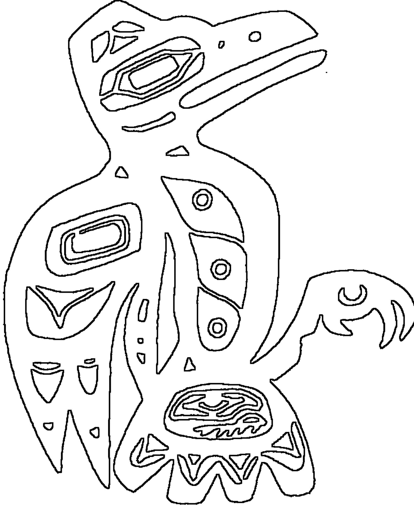

¹ 出自*The Secret Teachings of All Ages* by Manly P. Hall (Los Angeles: Philosophical Research Society, 1977), p. LXXXV.

# 第一章

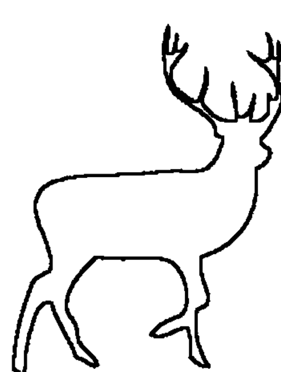

# 大自然所扮演的神靈與魔力角色

曾經，人類認為自己是自然的一部分，而自然也是自己的一部分。因而夢境和現實都是不可分割的真實，自然與超自然間也相互融合，當時的人們使用自然的形象來表達此種合一的概念，並逐漸灌輸超個人的體驗。

在過去，巫師、祭司和女祭司都是生命神聖知識的守護者，這些人與自然的節奏和力量緊緊相連，他們得以穿梭在有形和無形世界間，提醒人們所有的樹木都是神聖的，只要願意傾聽，動物也是會說話的。

古代的祭司及巫師會戴上毛皮和面具，打扮成動物的樣子，表示他們能夠喚醒並掌握某種動物的特殊力量。他們依循著自然季節韻律舉行儀式，以喚醒更強大的繁殖力和生命力，對他們來說，每個物種和其生長的環境皆能提醒自己生命的意義，可以在自然世界和超自然間搭起橋樑，並讓人們在生活中感受到，這兩種世界都是真實存在的。

雖然從現代社會的理性觀點來看，這些儀式和行為似乎很原始甚至愚蠢，但在今日，此種信仰的力量仍十分強大，而掌管著身體和精神的自然法則，也仍然運行不衰。不同的社會各以其特有的方式呈現此種法則，但「如其在上，如其在下」的古代鍊金術一致法則，或許可說是最特殊的一種表達方式。²

此法則認為，萬事萬物皆互有關聯，並有其特殊涵義。我們無法將身體與精神切割開來，也無法將有形的與無形的加以分離。「此法則讓人能夠解開許多黑暗的矛盾，以及隱藏在大自然中的秘密……古代鍊金術士認為此法則是最重要的心靈工具之一，讓人類得以洞見因未知而造成的障礙……並且能夠從已知推論出未知。」³

² Three Initiates, *The Kybalion* (Chicago: The Yogi Publication Society, 1940), p. 28.

³ *The Kybalion*, 同上註., pp. 29-30.

因此，研究自然圖騰可以讓我們了解，靈性力量在我們世俗生活中的重要性。圖騰可以是所有的自然物體、存在或動物，而它們的現象和能量，都與我們的生活息息相關。

透過動物意象和其他自然圖騰的象徵，我們能夠了解自己以及可見的世界。我們不需要認同這些形象和圖騰是屬於一種更高智慧的生命，但確實有種原始的力量隱藏在大自然中，並管理其運行。這些原始的力量有著不同的特性，會透過動物的行為和活動，以及其他自然的現象展現出來。

當我們注意並認知到某種自然圖騰時，就能夠榮耀其背後的精髓，向其敞開心胸、調節自我，也可以更清楚了解自己生活的狀況。我們可以分享此種力量，或是「魔力」。自然圖騰——尤其是動物，象徵了我們在生活中展現的特殊活力。動物成為我們無形的心靈生活中，一種特殊力量的象徵，這些圖騰的特性和活動，將會揭示出我們自己的內在動力和能力，透過圖騰的研究，我們可以從中學習，並在需要的時候，召喚此種原始的能量。

陸生動物有著與牠們的動物習性息息相關的強烈象徵涵義，牠們代表了生活中的情感面向，通常會反映出必須要克服、控制或重現的一些特質，同時，也象徵了我們可以使用在有形世界中的無形力量。

飛鳥通常都被認為是靈魂的象徵，牠們飛翔的能力，反映出我們具備能將覺知提升到更高境界的潛能，牠們也是塵世和天堂間的橋樑。飛鳥的圖騰雖各具特色，但是都可以用來激發希望、靈感和想法。

水生動物也可以是一種圖騰，水是星球和生命創造元素的古老象徵。各種不同的魚類和其他的水生動物，象徵了對於直覺和想像力的指引，同時也反映出我們內在的女性特質。

昆蟲也是大自然的一部分，並且可以作為我們的圖騰。從埃及神話崇拜蜜蜂的生殖力、非洲布希曼族（Bushman）崇拜螳螂，到敘述蜘蛛女編織了宇宙的許多神話故事，都可看出昆蟲在自然的靈性體系中，扮演了一個動態的角色。

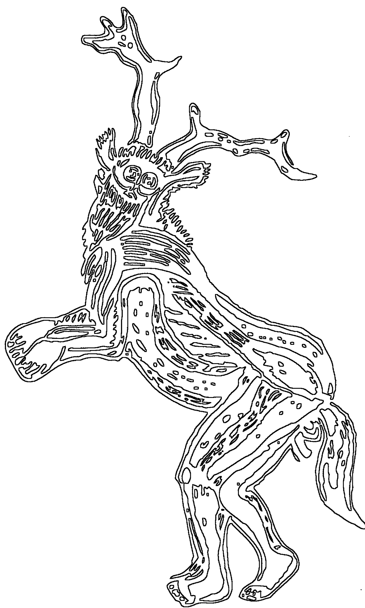

# 帶著面具的巫師

這是一種盛行的薩滿教符號，此圖形是從史前洞穴壁畫中取得的。遠古人類的身邊有許多神秘的力量圍繞著，人們透過模仿來回應這股力量，並試圖將神與人連結起來，祭司使用圖騰和圖形來協助自己與神秘力量互動。透過舞蹈、特殊服裝等等，祭司或女祭司可以完全掌握神及其力量。這是預言者、巫師和自然力量彰顯的象徵。此類的圖形乞靈於超自然的力量，讓人可以超越自然。披戴動物的皮毛是撫慰其精神，並榮耀其力量的方式之一。

透過研究及解讀你所遇到的走獸、飛鳥、游魚、昆蟲與爬蟲等等，你可以更加了解你所遭遇到的情況，對可能遭遇到的能量有更多的認識，並可以應用在日常生活之中，你也將會學到在處理自己生活時，如何更有效應用這股能量。

大自然贈與了生活其中的居民天生的適應能力，這讓動物能夠以特殊的方式，在特定的地方生活。適應可以分為身體和行為上的適應，最基本的例子就是有些動物會長出豐厚的毛皮禦寒，而有些動物則是以遷徙來適應寒冷的氣候。

像是山羊這種動物，就具有在山區的環境生存的動態適應力。牠們的腿就是因此而演化的，使之可以更有力、更確實的抓住地面；牠們的紅血球也比較多，使其可以在氣溫較低的山區生存。透過學習這些圖騰是如何適應生存，有助於我們在生活中應用這些相同的原則，本書共有五重目的：

1. 幫助你找出你的自然圖騰。
2. 幫助你學習如何更有效的在生活中榮耀、協調和喚醒牠們的力量。
3. 幫助你透過圖騰的反射，發覺自身隱藏的力量和特殊性。
4. 幫助你將圖騰的技能和適應能力應用在你自己的生活環境之中。
5. 幫助你學習自然（物理、靈性和魔法）的語言，透過符號和預兆加以解讀，並在生活中應用其表達之箴言，藉此發展出對於所有生命以及更高力量的崇敬和尊重，並將生活掌握於自己手中。

真正的巫師與自然觀察者都努力透過圖騰和儀式，將世俗的人類生活與大自然及靈性重新連結。動物的圖騰和自然的徵象能幫助我們超越一般、清醒的意識，如此一來，我們可以更容易與超現實的領域和存在相互協調。而第一步就是要了解，所有源自於大自然或內在心理的幻影和影像，在一定的程度上都是真實存在的。

對大多數人來說，最麻煩的就是解讀內心或是在大自然中的所見所聞。解讀、研究以及學習你的所見所聞有助於與之接觸。不要不加思索就接受某個自然圖騰，你需要進行一個確認的程序，在本書後續的章節中，你將學會該怎麼做。

也不要只因為某個圖騰看起來不如你想的那麼有魅力或強大，就將之棄如敝屣。事實上，這個圖騰也許能讓你更合宜的掌握生活。有時候只有透過研究並探索某個特定圖騰，才能夠彰顯其特殊之處。請謹記，尋求自然象徵的特殊之處對你來說，就是榮耀祂的方法之一。

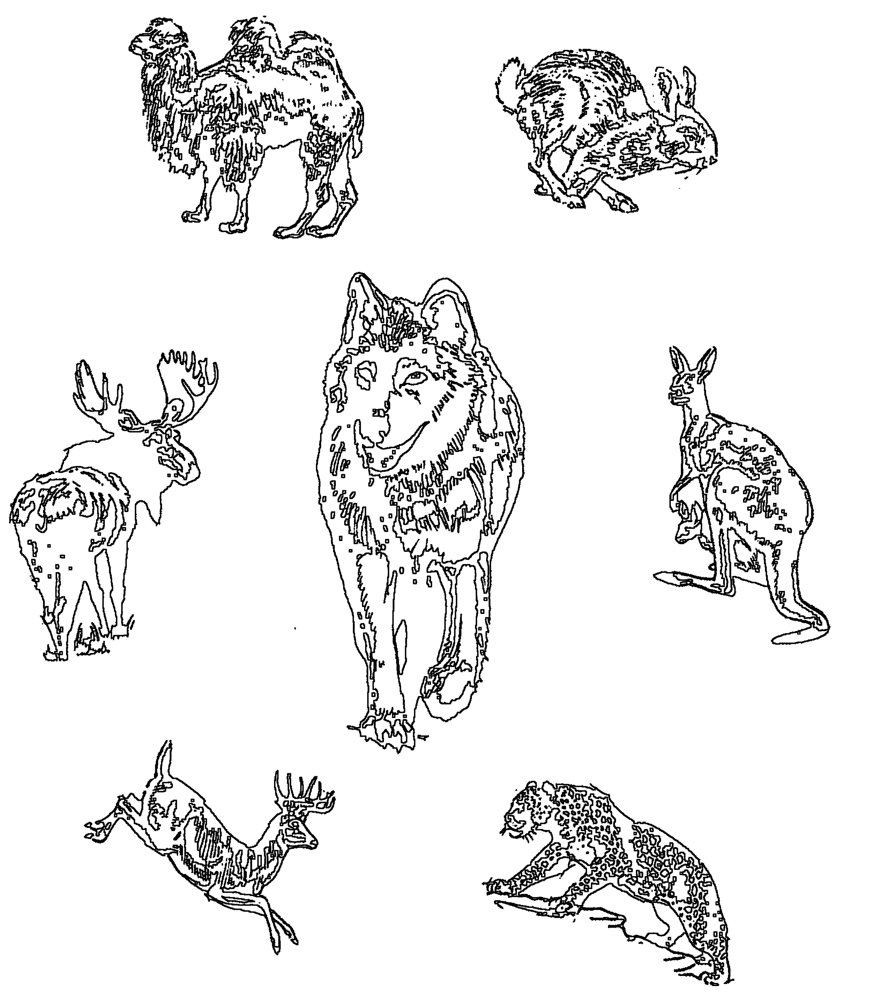

# 動物圖騰的符號

這些特定動物型態及圖形的特性與活動，可以顯示出許多我們與生俱來的力量及能力。

人類已經失去了與大自然韻律和規律之間的連結，因此使得現實的魔法也逐漸凋零。大自然無時無刻企圖要告訴我們，各種生命形式皆有值得學習之處。只要我們學會聆聽大自然，就可以破除自己原本陳腐的觀念，我們會發現，萬事萬物都有一種神奇的創意作為生命的動力，而這就是大自然想要教導給我們的真諦。

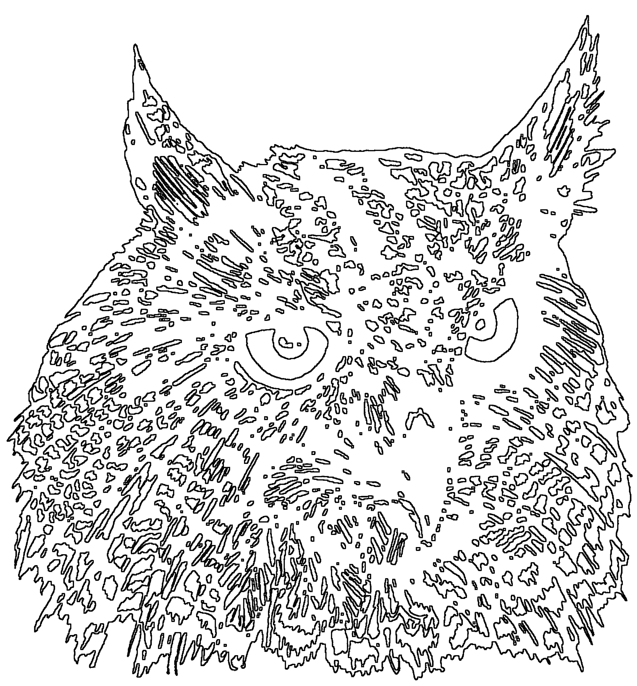

# 第二章

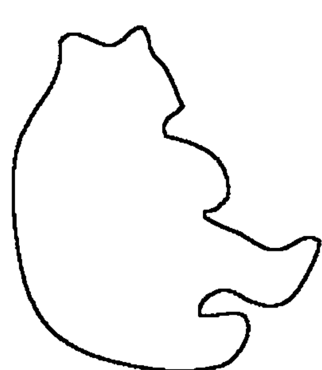

# 喚醒你的心靈圖騰

在許多宗教信仰中，皆提到了心靈力量的存在，以及其對於世俗身軀的幫助。希臘人透過神諭對聖靈和神交談；非洲的布希曼人則從動物（如：羚羊和螳螂）的動作及活動發展出儀式及神話；美洲的原住民透過模仿動物的舞蹈和儀式，來建立起與靈性世界間的聯繫。這種對於靈性力量和它彰顯出來的各種形象的信仰是普世性的，而在許多社會中，最普遍的想法是，神靈時常使用動物或動物的圖騰，來與人類溝通祂們的出現目的和所扮演的角色。

在我們理性的現代社會中，總是對這樣的可能性嗤之以鼻。但神靈——不論是以聖人、天使、祖先、仙女、精靈、惡魔，甚至是動物圖騰的形式呈現——充滿了我們古老的神話和典籍之中。若是有種信仰如此的普遍，那我們最好給它一點信心。

從相關的敘述我們可以發現，神靈的多樣性就如同我們每天遇到的人一樣有千百種，並且各司其職。祂們可以幫助我們了解自己與生俱來的能力，讓我們能夠掌握自己，並保護自己，而其能量則有助於治療、啟發和成長。

神靈時常以動物的形態出現，許多古老文明都試圖透過研究自然，以了解超自然的世界，神祇們也時常被描繪成動物的形貌。而在本書中，我們將會檢視自然如何以動物之姿，將世俗與靈性的世界連結起來，我們將會驗證動物身上的象徵和神秘涵義，並了解牠們在對我們說什麼悄悄話。

圖騰可以是任何你覺得與自己生活息息相關的自然物體、動物，或任何現象及能量。在本書中，我們著重於以動物面貌呈現的心靈圖騰，若欲了解靈性的領域是如何彰顯在你的自然生活中，那麼你就必須好好研究動物圖騰。

我們可以透過動物圖騰或牠們的形象來了解自己以及無形的世界。我們不需要認定這些形象或圖騰是什麼偉大的智能，但在其背後確實有一股原始的力量，透過這些生物在看顧著我們或顯露於我們之中。這股原始力量有其特質及特性，並且會透過動物的行為和活動展現出來。

巫師藉由動物圖騰將世俗的人類生活與大自然、神靈重新連結起來。動物的圖形有助於巫師跨越知覺意識，如此一來才能更容易與虛無飄渺的世界同步。探索、研究，然後學習如何與你的動物圖騰融合為一，就能夠在需要的時候召喚它的能量，你將透過動物與特定的古老力量接觸，進而更有效了解自己的生活。當你榮耀圖騰的時候，其實就是在榮耀其背後的精神——那是一種透過動物的圖騰和形象與你溝通的具體力量或特定神靈。

古代的祭司使用動物圖騰協助自己與神靈世界面對面交流，他們會透過姿態、服裝和舞蹈來模仿動物，並據此創造出儀式，透過動物喚醒並分享存在於這世上的能量。動物因而成為了一種圖騰——一種能力或魔法，同時也是某種特定能量的象徵，而當透過圖騰將牠們喚醒並加以榮耀時，那股原始的能量就會被釋放至生命之中。

你也可以學會如何取得這份能量，藉此，你可以開始學習大自然的語言，並探索祂的秘密。首先你必須要找出你的動物圖騰為何，有些技巧有助於找出自己的動物圖騰，這些技巧基本上都很簡單，只需要集中精神，並發揮想像力即可。

很多人都認為想像力代表不切實際，只有事實才有價值和意義，但其實想像力是心智用以創造與處理圖像的能力，而正是此種能力讓我們得以探索其他的領域，幫助我們進行心靈治療、發現失落的知識，並開啟更深遠的願景，甚至做出預言。

透過創意的想像，我們開始看到一股精神能量環繞並影響著世俗世界。我們認為想像是一種超越一般感官世界的真實型態，我們可以使用創意的發想創造一種新的知覺、一種全然不同色彩和型態的體驗，這會引發更高階的靈感和直覺，讓我們進一步了解自己的生活，以及影響生活的精神能量。想像是連結精神創意世界的工具，可以幫助你找出自己的心靈圖騰，並在生活中喚醒這股能量。

當你開始尋找並認同你的動物圖騰時，就可以更有效了解自己的生活，你將能發現自己的獨特性，也能用一種嶄新的觀點看現實世界。你將會發現自己被一種新的靈感所充滿，在生活中也變得更加有創意。越是了解你的圖騰，你就會越了解自己。

## 你的動物圖騰是什麼呢？

（從你最有興趣的動物以及這樣的興趣是什麼時候開始的，來探索你的動物圖騰。使用下列的問卷幫助你找出你的圖騰可能是哪一種動物。）

1. 你是否總是對某種走獸或飛鳥特別著迷呢？（我們會受到最能與我們產生共鳴的動物所吸引，而那些使我們著迷的動物，必定有值得我們學習之處。）
2. 當你去動物園的時候，最希望看到，或最想第一個看到的是哪種動物呢？（對孩子來說這格外重要，孩子們的心胸較開闊，因此更能夠認同那些對他們來說很重要的動物。）
3. 當你身處在大自然之中，最常看到哪一種動物呢？你曾在野外遇見過動物嗎？（不論在都市中還是野外，我們所遇到的動物都是具有特殊意義的。最起碼我們可以從牠們身上學習到，在該環境中要如何生存。）
4. 目前世界上你最感興趣的動物是哪一種？（我們對於動物的興趣是會改變的，通常我們會有一、兩種這輩子最喜歡的動物，但當你需要向某些動物學習牠的某種特性時，這些動物也會突然顯得特別重要。）
5. 你最害怕哪一種動物？（基本上，我們必須要學會與害怕的事物打交道，當我們這麼做的時候，這就成為了我們的力量。有些巫師認為，恐懼會以動物的形態出現，只有我們願意勇敢面對時，才能把將牠們的力量〔魔力〕，從阻力轉化為我們的助力。這類的動物可說是一種陰影圖騰。）
6. 你是否曾經被動物咬過或是攻擊過呢？（從過去的例子來看，如果巫師從動物攻擊中倖存下來，該動物會被認為是巫師的心靈圖騰，而攻擊是為了要測試巫師操縱該動物力量的能力。）
7. 你是否曾經夢到過動物，或是有些動物的夢讓你難以忘懷？（如果這樣的夢重複出現，或是夢中出現的動物都是相同的話，那就非常重要。孩童常常會做動物的夢，我們應該要多加注意，因為這通常反映出了孩子特定的心靈圖騰。）

## 動物圖騰的基本常識

動物圖騰的名稱百變，包括心靈動物（spirit animals）、力量動物（power animals）、圖騰幫手（totem helpers）等等。不管人們怎麼稱呼它，其中必然具有下列特定的信念：

1. 每種動物都有強大的精神力量。
2. 此種精神可能是出自於動物本身，或是一些「存在」使用動物的形象，向人類世界傳遞訊息。
3. 每種動物都各有其長才，研究這些不同的長處，將顯示出你在生活中可以發展出何種魔力、魔法和力量。請謹記，每種動物的優點皆各有千秋。
4. 跟隨你一輩子的力量動物都是野生的，而非馴養過的動物。雖然也有些例外，不過即使是這些例外，通常也只是與真正的力量動物之間的連結而已。例如，人們可能會把狗或貓當作圖騰，牠們具有各自特殊的魔力和力量，但與野生動物相較之下，家居動物通常只是其溫和版本而已。狗可能作為狼、土狼或任何野生犬科動物的連結；而貓則可以連結至野生貓科動物，像是黑豹、獅子、老虎等等。對許多人來說，以馴養型態的圖騰作為開始，其實是打造基礎的一種方式，讓自己在未來的某一天，可以掌握並更有效的運用其真實的力量。
5. 是動物選擇人，不是人選擇動物。許多人認為，他們可以自行挑選想要對話的動物，這是人的自我在作祟。人們會選擇自己覺得最迷人、強大的動物，而非與自己調性一致的動物，這樣的結果是徒然且時常令人沮喪的。沒有哪一種動物比較優秀，每種動物的魔力都是獨一無二的。全然發揮老鼠的魔力，要比笨手笨腳、成效不佳的操控老鷹魔力來得好多了。你會從進入你生活的動物身上，找到成功之道。

當我大概四歲的時候，狼的神靈找到了我。當時我與兩個哥哥，和一個小我兩歲的弟弟睡在同一個房間。那個晚上，我爸帶兩個哥哥去看球賽，而我跟弟弟獨自在房間睡覺。

我躺在床上，看到牆上出現一道光。在朦朧中，一名老婦人和一頭狼走入房間之中，我開始尖叫、大喊，我媽媽嚇得從走廊一路跑進房間。而當我告訴她狼和老婦人的事情時，她只是笑了笑，幫我披了披毯子，說我只是做了個噩夢。

但我知道那不是夢，因為老婦人和那頭狼正站在我媽媽身後三呎處。她要我冷靜下來，對我說繼續睡吧，因為她不想要吵醒我弟弟湯姆，然後她就離開了。

她前腳才剛離開，那個老婦人和那頭狼就更逼近過來了。雖然他們看起來都和善微笑著，但對當時的我來說有笑沒笑都一樣。我再次大喊著要媽媽，她打開了門，再次試著告訴我房裡什麼人也沒有，我只是在做夢而已。這次她叫我到她床上去睡，告訴我說：「在那裡他們就抓不到你了。」

但她的話一點效用都沒有，因為那個老婦人和那頭狼跟著我們進到了媽媽的臥室了！我只能把被子拉到頭上，試圖假裝他們不存在。

從那時起，我就常常看到那頭狼，偶爾也會看到那名老婦人，她說她是我奶奶。後來，我越來越習慣他們的出現，卻再也沒跟別人提起這件事，因為我知道沒有人會相信我。直到好多年以後，我才能夠將一切拼湊起來，終於了解到他們是誰、是什麼。

時至今日我仍會遇到那頭狼，不僅僅是在我的夢中而已，有時也化作環繞在我周遭的靈性存在而出現，而我在野外也時常會遇到野狼。

6. 你必須與圖騰建立起一種關係。與牠們的溝通需要尊重，你必須了解牠們的觀點，動物不會馬上就與你熟稔起來，牠們必須要先知道可以信任你，以及你的極限在哪；而你也必須要學著信任牠們、知道牠們的底線在哪裡。這一切都需要時間、耐心和實作。
7. 若要有效掌握自己的生活，就必須要榮耀圖騰的魔力。你越是能夠榮耀牠們、在生活中越是重視牠們，牠們就會變得越強大有力。你可以透過一些方法去榮耀牠們，並且讓牠們更加融入你的生活，像是：
    - 掛上牠們的圖片
    - 繪製牠們的畫像
    - 儘量的閱讀或去了解有關牠們的一切
    - 購買有你圖騰的圖形、雕像或是小硬幣，並將之當作禮物送給朋友。這些小東西都可以提醒你，你的動物圖騰的力量和精神。
    - 為野生動物組織貢獻時間和金錢。
    - 透過舞蹈來榮耀你的圖騰也是一種強力的連結方式，你可以學習、模仿其行為，如果你的圖騰是烏龜的話，就學著像烏龜一樣的慢慢爬行；如果是獅子，那學著就像獅子般低伏；如果是飛鳥，就模仿牠的跳躍或飛翔。最重要的是，讓動物在你的想像中生活，在你需要的時候使用圖騰的特質，並將自己視為動物圖騰。請謹記，想像力正是你與圖騰間的真正接點。
8. 一旦你學會操縱力量動物的魔力後，就可以開啟一扇連結其他動物世界的大門。一個人不僅只擁有一種圖騰，每種圖騰都可以教導你或是在你生活中加入一些特殊的元素，與你的力量動物互動，可以幫助你與其他的圖騰結盟。如果你需要更強大的力量時，你就可以召喚熊的形象，並獲得牠的力量；而若你需要速度，可以與印度豹的能量接觸。透過你的力量動物，你可以學會與其他動物及神靈建立連結，或是轉化成牠們的形象。
9. 雖然在你的生活中，可能有一種或數種圖騰是特別強大、伴隨著你一生的，但其他的圖騰也有其重要性。你可以每天更換不同的圖騰，或是利用某種特定的圖騰幫助你度過生命中的難關。

有的圖騰可能會突然出現，然後伴隨你幾年的時間；也有些圖騰可能只在你發揮創意的時候才會出現。在生活中的不同領域，你很有可能會擁有不同的圖騰。雖然圖騰是沒有數量限制的，但關鍵在於，你必須至少與一個圖騰保持全面性的緊密接觸，這可以拓展你的意念，並讓你更容易與其他的圖騰相連結。

在我小的時候，貓頭鷹常常進入我的夢中，而到了大概十二歲的時候，我就越來越少夢見貓頭鷹了，在我高中畢業之前，貓頭鷹就不再入夢。然而幾年後，我再次夢見了貓頭鷹，我問牠去了哪裡。

> 「我無法停留在封閉的心裡。」

我困惑的看著牠，我很確定牠笑著回答我說：「我會靜靜的待在你身邊，當你需要的時候。」

你敞開心靈，解開捆綁你心靈的枷鎖，我就會回來。在過去幾年間，你需要其他圖騰的幫助更甚於需要我。」

接著我看到了貓頭鷹身後的動靜，看到了自從我成為青少年以來，曾多次造訪我夢中的大貓們——黑豹、美洲獅和老虎。接著，我又看到了一幅景象：我的父親，還有他對待我們幾個兄弟的方式，然後我醒過來了。幾年以後，貓頭鷹再次出現在我的夢中——但總是遠遠的、靜靜的——通常在這些夢中我都重回童年時代。

一九八九年時，我的好朋友——古安達·治癒之女告訴了我一些有關貓頭鷹的知識。我熱淚盈眶、喉嚨哽咽，內心浮出的是死亡和葬禮的景象，我知道我的父親就快要死了。

兩個月後，我父親死於癌症，再一次，貓頭鷹又時常出現在我夢中了。

10. 不同的人可以擁有相同的圖騰。我知道有許多人都掌握了狼的魔力，雖然每個人的運作方式具有相同的要素，但也有不同之處。狼的原始力量和精神在每個人身上彰顯出來的方式都是獨特的，因為每個人都是獨一無二的，圖騰所扮演的角色也會因為個人而有所不同。

有著親密關係的人們可能會擁有相同的圖騰，該圖騰因此會成為一種引導，讓彼此之間的關係更加緊密、充實。圖騰雖然會連帶看顧你的伴侶，但共享圖騰並不僅限於伴侶之間，心靈治癒和冥想團體通常也會擁有相同的圖騰照看著他們的活動。

我跟我太太都擁有狼的圖騰，但在個人層面上，牠對於我們兩個人各有不同的效用；而在我們互為伴侶的層面上，也有不同的作用。幾年以前，我跟我太太在我生日的時候，去北安大略進行了一趟獨木舟之旅。在我生日的那天半夜，我們不約而同被遠方的狼嚎喚醒。

事實上，在每年的那個時期，是很少會聽到狼嚎的。但是在那天晚上，狼嚎聲此起彼落持續了一整晚，每一次狼嚎聲響起時，都是來自於不同的方向。那真是我所收到過最棒的生日禮物之一了。

還有一次，我們又去了卓越國家森林（Superior National Forest），希望可以親身接觸狼圖騰。這幾年以來，許多人走訪卓越，但是都不曾遇見過狼，但我們認為，如果狼真的是我們的圖騰的話，那麼我們應該要有信心去嘗試看看。而正當我們失望的準備離開營區時，一隻美麗的狼從樹間出現，站在距離我們約三十呎處。牠轉過身來，盯著我們，目光在我們身上停留了許久，接著我們看著牠在樹影中穿梭，然後再次默默消失在樹林之中，留下又驚又喜的我們。

## 喚醒你的動物圖騰

在喚醒這股魔力時，最關鍵的就是要學習透過創意和想像，去喚醒你的動物圖騰能量。

## 遇見你的動物圖騰

下面的實作將有助於遇見你的動物圖騰，我們將會使用創意想像，更有效的將動物王國在你面前展開。不需要擔心那會不會是你捏造出來的，你能想像出來的動物，必定對你具有某種特殊意義。

在進行實作的時候，你必須放鬆，並且摒棄任何先入為主的觀念。讓動物圖騰自行出現，讓牠選擇你，而不是你選擇牠。請謹記，圖騰對你來說必定具有象徵性的涵義，你越是能夠從中學習，並深入思考牠會如何反映出你的生活，就越容易取得這份能量。

在像這樣的活動中，很多人都會對於該如何解讀出現的意象而感到困擾。你的自然圖騰也許會是飛鳥、哺乳類動物，甚至是昆蟲或爬蟲類。解讀、研究並學習你的自然圖騰可以促進你們之間的聯繫。別不加思索就接受圖騰，想像力是一種神奇的工具，但如果沒有善加利用的話，很容易就會產生誤導。你必須要進行一項簡單的圖騰確認程序：

- □你有什麼感覺？
- □牠讓你產生怎樣的情緒（情感）？
- □你過去對這種動物感興趣嗎？
- □牠讓你聯想到什麼？
- □你的內心深處有什麼感受？

不要因為圖騰不如你預期的迷人就隨便拋棄牠。事實上，這樣的圖騰可能反而更適合你，但在對其特質和特性做更進一步研究或探索之前，你都無法得知牠是否適合。使用本書中的事典協助你，但不要因此受限，你可以自行去探索，尋找該圖騰的特殊之處、可以如何應用在生活之中，這都是榮耀牠的方法之一。然而第一步必須要開啟溝通的橋樑，以了解真正的動物語言。

若是在你研究、探索後，仍無法找到圖騰的應用，就再次進行上述的確認程序。如果你的圖騰長有獠牙，或是讓你感到恐懼的話，就從實作中跳出來。不需要擔心受到傷害，你可以隨時結束實作。在這個活動中，你可以隨心所欲去體驗、感受，圖騰要告訴你的是，關鍵的一刻必定會到來，而你將能掌握那個時刻。

另外也請謹記，令人感到恐懼的意象通常不僅僅是你自身恐懼的投射，還有可能代表著抗拒。你會很驚訝的發現，思考僵化的人們有多麼難以接受那些無法被理性解釋的事物，很多人的思考模式都經過了一定程度的制式化——因為人們都「寧可選擇熟悉的敵人。」

當你開始探索內心世界和它是如何透過自然呈現於外在世界時，你可能會覺得有些心神不寧，你有可能會覺得很脆弱、赤裸裸且不受控制。如果發現自己出現了恐懼或是抗拒的情況，想想你最愛的寵物，想像將牠帶入此活動之中。這可以讓你冷靜下來，而其能量也會一直關懷、保護著你的內心世界。

在下列的實作中，人們通常會懷疑他們是否真正踏上了靈性之旅。其實差別僅在於體驗的深度而已，在真正的靈性之旅中，你會感到身處實地，親身去體驗、感受。此過程不見得有既定的模式，在下面敘述的冥想實作中，你可能會觀察到你自己正在體驗靈性的情境，或只是想像這應該是怎麼樣的體驗。但隨著時間和實作次數的增加，冥想可以帶你踏上真正的靈性之旅。

大多數的個人圖騰探索活動都遵循著下列的基本模式：

1. 放鬆。
2. 進入洞穴或樹中。
3. 離開洞穴或樹中，進入草原或自然環境之中。
4. 體驗大自然的寧靜。
5. 讓圖騰自行浮現。
6. 讓動物對你說話——牠會透過動作、聲音、型態、顏色等等傳達牠的力量為何。你甚至可能會聽到牠的想法，讓牠告訴你、或是向你顯示過去牠是如何幫助你的，以及在未來牠還能對你有何助益。
7. 感謝牠的出現，請牠在未來一周內，顯現出一些實質的證據，好讓你知道牠是你真正的動物圖騰。此種證據會以不同的形態出現，你可能會在一塊石頭上看到牠的臉，牠也有可能出現在你的夢中，或者你會遇到牠的雕像、圖畫，或關於牠的電視節目。如果那真的是你的圖騰，必定會以實質的方式確認牠的出現，而不僅僅是一些讓你對號入座的巧合而已。
8. 回到洞穴或是樹中，穿過去到另外一個出入口，然後從那裡出來。
9. 深呼吸四到五次，讓自己感覺到與圖騰動物確實的接觸和連結。
10. 開始你的確認程序。研究圖騰和其特性，深入思考其特性可以在你的生活之中發揮什麼效用。

## 準備

鼓和搖鈴是很有效的工具，不過也並非是必備的，如果使用了鼓和搖鈴，請讓節奏保持緩慢、一致。你應該讓鼓聲帶領著你，我建議你不要做任何的想像，單純的坐著至少五分鐘，感受鼓聲的節拍，這會讓你放鬆下來，讓你的身體節奏與鼓聲同步。如果你沒有鼓或搖鈴，也可以播放一些反覆、不刺激的輕音樂。

請確保你不受打擾，拿起電話話筒、鎖上門，總之就是做好萬全的準備讓你不受打擾。讓你自己感到舒適，或坐或臥，只要覺得放鬆即可，但請確保你的背部保持筆直，讓血液可以流暢流過你的脊椎。閉上你的雙眼、深呼吸，接著開始更進一步放鬆，專注於你身體的每個部位，將一股溫暖、撫慰的氣息送到各個部位，從腳開始，然後一路往上到頭部。你可以慢慢來，越是放鬆，活動的效果就越好。如果你發覺自己開始心猿意馬也不用擔心，把心拉回到原本的地方，再次開始即可，接著簡單的開始想像——

## 實作

當你放鬆下來後，你會發現自己越來越輕、越來越輕，周遭事物似乎逐漸褪色，你被自己的能量和心智所編織成的深色斗篷緊緊包裹住，你感到很安全、溫暖、又舒適。

你的心眼將開始看到微微的光線，視野逐漸展開。你會發現自己在一池清澈的湖水旁，頭頂上是湛藍的天空，而在遠方的地平線處，有著濛濛的薄霧。抬頭可以同時看到太陽與月亮，不確定現在到底是清晨還是黃昏，但你知道這是一種「時間之隙」，此時在世俗和靈性世界之間，只隔了一重薄紗。

在你的右手邊，湖的盡頭是一道瀑布。瀑布落下時噴濺出冷冽、朦朧的水花，漣漪從瀑布底端蕩漾開來，扭曲了湖面倒影，整個畫面呈現出一種夢幻般的氛圍。

你看著身旁翠綠的草地和遠處的樹木，萬籟俱寂。大自然似乎在默默等待著什麼，你轉頭再次看向瀑布，發現在那之後有個陰暗的地方。你朝那裡移動，當靠近瀑布時，你發現後面有個洞穴若隱若現，你小心翼翼的穿過瀑布，進入後面那個幽靜的洞穴之中。

你很驚訝的發現，裡面居然有柔和燃燒的火炬照亮了整個洞穴，火炬的光亮讓室內溫暖了起來。不知為何，這看起來似乎有些眼熟，似乎你已經預期到這一切了。

在這洞穴的後方，是一個同樣點著火炬的隧道，你回頭看了看身後的瀑布，然後向洞穴深處走去。你緩緩踏入後面的隧道，這裡一樣溫暖、舒適，你覺得有點暈眩，一陣孩子般的笑聲從你嘴邊溜了出來，你好久沒有這種回到童年般的感受了，而你即將去探索這世界上最美妙的寶藏。

你從洞穴緩緩進入隧道的小徑，裡面照明充足，一點也沒有不舒服的感覺。你伸出雙手，觸摸著牆壁，並為手中傳來的暖意而感到驚訝，就好像是大地的血脈正流過牆內一樣。

隨著你逐漸前進，隧道也越來越寬廣，火炬的數量越來越少，間隔距離也越來越遠，但你卻發現室內似乎越來越明亮了。接著，你經過了幾個甚至沒有點燃的火炬，當你抬起頭時，便了解為什麼了。隨著隧道逐漸變得寬廣，陽光甚至得以從五十碼外穿透進來。

你已經可以看到隧道的終點，在遠處有條河流以及翠綠的草地，夏日的晨露在陽光下閃閃發光。在這片草地的邊緣，是一片蒼鬱的樹林。你緩了一緩，接著奔跑過這最後的五十碼路，一路衝進溫暖陽光照射的翠綠草原。

陽光暖暖的照在你臉上，你腳踩著柔軟的青草地，你似乎聞到了蜂蜜和春日野花的香氣，空氣中瀰漫著一股芳香，你仰起頭來，展開雙臂，在這片綠茵草地上笑著、旋轉著。

在河邊，有一棵高大、古老的橡樹，你從未見過像其周圍那麼蒼翠繁茂的青草。你跑了過去，在樹下坐了下來，伸展四肢，讓柔軟的青草包圍著你，吸入那清翠的香氣。接著，你坐了起來，發現在樹的旁邊有顆石頭，形狀就好像一張椅子一樣。

你在石頭上坐了下來，很快就發現它的形狀正好適合你，讓你不禁疑惑的咯咯笑了起來。這裡十分寧靜，你知道野生動物必定會來到這片草原上，你甚至有一瞬間開始忌妒起那些走獸和飛鳥，牠們居然可以擁有這塊人間天堂。

你坐在石椅上，享受著自然之美。每一次的呼吸，都讓你更融入自然，而自然也慢慢成為你的一部分。

突然間你倒抽了一口氣，眼角瞄到樹林的邊緣似乎有些動靜。你屏住呼吸，心想搞不好有機會可以見識一下野生動物。

不知道這動物是會飛過頭頂還是踏入草原，你坐著不動，等待這隻動物在你的視線範圍內出現。不要逼迫牠，讓牠自行現身，出現之後，牠的目光會尋找你，並與你四目相望。

你從未看過如此奇妙、獨特的事物。這種動物似乎一向都是不受拘束、難以親近的，但現在牠一點也不膽怯的逐漸接近你，僅帶有一點認同和驚奇。這一定是個夢吧！但就在你這麼想的時候，牠發出了一個聲音、做出了一個動作、姿勢，讓你把目光重新移回到牠身上。在那一刻你開始了解，牠曾幫助你的回憶湧上心頭，現在你終於知道你對牠為何總是如此著迷，接著牠開始朝向隧道移動。

走到一半，牠停了下來，回頭看著你，就好像是在告訴你說：該是繼續的時候了。因此你站起身來，跟著牠。牠等待著你走向隧道口，你們之間是如此靠近，彷彿再上前幾步就可以觸碰到牠了。

你小心翼翼的伸出手去，但在你可以觸碰到牠之前，牠跳了起來，向樹林的邊緣跑去。而再一次，牠停了下來，回頭看了看你，然後又再次消失在一片綠蔭之中。

你懂了，一段關係的建立是需要時間的。你們都還有很多要向彼此學習的地方，在那之前，你都得有耐心。你有點苦澀的笑了笑，然後走進隧道之中，沿著路走回瀑布那兒。

當你從洞穴中步出，走到瀑布後，你看著清澈的湖水，你的倒影盪漾著，而在你的倒影之後，是你的動物圖騰。你吸了一口氣，然後大笑，感謝牠願意向你敞開心靈。隨著你的笑聲，圖騰的形狀逐漸消失，而你周圍的景色也開始朦朧了起來，你再次回到你心裡那塊溫暖、晦暗的地方，但這次卻有圖騰與你相伴。深呼吸，將自己再次帶回到現實世界之中。

# 第三章

## 掠食者與獵物之秘密與魔法

一般人鮮少了解自己與環境間的連結，以及會對環境造成的影響。絕大多數的人都居住在城市的封閉環境之中，遠離了野生或是真正的自然世界。我們身邊的樹木和草皮是經過人工修整的，我們的食物在購買時就已經為我們處理好且包裝完畢。許多人受到電視和卡通的影響，認為動物不是像可愛的泰迪熊，就是像華納卡通裡那隻狡詐的兔寶寶一樣。與真正野生動物接觸的機會，就僅限於那些已經適應都市環境的動物了，像是松鼠、浣熊、知更鳥等等。

因此，我們不難發現到，很多人並不認為自己是自然的一部分，接觸自然的機會已經很少了，更別說是去思考自己與自然間的關係了。大自然對一部分人來說可能還具有一點吸引力，但很多人都缺乏對於自然的敬畏、尊重和了解。對這些人來說，世界只是一個遙遠、抽象的概念，居住著許多不同的動物和植物，而其生命和存在的目的就只是為了服侍人類而已。

我花費了七年的時間，在內城（譯註：inner city，大都市中較為破敗的區域，多為窮人群居之處。）以另類的方式教導一項特殊課程。我們的目標是要訓練那些在行為、社交、財務和課業方面有問題的學生，讓他們可以順利的進入職場之中。此類學生大多不適應一般的高中課程，因此很有可能無法完成基本教育，他們之中有許多人都是文盲，背有犯罪紀錄的情況也屢見不鮮，而大多數人的活動範圍僅限於公車路線可以到達的地方。

我在任教的最後一年裡，安排了多次的校外教學。其中有一次是去約莫五十英里以外的辛辛那提動物園。只有少數學生在很小的時候曾去過動物園，而他們對此行的反應十分驚人。

我從未看過如此純粹的讚嘆、敬畏和激動之情。我每次轉身都有學生氣喘吁吁的跑來，對我形容一些他們看到的「怪」動物。學生們從四面八方來拉著我，要我「來看這個！」。那些曾經冷漠、空洞的眼神現在則精神百倍、生氣盎然；那些少有笑容的學生也嘰嘰喳喳說個不停；而老是愛打架的學生也變得心胸開闊且友善。這些在過去總是想要證明自己很強悍、已經是個大人的學生們，終於可以體驗到他們已經失去，或從未擁有過的童稚之心。

動物親密的與每一名學生說話，在回程的巴士上，充滿了新鮮、活潑的討論，學生們愉快的討論著他們最喜歡的動物。但不久，討論聲越來越小，隨著我們越來越接近學校，學生們漸漸進入到沉默模式之中，他們的態度改變了。

有些轉變是很細微的，沉默變成了忍耐的面具，而他們的雙眼再次回到空洞、難以看穿的狀態；有些轉變則比較明顯，有些學生開始坐立不安，他們再次開始交談，但內容不再輕鬆愉快，也不再聚焦於在動物園得到的樂趣了。有些學生似乎突然開始對於他們在動物園時的行為，以及他們面對動物時展現孩子般的興奮感到難為情了起來。他們開始對其他人擺出一種「我是故意這麼做」的姿態；有些學生則緊張的左顧右盼不發一語，試圖在別人臉上探看今天如孩子般放肆是否會給自己帶來麻煩。笑容消失了，有些人的眼眶甚至有些濕潤，這真的是很令人感傷的一刻。

這趟旅行為他們創造了一生難以忘懷的記憶，同時也提醒了他們，這個世界與他們所想的有多麼不同，讓他們發覺到，在鄰近地區外，還有那麼多值得去探索之處。直到那時，我才了解到這對他們來說其實是一種文化衝擊。

他們尚未準備好進入這個奇怪的動物世界。沒錯，他們知道什麼是動物園，也在電視上看過有關動物和動物園的描述，但這完全不一樣。他們的經驗觸動了疑惑、混亂甚至迷惘，但也啟發了對於現實生活的全新解讀方式。世界對他們來說再也不同於過往了，世界不再是混凝土跟城市街區的人行道，這個世界比他們想像的更偉大、複雜，而這讓他們感到害怕。

雖然有點極端（但並不罕見），但這種情況顯示出，人們對於自然世界的看法有多麼扭曲。對大多數人來說，動物就跟外星生物沒兩樣，牠們的行為和活動看起來都好奇怪、好神秘，甚至完全與人類生活脫節。對於動物和自然世界的錯誤猜想充斥在今日的社會之中。

自然世界中最神秘，因此也最常被誤解的，大概就是掠食者和獵物之謎了吧！許多人在提到掠食者和獵物的時候，都認為那就是殺戮者和被殺者。但事實上，在動物世界中，大多數動物其實都坐落在這兩個極端之間，有時候掠食者也會是獵物——螳螂捕蟬，黃雀在後。

當我們研究掠食者和獵物，並了解其自然和精神涵義後，就得以粉碎之前錯誤的觀念。我們會開始了解到動物世界中的力量和魔力，尤其是牠們與我們的關係，並且驚訝的發現不論是人還是動物，每種生物在生態體系中，都是環環相扣的。

掠食者和獵物處處可見，我們可以將掠食者定義為，有能力可以奪取獵物生命的動物。人類時常受到掠食動物的美麗、力量和威嚴所吸引，我們仰慕牠們野性的自由，猛禽就時常被視作權威命令的象徵，以及令人畏懼的戰爭預兆。

自然世界中，掠食者和獵物也時常相互競爭，而戰利品就是牠們的生命。螳螂捕蟬，黃雀在後，掠食的過程需要時間、耐心、技巧和敏銳的知覺。那些最堅強、最警醒、最有頭腦的才能夠生存下來，為了要避免被捕捉，動物會演化得越來越強、越來越聰明。

當你與來自於自然世界的心靈圖騰打交道時，掠食的神秘之處和力量將會在你的生活中被喚醒。要在生活中使用這股魔力，你必須要對其完全了解，自然世界中的掠食行為給人類上了四堂重要的課程，每種課程都有其各自對應的魔法型態。

在神秘層面，每堂課程都可以與這四個方向和要素其中之一互相連結，當然，這些聯結是概括性的，而非一成不變的，只是單純提供一個出發點，幫助我們從實際應用和魔法的角度，了解並運用掠食的意義。這同時也反映出，如果你學著與之互動，在大自然的掠食之謎中所找到的普遍性和平衡，也可以成為你的力量。了解這些課程、其間的關係及其魔力，是讓你的生活透過心靈圖騰變得更具有創造力、療癒力和靈性的關鍵。

## 生命、死亡和重生課程

魔法：創造
元素：火
方位：南方

生與死是我們所體驗過最具有創造力的兩種過程，而其中充滿了神秘和迷信。大多數人都難以了解生命、接受死亡。我們對於死亡極度畏懼，生與死的過程都十分複雜，也是我們所面臨最大的轉變，但並不僅僅如此而已。

當我們仔細去檢視出生和死亡時，我們應該將之視為改變或轉變，而不是一種最終狀態。我們的一生中，在不同的階段會有不同程度的改變，改變是一種祝福，代表了新的成長火花。失去和得到是相對的概念，但我們對於死亡或改變的恐懼，總是阻礙了我們展開新的探索，我們每天所經歷的改變，其實就是整個人生、死亡和重生的縮影。

許多古老的傳統都與轉變儀式——出生、死亡和重生的象徵儀式——有關。人可以在生命的某個階段死去，然後在另一個階段中重生。每天我們都會迎接不同的挑戰，必須要放下一些過往，並做出一些創新，每個人都需要接受生活所帶來的挑戰。

當你與心靈動物和圖騰互動時，這謎團就會逐漸明朗起來。你會開始每天都能看到小型的死亡和重生，也會開始發現這與你的圖騰節奏和型態一致，你將會了解要如何利用這些生與死的過程，來為你當下的生活作結，並展開新的旅程。

大自然中的掠食現象可以教導我們，如何在重視生命的同時，仍對死亡感到無所畏懼。在大自然中的動物並不擔憂死亡，牠們重視的是活著！當死亡逼近，牠們會頑強抵抗、絕不放棄，並充分的享受「活著」這件事。牠們尊重每分每秒，對於每天的每項活動都投以相同的熱情，活在當下！沒有所謂的過去，也不需要為未來操心。每天都是全新的一天，動物們精力充沛的運用著大自然賦予的能量。

許多人都無法認同，掠食其實不一定是殘酷的。但我們必須記住，掠食連結了掠食者和獵物、殺手和受害者。在古老的卡巴拉（Qabala）傳統中，有一個詞大概可以應用在此，那就是「回歸」（tsimtsum，譯註：原意為集中或縮小），意即神的自我設限。卡巴拉教認為「判斷」應該要與「仁慈」分開，而「創造」必須要經過「判斷」才能產生，並且不受到任何會使人軟弱的因素影響。

> 「神出自於愛，並以創造為目的而給予的，不受到仁慈的軟化力量影響。如果神創造世界時的判斷參雜了仁慈的話，那麼世界絕不是我們現在所知道的模樣。獅子會因為憐憫而不去獵殺野鹿，因此飢餓而死，而所有仰賴狩獵技巧維生的掠食者也逃不過相同的宿命，我們不會去吃其他的生命，甚至還可能會因為同情樹木而拒絕吃蘋果。但實際上，地球上各種生命型態在大自然中的互動其實是一種完美的平衡，獅子只有在飢餓的時候才會出獵，只有人類才會為了慾望而殺戮。根據亙古不變的宇宙法則，獅子所執行的才是完美的判斷，人類則否。」

掠食告訴我們有死才有生，而死去的必定會重生。死亡是一種失去和獲得的平衡，是新與舊的交替、施與捨的過程。掠食讓我們了解，所有的生命對彼此來說都是神聖且必須的。

4 Gonzalez-Wippler. *A Kabbalah for the Modern World* (St. Paul: Llewellyn Publications, 1987), p. 134-135.

## 生命、死亡和重生课程

当我们与自己的图腾打交道时，我们将会看到它们在野外的掠食过程是如何反映我们的生活与我们的环境之间的关系，这两者是具有共通性的，我们可以藉此学会在最合适的时候进食、在最合适的时间休息，就如同它们在合适的时间玩耍、在合适的时间狩猎。这些类似之处将会帮助你善加利用每一次的机会和转变。你的猎物图腾有可能会是另外一种动物，或是某种植物，而它将会帮助你看到要如何在生活中创造重生。

巫师也时常使用平衡的巫术，例如，研究猫头鹰巫术的巫师同时也会精通鼬鼠的巫术，而鼬正是大雕鸮最爱的美食；游隼捕捉鸭子、知更鸟吃虫、狼群可以猎杀麋鹿。掠食将掠食者和猎物联结起来，编织出一种复杂的亲密关系。

通过检视掠食者和猎物两者的混合特质（魔力），就更能获得死亡和重生的力量。（掠食者和猎物）图腾的平衡，可以让你认知到死亡和重生过程的自然节奏，并更有效的加以使用。通过使用掠食者和猎物图腾的能量，可以让你不会因为生活有了转变而感到混乱、崩溃。这样一来，你的人生就会变得更加丰富、有创造力。

创造的魔力包括在生活中学习将死亡视为重生的机会、了解如何善加利用生活中的顺境与逆境。如你所见，每种动物都有其自然循环，但每种动物的生命循环都有些许差异，有些循环长，有些循环短。如果你找到了正确的动物图腾，那么将其律动和自然循环应用在生活之中，就可以让生活更加丰富、充实。

这就是为什么火元素和南方方位与本课程有关的主因。火可以毁灭，也可以创造。火净化、烧掉了杂质，提炼出纯粹、闪闪发光的黄金，就好像凤凰浴火重生的神话一样。火也是心的元素，是热情和爱情的核心，可以帮助我们重建生活，这是一种重生和复活的元素，因此这堂课让我们可以使用经验中的火，在生命中创造正面的改变。

创造是一种过程，而非最终目的。在你生活中的改变反映出创造过程是具有动能的。许多人都希望生活有所改变，却不了解改变的本质，他们认为改变是困难的，而且充满混乱，其实，改变是一个动态的过程，它的困难以及混乱，都是为了激发我们的创造力，它提醒了我们，生命本身就是一连串、无止息的创造过程，我们可以选择加入或是加以忽视，如果我们愿意加入，尤其是透过心灵图腾去参与，那么就能够学到死亡与重生的课程，而我们的生命也会被创造的魔力所充满。

## 魔法实作

1. 这项简单的冥想（想像）具有强大的效果，因此你必须对一些掠食者和其猎物有些基本的认识。如果你已有一个掠食者的图腾的话，就加以使用，不然的话，请自行挑选一个你一直以来都很喜欢的掠食动物。
将一个坏习惯，一个让你不自在的情况，或是一些负面的事物想成是猎物，然后将你自己想像成是掠食者。看着你吞噬这个坏习惯，消灭它，然后变得更加强大。
在此想像中使用掠食者的自然猎捕循环，如果此种动物主要在晚上狩猎的话，就在晚上进行这项实作，反之亦然。
每天只需要花五到十分钟进行实作，但是请投入丰富的情感和热情。你将会在一星期内就看到成效，你会变得更强壮、健康、更有掌握力。

2. 你也可以将此实作稍作改变来适应生活中的变化。再次想像掠食者和猎物，但这次，猎物代表着你在人生中想要做出的改变，或是你想要，但在当下却无法获得的事物。把「改变」想像成某种聪明狡诈，你至今都无法捕获的猎物。
想像我们在狩猎、追踪，并追捕着猎物：想像自己追赶并捕获战利品；想像你变得更加强壮、快乐、充实。
有时我们想要做出的改变是很复杂的，并且有许多步骤，每个步骤都可以被视为是猎物，而战利品也会随着进度逐渐升级。例如，如果你的掠食者是一只红尾鵟，那可以把第一步想成是一只老鼠，第二步是蛇，第三步则是野兔。
决定你想要完成的转变以及每个步骤的时间表，每天都进行五分钟的掠食活动想像，逐一完成每个步骤后，再进行下一个步骤。你将会很惊讶的发现，完成目标有多么迅速、容易。

## 适应的课程

魔法：变形
元素：水
方位：西方

适应是动物以特殊的方式在特定环境中生存的天生能力，可以分为身体适应和行为适应。狐狸的长耳朵在夏天时可以散热，而毛茸茸的尾巴可以在寒冷的冬天中覆盖住脸和鼻子——这就是身体适应；北美黑尾鹿在寻找食物来源的时候会不时变更它们的路径和踪迹，几乎不会重复走上同一条路，藉由难以捉摸的行为来避开掠食者——这就是行为适应。

两种适应型态都能够延续生命，如果掠食者的猎食范围太过狭窄，那么就会面临绝种的风险。南佛罗里达州的食螺鸢就是一个很好的例子，食螺鸢只吃大型的沼泽蜗牛，但由于沼泽地的逐渐消失，使得食螺鸢的主要食物供应也跟着变少，到现在已成了濒临绝种的物种了。

另一个极端则是什么都吃的土狼，土狼在美国处处可见，包括都市中、平原、山区，甚至沙漠中都可以见到它们的踪迹。土狼会自己猎食，也会去吃其他动物吃剩的猎物，它们最恶名昭彰的就是为找食物而把垃圾桶翻得乱七八糟。土狼在各种环境中都可以找到食物与栖地的适应能力，让它们得以生存、繁衍。

而大多数的掠食者都坐落在这两个极端之间，仰赖少数的几种猎物存活。大多数的动物都可以适应环境需求，改变他们的饮食习惯。你的图腾在环境中如何适应、存活的方式，可以做为你自己在所处环境中适应、存活的参考。

即使在同样的环境中，不同的动物也会采取不同的方式来适应。例如，在气候炎热的地方，动物可能会偏向夜行性，若你有此种动物图腾，这可能表示你在晚上的效率会比较好。

有些生活在炎热气候中的动物会有大耳朵来帮助散热，像是沙漠狐或野兔。拥有狐狸图腾或是难以忍受夏天炎热的人，若是把头发拨到耳后对他们会比较好。由于狐狸透过耳朵进行散热，那些与狐狸魔力有所接触的人会发现这样的情况也可以应用到他们身上。

另外也有些热带动物透过喘气来散热，而拥有这些动物图腾的人应该要学习新的呼吸法与节奏，好帮助自己适应炎热的环境。这些呼吸法除了可以帮助排散因为气候带来的热度以外，还可以应用在一些激动、冲突的情况中，帮助自己保持冷静。

研究你图腾的生存技巧，可以让你知道要注重哪些行动或身体特质，让你活得更有效率。譬如说，如果你的图腾是茶隼，那你可能需要对于周遭细微的动静多加注意，大多数的猛禽类对于动静都非常警觉，例如茶隼就可以在一百呎外的高空锁定一只甲虫。仔细观察细微的动静可以让你察觉、并善加利用这些动静提供给你的机会。

一旦你找到了自己的图腾，请向它学习如何适应环境，然后应用在你自己的生活环境中。图腾所提供的线索是帮助你成功适应，并让生活更加精采的不二法门。

水以及方位与本课程最为相关。水会根据盛载容器的形状而改变，并顺流而下，这样的元素反映出可以运用想像来达成情绪上的转变。另外，水还能够以各种不同的程度汲取并集中活力。

适应就是在我们生活中做出改变的能力。我们必须要能够像水一样做出改变、随波逐流、顺应而为，才不至于遭灭顶之灾。

水通常与直觉、梦、内心愿景和旅程有关，同时也是最古老的运输方式之一。水不流则滞，这告诉我们必须要因应所需，使用我们的天赋才能去流动、改变，就如同水总是跟着周遭环境改变一般。

模仿你图腾的适应能力是使用变形魔法的其中一步，变形是所有人类的本能。在我之前提到的校外教学的故事中，学生在回程路上的行为改变就是适应的案例，他们开始从校外教学的愉快、安适，转换到自己生存所需要的姿态和态度。

你每天都会根据当日的考验、责任和义务改变自己的能量。你很早就知道在什么时候该怎么微笑、知道什么时候要严肃认真、知道哪些活动和姿态可以让你坚强或软弱。变形并不是像许多古老神话和传说中那样，把你自己转换成某种猛兽，而是控制并使用你的能量，去因应生活中的各种情境。学习使用你图腾的姿态和态度将对此有所助益，这就是本书要教导的内容之一。

变形者可以根据情况所需而采用或调节行为，他们可以操纵自己成长的灵气和能量。变形者可以是文质彬彬、也可以是强悍坚忍的，不论是愉快或不愉快的改变，他们都可以加以适应。他们可以在限制范围内，找出最具创意的可能性，并藉由变形来克服各种限制。

学习转变你的意识与你的图腾同步，并调整你的能量、模仿其行为，这将可以帮助你生存。请谨记，你的图腾绝对有什么值得学习之处，不然它就不会出现在你的生命之中了。模仿你动物图腾的适应行为，并应用在你自己的生活环境中，是你改变生活的第一步。

## 魔法实作

在本实作中，你并不需要知道自己的图腾是什么，这主要是一个可以证明你能够调整自己的能量力场——你的灵气，以产生特定影响的实作活动。

一句古老的格言曾说：思想带动能量——你的思绪走到哪里，能量就会跟到哪里。我们的思维模式可以改变人体气场的形状、颜色和强度。接下来的实作将有助于你开发此种能力，这是为终极的变形能力所设计的初级实作。

- 首先，靠墙站立，感觉你变成墙的颜色，想像自己逐渐融入墙壁，变成其中的一部分。利用沙发或是其他不同型态和颜色的背景来进行此实作。
- 练习让自己消失不见，你可以感觉自己的灵气是一道环绕身边的薄雾或浓烟，将你藏在里面。
- 当你对于上述的实作都感到十分熟练时，在团体中（如会议、派对等等）进行这些实作。在你抵达之前让自己变得透明，或是找个地方坐下，想像自己是家具的一部分。

上述实作的成果非常有趣，你将会对于别人的评价感到惊讶，像是——「喔，我没发现你在这儿。」或是「你什么时候到的啊？我没看到你进来。」你也会惊讶的发现，当你想像自己是家具或墙壁的一部分时，居然会有那么多人撞到你，并为没有看到你而道歉。透过这样的实作，你将可以随心所欲决定要不要引起别人的注意。

## 发挥潜能的课程

魔法：展现
元素：土
方位：北方

每种动物皆是独一无二的，每种物种皆有其特性、优点和缺点。你图腾天生的能力多半反映了你与生俱来的能力。你的图腾通常都代表了你可以加以发展或利用的潜力。请谨记之前所讨论过的对应原则。

我们的动物图腾其实就像是一面镜子，反射出我们需要学到的教训，以及我们能够最轻易培养出的能力。我们可以藉此了解自己和所处的生活环境，动物因此成为一种特殊力量的象征，而你得以将之彰显出来。这将会为你自己和生活带来疗愈的灵药，同时也是帮助你实现梦想的一股能力。

一旦你透过本书的指导，找到自己的图腾后，好好研究、学习它的特性和行为，这可以帮助你进一步发展出相同的特性和行为，并让你的生活更有收获。以动物为师可以让你像掠食者和猎物一般，在发展其技能时变得更加强壮、聪明。

至于那些学习与动物的精神及原始力量互动者，掠食者和猎物们会在不同时期持续以图腾之姿进入你的生活之中。当此现象发生时，请真心给予重视，研究你图腾特有的掠食过程，将会让你更加了解自己在学习、生存及全然发展潜力方面的能力，同时也能提供线索，帮助你在生活中最有效的彰显这些魔力。

掠食者锱铢必较，山狮或熊会把猎物的内脏吃掉，然后将毛皮及残余物埋起来留待之后享用；而野狼则会尽量把猎物吃下肚，因为它知道食物不是唾手可得的。我们都应该向掠食者的精打细算、斤斤计较学习，这让我们想起如何充分展现自己的能力，同时不浪费我们拥有的资源。

大多数的掠食者都独自狩猎，如果你的图腾是这种动物之一的话，这或许表示你一个人的时候比较能够发展或利用自己的能力。也有一些动物是集体狩猎的，像是野狼就会成群出猎，还有栗翅鹰也是以团队型态进行猎杀。

我在科罗拉多的一个朋友，金·坤土适组织了一项称为猎鹰任务（Hawkquest）的教育课程，他用他的栗翅鹰来教导掠食者和猎物的课程，同时也时常应美国野生动物部门之邀，复育一些猛禽类的猎物。

当我和金初次见面时，他正与一只父母皆被杀害，因此从未学过狩猎的金雕一起，他让他的栗翅鹰教导它狩猎技巧，这样金雕最终才有可能回归野外。当我首次看到他的演示时，我对于这两只鹰所采用的合作狩猎技巧感到大为震惊。其中一只会低飞，将长耳大野兔赶到空旷的地方；而另一只则会从高空俯冲下来将之捕杀。它们所展现出的合作无间让我印象深刻。

拥有发展出合作行为图腾的个人，应该要学着将同样的行为应用在自己的生活之中。草原犬鼠是群居动物，同时也是建筑大师，每只草原犬鼠在团队中都各司其职，有些建筑起居洞穴，有些守望，有些则发出警告声。草原犬鼠可能看起来不像是什么上得了台面的图腾，但其能力仍是独一无二的。

那些发现自己图腾是草原犬鼠的人，较容易在团体中发展并彰显出同样的能力。（有关草原犬鼠和其他动物的个别能力，请见第十一章）

学习你图腾的生活技能将帮助你更有技巧的掌握生活。在掠食过程中，成功的攻击需要像是速度、埋伏，或团队合作等特殊技巧，你的图腾所使用的技巧正是你可以应用在生活中的技巧。而那些被狩猎的动物，也有各种不同的防御能力，例如草原犬鼠和麝香牛都会透过团队行动来保障安全，而有些则演化出皮甲，如：犰狳和豪猪；也有的动物利用保护色来伪装自己；还有的动物会展开强烈的反击或是发展出高度的警觉性。请谨记你必须要了解掠食者和其最普遍的猎物，这两者都具有可以帮助你的特质，并且可以教导你如何应用在生活中。

你越是了解图腾个别的特性和行为，就越能了解你本身与生俱来却时常隐而不显的能力。当你开始认知到这些能力，并在日常生活中加以使用后，你就是在荣耀自己以及图腾动物的精神。你会了解彰显你的需求并不像你想的那么困难。

一旦你「成为」了你自己（在某个程度上体现了你的图腾），接着你必须要做你之所以为你的事情，只要你努力不懈，你就会成功实现你的需求和愿望。隼是王者，它的行为会像只隼，而不会像鸭子，隼之所以为隼，就是因为它能够认知到其生命中必须且独一无二的机会。如果隼无法捕捉到猎物，它不会因找不到东西吃而忧心忡忡，它只会继续坚持、努力不懈，它会试图成为更好的掠食者，这就是成功的秘诀。

许多人都因为害怕成为真正的自己，而无法在生活中实现自己的梦想。有时候是害怕不被他人接受，有时候是害怕失败，有时候则单纯是因为他们的人生让他们无法在生活中做自己。当我们感到恐惧时，我们很有可能就无法在机会出现时好好把握，而当你对自己诚实，相信自己的直觉和潜能时，你就会无所畏惧。

最近，在我志愿服务的俄亥俄州特洛伊城的布鲁克纳自然中心里，来了一只尚未成年的红尾鵟，它的翅膀受伤了，而我有一部分的工作就是要清理笼子和喂食动物，为了要清理笼子，我必须要移动许多动物，尤其是那些正在等待复原的动物们。

这只幼鹰从不表现出害怕的样子，当我把它移入干净的笼子时，它总是会鼓起羽毛示威，并狠狠瞪着我，展现出即使被关在笼子里，又受了伤，但它的力量仍然如过往般雄伟强大。即使戴著厚厚的手套，它的喙仍可以时不时啄穿我的手套并紧咬不放。这只鹰从不抹灭自己的本色。

尽管饱受折翼之痛，身陷于陌生的牢笼之中，它仍然诚实的展现其与生俱来的行为和直觉。它不会摆架子，也不会假装不是自己，这样的特质让它得以在野外中生存，也是这样的特质，让它成为如此气势雄伟的生物。

当你开始顺其自然，顺性而为时，你的生活才会步上轨道。动物绝不会执着于没有收获、注定失败的掠食行为和模式，它们不会矫情自饰。而当你开始诚实面对更高阶的自我时，你本身的价值就会彰显出来，人们也会开始注意到「新的」你。你可能很难将之加以定义，但彰显真正的自我是一种高贵的表现。

本课程的相关元素是土，方位则是北方，此元素是智慧、耐心和繁荣的象征。本课程中有一部分是教导我们，我们从大地之母那里获得了所有所需，而做自己则可以让我们拥有这些事物。大地之母是我们学习成长的对象，我们需要学习如何摆脱束缚，踏上寻找生命圣杯的旅程——也就是寻找真正的自我本质，以及在生活中完全彰显此本质。

古老的神秘学派有句格言：「了解自己，便能了解一切！」这就是掠食要教导我们的第三堂课。我们可以分享所知，当我们了解自己以及自我内在的宝藏时，大地的宝藏就会呈现在我们眼前。

每种动物的能力都是独一无二的，而每个人的潜力也是如此。有许多哲学、系统和老师都可以帮助我们更了解、认知到我们与生俱来的能力，我们不应该受限于其一，而应该从每个人身上学习。

本课程和其中的魔法就是要你向任何你可以找到的资源学习，包括吸收、改造、并融合，使之可以为你所用。同时，你也需要以最适当的方式将所学加以应用，这样一来你的能力就可以获得彰显，并能够真正的驾驭自己的能力。

大多数人之所以无法完成魔力实作，是因为他们试图要操纵身边的人或情况，但魔法只能用在自己身上，是从内而外，而非从外而内的。请率性而为，你不需要操控这个世界，你会发现自己心中充满了喜悦、满足和成就感，而这个世界会进一步加强这种感受。

抓不到兔子的隼并不会因此就想要变成黄鼠狼或浣熊，它会学着更有效的使用自己天生的能力——锐眼、速度和利爪。这样一来，它就能够随着每一次的狩猎，变得更加强壮、聪敏。即便没有成功，它仍无所畏惧，它只会在下一次的狩猎机会中，表现更加勇猛，因为本能告诉它，永远都还会有别的机会。当我们逐渐了解并学会使用自己的天赋时，本能就会告诉我们什么时候有机会可以使用，甚至是去适应它。如果隼抓不到兔子，它还是有可能会抓到蛇或老鼠，它会好好利用每一次的机会。

我们的图腾帮助我们觉察到生命中的机会，帮助我们找到定位，并了解要如何成功。它们个别的能力反映出我们的天赋，当我们学会如何彰显我们的天赋时，就能了解到这世界其实已经提供了我们所需的一切。数不清的神奇机会开始在我们生命中一一出现，让我们无法将之视为仅仅是巧合。你将会发现你不但能过得更快乐，还能展现出更多远胜于过快乐生活所需要的潜能。

你的图腾用来生存和捕捉猎物的技能，可以帮助你对于自己与大地间的关系更为警醒、敏感。让你的图腾教导、帮助你了解自己的内在，你就更能够与世界合拍，并更能够分享其中的恩赐。

## 魔法实作

1. 第一项实作其实是自我察觉和自我检视的练习，让你熟悉自己图腾的特殊能力。本书中的事典与你自己的研究，应该会帮助你找出两、三项具体的特质。
花一点时间放松下来，从现在开始，以五年为一个单位去回顾你的生活，试着找出在你的人生中，曾经成功展现同样特质的时刻；试着思考在当时，你可以如何，或应该如何有效运用这些相同的特性。这可以帮助你与图腾建立起亲密关系，并让你在下一次类似机会出现时，能够更加警觉。

## 負實關係的課程

魔法：遠見及預言
元素：風
方位：東

不論是掠食者還是獵物，所有生命型態間錯綜複雜的關係，最能透過攝取營養和攝食的過程而呈現出來。太陽能被植物轉換成食物，隨即進入食物鏈之中，植物利用土地和太陽能生產食物，蚱蜢以植物為食，而青蛙則以蚱蜢為食，以此類推。

在掠食過程中，能量透過進食而被轉移，這就是為什麼許多社會都相信，當你吃掉你所殺害的獵物時，其能量和精華就會成為你的一部分。所有生命型態都需要以其他生命為食，同時也是其他生命型態的食物。這其間的連結是確實且意義重大的。

> 「透過生物的呼吸、體溫、和其他自然的功能，在這其中的每一個步驟都會耗損能量。因此隨著食物鏈的逐漸爬升，每個階級的生物數量便逐漸遞減，如同金字塔由下往上逐漸縮小一般。狼的數量絕不可能跟美北馴鹿一樣多，燕子的數量也不會跟昆蟲一樣多，掠食者永遠都是少數。⁵」

人類處於食物鏈的頂端，而這樣的事實應該讓我們停下來好好想一想。經過了空氣污染、地力損耗和殺戮多種動物而來的食物，其中能量的品質又會是怎麼樣呢？濫捕、棲息地破壞、汙染、殺蟲劑等等都干涉了原本自然的掠食平衡。自然掠食平衡遭到破壞，很有可能會造成某些族群人口過剩或營養不足，使得生態變得很脆弱。

這不只影響了自然，同樣也反映在人類世界之中。正如同大自然中的掠食者和獵物一樣，不論是好是壞，這個世界會對於每一種人類的行為都會做出反應。從掠食者到獵物的能量轉換過程應該要讓人類了解到每種行為的責任，這其間的關係重要性遠超過我們原本所想的。

許多古老的社會都深深了解掠食者與獵物其間互動的重要性，因此他們尊重所有的生命，認為人類的生命並不比其他生命來得更加神聖。他們在狩獵之前、期間和之後都會進行儀式和典禮，這些儀式就是來自於對個人和動物靈間緊密關係的認知。

在某些儀式中，參與者會尋求狩獵的許可；也有些儀式的目的是要對動物的生命表示崇敬及感謝，並對於食物表達感恩。在這些儀式當中，常常會把動物骨頭放置在樹上或地上，靠近動物被殺之處以表達感謝，並為奪取其生命而請求寬恕。如果有動物的神靈現身，就表示這是被榮耀的。

> 「小妹妹。」他大喊：「感謝妳將我們引導至此，感謝妳一路上眷顧我們。不論我們走到哪裡，都一定會記得妳的慈悲，我們將把妳給予的羽毛穿戴在身上，我們將顧念妳的族人，並告訴我們的族人要永遠善待你們。我祝禱妳枝繁葉茂。哇——嘿！」

> 「羽毛在空中飛揚，最後一次閃耀出她翅下的金光，然後飛回了森林之中。⁶」

人們正在開始了解，所有生命間都存在著相互連結，而其他的生命型態——動物、植物和礦物，都會以不同的方式豐富我們；他們也可以並反映出地球的環境健康；他們具有實用的價值，可以作為食物、衣服等等；也有教育、美學和精神的價值。與各式各樣的生命接觸，將能拓展我們生命的願景。

當我們開始了解到生命的寶貴，就能夠展開更遠大、更有靈性的遠見，此遠見甚至可以成爲預言。在成長的過程中，我們的眼界必須要能夠超越當下的情況，我們必須看到自己對於其他生命所造成的影響，人非孤島，我們與萬物間是環環相扣的。

此一高深的遠見即爲掠食這堂課的魔法，同時也是元素風和方位東與此相關的原因。風與東方和創意、靈感和更高的覺察有關，風元素也時常代表著心智、新智慧和更高直覺的力量，是透過使用意志力而得到的自我主導力量。

風連結了大地和天空，代表著萬物歸結，同時也將地球上的所有生命連繫在一起，所有的生命都必須要有空氣才能存活，因此對於萬物間的關係能帶來微妙的影響，雖然這樣的連結不見得很明顯，卻是必然存在的。

風之元素代表心智的拓展與學習控制心智運作、見識到大地、上天、動物、人類和所有生命之間的連結。我們將在第二部分中看到，所有的飛鳥都或多或少都與風之元素有些關係，尤其是猛禽類，更能夠教導我們這堂關係的課程，可以幫助我們了解，在掠食的背後還具有更深的涵義，教導我們所有生命間錯綜複雜的關係，以及如何超越這一切，爲自己的生命和關係帶來新的觀點。

許多印地安社會在做出決策之前，會先將許多關係和影響納入考量，他們甚至會考量到七個世代之後所有生命的反應。這樣的冥想不僅僅是遠見而已，當你學會了解自己生命中的關係和影響時，就可以學會如何追蹤行爲和事件連鎖反應的前因後果，並喚醒你的預言能力。

許多心靈活動都可以和此掠食課程相連結。占卜即爲取得有關未來或未知事件知識的能力，許多靈媒之所以能夠做出正確的預言，即是因爲他們能夠看見「關係」，不管靈媒使用的是什麼方法，他們都可能察覺到是何種模式將那個人帶到其目前的狀況，如果那個人持續這樣的行爲模式，就極有可能引起特定、具體的反應。由於很少有人會改變自己的模式，對於那些可以推測出模式的人來說，他們做出正確預言的比例就會很高。找出關係之間的線路，即爲高階預言的一部分。

北美大平原上的拉柯達蘇族印地安人（Lakota Sioux）崇拜一名被稱爲白牛犢之女（White Buffalo Calf Woman）的古老神靈，在傳說中，祂在印地安人還不知道該如何生活時出現。當祂出現時，祂會在特地爲祂搭造的魔法小屋中對人們說話。

祂帶著神聖的煙斗，出現在人們面前，教導他們要如何走上正確的道路。碗的部分代表水牛和所有人類，而長竿則代表所有在大地上生長的萬物。祂教導他們如何使用煙斗，以及其象徵的神聖又神秘的關係。祂讓他們知道煙斗將會賜福給他們，有了煙斗，世上萬物：天空、兩隻腳的、四隻腳的、有翅膀的、樹木、青草……都能夠合而為一。

掠食這堂課就像白牛犢之女一樣，教導我們所有事物、人、事件和時間都是相關的。當我們看到這些關係，追蹤它們穿梭過去與未來時，我們就彰顯了遠見和預言的魔力。

## 負責關係的認知

老鷹是本課程的絕佳典範，除了作為較高精神遠見的象徵外，還位於其食物鏈之頂端。牠們仰賴低於自己的獵物生存，然而老鷹所攝食的獵物卻時常受到殺蟲劑的荼毒，這不只會害死老鷹，還時常使得牠們下的蛋過於脆弱而無法存活。而身為同樣位居於食物鏈頂端的人類，我們需要更仔細檢視這樣的關係。

（感謝俄亥俄州特洛伊城的布魯克納自然中心提供照片）

## 魔法實作

1. 任何人際關係想要成功都必須具備三種要素：緘默、尊重和分享。它教導我們緘默，緘默讓我們能夠聆聽，並體驗真正的關係，讓我們能夠知道在何時說話和行動才能帶來最大的效益。它也教導我們要尊重其他的生命，只取真正有需要的。它還教導了我們分享，讓我們知道要如何與彼此和諧共存於世上。
本實作將會給你機會去檢視你在關係中所扮演的掠食者角色。讓你的圖騰帶你回到過去，回顧每一段對你來說重要的關係，客觀的觀察在該段關係中的自己，讓你的圖騰告訴你，你扮演的是掠食者還是獵物，或者兩者皆有。
在檢視了幾段關係後，你應該開始看看自己常落入的窠臼。當你看到這樣的模式時，讓你的圖騰帶領你回到當下，接著，讓圖騰為你顯現出你所需要的最重要的特質，運用這個特質將可以幫助你在關係中取得平衡。讓圖騰融入你，去治癒、去平衡，並開啟你的視野、知覺。

2. 選擇一個你當下面臨的狀況，好壞皆可，這可以是一個事件、一次爆發，任何在過去三個月中，對你來說特殊的事情。當你聚焦在此事件時，閉上雙眼，想像你的圖騰正在接近你。
讓你的圖騰帶你回到事情發生的那一天，在你心中重播一次並加以觀察。接著讓你的圖騰帶領你到更久以前，讓你了解是什麼事情引起了該次事件。請至少重複四次。
有些人可能會發現，在此實作中出現了很大的時間間隔，他們可能會回到五年、甚至十年之前，發現自己連結起一些似乎完全不相關的情境。但所有的事情總是互有關聯的，過去的情感和行為很有可能正是你的模式之一，因而引導你到近期的體驗。
單純的做觀察，當你回來時，你會有時間思考並找出連結。再一次，讓圖騰帶你穿越那些事件，回到當下。在之後的幾天中，你可能會期待圖騰對你說話，但先讓它融入你，去治癒、去強化、去釐清該次事件中的關係。
寫下你在冥想中所看到的事件是個不錯的選擇，將之記錄下來可以把事件的精髓從飄渺的心靈領域中萃取出來，並有助於你在心中進行釐清。
如果你一開始並沒有達到成效的話也不需灰心，請堅持下去。當你透過此類的活動與圖騰建立起關係後，就更能夠使用圖騰來探索過去和未來。

最後，你將可以使用同樣的程序，去探索當下事件對於未來會造成的影響。這有些難度，因為有時候很難保持客觀，因為我們總是會傾向於在心中投射出我們想要的，而非真正看到所造成的影響。

先從過去開始，當你的成功率越來越高時，你可以開始使用此方式去了解未來會出現的連鎖反應，你將會學到將此應用在自己以及他人身上。這可以被用來追蹤前世與今生的關聯，甚至將今生與來生做連結。

堅持並持續練習，請謹記，發展關係需要耐心和時間。每一次實作，你都會覺得更容易了，越是榮耀並與你的圖騰互動，你就會發現牠逐漸向你敞開。

# 第四章

## 解讀大自然中的徵象與預兆

生態學其實就是研究生物和其生存環境的學問。我們永遠無法將自己與環境完全切割開來，但可以學著加以解讀，這樣一來才能夠使用這些知識，並帶來助益。學會解讀大自然，我們就可以認知到生命中真正的預兆。

預兆是一種指出我們特定命運的事件。世界上所有人都曾相信過預兆這種東西，他們強烈的認為，某些自然中的改變預示了生活中可能會發生的轉變。這其實與我們之前討論過的古老對應法則有關，一件事情對我們所造成的影響不會僅侷限一處而已，神靈會透過大自然和各種不同的表達方式對我們人類說話。

預兆近似於直覺，而直覺是一種人類對於自然元素而產生的內在共鳴，對於預兆，我們無法有意識的辨認或認知它，然而，當你發展你聆聽動物說話的能力，你便能開始看出大自然和動物行為之間的關係模式，以及這些模式與你個人生活的連結。你將能很自然的發現，有些飛鳥或走獸很有可能是每天都出現的，根據你所了解的動物特性——包括自然行為、聲音、節奏和活動，你就能預測牠們可能會出現哪些特定的行為。

但困難之處在於，要如何將大自然的預兆在你個人的生活中加以定義、解讀以及應用。要有效做到這點，你必須了解你所處的環境，以及和你一同生活於此的動物；你必須練習找出其間的關聯，而不是刻意對號入座；你必須要開始了解到，沒有什麼所謂的意外或巧合，所有的人事物對我們來說都是具有特殊意義的；你必須要能夠認知到，超自然世界通常都會透過大自然反映出來。

你很容易在生活中解讀自然徵象時變得迷信，大多數人都認為預兆和迷信是同一種東西，然而預兆的解讀其實是根據其環境、動物和其他自然元素的知識作爲基礎。在你生活環境中，原本正常、自然的元素產生改變時，可能就反映出你生活其他層面的改變，對於此改變的解讀必須是兼顧知識基礎和理性的。請謹記，當具有紮實的知識基礎時，在解讀徵象所對應的事物就不需要對號入座，意義反而會自然的呈現出來。

相反的，迷信則是指在沒有知識或理性基礎的情況下，對於某種事件或事物的信念或說法。迷信通常都與非理性的恐懼與行爲有關，多半是要採取一些行動來避免厄運，此種自然要素和個人生活之間的關係和對照，並不具有知識的基礎。

要找出預兆和迷信間的差異，最好的例子就是短耳鴞的行爲。有時候，某個區域或社群時不時會發現，附近嚙齒類動物和其他獵物的數量大量增加，例如在某些地方，田鼠的數量會突然爆增，並且橫行於該地區。這樣的情況通常會被解讀為不幸、邪惡，甚至是瘟疫的前兆，然而因為齧齒類動物數量過剩，一夜之間不知從何出現大量的短耳鴞，又使得這種邪惡之說獲得了進一步的證實。

對於那些沒有知識基礎的迷信者來說，這可能是大自然中的惡魔作祟，特別是長久以來，齧齒類動物跟貓頭鷹的形象都是負面的。而對於那些有動物知識的人來說，他們的解讀則完全不一樣。

許多掠食者和獵物物種都會經歷數量銳減和數量爆增的循環。許多齧齒類動物都會受到「膨脹－崩潰」周期的影響，而其天敵的周期也通常都與之吻合。由於短耳鴞的天性使然，牠們會在一夜之間成群出現，湧向豐富的食物來源，這樣的情況似乎跟邪惡力量沒什麼關係，牠們的出現其實只代表了自然平衡的重建。

> 「很多其他的飛鳥也具有此種特性，像是鹽湖城的摩門教徒甚至為加利福尼亞海鷗立碑，以紀念牠們在蝗害之中挽救了作物……幾年以前，田鼠在安大略湖的愛摩斯特島肆虐，大量的短耳鴞憑空出現，更驚人的是，牠們還帶了伙伴：數以萬計的烏林鴞、雪鴞、猛鴞、鬼鴞、棕櫚鬼鴞一起到來……」⁷

對應關係會隨著你自身的知識增加而自然加深。在對照大自然中的體驗，以及自己生活時，你不需要對號入座。你必須要小心，別讓你對於未來的推測凌駕於基本常識之上。雖然假設大自然中的事物可以、實際上也反映出自己生活中一些事物通常都還算穩當，但是只有真正的知識基礎，才可以讓這樣的對照變得清晰。

最常出現的誤解其實正來自於你自身的恐懼。拿齧齒類動物數量暴增，以及一夜之間出現的短耳鴞這個例子來說，有些人可能會認為這些害蟲即將氾濫。因為即使時至今日，許多人仍根深蒂固的迷信貓頭鷹是惡魔的邪惡使者，因此就會假定自己的生活即將會遭受瘟疫的襲擊。

實際上，正確的解讀其實完全相反。齧齒類動物和貓頭鷹的大量出現，反應出膨脹周期正在開始，而這樣的膨脹是一種平衡，但這樣的解讀能力僅有在具備知識時才會出現。對於那些有知識或是願意花點時間學習所觀察到事物的人來說，自然世界可以解釋許多生活情況。

而在解讀大自然時，也常會產生你只看到想要看到，而非真正事實的情況。許多人都想要把大自然的每種面貌都解讀為超自然的徵象。那些不尋常、不符合常態或是不屬於你日常接觸範圍的事件和觀察，時常隱含了重大的意義，然而像此類的狀況將會非常顯著。

當你開始研究並觀察你生活中的大自然時，必須先了解其慣常的型態和模式。留意你會遇到的動物及牠們平常的行為。你平常觀察越入微，就越容易意識到一些不尋常的事物。不管那有多麼細微，當差異產生時，就表示大自然在告訴你要多加留意。

你必須先了解到，大自然時常以自然的方式與你對話，你才能夠學會與動物說話。希望傳達訊息的人，會使用各種技巧——語言、聲音和臉部表情、音調、音量等等。如果此訊息是很重要的，那麼聲音的語調可能也會不同——焦急或緊張，由於這種不尋常的音調，讓你知道這項訊息是很重要的。大自然和動物也是用同樣的方法與我們溝通，如果有重要的訊息，即使有時候大自然的表達難以捉摸，但絕對是顯而易見的。

## 解讀動物徵象

大自然常常對我們說話，透過其外型、顏色、結構、氣味和各種不同的動物生活型態，告訴我們有關於這個世界和我們生活的事情。大自然的徵象會根據其脈絡而有所不同，所以你必須要了解自然的脈絡。

每種動物都有特殊的相貌、動作、外型和顏色，也與人類有不同的關係。本書中的事典收錄了多種動物，但這只是大綱指引而已，你必須編寫自己的事典，就像說同一種語言的團體，也會有不同的方言和口音。與動物溝通也是一樣，你必須要學會最適合你的方言。

在古羅馬，有一種官員的責任就是要觀察並解讀自然的預兆，作為公共事務的指導方針。這些人被稱作占兆官（augur）。「凱薩就是一名備受敬重的占兆官。」雖然最初的占兆官是專門聆聽鳥兒們對話的鳥語專家，但這個詞最後逐漸被應用在那些使用動物和動物語言作預測的人身上。其中一支後來便成為了古羅馬的鳥占——即從飛鳥和走獸的活動來解讀未來。

古代的占兆官研究大自然，他們學會解讀自然的徵象，以了解自然的語言。每名占兆官都有自己的專長，有些專攻飛鳥，有些精通其他動物和不同的自然表達方式。儘管術有專攻，每名占兆官都會協議並發展出一種對於大自然的新解讀。

如果你想要學會動物的語言，並發展出你自己的占兆能力，你必須要先與大自然打好關係。大自然每天都在說話，但幾乎沒什麼人在聽，如果你一直在對別人說話，

### 情人節的迷信

人們相信，女人在情人節當天看到的第一隻鳥，可以預言她將來會嫁給怎樣的男人。

- 畫眉＝牧師、神職人員或宗教人士
- 鴿子＝善良的人
- 金翅雀＝有錢人（尤其是看到黃色金翅雀）
- 麻雀＝充滿喜悅的人
- 隼＝軍人、戰士或勇士
- 交喙鳥＝愛吵架或是壞脾氣的人
- 知更鳥＝水手
- 藍知更鳥＝快樂的人
- 貓頭鷹＝短命鬼
- 啄木鳥＝會獨守空閨一輩子

這些都只是迷信而非真正的預言。若是能夠對周遭環境有通盤了解的話，其實可以發現，每天可能會遇到哪些特定的鳥類，或是根本不可能會遇到哪些鳥類。鳥兒不尋常或詭異的行爲可能表示有些不尋常的事情正在發生，但並不會預言未來的伴侶。不過像這樣的說法還是可以爲像情人節這樣的日子帶來一些有趣的娛樂和想像的樂趣。

⁵ Weidensaul, Scott. *American Wildlife* (New York: Gallery Books, 1988), p. 163.
⁶ 摘自Barry Lopez 所著的*Crow and Weasel*. Text Copyright 1990 by Barry Holstun Lopez. Reprinted by permission of North Point Press, a division of Farrar, Straus & Giroux, Inc.
⁷ Wolfe, Art. *Owls—Their Life and Behavior* (New York, Crown Publishers, Inc., 1990), p. 117.

但對方卻從沒發現，很快你就會完全放棄對他們說話了。如果你真的希望學會動物的語言，就必須要重建與大自然的溝通管道，你必須要讓大自然知道，你已經準備好要再次聆聽了。

下列是十項可以幫助你重啟溝通管道，並發展占兆能力的步驟，很簡單，又可以應用在任何生活環境之中——不管是沼澤、城市、森林、山區、河流、農田還是草原。有意識的與之互動，你將可以把訊息發送給這整個宇宙，尤其是大自然中的萬物，告訴祂，你現在願意放開心胸互相溝通了。而要聆聽大自然在說什麼，唯一要做的就是放開心胸去聆聽。十個步驟如下：

1.  親身體驗大自然。到樹林或公園散散步、帶著望遠鏡踏上海灘、到沼澤地探險。不要預設你的生活周遭沒有自然的元素，試著透過鳥鳴判斷出鳥的種類，試著藉由樹葉來判斷不同的樹種。
2.  開始檢視你生活周遭數量最多的野生動物。你周遭的花草樹木和動物都有許多生存的訣竅可以教你。雖然有些人可能會覺得，城市裡面的自然表現沒什麼了不起，但花栗鼠的重要性其實不輸給灰熊。樹木和花朵一直以來都有神秘和魔力的象徵，每種不同的花草樹木皆有其特質和特性。在接下來的兩頁中，將會列出樹木和花草的基本特性。若是想要獲得更進一步的資訊，可以參考我比較早期的作品：《魔法之名》（Magical Name）。

## 樹語

| 樹種 | 象徵 |
| :--- | :--- |
| 蘋果樹 | 魔法、年輕、美麗、幸福 |
| 山楊 | 決心、克服困難和疑惑 |
| 西洋杉 | 療癒、清潔、保護 |
| 白扁柏 | 了解犧牲的價值 |
| 山楂 | 生育力、創造力、魔法 |
| 石南 | 從內療癒、永生、開創 |
| 忍冬 | 以古為鑑、辨識、改變 |
| 楓樹 | 平衡、超自然的表徵、承諾 |
| 橙樹 | 釐清情緒、釋放創傷 |
| 胡桃 | 緩和過渡時期、走上獨特的道路 |
| 雲杉 | 新的體會、治癒、直覺 |
| 棕櫚 | 保護、和平、機會 |
| 山毛櫸 | 容忍、過往知識、軟化過度的批評 |
| 椿木 | 犧牲、感性、智慧 |
| 樺木 | 新的開始、拋棄過去、尋夢 |
| 榆木 | 意志力、直覺 |
| 櫻木 | 死與重生、新的知覺 |
| 接骨木 | 生與死、仙境的新生 |
| 榛木 | 大智若愚、探索、預測 |
| 冬青 | 保護、克服憤怒、精神鬥士 |
| 丁香 | 精神導向、了解美的真諦 |
| 橡樹 | 堅忍不拔、熱心助人、持續 |
| 松樹 | 苦痛和情感的平衡、創造力 |
| 梧桐 | 溝通、愛、學習接受 |
| 柳樹 | 魔法、治癒、內在願景及夢想 |

3.  將自己引導至你身邊的景觀之中。你將會在第五章讀到，就跟住在其中的動物一樣，景觀也可以告訴你很多事情。看看你的院子、你家的空間象徵，這樣的形狀會透露出你是哪種人？附近地形的型態或樣式又是什麼？看起來是平緩？嚴峻？破碎？還是傾斜呢？問問自己要生活在這樣的地形中需要怎樣的特質呢？

4.  特別留心大自然的物理徵象，這些通常被認為是占兆最重要的元素之一，同時也是強大的崇拜物。古代占兆官最常解讀的三種徵象為（1）飛鳥和走獸的外貌；（2）羽毛、毛皮、石頭或任何實體的崇拜物；（3）動物發出的喊聲、呼喚與其他的聲音。注意這些徵象在何處以及何時最為顯著。

5.  當你身處在大自然中時，留意什麼事物對你來說最為突出。有時候會是某種花香，有時候可能是烏鴉聒噪個不停，也有可能是你特別留意到某棵樹，而當你在大自然中，最吸引你注意的，其實就是大自然在向你說話。留意，歡迎，並表示感謝，然後加以研究，看看有什麼相關的特質和特性？這些特質要不就是反映出你內在的覺醒，不然就是顯示出你需要的覺醒。問問自己：「有哪些特質是我可以應用的？它們對我說了些什麼關於我和我生活的事情？」

6.  當你開始進一步留意大自然並用心體驗時，對於顏色多加留意是很有助益的。是不是有什麼特定顏色常吸引你的視線，或者你是否常遇到同一種事物？你所注意到的飛鳥是什麼顏色的？你遇到的各種動物是否都是相同顏色呢？請謹記，顏色會為你可能體驗到的能量種類提供最顯著的線索。

## 花語

- 羅勒＝整合、紀律、龍之力
- 金鳳花＝自我價值、語言的力量
- 太陽花＝機會、自我實現、幸福
- 黃水仙＝內在之美的力量、清晰的思緒
- 牡丹＝進一步發展、自我價值、尊嚴
- 雛菊＝提升意識、創造力、內在力量
- 梔子花＝純潔的行動和目的、情感協助
- 天竺葵＝幸福、療癒、新的喜悅
- 木槿＝陰柔、性感、溫暖、新的創造
- 風信子＝克服悲傷、溫柔、內在美
- 薰衣草＝魔法、愛、保護、療癒、願景
- 迷迭香＝力量、清晰的思緒、感性
- 金魚草＝意志力、創意表現、敏銳的聽力
- 水香花菜＝謙虛、甜美
- 秋海棠＝平衡、心靈論
- 仙人掌＝豐饒與美的表現
- 苜蓿＝運氣、愛與忠誠、仁慈
- 劍蘭＝神聖意志的感應
- 鳶尾花＝啟示、純淨的靈性
- 百合＝出生、虔誠、人性
- 牽牛花＝擺脫窠臼、自發
- 紫羅蘭＝謙虛、充實、靈感
- 玫瑰＝愛、沉默的力量、熱情
- 康乃馨＝深愛、治癒、自愛
- 金盞花＝忠誠、長壽、犧牲奉獻

如你所見，動物的顏色可以為你在生活中展現的特質和能量提供一種動態的見解。顏色非常能夠反映出圖騰的能量及應用。黑色的烏鴉可能是反映出神秘，或是在黑暗中帶來光明的能力，而進入你生活中的紅狐可能反應了靈熱（譯註：kundalini，古代印度瑜珈師在修鍊過程中發現人體內有股潛藏的先天能量，即為靈熱，也可譯作拙火、孔達里尼）的覺醒。

研究顏色代表的涵義有助於你為對於大自然的體驗定調，不論那來自於你動物圖騰的顏色，或是大自然的其他部分。顏色是能量的一種展現，同時具有正面和負面的象徵。

如果你所遇到的動物都是大地色的話也不需要擔心，請謹記大多數的動物都有可以幫助自己生存的保護色，越是不顯眼的顏色，就表示此種偽裝是用來保護動物本身的。請記得要問問自己：「這樣的顏色對這隻動物來說有什麼作用呢？」問問自己是否需要發展出此顏色的正面特質，或是這種顏色其實是在提醒你要處理一下相關的負面特性。

下面的清單將會提供一些有關顏色和其特性的見解。在參考書目中，也列出了幾本書有助於你找出顏色的涵義。請謹記，大自然中的顏色色調差異可能極為細微，所以可以做彈性的解讀。

| 顏色 | 正面特質 | 負面特質 |
|---|---|---|
| 黑 | 保護、出生、魔法 | 隱匿、犧牲 |
| 藍 | 幸福、冷靜、真相 | 沮喪、孤寂 |
| 棕 | 基石、新的成長 | 缺乏判斷力 |
| 綠 | 成長、療癒、豐富 | 善變、貪婪、貪心 |
| 灰 | 開始、想像 | 失衡、隱匿 |
| 橘 | 溫暖、愉快、創造力 | 驕傲、不安、憂慮 |
| 紅 | 性、熱情、力量 | 憤怒、侵略、衝動 |
| 紫 | 鍊金術、謙卑、靈性 | 執迷、誤解 |
| 白 | 純潔、分享、真相 | 散漫、過度浪費 |
| 黃（金） | 溝通、樂觀、靈感 | 需要釐清、吹毛求疵 |

7.  另外一種發展占兆能力的方法，則是留意你遇到的動物數量。如同色彩，動物的數量也具有深遠、豐富的象徵意義，數字有助於你找出可以應用圖騰的最佳領域，也可以幫助你更清楚了解大自然到底想要對你說什麼。

例如，你在大自然中漫步時，有三隻烏鴉從你頭頂飛過。之後，你又看到了更多烏鴉，然後又看到三隻一組的烏鴉。對某些人來說，這可能代表了空虛、黑暗，但數字卻提供了另外一種解釋。這些數字象徵了創造力、新生，因此看到這些烏鴉可能表示可以從虛無中產生新意，或是有光明從黑暗中出現。

數字密碼有助於你了解動物的語言。你越是能夠讓自己向大自然的詞彙——顏色、數字、植物、動物等等——敞開，大自然就越能夠與你溝通，而你也更能夠了解大自然在說些什麼。你通常會看到多少特定的飛鳥或走獸呢？是否有哪種飛鳥或走獸（例如：烏鴉）向你呼告呢？如果有的話，有幾次呢？牠們發出的聲音是否有固定的模式（自然的數字節奏）呢？

請特別留意那些不太常見的動物出沒，如果牠們在短時間內出現一次以上的話，可能就具有特殊的涵義。曾經有段時間我時常遇到紅狐出現在我身邊（不管是在走路、或是開車的時候），由於紅狐非常擅長隱匿，且很難看到牠的出現，連續現身更是十分特殊的。因此，我去查了狐狸的特質、牠們的出現次數，和行動的方向，以上的資訊都能夠讓我應用在當時的生活之中。

研究特定的數字，尤其是靈數學，將可以幫助你進一步擴充與大自然溝通的字彙。靈數學非常強調從一到九的個位數字。下列的清單將提供一些有關數字涵義的見解：

| 數字 | 正面 | 負面 |
|---|---|---|
| 1 | 開始、原創、領導者 | 自負、支配 |
| 2 | 陰柔、夢想、合作 | 敏感、干預 |
| 3 | 創造力、出生、神秘主義 | 八卦、情緒化 |
| 4 | 基石、耐心、建築者 | 固執、刻板 |
| 5 | 多變、改變、活動 | 鬆散、放縱 |
| 6 | 家、服務、家庭 | 忌妒、擔憂 |
| 7 | 智慧、尋找者、真相 | 不貞、挑剔 |
| 8 | 力量、金錢、無窮 | 粗心、貪婪、權威 |
| 9 | 療癒、了解 | 容易受騙、過敏 |

（所有的十位數都可以將兩個數字相加起來，成為上述的九種個位數字之一。例如：23=2+3=5）

8.  另外還有一種方式可以讓你發展出與動物說話及占兆的能力，你可以留意動物出現的方位為何。如前面掠食者和獵物的章節所述，世界上的每種方位或是角度都具有其特殊性和涵義。

不同的文明對於這些方位的特質都各自有其特殊的解釋，其中有些關聯性發展成了迷信。例如，一般認為，如果一大清早就聽到北方傳來的鳥鳴聲就表示會有悲劇發生；如果鳥鳴聲是從南方傳來的話，就表示會有豐收；從東邊來，則表示關愛；若來自西方則是好運的象徵。

當你與大自然和動物發展個人關係時，可以請求你的圖騰從最有意義的方位出現，前提是你必須要清楚了解每個方位對你來說的象徵和意義，才能夠最有效的解釋。因此，從該角度或是方位出現的動物，將會是有助於你發展出與該方位所代表特質的最有效圖騰。

例如，如果你將西方和治癒相連，而一隻紅狐從該方位出現在你眼前，你可以假定牠將會有助於你療癒。若要更具體的了解，你必須要查詢該種動物的每種特質。由於狐狸與躲藏和隱匿有關，因此這很有可能表示，你當時尚未找到療癒的方式。

下表中是各方位的普遍聯想，你不必全然認同這些聯想，你可以發展出自己的對應，而當有動物從該方位出現時，你就會知道牠在你生命中扮演的角色。

| 方位 | 方位的特性和能量 |
| :--- | :--- |
| 東 | 療癒、創造力、啟發、預測與直覺、新生和陽光、新的學習、意志力、溝通、新的表徵 |
| 西 | 願景、夢想、探索與旅程、情感、想像、創造藝術、陰柔、慈悲、內在靈性更新、目標 |
| 南 | 淨化、信念、力量、喚醒內在小孩、克服困難、嬉鬧、改變、保護、自給自足、信任、復甦 |
| 北 | 教導、豐富、平衡、神聖智慧與知識、溫柔、感恩、召喚內在寶藏、直覺的同情、信任、鍊金術 |

除了世界上的四個方位，你也應該要注意動物行動與你的相對位置。這隻動物是在你的左邊、還是右邊出現？牠是從左移動到右嗎？還是由右移到左？是朝你走來還是離你而去呢？這都具有特殊的意義。

右邊通常都被認為較陽剛及決斷，而左邊則是較陰柔、收斂。在你左邊出現的動物可能反應出其能量是在內在，或尚未展現出來；而在右邊的則可能表示能量已經被展現出來，或是需要被展現出來。如果牠與你相遇時是從右移到左，那可能表示說這股能量已經來到了你的生命之中，甚至有可能是你與生俱來的。

你可以自行決定每個方向以及每種動作代表的涵義。每天花五分鐘時間思考其中的關係，一星期後，你將可以讓自己更了解這些動作。同時，你也向大自然傳遞了要如何與你溝通的指導方針。（此步驟的進一步資訊請見第十項）

9.  大自然向你說話的另一種方式，是透過你所遇到動物當時正進行的動作表達出來。我們已經討論過行動方向的重要性，但是牠們的活動或是沒有活動也是在向我們說話。你必須要了解該種動物通常會進行的活動模式，才能夠全然了解。

缺少動作或活動可能是要提醒你，暫停當下的活動或是休息一下。如果你看到一隻好像在玩耍或追逐，而非在覓食或儲藏的松鼠，這可能是要告訴你應該要放鬆一下；另一方面，若你遇到兩隻動物在爭鬥，則有可能暗示了你目前或即將遇到的衝突。動物和其爭鬥的型態將有助於你找出，這衝突將會以怎樣的型態出現在你的生活中。

我家養了四隻大型犬，兩隻黃金獵犬、一隻德國牧羊犬、還有一隻自以為是黃金獵犬的米克斯（雜種狗）。牠們每隻都有獨特的性格，提醒了我在生活中應該注意些什麼，而每隻狗也會在不同的時間出現，或是做出一些不同的舉動。

最老的一隻是黃金獵犬，她是一隻領頭狗，而她自己也清楚這點，認為自己不需要做什麼來強化她的主導角色。其他的狗有時候會在進家門或是喝水的時候排擠她，但她都自持以對。她總是像個淑女，她深知並相信自己在這個家裡的地位，有時候她這樣的行為非常明顯，讓我休息一下好好組織自己。這通常是一個訊息，告訴我要耐心等待並提醒自己——其實我的地位並未受到威脅。

另外一隻黃金獵犬，夏安喜歡戶外和玩耍。她一直都有點獨來獨往的，當她想要交際一下和玩耍時，她會坐在我面前，然後用爪子拍拍我，不管我當時在做什麼，她都不屈不撓。如果這招沒用，她會開始輕咬我的腳，或是走到臥室叼一隻我的襪子出來，在我面前拋來丟去；如果還是不管用，她就會在我兩腳之間與其他狗嬉鬧。這通常就是一個線索，告訴我該放下工作休息一下了，提醒我需要一些遊戲時間和社交活動。這通常反映出，我太過於投入工作，或是總是在跟工作上有往來的人打交道，而沒有單純的享受社交活動。我的德國牧羊犬，阿嘉莎老是認為自己是女王，她討厭被冷落，或是在任何事情上被別的狗搶先。當我們剛把家裡的米克斯阿瓦隆帶回來時，她扮演了母親的角色，那時她對阿瓦隆非常具有攻擊性及支配慾，有時候甚至太粗暴了一點。當這樣的情況發生時，我會在一旁觀察，看看自己的生活中是否有哪些地方變得過於有侵略性或蠻幹，而我總是可以很輕易就找出問題所在。

阿瓦隆，那隻米克斯，是家裡絕妙的一個新成員。她會讓其他所有狗都動起來玩耍。她喜歡讓其他的狗知道自己可以逃脫一些牠們無法逃脫的事情；她喜歡戲弄挑釁，會把東西偷走、藏起來，她總是很愛玩。當她有時做得太過分時，就提醒了我，我內心的孩子是我活力的來源，我得找些時間玩耍一下。透過實作，你可以學會觀察動物活動和自己生活間的關係。不管是野生的動物或是你的寵物，你越是了解所遇到動物的行為模式，這對你來說就越容易。

10. 最後一個發展與動物交談和占兆能力的技巧可能是最重要的一個。如果你希望大自然對你說話並給你暗示，你必須要主動請求，有意識的做出努力，讓自己與大自然同步。

深入戶外，向大自然傳遞你的想法和祈禱，請求她給予暗示和溝通。留意你每一次走出戶外時的所見、所聞、所感及氣味。試著找到你的體驗和生活情境間的關聯。我曾聽過一種說法，要交朋友最好的方法就是請對方幫忙，透過請對方幫忙，你其實是在給對方面子，並尊重他所能做的，認知到對方特殊的能力。請求大自然教導你如何講出她的語言，這是你可以幫地球和自己最大的一個忙。

當你要發展了解大自然語言的能力時，你可以從請求某種特定的溝通方式開始。其中一種有效的方式就是透過你的動物圖騰，一旦與圖騰間發展出了協調的關係後，就可以請求牠們以特定的方式與你溝通，這樣一來你就可以了解牠們所傳遞的每項訊息。

隼是我的圖騰之一，幾年以來，我已經發展出了不管到什麼地方都可以看到並聽到隼的能力。每當我踏上旅途，我都會請求隼的保護和遠見幫助我，並在旅程中指引我。我也會請求隼，若是牠有聽到我的祈禱，就在我啟程後一小時內出現在我的眼前讓我知道，隼也從沒讓我失望，牠們會坐在路旁的號誌、樹枝上，或是飛過我的眼前。每次我看到隼，我都會加以歡迎與榮耀。

因為隼不在夜間飛行，如果我是在晚上行動，我會請求隼派一些其他的圖騰來告訴我，我的旅程是受到保護、祝福的。我可能會看到幾隻鹿、貓頭鷹，或是其他的夜行性動物，告訴我隼正眷顧著我。

當你與圖騰發展出了親密關係後，你可以請求牠以特定的方式、從特定的方位出現在你面前。以我的隼為例，我會請牠告訴我警察在高速公路的何處，或是路況是否良好。當我在開車時注意到隼時，我會留意牠是否在看我、在我後面還是前面，是從我頭上飛過，出現在路的左邊或是右邊等等。過去幾年來，這讓我與隼發展出了絕妙且有效的溝通語彙，讓我得以知道路況，以及測速照相在哪出現。隼從未讓我失望過，總是非常正確。要達到這樣的境界，你必須要與之發展出親密的關係，並請求牠給予你指示。

# 第五章

## 景觀的占兆與涵義

如前章所述，要了解大自然及其語言的方式之一，就是透過觀察動物棲息地的徵象。你觀察所遇到動物的鄉間、該處的景觀以及動物的棲息地，都有助於你了解牠們做為圖騰所扮演的角色。請謹記，在大自然中，神靈的力量通常都是隱而不顯的，這表示山峰的意義可能遠不只是一個大型丘陵的頂端而已。

不同的世界（不同的景觀）反映出不同的狀態。透過引導自己到生活中不同的景觀中，我們可以發現自己的狀態。許多社會都認知到景觀和空間形狀、型態的重要性，並將之視為動態的象徵。透過將自己引導到生活的景觀中，我們可以更加了解自己的生活狀態。而要妥善進行，我們必須考量：

- □自然和人工景觀整體的主要元素和特性，即：樹木、花草、土地等等；
- □空間的象徵；
- □地形的型態和模式：平緩、嚴峻、破碎、傾斜等等；
- □特定區域與整個地區之間的關係；
- □普遍的循環模式：季度、年度等等；
- □主要的顏色；
- □主要的野生動物。

以上僅是一些基本可供考量的特性。在本書中，並沒有提供一個方式，可以完全探索這些複雜層面所具備的各種象徵涵義，我們僅試圖提供一個概要，讓你可以開始自行建立。

在東方（特別是印度和西藏），幾何形狀的使用被稱為陰陽、風水。研究幾何形狀的象徵，例如房間、庭院或公園的形狀可以為你帶來許多有關生活環境形狀的收穫。雖然風水在西方傳統中常被認為是一種占卜，但風水其實擁有長遠的歷史，可以應用在環境之中。

在中國，風水是使用古老知識來協助安置家具和建築，以和大自然達成和諧的一種藝術。此種中國行業其實是奠基於設計、生態、通靈和建築學原則之上的。「神秘的風水其實就是單純從周遭環境，去觀察在身處其中的人所受到的好壞影響。」⁸

中國和許多其他文明都觀察到了景觀和人類之間的動態關聯。他們相信，大自然會對於每項改變作出反應，而此反應會回過頭來對人類的生活產生影響。風水是一種與景觀——鄉村、城市、城鎮，甚至家中房間——有關的象徵語言。對於相信風水的人來說，景觀的形狀會在個人生活中烙下刻印，影響生活的性質或榮景。如果我們希望能流暢說出並了解大自然的語言，就必須要考量到，風水的解讀其實是有特殊方法的。

在風水中，環境具有象徵性的特質。山峰會被當作看門狗或是龍，河流是蛇，而丘陵則是壁壘；樹木可以反映出長壽和保護，而平坦、無河流的平原則時常被認為是缺乏活力的。研究動物圖騰的同時也觀察景觀的象徵特性，可以提供我們更多資訊。

此程序在鄉村或城市的環境中皆可應用，在城市中，高樓大廈取代了山巒，道路則替代了河流。建築物和高樓大廈的尺寸、形狀及顏色都會影響能量的自然流動，並暗示哪些能量將出現於你生活之中，而道路的方向和角度也有助於找出這樣的規律。

我家後面是一個緩丘，而在丘陵頂端是一排公寓建築，就好像龍的脊椎骨一樣。這排公寓和我家之間是一片蓊鬱的樹林，對於傳統的風水信徒來說，代表了高能量的地點。這片樹林是許多各種動物聚集的地方——有浣熊、負鼠、烏鴉、啄木鳥、貓頭鷹，和其他各種鳥類及小型哺乳類動物。

不幸的是，過去一年市政府要求公寓所有人去清理這片樹叢，雖然這大大破壞了這片地區，但不到一個月，此處又再次變得翠綠，並又有野生動物進駐了。雖然他們努力想種植比較容易控制的植物，結果即使是新種的樹木也開始向上蔓延，所有的一切都證實了此處能量的正向流動，並更加強化了坐落在我家的這條龍是非常強大且有益的形象。

⁸ Rossbach, Sarah. *Feng Shui—The Chinese Art of Placement* (New York, E. P. Dutton, 1983), p. 2.

## 景觀的徵象

檢視你和你圖騰生活環境的形狀和輪廓，你會對於自己和圖騰在生活中所扮演的角色有更多了解。檢視你遇到的景觀，並觀察在野外的動物，同時試著找出其象徵的特性，這將會有助於你了解在此區域所遇到、在此地盛行的野生生物的重要性。你必須要學會使用強大的想像力、企圖心、精神力和實際知識，才能夠有效做到。下列的清單將會協助你進行此程序：

## 城市環境

在現代社會中，大多數人都是居住在都市之中的，但這並不會阻礙你學習解讀大自然，或是發展出與動物對話的能力，每座城市其實都有一些特殊之處值得學習。

都市值得學習之處通常都與社區有關，這些課程的主題是多樣性、彈性和適應力。檢視在你的生活周遭有哪些不同的人和環境。看看你所住城市的形狀，這樣的形狀隱含著什麼意義？城市中主要的建築物（政府辦公機關）是面向東、西、北或南？（請謹記方位的象徵特性。）在城市中，你的家是面對東、西、北或南？你的房子或是院子的形狀又象徵什麼呢？

對於相信風水，或是精熟於解讀景觀的人來說，矩形或是方形通常都被認為是最好的，因為它們代表了平衡。離你最近的街道排列似乎反應了什麼呢？後院高於前院通常都被認為是比較吉利的。你家附近是否有繁盛的植物或樹木呢？這代表了健康的能量。

請謹記，都市和家園都有自己的新陳代謝。居住在其中的人也會展現出和其住家中、院子、街坊和城市相同的特性，他們會反射並體現出這些景觀的特質。

城市也有其原生的野生生物。在城市中存活、生活的動物都非常具有適應性。請注意不要對都市動物做出有偏見的判斷，因為即使是老鼠也具有奇妙的象徵特性。在中國的十二生肖中，老鼠具有的特性相當多樣，從幽默到細心皆有。就跟所有動物一樣，我們也應該要檢視都市動物的所有特性。

## 森林中的樹木與植物

森林長久以來具有豐富的象徵涵義，且總是與宇宙的陰性力量——創造和誕生有關。森林的種類，和其中生長哪類樹種和草本植物都可以為我們帶來一些見解。

森林是一個植物和動物可以不受社會和文化束縛，而自由茁壯成長的地方。雖然我們很難找到完全不受人類文化影響的森林，但不時到森林中走走總是好的，因為可以釋放我們的心智。

森林是意識釋放的象徵，隱含我們能夠接觸到的未開發原始力量。害怕森林的人可能會發現其實自己真正害怕的是自由、他們自己的創造力，或是脫離意識的危險。

森林中的生命規則對於都市居民來說是非常不同且陌生的，在其中掠食者和獵物的課程被放大至更高深、純粹的程度。但這裡也是一個讓我們自己的創意可以活躍起來，不受社會或是生活中其他人限制或束縛的一個地方。

## 花園與植栽

對於都市居民來說，要與大自然維持某種程度的接觸，可以從花園與植栽開始，它們的成長也象徵了大自然的縮影。

花園其實就是一個大自然受到支配和抑制的地方，是一個被圈起的大自然，同時也是女性能量——創造和養育生命能力的象徵。你打理的花園（菜園、草藥園等等）以及來造訪的動物都能夠提供你許多洞察力，通常這表示你能多有效使用你天生的創造能量和能力。

隨著花園的生長和生產，你將會在生活中看到相對的行動和成長。如果你搭造一個室內花園，將來你可能會希望將之移植到戶外，使之可以更自由、不受約束的成長。這也是邀請動物前來接觸的方式，同時還可以強化你與大自然和動物的接觸。

照料你的花園，象徵性的表示你願意向大自然以及她所提供的一切敞開，將願與大自然融為一體的心境表現出來。不可避免的，總會有人說：「我養不活任何東西，我不管種什麼都會死掉。」但死亡也是大自然的一部分，別因此而氣餒，同時這也有可能反映出你太刻意了，或是你的能力還不足以種植該種植物。

要發展任何有益的事物都是需要時間的。想要與大自然做出親密的交流，或預設自己一下子就可以學會占兆或動物的語言，很容易會引致迷信和失望。請謹記，種子需要時間才能發芽、生根。也別忘了，當你對大自然的任何一個面向進行接觸，同時也是向大自然的所有層面敞開了心胸。

## 家庭和房屋

你的房子，還有其中及周遭的動物，都可以告訴你很多有關生活上的事情。你有寵物嗎？牠們的基本特質和特性是什麼呢？你跟寵物之間的關係如何呢？世界上不負責任的寵物主人驚人的多，如果你無法對家居動物負責任的話，那你就更難與野生動物溝通了。你家附近最常出現的飛鳥和走獸有哪些呢？

你的住家會對你造成投射和影響，在傳統上，家是一個充滿智慧的地方，通常可以反射出人類身體和思考的過程。你最常待在家裡的哪些房間裡？房間的形狀又是怎樣的？房間裡的狀況如何？很整潔？亂七八糟？髒亂？乾淨？溫暖？還是舒適呢？

你租賃的住處或是家園，對於住在其中的人們來說都有極大的影響，因此應該是一個你能感覺到舒適、安全的地方。你越是感到放鬆、安全，就會有更多動物願意來到這個能夠感到安全、舒適的環境附近。當你踏入家門時有什麼感覺呢？當踏入你的院子時，第一個浮上腦海的念頭又是什麼呢？

你的家園或房子，以及周遭的動物都可以提供你許多訊息。如果你想要知道更多，觀察常在附近聚集的飛鳥或動物是一個不錯的方法。動物出沒的地方也隱含著許多訊息，如果常有動物在前院出現，這也許表示你所呈現的「外表」，此部分的你是比較開放，或是占主導地位的；如果動物大部分在後院聚集，可能反映出你私下的一面（你所隱藏起來的部分）、你的內在意識。家的每個部分，不管是內還是外，都可以提供線索，讓你知道大自然在對你說什麼。

例如，如果你常在家門前看到松鼠出沒或聚集，這可能表示別人認為你很忙碌——忙著工作、覓食、活力充沛；如果常在家後面看到松鼠的話，這可以是反映出你的忙碌和努力並沒有被他人看到。請謹記要隨時注意關聯性。

## 沼澤地

沼澤地擁有各式各樣的動植物，是一個許多水生動物聚集的環境。我們將在第二部分看到，水生動物象徵了超越生命中情感或情慾階段的能力，能將新意帶入我們的情感世界。

沼澤同時也是分解的區域，在這裡水與土被動的混合在一起。分解是轉化過程的一部分，撕裂或瓦解了舊的以後，才能夠建造新的。沼澤可以反映出你生活中正在進行的鍊金術，特別是對那些圖騰是棲息或出沒於沼澤地的動物的人而言。

在亞瑟王和圓桌武士的傳說中，其中的高文爵士（Sir Gawain）最後終於完成使命找到了聖杯。他有一部分的旅程和歷練就是在沼澤地完成的，擁有來自沼澤地圖騰的人，應該能夠對他的故事產生共鳴。

## 草原與溪谷

草原也是一個動植物繁榮生長的地方，而且草原通常都位於小溪或河流附近，因此在檢視草原的同時，最好也同時檢視河流的象徵涵義，因為水源能夠滋養草原。雖然一般來說，草原上也有一些樹，但它最重要的組成是草和野花，構成了草原柔軟的外觀。

草原的土壤通常都十分肥沃、滋養，而此景觀中的圖騰除了有助於讓你了解如何在生活中加入養分，同時也顯示出你所缺乏的部分。請注意看看主要的顏色、花草和草原的整體形狀，並謹記草原是一個沉默、柔軟的生長場域。

溪谷常和草原畫上等號，但兩者是有差異的。溪谷比較像是一塊低窪的區域，通常十分肥沃，與沙漠相反，是一個淨化的地方。溪谷長期以來都是新生、繁榮和中立的象徵，並有助於發展出創造力，與此環境有關的圖騰有助於你的發展，而在傳說中，溪谷通常都是該社群中神職人員的住所。

## 山峰

山峰通常反映了力量和高尚的精神。在山區出沒或是原生於此的動物將會揭示該如何找出你的精神力量。山嶽的高度和垂直性通常也象徵了陽剛，連綿不斷的山峰是男性性徵的象徵，同時也是一種外放的表達方式或魄力。對於中國人來說，山峰象徵了雄偉和寬宏，而山脈也常被認為是龍的象徵。

山峰也可以反映出你生活中的鍊金術，你在這環境中所遇到的動物圖騰將會顯示，要如何將此種過程的效果最佳化。在許多神話中，山都被認為是中空的，有著像爐子一樣的功能——可以冶煉、陶冶進入者的精神。其內部的中空地帶時常被描繪成死亡之地以及精靈的故鄉，也代表與此處相關的圖騰將會為我們帶來新方向。

山峰提醒我們克服障礙時所獲得的精神成就，許多山峰因為高度的關係，都被稱為是世界屋脊，連結了天堂和地球。城堡也常蓋在山峰上，提供一個人們可以與神親密交談或是從天空吸取天堂力量以彰顯於人世的地方。山峰象徵了深入思考、靈性的提升以及與神靈的親密接觸。

## 淤泥區域

下過雨後充滿淤泥而吸引許多動物前來的區域是非常特殊的，淤泥是土地和水的融合，此種結合代表了轉移及變形。淤泥是誕生的要素、事物萌發的媒介，此種景觀反映出在你生活中的某個領域也正產生新的刺激，而你的動物圖騰將會幫助你找到是哪一個領域。

淤泥也可以提醒我們要充電一下，強化與原始大地的接觸。在此出現的圖騰可以提供線索，讓我們知道如何才能做到最好，淤泥通常也代表生活中新的發展。

另一方面，大量的淤泥或是動物陷入泥濘之中可能是在發出某種警告。你生活中的某方面是否陷入了瓶頸呢？你的情緒是否正困擾著你？你是否仍沉溺於過去的情感之中，而不願意放手、成長呢？

## 海洋與河流

水是很特別的存在，是原始生命的來源。許多神話和典籍皆曾提及世間所有的生命型態都是來自海洋，海洋是子宮、母親和女性的象徵，與之有關的圖騰皆具有類似的特質。

海洋與一般的水都是一種動態的力量，時常在改變型態，並可以在你生活中反映出相同的特性。海洋的圖騰顯示出該如何與這些轉變互動才能達到最佳成效，海洋同時也是所有可能性的總和。

海洋是潛意識甚至是無意識的象徵，與之相關的圖騰有助於進一步喚醒我們的心靈。水可以反映出我們的精神生活和情感，海水和河水的特質和活動則可以提供許多與我們有關的資訊。

河流一直以來皆與動物、創造和時間流逝有象徵上的關聯。河流是一個動物們會聚集在一起飲水的地方，河水的流動通常都被用來譬喻時間的流逝，與之相關或是在河邊出現的圖騰時常可以幫助你掌握過去和未來。

河水的流動也代表著持續的進化，河水的水質、流動的速度和與之相關的圖騰有助於你找出生活中正在演進的部分，以及如何更有效率處理此程序。

## 岩石地形

岩石地形可以反映多種可能性，端看出現於該區的動物以及牠在該區域的活動而定。在故事和神話中，岩石常被描繪成需要克服的障礙，也是真正自我的預兆象徵。當然，不同的岩石和石頭都有不同的涵義和各自獨特的特質。岩石地形，特別是在高山上的，由於難以觸及，通常都被認為是神的居所。

然而另一方面，岩石除了象徵堅硬、穩定和堅持以外，也代表了我們可以獲得新見解的地方，許多人都會想要站上或爬上岩石以獲得更寬廣的視野。

我們從觀察動物開始學習牠們的語言，但還不僅於此。如果我們真的要了解神是如何透過大自然跟我們說話，就應該也要檢視圖騰會出沒的環境，如果其棲息地跟你們相遇的地點不同的話，那也要加以了解。

在你的生活之中，你會遭遇各種不同的環境、氣候與動物，而它們都有話要對你說。問問自己下列的問題，將有助於了解該如何透過動物世界來得知大自然在對你說什麼，將與動物對話的能力發展成真正的占兆天賦：

- □動物圖騰的特性和特質為何？牠是遷徙到此還是原生於此區域的？
- □圖騰的自然棲息地在哪？代表的意義又是什麼？
- □你遇到圖騰的地方有什麼象徵性的本質？
- □圖騰出現之處的氣候狀況？通常在哪一個季節出現？
- □此種環境和動物提供了什麼有關於你生活的訊息？

# 第二部分

# 魅惑的羽翼

> 即使人類生來便擁有翅膀與黑色羽毛，
也沒有人可以比烏鴉聰明。

—— 亨利·畢傑牧師（Henry Ward Beecher）

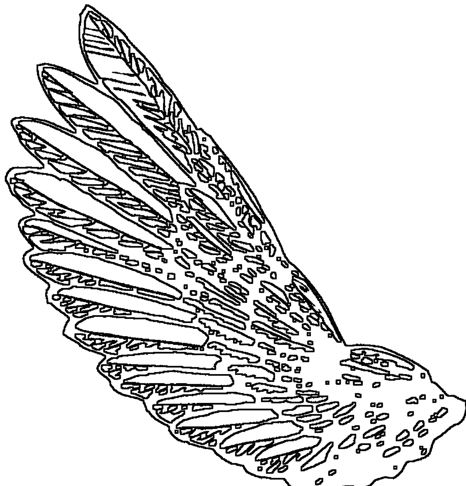

# 第六章

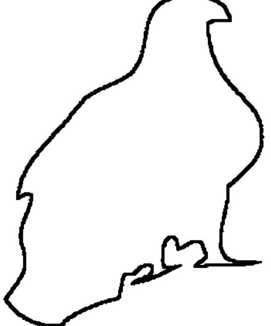

# 飛鳥圖騰與開啟天際之門

許多古老神話和神秘主義皆提到了飛鳥，許多社會都認為，動物是無形力量的有形徵象，而人們也了解到只有透過神的創造物才能夠了解神。尤其是飛鳥，其行為、特性和其他的特質都具有自然和超自然的特殊意義。

飛鳥常被認為是神或是神的旨意，在挪威神話中，奧丁神有兩隻渡鴉信使——胡津（Hugin）與慕寧（Munin），分別代表思想與記憶；在中美洲的神話中，天空之神，魁札爾科亞特爾（Quetzalcoatl）通常都被描繪為一隻羽蛇；在美洲原住民的傳統中，雷鳥是一種擁有強大創造力和力量的神獸；埃及神祇荷魯斯（Horus）擁有隼的頭，而真理女神瑪特（Maat），則帶著禿鷹的羽毛出現；在印度教中，鳥類代表高等生物。

神話、傳說中時常描述有翅的生物以各種方式和人類接觸。珀伽索斯（Pegasus）是希臘的飛馬；哈耳庇厄（Harpies）是鷹女；而古老的獅鷲則是多種動物的結合，擁有巨大的翅膀和鳥的頭部；鳳凰是一種傳說中的鳥類，會在獻祭之火中燃燒，然後從灰燼中重生。大多數傳說中的天使都被描繪成帶有翅膀的生物，顯示出鳥類的特性。

對於背負原罪的人類來說，飛鳥是神祇。飛鳥可以製造雷電、帶來雨水，飛鳥的羽翼和飛翔刺激了人類的想像力，牠特有的飛翔能力，也帶來了許多神秘和象徵的意義。飛鳥除了可以預言死亡，帶來好運或厄運，也常被視為是天使和老師，或是惡魔和毀滅者，還有許多人相信飛鳥是死者的靈魂。在我年輕時曾參加的一堂教義問答課中，一名修女告訴我，尚未受洗的孩子會在死後變成鳥。

鳥類是地球上最古老的生命型態之一，科學家相信鳥類是由爬蟲類在一億四千多萬年前演化而來，人類所知最古老的鳥類是始祖鳥，即希臘文中的「遠古之翼」1。此種鳥類的化石出現於後侏儸紀時代，具有蜥蜴的尾巴，鑲著利齒的下顎，而其翅膀外的關節上則有爪子。

飛行是離開地表，上升至天堂的一種方式，透過飛行也可以從天際下降到地面。鳥類不只是人類與神、人間和天堂之間的橋樑，也是超越的象徵，從低等的本質中昇華出來。鳥類象徵本質的提昇，而其象徵與外表也時常反映出從僵化、最終或不成熟的狀態中解放出來，因此是超越與擺脫束縛的終極象徵。

鳥類代表了魂與靈的結合以及充分實現。由於鳥類的飛翔能力，而與抱負、直覺發展、美麗和漂浮有關，鳥類是創意想像的來源，並能夠喚醒我們自身的飛翔魔法。

每種鳥類都有獨一無二的特質與特性，仔細觀察你所遇到的鳥類有助於你找到並使用自己的創造力。每種鳥類都能為你的生活帶來幫助，了解到此點後，你每天都有機會翱翔得更高更遠。

我認為烏鴉之所以出現於世界各地是有理由的。在傳統上，牠們象徵了魔法，嘎嘎的向每個人呼告，時常提醒你，魔法一直都在你身邊，等待你召喚、並使用在你的生活中。若你遇到烏鴉，牠們的行為、移動和活動皆有助於你了解要如何在生活中應用這些魔法。

學習認知鳥類的精神意義並試著與之同步，將可以幫助你開啟新的視野——不管是對過去、現在還是未來。鳥類擁有與所有動物溝通的知識，也知道該如何讓我們的想法更加具體有效。當你在生活中往更高的意識層躍進，並欲探索自我本質的全新表達方式時，鳥類就變得更加重要。牠們會成為你的預言、指標、保護者以及老師。

當你在該階段開始學習並榮耀你所遇到的飛鳥時，你將會發現你獲得了天賦的羽翼，不論你到哪裡都可以發現牠們的蹤跡。你生活中的其他人也會為你帶來這項贈禮，雖然他們本身並不知道自己帶來了什麼，但你還是覺得好極了，而你也應該要榮耀這些贈禮。

羽毛一直以來都與風、心靈、新的行動和所有創造神祇有關。鳥類是一種補充的語言，作為徵象和贈禮，牠們具有種種特殊的功能，而其中最普遍的包含：

> 1 Bantock, Nick. *Wings* (New York, Random House, 1991), p.5.

- 與神和特定神聖力量接觸的方向：
- 神（神聖力量）的移動方式之一：
- 人與人之間的信息：
- 在你心中或周遭必須掌握的特質和特性：
- 你可以發展出的一種魔力或特質；
- 協助你以大自然，包括動物、天使或精靈為師。
- 預兆和徵象：
- 向特定自然力量祈禱、祈求和協調的方法；
- 代表即將出現的新的轉變及心態的成長；
- 召喚你生活中的飛翼魔力。

在接下來的幾章中，將會更詳細介紹這些功能。請謹記，飛鳥的翅膀和羽毛是其賴以翱翔天際的要素，每根羽毛都是一項特殊的贈禮與承諾、每根羽毛也都可以讓你與任何一種鳥類的特殊遠古能量接觸。你不需要有隼的羽毛才能與隼有所接觸，榮耀並使用任何你可取得的羽毛，都有助於你與鳥類產生共鳴。

所有的羽毛都與神有天生的聯繫，並且與人類心靈相連。雖然任何羽毛都能夠被普遍的應用，但如果想要了解鳥類在自己生活情境中的功能，你仍需對於各種不同鳥類和其羽毛詳加觀察，你必須要檢視其特性和行為，才能夠將之與自己的生活相連。當你這麼做時，從鳥類和其羽毛彰顯出的力量，將會更有活力的向你呈現。

若你開始了解鍊金術運作的過程時，你也會逐漸發現發生在你生活中的鍊金術。鍊金術是燒除雜質，顯露隱藏珍寶的程序，你將會看到提升心靈的方式逐漸展露出來。鳥類和羽毛在古代時常被用來作為鍊金術的符號，而且通常是代表化學的催化作用。觀察鳥類的位置和行動將有助於你找到鍊金術的過程將如何展現於你的生活之中。

在鍊金術過程中，共有兩個昇華步驟，淨化並壓縮某種物質，萃取出其最純粹的精華。步驟之一通常都是使用蒸餾，利用加熱將不重要的部分蒸散、揮發掉；第二步則是沉澱和濃縮，在雜質部分被過濾掉後，萃取出精華。

飛鳥翱翔天際象徵了揮發，而向地面俯衝則代表了沉澱。但要發掘其真正的力量，以及在你生活中是如何反映出鍊金術的過程，你必須要詳細檢視其顏色、行為和各種外觀。飛鳥圖騰告訴我們在生活中有那些雜質需要被過濾掉？有那些部分需要加以濃縮，以萃取出更偉大的力量與魔法？

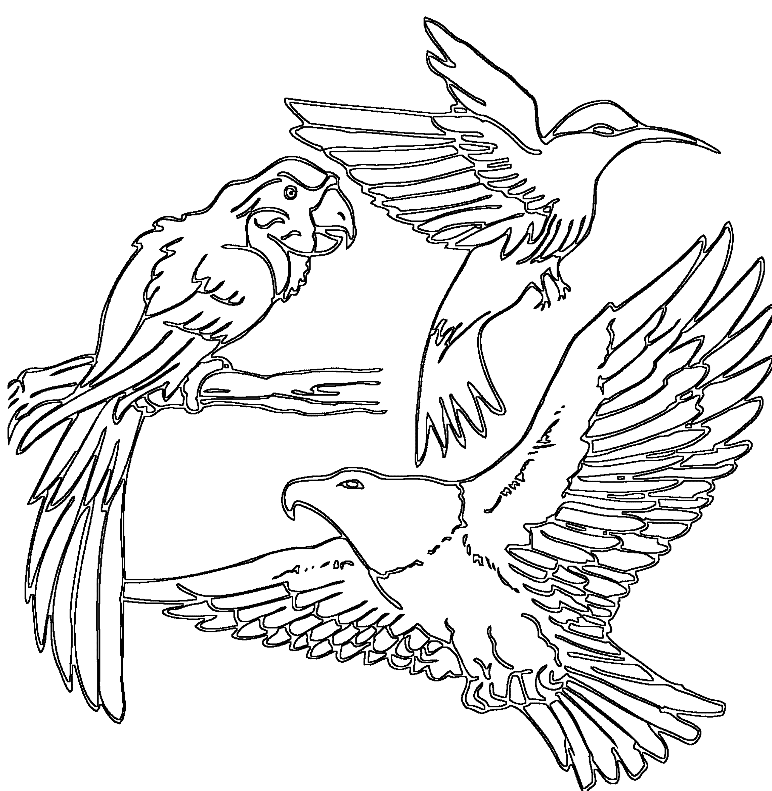

# 飛鳥的魔力

不論是隼、老鷹、還是體型嬌小的蜂鳥，所有鳥類都可以透過飛翔的能力來喚醒我們的好奇心和魔力，提醒我們每個可以加強的地方，同時也是卓越的終極象徵。

鳥類是開啟天際之門最主要的象徵，反映出在生活中向更高深知識和智慧展開的階段，同時提升了讓自己成長的能力和機會。開啟天際之門是學習向神聖的思想——將一般的意識與宇宙接觸的思想——敞開，帶來發展並顯露更強直覺的機會。如果不加以發展，就只能在較低的心智型態中展現，開啟天際之門是向超越物理時間和空間的領域敞開心靈。

透過敞開，你可以學會了解、控制心智的運作。這種了解並非來自知識的收集，而是奠基於更高深的智慧、感性之上的，並可以作爲理性的心智轉換到靈性直覺的基礎。

風（空氣）存在於天與地之間，屬於可以優遊穿梭其中的鳥類之領域，因此風與鳥類可以連結你的靈性和意識。

空氣的流動是一種力量，也就是風。在我們的心中也存在著風和飛翔的能力，飛鳥代表了我們心智中最有活力的遠古能量，同時也提醒著我們要學習如何乘風翱翔，告訴你如果學會使用自己的翅膀、靈感、創意和直覺，你就能夠成功飛翔。

空氣對生命來說也是不可或缺的，人必須要呼吸才能活著，而我們所呼吸的正是空氣。不管身邊吹拂的是怎樣的空氣，你都只能接受，此種敞開反映出重新學習控制周遭和生活，而你的飛鳥圖騰能夠最有效的教你學習控制，決定將什麼納入生活之中。

伴隨著新責任感的力量和自我主導是此種敞開的一部分。鳥類通常都反映出學習接觸，並向新的能量與事物敞開。鳥類召喚了創意的表現，讓你可以昇華生活中特定的元素。

鳥類是人類的遠親，且不同於大多數的動物。如同人類一樣，牠們也用兩腳站立。（由於熊也可以用兩腳走動，因此也被認爲是人類的遠親。）鳥類不僅僅是自然的一部分，還是神靈的一部分，因此是兩者之間的媒介，當你開始與鳥類交流時，就能夠接觸到天地之間的秘密。鳥類爲我們帶來了新的靈性和創造力，之後的章節將會告訴你要如何接受這份邀請。

# 鷹之舞者

利用服裝和動作可以喚醒隱藏在各種動物背後的原始力量，許多人都會利用鷹之舞，由於鷹能夠展翅高飛，因此被認為是一種強大的圖騰。人們相信，鷹與太陽之間有著密切的關係，並被認為是有治癒之力的。利用服裝中的羽毛以及模仿飛翔的動作，有助於彰顯其能量。不同的羽毛代表了鷹不同的能量特質，飛揚的羽毛代表著力量，而蓬鬆的羽毛則象徵了生命氣息。

# 第七章

# 來自飛鳥的魔法

飛鳥是我們日常生活的一部分，但多數人卻很少、甚至不曾注意過牠們的存在。即使注意到了，大多數焦點都是集中在猛禽類（約有四百二十種）的精神層面上。²猛禽時常被認為象徵了權威的命令，並可以帶來美麗、力量、雄偉的感受。牠們那具有穿透力的雙眼、尖銳的喙，以及強而有力的爪皆象徵了高貴的力量，因此許多人都對其傾心不已。

但是對於飛鳥魔法和力量的認識並不應該僅限於猛禽，因為幾乎每種飛鳥都有著古老、象徵性的意義。啄木鳥是魔法和節奏的象徵，渡鴉則為阿拉斯加的阿薩帕斯坦印地安人（Athapaskan）帶來光明。對於古代神秘學派的信徒來說，鸕鶿是一種自我犧牲的鳥類，因為民間傳說牠們會以自己的鮮血餵養幼雛。³對於全世界的異教徒、基督教徒、占卜師、先知和原住民來說，飛鳥一直以來都是一種象徵與符號。

所有的鳥類皆有極佳的直覺及反射神經，不管是什麼出現在眼前，牠們都可以立即自動做出反應。這是牠們生存本能的一部分。鳥類圖騰可以教導我們的，正是這種在本能或是直覺上的自動反應。如此一來，我們就能夠學會使用與生俱來的直覺，更有效控制我們生活中的潮起潮落，而不是隨波逐流。

你必須小心避免誤解了飛鳥莊嚴的力量，若你真的想要與此種和大自然語言有關的魔法和能量有所接觸，就必須要更全面去了解飛鳥，這是發展出與鳥類溝通能力的第一步。

² Wexo, John. *Zoo Books—Birds of Prey* (San Diego, Wildlife Education, Ltd., 1980), p. 2.
³ Cirlot, J. E. *A Dictionary of Symbols* (New York, Philosophical Library, 1971), p. 252.

鳥類的外型與其他動物型態大為不同，雖然我們用「呆頭鵝」（birdbrained）來形容愚蠹，但這其實是一種誤解。飛鳥是出色的老師，牠們的腦袋形狀單純只為了適應其生存方式而如此演化。飛鳥時時刻刻都維持清醒警覺，而有多少人類可以說自己也能做到呢？如果人類可以擁有如鳥一般的注意力，那麼絕對會更加有成就。

無庸置疑的，飛鳥身體的特性就是輕盈，這對於飛行來說是不可或缺的。只有少數的鳥類無法飛行——鴕鳥與企鵝就是兩個很好的例子。而飛鳥的骨頭甚至都是中空的，裡面充滿了空氣，讓牠們可以更輕盈，而能夠翱翔天際。

牠們的新陳代謝也十分快速，因為為了飛行牠們必須維持輕盈的體重，與鳥類圖騰產生共鳴的人，則可以使用飛鳥來幫助自己調整新陳代謝。若是使用飛鳥魔力的成效沒有展現在身體上，則可能使你的精神極度放鬆。此種放鬆釋放了意識，並且可以用來發展出脫離身體的能力（即星體投射）。

鳥類的消化系統也運作得非常迅速，其消化過程比其他動物來得更加完整。擁有鳥類圖騰的人可以參考其鳥類特別的飲食習慣，來改善自己的消化功能。規律且完全的排泄，對於讓你發展出能夠逐夢飛翔的輕盈也是必須的。大多數的飛鳥都沒有儲存排泄物的器官，因此增進了完全排泄的功能，這對於擁有鳥類圖騰，尤其是想要重新振翅高飛的人來說，是非常重要的。

鳥兒們快速的新陳代謝讓牠們燃燒食物熱量的速度非常快，因此牠們攝食的次數也很頻繁，屬於少量多餐。現代的營養學家認為每日少量多餐的進食方式，相較於傳統的一天三餐，對人體來說是比較健康的。許多鳥類都大量攝取高辛烷的食物，以獲得更高的能量釋放。蜂鳥燃燒食物熱量的速度與其體重的比例是人類的五十倍，因此蜂鳥會不斷在花草植物中尋找糖分和花蜜。

許多飛鳥擁有「類冬眠」的能力，讓身體需要的食物量減少，牠們減緩生命節奏，包括降低心跳、呼吸次數，而體溫也會下降。這樣的情況跟一般動物的冬眠很類似，而對於鳥類來說，這讓牠們可以最少的能量，飛得更高更遠。牠們能夠有效利用所有攝取食物的能量。

而擁有鳥類圖騰的人也可以發展出同樣的能力，了解你所屬鳥類的飲食與消化習性，你將會發現當你加以採用時，你的新陳代謝與消化系統就會開始反應出同樣的節奏和模式。如果飛鳥以圖騰的型態進入你的生活之中，你的飲食、新陳代謝速度和消化很有可能就會因為健康和成長的需求，而產生對應的改變。甚至還可能告訴你，要如何在精神發展方面進行必需的下一步。請謹記，要時常詢問自己：「我可以從飛鳥那兒學到什麼呢？」

向鳥類圖騰學習呼吸方式，你可以學會視需求加速或減緩你的新陳代謝。鳥類使用空氣和氧氣來加強食物的燃燒，學習新的呼吸技巧，讓你可以從食物與身體中汲取更多能量，這也是你要向飛鳥學習的一堂課。試試看新的呼吸模式，研究你圖騰的呼吸節拍，試著重複或加以模仿，你將發現這有助於你在需要時獲得飛鳥的能量。

飛鳥永遠不會喘不過氣來，牠們其實是用呼吸在飛翔。在我們的肺部膨脹時，橫膈膜是縮小的，而當放鬆時，隨著吐息，我們的胸腔回復到原本的大小；但大多數的鳥類都是以相反的方式呼吸，牠們的肌肉會致力於擠出空氣，而非吸入空氣；而當放鬆時，才會將新鮮空氣自動吸入體內。

我們可以在某種程度上發展出這樣的技巧，但由於我們的肌肉組織型態與之非常不同，因此無法完全模仿鳥類的呼吸方式。鳥類的胸腔肌肉會幫助牠們的肺部運作，但人類則否；另外，鳥類的呼吸系統被我們稱作單向呼吸系統，是由體內各處的氣囊進行換氣，因此肺部永遠都會有新鮮空氣。這對於那些擁有鳥類圖騰者來說是非常關鍵的，為了身體和精神健康著想，你的肺部必須一直擁有新鮮氧氣。固定花時間走到戶外，進行深呼吸練習對此會有所幫助，這對你的整體健康來說也是十分必須的。

參加活動或與新鮮空氣接觸，對那些擁有鳥類圖騰的人來說是很有幫助的，到戶外走走，會比坐著不動更有效。由於需要帶動胸腔的肌肉（同樣的肌肉也控制著翅膀）讓空氣進入肺部，鳥類在飛翔的時候呼吸最為劇烈。試著增加和減緩你的呼吸頻率，但是請謹記，人類是不可能完全和鳥類一樣呼吸，因為人類每分鐘的平均呼吸次數是十六次，在運動時可能會增加五至六次；而一隻休息中的鴿子則每分鐘呼吸二十九次，當其飛翔時，呼吸次數則高達每分鐘四百五十次。

藉由呼吸與放鬆，我們可以消除壓力，而我們也會發現，這樣一來便能夠事半功倍。呼吸具有非常古老又強大的魔法，瑜珈也是一門教導以各種不同呼吸技巧，讓體內充滿氣（譯註：原文為prana，梵語，有生命、能量、呼吸等意思。）或能量的學問；中國的氣功也與學習如何透過適當的吐納，將內在的能量引導至外展現出來有關；道教也有教導呼吸以增進身體健康的修行，許多技巧都可以被用來使身體放鬆、增加能量、刺激大腦活動，並改善許多健康問題。

呼吸和空氣象徵了生命，而飛鳥在大自然中的位置，使之得以掌握此兩者的秘密。在本書中，我們無法窮盡牠們所有的呼吸技巧，但在參考書目中，有些資源可以幫助你展開學習。請謹記，飛鳥們掌握了呼吸的力量，你越是能夠向飛鳥以及你的鳥類圖騰學習，你就越能夠與此種遠古能力產生共鳴，並進一步將之彰顯出來。

整體來說，所有的鳥類都有極佳的視力，牠們的視力比人類要優越得多，並且可以成功分辨距離遠近。我們可以向鳥類學習的，也包括了視力這個部分，牠們能幫助我們看得更遠，因此有助於我們發展出更高型態的直覺判斷。

大多數的鳥類雙眼都位於頭的兩側，使之得以同時觀察到來自不同方位的事物。你的圖騰也是如此嗎？如果是的話，你便更能夠學習如何眼觀四面（包括時間的方位——過去、現在和未來）。而有些鳥類的雙眼則位於頭部前方，牠們看世界的角度就跟我們人類一樣，例如貓頭鷹。

鳥類的頸部非常靈活，因此可以將視野拓展到更廣的範圍。讓頸部保持放鬆、靈活對於擁有鳥類圖騰的人來說是很關鍵的。規律的按摩與伸展你的頸部，不只可以增進你的視力，還可以提升你的直覺。

頸部也具有獨特的象徵涵義，此部位連接了頭部和軀幹（連接了上與下），是身體兩個重要結構的橋樑。此橋樑一直以來皆象徵了進入或開創新的領域。頸部可以反映出思想和感知上的靈活性。

如果鳥類以圖騰的方式進入你的生命之中，或許正代表了你應該要更有彈性，你是否太死板了呢？你是否害怕回顧過去或放眼未來呢？或是你總是抗拒別人的觀點？你準備好要向新的視野、新的領域敞開了嗎？

通常鳥類的圖騰都代表要以更有創意的觀點，來審視這個世界和你的生活。許多鳥類，尤其是猛禽都有三層眼瞼，牠們有著跟人類一樣的上眼瞼，尤其是貓頭鷹，擁有與人類相似的外貌，連移動上眼瞼的方式也跟人類一樣；鳥類還有下眼瞼，通常在睡眠的時候闔上，像是隼閉眼的方式就是把下眼瞼闔上；另外還有被稱作瞬膜的第三層眼瞼，以橫向移動的方式，濕潤並清潔眼睛表面，並在飛翔時減輕風的作用。

三這個數字代表了創意和新生，由於在此三與眼睛有關，因此隱含有新視野的意思。將意念帶到眼瞼進行些許的冥想，將會為你帶來能夠改變生活的動態視野與想法。

研究你飛鳥圖騰的飛翔型態和行為是個不錯的主意，會為你帶來更多資訊。相關的內容會在第九章「羽毛的魔力」中加以介紹。所有的鳥類都是以這兩種方式飛翔的：（1）拍打翅膀；和（2）滑翔。大多數的鳥類是兩種飛翔方式皆會使用，而飛鳥們也會使用自然的氣流爬升高度。擁有鳥類圖騰的人應該要學著找出並使用他們生活中的自然氣流，這比其他任何事物都更能夠帶領你獲得成就。有時候你需要拍打翅膀，有時則需要順勢滑翔，當學會了鳥類的自然節奏時，你將會發現自己的生活會跟隨著這股節奏，而你總是可以事半功倍。

許多鳥類都有遷徙的習性，為了覓食在不同的氣候區間移動。鳥兒們知道什麼時候該開始行動，牠們知道固定的航線，知道要往哪前進，也知道什麼時候該踏上歸途。牠們不需要跟隨曾經遷徙過的老鳥，對於路線的知識是牠們與生俱來的本能，許多科學家都認為這是一種細胞知識，賦予了牠們內建的導航和計時裝置。

若是你擁有會遷徙的動物圖騰，可以研究一下牠的遷徙模式，將有助於你發展出自己的內建導航和計時裝置，好讓你能更有成就。這可以在你尋找最有利的「食物」來源——可以是真正的食物、工作、他人，甚至是愛人——而進行遷徙時，對你有所助益。

有些鳥類不需遷徙，牠們針對所居住的氣候區發展出了適應的能力，還有一些鳥類因為沒有進行固定的遷徙，而不被認為是候鳥的一種，這告訴我們，要隨時隨地保持開闊的態度。請謹記，鳥兒們給我們的教導也包括了靈活，猛禽時常被排除在候鳥的分類之外，即便如此，在有需要的時候牠們還是會遷徙的，而通常遷徙的距離也會視情況需求而定。

所有的鳥類都對天氣非常敏感，只要願意花時間練習，你也可以像鳥一樣發展出在天氣轉變之前就做出反應的能力。每一種鳥都可以教你如何判斷天氣的轉變，甚至創造自己所需的改變。當然，這必須承擔極大的責任。

幾年前，當我父親去世時，在將遺體帶回俄亥俄州戴頓埋葬之前，我的兄弟們和我一起前往南卡羅來納州參加這場特別的告別式。告別式當晚，天氣變得很糟，下著冰雹和雪。每個人都擔心因為路面會凍結、會錯過班機，和我們隔天早上要前往戴頓時會遇到的其他安全問題。我試著告訴每個人不要擔心，一切都會好轉的，但當然，沒有人要理我。

那天晚上，我特別進行了一次我之前曾用來排除壞天氣的冥想。雖然我不常練習，卻還是很有效。此儀式與我的鳥類圖騰和其他的一些層面有關，我之所以有好一段時間沒有使用它，是因為我發現在過去幾年以來，如果我把天氣從一個區域轉開，它就會去到另外一個地區，所以在使用這個儀式時，會牽扯到很重的責任。在當晚，我因為感冒而臥床，又累又渴，所以我並不像平常那樣深思熟慮。而若要驅散天氣狀況，需要多的精力，因此我當時選擇將壞天氣從每個人返回戴頓的路途上轉移走。

隔天早上，馬路清爽，只有一些半融的積雪塊，而等到我們上路時，已經全部溶化了。雖然天空陰陰的，但沒下雪也沒下雨，到中午的時候，雲層散去，太陽開始閃耀著大地。

當我兄弟們和我抵達戴頓時，我們被告知說我母親的班機被雪困住了，她和我妹妹本來是要搭乘載著我父親遺體的班機一起回到戴頓進行葬禮。那時我才發現，她並沒有搭乘我預計她會搭的那班飛機，而她所搭乘的那班飛機的路線，正好與我推開的負面天氣狀況的路線一致。當時，大家都認為那班機要到隔天才有可能起飛，這讓我們原本做好的葬禮安排陷入大亂。

顯然我必須做點事情來彌補，而我也成功做到了，班機得以在那天稍晚的時候出發。而這件事也告誡了我，在使用這些自然力量時，必須額外謹慎。這股能量是如此強大，幾乎無所不能，但卻背負著沉重的責任，而且很容易造成問題，如果我不是跟我的圖騰打交道已久，並且知道要如何操縱這股獨特的力量，那麼這一切就都不會成功了。透過實踐和堅持，鳥兒們可以教導我們神奇的力量。

越是專注於你圖騰的各種屬性，你就越能夠了解牠的語言，你會逐漸了解，牠說了些什麼關於你生活的事情。一旦你開始看到這顯而易見的對照時，這些微妙的徵兆就會更加的清晰。本章接下來的部分將會教你真正了解鳥兒們在對你和你的生活說些什麼。

# 練習了解飛鳥的語言

鳥類被認為是一種預兆、一種崇拜物，甚至是天氣的預報員。牠們會與任何願意學習其語言的人溝通，但是每個人都必須在紮實的知識基礎上，去學習體驗要如何將鳥兒們的溝通內容，翻譯並應用在自己生活之中。大自然和自然中的萬物都在提供我們資訊，我們的身體和心智都知道、感覺到我們所見的是非凡的。飛鳥的飛翔與其方向並非偶然，也絕非毫無意義。飛行的時間、飛鳥出現的時間，和動物的回應對我們來說都是富有寓意的訊號。大自然將神靈反映在具體世界之中，而大自然中的動物也是其中的一環。

# 實作一：一天的開始

惠特曼曾寫道：

> 有個孩子往前走著，日復一日。
> 他會成為所見的第一個事物。
> 而該事物也在那天、那天的某個時刻
> 好幾年、或以年為周期成為他的一部分。

⁴ Whitman, Walt. "There Was A Child Went Forth," *Two Ways of Seeing* (Boston: Little, Brown and Company, 1971), p. 15.

我們與鳥兒們展開對話也是使用相同的概念，如果我們擁有深厚的知識基礎，那麼在學習如何了解鳥兒們在對我們說什麼的時候，就不會那麼勉強。只要單純放鬆到更深的意識，以更充分的覺察自我即可。本書中的實作有助於你發展出此能力，不必心急，讓它自然展現。

起床後的第一件事，花幾分鐘放鬆，使心情平靜。想像你正踏出戶外，大自然派了鳥兒歡迎你。你在心裡請求那些重要訊息要傳達給你的鳥兒可以在今天出現，讓你心中保有飛鳥將會帶來當日徵兆的想法。

儘量想像出最細微的細節，別擔心你只是在幻想，或是會變得迷信，這只是入門的實作而已，這可以幫助你看到、並向作為你生活資訊來源的大自然做出回應。另外也要謹記，飛鳥是與心靈活動有關的，因此你的思維也會受到那些對你來說有特殊意義的鳥類圖騰影響。

調整好你的心態，想想你希望大自然如何回應你，在走出戶外，強調你想要怎樣的訊息傳達前，先好好冥想。如果鳥兒在你右邊出現，你希望這代表什麼意思？在左邊呢？東南西北呢？或是飛過你頭上？飛下來？各代表什麼涵義呢？你必須在事前就知道這各自代表什麼，但你也不需要拘泥於此，隨著你與飛鳥的關係逐漸加深，溝通的過程也會有所進展。

注意鳥兒飛行的方向是聆聽自然的古老方式之一。普遍認為，在上路前看到鳥往右飛去，代表好運；若是往左飛去則表示可能待在家裡比較好。我曾提過，幾年前我便發展出了可以辨別某種特定隼類的姿態和活動，在我的旅程中代表什麼意義的能力，而你也可以就此開始發展此種能力。

每天花幾分鐘建立起此種心態，並將你已經準備好了的訊息傳遞給大自然知道。你要規畫讓自己加深對於大自然和其各種表現的反應，佈置好溝通的基本立場，邀請大自然以非常明顯、具體的方式引導你，讓你能夠更有效的了解祂釋放的訊息。每天早上花五分鐘進行這項實作，一星期後再進展到下一個步驟。

經過一星期的準備冥想後，你可以更進一步了。重複你的想像，請求大自然透過鳥兒向你傳遞訊息，讓你知道當天你會過得如何，在心中複習鳥兒的出現方式可能代表什麼涵義。接著，踏出戶外，深呼吸一下早晨的空氣。坐下來，好好放鬆、聆聽、觀察。你看到或聽到那些鳥類？如果超過一種的話，哪一種對你來說最特別呢？祂讓你有什麼感覺？你覺得祂出現在你面前應該表示今天會是怎樣的呢？如果你看到了鳥兒，祂是在飛翔，還是在休息呢？祂是否藉由祂的行為在告訴你，今天你將振翅高飛、引吭高歌，或者這一天你將會很忙碌呢？

# 鳥類的象徵特質

- 黑鸝（燕八哥）：預言和魔法、恐懼與承諾的顏色
- 藍知更鳥：幸福與滿足、北方和東方的顏色
- 金絲雀：具有治癒能力的聲音、強調敏感
- 灰貓嘲鶇（貓聲鳥、貓鶇）：溝通潛力、新的教訓或機會
- 山雀：靈數為七、真相或知識的找尋者
- 烏鴉：智慧、警覺、魔法、連結前世
- 鴨子：母性、優雅、撫慰、保護
- 老鷹：達到巔峰、洞燭先機、連結世界
- 雀：新的體驗、遭遇、夏至
- 鵝：訴說故事、生殖和忠誠、代表數字8與無窮（∞）
- 玫胸白翅斑雀：療癒舊傷口、家庭的價值、過去生活的重要性
- 隼：最初的生命力、成就感、春分和秋分
- 翠鳥（魚狗）：太平日子、和平與繁榮、與北方有關、藍色
- 潛鳥：實現夢想、恐怖古怪的歌曲、想像力
- 喜鵲：玄秘的知識、通往新領域的道路、狡詐固執
- 草地鷚：爽朗、昇華、內心的旅程、與月亮有關
- 茶腹鳲：將智慧應用在大自然中、有憑有據、輕盈
- 黃鸝：正面能量，與內在陽光重新接觸、自然精神
- 貓頭鷹：大智若愚、夜視力、治癒之力、魔法
- 孔雀：智慧與遠見、華麗的、保護與強大
- 鵜鶘：自我犧牲、不好爭鬥、活潑、通過考驗
- 鴿子：家庭的愛和安全感、生殖、遠古能量
- 渡鴉：變形、信使、或預兆、人與動物的混合
- 知更鳥：新的成長、地域性、喉輪中心的顏色
- 歐椋鳥：好交際的、各種溝通、有說服力
- 鸛：與人文、情感、水、出生過程有關
- 天鵝：感性、情緒化、夢想家、神秘主義、長壽
- 雨燕：女性與心靈能量、速度和敏捷
- 火雞：與大地之母的精神接觸、共有的祝福
- 禿鷹：淨化、隨時戒備、神秘的守護者
- 啄木鳥：天氣先知、傳至其他領域的鼓聲

你不需要擔憂是否正確，一開始的解讀可能都不是那麼正確，但隨著持續不懈，你將會發現你的解讀越來越正確。請謹記，你並不是生下來就隨時隨地在練習聆聽大自然的，因此你可能無法馬上與之建立起正確的溝通。

注意飛鳥的基本特質和特性，觀察其顏色，這同樣也有許多涵義。當你看到鳥兒時，是只有一隻？還是成群的？如果是成群結隊的出現，總共有幾隻呢？（請謹記，數字也是有特殊涵義的。）你又是在怎樣的環境中看到牠們的呢？那是夜行性、還是在白天活動的鳥類呢？

這所有的一切對於即將展開的一天來說有何涵義呢？相信你的第一印象，這會是你的第一步。接著，感謝鳥兒和出現在你生活中的大自然種種。你可以在內心默默表示謝意，或是用行動表達，例如祈禱，或是埋下一顆種子。

接著做你當天該做的事情，當你在進行的時候，時不時停下往外看看。鳥兒是否有再次出現強調牠要傳達的訊息呢？你能否看到早上出現的情境是如何反映在此刻發生的情況中呢？一天過完後，反省一下飛鳥是否有反映出真正發生的事情呢？要如何才能讓訊息更加明確呢？隨著你的持續練習，在一個月內，你將會發現鳥兒是你最佳的晴雨計。

# 實作二：模仿的力量

大自然中的萬事萬物都可以與神靈力量共鳴，每種走獸、植物、飛鳥和石頭以各自的方式反映出此精神。你越是能夠與之協調，就越能夠創造你自己的共鳴，也可以更容易了解大自然在訴說著什麼。

古往今來，與大自然和諧一致，最常見也最有效的方法之一就是透過模仿，人們會擺出動物的姿態與動作，然後將之納入祭祀的舞蹈之中。透過模擬動物的舞蹈與服裝，人們能以圖騰的身分現身。

每種動物都有其特有的動作和姿態，透過服裝和動作，可以喚醒各種動物背後的那股古老力量，人類可以做出虎踞、龜爬、與鳥蹬的動作。倉鴞時常會左右搖擺，透過景象和聲音來幫助自己定位出獵物的位置；大雕鴞也會一同擊喙來發出警告；禿鷹則在起飛時，面朝著太陽，將翅膀伸展開來。

採取你圖騰的動作和外貌，是喚醒自己的一種方式，並可以藉此了解其本質，並在精神上彰顯之，這有助於你將原本的意識，轉換成對於大自然特殊徵象有更強感應的感受和認知。看看一些東方的學問，像是瑜珈、道教和功夫，都充滿了動物的動

# 鶴足立

鶴象徵精神和物質之間的平衡。擺放出此姿勢與動作將有助於你以平衡、有力的方式開拓另一個領域和世界。此姿態讓你可以直上雲端，或是與已離開物質界的靈魂溝通。

作，加以學習和模仿，你可以有效的讓自己與動物圖騰的節奏協調一致。

你可以找一些有關於各種飛鳥和走獸行為的書和影片，研究牠們基本的姿態和動作。走訪動物園或是自然中心，觀察動物們的動作和站姿。牠們的頭是如何擺放的？當走動的時候步伐如何？而當你回到家後，模仿牠們的動作，這就是一種可以榮耀你的圖騰、並可以在生活中喚醒動態能量的舞蹈。

製作反映你圖騰的面具和服裝。有許多文化和信仰都利用面具來進入另一層世界，面具有助於創造幻覺，以與超自然世界接觸。面具還可以是一種能喚醒動能的工具，用來彰顯與之有關的能量。本書無法對此做太多著墨，但你可以參考一下我之前的作品：《舞蹈的魔法：儀式動作之介紹》（Magical Dance — An Introduction to Ritual Movement）。

大多數的古代祭祀動物舞都是緣此而生的，這些舞蹈模擬、模仿動物的型態和動作。製作一對你自己的翅膀，並練習飛翔，享受其中的樂趣，所有的動物——包括鳥類——都熱愛玩耍。

# 實作三：鳥蛋、鳥巢與預言

另一種培養對於鳥類語言更直觀認識的方式是透過預言，而蛋與鳥巢通常都是很好的工具。蛋卜（Oomancia）是一種透過蛋來預言未來的古老學問，其中的一個分支——胚胎占卜（ooscopy）則被用來預測未出生胎兒的性別。懷孕的婦女可以把蛋放在胸前直到孵化，然後透過出生小雞的性別來預測自己小孩的性別。⁵

蛋一直以來都充滿了神秘的色彩，埃及的太陽神，阿蒙·拉（Amon-Ra）就是由蛋孵出的；而在印度教的傳統中，梵天也是從一顆金色的世界之蛋（譯註：原文為Hiranyagarbha，可譯作金胎、金卵）孵出來的；在中國，盤古是世界上的第一個人，從宇宙之蛋中出生；在希臘的傳統中，神秘蛋（Orphic egg）象徵了整個宇宙。大蛇與蛋的古老符號在許多文明中皆有所見（示意圖如下頁）。

蛋是生殖和新生的古老象徵，也是復活的象徵，甚至還可以被用來作為對抗邪惡的護身符。在埃及的象形文字中，蛋通常代表了可能性，你的鳥類圖騰所生的蛋可以告訴你有關未來的各種可能性，以及在什麼時候機會將會成熟。你的圖騰所生的蛋之花紋、顏色和形狀將會提供你線索，讓你知道生活將發生什麼事情。

⁵ Baskin, Wade. *The Sorcerer's Handbook* (Secaucus: Citadel Press. 1974), p. 432.

# 巨蛇與蛋

通常都被認為是神秘蛋的變形，此圖形是生殖和新生的最古老象徵。蛋代表女性，巨蛇代表男性，結合在一起創造新的生命。

觀察你鳥類圖騰的繁殖習性會是探索圖騰的第一步，你會在其中找到許多資訊：

- 其交配和最常產卵的季節可以顯示出，你將在什麼時候注意到可能性出現。
- 你的鳥類圖騰的平均下蛋顆數可以讓你知道，新的可能性會以幾種方式呈現在你面前。
- 孵化需要的時間可以讓你知道，要了解你的圖騰需要多少準備，以及可能會對你的生活造成什麼影響。
- 此種鳥類從孵化出來到成熟所需花費的時間，能夠告訴你，此圖騰需要多少時間才能完全展現在你生活中彰顯其能量。

你圖騰的築巢習性也可以反映出許多建立新家庭的有效方式，他可以反映出與鳥類有關的新能量最佳的使用方法。鳥巢的大小、結構和常見的位置都對於你和你的生活有重要的涵義。

研究鳥兒們建造、發展、使用牠們鳥巢的方式。有些鳥類，如：烏鴉，會在最高的樹梢上築巢，如此一來牠們就能夠擁有極佳的視野；有些鳥則會每年都築一個新的巢；也有的鳥類會在原本的鳥巢上進行增建。你的圖騰可以幫助你找到最適合你的成家地點以及家的型態。

# 實作四：釋放想像力

此實作是透過冥想協助你喚醒鳥類的力量和威嚴，以及透過飛鳥彰顯出來的遠古之力。這可加強你與自己鳥類圖騰間的連結，並能夠顯示出到底哪一種鳥類才是你命定的圖騰。本實作可以與本書中介紹的其他實作一起進行，並不會干擾或是減少成效。

在此實作中使用的象徵是為了要讓你的意識轉換到心靈的層面，這樣一來才能夠回應，並了解鳥類的象徵和真正的力量，以及牠們主要的媒介——風元素。此實作將喚醒蟄伏於你體內的力量，召喚出鳥類的遠古之力，並確實彰顯出來。通常參與此實作的人在一段時間後，都會在生活中遇到真正屬於他們的鳥類圖騰，這將會是一種極妙的確認。

透過練習，你可以逐漸踏上真正的靈性旅程，透過製作及穿戴鳥類面具和服飾，可以強化此實作。你將會發現，你越來越能夠脫離笨重的軀體，像鳥兒一樣在宇宙中自由飛翔。

這種能力與真正的巫術間有些相同之處，西伯利亞的巫師們通常都會穿戴鳥類的服裝，而許多信仰巫術的社會都會使用頂端刻有鳥頭的法杖象徵朝聖。此種法杖是一種祈禱棒，也是協助靈性新旅程的工具，我們將在下一章中進一步加以介紹。當你與鳥類圖騰發展深入的關係，且到達某一階段時，你可能也會考慮製作一支。

1. 首先，確保你不會受到打擾。拿起電話話筒，讓自己覺得舒適，你可以坐著或躺著，只要你覺得舒服就好。
2. 你可以穿戴你所做的鳥類面具或服裝。如果你有羽毛，就帶在身上，你可以用手拿著，或是插在頭髮中。請記得，任何一種鳥的任何羽毛都可以用來幫助你接觸其他種類飛鳥的本質。
3. 如果你有鼓或是搖鈴的話，也可以使用。節奏應該要是緩慢、規律的，五分鐘緩慢有節奏的鼓聲有助於你切換到心靈層面，並可以促進接下來的想像。不需要擔心你是否會落拍，如果你在中途停了下來也沒關係，因為在實作的該階段，樂聲的作用仍將持續發揮。
4. 如果你覺得自己還不夠放鬆，深呼吸，進入更深層的放鬆。將溫暖、鎮靜的感受送進你身體的每一個部位，慢慢來，不用急。你越是放鬆，就越能夠確實體會到能量。

# 鳥類面具與服裝：老鷹頭飾

你可以簡單製作你自己的鳥類面具和服裝，不需要花費太多金錢。這是與你的鳥類圖騰產生共鳴極佳的方式，你甚至可以創造有趣的鳥之舞出來，這可以使飛鳥的本質更為榮耀，使之更有活力的充滿在你生活之中。

5. 闔上你的雙眼，深呼吸。感受空氣充滿你的肺部，並放鬆身體及心智。當你持續放鬆和呼吸時，你會感到一陣輕柔的微風吹撫過你的臉頰，你覺得愜意又充滿活力，而你心中的意象也逐漸清晰起來。

你會發現自己身處於一片翠綠的草原之上，你身體下的草既柔軟又繁茂，而空氣本身似乎因為陽光而閃閃發亮。當你望向自己時，你看到身處的草原其實是位於一座雄偉山脈中的高原之上。在你頭頂上，是遠遠的山峰，被雲霧所環繞，而往下你看到自己所居住的城鎮，還有你的家。

你再次感受到微風的輕撫，接著你感到頭頂上有一片陰影經過，短暫遮蔽了陽光，接著又消失不見，但一會兒之後又再次出現。穿過草原，你看到那片陰影似乎是隻巨大的飛鳥，而每一次陰影穿過你身邊時，都帶來一陣微風，就好像有翅膀溫柔卻不失力道的幫你搧著風一樣。

你抬起眼望向天際，當你與這隻大鳥目光交會時，牠猛然下降，並用牠的雙爪將你抓起，你被牢牢抓住卻不覺得痛。

你發現自己被提起，隨著雄偉的翅膀上下揮動，在你身邊傳來了一陣陣的強風。而當你低下頭來看著草原時，你看到了一片草坡隨著這隻鳥振翅所帶起的氣流而搖擺，有那麼一刻，你覺得它們好像在跟你揮手道別。

隨著鳥兒帶著你飛向山頂，你看到自己越升越高。空氣的溫度下降，但不會讓你感到不舒服，反而更覺神清氣爽。接著你發現到身邊雲霧環繞，隨著你越升越高，甚至連雲霧都被你拋在腳下。

接著，拍動的翅膀停了下來，鳥兒開始隨著氣流滑翔，牠沉默而輕柔的盤旋著。你看到在你下方有一個巨大的鳥巢，搭建在山頂的一棵巨木上。由於空氣稀薄，你覺得有点头暈目眩，而這隻雄偉的鳥兒緩緩盤旋、緩緩向鳥巢滑翔而去。

隨著距離拉近，你喘了口氣，擔心自己會摔得太重。隨後，大鳥快速而大力振翅，盤旋在鳥巢正上方，溫柔的將你放入鳥巢之中，然後牠再次揮舞著強而有力的翅膀，重新起飛，飛出了你的視線。

你站在這個位於雄偉山峰上的鳥巢之中，你確信你正處於世界的頂端。你移動到鳥巢的邊緣，然後往下看，所見的景色讓你感到頭暈目眩，不得不退回去。這裡的空氣很清新，強風向你吹來。你深呼吸，同時你開始聽到了風中傳來輕語呢喃的聲音。

就好像有一群人在溫柔的對你訴說著什麼，你每一次呼吸，這聲音就變得更加清晰。

> 「沒有空氣，就沒有生命。你，或是世上任何生物都無法存在。任何空間之中都有空氣，你呼吸著空氣、在空氣中移動，不管是說話或思考都離不開空氣。

你會受到空氣、大氣壓力的影響，無論你去到哪裡，都會在空氣中留下你的蹤跡。你所說的話、腦中的想法和你採取的態度都會對大氣造成影響。

透過在風中最有活力的生物，學習與風之元素共鳴，你將可以對任何你進入的大氣感覺更加敏銳。你會知道應該要避開哪種環境，哪些人可能會帶來麻煩，哪些人可能會有所助益；你會學到要如何藉由在空中飛翔的語言、聲音、思維或是呼吸來改變生活的趨勢。」

你再次向邊緣邁進，並望向地平線。你深呼吸，感受到空氣流過你的身體、器官。你體內的每個細胞似乎也隨著你的一吸一吐而在呼吸著，你覺得自己越來越輕、越來越輕。你開始看得到自己呼吸著的空氣，如同一股透明、盤旋著的能量，強化、明亮了你的身軀，如同有百萬雙光之羽翼向你飄來。

每一次的呼吸都讓你的心靈與身體充滿了新的喜悅和奇妙的感受，很快的，你發現自己其實不是在呼吸，而是在「被呼吸」著。你覺得自己越來越輕盈，你伸展雙臂，如同鷹展開雙翼，捕捉氣流升空一樣。你開始了解到鳥兒們每次飛離地面時的感受。

隨著你雙臂伸展開來，你踏出鳥巢，下降了一下子，接著氣流接住了你，並將你舉起，帶你向上。你開始滑翔，感覺自己是一隻擁有巨大光翼的鳥，讓自己順著氣流下降，習慣、駕馭著氣流，順著氣流滑翔，而不要逆風而為。

當你在氣流中放鬆時，你會發現自己開始緩緩往下滑翔。從這個角度你可以看到整個世界，你從一個全新的觀點來觀察每件事、每個人。緩緩的，氣流帶著你下降，穿過雲層，你繼續滑翔，接著，你看到了在你身下的草原。在草原中心有一棵樹，而你似乎正朝著它滑去。慢慢的、緩緩的，氣流帶著你下降。你輕柔的伸手觸碰這棵樹，讓自己穩定下來，找回控制，你開始休息，平穩、優雅的降落在這片茂盛的草原上。

你內心充滿了神奇的感覺，你再次抬起頭來望向山峰，在天空中尋找那隻大鳥，希望牠可以再次帶你翱翔天際。但天空中什麼也沒有，你失望了，再次將注意力拉回，而這時你發現，那棵大樹已經不見了。

在原本樹的位置上是一根木杖，杖頭雕刻著一隻鳥，並用某支特別的鳥羽作為裝飾——這隻鳥總是吸引並環繞著你。你開始了解，這就是你的旅途之杖，有了它，你將能學會邀請飛鳥進入你的生活之中。它會成為讓你開始學習飛翔的那棵大樹，幫助你進行未來每一次的想像力釋放。

你雙手拿起木杖，高舉向天，表達你的感激，而你感到一股微風吹過，這是宇宙給你的回覆。你閉上雙眼，陶醉於祂的承諾之中，你深呼吸入祂的精髓，並發誓要榮耀所有的有翼生物。

# 飛鳥與精靈

許多風的精靈和神靈皆以飛鳥或其他有翼生物的型態顯現在人的面前，而祂們真實的面貌，是纖細而美麗的。

# 第八章

# 羽毛與飛翔之謎

人類鍾情於羽毛，我們喜歡拿著羽毛、在空中揮舞、在臉上輕撫，甚至睡在羽毛做成的床上。給孩子一根羽毛，他就會開始玩起鳥兒飛翔的遊戲。我們都對於飛鳥飛翔的能力感到驚奇，這麼脆弱的東西，卻如此強而有力。人類忌妒飛鳥的飛翔能力，而我們知道，此種能力是與羽毛密不可分的。

羽毛象徵從塵世之中成功的抽離，不受世俗的重力所束縛，同時也象徵了平衡與風，羽毛最常被用來代表所有將生命吹入人體的創造神祇。

羽毛實際上是一種特化的皮膚角質，是由一根中空的羽杆，與數以百計、錯綜複雜的羽枝及角質集結而成的細絲組成的。一根羽毛是由百萬種不同的部分組合而成，而羽毛的種類共有四種——飛羽／翅羽、廓羽、絨羽、和羽、和纖羽。⁶

飛羽最強而有力，較為堅硬、大片。飛羽通常又可分為下列幾種：初級、次級、三級飛羽、尾羽、覆羽。（見下頁的圖解。）初級、次和三級飛羽用來起飛與推進，另外還可以協助減少阻力。這些羽毛可以讓我們與遠古的力量接觸，幫助我們在冥想中到達新的高度，並超越在生活中拖累我們的事物。

初級飛羽通常都是一對一對的，一邊一根。當一對飛羽被新的取代時，第二對飛羽才會開始落下，讓鳥兒們不至於墜落而發生危險，如此一來，便可以隨時飛翔。飛羽因此象徵了雙數的節奏，此種節奏有助於你與創意想像、誕生和直覺等女性能量接觸。你可能會發現身邊的羽毛都是成對的，你可能會在某天發現一根羽毛，兩天後又發現另一根。

⁶ O'Connor, Karen. *The Feather Book* (Minneapolis, Dillon Press, 1990), pp. 4-5.

不同種類的羽毛

覆羽則較小，沿著翅膀的邊緣長出，讓翅膀的前端較為厚實。這使得空氣可以快速流過翅膀尖端，減少氣壓，提供爬升力。此種羽毛有助於我們與促進靈魂離體體驗的力量協調（見下頁的「實驗如何飛翔」）；尾羽則被用來控制方向和減速，可以在需要的時候，幫助我們和生活中的調整方向及減速。

廓羽較大片，形狀如蕨類植物，這是人們時常會發現的羽毛，也是大多數人在想到羽毛時腦海會浮出的畫面。這些羽毛包覆著身體外部，形成球狀的外型，讓空氣可以順利的流過身體，使飛行更為容易。這就是為什麼羽毛讓我們得以接觸那些教導我們飛翔的能量，因為它們可以釋放想像力、激發靈感、獲得成就。

絨羽則位於廓羽之下，有點蓬鬆、極度的柔軟，隔絕了氣候改變的影響。有些廓羽會連結著絨毛或會連結著絨毛或絨羽，絨羽不斷的生長，因此象徵了持續不斷的保護。即便絨羽的尖端磨損了，還會變成粉末以潤滑飛鳥的皮膚。絨羽是治療皮膚問題、發展心靈占卜和刺激整體觸覺的極佳工具。

絨羽也非常適合用來發展或控制移情的天賦，移情是種有著不同型態的古老療癒天賦，透過移情，你的身體會成為他人真正的晴雨計。痛苦、感受和他人的態度都被留在移情者的體內，如同出自於其本身一樣，若是沒有加以平衡，可能會產生妄念，你仍然可以將此能力發展到足以承受他人病痛的程度，爾後，你再治癒這些納入你體內的傷痛。移情者需要能夠分辨出，自己每日的感受是真的出自於己，還是來自身邊的人，絨羽則有助於此分辨過程。

絨羽也抑制了飛行的聲音，因此可以被用來幫助你在取得成就的同時，不會驚擾到他人而遭遇到毫無根據的抵抗。羽絨強化了隱密，也有助於平撫情緒、思維、甚至痛苦。

第四種羽毛被稱作纖羽，通常都叢聚在廓羽的基部，有著類似絨羽的外型，而大多數的專家學者至今都還不確定纖羽的用途，其目的的神秘性對我們來說也是別有涵義。學習利用這些羽毛進行冥想，並與其背後的遠古能量產生共鳴，可以讓你發覺你人生的方向。纖羽可被用來與幫助你發掘、探索自己人生之謎的那股能量接觸。

這四種不同種類的羽毛主要有三種功能：（1）非常有助於飄浮，本身毫無重量；（2）鳥兒們蓬鬆的羽毛可以阻攔空氣，並隔絕低溫；（3）提供保護的外層。

當獲得羽毛之後，你生活中的某些領域將可以振作起來。羽毛有助於隔絕、並保護你自己不受到生活中一些要件的影響。羽毛的種類，以及是來自哪種鳥有助於你判斷生活中的要素，因此可以幫助你振作、並保護你。例如，鴿子時常與和平並提，對於霍皮族印地安人（Hopi）來說，鴿子可以帶領他們找到水源。因此鴿子的羽毛可以用來維持內心的平靜，並且可以幫你找到，當下最能夠平息你最大渴望的事物。

當然，羽毛是飛行不可或缺的，但是不同的飛行方式，都需要獨特的翅膀結構。除了手的部分以外，飛鳥翅膀的骨骼結構與人類手臂的結構類似，若將人的手指對照到鳥的身上，鳥的手指是融合在一起而且更為修長的，讓飛鳥的翅膀更加強而有力，另一方面也證實了鳥類是人類遠親的這個想法。

不同的鳥類有不同的飛行方式，因此每種鳥的體態都有所不同。五十年前，科學家還不知道為什麼蜜蜂可以飛翔。從空氣動力學的角度來看，蜜蜂的翅膀相對於身體比例太小，但現在科學家們了解，蜜蜂是透過高速振翅來讓自己飛起來；企鵝不會飛，但在水中牠會用那小小的翅膀作為鰭，如同其他鳥類在空中飛行，企鵝也可以在水中飛翔；鴕鳥將其翅膀當作舵，幫助自己在高達時速四十英里的奔跑中操控方向。因此我們應該時時注意，不管外表如何，我們不但擁有振翅高飛的能力，還需要挑選最適合自己的飛行方式。

下列是四種常見的翅膀結構，你應該好好觀察你的鳥類圖騰翅膀結構，看看哪一種翅膀對你的生活最有助益：

1. 又大、又長、又寬的翅膀可以飛得最高，並能夠滑翔。
2. 小而後掠的翅膀速度極快，機動性高。
3. 長而窄的翅膀通常都顯示出振翅的能量，並且擅長滑翔。
4. 短、寬且呈拱型的翅膀最有力，可以很快的起飛。

對鳥類來說，起飛與降落是在飛行中最危險的兩個動作，這也具有極大的魔法涵義，特別是在通靈和進入你生活中心的領域時尤然。不足或隨便的練習會造成問題，要學會靈魂離體又再次附體需要花很多時間練習。若要避免不必要的麻煩，在進入新的領域時，需要保持平衡與控制，和鳥一樣，沒有好好學習或是操之過急的人通常都會以某種方式受到傷害。飛鳥可以教導我們要如何安全、輕鬆的取得成就。

跟鳥一樣，在你生活中，也有一些因素會影響你起飛和降落的能力，速度、翅膀大小、翅膀的角度都會產生影響。翅膀越是重、大，要起飛就需要更多外界的助力。例如兀鷹，因為其體型，若非需要懸崖邊緣的上升氣流，不然就是得找到螺旋上升的熱對流來獲得足夠的起飛動力。你的飛鳥圖騰是如何成功起飛的呢？這可以告訴你在生活中要如何開始進行一項新活動。你是否也像兀鷹一樣，需要外力的幫忙呢？

而降落則比起飛更為困難，這與你人生中的落幕與轉變有關，就好比新鮮的蛋突然掉落地面，而這顆蛋在掉落的途中都很安全。對於飛鳥來說，必須故意擺動肢體，隨風旋轉，而雙腿也必須要承受衝擊的震盪。這提醒了我們，不管我們飛得多好，都需要能夠把自己拉回來，腳踏實地。在世俗界，環境是不斷改變的，而我們必須要適應不同的情況，要有足夠的彈性和堅毅，視情況需求來轉換我們的能量。

在下一章中，你將把羽毛當作崇拜物，去學習簡單、但又強大的羽毛使用技巧。這些技巧有助於你提升直覺，並接觸到在飛鳥和其羽毛背後的遠古之力，這可以幫助你了解飛鳥的語言，更重要的，這還可以幫助你在任何一個領域都達到你所期望的創意新巔峰。

# 確認羽毛的力量

要讓下一章中的實作成功，首先你必須先了解到，羽毛並非僅與飛鳥有所連結，還與空氣的力量及能量有關。許多傳統中都提到了各種不同的大自然徵象，其中時常將生命的整體面向，與人類眼睛看不到的元素一併提及，這就是我們所知道的精靈仙境——透過不同元素與人類接觸的仙女、精靈、提婆和神靈。

傳說和神話中充斥了與風元素相關存在的故事，這裡所說的「存在」從最小的氣精，到可以控制風，造成天氣改變的偉大風暴提婆都包含在內，他們通常都走精緻嬌貴路線，而較大型的存在則以天使的樣貌出現。當與風之元素有關的事物受到榮耀時，他們就會出現，任何擁有鳥類圖騰的人，都可以與他們有所接觸。風之精靈與神靈通常都透過飛鳥，來協助人類了解心靈的運作和力量。透過飛鳥，他們幫助我們向智慧，以及所有在第六章中討論過的事物敞開。

羽毛與他們有最直接的關係，可以帶來其力量，從最溫和的微風到最狂野的暴風，到處都可以看到風的精靈，只要有飛鳥出現的地方，就可以找到他們的蹤跡。許多風之精靈和神靈都以飛鳥，或是其他有翼生物的型態與人類接觸。

藉此，我們可以更容易接觸到飛鳥的遠古能量，任何與自然中任一元素有接觸者，都是在生活中與精靈仙境有所交流者，不管是有意為之或是無心插柳皆然。越是刻意使然，就越容易與精靈仙境中的生物接觸，而此處指的便是飛鳥。

許多飛鳥的精神圖騰，其實就是風之神靈透過鳥的型態，與人類進行更直接的接觸。透過羽毛，我們可以召喚與風之元素有關的飛鳥或是精靈；透過羽毛，我們可以學會如何讓願望成真。我們的思想受到了啟迪，藉此我們祈求大自然為我們確認此連結。與你的鳥類圖騰或是某種風之精靈的連結確認過程，只要透過飛鳥就可以進行，風讓聲音的力量、思想的動作與活化得以成真。當你想與鳥類圖騰接觸，或是確認聯繫時，只要進行下列的五個步驟：

1. 找一個完全無風的日子，帶著任何一根羽毛來到戶外，坐在一棵樹下。
2. 讓自己放鬆，深呼吸。
3. 接著用兩手緩緩將羽毛高舉過頭，然後下降到你的嘴前。
4. 現在，緩慢輕柔的向羽毛吹氣，同時移動你的手，就像是受到你的氣息運載。
5. 為了加強效果，在你的羽毛上，吹出一首你記憶中輕快的兒歌。如果你有哨子或是笛子，將羽毛綁在上面，吹奏歌曲。

# 崇拜物

崇拜物可以是任何你覺得其能量與你有親密關係的自然物體，同時是一種能量表現的型態與聚焦，藉由物體來象徵遠古之力或是真正的神靈存在。就後者來說，這象徵了神靈希望在你體內喚醒的能量。崇拜物同時也是一種可以促進意識轉換的工具，讓你可以更容易與物體背後的能量協調一致。

幾分鐘之內，和羽毛連結的風之精靈和與遠古之力就會被啟動。樹葉會沙沙作響，你可能會看到樹葉或沙塵在地上打轉，你會開始感到一股微風吹送，而你身邊鳥兒們的活動也會增加。

這是一個簡單的實作，但有助於喚醒風之力的實現，讓你可以很快就確認，羽毛是接觸相關力量和神靈的絕佳工具。獲得確認之後，下一章的實作就會更加有效，因為你已經排除了懷疑。你可能還搞不清這到底是怎麼一回事，但你確實知道這是真實存在的。

# 第九章

# 羽毛的魔力

所有的羽毛都是崇拜物，因而成为了神物。在世界各个角落都可以发现人们对于崇拜物和圣物的使用，同样在各种宗教中也可以看得到，从天主教的念珠与十字架，到美洲原住民的羽扇，西藏人使用祈祷手镯，而埃及人则穿挂圣甲虫。

崇拜物这个字是源自于葡萄牙文中的「feitico」，原意为「魅力」。这个字可以用在被认为具有魔法特质的遗物、念珠和图像上，葡萄牙探险家将此字用于西非原住民所崇拜的物体上。这个概念在历史上时常出现——对于圣地、圣树、圣遗物等等的崇敬。而在物神崇拜背后的概念是，神灵的力量会寄居在物质、物体之中。崇拜物是一种被认为拥有神秘或魔法力量的物体。事实上，崇拜物只是你与能量协调的提醒，可能是一件雕刻、一座塑像、动物的一部分、一颗石头或是一幅画，甚至只是一张纸上的文字。水晶、圣甲虫、贝壳、毛皮、羽毛、泥人等等都是一些很常见的崇拜物型态。

崇拜物与圣物通常都被用来当作护身符与避邪物。对于黄金黎明会（Golden Dawn）来说，护身符是「一种用来代表有力量注入的魔法塑像。」⁷但普遍说来，护身符和避邪物之间是有所差异的。护身符可以被视为是任何为了某种特定目的——通常是为了将好运注入生活中的某个层面、或是帮助达成某个目标——而制作的。避邪物也差不多，不过通常都是为了获得保护或健康而加以穿戴的。两者一般都被认为是透过某种仪式或念力将神力「注入」的，只要在制作的时候发挥专注力便可以做到。

羽毛、崇拜物以及其他圣物，一般来说都是作为一种工具，我们可以运用这些工具来与生活中虚无飘渺的能量作接触，也可以连结到自然世界中的原型，或是做为精灵仙境的探测器。它们可以是崇敬与祈祷的实质表现，或是做为保护及疗愈的工具。

7 Regardie, Israel. *How to Make and Use Talismans* (Wellingborough: The Aquarian Press, 1981), p. 11.

# 崇拜物實作

當你準備與羽毛、祈禱棒和其他崇拜物及聖物接觸時，須謹記力量與能量並非存在於物體本身的，不過仍有例外（例如水晶）。利用這些物體，我們可以形塑並集中特定能量，物體展現了我們與能量或力量的關係，透過創造聖物以協助祈求與此力量在物質、情感、心靈和精神上同時建立起堅固的聯繫。

# 實作一：了解你的羽毛在說些什麼

任何曾在野外觀察過鳥類的人都會注意到鳥時常梳理羽毛，鳥兒們透過梳理可以清潔、整理羽毛的細絲，並將天然油脂平均塗抹在羽毛上，幫助覆蓋與保暖。當你發現或獲得羽毛時，你也應該要加以梳理，這可以幫助你與羽毛的本質和能量接觸。你手上天然的油脂會因此塗抹在羽毛上，讓你得以和羽毛的能量協調。

鳥類通常有兩種梳理方式，牠們會從羽毛根部細啄到頂端，將每一根細絲都咬到；另外則是使用如拉鍊作用般的牽引動作，兩者對於羽毛的清理與隔熱都非常關鍵。溫柔的拿著你的羽毛，但以你自己的方式梳理，檢視每一根細羽，用你的手指盡量輕梳過羽毛的一絲一毫；順著羽毛的梗，輕梳過羽毛的細絲，如果有重疊之處，你會發現這麼做可以輕易將之理直，接著，再次用你的手指順過羽毛，沿著梗往上牽引。這麼做可以強化你的觸覺，並開始將你的能量烙印在羽毛之上。

這種實作也可以幫你更加專注，注意羽毛的顏色、圖案、任何條紋或斑點。這一切都是有特殊意義的，可以幫助你定義你生活之中最有可能彰顯出來的能量及彰顯的方式。羽毛的每個層面都非常重要。

# 實作二：在羽毛上呼息

我們已經討論過呼吸和空氣與飛鳥和羽毛間的重要關係，不管是要調和或為了療癒目的，呼吸對於啟動羽毛的能量來說是非常關鍵的。

當然，將生命呼到羽毛之中有許多方式，但是我們主要著重在其中兩種。在實作二中，你將會學習如何在羽毛上呼息以啟動羽毛的能量；在實作三中，你則會學習如何透過羽毛呼吸來進行療癒。

在羽毛上呼息應該要與實作一所說的熟悉羽毛過程一起進行。在使用羽毛來冥想、療癒變形或任何其他的嘗試之前，應該要先進行此步驟，你的呼息成為了啟動的原則，觸發了羽毛的生命與能量，喚醒了羽毛所代表的遠古之力。

要最有效的進行，你必須先對飛鳥與其羽毛做些背景調查，了解其最有可能接觸的能量種類、你希望可以啟動的飛鳥特質，而期待可以吸入的新生命則更為重要。

1. 找一段你不會受到打擾的時間。
2. 焚香、播放自然之聲，或布置任何你覺得有幫助的場景。
3. 將你的羽毛放在你面前，或是大腿上。
4. 開始緩緩、有節奏的呼吸。吸氣，數四下；屏住氣息，數四下；接著吐氣，數四下。讓你的呼吸保持緩慢、穩定，感受自己隨著每一次的呼吸逐漸放鬆。
5. 在心中想像飛鳥，並複習其特質和特色。謹記空氣和呼吸與心智活動是相關的。
6. 現在想像你的鳥兒在你心中自由自在、強而有力的飛行。當你在心中觀察其飛行時，看著牠散發出你逐漸能夠與之結合的特質。
7. 現在拿起你的羽毛。（如果你擁有超過一根羽毛，就以一次一根的方式進行此部分的實作。）用雙手握著羽毛的梗，放在你嘴巴之前幾吋，閉上雙眼，想像翅膀在飛行中的運動。當你專注於此時，讓你的呼吸跟隨著同樣的節奏，當翅膀往下時，你就吸氣；而翅膀往上時，就吐氣。（一開始這可能會讓你覺得有點奇怪，但請謹記，鳥兒呼吸的方式是跟人類相反的。）
8. 當吐氣時，把氣息吐在羽毛上，想像這是榮耀飛行的力量，同時也是將你的生命之息與你鳥類圖騰的生命之息結合的方式。持續此種呼吸方式一至兩分鐘，想像這是在將新生命呼入羽毛以及其背後的遠古之力中。
9. 當你這麼做的時候，你應該會感受到羽毛出現些微的抖動，可能是一種震顫、一種重量變重或是溫暖的感覺。此種感受會隨著羽毛能量的活化，包圍你的雙手，並影響周遭的空氣。
10. 當你握著羽毛時，試著想像環繞著羽毛的能量，沿著你的手臂向你的身體移動。你可以感受、看到、體會這種感覺，或是單純的想像也可以，只要你夠專注，就可以感受得到。請謹記，思想可以引導能量，而飛鳥正是思維的主宰者。花一點時間想像飛鳥的能量，以及所有相關的能力在你體內甦醒，想像自己成功的在未來一周運用這些能量與能力。

儘量花些時間使用羽毛重複此項實作，這樣可以喚醒並激發這股力量。環繞著羽毛的能量會隨著你每次的練習而增強，並產生累積的效應，你得以飛得更高或走得更遠，並能夠更容易在生活中彰顯你所屬鳥類圖騰的能量。

在內心牢記飛鳥的特質，堅信每一次吐息都讓你與之更為協調。在呼吸時你越是能夠集中思維，羽毛的能量就會變得更加強大，並在你與大自然所象徵的神聖力量間，建立起一道動態的連結。

# 實作三：透過羽毛呼吸

這是一種啟動羽毛治癒之力，與其相對應的飛鳥遠古之力時非常有效的技巧，可以有效傳送特定的治癒能量進入身體的不同部位。基本上，你可以將鳥類圖騰的能量送入體內，讓此股能量系統引導出特定的效果。

要能夠最有效的達到治癒的效果，首先，了解羽毛和此種飛鳥的具體特質是很重要的。不同的鳥類可能在治療特定的身體狀況上特別有效。例如，兀鷹的羽毛非常適合用來清潔靈氣、腸胃和整個消化道；紅雀的羽毛則可以用來將新的活力注入血液中，對於治療貧血的效果尤其顯著。研究你的鳥類圖騰有助於你找出最容易受其影響的身體系統和器官。

另外也請注意，任何羽毛都可以被用來與任一種鳥類的能量做聯繫。雖然你可能沒有禿鷹的羽毛，但你仍然可以透過手邊有的羽毛進行呼吸實作，以緩和消化問題等等。只要記得，你必須要啟動羽毛的能量，才能夠透過它呼吸；在心中牢記你期望要召喚的鳥類能量，包括該飛鳥的形態以及特質，接著，你的羽毛會被賦予你所設定的鳥類之特質和能量。此治療技術的步驟如下：

將羽毛放在有問題的區域之上，然後以你的嘴唇覆蓋住羽毛，並透過羽毛向有問題的區域吐息。想像你的呼吸正啟動，並發送與此羽毛有關的遠古能量進入患部，看著它獲得治療與強健。

1. 確認進行活動的環境是預先清潔整理過的，並確保你不會被打斷或是受到干擾。
2. 在開始之前，先進行放鬆的練習，如果加入節奏呼吸法的話效果會更好。
3. 進行前面所述的「在羽毛上呼息」實作，在進行治療之前需要先完成此步驟，確認自己專注於適當飛鳥的特定治癒能力上。
4. 如果無法判定出特定的健康問題，或是適當的飛鳥，只要將此技術視為將新生命吹入人體的方法即可。單純專注於你的圖騰之上，讓自己將更有活力的氣息在前來尋求治療者的身上啟動。
5. 請對方坐下或站著，然後清潔他的靈氣，如實作四中所述的，用羽毛靈氣撣加以清掃。
6. 現在，請對方坐下或躺下，使他處於一個你可以直接將羽毛放在他身上的姿勢。（除了貓頭鷹的羽毛外，其他的各種羽毛都適用。因為貓頭鷹的魔力的特質，使得直接接觸其羽毛可能會將問題更進一步推入體內，因此貓頭鷹羽毛不能直接與身體接觸。）
7. 將羽毛放置在需要幫助的部位，用雙手各自覆蓋住羽毛的兩邊，接著低下頭，讓你的嘴巴可以在羽毛正上方，以你的雙手罩住，開始緩慢、有節奏的呼吸。
8. 想像你的呼吸正啟動羽毛的能量，並將新的生命吹入不平衡的身體部位；想像你正將飛鳥的遠古之力送入體內，治療並改善不平衡的狀況。呼吸的溫度、你的意念，以及羽毛都會一同形塑受治療者最需要的能量。
9. 感受風吹撫過身體，帶走所有不健康的症狀，並被神聖的風所吹散、消除。持續此動作直到你感到或認為此治療已經完成。
10. 在結束時再次使用你的羽毛靈氣撣來清潔靈氣。

當然，操作的方式有很多種。聲音對此實作效果的幫助也很大，透過羽毛低語或唱出聲調可以帶來強大的成效。請謹記，聲音也是風之元素的一部分，低語並說出受治療者名字中的母音，可以讓治療更加有效，因為母音和名字與個人的原始能量間也有直接的聯繫。

你也可以選擇全面向身體吐納作為開始，試著將羽毛放置在頭部、胸部和腳上，在進展到有問題的區域前，先在各位置透過羽毛呼吸。你可以放心去實驗，相信自己在此過程中的直覺，每個求醫的對象都會變得有所不同，再次提醒，飛鳥有助於我們更有創意與彈性去使用直覺。

# 實作四：用羽毛清潔靈氣

# 羽毛靈氣撣

靈氣撣可以是很多羽毛做成的，也可以是單一根羽毛。兀鷹的羽毛是用來清潔靈氣的最佳工具。

使用羽毛最普遍的一個方法之一，就是用來為靈氣做清潔或除塵，大多數的現代人都認為此與美洲原住民和巫術活動有關。在此程序中所使用的羽毛有各式各樣的名稱，最常見的就是靈氣撣或是羽毛撣帚，這些羽毛也有各種不同的形態，在下頁中將針對其中幾種進行介紹。

人類的靈氣是環繞著人體四周的一種力場，由許多能量型態組成，同時卻具有強大的磁場，這表示我們正不斷散發和吸收能量。我們所遭遇的人、事、物都可能會對我們的能量造成影響，除非我們能夠意識到這樣的能量交換，否則我們其實每天都在累積許多的「能量殘渣」。從許多方面來看，這就好像是累積了許多靜電一樣，並且會產生有害的影響。⁸

8 有關人類靈氣特質的具體資訊，請參考我之前的作品，《如何看見並解讀靈氣》（*How to See and Read the Aura*）（Llewellyn Publications）。

在所有的療癒活動前後都可以使用靈氣撣，另外還可以每天使用，以清除因日常活動而累積的能量殘渣。

1. 由於靈氣會朝各個方向蔓延，因此你需要在前、後、旁邊、頭上、腳邊都進行能量清掃。
2. 不要讓羽毛接觸到身體，只要在距離身體二到三吋的地方，進行輕柔的揮掃動作即可。
3. 從頭開始往下移動。在你進行的同時想像你真的將體內所有負面、消極都掃出體外。請謹記，思想控制能量，而飛鳥和羽毛是與思考過程有關的。
4. 另外，前面和後面也要清掃，並在你覺得特別有感覺的部位加強清理，繞到手臂下面，並請對方抬起腳來讓你清理。你甚至可以想像自己正創造一股飄渺之風，掃除、清潔了身體的部位。
5. 也可以使用焚香來加強效果，這是一種美洲原住民為了進一步的清潔和淨化，而將香氣和焚香的味道拂拭在身體上的過程。通常會使用碗來燃燒焚香，當香煙升起後，使用羽毛將之拂抹在人的全身，使其沐浴在淨化的香氣之中。乳香與沒藥也是很有效的清潔香氣，可以加以利用。

# 實作五：羽毛和崇拜缽

崇拜缽與「魔法袋」時常被用來盛裝羽毛和崇拜雕像，最簡單的製作方式是用黏土環繞而成，上面可能有些裝飾與繪畫，使用此種碗或缽可進一步發揮崇拜的力量。所有碗、杯、鍋都是宇宙神聖女性能量的象徵，代表從子宮孕育出新的生命，環狀的外型是動態的，因為沒有開始、也沒有終點，象徵了所有未被彰顯的可能性。當被放置在碗中，羽毛與崇拜物便開始累積、儲存能量，被拿出來使用時，便可以啟動儲存的能量；單單放在一旁的崇拜物能量會被揮發掉，因此可能需要更常進行能量注入。

碗也有內在與外在的表現——隱含與彰顯。碗可以成為羽毛崇拜物背後那股遠古之力藉以進入並凝聚的一個管道。當崇拜物被拿出並使用時，此股力量便會被留置下來，而後啟動。

碗與富饒之神的象徵和能量之間有密切的關係，原始的富饒之神是來自於後來成為摩羯座的阿曼爾山羊之角，象徵了永恆的供應，其功能在於提醒我們，可以使用崇拜碗將崇拜物所象徵與彰顯出來的能量加乘。

碗是萬物之母，是宇宙的象徵，也是宇宙中所有能量展現型態的象徵。當你將崇拜物放入崇拜碗或缽中時，不論是羽毛，或是某個動物圖騰的雕刻，與之相關的能量就會開始累積，最後在你生活中以更有力的方式形塑並加以展現。

使用崇拜物和崇拜碗是榮耀你動物圖騰並與之調和的方式之一。動物的使者已不再像以往般服侍、引導著人類了，但在我們的記憶深處，仍有牠們的存在，當人們處於野外、暴風雨中或是作夢的時候，此記憶時常會被喚醒。如果我們希望更小心謹慎的喚醒在遠古時代與動物世界的聯繫，便可以使用崇拜碗和崇拜物來協助我們：

1. 使用陶碗或是自己製作一個。使用自然的物質，像是陶土，以加強並象徵我們與大地之母間的聯繫。
2. 選擇了你的碗之後，你可以決定要不要加以裝飾。你可能會想要在碗的外面，甚至在內部刻上一些文字或其他圖案，刻上的銘文應該要能反映出圖騰的能量。而就羽毛的崇拜碗來說，你或許可以在外面裝飾一些翅膀的圖案等等。
3. 我建議使用不同的崇拜碗，盛裝你個別動物圖騰的崇拜物。如果你有宗教上的崇拜物，請不要使用同一個碗。你可以準備兩個碗，一個碗專門用做動物神靈的崇拜碗，另一個用做飛鳥圖騰的崇拜碗。
4. 你可以在碗中放置各種石頭與水晶，這樣可以進一步增強崇拜物所象徵的能量，同時也可以提醒你，崇拜物是其背後神靈力量藉以進入你生命的基石。

崇拜碗與鷹棒示意圖
這些崇拜碗中放滿了水晶塊，可以強化崇拜物的能量，並支撐鷹棒。

5. 焚香或清潔你的圖騰崇拜物，與之一起冥想，甚至進行之前的實作協助祝禱與能量注入。當你進行的時候，必須要想像、感受動物的能量，並了解到當你每次拿起崇拜物時，都會喚醒你的動物神靈之能量。請謹記，崇拜物凝聚並具現了其背後的遠古之力。
6. 將你的圖騰崇拜物放置在碗中，直到你需要使用的時候才取出，你可以選擇將之以暗色的布覆蓋住，象徵生命的孕育，讓你的圖騰能量更為豐富。當你揭開崇拜碗的覆蓋，拿出你的圖騰崇拜物時，請帶著敬畏的心，請謹記，這象徵了生命的起源，每次你拿出崇拜物時，都是將隱而未現的能量彰顯到這個世界上。請參考實作八，了解如何在鉢或碗中加強羽毛崇拜物的效果。
7. 當崇拜物實作結束後，將之放回你的動物神靈崇拜碗中，直到你下一次使用。

# 練習六：禱棒

使用羽毛最強而有力、也最有魔力的方式之一就是與禱棒共用。禱棒、禱杖長期以來都被用來做為更高型態溝通的工具與象徵。它是一種天線，引導、接受能量並使之流通，它們被用來召喚並表現出女性的生命力量，以療癒、保護與創造。

> 「男人在黑暗中徘徊，直到他開始思考；接著他發現自己，察覺自己是個男人；他知道自己到這裡來是有目的的。他將手放在心口，召喚出一枝木棒，他使用此棒幫助自己在黑暗中穿梭，而當感到疲憊時，便倚在棒上歇息。」⁹

禱棒、禱杖是創造原則的後半部分，代表著決斷、陽剛，幾乎所有的棒、杖都被認為是一種魔杖。它代表父親，將所欲的事物從混沌中召喚出來，此工具可以幫助我們放大並選擇創造的過程。

在社會中有許多地方皆有使用棒、杖，大多數人對於舞台魔術師所用的魔杖都很熟悉，但這不只是道具而已，真正的魔杖在轉化與彰顯過程中是具有創造力的，當與崇拜物等一起使用時，我們便是利用它與自然世界以及其中的神靈和能量接觸。

禱棒若是由自然元素所製成的話，則可以更有效的運用。木樺很有用，但各種樹的樹枝也一樣，每棵樹都有其獨特的能量，請謹記，這可以讓你在製作禱棒時更有效益。（有關樹木的能量，你可以參考我早期的作品，《魔法之名》以獲得更多相關資訊）。用銅管覆蓋住兩端也可以製造出絕佳的禱棒，因為銅是土的元素。

9 Russell, Frank. "The Pima Indians," in 26th Annual Report of the American Ethnology, 1904-1905 (Washington, D.C.: Government Printing Office, 1908), pp. 206-230.

# 魔杖、法杖、魔杖

上为三种魔杖、法杖、魔杖的示意图（由左到右）：带有隼羽的旅杖；以冬青和狮鹫羽毛制成的精灵仙境魔杖；和较为传统的魔杖，由树杈和黄莺的羽毛所制成。其中一根树杈被漆成黑色，另一根则是橘色——即黄莺的颜色。之所以使用树杈是因为黄莺会在树枝的杈上筑巢。

冬青可以保护精灵和妖精，狮鹫也是一种守卫者。只要有狮鹫出现，通常会遗留下其羽毛赠礼。我正是在此情况下获得此羽毛的，此过程在我的书《精灵的魔力》（*Enchantment of the Faerie Realm*）中有加以描述。

以铜和木制的祷杖可以加以装饰，将更深远的涵义灌输进去。使用不同的色彩与皮革，或是将你图腾的羽毛附挂上去，让此祷棒成为你与图腾的直接联系；另外，在木棒、木杖上也可以雕刻一些图形。

你还可以附挂上水晶、贝壳、和石头。要记得，研究你的图腾是很重要的，你附挂在祷棒、祷杖上的所有物件，都应该要反映出图腾的某个面向。至于那些相信美洲原住民传统的人，则会在祷棒上漆上世界各个方位的颜色。例如，有些飞鸟与各种方位有关，秃鹰是南方的图腾，而隼则时常被认为是东方的图腾；如果你的祷棒、祷杖与特定的鸟类有关，你也可以将之漆上或包覆上相对应的色彩。

不同的部落和传统使用不同的颜色代表方位。当使用色彩时，你必须要了解该色彩的特定涵义，不要只是因为该色彩出现在图表中某处就加以使用，你越是能够为祷棒上的色彩找到意义，其效果就越好。在我个人的旅杖上（我之后会详加描述），我使用可以洗去的涂料，我将清洗想像成释放我祈祷并实践行为的最后一个步骤。

祷棒、祷杖是你自身能量和与动物图腾接触目的的延伸，这些工具是能量的管道，因此与其他崇拜物和崇拜碗同等重要。这些工具象征强大的生殖活动，而在艺术或图腾的活动中也常以各种型态出现，如：权杖、雷电、棍棒和阴茎。

在与鸟类的动物图腾做接触时，祷棒、祷杖是最为有效的。几乎所有人都会有某种飞鸟的图腾，去发掘你的飞鸟图腾，然后使用祷棒与之沟通、合作，为你的生活带来新的动力，这可以帮助你真正了解动物的语言，而更重要的是，也让动物了解你。

有羽毛崇拜物附挂于上的祷棒和祷杖效果最佳，如果可以使用你真正的飞鸟图腾之羽毛的话，会带来很大的效益，不过这并非必须的。每种羽毛都与鸟类王国的所有成员有联系，虽然可能会需要额外的努力，但仍然可以使用。

## 1. 祷棒

对于霍皮与普魏布勒印地安人（Pueblo）来说，向神灵献祭有许多不同的方法，像是往各方位撒出谷物、绿松石以及在贝壳中盛水都是常见的仪式手段。然而在献祭及祈求与神灵世界做接触上，最重要的工具还是祷棒。

祷棒的长度可能比你的手指还短，或是像你的前臂一样长，其长度并没有特殊规定。阿科马的普魏布勒印地安部落中有十七种常见的祷棒，每年人们会用祷棒献祭十六到八十次。¹¹

> ¹¹ Tyler, Hamilton A. *Pueblo Birds and Myths* (Flagstaff: Northland Publishing, 1990), p. 2-3.

最常见的祷棒是由去皮的白柳树枝所制，通常上面会画上图案或刻上凹槽，一旦完成绘图及雕刻后，便会将羽毛以系绑或嵌入祷棒底端的方式附挂上去。祷棒的颜色、刻痕、羽毛及型态都有各自的涵义，而不同的物件则代表了要向不同的神灵祈求。

祷棒代表着讯息，而羽毛则可以召唤飞鸟或图腾将此讯息传至天界，因此祷棒的另一端会被埋入土中，当微风吹抚过羽毛时，其能量便被启动，将地下的请求上传天听。

理想中，祷棒和羽毛应该要是相辅相成的，飞鸟的特质应该要与祷棒的特质和能量调和。要判断这两者是否匹配最好的方式，就是观察该种飞鸟通常都筑巢于哪一种树上。例如，松鸡热爱橡树林以及野葡萄生长之处，如果你有松鸡的羽毛，你可以用橡木或是野葡萄灌木制作祷棒；黄鹂将鸟巢筑在分叉的细树枝上，因此若与分叉的祷棒一起使用的话，黄鹂羽毛可以发挥的连结力量就会更强大。你也可以将其中一边的分枝涂上黄色或橘色，另外一边涂上黑色（这是常见的黄鹂羽毛颜色）来增强效果。

请谨记，所有的羽毛都可以与神灵接触，象征了生命之息，学习将你的意图吹吐到羽毛上是很重要的。当制作你的祷棒时，不时将你的羽毛置于祷棒上方，并透过羽毛将气息轻柔的吹到祷棒上，这有助于启动其能量并将之内化于祷棒之中。

大多数的人都没有取得大量羽毛的管道，那些住在乡间的人可能有办法，不过即使是在都市中也可以找得到羽毛。固定去散步，除了对健康有帮助外，也可以趁散步时多加留意地面，我几乎每次去散步或跑步都会带回一些我找到的羽毛。

我们无需制作太多祷棒，我建议可以制作一些一般用途、通用的祷杖就好。你可以做一根祷杖用来治疗、一根用来保护、一根用来祈祷丰收等等。我曾经看过一根用秃鹰羽毛和海棠木所做的祷杖，净化的功能非常好。

你不需要将祷棒插在室外的土地中，你只要一边冥想，一边像拿手杖一样握着它，将之四处挥舞，当羽毛移动、飞舞时，能量就活起来了。在你面前将祷棒以画螺旋的方式上下移动，感受能量的升起，感受你心灵图腾的到来，想像并感受你祈求的能量被启动。

与其用传统的方法制作并将祷杖插在土中，你可以把它们留下来重复使用，确保你在每次使用后都有焚香或清洁，接着将你新的、更具体的意图注入其中。有许多方式都很有效，但是目前为止最强而有力、且有成效的方法就是将祷杖与崇拜碗结合使用，如132页的图示。

有一种非常古老的异教徒仪式，就是将刀子放入杯中，象征父亲与母亲的结合，是一种创造的活动。

而每次将祷棒放入崇拜钵或碗时，你就是在做同样的事情。每次男性和女性结合，不论是实际上的性或是象征上的结合，都是一种新能量诞生的表现，此种能量表现主要由个人的思维和祷棒制造的方法决定。

祷棒与崇拜碗因而成为你自身能量的延伸，可以增强、赋予能力、扎根，象征生命的更新、日与月在地球上的结合、新事物的诞生。

崇拜碗和祷杖结合在一起象征诞生和创始，是权杖与皇冠的结合，是对立的联姻所带来的新表现与和谐。神与女神、日与月、天堂与尘世间象征性的神圣婚姻可以透过祷杖与崇拜物的结合来反映。这创造了新的状态、新的生命和新的完整。

我有一个崇拜碗装满了水晶块和碎片，不论我是使用新的或是旧的祈祷棒，我都会将之取出，插入水晶崇拜碗的中心。

## 2. 祷杖

杖是树木生命的象征，是天堂与尘世间的轴心，是将讯息带上天际的工具。杖提供了支持，给予能量方向与强度，象征你与灵性能量间的联系。

魔法和力量长期以来都被认为是和杖有关系的，在圣经学中，摩西之杖变成了蛇，吞噬了埃及祭司的杖（蛇）。伟大的魔法师和变形者——梅林也常被描述带着一根杖。

杖在我们的人生旅程中提供支持，同时也提醒我们在人生的旅途中，要让自己的魔法保持活力。通常魔杖顶端都会有飞鸟的装饰，象征着魔法之旅。

有种创意想像的有力应用技巧称作越界（pathworking），通常在卡巴拉的古希伯来神秘学中加以使用。在希伯来的生命树中描述的途径象征通往心智和宇宙各阶层的途径，为我们连结不同的心智阶层（在传统的卡巴拉教中被称作质点〔Sephiroth〕）以及在此阶层可获得的能量。这可被用在灵魂旅行或是灵魂出窍，在想像的场景中使用强有力的象征，能将特定的能量唤醒或彰显于你的生活之中。

在我之前的著作《魔法：幻术师的卡巴拉越界》（Imagick: Qabalistic Pathworking for Imaginative Magicians）中，我描述了如何使用动作和角色扮演越界到更深层的意识和宇宙更动态的能量中。我曾在越界体验中制作并使用了旅杖，并运用在舞蹈动作之中，以呈现各种不同的场景来启动卡巴拉生命之树的能量。

祷杖已经成为了一种有力的工具，提醒了我生命之树和所有我体内的能量。在我的越界杖上，我时常画上路径的图形和文字，以及两个路径相连的生命之树节点，这让我想要启动的能量得以进一步凝聚。

用装饰祷棒的方式装饰你的祷杖，附挂上搭配的羽毛。如果你使用祷杖代表你的生命旅途，你可以在羽毛上上漆，代表候鸟的羽毛；你也会想要拥有你所属飞鸟图腾的羽毛，将之涂上象征或对于你目的来说有意义的颜色；你还可以使用一些古老的字母，并将对你或你的人生目标来说重要的名字与文字刻在上面。

你可以拥有一根以上的祷杖，包括治愈之杖、旅杖、保护之杖和代表你生命成长的法杖。你可以放心改变或在祷杖上添加东西，我在前面曾经提到，我有一根祷杖用来进行我的卡巴拉越界舞蹈，在此杖上，我用了水性漆，如此一来我就可以重复使用。我也附挂了我试图要召唤的不同能量之对应羽毛在上面，如果你没有可以使用的羽毛也不用担心，你可以在上面描绘飞鸟的图像或是使用任何一种羽毛。

在某段时间，我把所有卡巴拉生命之树的传统符号，和各式各样的路径都漆在我的祷杖之上。在进行活动时，祷杖就成为了我的生命之树，每一次使用，其能量都越加充沛，让我能够更轻易就获得能量。

放胆去实验，你不用与祷杖共舞，只要在准备好时握着祷杖，记得这好比天线，可以输送、引导能量，还可以带领着你的意图一起上达天听，并开始为你而彰显。

## 实作七：穿戴你的羽毛

启动飞鸟图腾的能量，并让自己与之同步最简单的方式就是穿戴羽毛。这是最直接的荣耀方法，同时也时刻提醒着你，其能量在你生活中发挥的作用、强化你每日的思考过程。穿戴羽毛有许多种方式，没有哪一种是特别好或特别坏的，只要记得你自己适合哪一种方式即可。下列的清单提供了几种你可以穿戴羽毛的装饰或创意方式，试试看吧，发挥你的创意，感受一下在穿戴羽毛的那天，你有多么轻快。

- 1. 将羽毛绑在头发上。
- 2. 将羽毛附挂在手环上。
- 3. 将羽毛系在你的衬衫或上衣的扣子上。
- 4. 将羽毛穿戴在你的脚踝上。（小的纤羽效果最好。）请确保羽毛不会晃来晃去，或是让你踩到。当进行各种舞蹈时，我时常会将特定的羽毛绑在我的脚踝上。
- 5. 用羽毛做成项链。
- 6. 将羽毛绑在腰带环扣上。
- 7. 将羽毛附挂在钱包或包包上。
- 8. 将羽毛系在耳环上，或是用羽毛为你的耳环作造型。
- 9. 将羽毛穿上。
- 10. 将羽毛挂在你所使用或携带的个人物品上。

## 实作八：强化与保护你的羽毛

羽毛其实是很脆弱的，因此必须要小心翼翼的对待它。要保护并强化羽毛的能量有几种方式：

- 1. 将没有使用的羽毛用丝或布包起来加以保护，尤其是当羽毛没有放在崇拜钵里面的时候。有些羽毛我放在钵里面，有些我则储存起来。
- 2. 若将羽毛与鼠尾草梗一起储藏可获得不错的效益，鼠尾草有助于保有灵动，并避免羽毛腐坏，使之更有活力。
- 3. 不时拿出你所有的羽毛，并透过“在羽毛上呼吸”实作提供能量，这对于羽毛的生命和活力来说是很关键的。根据羽毛的数量，你每年应该至少进行几次此一实作，即便你并没有使用它们也一样。我会尽量在春、秋分以及夏、冬至时进行，试着每年至少做到四次。
- 4. 不时焚香熏你所有的羽毛，鼠尾草或是鼠尾草综合的焚香效果不错。当药草在冒烟时，只要将羽毛穿过烟雾即可，每个方向都熏到，这可以清洁羽毛，让羽毛可以随时使用。
- 5. 学会使用羽毛的声音，与之合唱。哼唱曲调，因为声音也是风之力的一部分，是强化羽毛能量的一种动态方式。在你吟唱的同时，请谨记羽毛可以帮助声音的传达，同时也受到声音的荣耀，并持续为你祝福。

## 第十章 飞鸟图腾事典

当你开始与飞鸟或其他动物图腾接触时，一定要仔细加以观察，不能只是随便看看。如果只是随意去看它们的特质和行为，你将会忽视对你与你的生活来说非常重要的层面，尤其是在一开始的时候，很容易对它们所扮演的角色产生误解。

先从询问自己一些基本的问题开始：

- □什么颜色？（请谨记，颜色也有重要的涵义。有些飞鸟和走兽会随着季节而改变颜色，问问自己这对于你的生活来说代表了什么？）
- □体型大小？（不要把飞鸟的尺寸大小与其象征的能力作比较。红喉蜂鸟是地球上最小的鸟类之一，却有能力完成超过五百英里的大迁徙。体型较大的飞鸟与图腾不见得就代表了更强大的力量。）
- □外型如何？（飞鸟的外型和鸟巢非常能够反映出其特性与活动。有些鸟类的习性很特别。这种鸟是否有特殊的颈部？鸟喙？腿呢？这些面向都很有意义。）
- □有何动作？（我们已经讨论过了观察其行为的重要性。每种飞鸟与走兽都有其独特的行为特质。这是了解你图腾涵义最初步的线索之一。）
- □如何飞翔？（鸟儿如何飞翔，与它飞翔的地点都同等重要。如果它会迁徙，是迁徙到某个特定的区域吗？这可以提供许多讯息。请谨记方位也是一种象征。有时候，迁徙的地方也会反映出影响你的前世，让你可以对目前的生活有更多的体悟。）
- □从何处来？（地点就跟图腾的其他层面一样重要。有些飞鸟和走兽其实是来自其他国家的。如果此种动物以图腾的姿态进入你的生活，就象征了与该区域或时间的前世羁绊。例如，翠鸟与古希腊和金牛座传说间有着神话上的连结。如果这是你的图腾，则表示此时此地与古希腊有前世的连系，甚至可能象征了你生活中当下的事件和情况与此地区有着古老的关系。）
- □出没时间？（在一天中，它最常出现、活动的时间可以告诉你，它的能量在什么时候最有可能被启动，并让你在生活中可以体会得到。）
- □鸣叫声音？（最常发出的鸣叫声以及发声的时间也对于了解图腾的能量有所帮助。声音是能量的表现方式之一，乌鸦持续的“嘎嘎”声是有特殊涵义的。）
- □食物偏好？（要记得，在掠食者和猎物间的平衡是固定存在的，某种鸟类的主要食物来源也会是一种图腾。）
- □繁殖时刻？（通常繁殖的时间也代表了在该时刻，其远古能量最为强大、丰富、容易辨认。）
- □生活环境？（居住的环境也会显示出其能量会如何进入到你的生活之中。是森林、沼泽、还是旷野呢？它的栖息地在哪里呢？）

下面的事典将让你知道该如何开始，但这并非无所不包的，只是要让你有个起始点去了解与你的图腾有关的能量和力量。如果有相关的传说，我由衷建议你也去了解一下，神话和传说一直以来都是精神感知的来源之一，并且可以帮助你了解图腾的精神涵义。

重点与力量周期仅是大纲。重点是根据我个人的研究和观察而整理出的鸟类能量；力量周期则反映出各种可能性，指出可能在某年、某月或某天中的某个时间它会最有活动力，或是根据其交配季节，反映出最有生殖力的时间。在你自己更深度的研究中，你可能会发现你的飞鸟图腾在其他时间更具有生殖力、也更强大，采用你自己的研究，请了解这只是大纲、只是为了要让你有个起头。

此清单也并不完整，还有许多不同种类的飞鸟没有列入本书中，但仍可以让你知道该如何开始解读你所拥有的图腾特殊性；有些鸟类仅做了概括性的列出，将所有种类都放在同一个标题之下。例如，各种不同种类的蜂鸟都被列在“蜂鸟”的类目下，而描述也是根据其展现出的普遍特性而来。

## 黑鹂（燕八哥）

重点：了解自然之母的能量
力量周期：夏季

黑鹂一直以来都与预言和神秘主义有关。它的颜色、独来独往的习性，让人同时感到恐惧与希望，虽然被称作黑鹂，但只有雄鸟是黑色的，雌鸟则披带有斑纹的褐色羽毛。

并非所有的黑鹂都是黑色的，有一种黑鹂的头部与喉部是黄色的，因此在黑羽中特别明显。而黄与黑的配色长期以来都与天使长，亚列尔（Auriel）有关联，亚列尔被认为是最高大的天使，拥有能够看到永恒的双眼，祂看管着自然万物与所有的自然神灵。传统上，亚列尔被认为是与夏季有关的。

还有一种黑鹂是红翅黑鹂，此种鸟类在翅膀上有一小块红斑，并带有黄色边缘。这些颜色将此鸟与卡巴拉生命之树中的理解（Binah）阶层连结了起来，此阶层与黑暗之母，以及初始的阴柔能量有关。红翅黑鹂与大自然中所有的创造力间都有紧密的连结。

在生命树上，黑色是理解的颜色，而红色则代表力量（战神的能量）；黄色或琥珀色则是连结两者的路径颜色，是巨蟹座——星座中的母性象征——的路径。红翅黑鹂因此是一个与巨蟹座能量有关的图腾。

雄性的红翅黑鹂在冬天会失去羽毛的光泽，反映出夏季是拥有此种飞鸟图腾者活跃、有生气的时间，也表示需要利用冬天回到生命中最伟大的孕育之处，为随后到来的夏季带来新的能量与能量的展现。

黑鹂会在沼泽、湿地、矮树丛中筑巢，通常不会离水太远，这反映出了与水的连结。自古以来，水就是阴柔之力与自然的象征，黑鹂通常都会栖息在香蒲上，研究香蒲的特质与特性也可以为你带来进一步的理解。

黑鹂的地域性是很重的，一般都会把在附近出没的鸟类赶走。因此，看到两只黑鹂在一起，通常都会被认为是好的预兆。在欧洲，人们常将黑鹂与圣凯文（译注：St. Kevin，西元四九八～六一八年，为爱尔兰的天主教圣徒）联想在一起，其中一个故事讲到黑鹂在圣凯文的手中筑巢。由于有这样的联想，若是你的邻近有黑鹂筑巢的话，通常也被认为是好运的象征，因为圣凯文被认为是温柔和善，拥有大爱的人。

在童谣中曾提到，欧洲人会吃黑鹂做成的馅饼，但在大多数的情况下，活的黑鹂会被藏在空的馅饼壳里，当作聚会时的消遣娱乐。如果黑鹂以图腾的方式进入你的生活中，你或许会在它们开始迁徙到你生活中的同时，遇到新的惊喜，并对于大自然的力量有新的了解。

## 蓝知更鸟

重点：谦逊、低调的自信与幸福
力量周期：冬、夏季（季节转换）

蓝知更鸟是北美的原生鸟类。虽然曾经很常见，但现在则非常稀少。这通常提醒了我们，在出生时我们是幸福、满足的，但有时我们却会迷失了方向，被日常的琐事缠身，让我们鲜少感受到幸福与满足。当蓝知更鸟作为图腾出现时，它要提醒你的第一件事情就是，要花时间让自己过得快活。

蓝知更鸟是鸫科的一支，你或许会想要阅读更多有关鸫科的资讯，以更加了解蓝知更鸟。雄蓝知更鸟是全蓝的，而雌鸟只有翅膀是蓝色的，有少数蓝知更鸟的胸前会带有红色的羽毛，注意它们的颜色与色彩分布状态，这会为你提供进一步的见解。

对却洛奇印地安人（Cherokee）来说，蓝色是北方的颜色，而在许多神话中，它却是东方的颜色；许多犹太人祷告用披巾的边缘都是蓝色的；蓝色与喉轮（throat chakra）和创意表现常被联想在一起。蓝色也具有象征性，所以问问自己，蓝色对你个人来说有什么意义。

将蓝知更鸟当作幸福象征的说法是近期才出现的，此概念主要是在本世纪才确立的，就我所了解，蓝知更鸟在印地安的神话或传说中不曾扮演过重要的角色。蓝知更鸟的叫声悲戚，外表也不显眼，它的肩膀在栖息时会缩起，给人一种好像随时要往下跳的感觉。这象征了努力工作也要努力玩耍的需求，你是否给自己太多的负担了？

对普魏布勒族来说，蓝知更鸟是冬天的鸟，因为它们会在冬天时随着冰雪一起造访低洼地区。在普魏布勒族所居住的西部地区，从冬天的严寒至夏日的酷暑间的季节转换是十分剧烈的。这象征了通过，是移动到下一个阶段的时刻。具体来说，这与从女孩转变成女人的过程有关，因此蓝知更鸟有时候也会与成年礼有关。¹²当然，这与人类的繁殖力与来到你生活中的新自信与幸福也有所连结。其他的普魏布勒仪式则使用蓝知更鸟的羽毛来装饰祷棒，蓝知更鸟的羽毛被认为可以抵御冰雪，并带来夏天多雨的季节。而在普魏布勒族的传统中，也将蓝知更鸟与大地的繁殖力联想在一起。

蓝知更鸟性情温和、不具侵略性。它们不会攻击或是霸凌其他的鸟儿，但在受到威胁时则会变得十分好斗，我们知道它们会与鸫类或是更大型的鸟类打架。蓝知更鸟的鸟巢通常都向南面开口，这是唤醒童稚之心的方位。如果蓝知更鸟进入了你的生活之中，试着找机会与你可能已经失落的喜悦、天生、本质的一面接触。

> ¹² Tyler, Hamilton A. *Pueblo Birds and Myths* (Flagstaff: Northland Publishing, 1979), p. 141.

## 冠藍鴉（藍松鴉）

**重點：力量使用合宜**

**力量周期：全年**

長期以來，人們都認為冠藍鴉是惡霸、強盜，雖然牠的確有這樣的傾向，但牠其他的特質則為其維持了正面的形象。對於那些擁有冠藍鴉作為圖騰者來說，牠教導了該如何適當的使用自己的力量；同時也教導了不要讓自己處於被壓制的情況中。

冠藍鴉（blue jay）的英文jay是來自於拉丁文中的gaia或gaea，可聯想到大地之母。在希臘神話中，大地之母蓋亞（Gaea）與天空之父烏拉諾斯（Uranus）結合產下了第一個生命體，這反映出許多有關冠藍鴉天生的力量。牠具有連結天地的能力，可以因此獲得更強大的力量。

而在冠藍鴉藍色翅膀上的黑白斑點也反映出同樣的能力，天空（藍色）分隔了天國（白色）與大地（黑色），此圖騰可以在兩者間來去，並汲取雙方的能量。冠藍鴉很清楚自己天生的能力，這反映在牠的藍色頂冠上，象徵可以使用更高深的知識。

但最大的問題在於，冠藍鴉僅是在兩個世界之間來去，而非成為兩個世界真正的主宰。擁有冠藍鴉圖騰的人，通常都會有很多種能力，卻博而不精，對每種能力也不會特意去發展，只要應付得過去就好。我們時常可以發現擁有冠藍鴉圖騰的人是個半吊子，特別是在心靈及超自然領域中尤然。他們什麼事情都懂一點，而他們使用這些知識的方式有時候會讓人以為他們萬事皆曉或神通廣大。

冠藍鴉天藍色的頭冠提醒了我們，要能夠主宰一切，必須兼顧肉體和精神層面，你必須有所奉獻、負責並致力發展。冠藍鴉提醒我們要有始有終，不能虎頭蛇尾。

冠藍鴉的出現代表你顯露出足智多謀與適應能力的時刻即將到來，你將會有充分的機會去發展並使用你的能力。冠藍鴉通常不會遷徙，在冬天時也會留下來，所以你會有充裕的時間去發展、使用你的能量，進入新的階層。只要你有需要，冠藍鴉就會一直陪伴著你。

冠藍鴉是鴉科的成員之一，而大多數的鴉科鳥類是天不怕地不怕的。烏鴉與松鴉同樣都會結夥騷擾、驅逐貓頭鷹和隼，松鴉的無所畏懼可以幫助你去探索天地間最深、最大的秘密。

有著銳利雙眼和高亢聲音的冠藍鴉是出色的模仿者，尤其是模仿赤肩鵟的技術真的是一流。早期的自然學家堅信，冠藍鴉可以從模仿中獲得樂趣，如同此科的其他鳥類一樣，此種消遣別種鳥來找樂子的態度其實反映出了一種不平衡。當你的生活中出現此種情況時，冠藍鴉可能就會出現。

冠藍鴉擁有許多事半功倍的生存技巧，這是了不起的天賦，但這樣的天賦必須經過適當的發展與使用。如果冠藍鴉飛進了你的生活之中，就表示你已經邁入了一個階段，看你是要開始發展與生俱來的能力，成為內在皇冠的真正主宰，或是你只想要假裝自己很厲害。一切都要看你自己，冠藍鴉並不會感到良心不安，不管你決定朝哪個方向邁進，牠都會幫助你。

## 金絲雀

**重點：歌唱與聲音的力量**

**力量周期：全年**

金絲雀並非美洲的原生鳥類，而是來自於加那利群島（Insulae Canariae）。金絲雀是雀科鳥類的成員之一，因此你也可以研讀關於雀科特質的研究。

金絲雀原本的顏色並不鮮明，多為橄欖綠或黃綠色，帶有黑色或黃色的條紋，但幾世紀以來的培育產生了通體金黃的金絲雀，同時還改善了鳴叫的聲音。

在德國曾有一個培育金絲雀以及訓練牠們歌唱的中心，負責人為赫茲·蒙特（Hartz Mountain），這也是後來家喻戶曉的寵物用品品牌（尤其是鳥食商品最為知名）。這將金絲雀以及擁有金絲雀圖騰者與古老的歌唱訓練所連結了起來，吟遊詩人公會在中世紀時便已出現在歐洲大陸，一為史特勞斯堡皇冠公會（Strasburg Brotherhood of the Crown）；另一則是由維也納的聖尼可拉斯（St.Nicholas）於一二八八年所成立。具體來說，在德國的紐倫堡，有一個吟遊詩人同業公會，教導聲音與音樂在實質以及精神上的力量。如我們所知，這是吟遊詩人傳統的一部分。¹³

擁有金絲雀圖騰者可能在前世與此同業公會有所牽扯，同時這也表示你將學習到更多有關聲音和音樂的資訊，為你和他人的生活進行治療與祈福。

¹³ 相關資訊可以參考我早期的作品《聖音——讓聲音與音樂幫助你成長、轉變》（*Sacred Sounds - Transformations Through Music and Voice*）（Llewellyn Publications）。

你的聲音之力將被喚醒，這不見得是指音樂的訓練。聲音，不論是說話還是唱歌，都是宇宙中最強大的力量之一。透過聲音你可以治療、啟迪、激發、刺激、喚醒直覺以及表示喜悅。當金絲雀以圖騰之姿出現時，就是該問問自己在唱著什麼歌的時候了。在你的生活中是否有些不協調之處呢？這些擾人的事情又是從哪裡來的呢？你或許會發現，當你說出喜愛某些事物時，你感覺對之更加鍾情了；而當你對某些事物表示不悅時，它們就讓你更加厭惡。當金絲雀喚醒你體內的聲音、音樂力量時，你所說出的話就會造成更大的影響。

金絲雀通常象徵了喉部以及內心的覺醒與刺激，讓人感覺更靈敏、或是更能表達感受，學習用你的聲音將陽光帶入他人的生活，將會是此過程的一部分。

金絲雀原本是被用來帶入煤礦坑偵測空氣品質的。由於金絲雀十分敏感，若是有沼氣的話，牠們立即就會死亡。因此，這連結了喉輪與內心的高度敏感性。同時也反映出需要更加留意你的言語所造成的氣氛，以及你帶給他人的觀感。

金絲雀唱歌需要新鮮的空氣，同樣的，新鮮空氣對你也是很有助益的。觀察你周遭的氣氛，只要花時間練習，你就會發現自己的生活開始有了新的調性，而那些不協調之處也消弭於無形之中了。

## 紅雀

**重點：透過了解自我重要性而復甦活力**

**力量週期：全年（通常伴隨著十二的節奏——小時、天、月、年）**

大部分人都可以輕易辨認出紅雀，牠們同樣屬於雀科，因此擁有此圖騰的人若是多多研究雀科知識的話也會很有幫助。不像其他的鳥類，紅雀通常是全年無休的，牠們的影響以及相關的遠古之力整年都可以接觸得到。紅雀提醒了我們，不管是何年何日，我們都有機會可以使自己的活力復甦，並認知到自己所扮演角色的重要性。

紅雀的鳴叫聲清楚又響亮，像哨子一樣，而哨音通常都是在提醒我們要專心聆聽或是注意周遭的情況。紅雀的雌鳥也會加入哨鳴，這在鳥類中是很少見的，這表示為了健康與安樂，我們應該仔細傾聽內在的聲音（陰柔之音）。由於大多數的雌鳥都很沉默、不顯眼，因此紅雀的圖騰無疑反映出，必須要將創意與直覺、陰柔的一面顯示出來。

紅雀的出現表示我們的活力該復甦了，同時顯示我們必須要發展並接受我們真正的自我價值。

所有的紅雀都是有益且友善的，牠們會吃許多草籽與害蟲，十七年蟬也包括在內。紅雀的出現表示你需要更加注意你的飲食，你所吃的東西可能會對你造成傷害，並影響你整體的活力。

紅雀每次產三至四個蛋，約十二天左右會孵化。除了紅雀本身就是一年十二個月都不遷徙的鳥類外，此孵化週期也反映出了十二這個節奏，而這在你生活中也將更加明顯。

雄紅雀是很好的爸爸，除了幫忙雌鳥孵蛋外，當雌鳥在巢中時，也會為牠以及雛鳥覓食。雖然雄鳥的顏色一般都較為明亮，但當在幫忙孵蛋的時候，牠們的顏色就會變得跟雌鳥一樣，以做為保護色。牠代表責任，以及對眼前任務重要性的認知。

雄紅雀的頭部顏色通常較為明亮，但背部和翅膀的顏色則較為暗沉。鮮豔的頂冠可以威嚇敵人，而晦暗的顏色則有助於保護。

此種鳥類的名字來自於羅馬天主教會的紅衣主教——因為他們鮮紅色的長袍。如果這是你的圖騰，這可能表示你的前世與教會，或者甚至是某個傳統宗教信仰的復興（不論哪個教派）有關。

紅雀點亮了環境，吸引了人們的目光，並為我們的生活帶來色彩。當牠們以圖騰之姿出現時，其實是在提醒我們要更像牠們，為你的生活增添色彩，並謹記自己所做的一切都很重要。

## 灰貓嘲鶇（貓聲鳥、貓鵙）

**重點：語言和溝通**

**力量週期：春季、初夏**

這種暗青灰色、戴著黑色帽子的鳥，是因為其鳴叫聲類似貓叫而得名的，灰貓嘲鶇是極具天分又不會疲倦的歌手，可以發出各種不同的聲音，尤其是牠可以發出像貓一樣的喵喵聲，暗示了外語的能力。

那些擁有灰貓嘲鶇圖騰者，會發現有些新的溝通形式可以學習。這可能與學習另外一種語言有關，雖然外語能力通常是仿聲鳥最擅長的，而灰貓嘲鶇的出現可能只是代表能夠更輕易解讀他人。

灰貓嘲鶇的性格有點愛管閒事，牠的出現帶有警告的意味，告訴你應該要對於自己說的話、以及說話的對象格外小心。事情很有可能被公開或者是受到扭曲，牠的出現暗示了有人對你的私事有過多的打探，或者是你對他人之事太過好奇。

灰貓嘲鶇在其生殖季節間通常會下蛋、孵蛋兩次，同時牠也是候鳥，牠在你生活周遭出現時，代表著你當時正在經歷一段短暫但非常豐富的生活。

灰貓嘲鶇以圖騰之姿出現，表示你將會遇到更多各式各樣的人。牠通常會在人類住居附近築巢，若是有灰貓嘲鶇圖騰的話，留意最近出現在你生活中的人，他們將會教導你溝通的能力。

## 山雀

**重點：歡欣鼓舞與真誠的表現**

**力量周期：春季**

山雀屬山雀科，Tit（譯註：山雀科英文為titmouse）是十四世紀時英文俗語，用來形容所有「小」的事物。而mouse則源自於mose，也是當時用來形容小的、顏色晦暗鳥類的普遍用語。山雀因其愉悅的鳴叫聲而聞名，對很多人來說，其求偶的歌聲代表著春天的來臨。

山雀的頭頂通常都是黑的，許多鳥類的頭頂都有一塊顏色不同的地方，好像戴帽子一樣，而這也是有其重要涵義的。任何與頭部有關的事物都暗示思考過程、更高深的心智和見解；黑色則與神秘、陰柔及生命的孕育之處有關；而位於頭頂的黑色則表示山雀可以幫助你挖掘內心的秘密，使你了解被埋藏的真相，讓你在黑暗中能夠看得更加清晰。

對卻洛奇印地安人來說，山雀是真實之鳥，幫助我們點出真相與知識。在某個傳說中，有個被稱作「利爪」（Spearfinger）的女巫，讓整個部落都恐懼不已。她會躲起來，殺害路過的人，而在殺死他們之後，她會用她的利爪刺入被害者的身體，然後吃掉他們的肝臟。因為這個女巫的身體是由石頭組成的，所以似乎沒有任何事物可以阻止得了她，後來，山雀停在她的身上，告訴部落的勇士她的弱點在哪裡。

山雀通常都是團隊行動的，表示牠們熱愛社交。牠們體型雖小，卻勇氣可嘉，在面對可能會威脅到牠們的大鳥時，一點都不會退卻。

山雀共有七種，這對於擁有此圖騰的人來說是最重要的一點。七這個數字在世界上也有古老的神秘之說，這是一個神聖的數字，代表人類從物質世界飛升，正如同古老的三角形（三）在方形（四）之上的圖案所示。七代表了七道光芒、七大行星、人體的七個部位以及七個脈輪中心。

這是山雀最後、也最強烈的對應象徵，當人類的七個脈輪或能量中心獲得平衡時，便可以帶來對於所處世界真相的更高深領悟，同時也可以讓我們更愉悅的在生活中傳遞真相。有些人會說：「真相總是殘酷的。」而那些擁有山雀圖騰的人，將會學習到如何以療癒、平衡的方式傳達真相，並開啟感知能力。讓真相的分享，會為你與他人的生活帶來歡欣、愉悅。

## 雞

**重點：繁殖與犧牲**

**力量周期：全年、清晨**

雞是最早被馴養的鳥類之一，雖然身為家禽，但雞仍然是具有象徵涵義與重要意義的。雞的英文Chicken這個字來自於盎格魯撒克遜文的cicen，意即年輕的家禽。雞是野雞或雞形目（鳥類）的後代。了解野雞的特性也可以提供更進一步的資訊。

由於雞的生蛋能力，通常都會和繁殖力聯想在一起。雞的羽毛被用來作為床墊，同時也是性活動最主要的場所。在歷史上，雞也是最常被用來獻祭的動物，這為其重點特質提供了部分的解釋。犧牲與性的古老之謎是密不可分的，在繁殖過程中，雄性的種子被獻出，讓雌性的卵受孕。由於是體外授精，因此與犧牲有相似之處，即使是在莎士比亞的時代，這也是常識，「死」（die）這個字在他的戲劇中常帶有俚語、嘲弄的雙關語，指涉高潮或是射精。這在當時的普羅大眾間是很出名的。

在許多占卜形態中也使用了蛋與雞，如果母雞生下了偶數的蛋，會被認為是不吉利的；在復活節前的星期五所生的蛋，可以確保你生活某些層面十分富足；將稻穀朝雞丟去就可以喚醒神；如果雞在進食的時候懶洋洋的，那就表示神一定在生氣。

## 公雞

**重點：性慾、警覺和復甦**

**力量周期：清晨**

公雞或雄雞長期以來也具有象徵涵義，其中之一就是性慾，因為只要一隻雄雞就可以讓整窩的母雞受孕；而由於公雞總在清晨鳴啼，因此也被認為可以象徵太陽，每天早上太陽都會重新升起，而公雞則通報太陽的再次到來。因為這樣的行為，公雞也被認為是在夜晚到處遊盪卻受縛於白晝的鬼怪或惡靈的死對頭；而另外一個將公雞與復活聯想在一起的理由是，在古老的傳說中，公雞宣告了耶穌的誕生。

公雞對於自己和母雞們在圍欄裡的活動非常神經兮兮，牠非常活力充沛，常常會在牠們之間穿梭，因此許多人認為這是在提醒我們隨時保持警惕。在聖經中也有類似的說法——公雞在彼得三次不認主之後鳴啼。此種精神上的警覺在四世紀時被加以擴大，衍生成了公雞會在審判日到來時鳴啼的說法。

若有公雞的圖騰，甚至可能代表你的前世與早期的基督教有關，或是可以進一步追溯至古希臘時期。在希臘神話中，公雞在戰神阿瑞斯與愛與美之神阿芙蘿黛蒂的愛情故事中也有參一角。在故事中，阿瑞斯委託夜神阿勒克特律翁（公雞）幫阿芙蘿黛蒂把風；另外公雞也是撒摩辣刻人（Samothracian）的神話中，卡蒂米路神（Cadmillu）的象徵。

對古諾斯替教派（譯註：原文為gnostics，諾斯替教為早期基督教教派之一，盛行於公元二世紀，並於在一三五年至一六○年達到高峰。其基本思想受到諾斯底主義影響，認為現實世界是邪惡的，是囚禁人性的監牢，而精神世界則是善良的，是人們所追求的歸宿。）來說，阿卜拉克薩斯神（Abraxas）主要的形象就是公雞，阿卜拉克薩斯「是一個雞頭蛇足的神，在牠身上，光明與黑暗是合一、超然的。」14公雞一直都是偉大力量與神秘的圖騰，並且將遠古時代的故事與前世，與你在未來將會擁有的力量連繫在一起。

公雞也是中國傳統十二生肖之一，象徵了熱心與幽默。人們認為公雞很古怪又色彩鮮豔，但是卻與我們的生活息息相關，如果公雞是你的圖騰，牠可能就在告訴你同樣的事情，或者牠的出現可能是要教你做人要更直接。公雞可以激發新的樂觀主義，並幫助你活出個人的特色。

## 牛鷸

**重點：親子關係**

**力量周期：無特定時段**

牛鷸是世界上最小的黑鸛之一，卻不是全黑的。牛鷸身體是黑色的，但頭部卻是褐色的，此種顏色的組合提醒我們要腳踏實地，並勇於負責。

¹⁴ Hoeller, Stephan A. *The Gnostic Jung* (Wheaton: Theosophical Publishing House, 1982), p. 85.

牛鸛常被認為是一種殘酷的鳥類，因為牠們習慣把蛋下在別的鳥的巢中。通常牠們最喜歡挑選鸛、麻雀和知更鳥當自己的受害者。下完蛋後牛鸛就閃了，然後讓鳥巢真正的主人幫牠們孵蛋、撫養幼鳥。牛鸛的幼禽通常會是鳥巢裡面最大的鳥，很快就會勝過其他的幼鳥，因此要把牠養大可能會導致其他的幼鳥無法存活。

這樣的行為對於擁有牛鸛圖騰者來說是有很重大意義的，可能象徵著「該是解決孩童時代被遺棄所造成的心結」的時候了，或是代表有新的機會可以再次為人父母。牛鸛的出現可能象徵你太過溺愛孩子，或是對於他們的生活干涉太多，另外也有可能表示你付出的關心不夠，或是不適當。如果你發現了牛鸛，好好審視一下你的親子關係是否處於一個平衡的負責狀態。

我也曾遇到不少被領養的人，而牛鸛會在他們開始想要尋找親生父母的時候，以圖騰之姿出現在他們的生活中，牛鸛有助於解決有關領養的許多問題。

## 鶴

**重點：長壽，從專注中創造**

**力量周期：全年、白晝**

對古代的中國人來說，鶴十分具有象徵性，代表了公正與長壽，同時也是太陽的象徵符號之一。鶴是一種水鳥，因此可以教導你如何展現你陰柔的能量。

自本世紀初期起，美洲鶴便成了野生動物保護運動的符號，因為濫捕的關係，牠們曾經瀕臨絕種。如果鶴是你的圖騰，這非常有可能是在告訴你，你將會重新發現在自己身上幾要絕種的特質。許多鶴的照片都只有拍到成鳥，其中一部分原因是幼鳥本身就非常稀少，另外也是因為成年的鶴在養育脆弱的幼鳥時非常的小心、隱密。這顯示出一種防衛感，或甚至認為有必要隱瞞你正在或即將去進行的新活動。

雖然鶴一次會下兩顆蛋，但牠們通常都只會養育其中一隻幼鳥，這象徵了你的注意力不應該被分散，尤其是在養育孩子的時候——不管是真正的孩子還是象徵上的，都必須特別的重視。擁有鶴圖騰的女性當個全職媽媽會比身為職業婦女成功，如果不行的話（這在現代社會通常很困難），鶴則會教妳如何同時兼顧家庭與工作。

鶴同時也可以為前世經驗提供可能的線索。「在中國，被認為是『百羽之宗』，而在日本則被視為長壽的象徵。在東方藝術中，鶴常與太陽和松樹一起出現。相反的，在塞爾特神話中，鶴則是給地下君王的祭品，並會通報戰爭與死亡。」¹⁵

此種鳥類最值得注意的特點之一，就是牠高亢的鶴唳聲，那繞樑三尺的音調是對於誕生最原始的最原始的頌揚。鶴可以教你如何慶祝你的創造力來源，並保持新鮮感，不管是在什麼情況下，都可以恰當的專注於自己的生活。

## 烏鴉

**重點：神秘的創造魔法正呼喚著**

**力量周期：全年、全日**

我祖父曾告訴我，烏鴉是所有鳥類中最聰明的一種，而且還不只如此，烏鴉本身也知道自己是最聰明的鳥，並為此感到沾沾自喜。事實上，因為烏鴉太聰明了，所以牠們選擇當烏鴉，而沒有繼續演化成其他的物種。烏鴉獨特的能力，使得牠在智力上勝過大多數的鳥類、動物、甚至有時還贏過人類，因此牠們總是活得很舒適。我們可以把烏鴉想做是另外一種生物，牠們認為在地獄稱王比在天堂做僕人來得好，看來似乎一切都在烏鴉的掌握之中。

烏鴉心機很重，又常激怒我們。烏鴉與其家族旁支——渡鴉都有許多神秘的傳說。烏鴉總共有五種，其中一種就是渡鴉。由於牠們屬於同一屬（真正的差異其實只在於大小而已），因此擁有烏鴉圖騰的人也可以去了解一下渡鴉的特質與神秘之處。

這種鳥讓人第一眼就注意到的特質就是牠黑得發亮，但有時牠的羽毛其實是帶有一點深藍、紫色的。黑色是創造的顏色，是新生命的孕育之處；黑色同時也是夜晚的顏色，是母親的顏色，由黑夜產出了新的一天。不過烏鴉是日行性動物，牠提醒了我們，魔法與創造在日間是最生機盎然的。

由於烏鴉顏色的關係，常被拿來做為中世紀鍊金術的符號，代表了「混沌」（nigredo），是物質的初始狀態——尚未成形，但充滿各種可能性。在羅馬神話中，渡鴉與烏鴉的顏色曾經跟天鵝一樣白。事實上，白色烏鴉負責看照阿波羅在提洛的有孕愛人，有一天烏鴉為阿波羅帶來壞消息，就被變成黑色的了。

到今日，烏鴉仍常被與警覺聯想在一起，通常烏鴉都會有哨兵守衛，牠們會在樹梢築巢，這樣一來就可以看到牠們生活和覓食區域的全貌。有時候我們會看到烏鴉在自相殘殺，在古老的觀念中，被攻擊的烏鴉是因為沒有盡到守衛的職責。這或許也提醒了我們，如果我們沒有每天都留意魔法與創造的話，會發生什麼事情。烏鴉的警覺

¹⁵ Cooper, J. C. *Symbolism—The Universal Language* (Wellingborough: The Aquarian Press, 1982), p. 67.

## 烏鴉

性可以警告其他烏鴉或動物有入侵者或威脅出現——可能是人或動物。我們發現，烏鴉會在獵人出沒於四周時喧嘩，警告野鹿或是其他的飛鳥。牠們可以察覺到潛在的威脅，就算是處於覓食中牠們最脆弱的時刻，也總是會安排守望者。

烏鴉發出警告的能力與其第二引人注目的特性——聲音有關。由於烏鴉的喉頭結構，牠們實際上是鳴禽家族的成員之一，雖然很少有人將烏鴉視為鳴禽，但過去幾年也有不少人表示（雖然未經證實）當烏鴉獨處時，會發出輕柔如歌曲般的聲音。烏鴉的語言很複雜，牠們的發聲範圍很廣，但並不會唱歌。烏鴉可以用不同的方式呱呱叫，每種方式都有不同的意義。透過練習，我們能夠學會了解烏鴉的語言。

雖然烏鴉有舌頭，但卻不會用舌頭發聲。老普林尼（Pliny）曾寫道：「若是把烏鴉的舌頭剪開的話，牠們甚至可以學會說人話。」當然，這是子虛烏有，這麼做只會讓烏鴉失血過多死掉而已。烏鴉所發出的呱呱聲是在提醒我們，魔法與創意每天都在大聲呼叫，吸引我們的注意。

大雕鴞或許是烏鴉的頭號天敵，如果牠闖入了烏鴉的地盤，烏鴉會成群展開攻擊把牠趕走。烏鴉知道，如果貓頭鷹發現了牠的巢，晚上死神就會上門了。許多烏鴉都在貓頭鷹無聲的夜間狩獵中失去性命。

烏鴉十分聰明，非常能夠適應環境，幾乎什麼都吃。牠們的生存能力有部分就仰賴於這種雜食性。烏鴉擁有獨特的溝通與合作能力。烏鴉的守望能力與智慧為牠們帶來竊盜者的名聲。牠們會從其他鳥類或是附近隨便什麼食物來源那邊搶奪食物，包括人類的食物在內。

烏鴉和所有鴉科鳥類都很會認主，曾經養過烏鴉當寵物的人會發現牠們非常容易訓練，可以培養出算數或是與主人溝通的複雜能力。但是在野外，即使烏鴉時常被聽到或看見，卻很難靠近牠們，我發現這反映出了大多數的人很少察覺或認知到創造或重新創造其生活所需要的魔法。

烏鴉的求偶和交配程序也反映出烏鴉與魔法之間的關聯。雄烏鴉會盡量把自己打扮得非常俊俏，在此期間，牠們的聲音也會變得像歌聲一樣。（愛讓全世界歌唱。）雄烏鴉與雌烏鴉會共築愛巢，為了安全起見，牠們會把巢築得很高，並且保持清潔，即使是幼鴉也不會弄髒自己的巢。仔細想想，這隱含了健康、家庭與尊重的意思。

烏鴉也有許多神話，這不只可以反映出前世與當時的時代與文化有關，還表示我們可以與一些遠古之力有所接觸。跟很多動物一樣，人們認為可以透過烏鴉飛行的方式來預測龍捲風、下雨和其他天氣的轉變。與烏鴉接觸有助於你了解風會如何吹入你的生活，而你要如何調整你的生活飛行。

烏鴉一直以來都被認為是有魔力的，我的祖父曾告訴我，即使發現死掉的烏鴉也是好運的象徵。我們曾提及烏鴉與希臘羅馬神話的關聯，但牠們在其他的神話中也有出現。在中國神話中，三足金烏是太陽的化身；對阿拉斯加的阿薩帕斯坦印地安人來說，烏鴉（渡鴉的型態）是世界的創造者；塞爾特人也認為烏鴉跟創造有關；在聖經中，先知以利亞在荒野躲藏時，是靠烏鴉及渡鴉的餵食度過；在北歐，奧丁神有兩隻渡鴉作為牠的信使。

烏鴉到哪，魔法就跟到哪，牠們象徵了創造與精神力量，提醒我們要尋找機會創造、彰顯生命中的魔法。烏鴉也是讓我們知道日常生活中可以接觸到哪些創造與魔法的信使。

## 杜鵑

重點：宣告新的命運
力量周期：春季

在所有歐系語言中，這種鳥的名字都是因其叫聲而來。杜鵑的叫聲是春季雄鳥的求偶之歌，如你所見，牠的歌聲一直以來都與宣告新命運連結在一起。

然而另一方面，杜鵑的歌聲暗示你該磨練一下你的聽力，如果你聆聽了身邊的人給你的暗示，你將會有所學習。去聆聽無聲之言，相信你的聽力。

杜鵑是走鵑的親戚，所以你也可以對走鵑加以研究，以在生活中找到更多關聯性。研究杜鵑的色彩，也可以讓你進一步了解牠在你生活中所扮演的角色，以及你即將到來的命運；通常鳥喙的顏色最為明顯，幾乎不是黃色就是黑色的，這表示你本身的溝通也應該如此，如果是黑喙杜鵑，那你可能要特別警惕自己說了什麼，以及說話的對象；如果是黃喙的話，可能表示該是時候分享你的知識了。

杜鵑不會自己築巢，在歐洲，杜鵑就跟牛鵑一樣，會把蛋產在其他鳥類的巢中，而且會選擇蛋顏色相近的鳥巢；而美國的杜鵑則不會這麼做。每次杜鵑出現時，都反映出家裡或家庭會發生變化，呼告在此環境中會出現新的事物。

杜鵑是少數會觸碰毛茸茸毛蟲的鳥類，牠不會被其外皮所影響。對擁有此圖騰者來說，這表示需要發展出之前沒有的吸收能力，對他人不要那麼敏感，並且不要以貌取人，如此一來才能夠不受外表的影響，了解人真正的內在。

杜鵑也會吃掉有害的毛蟲，讓我們知道要消除會吞噬我們的事物，這樣我們才能夠體驗新的生活。杜鵑象徵了消除生活中的負面事物，同時也宣告著春天的到來。

杜鵑是動作緩慢又謹慎的鳥，有著優雅彎曲的喙，以及獨特的腳趾排列方式——兩趾在前、兩趾在後，使之得以保持平衡與穩定。這些特質組合起來象徵不要貪快抄捷徑，雖然杜鵑象徵新春的到來，但卻是緩慢、謹慎的發揮其能量。杜鵑可以教我們如何簡單而優雅的展開生活的脈動與節奏，牠能教導我們不需要忍受成長的苦痛，只要慢慢的、小心翼翼處理生活，每件事情都會以最有利於我們的時間、方式、及方向展開。

長期以來，杜鵑皆是人類生活中新信念與情況的象徵。許多早期的信仰都以杜鵑的鳴叫與聽到的時間為中心。一般認為，當聽到杜鵑在春天的第一聲鳴叫時，會對你帶來好的財運；許多人至今仍相信，當你首次聽到杜鵑啼唱時，一整年的運氣都會很好；人們相信聽到杜鵑的叫聲代表會有一些對你有益的事情發生；以單身的人來說，杜鵑啼叫的次數或音符的數量，通常表示這個人會單身幾年，或是要等幾年才能結婚。

如果杜鵑的聲音來自左邊，可能代表好運；但如果來自右邊的話，許多人認為那是一個壞兆頭。即使是現在，尤其在歐洲，許多人仍然相信根據杜鵑的叫聲可以準確的預測會否下雨，曾經有段時間，杜鵑甚至被稱作「雨鴉」（rain crow）。

在瑞典，杜鵑的聲音來自何方，會具體反映出將會發生的命運。如果聽到杜鵑在北方啼叫，那表示會有不幸的事情；叫聲若是從東邊傳來，則代表安慰；若是來自南邊，象徵死亡；而來自西方則是好運的象徵。

如果某種飛鳥或走獸擁有許多相關的傳說或神話，那真的值得了解一下，因為這通常表示牠反映出一種動態的遠古能量，即使不見得可以完全被了解，但絕對是可以感受得到的。與杜鵑接觸有助於你透過牠與牠的歌聲，來了解你生活中即將發生什麼命運，杜鵑這種鳥可以幫助你學會使用第六感的能力。

## 鴿子

重點：和平、母性與預言的陰柔之力
力量周期：清晨、黃昏

有數不清的傳說與傳奇都是有關鴿子的，大多數都環繞著傳統的陰柔以及母性象徵。在古希臘，阿芙蘿黛蒂就是由一隻鴿子所下的蛋中孵出的；亞歷山大所尋找的多多那聖地（Oracles of Dodona）也是由鴿子發現的；對斯拉夫人來說，人在死後靈魂會變成鴿子；在鍊金術士中，鴿子是昇華的符號；而在基督教中，鴿子則是和平的象徵；同時早期的異教徒則認為，鴿子是陰部或女性性器官的符號，人們常透過像是亞斯塔蒂（Astarte）和艾希斯（Isis）等女神，將鴿子與女性性徵聯想在一起。由於鴿子常被與許多女神聯想在一起，因此被認為是母性直覺的化身。「神諭與先知被命名為鴿子……作為神的信使被派遣到尼尼微城（Ninevah）的先知則被稱作約拿或是德芙（Dove）……」¹⁶

普魏布勒印地安人也同樣尊崇鴿子，時常將鴿子的羽毛穿在身上或附掛在禱棒上。鴿子所發出的悲戚之聲被認為是對水的渴求，告訴人類哪裡可以找到水源，（再次強調，水長期以來被認為與母性象徵具有關聯性。）從鴿子的歌唱聲可以得知水坑或泉水的位置，因為牠將在黃昏時返回該處飲水。

只要願意就能聽到鴿子的歌聲，那悲戚的音調會擾動情感——內心之水。我小時候，每到夏天我都喜歡比別人早起，我記得踏出家門，早晨的陽光十分輕柔，而從樹木環繞的家中，會傳來悲傷鴿子那甜蜜又苦澀的歌聲，似乎總能激起一股希望。

鴿子其實就是現已絕種的候鴿縮小版，因此研究候鴿的特質也可以幫助你了解，在你的生活中，鴿子有什麼特殊意義。

鴿子也是一種在地上覓食的鳥類，象徵了與大地之母的接觸，以及地球上陰柔能量的各種可能性。鴿子主要以種子為食，但也會吃進一些石頭，儲存在砂囊裡面幫助消化，有鴿子圖騰者會發現，吃些高纖食物將有助於他們的消化與創造過程。

鴿子一次會生兩顆蛋，二這個數字也是陰柔和創造能量的象徵，將靈數學的研究應用在鴿子上可以讓你有更多見解。

鴿子的叫聲非常獨特，鴿子的聲音是雨之歌，從悲傷之中，喚出生命新的泉源，牠的歌聲提醒了我們，不論我們的生活狀況如何，新的水源與新的生活都是有可能出現的。地球是一個陰柔的星球，這提醒了我們，所有居住於其上的人都能夠獲得創造力與新生，而鳴聲哀淒的鴿子則幫我們將此點牢記在心。

雖然每天都聽得到鴿子的叫聲，但清晨和黃昏時叫聲似乎較為清楚——這是「時間之隙」，此時在世俗和靈性世界、過往與未來之間，只隔了一重薄了一重薄紗。鴿子可以協助你使用這段時間，看看自己生活中正在進行的創造過程。

16 出自Hall, Manly P所著之*The Secret Teachings of All Ages* (Los Angeles: The Philosophical Research Society, Inc., 1977), LXXIX-XC.

## 北美鴛鴦

北美鴛鴦在鴨子界中是很特別的，因為牠們會爬樹，甚至還會住在樹裡。而就跟所有的鴨子一樣，牠們也可以幫助我們與遠古能量接觸，在生活中發展出更安適的情緒以及安全感。
（感謝俄亥俄州特洛伊城的布魯克納自然中心提供照片）

此圖騰的歌聲告訴你，向逝去的表示哀戚，但也要認知到未來的希望，這是一種預言之鳥，能夠幫助你發現，在生活中你可以有什麼成就。

## 鴨

**重點：情感上的慰藉與保護**
**力量周期：春季、夏季**

鴨子可能是最常見的一種水鳥了，由於其與水的關係，因此也與陰柔的能量、星光層面（astral plane）和人類的情感狀態有關。地球上所有的生物都需要水才能存活，無水不可。鴨子可以提醒我們須飲用生命之泉，滋養我們的情感本質。

每一種鴨子都會游泳，有些甚至還可以潛水一百呎深，還有些鴨子將頭浸入水中捕食，這提醒了我們可以在自己的情感中尋找糧食。除了北美鴛鴦以外，所有的鴨子都依水而居，因為在地面上牠們的行動不是很敏捷，就那些擁有鴨子圖騰的人來說，這可能表示你無法與很多人自在相處，因此你可能需要找到自己在生活中、心靈上的舒適圈。鴨子可以提醒我們，這樣的機會是會到來的。

鴨子在其他國家和文化中也扮演了重要的角色，而這可能象徵了前世的連結。埃及人首先馴養鴨子，而中國人則是養鴨業的先驅，這是兩個可以好好探索的例子。

鴨子的顏色有助於你發現牠在你的生活中將扮演何種重要的角色。大多數的鴨子都是色彩繽紛的，從純白到鮮豔、燦爛都有，像是閃耀藍綠色金屬光澤的綠頭鴨和北美鴛鴦。

綠頭鴨是繁殖力最強的鴨子之一，這或許是件好事，因為綠頭鴨同時也是最常被獵殺的鴨子。牠們可以是很友善的，並且會表現出許多不同的情感，綠頭鴨很容易被馴養，我長年以來都參加了一個由戴頓自然歷史博物館（Dayton Museum of Natural History）在每年復活節時所舉辦的領養鴨子計畫，將綠頭鴨養育到夠大了以後，再加以野放，以幫助該區增加綠頭鴨的數量。

這些鴨子會在我家裡及院子跟著我，我可以稱得上是牠們的爸媽了。綠頭鴨非常能夠展現出情感，而且有社群化的傾向，牠們喜歡彼此作伴，也總是會回到讓牠們感到安全、舒適的地方。鴨子有時其實也提醒了我們，要回顧那些我們覺得安全與舒適的時刻與活動。

在夏天的時候，大多數的雄鴨都會經歷一段「慘淡」的階段，在這段期間牠們無法飛翔，公鴨們會換上像雌鴨那樣黯淡的羽毛，好在養育幼鴨的時候有更多保護。即使是幼鴨也可以很快就適應水，這提醒我們不要隔離我們的情感面，應該要願意去探索自己的情感，就像我們探索其他的生活層面一樣。

北美鴛鴦其實也是一種彩色的野鴨，牠的羽毛有一種炫光，代表當你開始進入到舒適圈後，將會有怎樣的靈性展開。北美鴛鴦會棲息在樹中，在牠們長有蹼的腳上，有腳趾幫牠們爬樹，北美鴛鴦會在水面上的空樹幹與大型啄木鳥洞中築巢。

我們很難說明幼鴨到底是怎樣離開巢，然後進入水中的，但普遍被接受的說法是，小鴨會獨自從樹上跳下。基本上，北美鴛鴦有許多複雜的習性，在本書中難以全面加以介紹。隨著你對牠們的研究，你將會發現要如何在生活中應用牠們的習性。

所有的鴨子在水上都是很優雅的，作為圖騰，牠們可以幫助你控制自己的情緒，讓自己更優雅、舒適。鴨子還可以教你如何巧妙躍過生活中不同的水域，鴨子作為圖騰在幫助人們度過情感難關上，可能比許多心理學家與心理治療師都還要有效。

## 老鷹

重點：精神、療癒與創造的啟發

力量周期：四季、白晝

老鷹是最雄偉、最受人尊敬的猛禽之一，鼓舞了許多人類族群。牠們飛翔、獵捕的能力令目擊者讚嘆不已又心生畏懼。而事實上，老鷹其實很少狩獵，因為牠們非常擅長獲取食物。牠們可以輕易從地表取得食物，卻仍時常翱翔於天際的這個現象，反映出了許多老鷹圖騰隱而未顯的重要涵義。我們將可以學到地球上存在的平衡。

每個曾與老鷹有過接觸的人類族群都發展出了有關老鷹的神話和神秘學。在古阿茲提克文明中，部落之神告訴眾人，當抵達某處，發現有一隻老鷹棲息在仙人掌上吃一隻蛇的時候，就可以定居於該處，後來這個地方就成為了現代的墨西哥城。

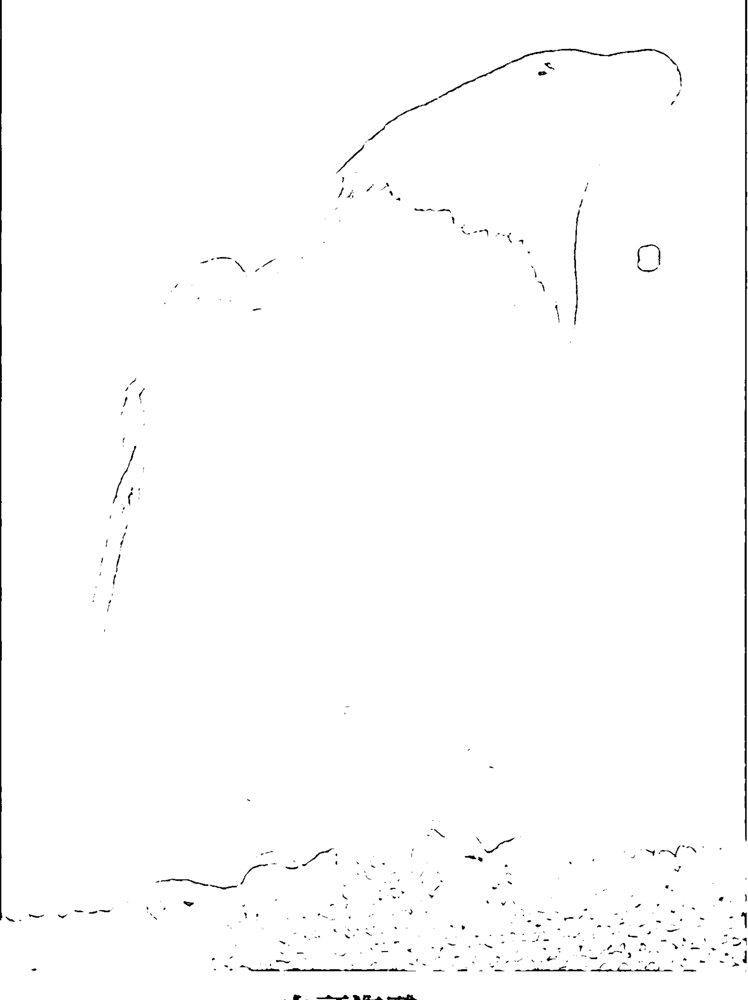

白頭海鷹

長期以來，作為精神力量與啟發的象徵，鷹鼓舞了社會中的大多數人，其能量為療癒及幫助創造。

（感謝俄亥俄州特洛伊城的布魯克納自然中心提供照片）

宙斯也很重視老鷹，祂時常將自己的外貌變成一隻鷹，以控制雷電；蘇美人崇拜鷹神；而希泰族使用雙頭鷹作為標誌，保護他們永遠不會受到驚嚇；老鷹也常被與邱比特聯想在一起；對羅馬帝國來說，老鷹是一個有力的象徵；在埃及的象形文字中，老鷹是母音A的符號，同時也是靈魂、靈性、生活溫暖的象徵；在早期的基督教神秘主義中，老鷹則是復活的象徵。

美洲原住民時常將雷鳥描繪成老鷹的型態，雷鳥是一種控制閃電和降雨、賞善懲惡的偉大神靈；而居住在平原上的克里族印地安人（Plains Cree）則認為所有的老鷹都具有神秘的力量，若是擁有老鷹身體的某部分，則能夠掌握此股力量。

對普魏布勒印地安人來說，老鷹是天空之鳥，可以一路盤旋向上，直穿天空之洞，進入太陽的家鄉。他們將老鷹與所有關於太陽的能量——包括物質及精神上的——聯想在一起。普魏布勒印地安人崇敬六個方位，北、南、東、西、頂（上）、底（下）。老鷹則象徵了頂，因為其翱翔於高空的能力，從此一高度，牠可以綜覽其他四個方位，因此成為了遠見與洞察力的象徵。

對霍皮族印地安人來說，金鷹與白頭海鷹是天空中所有鳥類中最偉大的，而這兩種老鷹也是美洲唯二的兩種老鷹；有些霍皮族人將紅尾鵟也視為老鷹的一種，並將之稱作「紅鷹」。

老鷹共有五十九種，通常被分為四類：（1）海鷹、（2）蛇鷹、（3）角鷹或林鷹、（4）靴隼鷹；但即使分在同一類的老鷹也有極大的差異。每種老鷹在顏色或是羽毛的形狀上，都是獨一無二且美麗的。

海鷹的食物主要來自於海（魚等等），在北美大陸，白頭海鷹就屬於此分類，有白頭海鷹圖騰者，需要了解水的象徵。水與魚通常都是生活中心靈層面以及創造能量的象徵，水同時也是將陸地與天堂分隔開來的區域，因此像是海鷹這樣和水有關的鳥類代表了需要喚醒或學習可以遊走於兩個世界的能力。

水也是生命創造的來源，居住在靠近自然水源之處，可能對於白頭海鷹圖騰者的健康來說是很重要的。在水域中進行狩獵的老鷹必定有穿透水面的能力，可以將獵物一把抓起，直奔天空。這些皆象徵了需要培養出更能控制情感、心靈以及所有靈性的能力，同時也教導我們，真正的調停能力要能夠隨心所欲的進出更難以捉摸的領域。

蛇鷹大多擁有羽冠，腳趾又短又有力，讓牠們能夠牢牢抓起不斷扭動的蛇。擁有蛇鷹圖騰者，可以研讀一下本書中有關於蛇的章節，蛇鷹會一口把蛇吞下，這反映出了對於更高智慧的吞噬及消化能力。

角鷹體型最大、也最有力，但不曾在美洲出現過。角鷹擁有碩大的爪子，可以抓起更大的獵物，甚至包括鹿。了解各種角鷹特別的食物偏好，可以讓你對此有更多的見解。

另一種在美洲可以看到的老鷹是金鷹，屬於靴隼雕集團中的一員。普遍來說，靴隼雕在頭部及頸部皆有雄赳赳的厚重羽毛，牠們的腳也有厚厚的羽毛覆蓋著，因此看起來好像穿著靴子一樣。

而在上述中，最重要的就是在美洲的白頭海鵰與金鵰。白頭海鵰比金鵰大，卻無法飛得跟金鵰一樣高，姿勢也不太優美；白頭海鵰通常是陰柔的象徵，而金鵰則象徵陽剛。白頭海鵰的白色羽毛非常受到珍視，因為可以與老祖母的魔法——療癒與創造——做連結。

老鷹的羽毛對於美洲原住民來說非常神聖，再加上美國政府現在立法給予老鷹保護，所以非美洲原住民者若是擁有老鷹的羽毛可是重罪一條。但牠們的羽毛仍被用在強大的治療儀式（清潔靈氣）以及變形之中。有著黑白尖端的羽毛常被用在普魏布勒印地安人的面具上，象徵了白雲與烏雲的造型。再次，我們可以從中看到天空神秘之處以及所有天文現象間的遠古聯繫。

白頭海鵰與金鵰皆已成為貴族英雄以及神聖神靈的象徵，這些老鷹是來自天堂的信使，也是太陽魔力的化身。

牠們也象徵了重新發現內心的童稚。過去人們相信，當一隻老鷹步入老年時，牠的視線會變得模糊，牠將會飛得極度靠近太陽使得自己被燒焦，然後牠會尋找純淨的水源，將自己浸入清水中三次，從而消滅自己的青春。

從魔法的角度來看，這說法暗示了重生，但也隱含鍊金術的意思。太陽之火以及潔淨的水是對立的元素，被融合在一起促使改變的產生，表示老鷹圖騰者需要：

1. 需要使用創造力，三是新生與創造力的數字。
2. 願意在可控制的情況下體驗極限，因此促進你生命中美好的轉變出現。
3. 願意淨化你的熱情（向太陽飛去）並使用你的能力，即便你有可能會受到傷害。
4. 願意去尋找自我的情感，並將自己浸淫其中，藉此重新發現已失去的童稚之心，並喚醒更高層次的潔淨、熱情、創造力、療癒及靈性。

檢視老鷹個別的特性和行為，將會揭露出更多你能夠加以協調的魔法與力量。

老鷹的腳有四趾，四在傳統上象徵了為自己打好基礎、站穩腳步。即使老鷹有著極佳的飛行能力，但牠們仍與土地保持接觸，老鷹的利爪是用來捕捉、狩獵的，這表示牠們仍需要與地表上的事物保持接觸，才能加以捕捉、利用。若是沒有強而有力的捕捉能力，並加以使用的話，老鷹也無法存活。

銳利的喙是用來切割、撕裂、壓碎的。老鷹擁有強力的下顎肌肉，對人類來說，下顎在消化與說話上是很重要的，但對老鷹來說則有別的用途，雖然老鷹不太會發聲，但其下顎卻是最強而有力的部位之一。對於擁有老鷹圖騰者來說，知道何時該說話，說什麼、用什麼態度來說是很重要的，也必須要謹記，除非有受到控制，不然語言很容易就會在無意間傷害到人（切割、撕裂、壓碎）。

擁有老鷹圖騰者的新視野將會被開啟，甚至可以延伸到過去，同時還包含了現在與未來。老鷹的雙眼在其頭部前方且距離較近，而牠們也跟人類一樣，擁有 3D 或雙眼視覺，牠們可以往前、往旁邊看，而且視力比人類還要好八倍。思考一下八這個數字，尤其是它的形狀（或是永恆的象徵），你將可以發現老鷹能夠喚醒的展望。

老鷹的耳朵是隱藏起來的，但聽力卻極好，牠的聽力跟其視力一樣可以協助狩獵，對於那些與老鷹有接觸的人來說，其精神上或實質上的聽力皆會提升。

許多老鷹都是終生伴侶制的，雄鷹收集築巢的材料，但卻由雌鷹來築巢，與老鷹的魔法接觸的人應該要思考一下這樣的分工。鷹巢絕對都很大，且為了安全起見會蓋在高處，雖然築巢的角色是有分工的，不過餵養幼鷹的任務則由雙親共同負責，為我們上了共同責任的一課。

白頭海鷗的交配儀式非常神秘又複雜。會展現出一支壯闊的天空之舞，老鷹會盤旋、繞圈、俯衝。在某個階段，牠們會抓住彼此的腳，緊緊互相鎖住，不斷旋轉、落下，直到交配完成。然後牠們會分開，盤旋往上，一次又一次重複此過程，這顯示出某種神秘的喜悅、危險、興奮，以及擁有老鷹魔法者所體驗到的性能量，並可以為他們帶來新的高潮與震顫。

老鷹是掠食者中的掠食者，並能夠幫助世界保持平衡。掠食者捕捉病弱的獵物，避免疾病的散佈，幫助大自然保持健康，對於擁有老鷹圖騰者而言，治癒的角色可能會以不同的形式被喚醒。老鷹在獵捕行動中十分擅長節省能量，牠們會在空中藉由愉快的盤旋以及飛行特技來等待時機，在其間牠們強大的視力將會告訴牠們該在何時啟動捕捉獵物，擁有老鷹圖騰者也應該發展出此種節省能量的自信感。

老鷹也是機會主義者，會讓其他種類的鳥幫自己去狩獵，牠們會偷走別的鳥或掠食者的食物。當老鷹飛進了某人的生活之中，就表示機會來了（甚至包括你認為早就消逝的機會），擁有老鷹圖騰者需要學會仔細觀察，並一把抓住出現的機會。

老鷹並不總是俯衝獵殺，牠們對於自己強而有力的翅膀操縱自如，因此可以緩慢、無聲的飛降，讓獵物完全聽不到牠們的靠近。老鷹在短時間內停止動作，單純在

## 雀

### 重點：各式各樣的能量

### 力量周期：根據種類而有所不同

雀是北美種類最多的鳥類之一，擁有雀圖騰表示有更多機會可以體驗各種活動，所有事物都會被放大。明確了解雀的種類，對於了解其在你生活中扮演的角色來說是非常重要的。

世界上有超過三百種的雀類，在本事典中我們有對其中幾種加以介紹，剩下的你得要自己去探索。數量繁多的種類的確代表了使各種不同的環境與人加乘、混合的能力。如果雀飛入了你的生活之中，表示你將會與來自各行各業的人有新的接觸。

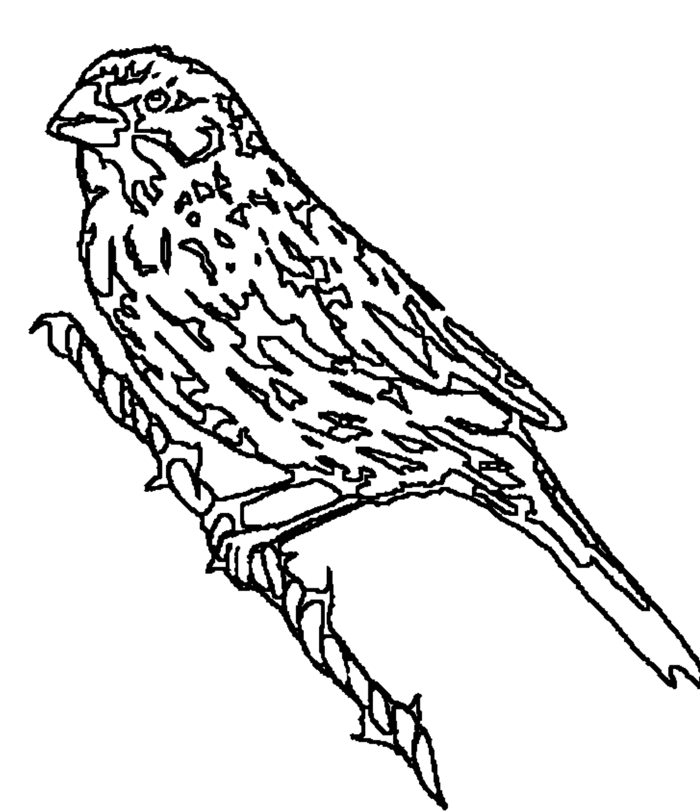

特別留意雀的顏色，不要被名字所侷限，紫雀的顏色其實不太紫，反而比較偏向凋謝玫瑰的顏色；盡量了解雀的位置以及其原生地在哪，該區的傳說也會告訴你很多事情，例如，金翅雀對於美國德裔賓州人來說就是傳說中的幸福之鳥。

雀十分擅長歌唱，有些甚至可以被訓練成像金絲雀那樣唱歌，象徵你生活中即將會有更多可能性出現。每當有雀到來，生活就會更加生意盎然。

## 撲翅鴷

### 重點：生長與療癒之愛的新節奏

### 力量周期：夏季（尤其是在夏至前後）

撲翅鴷是啄木鳥科的成員之一，研究啄木鳥與其整體的特性會讓你對此更有想法。撲翅鴷是正在將生活從樹上轉移到地上的啄木鳥，由於所有啄木鳥在尋找食物時都會敲敲打打，因此象徵著你的生活中將會出現新的節奏。

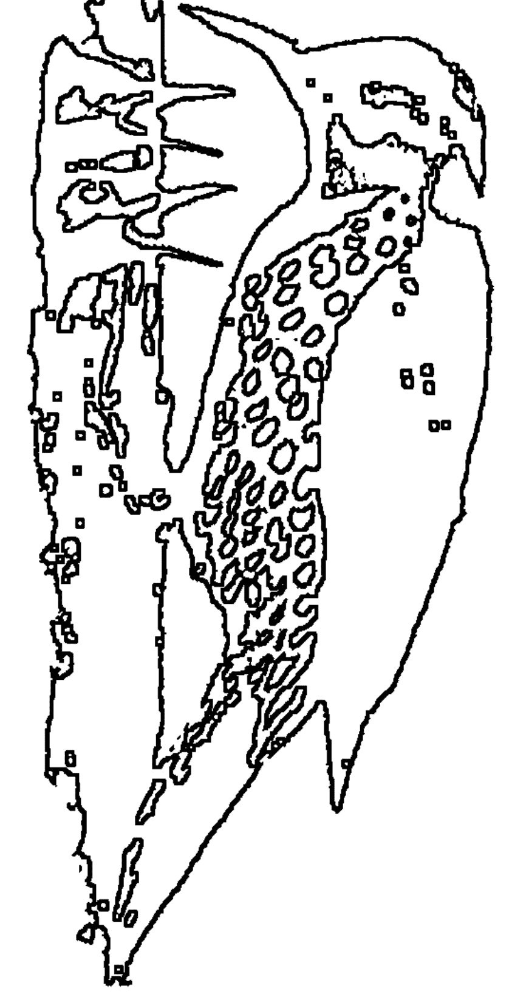

契帕瓦印地安人（Chippewa）的巫師認為撲翅鴷在藥輪占星術（Medicine Wheel）中是「強勢日月」（Strong Sun Moon）的圖騰，可以對應到六月二十一日至七月二十二日間的這段日子，也就是傳統占星術中的巨蟹座。對於北美原住民來說，撲翅鴷是非常勇敢的鳥類。¹⁸

圖中的撲翅鴷是黃翼撲翅鴷，通常在頭部後方都有一塊紅色斑點，而在胸前則有新月狀的黑色羽毛，這些特色都意義重大。當撲翅鴷從草地上起飛時，會很猛烈的彈跳起來，牠的黃色羽翼閃閃發光，當撲翅鴷進入到你的生活中，這表示你的心靈成長將會有大躍進。

而撲翅鴷頭部後方的紅羽則反映出對於頭部脈輪中心——喉輪、眉心輪、與頂輪——的刺激。這些脈輪中央將會受到新活動的刺激，表示你潛在的天分與直覺會有進一步的啟發。特別是當紅翼撲翅鴷出現時，對於潛在天分的刺激將會是你生活中重大創造與改變的催化劑，你的物質生活將會有重大的轉變；而當黃翼撲翅鴷出現時，主要的改變則會發生在你的內心世界。

黑色新月狀的羽毛也很特殊，再加上又位於胸口的位置，月亮象徵了敏感與情感，黑色的月亮則被認為是新月的階段，因此撲翅鴷象徵了心中有一股新的感受將被喚醒，這將會帶動新的療癒能量，你將會體驗到更激烈的情感。

> 18 Sun Bear and Wabun. *The Medicine Wheel* (Englewood Cliffs: Prentice-Hall, Inc., 1980), pp. 71-78.

啄木鳥與羅馬神話也是密不可分的，羅馬神皮庫斯（Picus）愛上了賽絲（Circe），但卻不願意接受太陽作為岳父，因此賽絲將他變成了啄木鳥。好好的思考這個傳說，以及美洲原住民有關撲翅鴷的一些神話，你將會更了解撲翅鴷在你生活中扮演的角色。

撲翅鴷（flicker）這個名字實際上來自於牠所發出的聲音，撲翅鴷可以發出很多種聲音，尤其是在交配季節，牠會展現出絕佳的音樂天賦。當然，撲翅鴷所發出的敲打聲也和音樂及節奏的魔法不可分割，任何擁有撲翅鴷為圖騰的人都應該要研究一下打擊樂器。鼓和搖鈴都不昂貴，甚至可以很輕鬆就製作出來，但卻是進行治療或是誘導出不同意識狀態極有效的工具。

撲翅鴷與其他啄木鳥都是打鼓大師，可以將你與世界上所有節奏連結在一起，牠們有助於你學習如何與這個星球、或是其他動物的心跳合拍。牠的敲打提醒我們宇宙的自然節奏，而當我們沒有辦法與之同步時，事情的發展就無法順利。

撲翅鴷是啄木鳥科中數量最多的成員，牠們在美國境內各式各樣的樹木及環境中居住。撲翅鴷在樹洞中築巢，而且對於家庭整潔十分重視，牠們也是極佳的家長，共同承擔養育的責任，由於撲翅鴷寶寶非常難纏，因此這點尤其重要。

撲翅鴷的喙又結實又銳利，撲翅鴷用這樣的喙在樹上敲敲打打，尋找昆蟲或其他食物。撲翅鴷有很長的舌頭，使之可以從自己用喙鑽出來的洞中，吸取營養。嘴是消化、吸收食物與語言的起始點，這顯示了撲翅鴷在你生活中可以扮演的角色。

撲翅鴷的腳趾排列同樣也是兩趾在前、兩趾在後，與大多數鳥兒都不相同，但是這樣的平衡也反映出牠們在樹側維持平衡的能力，並有助於牠們的攀爬。對於擁有撲翅鴷圖騰者來說，這表示你的生活中將會出現新的平衡，也可能是任何狀況，只要能夠達到平衡，健康狀況就必然獲得提升。

普魏布勒族與其他美洲原住民認為羽毛是宗教神物。在禱棒上的紅色羽毛通常都象徵了對於實質或精神敵人的抵抗。當此種羽毛被戴在頭上時，表示這個人是巫師的成員之一；同樣的能量可以用在戰爭中，也可以被用在療癒，這就是撲翅鴷教我們的事情。

如果撲翅鴷來到你的生活之中，表示這是快速成長與信任的時間。撲翅鴷將會喚醒新的節奏，以及彰顯所有治癒之愛的能力與機會。

## 金翅雀

### 重點：認識自然的精神

### 力量周期：夏至、夏季

金翅雀名字由來是因為每逢夏日，牠的身體就會穿上一襲閃閃發光的金黃色羽衣。金翅雀的翅膀是黑色的，在頭頂也有一塊黑羽覆蓋，這樣的顏色搭配相當特殊。

黑與黃是天使長亞列爾的代表色，在冥想以及儀式中，這些顏色可被用來召喚看顧的自然神靈——妖精、精靈和提婆。自然活動在夏季時最為旺盛，而到了夏至這天則達到最高點。

金翅雀的出現通常表示，要去了解那些原本被放逐到虛構世界中的存在，及其活動。金翅雀有助於你加深洞察力，如此一來你就可以看到、體驗到那些自然神靈的活動，洞察力的加深反映在金翅雀的黑色頭蓋上，象徵可以認知到肉眼所不能見之事物。

金翅雀基本上不太會遷徙，而在牠們出沒的區域，你也可以發現精靈與妖精的出現。金翅雀喜歡邊界地帶，以及在邊緣和邊界生長的嫩樹叢，邊界和邊緣是交叉口，是通往另外一種生活領域的自然途徑。

金翅雀的築巢習性反映出了與邊緣區域——「交界地帶」（Tween Places）的接觸，牠們會在樹梢伸出的樹枝枝椏上，使用薊種子冠毛築巢。長久以來，薊與自然神靈和動物的療癒都被聯想在一起，祝禱過的薊曾被用來召喚潘神（Pan）；薊曾經象徵著忍耐，透過忍耐與堅持，我們可以再次向精靈仙境敞開。金翅雀這種鳥可以幫助我們與自然神靈接觸，讓我們知道如何治療家畜與野生的動物。

金翅雀總是喋喋不休，這本身就是一種提醒，讓我們知道大自然一直在向我們說話，我們應該要從各方面去學著傾聽，並與之溝通。這也表示自然的神靈隨時隨地都環繞在我們四周。

在冬天時，雄金翅雀頭上的黑毛會掉落，而原本金黃色的羽毛也會變成橄欖黃，象徵了金翅雀與世界上自然神靈間的接觸周期。在冬天，牠們較為收斂，與塵世的接觸較多，與另一個世界接觸的情況，不像在春、夏季時那麼明顯。這不表示神靈就不在了，只是沒有那麼容易感受得到而已。

金翅雀有著如波浪般上上下下的飛行模式，此種節奏與模式在冥想中可以被用來幫助靈氣微妙的能量放鬆，並促進靈魂離體。波浪型態也表示金翅雀可以將我們從內在世界引導至外在世界，從人類世界引導至精靈仙境，從物質世界引導至精神世界。

## 鵝

### 重點：於傳說之地探險與旅行的召喚

### 力量周期：秋季（雪雁則是在冬至及滿月時分）

鵝也有古老傳說，還有混雜的象徵涵義。在羅馬的朱諾（Juno）神殿中，鵝是聖鳥；在希臘神話中，雪雁與北風之神有關；雪雁還是美洲原住民藥輪中冬至的圖騰。

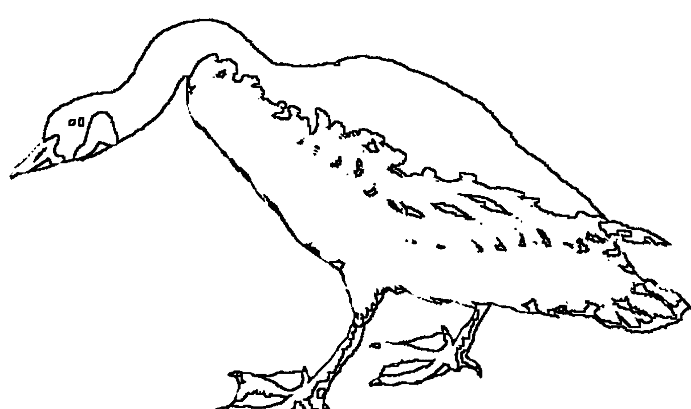

絕大多數的人一定都曾聽過《鵝媽媽童謠》（Mother Goose），裡面的故事和節拍可以用來讓孩子平靜下來。迷思、神話和其他的故事都掌握了兒童以及大人們的想像力，因此，鵝被認為是再次刺激兒童時期對於故事與傳奇地方的興奮與信念。我們在童年時最喜愛的故事，通常都隱含了我們在此生中必須要完成的任務，這就是為什麼我們會對該故事如此有共鳴。回去複習一下這些故事，你最喜歡的故事有助於你看到現在生活的模式。

這些故事不只讓你記憶深刻，可能還在你腦中植入了一些想法的種子。剛出生的小鵝也是如此，牠們通常會牢記看到的第一個會移動的東西。

鵝這種圖騰還可以對你的溝通有所幫助，尤其是藉由故事溝通的時候。長期以來，鵝的羽毛常做成書寫工具，想要寫作的人——不管是故事還是什麼——都可以與鵝圖騰接觸而獲得助益。鵝可以刺激想像，幫助你突破創意瓶頸，如果用鵝毛筆寫作則效果加倍，許多藝術品和手工藝店都可以幫助你找到，或製作你自己的鵝毛筆。

鵝毛最常被用來製造寢具，因此也象徵了生殖力與婚姻忠誠。對許多人來說，睡在由鵝毛做成的寢具上可以確保生殖力與忠誠度。

有些人相信烤鵝的胸骨顏色可以預言天氣，如果骨頭是褐色的，就表示冬天不會太寒冷；但如果是白色或泛藍的話，就表示冬天會非常嚴峻。

鵝與鴨和天鵝是親戚，跟鴨子比起來，鵝比較偏向陸地，而且牠們吃素。對於那些擁有鵝圖騰者來說，這或許表示需要在飲食中增加蔬菜，甚至吃素一段時間。

鵝也是終生伴侶制，雙方共同養育幼鵝。牠們的終生伴侶制再次強調了，世上一定有個專屬於自己的人的固有信念，這同樣與我們記憶深刻的許多神話故事有關。

在北美，鵝總共有八種。而數字8與永恆的符號（∞）非常類似，因此這也是具有特殊意義的，表示往前或往後的能力，象徵了行動，而與鵝在一起的話，則表示踏上精神之旅。

鵝的遷徙型態與行為又進一步證實了此說法，牠們在秋天的離去，刺激了我們的想像力，讓我們想要尋求新的世界與次元；牠們不斷的鳴叫似乎是在呼喚我們一同踏上偉大的精神之旅；而牠們的回歸是僅次於知更鳥的春日通報，象徵偉大的旅程保證帶來的滿足感。

鵝象徵了遷徙的儀式，牠們時常會改變型態，為繼起者打探好風向與更簡單的航道，這告訴我們，踏上別人的路是比較輕鬆的。鵝在飛的時候絕對不會跟在前一隻鵝的正後面，這樣一來每隻鵝的視線才不會受到阻礙，這提醒了我們，在選擇要踏上哪條道路之前，必須要清楚了解相關的所有資訊，這樣一來，才可以為他人開路。

V形列隊本身就很有特色，此形狀象徵向新的可能性敞開。就如同一個箭頭，指向新的方向、新的可能性；而開放的尾端，則表示對於新思想的敞開。V這個字母來自於希伯來語的van，意思是「集中」。此種列隊基本上表示我們將讓自己行走在新的道路上，這個字母及符號表示，若是希望有所成長，就應該要善加利用生產力。

加拿大鵝在北美是最多見的，牠們的聲音宏亮，遷徙能力極佳；雪雁主要是白色的，但在翅膀末端有些許黑色。兩種鵝都具有銳利的視覺，擁有鵝圖騰者不管是實質上或精神上的視力都會很好。

如上所述，鵝是終生伴侶制的，雙方都負責養育幼鵝，輪流待在巢中，小鵝很安靜，尤其是剛出生的時候，之後才會學著甩開束縛大聲鳴叫。作為圖騰，鵝顯示出你將會擺脫童年的束縛，並開始塑造自己的未來。當鵝圖騰出現的時候，你可以預期想像力將受到激發，並因此踏上往遙遠地方的新旅程——不管是身體或是心智上的。

## 大尾擬椋鳥

### 重點：克服因超載及情緒化造成的生活鬱塞

### 力量週期：早春

雖然大尾擬椋鳥普遍被認為跟烏鴉及歐椋鳥同樣是種黑鳥，但實則不然，大尾擬椋鳥和草地鷸一樣，屬於黃鸝科。大尾擬椋鳥是種大型黑鳥，有著特別長的尾巴，而牠的頭及肩膀則有著閃耀的羽毛，根據光線的不同可以從藍變綠、變紫、或銅色。

此種色彩基本上反映出擁有大尾擬椋鳥圖騰者，要從不同的角度來檢視自己的生活，這表示情況跟你看到的有所差異，因為你並沒有用正確的方式去看——尤其是在處理情緒時更是如此。

請謹記，黑色是內在與陰柔的顏色。與頭部有關的紫色和銅色則通常代表著情緒影響了我們的思考過程，而大尾擬椋鳥可以幫助我們改正這樣的情況。

在求偶季節，雄大尾擬椋鳥會摺疊起牠的尾巴，作出一個像鑽石形的槽，而鑽石的形狀一般則代表啟動，隱含著需要在情感上更有活力。我們的情感是否太消極了呢？我們是否只是動動嘴，而沒有做任何事情來改變生活中的情緒現況呢？大尾擬椋鳥是種吵鬧多話的鳥，這可能是在提醒我們，坐而言不如起而行。

大尾擬椋鳥也是非常社交的鳥類，我們不難發現，處於不平衡情緒狀態中的人，會在每個社交場合中，大談自己的情況，雖然說出問題是有治療作用的，但許多社交場合除了加劇相關的情況與感受外，並無其他建樹。因此，這再一次反映出，我們或許說得太多，而做得太少。

大尾擬椋鳥的嘴巴裡面有根龍骨在其硬顎上，可以幫助牠們破開、吃掉橡實。我們時常聽到：「棘手得像敲不開的核桃一樣」的俗語。而這也反映出大尾擬椋鳥作為圖騰可以扮演的角色，要想有建設性的處理我們的情緒，以及使我們的問題加劇的人或事，正是難以敲開的核桃，而大尾擬椋鳥可以告訴我們怎麼做最好。

大尾擬椋鳥喜歡住在松樹上，松樹對於情緒狀態是很有療效的。在花精療法（flower essences）這種順勢療法中，松木的精華可以被用來緩和強烈的情緒狀態，尤其是愧疚感。這再次表示了大尾擬椋鳥的出現有助釐清你的情緒。

沒有處理好的情緒會阻塞我們的生活，並或多或少會加劇或甚至造成身體負擔。大尾擬椋鳥可以作為要小心此種可能性發生的一種警告，同時還可以告訴我們要如何預防這樣的情況發生。大尾擬椋鳥的糞便會繁殖真菌，如果有風吹過，可能會造成類似肺炎的感染。¹⁹

大多數的疾病也有象徵涵義。瘀血，尤其是以肺炎型態出現時，是在告訴我們太過於壓抑自己的情緒了，可能象徵了壓抑的哭泣，或拒絕處理一些存在已久的問題。（我們是否忽視了一些情況，讓它們有機會繼續醞釀？）這可能表示我們拒絕接受新的生活，或採取新的生活方式，因此我們被舊的情緒所堵塞了。

> 19 Clement, Roland C. *The Living World of Audubon* (New York: Grosset & Dunlap Publishers, 1974), p. 254.

大尾擬椋鳥告訴我們該如何加以處理，教導我們如何適當表現情緒。牠們告訴我們，在生活中有什麼超量了而使我們的力量變得薄弱，因而造成成長與行動上的壅塞。大尾擬椋鳥還可以教導我們如何重拾情感的創造力、有益體驗及表現。

## 玫胸白翅斑雀

### 重點：治療家庭之心

### 力量周期：春季、夏季

玫胸白翅斑雀是一種很美的小型鳥，在其胸前有一塊玫瑰色的三角斑紋，就像一顆正在流血的心一樣。此圖騰有助於教導我們治療所有來自於家庭的舊傷及苦痛。

玫胸白翅斑雀有著美麗、悅耳的聲音，這是很特殊的一點。旋律是由一連串相關的音符所組成的，單一的音符並不能成為旋律，牠有助於我們以旋律的組成方式來檢視家庭關係——一個一個音符拆開來看，而不是從整體去看。牠們有助於我們了解，家庭對於我們的生活模式有多少影響。

玫胸白翅斑雀是很顧家的，雄鳥是熱情的伴侶、優良的家長，牠會花時間孵蛋、找食物。牠可以喚醒為人父母過程中的驕傲與高貴情操。

玫胸白翅斑雀是候鳥，在中南美過冬。對於那些擁有玫胸白翅斑雀圖騰者，你可能會想要去探索一下你的前世與此區域間有何關聯性，而你現有的家庭在當時也可能扮演重要的角色，這有助於你帶入現世生活中的家庭型態，以及你的家庭成員。

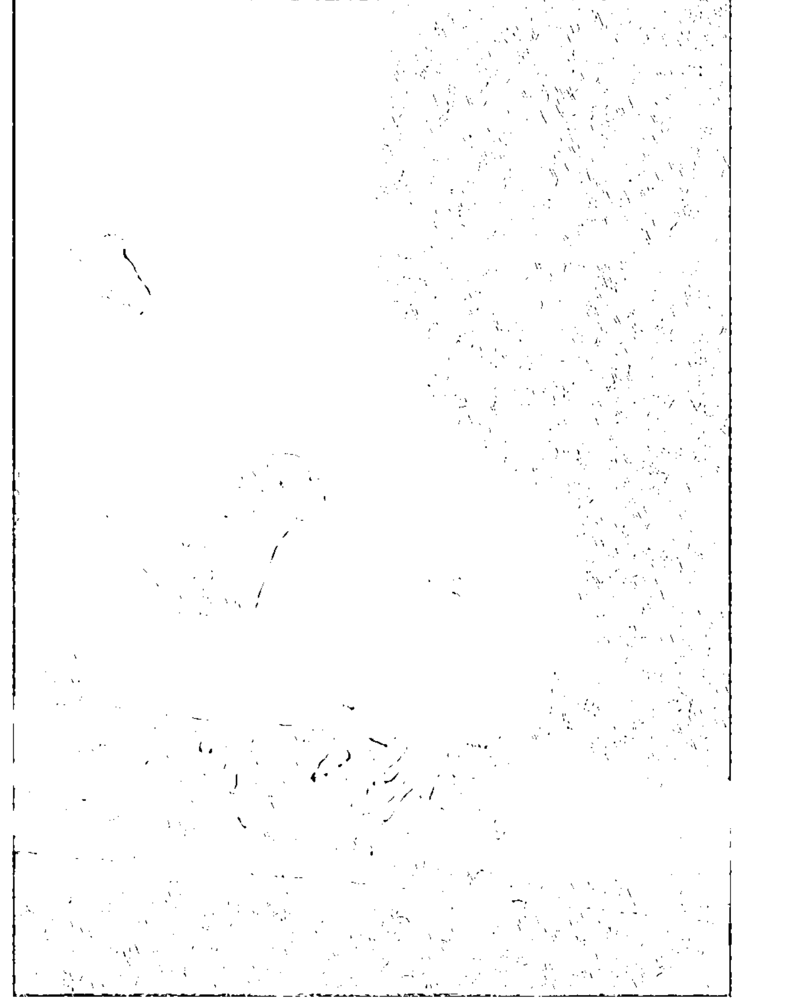

玫胸白翅斑雀是種美麗的小鳥，除了教導我們什麼是適當的家庭關係，還可以幫助我們治療家庭的創傷，重建家庭之愛。
（感謝俄亥俄州特洛伊城的布魯克納自然中心提供照片）

## 松雞

### 重點：神聖的舞蹈與敲擊

### 力量周期：春季

松雞生活在平原和樹叢中，是類似野雉的鳥類，性格頑強。天氣寒冷時，松雞的腳趾會長出細毛，幫助牠們在雪地中行走。

跳舞及敲打是牠們激發能量的特殊方式，同時進行，可以創造進入更高層的意識之中的機會。動作也是生活的一部分，有節奏的動作創造生命，所有人類的行為都是某種舞蹈與儀式，而松雞就是活生生的例子。

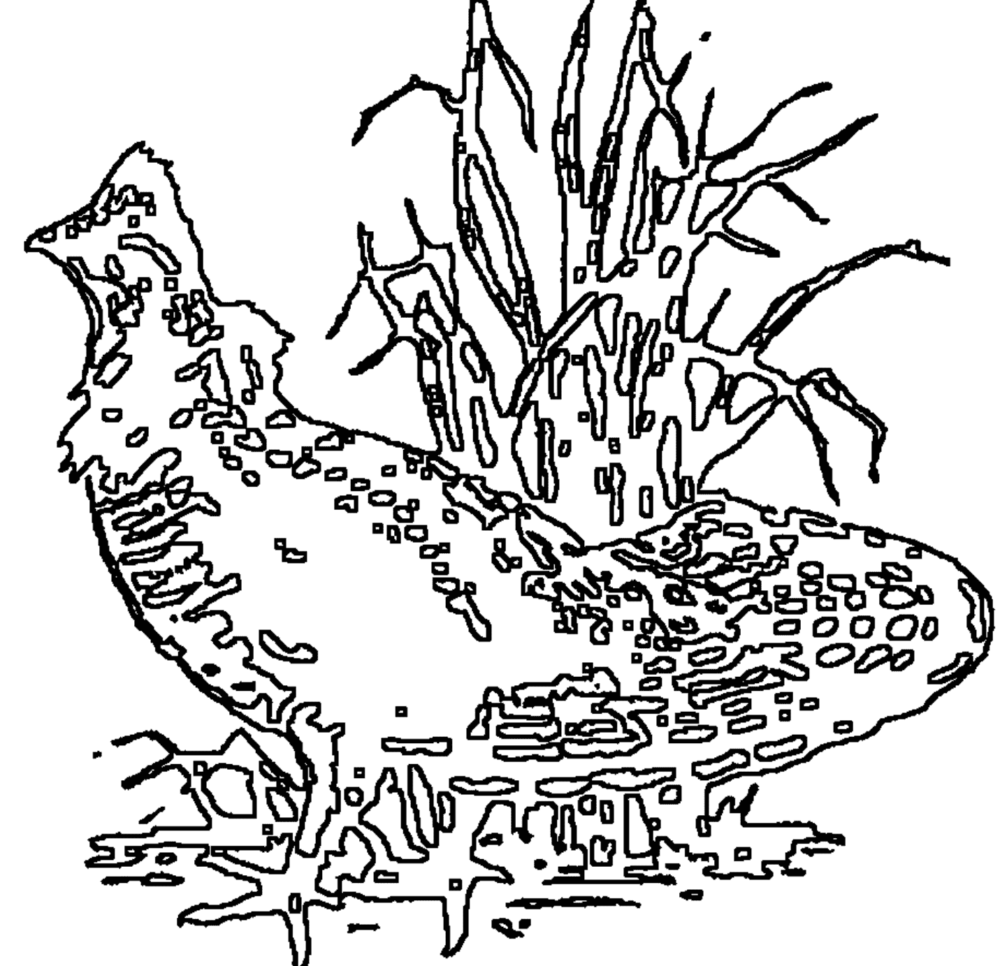

一直以來，宗教及祭祀之舞在世界上每個社會中都有其功能所在。巫師與祭司藉由打鼓與舞蹈引導出恍惚的狀態，旋轉的舞蹈是模仿太陽的路徑，而連鎖及螺旋的舞蹈則被用來連結男性與女性的能量。真正的祭祀之舞是非常古老的，是內在精神的外在表達。

祭祀之舞與擊鼓皆為超越人性的手段，舞者可以藉由誘發情緒與能量，以操縱一般的反射動作，接著再由舞蹈加以疏導。如此一來，就可以成功超越這些低等的能量，這就是松雞可以教我們的事情。

我首次接觸到松雞之舞是四、五年前在卓越國家森林時。在我路經途中，一隻松雞突然從林子裡走出來到路中央，接著就開始展現牠的旋轉動作。隨著我越靠越近，牠也持續舞蹈，一邊跳著舞，一邊從路上退回樹叢之中。那真是一場驚人的演出。從那時起，我在旅途之中也多次接觸到松雞，牠們總是提醒我不要強迫自己行動，而是要跟隨自然的節拍，以及生命的螺旋。

松雞最普遍的兩種型態是流蘇松雞與艾草榛雞。流蘇松雞之所以得名是因為其頸部及肩膀上如同流蘇一般的黑色羽毛，非常有特殊涵義。肩頸區域是連結頭部與軀幹——上與下——的重點部位，是兩者間的橋樑。所有的橋樑都能夠穿越，並開啟新的領域。

流蘇松雞代表了與新的節奏和新的動作接觸，將有助於在你生活中展開新的能量流動。舞蹈與擊鼓都是為你開啟新領域極佳的工具，這不表示你必須要去上舞蹈課程，只要練習並發展出你自由的表達方式即可。你將會對自己的能量改變大吃一驚，看著自己在生活之中，一路跳進新的模式與領域之中。

如果松雞用舞蹈進入了你的生活之中，請注意一些你希望改變、彰顯或取得的東西，並創造你自己的動作來加以反映。隨著鼓聲起舞，接著觀察能量有多快開始朝你流動而來。如果你帶著正面的意圖進行，在一個星期內就會看到成效。

艾草榛雞是最大型的美國松雞，也是地域性很強的動物，會炫耀自己鼓起的氣囊、如針尖般的尾巴以及閃閃發光的堅硬白羽。艾草榛雞會用其獨特的舞蹈來創造其神聖空間，由此也可以看出牠的地域性。

舞出一個圓圈是一種創造的動作，這是為神聖的空間做上記號。當旋轉舞蹈出現時，在其中世界是交錯的。創造並為圓圈作記號，在威卡信仰中通常都被認為是在抬起力量圓錐。旋轉創造了能量的漩渦，而能量會因參與者的意志以及所使用的儀式工具而增強。當松雞出現，並開始繞圈圈跳舞時，就表示牠正在為自己的神聖空間作記號。

對那些與松雞有所接觸者來說，在生活中也應該要為神聖空間打上記號，確保你有一塊地盤、區域是他人勿近的，這讓你可以在不受太多外界影響的狀況下，創造自己的自然節奏與動作。

長期以來，松雞是如何在春天完成其隱密的擊鼓一直有所爭議。現在鳥類學家知道了，松雞是藉由快速拍擊翅膀來進行的。松雞憑空揮打翅膀，作出擊鼓的震動，讓其力量散佈到風中。

松雞是保護慾很強的父母，如果幼雞受到威脅，松雞媽媽會豎起羽毛向你衝來，或者甚至會假裝受傷，引開掠食者對幼鳥的注意。在此動作後隱含的，是其可以根據需求而做出表現的能力，以改變節奏來因應狀況。

颼颼的飛行聲也常被與松雞、野雞和其他類似的物種聯想在一起。一般來說，松雞會採用此種起飛方式是要展現出牠無所畏懼，實際上，這就如同是給同一區域中的其他動物一個警告，松雞如果想要的話，也可以很輕柔的飛行。節奏不是被聽見才有效，如果松雞進入了你的生活中，你可以期待新的節奏與新的學習，讓你的生活一路舞進、敲進新的次元之中。

## 鷗（銀鷗／海鷗）

重點：負責的行為與溝通
力量週期：全年

鷗是美妙的飛鳥，大多數人，尤其是居住在海岸線附近地區的人，都傾向於將鷗視為有害的動物。但是當遠離人類接觸時，鷗的行為在自己的社群之中則是非常不同的。

海鷗——或其正式的名稱：銀鷗。其實是居住於海岸的鳥類，而且很少冒險遠離陸地。海岸線是個具有許多神秘之處及魔力的地方，是一個不屬於陸地、也不屬於海洋的區域，而是兩者的交界。此種區域常常成爲人類遇到妖精故事的場景，因此鸕有助於讓我們學習如何與精靈仙境中的生命溝通，尤其是水精及水神。

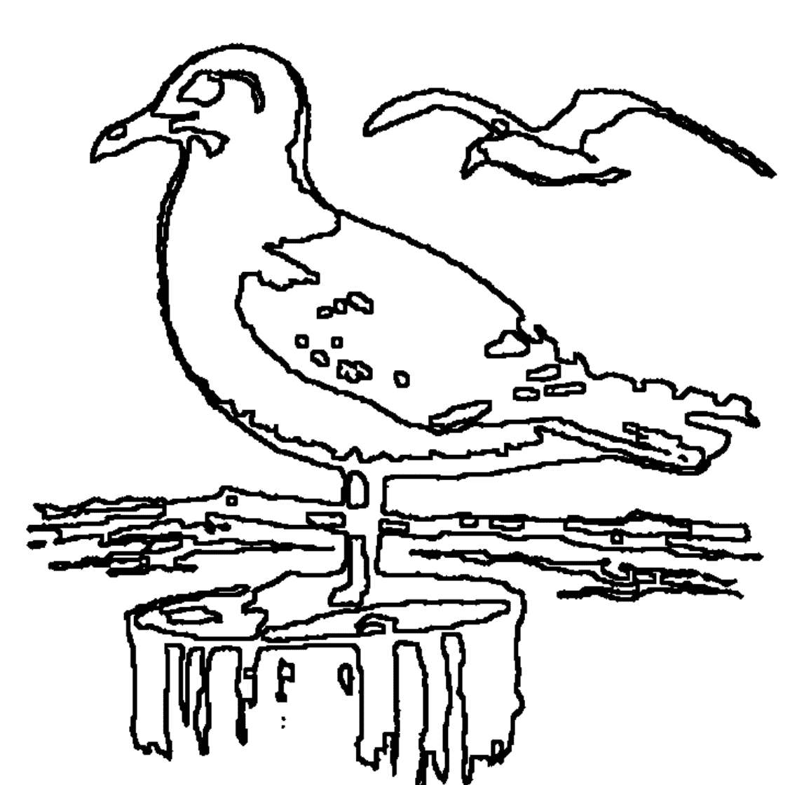

鸕與水這個元素間的連結又進一步強化了這個概念。鸕這種鳥結合了游泳與飛翔的天賦，鸕在水中也逍遙自在，牠知道要如何在兩個王國間遊走，也知道在兩個王國中分別要如何作爲，此種能力可以教你在非常態的情況中如何表現與作爲。

鸕的出現通常代表了合宜行爲、禮貌及溝通的學習或能力，這可能反映出你需要學習，或是你可以爲師，同時這也可能象徵了學習新的溝通藝術。

鸕的行爲十分複雜，牠們爲其慣例的活動發展出規律的信號規則，並同時使用叫聲和姿勢來表達。因此，牠們可以教你如何更有效的解讀他人，幫助你了解溝通的藝術——即所謂的言下之意。牠們可以幫助你解讀字裡行間的意義，並了解他人的肢體語言，鸕擁有心理溝通的技巧與知識。

鸕有助於維持海灘與海岸的清潔，牠們是環保的鳥類。鸕以圖騰的姿態出現時，可能象徵你有機會接觸生態，或是要努力清潔你生活中的海岸線。

幼鸕都是狼吞虎嚥的，牠們會因爲受到刺激而進食，而紅色能夠刺激牠們進食。成年的鸕媽媽在尾巴尾端有一塊紅斑，鸕寶寶知道只要戳一下那塊紅斑，就可以有東西吃。此程序中也有許多隱而未顯的經驗教訓存在，這與適當的進食行爲、節食的刺激（不管是實際上的節食與否）等等有關。好好思考此點，將會爲你的生活模式及刺激帶來一些絕妙的觀點。

## 隼

**重點：視力與守護**
**力量周期：春分、秋分及新月時分**

隼是最足智多謀、又充滿神秘的猛禽之一，是天空的信差、保護者也是夢想家。隼與貓頭鷹的視力是所有猛禽中最銳利的。

隼有著不同的大小、外表及居住環境。由於種類繁多，因此有時很難判斷其品種。有澤隼、林隼、海隼和草原隼等等。你發現隼的環境將會顯示，隼在你的生活中最有可能彰顯出何種能量。

雖然人們難以分辨隼的種類，但還是可以認知到這是隼科的成員。所有的隼都令人印象深刻，且可以刺激想像力，牠們的狩獵能力、視力、強而有力的飛行，還有其他的行為都是活生生的象徵。

大多數猛禽，只要是同種，不管雄、雌的顏色都十分相近，通常雌鳥體型會比較大一點，這主要是因為雌鳥要負責守護鳥巢。許多隼也是終生伴侶制的，紅尾鵟就是其中一個例子。隼與其配偶在一起的時間，通常都會由牠們養育幼雛需要多少時間決定。

檢視隼的特定種類以及行為將會透露出很多資訊。例如，魚鷹（osprey）因為其主要的食物來源是魚，故得此名，此種壯碩的飛鳥常常被錯認為是老鷹，因為同樣都擁有近乎全白的頭部，但只有大隼底下也是全白。魚鷹在海岸區域的數量極多，其白色的胸羽就好像其狩獵水域激盪起的白色泡沫一樣；庫柏鷹也是隼的一種；而蒼鷹與條紋鷹時常以其他鳥類為食，雖然牠們也會吃些嚙齒類動物，但主要的食物還是鳥類。這反映出一個古老的概念——你吃什麼就是什麼。

我們無法去探索每種隼的各別特色，但我們會特別仔細檢視其中一種——紅尾鵟。此種隼在隼科中數量龐大，因其尾羽上特殊的顏色而得名，只有成熟的紅尾鵟有此顏色，而未成熟的紅尾鵟則有較淡的眼睛顏色，這也是牠們與成鳥的區別之處。

紅色的尾巴是一種象徵，可以與靈熱——原始生命力所在——連結起來。在人體中，這與基本的脈輪有關，位於脊椎的尾端——尾骨上。擁有紅尾鵟圖騰者，將會與靈熱有所接觸，這同時也表示，只有靈熱被啟動後，此種鳥類才會成為你生命中的圖騰；另外，這也象徵了童年時的展望變得更有可能實現。當你開始更積極朝向你的靈性目標前進時，紅尾鵟就會以圖騰的姿態出現在你的生命之中。

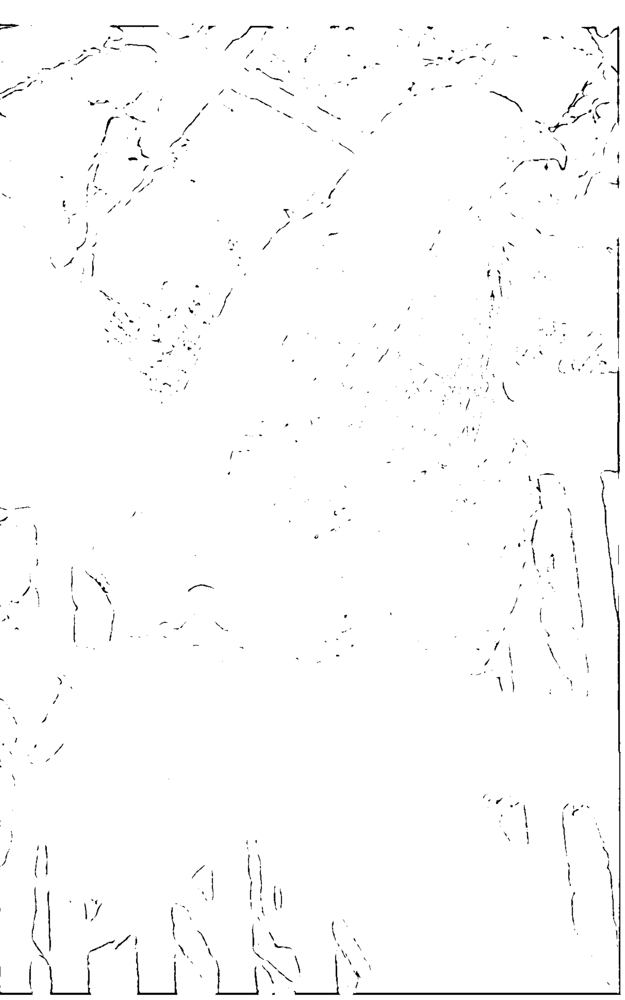

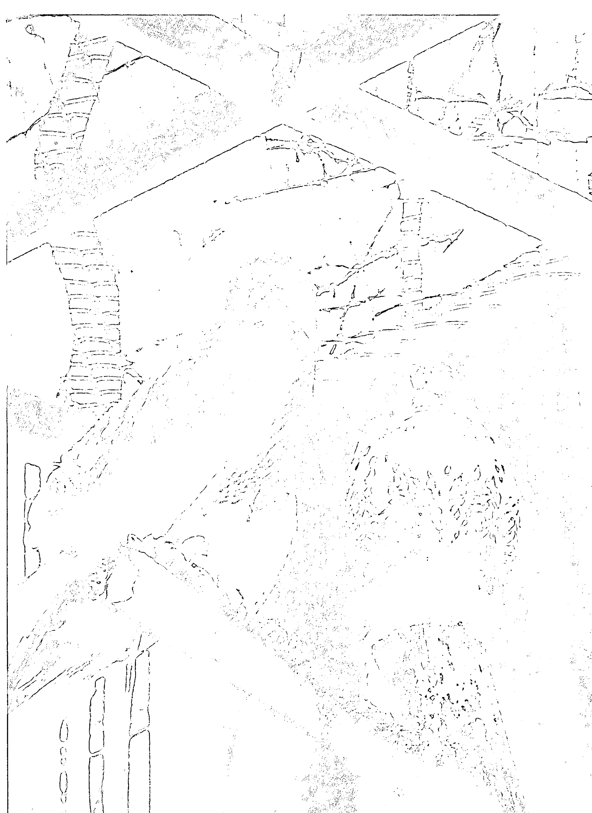

## 紅尾鵟

此種強大的飛鳥可以喚醒展望的力量，引導你完成生活的目的。牠也是一種信使鳥，只要有牠的出現，請多加留意牠所傳達的信息。

（感謝俄亥俄州特洛伊城的布魯克納自然中心提供照片）

紅尾鵟是鵟屬鳥類（鵟屬的意思是能在高空中翱翔的猛禽），在氣流上盤旋與滑翔的能力也是隼可以教導你的事情之一。雖然紅尾鵟是此物種之一，但時常被發現在樹梢或變電箱上棲息，用其異常傑出的視力鎖定獵物，牠教導我們在翱翔天際的同時，也要腳踏實地。

隼偶爾會被較小型的鳥類騷擾或是攻擊，這對於擁有隼圖騰的人來說是非常值得注意的現象，表示你有可能會被不了解你的人攻擊，或是因為創造能量的使用方式有很多種，而削弱了你飛翔的能力。

紅尾鵟通常都是固定居住在某個區域中的，但有的時候也會遷徙，這種定居的特性反映在圖騰的意義上，代表隼一旦出現了，牠就會永遠和你在一起。

雖然紅尾鵟被誤稱為「雞鷹」，但其主要食物來源是兔子、齧齒類動物以及蛇。紅尾鵟有很強的飲食適應力，有助於其存活，雖然紅尾鵟常被指控獵殺雞而被射殺，但其實那是像庫柏鷹那類的鵟鷹做的好事。

普遍認為，紅尾鵟也是終生伴侶制，雄鳥與雌鳥會一同養育幼雛。每個春天，雌鳥會下二至三顆蛋，牠們會強悍的防衛鳥巢不受任何入侵者的干擾，紅尾鵟會在築巢的地盤附近盤據長達數年，牠們在野外的平均壽命約為十四年。

「十四」也是個特別的數字，塔羅牌中第十四張牌是「節制」，這張卡片教導了心靈論與展望的更高表現，可以被用來發展靈魂離體——從身體出發的新飛行；另外還與你活力能量（靈熱）的啟動，以及勇於表現有關；同時，與教導調節之美與和諧的遠古之力也是密不可分，因此掌握了通往更高層級意識的鑰匙。

提升到更高的層級可以為心靈能量帶來快速的發展，紅尾鵟有助於我們平衡並合宜的使用這些感官，教導我們要發現我們人生真正的目的，平衡是不可或缺的。如果你擁有紅尾鵟圖騰的話，默想第十四號塔羅牌將有助於你看到紅尾鵟將會如何帶領你、彰顯你的靈魂目的，並教導你如何使用你的創造能量。

紅尾鵟的紅，象徵了你的生命中有許多強烈的能量在發揮作用，反映出強烈的肉體、情感、心智和精神力量。此種鳥是一種催化劑，可以刺激希望及新的想法，反映出需要向新事物敞開，或是告訴你幫助他人向新事物敞開的方式。

普魏布勒族將紅尾鵟稱作紅鷹，其羽毛及能量被用在治療儀式，以及祈求降下生命之源的雨水上。對於歐吉布威印地安人（Ojibway）來說，紅尾鵟代表領導能力、深思熟慮以及遠見。「隼與墨丘利（Mercury）很像，都是神的信使。隼的魔法教你如何觀察入微……生命在向你傳遞著訊息。」20紅尾鵟可以將翅膀延伸到極限，你可以學習以同樣的方式應用你的創造能量，這將會拓展你對生活的願景。

隼的喙與爪是觀察者們最津津樂道的，是所有隼身上最引人注目的特徵，尤其是紅尾鵟，牠是一種無所畏懼的鳥類，甚至會與毒蛇單挑，長滿鱗片的腳可以保護隼不受毒蛇的攻擊，能夠迅速一把抓起蛇，並把蛇頭扯掉。在一次穿過堪薩斯州前往科羅拉多州的旅途中，我有幸看到了一隻紅尾鵟俯衝下來獵殺一隻蛇。不過數秒後，紅尾鵟再次起飛，穿過我的行經路線，我可以看到蛇頭搖搖晃晃快掉下來，僅剩下一點點皮膚與身體連結。一切都發生在電光火石間，當我發現自己目擊到什麼時，紅尾鵟已經消失在我視野中了。

由於此圖騰所開啟的強大能量（強烈的生命力），個人在表現自我的時候要特別留意。你顯露的能力可能會將生活中的所有蛇頭，或是你所認定的任何敵人的頭都一把扯下，你的言談與行動將會像隼的喙與爪一樣強而有力，同時卻擁有撕毀及殺戮的能力。

紅尾鵟的羽毛實際上有兩種型態，兩者對於擁有此圖騰者來說都非常重要。在夏天時，紅尾鵟的羽毛顏色會較淺，在冬天時則較深。淺色通常象徵了較喜悅、善交際的能量；而深色階段則反映出該是時候退一步，一個人靜一靜了。紅尾鵟以及其顏色變化也有助於我們豎起防衛，不讓閃亮、強烈的光芒將我們燃燒殆盡。

天空是隼的領地，透過飛行，牠與人類和更偉大的創造神靈溝通，隼喚醒了我們的願景，並激勵我們設立更有創造力的生活目標。

## 鷺

重點：自我決策與自力更生
力量周期：春季

鷺有許多不同的型態，包括鸕鶿和白鷺，不可將牠們與鶴和鶴混淆在一起。鷺是鳥類中被稱為「涉禽」的一種，也就是會棲息在沼澤地和淺水水域的鳥類。所有的涉禽皆具有相似的外觀特性，像是細腿、長頸與尖喙，對於以鷺為圖騰者來說，了解這些外觀上的特性是非常重要的。

腿，使得動物和人能夠在陸地上移動，是平衡的符號，也象徵了前進和發展的能力。此外，擁有越長的腿，代表著鸛能夠推進至水的更深處，也代表了能夠探索更深層面的人生。細長的鸛腿表示你不需要龐大的支柱才能保持穩定，但你必須能夠以自己的力量來站立，尤其是對於擁有大藍鸛為圖騰的人來說，這點至為關鍵，因為牠們是孤獨的狩獵者。

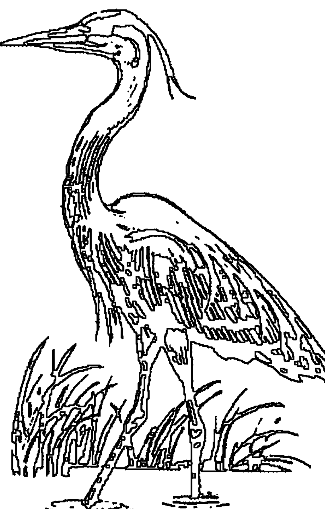

鸛進食時是矗立在水中的，反映了牠與大地的連結——同時也意味去探索大地的其他次元（水元素）。對以鸛為圖騰者來說，探索地球上所有生命的各種活動與層面是極其重要的，從表面上來看，這似乎只是博而不精的情況，但擁有鸛圖騰者卻能奇妙的成功扮演「萬事通」的角色。

這樣的能力，讓他們能夠按照自己的方式前進。大多數的人永遠無法以「鸛者」的生活方式過活。因為那並不是一種有組織的生活方式，似乎也缺少了穩定性與安全感。然而，這只不過是看待問題的觀點有所不同，對以鸛為圖騰者來說，仍是有其安全性的，因為他們早已被賦予能夠進行各種不同任務的能力，如果這個方法行不通，那麼另一個方法也許會管用，鸛者似乎天生就知道該怎麼做。

在鸛的一生中，似乎不需要有許多人圍繞在身邊，牠們也不會感到必須與他人較勁、或扮演傳統生活角色的壓力。牠們唯一一次會與群體相聚的時刻，就是在繁殖季節。鸛會突顯出自己的獨特性，知道該如何抓緊並充分利用一般人甚至不會費心看待的事物或事件。

雖然大藍鸛認為自己是沼澤之王，但眾所皆知，短耳鴞經常會挑戰牠們的這個觀點。大藍鸛是身高最高的鸛，當牠飛行時，其頭頸會形成一個平面的S環。這反映出牠擁有著天生的智慧，能夠在生活中運用策略並控制其周遭的環境。這也表示對擁有鸛圖騰者來說，必須遵從他們擁有的先天智慧，並遵循自我抉擇的路徑，你會知道什麼對你最好，應該遵循何者，而不是聽從別人的暗示。

飛行中的大藍鸛同樣具有強大的力量，其腿部和頭部會形成一條直線；而在狩獵的時候，牠則採取緩步盯梢。當牠發現一條魚時，牠會疾速以牠鋒利的尖喙將獵物戳穿，這再一次反映出對於把握機會以展現自我，有著絕對積極的態度。

綠背鸛實際上更接近石板藍色，牠具有非常與眾不同的橘色腿部。這樣的顏色組合，反映出牠們以一種天生的平衡，過著屬於自我獨特風格的生活。牠寂靜的飛行姿態，最常在夜間與黃昏被目擊，跟所有的鷺一樣，牠是一種棲息於沼澤地的鳥類。

這種鳥類會隨著季節的不同，出現極為特殊的色彩變化。牠們的眼睛虹膜會從黃色變成如同牠們腿部的鮮豔橘色。冥想這種顏色，將會帶給你許多的見識，正如牠在你的生命中所扮演的角色。

## 蜂鳥

重點：永不止息的樂趣與生活甘露
力量周期：白晝

蜂鳥或許是體型最小的鳥類，但同時也是最迷人的鳥類。任何見過這隻小巧鳥兒的人們，都會打從心底充滿驚奇和喜悅。蜂鳥的名字（hummingbird）源自於當牠飛行或盤旋時翅膀所產生的振動聲響。我們都聽過在工作時吹口哨會帶來好處的說法，但事實上哼唱會更有效益，哼唱聲會產生一種內部按摩效果，恢復你的健康與平衡。這正是蜂鳥提醒我們的事——要在所做的任何事中尋找樂趣，並將之吟唱出聲。

蜂鳥的種類超過了三百種。21這個數字非常重要。在希伯來文的字母表中，字母shin的數值即為三百。這個數值與火，以及過去和未來的人際關係有所相關。正如我們稍後將看到的，這一點也反映在蜂鳥的翅膀動作之上。蜂鳥有辦法讓翅膀以數字8的樣式振動，而數字8正代表了無窮無盡（∞），並與過去和未來以及因果定律有所關聯。

蜂鳥有著長長的尖嘴與舌頭，使牠們能夠吸取花蜜。事實上，牠們完全無法離花索居，而許多種類的花卉也不能沒有蜂鳥來授粉。這又再一次說明了蜂鳥能夠帶給你的因果啟示——你也能汲取自己的甘露與花蜜。

蜂鳥知道該如何使用花朵來治癒自己，包括花的芬芳、顏色以及花藥的特性；蜂鳥教導你如何從花朵萃取出生命的精華，並創造出你的獨門配方，正如同巴哈花精療法與其他的花卉魔法，蜂鳥教你如何使用花朵來療癒，並贏取愛的芳心。

蜂鳥是所有鳥類中技巧最熟練的飛行者。牠可以在空中盤旋，可以往前、往後、往側邊飛行，事實上，蜂鳥無法行走，牠四處飛行。蜂鳥提醒我們，如果我們能享受自己正在做的事，我們就能變得身輕如燕，而生活也能因甜美的花蜜而顯得豐富。

21 Biel, Timothy. *Zoobooks 2: Hummingbirds* (San Diego: Wildlife Education, Ltd., 1987), p. 6.

蜂鳥能在起飛後迅速達到高速，也能在高速飛行時瞬間停止。蜂鳥是熟練的飛行者，不畏懼任何的掠食者，甚至還會趕跑老鷹。

蜂鳥是唯一可以倒退飛行的鳥類。這代表了蜂鳥具有探索過去、並從過去汲取喜悅花蜜之能力。蜂鳥可以幫助你在任何情況下，發掘喜悅和甜蜜，而牠敏捷的速度，則始終在提醒著你，要以最快的速度及時抓緊喜悅。

因為披有彩虹般色彩的羽毛，蜂鳥常以珠寶與閃亮寶石的名稱來命名，例如：紅喉蜂鳥（ruby-throated hummingbird，譯註：ruby有紅寶石之意）。蜂鳥也常與精靈、仙女連結在一起，有種蜂鳥就被稱作「森林女神蜂鳥」（wood-nymph hummingbird），另外還有紫冠仙蜂鳥（purple-crowned fairy，戴著紫冠的仙女之意）等。

蜂鳥如彩虹般的羽毛也使得牠與「雨」連結在一起。更具體的說，與牠相關的是雨後出現的彩虹。而對普魏布洛印地安人來說，蜂鳥的虹羽、絕佳的飛翔能力以及在花朵旁徘徊的模樣，使得牠與各種宗教儀式與習俗有關，在這些儀式中，他們會使用禱棒來祈求雨水，並幫助增長自己的耐性。22

蜂鳥是個大胃王，儘管牠們也吃小型昆蟲，但牠們食物中最主要的組成成分仍為花蜜（糖）。蜂鳥一天可以吃五十至六十餐，由於牠的體積極小，但活動量極大，造成牠消耗身體熱能的速度十分驚人，因此必須迅速將食物消化。擁有蜂鳥圖騰的人，得多注意自己的血糖值。你攝取的糖分過多或過少？你是低血糖或高血糖？你的生活中所攝取的甜分是否不足？你是否沒有嚐到生命中的甜蜜事物？

蜂鳥非常喜愛嬉戲。甚至連洗澡時——牠們經常洗澡——都喜歡玩水。牠們也常彼此打鬥，但似乎並不會因此受傷。如今，科學家們幾乎一致認為，蜂鳥打架都是做做樣子，不過是為了活動筋骨和找點樂子罷了。

蜂鳥是完全獨立的個體。除了交配時期，牠們都喜歡獨處和自由，似乎沉浸在這樣的無拘無束之中。雄蜂鳥在交配儀式為了獲取雌蜂鳥的關注與關愛，會嘗試任何事情，如果雌蜂鳥決定交配的話會有所回應，不然則是一飛走人。

蜂鳥媽媽是勞心勞力的苦工，因為從配偶那邊完全得不到幫助。雌蜂鳥通常會生兩顆蛋，這數字一樣非常具有象徵意義，二這個數字即代表內在的自我，我們必須產生並表達出這樣陰柔的一面，以找到屬於我們自己的喜悅。

22 Tyler, Hamilton A. *Pueblo Birds and Myths* (Flagstaff: Northland Publishing, 1991), pp. 98-104.

蜂鳥是技術頂尖的建築師，牠們會以絕佳的設計，和謹慎的態度來打造自己的家園，有些鳥巢非常複雜，但其實每一個都各具特色。如果蜂鳥已在你的心底築巢，你或許也會想要重新裝修，牠會告訴你，要用行動來創造喜悅。

蜂鳥也可以在一夜之間進入冬眠。牠的體溫會降低，羽毛豎起以隔絕空氣，呈現一種麻木的休眠狀態，此時的蜂鳥看起來像是死在棲木上。這麼做是為了防止耗盡生命所需的能源，同時獲得休息的機會。對於那些以蜂鳥為圖騰者，重要的是要有規律且深度的睡眠和休息，這點是絕對必要的，這樣你才不會將自己燃燒殆盡。

紅喉蜂鳥是遷徙的奇蹟，每到冬季，牠就會來一趟驚人的旅程。牠會連吃個好幾天，將食物與熱量儲存在牠那小小的身體內，然後牠會接連飛行許多天，最後在一個溫暖之地落腳。目前已知有些蜂鳥可以完成兩千五百英里以上的旅程，從阿拉斯加一直飛到中美洲，科學家仍不清楚牠們是如何儲存足夠的能量，來完成這樣的旅程。

但牠確實辦到了，因為蜂鳥就象徵著完成看似不可能的使命。蜂鳥會教導你，如何從自己的自身狀況，找到能夠讓生活愉悅的奇蹟。

## 茶隼

重點：迅速、敏捷與優雅的心智
力量周期：全年

茶隼是美國最為常見的隼科鳥類。在美國境內的猛禽類中，只有大雕鴞的分布較為廣泛，茶隼同時也是隼科中體型最小的成員，遊隼和矛隼的體型較大、速度也較快，但牠們皆已瀕臨絕種，幫助遊隼復育的計畫，才正開始有所斬獲而已。

隼類擁有古老的歷史和神秘的光環，尤其是其狩獵時的速度與優雅的姿態，隼是已存活數千年之久的獵鷹，牠們的技巧直至今日依舊嫻熟老練。如果茶隼或隼科的其他成員成為你生活中的圖騰，你可能會想要探索自己與牠們在前世時的接觸。在中國，隼在西元兩千年前就開始接受訓練；23而在中世紀的歐洲和斯堪迪納維亞半島，國王操控鷹，而隼則廣為流行：維京人經常利用隼和猛禽來狩獵。

美洲隼有時也被稱作「雀鷹」，但這名稱並不怎麼恰當。大多數的隼都以鳥類為獵物，而茶隼的主要食物來源則為蚱蜢、甲蟲、老鼠以及其他的小型嚙齒動物。茶隼偶爾也會捕食小型鳥類，有些人將控制麻雀數量的功勞歸給茶隼，但這項傳言從未經過證實。茶隼是優秀的獵人，銳利的雙眼能偵測極遠距離外某隻甲蟲的活動，牠通常

23 Mackenzie, John P. S. *Birds of Prey* (Toronto: Key Porter Books, 1986), p. 13.

## 美洲隼

這種令人驚奇的隼類具有獨特的能力，能夠在飛行中盤旋在牠的獵物之上。其速度和優美的姿態，能讓擁有其圖騰者激起敏捷和靈活的思考。

在鄉間和城市都能發現茶隼的蹤跡，那些在城市裡的茶隼，通常以垃圾場周遭的老鼠或開闊草地上的大型昆蟲為生，我經常看到茶隼停在主要幹道或公路旁的電力或電話纜線上，研究著眼下的草地。茶隼會在城市裡築巢過冬，因此這也是個全年適用的圖騰。茶隼狩獵時喜歡開闊的草地，但牠一定是從棲木上俯衝捕捉獵物，對擁有茶隼為圖騰的人來說，希望自己坐落的位置能有廣闊的視野，以環視周遭的一切，是再自然不過的事情了。

隼類在飛行時，你通常可從牠們的長翼、敏捷的飛翔動作以及狹長的尾巴辨認出牠們來。一般而言，隼類的翅膀形狀為基部較寬，然後往內削，翅膀尾端窄而尖，如前所述，牠們會在飛行中以驚人的速度和重擊殺死獵物。

雄茶隼通常具有灰藍色的翅羽和紅色的平坦尾羽，而雌茶隼則是翅羽上帶有斑紋，身體顏色多半為紅磚色或紅色。無論是雄性或雌性的茶隼，羽毛的表面皆為黑色，尾端則像鬍角一樣往內削。

茶隼的頭部形狀整體而言偏向方形，代表著穩固以及對思考過程與風元素的掌控，這個特徵將牠們與其他棲息在電線上的鳥類區隔開來，此外，牠們多半時候都是獨自棲息的。

茶隼這種鳥類，能夠激勵你靈活、敏捷且細緻的思考。牠會教導你如何更有效並更具耐心的運用腦力，來捕捉你最需要也最想要的事物。

會從棲木上進行狩獵，在制高點上來回移動，嚴密的觀察與聆聽。

茶隼通常會從高位上猛然俯衝向牠的獵物，或是先於二十尺高處之半空盤旋，再往下俯衝。在猛禽中，這樣的動作是獨一無二的，甚至在絕大多數的鳥類中也非常獨特。事實上，只有少數的鳥類能夠在飛行時於空中盤旋。對於那些擁有茶隼為圖騰者而言，這點是極其重要的，這不但給了茶隼優美的姿態，也代表了疾速且精準的運動能力，甚至意味著能夠停下腳步、並能充分運用自己優勢的才智。

除了速度和運動的控制，茶隼也教導我們耐性。茶隼往往象徵著能夠認清機會，並在正確的時刻採取行動。牠教導你行動的速度和準確性，大多數的隼都是利用飛行與俯衝，從空中猛然擊殺牠們的獵物。茶隼和其他隼讓我們了解該於什麼時候採取行動，以及必須充分把握眼前的行動才會帶來最佳的成功。

## 翠鳥（魚狗）

重點：新的溫暖、陽光、繁榮與愛情
力量周期：冬至、冬季

在希臘神話中，有個關於一位名喚哈爾庫俄涅（Halcyone）的女人和她的丈夫錫克斯（Ceyx）的傳說故事。在他們婚後不久，丈夫錫克斯就不得不去遠航，沒想到途中卻遭遇暴風雨，而不幸溺斃。不知情的哈爾庫俄涅每日到岸邊，盼望著他的歸來，但幾個月後，卻只等到她丈夫的屍體被沖回岸上。

悲慟充塞了她的胸臆，哈爾庫俄涅轉身投進汪洋大海。眾神為其深情與哀傷所感動，決定將她和丈夫雙雙變成翠鳥。牠們從海中升起，快樂的飛向蔚藍天際。據稱，在一年中最短的一天，其前後七日都會是風平浪靜、陽光明媚的日子，後來這段時間便被稱作「太平歲月」（英文為halcyon days，即以哈爾庫俄涅為名），時至今日，只要是陽光灑滿海面的好日子，都被認為是「太平歲月」。

翠鳥長久以來都是和平與繁榮的象徵，背後有許多的傳說和迷信，絕大多數都起源於古希臘，也就是上述的神話故事。經過乾燥的翠鳥，可以抵禦雷電和暴風雨，如果將它掛在壁櫥裡，可以避免讓飛蛾靠近，保持所有事物的新鮮，正如故事中那永不褪色的愛情。

翠鳥是一種美麗的鳥兒，儘管美國的翠鳥是平板的藍灰色、羽下為白色，但其他地方的翠鳥，絕大多數都擁有鮮豔的藍色與綠色羽毛。有個古老的傳說便是在講述，翠鳥是如何從黯淡的灰色變成現在美麗的藍色。當翠鳥從諾亞方舟釋放出來後，牠飛向了太陽與藍天，而過程中被陽光炙燒的牠，搖身一變，全身披上鮮豔的新色彩。

藍色往往與占星術中的木星——也就是富足之星——連結在一起。翠鳥所承諾的富足，是你的人生將會迎接新的溫暖、繁榮和愛情。而翠鳥頭上的暗色冠羽，則象徵了與皇室有關的富足。

在大多數的鳥類中，翠鳥的配色是非常獨特的。因為雌翠鳥甚至比雄翠鳥擁有更多的顏色。有些人將此歸因於前述的哈爾庫俄浬傳說，她偉大的愛情感動了眾神，讓她和她的丈夫復活。這個故事意味著，當我們造就了一段自我犧牲的愛情並呈現在眾人面前時，它會為我們和我們身邊的人帶來嶄新的生命。

翠鳥在另一方面也與其他鳥類有所不同。翠鳥會將鳥巢建在沿水地帶的河岸洞穴裡，或是盡量接近水域：有時，牠們會鑽入河岸中達十呎之深，並在隧道的尾端產下五至八顆蛋。一般而言，當雛鳥從隧道探出身時，牠們已經準備好獨立過活了。擁有翠鳥圖騰的父母，對於教導子女如何享受生活、並取得成功有天生的訣竅。

擁有翠鳥圖騰的人，必須與水相鄰，並盡量往北邊而去，因為翠鳥喜歡北方的氣候。（不妨研究一下翠鳥與北方象徵意義之間的關聯，後者於本書前面已有討論。）只要有開放的水源能讓牠打獵，翠鳥就會飛向遙遠的北方。

翠鳥是一種大膽的鳥兒，主要以捕魚維生。人們經常看見牠沿著池塘、溪流和河流飛翔，牠會將頭部潛入水中以捕捉小魚。翠鳥從河中捕捉生物以養活自己的能力，即象徵了翠鳥能夠製造機會以求富足，儘管你需要讓自己投身某些活動，但這些動作通常都會對你有絕大的助益。

如果翠鳥出現在你的生命之中，那麼，做好準備讓自己潛入新的事物吧！你是否始終在迴避新的事物？你是否一直害怕去冒險、去嘗試？你是否需要新的溫暖？別擔心。如果翠鳥就在你身邊，你就不可能被水淹沒。事實上，你會發現，你將會因此迎向嶄新的陽光與繁榮的生活。

## 潛鳥

重點：清醒夢，重新喚醒曾有的希望、期許及夢想
力量週期：清晨、黃昏

潛鳥是一種不尋常的鳥類，就算是與其他水禽類相比，也非常獨特。潛鳥是北美所有鳥類中泳技最佳的游泳高手，甚至可能比企鵝還會游泳。

潛鳥永遠離不開水。毫無疑問的，水是星光層面、夢境和其他各層意識的古老象徵。在許多神話和故事裡，皆以描述一趟飄洋過海的旅程，代表邁向新的意識狀態。

雖然潛鳥在陸地上顯得相當笨拙，卻是身強體壯的游泳高手，牠會以翅膀掌舵，雙腳像是潛水員的腳蹼一樣划動。潛鳥可以潛在水面下長達五分鐘之久，可比其他任何一種鳥類潛得更深、游得更快，簡直就像是小型潛水艇一樣。

大多數鳥類的骨頭都是中空並充滿空氣，但潛鳥不同，牠們的骨頭是實心的，內含骨髓，為了使自己可以下沉、潛水，潛鳥會先清空肺部，只保留足夠的空氣，正是這種能力，使牠不僅能夠逃離許多掠食者，也成了技巧熟練的游泳好手。當你要進入一種出神的狀態時，調整呼吸是必須的，這時，你得將呼吸的節奏放慢，慢到幾乎難以察覺的地步。潛鳥精通此道，因此能讓自己在更輕易進入不同層面的意識狀態同時，仍保持控制。

這種能力，也隱含人類具有讓自己於夢境的狀態下保持清醒的潛力。清醒夢（Lucid dreaming）指的便是你很清楚自己正在夢境中，卻可以改變夢境的場景，清醒夢的狀態可說是靈魂出竅的前哨站。

不論何時，只要圖騰為潛鳥，那就表示你要多關注自己的夢境。這圖騰表示你的夢境不僅會愈顯重要，也會越來越活躍、多姿多彩。潛鳥繞樑不去的呼喚聲正是在告訴你，你過去深藏背後的所有希望、期盼與夢想，如今將一一浮現。潛鳥可能在暗示你別再與現實妥協，或是你將會找到困擾自己已久的真正原因為何。

潛鳥會教導你新的意識狀態，牠還能幫助你更了解你已察覺的事物。潛鳥居住在岸邊，與水的關係十分密切，能教導你利用各種不同的意識狀態，到達新的層面，連結新的生命形式——就像你會在精靈仙境中所看到的一切。潛鳥的叫聲可說是精靈仙境的邀請函，也被喻為海妖遙遠的呼喚。

對大多數人來說，潛鳥的叫聲是牠最顯著的特點，牠的叫聲久久不散，用最原始的方式觸碰到你的靈魂。事實上，潛鳥非常健談，牠有千變萬化的叫聲代表著各種不同的意義，牠會發出一種類似狼嚎的聲音，也會發出淒厲的笑聲。潛鳥往往會利用叫聲來分散掠食者的注意力，遠離牠的巢穴。對許多戶外活動的人來說，潛鳥的叫聲是貨真價實的「野性的呼喚」。無論經過多少時間，牠的叫聲總在你耳邊久久不散，這聲音彷彿在呼喚著我們已然忽視、或遺忘在心底深處已久的某個秘密。

潛鳥也是個優秀的飛行員。但與其他鳥類不同，潛鳥無法從陸地上起飛，牠會先跑在水面上再逐漸起飛。而這一點，再次說明了牠有辦法透過強大的意志力，悠遊在不同的意識狀態。

在陸地上，潛鳥無法靈巧的走路；而擁有潛鳥圖騰者，經常會發現自己只能在某個或幾個特定的環境下感到自在。而這種人往往也會對傳統世俗的行為，和當代的社會風氣感到無法適應，他們如潛鳥般難以待在陸上。因此，若你的圖騰是潛鳥，那麼或許牠就是來幫助你，學習如何讓自己更自在的待在不同環境。

以潛鳥為圖騰者的想像力與做夢的能力（不管是醒著還是睡著）都十分強大。他們的想像和夢想都非常栩栩如生，甚至難以區分何謂真實、何謂虛幻，這正是潛鳥對我們的助益。若你擁有潛鳥圖騰，你得問你自己幾個問題：你是否透過玫瑰色的眼鏡看待某些事物？你是否允許想像力與你一同馳騁？你是否允許想像力和夢境般的生活為你恣意行動？你是否在可能出錯的時候，聽見了遠方的呼喚，移轉了你的注意力？

許多迷信中也有出現潛鳥的蹤跡。對挪威人來說，潛鳥那可怕的怪異叫聲，是正溺水中或即將溺水之人的靈魂所發出的呼號；許多北方的印地安部落則認為，潛鳥的叫聲代表了即將下雨，甚至認為叫聲本身就會帶來雨水；對阿岡昆印地安人（Algonquin）而言，潛鳥是神話中英雄葛洛斯卡普（Glooskap）的使者；而在西伯利亞，當地人相信當潛鳥升空時，就是在護送死者的靈魂回天堂。

在愛斯基摩人的故事中，潛鳥並非一開始就是鳥類。有一天，兩名男子在船上釣魚，但只有一個人有所斬獲，那位一整天都沒釣到魚的人，將另名男子給擊倒，強奪了他的魚。接著，他割下那名男子的舌頭，好讓被害者無法將此事告訴別人，最後，他甚至將人給推入海中。當那人痛苦哀號時，神靈聽見了他的聲音，將他變成了一隻潛鳥。許多人相信，潛鳥那令人毛骨悚然的叫聲，正是那位受苦男子的靈魂，為求正義與審判的哭號聲。

這些故事和迷信，全都象徵了潛鳥的神秘。牠那繞樑不去的詭異叫聲、閃亮的羽毛以及絕佳的游泳能力，都代表了只要我們肯學習，都能經由學習，改變自己的意識狀態。潛鳥激發了我們的想像力，提醒了我們，若是我們不認為自己有希望、不給自己夢想，那就永遠不會有夢想成真的機會。唯一會粉碎這些可能性的原因，就是你選擇與現實妥協，潛鳥可以帶領你，找回自己最大的夢想與幻想。

## 喜鵲

重點：善加利用智慧、好友與神秘的知識
力量周期：冬季、夏季

喜鵲是烏鴉的表親，也是一種大型鳥類，有著閃閃發亮的黑色頭部。喜鵲非常有好奇心，可說是有點兒放肆，甚至因為喜歡偷走任何牠們想要的東西而惡名昭彰。這點所隱含的意思是牠們擁有技巧，能夠活用牠們可以找到的任何一種東西。擁有喜鵲的圖騰可以幫助你運用你所擁有的玄學或神秘學的知識，不論這些知識有多麼不完備，你唯一需要謹慎的是，它是否會讓你在思考或行動時，超出你的能力範圍。

許多人認為，在鴉科的家庭成員中，最聰明的就是喜鵲，牠們擁有優異的智力、適應性和社會組織。喜鵲的蹤跡主要出沒在西北方，對方位加以研究，將有助於找出喜鵲在你生命中的特殊角色為何。

喜鵲是清道夫和投機者，這表示牠們擁有優異的智力。正因為如此，喜鵲可以教導你善加利用手邊的事物，又或者牠們象徵了你生活的「涉獵」模式，牠們可以幫助你提升知識或生活水準。喜鵲的外型通常意味著，只要能夠適切的運用智力，你就有進步的機會。

喜鵲被認為是幸運或不幸運的象徵，至於象徵哪一方往往是取決於時機和牠們的數量。這種模擬兩可的情況源自於一個古老的故事，那則故事當中，喜鵲是唯一拒絕進入諾亞方舟的鳥類，因為牠喜歡棲息在屋頂上。

從這個故事以及從喜鵲自己的家園建造方式，都能歸納出一個結論：如果喜鵲棲息在某間房屋的屋頂上，那就代表那棟房屋絕對不會倒塌。喜鵲用泥巴和樹枝築巢，鳥巢通常很大，往往是築在樹枝的分叉處或荊棘叢中，這使得鳥巢十分堅固，而這點同時也意味著，喜鵲能夠盡快且盡量簡單的為一個人開闢新的境界。（荊棘叢經常被作為看守通往神靈與精靈仙境的大門，而分叉的樹枝則代表境界之間的交叉點，同樣也是通往不同境界的大門。）喜鵲的巢通常沿著水道而建，冬季和夏季皆可使用。

喜鵲的鳥巢往往是極其凌亂的，這點很可能是在警告你，千萬別在獲取神秘的知識時，妄想能有快速、簡單的方法。牠們的窩巢通常有屋頂，並能從兩側進入。若喜鵲成為你的圖騰，那便是在暗示你將會以全然不同的方式，接觸到精靈仙境和超自然的世界。你將會進入該境界，並以一種不尋常的方式展開體驗。

蘇格蘭有一首關於喜鵲數量的占卜歌謠，可以讓你在外出散步時為自己算算看：

- 一悲傷、二歡樂；
- 三婚禮、四新生。
- 五洗禮、六缺糧；
- 七天堂、八地獄。
- 九啊九，是惡魔！

> 24 Limburg, Peter. *What's in the Names of Birds* (New York: Coward, McCann and Geoghegan, Inc., 1975), p. 4.

在美國也流傳著一個相似的民間傳統。一隻喜鵲是不幸的，代表憤怒；兩隻喜鵲是歡樂和婚姻，跟蘇格蘭歌謠中的「歡樂」一樣；三隻喜鵲表示一趟成功的旅程；（婚禮也可說是一個旅程。）四隻喜鵲象徵好消息；而五隻喜鵲則是陪伴與聚會。

喜鵲與巫術有所關聯。過去曾認為，喜鵲是女巫和魔法師的好朋友，牠們是具有鳥形的精靈。此種說法的部分原因是來自牠們的智力，和牠們總是敏銳觀察人類的一舉一動。我敢肯定，這一點也跟牠們喜好偷竊有關——女巫和魔法師可不是受所有人歡迎的人物。

喜鵲的智力和狡猾的性格，讓這個圖騰顯得有趣，但也因此無法輕易加以控制。喜鵲是一種自我意志強烈的鳥兒，牠確實知道如何讓動物變成自己的知交，牠也能教導你如何使用神秘的知識，達到快速的效果。以喜鵲作為圖騰的問題之一，在於牠的知識通常是不完備的，你或許可以運用知識獲得你所想要的事物，但可能會是以笨拙或異常的方式取得，牠所帶來的其他影響，可能是你從不曾想到的。

如果喜鵲已經出現在你的生命之中，你需要問自己幾個嚴肅的問題：你是否擁有知識卻不使用？你是否用盡了各種技巧，就為了得到自己最想要的東西？你是否以不適當的方式使用你的知識和技能？喜鵲可以幫助你確認這些答案。牠可以幫助你學習以負責、但有效的方式使用神秘的知識。喜鵲會讓你知道，只要一點點神秘的知識，就能讓你的人生更加美好。

## 崖燕

**重點：好運、群體的和平**
**力量周期：春末、夏季**

崖燕是燕科中最大的一種燕子，不妨可以研究一下燕子這種鳥類，以幫助你了解崖燕將在你的生活中發揮何種作用。

崖燕的顏色是牠最為特殊之處，在所有崖燕中，紫崖燕是最為突出且最為眾人熟悉的一種。其顏色使牠被與眾神聯想在一起，且不僅是羽毛的顏色，牠在空中的能力也讓牠得到了「神之弓箭」的稱號。崖燕是一種代表幸運的鳥兒。一般皆認為，若崖燕來到你家築巢、下蛋並撫養幼雛的話，就表示你將有好運來臨。

在早期，乾葫蘆會被掛在屋簷下，作為崖燕的家園，牠們很自然就形成了社群的生活。許多崖燕的鳥巢皆是由人類製作，看起來就像是巨大的公寓社區一樣，崖燕與公寓中的其他成員皆能和平共處，事實上，牠們不管跟誰都能相處融洽。

當崖燕以圖騰之姿出現時，你可以期待自己的好運將會有明顯的提昇。崖燕是一種會帶來和平生活能量的鳥兒，能夠幫助你解決社群生活中的許多問題。牠是一種奇妙的圖騰，當你搬進任何一個新環境或新社區時，冥想崖燕的圖騰將會帶給你正面的助益，幫助你更愉快融入新的鄰里街坊之中。

## 草地鸚

重點：內在鼓舞的旅程
力量周期：夏季

草地鸚其實是一種燕八哥。牠的胸膛是鮮明的黃色，上面一般會有個黑色的新月標記。草地鸚通常象徵了你將會體驗一段愉快的內在探索旅程。牠的許多行為，皆代表探索內心的旅程和與自我發現有關的行動，這種發現可能是直覺、想像力、與生俱來的能力，甚至是精靈仙境或其他各種的可能性。

牠們身上的顏色和印記本身就隱含了這個層面。黑色和黃色，是與大天使亞列爾有關的傳統色彩，而亞列爾則負責監督夏季和自然界的活動。草地鸚胸前的新月則反映出月亮的重要性——月亮長久以來即與內在自我有所關聯。

不僅如此，草地鸚的行為和活動也象徵了內在的旅程。牠會建造一種圓頂狀的鳥巢，或利用地面的凹洞處來下蛋，這個形狀暗示了往內部而行的路徑。除了受到干擾或是想暫歇枝頭高歌時外，草地鸚很少離開（與自己靠近的）地面。與絕大多數的鳥類不同，牠在地面上覓食時是用走的，而非以小跳步的方式前進，這象徵對於內在環境感到安適，在牠的內在環境當中，地與風是相關的。

那麼，鼓舞又是指什麼？草地鸚有一副能鳴出愉快旋律的好歌喉，大多數的鳥都只在棲息時高歌，但草地鸚不是，牠連飛行中也會唱歌。牠住在寬闊的草地，而草地正象徵了正面成長與豐饒的生產力。

草地鸚的飛行方式也十分不尋常。牠飛行時雙翅上下撲動，翅膀顯得非常僵硬，牠會輪流用拍動翅膀和滑翔來飛行，使得牠的飛行動作看起來好像在玩一樣。

對古代的鍊金術士來說，雲雀可作為代表昇華的符號。根據蘭登英語辭典，昇華的意思是：「將能量從最接近的目標，轉移至更高的社會、道德或美學本質等層面之行為……變得更高尚或更純淨的行為。」25草地鸚教導我們去發現我們內在的喜悅，幫助我們在眼前的生活狀況中，找到放聲高歌的方法與能量；牠讓我們了解到，生活中每一件事情，都是偉大旅程的其中一小部分。牠能夠教導你，追求快樂的重點不在於抵達目的地，而是在旅途過程的一點一滴。

## 仿聲鳥

重點：（為了靈魂）找尋你的聖歌，認知自己的內在能力
力量周期：全年、不分晝夜

在歌謠與故事中，仿聲鳥是個非常著名的角色。牠是南方的一個傳統象徵；因此，任何以仿聲鳥為圖騰者，皆應研究方位所代表的意義。仿聲鳥是一種外表樸實的林鳥，但卻擁有一副華麗無比的驚人歌喉。

儘管外表樸實，仿聲鳥之美仍是大家所公認的。牠的美在於牠的鳥鳴聲，仿聲鳥擁有所有鳥類中最好的歌聲，與夜鶯難分軒輊。同時，牠也具有模仿的才華，仿聲鳥能夠維妙維肖的模仿其他鳥類、貓甚至狗的叫聲。有些仿聲鳥能夠模仿超過三十種鳥類的歌聲與叫聲。像是瑞奇·利特爾（Rich Little）等模仿派喜劇演員，肯定得用仿聲鳥來作為他們的圖騰之一。

仿聲鳥並不害怕人類，因此會住得離人群很近，牠們還喜歡與同伴相處，這點隱含歌聲該與他人分享的意思。仿聲鳥一整年都在唱歌，也會於飛行時隨風高歌，這點在所有鳥類中是非常罕見的，不僅如此，牠們也會沐浴在月光下歌唱。

仿聲鳥可以教導你歌曲和聲音的力量，幫助你學習新的語言，並像母語人士一樣，自然唱出該語言的歌曲。無論何時，只要仿聲鳥成為你的圖騰，那就代表該是你高聲唱出自身才華的時候了，不管別人如何看待你，你都要讓眾人看到你的行動，而非僅是你的外表。

仿聲鳥可以幫助你實現你內在的才華，讓你的天資展露無遺，牠可以幫助你在生活中找到屬於自己的神聖歌曲，藉由唱出你的聖歌，你將發現你的人生更有價值、也更具意義。但對大多數人來說，即使他們明白自己的內心聖歌（生命的目的）為何，但卻遲遲不敢付諸行動，此時，仿聲鳥便是協助他們的好幫手。

仿聲鳥是種勇敢的鳥兒。在繁殖季節（象徵發展你內心的歌曲和能力）裡，牠會

25 Stein, Jess. *The Random House Dictionary of the English Language* (New York: Random House, 1970), p. 1415.

## 仿聲鳥

攻擊貓和其他任何的入侵者，牠容不下一絲輕率，會凶狠無比的捍衛牠的巢。牠必須對自己的能力有足夠的信心，才有辦法與入侵者打鬥。

不像其他許多鳥類，仿聲鳥一年會下蛋二至三次。這一點表示只要你遵循自己內心的聖歌，那麼你的機會就不會遠去，總是會再度回頭叩門。

無論是說出口或未說出、唱出聲或未唱出，仿聲鳥都是語言大師。牠能夠讀懂身體的語言，並將此能力傳授予你；牠可以教導你所有關於溝通的秘密，讓你可以在生活中變得更為成功。而這一點，正意味著能夠找到養活自己的能力與方式。

在仿聲鳥的肩上，有著突出的白色斑點，當走動時，牠偶爾會展開雙翅，使得白色斑點忽隱忽現。牠們藉此動作反射陽光，驚動腳底下的昆蟲，當昆蟲受驚移動時，仿聲鳥就能探測到牠們的行蹤，隨之抓取入肚成為晚膳。

仿聲鳥能教導你的能力之一，便是巧妙刺激他人的反應。牠可以幫助你誘出生活周遭的所有害蟲，讓他們無所遁形，幫助你看清楚他們的面貌和所在；仿聲鳥還能幫助你察覺他人可能遺漏的細微末節，你將會聽到他人心中的真實之曲。

無論何時，當仿聲鳥來到了你的生活中，你就應該尋找機會，將屬於自己的歌曲高唱出聲，依循你自己的步調，學習取得任何可用的資源，運用你富有創意的想像力和直覺。這麼一來，你便能以最和諧的風格和曲調，為你的生命展喉高歌。

## 茶腹鳩

重點：信念與更高深智慧的基礎
力量周期：全年

茶腹鳩是一種乍看之下可能微不足道，但深入了解後，就會發現牠擁有許多獨特之處的小型鳥類。茶腹鳩所象徵的意義是，腳踏實地去運用你在日常生活中所需要的各種精神能量。

茶腹鳩最明顯的特徵在於牠會從樹頭往下走。這一點反映出我們必須學習如何將生命之樹（也就是智慧）往下移動，並將之應用在這個自然的世界。通往領悟的真正途徑，是學習如何以你的身體操控心靈，而這正是茶腹鳩教導我們的事。

多年來，我遇過許多靈媒和治療師皆是使用茶腹鳩作為他們的圖騰。他們迷失在飄渺的神靈境界裡，以至於無法適應現實世界，他們多半與外界脫節，健康情況也不佳，因為他們專注於精神上的層面時，就會忽略了身體的狀況。他們忘了，我們畢竟由骨血肉塑成，因此，當我們關注於精神層面時，也必須關心和照顧自己的身體。

當我們學會了摒棄對心靈和身體的成見，我們就能開始以不同的角度看待這個世界。對於擁有茶腹鳩圖騰者，冥想與探究塔羅牌中的倒吊者將會對你有所益處。牌面上的圖案是倒著畫的，茶腹鳩正是在教導你，要對自己的能力擁有信心，相信自己所學，在這物質的世界中妥切運用精神層面的律動與感應。

進一步來說，茶腹鳩是啄木鳥旅伴的這個事實，更強化了此點的象徵涵義。當新的節奏響起（啄木鳥），茶腹鳩就必須將這個聲音帶出虛無境界，使其著陸在物質生活中。任何以茶腹鳩作爲圖騰的人，也應該研究啄木鳥，反之亦然。

茶腹鳩的胸膛是白色的，心中的白色，即象徵著信仰和真理的白色。茶腹鳩讓你知道真理的所在，並告訴你如何於信仰中採取最有效的行動。茶腹鳩教導我們不要盲目信仰，牠讓我們明白，訴說著真理的人，並不一定就是真理本身。也就是說，指向太陽的人，並非就是太陽，更確切的說，牠教導我們要採取適切的力量和行動，由自己心中的信念出發。

## 黃鸝（黃鶯）

重點：新的陽光灑下
力量週期：夏季

這隻美麗的黃色（橙色）和黑色的鳥兒，是許多北方地區所認爲的夏季第一個象徵物。牠那澄澈、歡快的歌聲與鮮豔的彩羽，正代表一道新的金色陽光即將進入你的生命之中。黃鸝的名稱源自於榮冠（aureole），此字在拉丁文中意味著「小金物」，這也成了黃鸝的基本象徵。（譯註：黃鸝的英文爲oriole。）

每當黃鸝出現，你就能夠期盼接下來的兩個星期中，在你生活中任何一個領域，陽光會持續閃耀，萬事皆能迎向晴天。在這兩個星期內，你該做的是與黃鸝一同爲相關事物冥想與祈禱，這不僅能幫助該事成功，還驚喜的能繼續往前發展。這所有的一切，皆起因於黃鸝的蛋（一般爲四至六顆）會於兩周內孵化。

雄性的黃鸝通常會與雌性的黃鸝寸步不離，這隱含了許多意思，尤其是與嶄新陽光之間的關聯性。你可以期許你的人際關係將出現正面的變化，或甚至能沐浴在新的陽光之下，這同時也反映出，黃鸝象徵了正面能量，以及受人祝福的好預兆。

正如同在其他鳥類篇章中所提到的，橘色（黃色）和黑色，與傳統玄學的本質與精神有關。具體而言，這些顏色正是大天使亞列爾的色彩，而亞列爾負責監督這個星球上所有自然界的精神活動。黃鸝能夠為你開啟那扇大門，讓你在這大自然的境界中，與所有的成員都相處愉快。

若你的家園周遭出現黃鸝或是黃鸝巢穴的蹤跡，往往表示仙女和精靈已在不遠處，甚至正要來到你的家中。黃鸝利用植物纖維來編織牠的家園，形成一個懸掛的鳥巢，懸吊在樹枝的分岔處上。這個懸掛的涵義，正是黃鸝有能力幫助你暫停你的時間與空間，重新與你內在靈魂的那道陽光連結。交叉點和分岔處，永遠代表了不同世界與層面的相交之地，也就是通往其他世界的大門。

黃鸝是了不起的編織者。牠的鳥巢編織得十分錯綜複雜，這代表的意義即為：你的能力將會增加，能夠把帶來更多喜悅的新境遇和新路線，編織進你原本的生活之中。在前文中，我曾提及禱棒，它能有效與黃鸝進行互動。將禱棒的前端分岔，一端漆上黑色，而另一端漆上橙色，就可以是一件力量強大的工具，能夠在你開始任何新的嘗試或計畫之際，為你構建藍圖。

黃鸝能夠幫助你，按照自己的希望將新的陽光編織進生活中的任何一個領域：牠能幫助你重新找回童稚之心，並再度感受到生命中的喜悅之情。

## 鴕鳥

重點：腳踏實地
力量周期：全年

若你發現自己有點異想天開，如果朋友和其他人都說你不切實際，那麼與鴕鳥魔法互動或許會有所幫助。鴕鳥是體型最大的鳥類，但不像大多數的鳥類，鴕鳥不會飛，這是十分特殊的。

還記得飛翔與啟迪新的智慧有關嗎？鳥類是與生活中虛無飄渺的境界，以及更高智慧接觸的圖騰。而即使是不會飛翔的鳥類，也可以讓我們與同樣的能量接觸，還能幫助我們在實際生活中使用這些能量。鴕鳥正是這種鳥，幫助你將新的知識從虛無飄渺的心靈境界帶出來，並予以實際應用。

鴕鳥仍舊可以協助我們與那些領域接觸，並能避免我們在其中迷失了方向。這反映在鴕鳥的長頸與長腿上，牠的高度為我們打造了連結，因此也應該研究頸部與腿部的象徵涵義。在我即將出版的書《治癒者手冊》（The Healer's Manual）（編按：此書已於二○○二年出版）中，我討論了與人類或動物主要身體部位有關的象徵涵義與抽象對照。

鴕鳥在陸地上動作迅速，雙腳十分有力，牠的踢腿能力就是牠的防衛機制，牠甚至可以用腿進行殺戮。腿也是人類與地球保持接觸的部位，這又再次反映出腳踏實地的概念。如果鴕鳥以圖騰之姿出現，問問自己這些相關問題：你是否沒有腳踏實地呢？你是否害怕使用你的知識，以飛得更高、更遠呢？你是否有使用你的知識讓自己有所進步呢？你是否沒有利用你的知識？你是否太過於異想天開，或者是你身邊其他人有這樣的情況呢？

有種由來已久的迷思認為，鴕鳥會因為受到驚嚇或恐懼，而把頭埋進沙中，拒絕面對現實。但實際上完全不是這麼一回事。鴕鳥從不把頭埋起來，牠低頭的動作是一種防衛性的姿勢，由於其身高，這麼做可以讓鴕鳥本身及鴕鳥蛋不那麼容易被看到。也許當鴕鳥在你面前擺出此姿勢時，你可能會要考慮提高自我防衛，並低調行事。確保你沒有讓自己處於一個容易受傷害的位置。

人們常發現鴕鳥會在斑馬和羚羊間行走，這些動物會擾亂昆蟲或其他食物來源，為鴕鳥帶來食物，同時也具有互相警告是否有掠食者出現的功能。如果你擁有鴕鳥圖騰，研究斑馬與羚羊也會有所幫助，因為牠們時常相互陪伴。

鴕鳥健康的飲食反映出對於更廣泛知識的慾求，牠們時常會吞下石頭幫助消化，這是很特殊的。任何會這麼做的鳥類通常都代表，你需要在使用知識之前先加以吸收，必須要先經過消化、吸收，否則你就很有可能會異想天開，並無法善加利用這些知識。鴕鳥這種鳥有助於我們吸收新知識，並在向知識敞開的同時，仍腳踏實地。

## 貓頭鷹

重點：魔法、預言、大智若愚以及被視力的秘密
力量時期：全年、夜間

沒有任何鳥類擁有比貓頭鷹更多的迷思和神秘感了，而大多數的看法還滿令人困惑，有關貓頭鷹的意見互相抵觸的情況並不少見。貓頭鷹本身就擁有了古老的神秘靈氣，部分是因為牠是一種夜行性的鳥類，而夜間對於人類來說似乎總是蓋著一抹神秘面紗。

貓頭鷹是陰柔、月亮及夜晚的象徵，也被稱作長翅膀的貓，貓頭鷹被當作偶像崇拜，但也被視為惡魔的化身而遭唾棄。在北美及其他大陸的人都普遍認為，貓頭鷹擁有強大的治癒能力，因為貓頭鷹與月亮有關，因此也與陰柔和誘惑相連，因為月亮可以誘惑男性與貓頭鷹。貓頭鷹是充滿魔法與黑暗、預言與智慧的鳥類。

對於古希臘人來說，貓頭鷹與女神雅典娜是有關係的，象徵了更高深的智慧，也是雅典衛城的守護者；對於狂熱的諾斯替教派信徒來說，貓頭鷹與莉莉絲（亞當的第一任妻子，卻拒絕順服於他）有關；而對於波尼族印地安人來說，則象徵了保護；歐及布威族印地安人則認為，貓頭鷹象徵了邪惡與死亡；而對普魏布勒族印地安人來說，貓頭鷹與死神骷髏人有關，但同時也是生殖之神。「貓頭鷹魔法與千里眼、靈魂離體、黑魔法與白魔法都有象徵上的連結。」26

### 神秘的貓頭鷹

短耳鴞（上圖）是所有猛禽中最有天賦也最為勇敢的飛行者，飛行能力比鸛鷹還強。
（感謝俄亥俄州特洛伊城的布魯克納自然中心提供照片）

許多迷信與信仰也與貓頭鷹有關，貓頭鷹長期以來都被認為是死神的化身。在威爾斯，貓頭鷹被與生殖力聯想在一起，如果懷孕的女孩聽到貓頭鷹的叫聲，就表示生產將會順利。27而最普遍的說法是，貓頭鷹能夠探查秘密，在古羅馬時代，人們相信將貓頭鷹的羽毛或某個部位放在睡著的人身上，就可以讓你發現其秘密。這與貓頭鷹的重點特質也有密切關係，尤其是當我們在討論視覺與聽覺準確度時更是如此。

貓頭鷹是夜之鳥，而夜晚長期以來都是黑暗的象徵，是人類埋藏秘密之地。貓頭鷹有極佳的視力與聽力，牠們的眼睛能迅速調整遠近焦距，能夠從望遠鏡的遠距離，瞬間調整成顯微鏡下的極近距離，牠們的瞳孔也可以在瞬間對光線的強度做出反應。貓頭鷹的眼睛能夠偵測細微的動作，牠們的視網膜中的高感光的桿狀及錐狀細胞也有助於此。

26 Sams, Jamie and Carson, David. *Medicine Cards* (Santa Fe: Bear & Company, 1988), p. 121.
27 de la Torre, Julio. *Owls — Their Life and Behavior* (New York: Crown Publishers, 1990), p. 8.

貓頭鷹那黃色的眼睛也十分特殊，讓人對於牠的雙眼印象深刻，也隱含了陽光在黑夜中閃耀的意思。透過貓頭鷹，陽光得以在黑夜中存活，單純思考這點，便可以讓你對於貓頭鷹魔法有更多了解。與普遍看法相反的是，貓頭鷹的視力在白天也一樣很好，只是在晚上更為有力、準確。

即便是最黑暗的夜晚，貓頭鷹準確的視力仍可為其指出獵物確切的所在。貓頭鷹的聽覺也跟視力一樣敏銳，貓頭鷹的耳朵是不對稱的，通常其中一隻會比另外一隻耳朵大，而且兩隻還位於頭部不同的地方。這讓貓頭鷹可以為其感受到的聽覺信號做分類，使其能夠更輕易鎖定牠的獵物。

倉鴞用耳朵比眼睛更能夠鎖定獵物，牠會前後轉動頭部，前後搖擺以鎖定獵物所發出的噪音，準確度驚人。倉鴞還可以發出一連串的喀嚓聲，用回聲來定位。

橫斑林鴞是貓頭鷹中的聲樂家，不像大雕鴞那樣雄偉、冷漠、危險，即便牠們可能會虛張聲勢，卻沒什麼傷害性。
（感謝俄亥俄州特洛伊城的布魯克納自然中心提供照片）

能夠運用貓頭鷹魔法者，將能夠看到或聽到其他人試圖隱藏的事物。你會聽到別人的言下之意；你會看到被隱藏起來，或躲在暗處的事物；你可以偵測並鎖定秋毫之末。這會讓別人覺得不太舒服，因為他們無法向你隱瞞自己的動作或行動，貓頭鷹魔法者擁有可以看穿其他靈魂，及生命黑暗面的獨特能力，這對許多人來說都很恐怖，此種視覺及聽覺能力象徵著千里眼及順風耳的天賦。

身為夜之鳥，貓頭鷹可以告訴我們所有當太陽西沉，夜幕低垂時氤氳而生的神秘。貓頭鷹是夜之眼，牠們可以看見隱而未顯的事物，貓頭鷹可以與我們共享神秘的知識，牠們的魔力能夠探查秘密。

貓頭鷹的種類過百，與人類間一直以來皆有著親密的連結。有人類居住的地方，就有齧齒類動物的出現，而這正是貓頭鷹的主要食物。因此，貓頭鷹總是跟著人類跑，不幸的是，許多獵人和農夫時常殺害貓頭鷹，因為他們認為貓比貓頭鷹更能控制齧齒類動物的數量。但事實勝於雄辯，一隻倉鴞一個晚上可以殺掉的老鼠數量是貓的十倍，如果有雛鴞要餵的話，數量還會更多。

跟人類一樣，貓頭鷹在眨眼時會闔上上眼瞼，給予了牠們像人類一樣的表情，而這更增添了貓頭鷹的神秘之處。但貓頭鷹的眼睛不像人類可以移動，牠們的頸部很靈活，因此擁有大範圍的圓周視力，貓頭鷹其實無法進行三百六十度的轉頭，但因為牠們的動作很快，所以看起來好像是那麼回事。擁有貓頭鷹魔法的人，也應該要深思一下頸部及其靈活性的象徵意義何在。如果你的頸部很僵硬、不靈活，那表示你嚴重限制了自己的洞察力，頸部按摩對於任何與貓頭鷹圖騰互動者都非常有助益。

就像隼及其他的猛禽一樣，貓頭鷹也有第三副眼瞼。此眼瞼在眨眼時是左右移動的，有助於清潔眼睛，讓視線清晰。這象徵在你面前展開的新視野，通常也表示你天生就有洞察力，但你不見得有發現到或認知到此點。擁有貓頭鷹圖騰者，大多具有獨特的能力，可以看穿他人的雙眼，看到其靈魂，通常這樣的洞察力都會被認為是想像力太過豐富，或者是以「我到底為什麼會這樣想這個人啊？」這種說詞帶過。這種不管是正面還是負面的想像，都應該要被賦予信任。

貓頭鷹的交配習性跟其他的鳥類差不多，雄貓頭鷹通常會增加其叫聲與舞蹈來吸引雌貓頭鷹。許多貓頭鷹都喜歡獨居，只有在要繁殖的時候才會走到一起，所以雌貓頭鷹，尤其是大雕鴞種，只會與牠真正信任的雄貓頭鷹交配；有些貓頭鷹則是終生配偶制的，像是倉鴞；而其他的貓頭鷹則會待在一起直到幼鴞離巢為止。

許多貓頭鷹都是不築巢的，牠們會將蛋下在樹杈上，或是使用別的鳥廢棄的鳥巢。因為牠們這種詭異的築巢習慣，所以常常會看到還不會飛或羽毛都沒長齊的雛鴞掉在樹下，許多人會把牠們拾起，以為牠們被拋棄了，但這種情況其實很少發生，放著不管就好，貓頭鷹媽媽會來照顧牠們的。

通常只有雌貓頭鷹會孵蛋，而雄貓頭鷹會穩定供應老鼠予其配偶及幼鴞。一隻有雌貓頭鷹及雛鴞要餵養的雄貓頭鷹，一個晚上可以殺掉一打老鼠或齧齒類動物。這證實了貓頭鷹絕佳的狩獵能力，以及控制環境中的齧齒類動物數量之貢獻。

貓頭鷹可以無聲無息的飛行，其翅膀的前緣可以消除飛行聲響。大多數貓頭鷹的翅膀比身體大得多，讓牠們可以真正緩慢、流暢的移動，有助其無聲的狩獵。這種沉默是所有擁有貓頭鷹圖騰者都應該練習的，保持沉默，做好自己的事情，就能夠為自己帶來極大的成就。

有些貓頭鷹正瀕臨絕種，部分原因是棲息地受到破壞，也有部分原因是受到濫殺。斑點鴞是因為失去棲息地而瀕臨絕種的貓頭鷹之一；而倉鴞在美國的許多州都受到威脅或瀕臨絕種。這主要是因為獵殺，以及認為貓頭鷹是有害動物所造成的。

大多數有關貓頭鷹的研究都著重在牠們的獵物身上，這可能是因為「貓頭鷹丸」（譯註：又稱「食繭」）的關係，貓頭鷹通常會將獵物從頭一口吞下，而獵物無法消化的部分（骨頭、皮毛、牙齒、爪等等）會以丸子的形狀被吐出。此行為非常具有象徵涵義，其中可以發現很多重要之處。在從頭吞下獵物的部分，象徵貓頭鷹吞噬了獵物的智慧與能量，而反芻則象徵了貓頭鷹能夠清除對自己來說無益又有害健康的部份。

研究每種貓頭鷹個別以及整體的特質皆很重要，有助你找出貓頭鷹會如何對你的生活造成影響。在本書的脈絡中，我們只會檢視六種特定的貓頭鷹，但這已經足夠讓你知道，該如何將貓頭鷹圖騰與個人生活做最好的連結了。

有些貓頭鷹會有個與之相對的猛禽對手，牠就像是該貓頭鷹的日行倒影，貓頭鷹是穿梭於月下的夜行性動物，而猛禽則是在陽光下展翅的日行性動物。貓頭鷹與一些隼會共享同一個地盤，一個白天狩獵，一個則夜晚出沒，牠們不見得相處甚歡，但在各種層面上都是彼此容忍的。這可以被視為平衡的魔法，可以使用貓頭鷹與其日行倒影進行儀式及冥想，用來平衡男性與女性。

將貓頭鷹與隼的羽毛一起使用，做為刺激清醒夢之束是一種方法，例如：將一根紅尾鵟的羽毛與兩根大雕鴞的羽毛綁在一起吊在床上可以幫助你確保可以脫離夢的狀態。這可以被用來進行靈魂離體，或是在睡眠中對於夢境做有意識的控制。

最常見的貓頭鷹與其日行倒影隼的範例如下表所示：

| 貓頭鷹（月／夜晚） | 隼（日／白晝） |
| :--- | :--- |
| 大雕鴞 | 紅尾鵟 |
| 橫斑林鴞 | 赤肩鵟 |
| 鳴角鴞 | 茶隼 |
| 短耳鴞 | 鷂鷹 |
| 雪鴞 | 白隼 |

我們首先要檢視的是大雕鴞，這是美國鴞科鳥類中最兇猛也最成功的掠食者。大雕鴞強而有力又動作敏捷，可以輕易折斷旱獺的脖子。牠在獵物出現時也從不猶豫，大雕鴞甚至會與任何其他猛禽單挑，許多人都對其巨大的爪子與喙感到敬畏。

紅尾鵟時常被認為是月夜出沒的大雕鴞在白晝太陽光下的對照，這是因為牠們可能在同一個區域築巢，但這不表示牠們彼此相處愉快，事實上，大雕鴞對紅尾鵟的騷擾，讓紅尾鵟只要逮到機會就會試圖消滅對方。說真的，只有金鵰才是完全不懼怕大雕鴞，也不受其威脅的猛禽。

貓頭鷹的兇猛使之得以適應時常變遷的環境，牠會猛烈的攻擊，但不幸的是，貓頭鷹的兇猛干擾了遊隼回歸其棲息地。當遊隼不在時，大雕鴞就會占據此地盤，完全不打算分享此棲息地以及食物來源。

對許多人來說，大雕鴞在交配季節時特別大聲、也更頻繁的叫聲，通報了春天的到來。大雕鴞最喜愛的棲息地是在濃密的硬木及針葉林地，但只要食物來源不至缺乏，牠幾乎在哪兒都可以生存。

大雕鴞最喜歡的食物是臭鼬，任何擁有大雕鴞圖騰者也應該要研究臭鼬。貓頭鷹的嗅覺並不太好，這或許就是牠為何會成為臭鼬最害怕的掠食者了；另外，研究烏鴉也是不錯的，因為牠們常常聚集起來，攻擊出現在牠們地盤中的貓頭鷹。烏鴉知道如果貓頭鷹發現了牠們的家，就很有可能在晚上烏鴉看不到又聽不到的時候找上門來。

## 貓頭鷹

貓頭鷹頭上的叢毛並不是牠的耳朵，那只是一撮羽毛而已。耳朵位於頭部下方，所有的貓頭鷹都有極為靈敏的聽力，就跟牠們的視力一樣好。

接下來介紹的是常見的倉鴞，此種貓頭鷹有一個心型的面盤，這在貓頭鷹中是很獨特的。這象徵可以將心與腦連結起來的能力，這是貓頭鷹可以教導我們的一部分。倉鴞雙眼的顏色也較深，牠們背上的羽毛是金黃色的，而腹部的羽毛則是白色的。

常見的倉鴞有著各種不同的名字，當在晚上從底下看時，由於牠們的白色羽毛，看起來就像鬼一樣，因此為牠們贏得了鬼鴞的稱號。此種貓頭鷹的魔法可以將你與住宅和房屋中，久久徘徊不去的鬼魂與幽靈連結在一起，牠的魔法可以用來發展出靈媒能力與靈體接觸。

倉鴞是狩獵大師，許多農夫都想要射下倉鴞，用貓取代牠們。不幸的是，農夫們不了解「一對築巢中的倉鴞一個晚上可以消滅的老鼠，比十隻貓加起來還多。」28

倉鴞優異的聽覺能力讓其狩獵技巧得以如此突出。事實上，倉鴞的腦部有極大一部分，是用來分辨牠所接收到的聲音訊號。倉鴞可以使用回音來定位，就像是用聲納來鎖定獵物一樣，擁有此種圖騰者，絕對會開始發展聽到內在甚至靈魂的聲音（千里耳）的能力。

倉鴞是極有才能的機會主義者，牠們適應力佳，而且可以到處尋找食物來源。牠們最常見的獵物是老鼠，擁有倉鴞魔法的人，也應該要研究一下老鼠的特質。

另外一種非凡的貓頭鷹則是橫斑林鴞，牠們是貓頭鷹中的聲樂家，並且有著迷人的性格。橫斑林鴞的體型又大又圓，有著深邃的雙眼，牠們的羽毛上有橫斑，跨過牠們的胸前，彷彿這條橫斑是一種封印，抑制了牠們的兇猛。

橫斑林鴞常出沒於濃密的落葉林及沼澤中。由於此種環境逐漸減少，因此牠只好入侵斑點鴞的領地。在貓頭鷹王國中，大吃小是正常的事情，由於斑點鴞體型較小，因此或多或少受到了威脅，即便如此，仍有許多人認為斑點鴞是牠們的近親，兩者都鍾情於原始森林。

橫斑林鴞的日行倒影是赤肩鵟，不像大雕鴞和紅尾鵟那樣針鋒相對，牠們友善的共享同一塊領地。橫斑林鴞與赤肩鵟都喜歡居住在潮濕的森林地帶，有時候甚至會共享築巢空間。

橫斑林鴞本性溫和，這也是牠最顯著的特質，雖然牠們可能會作勢恫嚇，但卻是無害的。橫斑林鴞是偉大的演員，可以上演一齣好戲，許多人認為牠的聲音表現就是為了要把其他動物和人類嚇跑的，這表示此種貓頭鷹的能力，就是要教我們如何更有效的使用聲音。

鳴角鴞的體型比之前討論過的貓頭鷹都小，與大雕鴞一樣，牠們的頭上也有看起來像耳朵的叢羽。鳴角鴞通常都是淡紅色或灰色的，身長約只有六到十吋。

與牠們的名字相反，鳴角鴞其實不太會嘶吼，牠們的聲音聽起來其實像是輕柔的嘶聲。（譯註：鳴角鴞英文為screech owl，screech有聲音淒厲之意。）在交配季節，雄鳥與雌鳥會一同合唱，雄鳥負責低音部，當幼鳥受到威脅時，才會聽到牠們淒厲的叫聲。

儘管牠們體型較小，鳴角鴞的膽量與兇猛程度跟大雕鴞比起來可是不遑多讓，許多人都認為牠們其實是縮小版的大雕版的大雕鴞。

鳴角鴞的日行倒影是茶隼，兩者共享同樣的地盤，皆鍾愛林地邊緣，並在樹洞中築巢，兩者也同樣熱愛蟋蟀與老鼠。

鳴角鴞是出色的狩獵者，牠們不時會使用合作狩獵技巧，此種合作生存的能力是鳴角鴞可以教我們的事情之一。鳴角鴞可以告訴你如何在與他人合作時，仍不改兇猛本色——維持完整的個人特質。

短耳鴞是少數不分日夜都會出獵的貓頭鷹，這本身就反映出其魔力在白天與晚上都很強大。而短耳鴞一絲不苟的築巢習性也非常獨特，短耳鴞會遷徙；牠身上的斑紋好像火焰一樣，反映在其學名（Asio flammeus）上，這種烈火一般的特質，也反映在其性格之中。在本書前面我曾提過，短耳鴞有一種特殊的能力，可以在一夜之間出現於鼠災為患的區域，此種可以在正確時間出現在正確地方的第六感，就是我們可以從短耳鴞那所學習的。

此種貓頭鷹充滿勇氣又喜歡玩耍，雖然烏鴉會集結起來驅除隼和其他的貓頭鷹，但短耳鴞卻可以扭轉情勢，反過來讓成群結隊的烏鴉們成為自己的受害者。雖然體型小，但短耳鴞力氣大又動作快，而且無所畏懼，而牠們的確也沒什麼好怕的，講到飛行能力，沒有什麼鳥類可以比得上牠們，即使是認為自己是沼澤之王的藍色蒼鷺，也不得不將此王位拱手讓予短耳鴞。²⁹

即使是短耳鴞的日行倒影——最靈巧的鵟鷹也無法在飛行上勝過牠。雖然其他共享領地的貓頭鷹與隼常會出現混戰，但比鄰而居的短耳鴞和鵟鷹卻極少爭鬥。

短耳鴞是好動又好奇的鳥類，牠的能力首屈一指，而且又無所畏懼。短耳鴞象徵了火與風的混合，對於所有的能量都有刺激的作用，可以激發對生命的熱情，以及靈感之火，還能夠喚醒想像力。

我最後舉的例子將是美麗的雪鴞，牠的體型比大雕鴞大，但最引人注目的還是牠的一身雪白。雪鴞可以在北極圈開闊的苔原上發現，但如果需要尋找食物的話，牠們也會向南遷徙；大多數的貓頭鷹都在晚上狩獵，但與短耳鴞一樣，雪鴞在白天或晚上都一樣自在。在炫目的大太陽下，或伸手不見五指的黑夜中，牠都可以狩獵，牠擁有開闊虹膜的特殊能力，使牠能夠視各種光線強度（或缺乏光源）的情況做調整。

雪鴞在狩獵時最常做的就是靜坐等待，牠們的狩獵似乎懶洋洋的，好像在休息一樣，但事實卻並非如此。牠們是在保存能量，而且隨時保持警覺，當機會來臨時會馬上行動。此種時間觀念是我們可以從雪鴞那裡學習的。

雪鴞主要的獵物是旅鼠與北極野兔，任何擁有雪鴞圖騰者也應該加以研究。雪鴞每天會吃下與其體重一樣重的食物，而與短耳鴞一樣，只要有食物來源牠們哪裡都肯去。雪鴞似乎可以本能偵測到可能的饑荒時期，因此能夠掌握離開以及返回的時機，此種預言式的本能是雪鴞可以教我們的事情，因為牠擁有預言與精神上的能力。

當雪鴞移動到新的區域時，牠不會昭告天下，雪鴞會默默進駐，獨善其身，這就是其成功的地方。當其行走時，牠的爪會收進其充滿羽毛覆蓋的腿部中，這再次反映出了不管牠的能力如何，都能夠表現得不具威脅性的能力。雪鴞會掌握時機，有技巧的完成其任務，而不是透過威嚇。雪鴞要教我們的就是為弱則剛。

雪鴞是生存遊戲中極端有技巧的鳥類，即使是幼雛都可衝刺、游泳，甚至在有需要的時候裝死，進入最凝滯的狀態。雪鴞似乎擁有大雕鴞的力量與強悍，但卻兼具橫斑林鴞的氣質，除此之外，還掌握了短耳鴞的技巧、勇氣及天賦。

28 de la Torre, Julio. *Owls—Their Life and Behavior* (New York: Crown Publishers, 1990), p. 26.
29 同上註, p. 178.

## 鸚鵡

重點：陽光與顏色療癒
力量週期：全年

鸚鵡是太陽之鳥，鮮豔的色彩及明亮的外表正是牠的魔力來源。鸚鵡的羽毛可以用在治療儀式中的禱棒上，不管在什麼時候，都可以用來召喚太陽的能量。

在普魏布勒族的傳統中，鸚鵡與鹽的蒐集被聯想在一起，發現鹽的地點通常都被認為是太陽的贈禮，由於鸚鵡對於普魏布勒族來說是太陽之鳥，因此而有了對應關係。鸚鵡的顏色繁多，任何擁有鸚鵡圖騰的人，都應該研究一下顏色以及顏色的影響，鸚鵡是光與色彩力量的優良導師。

有些鸚鵡曾被教導模仿人類，因為此種能力，鸚鵡被認為是人類王國與鳥類王國間的連結。由此看來，鸚鵡有點像是飛鳥界的大使、外交官及翻譯。牠們擁有的魔力讓你可以更有效的了解他人，並有助於喚醒你的外交才能。

## 孔雀

重點：復甦與明智的洞察力（警覺）
力量週期：春季、秋季

孔雀在每個社會中都激起了許多傳說與神話，牠們美麗的羽裳令每個看到牠們的人都目眩神迷。跟許多鳥類一樣，雄鳥的羽毛較為鮮豔、華麗，但雌孔雀也有其特殊及偉大之處，牠們是非常有保護慾且強大的鳥類。

或許孔雀最特出的兩個特徵就在於羽毛，及古怪又刺耳的叫聲了。牠們的叫聲有點像是笑聲，就好像孔雀在提醒你要多笑一點。我曾經聽過一個故事，其中說道孔雀的叫聲是跟牠們腳有關，孔雀的腳很難看，所以故事中說，每次看到自己的腳時，孔雀都會驚聲尖叫。

擁有孔雀圖騰者，應該要檢視腳的神秘象徵。腳是我們的支撐系統，是人體結構的基礎，讓我們可以移動、直立。孔雀的腳在對你的生活說些什麼呢？足部反射療法的檢視與使用，將有助於擁有孔雀圖騰者對此加以了解。

孔雀的羽毛總是被用於儀式中或作為裝飾，其羽毛的顏色與圖案顯示出為什麼孔雀會與此種神秘主義連結在一起。藍綠色金屬光澤的羽毛讓人心生敬畏，帶點藍綠色彩通常都會被與忠誠聯想在一起，而羽毛上的「眼睛」也常與高深的洞察力和智慧並提。

在希臘神話中，可以發現此種警覺性的說法。百眼巨人阿古士（Argus）是女神赫拉的看守人，擁有一百隻眼睛，他在守衛時睡著了，因此被處死，而後赫拉則將他的眼睛放在孔雀——她最喜愛的鳥——身上。

在所有鳥類之中，孔雀與鳳凰在傳統上的描述最為類似，鳳凰是傳說中的復活之鳥，沐浴在生命之火中，而後從灰燼中重生。孔雀，作為鳳凰的倒影，影響了許多社會，在中國神話中，孔雀的羽毛共有五種色彩融合，因此代表了愉悅與和諧。

在埃及，孔雀則與太陽神——阿蒙·拉的崇拜有關；即使在基督教中，孔雀也象徵了基督的死與重生；埃及人將孔雀與荷魯斯的眼睛聯想在一起；而對印度教徒來說，孔雀則與雷神因陀羅有關，因陀羅為了要逃離惡魔拉伐那而變成孔雀，並且被賦予了一百隻眼睛在其羽毛上。

孔雀由於可以殺死毒蛇而被認為是神聖的，在埃及，其地位僅次於朱鷺而已。由於羽毛上的多眼，因此與智慧與遠見——警覺的啟迪——連結在一起。孔雀也常被與永生聯想在一起，部分是因為其外表與鳳凰的描述類似；另一方面則是因為，在古老的信仰中認為，孔雀的血肉不會腐敗。

檢視與此鳥有關的各種神話，或許可以揭露你與此圖騰在前世時的接觸，讓你可以更了解孔雀圖騰在你生活中將扮演的角色。與孔雀有關的傳說總是與其特質和行為緊緊相連，這有助於你看看其他社會是如何在其間找出關聯與對應性。

## 鸕鶿

重點：止跌回升、不自私自利
力量週期：全年

在美國有兩種鸕鶿——白鸕鶿與褐鸕鶿。兩者皆擁有很容易辨認的喉囊和長喙。與許多人的印象以及卡通中經常出現的描述相反，鸕鶿的喉囊是用來撈魚而非裝魚的，對此加以思考，可以揭露有關你個人活動上的看法。你是否想要收存一些不該收存的東西呢？你是否沒有好好使用或消化你已經擁有的呢？

兩種鸕鶿都擁有上述的重點特質，以及其他一些曾被認為是非常神奇、有魔力的特質。在某個古老的故事中說道，鸕鶿會弄傷自己的胸口，然後以鮮血餵食幼雛。這解釋了為什麼自我犧牲常常被與鸕鶿聯想在一起，這種觀點帶有濃厚的基督教意味。

褐色鸕鶿多在紅樹林樹叢中築巢，為了要避免與鄰居們競爭築巢場地，鸕鶿會幫同類築巢，這再次反映出某種無私的情操，並進一步證實了牠們在捕魚時時常採取團隊合作的事實。白色鸕鶿尤其如此，牠們會成群結隊的降落，將魚驅趕到淺水區域。

儘管鸕鶿體型不小，但卻非常輕盈、靈巧，可以像條帆船般的漂浮。褐鸕鶿常常被發現獨自飛翔，然後猛然衝入水中，接著浮出水面，牠們這樣的能力是因為皮膚下擁有氣囊系統，使之不會沉入水中。

從象徵上來看，這隱含了不管生活情況有多沉重，都能夠浮起並於頂端休息的能力。鸕鶿教導我們，不管生活有多艱難、不管陷得有多深，你都可以衝出水面。鸕鶿知道該如何超然於生活的瑣事之上，而在古老的信仰中，也暗示了類似的想法，認為鸕鶿曾住在沙漠中，並以毒蛇為食。

鸕鶿儘管十分輕盈，有時候仍難以從水面起飛。但牠們還是會盡力完成，我們再次從中看到，要將自己從拉著你向下沉淪的事物中解放出來的觀點，鸕鶿教導我們不要被這些事物打敗了。

## 企鵝

重點：清醒夢、靈魂離體
力量週期：全年

企鵝是一種不會飛的鳥，但牠的翅膀在水裡卻仍然有其作用。企鵝是傑出的泳者，牠在水裡的動作就如同其他鳥類在飛行時那般流暢、平穩。

企鵝可以跳出水面，然後以雙腳著地，甚至可以跳五至六呎遠。這樣的行為以及與水的關聯性，都是十分具有象徵涵義的，水是生命的星光層面、是夢的次元，能夠如此流暢的動作，反映出夢中意識的覺醒，就擁有企鵝圖騰者來說，你可能即將會體驗到非常真實的夢境。當你逐漸了解到你夢到的是什麼時，你就可以改變你的夢，一旦你改變了夢境，你也可以改變在現實生活中，同樣的那股能量運作。

從水中躍出並以雙腳站立，象徵了能夠離開軀體的能力，企鵝教導我們要有意識的離開身體。靈魂出竅體驗至今仍是神秘主義中最引人入勝的一點，這需要靠想像力，而企鵝是在完全有意識的情況下，進出身體的專家。

企鵝的行為與活動，也可以反映出你生活中的其他能量運作。王企鵝屬中的雄企鵝負責照顧並保護企鵝蛋，帝王企鵝不會築巢，當產下蛋後，企鵝爸爸會把蛋放在自己的腳上，讓蛋不受冰冷風寒，企鵝爸爸在兩個月內都不會離開，直到蛋孵出為止。企鵝爸爸的羽毛會把蛋覆蓋住，在蛋孵出前，企鵝爸爸幾乎不會移動，也不會進食，在那之後，則由企鵝媽媽接手負責養育小企鵝。

這也十分具有象徵涵義，回想一下，水與陰柔、生育能量有關。帝王企鵝在你生活中確實反映、彰顯了此一特質。擁有雄帝王企鵝為圖騰者，你可能即將遇到為期兩個月的沉潛期，讓你可以保護、孵育你的創造能力。而雄企鵝將傳統的女性角色扮演得如此成功，反映出在夢中的進一步覺醒，以及狀態和創造的改變。

## 雉雞

重點：家庭生產力、性慾
力量週期：全年

任何擁有雉雞圖騰的人也應該研究一下松雞與雞，雖然都屬於同一科，但仍有些差異。雉雞需要草地、穀場、樹籬與灌木叢才能在野外生活，擁有雉雞圖騰者也應該了解一下這些環境。

雉雞源自於希臘的法希斯河（Phasis River）流域附近，也因此而得名（譯註：雉雞的英文為Pheasant，音近法希斯）。牠們得以在科爾基斯王國（Colchis）的野外奔馳，時至今日，有些雉雞仍像其遠親松雞或鵪鶉那樣是野生的，但大多數都已經成為了家禽。因此，雉雞多與家庭生產力與性的能量有關。

許多雉雞都有絢爛的尾羽，尾羽長久以來皆和性慾與性表現有關。羽毛的顏色與種類有助於讓我們有進一步的了解，因為不同種類的雉雞羽毛差異極大。例如，環頸雉馴養的效果極佳，其頸部的環狀紋路象徵從家庭螺旋向外的生殖力與成長；另一個例子則是雉雞身上發現的獾狀羽毛，這些羽毛有條狀的外型，在一頭逐漸變得尖細的斑紋很類似獾。任何擁有獾狀羽毛雉雞圖騰者，也應該研究獾本身的特性。

顏色也隱含了許多涵義，大多數的雉雞都是色彩繽紛的，因此需要對其羽毛詳加檢視，這可以為你指出雉雞所象徵的種種能量。雉雞可以教你如何藉由顏色的溫暖，進入浪漫的情緒之中。

## 鴿子

重點：重回家庭的愛與安全之中
力量週期：全年

鴿子是一種不尋常的鳥類，雖然在城市環境中，許多人都將之視為有害的動物，但鴿子卻具有非常獨特的特質，同時也與極度溫柔、慈愛的遠古能量有關。

現代，dove與pigeon（譯註：這兩個字在中文指的都是鴿子，但在物種的分類上是不同的。）這兩個字可以互換使用，但兩者之間是有差異的，這是兩種類似的物種，因此擁有鴿子圖騰的人若是願意研究這兩種鴿子將會是明智之舉。

鴿子長期以來都與家庭和生殖力連結在一起，克里斯多·哥倫布（Christopher Columbus）的原名為Colombo——即為義大利文的「鴿子」。哥倫布發現了可以為家的新大陸，而鴿子也非常具有家庭觀念，不論離家多遠，都知道要如何找到回家的路。

因此鴿子常被作為「該是時候返回安全的家」的符號，鴿子可以教我們在迷失時走回正確的路，幫助我們記起並找到曾放棄或失去的家庭之愛與家庭生活。鴿子是唯一一種可以靠鳥喙吸水的鳥，這象徵了不論距離有多遙遠，都可以從家庭吸取能量。

鴿子提醒了我們在過去的家庭生活中，什麼對我們有正面的影響。我們是否忘了自己是誰？我們是否又走回曾經發誓要記取教訓或改變的老路了？我們是否忘了自己的本分、忘了從家庭及家人那繼承來的道德、行為、態度等等？我們應該要從中學習並加以利用。

由於鴿子的交配公開又繁殖迅速，因此成為了生殖神祇與女神的代言，當鴿子出現時，家庭與家人的繁殖力量就會受到啟動。在暴風雨時，鴿子們會擠在一起，因此如果你的生活中出現了風暴，與你的家人（不管是親生的或名義上的）聚在一起吧！你可以因此獲得保護以及安全感。請謹記，鴿子是在提醒我們與家庭、家人有關的各種可能性。

## 鵪鶉

重點：共同養育與保護
力量週期：春季、秋季

鵪鶉是雞形目的成員之一，此家族包括了雞、雉雞、松雞等等。事實上，鵪鶉與雞的習性有許多相似之處，如果鵪鶉飛入了你的生活之中，雞也應該要被加以了解。

由於鵪鶉被認為是良好的食物，因此逐漸被與各種營養聯想在一起。鵪鶉瘋狂、滑稽的交配動作也為牠們帶來了性慾與繁殖力的名聲。在古希臘，鵪鶉被認為是春天再次到來的象徵。

山齒鵪屬於齒鵪科的成員之一，也因此得名，其特殊的叫聲與名字的神秘主義連結在一起，此種鳥有助於你認識自己的靈魂之名，這個名字會跟著你不斷輪迴。鵪鶉了解名字的力量，以及命名的過程，若是在孩子出生前後一星期聽到鵪鶉的叫聲，就表示你為孩子取了最有利的名字。

鵪鶉是過團體生活的鳥類，時常成群聚集，在寒冷的天氣中，牠們靠著依偎在一起來保持溫暖。鵪鶉們會在地上坐成一個緊密的圈子，尾巴收在中央，頭則面向圈圈的邊緣，就好像車輪框一樣。這個姿勢讓牠們可以在受到威脅時，各自飛向不同的方向以擾亂掠食者。

鵪鶉發現危險的能力超凡，牠起飛時發出的噪音好像爆炸一樣，這可以使掠食者受到驚嚇，讓牠們可以趁機逃跑。鵪鶉可以教導你如何留意危險、如何在受到威脅時爆發以保持安全，並讓你知道在遇到危機時絕不能有所遲疑。

## 渡鴉

重點：魔法、變形與創造
力量週期：冬至

渡鴉這種鳥類也擁有數不清的傳說與神話，而且常常是相互抵觸的。是生之鳥，也是死之鳥，牠是一種充滿神秘與魔力的飛鳥。

在近東，渡鴉因為食腐習性而被認為是污穢的，因為腐肉是被聖經所禁止的食物之一。渡鴉是諾亞在大洪水後派出的第一隻鳥類，卻不曾回到方舟；另一方面，在聖經中也有故事講述，渡鴉餵食了為逃避亞哈王（King Ahab）而躲藏在曠野的先知以利亞。

在北歐神話中，渡鴉也扮演了極關鍵的角色。北歐之神奧丁擁有一對渡鴉作為祂的信使，名為胡津（思想）與慕寧（記憶）；奧丁本身也會變形為渡鴉，這反映出渡鴉是偉大神靈界的信使。

在漫長歷史中，渡鴉常被視為一種預兆。在中世紀時，渡鴉的叫聲被認為可以預言死亡或是戰爭的勝負；在基督教社會普羅大眾接受的教育中認為，邪惡的巫師在死後會變成渡鴉；即使到了現代，許多老人仍會告訴你，如果看到渡鴉面朝被雲遮蓋的太陽的話，天氣就會變熱。

渡鴉是鴉科動物之一，其他成員還包括烏鴉和喜鵲等等的鳥類。事實上，渡鴉和烏鴉的差異其實只是大小不同而已——渡鴉要大得多。因此擁有渡鴉圖騰的人若是研究一下烏鴉也是很有幫助的，許多資訊都可二者通用，只是程度上有所差異而已。與其在此重複這些資訊，我寧可多給你們一些較不為人知的鴉科鳥類資訊。

渡鴉擁有許多相關的神話和傳說，就跟平原印地安人的土狼傳說、布希曼人的螳螂故事及其他社群中的動物一樣，扮演極為關鍵但又令人困惑的角色。例如土狼是狡詐聰明又愚蠢呆笨的；而喀拉哈里沙漠上布希曼族的傳說中，螳螂也是如此矛盾。

在太平洋西北地區，渡鴉也享有同樣的敬重。在太平洋西北地區，渡鴉帶來生命與秩序，渡鴉從保管太陽使世界處於黑暗的人那裡偷走了陽光，沒有渡鴉就沒有世界。渡鴉在藝術及圖騰柱上都受到崇敬，反映出此區發展出的傳說與神秘主義。

有了渡鴉，人類與動物神靈可以合而為一，這反映在其黑得發亮的外表上。在黑暗之中，所有事物都是渾沌的，直到被提出進入光明之中。因此，渡鴉有助於你改變自己的生活或是你自己。渡鴉知道該如何成為別的動物，以及如何使用牠們的語言。

渡鴉很擅長發聲，甚至可以學習說話，牠們能吸收並模仿其他鳥類的叫聲。在西北瓜基烏圖族印地安人（Kwakiutl）的傳說中，若是將新生男孩的胞衣奉獻給渡鴉的話，當孩子長大以後，就可以了解渡鴉在哭喊什麼。渡鴉可以讓你學會動物的語言。

渡鴉很愛玩，也是出色的工具操作者，牠們會利用石頭和任何可取得的東西把堅果敲開。渡鴉也不受其他鳥類的威脅，牠們的速度快，又小心翼翼，對其他動物或鳥類來說並不是好惹的。這隱含了讓你能夠獲得在刺激生命中的魔法時不感到害怕的能力。渡鴉也因為其熱情的行為而知名，顯示牠們可以取得的強大的生命創造力。

此股生命創造力可以將精神法則的魔法，應用在物理世界中，或被用來進入虛無之中，並刺激你最需要彰顯的能量。渡鴉可以教你的還不只這些，如果渡鴉進入了你的生活之中，就等著看魔法發生吧，在你的生活某處，將會有魔法運作，渡鴉能夠啟動魔法能量，並與你的意志和意圖加以連結。

## 渡鴉

渡鴉代表了在你生活中成為魔術師或女巫的可能性。我們每個人的心中都藏有一個魔術師，而渡鴉則可以告訴我們，如何將此部分的我們從黑暗帶到光明之中。渡鴉為我們帶來了神靈界的訊息，讓你的生活可以產生戲劇性的轉變，渡鴉也教導我們要如何將未成形之物，形塑成你想要的樣式。

冬至和冬季是擁有渡鴉圖騰者力量最強大的時刻，冬至是每年白晝最短的一天，在這一天，陽光閃耀的時間最短暫，因此也是最黑暗的一天。從此天起，陽光照射的時間日漸增長，象徵了渡鴉的影響力，告訴我們要如何進入黑暗之中，把光明帶出來。隨著每一次的進入黑暗，我們所能夠帶出來的光明會越來越多，這就是創造。

## 走鵑

重點：心智速度與敏捷性
力量週期：春季、夏季

走鵑是一種有條紋的鳥，身長約兩呎，走鵑頭上有冠，因此跟所有同樣有頭冠的鳥一樣，象徵了心智能力的啟動；走鵑住在仙人掌與灌木區，是以擁有此圖騰者應該研究一下此種區域；走鵑以大量的昆蟲為食，所以擁有走鵑圖騰者，也需要對於其獵物的特質和特性加以研究，這將有助於進一步了解走鵑在你生活中所扮演的角色（見本書的第四部分）。

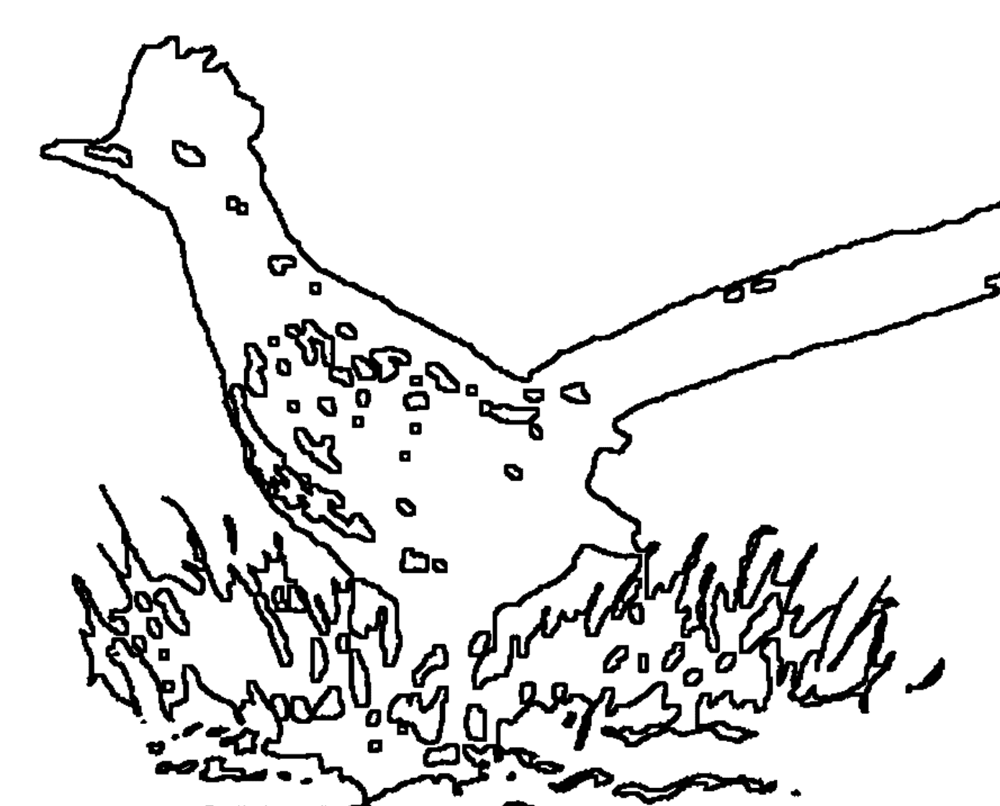

走鵑實際上就是居住在地面上的杜鵑鳥，牠適應了地面的生活，已經失去了飛行的能力，只有在極為罕見的情況下才會飛起來。而走鵑最厲害的地方就是跑步，牠的跑步速度可以高達每小時十八英里。

走鵑提點我們心智的敏捷性與速度，以走鵑為圖騰者將會學到如何有憑有據的快速思考。走鵑將會讓你的思考過程更加快速、靈活。在心智上，你會發現有時必須停下、轉向，然後朝另外一個方向邁去，這可能會讓你更事半功倍。

走鵑尾巴的功用可比氣閘，可以促進思考過程的停止與轉變，這也隱含了靈熱的啟動，它在某種程度上可以彰顯你的思維。相較於只是計畫而從不實踐，走鵑的出現將會帶來更多計畫以及讓計畫落實的機會。

擁有走鵑圖騰者腦筋總是動個不停，有時候很難跟得上他們的思想列車，但如果可以慢下來，就可以讓你看到他們的思維邏輯，並刺激你一起異想天開，這種人的心智總是忙碌工作著。

## 知更鳥

重點：新的成長
力量週期：春季

紅腹知更鳥（robin redbreast），是最廣為人知的稱呼，這種美妙的鳥兒在傳統上被認為是春天的使者。雖然知更鳥常遷徙，但牠們不見得總是這麼做，遷徙主要是因為缺少食物，而非多數人以為的躲避寒冬，如果食物來源足夠，知更鳥就會全年定居。在春天時，知更鳥的歌聲很容易辨識。事實上，在北美地區很少鳥類的分布可以比知更鳥更廣泛。當知更鳥進入你的生活時，你可以預期在生活中各個——而非單一——領域都會有新的成長。

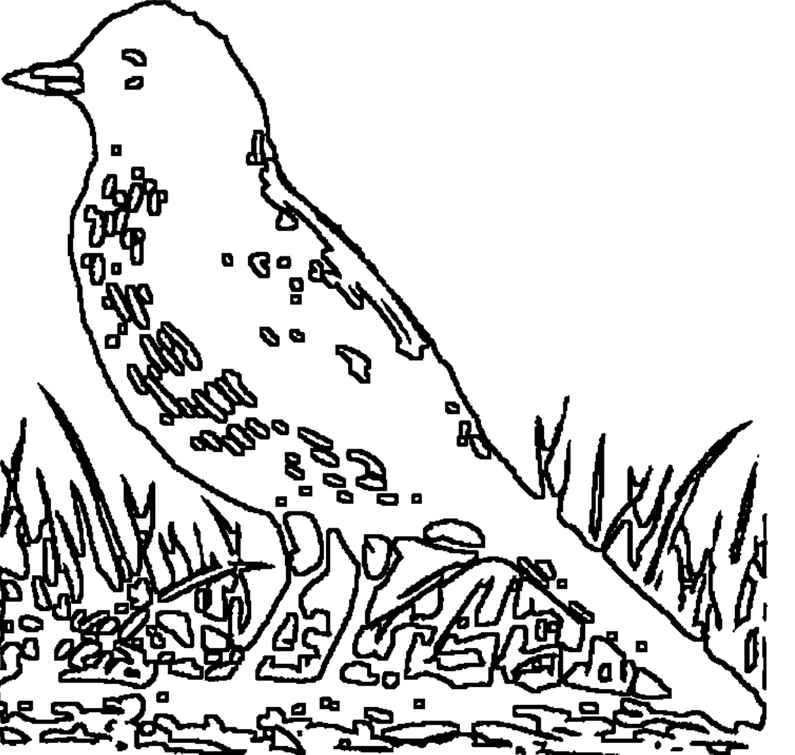

知更鳥也有許多神話和傳說，最廣為人知的傳說就是，牠的紅腹是因為在基督被釘上十字架時，從牠頭上染血的荊棘之冠拉出一根刺而染上的紅；在更迷信的傳統中，偷走知更鳥的蛋會招致厄運；有些人認為，每年春天首次看到知更鳥時，應該在牠飛走前許個願，否則你未來的一年都不會有好運氣。

不管傳說如何，研究知更鳥可以讓我們知道更多此圖騰真正的價值。知更鳥會對紅色有反應，以雄鳥來說，這表示要其他的雄鳥「滾出我的地盤」；而紅色，當然也與靈熱有關。知更鳥身上的紅有點類似鐵鏽的顏色，感覺好像參雜了其他的色彩，這樣的顏色再加上是覆蓋了整個胸部區域，象徵在某種程度上，知更鳥可以為你生活中的各領域都帶來新成長。

知更鳥之歌是活潑、婉轉的顫音。有部分的目的是要幫知更鳥建立地盤，在同一個區域的兩隻公鳥會用盡全力歌唱，互相示威。知更鳥之間的地盤之爭通常都是以歌聲來決勝負的，實體衝突比較是象徵性的，不會造成受傷。

這對於以此為圖騰的人來說別具涵義，反映出如果希望有新的成長，就要唱出自己的歌聲。任何衝突和阻礙都只是故作姿態，而非真正的威脅，所以勇敢向前進吧。

知更鳥生下的蛋是很特別的粉藍色，此種顏色常被視為人體內的喉輪中心。此脈輪與意志力和創造力相連結，而知更鳥的蛋則象徵了擁有此圖騰的人有與生俱來的能力，可以在其生活中彰顯其意志力並創造新的成長。當知更鳥前來時，將有助於你體驗此過程。這可能表示你之前做得並不恰當或是不夠有效，無論如何，知更鳥都會告訴你要怎麼做才能成功。

知更鳥的雙親會共同負責養育幼鳥，平均每十二分鐘就必須要餵食一次。$^{30}$這是必須的，因為剛出生的幼雛一根羽毛也沒有，然而，知更鳥仍有精力每年都養大一批的幼雛。這再一次象徵生命創造力的啟動，反映在其紅色的部份上，也正是知更鳥的心給予了牠們這種能力。

## 麻雀

重點：喚醒並展現出共有的高尚
力量週期：全年

在過去，麻雀並不像現在總是被認為是有害的動物，牠是一種活潑、堅強的鳥，可以抵抗許多不同型態的掠食者。麻雀隨處可見，在美國，麻雀並沒有天敵，因此增加的速度快得驚人。跟許多鳥一樣，麻雀也有自己的傳說，其中一個故事說到，麻雀是基督被釘死在十字架過程中，唯一出現的鳥類，因此成為在長期煎熬後取得勝利的象徵。麻雀在英國象徵家庭的神聖；而在中世紀時，麻雀則是歐洲農夫和較低階層的象徵。在該時期，農夫在封建領主的強權之下顯得無助，因此，他們喜愛聽到不顯眼的麻雀如何戰勝像是狼、熊與鷹等強大敵人的故事，這些動物在傳統上都象徵著惡劣對待農人們的貴族。

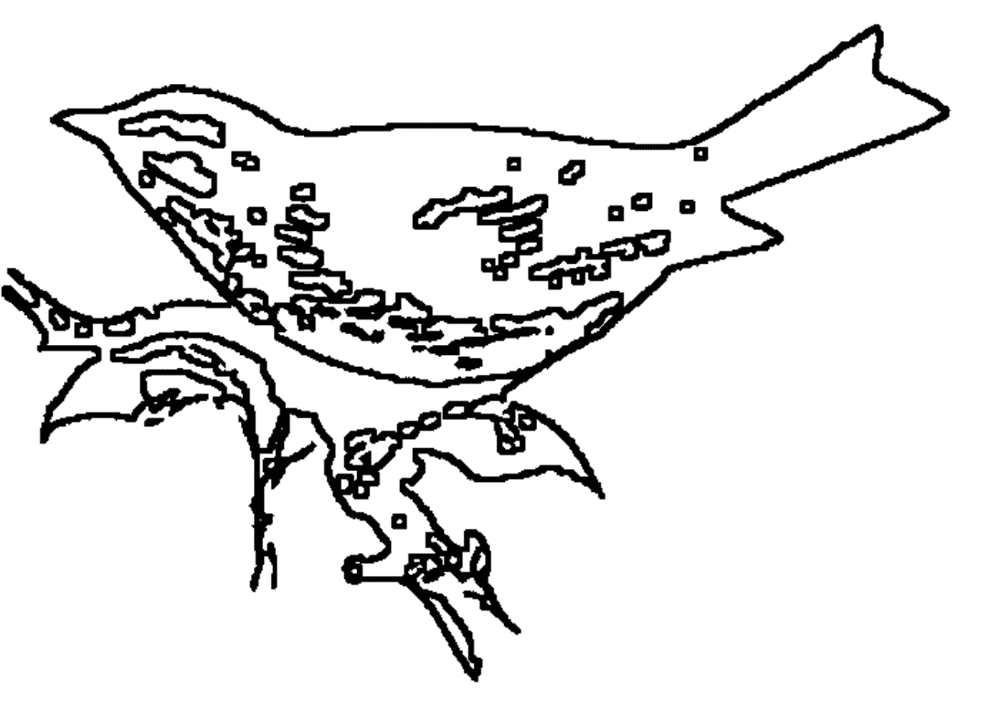

麻雀在掠食過程膨脹、武裝自己的能力，象徵了每個人心中都擁有與生俱來的高貴力量。擁有麻雀圖騰的人，看看你自己吧！你是否讓他人奪走你的尊嚴了呢？你是否忘了自己的價值？你是否開始思考為什麼你總是被暴君——個人或社會——踩在腳底下呢？麻雀將會讓你知道要如何生存，牠將喚醒在你體內新的尊嚴和自我價值感，幫助你在任何外在環境下都可以獲得勝利。

歌雀非常具有象徵性，身上有三個斑點，在其喉部與胸部形成了一個倒三角。在歌雀的喉嚨邊有一個深色的斑點，而兩個更大的斑點則位於胸口中央，這表示可以汲取能量，喚醒心輪與喉輪。意志力可以帶來天生的尊嚴，使之在你生命中歌唱，這就是麻雀可以教我們的。

30 Clement, Roland. *The Living World of Audubon* (New York: Grosset & Dunlap, Publishers, 1974), p.224.

## 歐椋鳥

重點：群體行為與禮儀
力量周期：春季

歐椋鳥是社交型的鳥類，沒有在築巢時，牠們總是會聚集在一起。歐椋鳥總是一起旅行，也一起進食，因此，歐椋鳥教導我們的課程與群體行為和禮儀有關。牠們可以教你如何在團體中更有影響力，同時告訴你，為什麼你的行為在此團隊情境中是不適當的。任何與社群或團隊行為有關的事情，不管好壞都屬於歐椋鳥的教訓，不適當團隊行動的例子之一，反映在歐椋鳥時常搶劫其他鳥類的行為上，知更鳥、藍知更鳥、鸕鶿、甚至茶隼都會被歐椋鳥搶劫、毆打過，只有鳴角鴞才夠強悍，讓歐椋鳥不敢放肆。

如果你生活中出現了歐椋鳥，問問自己一些重要的問題。你是否覺得生活中好像所有事情都不如你意？你是否把壓力轉嫁在他人身上？你近期在團隊情境中的禮貌如何？這可能是在警告你要注意潛在的不當行為。如果你覺得被欺侮了，你可能會想要研究、思考一下鳴角鴞，幫助你制衡這樣的情況。

在春天時，歐椋鳥的喙是黃色的，這表示在語言表達方面有較強的能量，你可能要注意自己說的話，因為會使人產生錯誤解讀或是擴張解釋；另一方面，這也顯示出你或許要留意對於別人所說的話是否太過敏感。

歐椋鳥能夠模仿許多鳥類，這是溝通的一課。這麼龐大數量的團隊既然能夠在社群中和平共處，就顯示出以各種不同語言溝通的能力，這就是歐椋鳥的象徵之一，代表能夠與團體中其他人進行更明確的溝通。

## 鸛

重點：新生與默契
力量周期：全年

鸛是「新生」最古老也最確實的象徵。在中國，鸛的特殊性與鶴差不多；代表家庭、孩子及家庭繁殖力的羅馬女神朱諾也非常重視鸛。鸛也曾在基督教早期傳說中出現，我曾在幼時聽過其中一個故事，是說鸛繞著十字架行走，為基督獻上同情與力量。鸛甚至被認為是人類的近親，在一些神話和傳奇故事中，鸛有時可以變成人的型態。

鸛是涉禽的一種，長長的腿讓牠們可以在海岸區域和淺水中涉水而過，這些區域時常被認為是通往精靈仙境的入口。這也顯示，鸛與情緒和水所象徵的創造有關，鸛可以幫助我們了解我們的情緒，並享受生產的過程。

鸛對於其幼雛的犧牲奉獻是眾所皆知的，牠們是有愛心又非常有保護慾的父母。這可以解釋鸛與羅馬女神朱諾間的連結，通常鸛每年都會回到同樣的巢中，在同一個家裡養育幼禽。

這可以為鸛在你生活中扮演的角色有所提點，你是否需要回家、回到原點呢？你對你的童稚之心是否有足夠的重視呢？你是否與你的家庭本源失去聯繫了呢？你是否正在花時間培養、關照生活中你所創造的企劃和活動呢？

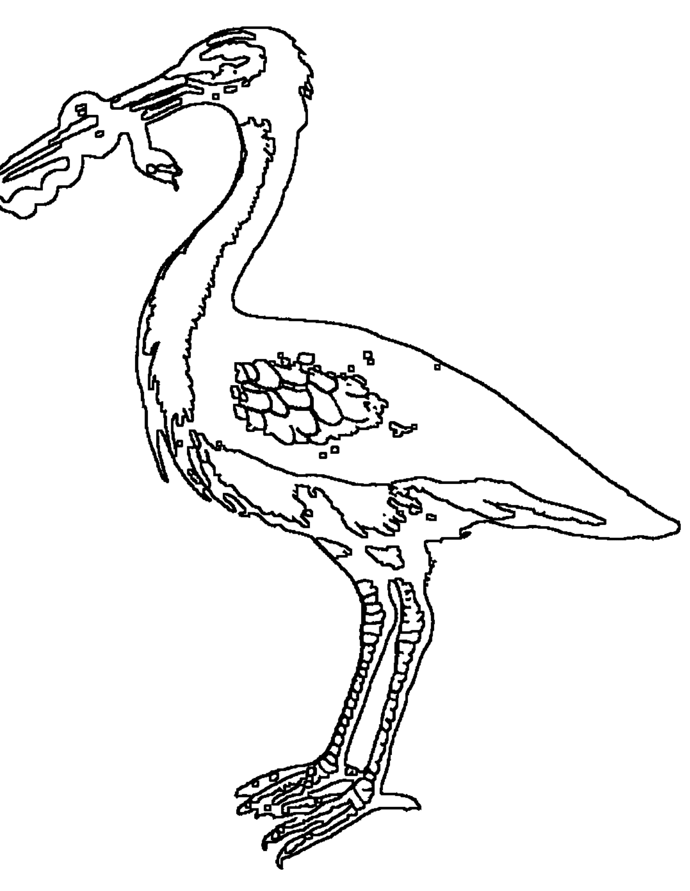

一直以來，看到鸛或擁有鸛的圖騰都被認為是幸運的，這象徵了你生活中將會出現新生，在某種程度上反映出你的生活將會有所更新，並有機會喚醒新的喜悅感及希望。在過去的傳說中，鸛飛過房子代表即將有新生命的到來。

鸛實際上並沒有用以溝通的聲音，但牠們卻有複雜的姿勢、姿態與舞蹈，用來代表各種不同的意思。牠們會咂嘴、踏步和拍擊，每種動作都有不同的涵義，而這和鸛與遠古的祭祀之舞之謎也有關聯。

藉由跳舞，我們可以喚醒原始的力量與能量，藉此可以連結其他次元與物質界。鸛擁有關於祭祀之舞的古老知識，尤其是生殖之舞。鸛圖騰可以教你如何透過動作和活動（而非語言）喚醒生活中各領域的生殖力；鸛可以告訴你要如何使用搖鈴和鼓來加強並協助喚醒你的生殖力和創造力。

鸛可以讓你知道需要著重在哪些動作上才能有所成就，還可以告訴你在哪裡落了拍，因而阻礙了你的發展；鸛可以教你透過適當的舞蹈召喚更強大的能量，並且讓你了解能量是由舞蹈所創造，而非透過舞蹈去挑釁和挑戰而來的；鸛也能告訴你要如何透過祭祀之舞超然於當下，並創造新生的機會。

## 燕子

重點：家庭的保護與溫暖、合宜的觀點
力量週期：夏季

燕子常被認為是宣告夏天來臨的益鳥，牠們有跟隨著溫暖天氣移動的傾向，因此被視為夏天最可靠的前兆。但我也曾聽過一種說法：「一隻燕子並不會帶來夏天。」

燕子本身也有獨特的傳奇與傳說。在一個印地安傳奇中，燕子從太陽那偷了火，並用尾巴上的羽毛將火帶到地上，因此現在燕子尾巴的羽毛才會是分岔、像刺一樣的。由於此故事，以及燕子與溫暖天氣一同來到的關係，因此燕子常被與太陽和火聯想在一起。

居住在東南部的印地安人，會為了同屬燕科的紫崖燕懸吊起空的葫蘆。對紫崖燕多加了解，也可以為此物種象徵的涵義提供更多資訊。

中世紀時，許多不同的信仰都與燕子有關，很多人認為，燕子知道可以讓眼睛重見光明的魔法石或魔法藥草（即毛茛），因此研究毛茛可以讓你更加了解牠；在北歐神話中，燕子在十字架周遭盤旋，並為基督呼喊打氣。

燕子在房屋上築巢表示此戶有受到保護，不受災害——尤其是火災或風暴——侵襲。燕子高飛代表天氣會變好，而靠近地面飛行則表示會下雨。研究燕子真正的特性和行為將有助於確定其作為圖騰的角色與能力。

燕子是小型、以昆蟲為食的鳥類，牠的鳥喙雖小，但嘴卻可以張到極大。這隱含了溝通的次數比表面上來得更多。人們是否話中有話呢？我們是否言過其實呢？我們是否需要更仔細聆聽話語本身，而不要受到說話的人或方式所影響呢？這甚至可能表示，在你自己或他人的言語背後，隱藏著更多智慧。

燕子以多種害蟲為食，因此在你家附近築巢的燕子，將有助於控制附近的害蟲數量，不知不覺保護了你的家以及居家環境。如果燕子在你生活中出現，那對於你生活中的害蟲來說有什麼涵義呢？你是否需要對此類事物加強控制？你的不滿是否正一點一滴逐漸累積著？你最近是否快要成為別人的「害蟲」了呢？你是否太過於專注在生活中的瑣事上，而無法向前邁進呢？別人是否也一樣呢？燕子帶來的能量有助於我們改善此類狀況。

燕子的飛行方式非常優美，實際上燕子待在地面上的時間很少，以燕子為圖騰的人需要牢記此點，不要讓自己被瑣事纏身，當你總是在老調重彈，無所進步時，燕子就會出現。

燕子的腿與腳都很瘦弱，因而再次強化了上述的觀點。如果燕子出現，就可能是在告訴你，如果你從微觀的角度去處理事情的話，就會對你很不利，提升你的境界，這樣你才能夠有更好的視野，當你身陷問題之中，是難以解決問題的，保持距離可以讓你更清楚要如何加強、保護自己與他人。

關鍵在於客觀，保持你的客觀性，你將可以更容易保護家庭，並讓自己的生活，以及與你有接觸者感到更為溫暖。燕子可以幫助你清理身邊的害蟲，並創造讓家庭和樂美滿的溫暖能量。

## 天鵝

重點：喚醒自身真正的力與美
力量周期：冬季

天鵝是最強大，也最古老的圖騰之一，這甚至反映在牠的名字上。天鵝（swan）在英文中，是最古老的名字之一，是從盎格魯撒克遜的時代一路流傳下來的。

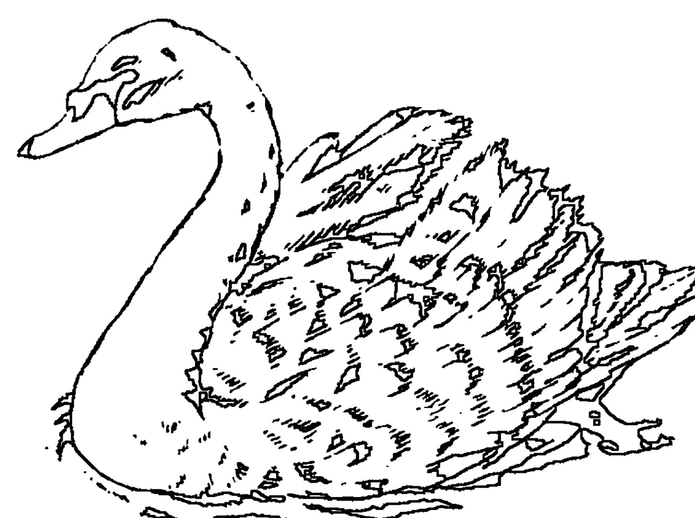

天鵝是高貴的水鳥，有著細長優美的脖子、美麗的白色羽毛。天鵝也是水鳥中體型最大的，以柔軟的水生植物為食。天鵝的喙十分敏感，因此可以做為水下的探測器。以天鵝為圖騰者的情緒可能會較為敏感，你也會發現自己對於其他人的情緒也比別人更加敏感。

天鵝通常是純白的（除了喙與腳的部分），因而成為了太陽的象徵；另外黑天鵝（澳洲品種）則是夜晚的代表，也時常被認為是稀有和不存在之物的象徵。

天鵝的脖子長而優雅，是其最有代表性的特色之一。頸部是連結頭部（更高領域）和身體（較低世界）的橋樑。在天鵝圖騰中，隨著你逐漸了解自己真正的美，你便開啟了連結新領域和新力量的能力，此種能力喚醒了內在之美，並將之與外在世界相連，這就是天鵝魔法要教導我們的。天鵝可以教我們如何不受外表影響，看到自己或他人的內在美，一旦做到這點，我們就成了他人的磁石，這從安徒生童話中，廣為人知的故事——《醜小鴨》中便可以看出端倪。

天鵝喜愛寒冷的天氣，牠們不喜歡炎熱，只要食物來源不致缺乏，牠們就可以耐寒，擁有此圖騰者會發現，自己對於寒冷的忍受程度高於炎熱。因此，天鵝也常與北方這個方位連結在一起，所以也應該要研究一下北方的象徵。

天鵝的種類及特性對其本身與對你來說都很重要。所有天鵝中體型最大的是北美野天鵝，得名於其嘹亮、穿透力又強的叫聲（譯註：北美野天鵝的英文名稱為trumpeter，也有小號手的意思。）；小天鵝在美國最常見，但其聲音其實比較像是呼嘯而非吹哨（譯註：小天鵝的英文名稱為whistling swan，whistling原意為吹哨、鳴笛）；在美國最廣為人知的則是啞天鵝，之所以得名是因為一般認為在成熟後，牠們就會失去發聲的能力，實際上啞天鵝並非真的無法發聲，但此點仍象徵了沉默不屈的想法。

天鵝是強而有力的鳥類，牠們拍動翅膀的力道甚至可以折斷一個人的手臂，而牠們的咬力也很強。天鵝是認真負責父母，也是一夫一妻的終生伴侶，有些天鵝甚至可以活到八十歲。天鵝代表當我們能夠喚醒內在的力與美時，便能獲得力量與長壽。

天鵝是孩子、詩人、神秘主義者與夢想家的圖騰。天鵝有著數不清的神話與傳說，基本上都與美麗和優雅有關。愛之女神，阿芙蘿黛蒂鍾愛天鵝；在神話中，阿波羅的雙輪戰車就是由天鵝所拉的；宙斯變成天鵝與凡人——麗托（Ledo）做愛，這表示天鵝有能力將不同的世界、次元連結起來。

有關天鵝的傳說和神話有許多，其中很多都描述到少女們穿上有魔法的天鵝羽衣後就會變成天鵝，如果羽衣被發現了，美麗的少女就必須保持人形，並嫁給發現羽衣的人，或是做為奴僕，因此天鵝也成了與神靈間的聯繫。許多傳說中，天鵝最後都有悲慘的下場，暗示著當獲得釋放後，力之美能夠改變原本的生活，同時也表示，此股能量要有效的被使用，就必須要加以控制。

從希臘流傳下一個有關天鵝之歌的謎，認為天鵝會在死前唱出最美的歌聲，因此天鵝之歌便成為詩意的同義詞。天鵝可以為那些仍有童稚之心與內在美者解開歌與詩之謎。

## 雨燕

重點：快速、敏捷的尋求——來自唾液的萬靈丹
力量周期：傍晚

雨燕是種擁有後掠、硬挺翅膀的小型鳥，飛行速度很快，就像其名稱一樣，非常快捷（譯註：雨燕英文為swift，也有快速、快捷的意思）。雨燕的尾巴很短，很少露出，暗示你不要試圖扯別人的後腿。若雨燕進入你的生活中，你應該問問自己一些問題。機會來臨時你是否沒準備好呢？你或身邊的人是否太過於猶豫不決了呢？你做事的時候是否因為貪快而失去控制了呢？

雨燕這種鳥可以教導我們快速、靈敏的對人事物做出反應，讓我們知道要如何掌握每一次機會的到來。雨燕在傍晚時最爲活躍，但幾乎整天都可以看到牠們在進食，這顯示雨燕有能力快速取得機會，或對於機會做出反應，牠教導我們，猶豫不決只會讓機會白白溜走而已。

雨燕的巢是用自己唾液糊起的杯狀燕巢，許多神秘主義都提及唾液以及唾液的療效，而這與你體內原始的生命之液有關。將唾液當作黏合物，顯示出能夠汲取生命能量和汁液，達成各種目的。

在印度教和道教中，也有許多與唾液有關的玄想。性慾被挑起的女人的唾液被認爲是擁有強大力量的，包括治療以及爲魔法護身符加持；唾液也可以作爲隔空治療的「見證物」，所謂的見證物是可以用實體形式代表人的任何東西，它是人與他的能量之間的連結。

在一些中醫療法中，唾液被認爲是一種甘露，具有許多功能。從生理學的角度來看，唾液可以爲身體降溫，並滋養身體系統，女人的唾液被認爲尤其強大，如果在「性奮」狀態下服用，就有療效，甚至能夠延壽。

在印度典籍中時常可以看到親吻，不同的親吻也有不同的功能，任何以雨燕爲圖騰者，在從事有目的的傳遞唾液行爲時，都應該要對此有所了解。

親吻是非常古老的一種心靈保護，親吻（和唾液）賦予了心靈能量，並啓動心靈中心，唾液則封鎖並保護住身體中最容易產生不平衡的部位，因而有助於在發生性行爲時更平均散布愛的能量。由於雨燕以唾液築巢，因此這也象徵了雨燕的能量。

杯狀的巢對於雨燕圖騰者來說也有重要的涵義，杯是聖杯的象徵，此探求引導我們發現自己的精神本質，以及如何在此生將之發揮得淋漓盡致。

所有的杯子都與陰柔能量有關。杯子可以盛裝萬靈丹（唾液），像豐饒角一樣，可以用來將能量傾倒出來。鳥巢提醒了你要靈活、有力的運用你的陰柔能量，學會汲取你的生命之泉，並將其中的魔法用在生活之中，而雨燕可以幫助你做到。

## 小美洲夜鷹

重點：了解精靈仙境——專注於成功本身

力量周期：夏季黃昏

雖然此鳥被稱作夜鷹，但牠和鷹一點關係也沒有，而是北美夜鷹的親戚。此種鳥的羽毛白、黑、黃交雜，象徵了黃昏的日、夜交界時刻。

黃昏是夜鷹最活躍的時刻，而此段時間長期以來也與精靈、妖精和神靈召喚連結在一起。夜鷹即為「交界時刻」（Tween Time）之鳥，也時常被認為是來自精靈仙境者的坐騎或運輸工具。夜鷹屬於曾被稱作「吸羊乳鳥」（goatsuckers）的鳥類之一，因為以前的人們認為牠們會吸取羊乳，這可能是來自有關調皮搗蛋的妖精或精靈之傳說，牠們會來到住所附近的農場，偷擠羊奶或牛奶。

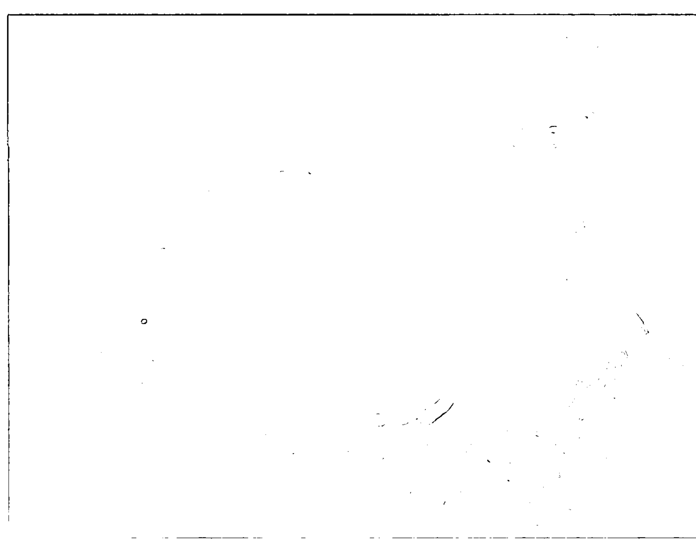

### 夜鷹

夜鷹屬於曾被稱為吸羊乳鳥的鳥類之一，擁有短喙寬嘴，以空中捕捉到的昆蟲為食。

（感謝俄亥俄州特洛伊城的布魯克納自然中心提供照片）

當找不到合理的解釋時，許多不良行為或不幸事件就會被歸咎到妖精或精靈身上，牛奶發酸、物品遺失，甚至牛奶被偷走都被認為是牠們幹的好事。由於夜鷹與歐洲其他的「吸羊乳鳥」都是在黃昏和夜晚時最為活躍（同時也是妖精與精靈最活躍的時段），因此被認為是來自精靈仙境者的坐騎。

夜鷹的喙短嘴寬，於黃昏時出獵，以昆蟲為食，在飛行中捕捉並吃掉牠們。夜鷹在黃昏與夜晚的時候最為活躍，也最容易被看到，這對於以夜鷹為圖騰者來說十分重要，他們會時常發現自己總是匆匆忙忙，一刻也停不下來。生命中有夜鷹到來者，應該要注意交界時刻——清晨、黃昏、午夜、盛午等等的這些時間，而這些時段也將會是最有靈感與力量的時刻，你會發現自己不管做什麼都事半功倍。

不像其他的夜鷹科鳥類或吸羊乳鳥，小美洲夜鷹比較容易被看到，許多人在晚上看到了夜鷹，但卻不知道自己看到了什麼，因此，許多人又再次將之與妖精和精靈聯想在一起，認為牠們就在附近，只是隱而不現。

31 北美夜鷹是唯一已知會冬眠的鳥類。秋天時，牠們會爬進峽谷中的裂縫與洞穴中，然後「關機」。北美夜鷹也與貓頭鷹很類似，許多人相信，如果北美夜鷹停在你的屋頂上，就表示有人即將離世；許多歐洲人認為，北美夜鷹會在人瀕死時偷走他們的靈魂。

32 小美洲夜鷹 (swisher) 是被稱作夜鷹 (nightjar) 科的成員之一，之所以有此名稱，是因為牠們在晚上會發出刺耳的嘎嘎 (jar) 聲。在夜晚發出怪聲的鳥類時常會被認為擁有超自然力量，或是與超自然領域有關。

如果夜鷹飛進了你的生活中，你可能會想要了解一下自己的生活。你是否感到被忽略了？你是否忽略或不重視生命中的重要他人？你是否在該致力於完成任務時，卻只是想要獲得別人的注意？你或身邊的人是否在故意引起注意呢？你是否覺得進退兩難，無法完成任何事情呢？夜鷹會教你如何完成生命中的任務，讓你專心致力於任務的本身，而不是想要獲得注意力：夜鷹會告訴你不需要大肆宣揚，只要你把該做的事情做好，自然會讓人注意到你的成就。

夜鷹不會築巢，牠們每次都會將兩顆蛋直接生在地上，這種行為本身就十分特別，牠不需要其他的魅力。夜鷹以大地為巢，產出有創造力的生命，而每次生下兩顆蛋對於那些有興趣探究數字對應涵義者來說，也會帶來特殊的象徵意義。

## 火雞

重點：共有的福祉與收成
力量周期：秋季

火雞有的時候又被稱為地之鷹。長期以來，人們都將火雞與大地之母的靈性與榮耀聯想在一起。火雞象徵了所有大地給予的贈禮，以及善加利用此贈禮的能力。火雞可以活到十二歲，十二這個數字也十分特殊，地球繞太陽一圈的時間為十二個月，象徵了火雞與榮耀地球生命週期間的關係。擁有火雞圖騰者，通常都可以期待會有一個豐收之年。

火雞是美洲大陸的原生鳥類，曾由阿茲提克與馬雅人飼養。火雞身上幾乎所有部位都可使用，肉可以食用、羽毛可以用來裝飾、甚至骨頭都可以製作哨子。

美洲原住民有許多關於火雞錯綜複雜的神話，火雞幫助創造了世界，告訴人類應該如何種植玉米，以及對抗像是貓頭鷹這類的邪惡勢力；有些故事則有關印地安巫師如何將自己變成火雞，暗中偵查別的部落。

火雞屬雉科鳥類，因此以火雞為圖騰者也要對此加以研究。有些人認為火雞的名字其實是來自於孔雀的希伯來文tukki。

火雞是適應力最強的鳥類之一，雖然生存曾受到威脅，但現在又再次在野外茁壯成長。火雞面臨最大的威脅就是失去棲息地，雖然可以適應各種環境，但火雞還是最偏好林蔭地。

火雞的飲食習慣很多變，每天可以吃掉高達半公斤的橡實。人們常將堅果、橡實與隱藏的智慧和新種子的生長聯想在一起，以其為食的走獸與飛鳥通常都象徵了在智慧和成長方面會有新的滋養。另外還有發現指出，火雞會偷竊松鼠的食物儲藏。

雄火雞有著亮紅色的肉垂，怪異、膨脹的生長在前額。當行走時，肉垂就會在火雞的喙上晃來晃去，像是個鬆掉的天線；當雄火雞在互相較勁的時候，肉垂就會顯著膨脹起來。這與古老的三隻眼思想有所連結，在傳統的抽象論中，總是將內視力與腦垂體聯想在一起，眉中央或第三隻眼是更高視野的中心，通常都被認為是我們體內陰柔之力的所在，象徵了牠們與大地之母和所有陰柔能量及可能性之間的連結。

火雞是一夫多妻制的，雌火雞必須在牠所選擇的雄火雞面前躺下以獲得注意，有時候雌火雞們也會共用一個巢來孵蛋。這再次象徵了共有福祉的概念，同時也是牠們保護自己的方法。

許多人都認為火雞不會飛，但這不是事實。火雞可以很快的起飛，以每小時五十英里的速度進行短距離飛行。牠們肥短的腿也沒有阻礙其跑步能力，火雞在晚上時還會群體棲息在樹上，以保持安全；晚上有時還會更改棲木。牠們發現團結力量大，因此象徵了分享的能量。

## 禿鷹

重點：淨化——死與重生——新的展望

力量周期：全年——夏季、冬季

在好久好久以前，太陽與地球的距離非常近，近到地球上的生物都無法忍受太陽的炙熱。動物王國的成員集合在一起，決定要有所行動，希望可以把太陽移遠一點。狐狸首先自告奮勇，牠用嘴把太陽叼起來，開始往天堂跑去，但沒過多久，太陽變得太燙，燙傷了狐狸的嘴，所以牠停了下來，時至今日，狐狸嘴巴裡面都還是黑色的。

接著負鼠自願出馬，牠用尾巴把太陽捲起來，開始向天堂跑去，沒過多久，太陽又太熱了，燙傷了牠的尾巴，牠也停了下來，到今天，負鼠的尾巴上還是長不出毛。

然後，禿鷹站了出來，禿鷹是最美麗、最強大的鳥，在牠頭上，有著讓眾鳥都嫉妒的美麗羽冠。禿鷹知道，除非可以移動太陽，不然世界都要被燒毀了，因此牠將太陽頂在頭上，開始向天堂飛去，牠的翅膀不停的大力揮動，將太陽越推越遠，推進入了天堂。雖然禿鷹感到牠的羽冠已經燒了起來，但牠仍然持續著，直到牠將太陽推到天空中，距離地球夠遠的安全位置。不幸的是，牠永遠失去了牠那頂華美的頭冠。

禿鷹或許是受到最多誤解與誤會的鳥類，人們認為禿鷹很噁心，將之與死亡聯想在一起，但許多傳說與神話卻反映出正好相反的狀況。只要快速檢視一下各種有關禿鷹的神話，以及大略看過其行為，就可以知道禿鷹其實是一種很棒的生物。

在希臘傳統中，禿鷹被認為是獅鷲（一種神話中的生物，通常都被描述成結合了不同動物的特性）的後代，是天堂與塵世、精神與物質、善與惡、守衛與復仇者的象徵。獅鷲被認為是自然神靈的復仇者，對於古代的亞述人來說，死亡天使就是以獅鷲的形態出現，其形象包含了隼與太陽的象徵，以及貓科動物的夜行特質——象徵了永不放下的警戒心。因此禿鷹與獅鷲被聯想在一起，同為生命與死亡之謎與救贖之路的守衛。若想得知更多有關獅鷲的資訊，可以參考我之前的作品，《精靈的魔力》（Enchantment of the Faerie Realm）。

在埃及，真理女神瑪特通常都帶著禿鷹羽毛出現；在埃及的某些地方，禿鷹也是母親的象徵，可能是因為牠吞噬屍體，讓其他生命得以延續的關係。通常能夠處理掉會對生命及健康造成危害的走獸與飛鳥，會被認為是神聖力量的象徵，生與死都是母親的象徵。

對於普魏布勒印地安人來說，禿鷹象徵了淨化。其魔力可以重建被破壞的和諧，而羽毛則能被用在變形祭典後的儀式上，促進還原。兀鷹在此轉換過程中也有幫助，可以被用來驅逐邪惡，切斷與死者間的接觸（包括傳送、變形，或其他形式的靈媒能力），為物體除魔，甚至讓被殺死的戰士復活。³³

在鄉野傳說中，當兀鷹於冬季結束返回時，就不會再下霜了；另外，穿戴黑鳶的羽毛也被認為可以避免風濕；兀鷹與貪婪和冷血也常被錯誤的聯想在一起。

禿鷹是猛禽科的一份子，但不像大多數的猛禽（隼、貓頭貓頭鷹等等），禿鷹的瘦腳短爪使之難以去撕裂或擴抓，因此需要仰賴別的動物去為牠廝殺。然而禿鷹扮演的清道夫角色可以抑制來自屍體的感染與細菌，使之不至於擴散到沒有抵抗力的其他動物身上，牠們維持了環境的清潔與平衡，避免了疾病的蔓延。

禿鷹也有許多種類，每種都有其特殊之處，牠們走路、站立、棲息的姿態都十分

³³ Tyler, Hamilton A. *Pueblo Birds and Myths* (Flagstaff: Northland Publishing, 1991), pp. 225-229.

## 紅頭美洲鷲

此種特殊的鳥，其名字源自於拉丁文中的vultur，雖然不會獵殺獵物，但仍被認為是猛禽、掠食者。兀鷹擁有碩大的雙翼，可以毫不費力滑翔很長一段時間，牠是最常被誤會的鳥類，也在許多社會中被認為是最強大、也最神秘的鳥類。

（感謝俄亥俄州特洛伊城的布魯克納自然中心提供照片）

昂然不屈，儘管其外貌不揚，但胸中自有一分無言的驕傲。

兀鷹的翅膀最寬闊，也是世界上最大的飛禽。安地斯兀鷹的翼展可達十二呎寬；加利福尼亞兀鷹則有九呎寬。生活在墨西哥與阿根廷的禿鷹之王——王鷲會獨自或成雙飛行，通常都飛得極高，而且與別的禿鷹距離很遠。

在美國，很多人都對黑美洲鷲和更常見的紅頭美洲鷲非常熟悉。雖然常被稱作鷲，但牠們其實就是禿鷹。黑美洲鷲是因為其顏色而得名，而其學名coragyps atratus，則是「一身黑的禿鷹」之意。黑美洲鷲通常都是全黑，但在雙翼末端各有一白色斑點，此鳥的尾巴較短，無法像紅頭美洲鷲那樣盤旋，因此黑美洲鷲比較常棲息在空洞樹幹裡的巢中。

兀鷹有著長尾巴以及雙色的翅膀，其飛翔的姿態十分優雅。而其學名cathartes aura則有「黃金淨化者」的意思。牠們在夜間會棲息於共同的鳥巢中，到了清晨，在日出的陽光下，牠們會展開雙翼曬乾露水，看起來就好像在崇拜升起的太陽一樣。

雖然在站立的時候看起來很居家，但在飛行時，此種猛禽就成了宏偉的代名詞。牠們優雅的盤旋，感覺毫不費力，擁有此圖騰者，這象徵了你將會更加重視自己所做的事情，而非外表。

禿鷹的視力極佳，並能巧妙利用上升的熱氣流，讓自己飛起來。牠們使用熱氣流的能力常被比作靈視——能夠看到從身體中散發出的微妙能量之能力。我們在生活中都曾體驗過熱氣流，當我們在夏天開車上路，看到熱氣從地表升起，那就是熱氣流，對於人類這種地面觀察家來說，這些氣流只有在距離地面幾呎的地方才能看到，但禿鷹卻可以在此氣流升空時看到。在地面上時，禿鷹無法看到或感到熱氣流，但在空中時，牠們對於氣流的每一種狀態都瞭若指掌。如果紅頭美洲鷲進入了你的生活，你或許很快就可以看到人與物周圍的靈氣，如果沒有的話，禿鷹可以教你。

禿鷹是很有耐心的狩獵者，可以不拍動翅膀就在空中盤旋好幾個小時。牠們是無動力飛行的絕佳典範，可以隨著熱氣流飄流向上，禿鷹使用氣流來擾亂重力的拉力，讓牠們得以飛翔。這點從牠們的翅膀很少擺動就可以看得出來，表示飛翔的力量不需要來自於牠們本身，只要運用可得的資源即可。

一般認為，禿鷹掌握了漂浮的秘訣，漂浮是一種神聖的法則，重力則是向物質及世俗傾靠的衝動。禿鷹回拒了物質，其漂浮、上升和盤旋的能力被認為是遠離世俗的象徵，因此也成為擺脫物理箝制的象徵。禿鷹代表個人能量的釋放，讓重力不再牽絆著你——不管是實際上的地心引力，或是世俗狀況及過去經驗的重擔皆然。

禿鷹也可以在地平線上折疊雙翼，這在猛禽和大多數的鳥類中都是很獨特的，並且有助於牠們的盤旋。當禿鷹拍打牠們巨大的翅膀時，可以帶來極大的推進力，因此不需要時常使用。此種有效利用能量的能力也是禿鷹要教我們的事情之一。

禿鷹銳利的視力也是眾所皆知，有些科學家認為牠們可以用眼神傳遞消息，尤其是在發現屍體時。禿鷹可以在幾英里外就感應到殺戮，視力比人類優異八倍之多。

禿鷹最發達的感官之一就是嗅覺，紅頭美洲鷲擁有高度進化的嗅覺，如果有需要的話，牠們可以單靠嗅覺就找到食物，而黑美洲鷲的嗅覺則沒有那麼發達。在玄學傳統中，嗅覺長期以來都被認為是跟更高層的辨別型態有關。紅頭美洲鷲可以幫助你開發自己的嗅覺，讓你可以在生活中各面向都運用得宜，還可以幫助你決定生活中有哪些東西聞起來好像不對勁。嗅覺也和芳香療法有關，對於以紅頭美洲鷲為圖騰者來說，這可能是其發展或使用上最有效的整體健康技巧了。

紅頭美洲鷲的消化系統也十分特別，若我們去看看牠們吃了什麼，就可以了解其中奧妙。紅頭美洲鷲抵抗肉毒的能力高於人類幾千倍，其消化道內的化學作用可以殺死牠們食物中的有毒細菌。

擁有禿鷹圖騰者，不難發現自己在消化系統上的改變。自己曾經喜愛或食用後沒有副作用的食物可能會變得不再適合；另一方面，原本覺得不相容的食物，也可能變得能夠互相搭配。你攝取的食物在你的能量系統中將有更顯著的作用，注意自己吃過各種不同食物後的生理、情緒、心理和精神感受，很快你就會發現，自己該避開或增加何種食物。

當紅頭美洲鷲以圖騰之姿出現時，你的排泄過程可能也會有所改變。紅頭美洲鷲是少數幾種會排泄在自己腿與腳上的動物，糞便以噴射的型態排出來。這部分是因為可以清潔腿與腳在吃腐肉時所累積的細菌，在消化道中同樣的抗菌化學作用也能在排泄物中發現，可以做為腿和腳的殺菌劑。

這並不表示擁有禿鷹圖騰者會有大小便失禁的問題，而是應該要確保他們的排泄系統正常且規律運作著。如果你覺得沒有精神，或是感覺快要感冒了，觀察一下你的腸胃蠕動，牠們可能需要一點刺激。

禿鷹另一個這麼做的理由則是要為腿與腳降溫，這對於那些擁有禿鷹圖騰者來說，也是非常健康有益的。尤其是在禁不起高溫的時候，將雙腳浸泡在冷水中，你很快就會感到好多了。

通常禿鷹都喜歡保持清潔，在野外也時常沐浴。由於禿鷹得將頭部埋入死屍和髒器中，因此無毛的頭部反而能保持相對清潔。若是頭上有毛的話，細菌便會在其中孳生，因此沒有羽毛反而能夠避免感染。日光浴也可以為禿鷹的頭部消毒，每個早上，牠們都會面向太陽，伸展翅膀以溫暖羽毛，同時清潔身上殘留的細菌，這樣一來，牠們的翅膀實際上便成為了小型的太陽能收集器。

禿鷹其實不會發出真正的叫聲，但牠會將空氣擠出鳥喙發出嘶嘶聲。對某些人來說，這表示坐而言不如起而行；而對另外一些人來說，則顯示禿鷹魔法是實踐，而不僅僅是討論實踐而已。

禿鷹一般會將蛋下在地上，幼雛對於干擾極端敏感。禿鷹蛋孵化的時間很長，通常都只有一隻幼雛，因此禿鷹父母不會到太遠的地方去尋找食物，幼雛在三個月內都不會離巢或飛行，因此有種說法是，人類真正穿越死亡階段，進入新生也需要三個月的時間，這就是禿鷹的象徵。

在鍊金術中，禿鷹是昇華的符號，主要是因為與鷹有很高的相似性。禿鷹被認為是生活中反覆與恆定、心靈能量與宇宙之力間新關係的確認記號，禿鷹代表了雖然當下並不了解，但苦難是暫時的，是為了要讓更高的目的達成。反映出不論生活情況有多艱難，你生命中的救援即將到來，正如同海克力斯（Hercules）拯救普羅米修斯（Prometheus）一樣。

## 連雀

**重點：溫柔與禮貌**
**力量周期：春季——夏季**

連雀是夏季最美麗、溫柔的鳥兒，是紅雀家族的成員之一，因此也應該了解一下紅雀。連雀通常是淺褐色的，帶有淺黃條紋以及些許的粉紅及淡紫色，連雀的下顎是黑色的，一抹黑色橫過牠的眼睛，看起來像戴了面罩一樣。而在翅膀的末端，則有著看起來像是火漆般的紅色斑紋。

研究色彩將有助於了解與連雀有關的能量，猶如戴面具的外貌賦予連雀與面具製作及儀式服裝藝術間的聯繫。面具製作是一種古老的藝術，用於世界上所有的儀式、慶典和施法上。連雀擁有用面具來玩樂與療癒的知識，還可以與色彩療法（color healing）結合在一起。

面具是轉化的工具，但大多數人都害怕改變及轉變，認為會造成傷害。連雀告訴我們改變與轉變的進行，可以是如你所想的那般輕柔、簡單；連雀教導我們如何使用面具、頭飾和繪圖，創造通往心智的大門，一個你可以進入新次元的門檻。

如同其親戚紅雀，連雀頭上也有羽冠，這反映出牠可以喚醒的內在智慧，同時也將祭典用的頭飾以及意識的轉換連結在一起。

連雀其實是非常溫和有禮的鳥，牠們會為彼此互相傳遞食物。如果連雀進入了你的生活中，想想生活中你體驗到或缺失的溫柔吧！別人是否對你過於彬彬有禮？你是否太屈己待人？你是否需要從新的角度來看待自己或他人呢？你是否對自己不夠溫柔呢？連雀會告訴你如何在生活中喚醒「溫柔」這種最重要的美德。

## 啄木鳥

重點：節奏與辨識能力
力量周期：夏季

啄木鳥擁有很有神話與傳說，許多都跟其最顯著的特徵——敲打——有關。啄木鳥是之前所述撲翅鴷的親戚，兩者之間有許多相同的特質與特性。

在歐洲的古老傳說中，啄木鳥時常被認為是天氣的預言者，其敲打聲代表即將到來的轉變，甚至有人認為牠是雷鳥；在巴比倫尼亞（Babylonia），啄木鳥被認為是伊斯塔之斧（ax of Ishtar），並與生殖力有關；在古希臘，啄木鳥占據了宙斯的寶座，並且被認為是雷神的專使；啄木鳥也被認為是戰神的神諭，這也是因為鼓擊常被用在戰爭中；羅馬人也有關於啄木鳥的神話，法力高強的女巫賽絲愛上了森林之神皮庫斯，而當求愛被拒後，她將他變成一隻啄木鳥。

在美洲原住民的傳統中，啄木鳥可以與地球的心跳相連，牠的敲打有許多神秘的連結，從新生的節奏，到變形的應用，許多巫師都嘗試用鼓聲的敲擊將自己帶入另外一個次元。

當然，啄木鳥也有很多種，而每種都有其特殊之處。大多數的啄木鳥都是黑色和白色的，有些頭頂則帶有紅色。黑與白象徵需要更清楚看待生活中的問題與面向，表示當我們更近距離觀察時，事情會更加清晰。

絨毛啄木鳥的體型最小，也是啄木鳥科中最常見、也最友善的成員；最常在樹林中被發現的北美大啄木鳥是專業的鋸木工，一般都跟烏鴉差不多大，是最大型的啄木鳥，擁有明顯的紅色羽冠；紅頭啄木鳥也十分常見，大多數的啄木鳥，尤其是雄鳥，在頭頂上都有一塊紅，不過紅頭啄木鳥的紅色羽毛則覆蓋了其頭部和頸部。

啄木鳥頭上的紅象徵了對心智活動和眉心輪的刺激，鼓舞且喚醒了新的心智能力。啄木鳥的正字標記——啄，可以進一步的象徵此點。

啄木鳥在樹木上鑿洞，尋找蠕蟲或其他的昆蟲，此種戳刺，尤其是頭部的使用，有進一步探究之意。啄木鳥的喙又硬又尖銳，而牠們的頭骨也比較重，有助於啄木。牠們銳利的喙和刺一般的長舌可以比作分辨之藝術。

如果啄木鳥對你唱歌，那麼你該問問自己一些問題。你是否有理性的看待生活的各個面向呢？你身邊的人是否因為他們的活動而被分類呢？你呢？你或你生活中的其他人是否沒有三思而後行呢？

有時候啄木鳥的出現，只是為了要帶動起一些新的節奏。節奏是影響生理能量的有力方式，有時候我們可能被每天的心智或精神活動所纏繞，而忽視了生理面向，而啄木鳥便有可能在此出現。這也可能反映出需要將一些新的改變和節奏敲進你的生活之中。

啄木鳥的爪子成鉤狀，且十分有力，讓牠可以牢牢抓住樹木，而牠的尾羽有助於牠直立起來。啄木鳥還有一種古怪的上下飛行方式，牠會飛起、往下滑行、飛起，然後又往下滑行，啄木鳥的飛行方式與節奏是獨一無二的，而這一切都強調了一個重要的事實，就是你必須順從自己獨特的節奏與飛行方式，用最適合你的方式處事。啄木鳥進入你的生活就表示你已打好了基礎，而你現在可以放心跟隨自己的節奏。

## 鷦鷯

**重點：足智多謀、勇敢**
**力量周期：春季**

鷦鷯也有數十種，是一種個頭小、矮胖的鳥類，通常與知更鳥一樣受到珍視。鷦鷯一般來說都是褐色的，常常會將尾羽高高翹在空中，很少出沒於空曠之處。

鷦鷯的羽毛被認為是可以預防溺斃的崇拜物，殺死鷦鷯通常被認為是不吉利的。在異教傳統中，鷦鷯被認為是大地之神與女神的使者，由於鷦鷯那又短又彎的尾羽，因此也被認為是從太陽那偷取火，並帶到地球的鳥：在中世紀的歐洲，尤其是中下階層，普遍相信鷦鷯是聖母瑪利亞的寵物，這有可能是因為統治階級在故事和傳說中常常被描繪為鷹、隼、熊等大鳥或猛獸。

鷦鷯是最足智多謀、適應力強的鳥類，會在任何方便之處築巢。通常牠們的巢都很靠近地面，或甚至就在地面上，尤其是在沼澤地帶更是如此。雄鷦鷯主要負責築巢，除了真正的鳥巢外，牠們還會蓋幾個欺敵鳥巢，一部分是為了警戒，但也有人認為這是為了要吸引雌鳥，只有等假鳥巢蓋好之後，雌鳥才會定居下來傳宗接代。睡覺時，雄鳥會與雌鳥與幼雛分開睡。

鷦鷯是有勇有謀的鳥，在一則美洲原住民的傳說中講到，鷦鷯曾經欺騙愛說大話的鷹，讓牠帶著自己飛向天堂，而到了鷹的極限後，鷦鷯從鷹背上跳下，飛過雲層，嘲笑鷹說自己飛得比牠還高。

鷦鷯的聲音力量也不容小覷，牠可以自信滿滿的從白天唱到晚上。鷦鷯的性格很衝動，在遇到其他鳥類或走獸的威脅時，絕不會退卻。

如果鷦鷯進入了你的生活中，該是問問自己一些重要問題的時候了，你是否有善加利用可得的資源呢？別人的狀況如何？你是否沒有展現出足夠的自信心呢？你是否每天都擔憂不已而忘了歌唱呢？你是否沒有腳踏實地？你是否只見樹不見林？你是否對生活的熱情不足呢？鷦鷯擁有善加利用資源的魔法，可以教你如何打造對自己最有利的生活環境。

# 第三部分

# 了解動物的魔法

在萬物初始，動物擁有智慧與知識；至高無上的提亞瓦（譯註：Tuawa，波尼族神話的創世神）也不會直接對人類說話，祂會派遣動物來告訴人類，祂將以動物的姿態出現，而人類應該向動物、太陽、月亮……以及所有為提亞瓦傳話的存在學習。

> —— 一九○四年間，波尼（Pawnee）部落酋長萊特高斯·雷沙（Letakos-Lesa）對娜塔莉·寇蒂斯（Natalie Curtis）如是說。¹

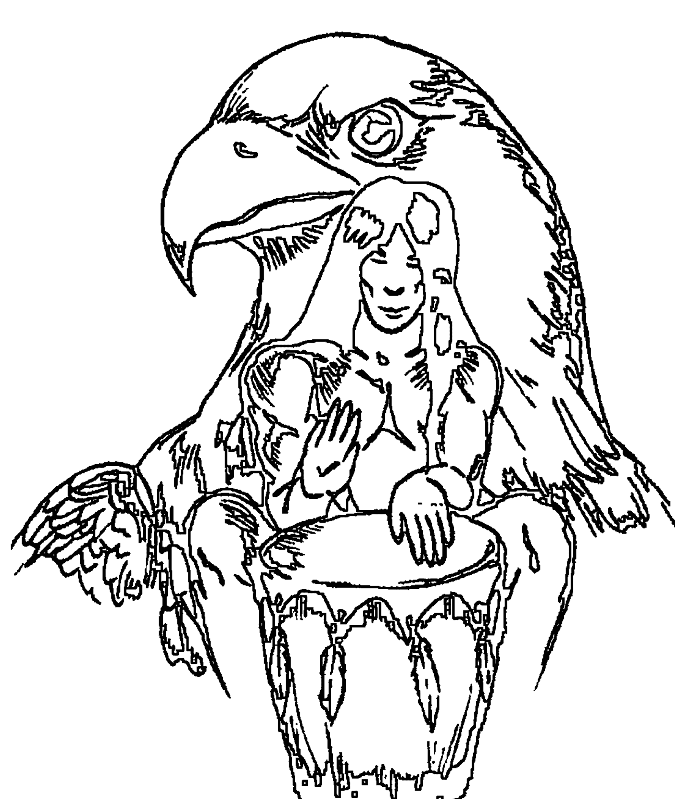

¹ Curtis, Natalie. *The Indians' Book: An Offering by the American Indians of Indian Lore, Musical and Narrative, to Form a Record of the Songs and Legends of Their Race* (New York, Harper Brothers, 1907), p. 96.

# 第十一章

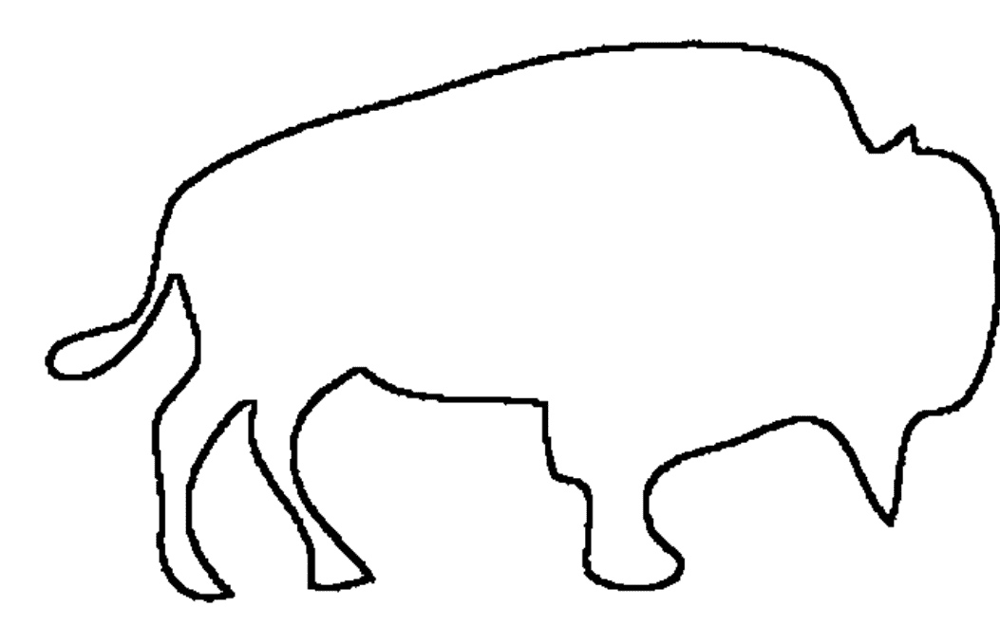

# 榮耀動物圖騰

我們發現很有趣的一件事，在很多部落中，包括美洲原住民，都沒有一個字是用來指稱動物的，動物跟人類一樣，都被認為是一種人。對拉柯達人來說，動物是兄弟姊妹，是父親、母親，是人類的遠親。直到西元一六○○年左右，「動物」這個字還是極少被用到，後來主要是學者會使用。動物當時被稱為是「野獸」（beasts）或「生物」（creatures），或以個別的名稱稱之。²

「動物」的英文animal是源自於拉丁文的anima，意即靈魂或生命之息；而「野生動物」的「野生」英文wild則來自於盎格魯撒克遜語言中的wilde，意指生活在大自然中不受人類的拘束，這其中隱含了「大自然中的動物具有神性」的概念。

在古老的典籍與著作中，常將動物與神聖之力（具體來說，就是神與女神）聯想在一起。每個東印度的神或女神都有動物當作坐騎，動物確實與神靈同在，例如，象頭的大象神伽內沙（Ganesha）就騎在一隻大老鼠身上；而濕婆（Shiva）則騎著公牛蘭隸（Nandi）；動物也是神明的信使，展現了神明的本質以及與自然間的關係，人類發現可以從動物身上看到神的存在，因此每一隻牛都是濕婆，也是濕婆的專使。

印度神殿建築通常呈現同心圓狀，在每一層圓圈內都有不同型態的動物，而在神殿中心（至聖所，最神聖的地方），則供奉著唯一一尊超越所有存在的神像。³

在中世紀有不少動物寓言典籍，都試圖將某種自然物質與現象歸因在動物身上。其中包括流傳於亞歷山卓城的《自然學家》（Physiologus）與被認為是由艾爾伯圖斯·麥格努斯（Albertus Magnus）所編撰的《動物論》（De Animalibus）。動物被用來象徵人類必須要克服的一些較為低等的面向。動物常依據四個元素被分類：水生和兩棲＝水元素；爬蟲＝土元素；飛鳥＝風元素；哺乳類（溫血生物）＝火元素。

即使根據這些古老的動物寓言集和典籍，許多作者和老師們試圖歸類出動物們的代表性意義，但動物的象徵仍會依據不同的脈絡而有所不同。動物的象徵和涵義可以根據自然、人文、宗教，甚至想像來加以解讀，而這些方面通常都是互相牽扯的。

當你在發展與動物對話的能力時，請謹記並沒有一個單一的詮釋存在，每種動物都會各自與你對話，不論是以具體或是象徵的方式。你可以從有關動物的紮實知識基礎出發，推進至更神秘、比喻性的關聯，這兩者並無孰好孰壞，但前者可以打好基礎，而後者可以在此基礎上，為你與動物及整個自然世界的關係增添色彩。請謹記，必須要詳加檢視每種動物個別的特性與行為，以及和你個人生活間的關係，你所做的任何對應，都必須有事實的基礎存在。

當你開始榮耀並接觸牠們時，此任務會變得較為簡單，而你的解讀和對照也會變得更加正確。這將讓你可以與動物和諧相處，並幫助你看到神與自然世界間的往來，你將更加讚嘆生命的神奇之處。

你透過本書中實作所發掘的動物圖騰，是通往精靈仙境的絕佳橋樑，動物會讓你在與那些更神秘、虛無飄渺的領域接觸時，更有力量、也更堅強，同時也能幫助你更加腳踏實地的生存於人世。

當你找到自己的圖騰後，你會發現牠們在你的夢中或冥想中出現得更為頻繁，你將會以許多種不同的方式遇到動物，使你的信念更加確定。你將會看到描繪著你動物圖騰的圖畫、明信片或骨董；你可能會更常在電視上看到介紹其棲地與行為的節目；書籍、神話或其他的敘事也會進入你的生活之中。你不需要完全沉迷於其中，只要加以認可與利用即可，你可以透過動物圖騰去榮耀在你生活中接觸到的精靈與能量。

你可以做五件特定的事情，好讓你與圖騰和自然間的關係更加穩固，這些事情將會幫助你榮耀此分關係：

1. 儘量了解你的心靈圖騰。加以研讀，了解其基本特質、習性和行為，研究與之有關的神話與傳說，這都有助於你定義與了解在你生活中可以如何彰顯此能量。

   人們害怕自己的圖騰這件事並不少見，他們可能害怕被與此種動物聯想在一起，或者這種動物被認為是噁心或不吸引人的。當這種狀況發生時，我建議去圖書館的童書專區，看看有關動物的兒童書籍，大多數的兒童書籍都會試圖將動物以有趣、吸引人的方式呈現，尤其是那些兒童（成人）最畏懼的動物。有關動物的兒童書籍可以幫助你對此動物感到放鬆，因為書中通常會呈現該動物吸引人的有趣特質，兒童書籍通常比較不讓人害怕。

2. 尋找你動物圖騰的圖片與藝術品，將各種圖片拼貼在一起，環繞成一幅屬於你自己的圖畫。將圖畫掛在你整天都可以看到的地方，可以時時刻刻提醒你，你與心靈動物正在建立的關係。

3. 創作動物的圖畫或素描，不用擔心自己的藝術天賦，也不要拿你自己的畫去跟別人比較，別人不需要看到你的畫作。請謹記，你所建立的關係是你個人的，你將會發現隨著你與動物有越來越多的接觸，你的描繪也會變得精準。

   如果你會在打電話時信筆塗鴉，塗鴉你的動物會有助你建立關係，而且也沒人會批評塗鴉。所有的藝術創作努力都會刺激大腦的右半球，這有助於我們發展對於靈性領域的直覺感受。

4. 購買圖騰雕像，不用很大，也不用花太多錢。很多書店賣的書籤上面都有動物的圖像，你可以自己收藏或是買來送人。

   具有你圖騰的小硬幣和圖畫（像是在書籤上的圖）是送給朋友或家人的好禮物。當你送禮時，你就是在榮耀此動物神靈的多樣性，以及牠幫助眾人的能力，你不需要大肆宣揚你在做的事情，也不需要解釋其中的奧妙，只要讓別人知道這是你最喜歡的動物，你覺得這會是個好禮物即可。

5. 匿名捐款給野生動物基金會或是與你動物圖騰有關的特定組織。匿名只是為了要確保這是為了榮耀你的動物而非取得名聲。

   在公園或自然中心付出時間、努力擔任志工，許多機構長期都在尋找可靠的協助。你可能不會與動物有直接接觸，但你的努力有助於促進自然環境的安康；你進行的任務可能不那麼吸引人，卻仍然是非常重要的。

   我在俄亥俄州特洛伊城的布魯克納自然中心志願擔任了幾個職位，其中一個是，我每個星期四的早上都要清理籠子與餵食動物。此任務很花時間，你還得處理大便或其他垃圾，不是什麼誘人的工作，尤其是到了春天時，中心充滿了動物寶寶或孤兒，牠們會把所有東西都弄得亂七八糟。

   這項任務也要求你與態度極為惡劣的動物打交道；但從另一個角度來說，這讓你有機會可以與各式各樣的動物接觸，而且可以讓有更重要任務的人員，像是保育員、教育員等工作人員，可以專心做自己的工作。事情總有利弊兩面。

   要注意，當你在發揚與保護自然中的任何面向時，其實你正是在促進自己與圖騰間的關係與生活。自然的每個面向在某種程度上都是彼此相連的，只是我們還沒有發現其中的關聯性。當你致力於提昇、保護某些面向時，在其背後的神靈將會致力於提昇、保護你的生活，因為自然與我們是密不可分的。

不要吹噓自己的圖騰是什麼，或是為你與他人做了什麼。來自別人的懷疑，不論是否有表現出來，都會阻礙並限制你與圖騰間的聯繫。沉默是金，喋喋不休你的關係會使此能量在有機會為你帶來真正的魔法之前就變弱或消散了。

讓別人知道你喜歡或正為某種動物著迷沒什麼不對，如果有人問起，就告訴他們你欽佩此種動物的能量與特質。動物圖騰是私人的，沒錯，你可能會跟別人擁有一樣的動物圖騰，但你與其往來的方式將與別人不同。這沒有孰優孰劣，只是不同而已。

學習榮耀你與圖騰的關係，並帶著敬意去發展關係。了解牠們的極限，也讓你的圖騰了解你的極限：當你逐漸締結、展開此關係時，不要因為有什麼改變就被嚇到。在此關係中保持創意，用你自己的方式榮耀牠，感謝任何你所崇拜的神靈透過此心靈動物給予你的幫助。

# 召喚你的心靈動物

一旦知道自己的心靈動物後，必須與之建立起正面的互動關係。這能讓你清楚知道牠們所能與所不能，可以幫助你召喚牠們及其背後的遠古能量，使之為你效力。

從動物的冥想開始，想像、感覺牠正站在你面前，或正往你邁進。讓牠用心電感應與你對話，當牠站在你面前時，讓牠向你表達自己、讓牠告訴你，牠可以在你生命中不同領域給你何種幫助。不用擔心這一切只是你的幻想而已，你越是專注，所送出的邀請以及與之本質的聯繫就越強烈。

練習想像牠和你融為一體，把自己當作動物，進行冥想，下一章中的實作將對你有幫助。如果你發現在工作上，或家裡有用得到此動物能量的情況，在一頭栽入前先花個五分鐘想想你心中的動物圖騰，感覺到牠強大又活躍的能量，知道牠們將幫助你成功處理此情形，想像此情況最後處理的結果是成功的。

當你開始了解你的動物神靈，並能夠感受到環繞在你身邊以及在你體內的能量時，你就可以開始嘗試召喚牠們。音樂、吟唱、擊鼓都可以用來召喚你的心靈動物，擊鼓與吟唱是很有力的工具，有助於你轉換意識，打開通往神靈仙境的大門。雖然我們沒有時間和篇幅討論所有的擊鼓方式，以及要如何應用在與動物互動上，但在下一章中，仍會有詳盡的介紹。

為你的圖騰寫歌編曲，不用很複雜，只要二到三句簡單、有旋律、重複的曲子就可以是絕佳的工具了；如果你有已經很熟悉的簡單歌曲，只要改編詞就可以讓你用來榮耀圖騰。在你的冥想過程中，只要請求你的圖騰教你可以快速召喚出牠們的祝禱之曲即可。

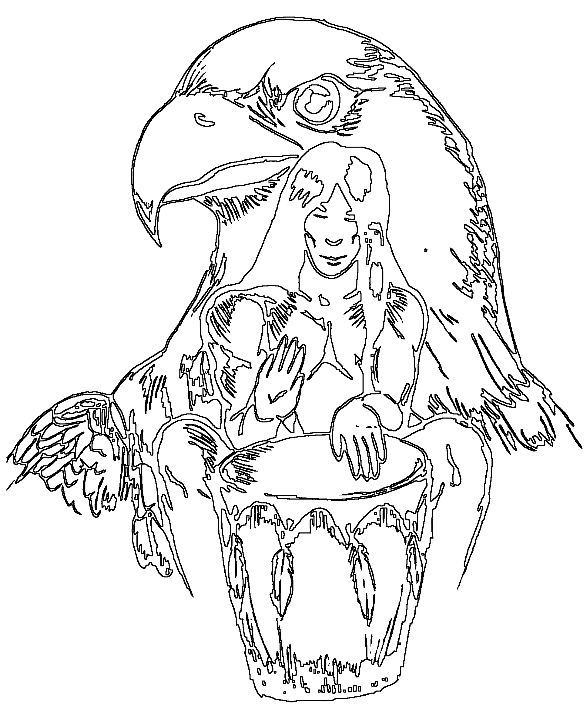

我用在心靈動物上最有力的一首吟唱，是改編自一首文藝復興時期的曲子。我使用其中三段旋律召喚我的動物圖騰，這首曲子也很有保護力、活力充沛，能讚揚動物。

這首曲子叫做「露露卿」（Riu Chiu），是十六世紀西班牙的逸名之作，也是現代聖誕節最常表演的一齣文藝復興時期的曲子，這首曲子有宗教版本也有世俗版本。

以下這段副歌每行有十二個音節，總共三行。三是有創意的數字，還是十二的因數。十二本身也有其重要的神祕涵義，例如十二星座、一年有十二個月等等。這些數字給予了此吟唱創意的節奏，研究靈數學的人絕不能忽略這點。（你可以參考我之前的作品《聖音》〔Sacred Sounds〕，進一步了解節奏的重要性，以及編寫魔法與神祕的吟唱與祝禱所需的具體技巧。）

這些句子的翻譯也與本書之前討論過的，掠食者與獵物之謎有關。第三行的修改強化了神會透過特定的動物以及大自然的表徵彰顯出此一想法。

# RIU CHIU（原版）

Riu Riu Chiu, La guardo ribera.
（露露卿，誰在河邊守望）
Dios guardo el lobo de nuestra cordera.
（神守護我們的母羊不受狼的侵襲）
Dios guardo el lobo de nuestra cordera.
（神守護我們的母羊不受狼的侵襲）

# RIU CHIU（我改編的版本）

Riu, Riu Chiu. La guardo ribera.
（露露卿，誰在河邊守望）
Dios guardo el lobo de nuestra cordera.
（神守護我們的母羊不受狼的侵襲）
_____ guardo el lobo de nuestra cordera.
（_____守護我們的母羊不受狼的侵襲）

在我改編的版本中，我並沒有在第三行使用dios這個字，相反的，我用我想要召喚的動物名稱來代替。由於這是西班牙文的作品，我便使用動物的西班牙語名稱。這樣一來，還可以強調神或神聖力量透過動物彰顯的概念，而此種動物的能量可以讓母羊不受狼的侵襲，正是這種動物啟動了掠食者與獵物的平衡魔法之能量。

# 改編範例

Riu, Riu Chiu. La guardo ribera.
（露露卿，誰在河邊守望）
Dios guardo el lobo de nuestra cordera.
（神守護我們的母羊不受狼的侵襲）
Halcon guardo el lobo de nuestra cordera.
（隼守護我們的母羊不受狼的侵襲。）

動物是神聖力量具體的表徵，這反映在第三行。如果我要與幾種動物互動，我會重複吟唱，每次用不同的動物替換，通常每種動物會重複三次，保持三的魔法節奏。你也可以試試看，找到最適合你的方式。這是一首很有力量的曲子，我發現即使用在召喚我不常互動的動物上也很有效。

在本節的最後是這首曲子的旋律，如果你有鋼琴或樂器，可以協助你學會怎麼唱這首歌。我建議你可以到當地的圖書館、大學的音樂圖書館，甚至是有文藝復興時期歌曲的樂行，去取得一份錄音，聆聽別人吟唱有助你更容易學習此旋律。大多數的圖書館，即使本身沒有收藏，也可以幫你尋找。

你在尋找與學習中所付出的努力將會有所報償，因為這是一首極為有效的曲子。你也可以使用鼓和搖鈴來強化效果。

簡易版的西班牙語字典可以幫助你，對照要替換的動物名稱，有些名字可能不是那麼容易跟節奏搭配，所以你可能要發揮一點創意。例如，西班牙文的老鷹是lechuza，比較難插入原本Dios的位置。所以我就把它們混在一起，捨去最後的音節，所以雖然原本lechuza有三個音節，但我只發兩個——lechuz，你要表達的意思還是可以傳達出來。

下面是一些例子：
- 鹿 — venado, ciervo (masc.)
- 隼 — halcon
- 鷹 — aguilla
- 袋鼠 — canguro
- 貓頭鷹 — lechuza
- 兔 — conejo
- 狐 — zorro
- 馬 — caballo
- 象 — elefante
- 龜 — tortuga
- 秃鷹 — gallinazo
- 鯨 — ballena

下面即為召喚動物之歌，與之交流，試試看，你的努力很快就會有所收穫。當你在學習時，這本身就具有魔力，你可以使用它來召喚動物，傳遞訊息給牠們，這首曲子具有能幫助你變形的力量。

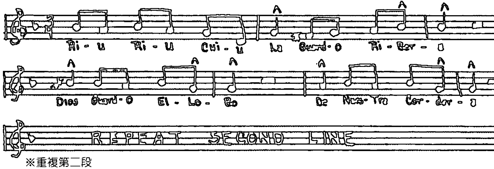

# 第十二章

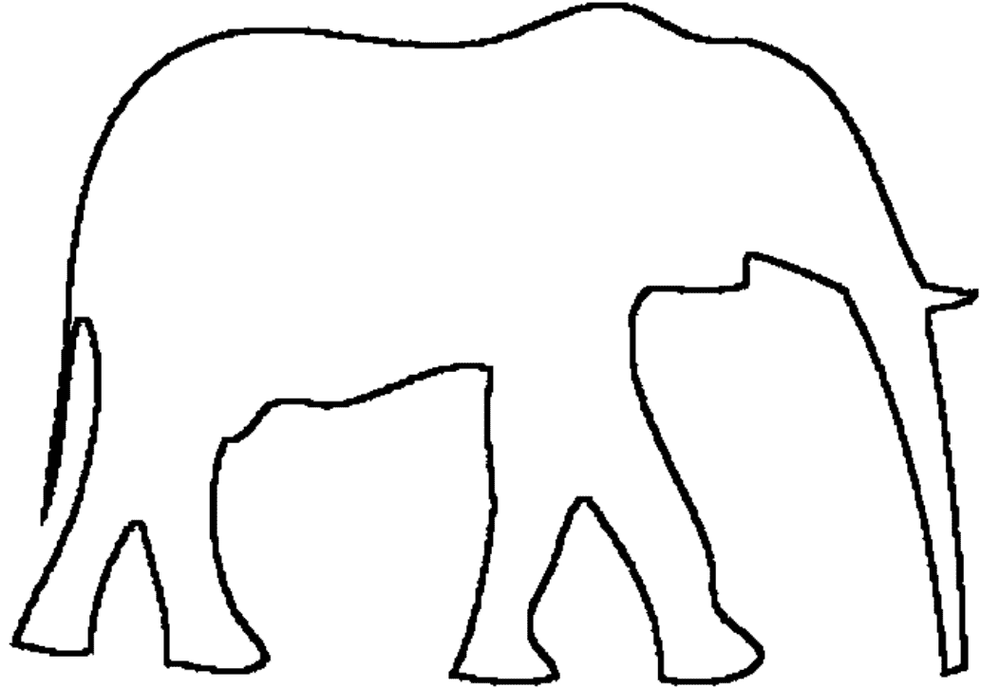

# 動物儀式

動物儀式與動物權是玄學和其他「新世紀」團體時常討論的主題，人們想當然的認為兩者互有關聯，但在某些圈子內卻並非如此。我很驚訝的發現，居然有那麼多說法都認為動物儀式是包含了獻祭。

在美國某些盛行巫毒的地方，雞時常被宰殺來作為獻祭。隨著薩滿教再度興起，許多人認為動物獻祭是與大自然同步必然的一部分，只要動物是被榮耀的，就沒有關係。在和諧匯聚（譯註：harmonic convergance，為新世紀占星學的術語，指發生於一九八七年八月十六日至十七日的行星對齊。）那時候，我聽到了許多薩滿團體以雞作為大地之母獻祭的可怕故事。

最近，在某些團體中，打獵似乎越來越受歡迎，甚至是受到鼓勵的。一名向我諮詢的女性告訴我，她很高興可以要求她丈夫出去打獵，這樣一來她就有獸皮可以製作她的儀式服裝，而與動物更加合一。

學淺誤人，這類活動都讓我倒胃，顯示了對於大自然的無知以及極度的無禮。有些人可能會說，獻祭的動物反正是死於自然之中，因此沒有造成真正的傷害。死亡是自然的一部分，這點沒錯，但這樣的死亡是因為掠食或疾病等自然循環所造成的，而非人為導致的。不論找怎樣藉口，都無法將打獵合理化為運動的一種。運動的要素，得是裝備著相同工具的人彼此競爭，我絕不會容忍打獵這種殘忍的活動，並且會馬上通報相關單位！

許多薩滿基本教義派仍認為，這是與大地之母建立起真正和諧的唯一方式，但不論這些人如何將此行為合理化，他們在觀念上仍有極大的錯誤。在遠古時期，此種儀式是生命的一部分，對於動物的殺戮是為了生存，這樣的行為是一種自我防衛的本能，而非宗教儀式。動物的每個部位都有其功能，而且被加以利用，通常這是因為無法得到其他的資源，或是當時的人沒有正確的知識而產生的。這些社會的衛生極差、平均壽命短、生活十分艱困，我們難道也想要回到這樣的生活狀態嗎？

在某些古老的社會中，放血是釋放在血液中某種心靈能量的方式，用來增強祭司、女祭司、巫師、法師或術士的能量，因為那是他們唯一懂得的方式。在現代，人類的進化讓我們不再需要進行此種活動，人類的心靈能力非常強大、充滿活力，這樣的行為只會汙染人類的力場而已，不管其中包含了怎樣的清潔和淨化活動都一樣，此種行為會汙染思想、情緒，甚至身體健康。

那些表示獻祭是必要的人已誤入魔道，他們要不就是拒絕花時間以更自然的方式發展自己的能力，要不就是認為魔法與神秘主義是一些超自然的，也是自己無法超越的事物。就算在這樣的情況下，交互作用的法則可以發生效果，但需要付出怎樣昂貴的代價呢？

請謹記，有樣學樣是毫無力量的，許多神秘、魔法的配方已流傳許久，不少團體仍然墨守陳規，從不改變儀式或祝禱，只會為能量喚起表現不如預期找藉口。

要讓真正的魔法和神蹟出現，我們必須要在曾經學習過的東西中，加入自己的創造性直覺以及想像力，這會帶來力量，才是讓奇蹟發生的要素。要過著負責任的魔法生活，你必須善加利用所有可得資源，抽取精華、重新塑造、然後將之融合到只屬於你的創造及生產成長系統之中，以對你或你身邊所有生命最有利的方式，使用你所學到的一切。

我們永遠無法再次生活在古老的薩滿教時代，我們也不想要這麼做，如果我們相信必須要殺害或獻祭動物才能夠與之合而為一，很快就會只剩下動物的圖片了。你想要看到哪種情況：在野外的狼，還是在野外的狼的圖片？我們可以做的是吸收古代巫師的教誨，然後將之配合我們的現代生活及情況進行修改，我們可以尋找更有效的方式來取得協調。

我知道有許多人已經找到了絕佳的折衷之道。在我們交通繁忙、道路蔓延至自然領地的社會中，大多數人都常看到被車撞死的動物。越來越多人在車上放著手套與塑膠袋，當看到被撞死的動物時，他們會停下來，幫牠們收屍，並在之後進行自己的儀式以榮耀之，可能還會留下一些羽毛或毛皮；有些人則是停下來，把動物的屍體移開路面，這樣一來，以此種動物為食的其他動物就不至於也被車撞到。這是對於動物及自然生命最崇高的榮耀方式，就好像在對動物的神靈說：「你的生命是極有價值的。」

我在車上放了手套、毯子和袋子。在我旅程途中，常會遇到受傷或死掉的動物，看到這麼多不同的動物被車撞到真的讓人感到很難過。我曾看過隼、烏鴉、負鼠、浣熊、旱獺、山貓、土狼等等，我自己也曾不幸撞死被車頭燈嚇到僵滯的動物，那種感覺真是糟透了。雖然我不是每次都可以及時停下來，但只要有機會我一定會停車，就算只是把牠們移到路邊也好，我會暗自祝禱釋放牠的靈魂，我會向牠措手不及又不幸的死亡表示哀悼之意，我為牠祈禱，並向牠保證未來會試著幫助牠的同類。

在春天時，常常會看到受了傷或是被殺害的負鼠，只要有可能，我都會停下來看看。如果是母的負鼠，牠的袋裡很有可能還裝著小負鼠，雖然媽媽死了，但小負鼠可能還活著。

有一次，在從科羅拉多州返家的路上，我開車穿過密西西比州。當時已經下了好幾天的大雨，地面滲滿了水，上百隻的烏龜從樹林中出現，一路排到高速公路上，高速公路上兩邊的車道都是烏龜，散佈了約五英里的範圍。真的很難不撞到牠們，我看了看後照鏡，想知道別的駕駛會怎麼做。

有些駕駛甚至連避開烏龜的打算都沒有，但有個開聯結車的司機卻讓我大吃一驚。他把車速減到了最低限速，還特地繞過烏龜，一隻都沒有撞到。看到他駕駛著如此的龐然大物，卻能夠避開每一隻烏龜真的讓人感到非常驚奇，考量到烏龜的數量，他的駕車技術真的可說是神乎其技了。當我穿過了烏龜群，我為牠們的保護祝禱，同時也為該名卡車駕駛祈禱。

這樣的行為才是真正榮耀自然世界的儀式。榮耀並與自然世界接觸的儀式可以如祝禱般簡單，也可以像變形儀式那般複雜。下列的方式都很簡單、有效，你可以自由修改或是創造出你自己的儀式，這會讓你在與你的心靈動物互動時，會更加有創意。

# 為動物儀式做好準備

在一打人面前提到儀式這個詞，你會得到一打不同的答案。各式各樣的回答讓人感到無所適從。過去有很多著作都曾寫到過儀式，但不幸的是，那通常與真正的儀式技術間有著可笑、荒謬的偏差。大多數人心中的儀式都是受電視和電影影響而幻想出來的模式，絕大多數都是譁眾取寵的，很少有人理解到其實自己本身就具有與宇宙能量達成和諧的真正潛力。

許多有關祭典和儀式以及參加者的經驗分享，其實只是為了那些半吊子或尋求心靈刺激者所設想、呈現的；許多人假借發明新的儀式，來掩蓋自己的錯誤行爲或是無知。

曾經有段時間人們相信，儀式只跟自己、天使和惡魔有關，但我們必須了解，所有人在生命中的每一天都在進行儀式。有多少人每天早上都有同樣的例行公事？我們起床、淋浴、喝咖啡、讀報紙、然後去上班，這就是儀式。我們有個人的儀式、軍隊的儀式、宗教儀式、社會儀式——儀式本身就與人類表達的各個面向都有關連。

在本章接下來的部分，我們將探索一些儀式，幫助你以更有效的方式，崇敬大自然和生存其中的動物，並與牠們和諧共處。我們將會告訴你該如何建立程序，幫助你以適當的方式觀察自然與其中的生靈，有了適當的觀察方式，你才能讓流布於你生活中的高層次力量顯露出來，這些儀式將能喚醒你對於世上萬物與生俱來的大愛。

祭典程序可以刺激靈感，主要的目的就是讓參與者對宇宙中所有能量間的連結有更進一步的了解。儀式有助於我們認知到自己是宇宙的縮影，我們所做的每件事都會影響到宇宙中其他萬事萬物，而宇宙中的萬事萬物也會反映在我們的生活之中。要達成此目的，你不需要什麼複雜的工具、儀器、長袍或廟宇，你只需要用有創造力的方式運用你的心智能力，並沿著特定的路徑行進即可。只要有一顆開放的心，保持開闊的認知，以及堅持不懈的態度，你就可以看到成效。

儀式或祭典可以是任何以強烈的目的性、意圖與重視所進行的行爲，它讓我們可以用一種更完善的方式去體驗內在世界，其成效包括自我表達、自我發掘和自我探索的提升。請謹記，雖然過去大多數的儀式都無法有效應用在現代的能量上，但現在有效的祭典程序其實就是古代宗教傳統與現代創意的融合與協調。我們以古老的儀式爲基礎，然後再加入自己的創造性直覺。

世界上有許多種儀式傳統，而很多傳統中都有它們各自的動物儀式和祭典。卡巴拉、埃及、奧爾弗斯（Orphic）、塞爾特、美洲原住民、馬庫姆巴（Macumba）、非洲和其他信仰巫術的社會都有他們自己特有的儀式。在自己創造或修改儀式之前，最好先對其有通盤的了解。了解這儀式是爲了什麼象徵和能量所設，否則你可能會發現召喚出來的並不是自己所想要的。

成功的儀式——不論它的目的是要與自然／動物接觸或其他——都會聚焦並昇華你的回憶。透過成功的儀式，你可以經驗特定的能量，而且不會被此股能量征服。儀式可以拓展你的意識、刺激創意，並提升你整體的自信。通常只要三至七天，你就會感受到你的目的已經達成，或是逐漸朝向目的行進中。

在開始與你的心靈圖騰互動前，有幾項事情要先加以考量：

1. **儘量了解你的動物**。我知道我在這本書裡面已經重複過很多次了，但這是非常重要的。好好研讀、研究，將其最特殊、不尋常的特性列成清單，其行為的每個面向可能對你的生活都別具意義。牠的出現可能是要幫助你喚醒和發展出某些特質，或表示在你生活中某些特性需要被加以控制。
2. **了解你進行儀式或冥想的目的**。在你創造任何與你心靈動物協調的冥想或祭典程序前，都必須要確保此點。知道為什麼你想要從事這件事情、決定進行儀式最適當的時間與地點。請謹記，有效的儀式並不需要什麼特定的工具，工具和服裝雖然可以幫助你專注於自己的目的，但並非必須的。
3. **讓你的動物儀式或冥想保持簡單**。並非耗費很長的時間才代表有效，最有效的儀式反而沒有採用複雜工具和服飾。想想該怎麼做才能讓你覺得最舒適呢？
4. **做好準備**。準備好冥想與儀式的地點，確保這個地點與你本身都很清潔整齊，可以使用薰香或焚香來淨化；把電話拿起來，讓自己不受干擾。在開始實際的儀式或實作前，讓自己進入最放鬆的狀態。
5. **使用音樂和擊鼓來增強互動**。適合的音樂可以有效增強儀式或冥想，所以你必須配合你的目的來選擇音樂。只是為了要有音樂而使用音樂反而會讓你分心，嘗試不同的音樂型態，找出最適合你的。

你可能會想要創作自己的歌曲來榮耀動物圖騰。我在本書前面的部分曾提過此點，你也會發現進行動物儀式的好處之一，就是可以讓你和教導你動物之歌的動物間建立起動態連結。

鼓是用來增強動物儀式最有效的工具之一，這是巫師們最基本的工具。真正的巫師不需要從家族、傳統或宗教那裡繼承神、女神或其他的神靈存在；巫師其實就是敞開自己的人，不管神以什麼型態表現，都可以直接感受到祂。

節奏就是生命的脈動，會影響所有的身體狀況及生命狀態。對於美洲原住民來說，鼓聲敲擊是大地之母的心跳；在巫毒儀式中，鼓則被特別用來阻擋理性，目的是要啟動性能量，或甚至引導催眠狀態。

節奏的模式也是儀式和治療中的一部分。單純、特定的節奏與明確的想法、體驗和生理反應有關。鼓聲與節奏可以刺激或平撫情緒，還有一些節奏有助於探索內在意識。

在許多巫術施行中，鼓聲被用來引發意識轉換。參與者專注並傾聽鼓聲，如同搭乘著鼓聲踏上神秘之旅，進入其他時候無法輕易進入的意識狀態。鼓聲為個體與意識的魔法國度間搭起了橋樑。

有些人擊鼓技術非常高明，甚至可以模擬各種不同動物的節奏，每種動物都有不同的鼓聲，有蛇鼓、狼鼓、隼鼓等等。當節奏產生，便能夠影響一個人的新陳代謝，產生引導作用，個人本身的心跳和新陳代謝規律會與鼓聲同步。這可以用來促進變形，與動物代表的遠古之力協調。

本書無法窮盡所有的儀式鼓擊方法。（在參考書目中有些資源可以幫你更全面的探索此主題。）你可以購買或製作鼓或搖鈴，甚至是拿兩根筷子敲打都是創造節奏的方式。練習坐下來，緩慢的敲打出重複、平緩的節奏，注意你的身體變化；在進行本章中的實作時，加入節奏。請謹記，你只是使用節奏來改變自己的生理和精神節奏，以達成特定的目的而已。

6. **用動作來與你的動物建立連結**。如前所述，動作與舞蹈通常都被用來協助個人與動物的能量及本質結合。若是在開始儀式前花個五分鐘模仿動物的動作、姿勢與姿態的話會特別有效。這是召喚動物前來進入你的一種方式，當你模仿其動作時，想像你成為了此動物，或著想像牠正向你走來，就好像你是牠的同類一樣，然後想像牠融入你，在你體內活著。

在動作中享受樂趣，觀看有關你動物的自然節目，這樣一來你就可以觀察到牠的動作。走訪動物園或有收容動物的自然中心，觀察牠們的同時你便可以模仿牠們的動作。接著發揮一點創意，編排自己的舞蹈來讚揚你的動物圖騰，你不需要將自己侷限在該種動物的動作中。你可以參考我之前的作品《舞蹈的魔法》來協助你進行此步驟。

7. **讓你的道具與工具保持簡單**。你不需要花費太多錢便可以與自然之力接觸。雖然有時候羽毛、肖像或服裝等道具有助你保持專注，但你也可以研究一下面具製作，並為你的動物神靈製作專屬面具。即使你不具藝術細胞也也能產生極佳效果，因為這只是表達你對於圖騰的榮耀與崇敬的一種方法，不論你是否真的有使用，製作本身就是一種強而有力的協調冥想。

有些人會製作印有動物圖像的袍子；有些人則使用臉譜畫或人體彩繪，在自己身上畫上動物的形象或記號，再進行冥想與儀式，這都可以幫助你專注在能量上。再次強調，你不需要覺得必須照做，因為這些事反而會讓你與圖騰的接觸複雜化。但有時候這麼做還滿有趣的，如果你想要試試看，就請便。當它與舞蹈及歌曲結合時，會特別有效。這在本章之後將描述的變形技巧範例中，也可以發揮極大的加強效果。

# 特別提醒：

1. 與你互動的動物（以及其能量）都隱藏在你體內，你就是小宇宙，宇宙中所有的能量都在你心中。
2. 動物和相關的能量將會透過你展現在你的生活之中，透過冥想或進行動物儀式和能量進行接觸，你會逐漸找到彰顯的重點。如果你要透過冥想或創造儀式與動物接觸，你必然會在生活中的某處體驗到牠們的能量。一開始，你可能需要仔細觀察才會發現這些表現的重點，而隨著你與你的心靈動物建立起連結後，你將可以發展出控制其能量如何表現，以及在何處彰顯的方法。
3. 在建立與動物和其能量間的連結時，會需要不斷的摸索。就跟所有的關係一樣，彼此之間還是需要界線的。只是辨認了你的動物圖騰為何，不代表就能有效的運用在你生活中的每個面向。
4. 一旦有了顯著的成效後，你會很想要分享你新建立起的連結以及你的喜悅。這是很自然的，但這通常也是你與動物間的互動關係發展中，所遇到的第一個試煉。你需要非常謹慎、仔細，留意你分享經驗的對象，其他人可能會阻礙你，或以有色眼光看待那些個人的喜悅體驗。
5. 事前準備也是關鍵。讓你自己對此動物有通盤的了解，包括牠的象徵、特質和能量；了解相關的神話與傳說，保持開闊的心態。如果你覺得牠的能量讓你感到不舒服或是太強烈了，就切斷聯繫。要記得，你是在打造一段關係，而任何一段關係中的參與者，都必須要知道別人的界線在哪裡。
6. 當你與自然的某個面向連結時，你也自動開啟對外的連結。隨著你與某種動物的接觸，其他動物也會開始在你生活中現身，讓你知道牠們的存在。這也提醒了我們，萬事萬物與人類間都是相互連結的。這就是學習動物的語言最真切、也最美妙的好處之一。

# 實作一：編纂動物語言事典

對有些人來說，這可能比較像是一項任務而非儀式，但卻是與動物開始協調非常有效的一種方式。長久以來，人們一直試圖模仿動物的聲音，鳥類學家時常會將鳥類的聲音加以分類，試圖進行描述：

- 烏鴉：嘎嘎嘎
- 山雀：唧咯滴滴滴
- 鴨子：呱呱呱
- 橫斑林鴞：呼咕咕呼咕咕
- 鴿子：咕咕咕

任何曾經養過寵物的人都知道寵物時常會對我們說話。牠們的動作、姿勢和聲音都在向我們傳達各種不同的訊息。牠們會摩蹭我們的腿，吼叫或嗚嗚叫，當受到威脅時露出牙齒，受到驚嚇時弓起背來，還有舔拭表達愛戀。我們也在與動物溝通、教導牠們。我們會搖晃盛裝食物的碗呼喚牠們，在表達對牠們的愛時以輕柔的方式說話，而在生氣的時候嚴厲的說話。

爲了了解動物，你必須要能夠解讀牠們的語言。每種動物的語言都有所不同，但有些訊息是通用的，而那些通常都與生存有關。威脅的姿勢或聲音是最普遍的，所有的動物都會或多或少加以使用。在學習動物的語言時，我們必須謹記此點。

我們也必須牢記，動物會與其他動物及人類溝通。有時候溝通的方式會不一樣；而有時候我們必須對其語言做更象徵性的解讀。許多創世神話都提到了，動物和人類曾經使用同一種語言，但這樣的時代已經結束了，我們已經遺忘，因此必須要再次學習。對於美洲原住民來說，注意烏鴉的數量、注意牠們嘎嘎叫的次數，以及牠們在出現之前或之後做了什麼，這些行動都充滿了涵義。

若你想學習動物的語言，就必須發展出新的字彙。這就是要發展出事典的理由，透過寵物或野生動物都可以進行，對大多數人來說，從寵物開始會比較容易。

1. 一次選擇一種動物進行互動，讓你可以有一段時間專注在其身上。採用一周或兩周的周期或許會比較容易，有些人也可能會想要花一整個月觀察單一動物，只要找到適合你的方式即可。
2. 撰寫動物的筆記或日誌，並加以瀏覽。看看大自然是如何運作的，最重要的是，自己花時間觀察其活動。當然，現在可能很難發現一些特定的野生動物，大多數人都沒有管道或機會可以去觀察野外的動物，但即使在城市環境中，還是有機會可以接觸到一些動物居民。從你最常見到的動物開始：鳥類、松鼠、寵物等等。
3. 紀錄你觀察到的聲音、動作和行爲。當你進行觀察的時候，也記下你覺得這些代表了什麼涵義，有些可能很明顯，有些則否，你應該想出至少兩種可能的解釋。一種可能性是試圖解釋此種動作或聲音對於其他動物來說的意義（尤其是跟牠同類的動物）；另一種可能性則是單純解讀這樣的動作對你來說有何意義。記下所有的可能性，不論那看起來有多詭異。
4. 特別留意當你接近或與動物接觸時，出現的聲音與動作。看看是否跟你在遠距離觀察時有所不同，試著模仿動物的聲音與動作。這隻動物有何反應呢？把所有發生的事情都記錄下來。
5. 然後注意在你進行觀察或溝通後，你的生活中發生了什麼事情。在每天結束前回顧一下，你一天當中，是否體驗到動物帶來的某種反饋呢？你可以找到其間的相關性嗎？以二十四小時爲一個周期進行觀察，不用擔心自己是否小題大作，這有助你體悟到溝通中最細微的差異。

當你遇到了相同的聲音和行爲時，你的體驗是否跟你當初首次記錄下來時相同呢？要記得，透過此一過程，你便開始發展出與動物互相溝通的反應參數。最後，你可以對自己說：「之前幾次松鼠有這樣的表現時，發生了這樣的事情……所以這次很有可能也會有一樣的事情發生。」

隨著你創造自己的事典，你了解身邊動物的能力也有所提升了。你的事典將得以翻譯你身邊常見動物所發出的聲音、做出的動作所代表的涵義。

你與動物互動越頻繁，就越顯容易。只要一年的時間，你便可以建立對數種動物語言的基本了解。你需要編纂一部初學者事典，而你也會發現自己比較能夠了解並解讀某些特定的動物。有時候這些動物就像催化劑一樣，有助於你發現，學習動物語言的能力其實是與生俱來的，就深藏在每個人的心中。

# 實作二：釋放想像力

動物可以刺激想像力，牠們觸碰並擾動了時而被我們忘卻的內心深處。要加強並維持你與動物間的連結，有個極佳的儀式是你可以固定進行的，就是去創造一個充滿有關你動物意象的冥想。如果可以用下一個實作所介紹的舞蹈作為開頭，會更加有效，同時這也可以為更強大的變形技巧做好萬全的準備，這在本章後面也會加以敘述。

此種儀式可以釋放情緒，幫助我們掙脫日常的心智枷鎖，讓我們可以開始一點一滴的釋放我們進入潛意識中，可以回應並了解大自然的那股能量。這可以讓你放鬆，釋放壓力；另外還能夠刺激創意，並向大自然發出邀請，建立起各種型態的親密關係。

1. 選擇一種動物，任何一種都行。事實上，選擇與當時向你呼叫的那種動物來進行實作效果會最好，不一定要選擇你的動物圖騰。
2. 對此動物做些初步的認識，了解其棲地和行為。你不需要對所有面向瞭若指掌，但起碼要有基本的認識，這樣才能在心中進行清晰的想像。
3. 選擇你不會被打擾的時段，把電話拿起來。如果可以的話，在戶外進行想像。
4. 閉上雙眼，深呼吸，逐漸放鬆自己。專注於你身體的每個部位，從腳開始往上移至頭部，輪流將溫暖、撫慰、放鬆的感覺送至每個部位。
5. 現在，想像自己是一隻動物。如果是飛鳥的話，想像你有著又細又長的腿部，你的鼻子和嘴巴連結在一起形成了鳥喙，你的雙眼跑到了頭的側邊，而你的身體被羽毛覆蓋住了；若是走獸的話，想像自己被毛皮包裹著。大地、樹木、高山和森林是你的家，當你如此想像時，你會有一股強烈的慾望要走向戶外。你的感官更加敏銳，原本感覺不到的氣味現在變得十分強烈，你的視覺也更加銳利，而你的耳朵可以捕捉最輕微的聲音，就好像你所有的感官都被擴大了。

現在想像你在自然環境之中，你可能正在奔馳或飛翔，而這樣的動作讓你覺得自己既強大又活力充沛，你從未感到如此有活力。隨著你的每條肌肉伸展與運作，你越來越強大、越來越有生氣。接著，想像自己正在慢下來，直到你停下來，站著或歇息著。你的感官仍舊敏銳、生氣勃勃，你感受到從未有過的活力。

現在，緩緩深呼吸。隨著你開始放鬆，你的呼吸也會逐漸平穩下來，你覺得你的身體再次變了回來，羽毛成了你所穿著的衣物，你不再身處於森林、原野或是山峰上，而是原本一開始時的座位。雖然幻想的畫面逐漸消逝，但那股能量、力量與平衡仍停留在你的體內。

將此實作做些改變也一樣能夠收到成效。想像動物正在接近你，而非自己變成動物也是很有效果的。當你在進行此種想像時，你被邀請乘坐在該動物的背上；想像你自己的體型是可以被該動物搭載的，牠會帶你到牠居住的地方，讓你體驗牠每天的生活感受，想像如果能夠與你所選擇的動物，一起奔馳或飛翔會是什麼感覺。

讓你的想像力自由奔放，不要試圖加以約束。不須擔憂你的想像並沒有真正顯現出飛鳥的特質，因為此儀式的目的就是要釋放想像力，讓你得以進入有助於了解並說出動物語言的意識狀態。

# 實作三：贈與儀式

贈與是向大自然表達感謝的簡單方式，感謝祂與我們互相分享自然的一切。在本質上，贈與其實就是一種平衡行為，如果你收了什麼，你就要付出一些回報，你所付出的可以是實際的禮物，或只是你的時間。贈與是一種榮耀的手段，而這正是你正在努力去了解的，這對你所進行的自然研究，或你與自然動物的實際接觸——不管是在林地、公園還是你自己家的後院——都是非常重要的。對於任何要學習動物語言的人來說，定期走訪自然環境是不可或缺的。

美洲原住民會向大地或動物提供菸草，將之放在野外的環境中。對他們來說，菸草是神聖的，並且有著重要的涵義。當你以贈禮的方式對此互動表示感謝時，就是在向大自然發送一個訊息，表示你虛心接受，這可以促進進一步的接觸。

贈與是喚醒對生命更高層次感激的一種方法，當你身處自然之中，觀察並研究某些動物或自然中的一些面向時，這是非常重要的。例如，如果你選擇了一個觀察區域，在你準備離開時，尋找某種特定的禮物留在該區域。這可以是任何數量的任何東西：一顆橡實、一塊水晶或彩色石頭、一片特別的樹葉、一朵對你別具意義的花、乾草藥或任何自然物體。注意，一定要是自然的物體，這樣才可以成爲自然的一部分，而不會擾亂或破壞此地點原生之美。我會留下一朵花，通常是玫瑰花蕾，或是一小塊水晶。

贈與的儀式使循環圓滿，你收取了大自然的贈禮，因此你的回禮牠也會收下。這是一種強大的儀式，不需要什麼花俏的祝禱、活動或正式的祭典，就只是循環的贈與儀式而已。

當你在動物園或自然中心等人人工環境觀察動物時，你不見得能夠每次都留些什麼禮物在該環境中。因爲這些地方爲了動物及遊客的安全與福祉都會嚴加控管。若是遇到這種情況，爲園方的財務狀況提供一些幫助也是有益的，這可以幫助促進整體環境的完善。如果你的情況是時常可以觀察到動物，你或許可以投身志工的行列。這樣一來，你也是在贈與，因此圓滿了這個循環。

假定自己不需要允許便能夠拜訪或觀察是錯誤的，特別是在自然環境中，在進行之前，起碼要在內心詢問過此環境以及居住在其中的動物，是否允許你前往觀察。這有助於建立起更深的相互尊重，你也比較不會將自然或是此體驗視爲理所當然；徵求允許可以讓你的體驗更有意義。

# 讓贈與更有效的秘訣：

1. 總是回到自然中的相同場域，這樣一來你就可以與此處的環境建立起關係，但你也不需要將自己侷限於某個特定的地點。
2. 在你拜訪結束，留下禮物的同時，在心中默唸：「謝謝你。」爲你的體驗以及能夠觀察到的事物表示謝意，你甚至可以在內心要求下次再度造訪的許可。
3. 禮物要是簡單、自然的，這樣才不會侵擾了此自然環境的原生特質。
4. 每當你進入自然環境中時，隨身攜帶一個塑膠垃圾袋，撿拾你所看到的垃圾、廢棄物或任何型態的雜物。表現出你的尊重，而大自然也會予以回禮。
5. 於每年不同時期，以不同的時間長短，走訪相同的地點。記錄該區動物的活動、植物的生長等等現象。在每次走訪結束時，在離開前留下一份禮物。
6. 贈與循環的其中一部分是接受，練習靜靜的坐著觀察、紀錄，但不進行討論；聆聽、嗅聞、觀看大自然的給予。你可能也會想要想像自己是此環境的一部分，在大地上紮根、生長。你越是覺得與大地相連，贈與的循環就會越容易完成。
7. 所有的動作都應該是緩慢的，請謹記，大自然對於人類是非常有戒心的，所以要建立起信任並不容易。動作輕緩，不要驚擾或驚嚇到動物就是你可以給予牠們的禮物。這有助於牠們感到較為舒適，畢竟，你也不會想要有人跑到你家，然後擾亂你的生活吧。這就是尊重的贈禮——簡單又有效。

8. 當你學著讓自己融入，感覺自己是自然的一部分時，動物、昆蟲、飛鳥就會接受你成為此環境中的一份子。當你被接受後，牠們就會展現出更多活動，拉近與你的距離作為贈禮。

# 實作四：舞蹈儀式

有許多種舞蹈都可以榮耀動物或自然中的其他面向。本書無法完全涵蓋所有的方式，但或許可以刺激你的想法，讓你可以加以應用，發展出你自己的方式。世界上各個社會中，有許多人都已經有了榮耀動物的舞蹈了，不管是精緻或簡單的服裝，都有助於喚醒個人對於動物能量的體驗。

向動物跳舞是榮耀牠們以及在你生活之中大幅活化牠們能量的一種方式。祭祀之舞最常見的一種型態，就是模仿大自然以及其中的生命。人們會跳動物之舞，讓自己與動物之力調和，並在自己生活中喚醒此力，若是與本章之後將描述的變形實作連用，將會發揮極大的作用。透過舞蹈，我們可以將自己的能量轉換成類似我們動物圖騰的能量型態。

要了解如何進行，你必須先認識人類的身體，這是一個複雜、生化、電磁的能量系統，每次使用肌肉，就會產生電刺激。研究與肌肉動作有關的電脈衝是人體運動學研究的一部分，當我們以動作或舞蹈模仿動物時，我們便將身體的電頻率調整到與動物相似，而造成共振。

要達到最高成效，你必須仔細研究動物。學習牠們的動作，站姿。牠們是如何擺放雙手？牠們在行走時腳步如何？練習擺出與牠們相同的姿勢與動作，這些動作將會是舞蹈的核心。舞蹈的時間不需要持續太長，若是方法得宜，邀請動物的能量進入你的生活之中只需要短短幾分鐘即可。

下列的舞蹈範例可以有效運用在各種動物身上。此動作將會引導你進入動物及其能量的模仿之中，並將之象徵性的吸取到你的生活之中。只要幾個循環的動作，加上你動物圖騰的基本姿勢與動作即可。

1. 從研究你的圖騰開始，著重在三個或四個基本動作，或是最能夠反映出其能量的姿勢。
2. 練習模仿、擺出其動作。

# 舞蹈儀式圖解

以順時針繞圈的方式創造你的神聖領域。讓你可以更完全的向此能量敞開。

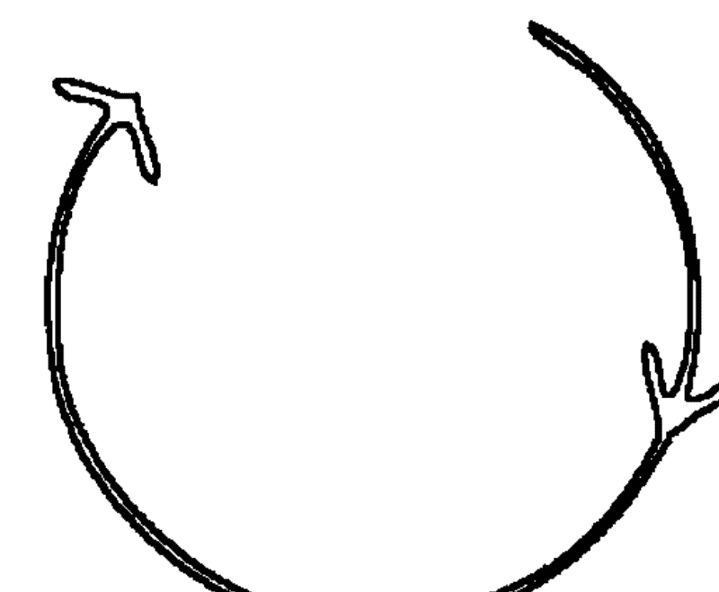

現在緩慢的以螺旋方式向中心前進，讓自己可以與動物能量接觸。

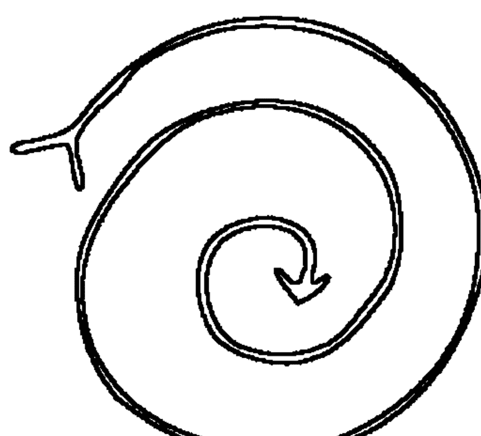

接著，模仿動物，想像自己成為了此動物，並感受牠的能量在你體內。

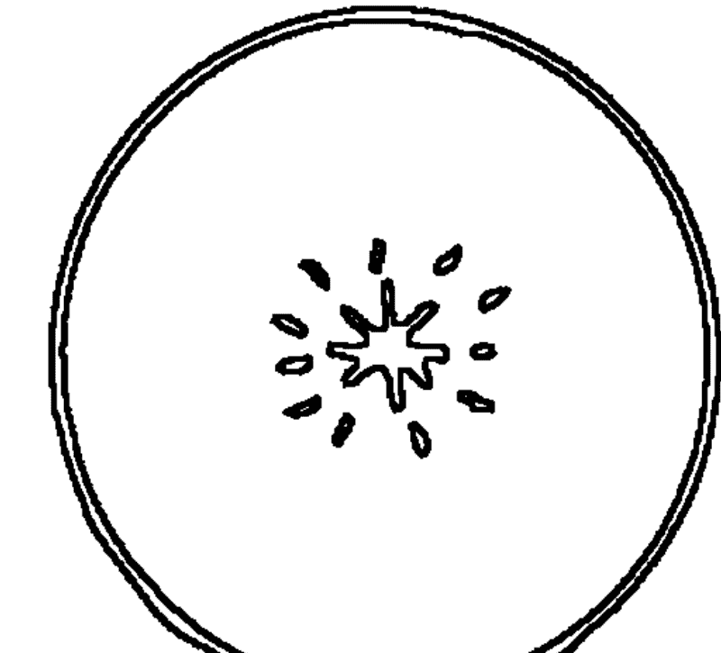

接著以逆時針的螺旋方向轉往圓圈邊緣，帶著動物的能量回到自身的狀態。

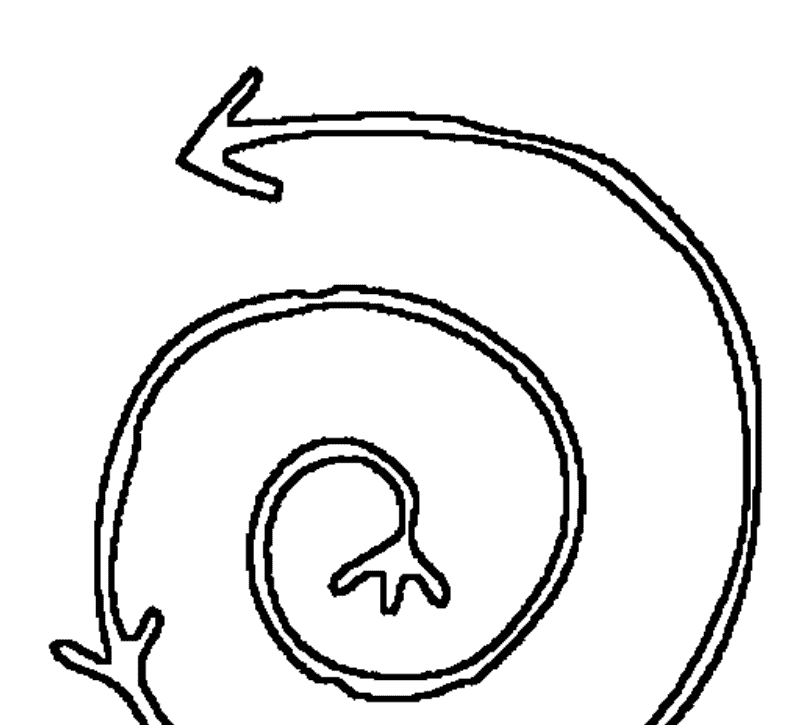

緩緩的以逆時針方向在圓圈舞蹈，讓此能量散去。旋轉的次數要與步驟一相同。

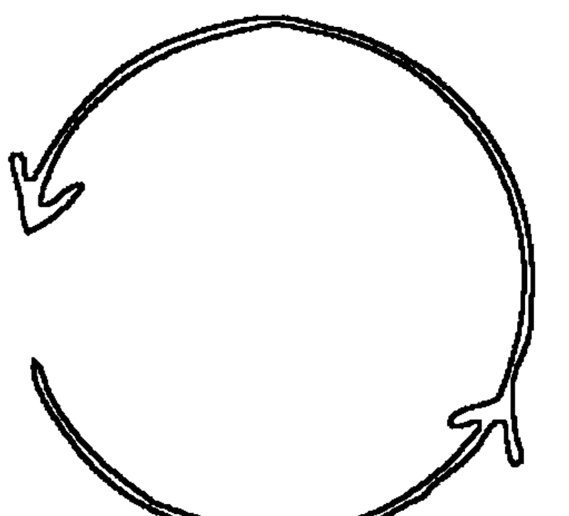

3. 選擇一個空間，或是在房間中清出一塊地方，讓你可以有足夠的活動空間。在房間裡準備一些焚香，或是一些與你圖騰有關的圖片或符號。
4. 選擇你可以播放的音樂或鼓聲，你可能會想要有人在一旁為你擊鼓。一開始讓鼓聲維持緩慢、穩定的節拍，兩個拍子的節奏最容易表現，也象徵了穩定的心跳節拍。第一拍要比第二拍重。
5. 在一開始，先以舞步標記出一個神聖領域，這會是一種畫圓的動作（見255頁的圖解）。這讓你在心中建立起神聖領域，一個介於兩個世界間的領域——一個有形與無形可以互相混雜、接觸的領域。畫圓動作是展開任何舞蹈儀式最強而有力的一種方法，以順時針環繞著舞蹈區域至少一次。（我建議繞三圈，因為三是誕生與創造的數字。）
你可以採用簡單的「腳尖－腳跟」舞步，也就是你若以兩拍鼓聲節奏，在第一拍（重拍）時，以腳尖觸地，而在第二拍（輕拍）時，則以腳後跟踩地。
6. 讓自己聚焦在圓圈的中心，所有舞蹈都是一連串環繞著中心點的動作。圓圈內的動作和你集中在中心的注意力可增強你所要的能量。注意自己即將要喚醒、邀請進入圓圈的心靈動物能量。
7. 現在，開始向中心螺旋緩緩前進，你也可以想像你正朝著此動物的自然環境走去或舞去。想像、認定隨著你向中心前進，你也正向此圖騰代表的遠古之力靠近。
8. 一旦進入了圓圈的中心，停下來閉起雙眼。想像此動物就在你身邊，感受其能量與本質。現在開始模仿其動作及姿態。將自己視為這隻動物，想像、感受牠的能量在你體內活了起來。
9. 持續了幾分鐘之後，或當你覺得其能量在你體內顫動時，再次在中心暫停。感覺此動物在你體內，可以在需要時加以召喚。接著，緩慢的再次開始舞蹈，以螺旋的方式向外往圓圈邊緣移動。這次，你以逆時鐘的方向移動。隨著你的螺旋狀外移，想像自己帶著動物的本質一起移動。想像這股能量在未來的幾天可以如何幫助你，盡量想像它在特定情境下可以發揮的效用。
10. 當你來到了圓圈的外圍，開始以逆時鐘方向在圓周移動。這可以關閉、消除神聖領域，旋轉的次數要與你一開始創造圓圈的次數相同。想著你已經將一些動物圖騰的能量汲取到你的體內了，記得你的責任，並加以榮耀。

# 實作五：學習變形藝術

在人類早期的進化過程中，當我們還沒有被鎖在固定的軀殼之前，或許能夠改變自己的外型；當身體的密度還沒有這麼大，或許我們是能夠變成另外一種樣貌。但在今天我們則需要使用想像力才能辦到。

變形是所有人性中最自然的一部分，不只是將自己變成野獸而已。每一天，我們或多或少都會按照當日的生活試煉、責任和義務來轉換能量。在年幼的時候，我們便學會了何時該笑、何時要嚴肅、要如何表達歉意、如何根據不同需求展現出喜怒哀樂各種情緒。

變形不只是像神話和傳說常描述的，變成一隻野獸而已。大多數的變形傳說多半都是象徵性的，不然就是反映出人類尚未受固定軀殼羈絆的進化時期。變形其實是控制及轉換你自身能量以因應當時需求的能力，能夠讓你汲取所需的特質與能量。

任何能督促自己達成目標的人都是變形者，如果你可以適應改變、感到愉快或不愉快，你就是變形者；如果你可以將不愉快的心情轉換成愉快的心情，那麼你也是變形者；如果你可以根據各式各樣的人以及生活情景來改變行為，你也同樣是變形者。

這就是我們都可以繼續發展的變形能力，我們可以調整能量，使之貼近某種特定的動物圖騰，並在我們生活中以有益的方式彰顯出來。當我們能夠做到時，我們便開始了解魔法是真正存在於這個世界上的。

在現代，大多數的魔法僅是以不同的程度在人們的心中出現，但這不代表魔法在我們的外生活中就不存在或是沒有用處。當我們可以接受魔法的存在後，我們就踏上了通往真正魔法師的旅途。透過練習，你可以加強想像能力，並學會有意識的、按照你的期望去控制與變形，而當我們改變想像內容時，就改變了世界。我們可以學習讓想像變形，如此一來不管是要達成什麼意圖或目的，我們都可以加以變形。

此實作可以教導你，但這只是入門，不會讓你成為變形大師。不過它可以幫助你延伸、加強你的想像能力，協助你與你想要的心靈動物之能量和特質同步，並加以彰顯。

要成為好的變形者，你必須要掌握觀察的藝術。如果你不知道鳥類的身體是如何運作的，你根本不可能想像自己變成一隻鳥。從觀察你動物做出的兩、三個基本舉止或姿勢開始，去走訪動物園，觀察動物的行為並記下筆記，模仿其動作以及聲音，從想像你自己成為其中的一部分開始，想像當一隻動物會有什麼感覺。

你也可以加入動物的舞蹈和服飾來協助你進行變形。下列的大綱包含了之前的舞蹈儀式，但又更上一層樓。你可以回顧一下，加強效果。

1. 你必須要有足夠的隱私來進行此項實作，不要被電話或其他事物打擾。
2. 如前項實作中所述，從跳出你的神聖領域開始。接著開始轉進圓圈中心，你也可以坐在一張椅子或坐墊上。

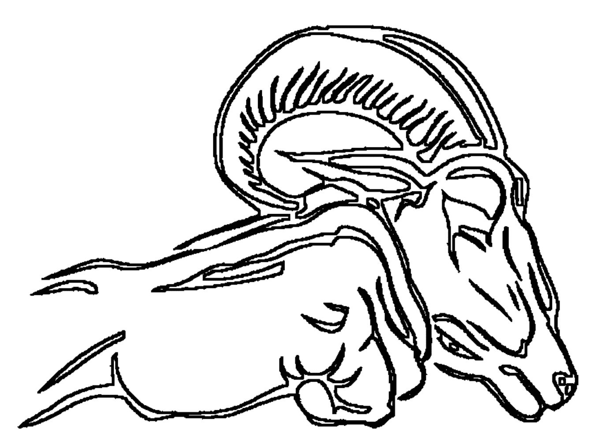

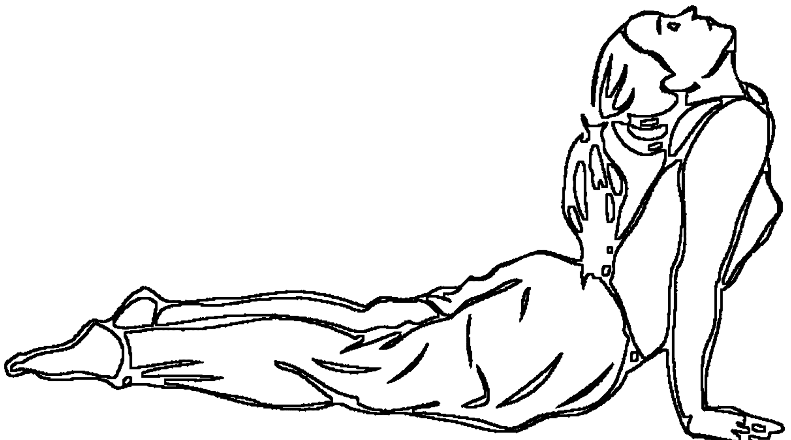

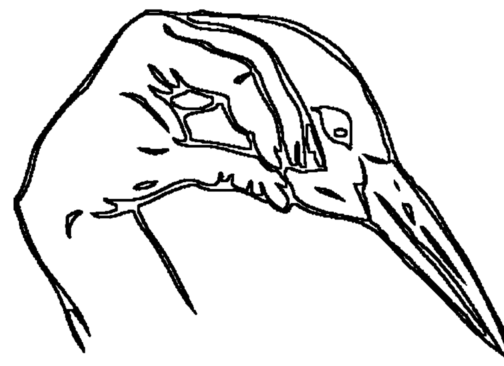

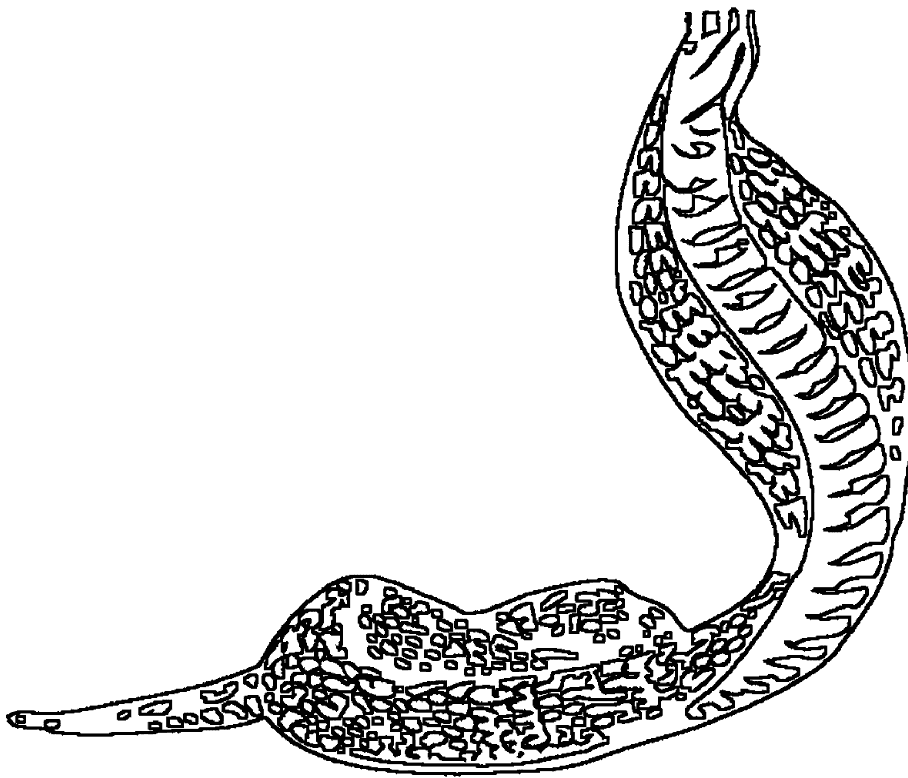

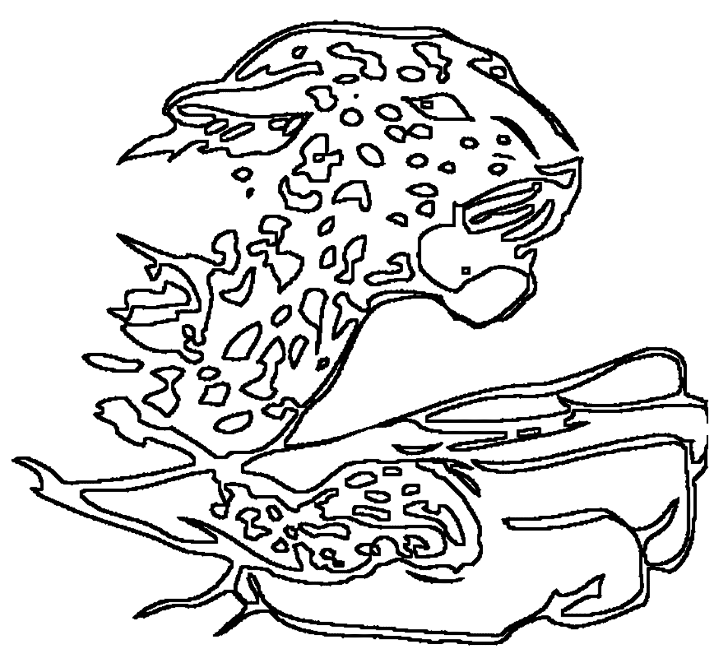

有助於變形的姿勢範例

3. 當你到達中心後，停一下。感覺並想像動物神靈的能量在你身邊展開。現在開始進行與你圖騰有關的動作。當你擺好姿勢，並踏入內圈後，開始模仿動物，感覺能量在你體內及四周逐漸加強。

4. 現在坐下來，在心中想像出你的動物的影像。感覺此影像在你的太陽輪（solar plexus）中逐漸成形，想像圖像在你面前的心眼中凝聚起來，就在你的太陽輪的高度。

5. 當你可以清楚的看到牠在你面前出現時，開始想像透過太陽輪區域，將牠吸收進入你的身體：透過該脈輪中心，吸收牠所有的精髓。

6. 現在從腳或手開始，感覺牠們開始改變。想像、感受獸足、鳥爪逐漸形成；而皮膚的部分，則想像毛皮或羽毛正在形成。緩緩的進行改變，並移動至身體部分，頭部放到最後再改變，這可以幫助你保持控制。

7. 隨著想像你自己正在轉換，同時想像有一扇門在你面前形成，這扇門上面刻印著你將要成為的動物形象。這扇門可以通往內在世界，在內在要維持此形態要比外在容易，因此想像這扇門正在敞開，而你將以動物之姿通過此門。

8. 一開始，你可以從想像你做為動物希望體驗到的種種開始。而到了最後，這些體驗都會活起來，讓你進入清醒夢的狀態，你不再只是觀察自己正在這麼做，而是確實的體驗到。

9. 在門的另一邊，你可能會想要探索一下此種動物的生活環境。你以動物的姿態從內在的層次穿梭到外在的目的地，去拜訪人們、過去及未來。你就是動物。

10. 經過一段時間後，想像自己穿過門回來，而門在你身後緩緩、確實的關上。接下來，你的身體再次開始緩慢的改變，從頭部開始，毛皮／羽毛變回了皮膚，不要倉促的轉換。當你變回來後，讓動物的形象同樣透過太陽輪而從你的身體抽離出來，想像牠再次完全離開了你的身體，接著讓其形象緩緩消散，直到只剩下無形的能量環繞在圓圈中心的你的身旁。

11. 緩緩張開你的雙眼，站起身來，做幾個動物的動作，作為榮耀以及感謝動物靈的方式，然後緩緩以逆時鐘方向旋轉至圓圈的邊緣，想像能量隨著你的行動消散。

12. 驅散神聖領域，隨著你在外圈以逆時鐘方向跳舞，想像你再次完全回到現實，取得平衡。繞圈的次數要與你一開始創造神聖領域的圈數一樣。

在進行此項實作或相關的實作時，有一些重要的預防措施和重要事項需要加以考量。如果你發現自己在接下來的幾天都心煩意亂，停止實作！如果你或你身邊的其他人發現，你的性格有了改變，也馬上停止！此種實作不應該太頻繁的進行。

時常有從未冥想或試著控制自己能量的人，卻想要一下子跳到變形的學習，這可能會造成問題。如果你發現自己趕著回家進行變形練習，或忽略了你生活中其他重要的面向，那也請馬上停止，這會造成不平衡。

上述的步驟都是有彈性的，你可以試著做些修改。舞蹈和變形都是創造的過程，要讓它們真的發揮魔力，你必須要應用自己的創意想像力與直覺。

你將會發現，任何舞蹈儀式的成效都是非常顯著的，你甚至可以預期有時會產生戲劇性的生理反應與釋放，你也可能會想要只召喚此圖騰一部分的能量，避免別人覺得你一下子變了很多。

雖然旁觀者可能感覺不出變形者在身體上有什麼改變，但他們的內心卻有了深遠的轉化，並認為自己的外型也有所變化。這不應該被等閒視之，必須花時間與關懷來吸收、平衡這些透過變形而召喚出來的能量。

對入門者來說，採用簡單的動作或姿勢是最好的。總是使用「門」，這樣一來，如果你在轉化中短暫的迷失自我，你心中也已經習慣使用門來觸發逆轉了。

有些人可能會想要用狂舞來促進變形，如果你不確定你的能力是否足以控制、掌握變形，那就不要這麼做。沒有任何舞者或變形者應該要跳到力竭為止，這對於個人整個能量系統來說都是極度不健康、且非常有害的。

許多巫術技巧都會使用鼓來誘發意識轉換，並促進變形，如果你與他人一起進行，可以用鼓來將彼此拉回現實。其中一種擊鼓技巧是使用緩慢、如心跳般的節奏，然後逐漸增強，釋放意識並促進轉化。從狂亂的節奏逆轉回到一般的心跳節奏，將可以把意識帶回到正常狀態，這可以讓個人不會唐突的從深層的意識轉換一下子回到正常的意識中。

手拉著手，並一同深呼吸有助於讓個人重新回到現實之中。按摩腳部以展開、啟動將我們與大地和現實作連結的脈輪也會有所幫助。保持坐姿或低著頭也是有幫助的，尤其是在移除用來協助轉換的崇拜物或服裝時更是如此。

從頭頂開始往下按摩脊椎也很有效果，這麼做可以穩定脈輪，並將意識帶回當下的現實之中。要記得目標是要與能量接觸，並隨時保持有意識的控制與知覺。

# 第十三章

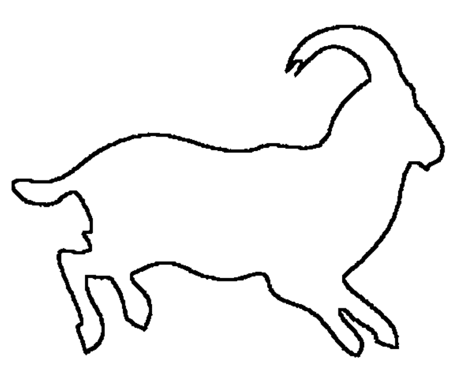

# 動物圖騰事典

當開始檢視自己的動物圖騰時，從一個完全不同的角度去與牠們接觸是十分重要的。你將會確實的開始發展出對此動物的同理心，而不再只是客觀的觀察自然而已，你將會親身體驗自然的各個面向，身歷其境。

雖然我們可以從書中閱讀到動物的特質與特性，但只有透過實際接觸，並應用在自己與生活上，才有辦法與動物建立起關係。你會感到你必須去接觸與自然及動物有關的環境和社會倫理議題，你對於大自然中各個面向的熱情與關懷會與日俱增，你將會對大自然感同身受。現代社會的麻木助長了大自然的凋零，然而「同理心是我們在相互關係中實際的感受，當我們感受到另外一個人的感覺，當我們了解地球是一個活生生、有感覺的有機體（雖然可能與我們的不同）時，就會希望提供幫助，因為我們共享了那份情感體驗。」

與之前飛鳥的部分一樣，首先先詢問自己有關你動物的一些基本問題：

- □什麼顏色？
- □體型大小？
- □外型如何？
- □行為模式？
- □來自哪裡？什麼方位？

> 4 出自Michael J. Caduto和Joseph Bruchac所著的*Keepers of the Animals: Native American Stories and Wildlife Activities for Children* (Fulcrum Publishing, Inc., 350 Indiana Street, #350, Golden, CO 80401 (303) 277-1624.)

- □在哪出沒？
- □築巢習性？
- □發出的聲音特性？
- □最愛的食物、獵物？
- □牠有哪些掠食者？
- □如何適應季節轉換？
- □交配季節？
- □生存策略？

有些人可能會發現，從檢視動物最獨特的特徵開始會比較容易上手。牠是否有著鋒利的爪子，或力氣極大呢？還是有著一口利齒，或靈巧的智慧呢？首先聚焦於其最突出的特質，再進展到其他的面向。你腦中閃過有關此動物的第一個想法，就是最重要的。

例如，當你看到某種動物的時候，首先可能會注意到牠的洞角（horns）或叉角（antlers），而這兩者一直以來皆是優勢與力量的象徵。洞角是固定的，而叉角則每年都會脫落，再次長出新的，兩者皆象徵了藉由角作爲天線與「頂上三尺神明」的接觸。而對某些動物來說，則是美麗與成熟的象徵，獨角通常被用來作爲陽剛與太陽的象徵，而雙角則反映了生命中的女性與月之能量。

在下列的事典中，我們不可能涵蓋所有的動物，因此主要著重在北美大陸的哺乳類動物，另外也包含了一些來自其他大陸的物種。即使你一輩子都住在美國，但也是有可能擁有來自其他國家的動物作爲圖騰，這可以代表了你們在前世有所接觸，也有助與反映出我們是在與整個地球、而非單一大陸互動。現代世界已經成了地球村，我們會受到各種文明的影響，我們認爲美國是一個大融爐，而這在心靈圖騰的領域也是一樣。

你也不妨對哺乳類動物做個整體的研究，可能會爲你帶來一些不同的見解。哺乳類動物是我們在動物界中的遠親，哺乳類動物之所以與其他動物不同，在於牠們呼吸空氣，以胎生的方式繁衍後代，牠們不需要孵蛋。哺乳類動物也是唯一會分泌乳汁，哺育幼崽的動物，只有哺乳類動物會長出毛髮或毛皮，牠們也是溫血動物。

世界上約有四千三百多種哺乳類動物，而在美洲大陸就有超過四百種。⁵哺乳類動物小至鼩鼱，大至藍鯨，共分為十二目。在野外及都市內皆可以發現哺乳類的蹤跡，而每種動物也有各自的特性，加以研究將有助於你更加了解此種動物對你生活的影響。

你也可以研究動物的生活環境，如果這種動物在都市區域出沒，想想看需要有哪些能力才能夠生存，並與人類比鄰而居？若是在野外生活，那又需要何種生存能力呢？請謹記，每種物種都有其價值，在心靈層面上，沒有哪一種是特別有魔力或強大的，每一種動物都扮演著不可或缺的角色。每種動物都有其魔法，對於我們的生活以及地球上的生命來說都同樣關鍵。

此事典可以提供你一個出發點，但不要因此侷限了你對於自己圖騰的研究。這只是一個概略，你甚至可能會發現，其中從魔法的角度對於動物及其行為的解讀可能與你自己的解讀有所不同，這樣也沒關係，每個人都必須要以自己的方式與動物建立起關係，打造你自己的關係，只有這樣，動物的精髓與魔法才會進入到你的生活之中。

## 叉角羚

重點：心智的速度與適應力
力量周期：春季、秋季

叉角羚是北美唯一的原生羚羊，但其實不算是真正的羚羊，因為牠的叉角不像其他的羚羊一樣會脫落。所有有洞角或叉角的動物都同樣象徵了眉間輪、頂輪，以及心智能力的各種面向。就叉角羚來說，牠代表了心智靈巧，動腦極快，讓牠能夠在最艱難的環境中生存。

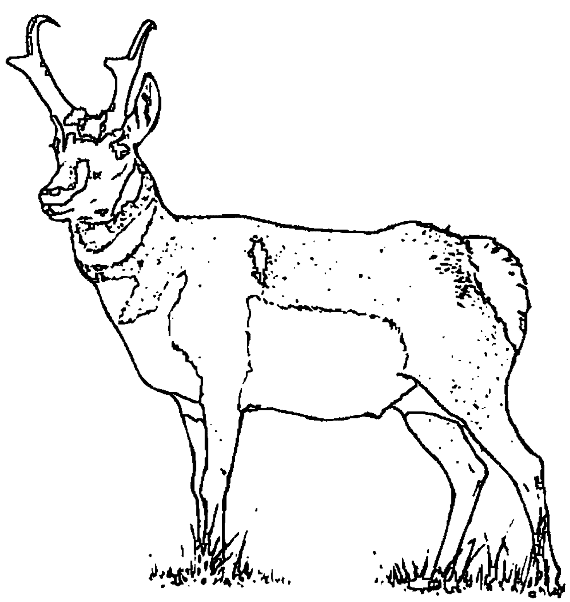

羚羊能夠在許多不同的環境中生活——沙漠、草原、雜木林，甚至沼澤。牠們的毛皮極厚，有時甚至厚達一吋，有助於牠們適應各種環境。厚厚的管狀毛髮中有著許多氣囊，可以在冬天發揮隔熱的效果，這種隔熱能力就是牠們得以生存的原因之一。

任何擁有羚羊圖騰者，可能會需要隔絕自己，或是停止隱藏自己。叉角羚可以告訴你如何將隔絕作用發揮到極致，並有助於你發展與之相關的新時間觀念。羚羊極有可能以圖騰的姿態出現在非常情緒化或容易受影響的人面前。

所有的羚羊都速度極快，牠們奔跑的速度可以高達每小時六十英里，即使是小羔羊一開始也能跑到約時速二十五英里的速度。以羚羊為圖騰者總是反應極快、妙語如珠，溝通思想的能力也是羚羊要教我們的事情之一。

叉角羚能夠以有力的方式與同伴溝通，牠們懷有豐富的好奇心。擁有叉角羚圖騰的兒童，時常會丟出一連串的問題讓父母抓狂，他們的心智及想像力總是非常活躍。

叉角羚會揚起臀部上的白色長毛作為警示；大多數的叉角羚都非常仰賴其視覺能力，牠們有著一雙大眼，以及超廣角的視野。叉角羚的視力比人類好八倍，所以當白毛閃過，牠們在很遠的距離外也可以看到。

此種一目千里的能力可以進一步發展成為更高階的心靈能力——預言。這進一步反映在角的分岔上，讓羚羊圖騰有能力去喚醒你更高階的心智天線。千里眼也是可以從羚羊身上學習的一種能力，大多數擁有叉角羚圖騰者都是天生的靈媒，他們生來就擁有此能力，雖然不見得每個人都能發現此點。通常這些人只要有留意，就都可以感應到危險的逼近，他們的生活似乎是受到保佑的——總是可以避開臨頭的大難。

叉角羚的嗅覺極佳，牠們會在感覺到危險訊號時，即刻散發出一股麝香味，此種圖騰可以教導我們如何嗅出他人與環境中不對勁的地方。在傳統的招魂術中，有一種被稱作好鼻師的靈媒能力，有些靈媒與巫師可以聞到靈魂或個人周圍的氣味，並加以解讀，此圖騰便可以幫你喚醒此種能力。擁有此圖騰者可能整天都會聞到一些不知道來自哪裡的強烈氣味，通常隨著此能力逐漸甦醒，自身也會散發出一股麝香的氣味。你可以冥想麝香的氣味，這可以促進你與此圖騰的互動。

公叉角羚妻妾成群，而母叉角羚常常會懷雙胞胎，但卻生在不同的地點。擁有此圖騰者常會發現，當春天到來，自己的精力會遭到分割，即便如此，兩者間仍有連結，或在同一時期出自於同一個來源。當叉角羚出現時，你不妨尋找一下自己生活中即將到來的新機會。

在保護羔羊方面，羚羊媽媽在小羊出生後，除非要哺乳，不然都與牠們保持距離。羔羊出生時完全沒有任何味道，所以只要羚羊媽媽不留下自己的氣味，牠們都很安全。這隱含了幾件事情，首先，即將到來的機會不需要刻意去留意就可以被發現；第二，這表示新機會只需要一點點培養，就可以迅速成熟。

叉角羚以灌木及蒿屬植物為食，牠們可以好幾個月或甚至終生都不喝水。這代表叉角羚可以教你如何在各種環境中滋養自己，讓你知道如何使用你的適應能力，在通常被認為無法生活的地區發現生機。叉角羚還可以幫助你從最乾枯的生活體驗中，汲取養分。

## 犰狳

重點：個人防衛、判斷、同理心
力量週期：全年

犰狳在西班牙文中的意思是「穿著盜甲的小傢伙」，是一種穴居動物，牠的盜甲就是其背上的背甲，由互相重疊的骨板，以及覆蓋於其上的角質所組成的，藏在背甲下面的部位通常是較為脆弱的。犰狳和擁有此圖騰者在暴露出下部（陰暗面）或內心世界時是最為脆弱的。犰狳可以教導你如何保護自己，以及甚麼時候可以卸下防備。

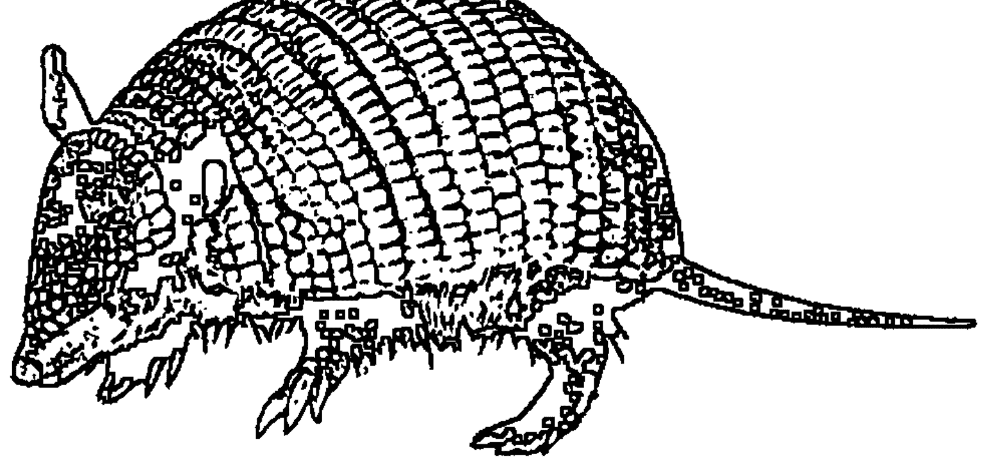

犰狳與樹懶同為貧齒目的成員之一（譯註：現被重新分類為貧齒總目下的披甲目及披毛目），雖然牠沒有獠牙或前齒，但卻有超過八十顆不斷生長的臼齒。犰狳住在有許多隔間的洞穴之中，這些洞穴可以深達地底五呎。犰狳的爪子非常適合用來掘土，象徵了挖穿表面，看到其下事物的能力，因此犰狳能教導我們如何明辨是非。

任何有盜甲的動物，都可以與中世紀傳說中的歐洲騎士連結在一起，犰狳的前世可以具體連結到十六世紀的西班牙征服者，他們最為知名的就是征服了墨西哥與秘魯。騎士精神、力量與守護通常都被認為是歐洲騎士應該要發展出的理想特質，這反映在犰狳身上，就是以強力的防衛做為最佳的攻擊手段。

早期的盜甲都很笨重，儘管能夠提供保護，卻讓穿戴的人難以行動，犰狳教導我們要如何具備自己的防衛，但只有在需要的時候才加以使用。牠們擁有在不過度傷害對方的情況下保護自己的能力。犰狳可以反映出與騎士的前世連結，或代表需要發展出騎士所擁有的特質與特性。

犰狳可以將擁有此圖騰者與其他動物連結在一起，包括以犰狳為食的動物，也應該加以了解。犰狳常是大貓與土狼的食物，這些動物常將犰狳翻過來，露出下部。犰狳有時候也會在天冷時做日光浴，牠們通常會在這個時候睡著，仰躺著睡讓牠們的腹部暴露在外，因此在此時特別脆弱；而在健康方面，犰狳教導那些擁有此圖騰者在天氣冷的時候要特別注意穿著，否則很容易就會生病，而這是保護自己不受特定氣候侵襲的課題。

斑臭鼬和穴鴞都可以得利於犰狳，兩者都會以犰狳廢棄的洞穴為巢。擁有犰狳圖騰者可能也常會有以臭鼬或貓頭鷹為圖騰的朋友，彼此間的關係是相輔相成的。阿茲提克人將犰狳稱作「兔龜」，犰狳或多或少結合了此兩者的特質，尤其是在其外表上，以犰狳為圖騰也象徵了在前世與古阿茲提克有所接觸。

犰狳主要的食物來源是柔軟的昆蟲，牠們一個夏天就能吃掉兩百磅的昆蟲，其中螞蟻和蚯蚓占了大部分，而這兩種昆蟲的特質也應該要加以了解。

當受到威脅時，犰狳會將自己捲成一個球，遮蓋住牠所有脆弱的部位。如果犰狳輾轉來到了你的生活之中，你應該問問自己一些問題。你是否沒有好好保護自己？你身邊的人是否需要保護？你是否太過於敏感、防衛心太重？你是否有被害妄想，或是對於他人的能量過於敏感？

犰狳的嗅覺非常出色，牠可以嗅到六呎之下的昆蟲。優異的嗅覺將會帶來更高階的判斷力，並促進精神力的發展，任何以犰狳為圖騰者都非常適合芳香療法，以及其他能利用其嗅覺的研究開發工作。你是不是嗅到了不對勁的地方？你是否覺得人們或情況有點可疑？學著相信你的嗅覺，這就是犰狳可以教你的。

嗅覺也與性能量有關，對於性驅力有極大的刺激作用。犰狳只有在交配時才會聚在一起，完事之後便各走各的路。犰狳的懷孕期約八到九個月，就跟人類一樣，但與人類不同之處在於，如果食物來源不足，犰狳也可以將懷孕期延長為兩年半。

這樣的情況揭露了許多有關犰狳圖騰的能量，通常象徵了在未來的八至九個月中，會有新機會誕生，但重要的是，我們不能因為害怕受到傷害，就蜷伏起來不向機會敞開；另一方面，如果我們過於擔憂或太過於在乎機會的到來，反而有可能會讓此機會延遲兩年甚至更久，犰狳可以告訴你要如何調整節奏，這樣你期望的創造才會在最安全的時刻發生。

如果情況有需要，犰狳也可以動作迅速。犰狳也是傑出的泳者，可以吸入空氣，讓腹部膨脹，直到自己能夠浮起為止；牠們也會憋住呼吸，沉在河底或其他的自然水源底部，犰狳可以憋氣長達六分鐘之久。

此種能力加上牠們的挖洞能力，代表犰狳可以教導你如何從一個次元移動到另外一個次元，以及如何在各種元素中穿梭。這種能力可以與某種特定型態的靈媒能力相連，個人可以有意識的移動到新次元，並同時維持一切防備。這隱含了能夠探索並在生死線上行走，以及與死者靈魂互動的能力。

另外，這也代表了可以探索通常未顯露出來的情感面，即便擁有此圖騰者不見得想要這麼做，但如果立場合適，他們便能探索自己更多情緒和世俗的面向。擁有犰狳圖騰者通常會試著將自己這些較為敏感的面向加以保護並隱藏起來，對於擁有此圖騰者來說，學習何時可以揭露敏感之處，何時應予敞開是非常重要的，這也是犰狳可以教導我們的事情之一。

通常極具同理心的人比較可能會擁有犰狳圖騰，有同理心者的身體通常會成為各種體驗的晴雨計——如果身邊有人處於痛苦之中，此種人便會感同身受。這可能會讓問題浮出檯面，同理心強的人對於外界（生理、情緒、心智、精神）影響的敏感性極高。這種高敏感性需要加以控制與平衡，犰狳可以教你如何做到，並告訴你可以如何幫助處於痛苦中的人們。

## 驢子

重點：智慧與謙遜
力量周期：全年

雖然大多數的人都會把驢子與一些負面特質聯想在一起，但實際情況可能不然。就跟許多動物一樣，驢子從古至今的象徵涵義十分混雜。驢子也被與占星術中的土星聯想在一起，這可能是因為土星象徵了嚴格的老師，確保我們有學到教訓，因此我們也常傾向於將驢子與頑固聯想在一起。

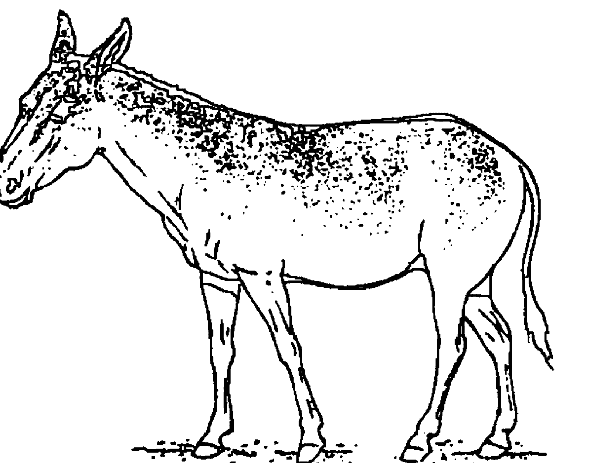

在迦勒底（譯註：Chaldea，為古巴比倫王國的一部分），死亡女神就被描繪成驢子的樣貌，因此，驢子是死亡的象徵，當然，也成了死後生活的象徵：在帕拉汀（譯註：Palatine，位於古羅馬帝國境內的地區），驢子的形象被用來嘲弄被釘在十字架上的耶穌，將耶穌的頭畫成驢頭；而在中世紀的符號與藝術中，驢子則是容忍與謙遜的象徵。

在基督教的諾斯替教派中，驢子與成功進駐耶路撒冷之神秘儀式有關，而在新約聖經中，我們則將之與棕樹主日聯想在一起；在聖經的描述中，耶穌騎乘著白色的驢子，手中揮舞著棕櫚樹葉慶祝。此種列隊象徵了個人成功改變了其生活，代表展現出更多潛力的人可以獲得外界的認可。白色的驢子也象徵了靈魂智慧的覺醒，而棕櫚則代表了成就與勝利。

如果驢子是你的圖騰，你可能要問問自己一些基本的問題。你是否有展現出自己的智慧，或只是跟隨著他人的腳步？你是否對於自己的成就展現出合宜的謙遜？你身邊的人有這麼做嗎？你是否有認知到，並對你人生中到目前為止的成就表示感謝？而你身邊的其他人是否有認知，並對於他們自己的成就表示感謝呢？

驢子是喚醒智慧以及成就更大事業的新機會即將到來的保證。不要故步自封，拒絕順勢而為，也不要墨守你目前已有的成就。請謹記，這不是目標本身，只是通往目標的途徑而已。不要因為驢子能夠帶來更高深的智慧或更多機會就志得意滿。

## 獾

重點：大膽的自我表達與信心——故事擁有者
力量周期：春末

獾是鼬科動物中體型最大者，以此為圖騰者也應該研究一下黃鼠狼。獾可以是灰色、黑色或土黃色，從鼻子到後腦勺間有一條白色斑紋。獾本身的開放性就極具象徵意義，牠同時也擁有其他動物及大地的啟示與知識。

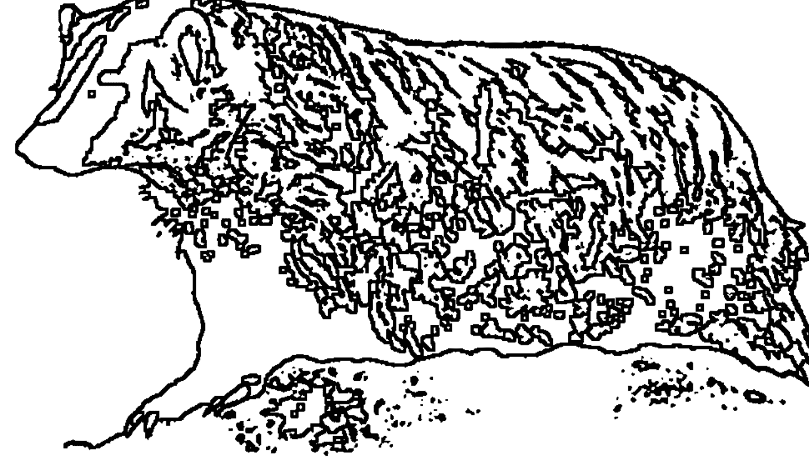

獾看起來雖然福態，但卻充滿肌肉與力量。牠的皮膚鬆垮，所以當被其他動物咬住時，也不太會受傷。而獾的下顎也極為有力，象徵了有效的表達。因此獾可以與「言語」之謎連結在一起——特別是說故事的魔力。

> 「我只要求你們記住一件事情。」獾說：「有方法可以處理人們所說的故事，如果你聽到一個故事，用心聆聽，並學著在需要的時候講給別人聽。有時候故事比食物更能支撐一個人的生命，這就是為什麼我們將故事植入彼此的記憶之中，這就是人們照料自己的方式。」

獾也是令人印象深刻的挖掘者，牠能以極快的速度，輕易的在地表下挖掘。獾的挖掘能力比陸龜或鼴鼠都強，能迅速在地底穿梭，因此牠能與所有的土精靈與地精傳說連結在一起。這也隱含了，牠們具有可以看穿所有事物及人類表面的能力；獾住在被稱之為「穴」（earths）的複雜地洞中，裡面包含了一些起居隔間，還有廁所以及儲藏室。這些穴暗示了內幕、內心世界以及外在世界的家園。

獾在白天或晚上都一樣活躍，牠是一種肉食性動物，主要以兔子、地鼠、老鼠、松鼠和其他居住在地底的嚙齒類動物為食。獾會吃掉許多偷吃稻穀的嚙齒類動物，時常會將獵物或是獵物的肢體藏在穴中，因此被認為擁有其他動物的故事。

獾基本上是沒有社交的動物，牠和其他動物「聯繫」之間沒什麼歸屬感，即使對於同類也一樣。這可能就是為什麼故事是獾最具有象徵性的溝通方式，對於擁有獾魔法者來說，透過故事與他人打交道要比直接接觸容易多了。

年幼的獾，通常會是一窩有二到三隻，在五月或六月時出生。獾家族通常在秋天時就會分道揚鑣，幼獾與獾爸爸會離開去找自己的住所；有時候獾爸爸會幫忙養育幼獾，但整體來說，獾仍是孤僻的獨行俠。牠們喜歡獨處，可以自給自足，這是我們可以從獾身上學到的事情，而擁有獾圖騰者則可以教導別人如何做到。

臘腸犬（又名獾犬）是特別養殖來狩獵獾的，可以跟在獾身後挖洞，並將之驅趕出地洞。臘腸犬的主人或許也擁有一些獾魔法，或者是很容易就能夠與之接觸。

由於獾是如此厲害的挖掘者，牠們擁有地表以下事物的知識，這包括了礦物、植物根部與草藥。因此獾也是高明的治療者，雖然有時候獾治療者可能會太過激進，但他們的治療通常都是有效的。獾可以教導我們被遺忘許久的根的知識，以及牠們神秘的治療能力。

獾膽大又兇猛，永不言敗。如果獾進入了你的生活，你應該要提出一些問題。你與你身邊的人是否太過膚淺？這可能代表了你需要更加深入底層，或者是反映出需要與土地及其動物神靈間有更多的接觸。也可能是在告訴你，要從童年時期感興趣且記憶深刻的故事中學習，因為這些故事可能象徵了你目前生活中正在發生或即將發生的一些事情。每當獾出現時，就表示有機會可以發展自我表達及自給自足的能力。獾告訴我們，應該要開始為自己以及自己的生活說出新的故事。

## 蝙蝠

重點：過渡與開始
力量周期：夜晚

蝙蝠是受到最多誤會的哺乳類動物，現代電影及電視中的描述，為蝙蝠帶來了邪惡的名聲，但實際上蝙蝠在大自然中扮演著不可或缺的角色，同時也是圖騰傳統中的符號之一。雖然現代傳奇都給蝙蝠掛上惡魔軍團的封號，但蝙蝠像龍一樣的翅膀，在古代則是非常強大的象徵。

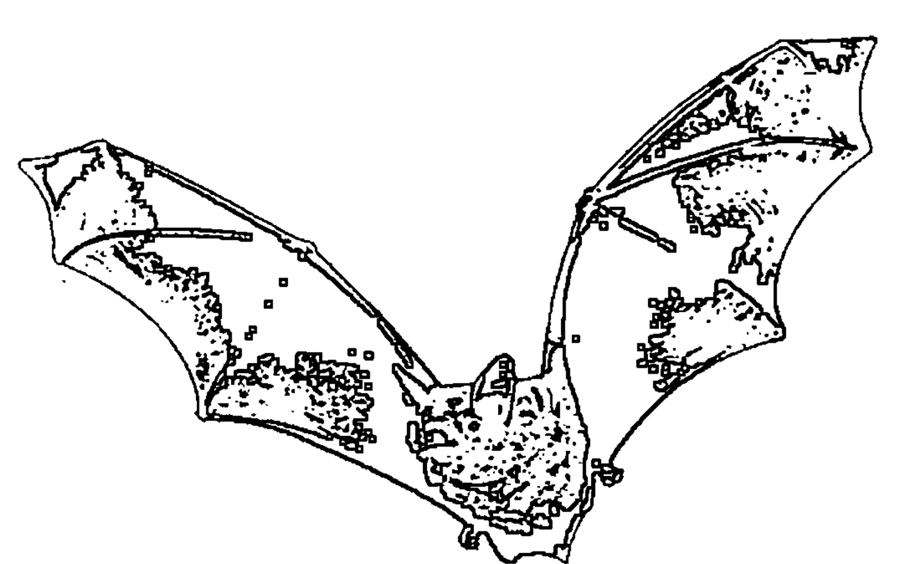

在巴比倫尼亞，蝙蝠代表了死者的靈魂；在中國，則象徵了幸福與長壽；對古馬雅人來說，牠們是開始與重生的象徵；而中世紀時期的人則認為，牠們是龍的縮影。

在早期的中美洲傳統中，有一本關於開天闢地過程的聖書，其中蝙蝠扮演了重要的角色。此書被稱作《波波爾·烏》（Popol Vuh），由席梅內茲（Ximinez）神父在十七世紀時發現。《波波爾·烏》的第二卷中描述了一對兄弟必須要通過的七項考驗，在第七項考驗中，他們被帶到了蝙蝠之家。巨大的蝙蝠在蝙蝠之神——坎馬卓茲（Camazots）看守的迷宮中飛來飛去。坎馬卓茲有著人類的身體，蝙蝠的頭與翅膀，帶著一把巨劍，可以砍下誤入迷宮者的頭顱。

此一具有強烈暗示性的故事與意象，反映出變形的過程——部分人類、部分蝙蝠（動物）。隱含了若是對於改變不夠謹慎的話，就會失去個人的能力，同時也保證了在離開黑暗後便可以重生。

傑米·山姆斯（Jamie Sams）與大衛·卡爾森（David Carson）認為蝙蝠象徵了傳統巫師的死亡——藉由嚴酷的試煉，擺脫之前的自我。“就是要面對你最大的恐懼——讓生命中不再適合你的部分死去。”

許多人都害怕改變，抱持著一種「寧可選擇熟悉的敵人」的態度。如果蝙蝠飛進了你的生活中，代表該是面對你的恐懼，並為改變做好準備的時候了。你必須接受擺脫過去、創造新生的挑戰。

對許多人來說，改變總是讓人無所適從，而當蝙蝠進入了你的生活之中，你可能會發現自己生活中有某一部分每況愈下，原本行得通的事情現在卻行不通了。但這不是壞事！只有在我們對於舊的生活方式仍有依戀，或是仍然墨守過往，不願放眼望向未來無限的可能性時，才會讓我們感到心煩意亂。

改變與轉化是受到祝福，並非外力驅使，而是發自內在的；世界就是我們的鏡子，當我們改變時，即使是無意識的，世界上的萬物也會開始改變。要了解並享受改變這份贈禮，首先你必須（重新）為自己的生活負起責任。這表示要向內心的力量敞開，克服所有恐懼。

追求超越眼前的限制，如果沒有死亡，就不會有重生。萬物皆會反映出神蹟，請謹記，擁有神聖力量的你可以自行選擇要迴避恐懼與死亡，或是勇敢面對。只有願意順勢而為者，才能找到重生與新生命，我們必須自己做出決定。要記得，每當你相信自己內心的敦促時，你就能將藏於你心中黑暗角落的恐懼驅逐出去。你現在所做的決定，會持續影響你好幾年，你希望這樣的影響是正面、還是負面的呢？

雖然體型小，但蝙蝠卻是強大的象徵。蝙蝠的魔法極為蠻橫，甚至是具有破壞性的。蝙蝠是一種夜行性動物，而夜晚總被認為是恐懼的溫床，家中的燭火、燈光通常都是被用來趕走夜晚及恐懼，而非加以面對並將之轉化。你是否拒絕面對一些不可避免的事情呢？

有時候蝙蝠象徵了面對自己的恐懼，牠們有著十分尖銳，如針刺般的牙齒。蝙蝠還是狂犬病的帶原者，狂犬病是一種由病毒引起，透過血液傳染的疾病，人們通常將之與瘋狂聯想在一起。恐懼的蔓延、流竄，最後將會滲透到我們的身體中，並在我們的生活中造成瘋狂。蝙蝠反映出我們需要面對自己的恐懼，因為恐懼而幻想出來的東西，會逐漸醞釀成比實際上要面對的恐懼還要糟糕的東西。你現在最害怕什麼呢？

從自然主義的角度來看，蝙蝠一點都不邪惡，牠們在自然中扮演著極有價值的角色。蝙蝠以負責授粉的昆蟲為食，牠們的排泄物則可以做為極佳的肥料。這隱含了不論情況有多糟糕，面對自己的恐懼在各個層面上都極有益處，並且能夠讓我們感到更有能力。

蝙蝠也是唯一會飛的哺乳類動物，牠極端瘦長的指骨支撐了由硬皮所構成的翅膀。蝙蝠的飛行看起來有點不規律、像抽筋一樣，但這仍是飛行，所有的飛行都隱含了克服的意思，你不妨研究一下在本書中第二部分中所描述之飛行的普遍涵義。

由於人類也是哺乳類動物，蝙蝠對於我們來說便格外重要。蝙蝠成為了在能量轉變中，有時候產生的一些混亂之象徵，反映出可以在變形之後提升境界的能力。沒錯，我們自己的飛行看起來可能也很顛簸、不穩定，但我們仍有飛行的能力。

在經過改變後，我們不只能夠飛翔，還能夠從嶄新的觀點來看待世界。蝙蝠是倒掛著睡覺的，此姿勢總是讓我想到塔羅牌中的倒吊者，這張牌象徵了突破現有的障礙，朝更高深的智慧敞開，代表了新的真相將浮現，另外也隱含了當你向新的意識敞開時，便能擁有力量與毅力去處理可能讓你感到困擾的嚴峻考驗。此訊息訴說著新的視野與你未曾想過的展望將會確實彰顯出來，思考一下這張塔羅牌，對於擁有蝙蝠圖騰者來說會十分有益。

蝙蝠實際上是一種社交動物，牠們成群而居，因此蝙蝠的出現通常象徵了需要更多社交技巧，或是有機會與更多人打交道。

蝙蝠擁有喚醒更強大聽覺的魔法，「瞎得跟蝙蝠一樣」這個說法是錯誤的，蝙蝠並不是盲的，牠們的眼睛又大又發達，可以輕易在有光的地方以視力導航。另一方面，牠們也是在黑暗中行進的專家，蝙蝠的鼻子中有聲納，作為極佳的導航工具。牠們使用回聲來定位的能力讓牠們即使在成群結隊的狀態下，仍可以展現出驚人的飛行技巧。蝙蝠幾乎不會相撞，聲納與回聲定位系統可以抽象的與順風耳的天賦做連結，喚醒聆聽神靈的能力。

擁有蝙蝠作為圖騰者將會發現他們越來越能夠察覺出他人話中隱藏的訊息及涵義，聽到對方的言下之意。相信你的直覺，鼻子是分辨的器官，而在鼻子內裝有聲納，讓蝙蝠成為了分辨及發現他人話中真相的象徵。

蝙蝠有強大的魔法，雖然令人生厭，但卻總是帶來啟發——在改變後的全新開始，能夠帶來希望與力量。

## 熊

重點：喚醒無意識之力量
力量周期：春季、夏季

熊在神話與傳說中都有許多象徵與形象，很多故事中都提及人變成熊、熊變成人，以及熊是神，對於我們的想像力帶來了許多刺激；甚至還有星座因此而命名——大熊座，此星座中的七顆星星是北半球最容易辨認的星星，這七顆星星來自北斗七星，可對應至占星學上神聖的七道彩光。

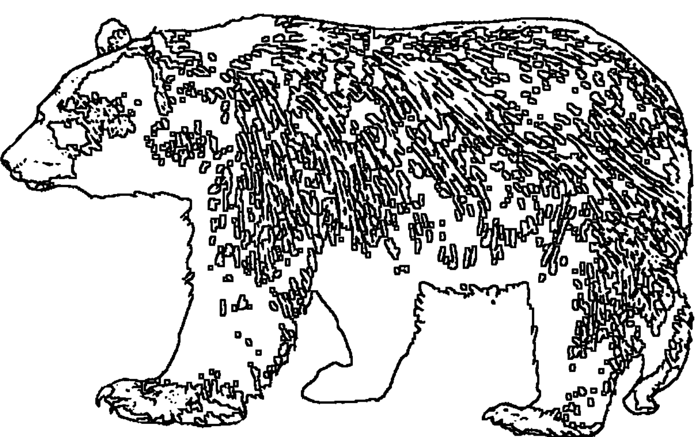

熊也有月亮的象徵涵義，與潛意識甚至是無意識狀態有關，人們將此種動物與月神黛安娜聯想在一起；熊在鍊金術中代表了混沌的原始物質，與所有的初始階段和原始本能有關。

與鳥類一樣，熊被美洲原住民視為人類的親戚，因為牠跟鳥一樣，可以站立，用兩腳行走。對許多人來說，熊與狼是真正最能代表原始及自然世界的象徵，而許多生態學家相信，從人們回應與保護牠們棲地與未來的方式，即可以誠實的反映出人們有多認真看待與保護自己的環境與其中的自然資源。

熊是體型最大的肉食動物，幾乎甚麼都吃，包括植物、水果與肉。但實際上，熊吃的肉還沒有像是狐狸這種體型較小的肉食動物多。

與大多數人想法相反，熊並不會真的冬眠。在冬天時，牠們會仰賴儲存起來的脂肪，體溫會下降一些，呼吸頻率可能也會減半，但牠們的熟睡程度主要會受到儲存的脂肪影響，這反映出熊圖騰可以教導我們要如何從內找到生存必需的資源。熊可以教你如何汲取你儲存於內的能量及精華，即便是從未開啟或有機會接觸到的部分也是一樣。冥想並與熊互動將有助於你進入靈魂殿堂中的內在聖所——去找到你的答案。

在冬眠時，黑熊的腎臟功能會完全停擺，科學家正在研究此情況，希望可以為腎臟移植帶來更多線索。醫生希望可以在人類身上複製這樣的情況，這樣一來患病的腎臟就有時間可以復原，這也是熊魔法的一部分。

腎臟分泌尿液、過濾血漿的功能對人體來說是生死攸關的。從抽象的角度來看，腎臟象徵了識別與判斷，如果熊在你生活中出現，問問自己一些重要的問題：你的判斷力是否失常？你身邊其他人的判斷力如何？你是否沒有認知到生命中什麼才是對你有益的呢？你是否對於自己或他人太過挑剔了？你是否太過於樂觀而有些盲目？熊的魔法可以教導你如何深入，使你能夠從有力的位置做出選擇與決定。

所有的熊都驚人的敏捷，黑熊和灰熊的短跑速度可以高達時速三十五到四十英里；包括北極熊在內，所有的熊也都會爬樹，除非樹的大小不適宜，才會讓牠們不想攀爬。人們時常將熊與樹木聯想在一起，自然節目熱愛拍攝幼熊上樹，或成熊靠著樹抓癢的照片，而「熊樹」則是指熊會在牠常經過的路徑旁，於樹上留下爪痕以作為指標的樹木。

樹木跟熊一樣，也是重要且古老的象徵，就像自然的天線，連結了天堂與人間。如本書前面簡單討論過的，不同的樹有不同的涵義，但整體來說，樹木象徵了知識，同時也代表了生殖力與成長。

熊可以教你如何挖掘並喚醒與生俱來的潛能，而樹木則是提醒我們必須要將所喚醒的能力帶回人世，並加以應用，標上我們的記號。任何擁有熊圖騰者都應該要讓心中的小熊活起來，不時爬上樹，讓自己可以有更清晰的觀點。

以熊為圖騰者不可以一年到頭都想躲起來冬眠，你必須要踏出巢穴，這甚至反映在熊的出生過程上。母熊會在熟睡、半冬眠階段時生產，通常會生下兩隻小熊，有時候會是三隻；生下來的小熊無法照顧自己，意識也不清楚，在整個冬季，小熊都會待在安全、溫暖的巢穴中，接受熊媽媽的哺乳。

隨著春天的腳步接近，熊媽媽會帶著小熊出現，小熊在此時已經長得夠壯可以跟隨在熊媽媽身旁了。這對於與熊圖騰接觸者來說有極重要的涵義，這通常象徵了需要更深入挖掘自己，讓你可以離群索居一段時間，在這段時間中，你將能夠進入自己內心，甚至可以產生二至三種新想法或計畫。經過了冬天的培育，隨著春天的到來，你將會與你的產出一起甦醒，並哺育它們成長。

以熊為圖騰者將會很自然的在冬天進入半冬眠狀態或隱居起來，他們也會發現在經過了一整個冬天的孕育後，機會在春天時會更加顯著；但熊者應該要有耐心，因為小熊會跟在熊媽媽身邊達兩年之久，這可能象徵了你發展出的計畫需要兩年的時間才能夠備臻完善。

雖然與狗的關係有點遠，但熊與浣熊卻是近親。熊有很多種類，最常見的就是黑熊，但這是一種誤稱，不是所有黑熊都是黑的，黑熊有棕色、紅褐色和各種不同的顏色組合。熊很愛玩，不管是成熊或小熊都一樣，以熊為圖騰者也應該將此謹記在心。

體型最大的熊是阿拉斯加棕熊。相對於親戚灰熊來說，棕熊較喜歡獨居，灰熊一直以來都以其力大無窮以及兇猛而知名，雖然棕熊可以很兇猛，但牠們本性其實並不太有攻擊性。

北極熊無疑是熊科中最出色的狩獵者，這種大白熊什麼也不怕。北極熊是所有熊類中最嗜血，也最有攻擊性的，牠們處於食物鏈的頂端，除了人類以外並無天敵。北極熊主要以海豹為食，因此以北極熊為圖騰者也應該研究一下海豹的特質。

所有的熊都熱愛蜂蜜，蜂蜜是生命的自然甜分，通常在樹上的蜂巢中可以發現，這再次反映出熊與樹木間的聯繫。提醒了擁有熊圖騰者要從內心中發掘出力量，但只有將此股力量帶到外界，並加以應用才能夠嚐到生命之蜜。

## 海狸

重點：築夢
力量周期：黃昏與夜晚

海狸是嚙齒科中體型最大者，在歐洲及亞洲已見不到海狸的蹤跡，現僅存於北半球。海狸已經適應了水中的生活，腳上有蹼，尾巴則發揮舵的功能；海狸非常擅長游泳，可以潛伏在水中達十五分鐘；海狸的肺特別發達，可以比人類吸入更多氧氣，也可以容納更多二氧化碳，因此，海狸也可以教導我們要怎麼呼吸，以及如何保持最佳的健康狀態及效率。

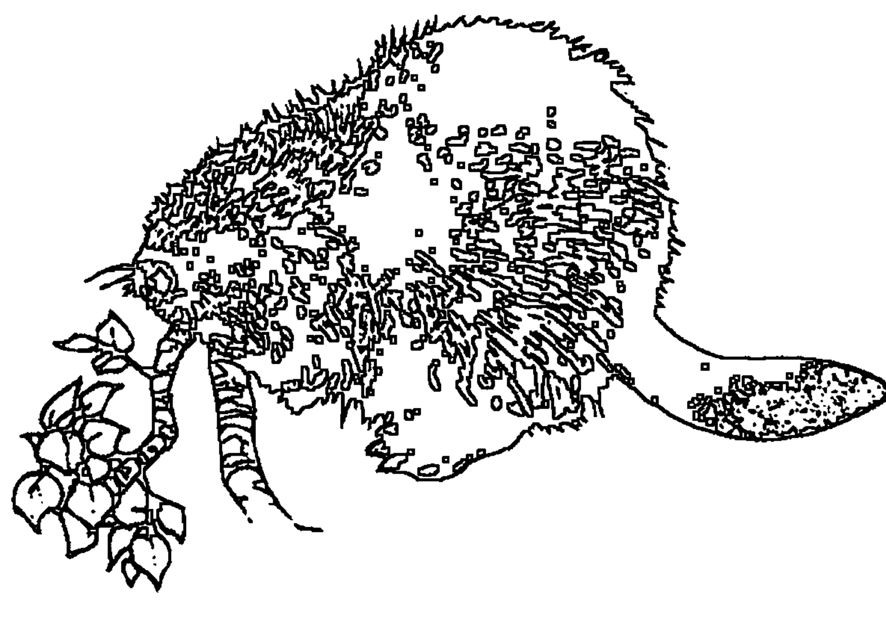

長期以來，人們都把水和情緒與夢想聯想在一起，一般人最普遍的夢想就是擁有家庭與家人，海狸便是此種夢想的體現。海狸會與其家庭成員親密的生活在一起，同樣也是終生伴侶制，直到陰陽相隔。如果海狸在你的生活中出現，這可能表示你有機會實現夢想。

海狸也是成家大師，牠們在砍樹與築堤上都展現出絕佳的工程技能。海狸的家有錯綜複雜的管道，並且時常會維護牠們所築的堤壩，此種絕佳的建築技能可以將以此為圖騰者與古老且神秘的共濟會成員（Mason）連結在一起，研究共濟會的傳說將讓你獲益良多。

海狸在野外的壽命不超過十二年，其最值得注意的特性就是大門牙以及尾巴。海狸之所以總是在嚼東西的理由之一，就是牠們的牙齒會不斷生長直到死亡為止，如果不磨牙的話，牠們的牙齒就會越長越大，導致無法進食，如果海狸的牙齒掉了，通常就會死亡，擁有海狸圖騰者需要注意口腔衛生以及照護。

樹皮是海狸的珍饌，牠們尤其喜歡白楊與山楊的樹皮，研究這些樹的特質也有助於啟發更多見解；牠們的砍樹行為其實是要透過團隊合作才能完成的，一隻海狸休息、把風的時候，另外一隻海狸則負責繼續咀嚼樹幹。海狸通常會把樹儲存在堤壩中，以為過冬做好準備。

雖然被部分的人視為有害的動物，但海狸實際上卻有極大的益處。牠們砍樹的行為讓樹叢得以生長，因此為鹿及麋鹿提供了食物，海狸修築的堤壩甚至可以幫人類製造耕地，海狸修築的池塘裡會堆積淤泥，當海狸離開後，池堤終有一天會被沖破，隨著池水流出，一汪肥沃的泥土則留了下來。

如果海狸進入了你的生活之中，問問自己一些重要的問題。你是否忽略了你最初
的夢想？你的夢想是否需要進行一些修復工作？你或身邊的人是否迷失在夢想之中
——總是在做夢卻從不實踐？你的家園需要整頓嗎？

請謹記，海狸提醒了我們需要為夢想打拼才能夠讓夢想成真，當牠出現時，就是
該行動的時候了。海狸可以告訴你要如何實現夢想。

## 野牛（水牛）

重點：透過正確的行動與祈禱充分表現
力量周期：全年

美洲野牛其實就是水牛，野牛
是在亞洲和非洲使用的名稱。對於
平原印地安人來說，野牛是神聖生
命與富饒的象徵。

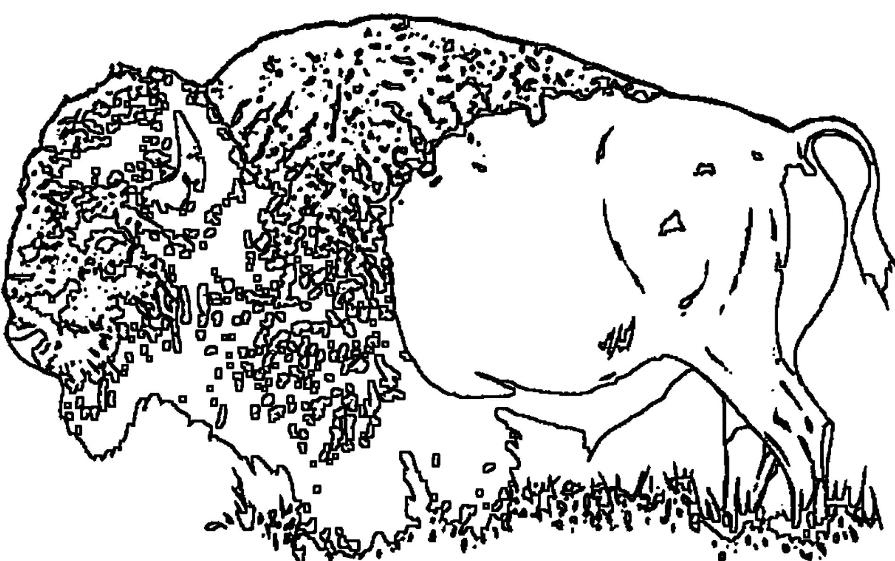

曾經，一名美麗的女子身披野
牛皮毛出現，她為拉柯達蘇族人帶
來了神聖的長斗，告訴他們萬事萬
物間的關聯。她教導族人許多大地
之謎，告訴他們如何祈禱，並走在正確的道路上：她告訴拉柯達蘇族人如何透過祈禱
帶來豐收，當離開時，她在地上打了一個滾，變成了一隻白色的野牛犢，然後消失在
地平線上。在她消失沒多久後，印地安部落周圍就出現了一大群的野牛。

水牛或美洲野牛是豐收與顯靈的象徵，部分是因為有了白牛犢之女的教誨後，只
要印地安人行正確的事，以正確的方式祈禱，就不必再過著極度艱困的生活。藉由世
俗與神靈的適當結合，便可以獲得一切所需，同樣的觀念甚至在聖經中也可以看到：
「天助自助者。」

野牛是體型龐大的動物，可以重達一至一噸半，牠們有顆大頭、隆起的肩膀，由
於覆蓋著厚重的皮毛，讓牠們看起來更加龐大。隆起通常象徵儲存的力量——以備需
要時可汲取，這象徵了如果我們能夠掌握開關，就能夠獲得豐收。事實上，在肩膀部
位出現的隆起，隱含了我們必須要全力以赴的意思，肩膀象徵了能夠擁抱、抓住生命
的能力，肩膀上總是擔著我們的重擔或獎賞，隆起的肩膀暗示了需要我們自己的努力。

碩大的頭部也隱含了需要將我們的努力與神性結合在一起的意思，頭部是較高的區域，象徵了天堂與神性，擁有高階的能力。而就野牛來說，這兩個面向都被加以放大了，世俗與神性的能力在我們尋求表現時皆是必須顧到的。

野牛是極難預測且危險的生物，這可以做為一個警告，表示在你企圖在生活中某些領域有所表現時，並沒有保持腳踏實地。野牛是四足動物，因此隱含了腳踏實地的意思。

野牛也會走最輕鬆的路，當我們行正確的事，加上正確的禱告時，前方的道路就不再艱難了，不需要披荊斬棘，前方就會自動為我們讓出一條康莊大道。野牛偶爾會用頭來撞擊或推動，通常是在冬天時會出現這樣的行為，牠碩大的頭可以用來清開積雪，這樣就可以吃到下面的草。

如果野牛出現在你面前，這可能表示你在生活中的某些領域將有表現的機會，或是即將有所豐收。但其中也隱藏了一些警告的意味，告訴你現在可能不應該強求或操之過急，只要跟隨著最輕鬆的途徑即可。

水牛的外表也暗示了同步法則正在你的生活中運作著。如果我們用對方法，希望的事情就會發生，但這不代表我們應該枯坐著甚麼都不做，而是應該要做好分內的事情，然後讓事情順其自然的發生。

我們當然都希望可以讓事情有所進展，有許多方式可以迫使這樣的情況發生，但如果你這麼做的話，很有可能到頭來是一場空。如果你願意順勢而為，你仍然可以在有利的時機到達目的地，而且還可以有機會享受一路上的旅途風光。野牛教導我們要如何與自然的節奏互動。

若是野牛在你生活中出現，尋找豐收與增值的機會，也問問自己一些重要的問題。你是否有榮耀你的追尋？你是否仍記得萬事萬物都離不開神？你是否有給予自己與他人的努力足夠的尊重？你是否有對於已經擁有的一切表達感激？停止收穫最快的方式就是沒有對你既有的事物表示崇敬。

## 山貓

重點：沉默與秘密
力量周期：冬末、春季

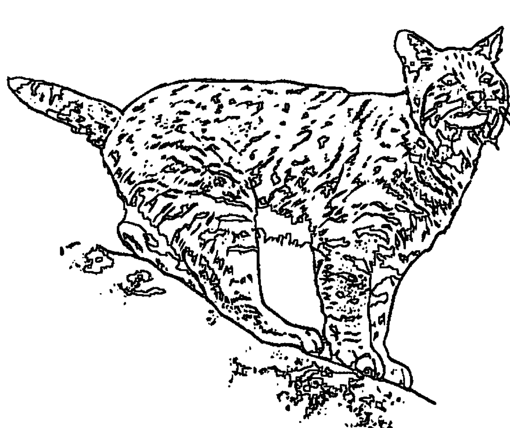

山猫有时候又被称作野猫（wild cat），山猫之所以得名是因为牠那短短的尾巴（译注：山猫英文为bobcat，而bob有短的意思），另外山猫的耳朵上有着突出的丛毛与鬓角。人们常将山猫与猞猁混为一谈，猞猁通常毛色较灰，体型也比较大。事实上，山猫有的时候也被称作红猞猁。

山猫是独居的动物，拥有此图腾者会时常发现自己也处于此情况中，所谓学习独处但却不感到寂寞孤单，这就是山猫的教诲。母山猫通常都会有一块小地盘，但公山猫则会到处流浪，活动范围会与五到六只母山猫的地盘重叠，山猫通常在冬末交配，然后公山猫与母山猫便会分道扬镳。

由于山猫的独居习性，拥有山猫图腾者也会发现朋友常常与自己分享秘密，对于任何拥有山猫或猞猁图腾者来说，不破坏信任是非常重要的，这通常会在极短的时间内就造成强烈的反噬。

山猫的尾巴也极具象征涵义，尾巴长期以来皆与性能量和灵热有象征上的关系。尾巴或末尾是生命力的所在，山猫尾巴的末端是黑色的，而下半部则是白色，这反映出可以应需求而启动或关闭创造力，这也是山猫魔法的一部分。

因此山猫也与某些型态的性魔力与神秘之处有关。藉由黑暗与秘密的掩饰，山猫可以教你如何将生命力以最强大的方式投射出来，加以使用，同时不引人注意。山猫的魔力在无人知晓的情况下可以发挥到极致，而说到力量的使用，拥有此图腾者必须要学会什么时候该说话、说多少话以及对谁说。山猫图腾者必须要非常留意他们与其他人分享的事情，因为事情很有可能被扭曲或扩张解释，山猫图腾者说东，可能会被别人误解为西，反之亦然。

山猫锐利的视觉、敏感的胡须以及长有簇毛的耳朵使之成为一流的夜间狩猎者，以山猫为图腾者在晚上时效率最高，这些特质与绝大多数主流的心灵艺术（psychic arts）有关。山猫的双眼让他们得以看到他人试图隐藏或遮掩起来之物；牠们敏感的胡须使之拥有某种心灵占卜的能力，将物体放在面前可以让人看到一些画面；而长有簇毛的耳朵也与顺风耳和能听到言下之意的能力有关。

拥有山猫图腾者可能会发现别人在自己身旁时会感到不安，他们知道你可以看见他们没有展现出来的东西、听到他们未说出口的话语，这样子的能力可以让人成爲极有效的顾问或操纵者。如果山猫在你的生活中出现了，就该去寻找隐而未显的事物，不是什么事情看起来都像表面那样的，相信你自己的感觉，如果你感觉不对，即使你找不到合理的理由这么想，也要相信自己的直觉。

山猫在黑暗中也能见物，其听觉也非常敏锐。通常山猫图腾者会选择独居，因爲他们可以听到、看见、感受到身边的人们有一堆隐藏起来的垃圾，让他们相信所有的人都是这副德行。但山猫图腾者绝不该遗世而独居，在塔罗牌中的冥想与隐士牌有助于你了解何时该独处、何时该社交，这可以帮助你与此种动物的能量协调。

虽然在美国各处皆能看到，但山猫其实是濒临绝种的。山猫会在凸出的岩石或石堆下做窝，因此此地形的象征涵义也应该要加以研究（见第五章）。虽然山猫的速度不快，但却可以跳跃六至七呎远，山猫主要的食物来源是兔子及旱獭，因此要全盘了解山猫的力量也应该要研究一下这两种动物。

小山猫在春天出生，母山猫一次最多会生四只小山猫。母山猫很早就会开始训练牠的孩子们，大概到了七个月大时，小山猫就已经学会如何自行狩猎，而到了九个月的时候牠们就会离开家，去寻找自己的地盘。

拥有山猫图腾者可以预期将会有正式或非正式的新学习，或者，再过七至十个月，你便会得偿所愿。山猫图腾者大多可以快速、通盘的学习，如果你是一个拥有山猫图腾的家长，你可以及早开始训练你的小孩，相信你的直觉告诉你怎样做才是最好，你的孩子将会成长茁壮且独立。

如果山猫出现在你生活中，问问自己下列这些重要问题。你是否太孤僻了？是否需要寻找新的学习机会？你或是你身边的人是否太过轻率？你是否没有相信你内心的感受？是否有受到他人外貌的左右？当山猫出现时，牠将会告诉你沉默是金的真谛。

## 公牛

重點：生殖能力
力量周期：全年

公牛，還有與其相對的母牛，長期以來皆被作爲生殖力的象徵。母牛主要是母性與無害滋養的象徵（這種動物能夠在不被宰殺的情況下提供食物），而公牛則要透過宰殺才能提供營養，因此成爲了象徵以犧牲帶來繁衍的動物。

母牛通常都具有月之特性，女神有時會配戴母牛的牛角，而公牛則是太陽的象徵。對亞述人來說，公牛是太陽的後代；而印度教的神祇因陀羅也常被描繪成騎乘著公牛，而梵天則是騎在母牛背上。

埃及人及希臘人都崇拜公牛，埃及的陰間之神就常被描繪為牛首的樣貌。而在羅馬及希臘神話中，也有許多影響深遠的公牛傳說，最為人耳熟能詳的應該就是米諾陶（Minotaur）的故事了，研究有關公牛的神話與傳說有助於擁有此圖騰者對於前世的探索。

當然，公牛也與占星術中的土象星座金牛座有關，這個星座與自制力有關，也與世俗與大地的富饒有所連結，要發展進一步的見解，不妨研究一下金牛座。

公牛是陽剛的，並隱含了滋養大地（在傳統占星術中是陰柔的星球）的涵義，公牛有時被描繪為月亮（陰柔）有時又是太陽（陽剛）。公牛的角象徵了新月，使之與陰柔連結在一起，任何時候只要陰陽交合，就代表有繁殖的可能。

如果公牛以圖騰之姿出現，你應該問問自己一些重要的問題。你有儘量的發揮你的生產力嗎？你是否需要播下新的種子？你是否太頑固了呢？你或你身邊的人是否應該要更敏感一點？你是否太操之過急了呢？你或你身邊的人是否缺乏安全感呢？

公牛可以幫助你了解如何與生殖力的世俗面向互動，並建立起必要的關係，牠會教你保持穩定但不固執，公牛有助於你成功維護陰柔的能量。

## 貓

重點：神秘、魔法、獨立
力量周期：夜晚

雖然身為家居動物，但如果完全不提貓作為圖騰的能量與精髓那是不公平的。許多大貓都在本事典中有個別的介紹，但不管是野貓還是家貓，所有的貓科動物都擁有一些相同的特質。

貓在神話和傳說中也占了極重要的地位。在古埃及，牠們享有特權，女神貝斯特（Bast）時常被描繪成貓或是貓首的形象；在北歐神話中，貓與生殖女神弗蕾亞（Freyja）連結在一起；印度神話中的生育女神娑斯蒂（Shasthi）則騎乘著貓出現；貓也時常在格林兄弟童話以及世界各地的各種傳說故事中出現。

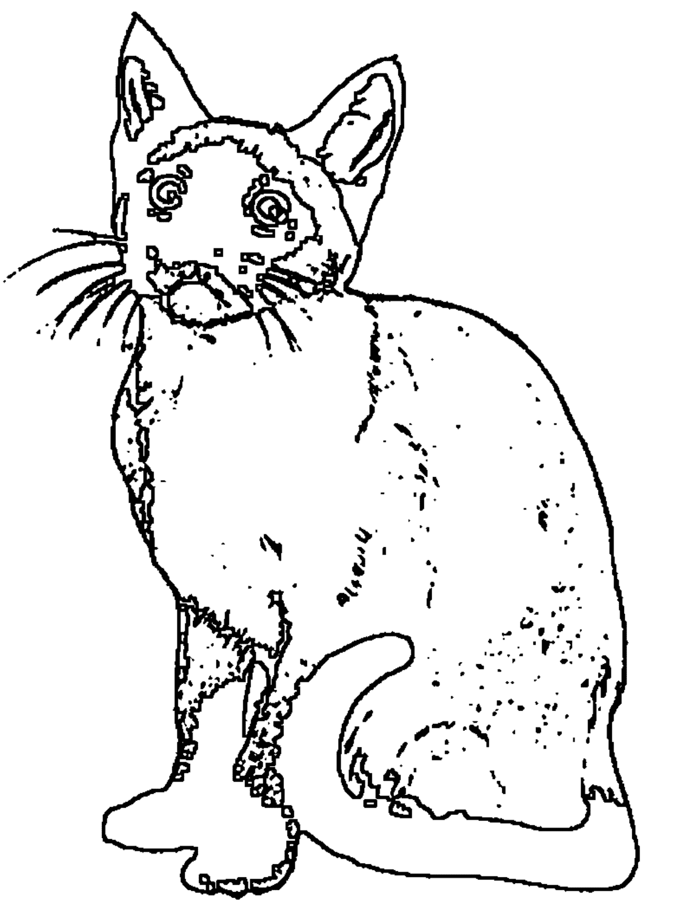

然而人們加諸給貓的特質常常是相互矛盾的，好奇、九命、獨立、伶俐、難以捉摸、療癒等等：女巫的寵物貓通常都被認為是以貓的外型存在而供女巫使喚的妖精，另外人們也時常認為，女巫可以變成貓的樣子。

貓在天黑後才會回家，但許多人希望牠們在白天也扮演傳統寵物的角色，當貓不予理會時，人們就認為這是牠們獨立、不愛社交的特質使然。由於黑暗是恐懼，與人們不想要也看不到的事物之來源，因此貓逐漸被與魔法與神祕聯想在一起，事實上，貓眼的視網膜中有較多的桿狀細胞，可以強化感光，讓牠們在黑暗中也看得很清楚。一般來說，貓的獵物是老鼠，但絕不僅於此，貓也能夠很有效的狩獵鳥類及兔子。

在傳統上，貓的敵人是狗，但這不是牠們唯一的敵人，任何擁有貓圖騰者，研究老鼠與狗的特質，也有助於你了解貓的魔法以及能量平衡。

檢視你的貓的顏色、特性、行為，這一切都具有特殊意義。許多書中皆有關於貓的故事及特性之描述，不論是家貓還是野貓，只要貓現身，就留意一下身邊的魔法與神祕之處。

## 美洲獅

重點：進入自己的力量
力量周期：全年

在歷史上，美洲獅曾有過許多稱呼：puma、mountain lion、cougar、catamount、mountain screamer、sneak cat、panther等等，其中最常出現的就是cougar、panther、puma。cougar是來自南美洲的名稱，而puma則出自印加人所說的蓋楚瓦語（Quechua）。佛羅里達美洲獅也屬於同一屬的動物，但不可以跟之後介紹的豹屬中的美洲豹混為一談。在你研究美洲獅時，哪一種名稱最吸引你呢？這或許能讓你進一步了解一些有關於你前世與此圖騰之間的關係。⁹

最早的殖民者誤以為美洲獅是母獅。「新阿姆斯特丹（現在的紐約市）的荷蘭貿易商問印地安人，為什麼他們只帶來母獅的皮毛。印地安人嘲弄這些無知的白人貿易商，告訴他們所有的雄獅都住在深山裡，非常兇猛，沒有人敢去狩獵。這就是山獅（mountain lion）名稱的由來。」¹⁰

美洲獅是西半球體型第二大的貓科動物，同時也是世界上動作最快、力量最強大的動物之一，不過牠很快就會覺得疲累。美洲獅力量大到可以用尖齒或利爪進行殺戮，而且能跳躍超過四十呎的距離。

美洲獅是鬼祟的狩獵者，之後有關於豹的許多描述也適用於美洲獅。如果美洲獅進入了你的生活之中，就該是時候學習其力量了，你可以自行測試，許多年輕的美洲獅都是從錯誤中學習到要如何使用牠們的力量，因此讓牠們變得更強、技巧更加熟練。當美洲獅以圖騰之姿出現時，表示你需要經過許多試煉，現在正是你發出宣言的時刻。

人們可能會不喜歡你的主張，因此有可能會想要將你定位成他們所期望的模樣，你可以順從，但你也可以伸展你的肌肉，讓他們見識一下你的能耐。擁有美洲獅魔法的人很容易遭到攻擊，尤其是來自那些對於現狀感到十分滿意，而且不願意看到你有所成長的人。要記住，總會有人不想要看到你變得強大，甚至不願意你發現自己擁有的能力，如果美洲獅出現了，你就要做出決定，你必須要快、狠、準，因為美洲獅絕不會放過任何機會。

鹿是美洲獅最喜愛的獵物，任何擁有美洲獅圖騰者都應該研究一下鹿。鹿所擁有的特質之一就是和善，以美洲獅為圖騰者應該要記住，力量也可以溫和呈現，有時柔也能克剛，因此有時候應該要溫柔，有時候則需要強而有力的主張自己的力量，這就是美洲獅可以教你的。

美洲獅與豪豬之間也有關係，因此也應該要研究一下豪豬的特性。美洲獅是少數幾種能夠毫髮無傷的殺掉豪豬的動物，事實上，豪豬占了美洲獅食物的三分之一，美洲獅可以把豪豬翻過來，肚子朝天，暴露出最脆弱的下部。

美洲獅可以教導我們如何果決的使用個人力量，當美洲獅發動攻擊時，牠絕不遲疑；而受到威脅時，牠則會鎖定對方最脆弱的部位。美洲獅可以教導你如何釋放自己的力量，並讓你心中充滿力量，使你能夠掌控自己的生活，你將會發現，用此股力量來防衛自己，或進行攻擊都同樣有效，美洲獅會告訴你控制自己生活與情況最有效的方法。

## 土狼

重點：智慧與愚昧
力量周期：全年

土狼的適應力非常驚人，美洲原住民也有許多各式各樣關於此動物的傳說。土狼是創造者也是惡作劇者，擁有許多魔法，但不見得時時有效，即使有時候失靈了，但仍能夠達到某種目的，土狼背後總是有股隱藏的智慧。

從許多方面來看，土狼之於平原印地安人，就如同渡鴉之於西北地區的人——同是創造者、老師及魔法持有者。土狼及渡鴉都愛嬉鬧、玩耍，也都非常靈巧，但常常沒有有效利用牠們的技能，土狼時常想要抄捷徑，這提醒了我們不要太過嚴肅，也提醒了我們任何事情都是有可能的。

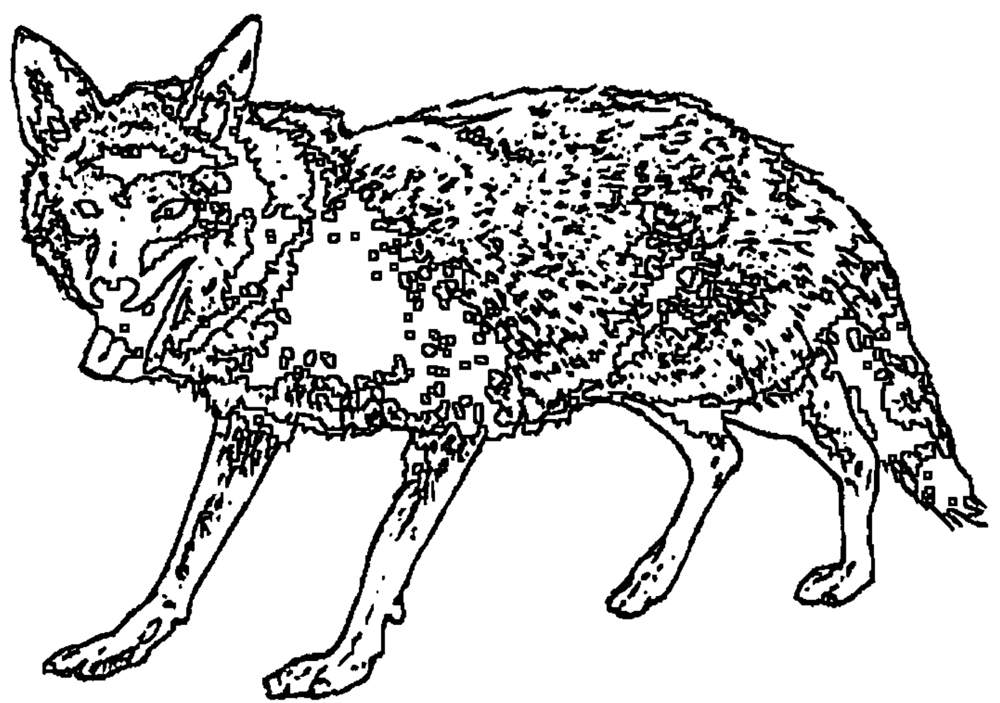

在很多傳說中，土狼都喜歡把事情複雜化。如果土狼以圖騰之姿出現，你不妨問問自己一些問題。你或你身邊的人是否過於嚴肅？你是否忘了玩耍對於健康來說也是必須的？在你生活中，你是否把原本簡單的事情複雜化了？有人在惡搞你嗎？

土狼可以教導我們智與愚的平衡，這兩者通常都是相互影響的，在許多文明的傳說中，常常使用了大智若愚這種形象，即為看起來愚笨的人，但在言語與作為上卻顯示出原本沒有被發現的智慧。你是否沒有看見自己生活與事件背後的智慧呢？土狼可以幫助你。

在塔羅牌中，土狼是愚者牌，以土狼為圖騰者應該好好思考一下這張牌，其能量與簡單、信任是不可分割的。愚者牌可以在混亂的生活中建立平衡、反璞歸真，並在處事上喚醒童稚的智慧。此張牌提醒了我們真正有智慧的老師是有絕佳幽默感的。透過土狼，我們可以學習如何再次成為一個孩子，並重新喚醒智力、創造力、藝術感以及所有的直覺感官。

雖然土狼常被認為是有害的動物而遭許多族群圍剿，卻仍能擴張牠們的地盤，在美國各處皆能看到土狼，牠們之所以能夠做到是因為使用了靈敏的智力以及適應力。土狼原本在清晨與黃昏時最常出獵，但時至今日則在夜間最為活躍，這是為了要避開其他狩獵者而做的改變。

土狼時常使用合作狩獵技術，牠們以極有組織的系統方式，去追趕較小的獵物。土狼會採用接力的方式，當一隻土狼休息時，就換另外一隻去追趕。此種合作暗示了土狼帶入你生活中的能量能夠刺激合作，並以最有效率的方式達成重要的任務。有時候土狼甚至會與獾結盟，一同狩獵，象徵了土狼適應環境的能力。

嚎叫是土狼最具突出的特質之一，一般人都認為這是一種社交手段，可以表達寂

## 土狼

土狼的嚎叫會觸碰到任何聽者的靈魂，提醒我們最原始的連結，警告危險，或呼叫支援。

土狼隨處都可以做窩，但多偏好靠近水源的丘陵側邊，土狼時常會回到同一個窩產子，卻不會整年都住在裡面，牠們認為這裡是工作的場所。同樣的模式也常在以土狼為圖騰者身上出現，通常有固定的工作地點會比較有效率，但也不會拘泥於此，這表示任何以土狼為圖騰者，都非常需要有心智上的刺激。

土狼的家族觀念很重，有時候會採取終生伴侶制。土狼爸爸在照顧及餵養幼崽上非常認真，雙親都會教導小土狼狩獵的技巧，公土狼會在其伴侶懷孕時照顧對方，保護並餵養孩子的母親，如果土狼媽媽發生了什麼不測，公土狼便會接手照顧小土狼。

土狼是最迷人的動物之一，很難將之歸類到任何一個分類中，因為牠們本身就充滿矛盾，但其能量的本質還是可以教導我們讓生活圓滿的智與愚之平衡。

## 鹿

重點：溫柔與純真——嶄新冒險的溫柔誘惑
力量週期：秋季、春季

鹿總是能夠捕捉人類的想像力，牠們是哺乳類動物中最枝繁葉茂的一科，除了澳洲外，牠們遍布所有大陸。鹿可以適應各種棲息地，白尾鹿、北美黑尾鹿、和北美馴鹿是美洲最重要的三種鹿。麋鹿與加拿大馬鹿（駝鹿）也是鹿科動物，不過在本書中則分開介紹。

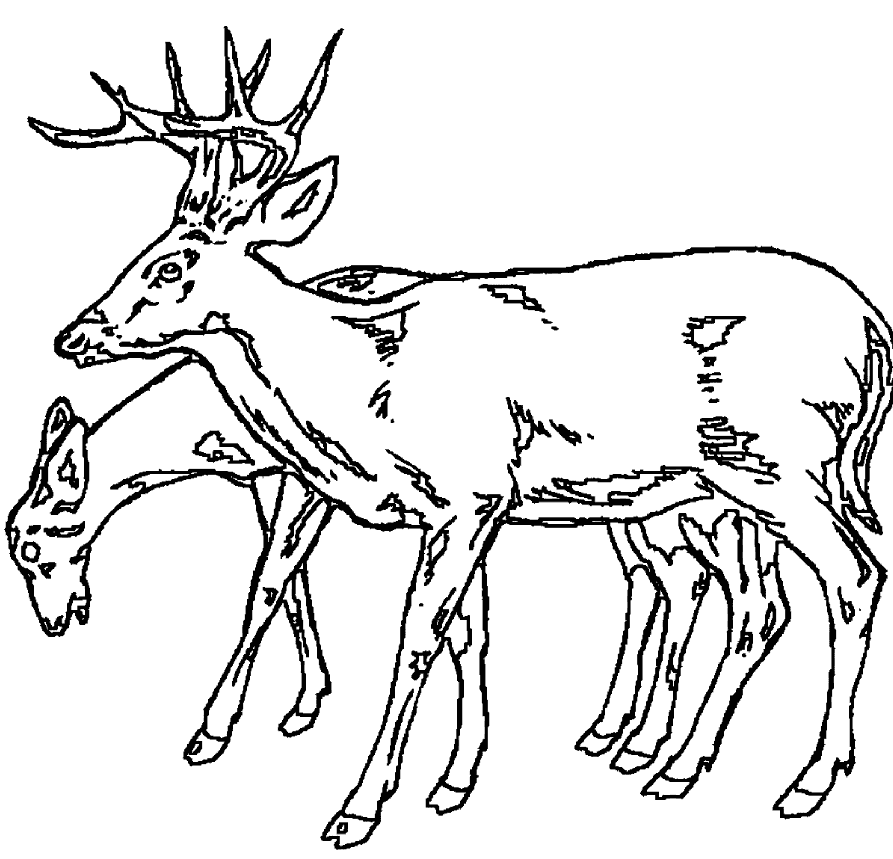

每種鹿都有各自的特質與特性，但整體來說，還是具有共同的特質。例如，北美馴鹿每年都會進行兩次長途遷徙，表示以此為圖騰者在其生活中也會展現出同樣的模式，北美馴鹿會在秋天與初冬時發情，這段時間就是快速前進的時刻。北美黑尾鹿也會遷徙，但卻從不走一樣的路徑，這部分是因為其自然的防衛機制，讓牠們的行蹤可以較不容易被掠食者掌握。本節大部分的資訊都著重於一般的鹿，並特別介紹白尾鹿。

「鹿」（deer）這個名稱有幾個不同的出處，這可以為以此為圖騰者提供一些前世的線索。盎格魯撒克遜文中的deor是用來指稱所有動物的詞；而在德語中，其字源tier也單純是指野生動物；若追溯到梵文中的mriga，同樣也是野生動物的意思。

對許多人來說，鹿是打獵中最重要的鹿是打獵中最重要的獵物，獵鹿讓我們可以從文明社會走入野外。許多故事和神話中都說到，鹿將獵人甚至國王引誘到森林深處，直到他們迷失了方向，從而展開許多新的冒險。此例子可以在亞瑟王與圓桌武士的傳說中看到，高文爵士跟著一頭白雄鹿，因而展開了一連串的冒險。¹¹在湯瑪斯·馬洛禮爵士（Sir Thomas Malory）的《亞瑟之死》（Le Morte D'Arthur）中可以看到更多的例子。

在佛教中，鹿也占有重要的宗教地位。在畫作中，佛陀常與鹿一起出現，而傳說中也說到，佛陀首次講道就是在鹿園之中。此象徵再次強調了鹿代表了純真，以及回歸荒野的涵義。

白尾鹿在美國最為常見，最特別的特徵就是公鹿頭上的叉角，而鹿科中的其他成員，即馴鹿（reindeer）與北美馴鹿（caribou），也都會長出叉角。叉角是紮實的骨頭，每年都會脫落，生長在眼睛後方的叉角可以發揮極佳的防衛作用。

到五歲之前，鹿茸每年都會越長越大，也越多分枝。如果你在野外遇到了鹿，試著算算牠的叉角上有幾個分枝，你將可由此得知這隻鹿對你來說有什麼意義，請謹記靈數學也有助於定義其中的精髓。

鹿茸象徵了天線，可與更高階的存在調和接觸。因此鹿與鹿茸便是要你注意內在的思維以及覺知的信號，因為這很有可能比你所想的更加正確。

鹿茸每年都會脫落，在五年間每年也都會長得更大、長出更多分枝。如果鹿進入了你的生活之中，在接下來的五年間，試著尋找新的觀點，以及可以有所成長和拓展的見解。這可能表示在接下來的幾年間，你將有機會可以持續不斷、和緩的成長。

長在雙眼後的鹿茸，再次暗示了見解的提升。當鹿茸脫落時，鹿和齧齒類動物會將之咀嚼、吃掉，以補充鈣質。

鹿每次會生下一至兩隻小鹿，幼鹿的顏色有助於保護、隱藏。在頭幾天，牠們幾乎不會動，而鹿媽媽也會隨時給予照料，這對於擁有此圖騰者來說是很有意義的，許多社會都強調與新生兒共度一段固定的時間是非常重要的，不可以有訪客，也不能有父親以外的家庭成員與新生兒接觸。即使時至今日，在穆斯林的信仰中仍然認為，不論是否親生，只要餵以母乳一段時間，便可以讓孩子變成是自己的，這樣的關注與隔離手段讓孩子可以與家庭更緊密的連結，並保護新生兒不受到外界的影響。

我總是看不慣新手媽媽帶著才幾周大的嬰兒，在人潮擁擠的賣場或店家中走動，我了解想要出門走走的慾望，但這真的顯示出她們對於會影響人體的微妙能量有多麼缺乏認識。我們的靈氣或力場都是電磁波，與不同的人和場所接觸都會產生能量交換，孩子在賣場中接觸到的能量會對他們產生極大的影響。沒有人認真研究過這件事情，但這塊領域真的需要有人去多加探索，在孩子的能量夠強大、夠穩定之前，都應該被加以保護，不受外來的影響。

鹿可以領導我們重回古老教誨中最原始的智慧，提醒我們在將孩子暴露於許多人以及其他陌生的能量之前，必須要先建立起穩固的健康連結；同時，鹿也提醒我們，家人們為了孩子的健康團結起來是再自然、正當不過的事了，這是為了孩子著想！

過了幾天之後，幼鹿通常都可以站起來，跟著鹿媽媽到處走。母的幼鹿會待在鹿媽媽身邊約一年，而公鹿通常會在幾個月內就離開。鹿爸爸完全不會參與幼鹿的撫養，因此鹿媽媽會獨挑大樑，這再次提醒了我們要慢慢重回傳統的家庭構成及角色之中。如果鹿出現在你的生活之中，就可能表示你已經偏離當時最有益的角色了。

鹿的感覺十分敏銳，牠們的視力可以清楚的看到遠方，這在昏暗光線中偵測斷崖或峭壁時尤其有效；鹿的聽力也很敏銳，任何以鹿為圖騰者都會發現自己偵測細微動作和外表的能力有所提升，可以開始聽到別人話中有話。

當鹿在你生活中出現時，就表示你該對自己或他人更為友善，而新的純真與清新也將被喚起或誕生。你將緩緩被召喚去踏上新的冒險旅途。思考一下這些重要的問題：你是否太操之過急？別人的情況呢？你是否對自己太嚴厲，沒有好好照顧自己？當鹿出現時，就表示有機會可以展現溫柔的愛，並為你打開了冒險之門。

¹¹ Knowles, Sir James. *King Arthur and His Knights* (New York: Longmeadow Press, 1986), pp. 103–119.

## 狗

重點：忠實與保護
力量週期：全年

狗就是家犬，牠們是土狼及狼的後代，因此這兩種動物也應該要加以了解。狗是人類的伴侶，為我們提供忠實的保護，不同品種的狗各有其獨特的特質，許多品種都是因應特定的目的及功能而培育出來的，研究狗的品種將有助於了解你的圖騰含有何種能量。

不同的狗有不同的涵義，例如牧羊犬可以用來保護家畜並協助放牧。有些狗是為了特定的活動，例如打獵、尋物而培養出來的，因此牠們各自都有獨特的特質，像是喜歡喝水、需要奔馳等等。有些混種狗則混雜了不同品種的特質，提醒我們各種狗都是獨一無二的。

了解你的狗是什麼品種，以及牠本身的特質，可以揭露出與之相關的能量。檢視這隻狗的性格，牠大多會有什麼行為？這對於你來說有什麼啟示？在本書前面的部分，我曾經舉例說過我的四隻狗各有什麼特質，以及我如何解讀牠們行為向我傳遞出的訊息。如果我的狗夏安（基本上牠是個冷淡的獨行俠）突然變得很友善、一直纏著找我玩，這通常表示我需要休息一下，參加一些社交活動，玩一玩。我們的動物可以告訴我們許多事情。

大多數的美洲原住民部落都有養狗作為守衛與警告之用，但狗在其他社會中也有非常重要的象徵涵義：在印度，狗是所有種姓制度的象徵，反映出無名小卒也可以成為偉人；在早期的基督教中，狗則象徵了守護（就像牧羊犬那樣），甚至還是牧師的化身；在希臘，狗看守著死者之地，陪伴著死者。狗也是母性的象徵，因為牠們是非常有愛心、擅長養育的父母。

要讓狗意志消沉並不容易，即使被輕忽、虐待，牠們愛的能力仍然強大，狗願意付出愛與陪伴的精神非常偉大。

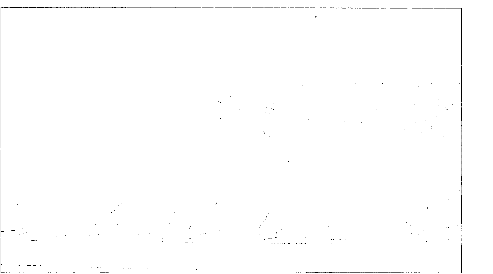

狗是很強大的圖騰，象徵了忠實與陪伴。一般來說，從與家居動物的圖騰互動開始，會比與野生動物的圖騰互動來得簡單。

（上圖為作者個人所養的四隻狗：夏安、阿嘉莎、阿瓦隆、與柯蒂）

研究你的狗，你所獲得的會比單純閱讀這本書還要多。如果狗以圖騰的姿態進入你的生活，問問自己一些問題：這是否表示你需要或缺少陪伴呢？你是否夠忠心？你身邊的人忠心嗎？你是否有展現出或接收到了無條件的愛呢？你是否需要更保護自己的領地？你是否應該讓自己多玩耍一下？你對自己是否誠實？你是否需要精神上的支柱呢？你身邊的人又是如何呢？檢視自己的領域，狗知道自己的地盤在哪，如果牠出現在你面前的話，牠的能量與教誨將可以傳達給你。

## 海豚（鼠海豚）

重點：呼吸與聲音之力量
力量週期：全年

海豚是海中的哺乳動物，很多人以為海豚與鯨魚是魚類，但其實不然，牠們會哺乳，這項特質正是讓哺乳類動物與其他動物有所不同之處。海豚科中體型最大的成員是殺人鯨，同樣也擁有毅力這項特質。

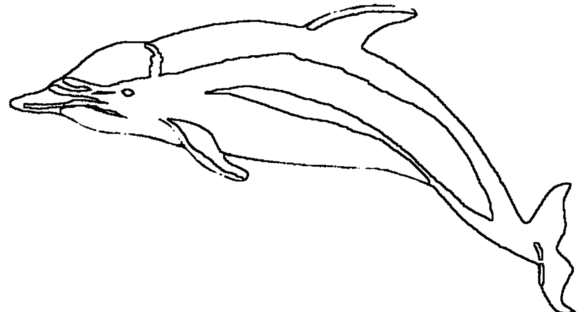

海豚在海中做窩這個習性非常特別，許多神話中都提到，生命來自於最原始的海洋之水。水象徵了創造、熱情，甚至還包括了性慾，而這就是所有生命的要素，代表了新的次元與力量。

海豚可以進一步開啟新的創造與次元，水對於生命來說是必須的，呼吸也是。有很多呼吸技巧都是用來教導透過適當的呼吸方式，誘發意識轉換，並將自己與新的次元及生命做連結。學習呼吸的技巧有助於你變得更熱情、性感，還可以治療身體、心智、與靈魂。例如，緊張與壓力只要透過模仿海豚在海面上的噴射式呼吸法就可以獲得減緩，有肺部或呼吸問題的人若是與海豚的魔法進行調和，將會獲得極大的改善。

海豚的呼吸與游泳是有節奏的，學習像海豚一樣呼吸對你會有所幫助。呼吸控制是海豚力量的關鍵，當你可以透過呼吸與海豚同步時，海豚就會帶著你回到初始——那個絕大部分地球表面仍被大海覆蓋的時代與所在。

海豚也有內建的聲納，牠會發出一連串的喀噠聲，並在聲音反射時，對於喀噠聲的回音做出反應。聲音、呼吸與水都被認為是生命的來源，聲音是創造生命的力量，聲音來自於無聲的子宮，並創造出萬物。學習創造內在的聲音，這樣一來你就能夠創造出外在的形象，這就是海豚要教你的。

發出聲音需要氣息，而水則是無固定形體的創造元素，只要我們知道如何將呼吸與聲音結合，便可以將之塑造成任何形態並彰顯出來。聲音與呼吸的神聖在許多社會中都被加以教導，在巴比倫的宇宙論中，由女神提亞瑪特（Tiamut）從水中創造出來的神祇們，在經過了女神的呼喚後，才活了過來。

海豚可以告訴你要如何進入生命之水，接著利用呼吸與聲音將你最想要的從水中召喚出來。呼吸技巧與發聲的技術表現至關重要，如果我們沒有善加使用，我們的祈禱就不會獲得回應，而我們也無法得到清楚的確認。海豚可以教我們如何適當的加以利用。（你不妨參考我之前的作品《聖音》，以獲得更多相關資訊。）

對於早期的基督徒來說，海豚是救贖的象徵；而希臘人則認為，海豚是神的信差，是偉大海洋贈禮的象徵，因此，牠們很少被殺害。海豚時常會做出利他的行為，牠們擁有大腦以及偉大的智慧，即使是現代，牠們仍舊不擔心人類可能會殺害自己，牠們喜歡與人類作伴，好奇心使牠們主動接近人類。

如果海豚以圖騰的姿態出現，問問自己一些重要的問題。你能為自己創造出什麼樣的話語或思維呢？如果不確定的話，你將會在海豚出現時很快的找到答案。你有走到戶外享受新鮮空氣嗎？你是否感到很緊張？別人是否感到緊張？當海豚出現時就是將新的生命吸入你體內的時候了。走出戶外，去玩耍、去探索所有的生命。

## 大象

重點：古老的力量、優勢、忠誠
力量週期：全年

大象是陸地上體型最大的哺乳類動物，雖然不是美洲的原生動物，但因為我曾經遇過幾個以大象為圖騰的人，因此將之納入此事典中。大象的祖先是長毛象，現存只剩下兩種象——印度象與非洲象，非洲象體型較大，兩者耳朵的形狀也不同。

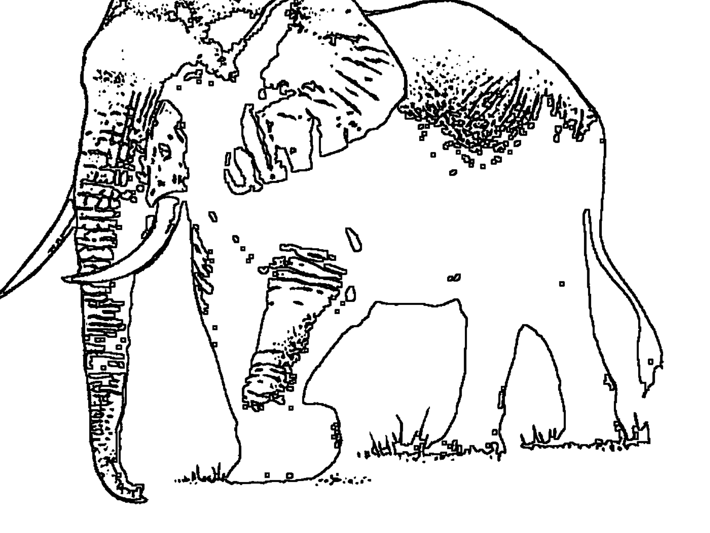

大象擁有數不清的相關神話與傳說。在所有大象中，白象被認為是最神聖的，這跟美洲原住民認為白水牛是神聖的情況一樣。傳說中，偉大老師與智者的母親會夢到白象，其中一個故事就是，佛陀的母親夢到了白象，且白象還進入了她的子宮之中。

並使用芳香療法，精油與香精可以讓你更有效的轉換意識。

嗅覺與性驅力間也有強力的鏈結，並且是最強烈的刺激方式之一。氣味可以成爲擁有此圖騰者的催情劑，在引誘或被引誘過程中，可以作爲極爲有效的工具，這進一步證實了大象在性方面的象徵。

象鼻的功能繁多，可以用來喝水、淋浴以及防衛，大象甚至以碰鼻的方式來打招呼。象鼻上有兩個如手指一樣的突出，這種特殊的鼻子和上唇加起來可以發揮手的功用。大象可以用象鼻來吃原本搆不到的嫩枝、樹葉及青草。這再次反映了透過大象的刺激增加嗅覺敏感度，你就可以打開原本無法接觸到的能量與世界之門。

象牙也是大象身上另外一個非常重要的部位，不幸的是，盜獵者殘酷的殺害了許多非洲象，就只爲了取得牠們的象牙。任何擁有大象圖騰者，也應該從靈性以及玄學的角度去檢視一下象牙的涵義，象牙可以用來當作武器，或是挖掘可食用根莖的工具，因此讓大象與地表上下的事物——樹木與根莖的知識連結在一起。

大象的社會是由年齡與性別來區分的。母象與小象生活在全由母象組成的象群中，由年長、有智慧的母象領隊，這反映出生命中陰柔能量的三種古老傳統型態：孩子、母親、年長有智慧的女性。這三種型態在大多數以神秘學來教導生命與宇宙存在的社會中都可以看得到。

公象偶爾會加入母象群中，通常只是爲了要交配，其他的時間牠們會待在單身漢群中，由年紀較長、較強悍的公象領隊。同樣的情況也出現在世界上許多社會中，男人與女人有各自的社群，以及他們各自有關大象的神聖教誨。

大象彼此之間情深義重，年齡較長的小象會照顧年幼的弟妹，成象則會幫助生病或受傷的同伴，大象的社會就是理想的社會。

擁有大象圖騰者通常會發現自己有機會重建強大的家族，而理想社會也能有所實現。互相照顧幼者，尊重長者與患病者，以及你本身的堅強，這些都是成爲偉人或是組成偉大社會的基石。如果大象出現在你身邊，你將會有機會在自己或他人的生活中建立起這些基礎，如果大象出現，就準備好吸取最古老的智慧與力量吧！你將會有機會幫助自己或他人重拾最原始的忠誠。

## 駝鹿（加拿大馬鹿）

重點：力量與高貴
力量週期：秋季

駝鹿是北美洲最高貴的動物，莊嚴又強壯。曾經，駝鹿的蹤跡遍佈整個北美大陸，但到了十九世紀末期，駝鹿便已絕跡於美東了，現在，駝鹿是受到保護的，主要的分布與棲地位於西部山脈。

蕭尼族印地安人（Shawnee）稱此動物爲駝鹿，這或許是最適當的名稱了；而白人殖民者則將之稱作加拿大馬鹿，這個名字其實是來自於歐洲近似於麋鹿的一種鹿。

駝鹿這種動物十分強悍，擁有極大的力量與韌性，可以奔跑很長一段時間。駝鹿最主要的防衛機制就是跑得比掠食者快，並能夠長時間維持強勁的步伐。

如果駝鹿進入了你的生活中，這可能表示你即將邁開大步往前行。駝鹿的出現也有可能是要教你如何以更有效的步伐前進。你是否太求好心切了呢？你身邊的人是否太求好心切？你是否每次都太快放棄，或一下子就想要打退堂鼓呢？你是否不夠積極？你是否總是想要抄捷徑、走輕鬆的路，卻沒有發現長期與穩定才是你目前最需要的呢？駝鹿的成熟期約四至五年，如果你近期剛開始了新的企劃或任務，你可能需要等待四到五年才能夠達到成就的巔峰。

駝鹿在秋天時最能發揮力量，秋季正是牠們的發情季節，除了發情季節外，駝鹿都只跟同性待在一起——公駝鹿與公駝鹿、母駝鹿與母駝鹿。有時候，駝鹿之所以以圖騰的姿態出現，是爲了要提醒我們，偶爾也需要有異性的陪伴，生活才有平衡。你是否忽略了你與異性相伴的需要呢？你是否只跟某種性別的人打交道，而忽略了另外一種呢？你是否花了太多時間在異性身上，而不夠重視自己呢？

公駝鹿的脖子會在發情季節時腫脹起來，而其呼嘯聲會響徹原野，這是宣示領土主權，以及宣告與母駝鹿關係的一種方式。頸部是橋樑，是一個穿越點，我們都需要異性的陪伴，但這指的不是肉體關係，而是與異性往來有助於平衡我們的能量，並能與更高的層級聯繫。

很少有獨居的駝鹿，牠們會聚集在一起，成群的生活，幾乎只與同性待在一起。如果駝鹿出現，這可能反映出你也需要類似的陪伴或團體支持。

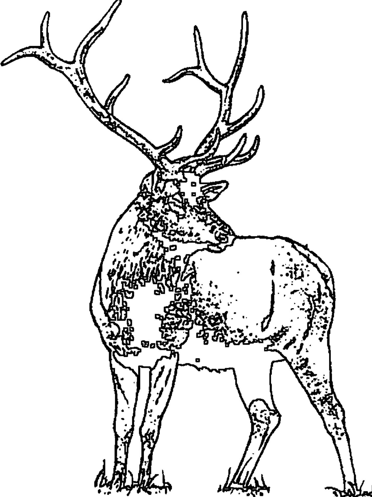

駝鹿群通常會有守衛，守衛的駝鹿會透過長哮（嚎叫）以及扭動臀部上的白色斑紋來發出警告。牠們在團隊之間有許多互動，有時候駝鹿的出現是要教導我們如何在團隊中以合作的方式生活。你是否什麼事情都想要自己來呢？你身邊的人是否有這樣的傾向？你是否覺得你有足夠的能力與精力，可以自己去處理所有的任務呢？

駝鹿甚至有保母，在其他駝鹿四處尋找食物時，會有一、兩隻駝鹿負責照顧幼崽，如果受到威脅，牠們也會用尖銳的蹄來保護小駝鹿。幼崽是最脆弱的，駝鹿和麋鹿都是極有防衛心的。擁有駝鹿圖騰的父母非常保護孩子，而且會以非常兇猛的手段，防衛任何可能的威脅（不論是無形的或實際的威脅）。

駝鹿最大的威脅（掠食者）包括山獅與灰熊，不過有時土狼也會對駝鹿進行團體狩獵。只要身體健康的成年駝鹿，通常都可以奔跑甩開掠食者，但幼崽與病弱的駝鹿就無法做到，因此駝鹿團隊的凝聚力極佳。研究駝鹿的掠食者將會進一步讓你了解在生活中可以彰顯出何種能量。

駝鹿大多以青草及植被為食，也不太會遷徙，牠們的毛皮又厚又重，因此可以忍受嚴寒的氣候。如果天氣過於惡劣，下著大雪，牠們可能會在山麓丘陵附近過冬，因為該區域比較有可能找到植被。

任何與駝鹿魔法互動的人都很適合以蔬菜為主食，你的能量將會更強，壓力會減少，還可以增加耐力。如果你發現自己有點懶散，就呼喚駝鹿的魔法吧！調整你的飲食，只要兩三天你就會發現自己的能量有了顯著的不同。

## 狐狸

重點：偽裝、變形與隱藏的陰柔魔法
力量週期：夜晚、清晨、黃昏

狐狸這種圖騰是地球上每一個社會都極常接觸到的，此圖騰表示需要發展或喚醒偽裝、隱藏及變形能力。狐狸是自然界中技巧最特殊，也最足智多謀的動物之一，並且可以教導擁有其圖騰者同樣的技巧。

狐狸有二十一種，在世界各地不同的氣候區中都可以發現牠們的蹤跡，不管是海岸、山區、沙漠，甚至極圈內都有狐狸的出沒。狐狸居住在南北美洲、歐洲、亞洲，甚至澳洲。事實上，全世界共有二十一種狐狸這件事，也具有極大的象徵涵義。

塔羅牌的二十一號牌是「世界」牌，象徵了向新的世界敞開，以及創造的過程正在展開，這表示世界正在成長，變形至新的、有益的模式。擁有狐狸圖騰者若是思考一下這張牌，將能夠進一步了解狐狸的能量可以如何促進創造，這顯示出，你的生活中，有什麼是正在（或需要）成長、變形的。

狐狸一直以來都被認為是有魔法且狡詐的，由於狐狸也是夜行性動物，因此時常被認為具有超自然的力量。狐狸最常在清晨與黃昏這種「時間之隙」出現，此時魔法世界以及我們所居住的世界會有所交集；狐狸居住在森林邊緣及曠野等邊界地帶，由於身為「時間之隙與邊界地帶」的動物，狐狸可以做為進入精靈仙境的嚮導，狐狸出現的時刻，通常都代表了精靈仙境即將為你敞開。

在東方世界，狐狸被認為可以變成人類的樣子。在古代的中國傳說之中，狐狸在五十歲的時候可以獲得變成人類的能力，而到了百歲之後，則可以變成術士，或是美麗的少女，最後會摧毀所有不幸愛上牠的男人；「有些印地安人的部落曾有傳說表示，獵人在無意間發現自己的妻子是狐狸。」¹²這象徵了人與生俱來的魔法中就存有陰柔的能量，除非男人可以了解到自己與他人身上的這股陰柔魔法，並將之用於自己生活的變形上，不然最終就會走向毀滅。

卻洛奇人會召喚狐狸魔法以避免霜凍災害的發生；而霍皮族的巫師總是在治療儀式中穿戴狐狸的毛皮；巢克圖族人（Choctaw）則將狐狸視為家庭和諧的保護者；阿帕契族人（Apaches）則相信，狐狸殺死了邪惡的熊，並將尾巴的毛放入火焰之中為人類偷取火種。在其他的社會中，狐狸也受到極高的尊崇。狐狸在波斯是聖獸，因為牠可以幫助死者進入天堂；在埃及，狐狸的毛皮被認為帶來神的恩賜；而秘魯的印地安人則信奉狐神。許多人相信，狐狸會報答曾給予自己恩惠者。

了解狐狸的行為以及特性，有助於揭露有關其能量與角色對你個人的影響。幾乎所有的狐狸都擁有尖鼻、大耳、毛茸茸的尾巴，以及又細又長的腿。大耳朵可以幫助狐狸在夏天時保持涼爽，因為可以透過耳朵散熱，若擁有狐狸圖騰者難以抵擋夏日的炎熱，把頭髮梳到耳後會讓自己感到舒緩許多。

北美洲最常見的狐狸就是紅狐，但並非所有紅狐都擁有紅色的毛皮，紅狐的毛皮變化多端，就跟人類的髮色一樣。許多紅狐披著紅色的毛皮大衣，但也有棕色、黑色，甚至擁有銀色毛皮的紅狐。一般認為，紅狐與性能量、靈熱以及生命創造力量的釋放有關，研究狐狸的毛色以及象徵，有助你進一步找出其在你生活中扮演的角色。

除了北極狐外，狐狸毛皮的顏色並不會隨季節而改變，北極狐的耳朵也比較小。

¹² Lavine, Sigmund A. *The Wonder of Foxes* (New York: Dodd, Mead and Company, 1986), p. 13.

## 狐狸

紅狐是強大的圖騰，長期以來都被認為與隱藏和變形的魔法技巧有關，其天生的偽裝能力激起了許多與之接觸者的讚嘆。

（感謝俄亥俄州特洛伊城的布魯克納自然中心提供照片）

圓，使之較能夠隔絕低溫、抵禦寒冷。

狐狸的毛皮也有助於其偽裝，大多數狐狸的毛皮本身就有各種色彩，這有助於牠們保持隱匿。練習並使用偽裝是每位擁有狐狸圖騰的人都該學習的事情，試著融入周遭環境，來去不留痕跡，靜悄悄的來去，不顯示出你的意圖，就是狐狸要教你的情。

這可以反映在學習控制靈氣——環繞在你身邊的能量力場。你可以調配其頻率與強度，這樣一來便能無聲無息的融入背景；你可以練習靠著牆壁站立，想像你自己（以及你的靈氣）變成了牆的顏色，就好像你融入牆中一樣。

下一次你參加派對的時候，坐在椅子或是沙發上，開始想像你自己是隻完全融入周遭景色的狐狸，請謹記，狐狸最常在曠野中被看到，所以想像自己逐漸變成了椅子的顏色與樣式。安靜的坐著，看看有多少人會不小心撞到你，或甚至坐到你身上，因為他們完全沒有「注意或看到」你在那裡，你會對你的發現感到吃驚。

練習在進入派對或是聚會時，將自己視為一隻狐狸，想像自己混入、融入在人群之中。當你聽到人們說：「你什麼時候到的？」、「你到多久了？」、「我沒看到你進來」或「你什麼時候離開的？」時也不需要驚訝。你越是與狐狸互動，這就越容易做到。

知名的魔法師梅林，藉由許多狐狸魔法與能量才能夠完成他的目標，而他也時常加以練習狐狸魔法。「雖然在其一生中，梅林時常被誤解、忽視……除了『梅林』這個名字，普羅大眾根本不知道他是誰。而當他被國王召喚，或是被單獨派遣去徵召其他同盟時，他會默默進行，偽裝成一個貧窮的牧羊人、伐木工人或是農夫。即便是國王也看不穿他的各種偽裝，他不斷、持續的練習偽裝、隱藏的技術。」¹³

擁有狐狸圖騰者，必須要學習偽裝的技巧，以及相關的隱藏及變形技術。狐狸會默默使用偽裝的能力給自己帶來好處，透過練習，你也可以發展出同樣的能量並加以應用，這樣一來你就可以看到或聽到原本看不到的事物。

狐狸毛皮的另一個面向對於擁有狐狸圖騰者來說也非常重要，毛髮通常都與心靈能量有關，並且被認為是天線。狐狸有兩種毛皮，有短而濃密的下層絨毛，還有長又堅硬的保護毛髮覆蓋在下層絨毛之上，可以做為保護，通常在背部的顏色最深。

頭髮與毛皮長期以來都是能量及生殖力的象徵，而毛皮的層次則反映出能量與生殖力的層級。拿狐狸來說，其下層絨毛是原始力量的來源，個人可以從中汲取這股能量；而外層則保護並界定個人將如何使用此股能量，隨著外部毛髮的改變，內在創造力的表現也會產生改變。毛髮對於以狐狸為圖騰者來說十分重要，如果某層級中有了改變，那麼就要學著改變毛髮，反映出你想要的改變，才能啟動狐狸的能量，讓變形展開。

狐狸尾巴一直以來都被認為是狐狸最神聖的部位，雖然事實不見得是如此，但對於擁有狐狸圖騰者來說，仍具有極重要的涵義。當狐狸在奔跑的時候，牠的尾巴會呈現水平的狀態，其作用就如同舵一樣，而水平狀態是陰柔的象徵，因此狐狸尾巴象徵了對陰柔創造力量的直接引導。狐狸的尾巴在其急轉彎時發揮的作用尤其重要，如果專注於創造能量上，個人生活中的急轉彎也可以順利的度過。

13 引自Norma Lorre Goodrich所著之*Merlin*. Copyright © 1987 by Norma Lorre Goodrich. Used with permission of the publisher, Franklin Watts, Inc., New York.

尾巴也可以在寒冷時為鼻子與腳保暖，狐狸會用尾巴把自己包起來，以狐狸為圖騰者有能力將任何感覺起來冰冷的事物（尤其是在一段人際關係之中）隔絕起來，讓自己感到溫暖、舒適。

狐狸全身上下的厚毛使之看起來比實際上還要大，這對於擁有狐狸圖騰者來說也很重要。這些人有能力讓自己看起來比實際上要龐大，因此，學習過如何與狐狸魔法互動的人可以善加利用此點，在生活中各方面保護自己，或豎立更好的形象。

在冬天時，厚厚的毛皮會生長到狐狸腳上的肉墊和腳底，這有助於腳部的保暖，並增加摩擦力，這也是以狐狸為圖騰者應該注意的。

雖然狐狸不喜歡被弄濕，但牠們卻是傑出的游泳者。這也是非常有意義的，因為這可以顯示一些以狐狸為圖騰者的內在性格，他們必須要學習汲取陰柔的力量——創造力量並於外在世界展現。對他們來說，雖然不想要回到生命（陰柔）之水中，但若有需要的話他們還是會這麼做。

狐狸的腿非常適合奔跑，牠們的耐力極佳，這也是狐狸可以帶給他人的能力。狐狸最喜歡的步伐是小跑步，人們認為狐狸可以永遠不停的快步前進，而不感覺或顯露出疲憊的樣子。體型較小的動物中少有可以跑得比狐狸快的，學習建立起小跑步的節奏，對於擁有狐狸圖騰者的健康與成功來說是很重要的。狐狸還可以跑出一條看起來只有一直線腳印的軌跡，當快步前進時，牠們的前後腳幾乎完全連成一直線，這象徵了陰柔能量的直接展現。

狐狸是以腳尖行走及跑步的，這點跟貓很像，而狐狸身為犬科動物（狗）但卻擁有貓科動物特性的這點也很重要。貓科動物展現了極大的陰柔能量，狐狸的這點特質反映出你需要顯示陰柔與創造能量。

若情況需要，狐狸也能夠上樹，這反映出進入新次元並出於本能召喚新資源的能力。尤其是灰狐，爬樹的能力可以與貓媲美，牠可以用後腳的爪子把自己往上推。

狐狸的感官也可以顯示出擁有其圖騰者的潛力。狐狸的聽覺十分靈敏，就如同迷你天線，牠們可以聽到一百五十呎外老鼠的窸窣聲。以狐狸為圖騰者極為擅長聽到別人的話中有話，以及任何可能在流傳的流言蜚語，此種能力也與順風耳——聽到神靈的能力有關。

14 McDearmon, Kay. *Foxes* (New York: Dodd, Mead and Company, 1981), p. 26.

狐狸的視力也非常優異，事實上，牠們就跟貓一樣有著橢圓的雙眼。雖然狐狸是色盲，卻擁有絕佳的能力可以看到不同的光影形狀，更可以一眼就看穿別人；狐狸觀察移動物體的能力也極佳，尤其是在邊緣或邊界地帶上。因此，擁有狐狸圖騰者時常可以發展出看見鬼魂的能力，也就是看到那些在「陰陽交界」間活動的生靈——精靈、妖精等。如果狐狸是你的圖騰，這些事都難以避免。

顯而易見的，狐狸最敏銳的感官是嗅覺。在狩獵時，狐狸最主要就是仰賴嗅覺而非其他感官，狐狸熱愛不尋常的氣味，以狐狸為圖騰者也會對於氣味有強烈的反應，並能夠偵測到氣味中些微的差異。嗅覺是狐狸社交溝通的一種型態——幫助決定要與誰往來，任何掌握狐狸魔法的人都應該研究一下芳香療法。

嗅覺是最強的催情劑，對於掌握狐狸魔法者來說，嗅覺會對激起性慾的程度以及強度造成關鍵的影響。氣味與性慾間有著密不可分的關係，這對於以狐狸為圖騰者來說尤其重要；性能量是我們最有創造力的能量，是人體內靈熱力量的一部分，此股力量對於所有的行動來說都至為關鍵。如果能夠加以控制與引導，就可以起到某種作用——其中最強大的就是變形的技巧。狐狸以圖騰之姿進入某人的生活時，可能象徵了靈熱的覺醒，這樣的人通常性表達能力都很強，並可以豪放的以各式各樣的方式展現出來。但這方面平常可能是被偽裝起來的，直到合適的時刻才派上用場。

嗅覺與更高型態的判斷與洞察力有關，與狐狸魔法互動者應該要小心嗅聞自己的處境，讓他們知道避開哪些人，又應該跟哪些人往來。這個人聞起來對嗎？這件事情中是不是有什麼讓人感到不對勁的地方呢？

大多數的狐狸都只有一個伴侶，採一夫一妻制。但狐狸一年中有五個月都是獨居，牠們時常獨來獨往，而且對此狀態也感到十分舒適。雌紅狐通常只有在懷孕的時候才會尋找洞穴，如果可能的話，牠們每年都會回到同一個洞穴，裝潢一下，讓此洞穴更大、更舒適。

同樣的家庭特質與家庭之愛也可以在擁有狐狸圖騰者的身上發現，雖然狐狸很有地域性，而且只會在自己的地盤中來回，但還是會回到自己的家（牠們的巢穴）。擁有狐狸魔法的人可能會發現自己在活動當中是領域性很強的人，但他們也會想回到自己的家，並讓家變得更好。

一窩狐狸幼崽通常會是一到六隻，剛生下來的時候，牠們看不到也聽不到，但隨著年齡增長，牠們會逐漸發展出極佳的視力與聽力。如果小狐狸可以活過一歲的話，那牠通常就可以存活下來，並建立自己的地盤，這表示擁有狐狸魔法者，可能在童年時期會遇到最大的挑戰，但也會學習到很好的生存技巧。

狐狸是適存者也是偉大的狩獵者。儘管牠們的地盤遭到入侵，長期以來受到獵捕，狐狸仍然存活了下來。狐狸的直覺極佳，有些人甚至會說，狐狸之所以能夠生存是因為牠們的膽小，但「膽小」正是狐狸能夠學會避開潛在危險的原因，牠們盡其所能的確保安全。

雖然許多農夫都指控狐狸會偷竊或殺害雞這類的家禽，但實際上狐狸是農夫的好朋友。通常會偷雞的狐狸都是年老體衰，無法狩獵難度更大的獵物，一般來說，狐狸會吃掉大量的甲蟲、蟋蟀、蚱蜢、老鼠與其他齧齒類動物。事實上，老鼠才是狐狸最愛的食物，擁有狐狸圖騰者也應該研究一下老鼠的特性。

狐狸的胃口很小，但牠們是少量多餐，還會把多餘的食物儲存在巢穴之中，此種飲食型態對於擁有狐狸圖騰者來說是有助益的。

狐狸在狩獵時是講究、優雅、輕巧的。狐狸的狩獵方式更近似於貓，會跳在獵物身上，用前腳壓制住牠們。狐狸狡猾又有耐心，會偽裝起來認真的觀察其獵物，直到攻擊的時機到來。

狐狸最聰明的狩獵方式或許是「引誘」，牠們會出現在獵物附近，做出各式各樣的怪動作，包括跳起來，打滾，追著自己尾巴繞圈圈，藉此來吸引獵物的注意。隨著狐狸的表演，牠們會逐漸靠近獵物而不引起獵物注意，因為獵物正被那看起來不具威脅性的古怪動作所吸引了。接著，當時機到來，狐狸會跳起來一把抓住牠的獵物！這就是偽裝中有關行為的一種，擁有狐狸圖騰者可以藉此來捕獲任何獎賞，當你與狐狸發展出共鳴並學到了其魔法後，獎賞就會出現在你面前。

## 長頸鹿

重點：遠見
力量周期：全年

長頸鹿是身高最高的哺乳類動物，雖然不是美洲大陸的原生動物，但卻值得一談，因為世界上有許多人都擁有長頸鹿的圖騰。長頸鹿的身高讓牠們可以看到很遠的地方，這與預見未來的遠見是有關係的。

無庸置疑的，長頸鹿最有特色的特徵，就是又細又長的腿，以及纖細修長的脖子。脖子是牠們最引人注目的特徵，如我在討論其他動物時提到的，脖子極具象徵涵義，是連結頭部與軀幹——上與下——的部位，是一座橋樑。所有的橋樑都可以幫助我們踏入新的領域，獲取新的視野。長脖子加上長頸鹿異常銳利的視覺，使之成為先見之明的象徵。

長頸鹿的脖子非常強健，公長頸鹿會互扭脖子以測試自己的力量。這種頭部角力會運用到頸部肌肉來防守，所引發出來的力量非常強大，這隱含了最偉大的力量只有用自然的方式才能尋得。

喉嚨與頸部也與表達和溝通有關。長頸鹿除了偶爾發出噴氣聲外，不會產生其他聲音，雖然長頸鹿也可以哞哞叫或咩咩叫，但通常都是用肢體語言來溝通的。如果長頸鹿是你的圖騰，思考一下你是否說了什麼不該說的話呢？還是你該說的話卻沒說出口？你是否允許別人說出不適當的話，或者是讓他們的言談影響到你了呢？

如果長頸鹿進入了你的生活中，問問自己一些重要的問題。你是否能看到未來的走向呢？你是否害怕往前看？你是否能從別人的角度看事情呢？你是否因為別人的拒絕而影響到了你看自己生活的角度呢？你是否能看到你的思維、言語及作為可能造成的後果呢？長頸鹿可以幫助你回答這些問題。

長頸鹿又細又長的腿也有象徵涵義，腿讓我們得以行動，象徵了平衡，並代表能夠前進的能力。以長頸鹿來說，則代表你可以在腳踏實地時，看得更遼闊。

你是否拒絕進入新的領域呢？你是否拒絕改變？你是否害怕未來？長頸鹿可以告訴你要如何打造出最好的未來。當長頸鹿奔跑時，牠的脖子與腿是相輔相承的，這提醒了我們只看到未來是不夠的，還要朝未來前進。長頸鹿可以告訴我們如何優雅的做到此點。

長頸鹿愛吃嫩草，牠們會吃嫩芽、樹葉及花苞，牠們的舌頭可以把葉子從樹上剝下；長頸鹿的長腿讓牠們難以喝水，所以牠們發展出了可以好幾天不喝水的能力；長頸鹿最脆弱的時刻就是把腿岔開，低下頭來喝水的時候。這提醒了以長頸鹿為圖騰者，若你將視線從視野上移開太久的話，就會暴露出弱點；如果你滿足於現況而停滯不前，你就會發現生活變得越來越艱辛。

長頸鹿小巧的頭部象徵了其社交特性，牠們喜歡彼此作伴。長頸鹿之間最緊密的聯繫就屬長頸鹿媽媽與長頸鹿寶寶之間了，有長頸鹿圖騰的人通常都會擁有親密的家庭與朋友關係。

長頸鹿的頭上長有與其他任何動物都不同的角。牠們粗短的角不會脫落，並且有皮膚覆蓋著。如前所述，洞角與叉角都象徵了可以連結更高心靈能力與見識的天線，以長頸鹿來說，牠們實際上有三隻角，第三隻角看起來比較像是皮膚下面的腫塊，正好位於眼睛上面。這樣的位置也是極具象徵涵義的，因為身體的此部位與代表更高階直覺的第三隻眼或心眼有關。這再次強調，你可以喚醒長頸鹿能量中的先見之明能力。

## 山羊

**重點：步履穩健、尋找新的高度**
**力量周期：晚秋、初冬**

山羊的一切都是為了要讓牠可以在海拔較高的山區存活，牠厚實的羊毛可以保暖，牠的靈活性有助於爬山，而牠的腳則非常適合在此區域行走。任何以山羊為圖騰者都不妨研究一下牠所居住的環境——高山區域。

山羊最知名的就是牠極佳的爬山能力。牠們的腳趾可以像鉗子一樣，幫助牠們在攀爬峭壁時更有抓地力；在腳後跟上的軟墊就像吸盤一樣，可以讓牠們的步履更加穩健。牠們可以靠後腳站立，把自己往前拉，即使是剛出生的羊寶寶也可以立即學會站立，不用多久就可以開始爬山。

山羊極為靈活的骨架很重要，骨架由骨頭及軟骨組成，是身體的支撐系統，也是身體賴以移動的基礎。如果山羊以圖騰之姿出現，問問自己一些重要的問題。當你在朝向新領域邁進時，是否有得到足夠的支持呢？你是否有給予別人同樣足夠的支持呢？你是否在探索新的可能性時不夠靈活？你是否覺得缺乏支持或需要支持？你生活的基本架構是否出了問題？

當然，山羊下坡的速度要比爬山快得多。牠們脊椎的靈活性以及穩健的步伐使之得以巧妙行進在危險的路徑或峭壁上，而不會像其他動物一樣喪生於此。山羊最廣為人知的就是可以一躍三十呎，或是跳上幾乎沒有立足之地的岩架，這跟牠們骨架系統的靈活性有極大的關係，同時也仰賴牠們膝關節吸收衝擊力的能力。山羊擁有向新的高度及目標拓展並前進的知識，牠教導我們要相信自己擁有可以安全著地的能力。

山羊與星座中的魔羯座有關，在一年的此一時刻，可能會有許多新的行動展開，而山羊的出現就是要讓你做好準備，任何以山羊為圖騰者也應該要研究一下與摩羯座有關的特質與特性。

由於山羊與摩羯座的能量間有連結，問問自己一些重要的問題。你是否太嚴肅了呢？還是不夠嚴謹？你是否沒有認真為生活中的新移動做好準備呢？山羊可以反應出一段時間中的認真、努力，但也可以在野心與投機取巧行為不受控制時，給予你一些幫助。

山羊的角使之有能力預知未來，結合其攀爬能力，牠便能為你揭示你在未來可以獲得多少成就：山羊會以角來打架，當受到威脅時，牠們會繞圈圈，試著要用牠們的尖角刺戳對方，牠們因為能夠殺死兇悍的灰熊而聞名。

山羊厚重的羊毛大衣使之得以抵抗嚴寒的冬季氣候，這對於以山羊為圖騰者來說也非常重要，山羊圖騰可以幫助你專注，並小心翼翼朝新的高度邁進，同時還可以保護你不受嚴峻的生活條件影響。當我們面臨到艱辛的情況，害怕自己會失足時，山羊很有可能會以臨時圖騰的姿態出現，其能量有助於我們重新獲得平衡、展望，並繼續邁進。

山羊或許代表你的前世與希臘是有關連的，山羊在希臘神話中是極為重要的象徵，與自然之神——潘（Pan）、阿瑪爾忒亞（Amalthea），以及豐饒之角都有關係。研究與山羊相關的傳說，也可以讓你更清楚山羊在你生活中將會扮演的角色。

如果山羊走進了你的生活之中，該是開始新的攀登與新的努力之時了。你不需要操之過急，只要有適當的遠見，你就能夠看到未來，並能掌握先機。

## 旱獺（土撥鼠）

重點：假死之謎——催眠與夢幻
力量周期：冬季

旱獺是一種穴居的嚙齒類動物，屬於松鼠科，擁有著像鑿子一樣的牙齒，並居住在林地或森林的邊緣與開放區域中。旱獺的挖掘與鑽洞能力是眾所皆知的。

從象徵的角度來看，此種能力代表可以對有興趣的領域進行鑽研。在新的研究領域即將展開時，時常會看到旱獺出現。由於旱獺需要約兩年時間才能完全成熟，當牠以圖騰之姿出現時，就表示你可能需要努力兩年才能夠獲得豐收，這可能包括兩年的苦讀、挖掘和建構。

旱獺所蓋的洞穴動線複雜，有著許多出入口以及儲藏室。旱獺的一生約有一半時間都待在地底下，牠們的臥室區域必定會位於通道最低終點的上方，這樣一來就不會淹水。牠們會清理自己，把排泄物埋起來，在旱獺的洞穴中，甚至擁有獨立的廁所。

旱獺基本上不太有地域性，但牠們也不會允許別的旱獺進入自己的洞穴中。旱獺可以從洞穴入口是否有堆疊的新鮮泥土，來判斷此洞穴是否已有主人了，對於任何擁有旱獺圖騰者來說，在你的生活中希望獲得尊重的地方上清楚標出界線是非常重要的。

旱獺會進行四到六個月的冬眠，在那之前，牠們會先把自己吃胖做好準備。旱獺會在從夏天一路大吃到秋末，然後會在自己洞穴中一個不會結霜的房間蜷縮起來，讓身體機能降到最低。牠們的體溫會從原本的攝氏三十五點五度下降到約八度，幾乎只比冰點高一點點而已；牠們的呼吸次數會減少到一分鐘一下，而心跳也從原本的一分鐘一百一十次下降到四至五次。旱獺會進入一個無意識的狀態，通常在冬末或早春才會再次醒來。

冬眠本身就具有極重要的象徵涵義，代表了未死之死（death without dying）。有些社會試圖誘發此種狀態，作為死與新生的象徵儀式。因此，冬眠代表了開始，冬天是效果最大的季節，因為在此時旱獺會出現，並使用牠們最有效的魔法——冬眠。

這也象徵了向夢境全然展開，冬天的熟睡讓人可以更有效使用夢境。以旱獺為圖騰者將會發現有越來越多機會去發展出清醒夢的狀態——尤其是在冬天的時候。每當旱獺出現，意識轉換的情況就會愈加明顯，而你的夢也會變得更有意義。

許多巫師、瑜珈修行者和神秘主義者都會教導降低身體新陳代謝的方法，通常都是為了要創造一種恍惚的狀態。這有助於心靈醫術，可以不接觸到身體就能進行治療，另外還能夠發展出巫術中的超脫狀態；在此恍惚狀態中，個人可以學著關閉身體機能，然後離開軀殼（在有保護的狀態下），進入另外一個次元，去學習，並帶回知識。

當旱獺以圖騰之姿出現時，你將會有機會探索更深層的意識轉換狀態，與死亡、垂死過程有關的教誨將會浮上檯面。旱獺擁有控制新陳代謝的知識，其魔法讓你可以進入無意識狀態，在未死的狀況下，觸碰死亡之謎。

## 馬

重點：旅行、力量、自由
力量周期：全年

馬在傳說與神話中也是常客，甚至可以為馬的重要性就寫一本書，因為在傳播文明上，馬的貢獻比所有動物都來得大。

馬與葬禮和出生都有關聯，人騎著馬進入、離開這個世界。北歐神奧汀就騎著八隻腳的駿馬；而在印度傳統中，太陽神蘇雅（Surya）的戰車跟希臘神話中的阿波羅戰車一樣，都是由種馬所拉的。

在中國生肖之中，馬和吸引力與說服力有關，馬象徵了自由——往往沒有受到適當的約束。在中國認為，肖馬的人都很友善、愛冒險，但也可能非常情緒化。

在馬被馴養之前，牠們與人類社會間的距離極大，鮮少有互動。馬在交通、戰爭、農業以及其他眾多重要的生活面向為人類服務。現在，馬主要被用於休閒活動與農業，但其能量卻是廣泛的，有了馬，世上人們的距離才能被拉近。

馬讓人們可以探索，並從自己所屬社群的限制中被釋放出來，讓人們能夠旅行，去探索生活以及其力量的多樣性。馬對許多人來說都具有吸引力，我們對馬著迷，騎著馬讓我們感到脫離俗世，重拾了我們的力量感。各個時代中，都有不只一名詩人將騎馬與飛翔聯想在一起，馬象徵了風，甚至還代表了海洋的泡沫。

馬被賦予了神聖的力量，不少傳說都提到馬的千里眼，以及牠們可以分辨魔法的能力，馬是表達人類魔法的象徵。

馬的象徵涵義非常複雜，可以代表行動與旅遊，或者馬的出現是要幫助你有所行動。馬也是慾望的象徵，尤其是性慾。種馬時常被用來當作性慾的象徵，因此馴服種馬就等於是克制性慾以及危險的情緒。

跟許多畜一樣，馬的種類繁多，且各自具有獨特的能力。騎乘、耕地、拉車——馬仍然具有各式各樣的功用。要了解你獨特的馬圖騰，先試著了解牠到底是哪一種馬。馬就像狗一樣，有著因應各種目的所培育出來的不同種類，了解此點有助於你找到馬在你生活中存在的目的。

從你自己的角度來檢視你的圖騰，牠是什麼顏色？什麼種類？牠是怎麼出現的？牠在跑嗎？還是總是站著？你有看到自己騎著牠嗎？或你只是看著牠呢？

若是馬在你生活中出現，可能代表你該檢視一下生活中旅遊和自由的面向了。你是否覺得被困住了呢？你是否需要前進，或讓別人前進呢？你是否有在自己的生活環境中努力促進文明呢？別人呢？你是否有榮耀文明的贈與呢？

馬可以帶來新的旅程，教導你如何騎著牠進入新的方向，喚醒並探索你自己的自由與力量。

## 花豹

（見「雪豹」的個別介紹。有關花豹（Leopard）的資訊在「豹」（panther）的部分也有加以介紹。雖然基本上這兩種豹並不一樣，豹這個名稱也常被用來稱呼花豹與美洲豹，但牠們的特性十分相似，研究豹的資訊，再去了解花豹，找出專屬於你的涵義。）

## 獅子

重點：女性的主張，陰柔太陽的力量
力量週期：全年

獅子是貓科動物中體型第二大的成員，因此貓科動物的整體特性也應該要加以研究，因為獅子也擁有許多此類特性。獅子的家在非洲的熱帶草原上，以此為圖騰者也應該研究熱帶草原的特殊性；獅子的主要獵物羚羊也應該要加以了解。

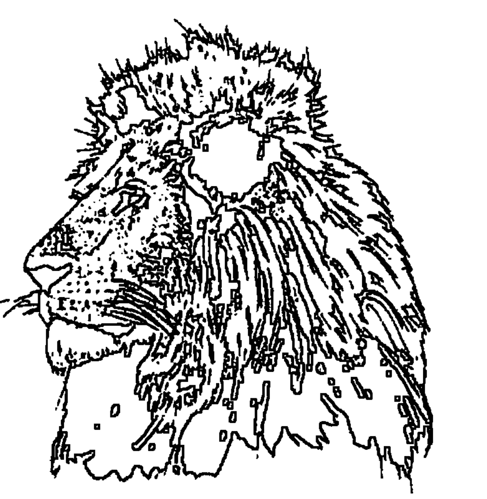

獅子多年以來都是各種能量的象徵，是太陽、黃金的象徵，也是太陽神——密特拉（Mithra）的代表。埃及人相信獅子主導了尼羅河每年的氾濫；早期的基督徒則認為，獅子是老鷹在地上的對手；中世紀的鍊金術士則將之與硫磺這種固定元素聯想在一起；而幼獅一直以來都是旭日東昇，以及所有相關隱含涵義的象徵。

獅子是貓科動物中較不尋常的成員，牠們過著團體生活，聚集在一起組成獅群。如果獅子以圖騰之姿出現，你可以預期會有與社群或團體有關的教訓與議題出現，你或許需要檢視一下你在此團體中扮演的角色。

在獅群中，母獅是最佳的獵手，雖然大多數的獅子都不是靈活的狩獵者，但牠們卻發展出傑出的合作狩獵技巧，不過母獅還負責了大部分的狩獵與幼獅培育；幼獅基本上是過著無憂無慮的生活，牠們的父母有耐心又有愛心，大多數擁有獅子圖騰的人都會發現，自己也會發展出相同的特質。

公獅最引人注目的就是牠們蓬鬆的鬃毛，公獅幾乎什麼也不做，牠們對母獅非常熱情，但又極度愛吃醋。公獅負責保護獅群不受掠奪者的攻擊，在狩獵時，牠們會用獅吼來威嚇獵物，讓牠們朝著等待中的母獅跑去。如果公獅成為了你的圖騰，你可能需要檢視一下自己在生活中的某些團體或社群之中是否有用，你是否需要做得比現在更多？你是否需要提高防衛？你是否需要與人合作？

獅子不會為了打架而打架，牠們會避免衝突，若是可能的話還會逃離危險的現場，如果你擁有獅子圖騰，請將此策略謹記於心。獅子最主要的狩獵方式就是偷襲，牠們最常用的殺戮手段是絞殺，此種技巧是以此為圖騰者在追求任何一個領域中的新目標時，可以練習加以發展的——小心翼翼、低調的取得成就。

將幼獅與旭日東昇連結在一起的這個想法是最特別的。在獅群中，由於母獅會負擔大部分的工作，所以這實際上象徵了陰柔能量的升起，太陽不見得永遠都是陽剛的象徵，太陽為我們帶來了每一個新的一天，並滋養、溫暖了生命。因此，將獅子視為彰顯陰柔能量以帶來生命與心靈的力量這種想法並不牽強。

當獅子出現，就表示有機會可以喚醒新的太陽。相信你的女性能量——創造力、直覺與想像力。這些將會為你的生活帶來新的陽光，當你感覺受到威脅，或是被打擾時，也不必害怕，只要大聲吼出你的感受。

## 猞猁

重點：隱而不顯的秘密與願景
力量周期：冬季

許多有關山貓的資訊同樣適用於猞猁，這兩種動物十分相似，山貓有時候也被稱作紅猞猁，兩者皆有粗短的尾巴、有簇毛的耳朵及臉上的叢毛。猞猁體型粗短、健壯，有著修長的腿，毛茸茸的大腳掌，在冬天時可以發揮如雪鞋般的作用；猞猁出沒的地方較北，跟山貓比起來，猞猁的領地要小得多，任何以猞猁為圖騰者，也應該研究北方方位的重要性。

臉上的叢毛讓猞猁看起來十分高貴。猞猁在阿拉斯加及加拿大仍為數眾多，牠們正試圖重返美國其他的北方區域，猞猁在雪中也行動自如，牠的腳掌比其親戚——山貓，要來得更寬。

小猞猁生下來通常都擁有藍色雙眼，在約兩個月後，牠們的藍眼睛才會變成像媽媽的黃眼睛。藍色隱含了從出生以來，遼闊的天空或天堂便向猞猁敞開著，而轉化成黃色則提醒我們猞猁可以從天堂中汲取知識。

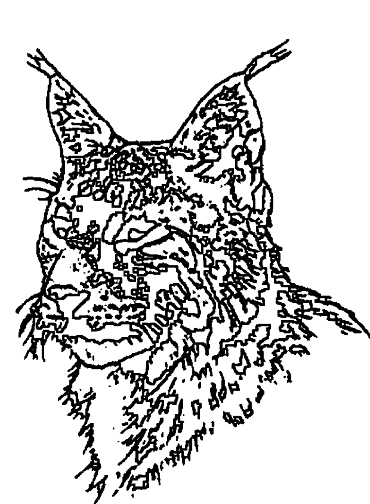

猞猁媽媽會教小猞猁如何狩獵，整個夏天及秋天都在進行牠們的狩獵課程。隨著冬天的腳步接近，這些技巧就需要派上用場，而到了冬末時，猞猁家族會分道揚鑣——去尋找自己的生活與知識。

猞猁最主要的獵物是白靴兔，猞猁寬厚的腳掌使之能夠追趕野兔，即使積雪極深也不受影響。猞猁也會以小型的嚙齒類動物為食，但白靴兔是其主要的食物來源，因此也應該研究一下此種兔子的特質。「猞猁與野兔間的命運緊緊相繫……當野兔的數量以十一年為週期而增加時，猞猁的數量也隨之上升。」¹⁵

以十一年為週期也非常具有象徵性，從玄學角度來看，十一是主宰的數字，與靈感、啟示、神秘和奧義有關。而猞猁的灰色皮毛更加深了此象徵涵義，灰色是雲的象徵，背後隱藏了古老的智慧，分隔了可見與不可見的事物，而猞猁的力量使之能夠來回穿越，汲取雲層背後的知識與秘密。

猞猁在歷史上也與許多神話與神秘組織有關，而這可為前世提供一些線索。在北歐及挪威傳統中，猞猁是女神弗蕾亞的化身，而弗蕾亞的戰車有時候也被描繪成是由猞猁來拖動的；希臘人相信猞猁可以看穿固態物體，事實上，猞猁在當時被稱作林克奧斯（Lynceus）——一個擁有同樣能力的神話角色。

西元一六〇三年時，義大利的學者們成立了猞猁學院（Academy of Lynxes），致力於研究真相，並對抗迷信。伽利略就是會員之一，而學院的標誌即為猞猁正用爪撕裂賽普勒斯（Cerbberus）——地獄的看守犬，象徵知識可以征服黑暗與苦難。¹⁶

猞猁被認為可以看到超自然之物，人們認為牠有能力可以看穿錯誤、虛假、秘密以及隱瞞。如果猞猁在你生活中出現，試著去尋找有什麼是被隱藏起來的。相信你的直覺告訴你該信任哪些人，你所想像的事物可能比你以為的更加精確，不論你所想像的事物有多奇怪或有違常理，都可能擁有一個真實的核心。

15 Weidensaul, Scott. *American Wildlife* (New York: Gallery Books, 1989), p. 4.
16 Limburg, p. 115.

猞猁能教導你如何知道他人內心的盤算，傑米·山姆斯與大衛·卡爾森將之稱作變種的千里眼，你可以藉此看到人們向他人或自己隱藏起的事物，可能是恐懼、行為、甚至是某種能力。¹⁷

以猞猁為圖騰者需要極為小心，不要破壞信任，說出口的話很有可能會被公開或扭曲，所以必須謹慎的選擇所使用的語言。「沉默是金」應該可以做為你的座右銘，信任的破壞通常快得讓你措手不及，並會帶來嚴重的後果。

若是猞猁在你生活中出現，你將會發現其他人越來越常向你分享秘密，將你帶入他們的信任圈，你將會在「無意間」發現一些人的真面目，即便有些時候你可能根本不想知道這些事情，你不需要對此份知識做任何事情，只要守住即可，並於適當的時候利用這份知識，但小心不要做出不恰當的透露。

你時常可以發現有些人在你身旁開始感到不舒服，他們或多或少都發現你可以看穿他們，當他們迴避你的時候，信任你所想像的，那就是原因。

想要喚醒你的猞猁之力、看到隱藏的知識，只要按兵不動，靜靜觀察即可。當你在觀察人們的行為與言談時，你也可以看到他們身後的形象，想像你進入了他人的體內（猞猁的魔法在很多地方都跟X光很類似），你將可以看到他們內心在打什麼算盤。學習保持沉默，相信來自猞猁的印象與知識。

## 麋鹿

重點：原始的陰柔之力、生與死之魔法
力量周期：秋末至初冬（十一月）——傍晚

麋鹿是最古老也最獨特的強大圖騰之一。阿爾岡京族印地安人（Algonquin）將麋鹿稱作mong-soa或吃嫩草的；對於阿拉斯加的阿薩帕斯坦族印地安人來說，則是Dineega；在阿薩帕斯坦族中，渡鴉與麋鹿間則有著許多牽扯，阿薩帕斯坦族的獵人會時常保護並與渡鴉討論他們的狩獵，因為阿薩帕斯坦族人認為渡鴉幫忙創造了世界。他們會向渡鴉祈求協助他們狩獵麋鹿，

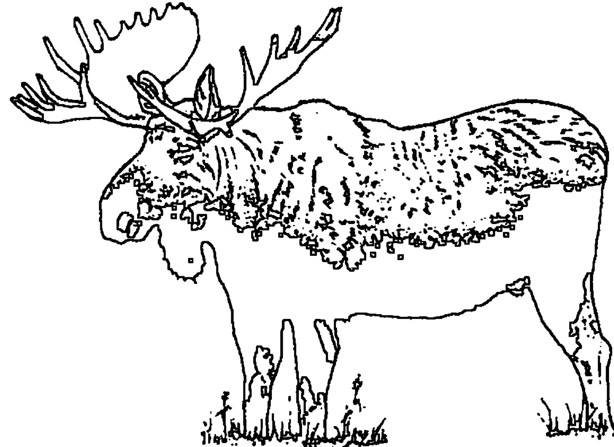

17 Sams and Carson, p. 109.

因此當麋鹿出現，就象徵了一種特別、神聖的禮物。任何與麋鹿接觸的人，不論是以什麼型態，都可以開啟一股獨特、神聖的能量。

麋鹿是種充滿矛盾的動物，雖然很奇特，但卻充滿威嚴。麋鹿雖然看起來笨拙，但卻極為優雅，雖然麋鹿會讓我們感到好笑，但也有讓我們驚嘆的一面。以麋鹿為圖騰者也會發現自己時常讓別人產生這種矛盾的感覺。

除了交配季節，麋鹿主要都是獨居的動物，並擁有獨特的建立地盤能力——不論是在湖邊、池塘邊、草地、平原或杉木林中。擁有此強大動物圖騰者，也會擁有相同的能力。

麋鹿擁有偽裝自己的奇特能力，儘管牠的體型及力量都很大，但仍能夠善加利用此能力。與麋鹿互動者也可以發展出此能力，這有一部分涉及了隱形的古老魔法，但也涵蓋了變形的面向。

此種獨特的「變形偽裝」也反映在知名的魔法師梅林身上。每當他被國王召喚，或是被單獨派遣去徵召其他同盟時，他會默默進行，偽裝成一個貧窮的牧羊人、伐木工人或是農夫。即便是國王也看不穿他的各種偽裝，他不斷、持續的練習偽裝、隱藏的技術。

儘管麋鹿的體型龐大，但卻擁有獨特的能力可以無聲、快速的移動，麋鹿看似笨拙的外表可以起到誤導及欺騙的作用，正是這樣的偽裝讓牠們得以順利存活。麋鹿之所以可以做到此點的原因之一，就是牠們擁有可以覺察深度的傑出知覺能力，牠們可以正確判斷出某個區域的可穿越性。麋鹿可以快速、優雅的穿越其他動物無法穿越的地區、穿過其他動物會被困住的厚積雪及沼澤。同樣的能力可以被加強、喚醒、甚至教導給那些與麋鹿魔力調和的人。

人們通常會把麋鹿與陰柔能量，以及世界的母性力量聯想在一起，而與麋鹿互動者將會發現這些力量被喚醒了。其中有部分是環繞著與水的關聯，水是宇宙中陰柔力量最原始的象徵，代表了創造力與直覺及啟發的動態形式。

緬因州的皮納布斯族印地安人（Penobscot）講述了有關麋鹿本為鯨魚——水中最大的哺乳類動物這個傳說；而加拿大新斯科細亞省的密克馬克族印地安人（MicMac）也提及，當麋鹿受到過度獵殺，就會返回海裡。

任何與麋鹿力量互動者都應該要了解麋鹿與水及海洋間的關係。海洋是所有生命的源頭，也是所有生命最終會回歸的地方，海洋是宇宙偉大的子宮；麋鹿通常出沒在沼澤區域，或是被看到站在湖中。

牠們也擁有可以沉入湖底的能力，能夠憋氣長達一分鐘，然後才帶著滿嘴的新鮮水草浮上水面。想要與麋鹿力量中所有的神祕之處互動者，必須要仔細研究與思考此點，這象徵了個人可以學會回到深層意識，並將新的生命與滋養帶出來。麋鹿可以教導我們如何從外在世界移動到內在世界，讓我們知道要如何跨越生死，並獲得更強的生命力；麋鹿教導我們如何善加利用生與死間的分界，擁有強大麋鹿魔法者從事靈魂復元療法的情況也並不罕見。

從阿薩帕斯坦族的宗教傳統中，我們可以看到許多與生死、生命型態的能量交流的面向。對於該族人來說，「冬宴」（potlatch）是一種紀念儀式，可以超渡死者的靈魂，在此種信仰中認為，當人死去時，他們並不會立即離開，而是會待在左近，因此要焚燒食物給他們吃。一開始紀念的冬宴是每天舉行一次，後來變成每隔一天一次、一周一次、最後演變為一年舉行一次。冬宴包括分享特別的食物，具體來說就是麋鹿頭湯，這是神聖的食物，因為不是隨手可得的，這樣的儀式可以超渡亡靈。

這表示與麋鹿魔法和能量互動者，具有與生俱來的靈媒能力，並可以和死者的靈魂交流。麋鹿圖騰者可以學會進入死亡冰冷的水中，並再次浮出水面。

另一個麋鹿之所以被與宇宙原始的母性（陰柔）能量聯想在一起的理由是，母麋鹿對於小麋鹿總是呵護有加，極少有生物會想要挑戰帶著小麋鹿的母麋鹿，牠們擁有偉大、強大的母性能量。

麋鹿也有著高度發展的嗅覺及聽覺，嗅覺在靈性的和超自然上可以對應到情感理想主義和靈性的洞察力。聽覺可以引導出順風耳和靈性理解的能力，當麋鹿與某個人達成和諧時（通常都是麋鹿主動，而非由人類主導），就應該要特別注意內在的聲音以及嗅覺。雖然你不確定為什麼，但你感覺事情不太對勁嗎？相信你的感覺，不久之後你就可以找到原因了。

小麋鹿生下來就是張開眼睛的，這點也十分特別。大多數向麋鹿魔法敞開、並產生共鳴者在出生時心眼就已經是張開的了，因此我們不難發現，當這樣的人在試圖要「開啟內在之光」時，時常會感到氣餒，即使有許多人描述他們是如何喚醒靈媒或直覺能力。但這些麋鹿圖騰者必須了解到，他們的心眼是已經打開的了，所以不需要再加以開啟，學習去相信他們原本總是以為是幻想的事情，就是讓麋鹿力量成熟的任務之一。

如果小麋鹿可以存活過第一個月，那基本上長大成鹿應該就不會有問題。這對於與麋鹿互動者的生活也極具意義，我們不難發現，擁有麋鹿魔法者在童年時期會遇到最多困難（有時甚至會留下創傷）。若可以順利度過，就象徵了具有天生的能力，可以從陰柔的生命之水中汲取創造力量，來強化並支持自己。

麋鹿最強而有力的兩個部位包括鋒利得像刀子一樣的蹄，以及同時具有裝飾及防衛效果的鹿角。頭與腳——這兩個部位是擁有麋鹿魔法者的身體最敏感之處。足部療法，以及頭部、肩頸按摩可以有效釋放壓力，雖然沒有相關研究佐證，但我認為顱底調節可以促進治療與放鬆，為擁有麋鹿魔法者帶來效益。

在健康方面，草食性的麋鹿對於真心發展其能力者的飲食也極具啟示，這不表示他們就得吃素，而是讓蔬菜變成飲食中主要的部分。這也顯示出，與傳統的化學藥品相比，另類的草藥療法比較能在此類人身上起作用。

要討論麋鹿的魔法就不得不提牠的鹿角，麋鹿的鹿角在所有會長叉角的動物中是最大的。叉角長期以來都是天線的象徵——也是可以開啟頭部高階脈輪的冕冠。

除非母麋鹿的賀爾蒙不平衡，不然只有公麋鹿會長出鹿角。這可能象徵了雄性必須要更努力（透過這些天線）才能與直覺的提示協調。摩擦鹿角以去掉上面覆蓋的絨毛也極具象徵涵義，顯示出需要按摩頭部來釋放過去，如同鹿角可以每年重生。

麋鹿也是性能量的象徵，此種性能量是原始創造能量在生理上的反應，此股能量在體內有固定的周期，每年也有一定的節奏。

秋天是麋鹿最能發揮力量的時候，尤其是十月及十一月，更是榮耀麋鹿的月份。狩獵季節結束，交配也完成了，新的循環即將開始，對於擁有麋鹿魔法的人來說，秋天是他們最有力量的時刻。枯葉的氣味、踏上枯葉發出的聲音，與原始核心的接觸，都刺激了此人生命力量的更新。這與薩溫節、萬聖節、收穫祭，及所有與此季節有關的傳統能量間皆有互動。

麋鹿長期以來也是強大的預兆，當牠在夢中出現時，象徵了長壽、美滿的生活。麋鹿被認為可以帶來力量，不只一個印地安部落相信，在吃過麋鹿之後，你的速度與耐力都可以提升三倍（「三」的神秘涵義也不能被忽視，三象徵了創造，以及從母親子宮誕生的新生兒。）蹄被認為可以治療癲癇，而一般也認為麋鹿可以消除頭痛及頭暈，麋鹿的魔法還被認為是治療蛇咬傷的解毒劑。

麋鹿除了灰熊外沒有其他的敵人，即便如此，麋鹿還是可以用奔跑或游泳來甩掉灰熊。麋鹿的機動性與直覺，再加上高度開發的感官讓牠得以逃離熊爪的威脅。

幾乎所有的北方印地安部落都有關於麋鹿各方面的神秘傳說。威斯康辛州的梅諾米尼人（Menomini）甚至曾經還有麋鹿氏族。在北極圈以南（靠近大熊湖與大奴湖）的道格利印地安人（Dog-Rib）認為霍塔（Hottah）——一隻兩歲大的麋鹿，是所有北方動物中最聰明的，並協助創造了洛磯山脈。

當麋鹿進入你的生活時，就會喚醒偉大的陰性力量以及你生命中的虛空的原初接觸，這就是麋鹿在邀請你，探索你自身以及環境中的深層意識與感性。

## 小老鼠（mouse）

重點：注重細節
力量周期：五至六周的循環

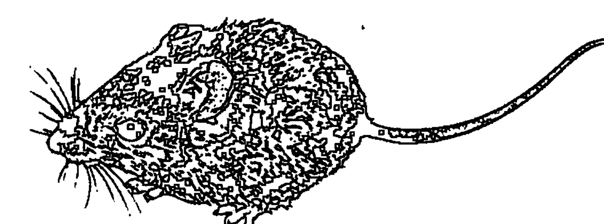

小老鼠有很多種，大多數都具有相同的特性。本章將檢視這些特性，並會特別討論麋鼠（又被稱作林姬鼠或白腳鼠）。

麋鼠擁有大眼睛與大耳朵，腳上好像穿了白襪一樣。大多數的小老鼠都是夜行性的，但麋鼠則將此特點發揮得淋漓盡致。麋鼠在黑暗中視力極佳，但在日光下卻看不清楚，其他的小老鼠則不是這樣。

麋鼠會在廢棄的松鼠窩、鳥巢、空樹幹、裂縫和縫隙中做窩，牠們的巢通常都是球狀的，出入口會有填充物或門擋住以維持巢裡的溫度。公、母麋鼠會一起重建牠們的窩。大多數的小老鼠都時常改變牠們的住處。

麋鼠非常在意其毛皮的清潔與整齊，而灰褐色的家鼠則沒那麼在乎。麋鼠很擅長打扮，但卻是邋遢的管家，這象徵了擁有小老鼠圖騰的人可能會特別重視某個領域，而忽視了其他的領域，這樣的矛盾通常會造成混亂，有時候甚至會讓與鼠圖騰者打交道的人感到惱怒。

大多數的小老鼠都會整天搜尋並儲藏食物，麋鼠以種子、漿果及樹皮為食，不像會吃農夫作物及稻穀的田鼠那麼有破壞力。

所有的掠食者都會吃小老鼠，為了彌補此點，小老鼠每年會生產三或四次。牠們得以生存的原因就在於數量龐大。麋鼠媽媽就跟絕大多數的小老鼠一樣，會照顧幼鼠約五周時間，然後牠們就要靠自己了。因此，如果小老鼠進入了你的生活之中，約五至六周後你就可以強烈感受到其能量發展。

當小老鼠以圖騰之姿出現時，若不是告訴你要注意細節，就是表示你只見樹不見林；你可能太執著於細節，而忽略了大局。

問問自己一些重要的問題。你是否有注意到生活中瑣碎但必須的事情呢？你是否把夢想的餅畫得太大，而忽略了生活中其他面向？你是否太專注於一、兩種活動，而忽略了其他機會呢？是否沒有注意到擺在眼前的事實呢？是否有些明顯的事情你卻忽略了，或是需要加以關注呢？你是否一次想要做太多事情，因此分散了你的能量呢？

小老鼠的魔力可以告訴你如何專注於細節上，也可以教你如何一步一腳印達成重要的目的。每當小老鼠出現，就帶來了有關注意力的教誨。

## 負鼠

重點：利用外表
力量週期：春季

幾年以前，當我的工作坊剛剛開始受到歡迎時，有個玄學界的人在某些特定的團體中大講我的謠言、試圖破壞我的工作，他很顯然是因為我逐漸受到重視而感到威脅。在某個工作坊即將打烊的傍晚時分，有幾個人來告訴我那時的流言蜚語。我記得自己一路氣沖沖回到家，不敢相信這個人居然會捏造這些故事——畢竟我們曾經一同旅行過。我知道我必須要跟他當面對質。

當我回到家，升起車庫門時，車頭燈照出了我車庫後頭有一對眼睛。一隻負鼠把這當成了臨時避難所了，我拿了一隻掃把，徒勞的想要把牠掃出去，最後，我把車庫門開著，希望牠會自行離開，然後就進了家門，這件事暫時讓我轉移了注意力。

一小時之後，我走出來看看車庫，負鼠已經消失了。我把車開進車庫，拉下車庫門，但車庫門只移動約五吋就卡住，我又拉了一次，還是卡死的。因為當時很暗，所以我不知道是滑道卡住，或是出了什麼問題。最後，我用兩隻手抓住把手，用盡力氣往下拉。車庫門鬆了，在我拉下車庫門的同時，那隻負鼠從門頂掉了下來，直直落在我頭上。我當時嚇了很大一跳，我不知道負鼠跟我到底哪邊的驚嚇程度比較高。顯然的，那隻負鼠爬到車庫門頂，在那邊做窩，卡住了門。

牠從我頭上彈下來，掉到地上後就一溜煙跑走了。想來牠跟我一樣，雖然頭昏腦脹，但沒受傷，我試圖讓自己恢復清醒，一邊笑著走回家裡。我傍晚時的怒氣已經消失無蹤，正是那時，我決定不對流言做任何回應，我打算繼續裝死，或是對謠言置之不理。沒過幾周，謠言就停息了，許多來電再次確認了我當時做出正確的決定，沒人相信那些謠言，而我還獲得了更多教學及講課的邀請。

## 負鼠

負鼠是一種奇妙的動物，具有獨特的能力可以藉由展現出必要的外貌而轉換注意力。牠可以教導我們如何調整行為及外表，以帶來最大的效益。

（感謝俄亥俄州特洛伊城的布魯克納自然中心提供照片）

負鼠教導我們如何利用外表，有時候「裝死」是必須的。有時候，你需要樹立起某種形象，才能以更簡單、有效的方式達到目的，這就是負鼠魔法要教你的。負鼠也可以在別人戴上假面具或欺瞞你的時候告訴你真相，負鼠的遠古能量有助於我們善加利用外表，並幫助我們看穿別人創造的虛假印象；負鼠可以幫助我們學習扭轉注意力，並在需要的時候取得注意力。

有時候我們的行為或作為必須要有策略性，不管我們內心真正感受為何，我們可能需要表現出很害怕，或是無所畏懼的樣子；我們可能需要表現出屈從或強悍、冷淡或極度關心的樣子。負鼠是最佳演員，從事演藝事業或需要學習演戲技巧的人，與負鼠互動可以帶來最佳成效。

負鼠是夜行性動物，是北美大陸唯一的有袋動物。有袋動物會在腹部的袋中養育幼崽。幼崽出生時雖然眼睛看不到，但仍能夠馬上爬進袋中，在裡面待上約一個月的時間。

在春天時，我時常會停下車來看看被撞到的負鼠。如果是母負鼠的話，牠的袋子裡可能還有小負鼠，雖然負鼠媽媽死掉了，但小負鼠仍能在袋中存活一段時間——很短的時間。

負鼠的袋中長有乳頭，大多數的負鼠都有十三個乳頭。每次出生的小負鼠可能超過十三隻，但最多只有十三隻可以存活下來。十三這個數字也極有象徵涵義，雖然很多人都將之與不幸聯想在一起，但十三也代表著十二個星座環繞著太陽，是內在太陽的象徵。

負鼠的袋子，尤其是在討論負鼠「裝死」的防衛機制時，象徵牠可以幫助我們從錦囊中取出妙計，讓我們可以獲得最佳益處，負鼠可以告訴我們，從錦囊中取出哪種面具才能夠成功。負鼠媽媽的奶水極富鈣質，因為小負鼠需要高濃度的鈣質，以此為圖騰者也應該檢視一下自己的鈣攝取量。

負鼠最知名的裝死，是一種自行引導出的休克狀態，讓脈搏微弱、心跳減緩，發出一股偽裝死亡的氣味，從外觀來看就好像死了一樣。負鼠可以快速轉換此種狀態——幾乎可說是操控自如。此種行爲目的是迷惑掠食者，讓牠們分心，使負鼠可以趁機脫逃。此種外表的靈活性以及放鬆就是以此爲圖騰者可以從負鼠身上學習的。

當負鼠以圖騰之姿現身時，問問自己一些重要的問題。你是否太做作，或是即將做出不適當的舉動？你是否需要加強自己的外表？其他人是否在你面前戴上了假面具？你是否需要將注意力從某些活動上轉移開來？其他人是否試圖轉移你的注意力？是否該從你的錦囊中拿出一些新策略了呢？學習假裝就是負鼠可以教導你的魔法。

## 水獺

重點：喜悅、嬉鬧、分享
力量周期：春季、夏季

絕大多數的人都會覺得水獺可愛又有趣，牠們嬉鬧的表現與活動攪住了我們的想像力。不論是海獺還是河獺，都有一副天生、喜悅的好奇心。

在某次我於加拿大北安大略的獨木舟旅程中，一隻水獺在我獨木舟前十呎處出現。牠從水中竄出，凝視著我，好像在好奇著是誰這麼早起，跑來了牠的遊戲場。牠一下子潛入水中消失，然後又在獨木舟的同一邊或另一邊出現，似乎想要從不同角度來觀察現在是什麼情況。當牠滿足了好奇心後，就再次潛入水中消失，去做自己的事情了。

水獺可以喚醒好奇心，提醒我們如果我們從對的角度去看的話，每件事都是很有趣的。水獺很愛玩，而且似乎對於每件事情都樂在其中。

水獺的家總是靠近水邊。在夏天時，牠們很少會待在陸地上，尤其是河獺，通常牠們都會在水邊以及水中建立起地盤，並用氣味來畫下界線。

牠們與水的接觸使之連結到了生命中原始的陰柔能量，尤其是愉悅的部分——創造、想像、喜悅以及對於孩子的愛。水獺提醒我們要讓內在小孩（inner child）能夠誕生、存活，牠們提醒我們只要帶著正確的態度，生活可以是很有趣的。水獺很少單獨出現，牠們要不就是正在跟同伴玩，不然就是在把玩著什麼東西。

成年的水獺基本上沒有自然天敵，牠們對於幼崽的保護極佳。水獺在水中靈活又迅速，甚至可以游得比魚還快，如果受到威脅，牠們通常會很快的游走，但若說到打架能力，牠們也絕不遜色。

水獺媽媽在小水獺出生時會把爸爸趕出家門，當小水獺能夠外出走動時，水獺爸爸才被允許回家，這再次反映出水獺與原始的陰柔能量及母性能量間的關係。通常一胎會有二至四隻小水獺出生，而牠們必須要學會游泳，這項任務則由水獺媽媽負責；有時候水獺的出現有助於喚醒母性的能量與責任，可能表示你需要在家庭生活中設下界限，並定義你的女性角色。

水獺在水中極為靈巧、甚至像耍特技一樣，牠們喜歡用肚子滑水，並不時的浮出或潛入水中，在水中時，牠們還可以關閉鼻孔與耳朵。請謹記，水是陰柔及生命創造力量的古老象徵，而水獺的活動以及愛玩提醒了我們——不論男女都需要某些型態的陰性特質，才能在生活中感到樂趣。

如果水獺出現在你生活中，或許該找些時間玩耍一下了，讓自己參與一些創造活動，不需要是你非常擅長的，只要好玩就好。或者你是否太愛玩了呢？因此沒有專心？或是你害怕獲得樂趣？你是否太嚴肅了呢？心中有什麼擔憂嗎？你是否需要喚醒你的內在小孩呢？給自己一些特別待遇，榮耀水獺，牠不但可以教你如何找到樂趣，還可以再次喚醒對生活以及生活中萬事萬物新的讚嘆之情。

## 豹

重點：重拾真正的力量
力量周期：黑月——新月——冬天

豹是强大又古老的图腾，这个名称一般可以指任何特定的花豹或美洲豹，但在美国的佛罗里达州，美洲狮也被称作豹，而就本书来说，我们将以花豹及美洲豹所属的豹属来讨论，以有别于美洲狮的条目。

跟大多数的大猫图腾一样，豹是凶猛与勇敢的象征，如同老虎与狮子，豹极具攻击性与力量，虽然牠不具有太阳的象征涵义，但黑豹却绝对是月亮的象征。

跟其他所有图腾一样，研究个别的特性可以让我们进一步了解与此种动物互动者能够唤醒的能量。豹属中称为leopard的花豹主要可以在非洲、小亚细亚、中国及印度发现；而称为jaguar的美洲豹则在美国西南（已经很稀少了）、墨西哥全境、中美洲及南美洲某些部分地区出没。冥想此图腾，当牠出现在你面前时，将有助于你找出牠到底是属于花豹或是美洲豹。尽管分为两类，两者之间还是有些相同的特质存在。

一般来说，豹的体型比狮子或老虎小，但却更为凶猛。牠们有超过五百条自由肌，可以随心所欲的使用。这对于以此动物为图腾者来说很重要，象征了只要有心就能够完成各种不同的任务，只要找到该使用哪条特定的「肌肉」——不管是生理、心智、心灵或精神上的——就能够完成任务。

整体来说，虽然同族间还是会互相往来，但豹都是独行侠（隐士），牠们独处或是待在自己画好的地盘中时感到最为自在。同样喜欢独来独往的人，常常会受到豹的吸引。

豹是力与美的结合，令人着迷，牠们极度优雅，能够即动即停。当豹在跟踪、狩猎或追捕的时候能保持沉静，任何以豹为图腾者，都会在追求目标时，发现他们最大的力量来自沉默，若是追求揭露事实或者说得太多，都可能会带来反效果。

豹是杰出的短跑选手，但牠们却不擅于长跑，从健康的角度来看，拥有豹图腾者，必须要学会调节脚步，让自己有时间休息、玩耍。这种人绝不能对于某件事操之过急，如果太急迫的话，就很有可能产生不平衡。不管身处什么环境，在遇到困难时，拥有豹图腾者通常都是第一个或最快做出反应的人，尤其是在工作场所中，他们对于截止日期以及压力的反应最为明显。

在交配之後，母豹只會和公豹待在一起很短暫的時間。母豹負責養育幼崽，討厭來自外界的打擾，通常擁有豹圖騰的女性也是一樣，她們不喜歡其他人，甚至會有配偶干擾了自己養育孩子的想法。母豹總是單獨撫養小豹，而以豹為圖騰的女性也常會發現自己也是如此，不論是因為已經離婚了，或是單純只是要在夫妻生活中主張自己在此領域的主導權皆然。

所有的貓科動物都擁有雙眼視覺，兩眼可以分開使用，讓他們的視野更加開闊，並有助於遠距離的判斷。因此，與豹互動者也會開始發展出更深廣的視野——不管是對於自己的生活、事件，或其他人。這不只是一種通靈術，也可以是對內在的認知。

通常人們進入玄學領域後，會進行實作及冥想，「開啟」內視力。但擁有豹圖騰者，通常生來就擁有此內視力，因此不需要在聽到別人描述如何開啟時，因為自己沒有同樣的體驗而感到氣餒，而是要相信自己的想法以及內視力（意念），因為實際上你可能已經有了更穩固的基礎了。

與豹互動者能夠獲得發展出順風耳的能力，可以聽到其他次元及其他生命型態間的對話。豹的聽力極佳，可以轉動耳朵來鎖定聲音的來源。

豹身體上的毛髮也極為敏感，尤其是臉部的髭鬚，以豹為圖騰者會發現，自從豹進入其生活後，自己的觸覺也有所提升。皮膚是我們最大的感覺器官，我們對於這個世界的體驗，比我們所想的更依賴觸覺，擁有豹圖騰者應該特別留意自己觸碰他人，或被他人觸碰時的感覺。

豹臉部的髭鬚尤其敏感，擁有此圖騰者可以發展出一種特殊的心靈占卜術。與其拿著物體並透過手的碰觸來解讀其脈動，不如把它靠在臉頰或額頭上會帶來更強烈的感受。

皮膚的敏感性（觸覺能力）會加強整個身體的反應，擁有此圖騰者通常對於厭惡的東西，例如食物，感受都會特別強烈。當豹進入某人的生活時，肉體和情慾的接觸也會因此增加，豹的到來代表了喚醒感官與熱情這兩種陰柔力量的時間到了。

在黑暗的時刻，豹可以發現自己最強大的力量元素，擁有黑豹圖騰者尤其如此。豹力量到達頂點的時刻在冬季，而月亮周期也是在沒有月亮到新月的時刻最為強大。

豹屬中的花豹有一項神秘的特質，據說牠們的呼吸帶有一股特殊的甜味，藉此可以吸引動物送上門來變成盤中飧。花豹會咬住獵物的後頸進行殺戮，牠們不會從正面攻擊，而是由背後偷襲，擁有豹圖騰者在被激怒時也不會與對方正面對峙，對他們來說不正面對峙才是正確的。這類人必須有耐心的追蹤對手，等到距離夠近時，再發動猛烈的攻擊。豹不會在狩獵時玩耍，而此類人則會向對手最脆弱的部位發動攻擊。

美洲豹也會跟蹤，但牠們更有力量。由於牠們的姿態與力量，使之得以一下咬穿獵物的顱骨。牠們大爪一揮就能扭斷動物脖子的能力也是眾所皆知的，因為牠們的敏感性，以此動物為圖騰者將能直覺感到，處於哪個位置可以最順利進行攻擊，而不論是為了要防衛自己或因為憤怒使然，他們的攻擊都是致命的。由於此種天生的力量，以此為圖騰者必須要學習陶冶自己的性情，不然很有可能在無意間就對於他人造成超乎預期的傷害。

在所有的豹中，黑豹或許是最神秘的一種了。牠是陰柔、黑暗之母、黑月（譯註：即看不到月亮的夜晚）的象徵，也是夜晚生命及力量的代表。黑豹代表了大地所彰顯的陰柔能量，通常也是黑暗、死亡以及從死亡中重生的象徵。人性中始終含有對於黑暗及死亡的原始恐懼，黑豹可以幫助我們了解黑暗與死亡，以及這兩者所內含的力量。而認知到此，我們的恐懼便可以消除，並學會使用此股力量。

在中國，貓形態的神獸有五種，有時會被畫成像老虎或豹的形象（譯註：應指白虎、窮奇、狴犴、檮杌、貔貅這五種）。黑色支配了北方，冬季是黑豹力量最強大的時刻，而水則是最有效的媒介，同時也是陰柔的元素。此種圖騰在各方面都展現了陰柔的特性：孩子、處女、蕩婦、母親、女戰士、女預言家，以及年老有智慧的婦人。

當黑豹以圖騰之姿進入你的生活時，就會喚醒內在的熱情，解除束縛顯露出更為底層的力量與本能。同時這也象徵了靈熱的甦醒，表示此時不應該仍限制住自己的力量了，且更進一步的是，要重拾個人真正的力量。

在傳說及典籍中，豹以動態圖騰出現在世界各個角落。豹是「百眼巨人阿耳戈斯」的象徵，看守著宙斯鍾愛的小母牛伊娥，在阿耳戈斯死後，他的眼睛變成了孔雀的羽毛。豹可以將守衛的力量帶給那些與之接觸的人。

獵豹也被認為是耶穌所有，在Abodazara（早期猶太人對於聖經的評論）中，被列為約瑟家族的姓氏，裡面講述了有個人「以耶穌·本·潘瑟（Jesus ben Panther）之名」被治癒。因此，豹時常代表了在受難一段時間或某種程度的死亡後的重生時刻，這隱含了舊的問題可能終獲解決的涵義，或甚至久未癒合的創傷終於開始癒合，而隨著治癒，受傷時所失去的力量也會再次甦醒。

豹也是與酒神戴奧尼索斯（巴卡斯）有關的象徵，有個故事是關於酒神受到豹的照料，而酒神有時也被描繪成駕著由豹所拉的戰車。

有關於酒神的神話與故事非常具有象徵性，對許多人來說，酒神是放縱的慾望，因此也是靈熱能量的覺醒。因此酒神與豹象徵了從單純的存在，朝向沒有指導原則或阻礙的新生活邁進之時刻，狂歡的豹喚醒了原本被封閉的無意識衝動與能力，代表了即將到來的覺醒時刻。

豹是意識到偉大任務的象徵，所有的希臘英雄都是由神與凡人母親結合所生下的，也就是神聖之火與偉大女性的結合，因此英雄們擁有神聖力量的種子，最終會提供衝破平凡界限與限制的動力，得以順利進入前進與淨化的新階段。英雄的傳說告訴我們，不管墮落得多深——不論是自己造成或是受外勢所驅迫——總是會有希望之光與愛可以帶我們回來。當豹進入你的生活時，帶領你回來的路途便即將展開。

酒神克服了多年的流浪、掠奪、瘋狂、破壞及苦難，才晉升神界。酒神的教訓在於克服負面的習慣與自己或他人造成的苦難，以獲得我們的神性。他的故事正是表示「我們都是在成形中的神與女神。」

擁有豹圖騰者的一生中，通常都會有或即將會有人以老師、培育者和引導者的姿態教導英雄之路。對於酒神來說，這個角色是半人馬的西勒諾斯及半人羊薩特，這代表了在我們身邊的確圍繞著其他各種世界，而當我們開始踏上英雄之路時，就能夠以意志來增加看到這些世界的能力。

這些其他世界將會向擁有豹圖騰者敞開。這些世界、其中的存在以及豹的能量都與強大的性能力連結在一起。這可能暗示再度解決潛在性議題的時機已到來，或單純要你學習接受這些能量作為真正的力量而不要加以批判，我們必須了解並學習到性能量多變的本質，並學習如何有意識地加以引導。

酒神是生命與重生、熱情與復甦的神。酒神出生了兩次，豹象徵了未來將有機會再次出生。這通常表示我們必須勇敢面對生活中那些煩人的惡性腫瘤——這是一個跨越門檻（譯註：原文為「Meeting the Dweller on the Threshold」，直譯為「與門檻的守門者會面」，這句諺語出自布沃爾·李頓（Bulwer Lytton）的小說《扎諾尼》（Zanoni），描述英雄格里登在展開旅程之前，打開了他的導師警告他不得打開的瓶子，瓶中冒出種種折磨他、讓他感到巨大痛苦的異像，後來「the Dweller on the Threshold」便引申為每個人都必須跨越的內在障礙）的過程——這些面向是我們掩飾、粉飾、塞在衣櫥深處，或假裝不存在之事物，有時候這表示我們需要忍受失去自己認定的深愛之物。

豹掌握了重生與時時守護的希望，正是我們在某些時刻所需要的額外保護。豹也象徵了從生活中的黑暗面重新取得力量，豹的出現代表不論失去了什麼，都可以獲得更好、更強大、更有益的改變。

在酒神的傳說中，這名英雄帶著神奇的酒神杖——一根藤蔓纏繞、上面還有一顆松果的手杖。這帶來了創造幻覺及假象的能力，讓豹圖騰的人，擁有讓他人可以按照自己希望的去見物或思考的能力。此種能力必須要透過自我修練來習得與強化，就像黑豹一樣，你可以輕易以你所希望的，融入周遭的環境之中。

對於北美洲與南美洲的印地安人來說，美洲豹——尤其是黑豹——是具有偉大魔力的。黑豹的攀爬、奔跑及游泳能力甚至勝過老虎。因為黑豹在各方面都如此傑出，因此對拉丁美洲原住民來說，便成了力量無窮的象徵，同時也是無所不能的代表。

對於亞馬遜的圖卡諾印地安人（Tucano）來說，美洲豹的吼聲就是轟隆的雷聲，因此，黑豹就是黑暗之神，可以吞食太陽，造成日蝕。這反映出在陰柔之力中內含的無窮力量，擁有豹圖騰者可以逐漸體驗到這種力量。

阿拉瓦肯族印地安人（Arawak）認為萬物皆有美洲豹，沒有任何東西可以脫離美洲豹而存在，美洲豹與所有的生命、所有生命的彰顯都有關係（因此也與所有生命中無窮的陰柔有關），對他們來說，成為美洲豹人是終極的變形儀式；奧爾梅克人（Olmecs）為美洲豹建立了紀念碑；而阿茲提克和馬雅人則講述並教導了成為半人半豹可以帶來的力量。可以成為美洲豹的人是不受任何文化限制的，他們的另一個自我獲得解放，將能夠自由展現慾望、恐懼和抱負。

印地安巫師會進行儀式向美洲豹借取力量，能夠做到的人將可以成為聖人，或是成為極惡之人。在拉丁美洲印地安人中，充滿了透過美洲豹力量進行復仇、劫持、治癒疾病的故事。

即使在埃及的儀式中，豹的尾巴也會被掛在腰上或頸部，以帶來保護和力量，被用在稱作「入骨」的過程中——這是他們的變形方式，用以得到豹的力量。

尼采曾說：「越挫越勇。」（that which does not kill us makes us stronger.）那些向豹圖騰的力量敞開者的人生就是抱持著同樣的觀點，因為兒時或更久以前的磨難讓我們失去的天賦能力及創造力即將被喚醒，受到正視、蛻變。

豹的出現象徵了英雄之路的新轉折點，真正反映出不只是要取得自己的力量而已，而是要重新奪回喪失的力量，以及重建與偉大遠古之力間的親密接觸。豹讓我們有能力超越想像，只要有紀律及控制就能夠有機會實現。這就是即將重生的精神。

## 豪豬

重點：新的讚嘆
力量周期：秋季

豪豬是時常受到誤解，但卻十分迷人的哺乳類動物，屬於齧齒科。豪豬有時又被稱作刺蝟，但這是錯誤的，因為刺蝟是完全不同的動物。

豪豬本性溫和，牠們也都以自己的步伐緩步前進。雖然豪豬看起來很笨拙，而且在地面上動作緩慢，但牠們卻是傑出的攀爬者，可以爬到五十至六十呎高；豪豬的腿短而有力，並且擁有獨特的能力可以用腿去測試牠們想要攀爬的樹幹是否夠堅固。

豪豬居住在林地，特別是針葉林區。牠們會吃各種樹木及常綠樹的樹皮，另外也喜愛花、嫩葉及荷花；牠們還特別熱愛鹽，會吃任何有微弱鹽味的東西。擁有此圖騰者可能會需要注意他們的鹽分攝取，因為這些人很有可能會吃得太鹹。

我第一次遇到豪豬是在加拿大北安大略省的野外，我當時得搬運我的獨木舟，當我來到河流的下一個河階時，一隻豪豬出現在河邊約三呎的地方，正在吃著荷花。牠抬頭帶著好奇及趣味看著我，接著又繼續進食，顯然對於荷花的興趣多過於我。

這反映出豪豬的個性與特性，牠有著和平的本性，似乎對於牠所做的任何事都樂在其中；豪豬的好奇心極強，似乎對於任何遇到的事物都充滿興趣及讚嘆，同樣的特質也會在以豪豬為圖騰者身上被喚醒。雖然豪豬的視力不佳，但卻極為好奇，而且不會因為視線的限制就過於警覺。

豪豬最引人注意的特質就是牠的刺，但也是最常受到誤解的特質。豪豬的刺——約有三萬根——完全覆蓋臉部、腹部及尾巴以外的身體。豪豬的刺完全由一層肌肉控制，可以平放或豎直，當受到侵擾、干擾或威脅時，刺就會站起來。豪豬的刺內充滿空氣，讓豪豬可以浮在水上，這反映出豪豬具備游泳的能力，並可以進入情感（水的象徵）領域之中。

豪豬並不會射出刺，當受到威脅時刺會豎立起來。為了保護臉部，豪豬會將臉放低到前腿之間，讓刺可以掩蓋。豪豬的刺與身體的連結是很鬆散的，因此刺可以輕易脫落；豪豬也會用尾巴抽打掠食者的頭部，如果打中了，刺也會隨之脫落。

豪豬的刺並不帶毒，但在尾部卻有倒鉤。當刺穿透敵人的皮膚時，倒鉤就會隨之張開，因此掠食者的每個動作都將導致刺插得更深，完全無法將之移除。

豪豬最大的天敵是鼬鼠科的食魚貂。多年以來，生物學家曾認為，食魚貂可以把豪豬翻過來，肚子朝天，好進行宰殺；但現在他們知道食魚貂其實是抓住豪豬的鼻子，重複咬牠們的臉直到牠們死去。食魚貂非常擅長狩獵豪豬，使得豪豬在野外越來越稀少，任何擁有豪豬圖騰者也應該研究鼬鼠科動物，尤其是食魚貂。

美洲獅也十分擅長獵食豪豬，牠們可以巧妙的把豪豬翻過來，暴露出最脆弱的腹部，因此擁有豪豬圖騰者也應該了解一下美洲獅。

豪豬通常住在中空的樹幹或洞穴中。在冬天時，牠們會在樹中待很長的時間，與其在雪地中蹣跚而行，爬樹對牠們來說是比較容易的。

豪豬通常一次只生一隻小豪豬，但偶爾也會有雙胞胎。豪豬在秋天交配，小豪豬會在約七個月後出生，由豪豬媽媽獨力養育。豪豬的平均壽命通常是九到十五年。

隨著小豪豬逐漸長大，牠們通常可以用後腳站立，然後來回搖晃，揮舞著爪子。這是一種有節奏的運動。當進行觀察時，看起來十分像跳舞，而豪豬也可以幫助我們進入舞蹈或生命中可以喚醒讚嘆的新節奏。跳舞也可以是純粹的樂趣，以豪豬為圖騰者，可以在其中找到許多樂趣，並感到放鬆。

豪豬也很容易鼻塞，這是一種動物會染上、類似感冒的疾病，通常都是因為缺乏營養而造成的。以豪豬為圖騰者應該要特別留意攝取足夠的營養及維生素，多吃綠色蔬菜對於健康尤其有益，因為豪豬也是草食動物。如果你覺得你的能量在逐漸衰退，或是因為感冒或類似感冒的症狀而感到體力不支，請先檢查你的飲食。

豪豬圖騰者在受到冒犯時可以很巧妙的進行尖銳、強力的反擊。他們可以巧妙的說出或做出能夠造成最大、最久傷害的事情——就像針上的倒鉤會越刺越深一樣。豪豬圖騰者不常這樣做，但一旦出手，他們絕對會一矢中的。

當豪豬出現時，檢視一下你的生活。你是否因為別人的想法而沒有去探索可能很好玩或很有趣的活動呢？你生活中是否有休閒時間呢？你是否對於他人的鋒芒太過敏感呢？你是否鋒芒太盛，或是將快樂建築在別人的痛苦之上呢？你是否仍讓許久之前的肉中刺留在體內，持續傷害自己呢？有時候不論有多痛苦，你都必須移除舊刺，這樣才不會化膿，毒害你的身體。

豪豬可以告訴你如何抵抗他人的鋒芒，教導你如何在逆境中仍能享受生活，並維持對生活的讚嘆。豪豬可以告訴你如何獨自行走，不需要太過嚴肅，但仍能達到目的地。牠們可以保護自己的內在小孩不受他人的生活之刺所傷，並告訴你，如何從你的弱點中汲取力量。

## 草原犬鼠

重點：社群
力量周期：春季、夏季

或許除了狼之外，沒有其他的動物比草原犬鼠更能體現社群的概念了，草原犬鼠社群總是充滿了各種活動。草原犬鼠是松鼠科的成員之一，有兩種主要的類別，黑尾草原犬鼠主要住在平原中，而且比較常見；另外一種則擁有頂端是白色的尾巴，牠們住在山區，而且不太喜歡社交。

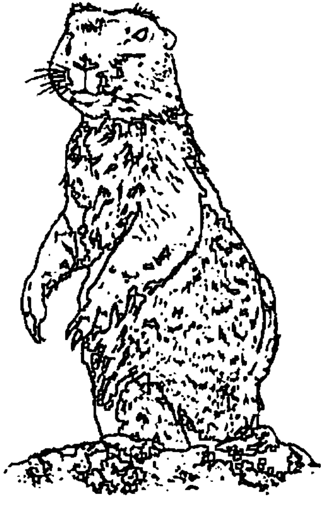

草原犬鼠住在以四通八達的地底通道所組成的市鎮中，牠們的洞穴或家園包含了許多各自的通道與房間。整個市鎮被分為公共與個人的社群，其中的成員互相依賴，市鎮中每個部分都棲息著不同「家族」的成員。

在挖掘地道時，牠們會把土踢到身後，使得地面上的出入口處出現隆起的土堆。接著牠們會砍下出入口附近的樹，使之可以更容易守望掠食者，負責守望的草原犬鼠會高聲尖叫來發出警告信號。

草原犬鼠最主要的掠食者本為黑足鼬，但現在黑足鼬只能在籠子裡看到了，目前使之重回草原的復育工作成果仍有限。現在草原犬鼠的主要掠食者是貓頭鷹與蛇，因此以草原犬鼠為圖騰者也應該要加以研究。

草原犬鼠以草及植物為食，牠們幾乎不喝水，而是從植物中攝取水分，在冬天時，牠們幾乎完全仰賴儲存起的脂肪過活。

擁有草原犬鼠圖騰者可能需要確保他們的飲食中有足夠的蔬菜，如果可以定期攝取大量的新鮮蔬菜，那水分攝取就不是那麼關鍵；以此動物為圖騰者可能也會對於太陽感到特別敏感，因此太陽眼鏡也很能夠派上用場。草原犬鼠的雙眼中有著橘色的晶狀體，可以隔絕掉一些炫目的陽光。因為牠們常常在做日光浴，因此這對草原犬鼠來說很有幫助。

草原犬鼠是擅長交際的動物，牠們會以親吻或擁抱來互相問候，親吻時牠們的嘴巴張開，讓牙齒互碰。牠們喜歡展現熱情，如果草原犬鼠以圖騰之姿出現，看看你自己的社交性吧。你或你身邊的人是否夠友善呢？還是不擅社交？你是否在不適當的時候想要隱遁呢？你是否需要比之前展現出更多熱情呢？

檢視你的合群度——不管是在家庭、工作，或社交圈中。你是否有充分參與呢？其他人呢？你是否需要學習與他人共處，分擔責任呢？草原犬鼠通常象徵了你對於社群生活的看法，以及在其中扮演的角色即將會有改變。這些教訓可能會長達五至七年——如同草原犬鼠的平均壽命。

由於草原犬鼠擅長挖洞，因此當牠們現身時，你不妨檢視一下在生活的各個面向中，應該要做多少鑽研呢？你是否需要進一步參與身邊的人的生活呢？或是你是否牽扯太深了呢？

雖然很多人都認為草原犬鼠是種有害的動物，應該被撲殺殆盡，但事實上，草原犬鼠對於大自然卻有珍貴的助益。挖掘可以讓泥土接觸到空氣，使植物更容易生長，牠們的洞也讓更多濕氣可以進入地表之下。當草原犬鼠出現時，通常就代表你該更主動參與社交活動了。改變是必須的，讓你自己更加投入，不要讓其他人的指責阻擋了你的參與。

## 兔子（野兔）

重點：繁殖能力與新的生命
力量周期：全年

兔子是一種本質與能量都充滿矛盾的動物，這在神話與傳說中皆有跡可循，而不同的社會對其觀感也有差異。在希臘神話中，兔子和女神黑卡蒂（Hecate）有關；在埃及的象形文字中，則與存在的概念有關；因為淫亂放蕩，因此被希伯來人認為是不潔的（《申命記》第十四章，第七節）；而在阿爾岡京族印地安人的神話中，造物主是「偉大的野兔」（Great Hare）。¹⁸

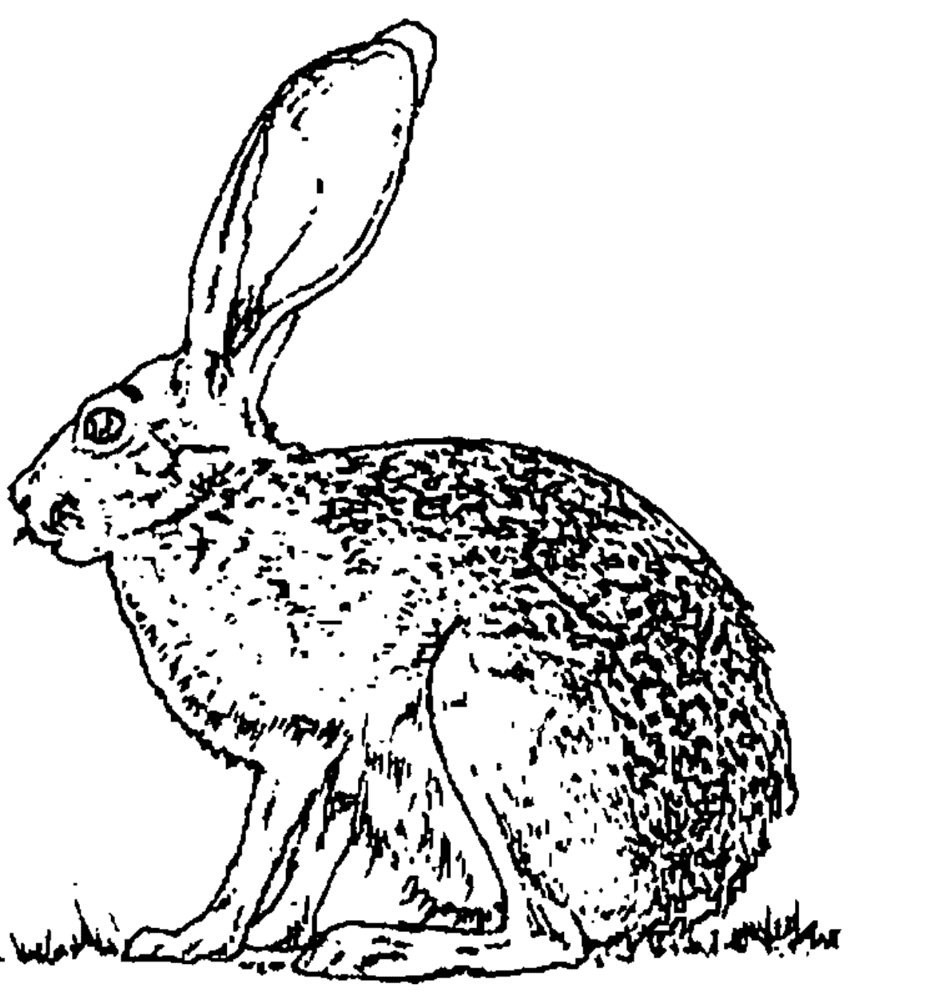

在中國，兔子是十二生肖之一，被認為是幸運的象徵，賦予此生肖者月之力量；屬兔的人則被認為是敏感、具藝術細胞的；兔子是企圖心、手腕及美德的象徵，而且住在月亮上。

> 18 Cirlot, J. E. *A Dictionary of Symbols* (New York: The Philosophical Library, 1971), p. 139.

兔子因繁殖力強大、速度快、以及其跳躍能力而聞名。兔子主要靠跳躍來移動，兔圖騰者會發現自己也試圖這麼做，這些特質對於以兔子為圖騰者來說都很重要。

兔子主要在灌木林與高草叢中出沒，在白天與晚上都很活躍，但在清晨與黃昏時最常被看到。這些時間與精靈仙境有關，因此兔子時常被認為是可以在不知不覺的情況下，把人引入精靈仙境中的動物。最普遍的例子就是路易士·卡洛爾的名作《愛麗絲夢遊仙境》，在故事中，愛麗絲跟著一隻白兔從洞中進入了一個奇妙的冒險世界。

兔子與老鼠是兩種最常見的獵物，因此大自然給予了牠們旺盛的繁殖力作為彌補。兔子每年可以生下二到五窩小兔子，通常一次會有三至六隻出生，因此兔子長期以來都被認為是性慾和繁殖力的象徵。

兔媽媽只會在早上與傍晚時餵食小兔子，其他時間則離窩遠遠的，自行進食，這對於幼兔來說是一種保護作用，因為這樣比較不會引起外界對幼兔的注意。不幸的是，很多人都在兔媽媽離家時遇到小兔子，因此以為牠們被遺棄了，然後就會移動小兔子。

在出生後一個月內（二十八天），小兔子就可以自行外出。牠們可以待在窩裡，但也可以自力更生。如果生下了一批新的兔寶寶，兔媽媽就會把之前一批小孩趕出家門。這個二十八天的周期強化了兔子與月亮間的鏈結，兔子的圖騰出現，你就會在生活中看到二十八天的周期開始出現。

最常見的兩種兔子是白尾灰兔與長耳大野兔。白尾灰兔的耳朵比長耳大野兔短，毛皮也全年不變色；長耳大野兔的毛皮在冬天顏色會比較淺，甚至轉白。而這兩種兔子都會蹦蹦跳，兔圖騰者將會看到生活中出現不同程度的跳躍動作，這不會是穩定、一步一步的動作，而跳躍發生的頻率通常不會超過一個月（二十八天）的時間。

雖然有些人將恐懼與兔子聯想在一起，但兔子卻擁有極佳的防衛能力，以此為圖騰者也可以順利將此能力應用在自己的生活之中。兔子時常建造用來躲藏與休息的洞穴，為了要建造洞穴，兔子會先在地上或草中挖出一個淺淺的碗，前後敞開，以便於在必須的時候順利逃跑，兔圖騰者也應該為各種可能性做好準備，如果兔子出現，可能表示需要多做計畫，或是檢查一下你已經開始進行的事情，因為你絕不希望自己被逼到牆角。

兔子可以很巧妙的避開視線，牠們可以保持不動、完全靜止，因為牠們知道許多掠食者都可以從遙遠的距離偵測到動靜。如果你正處於競爭之中，不管是在工作還是遊戲中，不要被別人掌握自己的動作是很重要的。

兔子也很擅長快速轉身、做急轉彎，如果需要逃跑的話，牠們也可以健步如飛。學習如何從靜止轉換到高速，這有助於你的成功，並且讓你可以善加利用稍縱即逝的機會。

兔子是草食動物，以此為圖騰者也需要留意一下自己攝取的食物。若要有良好的健康與治療作用，即使只有短時間吃素，也可以讓你更加健康、強壯。

兔子可以告訴你辨認身邊的訊息，幫助你如何與月亮的周期同步，並了解自己生活中的潮起潮落，這可以讓你在生活中更有生產力。

## 浣熊

重點：靈巧與偽裝
力量周期：春季、夏季——夜晚

浣熊是迷人的動物，牠們是熊的遠親，因此以此為圖騰者也應該要研究一下熊。浣熊是適應力最強的動物之一，雖然自然棲息地受到入侵，但牠們卻仍能在城市中生存。

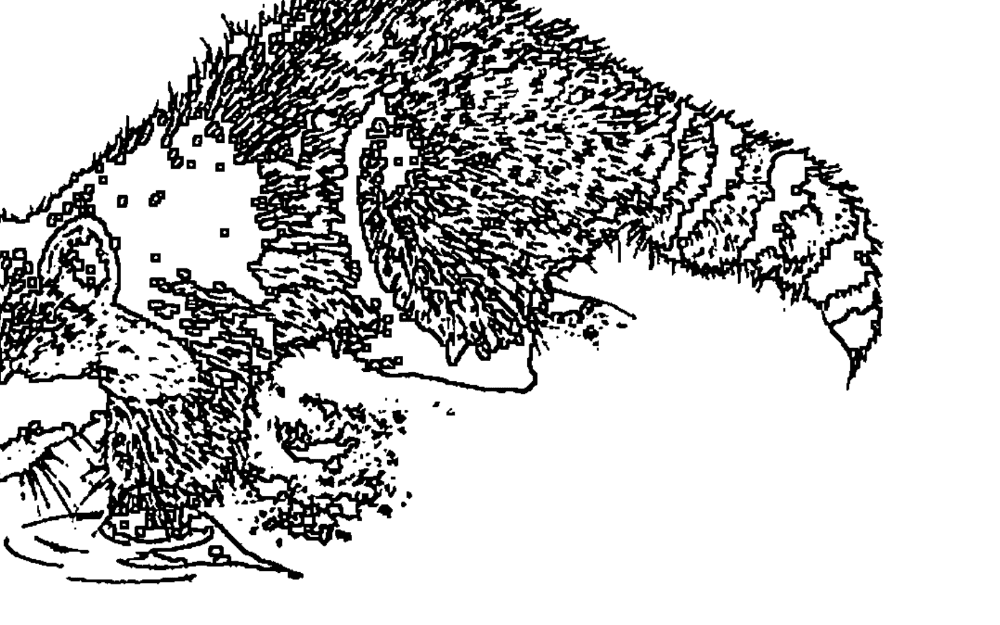

一般認為，浣熊（raccoon）這個名字是來自於阿爾岡京族印地安語中的archunem，意即「搓手者」，浣熊雙手十分靈巧，是開罐子、門閂、門把等的高手，因此，牠們以偷竊（能夠取得不屬於牠們的東西）而惡名昭彰。我們不難發現一些雞鳴狗盜之輩擁有浣熊魔法，只是沒有把此魔法用在正途上而已。

浣熊好水，牠們喜歡將雙手以及食物放在水裡攪動，因此，讓人以為牠們在吃東西之前一定會洗一洗。事實上，水可以增加浣熊雙手的敏感性，使之對於食物的觸感提升。

浣熊幾乎什麼都吃，牠會捕捉小型獵物，但主食大多是蔬菜和水果，這也是擁有此圖騰者應該謹記在心的。

浣熊的好奇心極強，因此使得牠們常會涉入不該涉入的情況。浣熊喜愛探索，牠們夜間的遠足就好像是小型的冒險一樣。浣熊對於新的領域非常好奇，而且會研究每一項吸引牠們的事物。

浣熊最引人注目的特色之一就是牠們戴的面具，雖然有些人將之與偷竊聯想在一起，這卻使浣熊成了擁有強大魔力的象徵。很多社會皆有使用面具來轉換意識、進行治療的儀式。面具製作是一項古老的藝術，用於世界各地的祭典、慶祝和魔法儀式。

隱藏在面具之後，人們可以變成另外一個人或另外一種東西，戴上面具後，我們可以變成任何想要成為的人事物。面具充滿了神秘，是用來變形的工具，隱藏、秘密皆有助於變形，幫助我們改變成想要變成的事物，並賦予我們魔力。

以浣熊來說，戴著面具代表模稜兩可、含糊其辭。當我們戴上面具，我們就不再是原本的自己了。我們會獲得別種力量，在心中創造一扇門，跨過物質世界的門檻，我們可以穿越到新的次元，成為新的存在。

這就是浣熊的魔法，牠們是偽裝和保密專家，知道如何配戴面具以達到各種不同的目的。浣熊可以教你如何戴上面具，隱藏並轉換自己，每個人都要以自己獨特的方式與浣熊打好關係，而浣熊魔法可以教你如何善用你所佩戴的面具；浣熊可以教你如何戴上治療面具，或是顯示出你應該要變成的那張臉。浣熊擁有可以改變我們臉孔的知識。

每當我前去上課或工作坊時，我都會尋找任何可能出現的動物，好決定接下來的課程應該要與哪種能量結合。當我第一次上面具製作課時，除了我平常在路上會遇到的動物外，我沒有看到其他動物，我有點驚訝，因為通常每次有新的課程時，就會有新的動物出現。

課程進行得很順利，當我坐進車子裡準備離開時，我的車頭燈照出了一對動物眼睛，我慢了下來，想說可能是走到馬路上的貓或狗。而當我開近時，我看到一隻浣熊坐在路邊，牠戴著面具的眼睛緊盯著我。我緩緩向前開，然後停在一旁，牠還是不動如山，只是瞪著我看。在這之前，我從未想過浣熊會出現為面具製作課程增加能量，但自從那次之後，每次我去上面具製作課程或是下課後，都會遇到浣熊。我榮耀了浣熊給我的幫助。

浣熊擁有透過面具和偽裝來變形的知識，此知識可以被應用在宗教或儀式程序中，還可以用於日常生活上。你是否需要對他人展現出不同面貌才能獲得更大的成功呢？你是否隱藏了真正的自己？別人是否向你隱藏了真正的自我？浣熊可以幫你找到答案。

浣熊不會冬眠，但在冬天時會陷入熟睡狀態，仰賴體脂肪而活。這與學習如何使用面具讓你本身的某個面向睡著，使得另一面可以醒來有關。這也是浣熊魔法可以教導你的事情之一，浣熊將會幫助你更靈活的使用面具進入新的意識轉換及次元。

浣熊非常勇敢，甚至可以說很兇暴。每個春天與初夏都會有成窩的浣熊被帶進布魯克納自然中心，與牠們互動及照顧牠們讓我深刻了解到——即使年幼，浣熊還是可以很兇猛的。隨著牠們逐漸長大，浣熊會變得越來越乖戾，在野外，浣熊狡詐又敏捷，是自我防衛的高手。

浣熊喜歡空樹幹，尤其愛在裡面做窩。牠們每年會生一至兩批小浣熊，每批通常是二到七隻。出生後約二十周，浣熊便可獨自生活，但牠們非常喜愛交際，每次你看到一隻浣熊時，多半也會看到另外一隻。浣熊在野外的壽命也比大多數動物長，可以活到約十歲。

如果浣熊出現，你可能會在好長一段時間都感受到牠的影響力。如果你想要做些改變，或是想要在得到更高地位前，先向別人隱藏你的改變的話，試著以二十周為周期來使用浣熊魔法，你將會發現這樣比較有效。而就長期或重大生活轉變來說，當浣熊出現時，你不妨制定一下長程規畫。

## 公羊（大角羊）

重點：尋找新的開始
力量周期：晚秋、初冬

公羊在許多社會中皆具有象徵涵義，對於許多人來說，牠象徵了犧牲，在許多儀式傳統中，都會為了不同的目的宰殺公羊，這在聖經中便時有所聞——摩西為主持逾越節而獻祭公羊；公羊也象徵了追求巨大獎賞，正如同希臘英雄傑森的金羊毛傳說一樣；公羊也象徵了偉大的能力與力量。攻城鎚（譯註：英文為Battering rams，ram即為公羊之意。）正是用來衝垮敵人的大門或城門。

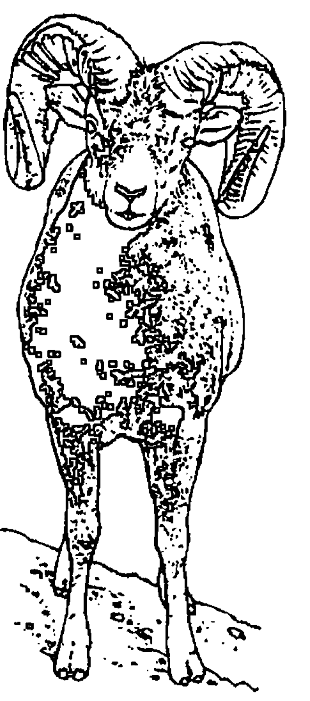

如果公羊出現在你的生活中，你生活中某些領域就會出現全新的開始。公羊也是十二星座中牡羊座的象徵，是占星年份的第一個月，牠出現在春天，是嶄新開始的時刻，公羊告訴我們要在新的領域中主張自己。

在中國生肖中，山羊與綿羊（公羊）都是視為羊肖，十二生肖亦可對應一年十二個月，肖羊的人被認為是敏感、努力不懈的。牠們有點壓抑，從不會站出來直接說出自己的心聲，而在中國傳統中，牠們也有點不切實際的傾向。

在現實生活中，公羊擁有許多與神話及傳說相關的特質。通常在自然影片中，都會拍攝牠們在力量爭鬥中以頭部互相衝撞，象徵牠們的力量與優勢。

大角羊家族的公羊和母羊會居住在森林線以上，牠們以某些特定的草本植物嫩芽及花朵為食，在春天及夏天時，牠們會累積一層又一層的脂肪，長出厚重的毛皮，讓牠們得以度過寒冬。

羊角是公羊最顯著的特徵，對擁有此圖騰者來說，角可以刺激心智活動。隨著公羊的角每年越長越大，好奇心和活躍的想像力也會持續升溫，並隨著每一年逐漸增強。

公羊的角是武器，是一種防衛機制與地位象徵。公羊的角終生不斷生長，最後會形成完全的捲曲或螺旋。螺旋象徵了偉大的創造力，由於公羊角是與頭部有連結的，因此倍顯重要，以此為圖騰者的心智功能、想像力、靈感以及實踐的能量都會獲得新的刺激。

年輕的公羊通常會角逐山頭的王位，以測試力量與追求新的地位。地位高低在秋天時更顯重要，牠們會為了與母羊交配的權利而發起爭鬥，公羊們會相互衝撞，撞擊頭部，讓角碰撞在一起，直到有一方認輸為止。對於以此動物為圖騰者來說，秋天可能是你主張自己能量，並邁向新挑戰的時刻。

公羊可以活到約十四歲，但平均壽命會隨著角的尺寸而遞減。角越大的公羊就越容易受到挑戰，而角上的環則記錄著公羊的年齡。

大角羊，就跟山羊一樣，有著抓地力極佳的腳趾，牠們的蹄上覆蓋了一層彈性物質，可以吸收衝擊力並幫助抓地；羊的關節也可以在從高處跳下時，發揮迷你緩衝器的作用，大角羊只需要兩英吋的空間就可以找到立足點。

這對於擁有此圖騰者來說非常重要——剛進入嶄新的事物時，入口可能很小，但如果持續前進，就能夠穩穩當當的繼續下去。以此為圖騰者必須在進行一個新行動及新開始時，學習相信自己具有能夠穩步前進的能力。

如果公羊進入了你的生活，記得做一些檢查——但不需要花很多時間。這通常代表該是發起一些新的開始、新的努力的時候了，不要只是空想而已。你是否在機會出現時善加利用呢？你是否在跨出新的步伐及跳躍時有保持平衡呢？你的開始是否合宜呢？你是否有實現你的想法，或只談不做呢？當公羊出現時，將會教導你如何帶來心智與想像的力量，並用以尋求新的高度與冒險。

## 大老鼠 (rat)

重點：成功、焦躁、精明
力量周期：全年

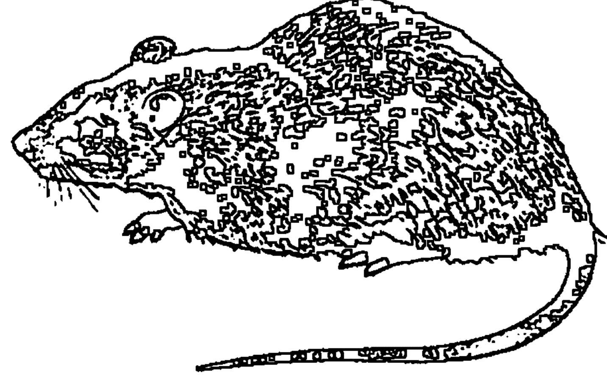

大老鼠的出現通常會讓大多數人感到苦惱，因為牠通常會帶有傳染病，然而雖然大老鼠沒有什麼高貴的名聲，但卻極具適應力。

在中國生肖中，大老鼠象徵第一年。在傳說故事中，佛陀召集了所有的動物到祂面前，而在所有的動物中，只有十二種動物出現，第一個抵達的就是大老鼠。為了獎賞成功抵達的十二種動物，佛陀將每一年各自以牠們來命名，第一年就是給了大老鼠。肖鼠的人被認為有成功相，雖然有時候會太過煩躁、緊張，但他們也十分精明。

雖然在城市中大老鼠可能是一種有害的動物，但其表親林鼠或鄉下老鼠都是非常特殊的動物，牠們的智力很高，常常展現出推理的能力。研究顯示，野外的大老鼠比實驗室中的大老鼠來得更加聰明。

儘管人類做了各種努力，但大老鼠仍生養眾多，此種成功的本能可能就是大老鼠要對你說的話。你是否太過刻意了？你是否不夠努力？你需要更積極去追求目標嗎？

大老鼠非常擅長交際，並時常為了生存而合作。牠們會儲藏食物，展現出一種有趣的節約行為，大老鼠是適應力最強的動物，幾乎在任何一種環境中都能生存。

美國國內有兩種大老鼠——黑色的大老鼠來自東方，棕色的大老鼠則來自挪威。在兩者中，挪威大老鼠被認為是比較有害的，因為牠們可以輕易破壞大量儲糧。如果可能的話，辨認一下是哪一種大老鼠。從問你自己：這是鄉下老鼠還是城市老鼠開始，然後再更進一步。

如果大老鼠以圖騰之姿出現，你可能會發現自己越來越焦躁。這可能表示你應該更靈巧的處理你正著手的事情。你是否沒有適當處理掉生活中的害蟲呢？你是否需要變得更有適應力？這甚至可能代表你該更積極朝向成功的目標努力了。當你看到大老鼠時，觀察牠的行為將有助於你找出牠將會為你帶來何種能量。

## 犀牛

重點：遠古智慧
力量周期：全年

目前仍有五種犀牛存活於地球上——兩種在非洲、三種在亞洲。非洲犀牛與印度犀牛不同之處在於牠有兩支角。瞭解你的圖騰是屬於哪一種犀牛可以為你帶來更多見解，包括你的前世與此犀牛出沒地區間的連結。犀牛是從巨大哺乳類動物時代存活下來的倖存者，牠的名字是來自於兩個字，rhino和keras，個別的意思為鼻子與角。

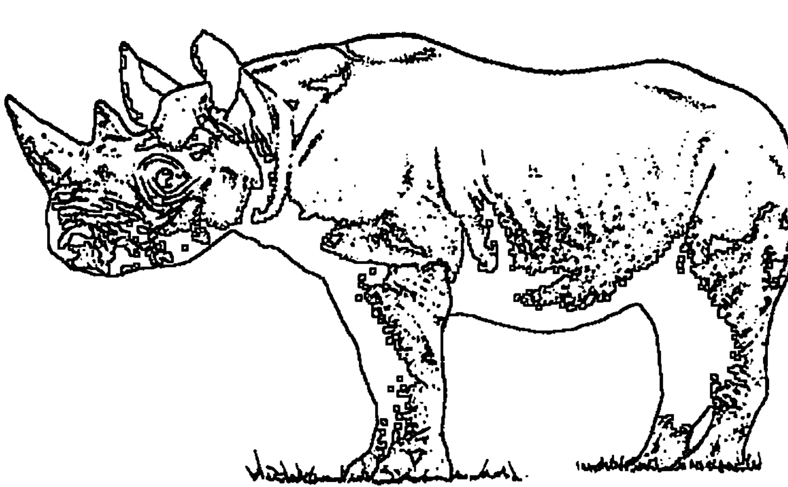

基本上所有的犀牛都是獨居的，因為牠們是遠古動物的後裔，因此當牠們獨居時格外能擁有舒適能量。牠們可以教導你如何與自己怡然相處，並且是神秘學派格言：「了解自己」（Know thyself）的實踐者。

犀牛最特別的地方當然就是牠們的角。不像大多數的動物，犀牛角是位於鼻子，而非頭頂。雖然所有的角都象徵了更高的敏感性，但對犀牛來說，則是為犀牛圖騰者引導出更靈敏的嗅覺。嗅覺長期以來都是更高辨識力能量、精神上的完美主義，以及更高深智慧應用的象徵。而在犀牛所演化出的感官能力上，這進一步得到了證明，雖然犀牛的視力沒那麼好，但嗅覺及聽覺卻十分敏銳。

如果犀牛以圖騰之姿出現，你需要檢查一下你自己與生俱來的判斷能力。你是否沒有相信自己內在的智慧，告訴你該怎麼取得成功呢？你是否對於你自己的學習基礎有所懷疑呢？你是否忘記沒有任何人能比你更了解你自己呢？你是否只看到表面，而抗拒看到表象以下的事實呢？

非洲白犀牛已經瀕臨絕種了，並成為非洲生態的象徵。牠們的棲息地越來越少，而且還面臨因為無知的迷信而出高價購買犀牛角者的盜獵；犀牛角只是一種象徵，不具有任何療效，甚至不含有組成一般洞角與鹿角的骨質，犀牛角其實很脆弱，它只是由類似皮膚的物質所組成的。

## 白犀牛

白犀牛出沒於非洲的熱帶大草原中，牠們喜歡高草，儘管體型龐大，但若有需要，仍然可以展現出驚人的靈活度。犀牛是相當和平的動物，牠們每次只會生一隻小犀牛，以白犀牛為例，懷孕期約為十七至十八個月，因此以犀牛為圖騰者要將遠古智慧吸收消化並應用在生活裡，是需要經過差不多的時間來發揮作用的。

以犀牛為圖騰者也不妨研究一下啄牛鳥，此種鳥是犀牛的良伴。事實上，牠有時還會被稱為犀牛鳥，牠會停在犀牛的背上，並消滅螯咬犀牛的蒼蠅與蝨子。

犀牛將有助於你看到自己生活中的智慧，牠的獨來獨往將可以幫助你從更適當的角度來檢視自己的生活；犀牛古老的一面將有助於你汲取自己內在的智慧，並找到可以應用在現代的方式。

## 海獅與海豹

重點：活躍的想像力、創造力、清醒夢
力量週期：全年

大多數人都覺得海豹與海獅很可愛又迷人，雖然在外表上很相似，但牠們其實是不同種。兩者的確擁有許多相同的特質，但卻不應該加以混淆。海豹與海獅皆屬哺乳類動物中的鰭足亞目，常被翻常被翻譯為「鰭足」（finfeet），但若逐字來看的話，則是「羽毛足」（feather feet）的意思。海豹（seal）這個名字是來自盎格魯撒克遜語中的seolb，意思是拖曳，得名於牠在陸地上移動的方式。

雖然海豹與海獅都會待在陸地上，但海豹在水中感覺比較自在，海獅則不像海豹那麼偏向水生動物。海獅在陸地上的行動力也比海豹好得多，這是因為海獅的鰭狀肢比海豹更加靈巧，牠的脖子也比海豹有彈性。不過大多時候，大眾所認為的表演「海豹」其實都是海獅。

海豹的種類比海獅多，象海豹則是這當中體型最大的，牠的名字是來自於其體型，以及公象海豹下垂的鼻子。在交配季節時，公象海豹會進行凶暴的戰鬥，雖然有時候場面會十分血腥，但受傷最深的還是牠們的自尊。

在十九世紀末立法加以保護之前，象海豹數量曾減少到幾乎只剩下一百隻，所幸現在數量已經有了回升。麻斑海豹則是所有海豹中分布範圍最廣的，就像海獅和其他海豹科的成員一樣，牠們會在水中生產。要找出海豹在你生活中具體扮演的角色，應該要研究一下個別的海豹或海獅種類。

海豹與海獅間最大的差異就是海豹沒有外耳，只有小小的耳孔，海獅則有外耳。由於兩者的耳朵都很小，因此在象徵意義上更顯特殊，耳朵是聽覺與平衡的中心，而其重要性也該應用在你的生活之中。

如果海豹或海獅以圖騰的姿態出現，你該問問自己以下的問題：你是否失去平衡了？你是否太異想天開而沒有腳踏實地呢？你是否聽從了錯誤的意見？你是否沒有聽從你應該聽的？你是否有聽從內在的聲音呢（尤其是擁有海豹圖騰者）？你是否只聽從別人而非自己的意見呢？

海豹與海獅都跟水有關，牠們會在水中或水邊待上很多時間。水是創造的元素，是陰柔、情緒、想像及夢境的象徵，當這些動物出現時，你可以預期自己的夢將更生動、有意義。你所夢到與想像的很多事情，在現實裡可能都有一個穩固的基礎——不論你覺得有多牽強。

當你的想像能力即將被喚醒、受到刺激時，帶上你的筆記本。海豹與海獅可以教導你如何發展並重視想像力，牠們可以教你汲取其能量，用來影響你每天生活在其中的「現實」世界。海豹與海獅也可以讓我們腳踏實地，這樣一來我們才不會被想像力牽著鼻子走而迷失了方向。

請謹記，海豹與海獅都會從水中出來休息與交配，牠們也會在陸地上養育幼崽。這是很重要的，因為這反映出了可以將創造力量從內在帶到外在，並加以實行。對於以這兩種動物為圖騰的人來說，留意心中強烈的創意、想像力及靈感是非常重要的，這些人很愛幻想，而且非常有創意，他們需要有所作為來引導、指引這些能量。

這些圖騰所激發的創造力，往往與神話傳說中的生靈有關連。例如謝特蘭島與冰島上的塞爾克（Selkies）就是一種以灰海豹型態出現的水精靈，根據傳說指出，在晚上牠們會來到海岸上，脫下海豹外皮，以人類的姿態在月光下行走及舞蹈。女性的塞爾克非常美麗、熱情，而男性的塞爾克則英俊、肉慾。希望有小孩的女性人類會將七滴眼淚滴入水中，將塞爾克愛人從水深處呼喚出來。

此圖騰所激發出的創造能量是無限的，可以讓夢境活起來，並喚醒想像力，這樣一來就能夠應用於外界。海豹與海獅的遠古之力有助於以其為圖騰者學習如何平衡內在的想像力與外在的現實——讓兩個領域都能夠更加多采多姿，互相滋養。

## 臭鼬

重點：感官、尊重與自尊
力量周期：全年

我是布魯克納自然中心動物計畫的志工，並且擔任動物解說指導員。在介紹動物時，有這麼一個傳統。在臭鼬出場前，觀眾得先舉起手，跟著演講者發誓：「我答應……下一隻動物出來後……我絕不……摀住我的鼻子……或嫌惡的大叫。」當然，大家這時通常就會恍然大悟，他們待會兒會看到的動物正是臭鼬。

臭鼬是大眾最熟悉的哺乳動物之一，但同時也是最遭人誤解的其中一種動物。臭鼬圖騰十分強大，有著與神秘和神奇力量的連結，看看人們如何與牠應對就知道了。大家總是對牠們本身和牠們的本事表現出崇高的敬意，這正是臭鼬可以教導你的其中一件事。臭鼬教導你如何表現尊重、期望獲得尊重，以及要求他人給予尊重。牠可以幫助你認清自己的本質，並維護自己的權益。

臭鼬最著名的就是牠那「臭」名昭彰的噴射液體。儘管臭液本身沒有毒性，殺不死敵人，但它難以散去的特殊氣味，絕對會讓對手萬般禮讓。
（感謝俄亥俄州特洛伊城的布魯克納自然中心提供照片）

臭鼬是從不讓路的，不管遇到哪種動物都一樣。牠總是依循自己的想法、按照自己的速度前進。牠非常有自信，且對自己充滿了信心，如果臭鼬出現在你的生命之中，牠可以在「自信」這方面幫助你獲得成長、可以教導你如何更加自信，以及如何主張自己的權益。

臭鼬的天敵為大雕鴞，牠是大雕鴞最喜愛的食物。擁有臭鼬圖騰的人也該研究貓頭鷹的特性，不僅因為貓頭鷹是臭鼬的對立面，也可以平衡臭鼬魔法。貓頭鷹的本質能夠幫助你看清楚，如何最有效運用你的臭鼬魔法。

臭鼬是大膽無畏的，但牠們也很愛好和平。臭鼬總是緩慢且從容的移動，噴出臭液是萬不得已的最後手段。因為牠們愛好和平的本性，總會在噴臭液前給對方至少三階段的警告。首先，牠會跺腳，然後轉身背對你；接著，牠會豎起尾巴，以露出肛門旁會噴出臭液的臭腺；當來到第三個階段時，通常已經為時已晚了。在臭鼬豎起尾巴之後，牠會回過頭看你。這個姿勢，正是為了取得臭液攻擊的最佳角度，因此，一旦牠回頭瞄準你的位置，事情就發展到無法挽回的地步了。

臭鼬不僅能將臭液噴到十二至十五呎之遠，而且準確度相當高，在牠必須重新「裝載」臭液之前，牠可以連續噴發五至六次之多。這種臭液是一種刺激性的化學物質，它殺不死敵人，但它會刺痛眼睛並麻痺視覺，使對方暫時看不見。臭鼬作為圖騰時，牠可以教導我們如何獲得更多的關注，且不會讓人感到傲慢和厭惡；有些時候，牠的出現將可幫助我們應付周遭那些蠻橫無理、使人憤怒的人。

一直以來，番茄汁都是消除臭鼬氣味的好方法，那些以臭鼬為圖騰的人，可能會發現自己對番茄極為感冒，或正好相反的認定人生中永遠不能缺少番茄。既然番茄是臭鼬氣味的抵銷物，又或者是臭鼬魔法的平衡物，它的本質和特點也應加以研究。

幾乎每一個人都可以辨認出臭鼬的氣味。這一點，可說是臭鼬能夠喚醒他人對你和你的能力更加認可與讚賞。嗅覺同樣也與性感和性慾有所關聯，有一項正在進行的研究，發現各種香味和性反應之間的連結，其中也涵蓋了費洛蒙的作用。研究顯示，嗅覺神經細胞和嗅覺神經反應，與生殖器細胞和生殖器反應之間有著極為驚人的相似。²⁰

長久以來，香水都用來作為一種春藥。擁有臭鼬魔法的人，會發現使用香水將可讓旁人產生明顯的反應。人們會對你所使用的香水做出回應，因此，擁有臭鼬圖騰者，若對芳香加以研究，將會對自己非常有助益。當臭鼬出現在你的生命之中，通常你可以期待自己將能體驗更強烈的性反應，無論是你對他人、或是他人對你，你對他人將具有更強烈的吸引力。

人們對某些香味的反應相當有趣。他們會抱怨某些香味簡直快要把他們逼瘋。你是不是經常聽到人們這樣說：「我真希望知道那是什麼味道。那股味道讓我好像要想起了些什麼，但我怎樣都想不起來，令我抓狂！」

> ²⁰ 根據Random House Dictionary of the English Language (New York: Random House, 1970), p. 1081,費洛蒙是一種荷爾蒙，可以刺激生理或行為上的反應。

臭鼬通常每年會生一窩小臭鼬，一窩大約十隻左右。從牠們張開眼睛的那一刻起，臭鼬就有辦法噴出臭液了。這一點，再一次反映出臭鼬所具備的強烈能量，象徵擁有臭鼬圖騰者所與生俱來的天賦。在一開始的幾年間，擁有臭鼬圖騰者可能會發現自己處於極端的循環週期——不是永遠被人厭惡或排擠、沒有任何朋友、總是孤單一人；就是能夠吸引許多朋友、從不曾覺得孤獨過。

小臭鼬長大到二十週時，就能夠獨自生活；野外的臭鼬，壽命大約在十年左右。這些週期的時間，很可能在擁有臭鼬圖騰者的人生中具有重大的意義。

臭鼬可以攜帶狂犬病病毒。患有狂犬病的臭鼬母親，會將病毒傳給牠的小孩，而小臭鼬可能一直到出生後的六個星期，才會顯現出狂犬病的症狀。

擁有臭鼬圖騰的人，必須在吸引他人和使他人厭惡之間，學會平衡的能力。這當中有一個自然的週期，在大部分的時間裡，臭鼬都是獨居的動物，牠能提醒我們，有時最好拉攏人們，而有時最好避開人們。找出其中的平衡點，將會是你成功的要件。

臭鼬主要有兩種類型——一種為斑臭鼬，一種為條紋臭鼬。條紋臭鼬最為常見也最容易辨認。實際上，牠的條紋有兩條，一路從牠的頭一直延伸到牠的尾巴。但無論是一條或兩條，都象徵著生命力的積極流動，或靈熱能量流動（靈熱是一種瑜伽教理中所稱的「生命力」，與性的能量以及生命過程中各面向的生命力，皆有緊密的連結）。對於擁有臭鼬圖騰的人來說，他的靈熱能量在平時就已經非常活躍了，而當臭鼬再一次出現時，不但會增強他原本的能量，同時也是告誡他應更有效控制與使用這樣的生命力。

東方的玄學裡教導學生，我們身體沿著脊柱有三條能量的主要通道，也就是左脈（ida）、右脈（pingala）和中脈（sushumna）——分別代表月亮、太陽，以及兩者的平衡。這點所代表的是，擁有臭鼬魔力的人，能夠任意打開和關閉他的原創力，並以自己所想要的方向來加以引導。

臭鼬通常相當安靜。因此，對擁有臭鼬圖騰者而言，千萬不要自吹自擂，這樣反而會適得其反，只會使別人選擇離去，別採取任何行動，讓別人自己來注意你。

臭鼬的適應力非常強，而這也是擁有臭鼬圖騰的人必須學習的一件事。臭鼬可以教導你，什麼時候能多引人注意，這時又該採取什麼行動才最有效。臭鼬是肉食性動物，但牠們幾乎是什麼東西都吃，特別是昆蟲、漿果和水果，並於夜間狩獵。

當臭鼬以圖騰之姿出現時，你將有機會打造出新的尊重和自尊，牠代表你需要教誨和時間，來增加你生理上、心理上、精神上，甚至是性方面的敏感性。檢視你的自我形象，謹記，人們將會注意到你，至於他們將如何發現、如何記住你，都是你所能控制的。這正是臭鼬能教導你的事。

## 雪豹

重點：克服疑心暗鬼，新的展望與活力
力量周期：黎明——清早與黃昏——傍晚

花豹和美洲豹都是大型貓科動物的家族成員，身上佈滿斑點。花豹和美洲豹皆為貓科中的豹屬動物，因而經常被聯想在一起，統稱為豹類。建議可在豹屬動物上做更進一步的研究，將會帶給你更深一層的見解。

在所有的大型貓科動物中，花豹最擅長追蹤獵物。牠們能夠靜悄悄且完全不引起注意的接近獵物，直到離獵物只剩幾呎的距離，就會倏地現身、展開攻擊，在短短幾秒內就將獵物制伏。

花豹有極為強烈的狩獵本能和直覺，而這樣的本能通常在幼豹時期就會顯現出來。因此，擁有花豹圖騰的人，多半也會有強烈的直覺能力，以及高度的敏感性。幼豹依循本能，有著絕佳的學習能力與速度，知道該如何接近和捕捉獵物，對擁有花豹圖騰者而言，這個圖騰所教導你的其中一件事，就是要相信你內心的直覺與本能。要做到這一點並不容易，尤其是在西方社會中，師長們總是諄諄教誨，要我們忽視直覺，跟著邏輯走。

花豹總是安靜無聲的穿梭於環境裡。模仿花豹的走路方式，是擁有花豹圖騰者的最佳訓練方法，可讓自己與圖騰之間更加合調。花豹行走時為腳掌向內，腳掌外側邊緣會先接觸地面，因此，牠們可預先避開會發出聲響的物體之後，再將自己身體的重量往下壓。

花豹最活躍的狩獵時間為夜晚，牠們會將捕獲的獵物拖到樹上保存。我們一般對花豹的認知印象，就是牠們棲息在樹上，尾巴垂下、來回搖晃的模樣，花豹優雅的長尾巴，經常是性慾和內在潛力的象徵。

至於雪豹，則是居住在亞洲高山地區的一種豹屬動物。這一點，可能暗指了你的前世與這些經常發現雪豹的地區是有連結的。雪豹擁有綠色的眼睛，灰白色的皮毛上點綴著玫瑰色的斑點，是花豹家族中最為美麗的成員之一。對擁有雪豹圖騰的人來說，冥想雪豹綠色的眼睛、在北方或是高山上佈滿岩石的家鄉，或許能夠幫助你，更深一層了解雪豹在你生命中所扮演的具體角色為何。

在所有的豹屬動物中，雪豹最不具侵略性。雖然偶爾會傳出大型貓科動物攻擊人的事件，但是雪豹不會，即便牠們有能力獵捕比牠們體型更大的獵物，牠們也不會行動。雪豹的高山生活環境，迫使牠們的行動必須極為敏捷，並發展出優異的跳躍能力，這一點所暗示的，即是教導擁有雪豹圖騰者，必須學習躍過生命中的新障礙物。

有許多神話與傳說的主角都是雪豹。中亞地區的人相信，雪豹不吃獵物的肉，只吸取牠們的血。儘管這可能導因於雪豹在勒死動物時爪子所留下的穿刺傷痕，但這個傳說具有重大的象徵意義。血液代表生命的力量，大多數的社會皆認為「我們吃什麼就是補什麼。」若動物只喝血、不吃肉，便意味著牠想要奪取的是獵物的力量與生命力，而不是獵物的弱點（肉體象徵了弱點）。因此，擁有雪豹圖騰的人，將有機會去學習該如何找回失去的生命力，而不讓自己受困於過去固有的行為模式裡。

有個關於西藏聖者密勒日巴大師的古老故事。他曾經一度受困於一個名為「戰勝惡魔的偉大山洞」中長達六個月。當大師的信徒終於找到他時，他們發現大師變成了一隻雪豹。因此，雪豹的圖騰也代表了能夠克服自己內心惡魔的新生力量、能力，以及機會。擁有雪豹圖騰的人，研究和冥想密勒日巴大師的一生，將會對自己非常有幫助。

雪豹住在高山上，高山與人類的距離遙遠，是神的住所，也是眺望遠景的所在，而山神與女山神的守護動物，往往會以某種方式奉獻予神。當雪豹出現在你的生命之中，即意味著神聖的保護，或你內在的神性將再度覺醒。

雪豹是獨居且非常神秘的動物，因此，能夠目睹雪豹——就算只是個幻影——也都是極為罕見且寶貴的經驗。雪豹有一種不可思議的能力，能夠讓自己與周遭的岩漠環境融為一體，隱形無蹤。雪豹儘管外表看起來相當粗壯，但那不過是豐厚皮毛所造成的假象，事實上，牠們比一般體型的豹類還略小一些；但不論體型上的差異，雪豹跟其他豹類一樣，都是技巧絕佳的掠食動物。岩羊是雪豹最常見的獵物之一，因此，擁有雪豹圖騰的人也該進而研究岩羊的特性。

如果雪豹出現在你的生命之中，你可以期盼自己將能清除內心中困擾已久與帶給你惡劣影響的事物。你將能得到充沛活躍的力量與活力，以進行心靈上的大掃除，而在你克服了困境之後，你的人生將會有相當大的躍進。

小雪豹需要大約二十二個月的時間才能獨立生活，因此，你可能也需要二十二至二十四個月的時間，來徹底清除舊有的惡習、迎向嶄新的局面。雪豹掌握著新生命的約定、新領悟，以及對人生的新視野。

## 松鼠

重點：活動與準備
力量周期：全年

松鼠是大家都很熟悉的動物，屬於嚙齒科。當人們看到松鼠時，總是見牠東奔西跑、四處亂竄，好像在忙什麼似的，總是精力充沛；松鼠也非常善於交際，但牠們並不喜歡陌生松鼠；我們還經常看見松鼠正在撿拾食物，並在地上挖洞，把那些待會兒才要吃的堅果或其他食物藏起來。松鼠有敏銳的嗅覺，即使忘記自己把堅果埋在哪裡，還是有辦法找到自己的食物貯藏庫。

灰松鼠
松鼠似乎總是來回奔波，非常活躍與忙碌。因為不冬眠的緣故，牠們大部分的時間都花在收集和儲存冬天所需的食物。為了度過寒冬，牠們會吃大量的食物來增重，豐厚自己的皮毛。牠們象徵了未雨綢繆與積極活動。
（感謝俄亥俄州特洛伊城的布魯克納自然中心提供照片）

松鼠有兩種主要的類型——灰松鼠和紅松鼠。還有一種黑松鼠，牠在品種上屬於灰松鼠，但個性較具侵略性。灰松鼠大多住在都市裡，而紅松鼠則多半住在森林中。

另外還有一種鼯鼠（譯註：英文名為flying squirrel，意思為會飛的松鼠），但牠們並不是真的在飛，而是伸展身上的皮膚，使自己能夠從樹上滑翔到地面、或從一棵樹上滑翔到另一棵樹上。鼯鼠與灰松鼠和紅松鼠不同，牠們是夜行性的動物，極度厭惡在白天受到干擾，貓頭鷹喜歡捕食鼯鼠，是鼯鼠的頭號公敵。

紅松鼠是森林的哨兵。當陌生人出現時，牠們就會開始喋喋不休的討論與斥責，就好像是牠們正在把最新訊息大聲報給森林裡的其他動物聽一樣；紅松鼠的個性較為積極，通常比大型的灰松鼠還會打鬥；貂是紅松鼠最危險的敵人，因此你也應該對貂多加研究；紅松鼠通常一年會生產兩次，每次產下二至七隻小松鼠。在出生後的十二周之內，小松鼠多半就能開始獨立生活。若是紅松鼠進入了你的生命之中，你將會有十二周的時間可以好好檢視自己的生活。

灰松鼠最為常見、且最熱情，正如同所有的松鼠，灰松鼠也不冬眠；牠會在空樹幹中或樹梢處築巢，牠的窩通常為球形，入口在側面；儘管灰松鼠體型比紅松鼠來得大，但一旦雙方碰頭，灰松鼠多半會選擇逃避戰鬥；灰松鼠的主要天敵是狐狸、貓頭鷹以及老鷹等掠食者：跟紅松鼠一樣，灰松鼠也是每年生產兩次，且小灰松鼠也能夠在十二周大左右就開始獨立生活。

松鼠是相當善於社交的動物，牠們會與同伴玩摔跤，而且非常善於觀察和模仿，牠們學習的方法，就是透過模仿其他的松鼠。擁有松鼠圖騰者，不妨直接採取實踐派的學習方式，這會比理論派的學習方式對你更有助益。

松鼠也相當擅長溝通，當牠們被打擾或在嬉鬧時，總是嘰嘰喳喳說個不停。牠們毛茸茸的尾巴不但有助於表達，還能提供溫暖、遮陽和平衡作用，松鼠經常會藉由快速輕拍尾巴，來表達牠們的情感。

每隻松鼠都是獨一無二的，而每個人也需要以不同的方式來啟動其魔法。如果松鼠蹦蹦跳跳進入了你的生活之中，請檢視你自己的行動力與準備能力。你是否太過活躍或不夠活躍？不管是短期還是長期，你是否完全不計畫將來？你是否不夠穩定，總是來回奔波卻完成不了任何事情？不管是金錢、時間、還是精力等任一方面，你是否需要學習儲蓄和定量支出？你是否害怕你所擁有的永遠也不夠？你是否太執著於收集和囤積？你是否只在乎儲蓄，卻總不付出？

松鼠可以教導我們，如何在接受與付出的循環間達到一個平衡，如果我們太過於專注其中一方，松鼠可能就會出現來幫助我們。松鼠是未雨綢繆的大師，但牠們同樣也提醒了我們，在我們努力追求目標的同時，也應該花點心思與他人社交和玩樂。工作和玩樂必須同時並進，否則你在工作上反而會出現較多問題，不僅工作會變得更加困難，效率也會事倍功半。

## 虎

重點：熱情、力量、奉獻與感官
力量周期：夜間——滿月與新月

## 老虎

氣勢磅礴的老虎，總是能讓所有看到牠的人心生敬畏。老虎有許多不同的種類：孟加拉虎、西伯利亞虎等等，牠們各自的特點你都需要去研究。此外，也應多深入了解貓和豹的資訊，因為此三者往往會有重疊、類似之處。

所有的虎類，皆以兇猛和有力聞名。不像其他大型貓科動物，虎類同時也是出色的游泳選手，這一點，賦予了牠們與水元素相關之能量和神秘特質之間特殊的連結。所有的雌虎都對牠們的後代表現出偉大的母愛奉獻，雌虎獨自撫養幼虎、教導牠們狩獵。絕大多數的老虎都是獨居的，牠們通常只為了交配的目的才與其他老虎聚集在一起，牠們也擁有幅員廣大的領土。

對許多人來說，西伯利亞虎是最為雄偉壯麗的。多數的專家認為，這種老虎的起源是在東亞的北部，經過遷移和演化之後，牠們落腳在較為溫暖的地區。西伯利亞虎是無拘無束的旅行者，在一天之內所能跋涉的距離相當驚人，老虎捕食所有種類的動物，但最常成為盤中之飧的則是野豬。

孟加拉虎則出沒於亞洲南部，其主要獵物為鹿。孟加拉虎通常會有很多個巢穴，而其中一個巢穴是用來撫養年紀尚小的幼虎，幼虎八周大的時候，便會加入母親的行列一同狩獵；到了六個月大時，便已經學會了如何殺死獵物，但此時牠們還沒有能力養活自己，得等到牠們長大到十六個月大的時候才能真正獨立。

大多數老虎的狩獵行動，都是極為緩慢且安靜的，因此，對於以老虎作為圖騰者而言，無論你將目標放在哪裡，學習這樣的戰術總是有益處的。老虎對於自己的戰利品通常是自私獨享的，牠們力大無窮，有辦法將重達好幾百磅的獵物屍體拖行四分之一英里遠，就僅僅為了將屍體隱藏起來。

老虎是夜行獵者。擁有虎圖騰的人，會發現自己在夜間工作效率最高。傳統的黑色和金（橙）色圖樣，讓老虎與新月和滿月時期的神秘事物連結在一起。

虎類強壯有力的肌肉，以及柔軟豐厚的毛皮，在在刺激了有關於感官上的想法。所有的貓科動物都喜歡慵懶的伸展身體，磨蹭同伴或其他的物體，因此，擁有虎類圖騰者，將在感官上有新的覺醒——也就是靈敏的觸覺。

有許多神秘主義和神話都以老虎為描繪和敘述主題。探索其中的關聯性，可幫助你確認老虎在你生命中所扮演的角色，說不定你的前世也可能連結到世界上的各個角落。

在韓國，老虎是萬獸之王；在印度教的傳統中，老虎則專屬於女神迦梨（Kali）——她是性與死亡、創造與破壞的女神；而在希臘，老虎則與神話中出生兩次的酒神有關連。

中國更是充斥了各種與老虎有關的神話和傳說，在十二生肖中，老虎也占有一席之地。於虎年出生的人，被認為具有豐富的特色，且令人捉摸不定、無從猜測，他們富有冒險精神、力量強大，並熱情有加。

在中國，老虎是黑暗和新月的象徵，同時也是光亮與滿月的象徵。在中國的古老神話中，有五隻虎聖獸。紅虎掌管南方，夏季和火屬於牠；黑虎掌管北方，冬季和水屬於牠；青虎掌管東方，春季和植物屬於牠；白虎掌管西方，秋季與金屬屬於牠。在五虎中，黃虎的地位最為崇高，牠是大地的統治者，掌管了世界上所有的能量。

如果老虎出現在你的生活之中，你可以期待將有全新冒險到來。牠將喚醒生命中的熱情與力量，你可以期盼這趟冒險旅程將在六至八周內展開，至少持續一年半。仔細檢視你的生活中有什麼問題，你是否需要對生活投注更多的熱情？你表達你對生活熱情的方式是否不適當？你的能量是否逐漸消退？假若老虎現身，你可以確定的是自己將能體驗全新的冒險，並再度對生命奉獻、注入新的熱情。

## 黃鼠狼

重點：以計謀取勝
力量周期：夜晚

黃鼠狼是哺乳動物中鼬科的成員。鼬科家族還包括了：臭鼬（譯註：臭鼬現已改列為臭鼬科）、獾、食魚貂、水貂、水獺、貂、以及狼獾等。這類動物的特徵皆為細長的身體與較短的四肢，耳朵一般為圓形，而且特別的小。所有的鼬科動物都會產生強烈的麝香氣味，通常會在地底下打造家園，此外，所有的鼬科全都是食肉動物。

鼬科動物可簡單分為三個分支。有些鼬科動物會挖掘地洞尋找食物，儘管肉類占了牠們飲食中的絕大比例，但牠們並非一定得吃肉不可。這一類的鼬科動物包括了臭鼬與獾類；第二個分支是會在水中捕獲獵物的游泳專家，譬如水獺；第三種則是幾乎只吃肉的陸上動物，黃鼠狼正是屬於這個分支。

黃鼠狼幾乎是完全的肉食者。牠們會捕殺老鼠、齧齒動物和其他害蟲，牠們在野外還會嚴格堅持只進食天然食物。對那些擁有黃鼠狼圖騰的人來說，這個行為是必須加以探究的，以求自己的健康狀況能得到最佳助益。

黃鼠狼的食量十分驚人。一隻黃鼠狼每天所吃掉的食物重量，可達牠體重的三分之一，甚至一半。為了應付牠們必須耗費的大量精力，黃鼠狼都會少量多餐，對擁有黃鼠狼圖騰者而言，這種飲食習慣對他們來說最為適合，可為他們帶來最佳的健康和福祉。此外，黃鼠狼會先準備好每天進食的量，牠在捕殺獵物後並不會立刻用餐，而是把食物帶到自己的獸窩中藏起來。

黃鼠狼是優異的追蹤獵人，牠擁有出色的嗅覺，因此，一旦聞到了獵物的氣味，就會開始追蹤該獵物。細長苗條的身材，使牠能夠跟隨老鼠進入洞穴之中，牠有獨特的妙招，能夠讓自己擠進狹小的空間。黃鼠狼魔法能夠幫助你擺脫讓人感覺喘不過氣的困境，不但能讓自己擠出狹隘的困境之中，還能夠進入他人接觸不到的領域。

黃鼠狼優雅、孤獨，且極為沉默。儘管黃鼠狼圖騰者多半是獨行俠，但他們能夠在生活中發掘關於人們的一切。他們沉默的能力，甚至能使他們在與他人相伴時，也能夠不讓人看見、不讓人聽見，因此，只有黃鼠狼圖騰者能看清眼前所說與所做的任何事情，他人卻完全察覺不到。黃鼠狼可以教導你，如何使用沉默觀察的力量，嗅出任何隱藏在檯面下、沒有人知道的秘密。

在美國本土的傳統中，黃鼠狼擁有能夠挖掘出秘密的魔法。牽涉到人際關係時，請相信自己的直覺，最後一定會證明你的直覺無誤，即便這意味著你必須獨來獨往，但這正是黃鼠狼要教導你的其中一件事。

在所有的哺乳動物中，鼬科的兇猛可說是數一數二的。如果鼬科的母親認為牠們的幼子受到威脅，牠們甚至會攻擊人類。

黃鼠狼狩獵時，通常會咬住獵物的脖子，把牠們吊高，直到獵物的脊椎斷裂或出血至死。擁有黃鼠狼圖騰者，在面臨他人的威脅甚至是傷害企圖時，都有一套能直接攫住對方脆弱咽喉的本領，一旦被激怒，他們會將對方吊起，直到造成傷害為止。請謹記，黃鼠狼是肉食動物，當黃鼠狼圖騰者被激怒時，他們可是會毫不猶豫、不擇手段出手攻擊，他們的反擊可能是口頭上的言語，卻能在對方的心口造成深刻見骨、難以癒合的傷害。黃鼠狼在狩獵時天生安靜無聲，但牠們有極為廣泛的發聲方式，當黃鼠狼圖騰者沉默安靜的時候，千萬別以為他們是軟弱無能的，否則你將會鑄下大錯。

當黃鼠狼成為你的圖騰時，仔細探究你的生活。你是否需要加強你的觀察能力？你是否在追求目標時，說了太多的話？當你把自己的目標告訴他人時，將會削弱你追求目標的力量。你是否挖掘得不夠努力？你是否有個必須努力擠過的狹窄空間？你或你周遭的人是否確實坦誠？如果不是，黃鼠狼將會幫助你看到事情的真相。你是否在與他人相處時，不相信你自己的直覺與感受？

黃鼠狼魔法將喚醒你與生俱來的沉默力量與冷眼觀察的能力。黃鼠狼會教導你避開麻煩的最佳技巧，還會教導你如何追求各種不同層級的目標，並獲取最大的勝利。

## 鯨

重點：創造、歌之力量、內心深處的覺醒
力量周期：全年

鯨魚是世界上最大的哺乳動物。鯨目動物為溫血哺乳動物，牠們適應了海底的生活，是海底族群中的一份子。在許多神話中，總是描述地球上所有生命的起源——特別是人類——皆來自於海底。出於這個理由，以及我們往後還會談及的其他原因，鯨魚成為了「創造」的古老象徵——無論是在創造身體或創造這整個世界方面皆然。

大家往往將居住在北極的人們，視為最仔細的大自然觀察者，因為只有如此，他們才得以在地球上最殘酷無情的氣候中生存下來。因紐特人與露脊鯨之間有著特殊的關係，他們的傳說之一，即是在讚揚露脊鯨是上帝所有的創造物中最偉大的動物。

鯨目動物中有九十多种不同的種類，包括了海豚與鼠海豚。另外還有有抹香鯨、虎鯨（俗稱殺人鯨）、領航鯨、獨角鯨、座頭鯨，以及這個星球上最大的哺乳動物——藍鯨。所有的鯨魚都具備了供呼吸的氣孔，模仿鯨魚噴出氣息的模樣，將可以幫助你釋放自己的創造能量。此外，所有的鯨魚都有鯨脂，以供牠們隔離並儲存能量，鯨魚可以教導你隔離自己，更謹慎使用自己的創造能量。為了節省氧氣的使用，所有的鯨魚都會在非必要的身體構造上減少血液的供給量，鯨魚擁有古老的知識，深諳如何在各種用途上運用呼吸的創造力量。

絕大多數的鯨魚可分為兩組，即齒鯨和鬚鯨。齒鯨具有銳利的牙齒，牠們用這些銳利的牙齒捕捉、咬食魚類和其他海洋生物，這一組中包括了抹香鯨、領航鯨、海豚等；齒鯨多半吃魚、魷魚以及其他的海洋生物，牠們出現在人們眼前時，通常是成群結隊的狀態。此外，齒鯨有時會展露出強大的理解能力、甚至是創意思想，因此，牠們可以激勵、鼓舞那些擁有齒鯨圖騰人們的創意。

鬚鯨剛好相反，牠們沒有牙齒，鬚鯨的嘴部是由角質硬化的板片所構成。當鬚鯨進食時，牠們會將海水吞入口中，利用這些板片以過濾的方式吃進海水當中的浮游生物或海底生物，鬚鯨是最大的鯨目動物。

鬚鯨中的駝背鯨是歌聲最美妙的成員。唱歌的是雄性的駝背鯨，每到了繁殖季節，牠們的歌聲都會有各種相應的變化。這一點所隱含的意義，是鯨魚能夠教導我們透過聲音和歌曲來創造，並依照不同的時間、地點和個人加以調整。藉由利用自己的創造本能，你也可以唱出屬於你自己的歌曲。

鯨魚具有聲納的功能或能以回聲定位。對於聲音的敏感性，再一次將鯨魚和生命原始的創造聲音連結起來。聲音，是生命的創造力量，引導你想要的聲音，或對他人的反饋有所回應，便是鯨魚教誨的一部分。你可以藉由此點，將自己心底所藏的心思輕輕引出，或甚至是加速目標的訂定與實現。

不僅如此，鯨魚同時也象徵了抑制、隱匿，甚至是復活。在聖經中，約拿和鯨魚的故事便是最好的例子。在約拿出現以前，他在鯨魚的肚子裡面待了三天，直到他再次出生。約拿復活了，也就是當我們學會探索自己的內心深處之後，如果我們能將所喚醒的創造力提取而出，並加以應用的話，我們的生活便能再度復甦，再現活力。

鯨魚有時會從水中躍起，身體完全離開水面。鯨魚圖騰者都非常具有創意，但他們不僅來自於充滿創造性的海裡，同時也必須與現實的世界保持聯繫。你是否迷失在你自己的創意想像力裡？你是否不接受、也不使用自己的創造力？你是否把任何事情都藏在心底，不敢表現出來？如果是的話，該是你突破的時候了。展現出屬於你自己創造力的輝煌氣勢與力量，千萬不要退縮！

如果鯨魚出現在你的生命之中，你該檢視自己使用創造力的方式，或是你太少使用創造力了。你是否僅在模仿他人的創造？或者是你以全新或充滿活力的方式來呈現？你是否在舊程序和生活準則上，也運用了你自己的創造力？這一點本身正是鯨魚能賦予你的力量與魔力。

請記得，鯨魚是上帝送給因紐特人的一份禮物，這是牠們能夠生存下的原因。鯨魚是所有動物中最為美麗的，但牠不單只有外表，還兼具了充滿實力的內在。鯨魚教導給你的，可不是為了創造而創造，牠喚醒了你內心深處的創作靈感，為你的生命添加色彩與光芒，令人無比驚嘆。

## 狼

重點：守護、儀式、忠誠、靈性
力量週期：全年——滿月——曙（暮）光之時

狼可能是被誤解最多的野生哺乳類動物。關於狼的恐怖及冷血的故事比比皆是。雖然許多故事都這麼說，但從來沒有任何報導能夠證實一隻健康的狼會攻擊並殺害人類。這些對狼的負面描述無所不在，但實際上，狼本身卻可說是剛好跟故事中所描繪的形象完全相反。狼是友善、社會性的動物，並且具有高度的智力，牠們對家族極富責任感和忠誠，生活必定遵循著縝密界定的規則和儀式。

狼是野性精神的縮影，牠們擁有無數的正面特質，也因此印地安人和其他人幾乎毫無意外的都將牠們奉為神祇。許多人認為，美國社會對於環境保護的誠意以及真正的考驗，就視狼是否能持續受到保護，或是狼是否得以重回美國境內以及那些如今仍將狼排斥在外的地區。狼所代表的是自由和未受破壞之荒野的真正精神。

北美的狼可分為幾個種類。紅狼是體型最小的，儘管紅狼的復育工作仍在持續努力中，但牠們仍極有可能在野生大地上完全絕跡，紅狼的領土位於美國南部；至於墨西哥狼，是較常見灰狼中的一個亞種，牠出沒於美國西南部和墨西哥，墨西哥狼幾乎已經被獵殺殆盡，如今列為復育和圈養繁殖計畫的其中一份子：北極狼大概是狼裡面最純粹的品種，牠們居住在北極圈附近的隔離區內，使之得以繼續生存下去。

灰狼或大灰狼（森林狼）是最為常見的，如今牠們的蹤影只出現在阿拉斯加、加拿大和大湖區（Great Lakes）的周遭地帶，在美國境內的其他地方，所有的灰狼和大灰狼幾乎都被獵殺滅絕了。灰狼並不一定都是灰色的，有可能是黑色、灰色、棕色、白色，或混和了各種毛色。

人們對狼的最大誤解，可能在於牠們的體型。事實上，狼並非大多數人所想像的那麼巨大，牠們厚重的皮毛，在外觀上讓牠們顯得比較龐大，但實際上，狼通常只跟大型的德國牧羊犬一般高而已。

狼是非常注重儀式的動物，在很多方面都跟人類一樣，牠們的生活遵循著嚴格限定的各種規則，有些領域是神聖不可侵犯的。牠們的社會行為奠基在一個規範分明的階級結構上，在這個階級結構裡，每匹狼都有自己的位置和功能，位於最上層的則是領頭狼和領頭狼的配偶。

若非必要，狼是不會打架的，事實上，牠們還會特意避免任何的紛爭。雖然狼個個都非常強悍有力，但很少有爭執會落到非得打個你死我活的嚴重下場，往往一個眼神、一個動作、一聲低吼，就足以確認何者處於優勢的地位。牠們不需要刻意展示自己的地位，但若有需要時，牠們就是有辦法辨別孰高孰低，這正是狼魔法能教導你的事，狼教導你認清自己的角色，培養實力、信心和自信的來源，如此一來，你不需特意展示即能讓所有人都能認同你。

狼有一個複雜的溝通系統——牠們使用肢體語言溝通。頭的擺動、尾巴豎起、眼睛直視，全都具有重要的意義。各種姿勢之間的區別非常精細，但每匹狼都從幼狼時期就開始學習如何加以解讀與回應；狼的臉部表情非常多樣，有助於將自己的情緒傳達給狼群的其他成員，臉部是溝通過程中最重要的視覺中心；此外，狼還會利用尾巴位置的不同來做有效的溝通，擁有狼圖騰的人，多半極具肢體語言的表現力，不論是手部、姿勢、臉部或其他各種方式皆然。如果你覺得難以表達自己的情緒和想法，那麼來冥想和研究狼吧！牠將會教導你如何以適當的肢體語言來幫助你的口頭溝通。

此外，狼也有複雜的聲音溝通系統。牠們嚎叫、嗚咽、哀鳴、咆哮，甚至是吠叫，就連著名的狼嚎都有各種不同的涵義。狼嚎可作為一個信號，用以呼喚狼群的其他成員或確認成員的位置；狼嚎也可作為一個社交上的表達，通常狼會用嚎叫來迎接其他成員，或是用以標示特定的領域，甚至在非常開心的時候也會發出狼嚎聲。

狼群中的每個成員，都深知自己在群體中扮演的角色，以及自己與其他成員之間的關係，這種建立起狼群階級關係的儀式行為，正是牠們擁有的魔力之一。狼群的體制並非是完全獨裁專制，永遠只能服從領頭狼的統治，但也並非是民主的，常常是兩種制度同時並行，而正是這種靈活性，促成了狼統治的成功。狼可以教導你何謂適當的統治方式——也就是取得權威和民主之間的平衡。狼還可以教導你如何使用儀式，建立你生活中的秩序與和諧，狼可以幫助我們了解到，真正的自由需要紀律。

領頭狼和牠的配偶通常是終生的伴侶，繁殖季節一般都在暮冬，約兩個月後雌狼就會生下小狼。狼群中所有的成員都會對幼狼表現出極深的關懷和情感，牠們會對幼狼極為寬容，如果父親或母親無法照顧幼狼，其他的成員就會擔起照顧的責任，有些狼甚至會充當起保母的角色。成狼對幼狼是友善且和藹可親的，因此，狼魔法能夠教導你對家庭和兒童的尊重和敬意。

狼的性成熟年紀大約是在出生後二十二至二十四個月。擁有狼圖騰的人，可以期盼狼會以同樣的時間模式，為你的生活帶來能量與影響力。

理所當然的，狼是掠食者，牠們的目標大多是生病的、年幼的、年長的獵物，雖然鹿是牠們最常捕獵的動物，但狼不會在一隻能夠直挺站立的健康成年麋鹿上浪費太多的時間。狼會在狩獵時奔走極遠的距離，牠們擁有耐力和力氣，使牠們能夠長時間的長途跋涉。狼的行進速度約每小時二十四至二十八英里，儘管狼無法長時間維持這樣的速度，但牠們似乎能夠用小跑步的方式，以時速五英里的速度一直跑下去。

在冬天的時候，狼會將冰凍的湖泊和河流作為旅道，能在一個晚上就跋涉十五至二十五公里之遠。

狼通常會將牠們所捕捉的獵物吃得一乾二淨，因此，對那些擁有狼圖騰的人來說，這代表你必須善加利用你所能得到的一切。有時，狼作為圖騰的意義是提醒我們不要浪費，並儘量提醒自己，要讓我們的精神永遠存活下去。

狼有絕佳的智力，牠們會特意避開麻煩或危險。有些人認為，狼甚至會利用烏鴉當作空中偵測機，尋找可能的食物來源。在愛斯基摩人的傳說中，烏鴉和麋鹿之間有特殊的關係，而麋鹿既然是狼的獵物，那麼烏鴉再與狼有所連結是很理所當然的事。烏鴉通常會跟隨狼的腳步，牠們會飛在前頭、停在樹上，等狼經過後再次起飛。狼專家大衛·麥科（David Mech）曾經表示狼和烏鴉之間有時會出現一種有趣的行為關係。因此，擁有狼圖騰者同時也該對烏鴉進行研究。

狼具有非常敏銳的感官，尤其是嗅覺，據說比人類靈敏一百倍。嗅覺賦予了狼極大的辨別力，而在玄學領域中嗅覺經常與精神層面的理想主義有所關聯。

除了嗅覺，狼也有極為靈敏的聽覺。狼的狩獵行動在很大程度上取決於嗅覺和聽覺，對擁有狼圖騰的人來說，這正是提醒自己該傾聽自己內心的想法和聲音。他們的直覺會非常強烈，而狼厚重的毛皮大衣甚至可進一步強調此說法。

長期以來，毛髮已成為通靈能力的象徵。狼的毛皮有內外兩層，使得牠們擁有特殊的能力，能夠將原始力量和精神洞察力連結在一起。

狼有能力建立快速且堅定的情感依附。狼的特質教導你要相信自己的見解，並保有隨那見解相應而來的情感依附。狼可以幫助你聽見內在的聲音，防止你出現不適當的舉止，狼會守護你，並永遠以一顆關愛的心，剛柔並濟的教導你。當狼出現的時候，就是你該在生活中注入新儀式的時候了，尋找一條嶄新的道路，步上一段全新的旅程。你是自己生活的統治者，你創造了生活，並引導著生活，以和諧和紀律繼續這麼堅持下去，那麼，你就會知道何謂自由的真正精神。

# 第四部分

# 昆蟲與爬蟲國度的語言

孩子打開了哥哥的袋子，蝴蝶翩翩飛了出來，翅膀猶如陽光般閃閃發亮，有著花朵、樹葉、稻穀、花粉與綠松針的顏色——紅的、金的、黑的、黃的、藍的、綠的、白的。就好像花朵在風中飛舞一樣。蝴蝶飛過孩子的頭上，孩子們笑了。當第一批蝴蝶飛起來時，牠們唱著歌，而孩子們聽著。

¹ 摘自Michael J. Caduto和Joseph Bruchar 所著之*Keepers of the Animals: Native American Animal Stories and Wildlife Activities for Children*, Fulcrum Publishing, Inc., 350 Indiana St., #350, Golden, CO 80401, (303) 277-1623.

# 第十四章

# 探索昆蟲世界

很少有事能引發比人類與昆蟲的近距離接觸更加強烈的情緒反應。有些人會感到恐懼，也有人會心生敬畏，另外還有人會想要忽視這地球上最多采多姿的生物。據估計，地球上有超過八十萬種昆蟲，而每種昆蟲之間還有許多變種。²

昆蟲在此星球上擁有悠久的歷史，在人類歷史中也具有象徵地位。人類長期以來都將某些特質歸因到特定昆蟲身上，雖然這是一種擬人法，但我們必須要了解到，之所以會有這些聯想，是因為牠們確實展現出此種特性。再次提醒大家，就跟所有動物一樣，我們不需要相信昆蟲具有創造性的智慧，但我們可以承認牠們展現出來的行為、直覺與模式，的確能夠反映並象徵一些尚不能夠完全被理解的遠古之力。

許多現代巫師在與昆蟲圖騰互動時都會特別小心，表示在其背後的遠古之力或神靈太過原始，難以有效進行互動。但我認為使用與否還是由你自己來決定，因為儘管有人提出這樣的警告，長久以來，許多社會中仍在使用昆蟲圖騰。

對於喀拉哈里沙漠上的布希曼族來說，螳螂是布希曼族的動物化身，他們的傳說與神話充斥著螳螂的教誨與其神秘的特質；在美洲原住民的傳統中，蜘蛛是老祖母，也是創造者，象徵了將新的能量織進生命中的能力；對於中世紀時代的人來說，蜻蜓正是縮小版的龍，也是精靈仙境大門的標誌。我們必須在歸納時特別小心，要記得學習動物語言的關鍵，就是要了解其行為與特質，這將有助於你決定其在大自然中，以及你的生活中所扮演的角色。

² Farb, Peter *The Insects* (New York: Time-Life Books, 1968), p. 17.

從整體的角度檢視昆蟲，再看看你似乎時常遇到的特殊品種，然後再特別注意那些不尋常的品種。最近，在一次前往佛羅里達州的途中，我走訪了一座自然中心。我是為了冥想一些自己希望在佛羅里達可以進行的改變和活動才專程前往，沿著小徑，蜻蜓與蝴蝶在我身邊嗡嗡的飛著，每次我停下腳步，牠們就會停在我的手上、頭上，或肩膀上。後來，我看到了一隻幾乎從未見過的絕美蜘蛛，牠的名字叫做大金蛛，而牠所織的網非常美麗、複雜，極具藝術感。我並沒有忽視這些昆蟲的重要性，牠們象徵了新的冒險與開始，而這趟旅程後來也證實是一次很棒的經驗，為我打開了通往未來的大門。

通常，任何小的、蠕行的、讓人有點毛骨悚然的東西都會被歸類為昆蟲，但這並不正確，蝨子、蜘蛛、蜈蚣等等是屬於完全不同的動物綱。昆蟲擁有節肢狀的足及三段式的身體——頭部、腹部、胸腔。另外還有三對足，有些則有一或兩副的翅膀與胸腔連結在一起，並有一對附屬於頭部的觸鬚。

蜘蛛有八隻腳，而且沒有觸角，牠們的眼睛是小單眼，而且頭部與胸腔連結在一起。蜘蛛跟昆蟲一樣也屬於節肢動物，但卻分屬不同的綱，但為了因應本書的目的，我將在昆蟲事典中一併介紹蜘蛛。

昆蟲是機會主義者，這是我們可以從牠們身上學到的。昆蟲的生活型態千變萬化，種類繁多，據估計有三分之一至一半的昆蟲甚至連名字都沒有。昆蟲很勤奮，似乎擁有不尋常的智慧，牠們會做許多「像人類活動」一樣的事情時，但卻比人類更有效率——像是種植自己的作物（真菌）、放牧昆蟲「牲畜」，牠們還有著有高度結構性的複雜社會組織。

有六個主要的特質讓昆蟲得以如此興旺。首先，牠們飛翔的能力使之得以擴張勢力範圍；第二，牠們對環境及氣候狀況的適應力極佳；第三，牠們的體外骨架就好像是盔甲一樣；第四，牠們的體型小，需求也低，比其他動物更容易滿足；第五，繁殖讓此物種得以生存。牠們可以延遲生育，直到食物供給及生活條件對下一代來說較為有利時再進行繁殖；而最後，牠們有「變態」的能力，為了促進、延續生命，能夠進行多次（通常是四次）的變形。

這些特質都可以被看成讓人類生活更加成功的點子。當然，我們人類並不能飛，但是我們可以確保自己不要沉溺於安逸；而這也可以反映出我們需要持續探索生命中的新出路，並且不要太驕矜自滿；雖然我們無法把骨架穿在體外，但我們可以發展對身邊能量的敏感性，並加強我們自己的人體氣場，這樣我們就比較不容易受到傷害；我們可以降低需求，不要過於浪費。

許多人在生命中的失敗都是因為他們想要一蹴而得，而不是按部就班，一步一步取得成就；將繁殖延遲到生活條件允許的時候，則可以應用在各個方面——其中最有關聯的就是目前世界人口過多的問題。

最後則是變態的過程，「改變」在生活中是不可避免的，如果我們抗拒自然的趨勢，那麼生活只會益發艱難危險。改變可以帶來成長，我們必須要擺脫舊的，才能夠進入新的。變態是昆蟲與生俱來的魔力，是牠們可以教導的生活魔法。

從生物學和生理學的角度來看，人類也認知到改變的存在——兒童時期、青春期、成人時期，然而，除了這三個時期之外，發生於其他層面和其他時間點的改變也是必要的。我們在生活中所創造的一切都需要經過各個階段，好比昆蟲的四個變態階段一樣。因此，就跟所有的昆蟲一樣，想法與創造也是從卵開始，卵會孵化成幼蟲開始進食，然後結繭。從繭再進入其生命的最終樣態，且最終樣態通常都會長出翅膀。

在卵階段中有受精過程，等同我們會產生點子、活動、新的特質，或什麼東西；接在卵階段後面的則是幼蟲，對昆蟲來說，蟲卵會在此時期成為幼蟲，幼蟲會進食，努力強化自己，並打造自身的基礎。一如點子和創造力都需要努力、成形、塑形、發展及磨練。當此階段完成後，幼蟲為自己打造好了新的基礎，便會進入蛹時期。

幼蟲會在身邊編織出一個繭，把自己像木乃伊一樣包在裡面。在此階段中，雖然幼蟲看起來好像死掉了一樣，但其實卻是在進行細胞重組。有時候人們在打造好基礎後，需要先退一步，然後再次深入，這樣一來，創造才能夠更為有力、新穎。在創造的過程中，我們有時候得保持被動，才能讓事情自然而然的發生。我們做好該做的事情，然後順其自然，這也反映在蛹階段中。

在蛹階段後，昆蟲便會成為牠的最終型態——有翼的昆蟲。昆蟲在最終階段生出翅膀這件事也十分具有象徵涵義，就跟飛鳥一樣，所有與翅膀有關的象徵意義也都可以應用在昆蟲上。成蟲只會在春暖花開時破繭而出，這再次反映出，你可以抓住或選擇最佳時機，將你的創造提昇至更高的層次。翅膀是成蟲的標誌，也象徵著成熟的創造，從現在開始，飛行便是牠的生活方式，直到牠的生命結束。

各變態階段中的關鍵在於創造與彰顯一切，不管有沒有昆蟲圖騰，都不妨研究或冥想一下昆蟲是如何擺脫舊的外型，脫胎換骨。昆蟲提醒我們，我們永遠不會維持原樣，只有「不停的改變」才是唯一不變的。不過昆蟲也代表創造之力，在《愛麗絲夢遊仙境》中，毛毛蟲與愛麗絲對話時，心裡應該就是這麼想的：

> 「……一天之內這樣忽大忽小真的很讓人困擾。」
「才不呢。」毛毛蟲說。
「嗯，可能是你還沒有發現吧！」愛麗絲說：「但等到你必須要結蛹——你知道，在未來的某一天——然後變成一隻蝴蝶的時候，我想你應該會覺得有點怪怪的吧，不是嗎？」
「一點也不。」毛毛蟲說。
「嗯，可能你的感覺不一樣吧！」愛麗絲說：「我只知道我就覺得很詭異。」
「妳！」毛毛蟲嗤之以鼻：「妳誰啊妳？」³

³ Carroll, Lewis. *The Original Alice in Wonderland* (Newmarket, England: Brimax Books, 1988), p. 41.

許多昆蟲都團體或群聚生活——其中蜜蜂、黃蜂和螞蟻是最常見的。這些昆蟲被分類為社會性昆蟲，在其社群中各自擁有不同的工作與功能。昆蟲圖騰代表了社交和合群的課題。

大多數的昆蟲都是透過身體上，位於胸腔或腹部的氣孔進行呼吸。因此，昆蟲可以教導我們使用細胞呼吸的技巧，來增進整體的健康。在許多瑜珈、道教及其他使用呼吸增進力量與健康的東方傳統教學中都有此種呼吸方法。

每種昆蟲都具有其特質與特性，這可以反映出正活耀於你生活中，或是你需要加以發展的能量。只有好好研究昆蟲才能提供更多見解，你可以留意昆蟲最不尋常的特性，例如：螞蟻可以抬起一顆比自己體重還重五十倍的石頭；蜜蜂也可以拖曳比自己體重還重三百倍的東西。因此長久以來人們就認為昆蟲是能量的象徵。

如同人們可用超自然象徵意涵來解釋昆蟲的特性，這些特性也同樣可以用理性解釋。昆蟲發展出的肌肉與人類不同，因此能展現出強大的力量，人類擁有近八百條肌肉，蚱蜢則有超過九百條肌肉，因此蚱蜢以及大多數的昆蟲都非常耐勞。⁴

⁴ Farb, p. 12.

昆蟲有許多保護自己並確保生存的方式，這也應該要加以研究及冥想。類似的應用也可以被以昆蟲為圖騰者加以使用。最常見的就是隱藏及偽裝，有些昆蟲會使用甲殼，有些則用繭，還有的會以爪、刺、化學物質、獠牙等等將自己武裝起來。你的昆蟲使用哪種方式呢？你有使用類似的方式嗎？你應該使用這種方式嗎？還是你其實沒有善加利用？

昆蟲最大的天敵就是其他種類的昆蟲。當我們將之對應到人類生活上時，其重要性就出現了。我們有多常聽到別人說：「我真是自找的，是我害了自己。」如果你發覺不太順利，而你生活中有某種昆蟲時常出現時，回頭看看自己。你是否沒有去做該做的事情？還是有些事情你該做卻沒有做到呢？

人類與其生活環境是息息相關的，我們沒有可以保護皮膚與感覺的防護罩。昆蟲則不然，因為牠們的外甲，昆蟲必須使用其他方式來感受環境。

昆蟲最有效的感覺器官就是觸角或觸鬚。所有的觸角、叉角、洞角與頭部附屬物都能提升到更高意識、直覺及洞察力。昆蟲的觸角總是動個不停，感受著周遭的環境，正是這樣的反應將昆蟲與傳統心靈占卜的靈媒能力連結在一起。心靈占卜是拿著物體解讀它與周遭出現的人事物所產生的脈動。

昆蟲的觸角大小、形狀皆有不同。通常視力較差的昆蟲會擁有比較大的觸角。透過觸角，牠們可以感覺、嗅聞、品嚐，並判斷溫度，昆蟲也可以使用觸角來製造聲音，觸角上面還有數不清的微小感器作為接收器。

昆蟲的觸覺極為發達，在腿、身體和觸角上都有數不清的毛叢。以昆蟲為圖騰者將會發現自己的觸覺也越來越強。你是否對於周遭的環境或人太過敏感了呢？你是否有對身邊的事物付出足夠的注意力呢？你是否太拒人於千里之外了？你是否太講究精神層面而忽視了生理面向呢？

我們不難發現，以昆蟲為圖騰者對於觸碰會越來越敏感。皮膚覆蓋了我們的身體，並且是最大的感覺器官。在感受的同時還提供了保護作用，是敏感與自我價值的古老象徵，同時也是誕生與重生的象徵，因為皮膚細胞會不斷重生。

昆蟲圖騰可能會在感覺遲鈍這個問題浮上檯面時出現。我們是否對於他人的感覺太過遲鈍，或是別人對我們感覺遲鈍呢？我們是否試圖封鎖外界對我們的影響呢？有什麼事情困擾著你嗎？你正困擾著什麼人嗎？

昆蟲的聽覺十分敏銳，牠們甚至可以偵測到超聲波。昆蟲的聽覺器官在腿上及腹部，這讓牠們得以感覺到身邊發散出的震動，擁有昆蟲圖騰者應該發展他們的聽覺能力，不只要留意他人說出口的話，還要注意別人的言下之意。留意別人透過肢體語言說了什麼，相信你所感受到的印象！

昆蟲無法發聲，但是可以透過摩擦身體部位發出唧唧的聲音，此聲音具有多種溝通功能，能幫助昆蟲找到配偶甚至威嚇敵人。

昆蟲會以各式各樣的方式傳遞訊息，牠們會使用氣味、觸碰、唧唧聲，甚至舞蹈。螞蟻會互相觸碰觸角；蚱蜢則會摩擦翅膀，製造溝通的聲音；蜜蜂會跳舞來傳達哪裡可以找得到食物，以及食物有多少。

昆蟲的視覺敏銳度有限，牠們的視力最多只能看清眼前三呎內的距離。昆蟲擁有複眼，雖然無助於牠們看得比人類更清楚或更集中，卻可以協助牠們偵測細微的動作。因此昆蟲的神秘之處是可以教導你，注意自己生活中細微的動作及溝通。

昆蟲掌握了微妙、非語言溝通的知識，牠們可以教導我們如何在生活中使用這些微妙之處。你可以試著一整天都不用文字或言語來溝通，使用手勢、姿勢、動作、聲音的表達以及觸碰，看看你以這種方式可以溝通到什麼程度。這是長期以來被歸結於與昆蟲有關的奧妙魔力之一，不管是哪種昆蟲，這都是其最真實的魔法。

# 第十五章

# 昆蟲圖騰事典

下列的事典並不完整，跟本書中的鳥類及動物事典比起來，涵蓋範圍極小。昆蟲有太多不同的種類及變種，無法完全納入，完全不是昆蟲的蜘蛛也在此加以介紹，之所以放在這邊只是為了描述上的方便。

此處舉出的昆蟲都有極多的相關神話與傳說，神話以及這些昆蟲的出身也非常有助於研究，可以提供更進一步的見解，甚至是前世可能連結的線索。在本部分，並不是所有昆蟲的介紹都像其他動物那樣詳盡，因為昆蟲界範圍實在太大、太錯綜複雜了，以本書有限的篇章難以涵蓋。另外，許多昆蟲的特徵皆有重疊之處，前一章所提到的大部分資訊皆可以應用在絕大多數的昆蟲圖騰上。

就跟所有的圖騰一樣，個別研究其行為、特性和意義。當你發現這隻昆蟲時，牠在做什麼？牠都在一年中的什麼時間出現呢？在過去的七十二小時中，在你生活中是否有與此昆蟲的能量有接觸呢？

另外，因為力量週期會因為季節、壽命（許多昆蟲的壽命都相對較短）和變態的階段而有所不同，因此在這章中沒有加以呈現。多數昆蟲在春季及夏季時都會較為活躍，隨著秋季與冬季的接近，牠們的活動也會逐漸減少，在冬天時通常都會進行某種型態的休眠。儘管如此，仍請謹記，只要我們願意傾聽，即使是恐怖的蠕蟲也會向我們說話。

# 螞蟻

## 重點：勤勉、秩序、紀律

螞蟻長期以來都是勞動與勤勉的象徵，部分是因為希臘傳說以及伊索寓言裡有關螞蟻的故事，牠們在努力中的智慧和智力時常受到讚揚。螞蟻有許多種類，有些是獨立一種，有些則是更大類別中的成員之一。雖然人們常將例行公事與螞蟻聯想在一起，但事實卻並非如此，當獨處時，牠們會展現出簡單、不複雜的行為模式；而在社群中時，則會重複上演相同的活動與行為。

螞蟻是社會性的昆蟲，牠們許多工作都是集中於社群活動上。主要的活動是採集、狩獵與種植。是的，有些螞蟻會耕作，種植某種菌類植物；螞蟻也會參與社群內的食物交換，牠們時常會把其他螞蟻當作奴隸，進行勞作。

大多數的螞蟻社群都是很有紀律與秩序的，每隻螞蟻各司其所。主要有三種階級：（1）尋找新殖民地的蟻后；（2）有翅膀的雄蟻使蟻后受孕，製造生命；以及（3）不會生育的雌蟻擔任保母與勞工。

蟻后有翅膀，在受精之前都可以飛行。一旦蟻后受精了，牠就會卸除自己的翅膀，為了生下後代而犧牲飛行能力。蟻后的壽命大約為十二年，擁有螞蟻圖騰者可能會發現，自己的努力與目標達成會以十二年為一個周期。以螞蟻為圖騰者若能研究十二天、十二個月、十二年這樣的周期也必然會有所助益。

工蟻是技巧純熟的工程師，可以建築出複雜的房屋、展覽室、甚至拱形的屋頂。牠們的技巧與永不退怯的努力，可以顯示出此圖騰能夠喚醒的力量。螞蟻是建築的老師，告訴你可以如何成為自己生活的建築師；螞蟻可以告訴你如何在現實生活中打造你的夢想，讓你在努力不懈之後可以獲得極大的成就。

如果螞蟻以圖騰之姿出現，檢視你自己是否夠勤勉吧！你是否有成功訓練自己去完成即將到來的任務呢？你或身邊的人是否總是想要抄捷徑呢？你是否忽略了重要的活動？你是否有打下良好的基礎？你是否每年都選取一些時下流行的事物——例如課程、工作、興趣——來為你的生活添加新的元素呢？你是否能讓努力持續不斷呢？你是否對自己有耐心呢？對別人有嗎？你是否總是小事化大呢？你是否錯失了可以開始新的創造與努力的機會呢？

螞蟻可以教你如何操縱自己的力量，在有基礎的情況下，設計並重新創造自己的生活及情境；螞蟻可以告訴你如何為了達到彼此的最大利益，而與他人進行最佳的互動；螞蟻還可以教導我們，努力是真實的，而報償將會在最有利的時間，以最有益的方式出現。螞蟻代表了只要努力就能成功的保證。

# 蜂

## 重點：繁殖力與生命之蜜

蜂在全世界都具有神秘的象徵涵義。在印度教中，根據描述的不同，蜂可以與毗濕奴（Vishnu）、黑天（Krishna），或甚至愛之神——迦摩天（Kama）有關；在埃及，蜂代表皇室；在希臘，則被用在厄琉息斯秘儀（Eleusinian Mysteries）的符號之中；而塞爾特人則將之與隱藏的智慧聯想在一起。⁵然而，蜂最重要也最一致的象徵涵義或許是性慾與繁殖力了，部分是因為其螯刺、部分則是因為蜂有授粉的行為。

⁵ Cooper, J. C. *Symbolism—The Universal Language* (Northamptonshire, Aquarian Press, 1982), p. 71.

蜂長期以來也是完成不可能任務的象徵。多年以來，科學家都不知道為什麼蜂可以飛翔，從空氣動力學的角度來看，蜂的翅膀與身體比例太小，但現在科學家們已經了解，蜂是透過高速振翅來讓自己飛起來。但對許多人來說，蜂仍然是完成看似不可能任務的象徵。

所有的蜂實際上都是「蜜」蜂，牠們會採集花粉、為花授粉。蜂時常被認為是最忙碌，也最有用的昆蟲。沒有了蜂，沒有任何一朵花會開，很多果實也無法結成，因為沒有蜂也就沒有了授粉作用。當蜂降落在花上，採集花蜜時，花粉會附著在蜂腿的毛叢上，然後轉移到別朵花上，創造了繁殖的過程。

授粉只是蜂參與的生殖過程之一而已。蜂還能夠提供食物，即蜂蜜，並以其他昆蟲為食，有助於保持昆蟲數量的平衡。在地上搭建蜂窩的蜜蜂有助於翻土，其成效甚至比蚯蚓還好。

如果蜂在你生活中出現，回顧一下你自己的生產力吧。你是否有盡力讓自己的生活更多產呢？你是否夠忙碌呢？你是否有時間去品嚐努力所帶來的甜頭，或者你只是個工作狂而已？你是否想要做太多事情呢？你是否有抑制慾望，讓自己可以更有生產力呢？

蜂腳是牠們最敏感的器官，蜂實際上可以用腿來品嚐、判斷所降落的花朵中是否有花蜜。你是否有花時間享受你參與的勞動與活動呢？蜂有助於提醒我們，如果我們能夠樂在其中的話，這些活動會更有生產力，也更加有趣。

蜂刺時常被當作是陰莖的象徵，大多數的蜂只能螯刺一次。蜂刺上有倒鉤，會讓刺在使用的時候被拉出。蜂后則可以螯刺多次，但只有當另外一隻蜂后出生後，前任蜂后才會加入戰鬥。

大多數的蜂都有組織化的社群，尤其是熊蜂特別顯著。家族中有蜂后、雄蜂與工蜂。蜂后所生的第一批蜂成為了工蜂，負責建築與維修蜂巢。就跟螞蟻一樣，蜂也是出色的建築師，蜂巢呈現六角形的形狀。此種幾何形狀長期以來也具有神秘的象徵涵義，是心以及在我們心中發現的生活樂趣之象徵，也是太陽與所有和太陽有關的能量之代表。

蜂可以提醒我們要在太陽仍然閃耀時，汲取生活之蜜，並讓我們的生活更有生產力；蜂提醒我們不管夢想再高再遠，只要我們願意去追，就必然能夠實現。生活之蜜就如蜂蜜一般甜蜜，而蜜蜂則象徵了只要我們願意去追求夢想，就有機會享用此分生活之蜜。

# 甲蟲

## 重點：重生

甲蟲是所有昆蟲中種類最多的一種，約有二十八萬種甲蟲。若要做個比較的話，脊椎動物——包括魚類、爬蟲類、兩棲類、鳥類及哺乳類動物——的總數約為四萬四千種。⁶

⁶ Farb, p. 12.

在埃及，聖甲蟲（糞金龜）非常特別。聖甲蟲會取一點牛糞，塑造成球形，然後將之從東滾到西。聖甲蟲會把卵下在裡面，然後埋起來，約一個月後，再把牛糞球挖出來，推進水裡，小甲蟲就出生了。由於從東向西的推動，因此人們將之與太陽，以及太陽在天空的移動軌跡聯想在一起，因此聖甲蟲成為了太陽神以及新生命的象徵。

跟許多昆蟲一樣，甲蟲從幼蟲階段到長出翅膀要經過許多變態過程，因此，牠又與重生和改變聯想在一起。當長出翅膀的階段，前翅會變厚，成為可以摺疊的硬殼，能夠保護柔軟的下部。對於以此為圖騰者來說，這或許指涉了需要提高防衛，或是你可能太封閉了。

如果甲蟲在你生活中出現，檢查一下自己有哪裡需要「變態」呢？你是否已經在轉化過程中了？如果是的話，在哪一個階段呢？你是否需要做個改變？你是否需要新的能量？

## 蝴蝶

### 重點：蛻變、喜悅之舞

或許沒有任何動物或昆蟲比蝴蝶更能代表轉化和變形的過程了，擁有此圖騰者也應該詳細研究一下變態的過程。如前章所述，不管是蝴蝶還是蛾，都有四個特殊的改變階段（在蛹階段，只有蛾會結繭，真正的蝴蝶不會）。

當蝴蝶出現時，注意一下你當時遇到最重要的議題，這或許能解釋為什麼蝴蝶會在此刻現身。在這些議題中，你正在哪一個改變階段呢？要找到自己的定位，你可能必須要檢視並決定你希望有怎樣的成果以及多高的成就。

蝴蝶在神話與宗教中都是強大的象徵。在早期的基督教中，蝴蝶象徵了靈魂；在中國，則被用來當作美滿婚姻生活的象徵；而在霍皮族的傳說中，蝴蝶族的未婚女子會將頭髮梳成蝴蝶翅膀的形狀；在印地安傳說中，有故事是關於蝴蝶會應穿鼻族（Nez Perce）部落的兒童召喚而前來。

對於美洲原住民來說，蝴蝶象徵了改變、樂趣與色彩。你也應該要檢視蝴蝶的色彩涵義，以了解牠在你生活中扮演的角色。有回我在佛羅里達州開辦精靈與妖精座談會，在座談會開始之前，我為了準備而在附近的自然中心進行冥想，當我張開雙眼時，我身邊環繞著約一打的黑蝶與黃蝶（斑馬長翼蝶），有幾隻乾脆停在我大腿上。

我之所以覺得這很有意義主要有幾個理由。首先，在傳說中一直都認為精靈仙境與蝴蝶間是有關的，而黑與黃的配色也非常重要。在傳統的天使學中，這是天使長亞列爾在監督自然神靈活動時所穿的服裝顏色，這表示將會有一股奇妙的能量伴隨著我，一起前往我的工作坊。

當蝴蝶翩翩飛於花叢中時，看起來就好像在跳舞一樣。蝴蝶提醒我們在生活中不要太過嚴肅，並喚醒輕鬆愉悅的感覺；蝴蝶提醒了我們生命就是舞蹈，而舞蹈既有力

量，又有樂趣；蝴蝶可以提醒我們要起身行動，只要你可以移動，你就能夠跳舞，藉著跳舞將生活中的甘甜帶回到我們身邊。能進一步證實此點的證據在於，蝴蝶的前腳上有味覺器官，可以藉由在花上移動來品嚐花朵的味道。

蝴蝶的到來伴隨著色彩與喜悅，當蝴蝶進入你的生活時，看看你生活中有多少樂趣。輕鬆一下，尋找改變，別忘了所有的改變都是好的。蝴蝶魔法提醒我們要在機會到來時做出改變，轉化是不可避免的，但蝴蝶可以教導你成長與改變不見得會是痛苦的，讓我們知道改變其實是可以如我們所願的溫柔、甜美、愉快。

## 蜻蜓與豆娘

### 重點：光之力

蜻蜓與豆娘是非常古老的物種，據估計存在約超過一億八千萬年了。牠們擁有美麗如寶石般的色彩，鮮豔的色彩是需要花時間發展出來的，反映出想法成熟後，我們真正的色彩就會出現，這就是蜻蜓魔法的一部分。

許多人都難以分辨蜻蜓與豆娘的不同。蜻蜓的翅膀較寬，擁有巨大的眼睛；豆娘則較纖細、秀氣。當蜻蜓在休息時，翅膀是像滑翔機一樣平放著；豆娘則會在休息時將翅膀收起直立在背上。蜻蜓會在空中進食；豆娘在進食之前會先降落到地面上。

蜻蜓和豆娘都因為飛行速度快，以及令人目眩神迷的飛行技巧而知名，牠們的飛行就好像在模仿光線的移動與引導一樣。牠們可以扭動、轉身、在瞬間改變方向、盤旋、上下移動，甚至往後飛行；蜻蜓有時候又被稱作「蚊鷹」（mosquito hawk），豆娘跟蜻蜓都是非常擅長狩獵飛行昆蟲，牠們的飛行速度可高達時速三十英里，而牠們的眼睛則有助於鎖定飛行中的昆蟲；牠們可以偵測到四十呎外的動靜，並使用牠們尖銳、多刺的腿，以及強壯的下顎來捕捉獵物。

蜻蜓與豆娘都有兩個棲息領域——水中與空中，其中的特殊涵義也應該要加以檢視。在牠們初期蛹時代的時候，是住在水中的，隨著成熟以及變態過程，便移向了空中的領域。我們不難發現，以蜻蜓為圖騰者在早年可能非常情緒化、熱情如火，但隨著年紀增長，他們會逐漸學習如何使用腦袋與控制來加以平衡，有時候這可能表示因為早年的情緒問題，而使得情緒被封閉了。請謹記，蜻蜓和豆娘最常在水邊出沒，因此情緒與心智的表達都必定存在。

如果蜻蜓在你生活中出現，可能表示你在某些情緒上需要一些新鮮空氣；你可能需要獲得一些新的見解，或是做出改變。這甚至有可能表示你忽略了自己的情緒，你是否每件事都一板一眼呢？你是否沒有讓情緒的色彩活起來呢？

蜻蜓非常具有地域性，會在自己地盤的水邊產卵。這些卵最終會發展到蛹階段，而在完全轉化為成年的蜻蜓或豆娘之前，會在蛹中待上快兩年的時間。這可能代表了擁有此圖騰者若想要達到頂點，可能需要約兩年的時間改變；或者表示你正進入以兩年為期的轉化時間；甚至還有可能是指你需要開始改變，並在兩年之內達成你所想要的多采多姿轉變。只有透過檢視你的生活與活動，你才能了解牠們在生活中扮演的特定角色。

就如同光線可以彎曲、轉移以及適應各種不同的路徑，與蜻蜓相連的遠古之力也是一樣，蜻蜓是適應力最強的昆蟲之一，這也是為什麼牠可以生存這麼久的原因。蜻蜓擁有兩對翅膀，但如果情況有需要，牠們也可以只用一對翅膀飛行；足部上的毛刺可以清潔蜻蜓的雙眼；並能用嘴來收集水滴清洗眼睛。

蜻蜓與豆娘主要的掠食者是青蛙與鳥類，以此類昆蟲為圖騰者，特別應該研究一下青蛙。你可以檢視一下在最後一章中的相關資訊，這將對你有幫助。

牠們生活在光之領域中，因為牠們是冷血動物，因此只會在白天時出沒，夏天是最活躍的時刻，因為牠們需要溫暖以及陽光。以此為圖騰者應該要對此詳加考量，在戶外陽光下、淨水邊待上一段時間，將能夠重建並改善擁有此圖騰者的健康狀況。

雖然有些蜻蜓的外殼帶有色彩，但大多數色彩的成因幾乎都跟彩虹一樣，牠們外殼的結構分散、折射了光線，給予牠們一種絢爛的綠色及藍色外觀，隨著年齡增長，牠們身上的顏色可能會有所改變。蜻蜓與豆娘得以反射、折射光線及色彩的能力被與許多型態的魔法與神秘主義連結在一起——包括色彩魔法、幻覺（讓別人看到你希望他們看到的景象）等等。蜻蜓的魔法是光之能力，以及所有與光相關的力量。

蜻蜓與豆娘在日本繪畫中時常出現，並象徵了新的光明與喜悅；對於某些美洲原住民來說，牠們代表了死者的靈魂；有些故事中則說到，曾經有段時間蜻蜓與豆娘還是真正的龍，我們通常都假定龍是一隻巨大的噴火野獸，但在精靈仙境中的迷人生物是可以有許多形狀與尺寸的。由於蜻蜓與古老的龍之間有著神秘的關聯性，因此可以有效的與自然神靈接觸。有關蜻蜓與豆娘的進一步訊息，你可以參考我之前的作品《精靈的魔力》。

蜻蜓與豆娘是太陽與光線的代表，並可以與之互動，光線在一天中會有許多變化，而蜻蜓與豆娘也會經歷各自的轉變，如果牠們出現了，找一下即將發生的改變。你是否在不適當的時候拒絕改變呢？蜻蜓提醒我們，我們也是光，如果我們願意的話，就能以強而有力的方式加以反射。神說「要有光」，就有了光，這就是神在督促你，要在生活中使用創意想像力，這就是蜻蜓與豆娘可以教我們的。

生活永遠不是表面所見，但必然都是充滿光明與色彩的。蜻蜓可以幫助你看穿幻覺，因而讓你自己的光可以熠熠生輝。蜻蜓可以帶來轉變的光明面，以及對於多采新願景的讚嘆。

## 蚱蜢

### 重點：不可思議的向前躍進

雖然古希伯來人認為蚱蜢是天譴的象徵，但在其他社會中，蚱蜢卻飽受尊敬與榮耀。在中國，蚱蜢和蟋蟀都是喝采、好運、豐饒與美德的代名詞。有些人甚至認為自己的親人會在死後以蚱蜢或蟋蟀的外型回到身邊，因此會為牠們搭造一個小籠子；即使在古希臘，蚱蜢也是尊貴的象徵。

正如其名，蚱蜢是以跳躍的方式來移動的（譯註：蚱蜢英文名為grasshopper，而hop有跳躍的意思），而這也是牠們逃脫的方式。蚱蜢有著驚人的跳躍能力，牠們水平跳躍的距離可以長達身體的二十倍，對於以蚱蜢為圖騰者來說，站起身來、移動你的屁股是很重要的。掌握機會，往前跳躍！

蚱蜢的後腿與其他的腿，和其他昆蟲的腿都不一樣。蚱蜢的後腳又長又大，並且擁有微妙的肌肉控制，擁有此圖騰者通常會發現自己跟別人的動作不一樣，你的進展通常都不是一步接著一步的，相反的，其他人認為的進展在你來看可能是停滯不前，不要因此而氣餒，當蚱蜢出現時，就表示你即將會有新的躍進，甚至讓你超越生命中其他的人。

蚱蜢擁有發現陽光在山丘的哪一面或哪些地方陽光比較充足的能力，所以牠們可以曬曬太陽，牠們可以有技巧的找到溫暖與光亮的地方，而且知道什麼時候該向前邁進。如果你的圖騰是蚱蜢的話，相信自己的直覺與節奏，別人可行的辦法不表示你也能適用。（也請記得，你自己適用的，可能無法用在別人身上。）

聆聽你內在的聲音，告訴你什麼時候要有所行動。蚱蜢的前腳上有鼓膜器官，當牠們呼吸的時候，就會啟動此器官，牠們可以將腿移動到不同的位置以鎖定聲音的來源。將聽覺與腿部連結在一起是非常特殊的，要相信你內在的聲音！

擁有蚱蜢圖騰者也具有一種能跳進成功冒險中的不可思議能力，而當他們學會聽從自己的內在聲音，並跟隨自己的直覺時更是如此。有時候如果我們沒有聆聽，或是害怕躍過自己的心牆時，蚱蜢就可能會出現，這樣的恐懼許多時候是來自於「從來沒人這樣做過」的想法。蚱蜢圖騰者必須要學會以新的方式跳躍，如果他們拒絕移動，那生活便會更加艱難，而在這樣的時刻，他們可能會覺得自己好像遭到天譴了一樣。請謹記，蚱蜢總是在往上或往前跳躍，而不會往後跳。

## 螳螂

### 重點：靜止的力量

螳螂在神話與傳說中也有出現。在中國，有一套武術就是根據螳螂的動作而演化出來的，功夫的基礎就在於模仿動物以及自然現象，螳螂拳就是其中的一種。

但螳螂其實最常出現在非洲的傳說中。對於喀拉哈里沙漠上布希曼族來說，螳螂也是布希曼人，許多傳說都曾提到螳螂與其冒險。從很多方面來看，這就跟平原印地安人的土狼傳說，以及西北印地安人的渡鴉傳說一樣，每當螳螂惹上了什麼麻煩，都會入睡、隱藏起來，牠會跑去睡覺，然後夢到一個問題的解決之道。

這正是此昆蟲的重點——靜止的力量。透過讓外在保持靜止而深入內心，我們可以汲取更大的生理、情緒、心智，或精神力量。靜止可以只是沉思、一種冥想，甚至是睡眠與做夢。古老的神秘主義者告訴我們可以使用七種沉默的階段，第一個階層是沉思，最後一個階層則是死亡。在其間，有許多面向可以為我們的生活增添巨大的力量，這就是螳螂可以教導我們的。

螳螂教導我們如何保持外在靜止，這樣一來到了開始行動的時候（不管是哪一種行動），都可以充滿信心、保持正確性以及擁有強大的力量。

根據蘭登英語辭典，螳螂這個字是來自於希臘語，意為「先知」。如果我們學會靜止，我們就能打開自己的預知能力。有種被稱作「氣功」的冥想方式有時候會與中國傳統的功夫一起進行教學。此種冥想可以幫助個人深入內心，並疏導身體的生命力，透過各種身體器官與系統來加以增強、賦予力量。這可以應用在治療與增強上，使用不同程度的靜止，來進行創造或治療，這就是螳螂可以教我們的事情。

> 7 Stein, Jess. *Random House Dictionary of the English Language* (New York: Random House, 1970), p. 873.

正是靜止的能力讓螳螂成為了更強的獵人，使之得以生存。螳螂可以靜靜等待，融入周遭，然後在最佳時機到來時，突然用長長的前肢一把捉住獵物，把受害者像摺疊小刀一樣折進來。

擁有此圖騰者，可能需要進行一些實驗。你是否讓別人在事前就得知你的計畫了呢？你是否不管對誰都說一樣的話呢？你是否能耐心等候？你是否需要藉由冥想讓心沈靜下來？你是否因為行動或說話太過匆促，而失去了抓住生命獎賞的機會呢？這些都是螳螂可以幫助你的地方。

## 蜘蛛

### 重點：創造力與編織命運

蜘蛛在世界各地的神話與傳說中都有出現。通常不管在哪裡出現象徵意義都非常類似。在印度，人們將蜘蛛與幻覺的編織者——摩耶（Maya）聯想在一起；而在希臘神話中則與命運有關；也與北歐神話中的諾倫三女神（Norns）有關連，她們是傳說中會編織、測量及剪斷生命之線的女神有關連；對於美洲原住民來說，蜘蛛則是祖母，將過去與未來連結在一起。

不像昆蟲，蜘蛛只有兩節、而非三節身體，因此牠們的身體呈現八的形狀。這樣的身體結構以及八隻腳（不像昆蟲的六隻腳），將之與所有和八有關的幾何形狀連結在一起。另一方面，這也是無限的象徵，是生命之輪，從一個循環轉向下一個循環。難處在於要如何在這些循環中行走，或該怎麼在兩個循環的中間維持住立場。

蜘蛛可以教導你要如何在過去與未來、肉體與精神、男性與女性之間保持平衡。蜘蛛教導你現在做的每件事其實都在編織你將遇到的未來，在塔羅牌中，蜘蛛是命運之輪牌，這張牌與節奏有關——升起與落下，流進與流出。蜘蛛也與榮耀、名譽的能

蜘蛛是編織大師，對於美洲原住民來說，蜘蛛奶奶持有，也教導會影響未來的過往知識。蜘蛛提醒我們要喚醒自己的敏感性，在生活中更加有創意。

（感謝俄亥俄州特洛伊城的布魯克納自然中心提供照片）

量，以及在自然節奏中必須具備的敏感性有關，冥想一下這張牌，對於任何擁有蜘蛛圖騰的人來說都是有益的。

蜘蛛可以喚醒創意的感受，編織出錯綜複雜、又精巧細緻的蛛網，就好像在提醒我們，過去總是會在不知不覺中影響現在與未來。通常蜘蛛網都是螺旋的形狀，是創意與發展的傳統形狀，在網中發現的蜘蛛提醒我們，我們都是自己世界的中心。古老的神秘學派在大門上刻下了一句格言：「知己，便能知宇宙！」蜘蛛提醒我們世界是環繞著我們的周遭編織出來的，我們擁有，且能夠編寫出自己的命運，透過我們的思維、感受、及行為來將之編織成網。

由於蜘蛛的特質，因此在神秘學與神話中常常被與三種主要的魔法展現聯想在一起：首先是創造的魔法和能量，蜘蛛能夠編織絲網，因此牠象徵創造的能量；此外，牠也象徵能夠創造的自信，象徵維持陰性創造能量的活躍有力。在後面我們將提到，這與蜘蛛的某些特質有緊密的關係，例如，雌的黑寡婦會在交配後殺掉精疲力竭的雄蜘蛛然後吃掉牠。

與蜘蛛有關的第三種主要魔法則是與其螺旋形的能量有關，這種能量可以將過去與未來連結在一起。蜘蛛網的螺旋會匯集於中央的一點，這是擁有此圖騰者應該深思的。你是否正朝向心中的目標前進呢？還是你分散了注意力，往各種不同的方向走去呢？你有專注於每件事情上嗎？你是否太過於投入或太過自私了？你是否總是看到別人而非自己的成就呢？是否因此對自己或他人而產生了憎恨呢？

蜘蛛是古老語言與字母的看守者，每個社會都有各自的神話，描述不同的語言與字母是如何形成的。中國人認為造字者是「首有四目，通於神明」的倉頡，「仰觀奎星圓曲之勢，俯察龜文鳥跡之像」造了字；北歐大神奧汀掛在巨大的生命之樹上九天九夜後，創造出盧恩文（Runic），在那之後，樹上的嫩芽會掉落，並拼出一些公式與文字。

對許多人來說還有一種文字是更為原始的，這種文字是從蜘蛛網上的幾何圖形以及角度創造出來的，對許多人來說，這才是第一種真正的字母。這也就是為什麼蜘蛛被認為是語言的老師、擁有寫作的魔法，那些將魔法編織進書寫文字中的人可能就擁有蜘蛛圖騰。

人們長期以來都將蜘蛛與死亡和重生聯想在一起，部分理由可能是因為有些雌蜘蛛會在交配後殺死、吃掉雄蜘蛛的緣故，這在昆蟲世界中並不少見，螳螂也是其中一個例子。由於蜘蛛會不停的建造、編織新的蛛網，因此也成爲了月亮的象徵，與月的圓缺緊緊相連。對於擁有此圖騰者來說，此模式是維持生活各面向的平衡與對立之提醒，蜘蛛教導了我們，透過對立與平衡，可以刺激創造力。

書籍、電影、電視都傾向於在大眾間宣傳對於蜘蛛的恐懼。許多蜘蛛都是有毒的，這是牠們殺掉或使獵物昏迷的方式，這對於控制昆蟲數量來說可以發揮非常重要的功能。

黑寡婦的惡名昭彰實在很冤枉。黑寡婦在美國各地皆可發現，雖然通體烏黑，但在腹部上卻有紅色沙漏狀的斑紋。黑寡婦是一種有毒蜘蛛，卻不像許多人認爲的會致人於死，黑寡婦其實是十分膽小的蜘蛛，基本上牠們害怕人類的程度比人類對其的恐懼還要嚴重。

大蘭多毒蛛也是另外一種人們熟悉的大蜘蛛。南義大利的一種民俗舞蹈——塔朗泰拉舞曲（tarantella），就是因大蘭多毒蛛（tarantula）而得名的。人們誤以爲被大蘭多毒蛛咬到會使人產生抽筋的動作，因此不斷旋轉並以極快速腳步動作的舞蹈便依此而命名。

大蘭多毒蛛是體型最大的蜘蛛之一，而且還毛茸茸的。大蘭多毒蛛的嘴在身體下方，與大多數蜘蛛一樣，其咬嚙是帶毒的，但對於一般人的影響大概就跟被一隻蜜蜂螫了一樣。大蘭多毒蛛會牽絲，卻不會織網，牠們捕捉食物的方式就是在沙中挖一個洞穴，然後躲在底部，只要牠們覺得有什麼東西經過，就會跳出來、一把抓住，然後拉回洞裡。

大多數的蜘蛛其實都非常、非常的脆弱，如果你拿起一隻大蘭多毒蛛，掉了下來，牠很有可能就會摔死了。蜘蛛是溫柔與力量的結合，牠們學會了要如何結合兩者以成功生存下去，這對於擁有蜘蛛圖騰者來說是很重要的一個教訓。

蜘蛛雖然脆弱，但也很靈敏，牠們可以在絲線上輕鬆行走、保持平衡，要如何行走在生命之線上，並保持平衡一直以來都是一個謎。神話與傳說時常提及人們希望可以學習如何在生與死、清醒與睡眠、肉體與精神之間的線上行走。這就是蜘蛛魔法可以教導你的，因為牠們本身就是行走於細絲上的專家。

絕大多數的人都鮮少或根本沒有與大蜘蛛接觸的機會，但他們總是可以在居家附近看到各式各樣的蜘蛛，而這些蜘蛛都具有至為關鍵的功能——殺死更多害蟲。蜘蛛大多都在夜晚行動，牠們會進入難以進入的區域，這反映出要如何展現創造的能量——不要害怕將之應用在看似無法進入的角落中，在黑暗中編織你自己的創造之線，而當太陽升起，閃耀於其上時，便會絢爛出一分精細之美。

如果蜘蛛進入了你的生活之中，問問自己一些重要的問題。你是否沒有將夢想和想像在現實中編織出來呢？你是否沒有使用自己的創造機會呢？你是否覺得好像被網子困住或被卡住了呢？你是否需要注意你的平衡，以及你在生活中的走向呢？你身邊的人是否失去平衡了呢？你是否需要寫作？你是否有寫作或繪畫的靈感但卻沒有堅持完成呢？請謹記，蜘蛛擁有原始字母的知識，可以教導你如何有力、有創意的書寫語言，這樣一來你的文字就會在閱讀者的身邊編織出一張文字之網。

# 第十六章

# 爬蟲世界的魔力

爬蟲類也是最古老的生命型態之一，同時還是最具適應力的一種動物，讓牠們能夠在百萬年的進化過程中生存下來。世界上有超過六千種爬蟲類動物，除了在極度寒冷的地區，基本上在各種環境中都有牠們的出沒。自恐龍時代結束以來，有四個主要的爬蟲種類仍存活至今：

- 蛇與蜥蜴
- 長吻鱷和短吻鱷
- 陸龜及海龜
- 在紐西蘭發現的大蜥蜴

在這四種爬蟲類中，海龜與鱷魚從恐龍的滅絕中存活了下來，而且從那時起就幾乎沒有什麼改變。因此，牠們頻繁出現在世界各地的神話與傳說中。

爬蟲類的一些基本特質使得牠們異於其他種類的動物。首先，爬蟲類是冷血動物，牠們的體溫會隨著周遭的空氣及環境溫度而改變，哺乳類動物內建恆溫器來維持穩定的體溫，而爬蟲類則必須尋找適合自己生存的環境。這就是為什麼我們常常可以看到蛇和蜥蜴在曬太陽，因為牠們需要溫度才能生存，牠們必須要利用外部的資源，來提高或降低自己體內的溫度。

對於那些擁有爬蟲圖騰者來說，這極具象徵意義，代表對於所接觸的環境有極高的敏感性。我們不難發現，擁有特別的爬蟲圖騰者，會在不同環境中展現出極大的情緒起伏，這些人時常會反映出當下環境的氣氛與溫度：如果有個團體喜愛狂歡派對，他們可以輕易融入；如果進入了一個用功的團體，他們也可以一起努力念書；如果有個團體總是歡欣鼓舞、充滿愛心，那麼他們也會展現出相同的特徵。

身為爬蟲圖騰小孩的父母，應該要特別注意確保孩子交對了朋友、參加有益的活動，學習以正面的方式處理同儕壓力，也是爬蟲圖騰者需要學習的一種教訓。爬蟲類可以教導我們選擇我們想要接觸的人事物、學會控制並與人類的靈氣接觸，並與他人的能量力場互動，這些都將為此圖騰者帶來助益。

爬蟲類擁有被硬鱗覆蓋的皮膚，這更進一步的強化了爬蟲類的特質，這是爬蟲類與其他動物種類的第二個不同之處。這些堅硬的鱗片對於某些爬蟲類來說具有保護的作用，並讓他們能夠更輕易移動，對於那些擁有爬蟲圖騰者來說，也可以提醒自己要表現出堅強的樣子。這對於許多人來說可能並不容易做到，我們基本上從小就被教導，要對每個人保持開闊的心胸與友善的態度，不幸的是，卻有可能會因此被別人利用。

有些爬蟲圖騰者會抗拒展現出強悍的一面，如果這些人願意近距離看一下爬蟲類的鱗狀皮膚，通常都會發現很多都是光滑、甚至閃閃發亮的，就跟蛇一樣。我試著要提醒這些人，在這其中除了強悍，還有溫柔，找到其間的平衡可能有點困難，但對於以爬蟲為圖騰者來說卻是重要的人生課題。強悍並不代表你必須讓自己看起來像個壞人，而這也是爬蟲圖騰可以教導你的——你可以展現出必須的強悍與防衛，但同時在對方眼中看起來「閃閃發亮」。

爬蟲類也要呼吸，大多數的爬蟲至少擁有一個完整的肺，大多數的爬蟲類都是卵生的，卵的一般象徵在本書第二部已經加以介紹了，大多也可以應用在此。爬蟲類動物的卵與鳥類的卵並不相同，幾乎都有著一層硬殼，許多爬蟲類動物在產卵完後，會把卵埋起來，棄之不顧，有部分原因就是因為這些卵擁有堅硬的外殼，只有少數的爬蟲類會照顧自己的卵及後代，鱷魚就是一個典型的例子。當卵孵化時，大多數的爬蟲寶寶就得自立自強，靠自己生存了。

擁有爬蟲圖騰的小孩通常很小的時候就學會了要怎麼照顧自己，他們必須發展出極高程度的自給自足以及自力更生的能力。有些以爬蟲為圖騰的小孩從出生就已經立定志向，並且帶著強烈的決心，而其他的孩子為了成功也必須要發展出同樣的能力。對於大多數擁有爬蟲圖騰者來說，不難發現自己在早年時過得最為困頓、經歷了許多艱難的教訓。

有些人會在年齡漸長，或是經歷了一些特定的生活轉變後，獲得了爬蟲圖騰。這樣的改變可能是非常劇烈的——是某種死亡與重生的過程，或是新機會的溫柔主張。當爬蟲類進入了你的生活時，尋找機會去主張自己，並進一步發展出自力更生的能力，你將會開始擁有自給自足的特質。

不同爬蟲類的飲食也大相逕庭，從植物到大型動物，牠們幾乎什麼都吃。不同的爬蟲類有不同的飲食習慣，束帶蛇會吃蚯蚓，但黑鼠蛇則以大、小老鼠為食；有些蚯蚓只吃植物或昆蟲；另一方面，海龜則是雜食性的，植物、動物都吃。以爬蟲類為圖騰者可能會發現，生活中某些特定的飲食限制並不適用於自己。

就跟所有圖騰一樣，研究爬蟲類最普遍的食物來源或是獵物有助於我們獲得更多見解。不管是動物、昆蟲或植物，都可以加以了解。請謹記，即使是植物，也都有某些相關的特質，因為最古老的占卜方式之一，就是去解讀樹木與花草的象徵涵義。

為因應本書之目的，我將會把兩棲動物也納入爬蟲類中，但如你所見，牠們其實是不同的動物。許多人都認為像是青蛙、蟾蜍和蠑螈等動物屬於爬蟲家族的一份子，但其實不然，牠們可能都擁有同樣的適應特質，實際上卻與爬蟲類不同，就好像蜘蛛與昆蟲並非同類，但爬蟲學本身也時常包含了爬蟲類與兩棲類動物的研究。

兩棲動物過著雙重的生活，這對於任何擁有兩棲動物圖騰者來說都是非常特別，且值得深思的事情。兩棲（amphibian）這個字來自於英文的amphi（雙）；以及bios（生命）。兩棲動物將牠們的生活切割成陸上及水中兩部分，而通常牠們的後半生至少有一部分會是在陸地上度過的。

從象徵的角度來看，在傳說中便時常提及兩棲動物的力量，牠們通常是夢想（水元素）的持有者。兩棲動物在水中及陸上生活的能力可以反映出清醒夢即將成形。許多兩棲類動物都被認為擁有靈魂離體的知識，而在更偏心理學的層面上，牠們也反映出需要有建設性的（陸地）使用能量（水）。

最常出現的兩棲類動物包括青蛙、蟾蜍和蠑螈。大多數人都認為蠑螈比較接近蜥蜴和爬蟲類，而非兩棲類動物，但事實並非如此，儘管蠑螈的外型如此，實際上蠑螈更近似於青蛙，必須待在潮濕的環境，牠的表皮覆蓋著黏液，而這是蜥蜴所沒有的，蠑螈絕對無法像一般的蜥蜴一樣在炙熱的天氣以及大太陽下存活。

那麼我們該如何分辨兩棲類與爬蟲類動物呢？兩棲類是一種脊椎動物，但沒有羽毛、毛皮，或鱗片；通常都擁有幾根腳趾，但不會有爪子；兩棲類跟爬蟲類動物一樣都是冷血動物，需要從環境中取得熱能，牠們的體溫會隨著周遭的溫度而改變，以兩棲動物為圖騰者將會發現自己對於環境極為敏感。

如同一些爬蟲類一樣，隨著成長，兩棲類會脫皮，而牠們通常會把脫下來的皮吃掉。脫皮在轉變、復甦及重生中是非常具有象徵性的，任何會脫皮的圖騰通常都代表著在你生活中將可以彰顯出相同的重生能量。

兩棲類動物不喝水，牠們可以從皮膚直接吸收水分。擁有強烈的兩棲動物能量者需要依水而居。我們不難發現這類人在泡澡或淋浴上花了很多時間，靠近自然的水資源將會對於他們整體的健康與福祉有所幫助。

兩棲類基本上也會經歷一些變態階段，青蛙就是最明顯的例子——從卵變成蝌蚪，再變成青蛙。大多數擁有兩棲動物圖騰的人也可以發現，在自己人生的某些階段中經歷了一些重大的轉變，這些階段非常顯著。如果兩棲動物圖騰進入了你的生活中，你可能要問問自己現在正處於哪一個發展或變態階段？

跟爬蟲類一樣，兩棲類動物也會產卵。青蛙與蟾蜍是體外授精，而蠑螈則進行體內授精。大多數的兩棲類都是在秋天時開始準備繁殖，而到了來年春天才會真正進行此過程。因此，春秋這兩個時間點對於擁有兩棲類圖騰者來說，都是一年中最為活躍，並且將會是想出新點子、計畫的最佳時機。

研究你的兩棲動物圖騰吃些什麼，也有助於提供進一步的了解。許多兩棲類動物都吃昆蟲，尤其是成年的兩棲類更是以昆蟲為主食。就跟所有圖騰一樣，我們也需要加以研究其獨特的特質與行為模式，這將會為你生活中即將展現或已經展現出來的能量模式提供一些線索。兩棲類動物的雙重生活不管在睡夢中還是清醒的時候，都可以對你有所幫助。

# 第十七章

# 爬蟲圖騰事典

下列的事典並非無所不包的，因為爬蟲類動物的種類太多，因此無法在此作完整的解說，若要完整的介紹，可能得要寫好幾本書才夠，而在此處提到的爬蟲類動物是最為普遍，並且仍然有許多神話與傳說流傳下來的。注意！本清單中還包括了完全不屬於爬蟲類的兩棲類動物。

就跟所有動物一樣，世界各地也都流傳著關於爬蟲類的傳說。如果你擁有爬蟲或兩棲類動物圖騰的話，可能表示你的前世跟這些地區是有聯繫的，研究動物的神話與傳說也可以幫助你了解，自古以來人們是如何看待牠們的。

先從整體的角度研究爬蟲類與兩棲類動物，牠們大多具有相同的特性，我在前面一章已經提過一些了；然後個別研究每一個種類，牠們也都具有獨一無二的特性。

接著試著將之應用在你的生活之中，當你第一次遇到此圖騰時，你在做什麼或想什麼呢？牠時常出現嗎？還是第一次出現？在那之前的七十二小時，你生活中發生了什麼事情，可能因此邀請了其本質及能量進入你的生活呢？與昆蟲的部分一樣，我並沒有在這些圖騰中標示力量周期，因為大多數的爬蟲類與兩棲類動物都擁有獨特的時刻表與節奏，依據牠們各自的生長模式及速度而有所不同。你可以自行去尋找，這將會是更有效榮耀牠們，並與牠們產生共鳴的方式。

## 長吻鱷、短吻鱷

重點：原始能量、誕生、母性、創始

幾個世代以來，不論是長吻鱷或短吻鱷，鱷魚所代表的符號和形象一直都非常兩極。在古埃及時期，鱷魚代表了憤怒與兇猛——但在神話中，這同時也代表了無限的陰柔與創造力量。這種極具毀滅性的狂暴力量，經常被用來象徵母親吞噬自己小孩，意味著沒有生就不會有死、沒有死就不會有生。

鱷魚為兩棲動物，居住在陸地與水中。水總是與眾神之母（Great Mother）有所關聯，代表了生命中的陰柔原則（feminine principle）以及新生；但反過來說，水也能將你吞噬。創造、破壞、再進而創造。這正是爬蟲類動物所蘊含的主要精髓。

生與死，事實上僅是不同形式的「起始」，標記著一個循環的結束與另一個新的開始。這所代表的涵義是，一個程度的知識學習到達了頂點，並隨即追求其他新的知識，這就是鱷魚所象徵的本質與意義。

鱷魚會在水底和岸邊巡邏——水岸是陸地與水的分界線，也是生與死的分界線。意即鱷魚可被視為是所有知識的看守者與保護者，牠們是原始的母親，孕育著即將出生的知識。

更重要的一點是，我們得明瞭鱷魚是非常棒的母親，這個特點在爬蟲類動物中是相當不尋常的。鱷魚一次會生下大約二十至六十顆蛋，當蛋裡的小鱷魚成長到足以與這個世界見面時，牠們會開始在蛋裡面吱吱叫，鱷魚母親就會過來協助牠們破殼而出，然後鱷魚母親會溫柔的將小鱷魚銜在嘴裡，再將小鱷魚們帶到水裡。

除了慈母般的照護能量，鱷魚在許多神話中也被描繪成其他模樣。在印度教中，掌管水域的神明伐樓拿（Varuna）即是騎在鱷魚的背上；而在埃及，因為鱷魚與泥巴之間有所連結，而泥巴是水和土地的結合，能夠幫助新生命開始成長，因此鱷魚也經常被用以作為豐饒與力量的象徵。

在中世紀的歐洲與更早之前，鱷魚因為外觀（極長的身體和尾巴）而與龍有所連結，有時，鱷魚和龍之間的關聯是負面的，而有時則是正面的。龍常被視為寶藏的守護者，象徵著隱藏的智慧；而鱷魚大多時候都隱身於水底，像是在保護寶藏似的，因此就如同神話中的龍一般，鱷魚也被賦予了同樣的角色，成為神秘寶藏與智慧的守護者。當你遇見了鱷魚，即意味著你將有一個新的機會，能夠開始嶄露、並培養新的智慧，但你也要小心，若你不謹慎使用這新的知識，它將有可能反過來將你毀滅。

長吻鱷和短吻鱷儘管身為近親也被統稱為鱷魚，但其實是兩種不同科的動物。主要的區別之一，在於當長吻鱷緊閉嘴巴時，牠上、下排的牙齒皆會突出於吻部；而短吻鱷因為上頜具有齒槽，因此下排牙齒可於閉嘴時收在齒槽內，在外觀上只會露出上排牙齒。此外，短吻鱷在泥巴堆和葉片堆中築巢，而長吻鱷則在沙堆裡挖洞生蛋。

長吻鱷和短吻鱷的眼睛皆位於頭部的上方。這一點有其實際的用途，也就是牠們可以在隱匿於水面下時，仍有辦法繼續觀察四周的動靜、尋找獵物。這個特點所象徵的是更高的願景和洞察力。

儘管鱷魚常常被認為是安靜的生物，事實上，牠們也會發出聲音。當鱷魚受到威脅時，會發出響亮的嘶嘶聲，而在交配季節時，牠們甚至會大聲吼叫。

鱷魚還具有能夠保護其他水生動物的絕佳功能。牠們會在泥巴內挖出被稱作「鱷魚洞」的小池塘，該區域所剩的水源會慢慢聚積在洞內，形成了一個小小的綠洲，讓鱷魚自己和其他的動物能夠繼續生存下去。

短吻鱷的成長速度比長吻鱷還快上許多。一般而言，成年的短吻鱷可以長到大約十二英呎長，牠們可以一年長一呎，直到極限的長度，但在較冷的氣候下，成長速度就會變慢許多。短吻鱷很少活過六十歲，擁有短吻鱷圖騰的人，你將會比擁有長吻鱷圖騰的人，更快看到改變的機會——無論是事情的起始、知識的積累與利用，以及新智慧的產生皆然。

然而，若沒有均衡適當的使用圖騰所帶來的力量，產生的危險性也會更大。短吻鱷消化食物的速度非常慢，這一點所象徵的意義是，你做任何事情都不能太趕、也不要太快；你必須先消化所經歷到的一切，將之徹底學習並內化之後，才能繼續往前邁進。

長吻鱷同樣也有一個極為獨特的特性，也就是最知名的——流下「鱷魚的眼淚」，這句話被用來指稱「佯裝的同情與哀傷」。因為長吻鱷落淚並非出於悲傷，只不過是要排除牠眼中的鹽分，對於那些擁有長吻鱷圖騰的人，細心照顧自己的眼睛是非常有必要的。如果長吻鱷出現在你的生命中，你得問你自己一些問題。你是否在應當表達自己情感的時候，拒絕顯露任何情緒？你是否顯露了表裡不一的情感？請記住，千萬別讓自己被情緒所蒙蔽。

長吻鱷會張著嘴巴以便降溫，因此擁有長吻鱷圖騰的人可以學習瑜伽，教導你不同的呼吸技巧，可用來影響不同的身體系統，並對體內能量的流動產生作用。這便是瑜伽中所稱的「冷卻調息法」（cooling breaths）。研究並實際演練這些呼吸技巧，將有助於擁有長吻鱷圖騰的人，尤其是在他們情緒過度高漲，需要降溫的時候。

無論是長吻鱷或短吻鱷，牠們的出現即代表你將會有一個嶄新的機會，能讓你接觸到極為原始的能量。這個機會將會讓你在生活中的某個領域，體驗到強烈的新生與起始，為你開啟新知識與新智慧的大門。

## 變色龍

重點：千里眼、對靈氣的敏感性

我們在美國所說的變色龍，通常都不是真正的變色龍。我還記得小時候有一次去看馬戲團時，看到那裡也在賣變色龍，在美國，大多數人所指的變色龍，實際上是變色蜥，而這一章節我們所要談的是真正的變色龍。

變色龍實際上還有第三隻眼睛，位在牠的頭部背面，與身體完美融合在一起。這隻眼睛並不能同時看見其他兩隻眼睛所看到的畫面，但它能夠分辨光影，這一點，象徵那些擁有變色龍圖騰者新體認到的心靈能力與直覺即將覺醒。你會擁有更強大的能力，來辨識自己的心靈能力與直覺是否正在運行。

事實上，變色龍並不算真正融入其周遭的環境，而是牠身體的自然色彩已經與牠棲息的居住地結合在一起。變色龍確實會依溫度、濕度、甚至情緒，來改變自己的顏色，當牠感到沮喪或憤怒時，會變成棕色；當牠感到開心或滿足時，就會變成淺綠色。這一點，象徵了擁有變色龍圖騰者對其環境的敏感性。

擁有變色龍圖騰的人，會發現自己對周遭環境、以及對其他人的敏感度，都會有所增加。我們的人體氣場是由電磁波震動所組成的，我們一直在不斷放出電流、並吸收磁力，但在大部分的時間裡，我們都不會察覺到這點。在我們每一次與他人接觸的時候，就會產生一種能量的交換——我們給對方一些能量，他們給我們一些能量。

擁有變色龍圖騰的人會開始了解到此點，並會發現自己與他人的能量交流遠比以往更來得明顯。相信你的感覺和感應，這些變化對你自己的健康和幸福都非常重要。學習看出人體氣場、並加以詮釋，將會對你極有助益。

## 青蛙

重點：藉由水與聲音進行蛻變

青蛙是我們最為熟悉的兩棲類動物。儘管大家常將青蛙和蟾蜍混淆在一起，但實際上牠們之間的區別非常明顯。青蛙與水有關，而蟾蜍被看到時總是在陸地上；青蛙的皮膚表面非常光滑，而蟾蜍的皮膚表面則極為粗糙、佈滿大大小小的疣粒；除此之外，蟾蜍在頭部兩側的眼睛後方，有一種會分泌出具毒性黏稠液體的腺體，稱為「耳後腺」，但青蛙並沒有。

關於青蛙有一個古老的神話。青蛙身為兩棲動物，與水和土皆有相關，並且經常和這兩種元素的魔法連結在一起，此外，牠們也跟仙女和精靈的傳說有所關聯；許多信奉巫術的印地安部落，特別是在北美和南美的地方，則將青蛙與雨水以及天氣的控制連結在一起，他們認為青蛙的聲音可以召喚雨水。

由於與水之間的連結，青蛙也相對與月亮能量（月亮影響著地球上的潮汐）、以及月亮女神之間產生了連結。青蛙在埃及神話中，是女神荷莉特（Herit）的代表物——荷莉特協助冥神之后艾希斯進行奧西里斯（Osiris）的復活儀式。

青蛙是豐饒與繁殖力的象徵，最主要的原因，在於牠們的蝌蚪階段與男性的精蟲模樣非常相似；另一個原因，則是由於下雨過後，會有極多數量的青蛙蜂擁至陸地上來，大啖那些因土地受雨水浸潤而鑽出的蚯蚓與昆蟲，也因為雨水能使萬物生長，因此，青蛙也與豐饒有所關聯。

青蛙就算長到了成蛙階段，也依然是半水棲的狀態，始終住在潮濕的地方，青蛙需要水，這點不管在實際上或象徵上都很重要。如果青蛙出現在你的生命之中，你可能需要接觸水的元素。這一點所代表的，可能是你將會有一場新雨降臨；或是你需要召喚一場新的雨水；或許舊有的水能量已經變得骯髒且凝滯，青蛙可以教導你如何淨化自己的水。

情緒往往與水有關。擁有青蛙圖騰的人，對他人的情緒狀態非常敏感，似乎是本能就知道該採取什麼行動、該說些什麼，他們很清楚該如何表達真誠的同情心。

青蛙擁有關於氣候的所有知識，也很明瞭該如何控制天氣。青蛙魔法可以帶來具有任何功用的雨水——無論是想淨化、治癒、幫助萬物生長、造成洪水，或是擾亂與鼓動。牠的能量能夠帶來濛濛細雨，也可以召喚一場傾盆大雨，全視你的目的而定。

青蛙的叫聲，即是對水的呼喚聲。在春、夏兩季，青蛙的聲音最為有力，這正是牠最活躍的時期。青蛙的叫聲具有許多種功能，不僅能用來呼叫同伴、搭訕那些尚未有伴侶的雌蛙，甚至還可以用來宣示地盤和警告掠食者。

青蛙是一種「變態」的圖騰，代表了取回自身的創造力。青蛙的改變過程從蛙卵開始、接著成為蝌蚪、最後變成青蛙。就算牠已經是一隻成蛙，仍舊逐水而居，且待在水中的時間也非常長，這一點象徵了青蛙永遠會跟自己創造力的源頭保持聯繫。一般而言，擁有青蛙圖騰的人，通常會與母親有非常緊密的羈絆。

與水的關聯，也是對擁有青蛙圖騰者的一種提醒。你是否變得過於世俗？你是否為瑣碎的日常生活所困擾？你是否需要跳入靈感之源中呢？你身邊的人有這種需要嗎？你是否感覺自己快要溺水、陷入泥沼，或被情緒所淹沒？

青蛙對聲音非常敏感。牠們的耳朵由圓形的鼓膜器官所形成，此種鼓膜能讓青蛙清楚辨識和回應某些特定的聲音，與其聲音所發出的位置。科學研究早已發現，水是聲音的最佳導體之一，擁有青蛙圖騰的人，應該發展出對聲音的敏感性，他們的音樂品味或許並非主流，但可以學習利用自己的聲音，來挑起他人的情緒、深深打動對方的內心。此外，也可學習使用聲音來召喚雨水，或是改變自己生活中的天氣狀況。

## 蜥蜴

重點：細微的觀察力

蜥蜴這種動物擁有極細微的觀察力，速度極快，擁有四隻腳可以快速移動。有些蜥蜴住在房屋裡面，有助於控制昆蟲的數量：壁虎是少數幾種可以發出聲音的爬蟲類動物，因此任何以此為圖騰者都應該加以深思：印尼的科摩多巨蜥是體型最大的蜥蜴，如果有機會的話，試著了解每種蜥蜴，並進行個別的研究。

大多數的蜥蜴都有著長長的尾巴，可以幫助牠們保持平衡，同時也有助於防衛（你將在之後的敘述中對此有更多了解）。大多數的蜥蜴也有頭冠、皺狀領或嵴棱，這些除了具有保護作用外，還極具象徵意義。有些蜥蜴在頸部有一圈皺狀領，頸部是連結較高與較低部位的橋樑，因此擁有環狀領的蜥蜴可以教導你在清醒的狀態下，將潛意識與意識連結在一起，刺激清醒夢的出現。

擁有頭冠和嵴棱的蜥蜴象徵了脈輪敏感性的提升，或即將有所提升。你是否太過敏感或不夠敏銳呢？你是否太過挑剔，或者你錯失了明顯的事物？這也可以反映出靈熱或生命力被啟動，且強力流動著，這將會提升所有的敏感性——包括生理、情緒、心智、心靈及精神上的。

蜥蜴是偵測細微動靜的專家，可以感受到從地面傳來的震動。蜥蜴的眼睛可以捕捉極細微的動作，也有著極度敏銳的聽覺，象徵了不同社會中各異的千里眼型態。
（感謝俄亥俄州特洛伊城的布魯克納自然中心提供照片）

蜥蜴有能力可以察覺細微的昆蟲動作，在同時保持（相對）靜止，以誤導獵物或是保護自己。這表示你的直覺與心靈感受已經被啟動了，或者是即將有所提升，所以請留意。

蜥蜴具有很多特質讓牠們與其他的爬蟲類有所不同。就跟大多數的爬蟲類一樣，牠們也有著乾燥的皮膚以及爪子。蜥蜴對於地表的震動也十分敏感，牠們可以用腳、尾巴和身體加以感應。蜥蜴的眼神銳利，能夠探測到身邊極微小的動作。同時，牠們還擁有極為靈敏的聽力。

這些特性使得蜥蜴在心靈與直覺上有了象徵涵義，蜥蜴能夠查覺到細微動作的能力——不管是實際還是飄渺的、行走還是睡著時的——這也就是蜥蜴魔法可以教導我們的。在某些美洲原住民的傳說中，蜥蜴與夢境有關。⁸夢中可能含有一些我們沒有意識到的細微心智感受，因此透過夢境加以表達，讓我們能夠有所感應。這有可能是恐懼或預感，但絕大多數都是一些我們並未注意到的事情。

⁸ Sams, pp. 181-183.

擁有蜥蜴圖騰者應該聽從自己的直覺而非他人的指示。蜥蜴一般來說都反映出敏感性的提升，你會感覺到其他人無法察覺的事物，你將會看到其他人錯過的東西，你將會聽到別人的言下之意。不管感覺起來有多奇怪，學著跟隨這些感受，你就更容易獲得成就。

某些蜥蜴最突出的特徵以及最知名的就是尾巴可以脫落的能力。掠食者可能會抓住蜥蜴的尾巴，而當尾巴脫落時，掠食者會受到驚嚇，而蜥蜴便能藉此脫逃，之後蜥蜴會重新在原處長出一條尾巴。

因此「脫離」也是蜥蜴可以教導我們的事情之一，有助於我們從生活中抽離出來以存活下去。有時候我們必須將自己或是自己的一部分區隔開來，才能做好我們想要做的事情，蜥蜴有助於喚醒我們客觀抽離的能力，這樣一來就不會帶來太多困擾。蜥蜴的出現是要幫助我們從過去中抽離出來，甚至還可能代表了在你被無益的事物吞噬前，需要探索新的領域，並順從你的衝動。

與大多數的爬蟲類相同，蜥蜴時常會做日光浴，蜥蜴是冷血動物，因此需要陽光的溫暖才能維持體溫。牠們的日光浴時常是一種假寐狀態，次要目的就是要迷惑昆蟲，使牠們不小心太過接近自己。在做日光浴時假寐的能力有時則被與控制睡眠狀態——尤其是夢境——聯想在一起。如前所述，蜥蜴這種圖騰可以幫助我們更有效了解及使用此種狀態。

## 蛇

重點：重生、復甦、點化、智慧

在所有的爬蟲類中——甚至可說是在所有的動物中——蛇一直具有極大的爭議和矛盾。宗教上，總是為了蛇所代表的地位是高或低爭論不休，蛇有時被視為邪惡的魔鬼，有時卻是崇高的醫治者，是一種在神話中享有顯赫名聲的動物。

在美洲地區，蛇是藝術和傳說中的一個著名象徵物。對北美印地安人來說，蛇所象徵的是蛻變與療癒，而蛇的儀式，即是學習如何在遭蛇吻多次之後，將身體內的毒素進行轉化。若一個人能夠完成儀式存活下來，他往後就能轉化各種毒素，無論是生理上或是心靈上的層次。蛇可以啟動的能量包含了殺害或治療，但最終皆能導向撼動人心的戲劇性癒合與康復。

而在中美洲社會裡，則將大蛇或蛇描繪為帶有翅膀而能飛行的形象，象徵了他們最偉大的神祇與英雄——魁札爾科亞特爾，也正是羽蛇神。魁札爾科亞特爾是神話中一個雖然死去，但總有一天會歸來的神祇，他在許多方面皆為托爾特克族（Toltecs）的守護神，掌管著天、星星與宇宙中的所有秩序。「魁札爾科亞特爾是風和雲的主人，人民的守護神。」⁹

在希臘，蛇同樣也是作為醫治與鍊金術的象徵。神話中，赫密士（Hermes）所攜帶的權杖，上面的圖騰便是互相纏繞的兩條蛇，而這個雙蛇盤繞的圖樣，成了現代醫學和醫生的主要標誌，象徵透過療癒所顯現出的智慧。

而在印度，毗娜達女神（Vinata）是蛇的母親，也是水和地底世界的象徵；另外，在印度有一種稱為納加斯（Nagas）的半神，他們和他們美麗的妻子那姬妮斯（Naginis）被描繪的模樣便是一半神、一半眼鏡蛇；此外，還有毗濕奴神，人們經常將祂的形象繪製為睡在一條稱作阿難陀（Ananta）的大蛇身上；而破壞之神濕婆則戴著蛇的項鍊與手鍊，象徵了性慾。

在東方的傳統中，無論是大蛇或蛇，長久以來都象徵了人類的性慾能力和生命的創造力。靈熱能量或神火（serpent fire），即環繞在脊椎下方的位置，隨著我們的成長與發展，這個原始的力量會被釋放，沿著脊椎往上爬升，並反過來啟動我們身體與心靈的能量中心，打開意識、健康與創造力的新層面。

在中國的占星術中，蛇是十二生肖之一。蛇年出生的人，富有同情心、洞察力以及魅力等特質；然而，蛇年出生的人通常也需要學習與寬恕、迷信和占有慾等相關的各種課題。研究中國的占星術，將會對你有所幫助。

蛇在埃及也具有神秘的意義。聖蛇像（uraeus）是一種上面有著毒蛇形狀的頭飾，蛇頭會從配戴者的眉心位置往前伸出，這種頭飾象徵內在洞察力和控制宇宙的狀態，只有受過點化者（法老王）才可以配戴；有人認為蛇是天神荷魯斯的另一種眼睛，也有人認為蛇是太陽神阿蒙·拉的神聖之眼，但無論如何，蛇都代表了一定程度的智慧和領悟。¹⁰

蛇具有會蛻皮的特點，因此長久以來，一直都是死亡和重生的象徵。蛇會蛻皮，是因為身體長大，舊有的皮已經不敷使用，這種死亡與重生的循環，是蛇所代表的意義之一。蛇與古代鍊金術士以及鍊金術士將鉛變金的轉換過程之間，有重要的關聯，代表經過時間的洗禮，擁有更高一層的智慧；而這個死亡與重生的循環，經常由銜尾蛇（ouroborus）所代表，牠是一隻銜著自己尾巴的蛇，形成了一種無限循環的圖樣，象徵著永恆。

9 Hall, Manly P. *Twelve World Teachers* (Los Angeles: Philosophical Research Society, Inc., 1965), p. 223.
10 Hope, Murray. *Practical Egyptian Magic* (New York: St. Martin's Press, 1984), p. 108.

## 蛇

長久以來，蛇一直都是死亡和重生的象徵，在蛇蛻皮之前，牠的眼睛會開始變得模糊，就像在述說牠正進入到生命與死亡之間的混沌階段。擁有蛇魔法的人，也是學習並模仿蛇的人，為了療癒和啟示，在生與死的不同領域間來回穿梭。

（感謝俄亥俄州特洛伊城的布魯克納自然中心提供照片）

在蛇開始蛻皮之前，牠們的眼睛會像是蒙上一層白霧，開始顯得模糊，好似進入一種恍惚的催眠狀態，對許多神秘主義者和巫師來說，這暗示了蛇有能力在生與死兩個世界之間自由穿梭，能夠從生命跨越至死亡、再從死亡復歸於生命。當蛇的舊皮褪去之後，牠們的眼睛又會變得清澈，就好像牠們重新看待這個世界，因此，古代的鍊金術往往認為智慧與新知會導致死亡和重生，讓一個人從完全不同的全新角度來看待這個世界。

正如同牠們的親戚——大蛇與龍，蛇在神話中也經常作為守護者的角色，看守著寶藏、生命之泉，或是神聖之地。在希臘故事「傑森與亞哥號」裡，便是由蛇（大蛇）守護著掛著金羊毛的樹。

蛇的動作十分靈活與迅速。許多人總覺得牠們看起來黏糊糊的，但其實上牠們的皮膚很乾燥。人類的皮膚比蛇來得黏滑，當我們將手滑過地板時，我們的皮膚會將地上的灰塵也順勢沾起，但蛇並不會，這也是牠為何能夠以如此靈活且迅速的方式滑動和移動身體的原因。

蛇能夠非常迅速的攻擊。牠會舉起自己的身體，快速往目標攻擊，攻勢猛烈且能準確命中。不意外的，對於擁有蛇圖騰的人來說，若有必要的話，他們自然也能夠像蛇一樣的反擊。因此，最好不要激怒擁有蛇圖騰的人，雖然他們不容易生氣，一旦發起脾氣來，他們的反擊會十分迅速、強烈且直接，總是能夠命中要害，他們不是將你整個吞噬，便是以某種方式讓你中毒。

每當蛇出現作為圖騰時，你可以期盼在你生活中的某個領域，將會面臨死亡與重生，但「死亡」並不必然反映實際的死亡，而是一種「過渡」，你可以期待你的周遭環境將會出現一場變化，或是能夠帶領你邁向新人生的變動。

仔細檢視你的生活周遭正在發生什麼事，你是否需要作出改變，但出於某種原因而遲遲未採取行動？你是否試圖強迫變化的速度加快？你是否攻擊了不應該攻擊的人？或是你是否在不應該攻擊的時候做出反擊？請記住，蛇不僅使用毒液和尖牙來制服獵物，牠們也會使用同樣的武器來防禦。有什麼需要治癒的嗎？有哪些新的機會正在浮現，可以讓你加以利用或出擊？

蛇的圖騰也可能象徵你的創造力正在覺醒當中，靈熱能量的刺激通常能在生心理上帶來絕佳的效果。於生理上，它能夠啟動性驅動力，帶來更多的能量；於精神上，它可以激發出更強烈的感知能力，能使你更清楚知道如何運用你的洞察力和直覺，而你本身的洞察力和直覺也將變得更加準確。

要了解蛇圖騰在你的生命中所扮演的特殊角色，首先你得檢視牠所具備的外觀形狀，你可以僅憑這一點就得到答案。每隻蛇都有頭、身體和尾巴，還有各式各樣的蛇種，有些蛇具有毒性，幾乎所有的蛇都可咬獵物，而某些蛇則利用盤繞在獵物身上的方式，將之擠壓並絞殺身亡。仔細檢查你的蛇圖騰印記，以及牠鱗片的圖樣——菱背響尾蛇正是因其鱗片的形狀而有此命名。然後再檢查該幾何形狀的意義，這些都能夠幫助你確認，蛇圖騰將在你的生命中所扮演的角色。

舉例來說，響尾蛇只在夜間較為涼爽的幾個小時中活動，因為高溫會將牠們置於死地，因此，你可能會發現自己夜間工作的效率會有所提昇；響尾蛇有一種稱作側繞式的動作；此外，響尾蛇還有一個特殊的感覺器官稱為「頰窩」，位於頭雙眼與鼻孔之間的小凹坑中，能夠感測其他生物所散發的熱度，而這正是牠感知獵物所在的依據。以象徵意義來說，這代表響尾蛇圖騰者將能增加對其他人的人體氣場敏感性，你可能還暫時看不到他人的人體氣場，但你絕對會開始有所感應，無論多麼奇怪，請相信你自己對他人的直覺。

絕不能忘了檢視蛇的整體本質與特點。蛇是肉食性動物，牠們可以將獵物整隻吞下，為了做到這一點，蛇下巴的骨頭是可以活動的，讓牠能將嘴巴完全打開。嘴巴是我們用來攝取養分的所在，而蛇這種將嘴巴張大的能力，所代表的涵義即是，擁有蛇圖騰者將會增加吞下大量養分的能力，好為你的頭腦補充養分，亦即知識。無論是正式或非正式，學習的機會經常會出現在你的眼前，一般而言，蛇圖騰者絕對不用擔心自己的腦袋會負荷不了知識的裝載，因為你將能吞下並消化任何你想要學習的事物。

有些人可能會有催眠的素質，原因來自於蛇眼睛的直視方式。因為蛇沒有眼皮，所以牠並不眨眼。學習利用這樣的眼睛，催眠並看透他人的內心與靈魂，正是傳統蛇魔法所能教導你的其中一種能力，反過來說，這一點也可能代表的是你必須更加仔細觀察自己的內心與靈魂。

蛇有非常敏銳的嗅覺。實際上，牠們不是「聞」，而是用自己的舌頭「嚐」空氣中的氣味微粒，這正是為何蛇總是會將舌頭伸出口中的原因。蛇的口部上面有個稱作「傑克森氏器官」（Jacobson's organ）的凹槽，可用來感應空氣中的氣味，判斷周遭的環境，並幫助牠們找到食物來源。

嗅覺與更高層次的辨別力與理想主義有所關連。擁有蛇圖騰的人，會發現自己對氣味和香味極度敏感，因此，芳香療法很可能是對他們特別適合的療癒方式，對此多加以研究，對你很有益處。此外，他們必須特別注意周遭的一舉一動，注意四周的氣味聞起來是否不對勁，並謹慎辨別自己即將說出口的話，以及說話的對象。

蛇象徵了蛻變與療癒。牠們擁有速度和靈活性，因此，對那些生命中出現蛇圖騰的人來說，他們往往會發現自己的生活中正在迅速改變，而自己也能很快就融入並適應新的生活。當蛇進入了你的生命，你可以期盼一個重生的機會，它將帶來全新的創造力與智慧。

## 烏龜

重點：母性、長壽、認知到機會

烏龜比其他的脊椎動物來得更加古老，世界上共有兩百五十種龜類動物，其中四十八種可在美國找到。海龜與陸龜的差別在於陸龜生活在陸地上，而海龜則身活在水中或水邊。

許多神話都是有關烏龜的，在遠東，龜殼象徵了天堂，而龜腹甲則是大地的象徵。海龜這種動物的魔法可以幫助你在生活中將天堂與人間連結在一起，烏龜就是天堂與人間贈禮的邀請函。

在日本有個叫做「浦島太郎」的故事，一名男子阻止了一群男孩對烏龜的欺負，他把男孩們趕走，幫助烏龜回到水中。烏龜並沒有就此游走，反而留了下來感謝這名男子，為了報答這名男子，烏龜帶著他回到了海底的龍宮。男子受到龍王的嘉許與饋贈，因為烏龜是龍王最喜愛的動物，龍王將自己的女兒——一名美麗的水精靈，嫁給這名男子，男子首次有了戀愛的感覺。

烏龜是水岸的生物，跨足陸地與水域，所有的水岸都是往精靈仙境的通道，而烏龜則被認為是守門人，因此烏龜時常被認為是與妖精接觸的徵象，以及妖精贈禮的保證。

在奈及利亞，烏龜是女性性器官與性慾的象徵；對於美洲原住民來說，則與月亮周期、月經周期，以及陰柔能量的力量有關。有些烏龜身上的斑紋及甲塊加起來共十三片。在陰曆中，每年若不是有十三次滿月，就是有十三次新月。許多人認為這就是陰柔能量的來源，因此烏龜也是原初母親的象徵。

由於烏龜的高齡與緩慢的新陳代謝，因此也被與長壽聯想在一起。長壽和腳踏實地都與烏龜有關，烏龜雖然動作不快，但在某種程度上，烏龜知道牠自己時間充沛，烏龜魔法可以為我們帶來新的時間觀。

烏龜擁有驚人的生存技巧與策略，牠們的聽力不錯，事實上，烏龜還可以透過皮膚感覺到水中的震盪，烏龜能夠分辨顏色，也擁有嗅覺。烏龜圖騰擁有喚醒身體及精神層面感官的魔力，烏龜可以刺激聽力讓你成為順風耳，也可以提升視力讓你成為千里眼，還能夠強化嗅覺讓你擁有更高的判斷力。

假使烏龜出現，你可能需要問問自己一些問題。你是否有看沒有到呢？你是否只聽到自己想聽的呢？你或你身邊的人是否沒有善用判斷力呢？

如果有機會的話，試著了解各種烏龜。雖然烏龜有許多種類，但通常只要透過龜殼，不用太費神就能辨別牠們，不同的烏龜擁有不同的龜殼，每種烏龜至少都有一種特徵使牠與眾不同，這些特徵多半也具有極大的象徵涵義。齧龜可能代表著能夠透過新的方式使用嘴（包括說話、發聲、消化）去獲得的能力；箱龜的身體前後都有可以折合的腹甲，使之可以完全躲進殼中，教導我們要如何更嚴密的保護自己；而錦龜則可以教你使用色彩的力量；海龜完全是水生動物，因此水的象徵涵義也應該加以研究及展現。

烏龜隨身背著牠們的家，而與卡通等描述的相反，烏龜並不能離開其龜殼，龜殼實際上是烏龜的脊椎及肋骨，可以發揮家及避難所的功用。雖然有些人認為如果烏龜被翻過來背朝下，牠是不可能把自己翻回去的，但其實烏龜會用牠強壯的頸部與頭部，來把自己翻過身來。擁有烏龜圖騰者，這是在提醒你要使用自己的腦袋及知識在生活中撥亂反正，有時候烏龜以圖騰之姿出現，就是為了要在此種時刻幫助我們。

## 烏龜

烏龜是世界上最古老的爬蟲類動物之一，同時也被最長遠的神話故事圍繞著。烏龜長期以來都被認為是大地之母、長壽、喚醒更高敏感性的象徵。

（感謝俄亥俄州特洛伊城的布魯克納自然中心提供照片）

烏龜是雜食性動物，牠們會吃昆蟲、植物、魚、兩棲類動物，偶爾還會吃些小型的哺乳類動物。烏龜也是機會主義者，當出現在你生活中時，通常是為了要提醒你多加留意，否則你就會錯失機會。對於美洲原住民來說，烏龜是大地之母的象徵，提醒人們牠滿足了我們所有的需求。有時候我們會有見樹不見林的狀況發生，而烏龜可以讓我們放慢腳步，幫助我們看到自己的機會。

烏龜的新陳代謝的確很慢，因此也是一種強烈的提醒。我們的生活腳步是否太忙亂了呢？我們是否沒有為自己多留時間呢？我們是否太過忙碌而搞不清楚自己到底在幹嘛呢？我們是否動作太慢，需要加快腳步呢？烏龜可以幫助你找出答案。

烏龜對浣熊來說是珍饈，因此擁有烏龜圖騰者也應該研究一下浣熊的涵義，這將有助於你了解生活中能量彰顯的交互作用。人們認為，烏龜可以利用陽光生產維生素D，以烏龜為圖者可能也需要注意自己的維生素攝取，並調整飲食及維生素供應，這樣一來身體才能獲得足夠的維生素D。

所有的烏龜都必須到岸邊下蛋，而後通常會把蛋埋起，當龜蛋孵化後，小烏龜就只能自力更生了，牠們會一隻接著一隻跳入水中。此種水與陸地的鏈結，尤其在繁殖目的上是具有重大意義的，因此任何擁有烏龜圖騰者都應該加以深思。水是我們能夠汲取或居住於其中的偉大創造力量，但我們也必須離開水，將創造力用於物質世界——陸地上。這也暗示了我們需要在行動之前有周延的思考。

如果烏龜在你生活中出現，就表示你該與自己最原始的本質接觸了，進入自己的殼中，然後帶著你準備好要呈現的點子一起出來；你也可以認知到身邊的資源充沛，你不需要操之過急，慢慢來，讓自然的流動牽引著你，太多、太快都會擾亂平衡。烏龜提醒我們，任何所需的事物都已經為我們準備好了，只要能夠以正確的方式、在適當的時機接近即能獲得。

烏龜提醒我們，要抵達天堂的方式必定得先經過大地。大地之母給予了我們一切所需，只要我們也有所回報，她將會關照我們、保護我們、餵養我們。要實現此點，我們必須慢下腳步、提升我們的敏感性，我們必須要看到萬物間的鏈結，就好像烏龜無法脫離自己的殼一樣，我們也無法從自己對地球所做的事中抽身。

## 結語

## 文明世界中的圖騰

自然萬物皆有所司，不論外表看起來有多詭異，或行為有多奇怪，都是有其目的的存在。我們可能無法全盤了解，但我們對於身邊的人的行為又有多少認識呢？人們會傾向於排斥自己不了解的事物，只有知識可以消除偏見與誤解。

沒有任何植物或動物在本質上就是壞的或負面的，這樣的說法只是人類一廂情願的價值判斷而已，因為在一個複雜的體系中，各部位皆有其功能性。人類對於生態系統中各種生物的完整角色總是所知甚少，說某些植物或動物是壞的，這樣的說法其實是奠基於非常薄弱的知識基礎上。

有些人認為，從神秘學的角度去探究動物世界是很危險的，擔心會造成擬人化——也就是賦與動物人類的特質，甚至將之奉為神明。但我認為人類早已深陷其中，我們已經無法再走回頭路了。

沒錯，迷信的產生是有可能的，但一如我在書中提到的，迷信通常不具有知識基礎，我們越是研究動物及自然整體，我們的生活就會充滿更多讚嘆。有時候我們將動物賦與人、魔法，甚至神的特質，但這通常是因為我們的語言不足以來描述我們在體驗自然時所感到的敬畏及讚嘆。

在理性社會中，我們很難不去為植物、動物以及牠們之間的交互關係標上價格。但我們需要自我反省，也許比起動物和植物，我們才更需要為我們人類自己的存在價值做辯護，我們本來就應該尊重及感受自然萬物，不論牠的「產值」或「智能」如何，再說，誰又有資格去做這樣的判定呢？

自然世界包含植物、動物及人類的社群，我們全都是生態體系中不可或缺的一部分。在自然中發生的每件事都會影響我們，而我們身上發生的任何事也都會對自然造成衝擊。雖然我們希望可以各自為政，但實際上是不可能的，也許我們沒有意識到這些影響，但這些都是真實存在的，也都是必須被尊重和榮耀的。

在我們可以榮耀任何事物之前，必須要先加以了解，我們必須要看到值得榮耀的證據，在本書中，你可以發現每一種動物都有值得榮耀的部分。下列是一些可以榮耀自然萬物，並有助於你將大自然作為自己圖騰的幾種方法：

- □種樹（樹木可以為動物提供棲息地與食物，並有助於過濾汙染）。
- □觀察動物與牠們的行為。
- □儘量了解大自然。
- □搭造鳥巢。
- □種植花草吸引蜜蜂與蝴蝶。
- □隨手撿拾垃圾。
- □寫信給政府，表示對於保育與環境保護的支持。
- □幫助他人了解瀕臨絕種的物種。
- □不購買來自野外的動物。
- □不購買以野生動物製成的產品。
- □不購買使用動物進行測試與研究的產品。
- □支持環境保護組織（動物園、自然中心、非營利組織等等）。

動物處處讓人讚嘆，每種動物都可以提醒我們自己的美妙之處，當我們以新的觀點去看世界的任何一個面向時，我們也開始以新的觀點看待自己了。自然萬物都是我們的圖騰——每種動物、每種植物皆然。每當一種動物或植物絕種或瀕臨絕種時，這個世界就失去一些美麗；每當看到某種動物或植物的獨特之處時，我們也會在自己身上發現新的、獨特的特質。

通常人們會質疑我接觸大自然的途徑，我們真的應該從神秘學的角度去接近動物世界，或大自然中的任何一個面向嗎？我認為是的。你不需要對於所有大自然的象徵和神話都照單全收，但藉由檢視，你可以觸碰到我們靈魂中最古老原始的一部分，此部分的你仍有機會可以帶著讚嘆之情回應大自然，同時還能觸動到靈魂原本無法被接觸到的部分，這就是大自然之謎與象徵的力量。

有時候感覺比知識更為重要，透過喚醒與刺激古老的餘燼，我們對於知識會有更多的渴求，因而有機會重新發現自然世界中的樂趣與神祕之處。

要與動物對話並從牠們身上學習，我們首先得要能夠再次看到牠們。我希望本書將會將餘燼重燃，再次點起火焰，只要有火的地方就有光，只要有光的地方，便有歡樂與讚嘆！

## 附錄

（下列為一些提供動物、自然，及環境教育與支持的組織。此清單雖不完善，但每個組織都帶來了極大的助益）

- Brukner Nature Center
  5995 Horseshoe Bend Road
  Troy OH 45373

- Defenders of Wildlife
  1244 19th Street NW
  Washington DC 20036

- Environmental Defense Fund
  257 Park Avenue S.
  New York NY 10010

- Friends of Earth
  218 D Street SE
  Washington DC 20003

- Hawkquest
  c/o Kin Quitugua
  15469 E. Oberlin Place
  Aurora CO 80013

- Beauty Without Cruelty USA
  175 W. 12th Street, #15G
  New York NY 10011-8275

- Raptor Center
  University of Minnesota
  1920 Fitch Avenue
  St. Paul MN 55108

- National Audubon Society
  950 3rd Avenue
  New York NY 10022

- National Wildlife Federation
  1400 16th Street NW
  Washington DC 20036

- Return To The Sacred
  c/o Quenda Healing Woman
  Box 6793
  Colorado Springs CO 80934

## 參考書目

### 自然世界的真相

Angell, Madeline. *America's Best Loved Wild Animals*. New York: Bobbs-Merrill Company, 1975.

Austin, Elizabeth and Oliver. *Random House Book of Birds*. New York: Random House, 1970.

Bantonk, Nick. *Wings*. New York: Random House, 1990.

Blassingame, Wyatt. *The Wonders of Crows*. New York: Dodd, Mead & Company, 1979.

Caras, Roger A. *Panther*. Lincoln, NE: University of Nebraska Press, 1969.

Clement, Roland. *Living World of Audubon*. New York: Grosset & Dunlap, 1974.

Cromer, Richard. *The Miracle of Flight*. New York: Doubleday & Company, 1968.

De La Torre, Julio. *Owls: Their Life and Behavior*. New York: Crown Publishing, 1990.

Di Silvestro, Roger. *Fight for Survival*. New York: John Wiley & Sons, 1990.

Domico, Terry. *Bears of the World*. New York: Facts on File Pub., 1988.

Fourie, Denise. *Hawks, Owls, and Other Birds of Prey*. San Luis Obispo, CA: Blake Publishing, 1989.

Gabb, Michael H. *Creatures Great and Small*. Minneapolis: Lerner Publishing, 1980.

Hines, Bob. *Fifty Birds of Town and City*. U.S. Department of Interior; Washington DC.

Hornblow, Leonora and Arthur. *Birds Do the Strangest Things*. New York: Random House, 1968.

Hoshimo, Michio. *Moose*. San Francisco: Chronicle Books, 1988.

Johnson, Sylvia A. *The Wildlife Atlas*. Minneapolis: Lerner Publishing, 1977.

Kieran, John. *An Introduction to Birds*. New York: Doubleday and Company, 1965.

Limburg, Peter. *What's in the Name of Birds*. New York: Coward, McCann & Geoghegan, Inc., 1975.

__________. *What's in the Name of Wild Animals*. New York: Coward, McCann & Geoghegan, Inc., 1977.

Mackenzie, John. *Birds of Prey*. Minocqua, WI: North Word, Inc., 1986.

Mech, L. David. *The Wolf*. Minneapolis: University of Minnesota Press, 1970.

Merrill, Samuel. *The Moose Book*. New York: E.P. Dutton & Company, 1916.

O'Connor, Karen. *The Feather Book*. Minneapolis: Dillon Press, 1990.

Peterson, Roger. *How to Know Birds*. Boston: Houghton Mifflin, 1957.

Pringle, Laurence. *Listen to the Crows*. New York: Thomas Crowell Comp., 1976.

Scott, Jack Denton and Sweet, Ozzie. *Moose*. New York: G.P. Putnam, 1981.

Seidensticker, John & Lumpkin, Susan. *Great Cats*. Emmaus, PA: Rodale Press, 1991.

Snead, Stella. *Animals in Four Worlds*. Chicago: University of Chicago Press, 1989.

Tanner, Ogden. *Urban Wilds*. Alexandria: Time-Life Books, 1975.

Turbak, Gary. *The Twilight Hunters: The Wolf*. Flagstaff: Northland Pub., 1987.

Weidensaul, Scott. *American Wildlife*. New York: Gallery Books, 1988.

__________. *Birds of Prey*. New York: Gallery Books, 1989.

Wexo, John. *Zoobooks: Birds of Prey*. San Diego: Wildlife Ed. Ltd., 1980.

__________. *Zoobooks: Big Cats*. San Diego: Wildlife Ed. Ltd., 1987.

__________. *Zoobooks: Bears*. San Diego: Wildlife Ed. Ltd., 1987.

__________. *Zoobooks: Endangered Animals*. San Diego: Wildlife Ed. Ltd., 1987.

__________. *Zoobooks: Little Cats*. San Diego: Wildlife Ed. Ltd., 1988.

__________. *Zoobooks: Animal Wonders*. San Diego: Wildlife Ed. Ltd., 1988.

Wood, Peter. *Birds of Field and Forest*. New York: Time-Life Books, 1977.

Zim, Herbert. *The Big Cats*. New York: William Morrow & Comp., 1976.

### 大自然中的迷思與神秘主義

Andrews, Ted. *Dream Alchemy*. St. Paul: Llewellyn Publications, 1991.

__________. *How to Meet and Work with Spirit Guides*. St. Paul: Llewellyn Publications, 1992.

__________. *Magical Dance*. St. Paul: Llewellyn Publications, 1992.

Arnott, Kathleen. *African Myths and Legends*. New York: Oxford University Press, 1989.

Baskin, Wade. *The Sorcerer's Handbook*. Secaucus: Citadel Press., 1974.

Belting, Natalia. *The Earth is on a Fish's Back*. New York: Holt, Rhinehart and Winston, 1965.

Caduto, Michael and Bruchac, Joseph. *Keepers of the Earth*. Golden, CO: Fulcrum Pub., 1988.

__________. *Keepers of the Animals*. Fulcrum Pub.; Golden, 1991.

Campbell, Joseph. *The Way of the Animal*, Vol. I & II. New York: Harper & Row, 1988.

Christa, Anthony. *Chinese Mythology*. New York: Peter Bedrick Books, 1983.

Cirlot, J. E. *Dictionary of Symbols*. New York: Philosophical Library, 1962.

Coffer, William. *Spirits of the Sacred Mountains*. New York: Van Nostrand Reinhold Comp., 1978.

Cooper, J. C. *Symbolism: The Universal Language*. Northamptonshire: Aquarian Press, 1982.

Doore, Gary. *Shaman's Path*. Boston: Shambhala Press, 1988.

Dulcken, H. W. *Complete Illustrated Stories of Hans Christian Andersen*. London: Chancellor Press, 1989.

Erdoes, Richard and Ortiz, Alfonso. *American Indian Myths and Legends*. New York: Pantheon Books, 1984.

Frazer, James G. *The Golden Bough*. New York: Collier Books, 1922.

Gettings, Fred. *Secret Symbolism in Occult Art*. New York: Harmony Books, 1987.

Godwin, Joscelyn. *Mystery Religions in the Ancient World*. San Francisco: Harper & Row, 1981.

Graves, Robert. *The White Goddess*. New York: Farrar, Straus & Giroux, 1948.

Hall, Manly P. *Secret Teachings of All Ages*. Los Angeles: Philosophical Research Society, 1977.

Hamilton, Edith. *Mythology*. New York: New American Library, 1942.

Hope, Murry. *Practical Egyptian Magic*. New York: St. Martin's Press, 1984.

Ions, Veronica. *Indian Mythology*. New York: Peter Bedrick Books, 1983.

Jung, Carl. *Man and His Symbols*. New York: Anchor press, 1964.

Loewe, Blacker and Carmen. *Oracles and Divination*. Boulder, CO: Shambhala Press, 1981.

McLaughlin, Marie. *Myths and Legends of the Sioux*. Lincoln, NE: University of Nebraska Press, 1990.

Monaghan, Patricia. *Book of Goddesses & Heroines*. St. Paul: Llewellyn Pub., 1990.

Nicholson, Irene. *Mexican & Central American Mythology*. New York: Peter Bedrick Books, 1982.

Nicholson, Shirley. *Shamanism*. Wheaton: Theosophical Pub., 1987.

Opie, Iona & Tatem, Moira. *A Dictionary of Superstitions*. New York: Oxford University Press, 1989.

Osborn, Harold. *South American Mythology*. New York: Peter Bedrick Books, 1983.

Parrinda, Geoffrey. *African Mythology*. New York: Peter Bedrick Books, 1982.

Piggott, Juliet. *Japanese Mythology*. New York: Peter Bedrick Books, 1982.

Poinsias, Mac Cana. *Celtic Mythology*. New York: Peter Bedrick Books, 1983.

Rossbach, Sara. *Feng Shui - The Chinese Art of Placement*. New York: E. P. Dutton, 1983.

Sams, Jamie and Carson, David. *Medicine Cards*. Santa Fe: Bear & Company, 1988.

Spence, Lewis. *Myths of the North American Indians*. New York: Dover Pub. 1989.

Stevens, Jose & Lena. *Secrets of Shamanism*. New York: Avalon Books, 1988.

Sun Bear and Wabun. *The Medicine Wheel*. Englewood Cliffs: Prentice-Hall, Inc., 1980.

Sympson, Jacquelyn. *European Mythology*. New York: Peter Bedrick Books 1987.

Townsend, George. *Aesop's Fables*. New York: Doubleday & Company; 1968.

Tyler, Hamilton. *Pueblo Birds and Myths*. Flagstaff: Northland Pub., 1991.

Walsh, Roger. *The Spirit of Shamanism*. Los Angeles: Jeremy P. Tarcher, 1990.

Waring, Philippa. *Dictionary of Omens and Superstitions*. Secaucus: Chartwell Books, 1989.

Wolfe, Amber. *In the Shadow of the Shaman*. St. Paul: Llewellyn Publications, 1988.

Zipes, Jack. *The Complete Fairy Tales of the Brothers Grimm*. New York: Bantam Books, 1987.

Zolar. *Zolar's Encyclopedia of Omens, Signs and Superstitions*. New York: PrenticeHall Press, 1989.

## 關於作者

泰德·安德魯斯（Ted Andrews）是一名研究超自然領域的全職作家、同時也身兼學生與老師的身分。他舉辦有關古老神秘主義的專題研討會、工作坊與講座，將晦澀難解的內容，轉化為可以被大眾了解並加以應用的知識。

泰德領有基礎催眠和指壓的證照。除了研究如何將草藥作為替代療法外，還積極涉入全人醫療的領域；他受過鋼琴訓練，會使用豎琴、竹笛、薩滿搖鈴、藏滿搖鈴、藏鈴、頌缽與水晶缽進行個體治療，進一步誘發出更高階的意識覺醒。

泰德是個有遠見的先知者，他從事前世分析及整合、靈性解讀、解夢、生命靈數和塔羅占卜，也曾經在許多超自然的雜誌上刊登文章，並出版了許多各種不同領域的著作，包括：《基督教的奧秘》（Occult Christianity）、《守護天使》（Working with Our Angelic Brethren），和《生命中的超自然倒影》（The Metaphysical Mirrors within Our Lives）。

## 泰德·安德魯斯的其他作品

- Crystal Balls & Crystal Bowls
- Dream Alchemy: Shaping Our Dream to Transform Our Lives
- Enchantment of the Faerie Realm
- The Healer's Manual
- How to Do Psychic Readings Through Touch
- How to Heal with Color
- How to Meet and Work with Spirit Guides
- How to See and Read the Aura
- How to Uncover Your Past Lives
- Magick
- Magical Dance
- The Occult Christ
- The Sacred Power in Your Name
- Sacred Sounds: Transformation Through Music and Word
- Simplified Magick