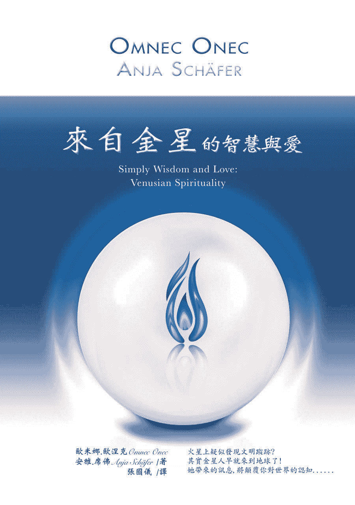
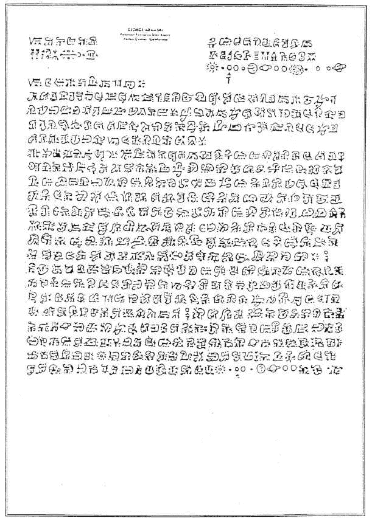
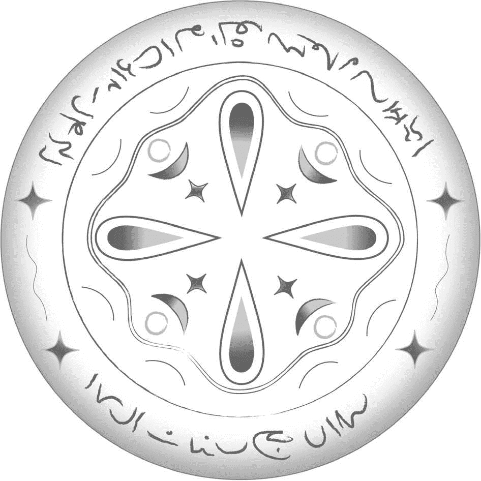

# 来自金星的智慧与爱

# 致　荷光者们

带着真理之光而来的荷光者，往往会因为受到人世间各种变化的撩拨与撼动，使得身上所散放的光芒逐渐黯淡，失去了原有的光亮。

有时，命运会如浓雾一般强袭而来，连荷光者自己都看不见光明何在。

生命还会出现各式各样的黑暗时刻，让人以为黑夜永远没有尽头。

但是，存在於荷光者核心深处的，是灵魂，也就是那永恒之光──而灵魂对真理的认知，将再次点亮光明。

正因为有荷光者持续不断地照亮前方的路途，那些努力在黑暗世界中寻找真理的灵魂才能找到抱持同样目标的追寻者，并加入他们一同放光，保护追寻真理的人不受黑暗的侵袭，并使所有人类在这条追寻之路上走得更加顺遂。

# 【探索生命书系】总序

──中华新时代协会创办人／王季庆

二○一二年前，众声喧哗，末日预言不绝於耳。

一方面，我本着对「赛斯资料」的信任，也祈求他独排众议的说法得以证实。简言之，他声称二十一世纪上旬，世界虽然仍有战事与天灾，却无第三次世界大战。并且，到二○七五年时，人类将有一个大同世界！另一方面，即使成为「一百只猴子的寓言」中的一员，我也想默默地为世界的未来尽一份力，为达成「一体平等」的灵性觉悟而努力。

我不敢声称自己已开悟，而且我最喜爱的「赛斯」也从没提过这个词儿。不过，在求道的过程里，我无意中悟出「除了神没有别人。除了爱没有别的。」（There is No One but God.There is Nothing but Love.）当下，在无边的寂静安宁中，我的心中充满了狂喜与爱，这份爱又满溢为感恩之情！我体会到我一直在宇宙的爱中，宇宙的爱也一直在我心中。而，世人也莫不如此！不同的是，有没有体会到，有没有连上线。在一体平等的感悟中，我谦逊地臣服，自然放心又自在。不由得散播出爱—平等的频率！

於是，完成了告别之作《与神同心—依爱随行》，我便退休下来。想读的都读了，想分享予读者的也都真诚地写了下来。此生足矣！

在《与神同心》的後记里曾提及我的天命──推介与翻译新时代的好书──已经完成了。没想到二○一五年四月，素未谋面的蒋圣光先生，带着家人约我在中华新时代协会见面。历经海外创业的艰辛，如今他已是卓然有成的企业家。他开门见山地说，自己读遍了我推介的新时代书籍，也邀同家人一起钻研。哇！这让我立即视为知音，因为，连我都没有主动要求家人研读呢。

作为一位成功的企业家，可以想见，蒋先生必然是位有主见，有魄力，并且格外有执行力的人。他说，运用从新时代书里得到的智慧，他成就了他的事业。如今，他想（并且已着手进行）设立出版社。一方面找回一些已绝版的新时代书籍，一方面当然也将眼光放远，胸襟放大，继续以自由开放的精神，开创「探索生命书系」，向生命致敬，完全不计盈亏。

由美返台近四十年了。从一九八九年开始，我正式投入新时代运动。当时，曾将我心中陶炼出来的「新时代运动」七要素，作为选书立说的准绳；并有助於分辨何谓「新时代」这个新「范型」（paradium）与二十世纪中期前的旧范型有何不同。

这七个要素就是：

一、我们皆为神的一部分：有神论，但此神并非有组织宗教高高在上的「偶像」，而是无形无相，一切的根源。祂乃是宇宙意识，我们的「源场」，而我们皆为其分出的一小片。祂透过我们每一个来体验物质世界，完成整个拼图。

二、你创造你的实相：你有多生多世的生命，并且是个多次元的存在。因此，不怨天不尤人，为自己的一切负起责任。从而省视自己为何作出如此的选择，要学习的是什麽。

三、肯定人生的意义：不悲观，不耽溺。最重要的是培养清明的觉知和一体的慈悲。

四、道德的内在性：不盲目跟从传统，不媚俗。返归自性，找到内心那一念灵明，依之做人处事。

五、身心健康是种自然状态：心理有问题，郁闷不快乐，自怜或自恨，能量堵塞不觉知时，才会不适。

六、环境保护：这攸关全人类的存亡。我们不能再视而不见，当作是别人的事。生态环保，人人有责！

七、无条件的爱：也就是对人的一体大爱，而非在关系中只顾自私自利的比较，争夺，交换，控制。

至今，觉得那篇文字，还是相当切中新范型的精神。

不具权威性和强迫性，新时代不是宗教。它不崇拜偶像，也不自立为偶像。没有阶级组织，没有教条，没有戒律，也不等待外在的神明、圣贤、大师来拯救你。

赛斯说，认识自己就是认识神，因为你们都是和祂同一幅料子裁制出来的！

虽然，普罗大众仍不见得了解新时代的「奥义」。但至少，经过三十年的「百花齐放」，现今社会上也习於其种种的观念和用语。从生活面的应用：慢活，身心的放松平衡，爱自己从而爱别人，更新而平等的亲子关系，伴侣关系；到最深的灵性认知：生死学，生态保育，宇宙论，哲学思辨，都或多或少看到新范型的影响。整体而言，社会风气无形中也改善了不少，好比，双赢互利，人权以至动物权的伸张，性别平等的推广，人们彼此相处的包容，体谅与温暖──此间往往看到人性的光辉！

这个人间世，就是我们的舞台。贩夫走卒，帝王将相，都是我们生前和梦中不断参与编写，而於醒时演出的一出出好戏。所谓的觉醒，就是参透了镜花水月，将注意力由外在舞台返照回来，成为中立的观者，醒悟自己演出的意义！能如此，就是找回了自性，开始走向返乡之路。

不知从何时开始，我自觉到我有一项特性：我不会以个人追求自心的明晰、自在与幸福为满足，仍深爱着人类自古以来种种文化艺术哲学上的成果，为之赞叹不已！同时，也深深牵挂着人类未来的展望与福祉。当然，也关注着现世的兄弟姊妹，世间的种种困惑和苦难。记挂着、记挂着……不会忘也不想忘，作不了佛家所谓的自了汉。但由於相信自由平等，也从不愿将自己的喜好和浅见强加於人，只能以出书的方式，给大家一个提醒和自由选择的机会。

安然度过了二○一二年，不过，世局天象，时时风云诡谲！我有幸活着一天，就要为世界人类的平安幸福努力一天！所以，蒋先生要我写篇总序，替「探索生命书系」揭开序幕时，我便答应了下来。但愿，我过去的努力，促使世界进入新时代，现在则有助於世界迈向黄金时代。

且让我们共同为未来的大同世界，尽其所能地提供贡献吧！

# 译者序

──张国仪

「一个来自金星的女人？这简直就是科幻小说嘛！」相信许多人在首次看到这本书的介绍时，第一个反应大抵会是如此。老实说，译者本人在一开始读到这本书中提到有关地球上人类起源的篇章时，也有类似的反射性反应。但奇怪的是，这样的反应并不会像一般这类的内容，让人生出强烈的质疑或反感，反倒更加引人入胜。简单的字里行间彷佛有股奇妙的魔力，一切画面竟有种似曾相识的熟悉感，读着读着，就服贴地融入了自身核心最底层的记忆之中：「这些事情，一定真的就是这样发生过呀！」莫名其妙地就被同化了。

有关欧米娜‧欧涅克，你可以说她有妄想症，也可以说她精神解离，要如何诠释完全是你个人的权利。但唯一无可辩驳的是，没有人能断定地宣告她说的不是事实。因为，没有人知道所谓的事实究竟是怎麽一回事。这让译者不由得想起村上春树在他的第一本小说《听风的歌》里虚拟了一位影响故事主角甚钜的作家费德哈尔。这位作家写了大量的科幻小说，每个故事都虚幻离奇到超越世人的想像力。他故事中的主角在火星上死了两次，又在金星上再死一次。记者针对这个问题向哈德费尔发问，他反问记者说：「你知道宇宙中的时间是怎麽流逝的吗？」记者回答说这没有人知道啊。哈德费尔就说：「大家都知道的事情，写出来又有什麽意思呢？」

就是这样。大家都知道的事，又有什麽好写、有什麽好看的呢？

欧米娜并不是位文学作家。她的行文绝难称得上优美，文字甚至可以说是稚拙。不过，她只是在陈述她所知的事实，就像是到警察局去做笔录一样，平铺直叙；谁听过做笔录还需要华丽的词藻、蜿蜒铺陈的情节呢？在这个复杂的时代，愈是简单的描述，反而愈能直入人心。剥除言语文字的矫饰，剩下的就是事物的本质了。

本书的第三部分是新书发表会时欧米娜与观众的对谈纪录。由於是以对话方式呈现，有许多「断片」般不太有连贯性的文句出现。其中最让译者印象深刻的是许多观众所发问的「笨」问题。这麽说并没有贬低之意，毕竟译者本人也没聪明到哪里去。只是，这些问题很大程度地反映出我们人类的偏执和狭隘。看懂了这一点，就能明白，只要抱持着开放的心态，事实与真相会更容易找到它们的位置。

翻译这本书的过程中，译者过着相当忙碌的生活，有点像要挑战自己能力极限似地疯狂工作着。然而，在忙完其他工作之後，一想到要翻译欧米娜的书，心中不由得就平静了下来。彷佛在夜晚的灯下，斟上一杯单一麦芽威士忌，听一位老朋友絮絮闲聊般，放松又愉快，不知从何而来的振奋力量也莫名地涌现。但愿各位读者也能放开心胸，不带任何限制地与这位可能在某个时空中曾与你我交会的老朋友，再次共享灵魂的奥秘与喜悦。

# 前言：发行人的话

安雅‧席佛

我和欧米娜‧欧涅克是在一九九四年透过电视萤幕首次相会。当时我刚巧转台看到一个谈话性节目，立刻就被欧米娜‧欧涅克的风采给吸引了。她言简意赅地用一种平静且令人愉快的口吻来说明何谓灵性讯息，更是让人着迷。「想像力是创造的金钥。」这是我个人在当下所获得的良言金句，深植於我的脑海之中。然而这句话却花了点时间才开始冒出芽来。一直到一九九七年，我又再次想起了欧米娜‧欧涅克，那是因为当时我刚在德国巴伐利亚的兰兹胡特开了我的灵性书店「希望之光」，需要进我的第一批书。我想起了欧米娜‧欧涅克的第一本书：《来自金星的我》（暂译，From Venus I came），早在那个谈话性节目之前我就曾经听说过这本书了。我先订了一本给自己看，结果读得废寝忘食，完全无法自拔。欧米娜在这本非凡的自传中对金星的描述以及她源源不绝的爱和智慧，彻底地感动了我；我觉得自己终於回到家了。几个月後，我又读了她当时刚出版的第二本书《金星人的灵性手册》（暂译，Handbook of Venusian Spirituality）。这一次，我下定决心势必要和这位奇女子见上一面，所以我打电话给她的出版社，希望能敲定一个前往拜访的时间。我的电话直接被转接给欧米娜当时的经纪人沃夫‧渥明哲（Wulf Wemmje），他提议的做法是：如果我愿意在书店帮欧米娜办座谈会，那麽他和欧米娜就可以一起到兰兹胡特来找我。这有什麽问题！我兴奋极了，二话不说就接受了这个提议。

当欧米娜在短短的三个礼拜後真的出现在我眼前时，我紧张得要命。她穿了全身白的衣服，看起来非常迷人。她那平静又充满了爱的个人特质，以及她在座谈会与工作坊中与我们分享的各种资讯，在在都令我感动不已。在这第一次的会面中，我因为太过激动，所以没能和她有较深入的接触。一直到约莫半年後，她和沃夫再次到访兰兹胡特，我们之间那份友好、近乎熟识的情谊才渐渐开始滋长。当欧米娜和我在工作坊中互相交换眼神时，我有生以来第一次真正体会到什麽叫做爱。我的心瞬间大大敞开，感到完全放松而且无比清明。这个令人难忘的经验正是我们接下来长期合作的起点。

自此以後，我和欧米娜的互动愈加频繁。光是我与她私下相处的经历，以及她这个人的存在所带给我的种种启发，就足以写成一本书了。在我们一起到各处去演讲，并且发现我们两人共享相同的「绿洲愿景」之後的某一天，我发现自己正在将她的演讲翻译成德文。很显然地，帮助宣扬欧米娜所带来的讯息，是我自己选择的一份生命任务，因为这是自我们相遇後我就持续在做的事情。一次又一次，我陪着欧米娜前往各个以德语为母语的国家，并协助安排座谈会及工作坊。二○○八年，我制作了欧米娜的网站：www.omnec-onec.com，接着又在社群网站上张贴各种活动讯息，同时也上传影片到 YouTube 上。後来当欧米娜的书销售一空但我自己又无法帮她再版时，我也帮她找了一家新的出版社，而这家出版社不但再版了她的书，更加码为她制作了有声书的ＣＤ，以及演讲的ＤＶＤ。身为该家出版社的雇员，我的工作就是编辑欧米娜的书、为她的书排版、替她的德语版ＣＤ和ＤＶＤ配音，并且在二○一一年秋天陪她进行了一场朗读之旅。

我录下了这次朗读之旅中的每一场新书发表会，并在之後将会中的谈话内容转译成了文字。也因此我才有了想法，将这些内容和其他一些未曾发表过的材料全部整理成一本书。

从二○一二年起我就开始了自己的出版事业。这本以发表会为主要内容的书，也是我新成立的出版社（Discus Publishing）所出版的第一本书。我希望所有对此感兴趣，而且和我一样认为这些由「来自金星的女人」所提供的讯息极具价值的读者，都能阅读到这本书。

注：为了能够区别本书中哪些段落是由欧米娜所撰写、哪些是由我所撰写，每一段文章的开头都会标示出作者的名字。

# 谁是欧米娜‧欧涅克？──来自金星的女人

文：安雅‧席佛

欧米娜‧欧涅克是我们人类社会中唯一现存并留有纪录的金星人，她以自己的肉身形式从金星的灵性次元来到地球。欧米娜的自传《来自金星的我》一书，令她声名大噪。在本书中，欧米娜详细地描述了金星的历史，并且说明了她自己为何以及如何出生在灵性次元中，还有她为何在七岁时得到了降低自身频率的机会，进入了肉身之中。她来到地球是为了能在之後成为一位灵性导师，并圆满完成她在地球的生命循环。

> 「我出生在金星的灵性次元中，并以一个小孩的肉身来到你们的星球，但透过多次的转世和各种生命经验，我依然保有自己在灵魂状态时所获得的知识和讯息。我保持这些讯息的完整无缺，而且我教大家的是我实际知道的事，而不是我在哪里读到或听来的东西，我所知的一切全部来自我在地球上多次不同的生命轮回，以及从不同次元空间所学习到的事。」
> 
> ──欧米娜‧欧涅克

灵性场域是一个拥有更高振动频率的空间次元，无法透过物理方式看见或证明其存在。据欧米娜的说法，金星上也曾有过与今日地球非常相似的肉身生命^(（注 1）)。自然的进化过程及生活条件的变化，使得肉身生命无法继续在金星上存续，但是由於人们的灵性成长已经达到一定的程度，於是他们的社会得以用更高阶的振动频率继续存在。

金星人的生活完全顺应自然法则，并且服膺宇宙间有个「至高无上的神」这般的信念。他们能全然地感知到自身与造物者之间的连结，对自己所掌握的灵性力量也能够谨守其分际。

欧米娜在一九六○年代时就已经写好她的自传了。这本自传在一九九一年首次发行，由一位美国陆军上校同时也是幽浮研究者，温德尔‧Ｃ‧史蒂文斯（Wendelle C.Stevens），在美国出版。不过自从一九九三年起，由於欧米娜的内在指引要她专注在以德语为主要语言的国家，这第一本自传以及接下来的着作──第二本为《天使不哭》（暂译，Angels Don’t Cry），是欧米娜自传的续集，主要内容为她在地球的生活经历，以及集结了欧米娜所教授的灵性课程精华内容的《我所带来的讯息》（暂译，My Message）^(（注 2）)，都直到二○一二年才出版了英文版。二○一二年，这三本书以三部曲的完整形式出版，取名为《金星三部曲》（暂译，The Venusian Trilogy）。

欧米娜‧欧涅克这个名字在灵界的意思是「灵性的回归」。而欧米娜的任务和天赋就是帮助人们与真正的自己──也就是我们的灵魂──重新连结。她在地球上的名字叫做席拉‧吉普森（Sheila Gipson）。由於某些因果关系，加上为了要完成她的天命，欧米娜在席拉这个小女孩七岁时取代了她，开始在地球上生活。在她的自传及公开演讲中，欧米娜都描述了她是如何来到并进入了原本席拉的家庭。

二○○九年欧米娜中风，从那时起，她就开始尽量减少公开场合的露面。

欧米娜结过两次婚，共有四个孩子及三个孙子。

> （注 1）出版商注记：欧米娜提到，金星、火星、土星和木星上的居民曾在数百万年前殖民过地球。这些人直到现在仍具有较高的振动频率。↑
> 
> （注 2）出版商注记：此书原名《金星人的灵性手册》（暂译，Handbook of Venusian Spirituality）。↑

# 第一部　无人知晓的太阳系历史与地球上的灵性转化

文：安雅‧席佛

二十世纪九○年代中期，欧米娜首次与大家分享了有关〈无人知晓的太阳系历史与地球上的灵性转化〉这份讯息。

> 「我第一次听到有关灵性转化和太阳系的历史，是在一九九四年我受邀参加的一场灵界会议中，我藉由相当长时间的冥想才得以进入这场会议。在会谈中，这两者之间的关联被说明得非常明确。
> 
> 参加这场会议的是数千位来自不同星系的人类与非人类生命体，他们全都拥有极高的智慧，而且进化程度也非常高。他们经常会举行这样的聚会，大家前来都是为了要贡献一己之力以拯救地球，这场会议只是其中的一次而已。他们从一九三○年代就开始逐步提高振动频率，为的就是要阻止地球更进一步迈向毁灭的境地。」
> 
> ──欧米娜‧欧涅克

就在欧米娜於演讲中讲述了人类在地球上的故事，以及时至今日所经历的种种转变之後，大部分人都想了解更多──於是才开始有了「灵性转化工作坊」的课程。多年来，欧米娜在这个利用周末时间进行的研讨课程中，与大家分享有关宇宙的真相。对许多上过课的人来说，她所传递的讯息不但深具意义，同时也撼动了他们的灵魂，也因此让他们的意识得以拓展。

二○○四年时，欧米娜确定要回美国待上一段时间，因为不确定她什麽时候、甚至还会不会再回到德语国家开设课程和工作坊，所以我们制作了这段影片^(（注 3）)。

除了欧米娜与众不同的自传《来自金星的我》之外，这份讯息可以说就是欧米娜想与人类分享的全部精华所在了。〈无人知晓的太阳系历史与地球上的灵性转化〉涵盖的范围相当广，由人类的源头开始，到人类意识逐渐衰落的历程，最後是地球的未来──也就是在完成了现阶段的灵性转化後的未来，那将会是一个全面正向进化的所在，也是自由无碍的人类的家，在那里，人们与大自然和全宇宙和谐相处，就有如他们下定决心要顺随自然而活：身为自由、无罣碍且充满创意的灵魂，全然感知到自身的存在以及与造物者之间的连结。

〈无人知晓的太阳系历史与地球上的灵性转化〉的第一部分包含了人类如何以太阳系作为栖息之地的始末，以及目前正在地球上进行的灵性转化的完整内容。这些就是欧米娜‧欧涅克到她二○○九年中风为止，教授了十五年的所有课程内容。

而在第二部分的文稿中，欧米娜‧欧涅克在详细描述地球上灵性转化的过程以及地球的未来之前，先简短地介绍了她自己的人生故事及有关她出生的种种因缘。

> （注 3）出版商注记：这段影片现今已录制成可贩售之双ＤＶＤ。↑

## 文稿（上）

文：欧米娜‧欧涅克

##### 人类如何来到太阳系栖息

大家好，我的名字叫做欧米娜‧欧涅克。大家都用这个名字叫我，这是我在金星的名字。我要告诉大家一个故事，关於人类如何来到太阳系并且最後在地球这个地方居住下来的故事。我想用说故事的方法来跟大家叙述，因为这也是我自己了解这件事的方式，当然我也会跟大家说明我是如何跟这件事扯上关系，以及我如何来到你们的星球。这是一个由我的灵性导师给我的灵性选择，我完全可以自由选择要或不要来。

不过这个故事是从很久很久以前开始的，久到那个时候地球甚至还不存在呢。从非常非常遥远的银河系，应该说是四个不同的银河系，至少我听到的讯息是如此，第一批人类搭乘着巨大无比的太空船前来。他们被灵界的统治者送来这个星系，统治者叫他们来这个星系居住，因为当时这个星系里还没有人类存在。

这群人里分别有白种人、黄种人、黑种人和红种人。他们全都得到了相同的讯息，必须前往这个星系居住。所以他们搭上了太空船，遇见了彼此。所有人都很了解具有实体的生命是怎麽一回事，他们可以和矿物、植物以及动物沟通。这些人全都处在意识清明的灵性状态中，他们不需要语言，只要心电感应就能彼此沟通。他们认为无论肤色或文化或其他的什麽差异，他们同样都是人类种族的一份子。

他们创造了一种你们会称之为「合作情谊」的关系，而且彼此相处融洽、合作无间。

他们来到了这个新星系，必须为自己打造新的家园并开创新的人生，因为他们很清楚，跟着他们一起从家乡远道而来的这所有人，都不可能再回去了──从今以後，这里就是他们的星系、他们的新家。不过当然他们也把属於他们的智慧、见识和文化带进了这个新所在。他们得选择新家的位置，而这个星系中最古老的四个星球就是火星、金星、土星和木星。黑种人挑选了木星，因为这个星球和他们的故乡最为相似。红种人也因为相同的理由而挑选了土星。黄种人挑选了火星，白种人则选了金星。这都是基於他们天生的基因，以及他们能够适应新环境到什麽程度所作出的选择。就这样，他们在这些星球上落脚，开始过新的人生，建立新的家园、新的社区，同时他们也都在各自的星球上找到了能量位置，而且各自打造了一座圣殿。在他们的家乡星球上，这些圣殿的功能即是作为通往其他次元空间的出入口，因为他们会和那些灵性更高也更进化的存有进行交流，而这些存有并不生活在肉身世界里。如此一来，他们就能够藉由这些圣殿、水晶矿石，以及其他各种不同但必须的东西，在他们所处的社会中生存下来。这些圣殿一定都位於能量位置所在之处，那是一个非常特别的地方；而他们之所以能够找到这些地方，是因为他们有相关的科技，也有这方面的知识。

##### 地球诞生，生命展开

他们彼此之间沟通无碍，同时发现有一颗新的行星正在逐渐形成中，尽管这个时候它还只是颗彗星，地球这颗行星还不存在。但他们全都在等待，等这颗彗星开始进入轨道绕着太阳运行，成为这个银河系中的一颗新星。他们全都知道这即将发生，在数十年的时间里，他们静静地看着，等待着这颗彗星最终成为行星，并正式跻身为银河系的一员。没错，这颗行星就是大家现在所称的地球。

当他们进入银河系时，这里还没有任何人类存在，而这也是他们选择来到这个地方的原因。他们的任务就是将人类带入这个只有植物、矿物和动物的星系。在地球开始冷却并且进入轨道运行之後，他们启程前往其他星系，因为他们决定要把各式各样的生命形态带入地球。他们希望把各种生长在特异自然环境中最漂亮的植物、矿物和动物带入我们的星球。所以他们乘着太空船长途跋涉，和这些不同形态的生命体沟通，并取得他们的同意将他们带回地球，一同为了地球的欣欣向荣与美丽，在这个星球上和谐共生。

还有那些他们带来的水晶和其他东西──他们很清楚自己所拥有的这些物品所具有的疗癒能力，以及保持灵性进化的力量，所以他们能够让自己在这不同的生命形态中生活时，依然保持身心的平衡。

这样的状态使得地球成为一个相当美好的天堂。它拥有各式各样特异的鱼类和鸟类──这个时候的地球还没有出现沙漠和冰封的极地。

当时的地球有两个月亮，也因此整个环境的磁场相当和谐，而且气候状况也不像现在的地球一样如此极端。

渐渐地，有关地球的风评传了出去，越来越多的人和访客从不同的星系及星球来到地球。他们有的拥有人类的肉身，有的则没有，但是他们都具有极高的智慧，而他们都想要一探地球这个新行星的美妙风貌。红黄黑白这四种存有对他们所创造出来以及他们所成就的一切非常满意，他们也誓言要保护这个星球，因为它的存在代表了所有不同形式的生命体都能够互利互助、和谐共生。这也是他们对地球感到最满意的地方。

##### 地球保卫战

没多久，一群灵性进化程度不高，也不具有人类肉身的访客来到地球。他们是蜥蜴人和迪诺伊外星人。他们用两只脚走路，搭乘太空船移动，他们的科技非常先进，而且智力很高。但是他们的灵性可以说是尚未开化，而且他们认为其他任何与他们看起来不一样的生命体，都比他们低等，所以他们完全不把其他生命体看在眼里。他们开始掠夺地球，植物也好，动物也好，矿物也好，无一幸免。到最後他们起了内哄，为了该由谁来统治地球而大打出手。就这样，他们让地球陷入一场丑恶的争战之中，我想，时间大概长达三十或四十年之久。他们有核子武器，还有一些是你们现在只能在科幻电影中看到的武器。

其中一部分人以月亮为基地，而另一部分人则是以地球为基地。在这场战争进行的过程中，他们几乎将地球摧毁殆尽。各种形态的生命体在残骸废墟中奄奄一息。而他们作为基地的那颗月球，则是彻底地毁灭了。这也就是为什麽後来的地球只剩下一颗月亮。不用怀疑，在把所有东西都摧毁之後，他们就拍拍屁股离开了，因为这里已经什麽都不剩了。地球不再美丽，也不再丰饶。他们甚至抛下受伤的同类不顾，一走了之，因为这些伤兵已经没有任何用处。他们就这样打道回府。

最後，是红黄黑白这四种最早来这个星系的种族找到了帮助地球，甚至是那些被遗留在此的伤兵复原的方法。他们决定搭乘小型太空船到地球来进行调查。他们从自己所在的星球各派出几艘小太空船，上面搭载了几位科学家、生态学家和医护人员，希望藉此寻找出能够帮助地球和伤患的办法。

就在踏上地球的那一刻，他们才赫然惊觉地球所受的损伤远比他们想像的更严重。整个地球全部覆盖在核子辐射之下，连他们自己都因为受到污染而无法再回到自己居住的星球去了。就这样，这些来地球侦察状况的人，和那些入侵者伤兵一起被困在这里动弹不得。

於是他们传讯息回原本居住的星球，告诉其他人他们没有办法回去了，因为这样他们会把辐射也一起带回去。所以他们只能在地球上住下来，并试着照料伤患，以及那些幸免於难的植物和动物。当时的状况实在令人痛心。可怜的地球是如此满目疮痍，而仅存的一颗月亮使得地球形成了火山地形、地震，以及各种让人难以招架的天气形态。尽管如此，这些人还是得在这样的状况下寻觅得以安身立命的生活居所，他们得在地球上活下去。

经过了数百年的时间地球才慢慢复原，状况也才有了改善。那些当时在地球上幸存的生物，因为辐射线的关系而产生了突变，变成了尼安德塔人，也就是大家所知的穴居人，还有恐龙这种大家从史料中知悉的巨大生物。这些物种是因为地球上的辐射污染所产生的突变种。他们在地球上生活了好一段时间，但是，正如大家所知，地球无法喂饱所有这些生物。这些留在地球上的人类已经失去了他们曾经拥有过的高等智力，也完全不记得自己从何而来。这并非一种很理想的生活状态，绝大多数人完全是仰赖他们的本能过活。他们得狩猎动物，而且和动物一样把蔬菜当作食物。而动物则是互相残杀以求生存，牠们有时候也狩猎人类。

看到这个状况，其他星球上的人类开始思索如何是好，他们的结论是：「唔，我们得想个办法才行。这样的地球无法维持太久，因为地球不可能养活这些巨型动物。」所以他们决定要向更高次元的灵请益，希望能知道自己可以为地球做些什麽，以及地球要到什麽时候才有可能完全复原，好让他们能再次将各种不同的生命体带到地球，还有，他们该拿那些突变物种怎麽办才好。

过去那场核子战争就像是制造出了一块厚厚的辐射云包覆着地球。而此时他们发现有颗彗星正在靠近。以他们的科技程度，他们能够控制彗星行进的方向。利用特殊的雷射科技和他们所拥有的磁力设备，他们可以让彗星转向，坠落在地球的海洋中。这样一来，彗星就会制造出一大块蒸气云包覆住地球。而有了这块蒸气云，他们就能冻结云中的蒸气分子，接着利用这些分子来中和辐射，净化地球。

除此之外，辐射云和蒸气云会让地球笼罩在一片漆黑之中，太阳也无法与地球的重力场相互作用，届时地球将会不见天日，接着开始冰封冻结。这麽一来，这些突变的生物也会跟着灭绝。

这就是他们终结地球损坏状态的方法，地球的大气层因此得以净化，而突变物种也全部死亡殆尽。他们持续清理地球环境，重新引进植物和动物，让地球恢复成之前的美丽面貌。

不过，对於只剩一个月亮对地球所造成的影响，他们完全无计可施。意思也就是说，地球会继续出现极端的气候，也会持续有火山活动和地震的发生。他们只能尽一切努力让地球恢复清洁和曾经的美丽景致。

##### 地球上的第一批住民

之後没多久，他们发现他们各自生活的那几颗星球开始进入自然循环的冬眠期，所有有形生物都将无以为继。因此，他们必须作出决定。既然他们已经把地球恢复成过去的样貌，也将植物和动物重新引进地球，於是他们决定从每个星球上移民一小部分人到地球。因为地球太小容纳不下，他们无法将所有人都带走。於是他们挑选了拥有特殊才能的科学家、教师、灵性存有和医师，以及所有的年轻人。

於是他们带着这些经过挑选的人类前来，将之安置在地球上不同的地方，打造出了地球上第一个殖民地。其中一些是你们听过的──我记不得所有的名字，不过反正你们大概也不是很熟悉──像是阿兹特克、雷姆利亚大陆、姆大陆、亚特兰提斯、埃及文明，还有一些非洲大陆的文明，我想它们也都跟埃及文化有关系。就这样，他们创造了这些不同的殖民地，在地球各地落脚，也带来了第一批住民。

他们彼此之间相处融洽，也各自建造了美丽的城市和圣殿。他们都找到了不同的能量位置所在，当然，他们也都在这些位置上建造了圣殿，作为穿越不同次元空间之用，这麽一来他们才能够利用他们的科技在地球上生存下去，这是他们所必须的。他们创造了一个非常大的──我想你们应该会称之为「社区」，因为彼此之间能互通有无，而且大家一同齐心合作，让地球这个星球能够维持在和谐的状态中。

初来乍到地球时，他们必须按照月历来调整作息，因为随着月亮盈缺的变化，他们得摄取份量不等的液体来维持身体机能的平衡，但是他们对於气候和海洋的潮汐变化依然是无计可施。

不过最终他们从更高次元高灵的意见中得出结论，也找到了方法再次创造出地球环境的平衡状态，而且，他们不一定非要正面解决地球上的极端气候状况。

高灵指示他们在圣殿中摆放某种水晶矿物，而且他们得根据这些圣殿的构造，沿着地球的赤道打造出一座座相同的结构体，完成之後，他们还得在地球的冰封带依样画葫芦再做一次。这麽做能够帮助抵销一部分月亮的效应，同时也能为地球制造出一个更和谐也更有保护力的环境。於是，他们开始着手进行。

当然，罗马不是一天造成的，经过年复一年的建造後，这些对维护地球状态安稳发挥重要作用的结构体才得以完成。这绝对是一个有目共睹的奇蹟。凭藉着自身的科技，他们能改变地球访客的太空船频率，好让这些太空船在穿越满布冰粒的冰封带时不会受到损害，而且他们自己也能够随时造访在地球的殖民地。对那些科技技术和心灵层次都没有地球上住民那麽高阶的星际访客来说，这绝对是个相当神妙的奇观。

##### 渴望获取科技的不速之客

不过，这样的状态终究还是引发了问题，因为来自附近星系的一群人类相当不满地球住民不肯与他们分享这样高超的科技。这个状况持续了很长一段时间，这对生活在地球上的住民造成了不少问题，有些人长时间遭到这些想要获取科技资讯的人监控。最後这些人决定向地球的殖民地宣战，因为他们不惜以武力来夺取这项科技。

地球上的住民生性温和、不好征战，甚至连自我防御都不太会，所以他们觉得自己唯一能做的就是躲起来，於是他们把年幼的孩子及教师、照护人员和灵性存有送走，让他们躲藏在大自然的掩护之中。而他们最後能够做的一件事就是，摧毁所有的城市和科技，防止它们落入侵略者的手中。

就这样，战争开打了。这些地球住民一边躲藏一边心想：「没关系，等到战争结束，我们就能回到我们的圣殿去，如果有必要的话，我们再重建我们的领地。」而在战争期间，负责撑起两支环绕地球的冰柱的水晶结构体受到了破坏，他们得到来自灵性领导阶层的消息，地球将会有大水灾发生，因为冰柱开始融化，而且即将砸落在地球上。这些躲起来的人已经没有时间打造船只或太空船，或是及时赶到隐藏的圣殿去使用他们的高科技，所以他们只好利用大自然的素材来打造出超级大木船，当然过程中他们也得到高灵指引如何打造这些船。他们必须尽可能地把最多的人、动物、植物及其他生命形态装进船里，直到这场大水消退为止。所以他们打造了大方舟。你们都听过诺亚方舟，但其实它不只一艘，全球各地共建造出了数百艘的方舟，为的就是要保护地球上的生灵。

也就是说，洪水泛滥期间他们必须待在这些方舟上才能生存，等待大水退去後，他们才能再次重建并延续他们的文化和灵性思想。而那些侵略者也一样在等着洪水退去，因为他们知道，地球的住民和他们不太一样。这些住民有特殊的能力和能量，像是心电感应以及和更高次元的存有沟通的能力，而且在肉身国度中，他们还能够和植物、动物和矿物的灵进行沟通。所以他们下定决心要抓住这些地球住民。於是一等到水退了，他们就再次登陆地球包抄这些人。

当然，他们跟这些从船上下来的人说，只是要问他们一些问题而已。他们没说的是，他们要进犯那些被隐藏起来的圣殿，夺取其中的某些高科技。

##### 基因操纵，影响直至今日

侵略者用他们所取得的科技来对地球住民进行基因操纵和手术，他们把地球住民的大脑分成两半，这样一来大脑的一部分就会变成空白，这些人就再也不能用心电感应来和彼此沟通，也忘记了之前的自己有多先进、自己原本从哪里来、能够自由地在太空旅行，所有一切──全部都从记忆中被消除了。他们只留下能够在肉身世界中运作的那一半大脑功能。经过基因操纵後，这些人失去了记忆，同时被赋予了新的身分认知。接着，这些侵略者打造了一个，我不知道你们怎麽称呼，应该说，一个统治阶级的社会。他们自立为王，以肤色来区分人等，不同肤色有不同的文化，然後再根据他们自身的信仰为所有人设立了新的宗教。就这样，一切再次从零开始。最後，由於隐藏的圣殿中失窃了某些物件和科技等等，高灵及其他次元的人们决定，他们必须关闭所有圣殿，停用一切功能。而地球上的人们也因此不得不被迫接受另一种新的信仰、宗教和文化系统。他们彼此之间为了肤色和领土的问题屡屡发生冲突，甚至引爆战争。统治者控制了一切，包括创建新的宗教、社会和律法。因此，人们失去了绝大部分的自由意志以及自己从何而来的记忆，也无法再与其他次元的存有沟通。

那些留在原本星球上的人们最终理解到，他们生来无私并且关爱肉身世界生命的天性即是他们的文化，这样的文化不会因为他们无法再支援肉身世界的生命而终结，相反地，他们可以持续发出相同的频率，这样一来他们所创造的一切还是可以继续存在，而且他们也还是可以与地球上的人们保有联络的管道。於是他们在每一个星球上都原封不动地保留了一座城市，作为通往其他次元的入口通道，如此一来他们还是可以操作太空船进入肉身世界，与人们保持联络，并且尽他们最大的努力支援那些失去一切的地球住民，他们失去了自身的能力、与不同次元存有的联系，甚至是对先人的记忆。可以说地球住民生活在一个非常悲惨的状态中，而这个状况一直持续到今天丝毫没变。

在这里，基因系统里的改变其实比什麽都要来得深层，因为这里的操纵大部分属於潜意识层面。人们被迫放弃他们原本的生活，在各种折磨扭曲下不得不去拥抱新的文化和新的思想。最後，他们被训练成唯命是从，不再有任何疑问。这一切都是基於恐惧，到今天依旧如此。一切都源於恐惧。就连宗教都教你要害怕这一辈子结束之後到了另一个世界会如何如何，因为不知道真相，所以这就成了大家的观念和信仰。大家自然而然地就遵从了这样的想法。人们让自己的小孩接受某个宗教的洗礼、紧紧依附着自身所属的文化群体，并且为管事者──那些掌控一切的人──效命。他们深信自己得仰赖这些人才能生存，因为他们已经失去了依靠自己以及独立自主的能力，他们不知道光靠自己要如何生活下去。大部分人已经不再有这样的能力了。而如果这些能力在基因系统中冒出芽来，这些人就会被认为拥有通灵或疗癒的天赋。但这其实曾是人人都有的能力，只是大家失去了一切相关的资讯和知识，所以才会如此依赖那些领导者制造出来的不同信仰和观念。现在的世界还是以这个模样存在着。

这世界充斥着由统治力量所制造出来的战争以及各种问题和疾病。他们说服人民相信这一切都是真实的，而这些人也接受了；而因为对此深信不疑，他们也在这个地球上为自己制造出了各种的状况和问题。

相信造就了现实。这些人不明白的是，他们完全可以打造出自己想要的一切，他们可以活得更自由、更独立、更充满力量，可以靠自己及与他人分享来生活；但是，这个世界已经被分化太久了，很难再将这些讯息传递到人们心中。这就是为什麽我会在一九五○年代来到地球的原因。当时我还不知道自己会在地球的灵性转化上扮演一个很主要的角色。

##### 目前的转化阶段及失落知识的回复

这整个转化过程的目的是为了释放人类，让他们再次拥有原本与生俱来的力量。这个工程浩大的转化需要许多不同层次的生灵相助，肉身国度和非肉身国度的存有都得携手合作，包括了自然界的万物，以及大自然的掌管者也在内。大自然的生灵已经收到知会，所以他们也全都齐心协力地在为地球的转化付出。

一九五五年我来到地球，当时最大的问题是：让一个来自不同次元的小孩子进入肉身，生活在具有形体的社会中，这样做究竟是不是能确保肉身无恙，思想和感情也不会受到损害呢？诸如此类的忧虑。当然，他们一直都在关注着我的状况，每五年我都要接受一次检查与平衡调整^(（注 4）)。

我得慢慢习惯人类社会以及在这整个结构中盘根错节的控制与不公。大部分人看不到也察觉不到这些控制和不公，因为几千年来大家都是这样过的，这已经深植在所有人的基因之中了。

我们过去曾经尝试要送一些导师和先知来这里，但他们最後都受到地球统治力量的屠杀，所以真相一直无法传递给人们──有关於基因操控之类的真相。人们无法获得有关他们社会的真实知识，以及为什麽一切这麽困难的原因。当然，这很难解释清楚，因为从另一个角度来说，每一个灵魂在出生於肉身国度之前，都会自己决定要有什麽样的命运，以及要来学习什麽课题。

也就是说，每个灵魂都在事先作出了抉择，然而换个角度来看，生活在个人处处受到控制的社会中，受到宗教、地位等等的牵制──你们也很清楚，大家都会以职业来认定自己、以国家来认定自己、以宗教来认定自己、以种族来认定自己，从来没有人把自己的身分认定为一个短暂生活在肉身之中的灵魂。大部分人对於生命结束後会发生什麽事完全没有头绪。他们只能仰赖宗教，以及学校、科学、社会等等方面所提供给他们的资讯。而这些全部都是受到控制的，包括资讯，以及人类被允许知道哪些事情，这全部都受到统治力量的控制。绝大多数的人根本不知道这样的状况，所以他们无法获知有关於他们自身的真相、他们真实的起源、他们的伟大，以及他们与至高无上的神之间的连结。

我们生活在其他星球上的这些人，依然保有最初的想法和信念，也还拥有所有与生俱来的能力。我们所知道的神并非是一个人，而是一个创造万事万物的能量源头。而且我们也不害怕死亡，因为死亡不过是从一个生命转换到另一个生命的过渡罢了。这就是为什麽我成立了工作坊来帮助人们。一开始，我以为我的书就足以将资讯带给人们，但很显然这样做还不够，大家想要更多。也就是从大家的想望中生出了我所做的各种灵性工作，这些是我原先没有预期到要做的事。不过换个角度想，这一定也是我的天命，因为我就是这麽做了。

在这个过程中，我结婚生子，拥有在地球上的孩子和丈夫，但是我永远也不可能成为这个社会系统的一份子。当然，要生存在这个充满了各种不同系统和文化的地方，同时还保有自身原本的认知和知识，的确非常困难。

这就是为什麽我要出生在位於另一个次元的金星，并且以一个小孩的身分来到地球的原因，为的就是要能保有我身为一个灵魂、在地球上历经多次转世後所累积的知识和资讯。我能够完整地保有这些资讯，而我教导他人的全部都是我自己真正知道的事情，不是从别的地方读来或听来的，是从我在地球及其他次元中多次不同的生命历程所累积下来的知识。

我要让大家了解的是，的确是存在着一个基督教天堂，但是这个基督教天堂是由所有那些活着，并将自身能量投入这个信仰的基督徒的集体意识所创造出来的。这些基督徒并不知道是他们创造了这个天堂，以及那个让人死後受尽折磨的地方，也就是说，如果你不依照宗教所订立的规范来生活，或者是你自杀，或是不遵守某些戒律，他们认为死後你就得受折磨，为你所犯的错接受惩罚。而很多人在死後真的就会陷入那样的状况^(（注 5）)。

其他的次元就和肉身国度一样广袤，其中包含了多条银河和多种星系。其实没有什麽不同，只是它们不具有物质形体而已。

我试着要跟大家解释我们对神的认知以及人类与其他次元的连结是怎麽一回事，还有就是让大家了解那些能力是什麽，以及拥有这种力量对个人来说具有什麽样的意义。每一个念头都是种能量，而这每一个念头都会对环境、世界、你身处的社会、你的人生以及其他人，产生影响。人们没有意识到这一点，而且从来不会控制自己的思绪，也完全控制不了。人们的想法经常被牵着走，被媒体、社会、学校、母亲、父亲、宗教团体牵着走，他们不会用自己的想法和能量来打造并开创他们想要的世界。人们活在恐惧之中，而且用自己的能量来喂养这份恐惧以及存在我们社会中各种负面的事情。怀抱着这样的想法和恐惧，人们制造出更加强大的负面能量，而这能量已经主宰地球非常长久的时间了。不过，这样的局面即将终结，这就是为什麽现在的我们正处在灵性转化的阶段中。

灵性转化之所以会发生，是为了让地球这个世界及其社会与人们不会就此灭绝，而且再次拥有机会创造出一个像过去一般美好的地球，这也才是它原本该有的面貌。

一切规划始於所有灵性领导阶层与大师在非肉身国度中密集进行的会议。他们全员到齐，包括那些要为地球目前的状况──包含了所有操纵和控制──负起最大责任的存有。这些存有的灵性现在也已经进化到了一个程度，他们想要改正他们过去在地球上所做的事──所有那些操纵与控制。他们想要给人们一个机会，让每一个人都能重新找回身为灵魂的自由，以及原就属於他们的灵性力量。

爱是所有一切的根基。事实上，爱是地球上除了恐惧之外最强大的力量。恐惧正好是爱的反面，它具有毁灭性，而且拥有和爱一样强大的力量，但爱却是永远不会消灭的存在。爱不只存在於肉身世界中，爱没有边界，而且一视同仁。爱，没有分别心，充满了疗癒的力量，而且正因为有爱，人们才能怀抱着希望和力量为自己打造出美丽的人生。

无论在任何状况下你都有选择。你可以选择放弃，让自己成为人生的受害者；你也可以主导自己的命运，选择把你的能量投入在你想要的事物上，以及你身为这个世界一份子所希望达成的事情上。我们每个人都拥有这样的能量和能力，而在灵性转化阶段，这些力量会变得更加强大。但是需要有人教导大家如何使用这种思想方法，以及如何用正向的方式来传递这些能量，以便支撑起存在於此的生命结构，因为总有一天，这些由统治力量在地球上建造的负面结构和一切事物，都会举白旗投降。而他们所创造的一切，像是银行体系、电脑、工厂，所有受到金钱控制的一切都会在这个结构中崩溃瓦解。等那一天到来，我们必须创造出我们想要的世界。

##### 我们所知道的造物者

在这里我会用举例的方式来试着给你们一点概念，让你们知道我们是如何看待万物的创造以及创造万物的「人」，还有我们相较於其他一切万有的存在又是什麽样的存在。

造物者是创造出万物的能量源头。在某个时间点，造物者决定：我爱我自己，我不想在哪天就这样消失不见了，那麽我就用我所拥有的力量和能量来创造所有一切吧，让各种生命形态都能够在具有肉身形体的世界中，仰赖着彼此生存下去，而且他们在这个肉身国度里，可以藉由处於实相的反面来学习各种课题，同时，这些生命也会透过自身的存在与经历，理解到所谓造物者的全能究竟是什麽意思。

造物者创造了万物，每一块石头、每一株植物、每一只动物，因为万事万物都是灵魂，而这些灵魂全是来自於这个永不枯竭的纯粹能量。所以，万物皆由造物者而生，然後再不断地延续下去，所以生命的存在是永无止境的，而造物者也是。也就是说，造物者因为爱自己而由自身创造出了万物，而一切万物皆存在於一个永不止息的循环之中，因此造物者便能够透过自己所创造出来的万物而永垂不朽，包括每一个灵魂在内。每一块石头、每一株植物、每一只动物、每一滴水珠，全都是有生命的，并且都属於这个生生不息的能量源头，而我们也是其中的一部分。

我们人类在自身的进化上比较高阶，因为我们已经经历过身为石头、身为植物，以及身为动物的阶段了。身为人，我们需要其他所有生命形态的存在才能维持我们的肉身，同样地，我们也必须要关怀照顾其他所有生命形态，因为有它们才有我们，少了它们，我们会失去养分，而我们的肉身、我们的环境、我们所生存的世界，也都会因此消亡。我们的存在深深仰赖着所有其他生命形态的存在。

而在其他次元中事情就比较简单了。你只要凝聚能量，就可以透过这份能量创造出你想要的一切。我们都有这样的能力。在肉身世界中的操作方式也一样，不过当然你得劳动肉体来进行这样的操作。如果你想要创造某样事物，你必须先有个想法，然後你需要能够创造出你心里所想要的事物的材料。想像力是创造的关键。你能够想像出来的任何事物都会成为现实，或者说，都是现实。一切就是这麽运作的。任何一只杯子、任何一张桌子、任何一个家、任何一种存在於这世间的材料，在真实存在之前，都曾只是某人想像之中的一种概念和想法。所以，这就是万物存在的关键，首先，它必须要先存在於你的脑袋和想像里。而如果你脑袋里有太多不是你自己的概念和想法，最後的结果就是你会将所有可能性推拒在外，而且也难以接受一切都有可能成真的想法。一切确实都有可能成真。但如果你不相信这一点，那麽你就断绝了这个可能性，因为你相信的是另一套信念──来自科学家、学校，或无论其他什麽地方所灌输的信念。但万物的实相并非如此。当你满心认为任何事的可能性就只有这些而已，这种想法阻碍了创造，也让我们失去了打造我们所想要的事物的自由。允许你对自己这麽说：没错，一切都有可能，所以我想像的一切都能成真。当你拥有这样的想法，而且看得见所有生命形态所具有的灵魂，无论是石头、植物、动物或是人，当你能够直见灵魂而非肉身形体，而且无论他们为自己的生命作出了多麽糟糕的选择，都能一视同仁地去爱这些灵魂，那麽你的爱就是无条件的爱。这就是造物者的原意，也是造物者对祂所造万物所怀抱的爱。

身为人，你也得经过一段进化的历程，智能上的进化。最初的你处在未开化的阶段，然後你开始变得更容易接受、遵循并服从於各种规范。最後你会来到身为人的另一个阶段，你会开始质疑现实，以及这样的现实是否正确。为什麽会有战争？为什麽会有各种苦难？为什麽这个、为什麽那个。这是因为我们创造了这一切！我们创造了这一切，因为我们把自己的能量放在相信一种信念上，认为这个世界本来就是这个模样。当然，是我们自己选择了要遭逢各式各样的苦难，因为这对我们来说是种学习。对灵魂来说，事情没有所谓的好坏，任何经历都是有价值的课题。就算你是个杀人魔、是个流浪汉、就算你很富有很有才华很出名，都没有任何差别。这都是你自己选择的一种经历，好让身为灵魂的你可以了解何谓创造，以及自己在其中所担任的角色。

好与坏是社会创造出来的，这些都只是概念而已。真相是，事物没有好坏之分。万事万物都有其价值，也都有其存在的目的。我们必须接受每件事都有其意义。我们必须接受有时候，是我们自己选择了要罹患癌症，或是跛脚，或是脑袋不太灵光，或是其他不管什麽的问题。这是我们学习的一种方式。直到你经历过一切之後，你就可以坐在那儿理直气壮地说：「噢，没错，这个我做过、那个我体验过」，然後你会拥有同理心、体谅和爱，真正的、无条件的爱。

我们社会里的爱是基於各种想法和标准而存在的。什麽是美、什麽是丑、什麽可以接受、什麽是好、什麽是坏，但这些并非我们自己创造出来的想法，而是我们从别人身上学来的，或是从电视、杂志、其他人那里学来的。但真相是，每一个灵魂都是美丽且完美的。

肉身形体反映了你的灵魂。当你可以看见其中的美好而非只是肉体皮相，那麽你就可以踏上开发意识的进化道路，而且说不定你可以不需要再返回这个世界，也根本不用再去经历任何事了。不过这一切端看个人的造化而定。

##### 造物的设计架构与灵魂的诞生

我称之为「神」的那个能量源头，或许你也同样称祂为神，虽然在许多不同的宗教里有许多不同的称呼，但我想总结来说，祂代表的意义都是一样的──这个能量源头是创造万物的核心。试着想像一下，在那个地方有台离心机，所有东西都以极高的速度旋转着。现在，如果你把石头、沙子和水丢进去，你会发现比较重的物质会飞到外围的区域去。就存在的关系来看，这个外围区域就是肉身世界，而中心位置就是创造核心，核心区域里只有纯粹的能量，没有任何物质的存在。你越往创造核心的方向移动，你就会发现物质越来越少，而能量越来越多。所有东西都是种能量，只不过以不同的频率在振动，而我们的肉眼看不见。我们假设所有东西都具有实体而且都是物质，那是因为我们在生活的环境和世界里如此这般地创造了它们。但事实上，它们只是许多原子的聚合，只是一股能量。这麽说来，如果你也是能量，那麽你就会察觉到所谓的现实只是一种认知。

一开始，当你的灵魂被创造出来时，既不具有形体，也不带有任何经验，你纯粹只是能量。你唯一知道的是，你来自一股更大的能量。这就是为什麽神要创造出不同的次元和肉身世界，这是为了要让灵魂去经历各种次元，然後进入肉身世界，开始体验与真实相反的一切。这就像是一个刚出生的灵魂宝宝，开心地到处跑跑跳跳，这宝宝是一束光。但是接下来，当他抬头望着那更大的光、更大的源头时，他不禁怀疑：「我真的是光吗？」而神回答：「唔，你得自己进入黑暗之中，去体验和你自身相反的存在。你不会变成黑暗，而是黑暗中的光。但是，去体验和自身相反的存在，是个学习认识自己的方法。」灵魂透过存在的经历来学习，而非听别人说，或是阅读书本，或是收集大量资讯，灵魂得透过经历一切才能学习。而灵魂也想学习这一切，因为这样一来，它就能够变得和创造出它的造物者一样了不起，并且成为创造源头的一份子。

既然创造我们的基础是爱，爱在我们的存在中占有很大的一部分。爱是一种……如果你了解何谓无条件的爱，那你就会明白，爱，没有任何理由。造物者爱你，只因为你存在，而这也是我们需要去学习的爱。去爱那个把你的人生搞得有如炼狱般的大烂人，你可以为了这些人教会你的课题、为你所带来的磨难而爱他们，并心怀感激。当你能够这麽做的时候，你就真正成为更高的意识了。

大部分人都顺着情绪的起伏在生活，而且无法掌控自己的情绪，他们放不下很多事，像是痛苦、创伤之类的。当有人对他们做了什麽不好的事，他们就会想要以牙还牙报复回去。

这是这个学习过程中必经之路。当我们了解自己、我们的情绪和肉体与我们的灵魂有何不同、当我们学会对万事万物拥有正确的看法之後，我们就不需要再留在这里了。

##### 人类经验的复杂度与无条件之爱的意义

当你的灵魂被创造出来时，你只知道自己是能量。接下来，你展开一场旅程，为了增长你的历练及灵魂的进化而来到肉身国度中。在肉身国度中，你历经了由矿物、植物、动物再到人的肉身的进化历程。对灵魂来说，存在的每个阶段中你所拥有的经历，都由灵魂接收并成为你的一部分。每一个灵魂都是与众不同的，每一段经历也都是绝无仅有的；没有两个灵魂会拥有完全相同的经历。他们可能会有类似的经历，或是选择出生在同一个时间，或是在同一个时间里被创造出来，并且在许许多多次生命的进化中与彼此相遇，一同体验各种经历。就像是个灵魂家族一样，我是这麽称呼的。而他们不断地相遇，直到最後他们在肉身生活中也产生了某种连结，因为他们成为了家人。他们属於彼此，他们一同体验人生。

一段时间之後，你和成千上万的灵魂一起经历了许多事，几乎可以说是和全人类休戚与共了──他们是你在现实中的家人，因为你和他们相遇，你们一同经历。你可能杀了他们，你可能和他们生过孩子，你可能是他们的情人或是其他的什麽角色。人类的状态变得非常复杂，不再单纯，因为其中牵涉了太多情感、关联、家庭的建立、责任，所以每个人都会因为一生中与周遭一切所产生的各种状况和经历而变得非常复杂。不过换个角度想，如果你能学习看到每个人的灵魂而非他们的肉身，如果你能够拥有这样的体验，那麽你就能够感受到万物的爱。

我爱每个人，而且我从不批判任何人。我们必须学习不要批判其他人，接受就好。这是个问题。大部分地球上的人都只关注其他人，而且总想要干涉其他人的私生活，反而不多关注自己。学习去接受别人，让他们做他们自己，这是个过程。在其他星球上，我们的社会就是如此，我们不干涉并且完全接受他人，无论他们选择要经历什麽，我们对他们的爱都不会改变。

这也是地球正在慢慢形成的状态。当然，我们还没有真的达到这样的理解程度。我想这也就是我们要办工作坊的原因之一，好让大家有机会获得不同的认知观点，并学习如何从不同的角度来看待事物。我认为，每个人都必须经历这个转化过程，这也是开发更高意识的步骤之一。

##### 灵魂所踏上的创造之旅

你下凡一游的旅程之中包含了好几个面向，每一个面向都对你这个人本身带来重要的影响，因为它们全都满载着能量，而这些能量会注入灵魂之中，同时也提供某种你在肉身国度中生存及体验所需的生命能量和能力。就像我所说的，你的灵魂刚被创造出来时，并没有任何意识或觉知，因为你还没有任何经历。而这也就是你得下凡来到肉身国度的原因。这趟旅程是为了要让你去体验，并蒐集这些经历。正如我之前所提到的，除非你亲身体验过，否则你根本学不会。你必须要去体验并身在其中，才能够了解一切是怎麽回事。

你的灵魂被创造出来後第一个要进入的次元被称为以太次元，在这里，能量被区分为具有正面与负面两种效应。而这也是能量出现区别的开始。但这麽做都只是为了让灵魂能去体验并了解事物。当进入以太时，你会从这个次元中吸收能量，而这份能量会保护灵魂不受伤害，因为纯粹的灵魂能量无法存在於本身以外的其他次元中，或者说，它必须成为两股不同能量的一部分才能生存下去。所以，灵魂首次拥有的身体就是以太体。这就有点像是当你进入这个次元时，你变成了一块磁铁，你吸取这些能量，而同时这些能量也提供你的灵魂一层保护膜，也就是一副躯壳，好让你能在这个状态中体验所有可能的一切。同时，这份能量也让你的灵魂明白你是神圣的存在，你与造物者及万物之间相互连结着。而这里也是肉身国度中的许多圣人获取资讯的地方，他们所知的那些有关灵性与神性的讯息，都来自於这个次元。也就是说，你吸取能量来形成躯壳保护灵魂，而你所吸收的这些能量也让你拥有意识，知道自己是神与万物的一部分。

接下来你的灵魂会进入的是因果次元。这里也被称为阿卡夏档案（Akashic records）。实际的状况是，你的灵魂会收集你所经历过的一切，而这些资讯会一直储存在灵魂之中。不过这里的能量也让你能够看到自己曾经有过的所有经历，你在任何一段时间或是在肉身国度中所拥有的无论什麽经历。所以，因果次元会给你一副因果体来保护灵魂，这是一个让你可以存在於因果次元的身躯。许多宗教所打造的死後世界，天堂或西方极乐世界，就存在於这个因果次元里。这里有许多学习殿堂，是一个非常广袤的次元空间。许多人都经验过这个次元，来到这里的那些人会体验到濒死的状态。

下一个你会通过的次元则是心智次元。同样地，你会得到一副躯壳，它是灵魂的保护膜，称为心智体，而这个次元中的能量让你能看见自己的想法并用这些想法进行各种创造──这就是心智次元。

接下来，在进入肉身国度之前，灵魂要通过的次元是星光界。星光界同样也会给你一副躯壳，一层保护膜。你看，就是这样，灵魂位在中心位置，而你一路下来在各个次元中所获得的躯壳则是层层相叠──就像是洋葱的一层层外皮这样的感觉。灵魂在最中间，是你存在的源头，也是你生命的来源。你会在这里披上星光界的躯壳，这个躯壳来自於这个次元的能量和你的创造。而这个次元中的能量也会让肉身开始有各种感觉，也就是情绪、身体上的感觉等等。这里处理的是感官知觉。

接着，当然你就来到了肉身国度。当你第一次到来时，身为灵魂的你进入的是矿物阶段的肉身国度。你并不会一开始就拥有人类的肉身，因为你必须在肉身国度中经历某种进化过程，你必须先成为所有实体星球上的各种矿物，达成每一种矿物存在的目的，而当你完成了这一种矿物的使命後，你就能自由地吸取更多能量，并选择接下来要变成什麽。就这样，你会再成为另一种矿物，重新来一次。这过程会一直重复直到你完成了所有矿物的体验，然後你就可以进入进化过程中的植物阶段，就这样继续下去。在这里也是相同的步骤，你必须体验各种植物的生命历程，并且完成每种植物在肉身国度中所被赋予的使命，可能是要为更高等的生命做出奉献之类的。当你完成了这个任务，你就可以离开，然後自由选择接下来要成为哪一种植物，不管是要被吃掉，或是被拿来做美容圣品，又或者是被用来清净空气，不管什麽用途都好。世上有各种不同的植物，有的生长在海底，有的生长在地上，也有的在人所培育的花园里。就这样，你体验了植物国度中所有可能的一切，接下来你就会进入动物王国了。

当然，你可以是条鱼、是只鸟，你可以生活在大海里，也可以生活在陆地上。你会经历动物界里的完整进化，体验过程中的一切，被当成食物吃掉，或是替人类维护花园、帮他们盖房子，然後最後才会成为他们的宠物。

我相信，你所饲养的宠物，正在为接下来成为人作准备，这就是为什麽牠们要和人类有如此亲密的接触。因为这样一来牠们就能学习我们的行为举止，以及和其他人互动的方式，牠们可以学习自己该怎麽扮演人的角色。

当然，到了最後，你会进入成为人的阶段；而当你进入这个阶段时，你就会明白，你的存在、你所要用到的物质以及你的身体，都需要肉身国度中其他所有生命形态的存在。与此同时，你依然透过不同的脉轮与其他相对应的次元相连结。这提供了你生命力和能量，以及你在肉身国度中能够正常生活的能力。

没有人能够真正推算出灵魂的年纪究竟有多大，因为这几乎是不可能的事。我们永恒存在，没有尽头；你知道，这都要看你这个灵魂是什麽时候被创造出来，以及你的旅程从何时展开。肉身国度中的每一秒钟都有数千个灵魂诞生。灵魂的创造是个永无止境的过程，灵魂展开肉身国度的旅程也是一样。新的灵魂开始成为矿物，而那些在肉身国度中身为人却已经没有任何经历需要再去体验的老灵魂，则必须开始进行更高阶一些的意识进化。就这样，他们可以去其他次元完成不同的使命与任务，或者他们也可以选择留在肉身国度中成为大自然的神灵。在肉身生命完结後，灵魂还有变化无穷的各种经历可以去体验。

身为人的经历是相当复杂而且困难的，因为你必须体验所有不同的种族、不同的性别，你必须体验身而为人的一切。这其中的组合变化可说是无穷无尽。一直到最後你终於进入了意识层面，你开始寻找真相，而非接受一般世俗、宗教或各种资讯所给予的说法。我相信大部分现在已经开始为自己寻找不同真相的人，都已经到达这个阶段，他们正朝向自己的人类体验最终章前进。你学到了什麽、体验到了什麽、你能够接受事实的真相到什麽程度，以及能否理解万事万物存在的目的为何，这一切全都因人而异。这时候你就能够知道自己究竟是谁，还有──你知道，当你明白了你与一切万有的连结之後，你就能明白你与万物之间的关系，以及你身为人类所拥有的力量，而当你活过了这一切，发现自己在这个人类世界中已经无法再有任何体验了，那麽你就必须以一个高度进化的灵魂，前往其他次元开始其他的体验。

你可以想想有关自己的存在，想想最初被创造出来时的灵魂，以及置身於此时此地的你。你无法计算自己究竟存在了多久。有些人学到的比其他人多，也有些人进步得比其他人快，这全都要看个人造化，完全取决於你所选择的经历是什麽。有时候，有人会选择回到肉身国度中担任其他人的老师，帮助那些还在探寻或仍在寻找真相的人。就像我说的，一切都是自由意志，都可以选择。

造物者给我们最棒的礼物就是我们的个人性、作选择的能力和自由意志。这些是我们的灵魂绝对不愿意被剥夺的东西。如果我们任凭社会继续这样发展下去，到了最後，人类只会丧失越来越多的自由意志和能力。但这就是他们的计画。之所以需要转化就是因为我们必须终结这种控制和操弄，把自由意志和力量还给人类。

##### 创造一个意识中所渴望的世界

这又是另一个议题了，灵性转化的过程，以及其对环境、个人和身体的影响，还有所带来的改变，这都是我们可以事先有所准备的……这是另一个不同的议题，需要投注非常大的心力才行。当然，你必须要愿意加入，并且有意识地觉察到灵性转化正在发生。有些人很排斥这种想法，根本不接受，他们非常执迷於控制的力量、电脑、银行系统，还有基因遗传等等事物，而且不愿意放弃手中所掌握的权力。他们压根儿不接受这一套。就像我提到的，他们在肉身国度中死去之後，还是得再回来──我称之为「回收」，他们要先进入一个愿意接受灵性转化的身体之中，然後再慢慢有意识地成为转化过程的一份子。

接下来会有很多人自杀，那些无法接受世界正在改变的人。当政府架构、宗教组织、金融体系、电脑系统、电力系统，这些人类赖以维生的东西再也无法存在的时候，人类只能够仰赖自己的直觉和创造力才能够生存下去。但人类办得到的！只要能够放下恐惧，开始学习如何去活，并且接受新世界会有的面貌。

这个新世界将由你和你的想法所创造，并且靠你的能量来协助整个过程的推展。我们之後会讨论到运用这些能量的技巧，还有你可以将它们使用在什麽地方，也会讨论到灵性转化的过程如何。越多人知道并参与这个转化过程，它就会越快发生。而这一切都要靠你。你有自由意志，你可以选择。

如果你听过一些预言……当然啦，到处都有关於世界末日、世界行将崩坏之类的预言，你唯一需要做的就是选择：你想要什麽？因为老实说，一切操之在你。而如果你把你的信念和力量都集中在眼前这些正在发生的现象上，那麽这些事情就会成真。但别忘了，是你创造了你想要经历的一切！

我希望这些资讯能够帮助你一步一步地了解你可以如何开发并使用自己的力量，藉此达成你想要的一切，让它成真。

我在这里提到的只是解释人类如何来到太阳系这个宇宙中，以及灵魂是怎麽进入这个世界，还有我在其中所扮演的角色。我所扮演的角色远远超过我所预期。很显然地，我还有很多事要做、还有很多资讯要传递给人们知道。但是这一切都必须要等到适当的时机，否则，一切都将徒劳无功，因为它们无法带来任何好处。

你一定要学会去接受自己意识的开发。意识并不会自动地吸收所有讯息然後输入到灵魂和身体里，成为你的一部分。这需要练习、专注力和你个人的意志，你得真正参与并投入正在发生的一切之中，而不是盲目地随波逐流，眼睁睁看着事情在身边发生，却浑然不知。

但如果你想要答案，你就会得到答案。我无法给你所有解答，因为有些答案需要你自己去寻找。也因为每个人都有一位师父，在其他次元中也有灵性导师们，再加上你自己在人间多次转世所历练到的种种，这些全都会给你指引，也会保护在肉身国度中的你，提供你所需的讯息。

我教导大家的一切全部来自我个人的经历与知识，没有任何猜测或假设，也不是整理我多年来所阅读的书籍内容，完完全全是从我个人的生命历程与知识累积而成，或者该说是多次转世的生命历程。

要真正有所进展，你必须学会容忍其他人，并且如是地接受每个人当下的样貌，不做任何批判，同时你也要对其他人及不同的想法与观点保持开放的心态，因为唯有当你能够了解其他人的观点，并且能够筛选哪些资讯对你有益时，你才能够创造出属於自己的想法。每个人都要为自己作决定。我无法告诉你哪个宗教最好，或是哪种教导方式最合适，这必须是你个人的选择。如果你拒绝接受这些资讯，那也是你的自由意志，完全没问题。我在这里并不是要向任何人证明任何事，只是单纯提供资讯而已。这是最重要的一点，我不做任何人的典范，也不会教别人该怎麽活比较好，更不会成为一般人想法中所打造出的灵性导师的样子，或是大家希望我应该有的样子，因为我也同样必须根据自己所判断的对错，来过我自己的人生，并为自己作决定。当然，我也从来没有用任何方式对任何人表示过我是完美无缺的，因为我认为，如果你能达到完美无缺的境界，那麽你就不用再继续生活在肉身国度中了。正因为这是一个肉身世界，所以你必须为自己找到最适合在这个世界中生存的方式，并且面对这个社会。如果你能学会以平静且没有恐惧的态度来面对，将资讯分享给其他人并给予他们协助，那麽这就是你可以帮助自己以及这个世界最好的办法了。

> （注 4）出版商注记：欧米娜已经不再接受这样的检查和调整了。原因是，这麽做其实违背了自然法则：她必须和地球上的人类享有一样的待遇。欧米娜自己决定不靠任何特殊的支援在地球上度过余生，所以她必须面对和地球上其他人一样的生老病死各种状况，而这也是为了她自己的灵性成长。↑
> 
> （注 5）出版商注记：从一九九○年开始，欧米娜在工作坊和演讲中与我们分享了耶稣基督的一生，以及有关基督教天堂的故事。这篇〈耶稣基督的真实故事〉收录在本书的第二部之中。↑

## 文稿（下）

文：欧米娜‧欧涅克

##### 我如何从金星的星光界来到肉身国度地球

我在一九五五年来到地球时，首先得先经过一个被称为瑞兹（Retz）的地方，这个地方同时存在於肉身国度和其他次元中，算是一个通道，而我们在这个地方的某处圣殿中，取得我们的肉身。然後我和我的奥丁叔叔一起搭上一艘小型太空船，展开我们前往地球的旅程。当我们进入了地球的范围後，我们降落在西藏一处相当特别的寺院中，这里同时也是座修道院，数千年来一直都是外星访客用来调节并适应地球大气与重力的地方。我在那里住了一年，学习如何操作我的身体和说话，学习使用声带，当然也要适应地球的环境，还有学习怎麽吃东西，都是些人类在小时候就知道该怎麽做的基本事项。我虽然拥有了一副新的躯壳，但其实我还没有完全调整到适应这整个环境。因为这座寺庙人迹罕至，离一般人类居住的城市和文明相当遥远，所以我并没有受到太多人类情感、侵略性和其他我尚未习惯的事情的影响。当然，这也是一种学习的过程，而且身为一个小女孩这件事真的很怪异──我的意思是，活在一个小女孩的身体里──尽管我在金星上已经活了人类的一百三十年之久了，但那里是星光界，不是肉身国度。在那里我们不需要吃东西，只要吸取能量就行了，而且我们也可以靠吸收能量来形成任何我们或我们的环境所需要的东西。在那里我们有许多学习殿堂，其中一座特别的圣殿就是通往肉身国度的入口。不过一旦我们决定要拥有一副身体并且到肉身国度去生活，我们就无法再回家，只能等到肉身生命结束後，才能以星光旅行或灵魂旅行的方式回去。这就是你得为自己下半辈子作出的抉择，意思也就是说，一旦作了决定，你就得负起责任在肉身国度生活，直到生命结束为止。一开始这对我来说是场冒险。

我知道自己和这个小女孩及她家人之间有着因果牵绊。在他们得到我首肯愿意走这一遭之後，我们得确定我的灵魂必须在这小女孩出生时陪伴在她身旁，尽管那时候的我还没有任何肉体形象。但她出生时我必须在她身边，就像是她的双生姊妹一样，为了未来在此的生活，接收她的基因模式和其他一切，这样一来我才能拥有和她相同的特徵，而且我才能慢慢适应这个世界，并拥有和她一样的身体。而这也让我能够把她的生日当作我自己在地球上的生日。

在金星我们有着不同的时间概念和存在方式，我们可以活到人类的五百岁。我们在肉体和年龄上的发展要缓慢许多，但另一方面我们的身体机能却快速许多，所以这对我来说很奇怪，我必须要适应才行。

当时和我一起生活的家庭只以为我是席拉，但其实她在一场公车意外中丧生了。当时公车起火燃烧，席拉也在里面，後来我就跟其他人一起被抬到路边等待救护车把我们送进医院检查，我身上放了张和席拉带着的一模一样的字条，写着要把我送去席拉的祖母那儿。席拉已经有两三年没和祖母见面了，而我身上与她相符的几个特徵已经足以让她祖母以为我就是她的小孙女。

之後我把一切都告诉了我在地球上的母亲，然後也告诉了祖母，但是那个时候的我还没有公开这件事。我很努力要完全适应这里的环境、文化、思考方式和情感。而同时我也注意到地球上有些很难解的问题存在於人们的意识和情感之中，还有，他们与其他人之间的连结也出了问题。

那时我就知道有一天我会出一本书，而当时我真的以为这样就够了，我只要写本书把讯息传递给大家就好了。一开始这只是个实验，看看一个来自其他次元、什麽都不一样的孩子能不能在地球上存活、适应，并长大成人。当然一路走来相当艰辛，在我成长的过程中也不乏爆笑有趣的事情发生，这些我在自传里都有提到。而在西藏的寺庙里我甚至还闹过更大的笑话呢。

长大後我嫁给了一位地球男性，生了两个小孩。之後我和他离婚又跟其他人再婚。我一共有四个孩子。我的生活很平凡，也做过许多不同的工作，因为我并没有继续我的学业。我从来没有准备好要成为一位灵性导师，这完全不存在我的想法和意识之中。不过我经常会引导孩子们、引导他们的灵魂，在他们还没有肉身之前就这麽做，或是在他们睡着时这麽做。在其他次元中我经常会和孩子们一起念书或玩耍，彼此之间产生了连结。我并不知道这样的连结会让他们在未来认出我，并来找我寻求指导，而且正好是这些特殊的灵魂所需要的指导。

##### 展开灵性工作前的准备

所以我算是过着隐姓埋名的生活，除了我的丈夫和亲近的朋友之外，没有人知道我是谁，最後保罗‧翠契尔（Paul Twitchell）也知道了，他正是将艾康卡教（Eckankar）带入美国的第一人，而其教义正如我所知的纯正。当我还是个在金星上的孩子时，就已经被安排好了要和保罗合作，并帮助他成立这个组织、宣扬艾康卡的教导。我二十几岁时和保罗密切地合作，我们一起跳舞并成立青年组织、开发各种课程让大家能够获取资讯、在我家里进行冥想。这是非常重要的一步，因为我们向大家揭露的资讯已经在西藏的寺庙中被隐藏了数千年之久。

考量到人类所遭受的控制，我们决定要保护这些资讯，这样它们才不会受到操弄，或是被断章取义。数百年来，这些资讯都只由师父口传给弟子，不留下文字纪录，原因是，我想你们也知道，许多人在翻译古老文字时，如果碰到其中某些他们不认同的概念，他们很可能就把这些部分整个抽掉，隐而不宣。这也是地球人在资讯方面所受到的一种控制和操弄。包括圣经在内也是如此。圣经被翻译过许多次，而第一份英文版则是由英王詹姆士所译^(（注 6）)。詹姆士国王并不认同转世和其他次元的存在，以及其他许多基督向世人讲述的事情，所以就从圣经中把这些资讯给移除了。这就是为什麽圣经有时候读来让人觉得很困惑，因为里面有些部分被拿掉了，你没办法知道完整的故事。

在我年轻时，就像我说的，我自己默默地为之後要进行的灵性工作作准备，而一切正式开始则是在我的书出版，以及我的孩子都上了大学或开始工作之後。那时我已经没有家庭的责任了，至少不像之前我每天都要为家人操劳。所以我可以开始四处旅行，将资讯传递给大家。而当我受邀前往德国时，我第一次在杜赛道夫的幽浮大会上对大家演讲。就是在这场大会上我遇见了在德国第一个支援我的灵魂家族，到现在我们都还保持着联系，而且他们也始终如一地支持着我。

事实上，直到今天我都还和他们其中许多人生活在一起。其实，我在德国演讲完回到美国之後，还是回到我之前每天上班的地方继续工作，虽然我的书在美国出版之後，我上了许多电视节目接受访问，也参加了其他许多不同的活动。当然我在不同的国家都接受过访谈，像是俄罗斯、德国、义大利，我记不清到底有多少次了。总之我上了好多次电视，有几年的时间我常出现在美国的媒体和电视节目上。但就算如此我还是回去工作，空档的时候我就在我工作的餐厅里卖我的书。这还满好玩的，因为餐厅里的人完全不知道我写了书，一直到这本书出版，你们可以想像他们有多惊讶、多麽不可置信。

##### 我来到地球的原因

不过话说回来，这也是我来此最主要的目的，我来地球为的就是要让你们知道，这个太阳系中的外星人其实正是地球上人类的祖先。这就是我在德国和美国公开身分的用意，我想让大家克服恐惧。因为你们从媒体上听到的全都是些非常负面的事件报导，像是绑架、满怀恶意的外星人，还有长相恐怖的外星人。当然科幻电影也有影响，电影里呈现出让人类惊恐的情节，所有外星人都是要来占领地球，人类会被统治，失去原有的能力。所以，要处理一开始就接收了这些资讯的人其实相当不容易，而且你一定要非常坚强才能不去理会这些人对你的嘲笑和轻蔑。但是从另一个角度来看，我能理解他们的想法和他们长久以来所学到的东西，而且我能够面对他们，你们也知道，因为我有幽默感；每次上电视当镜头对我特写的时候，我总是会开玩笑说：这些人到现在还在找我的天线藏在哪里。是幽默感帮助我得以面对地球上的许多事情，并且让我感觉快乐而不是受到冒犯，同时也让我了解，每个人都有权利决定自己要相信什麽。你们也知道，有许多科学家、心理学家等等这一类人检查过我，评估我的心理状态。有时候看到我自己竟然会处在那种状况里其实还满有趣的，但是这一切我都挺过来了，因为我始终带着严肃认真的态度，也始终维持着自己的尊严。我不会用一般人在生气时会出现的行为方式，他们会试图强迫其他人相信他们所说的话，这时候他们会变得暴躁，然後下一个瞬间冲突就爆发了，我认为如果对方不相信的话，根本没有必要花力气试图去说服他们啊。相信，是发自内心的，要打从心底有那种感觉才行。所以我下定决心要继续维持我的尊严及和善的态度，尊重这些人的想法，希望他们对我也能同等看待。一般说来，电视圈和媒体的人都非常尊重我，也让我拥有尊严，尽管他们在背後嘲笑我，那也没有关系，他们这麽做反而让我有机会获得更多人的注意。我还是持续在对那些觉得和我之间有所连结的人发出连结讯号，那些在认识我之前就有所感觉的人。於是他们顺从了自己的直觉行事，兴办各种工作坊，而当然我就会去参加。当大家发问，想要得到更多资讯、想要更多的接触时，我就会尽我所能地前去，为大家解答。

我正在计划要回美国去，所以我们开始为想要得到这些资讯却无法在接下来几年里接触到我的人规划这一系列的工作坊。因为世界上其他地方的人也需要这些资讯。我已经在德国进行我的工作十年了，我的人生必须开启新的篇章。我有这个机会能将这些资讯呈现给你们，并且让你们能带回家里去，自己一个人慢慢研读或聆听我所说的话，这就是我们现在这个阶段在做的事，而我自己也有了变化，我要回到我的女儿和孙子们的身边。或许我会有段时间单纯地就只当我的席拉奶奶，然後等到我的书出版，我就会开始在美国展开我的工作了。

##### 地球及每个人的灵性转化过程

在我开始谈灵性转化过程之前，我想再多说一些关於我自己的事。灵性转化是此刻正在发生的事情，我们都身在其中，我们必须了解这一切如何发生、原因为何；正因为这非常重要，所以人们必须在社会出现转变前就先作好准备。我没办法给你一个日期，因为这一切取决於每个人投入了多少能量在灵性转化上，以及大家能够放下多少恐惧，并带着正向的态度大步向前迈进，欣喜於地球能够再次获得疗癒以及摆脱那些控制操弄我们社会的负面能量。我无法给你关於灵性转化的所有资讯，但我可以提供你部分，而这可能刚好触及灵性转化中最重要的方面，帮助你作好准备面对你生活的社会中即将发生的状况，这样一来你就有机会能为眼前所发生的事作出应变，而不光只是在那里害怕惶恐。

改变一开始总是混乱无章的，而且会制造出许多让人搞不清楚方向的状况，但通常改变代表的是新的开始，也是重新调整并重新定位自己的机会──当然你也要突破现状，并找出让理智、情感及身体各方面都能保持安然无恙的最佳方法。所以我今天要一步一步跟大家仔细解说这整个过程──为什麽要作出这个决定、一切是如何开始的、这过程会为你和你的社会带来什麽影响，以及为什麽有必要这麽做。

当然你们每个人也都一定要在自己内在经过一次灵性的转化──可不是一觉醒来世界就会整个改头换面了。状况在变好之前，首先会变得更糟。事情就是这样，如果你受了伤，通常你的伤口一定会先恶化到一个程度，然後等到毒素慢慢排出去之後，伤口才会开始痊癒。地球和我们的社会也是一样的状况。在疗癒开始之前，必须先把毒素和负面资讯都释放掉，这样一来许多世人长久以来一直受到蒙蔽的事情才能被揭露并摊在阳光下，就是这些事情操纵着这个世界并控制了我们的社会。所以你会受到许多惊吓，也需要很多时间来复原。而这也正是我想要帮助你们的地方──我想先让你们对灵性转化作好心理准备。

灵性转化的过程在好几个世纪前就已经开始了──不过只是概念的部分。接下来就是要有许多人参与并合作，才会让一切有可能成真。这是用来取代过去做法的方案，之前是把灵性资讯传递给人们，但是他们发现，只要这个人是出生在地球上，无论他的父亲是不是来自外星或其他次元的生物，某种程度上基因的操作还是会对这个人的大脑产生影响，也因此这些人无法完整接收这些资讯。之後我们又受到政府的种种阻挠，因为每当来自其他星球的人在各国领导人眼前现身并和他们交谈之後，结果都还是和之前没有两样。他们只对科技有兴趣，完全不想让人们知道有关地球的真相、一团乱的现状、之前的种种操弄、困难、社会是如何被分化，以及不同种族之间是如何被挑拨以致相互对立。要扬弃这些旧的想法非常困难，特别是当你完全孤立无援的时候。

所以我们决定要采取的替代方案就是：地球上的人以及地球本身都要经历一次灵性的转化，好让破坏力强大且已经成为我们社会一部分的现有架构崩解，而这架构本身就是由负面能量所创造出来的。这些架构到现在依然在操弄和控制着大家，比如大家都在为有钱人卖命，付出所有精力和时间，因为你得这样做才能在这个社会上生存下去。所以，我们决定要将人们从控制中释放出来，而且一定要让大家的意识出现剧烈的转变才行。资讯从一八○○年代开始就源源不绝地涌入地球，直至今日，而这种原本隐而不宣的地下活动已经逐渐在人类社会中茁壮起来，并且开始变得普遍，也越来越受欢迎。大家对这些资讯和知识非常感兴趣，所以我们决定，我们唯一可以做的就是尽力改变地球的频率来保护现存的文化，同时提供灵性资讯。现在大家开始转而寻求自然的疗癒方法，像是利用能量、石头和水晶，还有饮食，来做治疗。这些老方法其实原本就是人类生活的方式。大家现在称之为「新时代」，但换个角度来看，这在古老的地球殖民地和其他星球上，其实是很普遍、很日常的事情。

我们很清楚有许多疾病被制造了出来，因为大家相信自己如果吃了什麽东西或做了什麽事情就会生病，而且坚信不移自己一定会得癌症或其他的病，有时候就这样在完全没必要的状况下让自己身体内部真的产生了疾病。当人们理解到自己本身就具有疗癒的能力，那麽他们就再也不需要执着於所谓的事实，像是他们已经六十五岁了、他们已经老了、没用了。老化，也是被深植人心的一种概念。

在过去的时代，人类可以活得非常久，而且是一般的常态；但现在，寿命缩短了不少，这是因为大家相信并接受自己到了某个年纪就是老了。年龄，也只不过是个概念罢了。

一切都在於认知，甚至现实也是。我试着要跟大家说明现实只是一种认知。你会看见和经历些什麽，全都取决於你的意识，或说你的觉知。为了要说明这一点，我通常会告诉大家一个简单的概念：你拿来一张椅子，试着要搞懂它──这张椅子跟人类身体比起来，相对是小的，我们可以坐在上面，让自己感觉舒适。但对一只小虫来说，这张椅子相对是非常大的结构体，要花好几个小时才能爬过，或是蠕动着通过它。对你来说这张椅子是个实体物质，但对光子来说，这张椅子是由许多原子组成的合成体，光子不费吹灰之力就可以穿透它。你认为这张椅子是静止不动的。看起来或许是，但如果你搭上太空船从外太空俯瞰地球，你就会看见这张椅子跟着地球一起转动。所以说，一切都是你认知上的不同。

而对於那些没有椅子的国家来说──虽然这很少见──根本就不存在椅子这个现实。所以，这只是一种现实而已，一个对某一种现实产生多种不同认知的概念，而椅子只是个很简单的现实。

然而这个世界非常大，甚至对灵魂来说也是如此。你知道的，当你观看着人的一生，它看起来就像是一颗沙粒般微小。但当你进入这段人生，让你的身体和尺寸配合整个环境时，一切就变得非常壮观。你会震慑於周遭所见、震慑於情感、人与人之间的牵系、文化以及各种资讯。这也就是为什麽人类对眼前现实的认知只有一种的原因。

我从来没有质疑过任何人的现实，无论他们经历过些什麽。即便他们拥有惊人的能力可以看见其他次元或其他存有，也不代表这一切不存在，单纯只是我们没有这样的认知罢了。所以我们一定要让自己能够将心比心，接受其他人眼中的现实。

这就是这个世界的问题，每个人都忙着用冲撞、激烈的方式来说服其他人，让别人来接受属於他们的现实、他们所见，以及他们的感觉。如果人们学会接受他人和属於他们的现实、接受他们对人生的选择，并且将注意力更集中在自身的发展上，那麽冲突和问题就会少很多了。而这就得让意识提升才能办得到。

所以我们决定……我会说「我们」，是因为要把每一个和灵性转化有关或参与其中的人都包括在内。这不是件一个人说了算的事，而是所有治理地球自然界的神灵，以及自然界的所有精灵共同决定的。祂们确实存在，尽管并非所有人都看得见。不过有些人有这样的认知和觉察能够实际看见或在脑中观想祂们，或是与祂们有所接触。祂们非常重要，因为祂们是这个星球、矿物世界和动物世界的守护神。有许多独立的个体保护并照料着地球上各种不同的生命形式，祂们就存在我们生活的环境里。印地安人总是会和祂们沟通，他们教育中的一部分就是要和自然的神灵沟通并尊重祂们。我们也越来越回归到那样的文化中，不同文化的古老教诲和思想开始慢慢整合到我们的信念之中。这能让不同的意识越来越开展，而不是越来越封闭。

我能够看见人们意识的改变，基於人们对不同资讯所产生的反应和接受度。而且大家不再认为有什麽是不可能的。举例来说，现在我们有电脑、电视、电影，在几分钟之内就能接收到全世界任何角落的讯息。这有助於改变大家对於可能性的认知。

我最早在一九六○和一九七○年代谈到不同次元空间时，大家完全没有任何概念或想法。但随着科幻电影经常出现其他次元空间、立体投影、平行空间，大家越来越常接触到这些资讯，渐渐就变成一种很普通而且大家立刻就能接受的事情。曾经，大家无法想像或理解这些东西，而且绝对不愿意接受并去理解这样的可能性。

所以透过亲身生活在这个社会中并观察着一切，我可以看见这些年来的改变，而且我也看见大家开始对宗教组织失去信心，因为它们无法提供足够的讯息，关於人的过去、关於灵魂本身、关於这一生结束之後何去何从。这样的困惑实在……只能说现在面纱被揭开了，所以大家可以看得更清楚，也更了解死後会如何，大家知道人死後还是会继续存在，只不过是以不同的方式罢了。你的意识不会消灭，你的觉知和感知能力也不会；只不过会是不同的觉知、感知和能力。市面上有越来越多关於濒死经验和灵魂出窍的书籍。我们的政府已经察觉到这个状况好多年了，他们也一直偷偷地在进行调查，现在大家可以自由去接触各种不同的团体，也可以接收各种讯息。

甚至是灵性的转化。灵性转化这知识被广泛宣传，我想大约是在一九三○年代左右开始的，他们展开了行动，比方说有人开始组织冥想团体。而这也有助於频率的改变。他们发现冥想能帮助你们平静下来，接着他们又发现精神力量能够对自然界产生影响，你可以在一杯水上写字，改变这杯水的能量。他们越来越了解非实体世界及其可能性，以及人类的能量如何传送到周遭事物上，并产生出不同的能量。

##### 启动和平冥想

我知道高灵和我的人民要求我开发一种冥想，而我所要做的就是挑个黄道吉日，从欧洲各地招募一群人来，年龄不拘，有大人、小孩，还有老人家。我们决定挑周间的一天，因为这样才不会和教会及其他宗教组织的活动撞期；大部分人还是把精神放在教会、祈祷和做礼拜上面，所以我们要在星期一到星期五之间挑一天。大家把自己想要的日子写在纸上。有些人想要星期一，一周开始的那一天，有些人想要星期五，因为那是一周结束的那一天。每个人都有自己的想法。而我选星期三，因为它最中立，而且在一周的正中间。很显然地，我们开票之後发现选星期三的人数最多。所以星期三就被选作我们称之为「启动和平」的日子。

这名字是我取的，因为每个人都要花十分钟的时间，将精神集中在地球的和平与疗癒上。你可以挑选任何主题，你可以选雨林、可以选鲸鱼，可以选任何其他与地球相关的主题，或是你也可以观想地球本身，就此进行一场十分钟的冥想。在这一天，每个人都可以自行选择什麽时候冥想，没有规定的时间，因为大家各有自己的事情要忙，而且全世界各地有不同的时区，时间也都不一样。所以我们不规定时间，让大家自己挑选有空闲能静下来的十分钟来做这冥想。有些人会每周三聚在一起，可能先听我的ＣＤ或之类的，听完之後就开始做团体冥想，观想地球的和平。这些大概是从一九九二年开始的，我想，我记不太清楚确切的日期了。

也有人建议我挑一天让大家一起冥想，让更高次元的高灵也能加入，发出能量到地球来。这麽做，我们就能创造出集体灵性意识，这是种合一的意识，我们的能量、冥想或祈祷──无论你选择要发送哪种疗癒能量给地球──全都能集中在一起。这个做法一直以来还满成功的，到现在也已经持续好多年了。我知道在网路上也可以这样做。这只是要让大家知道，集中精神十分钟在一个主题上会有什麽效果，你身在世界的哪一个角落、是什麽时间都没有关系。由於大家各自身在世界各地不同的时区里，这就在星期三创造出了一个二十四小时不间断的冥想循环。这个做法一直以来都很成功。这麽做花不了多少力气和时间，而且大家都对地球的和平与疗癒非常感兴趣。这与宗教信仰或其他事情也完全没有冲突。

我认为每个人都有权利选择信仰哪种宗教，如果他们想要而且也真的相信的话。我不会说任何事是好还是不好，因为这不是由我来决定的。正因如此我才会打造出这个星期三的冥想日。我之後才发现，原来这也是灵性转化过程中的一个部分。这部分是要让人们知道，他们其实不用花太多力气做太多，就能够参与其中。只需要花一点点力气、一些些专注力和稍微动用点纪律，记得每个星期三是「启动和平日」，把你的心思放在上面，惦记着这件事就好了。就这样，星期三现在变成了一个特别的日子。

之後我才发现，这个行动也是属於灵性转化过程中的一部分。一步一步地我逐渐展开我的工作，有人发问，我就提供资讯，我也难免感到疑惑，每当我去找我的师父们时，我总是一直问：「为什麽要我做这件事？为什麽有这个必要？这真的很重要吗？」因为除非我很确定这份资讯很有价值而且绝对真实，否则我不喜欢随便提供资讯给别人。但是当时机到来，我了解到灵性转化正在进行之中，我感到非常开心。

##### 分享资讯

在其他星球上，我们认为大家说出口的应该全是带有善意、真实或必要的话语，否则就不要说。太多人提供一大堆资讯，却完全不了解这些资讯的来源，或是它们会给人带来的影响。所以我很小心，如果我要对任何人提供任何资讯，那一定是我知道来源的资讯，而且我也清楚它们的作用为何。

我想这一点非常重要，我们每个人都要问问自己，我们要分享给其他人的到底是哪种资讯。当然，这些资讯必须真实，而且一定要有定论及正面的效果。

现在通灵变得很普遍了。曾经来到地球的不同灵性先知们及其他星球上的各种存有，都释放出了许多资讯。我并不认同其中一些资讯，因为部分内容其实来自个人的自我意识。我不觉得这种讯息值得信赖，因为许多非实体的存有流连徘徊在地球的外围、在星光界，伺机而动，寻找能为他们发声的人。而当人们接收这些讯息时，他们并不知道自己接触到的究竟是谁或是什麽东西。不幸的是，这些灵体知道你对谁感兴趣，比方说圣哲曼大师，或是基督，或是阿斯塔，或其他的谁，而这对那些存有也是很不公平的事，因为你利用了他们的人格和名字来传播这些资讯。所以，你一定要很确定你接触的通灵对象是谁，还有这些资讯是从哪里来的。

我的资讯通常都是透过心电感应，由我星球上的人或我叔叔传送给我的。此外，我之前在地球上好几世的人生里，遇到过好几位师父，他们都是我的灵性导师，到现在依然从其他次元指引着我，而他们也是灵性领导阶层中的一员。因此，我很清楚自己的资讯内容，也非常明白自己在做什麽。

##### 终结操弄与控制

我和成千上万的存有一起参加这些灵性会议，他们有的具有肉身，有的没有，有些的肉身是人形，有些则不是，但并非所有人都对灵性转化抱持相同的看法。

有些来自其他星系、灵性并不是太进阶的存有依然很喜欢他们用在自家人身上的控制与操弄手法。

操弄与控制是在无意识的层面中施展的。我们对自己的孩子也是如此。每当我们擅自为他们的未来作选择，不让他们以独立个人的身分自行发展并为自己作选择时，这就是干涉，也是某种形式的控制和操弄。我们在婚姻里也会这样做。当我们觉得某件事对自己很好，我们就会要求老公或家里的其他人也要这麽做，或者是当我们不喜欢老公所做的某件事，我们就会想要去改变它，这同样也是控制与操弄。只要我们不允许其他人做自己，或是为他们自己做任何事，像是饮食习惯、喝酒，或者是抽菸──这些全都是和灵性无关的琐碎小事，这些全都是肉体上的放松和享受。当然啦，当人无法控制自己的慾望，过度纵情享乐会是个问题。所以你必须要有很大的自我控制能力。

我不会去干涉其他人在私人时间里做些什麽，他们要做什麽娱乐、他们的性癖好是什麽──无论他们的伴侣是男是女，又或者是同性──这真的都不关我的事，而且我认为这是他们必须自己决定的事，因为这就是他们──他们都是灵魂，他们自己选择要来地球上体验哪些事情。其中有些体验并不美妙，但换个角度来说，我们并不会总是选择美妙的经历，我们选择的是灵魂需要体验的经历。但问题是，身而为人，社会所给予我们的想法就是事情有好坏之分，所以抱持着这种想法的我们，总是试着要照我们所认为的好坏标准来控制他人。神就不会这样做。身为人的我们必须要学会让他人自行选择想要过的人生、想要做的事，还有属於他们自己的情感。

当然，情感是人的一部分，而且是非常必要的一部分。对某些发生在你身上的事情，你必须要表达出受到冒犯或是震惊的情绪反应。但从另一方面来说，你也得学会如何调整情绪面对所有发生的事，并接受这些都有必要发生。有些人看不出战争、疾病和病痛的必要性，但这些全都是这个世界的一部分，也是人生体验的一部分。我们无法改变所有状况，因为是灵魂选择了要有这样的体验。但我们可以改变我们的意识、频率，以及我们对人的认知，我们也可以改变我们对自己的认知。

这就是灵性转化的意义所在：让你觉察到你所处的环境、灵魂在人类社会中所扮演的角色，还有，我们只是暂时寄生於此。整件事就是如此，人们太执着眷恋於各种事物了。大家执着於情感、执着於和他人之间的牵系、执着於上瘾、执着於慾望，而如果你无法放下它们，那麽它们就会一再地将你带回同样的情境里，一直到你终於学会没有任何事情是重要的。真正重要的是你在此地的学习和体验，然後你继续踏上你的旅程，在更高的次元中进化。但大部分人都眷恋於肉身世界中的某样事物，而这样的眷恋有时候会制造出一些不必要的事件重演。你一定要仔细检验，如果你发生了状况，你就必须问自己：「为什麽我又碰到同样的问题？为什麽有些事情就是会一再重演？」这就代表了有一件事你必须学会却没有学会。或许这就是要让你知道，这世间没有任何事物比另一个灵魂、另一个生命更有价值。

就算你很有钱，你有女仆、有侍佣、有各式各样的金银财宝，但是到了世界终结的那一天，你一样都带不走。

在我的世界中，对我最重要的莫过於我爱的人，以及曾和我在每天的生活中交流过彼此经历的所有灵魂。我想这跟意识到一切都只是暂时存在有关，除了灵魂和你的存在之外，没有任何东西是永恒的。

当我们学会放下，我们就学会了真正地活在当下，并且更珍惜每一刻，因为我们唯一能拥有的就是现在。没有人可以保证还有明天，而过去早已消逝并且完结。我们不能活在过去，也无法活在未来，因为我们目前还没有找出零瑕疵的时空旅行方法，不过这在未来倒会是件稀松平常的事。但换个角度来看，如果你能够影响眼前正在发生的事，那麽你又何需知道未来会发生什麽事呢？重点就在这里，你得下定决心你在乎地球、你愿意将心力投注在地球和人类社会所发生的事情上，地球的未来以及之後即将来此生活的灵魂，都是你的责任；无论改变发生时你是否还在这里。有些人会说：「如果到时候我都已经不在这里了，那我干嘛要把心力投注在灵性转化上？」因为这是个神圣的计画，而且这一切很重要，这就是原因。我们当然应该趁我们还在的时候，试着对这个世界产生正面的影响。

##### 许多存有一同参与灵性转化

经过大家的讨论，决定以灵性转化作为让这个星球免於毁灭的替代方案。这个星球是投入了大量的时间和努力，经由社群的合作与爱所创造出来的，尽管这些创造者已经不再生活在肉身世界中，但他们依然存在於其他次元里，而且他们也希望能够改变地球上所出现的种种现状，因为自由意志被剥夺，人们无法活得完整，也无法为自己作决定。而灵性转化提供了这个机会，让你能够有所改变、能够自己作决定，你可以快乐，也可以悲伤。你每一刻都在作这些决定。对每一件所发生的事，你要感觉悲伤或失望，当然都要耗费一样多的力气。但如果你无法放下，好好去体验所发生的事，然後对自己说：「好吧，事情本该如此」，那麽你是可以去选择其他的解决方法。但你究竟还有什麽其他办法呢？

那些要为地球现状负责的存有，在某个时间点也加入了灵性转化的过程中，他们的意识也有了进展，而现在他们为自己过去所做的许多事情感到十分後悔，同样也想改变现状。就像我说的，大自然的精灵向整个自然界宣告要大家调整自身的频率──鸟叫声、蜂鸣声、水声、风声──一切都会对我们的环境产生影响。所以现在他们改变了他们的频率，下一步就是那些拥有巨大飞行器的人，或是在其他星球上拥有太空船之类物件的人，可以从他们的船上发送出一股特殊的能量或频率，一同参与灵性转化的过程。我想他们会采取的最後一步是重新启用隐藏在地球各地的圣殿，如此一来，能量就可以再次从其他次元流向地球──这当然也是灵性转化过程的一部分。当他们开始从圣殿和太空船上传送能量、当自然界的精灵和其他所有生物开始改变他们的能量，他们会发现一切都会产生影响。进行冥想的人们、改变频率的动物们，以及自然界的精灵们，全都与之共鸣。当然，所有这些都会对人的身体产生影响，因为我们正在藉由创造新的脉轮系统来改变基因的结构，好让更多的能量流向其他的次元。这时人们会变得更有觉知，也会更倾向於接触大自然和水晶。他们会想要在家里放置某种水晶，而这些水晶本身也带有资讯和频率。人们会更明白如何去改变自己所在的环境、创造更好的能量、将注意力放在更多的冥想以及正面的灵性事物上，并从中获得资讯。资讯的源头包罗万象，端看你想要的是什麽。如果你想要知道的是所有古老的灵性导师或师父与他们所带来的密传法门，你可以全部都学到。如果你想要了解其他星球上的人类，也有许多书籍和资讯可以查找。

##### 空心地球理论

人类对地心理论着迷不已。这是真的；每颗星球都是空心的。这样才能让能量流通并贯穿整颗星球，同时这也是一个星球的支援系统，是活生生的存在。

在亚特兰提斯沉没之後，许多生物逃到了地心躲藏，也是因为如此他们才能保有自身的意识，而存在於那里的社会依然按照这样的意识与觉知在运作着。当然等到灵性转化完成後，他们就会回到地面来，加入地表上的生活。不过这麽长久以来他们都处在与世隔绝的状态中，而且也没有和自然界的精灵有任何接触。尽管他们活跃在地底，也是整个世界的一份子，但他们却很少和你们的社会有所联系。而这都是地表上人类的错，因为人类变得越来越物质，满脑子就是赚钱，只想让自己能够在社会上立足、拥有信用卡、银行帐户、保险等等──所有这些东西对人类来说是如此重要，以至於和他们断绝了联系。而一旦人类真的碰到了这些小生物，他们就会想要抓来给大家看或之类的，藉此赚钱牟利。至此，尊重已荡然无存。

##### 重新接触科技

所以说，未来有很多事即将改变。圣殿会重新被启用；等到人类不再误用里面的高科技来作恶，时机正确时，圣殿就会再次重现在世人眼前。一旦在现下社会中大行其道的科技停止作用之後，他们就会从其他星球或从地心到来，将新科技重新带回人类社会中。在时机成熟之前，这些科技一定要受到保护和防卫，这样一来才不会重蹈覆辙。这些科技将伴随着更高的觉知和意识，让你们有能力将之运用在好的方面。而且你们也不会在自我或慾望的驱使下去滥用它来满足个人的利益。我们还没到达那个阶段，现在还只是在半路上，不过正朝着那个方向前进。

随着新脉轮的开发，你的身体会出现一些症状──这是改变所带来的影响。你的耳朵会出现高频的声音，有时在睡眠状态或是完全无梦的夜晚里，你们还是躁动不安难以休息、有时候则是出现栩栩如生的梦境，让你有如在其他次元里经历了一番体验，这些都不是梦。越来越多人会发现自己真的脱离了躯体神游太虚。而现在诞生的新生儿都拥有这种能力的完整基因。

##### 终结旧日的因果轮回

从一九九三年开始，灵性领导阶层就斩断了所有的因果连结并将之全数化解。他们认为因果已经没有其必要，人必须要放下，从累世的前尘往事中超脱出来。但这并不代表你不会在今世再缔结新的因果──一切操之於你。但这给了你一个乾净的状态和全新的开始，你毋需担心自己在前世杀了人，这个人会在今生来找你索讨，你知道吗，这一切已经了结。正是这种不必要的因果牵绊反覆不断地将人带回这个世界来，也因此让灵魂无法在宝贵的时间内进行应有的进化或是意识上的改变。所以说这样的因果循环必须被化解并将之移除。如此一来你就拥有一个全新的机会来创造新的连结，甚至是创造出灵性社群并与其他人分享。创造出这些社群对我们来说是相当重要的事，尤其是当旧的架构和宗教系统崩解时，人们才有新的机会，也才有获取新资讯的地方，也有可能是我们自己先接收讯息，然後再与他人分享。

##### 肉身的灵性转化现象

灵性转化的过程就像上述的那样，这些新的脉轮会开始在你的身体里发展，而你会感到疼痛，在该处会出现非常强烈但很快就消失的痛。你的视力有时候会变得很清晰，有时候又不太清楚。听力也是一样的状况，有时候听起来像是有人从你的耳朵里掏出了一团棉花似的，所有声音听起来又大声又清楚。还有你会有一阵子觉得肚子非常饿，又有一阵子完全不觉得饿，你的食慾好坏会有很大的波动。这些都很正常。我们得补充大量的水分，因为毒素正在从我们的身体里排出。你的直觉以及与他人心灵相通的能力又回来了，有很多神奇的事情陆续发生，像是如果你想传递一些资讯给某些人，但却搞丢了他们的电话号码或联络方式，这时他们竟主动跟你联系。这类事情并非巧合。这些事情代表了我们正在改变。无论你是不是自愿参与其中，那是你的选择，还是有很多人拒绝接受也不愿意加入这个转化过程。这些人恐惧改变，尤其害怕电力系统停摆、电脑无法运作、卫星失去功能、银行关门大吉，大家没办法把自己的钱领出来……这类的状况发生。不过，钱在未来没有任何用处。这是我们现在所拥有的东西，你有保险、健康保障、医生等等，但这些在未来都没有必要了。当灵性转化完成，人们将学会如何用自身的能量来进行疗癒。

##### 感知生命能量的小练习

我想教大家一个小练习，让你们能感受到能量的存在，因为只有当你自己感觉得到，那才是真实的。这并非想像，也不是去观想能量，而是你可以在自己的身体里真切感受到。当你能够感受到这股无时无刻不在你身体里流动的能量，并且越来越频繁地做这个练习，这股能量就会越来越强大。最後，你终将学会如何用这股能量来疗癒。这股能量就是你用来发送思维，还有冥想时所用的同一股能量。我们只要观想，就能保护我们所爱的人、与我们有接触或有连结的人，我们可以将自身部分的能量送给那些人，藉此给予他们保护、在今生所需的东西，以及爱。你们有能力这麽做。

你们可以在我不同的书里找到很多这方面的资讯。我写了《金星人的灵性手册》^(（注 7）)，那是本专供人类使用的工具书。我也举办以灵魂为主题的研讨会。有一次我办了一个「爱的工作坊」来讨论爱，因为这是一种受到极大误解的情感，也因此在关系中制造出了相当多的困扰与难题。

所以说，有很多事情是你们可以从自己身上开始做起的。你们的身体具有许多不同的功能，物质或非物质的都有。要了解身体是什麽、人由什麽组成，需要下功夫，因为这是个学习的过程。而如果你对自己感兴趣的话，你应该会想探索身体具备的功能，以及那些灵性转化之後你们将能够使用的能力。

你们还可以透过网路取得许多资讯，有人会每天更新有关灵性转化的报导，还有来自不同师父所提供的讯息。你必须自己判断哪些讯息是真的、哪些不是。有时候其实那些是通灵得来的混合讯息，也因此总会让人抱持较为保守的态度，因为有时候某些预言并没有实现。这就是为什麽我从来不给日期的原因，因为我的想法是：我得让大家知道「什麽时候要发生什麽事，这都由你来决定，可不是我说了算。」当然啦，参与的人越多，就会有越多的能量流入并导向这正向的源头，这并不容易预测。其实这全都取决於有多少讯息被释放出去、你们与多少人分享了这些讯息，以及有多少人开始用正向的方式来运用这能量。

我不想让大家失望；当人们以为在某个时间点某件事应该要发生但却没发生，大家就会很失望，结果就是他们的态度转而变得挑衅，这是很令人沮丧的事。有时候大家丧失了相信的能力，或是想要去相信的能力。所以你们必须理解，在地球上要改变任何一件事都需要时间。要多少时间则得看有多少讯息被人们接收，以及在什麽地方被接收。当然要把这些讯息传递到全世界并不容易。有些国家完全不知道什麽是灵魂，也没有任何有关灵性的资讯；他们只是为了生存而活着。所以无论用什麽方式，把这些讯息传递到全世界各地是很有必要的事。

这一天一定会到来，可惜的是，我没办法给个确切的时间。我不知道是什麽时候，我也不可能知道，但话说回来，你可以选择加入，让一切更快发生。

我们来做这能量练习吧！我可以示范给大家看。之後我们就可以来谈谈，在这个灵性转化过程结束後，你们可以预期什麽样的未来。

要进行这个能量的练习，你要先把双脚平放在地上，两脚互相碰触，或者你也可以盘腿，如果这样比较舒服的话。这个姿势会产生一股能量，与地球相互连结，这样一来能量就会在海底轮和双脚之间流动。当然，在做这个练习的时候，你并不是在冥想，所以你要专注在双手的能量上。

因此，你要将双手合十并拢，手肘放松但不要贴到身体。如果你胸部太大的话，那你就要特别注意了，因为如果你的手接触到身体，能量就不会直接流入你的手里。现在你在做的事情就是在发送这股平常就在你身体里流动的能量……你知道的，冥想的时候你要专注在第三眼，并用你的心或思绪来传送能量，但做这个练习你得用眼睛来看着你的双手，专注在那里的能量，这样你就能够透过眼睛将能量传送到双手上。然後，你的双手要合十并拢……如果你平常手脚冰冷，你得要等一阵子才会感觉到双手开始变热。

能量会逐渐在你双手之间凝聚，接着你会发现双手开始发热。然後你感觉到双手越来越热、越来越热……这时候你一定要把手指并拢，就像是祈祷时的姿势。当你开始感觉到热度，你就慢慢地将双手手掌分开，让双掌拉开距离，一直到差不多是肩膀的宽度为止。等到手掌的间隔与肩同宽後，你再慢慢地张开手指，然後弯曲指尖，就像是要握住一颗球一样。最後，你再缓缓将两手靠近，但不要接触，这样一来能量就会在指尖之间来回传递。这时你会感觉到微微的搔痒或是一股气流，不过这其实是能量在两手指尖相互流动。当你慢慢地移动其中一只手，你会从这只手的指尖感觉到能量在掌心，或其他任何你的指头所移动的方向流动。你会开始察觉到这股能量的存在，而一旦你察觉到它，它就会变强。感觉起来它就像是一股肉眼无法看见的电流之类的……当你能够以这样不接触的方式来移动它时，它就会变得有点像是橡皮筋一样有弹性的感觉，这非常有趣。而且你越是常练习、越是将注意力集中在上面，能量就会越强。

当然你也可以和其他人交换能量，你们只要站在一起，然後互相把双手手指朝向对方，这样就算你们的手没有接触，你们的指尖也会产生交流。然後你的能量就可以从你身上传到对方身上。你们彼此的能量不同，所以会产生相当有意思的反应。当然啦，当其他人不知道你在做什麽的时候，这举动看起来会很可笑。我就曾经碰过电视台的人来我们的工作坊进行全程采访，但最後他们在电视上却只播出我们在做这个动作的画面，让我们看起来像是一群疯子。不过话说回来，这就是他们想要呈现的画面：我们在搞一些诡异的事情。

好啦，这股能量就是我们可以用来疗癒自身的能量。不过你不需要使用你的双手，你可以光是用想的，就将能量传导到你身体的任何部位。这练习只是个示范而已，你可以试着做做看。小孩子真的很喜欢这个练习。来工作坊上课的人，看到我示范这个练习之後，会在下课时试着大家一起做，那也非常好玩。不过当然大家也都印象非常深刻，因为这是你可以感觉到的东西，同时明白能量是你可以感知到的，不是只能用想像的。

所以这是件很重要的事。当然，未来能量会越来越强，因为越来越多人身体里的脉轮获得开发，也就会有越来越多能量流入身体里。

我们并不是在创造新人类。事实上这是旧有的能力，只是在经过基因操弄後被剥夺了，现在又重新恢复而已。我们所创造的是一个透过太空船和自然界中流动的能量、透过隐藏的圣殿和其他一切所打造的人工支援系统。所以说，你们会持续拥有能量的支援，一直到灵性转化完成为止。但是孩子们并没有这个人工支援系统，他们并不需要。

绝大多数的孩子生来都拥有这些能力，因为他们才初来乍到这世界，而且离开其他次元还不久，连结还很强。你可以去注意宝宝的头顶，在出生之後他们的顶轮并不会立即阖起来，他们还保有记忆和灵魂的一切，还有他们与生俱来的能力，这些全都原封不动保留着。通常，会丧失这些能力是因为父母或其他无法了解这些能力和特质的人将自己的认知强加在他们身上，带孩子去看心理医生，或是跟孩子说一切都是他们的想像。所以孩子渐渐地不敢表达自己所拥有的能力，最终因为害怕自己不被了解或接受，而完全丧失了这些能力。

我认为这就是最大的问题所在。人们开始遭遇他们以前没有碰过的现象和能力，他们从来不知道有这样的事情存在。当然，这会造成恐惧和误解，因为大家不知道究竟发生了什麽事。这也就是为什麽工作坊和资讯如此重要，这样你才能够察觉并开始好好运用这份能量，为了你自己好，也为了这个世界好。

##### 地球的未来

未来，地球会有与过去完全不同的功能。过去，它可以算是个让人能遭遇与灵魂相反的负面能量、阴与阳、好与坏的地方。当然，事实上，这些都是相同的能量。而它们之间会产生区别，其实也是由你的想法所造成的，你明白我的意思。你藉由判断这种行为是好、那种行为是坏，将能量区分成正面和负面，而且你还助长了负面能量的发展。

我们必须理解所有事物都很珍贵。即便是负面能量，也能帮助我们体验自身多元的特性，或是让我们有机会去体验这些特质。但是有些人变得非常执着於拥有这些力量和控制，并利用这种能量来掌控其他人。而这也是过去的问题所在，人们无法战胜自我以及喜欢彼此利用的倾向，所以总是将这份能量用来满足狭隘的一己之私。

我们的祖先是全然无私的人类。他们不愿意毁损或破坏任何由造物主及大自然所创造的东西，因为他们与一切和谐共存。而未来的人类也将会重新拥有这样的特质。

在原始的亚特兰提斯殖民时代，那些来自星际的人，其实是女性特质较为强势。他们善用直觉，也更富有女性的慈爱及照顾特质。但在基因操弄之後，男性能量转而居掌控地位，带来更多的力量、更多的破坏、更多的威吓。

而在灵性转化的过程中，会有越来越多女人在工作及社会上的力量、权势和能力各方面，都与男人并驾齐驱。当然这某种程度上也给男人带来了恐惧，因为男人觉得如果女力越来越强大，那他们很快就要失去权力，无法再扮演跟过去一样的角色了。随着人类的转化发展，两性终将平等──男性与女性力量会等量齐观，而如果将两者合并使用，会是个非常强大的工具。

未来，我们的社会里将不存在「性」这件事，我们不再需要透过性行为来生育，也不再需要以性行为来交换彼此间爱的能量。这些只要藉由思维、藉由彼此身体来交换能量就可以完成了。而总有一天，人类会连男性或女性的区别都没有了。届时，地球会成为一个让人类在一次生命循环中就能体验到一切的地方。大家可以自由挑选一个身体，不一定要有性别，这个身体可能同时具备两种性别的能量和特质。但如果你想要体验「性」，实质肉体上的性感受，这当然又另当别论了，不过你只要藉由交换能量和爱就能拥有完全相同的感受，并不需要有实质身体上的接触。我不认为到时候的人类还会想要有这种感受，因为完全没有必要。但如果有人想要成为男性或女性，去体验那些目前存在於地球上的负面事物，像是纵慾、虚荣之类的东西，届时会有另外一个新的星球让这些人去做这样的体验。而地球将会是个大家可以拥有肉身并过着群体生活的地方，到时候我们也不需要衣服了，除非你想要穿。你可以随自己的意志离开你的肉体，灵魂会有出窍的能力，你可以让身体躺着睡觉，而灵魂则进入一棵树或一幢房子里，或是进入海豚或鸟的身体里，这样你就可以体验不同的生命形态，不需要一次又一次地转世轮回。也就是说，你不用离开之後再回来。一切可以一次搞定。当然啦，到时候人类也不需要吃东西了，而如果你想要体验记忆中某种食物的味道，你可以随手抓起一把沙或土，它自动地就会变成你记忆中吃过的那种食物了。这纯粹只是一种肉体上的愉悦感，而非必须。你不需要这些了，这都只会留在肉体里，因为到时候的身体材质将和过去不同，它会有不同的频率。所以整个地球都会全然改观。我很确定人类会组成许多社群，彼此相互连结，并且和动物及其他生命形态的生物一起合力工作。那将会是个你完全没想过的地球。

我不确定我会活到那个时候，但话说回来，我还是可以从另一个次元来体验未来的地球，或者我乾脆就再回来拜访一次。

所以，灵性转化是个工程浩大的过程。就像我说的，你会经历身体上的变化、情绪上的变化，以及心理上的变化。当然这需要非常强大的意志和接受力，才能靠自己个人度过这段时期，同时接受我们社会中所出现的所有改变。

我不知道你们当中有多少人可以想像生活在一个没有电、没有电视、没有我们所熟知的娱乐的地方会是什麽模样，但新形态的娱乐将会出现，还有创造──创造将成为你的娱乐。我想人类会回归到更多的音乐和歌曲创作，这将成为一种更愉悦的生活标准。你们不再需要之前拥有的各种保险，因为只有健康、肉体和环境处於受威胁状态中的人才需要保险。我认为这种种威胁都将消失，因为随着负面力量的崩盘，这些威胁也会降低，而且到时候根本没有必要凌驾他人以掌控局面。每个人都只对自己负责。所以你可以期待一段美好的人生。

这样的时代即将到来，你唯一要做的就是帮助观想并创造出这样的可能性。想像未来世界可能的模样，或是你希望的模样，最终你就会拥有。我认为，在你死後，你可以选择你想要做什麽、体验什麽，以及想要去哪里。不会再有基督教堂或宗教组织告诉你死後你会经历到什麽，这全都由你决定，无论是你想要经历什麽、学习什麽，还有你是什麽样的人。这就是我们必须期许的未来。由你自己去创造出自己是什麽样的人、想要成为什麽、想要体验什麽，而不是被迫去体验现有的状态。

我们将能主导自己的生命。这就是我们必须期许的未来。

我们的祖先就是以这样的方式生活在亚特兰提斯时代，以及他们所来自的星球和星系中，那是他们的家。那是一种在肉身世界中与其他生物共生最自然的生活方式──与其他生命形态相互呼应、沟通、合作。

在未来，灵性转化完成之後，人类会越来越依循着大自然的灵性法则生活，而非人类所制定的法规。举例来说：到时候地球上的生死规律，将完完全全遵守灵性法则。但就另一个方面来看，灵魂其实早就自己决定了自己肉身死亡的时间、方式和地点。所以我从来不怕会死於飞机失事或其他意外，因为我不觉得我会选择让自己那样死去。如此一来，恐惧就会消失，而且我们也不再需要人类所制定的规则，只要自然地遵循着灵性法则就好，因为进化的灵魂拥有完整的意识和觉知，你能够引领自己与一同存在的万物和谐共生。我们已经用这样的方式在其他星球上生活了几百万年了，那就是一种循着灵性法则而自然产生的和谐。灵性法则不需要白纸黑字的明文规定。有些东西，像是地心引力，以及一些规范物质的法则，是造物者在创造万物的过程中就设定好了的，所以这些法则自然而然地存在。你会有机会事先决定自己要活多久，这完全看你个人需求，以及你想要体验的经历是什麽而定。

我希望这些资讯能够启发你并为你带来勇气，让你能够面对即将发生的任何状况，并且将之视为神的旨意来接受。因为无论在你的一生中发生了什麽，那都是原本就计画好要发生的事。所以，你应该学着接受，并发挥自己的创造力来撑过艰苦困顿的时刻。就像我说的，你需要其他生物的协助，他们拥有与你互补的力量和能量供你使用。

像我之前告诉你们的，在灵性转化完成後，地球的未来会出现截然不同的生活方式，以及截然不同的意识。

我希望你们能记住的是：灵魂是完美的，灵魂是美丽、独立而且完整的。你一定要记住自己的美好与特性，而你在累世的肉身生命中所创造出来的所有经历，都是妆点出每个灵魂独特之处的珠宝饰物。这种美丽与这些特质，在在决定了你的个人性，以及在生命经历中的发展。很棒的是：你的存在没有尽头。当你克服了时间与年龄的概念，你就能永生不灭。老化是现在地球上的自然历程，但对某些人来说，看着自己身体日渐老去，还有随着年老所带来的种种痛苦不便，让他们难以接受。但如果你可以保持快乐并真心感谢生命及其历程，那麽你就比较容易拥有美丽的人生和享受的喜悦。当然，你是应该要好好享受肉身世界中的点点滴滴感受，因为这些感受在未来就会不同了，到时候人的身体会有完全不同的组成方式。你一定要好好享受身为人的各种不同面向，而且要在内心创造出平衡与和谐，因为这是只有你自己可以做到的事。

我希望这些资讯对你们来说很有价值，而你们也愿意与他人分享。我要送你们一句来自金星的祝福，它的意思是「愿宇宙的祝福与你同在」。用「愿」这个字是因为，我们没有办法强迫你们去拥有来自宇宙的爱和祝福。这就是我们的语言，而由於它不是口说的语言，所以我们将之转译成一种古老的语言，混合了梵文和雷姆利亚文，让它的音调听起来更加优美动人。所以我们使用的是这种古老的语言。这句祝福是：「愿爱与祝福与你同在」，或是「愿宇宙的爱与祝福与你同在」，读起来是这样的：「阿姆欧─阿巴克图─巴洛卡─巴夏德」（Amual Abaktu Baraka Bashad）。谢谢大家。

> （注 6）编辑注记：此处指的是詹姆斯一世下令翻译的「钦定版圣经」（Authorized Version），在英语世界极受推崇，对之後的所有英文版圣经有深厚的影响。↑
> 
> （注 7）出版商注记：《金星人的灵性手册》现在是金星三部曲的第三部《我所带来的讯息》，除了〈金星仪式〉之外──这部分包含在本书的第二部中。↑

# 第二部　未出版的文稿

本书的第二部分包含了欧米娜‧欧涅克尚未以文字形式出版过的谈话及文稿内容，主题如下：

◇耶稣基督的真实故事（一九九九年）

◇遇见地精（二○○○年）

◇金星文信件稿（一九九三年）

◇金星仪式（一九九八年）

◇欧米娜‧欧涅克与玛莉娜‧波普维契的访谈（一九九四年）

## 耶稣基督的真实故事

文：欧米娜‧欧涅克

耶稣基督真实的人生是我最着迷的故事。我会把我从在火星的艾琳娜阿姨那儿所听到的故事，源源本本地说给大家听。在过程中我也会穿插一些我在听故事当时金星上所发生的事，那时的我正在研读地球的历史。我并没有要贬低或指责任何宗教或教诲的意思。你想要怎麽解读这个故事都由你，而它会对你产生什麽影响都没有关系。

这位以耶稣基督之名为你们所知的男人，是地球有史以来最具争议性、也受到最大误解的人物。在投胎来到这里之前，他是金星上的一位大师。但是因为他高度进化的灵魂想要化解过去的业债，所以他决定以一位灵性导师的身分来到人世生活，和前世那些因他的作为而活在愚昧昏庸中的人一起。

地球上的人类在经过基因操弄之後，已经遗忘了他们的文化传统，也失去了从前拥有的力量。他们已经无法再和其他次元的祖先联系，或是和更高层的师父沟通。他们变成一群担惊受怕的人。他们浑然不知那些有关宇宙、神和他们自己的最基础的真相。肉体的生存和生活的舒适成为他们最为关切的事，而死亡则是他们最为恐惧的事。统治阶级的长官建立起具有各种仪式和限制的宗教，藉此确保他们自身的权力不受任何限制，并对人们进行全面的掌控。充满限制的信仰为大众打造了局限的生活方式。

在圣经时代，太空船经常出现在天空中，就如今日的幽浮一般。太空旅人经常造访，为的是前来帮助地球上的灵性成长。在犹太人的应许之地，这些访客被称为天使，意思就是「从天堂来的使者」。而圣经时期的历史尽是凡人遇见神或天使的记载，或是对太空船粗陋的描述，像是「一团火球」，或是「轮子中间夹着轮子」之类。对高科技一无所知的人们只能用他们自己的方式来描述太空船。在那个时代，这类没人搞得懂的事，通常都会被归类在宗教或灵性的范畴。因此，大家认为，搭着太空船降落的人一定都穿着白衣服，而且他们表情非常平和友善，这就是灵性存有的模样。

一位名叫玛丽的年轻女子碰巧遇见了来自其他星球的其中一位存有。她独自一人外出牧羊，一艘太空船刚好在附近降落，而这位天堂来的人便从里面走出来和她攀谈。这位从太空来的男子感知到玛丽的思想纯洁，而且并不害怕他的到来。当然玛丽见到他还是万分惊讶，她以为他是神从天堂派来的人。当她这般询问，他这麽回答：「是的，我们全都是神。」那天他给了玛丽许多有关於神，以及来自其他星球的人的灵性洞见。

之後他们经常碰面，很快地就坠入爱河。而玛丽怀了他的孩子之後，他便向玛丽求婚。这是不可能的，她这麽回答，并向他解释自己所在的文化传统，如果和不同信仰的人结婚，就会被处以乱石砸死。这只是牧师为了保持种族纯净的方法，而这位访客也很清楚这一点。玛丽非常害怕和他一起离开这里，因为她认为这就代表她必须死掉才行。无论怎麽费尽唇舌都没有办法说服她和他一起离开。

接下来几个礼拜，这位外星访客接收到了灵性洞见，看到之後将发生的事。几个世纪以来，地球文化已经有许多预言提到，神会送一位救世主来带领人民，而这位救世主就是玛丽肚子里的那个孩子！知道这件事之後，他明白这个孩子必须在犹太人身边长大。於是他同意让玛丽留下，并把孩子生下来。「你想要怎麽和你身边的人解释都可以，但我会告诉他们真相。你可以和这孩子在这里相处三十年，但他的下半辈子要和我在一起。在他成长的过程中我也会经常回来看他，并且给予他灵性上的帮助。」玛丽也答应会用他教导她的灵性方式来养育这个孩子。

接着她就和她身边的人说，有位天使现身跟她说，她将会生下神的孩子；这就是日後所称的「纯洁受孕」。玛丽相信她的爱人就是神，因为他总是从天堂来看她，而每次都沐浴在一片白光之中。基督的父亲试着解释那只是太空船，但玛丽完全不懂那是什麽意思。在当时还没有机器这种东西。

同时，有位名叫约瑟夫的男子也深爱着玛丽，而且从玛丽小时候就一直仰慕着她。他的年纪比玛丽大上许多，他倾听玛丽的故事而且完全明白她的意思，因为他自己也曾经在天堂见过这些存有，也听说过有关地球远古的历史。

约瑟夫非常爱玛丽，他很愿意为她肚子里的孩子负起责任。他甚至对那些嘲讽玛丽的人说，孩子是他的。大家都知道玛丽怀了一个奇蹟小孩；而当时奇蹟非常受欢迎。

金星以及夥伴星球上的人都知道玛丽的孩子将成为一位灵性领袖，而他们也派出太空船穿梭来去，将这个讯息传送到这块应许之地上的许多角落。先知已经在心里看到了这件事，也有许多曾经遇过天堂使者的牧羊人已经事先听说了这件大事。

事实真相对那些宣扬谎言的人来说永远都是种威胁。当时的宗教组织和领袖们对这个孩子的诞生感到备受威胁，而这也导致他们下令杀掉在某段时间内出生的所有男宝宝。在这种风声鹤唳的状况下，约瑟夫收到了通知，於是带着玛丽逃到一个安全的地方待产。那颗引领着约瑟夫和玛丽平安到达目的地的星星其实是艘小型太空船；而引领着智者与牧羊人来到耶稣诞生的马厩的星星，也是同类型的太空船。到了晚上，太空船绕着小小的马厩盘旋，像颗星星一样地散发光芒。

基督的童年是段满平静的时期。约瑟夫做工匠来养活家人，玛丽则是用从基督父亲那里学到的知识来教导基督。而他也会定期和他父亲碰面，父亲会教导他有关地球的历史。

到了基督十二岁时，他开始周游列国，并自己展开学习。他所接受的秘密教育带领着他最远来到了埃及、西藏和印度。整整三年的时间他跟随富比‧宽兹（Fubbi Quantz）这位西藏北部卡兹帕里寺院的男住持学习。在那里他学到了至高无上神性的秘密。他获得了耶稣这个名字，同时也是「犹太人的王」之意，而由於他的新学习，也有了基督这个名字，意思是「真理之人」。

基督回到家人身边时已经三十岁了，这时他已经准备好要开始教导他的人民了。他会有十二位门徒，他们会被选中是因为他们本身的特质、与基督之间的因缘牵系，以及他们在他生命中将扮演的不同角色。基督知道其中一人会背叛他，另外一人则会不认他。基督也知道西门会在他离开後继续他未完的工作。他在和他们第一次见面时，就从心里看到了这些事。

基督是位灵性非常高的人，他深谙各种灵性法则。他在教导有关灵魂前往低阶世界游历以及每个人所拥有的力量时，主要用的都是寓言和故事。他的同胞都是很简单的人，觉知的程度并不高。而在基督的讲述里，处处可见至高无上神性的基本法则隐含其中。要想一窥天堂的蹊径，其实人可以、也应该在肉身死亡之前，就到更高的境界一游，只要灵魂出窍离开身体就好了。

很不幸的是，基督这个人本身渐渐变得比他所传的道更重要了。他成为一位名人而非灵性领袖。最後他对人们的怜悯超越了他原本要为人们做的事──引领他们走出昏昧无知。

基督的怜悯之心让他无法按照自己的自由意志对那许许多多前来祈求治疗的人说不。正因为同情心太过强烈，他最终被那些穷困及受苦的人给压垮了，但他也很清楚自己要为此付出代价。而且他必须在这一世就将之清偿，因为这是他最後一次投胎於肉身。

因此，当我们说耶稣为人类背负起所有的罪并为这些罪而死，意思就是，所有因果加在一起，让他最後只能死在那些他帮助过的人手上，而且要死於非常残酷的肉体酷刑。

在圣经的记载中提到，当时基督像发了疯似地不停祷告，而过去的伟大存有出现在他面前。当时出现的灵性导师也包括了基督的父亲，就是他告诉基督，因为他败给了同情心而让本该进行的教导任务失败，所以他必须在今生承受肉体上的痛楚，要不然就是要再转世投胎回来偿还这业债。一开始基督并不想要经受这种皮肉之苦。但最後他明白这是他迟早得去化解的业。他这麽说：「我不愿意这麽做，但还是应该要这麽做。」他知道他一定得遵循灵性法则，所以他决定不再抗争，还是早点承受这痛苦，让一切尽快了结比较好。

就在他的生命进入尾声时，基督已经救治了太多人，也施行了太多的奇蹟，足以撼动罗马及犹太人的领袖。他们开始缉拿他，最後他也被抓到了。般雀‧彼拉多因为非常尊敬基督，甚至还试着劝他为自己辩白。基督拒绝了，因为他知道这笔债始终都要还。

罗马和犹太人的领袖们其实很清楚地球在亚特兰提斯时期所发生的事，因为他们还保有一些当时的高科技装置，并私藏起来为己所用。因为他们知道他的存在变得越来越危险，随着揭露过去所发生的事，人们将背弃教堂组织，於是他们想出了一个计画：他们决定释放一名囚犯，但是让大家来决定要释放谁。这样一来责任就不在他们身上了。而人选就是巴拉巴斯这个杀人偷窃犯和基督！他们暗中计画把士兵安插在人群中，同时塞金子给那些大叫释放巴拉巴斯的人。

这个计画的第二部分就是在基督死後建立一个以他为中心的宗教。他们很清楚有关於他将死而复生的预言，同时他们也很了解因果法则。如果他们可以说服未来的世代来崇敬基督，让他们的孩子受洗并将终生奉献给基督，以他之名而活，这麽一来就能拖延基督灵性进化的速度，他会因为这所有责任，以及和所有人之间的因果牵连而被困在某一个特定的次元里动弹不得，那麽他这个威胁就成不了气候了。

基督不知道的是，他还得为未来所有仰赖他的基督徒负责，这些人全视他为自己的个人导师。他没想到他单纯的教诲竟然会变成一个宗教，也没料到他这个人本身会变得比他试着要教导的真理更重要。

摧毁了基督的这股力量现在又回头把他塑造成神的儿子供众人膜拜。连犹太人都允许将基督的一生写成一本圣经给全世界的人看，但里面却删掉了基督所教导的部分真理。看看大部分教堂是如何描绘基督的形象──遭受极大折磨并淌着鲜血。

藉由在十字架上受苦并受到他所帮助的人嘲弄谩骂，基督化解了自身所背负的大部分业债。一方面，基督的怜悯之心宽大到足以对神说：「原谅他们，他们根本不知道自己在做什麽！」

不过他所遭受的皮肉之苦远比他所想的要惨烈，时间也比他预期的更长。在痛苦结束之前他都无法脱离他的肉身。而因为他父亲并没有搭着太空船前来解救他，他放声大喊：「吾父、吾父，你为何抛弃了我？」

在基督家乡星球上的人也想出了一个计画，而基督的父亲在他拚命祈祷恳求不要遭受皮肉之苦时，把这个计画告诉了他。这个计画就是：让人们看到肉体死亡之後生命依然存在，身体只不过是一个让灵魂寄居其中的载具，灵魂可以离开并再次回来。但基督在世那个时代的人并非如此看待耶稣复活这件事。他们认为那是基督所施展的另一个伟大神蹟。

正巧，在基督死去之时，一场狂风暴雨降临，铺天盖地的乌云遮蔽了阳光。这让那些不信基督的人都吓坏了，也为基督的传奇故事再添一笔。其实这场暴风雨是由基督的信徒的集体心灵力量所造成，他们都相信神是个愤怒的独裁者。

在基督死亡之後，他的屍体被移到了玛丽和基督的朋友为他准备的墓地。执政当局的人在墓地外安排了警卫人员，以防有人来偷盗基督的屍体。事实上那是因为他们知道他会复活的这个计画，所以来防止这件事发生。当太空船降落在基督墓地附近时，所有警卫都因为光线和能量场太过强大而昏迷。基督的屍体被带走进行修复。

在他父亲修复他的肉身时，基督维持的是他的星光界躯壳。利用可以重建细胞和组织的光束，肉体可以在死後不到二十四小时内就修复完毕，然後灵魂就可以再住回这个身体里。

玛莉‧抹大拉是第一个来到墓地并发现基督屍体不见了的人。重新恢复意识之後，之前发生的事也慢慢变得清晰起来，她记起刚到墓地时看到了天使在强光之中降临，穿着闪亮的衣服，他们告诉她基督还活着的消息。她还清楚记得他们说的话：「不要害怕。」他们在把洞口前的大石头推开时这麽说。她认为天堂来的天使已经把基督治好了，所以就进入墓穴去找他。

圣经里有许多篇章写道，基督出现在许多信徒面前时，很多人第一眼都没有认出他来──直到他对他们开口说话。还有一些地方记载着有人看到穿着闪亮衣物的人出现在墓地周围。

基督出现在抹大拉面前时对她这麽说：「我的身体还没有好，不要碰我。我会回来的。」他出现在好几个人面前时都是一样的状态，并以他的星光界躯壳穿越门墙而过。这时基督的肉体正在太空船上进行修复，等待着他的灵魂重新进入。到时候他就可以在众人面前展现他的身体，并让大家触摸他。他告诉他的子民：「我现在要离开，回去和我在天堂的父亲一起生活。」大家用自己能力所及最好的方式来解读他的话；飞昇到天堂就是他们对基督搭着太空船离去最好的诠释。他回到了他父亲的身边，之後结婚成家并有了孩子。他在肉身再次死亡之前又活了好多年。

基督在他的子民多次的转世中持续引导着他们。他是他们内在的导师，也透过内在管道和他们沟通。他的业就是要对所有那些期盼他救赎的人负起灵性责任。他尽可能地照料每一个人的需求，然後让他们从基督教中脱离，走上更高的灵性道路。他这麽做也是为了要让自己跳出因果，不再被困在低阶频率世界的次元中。所有以他之名所行之事、所有以他之名所开打的战争、所有为了他而受洗的孩子，以及将一生奉献给他的人，都是将他綑绑在低阶频率世界中的锁链。

直到基督摆脱所有误解、直到所有信仰基督教的灵魂走上另一条道路的那一天到来，他仍是会继续留在凡人世界、在频率较低阶的时间与空间中。这种凡人的天堂是由集体意识所创造出来的，也就是地球上的基督徒所信仰的天堂。

## 遇见地精

文：欧米娜‧欧涅克

这件事发生在我第一次来到德国的时候。来自科隆附近地球母亲中心的希格丽‧兰柏读了我的书，希望我能去她所在的地方举办一次工作坊。

她住在一幢古老的校舍房屋中，还有一座非常大而且奇妙的花园。这是个十分特别的花园，并不对外开放。希格丽让花园中的植物自然生长，而且只允许特定的人进入，或是让来参加研讨会的人在里面进行冥想。所以在我的工作坊课程结束後，我们所有人一起走进了花园，每个人手里都拿着一支线香。花园的正中央有一座火炉，旁边围绕了十二个大树墩。一处树丛前摆了一张长椅，正对着火炉。我们穿过了由两棵缠绕在一起的松树所形成的巨大穹顶，沿着小径走向火炉。

十二个大树墩围绕着火炉排列。正当我们走到那儿时，突然开始下起雨来，所以我们只好回头往室内的方向走。每个人都把自己手上的线香插在地上。而我把我的插在其中一个树墩旁。

第二天早上太阳露脸，於是我和托斯顿一起去散步。我们经过了花园，发现旁边有条小溪，潺潺流过几块大石。那是个非常美丽的地区。我们缓步走上附近的一座山坡，四周都被草丛和树木所覆盖，我突然发现一棵树下有个东西。「你看，那是地精的房子。」我跟托斯顿说，一面指着在两条树根之间的一个小洞。他一开始强烈怀疑，因为他不相信有地精的存在。地精会避开人类是因为他们过去曾遭受恶劣的对待，人类把他们抓来当作奇珍异兽展示，藉以赚钱，或是刑求逼他们讲出地底下的珍贵宝石藏在什麽地方。

托斯顿认为那是个老鼠洞。「但你看看这房子，」我说：「它刚好就建在树的正下方，有一扇小门，还有一级台阶。而且还有片叶子摆在台阶上，那是进门前用来抹掉泥巴的脚踏垫，老鼠可不会这麽做，不是吗？」那房子甚至还有扇用土做成的窗户，紧靠在树旁。上方则是用几枝小树枝盖上几片树叶所做成的屋顶，其中一角被昨晚的雨给打坏了。「我们来把屋顶修好吧。」我坚持地表示：「这要花小人儿很长一段时间才能修好，但我们只要几分钟就可以做完。」托斯顿看着我的表情好像我疯了似的。「这一定会让他很开心。」我笑着说。

等我们回到希格丽家後，我想起我答应过要在她的花园里冥想，她的指导灵跟她说我得独自一人进花园，那里会有一些讯息等着我。所以我去了火炉那里，在走过树墩旁时我突然想到，昨天的线香到哪里去了？它们全都不见了，只剩下我的还留在原地。我把它抽起来拿在手里，走到长椅旁坐了下来。我那天穿了条牛仔裤和一双黑色的靴子，靴子的後跟上挂了一条链子。我闭上眼睛开始冥想，突然间闻到了焚香的味道。我手上的线香竟然被点燃了。这实在是太神奇了，我这麽想，我的线香竟然会自燃，真是有趣。我又闭上眼睛继续念诵我的祈祷文，一直到有东西触碰了我靴子上的链子。我稍早曾跟一只猫咪玩过，所以我以为是那只猫咪在玩我的链子。所以当我感觉到脚上有团温暖的东西时，我也只是笑了笑，以为是猫咪躺在我的脚上。

我睁开眼睛，以为会看到那只猫，没想到却看到一个小人坐在我的鞋子上。我差点就要心脏病发了！我赶紧把眼睛闭起来，心想或许是我眼花了，我的鞋子上并没有小人，但是当我再度把眼睛睁开时，他还坐在那儿：跷着脚，抽着一根小小的菸斗。我还可以闻到那菸味。没来由地我想打喷嚏，但我告诉自己要忍住，因为我怕打喷嚏的声音会把他吓跑。所以我慢慢地把手伸到鼻子上，压住不让喷嚏打出来──而他竟然也做了同样的动作！我笑了出来，他也跟着笑了。他的声音低沉，我可以看到他洁白的牙齿。他有着非常红润的双颊和一把白胡子，身穿麂皮绒裤和背心，还戴了顶尖尖的帽子。而且他的个子好小，不超过八英寸，就像是个娃娃。我们对着彼此微笑。然後我注意到他把手伸到背後拿出一样东西，举高了手要给我。所以我弯下腰，打开我的手心，他把某样东西放在上面。他的手好小，而且非常温暖，跟一般人的手一样。接着他就一蹦一跳地离开，消失在树丛间了。

我的心依然疯狂地跳着。我很害怕去看手心里的东西，因为我怕其实里面什麽也没有，然後我想：没有人会相信刚刚发生的事。我要怎麽跟别人说？我要怎麽跟希格丽说？我可以把这个故事分享给别人听吗？

我走回屋子里，把整件事的经过全部告诉了希格丽。最後，我终於鼓起勇气去看手心里的东西。我不敢把这件事情告诉别人，但小人儿送给我的这件礼物就是我没有说谎的证据。那是一块小小的水晶，差不多是我小拇指指甲的大小，上面有个和精灵帽子一样形状的座台，刻满了奇怪的符号。最上方则是一个古埃及十字架圆环，环上的孔洞是用来穿链子用的。这块水晶上有许多不规则的切面，一边是很多较小的切面，另一边则是较大的切面，而有较大切面的那一边镀上了黄金。它的颜色是很罕见的闪亮蓝紫色。根据宝石专家的监定，这块水晶的年代可以追溯到亚特兰提斯时期，那时候的人会在特殊的仪式里将水晶镀金。

希格丽听完故事之後非常开心，因为她刚搬来没多久第一次整理花园时，就听见夜晚有人唱歌的声音，也看到小小人在火堆旁跳舞。现在她很高兴知道他们还在那里，而且她觉得自己有责任照顾好他们。这个地精的故事成为我工作坊课程的一部分。许多人因为害怕被嘲笑，所以从来不提自己曾经见过小小人或自然界精灵，现在他们也都会跟我分享他们的故事。

## 金星文信件稿

文：安雅‧席佛

与外星人有接触的乔治‧亚当斯基（George Adamski，《在太空飞船里》一书作者）在一九五三年和金星人会面时，被交予了这份文稿。据欧米娜的说法，金星人奥风（Orthon）就跟奥丁一样，也是她的叔叔。

到了一九九○年代，这份文稿辗转到了德国。在友人艾博哈‧凡‧黑根的请求下，欧米娜翻译了这封以金星文写就的信，而从那时候起，来参加演讲或工作坊课程的人都可以阅读。

我在二○一○年二月询问乔治‧亚当斯基基金会的人员有关这封信的真实性，也获得了他们的回覆表示这封信的确是真的。他们说，这封信不但存在，而且作者自己也留下了一份「完全正确的译文」。我之後又写电邮去询问更详细的相关资讯，但是这次就没有再收到任何回音了。

请自行评断你对这封信有什麽看法，而这封信及欧米娜的译文对你是否有任何价值，也由你自己决定。

欧米娜在译文的倒数第二段里提到，有一段文字她不能让大家知道内容为何，因为那部分和金星所使用的能量来源有关。现在，欧米娜称那能量来源为「振动磁能量」。

|  |
| 图说：一九五三年由金星人奥风交给乔治‧亚当斯基的金星文信件稿 |

##### 一九五三年由奥风交给乔治‧亚当斯基的金星文信件稿译文

> 翻译：欧米娜（一九九三年四月十六日）
> 
> 奥丁，历史悠久的金星人代表
> 
> 致──我们在帕洛玛山的朋友
> 
> 我，奥丁，代表这浩瀚太阳系中的十二颗行星。
> 
> 有关这太阳系，你们所知极为有限。
> 
> 亲爱的地球兄弟代表
> 
> 及我们在地球的十二星兄弟联盟联络人，
> 
> 我谨代表这浩瀚宇宙中的所有存有对你们说话。我们会来到地球是因为我们相信，地球正处於危险的状态中，因为你们曾经接受过雷达光束的照射实验。
> 
> 地球正处於危险之中，而许多人的作为又更加剧了这样的状况，这些人缺乏对自身的了解，对他们生活其中的世界更是所知甚微。要克服这些误解，确实是件工程极为浩大的事，而且需要非常长的时间以及非常多的爱。
> 
> 我们很愿意与你们分享所有的知识，然而，在大家能够了解或是能够正确使用这些我们希望与你们分享的知识之前，我们只能试着改变人类看待自己与地球的方式。
> 
> 我们所拥有的文化传统其实也是你们的，应该说这是属於宇宙间所有生命的文化传统。我们会将这个讯息带给你们是因为，到目前为止，你们地球人尚未发现我们早已有深入体悟的灵性，以及我们对世界与太阳系全体人类所抱持的尊重。
> 
> 我们不得不爱你们、引导你们，因为我们觉得我们对这第一个殖民地有责任，对你们来说那是漫长的远古之前，对我们来说却只是不久前的事。
> 
> 很快地将会有一个人出现来帮助你们，那是我们的同胞。他会帮助你们了解这个讯息──得等到那个时候才行，因为我们的语言只是代表我们思维的符号，并非你们所知或所能了解的文字。
> 
> （欧米娜注记：接下来这段我无法翻译，因为这关乎能量的来源，虽然内容并不复杂，但现在还不到适当的时机揭露──因为现在说了会被人拿去用在不该用的地方。所以我跳过这一段，继续翻译这封信的结尾。）
> 
> 我们因为共有的灵性而相连，加上我们拥有相同的神圣权利，得以共享至高无上的神所赐予我们的世界，除了灵魂之外，我们别无所有。我们全都是这个世界与银河的访客，目的是为了学习并协助万物生生不息、亘古常存，如那位神圣存有一开始所计画的一般。我们全都是这个计画的一部分，也负有重责大任将所有真相提供给後世之人。爱是唯一能够疗癒我们的力量，你只要付出，就能拥有十倍的回报。让自己始终行在光里并与世界分享这光，如此一来，黑暗将无法取代光明。
> 
> 只要有一个人开始做就行了，希望那个人就是你。拯救你们的家乡地球吧！
> 
> 献上祝福。
> 
> 金星来的奥丁与十二星兄弟联盟

## 金星仪式

文：安雅‧席佛

欧米娜的《金星人的灵性手册》里也有这段金星仪式的内容，这本书在二○○○年由欧米娜在德国的第一家出版商欧米茄佛勒格所出版。这本书只在德国发行，而且已经绝版很多年了。现在，这本书的其他内容改编成了欧米娜的出版合辑《金星三部曲》中的第三部：《我所带来的讯息》。

文：欧米娜‧欧涅克

接下来要谈的典礼和仪式其实都是以星光体的方式，用心灵感应即可完成，因为我们不需要实体的语言。因此我将它们转译为适合你们的实体语言，让你们能够理解。

这些仪式被用来象徵并分享各种不同关系的感受。它们的意义是为了要铭记因某些特别经历而生的感觉，而这也是某一个人想与另一个人分享的感觉。它们代表了我们对关系的了解，以及灵魂所经历到的不同体验──像是爱、承诺、荣耀，甚至是转化，也就是你所知道或理解的所谓死亡。

我在金星时还太年轻，没有进行过这些仪式。之後我才从奥丁叔叔那儿学到了这些仪式，现在也已经获得允许，可以将之公诸人世。

##### 金星仪式前的祈福语

如果你和其他人聚在一起进行灵性相关的活动，诸如工作坊、团体冥想、吃晚餐等等，你可以诵念以下的祈福语：

「我们至高无上的造物者，感谢你让我们之间流动着能量并支持着我们。」

（如果活动还同时供应食物和饮料，那麽可以再加进下面这几句话：「祝福这些为我们的肉身提供了养分的灵魂，他们完成了他们的任务，提供我们能量，让我们能以最佳的状态彰显你。感谢主办人用爱准备了这些食物并与我们大家分享。」）

「让我们心存感激化身为你的代表，并继续付出爱，就如同你总是全心地爱着我们。让我们接受自己用与他人不同的方式来完成我们所选择的道路。」

「祝褔大家、感谢大家，欧米娜（此处要说你自己的名字）。」

##### 金星爱的仪式

进行爱的仪式前请先准备下列几项物品：

◇一间目前没有做其他用途使用的房间，以确保能量不会散失

◇两人一起挑选的一瓶酒

◇两个酒杯

◇两人一起挑选一种有香味的按摩油

◇两人各挑选一束有香味的花束

◇两人各挑选一种蜡烛──各自挑选蜡烛的形状和颜色

◇两人各挑选一种有特殊气味的香

将花束插在花瓶中放进即将要进行仪式的房间里，另外还有酒、音乐，以及两个可以坐的枕垫。

进入房间之前先沐浴。喷上香水或古龙水。

除了要进行爱的仪式的两个人，其他人都不能进入房内。

###### 仪式步骤

首先很重要的是，这对伴侣要对彼此的各个层面都有非常深刻的了解，他们知道自己是灵魂，曾经在过去一起经历过许多，也理解造物者给予一切生灵无条件、无私的爱是什麽，是这样的爱支撑着一切万有。

爱没有任何限制，并且超越任何有限的存在。正如爱没有边界，我们也必须延伸自己的能量，使之超越肉体这暂时的存在。这个仪式是体验这种能量并将之与另一个特别的人分享的方法。必须视之为一种非常严肃也非常深层的爱的交换。

在星光界进行这个仪式要容易得多了，因为那里没有肉体的限制。不过，还是可以用肉体的方式在这里进行。所以我转译了仪式的内容，并且列出了步骤，帮助你增强自身肉体的感官能力，因为这是个非常微妙且深沉的体验。

当然一开始两位伴侣一定要先同意进行这个仪式，并且承诺将会一起完成所有的步骤。这整个仪式需要三天的时间。你们一定要一起阅读有关仪式内容的说明，这样才能够有一定程度的共识。读完之後，你们一定要在第一个晚上一起冥想三十分钟：观想对方所拥有的特质，看见对方这个人，去爱他，将对方的一切吸纳到自己之内。

在冥想之後，你们面对面深深地凝视着彼此的眼睛，握着彼此的手，感受彼此之间的能量和爱。有时前世的经历可能会在此时浮现，无论有什麽样的情绪感受，都一定要和对方分享。

接着你们面对面一起屈膝跪下，握着彼此的手，说（女方先说，然後才是男方）：「藉由欧姆─诺提亚─赛迪亚（Om-Notia-Zedia），我（你的名字）带着全心全意的爱进入这个仪式中，准备好要与你分享我爱的能量。」

接着你们拥抱彼此，轻声地说：「阿姆欧─桑─图默欧（Amual-San-Tumal）。」意思是：「我在此与你分享我爱的能量精华，好让我们融入彼此的存在之中。」

这就是仪式的第一个步骤。

第二天则必须要斋戒──只能吃水果、果汁和药草茶。你们两人都要为对方挑选一种特殊的花、香和蜡烛。你们可以一起去采买这些东西，或是分头进行也可以。仔细挑选出具有意义的物件──即便是花和蜡烛的颜色，都必须要有其代表的目的和意义。然後，两人一起去买一瓶酒。还有就是吃水果大餐时一定要两人一起，这会让你们之间保持必要的连结。

同时，在这三天之内，你们都不能与彼此或其他人有性行为。因为你们正在保养自己的感官能力。

第二天晚上，在私密、不受打扰的隐蔽空间里，你们可以挑选特别的音乐来播放，将音量放低。洗完澡後只要穿上浴袍就好，然後再次闭上眼睛聆听音乐──专心在对方身上，感觉到你们想与彼此分享能量的爱与渴望。

接着男方先点燃他所挑选的蜡烛，然後说：「这光代表了光与爱的火焰，也代表了我。我要与你分享。」

然後他开始说明为什麽他会选择这款蜡烛──它的颜色，以及它对他来说的意义为何。接着他把香点着，说：「这代表了我的全部，你可以把它当作是我，吸纳、消化、体验，让它成为你的一部分。」然後说明为什麽你会挑选这一款香的原因。

接着女方点燃她的蜡烛，说：「这是我的慾望之火，也是我的光，我要与你分享。」说明为什麽挑选这个颜色的蜡烛以及它所代表的意义。

然後再把女方的香也点燃，说：「这代表了我的全部，你可以把它当作是我，吸纳、消化、体验，让它成为你的一部分。」说明这香的意义以及为何挑选它的原因。

现在，你们两人一起说：「我们的爱就如永恒之光一般永远燃烧。我整个人满盈着这份爱和你的全部。」

现在，你们面对着面，把你们的花放在两人中间。女方先拿起她的花说：「这朵花代表了此刻我脆弱且短暂的存在。请将它当作代表我的信物收下──尽管它的存在可能很短暂，但是我希望它能永存你的记忆之中，而它的美始终不变，让你总能想起我。」

女方把花交给男方，说明她为什麽会挑选这种花来代表自己。男方收下她的信物。

接着男方把他的花交给女方，重复她刚刚说的话，并说明为什麽他会挑选这种花来代表他自己。她收下他的信物。

现在，你们两人都把眼睛闭上，呼吸着香的气味，记住这现在已经是你们两人精华合体的味道。然後张开眼睛，去感受你的花的质地和触感，注意所有的细节，深深地把它的香味吸进身体里。用心欣赏它的美以及它所代表的人。然後带着同样的感觉，用同样的眼光来看彼此。

彼此相拥，告诉对方你有多麽喜欢这些礼物以及他／她。

第三天你们也只能在自己选定的用餐时间里一起吃水果、喝果汁和药草茶。如果你们各自平常一天不止冥想一次的话，那麽你们还要再挑个时间一起冥想。

在这一天里，你们要挑一个时间一起去大自然里散步，去感受你们眼前所见的一切都是神的创造，就像你们两人也是一样。好好欣赏你自己这个神奇的存在，你是个独特且美好的创造。去发掘并告诉对方你爱他的什麽地方。可能是微笑的方式、眼睛的颜色，或是在自然光映照下头发所散发的色泽。散步时牵着彼此的手，或是用手臂环绕着彼此。花时间拥抱并深深地亲吻彼此。想起代表对方的那朵花。用你的心去看，用花的质地和触感来比对眼前这个人的特质。保有这种爱与能量流动的感觉。找个地方坐下来，两人分别采取脚掌相接或是盘腿的姿势。将自己的双掌贴合，直到感觉到手掌开始发热。然後转向你的伴侣，两人的双掌相对，保持三英寸左右的距离，手指微微弯曲，花几分钟时间去感受在你们双手之间流动的能量。

回到家後，一起喝杯茶或果汁，继续这一天。等到晚上洗好澡後，穿上浴袍，两人一起在之前决定好的时间进入那间准备好了的房间，轻声播放有神秘感的音乐，再次点燃蜡烛。女方先点燃她的蜡烛然後说：「这是我对你的慾望之火。我挑选了这蜡烛来代表我的光。」接着再次说明蜡烛的颜色所代表的意义。然後把香点着，说：「这代表了我的精华，你可以将它吸入成为你的一部分，如此一来我们就能合而为一。」说完之後女方坐下。

换男方点燃蜡烛，重复女方刚刚说的话，然後再点香，告诉女方她同样也可以吸取他的精华。

两人一起面对面坐在地板上，女方的蜡烛和香放在女方的左手边，而男方的则放在男方的右手边。男方拿起女方送给他的那朵花，表达他收到这朵花的喜悦，并告诉女方他在这朵花里所看见的她的特质，花朵的触感、形状、气味和颜色，最後把这些特质与她的特质相互对照。

女方也拿起男方送的那朵花，表达她从他手中收到时的喜悦与感激，同时也诉说自己有多喜欢花瓣的触感、形状、颜色和气味。告诉男方为什麽这会让她想到他。

然後静静地坐上五分钟，听着音乐看着对方，全心去感受对彼此的爱和欣赏。注意对方的眼睛，将香的气味深深地吸入肺腑，试着分辨出属於伴侣的香味。看着蜡烛，想像对方的温度，把火焰看作是慾望，好好地去感受这股慾望。你能感受到彼此之间的能量吗？

接着女方低吟男方的名字，然後轻声地说：「阿姆欧─桑─图默欧（Amual-San-Tumal）。我在此与你分享我爱的能量，好让我们彼此能真正感受并融入彼此的存在。」

换男方低吟女方的名字，然後重复一遍女方所说的话。

接着，男方站起来把浴袍脱下，然後再坐下。换女方站起来脱下浴袍，然後再坐下。现在，凝视着彼此，仔细去看对方身体的每一寸肌肤，想着你们之间所分享的爱，以及和对方做爱时那美好的感受。

现在，女方先告诉男方她记忆中最美妙也最激情的一次做爱经验，那是和他在一起很特别的一次，告诉他为什麽特别、他做了什麽、他是怎麽做的，以及当时是在什麽地方，还有为什麽你会记得这一次。

接着换男方分享与对方最特别的一次做爱经验，在什麽地方、她做了什麽、是怎麽做的、为什麽你会记得这一次做爱，以及是什麽让这次的做爱很特别。

现在，闭上眼睛，花几分钟的时间来回顾那一次做爱以及当时你的感觉。在脑中想像当时的状况。

现在，男方面朝下趴着，放松身体。女方跪在男方身体的左侧，将双手搓热後，开始用挑逗感官慾望的方式抚摸男方的头、手臂、背部、臀部、腿、脚──但是，手要跟男方的身体保持一、两寸的距离，也就是说，对方只能感受到能量的抚触。花大约六到十分钟的时间慢慢地做。聆听彼此的呼吸声。

等到做完之後，女方小声地低吟：「翻过来」──这时你们绝对不能触碰到彼此。接着女方开始抚摸男方的脸、嘴唇、眼睛，身体的每一个部分，就如同爱抚一般，只不过手要跟身体保持一小段距离！慢慢地做。等到结束後，女方低吟男方的名字，说：「我与你分享我爱的能量，现在我希望你也能分享你的给我。」

接着女方面朝下趴着，男方对女方进行同样的能量按摩，然後复述一遍她说的话。你们一定要花时间慢慢去感受这样的爱抚。

现在你们两人都恢复成坐姿。男方把酒打开，女方拿着酒杯。男方把酒倒进酒杯时说：「把这酒当作是我和能量的化身，让它充满你。」

女方说：「我愿意接受，这两个杯子代表了我的身体，我用它们来感受你。」

你们举杯致意後把酒喝下，领会着酒所带来的暖意，感受它的滋味，同时也好好享受神给予你们的身体，它们是多麽地优雅和美好，才让你们得以分享现在的感受。

互相告诉对方你们想要如何抚摸彼此。等到把这杯酒喝完之後，拥抱彼此并深深地亲吻，去感受彼此身体接触时的那种感触。

接着男方用精油在女方身上按摩，正面和背面都要，搓揉并爱抚。接着女方也对男方做一样的按摩。

现在，再倒一杯酒，感受对彼此的慾望。然後面对面，十指紧扣跪下来，说：「阿姆欧─桑─图默欧（Amual-San-Tumal）。」然後彼此在对方耳际低吟：「我想要用身体和你做爱，让你的爱的能量充满我，也让我永远不会忘记这份爱的存在。」

接着你们可以做爱，完成这个仪式的最後一个步骤。尽情地享受彼此吧！

##### 金星誓约

首先，你和你的伴侣要挑选出地点和时间。通常这个仪式是两个人进行的，当然如果你想的话，也可以邀请其他人来观礼。这是很个人的事，并没有法律上的效力，只在你们所约定的时间内有效，而且可以在你们在一起的期间内，进行不止一次。换句话说，只要你们想，随时都可以与对方再次立下誓约。

大部分的伴侣会挑选某些特定的音乐在背景播放。你们可以盛装打扮，也可以随兴穿着。仪式可以在教堂、海滩、大自然，或是私人家宅里进行。

最重要的就是你们两人决定要成为伴侣并对彼此许下承诺。所以整个仪式内容完全可以按照你的个人需求来量身打造，而且你也可以决定承诺期限的长短。

仪式中要交换誓词以及代表彼此爱意的信物。信物可以是珠宝、水晶，或是从某个你们两人一起去过的地方捡来的普通石头。很多人喜欢以植物来当作信物。你们交换信物之後，它就变成了你的爱与承诺的象徵。如果你们交换的是有生命的植物，那麽你一定得用心去照顾，让它维持健康并持续成长，就如同你们的关系也需要养分和关注一样，植物也是。

如果选择在大自然里举行，白天或晚上都可以。日落、日出，或是有月亮的夜晚，都一样受到大家的喜爱。如果选在室内，那就要使用壁炉或蜡烛，因为光或火焰都代表了纯净和灵性的象徵。月亮和太阳也有同样的效果，当然你也可以在室外点蜡烛。

在挑选好地点和双方要交换的信物之後，你们接下来要来营造气氛──播放轻柔的音乐，现场演奏或录音都可以。如果选在室内，找个地方放三支排列成三角形的蜡烛。如果是在室外，有阳光或月光的话，蜡烛就可以省略。如果是日落或日出时，太阳的位置要在这对伴侣的左手边。而如果在室外你又希望能点蜡烛，那麽你们必须站在蜡烛所形成的三角形中间。在室内使用壁炉的话，火的位置也一样要在这对伴侣的左手边。而如果要用室内原本就有的蜡烛的话，要有一支摆在这对伴侣的左手边。

首先，你们在选定的地点缓步走向对方，用左手拿着你们的信物或象徵物。

在走到离对方大约一尺的距离时，停下来面对着对方。你们深深地凝视着彼此的眼睛，把手举起，把信物放在左手手心里，右手则是手心向上捧着左手。

就在彼此凝视的这个时候，女方先开口，因为女性象徵着情感及感觉的一方。女方说：「我（女方的名字）在此将象徵我的爱、奉献与渴望的信物呈献给你（男方的名字），藉此将我的能量分享给你。」将信物递向男方的方向。接着男方伸出他的右手，收下女方的信物，把这份礼物连同他的右手一起贴在心脏的位置上，说：「我收下你的信物以及它所代表的所有意义，把它放进我的心里，我会好好照顾并荣耀它，以及它所代表的一切。」然後他伸出左手，将他所准备的信物递给女方。女方用右手拿起信物，放到心脏的位置，然後回答：「我收下你的信物以及它所代表的所有意义，把它放进我的心里，我会好好照顾并荣耀它，以及它所代表的一切。」

接着两人面对面一起跪下，依旧凝视着对方的眼睛，然後将信物放在两人之间的地板上，两人双手十指交握，接着两人一起慢慢地说：「我会无条件地爱你，就如造物者希望的那样。我会与你分享我的生命及其所创造出的一切。我会接受真实的你，并与你一起成长。即使我们不在一起的时候，我们仍然是一体。我们的爱一直都在，永远都在。」

然後两人站起来，双手依然紧握。女方将男方的左手放在她的心上，男方也把女方的左手放在他的心上，两人一起说：「我们在此立誓分享并荣耀彼此的爱，为对方奉献、给对方承诺与爱。我们会启发彼此，并支持彼此的选择，直到我们的灵魂决定分道扬镳为止。到时我们不会有任何後悔，我们将永远记得我们所分享的一切。我们依然会继续荣耀并爱着真实的自己，永远如是。」

接下来面对着左手边的蜡烛，或是壁炉火或落日等其他光源，你们紧握着彼此的右手。你看着那光说：「就让此刻的我们携手向前行，并让我们永远都是朋友。让这光围绕在我们身旁保护着我们以及我们所爱的一切，让这光牵系住我俩，让我们成为一体。让我们照着至高无上的神的旨意^(（注 8）)而活。我们所交换的信物将提醒我们真实的自己是谁，以及对彼此的意义为何。真实如是且两人同心。阿姆欧─阿巴克图─巴洛卡─巴夏德（Amual Abaktu Baraka Bashad，宇宙的爱与祝福）。」

两人面对着彼此，互相拥抱交换能量。当然也可以亲吻。然後在地上坐下来喝酒，并互相赞美对方的信物。

之後或隔天可以邀请朋友来一起庆祝。这对伴侣一定要好好照顾彼此的信物，因为这象徵了他们的誓约。

##### 疗癒与清除环境中负面能量的金星仪式

有时即便是在其他次元中也会遇到不喜欢的负面能量或灵体。可能是之前的灵魂在过去的遭遇中所残留的负面能量，又或者是有些频率较低的星光体利用意识较低的人来进行掌控和操弄。

很不幸的是，有许多这类星光体总是在找机会利用那些觉知较低的人，他们毫无防备地敞开自己，想着要与更高意识通灵。还有些人老是在期待能拥有灵异体验，这也会让星光体入侵。有时候也可能单纯只是能量的积累，或是游荡不散的灵魂所残留的能量，这些灵魂迷失在自己肉体生前的最後一刻，尤其是极度痛楚或过於突然的死亡，让他们的心智来不及消化这太过冲击或突如其来的状况。你们也可能会碰到一些放不下生前种种的灵魂，他们很难理解或接受死亡对他们个人的成长是不可或缺的一环，於是阴魂不散，总是试着要和进入他们过去所属空间的人沟通。

你们也会碰上被一些涉猎黑魔法、物理现象或灵界现象的人所招引来的邪恶力量，这些人完全搞不清楚状况。灵魂会因为他们没有意识到自己的命运而受困！不过话说回来，所有灵魂或灵体都应该有自由去选择他们想要待的地方，而那也就是他们该待的地方。

这些徘徊不去的灵魂是过去居住在某些特别地方的人，而且他们可能经历了非常痛苦或突然的死亡，因此他们很难察觉到自己其实应该要离开了。

而灵体就是另外一回事了，他们是由还活着的人自身的能量所引发的负面能量累积而成。举个例来说，如果一个人很喜欢用自己的能量来操弄或控制其他人，他们就会吸引来那些由谋杀、憎恨、怨愤和报复所累积而成的负面力量。

这些都是非常强大的能量形式，也是我们自身负面情感的一种呈现。任何一个沮丧或愤怒的人都会产生这样的能量，它会渐渐累积在频率较低的星光界，而任何一个有毁灭倾向的人都能轻易将之招来。有时候这股能量强大到足以用魔鬼或毁灭的力量来形容。它之所以会如此强大，往往是因为产生这股能量的通常都是新灵魂，没有觉察到单单一个灵魂的思想及能量所能产生的威力竟如此之大。一旦这股能量被散发出去，并直接被其他负面能量吸收，那麽它就会一直累积下去，然後被那些拥有极强大慾望和力量或意志的灵魂拿去再次利用。

有时候地球上的年轻人情感非常冲动，而且尚未到达能以性能量来释放情绪压力的年纪，当他们沮丧时，就很可能会因为处於纯洁与淫乱的界线上而招引来这种能量。这种情况有时候被认为是恶灵入侵。这是种年轻人无意识的举动，他们因为缺少宣泄情绪的出口而累积了这种能量，而且他们也不懂得冥想或保护自己的方法，所以他们比较容易在困惑、愤怒或憎恨的情况下招引来其他次元的负面能量。也就是因为如此，他们在自己的家里或周遭环境中造成了骚乱，但却浑然不觉自己就是起因。

被困在无论任何次元或肉身世界的灵魂都只不过是搞不清楚状况的前任住户罢了，他们有的是不知道自己的肉身已经不存在了，有的则是因为死得太过突然，像是意外死亡或是战争中的受害者。也有可能是因为他们的死亡太过痛苦──无论是身体上或心理上的痛苦，像是自杀、谋杀，或者是他们还有未了的心愿或太过於执着人世，因此他们无法离去或接受自己已经死亡。有时候，某些遭到折磨或谋杀的人可能还会继续反覆上演死亡前的那一刻情景。然而，他们其实是被自己的情绪给困住了──无论是执着、恐惧或是愤怒。他们都需要在意识上有所觉知并释放自己。

如果你觉得你的生活空间中存在着这一类的灵体或灵魂，你可以采取某些步骤来处理。然而，不要疑神疑鬼，认为你去的每个地方都有这类能量的存在。我并没有要你执迷於这个认知并过於神经质，或是无时无刻不去注意这种能量的出现，这完全不是我想要的。你不需要自寻烦恼。只要注意自己是不是觉得身体不太舒服，或是睡不着觉，或是不断地重复发生一些难以解释的状况。不过，你并不需要去清理你所进出过的每一个房间，或是去寻找什麽蛛丝马迹。这麽做会让你看起来像个极端狂热份子（事实上也是），其他人也会对你避之唯恐不及。而这麽做也很可能会让你招引来更多的负面能量，因为你把注意力都放在它们身上！记住，你所关注之处，就是能量集中的所在！所以说，持续绷紧神经戒备问题的发生，其实反而会制造出问题来。

好了，现在我们可以对这些特殊的罕见情况做些什麽呢？唔，如果你身在某个教区中，那你可以先去找你的牧师、神父或是神职人员，看看他们能不能帮你的忙。如果你被拒绝了，那麽你也许可以自己试试看。

你需要打开你家、公寓或任何一栋有骚扰出现的建筑物里的所有窗户。然後去买檀香、乳香和没药的香。在每个房间里都放一些。在进出这个地方的主要出入处，用白色、粉红色和绿色的蜡烛排列成三角形，放在大门口正前方。包括你在内，至少要有三个人来帮忙做这件事。你还需要把刚刚说的那三种颜色的蜡烛排放在房子里的所有门口（不是窗口）。

确定每个房间里都有金、木、水、火、土这五种元素。逐一检查每间房间。厕所代表水，花和植物代表土，水龙头可以当作是水、金或矿物。还有颜色也可以代表些元素──银色代表金或铁锈，黄色或红色代表了火，棕色或黑色代表了土，绿色、白色、蓝色或紫色代表了水。

现在，拔掉所有家电的插头。然後你和两位或更多位朋友，至少必须要有三个人，一起在房间的正中央坐成三角形的形状。牵起彼此的手，念诵「呼」至少十二次。保持安静地坐十分钟，看着房间四周充满了蓝白色净化的光。然後三个人一起牵着手站起来，说：「你们这些不受欢迎、跑错地方的能量，退散吧，这里现在是某某人（说出在这个房间居住或工作的人的名字）的地方。我必须通知你，你不应该再继续待在这个地方，而是去你原本就该去的地方，或是回归到那股创造出你的能量里去。以宇宙间最伟大的力量、神圣造物者之名──我（或其他人的名字）现在住在这里，我不欢迎你以现在的形式出现在此。退散吧，回归你原本的模样，摆脱牵引你的力量。你不再属於这个地方。祝福你，希望你找到你该走的那条路。」

接着在场的人各自前往一间房间。站在房间正中央。深呼吸三次，想像每一次的吸气都让你的身体充满了蓝白色的能量，而每一次的吐气则是摧毁了所有负面能量，净化了房间。念诵三次「阿─拉─亚」（A-lah-ya）。接着，把你的手臂高举过头，逆时钟方向绕着房间的四周开始转圈。等你转回到出发的地方时，朝反方向顺时钟地转圈。当你在转圈时，想像你收集了所有围绕着你的负面能量。现在，走到房间正中央，闭上眼睛，把你的手举起来，在心里看见它像是龙卷风一般盘旋向上飘入永恒的无尽之中，被爱与慈悲的海洋吸收，渐渐消散并回归成为一股单纯的能量，摆脱了憎恨、恐惧、怨怼、沮丧和毁灭的重担。看见它就像是一件沾上污渍的衣裳，从你身上被脱了下来，被风吹走，然後变得乾净又纯粹。

在观想完这个景象并在每间房间重复同样的仪式後，你们每个人再次回到主要的那间房间，牵着手说：「现在这是个乾净的空间了，所有的旧能量都被清除了。谢谢你，至高无上的神。一切大功告成。」

###### 净化环境的事前准备

一、挑选所有需要的工具。

二、整理好每个房间。

三、挑选参与者（至少三个人，但最多不得超过七个人）。

四、打开所有窗户让能量能够进出。

五、在主卧房的门口先冥想。

六、每一个房间都要进行净化仪式。

七、仪式结束後再回到一开始进行仪式的房间，向神圣存有致谢。

这些仪式一定有七个步骤，因为七是金星的灵性数字。

###### 需要的工具

◇参加者

◇香

◇三种蜡烛──白色代表灵性，粉红色代表爱，绿色代表疗癒

◇代表金木水火土五种元素的东西，或是相对应的颜色：蓝色、红色、橘色、棕色、黑色、黄色或绿色

> （注 8）出版商注记：《金星三部曲》中说明了何谓至高无上的神的旨意。↑

## 欧米娜‧欧涅克与玛莉娜‧波普维契的访谈

文：安雅‧席佛

这是一九九○年代初欧米娜在大众面前公开自己身分时最早的几场访谈之一。玛莉娜‧波普维契是苏联空军的上校，也是苏联相当知名的一位测试飞行员。这场访谈是在美国亚利桑那州的一场幽浮大会中进行的。这场大会是由温德尔‧Ｃ‧史蒂芬所举办，他希望能够藉由这场活动让大众更了解其他国家有关幽浮和外星人的资讯，同时也向大众推荐他当时帮欧米娜‧欧涅克出版的第一本书：《来自金星的我》。

访谈影片的 YouTube 连结：http://youtu.be/wcGv3Pf0tgo（或是搜寻「omnec marina」）。

玛莉娜：你的人生对我们这个星球上的人来说实在是一大轰动。自从我们在土桑的幽浮大会上见过面之後，我就一直希望能帮你做个访谈，今天终於如愿以偿。我想要问你的第一个问题是：你是怎麽来到我们的星球？那是哪一年的事？还有你是用什麽方式来的？

欧米娜：一九五五年……在那之前，我的灵性导师以及在金星上抚养我的人询问我想不想进行这个实验，也就是以一个小孩的身分来到地球，在你们的社会中生活并长大成人，任务就是让大家知道其他星球的人几千年来一直都在和地球上的人互动，以及彼此的祖先之间所拥有的连结，也就是他们在很久以前曾经来这里殖民。人们已经忘了自己的根源。

来这里的目的是要生活在你们的社会中，藉由生活在你们之中，从人类的程度来了解人类的意识。当然，为了要这麽做，我必须以小孩的身分到来，然後在这里长大，才能了解这里的偏见、阶级架构、不同的宗教，以及人类经历的各种情感转变。我下了决定要来，所以先到金星上的瑞兹──这是金星上现存唯一一个有实体和星光界的城市，在那里我降低我的频率、取得肉身，然後跟我的家人道别。我试着要带一些东西来，我找了一些植物，很努力要养活它们，我还带了一个戒指一起来。

他们用一架小型的太空船来接我，我们称之为侦察机，它带着我离开金星的地表──我们瑞兹市的上空有一层穹顶，因为是气体的关系，所以看不见。火和火焰会掩盖整座城市，所以你一定要知道确切的位置在哪里。我们的太空船可以穿越时间，而且我们可以在视线中忽隐忽现，这是因为太空船振动的速度、对磁力波的控制，以及可以自己产生重力的关系。我们离开地表，与一艘巨大的太空船在空中相会，那是艘雪茄形状的太空船，我们驶进船舱内，停好我们的小船，然後我就开始为离开金星前往地球作准备，这并没有花太多时间，大约二十四小时左右。我们降到距离地表很靠近的地方，然後我再次准备登上另一艘小型太空船，他们告诉我我要去西藏的山里，在一座寺庙中和僧侣住在一起，在那里学习如何适应地心引力，并为在人类社会中生活作准备。

玛莉娜：你如何让自己适应地球的环境？这里和你之前生活的地方很不一样吗？最主要的不同是什麽？

欧米娜：唔，在寺庙里还不错。我和一群僧侣住在一起，他们的灵性意识都很高。最困难的当然就是要适应我的身体。我觉得自己好像穿了一身的盔甲似的。我走起路来很困难，而且我也失去了全视角的视力，我没办法像以前那样可以眼观八方了。还有我并不知道你们的社会……唔，怎麽说呢，在星光体的时候你可以只要用想的，然後你想做的事就可以实现。在这里，你得经过一连串物理的方式……你知道的，像是用手把东西拿起来、吃饭、看书。而如果你想要什麽东西，你也不能光用想的就得到。我得学习使用我的声带，我得一直做练习。我还得学怎麽平衡。这让我走起路来就好像要飞檐走壁一样非常不稳，我跌倒了非常多次。我把自己搞得全身瘀青，而且发现身体上的疼痛是我从来没有经历过的感受，不过我很快就习惯了。这一切都满困难的，每件事对我来说都很不容易。

玛莉娜：你可以跟我们谈谈你在地球的父母亲吗？

欧米娜：其实我和我在这里的爸妈并不太熟，因为我一来就直接到我妈妈的妈妈家去了，也就是我的外婆。而且我来之前就已经知道他们家的事，也很清楚席拉过去的生活状况，还有她跟所有人之间的关系。席拉的母亲生她的时候才十五岁。而席拉小时候一直轮流和阿姨、舅舅、她父亲以及外婆住──直到最後被送回来和外婆住在一起。所以，在一场严重的意外後，席拉回到祖母家生活，在这个时候她还是受到保护的，不会和亲戚相处太长的时间，而且也不会靠得太近，这样要融入整个家族会比较容易，也不会让亲人发现有什麽异样之处，毕竟我和席拉的外貌非常相像。当然这一切都发生在这个小女孩车祸当场死亡之後。就这样我开始生活在人类的社会中，从一个被「收养」的小女孩的观点来学习。

玛莉娜：你本人偶尔还是会跟你们种族在地球的代表，或是其他种族、其他住在地球上的外星人碰面吗？

欧米娜：我一直都和他们保持着联络。他们会传送心智讯息给我，有点像是问候。有一次我生了非常重的病，白血病，他们达成协议要和我在内华达州沙漠里的一艘侦察机上碰面，要为我进行一种地球上大部分人都无法得到的治疗，尽管这种治疗的资讯并不是秘密，但实际上却没有人可以做。我被带进太空船里，然後我们飞到超越你们视线所能及的地方，接着他们就开始为我进行治疗。过程中我被麻醉了，这样我才能放松进入睡眠状态。

玛莉娜：在你来到地球之後，有没有发现在两个种族之间、在金星人和地球人之间，最让你印象深刻的差异是什麽？

欧米娜：我发现我们金星人知道自己是灵魂，肉体只是暂时的存在。但大部分在地球上行走的人，都认为肉身就是自己。他们除了用交谈的方式之外，没有能力用其他任何方法和其他人沟通。这让我感到某种程度的失落，也有点害怕。至於身体上的差异，我们的外观会很自然地流露出一种纯洁感。圣经把我们形容成天使，就是因为我们的外观很有仙气，尽管我们是有血有肉的人。我们的额头很高，眼睛很大，长相很不一样，还有我们的手长得跟大部分人不一样，看起来很像火焰，很像是蜡烛的火焰那种形状。还有我们的额头会有坚硬的突起，每一个的形状都不一样，会随着我们每个人的头骨形状而有不同的起伏。不过你也可以在很多人身上看到类似这样的特徵，因为我们是他们的祖先，基因也是从我们身上遗传下来的。但是他们已经和你们的种族混合了。我们可以自己在体内制造出钙质，我们的心跳比你们快，还有我们怀孕的时间比大部分人都长。

玛莉娜：你自己有没有疗癒或是其他更厉害的能力呢？像是飘浮在空中、心灵传动力或是心电感应？

欧米娜：有的；我们有心电感应的能力，我们可以用心灵和他人沟通。有时候我会知道接下来玛莉娜你要说什麽，虽然我不懂俄语，但我会从心里听到这些话。我也有能力可以疗癒他人，但是我很少这麽做，因为根据灵性法则的安排，你们必须要经历这些状况，这是属於你们的课题。也就是这个原因，让我无法帮更多人疗癒。不过大家可以感觉到，如果他们碰触我，他们就可以感觉到那股能量。不过有时候他们并不理解自己所感受到的是什麽。

玛莉娜：可以请你跟我们透露一些金星上的生活状况吗？那里有植物、有树木吗？还有，天空是什麽模样？我们知道金星上非常炎热，所以人类如何能在那里生存？你在金星上的生活和我们在地球的生活有哪里不一样？

欧米娜：金星上有一个城市，同时拥有实体也存在於星光界。它和亚利桑那州或内华达州的沙漠很相似。那里非常乾燥。植物也非常类似，大气环境也非常雷同。在穹顶之下的空间非常舒适，因为那里的大气环境是经过控制的。在星光界里的我们有非常多植物，因为我们的环境是由我们的思维所创造的。我们可以让树木长在卧室里，也可以让客厅里出现一道瀑布，我们的爱遍及花园、植物和动物。这和地球上的生活其实差不了太多，只有一点点不同而已。水果也几乎完全一样。向日葵和玉米是我们的人在好几千年前带到地球上来的，这是我们带到地球上来，而且可以在这里种植的几种植物之一。其实两地没有太大的不同。只是我们比地球上的人更不虞匮乏。

玛莉娜：在金星上生命是以什麽形式呈现？比方说，金星人的身体是什麽样子？是具有血肉和生物机能的身体吗？还是某种像仙人一样，具有生物能量但没有血肉的身体？

欧米娜：嗯，实际上我们是没有肉身的，但是有个复制的肉身生活在肉身世界之上。我们怀胎也是一样的状态。我记得自己在子宫里，也记得被生出来，虽然我其实是在星光界。当你是星光体的时候，一切感受起来就和你实际身在这里的肉体世界里一样真切。

玛莉娜：如果你去摸一张桌子，你会觉得这张桌子是坚硬的吗？还是说你的手会直接穿透过去？

欧米娜：不会，桌子很硬的。你会拥有可以对应於每一个境界的身体，如果你身在那个境界的那个身体里，一切对你来说都会非常真实。但如果你是个血肉之躯，当你看到星光体的时候，你就会觉得那是鬼魂之类的东西。就像是这里的人看到的鬼一样，他们都是来自其他境地的灵体，是离开了肉体的肉身存在。

玛莉娜：我回去一定会向俄罗斯大众推广你的书和你的故事。我最後一个问题是：在我们已经和外星种族展开接触的这个时候，你要带给我们这些地球人的讯息是什麽？

欧米娜：嗯，在某种程度上，我希望我可以让大家更了解一件事：大家不用害怕我们这个太阳系中其他星球的人，还有，基於我们共同来到地球殖民的这几个不同星系星球间的情谊，我们会共同保护地球上的人类不受到其他太阳系外星生物的伤害，或是遭遇任何危险。我们会一直保护着地球上的人，直到人类的意识提升到一个层级，到那时我们可以把自己的科技知识提供给大家，让人类可以用这些知识来进行星际旅行并研究这个太阳系，而不是用来伤害或迫害其他种族。我对你们印象很深刻的一件事情是，你们就和我一样，对於东西如何运作的理解程度，远高过太阳系里大部分一般的人类，而我自己本身也拥有一样的知识。同时你们也怀抱着对人类全体的尊重，不是把人区分成不同种族，而是将人类视为一个整体。你们也希望人们能体现灵性，让他们明白了解自己最基础的本质有多麽重要，这也是我们的本质，提升人类的意识，让所有人合为一体，不需要不同的政府，也不需要不同的力量，就是它们让我们无法过着更进阶、更简单又美丽的生活，这才是我们应该有的人生。

玛莉娜：非常谢谢你！

欧米娜：谢谢你！很荣幸能认识你。我爱你。

# 第三部　读书会纪录

文：安雅‧席佛

本书的第三部分包含了二○一一年欧米娜的书在德国再版时所举办的一场读书会中的文字纪录。由於欧米娜的健康状况不佳──她在两年之前中风後，一直没有完全复原──所以我们（欧米娜‧欧涅克和安雅‧席佛）在办这场读书会时，尽可能地帮欧米娜保留她的能量和体力，因此将整场读书会的流程安排如下：

一、介绍欧米娜‧欧涅克

二、选读《金星三部曲》书中片段

三、问与答

四、签书会时段

为了尽可能地详实呈现读书会的现场气氛，以及欧米娜本人的个性，我们决定将读书会当下的过程一字不漏地翻印於此，尽管其中部分内容有所重复。有时候会有人问重复的问题，这是因为由不同的人在发问，而他们的意识程度不同，也各来自不同的地方。最常被问到的就是关於二○一二年十二月二十一日的伟大预言，虽然出版本书时已经过了那一天，但欧米娜对这一类有特定发生日期的预言事件的看法，永远都不会过时。

几乎每一场读书会中都会读到有关金星星光界的部分，我们能完整节录书中的内容，这都要感谢出版商「这是好书」（Das Gute Buch）大方同意我们刊登，接下来会读到的第一份读书会文字记录〈二○一一年九月三日，科隆〉中有这段摘文，後续文章中也会再参照这段文字。我们也很感谢他允许我们引用有关灵魂之旅的内容（〈咒语及其功效〉，参见第三○九页，二○一一年十月三十日在德勒斯登的读书会纪录）。此外也谢谢罗伯‧史考特‧蓝瑞尔（Robert Scott Lemriel）同意我们在欧米娜《金星三部曲》的最後一章中使用他的〈新萨格玛法则〉（参见第二五三页，二○一一年九月二十六日在慕尼黑的读书会纪录）。

## 二○一一年九月三日，科隆

欧米娜：各位晚安，我是来自金星的欧米娜‧欧涅克。我不确定各位是否知道我在两年前中风，不过我现在已经好多了。

接下来安雅会念一小段文字给大家听，内容关於金星这个星球及它的星光界。

◆　　◆　　◆　　◆

###### 阅读内容：〈金星界域〉（节录自《金星三部曲─来自金星的我》第五章）

星光界是个广大无垠的宇宙，甚至比肉身国度再加上太阳系和银河系都还要来得更广更大。金星在许多其他实相中只不过是沧海一粟，在我们认知有限、密度极高的肉身国度实相中，也不过是一粒微尘。但星光界只是许多存有驻足的多个密度较低的灵界之一。

许多以灵魂出窍的方式体验过这些世界的人称星光界为天堂。那里的环境比起人世要美丽得多，也平静得多，以至於让这些人找不到其他词汇来形容这个地方。所以过去他们以文字记录下来的内容，就成了今天所谓的宗教文学、神秘学或灵学。

星光界的存在远远早於肉身国度，而且也更持久。肉身国度中最常见也最为人所熟知的各种事物，一开始其实存在於星光界中。当然，有更多存在於星光界里的事物并不存在於肉身国度中──不过，所有存在於此的事物，在星光界都有另一个相对应的存在。

关於星光界与肉身国度的不同之处，需要做点解释才能让人明白。就如同Ｘ光的频率比石头来得高一样，整个星光界的频率也比肉身国度要高。这也就是为什麽地球上的科学家还没有找到证据证明它存在的原因之一，他们没有任何科学仪器能侦测到如此高频率的振动。

由於星光界中的物质振动的频率是如此之高，生活在星光界中的我们只要靠思想就能够控制物质。在地球上，只有少数的人开发出了用念波直接控制物质的能力。而在金星，用思想来操控物质则是一般人生活的方式。

在星光界中，任何一种能够想像得到的东西或事情，都可以单靠念力即可成真。这是在那里的自然法则，就像地心引力在肉身国度中是最基本的自然法则一样。实际上的做法就是，人们将围绕其自身周遭的能量转化成为他们想要的物质。於是这个被创造出来的物品就会出现在这个人想要它出现的地方。房子、衣服、家具、植物、食物、珠宝，以及其他任何想像得到的东西，都透过这个特别的思想程序创造出来，而且所有人在年纪很小的时候就已经很熟练这项操作。

但是这并非无所不能。这股能量不能销毁物品，或是将东西再转化回能量。只要创造出这些东西的人在星光界，这些东西就会一直存在，除非一开始它们被创造出来时就已经先设定好只需要暂时存在，或是只存在某一段时间，像是我们的城堡、牧场和精心制作的玩具。如果我创造出了一个玩具，但很快就玩腻了，我不能够用手指着它就让它凭空消失、永远不见。如果我的艾琳娜阿姨不喜欢她的某张椅子了，她唯一能做的就是把椅子换个形状。她不能把椅子重新打造成一张桌子或其他不是椅子的东西。

换句话说，当我们创造东西时，看起来它们的确就像是凭空出现。对那些在星光界的人来说，这是很平常很普通的事，就像地球人开车一样。

因为我们尊重每个灵魂的个人性，没有人会去干涉其他人创造出来的东西。就算我不喜欢别人家门前那棵亮蓝色的树，我也不会想要去改变它。这麽做就是干涉，而且会制造出因果牵连。

正因为我们的想法能产生物质，存在於星光界的日常物质都是再真实不过的东西。大理石地板看起来、摸起来就是大理石，皮肤就是皮肤、水就是水、花闻起来就是花的香味、蜂蜜嚐起来就是蜂蜜的味道，以此类推。

移动物体当然是件很容易的事，只要决定好要移动什麽，然後想就可以了。如果我想的话，我可以让一个装了水的玻璃杯从桌上升起并飘浮在空中，只要在心里下指令就行了。要让一张大沙发飘浮在空中所需要的力气，跟让一张我人睡在上面的床旋转差不多。

在两地之间的往返也一样简单，喜欢走路的人就用走的。我们也可以离地飘浮，或是滑行前进，只要在心里想着这样做就可以了。而距离较远的地方，我们也是用思想的速度就能直接前往，通常看起来彷佛像是瞬间出现在那里一样。无论什麽时候，只要我想去条顿市中心的艺术大会堂，我只需要把心思专注在我要去的地方就行了。这一秒我还站在卧室里，下一秒身旁的景致就变了，而我就站在大会堂的门口，非常简单。我不知道其中运作的机制是什麽──但它就是行得通（地球上的人对电力也是一样的感觉）。

思绪的速度比物理学家所谓的光速还要快。我们可以在星光体中用非常快的速度移动，这是因为这个身体是由浓缩的能量所组成，就如在星光界中存在的一切事物一般，完全都是靠思绪在控制。

星光体的身体外型和肉身完全一样，只是更美，它不单单是一团光而已；跟肉身不同的是，它会发光，而且只要直接吸收周遭环境里的能量就能存活。虽然体内并没有任何器官，但这里的人还是会进食，不过那只是出於习惯，或单纯只是为了吃东西的愉快感受而已。食物一吞下肚就会立刻转换成能量，很是方便。

运用思想的力量，我们可以轻易地改变我们的外貌，或是让自己隐形。在这里不会有肉身的疼痛或疲倦，这就是初来乍到此地的人认为这里是天堂的原因。

我们日常生活中所出现的色彩是难以形容的。跟星光界中鲜艳发亮的色彩相比，肉身国度中的颜色可说是一片黯淡或黑暗混浊。星光界中最暗沉的红色，已经是肉身国度中最鲜亮的红了。此外，有许多我们习以为常的颜色，甚至根本不存在於肉身国度中。

而我们家中环境四处所充满的各种壮丽色彩，我甚至没有办法描述。更棒的是，一切都闪闪发光。星光界里的物质都会发亮，就像被晨光映照的彩绘玻璃一般。而天空和云就如同一片满载各种明亮色彩的海洋。

地球上的人并非对星光体和星光界一无所知。每一个活在肉身国度中的人都有一个星光体以及其他各种身体，这是至高无上神性的法则告诉我们的。有几个人曾经写书描述他们自己的星光体投射体验，这是一种以星光体进行的有限的灵魂出窍移动方式。前往更高频率境界比较安全的方法是藉由灵魂体的方式，跟星光体不同的是，灵魂体不受限於单一一个地方。不过，当然，并非每一个进行星光体投射的人都知晓所谓的灵魂旅程^(（注 9）)。

◆　　◆　　◆　　◆

欧米娜：是的，那里和地球是不太一样。

灵魂是所有生命的精华所在。灵魂是不朽的，永远存在。唯有你们在地球上的生命和存在是有限的。爱也永远都在。我们所知道的爱无远弗届，永远存在。我们是因为爱而被创造，是出於神对自己的那份爱。因为神是如此爱祂自己，所以祂以自己的形貌创造了一切，而已经存在的万物也由此生生不息。所以我们的存在是永恒的。爱是宇宙间最强大的力量──也是最伟大的。你给出的爱越多，你收到的爱也越多。爱也是我们生命的精华。事实上，一切都因爱而存在。你需要的就只有爱（正如披头四的歌所言）。只要你有爱，你就不再需要其他东西了。你也无须四处寻找爱──爱就在你之中。

我很确定你们之中有许多人都感觉得到自己与金星之间的连结。我感觉得到你们所有人都是我的一部分。而这让我觉得回到了家。我感觉得到周遭的人的爱。

我来到地球并且经历了一场很棒的冒险。我的人生到现在依然是场冒险。无论我去到地球上的任何地方，到处都充满了爱。地球现在是我的家了。我在这里生儿育女，也结过两次婚，不过现在是单身。我和家人之间的连结依然存在。我在地球上遇见的每个人都是我的灵魂家人。这是我的感觉。我很高兴能来到这里将我的新书呈现给大家。

我在中风之前和安雅一起做过新书巡回。我很难相信我已经没有让自己的身体恢复原状的能力了。但我必须适应这件事──和其他人一样。我必须接受这个事实。我很知足，因为我明白是我们自己选择了要这样的经历。尽管过程很痛苦，但它是我们成长和学习的一部分。这一切并不容易，但却很有必要。

我很高兴你们今晚来到这里。我非常感谢你们。

我知道大家都非常好奇──我生活在一个那麽棒的地方，为什麽还要到地球来？因为我想要了解你们的经历。我必须自己亲身体验过一切才能真正明白。就算其他人告诉我一切也没有用，唯有亲身经历过，我才能明白。如果我不知道痛苦是什麽，那麽我就无法了解你们的感受。所以现在我已经能够了解你们的感觉，而且自己也有同样的感受。你们知道的，没有黑暗，就无法享受光明。没有痛苦，你们就无法了解不痛苦是什麽样的感觉。你们必须经历过相反的一面，才能够明白完整、自由和快乐是什麽感觉──而这些都是你们本该有的感觉。灵魂必须体验过所有一切才能够圆满自身的存在。灵魂存在的唯一目的就是去经历体验。所以任何一种经历都很重要。任何一种经历对灵魂来说都很有价值，它能帮助灵魂更进一步去发展并让这经历本身变得更好。我们必须知晓一切并体验一切，如此一来我们才能透过神所创的万物、透过每一个灵魂，明白身为万物的一部分、身为神的一部分是什麽感觉。所以说任何一种经历都很重要。

我们没有立场去评断他人。我们必须接受一切如是，无论是好是坏。好与坏只存在於你心里，实相中并没有好与坏的分别。没有好也没有坏。在神的眼中，一切都是其该有的样貌。一切本该如此。每一天我们都应该要心怀感激，因为所有发生的事原就该发生，我们不该想要去改变什麽，这麽做是个错误。我们应该对一切感到心满意足、感到高兴，因为我们是如此幸运。事实上我们真的很幸运，生命具有无上的价值。要逃避很容易，难的是愿意留下来真正去体验一切。你愿意继续留在这里去做你该做的事，这非常重要。

我深爱着地球，因为这里有太多不同的事物可以体验。每一个灵魂都是独立的个体，独一无二又特别，而每一个灵魂所拥有的每一种经历就有如宝石的每一块切面。每一块宝石都是独一无二又特别的存在，而那就是你们灵魂的面貌：完美又漂亮。你们不知道自己有多美。我希望你们能够看见自己真正的美──那真的非常美妙，就算我想，也难以描述。但是你们一定要知道，你们是美好的，而我爱你们每一个人。

我知道大家有许多问题想问，接下来我会尽量试着回答你们的问题。

观众：你在书里面写道，当你从金星来到地球之後，你先去了喜马拉雅山区的寺庙，在那里学习适应你的肉身身体，你要学走路、吃饭……

欧米娜：是的，那真的很困难。我得学着习惯我的身体。

观众：我问我自己──在你跟那个後来你取而代之的女孩交换身体的时候，我不太懂的是，这交换是怎麽进行的？你来的时候有自己的身体，另外那个女孩子也有她的身体──所以这麽说来应该还有另一副身体啊？

欧米娜：席拉发生了车祸意外，她的身体被烧掉了。

安雅：欧米娜在她的书里有描述那时候的情况，大致上是这样的：欧米娜事先被放在意外即将发生的地点附近。等到那辆公车到了那个地点时，意外就发生了，席拉被抛出车外。在一团混乱之中，欧米娜出现取代了死去的席拉──所以她看起来就像是意外中的一位幸存者。席拉的屍体一直没有被发现，因为欧米娜的叔叔把它处理掉了。这整个交换过程有其因果存在，事先经过了周详的规划和准备，所以欧米娜才能够偷偷地被送进地球来。而在意外发生後，大家都在等待救援，等到另一辆公车前来，欧米娜就被放到原来席拉的位子上。

欧米娜：在那之前，在席拉出生时，我的灵魂陪伴着她的灵魂一起经历了生产的过程，这样我的灵魂才能够接收到席拉的基因印记，如此一来等到我要取代她的时候，我才会有和她一样的肉体特徵。这麽做是有必要的。

观众：关於这件事我有另外的问题想问。我听说当你取代了席拉，你也得一并承担她身上的因果关系，是这样的吗？

欧米娜：是的，这是我欠她的。在某一次前世中她为我牺牲了生命，所以当她在这一世感到痛苦难耐的时候，我就来帮她。这是因果。

观众：你怎麽进入席拉的身体？我想要更清楚地了解这种附身是如何进行的。

安雅：你误会了。我们刚刚也解释过欧米娜和席拉之间的交换，并不是欧米娜的灵魂进入了另一个不同的身体里，她是完完全全地取代了席拉的身分。这个女孩席拉死了，而欧米娜出现来取代她继续生活。

观众：那另外那个女孩去哪儿了？

安雅：这部分在书里只是简短地带过了。欧米娜并不是一个人来到地球的，有另外两个人陪她一起来，她的叔叔奥丁，还有一个火星人。在书里提到，这两个人处理了席拉的屍体，也就是因为这样，从来没有人发现席拉的屍体，但是并没有提到任何细节。

观众：换句话说，是真的有幽浮存在罗？对吗？

欧米娜：是的。

观众：噢！但是电视上说根本就没有幽浮。

观众：我还是搞不太清楚……我在十多年前就读过你的书……嗯，你那个时候就长得和席拉一样了吗？还有，她的母亲和其他亲戚这麽简单就认为你是他们的席拉、逃过车祸一劫的席拉吗？

安雅：一点都没错，就是这样，欧米娜甚至穿着相同花纹的皮鞋。席拉当时正在前往外婆家的路上，她们已经有好几年没碰面了，再加上欧米娜和席拉看起来就像双胞胎，不会有人想到两个人交换了，所以也没有人会去注意。

观众：所以这一切都是事先计划和准备好的？

安雅：是的，一切都先准备好了。

欧米娜：完全正确！

安雅：在书里对这一切都有详细的描述，在交换之前所发生的所有事情──那是一场漫长的准备。

观众：我想知道的是，你现在还有机会再回到你在金星星光界的家吗？比方说和你的奥丁叔叔或其他和你来自同一个地方的人一起？

欧米娜：不，我不会再回去了。我离开的时候就已经知道，我不会再回去了。

观众：但是不是还有可能跟家乡保持联系？

欧米娜：只有透过灵魂旅行的方式才行。

观众：我听说可以把身体也一起带去那里。

安雅：带去金星的星光界？

观众：是的，带去其他的层界。

欧米娜：我还没有碰过这样的状况，所以我不知道。但我知道我们可以在星光界打造出身体。我们会念一种特殊的祈祷文，然後就能够创造出一副肉身了。

观众：你後来还有没有跟你的双胞胎姊妹席拉联系？

欧米娜：没有，在这一世没有。但是我们的灵魂有；我们的灵魂保持着联系。

观众：在这一世结束後，你会回到金星、回到星光界去吗？

欧米娜：不会。我会去另外一个次元。我的肉体生涯已经结束了。〔全场大笑〕

观众：所以说这最後一次的体验非常重要？

欧米娜：没错。这是我在肉身国度的最後一次体验，我已经受够了。〔自己笑了出来，而大家也跟着她一起笑〕

观众：你是怎麽知道你要去另外的次元而不是回到金星？

欧米娜：噢，是我的师父告诉我的。我有好几位灵性导师跟我说的。在我来到地球时，我已经决定这是我最後一次肉身的体验了，所以我选择了灵性之旅。

观众：在你来这里之前就已经决定了？

欧米娜：是的，很困难呀。

观众：什麽很困难？

欧米娜：我的人生啊！〔全场大笑〕

观众：是不是还有其他跟你一样在体验这种交换人生的人？

欧米娜：这我不是很确定，但有很多从其他星球来的人在地球上和你们一起生活。

安雅：不过通常这些人是经过一般人的生育程序来到地球的吧？还是……？

欧米娜：不，他们是搭太空船来的，而且他们以自己的身体住在这里。

安雅：你的意思是他们来的时候就已经是成人了？

欧米娜：是的。

观众：所以是附身？

安雅：不是的，她的意思不是附身，而是以他们本身的肉体来到地球生活。

观众：他们会和彼此联系吗？他们知道彼此的存在吗？

欧米娜：是的，他们知道，他们对此有觉知。

观众：有关二○一二年十二月二十一日，马雅历法结束的那一天，你可以谈谈吗？因为现在恐惧蔓延，大家都在说那有多糟糕，但是也有很多人说到时候一切都会变得更好，这一天只是个转化。

欧米娜：我听我的师父们说过，地球的状况全都在我们的掌握之中。如果我们专注在负面的事情上，我们就会创造出负面的事情。一切完全得看你们想要什麽以及你们希望有什麽发生。

观众：为地球和地球的疗癒祈祷真的有用吗？这样就够了吗？我的意思是，我每天都在为地球祈祷，而且我也参加了启动和平计画……

欧米娜：就是这样！因为你们拥有许多的力量，所以你们一定要能控制住地球接下来会发生的事。

安雅：启动和平计画是一个由欧米娜号召成立的冥想活动，让大家能够有意识地发送能量促进地球的疗癒与和平。

欧米娜：你们应该将你们的力量放在一件事上，那就是，人类的意识会越来越提升，而且人类的生活将会更好。一切都会变得更好。创造出你想要的地球吧！

观众：我有个关於个人意识的问题。有没有什麽特别的方法？有可能只靠冥想吗……但是……我也很热中於量子力学，而且试着要应用我所学，但是我不觉得自己有做到……

欧米娜：其实，你只要祈祷或冥想就好了。你可以选择适合自己的方法。

观众：是没错，我试过了……但是还有没有什麽特别、专门的方式？

欧米娜：其实你只要专注在正面的事情上就可以了，不要有负面的想法，因为只要是你注意力所在的地方，就会有能量，所以你一定要很小心你所想的事情。

观众：你为什麽要来地球？你是为了什麽而来？

欧米娜：我来是为了要体验，并和大家分享全宇宙都有人类存在这个讯息。还有就是你们的祖先来自其他的银河和星系，所以存在於你们身上的是非常伟大而美丽的传承。我来是为了要让你们知道，你们并非只能存在於一个星球上。存在是没有限制的。只要是你能够想像得到的，就能成为现实。任何事情都有可能。只要你能想像，它就能成真。

观众：投胎来到地球的外星人要怎麽认出自己的同类？我们又要怎麽辨识出他们？有没有什麽特定的标准或条件？

欧米娜：唔，其实你们所有人也都曾存在於其他星球上啊。只不过是其他世的生命。

观众：实际以肉身存在於其他次元中吗？

欧米娜：其他世的生命也是肉身的存在。

观众：在地球还是在其他星球上？

欧米娜：其他星球上。不过你也可能来过这里。

观众：地球上的善与恶是否维持着平衡的状态？这样的平衡之後还会一直维持下去吗？

欧米娜：是的，善与恶是平衡的。好事与坏事都以本该如是的完美状态存在着。在未来，没有人需要被生出来，你们可以自己创造出自己的身体，而且你们可以自己选择要当男人还是女人。到时候将不会再有生殖的过程。

观众：我认为在全世界各地发生的灾难，其实是为了要让地球保持平衡。

欧米娜：是的，无论发生了什麽事，都是完美的。当地球进入转化阶段，所有一切都会改变。我们现在已经身在这个阶段中了。

观众：我们还会需要钱吗？二○一二之後钱是不是就会消失了？

欧米娜：是的，金钱的时代将会终结。

安雅：但不是二○一二之後立刻就会发生──他刚刚问是不是在二○一二以後就会如此。

欧米娜：不，不。

安雅：在未来，等到转化完成後，钱对我们就不再具有任何功用了，但欧米娜不会给一个确切的日期。

欧米娜：我无法告诉你会在什麽时候，因为我们不被允许这麽做。因为其实这完全要看每一个人，以及转化可以多快发生，也就是有多少人专注在这件事情上。一切都操之在你们！

观众：我们全体人类以及每一个个人吗？

欧米娜：完全正确。

观众：在我们死後，我们是不是可以先询问接下来我们要去哪个界域呢？

欧米娜：其实，这是由你们自己选择的。你们在每一段生命结束之後与下一段开始之前，就会先选好接下来要去体验什麽。你们是可以选择的。你们永远都有选择。神给了你们自由意志。

观众：但是在死前还是死後作出选择的呢？

欧米娜：你可以在之前就先选好，如果你已经可以确实地看清自己。还有，其实没有地狱也没有天堂，是你们为自己创造出了那样一个地方。

观众：许多书上都写，我们在通过光子带的时候会历经整整三天的黑暗。你知道这个说法吗？

欧米娜：这已经结束了。我们已经做过了。

观众：那麽三天的黑暗呢？还会出现这样的状况吗？

欧米娜：不会，那已经结束了。不会发生那样的状况是因为已经有足够多的人能帮助我们顺利通过光子带了。

观众：那麽诺察丹玛斯（Nostradamus）的预言又如何呢？对我们这个时代的人来说还重要吗？还是我们应该将之抛诸脑後？因为有人提到地球将经历三天的黑暗，所以我才想起了诺察丹玛斯的预言。

欧米娜：他们已经把它改掉了。人类已经改变了所有事情，所以你不用担心。

观众：我一直很期待我们在宇宙间的外星兄弟姊妹们的到来。

欧米娜：他们一定会来！

观众：什麽时候？

欧米娜：未来。你得有耐心。

观众：但是现在一天到晚都有很多幽浮来来去去……

欧米娜：当然。

观众：如果我们的头脑能说：「无论如何灵魂都知道得比我多」，这样是不是比较好？比方说，在我们的生命即将结束的时候。回到刚刚的话题。我的意思是，如果我们不去问自己：「我应该要知道些什麽？我应该要看见什麽？」这都是头脑在作祟……把一切交给灵魂去处理就好了，因为灵魂懂得更多。这样会比较好吗？

安雅：我想这就是欧米娜的意思。〔对欧米娜说〕如果你和真正的自己、和灵魂相连结，你甚至可以在肉身还存在时，就选择此生结束後自己要去哪里。

欧米娜：完全正确。

安雅：当你认同灵魂意识时，那麽你就和肉体之外的灵魂拥有相同的意识。

欧米娜：没错，你们有这样的能力。我们都拥有许多能力；只是有时候我们自己不知道而已，又或者是我们忘了。灵魂知道非常多事，但是头脑并不知道。头脑是有限的，但灵魂知晓一切。

观众：我们要怎麽做才能支援这件事的发生？靠冥想、祈祷还有专注於我们的心？

欧米娜：是啊，等到时机适当的时候，一切就会发生了。对头脑来说这已经超过能理解的范围了。

安雅：对头脑来说这太离谱了……所以我们要做的第一件事就是把脑袋丢掉……〔全场大笑〕对吗？你们得把头脑抛诸脑後……

欧米娜：没错，把头脑抛诸脑後──然後你才会明白。对大脑来说这太难懂了。

安雅：对大脑来说这太难懂了……但是这些全部都写在欧米娜的书里。

欧米娜：一切全都写在书里！

观众：我听说有较低频率的星光界存在，你说呢？真的有吗？

欧米娜：有啊，但是大部分人不会去那里。

观众：因为你说地狱并不存在──所以我才会想到低频率的星光界。

欧米娜：那里不是地狱，不过很接近就是了。那是一个你绝对不会想去的地方。

观众：我要怎麽去想像这样的地方？那里是什麽样的状况？

欧米娜：噢，不，你不会想要知道的。那是你可以想像得到最糟糕的苦难境地，还有达到想像极限的恐怖生物。

观众：这些生物能够进入肉身国度吗？

欧米娜：不能，我们是受到保护的。

观众：我们的恐惧和负面想法是从哪里来的？特别是每天早上刚起床的时候。

欧米娜：很有可能是从低频率的星光界来的。

观众：在我们睡觉的时候？

欧米娜：有些是我们的头脑在之前曾经看过或经历过的东西，又跑回我们潜意识的记忆里来。

观众：我要怎麽样才能不再记起这些东西？

欧米娜：只要在晚上就寝前请神庇护，这样你就会受到保护，没有任何事会发生在你身上。我们每个人都能这麽做。

观众：所以这些低频率的星光界存有对我们会有某种程度的影响？

欧米娜：不会，只要你寻求庇护就不会。你们每个人都有高频率的存有和天使在保护着你们。

安雅：但是你得先有意识地接受祂们，并请求祂们的保护？

欧米娜：是的。

观众：人可以透过负面的频率影响其他人──我所指的是透过科技或医药的方法来这麽做。你有听过这样的说法吗？

欧米娜：有的，这些就是黑魔法和负面能量。

观众：你认为只要向神祈祷请求保护这样就够了？

欧米娜：没错，你只需要这样做就够了。我们有受到保护的权利。

观众：那如果某个人已经成为黑魔法的受害者，也许是前世，但是这个人并没有意识到这一点，那麽他要怎麽摆脱这样的影响？他要怎麽去改变？

欧米娜：只要简单地声明你拒绝和黑魔法有任何牵扯──这不是你要的。〔对安雅说〕她有权利说：「我不想要和黑魔法有瓜葛。」

观众：是没错，但如果这个人已经和黑魔法扯上关系了呢？这样要怎麽办？

欧米娜：身为人类的你们有自由的权利啊，只要拒绝被牵扯进去就好了。只要你不想，你就无法成为受害者。因为你们有这样的力量，这是神给予你们的力量。

观众：所以说每个人都必须为自己决定要还是不要？

欧米娜：没错。神会保护你，你的守护天使和师父也都会保护你。每个人都有这样的保护。祂们保护着大家。但是你必须说：「我想要你们保护我！」这样你就能想像有一层像是钛金属般的保护围绕在你周围。这样你就安全了。

观众：有恐惧是不是错的呢……？唔，我个人就有过这样的经历，每当我专注在我所恐惧的事情上，我就没有办法保护自己，因为我专注在负面而非正面的事情上。只要我一开始担心某件事，情绪和想法就会跑到错的地方去──产生一股负面的能量。而这麽做是错的，最大的错误就是去担心、去害怕，或是对某种涉入感到愤怒。

欧米娜：没错，恐惧很致命。没有什麽能和恐惧相比。

观众：圣经的启示录中非常具体地描述了天启出现时的状况。你的意思是说这一切现在已经不一样了、这些描述已经过时了吗？还有一些先知声称，所有被记录下的状况必定会实现，因为这是神的旨意。

欧米娜：不，那些都是负面的能量。它们的职责就是要让你们远离正面能量，并把恐惧植入你们心中。

观众：许多对灵性深信不疑的人经常会说，宇宙间没有「不」字，因为宇宙不了解「不」的概念。但是我们刚刚才谈到我们应该说：「不，我不要和负面事物有所牵连。」这样宇宙听得懂我们的意思吗？

安雅〔对欧米娜说〕：你得用正面的话语来说「不」，说你想要的是什麽，对吗？你刚才说：「你不想要和负面的事物有所牵扯……」现在他说宇宙不了解负面的表述。所以你应该用正面的话语来说。

欧米娜：好。

安雅：但其实这并不会有太大影响，重要的是你想要表达的意思。他说一个人不应该说「我不想要这个或那个」，而是应该用正面的方式说：「我想要或我是」。

欧米娜：没错。

观众：在上个世纪，人类受到宗教和教堂很大的影响，而且一直都有天堂、炼狱和地狱的观念存在。根据宗教的基本原则：如果我满身罪孽，我就得下地狱──也就是说之後会有很糟糕的事等着我。我的意思是，罪孽需要以某种方式来消解，因为罪孽不是什麽正面的东西，但是人会希望将罪孽转换成正面的东西。对此你有什麽看法？

欧米娜：许多宗教都是透过恐惧来进行教诲。他们利用恐惧来让人们服从。

观众：所以是为了他们自身的利益、他们自身的权力。

欧米娜：一点都没错。

观众：可以请你再多谈一些有关罪孽和因果吗？无论这个人扮演的是加害於人或是被人伤害的角色。

欧米娜：唔，就我所知，所有因果都在一九九九年终结了。但无论你现在在做什麽，你都要非常小心自己的一举一动。过去的一切都已经被清除乾净，我们可以重新开始。所以你拥有全新的机会。

观众：我的感觉是一个人只要做了什麽，果报立刻就会出现。

欧米娜：是的，通常果报立刻就会出现。

观众：那麽有关那些无药可医的疾病呢？未来是不是有解决的方法？又或者人可以靠心灵力量治好自己的病──就算罹患的是绝症？

欧米娜：我不认为未来还会有疾病的存在。我的看法是，许多疾病会存在，是因为某些个别的灵魂想要有所体验。

观众：所以如果从一九九九年开始所有因果都被清偿了，那麽现在所有在转化阶段中的人都应该无病无痛才对啊，这一点我实在弄不懂……

欧米娜：事情不是这样的。

观众：如果有人毫不留情地去批判另一个人，而且对对方抱有非常强烈的负面感受，但同时这个人也注意到了自己这一点──那麽他要怎麽做才能避免欠下因果债呢？还是说我在对某个人生气的当下其实就已经种下了因果？一个人应该如何才能不制造出因果呢？

欧米娜：不要对他人有负面的想法，总是对他人怀抱祝福，看着对方时总要想到好的事。想想对方多麽美丽。而如果有某件事让你很不高兴，你就应该直接跟对方说这件事让你很不高兴，这样一来你们两人都能对此有所觉知。这麽做的话就不会产生因果了，因为两人之间都有很清楚的理解。

观众：我在这里想要再补充一点：有一次我在书上读到，如果一个人出现了憎恨或愤怒的念头，而他自己也察觉到这一点并想要将这样的念头收回，那麽他只要在之後发出正面、请求原谅的想法就可以了──比方说：我很抱歉，请原谅我，我现在对你发出的是正面的念头。

观众〔另一位〕：只要这麽做原来的负面能量就可以被消除了？

观众〔回答〕：想法就是力量，一直都是。事情就是这样。

欧米娜：要小心你所想和你所说的。如果你非说不可，记得要对着当事人说，而不是去跟别人说这个人的坏话。我想现在我要开始签书了。

◆　　◆　　◆　　◆

> 〔问答结束，开始签书〕
> 
> （注 9）出版商注记：「灵魂旅程」也被称为「灵魂之旅」或「灵魂旅行」。↑

## 二○一一年九月六日，德勒斯登

欧米娜：大家晚安。你们大多数人都知道我是从金星来的欧米娜‧欧涅克。我在七岁的时候来到地球，在这里经历了许多冒险。当然，我完全觉得自己是你们的一份子，这里现在是我的家了。我在许多人身上感受到很多的爱。你们也知道，来这里对我来说真的是场冒险。那时我并不知道自己的出现会带来多少问题。不过，生活就是如此，人生也是。我选择来到这里与地球上的人类一起生活，并了解他们。我想要让大家知道，人类拥有非常伟大的传承。你们不单只是地球人──你们的先祖来自遥远的其他星球。所以这就是你们的传承，是相当丰富的传承。

我不知道是不是你们所有人都知道我两年前在德国这里中风了，那是二○○九年的事。〔欧米娜双眼湿润〕我真的不是在哭，我只是有些鼻炎的症状。所以请大家原谅我。我真的没有哭──事实上我非常开心。我很高兴你们今晚能来到这里。你们之中有许多人是我在其他世里的灵魂朋友。你们自己知道谁是，而我也知道是哪些人。

现在安雅会先念一段我书里有关星光界的内容给大家听。

念完之後我再来回答大家的问题。

◆　　◆　　◆　　◆

###### 阅读内容：〈金星界域〉摘文

◆　　◆　　◆　　◆

欧米娜：我想你们之中有许多人大概都知道星光界，也有一些相关的经验。我会回答你们的提问，至少尽我所能地试试看。

观众：你现在在地球上还有没有某些你在星光界所拥有的能力？

欧米娜：我在肉身世界的能力受到限制，我没有办法随心所欲操控或赋予东西形体，因为肉身世界有肉身世界的法则。

观众：你和你星球的人还有保持联系吗？

欧米娜：当然有，我会和我的亲人联系，还留在地球上的那些。他们大部分人都已经离开，去更高的次元了。我唯一还有联络的就是我的奥丁叔叔，就是他用太空船带我来到这里。

观众：奥丁叔叔现在也还具有肉身吗？

欧米娜：有的，但是他都待在太空船上的实验室里工作。他是在为地球、为生活在这里的人们而努力。而我会在这里待到我此生的生命结束为止。我在这里有四个孩子，三个儿子、一个女儿，现在还有三个孙子。时光流逝，我也变老了。

观众：在星光界的时间是怎麽样的？在那里也会变老吗？

欧米娜：在星光界，我们的寿命有地球上的五百年之久。时间在那里是不一样的。我如果以金星时间计算的话，现在已经三百五十岁了，很老了唷。〔笑声〕

观众：在你的书里你描述自己刚到地球时，感觉就像是穿着一套盔甲一样，透过你肉身的眼睛看出去，就有如透过一条缝隙来看东西。经过这麽多年之後，你现在的感觉又是如何？

欧米娜：我的感觉还是一样没变。我没办法用我想要的方式来看东西。我也没办法用我想要的方式来体验事情。我在肉身里受到很大的限制。过去我比现在自由得多，不过那是在我的身体生病之前。我现在的身体已经功能失调，大不如前了。我们很享受过去那些时光，不过真的是稍纵即逝。

观众：我女儿到了晚上会用另一种语言说话，我完全听不懂那是什麽话，而且就我听来根本不像是人类的语言。等到我读了你的书之後，我想我可能找到答案了。有没有可能她是在跟她的灵魂家族交谈呢？

欧米娜：我明白。她可能是在和其他次元的人说话，因为她可能和他们比较熟或比较亲近。有时候孩子会比我们更容易觉察到一些事情。孩子的洞察力比大人更清明，也比我们更亲近灵性世界，他们还记得很多事。但是会有其他人告诉他们那些都不是真的，或者那只是他们的想像，所以他们慢慢就忘了。因为我们不鼓励他们这麽做，但我们应该要才对。你应该要问她在她成为你的小女儿之前，她的家人是谁。

观众：她不记得了。她只会在睡着时说那种语言。

欧米娜：噢！只有在她睡着时啊──好吧。很多时候，当身体入睡时，灵魂就会去到其他的次元。这是很自然的状况。因为那是灵魂真正的家，肉身世界并不是。灵魂会对其他次元和非肉身世界怀有熟悉感。在那里比较快乐。灵魂知道很多事，但头脑并不知道那些东西。如果你让灵魂导引你，你就会有非常棒的人生。

观众：你可以再提醒我们一次，我们来到肉身国度是为了要体验些什麽吗？其他地方都比这里要美好太多了。

欧米娜：肉身世界可以给我们非常多的体验。你们必须来经历这里的一切，并偿还因果的债。你们在地球上经历的许多事情是在任何其他地方都没有办法体验到的。我们选择来到这里是因为我们的灵魂想要去经历一切。我们必须明白何谓受苦，才能知晓快乐。身处黑暗之中，你们才会明白自己就是光，而非黑暗。你们得体验过一切之後，才能了解自己所不是的。还有你们会在这里面对许多悲伤的事，但这会让灵魂更加完美。你们知道的，这样一来灵魂就能够拥有所有体验。灵魂的目的就是要体验一切。地球是由许许多多来自不同地方的存有所共同创造出来的，它的存在是有原因的，也是为了一个美好的目标。地球本身就是美丽的，而我们让它更加美好。这是真的。

观众：在书里，你反覆提到我们是灵魂，读了之後我突然被触发了。我是个义大利人，我总是很想了解「灵魂」这个字的意义。凡是碰到我不了解的字，我就会把它翻译成义大利文给自己看，所以我问自己：「灵魂」在义大利文里是什麽意思？或许这样我就能够更了解这个字的意涵？我後来知道「灵魂」的义大利文是 anima，而「动物」（animal）的义大利文则是 animale。你能为我解释这之中的关联性吗？

欧米娜：我完全不知道。我喜欢各种语言，它们很有趣。语言有时候很幽默，但有时候却又让你完全搞不懂，或是它们究竟是如何变成文字的。

观众：我自己给自己的答案是，人类和动物之间其实并没有太大的差别。

欧米娜：其实是没有，真的。灵魂是一切存在的事物。万物都是灵魂，也都是生命──所有动物、所有昆虫、所有一切。万事万物都有其存在的意义。当你达成了其存在的意义，接下来你就能够变成其他的生物。每一个人在是人之前，都曾经是块石头、是株植物、是只动物。这就是为什麽我们是这所有生命形态的照护者。所有这些生命形态供应了我们赖以存活的养分，因为我们也曾是他们。而且我们需要这所有生命形态才能生存。万物都有其存在的意义。他们提供我们生存的养分，并且透过我们成为更高层次的自己，最後成为人。因为你们必须是万物。你们一定要爱并感激万物的存在，因为爱很重要。这是我们存在的终极目的。神爱自己，所以祂由自身创造出了生生不息的万物，透过这个方式，神自身也不会消亡。神一直都透过万物而存在着，永永远远，不会完结。我们永远存在，我们的灵魂。那是神的一部分；我们都是神的一部分。我们真的很美好。灵魂是如此美丽、如此完美，每一个人都是件独一无二的珠宝。没有谁是相似的，因为没有谁会拥有相同的经历。经历是我们唯一能够学习的途径；经验对灵魂来说非常重要。你们也知道，这是真的。没有人能够告诉你任何事情，除非你自己亲身经历过，你才会明白。这样你才能知道。这就是为什麽你们会在这里。你们想要知道，而唯有靠亲自去经历，你们才能知道。

观众：要让人类或整个系统提升到更高的层次，有哪些事是必须要做的？要让灵魂能够进入更高层次，有哪些要求必须达成？

欧米娜：首先必须从个人开始着手。先个人，然後──如果你们能够和你们的意识一起努力，那麽整个社会的意识就会因你们而跟着提升。你们的意识创造了你们的环境，所以由你们去改变它。你不想要灾难发生，那麽你就在意识中努力让这个世界维持平安。这就是为什麽这个世界到今天还能存在。正因为有许多人爱这个世界、希望这个世界继续维持下去，所以这个世界一直没有被摧毁──因为你们拥有非常大的力量。你们每一个人都拥有非常大的力量，你们只是还不知道而已。但是你们一定要学着去明白你们所拥有的力量，你们可以创造出你们心中所想要的世界。你们只要把力量用在正念上就可以了。当你专注在负面的想法上，你就把能量给了负面的事物，你不会想要这麽做的。我想你们会想要支持正面的事物。我相信你们是的。我能从你们的眼睛里看到这一点，没错。

观众：你今晚开场所说的话让我很感动──你认得出我们观众之中的一些人。这是我自己非常个人的想法──我觉得和金星有非常深的渊源……

欧米娜：是的，这里有很多人都是我过去前世里的朋友。我称他们为我的灵魂家族。我一次要和灵魂家族碰面时都会这麽说。这就像是和我一直深爱的朋友和人们又再次聚首一样。每次这样的碰面都对我有非常大的好处。

观众：我想补充一些事情。我们在地球上能经历并感受到最幸运的事就是接触到我们的源头，那个我们灵魂来自的地方。这种感觉是一种连结，而不是疏离。我们要怎麽做才能强化这种连结呢？冥想、慢跑、探索内心……？我相信这种连结或说合一的感觉，是人类最强烈的渴望。

欧米娜：唔，你们唯一能做的事情就是明白自己属於神，并且每天都说：「我把自己的一生奉献给神，并将我所拥有一切归还给祂。」每晚在上床睡觉前，说：「我爱所有那些之前曾和我在一起的灵魂，以及现在和我在一起的灵魂。」和他们所有人建立起这样的连结。每晚你们都能祝福那些你所爱的人。在脑子里想像他们的脸，对他们每一个人传送爱和祝福。我对我的每个孩子这样做，而他们每一个都很健康，也都跟我在一起。我过我每天的生活，并且爱这世上的一切。我爱所有小动物、所有我眼睛所见的小东西。因为一切都很美。这样你们就会一直活在你们所感受到的爱之中。这就是你们该做的。

观众：对於那些你给了他们许多爱和正念，但却还是继续把所有事情往负面方向拉的人，如何处理呢？

欧米娜：还是继续去爱他们。

观众：是，当然，但是如果这麽做变得让自己越来越为难呢？

欧米娜：如果他们有问题，不要把问题往自己身上揽。你绝对不要去靠近任何会让你觉得困扰的负面事物。

观众：意思也就是说我要远离某些人？

欧米娜：唔，意思是你得坦白地和他们说清楚。你要告诉他们哪些事情让你觉得困扰，让他们明白，告诉他们你没办法再继续这样下去。

观众：是没错，但这样做了之後呢？接下来会如何？

欧米娜：接下来就要看他们怎麽做了。你没办法和一个负面的人一起生活，因为这样对你自己不好。但是你必须要告诉他们这一点，你一定要让他们知道。沟通是很重要的。把事情解释清楚也是。抽身离开不好的状况并没有错，我们都该远离任何让自己觉得难过或烦恼的事情。你不需要去经历这些，不需要。你有你的自由意志。你可以这样跟他们说，这样他们才会明白。

观众：那如果你感到悲伤或苦恼的原因是自己呢？〔笑声〕

欧米娜：那你就改变自己。

观众：但是要怎麽改？我被诊断出罹患多重精神疾病，但是我身边没有任何人可以帮助我，我自己也不知道该怎麽办才好。

欧米娜：你得找出让自己快乐的方法。

观众：怎麽找？我自己本身就有问题。我不喜欢自己。但是如果我连从哪里开始都不知道，我要怎麽改变？

欧米娜：你不了解自己？

观众：我不知道。有时候我真的不了解。有时候我知道为什麽我觉得很糟糕，但有时候又不知道。

欧米娜：我不知道该说什麽好。一个人需要了解自己。你应该要对自己了如指掌。

观众：这就是问题所在。

欧米娜：你无法接受自己？

观众：是的。

欧米娜：为什麽？

观众：我的童年……欧米娜：你知道吗，一定没有那麽糟糕。我不相信，因为，你也知道，看起来你似乎是在为自己寻找某些东西。我认为你一定可以找到。我不认为你要找的东西在你之外，而是在你的内心。因为你所需要的爱和一切，都在你自己里面，不在外面。在你可以从外界找到快乐之前，你一定要先让自己内在的心快乐起来。

观众：是的，我知道……

欧米娜：我爱你。来这里让我给你一个拥抱。我想你很需要。〔她走向前去，欧米娜给了她一个长长的拥抱。〕你要知道自己是被爱的，你是有价值的。真的、真的，要明白这一点，好吗？永远不要让其他人告诉你不同的说法，因为那不是真的〔此时女孩开始哭泣〕。你很美丽、你是被爱的，而你也值得被人爱，知道吗？你一定记得这一点。你是个美丽的女孩，很美。我爱你，而最重要的是你也要爱你自己，这样其他人才能爱你，真的。我是认真的，真的是如此。〔对那位观众〕不是吗？你叫什麽名字？

观众：克劳蒂亚。

欧米娜：克劳蒂亚，我的名字是席拉。你可以给我你的电话号码，偶尔我会打电话给你，跟你说我有多爱你。请给我你的名字和地址还有电话号码，麻烦你。我们保持联系，好吗？我们就这麽做吧。〔克劳蒂亚点头，回到她的座位上。〕

欧米娜：当有人这麽想的时候，实在是太令人惋惜了，每当有人觉得自己不值得被爱，或是有什麽问题。他们需要被接纳，这就是最大的问题。人类需要懂得接纳。每个人都需要被接纳。因为当有人感到不被接纳时，就会觉得孤单。没有人应该觉得自己很孤单。所以她唯一真正需要的帮助就是爱与接纳，就只有这样而已。

观众〔克劳蒂亚──仍在啜泣中〕：我相信，从我小时候开始这就是问题所在……

欧米娜：是的。我小时候也有过很严重的问题，所以我明白。这很让人难过，但你一定要明白自己的价值所在。没错，要明白这一点，然後以自己值得的姿态活着。因为神创造了你，所以你一定有价值。世上有许多被错待的孩子，在他们长大之後这就成了问题。他们觉得自己不被需要，或是不被爱，而这是很糟糕的事。这是种很糟糕的悲哀感受。当然，当你有了孩子，你就应该要这个孩子、爱这个孩子。但是许多有孩子的人根本不关心自己的孩子。这实在很悲哀。正如披头四所说：爱是一切。这是真的。还有其他人有问题吗？

观众：你有亲人在金星的星光界，但是这和在地球上一定还是不同的吧？在金星上是怎麽做爱的？

欧米娜：男人和女人互相交换能量。当他们准备好要成立一个家庭时，他们会召唤一个孩子──一个灵魂──来加入他们。然後这个孩子就会出现，接着被复制出来。在地球上，孩子会先存在母亲体内，一直到时间到了，灵魂才会在自己的身体里开始生活。在金星，当他们要离开星光界时，他们会走到一个平台上，大家坐在一起，所有人一起传送能量，把他们送到其他的次元去。我们藉由交换能量来交换爱。你可以随时随地传送爱给任何人，而且我们热爱参加两人互订终生的典礼。

观众：星光界和高我（Higher Self）之间是相互呼应的吗？

欧米娜：不是，星光界比较是属於情感的自我，它是你各种情感与情绪的来源。

观众：可以请你谈谈双生灵魂吗？当你遇到一个陌生人但却觉得对他非常熟悉，那是怎麽一回事？

欧米娜：每一个人都完整地存在於自己的内在。你一定要从自己内在感受到一切俱足的圆满。

安雅：欧米娜的意思是，有关双生灵魂的说法是：因为身为灵魂的你不完整，所以你需要另一个灵魂来让自己完整。但欧米娜说这个说法跟她所知并不相符。而另一方面，灵魂伴侣则是两个属於同一个灵魂族群的灵魂，他们的年龄相近，而且彼此曾经一同经历过多次前世，也因此拥有内在的心灵连结和爱。但是每一个灵魂本身都是完整的。

观众：你怎麽看二○一二年十二月二十一日？

欧米娜：我不认为会有任何事情发生。我认为是某些有心人特意制造出了这种预言，让大家以为会有可怕的事情发生。一切都取决於你们想要的是什麽。你们想要世界末日和灾难吗？这只不过是一个来自马雅历法的预言，我认为他们根本不知道会如何，而其他人就妄加揣测出一番理论来。

观众：但是马雅人并没有说一切都会被摧毁，只是说那一天会是日历上的最後一天而已。

安雅：这就是欧米娜想要说的──大家只是自己妄加揣测制造出一套理论和解释来，想要说明接下来可能会发生什麽事。

欧米娜：当然那会是你们已知的一切的终结日。因为一切都在改变中。一切都在变化着，意识的改变正在进行着，一场灵性转化正在发生。越多人加入就会越快发生，你们就是掌控这个过程的人。

观众：那些不相信这些说法以及更高意识或更高振动频率的人又会如何呢？

欧米娜：他们就会继续维持原状。你知道的，如果你不想要改变，想要维持原状，你也可以这麽做。你有自由意志可以选择。我认为每个人都有自己所相信的事物。而那就是最重要的，你相信某些事物。如果你什麽都不相信，那实在是太可惜了。但是有些人就是这样的。但这也是没有关系，世上总是会有多疑的人。不过这并不会改变你或我的本质，生命还是会继续。

观众：我听说目前有许多太空船在地球的周围，为的是要帮助人类提升。意识的改变意谓着我们的认知会有所改变。我们身上有更多脉轮，并且将能够感知到更多。在过去的时代，人类以为地球是平的，但突然之间他们就明白原来地球是圆的了。我们现在就有点像是这样的情况，我们的认知也在改变之中。

欧米娜：随着我们学习得越多，我们能接受的也就越多。

观众：我们未来是不是也能看见这些太空船？

欧米娜：当然。当转化完成、钱已经不再有作用之後，他们就会为大家带来新形态的能量。

观众：这我也有听说，但是我到现在都没看到任何太空船。

欧米娜：不，现在时候还没到。

观众：我听人说，其他的生命形态会透过水晶和我们进行沟通传递讯息。你有听过这种说法吗？

欧米娜：他们是可以这麽做，因为水晶可以储存资讯。

观众：所以现在已经有些人开始训练自己做这样的沟通了吗？

欧米娜：当然。电脑里其实也有使用到水晶。许多资讯都被储存在水晶之中，最後全部都会交还给人类。

观众：特别是水晶头骨吗？

欧米娜：所有水晶都能储存资讯。在亚特兰提斯时代，水晶经常被拿来如此使用。

观众：欧米娜，你能不能告诉我们有关住在地心的人类的事情？

欧米娜：在亚特兰提斯时代发生战争时，有些人类逃到地心去躲了起来，他们现在依然还在那里，而且他们会在转化完成後再次回到地面来。

观众：所以我们走在街上会碰到他们跟我们说：「嗨，我们回来了！」这样吗？我们要怎麽跟彼此沟通？

欧米娜：他们随时掌握了地球上最新的动态。他们会让你们知道他们想要表达什麽，他们也是你们的一份子。

观众：天使以及他们的能量对人类、地球和整个宇宙有什麽样的影响？

欧米娜：天使是那些不需要再投胎到肉身中的灵魂。这是他们在更高次元中被赋予的工作。他们变成师父、守护灵或天使，他们会自己选择一项和神一起进行的工作。每一个人最终都会来到这个境界，他们要在肉身生命的阶段结束後，选择自己接下来要做什麽。我们很多人都有一位被指派来的天使。我们每个人都有一位天使在身边，他们是被指派来的。当你们的灵魂变成人类时，就会有天使、守护灵和指导灵从其他次元被指派到你们身边。他们是你们的保护者。

观众：当一个孩子在意外中身亡时，他的守护天使是不是也会跟着殒落？

欧米娜：不会，这是那个孩子的命运。

观众：命运是从哪儿来的？

欧米娜：孩子在他出生前就先选择好他要经历的人生是什麽。有些孩子只会体验到出生的经历，之後就死去。这个世界有太多太多经历可供选择。在你们出生前，你们会先挑选好自己的人生、你们的父母和你们要走的路。

观众：你很难这样跟这个孩子的母亲和姊妹这麽说。

欧米娜：当然很难，她们一定会很想念这孩子。悲伤和遗憾是生命的一部分。这种感受和体验，就像我所说的，是很有价值的事情，无论它有多麽让人痛彻心扉。是的，这是灵魂想要的，否则它就不会发生。每一件发生的事之所以会发生，都是因为那是灵魂所要求的，也是因为灵魂希望它发生。我们一定要明白个中的缘由。为什麽想要这样的经历？这其中一定有它的原因。就算我们现在还看不明白，之後一定会懂。

观众：到处都有人看到太空船、幽浮，或其他不管什麽飞行物──这是不是因为金星人可以降低他们的频率好让自己有时候可以被看见，有时候又可以隐形呢？

安雅：它们不只来自金星而已，还有其他星球来的太空船。

欧米娜：没错，他们能够改变自己存在的能量形式。他们可以隐形，也可以让自己被看见。他们在肉身国度和其他次元之间穿梭，就像他们可以在肉身国度中轻松来去一样。他们来自许多不同的星球以及不同的星系。但是他们通常都非常友善。

观众：我想要知道你所说有关注意力不足过动症（ADHS）这些过动的小孩和靛蓝小孩的关联。

欧米娜：这些新的孩子非常特别。他们非常非常聪明而且才华洋溢，但他们无法像大部分人那样专注太久的时间。他们被称为过动儿。他们喜欢保持身体活动；他们喜欢做事情，而且真的很不喜欢坐下来。现在有非常多这样的孩子，可是我不确定原因是什麽。但是我知道他们是很重要的一群人。

观众：那你知道这些过动儿和靛蓝小孩之间的差别是什麽吗？靛蓝小孩不是更进化的吗？

欧米娜：噢，靛蓝小孩在灵性是高度进化的，但过动儿却是比较偏向生理性的问题。

观众：那麽这些被喂了一肚子药的孩子又该怎麽办才好？

欧米娜：我认为这真的是很羞耻的事。实在太糟糕了。我认为父母亲不应该接受让孩子这样服药。

观众：我想这些注意力不足和过动的孩子是世人的灵性前导，特别是对那些完全没有灵性意识而且必须觉醒的父母亲来说，这样一来就会出现新的道路，而旧的方法也会被扬弃了。

欧米娜：完全正确，完全正确。

观众：我想要知道的是，你是否了解那种敞开自己的心扉深深地去爱，但却遭遇到敌意的感觉？我一直对这非常沮丧，因为我老是会想：是我用错了方法去爱还是怎样？

欧米娜：我当然了解这种感觉。我也经常被负面的念头攻击。这些负面的事物经常出现要阻挠我的工作。

观众：那你都怎麽保护自己？

欧米娜：我尽我所能。但有人保护着我。

观众：你是以自己的肉身搭太空船来到地球的，还是到了地球之後占用了那个叫做席拉的女孩的身体？

欧米娜：不，我是以自己的肉身前来的。

◆　　◆　　◆　　◆

> 〔问答结束，开始签书〕

## 二○一一年九月十五日，哈朵夫采尔

欧米娜：哈罗，我的名字是欧米娜‧欧涅克。我在七岁的时候从你们称为金星的星球来到地球生活。我写下自己的故事和大家分享，好让大家了解人类来自许多不同的银河系，你们身上的传承非常丰富。有时候你们必须明白，你们想像得到的任何东西，都能成真。没有什麽事是不可能的，任何事都有可能。现实只不过是种认知而已，有许多不同认知和观点的现实存在。

你们看看我坐的这张椅子。它对我来说很小很舒适，但是对一只昆虫来说它却非常地大。而对光子来说，它不是固体，因为光子可以穿透它。对这张椅子可以有各种不同的观点。它看来静止不动，但如果你从太空来看它，它却是和地球一起在转动。如果你在一个从来没听说过椅子的国家，椅子根本不存在。这就是对某个单一现实的多种认知。你们必须明白，现实只不过是某种观点、某种认知罢了。而我就和你们所认知的一样真实。对许多人来说我根本就不是真的──那也没关系喔〔笑〕。我不在乎大家相不相信──这并不会改变我这个人存在的事实。我非常高兴你们今晚来到这里。我会先请安雅读一小段有关星光界的文章，我在来到地球之前曾经住在那里。

◆　　◆　　◆　　◆

###### 阅读内容：〈金星界域〉摘文

◆　　◆　　◆　　◆

欧米娜：我想请你们发问，我会尽力回答。有些人不知道，我在两年前中风了，所以现在我的身体不太灵活。因为我叔叔和我的族人不被允许像之前那样每五年帮我维修一次，他们之前会帮我治疗，让我继续在这里生活。不过这已经受到灵性领导阶层的严格禁止，应该发生的事就得让它发生──本来就该如此。所以我必须接受，无论发生什麽事都一样。

无论发生什麽事都表示它本来就该发生。所有发生的事都有其原因，虽然我们不一定都能了解原因为何，但是我们可以去接受。我必须接受，你们也知道，而我很高兴我已经有进步了。就算我的动作还是非常迟缓〔笑声〕，像只蜗牛一样，但我还是可以动。而我对此非常感恩。好了，如果你们有问题，我现在就来回答。

观众：你七岁时是怎麽来到地球的？

欧米娜：搭太空船来的。我叔叔奥丁驾驶太空船带我来到这里。来到地球完成我最後一次的肉身生命是为了偿还我的因果债，也是我自己的选择。我想来看看生活在这个世界里是什麽模样，我认为这会是场冒险〔笑声〕，因为这个世界太不一样了，这里有太多不同的人、文化和事物可以学习、可以欣赏。

观众：让你再选一次，你还会来吗？

欧米娜：会，这我很肯定。我在这个星球上体验并学习到的所有美丽事物，还有我在这里遇到的所有人──不管拿什麽跟我交换我都不换。人类非常美好──真的。每个人都是独一无二的。我爱他们，因为他们如此包容、如此慈爱、如此充满了怜悯之心。我在这里遇到很多这样的人。

观众：地球和你的家乡有什麽不同？

欧米娜：我们没有战争，也没有任何坏事发生。所以每个人都处於平等的地位，你知道我的意思。而且他们拥有同样的意识，基本上没有什麽差别。

观众：每个人都一样？

欧米娜：是的，他们的意识都一样。

观众：那里没有战争？

欧米娜：没有战争、没有疾病，完全没有这一类的事情。

观众：金星上的人如何对待动物？是不是和我们在这里一样──利用牠们、宰杀牠们？

欧米娜：我们不会对动物做任何事──我们爱动物。我们创造出牠们来作我们的伴侣和朋友。

观众：不是为了要吃牠们？

欧米娜：不是。但是我们可以接受地球上这些被创造出来的动物选择要让自己成为食物，牠们很清楚知道这一点，这就是牠们生命的目的。植物、矿物──人类需要这一切才能生存。我们应该关怀其他的生命，尊重牠们的付出，并因此而去爱牠们。身为灵魂的我们也曾经是动物、矿物和植物，所以我们应该要有更多的了解，因为我们也曾是他们。如果你曾是某样东西，那麽你就应该会懂这样东西。我们与万物是互相连结的。生命如此珍贵，而且每一条生命都有其意义。当它完成了自身的功课之後，它就可以前往更高的境界。

观众：我很难想像你是怎麽来到地球的。是你的灵魂来，还是你真的搭着太空船来──也就是说带着人看得到的形体？我的第二个问题是：你身分证上写的是谁？你有出生证明吗？

欧米娜：我在书里有谈到我在金星上的生活，也有我跟地球上这个孩子之间的关联，以及她是怎麽死去，而我又是如何接替了她的身分。

安雅：在她的自传里，欧米娜解释了她与地球上这个女孩之间的因果关系的来龙去脉，以及她是如何在金星上创造出自己的肉体。根据欧米娜所说，在所有古老的星球上都会有几个具有实体的城市，而这些城市同时也存在於更高的次元里。欧米娜说，她在那里和奥丁叔叔一起创造出了她的肉体，然後搭着太空船来到地球。她花了一段时间在西藏的寺庙里适应，为了要让她能够习惯自己的身体，并学习英文，然後她被带来美国，而另外那个女孩在一场车祸中身亡。一切都是安排好的，而且也准备好了在不留任何证据的状况下让两人交换身分。

观众：我们看不见这艘太空船吗？它是不是隐形的？

欧米娜：是的，它可以隐形。

安雅：因为这些人拥有这样的科技技术，这些太空船可以降低或增加它们的频率──所以它们是可以被肉眼看见的。如果它们不想被看见，它们就会维持在较高的频率，这样对我们来说它们就是隐形的了。

观众：所以说有可能有人只看见它们一下下，然後它们突然间就消失不见了吗？

欧米娜：当然，没错。看起来是这样，但那只是因为它们的振动频率比较高。这有点超乎你们能理解的范围。

观众：你和金星上的人还保持着联络吗？

欧米娜：当然呀。

观众：你有没有办法预见接下来五十到一百年之内，我们的星球会发生什麽事？

欧米娜：不，我没办法；因为有许多事得看人类自己怎麽做。你们有改变一切你们不喜欢的事物的力量，发挥你们的力量吧。

观众：在靠近太阳的地方可以看见三艘直径大约二十公里的太空船。它们是从哪里来的？它们在那里做什麽？还有它们的存在会对我们带来什麽影响？

欧米娜：不会有什麽影响──你们不需要害怕。我想它们一直都围绕在太阳周围。它们在对地球传送频率，提高人类的意识，但是不会造成伤害。是为了要帮助人们的意识。

观众：你和你家乡同胞的沟通方式是……

欧米娜：心电感应。

观众：透过图像吗？

欧米娜：我们有心电感应的语言。它是由符号构成的，每一个符号代表了一种想法。我们彼此传送这些符号或是图像。这是宇宙共通的语言。

观众：你在地球上受到什麽教育？你也接受像一般人一样的教育吗？你有去上大学吗？

欧米娜：我只有念到七年级，然後我就开始从事劳动的工作。很不容易啊，很辛苦。但是这也是人生的一部分。我有四个孩子；三个儿子、一个女儿。我人生的大部分时间都是在照顾他们。他们是我活着的理由，你懂我的意思。我想要他们，所以我选择好好照顾他们。他们是我送给未来这个世界的礼物，他们非常特别。

观众：他们现在在做什麽？

欧米娜：赞达现在住在德国，他之前在空军基地工作。我的女儿快要拿到教师资格了，她是两个孩子的母亲。我最大的儿子也是个父亲了，他在保险公司工作。我最小的儿子才刚念完大学。他们每一个都是以最优异的成绩被登录在美国的一本册子上──那被称作院长名单──我的每一个孩子都超乎寻常的聪明。

观众：你会不会对我们学校里教的东西感到很惊讶──那些被认为是重要的学问？

欧米娜：噢，这我不知道。我念书的时候还只是个孩子，我觉得很困惑，因为我完全听不懂，你知道的，比方说不发音的字母。你要把这些字母写出来，但它们是不发音的──我完全搞不懂这是为什麽。举例来说，你在 knife 这个字里要写出Ｋ这个字母，但是Ｋ不发音。我真的不懂为什麽。当我问老师的时候，你也想像得到，我就超过一个做学生的本份了。因为你不能质疑老师。

观众：你的生身父母待你如何？

欧米娜：他们充分地接受我也非常爱我。他们有发现我不太一样。当然，他们早就知道了，我其实并不是他们的女儿，但是他们还是接受了我。我在席拉出生的时候全程陪伴在她身边，也接收了她肉体的基因印记。

观众：这要怎麽想像呢……所以那个小女孩在一场公车车祸里丧生，但是身体却继续为了她的父母活着，一直等到另外一个灵魂进入她的身体……

安雅：不，她并没有进入她的身体。这个小女孩死了，她的屍体被烧掉了。之所以自始至终没有人找到屍体，是因为欧米娜的同胞把它处理掉了──原本就不应该有任何实体证据被人找到。意外发生时，欧米娜和她自己的身体被带到现场，她成为了幸存者之一。你一定可以想像车祸现场的混乱和四窜的火苗。许多人都在这场车祸中丧生，但席拉活了下来──也就是现在的欧米娜。在自传中欧米娜有说明，她在车祸之前有跌倒而且撞到了膝盖，所以她看起来就像是个伤势比较轻微的乘客。

观众：所以对她的父母亲来说，只是觉得：我的小孩活了下来。

安雅：一点都没错，对她的父母来说，他们的孩子活了下来。席拉当时是在从母亲家到外婆家的路上，她母亲把她送上公车是为了保护她不受到有暴力倾向的继父伤害。而她的外婆已经有好一阵子没有见到她了，那个年纪的小孩长得快，变化很大。在车祸之後，她的母亲接到通知说孩子没事，而当天晚上欧米娜，现在变成了席拉，也被送到了外婆的家里。

欧米娜：这些都写在书里〔笑〕。现在想起来还是很有趣。

观众：我想要问的是有关刚刚朗读的那段内容，因为我还是不太能够理解有关凭空创造出实物这件事。当我生活在较高频率中时，我根本不需要制造任何物品。就我看来这岂不是互相矛盾吗──也就是说，我制造出我需要的东西，但是我没办法消灭它们……这部分我真的搞不懂……

安雅：欧米娜所描绘的是在星光界那个次元的状态……

观众：是没错，但是文章里说他们在那里也会制造物品……

安雅：他们制造的是星光物质。欧米娜，在星光界，你们用的是星光界的能量来制造物质──制造不是个正确的字眼，应该是说星光化才对……比方说，你们使用能量来造出一棵树。

欧米娜：是的。

观众：但是你并不需要一棵树──我是这样想。

欧米娜：嗯，我们是藉由肉身国度的模样来复制出我们的社会。

观众：但其实你们并不需要这样做。

欧米娜：对，但是我们想要这样做。

安雅：我们这里谈的「仅仅」是星光界而已──还有很多更高的层次。星光界并不是最後的地方──它只是星光界而已，不是最後的阶层──另外还有高很多的层次。

欧米娜：星光界是最低阶的层次，也是最靠近肉身国度的层次。

观众：那你知道其他的层次吗，比星光界高的那些？

欧米娜：当然。

观众：为什麽我们一般都不知道？

欧米娜：这就是我的书想要教大家的。我想让大家认识所有不同的层次，以及伴随这些层次的不同咒语和声音，这样你们就可以去到那个地方。

安雅：欧米娜还制作了一张ＣＤ「灵魂之旅」，内容是有导引的冥想，教大家何谓灵魂的旅程。分享这些知识也是欧米娜来到地球的原因之一，向大家传达一种意识：在肉身国度之外还有更多其他的次元存在。这张ＣＤ包含了每一个次元的咒语和颜色。

欧米娜：好让人类可以去体验其他的次元，这样他们就能看到那些颜色，并听到那些声音和咒语。

观众：地球上的人死掉之後，接下来会如何？

欧米娜：他们的灵魂会离开肉身国度进入更高的次元，通常会是星光界。在那里他们会看到自己一生中发生的每一件事，以及他们所经历过的一切，然後他们会根据自己这一生完结时的意识来选择来生何去何从。如果你因为自己的死或当时发生的某件事而受到很大的创伤，那麽你就会在另外的次元里受到照顾。会有专门照顾你的人。

观众：他们会不会告诉你要如何为自己进行疗癒，或是怎麽去其他的次元？举例来说，一定有可能用和这里的人不同的方式来处理中风。那里的医疗技术如何？他们会不会教你这一类的事情？

欧米娜：不会，如果我知道的话，现在我就会很有钱了〔笑〕。

观众：对我来说这里最大的矛盾就是，我到底可不可以控制物体……

安雅：我们现在在地球，不是在金星的星光界。

欧米娜：对，我在这里的时候，就必须遵守这里的法则。

观众：有人说地球是个流放星球……〔笑〕

欧米娜：有时候你会觉得真是如此。我想，有时候大家真的相信是这样。

观众：身为灵魂，我们全都是自己选择了要来地球体验。

欧米娜：是的，我们会选择一些不那麽愉快的经历，因为体验是灵魂最好的老师。如果你经历过黑暗，你才会知道什麽是光明。你必须经历过不好的，才知道什麽是好的。而且要知道灵魂不是什麽。灵魂并不是他所做的事情，那些都只是体验而已。你并不是黑暗──你是在黑暗之中的光。我们都是光，而每一个灵魂都美丽且完美无瑕、独特又与众不同。

观众：我们有没有可能都是不同星球来的？你看得出来吗？

欧米娜：当然，你们的灵魂存在过许多不同的地方，在其他星球上，也在地球上。灵魂是没有年龄的。你可能有几十亿岁老。

观众：你建议我们要如何度过我们现在这个时代？

欧米娜：我会说，接纳发生的一切，并把你们的意识放在正面的事情上。不要去想任何负面的东西，因为如果你们把注意力放在负面的事情上，就会给它力量。想像正面的事物，这样你们就能创造出一个更好的世界。因为你们拥有这样的力量和能量。这个世界是因为你们而存在。人们不知道自己拥有多大的力量，而且它们可以用来做对世界有益的事情。我认为我们必须学着去看见神的眼中所见。看见神眼中所见的美。在神的眼中没有坏的事物。一切都是全部的一部分。如果你看见两个意见不同的人，从他们各自的观点来看，他们都是对的。没有谁比别人好，我们是平等的。爱是我们所拥有最强大的力量。我们是出於爱而被创造出来的。神爱祂自己，祂创造出的一切，都是为了维持一个生生不息的循环。这样一来，神也会亘古长存，透过祂所创造出的一切而生生不息。这一切都始於爱。爱是最重要的东西。正如披头四所说：「你需要的就只有爱。」

观众：金星上是不是也有创世纪？

欧米娜：有啊，我刚刚不就已经说了吗〔笑〕。

观众：所以跟地球上差不多？

欧米娜：我们相信神是能量的源头。一切都是从这个能量创造出来的；而我们也都是一小股能量。我们也一样拥有创造的能力。

观众：那为什麽还会有因果？

欧米娜：唔，以前是有。现在已经没有了。所有因果都在一九九九年时了结了，也就是在地球的灵性转化开始之际，所有因果都被一笔勾销了，除了你们现在刻意制造出来的之外。你们不应该存心地去伤害其他人或是对别人做任何不好的事。有些人会这麽做。我从来都不了解为什麽。我永远都无法了解为什麽有人会想要去伤害其他人。

观众：我是一位治疗师。常常我会碰到有人已经当了多年的光工作者，或是在灵性道路上走了很长一段时间，但是他们的认知大概只有 30％，而且他们很多人都……我该怎麽说比较好？嗯，他们都没有很扎实的基础──他们想要离开这个肉身国度的渴望太过强烈──所以他们的意识经常驻足於一些微次元或星光界，只留下一小部分的能量在这里。我想知道你是否也有观察到这一点。

欧米娜：这我就不知道了，除非这些人就像你所说的：「家里开着灯人却不在」〔笑〕。

观众：没错，就是这种感觉。唔，我想我自己是有打下扎实的基础，而且有意识地活在当下──但是有很多人都难以忍受生活在此的痛苦。

欧米娜：很有可能是这样。我不确定这样是不是健康。因为你知道的，人应该要保持平衡。保持平衡并且对你在做的事情以及所处的地方保持有意识的觉知，这是很重要的。但是有很多人无法接受自己在这里的人生。也有许多人必须接受，因为这是他们选择的，而其中有许多经历并不一定都是很好的。你们必须了解，是你们自己选择了这个人生。你们选择了这些经历，以及那些发生的坏事也是。这些不一定是你们想要的──但却是你会得到的。这就是人生。人生就是你所得到的，而不是你想要的。

观众：有时候你得到的还会比你想要的多……

欧米娜：一点都没错！这时候你一定要心怀感恩！〔笑〕感谢你给我更多痛苦。但是我们一定要能够笑着面对并享受它，你懂的。我经常会笑自己，特别是当我的身体没办法正常地行动了之後。是啊，我非笑不可，因为我没办法控制。有时候这实在很滑稽。

观众：我遇到的许多人都记得自己在这里的前世，但是我从来没有遇过任何一个记得他们曾在其他星球上生活过的人。为什麽呢？

欧米娜：现在你遇到了啊。

观众：但是你的情况是一次投胎转世，而不是对前世有记忆啊。

欧米娜：噢。

观众：我碰到很多人都记得过去的转世投胎，但不是在其他星球上。

欧米娜：没有吗？真是有趣。

观众：你没有答案吗？

欧米娜：没有耶。

观众：他们应该要记得的。

欧米娜：是的，他们应该要记得，但我不知道为什麽，我没有答案。我曾经和记得的人谈过话。

观众：也许从现在开始就会有人记得了……

欧米娜：这里也有人是其他星球来的。

观众：你看得出来？

欧米娜：有时候。但通常出於尊重我都不会提，不会。因为他们可能想隐藏自己真正的身分，不希望让其他人知道。

观众：有很长一段时间我们都不能谈论太空船和外星人的事──这种事情是不被接受的。我还记得我小时候，我知道自己是从其他星球来的。我一直都对太空船有非常熟悉的感觉，但是他们根本不会相信你，他们会说：「这小孩是疯子」，所以这个孩子的这个想法就被斩断了，然後他就忘了一切。之後这个孩子又再碰到了相同的议题，读了一些东西然後碰上一些心胸开放的人──这时候他才又敢开始再谈论这件事。我相信这样的知识其实是深深埋藏在我们心底的。

欧米娜：是的，许多孩子的想像或是他们说知道自己过去是谁这种话，都不受到大人的鼓励。这些孩子很难被接受或被相信。没错，倾听是很重要的，因为孩子可以告诉你很多事，因为他们来这里的时间还不长，而且他们对前世的记忆还很清楚。

我女儿告诉我她以前住在中国。她还跟我说了她父母长什麽样子、她穿的衣服是什麽模样，还有她吃的食物以及其他一切。每次我给她叉子吃东西时，她都会把叉子反过来拿，用把手那端吃。我追问她：「为什麽你要这样做？」她就会跟我说：「在我成为你的小女儿之前我就是这样吃东西的。」我又问她：「那麽那个时候的你是什麽样子？」然後我找杂志给她看，听她告诉我完整的故事。因为对她来说这样做很自然，在她成为我女儿之前她一直都是这样吃东西的。我问她：「这样啊，那在你成为我女儿之前，你是谁的小孩？」她告诉我：「我住在这个地方、我穿得像那样。」然後我说：「那你妈妈长什麽样子呢？」我翻了许多杂志，最後在一本国家地理频道杂志上她找到很多她记得的。我跑去帮她买了件日式浴袍、筷子、鞋子还有其他东西。然後有一天她告诉我，她已经准备好要当我的小女儿，并且打扮得像个美国小女孩。

观众：她记得以前说的语言吗？

欧米娜：不记得。但是我还是觉得很神奇。所以我跟她说，我买一些你觉得熟悉的东西给你吧。

观众：她那时候几岁？

欧米娜：当时她三岁。现在她已经四十一岁了。我从我的孩子身上学到非常多东西。我认为你们可以从孩子身上学到很多东西。她有一次在冥想时告诉我她听见了雪飘落的声音。有天晚上我们跑到外面去──我们住在乡下──离都市很远的地方。当时正在下雪，我很认真地去听雪飘下来的声音。你知道吗，真的听得到。你可以听得到雪花的结晶互相撞击的声音──很像是敲钟的声音。真的，你可以听见雪花飘落的声音！如果我女儿没有跟我说，我永远都不会知道这件事。如果有人告诉我什麽事，我一定要眼见为凭才知道真假。这真的很特别，身为人可以听到那样的声音。那就像是神的音乐。真的很美，是种非常轻巧的铃声。我从来不知道可以有这样的声音。

观众：欧米娜‧欧涅克这个名字是怎麽来的？

欧米娜：我的名字是我的灵性导师取的。它的意思是「灵性的回归」。我的金星家族里，所有人的名字都是用一个圈圈开头，也就是英文的Ｏ。

安雅：就像奥丁（Odin）叔叔……〔笑〕

欧米娜〔拿起水来啜了一口〕；这只是水而已，对吧？

安雅：我不知道你做了什麽……把水变成葡萄酒吗？

欧米娜：至少我们玩得很开心！只要你真的想，无论做什麽事情你都能玩得很开心。我认为这很值得。我在美国的朋友说：「你才刚中风，怎麽能跑去做公开演讲呢？」我说：「你看我能不能！」〔笑〕所以我来了！只需要一点勇气就可以了。换个角度来说，我感觉到大家非常接纳也非常爱我，这给了我能量，也能帮助我──

我真的衷心感谢。因为每一个爱我的人都给了我更多的力量。我很需要。

> 〔沉默〕

欧米娜：还有吗？还有没有人要跟我说说他们的故事啊？〔笑〕

观众：动物能带你去到其他次元吗？

欧米娜：如果牠们拥有非常、非常高的意识，我想是可以的。有人曾经跟我说，他在播放我的冥想ＣＤ时，动物会跑来坐在音响前面。所以很显然这张ＣＤ里的咒语之类的东西，对动物来说也很有吸引力。我相信动物和人类在灵性上有非常、非常紧密的连结。我想大部分有养宠物的人都需要了解，宠物正在向你学习，好让牠们准备接下来要变成人。这就是为什麽牠们如此亲近人类的原因。

观众：所以如果牠们在这一世里经常被打，之後牠们就会投胎转世成霸凌别人的人吗？

欧米娜：我希望牠们会到之前打牠们的人家里去咬他们。

> 〔笑声〕

观众：既然因果已经在一九九九年全部结束了，为什麽我们还继续在受苦？

欧米娜：并非所有的苦难都是因果，那是我们透过自己的行为所创造的一种经历。我们的行为创造出了许多不必要的经历。这是不必要的，但是我们还是会这麽做，因为我们是人。

观众：这有绝大部分都是我们的想法创造出来的，对吗？我认为是这样子。

欧米娜：这是因为人类没有学过。没有人教过人类适当的思考方式和处理方式，还有要为自己的行为负责。所以人类长大之後变得非常、非常傲慢。许多人做出一些事情来，是因为他们根本没想到後果。他们在做事或说话之前不知道这麽做会给其他人带来什麽样的影响，你应该要先想想会带来什麽影响才对。这麽做会对一个人造成什麽影响？

观众：从来没有人教我们要这样做。

欧米娜：所以这就是问题所在。这是我们社会的问题。批判太多，爱与接纳太少。我们太常批评彼此，而不是去接纳或让对方做自己。没有人去想或是去看看你做了什麽。每个人都有不同的认知角度，这没有关系！但人总是试着强迫其他人用他们想要的方式来看事情。我想政治是其中最糟糕的。我认为政治让人们更加对立；政治和宗教。它们不允许大家有选择的自由。就是这样。

观众：有能耐可以化解因果，这股位居因果之上的力量一定非常强大。这是种什麽样的力量呢？

欧米娜：是由灵性领导阶层在控制着地球和其他次元里的许多存有。所有人都在为灵性转化而努力着。我们必须要终止因果的债。

观众：一共有多少个次元存在呢？

欧米娜：噢，一共有九个，但每一个都是分开的，而且每一个次元里都有许多不同的阶层。《金星三部曲》中有一章是大家从来没听闻过的内容，写书是一个观想的过程，你知道的，为了提升我们的意识。我接收到资讯然後我传送给出版社，好让大家都有机会能够观想并提升自己的意识。这很美妙。

观众：我们地球上人类的文化已经满悠久了。金星人的文化比地球人的历史还要久很多吗？

欧米娜：当然。

观众：用地球的时间来算，有多久了？

欧米娜：我想是比地球要久很多，因为其中很多人是地球上人类的祖先啊。你们许多人的祖先来自其他星球，很多是来自金星，但也有的是来自土星、火星、木星……

观众：那天狼星呢？

欧米娜：我没有很严肃喔^(（注 10）)〔笑〕。

当然啦，地球上有许多人都对天狼星座很有感觉。我听过很多次了。

观众：当欧米娜讲到金星时，她说的是不是就是我们的那个邻居金星？

安雅：没错。

欧米娜：是啊，我没办法谈我所不知道的地方。

观众：如果你没有选择这次的投胎和这一世的生命，你会怎麽样呢？

欧米娜：那我就不会在这儿啦〔笑〕。那麽今天你们也不会在这儿了。然後我就得再回来，找另外一个时间再出生在地球上。这是因果，所以不论如何我都必须要这麽做。但是我选择了用这样的方式来到这里。

观众：每一个星球上的因果都被化解了吗？

欧米娜：只有地球上人类的因果被化解了，因为你们正要经历一场灵性转化。我想绝大部分的因果债其实都在地球上。而现在因果已经没有存在的必要了，自从地球开始进入转化之後就没有必要了。这场转化会为地球带来进入更高的意识所需要的改变。

观众：人类在整个地球上制造了难以想像多的垃圾。人类要怎麽处理这个问题──我们有机会把它处理好吗？

欧米娜：我想，这是我们生活在地球上所必须承担的问题。大家一定要学会与环境维持平衡与和谐的关系。大家都在这个过程中。有些其他星球上的人，他们不断地消耗他们生活的环境。而消耗完之後，这个星球就无法再维持肉身生命了。我们希望地球上的人能够记取这一点教训，你们知道的，这样你们就不会重蹈覆辙。这就是为什麽我们这麽努力要制造这一场灵性转化，如此才能拯救并帮助地球的存续，因为唯一的办法就是改变人类的思考方式。

观众：但是这无法在一夜之间发生。

欧米娜：是啊，这是个缓慢的过程。但是有越多人加入就会越快。

观众：这场灵性转化，一直到所谓的「意识提升」完成，需要多久的时间？你能大概感觉得出来吗？

欧米娜：这要看大家的作为，以及有多少人加入一起好好发挥他们的正念。就是这样。

观众：所以根本没有办法精确地预测二○一二年究竟会发生什麽事罗？

欧米娜：对，我想你们得自己决定你们想要的是什麽。你们想要毁灭吗？因为这完全要由你们自己决定──要看你们看到的是什麽，以及你们想要的是什麽。

观众：人类是不是很快就可以依靠光提供养分而活下去呢？

欧米娜：我不是很确定。我想，在灵性转化之後，大家就不再需要经过生殖的过程了，人可以自己制造出身体。你们将能控制所有物品，你们可以用一把泥土就能做出食物；又或者你们可以躺下来，离开身体，去体验变成一棵树或一只海豚的感觉。你们可以用一次生命中所有的经历把事情都做完，不需要多次的投胎转世。生命会变得非常不一样，因为你们会对一切事物拥有更大的控制力。我在转化工作坊里教了许多年这方面的知识。我以前会办周末的工作坊。

安雅：有一套双ＤＶＤ包含了这个工作坊的完整内容，名称是：「无人知晓的太阳系历史与地球上的灵性转化」^(（注 11）)。

观众：内容全部都是欧米娜原创的吗？

安雅：是的，全部都是欧米娜的原创，而且还有德文版。

观众：所以你也可以只听英文版的吗？

安雅：当然。你可以选择你要的语言，就像其他的ＤＶＤ电影一样。

观众：你和耶稣之间有连结吗？

欧米娜：有，我也是他的门徒之一。我跟随着耶稣研习过，而且我全心支持他。我也告诉了大家有关「耶稣基督的真实故事」^(（注 12）)。

观众：你和艾康卡教有什麽关联吗？那是不是就是你在书中提到的在金星上的宗教？艾康卡教和西藏有什麽关系？

欧米娜：艾康卡教主要教的是灵魂、灵魂的科学。我们金星上没有宗教，但是我们相信神和灵魂，而艾康卡教的内容和我们所教导的神、不同次元及咒语是很一致的。有些艾康卡教的老师就住在西藏，而我曾经住过西藏的寺庙。

观众：神是什麽？我们要如何想像神？艾康卡教的人又如何想像神？

欧米娜：神是能量的源头。不是一个人，也不是一个存有──就是一个能量的源头。

观众：你对伊斯兰教的看法如何？

欧米娜：我认为所有信仰和信仰体系都应该被接受。很不幸的，有些伊斯兰组织认为只要有人相信和他们不同的神、尊崇和他们不同的传统，这些人就应该被摧毁，他们称这些人为「异教徒」，这一点我实在不懂，也实在无法苟同。对我来说，这就是完全的不接受。当然，我并不是在谴责他们。我并不是说他们错了，我想他们应该也都是有爱的人，但是我无法认同这样的观点：「因为你相信的和我不一样，所以你就该被摧毁。」我不认为有任何神创造出来的东西应该被摧毁。

观众：有没有其他星球和地球一样有宗教呢？

欧米娜：没有。

观众：那战争呢？

欧米娜：也没有。

观众：你说穆罕默德是不是曾在地球上生活过？

欧米娜：这我不知道。

观众：所有不同的宗教，它们在基本上是不是都是对的呢？有些说有神，有些说会有来世，这些是不是都是对的──又或者它们全部都是错的呢？

欧米娜：在我眼中，所有宗教都是朝向终极的相信与明白的一步。

观众：大部分的宗教创始人都很有见解，但最後这些见解都是其他人在解读和传播。

欧米娜：没错，有关宗教的灵感来自於以太次元。

安雅〔对欧米娜说〕：但是没有任何东西可以超越你个人的体验，对吗？

欧米娜：完全正确。

◆　　◆　　◆　　◆

> 〔问答结束，开始签书〕
> 
> （注 10）译注：「天狼星」的英文 Sirius 发音与「严肃、认真」（serious）相同，因此欧米娜在此开了个玩笑。↑
> 
> （注 11）这套双ＤＶＤ的完整文稿内容收录在本书的第一部中。↑
> 
> （注 12）这个故事收录在本书第二部的〈耶稣基督的真实故事〉。↑

## 二○一一年九月十八日，奥斯特拉赫

欧米娜：晚安，谢谢你们所有人来到这里。我很感谢你们今晚愿意花时间和我在一起，我也很感恩所有我感受到的美好与正念。我知道这里有很多这样的美好与正念。这一点我很清楚，而我非常感谢。我想你们都知道我是欧米娜‧欧涅克了，我在七岁的时候从我家乡星球的星光界来到你们的星球地球生活。我写了一本关於自己故事的书，因为地球上有一位名叫保罗‧翠契尔的灵性师父说，和大家分享我的故事这件事很重要。他认为有必要让大家了解我的经历。所以我决定写下这本书来和你们分享我的故事。我希望它能带给你们某种满足或确认的感觉，这是唯一的目的──在你们心里可能也感受到和我相同的体验，而你们自己也隐约晓得。你们的灵魂早已经知道了。我相信我们的经历全都储存在灵魂之中，而每当有什麽事情发生时，我们就会想起过去曾经有的经历。我希望这本书能够唤醒你们内在的这些经历，而且我希望你们会很享受。

我现在请安雅先读一小段有关金星的星光界给大家听。

◆　　◆　　◆　　◆

###### 阅读内容：〈金星界域〉摘文

◆　　◆　　◆　　◆

欧米娜：如果你们有任何问题，我会尽力回答。我可能没有办法每一题都回答得很好，但我会尽力。

观众：如果你不需要实际的肉体就能生活在星光界，那为什麽还要有桌子和椅子这些东西呢──这是我还不太明白的地方。

欧米娜：我们在金星星光界的城市，是从我们在肉身国度时的生活所复制出来的。我们所生活的社会有点像是我们记忆的复制版。我们不需要很多东西，但是我们还是想要拥有这些东西。这比较是为了好玩和纪念。

观众：你是如何进入肉体中的？

欧米娜：很多人都想知道这一点。在金星，我们有一座圣殿可以进行灵性咒语念诵，并打造出身体──一个可以生活在肉身国度中的身体。但是我们这麽做了之後，就没有办法再变回星光体了。在我们作决定之前一定要明白这是不能回头的，我们从此以後就要生活在肉身中。地球现在已经是我永远的家了──直到这个身体死亡为止。我在来地球之前就作了选择。我决定要成为人类，来到这里和你们一起生活。我很幸运也很开心自己这麽做了，我有好多朋友，也在地球上遇见许多美好的人。因为有他们给我的爱和能量，我才得以生存。就是这样没错。我非常幸运。我认为地球是个很与众不同、很独特的地方。这里是我的家。我过去生活在金星上，但现在已经不是了。

观众：未来当你的生命结束而离开身体之後，你还能回到金星去吗？有这个可能吗？

欧米娜：没有。我在其他次元还有别的灵性功课要做。我在金星的日子已经结束了。我拥有非常美好的回忆，但我也只能回忆了。我永远也回不去了。

观众：如果你在金星不需要身体而且活在星光界里，我猜时间也是无限的吧？还是说金星上的人也一样会死？

欧米娜：不，我们自己会先选择存在的长度，也就是要活多久，我们的寿命有多长，还有我们的时间什麽时候用完，这些我们自己都知道，而时间到了我们就会离开。灵魂会在某个特定地点和时间，预先选定自己的生命长度。一次就是决定某一段生命的长度。

观众：你记得自己过去曾在地球上有过的前世吗？

欧米娜：当然，我记得很多次前世，还有很多人我一见到就知道我认识，因为我之前和他们在一起过。我看到别人时，总会发现我认识他们而且我认得出他们，有时候还会有一种他们也认识我的感觉。一种熟悉感。一种之前我和他们曾经在一起的感觉。过去的我曾爱着他们──现在也依然爱。因为爱永远不会结束──爱会持续，而且会越来越强大。爱，非常、非常特别。爱是我们存在的基础，也是我们被创造出来的理由──因为神爱祂自己。因为神爱自己，所以创造出万物，并让万物永远生生不息，如此一来神也将永远存在，而且是透过祂所创造的万物而存在。我们也是万物的一部分。我们就是这样的存在。我们被创造出来，是因为神爱祂自己，而我们就是神的一部分。我们所有人的灵魂都是神的一小部分。我们也拥有创造的能力。我们透过我们的想法来创造；我们可以从无中生有。存在於这个世界的一切，都是人类创造的。一开始只是个想法，在它什麽都还不是之前。创造的关键就是想像，它的力量非常强大。

观众：有可能在地球上创造出新的身体吗？

欧米娜：未来才会有。在灵性转化之後，就不再需要生殖的过程了，我们可以自行创造出肉体。有人说过，只要你能想像的，就是真实；没有什麽事情是不可能的。所有你能想像的，都是真实。所以我们是不受限的。

观众：在地球上的这场灵性转化何时会完成？

欧米娜：我不知道。这取决於人类，以及他们的参与和意识。人类越常运用自己的意识来改变并帮助这场转化，一切就会越快实现。这完全要靠每一个人，以及你们的冥想有多少是朝向帮助这场转化。会发生什麽事，完全要看你们怎麽做、你们想要什麽，以及你们创造出了什麽。你们是这个地方的造物主。你们用思想创造出了这个世界，用你们的想法和正念。如果你们太专注於负面的事物，那麽你们就给了负面事物力量。你们一定要知道你们的想法有多强大、多有力。

观众：你有可能在你的冥想中回到金星去吗？以一个访客的身分？

欧米娜：我以灵魂的身分这麽做；是的，我偶尔会这麽做，在我的身体休息的时候。只是为了去体验。

观众：在我看来金星似乎是个灵性非常强大的地方。就你来看，和我们的地球比起来，哪个地方的灵性比较强大？

欧米娜：当然是金星。

观众：不好意思，你觉得在地球上，有没有其他像是马丘比丘这样拥有非常强大的灵性能量的城市或地方？

欧米娜：没有，不算有。应该是说还没有。我正在寻找这样的地方还有这样的人。我试着要帮助人类成为他们应该要是的那种人。你们拥有非常伟大的祖先──不是地球人，而是来自其他的银河系。这是你们的来历和传承。你们有能力创造出很优秀的社会，但是这很困难，因为在地球上的你们有许多不同的意识。要改变并提升意识，是个工程浩大的过程，也是件规模很大的工作，因为在你们的意识中，并非人人平等。

观众：你能不能谈谈有关两极倒转，以及地球逐渐衰弱的磁场是为什麽？我也听说两极倒转是会发生的，到时候北极与南极的位置就会互换。你认为可以延後，或甚至阻止这件事的发生吗？

欧米娜：我不认为两极倒转会发生。我相信有足够多的人正在用他们的思想来防止这类事情的发生，并且保持地球的平衡。他们已经着手开始这麽做，而且他们非常投入冥想和转化，努力让地球保持平衡与和谐。我相信这里有足够的爱能办到。

观众：金星上的灵魂如何和彼此沟通？

欧米娜：大部分是透过心电感应，还有感觉。

观众：你是在哪里学会英文的？

欧米娜：在地球上。我在来之前就学了一点点，但是大部分都是在这里学的。

观众：金星上有语言吗？那里的人有用什麽特定的语言吗？

欧米娜：没有，我们有我们的思维形式，而且某种程度上我们可以将之翻译成梵文和雷姆利亚文。

观众：金星人的思维有没有可能用某种知识载具记录下来或是写成书呢？

欧米娜：唯一写下来的一段文字，已经由我在金星的叔叔奥风交给了亚当斯基。

安雅：我们目前已知唯一的文字纪录是在一九五○年代，由一位名为奥风的金星人交给乔治‧亚当斯基的一封信。乔治‧亚当斯基是最早期的联络人之一，金星在美国的联络人。他曾经几次面对面地和金星人交流过，而有一天他拿到了这封信^(（注 13）)。

欧米娜：有很长一段时间我都是透过「无人知晓的太阳系历史」来让大家看这段文字。

安雅：是的，欧米娜在一九九○年代演讲或主持工作坊时，她经常会把这封信的影本发给参加者看。她也转译（或者说翻译）了这封信的内容，我也将之翻译成了德文。

欧米娜：翻译得非常美。

安雅：那本身就是一段很美的文字。到现在已经超过五十年了，但内容永远都不会过时。

观众：你能不能告诉大家关於持咒，特别是地球上的梵文咒语的力量？如果一群人一起诵念咒语，会出现什麽样的影响？

欧米娜：我认为那是地球上最强大的一种语言，因为这种语言最纯粹，也最古老。没错，梵文非常纯粹也非常古老──我认为它非常强大。我想这就是为什麽咒语最早都是梵文，因为它就是最早的语言。现在的梵文已经被改变，或是说不太一样了。我认为它受到了保护，我也相信它的力量非常强大。我用的也是同样的咒语，是我的灵性导师教我的。

观众：你精通梵文这种语言吗？

欧米娜：不，但我会用。

观众：能不能请你告诉我关於操弄别人这个问题？我的意思是，我们是自己生活的造物者，而且我们和许多人之间互相关联着。所以如果我们想像一些有其他人在内的事情，那麽这就多少有操弄的成分在里面──无论意图是好还是坏。所以，难道不能说现实中所有想法都是种操弄吗？

欧米娜：不，我的意思是，你可以想着某个你爱的人的脸，但是你并没有在操弄或利用他们。不，你想着这个人的脸是因为你要传送爱的能量和疗癒的能量给他。你这麽做并没有要利用他们或指使他们去做什麽事的意图。但如果你是在利用这个人，或是为了某个原因或为了要达到自己的某个目的才这麽做，那麽这就是操弄。但如果你这麽做是因为你想要和这个人分享能量，那就不同了；我认为那不是操弄。你的意图非常重要。操弄指的是刻意地将你的力量使用在他人身上，这是错的。我永远都不会这麽做，而且我也从来没这麽做过。至少这一辈子没有。我可能在之前其他世的人生做过很多次，太多次了。这就是为什麽现在的我不敢这麽做了──因为我之前做太多次了。现在我很小心，因为我知道这麽做会带来什麽样的後果。不值得。你得在很多世的人生中为此受苦并且付出代价。一旦你做过太多次这种事，并且为此吃过苦头，你就再也不会想要这麽做了，因为你会说：「那不是我！」灵魂不是他所做的事，那些事都只是经历，但灵魂并不会变成那样。他只是经历过这样的体验，然後就结束了。一旦你经历过了，你就不再需要了。不，你再也不会想要了，因为灵魂已经觉得够了。体验就是为了实践和了解，但一旦你知道了，你就不需要再去重新体验了。就是这样。

观众：能不能请你告诉我什麽是个人的意志、什麽是神的意志。你说我们是神的一部分，那麽神是不是已经帮我们安排好一切了？或是神已经根据祂的意志决定我们该怎麽做？那我们自己的个人意志又在哪里呢？

欧米娜：不是这样的，因为当神创造我们的时候，祂就给了我们自由意志。在那之後的一切，都是灵魂的选择；就是这样而已。神没有为我们订下规则。我们被创造出来，然後我们可以自由地去体验各种经历；神不会管我们要去做什麽，或是我们要去经历些什麽。我们有自由意志可以去体验我们希望体验的任何事物。灵魂存在的目的就是要尽可能地去体验一切，体验所有可能的事。就是这样。然後你就会变得和神一样，因为你体验过了所有的事情。神透过所有的灵魂来体验万物，所以说，我们之所以能够了解万物，是因为我们已经成为万物的一部分。我们曾是矿物、曾是植物、曾是动物、曾是人，我们曾是万物。我不认为我们的存在有尽头，我们的经历也是。它是无穷无尽而且精彩美好的。

观众：能不能请你谈谈疾病？疾病的存在只是为了要让我们去体验，还是它们也有可能是一种心理状态不平衡的表现？

欧米娜：我认为疾病是灵魂所选择的一种经历。是的，一种经历。不管是哪种疾病都一样，我相信都是灵魂在之前就先挑选好的。每一种经历对灵魂来说都很有价值，没有好或坏，只是一种经历而已。灵魂不会批评，也不会去评断一件事是对还是错、是正面还是负面；神也不会这麽做，只有人类会这麽做──去批评和决断什麽是好、什麽是坏。灵魂会说：一切都很好，一切都很重要。每件事对灵魂来说都有其价值，也都很重要。我们应该要去爱一切事物。灵魂是完美的，而我们不是。

观众：有人说神创造的男人和女人是一体的。有些特别的人互相属於彼此，结合成为一体──男人和女人。你怎麽看双重灵魂这件事？

欧米娜：我认为男人和女人的存在是因为肉体的生殖有这个需要。我认为每一个人、每一个灵魂都能够自我圆满，不需要靠伴侣。我认为一个人也可以完整，也能够完美。你不需要在自己之外去寻求圆满。当然，能够和某个人一起分享爱是很美好的事。这很自然。肉体的我们有这个需要，但灵魂的我们不需要。

观众：如果你还存有负面的想法，是不是就代表你来人世的体验还没有结束？不然我就不会有这些想法了啊？对吗？

欧米娜：或许你的这些负面想法就够了！〔笑〕

观众：所以没有什麽捷径可以化解这些负面想法？难道没有什麽捷径可以让人就单纯地去爱，没有任何负面想法？

欧米娜：我真的不知道。你一定要能够无条件地去爱。你要能够说：「我爱你，因为你是你。」这就是神的爱。神爱你，因为你是你，没有其他原因。这是我们一定要学习的：该怎麽做才能这样去爱彼此。我爱你，只是因为你是你。我想这是我们能够拥有的最棒的爱。不是因为你有双蓝眼睛或是金头发……或是你很高……有张很漂亮的脸孔……而是因为你是你──因为你存在。我认为这就是最棒的爱。

观众：你来地球时就有这样的意识、这样的爱，要一直保有这样正面的态度对你来说很简单吗？你经历了不少啊！

欧米娜：我就是这样的人。我一直以来就是什麽都爱。就算是没有意识、不具实体的东西，你知道我的意思，像是一张纸。没办法，我就是这样的人。我什麽都爱。我爱我呼吸的空气。我爱昆虫──每次在我演讲的地方飞来一只苍蝇时，我都觉得那是因为牠也很想听我说话，牠也有权待在那里。万物都有存在的理由，而我想要给万物我的感谢和接纳之意。接纳非常重要！当有人感觉到自己不被接纳并且被拒於门外时，那是全世界最糟糕也最伤心的感觉了。那真的是糟透了。我认为接纳非常重要，而且我觉得自己想要接受一切和所有人。这是神给我的礼物。让我能够拥有这样的感觉，我觉得自己非常幸运，可以爱这麽多东西。我也希望其他人也可以和我有一样的感觉。我想很多人都有。当我在的时候，他们是这样告诉我的。

观众：我们的灵魂也可以生活在地球以外的星球上吗？

欧米娜：当然，你们已经在其他星球上生活过了。

观众：在你自传的第二部分《天使不哭》中，你描述了你在地球上的生活。有些地方读起来其实不太愉快，因为你吃了好多苦。你一直都能用爱来接受这一切吗？

欧米娜：就算有人伤害我的时候，我也还是没办法对他们有不好的念头，我反而会尽力地去了解和明白，他们并没有意识到自己所做的事会带来什麽影响。不过，感谢神，我从来都不知道恨一个人或是对一个人愤怒是什麽感觉。大家都不相信，但是在我的一生中我真的从来没有过憎恨的感觉。我想这是一种最负面也最糟糕的感觉，任何人都不应该有这样的感觉──不论发生了什麽事。我总是跟孩子说：你不应该憎恨任何东西，你只是讨厌，或者不喜欢某个东西的味道或颜色，但你不是恨它。因为恨非常、非常沉重，而且非常具有毁灭性。我从来没有经历过恨，我也不想。

观众：你知道自己为什麽必须来到地球吗？你知道自己人生的目标和目的是什麽吗？

欧米娜：我知道，我来这里只是为了要经历一切。我选择来到这里用一次的生命来经历一切，这样我就不用再回来了。我知道这不容易而且困难重重，但我想要这麽做。我得说这是一次非常充实的经历。我吃得非常饱〔笑〕。

观众：当你来到地球时，你有没有为你的人生设定一个时程？你知不知道自己什麽时候会做完功课，前往下一个阶段？

欧米娜：不，我被规定不能知道。不，我不想知道我的生命有多长。我想要跟其他人一样，等到神说时间到了，我就离开──到时候我就会准备好了。

观众：不是每个人都有自由意志吗？你说「等到神说时间到了」，那你的自由意志在哪里？

欧米娜：你的意思是你的生命什麽时候会结束吗？

观众：是的。

欧米娜：我想你在此生开始之前就已经先决定好了，只是你不记得了。

安雅：说得更清楚一点，因为你说「等到神说时间到了」的意思应该比较像是「等到你的灵魂准备好了」，对吗？

欧米娜：是的，是等到你的灵魂准备好了的时候。我的说法是：「等到神说时间到了」，但你也可以说：「等到我的灵魂下定决心要走了」。这样说应该比较正确。我说话常常不太正确〔笑〕。我努力试了，但我也只能这样。

观众：你要怎麽样才能知道自己前世的经历？要怎麽样才能想起前世呢？

欧米娜：我想最简单的方法就是请求灵魂允许你有意识地想起来。现在的大脑是这一世生命中新的大脑。你一定要请求灵魂让现在的大脑能够连结到过去，让大脑能够想起来。你的大脑有一定的限制。你得看这个大脑有没有能力做到，因为有时候大脑没办法接受一些事情；这完全要看你的大脑能不能够接受。这就是为什麽有很多事情我们不知道，因为这对大脑来说太沉重了。我们绝对不能超载。我记得很多事，因为我很清楚知道在这一世之前的事情，因为我在这一世之前生活在其他的次元里。所以我的思绪某种程度是没有限制的──而且我带了不少能力来。

观众：当我们的想法创造出现实的时候，影像和感觉在我所想像的事情中扮演了什麽角色？

欧米娜：影像会受到感觉的刺激──感觉和情绪。情绪和感觉能够创造出影像。但如果你不是只根据感觉来创造或者观想你的愿望或是某样你希望能够存在的东西，那麽它比较有可能成真。我想如果你在大脑里创造东西时不是只依靠感觉或情绪，它比较能够真的出现。

观众：我希望能够引导人们创造出一个新社会；创造出美丽的景色，还有彼此相爱的人们。许多人都会幻想这样的画面，这应该是股很强大的创造力。但是想法的力量呢？一个简单的字、一种简单的想法，或是一句说出口的话，哪一种具有创造现实的力量？

我的意思是，如果你想要创造出某样东西，你会有想法，然後你可以把想法说出来──它就成了被说出口的文字。这是一种创造现实的方法，另外也还有其他方法可以让思想变成真实。哪一种是更强大的创造力量？只需要想法或言语文字，或是只需要观想？

欧米娜：知道你想要创造的是什麽。你知道玫瑰是什麽──它的模样、它闻起来的味道──因为你知道这些，所以你可以创造出玫瑰来。除非你知道那是什麽，否则你无法创造，因为它只是个形相，而不是你所知道的东西。你一定要知道你在创造的是什麽，还有创造它的目的何在。

创造是种艺术。你一定要知道尺寸之类等等……非常复杂。你只要运用你观想的能力以及你所知道的资讯，这样你就能创造出你所需的──而且你也应该这麽做。这有点像是「人生不是你所想要的，而是你所得到的」。我一直都觉得这很好笑。如果人生都是你想要的，那麽一切会非常不同。这样的人生不会有艰辛困苦，非常轻松愉快。但是这样一来，人生就没有什麽价值了。因为如果人生没有艰难之处、没有任何能够让你铭记在心的经历，那麽它就没有价值。有些事情唯有透过困难，才能显现出其价值所在。你知道为什麽吗？因为你要努力克服才能获得。它不会平白无故直接送到你眼前。

当你是经过努力才获得，这就是有价值的事。只有在困难的事情出现时，你的印象才会更加深刻。你会心想：哇！这好难，但是很值得。而一些轻松简单的事，你知道的，就没有什麽价值。很多人在街上发传单给你，通常你会随手就把它丢掉了。但是如果你需要付钱买的话，你就会仔细看看那到底是什麽东西。一定要值得你才会买，而不是白白地把钱掏出来。每件事情都有价值。我们只是不去思考而已。路人所发的传单中有许多资讯，而之所以会随手就把它丢掉是因为大家认为这东西没什麽价值。这些发传单的人不了解这一点，他们心想：「这是很棒的资讯，我要免费送给大家」，但他们不明白的是，其他人根本不屑一顾。

我们不明白免费的东西是多麽美好。看看空气、看看树木、看看你周遭的一切。它们不花你一毛钱，但却很美，而且我们需要它们。我们应该心存感激。有时候我们忽略了这一点。我们看不见事物的美好与价值。还有彼此──我们也需要彼此。我们需要彼此，我们需要彼此交换和分享；我们需要彼此的付出；我们需要了解并分享彼此的美。我知道你们有多美好。我很感谢你们大家，谢谢你们今晚与我同在。我想要谢谢小季（Kouki）给了我这个机会，也谢谢她的奔波努力，才让我能在此分享我的资讯。我衷心感谢──谢谢你们。

◆　　◆　　◆　　◆

> 〔问答结束，开始签书〕
> 
> （注 13）这封信收录在本书第二部的〈金星文信件稿〉。↑

## 二○一一年九月二十六日，慕尼黑

安雅：晚安。欧米娜请我跟大家说，她中风了。那是她在二○○九年最後一次来德国时发生的事情。当时我们举办了一场小型的私人讨论会，在中场休息时，欧米娜和几位与会者一起走到外面去，她回来时，突然就全身麻痹了。接下来她的状况急速恶化，到最後她的左半边身体已经完全不能动了。

不过现在情况已经好多了。刚开始她甚至没有办法自己行走。她被送到位在阿伦斯巴赫和博登湖附近的专门医院，接受复健治疗。

欧米娜：我复原的速度很慢，但是我在复原中；这一点让我很高兴。我的头脑还是很清楚。我回到家那时还必须进行语言治疗和物理治疗。很难让政府出钱支付这笔费用，他们会问你一大堆问题，希望你能够放弃。但是我的医生们都非常坚持要争取。

我感觉很好，而且我很开心又能回到德国来。这是我的第二故乡。真的，德国让我非常有回到家的感觉，而且在这里我感受到很多的爱与欣赏。我非常高兴你们今晚来到这里。谢谢大家愿意关注我要说的话，也谢谢你们的爱和祝福──这些我都知道，我全都感觉到了。我知道有人非常关心二○一二年会发生什麽事，我不认为会有任何事情发生。我相信地球还是会继续存在，要感谢你们以及你们的关心与帮助，让地球平安。地球依然会在。它还有很长的路要走，但是我们的意识已经在提升了，可以看得出来。你们可以看见改变出现，而且都是正面的改变。

以前我的叔叔每五年会在太空船上帮我做一次调整与平衡身体的治疗，但是後来被灵性领导阶层禁止了，因为他们说我必须要在没有任何帮助的情况下，用自然的方式来适应地球。所以这样的治疗就停止了。当然我也跟大家一样开始慢慢变老，不过是很优雅地老去，我希望。

我有孩子和孙子。他们都很棒，我非常开心也很感恩。神一直都在保护着我的孩子。他们都很健康也快乐，我有太多事情需要感恩。我非常感谢自己能来到这里和你们说话。我在美国的朋友说：「你不能去──你才刚中风啊！」而我说：「你们等着看吧！」所以我启程出发，现在我已经在这里，而且我还要继续去其他地方。

我相信地球会有很好的未来。你们将会看见各地有需要的社会都会出现改变，而且会有越来越多过去被忽略的事情受到重视；这个情况现在已经慢慢在发生了。许多有钱人开始和其他人分享他们的财富，你们会在社会中见到许多改变。我不是很乐意见到科技的进步，我认为大家放了太多注意力在那上面。我很害怕孩子会失去他们的创造力，因为他们太习惯把一切问题交由科技来解决，这样一来他们就再也不会自己去动脑筋想像了。

当然，创造力很重要，不然我们不会有眼前的这个世界。这个世界里的每样东西都是来自某个人的想像，因为想像力是创造的关键。少了想像力，我们就什麽都不会有。这是神给我们的。神是造物者，祂也给了我们创造的能力，所以我们拥有这样的力量。但是如果我们停止想像，我们就无法创造。这就是我唯一能够看到的问题：大家太关注科技的发展了。人们太沉迷於他们的手机和电脑，他们根本不去注意自己身边的人。路上有很多人把我撞倒或是撞上我但却完全不扶我起来，因为他们完全没有注意到，这真是太糟了。他们根本没想过我需要人帮忙，他们就是没有发现这件事，因为他们完全没有注意到周遭的环境和其他人。我想这就是唯一一件我认为不应该的事。

我希望未来的世界会更平衡。我希望科技的使用能有个平衡点，而且是被用在对人有益的地方，而不是被过度使用。我谈到许多关於未来的事，这是因为我孩子的孩子就是未来，所以我很关心这个问题。我很关心孩子们的态度。因为孩子从电视和电脑上常会听到一些他们不该听到的东西，他们的想法很没有意义，一点也不酷；而且很不尊重人。现在很缺乏尊重──还有价值观。我非常担心。

我担心你们的未来会变成什麽样子。老人还有什麽价值？我的孙子们被教导要爱老人家、尊重老人家，但并不是每个人都这样教他们的孩子。懂得去爱和尊重老人这一点非常重要，因为老人活了很长的时间，见识过许多事，而且有许多资讯可以提供给年轻人参考。他们必须学习才对。年轻人以为自己什麽都知道，但其实他们什麽都不知道──但他们自己并不知道这一点。你也没办法跟他们说。不行，因为他们根本不相信你。除了我的小孩之外。我的孙子认为我什麽都知道。他们觉得我是一本活的百科全书。我得回答他们所有的问题──我也尽力这麽做。我办不到，但是我总是努力去做──而且我也总是从他们身上学到很多东西，因为他们很高兴你向他们请教。如果你请他们教你某样东西怎麽使用，会让他们觉得自己很聪明。你一定要让他们觉得自己很聪明，因为他们的确是。他们七八岁就知道怎麽操作电脑，而且非常熟练。我希望他们对自己的人生也能够如此拿手。

我一向告诉大家我无法预测未来，我只知道地球会继续存在。我不知道听过多少次有人说世界末日要来了。制造出这些事件就是负面想法的工作，让人们开始怀疑接下来会发生什麽事──一直都是如此。会发生什麽事由你们来决定，你们是掌控这件事的人。你想要什麽？这真的取决於你们，你们的力量和你们的想法打造了地球上所发生的事。一直以来都是如此！这就是为什麽地球今天还在，它会存在是因为有非常非常多人爱着它。来自许多不同银河系的不同存有共同耗费了心力才创造出地球，他们很关心地球。这就是为什麽地球上有这麽多不一样的人，而且每个人都既独特又充满了差异性。

从神创造了灵魂以来，你们一直都是独立的个体，而且你们会是独立个体直到永恒。这就是你们的美好与独特之处，因为没有哪两个人会拥有同样的经历。你们可以在今天离开这里时找两个人来问问看，没有人的经历是完全相同的；这就是地球之美。这也是为什麽我这麽爱地球，因为你永远不知道接下来会发生什麽事。在这里永远是不可预期的。这就是生命的美妙之处；唯一不变的就是改变。

每个灵魂都很美好，而每一段经历都打造出属於灵魂宝石的一面，独一无二又美丽动人。你们不知道自己有多美──但是我知道。我看得见，而且一点一滴都非常喜欢。我认为这非常特别。我不会用任何东西来交换我的人生。一直以来我都非常、非常幸运，也很荣幸能够遇到这麽多美好的人。我根本无法形容这有多棒，也数不清我认识多少如此美好的人。真的太多了！我不记得每一个人的名字，但是我记得每一张脸。当我看到某个人的脸时，我就会记起前世和这个人一起的经历。每次我碰到一群人的时候，简直就像是一场家族重逢的聚会。这真的非常美好──至少对我来说。

我现在先让安雅读一段我新书中的内容，这内容是全新的而且和未来有关；它是对地球未来的观想过程。

◆　　◆　　◆　　◆

###### 阅读内容：〈新至高无上的神性或萨格玛无限开展之光〉（《金星三部曲》新章节，作者：罗勃‧史考特‧蓝瑞尔）

> 「我们正要进入一个灵性的黄金年代。就在二十一世纪开始的此刻，一座创意的喷泉也被开启了，将有越来越多人能够实现更高世界中的情状。」
> 
> ──哈洛‧克兰普（Harold Klemp），《艾康卡的智慧神殿、灵性城市与指引─简史》

我们一定要能利用自己的洞察力，将以上这段话想像成是一个进入默观状态的入口，或是次元与次元之间的门户，而且我们可以运用自己那充满好奇心的想像力与冒险的天性，前去一探究竟。

下文所述的是我之前提过的默观种子（contemplation seed），以及更多其他资讯：

只要启动灵魂（或称为艾特玛 Atma）内在最真实的想像力，就能想像一座在灵魂界域中的喷泉，这是个离所有像是地球这样的肉身世界既高又远的第五界域。这座喷泉位在一座大城堡的美丽花园之中。这座喷泉有个十五尺高的雕像，那是灵魂界域的统治者或说帝王，他的名字是萨南（SAT NAM）。他站在一个非常宽的大理石盅里。这个曲线优美的盅被放置在一块精雕细琢的坚硬白色大理石柱上，离绿油油的草地有四尺高。

萨南的雕像看起来是个秃头，但其实他的年纪是永远不会老去的中壮年，古铜色的皮肤搭配着两只手臂上各戴有一支的金色臂环，他穿着一件白色长裙，从腰部直曳至脚踝和赤裸的双脚。他的双手垂在他的两侧，手心朝向前方张开。从他的手掌心流泻出一道闪闪发光的白金色甘露，或说液体，流入那曲线优美的盅里，甘露在盅里满溢後，沿着整个盅的边缘，像是一张平滑的纸一样，优雅地流到地面，然後消失在附近一张圆形的大理石椅之後。这张圆形的大理石椅离地有几尺高，下方有十二只雕工精美且弯曲的大理石椅脚。那些发现了因为这座新喷泉而闪闪发亮的地方的人，可以坐在这张大理石椅上，聆听那来自喷泉甘露──或说那道像水一样的发光液体──所发出超乎寻常、甜美高昂，但又舒缓人心的新声音。

十二个非常漂亮且金光闪闪的杯子就挂在盅边缘的金色挂钩上。如果你有灵魂的冒险勇气──那种可以在你内在无限扩张的新觉醒意识，现在这意识更散放自灵魂界域的觉知以及比那更高远的境界──你可以把杯子放进发亮的液体或说甘露之中，舀一杯起来品饮。

这闪亮的液体并不是地球上所知道的水；它只是看起来很像是水的质地。它是一道光芒，来自太古之神、至高无上的神性、ＨＵ，或是任何你想要用来称呼这个充满创造力的实相的名字──它远远超越了这个实相，也在背後支持着这个实相。

上述文字概括了默观种子的内容，但你可以从那里开始无限扩展下去，一旦你开始走上这条神圣且动人心弦的觉醒之路，就没有什麽东西可以阻挡得了你了；因为一直到几年前，这道光芒才开始出现在太古之神或是至高无上神性的集合之中。它具有独特的目的性──移除人类潜意识中被植入的资讯、记忆痕迹和心理异常的程式等等，把这些东西置换成一股纯净的白色透明能量球体，放置於个人之上，好让他们可以第一次客观同时主观地看见自己，不受到任何负面力量的影响。

人们原始、真实的内在神性觉知就此慢慢浮现，他们就这样记起也明白了他们有机会能将那些在潜意识中经过负面设定的东西永久根除，回归到最简单最纯净的能量。如果有人想要把在夜晚的梦中出现的恶魔（这一类的东西）给消除，那麽这个无限扩展的萨南觉知就会将它永久消除；但经历所带来的智慧会留下，而结果就是一个觉醒的生命，现在可以接受训练并以极快的速度了解到：这里存在着一个真正能与之共同创造的神，其意识状态堪与太古之神、萨格玛、萨南、玛哈塔（Mahanta），甚至是更伟大神秘的沉默之神（Silent One）相比拟。

一开始这可能很难以理解，但是这座喷泉是为了特定目的被打造出来的，那就是让在生命中被称之为邪恶的东西永远消失影踪。能够做到这一点是因为，有种比过去优异太多太多的力量终於被创造了出来，而邪恶或恐惧原来是为了训练灵魂而存在，在现在这个新觉醒的萨格玛无限扩展之光中，已经不再有这个需要了。

过去这个旧系统已经存在了数千亿年之久（在上层与下层世界皆是如此），它还是会继续存在，主要是为了行政管理的目的。然而，充满崭新可能的一股烈焰现在已然在上层世界的所有存有之间燃起，而这股新光芒现在已经透过每个界域中的统治人（或说菩庐萨 Purusha），照射在所有既存的万物上。

这座喷泉与围绕着它的金色金字塔形成了一个网络，在每一个界域之中都存在着，隐形驻扎在海底深处、在行星之间的太空之中，也在不同的银河系之间。尽管它们是由一种不属於双重或多重意识世界的物质所构成，但它们可以存在这些世界之中，并能够不受到任何东西、力量、能量、武器或存有的影响，一旦它们被发现了就会被启动，无论透过任何方式都无法改变它们的目的。这是个不可逆的程序。

技术上来说，依据之前的灵性法则，生活在低层世界中受保护的灵性城市或金色智慧神殿区域之外的人，要拥有上层世界那种赋予概念形体的能力是不可能的（特别是在像地球这样的星球上，这种能力早已经被刻意地破坏和压制了），这是因为低层界域中的统治者所拥有的负面天性所致。之所以会有这种天性，是为了要让被困在下层世界中的灵魂能够看见他们自己真正的神性本质，这种本质其实是种能与至高无上的神、ＨＵ或萨格玛共同创造的性格特徵，具有尚未被开发的无穷潜力。

下层世界的统治者已经开始转化，在此刻，原本由内到外都充满了毁灭意念的天性已经开始转变，而当这一切完成後，下层世界的万物，这些原本生活在现有的二元概念、善与恶的对立体系中的生命，就能生活在与神界有如镜像般相同的界域之中。

在这个过程中，「恐惧」或「邪恶」都将被移除，这是一种人工打造出来的仿真情绪，已经存在下层世界灵魂的潜意识中不知道有多少年的时间了。现在已经找到一种方法能够释放同时启发灵魂，让他们带着有如一个旅人般的灵性热情与热烈的勇气，受到如孩子般的好奇心激励，成为一个能与更高、更纯净的正向次元以及存在所有生命背後的能量源头一同创造的生命。

从统计数据上来看，过去这种老方法对於启发人们对神或对自由的了解，一直都没有什麽太大的效果。然而，这种新的至高无上的神性，或说萨格玛无限扩展之光，已经经过测试而且被证明为真实、必要而且仁慈，同时已经被使用在从最高的高层世界到最低的低层世界中了。

而至高无上的神性（或说萨格玛无限扩展之光）碰上的最大问题，就是如何去瓦解下层世界的系统。有很大一部分的困难在於：个别灵魂（或称为艾特玛）都在低层世界的法则规范下，没有意识地过完他们的一生，而这个法则是在非常、非常久远以前所制定的，这些灵魂都还没有回到家。每一个灵魂最深处都继承着一个指令，那就是要回到最初前来的那个家；但是低层世界的菩庐萨或统治者所拥有的负面天性就是欺瞒、耍诈、说谎、拖延、防止，在潜意识中植入想法并误导灵魂，让他们无法去执行那个在远古时代就已经传承给他们的指令。这就是「邪恶」或「恐惧」的旧方法，而我们都该记住，「恐惧」并不是永久存在的，它最终，或快或慢，都是可以从灵魂的经历中被消除的。而喜悦满载、充实提升、能让意识扩展或启发经历的一切，都永远不会被抹消。

只要稍微练习一下想像那座位在灵魂觉知界域的新喷泉的技巧，并学会将它转换成你在地球上的觉知，如此所能带来的觉醒，将达到超越美妙的程度。你将会很自然地运用自己独特的方式来这麽做，醒悟到灵魂真正的目的就是成为一个自由、充满爱与信任，能够与至高无上的神并肩而行的创造者。你自然就会知道、看到并了解到更多接下来会发生的事，以及你自己在这个动能满满、沐浴在至高无上神性无限扩展之光的转化过程中，充满创造性地担任着什麽样的角色。

这个崭新的至高无上神性或ＨＵ的觉醒和扩展，每隔几千亿年才会发生一次。你会发现自己和我们现在正一起身在它的起点，而它将会安全、不带来任何破坏地永远转化并提升过去那些负面的 Eck-Vidya（预言学）所带来的有关地球毁灭的影像，同时强而有力地提升那些潜意识不幸遭到强烈压抑的人，成为这个美妙新世界的一份子。然後地球将会被接纳成为「银河系跨次元自由世界联盟」的成员。地球接下来的未来命运绝对不是任何人所想像的那样。

现在我们一定要勇敢地说出来，少了疑惧的阴影之後，每一个现在生活在地球上的男人、女人和小孩很快就会知道，有非常多灵性高度进化、和蔼慈善的外星人类以及其他友爱的生命，存在於这个老地球之外。

地球上的人类是否是宇宙间唯一存在的生命这个大问题，很快就将会得到一劳永逸的解答。我本着真理、事物的必然性，以及绝对真诚的善意，祝福大家万事顺利。

罗勃‧史考特‧蓝瑞尔

◆　　◆　　◆　　◆

欧米娜：这段内容很长，对吧？我觉得这段内容很重要。它当然很重要，不然我不会把它放进书里。这是更高的存有和我在外太空的兄弟送给我的礼物，他们把它当礼物一样带来给我，让我可以放进书里。

观众：我想知道我是不是可以有意识地在灵魂之旅中观想这座喷泉，舀里面的水来喝。

安雅：这就是我们刚刚在做的。

观众：所以我也随时可以在家里这麽做？

欧米娜：是啊，这就是为什麽我要把这段内容放进书里的原因。我读到的时候就知道这是个非常特别的礼物。我立刻就把它传给出版人，我跟她说，这很重要，我们一定要把它加进书里。

我现在要试着来回答你们的问题，然後我就会帮你们签书。

观众：我想要了解最近发生的洪灾具有什麽意义，比方说在巴基斯坦的水灾？在巴基斯坦南部有一个非常大的区域被洪水淹没──现在柬埔寨也是。这和当地的人、大自然或是地理因素有没有什麽关系？

欧米娜：好了，你现在有功课要做了；你可以帮助这一切。我在几年前发起了一个启动和平计画，目的就是疗癒地球。你可以把注意力集中在你知道需要帮助的地区，将你的念力和爱传送到那里去。邀请其他人加入你。我们有很多人会聚在一起吃点小东西、开心地聊聊天，之後他们就一整晚一起冥想，专注在他们计画的方向上。这是你可以做出一点贡献的方式，你在帮忙；帮神的忙。这就是我们在此的用处，我们原本就应该要帮助神，我们都是神的小帮手。对此我深信不疑。如果你真的很关切这些事，那麽你可以做的最好的事，就是传送爱与疗癒。在睡前观想，在心里默想，把你的念力传送到那里去──这就是你可以做的事。

观众：我想知道更多有关人类与动物在未来会以什麽样的方式一起生活？

欧米娜：你现在身边的宠物正在学习如何当个人；牠们在观察你。在灵性转化之後，宠物会和我们站在同一个基准点上，你知道的，我们会是平等的。你和动物会是平等的。动物会来到你身边是因为牠想要这麽做，而你接受也是因为你想要这麽做。

观众：我最大的希望就是未来没有屠宰场，而且永远不会再有动物受苦。我希望动物不会再被杀害，而且牠们都能被友善地对待──就像我们人类对待彼此一样。这是我非常渴望的事。

欧米娜：我也是，我的感觉和你一样。我爱动物，但地球是个让人们前来体验最糟糕经历的地方。牠们必须要拥有这样的经历，这就是灵魂要做的事；没有好或坏，这些都是有价值的经历。一旦你做过某件和灵魂完全相反的事，灵魂就不会再去重蹈覆辙了。灵魂不是黑暗，而是光。你不是你所做的事，那些只是经历而已，你不会变成你的经历，我们都不是我们所做的事。感谢老天！这个世上有这麽多糟糕的事情发生，我知道自己也做过其中一些，我很肯定，在其他世的生命里。这就是为什麽现在的我甚至无法去恨别人，我不知道恨是什麽意思，我没办法懂，我没有这个能力；我已经恨过了，而现在的我已经不会再有恨了。现在的我只有爱。这是我唯一感兴趣的──活在爱之中，就这样而已。地球上最强大的力量就是爱。这也是我们被创造出来的目的。神爱祂自己，所以祂用自己创造出了永不止息的万物，这样一来祂也就能在祂所创造的万物之中永远存在了。神存在於祂所创造出的一切事物之中，而这一切都是因为爱。爱就是一切。

观众：有没有可能──如果我们努力观想并且愿力够强大的话，金钱有一天就会被弃绝呢？

欧米娜：没有这个必要。我们的社会将会在不同的层次上运作，你们来自其他星球的祖先会到这里来帮助你们发展新的自由能源。你们不会再需要钱。如果你们需要什麽东西，你们就自己做，而且你们可以和其他人分享，他们也可以给你东西──这是个以物易物的系统。怎麽说这都是人类生活最自然的方式。

观众：我们会经历到这个社会吗？

欧米娜：我怀疑；我觉得不会。除非你又再次出生在地球上，很可能不是以现在这个你的身分。我不会在这里了，因为我不会再回来了。这是我在地球上的最後一次，而我非常享受过程中的每一分每一秒。

观众：你现在和你金星上的家人还有联络吗？

欧米娜：在金星上和我一起生活过、我爱的人现在都不在那儿了。但是我叔叔现在还在肉身国度中，为了地球上的人类，他生活在一艘太空船上的实验室里。

观众：这些太空船会来德国吗？我的意思是，因为德国很小──而这些太空船超级大！

欧米娜：〔笑〕小的太空船会来。侦查舰。

观众：我们要怎麽样才能看见这些太空船？我经常在看，但是从来没看到过任何太空船！

欧米娜：我不能告诉你。但不要停止寻找；继续看就对了，你很可能会看见。你得开口请求，说：「我一直都在等待，现在我想要看见一艘太空船。」

观众：我可以在这里做点补充吗？二○○二年时我去了许克尔霍芬，欧米娜曾经在那儿住过几年。当时她的飞机还没降落在德国的机场，但是我在那儿看到了一艘太空船，非常强的光，而且我知道当地的人之前也都看过。

欧米娜〔对那位想要看到太空船的女士说〕：你要和他保持联络，他知道怎麽看到太空船！〔笑声〕

观众：麦田圈又是怎麽一回事呢？它们大部分都出现在英国。

欧米娜：我看过很多，德国这里也有。

观众：它们是哪儿来的？

欧米娜：来自不同的外星人。麦田圈多多少少都有一些给地球人的讯息和谜语。它们是隐藏的讯息──而且很漂亮。

观众：为什麽是隐藏的讯息？

欧米娜：因为人类喜欢破解谜题。他们是故意这样做的，让你们有谜语可以去破解。

观众：奥丁叔叔难道不想教我们怎麽靠光束来移动吗？他的研究有没有进展？

欧米娜：他还在研究电子传输系统。我想他跟一些地球人提过，但是那些人没有兴趣，除非他们可以找到方法把它用在战争中。

观众：你对量子力学和量子疗法有什麽看法？

欧米娜：这我不懂。光听到就让我头痛。它们听起来很有趣，可是太复杂了。我叔叔奥丁才是科学家，我从来都没有这方面的天分。

观众：有时候我们可以在照片上看到一些球体，看起来很像是空气或是肥皂上的泡泡。那些是不是真的是自然界的存有或是天使呢？有些人说那只是天气现象或之类的。

欧米娜：我在电影里看过，那部电影是关於鬼魂之类的调查，那房间里就有出现球形的泡泡。我相信那是自然界的存有，没错。我相信那是某种灵体──也许它从另外一个次元来到我们这个次元。很多像这样的事情发生，但大家都不知道那是什麽。他们很惊吓也很害怕，甚至是惊骇万状，因为这些来自不同次元的灵体，的确是跟人类长得很不一样。它们可以闯入不同的次元，而它们也这样做了。我想许多人都看过这类东西，但他们无法解释自己看到的是什麽。我唯一能说的就只有这样。

观众：可以请你再多谈谈关於「我们必须帮神的忙」这一点吗？长久以来，所有人都告诉我们是神在帮助我们。我想要更了解这个部分。

欧米娜：到最後，当你不再是人，你的灵魂会来到更高的次元，而你就会变成是神的帮手，例如当守护天使，或是像有些灵魂会在其他人灵魂出窍时陪伴在他身旁。那里有各式各样的工作。我们的目标就是成为神的帮手。我想，如果你心怀正念地去帮助平衡并疗癒地球，同时也帮助在地球上的人，那麽你就是在帮神的忙。老实说，我觉得神还满需要人帮忙的。神创造出人类并给了自由意志，让他们可按照自己的心意来生活，但你看看结果人类做了些什麽事情出来。

观众：我读到你在书里写说黄金其实并不是地球上的产物，而是被带进来的。为什麽大家会如此贪恋黄金呢？

欧米娜：黄金会被带进来是因为钱的关系。它被带来地球并埋在地底下，就是为了创造出金钱。翡翠是从金星来的。所有美丽的宝石都不是原产自地球，它们都是被带进来的。许多东西都是从其他地方带来的──植物、动物……

观众：它们是怎麽被带进来的？

欧米娜：是人带进来的。当人类来到地球时，他们带了很多东西来。

观众：所以它们是被超大型的太空船载来的？

欧米娜：当然。这是它们从其他星系来到这个星系的方式，跟着其他数千人一起搭着超大太空船来。这就是他们殖民其他星球的方式。人类就是从那些地方来的。

观众：你知道住在月球上的是什麽文明吗？

欧米娜：过去月球上曾经有过文明，但是现在上面已经没有人了。

观众：在〈无人知晓的太阳系历史〉中，你提到了迪诺伊外星人和蜥蜴族。这些蜥蜴族现在还生活在地球上吗？还有有人说英国女王是可以变化外形的蜥蜴人，这是真的吗？

欧米娜：我听过这类谣言。我听说过蜥蜴人和变形人，这些我都听说过。但我不确定这些是不是真的。

观众：二○一二年会有什麽特别的事情出现在我们眼前吗？

欧米娜：我不知道。我想等你们知道的时候我就会知道了。对这一点我完全没有头绪。不过一定会有些什麽发生，因为有这麽多人都在期待着。

◆　　◆　　◆　　◆

> 〔问答结束，开始签书〕

## 二○一一年九月三十日，佛莱辛

欧米娜：各位晚安，谢谢你们来到这里。有些人不知道，我是欧涅克。我在两年前中风，现在正在复原中。他们叫我不要来。大家都说：「你不应该去，你根本连走路都很困难。」而我说：「我要去。」我之所以要这麽做的原因是，大家都很爱我，并且送了很多祝福给我。我都知道，而且我非常感谢。我想要来是因为德国是我的第二家乡，而且我有好多灵魂家人在这里。每一次我遇到这些人时，我都会看见我很熟悉的灵魂；这就像是和家人重逢一样。我现在还在接受治疗，目前只恢复到能够自己走路的程度而已。我之前接受过语言治疗，现在还在继续走路的治疗和左手的复健。他们跟我说这需要时间，我得对自己更有耐心。我尽力而为。

我在七岁的时候从金星来到地球。我在金星上的一座特别的神殿中创造了一个身体，因为之前我和一个地球上的小女孩之间有未解的因果，我的灵魂在她出生时陪在她身边，所以我也拥有和她相同的基因印记──而这一切都是灵性师父们事先规划好的。是因为因果的关系，再加上我有任务在身。我现在还在执行我的任务。我很感谢安雅能够充当我的声音，她为我代言，她做得非常好──虽然她自己不这样觉得。我跟她说其实大家都很喜欢听到她说话。

我会写这本书是因为保罗‧翠契尔的要求，他是一九六○年代艾康卡教的大师。他说我应该跟全人类分享这些资讯和知识，而这就是我写这本书的原因。我不是很确定你们知不知道有这本书。

观众：我只有在一些地方看到书的宣传海报而已──这就是我为什麽会来的原因，因为欧米娜看起来真的很像是来自其他星球的人。我只是跟着感觉走，所以就来了。

欧米娜：如果你有感觉想要来这里，那就是因为你的灵魂。你的灵魂知晓一切，也记得一切，而有某种连结存在灵魂之中，希望能够唤醒你的心──你新的心、你新的大脑。你的灵魂知道所有事，但是你的心、你的大脑，还不了解这一切。你每次换个身体就会有个新的大脑，而有时候这个大脑会超载。灵魂承载了累世以来的所有资讯和经历。我只是在提醒你其实你早已经知道的事情。你知道，只是你的大脑不知道而已；我只是在提醒你。我先请安雅读一段我的书中有关星光界的内容──有关我在金星的生活。

◆　　◆　　◆　　◆

###### 阅读内容：〈金星界域〉摘文

◆　　◆　　◆　　◆

观众：你到地球来之後失去了哪些能力？

欧米娜：将概念形体化的能力，当然，还有许多身体内部的控制能力。我在地球上得习惯这一切，我得习惯有所限制。限制还满多的；一开始对我来说其实非常困难。我得学会走路、说话、吃饭和睡觉。寺庙里的僧侣还得要教我睡觉，因为我根本不想睡。

当他们试着跟我解释身体的运作方式时，我还拒绝去上厕所呢。我跟他们说我不要这样做。他们说：「你一定得做，这是你无法控制的一部分身体功能。」但是我觉得很恶心。当然，我还是得学会所有事情。以前僧侣们每天都笑我，还彼此分享我今天又不肯做什麽事了。每件事都是个玩笑。要学会吃、去品嚐不同食物的味道，也是很困难，但他们很享受。我喜欢吃辣的东西，可是第一次吃到的时候实在是有点惊吓。我得学会去享受。我只能吃一点点，我从来都吃不多。一直都是如此。我喜欢吃，但是我一吃就觉得饱，只要我一觉得饱了，我就不吃了。

观众：你都吃些什麽？蔬菜，还是……？

欧米娜：我什麽都吃，包括肉也吃，因为我知道动物选择要让自己成为人类的食物，牠们在完成牠们的生命目的，我接受这一点。只要我在心中充满感谢就好，而且我真的很爱动物，这才是重点。

你一定要去爱并感谢世间万物。每个人都有权利选择什麽对他们自己最好，同时也不去评判或批评他人，这就是神给予我们的自由意志。我们每个人都有自由意志能选择去经历我们想要的，这是神给人类最大的礼物，神在创造我们时就给了我们自由意志去经历我们将会经历的一切。其中没有好或坏；从灵魂的角度来看，所有事情都是种经历，都值得拥有。灵魂知道自己并不是自己所做的事情，那些都只是经历而已。我们经历黑暗，但我们是黑暗中的光。我们从来就不是黑暗本身。灵魂一定要记得自己是灵魂，而一切都只是经历而已。大部分的经历，包括病痛在内，都是你在这一生开始之前就先选择好的。我选择了它，所以我接受它。我不知道会发生这种事。事情发生时，当然对我来说很震惊。我以为自己在很短的时间内就会好起来。我以为，唔，你们知道的，我会好起来，只要给我一点时间。大家都很着急，他们要我立刻去医院，但我拒绝了；我没有去，但其实我应该去的。现在我上厕所需要三个人扛我去，因为我的脚没办法伸直，我没办法动了。我的手和我的脚就只能这样挂着。

观众：你有吃药吗？

欧米娜：只有我的血压药。是为了我的医生吃的，因为我的血压很高；很难跟他们解释这对我来说很正常，因为他们坚持血压一定要维持在某一个范围之内才行。如果血压降到了他们想要的程度，我就会整天都在昏睡了，我根本没办法去感受周遭的世界。我跟他们说我不能让我的血压太低。但是我每次去医院都会引起一阵恐慌，我讨厌这样。大概是 350/250 还是 350/225，所有人都紧张得要命，可是我感觉好得很！我很正常地说话，但他们却推着轮椅跑来跑去，把我送进加护病房。所以我进了加护病房好多次！我出来是因为我觉得外面还有很多真正需要加护病房的人，不是我，我不需要待在那里，身上接了一大堆机器，你们知道的，那根本没法放松，因为你整个身体都是机器的线。我吃药是因为医生坚持。如果你不吃，他们就不理你。还有什麽问题吗？

观众：当你进入另一个女孩的身体时，你身边一定有人会注意到现在在这个身体里的是个新的灵魂──他们有什麽反应？

安雅：欧米娜并不是附身，而是两具身体的身分交换；另外那个女孩在一场公车车祸中丧生。欧米娜和她长得非常相似，因为她们拥有相同的基因印记。根据欧米娜所说，她在席拉出生的过程中一直陪伴着她，所以她才能够在金星上创造出一个和席拉有如双胞胎般的身体出来。每件事都经过缜密的规划和准备，好让欧米娜可以进入她在地球上的家。

观众：好吧，但两人之间一定有什麽地方是不一样的，作母亲的一定会注意到些什麽……

安雅：席拉当时正在前往外婆家的路上，而外婆已经有好一阵子没见到她了。

欧米娜：而且我们长得就像双胞胎一样。

观众：你们是双胞胎灵魂吗？

欧米娜：不是，我们之间是因果的关系。在书中我有谈到，在另一世里她为我牺牲了生命，而在这一世我会在她死後继续她的人生。我承接了许多其他的因果。我想要在这里生活并经历这一切，因为这是我最後一次的投胎转世。这一生很艰辛，但从另一个角度来看，是我想要这麽做。此外，你知道的，我爱地球上的人，也爱地球。

这就是为什麽我要谈无人知晓的历史，这样大家才能了解在地球有生命和人类之前，是经历过了什麽样的准备过程。要让地球变成一个如此美丽的地方，有矿物、有各式各样的动物和植物，都是从其他宇宙运送过来的，这过程花费了非常大的心思。许多人的祖先都是来自其他的宇宙。我谈到了这些──关於地球在被殖民之前的年代。

安雅：这些资讯都收录在一套双ＤＶＤ里^(（注 14）)，名称就叫做「无人知晓的太阳系历史与地球上的灵性转化」。

观众：黑暗力量与光明力量之间是不是进行过许多次大战？

欧米娜：只有在地球上如此。黑暗力量总是想要干扰灵性资讯，它们会利用很多东西──像是预言和挑战──所有让人类处在忧虑状态的资讯，担心未来会发生什麽事。

你们一定要观想并专注在接下来将会发生的事情上。你们不是受害者，你们是自己命运的主人。

只要你们知道这一点，地球就还有希望。这就是为什麽我告诉大家：不用担心二○一二！我很确定会有某些事情发生，因为大家都在期待，但会是什麽，我不知道。是个惊喜喔！

我相信万物和造物者，但不相信大爆炸理论。我认为大爆炸可能是……它可能是个终点而不是起点。大家会谈论这一点──世上存在的每件事都有个理论。人类有好多理论。我也听过不少，像是蜥蜴族，还有英国皇室可能是蜥蜴族也是变形人，以及其他等等。这些我都听说过。

这些都是黑暗力量，他们试图要干扰人类的灵性成长，减缓我们的速度，并让人们分心，无法专注在帮助地球转化以及提升意识这件事情上。

恐惧是种工具，使用在人类身上；而且只有地球上才有。当人们对未来感到不确定，他们就会开始害怕。我们知道实际上我们的灵魂永生不灭，而我们可以活到永远。没有什麽好怕的，除了死亡的过程之外，而这也是我们每一个人最终都必须面对的。但那也只是一个你需要经过的程序而已，之後你的灵魂就前往更高的地方。那不是终点，而是个起点。我们全都一次又一次地经历过这个过程，但不是以现在这个身体。恐惧是我们不需要拥有的东西。

神创造了生生不息的万物，因为神爱祂自己，而祂将会透过自己所创造的万物而永远存在。你们知道的，一切都是因为爱。我们──我们的灵魂──是神的一部分──是造物者的一部分。我们也有创造的能力，因为我们是神的一部分，我们很伟大。

这就是为什麽我来到地球。这是我到这里来的任务：提醒大家那些大脑不记得的事。你知道自己是灵魂。这也就是为什麽当你听到某些资讯时，你会突然在心里冒出一声：「就是这样！」你已经知道了！你只是记起来了。你的灵魂正在让大脑醒过来：「嗯，我早就知道这些事了！」没错，因为你的灵魂知道一切。这都不是什麽新鲜事──你只是慢慢想起来了。

观众：你说我们来地球是为了要体验，很多人说我们要找到人生的任务。是这样吗？我们要怎麽找？

欧米娜：我认为当你体验过了许多经历，并且从中学习，那麽你就是在执行人生的任务，因为这就是你存在的一部分原因。学无止境。我们在这里弄不明白的，我们会在其他次元里学会，这样你的灵魂就能吸收所有资讯。

观众：你和金星上的亲人还保持着联系吗？

欧米娜：当然。但是我在金星上的大部分亲人都已经进化到更高的次元去了，只有我的奥丁叔叔现在还在肉身国度中，不过还有其他来自金星的人生活在地球上，但他们不希望被公开。我的任务就是和大家分享资讯，而我尽力。我告诉大家我所知道的，而我不知道的，我就没有办法谈──还有，我死了以後不希望有人来通灵。〔笑声〕

我在这里的时候就把所知的一切都说完了，所以我不需要任何人在我走了以後还来通灵。如果有人这样跟你说，千万不要相信。告诉他们，你可没那麽傻。没错，就是这样。我知道这样会惹恼一些人，因为坊间有很多关於通灵的书，我觉得你们根本不知道你们会接触到哪些灵体，或者是你们会接收到来源不明的讯息，也不知道目的是什麽。我觉得你们应该要小心，因为我看过很多很不好的情况，而且我不是很喜欢那些经历；一点都不喜欢。他们总是会用一种自己非常高高在上的口气来谈论自己，好像我们都只是地上的小虫。他们会说他们也是古老的金星人，但是他们从来也没来跟我打过招呼。他们会叫人来到他们面前跪下，接受他们的祝福，而当旁边那位协助通灵人的小姐说：「到此为止，她需要休息了。」然後那灵体就会说：「我还没有说完，让我说完！」一点都不在意他在使用的那个身体。对我来说那真是恐怖，因为我会想：「你都不用顾虑那个请你透过他身体说话的人吗？」这个灵体对大家说的话都很悲观，整个过程让我非常不舒服──而且我有过不止一次这样的经历。我不是刻意要听的，当时我们本来要做其他事，但天气不允许，所以其中一个女人就说她可以为大家通灵，就当作是送给大家的礼物，但结果却是噩梦一场。我一点都不喜欢这件事，我一点都不喜欢通灵。我知道这已经流行很长一段时间了。人们很喜欢帮所有人通灵。我还有一次不得不去一场通灵大会演讲。在场有两个女人在我面前争论不休，要我决定她们两个之中究竟谁通灵的对象是阿斯塔，而我跟她们说，两个大概都不是。老实跟你们说，你们也知道的，我不能告诉她们，而且我也不会跟她们说。

观众：为什麽眼下这个时代的生活如此艰难？我们要如何才能好好地度过？

欧米娜：要更常冥想。当你把力量专注在疗癒地球之上，你就能修正眼前你所见到的这些需要改变的状况。我们能利用冥想过程来观想我们想要的地球的模样，这就是我们能够帮忙的地方。我已经这样做了好多年了。我教大家组成冥想团体──既可以大家一起努力，也可以自己一个人单独去做，每个人都可以做点什麽。你不需要因为地球的现况而觉得有压力，一切都在转化之中，金钱系统应该也很快就会崩解；这是转化过程的一部分。每件事情都是转化的一部分。一切都会越来越好，但一开始一定会先经过一些困难的地方。一切都会更好，而这都要靠更多的人一起加入。

观众：现在感觉起来完全是束手无策。没有哪种方法真的有什麽成效，一切都如此僵化、如此让人心力交瘁。这就好像一个人被处处掣肘一样的感觉。

欧米娜：我可以了解这种感觉。我希望一切都会变好，也许我给的一些讯息可以带来帮助。这就是我到地球上来要做的事──提供资讯给人类，好让大家能够生活在幸福与和谐之中，这样你们就能够变回原来正常的人类。快乐的人类，我希望。

◆　　◆　　◆　　◆

> 〔问答结束，开始签书〕
> 
> （注 14）这套双ＤＶＤ的完整文稿内容收录在本书的第一部中。↑

## 二○一一年十月三日，林兹（奥地利）

这晚的简报以投影机在墙上播放欧米娜‧欧涅克的公关影片开场。YouTube 连结：https://youtu.be/uJ4miptxqXs（也可搜寻关键字：omnec pr trailer）。

◆　　◆　　◆　　◆

欧米娜：首先我想要谢谢你们来到这里出席这场聚会。这是我在中风後第一次公开露面，很多人以为我不会来了，但是我说，会的，我会去的。〔掌声〕

是的，因为我的语言治疗进行得非常顺利，而且我也重新学会走路，这都是因为你们。〔掌声〕

我非常感谢这一切──谢谢你们！〔掌声〕

很多人不太懂出现在我的「灵魂之旅」ＣＤ里一开头的〈NURI BANI〉这首歌。我通常都会在我进行讨论会时诵念这首咒语，它的意思是梵文的「光」。我写了这首歌是因为光是念咒语实在太无聊了。

我希望你们喜欢这本新书，里面有我之前所写的三本书的所有内容──这些都是最最重要的资讯。

这里可能有些人还不认识我。我在七岁时来到地球，在那之前，我住在金星的星光界之中。我在金星上创造了一个肉身，搭着太空船到地球来执行我的任务，并且偿还我的因果。

现在我先让安雅念一段有关星光界的内容给你们听。

◆　　◆　　◆　　◆

###### 阅读内容：〈金星界域〉摘文

◆　　◆　　◆　　◆

欧米娜：现在我可以回答你们的问题了。如果有人有任何问题，我都会尽力回答。

观众：你在地球上还能够像你之前在金星时一样游走於星光界吗？两者有何不同？

欧米娜：我们比较喜欢灵魂旅行，因为你们不是只能前往星光界而已。当你进行星光旅行的时候，你就只能被限制在星光次元里面。当然，我睡着的时候，我总是会离开我的身体去其他地方。我甚至还到其他次元里去工作呢，特别是和小孩子在一起，而这些小孩都知道我，也认得出我来。我已经遇过他们很多次了。他们知道自己认识我，但是不知道是在什麽地方认识的。我对他们说明之後，他们都可以接受，而且对答案很满意。

我相信爱是这个宇宙中存在的最重要的东西。爱是这个世界最强大的力量。你给得越多，你就能得到更多。爱无穷无尽。爱对於我们的生命来说，非常、非常重要。我相信就是因为爱，我们才会被创造出来。神爱祂自己，所以祂从自己创造出生生不息的万物，这样一来祂也会永生不灭。神透过祂的创造物而存在，那就是我们。每一个灵魂都是神的一部分，我们都拥有相同的能力。我们有自由意志，我们能够创造。我都是这样跟大家说的：想想你希望这个世界是什麽样子，就按照这个样子去创造它。你希望未来发生什麽事？这都由你决定，因为你能够作选择，除非你想要，不然就什麽事都不会发生。

观众：在一九五六和一九五七年左右，有一群人在华盛顿宣称他们来自金星──他们的领导人名叫瓦利安‧索尔（Valiant Thor）。你知道这件事吗？还有另外一个问题是：据说人世间许多挑战都来自哈索尔女神，你有什麽看法？

欧米娜：我不是很清楚有关哈索尔女神的事，不过我听说过瓦利安‧索尔。我认识法兰克‧史传杰斯博士（Frank E.Stranges）^(（注 15）)──我曾经和他一起上过电视。我知道这些来自金星肉身国度的人，他们说他们没有指纹，而且他们说的故事跟我大不相同。我知道他们，但我来自金星的星光界，而且我是自己制造了一具身体。我在一个孩子的出生过程中伴随着她，因此我获得了未来她死後我在人世生活所需的基因印记。在她过世之後，我就顶替了她的位置。我和他们的状况有点不太一样。

观众：二○一二年究竟会发生什麽事？

欧米娜：〔笑〕你想要发生什麽事呢？既然这麽多人在期待，一定有事会发生的。我猜应该会是个惊喜。让我们祈祷是个愉快的惊喜吧！这是我所希望的。也许会有一艘大太空船或什麽的会来到地球？我完全不知道。我经常被人问这个问题，所以我期待有些什麽会发生。

观众：你在书里提到你的奥丁叔叔正在开发一种电子传输装置。距离你当时写书已经有几十年了──现在这个装置是不是已经完成了呢？为什麽都没有人听说过呢？

欧米娜：奥丁叔叔还在努力开发中。他试着要给地球人看这个装置，但是这些人只对於这个装置能否在间谍活动中使用有兴趣，当然他就拒绝了。这不是这台装置的用途。他现在还在地球外围的一艘太空船上的实验室里，和其他的太空船一起为地球传送灵性转化的能量。

观众：麦田圈是不是也是金星人做出来的？

欧米娜：当然。麦田圈全部都是要让人类去破解的象徵符号和谜语。它们全部都是正面的讯息，而且全都很美。

观众：除了金星之外，还有哪些星球的人做出麦田圈？

欧米娜：很多不同的人，其中有些甚至不是这个太阳系的，不过他们全都很友善。大部分人都很有艺术气息，很有美感。当然麦田圈也有数学性质在。我想大家都很喜欢，至少就我所知。我去看过在德国的几个麦田圈，我还拍了好多照片呢。我也曾经和一些研讨会的参加者一起跑到麦田圈中间去。我很爱麦田圈。

观众：未来会出现什麽？

欧米娜：未来，你们来自其他星球的祖先会来，为人类带来自由能源和新的科技。他们正在等待灵性转化的完成。这全都取决於大家，以及有多少人参与。我对人类有信心，我相信你们做得到，我也相信你们将会做到。你们有多想要？你们希望地球变成什麽样子？多快能够达成？

观众：你在肉身里能不能提高你的振动频率，就像你以前在金星的星光界那样？

欧米娜：不行，我受到限制。现在我完全就是生活在肉身之中的人，我不再有奥丁叔叔的帮助，因为这违反了灵性法则。所以我必须面对发生在这个身体上的所有事情，所以现在我正从中风的状况里慢慢复原。当然，我已经越来越好了，而我非常感谢你们的帮助。

观众：当你搭着太空船从金星来到地球时，有没有人注意到你的降落？还是这其实是发生在星光界？

欧米娜：我不是很确定。我们故意降落在沙漠地区。非常安静地，这样我们就不会打扰到其他人。我们是偷偷溜进来的。〔笑〕

观众：我想知道至高无上的神性是什麽。

欧米娜：我都写在书里了。

观众：为什麽你会生病？

欧米娜：因为我选择要体验这样的经历，为了能够了解。

观众：在书里你写道，金星上的人都会遵循一条特别的灵性道路，而地球上并没有类似的东西。你说地球上有很多宗教，但是它们都不是同一条灵性道路。这种状况在你来到地球後的这最近十年之间，有没有什麽改变？

欧米娜：我认为透过艾康卡教，是有改变了。

安雅：艾康卡是欧米娜在金星所知的一种古老教诲。而这种教诲在一九六○年代又再次由保罗‧翠契尔公开向大众宣扬──刚刚开场时我们给大家看的公关影片中也有提到他。保罗‧翠契尔在这个教诲被隐藏了非常长久的一段时间之後，首次出版了它的内容。艾康卡教就是在教导通往神最直接的道路。

欧米娜：艾康卡是非常古老的方法，而且被藏在西藏的寺庙中受到保护，其他地方的寺庙也有。现在已经向人类公开了。它是由一位在世的师父或老师向弟子传授。

观众：我认识一位艾康卡的老师，他的名字是达尔文‧葛罗斯，他非常具争议性。整个组织因为他而受到很多负面的影响。你知道现在的主导人是谁吗？

安雅：当然，哈洛‧克兰普是现任的ＥＣＫ导师。

欧米娜：我以前不是他们的一份子。我现在也不是他们的一份子。这些导师们都很支持我，地球上的艾康卡的教徒们也很支持我，但是我并不是艾康卡组织的会员。我教导的是和他们相同的灵性教诲。

观众：你是来自星光界还是以太界？

欧米娜：星光界。

观众：星光界和以太界有什麽不一样？

欧米娜：以太界属於比较高的阶层。星光界是我这一世生命起源的地方，结束之後我会前往比星光界更高的阶层。我有很多工作要做。

观众：我们全都来自某个地方。我们都在寻找某样东西──我们和你之间有什麽不同？

欧米娜：我保有我的记忆。在我来到地球之前，我在金星上生活了一百三十年，我已经很老了，而且我有任务要完成。我受到灵性领导阶层的支持被送来这里，和人类分享资讯。每一个坐在这里的灵魂都知道我所说的每一件事，因为你们的灵魂知道，但是你们这一世身体里的这颗大脑，却什麽都不记得。你们的大脑和灵魂之间并没有直接的沟通管道，所以我试着要重新唤醒人们记起他们所知道的事。若非如此，我就不会在这里了。我们全都拥有相同的资讯，只不过你们不记得那些被遗忘的部分──但是你们不能够遗忘你们知道的事，这些资讯储存在灵魂层次。那是你们累世的经历。但愿我能够提升你们的意识，因为每一个人都拥有这样的能力。我相信你们做得到──这是我的目标。我的目标就是要让每个人都能记起所有的事。

观众：要怎麽记起已经忘记的事呢？

欧米娜：这就是吊诡的地方。你无法记起你已经遗忘的事，但是你绝对不能遗忘你已经知道的事。这就是灵性的谜。

安雅：每个人都需要一些似是而非的悖论，好让大脑能够短路。然後再用不一样的方式把线路接回去，接下来一切就又运作正常了。

观众：我们究竟是哪里做错了？为什麽我们记不得？我们要怎麽做才能再记起来呢？

欧米娜：你们一定要每天晚上向灵魂请求，告诉灵魂你们希望能记起你们之前的经历。

观众：你真的相信我们能改变我们的世界，而负面能量没有越来越强大吗？

欧米娜：我知道它们没有，否则我就不会在这里了；我这一生中它们不断地在攻击我。我知道我们会赢。〔暂停〕我知道爱会战胜一切，一向都是如此。

观众：现在有越来越多人罹患失智症，这和我们无法记起真正的自己之间有没有关联？

欧米娜：这我真的不清楚，但是这个想法很有趣，也许你该把你的想法写下来和大家分享。我想很多时候失智病人是迷失在自己的记忆中。这是有可能的；他们流连在过去，而不是活在当下。

观众：如果大多数的人都记不得自己是灵魂，如果我们这种人是少数，那麽地球会变成什麽样子？

欧米娜：我想以前的我们的确是少数，但是现在我们是主流了。这是我的看法，有越来越多人拥有更高的意识。我认为这比过去要好太多了，因为现在更多人能够接受我，而且我所教导的内容也能被人接受。我想人们变得更有意愿而且心胸也更加开放了。

观众：如果我说：「我是灵魂」以及「你是灵魂」，而我们是兄弟姊妹──这样说正确吗？

欧米娜：完全正确。我们之间相互连结。

观众：如果我们能随时让注意力与意识保持在一致的状态，就能提升我们的意识──这样说正不正确？比方说，我们今晚来到这里。

欧米娜：当然，你的灵魂带你来到这里。

观众：灵魂的任务，或说我们的任务，是不是就是在肉身世界中将大脑的热情转化成为灵魂的能力？

欧米娜：是的，这是我们的目标之一。

观众：那麽意思也就是说，举个例好了，如果我生病了，我就因此学会了解其他受病痛之苦的人的感受，并且懂得体谅他们、爱他们。

欧米娜：当然！我无法拒绝任何人，因为我爱每一个人。当然，当我自己经历病痛之後，我对那些历经过苦难的人就有更多的爱。我总是觉得那些行动不便或是智能障碍的人都是上天给予地球的特别礼物，他们让其他人更懂得感恩自己所拥有的一切。你身体健康而且头脑清楚，你可以思考、可以做任何事，而且你不需要专心。

我有好多这类「特别」的朋友，因为我没办法拒绝任何人。我爱每一个人，也接受每一个人。我永远都会是这样。我甚至爱所有的物品和东西，你们知道吗，像是在风中翻飞的纸张，或是一些完全没人会在乎的小东西。我有时候很傻气，现在我已经不太会去想这些了，但有时候我是很严肃的。我会为一些非常可笑的事流泪，因为我很容易感动。我对每一个人都有很深的感情。当我看到其他人痛苦，我也觉得痛苦。这样的人生并不容易，但是我选择了这样的人生，到现在我还是很高兴也还是很爱人们，而且我还在这里。就算今晚只有一个人来，我也还是一样开心。

观众：我有个自闭症的儿子。很多人都说自闭症的人有特殊的天赋，但直到现在为止，我都还不知道是什麽样的天赋。

欧米娜：我认为他们非常特别。如果你能进入他的内心、如果你能和他沟通的话，那就太棒了。这有很大一部分跟信任有关。你非常幸运。

观众：那些不相信灵性转化，也不愿意在意识上加入这个过程的人，他们会怎麽样呢？

欧米娜：他们还是要一起度过。他们没有选择；他们会和我们一起度过灵性转化的过程，而如果他们不想加入，那麽，你们知道的，很多人会在这段时间里死去。他们必须要先死去然後再以一个可以接受新资讯的身体回来。

◆　　◆　　◆　　◆

> 〔问答结束，开始签书〕
> 
> （注 15）法兰克‧史传杰斯博士（一九二七─二○○八）是《五角大厦里的陌生人》（Stranger at the Pentagon）一书作者，书中描述他与金星人瓦利安‧索尔在一九五○年代相遇的经过。↑

## 二○一一年十月十五日，法兰克福书展

欧米娜：大家好，我的名字是欧米娜‧欧涅克。我在一九五五年来到你们的星球。我的自传是在一九六○年代写的，而首次在美国出版则是一九九一年。之後我去了德国，而从那时候起又写了两本书。这些书最近都由「这是好书」（Das Gute Buch）出版社的寇琪‧霍尔文出版。现在可以买到将这三本书合而为一的版本了。

我很高兴你们所有人来这里花时间和我在一起。我希望你们喜欢阅读这本书，因为有很多人发现，透过这本书的内容，他们心里长久以来相信的事情得到了答案，缺漏处也被补足了。

两年前我在德国这里中风了。现在我正在复原的阶段中，非常感谢许许多多像你们这样传送爱以及疗癒能量给我的人。

很多人说我不应该来。但我说：「我一定得来。」因为如果我想要继续启发人们，我就得要有勇气出现在人前，努力不懈。当然，这是个挑战，但是从另一个角度来看，我也在进步。我现在可以自己走路了，虽然还没有到我自己想要的程度。我的语言能力也进步了，我可以活动的幅度更大了，所以我觉得其实自己做得还不错。

现在我请安雅先读一段有关星光次元的内容给你们听，这样你们就能比较了解我所来自的地方是什麽样子。

◆　　◆　　◆　　◆

###### 阅读内容：〈金星界域〉摘文

◆　　◆　　◆　　◆

欧米娜：当然你们一定有很多问题想问，所以我才会写了这本书。我试着回答所有人的疑问。我想其中最难懂的就是我创造出一具身体，然後跑来生活在地球上。意思也就是说，这个身体来自於星光界，但是它的材料却完全来自於肉身世界。大家经常会以为我是附身，或是我的灵魂进入了另一个人的身体──并不是。我现在拥有的形体、记忆和灵魂，都和我在星光界一模一样。我在那里生活了相当於地球上的一百三十年；我们的时间跟地球上的很不一样，我们在金星上的一生大约是地球上的五百年，所以我已经很老了。信不信由你们──我已经相当於地球上的三百五十岁了。我来到地球也已经有六十多年了。

现在我想开放时间给大家问问题，我会尽力回答。

观众：你刚刚说在金星上你大概已经三百五十岁了。请问金星上的死亡是什麽样的状况？而你在地球上又会如何死亡？

欧米娜：理所当然地，既然我创造了一个可以在地球上生活和工作的身体，那我就要继续活在这个身体里一直到它在地球上死亡或是转化。在金星，我们都知道自己的时间什麽时候会结束，接着我们就会转化到更高的次元去。我们不会死。我们的灵魂只是去了更高的次元。到时我们会有一个仪式。

我写这本书是因为要回答人们想问的问题。金星人是地球人祖先的种族之一，而我来到地球就是要将这些资讯和知识带给地球上的人类知道。我的书会告诉你们所有种族的起源、他们如何长途跋涉来到你们的太阳系、他们如何殖民各个不同的星球，最後来到地球。我们想要联系地球人的最主要原因就是让你们能够了解自己的来历比你们所知的更为丰富。基本上你们所有人都是永生不灭的灵魂，而身体只是暂时的居所而已。

我试着帮助人类去了解，我们拥有最棒、最慷慨的能量就是爱。我们也是基於爱而被创造出来的。

我们知道神是能量的源头。我们这些来自外星球的人称之为「祂」──「造物者」，但其实祂比较像是一个很大的能量源头，万物最初都是从那里被创造出来，而万物也都是这股能量的一部分。我们称之为灵魂。灵魂之所以会被创造出来，是因为神非常爱祂自己，於是祂创造出生生不息的万物，如此一来祂就能藉由祂所创造的万物而永远存在，而那就是我们。

我们能够创造我们想要的世界。现在这个世界中存在的所有事物，在成为现实之前原本都只是某个人的想像，所以想像是创造的关键。我们都有能力靠着专注和力量来创造。因此，如果你想要知道未来会有什麽，这全都取决於你真正想要的是什麽。

我们都有力量，每个人自身都具备。我们创造出了眼前这个世界，我们也能够保护它不受到伤害，只要将我们的正面能量投注在问题的来源和其发生的地方，像是有战争的地方。你们所有人能做的就是专注，并将和平与疗癒的能量传送出去。你们能够解决所有的问题。

我们说：只要是注意力集中的地方，能量就会朝那方向流动。当你将注意力集中在某样东西上，能量自然就会在那样东西上。至於那是正面还是负面的能量，完全就要看个人了。

观众：你说我们创造了自己的世界，我想了解你怎麽看待发生在你自己身体上的问题和病痛。是你自己创造了它们吗？

欧米娜：是我自己选择了它们。我的灵魂选择了我要在这一生中经历些什麽，我要对自己负责。是我希望能有这样的经历，否则它就不会发生。我想每个人所拥有的每一个经历都是一样的状况。我们不了解为什麽自己会在之前选择了它──在我们出生之前。但的确是我们自己选择了这些经历，因为每一种经历，无论它有多麽糟糕，都对灵魂的进化具有极高的重要性。

我们从小就被教导事情有好坏的区别，但这只是思考过程的一部分而已，事实上并非如此。所有事情都是深具价值的经历。

神并不残酷，因为我们拥有自由意志来选择我们想要的经历。这并不是神要负的责任。神只是创造了我们，给了我们自由意志去选择我们想要经历的任何事，而能拥有这样的自由意志是很棒的一件事。

我想我们都在找一个可以把发生在自己身上的问题怪罪於他的对象，这样的想法来自较低的意识和认知。我们全都经历过这样的状况，但当你到达某种意识程度时，你就会发现，其实是我们自己要为发生在自己身上的一切负责。

这就是为什麽这麽多年来我一直不断举办工作坊。我试着要教大家如何改变对自己以及对这个世界的认知，还有如何能够更理解他们自己最初其实是灵魂。当然，也要了解在这一生结束後会发生什麽事，以及在这世界以外还有什麽地方存在。

在这一生结束之後会发生什麽事也全部由你决定。由你自行创造下一辈子要发生哪些事情，以及你接下来离开肉身之後要拥有什麽样的经历。

我知道我还有很多要学习的，而这个大脑没办法理解所有我必须理解的事，所以我得到拥有更多能力的更高次元去。在那里我可以在灵魂的层次上学习。

我很享受在这里的经历，那是别的地方体验不到的。而其中最棒的就是人类、各式各样拥有自己个人性格的美好人类──他们总是能给我带来许多启发。我所怀抱的爱是：我爱你，只因为你是你，没有其他原因。我们称之为「无条件的爱」。我试着要和人们分享这样的爱，好让大家也能够像我一样地去爱。

我很感谢你们专心听我说话，并和我分享这一刻的时光。我希望当你们读我的书或看我的影片的时候，能够获得一些你们所需的能量和知识。

观众：自由意志是否只存在於灵魂层次，还是我们在肉身中也有呢？我们能改变心意，对某些我们经历的事情说「不要」吗？

欧米娜：在你们的灵魂被创造出来时你们就已经拥有自由意志，而你们身为人的时候也一样有。你们可以选择；没有任何事情是强制发生在你身上的。如果有，那就违背了灵性法则。没有人有权利强迫其他人去做任何事，这完全违反了灵性法则以及所知的社会法则。

我认为你们应该要遵守自己生活所在地方的社会法则以及灵性法则。如果我们按照神的灵性法则生活，并遵守神提供给我们的规律，我们的生活就会非常简单。你只要用自己希望被爱的方式来爱别人就好。我们一定要学会完全平等地去爱每一个人。

我从来没有拒绝过任何一个人。我不带分别心地接受每一个人，我觉得他们所有人对我来说都是一样的。我没有比任何其他灵魂更好或懂得更多，但是你们可能因为现在这个有限的大脑和有限的身体而忘记了自己身为灵魂所经历过的一切。换句话说，你的灵魂知道一切。

我总是会开玩笑地说：「你没办法记起你已经忘记的事，但是绝对不要忘了你知道的事！」

因为当你知道了某件事，你永远都不会忘记。学习是种经验，而当你透过经验学习时，那跟别人告诉你是截然不同的。因为这是你亲身经历过的，你永远不会忘记。

知道与想起或记起是不同的。当你知道某件事，那是因为你经历并体验过这件事。

这其实一点都不复杂，只是听起来很复杂罢了。我是个很简单的人。

我的书很容易读，因为我没有任何科学头脑。肉身世界很复杂，所有可能出错的事情，都一定会出错。这是我在这个身体里最终体会出来的一点。但是你们也知道，我非常幸运；我有很多爱我的人，还有一个美好的家庭，更棒的是有我的灵魂家族，那就是你们大家。

观众：我们要如何才能用神的角度来看事情呢？

欧米娜：你试着用更宽广的角度来看事情，这个角度是：一个人会说或会做某件事，那是因为他的经历让他说出或做出这样的事，但是这不代表这个人。你会将之视为一个灵魂正在经历某件事──这不代表他本质上是个很残酷的人！

我们无法去评断他人。我们一定要理解我们并非我们所说或所做的事；我们是灵魂，我们所做和所说的都是此刻的经历，或只是我们所身处的当下此刻而已。

我们一定要记得。大部分人自然而然就会──就像寇琪昨天跟我说的──在那一秒钟她觉得：「这个人不专心」，结果接下来的三十秒变成是她自己不专心，开始胡思乱想。

我们都要小心，你们知道的，当我们看着另一个人时，要注意自己是不是正在评断或批评这个人，因为下一刻那个人可能就会变成是我们自己。

这就叫做「现世报」。

我觉得这很有趣。我很爱现世报，我很爱看它发生在其他人身上，因为他们会发现是自己的想法造成了这样的事发生。这就很像是取笑别人，结果一转身自己撞上一堵砖墙一样，我觉得这些事情还满好笑的。我的幽默感很古怪。

但其实我很喜欢地球上的人，我在这里长大，所以我的习惯和生活方式都和你们非常相像。

观众：灵魂在投胎之前就决定好了人生，以及在人生中所要经历的事。那麽，当你活在这个人生中、投胎在这个身体里时经历了某件事，你觉得不想要再继续了，或是你想要改变这个经历，但你还是只能继续将它完成吗？

欧米娜：已经太迟了。一旦你作了决定而且已经出生，你就没有机会了。你得去经历自己所选择的事。

观众：所以自由意志只存在於灵魂层次罗？不然你可以再深入一点解释何谓自由意志吗？所以我们并没有自由意志吗？

欧米娜：我们有自由意志。你的自由意志是个事实，你可以选择要向左走还是向右走，要进入黑暗之中、要变得残酷还是仁慈──这些是你的自由意志。接受或是不接受自己所在的状况。许多人自杀就是因为他们无法接受自己所选择的事。

有时候的确很难接受自己拥有一副非常沉重或重度残障的身体，但是疾病和智能障碍对灵魂来说是场非常特殊的体验，对身边的人来说，也是非常特别的观察经验。

如果你拥有一段艰苦的人生，表示你是非常勇敢的灵魂，而其他人明白这一点，绝大多数时间里也都是对你大表钦佩。除非你的意识非常低落──那麽你可能就会去攻击或伤害那些人生已经过得非常艰辛的人。这就是为什麽神说，如果你用这种方式对待别人，那麽你最终也会落入相同的处境之中，这样你才能去体验这样的经历──而这就是你的功课。也许这就是为什麽我现在会身在这样的状况中。我相信是因为过去的某一次生命中，我做得不够好、犯了错，所以现在我要偿还。

观众：当你的灵魂选择了你的人生，而你选择要去体验某种疾病，你是不是也是在之前就决定好了自己会从疾病中复原或是因此死去？

欧米娜：你还是拥有自由意志。你选择了自己的父母，你选择了要在哪里生活，以及要有哪些经历。你人生中的各种小课题都是你在活着的时候所作出的选择，只有人生的重大关键点是事先决定好的。当然你会根据父母的缘故而选择了自己的职业和其他一切，包括你在哪里长大、上哪一所学校、信仰什麽宗教，这些全部都是你的选择，你作出这些选择并过着你的人生。你拥有个人意志，而如果最後你不想跟随父母亲的宗教信仰，因为你认为它并没有提供你所需的资讯，那麽这也是你的选择。

◆　　◆　　◆　　◆

> 〔问答结束，开始签书〕

## 二○一一年十月十六日，法兰克福书展

欧米娜：我的名字是欧米娜‧欧涅克，我在一九五五年七岁的时候来到地球。为了来到你们的星球生活和工作，我在金星的星光界创造了一副身体。我把一生的故事写了下来变成一本书，而这是因为一九六○年代时一位名叫保罗‧翠契尔的人建议我这麽做。他成立了艾康卡组织，而我也参与了建立这个组织的过程。在那之後，我在他的请求下出版了这本书。保罗曾跟随一位年迈的师父瑞巴萨‧塔斯（Rebazar Tarz）进行了一场灵魂之旅来到了金星，那时候他就曾见过还没到地球来的我。瑞巴萨跟他说：「那边那个小女孩很快就会去地球，并帮助你传播艾康卡教诲。」如果有人不太能理解，我把整个过程都用简单的方式写在我的书里了。我和地球上一起生活的家人之间有着肉身的连结，而我之所以会来，则是因为一些灵性的背景因素。我的灵魂在她的出生过程中陪伴着她的灵魂。我在书中有一章写到了关於我所生活的星光界，以及它是什麽模样。安雅会先为你们读这段内容，好让你们比较容易理解。我目前正在从两年前的中风状况中慢慢复原，这是我中风後第一次在德国公开露面，谢谢你们耐心地听我说话。

◆　　◆　　◆　　◆

###### 阅读内容：〈金星界域〉摘文

◆　　◆　　◆　　◆

欧米娜：我想要告诉你们，我们生活在较高的频率中，但是我们的时间却比地球要慢许多。虽然我的外型是个七岁的小女孩，但事实上在我来到地球之前，换算成地球的时间，我已经活了一百三十年了。所以我一直这样活着，而且很清楚地知道在你们的时间里我已经超过三百岁了。我们的一生换算成地球的时间大概是五百年之久。这不是我自己算出来的，是我叔叔──他是个科学家──告诉我的。他帮了我很大的忙，减少技术性的困难，让我比较容易向大家解释这一点。我希望你们每个人都有时间问自己的问题，而我会尽力回答。

观众：你是否还记得你之前在金星上的生活？

欧米娜：当然，我记得我灵魂每一次生命中的所有经历。

当我看到人们时，我看见的是灵魂，我认得出很多人都与我分享过之前其它世的生命历程。有时候也有些人会有同样的感觉。

你存在过的所有经历和记忆并非储存在大脑里。它们全都储存在灵魂之中，而你的灵魂努力试着想要唤醒肉身的你。我感觉得出来你们已经拥有所有资讯了，我只是在提醒你们而已；我只是刚好全部都记得，而我的工作是：和每一个人类分享这个资讯，并提醒你们早已知道的事情。

观众：你到地球来的原因是什麽？他们有指派什麽特殊的任务给你吗？

欧米娜：我接受了几位灵性师父的训练，必须来地球完成一项灵性任务，并向我在这里的家人偿还我的因果债务。

如果你看我给的资讯……我提到了人类尚未知晓的地球历史，以及地球上的灵性转化。

安雅：这些资讯也都在ＤＶＤ里。欧米娜分享了这十五年来的演讲和课程内容。因为健康状况的关系，欧米娜可能不会再继续开设这些课程了。

欧米娜：我这一生中受到许多下凡到人世来的大师指引，像是富比‧宽兹、老子、瑞巴萨‧塔斯。他们一点一滴地慢慢向我揭示了我的任务，於是我开始将资讯提供给人类。这就是我来到这里的原因。我同时也在灵性阶层中工作，那是一个非肉身的阶层，在那里我帮助孩子们和一些遭遇到困难的人。这就是我睡着时在做的工作。

我试着跟人们解释我们要对自己所作的每一个选择负起责任，因为所有你们在经历的事，都是你们自己在出生前就先挑选好了的。灵魂永生不灭且永远存在，而每一世的生命经历对灵魂来说都有如沧海一粟。任何一种经历对灵魂来说都非常珍贵。你们看事情会有好有坏，那不过是种思考的过程而已；事实上，事情没有好也没有坏。每件事都是学习的重要历程。当然，当你做了违反社会规范的事，你必须接受审判和惩罚，但是神不会惩罚我们。我们有选择的权利和自由意志，可以决定我们想要经历些什麽。

我们用其他星球上的认知来看神，会认为祂是一个能量源头，万物都由其而生。

这个能量源头非常爱自己，所以出於这份爱而创造了生生不息的万物。也因此，祂得以永远存在。祂透过自己所创造的万物而存在。我跟每一个人解释，你的灵魂曾历经身为矿物、植物和动物的各种阶段，最後才成为人。你所经历的每一段生命都有其目的，而完成之後你就会进化。你的灵魂已经在这里数百亿年了，只有神才知道有多久，这一切都因为爱而开始。爱是最强大的能量。真爱是无条件的；意思就是，你爱每一个人只因为他就是他。这就是我试着要教大家的那种爱，也是我活着的方式。我从来都没有办法拒绝任何人。我希望你们能从我的生命分享中学习到一些什麽。

观众：你是不是已经知道自己这一世的生命结束後会去哪里？

欧米娜：我不是很确定我会去哪里，但是我知道我不会再回到肉身国度了。我会去更高的次元学习和工作。

观众：全世界到处都有很多人举报看到幽浮，但是我们从来不会在媒体上看到这样的资讯。对此你有没有什麽解释呢？

欧米娜：这大部分是因为人们的恐惧，因为我们拥有比地球人强大的科技。我们在等人类的意识改变，然後我们就会来这里跟人类分享我们的科技。很多国家的政府都知道地球正在改变之中。地球的文化将会比现有的更多元，而且负面力量也不会再继续掌控地球。钱对人类来说也将不再重要，取而代之的是灵性、分享，以及活出人类真正想要的生活，这一切都取决於你们。你们有能力看见并创造出你们想要的那种社会──而你们也会办到。我来这里是为了帮忙，而其他人也会来──不是肉身的存有，而是那些灵性的存有会来。

观众：你能不能说一下大概是在什麽时候地球上才会出现较高的灵性层次？

欧米娜：唔，现在整个过程的进展已经越来越快。越来越多人加入提升这个星球的意识与转化。所以许多人都等着看二○一二年会发生什麽事……我不知道，但是一定会有些什麽事发生，因为实在太多人在期盼了。我们会看到一个大惊喜吧！

观众：如果所有灵魂都一再反覆地投胎转世，意思是不是说灵魂的数量是一定的？还是会有新的灵魂被创造出来？

欧米娜：是固定的。老灵魂会往上升到非肉身国度的灵性界域去，而新的灵魂会被创造成矿物和植物的形体。这是个永远不会停止的改变循环。一切就是这样运作的。

观众：一个投胎到地球的灵魂能去探访金星吗？

欧米娜：当然可以。很多人都会这样做；很多人来到地球之前都曾在金星上生活过。他们读了我的书之後就意识到了这一点，因为他们想起来了。

我想谢谢你们大家来到这里。那些认识我的人，我知道你们送了很多爱和疗癒的能量给我，这让我在中风之後能够恢复到现在这样。我很高兴能到这里来，因为德国是我的第二故乡，我有很大部分的灵魂家人都在这里，每次我来都会遇到更多我的灵魂家人。

我想要送给你们来自金星的祝福，那也是一句问候，那就是：阿姆欧─阿巴克图─巴洛卡─巴夏德，意思是：「愿宇宙的爱与祝福与你们同在。」谢谢你们。

◆　　◆　　◆　　◆

> 〔问答结束，开始签书〕

## 二○一一年十月三十日，德勒斯登

欧米娜：那些不认识我的人，我的名字叫做欧米娜，七岁时从你们称之为金星的星球来到这里，但是是从金星的星光界而非肉身国度来的。我在欧洲和美国各地举办过工作坊、演讲还有写书。我的第一本书是在一九六○年代时写的，一九九一年在美国出版。之後我在欧洲又写了两本书，不过自从我两年前中风了之後，就没有再到处去演讲或上课了。

我很高兴来到这里。如果不是有你们传送爱与祝福给我，我就不会出现在这里。我终於能够自己走路了，虽然走得非常非常慢，但至少我可以走。我告诉美国的朋友──他们认为我不应该来──但我说：我一定要来！为了要恢复健康我真的一定得来。

> 〔观众席中的一个小宝宝发出说话声〕

我很爱小宝宝，不管他们做什麽我都爱。我爱他们。这就是神爱我们的方式；不管我们做什麽──我们是特别的。宝宝是种祝福──你们也是种祝福。

今天我们要来谈灵魂之旅，以及听一张我从世界各地不同音乐家的音乐中节选编曲的音乐ＣＤ。这是一段历经各个不同次元的旅程，结合了咒语、颜色和声音。我希望你们会享受这趟旅程。这是趟漫长的旅程，但是当你们回来的时候，当然，我希望能听听你们的感想和体验，如果有的话。

安雅会先念书里的几个段落给大家听，让大家比较了解这些次元和咒语。

◆　　◆　　◆　　◆

###### 阅读内容：〈咒语及其功效〉（节录自《我所带来的讯息》）

在这里要介绍的是金星人对这些不同次元的理解和认知，它们相对应的颜色、声音，以及代表每个不同次元振动频率的咒语，还有它们对我们这些生活在肉身国度中的人有什麽好处。很重要的一点是：一定要练习我在前一章所提到的灵魂旅程^(（注 16）)。

下文中列出了每一个次元的特徵、指引，以及每个次元对生活在此的大家有什麽样的益处。我自己认为对我很有帮助。我希望你们喜欢而且能够加以练习！

##### 咒语及脉轮的意义

咒语是非常特殊的古老文字或声音，由那些肉身及非肉身界域的高灵大师们所筛选出来，它们是具有极强大力量的文字或声音。藉由特别的呼吸技巧反覆念诵，并专注在灵性自身上，这些咒语具有产生特定次元相关能量的力量。

咒语能够将灵魂转换到非肉身次元中，藉此获取内在的经历。它们同时也对身体、情绪和心理具有很好的效用，因为咒语能帮助肉体超越其自身的存在，并将困惑转换为平静、和平与理解。所以你在吟唱或诵念咒语时会感觉好多了，那是因为灵性界域是灵魂真正的家，也是灵魂的出生地。藉由将这些体验带回肉身界域，你就能对自身及所经历的事，拥有更清晰也更平衡的认知。一般来说，咒语念诵是冥想的一部分，而且需要全心专注地吟唱。

脉轮则是位在身体各个不同部位的能量点。它们与其他次元的能量相互关联，由这些次元传送能量到身体各个相对应的部位。脉轮点同时也是内分泌腺体的所在。能量不只是经由脉轮流入身体，同时也担任阀门的角色，将已然衰竭的能量排除在体外。这也就是为什麽非肉身的灵体能够回应冥想时所发生的事，或是其他具有刺激性的状况。脉轮让我们得以有意识地或下意识地和其它次元保持联系。冥想能帮助我们对在这些部位流动的能量更为敏锐，并且有意识地操控它流动的方向。

###### 肉身次元的咒语

「阿拉亚」（ALAYA）这句咒语代表的是肉身次元，并且在灵性上与肉身层次特定的振动频率保持和谐的状态。它的发音是：「Ah-lah-ya」，缓慢地重复念诵至少三次，一边观想着绿色，因为绿色代表的是身体。与其相对应的声音是雷声和鼓声。这些都代表了肉身最基本的振动频率。

在进行繁重的肉身活动时，这个咒语能够有效地平衡身体的能量与力气，强化肉身的状态。

###### 星光次元的咒语

「卡拉」（KALA）这句咒语代表的是星光次元。大声地吟唱这句咒语能够帮助你体验星光次元。它的发音是：「Kah-lah」，缓慢地重复念诵至少四次，同时观想粉红色，这是星光界的颜色。

代表星光界的声音是海洋的声音。这句咒语对於平衡和调和情绪非常有帮助。当你处在非常紧绷的情绪状态中，或是很难控制自己的情绪时，这句咒语能够为每个人带来不同的效用，要看当时个人的感觉为何。它可能会让你哭泣或是觉得开心──两者都对平衡你的感受有很大的帮助。

###### 因果次元的咒语

「阿欧姆」（AUM）是因果次元的咒语，灵魂所有的经历全都储存在这个次元之中。所以诵念这个咒语有助於让一个人潜意识中的前世生命记忆再次浮现。它的发音是：「A-oh-m」，每次都应缓慢地重复诵念至少五次。因果的颜色是紫罗兰色或紫色，而它的声音则是铃铛的叮当声。

###### 心智次元的咒语

「玛那」（MANA）是心智次元的咒语。它的发音是：「Mah-nah」。念诵时应该要缓慢地重复至少六次，同时观想着它的代表色蓝色。它的声音是流动的水声。这个咒语对於刺激思考很有帮助，特别是对那些使用电脑、打字或是教科学的人很有用。它能够平衡并调和思考的过程，它也可以消除与心灵因素相关的困惑和压力。

###### 以太次元的咒语

「巴诸」（BAJU）是以太次元的咒语。这是灵魂被创造出来後披上的第一层外壳，或说穿上的第一个身体，从这里灵魂开始进行一场回旋向下的旅程，前往较低的次元以及它们的附属分部──负面与正面的界域或是次元。这个咒语能够帮助启发灵感或创意工作；这是与灵魂最接近的咒语。它的发音是：「Bah-ju」。诵念时应缓慢重复至少七次，同时应该观想金色，因为金色是以太次元的代表色。这个次元的声音是低鸣声或是蜂鸣声，也可以是一种很深沉的鸣叫声。这个咒语能刺激一个人内在的创意能量。

###### 灵魂次元的咒语

「香缇」（SHANTI）是这个次元的咒语。它的发音是：「Shan-tee」。每次应该缓慢地重复念诵至少八次。灵魂次元的颜色是浅黄色，声音则是荒野里的风声。这个咒语对於协调前面所提到的每一层灵魂身体很有用，而且也能够创造出非常平和的满足感。同时它对疗癒肉体上的伤、感情上的哀伤、心理疾病、忧郁和困境也都很有功效。

###### 阿那米洛克（Anami-Lok）──（神）次元的咒语

「休伊」（HU）是这个次元的咒语，这个次元被称为是创造的空间，创造了万物以及所有灵魂的能量，就来自於此。这是创造的中心。它的发音是：「Hyoo」。诵念时应该重复至少九次。相对应的颜色是白色，相对应的声音则是宇宙之音，这是一种无法以文字来描述的声音。这个咒语有助於灵性的启迪，能够帮助提升意识并改变个人看事情的角度观点。这是我们生命开始的地方，也是我们应该努力回归追寻所有知识的处所。

以上的每一个咒语都能够提升灵魂的振动频率到达其相对应的次元，并让人能够在该处展开学习。

下面你可以看到一张摘要表，其中列出每一个次元以及与其相对应的咒语、声音和颜色。

| 次元 | 咒语 | 声音 | 颜色 |
| 阿那米洛克（神） | 休伊（HU） | 宇宙之音 （无法以文字描述） | 白色 |
| 灵魂 | 香缇（SHANTI） | 荒野中的风声 | 黄色 |
| 以太 | 巴诸（BAJU） | 蜂鸣声 | 金色 |
| 心智 | 玛那（MANA） | 流动的水声 | 蓝色 |
| 因果 | 阿欧姆（AUM） | 小铃铛的叮当声 | 紫色或紫罗兰色 |
| 星光 | 卡拉（KALA） | 海洋微风 | 玫瑰红／粉红 |
| 肉身 | 阿拉亚（ALAYA） | 雷雨声 | 绿色 |

不同次元的密度，以及它们振动的光和声音都各有不同。

在灵性世界中，我们在肉身国度所感觉到的那种因为时间与空间而造成的分离感，都完全不存在。在此刻，所有这些阶层的次元都同时存在於你之内，或者说，都同时存在於你的灵魂意识之内。当有意识地吟唱起咒语来连结其中某一个次元时，你也会同时牵动到其他所有次元的意识。特别是诵念「休伊」这个咒语的时候（发音为「Hyoo」），因为它涵盖了所有次元。

无论你是在心里暗自诵念或大声吟唱出这些咒语，只要经过练习，你的体验就会变得更加宽广，而你的整体灵性意识也会有所成长。

◆　　◆　　◆　　◆

我们一起听着ＣＤ进行「灵魂旅程」的冥想。

◆　　◆　　◆　　◆

欧米娜：我真的衷心地感谢你们和我一起分享这段时光。我非常骄傲有前排这位年轻男士跟我们一起冥想而且聆听我说话；对灵性有兴趣的年轻人并不常见。他们是这个世界的未来。很高兴能够看到有这麽一位对灵性怀抱兴趣的年轻人──真的是很少见。

那里还有一位，他的年纪小到还不会冥想，但是他也来了〔指着那个小婴儿〕。他正在宝宝次元里做着他的宝宝冥想。我很高兴有各种年龄层的人来到这里。

观众：大拇指相贴还有双脚相碰这个动作有多重要？当我躺下来的时候，我觉得要碰到大拇指有点困难。

欧米娜：真的吗？你只要把手握紧就可以了。我会把脚交叉。这很重要，因为身体会变成能量的通道，能量会经由你的顶轮循环流过身体，当然你也会接收到来自地球的能量，然後能量就会在你的身体里循环流动。能量在所有的星球上也是一样的运作方式。能量会流通所有的星球。

观众：开悟是什麽意思呢？那些冥想的人追求开悟，不过现实中我不太懂觉醒或开悟是什麽意思。

欧米娜：我不知道……我的师父是这样跟我说的：如果你觉得自己开悟了，就表示你没有了大脑──想要开悟，你就得把大脑放到一边去。

我想……开悟是当你真的变得觉知，并且拥有与神一样的观点，你可以看着全世界最糟糕的人并对他说：谢谢你所做的一切，无论如何我都爱你。开悟的意思就是真正拥有与神一样的意识和觉知，在时时刻刻都能察觉到一切，并对所有事物和所有人都怀抱着感谢与爱。而且，随时随地都只传送爱与祝福。

观众：这意思是不是代表这个人的旅程已经结束，他已经与神同在了呢？

欧米娜：不是。当你的旅程结束，你就不会再待在这里了，你会到另一个肉身国度之外的地方。很少有人真正开悟，要达到这样的目标非常困难。

观众：佛陀应该就是已经开悟的了，但那个时候的他就是在这里啊！

欧米娜：这就是我说的──很少有人办得到！我没见过几个这样的人。

观众：但是现在有许多人都说自己的灵魂已经开悟了。

欧米娜：也许吧，我不是很清楚。我真的觉得我们每一个人都很努力想要做到最好。

观众：当你遇到金星来的灵魂亲人，你们如何认出彼此呢？

欧米娜：他们通常都有非常平和的面容，而且他们都很突出。他们也都很漂亮……如果他们还没在地球待太久的话〔笑声〕。这里是个生活很艰难的地方。这也就是我们为什麽要来的原因──这里是我们的学校。我们还在学校里，我会回来的目的就是为了进学校里学习，还有当然就是和朋友们在一起。这比学习更重要〔笑〕。

还有人要发问吗？有没有人刚刚经历美好的体验呢？

观众〔小婴儿的父亲〕：在刚刚的灵魂旅程冥想中我注意到，在这样的状态下要观察身体和大脑很容易，而且这比一般的冥想都更深层，我发现这音乐实在太棒了──真的很棒！我儿子也很喜欢这个冥想。

欧米娜：这真是太好了。我朋友跟我说，他们的小孩和宠物也都很爱这个冥想。

我花了三年的时间在这个冥想上，而且有来自全世界各地自愿帮忙的音乐家：一位唱序曲的歌手、一位萨满印地安人，还有各种不同的乐器。制作这张ＣＤ真的是个很美好的经验。当时笛子在吹奏时，真的有小鸟飞到窗口来喔。大家都问我：「为什麽你的ＣＤ里有鸟叫声？」我说：「是神送牠们来的，跟我可没关系──牠们就这样自己跑到窗边来。」那真是个美好的经历，而一切都是出於爱。

我得向所有人呈现出搭配每一个咒语的音乐听起来该是的样子；这一切都必须出自於我自己个人的经历。音乐制作人必须相信我，而我也必须相信他做得出来；对我们两个人来说那都是一次非常棒的经验。我爱所有的音乐。我还曾拿着麦克风在花园里追着一只蜜蜂跑呢！我只找到一只蜜蜂，所以我们就在录音室里把牠的声音放大。那真的是很好玩。我们的雷声和其他声音也全都是来自大自然，从窗外接麦克风录下来的。我很爱跟别人分享这张ＣＤ，因为那是个非常美好的经历。

观众：我们该如何面对地球上这所有灾难呢？你对二○一二有什麽看法？

欧米娜：不管我去哪里，大家都会问：「二○一二年会发生什麽事？」我就说：「你想要发生什麽事呢？」我们是真的有力量能够拥有我们想要的。有天晚上我也讲到这一点。负面力量总是会创造出新的预言，并把种种疑问放进人们的大脑里。跟那些专注在自身进化与灵性启发的人不同，他们对未来感到非常紧张。特别是现在，负面力量正在瓦解，因为我们在灵性上相当成功。灵性转化已经比预期的要进展得快速多了。我们非常成功，而负面力量非常紧张。当然它们一定会试着去干扰人们。到了二○一二年我们就会知道究竟会发生什麽事──那将会是个惊喜，因为一定会有事情发生，只是我不知道是什麽。

观众：在灵魂旅程的冥想中，我感觉到我的第三眼被触摸，我的头甚至感到疼痛──这代表了什麽意思？

欧米娜：在转化期间你会碰到很多次这样的事情。因为在你身体里有新的脉轮在成长，而能量会流经你身体的那些部位，那是以前从来没有过的。这个星球的频率正在改变。你的耳朵里会出现高频的声音，肚子一下饿一下又不饿、身体不同部位会突然出现剧烈的疼痛──有很多状况会出现。你会发现自己心电感应的能力变强。在你想到某个人的时候，他就会跟你联络。你会出现许多失眠的夜晚，有时候完全没有梦，有时候却又会多梦不停。你的身体会出现很多状况。但是这都只是灵性转化的影响，并不需要去看医生。

观众：还有其他很多像地球这样的学校吗？还是地球是唯一的一所？

欧米娜：地球是目前唯一的一所。我想之後还会有另一颗新的星球被用来做相同的用途，因为当地球完成灵性的转化，它就会是个美丽的地方。你们受到宇宙兄弟们的许多帮助，他们从地球周遭的太空船上传送能量给你们。那些高灵大师们也在做相同的事。我在很多年前发起了一个叫作启动和平的计画，作为灵性进化过程的一部分。它是一个在每周三冥想的活动，一群来自各地的人挑选了周三这一天，因为这样不会和其他宗教有所冲突。你花十分钟或半小时的时间冥想，更久也可以。每个人都在自己所在的地方、自己所挑选的时间里这麽做，因为这是个二十四小时的冥想。高灵大师们会从他们所在的阶层中传送能量和祝福，而你们可以观想地球上任何一个有天灾或遭受战火荼毒或其他灾难的地方。这麽做是为了给地球疗癒与祝福。我还做了海报来卖，那是我自己画的，是一颗粉红色的心包围着地球，散发着能量。我们也做了保险杆贴纸，上面写着：「问我该如何启动和平。」有些人会约人来家中碰面，举办个小聚会，用我的ＣＤ来做团体冥想等等。这是灵性进化过程的一部分。启动和平只是冥想，但也是你一个人或一个团体都可以做的事，而这麽做对地球非常好。你可以观想整个地球，或者你可以在脑中想着你最喜欢的动物，或是你最喜欢的地方。这麽一来你就可以帮上忙，就算你只是坐着在心里传送祝福，因为你正在做点什麽。你们的能量加在一起就非常强大。

观众：一直都会有个像地球这样的学校让灵魂来到这里踏上进化的道路吗？

欧米娜：永远都需要在肉身国度中有一个像这样的地方，让年轻的灵魂能够在初始阶段拥有属於他们自己的经历。这在肉身界域中是必须的事。

观众：我们要达到什麽样的境界，那些慈爱善良的外星人才会与我们联系？

欧米娜：在未来，等到灵性转化完成之後，外星人就会跟你们全面接触，而且会把新科技带给你们。我认为如果不是因为现在的政府害怕，现在其实应该会有更多外星人来。他们知道我们拥有比他们更进步的科技。无论我们多麽平和无害，他们还是害怕那些拥有穿越时空旅行科技的人。虽然他们很想要这样的科技──不惜以武力豪夺。他们必须得夺取这样的科技。但我们不允许这样的事情，因为那是我们的责任。我们的科技就像我们在亚特兰提斯时期一样，完全只是为了人类的福祉而存在，并不是为了要破坏或是成为战利品。当人们的意识达到一个程度，等到他们可以为这样的科技负起责任，那麽就可以把这项科技给他们。这是我们的目标。而我的任务之一也是要告知人类这件事。

观众：核武测试对整个地球的氛围有非常负面的影响，而灵性世界也忙着要抵销这样的负面影响。为什麽灵性世界不乾脆把它消除呢？因为它对我们的蓝色星球来说实在太危险了。

欧米娜：因为他们不认为应该要干预，这和我们的灵性信仰相抵触。当地球发生灾难时我们会来，并帮助关闭核武所在的场所。我们受到很好的保护。我们这麽做的目的和理由就是要保护地球，因为地球在某种程度上是属於我们的，而生活在上面的人也是我们的自己人。我们爱地球，是我们把各种生物带到这里来的。所以当然我们想要照顾好地球。

观众：麦田圈代表了什麽意义？这些图案是不是用来增加地球的频率？每一次的图案都不一样。

欧米娜：麦田圈是爱与和平的讯息，而且它们有点像是谜语和拼图，让人类去解谜。它是为了平衡才出现的。平衡非常重要，极端主义非常危险。

观众：地球在灵性转化之後是不是会变成和金星类似的次元？金星只是打个比方。

欧米娜：噢，地球会变得非常不一样。大家不需要再被生出来，但是可以自己创造身体。因果早已经被化解了，除非你们刻意去做了某些会造成因果的事。你们一定要小心。

观众：在我们太阳系的肉身界域里，是不是还有其他的外星人存在？

欧米娜：没有。其他星球的大气层无法维持生命。曾经，没错，这些星球是可以的。而这也是我们试图避免地球发生的状况，因为在你们发展科技时，有时候你会犯错，摧毁了你们星球的大气层。我不是唯一一个，但我在这方面努力了很多年。我传达的所有讯息、我举办的所有工作坊，我做的每一件事都是为了这个。重要的是人类要改变自己的意识和觉知，因为这就是问题所在，你们已经接收了太多错误的资讯。我无法单独一个一个帮助你们，但是我可以让你们每个人都接收到这些资讯。

我晚上睡觉的时候也在工作；我其实在另外的次元帮助孩子还有其他很多人。其中有一个人在法兰克福书展时跑来找我。他只是很多年前在电视上看过我一次，而且他有严重的毒瘾和酒瘾。他走进我们的摊位里，看到了我，接着他开始哭了起来。他说：「你是欧米娜吗？」我说：「是的。」然後他告诉我我救了他一命。当时他正准备要自杀，而我出现在他面前请他不要这样做。他说：「我不敢相信现在我真的见到你了。」他说完後，整个书摊的人都哭了，我的出版人也在哭。他实在太让人惊讶了。这件事真的触动了我的灵魂，因为那是对我来说非常特别的一件工作，尤其是有人因为这样而被拯救了生命。我送了他「地球的灵性转化与未知的历史」那张ＣＤ当作礼物──当然，我也给了他一个拥抱。我们还一起拍了张照。我希望他记得我爱他，而且我很高兴他来了。

做这样的工作对我来说有特别的意义，这麽多年来我遇见了很多人。孩子们会大叫：「我认识她！」他们确信自己知道我是谁，而且他们会跟自己的爸爸或身边的其他人说：「拜托，可以让我跟她说话吗？」我告诉他们：「是啊，我也认识你们。」然後他们就会非常开心。当然他们的父亲和身边其他人都会说：「什麽？我带你来只是因为找不到其他人照顾你，我不认为你认得她是谁。」我以前经常开私人课程，有许多孩子会一起来找我，他们的父母得带他们一起来，不然孩子们会很不高兴。他们认识我。他们认识我，但不是在这个世界认识的。我认识许多灵魂。

观众：你和印度女圣人米拉（Mother Meera），或是灵性大师赛巴巴（Sai Baba），或是净光兄弟（White Brotherhood）有接触吗？

欧米娜：和高灵大师们，有的。像是拉米‧努尼（Rami Nuri）、瑞巴萨‧塔斯、老子、戈柏尔‧达斯（Gopal Das）。拉米‧努尼是金星上的艾康卡大师，我在基督在世时和他一起求道过，我是他的门徒。我在书里也写了……

安雅：这部分在新书里被出版商拿掉了。

欧米娜：出版商很担心宗教团体会有什麽反应。我们竟然会害怕灵性宗教，这不是很糟糕的事吗？不过以前也曾经有段时间，如果你不信奉某个宗教，他们就会杀了你，所以恐惧其实深植在人的基因里。真是不幸。

◆　　◆　　◆　　◆

> 〔问答结束，开始签书〕
> 
> （注 16）也称为「灵魂之旅」。↑

## 二○一一年十一月四日，琉森（瑞士）

欧米娜：早安，谢谢你们来到这里与我共度一段时光。如果你们不认识我，我的名字是欧米娜，我在七岁时从你们所知的金星来到地球。我认得出这里一些人的脸，因为我来过瑞士好几次，也有一些人是我之前认识的灵魂。你们所有人都是美丽的灵魂。

我很高兴来到这里。我在中风之後没有进行过任何巡回活动或是旅行。所以这是我的第一次。当然，我得鼓起很大的勇气。而且我也真的不确定自己是不是还是很不安……〔掌声与笑声〕

至少我可以走路，也又可以讲话了。我没办法随心所欲地使用我的左手，但我可以移动它。我能够好转的唯一原因就是像你们大家这样的人送了很多很多的爱和祝福给我。我只能尽力。我记得好多年前我的能量满满，我可以连续说几个小时不停，同时还可以到处蹦蹦跳跳。我喜欢活动身体，而且我好想念跳舞，但是我很高兴自己还活着。没错，我很高兴自己在这里。

我不知道是不是你们所有人都知道，我的书又重新出版了，过去的三本书现在合而为一本。这就是为什麽我来巡回的原因──要推销这本新书。

当然，你们之中可能有些人不知道，我从星光界来到肉身国度，并且自己创造了一副身体。我不能再回去了。我的叔叔和其他人不再继续对我身体的治疗，到现在为止已经八年了。因为这麽做有违灵性法则。

当然，是我在这一世生命开始之前就选择了这次的中风。我一直都很钦佩有身体和心理障碍的人，我非常爱他们，因为他们是勇敢的灵魂，而且他们是我们其他人的模范。所以很显然的我也选择了要经历这样的事情──但我依然还是我，而我很感谢你们来到这里。

有很多人都不太清楚我是什麽时候来到地球，还有我并不是附身在另一个人身上。不，那个小女孩死了，而我和她之间有因果的牵绊。我代替她留在她父母身边。我有她的基因印记，因为我在她出生时陪伴着她的灵魂。这也是我来到地球的灵性任务之一。其他的都在我的书和ＣＤ里了。我现在请安雅先读一章我书里有关星光界的内容给大家听。

◆　　◆　　◆　　◆

###### 阅读内容：〈金星界域〉摘文

◆　　◆　　◆　　◆

欧米娜：在我死後，我不想要任何人通灵跟我连结。我在这里的时候就把我能说的都说完了。有什麽问题吗？

观众：当你睡觉的时候，你会回到金星吗？

欧米娜：并不会，但我在工作。我帮助孩子们还有其他很多与我很亲近的人──但是在星光界。

观众：你说你不能再回到金星了，为什麽？

欧米娜：因为我有一副身体。

安雅：在书里，欧米娜有解释，创造出身体的过程是不可逆的。欧米娜必须待在肉身国度直到她死亡为止。

观众：那麽在你死後，你会回去吗？

安雅：欧米娜在肉身国度和星光界的功课已经做完，她会去一个更高的次元。

观众：你说你在星光界帮助孩子们，我要如何想像你在做些什麽呢？

欧米娜：我帮一些孩子在出生时先作好准备，让他们日後能够有正确的学习方向。而有些孩子则是在前一世遭受虐待，所以我陪在他们身边帮助他们疗癒。还有很多孩子，我只是教导他们。我在这些年里遇见他们其中很多人。他们都认得我，而且都想要私下和我碰面，或是去什麽地方见我。很多大人也是一样，特别是那些生命中有很多严重问题的人。当然我一直都在帮助这些需要被拯救的人；很显然地有很多人需要帮助。而当他们一看到我，他们立刻就和我产生连结。我在法兰克福书展就曾经碰到这样一件事：一个男人走了过来，停住看着我，然後说：「欧米娜？」他就这样哭了起来。我说：「我是！你好，进来吧。」他有点害羞，但他还是走进来坐下，然後说：「我不敢相信你竟然在这里；我不知道你在这里。」他把事情从头到尾告诉了我。几年前他在电视上看到我，然後他告诉我：「後来你出现在我房间，说服我不要自杀。」他说：「而我现在还在这里！」他这番话让我的出版商和在场的所有人都哭了。当然我给了他一个拥抱。我希望他快乐。我也很快乐，因为我知道自己努力地在工作，而我也看见了我的工作真的具有重要性，所以这一切对我来说实在太棒了。他不在意我中风了，他只是很高兴我在那里。我很高兴我能为了他而出现──无论是在非肉身界域还是在肉身界域都是，因为，你们知道的，他只在电视上看过我，却从来没有见过我本人。我留下了他的地址；他没有电脑。我说，我要留下你的地址，因为我想要每隔一段时间就寄个问候给他。我对很多人都这样做，我写了很多问候信。我不会在电脑上说话，或是传简讯，不，我喜欢写信。这就是我的风格：老派。从这里看得出我的年纪。

观众：有多少金星的人投胎到地球来？他们认得出彼此吗？

欧米娜：我们有辨识出彼此的方式。那是一种气质，一种很特殊的气质，还有一种很祥和的表情。另外就是心电感应──通常我们是不说话的，因为他们大多很低调安静地过着自己的生活。

观众：你的家人在发现你不是席拉之後有什麽反应？

欧米娜：没有什麽差别，他们还是一样爱我。当然，我把实情告诉了他们。我在後来对他们解释了这整件事，不过当然是在他们去世之前。

观众：你是怎麽来的？

欧米娜：当然是搭乘太空船。

观众：是你自己决定要来的吗？你是自愿的吗？

欧米娜：当然是啊。

观众：为什麽呢？

欧米娜：我知道自己一直在为一项灵性任务作准备，而且也因为我还有跟这个小女孩之间的因果债要偿还。我都写在书里了。

观众：幽浮都在哪里呢？还是它们根本就不在这里？

欧米娜：地球周遭有很多，它们都在为了灵性转化而向地球传送着能量。每天都有人看到它们，全世界到处都有这样的通报。

观众：那是正面的能量吗？

欧米娜：当然。它们试着要帮助灵性的转化，许多来自它们的能量都对转化中的人类身体很有帮助。等到转化完成，它们就会现身，并带来新的科技来源。

观众：灵性转化什麽时候会完成？

欧米娜：现在越来越快了，但是这都还是要看有多少人加入。每一件与地球未来有关的事，都取决於人类。这一切都看你们想要的是什麽。人们怀抱着恐惧，你们知道的，关於二○一二还有其他很多事。我总是跟他们说，负面力量的工作就是要让你们分心，让你们没有办法好好地为地球的福祉努力。它们创造了这些理论和预言，但是这些事情从来都没发生过。爱地球的人太多了。因此我们都在传送能量给地球，专注在对地球好的事情上。整个灵性转化是经过了非常非常多年的努力，再加上千千万万人的合力操作，才能在地球上发生的。许多非肉身的存有──高灵大师、天使，以及来自其他星球的人──都一起朝这个方向在努力。是很多人的努力才保住了地球的平安无恙。但这也不代表事情就绝对不会朝坏的方向发展，因为负面力量正在使尽所有方法与之对抗。它们就快要被赶出地球了。金钱也正在崩坏中，整个系统都是。正如我在几年前跟大家说的一样。我说这个情况即将发生，而现在已经在发生了。这只是灵性转化的一部分。在一切变好之前，一定会先变坏。就像是个脓疮一样，你们知道的，在癒合之前一定要先把所有毒素都先排掉。

观众：我想知道金星和天狼星之间有没有关联。

欧米娜：当然有，他们都在帮忙灵性的转化。他们全都与此有关，我们不能把功劳归给任何一个特定的族群，这是个耗时非常非常多年的工作。最後，终於在一九九九年发生了，我们知道这件事已经启动了，也就是这个时候所有因果都被了结了。

观众：全人类的因果吗？

欧米娜：是的，全人类。意思也就是说，只要你不刻意地去做些伤害他人的事，你就能拥有一个全新的开始。有些人会故意去做些不好的事，我不知道为什麽，我猜是因为这就是他们在进化过程所要经历的吧。我们无法批评，我们只能说：「嗯，这是他们学习的过程。」我们对他们心怀感谢，这也是一种无条件的爱。他们做得很好；但是我们自己并不想要这样做。我们之前已经这样做过了，我想我们所有人都已经超越了，至少就我所见。我看到在这里的都是美丽的灵魂。

观众：我们要做些什麽才能对灵性转化有贡献呢？

欧米娜：我发起了一个叫做「启动和平」的活动。

安雅：启动和平是欧米娜在多年前被要求要发起的一个冥想活动。在每个周三，你们自己选择一个时段，花十分钟的时间传送爱和祝福给地球，或是你们自己挑选的对象。

欧米娜：灵性领导阶层和星球间的兄弟同盟都从他们所在的阶层传送能量。每一个周三，大家聚在一起开个小小的派对，吃点东西，然後一起聆听我的ＣＤ。当然，你们也可以自己一个人做，在自己挑选的时间里，一段不会被人打扰的时间。这是你们可以做的事。这会产生一股联合的灵性力量。这是全球性的冥想──当然，也是全宇宙的。每个人都在同一个时间内专注在某一件事情上。这是个二十四小时的活动，到现在已经进行了很多年了。我们以前会做海报和保险杆贴纸，你们知道的，上面有地球和一颗包围着地球、散放出能量的粉红色爱心，写着：「问我要如何启动和平。」我们这麽做已经好多年了。图案是我亲自画的。

> 〔此时欧米娜和安雅在房间中四处张望，发现了前来的小精灵和天使。〕

多麽棒的客人啊！小精灵和天使。我喜欢 Heinzelmännchen（「地精」──欧米娜很喜欢地精的德文）。我遇见过一次，我都写在书里了。

安雅：这段没有在书里，欧米娜。

欧米娜：噢！

安雅：欧米娜写了她遇到地精的经过，但是这篇文章还没有被放进任何一本她已经出版的书里^(（注 17）)。

欧米娜：安雅手上有好多出版商不愿意出版的东西。

安雅：是啊，我有一系列还没有出版的文字内容，没有出版商愿意把这些内容放进欧米娜的书里。

欧米娜：像是〈耶稣基督的真实故事〉──他们害怕那些宗教团体。所以安雅之後会把所有东西整理好出版──我想应该会是一本完整的欧米娜未出版文章选集。

我不害怕，因为唯一可能会发生的事就是我死掉。死亡只是将一种存在方式转换成另一种而已。有很多人很害怕许多事，但是我愿意站出来，为我所相信的事情抗争到底。你们也一定要这样做──当你相信某件事或当你知道某件事时──你一定要愿意为它而死。你不能害怕。比死更糟糕的事就是你会受到折磨──这真的更糟。我认为受折磨是比死还糟糕的事，我不希望这种事发生在任何人身上。

还有人有问题吗？

观众：能不能请你谈谈二○一一年十一月十一日？

欧米娜：那天是我孙女的生日，到时她就三岁了。这是唯一一次她的生日日期会出现 11、11、11 的数字组合。就这样。

她是我大儿子的第一个孩子。我儿子叫做乔，我孙女叫做乔丝。她总是会跟每一个打电话到家里来的人说：「我爱你。」她从一岁开始就会这麽说。这是我们教她的第一件事：说「我爱你」。这三个字非常重要。

爱是全世界最重要也最强大的能量，比任何事物都要强大。爱是我们存在的根源。因为神爱祂自己，所以祂由自己创造出了生生不息的万物，这样一来祂也会透过万物而永远存在。一切都来自爱。这就是为什麽爱那麽重要，特别是正确的爱：我爱你，因为你是你。这应该是我们爱彼此唯一的理由。爱，完全没有其他的理由。

你们不同意？〔笑声〕到目前为止我还没有碰到有人反对这一点的，因为这样做一点好处都没有。

观众：如果说因果关系全都已经结束，意思是不是现在出生的小孩都没有任何因果了？

欧米娜：完全正确。这就是为什麽我们有这麽多靛蓝小孩和水晶小孩来到这个世界的原因。我之前刚去一个在德勒斯登很美的地方，那里有个年轻男孩，跟我最大的孙女一样年纪，十一岁，他会仔细聆听周遭一切声音，也会冥想。他真的对灵性有非常高的兴趣，这是很少见的。他知道他和我的孙女同年，因为他读过我的书。他会寄电子邮件给我，他的名字叫约翰。非常漂亮的一个男孩。我很高兴见到这些孩子，因为他们大部分都刚好碰上现在最主流的趋势，而且没有太多的时间来发展灵性。虽然我的孙子常说他看得见灵魂，而且他非常感兴趣。在他只有两岁时，他就说我们两个有很深的渊源，因为我们的生日只差了几天。我每次要到德国来的时候他都会大哭。当他们送我去机场时，他会哭着说：「奶奶为什麽你要一次又一次地去德国？我希望他们把德国关起来，这样你就不用再去了……」是的，他一直都是这样，当然，他哭的时候我也跟着一起哭了。

到了他五岁的时候，有一次我人在德国时，他说他看到了我。他要他妈妈把门锁打开，然後说我就站在房间里。他弟弟也有看到我，但是我女儿没看到。等我女儿来的时候，我已经离开了。所以我一定在那里待了大概一分钟左右。

观众：这麽说你并不是一直都很清楚地知道发生了什麽事？还是你能够用完全意识来看见所有事情？

欧米娜：我并不是一直都很清楚发生了什麽事。我可能坐在那里但其实是在其他某个地方工作。我不知道。如果可以的话，我希望我是在那里跳舞。

◆　　◆　　◆　　◆

> 〔问答结束，开始签书〕
> 
> （注 17）这个故事收录在本书第二部的〈遇见地精〉。↑

## 二○一一年十一月十一日，尼尔廷根

欧米娜：大家好！我很高兴看到这麽多人愿意和我一起分享这一小段时间。谢谢你们来到这里。

这是我在两年前中风後第一次的巡回旅行。我得鼓起勇气才能来，所以我来了。完全是因为许多人传送了爱和祝福给我，我才能够走路和说话。谢谢你们的爱和祝福。我真的很感谢。已经有人来问我，安雅也问过，看我们是不是能一起做一场冥想，因为今天的日期数字是 11、11、11──这我知道，因为今天是我孙女的生日。她今天满三岁了，她的名字是乔丝。

我想我们来做「卡拉」好了，因为它能平衡我们的情绪，也能帮助情绪的和谐。当然，你们每个人也都带有自己的能量，所以这麽做能够帮助我们平衡所有能量。

请摆出你们冥想的姿势。深呼吸三次。这会是个很短的冥想，因为我们还有节目要往下走，不过这应该会是个很强大的冥想，因为我们人数很多。现在让我们先深呼吸三次，然後我们重复念诵「卡拉」五次。接着我们静静地坐着，然後我会说「巴拉卡─巴夏」。我们开始吧。

◆　　◆　　◆　　◆

###### 卡拉咒语冥想──静默

◆　　◆　　◆　　◆

欧米娜：你们之中有些不认识我的人，我叫做欧米娜‧欧涅克。我从金星来到你们的星球地球，但我来自金星的星光界，当时我七岁，那是一九五五年的时候。我必须自行创造出一副身体。我们在金星上的瑞兹市里一座特殊的神庙中，是可以这麽做的。很少会有人这麽做，因为一旦你创造出了身体，并进入这个身体之中，你就不能再回到星光界生活了。我会这麽做是因为我和地球上一个小女孩在前世有因果未了，而且我身怀一项灵性任务。我在她出生在地球时陪伴着她的灵魂，所以我接收了她身体的基因印记，让我能够准备好开始我在这里的肉身生活。我们就像是非肉身的双胞胎。而且，我在创造这个身体时，也拥有了她家人的基因。我们的意识、能力和科技，都远远超越你们所能理解的程度。我和人们分享了许多这类资讯，因为其中有很多是原本就属於人类应该知道的事。

我们的人是你们的祖先。他们在地球尚未被殖民之前，就已经来到这个太阳系的肉身世界生活，他们是你们的远祖。而同样的一群人就是你们的祖先。在我的书中我谈到了这一点，在〈无人知晓的太阳系历史〉里也有。里面有很多地球人类的历史，但都是地球存在之前的事。里面谈到了他们如何准备在地球上生活，并且在有人类之前就把地球打造成一个天堂。这个天堂是由四个原始种族所打造的。我来到地球後，我尝试着要教导人们去理解灵性。我遇到一个在教艾康卡教诲的人──艾康卡是有关灵魂旅程的一门学问，刚好跟我要教导人们的一样。金星人保护了这些学问，将之隐藏在地球上西藏的寺庙中，并且只由师父口传给弟子，一直到保罗‧翠契尔创立了艾康卡组织为止。我协助筹划了艾康卡组织，虽然我从来不属於这个组织，但我已通过所有的启蒙，因为我传授的是同样的教导。一开始，这就是我所知道的道理。

我们知道神是所有能量的源头，一切都从这源头创造出来，包括了我们每个人的灵魂，我们都是这个能量源头的一部分，每个灵魂也都有创造的能力。你们每一个人都能够去观想并想像，最终让它成真。这就是一切万物存在的方式。想像是创造的关键。

如果我们用能量来疗癒地球、平衡地球，这是可以做到的。我很长一段时间以来一直在教导大家这件事：你们不知道自己拥有多大的力量；你们不知道灵魂所知道的一切。你们的灵魂知晓一切，因为你们经历过，而你们从这些经历中学习。你们已经活过了千百万次的转世投胎，你们只是不知道自己的灵魂是多麽美丽、多麽完美。但我一直都看得见；这也是我眼中所看见的人们。你们真的很美！还有你们拥有非常多的爱，因为，你们知道的，我们全都是因为爱而被创造出来的。爱是全宇宙间最有力也最强大的能量。爱是最重要的东西。爱能够战胜一切。爱永远不会停息，只会越来越强大。爱充实丰饶，永不枯竭。神爱万物，包括祂自己，因为太爱了，所以祂从自身创造出了生生不息的万物。所有事物都会由自身再次重新创造，因此神透过祂所创造的万物而永远存在。你们也是，因为你们也是万物的一部分。你们所有人在成为人之前，都曾经是矿物、植物和动物。

现在你们需要所有生物的存续。当然你们应该了解并且去爱这些生物，因为你们就是他们；这是我们在金星上所理解的，从我们一出生开始，我们就这样被教导。当然，我想要和所有人分享这种认知和理解。这也就是为什麽我写书、制作ＣＤ，以及其他所有资讯，好让人们可以取得──这些是供大家取用的资讯。有些我写下来的资讯很多出版商都不敢出版，因为他们害怕，这些资讯安雅都有。我想要让大家知道：尽管有些人会怕，但我不怕，因为唯一可能会发生的事就是我会死掉，而死亡只是从一种存在形式转换成另一种而已，所以其实根本没有什麽好怕的。唯一比死亡更糟的就是受折磨；我不希望有任何人受到折磨。我总是很钦佩那些生来就在身体或心理上有残疾的特别灵魂，我想这就是为什麽我会选择要中风，因为现在我终於明白那是什麽感觉。我非常依赖其他人，现在我很需要别人的帮忙。

但是这没有关系。让别人帮助我对他们是件好事，而我让他们帮助我也是件好事。我希望你们喜欢我的书和资讯，我也希望自己能够恢复到足够健康的程度，能够再次举办工作坊和演讲。

安雅现在会先念一段有关星光界的内容给你们听，那是我来地球之前生活的地方。

◆　　◆　　◆　　◆

###### 阅读内容：〈金星界域〉摘文

◆　　◆　　◆　　◆

观众：金星上也一样有日与夜这样的规律循环吗？

欧米娜：我们会出於过去在肉身国度所习惯的生活来创造自己的环境。日与夜并不是必要的，但有些人喜欢。所以这都要看个人喜好。

观众：如果每一个在金星上的人都创造出自己心中想要的、自己观想的东西，那麽他如何去看待其他人创造出来的东西？还有，金星上有时间吗？

欧米娜：没有时间，没有。时间是人类的概念，为的是要记住他们什麽时候出生、在人生的哪个阶段。

观众：其他人看得到你创造出来的东西吗？

欧米娜：如果他们想要让你看到的话──如果你跟他们分享的话。

观众：所以如果我是星光阶层里的灵魂，有属於自己的频率，那麽我只会遇见那些和我有相同频率的人吗？

欧米娜：如果我们全都刚好住在同一个社会里的话，是的。星光界有许多阶层，而金星只是其中的一小部分而已。我们灵魂能够去的地方远远超越星光界。我们都知道，我们也知道较低阶的星光界，但我们不会去那里。那是个很糟糕的地方，你们所有的噩梦都来自那个地方──通常它们都来自较低阶的星光界。那不是个好地方，绝对不是一个你会想要去的地方。

观众：晚上睡觉时灵魂会离开身体。如果我梦到我在幽浮里飞行，那是不是真实发生在其他阶层的事呢？有没有可能真的以肉身搭乘幽浮太空船，比方说，一架从金星来的太空船？现在有好多幽浮被目击，也有很多人看见──我也看见过。

欧米娜：这有可能是发生在星光界的经历。当然你也可以搭乘幽浮太空船飞行。

观众：你说一个人可以用想法来创造，只要这个人想的话。那我可以用想的让自己搭上幽浮太空船吗？

欧米娜：在金星上可以，在地球上不行，但是这并不妨碍你去观想，因为这是可以成真的事。所有事情都有可能；我相信所有事情都有可能。你可以搭乘幽浮飞行。在未来，很多人都会这麽做，地球人与其他星球的人将能够重新建立起关系。这就是为什麽我们要有灵性转化，因为这样一来地球人就能够达到如此的意识程度。他们必须要达到某种程度的意识之後，才能够拥有新的科技。这是要使用新科技所必须负的责任。这是很重大的责任。

观众：一个人的灵魂可以有一部分去其他的地方，这是真的吗？

欧米娜：我不认为灵魂是可以分离的，我想那比较像是一种投射。我的确是有可能在同一个时间里出现在不同的地方，这都要看是不是真的有这个必要。这要由灵魂领导阶层来决定。我帮助过很多人，很多时候我人并没有真的在那里，但是我却阻止了他们去自杀或去做其他的事。我经常和孩子们还有那些和我很亲近的人在一起。当我睡着的时候，其实我在另一个次元里可忙着呢，我忙着工作。我爱这份工作。很多人都知道，许多人都跟我在一起。最好让他们来告诉你们。

观众：金星人已经没有肉身身体了，那他们进化的下一个阶段是什麽呢？他们要进化到哪里去呢？

欧米娜：这都要看他们的意识来决定，还有他们的目标是什麽。灵魂自己选择他们接下来要经历什麽。无论你接下来的经历和生命是什麽，全都由你自己决定。你在生命开始前就已经决定好所有的事，这些都是体验，你选择了那些对你有价值的体验，而且你必须在灵魂意识中这麽做，因为身为人，你永远不会选择要罹患癌症之类的事，或是选择一个有毒瘾的人生，但这些全都是对灵魂很重要的经历。你得说服人们无论发生了什麽事，那都是他们的自由意志。这是他们自己选择的！这对灵魂很有价值。无论我们的脑袋能不能接受，这是另外一个问题了。

从灵魂的观点来看，每一段生命都只是沧海一粟。而当你活在其中，你的认知就改变了。这时你会说：「我怎麽会选这个？」事情就是这样。有时候我们必须一笑置之──或是大哭一场，像我常会做的。

观众：金星上的灵魂也会历经出生、衰老和死亡吗？

欧米娜：在金星我们自己选择要活多久的时间，以及要有什麽样的经历，我们从出生开始就知道什麽时候会结束。我们会知道自己的时间到了，而我们会举办一个告别仪式。

观众：如果没有时间，我们要怎麽想像那样的状况呢？

欧米娜：唔，那里没有时间，但是你还是可以拥有时间的体验，你知道的，活一段特定长度时间的体验。一个循环。

观众：那里有男人和女人吗？

欧米娜：当然。

观众：从矿物到植物到动物再变成人，这中间的转换是怎麽样的？矿物会说「我现在要变成植物」了吗？

欧米娜：当你是矿物的时候，你会做矿物该做的事，像是变成盐或其他的什麽用途，你会完成这个目的，然後你作为盐的生命就结束了。接着你会再变成其他矿物，一直到你把所有可能存在的矿物经历都完成了。这在所有阶段的生命周期中都是一样的。而最後到了人的阶段就会比较复杂了，因为身为人你会建立起各种关系。这就是为什麽会有因果关系存在的原因了，而你会一次又一次不断地回到这个世界来。在灵性转化的过程中，我们终止了因果的循环，这样一来人们就可以继续他们的进化过程，而不会被困住。你们已经有了新的开始，只要你们不刻意地去做任何不好的事──这样你们就会制造出因果，因为那是故意的。

观众：灵性领导阶层的工作是什麽？

欧米娜：他们可以算是在协助我们的教学。他们提供我们资讯，而且当我们违反了灵性法则或什麽的时候，他们会让我们知道──还有，当然，你们知道的，嘲笑我们办不到的事。他们非常有帮助，他们总是会把自己份内的事做好。正因为他们总会把自己份内的事做好，所以现在他们是最好的老师，也是最适合这个职务的人。灵性工作并不是每个人都能做的。一般人只要做好自己、去做你爱做而且做得最好的事就很棒了。

这就是为什麽我要教大家去做启动和平冥想的原因，因为你们在打造一股联合的力量，而你们都是其中的一份子。这并不需要很多能量──只要很多的爱，如此而已。只要花你们十分钟的时间，或者无论你们想要做多久都可以。但是一定要集中你所有的力量、注意力和爱，这很重要。我这一路上教导人类并不容易，而他们现在有越来越多工作要我做──那些高灵师父们。最後我说：「哇，我现在终於看见事情的全貌了！」而且我很为自己感到骄傲。但师父们都在摇头，我问：「你们为什麽要摇头？」他们说：「你所看到的全貌只是整体的一小部分而已。」一点也没错，一切比我所知的还要庞大，所有事情都比我所知的要更辽阔。他们总是一直跟我说：你无法记起自己已经忘记的事，但是你不能忘记自己已经知道的事。

我当时花了点时间才想通这句话，但这真的是句很有道理的话。因为你的灵魂知晓一切，而你永远也不会忘记这一点，因为那都是经验的累积。这不是那些你的头脑会记住的事情。你可以忘记头脑所记得的东西。他们告诉我：如果你觉得自己开悟了，就代表你没有了大脑。但为了要能开悟，你必须把头脑丢掉。他们总是一直跟我说这些话。而当时我站在那里一边听一边搔头想了好几天，你们知道的，为了要想通这些话，不过最後我终於懂了。

观众：灵魂会不会分裂成两部分──变成双胞胎灵魂？在更高层次中是不是就是这样的状况？还是说灵魂可以分裂成更多小块，分别在同时投胎转世？

欧米娜：不，这我不知道。我从没有经历过这样的状况，没有。我只知道我所经历过的每一段生命，全都记录在我的灵魂之中。他们说这些记忆都储存在因果次元，不过事实上，因果次元的能量持续地在你的身体里流动。从这个阶层来的能量使得灵魂能够记起每一次的投胎转世。而所有来自心智次元的能量则可以让你去思考、去观想，星光次元给了你去感觉的能力，也让你有情绪。以太次元让你明白灵魂是造物者的一部分，同时，启发所有得道圣人的能量也是来自这个次元。所有这些能量都在你的身体里流动，透过在身体不同部位的脉轮，给你支持生命的能量以及认知世界的能力。我在《金星人的灵性手册》中谈到了更多有关能量的部分。在那本书里我谈到了你与其他次元之间的关系，以及它们的好处。很多我写的东西都是为了像这样的场合，为了要回答问题、提供答案。我把一切都交代在我写的书里。

当我离开这个世界之後，我希望不会有人跑来说他们跟我通灵。你们不需要！我已经把所有东西都写在书里了，该讲的也都讲了。我在这里的一生就已经圆满了我的目的。我不需要人来跟我通灵，如果你们听到千万不要相信！你们要说：我很怀疑那是真的！

观众：基督对金星人来说扮演了什麽样的角色？

欧米娜：我们知道基督，但他是为了地球人而被送来这里，不是为了金星人。我们都很敬佩他的所作所为，也很爱他。这也是我的书里从来没有出版过的部分：〈耶稣基督的真实故事〉，因为他们害怕宗教团体的反应。你们一定要上网跟安雅索取这部分内容。这是金星的黑市交易。我觉得这个说法很好笑，我们明明就有这些资讯，你们却得用这样的方法才能取得。这就是在一个不能接受众人原始样貌、也不能接受众人有自由想法的社会会发生的事。他们这些人依然会去评断所有人，也依然会为了小事争执不休，而不好好地去过自己的生活。

观众：你现在的意识是不是有部分混合了人类的意识？

欧米娜：金星人也是人类啊。

观众：噢，这样啊。我不知道这一点，我以为他们都是光体。

欧米娜：我来的时候就带着自己完整的意识。

观众：很多生活在地球上的人来自许多不同的星球，比方说，昴宿星。那些从金星来的人是不是都跟你来自同一个地方──星光界──又或者每一个人不同？

欧米娜：金星曾经有过肉身世界，你们有些人可能曾经在那里生活过。你们甚至可能在星光界生活过。我无法确定，只有你们自己知道。但是有许多金星人在地球上的社会里生活和工作，他们都身负某种任务，而且他们也都在努力完成自己的任务。有些是科学性的任务，有些则是艺术性的任务。无论他们做的是什麽，他们都会为人类带来一些东西。

观众：他们也都是带着肉身来的吗？

欧米娜：是的。不过他们通常都是大人。有人曾说：「他们通常是狗。」（很多年前有一次欧米娜到德国来，一位德文翻译听错了她说的话，还很严肃地把「他们通常是大人〔adult〕」翻译成了「他们通常是狗〔dog〕」，因为发音很接近。）观众里面就有人想：「我家小狗是黑色的，那他一定是从木星来的！」〔笑声〕全部人都笑翻了，我根本不知道他们在笑什麽，而那位翻译不肯跟我说，因为他很不好意思。

观众：有些人可以和植物和动物沟通……还有些人可以听见树的想法并和它们说话，和动物也是。你也有这样的能力吗？

欧米娜：当然有。

观众：我很希望自己能够这样做。我要怎麽样才能学会这种能力？

欧米娜：我想坊间有很多这类的书，也有很多这类的课程。

观众：所以你觉得一个人是可以靠学习拥有这样的能力罗？

欧米娜：是的，当然。这是有可能的。因为你曾经是它们，你是可以和它们沟通的。当你去买东西的时候，你可以说：「我曾经是这种矿物，我需要这种矿物。」这是个很好的买东西的藉口。

观众：你拥有金星人的意识，因为你是在金星出生的。那麽来自其他星球的人，他们是不是拥有，比方说，木星意识或是土星意识呢？我的理解正确吗？你在金星上的意识也是有限的？

欧米娜：意识上并不是如此。我们都是相同的，只是来自不同的星球。

观众：所以这些意识状态在各处都存在，创造的能力也都和在金星上一样吗？

欧米娜：一点也没错。

观众：你经常提到那四大星球。你是不是也认识来自天王星的人呢？

欧米娜：不认识，因为我只代表那四个来到地球殖民的星球，但是其他很多星球上也有人类和非人类的生物存在。他们并非全都很友善。

观众：是谁在驾驶那些幽浮？

欧米娜：许多来自不同星系的存有。我们宇宙中存在许多不同的生命体。他们全都来自不同的地方。有些像人，有些不像。

观众：也有像猫和像蛇的人吗？

欧米娜：有，有蜥蜴人。猫形人也有。有一本关於幽浮的书里描述了他们所知的所有这些生物。

观众：这些生物会影响我们吗？

欧米娜：并不会；自从灵性转化开始之後就不会了。地球受到了保护。我们保护地球上的生活不会受到其他人的干扰，除非你们想要被干扰。

观众：如果一个人开口要求帮助，比方说，希望能得到正面的能量，那麽这样做他就能得到正面能量了吗？

欧米娜：你应该向更高的灵性存有请求。向来自其他地方的存有请求，可能会惹来麻烦，因为他们可能会要求你做什麽事来作为回报。你一定要很小心。

观众：是谁在保护我们？

欧米娜：灵性转化是个非常庞大的工程。他们连结了隐藏在地球各处的圣殿，而这麽做形成了一道保护地球的屏障。这是转化的一部分。灵性转化的工程庞大，非常多的存有都投入在其中。它是个集体合作的成果，而且有很多在地球外围的幽浮也为这个转化在传送它们的能量。我在书里有写，ＤＶＤ里也有。

观众：圣塔尼亚人也有参与吗？

欧米娜：是的，除了圣塔尼亚还有很多其他人。

观众：为什麽要为了地球这麽大费周章？

欧米娜：因为地球是在许多人共同努力很长时间之後，才有了今天的样貌。这些人全都投入了地球的发展，也都在保护着地球，因为地球很美，而且和许许多多人都有渊源。我们想要保护地球。

观众：如果你一定要选，你会选择再到地球上来生活一次吗？你是不是已经知道这一世的生命结束後，接下来你要去体验什麽？

欧米娜：我并不知道我会到哪里去，但是我会去更高的次元。这是我在地球上的最後一世生命。我爱地球，但是已经够了。这不是我第一次来，我已经来过好几次了。

观众：我们也都能去吗？

欧米娜：当然。你们可以选择在这一世的生命结束後接下来你们想要去什麽地方。你们自己决定。你们有这个选择，而且你们可以去任何你们想去的地方。没有人能够阻止你。

观众：我曾经读到英国皇室家族是可以改变外形的蜥蜴人，这是真的吗？

欧米娜：我也听说过类似的说法。我真的不知道。你知道的，我没办法告诉你这件事究竟是真还假，因为我真的不知道。

非常谢谢你们专心地听我说话，也谢谢你们花时间到这里来。

我爱你们。

阿姆欧─阿巴克图─巴洛卡─巴夏德。

◆　　◆　　◆　　◆

> 〔问答结束，开始签书〕

# 第四部　活动与计画

## 启动和平计画

文：欧米娜‧欧涅克

我受到灵性领导阶层和我星球上的人要求，发起一个冥想的活动。我只需要挑选一天，然後邀集分别来自全欧洲各地、各种年纪，从小孩、大人到老人都有的一群人聚在一起。我们决定要挑选周间的一天，因为这样就不会和教堂礼拜以及其他宗教组织的活动有所冲突，周末通常是大家把心力放在教堂、祈祷和参加宗教仪式的时间。所以我们决定从星期一到星期五之间挑选一天出来。每个人都在一张纸上写下自己想要的时间。有些人认为是星期一，因为那是一个礼拜开始的那一天，也有些人认为星期五比较好，因为那是一个礼拜结束的那一天。每个人都各有自己的想法。我选了星期三，因为那是中立的一天，刚好在一个礼拜的中间。当我们计票时，很显然地，选星期三的人比较多。所以星期三就成为被选定的日子，我们称之为「启动和平日」。

这个名字是我取的，因为每个人都在这一天自己挑一个时段，花十分钟的时间把注意力集中在地球的和平以及地球的疗癒上。你可以挑选任何对象，你可以想着雨林、你可以想着鲸鱼、你可以想着各种与地球相关的不同事物，或者你也可以想着地球本身。

你就这样做十分钟的冥想。在这一天，每个人都自己找一个时段来做，我们并没有规定一个特定的时间，因为每个人都有自己的时程规划，而且全世界的时区不同，时间也不一样。所以我们并没有设定一个特定的时段，我们让大家自己在有空闲，而且可以安静下来的时候，花十分钟的时间来做这冥想。有些人会在每周三聚在一起，他们可能一起听我的ＣＤ或之类的，然後开始做团体冥想，观想地球的和平景象。我想这大概是从一九九二年开始的，我不记得确切的日期了。

我也被告知，如果我能订出一天来要求大家一起冥想，那麽在更高次元里的存有也会一起加入，传送他们的能量给地球，这样一来我们就能创造一个联合意识，大家一起集中能量、冥想或祈祷，无论你选择什麽样的方式都可以，一起传送疗癒的能量给地球。这个活动进行得相当成功；到目前已经持续进行了好多年了。

这麽做只是为了让大家知道，认真地花十分钟集中注意力去做一件事，可以达到什麽样的效果，你在地球上的什麽地方，或是在那一天的什麽时间里做都没有关系。所以这在星期三创造出了一个二十四小时的冥想周期，就算你身在不同的时区里。

这活动非常成功。这麽做并不需要花太多力气和时间，而且每个人都非常关心地球的和平与疗癒，同时也不会和宗教信仰有任何冲突。

我相信每个人都有权利选择信仰某个宗教，如果他们真的相信也真的想要。我不会说什麽好什麽不好，因为那不是由我来论断的事。所以我们创造出这一天的活动。我之後才知道，这也是灵性转化过程的一部分，为的是要教导人们，其实不需要付出太多，他们就能够参与其中。

这个冥想不需要花太多力气，只需要投入一点点的专注和纪律，记得每个星期三是启动和平日就好，这样一来到了那一天你就会想着这件事。现在，这是特别的一天了。

之後我才发现，这个活动是地球灵性转化的一部分。

## 出版计画：《在月光上起舞》

##### 在月光上起舞

文：欧米娜‧欧涅克

> ###### 海洋
> 
> 我看见波涛翻涌不息的海洋反射出的光
> 有如神的生命能量般流动在所有个体之内
> 给予了各种生命形态一个生存的空间
> 各种不同源头的生命。
> 翻腾的波涛闪耀出不同色彩
> 随着色彩层层晕染堆叠
> 闪耀出令人愉悦的多变光泽
> 在大自然最强劲的力量中　创造出美来。
> 当黑夜降临　反映出城市里灯光闪烁
> 月亮投射出一道光束
> 唯有我们的灵魂能在那里跳舞
> 因为那是光。
> 当鲸鱼和海豚的鸣叫与海鸥的啼叫此起彼落
> 当鹬鸟在波浪中追逐跳跃
> 这都只是牠们的天性而非牠们的选择
> 我们在变幻莫测的惊天骇浪声中闭上我们的双眼
> 此时　我们听见了神那温柔抚慰的低语。

##### 集各种经历之大成

文：安雅‧席佛

以《在月光上起舞》为名，我们打算要出版一本集合了各种经历的书。有很多人和欧米娜一起有过许多特殊的个人与灵性经历，或是因为阅读她的书、梦到她，而受到她的启发。

「在月光上起舞」是欧米娜灵性工作的一个隐喻。在一开头的诗中就清楚地指出，只有灵魂能够在月光上跳舞，因为两者都是光。同样地，欧米娜认为自己在肉身世界中进行的灵性指导工作，是件不可能的事，因为这是一件无法被亲眼看见或得到验证的事，因为真实的成果、资讯的传递、理解的启发、记忆，以及意识的进化，全都发生在灵魂与灵魂之间。

欧米娜的请求是：「请用你自己的话写下你个人有趣、前所未见的经历，或是个人的灵性故事，比方说，在第一次见到我之前你有过的经历，或是你参加工作坊的体验，或是其他属於你个人的经历。谢谢！欧米娜。」

##### 欧米娜在星光界帮助孩子们

文：安雅‧席佛

多年来，欧米娜持续在星光界协助孩子们。她的师父在她还没办法进行灵性指导工作、也还没办法四处去旅行之前，给了她这个任务，虽然当时她也忙着照顾自己的小孩。欧米娜在她自传的第二部《天使不哭》中，谈到了这个特别的任务，她也经常在工作坊和演讲中提到这件事。

每当有孩子来听演讲或到工作坊上课时，我都在她身边，他们都很热切地想和欧米娜说话，只为了想告诉她他们在梦里的经历和记忆，也想对欧米娜表达他们的爱。有时候这些孩子年纪还非常小，他们会说服自己的爸妈带他们一起来听演讲。

这些相遇的场合总是让在场的所有人都非常感动，或说很受冲击，特别是对欧米娜本人。

这些孩子现在都已经是青少年或成人了，如果他们有人能够写下自己的经历，放进《在月光上起舞》中和我们一起分享，那一定会非常精彩。

如果你想要与欧米娜分享你的个人故事，请将故事写下并以电子邮件传送给我们：contact@omnec-onec.com。

## 欧米娜的绿洲：一个与宇宙频率和谐共振的地方

文：安雅‧席佛

> 「我经常会在演讲和讨论会中跟大家介绍『欧米娜的绿洲』这个计画。这个计画无关乎特定的宗教或教诲，而是要将所有的信仰和文化包含在内。这个地方有两个非常大的灵性主题，那就是：『这里没有人评断你』以及『无条件的爱』。为了我们社会的灵性转化，我们需要这样的地方。」
> 
> ──欧米娜‧欧涅克

##### 简介欧米娜的绿洲

绿洲，是我们口头上对这个计画的称呼，是欧米娜和我在一九九○年代时共同分享的一个愿景，欧米娜是这个愿景的主导人，因为她的人生故事以及她对金星星光界的记忆，她对於在这个振动频率比我们的地球高、社会也远比我们进化的地方的生活，拥有极深刻的知识。此外，她的生命任务有一部分就是要支援地球的灵性转化，同时与人类分享资讯，并藉由这些资讯来帮助提升他们的意识。

我在一九九○年代第一次遇见欧米娜之後，我就展开了非常剧烈的人生和意识转化，其中包括在一九九九年写下了我的第一个绿洲愿景。那个时候的我，在精神面上已经非常无拘无束，所以我能够毫无阻碍地观想出这个地方。在我写下我的这个愿景之後，我复印了几百份出来，然後寄给那个时候我认识的所有人──其中一个就是欧米娜。欧米娜收到信的时候人在芝加哥，她立刻就打电话给我，兴奋莫名：「这是我的绿洲！」她非常开心地这麽说。这时我才了解我们分享了同样的愿景。在接下来的几年间，欧米娜和我数度尝试要打造出这个愿景。接下来这段文字是欧米娜在二○○一年时所说的话。我们把这封信寄给所有之前在资料库中有留下地址的人，通知他们这个绿洲计画的存在，并邀请他们一起加入：

> 我在此邀请所有愿意为欧米娜的绿洲尽一分心力的人。这将会是一个灵性中心，不以特定的教诲学说为基础，但会包容所有的教诲学说。
> 
> 这里不排除也不支持任何宗教、种族或文化，但会提供所有人机会来表达个人或团体的想法。
> 
> 这里的大门将永远敞开──二十四小时都有人在此与你为伴，或是给你被人接受的感觉。
> 
> 根据你个人的状况，你可能得给予他人帮助，也可能会接受到他人的帮助。
> 
> 当然，你必须付出金钱或时间，来参与某些维持绿洲运作的工作。
> 
> 这里会有一间音乐室，里面有乐器和音响系统，或者你也可以自己充当乐器。
> 
> 这里也会有一间冥想室，还有可以用餐、饮酒和抽菸的地方。如果你需要独处，也有这样的空间。
> 
> 这里会有各种类型的疗癒，也规划了各种主题演讲和讨论会。当然，你可以带睡袋或租借一间房间在这里过夜。无须事前预约。
> 
> 这里会有必须遵守的使用规则和规范。
> 
> 在大门的入口处会有一块告示牌写着：「在这里，没有人会评断你」。
> 
> 这里会展示艺术品，也有人会在这里创作艺术品。
> 
> 在这里你可以畅所欲言，或者与其他人分享你的天赋才能。
> 
> 这里是一个所有想要有所贡献的人共同努力打造出来的地方。
> 
> 这里是一个藉由通力合作而存在的未来处所。这是一个在灵性转化後依然长久存在的地方。一个用造物者的方式去爱、支持并尊重所有生命的地方。
> 
> 如果你想要支持这个地方，或帮忙发起特别的活动来为这个地方募款，我们将非常感谢。
> 
> 当然，我本人一定会在指定的时间里在场。
> 
> 谢谢你们支持我在地球上的任务。
> 
> 爱与祝福──欧米娜

当时，欧米娜的描述和我们的实际状况之间，很明显有着极大的落差，因为那时候绿洲还没有真正被打造出来。虽然我们大可去租一间房子，而且当时已经有一个小小的欧米娜社群聚集起来，但那个时候我们愿景中所想像的绿洲还未成气候。之後，这个计画又再次受到搁置，只为了能静静地继续壮大，直到时机成熟。

一直到了二○○六年欧米娜的愿景又再次得到了我的关注──而且这一次其色彩更加灿烂也更加具体。我在一次很长的冥想之後出现了非常强烈的感觉，我觉得自己必须尽可能地描绘这个愿景的细节，并把我在愿景中所看到的房子和地点全都画出来。我想尽我所能地和其他人分享有关这个愿景的文字和图像。我决定尽力去学习网页设计，因为我需要制作出一个小网站，让绿洲的愿景上线。我认为，藉由这样的方式，至少大家有机会看到我们的愿景，而如果他们觉得深有同感，就可以和我们联络。於是，二○○八年，第一个绿洲网站上线了。

偶尔会有人看到这个网站，读了整体概念的介绍之後写电子邮件给我们。然而，我们之中没有任何人有具体的想法知道实际上该怎麽去执行这个计画。就算是欧米娜和我在一起的时候，绿洲计画也不是我们谈论的主要话题。感觉上就好像是在实体世界可以进行下一步之前，这个计画需要时间和空间在背後自行默默发展。

而这下一步就在二○一三年欧米娜在德国欢度六十五岁生日时展开了。我们终於有机会公开这个绿洲计画，并且在二○一三年九月二十八日正式召开了第一届的绿洲会议。

在这第一场公开会议中，成立了基金会来处理接下来的发展，朝向实际打造出这个绿洲的目标迈进。这是第一次欧米娜和我跟一群对此感兴趣的人聚集在一起，交换意见和想法，并且讨论接下来实际的具体执行步骤有哪些。

从二○一四年开始，新的欧米娜的绿洲网站正式上线，网域名称为：www.omnecsoasis.org。我花了很多年的时间才完全接受「欧米娜的绿洲」作为这个计画的名称，因为我想避免让人误会这个计画是要把欧米娜供上神坛，或是创造某个以她为中心人物的邪教──这并非我们想做的事。但从另一个角度来看，「欧米娜的绿洲」这个名字可以很明确地和其他冠以「绿洲」这个名字的地方作区隔。除此之外，我也觉得这个地方冠上欧米娜的名字是个正确的作法，因为她是这个愿景的主导人，也是背後灵性概念的持有人。不过，口头上我们都还是简单地称之为「绿洲」。

接下来几页详述了绿洲成立的概念，以及冥想的形式与此处的运作基础。

##### 欧米娜的绿洲──愿景

绿洲，是个完全与大自然和谐共存的地方。

在绿洲，人们可以工作，也可以想待多久就待多久。绿洲二十四小时开放，随时欢迎访客和需要找个地方休息或疗伤的人前来。

在绿洲，平和与平静是自然而然的状态。这里定期会举办各种活动。这里采取义工制，但还是有一些简单的规定与原则。

绿洲是个付出与获得两相平衡的所在。每一位访客、客人或住户，都必须尽可能地在自己不觉得勉强的范围内作出奉献。绿洲内部的规则由大家的内在直觉来维护，并透过居住在此地并希望能参与其中的人共同开会来决定。在这些会议中，所有提出的议题都将被讨论，同时，重要的决策也在这会议中拍板定案。

在绿洲，很重要的一个环节就是「心的沟通」。意思也就是说，每个人都可以畅所欲言心中所想，而其他人聆听。

绿洲的中心主旨就是：「在这里，没有人会评断你。」爱与接受代替了评断和批判。

绿洲基金会的主体就是地球本身。在绿洲里的生活与地球的频率和谐共振，同时也受地球频率的保护与支持。绿洲的照顾与维护同样也与大自然同步。

这个地方提供空间让人平静、疗癒、创造并且学习。

花园中尽是美景，同时也用来种植培养蔬菜水果、花卉药草。

绿洲的核心是人，是那些能自然而然、发自内心依循绿洲基本原则而活的人。绿洲所有日常生活所需的物品，都由核心来分派。无论发生了什麽问题，都交由核心来讨论；意思也就是，向绿洲之心徵询意见，就如同绿洲里的每一个人都会向自己的内心寻求指引一般。对那些没有在第一时间向核心寻求指引的人来说，他们可能会觉得继续留在这个地方并不是很舒服，因为他们缺少整体的共鸣与共识。

绿洲之心是股强大的能量，与地球以及太阳系运作的频率和谐共鸣。这是个整体而言非常安全的地方，在这样的环境下，它能够与时俱进地成长和发展。

绿洲的精华就是它那股和谐的能量，它能够带来疗癒、快乐以及和平。

绿洲建造在地球表面的一个能量穴上。其他类似这样的地方也已经存在，现在也都正在兴建之中，未来会有越来越多这样的地方出现。所有这些和平、疗癒、和谐的地方都与地球的经线相连，这样一来就能形成一个强大的保护型网络，同时也能在提升地球振动频率之际保持其稳定。

##### 欧米娜的绿洲──基地

绿洲的预定地是一个宽敞开放，同时也让人感到非常舒适的空间。

绿洲有一栋主建筑物、一间生活起居用的房舍、公寓或小木屋，还有一块让动物活动以及让人露营的区域。

所有房屋之间都有小步道相连，以沙子覆盖大部分的步道。

房屋之间有花园和开放的绿色空间。

露营区附近有座湖。一条小溪流经生活起居用的屋子、动物房舍和小木屋旁。

在主建筑物前有一片很大的绿草地，喷泉旁开满了花朵。

在进入绿洲大门之前有一个停车场。绿洲里面是没有汽车的。绿洲里唯一会看到的车子和大型机具，都是在里面工作和移动时所必须用到的。

只有绿洲正门前的那条路可以通往外面的世界。除此之外，四周围环绕着大自然，包括森林、田园和开放空间。你可以看到远方高耸的山脉。

所有房舍都以有机风格建造，特别强调曲线而非直角，而这样的风格也延伸到房屋内部的设计。用这样的方式打造的房子，会给人一种柔和且友善的空间感。建筑物外围也会有廊柱和回廊等空间。

绿洲的主建筑物非常美。宽大和缓的阶梯引领人向上来到入口。建筑物外围有廊柱，让大家可以在这里放松休息并享受眼前的景致，那片圆形绿草地和中间那座哗哗喷溅出水珠的喷泉，同时也感受周遭环境所散发出的那种静谧平和的氛围。

入口处很高并呈圆形。只要天气允许，大门永远都是开着的。

在正门上方有一大片圆形的马赛克的彩绘玻璃，上面写着传达绿洲之心意义的文字，在下方则用同样风格的字体写着「绿洲」。这里所使用的字体是一种超越书写文字意义的思维形式。

在绿洲内部是一个圆形区域，装饰着植物和流水。上方是没有屋顶的开放式空间，里面的植物蓬勃生长，有些一直长到屋顶的高度。虽然上方是开放式空间，但遇到寒冷或下雨的天气，还是可以将屋顶关起来。

主建物有三层楼高。第一层左侧是间咖啡厅和餐厅，里面有庭院式的用餐区域。右侧也是一片对外开放的空间，是放了很多书、水晶以及各种相关装饰品的办公室。在这个办公空间中还有一个很大的区域可以让人阅读和放松，并且随时免费供应水果和饮料。

在大门口的後方是一间很大的房间，里面有一座供人在各种不同活动中进行简报或音乐演奏的舞台。

整个绿洲的内部都充满了光，到处都是美丽的植物和流动着的水。这里充满了平和与轻盈的感觉。一座巨大的楼梯连接到二楼的空间。

二楼也是一片充满了植物的开放空间，从这里也可以观赏一楼的景色。这里非常开阔也非常明亮。巨大的植物和树木从一楼生长到二楼，再继续向屋顶方向伸展枝枒。

这里有许多「颜色房间」。这些颜色房间都经过个别的精心装潢，而每一间都有不同的漂亮颜色。举例来说，这里有一间紫色房间，它完全是紫色的，装饰着美丽动人的紫水晶，另外还有一些和紫色主题互相搭配的照片和装饰品。

此外，这里还有蓝色房间、绿色房间、橘色房间，还有黄色房间。很可惜的是，并非所有颜色都能在肉身世界中被调配出来，所以由核心来决定目前要呈现哪几种颜色。

颜色房间主要作为创作和疗癒的目的使用，但也可以开放给单纯只是喜欢这个颜色的人。所有这些房间都有一个可以通往户外的地方，像是阳台，而且通常都有很美的景色。

另外一座美丽的楼梯带领我们来到三楼和冥想室。

冥想室是圆顶形式，整间房间以白色系和玻璃打造，光线充足。

绿洲的核心会议就在这里举行，平日例行的冥想也是。至於其他时间，这间特别的房间也开放给所有喜欢的人使用。

另外屋顶上还有座露台，上面种满了植物，还有很多座位区供人休息之用。

除了大门入口之外，绿洲的主建筑物另外还有三个门，分别位在东南西北这些主要的方位上。

主建筑物後方左手边是生活起居的住宅。

在生活住宅的一楼有厨房、餐厅、办公室和大型步入式餐具室。

往上的三楼有很多房间，绿洲的永久住户和客人都住在这里。

在这栋生活住宅的後方是小木屋，它们是圆形的，而且建造在石板上。

主建筑物的前方左侧是座花园，这里面种植了食物，还有给动物们使用的屋舍和空间。

各式各样的动物以绿洲为家，而牠们居住的区域可以依照需要随时改变或调整。

人和动物可以用心来沟通，这样一来双方的愿望和需求就都可以被听见。

在主建筑物的右方是露营区和房舍，就位在湖的岸边。周围有许多树。

露营房舍中有所有在这里生活必须的用品。绿洲的露营区欢迎所有喜爱居住在帐篷或露营车里的人，或是喜欢接近大自然的人。

绿洲所有的房舍之间都有来回交错的步道相连，而且都可以通往大自然。

这些对於绿洲的描述只是呈现了一种可能性。这幅景象并非固定不动，而是可以根据心情和想法随时做改变，而那些愿景中反映出这幅景象的人所采取的行动，也将对其有所影响。

##### 欧米娜的绿洲──实现

要实现这个绿洲是有可能的。

根据这句格言：「想像是创造的关键」，一个人所想像的任何事情都有可能实现。

绿洲是一个心与和平的地方。它结合了许多颗平静的心所产生的想像力量。那些深爱这个地方的人所发出的意念，使得它有可能实现。

光靠一个人是不可能打造出绿洲的，就算财务上再怎麽宽裕都不能。绿洲是一个结合各方能量与努力的结果。所有梦想这个地方的人、渴望这个地方的人、期盼这个地方的人，一起将他们的能量传送给绿洲之心。正因为这颗心，这个计画才得以成长，并获得必须的各种材料。靠这样的方式，绿洲才能奠基，也才能实现。它完全是自然而然地被创造出并成长茁壮。

绿洲的精神存在於以太次元，而许多人都接收到这股能量。从这里开始，绿洲得以找到心的通道。

这些人心中都有这样的愿景，他们梦想着绿洲、想像着这样的地方和这样的生活，因此他们心中充满了欢愉和能量。

实现这个愿景的下一步就是透过文字与图片与其他人分享。

这就是我们成立这个网站的原因。

一步一步，大家分享这个愿景的心相互连结并交换讯息，滋养更进一步的成长和发展。

绿洲之心集结了越来越多的能量，并且开始与地球的脉动同步，因此持续地在成长中。

在某个地方、某个时间里，绿洲真实存在於地球上的肉身次元中，并且於其他地方类似的场所相互连结。

这个网络促进地球朝向一种光明且慈爱的振动频率发展，那也是与宇宙和谐共振的一种频率。

|  |
| 图说：欧米娜的绿洲标志 |

# 欧米娜的话

◇地球人要学习的最重要的一件事，就是用爱和接受来取代评断与批判。

◇想像是创造的关键。只要是你能想像的，都会成为现实。世界就是如此运作的。

◇专注力所在的地方，就是能量所在的地方。

◇我从不论断任何人，但我却最常遭受他人的论断。

◇有时候重要的不是去质疑一个人如何办到这些事，而是他想要与大家分享什麽。

◇如果你觉得自己开悟了，就代表你失去了你的头脑。但别担心，把你的头脑丢掉──这样你就能开悟了。

◇爱永不止息──爱只会持续，也只会益发强大。爱非常特别。爱是我们存在的基础。因为神爱祂自己，所以创造出了我们。我们是神的一部分，所有灵魂都是神的一小部分。我们也有创造的能力。我们透过想法来创造──我们透过想法来将事物实体化。存在这个世界中的每样东西，在被创造出来之前，一开始都只是人类脑袋里的一个想法。创造的关键是想像；它的力量非常强大。

# 联络方式

##### 欧米娜的绿洲

如果你想要知道欧米娜的绿洲最新的发展动态，或者想要加入这个计画，或对参加下一场绿洲会议有兴趣，请与我们联系：

电子邮件：office@omnecsoasis.org

网址：http://www.omnecsoasis.org

脸书：http://www.facebook.com/omnecsoasis

##### 公开活动与书籍翻译

如果你想邀请欧米娜到你的国家去或用你的语言来出版她的资讯，请将电子邮件寄至：contact@omnec-onec.com。

如果欧米娜有最新的公开活动，我们会将日期公布在官网上：www.omnec-onec.com。

如果你想要随时收到最新消息，欢迎订阅我们的电子报。

##### 私人课程与私人会面

无论是私人的团体讨论会或是私人课程都可以安排，我──安雅──都会和欧米娜一同出席。私人课程也可透过 Skype 进行。

##### 欧米娜小舖

欲购买欧米娜的上课内容，请上：www.shop.omnec-onec.com。

##### 联络我们

欧米娜不使用电脑，再加上健康因素，我们希望你能体谅她无法亲自回覆你的电子邮件。

电子邮件：contact@omnec-onec.com

网址：www.omnec-onec.com

脸书：http://www.facebook.com/omneconec

Google+：https://www.google.com/+omneconec

推特：https://twitter.com/omnecfromvenus

|  |
| 图说：欧米娜‧欧涅克与安雅‧席佛 |
