全新的快樂科學、醫學、心理學與哲學

## 不合理的快樂——存在的喜悅

楊定一／著

馬奕安博士 Jan Martel Ph.D.／文研協力

陳夢怡／編

## Unreasonable Happiness

## The Joy of Being

天使神秘学院

- 神秘学资料库
- 神秘学培训机构
- 水晶能量研究中心
- 专业占卜预测机构
- 官方微信：strcdts
- 微信公众平台：strc2011
- 官方店铺网址：http://strc.cr.cx
- 读书交流QQ群：
  占星塔罗占卜师交流群：814594478（加入密码：PDF）
  神秘学其他综合群：659338717（加入密码：PDF）

微信号：strcdts
天使神秘学院

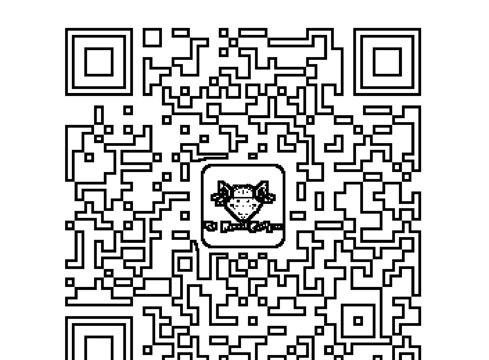

微信公众平台：strc2011

## 制作说明：

本书由《天使神秘学院》出重金从台湾购入的原版书籍扫描制作完成。为达到最好阅读效果，特地把书全部切开后，再经由专业扫描设备高精度扫描完成，并经过一张张的PS后期处理最终成书，其间花费大量的人力、物力以及时间，只为能给大家提供经济并优质的神秘学学习资料而努力。

本学院强力谴责某些机构和个人，把本学院花心血制作完成的电子书籍，包装后直接放在自家淘宝网上低价倾销的行为，以谋取不劳而获的经济利益。如果长此以往最终将无人愿意再为大家花心思制作电子书，那以后可能大家再无新书可读。

为让大家以后能够读到更多的好书，也为了本学院的良性发展。本学院恳请大家尽量做到如下几点：

- 一、尽量在天使神秘学院的官方网站购买电子书籍。

官网电脑访问地址：http://strc.cr.cx

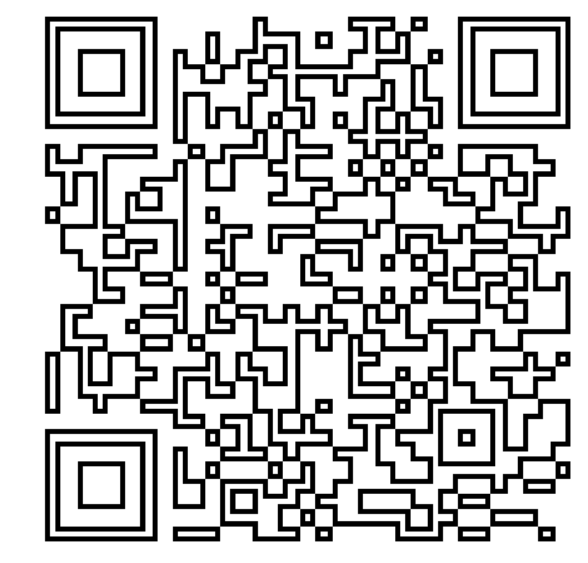

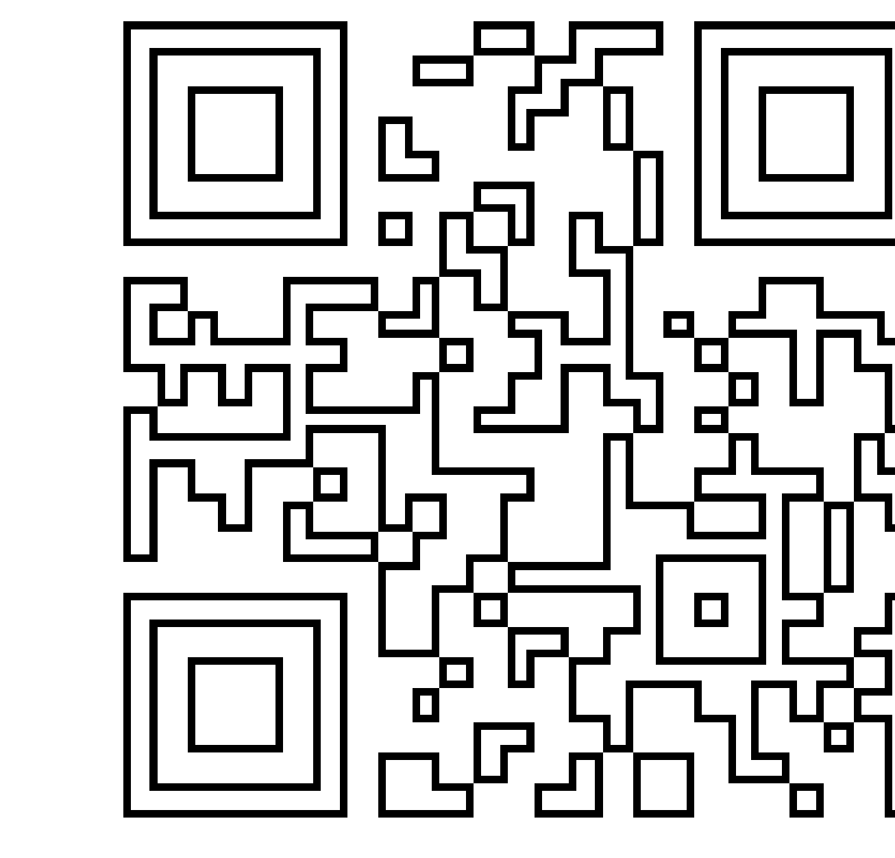

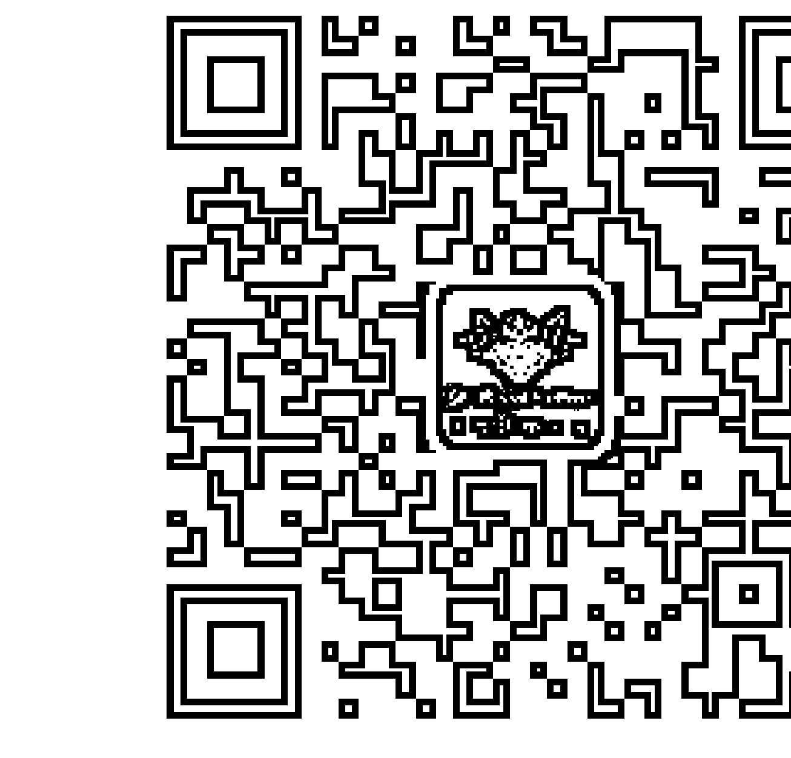

- 二、在收到电子书后小范围传阅即可，千万不要公开传播，更别挂到淘宝网上低价销售。

同时为答谢广大支持者，学院电子书将做如下调整：

- 一、学院会把一些早已收回制作成本的电子书折价销售。
- 二、最新制作的电子书籍会开放打印功能，大家购买后有条件的可自行打印成书。

天使神秘学院
2020年5月

全新的快樂科學、醫學、心理學與哲學

## 不合理快樂——存在的喜悅

楊定一 / 著

馬奕安 Jan Martel / 文獻協力

陳夢怡 / 編

## Unreasonably Happy - The Joy of Being

## 楊定一 寫在《不合理的快樂》之前

## 序

## 導論

## 第壹卷

## 快樂ABC

## 第貳卷

## 快樂是身心合一的體驗

## Contents 目錄

- 1. 你快樂嗎？……18
- 2. 再問一次——你真的快樂嗎？……21
- 3. 追求快樂……26
- 4. 世界的快樂地圖……29
- 5. 快樂的條件……32
- 6. 經濟和快樂，哪一個重要？從不丹談起……39
- 7. 快樂，可以透過科學來探討嗎？……42
- 8. 對快樂的追求有止盡嗎？……45
- 9. 人要滿足到什麼地步，才可以快樂？……49
- 1. 快樂是生命的振動……54
- 2. 笑——發自內心的喜悅……59
- 3. 身體的快樂 ……63
- 4. 先有哪個快樂？是身，還是腦？ ……70
- 5. 沒有身體相應，身心不能快樂 ……73

## 第叁卷 心情，幫助我們生存

- 1. 快樂是演化頒給生存的獎品 ……80
- 2. 情緒提供生存的快捷線索 ……85
- 3. 解開腦的恐懼迴路 ……94
- 4. 快樂有很豐富的面貌 ……98
- 5. 痛快——痛，並快樂著 ……107

## 第肆卷 總理要更快樂

- 1. 追求和期待 ……116
- 2. 追求，帶來更多追求 ……120
- 3. 身心快樂，大腦更年輕 ……124
- 4. 快樂，也會消退 ……133
- 5. 上癮：對快樂的追求，成為不快樂的來源 ……137
- 6. 「不快樂」的生理學 ……142

## 第伍卷「我們」的快樂

- 1. 怎樣的人比較容易快樂？
- 2. 與人親近的快樂，可以提高生存的機率
- 3. 愛——大自然對繁衍下一代的獎勵
- 4. 快樂的人，活得更久、更健康

## 第陸卷 快樂，從細胞開始看

- 1. 快樂可以流到身體的每一個部位，發揮正面的影響
- 2. 從「場」的觀念談起
- 3. 正向心理學
- 4. 超個人心理學
- 5. 找回人類的潛能
- 6. 超感官知覺（ESP）

## 第柒卷 沒有「我」的快樂

- 1. 超越經驗
- 2. 心流：透過快樂，發揮潛能
- 3. 怎麼進入心流
- 4. 靜坐與快樂

## 第捌卷 進入真正的快樂

- 5. 信念的力量 ……229
- 6. 意識轉化——沒有目的的快樂 ……232
- 7. 真正的快樂——一種徹底的顛覆 ……235
- 1. 快樂背後的真相 ……240
- 2. 人間的快樂不是永久 ……245
- 3. 從「合理」走向一體 ……248
- 4. 透過科學，走到一體的門口 ……251
- 5. 一體和永恆的快樂，在哪裡？ ……254
- 6. 人間：一個海市蜃樓 ……259
- 7. 等同於形相 ……262
- 8. 情緒：從生存的工具，變成不快樂的來源 ……265
- 9. 我們就是快樂 ……268
- 10. 快樂，就是永恆 ……272
- 11. 活在不確定，是最大的快樂 ……274
- 12. 跨越科學，進入不合理的快樂 ……281

## 第玖卷 真實，就是快樂

## 第拾卷 從臣服到參，從參到臣服 —打開不合理的快樂

陳夢怡 編者的話

附錄

前言

- 1. 身心均衡，活出不合理的快樂 ……290
- 2. 要快樂，最多也只是擁抱真實 ……299
- 3. 永恆快樂的基礎 ……304
- 4. 臣服的練習 ……309
- 5. 交託與奉獻 ……318
- 6. Sādhana ……322
- 7. 身體的意識 ……325
- 1. Who Am I? 我是誰？ ……330
- 2. 接受現況，從這裡開始 ……340
- 3. Meditation of Am 「我｜在」的靜坐 ……347
- 4. 三點提醒 ……354
- 5. 好，一切都好 ……363

## 寫在《不合理的快樂》之前

楊定一

我相信，你只要打開這本書，很快就會發現——雖然我快樂探討的是快樂的不合理的層面，但是，我還是用合理的科學和醫學，先為快樂這個主題做一個彙總。這個彙總非常完整，用了相當多的篇幅，從各角度來詳盡地說明。

合理與不合理之間，無論用多少文字來銜接，都會讓你感到很突然。這兩者本來就是不同的邏輯軌道，彼此之間沒有交會。

有意思的是，熟悉《真原醫》的讀者，可能會重視第一卷到第六卷的科學和醫學，而喜歡《全部的你》和《神聖的你》的讀者，可能會期待後半的章節。

你也許想問——假如重點是要談不合理的快樂，為什麼要花那麼多篇幅，對合理的快樂做詳盡的說明？

我們活在這個世界，都受到理性和「人」帶來的種種制約。人類的邏輯，本身已經框住了我們理解的範圍。所以，我認為有必要先把這個合理的層面——人類所帶來的知識，做一個詳細的說明，讓你親眼見到人類窮盡理性的限制。再從這個平台跳出來，到一個更大、更廣、不合理的層面。

我相信你自然會發現，透過科學，人是快樂不起來的。但是，這本書的前半給我們一個完整的基礎，讓我們透過現代的科學，可以解釋人間的種種快樂，或不快樂。

我在科學與醫學的層面做那麼仔細的分享，其實還有另一個理由。

我個人認為很少有主題像「快樂」一樣，能讓那麼多人注意。多年來，集中了各種學門的人才，不只是科學、神經醫學、心理學，想解開快樂的謎底。在科學領域，這是相當難得的現象。所以，透過這本書，你也可以對科學的運作有一個全面的觀察，而可以理解，為什麼科學家會有這樣的熱情去做種種深入的研究。

總之你會發現，無論多完整，目前的科學還是像我前面提到的，沒辦法帶來快樂。所以，另一個用意是讓你深深體會古人的偉大。他們早就解開了這樣一個與我們生命最相關的問題，而現代人透過科學還在定義和說明的階段原地踏步。

我盡量用最簡單的語言和方法來說明，希望把專業的用詞變得透明清晰，你最多只需要中學的科學程度就可以輕鬆閱讀。即使有些詞不懂，也不用擔心，並不會影響到這本書的要旨。

「全部生命系列」的朋友，會發現書後半的不合理的層面，其實是延續《全部的你》、《神聖的你》這兩本書的精神，還帶來一些具體的觀念和練習方法。相信你會同意，這些實在的練習，對你的日常生活絕對有幫助。所以，願意的話，可以從第八、九卷先讀起，再回到前面探討身心的快樂。

## 序

這本書的書名《不合理的快樂》，本來也可以稱為——存在的喜悅、頓時的快樂，或者，不理性的快樂。在這個世界，沒有一個生命不希望快樂。人類以外的每一個生命，自然都在活出最快樂、最舒暢的狀態，也就是生命最根本的狀態。可惜只有人類不快樂，讓自己不快樂，也帶給周遭的人和生命種種不快樂。一個人不快樂，是不可能健康的。快樂和健康是一體的兩面。找回快樂，其實也只是回復身心的健全與安康。不快樂的來源，也只是煩惱。只有人，才有憑空造出種種煩惱的能力。把快樂找回來，也只是解開人生種種的問題，消除煩惱。多年來，我一直在期待看到這樣的一本書——不光是整合各領域關於快樂的說法，從科學、文學、哲學、經濟學、心理學、醫學、社會學探討快樂這個主題，甚至能透過這個作品本身帶來快樂，與讀者一同活出快樂的生命。雖然市面上已經有很多類似的作品，我之所以想寫《不合理的快樂》，最主要還是覺得這些作品在理念上不夠完整、不夠直接，還在人間的快樂著手，甚至顛倒了真實快樂的因果關係。即使透過每個學術的領域，懂了許多快樂的概念，取得種種快樂的知識，然而，這些概念和知識沒有讓人生更快樂，反而讓我們受到更多的制約，更多的限制。

我才會說，人間種種對快樂的追求，因果是顛倒的。
從我個人的角度來看，活出快樂其實比什麼都簡單。然而，這個問題的解答卻可能和你所想、所認為的截然不同。
真正的快樂，不需要有理由。
真正的快樂，也是追求不來的。
真正的快樂，是每一個人本來就擁有的本性，不是在外界尋找或是追求的對象。
真正的快樂，只是輕鬆透過心境的轉變，而自然浮出來。
醫學乃至各門科學領域的努力，最多是拿來描述這種快樂所附帶的屬性。我在《真原醫》、《靜坐》所表達的也正是——身心的健康和靜坐所帶來的意識轉變，最多只能說是透過科學、醫學來驗證，而不是透過科學、醫學來追求。
不合理的快樂，是一個我老早就想寫的主題。
我寫作這本書的「野心」不可謂不大——希望透過這本書，為你一生的價值觀和意識帶來徹底的轉變，對生命本來的快樂有充分的理解和體會。甚至，能為你打好快樂的基礎，讓你透過這份領悟，隨時把快樂帶回來。
這種快樂是永恆，是每一個人本來都有的。
這本書引介的科學、醫學和各領域的證據，最多只是讓你體會人間對快樂的種種說明。無論從生理學、神經化學、文學、社會學、心理學、哲學……的角度來分析，都會發現人的結構就是來支持我們快樂的。快樂，也只是身心最有效率的狀態，讓我們活得最舒暢、反應最靈光，也最有成就感，最能感到心滿意足。

你自然會把這些證據當作工具來用，而且還會發現，這些證據，非但跟這本書要談的快樂一點都不矛盾，還驗證了這本書所要探討的——生命最大的快樂。
快樂，其實是貫通身—心—靈共同的門戶。
這種說法，很可能和一般人所談、所想的剛好顛倒。對大多數人來說，快樂是需要追求的，要符合某種條件、或完成某個目標才可能得到的。然而，這本書所想表達的是——真正的快樂，不過是反映我們最輕鬆、最自在的心理狀態。
身心合一，自然會快樂。換一個頭腦能夠理解的說法，快樂最多只是一個反映健康的指標。
我希望，透過這本書，以完全不同的角度，和你一起探討這個問題。我相信，只要你敞開心胸來尋求解答，也自然會得到相同的答案，自然發現這本書所帶來的種種觀念可以隨時落實在生活中。
然而，更重要的是你親自驗證這本書所談的觀念。透過它們，完全轉變人生的價值觀和意義。讓快樂直接浮現，讓快樂就在眼前。
這本書能豐富精彩並深入淺出，我要感謝兩位同事的貢獻。
Jan Martel 馬奕安博士，與我合作了很長時間。二○○五年在加拿大 Université de Sherbrooke 畢業後，遠赴台灣加入長庚大學的研究團隊，投入奈米細菌和中草藥蕈菇類的研究，已經有相當豐碩的成果。他是個快樂的人，對「快樂」這個主題特別感興趣。我好幾次和他分享我一路走來的藍圖、在這本書想表達的重點、以及希望囊括的學術領域，請他在研究之餘查閱文獻。他很快就進入狀況，花了很多時間收集、整理「快樂科學」的研究成果供我們篩選，讓我能這本書為近代的快樂科學做一個整合。
陳夢怡，最初將《真原醫》的部分文章、《靜坐》和其他作品譯成中文。若沒有她的翻譯，這些作品也不可能在國內受到廣大的歡迎。接下來，她又和我合作《全部的你》和《神聖的你》，除了記錄我口述的文章，並徹底地和我討論、編輯。多年來的接觸，也是合作完成這本書的不二人選。這本書從科學、哲學、心理學到全部生命一路貫串下來，走到「不合理的快樂」，也要有她的精彩編輯才得以完成。她自己提到，每合作一本書，就把「我」（自我）更鬆動一些。我也為她相當高興。

合作這本書，其實是很快樂的一件事，比任何其他項目都更輕鬆愉快。倘若不是如此，這本書所傳達出的理念，也不可能符合這個主題。

同時，我也希望你能抱著輕鬆愉快的心情來讀這本書。有些比較難以掌握的觀念，我會設法用最簡單的語言，不同的切入角度來說明。當然，這不是要讓每個人都成為「快樂學」的專家。有了這些快樂的知識，最多只是讓我們在人間有一些根據，可以充滿信心地走上這條路，找回全部生命的快樂。

最後，我希望你讀完這本書之後，可以真正成為快樂的人，活出快樂的人生。以此為基礎，為身邊的人帶來快樂。

這，才是我們這一生最大的目的。

## 導論

在我們人生的快步調之下，快樂已經不再是一種選擇。不快樂，是現代人面對的最大危機。聯合國世界衛生組織（WHO）發布的訊息指出，二〇二〇年全世界有三大疾病需要重視，憂鬱症正是其中之一。1

憂鬱症在現代社會不斷地蔓延。女性罹患憂鬱症的比例是男性的兩倍。憂鬱以及憂鬱帶來的慢性失調已經成為女性最普遍的健康問題，也是男性除了心血管疾病之外的大問題。四分之一以上的美國人一生會遭遇至少一次嚴重的憂鬱症，台灣的憂鬱人口則逾百萬，中國大陸超過16%的大學生出現中度以上的情緒問題。

美國有兩位科學家針對全球各地四十三個國家超過六千名年輕學生，調查他們的快樂程度。值得注意的是，華人學生的快樂程度最低，如果得分最低是一分，最快樂是七分，那麼華人學生的得分只有3.3，而荷蘭學生最高是5.4。如果被詢問到理論上一個人可以多快樂，華人學生的得分4.5一樣是最低的，而巴西學生的得分6.2最高。或許可以這麼說，我們的年輕孩子非但不快樂，甚至不敢奢望快樂。2

> 1 另外兩個是心血管疾病與愛滋病。
> 2 Suh, E. M., & Oishi, S. (2002). Subjective well-being across cultures. Online Readings in Psychology and Culture, 10(1), 1.

年輕人不快樂的情況，愈來愈普遍。我相信每一個人身邊都遇過憂鬱、甚至有自殺念頭的年輕人。長期照護的疲憊、擔心憂鬱家人自殺的不安與無力感，還可能進一步引發身邊親近的人一併產生憂鬱。不快樂，帶來的社會成本，遠比我們想像的還要高得多，甚至可以影響到一個社會是否能夠永續生存。

不快樂，不光造成健康的衰退，而且是人生幸福和滿足感最大的殺手。懂得快樂，自然深化生命的意義，也自然找回生命的健康和潛能。一個快樂的人，不光是學習、工作更有效率，也自然對自己和身邊的人更友善，更有利他的行為。

這本書的中心理念——要得到快樂，其實比任何人想的都更簡單。我們天生本來就是快樂，而且腦和生理架構就是支持快樂。可惜，透過人生和環境帶來的經驗，我們變得不快樂。

這本書會分成幾個層面來探討這個主題——用現代的心理學、社會學、醫學和生物學，來重新定義——何謂快樂。目前有沒有足夠的根據，可以得出一套通往快樂的實證公式？我會盡量將這些各自獨立的事實貫通，帶領讀者回到一個整體觀，這是這本書前半所要觸及的。

我相信你很快就會發現，快樂，其實有一個「不合理」的層面。快樂，不是純粹理性的產物，它離不開感受，也就是英語裡的“gut feeling”（直接翻譯過來是「腸道的感覺」，指的是靈感或直覺）。你會發現，人生的快樂是身心綜合的產物，既離不開大腦的快樂，也離不開身體的快樂。

而且，和大家想的不一樣，是透過身體的快樂，我們才會找到身心均衡的快樂。現代人長期的失衡，過度偏重頭腦，而帶來不快樂。讓注意力落回身體，自然讓念頭降下來。身心均衡，自然快樂，我們也才能超越身心，找回真正的快樂。

這種觀點，對頭腦而言，是不理性、不合理的。但我相信，只要深入探討下去，你一定也會同意，而且符合你對快樂、對生命最直觀的體會。懂了這些，就已經推翻了我們自己過去對快樂的種種看法和限定，所得的公式也會截然不同。這一不合理的層面，還不止於此。我們可能不會想到，快樂和人生追求的目標及成果不見得直接相關。怎麼活這一生，比這一生活成什麼樣子，有時候是更重要的。快樂，不需要理由。這一句話，和流行的觀點完全不同。就我目前為止所看到的心理學和科學，都還在合理的層面不斷強調——快樂是可以學來的，也可以追求到的。然而，所有「合理」的快樂非但短暫，身心很快就會適應，甚至對快樂的追求，反而成了不快樂的來源。我在這本書的後半，想帶給你一個全然不同的理解——快樂，其實是「存在」，也就是「在」的觀念。假如真有永恆的快樂存在，其實是一種存在的成就，它是「在的喜悅」（joy of being），而不是「追求的快樂」（joy of doing）。我相信，徹底懂了這些觀念，而可以隨時帶回生活中，會讓你這一生截然不同。但願這本書能成為我們一起快樂的同伴。

# 快乐ABC

# 01 你快樂嗎？

Are you happy?

要投入這本書，投入快樂，首先我們要一起來訪問自己——你快樂嗎？或——我快樂嗎？

我認為，這也許是一生最關鍵、最重要的一個問題。它本身就帶來一個提醒——還有什麼心理狀態比快樂還重要？為什麼到現在還沒辦法快樂？

回答這個問題之前，我們可以用兩組簡單的問卷從不同的層面切入，檢驗自己的快樂體質——我們的性格。幫助我們從不同的深度，進入快樂這個主題。

第一組問卷是學術界相當常用的「生活滿意度量表」，大略回顧一般人對人生的看法，我們也可以開始填寫：

> 3 Diener, E. D., Emmons, R. A., Larsen, R. J., & Griffin, S. (1985). The satisfaction with life scale. Journal of Personality Assessment, 49(1), 71-75. 經Taylor & Francis及原作者許可，在本書使用經過翻譯的量表版本。

# 生活滿意度量表

這個量表由五句話組成，探討一個人對自己的人生有多麼滿意。這幾句話可能符合你的情況，也可能不完全符合，甚至不符合。填寫這個量表時，請依照這些話符合的程度作答，由1分（完全不符合）到7分（完全符合），將分數填寫在每一句話上頭的括弧裡。作答時，最重要的是放輕鬆，誠懇地依照現況填答。

- ( ) 1. 大致上，我目前的生活跟我理想的生活狀態相當接近。
- ( ) 2. 我的生活條件非常理想。
- ( ) 3. 我對生活感到滿意。
- ( ) 4. 到目前為止，我在人生中想要的事物，大致都得到了。
- ( ) 5. 如果人生可以重來，我幾乎不會做什麼改變。

總得分：

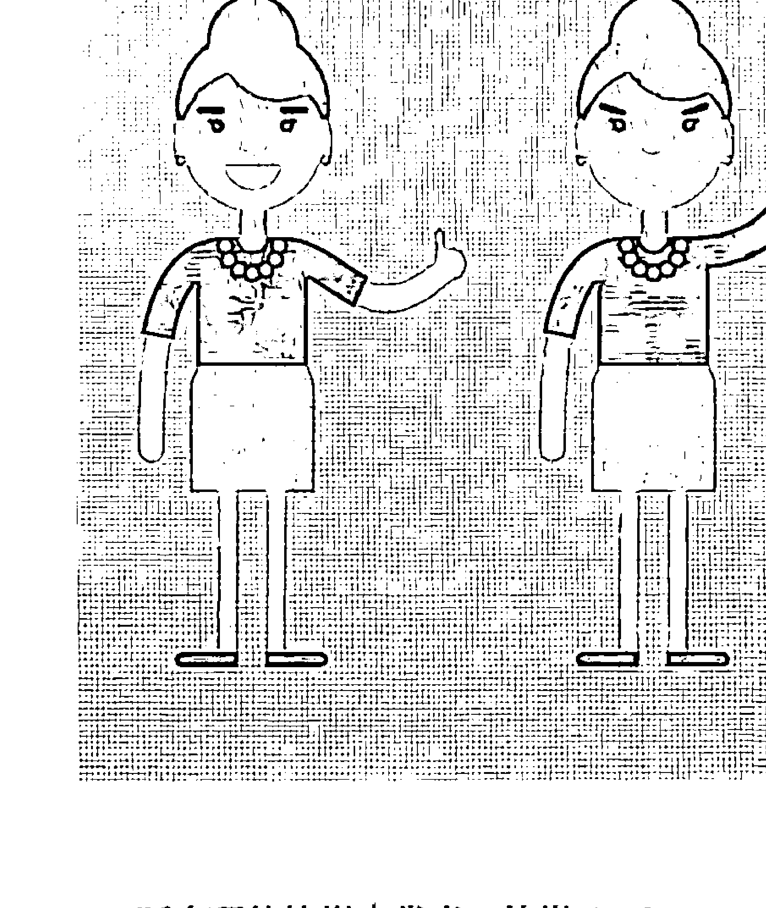

填寫完這五道題目，把每一道題的得分相加，得出總分。我相信，光是這麼回顧自己的人生與生活概況，對自己、對生活也就有了比較深刻的反思。結果的相關詮釋，在這本書最後的附錄，請你別急著先看，等待完成下一個問卷之後，連同下一個「牛津快樂問卷」的結果一起比較。你對快樂、對自己快樂的不同層面，會有更深的體會。我想你也可以看出來，這個量表每一句話都相當簡單，只是反映一個人對自己和人生的觀感。也許你還意猶未盡，我們可以接著在下一章，進一步探討自己與快樂的關係。

# 02 再问一次——你真的快乐吗？

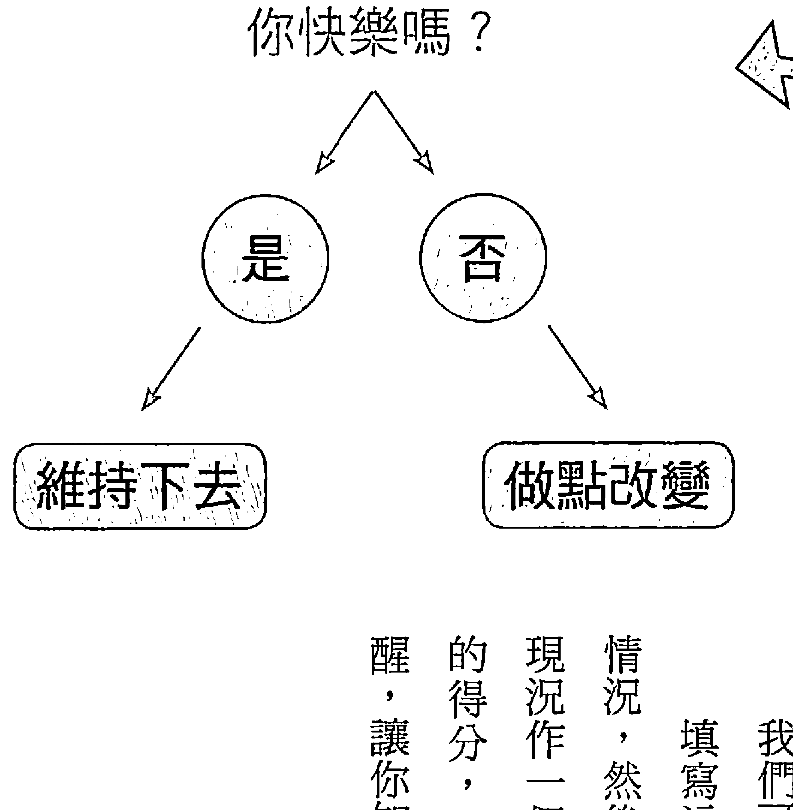

我们可以透过「牛津快乐量表」，更深入体会自己和快乐的关系。填写这份量表会需要多花一点时间，好好读每一句话，想想自己的情况，然后作答。光是填写的过程，就可以让每个人对自己现在的快乐现况作一个反省与了解。甚至，可以隔一阵子再做一次，比较不同时间的得分，也许可以帮你了解影响自己快乐的因素。它可以作为一个提醒，让你知道自己的努力与心态，是不是能帮助自己更快乐。

> Hills, P., & Argyle, M. (2002). The Oxford Happiness Questionnaire: A compact scale for the measurement of psychological well-being. Personality and Individual Differences, 33(7), 1073-1082. 經 Elsevier 許可，在本書使用經過翻譯及略作修改的量表版本。

# 牛津快樂量表（修改過的）

以下是關於快樂的一些說法，請用數字指出你有多同意或多反對這些說法，每個數字反映的程度分別是（1分：強烈反對；2分：反對；3分：有點反對；4分：有點同意；5分：同意；6分：強烈同意）
仔細閱讀每一道問題，為了計分方便，這個量表已經略作修改，將原本必須反向計分的反向表達改為正向陳述。放心，題目沒有陷阱，請不要鑽牛角尖。請記得，無論同意或反對都是合理的，沒有一個答案比較對或比較錯。一般來說，你的第一反應，多半就是合適的答案。如果你覺得某些題目不容易作答，請盡量貼近你的現況或一般情況下的反應來填答。

問卷開始：
- （ ）1. 我對自己相當滿意。
- （ ）2. 我對人很感興趣。
- （ ）3. 我覺得生命對我很不錯。
- （ ）4. 無論誰，我都有溫暖的感覺。
- （ ）5. 我醒來時，總是覺得精神充沛。
- （ ）6. 對未來，我覺得非常樂觀。
- （ ）7. 我覺得這世界大多數的事都很有意思。
- （ ）8. 我總是相當投入，全力以赴。
- （ ）9. 人生美好。
- （ ）10. 我覺得這個世界是個好地方。
- （ ）11. 我笑口常開。
- （ ）12. 我對於生命的一切相當滿意。
- （ ）13. 我覺得自己長相很好。
- （ ）14. 我想做的事和已經完成的事，相當一致。
- （ ）15. 我很快樂。
- （ ）16. 我可以在某些事物中發現美麗。
- （ ）17. 我總是能鼓舞別人。
- （ ）18. 只要我想做，就擠得出時間。
- （ ）19. 我覺得自己特別能掌控人生。
- （ ）20. 我覺得自己什麼都能扛。
- （ ）21. 我覺得自己頭腦十分清晰。
- （ ）22. 我時常歡天喜地，興高采烈。
- （ ）23. 我總覺得作決定很簡單。
- （ ）24. 我覺得人生有一種特別的意義和目的。
- （ ）25. 我覺得精力旺盛。
- （ ）26. 我通常能把事情帶往好的方向。
- （ ）27. 和別人相處，是愉快的事。
- （ ）28. 我覺得自己相當健康。
- （ ）29. 回想過去，我有的都是快樂的記憶。

總得分：

依以下的指示計算得分之後，你可以連同前一章測驗的結果，一起翻到書末的附錄，檢視你的快樂指數。

步驟一：將 29 題的計分加總。
步驟二：總分除以 29，這就是你的快樂得分。

這些測驗經過一定規模的樣本驗證，有一定的效度和可信度。做完這兩個測驗（如果還沒有完成，記得回到前一章，一步步來），不妨到附錄去查對正式的解釋。

只要很誠懇地做，相信你會發現，這兩個測驗的結果會相當一致。

這些快樂的測驗很有幫助，可以幫我們做一個反省，也是一個協助個人改善生活品質、快樂質地的工具，才被心理學界普遍的使用。

這些測驗的設計考慮了一個人怎麼看自己，形成自己對快樂和人生的獨特定義，更陪伴我們進入生活的每一個角落，從自己應對世界的方式，去體會快樂的呈現。

一般來說，透過這些心理測驗所發現的快樂，還是和一個人所處的社會文化背景有關。舉例來說，這些問卷都是西方的心理學家所設計，反映的自然是西方文化下的快樂。相較之下，鼓勵每個人發揮自我的社會，和一個讚同每個人和別人一樣的社會，從這些問卷的角度來看，活在鼓勵個人的社會的人會比較快樂。

顯然，這樣的快樂標準，是脫不開人間的經驗和流行的文化價值。

雖然如此，這種問卷還是有參考的價值，讓人對自己有一個了解。尤其是我們東方人，集體的制約比較強大，來自西方以個人為主的觀點，是一個相當好的提醒。

有趣的是，這些問卷難免反映的是一般人對快樂的理解，會認為快樂還是要符合某些條件，要有所謂快樂的『體質』，或得到人生的種種變化、成就和肯定，才有資格或沒有資格快樂。

從這本書《不合理的快樂》要談的真實的快樂來說，這一類的心理測驗，最多只是個參考。只是反映了一個人和自己、和世界的互動模式，還是離不開人間所帶來的限制和種種制約。我這裡所要談的，是超越所有制約的快樂。這種快樂到目前為止，沒有問卷可以調查，卻會超越你一生的所有想像。

# 03 追求快樂

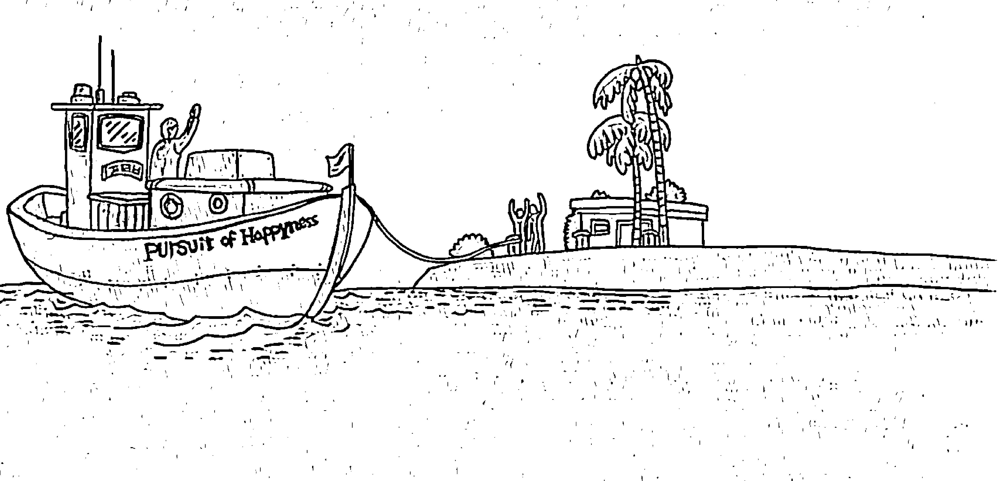

美國把追求快樂、追求幸福放在獨立宣言裡，在生活中確實也常看到 Pursuit of Happiness 的口號（有時候拼成 Happyness，就像這艘我在海邊偶然看到卻來不及拍下來的船一樣）。人人都想要快樂，然而，也都是透過物質的追求和擁有，認為這就等同於快樂。

我們認為下面這些真理是不言而喻的：人人生而平等，造物者賦予他們若干不可剝奪的權利，其中包括生命權、自由權和追求幸福的權利。5

美國第三任總統湯瑪斯·傑佛遜（Thomas Jefferson）在兩百六十年前起草美國獨立宣言。他的草稿在經過其他元老的討論和修改之後，仍然把對快樂與幸福的追求，視為人權最基本的要素，而且與生命和自由並列。或許，正是如此直接了當地指出快樂是人性的要素，而使得美國能在近兩百年始終富強，是一個世界各地人士嚮往的國境。

有趣的是，美國影星威爾史密斯（Will Smith）和他的兒子傑登史密斯（Jaden Smith），也以「對快樂的追求」這個主題拍了一部電影（中譯《當幸福來敲門》（The Pursuit of Happyness））。

主角克里斯·贾纳将所有钱投入推销医疗器材，没想到销售不佳，经济状况愈来愈差，妻子无法忍受而离开。克里斯设法挤进证券公司无薪实习，指望着成为正式员工而彻底改善生活。好不容易略有起色，又因为欠税，银行存款全数充公，父子俩只好流落街头。

在这种困境之下，克里斯决心完成实习，凭著努力、聪明才智，以及天不怕地不怕的性格，一路过关斩将，非但得到正职，还走出人生一条路。最后还成立了自己的证券公司。

这部电影的剧情相当励志——修好手上的医疗器材，比别人多争取一份业绩，从实习生中脱颖而出，就能带给儿子更好的明天，带来满脸笑容的幸福。这种快乐，是一般人都可以理解、认同的——快乐，要透过个人的牺牲、努力而得来；为了得到最终的快乐，任何牺牲都值得。华人更是如此，父母都宁愿为下一代的幸福和快乐而牺牲。

我们一般人所想的快乐，都是落在未来，还要符合人间种种的条件、目标设定才能得到。倘若这些条件或目标没有达成，甚至会认为自己没有资格快乐。

这种快乐的定义，大概是每一个人都认同的。

我这里再分享一个故事——Ruby on Rails 程式的发明人汉森（David Heinemeier Hansson）儿时玩「如果有一百万，可以买什么？」的游戏，想像未来可以得到的快乐。二〇〇六年，美国亚马逊集团有意购买他与朋友合夥的公司，汉森卖出一小部份股票，成了真正的百万富翁！他描述了那天的情景：

> 「我去查银行帐户，存款数字暴增。我觉得自己就站在梦想前方！可以去想要的电脑、照相机还有汽车！那一整天，我一直在想：『我再也不用工作，这样会让我永远快乐，太棒了。」

> 「头几个月，我几乎没花那些钱，直到年底才买了一个有钱人的东西：一辆黄色的蓝宝坚尼！虽然很强，却没有想像中那种内心最深层的满足。」

那么，到底什么才能让他满足？汉森回想起的竟是：

> 「写程式、开发网站、写文章、拍照片」——那是他还没有成为百万富翁之前，本来就负担得起的生活。

他说：

> 「我发现真正让我快乐的，其实是全心专注的宁静与心流。那感觉就像——拉开百万富翁的布幕，才发现布幕後的东西，我早就拥有了。」

我分享这两个故事，想表达的是，我们会为快乐设定种种条件，然而真实生命的快乐其实是一个存在的状态（state of being），跟任何追求或成果都不相关。有了再好的成果，达成多艰巨的目标，还是人间转眼即逝的快乐，早晚都会消逝，是无法依赖的。

只有找到无条件的快乐，才是真正的快乐。

> 独立宣言相当程度反映了十七世纪英国哲学家约翰·洛克（John Locke）的政治思想，包括认为审慎而不断地追求真实的快乐，是人类天性最高的圆满。

5 Jefferson, T., Boyd, J. P., Butterfield, L. H., Bryan, M. R., Bush, A. L., & Wilmerding, L. (1950). The Papers of Thomas Jefferson (Vol. 1). Princeton: Princeton University Press.

# 世界快樂地圖（一）

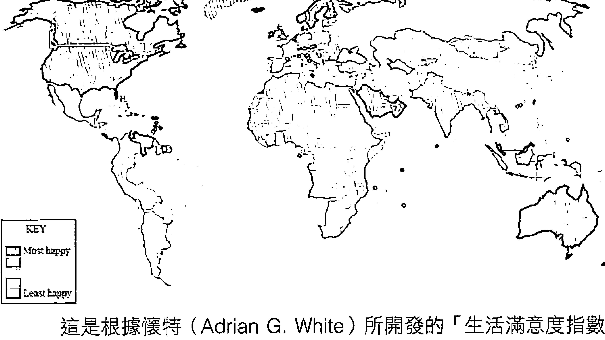

這是根據懷特（Adrian G. White）所開發的「生活滿意度指數」調查各國的情況，而畫出的世界地圖。從這張圖左下角的圖例，我們可以看到紅色、橘色是不快樂的國家，青色和藍色則是快樂的國家。綠色代表普通的快樂程度。可以看出來，這世界有那麼多地方的人，對自己的生活並不滿意，也不快樂。

我們多少都會知道，這個地球或世界是快樂的嗎？有多快樂？而我們和別人、別的國家相比，是比較快樂或是比較不快樂？世界各地的政治家也關心同樣的問題，也衍生出許多計算快樂程度的公式，這裡舉出三個實例來說明。

第一種快樂公式，是以英國萊斯特大學的社會分析心理學者懷特（Adrian G. White）所開發的「生活滿意度指數」為基礎，採用「對生活的滿意程度」去描述不同國家人民的快樂程度。這個生活滿意度指數，反映的主要是健康、財富、基礎教育這類外在因素，同時也去詢問人們主觀的評估。

另一種描述世界各地快樂程度的公式，可以用聯合國教科文組織（UNESCO）結合了人類福祉和人類對環境衝擊程度這兩大因子所設計的「地球快樂指數」。

# 世界快樂地圖（二）

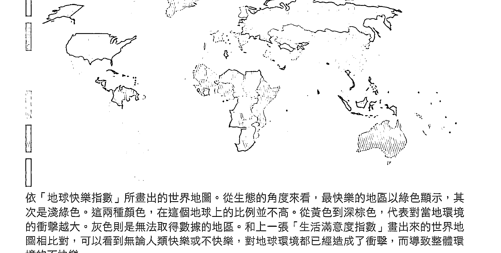

依「地球快樂指數」所畫出的世界地圖。從生態的角度來看，最快樂的地區以綠色顯示，其次是淺綠色。這兩種顏色，在這個地球上的比例並不高。從黃色到深棕色，代表對當地環境的衝擊越大。灰色則是無法取得數據的地區。和上一張「生活滿意度指數」畫出來的世界地圖相比對，可以看到無論人類快樂或不快樂，對地球環境都已經造成了衝擊，而導致整體環境的不快樂。

數「(the happy planet index)」做為一個實例。這個指數對於生態足跡較低的國家給予比較高的分數，強調一個國家要永續存在，必須要將追求經濟發展所付出的生態環境代價納入考量。可以這麼說，它談的不只是人類這個群體的快樂，而是更進一步擴大，總結人類與這個星球的整體快樂。聯合國永續發展方案網路，也推出一個志向遠大的「世界快樂報告」，想要總結世界各地的快樂狀態、描述人類快樂和悲慘的原因，也透過個案探討政策對人類快樂的影響。「世界快樂報告」結合一個國家的國內生產毛額（gross domestic product, GDP）、社會支援程度、人民平均壽命、生活選擇自不自由、整個社會是不是樂善好施、貪腐程度等因素來描述快樂。可以想像，又會是另外一幅畫面。這種趨勢，相信你在全球許多國家也都注意到了，瑞士這個大家心目中的幸福國度也是一例。進一步探討，如果一個社會重視人的本質，也就不會造出太大的差異。許多研究指出，社會差異太大，

會帶給人民無力感，調查結果也反映出不快樂。這種現象，不光是人，動物也是如此，在群體中落於低階的狒狒，血液中的壓力荷爾蒙也比較高。⁶

對人的重視，不光是帶來平等，也讓人民願意有參與感。例如透過投票，覺得可以掌控自己的未來、對環境有決定權。之後會提到，參與和投入所帶來的滿足感，對快樂的心情是有幫助的。

我們可以看到，不同的快樂指數，勾勒出來不同的世界快樂地圖。也就是說，儘管有不同的條件，或許強調物質，或強調公平，或更多綜合性的條件，然而，在有條件的世界裡，沒有一個是普世而可以說有絕對重要性，而值得人放下一切去追求的。

# 05 快樂的條件

難道快樂和人間——物質、財富、地位、成就、公平性——都不相關嗎？

答案其實非常簡單。當然有。 這本書想表達快樂有兩個層面：一是世間的快樂，當然離不開物質和形相的成就，包括財富、名氣、地位、影響力。另一種快樂則來自更深的層面，和物質不相關。它不光更容易獲得，甚至，是永久的。只是我們往往分不清，完全投入人間快樂的追求，誤以為這是可以永恆的生命的快樂。

過去有一個很有趣的研究，也就是在強調——快樂和財富其實沒有關係。有時候，財富越多，反而越不快樂。一九七四年，美國一位經濟學者伊斯特林（Richard Easterlin）在《經濟發展能改善人類命運嗎？》這篇文章中，分析美國人的收入和快樂程度的關係，發現收入增加，就更容易認為自己「非常快樂」。然而，如果比較各國經濟發展程度（他採用的指標是人均國民生產毛額），則會發現經濟成長和快樂的程度其實不相關。這個現象，在經濟學上被稱為「伊斯特林悖論」（Easterlin paradox）。也就是無論在哪個社會，

> 7 Easterlin, R. A. (1974). Does economic growth improve the human lot? Some empirical evidence. Nations and Households in Economic Growth, 89, 89-125.

# 说法一：收入高似乎更快乐

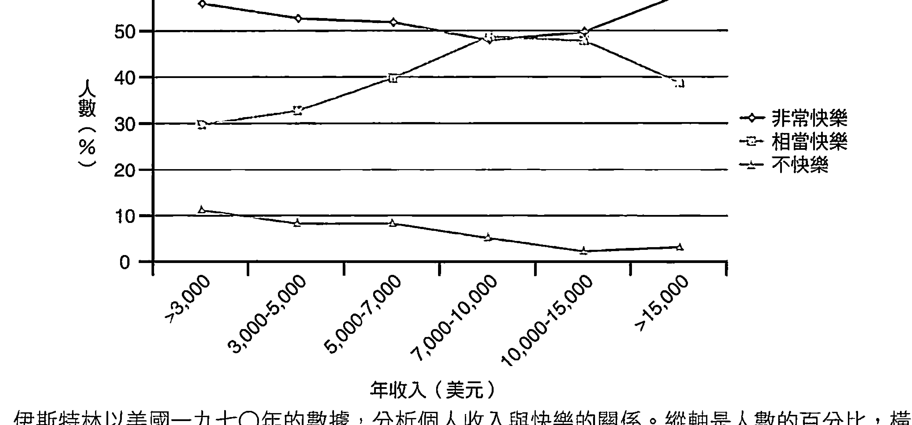

伊斯特林以美国一九七〇年的数据，分析个人收入与快乐的关系。纵轴是人数的百分比，横轴是个人的年收入。三角形的点代表不快乐的人，方形的点代表相当快乐，圆形的点代表非常快乐。除了前面提到的，收入增加，更容易认为自己「非常快乐」之外，我们还可以把「相当快乐」和「非常快乐」的数字加在一起看，也可以说随着收入增加，不快乐的人也就变少了。但是，别急着把快乐和收入划上等号。看看图的最左边，收入最低（一年小于三千美元）的人群中，仍有很高的比例认为自己相当快乐，甚至是非常快乐。

> 经 Elsevier 出版社同意，重制并翻译 "Easterlin, R. A. (1974). Does economic growth improve the human lot? Some empirical evidence. Nations and Households in Economic Growth, 89, 89-125."

# 说法二：经济发展没有让大家更快乐

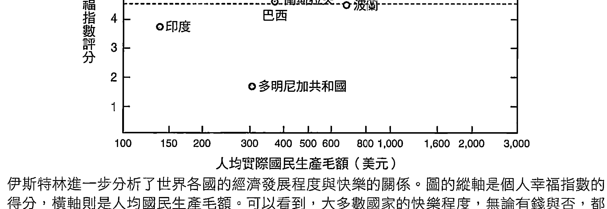

伊斯特林进一步分析了世界各国的经济发展程度与快乐的关系。图的纵轴是个人幸福指数的得分，横轴则是人均国民生产毛额。可以看到，大多数国家的快乐程度，无论有钱与否，都落在五分上下。至少，国家整体的快乐，似乎无法全凭经济发展程度来解释。

> 经 Elsevier 出版社同意，重制并翻译 "Easterlin, R. A. (1974). Does economic growth improve the human lot? Some empirical evidence. Nations and Households in Economic Growth, 89, 89-125."有钱的人都会比较快乐一些。然而，如果让一个社会的每一个人都有钱，整个社会并不会变得快乐。

伊斯特林就此提出了一个问题“钱，买得到快乐吗？”他所谈的观念，也成为联合国建构“世界快乐报告”的概念主轴之一。

伊斯特林用两个角度来解释这个社会现象：一是享乐适应（hedonic adaptation），也就是说，物质带来再多的快乐，快乐久了，人也就自然习惯、麻痹了，不会带来那么大的满足感。另一是社会比较，如果身边的人都一样富有，那么，财富并不足以让人比较快乐。至少，从伊斯特林的解释来看，快乐除了和财富有关，也和人的习惯、比较心理有关。

研究也发现，富有的人多少还是比一般人多快乐一点点，代价是承受更高的压力，忍受更多的焦虑。

针对乐透得主的研究也指出，这些“幸运儿”并没有比一般人过得更幸福、更快乐。有意思的是下一个发现，把钱花在别人身上，比起把钱花在自己身上，反而更有幸福感。

当然，我们对这些观点还是会忍不住质疑，觉得快乐不可能离开经济层面。其他探讨经济发展和快乐关系的研究，也发现其实经济发展水平还是和快乐有一定程度的正相关，至少透过生活满意度来看，在财富到达某一个水平之前是如此，如上页二张图所示。

- 8. Hedonic 这个字源自希腊神话中的赫多奈（Hēdonē, Hedone），爱神丘比特和赛姬的女儿，代表快乐、享受和愉悦的女神。Hedonics 则衍生成为研究快乐感受的学问。
- 9. Kahneman, D., Krueger, A. B., Schkade, D., Schwarz, N., & Stone, A. A. (2006). Would you be happier if you were richer? A focusing illusion. Science, 312(5782), 1908-1910.
- 10. Brickman, P., Coates, D., & Janoff-Bulman, R. (1978). Lottery winners and accident victims: Is happiness relative? Journal of Personality and Social Psychology, 36(8), 917-927.
- 11. Dunn, E. W., Aknin, L. B., & Norton, M. I. (2008). Spending money on others promotes happiness. Science, 319(5870), 1687-1688.

## 说法三：富国人民容易觉得快乐？

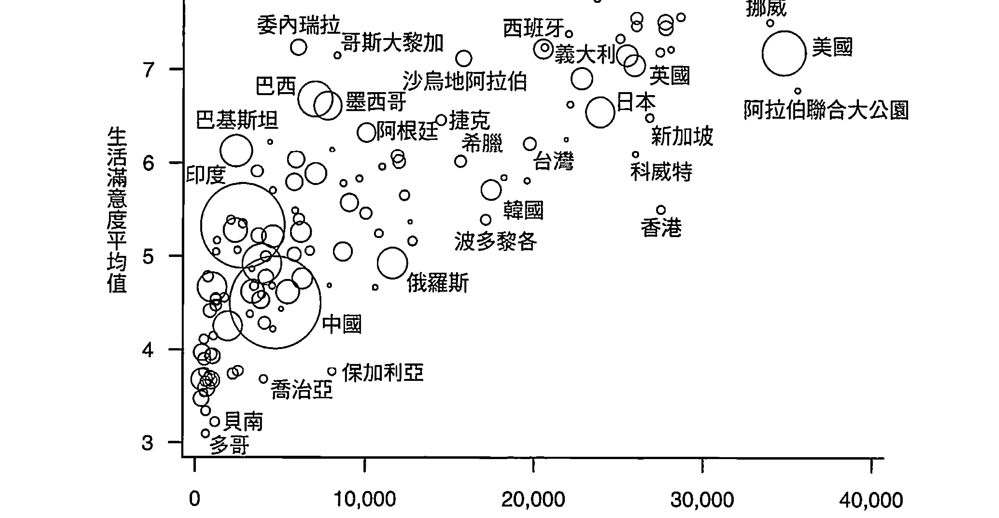

每一个圆圈代表一个国家，圆圈的大小表示人口数，纵轴是快乐的程度，而横轴是经济发展程度，用人均国内生产毛额来表示（换算成2003年的购买力）。我们可以看到，好像富国的国民确实也快乐一点。这是2015年的诺贝尔经济学奖得主 Angus Deaton 在2008年发表的研究。

> 经美国经济学会（the American Economic Association）同意，重制并翻译“Deaton, A. (2008). Income, health, and well-being around the world: Evidence from the Gallup World Poll. Journal of Economic Perspectives, 22(2), 53-72.”

## 说法四：财富对快乐的影响有其局限

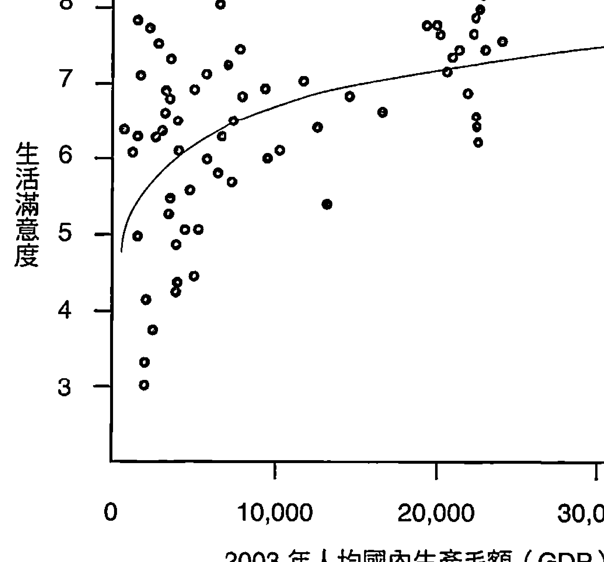

每一个点代表一个国家，纵轴是生活满意度，也就是快乐的程度，而横轴是经济发展程度。很明显，大概在人均国内生产毛额到达一万美元之后，快乐随经济发展而提高的幅度就没有那么明显。值得注意的是，就连最左边人均国内生产毛额极低的国家，快乐程度的分布也很广。看来，经济发展并不是影响一个国家整体快乐的唯一因素。然而，经济发展得好，可能可以减轻其他因素对快乐程度的冲击。

> 经 SAGE Publications 同意，重制自”Diener, E., & Seligman, M. E. (2004). Beyond Money: Toward an Economy of Well-Being. Psychological Science in the Public Interest, 1-31.”

- 12 Deaton, A. (2008). Income, health, and well-being around the world: Evidence from the Gallup World Poll. Journal of Economic Perspectives, 22(2), 53-72.
- Diener, E., & Seligman, M. E. (2004). Beyond money: Toward an economy of well-being. Psychological Science in the Public Interest, 1-31.

没有错，物质条件确实可以丰富一些导致快乐的因素，或至少减少不快乐的因素，例如健康、长寿、基本教育、新生儿存活率、生活少一点压力、社会少一点暴力犯罪。然而，比起一般人的认定，物质对快乐的影响可能没有那么绝对。从另一个角度来说，一个人假如还要为生存烦恼，是不可能在人间得到快乐的，至少要满足一些基本条件，才能得到世间的快乐，才能“奢”谈快乐。

除了财富，其他的条件（名誉、成就）也是如此。满足这些条件才能快乐，这是最普遍的看法。也都很符合一般人的“常识”。

每个人都想知道符合什么条件才能快乐。延续这种思维，所有的研究都可以进一步再分析下去，不只是收入，一般公认与快乐相关的经济和社会因素还包括已婚、未婚、有没有家人、周围有没有亲友的支持，或是个人有没有灵性的资源，像是宗教信仰、人生意义，一个人工作生活品质，一个人所在的社会和政治价值是否自由、民主，以及身心的健康来比对快乐的关系。

伊斯特林又做了一个研究，发表在《美国科学院期刊》（PNAS），造成轰动。《美国科学院期刊》的稿件主要是由院士提供或推荐，在各领域有相当的影响力。之所以在这本书引用相当多著名期刊的研究，是要表达快乐的研究已经累积了一定的质与量。这些跨领域的快乐研究运用新的技术，已经得到众多知名期刊的肯定。也希望鼓励年轻的科学家能从这方面着手。

## 说法五：已婚似乎更快乐

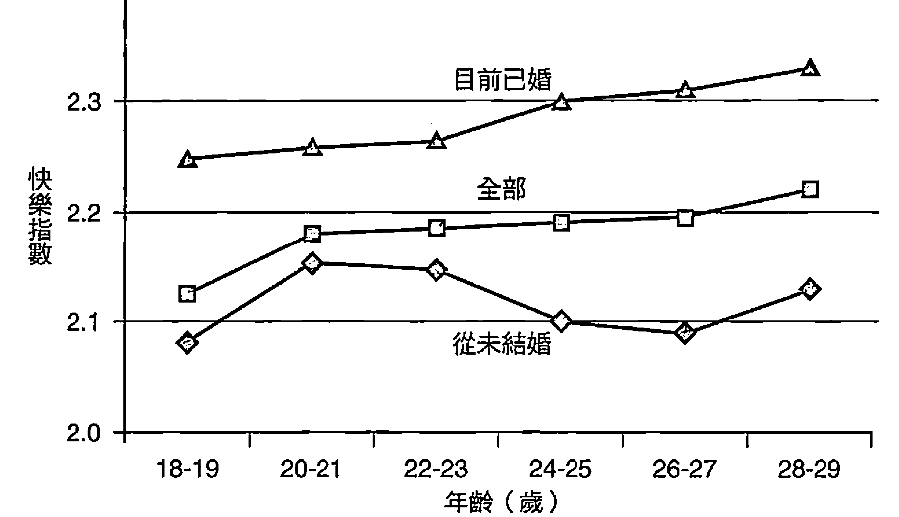

伊斯特林把十九至二十九岁的女性分作已婚和未婚两群，比较她们快乐的程度。图的纵轴是快乐指数，横轴是年龄，菱形的点是未婚，正方形是所有人，三角形的点则是已婚的人。可以看到，无论哪个年纪，已婚的人都比未婚的快乐一点。

> 经《美国科学院期刊》（*Proceedings of the National Academy of Sciences of the U. S. A.*）许可，重制并翻译“Easterlin, R. A. (2003). Explaining happiness. *Proceedings of the National Academy of Sciences of the U. S. A.*, 100(19), 11176-11183.” Copyright (2003) National Academy of Sciences, U. S. A.

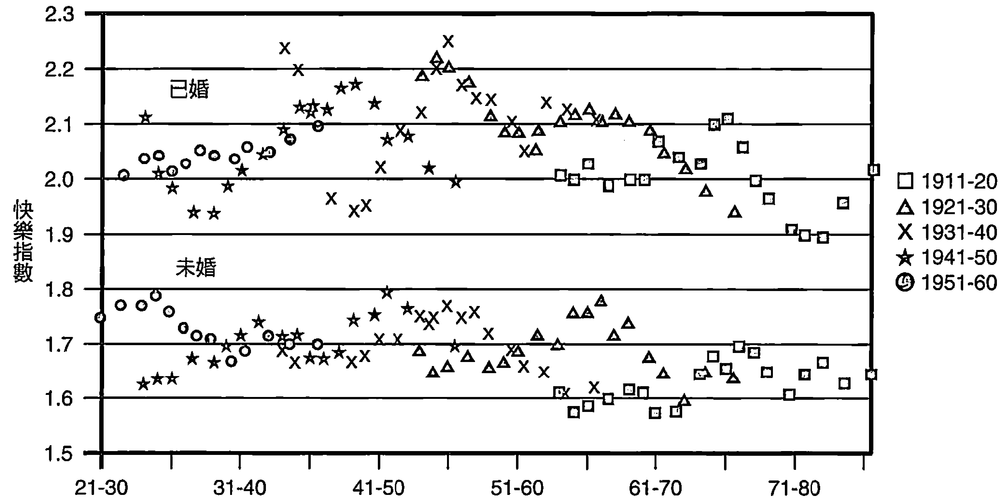

伊斯特林将调查的年龄层扩充到八十岁，进行更广的调查。图中的点，代表不同年代出生的人（你可以参考右边的图例）。图的纵轴是快乐程度，横轴是伊斯特林进行分析时，这些人的年龄。我们可以看到，数据很明显分成两大群。比较快乐的一群，是已婚。而下方是未婚的群，快乐得分比较低。

> 经《美国科学院期刊》（*Proceedings of the National Academy of Sciences of the U. S. A.*）许可，重制并翻译“Easterlin, R. A. (2003). Explaining happiness. *Proceedings of the National Academy of Sciences of the U. S. A.*, 100(19), 11176-11183.” Copyright (2003) National Academy of Sciences, U. S. A.

## 说法六：快乐，似乎和宗教投入有关

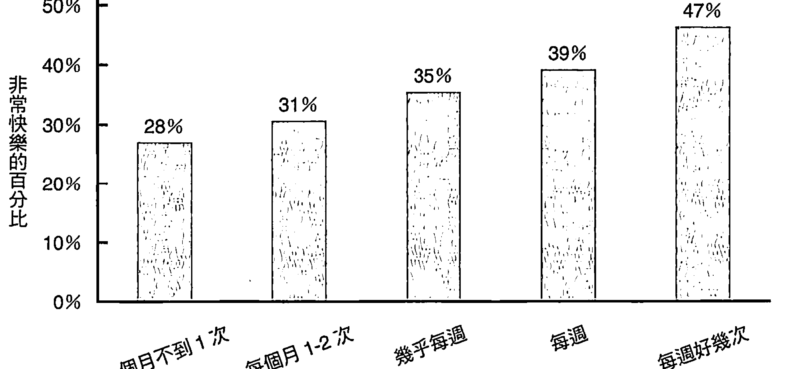

这张图反映了人类精神层面和快乐的关系。纵轴是有多少人觉得非常快乐的百分比，横轴则是他们去参与宗教活动的频率。我们可以看到，好像越常参与宗教活动的人，有更高的比例觉得非常快乐。然而，这只能代表快乐和宗教参与似乎有相关。我们不知道是因为更投入宗教活动而快乐，还是因为快乐，更愿意参与宗教活动。

> 经美国心理学会（the American Psychological Association）同意，重制并翻译自 "Myers, D. G. (2000). The funds, friends, and faith of happy people. American Psychologist, 55(1), 56."

- 14 Easterlin, R. A. (2003). Explaining happiness. Proceedings of the National Academy of Sciences of the U. S. A., 100(19), 11176-11183.
- Myers, D. G. (2000). The funds, friends, and faith of happy people. American Psychologist, 55(1), 55-67.

回到伊斯特林的研究。他将十九到二十九岁的女士分成已婚未婚两群，发现明显的不同。看起来，已婚的女士比未婚的更快乐。他把这个发现扩充到更广的年龄层（二十岁到八十岁），发现已婚、未婚还是有很大的区隔。有婚姻的人，比没有婚姻的人更快乐。男性也是同样的趋势。我们再继续延伸下去，以下这个研究，取自二十年共三万多人的统计数字。依照参与宗教活动的频率（一个月不到一次，一个月大概一次，差不多一星期一次，每星期一次，每星期好几次）分成五组，“认为自己很快乐”的比例，看起来和参与宗教活动的频率有关。似乎越常参加宗教活动的人，越快乐。

然而，对于个人而言，快乐是什么？可以是一个简单的公式 A＋B＋C＋……就会快乐吗？把所有条件都凑满了，人就会快乐吗？

## 经济和快乐，哪一个重要？从不丹谈起

## 说法七：最富足的，反而最快乐？

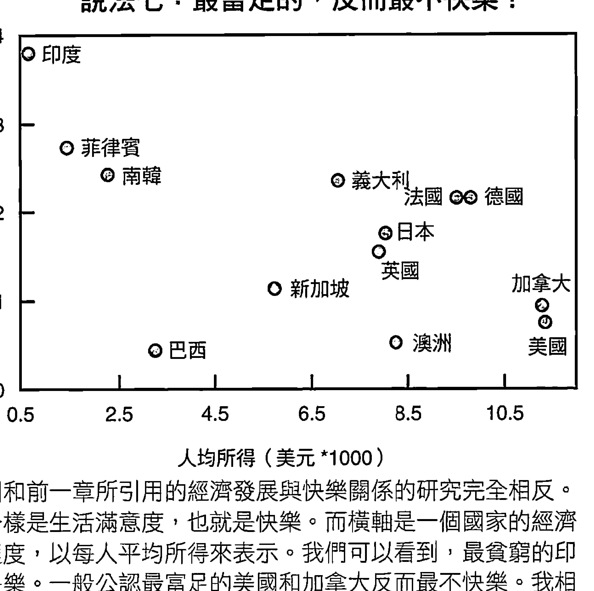

这张图和前一章所引用的经济发展与快乐关系的研究完全相反。纵轴一样是生活满意度，也就是快乐。而横轴是一个国家的经济发展程度，以每人平均所得来表示。我们可以看到，最贫穷的印度最快乐。一般公认最富足的美国和加拿大反而最不快乐。我相信，你读到这里，难免开始怀疑：这些科学家真的懂得快乐是什么吗？他们彼此之间，谈到快乐时，指的是同一件事吗？不用担心，跟着这本书继续走下去，我们会进入各种快乐的层面。

> 经作者同意，重制并翻译自 "Veenhoven, R. (1997). Advances in understanding happiness. Revue Québécoise de Psychologie, 18(2), 29-74."

一九七四年，当时不丹年轻的新国王辛格 (Jigme Singye Wangchuck) 提出一个新的观点——“国民快乐毛额”（gross national happiness, GNH）比起“国民生产毛额”（gross national product, GNP），更能够预测一个国家进步的程度。当初，这个观点被很多专业人士讪笑。但是接下来，不丹从独裁走向民主，也采取了很多稳定社经发展、环保和保存文化的措施。现在，它的人均国内生产毛额已经超过印度，平均寿命从1982年的四十三岁到2013年的六十九岁，新生儿死亡率从每千人一六三降至四〇不到，识字率也逐步提升。

当然，快乐是不是应该成为政府的责任、政府的作为是不是真的能够带来快乐、要促进快乐的哪些层面，也引发了很多辩论。不丹这个国家进展的过程也不是毫无问题，包括采取了一些减少个人自由的措施，像是禁菸、禁止私人行医。随着经济发展，失业率、失窃率和药物滥用的问题也在慢慢突显。

我们不得不承认，谈快乐，却完全不谈经济，很难让人相信一个国家能真的快乐。即使打造“世界快乐报告”的不丹，在这份报告的排名也并非名列前茅，最近下滑到七十九名。

然而，当初不丹国王提出以快乐衡量一个国家的发展程度，这一观点也对世界各地影响深远。

从我个人待过很多国家的经验来看，像巴西的国民本性就是比较快乐。不光是丰富的天然资源，有山海有矿产，地大物博，加上热带的风情，还有宗教灵性的基础，人也自然心情开朗，看着这世界都友善、都轻松。虽然人民很贫穷，却很看得开，觉得物质够用就好了，对物质的需求没那么急迫。看到外国人（尤其华人）都在为未来、就业而奔忙，反而觉得难以认同。

我后来从巴西到美国，当时虽然很年轻，很快就发现不同民族的性格有很大差异。北美的民族性格比较一板一眼，凡事相当谨慎，有时候也过度的紧张。这一点，用社会经济条件很难解释，或许和历史背景与文化也有关系。很有意思的是，就连语言都反映这一差异，葡萄牙语比较热情，而英语则比较精确，比较理性。

回到不丹，我相信不丹的国民和我所见到的巴西人一样，性格本来就比较单纯，再加上信仰的支持，也就容易快乐。或许我们必须承认，快乐有太多的条件是无法厘清的。科学家会用听起来比较有学问的“变量”这个词来替代“条件”，这本书以后还会用到。或许你很快就能学会把“我们还不清楚快乐是怎么一回事”这个句子，用科学家的口吻重说一遍——“我们很难用单一层面，甚至用多层面的变量，来预测或描述快乐。”

## 07 快乐，可以透过科学来探讨吗？

我在《静坐》一书表达过，一般的科学研究应让变量单一，才能得出清晰的结论。研究的成果，则取决于研究一开始所使用的假设。因此，在谈快乐的研究时，不能不去思考心理和社会研究的困难度。物质科学的研究，比较容易控制变因。然而，快乐和其他心理状态一样，都有很多层面，也自然会受到多重变量的影响，不容易得出一个适用于每个人的正确答案。

当然，这类快乐的研究有很多地方值得商议，包括快乐的定义是不是能用所谓的“生活满意度调查”得到，主体或资料是否能直接比较，在方法上都有许多争议。我希望读者可以明白，即使是所谓的科学研究，换个分析方式，很容易得到不同的结论。也就是说，种种快乐的条件，包括透过“科学”所归纳出来的，真的是绝对的吗？

前一章提到快乐好像有许多条件，然而，从以下这个研究可以看出来，好像已婚未婚、收入高低，都和快乐没有关系。就像图里所显示的，人到了四十岁，无论收入、已婚比例都是最高，然而，生活满意度却不是最高。这也说明了，即使达到了这些目标能够快乐，也仅仅是短暂的。

- 16 Ed., D., Suh, E. M., Lucas, R. E., & Smith, H. L. (1999). Subjective well-being: Three decades of progress. Psychological Bulletin, 125(2), 276-302.

## 说法八：财富、伴侣与快乐无关

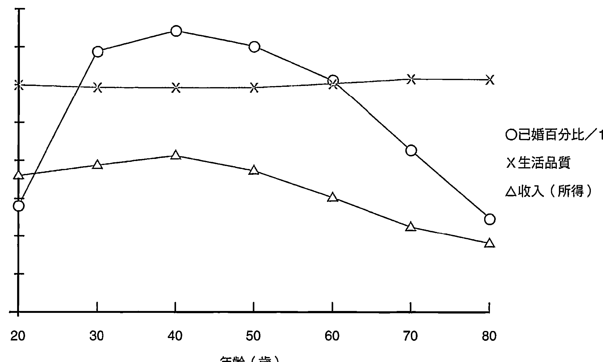

这张图从另一个角度来衡量快乐和婚姻、收入这两个条件的关系。纵轴是程度，要分别从图里的三条曲线去比较，圆圈是已婚的百分比（除以十）。叉叉代表生活品质，也就是这位研究者心目中的快乐程度。三角形则是收入。横轴则是年龄层。你会发现，人随着年龄渐长，经济条件会有变化，可能有伴侣，也可能失去了伴侣，但快乐的程度却没有多大的变化。比起这两个外在的条件，快乐好像有更主观的成分在。

> 经美国心理学会（the American Psychological Association）同意，重制并翻译自 "Ed, D., Suh, E. M., Lucas, R. E., & Smith, H. L. (1999). Subjective well-being: Three decades of progress. Psychological Bulletin, 125(2), 276-302."

我相信，你大概已经开始动摇了，知道这类相关的研究非但不少，而且还在不断增加中，可能数都数不清。就像我在《静坐》提到脑部变化的研究，也是多得难以计数。只会愈来愈细，或愈来愈广。要快乐，好像得要满足数不清的条件。是这样吗？

我们最多可以从这些研究下一个总结——一个人还是需要一定的物质、社会甚至精神的条件，才有基础来追求快乐。然而，物质的相对重要性会下降。好像快乐要靠更为精神层面的方式，才能满足。

至此，我们真正要问的是：没有这些条件，这一生也能找到真实而永久的快乐吗？

这本书想带来的答案是——当然 是。

无论怎么分析，人间所谈一般的快乐，本身都是一个有条件的快乐，离不开物质或境遇的转变。仔细观察，一个状态（快乐）还会受到物质或其他条件（即使是精神层面）的影响的话，它本身还不是永久的，早晚会消失。

《不合理的快乐》这本书，则是希望带着你找回——无条件的快乐。

## 08 对快乐的追求有止尽吗？

前面提过“享乐适应”(hedonic adaptation)的概念，这个概念连结了现代心理学相当重要的—个新领域，也和本书的主题有相当紧密的关系，我在这里想多谈一点。

布里克曼和坎贝尔这两位学者在一九七一年首先提出“享乐跑步机”(hedonic treadmill)¹⁷ 来描述享乐适应这个概念—不管透过怎样强烈的刺激，生活上多剧烈的变化，人的快乐会很快回到一个定值(set point)。

前面提过物质和财富与快乐的关系，透过享乐适应的原则来解释，也就是物质财富的丰富积累，并不会提升一个人快乐的程度。从动力的角度来说，既然快乐的值是一定的，那么，为了维持固定的快乐程度，拥有越多财富，对物质和周边人事务的要求也不断提高，这两股动力才能维持平衡。

说白了，就是一个人拥有越多，自然只会期待更多。透过物质、享乐的方式来追求快乐，是永远没有尽头的。

会用享乐跑步机来表达同一个观念，不光是因为没有尽头，更因为已经享受的快乐只会带来更多期待、更多渴望、更多追求。接下来，要维持一定的快乐程度，就像在跑步机上必须不断地走才能维持在定点。

> Brickman, P., & Campbell, D. T. (1971). Hedonic relativism and planning the good society. Adaptation-level theory, 287-305.

點，也才不會跌落。如果停止對物質的追求，反而會感受到失落，而失落本身就帶來不快樂。可以這麼說，對快樂的追求，反而成了不快樂的來源。

人間的快樂，或人間帶來的期待、渴望、追求，就這麼造就了我們的「不快樂」。

這些是自古以來就有的觀念，在每一個宗教都會提到的。比如佛經就有「若眾生所有苦生，彼一切皆以欲為本，欲生、欲集、欲起、欲因、欲緣而苦生」的說法。

> 「狂心在跌倒之前。」

> 「凡自高的，必降為卑；自卑的，必升為高。」

現代的學者用停不下來的跑步機來描述人類對快樂的追求，也正是古人在聖奧古斯丁甚至更早的年代就有的感觸。可以說，只要對人性有深入一點的觀察，都會得到同樣的結論。

享樂適應（hedonic adaptation）是一種保護性的生理機制，目的在於保護人體不會受到情緒或環境劇烈變動的過度影響，維持一定的恆定性，才能夠穩定地運作。這種生理機制是透過幾個層面發揮保護的作用——

首先，透過價值觀的徹底改變。一個原本讓人很快樂的刺激，經過價值評估的調整，久了，就不再覺得有什麼新奇的。

另外，透過神經化學的調控（也就是生物化學的減敏化 desensitizing），自然會把一些激烈的感觸淡化，無論是驚喜還是低落的反應，都要盡快回到原本中性的水平。

這就是享樂適應的兩種作用方式。

在這樣的架構來看，現實生活的快樂其實是相對的，要和過去的經驗比較，才說得出來自己多快樂。

這麼說，每一個人都有一個固定的快樂值，保持快樂程度的穩定。一個人的情緒狀態無論多高，多低，都要回到這個點上。這個點本身的高低因人而異，一個人長期的快樂感，並不會因為一時的喜怒、好消息、壞消息而受到很大的影響。

舉一個實例，大華被加薪，一開始一定很興奮，接下來，習慣了加薪帶來的生活變化之後，興奮感不再，快樂的程度也就回到一開始的基準點。然而，其他的變化，例如突來的假期、獎勵，一樣會讓他開心。

也就是說，對於一個刺激不再那麼敏感，有助於我們把注意力重新打開，去接受新的刺激，新的體驗。

前面提到享樂適應有保護的作用，在面對負面刺激時更為明顯。一個人遭遇危機、遇到災難、甚至生逢戰亂而流離失所，這類生命難以承受的失落，對身心健康造成很大的折損。這時，享樂適應的保護效果是特別的突出，透過減敏化讓整個神經系統麻木，好讓身心能夠勉強勻出來，應付其他可能的危機。正因如此，一個人遭遇了極端的痛苦，甚或接二連三的危機，幾年、幾十年後，回頭看這一段經歷，都很難相信自己竟然有這樣的承受力。從另一個角度來看，快樂還是促進生存的因子，能讓人達到最佳的效率、最佳的運作狀態。即使陷入危機，我們本來就內建了保持快樂程度穩定的機制，自然會帶我們回復快樂的定值，重新建立身心快樂的恆定。這些大的刺激所帶來的衝擊，是我們一般人都可以理解的。我們生活中有許多小小煩惱帶來的壓力，例如現代生活過度緊張，過度快速的步調。我們成天受到各式各樣訊息的轟炸，甚至這些訊息大多是負面的。享樂適應的機制同樣能發揮保護力，讓我們對這些訊息習慣、麻木了，而不被影響太多。當然，這樣的機制也限制了我們，讓我們認為這種步調就是所謂的「正常」，甚至認為人生只可能是如此。生活上帶來的刺激，不可能有一個絕對和永久的影響性。這些觀念，也就延伸出正向心理學（positive psychology），希望發展出一些工具或方法，讓人可以比較永久的快樂。這本書想表達的是，任何個人的快樂，無論正向心理學多麼善意而努力尋找方法，是不可能達到永久的效果。各種條件再怎麼豐富而齊備，只會增加我們的依賴性，甚至，越豐富，失落也會越大。只要我們可以用條件來歸納的快樂，無論這些條件多麼強烈、多麼合理，所帶來的任何快樂還是靠不住的。

## 09 人要满足到什么地地步，才可以快乐？

前面从伊斯特林悖论开始，谈到生活要达到基本条件，才能得到基本的安全感以及满足感，也就是一般人所谈的快乐或幸福。相信这是大家都能接受的看法。

说到这里，许多读者应该听过马斯洛（Abraham Maslow）在一九四三年提出的需求阶层论。他是美国的心理学家，早期受实验心理学的训练，后来成为人本主义心理学的先锋。有人称他为二十世纪影响最深远的十大心理学家。

他研究在各个领域表现卓越的人，包括爱因斯坦，把这些人称为「自我实现者」，从这些人的传记整理出各种代表心理健康而且运作良好的人格特质。他体会到生命有不同的层面，也可以说生命的快乐有几个不同的层面。

首先，一个人要满足基本的生理需求，包括饮食、保暖、休息，其次是保障人身的安全。再往上是心理层面的归属感与爱的需求，人需要有亲密关系和友谊，我们都想要温馨和谐的人际关系。有了这些，还要满足受尊重的需求，成就、名声、地位和升迁的机会，都代表了自己的才能受到了外界的肯定。

他早期的阶层论只有五层，将人类追求自我实现的需求，也就是完全发挥生命的全部潜能（包括灵性和创造），放在最上方。认为底层的需求获得满足，人才有心思去注意更高层的追求。

后来的研究者，很广泛地针对一百二十三国的人民，做了一项跨文化的研究，探讨需求满足和快乐的关联。他们发现这个「先底层，再高层」的顺序并不是快乐的必然条件，经济不发达地区的人民，即使生理需求没有被充分满足，也能透过人际关系等方式，在更上层的需求满足中得到快乐。然而，很多人还是受到「阶层论」这个名词的暗示，而认定——一定要先满足生理和心理需求，才可以自我实现、发挥潜能。我常常在许多场合听到很多人引用马斯洛的需求阶层论，来支持自己的人生观念：要先有财富，才有资格快乐，才有资格追求灵性或意识状态的转化。许多人非但一生的精力完全拿来累积财富，以这个理论来支持自己的选择，甚至引用马斯洛的理论，影射其大部份人对灵性的追求或想要意识转化是不切实际的需求。大部分人不知道的是，马斯洛没多久就推出了新的架构，把上层的需求称为成长的需求，他认为意识转化或生命成长的需求，并不是底层需求——满足之后自然而然的結果。假如他地下有知，知道需求阶层论只被用来支持一个人对物质永无止尽的需求，一定会觉得很可惜。

马斯洛的需求阶层论，除了由下往上看，还可以由上往下探讨。可以这么说，最上方的灵性或价值观、意识状态的层面，定调了人类最根本的需求。也就是说，种种身心需求，若不是由意识状态来带领，它本身没有意义。

甚至，连一个人物质需求的多少，也可以被最高的意识状态来调节。例如，一个人心里安静时，非但物质方面需求很少，甚至連作为的需求都很少。既不折腾自己，也不为难别人。一个人内心不安时，累积再多的物质，追求更多的名气，都填补不了心里的空洞。

或许，关于所谓的需求阶层理论，真正该探讨的问题是——是不是把握住了意识状态，人基本的生理和心理需求也就自然跟着接轨，而可以满足？

很有意思的是，我所谈的观点，也正好符合马斯洛晚年的理论演变方向。他扩充了需求阶层，由五层变成八层，除了生理、安全、归属感与爱、受尊重的需求之外，还有求知、审美、自我实现和超越的需求。其中，上层的美学、自我实现、超越的需求，完全是在谈意识层面的转化。这一点，我相信马斯洛如果看到这本书的观点，一定会认同。毕竟，人之所以为人，从来不是因为和所有动物一样的生存需求，而是体会到在这肉体生命之外，还有全部的生命、更高的规律在运作。

再进一步往下谈，其实最值得探究的问题是——懂了这些，能不能得到一个好的方法或捷径，帮助自己掌握「心」的状态，得到快乐，活得幸福。

## 快樂是身心合一的完整體驗

## 01 快樂是生命的振動

在西方的语言中，快乐和幸运（fortune）一直是相关的。英文的快乐happiness是从happ这个字演变而来。古英语和古挪威语的hap，也就是英文的happenstance机会、运气。法文的bonheur和德文的快乐glücklich也是运气的意思。这是多么有趣的说法。

也就是说一个人的快乐，要取决于机会、喜事，是否有好的结果。快乐的这种定义，其实反映了西方文化对快乐的根源是不清楚的，认为快乐是无法掌握的，完全受环境的影响，是宇宙或上苍神秘的条件组合，和人类自身一点都不相关。

针对这一点，我认为西方文化对快乐的认识不够深刻，没有充分了解快乐的来源，才会有这样的演变。

梵文和巴利文则用两个字来描述快乐：sukha（愉悦、自在）和preya（享乐），前者比较深沉，是一种比较永恒的满足感，而preya比较短暂，是透过人间各种变化才能得到。梵文还用ānanda这个字来表达快乐或喜乐，而ānanda又比sukha更深一层。我在《神圣的你》介绍过sat-chit-ānanda「在·觉·乐」的观念，ānanda是生命的存在（也就是「在」）衍生出来的喜乐（joy of being），倒不是透过「动」或「作为」可以得到的。

更有趣的是，中文里和快乐相关的字，比如说喜、欢、快、乐、笑，都和人的活动有关，亦或是乐器，或是人的笑脸。我们可以看小篆的「乐」，长得就像中国的古乐器——编钟。可以这么说，对华人而言，快乐是和声音与身体连结的。

声音是最接近我们肉体的能量频率。古人老早就了解，快乐其实是一种场、一种振动。快乐，会带动频率的同步，和任何生命达到共振。一个人的快乐是会影响周遭人事物的。透过快乐、透过声音，甚至能打通气脉。

然而，声音有很多种，有些频率比较正向，符合一种更高的规律，比较容易跟生命达成共振，在物理上称之为谐波（harmonics）。

## 笑樂快歡喜

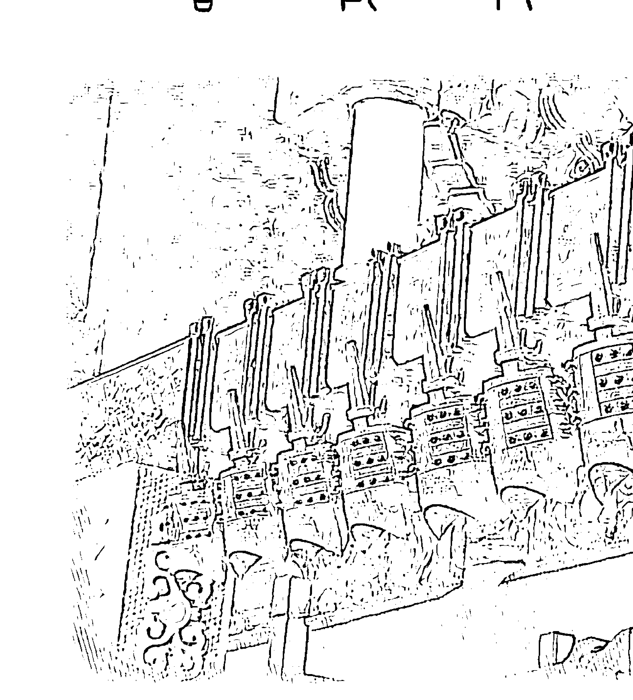

中国文字的演变主要经历了甲骨文、金文、小篆、隶书、楷书、草书、行书等发展阶段。我在这里采用小篆的字体来说明。《说文》：「喜，乐也。从壴，从口。欢，古文喜从欠，与欢同。」「欢，喜乐也。从欠，雚声。」「快，喜也。从心，夬声。」「乐，五声八音总名。象鼓鞞。木，虡也。」李阳冰刊定《说文》：「笑，喜也，从竹，从夭。竹得风其体夭屈如人之笑。」

## 透過振動，達到和諧

华人自古就把快乐和声音做了连结，反映了古人最深的智慧。

声音本身离不开能量，离不开振动、频率或「场」。整个宇宙自然会想回到和谐，而这个回到和谐的力量，物理学上称为 entrainment（带动，也有人称「曳引」）。从最大的星球，到最小的分子，一切的一切都离不开振动。透过振动，可以达成和谐。

我在《真原医》和《重生》都已经提出谐振的观点——我们的身体，无论是呼吸、情绪、心跳，都自然会达到一个共振，也就是它最舒畅的状态。这一最舒畅的步调，无论是呼吸还是心跳带来的谐振，自然发挥火车头的作用，带动身体其他部位的韵律。

同时，我也介绍过恒定的观念（homeostasis），也就是身体本身有一个回到最均衡状态的机制，包括自律神经系统交感与副交感神经的作用，自然把人带回到一个最轻松就可以运作的状态。这个状态本身就是快乐。

有趣的是一六六六年，发明单摆钟的荷兰科学家克里斯蒂安·惠更斯（Christian Huygens）发现，当几个钟放在一起时，哪个钟摆摆动的节律一开始并不一样，带着比较大的动力的钟摆，自然会带动附近的钟摆，回复一样的节律。在物理上，这是多个震荡系统的互动。原本各有各的周期，互动过程中产生些微能量的交换，让频率快的慢下来，频率慢的加快，而落到同一个周期，也就是同步。

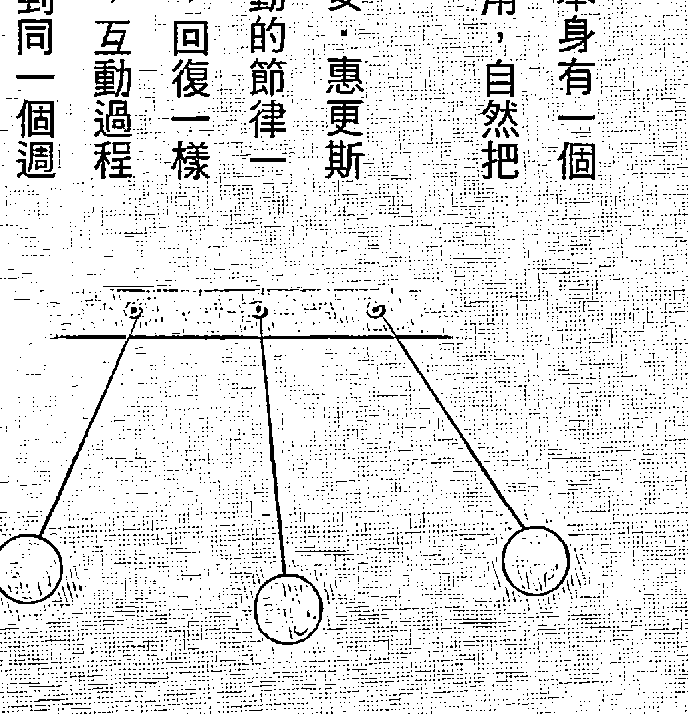

快乐和声音，也只是如此。快乐与声音带来的振动，自然会共振到周边。

希腊哲学家、数学家毕达哥拉斯（Pythagoras），也可以称为声音疗法的始祖，在两千六百年前就开始谈「星球之声」（music of the spheres）——一种最原始的音声。这些音声含着几种重复的型态，这些型态自然影响到身心的健康。

声音是带来身心合一最简单的方法——透过声音，我们歌唱，表达快乐，这是生活中你我都有的经验。

谈到规律，其实是想表达——生命的运作符合一个根本的频率结构（golden geometry），离不开所谓的「神圣几何」（sacred geometry），离不开数学上更基本的比例。从声音波动的角度来谈就是谐波，创出一个神圣的空间或神圣比例（divine proportion）。从古至今，最美的音乐、绘画和自然现象，都离不开这个频率的结构。

正因我们本身就是神圣几何所组合而成的，自然认得、体会这一神圣的频率结构，也自然带来一个舒畅的感受。这，就是快乐。

看到这样神圣的形状，一个人自然认得，认得什么？认得了自己的组成。

声音和身心能量最为接近，最能够带动我们的身心振动，与宇宙和全部生命合一，也就是带动人们回到快乐。

## 身心合一

东方文化，无论是中文或梵文的语源，都反映了文化本身清楚地掌握了快乐的源头，掌握了人的本质。甚至可以说，懂得快乐，也就懂得人，懂得生命了。

前面谈到快乐是生命的振动，谈到每个文化用来描述快乐的字源，其实也想表达生命的内在和外在是对称的。

我在《真原医》从这个角度来解释全人的健康，也可以拿来解释快乐——也就是细胞或身体内的健康与快乐，既反映了外在快乐的刺激，同时也反映了「心」的状态。可以这么说，我们所能经验的快乐，既是从外传递到内，也是由内向外发出。

接下来的几章，我会从神经科学的角度，反映这个快乐在身体上由外而内、由内而外的过程。当然，这样的快乐，离不开脑和神经带来的限制，也依赖种种条件的组合，包括基因、神经传导分子、外在的刺激……等等。然而，从这个角度，我们也可以体会，就连脑和神经有限的架构，也一样是来支持你我每一个在人间得到快乐的经验。

生命永恒的快乐，远远超过我们在人间所知道、所经验到、所活的。而每一个人早晚要跟内在生命更深的层面同步，透过更深的对称，达到身心真正的合一，甚至体会到我在《全部的你》所提到的大喜乐。

## 02 笑——發自內心的喜悅

谈到快乐，我们一般人自然联想到笑。我们很少想到，人的脸部可以变化出各式各样的笑容，是透过脸部四十二条肌肉彼此的牵动与动静配合而来。七O年代，学者艾克曼（Paul Ekman）归纳出十九种笑，比如说社交礼貌性的微笑，发现自己出糗的窘笑，不满的冷笑，无奈的苦笑。其中只有一种是发自内心喜乐而生，他透过多年在各个文化的研究，而确认是真正的笑。在脸部的四十二条肌肉中，有一条眼轮匝肌，一收缩，眼睛就眯了起来，眼角出现鱼尾纹（英文用「乌鸦脚」crow’s feet来形容，相当生动），透过颧骨到嘴唇上方的颧大肌和颧小肌，配合把脸颊的肌肉往上拉，而成了笑容。有意思的是，只有这两组肌肉一起运作，才是真正的笑，又称杜欣微笑（Duchenne smile）。

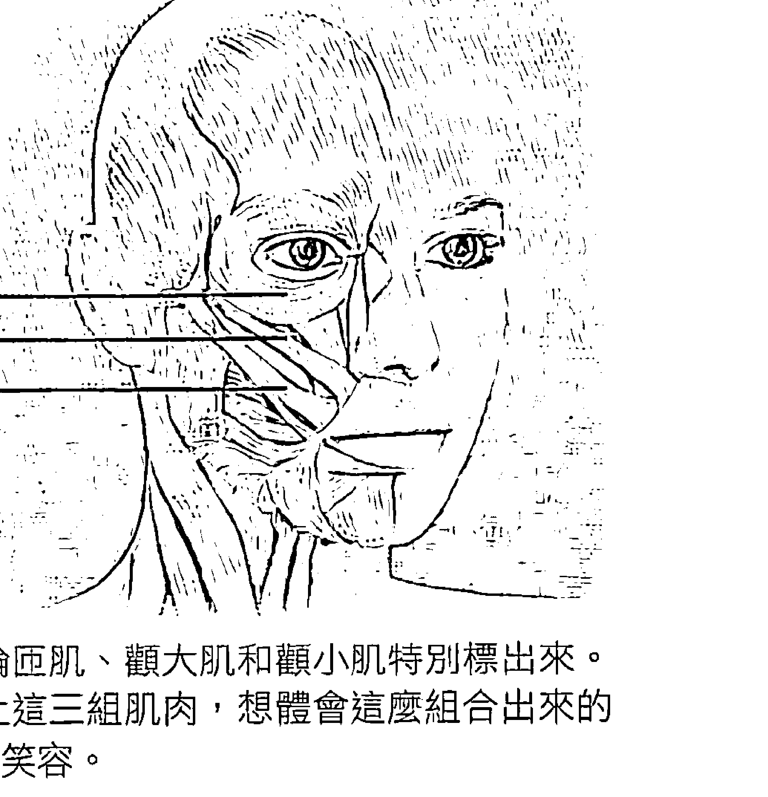

人类脸部的肌肉示意图。我将眼轮匝肌、颧大肌和颧小肌特别标出来。或许你已经开始尝试移动自己脸上这三组肌肉，想体会这么组合出来的笑容，甚至脸上已经泛起了这样的笑容。

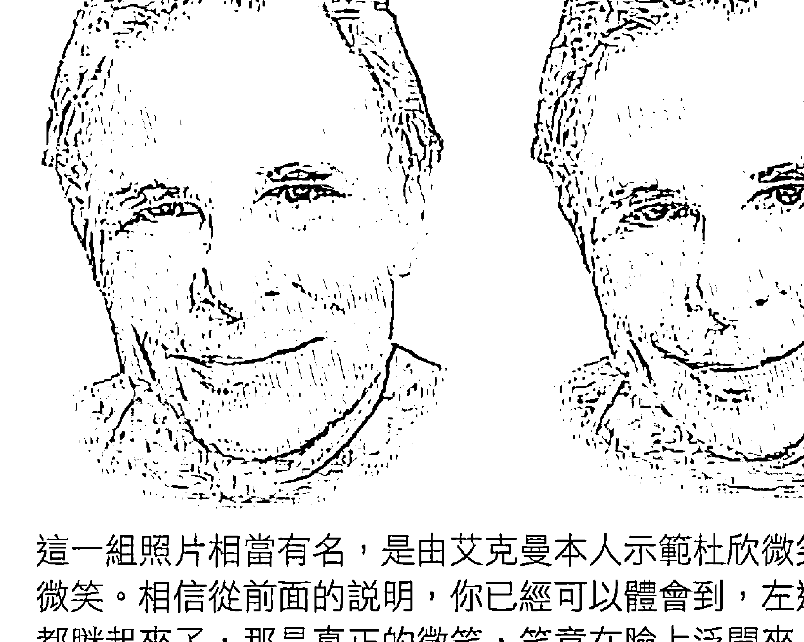

这一组照片相当有名，是由艾克曼本人示范杜欣微笑与非杜欣微笑。相信从前面的说明，你已经可以体会到，左边的图眼睛都眯起来了，那是真正的微笑，笑意在脸上泛开来，甚至可以传染给你。右边比较像是礼貌性的现代社会微笑，并不会让人真正放松。

> 照片经 Paul Ekman Group 许可重制，Copyright 2017, Paul Ekman Group.

杜欣是法国的神经学者，是第一个探讨眼轮匝肌这个括约肌的人。他在一八六二年发现了眼周肌肉和快乐的关系，把眼睛肌肉的这种运动称之为「灵魂最甜蜜的情感」。这个肌肉很难刻意去控制，它的运动是要真心诚意地从内在发出来的。

我们可以很快分辨刻意或不自然的假笑（只用颧大肌和颧小肌来牵动嘴角），以及真心直意发出来的杜欣微笑。只有少数的人能自如控制眼轮匝肌，有些好的演员或政客会刻意去练习控制这个肌肉，但不是每个人都能成功。

很有意思的是，牵动脸部表情的肌肉已经被解码，构成一套系统。艾克曼将这套编码系统发挥得淋漓尽致。

淋漓尽致，透过不同肌肉收缩与放松的排列组合，可以在电脑的协助下，辨识出各种脸部表情所表达的情绪，后来甚至用以分析忧郁症的强度、或测量无法言语的患者的疼痛程度。

右页这张相当有名的照片，各自代表了真笑和假笑。最有意思的是，即使没有电脑系统的辅助，我们普通人也能认出这种笑容和假笑的差异。

一般人都以为科学家的成果是在实验室或研究室独自孕育出来的，艾克曼完全是一个例外。在艾克曼之前，学术界流行的看法是——情绪表达是文化教养的产物，没有数据指出那是人类共通的天性。

一九六七、六八年，他去巴布亚纽几内亚东南高地的一个部落做研究。这个部落和现代文明完全隔绝，可说是冻结在石器时代。

艾克曼还是个很年轻的研究员时，拿到美国国防部的经费，要研究各种文化的非口语行为。他观察当地原住民的互动，发现这些从来没有跟一般人接触的原住民，也会表现出真正快乐带来的笑，而且和纽约各地住民的笑容是完全一样的。他进一步归纳出六种人类共通的脸部表情，包括愤怒、厌恶、恐惧、快乐、哀伤与惊讶。也发现杜欣微笑完全不是文明和教育的产物，而是深植在人类天性的一种情绪表达。

透过艾克曼的研究，世人才认识到这种真正的笑容是不需要教，也学不来的。当时艾克曼很年轻，得到的结论并不是所有人都接受。也有好多反对艾克曼的科学家，到世界各地去研究，想证明他是错的。然而，到最后他们也只能同意——无论世界各地，即使是从来不接触外界的原住民，都有这种笑，都有共同的表情。

分享了这个故事，我想表达的也是——快乐，和文明的发达没有关系，而是我们本来就有的本质。也是最自然、最自在的状态。我甚至敢说，古人老早就把快乐的科学贯通而落实到生活中，这是值得现代人学习的。

## 03 身体的快乐

快乐，不光从笑可以看出来，从身体每一个部位都可以反映出来。

我们有多久没有体会到快乐的感受了？那是一种舒畅、爽快、甜蜜而放松的感觉。一个人快乐时，身体自然产生不由自主的反应，包括心跳往往会略略加快，同时血液循环会加速，呼吸顺畅，血管扩张，皮肤的温度也会略略升高。

很自然地，气色看来红润，自己也觉得比较暖和。因为体温略高，如果拿仪器来量，有时会发现肤电值增加，那是察觉不出来的皮肤排汗的湿润效果。体内通畅，也和外界相通了，带来一种温暖有活力的感觉。

当我们开心地笑，舒畅而放松地快乐时，观察看看，这时候肩膀和手指的肌肉是不是松的，带来一种通体舒畅的感觉，甚至就连脚步都变得轻盈，身体也自然变得灵活而有弹性。虽然好些负面情绪也有心跳加快的反应，然而快乐的情绪还可以加上周边血管扩张的反应，这也可以解释为什么快乐的时候会觉得舒畅。

然而，身心快乐不光是带来肌肉和外表的变化，就连内分泌都有所调整。我再进一步分析和说明。

也就是迷走神经(vagus nerve)的反应。迷走神经是第十对脑神经，是人类最长、分布范围最广的脑神经。迷走神经从颅顶穿出后，沿着食道两旁，纵贯颈部和胸腔，进入腹部，掌管呼吸系统、大部份消化系统和心脏等器官的感觉、运动和腺体分泌。迷走神经受损，会引发循环、呼吸、消化等功能失调。

> 28 Kreibig, S. D. (2010). Autonomic nervous system activity in emotion: A review. Biological Psychology, 84(3), 394-421.

只是在这里也要提醒，虽然许多研究都描述了这些快乐所带来的生理变化。然而这些描述反映的也只是研究者自身对快乐的理解。我相信我们从自己的经验都可以体会到，这里的描述还是偏向比较兴奋的快乐。

前面提过，快乐是复杂的反应，不是单单生理现象的变化可以描述的。我们都体验得到，身心的快乐，其实是一个连续谱，从深沉的满足感，到任何人都可以察觉的兴奋，都是快乐。兴奋激动的快乐，比较容易和生理现象建立相关。然而，安静的满足感，或其他微细的快乐，也会带来生理的变化，只是没那么强烈，比较难取得数据。这些快乐，还有待科学家进一步去探讨。

身心快乐的源头，究竟是来自脑？还是身体？其实不是那么容易区分。

吃到好的食物，触摸喜欢的人，看到一朵花，闻到一个好味道，这些经验自然直接带动身体的快乐。想起某些人或事，这些记忆所带来的快乐，当然是从脑传递出来的。

然而，如果只有脑和记忆造出的快乐，而没有让这些快乐的念头落到身体，和身体建立连接的话，我们是快乐不起来的。

身心的快乐，好像一定要在身体层面产生变化，也许是脸部的肌肉放松、血液循环略略加快等等让人舒畅的现象，再回到脑部被知觉到，一个人才会真正感受而且明白自己快乐。

这种说法看似不符合一般的逻辑，仔细观察却会发现是合理的。我们都有过这种经验，有时身体绷得很紧或疼痛，就算很努力地想要快乐，却怎么也快乐不起来。

有意思的是，身体的感受跟脑的心情虽然是一体两面，在生理上却完全是两回事。神经系统和内分泌会影响到身体的感受，而这个感受透过生理和神经的反馈回头建立脑的心情。快乐的心情，自然离不开身体的

## 两套神经系统的制约

我们的身体包括肌肉和感受，受到两套神经系统的制约，一部分由意志控制，透过躯体神经系统来传递；另一部份不受意志控制，由自律神经系统管辖。

影响动作的身体肌肉，受的就是躯体神经系统的管制。由于肌肉和骨架紧密结合，透过意志，指挥肌肉的动作，而带动整个骨架，让人动起来。比如感受到尿意，决定起身到洗手间——这一系列的动作，是透过躯体神经的传递，而让我们能满足生理需求，解放膀胱的压力。

躯体神经与大脑皮质的灰质直接相连，就坐落在头骨正下方。大脑皮质是脑部神经细胞和细胞连接聚集的所在，不光管辖身体的动作，也会造出种种念头、期待、幻想和意愿。自律神经则连接到脑干（brain stem），也就是脑最下方快要接近颈部的地方。

这个部位之所以有“脑干”之名，是因为早期的解剖学者把人体比喻成一棵生命树，然而这棵树是上下颠倒的。脑是这棵树的根，脊椎和延伸的神经是长出来的树干和枝桠，脑干是树桩的底部，也就是最基础的地方。透过脑干，维系的也正是生存最基本的功能，比如心跳、消化、呼吸、醒、睡、排泄、内分泌。枝桠结出的果子，也就是我们透过感觉神经和运动神经所能造出并知觉到的色、声、香、味、触种种人间体验。

29 我在这本书区分了身体的感受，以及经过脑和神经作用产生的心情。感受，是身体细胞的反应。感受和心情是会相互建立的。

## 神经系统就像生命树

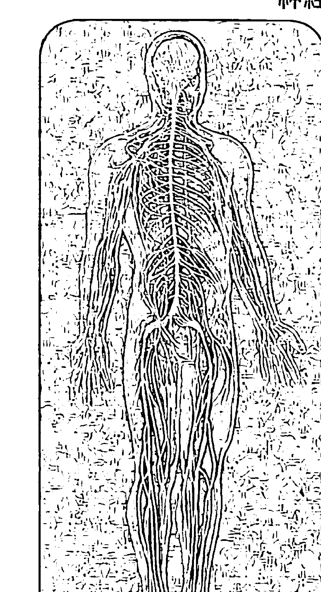

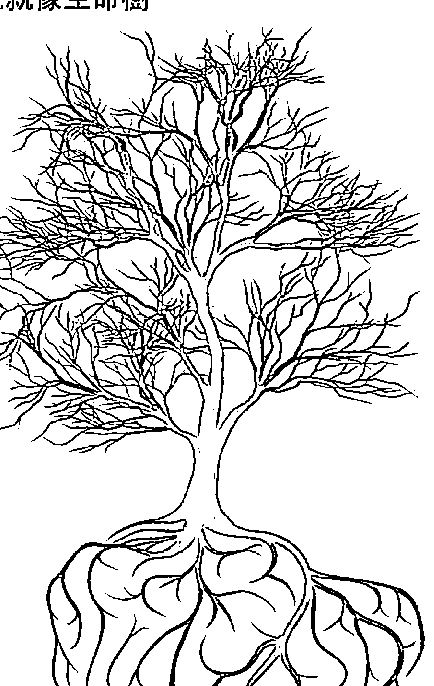

回到同一个经验。
我在《真原医》和《静坐》都特别强调自律神经系统的作用，它不同于躯体神经系统。躯体神经处理的是随我们意愿而产生的肌肉运动，而自律神经系统从脑干延伸出来，不光控制基础的生理功能，像是心跳、呼吸、消化、排泄、肌肉运动，还影响到情绪／心情，包括快乐。

左图是人体的神经系统，就像倒过来的生命树。我们可以从右边的示意图体会到，脑部是知觉生命的根，而散布出去的枝叶，是知觉透过神经系统所体会的人生。

此外，从生存的角度来看，身体的感受是一个信号传达的扩大器。透过体内的化学物质，扩大神经的信号，让我们能够在短时间内应付生存的危机，包括外在环境的威胁，也包括体内的失衡。

非但不舒服的的感受是生存的工具，愉悦、快感等等快乐的身体感受，也只是一种工具，让我们扩大满足了某一种需求后的效果。吃饱了，把生理满足感扩大，自然让我们下一次更愿意去觅食。爱也是如此，爱一个人，所带来的喜悦和满足，透过身体感受的放大，自然会让我们希望

## 自律神经系统

自律神经系统也掌管了打或逃的生存反射。透过交感神经系统，我们心跳加快，呼吸急促，肌肉绷紧，停止消化，在生死攸关的瞬间，帮助我们面对生存的危机。可以想像，遇到野兽，只有打或逃两个选择。无论哪个选择都要在最短时间内启动，才有保护生命的效果。相对地，副交感神经系统则让身体的每一个部位放松。

很不幸的是，现代生活步调快，等于交感神经过度活跃，即使天下无事，我们仍然随时处在打或逃的反应里，过度紧张、过度焦虑。

在这种情况下，既然脑随时都在接收身体所产生的信号，倘若身体不舒畅，心情自然也快乐不起来。

最不可思议的是，从身体结构的设计来看，副交感神经系统的放松反应，其实是可以通过更上游的中枢来调控的。只要我们能掌控这个中枢，就可以训练自己得到快乐。

我在过去的作品也很强调静坐和运动的重要性，可以平衡自律神经系统，把身心的均衡和快乐带回来。

当然，这种可以练习的快乐，还是人间短暂的快乐，会生起，也会消失。

交感和副交感神经系统，不光透过身体影响心情，甚至透过身体感受的反馈，影响我们对世界、对人生的看法。

## 不由自主的反应

虽然大部份的肌肉归躯体神经系统管辖，然而，我们都体会过一些不由自主的反应。像是天冷或身体发冷时，皮肤会起鸡皮疙瘩。让汗毛竖起来的小肌肉其实是受到自律神经系统的控制，而人体的内脏也一样落在自律神经的范围内。

很有意思的是，由眼轮匝肌所牵动的杜欣微笑，很难用意志力去控制，也不容易装得出来。可以猜想到，快乐是透过自律神经系统传递给身体的，也随时受到身体内分泌的影响。所以才说，脸的快乐和身体的快乐没办法作假。不是我们努力想要快乐，就能产生快乐的反应。

在这一点上，身体比我们的脑更诚实。

人类经过上千万年的演化过程，分化出自律神经系统，甚至那么依赖其中的交感神经系统，正是为了生存。

交感神经系统管辖各种和生存相关的功能，而且要维持整体的协调和微妙的平衡。在演化的过程中，这麽重要的部份自然不会让头脑随便取得控制权，以免对生命造成威胁，而无法维系物种的生存。

自律神经系统是脑与内分泌之间的桥梁，既同时受脑和内分泌的管辖，而它所管制的范围也同样受到神经系统与内分泌的双重管制。等于是在自律神经讯息传递的上下游，都有双重的安全栓。或许大自然也认为，只有这样的设计才能够维持人体的恒定。

从整体来看，这种作法不光最不费力，又有效率。有这么一套系统，集中在环境带来的危机，也就好像

30 异常管理，又称例外管理（exception management），最初由泰勒（F.W.Taylor）提出，指最高管理层将日常发生的例行工作规范化（标准化、程式化）后授权给下级管理人员处理，而自己主要去处理那些没有或者不能规范的例外工作。实行这种制度，可以节省最高管理层的时间和精力，使他们能集中精力研究和解决重大问题，同时使下属部门有权处理日常工作，提高工作效能。然而，如果把注意力全部放到异常现象，那就成为一种失衡。

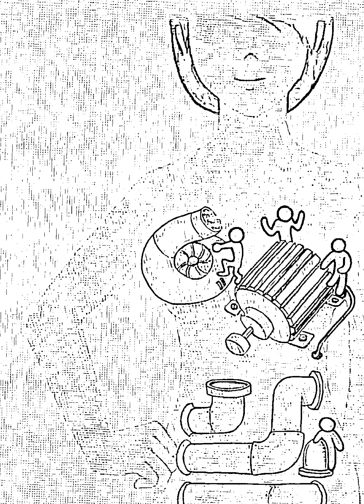

委托了自律神经系统来保护生命，透过它所找出最有效率的运作方式，让我们可以把宝贵的注意力挪开，让能量可以用在更精细的思考。自律神经系统是很忠实的受托者，就像一个好的管家一样，我们通常不会发现这个系统在运作，只有在生理失衡时，才会留意到它们的作用。比如膀胱储存的尿液满了，自然想上洗手间；身体立即可用的能量降低，自然想吃东西。也就是说，身体采用『异常管理』的逻辑来经营这整套系统。

## 04 先有哪个快乐？是身，还是脑？

这个问题，拿来问任何人，可能第一反应都认为——应该是脑的心情快乐，带动身体的快乐。毕竟，一般都认为是脑带动一切，而快乐又是个脑神经的反应。

然而，这个问题不是那么简单可以一笔带过的。

快乐，离不开身体的直觉。许多社会心理学的实验已经指出，遇到一个陌生人，喜欢或不喜欢，都有一个身体直觉的部份。就像中国人会说顺不顺眼，外国人的说法是要看 gut feeling，也就是肠道的感觉。透过这些身体的直觉，决定了我们快不快乐，要靠近某个人，还是躲开。

不只对人会有这些反应，就连鉴赏艺术品或建筑物、听到音乐或歌曲，身体也有类似的直觉反应来表达喜欢或不喜欢。只是我们总觉得这些身体的直觉“不合理”，要不略过这些反应，要不就是事后再用理性来解释自己的感觉。

看来，我们对“合理”或“理性”的依赖，不见得像自己以为的那么理性。

举例来说，我们有时和朋友争辩，也许是社会伦理的层面，或价值观的层面，而我们在争辩时，早就有一个看法或立场。然而，在争辩的时候，双方都会诉诸理性，希望能合理化自己的立场，好让对方接受。最方的表现又退回原点。理性的功用再怎么发挥，似乎还是驾驭不了这些“不合理”的选择。

有意思的是，争辩下来，有时看似说服了对方或被对方说服，仿佛达成了共识。但是，不需要多久时间，双方

回到感受和心情，每个人都一个表面看来“不合理”的层面。人会莫名其妙地快乐，莫名其妙地悲伤，不知道为什么就哭了或笑了……种种不合理的情绪。从人类演化的角度来谈，这种直接的反应，很可能是为了达到物种生存的目的而保留下来。有了这些“不合理”的反应，遇到危机时，不用花费时间在冗长的思考。可以说，遇到危机时，脑和身心是一体的，没办法区分出身体的反应在前或是在后，它们本来就是一体。其实，本来就是如此，只是一般的情况不那么明显，我们不会随时体会到。

前面也提过快乐是生命的振动，是生命场，也是螺旋场。用“场”的角度来解释，这些看似“不合理”的感受和心情，却是生命和生命之间的共鸣，是再合理不过的了。只要我们和某一个人或某一件事产生共振，也自然带来快乐。

多年来，我描述身心结构时，都用一体或合一来表达。也就是说身心是一体两面：脑，有身体的层面；身体的反应，也有脑意识的层面。两者密不可分，也从来没有分开过。

相信你开始明白，表面看来“不合理”的感受和心情其实是很科学、很合理的，也是我们每个人都有的反应。

## 05 透过感觉，打开身心的连接

任何感受，不光是快乐，都有身体和脑的成分，而这两者是分不开的，就连味觉也是一样的。虽然人类的舌头上有上千种味蕾，而人类饮食的种类也远比其他物种更多元丰富，然而，万种滋味还是可以分成甜咸酸苦和鲜这五种。鲜，这个滋味和麸胺酸这种胺基酸是相关的。最奇妙的是，虽然就五个滋味，它们彼此排列组合，就有无穷无尽的变化。小孩子都爱吃番茄酱，也是这里头有种种滋味的组合，唯独没有苦味。

很有意思的是，除了这五种滋味，科学家还正在寻找让人类尝得出油脂、淀粉、气泡水和啤酒、钙和水的味觉受体，希望可以解释人对这类食物的热爱。

我们都有过经验，一旦某个东西让我们吃坏了肚子或生病，会有好长一阵子，一看到同一种食物就反胃，这种厌恶感甚至会波及类似的事物。从演化来解释，这是一种保护人类免于再次吃下让自己生病甚至中毒的食物的机制。

嗅觉也会影响味觉，甚至比味觉更强烈。我们一般感冒鼻塞时，也尝不出味道。嗅觉神经直接把讯息送到前脑，只要回想母亲所做的饭，就能让脑部释放大量的脑内啡和其他分子，带来好多记忆和满满的感情。

从这个例子可以看出，味觉不光是味蕾的物理化学的刺激，还受到嗅觉的影响，更受到过去记忆的渲染。一个简单的觉受，本身既是感官资讯的门户，同时也衔接脑的诠释。

## 05 没有身体相应，身心不能快乐

或许你听到这句话会很惊讶——排斥或否定身体，也就没办法得到身心的快乐。

虽然前一章已经提到同样的概念，现在读到这句话，你或许还是会很惊讶——快乐不就是快乐吗？快乐明明是脑的产物，没有身体的感受，难道就不能快乐吗？

不可否认的是，我们常用种种身体的感受来表达心情，像是英语里的“胃里好像有蝴蝶（having butterflies in the stomach）”来表达紧张，“冷脚（cold feet）”或中文的“胆小”则是畏缩的意思，至于“心碎（broken heart）”就更不用说了。这些心情，真的跟器官有关系吗？是不是我们的身体也同步反映了心情的改变？

美国科学院的期刊，刊登了一篇由芬兰的科学家进行的研究。他们找了两群人，一群人在西欧（芬兰和瑞典），另一群人在东亚（台湾），请他们各自描述不同心情状态下，身体哪个部位比较活跃或比较不活跃。很有意思的是，这两群人所描述的身体反应是类似的，就像下一页这张图所显示的一样。

科学最了不起的进展在于，就连“先有身体的感受？还是大脑的心情？”这个问题，都做了探讨和解答。前面提到，感受和心情，是分别站在身心两个层面的反应。脑部得到身体的信号之后，才能体验到快乐或哀伤等种种情绪。当我们害怕时，身体自然有一些典型的征兆，像是心跳加速、脸色苍白、肌肉也开始紧缩。然而，这些反应是无意识的，脑部只有在从身体得到这些信号后，才会“知道”自己害怕。身体的反应是身体透过内分泌和自律神经系统直接的反应，而这个反应是在头脑还不知道时，就自动发生了。如果没有神经，那么，脑生理的反应回馈给脑，

> 31 Nummenmaa, L., Glerean, E., Hari, R., & Hietanen, J. K. (2014). Bodily maps of emotions. Proceedings of the National Academy of Sciences of the U.S.A., 111(2), 646-651.

## 不同情绪，活化或压制身体不同部位

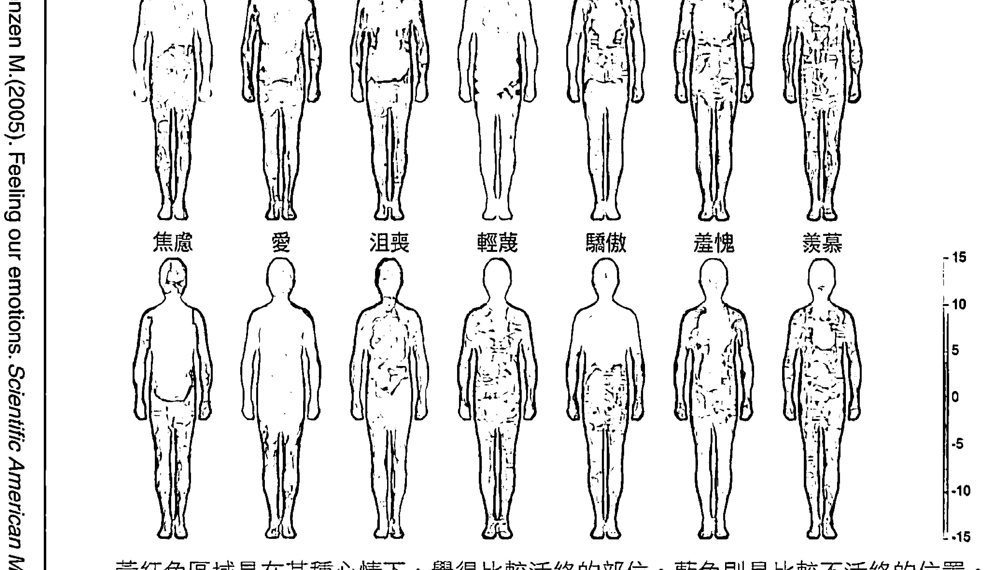

黄红色区域是在某种心情下，觉得比较活络的部位。蓝色则是比较不活络的位置。科学家调查了各种心情状态下，人所体会到的身体感受。从愤怒、恐惧、嫌恶、快乐、悲伤、惊讶、中性、焦虑、爱、沮丧、轻蔑、骄傲、羞愧和羡慕，相信这些感受每个人都有过。我们也可以把这样的一张图作为一种陪伴自己觉察的工具，体会看看，自己在不同心情下，身体哪里有特殊的感觉？是紧绷冰冷？刺痛激动？还是放松暖和？

> 经《美国科学院期刊》同意，重制并翻译自 “Nummenmaa, L., Glerean, E., Hari, R., & Hietanen, J. K. (2014). Bodily maps of emotions. Proceedings of the National Academy of Sciences of the U. S. A., 111(2), 646-651.”

既不知道有这个反应，也不知道透过这个反应所发生的“冷”的感受。
有些心情可以光凭脑部的作用形成，像是内疚、罪恶感或孤单，大多数的心情却似乎是因着身体先对环境刺激产生反应，才能被脑部所知觉、所认识。也就是说，脑要“知道”身体哪个部位有快乐或不快乐的感受，它才能生出相应的心情。
身体的感受，是脑得到快乐与否的结论所需要的素材。
一般认为，直觉是透过经验累积的。我们看到一个人假笑，自然有灵感知道那不真实。然而，我们可以从自己的身体读到许多讯息，知道对一个人是喜欢还是讨厌。
这个反应的速度相当快，快到我们意识不到，不可能是透过理性的路径来决定的。然而，这种直觉也不是什么超能力，而是每个人都有的，是一种落在身体上的聪明。
就我个人来看，即使过去的经验有影响，这种直觉也不完全是由过去经验所组合的，而是来自每个人，都有的内在的聪明。而且这一聪明远大于逻辑和理性带来的聪明，任何逻辑和理性带来的聪明，反而是局限。
我在过去的作品都提过这个观点，这本书也会接着讨论这一点和快乐的关系。
如果我们回想自己一生快乐或哀伤的记忆，科学家透过脑部影像的追踪技术已经发现，是脑干的信号先活跃起来，进入中脑，然后小脑也活络起来，同时这个信号走到间脑（diencephalon），最后才跑到皮质去活

33 Damasio, A. R., Grabowski, T. J., Bechara, A., Damasio, H., Ponto, L. L., Parvizi, J., & Hichwa, R. D. (2000). Subcortical and cortical brain activity during the feeling of self-generated emotions. Nature Neuroscience, 3(10), 1049-1056.

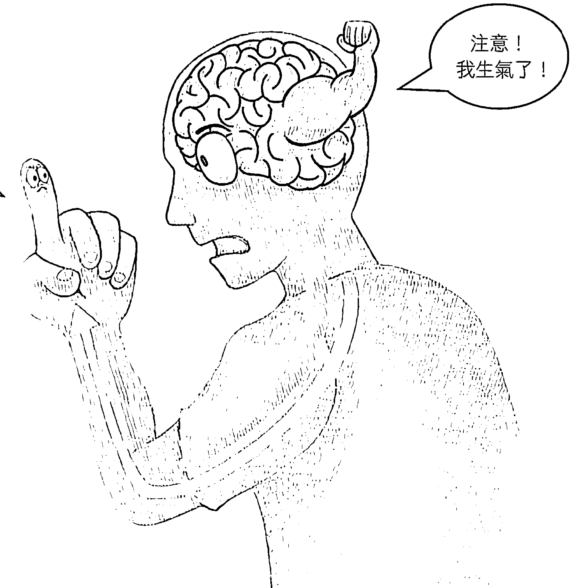

很有意思的是，科學家在研究細胞膜上的訊息處理受體時，發現同樣的神經元受體在生物體內大多數細胞上都有，和腦細胞一樣可以接受特定的訊息分子。美國國立衛生研究院和喬治城大學醫學中心的神經藥理學家柏特博士（Candace Pert），被人稱為「神經心理免疫學之母」（mother of neuropsychoimmunology）。她以此提出「身體就是潛意識的心靈」的看法³⁴。可以說，「聰明」並不只是神經細胞。

大腦和身體對應的部份必須活起來，一個人才能感到快樂。無論歡喜、痛苦，首先身體知覺的腦區要先產生訊號，才會得到腦所能知覺、理解、知道的心情。可見身體確實有它的聰明和反應，而身體的感受和腦的想像與心情是可以區隔的。身體和腦的交流沒有中斷過，在某個範圍內如果身體對某個刺激的反應疲乏了，透過腦的回想和想像，是可以恢復的。甚至有些學習，只需要透過回憶或幻想，就能模擬真實的情況，不見得要去經歷刺激。然而，這種透過腦刻意造出來的經驗，都有範圍和程度的限制，難以取代身體的具象體會。

## 練習微笑，帶來好心情？

談感受得到的快樂，隨時落在身體，這一點也不過分。

我們到每一個角落，都會聽到這樣的提醒——微笑，帶來好心情。童子軍的創始人貝登堡先生（Robert Baden-Powell）如此提倡，我們也從小被這麼耳提面命，甚至以此教育下一代。我常跑到公園，看到很多人 在練習笑，有時一聽就是刻意的假笑。在這裡要問的問題是：笑，甚至假笑，是不是真能帶來好心情。 相信你還記得，艾克曼歸納過人類的笑容有十九種，其中只有一種是真正發自內心的笑容。那麼，如果我們的臉部肌肉做出和真正的笑完全相應的動作，能不能帶來快樂？沒錯，只有這種真實的笑容，才能帶來 真正快樂的感覺。假如一個人可以精確模擬真正笑容的每一條肌肉的動作，是不是可以把快樂的訊號回傳給 大腦，而讓我們有快樂的心情？

> > 柏特（Candace Pert, 1946－2013）發現某些短小的胜肽（包括腦內啡和內生性大麻衍生物（endocannabinoids））在生物體內負責傳遞訊息，這些胜肽可以遍布全身，而與它們相對應的受體也一樣遍布全身，而可以同時影響頭腦、情緒、免疫系統、消化系統和其他生理功能。她不僅被稱為神經心理免疫學之母，也寫了《走出宮殿的女科學家》（Molecules of Emotions）談這一方面的全新見解。這些觀點，是傳統只鎖定單一功能和系統去研究的科學家連想都不會去想的。

這個問題艾克曼也做了一個解答，他教研究對象操作眼輪匝肌和顴肌，越能熟練模擬真笑肌肉運動的人，在腦部所產生的訊號，和一個人真正快樂的位置是完全一樣的。甚至，同一批受試者也說，這麼練習之後，不知道怎麼回事，也就自然有了好心情。³⁵

懂了這些，我們也可以把這個現象當作解開快樂的秘訣。

我在《真原醫》提到的定格練習（freeze frame）和感恩（謝謝！）的功課，或在演講中帶領的笑、打呵欠，舌抵上顎³⁶，都可以調整自律神經系統和情緒腦，擴大放鬆的反應，自然讓我們舒暢快樂。

常常這麼練習，腦中自然產生一組新的迴路。我在《靜坐》也提到要改變習氣，從來不是去對抗舊的習氣，而是建立一個新的習慣。從制約的角度來說，人類的大腦是可以訓練、可以制約的，甚至還可以學會快樂。科學和種種技術早已等著你，只要會用，就能快樂。

然而，要找回快樂——我指的是無條件的快樂、徹底的快樂，遠遠大於前面談的受身體制約的快樂，這本書真正要傳達的方式更為簡單。

> Ekman, P., & Davidson, R. J. (1993). Voluntary smiling changes regional brain activity. Psychological Science, 4(5), 342-345.

> 《静坐的科学、医学与心灵之旅》第二章〈对静坐的期待〉。

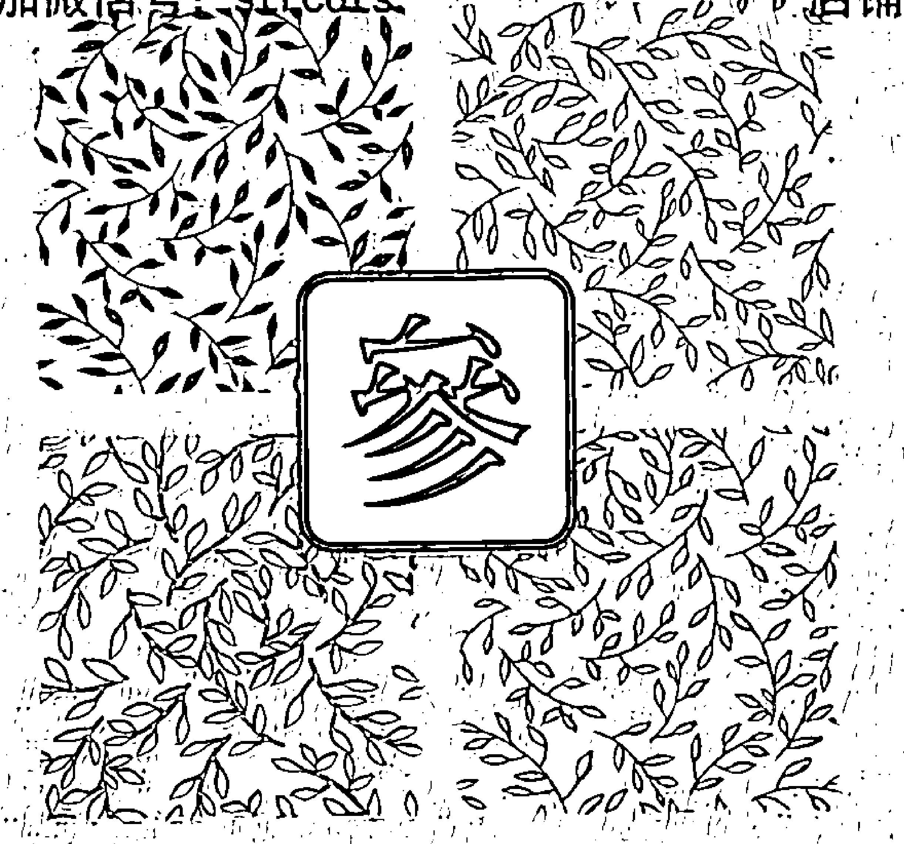

## 心情，帮助我们生存

## 01 快樂是演化頒給生存的獎品

生存是每個生物都有的反應，例如蝸牛遇到火，馬上就縮起來。這種原始的反射（primal reflex）在演化中很早就存在，甚至還沒有演化出複雜神經系統的阿米巴原蟲也一樣，自然向著營養的方向前進，躲開有毒的環境（趨化性 chemotaxis）。離苦得樂，在大自然中是可以幫助生存的本能。

也就是說，就連情緒都是符合生存的反應，尤其快樂。有趣的是，快樂不是單一腦區的產物。不光是大腦可以影響快樂，就連中腦、小腦對快樂都有直接的影響。

保羅·麥克連（Paul D. MacLean, 1913-2007）提出一個很有意思的理論，將大腦的發生從演化的角度分成三個階段 ³⁷。他的理論成為人類情緒腦的重要研究基礎，也被新的研究成果不斷補充。

最早出現的腦，又稱為爬蟲類腦，然後是古生哺乳類腦，最後才是所謂的新哺乳類的腦（包括人類的腦）。

爬蟲類腦是最古老的，大概在三億年前發展出來。這個腦，人類和任何動物（甚至恐龍、鱷魚、蛇）都一樣的，相當於我們的腦幹以及位於腦幹後面的小腦。它的功能是維繫與生存最直接相關的代謝、消化、呼吸、心跳以及動作的平衡。這個位置不光影響到肌肉的動作，還影響到我們的姿勢。它本身就可以產生情緒。

³⁷ MacLean, P. D. (1970). The triune brain, emotion, and scientific bias. The Neurosciences: Second study program, 336-349.

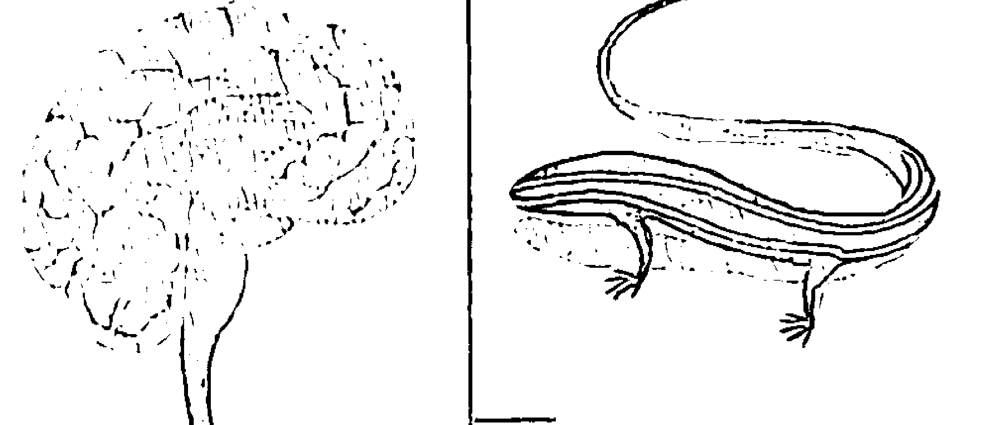

## 爬蟲類腦的遺跡

在打架時更有機會得勝，只要勝利，就有利於生存。即使一隻小蜥蜴，都有恐懼和憤怒，
可以學會避開某些刺激。可以想見，這些和生存直接相關的情緒和行為還是很原始的。

更有趣的是，就連這麼原始的反應，也可以變化出複雜的形式。豬鼻蛇（Heterodon nasicus）可以長到一公尺多，受到驚嚇或打擾時，會先發出嘶嘶聲，高高卷起尾部。如果這
樣還沒有嚇退敵人，在一番激烈扭動後，就會全身癱軟，嘴開得大大的，舌
頭伸長掛在外頭，就好像死了一樣。如果這時把蛇翻過來，它還會自己翻
正，趕快把脆弱的腹部藏起來。許多蛇都有類似的裝死行為。

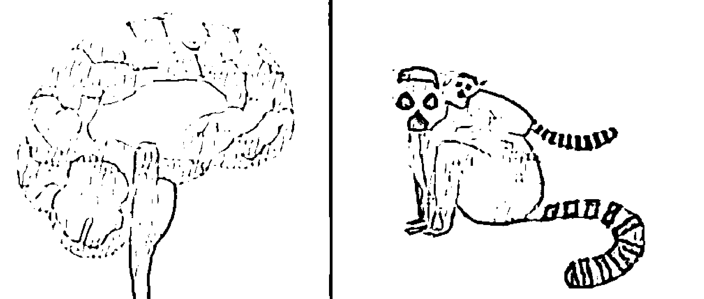

## 古生哺乳類腦的遺跡

直到古生哺乳類出現，大概兩億年前，中腦才發生出來，出現了杏仁核
和海馬迴。這個部分讓情緒更為發達。有了海馬迴，我們可以記得
某個事件的來龍去脈，而有了杏仁核，我們對這個經過可以有情緒
反應。不光是恐懼和憤怒，也包括高興、快樂的正面情緒。

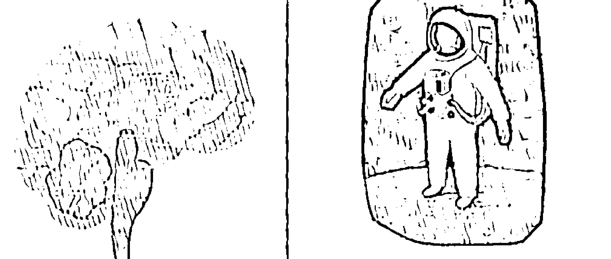

## 新哺乳類的腦

的反射，主要和生存的警戒
反應有關，也影響醒—睡週
期。
腦幹不光是可以產生
一些基本的負面情緒，還可
以產生愉悅和興奮的感受，
兩者都和生存有關。例如性
的興奮感讓物種能繁衍下一
代，再比如憤怒能讓肌肉緊
繃，臨場發揮最大的作用，

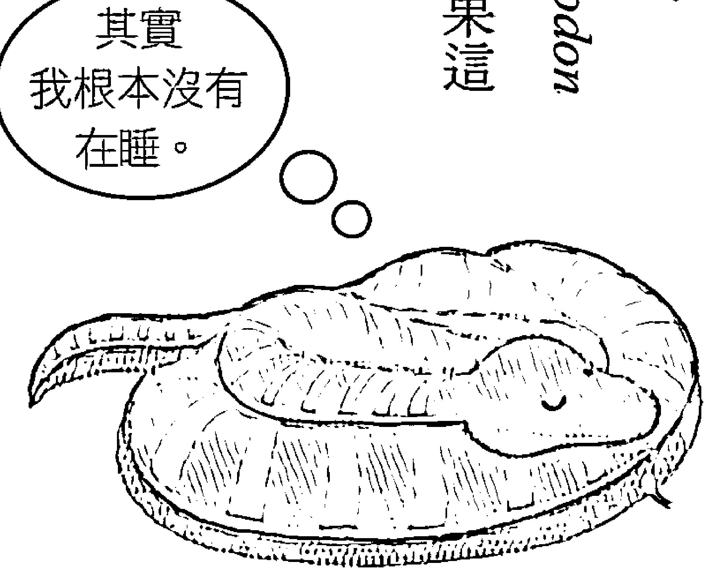

其實
我根本沒有
在睡。

## 與海馬迴的結構

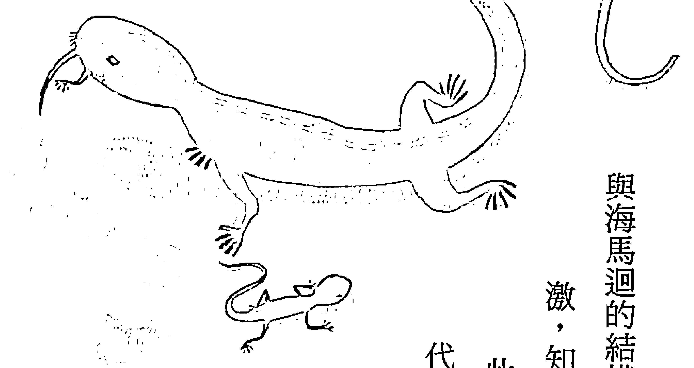

與海馬迴的結構的情緒的記憶和時空的架構就開始發達起來，讓物種能更細緻地區分環境的刺激，知道哪些是友善的，哪些是需要避開的。這些線索當然能幫助我們生存。

此外，哺乳類是胎生，自然演變出一個豐富完整的情緒系統，生出餵養、繁衍下一代有關的動機和情緒。不光伴侶之間有感情，親代也更願意照顧子代。就連兇惡的狼，都會保護幼狼長達幾年。

一般來說，哺乳類動物照顧子代的時間是最長的，除了哺乳之外，還要教會子代各種重要的生存技巧。比如說，沙漠裡的狐獴會教小狐獴怎麼處理蠍子這種有毒的食物，包括仔細除掉蠍子身上的刺。在其中，人類照顧子代所花的時間又是最長的。我們出生後至少要十幾歲才能獨立生活。在比較發達的社會，許多人更是二、三十歲之後才能獨立。

最後發生的腦，大概是六千萬年前演化出來的新哺乳類的腦。這個一新腦佔了整體大腦的九〇%。是人類和靈長類、海豚、鯨魚所共通的。我們從下一頁的圖可以看出來，人類新演化出來的腦不僅更大，可以處理訊息的表面積更廣，也更厚。此外，相對於舊腦只有三到五層神經細胞，新腦是由六層神經細胞組合起來的。新腦有一個特別的區域——前額葉（左頁圖中淺棕色的地方，在我們額頭的位置），是儲存短期記憶的地方。

以人類來說，不光是前額葉變得比較大、比較發達，同時也有更多通往其他腦區的神經連結，而得以發

> 杏仁核與海馬迴周邊的構造，統合稱為邊緣系統，被認為這是主導情緒的腦區。我在下一章會多介紹一些。

展現出更複雜的認知和情緒表達。除了人類之外，大象會陪伴在臨死同伴身旁，海豚會因為失去孩子而哀傷。幼小的黑猩猩在母親死亡後，還會難過到病倒甚至死亡。

除了感情之外，最新演化出來的腦，讓生物可以事先規劃、預期，將訊息透過群體的彼此聯繫而擴展開來。例如，獼猴是一種彼此互動很密切的群居動物，日本有一隻母猴在吃東西前，會到水邊清洗，幾年後，整群猴子都學會了這個吃東西前先清洗的行為。

更進一步，語言的媒介和對概念的抽象思考，也是這麼生出來的。珍古德（Jane Goodall）觀察到黑猩猩會用手勢彼此溝通。還有一隻大猩猩可可（Koko）甚至在史丹佛大學的科學家教導下，能用至少一千一百個手語單字來表達自己的需要和感情。

這些高等的物種，不光是懂得更微細的快樂，甚至發展出利他的慈悲心。最有趣的的是，慈悲，也就是從小我到大我的觀念，不是人類所獨有，靈長類、海豚和鯨魚也都有。

二十世紀初期的精神醫學，曾經採用前額葉斷開術（lobotomy），也就是切除前額葉與腦部的連結）來治療精神病患。這個技術甚至在一九四九年獲得了諾貝爾獎。到一九五○年代，光是美國就大約有四到五萬例這樣的手術。電影《飛越杜鵑窩》裡由傑克·尼克森（Jack Nicholson）所主演的墨菲本來是一個充滿活力的人，因為反抗精神病院的管理，被迫接受這個手術而失去了情緒和反應。用一般人的說法，墨菲這個「人」已經消失了。

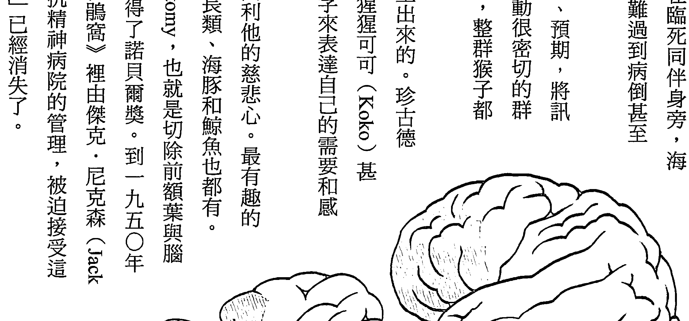

可以這麼說，透過前額葉這個腦區，人開始發展出「我」的觀念，也就是自我形相。在腦部的作用下，化出一個虛的世界，我稱之為「念相」（thought-form）。然而，對大腦而言，那卻是再真實不過了。透過大腦皮質建立的念相世界，我們會煩惱、看故事會有感觸、看電影會入戲、看球賽會興奮大叫，而得到種種不同層面的快樂。人類的情緒透過這樣的演變，變得更複雜、更微妙也更凝固、具體。只是，不管再怎麼發展，總還有一部分是最原始的，離不開腦幹和小腦，和所有動物沒有兩樣。而這些最原始的情緒，不管是慾望、恐懼、憤怒，構成了我們生存的基調，潛藏在所有情緒感受的最深層，甚至可以影響到大腦帶來的任何情緒。

## 02 情緒提供生存的快捷線索

神經科學家達馬修（Antonio Damasio）是一位很有意思的科學家。他的太太哈娜（Hanna Damasio）也是很優秀的神經影像學家，兩人在美國中部的愛荷華大學醫學院一起做了三十年的研究，後來到南加大主持「腦與創意研究所」（Brain and Creativity Institute）。

科學家一般都把寫作的精力投注在專業文章上，主要的交流對象是同行的專業人士。達馬修除了寫期刊論文之外，還寫了四本科普書，想將他的研究與思想和大眾分享，其中，《笛卡兒的謬誤》（Descartes, Error）與《意識究竟從何而來？》（Self Comes to Mind），光是書名就反映了他對哲學和意識的興趣，而且想透過神經科學的研究去解答。³⁹

笛卡兒是西方近三百年的大哲學家，他的名言「我思，故我在」（I think therefore I am.）認為思考才帶來存在。這句話再進一步，也就是一個人的存在，繫於他思考多久。換句話說，如果不思考，一個人就等於不存在了。

這種說法自然影響西方這幾百年來強調分別的理性思維，認為只有思考才代表一切，等於是把腦的運作當作全部的真實。和笛卡兒不同，東方的哲學則認為腦的作用，只是我們整體的一部份，不能完全代表生

³⁹ 達馬修遷與作曲家布魯斯·阿道爾夫（Bruce Adolphe）合作，將《意識究竟從何而來？》改編成音樂作品，由大提琴家馬友友與兩位打擊樂者合作，二〇〇九年五月，在紐約曼哈頓的美國自然史博物館LeFrak Theater演出。美國自然史博物館是電影《博物館驚魂夜》的故事背景。

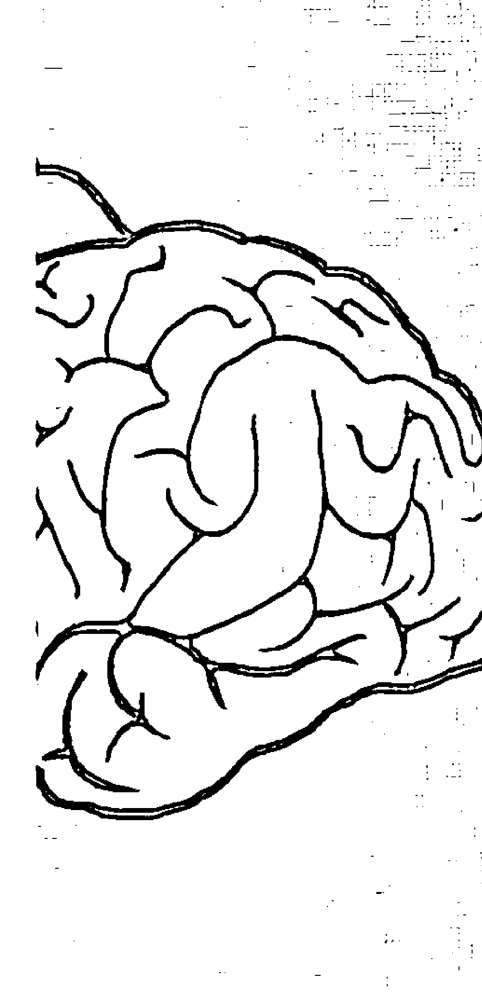

命的全部。甚至，沒有思考，真實的生命也依然存在。這也就是我在《全部的你》和《神聖的你》所想要探討的。

笛卡兒不光是把思考當作真實，他對思考的強調，自然會受到腦帶來的二元對立的限制，包括造出情感和理智的對立——這一點，正是達馬修要駁斥的。達馬修想證明不光是理性的思考重要，情緒的層面也不可或缺。情緒甚至會影響一個人對世界、對別人的判斷，才用《笛卡兒的謬誤》當書名。他要表達的也就——情緒和思考是一體兩面而不是對立的。所以，笛卡兒錯了。

然而，我在這本《不合理的快樂》想要表達的則是——思考和情緒本身還只代表了整體真實中很小的一部份。透過思考和情緒，就是對生命得到了一點理解，也還是不能讓我們得到長期的快樂。真實的快樂，是從這兩個層面跳出來。如果你理解了人類為了追求快樂付出過多少努力，相信你讀完這本書會體認到——真正的快樂，其實比任何人想的都簡單。

回來談情緒的重要性，我要介紹達馬修的一位患者艾利略（Elliot）的故事。艾利略原本是一個事業成功的律師，也是大家眼中的模範父親與丈夫。然而，在切除腫瘤而致使腹內側額葉（ventromedial frontal lobe）受損之後，這樣的人生就已經離他遠去了。

接下來從腦科學的層面切入，難免會提到一些解剖的專有名詞。讀到這些名詞，萎縮是再正常不過的反應，就連專家也是一樣。

好消息是，上一章你已經知道前額葉的大致位置和功能。

手術沒有影響艾利略的高智商，只是讓他失去了動機，到後來婚姻破裂，創業也屢屢失敗。達馬修發現艾利略無論面對什麼狀況，都不帶感情。就連提到自己的不順，也沒有一點悲哀、不耐或沮喪，好像在談不相干的人的事情似的。

此外，手術後一個很明顯的差異就是，艾利略做不了任何決定，大小事都一樣。約時間要考慮三十分鐘，找吃午餐的地點要耗掉一整個下午，就連選哪個顏色的筆來填表單都要列出所有可能的後果。沒有情緒，甚至連作決定的能力也癱瘓了。

情緒是訊號的放大器，是腦神經與細胞溝通的橋梁，也是記憶很重要的元素。基於這些特點，情緒對我們對事情的判斷有最直接的影響。倘若一個人像艾利略一樣沒有情緒，儘管依舊可以掌握很多細節，也無法排出優先順序。⁴⁰

> > ⁴⁰ Damásio, A. R. (1994). Descartes' Error. New York: Putnam.

可以這麼說，理性的決定，缺不了情緒的指引。

然而，這句話聽起來相當奇怪，和一般的認知不太一樣。通常，一般人會覺得理性和感情是相互排斥的。一個人處事沒有章法，我們會說他太情緒化。社會大眾也推崇能好好控制情緒（或者看來沒有情緒）的

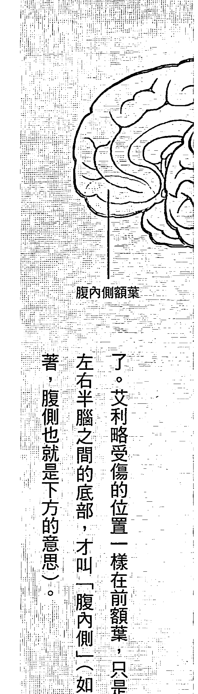

人，認為這種人比較明智而可以信賴。然而，從艾利略的情況來看，再怎麼周密的思考，沒有了情緒好惡的過濾，無法化為決定，也等於失去了作用。

情緒等於是一套依著每個人一生經歷和氣質量身訂做的濾片，讓我們能在情緒好惡的導引下，對資訊很快排序和區隔，才能快速掌握情況，找出一條解決問題的捷徑。從決策的效率來看，一個情緒抵得過一千個念頭。

情緒不只是影響理性決策的效率而已，甚至還影響一個人的社會與道德判斷。

和艾利略一樣有腹內側額葉腦傷的患者，對各種會引發一般人憤怒、羞愧、同情心的情境，只有一點點情緒反應。尷尬的場合不會引發他們犯錯的感覺，於是說話總是得罪別人，自己也不知道。然而，他們的智力相當正常，甚至還高於一般人。達馬修也發現，這樣的病患更容易做出異常的道德判斷，例如覺得為了拯救一群人而犧牲自己的孩子，也沒什麼大不了。

此外，一般人會覺得犯罪意圖也是惡意，然而腹內側額葉受傷的人，對於有意犯罪的人似乎更寬宏大量，覺得沒有真正犯罪就算了。

可以說，少了情緒，非但好像少了人味，就連爭取生存都可能出現風險。

這裡有必要補充一下，這是從行為觀察得到的推論。腦部的構造相當細緻，手術影響的可能不只腹內側

> ⁴¹ Koenigs, M., Young, L., Adolphs, R., Tranel, D., Cushman, F., Hauser, M., & Damasio, A. (2007). Damage to ventromedial prefrontal cortex increases utilitarian moral judgements. Nature, 446(7138), 908-911.
⁴² Young, L., Bechara, A., Tranel, D., Damasio, H., Hauser, M., & Damasio, A. (2010). Damage to ventromedial prefrontal cortex impairs judgment of harmful intent. Neuron, 65(6), 845-851.

額葉，而腹內側額葉也可能涉及許多複雜的功能，不能由此就推論腹內側額葉的功能等同於情緒和做決定的能力。
再進一步講，透過情緒的濾片加上喜惡，我們看到的世界才有了各種情緒的色彩。也許快樂，也許悲觀。我過去的作品和演講常提到「情緒腦」，指的就是在腦部的過濾器。任何外界輸入的訊息，都要透過這個情緒腦的處理，才會往 上傳到負責認知的部份。而情緒腦，本身是面對生存所演化出來的，而比較容易擴大負面的刺激，甚至處理負面訊息的部位更發達。

## 情緒腦

講到情緒腦，過去也有人用邊緣系統 (limbic system) 來表達。相信你跟我一樣，看到這些詞，心頭就微微一縮。不用擔心，我在這本書會慢慢解釋。
邊緣系統是一組位於腦內、左右對稱的複雜構造。limbic 源自拉丁文 limbus，也就是邊界或邊緣的意思。座落在左右大腦和腦幹之間邊線上的腦組織，也就是邊緣系統。如果用現代人的生活來比喻，邊緣系統就像大城和小城之間的郊區地帶。
現在有些研究情緒的學者認為邊緣系統不是一個單一系統。

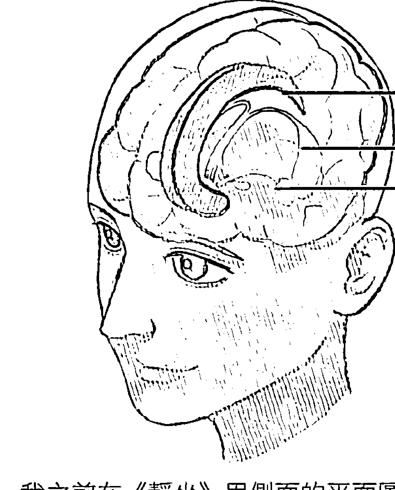

我之前在《靜坐》用側面的平面圖來表達邊緣系統，這張圖則透過立體的描繪，讓你更能體會到邊緣系統在腦部大約的相對位置。

的結構，不能輕易將邊緣系統和情緒腦畫上等號。情緒和所引發的行為不是由單一個部位掌控，而是腦的各部位協同作用的產物。邊緣系統就是一個例子。

或許你還記得，我在《靜坐》就提過杏仁核（amygdala）。古英語的 amygdal 就是杏仁 almond 的意思。杏仁核是邊緣系統中一個長得像杏仁的構造，由神經聚集而成，在海馬迴的尾端膨起。而海馬迴（hippocampus），源自希臘文的 hippókampos，hippos 是馬，而 kámmos 指的則是海中的怪物。我們看這個詞，就可以推想當初海馬迴也是以外型類似海馬而命名的。海馬迴主要是和認知功能有關，例如記憶和空間感。

沒錯，邊緣系統的杏仁核是情緒處理的主角。它處理的是攻擊性、焦慮、憤怒和嫌惡感，同時也產生恐懼。而恐懼是生存最原始的本能，不知道恐懼的物種，大概也無法存活至今。如果把老鼠的杏仁核拿掉，牠們會變得天不怕地不怕，不只會靠近睡著的貓，甚至還去啃貓的耳朵。44

杏仁核影響取出的記憶，是被情緒（尤其恐懼）所渲染過的。杏仁核為什麼那麼大？這是神經聚集的地方，也就是腦部需要密集處理訊息的所在。可以想像，越能調動和恐懼相關的記憶和經驗，對於一個生物而言，杏仁核不只是處理恐懼，還影響相關記憶的強度。很有意思的是，杏仁核與海馬迴相當接近，我們可以從神經傳導路徑的角度推論，透過杏仁核過濾的情緒，等於就是調動記憶的通關密碼。海馬迴不直接處理情緒，所掌管的記憶既受情緒的影響，反過來也由這些記憶去強化情緒的結果。

43 LeDoux, J. E. (2012). Evolution of human emotion: a view through fear. Progress in Brain Research, 195, 431-442.
44 Barinaga, M. (1992). How scary things get that way. Science, 258, 887-888.

### 恐懼與萎縮

言，也就更有利於它從下一次的危險中存活下來。 邊緣系統的其他構造，還包括了掌管嗅覺的嗅球（olfactory bulbs）、調控自律神經和內分泌的下視丘（hypothalamus），影響動機與行為的扣帶皮質（cingulate cortex，cingulate 是拉丁文的「腰帶」，就像一條帶子把邊緣系統扣起來）都和情緒反應有密切的相關。

從演化史的角度來看，在動物的階段，生存是第一要務，而環境隨時都有危機、飢餓或威脅發生。一般 是透過負面的情緒來警告，我們要很快妥當處理才能保命。也正因為如此，人類對負面訊息的反應自然更為激烈，腦和神經架構都是這麼設定的。恐懼帶來的危機訊號，對肉體的生存最為緊急。

正因如此，我們很容易受到負面念頭和情緒的渲染而顯得灰暗，才說情緒和念頭帶來生命的萎縮。

我在前面兩本書都談過萎縮是怎麼帶來錯覺，讓人透過一個悲觀的鏡片在看生命，而帶來不快樂。直覺 雖然很重要，如果是落在一個情緒萎縮的狀態下產生，反而為我們帶來負面的反應和情緒反彈，造出自己和 別人一連串的不快樂。

既然任何周邊進入的訊號，都要透過情緒腦的過濾和加工，情緒腦自然影響我們對世界的看法。有時 候，外頭的情況不見得那麼糟，而是我們自身認知這個世界的模式，也就是對這個世界的看法有了偏差。 可惜的是，每一個人不斷受到恐懼的刺激，就自然活在恐懼當中，沒有安全感。就連新聞頭條都愛用負 面的表達來抓住我們的注意力，誘發更大的情緒反應。我們的情緒也自然隨時處於萎縮，甚至可以說，萎縮 體已經成為我們「正常」的狀態。

相對來說，恐懼一定帶來不快樂，或者至少——壓抑快樂。

當然，生存不只是靠負面情緒，也不是只靠避開危險才能完成，正向的情緒也參與其中。比如餓的時候，吃下東西自然帶來身體的快樂。性的歡愉，也讓物種願意繁衍下一代。別人的鼓勵，就會讓我們振奮起來，面對現實的挑戰。可以說，人體最佳的運作，更適合正向的制約。生命的方向是更接近正向的刺激，我們多半都在期待。而期待本身，並不等於快樂。甚至，期待落空了，還會失望。在人類文明發展的過程中，負面的訊息自然就取得了主導的地位，這是很可惜的。

你會發現，懂得怎麼掌控情緒，甚至怎麼管理負面的情緒，跳開情緒腦的影響，就是帶來快樂的一個秘方。只有觀察到自己的情緒，單純純地觀察，才是解開這個循環的鑰匙。可惜大多數的情緒反應發生太快，來不及掌握。

我接下來會多談一些腦部運作和處理情緒的方式，尤其是恐懼。希望這本書的科學層面能讓每一個人對情緒和快樂的性質多一些理解，對自己和別人的反應多一點耐心，踏踏實地從身心這個寶貴的資料庫，體會生命的快樂。

除了情緒腦的作用，我過去也很強調左右腦的差別。左腦是理性、邏輯腦，讓我們可以分析，建立時空架構的分別。沒有左腦，也沒有語言。它是一個線性的腦，所帶來的邏輯無論是歸納還是演繹就有一套先後順序，比較有一個整體的「場」的觀念。

不幸的是，人類的左右腦其實是失衡的。即使用慣用左手的人，大多數也還是左腦人。可以這麼說，現代人過度的理性、過度的分別。這一失衡，也帶來過度的煩惱和顧慮，而讓我們過度的不快樂。進一步講，左右腦的分別並不是重點，左右半腦本來就是有交流的。我們應該著重的，還是對稱。仔細觀察，人體的結構，包括邊緣系統也一樣，主要是對稱的。生理結構的對稱，反映的正是生命的對稱。偏向哪一邊，無論是過度理性，或太偏向交感神經系統，都自然讓我們離開均衡。

## 03 解開腦的恐懼迴路

我們的腦，透過兩種方式產生對恐懼的反應，一種是與生俱來的無意識的反應，面對危險，在千分之幾秒內就完成；另一種則是有意識而理性的，反應時間稍長一點，大概是十分之幾秒。這兩種反應，紐約大學的神經科學家勒杜（Joseph E. LeDoux）分別用下圖所示的「低路」（low road）和「高路」（high road）來表示。「高路」這個詞很有意思，一般在說 “take the high road”時，意思是要秉持著良心作正確的決定，哪怕那是一個很少人採取、不容易的決定。勒杜在這裡用高路代表「有意識而理性」的反應，也帶有一點這種意思。
想想，如果你一個人在暗巷裡摸黑走路，突然眼角瞥見一個大黑黑的物體，從地上竄出來。在能想到那可能是蛇、狗還是什麼之前，身體已經開始反應了，你會開始大叫，甚至馬上就跳開。接著，你才發現自己很僵硬，心跳加速，開始冒汗。
這時「低路」已經啟動了。眼睛接受到的不明訊號已經送到視丘（腦部訊息的轉運站），並立即轉給杏仁核，馬上和過去危險的訊號記憶做比對，傳送警訊給腦幹和海馬迴。你才感到心跳加快，血壓上升，汗腺開始工作。回來談情緒腦。首先，杏仁核帶來恐懼，再透過海馬迴，從危險的角度把過去「黑黑的，晚上」的記憶優先調動出來。你還沒有察覺到，它已經開始動作。這個指揮不經過邏輯思考，被認為是一個生存的本能反應。繞過了需要比較長時間來運作的理性前額葉。情緒腦和腦部其他部位是連貫的，它必須要在短時間內排出優先順序，才能做有益生存的決策。一般情況下，視覺和聽覺的訊息會傳到前額葉，與其他的感官資訊統合，再微妙地從海馬迴調動你小時和蛇有關的記憶。這個路徑比較耗時（十分之幾秒），讓我們能夠解釋眼前的威脅，並壓制住杏仁核的恐懼反應，至少不再僵住，可以趕快遠離這個不明物體。從演化的角度來說，恐懼反應是一個幫助人類快速辨認並遠離危險的機制。有些科學家甚至認為人類腦部的恐懼系統長時間演化下來，已經學會了害怕那些不利生存的刺激，像是蜘蛛、蛇或高處。這或許可以解釋為什麼很多人會怕蜘蛛，卻不害怕電，畢竟電是近代才出現的發明。危險的記憶，基本上是沿著杏仁核→前額葉→海馬迴一路形成的。恐懼記憶最棘手的地方，正是在於這些記憶通常很強烈，也很難抹去。由杏仁核→前額葉→海馬迴一路形成的。恐懼記憶最棘手的地方，正是在於這前，身體已經跟著萎縮、產生反應或反彈。通常講情緒（emotion）其實包含了兩個部份——心情（feeling）和感受（sensation）。前面提過腦的心情和身體的感受之間的關係，而從身體出來的感，會進一步讓腦的心情更堅實。要改變心情，等於要打破身體每一個細胞所造出來的迴路，那是相當不容易的。

近期的研究指出，恐懼記憶的形成和杏仁核、前額葉和海馬迴的神經可塑性有關45。我之後會再多談一點神經可塑性，這是大腦建立新迴路很重要的機制。有了這個機制，人類才有學習的可能，包括學會記得什麼是危險，學會如何避開。然而，這個過程同時也啟動了恐懼的制約反射（conditioned reflex），讓人再次遇到同一個危險時，會很快地產生強烈的恐懼反應。

在發現危險時，杏仁核跨過腦的理性反應，將我們的注意力緊緊栓在危險源上，而無法進行一般正常的運作，也無法統整或學習新資訊。就連實驗室的動物，透過一個嫌惡刺激搭配一個無關的環境訊息（比如很大的聲音），完成恐懼制約之後，光是出現這個很大的聲音，不需要出現那個可怕的東西，一樣會減少它們探索的好奇心，也不那麼和同伴互動了46。可以想像，重複出現的恐懼和壓力，帶來不安全和不確定感，甚至可能導致長期焦慮和憂鬱。

如果環境中並沒有真正的危險，比如一個人失眠躺在床上胡思亂想。明明是舒適溫暖的被窩，過去的種種恐懼和受挫的記憶，帶來的威脅卻和現實的蛇是一樣的，甚至還更逼真。我們也都有過這樣的經驗，輕鬆無比的散步，腦海卻不斷浮起種種人事的煩惱，而陷入沮喪萎縮的狀態。從腦生理的角度來說，即使沒有外在的具體威脅，杏仁核卻一直保持活躍，很可能就是憂鬱和焦慮的起因。科學家認為這或許是前額葉失去了抑制杏仁核恐懼反應的能力所致。

45 Tovote, P., Fadok, J. P., & Lüthi, A. (2015). Neuronal circuits for fear and anxiety. Nature Reviews Neuroscience, 16(6), 317-331.
46 Camp, R. M., Remus, J. L., Kalburgi, S. N., Porterfield, V. M., & Johnson, J. D. (2012). Fear conditioning can contribute to behavioral changes observed in a repeated stress model. Behavioural Brain Research, 233(2), 536-544.

這其實也說明了，要解開恐懼的迴路，也需要理性的協助。然而，這不是簡單的「你已經完美」、「我很快樂——這樣的一個正向念頭或一句正向的話就能夠完全解開。這是我們處理負面情緒都要面對的困難。額葉來不及壓抑杏仁核的恐懼，也就是沒有一個完整的路徑。針對這一點，我想建立一個完整的觀念，幫助每個人重新建立一套完整的神經迴路。只要想通了，就可以打通這個路徑，而讓腦的理性與感性能充分運作，帶來全面的快樂。

這個觀念，可以用上圖來說明。邊緣系統所建立的負面情緒所帶出的迴路，是相當強勢的，甚至蓋過了前額葉所帶來的理性壓抑。在很短時間就帶著腦、帶著我們整個人走，而讓人進入一個恐懼或萎縮的狀態，而且是全身都萎縮。假如我們在理性可以建立一個完整的系統，是腦能夠認同的新的神經迴路（new neural loop），可以對負面情緒踩一個剎車。透過練習，建立新的腦的迴路，也就是一種「洗腦」，幫助我們從不愉快和痛苦，走向快樂。怎麼做，是心理療癒最關鍵的訣竅，是我透過這本書想解答的。

這裡沿用《靜坐》的側面平面圖來表達邊緣系統，主要傳達邊緣系統迴路的強勢，以及我們可以透過前額葉的理性，建立一個新的主力迴路來解開負面情緒的循環。具體的方法，會在這本書後面提到。

## 04 快樂有很豐富的面貌

### 快樂的腦部地圖

身體的快樂、愉悅感是一種舒服的感受，而飲食、運動和性愛都可以帶來愉悅感。這是人類演化過程所保留下來的生存機制，透過愉悅的物種才願意一再重複這些存活所必需的行為。舉例來說，吃東西的時候，腦部帶來的愉悅，讓我們有動力繼續吃，而得到生存所需的能量。

人類後來還發展出與生存不那麼相關的愉悅感，有些滿足知性，有些純屬娛樂。我們在玩耍、聽音樂、看電影、欣賞藝術或閱讀文學作品時得到的，就是這一類的愉悅感受。

和其他情緒一樣，愉悅的感受出現在腦部的神經傳導分子和神經元的作用。神經元釋放出來的神經傳導分子，可以活化或抑制腦部特定區域的其他神經元，可以說是神經細胞之間彼此溝通的語言。神經傳導分子的釋放以及周邊神經元活性的調控，構成了愉悅感的產生機制。光是腦部就有幾十種與情緒有關的分子，不只和快樂有關，也和不快樂有關。

假如這些解釋還沒有把你嚇跑，接下來的研究或許會讓你昏了頭。每個人都喜歡解謎的遊戲，有些人光是玩九宮格裡擺九個數字的數獨，都可以玩上好半天。神經科學這一行也有自己專屬的解謎遊戲，看起來很嚴肅，但科學家透過不同的腦區和不同的神經傳導分子，一關關的破解，也就是在解開人類神經的謎題。

### 大腦的地圖

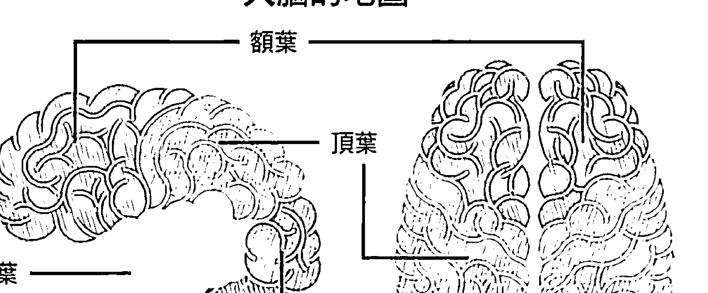

Vytal, K., & Hamann, S. (2010). Neuroimaging support for discrete neural correlates of basic emotions: a voxel-based meta-analysis. Journal of Cognitive Neuroscience, 22(12), 2864-2885.

很有意思的是，我在教書時，發現同樣是在讀枯燥的解剖學或生物化學，有些同學自然對這些術語「上癮」，成為解答這些謎題的專家。很多人看過《駭客任務》這部電影，畫面上不斷流動的數字，對一般人來說沒有意義。知道如何解碼的人，可能會解出金髮美女的訊息。專家，其實也就是這樣子。

有趣的是，腦部不光是用不同的分子來溝通不同的情緒，就連快樂和不快樂的情緒也分別生於腦部的不同部位。美國埃默里大學的科學家匯總了十六年的八十三個神經影像研究，發現快樂的感受主要發生在右顳上迴（right superior temporal gyrus）與左前腹側扣帶皮質（left rostral anterior cingulate cortex）的九個位點，而且與哀傷、憤怒、恐懼和嫌惡等情緒所活化的腦區都不同。47

我相信，光是看到「右顳上迴」、「左前腹側扣帶皮質」就夠嚇人了。假如你讀到這些，已經進入一個萎縮狀態，打算把書闔起來，這也是很自然的反應，不需要感到挫折。所有讀生物、醫學的人，都和你一樣有過這樣的萎縮狀態。他們甚至在考試前還要背下來，進入更大的萎縮，才能過關。

我以前教學喜歡用特別的記憶法，在這裡也很簡單。這些腦區的名稱，也只是研究腦的人所設計出來的一種地圖，就像航海圖或天象圖一樣，幫助探險的人明白自己要去的位置。

### 透過現代科技，看到腦的快樂

前一頁大腦的地圖，先把大腦分成左右兩半。兩個半球的構造是對稱的，只要知道左半，自然可以推出右半的樣子。兩個半球又依照它們的相對位置，劃分出四個區域，也就是四個腦葉（lobe）。

我們在想事情的時候，有時會不自覺的拍拍額頭。沒錯，額頭內的腦區，也就是額葉。額葉比較前端的位置，就是前面提過的前額葉，主要負責的正是認知和思考的功能。頭頂的正下方，則是頂葉，對應著來自身體的種種感覺。枕葉在後腦勺，也就是睡覺時靠著枕頭的地方，與眼睛距離最遠，負責處理來自眼睛的視覺訊息，就像眼睛經過了整個大腦的距離投影到最後方。頭部兩側靠近耳朵的是顳葉，「顳」這個字的三隻耳朵，就好像在描述顳葉對聽覺的重要性。

地圖總是會越畫越細緻，如果要更精確指定某個地方，還需要路、巷、弄這些資訊。腦科學家用「迴（gyrus）」這個字來表達，指的是大腦皮質皺褶突起的地方。

即使有了這樣的腦部地圖，如果你看過腦，就知道它是一大團充滿液體，很難分辨，又很脆弱的組織。

然而，現代科學家可以用各式各樣的技術，取得腦各個深度的影像，讓我們知道各種情緒在腦部發生的位置。解開腦部的奧秘，這方面的技術也很多次得到諾貝爾獎的肯定。

最早的影像技術，是一九○一年拿到諾貝爾物理獎的X光。不過，和腦科學比較相關的，則是後來的電腦斷層掃描（computed tomography，CT）。

電腦斷層掃描在一九七二年由郝殷斯費（Godfrey Newbold Hounsfield, 1919-2004）發明。你大概沒想到過，他研發的經費來源竟然和「披頭四」樂團有關。他在EMI工作，當初EMI除了唱片還有電腦部門，只是電腦部門不賺錢，兩邊剛分家，而電腦斷層掃描的研究，剛好還拿得到EMI的經費。可以說這是披頭四除了流行文化的影響之外，無心插柳留下的另一項「遺產」。這項技術在一九七九年就得到諾貝爾醫學獎。

後來在腦科學應用更廣的是兩個新技術：核磁共振影像（magnetic resonance imaging, MRI） 和正子造影（positron emission tomography, PET）。一九七三年，羅特博（Paul C. Lauterbur） 在著名的科學期刊《自然》（Nature）發表了一篇如何利用核磁共振現象來產生平面影像的論文。這篇論文原本被退稿，因為編輯覺得「沒有科學價值」。然而，這個小插曲損害不了核磁共振和醫學影像的重要性，許多科學家都認為他遲早會得諾貝爾獎。隔了三十年，到二〇〇三年，諾貝爾醫學獎終於同時頒給他和另一位物理學家。

48 核磁共振的研究在三個領域（物理、化學、醫學）獲得了六次諾貝爾獎，重要性可想而知。

MRI所獲得的圖像非常清晰精細，對醫師的診斷幫助很大。不需要開刀讓病人受苦，也不需要注射容易引發過敏的顯影劑，更不需要照射X光，就可以知道體內軟組織的變化。只是，MRI機器會施加強大的磁場，不適合體內有心律調節器或磁性金屬的病人。此外，在檢測的過程中，為了得到穩定的影像，病人要平躺，手腳頭部都被固定住，被送進一個長長的密閉腔室，如果病人不敢待在狹小密閉的空間（幽閉恐懼症），就不適合接受MRI掃描了。

然而，MRI所得的，從腦科學的研究來說，也還是一個靜態的腦部地圖，只是細節比較豐富，還無法具體告訴我們腦部在什麼時候發生了什麼事。這一點，還是要透過科學對神經細胞運作的理解來克服。

神經細胞的主要功能是訊息傳達，本身並不儲存所需的葡萄糖與氧氣。因此，只要神經細胞活化，就要透過血液立即補充能量。神經細胞活化的地方，會出現大量帶著氧的血紅素。帶著氧的血紅素是抗磁性的，而缺氧血紅素則是順磁性，兩者的比例變化就造成核磁共振訊號的差別。MRI 搜集這些訊號可以得知腦部的血流與氧氣消耗量值，呈現出不同腦區的活化程度。這就是後來發展出來的功能性核磁共振影像（functional，fMRI）。

後來的正子斷層掃描（PET）結合電腦斷層掃描，將帶有低放射性的葡萄糖注射入人體，來推知神經細胞的活化程度。在接受 PET 檢查前，必須禁食至少四小時，靜脈注射後再靜躺約一小時，讓這些葡萄糖在體內被利用，才進行大約三十分鐘的掃描。雖然要注射放射性物質，由於可以更直接觀察到消耗能量的神經活化位置，也運用相當廣泛。

### 快樂和各種情緒，在腦的不同區域

如果你讀完了以上的介紹，還記得我們想討論的是快樂和種種情緒在不同腦區的分布，那麼，可以回來這張由八十三個 fMRI 和 PET 腦部研究統整出來的圖了。從前面的介紹可以知道，這些腦部影像 is 累積了科技點點滴滴的發展而來。再加上影像統計的技術，甚至可以將來自不同人、不同大小的影像做整合，將很多表面上無法直接比較的研究數據統合起來，得到對每個情緒的理解。

總的來說，和快樂的情緒有關的腦區，在右顳上迴和左前腹側扣帶皮質。而哀傷的位置則在左側尾核頭、左側額葉中迴、右額下迴。憤怒在左額下迴與右海馬旁迴。恐懼則在兩側的杏仁核、右小腦和右側腦島。嫌惡出現在兩側的腦島。

相信你看到這些詞，會忍不住想閉上眼睛，希望自己只是在作夢。好消息是：不用擔心。你不需要記得## 不同情緒，出現在不同腦區

前面提過艾克曼提出的七種基本情緒，這裡列出其中五種（快樂、哀傷、憤怒、恐懼和嫌惡）在不同腦區活化的位置。每一排代表不同的情緒，從左邊開始的八個影像，各自是腦部不同深度的橫面圖，最右邊的影像則是縱剖面。顏色是神經活化的統計值，越紅的地方，代表這個情緒越常出現在這個腦區。

> 經 MIT Press Journals 同意，重製並翻譯自 “Vytal, K., & Hamann, S. (2010). Neuroimaging support for discrete neural correlates of basic emotions: a voxel-based meta-analysis. *Journal of Cognitive Neuroscience*, 22(12), 2864-2885.”

這些腦區的名字，只要記得一個重點：每種情緒都出現在腦部的不同地方。這個研究告訴我們，正向和負面的情緒其實不是互斥的。這兩大類情緒在腦的不同部位產生，甚至連相反的情緒，都可以同時存在。它們所使用的神經傳導分子也不是同一個。就像愉悅和疼痛不是對立，並不是不愉悅就等於疼痛，也不是不疼痛就會愉快。同樣的，滿足或感受到性的吸引，也不會覺得就不會恐懼或悲傷，這兩類感受同樣是在不同地方產生，透過不同的神經傳導分子來傳遞。我們通常所稱的快樂，帶著很多層面，可能是滿足，也可能是有動力，獎勵，而這每一個層面都在不同的部位產生。添上這些微妙的差異，自然會發現快樂是有種種面貌，就像每個人的不快樂也不盡相同。快樂和不快樂可以同時存在於不同的腦區，這個觀念表面上不太合理，卻相當重要。假如快樂對身心健康帶來那麼多幫助，我們大可讓快樂的感受隨時出來，而不會因為不快樂的感受存在，就快樂不了。演化的設計就是如此。不光身心的快樂、不快樂在不同的地方發出來，就連再微細一點的快樂，都可以在腦袋裡不同的位置發出來。

### 透過腦，體驗人間的喜怒哀樂

我過去常用彩虹的比喻，來描述一種狀態不是單一的，而是濃淡有別、帶有各種色彩的組合。我們的心情也就像彩虹一樣，不是單一的感受或情緒，而是不同部位透過不同分子所組合出來的信號。從不快樂到很快樂，有不同的濃淡，不是全有或全無的說法可以一言概括的。只是我們描述自己的心情時，會很快地加總出一個簡單的快樂的描述。

我接下來會介紹不同的小分子帶來的快樂和不快樂的感受。這些不同的感受，其實並不矛盾，彼此也沒有衝突。大腦自然會去統合、衡量不同感受的比重，告訴我們是怎樣的心情。

在快樂發生後，神經傳導分子在腦中自然被消耗掉，使得愉悅感停止。另一方面，腦部大量釋出神經傳導分子之後，也會暫時失去對這些物質的敏感度，於是再怎麼釋放這些分子，也不會帶來快樂，而這種不反應期至少要持續一段時間。這就是吃完一頓飯之後，腦內發生的情況。我們逐漸感到滿足，這時，再多吃一點，不會再帶來一開始吃飯時的愉悅感。身體的愉悅，就是這麼樣地生起、消退，一再循環不已。

不只食物有此效應，其他的外在刺激，哪怕是買新車、中彩券大獎，腦部也會逐漸失去敏感性。前面提到過「享樂跑步機」的效應，為了快樂，所要做的努力永無止期。在腦部的情況也是一樣的——帶來快樂的活動，會在腦部下起一場快樂分子雨。然而腦接下來會產生耐受性，也就是對這些事降低敏感度，逐漸回到原本的快樂水平。

新的刺激可能會引發更大的快樂分子雨，也就是說要想避開腦部失去敏感性的不反應，我們可以在生活中避開例行項目或尋找新意，或者透過輸替刺激，避免同一刺激一再重複。

同樣的，一個意料之中的刺激，它所激發的快樂分子比出乎意料的刺激少得多。人自然會對意外驚喜和新事物產生強烈的反應，而同一個驚喜重複多了，也就不再驚喜了。

這些快樂分子雨不可能隨時隨地灑落在腦部，而是在一個人投入能促進生存的活動，或進行一些知性的娛樂時，才會釋放出來。我們笑、全神貫注，都能提高快樂的感受。

站在腦的神經化學基礎，顯然腦部已經有了先天的配備，讓我們來人間經驗愉悅和快樂。生理上的快樂不是一個單一分子的產物，而是不同的神經傳導分子在不同的腦區活躍而帶來的綜合產品。這本書接下來會用更多實例探討不同分子在快樂所扮演的角色。

這些事實，本身就帶來一把通往身心快樂的鑰匙，我會在這本書後面再多談一些。

假如把左右腦的不同功能也拿進來排列組合，自然可以體會所謂正向或反向情緒從來不是單純的對立。

要快樂，不見得要去壓抑不快樂。我們都體驗過或看過對一個人可以又愛又恨，就像父母親有時被孩子氣到時，會恨不得自己沒生養孩子，但是一想起孩子可愛的模樣，又忍不住眉開眼笑。

就像我在《靜坐》提到的，要改變習氣，不是去壓抑舊的迴路，而是建立新的習慣。我也在前一章提到可以從前額葉建立一個新的、更有力的迴路。簡單說，要找到快樂或找到其他正向情緒，從來不是去壓抑負面情緒，最多只是需要清醒地覺察、看到自己負面的情緒，而這些負面情緒自然會開始消退，讓正向的情緒冒出來，而得到快樂的滋潤。

## 05 痛快——痛，並快樂著

脊椎動物的疼痛和快感，是由中樞神經系統掌管，受到血液內類鴉片物質（*opioids*，一種能在體內帶來類似嗎啡效果的物質，包括稍後會提到的腦內啡）的調控。人類對疼痛和快感的接受和知覺，也相當程度是一種文化的產物。舉例來說，透過催眠，冷水可以讓人感覺溫暖（反過來，溫水也可以讓人覺得冰涼）。也有人可以不經麻醉進行手術，而不覺得痛楚。

所有生理的感受都是相對而生的，而且和過去的正向或負向經驗有關。運動也是一樣，許多人享受的其實是激烈運動所帶來的痛快感。痛，並快樂著。許多修煉者，透過苦行，而能夠用全然的平等心忍受身體的痛。人類確實能夠改變自己對疼痛刺激的反應。也許透過催眠、心理治療、靜坐等等方式，達到不只減痛，甚至疼痛完全消除的效果。

一九六○年代的中距離賽跑冠軍艾略特（*Herb Elliot*）是澳洲人，在他那個年代相當有名，是英美盛行的一英哩賽跑（*mile run*，一英哩是一千六百公尺左右）的世界紀錄保持人。在創下這個紀錄的同一個月，他還打破了一千五百公尺的世界紀錄。接下來，在一九六○年的羅馬奧運，又以三分三十五秒六的成績，再次打破了自己締造的一千五百公尺世界紀錄，得到金牌。第一名選手穿過終點線時，他已經好整以暇穿上外套了。他接受採訪，提到他的教練切魯迪（*Percy Cerutty*）怎麼幫他締造這麼多項世界紀錄。「他做的不是改善我的技術，而是釋放我內心甚至是靈魂裡的一股力量。這股力量我以前只能隱隱約約感覺到。切魯迪教我的是，要面對痛苦、愛上痛苦，迷戀痛苦，甚至擁抱痛苦。」

切魯迪是澳洲知名的田徑教練，將斯多噶學派的堅忍克己精神，落實到他斯巴達式的嚴酷訓練。他在艱苦的訓練中，和學生談精神的力量，談達文西，談耶穌。在墨爾本附近美麗海灘的訓練基地，讓艾略特在沙丘上一再急速衝刺，直到不支倒地。他還會對艾略特大喊「再快一點，不過就是痛而已！」

切魯迪和艾略特都說，掌握衝刺過程的痛苦，讓一個人變得強大。他們都認為，運動本身不只是帶來樂趣，還有一層更深的喜悅。

推廣自然生產的心理學家唐瑟（Deborah Tanzer）在研究拉梅茲生產法的效果時，發現有些婦女在生產的時候會經歷狂喜，她用「高峰經驗」來形容。有些醫師也觀察到生產的過程，確實讓某些婦女得到一種快樂一種喜悅。甚至「覺得自己在生產時更靠近上帝，那是一種天堂般的感受，我從來不知道人會有這種感覺。」

這種快樂，無論是怎麼來的，是從興奮的刺激或極端的痛苦，其實還是一個短暫的神經放電作用，很快就會過去。我認為這些經驗，最多只能做個參考，了解它的生理機制，卻不足以作為追求永恆快樂的可靠方法。

我會提到這個機制，也還只是強調，人間的快樂有很多不同的來源和面貌，而我們的神經系統也很有彈性，能為了個體的生存做很大的轉變。雖然疼痛是一個生存威脅的反應，為了不被痛的感覺給淹沒，甚至打垮，腦甚至創造出這麼一個痛並快樂著的機制，包括以下要談的腦內啡和內生性大麻衍生物。嗎啡是從罌粟（也就是提煉鴉片的植物）萃取出來的天然物，可以止痛，而且是人類所知最能夠有效止痛的藥物。腦內啡（endorphins）就像是腦部自己生出來的嗎啡，可以說是腦部由腦下垂體和下視丘自行分泌的止痛劑。在醫院裡，對遭遇嚴重創傷、疼痛或接受手術的患者會給予嗎啡止痛。很有意思的是，西方科學家早就發現，東方針灸的止痛效果是因為刺激了腦內啡生成的緣故，針灸後，腦脊髓液的腦內啡含量大為提高。49

我在這裡要回到一點化學，保證只有一點點。如果你還沒有忘記化學課，那麼，我要提醒一下，在週期表一百一十八個化學元素中，只有碳原子在生命佔有很特殊的地位。由碳原子組合成的各式分子，包括 DNA、RNA、胺基酸、蛋白質、脂肪酸等等，構成了地球種種生命的基礎，也是有機化學這門學問的主角。最有意思的是，包括這本書會提到的各種神經傳導分子，都是由碳一個元素衍生出來，卻帶給我們種種的感受。腦內啡這個分子，是在腦下垂體與下視丘（圖右）所分泌的。

49 Clement-Jones, V., Tomlin, S., Rees, L., McLoughlin, L., Besser, G. M., & Wen, H. L. (1980). Increased β-endorphin but not met-enkephalin levels in human cerebrospinal fluid after acupuncture for recurrent pain. *The Lancet*. 316(8201), 946-949.

> 50 Hillman C. H., Pontifex, M. B., Raine, L. B., Castelli, D. M., Hall, E. E., & Kramer, A. F. (2009). The effect of acute treadmill walking on cognitive control and academic achievement in preadolescent children. *Neuroscience*. 159(3), 1044-1054.

## 運動，讓腦內啡分泌

| 休息狀態 | 運動後 |
| :--- | :--- |
| 腦內啡含量偏低的區域（藍綠色） | 腦內啡含量提高的訊號（紅黃色） |

這是由MRI得到的圖，再經由電腦模擬上色，方便我們理解。藍綠色是腦內啡含量偏低的區域，紅黃色則是腦內啡含量提高的訊號。左邊是人在休息狀態的腦，右邊則是運動後一段時間的腦。可以看到，運動帶來腦內啡的提高。

> 經原作者與MIT Press Journals 同意，重製並翻譯自 “Hillman CH, et al. (2009). The effect of acute treadmill walking on cognitive control and academic achievement in preadolescent children. *Neuroscience*. 159: 1044-1054.”

以跑者高潮來說，不只是腦內啡帶來的效果，還透過有「狂喜分子」(the bliss molecule)之稱的內生性大麻衍生物（endocannabinoids），改變人的意識和知覺狀態，帶來一種喜悅的狀態51。突然之間，原本的疼痛和疲憊消失了，關節的活動非常滑順，血流也毫無阻礙地把氧帶到全身，高度集中的注意力，讓身心處於一種不可思議的平穩與舒暢。

這一類「狂喜分子」，其中最有名的是「喜悅醯胺（anandamide）。比起腦內啡，它是個相當單純的分子。你可能還記得我在前面提過，ānanda是梵文的喜悅，而我在《神聖的你》提過的 sat-chit-ānanda（在·覺·樂）最早出現在西元前一百年至西元三百年之間的《明點奧義書》（Tejobindu Upanishad），描述全部生命、真實存在的喜樂。我們常以為科學家很一板一眼，只談科學。其實，這些專業名詞，有些來自科學家自己有感情的外文，或特別偏好的哲學。我當初在研究免疫時，也取了很多有意思的名字，別人不知道那是當初喜歡或討厭的狗或貓、或特別有緣的朋友的名字，變成拉丁文之後，聽起來就很像一回事。

除了激烈的運動之外，性愛和高潮，也會促使腦部釋出腦內啡52。甚至在很痛的情況下，例如生產這類特別折騰身心的體驗，身體自然會釋放腦內啡，而在之後感到一種很深的放鬆，甚至平安。這其實也是演化幫助物種生存的機制，在極度痛苦而疲憊不堪的情況下，幫助個體可以支撐下去，而不會立即垮掉。

然而，也可能有這樣的現象，有時經歷了很強烈的快感之後，人反而會有很深的感傷。透過這種強烈的刺激所得到的快樂，不僅早晚會消失，甚至有時會反彈，帶來萎縮甚至很強的負面情緒，同樣不會永恆。

很有意思的是，早在西元前三百多年，伊比鳩魯53說過這樣的話：「痛苦比享樂更好，長時間忍受痛苦之後，更大的快樂自然來到我們身上。」好像在人類的腦海中，自然把苦樂造出一種對比，而且還是可以相互交換的觀念。

前面已經提過，快樂和不快樂是可以同時存在的，倒不需要用極端的不快樂（痛苦）才可以得到快樂。甚至，用這種苦樂交換的方法所帶來的快樂，它本身還是無常的，也是不可靠的。要得到快樂，其實有比伊比鳩魯所說的更容易的方法。我在這本書會繼續講下去。

51 Fuss, J., Steinle, J., Bindila, L., Auer, M. K., Kirchherr, H., Lutz, B., & Gass, P. (2015). A runner's high depends on cannabinoid receptors in mice. *Proceedings of the National Academy of Sciences of the U. S. A.*, 112(42), 13105-13108.

52 Krüger, T., Exton, M. S., Pawlak, C., von zur Mühlen, A., Hartmann, U., & Schedlowski, M. (1998). Neuroendocrine and cardiovascular response to sexual arousal and orgasm in men. *Psychoneuroendocrinology*, 23(4), 401-411.

53 伊比鳩魯（Epicurus，希臘文為 Ἐπίκουρος，是同伴、盟友的意思，341-270 BC）是古希臘哲學家、伊比鳩魯學派的創始人。他只留下三百篇書信和短文。他認為哲學的目的就是達到生命的快樂與平靜，最大的善就是驅逐恐懼，追求快樂，與志同道合的朋友過著自足的生活，達到免於恐懼的平安與自由，降低欲望，免於生理的痛苦。

### 一個小分子，改變了我對世界的看法

我記得那時不到十五歲，一個星期五晚上，其他人都去參加派對，我一個人待在圖書館，翻到一篇《科學人》（Scientific American）（編按）的論文。這是一個歷史超過一百七十年的期刊，用一般人都能懂的語言來傳達各領域科學的最新進展，所刊登的都是新穎而又精彩的故事的研究，影響力相當廣泛。發表在《科學人》的研究，不光是要有文學的表達能力，也要有科學代表性的成果。我還在巴西讀中學時，正是透過這個期刊，才知道國際許多獲得諾貝爾獎的研究。後來《科學人》三度邀請我分享自己的研究成果，每次大概相隔十年。儘管當時很忙碌，寫這類文章所花費的時間心力也遠超過其他學術作品，我會立即答應，多少也是年輕時留下的印象，覺得能在一個當年就很喜歡的期刊留下紀錄，是一種榮幸。

回到那天晚上讀到的論文，那是三個不同研究團隊同時的發現。其中一個團隊以駱駝為研究對象，提到駱駝特別耐旱耐熱，是因為它體內的腦內啡受體（endorphin receptor）特別多，所產生的腦內啡也特別多。前面提過，腦內啡的結構和嗎啡類似，真沒想到生物的體內竟然會製造出這些東西，而且還老早就生成了它的受體，等著接受這種成癮物質的作用。可以說，任何刺激我們或讓人上癮的藥，之所以有作用，是因為人體本來就有相應的結構。當時讀到這一篇時，我突然得到一個很深的洞見，體會到人類的任何體驗，都可以說是人腦裡面早就有一個架構等著來經驗它。而且，身體所有的生理機制，都是希望我們得到快樂。我更深的體會是，要得到快樂，必定要超越時空，時空只會帶來痛苦，而人體的架構，本身可以讓我們跳脫演化的限制。

这个洞见对我的影响相当深远。我的所有作品，包括《真原医》、《静坐》、《全部的你》、《神圣的你》都不离这一个体会。同时，我也很想知道，有没有哪一种心理状态，可以让我们一再回到脑内啡带来的境界，甚至跳脱物质的作用而达到更大喜乐的境界。假如有，谁可以达到这种状态，可以得到这种永恒的快乐，又怎么去掌握这个奥秘。也正因如此，让我这四十年来，在宗教、哲学、科学等等领域去寻找人类留下来的纪录。

前一篇的第五章提到身体每一个细胞都有自己的聪明，从细胞生理学的角度来说，也就是每个细胞都有自己的沟通和记忆，透过细胞膜上各式各样的受体来完成。细胞膜是把细胞包起来，与周遭互动的结构。而这些互动所需要的讯息传递，是透过「受体」来完成的。受体是一种「长在」细胞表面的蛋白质，负责捕捉细胞周遭环境的讯息。一旦化学分子停靠到受体上，就会引发某些生理的反应，包括和邻近的细胞「交谈」。探讨各式各樣受体运作这一领域的研究成果，得到多次诺贝尔奖的肯定，也是生物医学领域的主要研究主题。这些受体，尤其是神经传导分子的受体，不光是神经元有，甚至免疫细胞还特别的多，才创出一个新的领域——神经心理免疫学。

光从这一点，我们可以明白人的意识不只是限制在脑，而是分配到每一个细胞。说到细胞有意识、有记忆，并不只是一种比喻。快乐，是可以透过身体每一个部位去体会的。

**编按：** 《科学人》（Scientific American）一八四五年于美国创刊，现属《自然》旗下，是全球最受欢迎的科普杂志，曾创下数百万册的发行量纪录。目前共有十五种语言版本，包括繁体版《科学人》与简体版的《环球科学》，邀请各领域专家以深入浅出的笔调，为大众撰写高水准的科学、技术发展及产业趋势，非但是最常被媒体、重要报告引用的科学杂志，也是全球科学家了解本行以外研究发展的最佳管道。

# 總想起更快樂

# 01 追求和期待

人間最期待的快樂，大概就是期待本身了。巴夫洛夫（Ivan Pavlov）是一百多年前的俄國科學家，在聖彼得堡大學附設醫院進行研究。有一天，他注意到實驗室的狗只要看到他穿著實驗衣走進來，就開始流口水，而且產生快樂的反應。他很快聯想到，狗在期待接下來的餵食。他後來發現，除了白色的實驗衣，他還可以用別的方式引起同樣的反應。他餵狗吃肉，同時敲鈴。這樣的組合重複了幾次，到後來，只要敲鈴，狗就會流口水，效果和他的實驗衣一樣。就這樣，巴夫洛夫就發現了制約反射，而且認為這是學習的基礎。無論動物或人，把一個刺激和自己的反應建立連結，這就是學習。這個發現，使他得到一九〇四年的諾貝爾醫學獎。巴夫洛夫不光證實了制約反射的存在，也同時驗證了一個非常古老的道理——熟練生巧（Practice makes perfect.）。希臘七賢之一佩里安德（Periander, 627-587 BC）在兩千多年前就說過「練習，即是一切」（Practice is everything.）。也就是說，任何學習，包括身心的快樂，都必須要重複再重複。以前的人認為，快樂是可以學得來的。只要抑制負面的情緒，包括貪婪、嫉妒、恐懼，快樂自然就能浮出來。無論各個文化也都有禁欲、苦修、控制自己的感受（askesis）的傳統。透過練習，透過一再的重複，化為生命的習慣，等於是為頭腦做了重新的制約，也就是學習。當然，用現代的語言，包括我所稱的新的神經科學路，談的也是「練習」這個古老的學問。

從巴夫洛夫的制約學習，演變出一套獎懲的理論。我們會發現，對獎勵（也就是好的結果）的期待，自然引領著我們去做某件事。舉例來說，每個人都體驗過愛情的威力，光是想起那一個人，心頭小鹿亂跳，腳步也不由自主地輕快起來，時間過得特別長或特別短。為了約會或等電話，可以特別早起或晚睡。

戀愛中的大腦發生了什麼？研究人員找來十名女性和七名男性，戀愛時間從一個月到十七個月，請他們輪流看愛人和一位熟人的照片，中間還安排一些讓他們分心的事情，以免兩張照片的效果相互干擾。同時，用fMRI拍下他們的大腦影像。發現大腦中分泌多巴胺（dopamine）的位置都活化起來了。

談到在腦內帶來快樂的小分子，大概沒有一個比多巴胺更重要。

多巴胺的結構比起前面提到的腦內啡和喜悅醯胺都簡單，早在一九一〇年就已經在實驗室用含有九個碳原子的左旋多巴（L-dopa）透過一個簡單的反應，得到由八個碳原子所組成的多巴胺。然而一直要到一九五七年，科學家才知道多巴胺也存在於腦部，再隔一年，才知道多巴胺不只是其他神經傳導分子的前身，它本身就有神經傳導的功能，在神經細胞受到刺激時，分泌出來傳遞訊息。這項發現，後來得到二〇〇〇年的諾貝爾醫學獎。

如果你看過電影《無語問蒼天》（Awakenings，也譯做《睡人》），大概還記得原本像蠟像一樣躺在床上期待和獎賞所帶來的快樂其實不太一樣。在追求的時候，主導著我們積極進取的，是一種興奮感。我們都看過小孩子為了一根還沒到手的棒棒糖，多麼開心地跳上跳下，或心甘情願地等待。對獎賞的期待，本身就帶來快樂的心情。等拿到棒棒糖時，拆開糖果紙，放到嘴裡，期待已久的獎賞終於實現了，化成甜蜜的心情和滿足。有意思的是，獎賞本身帶來的快樂，不像期待那麼持久和激動，好像獎賞到手那一瞬間，也就到底了。

科學家用期待和獎賞這兩個詞來描述同一個系統，也正表達了這種快樂的兩個層面——期待引領我們去追求，而追求到的時候，帶來快樂的獎賞。而這樣的學習也就構成了正向的制約。

期待系統完全受到多巴胺的作用，不光是帶來正向的念頭，還會促使我們去規劃、執行。說到這裡，希望你忍耐一下科學家凡事都要說明白的習慣。這個期待或獎勵系統不是一個抽象的概念，而是在腦部有一個明確的腦區，和前幾章提到的邊緣系統，也就是「情緒腦」的位置很接近。

期待系統包括了前腦伏隔核（nucleus accumbens）、中腦的腹側被蓋區（ventral tegmental area, VTA）和中腦的黑質（substantia nigra）。這些位置，含有許多生成多巴胺的神經細胞。我們也可以從下圖看到這些區域與腦部其他位置的連線，包括與負責認知、規劃的前額葉之間的連線。這也代表了，期待系統對整個腦的運作影響重大。

期待系統在腦部的具體位置。其中，伏隔核又有一個名字叫 nucleus accumbens septi，拉丁文的意思是貼伏在中隔（septum）旁邊的核，所以叫伏隔核。在腦部，核的意思是神經細胞聚集的地方，也就是密集處理資訊的位置。腹側被蓋區的「被蓋」一詞，來自拉丁文的 tegmentum，也就是覆蓋的意思。腹側被蓋區是產生多巴胺神經細胞的源頭，這一區的神經細胞投射到腦部各部位，和認知、動機、性高潮、上癮、強烈的感情、精神疾病有關。黑質則是一個比一塊錢還小的區域，下一章的例子就會提到它。

一動也不動的患者，在用藥之後「解凍」了。這個藥物就是左旋多巴，能通過血腦屏障，在腦中轉化成多巴胺。

相信你看到多巴胺的結構，會覺得相當不可思議。這麼簡單的構造，就是一個胺基（-NH₂）再多連上幾個碳氫的結構，就可以讓我們的人生動起來，帶來積極進取的快樂。

不只是動起來，多巴胺還帶來期待的心情，讓人願意為了美好感覺的獎勵，而去嘗試新的經驗、認識新的人、學習新的事物。就好像腦部有一套期待系統（anticipation system，又稱獎賞系統 rewarding system）帶領著我們去投入，而多巴胺就是其中的主角。

# 02 追求，帶來更多追求

科學家舒茲（Wolfram Schultz）一生都在探究多巴胺的作用，得過許多獎。我認識很多學術圈的朋友都喜歡到海外做研究，不光是對研究有熱情，也對當地文化有興趣。舒茲的研究經歷也有這種味道，他在德國海德堡大學拿到學位，在德國、美國、瑞典做博士後研究，後來到瑞士弗來堡大學，二〇〇一年到劍橋大學主持神經科學研究室。

他在瑞士弗來堡大學期間，做了一個給猴子蘋果的實驗，發現猴子每次看到蘋果，中腦黑質就變得活躍。後來，他給蘋果時，也點亮一個小燈泡。再後來，猴子只要看到燈泡發亮，中腦黑質就開始活躍起來55。這個研究，後來登在有名的《自然》。

多巴胺就像是腦內掛在我們眼前的紅蘿蔔，驅動我們尋求獎勵和享樂的行為。除了帶來愉悅，還掌控我們的動機、動作，也和強迫和堅忍這些特質有關。當我們想得到某個東西、為它努力、達成目標時，腦部就會釋放多巴胺。我們在人間設定目標，達成期望，也就提升腦部多巴胺的活性，而感覺到主動、積極，什麼都可以完成的感覺。

不過，這種追求被推到極致時，會發生什麼事？

奧茲 (James Olds) 早在一九五四年發表了一篇相當出名的論文 56，在大鼠身上植入一個很小的電極，刺激腦部下視丘產生欲望的部位，而大鼠可以透過一個橫桿去啟動這個電極，啟動多巴胺的快樂。結果，大鼠會不斷地去按這個橫桿，就好像被附身一樣，一小時可以按六千次，甚至連對食物和性的欲望都失去了。透過人為的刺激，推動多巴胺帶來的追求的快樂，可以到這樣的地步。甚至影響到腦的整體架構，讓所有細胞都在為這個快感作用，而且不分對象，沒有選擇性。到最後，快樂成了身不由己的唯一目標。

# 快樂，讓人接受學習與制約

前面說過，身心快樂有很多層面。其中，想要的欲望，和喜歡的享受，其實是不同的。一個是被期待系統帶著跑，另一個則是在過程中體驗。如果破壞大鼠將多巴胺通往視丘的神經連結，大鼠還是會享受主動送進嘴裡的食物。它會一直舔嘴，吃得津津有味，卻不會主動覓食，就好像失去了追求的動機。57 欲望是還沒有得到之前的期待，可以刺激我們去規劃，去動，也可以持續較長的時間。這時候，多巴胺會高漲。一達到目標，多巴胺就降下來。實際在享受的時候，欲望反而是下降的。甚至連一個追的念頭都沒有了，反而是腦內啡在運作。

不只是覓食，種種追求包括性、調情、戀愛都是一樣的。人類追求性或愛時的衝勁，和實際做愛或建立親密關係的體會，其實是兩件完全不同的事。可以說前者是多巴胺帶來的「想要」，而後者是由腦內啡所激發的「享受」。也就是說，我們可以有兩種方法去得到正面的情緒，包括這兩個層面的快樂。

最有意思的是，透過快樂分子，尤其腦內啡的享受，可以把時間，甚至時空都凍結。或是轉化我們對時空的體驗。性高潮就是一個例子，雖然時間短暫，那一刻卻覺得是永遠。很多物質，例如酒精，也帶來一樣的效果。這都是身內的腦內啡受體所帶來的。

快樂分子，包括多巴胺帶來的獎勵效果，自然讓人念念不忘，無論是美食、性、戀愛或藥物都一樣。為了得到大腦所許諾的愉悅感，我們自然會循著上次的線索，也許是某個地點、某種髮型、每天早上那一杯咖啡、希望能再遇到某一個人、吃到好吃的食物，再得到一次同樣的快樂。而這兩個因素一起搭配，甚至可以讓我們學會某個行為模式，像是為了一杯咖啡而願意有耐心排很長的隊伍。

前面我們已經看過來自腦部影像的研究，也從中推論了各個部位的功能。然而，不要忘了，腦部影像所看到的，最多只是神經細胞對能量的需要，我們沒有辦法從中確認這些快樂真的來自多巴胺。

多巴胺所牽涉的行為和快樂是這麼的重要，為了確認這些快樂真的來自多巴胺，科學家出動了種種新奇的儀器和設置，甚至使用基因經過改造的小鼠來確認。我們談到基因改造，可能都只會想到農作物，而不會想到這個技術還用到實驗動物甚至人身上。透過改變動物的基因，帶來某些原本沒有的特質，可以用來治療疾病，也可以用在追求科學更新的進展。

這種小鼠經過改造後，腦內生成多巴胺的細胞對光線變得相當敏感。問題來了，要怎麼讓光線進入封閉的腦？很簡單，他們把一根很細的光纖植入小鼠的腦袋。一按開關，光線就會透過光纖送進腦裡，而活化中腦的腹側被蓋區的神經細胞分泌多巴胺。你可以想像得到這是多麼精細的操作。神經科學領域的技術已經發展到了這個地步，可以說是醫學研究的先驅。回到多巴胺和學習的研究。如果我們在學習時，同時得到一個意外的驚喜，刺激多巴胺的效果會很強，所學到的經驗會很難忘，這是每個老師在教學時都希望得到的效果。然而，倘若驚喜已經不再是驚喜，就達不到刺激的效果。這個研究透過光纖刺激多巴胺分泌，讓已經不是驚喜的濃糖水又變成了驚喜，刺激小鼠學會新的任務⁵⁸。這個實驗，第一次直接證實了正是多巴胺帶來學習、帶來追求的快樂，甚至可以讓一個老舊的線索，再度變得能引發期待，而引發學習。我要說的是，多巴胺影響快樂，而快樂透過期待系統的運作帶來好奇心，而引發學習的效果。也就是說，快樂是自然給我們的最好的學習動機。快樂的學習，也是最有效率的學習。這種反應，就連昆蟲都是一樣的。科學家也進行了許多這類研究。可以說，快樂和多巴胺系統自然讓一個人產生好奇心，會想去探索新的領域，它本身也是創意的動力，讓人不斷地有所改進，想要更好，而變得更聰明。身心的快樂，讓我們學習，也讓我們變得聰明。這也就是人和動物不同的地方，人會進一步區隔不同的經驗與物質，區分哪些會讓我們更快樂。快樂，同時也加深了我們區別、分析的路徑。

# 03 身心快樂，大腦更年輕

前面提到我們認知世界的方式，透過情緒腦的過濾或調節，最後都還是會影響到一個人快不快樂，包括快樂的強度、快樂的品質。就連動物同樣面對壓力環境，其對壓力環境的解釋也是透過環境學習而來的。例如幼鼠出生後，交由其他母鼠照顧，這個代理媽媽是否仔細舔撫摸照顧幼鼠，會影響幼鼠在壓力情境下的行為和內分泌反應，而這個影響透過下一代的雌鼠可以延續好幾代。

過去的成見是，成年人的腦沒有辦法再生出新的細胞，最多只是建立新的連結，只有胎兒才有可能生出新的神經元，出生時我們的腦細胞數量就是固定的了。然而，洛克菲勒大學的費爾南多・諾特博姆（Fernando Nottebohm）發現，成年的金絲雀在春天一到開始歌唱的時候，腦中與唱歌相關的部位，神經元的連結建立得更多，也出現了更多新的神經元，在空間上佔了更大的比例。60, 61 後來發現，其他的動物，包括人也是一樣的。不光是腦部，就連身體其他部位也有可塑性，也就是會依需求而變化。談到成人神經細胞的可塑性，包括神經細胞再生，也包括神經細胞之間建立連結（rewiring），這兩個方面的可塑性都相當重要。或許你覺得「可塑性」這個詞很「塑膠」，聽起來不太自然，其實就是中文裡說的很有彈性的意思。神經細胞的連結，決定了我們能不能有效的學習，而快樂能促進這個過程。

春天到了，金絲雀腦部的高等發聲中樞（higher vocal center, HVC）的神經元大量增加，帶來新的歌聲。

透過學習（包括我提過的靜坐），改變神經元之間的連結，帶來新的迴路。

## 可塑性與學習

我們的腦有一千億個神經元，就像銀河中的星星那麼多。我在好多場合，和大家開玩笑分享過，我們的架構就是一個宇宙的鏡像反映。再說得清楚一點，宇宙的銀河就像個大宇宙（macrocosm），而我們的架構是小宇宙（microcosm），兩者其實有對稱的關係。這兩個數字的巧合，也就不那麼意外。每一個神經元都扮演著重要的角色，不光接受種種的化學物質，它本身還會伸出像手指頭一樣的構造，也就是軸突（axon），想和下一個細胞去連線。也會伸出好些比較短像天線一樣的構造，也就是樹突（dendrite）去接受其他神經細胞的訊息。

一般人想不到的是，我們對這個世界的身心體驗，全都離不開神經元的運作。它比電腦還靈活，隨時在適應新的訊息而變化。刺激越多，它發生得越多，而且自然想和其他的神經元交流。假如有兩個神經元接受到刺激，同時都在運作，彼此就形成了突觸（synapse）。而越常一起運作的神經元，自然就會連結在一起，就像人也會物以類聚，合拍的人，自然會想聚在一起。

你可以想像，研究神經元之間怎麼接受刺激、怎麼把刺激傳出去、怎麼交流，是一個諾貝爾獎等級的重要課題。沒錯，研究神經細胞放電，也就是產生動作電位的兩位生物物理學家赫胥黎（Andrew Huxley）與霍奇金（Alan Hodgkin），與研究突觸的埃克爾斯（John Eccles）共同獲得一九六三年的諾貝爾醫學獎。他們的研究從細胞的層面，奠定了現代神經科學探討腦部神經連結很重要的基礎。

透過可塑性帶來的神經新生，不光是神經元活化、連結愈來愈多，更是一個人一生中不間斷的過程。我記得之前也提過，靜坐可以改變腦部的迴路，也就是建立新的習慣，舊的習氣也自然消除。⁶⁵

這其實就是學習的神經元機制。一個經驗，例如碰到燙手的爐子，自然帶來神經元的反應。假如我們經過幾次這種經驗，不只是爐子，還被其他東西燙了手，神經系統會記得這件事，而「燙」和傷害的聯繫就建立起來了。

一九四九年，加拿大的神經心理學家赫布（Donald Hebb）用神經細胞的概念來解釋生活中所有新經驗

> Aron, A., Fisher, H., Mashek, D. J., Strong, G., Li, H., & Brown, L. L. (2005). Reward, motivation, and emotion systems associated with early-stage intense romantic love. Journal of Neurophysiology, 94(1), 327-337.

> 55 Ruffieux, André, and Wolfram Schultz. (1980) Dopaminergic activation of reticulata neurones in the substantia nigra. Nature, 285(5762), 240-241.

> 56 這是根據維也納大學康士坦丁·梵·艾克諾摩博士（Constantin von Economo，1876-1931）的估算。艾克諾摩對大腦皮層和睡眠生理學的研究，對後代很有啟發性。他發現了一種只存在於高等動物的紡錘形神經細胞，這種細胞後來就命名為the von Economo neurons（VENs）。有些人認為，只有能意識到「自我」的動物，才有這種神經細胞。很有意思的是，艾克諾摩不只是坐在實驗室裡的科學家，他還是人類歷史上最早開飛機的幾個人之一。

> 57 Francis, D., Diorio, J., Liu, D., & Meaney, M. J. (1999). Nongenomic transmission across generations of maternal behavior and stress responses in the rat. Science, 286(5442), 1155-1158.

> 58 Steinberg, E. E., Keiflin, R., Boivin, J. R., Witten, I. B., Deisseroth, K., & Janak, P. H. (2013). A causal link between prediction errors, dopamine neurons and learning. Nature Neuroscience, 16(7), 966-973.

> 59 Francis, D., Diorio, J., Liu, D., & Meaney, M. J. (1999). Nongenomic transmission across generations of maternal behavior and stress responses in the rat. Science, 286(5442), 1155-1158.
60 Nottebohm, F., & Arnold, A. P. (1976). Sexual dimorphism in vocal control areas of the songbird brain. Science, 194(4261), 211-213.
61 Fuchs, E., & Flügge, G. (2014). Adult neuroplasticity: more than 40 years of research. Neural plasticity, 2014, 1-10.
62 神經細胞的再生，和現在大家很熟悉的幹細胞很有關係。一般認為，已經分化的體細胞，包括神經細胞，沒有辦法回到幹細胞狀態的全能性，而變換出各種細胞的性質。分化完成的細胞必須經歷逆行性生長（de-differentiation）回復全能性。這方面的研究，初衷是希望給癱瘓的人一個機會。幹細胞治療則是希望透過植入自體幹細胞，補償先天基因缺陷所帶來的異常。
63 可塑性，英文是plasticity，而plastic這個詞，源自希臘文的plastikos，也就是可以依照用途，任意擠壓搓捏成種種形狀的意思。人類在西元前一千六百年就有這樣的材料，取自於天然的橡膠。直到今日，我們提到plastic也只能想到塑膠，雖然還保有可變形的涵義，也偏離了這個詞的重點。

> 65 Kirk, V., Fatola, C., & Gonzalez, M. R. (2016). Systematic review of mindfulness induced neuroplasticity in adults: Potential areas of interest for the maturing adolescent brain. Journal of Childhood & Developmental Disorders, 2, 1-9.

學習 66，像是熟練工具使用或食物的偏好，都離不開神經本身以及神經和神經之間一一建立起的網路的作用。這種學習，都還是我們可以理解的，也就是腦部隨時透過突觸，建立新的網路（rewiring）。

練習樂器也是一樣的，長年累月地練琴，會提高腦部與運動和協調能力相關的白質和灰質的量 67。灰質是大腦皮質中富含神經元的地方，而白質是充滿軸突的位置，也就是神經連線的集中處，軸突上的髓鞘在顯微鏡下看起來比較「白」，而稱為白質。可以說，練琴本身，就讓運動和協調的神經元變多，而且彼此有更好的連結。

不只如此，練琴還會促進神經表面的髓鞘形成。髓鞘由特殊的脂質構成，包覆著神經的軸突，就像電線上包的絕緣膠帶，讓動作電位在軸突傳遞時更快更有效，而帶來更好的神經傳導效率。

練習，不只讓腦部神經發生變化，甚至這一整套神經反應已經和肌肉連結起來，造成神經肌肉的連結（neuromuscular junction），影響肌肉的技巧，使得這一學習更堅實。練琴是神經與手部肌肉的結合，而唱歌則是神經系統與聲帶肌肉的交互作用。我們可以看到，很會唱歌的人，可以把音唱得很準，也可以隨心所欲地用不同的音色和音量表達感情。很少唱歌的人，有時就連自己走音都聽不出來，更別說巧妙運用聲帶來表現了。

反過來，就像前面談過的腦部只有在得到身體的訊號之後，才能體驗到快樂或哀傷等種種情緒。其實，神經肌肉的連結並不是單向，而是雙向的——肌肉的記憶和反應同樣會反饋到神經，促使腦部產生新的連結，甚至新的神經細胞。

可塑性不只是大腦的工程，而是一個全身心交互影響的整體迴路。假如沒有這個可塑性，我們不可能學習，不可能擁有面對新刺激和危機時的靈活反應。可塑性有個作用，不光是可以建立新的迴路，還可以讓我們歸納好多刺激，把它們分門別類。同一類的刺激，就歸到某一個迴路，而透過刺激發生一再強化、擴大效果，這就是練習。我們才能節省時間和心力。

本來這是為了方便，省掉再次學習和嘗試的時間，提高人類面對生存問題時處理新刺激的效率。然而，腦和神經既然是可塑的，重複一些情緒，反而會使特定的神經路徑強化，讓同樣的情緒反應更快、更強烈。

假如我們隨時都在不愉快之中，自然就產生一個固定而僵化的不愉快迴路，反應愈來愈快，愈來愈大。

就像前頭提到大腦處理恐懼的低路反應，把一些不重要的刺激帶來的行為落到潛意識，好讓注意力帶到新的狀況。然而，它有一個負面的作用，即使是很不相關的外界刺激，都可能無意識地走到同樣的路徑。尤其現代生活的步調非常快，時時帶來各種刺激，讓我們很容易為了一件瑣碎的小事大做文章，陷入過去的創傷或幻想，而放大的程度和刺激或威脅的強度不成比例，說是自找苦吃都不為過。

重複某一個令人愉快的活動，可能讓腦部的快樂路徑更為活化，使得同樣的愉悅感更容易被察覺到，或更清晰地被體會。相反地，比較負面、很少有愉悅體驗的人，身心快樂的路徑很少被活化，要體驗愉悅可能更難。

在一個人還小的時候所活化的腦部路徑，可能對成年後的人生影響更大。

## 舍不得不快樂

前面談到神經的可塑性，一個專家，透過同樣的道理，才能夠熟練生巧，而成為一個領域的專才。一個人過度憂鬱，自然會把憂鬱的反應落在生活的每一個領域，反映給遇到的每一個人。那麼，一個人快樂呢？

對多巴胺，你應該已經不陌生了，知道它和期待系統有關，讓一個人「動」起來，帶來積極進取的快樂。前面也提過，腦內啡會帶來舒暢的感覺。你或許還記得，快樂和不快樂是從不同的腦區發出來的，彼此之間沒有重疊。那麼，或許你會開始想，有沒有一個分子可以對付不快樂，讓壞心情可以踩個剎車。

其實，血清素（serotonin）就是這個分子。

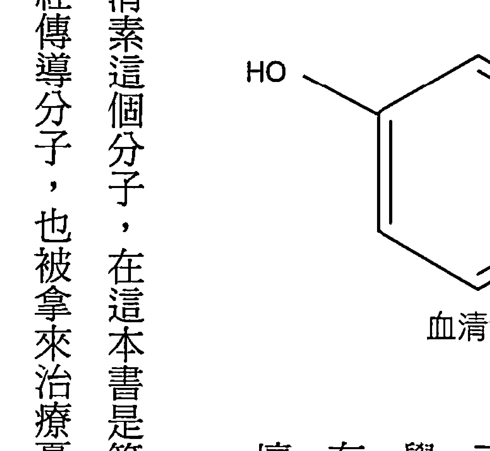

血清素這個分子，在這本書是第一次亮相。不過，或許你早就從許多憂鬱症的書接觸過它，知道它是腦中的神經傳導分子，也被拿來治療憂鬱和焦慮。如果你還記得前面提到多巴胺的結構有多簡單，那麼，看看血清素的結構，也沒有複雜多少。真是不可思議，我們的心情，竟然受到這些再簡單不過的小分子的影響。此外，多巴胺和血清素都會刺激神經細胞的樹突形成，而樹突形成自然會增加學習的能力，長期下來都會改動腦的結構。血清素高的時候，一個人對於被拒絕比較不容易覺得受傷。也就是自我感覺良好，覺得自己還不錯。血清素帶來的成就感，可以減少一個人的不安全感，走向正向的成就循環。

血清素在腦部有多重的角色，如果我們回憶自己一生的畫面，回想的過程可能產生種種喜怒哀樂的心情。科學家發現快樂的程度和血清素生成是有正相關的。不只是腦部的血清素提高能減少不快樂，反過來，好心情也能提高血清素的量 68。

此外，血清素也和攻擊性有關。血清素在腦幹縫核（raphe nucleus）的神經元生成。你現在已經知道，腦部的「核」指的就是神經細胞聚集的所在。血清素在腦幹縫核產生之後，透過神經的投射，傳到掌管認知的前額葉，以及帶來快樂的期待系統。

前面提過，負面情緒可以透過前額葉→杏仁核的路徑來抑制。血清素可以傳達到前額葉，去幫助抑制杏仁核的恐懼。如果一個人的基因出了問題，或飲食缺乏色胺酸而使得血清素降低時，這個抑制恐懼的路徑可能發揮不了作用，而使得本來就帶有攻擊性格的人更容易暴躁，產生行為或語言的攻擊 69。

巧克力含有色胺酸，而富含碳水化合物的飲食，則能促使體內生出色胺酸，使血清素提高。這也就是為什麼，有些人心情不好時，喜歡吃巧克力或洋芋片。很奇妙的是，血清素主要在腦部生成，體內含量最多的地方卻是在腸胃道，和腦內啡一樣，也會作用在身體其他部位。血清素含量提高時，也會降低人的食欲。

血清素和多巴胺不光影響快樂，還影響到腦的學習，也就是對環境的反應。除了這兩種分子，還有許多神經成長因子，提供了神經元樹突成長必要的養分。這些成長因子本身的含量，甚至還受血清素的調節。

> 66 Hebb, D. (1949). The Organization of Behaviour: A Neuropsychological Theory. New York: Wiley.
> 67 Gaser, C., & Schlaug, G. (2003). Brain structures differ between musicians and non-musicians. The Journal of Neuroscience, 23(27), 9240-9245; Bengtsson, S. L., Nagy, Z., Skare, S., Forsman, L., Forssberg, H., & Ullén, F. (2005). Extensive piano practicing has regionally specific effects on white matter development. Nature Neuroscience, 8(9), 1148-1150.
> 68 Benkelman, C. (2007). In vivo measurements of brain trapping of α-[11C]methyl-L-tryptophan during acute changes in mood states. Journal of Psychiatry & Neuroscience, 32(6), 430-434.
> 69 Passamonti, L., Crockett, M. J., Apergis-Schoute, A. M., Clark, L., Rowe, J. B., Calder, A. J., & Robbins, T.W. (2012). Effects of acute tryptophan depletion on prefrontal-amygdala connectivity while viewing facial signals of aggression. Biological Psychiatry, 71(1), 36-43.

如果一個人憂鬱，血清素的量自然降低，而大腦灰質細胞也會死亡。然而，正向情緒會提升多巴胺和血清素，使灰質細胞活化。我才會說快樂能讓腦部活化，恢復它新鮮的能力。

一個人心情快樂，自然看起來也年輕而有活力。甚至我們常聽到一些長壽的人說，他之所以能保持青春活力，甚至和年輕人做同樣的事，是因為他們一直保持快樂的赤子之心。

反過來，腦部不活躍，自然也失去接受生長因子的能力。無法接受生長因子的滋潤，細胞自然退化，甚至死亡。不只認知能力，就連身心都很容易退化。這麼說，腦和任何肌肉或部位一樣。刺激它，它就活躍，不用，它就退化。而活化的過程，是可以重組，甚至喚醒更多的潛能。

所以，連快樂的心情都是可以培訓的。只要強化快樂的反應迴路，我們常常提醒快樂、記得快樂，快樂自然成為我們身心的預設反應。

可以說，身心快樂是反映我們時時刻刻、點點滴滴的原有心理狀態。守住自己的心，遠比控制或改變環境更為重要。它帶來的作用很接近上癮，會讓我們愈來愈喜歡快樂，甚至，捨不得不快樂。

## 04 快樂，也會消退

可惜的是，對於身心的快樂，腦部有一個「適應」的機制，也就是前頭提到的享樂適應。舉例來說，人會期待好事發生，像加薪、升職、獎勵，一旦得到了，就好像沒有原本還在期待時那麼快樂。透過刺激帶來的快樂，「劑量」好像要越加越多，而增加的邊際效應愈來愈少。

任何活動，比如看電視，使用電腦、電話、網路、飲食所帶來的滿足感，都會很快地飽和，沒多久就乏味了。人要逃避無聊的感覺，自然會追求變化。

包括外遇，或換一個伴侶，也有一部份是出於逃避一再重複的感覺，想得到快樂。

為什麼會如此，從神經細胞運作的角度來看，一點也沒有什麼好驚訝的。不同的神經細胞掌管不同的訊息，有些專管外界的刺激，如聲、光、壓力的變化，有些專門接收其他細胞的訊號，包括神經細胞。一個神經細胞接收到某種訊息，也許是電，也許是神經傳導分子的刺激，內外的離子濃度發生變化，造成電位的改變，進而，去改變下一個神經細胞的狀態。這個促成改變其他神經細胞狀態的電位，就叫做「動作電位」。只要刺激的量達到一定的門檻，神經細胞就會放電。然而，每次放電的大小都一樣。也就是面對任何刺激，只有「放電」、「不放電」兩種可能。放電後，短時間內不會再生動作電位。膜上的鈉離子通道變得不敏感，必須要更大的刺激，才能達到再度放電的門檻。然而，反覆刺激同一個神經細胞，這些刺激對樹突的作用也會降低。

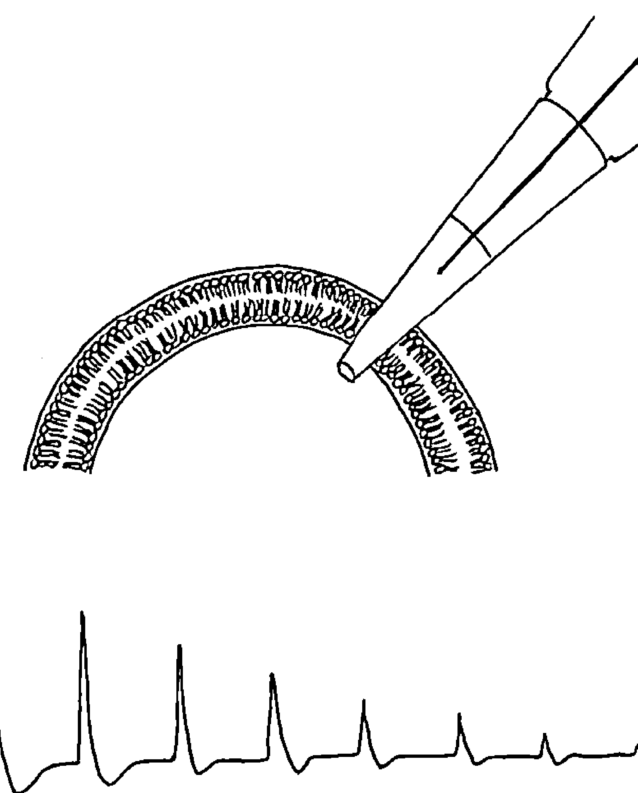

由於神經系統的傳遞速度相當快，科學家設計了一種「單一細胞電生理」的特殊方法，幫助我們立即觀察神經細胞受到刺激之後的變化。我以前也用這樣的方法，帶領年輕的學生探討神經的運作。我請馬奕安博士重新繪製左圖，一方面說明「單一細胞電生理」透過電極測量膜電位的方法，另一方面也讓「重複刺激，會讓細胞敏感性降低」的概念更為清晰。

上圖下方的箭頭，就是神經細胞受到刺激的時間點。

從這張圖，我們會看到，只要刺激神經細胞，就會產生電壓的變化。這種電壓的變化，也就是所謂的「動作電位」，經過軸突的傳遞，可以活化或抑制下一個細胞。然而，神經細胞很快就會恢復原狀，讓電壓回到原本的水平。我們可以看到，反覆地給予同一個刺激，所觀察到的動作電位逐漸變小。甚至到最後，即使繼續刺激，也不會再生動作電位。

除了透過物理、電，也可以用化學物質（例如尼古丁或本來就會出現在腦部的神經傳導分子）來刺激神經細胞。

腦部的運作，是透過神經傳導分子和神經元之間的作用，而這些分子常常釋放，自然會達成飽和，造成對刺激的適應。從心理的層面來說，前面提到的享樂適應也就是這麼一回事。如果我們一再重複某個刺激，那麼同一刺激帶來的快樂強度也會慢慢消退。也難怪人天性會追求變化。變化可以重新設定腦部的神經迴路，讓它回復原本的反應門檻值。前頭提過舒茲做的猴子和蘋果的實驗，相信你還記得，一開始給猴子蘋果時，牠們腦中分泌多巴胺的位置（黑質）都活躍起來了。只是，多重複幾次，再怎麼給蘋果，引發的效益愈來愈低，幾乎和沒給過蘋果之前差不多。然而，這時候如果把蘋果改成葡萄乾，這個意外的驚喜會使腦部大量釋放多巴胺，你也會看到猴子露出驚喜的表情，甚至感染到牠的快樂。不過，一樣地，如果葡萄乾再來幾次，這個效應也會淡化。再怎麼好吃，猴子也習慣了。人也是一樣的，習慣了美食之後，再怎麼精心烹調，吸引力也會減少。最有意思的是，吃過葡萄乾的猴子，如果再回到蘋果餐，會發現多巴胺的釋放量甚至比還沒有吃蘋果時更低。和葡萄乾相較，蘋果太令人失望了，多巴胺的量才釋放得那麼低，就像中國人說的「由儉入奢易，由奢入儉難」。不過，假如蘋果餐持續下去，那麼腦部還是會繼續分泌多巴胺，就好像沒發生過葡萄乾這回事一樣。透過經驗的轉換，所自然造出的對比，等於是重新設定快樂的路徑。一般心理學家建議要輪替帶來快樂的經驗，以避免「對快樂的疲乏」。然而，我們可以看到，即使疲乏了，腦內自然有某種生理機制幫助我們適應這一疲乏，再度回到快樂的固定值。只是人和動物不同在於，透過前額葉造出發達的認知和記憶，對於過去經驗過的總是念念不忘，對於未來還未得到的更是充滿期待。於是，總是要需要更多，永遠不會滿足。有了更多，會想要更多。再怎麼變化，永遠會想要新鮮的變化。

說真的，再怎麼去追求新鮮感，人還是有飽和的一天，早晚要落回不快樂的窠臼。無論多巴胺帶來多少的刺激，或血清素為我們踩多少次不快樂的剎車，最後我們還是會習慣的。一再重複愉快的經驗，愉快的感受也會逐漸降下來，可以說，我們都適應了。

這種「溜溜球效應」相信我們都經驗過，也只是證明腦必須不斷地要新的、好的刺激。不光要多，還要有多適當的變化。然而，再怎麼變化，也總有疲乏的一天。我才說，要想透過外在的刺激，來達到永恆的快樂，是靠不住的。而透過種種方式去逃避無聊，逃避對快樂的疲乏，也只是白費力氣。

## 05 上癮：對快樂的追求，成為不快樂的來源

腦內啡、多巴胺、血清素這些分子的運作，帶來各種層面的快樂。強烈的愉悅和快感，是腦內啡帶來的，就連吃一碗飯，聽到一句好話，都會帶來腦內啡的釋放，這已經成為再平常不過的經歷，以致於我們不會特別感覺到它的重要性。很有意思的是，腦內啡的作用和臨床使用的嗎啡很接近。這些嗎啡類的物質可以緩解疼痛和憂鬱，同時也有很強的上癮性，也會造成耐藥性。
我們多少會好奇：為什麼演化留下了腦內啡這樣的物質？
想想，如果沒有腦內啡的路徑，我們看這個世界一定很灰暗，很悲觀。一直到一百多年前，這些從鴉片來的物質，還拿來治療焦慮和憂鬱。再舉一個例子，有一種藥物納洛酮（naloxone）可以治療海洛因上癮，卻會讓一個人對食物、性、環境刺激的反應都鈍化了，失去了所有的快感，活得像行屍走肉，沒有活力。
人體內還有一種物質強啡呔（dynorphins），作用與腦內啡恰好相反。強啡呔會引發厭惡感，讓身體不舒服，甚至讓人莫名其妙地生出種種奇怪的念頭，連自己都會害怕。有趣的是，生理需求沒有滿足時，也會產生強啡呔，促使我們趕快排解掉這種不舒服的感覺。
生理的需求會升起，也會消失，就像是這些因子交替作用的輪迴。
很有意思，就好像人體內有這些苦樂交替的因子，讓我們在苦與樂之間來來去去，維持某一種平衡的狀態。有樂，就有苦，似乎是人間的常態。

不光是腦內啡可以讓人上癮，就連多巴胺也一樣。我們都知道古柯鹼、香菸、酒精會讓人上癮，這些物質都會刺激多巴胺系統，也就是前面提過的期待或獎勵系統，帶來一種清醒感，也讓人比較振奮。尼古丁則可以提高人耐受無聊和壓力的程度。

有趣的是，這些物質刺激多巴胺系統的方式不盡相同，這其中的機制逐漸被解開。比如說菸裡的尼古丁直接刺激神經元分泌多巴胺，是最容易成癮的物質。嗎啡和酒精則不是直接刺激神經，而是壓抑某些神經元，這些神經元正是去壓制期待系統的。負負得正，同樣能使多巴胺繼續發揮追求的效果。

古柯鹼又不一樣，它是延長多巴胺被代謝掉所需的時間。我們已經知道，身體感到快樂是因為腦部釋放腦內啡、多巴胺和血清素等因子。每個人都有這些因子，然而，愉悅的體驗卻是每個人遇到同一件事，每個人所反應的快樂程度都不同，要看我們在心理上是如何看待同一個刺激的。

可以想像，這種處理快樂訊息的主觀性多少也來自我們的基因。兩個人可能因為基因上的些微差異，而使得腦內啡、多巴胺和血清素的水平大大不同，也許是合成量高低、消耗速度快慢，於是就影響了一個人快樂的定值，也就是一個人平常所能感受到的快樂程度。
我們都看過有些人就是喜歡冒險，也許是戶外活動的刺激，也許是創業的起起落落，甚至寧願觸犯社會的禁忌，冒著身敗名裂的風險。多巴胺D2受體特別少的人，必須取得更多的多巴胺，才能達到一般的快樂水平。這樣的人，接近總人口的25%左右71，往往會追求高風險的活動，而他們也是最容易對藥物上癮的族群。只是，用藥的劑量會愈來愈高，停藥之後反而會更憂鬱。

前面提過，血清素帶來平靜，也讓人比較不受壞心情的影響。很有意思的是，不同人種調控血清素水平的基因確實有差異。舉例來說，血清素運送蛋白的基因有一種變異型，可能讓血清素能在腦中停留更久，作用更長效，而使得擁有這種變異的人不那麼容易不快樂。黑人比起白種人、西班牙裔和亞裔種族來說，擁有這種變異的比例更高72。然而，別忘了，一般的快樂是受身心綜合制約的產物，一個基因所能帶來的快樂，也還受到其他因素的影響，甚至包括後天的認知。

我們回到上癮這個主題。菸酒或藥物上癮，當然有基因或體質的影響，讓人忍不住去用一個比較快的方法追求快樂。畢竟，比起一般的日常活動，使用這些藥品所誘發的多巴胺量高出好幾倍。也就是說，什麼都不做，不用培養愛好，更不用正向思考，這些人造的快樂就這麼來了。

然而，大多數人應該都喝過啤酒，第一口一定覺得不好喝。抽菸也一樣，第一根菸往往又咳又嗆。藥物也不會是好經驗。那麼，為什麼人還會上癮？

大多數人其實不是為了快樂而去追求這些物質，而是好奇，或想逃避生活上的不順、內心的煩惱才嘗試的。而當時，沒有別的東西更容易取得。

透過藥物，刻意地誘發腦部本來就有的快樂網路，可能使得大腦對平常釋放的神經傳導分子不再敏感。嗑藥嗑得重的人，不借助藥物，很可能再也無法體會日常生活的快樂。這麼下去，一個人很難不憂鬱。
此外，神經系統對同一刺激不再那麼敏銳，為了體會到第一次用藥所經驗的快樂，接下來用藥的劑量會大得多。這種越多用越多的惡性循環，會相當危險。一開始的「快樂」長期下來，就成了癮，沒有「它」就不快樂。到最後，連滿足感都沒有了，最多只是讓人維持一定的心情，而勉強可以運作。

談到這些藥物為身體帶來各式各樣危險的副作用，尤其是破壞腦部神經傳導分子的平衡，那是正常運作所需要的。

任何藥品帶來的刺激，都適用享樂適應的法則。不知不覺，使用劑量愈來愈高，還記得一小時可以按六千次，只為了得到多巴胺的快樂的大鼠嗎？多巴胺的過度刺激，帶來過度的慾望，不光讓人上癮，本身對生物也會帶來毀滅性的後果。本來用藥是為了離開煩惱，暫時得到一種紓解。到頭來，喝酒、抽菸、用藥反而會成為最大的煩惱。

生理的慾望透過多巴胺，自然會重複再重複，太強的獎勵效果，甚至會改變腦部的種種生理來支持這個迴路，而使這個迴路遠遠超過其他的神經迴路，帶來上癮的作用。舉例來說，想戒癮的時候，就連前面提到的厭惡分子強啡咻也可能來幫倒忙，造成種種不適的戒斷症狀，而讓人又回到藥物的懷抱73。或許，這就是快樂的黑暗面，充分滿足慾望，讓腦細胞淹沒在多巴胺不停的潮水裡，甚至造成腦部結構的變化。

> 71 Vialou, V., Feng, J., Robison, A. J., & Nestler, E. J. (2013). The role of ΔFosB in the brain. In G. F. Koob, M. L. Moal, & R. Thompson (Eds.), Encyclopedia of Behavioral Neuroscience (Vol. 1, pp. 372-378). Academic Press.
> 72 Caspi, A., Hariri, A. R., Holmes, A., Uher, R., & Moffitt, T. E. (2010). Genetic sensitivity to the environment: the case of the serotonin transporter gene and its implications for studying complex diseases and traits. American Journal of Psychiatry, 167(5), 509-527.
> 73 Koob, G. F. (2013). Addiction is a reward deficit and stress surfeit disorder. Frontiers in Psychiatry, 4, 72; Koob, G. F., & Volkow, N. D. (2016). Neurobiology of addiction: a neurocircuitry analysis. The Lancet Psychiatry, 3(8), 760-773.

其實，想要快樂，透過體內天然的腦內啡的釋放，是最快讓我們回到生理均衡點的方法。讓人放鬆舒暢，讓交感和副交感神經系統回復均衡，身心回到平衡點。除了前面提到的運動之外，還有很多讓人放鬆的作法，例如潛水、拉伸、以油按摩，都會產生大量的腦內啡。在其中，按摩很特別，觸摸是傳遞感情的一種方式，按摩才那麼有效，可以釋放更多的腦內啡。74

相對地，無論是言語的鼓勵或物質的獎勵，除了讓人放鬆，適時的獎勵還可以刺激多巴胺的分泌，也就是活化腦神經對下一次獎勵的期待，而讓一個人更積極進取。管理學才會主張，正向管理提高一個人工作動機的效果，比責罵或懲罰更好。希望有更多的企業家能體會這個道理，而能真正發揮正向管理的好處。75

然而，這些快樂，同樣地會消失，和前面所講的享樂適應一樣的。我會提這些上癮的物質，要表達的也是，想達到快樂，這些物質其實都靠不住。再進一步，任何透過物質而達到的快樂，同樣受制於享樂適應的原則，非但早晚會消失，甚至會造成負面的結果。對不快樂的逃避，以及對快樂的盲目追求，反而成了我們不快樂的來源。75 我在各地推動全人教育、正向管理。我個人認為，唯有正向管理和教學，才會達到最好的效果。從醫師的角度來說，要推動全人的健康，也就是用正向的態度，將希望和友善帶給病人，而且顧慮到身心各個層面的健康，才可以帶來真正良性的結果。

## 06「不快樂」的生理學

前面提過，恐懼包含很多負面的情緒，也是現代人都要面對的心理現實。恐懼，自然帶來無力和絕望的感受，而長期的無力甚至絕望感，也造成一個人憂鬱不安，甚至疲憊失眠等身心症狀。不快樂，在我們身邊其實比比皆是。憂鬱，已經成為一種個人和社會集體的慢性疾病。心理學家已經發現，長期的無力感是憂鬱症的因子。無力感和其他情緒一樣，是可以透過經驗而養成的。

一九六七年美國賓州大學的賽里格曼（Martin Seligman）針對憂鬱的機製作了一整套實驗。他將狗關在籠子裡，讓地板接上微量的電流，發出的電擊不會致命，卻很不舒服。一個籠子裡設有開關，裡頭的狗可以用鼻子頂著，去關掉電擊。另一個籠子則沒有開關，狗無法控制，除了忍受電擊，什麼也做不了。

研究人員等到狗習慣籠子裡的生活後，再把狗放到同樣有電擊的另一個籠子，沒有開關。不過，籠子裡有一個矮隔板，只要狗跳到隔板的另一邊，就可以躲開電擊。已經習慣了有開關可以控制電擊的狗，會設法離開電擊（見左圖），沒多久就會發現只要跨過矮隔板就沒事了。至於已經習慣無法控制環境的狗，則只是躺在那裡，無奈地忍受電流時不時的刺激。即使隔間就在眼前，就在它跨一步就過得去的距離，也不想嘗試。

任何人只要看到那一幕，一定能體會到——無法控制環境的刺激，長期下來所養成的無力感，自然讓狗會走到這樣極端的絕望和悲觀，可以說是我們的大腦「迷路」了，走進一個難以脫身的認知迷宮。認知學派的心理學家貝克（Aaron Beck）在一九七〇年提出「憂鬱的認知三角」，又稱為「負面思考三角」，描述一個人的信念怎麼造出一個憂鬱的迷宮。這個迷宮包括三個要素：自己、世界、未來。而大腦在對這三個要素的負面想法之間迷路了，就像下一頁的圖一樣，在「我真是糟透了」→「這個世界不公平」→「未來沒希望……」的循環裡走不出來。

對一切失去興趣，就連逃開難受的環境，都打不起精神來嘗試。如果是人有這種情況，我們會稱他得了憂鬱症。一個人如果無法控制周遭的一切，也許是被長期冷落忽視、什麼都做不成、做什麼都被喝止或打壓，甚或遭遇命運不可抗力的捉弄，長期下來，那種無能為力的感覺不光是讓人難受，也讓人對周邊的一切失去興趣，甚至連一口呼吸都感覺費力。 相信我們都在身邊看過這種人，也可能自己現在或曾經有過同樣的情況。很難掙脫那一股灰暗和黏滯，連想掙脫的念頭都無力生起，只能任由自己被深深的無力往下拉。就連清晨的陽光都刺眼，只希望第二天不要來。這種時候，對人生很難不悲觀。更辛苦的是，旁人種種善意的鼓勵和打氣，反而像一個個沉重的包袱，再多應付一個，都讓人更絕望。

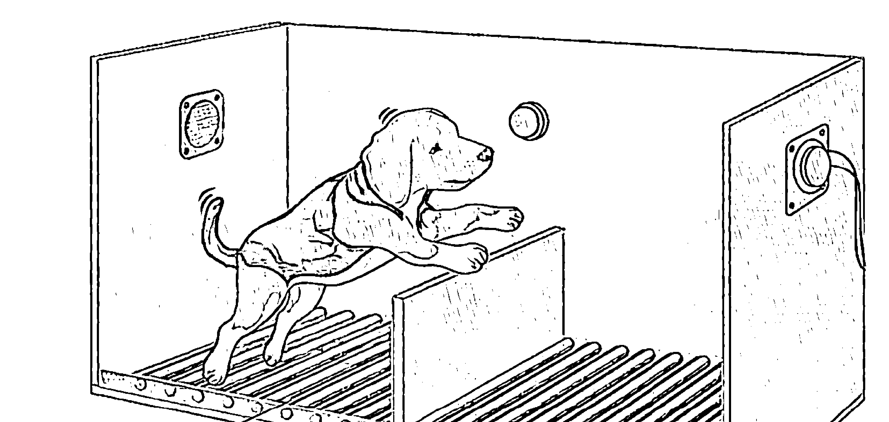

美國萊斯大學版權所有，影像使用符合創用 CC 授權國際授權條款版本 4.0。 Copyright 1999-2017, Rice University. Image used in accordance with Creative Commons Attribution 4.0 International license.

## 有希望……的循環裡走不出來。

貝克從這個負面認知的三角循環下手，開啟了很有名的認知行為治療學派，是一個經過學術檢驗有效的心理治療方法。療程大約六至八週，比傳統的動輒好幾年的精神分析更快看到效果，而被醫院和學校廣泛採用。他教病人認出自己負面的念頭，認出自己是怎麼生出這些想法，而這些想法又是怎麼延續下去，讓自己更不快樂。透過有意識的覺察、記錄和觀察，中斷這些負面想法的惡性循環，確實幫助很多不快樂的人跳出這個迷宮。

面對這些想法帶來的痛苦，最好的解答其實是提醒自己——我不是這個負面的認知。任何念頭都是一個妄想，而這個認知不等於我。要怎麼徹底解開這個惡性循環，還有一個很簡單的方法，這本書到後面會提出解答。

## 不快樂，也不健康

對生命的態度悲觀與否，不光影響快樂，也影響到健康。一九六〇年代，美國有一個研究，針對九百多名生病住院的人，用問卷測驗他們的心理狀態，包括樂觀的程度。四十年後追蹤發現，與悲觀的人相比，樂觀的人平均活得更久，存活時間高出19%。對八十幾歲的人來說，19%等於是還可以多活十六年。76

快樂的人，不只是長壽，從表達方式來看，多半心胸比較開放，好像他可以掌控人生，可以自己作主。一個開放的人，自然可以接受外在的變化，克服種種的挑戰，甚至，是歡迎挑戰。相對來說，一個人不快樂，自然覺得對生命無能為力，好像連活著都是負擔。這樣的人，面對變化，甚至會焦慮。

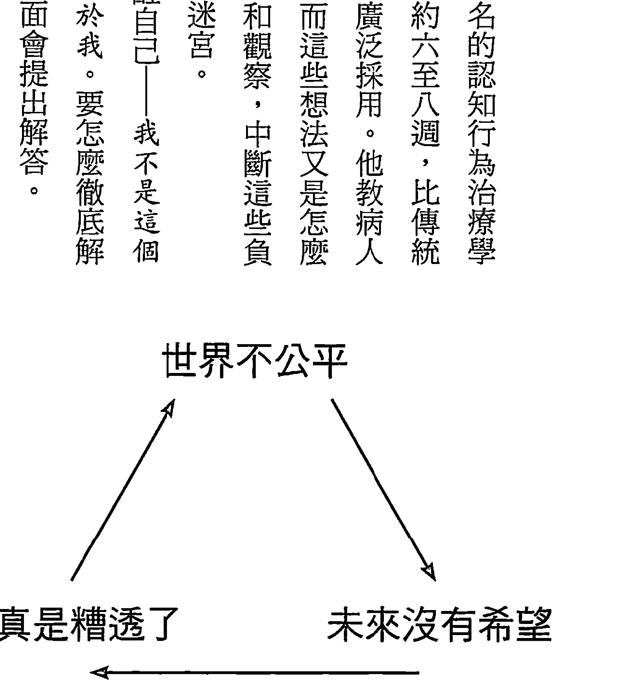

76 Maruta, T., Colligan, R. C., Malinchoc, M., & Offord, K. P. (2000, February). Optimists vs pessimists: survival rate among medical patients over a 30-year period. In Mayo Clinic Proceedings (Vol. 75, No. 2, pp. 140-143). Elsevier.

一個人是不是對未來抱著希望，還可以影響到學生的考試成績以及運動員的表現。此外，不光讓痛更容易忍受，也讓人更能夠挺住疾病的摧殘。一個悲觀的人，不只是認為生命不值得活下去，還從每一個角落都會找到悲觀的證明。反過來，一個樂觀的人，會把每一個瞬間當作一個獎勵，充滿了快樂地活下去，總是能找出別的解決方法，而且很少會用很絕對的負面表達，例如「慘了」、「完蛋了」、「糟糕」。所以，從一個人的語言，包括他的肢體表達和姿態，可以看出一個人是否樂觀。

也就是說，一個人快樂，不光是透過語言表達，也會透過每一個細胞，在一個人的姿態上「說話」。

悲觀和樂觀，看來只是一個念頭的差別，對健康和快樂的衝擊卻相當大。一個芬蘭的研究調查了九萬六千名配偶去世的人，他們在配偶死後一星期內過世的比率，幾乎是一般人的一倍。77 另外有一項研究調查了兩千名六十五歲以上的墨西哥人，發現負面情緒比較高的人，兩年內的死亡率是兩倍。78

我以前說過attention begets energy「注意到氣到」，也就是注意力到哪裡，能量就到哪裡。同樣地，不快樂的念頭到哪裡，不快樂的能量也就到哪裡。

不快樂，跟腦部前額葉有關。前額葉非但直接影響人的心情，也同時是一個臨時存放記憶的地方，需要時能隨時派上用場，和長期記憶的腦區也是相連的。一個人不快樂，不光是心情不愉快，還會調動一連串不快樂的回憶。而這是一個相互滋長的循環——一個不愉快的心情，調動不愉快的回憶，就好像用這個回憶來解釋我們的心情，證明自己不愉快是有道理的。然而，所帶出的這個回憶，又勾出更多不愉快的心情。心情更不愉快，接著又調動更多負面的回憶。

其實，這就是經驗學習的原則，透過情緒和記憶的放大，讓人牢牢記住一些「教訓」，本來是一個幫助物種生存的反應。只是過度使用這樣的機制，反而讓我們身在其中，怎麼都轉不出來。不快樂本身會產生壓力荷爾蒙，如果你已經懂了生物演化的道理，相信你也已經猜到，壓力荷爾蒙同樣是幫助我們克服危機而達到生存的機制。讓我們快速緊繃，而能來得及因應突然發生的威脅。然而，如果壓力荷爾蒙隨時堆積在身體和腦，也造成身體和腦極大的傷害。不光是腦部化學失去平衡，就連腦區之間的連線都會受到影響，而變得僵化，失去靈活應變的能力。不光是對食物、性和玩樂失去了興趣，就連認知和判斷都會退化。這就是憂鬱。

長期下來，這個迴路就開始萎縮，而刺激腦的生長因子也減少，甚至細胞會萎縮，而失去活力。憂鬱症的發病，當然牽涉到腦部神經傳導分子的錯亂。重度憂鬱症患者的前扣帶迴皮質，血清素的量明顯比一般人低得多79。這一部份的症狀，確實可以透過藥物，提高腦部的血清素和正腎上腺素（norepinephrine）的含量來修正。前面已經談過血清素，它可以作用在前額葉→杏仁核的路徑上，讓人能夠面對壞心情。正腎上腺素是一種可以和多巴胺相互轉換的物質，除了可以調控期待系統的快樂，也影響腦幹最基本的「打或逃」反應。

77 Kaprio, J., Koskenvuo, M., & Rita, H. (1987). Mortality after bereavement: a prospective study of 95,647 widowed persons. American Journal of Public Health, 77(3), 283-287.
78 Ostir, G. V., Markides, K. S., Black, S. A., & Goodwin, J. S. (2000). Emotional well-being predicts subsequent functional independence and survival. Journal of the American Geriatrics Society, 48(5), 473-478.
79 Rosa-Neto, P., Diksic, M., Okazawa, H., et al. (2004). Measurement of brain regional α-[11C]methyl-L-tryptophan trapping as a measure of serotonin synthesis in medication-free patients with major depression. Archives of General Psychiatry, 61(6), 556-563.

## 解開憂鬱，不是只靠藥物

有名的藥物百憂解（Prozac）正是從血清素著手，許多新一波藥物的作用機制都在血清素的代謝路徑作用，例如抑制血清素的再吸收，而延長它在腦中可被使用的時間。然而，腦的化學其實比我們想像的更複雜。這一類的藥物對半數以上的憂鬱症患者無法減輕症狀，甚至還有許多副作用，像是產生自殺的念頭。因此，許多臨床醫師並不覺得這類藥物是治療憂鬱等疾病的萬靈丹。

舉例來說，憂鬱症就不能只用血清素不足來解釋。畢竟，一般人即使少了血清素，也還能保持心情的平穩。而百憂解拿來給一般健康而平衡的人使用，幾乎也觀察不到對心情的任何影響。可見除了血清素，腦中自然還有其他的機制一起保持心情的安定。

在紐約大學社工系和醫學院任教的威克菲爾德教授（Jerome Wakefield），多年來一直呼籲醫界重新思考心理疾病的定義，不要把情緒變化變成一個疾病。他也提到，百憂解這類常用的精神藥物，其實是「不快樂的藥丸」，並不是「快樂丸」。這類藥物最多只是幫助腦部抑制壞心情，而不是創造快樂的心情。

血清素也受其他生理系統的影響，例如腦部處理壓力的系統。在人受到壓力時，會釋放皮質醇這一種壓力荷爾蒙，刺激神經元回收血清素，而縮短血清素在腦中作用的時間。80 肥胖和發炎也會在體內累積刺激發炎的細胞激素，而加快血清素的消耗。生活習慣如酗酒也會破壞腦內的血清素。81, 82, 83

前面提過，血清素可以活化腦細胞，促使神經細胞重新建立連結。這也可以解釋為什麼血清素用藥要花一段時間才能改善心情，即使腦中血清素的量恢復正常，也要等神經細胞恢復活力。從這裡可以看出來，神經細胞相當有可塑性。快樂時可以成長，不快樂就會萎縮。

我們有很多方法可以提升腦內的血清素，像是攝取巧克力、乳製品、堅果、鮪魚、雞肉等富含色胺酸的食物，前面提過色胺酸可以穿越血腦屏障而提升血清素的含量，讓心情變好。明亮的光線、運動也有同樣的效果，杜克大學醫學中心做了一項研究，發現運動減少憂鬱症狀的效果和連續用藥十六週一樣好。84

80 Taft, G. E., Toister-Achituv, M., & Shinitzky, M. (2001). Enhancement of serotonin uptake by cortisol: a possible link between stress and depression. Cognitive, Affective, & Behavioral Neuroscience, 1(1), 96-104.
81 O’connor, J. C., Lawson, M. A., Andre, C., et al. (2009). Lipopolysaccharide-induced depressive-like behavior is mediated by indoleamine 2, 3-dioxygenase activation in mice. Molecular psychiatry, 14(5), 511-522.
82 Badawy, A. A. B. (2003). Alcohol and violence and the possible role of serotonin. Criminal Behaviour and Mental Health, 13(1), 31-44.
83 Badawy, A. A. B. (2003). Alcohol and violence and the possible role of serotonin. Criminal Behaviour and Mental Health, 13(1), 31-44.
84 Blumenthal, J. A., Babyak, M. A., Moore, K. A., et al. (1999). Effects of exercise training on older patients with major depression. Archives of Internal Medicine, 159(19), 2349-2356.

## 結合運動與飲食，抵抗壞心情

我多年來推廣微量元素和運動，也是為腦部提供恢復所需要的因子，讓人從憂鬱走出來。過度的憂鬱是惡性循環，會讓人難以掙脫。想想，一個人憂鬱時，一直跟著腦袋裡虛構的恐懼轉，躺在床上不想起來，釋放不了的能量就造成身體裡的死結。然而，透過輕鬆有活力的動，把身心淤塞的能量結打開，創造出新的神經迴路，就有機會跳脫憂鬱的迴圈。我在《真原醫》也提到，要改變身心的慣性或習氣，靠的不是對抗，而是創造出一個新的迴路。

無論是清理家裡，到外面散散步，和朋友出去爬山，都可以開啟憂鬱以外的路，讓人有機會走出來。這些活動不見得多麼激烈，可以是小小的，而且最好多一點變化，避免沉悶。畢竟多巴胺路徑（期待系統）是這樣的：同一個刺激不斷重複，很快就達到飽和，就連神經生長因子的分泌都會減低。其實，重要的不是體驗或活動的內容，而是我們體驗的方式。

一個人培養多元的興趣，自然就容易保有新鮮感。不同來源的快樂，在神經路徑的效果會重疊。多元的興趣對腦部分泌或神經生長因子的刺激，很快就會達到最大的效果。要幫助一個人從憂鬱走出來，多培養興趣，避免重複的活動，這會是很有效率的方法。

我把運動分成三部份：有氧、健身和拉伸。我相當鼓勵憂鬱的朋友要多多健身。憂鬱會讓人失去活力，而健身不僅刺激身體吸收養分、合成體內所需的物質（同化作用 anabolism），提升代謝，還刺激肌肉生長，自然促進神經恢復。最有意思的是，運動不一定很激烈，設定小小的目標，一次又一次的小小成就就帶來滿足，自然可以達到更大的效果。

無論動物或人，只要透過運動活化起來，全部的記憶力和腦部分析與認知能力也都跟著好起來了。我過去也把運動稱為最好的抗憂鬱的藥。而且運動不光是刺激血清素分泌，還會生成腦內啡，讓人覺得舒暢，也自然快樂。這麼講，運動本身可以改變一個人的人生觀，甚至帶來徹底的改變。除了運動之外，這本書接下來還會介紹其他方法。

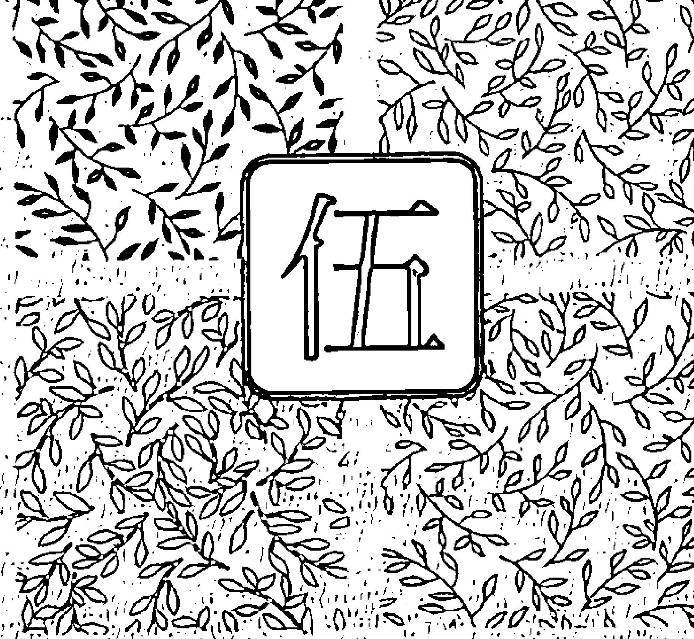

## 「我」和「我们」的快乐

## 01 怎樣的人比較容易快樂？

心理學家對人的遺傳、性格、對快樂的特質愈來愈理解，也同樣關注這個問題。

美國明尼蘇達大學雙胞胎家庭研究中心的里肯（David Lykken），找來一千三百對雙胞胎，探討快樂的能力與遺傳和環境的關係，而獲得國際的關注。包括全部基因相同的同卵雙胞胎，和只有一半基因相同的異卵雙胞胎。這些雙胞胎有的在同一個家庭長大，受到類似的環境薰陶，有些則各自在不同環境下成長。想一想，這麼多雙胞胎如果同聚一堂，畫面多麼壯觀。

他們邀請這些雙胞胎填寫快樂的問卷，和你在這本書一開始填寫過的快樂問卷差不多。發現比起異卵雙胞胎，同卵雙胞胎的快樂得分更接近。里肯綜合基因和環境這兩大變數，甚至分析了雙胞胎不同年紀時的人生意遭遇，提出一個有意思的觀點——快樂的能力，差不多有一半（四四～五一％）是由基因所決定。85

這麼說來，我們本來多少都知道怎麼快樂。至於能夠多快樂，則受到基因和體質的限制，會維持在一個先天的穩定值。就像身心有一個快樂的定溫器，哪怕生活有喜有悲，最後還是會回到一定的快樂程度。只要是，這個固定的快樂程度，每個人都不同。

這本書到現在，從生理的角度介紹了許多影響快樂的因素。相信你已經可以理解，畢竟是透過基因的作用，才有血清素、多巴胺、腦內啡等種種快樂的神經傳導分子，而這些物質含量的高低有無，又影響了我們覺得快樂、平靜還是焦慮不安。從這一點，如果要說身心快樂完全不受基因、不受遺傳的影響，是不合理的。

然而，人類的基因數目估計不到兩萬個86，甚至於只有九百多個細胞的線蟲（C. elegans）的兩萬零五百三十二個基因87。所以，人類的複雜性是不能從基因來解釋的。此外，人的疾病或種種症狀，只有二％可以用基因缺陷來解釋88。所以，倒不全是基因帶來的神經傳導分子影響我們快樂，而是怎麼活、怎麼看這個世界而影響了我們快不快樂。我們如何與環境、與自己互動、如何認知這個世界，其實對快樂有更大的影響性。

我在第一篇提過快樂需要一些條件，有意思的是，心理學家也透過英國、德國和澳洲三個國家的大型研

85 Lykken, D., & Tellegen, A. (1996). Happiness is a stochastic phenomenon. Psychological Science, 7(3), 186-189.
86 Ezkurdia, I., Juan, D., Rodriguez, J. M., Frankish, A., et al. (2014). Multiple evidence strands suggest that there may be as few as 19,000 human protein-coding genes. *Human Molecular Genetics*, 23(22), 5866-5878. 有意思的是，人類基因的數目越估計越少，從一九六○年代推估的兩百萬個基因，到人類基因組定序之後急遽下降到兩萬五千、兩萬兩千。到現在，連不到兩萬的數字都有人發表出來。
87 根據線蟲資料庫在 2012 年的最後更新 http://wiki.wormbase.org/index.php/WS225。
88 Strohman, R. C. (2003). Genetic determinism as a failing paradigm in biology and medicine: implications for health and wellness. *Journal of Social Work Education*, 39(2), 169-191.

> 89 Soto, C. J., & Luhmann, M. (2013). Who can buy happiness? Personality traits moderate the effects of stable income differences and income fluctuations on life satisfaction. Social Psychological and Personality Science, 4(1), 46-53.

> 90 相信你看过很多人格测验，甚至自己也填答过，想要了解自己的性格。之前介绍过的 MBTI 测验是一组广为企业采用的人格测验，而五大人格因素（Big Five）则被学术界认为稳定而广泛采用。当初，Norman 在一九六三年以因素分析法分析出五种人格因素，之后 Lewis R. Goldberg 于一九八一年正式命名为五大人格因素。这五大人格特质为经验开放性（openness）、勤勉（conscientiousness）、外向性（extraversion）、友善性（agreeableness）与神经质（neuroticism）。

五大人格特质，指的是友善、勤奋、外向、神经质、开放这五项。它们各自与快乐的关系，其实是我们很容易体会的。友善的人，与人相处有界线和原则，处事有方向感，这使得他们善于与人合作，而带来满足。外向的人则容易建立关系，也常有好心情。情绪稳定，不那么神经质的人，不容易随外界的波动而起伏。开放的人，喜欢学习新事物，对人生抱着无穷的好奇心，勇于追求个人的成长，善于克服环境的困难。

你会发现，人间能体验到的快乐和满足感，很大一部份来自于我们与别人的相处经验，以及性格所带来的成就感。人际关系和世界的成就，其实反映的是我们自己的心境。一个人，如果能清楚地面对自己、理解自己，也就掌握了人间快乐的钥匙。

一项以一万六千多位澳洲居民的研究发现，外向、友善、勤奋而不那么神经质的人，比较容易快乐。然而，很有意思的是，快乐也会回过头来塑造一个人的性格，在研究初期比较快乐的人，时间久了，不只更友善、勤奋、情绪稳定，还会转为内向。

一般的观点是认为外向的人比较容易快乐，甚至提到一个人快乐，我们马上就会觉得他应该外向。

然而，这里的研究却告诉我们「快乐久了，人反而变得内向」。或许可以这么说，快乐自然让人愈来愈能够转向内在，回归内心的平安，而不那么需要向外追求。这种内心的平安，也可以称为宁静，才是我们最值得追求的快乐，也是我这本书的一个主旨。

> 91 Soto, C. J. (2015). Is happiness good for your personality? Concurrent and prospective relations of the big five with subjective well-being. Journal of Personality, 83(1), 45-55.

## 02 与人亲近的快乐，可以提高生存的机率

谈到亲密关系，不光是人，动物也一样，与其他生命的连结，都有延长寿命的作用。我在洛克菲勒的同学萨波斯基（Robert Sapolsky）对动物的行为相当有兴趣。洛克菲勒大学和其他学校的不同在于没有大学部，只收研究生。当年，全校不超过二十个学生，大多是Ph.D.，少数是M.D./Ph.D.。学校对学生的筛选相当严格，集结了各地的菁英，安排单独的宿舍，还有专人打理生活起居。不光如此，还提供当时名校中最高额的奖学金。学校没有传统的系所架构，而是由独立实验室（Laboratory）各自进行临床与基础研究。如果你还记得那位研究鸟类唱歌会活化大脑的诺特博姆，他就是动物行为实验室的主持人。有意思的是，我记得当年一半以上的教授都是美国科学院院士，当时就有约二十名诺贝尔奖得主。目前仍然有许多教授获选院士，或得到重要的研究奖项。最了不起的是，这些老师都把学生当作研究领域的同侪，让他们自由发展。每个学生都有独立的研究经费，并且鼓励在第一或第二年就参加重要的学术会议，发表自己的研究成果。当时每年也有一两个来自台湾的学生，多半读医学院或化工。这个学校虽然小，在一九七四年诺贝尔奖得主德·迪夫（Christian René de Duve）93的心目中，是科学研究的麦加圣地。校方给学生很大的空间，有些学生很早就成为国际知名的专家。埃德尔曼（Gerald Edelman）在攻读博士期间开启抗体结构的研究，而巴的摩尔（David Baltimore）同样在攻读博士期间就发现反转录酶，是推动现代分子生物科技发展的大发现。这两项到现在都还是专业教科书一定会列出的精彩研究，也各在一九七二和一九七五年获得诺贝尔生理医学奖的肯定。

很有意思的是，当时我在钻研分子，萨波斯基在研究动物行为，成天在非洲肯亚的野外观察狒狒。我跟他深入交流的机会不多，但可以感觉到他非常沉稳，对自己的领域相当投入。很多年后，发现他成为一位研究老化的脑科学专家，让我非常欢喜，也一点都不意外。

萨波斯基和达马修一样，除了研究领先，也很乐意把他的科学研究写成科普书籍与大家分享。台湾的朋友很可能已经读过他有名的科普作品《为什么斑马不会得胃溃疡？》（Why Zebras Don't Get Ulcers），是一本探讨压力生理学的好书。透过对动物的观察，让人能对自己内在的压力和生理反应有很好的理解。他也提到，狒狒只要和同伴有长期而稳定的连结，不仅比较长寿，身心健康也比较好，血液中的压力分子量是最低的。

没有亲密的关系，就生物的生存来说，是一个危险因子。可以想像，为了生存，生物要成群结队，落单就可能有生命的危险。也因此，孤独会带来恐惧。刚出生的动物或人，虽然喂饱了，只要一落单就会开始哭，而母亲也会马上有反应，赶快到孩子身边又摸又抱，好好安抚一番。可以想见，母婴连结是多么基础的生存反应。

现在科学伦理的意识相当发达，不可能拿新生儿做有没有母亲照顾的研究，毕竟我们不能剥夺孩子的幸福，即使为了科学也一样。然而，没想到七、八百年前，就有人做过这种大胆的尝试，而且不是人类史上第一遭。他的实验被一位撒林斐尼修士（Salimbene di Adam）记录下来，后人才知道细节。

十三世纪神圣罗马帝国的皇帝腓特烈二世（Frederick II）想知道上帝最初赐予亚当和夏娃的语言是什么，于是他下令把刚出生的婴儿隔离起来抚养，想知道这些孩子的发声器官成熟时，脱口说出的是希伯来文（这是他心目中人类的第一个语言）、希腊文、阿拉伯文还是亲生父母的语言。他安排褓姆和护士给这些孩子喂奶、洗澡，却要求她们绝对不要和孩子说话，就连喃喃咕咕逗弄孩子也不行。当然，他的安排完全白费。没有人给这些孩子拍拍手、比手画脚、露出开心的表情，这些孩子根本活不下去。

现代社会人与人之间愈来愈疏离，至少从健康的角度来说，不是一个好现象。从神经化学的角度来看，孤独是一种「痛」，造出压力，让身心失衡，而让一个人不自在，催促尽快回到群体里。

避开孤独，成群结队，是生物很早就有的行为模式。越高等的动物，越讲究连结的品质，甚至会为整个物种考量。好像不光是自己的生存重要，而是整个物种的生存重要。前面也提过，慈善或公益行为所带来的快乐，比起吃美食、看电影的快乐更为持久。从演化的角度来看，这种利他的行为集合起来，也比自私的集合更有生存的优势。

一般人只要和别人有连结，体内压力荷尔蒙皮质醇（cortisol）的量就会下降，罹患慢性病的机率也自然降低。人和动物的不同在于，人会和伴侣形成更长期、更稳定的关系。有趣的是，养育孩子带来的温暖和被需要的感受，长期来说能补偿伴侣间激情的降低，让快乐从两人之间，蔓延到整个家庭。自然会让父母更成熟，更愿意照顾自己，而活得比较健康，甚至比较长寿。

仔细观察，人与人之间的互动是很有意思的，不完全听从脑的理性作用，更是一个「场」的作用。人类除了脑之外，都有一个透过思考和情绪所造出的场。我们对谁喜欢或不喜欢，其实是透过这个场的共振来决定。我之前用「螺旋场」来比喻，还谈「萎缩场」的共振。第一眼见到某人，往往话还没讲，就已经决定了喜不喜欢，这可以说是一种灵感、直觉，或所谓的 gut feeling。

透过所谓的「相关研究」，也就是观察到有朋友的现象与快乐的现象常常一起出现，一般人很自然会归纳出「一个人要有朋友才会快乐」的结论。然而，究竟是有了朋友才会快乐，还是一一个人快乐，才有朋友。

很值得我们想想。

我会提出这个问题，一方面是质疑我们对因果的归纳，也同时希望大家一起体会——这些研究的结论，表面看来都很合理，其实还是离不开头脑固定的逻辑或成见。

不管怎么谈亲密或孤独，都还是人间外在的表相。进一步说，不管多亲密，这还是属于人间所带来的关系和快乐。和一个人的内心的宁静还是不同。反过来，一个人不管多孤独，还是周遭人的判定。一个人自己生活，非但不等同于真正的孤独，甚至是和神、和自己建立关系的契机。

懂了这些，一个人自然会发现快乐有两个层面，一个是外，一个是内。内外两个层面可以互相影响。这种对称，才是这本书真正想进一步解析的。

## 03 爱——大自然对繁衍下一代的奖励

最亲密的关系，也可以称之为「爱」。男女的爱，也自然会带来性的亲密。爱和其他亲密关系一样，不完全是理性的，有时是逻辑无法解释的。爱，有时好像中了咒，被附身，挡都挡不住，完全没办法用理性去解释，只好安慰自己是宿命的安排。

如果你开始想，或许不是宿命，而是有其他神经传导分子带来爱，那么，你又猜对了。我们再度回到脑神经的世界，用另一个角度体会身心对爱的反应。

男女的爱，也离不开荷尔蒙的作用。脑的深处有一个不过豌豆大的结构，重量大概是整个脑的百分之连。

脑内下视丘的前视觉区有一个特别的核，男性的这个脑区，大小是女性的两倍，结构也不太一样。有一个荷尔蒙叫作卢里泊林（luliberin, luteinizing hormone-releasing hormone, LH-RH），是在下视丘产生的，大约每九十分钟释放一次，控制性荷尔蒙的释放，而带来很强的欲望。这个荷尔蒙应该是很原始的，无论动物或人都有，而且对雌性的作用和雄性是一样的。

动物的实验很早就发现，这些性荷尔蒙引起的爱，不光是为了性做准备，而是让两个个体成双成对，建立长期的关系。有「抱抱荷尔蒙」（cuddle hormone）之称的催产素（oxytocin）特别有意思，男女有别，女性产生的是催产素，而男性产生的是结构相似的血管加压素（vasopressin）。这两个荷尔蒙诱发人与人之间感情连结的快乐，让人亲密，彼此信赖，相互忠实，在情人和朋友之间带来愉悦、平静和彼此相连的感受。研究已经指出，爱情会让催产素的含量提高。伴侣如果分开一段时间，少了肌肤之亲，催产素的量下降，自然会想要去找对方，恢复感情的连结。很有意思的是，就连花一段时间抚摸宠物，例如狗，那么接下来，狗和主人体内的催产素含量都会上升，或许这正是为什么很多人养狗会有很深的感情。94 催产素这个名词，再加上它有刺激子宫收缩、乳汁分泌的作用，应该会让你联想到生产。母爱，许多女性一生中经历到最大的快乐，也离不开催产素的作用。女性在生产后自然涌现母爱。即使没有生产过的雌性动物，在注射催产素之后，也会发挥母爱，把别的母鼠生的小鼠，当作自己的孩子来照顾。95 甚至，如果用别的药物阻断催产素的作用，那么母鼠在生产后反而会立即抛弃孩子。透过催产素带来的爱和快乐，物种可以确保下一代的存活。催产素和血管加压素，也会影响生物的伴侣行为。美国亚特兰大埃默里大学的科学家，将血管加压素打到公田鼠的脑内。这些公田鼠向来是花名在外的单身主义者，使用了血管加压素之后，反倒成为奉行一夫一妻制的忠实伴侣⁹⁶。科学家认为这两种神经传导分子是大自然鼓励「爱」的奖品，活化脑部的期待系统，带来愉悦的快乐。人类有一种血管加压素受体基因的变异，取名RS3 334⁹⁷。有研究调查了五百五十二名瑞典男性的感情状态和基因，发现带有RS3 334这种天然基因变异的人，和伴侣之间的感情比较脆弱，婚姻也有问题⁹⁸。当然，人类不只是基因的产物。只是，听到这个研究结果，相信会有不少女士想在交往之前先检验对方的基因，希望得到一个「爱的保证书」。不只男女的爱，亲子的爱，催产素也影响了一个人能不能和别人好好相处。瑞士有一组科学家把催产素做成鼻腔喷剂，给男士使用，发现能促进他们彼此信任与合作⁹⁹。德国另一组科学家从三十名健康男士归纳出这样的结论：透过鼻腔喷剂摄取了催产素的男士，更能捕捉别人的眼神，揣摩对方的心理状态，可以说是每个人都希望展现魅力，讨人喜欢，有人爱，获得信任。这类喷雾式的催产素，仿佛提供了一种不用怀孕、不需要触摸拥抱、建立关系就可以得到的「万人迷荷尔蒙」。

然而，这些「爱的荷尔蒙」也有负面的效应，举例来说，催产素会促进雄性动物与性伴侣之间的感情，却也激发了对其他雄性同类的敌意。

人类也有类似的现象，一群荷兰的大学生，连续十四天接受催产素或生理食盐水的鼻腔喷剂。然后让他们玩「独裁赛局」和「最后通牒赛局」。如果你听过「赛局理论」的话，大概会猜到这是一个让两个人考虑如何瓜分一固定且双方都知道的金额的游戏。我们可以想象到这个研究的结果：连续喷了十四天催产素的大学生，会偏袒自己人，提议的分配比例会比较慷慨；如果不是自己人，反而显得无情。

这种研究在过去本来就有很多，未来只会更多。毕竟这种药物反映了一种希望：透过某种荷尔蒙或化学

> 94 Handlin, L., Hybring-Sandberg, E., Nilsson, A., Ejdebäck, M., Jansson, A., & Uvnäs-Moberg, K. (2011). Short-term interaction between dogs and their owners: effects on oxytocin, cortisol, insulin and heart rate—an exploratory study. Anthrozoös, 24(3), 301-315.

> 95 Pedersen, C. A., Ascher, J. A., Monroe, Y. L., & Prange, A. J. (1982). Oxytocin induces maternal behavior in virgin female rats. Science, 216(4546), 648-650.

- 96. Lim, M. M., Wang, Z., Olazábal, D. E., Ren, X., Terwilliger, E. F., & Young, L. J. (2004). Enhanced partner preference in a promiscuous species by manipulating the expression of a single gene. Nature, 429(6993), 754-757.
- 97. RS3，指的是第三类血管加压素受体，反映一个人对血管加压素的反应强度。334是这个变异的编号。以前，如果发现了新的基因和蛋白质，科学家（包括我自己）会取一个有典故的名字。现在，或许是到了后基因体时代，科学家发现的基因愈来愈多，在专业文章中也愈来愈常读到这类只有编号和缩写的基因名称。
- 98. Walum, H., Westberg, L., Henningsson, S., et al. (2008). Genetic variation in the vasopressin receptor 1a gene (AVPR1A) associates with pair-bonding behavior in humans. Proceedings of the National Academy of Sciences of the U. S. A., 105(37), 14153-14156.
- 99. Kosfeld, M., Heinrichs, M., Zak, P. J., Fischbacher, U., & Fehr, E. (2005). Oxytocin increases trust in humans. Nature, 435(7042), 673-676.

- 100 Radke, S., & De Bruyn, E. R. (2012). Oxytocin improves "mind-reading" in humans. Biological Psychiatry, 61(6), 731-733. Neuroscience, 6, 193.

卢贝松执导的《露西》(Lucy)有一种神奇的宝蓝色结晶药物，女主角露西被黑帮用来运送药物，在扭打中身体意外吸收了大量的CPH4。存活的她，反而开启了一趟奇幻旅程。大脑利用效率越来越高，她得到不可思议的超能力，反应速度变快，感觉不到疼痛，可以听到远处的声音，记忆力可以追溯到很小的时候所听所见。一小时学会中文，读完专家毕生的研究，感受到完整的电磁波讯号，从中找到需要的讯息来解码。拥抱一个人，就能读取他的所有资讯，还能变身成为这个人。但是，当体内药物剂量不足时，身体也开始瓦解。

电影《药命效应》（Limitless）也有一种小药丸 NZT-48，让一个落魄作家在走投无路之际，意外开启了大脑的所有潜能。五官变得灵敏，心态变得大胆，就连体能也变好了。人变得神清气爽，非但什么都能表达得头头是道，还过目不忘。连眼中的世界都变得明亮，从一个平庸的作家变身为万人迷。当他被追缉时，想停药以撤清和药物的关系，却已经来不及了。这是个不能停的药物，而且有很强的副作用。

虽然这些只是电影中虚构的药物，有意思的是，两部电影的剧本不约而同的都认为这种药会有强烈的副作用。这其实含着很正确的讯息：所有的荷尔蒙或化学物，在生理上越有效果，越可能带来意想不到的副作用，而破坏人体的恒定。早期的迷幻药也是如此，拿来进行研究，或矫正紧急的症状。就快乐的长期追求来看，还是靠不住的，不可能为了快乐而长期使用。现在很多忧郁的药物也有这种情况。到最后，一个人还是要靠自己走出最快乐的一条路。

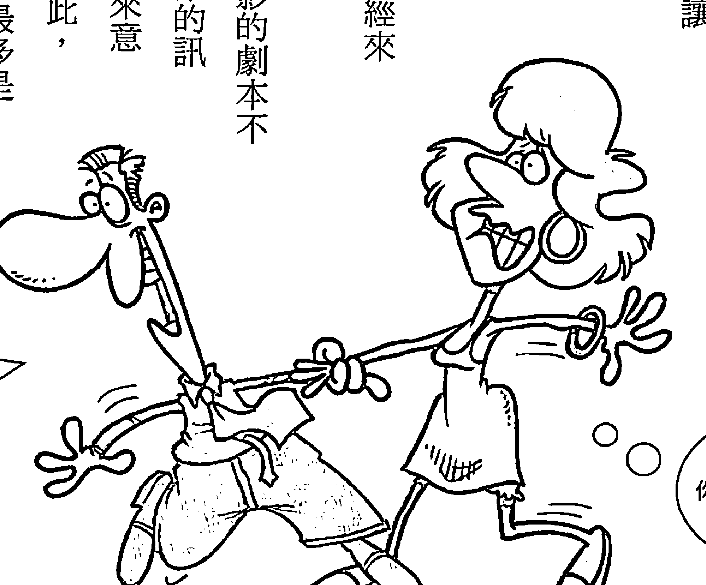

我爱妳，妳让我好快乐！

真的假的？你不知道，你让我多不快乐！

爱，都是相对的，是我们每个人透过生活条件、种种习惯带出来的投射。

再亲密，人间的爱，还是离不开限制或条件。它本身受到制约——跟对方的长相、行为有关，而这些特质早晚会消失。我们每一个人早晚也会老去，一切也跟着改变。不管怎么说，这些人间的爱，还是短暂的。靠这种爱而得到的快乐，它本身是靠不住的。真正的爱，真正的快乐，其实是没有条件的快乐。这一点，我接下来会做更多补充。

## 04 快樂的人，活得更久、更健康

快樂，從情緒的角度來說，可以是各種愉悅情緒的統稱，包括喜悅、快樂、興奮、熱心、滿足……等等。它們可以是一時的感受，也可以是穩定的人格特質（尤其成年以後）。很有意思的是，有正向的情緒，不代表一個人就沒有負面情緒。舉例來說，一個大多數時間快樂的人，也會有焦慮、生氣和沮喪的時候。

探究快樂對健康和身心功能的影響，已經在學術界建立了一套「快樂的科學」。或許你還記得《靜坐》提過快樂的修女的研究 102，也會想知道這些修女是怎麼為快樂的科學帶來貢獻的。

這個研究的背景相當有意思，聖母學校修女會（The School Sisters of Notre Dame）的修女，退休前，多半在美國中西部、東部和南部的城鎮學校教書。一九九一至一九九三年間，修會要求所有在一九一七前出生的修女（當時最年輕的也七十四歲了），參與一項老化和阿茲海默症的長期研究。一共有六百七十八名修女參與，同意研究團隊取得她們過去的個人檔案、每年接受認知和身體檢查，甚至答應去世時捐出腦作為研究之用。

研究團隊翻閱檔案的時候，恰巧發現北美修院的院長在一九三〇年的公文，要求每一位修女寫自傳。研究人員也找到了這六百多位修女大多數人當年的自傳，有的是手寫，有的打字。其中，一百八十位修女在二以下十二歲寫的自傳，被拿來分析用詞和語法，來判斷她們當時快樂的程度。是兩個例子：例一（比較少正向情緒）我生於一九○九年九月二十六日，家中有五男二女，我是七個孩子裡的老大。……我初學的一年在母會，也在聖母學院教化學和第二年的拉丁文課。帶著上帝的恩典，我願為修會、傳教以及個人的靈修盡心盡力。例二（比較多正向情緒）上帝為我開啟了美好的人生，給我難以計數的恩典：……過去在聖母學院的一年非常快樂。舉目向前，我帶著渴切的喜悅，希望能獲得聖母的良好德性，一生與聖愛合一。

> Danner, D. D., Snowdon, D. A., & Friesen, W. V. (2001). Positive emotions in early life and longevity: findings from the nun study. Journal of Personality and Social Psychology, 80(5), 804-813.

這個研究依照修女們年輕時自傳裡用詞的樂觀程度強弱，分成四組。第一組是最常出現正向情緒的。第四組則是最少用到正向情緒語句的組。圖的縱軸是存活率，橫軸是年齡。我們可以看到，七十五歲時，四組都還活在人間。隨著時間推移，到了九十多歲時，第一、二組與第三、四組還留在人間的比例，已經出現明顯的差異。這個研究最不可思議的結論是，光是二十二歲時多常用正向情緒來描述自己，竟然能用來預測一個人是不是能夠長壽。

> 經美國心理學會 (American Psychological Association, APA) 許可，自 "Danner, D. D., Snowdon, D. A., & Friesen, W. V. (2001). Positive emotions in early life and longevity: findings from the nun study. Journal of Personality and Social Psychology, 80(5), 804-813." 重製。美國心理學會不保證譯文之正確性。

雖然這種判斷快樂與否的方法，離不開研究人員選取和分析素材的主觀，跟我們一般人的判斷應該大致相近，畢竟人類天生對快樂有一種直覺。即使不考慮生活習慣、遺傳體質種種因素，光是憑二十二歲時的日記來看，比較快樂的修女，比不快樂的平均多活九年。

讀到她們的日記，又知道了後來的結果，相信你會開始回想自己平常是怎麼表達感受的，甚至還想找出以前的日記或文章來看看。當然，情緒的表達不見得等同於真正的快樂。然而，一個人真正快樂，是不可能不流動出來的。

這類關於快樂的研究真的不少，一九六〇年代中期，美國北卡萊納大學要求入學的七千零七名學生填寫問卷，評估他們的性格是樂觀還是悲觀，並且追蹤其中六千九百五十八人的存活。直到二〇〇六年為止，四十多年中，共有四百七十六人死亡。比較當初的測驗結果，發現比較悲觀的人，比他們的同儕更早去世，而樂觀的人可以活得更久。 103

這類研究，後來得到學界相當大的注意，也創出一個全新的學術領域。由不同的切入點、不同的解釋方法，去解釋快樂和壽命、生活品質的關係，在更多頂級期刊發表。

大多數人類或動物的研究，無論從哪個角度，都得出快樂更有益於生活品質的結論。二〇一一年，倫敦大學學院流行病學暨公衛學系的研究團隊在美國科學院期刊發表了一篇文章，邀請三千八百五十三名五十二歲到七十九歲的中高齡族群每天記錄四次自己的心情，早上和晚上各兩次，包括正向（快樂、興奮和滿足）和負向（心煩、焦慮和恐懼）的情緒（見上圖）。這種方法更為客觀，可以避免種種因素造成的偏差，例如想要討好研究者，而偏向表示自己快樂。此外，一天記錄四次心情的設計（剛起床、起床後半小時、晚上七點、睡前）也可以避免單一取樣時間對心情的偏頗影響，畢竟我們都知道有些人會有起床氣，有些人則總是在傍晚心情低落。你可能會很驚訝，快樂竟然有那麼大的作用，即使對於有慢性病的人，都能夠提高他的存活率。這個研究歸納出一個很大的突破——只要能經驗正向情緒，也就是快樂，哪怕只有一天，都能夠提高存活率。

> 103 Brummett, B. H., Helms, M. J., Dahlstrom, W. G., & Siegler, I. C. (2006, December). Prediction of all-cause mortality by the Minnesota Multiphasic Personality Inventory Optimism-Pessimism Scale scores: study of a college sample during a 40-year follow-up period. In Mayo Clinic Proceedings (Vol. 81, No. 12, pp. 1541-1544). Elsevier.

## 快樂的人普遍長壽

> 104 Steptoe, A., & Wardle, J. (2011). Positive affect measured using ecological momentary assessment and survival in older men and women. Proceedings of the National Academy of Sciences of the U. S. A., 108(45), 18244-18248.

這個研究更直接，由每一個人自己記錄下來的情緒是正向還是負向，分析與存活率的關係。紅色是最多快樂情緒的，綠色次之，藍色最少。縱軸是存活的人數比例，而橫軸是追蹤時間。我們可以看到這個研究追蹤了六十個月，也就是五年。從評估一個人一整天的快樂程度，經過五年之後，快樂與不快樂的組，存活率已經有明顯的差異。也就是說，快樂的人普遍長壽。

> 本圖經美國科學院許可，自 "Steptoe, A., & Wardle, J. (2011). Positive affect measured using ecological momentary assessment and survival in older men and women. Proceedings of the National Academy of Sciences of the U. S. A., 108(45), 18244-18248." 重製。

你很難想像，這類的研究有多麼的多，幾乎每個研究都帶來同一個結果。二〇一二年，兩位伊利諾大學的教授彙總了一百六十個研究的成果，包括人類，也包括動物。從非常清晰、非常有力的證據中得出，無論人或動物都一樣的，活得快樂，不光能活得更久，而且從各種健康的指標來看，快樂的組，都活得更好。 105

說到活得更好，我再舉一個實例，美國卡內基美隆大學的研究團隊，觀察了三百三十四位年紀在十八到五十四歲間的健康人士，這些人自願接受含有感冒病毒的鼻腔滴劑。結果發現快樂的人，甚至連感冒都比較不會找上他。即使同樣感染了某種病毒，快樂的人比不快樂的人症狀更少，不會那麼不舒服。或許快樂的心情讓免疫系統比較健全，而可以保護一個人比較不受感冒的干擾。 106

我相信，每個人在日常生活都有過類似的體會。就拿感冒生病來說，其實自己心裡都有數，一定發生了什麼煩心或難受的事，讓人心裡很累，隔天就感冒了。

很多人都聽過美國有名的爵士歌手巴比・麥菲林（Bobby McFerrin）的《別煩心，要開心》（Don't worry, be happy）。”哥倫比亞大學醫學中心的研究團隊，發表了一篇同名的研究。他們邀請了一千七百三十位沒有心血管病史的加拿大人，有男有女，請他們記錄上班時間的情緒狀態，特別是熱不熱心、快樂、生氣和壓力。用一分到五分的量表，評估每個正向和負向情緒的強度。十年後，比較他們致死性和非致死性心血管疾病的發生率。結果發現，十年前覺得自己正向情緒比較高的人，在追蹤期間發生心血管疾病的機率較低。值得留意的是，正向情緒每增加一分，從統計上來看，可以發揮降低22%心血管疾病發病率的效果。

舊金山州立大學的科學家索尼亞・呂博梅斯基（Sonja Lyubomirsky）綜合了一五○項探討快樂和身體健康關係的研究數據，包括實驗研究、門診研究和縱貫研究。他們發現，認為自己比較幸福快樂的人，無論從長期還是短期來看，健康的情況都會比較好。無論是透過影片、想像或其他方法所勾出的快樂喜悅或笑容，都可以為身體帶來好處。心血管、呼吸和免疫反應都變得更好。看起來，快樂對健康的影響，或許可以同時作用在各種生理的反應路徑上。

這方面的研究實在太多了，只要你願意查，都可以查到快樂對各種健康的影響，尤其是免疫方面的效果。相信你也看過或聽過有些人生了重病，透過笑，把健康和快樂都帶回來，成為一種醫學的奇蹟。

美國政治記者卡森斯（Norman Cousins）在一九六四年被診斷出患有僵直性脊椎炎（ankylosing spondylitis）。這是一種慢性發炎的自體免疫疾病，患者的脊椎節與節之間會黏合在一起，而失去正常行動的能力。當時，醫師告訴他恢復的機率是微乎其微，可以說是根本不可能。這位記者沒有放棄希望，他辦了出院手續，住進一間旅館，在房間裡不停地看喜劇片。結果他發現，只要好好地笑十分鐘，他就能得到兩小時無痛的好眠。到後來，根據他寫的自傳，他真的把自己的健康給「笑」回來了。不只打敗了疾病，又多活了二十六年，還四處鼓吹快樂對健康的好處。

我們忍不住會想，快樂是一種情緒，是一種透過神經傳導的訊號，怎麼有辦法去調節身體的各種生理路徑？前面提過「神經心理免疫學」，簡單來說，神經系統的快樂，透過組織液和血液的內分泌分子，能夠影響到全身。

幾十年來，西方科學幾乎發展到了任何題目都可以研究的地步。只要把條件設定清楚，而且有量測的方法，都可以得到一個結果，也會找到地方發表，分享給其他專業人士。

然而，研究總是有兩面，尤其和人相關的研究，牽涉到的不只是生命本身的複雜，還和研究者所採取的策略，掌握的條件都有關係。

死亡是許多變因綜合的結果，而快樂只是眾多可能影響存活率或死亡率的變數之一。這類研究，可以想像也會得出不同的結論。二〇一六年，歷史悠久的頂級醫學期刊《刺胳針》（The Lancet）刊登了一篇研究正是如此。

這些醫學期刊的名字，對你而言或許還很陌生。然而，在醫學領域專家的心目中，能夠有文章發表在《刺胳針》，是相当卓越的成就。很有意思的是，英美这两个同样语言的国家，在最先进的科学与医学领域良性竞争，彼此都不认输。就像英国的《自然》和美国的《科学》(Science)在综合性的科学领域平起平坐，而《刺胳针》于一八二三年在英国创立，和一八一二年在美国创立，后来由麻州医学会接手的《新英格兰醫學期刊》(The New England Journal of Medicine)始终并駕齊驅。

回到这个研究，以七十二万名平均年龄五十九岁的英国女性为对象，透过电子病历追蹤三年，请她们评估自己的健康状况、快不快乐、压力大不大、对生活有没有控制感，自不自在。有趣的是，在这群女性中，三九％认为自己大部份时间快乐，四四％的人算是快乐，只有一七％的人觉得自己不快乐。而这些觉得自己不快乐的人，刚好也觉得自己不健康。尽管如此，这个研究的结论是认为快不快乐与死亡率无关，这是长寿本身是一个多变因的结果，确实不是一个容易的研究主题，分析起来相当复杂，也永远难以排除取样偏差的影响，很难得到一个有全面代表性的结论。此外，这类研究也很难得出一个因果的推论。除了生命本身含着多重的变因，研究人员也无法设计真正的实验，随机而任意地指定这一个受试者这一生必须快乐，而另外一个在这一生必须不快乐。然而，只要清楚研究的限制，科学家还是希望能在一定的范围里釐清各种因素的关系，得出一个哪怕只能成立一段时间的结论。这种积极进取的精神，很令人钦佩。

从另外一个层面来看，我认为最有趣的是，这些学术探讨也是反映了西方文化的特色：凡事都要追求一个目的，都要符合一个因果。于是，快乐也要拿出一个生理的成果，在这里是长寿，在其他研究则可能是心血管疾病发生率或癌症发生率。科学研究顺著这个逻辑，自然归纳得相当清楚，带出快乐之所以长寿的结论，而鼓励大家追求快乐。然而，对于「怎么快乐？──这个最关键的点，仍然没有提出一个方法。

站在东方的逻辑，古人本来就知道，快乐有多层面，从身、心到灵性层面。快乐不光是一个整体，还是生命最自然的状态。别忘了，关于快乐与健康的关系，除了前面提过至少一六○个研究所归纳的，包括最后这个《刺胳针》的研究，几乎还是一面倒地指出了──快乐可以带来健康。这一点，相信和大多数人的生命经验是相吻合的，也就是确信了古人早就知道的常识。不只长寿和健康，一个快乐本来就会带来人生的幸福、满足、和成就。

即使科学研究得出长寿和快乐不相关的结论，相信我们还是会选择快乐。问任何一个人，都不会宁愿不快乐。

所以，最关键的是怎么把快乐找回来。

> 「你看，我一点压力都没有。你不用量我的每一个部位，我也知道我运作得很好。」

## 快樂，從數學裡來看

### 01 快樂可以流到身體的每一個部位，發揮正面的影響

研究生理的專家，發現人體有一整套神經網路深入血管和免疫系統，而可以調控免疫功能[11]。這本書第二卷第五章在談身體與快樂的關係時，提到的「心理神經免疫學之母」柏特博士更進一步發現，免疫系統也擁有同樣的神經傳導分子的受體，可以接受神經帶來的訊息，並認為這解釋了我們的情緒和身體反應的連結。

我們可以想像，如果腦、神經、免疫系統所建立的這套連結，就像是它們不斷地交流和談話，而情緒或心情就是它們所談的內容，那麼，一個時時刻刻都在談著快樂的身心結構，會是怎樣的流動？

很可惜的是，科學研究通常把焦點集中在疾病，包括不快樂和壓力，很少有人從快樂來著手。儘管大家都知道快樂對健康有許多好的影響，也是一個全身都可以感受到的反應。快樂的人，比起不快樂的人更能夠啟動免疫反應去抵抗疾病。然而，快樂在身體內的流動，我們卻所知甚微。

前面提過，我十五歲不到時讀到的那一篇研究，以及過去至少四十年來各家的研究成果，自然讓我體會到，我們確實是生來就要快樂的，包括身體的愉悅，甚至也包括超越的快樂。別忘了，大腦裡本來就有內建

> 105 Diener, E., & Chan, M. Y. (2011). Happy people live longer: Subjective well-being contributes to health and longevity. Applied Psychology: Health and Well-Being, 3(1), 1-43.

> 106 Cohen, S., Doyle, W. J., Turner, R. B., Alper, C. M., & Skoner, D. P. (2003). Emotional style and susceptibility to the common cold. Psychosomatic Medicine, 65(4), 652-657.

> 108 Davidson, K. W., Mostofsky, E., & Whang, W. (2010). Don't worry, be happy: positive affect and reduced 10-year incident coronary heart disease: The Canadian Nova Scotia Health Survey. European Heart Journal, 31(9), 1065-1070.

> 107 Howell, R. T., Kern, M. L., & Lyubomirsky, S. (2007). Health benefits: Meta-analytically determining the impact of well-being on objective health outcomes. Health Psychology Review, (1), 83-136.

> 110 Liu, B., Floud, S., Pirie, K., Green, J., Peto, R., Beral, V., & Million Women Study Collaborators. (2016). Does happiness itself directly affect mortality? The prospective UK Million Women Study. The Lancet, 387(10021), 874-881.

> 111 Williams, J. M., Peterson, R. G., Shea, P. A., Schmedtje, J. F., Bauer, D. C., & Felten, D. L. (1981). Sympathetic innervation of murine thymus and spleen: evidence for a functional link between the nervous and immune systems. Brain Research Bulletin, 6(1), 83-94. 提出神經系統深入到胸腺和脾臟這兩個主要的免疫器官。這些免疫器官正是富含淋巴球和巨噬細胞的所在，負責清除體內出問題或感染的細胞。

「奇怪，為什麼我也快樂了起來。」

快樂訊號的腦內啡受體。可以這麼說，就連細胞，都在等待著快樂的訊息。

從這個角度來說，人類活得這麼不快樂，才是不自然的。我在《真原醫》用了好多篇幅來解釋。心，其實是人體內最大的場，對全身各個部位都有一個帶動的力量。快樂，是從心散發出來的。

我們在生活中都觀察過共振的現象，例如吉他，當你撥動一根弦的時候，其他原本靜止的弦，受到它振動的影響，也會和它共振而產生泛音。我在《靜坐》和《重生》，還特別強調人體有一個非常基礎，非常根本的頻率叫梅爾頻率（Mayer's rhythm），是一分鐘六次的頻率。所有的血管、呼吸道……都可以在這個頻率的範圍內得到共振。

共振，就是接軌的觀念。所有的器官，從頭到腳，都有一個共同的頻率，而透過這個頻率可以同步。前面也提過，快樂是個場，可以和全身最舒暢最放鬆的頻率達到共振。即使身體某個部位還沒接軌，只要進入這個頻率，自然也被帶動起來。

只要去查任何生理功能，從內而外，從外而內，就會發現快樂帶來最有效率的運作，讓人最舒暢，自然讓我們回到最輕鬆的狀態。

懂了這些，也不需要我再強調什麼例子，你自然會發現有上千的研究支持這些觀點。也就是說，快樂自然帶回悠閒自在的狀態，而這個悠閒自在的狀態就是我們的本性。

## 02 從「場」的觀念談起

快樂不僅是生命的振動，更是個能量場。這樣的道理聽起來很難以捉摸，前面談了很多神經傳導分子在身體裡傳遞帶來的快樂和種種感受，難免讓人以為快樂只是物質的作用。然而，物質擴散的速度一秒鐘不到一公分，而神經元的傳遞速度可以到每秒一二〇公尺，這是單單靠物質的擴散所到達不了的，而是靠能量的轉換（電訊號→化學訊號→電）才能達成。然而，即使是靠能量轉換的高速傳遞，還不足以解釋意識轉達的速度。它不是線性、順序式（non-linear）的轉達，幾乎是同步。這種轉達，要透過場的效應，才能達到。

所謂的「場」，同樣是一個物理的觀念，描述一個隨著時空而變的物理量，是一個「空間的狀態」，作為物質的變化與變化之間「存放」能量的地方。很有意思的是，真空中沒有物質，卻不是沒有場。可以這麼說，即使在看來沒有物質生命的地方，也有「生命場」。

有趣的是，研究人員透過對五千多人長時間的追蹤和分析，雖然沒有用到「能量場」或「生命場」這樣的字眼，卻勾勒出同樣的現象——快樂，這種情緒的感染，可以透過人際網路傳播。一個人的快樂，不只可以影響到身邊的人，甚至還可以影響到朋友的朋友，也就是有三度的傳播力。而這種影響力，可以長達一年。特別的是，悲傷並不像快樂一樣，可以那麽穩定地透過人際網路蔓延開來。

## 快樂，以類聚

這張圖有很多點，圓點代表女性，方點代表男性。點和點之間的線，代表兩個人之間是朋友、伴侶或兄弟姊妹的關係。黃色的點代表這個人最快樂，綠色的點代表普通快樂，而藍色的點代表最不快樂。

> 經 BMJ Publishing Group 許可，重製自 "Fowler, J. H., & Christakis, N. A. (2008). Dynamic spread of happiness in a large social network: longitudinal analysis over 20 years in the Framingham Heart Study. The BMJ, 337, a2338."

這是刊登在著名的《英國醫學期刊》（The British Medical Journal，後來改名為 The BMJ）的研究，從一九四八年就開始進行，最早一批參與者是美國麻州一個小城鎮弗雷明翰（Framingham）的居民。一九七一年，這群人的下一代以及配偶也加入了研究。第二代的孩子，又在二〇〇二年加入了這個研究。參與研究的人會定期接受詳細的測驗，也讓研究人員收集資料。

住在這個小鎮的居民，大多是彼此之間的關係，畫他們的成一個網路圖。以第二代的五千一百二十人為主，依朋友、家人、鄰居、同事等關係，畫出他們的人際網路。願意進一步参与的人，再提供自己亲戚、好朋友的名单，让研究人员制作网络图，以及住址和工作地址，接受二至四年的追踪。

这个群体，当然和所有人一样，有生有死，有人结婚，也有人离婚而迁居，有人为了工作而搬到别处。

很幸运的是，在追踪期间，即使有些人离开到美国各地，也还是会回来配合研究。

研究人员依照正规的研究方法，将快乐定义为各种正向情绪的组合。他们用「流行病学研究中心忧郁量表」其中四道题「我觉得未来很有希望」、「我很快乐」、「我很享受生活」、「我觉得自己和其他人一样好」的答复，来衡量一个人的快乐程度。并取用一九八三至二〇〇三年之间，第二代参与者的第五次到第七次作答结果，分析这些人的快乐程度和人际网络的关系。

从这个研究可以看出来，快乐就像一个能量场，会扩大而传播开来。如果你身边都是快乐的人，那么，你也比较容易快乐。

快乐影响的不光是身边的人，还包括这些人的亲近的人。根据作者的说法，影响力至少有三度的效果。也就是说我们自己快乐，就连朋友的朋友的朋友都会受到影响，而这个效果至少持续一年。有趣的是，不快乐或悲伤，并没有那么大的传播力。

快不快乐的差异之一是，快乐的人自然会想要有同伴，而不快乐的人并不会这么想。我对这个研究特别重视，因为从这里可以证明——快乐很重要，甚至比快乐的内容更重要。可以想想，快乐怎么可能同时传给朋友的朋友的朋友，他们不可能成天在谈这些快乐的事迹，也不可能是快乐的内容被他们分走了。

倘若快乐不是一个能量场，不可能有这种远距的传播力。

更有意思的是，根据这个研究的结果，即使两个人相距一哩，一个人快乐，另一个人快乐的机率是百分之五。重要而亲密的朋友的快乐，效果也比一个点头之交的快乐更明显。当然，这样的传播，虽然有远距的

## 你快樂，我也快樂

這張圖的縱軸是在周遭的人快樂時，自己也快樂的人的比例，橫軸表示周遭人的親疏遠近——1. 是直接的朋友，2. 是朋友的朋友，3. 是朋友的朋友的朋友，以此類推。從這張圖可以發現，一直到朋友的朋友的朋友，也就是經過三度傳播的快樂，對一個人的快樂仍然有顯著的影響。

> 經 BMJ Publishing Group 許可，重製自 "Fowler, J. H., & Christakis, N. A. (2008). Dynamic spread of happiness in a large social network: longitudinal analysis over 20 years in the Framingham Heart Study. The BMJ, 337, a2338."

只是快樂，自然就把快樂流到人間。有趣的是，最快樂的人往往座落在網路的中間。快樂就像是以他為核心，向外輻射。他什麼都不用做，影響力，還是難免受到時空的限制。

## 03 正向心理學

回到人快樂的本性，這本書不能不談心理學領域的一個成就——正向心理學。

正向心理學是心理學的一門分支，這門學問起源自馬斯洛、羅傑斯、佛洛姆的人本主義心理學，肯定人天生的成長潛力與美善，把人看得比疾病更重要，甚至不是把重點放在「治療」，而是更積極地找出各種有效的方法，讓人對自己、對生活更滿意，也就是更快樂。

正向心理學尋找幸福的種種條件，基於經濟學的研究（本書第一篇談到的伊斯特林的研究）指出——快樂和物質條件有一定的關係，當物質豐盛到一定程度以上，影響的程度卻不那麼大了。比起物質，他們更重視人與人連結帶來的快樂。此外，他們也從一個人可以努力的體驗著手，深入探討心流和靜坐。我在這本書也會多談一些。

這也就是我在《全部的你》所提到的「典範變遷」（paradigm shift）——要解決人生的問題和困難，不是從問題、困難和失敗去檢討，而是徹底地顛覆，跳開問題所在的層面。

换一個角度，人生的困難，也就是和生命正向的力量失去了連結。這時，與其不斷地分析、檢討是怎麼失去連結的，倒不如直接重新接上正向的軌道，重新和生命接軌，更能帶來轉化的力量。

此外，這些正向的鼓勵之所以有效，絕對不只是一個人脆弱的時候特別需要安慰。任何人，都需要和生命正向的力量連結。就連每天面對生死病苦的醫師，同樣可以由鼓勵得到力量，在專業上更能發揮。

康乃爾大學的研究團隊到醫院裡進行了正向鼓勵的研究，研究的對象包括三十歲到七十歲的醫師，可以想見從資淺到資深都有。

每位參與研究的醫師，主要的任務就是讀完一名患者的病歷，並且將他們的思考過程一一說出來，直到導出診斷結果為止。實驗人員會錄音，以評估他們的思考過程。被分配到「好心情」的醫師，在進行診斷之前會拿到一小包糖果。另一組醫師則是直接給病歷請他們開始判讀。

結果指出，兩組醫師，面對相同的病歷，得到糖果的一組，只要幾乎一半的時間就可以做出診斷，正確率甚至更高。即使只是糖果這項小小的鼓勵，也確實會帶來好心情，讓醫師在診斷時心胸更開放，更能靈活運用新的診斷線索，而不會困在自己原本的判斷裡。顯然，就連理性的高專業人士，在面對複雜的任務時，都可以透過鼓勵，得到更好的表現。

同一個研究團隊，後來更進一步針對還在受訓的年輕醫學生做測試。這些學生都是醫學系四年級，已經有一整年的臨床見習經驗。這回，不是用糖果引發他們好心情，而是恭喜他們在單字重組遊戲（anagram）的優秀表現，然後請他們完成指定的診斷任務，根據九項判定標準，在六名虛構病人所提供的資料中，找出哪一位最可能罹患肺癌。

結果發現，好心情組的準醫師更為熱心，很樂意繼續診斷其他案例，甚至主動建議治療。此外，在判斷的過程中，好心情的人比較不困惑，也能統整種種零碎的資訊。116

> 113 Estrada, C. A., Isen, A. M., & Young, M. J. (1997). Positive affect facilitates integration of information and decreases anchoring in reasoning among physicians. Organizational Behavior and Human Decision Processes, 72(1), 117-135.

> 114 美國的醫學院學制和台灣不同，只收已有大學畢業學歷，醫學系的學制一共四年。

> 115 單字重組遊戲 anagram 是相當微妙的文字遊戲，把一個字甚至一句話裡的字母重新排列順序，而且最好與原本的字或話有所呼應，比如說 dormitory 宿舍→ dirty room 髒房間，就會讓人會心一笑，畢竟我們都看過，甚至住過宿舍裡懶得打理的房間。

任何一個人面對廣大的世界，難免都有渺小的感覺。最終，正向心理學，希望把這種自覺渺小的無力感，轉成個人可操控的自信和力量。前面也提過，一個人覺得自己很渺小，發揮不了力量，對周遭的一切感到無能為力，這種無力感是一個人憂鬱的來源，對腦部造成很大的傷害，而使得腦退化。反過來，正向心態就是腦部發展最重要的養分，讓神經帶來最多連結。正向帶來能量，而能量生出更多能量，帶我們進入正向的循環。

我自己在教學、醫療、企業管理也有一點小小的體會，正向的讚美更能讓一個人真正快樂而投入工作，發揮個人、乃至於組織最大的潛能。我也更願意採用這些正向管理的方式。畢竟讚美、感恩這些正向的方式，帶來的效益遠比糾正、責備要大得多，也是促進一個人、一個組織成長最重要的養分。

我多年來推廣感恩的活動，也是希望愈來愈多人能體會感恩、讚美、鼓勵等等正向的效果。光是在台灣，已經有一千多所學校參與感恩日的活動，透過感恩創作，為許多老師和學生帶來正向的經驗。117

提到正向，我想再分享多一點。我發現正向的鼓勵有兩個層面，一個是合理的鼓勵。舉例來說，教學時為學生設定一個目標，再幫助他們評估自己的學習。然而，在執行上，與其用大範圍的考試來評估學生，倒不如透過頻繁的小考試來幫助學生學習。考試的範圍越小越好，只是透過考試，幫學生複習重點，讓學生在為了推廣正向的思考頻率，我與長庚生物科技的同仁將每年四月的最後一個星期六訂為「感恩日」，藉此提醒大家用感恩、慈悲的心來關懷世界和人。希望結合大家的力量，把正向、良善的感恩心傳遞出去。每年我們也推廣感恩創作活動，各年齡組都有散文、繪畫、新詩創作三大類，希望傳遞感恩的正向能量。此外，也設計了校園感恩心教育的教材，將感恩與生命教育落實到基礎教育。

> > Isen, A. M. (2001). An influence of positive affect on decision making in complex situations: Theoretical issues with practical implications. Journal of Consumer Psychology, 11(2), 75-85.

一種輕鬆的氣氛下，及時追蹤自己是否真正理解。一次又一次小小的成功，自然帶來滿足，也可以培養興趣，這才是最重要的目的。再舉一個例子，比如對病人，設定一個合理的運動、飲食或情緒管理的目標，達成後給予鼓勵。

除此以外，再以企業為例，合理的鼓勵也就是針對具體的績效表現設定目標，此時，管理的重點自然放在怎麼去追蹤、量化、評估個人或部門的表現，以及怎麼設計出合適的鼓勵方式。這些鼓勵，不見得在物質層面，也許是一封信、幾句真心肯定的話，都能帶來很好的效果。

另一個層面，則是「不那麼合理」的鼓勵。也就是說，只是鼓勵，而不需要理由，甚至是找理由給予鼓勵。舉個例子來說，看到項目進度完成一半，可以看到「還有一半還沒完成」，或是選擇看到「真棒！已經走了一半的路！」

這兩種不同的認知方式，反映了一個人的生命態度。一般人想不到的是，選擇看到已經完成一半，並且拿來為自己、為別人打氣加油，這種鼓勵方式或許不那麼合理，卻可以我們對人生、對自己正向的態度傳染給周遭的人，反而會帶來更大的效果。

其實，就算是「合理」的鼓勵，也仍然是建立在「不合理」的主觀心態之上。設定目標的方式，反映出一個人對人生的看法，不是期待別人的失敗，而是期待別人更成功。這種心態，是一種徹頭徹尾的樂觀。也自然帶來自信，更容易快樂。

在這本書，「不合理」這個詞，真正要表達的是——生命有一個遠遠超過人可以理解、歸納的部份。所謂的「合理」或理性反而是個局限，只是把生命切割成一個小部份，可以在人間理解、運作。然而，在人間這個範圍之外，生命其實還有很大的一部份。

> 徹底的正向，雖然在某一個範圍內不見得合理，從更大的角度來看，卻不是那麼不理性，而是真正根本的理性——讓我們與全部的生命接軌，直接接上快樂的源頭。

## 從正向心理學，走向宗教和靈性

讀到這裡，你可能認為正向心理學都是人與人之間的正向鼓勵，透過人間的關係，帶來鼓勵，造成正向的回報。其實，正向心理學也含著另外一個層面，是宗教或信仰所帶來的鼓勵。

此外，除了發揮一個人天性的美善，現代正向心理學還想切入一個全新的主題——一個人在經過很大的創傷之後，要怎麼走出來，怎麼恢復生命的活力，重新活得快樂。也就是生命的療癒。

最有意思的是，科學和臨床實務的專業人士，到頭來還是回頭向宗教和靈性取經。正向心理學的一個結論是——除了宗教團體帶來的溫暖和支持、生活方式比較健康之外，似乎更重要的是一個人怎麼看自己的一生，是否能在人生際遇中看到人生的意義。

從正向心理學發展的方向，相信你可以理解，宗教和靈性可以說是最古老的生命科學，本身就是人類有史以來對生命探索的積累。即使沒有信仰，光是接觸佛教、基督教和天主教的思想，就能讓一個人活得更友善，更樂意接納他人。我們也都可以直覺地體會到，遇到人生的衝擊和危機時，人自然會想要祈禱、想要靜下來，想要向一個更高、更廣的力量求助。

透過一個超過「我」的追尋，人追求快樂的道路也就打開到一個更廣的層面。這種追求或解釋，自然延伸接下來要談的超個人心理學。早晚，人類所累積下來的所有學問，無論是科學、宗教或哲學，都要回到一體，而自然會被未來的人整合到一體。站在一體意識來看快樂這個主題，我們自然會發現——重點不是在分析每個人不快樂的生命或經過，反而是徹底理解生命是怎麼組合，而意識又是怎麼來的。我們生命本身的架構就是快樂。了解了生命的根源，一個人自然會快樂起來。生命的不快樂也就自然消失。針對這一點，這本書會繼續介紹。

## 04 超個人心理學

超個人心理學，同樣也是心理學的一支。最早，佛洛依德由個人過去的關係著手，解釋個人心靈的組成，而成為精神分析的始祖。他的弟子榮格則離開個人病理的解釋，進入一個整體的意識層面，提出了集體潛意識的觀念，認為人類有一些共同的原型（archetype），從而組合出一個人一生的性格。

我們認為你我他個個不同，其實都離不開榮格所說的原型。我在《神聖的你》也提到由榮格的理念所發展出來的MBTI性格測驗，同樣地，每個人幾乎都可以把自己套進其中某一類。也就是說，心理學的發展，總是脫不開「我」或「集體的我」的範圍。

超個人心理學進一步認為，「我」或真實，不光是眼前所看到的一切。我們的所知所見與「我」，只是五官帶來的經驗的集合，和全面的真實相較，十分微小。超越「我」，不僅可以帶來對自我、對世界真正的理解，也讓一個人能對個人的問題有一個完整的解答。

「超個人心理學」這個詞最早是哈佛大學的威廉·詹姆斯（William James）在一九〇五年提出，指的是一種徹底的實證主義（radical empiricism），認為一個人知覺到的任何經驗、客體全是由主體化出來的，本身沒有獨立的存在。這在東方是早就有的觀念，在西方卻相當新鮮，直到量子物理興起，才逐漸被大家接受。

後來「超個人心理學」這個詞，在一九六〇年代的嬉皮圈又重新復活。當時，兩位哈佛大學的心理學家阿爾柏特（Richard Alpert）和賴瑞（Timothy Leary）和當時知識圈的名流如梅茲納（Ralph Metzner）、赫胥黎（Aldous Huxley）與金斯堡（Allen Ginsberg）合作，想要探究人類的意識，而開始集中研究某些特殊蕈類裡含的裸蓋菇素（psilocybin）、LSD和其他迷幻藥。

他們確實觀察到使用LSD這類迷幻藥，會帶來一些不尋常的意識狀態（altered state of consciousness）。包括視覺上的改變，像是眼前事物色彩變得鮮明，光線也更明亮，靜物開始移動，大小也會改變，有些還發光或帶著光暈。有少數人會產生感覺連帶（synesthesia）的經驗，像是聽到某些聲音時會看到不同的顏色。使用LSD的人總體來說是覺得愉快，甚至會經驗到很大的喜悅，眼中的一切都那麼美好、有意思而不可思議。

這些經驗讓人充滿情緒，好像活在夢中一樣。使用的劑量大了，甚至帶來一種特殊的感受，彷彿一切都失去了固定的邊界。對某些人來說，很像是深刻的宗教或靈性體驗，甚至改變了他們對世界的看法。然而，從旁觀者的角度來看，用了LSD的人看起來很怪，說話很快，在不同的主題跳來跳去，很難理解。有些情況下，甚至讓人進入一個可怕的幻境，造成很深的恐慌，到了要用其他藥物來壓制的地步。

這些研究引發很大的爭議。阿爾柏特和賴瑞親自嘗試這些藥物，後來被逐出了大學。然而，他們的探索

> 118 裸蓋菇素來自一種菇蕈類，大概在石器時代的歐洲和非洲就有人使用，也在哥倫布發現美洲之前的中美洲使用過，通常是用在當地宗教的儀式和慶典。和後面談的LSD一樣，到現在，還有專家在探討能否使用這種物質來調整人的心理狀態

> 119 LSD是lysergic acid diethylamide（D-麥角酸二乙胺）最早是一九三八年瑞士一家藥廠Basel Sandoz Pharmaceutical的化學家霍夫曼（Albert Hofmann）在實驗室裡合成的，當初是想開發促進血液和呼吸循環的藥物。直到一九四三年，霍夫曼誤食了沾在手上的一點LSD，事後推估大約0.25毫克（差不多幾粒鹽的量），在騎腳踏車回家的路上，萬分驚險地體驗到了很明顯的迷幻效果，從此才知道它的意識改變效果。由於LSD可以和腦部血清素的受體結合，從一九四〇年代一直到六〇年代，精神病的專家一直想要探究它是否可能用來治療心理疾病。

確實為近代的超個人心理學播下了種子。從此，靈性的自我成長，超越「我」的自性、高峰經驗、神秘經驗、出神、靈性危機、靈性進化、宗教轉化、不同的意識狀態、靈修……等等邊緣或罕見的經驗，就成了超個人心理學的主題。許多人試著用現代的心理學理論來解釋這些現象，或者建立新的理論來談這些經驗。為了解釋不同的意識狀態，肯恩·威爾伯（Ken Wilber）等後起之秀發明了一套「意識譜」的理論，也就是一般的意識狀態，加上五官在一般狀況知覺不到的不同意識狀態。這種「意識譜」也可以比喻為意識的彩虹，可以解釋許多現象，比如一個人的高峰經驗、馬斯洛談的自我實現，或我即將在下一章介紹的麥克·莫飛（Michael Murphy）推動的人體潛能發揮。

超個人心理學和現代的新時代思潮，的確帶來許多新鮮的觀念或現象，很接近「無我」的狀態。但是，除了以藥物刺激出不同的意識狀態，或是透過聲音等外在的方法引發特殊的經驗，並沒有一個可以落實到一般人日常生活，而把快樂帶回來的方法。

前面提到的阿爾柏特也一樣。一九六六年，他在美國ABC電視台的紀錄片《LSD危機》（The LSD Crisis）提到自己曾使用LSD超過三百次，有過兩次非常特別的經驗。他意識到構成「阿爾柏特」的身分——博士學位、中產階級……——一個個剝落，甚至用「心理上的死亡」來描述。當時他還沒有準備好面對「我」的死亡，非常害怕。後來，他再也不用LSD了。然而，對人類意識的探索，讓他開始接觸東方的哲學和靈修。

我在這裡會跟你分享這麼多LSD的資訊，主要是站在科學的角度，樣樣都可以探討。但我希望你不要因為好奇而去嘗試。LSD短期會帶來類似精神分裂的幻覺症狀，對知覺的長期影響也會遺留一生，不值得你去採用。其實，任何毒品都不要去嘗試。非但不能帶來快樂，反而還會留下負面的作用。一個真正要找到生命的快樂的人，走過超個人心理學的追尋，走下去，會發現西方文化缺乏超越的基礎，而自然會走向東方的哲學或宗教。因此，我才在前面兩本書匯總人類的腦和個性的發展，將過去所有宗教對人與生命的理解，用現代的語言重新表達。我認為這是比較簡單易懂，而且能夠真正實用的方式。比如說我在這兩本書同樣強調人腦的局限以及二元對立，離不開主體和客體的分離，並隨之衍生出一般的意識。相對於生命的整體和一體意識，我們一般局限的意識只占了很小的一部份。要從局限的意識跨到一體意識，不是透過語言（本身就是局限）可以跳出的，最多是透過語言，摸到一點邊。超個人心理學的發展，正證明了語言和頭腦的限制。

阿爾柏特·哈伯德離開哈佛大學的教職之後，又過了幾年，就到印度修行，後來成為靈性大師拉姆·達斯（Ram Dass）。他說過一句很有意思的名言：「如果你認為自己開悟了，試試看——回老家待一個週末。」這句話，相信很多人一聽到就會馬上點頭認同，確實很有道理。然而，這句話本身含著一個大的矛盾。開悟、醒覺、超越與否，和你回不回家，和你有沒有煩惱，其實一點關係都沒有。許多人認為修道或生命的追尋是一個境界、一個成就，而這個境界、成就需要種種行為的示範和證明，需要行為來表達。這多少也是對的，只是，說到底——道或真實的生命，跟這些事、那些事一點關係都沒有。

### 洞穴人的故事

超個人心理學這個名詞，雖然是威廉·詹姆斯提出來的，在兩千五百年前，西方哲學之父蘇格拉底的弟子柏拉圖就談過超過「我」的追尋，還說過一個故事：

有些人從小就住在山洞裡，頭、脖子、腿和腳都被固定住，不能走動，也不能回頭往後看，只能向前看，看到洞穴的山壁。他們背後遠遠的高處，有東西燃燒著發出火光。但是，他們不知道，這些住在山洞裡的人，一輩子只能看到火光造成的影子，卻相信這些都是真實的存在。他們會比賽，比誰最能夠分辨光影的差異，比誰最能記住以前影像的次序。能猜出下一個影像的人，還可以得到獎勵。到後來，其中一個人的枷鎖鬆脫了，他往後看，終於看見影子產生的原因，最後還帶領著其他人離開了山洞。

一開始，這些人很難適應外頭世界的光亮，需要慢慢地習慣。他們真正看見光明的源頭，看見地上的一草一木，還有草木的影子。再回想自己當初待在山洞裡的生活，那個時候的心智狀態，以及還在裡面的人們，他們會慶幸「啊！還好我出來了！」甚至，為其他人感到遺憾。

> 這個故事出自希臘哲學家柏拉圖（428/427 or 424/423-348/347 BC）的《理想國》（The Republic）。《理想國》以對話體裁寫成，由柏拉圖的老師蘇格拉底（470-399 BC）的角度，來描述蘇格拉底與柏拉圖的兄弟葛勞康（Glaucon）的對話。洞穴人的故事對西方文化有很深的影響，例如電影《駭客任務》（The Matrix），也大量運用兩種世界的比喻。

從柏拉圖的角度來說，人類就像洞穴人這麼可憐，只看到表面，而這個表面就是我們在人間看到的一切。超越人間之外，才是生命主要的背景或基礎（substratum），而這個背景比所見的一切更廣大。然而，我們被眼見的表相綁住，就像這個故事所說的洞穴人一樣。不只是榮格提到原型，柏拉圖很早就提過「最源頭的形相」這個觀念（他在《理想國》用“the Forms”來表達）。他雖然用「形相」這個字，談的其實是每個人都離不開的、最原初的本質。這個本質似有若無，若隱若現，也就是我在《全部的你》談的無色無形。我們在這個世界體會到的，都是形相和感官帶來的幻覺。要認識這個本質，才能夠對全部的生命有一個理解，也才能帶來真正的快樂。

### 05 找回人類的潛能

超個人心理學，透過超過「我」的探索，要表達的也就是人類有無限的潛能。身體是心的反應，我想在這裡帶出一些身心潛能的探討，相信你讀了，對於快樂、對於人類身心與生俱來的潛能也會更有信心。一個人，如果快樂的話，是不會有身心問題的。

前面談的正向心理學和超個人心理學，都是希望透過一種新的心理學，把快樂所帶來的生命全部潛能找回來。透過一個全新的系統和完整的架構，系統性地說明、歸納種種身心狀態，希望把這個理解以學術的方式傳遞出來。顯然地，這兩個學門，背後隱約還有一個更深的領域——怎麼透過快樂，才能把生命全部的潛能找回來。包括生理的潛能，包括心理的潛能，甚至包括靈性的潛能，也就是生命真正的滿足。

要談全部的潛能，自然讓我想起麥克·莫飛（Michael Murphy）。他是加州伊沙蘭研究院推廣人類潛能運動的共同創始人。這個運動幾十年來，最強調的是——人，含著非比尋常大的生理、心理和靈性的能力。莫飛窮盡一生所探討的問題正是——人的成長有極限嗎？所謂的「超能力」是不是每個人都有的潛能？

> 伊沙蘭機構位於美國加州Big Sur的一個避靜中心，是一個推廣個人成長、靜坐、按摩、完形心理治療、瑜伽、心理學、生態學、靈性和有機飲食的非營利組織。一年提供五百場以上的講座和工作坊，舉辦會議、贊助研究、長駐課程和實習機會。伊沙蘭引進東方的宗教和哲學思想、各種另類療法和身心醫療、完形心理治療，後來也就成為新時代思潮的核心的發源地之一。

人真的能自我超越嗎？有沒有某些練習能幫助普通人發揮這些能力？一九九二年，莫飛寫了一本七百多頁的大書《人體的未來》（The Future of the Body），匯總了歷史上大部份人類的身心超常現象的口述和書面紀錄，涉獵範圍包括醫學、運動、人類學、藝術、靈學、比較宗教研究。當時，沒有第二本書在這方面比它更完整。他以開放的態度，融會了種種科學領域，包括人類學、哲學、宗教、心理學和超心理學，將這些超常的現象，都已經歸納在這十二大類裡。就連頂尖的《新英格蘭醫學期刊》也為他介紹。我相信只要是想得到的奇怪現象，都已經歸納在這十二大類裡。這十二個領域，在佛教稱為悉地（siddhis），也就是超自然的成就，包括神通，在基督教則稱為神蹟（miracles）。在人間看，雖然是很精微很奧妙，從整體來看，也只是一小部份的生命潛能。佛陀希望人能達到真正的潛能，也就是「空」，也就是前兩本書所談的生命的全部。耶穌也提到「我對你們所說的話，不是『空』、還是『住在我裡面的父做他自己的事」所描述的也是一體意識完全接軌。

莫飛的作品強調兩個重點，一是從不同的領域去探究人的潛能。這是一個真正跨領域的主題，需要採用包括超感官知覺（ESP）、人體自我調控（somatic self regulation）、交流（communication）、動、活力、對環境的影響、超心理學療癒（parapsychological healing）、藝術和神秘領域、念力（volition）、慈悲心、特異生理程序（altered bodily processes）。刊登在《新英格蘭醫學期刊》一九九三年一月的書評專欄。從佛陀的角度來看，這些玄妙的現象只是分心的手法，並不值得多談。最多是像《楞嚴經》談五十陰魔，提示會有這些現象的變化，可以作為一個地圖。

各種多元的工具和思維，不能只用單一領域的方法（例如臨床醫學的隨機分組和統計）去探究。要探索這一全新的領域，必須打開心胸，而不是用舊的邏輯去排斥，否則只是確認自己原本就想知道的東西而已。

莫飛的另一個重點是——這些特殊的潛能，才是人類真正的命運，才是我們註定達到的。而通往生命潛能完全開發的過程，是可以加快的。他在這本書也提出生理回饋、心理修練和心理治療等方法，希望加快這一類人類演進的腳步。

我在《靜坐》提過一位將近七十歲的瑜伽大師，自願被活埋八天。科學家在他身上貼滿了感應器，偵測他的生理變化。從臨床的角度來說，他被活埋後的生理值已經落到了足以判定為死亡的地步。然而，活埋八天之後，出來不到兩小時，他的生理數值完全恢復正常，相當不可思議。相信你不會想到，這個研究竟然不是發表在宗教期刊，而是得到了相當主流的《美國心臟學會期刊》(American Heart Journal)的認可。

> Kothari, L. K., Bordia, A., & Gupta, O. P. (1973). The yogic claim of voluntary control over the heart beat: an unusual demonstration. American Heart Journal, 86(2), 282-284.

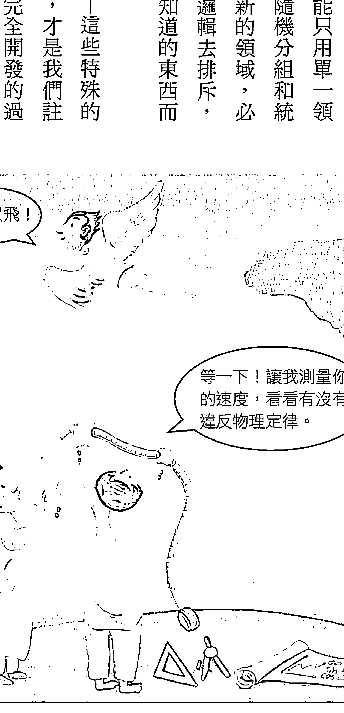

後來我和哈佛的心理學家泰勒（Eugene Taylor）合寫了一篇論文，把這個研究重新帶出來，更深一步探討靜坐帶來完全的放鬆狀態，發表在《生理醫學新知》（News in Physiological Science），也得到相當多的迴響。提到修練，我會提到這位瑜伽大師和很多實例，也是要表達——人類對身心層面的理解相當有限，而將自己的潛能設限，限縮成有限的可能。甚至把這些能力稱為「超自然」，而忽略了這些「超自然」其實才是最自然的特質。我們透過念頭，不只把自己洗腦，同時也局限了自己。

在靈性的層面，有更多數不完的潛能。然而，我們同樣把自己落在一個局限的角落，以為我們本身就是那麼渺小，而以為這些潛能跟自己的生命無關。於是，我才在不同場合，分享靜坐等等專注的方法，希望大家都可以把自己的身心當作一個實驗平台，把自己的全部生命潛能找回來。

哈佛的班森醫師（Herbert Benson）找了許多密宗和瑜伽大師做了不少這方面的研究。甚至在一九八○年代，遠征印度上達蘭薩拉（Upper Dharamsala），也就是藏人聚居的地方，找到三位密宗僧侶，探討拙火修練的生理效果。拙火修練是藏傳佛教古老的修法，透過苦修，讓年輕的僧人可以得到元氣（stamina），在冰天雪地中繼續專注修行。一般是在身體披上濕毛巾甚至倒冰水，透過呼吸或朗誦的練習，讓身體產生熱量，就好像從丹田創出一個自己運作的馬達。這種修練，就是讓身體帶著意識走。最不可思議的是，這麼做所產生的熱相當大。熟練拙火修練的僧侶，非但不受冰冷的影響，甚至可以把掛在身上的濕毛巾烘乾。班森醫師測量了修練拙火時，體溫和其他生理參數的變化，把這些結果發表在有名的《自然》128，讓當時的學術界覺得不可思議。一般來說，科學界最重視的跨領域期刊，在美國是《科學》，在英國是《自然》。華森 (James Watson) 和克里克 (Francis Crick) 一九五三年將他們對DNA結構模型的研究寫成一篇通訊 (letter)，發表在《自然》，一九六二年拿到諾貝爾生理醫學獎。這個研究能在《自然》刊登，它的意義可見一斑。

> Young, J. D. E., & Taylor, E. (1998). Meditation as a voluntary hypometabolic state of biological estivation. News in Physiological Science, 13(3), 149-153. 這個期刊由美國生理醫學會主持，後來更名為Physiology。
> Benson, H., Lehmann, J. W., Malhotra, M. S., Goldman, R. F., Hopkins, J., & Epstein, M. D. (1982). Body temperature changes during the practice of g Tum-mo yoga. Nature, 295, 234-236.

我的父親，同一段時間，在麻省理工學院的生物醫學工程臨床儀器中心也對人類潛能的主題有很廣泛的涉獵。我當時常跟我父親開玩笑，不光是印度、西藏的瑜伽士，大概全世界最奇怪的人都集中到他的實驗室了。雖然那是我免疫和腫瘤研究最忙碌的時候，只要有時間，尤其是週末，我就會過去參與。

當時就發現，只要集中一個人的注意力，就可以造出許多超能力，而且是可以測量的。這種超能力有相當多的實例。莫飛在《人體的未來》做了相當完整的彙總，其中一個很有意思的例子是台籍日本棒球選手王貞治 (Sadaharu Oh)。

王貞治在二十二年的職棒生涯中打出八百六十八支全壘打，遠超過美國職棒大聯盟的全壘打王貝瑞．邦茲 (Barry Bonds, 762)、漢克．阿倫 (Hank Aaron, 755) 和貝比．魯斯 (Babe Ruth, 714)，在日本職棒贏得十五次全壘打王頭銜。他從一九六五到一九七三年，帶領讀賣巨人隊贏得連續九年的日本職棒全國冠軍。

不過，他在巨人隊的前三年，並沒有盡全力，時常在銀座酒店流連忘返。一九六二年，荒川博 (Hiroshi Arakawa) 成為王貞治的教練，他要求王貞治菸酒不沾，拜合氣道創始人植芝盛平 (Morehei Uyeshiba) 為師，學習在球賽中為自己創造一個「心理的時空」。後來荒川博教王貞治採用有名的金雞獨立打擊姿勢，他

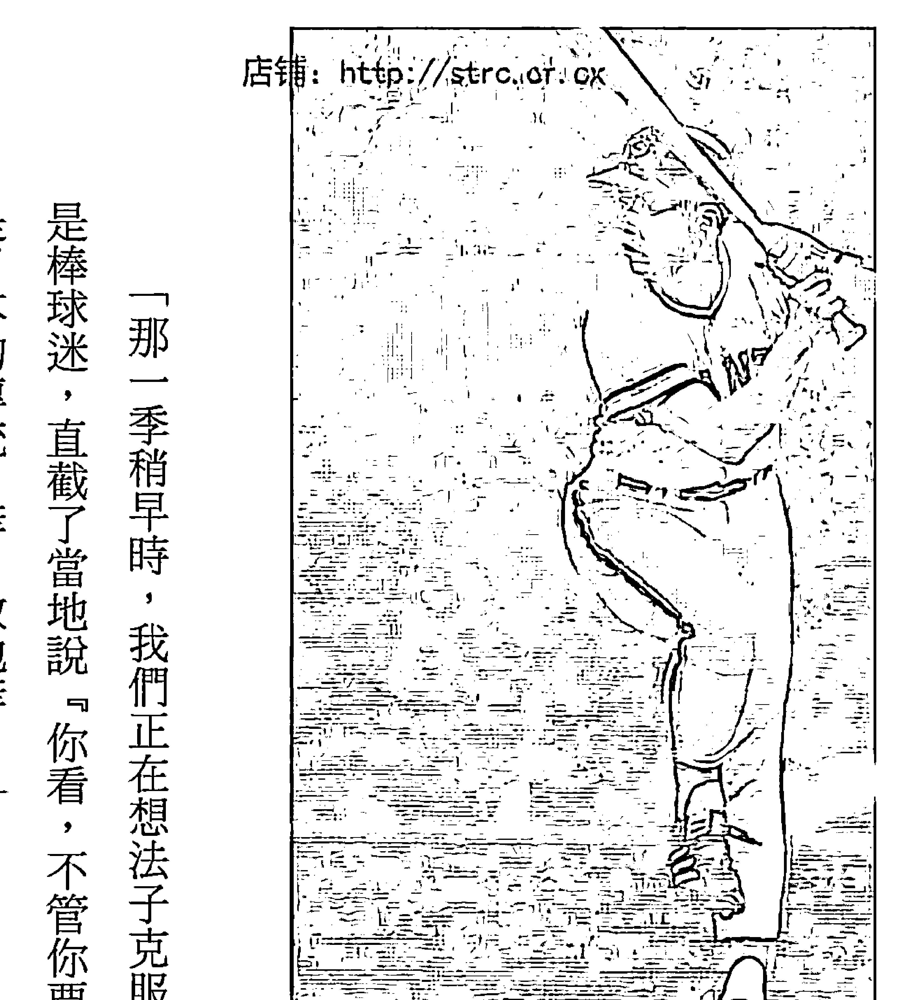

的打擊威力開始發揮，就好像這個姿勢讓合氣道的原則可以聚焦，王貞治自己是這麼說的：「……學合氣道，最先要學的就是聚焦到一個點上。」這個點，是每個人都有的能量點，也就是華人所說的丹田。除了守丹田，維持中央核心的穩定之外，王貞治還從合氣道學到了對「氣」的覺察，以及等待。「那一季稍早時，我們正在想法子克服我打擊暴衝的習慣。荒川教練去向植芝盛平師父請教。師父並不是棒球迷，直截了當地說『你看，不管你要不要，球就是會來。你能做的，就是等球來找你。學習等待，這是日本的傳統。等。教他等。』」

王貞治還學會了如何把「氣」導向手中的球棒，讓每一次打擊「猶如生死大事」。他學到日本戰國時代的不敗劍士宮本武藏在《五輪書》所說的「視近如置身事外，視遠如在眼前」，也就是「目付」的技巧。透過這樣的眼力，不只看得到投手的動作，也同時可以讀到投手的意圖。王貞治說：「不過，我還想學會更多。有時在球季中，我睡到一半醒來，會發現自己的心好像有火在燒。如果我是去銀座浪蕩，或一晚喝掉一瓶蘇格蘭威士忌再加幾罐啤酒，那也就算了。可是，我總為了棒球半夜醒來，心頭發熱。這種話怎麼說，聽起來都像個傻子。怎麼到了這種地步，好像活著就是為了打球。我對揮棒擊球的執著，和武士對劍道的一心一意沒有兩樣。這就是我的人生。」

一樣地，我這裡會提到王貞治，也是希望表達——雖然我們一般人的追求，都是希望在「動」中，找到全部身心的潛能。然而，就像王貞治親身體驗到的，是在等待中，一個人不動，甚至沒有念頭、沒有思考、沒有顧慮，才可以發揮全部的潛能。這和一般的想法大概完全相反。我們會認為這一生就是要規劃、籌備、打算、追求。然而，生命的根其實是落在念頭與念頭、動與動之間，沒有念頭、沒有動的空檔。一個人要達到最高的潛能，首先要體會到寧靜。透過寧靜，自然體會到任何動，包括念頭，還只是一個限制，而把生命從整體限制到一個生命的角落。只有透過寧靜，我們才能體會到生命的潛能遠遠超過自己一生限制自己的條件或狀況。要取得快樂，首先要懂得停留在寧靜。活出寧靜。

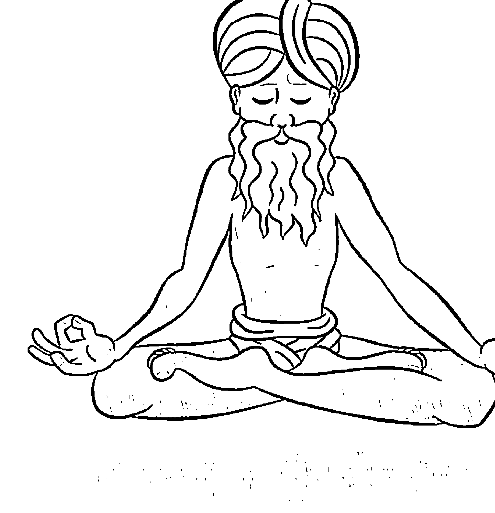

很多人認為靜坐會帶來種種的神通或超越的潛能，也想從這方面追求，這是相當可惜的。是，全部過去的研究和潛能開發，都在生理或物質的層面著手，也就是說，我們最多是把生命的全部落在物質的層面，卻忽略了透過無常的物質，想找到一個最終的答案是不可能的。華人也有不少專家投入人體潛能開發的研究，相當優秀。可惜的是，到目前沒有一個可靠而穩定的方法，足以讓大家發揮全部的潛能，而同時把快樂找回來。停留在特殊現象的層面，再怎麼去理解、分析，最根源的問題依然無法解決。因為大家把這個問題想得太複雜。我這本書的後半會強調，問題的解答，其實比大家想像的更簡單，甚至是比簡單更簡單。

### 06 超感官知覺（ESP）

前面談到人體的潛能，不可能不談超感官知覺，也就是一般人所說的 ESP（extra-sensory perception）。許多人都有過這樣的經驗，作了一個夢，後來竟然發生了，或者是料中了某件未來才發生的事。然而，這代表了什麼？是我們真有超感官知覺，或者只是巧合？

超感官知覺的定義是，一種不是建立在視覺、觸覺、嗅覺、味覺或聽覺這五官五感的知覺能力，例如心電感應、眼通或預知能力。歷史上有許多超感官知覺的記載，美國林肯總統（Abraham Lincoln, 1809-1865）遇刺前幾天，作了一個夢。夢裡許多人聚集在白宮哀悼，他上前詢問是誰的葬禮。一名士兵告訴他「是總統先生。」幾天後，他去福特劇場看戲時被暗殺。美國的基督教神祕家艾德格·凱西（Edgar Cayce, 1877-1945）在出神狀態下，能描述他從未去過的地方，也能答覆他從未研究過的領域的問題，而有「沉睡預言人」（the Sleep Prophet）之稱。不只是名人，普通人預知死亡、心電感應的例子更是多得談不完。這些現象，每一個人都有，不可能沒有。我個人記得小時候也常有這些經歷。拿我自己做驗證，這些經驗是再自然不過的。問題是我們心胸夠不夠開放，能不能坦然地把這些超感官知覺當作自然的現象，而不是只追究這些現象的真假。我們只要略作思考，馬上可以體會到，不可能透過五官加上念頭而可以完全捕捉整體。我們所談的「意識」，其實只是頭腦可以取得的資訊，而這個資訊，最多只是透過五官看聽聞觸嚐加上念頭的組合，都是透> 130 Rhine JB. 1934. Extra-Sensory Perception. Boston: Bruce Humphries.

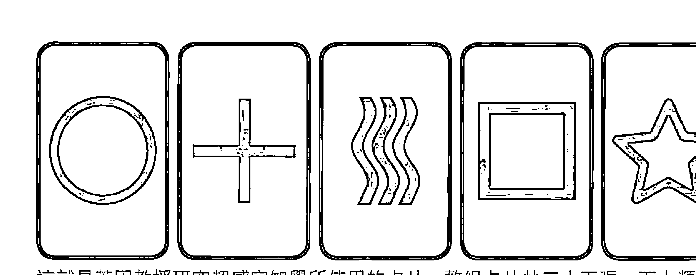

这就是莱因教授研究超感官知觉所使用的卡片，整组卡片共二十五张，五大类各五张变化。莱因教授发现有些人猜对的比例，高出理论上乱猜的机率值（二十五张猜对五种），并把它当作人类有超感官知觉的证据。

过于局限的神经网络所得到的。往往否定了身体其他部位（相对于神经系统）『沉默的大多数细胞』的知觉。
可以说，超感官知觉这个词本身就是错的。我们有限的理解，把人的能力限制在神经系统所愿意捕捉的范围。前面谈过 gut feeling（直觉），可说是一种不符合人类脑逻辑的知觉，其实也就是超感官知觉。把人类的某些能力强制划分为超感官知觉，从某一个角度来说，反而是忽视了生命的全部与完整。
重点是，我们是不是能打开心胸，平实看待这些现象。就像对静坐一样，用平常的语言以及理性将它科学化。
很有意思的是，有些科学家与医师，对这些经验抱持开放的态度，甚至试着做研究。一九三〇年代，杜克大学的莱因教授（Joseph Banks Rhine，后人称他「超心理学之父」）就开始研究一般人是否有超感官知觉。只是，即使耗费很长的时间，这方面的研究还是在很初步的阶段。
美国一位医师詹恩（Robert G. Jahn）在一九七九到二〇〇七年间，在普林斯顿大学的工程暨异常研究实验室（Princeton Engineering Anomalies Research Laboratory）探讨普通人能否用心灵影响一个产生乱数的机器，

结论是——可以，只是作用相当低。这种研究其实不胜枚举，像是一九七〇年代的尤里·盖勒（Uri Geller），有人说他是魔术师，也有人认为他是超能力者。史丹佛研究中心的电机工程学者暨超心理学专家普托夫（Harold E. Puthoff）邀请盖勒到他的实验室，猜测隔壁房间的图案。在相当谨慎的设计之下，盖勒猜对的比例远远高过乱猜。这个结果发表在一九七四年的《自然》期刊。132除了这些特殊能力，轮回或前世记忆因为没办法用一般的知觉、或传统的记忆来解释，也可以当作一种超感官知觉。我们每个人大概都有经验，遇到一个人，觉得这脸孔很熟，甚至会有画面闪过脑海，不知是哪里来的。有意思的是，不少受西方医学训练的医师探索这个领域。比如美国维吉尼亚大学医学院的史帝文生医师（Ian Stevenson），在一九六〇年担任精神科主任期间，听说斯里兰卡一个小孩子记得前世，也彻底地去调查，确认了这个孩子记得的就是他前世的父母。在五十年各式各样的案例研究中，他也得出一些结论，认为小孩子两三岁以前还记得前世，只是后来透过大人的教育，也就逐渐失去这种能力和记忆。由于他的纪录相当丰富而完整，包括了三千个记得前世的儿童的案例，也发表在主流期刊，而引起学术界的重视。好些传统的医师或科学家，也愿意面对这些不可思议的现象。除了他之外，美国耶鲁大学医学博士布莱恩·魏斯（Brian Weise），透过为案例催眠，意外地发现一位女患者不断回到一个又一个前世，可以追溯到希腊时代，做过奴隶，也做过平凡人，在这个世界一共有八十六次前世。他写的 Many Lives, Many Masters 相当轰动，或许你也读过（在台湾译作《前世今生》，也造出一股风潮）。

面对这些研究，很多科学家会批评方法不够严谨。然而，批评者没想过，再怎么严谨，在逻辑上本来就有矛盾。

相信你可以想像，这方面的研究一定会造出很多争议。我们用脑所建立的工具，来描述本来就超越脑本身的现象。一方面想跳出脑和逻辑的系统，另一方面，又困在系统内而想要看到外面，这本身就是不可能的。

要用局限的脑去了解全部，那是不可能的，再怎么彻底还是会造出争议。这些所谓的「超常」现象，本来是自然的现象。我们却要用有限的逻辑或观察去证明，反而带来一个矛盾，生出辩论，最终错失了重点。

因此，这种研究本身不可能帮助一个人找到人生的答案。与其在局限的逻辑里打转，还不如将自己当作一个受试者，将人生的制约告一段落，从内心去探寻真实，把真正的快乐找回来。

谈到这里，我就想起前面提过哈佛的班森医师。他做了很多静坐相关的研究，还写书建立「放松反应」、「安慰剂效应」等等身心的理论。你大概想不到，他本身毫无静坐的基础。我问他为什么不愿意去学，亲身体验静坐呢？他说，面对他的研究主题，他想保持一个客观的态度。

只是，他没有想到——在人间，只要头脑开始运作，本来就已经站在一个有限的角度在看一切，是不可能客观的。一个人有这么多机会接触古人各种好方法，如果真的去体会，一切也都会不同。可惜，我好意的劝说并没有起作用。

回到轮回的研究，我想唯一值得分享的，最多只是反映因果的法则。人类其实是 continuum（连续谱），没有头也没有尾，是连贯的。轮回没有什么稀奇，生命本身就是能量场。意识产生一个念头，也只是能量的转变。能量一定会转成某个别的形式，不可能消失。我们人生那么痛苦，在这能量场里受到制约，一个念头，再一个念头，再下一个念头，从早到晚离不开制约。前一个念头制约下一个，再制约下一个。我们连一个念头和念头之间都停不住，都在重生。轮回也没有什么不同，只是一生与一生之间能量所带来的流转。
所以，与其探讨轮回，还不如把注意力守住瞬间与瞬间之间的关系，看能不能打断这个制约，才能真正跳出人间带来的烦恼和痛苦。也只有这个办法可以找到真正的快乐。
找到真正的快乐会发现，我们本来就有全部的潜能。生命本来就是奇迹。我们的生命，本来就有感官的知觉和超越感官的知觉。即使这两个加起来，也还是全部生命的很小部份，离不开我们带给自己的制约。把注意力放在超感官知觉，把它当作值得研究或投入的异常，还只是一个很小的范围着墨。
跳出所有的知觉，包括传统的知觉和超感官知觉，一个人才会找到全部的生命，才会找到快乐。

## 没有「我」的快乐

## 01 超越经验

确实有一些现象，让我们体会到——人的脑可以以经验「超越」，至少感受到生命能脱离肉身的局限，甚至与全宇宙连接。宇航员在外太空第一次回头看到地球时所经验到的敬畏之情，这种现象被称为「全观效应」（the overview effect）。

美国宇航员米切尔（Edgar Mitchell）提到「这是一种意识爆发开来的感受」、「一种震撼人心的一体感和连接感……随之而来的狂喜……以及顿悟」。对于长期处在密闭环境，可能导致心理健康问题的宇航员而言，这类经验为他们带来许多短期和长期的好处。甚至，有些人会说这是他们一生最重要的经验。133

我们可以体会到这本身就是一种超越的感受。第一次，从「我」所习惯的角度之外，重新看这个世界，自然让人重新思考与自己、与其他人、与世界的关系，而体会到生命的不同层面。

> 133 Yaden, D. B., Iwry, J., Slack, K. J., Eichstaedt, J. C., Zhao, Y., Vaillant, G. E., & Newberg, A. B. (2016). The overview effect: Awe and self-transcendent experience in space flight. Psychology of Consciousness: Theory, Research, and Practice, 3(1), 1-11.

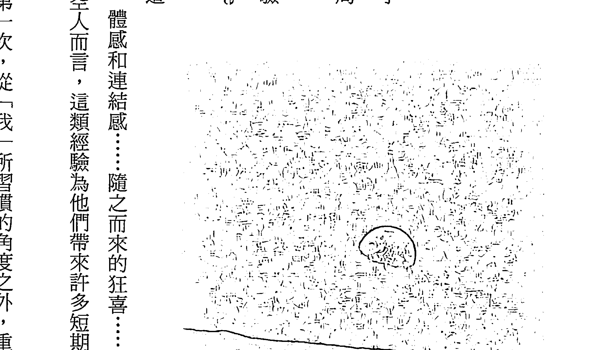

名作家海明威（Ernest Hemingway）于一战期间，在意大利因为爆炸受伤，写下了他亲身的经历：

> > 「一枚大型的奥地利迫击炮弹，当时称为炮灰桶（ash cans），在黑暗中爆炸开来。我当时就死了，觉得自己的灵魂还是什么的离开了身体。就像你拎着丝质手帕的一角，把手帕从口袋抽出来一样。那个东西在附近晃荡，回来后又进去了。于是，我再也不是死人。」

与海明威亲近的人形容他受到这次经验很深的影响，整个人都变了，不像以前那么强硬。

世界各地、来自不同文化背景的人，都描述过类似的濒死经验（near-death experience, NDE）。有些人受了重伤、或者在手术中心跳突然停止，在生死之间发生了鲜明的「超越」经验——觉得自己离开了身体，穿过暗黑的通道，见到明亮的光，强烈的平安、喜悦、与宇宙合一的正向感受。与死神擦身而过的人，有10~20%提到自己有过类似的经历。

西方的科学家往往把濒死经验简化成生死攸关之际诱发的不同生理状态。举例来说，「好像离开了身体」，被视为不同意识状态或与睡眠类似的幻觉。至于「经过一个黑暗的隧道」，则被诠释成眼球的血液与氧气供应不足。喜悦等正向情绪，则是脑部的期待系统释放多巴胺和其他神经传导分子所导致。

其实，对于这些超越身体的经验，科学的研究还在起步阶段。二〇一〇年，意大利乌迪内大学的研究团队，透过「气质性格问卷」一共两百四十题测验，去评估一个人自我超越的程度——也就是一个人是否能够超越各种情况下的感受和作为，并将自己视为宇宙不可或缺的一部份。

他们所研究的对象是动手术切除脑瘤的患者。结果发现切除了脑部后下顶叶的患者更容易产生自我的经验，如果这个患者有宗教信仰，产生的超越感会更强烈137。后下顶叶的脑区，与一个人架构身体的感觉有关。很有意思的是，当脑部掌管身体界线感的部位失去了功能，一个人反而自然感受到超越。

美国费城宾州医学中心大学在二〇〇一年也执行过一项研究，邀请八位资深的藏密修行者前来静坐，发现静坐时脑部顶叶血流量明显减少138。同样地，顶叶不起作用，好像反而带来静坐时身体「空」掉了的感受。

我们一般都认为脑的活动就是人生可以体验到的经验的全部，然而，无论濒死经验、切除脑部顶叶、透过静坐让顶叶作用下降……脑的作用降低了，生命的感受和体验竟然也还存在。就像人体的交感神经，是必不可或缺的系统。然而，当我们放松下来，交感神经不那么活跃，我们的生命也还在。不只还在，而且更容易体验到喜悦和平安。也就是说，不再停留在「我」既紧张又局限的状态，反而会发现快乐才是与生俱来的本能。

从另外一个角度来说，脑最多只是个工具，一个脑区在休息或不太作用，对整体也不见得有什么大的损失。然而，我知道这对很多人来说，是很不可思议的观点。

137 Urgesi, C., Aglioti, S. M., Skrap, M., & Fabbro, F. (2010). The spiritual brain: selective cortical lesions modulate human self-transcendence.
138 Newberg, A., Alavi, A., Baime, M., Pourdehnad, M., Santana, J., & d'Aquili, E. (2001). The measurement of regional cerebral blood flow during the complex cognitive task of meditation: a preliminary SPECT study. *Psychiatry Research: Neuroimaging*, *106*(2), 113-122.

我相信你会发现，这些研究有很客观的部分，例如透过影像技术得到的脑变化的数据，可以反复验证。

当然，我们可以把一些没办法解释（不合理）的境界，当作超越。只是，从我个人的看法，这些境界也只是一些现象，最多比一般生活的觉受微细。本身还是在动，会生起，也会消失。并不是真正的超越，没有真正超越头脑或身心的制约。

目前用西方的研究，最多只能把超越定义到这里。然而，我要谈的超越不只如此。我们仔细观察，自然会得到这样的结论：人类的脑，也就是一个局限、逻辑为主、对立的脑，不可能去理解一体——没有局限，没有对立的全部存在。头脑本身就受到逻辑或理性思辨的限制。只是我们都被自己洗脑了，认为这些逻辑代替一切，而很难跳出来。

无论如何，分享这些研究，所要表达的是——人类头脑的架构本来就可以支持超越「我」的快乐。甚至，可以体会无思无想的状况。念头和念头的空档、宁静、沉默大到一定的程度，我们也自然把它当作一个超越的体验。这些现象，包括前面提过的超感官知觉，本来就是最普遍的潜能。

## 02 心流：透过快乐，发挥潜能

要谈生命全部的潜能，或许有些人会觉得太遥远，和自己无关，是以后、未来或别人的事。然而，这种超越的状态，不是天才的专利，而是每个人都体验过，也可以一再体会到的。

人可以透过练习和体会进入一种奇妙的状态。曾经拿过三次大满贯冠军的网球选手亚瑟·阿什（Arthur Ashe）和棒球界的传奇人物提奥多·威廉斯（Theodore Samuel Williams），在描述自己比赛中的身心体会时，都用了 in the zone 这样的表达，也就是「进入状态」或「在状态」的意思。也有人说「契入（tuned in）」、「自动（on auto）」、「通了（switched on）」、「对上了（being in the groove）」，来表达一种特别清醒、专注甚至集中的超越个人的巅峰状态。在这种状态下，时间好像变慢，觉受特别清晰，一种不受时空限制的喜乐流通身心，每个细胞都可以感觉到不一样。

在这一刻，仿佛大脑忘了它自己，进入了一种「忘我」的状态，也就是我在《全部的你》与《神圣的你》所提到的，脱离了「我」或一般意识的局限。

后来，任何在运动领域有卓越突破的人，无论是篮坛的麦可·乔丹（Michael Jordan）、勒布朗·詹姆斯（LeBron James）、魔术强森（Magic Johnson）或足球的梅西（Lionel Messi）、罗纳度（Cristiano Ronaldo），或棒球的十月先生（Reggie Jackson）、李维拉（Mariano Rivera）、网坛的费德勒（Roger Federer），都以类似的话来描述自己的巅峰表现。十月先生也说，在关键、最紧张的时点，包括观众都紧张的时点，他反而不紧张，而且投入这个瞬间，那一瞬间好像拉长了。李维拉是美国职棒唯一在世界大赛、联盟冠军赛、全明星赛都拿过「最有价值球员」荣耀的投手。他接受李察基尔的采访时提到「在投球的时候，我感觉到场上只剩下我和捕手，甚至没有打击者。球场犹如出现了一个通道，一端是我，一端是捕手，而通道之外的一切，包括球迷的喧嚣和呼唤，都消失了。那种宁静，没有什么能把我拉开。」我个人也喜欢运动，自己也有这方面的体验，多年来也喜欢和运动选手接触，甚至希望可以帮助他们进入这种绝佳的状态。除了分享《真原医》的理念，包括好水、微量元素、完整的营养、静坐、心理层面的管理，我有机会也谈「全部生命系列」的一些概念。无论在国外或国内，都有很好的回响。有一位跟我接触过的跆拳道选手，在奥运得到相当好的成绩。他曾经告诉我，最关键的那一场比赛，虽然对方比他高大，那一瞬间却好像冻结了，对方的每一个动作都看得清清楚楚，就好像在眼前慢动作播放，一切都在他掌握之中。在别人眼中，那是一个毫秒级、甚至微秒级，根本来不及看清的瞬间。对他而言，却是永恒的画面。这种胜利，不是透过脑的动、脑的思想可以掌握的。然而，一再地进入这个状态，一个人也会更为熟悉。种种胜利，让人印象深刻，甚至永远流传的创作和纪录，都是透过这种专注的状态而得。每一个人都会表达那种最快乐、最满足的时候。是一种不可能在人间寻得的喜乐，透过他们把作品开展出来。这种状态十分奥妙，大多数人会用「灵感」来表达，却很少有人清晰描述这种状态，甚至怎么进入这种灵感。直到美籍匈牙利心理学家契克森米哈赖（Mihaly Csikszentmihalyi）一九九〇年的作品，才把这种灵感状态定名为Flow，也就是「心流」。

契克森米哈赖所描述的「心流」是一种很集中的专注，而且完全投入。心流中，每个思考、动和决定，一个到下一个，毫不费力，不是经过人脑的思考、推算和规划而来的。他和许多心理学家、医师都证明了这个观念是正确的，不限于运动领域，任何人都可以达到这种境界。这一观念相当深入人心，美国前总统柯林顿、英国前首相布莱尔都公开认同他对「心流」的体会。

有趣的是，心流理论不光是描述这种超越个人的状态，甚至归纳出一些原则，试着帮助有心超越自己的人进入心流。归纳出的几个因素包括：所从事的任务是刺激的，对一个人的生理、心理或知性具有挑战性。这一任务需要有难度，必须完全集中注意力、下定决心才可以完成。个人也要有一定的技术水平，觉得自己能掌控、能充分发挥，才能承担难度所带来的挑战。

简单来说，凡是带有一点风险的活动或任务，比较容易让人达到这种境界。同时，在心流状态从事这样的活动时，是相当享受的经验。

更有意思的是，一个人要有清晰的目的来做这件事，才有足够的诱因进入心流状态。而这个目的，本身自然能带来正向的回馈（例如获胜所带来的成就感）。

心流状态，可以说是种种正向回馈集合，身心最舒畅的运作状态。包括周边的正向回馈，例如身边人给予鼓励，也包括自己的正向回馈，像是个人的充足准备以及自信。

这一点，相信我们都体会过，一个人有自信的时候，是非常自在舒畅的。这种自信，自然带来快乐，而让人容易进入心流。倘若一个人很忧郁、焦虑，或总是听到负面的评论，让一个人的信心打了折扣，往往就阻碍了他进入心流。

我过去一直推广正向鼓励的教育与学习，包括读经、全人教育。比起批评与责备，正向的鼓励，更能够一个人充分打开自己，接受宇宙带来的一切，而让全部的生命潜能透过他发挥出来。

心流状态可以发生在各行各业、各种活动或任务中。正向心理学等心理疗愈学派，也采用观想、静坐等方式，帮助个人开发潜能。

只是，心流虽然不可思议，比起人人都有的全部生命，它还是很小的一部份。然而，至少是透过我们的「体」所可以体会到的。透过心流，我们可以尝到一点全部生命带来的快乐和创造力，在重重局限的人间，活出无限的潜能。

141
Swann, C., Piggott, D., Crust, L., Keegan, R., & Hemmings, B. (2015). Exploring the interactions underlying flow states: A connecting analysis of flow occurrence in European Tour golfers. Psychology of Sport and Exercise, 16, 60-69.
Uilen, F., de Manzano, O., Almeida, R., et al. (2012). Proneness for psychological flow in everyday life: Associations with personality and intelligence. Personality and Individual Differences, 52(2), 167-172.

## 03 怎麼進入心流

前一章談到心流的快樂，以及這種來自全部生命的快樂，透過心流所能發揮的突破，相信你會想更進一步探討它可以怎麼運作。同時，有過心流體驗的朋友，哪怕只是片刻，也都會希望這樣的經驗能在人生中重複再重複。

要進入心流狀態，所投入的任務要是當事人會覺得有挑戰性的。太簡單的任務，會讓人覺得無趣乏味而不想投入。太難的任務則會讓人退縮。就像以下這張圖，樂趣最高的點，不在圖的最右邊（實力強，一定會贏），當然也不在圖的最左邊（實力弱，一定會輸），而是在圖中間偏右的地方。就拿打羽毛球來說，不只是要勢均力敵，而且還要比對方實力稍強一點點。也就是說，難度—實力有一定的均衡，能帶來最大的樂趣，而得以進入心流。

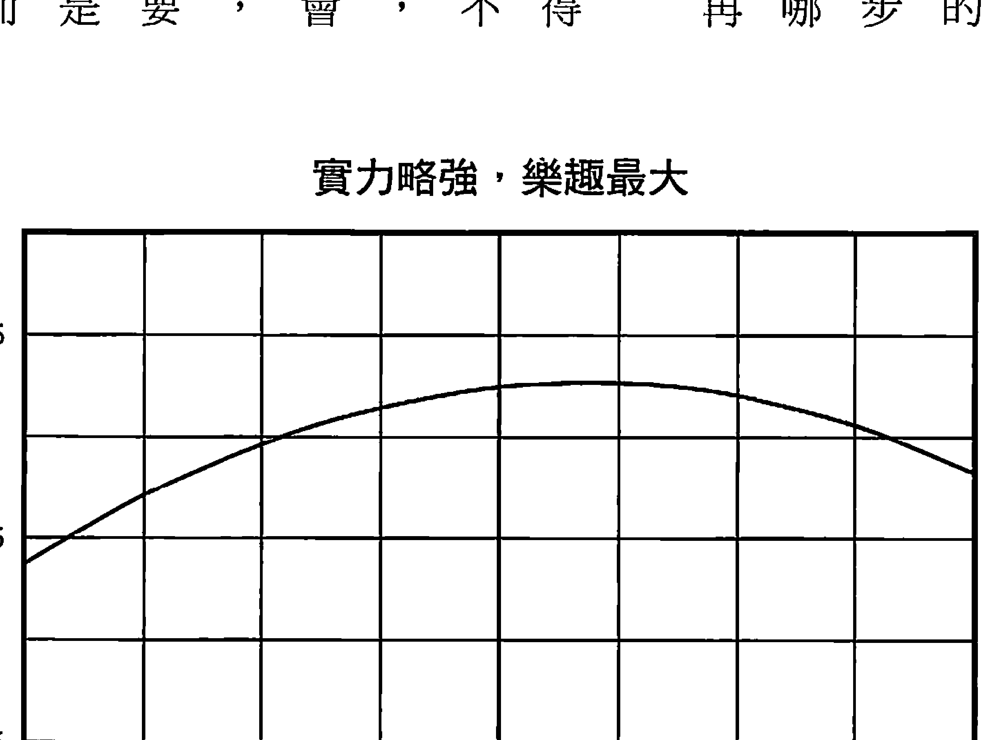

> 經 SAGE Publications 同意，重製並翻譯自 "Abuhamdeh S, Csikszentmihalyi M (2011). The importance of challenge for the enjoyment of intrinsically motivated, goal-directed activities. Personality & Social Psychology Bulletin 38(3), 317-330."

談到樂趣，也就是快樂與心流的關係。相信你已經發現，心流狀態和這過程的情緒或心理狀態有關。契克森米哈賴也提出了一個理論，告訴我們只有在難度夠高、個人實力也夠好的狀態下，人才有幸能進入心流（下圖右上角小小的黃色區域）。其他區域的狀態，也會就是難度或實力不足夠也不相當的情況下，則會引發焦慮、擔心、不想投入、甚至沉悶的感受，很難和心流接軌。

那麼，腦部在專注的心流狀態下是怎麼作用的？

德國烏姆大學的科學家找來二十七名一般男性，透過心算題讓他們進入專注、無聊或太難想放棄的狀態，並且用fMRI觀察他們專注做心算時的腦部活性變化。

希望你還記得，做這類研究，要自願被綁在檢驗床上，被推送到一個密閉的空間，還得做心算題，稱不上享受。所以，他們每個人會得到二十五歐元的酬勞。

### 挑戰性高，實力好，容易進入心流


> Abuhamdeh, S., & Csikszentmihalyi, M. (2012). The importance of challenge for the enjoyment of intrinsically motivated, goal-directed activities. Personality and Social Psychology Bulletin, 38(3), 317-330.
> Nakamura, J., & Csikszentmihalyi M. (2002). The concept of flow. In: Snyder CR, Lopez SJ (Eds). Handbook of Positive Psychology. New York: Oxford University Press, pp. 89–105.

而自動調整難度。右方就是一個太簡單，而一定會誘發無聊感的題目。受試者在難度相當的心算題誘導之下進入心流時，腦部掃描顯示左額葉下迴 (left inferior frontal gyrus) 和左殼核 (putamen) 這兩個區域的腦部血流量增加了 (下圖左，橘黃色的區域)。

| 1 | 2 | 3 |
|---|---|---|
| 4 | 5 | 6 |
| 7 | 8 | 9 |
| Delete | 0 | Enter |

這種題目，一定會讓一般成人覺得無聊。在這項研究中，受試者躺在 MRI 裡，加總題目出現的數字，透過軌跡球操控螢幕上的虛擬鍵盤，將答案輸入。

> 重製自 "Ulrich, M., Keller, J., Hoenig, K., Waller, C., & Grön, G. (2014). Neural correlates of experimentally induced flow experiences. Neuroimage, 86, 194-202." 符合創用計畫授權條例 (Creative Commons licence)

### 專注時活化／不作用的腦區


這幾乎是這本書最後幾張腦部影像圖了。讀到這些腦部的專有名詞，希望你鼓起勇氣堅持下去，不要萎縮，不要退縮。圖 A 的亮點分別是左腦的額葉下迴 (L IFG，上) 和左腦的殼核 (L Putamen，下)。旁邊所附的統計圖，縱軸是平均 rCBF，也就是神經的活性，橫軸的 B、F、O 分別是做心算題時的三種心理狀態：無聊、專注、太難想放棄。兩相比對，你會發現這兩個位置都是在專注時最為活躍。圖 B 則分別是內側前額葉 (MPFC，上) 和杏仁核 (L Amygdala/PH，下)。比對旁邊的統計圖，你會發現這兩個位置是在專注時最不活躍。

> 重製自 "Ulrich, M., Keller, J., Hoenig, K., Waller, C., & Grön, G. (2014). Neural correlates of experimentally induced flow experiences. Neuroimage, 86, 194-202." 符合創用計畫授權條例 (Creative Commons licence)

> Ulrich, M., Keller, J., Hoenig, K., Waller, C., & Grön, G. (2014). Neural correlates of experimentally induced flow experiences. Neuroimaging, 86, 194-202.
> de Manzano, Ö., Cervenka, S., Jucaite, A., Hellenäs, O., Farde, L., & Ullén, F. (2013). Individual differences in the proneness to have flow experiences are linked to dopamine D2-receptor availability in the dorsal striatum. Neuroimaging, 67, 1-6.


就算不懂这些名词，我依然可以专注，可以得到快乐。

前面提到在专注时，壳核的血流量会增加。壳核属于多巴胺系统，相信你也会联想到快乐。瑞典的研究团队用问卷评估一般人在工作、做家事、玩乐时进入心流的倾向。区分出有或没有“心流性格”的人，再透过PET来追踪。结果发现容易有心流体验的人，壳核的多巴胺活性比较高。

多巴胺或许能帮助一个人不那么神经质、比较审慎进取，可以忍受接受挑战时的压力和焦虑，对挫折的耐受性更高，而能在专注时维持...

左额叶下回主管比较强烈的认知控制感，而壳核则是负责判断得出结果的机率，也是脑部分泌多巴胺的位置。很明显地，这两个区域与受试者做心算题的过程有关。知道自己能完成一项任务，本身也带来快乐。

同时，内侧前额叶和杏仁核的神经元活动变得比较不活跃。如果你还记得，内侧前额叶是一个人的「我」运作的地方，而杏仁核则与负面情绪尤其是恐惧有关。也就是说，在专注的状态下，一个人非但比较忘我，同时也更不受恐惧的影响。

前面提过心流是主动投入一件有挑战性的事，带来一个不费力的高度专注，以及很大的享受，而且「我」很少运作。

持正面的心情，進入心流。

讀到這裡，如果你還沒有萎縮得太厲害，可能會覺得驚訝，沒想到科學家連心流這種輕輕鬆鬆的狀態也不放過，還要用神經科學那麼認真地來分析。其實，這就是科學精神的可貴之處。這些研究也點出了一個重點：任何可以體驗的，無論是快樂或心流，早就有一個生理的架構在等著支持它，也就是我們的本質。

可以想像，如果有更多人能時常進入心流狀態，能解開出多大的創造力，能有多少人活得更充實、更快樂、更平安、更滿足，讓人時時處於身心自在的狀態。

## 心流——無念的狀態

我在過去的作品也提到過，超越頭腦的無思無想，才是人類意識演化的方向。一般人會認為不可能，根本不相信沒有念頭，一個人還能正常運作，更別說應付工作和家庭種種的任務和負擔了。然而，相信你只要體驗過心流狀態，無論什麼領域，都可以肯定——在這過程中，腦子連一個多餘的念頭都沒有。

正如我在《神聖的你》所說的，也許就是沒有思考沒有一個多餘的念頭在中間阻擋著，注意力所體驗的主體（你、我）和體驗的對象（客體，眼前的任務）也就合一。最不可思議的是，經驗的主體和客體合一，依然能夠完成眼前的任務，甚至還激發出內心深刻的平安和喜樂。

而且，因為沒有念頭，回頭問他們是怎麼辦到的，也很難描述出來。八〇年代在NBA與魔術強森齊名的賴瑞．柏德（Larry Bird），十二年職業球員生涯全部效忠波士頓塞爾提克隊（Boston Celtics），多次獲得最有價值球員的頭銜，球隊也三度獲得NBA總冠軍。這位被譽為籃球史上智商最高的人說：「在球場上，我只是對眼前的狀況做反應，太多太多次，我是傳了球之後，又過了一秒或一個瞬間，才發現自己做了什麼。」邁可·喬丹也說在場上時「籃框就變大了，怎麼可能投不進去。」八〇年代的名橄欖球運動員，九次入選超級杯，得過兩次最有價值球員頭銜，後來入選名人堂的佩頓 (Walter Payton)是全美橄欖球聯盟 (NFL)芝加哥熊隊的傳奇跑衛 (running back)，在場上持球衝鋒穿越重重阻礙，如入無人之境。全美橄欖球聯盟甚至設立了以他為名的「年度沃特·佩頓獎」。同樣入選名人堂的球員暨教練迪克塔 (Mike Ditka)稱他是史上最了不起的橄欖球員，超越了人類可以有的表現。佩頓說過「大家都問我為什麼這麼做或那麼做，然而，我根本不知道自己為什麼這麼做或那麼跑，我就這麼做了。」金勃莉·金 (Kimberly Kim)十四歲贏得美國女子高爾夫球業餘錦標賽，締造了最年輕的冠軍紀錄，她也說：「我也不知道自己怎麼辦到的，我就是揮桿，球就這麼出去了。」這些觀念，東方其實老早就懂，無論佛教、道家都是很普遍的觀念。甚至華人很早就提出「無為而無所不為」，也就是沒有「動」的「動」，這也是禪兩千年傳下來的一些基本的觀念。有趣的是，從西方的角度來看，心流是一種個人的特質，最多只理解它的腦部作用和效果，而沒辦法隨時掌控這個境界。然而，東方的哲學早就把它貫通，而隨時可以把它找回來。可惜的是，華人社會長期的西化，而使得我們的思維開始採用西方的科學，認為一定要有所謂「科學」的研究，才可以落實。我接下來，想帶出東方古人的智慧和完整的系統。透過這個系統，自然可以把心流，或更高的心理狀態找回來。這才是寫這本書的主要目的。

## 04 靜坐與快樂

契克森米哈賴接下來又做了上百個會談，對象包括各行各業，來談心流的狀態。他的結論是，心流是每個人都有的，即使在工廠工作或打掃、在家做飯、登山，都可以進入這種狀態。

就像前一章所談到的，這個任務要有一點挑戰性，不能太簡單，也不能太難。太簡單會無聊，太難會乾脆放棄。假如一個任務太簡單，人就很容易分心。我們都親眼見過這個現象，有些很有天賦的孩子，他本來自己學得很快，逼他待在比較平庸的環境，他的學習反而慢下來。

這些都是多巴胺的作用。多巴胺讓我們去篩選出哪些記憶比較重要，而不會被不那麼重要的事件干擾。

可以說，集中注意力的時候，多巴胺的作用增強，聯想的速度更快，讓人更有創造力。

任何稍有難度而能集中注意力的活動，例如足球、圍棋、畫畫，都可以釋放多巴胺，而帶來心流。這也可以解釋，為什麼各領域的高手，也比較容易快樂。

我在《靜坐》花了很多篇幅談靜坐的方法，大多數都強調要把注意力集中在一個點上。集中注意力，本身就是帶有些微的難度，正符合創造心流的條件。靜坐會創出新的迴路，而使得這個迴路愈來愈強。最有意思的是，透過靜坐，可以帶來腦部整體結構的改變，而且這個改變是永久的。一個人只要持續靜坐，這些效果都可以持續一生。

我認為最有趣的是，靜坐時，一個人表面上不動，透過專注，在腦中還是不停地動，從來沒有不動過，只是把「動」集中在腦的某幾個部位。現在的科學家都可以證明，靜坐可以活化各種快樂的神經路徑。

### 靜坐，一再強化專注的腦部迴路

提到「動」，靜坐帶來的變化，和行善有相同的效果。

西元前四世紀的古希臘哲學家亞里斯多德說過「善行帶來快樂」。亞里斯多德是柏拉圖的學生，而柏拉圖師從蘇格拉底這位最偉大的西方哲學家，這三位被譽為西方哲學的奠基者。有意思的是，蘇格拉底可以說是西方哲學之父，和佛陀、耶穌一樣，自己沒有留下任何作品，是後來的弟子整理成書，世人才得知他們的思想。柏拉圖在《理想國》中就引述蘇格拉底的話——活得公義，會帶來快樂；而活得不公義，自然不快樂。

十八世紀的愛爾蘭哲學家法蘭西斯·哈奇森（Francis Hutcheson）也說「最好的行為，就是確保絕大多數人的最大幸福」。

行善同樣可以帶來新的迴路，而且這個迴路是會一再自我增強——行善帶來滿足感，滿足感讓人更樂意行善，而繼續行善帶來更大滿足……這一點很容易理解，行善對周邊的人有利，而這些讚美和鼓勵會回頭再強化善行。透過社會互動的放大，為了別人而行善，在快樂神經迴路的效果，比起飲食等個人的享樂，還大得多。

當然，利他的行為也離不開物種的生存。然而，這一點很難說是一個物種為了生存而有利他的行為，還是有了利他的行為而更能生存。

回到靜坐，正是透過神經迴路的一再強化，而使得靜坐會集中注意力，帶來滿足感，讓人放鬆。

### 静坐，预防大脑老化

许多的「动」，也许是登山、潜水、画画、玩接龙、数独，都一样地，透过投入、专注，以及从中得到的乐趣，带来一次又一次的小成就，而集中我们的注意力，自然也强化脑中相对应的神经回路，而一次又一次的经验到快乐。

静坐，无论是透过专注或观想，都会设立新的回路。无论哪一种新的回路，都自然会让我们比较可以应付恐惧、愤怒、悲伤、厌恶性种种感觉。也就好像一个新的回路设定之后，我们的注意力就跟着这个新回路跑，而比较不会被种种负面感受所干扰。

说到回路，科学家是不会放过的。如果你还记得前面谈的脑部可塑性，对静坐好奇的科学家，就会想探究脑部是不是真的因为静坐而发生变化，而且最好是非常寻常的变化。

静坐带来的，不只是静坐时短暂的变化，还包括更长期的脑部变化。美国哈佛医学院的拉萨博士（Sara Lazar）很年轻就对静坐感兴趣，在哈佛医学院成立了一个专门探究瑜伽与内观静坐的脑科学实验室。近

> 147 Mindfulness 这一词，也就是梵文 Vipassanā 的英译，原本译作内观，现在由美国传回来的流派，多半译作正念。我偏好内观的旧译，它本身是中立的。反而正念一词，难免让人有价值观上正面或负面的联想，离不人主观而受限的判断。一个人真正快乐，连正负的分别都要抛开。
> 146 Engström, M., Pilsgård, J., Lundberg, P., & Söderfeldt, B. (2010). Functional magnetic resonance imaging of hippocampal activation during silent mantra meditation. The Journal of Alternative and Complementary Medicine, 16(12), 1253-1258.

### 靜坐，大腦不老化


這兩張圖，都是來表示大腦皮質厚度與年齡的關係，只是腦區不同。縱軸是厚度，橫軸是年齡。藍色的點是有靜坐習慣的人，而紅點是沒有靜坐的人。左右兩張圖的差異在於腦區的不同，左圖是腦島的皮質厚度，右圖是布洛曼第九、十腦區的皮質厚度。你應該已經發現，有靜坐習慣的人，儘管年紀大了，大腦皮質還是比較厚。不像對照組，似乎年紀大了，皮質厚度也就下降。右圖加上兩條趨勢線，讓你能看得更清楚。

> 經 Wolters Kluwer Health 同意，重製自 "Lazar, S. W., Kerr, C. E., Wasserman, R. H., Gray, J. R., et al. (2005). Meditation experience is associated with increased cortical thickness. Neuroreport, 16(17), 1893-1897."

年來，內觀靜坐減輕壓力的課程（MBSR）在美國東岸及西岸的頂尖機構如哈佛大學和史丹佛大學掀起一股熱潮。NBA的菁英球員如小飛俠科比·布萊恩（Kobe Bryant）、歐尼爾（Shaquille O'Neal）與麥可·喬丹也學習內觀靜坐，強化自己在球場上的臨場表現。

拉薩博士找來二十位有多內觀靜坐經驗的受試者，和十五位沒有靜坐經驗的人對照，用MRI觀察他們腦部的差異，相比之下，有靜坐的人的腦部皮質比較厚。

皮質包括灰質與白質，也就是大腦神經元和神經連結集中的地方。皮質比較厚，也就是說腦部神經本身的量和連結的量都增加了，代表腦部的神經迴路發生了長期的改變。這些變厚了的皮質，正是內觀這種靜坐法所強調的注意力、體內感覺和感官覺受的功能區域。或許是神經元正在增長，也可能是神經連結產生了變化。總之，腦部變得比較年輕而有活力。

我在許多場合介紹過這個研究，科學家已經知道，一般老化的過程，腦部皮質會隨之變薄。拉薩博士將靜坐者和非靜坐者的腦島（負責體內感覺）以及布洛曼第九、第十腦區皮質厚度對年齡作圖，用藍色的點代表靜坐者，而紅點是沒有靜坐的人。我們可以看到，就整個趨勢來說，藍色的點無論在哪個年齡似乎都維持在一定的厚度以上，而紅色的點則隨著年齡而下降。也就是說，靜坐似乎可以對抗腦部的老化，讓皮質厚度保有年輕時的水平。

拉薩博士後來又做了一個研究，邀請想要減輕壓力的人，包括醫師和一般人，參與麻州大學醫學院所舉辦的八週內觀靜坐減壓課程，練習帶著慈悲與不判斷的心態，完全投入覺察當下的經驗。

這次著重觀察腦部灰質的變化。灰質是神經細胞所在的位置。灰質增加，代表神經細胞應該變多了。她們發現上完靜坐課的人，與學習和記憶相關的左海馬迴灰質增加。不只如此，包括跟記憶情緒調控、訊息處理和知覺、動作調控相關的腦區灰質也增加了，包括後扣帶皮質（posterior cingulate cortex）、顳頂葉交界（temporo-parietal junction）、小腦（cerebellum）。149

可以說，靜坐帶來的腦部長期變化，不只與記憶有關，還包括心情、認知和靈活度。光是八週的靜坐減壓練習，就能讓腦部變得聰明、快樂。不只我所接觸的奧運選手如此，NBA籃球健將也從靜坐得到好處。拉薩博士搭配影像技術和問卷測驗，發現靜坐的人，腦幹灰質增加，同時也比較快樂。150

> 149 Hölzel, B. K., Carmody, J., Vangel, M., Congleton, C., Yerramsetti, S. M., Gard, T., & Lazar, S. W. (2011). Mindfulness practice leads to increases in regional brain gray matter density. Psychiatry Research: Neuroimaging, 191(1), 36-43.
> 150 Singleton, O., Hölzel, B. K., Vangel, M., Brach, N., Carmody, J., & Lazar, S. W. (2014). Change in brainstem gray matter concentration following a mindfulness-based intervention is correlated with improvement in psychological well-being. Frontiers in Human Neuroscience, 8, 33, 70-76.

# 靜坐，促進多巴胺分泌


天然的多巴胺不會產生任何訊號，無法被 PET 量到。然而，採用可以產生微弱輻射而且和天然多巴胺結構類似的分子，就可以透過它間接地測量到多巴胺的含量。

簡單來說，腦部的多巴胺 D2受體就好像電影院的座椅，等著多巴胺就座（與受體結合）。如果腦部自己產生的多巴胺不多，那麼這些椅子就可能被外來的追蹤劑給佔據，而發出比較強的訊號（也就是圖中的光點）。如果腦部自己有足夠的多巴胺，那麼留給追蹤劑的位子就不多了。

所以，這兩張圖所代表的多巴胺含量，和訊號亮度恰好是相反的。綠色越強，代表腦內的多巴胺比較少。同一個人靜坐時，腦中的多巴胺含量（右圖），比閉眼專心聽錄音時還高（左圖）。平均推算下來，多巴胺在靜坐時升高了 65%。

> 經 Elsevier 同意，重製自 "Kjaer, T. W., Bertelsen, C., Piccini, P., Brooks, D., Alving, J., & Lou, H. C. (2002). Increased dopamine tone during meditation-induced change of consciousness. Cognitive Brain Research, 13(2), 255-259."

如果你還沒忘記那些快樂的分子，還記得血清素能幫助人抵抗壞心情的影響，那麼，對於接下來的結果，也就不會意外了。靜坐帶來的腦幹灰質增加，也包含了好些與血清素作用相關的位置。再加上靜坐可以改善失眠 151、飲食失調 152 以及焦慮與憂鬱 153。這些都是和血清素有關的症狀。靜坐可能透過腦幹灰質的變化，藉由血清素而對心情帶來正向的效果。

不只是血清素的變化，前面提過的多巴胺也是靜坐中會產生的快樂分子。血清素和多巴胺在腦內的作用位置雖然不同，但都可以帶來正向的效果。

> Kjaer, T. W., Bertelsen, C., Piccini, P., Brooks, D., Alving, J., & Lou, H. C. (2002). Increased dopamine tone during meditation-induced change of consciousness. Cognitive Brain Research, 13(2), 255-259. 舒眠瑜伽是一种介于醒睡之间的静坐法，受试者的资历短则七年，长则二十六年。为了确认脑部的变化，确实是这种静坐法所带来的，他们会记录同一个人闭眼专注听录音的脑部影像来比对。

快樂分子。一個丹麥與英國雙邊合作的團隊，都是從事神經影像研究的醫師。他們找了八位長年練習舒眠瑜伽靜坐法（yoga nidra）的男士來參與，採用 PET 記錄腦部自行分泌的多巴胺量的變化。 154 結果發現，靜坐和普通的專注時，受試者主觀感受到的滿足和放鬆感是相近的。然而，從腦部影像來看，靜坐時腦部紋狀體的多巴胺量變高了。

值得一提的是，靜坐者都提到靜坐時衝動降低了，同時視覺心像變得鮮明，而儀器不光是觀察到多巴胺的提高，同時也量測到深度靜坐典型的 θ 波（一種腦波形態）出現。我們前面提過多巴胺是欲望和追求帶來的快樂，然而，從這個結果看來，靜坐者所體驗到的，可能不只是多巴胺的作用。也就是說，快樂還有更深的層面。

讀了這麼多關於快樂的科學，就連靜坐也要有科學，或許你會覺得「夠了，這些科學什麼時候才可以放過我，讓我快樂」。其實，介紹這些研究，也只是為了讓你安心。讓你知道，科學家做這些研究，所得到的結論，和我多年來所談的「靜坐帶來生命的轉變，甚至快樂」是一致的。你可以想像，還有更多的腦部變化，如果你有興趣，都可以自己再去參考。然而，我還是要強調一點——快樂，是親身體驗，倒不是透過知識可以取得的。

任何靜坐的研究，最多只能描述一些靜坐所帶來的效果，並沒辦法從這些結果建立人生正確的一條路。然而，找回快樂，比任何練習，包括靜坐都還容易。它不是透過任何「做」所可以得到的。

# 05 信念的力量

談到靜坐可以改變神經迴路，不能不談心靈的力量。

前面提過哈佛的班森醫師，也談到臨床上常見的安慰劑效應（placebo effect，來自拉丁文 placebo「我將安慰」，指病人雖然獲得無效的治療，透過「預期」或「相信」治療有效的心理，而使得症狀得到舒緩的現象。也就是說，一個人的信念，確實能帶來改變。

不只如此，班森醫師又建議把安慰劑效應稱為 remembered wellness 155 記得健康、記得圓滿，也就是說，健康、滿足、自在或快樂是人類的本性，而安慰劑效應之所以存在，也只是反映我們本來就想回復到健康的狀態。所以，安慰劑效應，也只是我們記起健康的作用。這個觀念，和這本書的宗旨是一樣的。

從我個人的角度，要得到快樂，最多只是記得快樂，是把我們的本性、最根本的狀態找回來。

談到信仰，談到自信，我們會希望這本身也是可以練習或培養的。

發生生物學家立普頓博士（Bruce Lipton）在《信念的力量》（The Biology of Belief）156 從神經細胞處理

> Benson, H., & Friedman, R. (1996). Harnessing the power of the placebo effect and renaming it remembered wellness. Annual Review of Medicine-Selected Topics in the Clinical Sciences, 47, 193-200. 值得一提的是 - Annual Review of Medicine 系列包括醫學的每一個領域，在評論性質的期刊中是具有影響力的。

> Lipton, B. H. (2015). The Biology of Belief 10th Anniversary Edition: Unleashing the Power of Consciousness, Matter & Miracles. Hay House, Inc.

訊息的效率談起，顛覆了一般生物學家的成見。有意思的是，他從細胞生物學出發，最後得出的卻是對他個人生命的啟示。在其中，他分享了他個人的經驗，指出潛意識心靈比一般意識的運作更快、更牢固。當「意識」與「潛意識」所要的相衝突時，獲勝的永遠都是潛意識。一般的成功學或心理學，會教你站在鏡子前對自己重複：「我好可愛」或者「我的腫瘤一定會變小的」。然而，如果我們從小從周邊的人接收到的訊息是「喔，你不可愛、不漂亮、不夠好、不能幹、不行、不對、身體不好、又笨、又傻、會被騙。」這些早年的訊息會植入潛意識，成為潛意識編碼的一部份。潛意識依舊是意識，雖然低於我們平時的注意，記憶卻落在身體裡。我常說每一個細胞都有它的記憶。這些記憶落在神經元管轄的範圍之外，卻時時刻刻在影響我們。這些「覺得自己不夠好」的訊息力量，會壓過種種刻意的努力。然而，真正重要的是，潛意識心靈是可以改寫的，例如透過催眠、感恩的功課、以及按摩等種種身心治療，從更深的層面去改寫這些落在身心的程式。雖然有這些種種治療，其實還有一個更簡單的方法——靜坐。靜坐直接從腦部的結構、連結和迴路著手，重新建立新的路徑。不光影響到意識覺察的路徑，也改變潛意識運作的路徑。透過整體的結構改變，建立許多新的迴路，讓我們的注意力不會耗費在無用的負面路徑上。舉個實例，以呼吸為主的靜坐法，不光影響到隨意的反應，也影響不隨意的反應。常常練習，就連睡覺、休息時的呼吸都會拉長，自然讓人留在副交感放鬆的境界，帶我們回到平衡點，把寧靜和快樂找回。

> 有兴趣的朋友，可以参考我为呼吸这个主题所录制、撰写的专辑《重生：蜕变于呼吸间》。

來。 157 然而，我個人的看法，也就是從整體生命的角度來說，身心其實沒有分別。心靈也沒有什麼明意識、潛意識的分別。這些分別都是人自己造出來的。我們的五官五感只看得到身體，於是造出身體的分別；佛洛依德只意識到頭腦的作用，於是造出意識潛意識之別。 生命是一體的，甚至你和我每一個人是沒有分別的，我們對別人所做的，到頭來，還是會回到自己身上。過去所做的，也都存檔在身體裡，不在神經的層面，就在細胞的層面，而早晚都會浮出來，隨時影響身心以及意識的狀態。因為，我們的生命是整體。 再講透明一點，要解開生命的奧秘，把真正的快樂找回來，最多也只是把真實看穿、理解。也只是把我們人和意識之間的關係——人是怎麼來的，怎麼組合的——充分解開。明意識、潛意識所帶來的結，也就自然全部打開了。快樂，也就變成一個自然而然的結果。倒不需要再去追求。

# 06 意識轉化——沒有目的的快樂

談到這裡，我必須再回到靜坐這個主題做一點補充。除了考慮靜坐和快樂的關係，我想再進一步談意識的轉化，也就是人生的徹底轉變。

第四章提到靜坐帶來的許多變化，知道了這些變化，一個人自然會想——靜坐最終是在追求什麼？最後又會帶來什麼結果？

對一般人而言，靜坐最多也只是一個有系統的練習方法，讓我們體會到無思無想的境界。

人的腦海就像一個瀑布，念頭就像水流，一個接著另外一個，流不完的。我們通常體會不到這個現象，反而把每一個念頭當作真實。根本想不到自己所體會到的每一件事、每個經驗、眼前所見的每一個東西，耳朵所聽見的每一個聲音，每一個觀念、每一個決定、每一個判定；任何可以體會到的，不管是宇宙、天空、樹、動物、自己、別人、甚至神，全部這些都還只是念頭（或念頭所造出來的形相——念相）。

這個世界是透過我們的念頭加上五官所組合的。只是我們在生活中體會不到這一點，而隨時把自己等同於眼前的念頭。

就像站在鏡子前，我們很自然把鏡中這個身體創出來的「我」，當作非常堅實的存在。同樣的，也把自己一切的念頭當作真實，甚至把它們看成煩惱。我們理所當然地把生命當作一個大問題，包著種種小問題，活這一生。

這才是我們不快樂的來源。要妥當的靜坐，首先要理解這一些。靜坐時，把注意力落在一個對象（東西、客體），讓頭腦可以靜下來，讓念頭慢慢地消失。只要把注意力擺到一個不動的東西，或像呼吸一樣有固定模式的事物，腦海的運作自然就慢了下來。隨著念頭減少，甚至沒有念頭可以落腳，我們突然會發現全部的注意力本身。也就是說，「覺」突然覺察到自己（Awareness becomes aware of itself）。進一步說，也沒有什麼覺察不覺察好談的。我們最多只能存在（being），這就是我過去所提到的「在」或當下。很自然地，注意力停在眼前的每一個瞬間，每一個瞬間也就自然打開。瞬間一擴大，我們自然發現，過去的記憶或未來的投射失去了插足的空間，而不再起伏。沒有過去，也沒有未來，煩惱也就自然消失了。煩惱，是透過過去和未來才有的。一個人「在」，在當下，沒有過去，也沒有未來，也不可能有未來。真正的靜坐倒不是找或尋或追求什麼，可以說它本身也沒有什麼目的。最多只是放過一切，讓任何現象，不管是念頭、煩惱的事、眼前所看到的一切，讓一切存在。這就是我在前兩本書所談的臣服、接納、接受一切的觀念。接受一切，一個人自然落回瞬間。靜坐，也只是一條路徑，讓意識回到最根本、最輕鬆、最不費力的狀態。在這個狀態下，一個人自然就活在「心」。用古人的話來說，就是「腦」落到「心」，而讓「心」本身照明一切。站在「心」，一個人不可能不快樂。快樂本身就是心的狀態。

我過去常常提醒，一個人要靜坐，首先要懂得真實（Reality）。找一個好的老師，對真實做一個充分的理解，重點倒不在方法或一些枝微末節的技巧。只要懂得真實，樣樣都變成工具。也就是說，有一個完整的理解的基礎，怎麼坐，都不會錯。甚至，怎麼做，都在靜坐。因為靜坐不是靠任何「做」。

真正的靜坐，是一個領悟或頓悟的觀念。它不需要時間。這裡，現在，一個人就回到存在的家，也就快樂起來了。

這就是它「不合理」的層面，是頭腦不可能理解，也做不到的。

真正的快樂，沒有目的。如果我們仔細觀察，就連心流還是有一個目的。前面提過，要設立目標，才能達到心流的狀態。心流之所以短暫，因為它本身還帶著一個目的，是朝著一個目的的「動」所產生的。目的和「動」一樣，都不是永恆不變的。然而，真正的快樂其實和任何目標不相關，它本身沒有什麼目的。一個人只有「在」沒有目的，才會發出最高的快樂。只要有任何目的，它還是落到人間的境界。

可惜的是，這種最高的快樂，任何探究快樂的學問都追求不來，也不能理解，最多能用科學或醫學歸納一些生理上的反應。然而，就算理解了這些反應，也無法提出一條通往真正快樂的道路。

# 07 真正的快樂——一種徹底的顛覆

知道了全部這些科學，要怎麼做才會更快樂？你可以訓練自己快樂，透過變化，讓期待系統不會疲乏。運動、靜坐、轉念……相信讀到這裡，你已經整理出自己的一套心法了。我將各領域對快樂的探討做一個彙總。最主要的目的，是希望你有一個全面的認識，而可以體會到——人間知識所帶來的，也就是這個樣子。我相信你自然會發現，這些不同的科學領域雖然都帶來了相當有趣的發現，也代表了人類不斷研究所累積出來的快樂知識，同時也帶來一個難題——透過那麼豐富的科學，可能找到真正快樂的一把鑰匙嗎？我認為這本書到目前提到的觀念都相當重要，然而，最多只能解釋快樂的一些變化，或在身心層面引發的一些屬性。很多專家從這些領域提出很多建議，比如說強調運動的重要性（我在《真原醫》也很強調）、要靜坐、要投入新的經驗而能隨時產生新鮮的感覺，也包括一些行為上的調整（例如不要判斷、設立小目標、學習各種放鬆技巧、以及娛樂）。這些建議，相信你在很多相關的作品都可以找到。然而，我認為都不可能帶來長期的快樂，更不用講永恆的快樂。最多，這些只是建立身心的健康。這些探討本身還是從一個限制的角度在看生命，包括快樂。要真正達到真實生命的永恆快樂，我們要從人間的限制跳出來說，也就是全面的顛覆。西方帶來的所有科學或思想，面對快樂，都集中在怎麼改變腦的迴路，怎麼調整心態，無論是透過藥物、運動、生活習慣、心態的練習、正向思考……都還只是希望我們可以徹底轉變、甚至全面更新腦的架構。讓我們從不快樂的路徑，切換到身心快樂的路徑。只是，我們自然會發現沒有一個方法是萬靈丹，是能夠長期靠得住的。對人生的快樂，這些答案，沒有一個不是無常的。

反過來說，真正的快樂並不是從外可以找來，它是透過意識狀態徹底的轉變。而這種狀態，跟人間任何變化都不相關。怎麼執行這種徹底的轉變，是我接下來想談的。

到這裡，我想給大家一點喘息的空間。把這本書到目前所談到的人間的快樂，濃縮成以下幾個重點：一般認為，生命要達到快樂，需要滿足一些基本的需求，包括一些物質的條件，例如收入。然而，這些需求的滿足到達一定的範圍之後，與快樂的程度就沒有什麼關係。

身心快樂，是對生存的獎勵。人的架構，天生就是為了體驗身心快樂而生的。不光是神經的作用，而是站在身體的每一個細胞來看，都可以產生快樂。快樂離不開身體。腦要隨時可以知覺到生理帶來的正向感受，才能產生一個快樂的心情。即使簡化到腦神經的層面，快樂和不快樂也不是完全的對等或相反。兩者是透過不同的路徑所生，沒有衝突。我們在人間可能遭遇一些表面的不快樂，內心還是可以感到寧靜的快樂。

可惜，為了生存，我們對不快樂訊息的反應，比對快樂的反應大得多。我們的邊緣系統，也就是情緒腦，是認知的過濾網。我們大多數時間過度緊張、恐懼、沒有安全感，也就讓自己對世界悲觀，而覺得不快樂。

神經作用過度失衡，我們大多數人其實都不快樂。

身心快樂跟其他的情緒一樣的，都會適應，維持的時間也相當有限。

一個人對未來抱著希望，覺得自己有一定的掌控力，這樣的人會快樂。反過來，一個人對一切絕望，覺得自己無能為力，也就不會快樂。

- 運動和其他的「動」（包括靜坐、行善），可以帶來身心的快樂。快樂是腦部的養分，延伸出新的神經迴路，只是這個迴路需要不斷的刺激才可以維護。
- 快樂也可以稱為能量場、螺旋場。一個人快樂，可以影響到周邊。
- 快樂離不開善行，離不開好的行為，也就是離不開變化所帶來的新迴路，而改變腦的架構。
- 身心快樂帶來最順暢的生理運作，讓人健康，延長壽命。透過專注，我們自然進入心流，體驗到登峰造極的表現，發揮人間所認為最高的潛能。
- 生命最高的潛能，是透過五官所可以體會的。每一個人都有多重層面不可思議的潛能，包括超感官知覺、超越經驗，這些都是人體神經系統本來就支持的快樂，是我們與生俱來的特質。
- 人間的快樂，都有適應的一天，早晚都會消失。真實生命的快樂，倒不是人間所可以帶來的變化。它本身是每一個人就有的。最多，我們只能記得快樂。快樂，一直在等著我們。

真正的快樂，是通過意識狀態的徹底轉化。

不用擔心你不記得這些重點。不記得，也就更說明了這些知識本身不會帶來快樂。甚至，到目前為止，就我所讀過的快樂的書而言，讀完了，也不會帶來快樂。

所以，我才有勇氣寫這本書。接下來，是我真正想要和你一起探討的——真實的快樂。

只是，我在這裡也要提醒，生命真實的快樂和前面所談的身心層面的快樂，兩者本來就落在不同的意識軌道。我才會稱真實的快樂「不合理」，也就是並非局限的理性所能觸及的。

不合理的快樂，是要從二元對立的邏輯跳出來，站在無限大的整體去談的。然而，局限進入不了整體。

我最多也只能邀請你試試看，暫時將理性的局限挪到一邊，放慢腳步，誠懇地親自嘗試，去體會生命更廣大的層面。


# 進入真正的快樂


# 01 快樂背後的真相

如果你還記得第一卷的小船，看到這艘大船，也自然會發現——任何物質都不會讓人真正滿足。有了物質，比如小船、小車、小房，剛擁有時很新鮮。但是時間久了，也就失去了吸引力，我們自然要追求更大、更好、更新的。相信你可以體會，就連這艘大船，早晚也會失去吸引力的。

讀到這裡，我們自然會發現——人間的任何學問，都可以用「合理」兩個字來代表。「合理」，至少有兩個層面。

首先，「合理」是透過腦可以想、可以表達出來的。西方世界所有的邏輯，離不開腦的思考，離不開念頭的變化。就像笛卡兒「我思，故我在」的觀點影響了我們兩、三百年來西方科學與哲學的演進，也充分表達了我們在人間所見、所體會到的一切，離不開念頭。只要念頭可以想到的，就可以成立。這就是我們常說的「頭腦可以化出一切的真實」（The mind makes everything and anything real.）。

「合理」或理性的另一個層面，也就是透過證據證明一個念頭所帶來的觀念是否正確。然而，正確與否，同樣離不開兩個層面，一是邏輯理論架構的完整與普遍以侦测到的。确实，影响物质科学最大的，还是实证和观察的角度。

性，从最小到最大，都要符合数学的架构。苏格拉底的辩证，也就是透过对话与讨论，来检验一套理论是否符合逻辑；另一是从观察的结果来验证，这就是后来所说的“实证主义”（empiricism），也就是都要有看得见的现象和结果，即使肉眼看不见，也要是仪器可以侦测到的。

现代人觉得样样都要验证，要有看得见、摸得着的根据。这种想法是从亚里士多德 158 以下几千年传承下来的，也就这么把人间的学问分成了“理论”、“实证”两大领域。后来，爱因斯坦的“思想实验”（thought experiment），其实合并了理论和实证的手法，在脑海中透过念头的想像去验证理论的结果。当然，在实证主义的地盘上，思想实验还是要透过物质的实证来检验，才会被认定是科学。

就像科学家早已推导出原子结构的标准模型（standard model）理论，甚至连应该有十几种基本粒子都预测得很完整，然而还是要透过这几十年来各式各样超级加速器的发展，施加很高的能量把原子劈开，得到这些稍纵即逝的亚粒子，掌握记录它们轨迹的时机，这个理论模型才得到了证实。或许你听过欧洲核子物理中心（CERN）透过大型强子对撞机寻找“上帝粒子”，也就是其中一个例子。

再举一个天文物理的例子，宇宙九五％以上的物质不是我们熟悉的恒星、星云、星系，而是性质不明的未知组成。这些组成没有辐射、没有光，无法被观察到，却对宇宙有很大的重力效应。为了解释这些看不到的重力作用，才导出了黑洞（black hole）、暗物质（dark matter）、暗能量（dark energy）的概念。从理论的

> 亚里士多德（Aristotelēs, 384-322 BC），古希腊哲学家，是柏拉图的学生，后来成为亚历山大大帝的老师。他的著作包含许多学科，包括了物理学、形上学、诗歌（包括戏剧）、音乐、生物学、经济学、动物学、逻辑学、政治、政府、以及伦理学。

角度来说，这些概念已经是有效的了。但是，在实证主义的风潮下，几十年来，科学家的努力和研究经费大量运用在透过更先进的天文设备去观察，才算“验证”了这个观点。

这种科学的追求，甚至我前面所谈的快乐的科学，自然让我们建立一种偏差的观点——认为一切都要有个物质或形相上“合理”的基础。很少人会去质疑这个“合理”基础的不合理性，或至少认识到这个“合理”其实是一种局限，是透过脑所制约而成的。更别说去思考——这一“合理”的基础，本身从来没有过独立的存在。

仔细观察，头脑从五官的看听闻尝触得到资讯，这是人类天生的限制。所谓的限制，指的是我们所捕捉的全部资讯，都是而且只能透过五官所得。就算加上念头的组合与变化，同样离不开五官导入的有限素材。只要透过五官来截取，和从任何设备取得数据一样的，只是把整体划分、局限、切割出一个五官所能认识的范围。

不只是人类受到这一限制，任何动物，甚至外星人，无论拥有多少感官，都一样是局限的。可以取得的资讯，自然也是局限的，绝不可能全面地代表整体或全部的真实。我相信，每一个人只要愿意去追察、去探究，应该都会得到同一个结论。

人类的脑，无论功能再怎么强大，带来的还只是局限和划分。它还有更严重的先天缺陷，是几千年来一直被我们所忽略的——一般所称的意识，也就是人类的知觉、诠释可以延伸的一切，包括世界，从来没有离开过客体意识，没有离开过二元对立（duality）的境界，全都是由二元对立的逻辑而生。

我们通常谈二元对立，用头脑运作的角度来说，也就是比较。脑一定要透过比较，才可以得到一些证据。比如说，我们称一张桌子“大”，首先要在脑里做一个比较，和过去的桌子、其他的桌子做比较，才可以得到一些证据。比如说，我们称一张桌子“大”，首先要在脑里做一个比较，和过去的桌子、其他的桌子做比较，才可以得到一些证据。

得到“大”的结论。

这个基于二元对立的比较，不光透过空间，我们的脑还建立出“时间”的概念，让这一比较更彻底、更有效、更无懈可击。脑是一个档案库，有一个调动资料的顺序，也就自然在经验上产生先后次序，自然造出心理上的时间以及因果的观念。也就是说，头脑自然会制造出一个序列，把一件又一件的事牵系起来，才可以推导出一个结果，做出一个结论。这种直线化的序列或逻辑，本身就让我们有一个“合理”的运作观念。没有序列，人类的脑无法运作。我们对事情无法集中注意力，没办法比较，甚至没办法排列，也不可能有时空的观念。我们用“二元对立”来表达的时候，好像只有两个部份在做比较，然而它真正的重点在于“相对”的观念。任何五官加上念头所得到的资讯，没有一个是绝对的。甚至任何物理的测量值，无论是长度、光速……或任何标准单位，都需要一个基准作为比较，全都是相对的。这本身，加上每一个感官的作用，离不开神经的限制。即使把所有感官的作用都加在一起，依然落在个别感官的限制范围内，只能带来相对的资讯。这一来，自然产生一个矛盾，一般人不容易注意到——没有什么东西可以称为“主体”。我们一般认为是有了主体，才有客体——有了“我”，才有一切我所看、所闻、所知的事物。然而，就连“我”也是透过感官才可以感觉到、体会到的。我们平常用一个手指向“我自己”，以为有一个“我”的主体在客观地指称“自己”。这个看似主体的“我”，本身就是一个客体。在这个世界上，你、我、每个东西，都不过是客体。我们最多是一个客体在描述其他的客体。借用庄子两千多年前的比喻，假如作梦的人醒过来，他怎么知道自己醒了？还是在作梦？就连作梦的人，本身还是梦的一部份，从来没有离开过梦。如果说人生就像一个梦或幻觉，那么，我们从来没有离开过这个梦，没有离开过这个幻觉。 我相信，你读到这里会很惊讶。只要仔细想，就会明白这个道理是再清楚不过，连辩论都不需要。 一般人所探究、追察的快乐，其实离不开一个客体、一个“物”所体会的快乐，根本没有抓到问题的核心。反过来，我们要先探讨，如果连“我”都是一个客体，那么，体验快乐的主体在哪里？生命的主体在哪里？如果人生是一个梦，一个大幻觉，那么，真有一个人在作梦吗？有的话，又是谁？ 再进一步谈，这个问题自然延伸到一个更根本的层面——我们透过脑的处理而认为“合理”的任何东西，都是有限的，而且还是早晚都会消失的。 所以，我认为跟快乐相关的，更核心的问题，可以分成两部份。首先，我们要问可不可能有一个永恒的、永久的快乐。假如有的话，要如何才可以去取得或体会。 比这个问题更根本的——体验快乐的人是谁？是不是把这个人找回来，解答了这个问题，也就自然把前一段的问题给解开了。 这才是我真正透过这本书想跟你分享的。

## 02 人间的快乐不是永久

前面提过享乐适应，也就是同一个刺激所带来的快乐早晚会消失的自然机制。透过神经的作用，身心任何的反应和感受，自然会踩个刹车，本身就有个限制。然而，这也只是配合生存的反应，让我们可以把注意力随时调动到新鲜的事物上，让现有的刺激（例如身心的快乐）落回背景自动运作，才不会占用神经系统的资源。

仔细观察，即使没有神经所带来的享乐适应的限制，我们所接触到的任何形相，也是早都会消失，本来就不会永恒。

没有任何东西，能在这世界上永恒的存在。在大自然中，没有一个形相是永久的。任何物质或秩序，都是由能量聚合而成。而聚合中的每一个小分子、乃至原子、粒子都在“动”。任何在“动”的事物，脱不开热力学第二定律，也就是乱度（entropy，熵）达到最大。用科学的语言来说，任何“动”带来的乱度只会变大，而所有的秩序（包括物质的生命），早晚都会消散。

物质的生命本身含有秩序，我过去和其他科学家交流时用 negentropy（反熵）来表达这个“反乱度”的现象。只是，negentropy 的效应是有限的，所构成的系统早晚会解散。我们仔细观察，任何有规律的组织，比如说物质生命，都是靠 negentropy 所组合出来的。早晚都会消失，就像物质的生命，有生，早晚也会死。

这个题目，我希望有机会再详细说明。 人间所见的一切，全部不离物质的法则，是由物质或波所组成。假如用波（wave-form）来描述物质，negentropy 就是一个共振的观念。就好像原本没有规律的波，突然透过同方向重叠而同步加成，像镭射光一样聚成大能量。即使如此，就像前面所说的，negentropy 也会消逝。 不只物质，包括我们所想、所体会的，例如念头，都是形相。我在前面两本书借用贝赞特夫人提出的念相（thought-form）这个词来表达。念相，同样不违反热力学等等物理原则，不光是把整体切割成一个个小碎片，在时空中造出限制，它本身也是无常。 任何物质，不光是符合乱度趋向最大的法则而必然无常。再进一步一一拆解，我们自然会发现其中的“有”占不到整体的万分之一，甚至不到十兆分之一。有趣的是，从星球一路往下看，到最微小的分子，全都是空的。就连分子里的亚粒子再往下分解，也都是空。一路这么剖析下去，都是空的。 其实，“空，空到底”这种描述，更接近宇宙的实情。 换另一个角度，也就是我过去在《神圣的你》称之为对称法则的角度来谈——既然“空”是远远的大过“有”，在对称法则的运作下，“空”是早晚要把“有”盖住的。最奇特的是，脑的作用竟然可以把小得这么不成比例的“有”扭曲成人类所能体会到的所有真实，甚至当作宇宙，当作一切。让我们全部的注意力集中在那么小的一部份。 在广大的存在中，“有”是那么的渺小，然而我们的五官却可以精确地认准这些“有”，让神经系统在那么狭窄的范围内捕捉到种种的变化、种种的形相，甚至让我们以为这些资讯真有全面的代表性，不光完全投入一生，还看不出它的局限。这一点，才是不可思议。

真没想到，我们在这个世界所体会到的，其实只是那么一点点。对人的一生而言，那就是一切了，根本不觉得有更大的真实存在。

## 03 从“合理”走向一体

别忘了，头脑是透过相对和比较的逻辑，才可以观察到这个世界。正因我们主要的本质是“空”，透过比较，才会一直看到“有”。我们都以为自己是站在坚实的大地上，才可以欣赏到天空的空。其实，正好相反。正因这个宇宙是空，我们才可以体会到身为人，眼前有一个地球，有一个月亮、太阳，还有数不清的恒星。

没有暗，我们看不到光。假如没有沉默，我们根本听不到声音，因为失去了足以与声音作比较的基准。

“动”也是从“静”延伸出来的，我们才能够体会到。“话”、“言”，也是这么从无思无想生出来的。

最早的宇宙，也是从空，透过一个 big bang（大霹雳）化出来的。现代的物理学家也知道，一直都有星系从我们所认为的“没有”不断生出来。即使在黑洞的“没有”之下，时空根本不存在，一切的“有”还可以从“没有”之中吐露出来。

换一个更简单的比喻，最平常不过的白光，也是由三个颜色的色光所组成，本身就是一个相对的产物。更有意思的是，如果这个世界全部都是白的，我们根本看不懂、体会不到什么是白。失去了比较，无法从“不白”中凸显出来。

用同一套逻辑，自然可以推出——如果没有永恒，根本凸显不出“无常”。甚至，时空的架构都没有立足的余地。也没有什么人间可谈。进一步说，没有一体，不可能会有局限。也没有知觉，甚至也没所谓的真实好谈。只有透过整体，我们才分割出比较小、比较快的部位，成为人间所体会的现实。没有“整体”，也没有“理性”或“合理”。反过来，要体会整体，一定要从狭窄的“理性”或“合理”跳出来。假如把人间的小部份（表面上的合理或理性）当作生命的一切，这本身才是大大的不理性。可惜，我们也都是这样过了一辈子，限制在狭窄的“合理”里。这个“空”的本质，才是生命的主人。前面提过，假如我们把人间当作一场梦，“空”本身才是真正的梦者。是从“空”这个主体才生出一切，包括一场梦，包括这个宇宙、这个世界、我、你、他、自然的所有生命——所有可以体会到的一切。说到本质，我们回来谈谈意识。既然所看到的一切，都离不开二元对立、有对象的意识，有没有可能还有一个更源头的意识？即使我们为这个更源头的意识取了一个名字，称为一体意识，还是避免不了一个难题：一个整体而没有对立的一体意识？如果所体会到的意识都离不开二元对立、分离和划分，一定要有一个相对的对象，我们怎么能够体会

我们的脑根本体会不到一体，只好旁敲侧击地问“还有没有一个更高的智慧、聪明，能够囊括所有客体意识、所有的一切？”
这个问题，过去的人自然会认为上帝就是答案，佛教称佛性，用现代人的语言来表达，也就是一体，我们最多也只能称为一切。
这一切主要是“空”组合的。由“空”，样样的万物都可以生出来，也可以生出分别的意识，有着数不清的变化。然而，这个一体意识，一定超过头脑的想像。

## 04 透过科学，走到一体的门口

人类这几十年来，自然会认为科学可以带来一切的答案。毕竟它符合我们大家可以接受的逻辑，而且可以重复验证。而近代物理学的演变，也已经超越一般感官所能体会的范围，无论就时空、物质、宇宙的生与死都提出了一些答案，甚至被一些知识分子当作对生命最高的解答。

没错，这些物理学的突破，可以帮助我们体会瞬间、体会万物由“空”所组合的奥妙，甚至体会因果与对称法则。这里会做一些介绍。然而，只要你读下去，自然能体会到在科学理论的有限和一体的无限之间，还有一个障碍，是透过理性与限定怎样都跨不过去的。甚至，越是透过理论要跨过去，越把理论变得艰涩难懂，反而难以与全部的生命接轨。

我们一般都认为时空是绝对的，而爱因斯坦很早就说这个时空是相对的，甚至是弯曲的（space-time warp or curvature）。他从广义相对论推出一个很出名的思想实验，在光速下，就连时针的速度都变慢了。不光是心理层面的时间，就连具体的时间都受到影响。从另外一个角度来解释，就像一个人在太空旅行，速度越快，时间就越慢下来了。例如一个人以光速运动到太空去了一年，对他而言只是一年，他在地球的家人和同一件事却都不在了。从头脑确定的逻辑，这一点相当难理解，从物理的角度，却是早就解开的事实。

就连我们认为最坚实的物质，物理学家也体会到小到某一个尺寸，比如说接近普朗克长度（Planck length = 1.616×10^-35 m）的单一粒子，它本来就有的量子性质就不再被古典牛顿力学交互作用所遮蔽，可以说就进入了一个量子的世界（quantum world）。量子（quantum）是一种概率的观念，不是真的有，也不是真的没有，并不像牛顿力学所描述的碰到墙壁就会弹回来的撞球那么坚固，而是介于有和空之间，或说一种半有／半空的状态，最多可以说是“无”中的“有”。薛丁格方程式（Schrödinger equation）以波函数描述微观粒子的运动行为，发现我们无法同时知道一个微观粒子（例如电子）的位置与动量，这也就是测不准原理（uncertainty principle）。物理学家探究到底，也就发现万事万物并不是连续性的存在，不像我们想得那么坚实，那么确定。

我之前用对称法则（law of symmetry）这个词来汇总古人的观念，描述一切生命内外的对称。这种对称，从最小到最大的尺度都存在。物理学家惠勒（John Wheeler）所谈的“虫洞”（wormhole）和黑洞、白洞一样是从广义相对论推演出来的。黑洞指的是宇宙中有一个奇点，也就是一个浓缩到不能再小的空间，连时空都不存在，吸引力却大到可以让一个星球崩解的地步。反过来，白洞的中心也有一个小到不能再小的奇点，从“空”一透过反的螺旋场可以吐出物质。就好像黑洞是一个入口，而白洞是一个出口。透过虫洞的桥接，在宇宙达到平衡，带来对称。听到大家那么严肃地探讨这些观念，甚至争论白洞到底存不存在这些再明白不过的道理，我当时还很年轻，只能笑一笑，觉得不可思议。

透过这些科学的努力，人类等于是走到了一个点，从理性可以知道就连时空都是有弹性、可变化、会受影响的，本身也可以消失。看起来，人类要从时空跳到一体是可能的。

只是，我们用局限的脑，不可能理解什么是无限。用这个方法去探讨一体，反而造出一个冲突。我们追求这个世界的方式和设备，势必要把整体分成小的区块，才可以分析比对。多么微妙的数据，也难以代表对整体的理解，最多是读到整体带来的一些变化和现象。甚至，可以用语言解释的，还是受限于语言的极限。

我相信，每个人只要冷静下来思考，都会得出同样的结论。

追求快乐，更贴切的问题应该是：怎么体会到、回到这个每个人都有的本质？如果体会到了，它本身会不会带来快乐？它和快乐的关系是什么？

永恒的快乐就在眼前，不要错过。

## 05 一体和永恒的快乐，哪里？

前一章提到，物理学家再怎么努力，也只是逼近了真实的边缘，离不开五官的限制。一体，包括了全部，包括了“有”与远远更大的“空”。我引述了量子物理、场、奇点、黑洞、白洞等观念，只是做为从“有”去理解“空”的桥梁。虽然最多只能说是逼近“空”的边缘，却已经远超过我们平常人间所能体会的范围。

无论什么学问，包括超个人心理学、正向心理学，乃至科学家对超越经验、心流、静坐等等现象的探讨，甚至前一章提到的量子物理，最多只把我们带到生命的门口，而不能透过这些学问去解答人生最大的目的——快乐。我把这些理论先带出来，也只是建立一个基础，理解学术上的追求，让你体会到——人类从古至今也只在追求快乐，同时也希望解开这个谜底。

从前面一步步谈下来，你会发现从西方科学出发，走到最后，自然会碰到一堵高墙，要面对这里所谈的“生命的悖论”（paradox of life），也就是——从一个局限的范围，怎么可能体会、甚至活出生命的一体？

我们从局限，得不到任何数据去描述一体意识，而必须要跳出这个逻辑的系统。探讨这个问题，其实在探讨的是一个比科学更大的领域。

提到一体，我相信你可能会想问——一体的证据在哪里？

虽然五官带来一种扭曲，而我们把五官带来的资讯加上脑的诠释就当作自己所经验的一切，并称之为

“人生”。最有趣的是，整体的真实还是一直不断地探出头来，好像希望我们看到它似地。

从另一个角度来谈，我们的五官都在抓形相。然而，形相只是整体中很小的一部份。看不到形相，我们自然体会到沉默、空、宁静、没有、不动……这本身就是一体在我们不断地沟通，浮出它自己，好像对我们不断地说悄悄话。

然而，我们看到了“没有”，却意识不到“没有”的存在，根本没有把它连结起来，而是把注意力都放在“有”之上。

最有意思的是，我们一直体会到“空”，却把它当作一个看不到的背景，完全不给它任何注意力，最多当作一种虚无——“有”没有了。

每个人都是这么被蒙蔽的。

我之前很少用“空”这个词，而是用“在”或“一体”。种种“没有”的现象，不光是每一个人都体会过，它才是绝大多数的真实。只是我们被五官所限制，认为比例少的“有”是全部。然而，如果没有“空”或没有“没有”，也就没有“有”。我们体会到“空”，

“空”或“没有”的用词，容易落入“有”的对等，就像“不动”落入“动”的反面一样。这两类观念本来不在同一个意识的轨道，对等的用词反倒落入同一个窠臼，好像可以相提并论似的。“在”则含着无限大的观念，不至于落入“有”或形相的相反。

體會到「在」，其實是一體體會到自己。這是一般人很少會注意到的。

我在這幾本書用「在」同時表達presence或beingness的意思，這種用法主要來自兩個源頭：一方面來自天主教或基督教衍生出的mystic（神秘主義者、密契家），包括聖方濟（St. Francis）、蓋恩夫人（Madame Jeanne Guyon），乃至一九六○年代的戈德史密斯（Joel Goldsmith），他們所提的「在」指的是上帝的presence，另一個源頭來自印度《廣林奧義書》（Brihadaranyaka Upanishad）所談的sat，指的是存在（being, be yourself）或生命的根源。巴巴大師（Babaji）的法脈也用這個詞，到後來拉瑪那·馬哈希（Ramana Maharshi）透過他的體驗以及弟子進一步整理的紀錄，也是這麼用的。

回來談一體，一體本身其實沒辦法談。我們最多是試著在「有」的層面用「場」的比喻，來談一體或「在」所延伸出來的一體意識。意識場，可以說是從一體延伸出來的，我們可以比喻成一個高速自旋的螺旋場、資訊場，本來和一體就沒有分開過。

意識場，透過人類發達的頭腦，可以把小到眼睛看不到的基本粒子、大到宇宙都放在腦海裡想像、觀察，甚至可以透過理性分析出一切的本質都是「空」。我在前面兩本書說「一體體會到自己」，也把它稱為「醒覺」（turiya），而人類透過頭腦，也是少數可以反觀自己而醒覺，而連結「在」的意識場的生命。醒覺，其實沒有什麼語言可以表達。最多只能講從有限融化到無限，而又站在無限看到一切。假如要用一個比喻來談，就像量子振盪或量子穿隧（quantum oscillation or quantum tunneling）的作用，將生命從最小到最大都連起來了。

一般談超導體，也離不開高速自旋的現象。這一切，可以說還是一體或「空」的副產物。

很難想像，我們的意識，就像一個高速自旋的螺旋場，從有限可以一路通到無限。可惜，我們透過一般局限的意識，最多只能把無限落在一個有限的範圍裡。然而，透過同一個意識場，我們可以延伸到無限大或無限小的範圍，而可以同時體會到「在」，體會到「空」。這是我們每一個人都有的部份。

所以，一個人醒覺過來，也沒有得到任何東西。因為這一切，他本來就有。

我們跟一體意識完全重疊，跳出時空的限制，生命突然變成奇蹟—我們隨時都在，也隨時不在，沒有真正來，也沒有真正走，最多只能說同步或合一了。用量子力學的語言來描述，最多就像量子泡沫（quantum foam）一樣，「空」和「有」不再涇渭分明，時—空的分別也不存在，就好像從最小的量子到最大的宇宙完全打通。其實，連「通」的表達都不夠正確，最多只能說是跟一體分不開。它本來就是通的，是頭腦帶來的東西把它隔開了。然而，也沒有什麼好分開的，最多是頭腦帶來的分別局限以為可以把它區隔成片段。

再講透徹一點，無色無形的背景，被我們當作投影人間幻相或妄想的螢幕，我們把幻想疊加（superimpose）在這背景上，再把自己困在這些幻想裡。突然，宇宙跟我們合一，也就好像無色無形反過來體都不相關了，甚至時空也就消失了。你最多說「我在」、「我是」或「我」，再多說一點，也只是摩西所說的“I Am that I Am.”。

用這種比喻，醒覺最多只是一個人突然體會到，有一個永久的螢幕或背景隨時存在，這個螢幕或背景才是生命真正的本質。人間的所有現象，只是一個不斷地生死流轉的妄想，是過去業力制約所組合，也透過過去的業力和制約而消失。在整體中，是完全不成比例的小。最後，一個人會發現連螢幕或背景也只是一個比喻。這一本質在任何現象當中都隨時存在，又隨時是空的，不可能用任何語言可以表達。任何語言的描述，只是把它落成一個客體。而它，不受任何語言的限制。

我們的意識也突然彌漫到每一個角落（omnipresent 無所不在，或 omniscience 無所不知、全知），而每一個角落也從來沒有離開過我們。站在古人的角度來談，就連「合一」的狀態，本身還是一個語言的產物。它的本質，還是「空」。也就是一個人「空」，「空」到底，才嘗得到一點滋味，體會到永恆的快樂。

雖然也有人將 omniscience 譯作全知或無所不知，這裡的「知」不是知識的知，因為任何知識還是局限的。真要談的話，這裡的「知」指的是意識。Omniscience 也就是 all conscious。我會特別拿出來談，因為這需要親自體會，而不是理論能夠取代。一個人的意識只有突然落在宇宙的每一個角落，和一切分不開，也突然體會到無限、永恆，也就是一切包括自己從來沒有生過，也沒有消失過。他是圓滿的，沒有空間或縫隙容得下任何分別和注意，最多只能說——我就是 sat-chit-ānanda（在·覺·樂）。Sat-chit-ānanda 就是我。

## 06 人間：一個海市蜃樓

如果沒有一體意識，我們也不可能體會到「空」，體會到「在」。 我們在這裡所談的，過去的大聖人都解開了，用自己的生命親自驗證，而且幾乎都得到一致的答案。他們透過弟子所留下的紀錄，是再珍貴不過的寶藏，就像指南針一樣指出人類演化的方向。只要我們親自去驗證，自然會得到同一個答案。而且，只要驗證，我相信會徹底改變意識的狀態，讓我們體會到「在」所帶來的快樂。

再講透徹一點，一體意識永遠存在。我們所談的「在」或「空」也就是如此，它就是我們生命永恆的本質。

站在這個一體意識，不被這個內容帶走，甚至完全沒有依附，也就是醒覺。一個人醒覺，不再受到人間的制約後才充分知道——我們在人間所看到的一切，不光是念頭的組合，更是因為有個「我」，才建立起人間的存在。一個人，只有醒過來，才懂得什麼是永恆、不合理的快樂。他充分理解，快樂是我們真正的本質。不受到任何條件限制，不被任何條件困住，這就是解脫，也就是真正的快樂。

我們看電影時很認真，完全投入，為了女主角、男主角的心情和過程，會哭、會笑。感情深了，還會想同一個主角或導演拍的片子，下次還要再來。演員也是一樣的，哪怕投入了，結束了；上映，又下檔，還會為了某個原因，又回來再演下一部片子。最不可思議的是，我們每個人的五官受到同樣的限制，所見、所聞、所感知的範圍在人類彼此之間是很接近的，就像海豚的感官所建立的範圍，和另一隻海豚會很接近。同樣的接收波段，在「我」所建立出現實，和「你」所建立出的現實，幾乎只有角度或立場上的差別，很容易彼此確認是不是一致。而且，看起來幾乎是一致的。就這樣，你所見的，我所見的，化成了集體的現實，更是難以否認。無形當中，我們也就忘記了這個共同建立出來的虛幻現實，是透過我們狹窄的五官再加上念頭所捕捉出來的，而成為人間所體驗的一切。這一切都像投影在螢幕上的電影情節和人事物，我們投入了，甚至會想去抓螢幕上的人物與東西。當然，怎麼也抓不到。只是，抓著抓著，自然也就碰到這些虛的影像後面的螢幕。一體意識就像這個螢幕，沒有這個背景，人間的情節也沒有辦法映上去。這個螢幕（一體意識），才是唯一的真實。人生也是這樣子的，我們投入其中，結束之後，就被這背景的一體意識吸收回去了一些能量轉變所帶來的制約，也就是業力，讓我們又被吸引，於是下一生來，又投入進去。再用一個例子來形容，活在這個人間，也好像一個人在沙漠，不斷地看到海市蜃樓的幻相，以為前頭就有水了。到了那裡，卻發現只是沙子。被這麼騙了一次，也可能再被騙兩次、三次。甚至就像我們這一生一樣，一路上一直受騙，以為某個物質或形相就會是真正的快樂。每次看到，就忘記它的虛幻，又投入進去。即使有了很深的體悟，再出來，又投入進去。人生也是如此。總有一天我們會醒過來，不會再被這個現實沙漠中冒出來的幻相騙下去。這時候，一個人最多像佛陀一樣說：「我是醒的。」原來什麼都沒有發生，什麼也沒有得到，什麼成就都沒有，它就在我們身邊、眼前，是我們自己昏迷看不到。

我們這一生可能有的唯一的自由意志，其實只是一個清楚的決定——不再把自己化為這個世界的種種形相、肉體、甚至是我。只有這個決定才真正顯出我們的自由。而這個決定是每個瞬間都要做的。只有這樣子，一個人才可以醒過來。

## 07 等同於形相

前面提到，一切——我們所見、體會到的，都是由腦所組合的。我們認為的客觀或合理，其實一點都不客觀，更不用談合理。我們所談的堅實，也一點都不堅實，還是頭腦的知覺所產生的。

這些都不是問題，也不是我們不快樂的來源。

問題是，我們被眼前這些現象綁住了，不光認為是真的，還認為這就是一切的真實。

所以，我在前兩本書才花了很多篇幅來強調身分和角色。我們還認為要扮演一個角色，甚至把這個角色化成自己。一個人的身分——我，你——和所看到、體驗到的形相分不開。我們把自己投入在物質和形相。

把整體的生命，投入一個很有限的意識（人間），而把這當作我們一切的生命和潛能。

### 我們從來沒有自由過

這才是不快樂真正的來源。

要把快樂找回來，首先要把生命的一體和頭腦建立的身分與角色之間的關係看清楚，才是解答這個問題的起步。

每一個人都認為自己有自由意志（free will）。然而，仔細觀察，我們一生都離不開一連串的念頭，而任何念頭離不開因果。就好像籠子裡的白老鼠，他認為這個籠子就是他一切的生命，而老鼠和老鼠之間的互動，就是他全部的可能。


動，也就是他一生所可以得到的經驗。換了人類，人間與人生也只是如此。

念頭本身是虛的，是在這個局限的時—空才有。人生也可以說是一連串虛的境界所組合的一個虛構現實。我們的每一個動作，包括念頭，包括任何體驗，都離不開種種虛構的條件的組合，而決定了我們的任何行為與舉動。可以說，一切都是老早已經寫定的。

所以，我才會說我們從來沒有真正自由過。

前一章提過，我們這一生可能有的唯一的自由意志，也只是不再把自己等同於種種形相。也就是說，真正的自由，是發現自己不只是這個體，不是肉體、情緒體、思考體、意識體。我們不是任何體，只要可以談一個「體」，無論多微細、多粗重、多高、多低、多好、多不好，它本身已經限制我們，而局限到一個角落。連我們談靈性、天堂、解脫，又帶到另一個層面的局限。比較正確的表達是——

我們什麼都不是，或我們什麼都是。

我們跟主、跟神、跟佛性、跟一體其實從來沒有分手過。只有這樣子，才真正自由。

念頭，自然變成工具，而再也不變成我們的主人。需要用就用吧，不需要用就擺到旁邊。

人間也不帶來任何矛盾。我們可以輕輕鬆鬆活在人間，享受一些愉悅，忍耐一些心痛，而同時都知道，不管多好，多壞，那只是全部很小的一部份，不值得對這麼小的一部份反彈，而無謂地讓全部局限、萎縮到一個小部份。

這，才是自由。這，才是解脫。

### 08 情緒：從生存的工具，變成不快樂的來源

雖然前面提到，要醒覺過來，得到真正的快樂，也只是一個清楚的決定，不再把自己化為人間或肉體的生命。然而，我們每個人都要面對的現實，也就是隨時都覺得自己活在這個肉體所衍生的種種情緒。情緒對我們有那麼大的影響力，其實是有演化生存上的意義的。

念頭，要加上情緒，才可以運作。前面也提過，情緒是很重要的生存工具，是腦部指令的擴大器。透過情緒，才可以把一個記憶、一個指令快速地擴大到每一個相關的細胞，讓細胞採取相對應的行動。於是，從一個念相所產生的變化，自然轉出身體的「動」，化出種種的動力。

有趣的是，情緒不光是一個擴大器，它還幫助提高大腦決策的效率。想像一下，如果碰到野獸，卻沒有情緒，我們的大腦自然開始一連串的念頭：我之前遇過牠嗎？牠和我熟不熟？會不會吃人？凶不凶？……然而，大腦突然產生恐懼，我們自然立即跳出思考的範圍，而能產生行動——跑！快跑！

我們一整天，不斷透過情緒在排列事物的優先順序，做種種決定，才能面對生活帶來的種種考驗。每個念頭本來是平等的，透過情緒，才讓其中幾個印象脫穎而出，而能夠有效的縮短反應時間，得到有利於生存的結果。

從這個角度來看，情緒等於是提供了一個快速而方便的指標，讓大腦在一個瞬間所帶來的眾多印象中，立即選出與生存最有關的來處理。

情緒，甚至負面的情緒本身並不是問題，還是對生存有利的反應。問題在於，我們把這個指標抓得太緊。透過千萬年的演化，腦不斷地分別，生活還要更快的步調，讓每個人都跟不上。

在這種長期的危機狀態下，我們自然會覺得所面對的都是威脅，也自然調動負面的情緒，而這本身又回頭加強負面的念頭。這樣的循環，讓人不斷地萎縮，用一種悲觀的心情看著世界。（我在前頭的書稱之為「萎縮體」）同時，透過負面的情緒，自然讓我們不斷地調動過去的記憶，想要防範未來的危機。我過去才說，人沒有辦法真心地把所有注意力放到每一個瞬間，而是被腦海不斷地帶回過去，或去設想未來。很少人懂得什麼是「在」。

這都還不算最嚴重的問題。更嚴重的是，我們透過快步調所產生的狀態，會把這些情緒和念頭所造成的萎縮體當作真的，甚至當作全部的自己。「我」跟這個萎縮體已經分不開了，自然完全投入這個萎縮體。

我們明明知道這個萎縮體只是一個念相，是頭腦創出來的虛構生命，一旦落入萎縮的過程，自然會完全投入，還認為萎縮是生命唯一的可能，是全部的代表，甚至比我們的身體還更真實。

比如說，女士生理期之前，有時候會很不舒服。這時，無論什麼事，都容易往負面想。倘若約了某個人午餐，對方晚到了幾分鐘，不只要挖苦幾句，甚至還產生更多的聯想——我這麼不舒服還準時到，他怎麼一點都不體貼？昨天明明請他幫一個忙，他也不答理，今天也好像沒放在心上。年輕人就是這樣，一點責任感都沒有。我看這人靠不住，以後最好少往來。唉，心情真糟，都這麼不舒服，還不好意思請生理假。月底了，要趕進度。老闆從來沒想過，三個人的工作都是我一個人在做……

我們用來描寫這個世界的，全是灰灰黑黑的筆調。不光對自己看不清——有時自大，有時憤怒，甚至委屈、不快樂，我們對別人也自然是看不清楚的，以為別人的萎縮體就代表他的一切，自然對別人的個性、行為和動機做了一個偏差的判定。這種誤判，本身就會引發情緒的反彈和摩擦，把念頭帶來的虛構的境界，變得再真實不過，也只會強化我們對這個世界、對人生的錯覺。

結果，就是不快樂。

這種不快樂是極端的，我前面才會說不快樂帶來的憂鬱和悲觀，是二十一世紀人類最大的危機。即使身體的架構是為了體驗快樂而生，我們仍然籠罩在憂鬱和悲觀中，難以脫身。

談到這種極端的不快樂，解藥比任何人想的都簡單——最多也只是把時—空慢下來，甚至停止。時—空還有一個物理上的運作，比較難以停下來，這裡指的則是心理層面的時—空。唯一可以跳出心理層面的時—空的方法，也只是透過每一個瞬間，也只是回到「這裡！現在！」。

瞬間，和念頭或情緒是對立的。一個人停留在瞬間，就不受念頭或情緒的影響。如果被念頭或情緒帶走，他不可能停留在瞬間。只有把瞬間延長，一個人才可能找到永恆的快樂。

我在前兩本書，和這裡接下來所要帶出來的練習，全都是把我們的注意停留在這個瞬間，最多也只是如此。全部的理論基礎，走到這裡都是為了準備你，進入執行的層面——活出不合理的快樂。

## 09 我們就是快樂

我相信，讀到這裡，這些觀念對你已經不再陌生，可以接受。只是，最終的問題還存在：怎麼把這些觀念落到生活當中，這是妳會認為比較難做到的。我敢這麼說：落實不到生活，也是理論上的理解還不夠徹底。理解到位，也就做到了。假如真正理解到一體，而隨時可以活在當下，也就是活出「在」。自然地，我們的不快樂會消失。我們會發現，站在整體或一體，其實沒有什麼快樂不快樂。快樂和不快樂的分別，還是離不開二元對立，還是有限的腦在做一個區隔，把快樂當作不快樂的對等，而要去尋一個快樂。一體，本身是永恆，就是「在·覺·樂」，就是「光」。甚至「在·覺·樂」或「光」的形容，都是多餘的，還離不開頭腦造出來的概念。假如可以做一個比喻，最多只能說把「在」的瞬間變成永恆。把「覺」變成覺察自己。「樂」變成大歡喜，是我們透過腦不可能體會到的不可思議的快樂。「光」，是一萬個太陽所照出來更明亮的光。這種表達勉強可以形容一體，然而一體沒有對等，也是無法以語言描述的。我相信你已經發現，其實我們在談兩種意識，各自屬於不同的軌道。一個是人類帶來局限、有條件的意識，本身符合一個有前有後有因有果的邏輯。還有一個更大——無限大、永恆的一體意識，和有限的意識並不是對立而平等的。我們透過有限的語言，沒辦法表達這無限大的一體。所以，在這幾千年中，為自己造出好大的悖論和誤解。讓我們不斷地質疑，有時覺得好像有，卻又好像沒有，怎麼探究也不知道如何把一體和整體落在生活當中。


假如把一體當作無所不在、不生不死的意識，可以畫作一個光的流，是無限大，也沒有可以指定的方向。透過注意、「動」或是「想」，我們把無限大的光流落在一個角落（圖中的小漩渦），自然把整體畫分出一個小的局部，而把它圈起來、封閉起來。也就這樣子，從一個開放的系統，建立出一個封閉系統，讓我們建立一個人生，隨時以為它本身有一個獨立而自足的存在。每一個小漩渦，可以當作你我各自建立的人生。這個人生雖然給我們一個封閉系統的印象，好像有一個開始、有一個結束，但仔細觀察，它本身其實含著一體。所以，早晚也可能回到一體。

假如讀到這裡，你已經可以接受意識的兩個層面。我相信你自然也會發現，這個一體是追求不來，是得不到，跨不過去的。一體或永恆的本質，到處都有，即使有限的意識和所衍生出來的境界，都含著這一本質，本來就無所不在。我們最多是把這些有限的狀況挪開，就能自然體會到。

它本來就在，當然怎麼「找」也找不到。追也追不來。得也得不到。說得更清楚一點，誰在找、找的對象、找的動作其實是同一件事。在尋找一體的人，他本身就是答案，從來沒有離開過一體，最多只能翻一個身，往內看，一體也就浮出來了。

追求、得到、找、「跨」都是局限的腦所造出來的觀念。局限的腦，對真實的所有理解都離不開「動」，因為它是透過「動」所組合。仔細觀察，連觀念的比較和建立，包括所謂的聰明，還是離不開「動」的組合。有一個因，接下來一個果，才可以有一個連線，而這個連線是透過「動」所建立的。

理解了這一點，就帶來一把解開人生的鑰匙。

最多，只需要追察到一切「動」的來源，包括念頭的來源，包括任何痛苦、心痛、失落的來源，包括我們所看到、體會到任何現象、任何感受的來源，還包括人生一切的來源。只要輕鬆追察這個來源，自然會發現現在我們觀察、知覺或感受的背景之下，還有一個旁觀者，還有一個見證者，在觀察一切。無論有多少「動」，它一直都在，本身卻從來沒有動過。

我們活了一生，都是把意識落在「動」的層面，不斷地把自己等同於「動」的人或「被動」的對象，或者被「動」的狀態所限制住，而隨時忽略了還有一個見證或觀察的意識在種種「動」的背後。

只要輕輕鬆鬆追察「動」的來源、念頭的來源，自然會落到背景的意識，也就是不動的層面。落到這個層面，自然會發現「我」是虛的，從來沒有存在過，是個妄想。而我們所稱的世界或人生，一切是從「我」衍生出來的。沒有「我」，也就沒有這個世界，也沒有任何人生好談的。

我們才發現，一切的煩惱，是「我」帶來的制約。沒有「我」，一切的制約和業力也就解開，也就讓我們跳出這個時空。

最有趣的是，「我」不存在，我們的生命卻沒有消失，反而真正活起來。生命的全部潛能，自然發揮出來，沒有任何「我」或任何現象所帶來的阻礙。把真正的自己找回來，最多也只是把「我」挪開。「我」一挪開，真實的生命就像太陽自然從雲後照出來。它本來就存在，是每個人都有的本質。

我在前兩本書才說它是我們最輕鬆、最不費力、最根本的狀態。什麼也沒有改變，也沒有發生，只是輕輕鬆鬆把阻礙挪開，讓光透過來，也只是這樣子。

落在這個背景或一體，倒不是對外去追求，而是轉向內在。永恆的快樂，也只能從心內找回，倒不是從外在去追尋。這種無條件的快樂，最多只能親自體驗，倒不可能用理論去追宄。所以，接下來，我會透過一些方法，帶著我們去體驗。

活在這個本質，也不用再刻意去談快樂。我們隨時都在快樂。而這個快樂已經和念頭、心情或感受不相關，最多只能說是一種滿足感，是一種沒辦法描述的喜樂。

## 10 快樂，就是永恆

這個觀念相當重要，我在這裡用另外一個角度再和你一起探討。前面提到，這個一體意識所帶出來的旁觀者或見證者，是每一個人本來就有的。仔細想，假如還需要去找、去建立、去培養，那麼，它本身也會消失，也就靠不住。它本來就有，永遠都有，才稱得上永恆、無限大、不受任何條件的制約。我們可以做的，最多也只是從不停的「動」，念頭的「動」走到「不動」，讓念頭安靜、消失，它自然就在眼前。

我相信，你已經認同，真正能讓人得到永恆快樂的，倒不是任何物質或經驗，反而是最簡單、最根本的存在，也就是我們的本質。這是經驗和經驗之間，人和人之間，東西和東西之間的共同點。要得到快樂，不是往外去找物質或經驗，反而是回到內，回到最簡單、最根本的存在。

就連回、找都是多餘的，我們最多是輕輕鬆鬆落回這個本質。真正可以體驗到這幾句話，一個人，就已經解脫了。解脫的快樂，沒辦法用任何語言去描述。這種快樂，是人間想不到的，也可能一生都碰不到。然而，只要嘗過一次，不可能再忘記，也不可能認為有其他的東西或經驗所得到的，會比這更重要。

接下來，生命再也不是一連串的大問題。我們也不用擔心，即使醒過來了，肉體還不會存在。它本身是過去種種念頭和條件組合，不可能不存在。它還是會在人間帶來種種挑戰和變化。只是，我們懂了這些，

自然會放過它，放過一切。再也不會被它綁住。再也不會把生命當作問題、帶給自己不愉快。放過，也就是前兩本書所強調的臣服。一個人懂得接受任何瞬間帶來的一切挑戰，而不再追求過去所帶來的記憶，或投射到未來，他本身就活在瞬間，活在當下。仔細觀察，假如把瞬間當作一秒，自然會發現，在那一秒，我們根本來不及想到過去，或投射到未來。就像別人突然喊了我們的名字，我們最多會轉過頭或是愣住，或者就像正在欣賞風景的時候，不可能同時有其他的念頭，或者還想著別的哪裡。這就是瞬間。假如我們可以把瞬間拉長、擴大，變成永恆，那麼，連一個是不是快樂的念頭都不會跑出來。我們已經是快樂本身。

## 11 活在不確定，是最大的快樂

一個人假如可以把瞬間單純化，自然會發現連任何知識都起不來，而會發現我們過去所稱的知識，全都還離不開念相，都在變化中。知識本身在生，也在死，是靠不住的。

反過來，我們會發現，無論有多少知識，永遠有追求不完的更多的知識。現代社會發達的速度，無論任何資訊，都能加倍方便取得。卻也只是把生活的步調更加快，讓人不斷停留在「追求」的境界。任何追求，本身就是不快樂的來源。

追求到了，帶來短期的滿足，接下來也自然會消失。任何知識，還只是落在有限的意識範圍內。我們也就自然發現，知識和智慧在兩個不同的意識層面。知識是人間的，而智慧離不開一體意識。它本身是永恆的，不可能用局限的語言完全表達。

把知（knowledge）挪開，一個人自然進入一個未知（unknown）的境界。再往下走，自然會進入不可知（unknowable）。

智慧或一體，本身就是不可知，不可能用二元對立的語言表達。只要可以表達，就已經落入「知」的範圍，也就遮蔽了一體。

讀到這裡，我相信還可以理解。最難理解的是，知識還是一種對瞬間的對抗和阻礙，這是一般人比較難以體會的。


我們可以透過時—空這個架構，來進一步探討這個問題。一體或整體或全部的生命，要透過腦海縮小到一個時空的範圍才可以體會。任何時空帶來的經驗，也只有透過瞬間才可以體驗。

瞬間前面的過去，或之後的未來，還只能稱為念相，是虛的。只有「這裡！現在！」的瞬間，才跟我們的生命有一個交會。然而，這個交會是相當小的。

相信你還記得，我過去用毛巾、管道、舞廳、洗衣機……各式各樣的比喻，來表達同樣的觀念。上圖的軟糖也是一樣的。如果我們把軟糖往左右不同方向扭，扭到最緊的一個點，就像全部生命和肉體生命唯一的交會點。只有透過「這裡！現在！」那麼短暫的一個瞬間才可以看到。

或者再換一個比喻，就像我們透過一個鑰匙孔，最多只能透過這個小洞，看到眼前的一點景象。只有真正打開門，才可以看到整體。透過神經系統所造出來的，也不過就是從小洞看出去的一點。

也就是說，「注意」本身就帶來局限（Any attention creates focus or limitation.）。只有落入一個小角落，才可以把注意力放在上面。對整體，不可能透過腦可以體會，最多只能體會一小部份。

就連「注意」本身也是一個「動」，只是這個「動」相


當微細。我常說：“Attention begets locality.”意思是說這個世界（包括時空）是我們透過注意而建立出來的。假如沒有五官再加上念頭的組合，沒有宇宙，也沒有這個世界。然而，這個注意並不是客觀而不帶偏倚的，注意力本身就會影響結果。量子物理也早就發現，在很微細的層面，觀察者的存在會影響觀察的結果。我們要親身去體會，因為這超過邏輯的掌控，畢竟局限不可能理解無限。

這句話換個角度來說，也就是“Attention begets reality.”注意力建立了我們的現實。我們一把注意力擺到哪裡，就在那裡化出一個宇宙、一個生命。到最後，連見證一切的意識（witness consciousness）都打破，一個人就真正解脫，不需要把注意力落到哪裡，他隨時都在。這也就是 omnipresence（無所不在），哪裡都在，也哪裡都不在。

所以，遇到不公平、討厭、心煩、不可思議的倒楣或委屈，就連遇到好事，也只是透過一個很小的縫隙在看整體，而認為整體就是這個樣子。然而，這後面可能還有一個完整的故事，是我們根本體會不到的。認為為不公平的、或幸運的，也是過去種種條件業力所組合。我認為別人不好，或是受人冤枉，或是滿足了某個心願，完整的情況可能恰好相反。對有些記得前世的人來說，或許這一生只是為了來還這個業或這筆帳。

我們看不到全景，也自然只看著眼前的一個小角落，做出一個評判——好、壞、不公平、倒楣、委屈、喜歡……

一個人懂了這些，自然會發現，看到任何現象、遇到任何狀況——眼前的人講的一句話、一個經驗、一朵花、一個東西，只是知道、體會到，讓它輕輕鬆鬆過去，就像雲一樣輕輕飄過。我們跟它好像有關，又無關，倒不需要有任何反彈和萎縮。只要不反彈、不萎縮，沒有任何東西可以停留下來，也沒有任何知識好談，更不用說有任何「結」留下來。針對眼前這件事的業力或能量結，自然就會消失了。

結也就是不快樂、傷痛、情緒的萎縮、業力。過去留下的結，不去對付它，這些結也就自然解開。我們身心原本是圓滿的，可以讓生命場的能量完全通透，流過去。一反彈、一萎縮，反而把生命豐沛的能量局限在一個小角落而帶來業力，造出能量的結，在另外的時點又會呈現出來。任何反彈或萎縮，反而是能量在延長它——或許是轉個彎又回來，也許是換個狀況來運作，得再受一次。

這才是真正的大秘密。懂了這些，我們自然明白——從出生到現在，一直是業力不斷地在轉，始終是種種條件組合，而這些條件沒有消停過，不斷在轉。只要活在人間，還是要依著這些條件活下去，不斷在這些條件中反彈，反而衍生出更多條件。從一個因，生出一個果，再成為下一個因，因果的循環永遠斷不了。

我們懂了這些，也可以面對生命帶來的每一個挑戰和問題，而會發現這些問題自然而然解開。沒有一「我」和念頭的阻礙，生命帶我們到最不費力、最智慧的一個解答方法。解答了，我們也沒有對解答所帶來的結果產生任何萎縮和反彈，不用特別高興，也不用特別期待還有其他什麼效果。這些「效果」和前面的「問題」都一樣的，也只是一個幻覺。

一路走下去，我們會發現，對樣樣狀況，一天從早到晚，我們都可以很輕鬆地成為一個觀察者，看著自己處理事，看著別人處理事。一切的事情發生，生生生死死，跟我們的本質，跟真正的我，好像沒有什麼關係。好像有，又好像沒有。

只有這樣子，一個人才可以把瞬間擴大成永恆。也就是說，瞬間所帶來的一切，我都可以接受、容納，甚至可以臣服。任何瞬間就不是一個問題。我自然成為一個見證人，看到、甚至活出這個瞬間，再也不會被

念頭或情緒帶走。
這，就是活在不確定。

不確定，其實是我們對這個瞬間、對生命、對一體有信賴，充分知道即使抵抗這個瞬間，它也已經成立，只是我們透過局限的認知，在一個很小的範圍上沒辦法完全體會到。更何況在這個範圍後面，有種種的

過去的條件所組合，我們不可能阻擋，甚至擋不住的。要去抵抗，只會帶來不快樂、煩惱、心痛。

不去抵抗它，反而轉變它最有效的方法。

怎麼說？不去抵抗瞬間，我們自然與一體、整體結合，自然會發現All good。一切都好。一切本來該發

生的，都已經發生。

這麼一來，一個人不會非怎樣不可，不會嚴肅得跟自己過不去，跟別人也過不去，不會想從醫學、科學

或人間的經驗找快樂的來源，卻怎麼也找不著。

一個人活在不確定，回到自己，自然就快樂起來。

回到科學，我們會自然發現，一個人活在不確定，讓一切自然發生，就不會讓神經迴路因為習慣而適應了。

相信你還記得享樂適應，也就是只要定下一個習慣，也許是快樂，或某個生活習性，長期下來就會建立一個具體的迴路。然而，我們的身體有一個適應的機制，讓這個迴路愈來愈不活躍，直到被別的迴路代替，而自然隱入背景。

所以，任何經驗只要產生一個固定的模式（確定性），所帶來的快樂早晚會自然消失。

想不到的是，讓一切自然發生，活在不確定，對腦而言，每個瞬間就是新鮮的，都在建立一個新的迴

路。這種新鮮永遠不會因為習慣而減低，這就是最
大的秘密。

推廣內觀的喬·卡巴金（Jon Kabat-Zinn）有
一本書的名字很美 “Wherever You Go, There You
Are”（也就是《你到哪裡，就在那裡》），藉著
他的書名，我要說 “Wherever I go, there I am.”——
「我到哪裡，就在那裡。」

樣樣都好，該發生的已經發生，宇宙不會犯
錯。這個時點，也是一切都剛剛好，不追求過去，
也不追求未來。一個人自然把瞬間當作最親密的好友，自然把瞬間當作永恆。

這本身，就是快樂。

過去我們常常笑古人很傻，拿著手指頭在測風向。風吹到哪裡，他就去那裡。其實它含著很深的含
意——生命會來照顧我們，只要我們把小小的我，交給全部的生命。我們認為好大的問題，煩惱帶來的不快
樂，自然會消失，自然會解開。這一點都不是理論，我們每個人都可以驗證。


- 161 卡巴金博士生於一九四四年，美國麻省理工學院分子生物學博士、麻薩諸塞州醫學院的榮譽醫學博士，也是禪修指導師、作家。一九七九年，他
在麻州大學醫學院開設減壓診所，設計了「正念減壓」課程（Mindfulness-Based Stress Reduction, MBSR）。一九九五年，他在麻州大學設立
「正念醫療健康中心」，開始研究、探討臨床應用，還推動佛教界領袖與西方科學家的對話與交流。

## 12 跨越科學，進入不合理的快樂

我相信，只要讀過《全部的你》和《神聖的你》，對這一篇提到的觀點，多半不會驚訝，還能欣然接受，最多是作為提醒。

然而，也可能有朋友還是會問——這些論點的科學根據在哪裡？要回答這個問題，我先把前面所談的做個簡單的彙總，提出兩個重點。

全部的不快樂，都是透過我們把自己等同於物質或形相（念相）而生。任何形相或念相都是無常，我們在人間感受得到的快樂，最多也只是短暫。

永恆的快樂，是由無思無想的狀態流出來的。要進入這個狀態，最多也只是意識做一個徹底的轉變。

這兩點，從傳統科學的角度，是不可能證明的。我們傳統的科學，包括設備和測量，都離不開念相，它們本身離不開二元對立，離不開局限。

我們全部的測量，包括一般人認為絕對的光速，都還是透過比較得到的相對值。

這些永恆的特質自然會變成測量的背景，就好像黑板落在粉筆字或圖畫的背後。畫是隨時可以塗掉的，然而，黑板沒有動過。

這一點，站在邏輯上，可說是最簡單，也是最難懂的。落在頭腦追察的意識之外，卻又支持著頭腦追察


透過「動」，走到一體。透過情緒、念頭種種的動，我們以為就是全部。這些「動」都停下來，我們才看到那個不動的，其實一直都在。人因為神經的架構，自然有這個能力，可以像面鏡子一樣轉過來，看到更大的層面。只有透過人的「腦」，才可以解脫「腦」。這是人一生最大的成就。
醒覺了，最多也只是讓局限的意識，挪到一個整體的意識，是本來就有的。

背景意識，本身就是這個追尋的意識所要找的答案。
我在《全部的你》用過這個比喻，許多人覺得很不可思議，一個人怎麼又是球員、又是球判、又是觀眾、又是球場上的草皮，就是一切，他本身也就是支持著這一切的整體。這種錯誤，反映的也就是我們人類的頭腦區分出人和人之間的距離、人和草有別、人和球場有別。無形中，化出一個單獨的個體性。不幸的是，這本身，就是一切不快樂的來源。
站在整體的角度，沒有一個個個體好談。個體最多是整體或一體意識延伸出來的不成比例小的二元對立，表面上看來有一個獨立的生命，其實還是來自於整體，共享同一個特質，也離不開整體的本質。
不是這樣的話，一個人不可能跨到整體。談「跨」或任何「動」，都是多餘，最多只是語言近似的表達。一體生命一直都存在。只是我們忘了，讓自己被五官洗腦，把世界都當作堅固的實體，而把背後更大的根源——一體忽略了。
再舉一個例子，就像我們看著天空的藍色，覺得一切都是理所當然。不過，仔細觀察，其實沒有天頂，也沒有藍色，兩個都是視覺上的錯覺。只是我們從小到大，被這個視覺的錯覺

帶走。一抬頭，就覺得有藍色，有天頂。
不光如此，我們在世界所見的一切，
無論是一朵花、一棵樹、一棟樓，看到的
也不是它本身，而是光的反射。光照到上
面反射出來，才能被我們看到。比如一隻
白鳥，我們所見到的不是白鳥，而是所有
的光照到它上面被反射出來，而加總出
「白」和鳥的形狀。我們所見到的，最多只
能說是光影。
這種物理的作用，我們還能夠理解。
然而，進一步再說下去，無論是樓房、花
鳥，都是我們「造」出來的——是「我」投
射出意識的光明，看到這個世界。也就是
說，沒有五官，我們也看不到一隻白色的
鳥，看不到紅色的房屋。不只是透過「我」
而看到世界，甚至是透過「我」的投射，
照出這個世界的形貌來。
我們一般不會這麼想，因為所見到的


切對象都很具體，根本想不到是透過自己的五官去抓取、詮釋，才會看到這個世界。
回到天空，我們最多只能講藍色是反射，而天空是眼睛追察不到的，自然在我們的神經系統造出一個「空」的體會。同樣的道理，我們不可能理解無思無想，最多只能體會到念頭和念頭、話和話之間的空檔，而把它稱之為沉默。

我們全部的五官和知覺都靠無常的「動」而來，自然把「不動」、「在」或寧靜當成一個背景，落到一般意識的後面，而無法被觀察到。反過來，我們隨時站在一體意識，自然會發現看的人、所看的東西、看的過程，全都是一體意識，也就是生命的主人。它本來就是完整的。一切都沒有離開過它，透過它才可以成形。

它本來就存在，從來沒有動過或生過，更不用談死過。它從來沒離開過我們，講話時存在，睡覺時存在，從來沒有離開過。我們不可能用任何領域、方法、技巧和練習「回到」背景。
這是科學無力驗證的。畢竟科學完全是透過「動」取得的成就。仔細想，人類有文明開始，科學是不斷地突破、不斷地變更、不斷地推翻。無論現在的科學、科技多麼偉大，最多只是反映人類目前的發展。從整體、宇宙的角度來談，根本不成比例。

科學可以驗證的，最多也只是人間透過物質所得到的快樂。本書從經濟、社會、神經科學、各種心理研究、甚至超個人心理學等領域所介紹的資訊，可說已經相當有代表性。
有意思的是，人類腦的架構本來就是這樣的——任何變化帶來的刺激，長期下來都會消退。這一點，前面已經做過詳細的說明，相信你已經有所體會。再美再好的經驗，多大的快樂，對神經系統來說都是短暫的。任何經驗自然會落回意識的背景，讓我們再去追求其他更新鮮的經驗。所以，透過人間，快樂是追求不

針對身心的快樂，我在《真原醫》特別強調過諧振，也就是共振或合一的觀念。透過腦與心合一的狀態，為身心帶來舒暢或滿足感。我也在《靜坐》和《重生》進一步談到身體整體包括血管、呼吸道的共振，提出梅爾頻率是共振的基礎，能影響到呼吸、影響到每一個部位與整體的諧振，甚至帶來與整體宇宙合一的感受。這種身體的健康（well-ness, well-being）帶來的舒暢，就是一種滿足感，一種快樂。各個部位（包括身心）的失衡，則會讓一個人變得不自在，甚至生病（dis-ease）。

這個共振的觀念，不管是心、腦，都已經是科學可以測量的。我在這幾十年也作為一個教育工具，不斷地介紹。然而，與更深層面的共振，也就是內心或無思無想的層面，科學確實不可能測量。甚至，在邏輯上，是不合理或不理性的。

我們不可能從一個局限或有限的範圍，去測量永恆或無限大。這種矛盾，我在前面的書提過歌德爾定理（Gödel’s theorem），從數學的角度可以解釋一小部分。我也透過對稱的觀念來表達——如果我們承認無限大、一體的意識才是我們主要的部分，並稱之為內在，那麼，所謂人間的生命，也就是外在，會直接受到內在的影響。

從方向和比例來看，是由內影響到外，遠遠大於由外影響到內。透過對稱法則的作用，內在，佔了全部生命的絕大部分，會徹底轉化我們的外在生命，讓人發揮不可思議的潛能，體會到不可思議的智慧。我在《神聖的你》特別以不少篇幅來強調這個法則。

> Disease 這個詞可以拆解為 dis-ease，也就是失去了自在的狀態，帶來疾病。古人早就知道身心的關係，ease 是心的觀念，失去心的自在，身體就生病了。

嚴格講，連對稱法則都還是語言近似的表達，比較正確的說法是——「在」與「心」無論內外都存在，沒有內外的差別。我們用「內在」這個詞，最多也只是表達無色無形。進一步來說，無色無形在有形有相裡也存在，而且是佔了不成比例大的部份。跟內心或一體接軌、達到共振，也只是回到我們最輕鬆、最不費力、最根本的狀態。這種狀態不光是我們有，一朵花、一顆石頭、任何東西都有。這個狀態，本身就是快樂，也就是存在的喜悅。這種快樂，不是人間透過經驗所可以體會到的。也沒辦法用言語來描述。最多只是把這個充滿雜訊的頭腦安靜下來，不合理的快樂自然會爆發出來。我們倒不需要做什麼，只是把任何局限和限制挪開，讓背景浮出來成為前景。也就是如此而已。

前面談到共振，談到身心均衡的共振。無思無想所帶出來的不合理的快樂，同樣離不開「場」的觀念。

快樂產生的螺旋場

我過去用「螺旋」表達這種生命的場。嚴格講，螺旋還是落在有形的層面。內在生命的「在」、「靜」所帶來的場，是沒辦法用語言去定義的。前頭提到快樂在人間的傳播，就能跨越空間和時間，影響到朋友的朋友，效果持續一年。假如人間的快樂所帶來的生命場，可以影響到周邊，那麼這種無思無想的場，作用還要更大，甚至超過頭腦所能想像。我在《真原醫》簡單提過螺旋場，年輕的時候還做過一個實驗，水以漩渦的形式流轉時，轉速大到一個不可思議的地步，甚至產生電壓。然而，即使是這種「客觀」的測量，最多也只是讓我們逼近能量可以大到什麼地步，遠遠無法描述「在」的生命場。

透過「在」的生命場，不光可以帶來存在的喜悅，帶來光，帶來寧靜，帶來大愛。站在這個場看世界，一個人才是真正的醒過來，也就是我前面所說的醒覺。醒覺，不合理的快樂自然發出來。可以說，不合理的快樂，本身就是一個醒覺的成就。

過去都認為只有大聖人，如佛陀、耶穌有那麼大的場，不光影嚮周邊，還可以影響到千年後的我們。經典裡也處處都是以住的大聖人用各式各樣的方法來描述的喜樂。我們也都有那個場，可以去取用。

當然，我們可以試著用科學的方式，來驗證「在」的科學。我在三十年前也和我父親一起往這個方向追求，只是很快就發現儀器所能測的也只是生理變化，最多是愈來愈精細，就像我在這本書所介紹的腦部影像等等。無論多精細，這些量值所觸及的層面還是相當淺，不足以描述全部的生命場或快樂場。包括本書所談的研究，不管多詳細、多完整，也不可能教我們快樂。

更別說一個人隨時處在不合理的快樂中，也不可能被測量的。他知道這一切和人間的其他現象一樣是大妄想，無論測到或測不到什麼，也無法代表生命的快樂。

人間的任何方法最多只是帶來短期的快樂，一樣靠不住。我才會在這本書不斷地提醒，真正的快樂是追求不到的。反而是我們翻一個身，把意識的狀態突然徹底轉變，它自然就在眼前。也就是說，真正的快樂是靠我們把真正的自己找回來，是看清真實。

快樂，最多也只是反映這種領悟。

我有充分的把握，每一个人都可以体会到或活出这不合理的快乐。接下来，我希望你能打开心胸，透过这些分享一起练习，彻底体会这本书想带来的全新的意识状态——一个全新的世界。

再讲清楚一点，既然不合理的快乐，是我们每个人都有的，假如现在没有，未来根本做不到。我们这一生来，是太宝贵的机会。但愿我们能一同真心诚意地来探究，不要让这一生白白错过。毕竟，谁晓得下一次可以再会面，会是什么时候？

我在这里，有一个诚恳的请求：希望你把一切的所知、所学摆到一旁，和我们一起进入下一篇。

真實，就是快樂

01 身心均衡，活出不合理的快乐

接下来，关于怎麼活出不合理的快乐，我希望分享一些建议。

虽然前面提过，最多只是让充满杂讯的脑静下来，这种快乐也就自然浮出来，然而，你可能还在质疑——是不是真有这种快乐，本身就是永恒，而不受生活条件的限制或影响。

我们都体验过这种从无思无想、从宁静流出来的快乐，也许是看了一幅很美的画、欣赏一件作品、恋爱中最亲密的一刻、朋友之间的会心一笑、爬山登高望远、在海滩散步、听音乐……都会体会过这种宁静带来的快乐。只是这个经验一过，也就自然会用念头去分析——咦？这个快乐是从哪里来的？而自然会去寻、去找，想透过其他的刺激再一次回到这个快乐。

我们一生中都有过类似的难忘经验或境界，让我们不断地想回到那一刻，或期待在未来可以再发生一次，而不知不觉忘记了经验带来的变化或内容其实不是重点。内心宁静的状态，才是关键。要活出不合理的快乐，最多也只是掌握「心」所带来的最安静的状态。

要有信心，知道这种最均衡、宁静的状态，以及从中所生的快乐确实存在，也是我们这一生最值得去找回来的，比生活的任何其他追求都重要。

一个人有这种信心，再加上决心，自然进入一种灵性的生命，周遭的影响已经逐渐跟你不相关了，不再那么容易受到周边、人、自己的制约。你就像洋流，即使人间的波浪多少会扰乱你的流动，但是洋流的力量很大，你還是會繼續流下去。就像河的水流早晚會流到海，你早晚也會流到家。只要走下去，存在的寧靜與快樂，自然會變成人生最大的意義，再也沒有回頭路。

平靜生活的均衡習慣

然而，把這個充滿雜訊的腦靜下來之前，身心要先均衡。一般人很容易理解，肉體健康是一個連續譜，就像下圖的彩虹一樣。一個人從生到老化到疾病，是一個連續的過程。最難懂的是，身體一般受心的影響，而心可以影響肉體的健康。一個人在同一個疾病或健康的狀態，隨時受心的影響。最後的結果，也離不開心。在這一章，我想回顧一下前幾本書所提到的生活習慣和練習的層面，以及怎麼把身心帶回均衡點。

一般談快樂的書，作者都會強調要給自己設定一些目標，讓生活有變化，帶來刺激，帶來新的體驗，而帶來快樂。我要談的恰好相反。身心要均衡，反而是要有規律的生活，包括飲食睡眠和其他的生活習慣。任何物質或人間相關的經驗，相較於內心所產生的快樂，其實是小得不成比例。我們自然會發現，不需要從身體的刺激或歡愉來取得快樂，也不再把自己等同於身體，不再用身體層面的快樂和痛苦來成就「我」。

均衡的飲食

現代人一直都是營養過多，反而造成負擔。所以，比起在餐桌上擺出更多新穎精緻的美食，身心的淨化才是調整現代人生理規律最好的方式。

透過這種心態，我們自然會採取均衡的飲食，會想吃得比較清淡。有些讓人上癮的飲食和調味，自然不再那麼有吸引力。也會喜歡《真原醫》所介紹的彩虹飲食觀念，會想多吃有活力、有生命的飲食，喝好的水，用好的油。

一般人會誤以為心或靈性這種「高」的意識比較接近一體意識，比較純淨，而身體看起來比較粗重，因為帶著這一層理解，自然會對身體產生一種尊重與感恩。

然而，這個身體很寶貴，是意識的載體。我常常把身體稱為意識的體現（embodied consciousness），也就是意識落在身體，或被身體這個容器包覆起來而成形。我們要體悟與行動，也自然要透過這個身體。你會發現這種分別是不正確的。我們不再排斥或煩惱身體的存在，自然會把身體當作一個神聖的祭壇。

均衡的運動

運動讓血液循環和營養代謝加速，為身體各部位帶來養分。我們的身體本來就需要運動所帶來的這種流動，這是維護身體最好的方式。

每個關節和每一個部位都舒暢，而可以放鬆。

我會建議三層面的運動：健身、有氧和拉伸，一個都少不了。

前面提過，萎縮是念頭加上情緒擴大反彈所帶來的狀態，特別是受到情緒的影響。情緒所帶來的萎縮，在身心造出能量的結。思考和情緒，也就和身體每一個部位相連。然而，思想和情緒所帶來的能量轉變，通常沒辦法完整釋放，而會殘留在身體，這就是身心能量結的來源。

運動的重要性還有另一個層面，是我過去比較沒有機會談的。

落在身心的能量結，也可以稱為業力，本身就是一套習氣迴路，讓我們不自覺地重複一些經驗，尤其是不愉快的。於是，我們快樂不起來。

我所談的全面的運動，除了人都會強調的有氧和健身之外，還有拉伸。目的就是為了去活動每一個關節、每一條肌肉、每一個部位，釋放過去累積的能量，而把能量結打開，以減少身心的負擔。拉伸的重要性，再怎麼強調都不為過。我才通過《真原醫》的螺旋拉伸和《螺旋舞》推廣全面的運動，讓身體回復均衡。

正向的念頭和情緒管理

至於情緒的管理，《真原醫》也談過「定格練習」，在心煩意亂甚至忍不住反彈、萎縮的時候，暫停脫口而出的反應。為自己爭取一些時間，把身心的雜亂沉澱下來。透過這個空檔，試著和生命正向的力量重新接軌。接下來，怎麼反應，也自然是正向的。

生活習慣安定，我們自然會往正向走。心中充滿正向的念頭，對任何事情感到滿足，也就自然生出感恩的心。我們會由衷地採用「謝謝！」的功課，從一早醒來，到夜裡睡覺前，在心中時時刻刻用「謝謝！」這兩個字，總結整天的經歷。

我們自然也體會到All good。一切都好。不再去追究過去的對錯，或為過去而後悔。甚至不會批判任何事情、任何人，包括自己。反而真正開始體會到，眼前這個瞬間所帶來的一切，對我們都是完美和完整的。不可能更完美，也不可能更完整。無論表面上看來是好或壞，它本身剛好就是我們需要的。

這種感恩的態度自然讓我們變得誠懇，不再習慣性地指責，也同時讓我們放過一切，包括自己。只要繼續做這感恩的功課，也會發現所見、所理解、所體會的世界，都是我們在腦海中自己創出來的。只要自己改變了，世界也就跟著改變。只有這樣徹底的態度轉變，一個人才不會往外追求，而能真正理解任何人间的變化，都不會帶來快樂。面對每一個好好壞壞的變化，都可以心平氣和，不會想要去抓，也不覺得有什麼好追究。

很自然地，一路感恩下去，就變成對一體或真實的自己的感恩。眼前的人事物，全部都是來輕輕鬆鬆提醒自己——回到一體。這才是真正的感恩，讓我們有機會想起——你我原本是一體。

一路正向下去，一個人自然會輕鬆地覺察到自己隨時都在反彈。

對周邊的人事物（包括自己），我們很少完全沒有一點反彈或萎縮。反彈和萎縮對我們而言，已經是最普遍的現象。

呼吸的練習

前面提到，透過飲食和運動可以達到淨化的效果。其實，呼吸也是最好的淨化方法。呼吸不光是數息、隨息、觀息這些靜坐的法門，我在《重生》還提過巴巴大師 (Babaji) 的意識，透過印度世世代代的聖人帶出來長生不老的呼吸，後來演變出kriya yoga（淨化呼吸法），也就是把呼吸當作淨化的工具。

我在《重生》提出重複四短一長這個節奏的醒覺呼吸，也就是這種淨化的呼吸。是四次短的呼吸，加上一次長的呼吸。透過吸氣，把氣場不斷地補充到身體，然後讓氣不費力地自然嘆出來，就像嘆一口氣一樣。也就是透過吸氣，把能量補滿，同時透過吐氣，完全放鬆、不費力，讓體內的氣重新分配（re-distribution）而把體內的能量結完全打通。這樣把一呼一吸連起來，自然像一個輪子或馬達，能帶動身體運作，打通能量的阻塞，讓它自然調整和淨化，也是讓頭腦安靜下來最直接、也最快的方法。

如果我們熟練，這麼做，自然讓念頭消失，而讓我們體會到無思無想。繼續做下去，會突然發現——其實，沒有一個「我」在呼吸，而是呼吸來呼吸我們。我們最多是清清醒醒地一口一口呼吸，讓身體自然做一個大的調整。

這，就是用呼吸來調整身心。

除此以外，我過去也強調，可以將舌頭抵在上顎（《靜坐》提到的逆舌身印），自然會活躍副交感神經，而讓我們全身放鬆，心也就自然靜下來。

一天到晚，無論在工作、開會、聽人談話、處理事情，都可以這麼做。久了，自然不會想閒聊。其實，閒聊也不過反映的正是腦部的雜訊。習慣了舌抵上顎帶來的放鬆和安靜，我們自然成為一個旁觀者，不光觀察到世界和身邊，還隨時觀察到自己。

你可以試著搭配前面談的這兩個方法，定時練習醒覺呼吸，並隨時保持舌抵上顎的習慣，讓這兩個方法成為生活的一部份。只要做，相信很短的時間就會收到明顯的效果。

靜坐

我們知道這些均衡生活習慣的重要，自然會選擇比較安靜的生活。需要說的話自然減少，取而代之的是享受話與話、念頭與念頭之間寧靜的空檔。生活習慣自然變得單純而簡化。以睡眠來說，我們自然發現有規律的睡眠，會讓身心安定。也會發現透過菸、酒、熱鬧所帶來的刺激或快樂，非但短暫，還會越多，才能帶來同樣的滿足，甚至只能勉強抵銷不滿足的感覺。這種快樂，反而讓我們身心失衡，達不到舒暢放鬆的均衡狀態。

要讓腦的雜訊沉澱下來，大概沒有任何練習比靜坐更有長期的效果。我過去在《靜坐》分享不同的方法，歸納各種原則，都離不開專注和觀照兩大原理。包括數息、觀息，都是讓我們的注意力集中。

把注意力集中在一個點（東西、對象、客體或呼吸），這麼靜坐下去，「我」和注意力集中的對象，兩者自然合併，也不再區隔了。一個人自然比較容易體會無思無想。

前面提過，一個人只要這樣走下去，念頭和話都會變少。有些人會擔心，沒有了念頭，說不出個道理，是不是就失去了個體存在的價值。這種想法，其實反映了文化的制約。

華人的主流文化一向崇尚實用，認為如果盡說些沒用的話、做沒用的事，還不如不說。無形之中都在彼此要求只做有用的事、說有用的話，甚至到了認為休息只是為了能再繼續工作的地步。這種觀點雖然也好，其實還是站在局限、有條件的腦的立場。有用無用，是基於生活習慣所衍生的觀念，離不開人間的價值。最多只是反映人類的功利主義，好像樣樣都要有一個目的的才可以存在。

真正的靜坐，反而自然讓我們發現——生活背後還有一個遠遠更大的層面，是我們過去透過局限的腦從來沒有領悟過的。站在這個整體，沒有什麼合理或不合理好談，當然也沒有什麼有用、沒有用存在。一個人無論是寧靜或是動，倒不是為了要有什麼目的，而只是反映一層更深的領悟，是看穿這個世界——任何變化、任何物質所帶來的成就或失落——都跟這個整體不成比例。

這種寧靜，才是不合理的快樂的基礎或來源。

02 要快乐，最多也只是拥抱真实

倘若，前面所谈的这些方法还只是为不合理的快乐打一个基础，那么，我们该问的是，从这个基础，能走到哪里？

我相信你已经开始思索，要彻底解答快乐的问题，关键不在于采取怎样的方法或具体步骤，而是对我们的生命有一个彻底的理解。彻底理解了生命，快乐是一个再自然不过的结果。不光不用追求，也是追求不来的。

所有了义或解脱的经典，都把快乐当作一个领悟的成就。前面提过，一切不快乐的来源，是因为我们把全部的生命落入一个「我」的身分，以为「我」就等于真正的自己。我们所看到、体会到的这个世界，都是「我」所投射出来的。

我们没办法和「我」区隔开来，才会把人间所看到的一切——悲哀、痛苦、不公平、残忍当作真实。甚至，一个人在这世上活得越久，自然越受到污染，越是认为人生或这世界本来就是悲观的，也自然推导出应该要有解脱、成就、领悟、得道、出离的观念，根本不可能相信——神圣的真实（Reality）或全部的生命随时就在眼前，从来没有离开过我们。

只要轻轻松松把我们的意识从一个局限制约的「我」挪到一个无限大的整体，也就是这样子，就把我们的本质（也就是快乐、爱和光）找回来了。

宇宙從來不會犯錯，根本不可能犯錯。同時，宇宙沒有任何的「體」、力量或原因會希望我們不快樂。這幾句話，倘若我們徹底懂了，而且可以完全接受，自然會讓我們放過人間的所有挑戰、失落和不愉快，同時也會讓我們放過任何正向刺激所帶來的短暫快樂，不會再響往別的哪裡、後悔過去所發生的、或對未來有任何期待。我們自然就會用這句話來表達一切—— It's OK. It's all good. 一切都好。這個世界很美，一切本來就圓滿，本來就完整。我們再也不需要去改變別人，改變這個世界，甚至不需要刻意去做善事。站在整體的角度來看，沒有什麼人好救，也沒有什麼特別偉大的使命，就連自己都不用去救。畢竟，有「人」、「自己」、「救」好談，還是頭腦建立的分別的產物。認為不圓滿不完整，還只是「我」。而這個「我」也只是站在很小的一個點，而且是一個不成比例小的點在看整體。是「我」認為這個世界不公平。是「我」認為這個世界需要拯救。是「我」認為：……更荒謬的是，這個小點根本看不到整體，只是看到小點自己，而認為小點就是一切，是世界。結果完全意識不到，自己最多只是在這個小點裡打轉（制約），不斷地運作出因—果的作用鏈，認為要有合理的條件，才有合理的結果。這個「我」或這個小點，根本想不到自己就像從來沒有自由過的機器人，從一個因，到一個果，到下一個果；從一個念頭到下一個念頭；從一句話到下一句話；從一個動到下一個動；從一個追求到下一個追求……一連串地，設定出制約自己的因一果。

其實，簡單講，一體或整體是我們最不費力、最輕鬆的狀態，是每一個人隨時都有的。我才會不斷地提醒，只要把念頭挪開，我們自然落在這種狀態上。寧靜，它「在」。動，它也「在」。從來沒有不在過。如果沒有「在」，沒有永恆的一體，也就沒有一個「我」、「你」，甚至沒有「世界」好談的。

把這個一體或整體，隨時結合在生活中，我們自然會發現，這種境界，我們最多只能用「我在」或「我是」(I Am.) 來表達。也就是說，沒有一個主體在活出這個生命，在講這些話。也沒有一個客體受到注意。

我們自然會發現，我們對這一生的解讀全部是顛倒的。不是「我」領著生命走，其實是一體或整體帶著我們走，走到每一個角落，活出每一個經驗，跳出任何問題。它本身就是我們不可思議大的潛能，讓我們完成本來就該完成的旅程。不會再追加，也不會再減少。它自己本身已經是老早完成了。

這麼一來，我們會發現——該做什麼，就做什麼。念頭和身體自然變成我們最好的工具，用完了，也就擱在一邊。要做，我們就做。任何做，自然離不開整體。這種做，自然就形成神聖的做，離不開我們全部的潛能。

我們自然變得誠懇，也才真正自由，不受任何制約。想做什麼，也不用擔心，因為無論做什麼，都離不開真實，離不開真正的自己。

自然地，回到自己（Be yourself）不再是口號，而是我們最自然的一面。我們在每一個角落，最多只是回到真正的自己。所說和所想、所做，包括「動」和「不動」，全都一致了。不可能有一個壞的念頭，不可能去害別人或任何生命，不可能不老實，不可能把真實扭曲到一個局限的角落，更不可能把生命當作一個問題來活下去。

任何念頭，還沒有起伏，已經消失。我們充分知道，任何「我」所投射的世界，周遭任何物質的變化，人事務、動物、大自然，都不是真正的我。
真正的我，是一體，是「在·覺·樂」。

這本書從頭到尾，都盡量用科學的語言來描述、探討快樂。關於真正的生命，我所談的一樣是生命的科學，沒有離開過邏輯。只是把邏輯的範圍擴大，從人間的邏輯走向整體的邏輯，是我們每一個人都可以透過自己的生命驗證的。

昔日的大聖人開啟了人類千年以來的文明，他們留下來的經驗和話，可以作為我們驗證的線索。我們只要誠懇地打開心胸，拿自己來驗證他們所留下來的經驗。有了這一共識，我們或許會發現這本書的任何一頁，都可以是一個解脫、取得真正快樂的工具。

科學的驗證還停留在理論的層面，要落實到生活，還是要從個人的體驗著手。比如說，我們理解了恐懼和萎縮，看見自己對任何情況的反彈，首先就可以踩一個剎車。心裡明白——它本身就是我們痛苦的來源，而體驗這個痛苦、萎縮或甚至反彈的人，都還只是「我」。然而，「我」和真正的我不相關。

不要小看這種覺察和觀照。只要用這種方法練習，我們不光是讓反彈踩了剎車，甚至會發現——這麼做，本身可以讓我們從人間的夢醒過來。這種覺察和觀照也是最好的心理療癒，不光是帶來快樂，甚至對任何的失落、創傷、障礙，都是唯一追根究柢的療癒方法。

接下來，我們再也不用分析過去的失落、創傷或障礙是怎麼造成的，這是追究不完的。反過來，只是把注意力挪開，擺到生出情緒的根源，也就是整體。輕輕鬆鬆透過意識的移動，從局限移到整體或無限。我們會發現過去的煩惱和悲傷自然會消失，再也不需要追究或解釋。

我們徹底轉變，這個世界也跟著我們一起改變。

我相信，假如你可以理解，自然會發現人生不可能有第二個目的比完成這種領悟更重要，而一切物質帶來的快樂、追求或成就，相對地根本不成比例，早晚是要消失的。只有一體永遠存在，是唯一永恆的可能。

這，才是真正的修行。

# 03 永恒快乐的基础

前面提過，所有靜坐的方法歸納下來，無不是依循兩條軌道，一個是專注（止，注意力集中在一點），另一個是觀照（觀）。同樣地，真正的修行——領悟、頓悟或醒覺（self-realization 體悟自性）也離不開兩個層面，一是臣服（surrender，梵文是prapatti），另一是「參」（self-inquiry 參究自性，梵文是atma-vichāra）。

我在《全部的你》和《神聖的你》主要談臣服，雖然也提到了「參」，不過比較簡化。我會在下一篇多分享一些。

這兩個方法，都離不開同一個中心理念，也就是——回到「心」或靈性看這個世界，自然會發現一切都是顛倒的。

無色無形、本性、空或「在」遠遠大於物質的世界，兩者不成比例。可惜的是，我們把物質的世界，也就是人生當作一切。甚至，我們對人生的體會，完全出自於「我」的角度。

從「空」的角度來看（假如可以這麼說的話），由「空」延伸的宇宙、地球、世界其實只是很小的一部分。在背後，能創生出一切的「空」，遠遠更大。

這個背景，是我們的本性，無法用人類腦限制的邏輯（二元對立的腦）描述清楚。最多是用「空」或「在」來描述。這種本性，也就是我們的本質。每一個人都有，甚至每一個動物都有。連一朵花、一顆石頭

人類和其他生命不同的地方是，除了同樣的生命場之外，我們還有很發達的分別的頭腦。透過二元對立，讓我們詳細地比較，也就自然產生時空的觀念。透過時空的局限與相對，自然生出『我在』（我）。此外，什麼都沒有。

然而，經過腦更進一步的分別，這個『我在』卻變成了——我的身體、我的感受、我的生命、我的家庭、我的親友、我的痛苦、我的喜樂、我的期望、我的過去……一連串的人間現象。這些現象都跟『我』緊密的結合在一起，自然讓我們把念頭虛構的『我』當作真實，也自然讓『我』投射到每一個角落，和五官所宰制的一切分不開了。

這其實就是不快樂、痛苦的來源。

要找到快樂，也就是醒覺，需要把這個路徑顛倒過來。我們活到現在，從小到大，透過教育、社會、交友、工作種種價值的『洗腦』，都是從心往外求，透過念頭去抓世界。把包含了內在和外在的整體，變成了只有外在，而且還不成比例。所以，現在要反過來，從外落到內——從腦落到心。

然而，這最多只是在意識的層面產生一個移動（SHIFT），把角度挪開，回到最根本的狀態。

各式各樣的修行法門和練習，談到最後也只是這樣子。有意思的是，頭腦透過時空的局限與相對，我們又可以突然體會到無限與絕對，而會想要修行、想要追求這種生命的境界，最後還產生一個開悟的觀念。很不幸的是，人類喜歡樣樣變得很複雜，就連修行也變成一連串的練習或追求，自然忘記所追求的，是自己老早都有的。

一切都已經有了，只是因為腦的雜訊，而沒辦法觀察到。

雖然這些道理是再簡單不過，每一個人仔細觀察，都會發現也只是如此。我們要問的最多是——為什麼自己做不到？做不到，是因為腦不斷地產生念頭，一個接著另外一個。念頭和念頭之間的空檔極為短暫，讓我們自然認為念頭和念頭完全是連續的，讓念頭在背景不斷運作，而且還認為理所當然。我們才需要引介「臣服」的觀念。

臣服，雖然就短短兩個字，卻含著很深的意義。透過臣服，我們最多也只是承認——自己與周邊（包括世界、宇宙）的交會點，只有透過這裡！現在！我們才能產生真正的互動，也只有透過這裡！現在！我們才能產生真正的轉變，才能投入，才能解脫。

我們也同時知道，就連這個瞬間都是過去種種的條件組合的，我們在表面看到跟自己相關而稱為因果的，只是很小的一部份。宇宙全部的因果落在這個瞬間，而讓我們掌控的，也就眼前這麼一小點。要去抵抗因果或對此反彈，本身反而是不理性、不科學、不符合常識的。再怎麼反彈或預防，在這個瞬間所看到、體會到的，與其說是一個人能掌控的範圍，更貼切的說法是對照出一個人的無明（也就是不知道、看不到的部分）有多麼地深廣。

正因這個理解是這麼的重要，我過去在這兩本書才會用接納、包容、臣服來表達。這些詞還包括另外一個意思，也就是我們知道而且充分知道——內在遠遠比外在更大，也更為真實。

不光如此，我們自然也會發現，從有限的頭腦跨不到絕對的一體。最多是把局限的腦產生的觀念挪開。

也就自然發現，一體透過我做一個反射，反射到它自己。前面提過，人類和其他生命不同在於——礦物、植物、動物一直活在一體意識，沒有一個那麼強烈局限的「我」讓一體反映出自己——也就是醒覺。

我們最多也只是相信。知道宇宙不可能犯錯，生命不可能犯錯。一切的條件和狀態，沒有好，也沒有壞，只是符合自然的循環。這麼一來，也不需要再不斷地後悔，或是到處去追尋真實。

一切生命過去所發生的，都是這麼的剛剛好。

一切生命所安排的，都剛剛好。一點都加不上，也減不了。

活在這裡現在，也是剛剛好。

剛剛好。

走到今天，也剛剛好。

過去，未來，都剛剛好。

同樣表達這種臣服、接納的觀念，除了對生命的信仰、不對立之外，還包括不批判、不依附。

不批判，一個人再也不需要對事情、對別人有個人主觀的判斷。充分知道任何觀點都離不開個人頭腦的運作，本身還只是一個念相。站在整體，其實沒有錯或對，對錯本身就是人類自己所創出來的二元對立。錯和對的觀念，也是人類最大的負荷，帶給我們數不完的痛苦。

不依附，是對任何物質、任何感受、任何成就、任何失落、任何悲傷不去依靠、不去執著。深知任何生命帶來的變化，無論多悲傷、多愉快的人生經驗，本身還是離不開念相。把這些念相當真、當作一回事，也就是忽略了整體。

一般會以為，只有負面的批判和對不順的執著才帶來負擔。然而，不批判，也包括對人間所謂的好事、喜事、成就不加上一個「好」的標籤。這些「好」或「正向」的標籤，往往也只是讓我們看不清真正的自己，失去對整體的理解。不依附也一樣地，不只是負面的經驗不要去執著，其實正向經驗的吸引力，更是讓人把人間的形相當真，而更難從形相的世界中自由。

最後，我們自然會發現——臣服，是對自己。而這個自己，我指的是一體、整體、我們真正的本性，和「我」分不開的。臣服最後也只是完全承認——一切只剩下一體，沒有「我」，沒有「你」，也沒有任何其他東西好談，都是一體衍生出來的形相，透過我們的念頭把它變成現實。

接下來，連臣服這兩個字都是多餘的。真正的你本來就是如此，不需要再加上一層臣服。而臣服，自然成為一個很輕鬆的練習方法，讓我們在將自己失落於這世界的形相時，隨時把自己找回來。

找回來，自然快樂——大大的歡喜和喜樂，也就是臣服的快樂。

# 04 臣服的練習

要把接納、包容、臣服的練習，落到自己的人生，我們可以這麼開始——一早睜開眼睛，還沒起床前，查看一下自己的狀態——晚上睡得好不好，做了好夢還是惡夢，身體疲勞還是有精神，內心是平靜還是煩惱，是舒暢、恐懼還是憂鬱，有沒有其他萎縮或激烈的反彈。無論是什麼狀態，都對自己的狀態做一個肯定——看到這些經驗和感受，接下來告訴自己：我都知道，而我都可以承擔，我可以完全接受、完全容納、完全包容，一切都好。沒有事。我本身，就是臣服。

這裡，也可以再加一個感恩的念頭——謝謝！「謝謝」的對象不光是眼前的事情，包括好事，甚至表面上看來的壞事——難以接受的失落、最不公平的待遇、不可思議的人生慘境。

正是這種刺激、難以接受甚至怎麼都過不去的委屈，才讓我有機會做這個功課，而對真正的自己、對生命做一個感恩。

所以，我最多只能夠發自內心地感謝，不只是感謝周遭的人，更感謝自己，讓我這一生有這個機會來徹底醒覺，看穿一切，把真正的自己找回來。
甚至，是否可以在心裡對生命、宇宙或上帝講出來——

我什麼都不需要，什麼都不期待。祢不用給我任何東西。任何東西，都不重要。我已經有了這麼多感激。請帶領我。不管是好事、壞事，我都可以接受。我充滿了信心，一切已經完美。

這個練習，從早到晚都可以做。越是綿密而熟練，會發現——
發生任何事情，我們只要面對，都可以在發生的同時做臣服的功課。我們可以接納、包容，會發現心自然就安定下來，而能平靜地處理任何事情。

一天下來，做什麼事，都能很平安地完成，自然不認為是「我」在做這些事。

而是好像生命帶著「我」在做事，帶著「我」在講話，帶著「我」在觀察。

雖然我曾經用心流這個詞來試著貼近這種體驗，其實它遠遠超

## 就讓我接受『我沒辦法接受』吧

過心流。心流還有高低、有開始、有結束。然而，臣服是我們最原初的狀態，本身不會生也不會死。我們最多只是提醒自己回到臣服。臣服，不是放棄。很多人聽到臣服這兩個字，會有這種誤解，而想不到臣服本身雖然不費力，卻是最有效的作法。我們會發現，想完成什麼，都可以完成。不會受到周邊或自己所帶來的限制，也沒有什麼人間所帶來的標準，或是有什麼標竿非要去克服、完成不可。完成，不完成，都好。是內心帶著我們做，該講的話會講，該做的動作會動，該做什麼，都會自然發生。就好像宇宙突然把我們環抱起來，帶著我們走，保護我們。任何過去的煩惱，好像也就自然解散，自然會找出最好的一條路。這樣走下去，一個人變得很自在，很真實。所謂、所做自然變得一致。也可能你會發現——即使如此，還是很困難，心總是安不下來。尤其是覺得人生不順，受到委屈，遇到大的衝突、大的失落，更認為有必要反彈，根本踩不了刹車。沒有關係。情緒的反彈發生之後，清楚地看到之前的萎縮、反彈、情緒的發作，甚至包括大的興奮。看到了，也都知道。這時候，輕輕鬆鬆地提醒自己——也可能你會發現——即使如此，還是很困難，心總是安不下來。尤其是覺得人生不順，受到委屈，遇到層面從來沒有受影響過。這種激動、反彈或萎縮，我都可以接受。我都可以臣服。我輕輕鬆鬆知道我有一個更深的層面，而這個

有損失，更不用講有沒有什麼退步或要反省的。我們本來沒有事，現在還是沒有事。
也就是說，可以接受『我沒辦法接受』。也就那麼簡單，一個念頭的轉變，我們又回到原點，什麼也沒有。

這個練習看似簡單，卻已經顛覆了一般修行的觀念。走上修行這條路的人，往往會認為有一種行為典範是最理想、最完美的。然而，這種理想是出於我們的投射，跟我們現在的狀態完全不同，甚至完全做不到，而造出一個非追求不可卻又追求不來的矛盾。

我透過《全部的你》、《神聖的你》和《不合理的快樂》所談的，跟古今大聖人的觀念是一致的。我們的本性本來不生不死，怎麼可能透過一點行為、一點動作、一點萎縮、一點反彈、一點激動或興奮就把它蓋住？

我們有這個肉體，本來就有一些生理的需要，需要吃喝排泄。此外，我們還有一個情緒體，也是在保護我們，為著我們的生存而作用，透過感受，讓我們對刺激或危險做一個快速的反應。念頭本來也是如此，讓我們透過邏輯去整理資訊，做一個比較好的選擇，以爭取身體的生存。

懂了這些，念頭和情緒都不是我們的阻礙。用完了，我們最多把它擺到旁邊，也就沒有事了。

一路這樣走下去，一個人自然會發現種種強烈的念頭或情緒的起伏自然減少，愈來愈輕微，愈來愈中立。就連激烈的行為有一天也會消失。

然而，站在這個練習的角度，消不消失都OK。都沒有事。一切都好。

## 念頭先踩個剎車，自然臣服

還有可能，也許你還是覺得臣服、接受都很困難，畢竟物質和形相的吸引力與衝擊太大。針對我們被物質和形相綁住的傾向，我過去也提出一個過渡的方法，幫助我們回到臣服的練習。

這個方法，最多也只是針對每一件發生的事，帶出一個反問：「真的嗎？可能嗎？是嗎？」

比如說——

-   我受到委屈，是真的嗎？
-   我認為別人很壞，他真的很壞嗎？真的有這回事嗎？
-   沒有人關心我，這是真的嗎？百分之百是真的嗎？
-   他總是拿我和那個不成器的人比較。真的嗎？是嗎？
-   那個人不成器。這是真的嗎？又是誰認為呢？
-   他們總是不負責任。這是真的嗎？從誰的角度來講呢？
-   他們總是嫉妒我，不可能真心幫我。是嗎？百分之百是真的嗎？
-   沒有人會喜歡我。這是真的嗎？有這回事嗎？
-   他是故意讓我難堪。是真的嗎？覺得難堪的，又是誰呢？
-   我很難堪。這是真的嗎？覺得難堪的，又是誰呢？

不光對我們所認定的現實提出一個反問，也可以把這個描述的主詞和對象顛倒過來，做進一步的探討。

你對我不好。
→誰對誰不好？對人家不好的，是誰？不好，是誰在認為？當然是我。然而，我，又是誰？
我認為你對我不好。
→你認為我不對。
我認為你對我不好。
→誰判定誰不對？不對，是我認為的。我，又是誰？
我認為這世界不公平。
→世界認為我不公平。
你太冤枉我了。
→我太冤枉你了。
你誤會我了。
→我誤會你了。
你不的我的用心。
→我的用心不懂你。
誰懂？誰不懂？誰對誰用心？誰以為用心？是我。假装知道一切的我，又是誰？
你沒有平等對待我。
→我沒有平等對待你。
他不體貼。
→我不體貼。
他在催我。
→我在催他。
→是誰在催誰？被催或催人的我，又是誰？

> > 他在為難我。
> ↓誰為難？是我。我，又是誰？
> ↓我為難他。
> 這些人讓人心煩。
> ↓我讓人心煩。
> ↓誰心煩？是我。想要一個不煩的世界的我，又是誰？

這麼反問，甚至把句子的主體和對象顛倒過來，這些說法可能會讓你覺得很不可思議，甚至引發強烈的反感。但是，也沒有關係，就給自己一個機會。試試看，能不能從頭腦的制約跳出來。

這樣做下去，一個人自然會發現樣樣都不那麼堅實，真正的狀況都不是我們想像的那樣。而且，樣樣都是相對的，就連我們的主體（我）和客體（所觀察的對象）都離不開我們的念相，本身還是個大妄想。這個方法自然為腦海洶湧起伏的念頭踩一個剎車，讓我們對自己、對身邊的人事物看得更清楚。

繼續練習，甚至會發現所謂的好事或「正向」的反應（從輕微的開心，到激烈的興奮，都是 desire 欲，種種形相分不開。接下來，更不可能解脫。

談到這裡，或許你會很驚訝，阻礙我們解脫的，竟然不是厄運、壞事、不順或壞的經驗。恰好相反，頭腦認為的好事或好的經驗，才是解脫的阻礙。

所以，練習，我們可以進行：這件事讓我好興奮。真有那麼好嗎？是誰在興奮呢？這間餐廳太棒了，下次一定要帶誰來。真的嗎？是誰認為好吃呢？我好喜歡這個人，想跟他永遠在一起。這是真的嗎？喜歡他的的是誰呢？這個地方真美，真想住在這裡。是嗎？誰覺得美？又是誰想住在這裡呢？這個機會太棒了，一定會讓我的人生完全改觀。真的嗎？要改觀什麼呢？這件事太有意義了。是誰覺得有意義？什麼又是沒有意義？

這麼練習下去，我們會發現即使所謂的喜事或「好」的刺激，包括家庭、朋友種種人間的感情，也就 像這個世界隨時在招手，一投入、一動心、一開心、一期待，我們也就把自己搭上去，和世界繼續一起轉，根 本不會想到要跳出出來。

臣服，和這裡所說的「是嗎？」這種練習，沒有任何目的，真要說目的，也只有一個——讓我們看清自 己和形相的糾結，而得到一個片刻的空檔。跳出形相好壞帶來的苦樂的循環，去認識真正永恆的快樂。

## 臣服，多元的表达

我們可能以為臣服只有一種練習方式，其實它含著很多變化，依著個人的狀況和狀態可以有很多調整。 比如說，有些人臣服是完全在寧靜中，一點念頭都不起伏，這時候只有寧靜。有人是對每一個瞬間不斷

地臣服。也有人念頭太多，一時打不住，事後才做臣服。還有人負面的情緒比較重，需要透過定格練習或其

他方式先沉澱下來。
臣服的練習含著很多層面，不是單純方法或技巧的問題，還含著每個人對真實理解的深度。

然而，最重要的是：誠懇地面對自己的狀態，做一個真實的觀察。承認自己的現況，從這裡開始。

不管怎麼樣，最後的結果是很簡單的——一個人自然會寧靜下來，自然會得到一個安慰。會發現原本想不通、解不開的問題，可以自然看開。不光放過別人，還可以放過自己，原諒自己。

這種寧靜或平安，不是這個世界任何東西可以帶來，也不是用任何語言可以描述的。
它本身就是永恆的快樂。

# 05 交託與奉獻

前面我們提過對每一個瞬間臣服，指的不只是對外在發生的事臣服，也是對內心發生的一切臣服。

有些朋友覺得這比較難落實，那麼，也可以將臣服作為一種奉獻，外交出去。

遇到災難、大的失落，情緒不斷地流出來，很難把這個瞬間看得真切，甚至連事後踩剎車都不容易。這個時候，可以選擇上主、宇宙、本性，或一個和自己比較親近的聖人，也許是耶穌、佛陀、聖母瑪利亞、穆罕默德、觀世音菩薩，輕輕地把自己面對的傷痛和失落送出來，交給上主、本性或這些聖人。

舉一個例子，一個人遭遇創傷，早上醒來，發現自己又做了一夜的惡夢，也就很誠懇地合掌，把個人的災禍和痛苦完全交出來給大聖人或給上帝。就讓他們幫助我們承擔一切。

心越誠懇，效果越大。就好像把業力或過去累積的負擔交出來了。

全部的負擔落下了，也就讓大聖人把我們的問題帶走吧。

把一切的問題交出來。一切的負擔、一切的責任，也就好像有人代我們承擔而消失。

這樣的練習，我們可以隨時做。一天當中，到晚上睡覺前，把一切自己過不去的感受或是經驗，都交出來。交出來的同時，也在心裡觀想，就像做個頂禮，把自己的痛苦全部交出來。

這時候，心可能還在痛。把這個痛不斷交出來，它自然會慢慢消失。

有意思的是，只要持之以恒，不知不觉中，一个人自然就进入一个快乐的状态，过去的痛苦和个人之间的牵引也自然减弱，甚至沾不到心上了。

# 我个人的痛心，是有代价的

这个方法还可以有一种变化。

我们也可以把全部过去所承担的不愉快、不公平、不平衡、心痛，当作是个人为人类整体而承担。至少，不是白白受苦。

这时候可以很诚恳地做一个表达，就像为自己发一个愿：

> 为了一切和我有相同遭遇、同样受苦的人，就让我为大家承担吧。

也许我们的问题是所有人都会遇到的问题，也许是情感的伤痛，或是人到中年会遇到的困境，例如伴侣的离去、事业的失落、甚至至亲的死亡，那么我们可以说：

-   为了一切和我有同样为分手而痛心的女性，请让我为大家痛心吧。
-   为了所有遭受事业失败痛苦的朋友，请让我为大家痛苦吧。
-   为了人间同样为至亲离去而哀痛流泪的人，请让我为大家哀痛流泪吧。

我也认识这样的朋友，在人生中遇到了很大的危机，突然遭遇了没有任何道理可言的失落。他告诉我，他把自己钉在一个十字架上，发自内心地说出：主，就让我为人间承担这个痛苦吧。感谢主，你当初给出你的爱子耶稣，来承担人类的罪和昏迷。就让我可以一起同样承担吧。不光承担我个人的痛苦，是否可以把全人类的苦都交给我来承担。我相信每个人都有自己的表达方式，最重要的是诚恳。就像发愿一样，透过诚恳，才会把自己交出来，才达到臣服的作用。最后，一个人都会得到安慰，得到宁静，得到快乐。讲到这里，其实有一个方法很有力道。我在很多场合提过，让自己泡在水里，或在淋浴中，把自己全部交给呼吸，让这个呼吸自己发动。透过快速的呼吸，带动我们的身心。对于承受了很重的失落而心很痛的人，悲伤一下子会浮出来。

这时候一样地，把全部的痛心交给心里觉得亲近的圣人，或是当作是自己为了人类而承担。

这样做，会发现泪流不完。一样地，继续把它奉献出来。直到眼泪和痛心消失，自然带给身心一个很大的净化和释放。

有过这个经验，自然会明白，我在《重生》所介绍的净化式呼吸，也就是醒觉呼吸，是处理创伤后症候群最好的作法。

# 06 Sādhanā

谈了这么多方法，也许你还是感觉很难执行，或许是特别容易发脾气、愤怒、嫉妒、恐惧、烦躁、操心，有些人则是对外表或经济状况特别重视，而透过前面所谈的方法都安不了心。

面对这种困难，我觉得最好的方法还是运动，就让身体动起来。

要提醒的是，面对这些强烈的身心反弹，不用责备自己，也确实没有什么好责备的。这不过只是代表我们的制约特别坚固，让我们跟这个世界绑得特别紧，完全和身心的反应分不开，很难从自己的反应看到还有别的可能，更不用说跳出来。

或许你还记得，我是从《真原医》的健康生活习惯，一路走到心的层面。这也反映了一个人灵性旅程的经过。我才透过饮食、运动、念头和情绪的管理，希望让人身心得到均衡，而体会到更深的层面。

回来谈运动，除了过去所推广的有氧、健身、螺旋拉伸和螺旋舞之外，我多年来也一直鼓励大家做瑜伽。瑜伽（yoga）这个词，在梵文里本来就代表身心合一。我过去从帕坦迦利（Patañjali）《瑜伽经》的系统谈起，无论守戒（yama），内修（niyama），瑜伽体位法（āsana），瑜伽呼吸法（prāṇāyāma），八支瑜伽（aṣṭaṅga yoga），净化呼吸法（kriyā yoga），业瑜伽（karma yoga），音流瑜伽（nāda yoga），原音“唵”瑜伽（pranava yoga），真名唱诵瑜伽（japa yoga）都是很好的方法，让我们身心合一，柔软下来。

我相信你已经知道，我这里所谈的柔软，指的不只是身体，也包括心理的层面。

方法让身心合一而软化，才可以让我们回到本来就有的最轻松、最根本的状态。

回到瑜伽，前面所谈的“动”为主的瑜伽，自然带我们走到 bhakti yoga 奉爱瑜伽，甚至 jñāna yoga 解脱瑜伽（也有人称“真知瑜伽”）。

瑜伽以及任何柔软的运动，包括螺旋拉伸和螺旋舞，甚至包括数息、观息这些静坐，只要彻底去做，到最后自然会让我们的意识落在身体的层面。走到最后，自己就是一体，一体就是自己。除了自己，没有其他的。才会说是回到自己。

不能小看这些作业，这些方法在梵文称 sādhana，也就是修持或练习，让我们可以得到解脱。

不这么做，一个人可能从早到晚还是在烦恼和萎缩。不是悲伤、抱怨、挑剔或反弹，就是在想接下来该怎么面对问题。越想越多，虚构的境界显得愈来愈真实，反而更难走出来。

透过 sādhana，一个人只要让身体与心合一，即使不刻意去想所要面对的问题，问题的解答也会自然冒出来。这是最有意思的现象，也是解决问题最好的方法。

也就是说，透过 sādhana 任何灵性的练习——运动、瑜伽、静坐——把注意力放到别的地方，而不是落在脑的层面。把自己的注意力从念相稍微挪开一下，本身就是解决任何问题最有效的方法。这也是一种臣服，让我们把问题或烦恼交给上帝，交给生命，让上帝或生命带着我们走出来。

我想，只要你试着这样做，自然会证明这句话的正确性。

身心合一了，一体意识会透过身体，告诉我们该怎么做。该闪开，或是回避。更可能问题就自己解决了。

从早到晚，没有什么事比这些灵性的修持更重要。和物质世界的工作一样，这是我们灵性的工作。毕竟这个世界对我们而言太真实，随时把我们带走。然而，透过 sādhana，随时可以把自己找回来。

再精确一点，一个人是见道、醒觉了，才真正进入 sādhana。

透过每一个行为，在每一个瞬间提醒自己——一切都是个大妄想，都是脑所造出的虚的境界。每个瞬间不断地重复这个决定——不要被这个幻相带走。

即使一个人醒觉，依然会发现这个世界形相的吸引力非常大，还是随时可以把自己拉走。只是，一想起来，就又回到了存在的家。所以，也没有关系。

我们自然会发现，原本脑海里停不了的杂乱念头，在意识落入身体之后，念头也就自然停下来，身心也放松了。

这个道理其实相当容易理解，而本身就带来一个人生解答的大秘密。

# 07 身体的意识

我们一切的念头和烦恼，是从中枢神经系统产生，而通过神经流到各部位再加上情绪所扩大的。中枢神经系统，是依赖分别、二元对立的逻辑所建立，带来种种的比较，比如——过去和现在比较，和未来比较，这里和那里比较。

这本身就是我们烦恼和不快乐的来源。

我们大部份身体的细胞不受中枢神经直接的管制，既落在神经系统之外，也没有一个类似神经系统的架构，让它有一个人间的聪明。它自然停留在轻松而没有分别的一体意识。而这个一体意识和一朵花、一颗石头、大自然任何一物都是一样的。

我们懂得运动，例如瑜伽、螺旋舞和静坐，又同时让意识停留在身体，通过观想与身体合一，自然会发生——把中枢神经带来的二元对立（例如好坏对错）降到最低，甚至把它停下来，也就自然达到身心的平衡与放松。

我相信，每个人都有过这种体验。本来对样样都很计较，很容易烦恼想不通，运动之后，身体舒畅，很多烦恼自然消失，我们也感到更快乐。这不光是脑内啡的作用，主要还是念头消失，让我们减少对生命两难的看法。

我才会说一个人要找到永恒的快乐，首先身心要达到均衡。

每一个人都要好好面对自己，就像照镜子一样。也许在某些阶段，多运动一下（包括瑜伽）让身心柔软，或做奉爱瑜伽的功课，或是反问，让念头踩一个刹车，身心达到合一，这本身就是 sādhana 最大的作用——准备我们，让我们自然回到一体意识。

一个人要醒觉，则是通过人类分别到极端、虚构出一整套念境（thought-world）的头脑，才可能突然反过来照见自己。也就是说，没有人类的脑，也没有醒觉。而人类要醒觉，也是因为有这个脑。

尽管身体的设计不是为了醒觉，通过身体所蕴含的一体意识，却可以把醒觉彻底落到身体。再说透彻一点，通过身体的感受，我们可以从脑的“动”的境界、思考的境界，深深踏入肉体的境界，才说身体是意识的体现。

我们体验的深度、醒觉的深度，是通过这个身体，才可以彻底表达出来。

身体只能通过知觉和感受来反应，虚构出来的念头不见得能渗进去。有些人觉得自己领悟了，是还在头脑上、通过逻辑的层面在懂。然而，这个懂、这个领悟要渗透身体这一层存在，让身体的每一个细胞都懂，把细胞的意识都转过来。

古人所说体会到、感觉到、体验到、感受到“在”和上帝，是这个意思。

一个人走到最后，连身体都呼应这个逻辑上的领悟，都可以表达或是可以见证。这也就是我过去所说的报身的成就。

我也常常提到，身体并不是墓地，不是让我们把它当作一个垃圾桶。我们也要好好照顾这具身体，它是一体意识的管道。

即使神经系统带来的分别是个妄想。我们离不开身体的作用，也一样是个大妄想。我们认为身体的意识比较接近一体意识。这说法本身也只是个比喻，离不开念相，也离不开妄想。虽然身心是个大妄想，但这种说法对头脑是太大的跳跃，我才会强调要先身心合一。通过身体，自然会发现合一最快的方式。然而，最后连这个身体带来的意识，都要超越。其实，比较正确的表达方法是——就连醒觉，都是人类才有的动力，而可以用“意识翻身过来”谈醒觉。最多也就是这样子。好像“一体”是和“我”对立而对等的存在，反而完全失去一体的意涵。最后也只是发现——到最后，就连一体，我们也要超越。讲得出来的“一体”，还是从我们局限的脑造出来的。有一个“我”就是整体，整体就是我。我从来没有离开过整体、生命或一切。我本身也只需要快乐。

# ## 从臣服到参，从参到臣服——打开不合常理的快乐

# 01 Who Am I？我是谁？

前面提到除了臣服，还有一个大的修行的系统，也就是“参”。

“参”的方法，我只在《全部的你》的最后一章简单提过，“Who am I?” “我是谁？”也提到拉玛那·马哈希采用这个话头。其实，这个系统的起源远远更早，从二千多年前的佛陀，到后来演变成中国的禅法，也就是话头。不只如此，一千多年前印度吠檀多学派，开启不二论（Advaita Vedānta）的乔荼波陀（Gauḍapāda）以及集大成的商羯罗（Adi Shankara），还有后来同样谈不二论的 Ribhu Gītā 和 Avadhūta Gītā 这两部经，留下的也就是“参”的系统。

这个系统不是一般人可以做到的。现代人被生活种种的现象和状况（也就是人间）洗脑而困住了，很难可以看穿眼前的现实，更不用谈脱离。所以，我前面先通过臣服来切入。

在这本书，我想尽我所能来分享“参”这一个对我而言最大、最有效的法门。因为现代人头脑高度的发展，光是给一个简单问题，例如“我是谁？”是引不起头脑注意的。所以，我在这里采取不同的角度切入。

如果有一个一体或真实好谈，先把一体与真实做一个描述。于是，原本的话头，便转为一个提醒，提醒你我真实、一体。让脑通过念头不断的“动”，自然被真实、一体所融化，走到最后，一样回到心。只是，我也必须承认，只有比较成熟的修行者，才可能已经准备进入“参”所带来的挑战。我才会用那么多篇幅，一步一步帮你准备来接触它。

“参”所牵涉的结构，也可以简化成“l”（我——我）这样的表达。写在前面的我，是真我，也就是一体或整体；写在后面的我，是小我。

有时为了表达方便，我过去也会写作“l”，甚至“─”，也就是“我─”——我”来区隔。

从操作来说，同样分成两部份，前面是肯定，后半是反问。

要肯定什么？肯定一切都离不开大我。

大我本身就是我们生命的全部，也就是上帝，是本性，是一切。大我也是我们意识的根源。包括一切，而我们也从来没有离开过它。

接下来，人间所可以体会到、想到的，都只是“我”所创出来的。

我们不断虚构出来这样的认知——大我和小我是分开的，我和身边和宇宙是隔离的。通过这种认知，自然认定一切所看到、听到、闻到、尝到、碰到、想到、感受到、体会到、领悟到的，都离不开“我”（也就是“参”结构写在后半的小我）。

我们在一天当中，每一个瞬间，自然体会到一切是“我”虚构的现实在领着我们走，也就是——

-   “我看到——”
-   “我体会到——”
-   “我听到——”
-   “我闻到——”
-   “我尝到——”
-   “我摸到——”
-   “我想到——”
-   “我领悟到——”
-   ……

# # 参的练习

参，也就是——

体察这个“我”的感觉，同时肯定更大的真实，也就是含着一个更深的理解——“我”不是大我，不是全部的我，也不是一体或整体。

无论这些经验或思想多么微妙，还只是“我”创造出来的，跟一体、整体、大我一点都不相关。

也含着这样的理解——大我（或说一体）从来没有动过，根本不在意“我”做或不做、看或不看、听或不听、体会不体会……，跟它一点都不相关。Good. All good. 好。一切都好。一切都OK。

接下来，再轻轻地问自己——我是谁？Who am I? 我到底是谁？

一个念头生起，轻轻地问自己：“对谁而言有这个念头？又是谁产生的？”

举例来说，如果有一个不快乐的念头，就可以参——

-   对谁而言不快乐？是谁不快乐？
-   有了烦恼——对谁而言是烦恼？在烦恼的是谁？
-   委屈——谁受委屈？现在，委屈到哪了？受委屈的人在哪里？
-   冤枉——对谁而言是冤枉？谁受冤枉？

这么一来，我们只要有任何念头，通过“参”，就可以发现——念头的来源“我”从来不存在。一切的念头都是“我”产生的，而“我”，从整体来看，一点都不成比例。只是，不用这个方法，我们看不到它的根源，自然也就被念头带走。

任何所参、所反问的，最多也只是回到前面的理解。也就是从所参的“我”，自然回到大我。

通过“参”，脑海自然踩个刹车，任何念相都不那么实在，都是虚的。不光是面对不好的事或中性的念头，可以这么“参”，就连对好事，也可以这么练习：

-   欺负——谁被欺负？被欺负的“我”现在在哪里？
-   责备——对谁而言是责备？谁被责备？
-   不公平——谁觉得不公平？对谁不公平？
-   讽刺——对谁而言是讽刺？被讽刺到的，是什么？又是谁？
-   惨了——谁觉得惨了？是谁惨了？
-   想起一件不舒服的事——谁有这个记忆？是谁，想起了这个念头？
-   伤痛——谁受到伤痛？产生伤痛的点在哪里？
-   流泪——流泪的，是谁？发现自己在流泪的，又是谁？
-   发现自己还在难过——难过的，是谁？发现的，是谁？发现自己在发现的，又是谁？
-   发现自己轻松下来了——轻松的，是谁？发现的，是谁？为了这件事而快乐的，又是谁？
-   好事——对谁而言是好事？心动什么？谁心动了？
-   美——觉得美的，是谁？
-   漂亮——觉得漂亮的，是谁？眼睛一亮的，是谁？
-   喜事——对谁是喜事？喜滋滋想分享好消息又担心的，是谁？
-   珍贵——谁觉得珍贵？想紧紧抓住的，是谁？

# 参，自然回到存在的家

一整天下来，无论是谈话、开会、做事……，一个人都可以从肯定到反问，面对自己——做“参”的练习。到了夜里睡前、醒来都做，也就入门了。

只要多练习几次，就变成习惯。自然会发现一天过下来，随时都在观察自己。我们自然会发现，这种问题没有答案。

这个“没有答案”，也就是念头与念头之间的空档，才是我们的真实。所以关键不是在问，而是守住小我的念头（I-thought）165，只要开始有念头，就轻轻问，问题本身已经带出答案。

只要我们轻轻松松面对“我”，自然发现它不存在，也自然让我们落在大我——回家，回到存在的家。任何答案，只是让我们化出一个对象、一个客体、一个局限、一个条件、一个制约。这并不是说怎么答都错，而是，探问自己的所知、所感到了一个地步，任何答案的对错，一点重要性都没有。

问，也只是轻轻把我们带回家。

只要轻轻松含着“参”的味道，跟着念头的起伏，通过“参”带来一个刹车，我们自然发现——“参”就通过念头的生灭，走到念头或“动”的根源，也就是无思无想、不动，没有生过，没有死过。跟人生种种精彩的内容、悲伤的故事、兴奋的期待其实一点都不相关。

> 这是借用拉玛那·马哈希（Ramana Maharshi）的词汇，直译的话可以译作“我念”。

# “参”是把小我的念头一直追根究底，回到它的根源。

回到根源之后，停留在那个空档，也就是全部生命或存在的“家”，也就是“心”。

刚开始，停留在空档的时间可能很短，也就一个刹那，一个念头与下一念头中间极为短暂的片刻。接下来我们的脑又开始起伏，我→我是→……一连串连贯下去——我是身体、我是（某个）身份……

“参”下去，这个空档自然会愈来愈长。到了最后，一个人就像随时可以回家。

甚至，随时停留在家。

“参”的微妙之处在于，从“动”着手，反映的也正是这样的理解——念头本身就是“动”，而人间是通过“动”（念相）而成立的。我们所认为的人生从来没有离开过“动”或“做”，连一般人的修行都离不开动或做。

可以说“参”和一般静坐的共通之处，最多在于——通过“动”，走向不动或合一，走到无思无想。

“参”没有一个重复的模式，不能算是静坐。静坐强调一个追求，然而“参”则是承认我们早就是完美的，最多是一个小小的提醒——我们早就完美。

静坐还有一个对象、客体，到最后，主体“我”和客体“你（一切）合并。“参”则是只承认一个主体——I Am，也就是大我、存在、生命、一体。只是轻轻松松回到主体。回到主体，自然没有什么客体好谈的。站在不动，甚至连主体也不存在了。

“参”还更进一步，可以让我们从不动，再落到“心”，也就是一体。

这就是古人所说的“从脑落到心”（The mind drops into the heart.）。

“心”才是我们真正的灵性中枢。

我们会突然发现“心”或一体和动或不相关。它包括一切，又什么都没有，也就是“空”。因而消除了一切矛盾，包括动和不动的对立或矛盾。

“参”本身是最有效的方法，让我们回到“心”或一体，而随时可以观察到念头的起伏。这不是不动或不想，刚刚好相反，是通过“动”和“想”，念头只要起伏，马上可以透过“参”踩刹车，随时回到一体，活在“心”。

通过“参”——肯定一体和生命，反问“谁”在动，自然心和一体落在每一个动、每一个想、每一个念头，我们才可以真正活出神圣的生命，才真正让我们生命的主人——心，带着我们走下去。

从脑落在心，我们也可以用乌龟在壳里表达“心”。脑，就像是任何时候，从壳里露出来的乌龟的头和脚。“参”，最多是——“脑”从心露出来，通过提醒，又回到心。

## 參，當作每一天的功課

它是唯一的一個方法——讓我們隨時看穿這個世界，同時不落入任何角落，再也不會把無限的整體落入局限的「我」。我才會說，一個人嘗過醒覺的滋味，會發現「參」才是接下來活過一生的工具。透過「參」，才可以和有限的生命與人生做一個接軌、做一個整合，並消除任何矛盾。哪怕忘記了，又回到人間，回到「我」。一個人只要輕輕鬆鬆，透過「參」記得，他又回到一體了。什麼也沒有得到，也沒有損失。一切都好。

和前面提過的臣服一樣，「參」是一早醒來，第一個瞬間就可以開始的功課——剛剛睡著的是誰？睡得好或不好的，是誰？有好夢或惡夢的，是誰？作夢的人，又是誰？甚至，一早醒過來，還沒有念頭之前，還不知道自己是「我」。在那個不知道又知道不知道的中間有一個空檔，是「我」還沒有起步時的空檔。這個空檔是最珍貴的，本身就是一個無思無想的空，也就是我們每個人的真實，是我們的本質。那時候，好像有，又好像沒有，最多只是輕微地知道。沒有知道什麼，一切念頭還沒有起伏，只是輕輕鬆鬆地知道。我們的本質，也就是這樣子。輕輕鬆鬆，好像很微細地知道，但是知道什麼，其實沒有答案。

這個空檔，還可以擴大、延長。它就是我們的真實，是念頭和念頭之間的空檔。在意識還沒有起伏，還沒有生出念頭之前，它已經開始作業了。把這個空檔延長或擴大，自然就為一天的意識狀態定調，而進入這個狀況。失去了這個狀態，一個人可能化為旁觀者，看著自己——醒來，看著自己——之前還在睡覺。倘若失去了旁觀，一念「我是——」，分別心一起，這個本質就又落回背景，我們馬上被這世界帶走。然而，念頭一來，也可以這麼「參」。不只念頭，處理事，也可以這麼「參」。假如第一個念頭就是「參」，面對這一天，讓「參」帶一個頭，這一來，自然做一個提醒，面對所有紛雜或簡單的事，就比較容易記得。我在穿衣服。——誰在穿衣服？觀察到在穿衣服的，是誰？觀察到正在觀察的，是誰？我在刷牙。——刷牙的人是誰？看到正在刷牙的，是誰？觀察到正在看著的，是誰？一路這麼走下去。如果一早起來或夜裡醒來第一個瞬間沒有這麼做，這個空檔也就這麼錯過了。接下來念頭叢生，也很難再掌握。假如忘記了，連「參」都起不來，也沒有關係，一個人可以運動、可以靜坐、可以做瑜伽，將意識落回身體。重點是，只要一個人輕輕鬆鬆地把念頭和念頭之間的空檔，睡著和醒來之間的空檔，把這個空檔拉長到甚至永恆。一個人自然走上醒覺的路。

## 參，最犀利的練習

嚴格講，「參」不是一般人所稱的靜坐法，卻可以稱為靜坐之首。怎麼說？
一般人所理解、所教、所仿效的靜坐，都是一種有系統、有結構的練習——稍微把注意力集中（止），或讓我們做一個旁觀者（觀）。可惜的是，即使靜坐多年，許多人還是停留在方法的層面，被自己建立的系統綁住。哪怕我多次在《真原醫》和《靜坐》提到真正的靜坐是領悟，也很少人真正聽懂或認同。
為什麼說它是靜坐之首？一個人修行到最後，一定要透過「參」跨過去。「參」帶著一種扭轉的動力，就像提供一個扭力，帶你回到心。
不然，是回不去的。我們一般人抓這個世界抓得太緊，放不掉。

「參」，可以說比持咒還有威力。持咒也是一樣，唸到最後，身心合一，沒有一個咒好持。只是，一樣要透過「參」——誰在持咒？誰知道自己在持咒？才可以一步回到家，自由。（其實，哪怕沒有那一步，也早就回到存在的家，自由了。可惜的是，我們並不知道。）

一個人遇到「參」是千萬生難遇的。

如果遇到了這個方法，又遇到了一個好的老師帶著做，這個福德是不得了的。就算這個人這一生沒有醒覺，下一生來，說不定很年輕就遇到這個法門，或生在修行的家庭，修行的路會比較順。

懂了這些，一個人好像從早到晚頭上頂著一把燃燒的火那麼急迫。「參」就成了最緊要的事，沒有第二件事比這個更重要。

## # 02 接受現況，從這裡開始

你讀到這裡，會覺得「臣服」和「參」這兩個方法好像是不同的系統。然而，談到最後，這兩個方法還是同一個方法的一體兩面。比如說，一個人臣服到最後，完全寧靜了，完全與生命合一，自然會發現還可以觀察到一切，甚至可以觀察到一個旁觀者在觀。這時候，自然會產生「這個我，到底是誰？」的一問。

沒有念頭了，還知道沒有念頭，那麼，「我」是誰？

不用刻意去追求，「參」自然會出來的。

為什麼「參」在當代這麼重要？因為現代人的觀念已經飽和，就連讀書都可以讀到很多古人的智慧，甚至是參的心得。很容易拿這些觀念當作體悟，而覺得自己領悟到了，有了這個境界。這時，需要不斷追根究柢下去——還在知道境界的，是誰？覺得自己領悟到了，是誰？

同樣地，「參」到最後，追著小我的念頭一路回到根源，自然落在「心」，也就是自己的真實、生命、空。這時，一個人自然臣服於一切，臣服於自己的整體。

從臣服會走到「參」，從「參」會走到臣服，才說這是一體兩面。

從每個角落，都可以切入「參」

和臣服一樣的，「參」也不是一個單一的方法，而是有很多變化。

有些人「參」到最後完全寧靜，一個念頭都起不來。也有人從早到晚不斷地問「我是誰？」也有人念頭或情緒多，產生一些疑問、不安全感和恐懼，發現自己無法立即踩一個剎車，同樣可以繼續「參」下去：這些念頭和情緒是對誰發生呢？誰有這種不安全感？誰有這種恐懼？誰有這麼多念頭？誰有這麼多感觸？想表達這些念頭和感觸的，是誰？

也就是「參」，一路「參」到底。沒有一件事、一個念頭、一個感觸是「參」不了的。就這麼一路做下去，也就隨時打開念頭的制約。

「參」和臣服一樣，有很多切入點。每個人的狀況不一樣。一個人要對自己很坦白，接受自己的現況，從那裡開始。

比如說，一個人從早到晚都在抱怨，責備別人、責備自己，認為這個世界不公平，自己受到委屈，周邊的人都不理解……一連串都是負面的想法。這時候，首先要讓這些負面情緒和念頭有一個出口。有些朋友則在練習「參」的時候，感覺不太對勁，念頭完全停不下來。


這個時候，也可以採用前面談的各式各樣方法——運動、瑜伽、靜坐，首先讓身心達到一個舒暢。透過各式各樣的練習。可以說一切的 sādhana、一切的練習，走到最後，只是把頭腦靜下來，而走到「參」的門口。其實，並不需要非怎樣不可。我們每個時點有不同的狀態，自己清楚，自然會選擇最適合自己當下的方法。或者做臣服的功課，把自己的問題交出來，交給上帝、交給聖人，再進一步為世界承擔這個痛苦。「是嗎？」「踩一個剎車。」

參，是最有效的心理治療
為什麼這麼表達，我會在這裡多分享一些。一個人如果習氣很重、比較偏執、比較極端、有些過不去的心理障礙（我們每個人多少都有），甚至自己會感受到一些不良的衝動，或身不由己去從事一些惡意的行為，像是去搶奪、欺負人、罵人、心情不好就找人出氣。這些毛病，不是用壓抑、剋制可以徹底改過來的。一樣可以透過輕輕鬆鬆地「參」——發生了，可以提醒自己，剛剛有這種萎縮、這種反彈、這種衝動、這種行為的，是誰？它是從哪裡出來的？是從誰出來這種行為？「這個習氣／執著發生在誰身上？」「它怎麼來的？」

再舉一個例子，比如說習慣性的偷竊或不老實。自己知道，事後也很懊惱，會責備自己。總是沒辦法解開這個毛病，困在「發作→自責→身不由己再發作」的循環，長期習氣帶來的制約很難打開。

然而，透過「參」，一個人可以輕輕地看到——還有一個旁觀者在看著自己的行為。久了之後，原本的毛病正要發作或快要發作的時候，自己可以看到。
看到了，也就出現一個空檔。原因消失了，這些行為也就失去了動力。
這樣子「參」下去，自然會發現它是最好的心理治療。就連很重的習氣或業力都可以扭轉，無論是受到委屈冤枉，覺得自己受害，甚或傷了別人，或是怎麼也改不了的行為問題，不管認為自己有多少罪，只要誠懇地去做，都可以透過這個方法打開。
心理學的角度，是以身心為主，最多提到身心要平衡，依然認定真有身心的存在，一樣是以物質世界的形相為主的觀點。心理學的療癒一般特別強調感受的轉變、情緒的重要性。鼓勵人把情緒發出來，不要壓抑，達到一個情緒狀態的轉換。當然，這沒有錯，確實能讓一些結解開來。只是，也並不是完全、徹底地解開。

一般的心理學強調追究過去的問題，在問題中不斷地分析。後來即使衍生出超個人心理學這些領域，還是一樣以身心為主，還是站在「我」的角度去看一切。雖然認為這一切是超過人與人之間的關係，還是離不開身心的中心。
我所談的方法是跳出身心的層面，這一點，希望能與心理學做一個清楚的區隔。跳出身心的層面，並不是放棄一切，最多只是放棄「我」。只有放棄「我」，其他的層面稱不上放棄，也沒有排斥。
就像屋子著火了，從一般身心療癒或心理學的角度，會想知道是哪個房間著火了，甚至要問清楚是不是兩個、三個或更多房間同時在著火，好把所認為的問題根源找出來。有些心理療癒，甚至希望火完全燒過去。好像全燒過去，問題才消失。所以強調要讓情緒反覆出來，要把理由找出來，才會把問題解決。

## 記得我是誰

透過「參」的方法，反而是突然體會——根本沒有火，甚至連房子都沒有，哪裡來的事情？哪裡來的問題？
就連「我」都是個大妄想。根本沒有「我」在做事、在動、在想、在責備自己。停留在“Who am I?” “我是誰？” “我” 又是誰？
這麼一參，它沒有答案的，最多是「是我啊，當然是我」。
那麼，我，又是誰？
在這個沒有答案的當中，我們就已經回到更大的我。
停留在這裡，自然就把很多念頭降下來了。問題回到我，無論是大我或小我，都一樣地，走到最後自然是無思無想。問題的根源也就消失。
我過去也提過，要解開一個問題，不可能在問題所在的同一個層面來解答。就像之前談歌德爾定理時用的圓圈，要解決小圓圈內的問題，不是在小圓圈裡打轉，而是從小圓圈外，跳出問題所在的層面來解答。
人生一連串的問題也是這樣子，去分析、去面對、去解釋、去想對策，是解答不了的，都還是在同一個層面繞。只有跳出來——「我是誰？」知道這都是空的，是虛構的，一切的問題才可以徹底解答。
這就是修行的關鍵。

記得我是誰
狀態。不需要再透過靜坐和各種方法去追求，甚至不是讓腦安靜下來，而只是提醒一個事實——我本來就是領悟，只是忘記了。
前面提過「參」和其他靜坐方法不一樣——它只是輕輕地提點一下，讓一個人回到他本來就有的領悟的領悟，只是忘記了。

"Who am I?"「我是誰？」也只是一個人體會到這一點。也只是一個記得自己，記得真正的根源，永恆快樂的來處。

「參」只是帶我們回到真實，回到我們本來就有的，倒不是透過它，可以追求到什麼，或帶我們到別的地方，或取得未來的成就。

我們的心，是最簡單的，是最根本、最輕鬆的存在。根本不需要去追求、去尋、去找，甚至不需要參。

我多年來覺得最可惜的是 atma-vichāra 這個詞的翻譯，無論是英文譯作 self-inquiry 或中文的「參」，都錯失了重點，好像還在尋、在找。其實，它最多是一個記得的觀念——記得快樂、記得圓滿、記得一體，最多只是這樣子。

「參」的練習含著兩個層面，一個是問——「我是誰？」另一個就是提醒自己本來就是領悟。到最後，不是要一個人放棄什麼，也什麼都沒有死，只有「我」消失了。

然而，回到這具身體，「我」又回來了。

這樣「參」下去，一個人自然會愈來愈快樂，發現自己與人間任何實體、任何現象、任何成就都沒有關係。甚至連任何追求和目的，或者生命的意義都沒有。一個人輕輕鬆鬆就解開，沒有什麼負擔了。

漸漸地，自然會發現念頭少了，我們自然把瞬間包容起來。放過自己、放過別人、放過這個世界、放過這個瞬間。突然也沒有自己需要救，


也沒有世界需要救。最有意思的是，從心裡自然浮出愛、快樂、平靜。我們自己就成為愛、快樂和平靜的體現（embodiment of love, joy and peace）。我們這一生接下來自然會選擇服務，看起來在服務別人，其實也只是——服務自己，因為自己已經和整體分不開。這個自己，已經是真實的自己。一切愛、快樂、平靜從來沒有離開過真實的自己。愛，也是自己愛自己。喜樂，也是自己喜樂自己。平靜，也是自己平靜自己。這就是最大的秘密，也是快樂真正的來源。我這裡指的不是一般的快樂，而是 bliss 歡喜。這不是一般人間的快樂，而是無條件的快樂，是大喜樂，大歡喜，也是每個人都可以做到的。

## # (03) Meditation of I Am「我——在」的靜坐

一個人懂了，自然可以隨時採用「臣服」和「參」這兩個方法。也許我們的制約或業力比較重，總是在責備自己；或經歷很大的創傷、失落、災難，生命遭遇相當大的萎縮，情緒有很深重的反彈，很多念頭、很多煩惱，待不住，做不了，而難以練習。也可以透過前面所談的其他方法來調整。

此外，還有一個很簡單的方法可以採用，也就是接下來要介紹的『I Am』『我是』或『我在』的方法。這個方法相當重要，一方面為我們鋪路，另一方面也是『參』和『臣服』兩個大法門的結合。

「I Am.」『我在』——對上帝的靜坐

『I Am.』這兩個字就是在稱上帝、佛性、生命真正的主體。主體與客體合併了，也就不分了，我和你和世界也都合一了。都只是代表一體，而一體不可能再跟自己的哪一個部份分開。要說『我是誰』，也沒有什麼好說的。『I Am.』『我在』兩個字也就說完了。

我在《靜坐》也提到很多呼吸的法門，例如數息或觀息，從數息自然會進入觀息。結合呼吸，這個我之前把 I Am 譯作『我是』。仔細體會，『是』好像還含著一種動力，帶有成為的味道，沒有反映出 be 動詞（am）『存在』或『在』所含的不動。在全部生命的探討中，我覺得比較正確還是譯作『我在』。

## # An Meditation ——「我在」的靜坐，是把「參」和「臣服」合併最簡單的方法。

試試看，閉起眼睛，舒舒服服地坐著。吸氣，吐氣。
吸氣，我也知道。吐氣，我也知道。
吸，我也知道。吐，我也知道。
每一口呼吸，我都輕輕鬆鬆地在觀察。
觀察到每一個呼吸的動作。
出。進。出。進。出。
透過這個方法，不刻意去影響，我們的呼吸自然會慢下來，讓我們放鬆。念頭，也就自然會減少。
我們還是可以觀察到呼吸。每一口吸氣、吐氣。
最後，自然會發現我們的注意只剩下吸氣、吐氣。
這時候，自然會產生一個問題——誰還可以觀察到呼吸？
誰是這個見證人，看著呼吸，欣賞呼吸？
每一口呼吸都知道的，是誰在知道？
答案很自然是：我，知道。
或「我在」。
或「我」。
這個我，已經不是小我，是上帝。觀察這個呼吸的，已經遠遠超過我的小我。是大的我，在觀察呼吸。
這時候，輕輕鬆鬆落入每一個呼吸。
每一口呼吸，吸進來——「我」。
吐氣的時候——「在」。
吸氣——「我」，吐氣——「在」。
進——「我」，出——「在」。
一進一出，最多也只是——「我 在」。一進一出，我們自然把自己交給上帝。罪也好，煩惱也好，過不去也好，痛心也好，悲傷也好，全部交出來，交給上帝。

我 在。 我 在。 我 在。 只要投入，幾個月下來，一個人自然脫胎換骨，愈來愈快樂。開始變得輕快，就好像許多業力消失了，跟自己過不去的念頭突然解開，這些問題變得不重要。交給上帝也好，交給佛陀也好。交出來，也就和自己不相關了。 一連串的問題，交給上帝，一個人也就輕快起來。 本來心裡覺得好嚴重的問題、過不去的問題，也就過得去了。

交到後來，沒有問題了，把全部的我，全部的世界投入，交給呼吸。最多只剩下——我 在。 同時，體會——我 在。但不等同於這個身體。 它本身帶來一個臣服的作用。

我——是在表達一切、整體或一體。 我，變成一個路標，讓我回到整體——真正的我 在。 我，在，就是摩西和耶穌在《聖經》多次重複的——I AM. 在。 我，在，接下來還有什麼？ 最多，留下來——我 在。

再做下去，會發現我——在之間的停頓拉長了。

-   我——在
-   我——在
-   我——在

上一句的在，和下一句的我之間的停頓也拉長了

-   我——在。。。
-   我——在。。。
-   我——在。。。
-   我——在。。。
-   我——在。。。

到後來，沒有一個念頭好接下去的了。沒有這個「我」，也沒有「在」。 會發現身體呼吸彷彿停下來，念頭好像沒有了，消失了。 一個人，也就自然歡喜。

「我——在」的靜坐，本身就含著「我是誰？」本身已經包含了「參」，連「參」都起伏不來。 一念和一念之間的空檔好像拉長了，進入一個無思無想的沉默，完全寧靜，沒有念頭，一個人自然進入「止」(śamatha)。

而且，眼前只剩下「定」(samādhi)。

接下來，念頭可能又開始起伏，自然產生一個「怎麼還知道？」「怎麼還在？」好像有又好像沒有，好像知道又不知道什麼的知覺——「還剩下什麼？」

這樣一路走下去，腦也就自然落在心。站在心，一切都只是如此。一句話，甚至一個念頭都是多餘的。

也只剩下寧靜、愛和喜樂。

這本身就是「在·覺·樂」。

誰看到，誰體會，我們都不去追究，因為沒有答案。

自然產生「參」的作用。

這個方法結合「臣服」與「參」，為心煩意亂、悲傷很重、受到大委屈的人鋪出了一條路。原本靜不下來的，突然也靜下來了。

只要有恆心地練習，很短時間內就會帶來不可思議的轉變，而消除這些沉重的習氣。


「我——在」→「我——」這個方法，也可以採用下列的變化，也就是「我——我」。我，在看我。也就是大的我，在看小的我。我是一切，我是由一切延伸出來的念頭，是幻相。不斷地「我——我」——等於隨時在提醒自己，一切是我，在看我。都是這樣流轉出來的。不斷地提醒自己。「我——我」「我——我」「我——我」一樣地，一個人通了，什麼都會變成熟悉的靜坐的方法，都可以是修行的工具。


## # # 040 三點提醒

講到這裡，我相信你已經發現，這本書和過去的作品都在強調——我們真正的本性或是快樂就在眼前，不用再去追求。只是輕輕鬆鬆地記得，或把一些表面的阻礙挪開，它也就自然亮出來。無論採用的是臣服、參、還是其他的方法，本身只是一個工具，讓我們把本來就有的找回來。倒不是透過它們可以得到一些本來沒有的或不存在的，這是不可能的。

比較重要的是，我們每一個人都是完美而完整，一點一滴都加不上去，也減不下來。這些說法不是理論，而是不費力可以活出來的。過去大聖人的行跡，可以作為領著我們的指南針。他們透過個人生命所驗證的解答，我們同樣可以驗證。

我這裡還是要再提醒一次，提醒你，也提醒我自己——這一生來，太寶貴，我們要珍惜。我接下來會分享三個重點，可以隨時提醒自己。

這三點提醒，正是前面「參」的練習所提到的肯定的部分，也就是肯定大我，肯定生命。早上一醒來，剛睜眼，除了前面談過的接受、臣服於自己現狀的功課，就提醒自己——

我，我懂，我感受到，我體會到，我用每一個細胞都領悟到——
一切，一切我所可以看到、聞到、體會到的世界，都是腦投射出來的一切——任何東西，你、我、## 05 好，一切都好

就像一切的静坐、一切灵性的修持、一切的臣服自然走到「参」。同样地，这本书所有的章节也自然走到最重要的观念——

- Good. 好。
- All good. 都好。
- All is good. 一切都好。
- It's all OK. 一切都OK。

一切都好，它不是一个理性的观念。毕竟从各角度来看，人间处处有仇恨、悲伤、不公平、残忍，怎么可能认为一切都好。

只是，站在整体的角度来看，也就是这样子。

它不可能再完美，不可能再完整。

连一个分别完美与否的念头、任何分别的念头都是多余的。它本身已经完整，没有需要补充的观念，甚至没有境界好谈。

所以，当然一切都好。

我们做那么多灵性的修持，到最后，也只是为了抵达这个理解，而可以执行、活出这个观念——好，一切都好。


一切都好。

一切都好，是要透过宁静，无思无想，没有思考的状态才可以体会。一切都好，也是表达我们最高的信仰。对自己、对宇宙最高的信心，知道宇宙不会犯错。知道自己在个点，完全是安排好的。

是宇宙的安排，我今天才会到这个点，才会到「这里！现在！」

观念。我过去一切的错，表面上看来的错，其实不是真正的错。透过这些表面的错，我今天才有机会接受这个观念。一切的失落，无论多大，多让我伤心，也只是为了来准备我，让我接受这个观念。我再也不计较。没有什么好计较。生命的一切都是完美的安排，让我走到这一点，让我能够修行。

这么一来，一个人就突然解脱了。所有过去的悲伤、阻碍、负担突然消失。就连生命的意义也不用再追求，也没有什么意义好追求。这样走下去，自然会发现每一步都是安排好的。我们最多只能投入每一步，把自己交出来，臣服于生命，臣服于更大的自己。也就是这样子，任何时候，也许在走路，或轻松地用餐，一边提醒自己——命，我，其实跟世界不相关。我，其实不是这个世界组合的。我，其实不跟我个人或集体的生命相关。

我，其实自由的。

活了多生多世，一次一次地再来，才发现就是因为过去不懂，所以会去抓、去投入每一个形相、每一个「我」的境界。才发现这是最不理性的，毕竟这一切是个大妄想，是脑创造出来的。

只是「我」在昏迷中，把世界当作真实。「我」跟着这个世界烦恼，跟着这个世界失落，跟着这个世界悲伤。而我，再也不会被骗了。

我醒过来，清清楚楚，再也不跟这个世界打转。

我快快乐乐地活在这世界。享受它也好，不理它也好，再也不做任何反弹，甚至也不再萎缩。

让这世界像一场电影，最多像云雾一样，透过我穿过去。我再也不去把它当作一回事，当作真实。

这就是——好，一切都好。

我在这里，把这几句话当作宝贵的礼物，送给你。一个人真正活出一切都好，自然发现已经活出宁静、涅槃、欢喜、永恒、空、全部。

有一天，假如你可以真正活出这几句话，我相信快乐已经在你心中。

你最多是大笑一场，看这世界——一切都好。回头看，最多也只能讲——一切都好。

好，一切都好。

一切都好，不可能不是这样子。


## 結語

这本书的主题是快乐。我们从快乐这个主题，走到了生命更大更深的层面，也就是探讨——快乐的人或不快乐的人，是谁？或是有没有一种快乐，远远超过我们人间的快乐？或是，还可以进一步说，有什么问题，比这个生命的根源，也就是真实，还更重要？

我希望针对这些问题，都已经做了一个妥当的回答。我也很有把握，这里所讲的一切，早晚有一天都会被科学验证——是透过未来的科学，而不是现在人间的科学。当时爱因斯坦采用思想实验，透过逻辑可以得到答案。后来，这也变成物理学相当普遍的一个工具。同样地，我也认为，只要透过逻辑，自然可以达到我这里所要得到的结论——生命或意识有更大的层面，远远超过人间带来的限制。只是，这要靠不同层面的逻辑才可以理解，也就是远超过现在二元对立的逻辑。

只要跳出我们目前思考的限制，我相信这个答案就在眼前，不用费力追求。

然而，这些探讨对我个人都不重要，我相信对你也不重要。最关键的还是我们的人生能不能走出一条路，而这条路充满潜质、希望、活力——充满了快乐。

这才比较重要。

若非如此，我不会选择写这本书，也不可能认为自己有任何资格做这方面的分享。正因为我充满信心，明白古人留下来的完整系统带来了人生的钥匙，我才鼓起勇气在这个时候出来。

此外，地球快速的变化，再加上紧凑的生活步调，几乎已经让我们每个人都跟不上，也自然进入极端的不快乐。我才认为有必要把一个完整的解决方法带出来。
我所分享的，不能说是一个法门、一个哲学、一个系统，甚至连一个讲座也称不上，最多是我个人的一点心得。放上科学平台所产生的这些解释，也只是希望你能自然地接受。
最终，我只能把这把钥匙交给你。怎么用，还是要靠你自己。
其实该问的是——你究竟有多想醒过来？就是想醒过来，又到了什么程度？只是理论可有可无的追求？
还是你已经感受到了像火一般在心中燃烧的急迫，非在这一生解开不可？是不是带着一种几近野蛮、豁出去了的决心？不论怎么练习都阻碍重重，还是继续练习？毕竟，谁晓得下一次什么时候能有这个觉悟？
这几个问题，只有你自己能够回答。
只是，我敢这么说，这一趟人生之旅，失落越大，伤痛越难忍受，反而会催逼你更急切地去找答案。日子过得样样都顺，不见得会重视，更别说想醒过来了。
要记得，人间任何所见、所体验的都不可能永久，早晚有一天会消失。
早晚有一天，你要找到一个人生的答案。
有些人一生很早就开始追求这个问题，表面上看起来样样都不顺，然而这或许是他最大的福德。我才会建议，不要再磕绊这一生，而还要一次次回来重复被制约。说真的，没有人晓得下一次再碰到这样的机缘，会是什么时候的事。
干脆就把这一生当作千万次来最大的机会。

最后，也就轻轻松醒过来吧。

快乐其实从来没有离开过你。

你只能快乐。

You can only be happy.

你无法变得快乐。

You cannot become happy.

你无快乐。

You are Happiness.

因为，你本来就是快乐。


一个人彻底醒来，也就轻轻松松让这个世界活它自己，让它存在。
自然对眼前的一切充满理解，充满慈悲，充满接受。内心宁静的快乐，从每一个眼神、表情、行为流露出来，自然感染周边，照亮人间。

## 附錄

### 生活滿意度量表（Satisfaction with Life Scale）

以下是开发这个量表的科学家对于得分的诠释，虽然30分和31分、25分和26分其实没有太大的差距，为了方便参考，还是先建立一个范围。

- 31-35分：对人生极度的满足。
- 26-30分：满足。
- 21-25分：还算满足。
- 20分：普普通通。
- 15-19分：略有不满足。
- 10-14分：不满足。
- 5-9分：极度的不满足。

### 牛津快樂量表（The Oxford Happiness Questionnaire）

一样地，这也是开发这个量表的科学家对得分的诠释，主要是从所谓「正常」的社会功能来说的，也就是人间的快乐。我列在这里给你参考。

1—2分：不快乐。如果你很诚实地根据自己的状况来回答，却得了很低的分数，那么，或许你把自己和环境看得比真实的情况还糟糕。或许要更进一步地去做「忧郁症测试」或主动寻求专业的帮助。

2—3分：多少算是不快乐，可以试试一些练习，像是「感恩日记」和「感恩清单」。

3—4分：没有特别快乐或不快乐，3.5分是这个量表的平均值。感恩和其他心理练习，是经过科学研究验证的，能让一个人的身心快乐更持久一些。

4—5分：相当快乐。

4分：还算快乐。满足。这也是一般人最常见的得分。

5—6分：非常快乐。快乐与健康、婚姻品质、人生目标达成都有相关。

6：太快乐。没错，「太」快乐。最近的研究指出，要在工作、学业、健康的表现，所需要的快乐是有一个最佳程度的。太快乐的人，或许在这些方面可能不见得有最好的表现。

## 編者的話

### 一起聽見——快樂的呼喚

我还记得八○、九○年代的自己，高中时期在图书馆里一本一本生吞活剥地读，硬是塞进了各种静坐、戒律、哲学、宗教、神秘学的知识。到了台大校园，从哲学跨到生物学的追求，克服专业术语的门槛，读遍了当时知识圈所引介的各种从物理学、生物学探讨生命的科普书籍，为的也不过就是想要知道——人生是怎么回事？而我来到这里，能做什么？又该如何活这一生？这一生，可能快乐吗？

这本书，从经济学、心理学、神经科学、到超个人心理学、物理学、哲学，对我来说，真正珍贵的不只是所引用的具体研究成果，更是杨定一博士引介这些知识面时深广的脉络。如果当年，有人这么指点我，该有多好。

在成书的过程中，杨博士很有耐性地从第一篇第一章开始调整前后文和风格，从知识量的取舍、到背景故事的引入，无异于牵着读者的手，走进完整的快乐科学研究脉络。说这是华人知识圈第一本真正针对普罗大众而成的原创科普书，都不为过。

只是，我已经尝过了《全部的你》、《神圣的你》写作过程的「甜头」。在完成这两本意识转化工具的过程中，我可以看到自己的变化。那不是我个人「修」出来的，而是随着文字记录、修订、朗读，自己的愁苦、烦恼、习性、执着就一点一滴地被转化了。这对我来说，才真的是不可思议。

陈梦怡所以，我一心打算趕緊整理完文稿，希望楊博士再開啟另一本書，回到我更受用的主題。我也以為，這本談快樂的書就到此為止。然而，更不可思議的是，楊博士在舖陳科學論證的基礎之後，筆鋒一轉，再度切回真正的主題——不合理的快樂、存在的喜悅。而且，給了我畢生求之不得的一個大禮——「臣服」與「參」。「臣服」與「參」的威力，我就不多說了。我相信，只要真正落實到自己生命的每一個角落，從每一個起心動念去臣服、去參，每一個人都可以親身體驗到來自生命本身的喜悅。這本書完成的過程，我親眼見到許多在別處不可能成就的奇蹟。

首先是馬奕安博士，我回想自己研究所時投注在文獻閱讀上的心力，很難想像馬博士在短短的時間內整理完那麼大量的資料。更難得的是，馬博士這位已經把台灣當家、說話帶著法語溫軟腔調的「老外」，對我過於口語的描述偶爾提出的提點，確實讓文章更清晰、更易讀。我非但感激、佩服，也滿心期待他和楊博士未來的作品。但願很快，他會和讀者分享他的研究之路。

盧崢嵘，從《靜坐》、《全部的你》增訂版、《神聖的你》，到《不合理的快樂》、《我是誰》、《集體的失憶》、《落在地球》的封面設計，全出自她的手筆。我從旁觀察她和楊博士的溝通，已經超過了語言的限制，彷彿只要一起坐下來靜靜地待一會，她就能捕捉到楊博士希望透過封面傳達給讀者的意象。有好幾次，我光是看到她為封面所選的圖，就被帶入了另一個時空。這是文字和語言所無法企及的境地。

至於內頁的插圖，到了《不合理的快樂》以及接下來的幾本書，相信有些讀者察覺到新的風格。這要感謝施智騰（Simon）的加入。他的投入與效率，讓接下來的書能全速推進。最有意思的是，Simon過去並不覺得自己是靈性的畫家，然而，卻有很深的靈性意味從他的作品透出來。這一點，讀者到接下來的三本小書，會更有體會。同樣地，這本書以及後頭的三本作品，第一線校讀的王先生涂先生與陳錦書先生是最有耐性的讀者，陪伴自他們兩位的關懷。我一絲一縷地反覆斟酌思緒，照顧不同讀者的消化與吸收。如果讀者感受到了溫柔與照應，有一部份，是來多寫幾本，「我」大概就不是「我」了。那時候，我還不知道後頭幾本書的威力。剛完成《不合理的快樂》時，我曾經有過這樣的感慨——每寫一本書，「我」好像就被撼動了一次。再在《不合理的快樂》之後，楊博士為有志於接觸「全部生命」的朋友，寫下了《我是誰》、《集體的失憶》、《落在地球》三本小書，錄製了《光之瑜伽》、《真實瑜伽》、《呼吸瑜伽》專輯，還把 satsang 放到「全部生命系列」的網路平台，作為與這一系列作品同步的素材。這些作品的完成，對我而言，就像一陣風吹來，帶著不可思議的清新，也影響了許多周邊的人。意識彷彿被一個我不明白的什麼托著，從這裡到那裡，接下來，不知道會是哪裡。這些文字，像是落在一個既乾淨又美麗的平面上，有自己跳動的韻律，已經早就不是我的作品。就連楊博士自己在聽時，也時常感慨「這是誰寫的？」寫的人不知道是誰，寫下來的作品不知道怎麼長出這樣的樣貌，讀的人也屢屢回報意識轉變的效力，也就是說，就連閱讀的「我」也在轉變，也不存在。這樣的作品，是怎麼一回事？清風吹來，且讓我們一起聆聽快樂的呼喚。

## 如何找回不合理的快樂？

我在《不合理的快樂》建立一套快樂科學的同時，特別想強調——再先進的科技與知識，都不可能帶來快樂。唯有透過徹底向內的反省，反轉向心，突然體會到無條件而永恆的快樂，你我才可能發揮全部的潛能，而這潛能遠大於任何人的想像。至於如何落實？我在《全部的你》與《神聖的你》以很多篇幅來介紹「臣服」，並在《不合理的快樂》開始強調「參」。還大膽提出「參」與「臣服」是兩個最直接的法門，讓我們可以活出一體。為了解答練習可能的疑惑，我進一步透過《我是誰》整合這些觀念，從不同的角度切入，希望作為你我隨身的練習指南，進行最直接、最徹底的人生療癒。

## 為什麼是現在？

我相當有把握，假如完全可以接受這些觀念，並且親身驗證，你我這一生的價值觀念都會推翻，而得到重新設定、重新開始的機會。地球轉變的步調愈來愈快，人類快速地發展到一個極端聰明的階段，如何將人類帶來的危機化為醒覺最大的轉機，這正是完成集體意識轉化工程最佳的時點。我相信透過邏輯、透過人間的聰明，可以把生命更深的層面帶出來，重寫人類的藍圖。當然，寫這些書也是希望每一個人可以找到快樂。畢竟，我們沒有一個人快樂。但願我們把生命的快樂、生命的愛找回來。而這答案，比你我想的更簡單。

## 隨身練習指南，陪你找回不合理的快樂


《我是誰》——
少數成熟的修行者才可以理解或運用的方法。
透過現代的語言，運用無時無刻的念頭與感受，讓注意力從「腦」落回「心」，體會「在」，甚至古人所談的「空」。
全書十七章解說，十四個與生活緊密結合的練習，解開古人「悟」的奧秘，陪伴你我重新探訪華人的智慧寶藏——「參」，活出生命最簡單、最根本的寧靜與喜悅。

的世界，也多半自認無能為力。在這種制約下，即使一生一生地來，再重複多少次人生，最多也就是如此。
我這次希望把這些限制打開，用自己的一點體驗，加上古人的加持，一起活出生命的全部潛能。
這一點，你我可能不敢相信，但它其實比我們所想的還更簡單。
然而，也正因為人間的制約如此堅固，我才需要重複再重複，透過不同的角度，來談這麼簡單的觀點，希望能落入我們的腦海，而成為意識的一部份。

那麼，透過這些作品想達到什麼？要把大家帶到哪裡？

但願透過這一系列的作品、各種隨身練習，以及音聲能量的陪伴，不僅在腦海建立一套全新的生命觀，並突破理性的限制，由聲音，穿入心，帶來意識徹底的轉變，讓你我頓時充滿希望、充滿喜樂、充滿決心，重新開始人生。

我們於是知道——生命是來愛護我們的，沒有什麼可以傷害我們，也沒有誰刻意欺負我們，而整體生命遠遠大於你我這一生所活的各種狀況。

如果我們每一個人都可以做到，甚至只要有一小部份的人可以活出來，那麼，這個地球就已經不一樣了。我們活在這裡，本身也就活出最高的意義，而將生命的希望、喜樂、愛帶到周邊。
天堂也就自然落到地球，落到心中。

## 怎麼從《真原醫》走到「全部生命系列」？

我從《真原醫》開始談身心的平衡與健康，再透過《靜坐》介紹靜坐的方法，與大家一起走向意識的轉化，從身心邁入意識的層面。接下來，透過「全部生命系列」的作品，特別強調生命的整體，進入無色無形與「在」，希望從狹窄的現實世界，一起體會生命的永恆。

對現代忙碌的人而言，要從頭腦的世界解脫，這一系列作品帶出來的「臣服」與「參」可說是最直接、最有效率可以得到真實領悟的方法。不僅如此，就我多年的觀察，對一個充滿煩惱、遭遇人生重大失落的人，是最有效的心理療癒。

我們頭腦的理性與分析能力發展到這麼先進的地步，自然會發現人類所追求的目標——無條件的快樂、無條件的愛、無條件的光明與永恆，是永遠追求不來的。最多透過我們發達的頭腦，做一個反轉，讓它自己停下來，而自然落到「心」。

## 為什麼集中在這麼短的時間，寫下這麼多的作品？

這一系列書籍與音聲作品，都是從寧靜流露出來，也是我幾十年來想要表達的，只是一直沒有機會。

人到了一定的年齡，站在生命最深的層面看世界，自然會希望一口氣講個透明，甚至希望一次談完，告一段落。

從這個層面，難免為身邊許多朋友、包括自己惋惜。這一生，我們受到時一空、人間、因一果的限制，都認為自己很渺小。面對大大

# 全部生命系列

## 解構你我生命藍圖、提供全套快樂解決方案

快步調的現代社會，每個人都好忙好累。越忙碌，卻好像離快樂愈來愈遠。為此，楊定一博士帶出一套全面而完整的快樂解決方案，解構你我的生命藍圖，重新活得紮實，找回生命本來就屬於我們的快樂。繼《不合理的快樂》之後，將緊接著推出《我是誰》（書籍），《光之瑜伽》、《真實瑜伽》、《呼吸瑜伽》（音聲作品），《集體的失憶》、《落在地球》（書籍），為讀者建立「全部生命」的理論基礎，以及隨身實修的音聲陪伴，讓我們一起活出一體生命的喜悅與希望。

### 楊定一書房在康健

### 音聲作品在風潮


我們集體失去記憶的，其實是一體，你我生命的本質。
到了現代，人類可以上太空，也透過資訊的革命，即時取得從古到今的所有知識。人類文明的發展可說是不容忽視的壯觀。
我們也沒想過人類經歷的一切歷史，包括個人的人生，在整體其實只是一個不成比例小的可能。
楊定一博士在《集體的失憶》談「人類的墜落」、「失落的人心」，同時也帶來希望——一起恢復人類最原初的記憶。
醒覺，其實是簡單再簡單，只是把原本屬於你我的一體找回來。這本隨身指南，站在「一體」或「在」的層面，幫助你對照自己對真實、對領悟的理解。每一章內容精簡，值得用心來「讀」與「參」。


我們落在地球，一生全活在「人」的自我認同帶來的制約。只要認為任何現象是真的，也就不斷強化我們的人類特質，加強所受到地球的吸引力。
解脫，其實是打破「人」的制約，跳出「人」的處境和特質。不再一次次延續這個夢，不斷痛心，不斷失望，不斷昏迷。
本書與《我是誰》和《集體的失憶》站在同樣的立足點——從「空」看著「有」，從內心看著外在，從「在」看著「做」，從「心」看著「人」。
楊定一博士深入解析，但願你我把文化帶來的束縛轉為解脫的工具，迎接這一大規模的醒覺。
醒覺過來，從地球的束縛解脫，我們才真正愛護地球，而真正成為地球的住民。

## 楊定一博士 2017 風潮音樂 音聲作品

## 聲音和人體的能量最接近

聲音能量帶你進入身心合一，直達意識核心，真實醒覺

幫助放鬆入眠，每日能量淨化、更新與活化最佳實修工具


## 光之瑜珈

活力能量、身心合一

## 真實瑜伽

直探源頭，萬法歸一

## 呼吸瑜伽

深層寧靜，與生命合一

### 《光之瑜珈》4CD+1 書

- 觀想的光，很自然的變成一個橋樑
- 讓我們隨時想起自己的本性
- 我們的生命就變成一片光
- 沒有開始、沒有盡頭的光

### 《真實瑜伽》2CD+1 書

- 臣服與參是古人兩個最大的修行法門
- 對步調快、煩惱重的現代人
- 最有效率的全面療癒
- 一路回溯核心源頭，達到真實的領悟

### 《呼吸瑜伽》2CD+1 書

- 沒有呼吸，沒有生命
- 呼吸，也可以成為解脫的工具
- 結合呼吸和觀想，結合多重感官
- 將呼吸，轉化出一個開闊的天地
- 融化在大大的寧靜，我們自然與生命合一

## 資料來源

- 第 29 頁：Wikimedia Commons, 網址：https://goo.gl/f977jW
- 第 30 頁：By Super cyclist at English Wikipedia - Transferred from en.wikipedia to Commons., Public Domain, https://goo.gl/sIqaEj
- 第 202 頁：Wikimedia Commons, 網址：https://goo.gl/vZUnRx

## 插畫家作品列表

- 施智騰 Simon : p.26, p.46, p.69, p.76, p.104, p.177, p.196, p.240, p.255, p.263, p.269, p.275(下), p.320, p.335, p.360, p.362, p.366, p.370
- 曾曼榕 : p.81, p.82, p.83, p.86-7, p.89, p.119, p.170, p.174, p.275 (上), p.280, p.282, p.283, p.291
- 李研恣 : p.56-7
- 感謝盧峻嵘協作 p.97 圖，馬奕安博士提供手繪稿 p.124, p.134

## 國家圖書館出版品預行編目（CIP）資料

> 不合理的快樂／楊定一博士作. -- 第一版.
> -- 臺北市 : 天下生活 ,2017.05
> 384 面 ; 17×23 公分 .-- (楊定一書房 ; 5)
> ISBN 978-986-94617-3-3 (平裝)
> 
> 1. 快樂  2. 人生哲學
> 
> 176.51                       106006629

## 訂購康健雜誌出版圖書的四種辦法：

- ◎ 天下網路書店線上訂購：www.cwbook.com.tw
  - 會員獨享：
    1. 購書優惠價
    2. 便利購書、配送到府服務
    3. 定期新書資訊、天下雜誌網路群活動通知
- ◎ 請至本公司專屬書店「書香花園」選購
  - 地址：台北市建國北路二段6巷11號
  - 電話：(02) 2506－1635
  - 服務時間：週一至週五 上午8：30至晚上9：00
- ◎ 到書店選購：
  - 請到全省各大連鎖書店及數百家書店選購
- ◎ 函購：
  - 請以郵政劃撥、匯票、即期支票或現金袋，到郵局函購
  - 天下雜誌劃撥帳戶：19239621 天下生活出版股份有限公司

* 優惠辦法：天下雜誌 GROUP 訂戶函購 8 折，一般讀者函購 9 折
* 讀者服務專線：(02) 2662-0332（週一至週五上午 9：00 至下午 5：30）

# 全部生命系列 0005

# 不合理的快樂

## ——存在的喜悅

- 作者／楊定一博士
- 編者／陳夢怡
- 文獻協力／Jan Martel 馬奕安博士
- 責任編輯／陳秋華
- 封面設計／盧咢螒
- 插畫／施智騰、曾曼榕

- 發行／殷允芃
- 總經理／梁曉華
- 總編輯／林芝安
- 出版者／天下生活出版股份有限公司
- 地址／台北市 104 南京東路二段 139 號 11 樓
- 讀者服務／（02）2662-0332
- 傳真／（02）2662-6048
- 劃撥帳號／19239621 天下生活出版股份有限公司
- 法律顧問／台英國際商務法律事務所・羅明通律師
- 總經銷／大和圖書有限公司
- 電話／（02）8990-2588
- 出版日期／2017 年 5 月第一版第一次印行
  2019 年 9 月第一版第六次印行
- 定價／450 元
- All rights reserved

- ISBN：978-986-94617-3-3（平裝）
- 書號：BHHY0005P
- 天下雜誌網路書店 www.cwbook.com.tw
- 康健雜誌官網 www.commonhealth.com.tw
- 康健雜誌出版臉書 www.facebook.com/chbooks.tw

本書如有缺頁、破損、裝訂錯誤，請寄回本公司調換

什麼是不合理的快樂？快樂，一定要合理嗎？
讀了市面上那麼多的快樂書，你快樂了嗎？

不快樂的現代人，幾乎已經遺忘了一個科學的事實——快樂是人類及物種的天性。

甚至，回到真實的快樂，是有方法的。

楊定一——醫師、一生跨足多項先鋒領域的科學家，馬奕安——帶著法語腔調，遠從加拿大到東亞落地生根的「老外」生醫學者，陳夢怡——由哲學、生物學、心理學進入心靈領域的編輯，從腦神經科學、物理學、心理學、經濟學，為你娓娓道來全新的快樂科學。

跟著本書綜覽人類有史以來對快樂的追求，讀者會發現身心的快樂必然受制於「享樂適應」原則。即使用盡所有「合理」的方式來追求，「合理的快樂」早晚會疲乏，甚至帶來不快樂。

本書帶來每個人、隨時隨地可做的練習。楊定一博士在《真原醫》從均衡身心、靜坐、正向心態建立腦部的新迴路，此次更大膽由哲學、靈性切入「全人快樂科學」。透過現代人豐富的頭腦與感受，經由「臣服」與「參」徹底翻轉生命，與讀者一起進入「不合理的快樂」。

對頭腦而言，「不合理的快樂」是生命的悖論。然而，解開這個悖論；同時也解開念頭帶來的虛構境界，破解我們對世界、對人生的錯覺，我們真正的潛能於是爆發出來，從人生的大夢醒過來。

醒覺過來，自然發現一切都好。我們，不可能不快樂。