## 丰盛

# Abundance

作者/楊定一

# St. Royal College 天使神秘学院

- 神秘学资料库
- 神秘学培训机构
- 水晶能量研究中心
- 专业占卜预测机构
- 官方微信：strcdts
- 微信公众平台：strc2011
- 官方店铺网址：http://strc.cr.cx
- 读书交流QQ群：
  - 占星塔罗占卜师交流群：814594478（加入密码：PDF）
  - 神秘学其他综合群：659338717（加入密码：PDF）

微信号：strcdts
天使神秘学院

微信公众平台：strc2011

# 制作说明：

本书由《天使神秘学院》出重金从台湾购入的原版书籍扫描制作完成。为达到最好阅读效果，特地把书全部切开后，再经由专业扫描设备高精度扫描完成，并经过一张张的PS后期处理最终成书，其间花费大量的人力、物力以及时间，只为能给大家提供经济并优质的神秘学学习资料而努力。

本学院强力谴责某些机构和个人，把本学院花心血制作完成的电子书籍，包装后直接放在自家淘宝网上低价倾销的行为，以谋取不劳而获的经济利益。如果长此以往最终将无人愿意再为大家花心思制作电子书，那以后可能大家再无新书可读。

为让大家以后能够读到更多的好书，也为了本学院的良性发展。本学院恳请大家尽量做到如下几点：

- 一、尽量在天使神秘学院的官方网站购买电子书籍。官网电脑访问地址：http://strc.cr.cx
- 二、在收到电子书后小范围传阅即可，千万不要公开传播，更别挂到淘宝网上低价销售。

同时为答谢广大支持者，学院电子书将做如下调整：

- 一、学院会把一些早已收回制作成本的电子书折价销售。
- 二、最新制作的电子书籍会开放打印功能，大家购买后有条件的可自行打印成书。

天使神秘学院
2020年5月

## 丰盛

# Abundance

作者 杨定一

# 目录 CONTENTS

引言 006

01 吸引力法则 013

02 成功法则 024

一个人没有目标，也就还没有踏上成功的道路 027

成功，不只反映个人的本领 029

自信和成功，都是可以培养的习惯 033

掌握真正的成功 036

03 富足的科学 038

丰盛：来自心态的转变 039

感恩：和创造的心态接轨 041

富足：从“心”开始，主动付出 044

04 信仰、正向、感恩的重要性 047

05 东方的观点 053

06 丰盛的练习 064

练习：改变表达的习惯 068

练习：把“不”改成“是” 070

练习：从“不可以”到“我可以” 072

练习：从“我应该”到“我已经” 074

练习：从“期待”到“本来就是” 076

练习：从不确定，到完全肯定 078

07 祷告所带来的丰盛 083

08 集体的聪明 091

09 对称法则 099

10 只要可以提出来的法，其实都不完整 109

11 可以透过对称法则心想事成吗？ 118

12 有没有一个共同点？ 130

13 难道头脑有那么大的力量？ 143

14 正向：你自然的流露 153

15 心的力量 162

## 练习：感恩 166

16 真正的正向，是不费力 169

17 少，才是多 174

## 练习：简化生命 183

18 愈给，愈多 189

## 练习：给予 197

19 不再恐惧 201

## 练习：将任何念头，一再落回意识的原点 211

20 只是没有抓到重点 218

21 还有别的领域值得追寻吗？ 225

22 重新排列生命的价值 230

23 把丰盛当作饵 236

24 人生的黄金法则 245
    练习：把自己的痛苦，作为祝福 249

25 让自己，轻轻松松存在 253
    练习：接纳自己 259

26 失落所含的丰盛 265
    练习：吸气，吐气，体会“我一在” 268

27 是心的启发，倒不是脑的动机 276

28 生命的祷告 280

29 真正的丰盛 286

30 最后，还只是丰盛 291

结语 301

全部的生命，不可能不丰盛。
找到生命的丰盛，是每个人都可以做到的。

# 引言

我们一起走到这里，我认为是相当不容易，无论对你、对我都不容易。

从我的角度，我从《真原医》《静坐》到后来的“全部生命系列”一路走到这里，需要建立一套完整的词汇，来阐述意识的科学。在这个过程，我必须透过文字，将本来不可能用语言去描述的完整的系统（也就是“没有系统的系统”）在每个作品里一点一滴展开。现在回头看，我自己也很惊讶当初怎么敢这么做——别说是要去表达一个不可能表达的整体，而甚至还要用我有限的中文能力，在短时间内完成这项大工程。

对你，我最多也只能表达感谢。毕竟，你在那么短的时间内，需要面对，接下来消化那么多篇幅，更不用讲吸收其中的观念。你从“有”，跟着我一起进入“在”，从“相对”体会到“绝对”，从“外”回转到“心”，从局限的生命拥抱无限大的可能——这一切，都值得我们一起庆祝。

在国外的文化，这种庆祝，我会用 celebration of life（生命的庆典）来表达。“生命的庆典”一般是指丧礼、告别式。对华人而言，丧礼是伤心和痛苦的场合。然而，在国外，告别式则是让大家带着欢喜的心情，为这个离开人间的人庆祝刚完成的这一生，同时也一起怀念他。对我，“全部生命的庆典”则是——你我即使落在这个充满烦恼和痛苦的人间，一样可以瞥见生命带来的完美、宁静和欢喜。

我知道，你既然走到这里，只要认真地读、练习、听读书会和音声作品，也会明白这一生已经没有回头路，而现在已经有了决心和勇气，要继续走下去。但是，我同时也知道，许多朋友面对修行，可能还是在期待——也许是想得到一个东西，或是希望改变这一生的遭遇、扭转命运，甚至还可能等着透过“开悟”和“醒觉”达到什么。我过去遇到的大多数修行者，他们不光是希望在现实的层面得到改善，而且是改善和转变愈大愈好。

这是难免的，毕竟我们可能觉得这一生并不顺遂，一切只能靠自己奋斗。甚至，我们也许就生在一个很困难的家庭，样样都比别人吃力，见到别人有财富和地位（有些还是靠继承而来）自然会羡慕，还会认为人生不公平。在这种背景下，我们当然会希望透过种种方法把命运做一个好转。

我回到亚洲后，对大众这种想要扭转命运的心理有相当深刻的印象。这一点，对我可说是最明显的文化差异。当然，它成形的背景不难体会。毕竟整个社会贫富差距太大，再加上亚洲几千年累积的阶级和门第的观念，难免会让一般人觉得要出人头地才有希望。即使自己这一生没办法飞黄腾达，也希望下一代要过得更好，找到一条出路，仿佛这样就可以弥补自己这一辈子的牺牲。反过来，许多人也会认为在物质层面必须有成就，才对得起父母吃过的苦。

也就这样子，对华人而言，吃苦和奋斗是理所当然。这种韧性和毅力，可以解释为什么华人在世界各地都可以落地生根。这样的文化特色，也可以说明为什么我们一生都想投入经济的层面——将自己和家庭的经济程度提高，来预备下一代的幸福。

当然，我们华人也讲究灵性的层面，早就知道有一种力量是在物质层面看不到的，是存在于内心。但是，我观察到一种普遍的心理——大多数人还是希望利用这个内心的力量去改善外在的状况。于是，华人一般都讲究祭拜祖先，也会把神桌、牌位放在屋里主要的位置。一方面是为了表达对祖先的尊重；另一方面，也希望可以祈求祖先保佑自己和家庭的命运。

就连面对灵性的修持，也是一样的。一般人投入修行，也许是传统的宗教，或各式各样新时代的学派，无不希望自己的命或家庭的运能好转。在这种氛围下，包括气功、脉轮、风水、星座、占卜种种门派都在讲究外在的转变。近年追求心想事成的潮流，也是希望透过念头的力量为个人的命带来改善。这些目的，全部都着眼于改变目前的人生。

我在推广“全部生命系列”的过程，也时常遇到类似的问题：许多朋友会想问——人的命运是怎么来的？可不可以改命？可不可能有一套作业，让我们得到自己想要的名誉、财富、地位、幸福？既然“全部生命系列”谈到人间的一切都是注定，那么，已经注定的一切还可能不可能再改变，甚至是往好的方向改？

我也同时注意到，许多朋友接触“全部生命系列”其实带着想要改写命运的期待。这些朋友或许正处在人生的低潮，也可能遭遇种种的打击、失落和创伤。这样的期待，不只是完全可以理解，甚至，我也明白，是抱着这样的希望，他们才能坚持下去。

我也常常提醒朋友，不光是人生不顺可能让人受伤，其实，我们一出生来到这个人间，本身已经是一种多层面的创伤。面对充满不确定的人生，对人生转变的期待，最多也只是反映我们自然会有的不安全感。这一点，我们最多也只能彼此同情，互相打气。

我也认识一些有多年修行基础的朋友，他们透过算命，想强调或证明修行自然可以改命，把痛苦的外境转成快乐。这些做法，我认为都可以理解。毕竟他们还是想为人带来希望。只要能带给人希望，传递更深层的安慰或鼓励，这样的动机，从我的角度来看都是好事。

坦白说，教人扭转命运和活出丰盛，这些方法已经有很长的历史。近代人所称的“心想事成”，它的观念本身其实是一门超过上千年的学问，才会在不同的时代，透过那么多不同的作者用各种语言转达出来。说到这里，我相信你也会好奇：以前的人怎么面对追求丰盛的课题？他们积累了怎样的成功、富足和扭转命运的秘方？你可能也会想知道，要怎么面对这些方法。

各种透过念头心想事成的练习，在人间确实有它的作用，而我希望跟你一起从这里着手。毕竟人只要能集中注意力在某一个领域，的确能改善命运，甚至是想要什么就可以得到什么，只怕是自己不相信或不下工夫去做。然而，过去的人在这方面的转达难免造出一些不正确的观念，非但让我们产生更多不需要的错觉，对人生抱着过度的期待，还让我们耽误许多时间。这一点，我会在这本书逐步来澄清。

在这本《丰盛》，我会用我的方式为你汇总过去各种追求丰盛的学问、透过念头心想事成的方法。你会跟着我一起重新发现吸引力法则、成功法则、富足的科学、祷告、正向思考，一同回顾各种探讨丰盛的观点，也会做一些练习。

你会发现，我对这些法则的说明，可能跟你过去接触的完全不同。对我来说，从每个角落都可以看到丰盛，只是过去的人有些描述方式反而容易让人错过。我相信，这本书能为你贯通过去这些方法没有表达清楚的地方。接下来，透过练习，你可以亲自体会这些方法的作用。从这个基础，我们一同进入生命更全面的丰盛。

最后，你会明白，要扭转命运，让一生活得丰盛，真正的重点其实比任何人想像的更简单，完全是你我老早就明白的。真正的关键，最多也只是反映真实。

“全部生命系列”的读者可能还会更进一步发现，我是用“丰盛”这个主题，一方面让你对照自己的理解与领悟，更让你可以轻松不费力地活出丰盛——生命彻底的改变。这，正是我想写这本书的目的。

为了达到这个效果，我接下来希望用《无事生非》的写作方式，直接和你对话。也就是透过心对心，看可不可以达到一种最直接的共振。

# 01 吸引力法则

假如你曾经好奇人生是怎么组合的，或者觉得人生不顺而希望改变命运，我想，你或许读过或听过“心想事成”或“吸引力法则”，知道它在表达头脑和念头的作用。你也可能参与过这方面的小团体或课程，看可不可以修正自己的命运和遭遇，甚至看看可不可以进一步得到财富、名声和各种人间的享受。

我也相信，你第一次接触吸引力法则时，可能会觉得完全违反以往你对这个世界的认知。

过去，你所理解的是，先有物质，才有心灵；毕竟，是先有了外在的世界，才有你。是这样，只要人生不顺，你难免希望先改变外境。你可能会认为，只要消除了某一个让你不快乐、不顺利、不平安的条件，你就能充分发挥自己的才华，活出天赋的能力。你也相信，只要在环境里再加上某一种帮助，你就能掌握机会，让人生更幸福。

吸引力法则虽然简单，从这个角度，却和你原本认为的完全相反。

你过去接触过的吸引力法则，可能有各式各样的诠释，然而，对我而言，吸引力法则或心想事成的方法也只是让你先肯定——一切的物质都是头脑的运作。这句话，用我的方法再讲清楚一点，其实是在表达——包括这个世界、人、东西、一切最多只是念头、念相（thought-forms）或头脑的东西（mind-stuff）。你读到这些话，用惊讶两个字，可能已经不足以形容你的感受。你大概会想，这不就是我在“全部生命系列”尤其《头脑的东西》一再强调的重点吗？

没有错，到这里是一样的。但是，结论完全不同。

我透过《头脑的东西》强调的是你要如何走出脑海造出来的痛苦，看穿这个虚构的人间，而活出真实。然而，吸引力法则的结论是：既然，一切都是头脑的东西，那么你在这个人间想要什么，自然可以显现什么。你想好，就会好。想坏，就会坏。你如果想要成功，想要命运好转，接下来也就自然会显化出来。

你也已经看到，许多人用“心想事成”的诉求来推广吸引力法则。毕竟，能够把一切掌握在自己手中，想什么，就有什么，还能够对不那么理想的现实做一些调整——这不光是听起来再完美不过，还可以继续维持住人间，让人根本不需要去看穿看透的问题。也难怪吸引力法则自然会吸引一代又一代世人的注意，而不断地以各种形式一再地回来。

在这里，我可以将吸引力法则和心想事成再归纳为两个中心理念：正向思考、结果已经发生。

你应该也听过“正向思考（positivism）”——无论发生什么，一个人都要往正向去想。既然一切都是念头组合的，那么，一切包括周边的人、事、物也就是在反映我们的念头。假如你随时都是善意而正向，那么，你这一生的结果，也就会反映这种正向。而且，这样的正向，是正向到底。

谈吸引力法则的书籍和课程还会提醒你，成功并不是一个人就可以达到，而是由整体的力量来实现。所以，你不光要把一切看得正向，甚至还要将正向的精神感染到你周边的每一个人。

同时，另一项同样重要的理念是——一个人想要得到的结果，其实已经发生。对头脑而言，这种说法是最难懂的，好像完全打破了时间的观念。然而，对你，要运用吸引力法则，也就是要接受结果已经发生——既然对结果已经有十足的把握，你也就让自己每个行为、每一句话、每一个念头不断去符合这个结果。既然你所期待的好事在还没有发生前，已经老早定案，那么，你需要做的，也只是透过生活的点点滴滴不断去肯定——这件好事，就是最后的结果。

当然，如果要进一步详细说明吸引力法则和心想事成，还有更多细节可以探究。但是，如果你要掌握最基本的原则，那么，接触到这两大中心理念，也就差不多了。

读到这里，相信你已经开始觉得很有意思，透过我的角度，从每一个方法、每一个角落好像都可以找到过去你从“全部生命系列”所读到的一些重点。然而，竟然就是这些同样的重点，可以导向截然不同的结论——是着眼在无限、绝对而永恒的真实？还是紧紧守住人间的成果？

当然，吸引力法则并不是这几年才有的新鲜想法。我前面也提过，这个法则会用不同的形式，一再地回到人类的思维。最近一波的起源，大概是在十九世纪初期的美国。一位催眠专家昆比（Phineas Quimby， 1802-1866）年轻时得了肺结核，他当时虽然接受了治疗，但一直没有好转。后来，他干脆放弃治疗，出外旅行。在旅途中，他深刻地体会到——如果心情轻快起来，例如跨上马鞍会感到兴奋，这种心情的转变本身就可以减轻疾病的不舒服。

他的病后来好了，而这个经历自然让他探索心灵怎么战胜肉体的机制。他的总结是，心灵是主人，肉体只是心灵暂时的住所。心灵如果产生了一个扭曲的观念，也就可能化作肉体的疾病。既然如此，治疗师可以反过来从疾病的上游，用谈话或其他方式去修正心灵的信念，来疗愈一个人肉体的疾病。

后来，他透过催眠做了很多疗愈，也启发了美国日后盛行的信心疗法。当然，你大概已经发现，他所谓的心灵，其实还是头脑。毕竟念头、感受、心情和观念，都一样是头脑的产物。

你可能还记得我在《短路》提过一些意识转变带来的身体效应。

心反應，也還記得我當時提到，是心帶著物質走。你大概還有印象，我還在《神聖的你》提過，如果一個人的意識狀態改變了，即使物質的條件還沒有變化，早晚也會跟上來。然而，這其實不只是頭腦和念頭的作用，而是背後遠遠更廣大的心。這一點，我會在這本書的後半從「全部生命」的角度為你再做一次說明。

在一百多年前，能夠遊歷世界，是一般人連想都不敢想的難得經歷。一位在俄羅斯出生，走遍歐洲、紐約、倫敦的神秘學家布拉瓦茨基夫人（Helena Blavatsky）就是這樣的人物。她後來將許多東方的神秘思想帶到西方世界，也在1877 年出版的第一部作品《解密伊西斯》^1 提出了「吸引力法則」這個詞。你大概沒想到，就連現在許多人熟悉的「新時代（New Age）」也是她提出來的。後來這個詞代表了各種靈性修行的新觀點，包括吸引力法則，包括心想事成。

最早，她談吸引力法則是為了描述念相之間的吸引力。念相，也就是念頭。她用念相的觀念，再加上頻率、振動這些科學名詞，來表達念頭真的存在，而且它的作用力和物質沒有兩樣。從另一個角度來說，她是希望透過這些物質化的說明，來表達除了一般人透過五官可以體會到的物質世界，還有一個精神的層面確實存在。

1 Blavatsky, H. P. (1877). Isis Unveiled: A Master-Key to the Mysteries of Ancient and Modern Science and Theology. JW Bouton.

我在「全部生命系列」採用「念相」這個詞，所要強調的反而不是念頭多麼真實，而是如何走出念頭帶來的痛苦。這種強調，相信你現在已經可以體會到它的重要性。畢竟在這個人間，物質確實對人類有無比的吸引力。而且，這種吸引力強到讓人自然想用物質層面來解釋一切。經過一再的演變，吸引力法則的觀念也完全落入了物質層面，而被簡化成「靠念頭來吸引物質」。

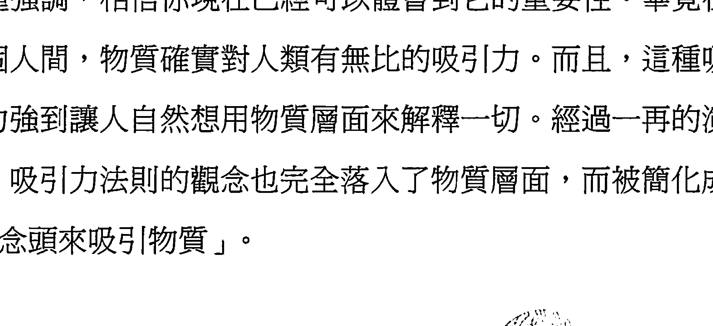

再晚一點，到了二十世紀初期，更有人用「新思路（New Thought）」來傳播吸引力法則，希望為人類帶來幸福。推廣的人會採用「新思路」這種名稱，就好像把吸引力法則的心想事成當作一種人類思想重大的突破，而認為值得稱為全新的思路。然而，你只要繼續探討下去，就會發現，無論是新時代或新思路，都不算是真正的創新。古人老早已經有了類似的觀念，只是沒有套上新時代或新思路這樣的名字而已。

這三、四十年來，我看到吸引力法則和心想事成的觀念即使偶爾消退，但隔一陣子又會透過某個暢銷作品重新浮出來。流行的程度，甚至讓這些想法的傳播本身就足以成為一項專業。

舉例來說，你很可能接觸過，或至少聽朋友提過《秘密》。作者拜恩（Rhonda Byrne）是一位廣播節目製作人，在因為父親過世而落到人生最低潮的時候，讀到美國一位新思路作家華特斯（Wallace Wattles）在 1910 年寫的《富足的科學》²。她發現書裡強調的創造心態、正向思考、感恩、與最高的聰明接軌以及豐盛的觀念，不只能幫助她克服憂鬱的心情，甚至還能帶來人生的幸福與成功。後來，她又參考1906 年的《吸引力法則》³拍了《秘密》的紀錄片，接著再改寫成更多人接觸到的《秘密》這本書。

她的影片和書讓許多人知道，可以透過念頭的練習為自己帶來財富、愛情、親情、友情、健康——也就是一般人認為的成功。是這樣，才有那麼多人接觸到吸引力法則，而投入心想事成的練習。你或許也是透過她的作品才知道這些方法。然而，我還是要再強調一次——吸引力法則其實並不是近代人的發現，而是以前的大聖人早就知道的。

如果你曾經接觸過古人早就有的菩薩道、服務瑜伽和各式各樣的練習，稍加探討，就會發現這些法門和練習在某一個層面都含著吸引力法則的運作。舉例來說，佛陀在《法句經》第一句就提到「諸法，意先導——意主、意造作」，也就是說念頭影響一個人的心理狀態：清淨的念頭帶來快樂，而雜染的念頭帶來痛苦。

2 Wattles, W. D. (1910). *The Science of Getting Rich*. Elizabeth Towne.
3 Atkinson, W. W. (1906). *Thought Vibration or The Law of Attraction in the Thought World*. The New Thought Publishing Co.

然而，佛陀所談的，和近代心想事成的方法最大的不同在於——最早，並沒有強調要用一生去追求好的結果，更沒有說一個人做好人、做好事是為了好命。你只要去看早期的經典，就會知道這兩者之間並沒有直接的因果關係。

可以說，聖人老早知道，我們隨時站在兩個意識的層面，一個是外在，一個是內心。讓你做善事、有好的念頭，最多是為了你的內心平安或解脫，倒不是為了從外在得到一個具體的轉變。這兩個層面，其實是不相關的。此外，在聖人看來，外在世界最多是一個幻覺或短暫的表象，倒不值得你我去刻意轉變。想對外在做什麼調整，從聖人的看法，是多餘的。

然而，從西方文明的角度，人類自然會認為物質本身是獨立的存在，而且還是非常重要的存在。從這個角度來看，一般人也就會認為要先有物質層面（腦）才有人類的意識可談。於是，就在這一、兩百年內，西方世界將心靈層面的吸引力法則完全轉成物質層面的追求，而更把吸引力法則簡化成——一個人懂得透過念頭這種物質來轉變外在的物質，就能夠活得好命，活得豐盛。

雖然不夠全面，這些方法還是有它的道理，我也會在接下來的幾章再把它帶出來。當然，我寫這本書，其實不是只為了向你介紹這些方法，而是想和你一起更深入探討豐盛的觀念——你我這一生，可不可能體會到真正的豐盛？

# 02 成功法則

人類追求豐盛的歷史很長久，我在這裡會繼續為你整理近代比較主要的幾個方法。當然，這些在人間追求豐盛的方法，不見得全面。但是，我們也必須承認，這畢竟是許多人累積出來的成果。這些方法和成果，其實也呼應了絕大多數人在人間想追求的好命——希望受人歡迎，得到快樂，得到成功。

成功法則，或後來也有人稱為「成功學」，也反映了這樣的追求。有意思的是，許多經營企業的朋友，是透過這門學問，後來才進一步接觸到心靈的層面。

你只要稍微接觸過就會知道，成功法則可說是把吸引力法則導向一種特定的目標——在人間物質的層面追求正向的後果。換句話說，成功學是希望教你怎麼達到人生的成功，而它背後的邏輯是：既然樣樣都是同類相吸，為什麼不吸引最好、最正向、最快樂、最圓滿的條件到你的生命來？

換句話說，成功法則想教你的是——活出吸引力法則，同時，讓這個過程引導你得到最好的人生。

我相信，你對成功法則的觀念其實並不陌生。畢竟成功學後來演變出各種激勵課程，我知道這些課程也引進了亞洲，被許多企業組織的管理和教練課程所採用，也有人當作個人的成長課程來推廣。你很可能參與過這些課程，也在這些課程中學會溝通、協調、讓自己得到別人肯定的各種技巧。只是，你不見得了解它最初的起源。

一開始，是近百年前的美國暢銷作家希爾（Napoleon Hill）拿成功作為切入點。他強調自己是受到當時的世界首富卡內基（Andrew Carnegie）的啟發去訪問 500 位美國最富有的人，希望為大家歸納個人成功的通則。

希爾首先在1928年出版《成功法則》⁴，接著再出了一系列的書，用很通俗的語言，教大家透過吸引力法則取得人間的成功。在他寫作的早期，他也用自己的方式將吸引力法則的內涵歸納成 16 條成功法則（也就是 16 種成功者的特質），並且當作課程來推廣。

4 Hill, N. (1928). The Law of Success in Sixteen Lessons. Tribeca Books.

看到「16 條成功法則」「課程」這種字眼，可能讓你覺得很複雜，很嚴肅。甚至，如果你之前在學校的經驗不太愉快，大概也已經開始退縮，想把書闔起來。然而，你只要再往下看，就會發現希爾的成功法則其實是很通俗易懂的。

希爾所歸納的，也只是一個人要取得成功所需要具備的特質。舉例來說，他會強調一個想成功的人要有明確的目標，要有自信、懂得存錢、有進取心、展現領導力、發揮想像、能夠自我控制、有熱情、願意付出、有好的個性、能掌握正確的思考方式、可以專注、懂得跟別人合作、能夠從失敗中學習、心胸寬大、待人如己。

你大概也會同意，擁有這些特質的人，不光是會受人歡迎，而且在人間應該可以過得相當充實。

你不用擔心，我不會在這裡重複這 16 個法則。然而，我會用我的方式來談其中幾項特質。你會發現，這些特質背後都含著一種共通的道理，也就是符合吸引力法則的運作。

我相信，讀完這一章，你再回頭想想自己曾經接觸過的各種勵志書籍、激勵和個人成長課程，會有完全不同的理解。

## 一個人沒有目標，也就還沒有踏上成功的道路

在所有這些成功者的特質中，最重要也最突出的，是希爾在成功法則一再強調的——要有明確的目標。目標，不光是要優先追求，而且還要反映自己真心的渴望。無論你的渴望是財富、名譽、地位、感情、突破，還是成功，都要化成明確的目標。而且，是愈清晰、愈具體愈好。

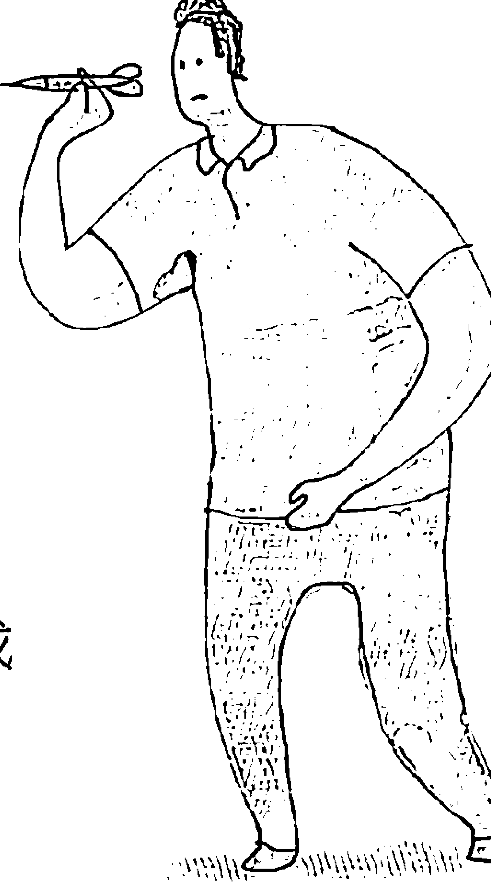

希爾也會教你把自己內心的主要目標寫下來，寫的時候，不只清楚地寫下目標，還要像寫一份誓詞一樣地，寫下你要在什麼時候完成目標、你為什麼需要完成這個目標、而你打算怎麼完成目標。對很多人來說，這樣的形式就等於心想事成的練習。

如果你按照希爾的方法，把這份誓詞寫下來，接下來，希爾會請你簽名，不光是你自己要簽名，你還要去找一群願意支持你達到目標的朋友一起簽名，就好像一起負責。然後，你每天都要重複朗誦這份誓詞，最好一天多重複幾次，也讓朋友們一起重複。這樣的練習要一直進行下去，直到目標達成為止。

到這裡，我相信你心裡大概會這麼想——願意這麼慎重對待，怎麼可能不成功？不過，希爾還提出了一個重點：如果你真心想要成功，不只要設立目標，更需要專注，把這個目標變成自己最喜歡的一件事，而不是抱著可有可無的態度來面對。

你大概會問——要喜歡到什麼地步？你大概沒想到，是到無論醒著、睡著、開車、吃飯、玩樂、工作，心裡隨時都有這個目標的地步。就好像你如果喜歡一個人，自然會想時時刻刻和對方在一起，也會時時想著對方。只是，這個對方，現在是你心中明確的目標。

對我來說，這種投入，其實是讓你的目標和你身心的每一個角落完全整合——從你的念頭、你的感受，到你的行動，甚至連你周邊的人事物都一致地向目標前進。

這種專注和投入，不光是讓你全身心達到合一，其實還含著吸引力法則的關鍵——你如果不斷透過行為和念頭，將全部的心力投入，去肯定你最後想要的結果，這個目標其實已經達成。你這麼做，就好像把最後的結果和過程變成同一件事，甚至讓最後的結果變成一切。這就是我在第 1 章提到的結果已經發生。

再換一個角度來說，你完全專注、完全投入一個目標，就好像結果已經發生，這又回過頭來不斷地給自己打氣，培養信心和正向。一天比一天更滋長的信心和正向，又讓你更能專注在已經完成的結果。到這裡，你應該也猜到了，這就是前面提過的正向思考。

## 成功，不只反映個人的本領

對我而言，希爾的成功法則還有一個重點，就是 mastermind。這一點，他也當作是成功法則最重要的基礎。

Mastermind 這個詞，你可能看過有人翻譯為「智庫」，意思是一種人才的團隊。你大概也還記得，希爾不光會要你為自己定下的目標簽名負責，還要你組織一群志同道合的朋友來支持自己完成目標。其實，配合你完成目標的這樣一群朋友，也就是他所談的「智庫」。

從這個角度，「智庫」這個翻譯相當符合希爾著重的應用面。但是，我認為這個翻譯還是落在人事的層面，而窄化了 mastermind 的意義。我在這本書會改用「集體的聰明」來表達，有時候也會用「集體的力量」。接下來，我會用我自己的方式來歸納。

其實，從我的角度來看，希爾的「集體的聰明」的觀念，還是離不開吸引力法則，也就是強調念頭之間的吸引力——尤其是波動相近的念頭，會彼此吸引。你大概已經可以體會到，在這類心想事成的方法，念頭的特性是有關鍵的重要性。

我們可以做這樣的比喻，念頭，就好像我們派出去的使者。你派怎樣的使者去打聽消息，也就自然帶回這個使者聽得懂的訊息。快樂的念頭，自然吸引快樂的念頭。你抱著悲觀的態度，不光聽不懂好消息，還更容易聽見另一個悲觀的想法。不只如此，同類的念頭除了相互吸引，還會進一步共振出一個更廣大的層面，而這就是他所說的集體的聰明。

很有意思的是，我們現代人很重視想像力和創意。你大概沒想到，想像力，是一種心靈本來就有的感應力。如果你懂得運用這種感應，和集體的聰明達到共鳴，也自然能得到更多的靈感來解決問題。

你會想，那麼，這種念頭相互的吸引以及集體的聰明，又和「智庫」有什麼關係？其實，這也只是把念頭的吸引和共振的原理，應用在人的層面——結合一群人，借用他們集體的聰明，幫助你達到個人的成功。從這裡，我相信你可以看到，現代管理學所強調的團隊合作的影子。

希爾所主張的是，你和這群人能建立和諧的關係，自然讓你們在意識與潛意識層面的交流與互動產生共振。這種共振會帶動更大的生命場和集體的靈感，是遠遠大於你個人頭腦的聰明，而可以讓你有所突破。

當然，你如果想要運用團隊集體的聰明、調度團隊集體的力量，也就需要發揮合作的精神，來消除因為摩擦、爭執、貪心、嫉妒所造成的內耗，而讓每個人的長處得到發揮，安心投入共同的目標。

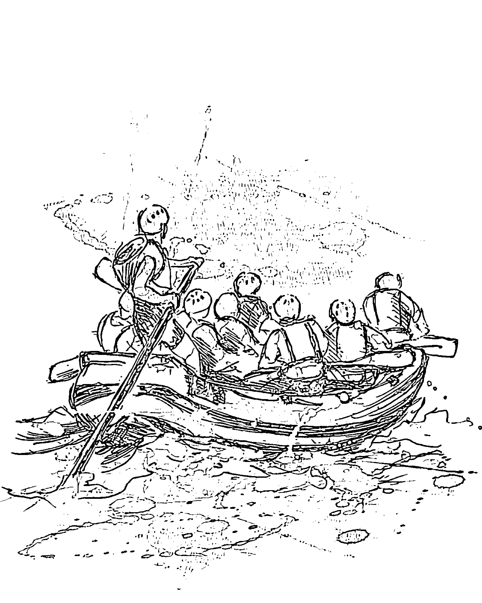

此外，成功法則裡提到，如果你想要成功，就要願意付出。這一點，一樣是完全符合吸引力法則的。想想，如果你懂得付出，樂於分享，不計較，待人慷慨，這種念頭自然會為你帶來更多，吸引更多。結果是你給得愈多，反而得到愈多——更多的機會、更多的資源、更多的肯定、更多的快樂、更多的滿足。

到這裡，我相信你一定能體會得到，這些特質對於我們和任何人一起生活、一起工作，有多大的幫助。無論成功或快樂，都是大家一同成就出來的。從人間的角度來看，這都是正確的。不光是對人間的成功有帮助，其實也是一個人做人的基礎。

### 自信和成功，都是可以培養的習慣

只要你接觸過《真原醫》，應該已經很熟悉建立習慣、改善習氣的道理。你再仔細觀察，也就會發現，希爾的成功法則和練習有相當大的比例，是在建立一個人正向的習慣。

希爾很重視專注和自我暗示（auto-suggestion）的方法。你已經知道，他會請你專心守住一個目標，不斷對自己重複目標、達成目標的理由、方法和時間。這麼做，自然讓你從裡到外，從外到裡，每一個細胞、每一個感知、每一個思考、每一個行為，一再地重複相同的迴路。打個比方來說，就像森林裡本來有一條模糊的小路，如果每天有人去走（而且最好是隨時有人在走），自然會把它走成一條很明確、任何人一眼就認得出來的路。一樣地，如果你想要成功，透過一再地自我暗示，把思想、語言、行為變得一致，也就是在為自己鋪出一條通往成功的路。

你可能會問，除了目標之外，還有哪一個特質需要透過自我暗示來建立？對希爾而言，一個人要成功，很重要的是培養自信的習慣。他也舉了許多自己的實例，來表達是因為有自信，他才能在一般人認為不可能的情況下取得各種寶貴的機會。

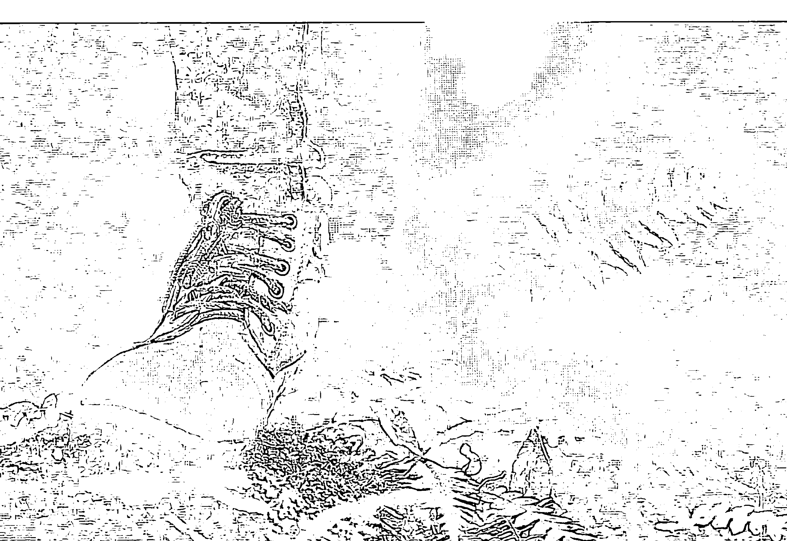

如果你也希望培养自信，希爾會提醒你，要一再地重複各種自信的念頭、語言、行為。畢竟，你如果聽到自己自信的表達、看到自己自信的行動，也就好像是反過來繼續自我暗示，而不斷在你腦海和身心建立自信的迴路。甚至，你最好還透過語言和行為，讓自信擴散出去。這種作法，就好像對環境進行暗示，讓這個自信的迴路也得到周遭人事務的支持和肯定，而又回頭強化你的自信。

舉例來說，你如果帶著自信和熱情，積極投入喜歡的事，自然會鼓舞、激勵、帶動周遭的人和你一起投入。這本身也是透過念頭的波動，對周邊進行積極的暗示，讓周邊乃至自己與每一個人的思想、語言和行為達成一致。透過熱情的感染，你不光是在環境中建立一個正向的迴路，其實也和集體的聰明接上了軌道。

有意思的是，希爾還提到一個人要成功，必須克服人類六種基本的恐懼。這六種恐懼分別是對貧窮、死亡、疾病、失去所愛、老化、遭受批評的恐懼。我相信你也會同意，活在人間，誰不害怕這些情況？希爾也強調，這些恐懼會讓人畏縮，失去自信，而無法走上成功的路。

然而，再一次地，你會覺得以下的觀念相當熟悉。對希爾來說，克服恐懼的方法，並不是直接去消除恐懼的來源，不是去消除貧窮、死亡、疾病，也不是永遠不老化、有人愛、不被批評。一個人倘若真正要克服恐懼，也不是去消除恐懼的習慣，而是去建立一個新的習慣——自信。而你已經知道了，要建立自信，也只是從正向的角度，透過自我暗示，不斷地強化自己的信心。一個人如果對周邊、對自己感到滿意，也就自然得到自信，遠離恐懼。

## 掌握真正的成功

你大概沒想到，關於成功，希爾還有一條他認為是宇宙最基本的「黃金法則」。這條法則也就是「待人如己」「己所不欲，勿施於人」，或者用另外一個方式來說——你怎麼對待別人，就會被同樣地對待。你如果希望被善待，就要先善待別人。他更強調，一個人如果希望脫離悲慘、貧窮和欲望的煎熬，最需要去掌握的就是這個法則。

我常提醒周遭的朋友，一個人要成功，先要讓其他人成功。說到這裡，你大概也明白了，黃金法則其實源自業力法則——要怎麼收成，先怎麼栽。畢竟，我們給出去的，早晚有一天都會回到我們自己身上。這是宇宙基本的事實。

你會看到，這裡所談的成功法則，基本上守住一個重點——首先要有目標，而不斷專注到這個目標。你也可以從希爾歸納出的成功者的特質，一再觀察到我在第 1 章提出來的吸引力法則兩大中心原理：正向思考以及結果已經發生。

確實，希爾對這些法則的詮釋，幾乎都落在怎麼在人間追求成功。和最初的吸引力法則相較，他的重點已經從靈性的層面完全轉向物質的層面。甚至，如果你去看他一系列的作品，自然會發現比起最早的《成功法則》，後來暢銷全美的《思考致富》（Think and Grow Rich）顯然受到 1930 年代美國經濟大蕭條的衝擊，已經把重心幾乎全落在財富的層面，認為財富就等同於人生的成功。

但是，我相信，這種傾向，也很實在地反映出一般人所追求的目標。

# 03
## 富足的科学

我在第 1 章提過一位新思路作家華特斯，他在 1910 年出版的《富足的科學》，啟發了許多相關的作品。我會在這裡把他的作品帶出來，主要是他對吸引力法則的解釋，比起其他作家深刻許多，在人間相當有代表性。

我感覺最有意思的是，華特斯和希爾同樣都是在談吸引力法則，但表達和重點卻完全不一樣。在這裡，我會多做一些補充。

一樣地，華特斯也主張——樣樣我們所看到的東西，都是從念頭延伸出來的。同時，他深受印度哲學的影響，也就自然希望透過一個最高的源頭，進一步補充念頭怎麼顯化出物質的機制。

他認為有顯化能力的念頭，可以說是一種瀰漫在宇宙中最原始的能量。它本身就像是一种最高的聪明、无色无形的聪明。这个无色无形的聪明，含着无限的创造。透过更具体的思考与想像（也就是我们一般的念头），这种聪明会投射出、显化出来「东西」。再说清楚一点，也就是透过思考，你我都可以把所想的显化出来，甚至是无限的显化——这就是华特斯谈「富足」的基础。

然而，他所谈的富足，更主要是锁定在人间的财富。这一点，当然只是反映了西方社会所看重的层面。这也是我在继续谈他的方法之前，必须提出来的重点。

## 丰盛：来自心态的转变

既然说透过念头，可以把所想的显化成现实，你自然会想问——那么，为什么你过去所期待的，不一定能够显化呢？接下来，华特斯指出一个关键：你如果想要显化东西，在心态上要有一种彻底的转变。

其实，我们一般人平时都停留在一种对立、竞争、独占的心态，只是通常不会特别意识到。举例来说，我们只要觉得眼前的东西或状况不好，自然会想把它换掉，像是对A不满意，自然会想得到另一个B，用B去取代A。这种替换，本身就带着一种排斥的味道。华特斯将这种心态称为「竞争心态」——好像不断地在比较所有的可能，而随时要从中选出一个。他会提醒你，如果你真正想让念头有显化的力量，那么，你必须走出竞争心态，转向创造的心态。

你只要观察就会发现，其他作家并没有点出这种能显化物质的心态是什么，最多是把这种心态落成一种正向的练习，透过自我暗示去执行。然而，你可能也明白，一个人如果能够彻底做那些正向的练习，正向到底，也许不知不觉就转变了心态。

当然，你会继续问，怎样的心态才算是创造心态？对此，华特斯会有他的说法。用我的语言来表达，创造心态其实是一种没有对立的心态。这种心态最多只是单纯的创造，并不会想去取代什么。既然没有想去取代，自然也就没有对立，没有比较，没有计较。一切，对你是和谐，是平安，是共生存。

在华特斯的架构里，是采用这种没有对立的创造心态，你才可能和无色无形的聪明保持一致。你如果站在这样的心态，自然很容易和无色无形的聪明共振。

## 感恩：和创造的心态接轨

你可能会想起来，成功法则也强调要透过人与人和谐的交流，才能连结到集体的聪明、集体的力量。然而，华特斯往前推了很大一步：要进入和谐的创造心态，最直接的方法就是感恩——对这个无色无形的聪明不断地感恩，感谢祂带来的一切恩典。

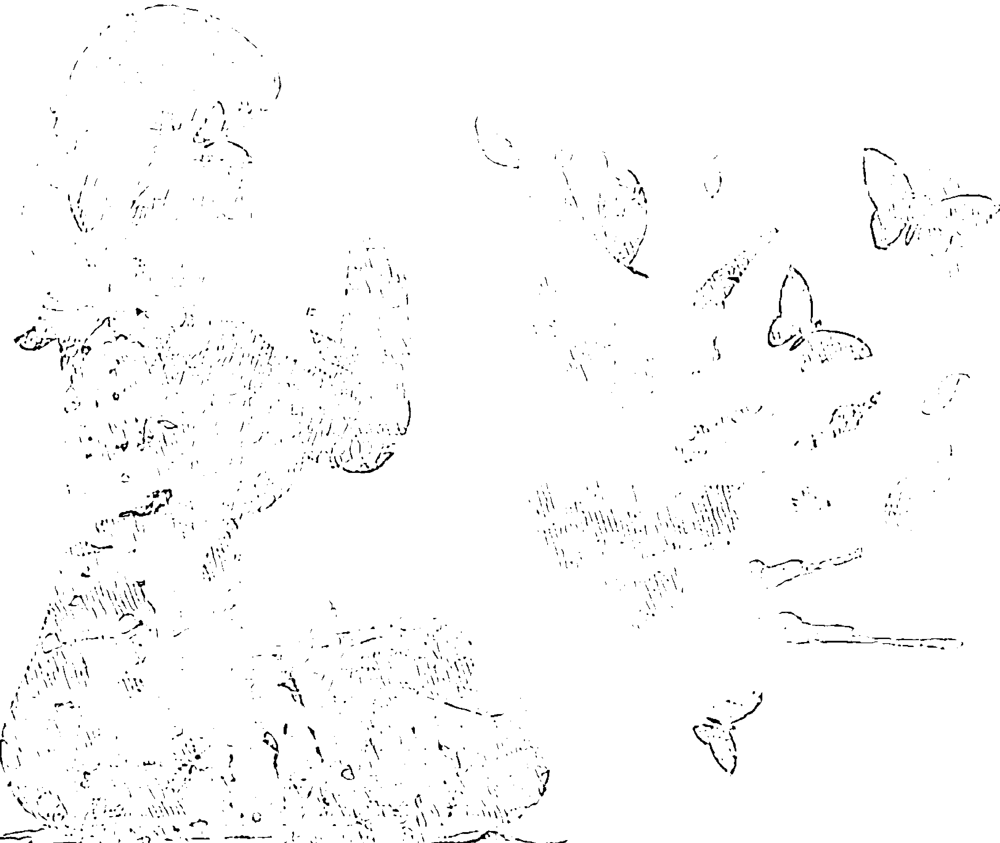

这种发自内心真诚的感恩，本身自然带来一种合一的力量，好像让人的头脑和无色无形的聪明合一。

这一点，你不妨现在就试试看，亲自去体会。华特斯会提醒你，只有在这种合一的状态，这个大聪明好像随时在「听」你的渴望。也只有这样子，你才可能通过思考和无色无形的聪明交流。

让我再换个角度来表达，透过感恩，你等于是随时在肯定——只有这个无色无形的聪明，才可以给你真正想要的。华特斯也会强调，只有透过感恩，你才可以随时停留在创造的心态。

接下来，追求人间丰盛的方法都是一样的，都会教你要守住一个很清楚、很具体的心理画面，这个画面就是你的渴望、你在人间想达成的目标。他们都会提醒你，要让目标愈明确、愈具体、愈清楚愈好。而且，你还要通过念头，尽可能让这个画面留在脑海中。甚至，不光是你的脑海里随时有画面，而且这个画面已经强烈到你好像就可以闻到、摸到、感触到、尝到的地步。你如果能投入到这个地步，自然符合了吸引力法则的一个原则——结果已经发生，就好像目标已经完成。

你现在也知道，华特斯的方法和其他人最大的不同，其实在于他对感恩的强调。他肯定真有一个最高的源头，而认为一个人如果想要得到人间的成就，在守住这个具体画面的同时，也要随时感谢这最高的聪明，同时心里愈来愈明白，无论是自己所想的念头，还是脑海里丰盛的画面，其实全都来自这无色无形的聪明。

对华特斯而言，感恩，自然让你停留在创造心态。同时，你也要对一切都带着信心。举例来说，你如果希望得到财富，不光是要随时观想这个丰盛的画面，而且还要充满信心。甚至你的信心要强烈到一个地步，已经是不理性的扩大，扩散到全面。这样的信心，你也可以称为是全面的信仰。

在这强烈的信仰中，你相信这个画面已经完成，结果已经发生。华特斯会敦促你，一样地，为这全面的信仰，要随时诚恳地感恩。你心里会明白，这一切美好的画面，都是来自无色无形的聪明，而不是你个人的本事。

华特斯的描述相当生动，对他而言，透过感恩和信仰，就好像你和无色无形的聪明已经全面的交流，让头脑在无色无形的聪明不断地留下印象，而让无色无形的创造力开始动起来。只要这个创造的能量开始活起来，它自然会通过人间既有的管道或自然界的变化来达成。

当然，华特斯不会忘记提醒你，在这个过程当中，你还是要不断地守住心里的目标、守住这个丰盛的画面，坚持相信一切已经完成，并且为此不断感恩。

## 富足：从「心」开始，主动付出

你可以看到，华特斯的心想事成的方法，也就是一种追求富足的「心的功课」或「感恩的功课」。然而，他提出这样的功课，倒不是让你什么其他的都不需要做，只是被动等着富足到来。

华特斯不断强调，你如果希望富足，还是要主动去追求，让每一天的点点滴滴——自己的每一句话、每一个行为，都符合心目中丰盛的画面。而且，你要尽力做到最好，不断地给、不断地服务、不断地付出。甚至，你所付出和提供的服务，要远远超过你表面上得到的。

你会明白，这种主动的服务和付出（后来希尔也强调这一点）是对环境做一种积极的暗示，扩大丰盛的回路。这么做，就好像你已经在不断地和周遭分享内心想要的富足。也就这样子，你不光已经在内心建立一个丰盛的画面，还把这个机制分享给周边的人，也让周边人得到富足和丰盛。

然而，对华特斯来说，主动的服务和付出，更重要的是你要和创造心态一致。毕竟，你如果还落在竞争心态，那么，让你得到财富，反而可能对周边人不利，甚至会造成其他人的损失。

他会提醒你要一再回到创造心态——你要富足，其实是为了对身边的人带来善意和好处。你自己得到愈多，别人也跟着得到更多。或者说，你可以用这个方法来肯定周边人的协助和贡献，让周边人得到的更多。

我在前一章谈希尔的黄金法则时也提到——一个人成功，要先让别人成功。或是把别人的成功，当作自己的成功。这两者，是相对相成的。

很有意思的是，同样都是强调主动服务和付出，只因为着重的层面不同，也自然带动你进入更深层面的体会。到这里，如果你接触过这些作品，我相信你现在回头去看，会再一次发现自己已经有了全新的理解。

你大概也能体会到，华特斯对吸引力法则的表达和诠释，有他独到而深刻的见解。最有意思的是，其实我自己在很年轻的时候，已经自然而然采用同一些方法，来面对我比较感兴趣的一些领域。后来，我也透过许多作品强调正向的观念，特别是感恩的功课。

我是在这样的背景下，多年后才接触到他的作品，才知道他竟然也强调感恩的重要性，而且将感恩作为和更高的聪明接轨的起点。对于这样的巧合，我也只能会心一笑。

当然，你也知道，我的出发点其实完全不同。我所着重的，倒不是财富的成就，而是健康、身心的平衡、快乐或其他心灵的追求。但是，说到底，这些领域其实都是类似的。

确实，一个人只要运用这些方法，无论想取得人间的什么成就，都会有所帮助。然而，我相信你很快就会发现，这些心想事成的方法最多是符合人间的规律，倒没有真正反映生命更深层面的作用。

这一点，我会在这本书后半详细地解說。

# 04 信仰、正向、感恩的重要性

的确，华特斯采用的语言和逻辑，让我自然感到一种共鸣。他把重点放在人间的财富，但从我的角度，其实我们还可以进入更深的层面。我在这里，希望用我个人的语言和经验，为你进一步说明他在执行层面的重点。

你已经知道，对华特斯而言，一个人想要体会心想事成，也只是随时活出以下的关键：首先，在脑海不断守住一个画面、一个目标。同时，有一种信心甚至信仰（相信这个画面已经完成）并且为此不断诚恳地感恩。

华特斯当时认为他所谈的原理是一种法则，才会称之为「富足的科学」。他也会提醒你，如果你希望让念头显化，想要心想事成，就要符合创造的心态。假如你还落在一种强调对立、竞争、独占的心态，也就无法和无色无形的聪明达成一致，而不可能得到这种最高聪明的祝福。

但我个人觉得有意思的是，从「全部生命」的角度出发，华特斯的诠释其实还可以延伸出一些相当有意思的心态，帮助你面对人间种种的变化。

## 首先，是当下。

这一点，你可能会觉得意外。你过去也许从来没想过，当下和富足有什么关系？然而，如果你真的想要富足，华特斯会提醒你，其实你不需要去点点滴滴防范未来。你只要守住丰盛的目标，不需要再去烦恼怎么克服阻碍，也不要再担心可能遭受什么损失或负面后果。你只要把自己完全交给眼前的事，不断地守住眼前的项目、心中的画面与目标，并且不断地感恩，相信一切已经实现。

你只是活在当下，随时感恩，不去担心，竟然反而可以化解任何阻碍。不只如此，活在当下，也为你不断地建立正向的思考。

你我活在这个世界，难免都要遇到困难和考验。一般人都会抱怨，最多是想办法去克服。然而，对华特斯来说，你根本不需要有「克服困难」的想法。甚至，连一句话、一个念头只要稍微提到未来可能的困难，包括眼前的考验、不顺、疑虑，你都不要去肯定，更不要去延伸。总之，在你心中，不要残留一点点失败的可能。

如果你做过我在《好睡》带出来的练习——不要和别人分享失眠的烦恼，而体会到这么做的好处，自然也就能够接受这样的观念。一样地，华特斯也会进一步建议你，不要让心思停留在危机、阻碍、焦虑、烦恼，更不要让自己有机会去谈这些烦恼。

如果你还任由自己不断地烦恼和担心，对华特斯来说，你还落在一种竞争心态，同时也在持续肯定失败与坏事的可能，反而让这些不好的可能产生足以替代的作用。对他而言，你如果希望富足、成功、达成目标，最好让自己的每一个念头、每一句话都站在正向、鼓励的层面。倘若还带有一点点负面、批评、打击自己或别人的味道，那么，就马上修正。

华特斯也会教你，要把样样当作机会，不要对任何事失望。毕竟，表面上的失败，很可能是接下来的成功所需要的过程。表面上的不好，从整体来看，都是无色无形聪明的安排。就算任何表面看来的邪恶和危害，最多也只是发展阶段不成熟的暂时现象。你要做的，也只是保持信心，相信最终的发展必然是样样都圆满。

对华特斯而言，一个人如果能彻底保持这样的信仰，眼前表面上的失败早晚会消失。而你应该也发现了，这样的信仰，本身也就是一种彻底的正向。透过这种信仰，你可能早晚会发现，每个表面的失败都蕴含着一个更大的成功，最多只是自己当时没能全面的了解，而还可能感到挫折。

你现在多少能够体会到，对华特斯来说，一个人遇到种种的困难甚至失败，真正重要的是他还能不能继续走下去。然而，所谓的「走下去」其实也只是继续感恩，继续信仰，继续相信心目中的画面和目标。

最后，华特斯也会提醒你，如果真心走这条路，投入生命的富足，活在当下，你自然会把生命简化。别人的娱乐和消遣，对你可能逐渐地失去吸引力。你或许也会发现自己想避开某些人和场合，自然不想接触负面、悲观的人或资讯，就好像不让自己有机会失去正向的信仰。你最珍惜的，可能也就是每一个练习的机会——只要有空档，就不断守住心中的画面，守住目标，随时感恩。

我相信你读到这里，自然可以体会到，华特斯的观念在面对人生的挑战，有它的深度和价值。有意思的是，华特斯这位西方人会想谈富足的科学，其实是希望能够反映东方整体的哲学。

当然，你马上会意识到，如果只守住富足的目标，其实不能算是整体。我也要坦白说，华特斯所谈的，最多也只有部分跟我个人的观念是相同的。他会从追求富足出发，也就是他还肯定物质绝对的重要性。于是，这些观念再深入，还是落在人间的价值。

我们最多是站在「全部生命」的理解，从整体的观点，将他所谈的方法向内心的层面扩大，而不是只守住财富或人间命运的转变。

这一点，我接下来会再多做一点说明。

# 05 东方的观点

当然，你会接触「全部生命系列」，也许正是因为你很早就开始思考人生，想知道这一生是怎么来的、要怎么活。而你也可能早就知道，光是在西方，类似的探讨至少已经有两千多年的历史。

早在古希腊，人类已经开始探讨幸福，会辩论怎样算是活得好，想知道一个人的品德和命运是不是相关。举例来说，亚里士多德既注重一个人内在的品德，也同时认为外在的健康、财富和容貌一样重要。然而，斯多葛学派的哲学家则认为品德才是一个人幸福的要件，而外在则是其次。

读到他们的讨论，你应该不会觉得陌生。去探讨哪个层面对人生的幸福才重要，这并不是只有古人才有的追求，而是你也会想知道的。

当然，生活在华人文化的你，自然会发现，这些西方文化的探讨在东方一样是老早就就有，而且在历史上一再浮现。这是因为东方文明的历史更悠久，甚至，因为东方人比较内省，对人间的种种现象早已创出一套完整的生命科学，而自然在修行和灵性的层面站在领先的地位。

回到「一个人的内心和外在的命运是不是相关」这个主题，只要你去找，也会发现，这种思想在华人的文化其实是经过一些演变。

你可能对《道德经》这段话并不陌生：

> > 「上善若水。水善利万物而不争，处众人之所恶，故几于道。居善地，心善渊，与善仁，言善信，正善治，事善能，动善时。夫唯不争，故无尤。」

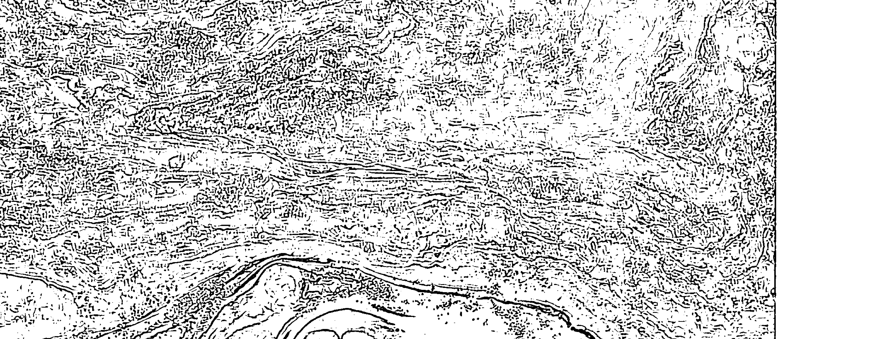

两千三百年前，老子认为「善」是符合道的自然表达。一个人符合道，自然会从内心友善，也不会想在这个世界争取什么，不认为有什么是非对错值得去主张。显然，对老子而言，道和外在世界不是可以相提并论的两个轨道。

再过几百年，东晋时期的《抱朴子》已经渗入了「取得」和「得到」的观念：「览诸道戒，无不云欲求长生者，必欲立善积功……如此乃为有德，受福于天，所作必成，求仙可冀也。」

你读到这一段，应该会觉得很有意思，没想到一千多年前，古人就有这样的想法——认为一个人行善、救人、不作恶、善良，想做什么，都会成就，甚至有希望成仙，或得到长生。后来，南宋《太上感应篇》也提到「祸福无门，惟人自召；善恶之报，如影随形。」这些话在民间流传很广，是更进一步去强调：一个人的命运好坏与个人的作为有关。

再几百年后，明朝一位读书人袁了凡留下一份家训，在后世流传很广——《了凡四训》。你或许也读过，知道这是他为后代整理的四堂功课。

袁了凡的第一堂功课是「立命」，认为人的命运不是注定，而是可以靠自己创造。第二堂功课是「改过」，认为只要能随时修正小的过失，自然不会犯下大的过错。第三堂功课是「积善」，鼓励人多做善事，命运自然会有所改变。第四堂功课是「谦德」，教人要谦虚，要随时学习，也就有机会改善自己的处境。你可能也知道，许多慈善家和宗教家会引用《了凡四训》的说法，鼓励一般人多做善事来改变命运。这样的思想，对华人确实有很深的影响。

这样的演变，可能也让你体会到，自《道德经》之后，《抱朴子》《太上感应篇》和《了凡四训》一千多年来已经一步一步地将一个人的念头和行为，跟他这一生的后果连结起来，而认为可以透过念头与行为的改变，来取得一生的好命、顺利和丰盛。相较之下，西方近一、两百年才出现的吸引力法则和心想事成的方法，只能算是刚起步没多久的系统。

然而不光是华人有类似的说法，只要更广泛去探索，自然会发现印度的经典也这么说。再略作深究，就会发现每个宗教都有这种「取得」和「后果」的观念，都强调一分耕耘一分收获。尤其是正向的耕耘，可以得到最好的后果。

其中，华人最熟悉的，也就是一般人所谈的菩萨道。菩萨道讲究念头和行为的一致，也鼓励正向的行为，认为通过样样正向的行为，可以为自己设立一个「好」的基础，「好」的因果。不只如此，菩萨道还把这个观念扩展到这一生之外。如果你有好的念头、做善事，就算在这一生看不到好的结果，下一生或未来也会获益。当然，菩萨道鼓励你点点滴滴行善，倒不光是为了这一生或下一生在人间的后果，更是在强调福德的观念。而且，最高的福德是为了解脱、成佛，倒不光是为了守住人间的成就。

古人从取得和后果的观念，也自然衍生出业力的法则。你如果接触过一些古代的经典，就会发现古人对业力做了很详细的分类与归纳。他们老早观察到，有些业力，在这一生很快就可以看到后果（现报），就像我们把回力镖丢出去，马上会看到它折返回来。但也有另一部分的业力，是从过去累积下来，到这一生才让我们承受（生报；后报）。当然，你再继续考据下去，也就会发现业力和果报的观念不是佛教的专利，印度教老早就有，而后来的基督教与其他宗教也有类似的主张。

你也可能体会到，在亚洲，这些观念并不仅仅只是理论，而更是早就渗入社会的运作。举例来说，站在「取得」和「后果」的观念上，印度教也自然会强调服务瑜伽（karma yoga），鼓励一般人要不断地服务、做善事，而且通过世间的法（dharma）教导社会每一个角落的人通过他的角色都可以做善事，还可以做到最好。

你从印度的例子，大概也会想到华人的情况。儒家文化也强调「礼」，从形式来规范每个阶级的正确行为，将一个人生活的样样都安排好——是哪一个等级，就依照那个等级的身分行事。通过礼，让每个人不断接受自己的社会阶层，而且在这个阶层下要样样做到最好。

这些观念就好像为人类带来一种道德的指南针，千百年来持续影响人类历史。我认为，这都是好事。然而，从另一个层面来看，这种思想也催生了种姓制度和社会阶级的观念，把一个人在社会里的角色给固定下来。

你或许会感慨，再怎么好的设定和规范，哪怕原本用心是好的，最终还是为人带来了制约和束缚。

但是，无论如何，你也会发现，没有一个主要的文化或宗教会强调做坏事可以得到好的后果。刚刚好都是相反，各个文化和宗教都会去强调——无论眼前的的命运好不好、顺不顺利，活得丰不丰盛，一个人还是要谦虚、要做善事才可以有好报。这本身，我认为是古人最伟大的地方。

不只如此，你只要多接触古人的说法，应该也体会到，东方文化对人间种种现象，包括人与人之间的关系，包括成功不成功，其实有更深入的观察。

举例来说，如果要探讨一件事会不会成功，对华人而言，也需要讲究缘分。缘分的「缘」是从佛教传来的观念，其实就是吸引力法则所讲究的——人与人、人与事、万事万物之间的作用和互动。而且，东方文化所讲究的缘不光是这一生的互动，也包括从因一果、业力的角度来看，过去是不是曾经有过好的互动？是善缘？还是恶缘？

从人与人之间的互动来谈，缘分的「分」还带有名分的观念。强调缘分，也就是表达人和人之间不光要有适当的吸引力（缘），还要有妥当的角色，让这样的缘可以展现出来。你也会明白，华人尽管强调缘分的吸引力，但同时也强调「不能强求」，而这正是一种臣服的心态。

不只如此，缘分的「分」，也有恰如其分的意思。一个人要成功，要懂得掌握适当的时点，随时把注意力集中而投入在上面，主动去做一些妥当的动作。我相信你在成长的过程，可能和大多数人一样，都被父母或老师提醒过要尽本分，要有分寸，要把一切做得刚刚好。

说到这里，你可能会觉得很有趣，好像一切都是相通的。后来西方的作家通过吸引力法则强调的守住目标，主动投入，其实也是一致的。

然而，从整体来看，既然一切都是注定的，那么，一个人努力，确实不见得会成功。在这一点，华人的因缘观是看得比较深刻，强调的是——成功除了个人的努力，还要刚刚好有缘份、有机缘。也就是说，如果你希望成功，也要检讨自己是不是有种种条件的组合，例如是不是有和人培养好的动力，让缘份圆满（一般人会称为结善缘）；是不是和环境有正向的互动（一般人可能称为好风水）；是不是掌握了恰当的时机，来配合个人和大环境的周期（也就是一般人所讲的运势）。

这些观念，你应该都不陌生，甚至你可能都跟身边的人……分享過。你會知道，是天時、地利、人和種種因素配合，才能促成最後的成功。成功，其實並不是光靠個人的意志可以勉強得來的。

許多在不如意時，都算過命。我想，你可能也這麼做過。即使你不相信算命，身邊或許也有熱心的人幫你安排。無論你過去相不相信，你可能也知道，華人傳統的算命和風水透過很簡單的陰陽五行生剋，不但可以推算出人和人、人和環境之間的作用是相互幫助還是抵銷，甚至還可以透過這個道理去推測人一生的運勢——什麼時候可以順勢而為，而什麼時候又該沉潛休息。這其實是一套博大精深的系統。

在華人的文化，《易經》可以說是最早談這些原理的經典。古人認為如果你懂得其中所談的變化的道理，不光可以知道眼前的吉凶，還可以綿密地推算出一個人、一個社會（古時候稱為朝代）的大運。過去的人用這種推算的方式也留下相當多預言，到現在還有人不斷地想去驗證。從這個角度，你可以體會到，東方文化對成功、不成功或說命運的解釋，其實有相當全面的一套道理。倒不像西方人，以為只靠個人的努力就可以得到成功。

你到這裡自然會發現，擅長內省的東方文化，對人間種種現象的理解，原本是遠遠走在全世界的前面。只是西方世界後來在物質和科技層面的快速發展，好像讓東方人失去了自信，竟然會忽略自己文化早就有一套生命的科學，還盡全力想要複製西方的發展，認為那才是進步的標竿。

仔細觀察，也就這兩、三百年，東方世界已經催生出一種不同於傳統的新文化。這種文化的變異，不光讓東方人追得上西方，可能還做得更好。這當然也展現了東方人靈活適應環境的能力。然而，也就這樣子，東方世界反而變得比西方更物質化，甚至完全把延伸物質的能力、轉變物質的效率變成衡量文明的標準。

現在，很多人等不及得到後果。你過去可能聽到別人這麼問，甚至自己也反問過——如果謙虛、行善，不見得能立即得到後果，甚至要到下一輩子或下下輩子才能看到，那麼，一個人難道只能接受這一生的階級或命運嗎？還是有方法可以跳出來？可以得到一個不同的結果？

這些答覆，其實東方的經典老早都有。只是西方近代的歷史短，包袱比較少，再加上講究個人的自由，也掌握了世...界資源的優勢，而更能用現代的語言融合這些智慧，成為他們文化的核心價值。

真沒想到，現在我們反而是我們要回過頭來，將這些觀念重新從西方引入東方。

# 06 豐盛的練習

無論在世界哪一個角落，自然會有人把前面提到的改命、心想事成的觀念設計成練習的形式，幫助自己和別人一起追求豐盛。我相信你可能也接觸過。

這些練習不光近代才有，我在前一章提到明朝的袁了凡，他就設計了一個「功過格」，讓人記錄做過的好事、犯下的過失，每天做一個結算和反省。他用這個方法提醒自己和每個人要做善事，來改變命運。近期由不同作家一再帶出來的心想事成，更是有各式各樣的功課，也有人組織團體，彼此提醒練習。

你當初會接觸這些練習，也許是希望理解人生是怎麼來的，也可能是想要幫助自己度過眼前的難關。當然，你可能淺嚐即止，不到兩天就把這些練習忘得乾乾淨淨；也可能認真練習了一段時間，但因為缺乏更深的理解，後來也就不了了之。

這些方法一般都著重在物質層面的作用，而都有它的道理。但我認為，真正重要的是心的基礎，是讓我們透過這樣的基礎，可以進入生命更深的共鳴。

在這一章，我想透過我的方法，把這些心想事成的觀念帶回「全部生命」的軌道，帶出真正能讓你平安、和諧、圓滿、豐盛的心想事成的練習，尤其是正向思考。

過去，我透過《真原醫》的種種練習，從飲食、運動、心理的層面，希望為生病的朋友爭取時間，讓他們可以淨化身心，投入內心更深的層面。你可能也還記得《真原醫》有一個和「功過格」類似的「好事壞事紀錄表」，讓小孩子把做過的好事從表格的上方往下寫，把需要檢討改進的項目從表格的下方往上填。當然，這樣的功課，是無論年紀大小都可以做。也就是這樣一個簡單而真誠的反省功課，只要做，也就讓身心合一。

親愛的家長 您好
為陪伴孩子正向、健康成長，在孩子每天完成紀錄表時，請您協助簽名確認。謝謝您~

## 好事壞事紀念表

我要養成自我反省的好習慣，讓自己做的好事愈來愈多，壞事愈來愈少，也謝謝爸爸媽媽給我的鼓勵。

好事 ↓
| 日期 | 紀錄表 | 爸媽簽名 |
|------|--------|----------|
|      |        |          |
|      |        |          |
|      |        |          |
|      |        |          |
|      |        |          |
壞事 ↑
| 日期 | 紀錄表 | 爸媽簽名 |
|------|--------|----------|
|      |        |          |
|      |        |          |
|      |        |          |
|      |        |          |
|      |        |          |

長庚生技真原志工，感恩心校園推廣小組

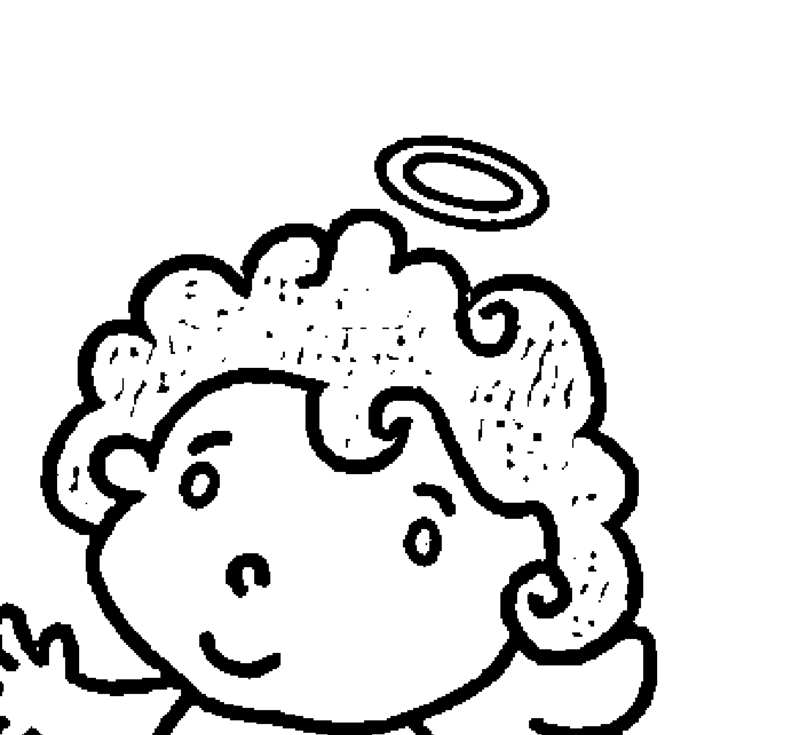

在這裡，透過《豐盛》這本書的觀念和練習，我也是希望幫助困在創傷和失落走出不來的朋友，讓他們運用這些正向的練習，為自己創造一個神聖的空間——不光是能夠從人生的困難走出來，更能體會到生命真正的幸福與豐盛、甚至更深層面的一種美、一種力量。

你會發現，我所整理的練習都相當簡化，方便你隨時隨地提醒自己。這麼做，一方面讓你可以執行，同時也讓你站在現在的理解，去體會念頭和頭腦的作用。而且，你如果想做這些練習，要真正發自內心，讓自己從裡到外每一個念頭、每一個話、每個行為都徹底符合正向思考，為自己創出一個感恩和顯化的空間。

我也要提醒，這些練習可以說是你個人的實驗，在做的時候，不只是儘量守住正向的表達，而且也去體會自己念頭、情緒、語言和行為的轉變。你從內心誠懇地表達，也就自然幫助自己守住正向、圓滿、幸福和豐盛，讓接下來的每一個行為、每個反應、每個感情、每個念頭一致地為內心的幸福和豐盛服務。

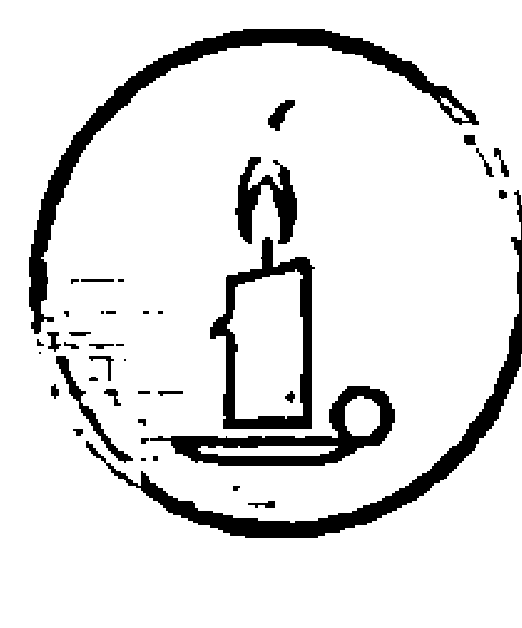

## 練習：改變表達的習慣

改變自己習慣的表達方式，就好像讓自己從一種什麼都缺的心態，轉向已經什麼都擁有的滿足和幸福。

練習：將「我想要……」「我期待……」改成「我是……」「我就是……」。

|  |  |
|---|---|
| 「我想要豐盛」 | 「我就是豐盛」 |
| 「我希望好命」 | 「我就是好命」 |
| 「我期待好運氣」 | 「我是好運」 |
| 「我想要事事順利」 | 「我已經事事順利」 |
| 「我想得到智慧」 | 「我是智慧」 |
| 「我盼望擁有力量」 | 「我有力量」 |
| 「我希望身體健康」 | 「我是健康」 |
| 「我期待要有一個堅強的團隊」 | 「我已經有很棒的團隊」 |

你可以用你的話，來表達能帶你走出困境的能力，而在你心中畫出一個你已經擁有這個能力的豐富的畫面。透過這些表達方式的轉變，從你心裡某一個角落開始，你已經把一個表面上還沒發生的畫面，變成了事實。

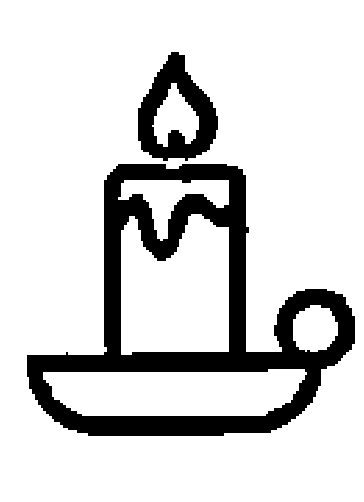

試著寫出想到的句子：

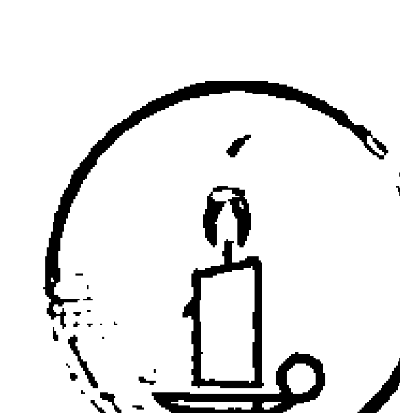

## 練習：把「不」改成「是」

儘量不要用負面的「絕不」，而是把任何負面的表達都改成正向，甚至改成「永遠是」，也就是把否定的句子換成肯定。舉例來說，你可以把「這件事可能不會成功」改成「一切會順利，一切已經成形」。

- 「我不再害怕」 → 「我歡迎挑戰」
- 「我不要再受委屈」 → 「每個人都是善意，都想幫忙」
- 「怎麼做都不順」 → 「這其實也是一種學習」
- 「我討厭這個人」 → 「我的看法不同，但我尊重他的意見」
- 「完蛋了！真是糟糕」 → 「我可以完全接受，一切都會好」
- 「我真倒楣，怎麼做都不對」 → 「一切都剛剛好，讓我繼續做吧」
- 「這個人很惡劣」 → 「他其實和我一樣，也要克服很多困難」
- 「他一定看我不順眼」 → 「他跟我一樣想得到肯定，我先肯定他再說」
- 「這個人對我一點都不友善，不想幫我」
> 讓我先試著幫助他
> 我還沒來得及準備，結果一定會很慘
> 明天，一切都會順利
> 我絕不臨陣逃脫
> 我有足夠的勇氣和應變力，可以面對

一樣地，你可以試試看，只要是平常可能出現在心裡、甚至可能會說出口的負面言語，都可以做為實驗的素材。你需要做的，也只是把這些過去或現在還會浮現在腦海裡的負面表達，轉化成一個或多個現在想到的正向的句子。

寫下你想到的句子，讀讀看，體會內心的變化。你很可能會發現，原來你比自己想像的還更正向，而你會想出更多正向的表達。透過這些表達，你可以活得不只是幸福，還更是過去難以想像的幸福。

透過這些表達的轉換，帶動自己的念頭、語言、行動朝著正向前進，就好像對自己、對世界聲明——生命中的好事不光是可能發生，而且是註定發生，已經發生。你也可以體會到，透過這些正向的表達，無論面對人、事、物，甚至自己，好像多了一些內心的空間，不再那麼緊繃。甚至，也就自然得到靈感，可以幫助你面對挑戰，活得精彩而幸福。

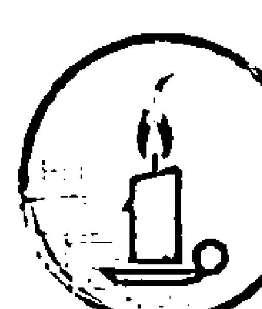

## 練習：從「不可以」到「我可以」

這是一種日常生活的實驗，也許是一早的反省，也許是晚上對一天的整理。你透過這樣的實驗或許也會發現：換一種表達方式，所表達的不光是「可以」，其實是這一切的正向、幸福和豐盛已經在成形、在顯化了。

| 不可以 | 我可以 |
| --- | --- |
| 我不可以動怒 | 我當然可以冷靜 |
| 我不可以哭泣 | 我當然可以歡笑 |
| 我不可以拖延 | 我當然可以現在就行動 |
| 我不可以生病 | 我當然可以健康 |
| 我不可以沮喪 | 我當然可以振作 |
| 我不可以為過去消沉 | 我當然可以給自己安慰和鼓勵 |

你或許會想寫出你的句子，而我也希望你寫出自己的句子。透過這種練習，你我可以很輕鬆地面對自己負面的習氣，用完全不同的眼光體會自己，把自己的力量、自己的美活出來。

## 试着写出想到的句子：

+   __________________________________________________________________________________________________________________________________________________________________________________________________________________________________________________________________________________________________________________________________________________________________________________

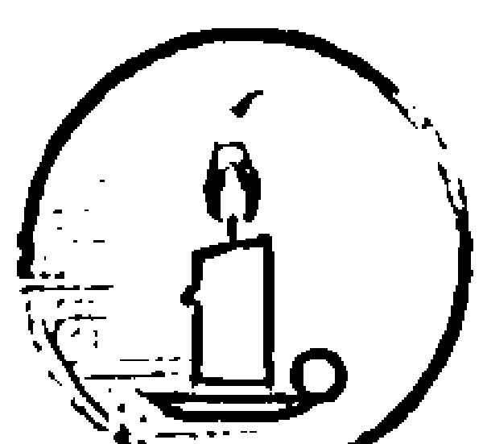

## 練習：從「我應該」到「我已經」

把「我應該」改成「我有這個權利……」，甚至是「我已經……」。

- 「我應該努力」 → 「我有這個權利去嘗試……」
- 「我應該更聰明一點」 → 「我已經考慮到方方面面」
- 「我應該冷靜」 → 「我已經給自己一點空間」
- 「我應該更有愛心」 → 「我早就有滿滿的愛心」
- 「我應該堅強」 → 「我已經堅強」「我已經活出自己的力量」
- 「我當時應該做這件事的」 → 「我已經在執行」
- 「我應該好命」 → 「我老早已經好命」
- 「我應該要有豐盛」 → 「我老早就有豐盛」

這些表達，你可能需要多練習幾次，來熟練這種轉換，並且讓正向的表達穩定地落到心裡。你也可能到這個時候才發現，原來每一個「應該」都含著一種「怎麼當初沒做到」的懊惱、後悔與自責。

然而，就算你過去都這麼責備自己，也就放過吧。從現在……在開始，你可以把表達裡所含的任何假設都去掉，回到這裡現在——「我不光是該做什麼，我已經在做，已經做到」。

即使你還沒辦法隨時轉成「已經是、老早有」的正向表達，我也會建議你平時最好少用或不用「當初應該」「早知道」這些話。現在，你或許已經體會到，這些話不光帶來一種負面的念頭，還帶來一種當時該做什麼或不該做什麼的制約。其實，這些負面的連結，我們一點都不需要去建立。

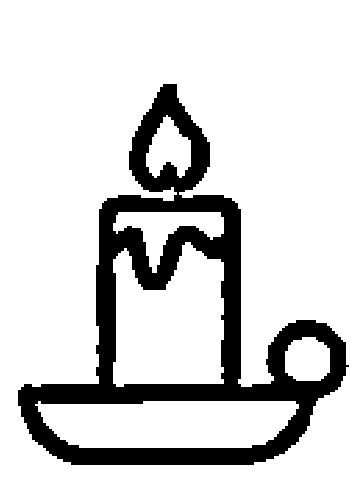

試著寫出想到的句子：

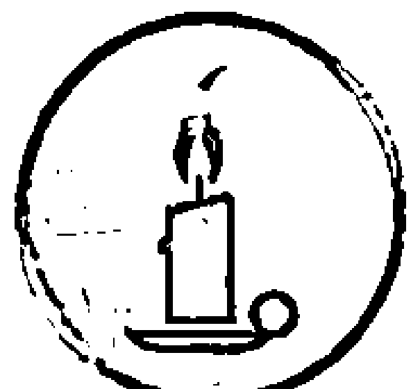

## 練習：從「期待」到「本來就是」

把「我期待」「我想像」改成「我知道，本來就是如此」「我有充分的把握就是如此」。

透過這種表達的轉換，你對於原本不敢多想的好事，或許開始覺得有一點主動的能力。即使過去不是如此，你也有充分的把握，經過你的努力，可以如此。

1. 「我期待健康」 → 「我知道，本來就會健康」、「我有充分的把握會健康」
2. 「我期待工作能夠順利」 → 「我知道，這個案子本來就會順利」
3. 「我期待家庭和諧溫暖」 → 「我有充分的把握，我可以讓家庭和諧溫暖」

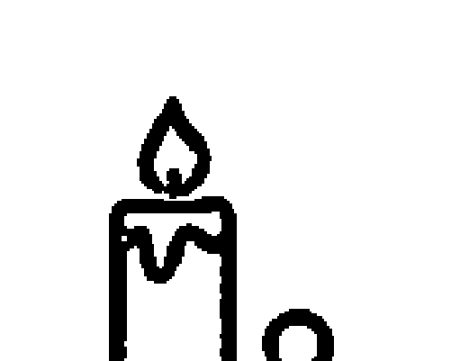

試著寫出想到的句子：

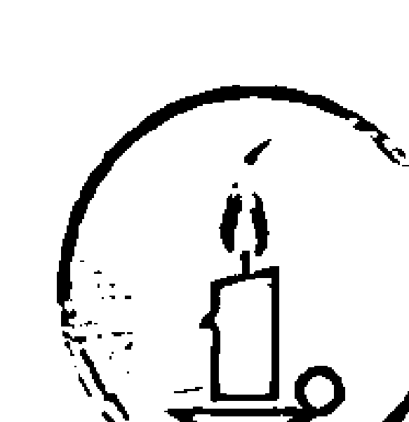

## 練習：從不確定，到完全肯定

把「如果」「可能」，改成「當然」「肯定」。

將或許、如果、可能……這些詞所隱含的不確定，轉化成你確定會投入的熱忱。這麼做，你不光是在激勵自己，同時也把專注和投入的心情感染周邊的人。

- 「如果我身體好一點」 → 「我當然身體會好」
- 「如果運氣好一點」 → 「肯定會有好運氣」
- 「假如可以協調大家的意見」 → 「我當然能夠協調大家的意見」
- 「我或許可以做完這個項目」 → 「我當然會完成這個項目」
- 「或許情況會好轉」 → 「情況肯定會好轉」

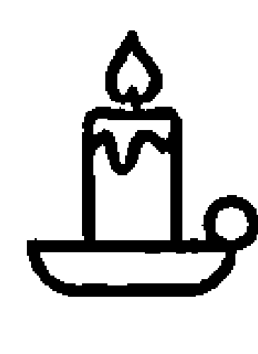

試著寫出想到的句子：

你大概已經發現，前面這些練習，主要在把語言或念頭轉成正向，同時把否定或假設性的不安全感轉到肯定的層面，讓你學會跨過「覺得自己還缺什麼」的不足感或是「過去不順利」殘留下來的負面反應，而將內心的目標反過來用正向的方式重新表達。

簡單來說，這些練習要你做的，也只是把缺乏的感覺和各種擔心，全部轉成「我值得」「我有這個權利」「我可以」的幸福、豐盛和滿足，而你可以再進一步把這種肯定帶到生活每一個層面，透過每一個行為來點點滴滴表達正向。

熟練了正向的表達，你可以進一步運用前面談的心想事成的技巧，來表達你的感恩與幸福：首先，在心中創造更完整、更生動的幸福的畫面，並且把所想要的結果描述得具體而清晰，清晰到你從生命的每一個層面（包括五官的知覺和觀想）都已經好像可以聽到、聞到、感觸到最後的結果。

透過以下的三個步驟，你也就彷彿從每一個角落，為自己創造一個幸福的迴路：

- （一）你想要怎樣的幸福，具體觀想它，把它當作已經得到了。
- （二）眼前的一切，都配合著你心目中這個幸福的畫面不斷地正向成長。你不光已經很具體得到了，而你的成長同時帶來很大的歡喜。
- （三）把這個過程，點點滴滴觀想起來，愈具體愈好。你可以觀想你的幸福可能為你個人、為周邊的人帶來多大的快樂、舒暢和歡喜，而這快樂、舒暢、歡喜自然擴散出去，成為一切的快樂、舒暢和歡喜。

你會發現，做到這裡，你不可能不感恩，而且，也只會感恩。你會不斷地感謝這種最好的安排——不光是最好的結果，還是最好的選擇，最理想的經過。是透過眼前的項目，幫助你集中注意力和精力，而可以活得幸福而豐盛。

你不斷地肯定一切，不只是肯定眼前看得到的結果，更是不斷地感恩、感謝一切都是剛剛好的安排，一切都是我需要的。無論結果如何，對我都是最好。一切的過程都好，一切的安排都好，一切的恩典都好。就好像眼前、心中想完成的事，其實已經老早完成，而你最多只是點點滴滴隨時感謝進行的過程和完成的結果。

你讀到這裡，可能還會反問——既然我在「全部生命系列」不斷強調這個世界根本不存在，那麼，為什麼還需要鼓勵大家在這個不存在的世界做豐盛的練習？

沒錯，這是一個很有趣的問題。反過來說，如果對你，這個世界確實不存在，那麼，為什麼不能在這個不存在的世界做這些正向的練習、豐盛的練習？我在這裡要相當坦白，如果你還不斷地有反彈、想抗議、覺得不順、感到委屈、想要避開這個人間，對你而言，這世界還是真實不過。你還在不斷受到這個不存在的世界的影響。

這時候，透過這些豐盛的練習，而主要是正向的練習，你反而能夠一再地讓頭腦淨化，將原本又多又雜的顧慮和煩惱簡化成正向的念頭。雖然還是念頭，但經過正向的統一，已經讓你可以專注、可以投入，可以體會到面對人生，自己並不是一個小小的、無能為力的個體。

從我的角度，這些豐盛的練習，可以集中頭腦的注意而達到一種同步或諧振的狀態——讓念頭減少，讓腦波單純化並且相互加成。不要小看這種同步的作用，其實和靜坐等種種方法帶來的效果是相通的。是透過頭腦的簡化和同步，你的身心才能一致化。透過這種一致，你的人生才可以進一步得到徹底的轉變。

透過這些練習，你等於是為自己更深層面的追求，創出一個神聖的空間。你將念頭和生命簡化，早晚有一天，也就可以輕鬆不費力落到你本來就有的層面。

# 07 禱告所帶來的豐盛

如果你曾經遇到困難，而且是透過個人的力量幾乎不可能解開的，我相信你一定曾經禱告過——也許是在寺廟裡向神明祈求，也可能是在教堂裡禱告，甚至只是在夜深人靜時流著眼淚，不知道能向誰求，只希望能夠得到老天或貴人的幫助。

當然，我們一般看到「禱告」兩個字，通常想到的是西方人在教堂裡的禱告。在西方，各種心想事成的方法也幾乎都會引用《聖經》談禱告的句子，作為支持吸引力法則的根據。你大概也讀過，有些作家會用耶穌說的「凡你們禱告祈求的，無論是什麼，只要信是得著的，就必得著。〈馬可福音 11:24〉」

這些《聖經》的話，其實不光被拿來支持吸引力法## 08 集体的聪明

我想再回到一个心想事成相关的观念，和你一起从另一个角度切入。这么做，也可以作为一个实例进一步说明——其实你一切都不需要否定，最多是延伸到一个更大的层面，而可以轻轻松松活出来。

你应该还记得，希尔在成功法则的一开始就提出「集体的聪明」「集体的力量」，而把这个观念当作成功法则的基础。当然，你也可以把这种集体的聪明或力量当作是一种集体的蓝图。

希尔想表达的是——你如果想要成功，首先要承认或肯定有一种比自己更大的聪明或力量，而这样的聪明和力量是来自团体或集体的。当然，希尔所强调的，更多是要你学会运用其他人的聪明和力量。也就是说，你如果想要成功，要先明白，并不是光靠自己的本事就够，还要懂得让其他人来配合自己，而自己更要不断地去协调，让其他人和自己达成一致。

从我的角度，这些观念当然是正确。不过，说到底，也只是部分正确。

我们一般人会认为成功完全是靠自己，或许是个人的遗传、智商、情商、专业的技术、能力、本事、甚至运气不同于其他人，才可以得到成功。即使没有这些优势，我们也会认为是靠着自己坚持到底的毅力，才克服了环境或周边的困难与挑战。这时候，如果要谈集体的聪明，最多只是被我们当作一种次要的辅助——就好像我们本来就会成功，只是刚好有团队来帮忙推一把！

总之，对一般人而言，成功与否，反映的其实是个人的本事，而别人的贡献只能算是次要。我相信，一般人就算不明讲，心里很可能就是这么想。

而你，大概也有差不多的想法。

你或许也发现了，即使希尔认为一个人的成功需要依赖集体或团队的力量，但说到底，还是和一般人的想法类似——强调怎么透过个人的本领、规划、毅力甚至魅力，把团队的力量引导到个人的目标。他所看重的，其实还是个人的功劳。

然而，从我的角度来看，如果你想要掌握集体的聪明，真正的重点，倒不是看你个人有多少驾驭团队力量的本事。相反的，是透过这个观念，让你有机会肯定周边其他人的重要性。

我在这里，可以试着从业力或注定的角度，再为你重新切入这个观念。

我们在第5章已经谈过，从因缘的角度来看，「认为一个人的成功都在于自己」的观念并不正确。其实，一个人在人间成功与否，完全是注定的——是符合过去种种的安排、残留的能量或意识状态，而在这一生延伸出来的。

你大概没想过，你这一生成功与否，不只对你根本没有多少代表性，更不是透过个人或谁的努力和奋斗就可以去解释。甚至，业力带来的成功或不成功，完全是你、我、每一个人都挡不住的。

然而，我也不断强调，你也没有必要因为懂了业力或注定的道理，就干脆什么都不做，只任由命运安排。相反地，我反而是一直鼓励你——该做什么，就做什么。

你大概也注意到，我过去总是提醒大家，即使一切都已经注定，一个人还是要点点滴滴做到最好，尽力付出。毕竟，既然一切都是注定，你何不当作自己已经被注定要点点滴滴做到最好？而并不是为了想得到什么或达成什么目标，你才去做到最好。

你大概也还记得华特斯强调过，其实，点点滴滴做到最好，也只是活在当下——把注意力落在眼前的项目和动态，完全投入。

这一点，希望你记得——是完全投入，而不是让自己变得好像有两个「你」在运作：一个「你」在做，而还有一个「你」分心去规划，在等着未来。

其实，只有当下是真的。

如果你真正明白一切都是注定，明白任何结果不全靠个人的本事，那么，你自然会跟别人和谐，而跟整体不费力达到共振。这一来，对你，就连「借用整体的力量」这种说法都是多余的。既然你跟整体从来没有分手过，你最多也只是在谦虚中，不断肯定整体和其他人带来的力量与恩典。

本来，你对自己、对别人还可能有种种期待。到这里，这个期待突然消失了。期待消失，你也就自然发现随时可以感恩。甚至，对样样（无论表面看来是好或坏）都可以诚恳地感恩。

既然你跟整体从来没有分手过，如果在心中守住目标，随时充满感恩，不光是每一分努力都会往这个目标集中，甚至就连外界的过程都可能开始扭转，就好像整个宇宙从各个角落伸出手来，要用各种方法成全你、配合你的目标。

然而，我也观察到一个现象，有些人得到了好结果，却总要用各种理由来抵销它。举例来说，一个团队达成目标，本来就好好庆祝。但是，我常看到有些负责人非要将这种欢喜打折扣，非要认为只是巧合，只是碰上了大环境很顺，而不会认为是值得大家一起庆祝的成就。

你或许会以为这种态度很谦虚，认为这么解释才理性。然而，这种拒绝肯定、拒绝庆祝的心态反映的其实是一种错误的理解——以为一切好事都要靠个人的计划才算数，而把整体的力量和恩典当作不存在。

甚至，一个人如果习惯性地贬低好结果，无形中也就好像在跟宇宙暗示「不不不，我不配你这么帮我，不值得你给我这一切的好结果。」最奇妙的是，一个人抱着这种觉得自己不配的心态，宇宙自然会顺着他的想法，渐渐地把这一切的好事给抹掉。

你不妨试试看，让自己对周边的期待消失，不再那么挑剔，多欣赏自己和别人的好处，无论环境配不配合，都可以为每一件大大小小的好事庆祝。你可能会发现，不知不觉，自己逐渐变得既诚恳又正向，好像换了一个人似的。你可以很随和，很自在，随时和周边达到和谐的共振。

你也自然会发现，不光是有好消息可以随时庆祝，就连听到了坏消息，也不会再觉得是多严重的事。甚至任何表面看来的负面，你都可以用一种正向的方法来解释。也就这样子，对你，不再有任何东西那么严肃，那么重要。对你，样样都单纯，随时都可以庆祝，倒不是非要怎样的状况才值得庆祝。

这时候，对你，人生也就是一出喜剧，随时都可以让你从心里真正欢喜，而可以笑出来。这种笑，是从内心流出。别人听到了，不光是能感受到你的诚恳，而且会跟着一起笑，一起真心欢喜。

这种欢喜，自然带来一种正向，一种扭转的力量，让你和周边的人可以走出种种的困难，肯定样样都没有绝对的重要性。也就这样子，任何眼前的难题都跟着化解。没有什么困难，还能让你紧张、心慌、甚至绝望。

我相信，这样的人自然会让人想去接触，甚至让人期待自己也可以如此。

对我，谈集体的聪明，这才是真正的重点。

你大概已经发现，我所谈的，和各种心想事成或鼓励人行善积德的道理，大致是相通的，只是出发点可能完全不同。我之所以强调种种正向的练习，倒不是为了让你追求财富或达成物质层面的成就。甚至，从我的角度来看，你如果还带着物质层面的目的，反而难以成功。即使你拥有种种优势，到最后还是会可能失败。

最后，我想提醒你——成功，并不是终点，而是点点滴滴让人满足的过程。人间的成功与否，到最后充其量是一种副产物。无论有或没有，跟整体都不相关，也不重要。

甚至，你要完全脱落成功或失败的观念，才会发现——把样样看淡、正向、宽容、分享、感恩、信仰——这本身才是真正的成功。

这些话，你看可不可以接受。

# 09 對稱法則

我相信，经过前面的章节，我们一个个观念这么走下来，你应该已经有了心理准备，自然会想知道——从「全部生命」的观点，怎么看「丰盛」这个主题？怎么看待你在人间对丰盛的追求？

然而，在我们继续一起走下去之前，我也希望你能够理解：从人间的角度来看，接下来，有些话或许听起来会像是泼冷水，好像在否定你过去在人间追求丰盛的努力。然而，其实不是。你从前面的章节应该已经体会到，我还是希望你能够透过这些人间的方法，至少让心里打开一点空间，再进入更深的层面。

只是，无论人间的丰盛有多少用途，我最多是希望对你说实话——除了人间的丰盛，还有一种生命的丰盛、真正的丰盛。

丰盛在等着你去认识。我有责任不断提醒这一点，但愿不让你这一生的追求走错了方向。

你可能还记得，我在《神圣的你》就提出了丰盛的观念，同时也谈到「对称法则（law of symmetry）」，就好像把它当作一种丰盛的机制。不过，书出版后，我一直没有听到任何人问怎么取得生命的丰盛。从我的角度来看，这本身可能反映了——是我们的理解还不够透彻，才不会重视生命带来的丰盛。

确实，我所谈的丰盛，并不只是让你在人间过得顺利、转变命运、出人头地，而更是帮助你在内心找到一个出口，让你跟生命接轨，让生命带着你走。我也一再提醒大家——我们所想要的，生命自然会提供。

谈对称法则，我强调——外和内是相对相成的。「外」或外在，指的是我们在人间可以看到、听到、体会到、想到的全部，也就是我们所有的经验。「内」，指的是内心，倒不是我们可以看到或体会到的。

当然，你还能记得，我会用「不同的意识轨道」来表达外和内的差异，而你也可以用相对、局限、无常来描述外在，用绝对、无限、永恒来表达内心。这么说，谈内心和外在，也只是在表达我们有不同的意识轨道。然而，这两个意识轨道并不是分离的，其实是随时重叠、随时相对相成的。

我谈这么多，最多也只是为你反映内心和外在的对称关系——你的内心，反映外在；你的外在，也反映内心。从我个人的角度，从生命每一个角落——无论内或外，我们都可以找到平衡、圆满和丰盛。这样的丰盛是一种完整的状态，倒不光只是反映在外在或内心。

然而，对称法则还含着另外一个重点，也就是——内心的力量，远远比外在更大。甚至，内心，是随时包着外在，随时在延伸外在，随时在调整、调节外在。可以说，是内心带动外在（物质）。我过去才会说，心会走在前面，而在我们的生命中是领导的地位。

其实，透过对称法则，我也同时在强调，如果你想影响外在，真正的重点并不是怎么去变更外在、期待外在，反而是随时把注意带回到内心，随时承认内心才是自己真正的本性，随时臣服到内心。既然内心、本性是最根本、最不费力的状态，你最多也只能承担祂、休息在祂、定在祂。

可能你还记得右页这张《神圣的你》的图，我用地下的光来代表一体或内心的力量，而这个力量是远比外在更大。右边的人，完全迷失在人间，无法和内心的力量接轨。我相信，这个画面对你并不陌生。我们认为人间是一切，陷入念头和烦恼时，也不过就像这样。然而，我们和内心接轨，会是在一种最轻松、舒服、自在的状态，就像左边天真愉快的花草、小孩、人和狗。

只有你和内心接轨，所相应的外在才可能达到谐振，而可以跟整体同步。把注意随时带回到内心，才可以不费力地回到当下。随时活在当下，你反而突然发现没有什么好去追求、没有什么需要期待。甚至，你会问——还有什么值得去变更？

你自然能体会到，和内心宽广的无限相较之下，任何你在这个世界还可以要求、可以取得的，无论金钱、名声或地位，其实还只是建立在一个相对而狭窄的层面。你得先把自己限制在一个狭窄的范围，用一种相对而狭窄的尺度，才体会得了它的特色。

如果你把注意力随时定在无限、永恒、完美的内心，这本身就是最大的丰盛。真正的丰盛，倒不只是你在人间期待的任何物质或价值。

有了这样的理解，渐渐地，你也不会再认为人间有哪一种物质、经验、现象、事件还值得你去期待、去为它祷告、甚至去争取。毕竟，只要你还想争取任何物质层面的东西，你其实还在肯定相对、局限、无常的外在是真实的，而且还误以为它有永久的价值。

你会真正明白，回到内心，活在当下，最多也只是一种臣服的观念——最多也只是一切都好，都完美，都刚刚好。不需要「你」的干涉，一切，老早刚刚好。

你本来就是丰盛。

当时，我在《神圣的你》谈对称法则，真正想表达的就是这些。没想到，要透过「全部生命系列」那么多篇幅，我才可以和你一起走到这里。

尽管如此，我还是要再一次强调：这本书前面谈的心想事成，东方文化鼓励的行善积德，乃至我过去讲的对称法则，在人间的范围确实有它的效果，而且可以改变一个人的命运。这种改变是你在人间可以体会到的，而它的效果倒不是只在财富的层面。

其实，只要你愿意集中注意力，守住一个目标，随时感恩，样样的成就（包括表面上和财富不相关的领域，例如体育、竞赛、艺术……）早晚都有显化的一天。这也是每个文化传统都会强调的。

当然，只要亲自去实验这些方法，自然会明白，任何「心想事成」的练习，包括吸引力法则、成功法则、富足的科学，乃至后来各式各样的方法，最多也只是让我们在人间体会它的作用，倒还不足以掌握全部生命真正的丰盛。

到这里，你或许逐渐明白，为什么我不在一开始就把这些观念讲得这么透彻。我会不断地分享这些方法，最主要是让我们每一个人透过这些正向的方法和练习，为自己创出一种神圣的空间。有了这样的空间，你才有余裕去追求「全部生命系列」所要谈的更深的层面、更大的领域。

毕竟你我每一个人的习气太重，样样都想抓、都想得。可以说，这个世界和人间就是我们透过五官去捕捉起来的。接下来，我们又透过欲望，在脑海建立数不完的回路，方便自己随时重复过去所捕捉的经验和印象。也就这样子，让我们建立那么多制约和习气，而让自己脱不了身。

对外在价值的肯定和追求，就是我们这一生过去以来最大的制约。这个制约，甚至会让每一个人都耗费宝贵的生命。

的能量，終其一生追逐一個最後是虛的現象。

既然如此，我當然要建立一個完整的階梯，才能陪伴你一步一步地走到這裡。換句話說，也就是透過一點一滴的「有」，我們一起滑到「在」。

倘若不是這麼一步步地過渡到這裡，我相信你可能根本讀不懂，更不用說有耐心讀到這裡。

我過去也鼓勵大家，包括你，先採用這些方法，至少讓念頭可以踩一個剎車，注意力可以集中，把人生做個簡化，讓人生的方向得到扭轉。早晚，你會發現，這種改變還只是暫時落在人間的表面。你如果想要真正徹底的轉變，讓生命得到脫胎換骨般的翻身，還需要進入更深的層面。

我之前透過《真原醫》《重生：蛻變於呼吸間》《螺旋舞》《結構調整》《光之瑜伽》《好睡》希望幫助你和每一個人找到健康，找回身心的平衡，然後再往心或靈性的層面去追求。寫《靜坐》也是一樣地，是希望幫助你得到頭腦的淨化與同步，讓你接下來可以有一個基礎，去進一步追求「什麼是真實」這個真正重要的問題。

你會慢慢明白，我在這本書為你解釋吸引力法則、成功法則、富足的科學、豐盛的練習，以及各式各樣的方法，都是希望達到這個目的——將你在人間種種的習氣或狀況做一個全新的整頓，讓你的人生從表面看來的不順利，轉化成內心充滿肯定和正向的順利。接下來，你的生命自然會出現一點空間，讓你可以追求人生更有意義的題目——充分了解什麼是真實，什麼是真正的豐盛，以及怎麼活出祂。

從「全部生命系列」和對稱法則的角度，講得更透徹，無論哪一種方法其實都沒有矛盾。外在，本來就反映內心。內心，也反映外在。內外是兩面一體，走到最後，外在也是心，內在也是心。一切，都是心。

既然一切都是心，你當然也就明白，其實不需要在意外在非要怎樣不可。甚至，你根本不需要刻意去規劃、去變更。如果你還覺得需要規劃或變更，最多也只是反映了你還認為外在就是一切，還認為外在有絕對的重要性。

假如你徹底懂了外、內全部都是心，而只有心，你也自然會發現其實你本來已經是完整的，而老早已經活出豐盛，倒不見得一定要取得另外一個層面的豐盛。

我相信你已經體會到，走到這裡，我所談的和過去全部心想事成的方法所著重的已經徹底不同，這也就是我寫這本書的目的。接下來，我希望將「全部生命系列」所定義的豐盛，再為你陸陸續續地展開。

# 10 只要可以提出來的法，其實都不完整

當然，儘管如此，你可能還是很熱心，就像許多從《真原醫》得到幫助的朋友，會認為既然有好的方法可以幫助我們改善人生的條件，為什麼不去擴大推廣？甚至，你可能會希望幫忙一起推廣。畢竟，我們周遭有那麼多的朋友，正需要這方面的幫助。假如可以幫助大家徹底改善生活的條件，這不是很好嗎？不也符合菩薩道的精神嗎？

沒有錯，這種善意的發心，從人間的角度來看，當然是再合理不過。你只要仔細觀察，也自然會發現，其實人類幾千幾萬年來的發展，也都是集中在這個層面，希望取得更好的生命條件。

你去體會歷史的演變，也會發現人類所謂的文明，指的也就是在物質層面不斷帶來更大的方便。這些物質層面的轉變，不只可以養活大多數的人，近幾百年來，更是進一步透過科學和科技日新月異的發展，把人類的步調加快再加快。

到了現在，你我每個人隨時都在一心多用，提高生活的效率。這種效率，是人類有史以來從未見過的高效率。讓我們不光可以養活自己，還可以照顧周邊的人。可以說，物質層面的發展，已經變成全人類一個穩定的指南針。而人類幾乎不可能再退回到過去，也不可能轉向別的方面。

當然，你會跟我說，正是物質層面那麼大的發展，我們今天才有餘力可以投入更深的層面。假如我們還停留在物質貧乏的時代，或許只能把自己全部的精力擺到最基本的生存，而根本不可能有時間和心力來做更深層面的追求。你會認為，是這些物質所帶來的方便，讓我們達到一定程度的生活水平，才讓我們有空間可以投入內心。

其實，你只要回想也就發現，我過去透過《真原醫》《靜坐》乃至於「全部生命系列」的作品，也在扮演這個角色。我一步步慢慢來，就好像哄著小孩子一樣，先讓你得到身心的均衡，讓頭腦可以安定、集中、同步。接下來，一點一滴，讓你我有一個真實可以追求。是這樣，我們一起走到這裡。

不光如此，我自己從小也採用這些心想事成的方法來面對人生的項目。當時，我根本不知道有這些法則，只是自己延伸出一些規則，而發現它很好用——讓我可以順利完成許多項目。接下來，我自然發現，雖然這些方法在人間很好用，但是這種作業最多還是在延續我自己的無明。換句話說，透過這種作業，我無形中還在強化自己的個體性，還隨時認為自己和周邊是隔離的，還需要努力完成那麼多項目，去追求一些相對的目標。

從別人的角度來看，可能認為我延伸出來的這些方法已經有很好的效果，也符合一套完整的系統，但我自己反倒不認為它夠全面。或者說，無論是我個人自己的方法或我後來才知道的心想事成的方法，從整體的角度來看，還是有些不足，甚至有嚴重的漏洞。是這樣，我才覺得有必要做妥當的澄清，不希望任何人再走一次冤枉路。

舉例來說，你一定還記得，華特斯在《富足的科學》主張要用創造心態取代競爭心態。這一點，他的看法確實比同代的其他作家都深刻。他提出創造心態的觀念，至少已經讓我們的頭腦轉到更深的層面，產生更少的二元對立、更少的摩擦。不管怎麼樣，主張創造心態，也就是認為我們應該守住一種沒有對立的成長的狀態。然而，一有這種主張，其實還是免不了讓我們在頭腦運作的層面不斷地產生比較和對照，一樣還是對立。

你仔細想想，如果你自己真正處於創造心態，而創造本來就是你的本質，那麼，你還會有創造心態和競爭心態的區隔嗎？甚至，即使你短暫回到競爭心態或其他狀態，真的能對創造心態造成什麼矛盾嗎？

你多少也可能意識得到，如果你真正在創造心態，其實連什麼叫做成功、創造、富足都講不出來。你也會自然明白在人間追求這些項目，本身最多還只是在肯定這一生的相對、局限和無常。而且，更根本的矛盾在於，無論你追求的是什麼，光是追求本身就帶出一種隔離或阻礙，反而讓你沒辦法真正跟無色無形的聰明接軌。

當然，從整體更廣的角度來看，各種心想事成的方法，還是可以為你帶來一種信心，讓人生做一個整頓，而將你的注意力集中。這些方法等於是為你爭取時間，讓你可以把身心安定下來，而進一步將生命的價值擺到另一個層面。

你或許還記得，我不斷地強調，在我們個人生命演化的過程，樣樣都是剛剛好，都剛好是我們那個階段需要的。種種心想事成的方法，最多只是這樣子。本身其實沒有什麼正確或不正確可談的。

儘管如此，我還是想把你當作比較成熟的修行者，倒不希望看到你認真地把人間的成就當成最終的追求。你只要仔細觀察周遭，自然會發現很難找到誰在人間真的可以稱得上完全幸福圓滿。從財富、地位、名氣，乃至於生存最基本的條件，擁有再多，只會需要更多。更別說幾乎不會有人想去反省，為了滿足生存，其實根本不需要累積那麼多物質。追求，是一條永遠走不完的長路。

而且，你早晚會發現，所有心想事成的方法，無論再有深度，在人間能帶來多大的成就，它的效果最多只是暫時的，倒不可能為你累積出任何可以稱為永恆的東西。

其實，你也老早知道，在人間，有生，一定會有死。成長，接下來一定要面對衰退。換句話說，你唯一有把握的道理，也就是成長和衰退是自然的循環。可以說，「樣樣都是無常」才是你在人間不可能推翻的法則。

你也愈來愈明白，在人間可以體驗到的樣樣，確實就如同吸引力法則所強調的，是透過頭腦組合的。但是，從「全部生命」的角度來看，念相和念頭，跟你可以體會到的一切都一樣是頭腦的東西，並沒有一個獨立的存在或真實的本質可談，當然也不是一個比較真實、比較高階的存在。

既然如此，如果要你投入所有的注意力，去改變頭腦的東西——不管是為了扭轉命運，還是為了完成眼前的目標——不光效果只是暫時、不可能持久，甚至，還是根本不必要的。

認為人間的現象值得追求，而還要用各種心想事成的方法去達成——這種做法，用我過去的語言來說，就好像你非要把這個虛構的世界看成真的不可。不只如此，接下來，你還要認真地在其中做一個虛幻的變更，帶給自己新的虛構的境界，來取代表面看來不理想的虛擬的狀態。也就這樣子，無論你怎麼做，還是在繼續延伸這個虛的人生。

你看，這些話還會不會對你造出矛盾？還是你讀到這裡，已經可以接受？

假如完全可以接受，但願你不要因為人間的豐盛是無常而失望。我會寫「豐盛」這個主題，也就是因為真有一種狀態叫做豐盛。但是，這種豐盛是每一個人，包括你，本來就有的本質。這種豐盛是追求不來的。豐盛，就像愛、寧靜、歡喜、解脫，最多只是你本性流露的特質，倒不是你用任何費力或練習可以取得，也不需要你費力或練習去取。
有意思的是，真正的豐盛，就像我過去所講的真實——只要費力，反而得不到。祂本身是一種自然不費力的狀態，你透過努力或費力反而還把祂限制了。最多，你只能活出真實，因為你本身就是真實。
我之前會這麼比喻，本來你在找真實、找豐盛，這種找法，就像一隻狗自己在跟自己繞圈圈。
牠只看到一截尾巴，以為那是自己之外的狗，也就想去追。沒想到，牠根本追不到。牠愈轉愈糊塗，再怎麼追，也永遠不會發現那就是自己。

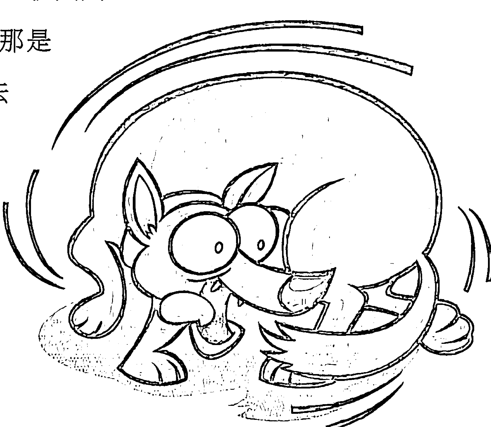

但是，牠只要停下來，反而也就突然體會到自己原來就是牠。牠想找的狗，也就找到了。找到了才發現，原來自己並不是透過「找」可以體會到的。牠最多只能承擔自己、當自己、活出自己。

你跟著「全部生命系列」一路走到這裡，不斷地聽我說真實是取不來、追求不到。現在，這個比喻對你是不是反而突然活了起來？是不是完全符合你對「全部生命」的理解？

話說回來，我前頭跟你說「不要因為人間的豐盛只是無常而失望，其實你本身就是真正的豐盛」。我真正要表達的是，假如你可以點點滴滴活出「全部生命系列」所談的，你的命運也老早已經扭轉。然而，命運已經轉變的你，和當初還在追求扭轉命運的你，早已是兩個不同的人。

假如能夠真正領悟到這些，你這一生的所有矛盾，也自然跟著消失。

只有這樣，你會發現，過去在找的一切，你老早已經得到。而人間沒有任何力量能把祂擋住，或還可以把祂帶走。

這時候，我希望你老實問自己——這種狀態，值得不值得去追求？

當然，我相信你馬上會發現，連這麼問都造出一個矛盾。因為，你已經也明白，祂是追求不來的。

# 11 可以透過對稱法則心想事成嗎？

確實，站在「全部生命」的角度，人間種種心想事成的方法，無論是吸引力法則、成功法則還是富足的科學其實都不夠完整。有了這樣的認識，你自然會想問——那麼，對稱法則呢？

你會這麼問，大概也已經發現：其實，就連對稱法則，也並不全面。

怎麼說？你仔細觀察就會發現，談對稱法則，本身還是站在「有」的層面，試著想去談絕對。絕對，是我們每一個人的本質，祂才是我透過「全部生命系列」真正想表達的。從這個角度來看，對稱法則當然還只能算是一種過渡或初步的觀念。
儘管如此，我透過對稱法則還是談到了一些重點，而這些重點確實不同於各種心想事成的法則。我在這裡，想針對這些不同點，為你再一次彙總。

首先，對稱法則不光在講有外在，也有內心。它也強調內心才是站在優先、資深的領導與帶動的角色——是內心，才可以影響到外在。然而，對稱法則也提到——站在外在，一切都要受到因－果的作用。

這一點，你之前或許沒有留意到。

如果你還記得，我在《頭腦的東西》也談過，因－果和頭腦是分不開的，最多可以說是同一枚錢幣的不同面。你之前可能把這句話當作理論，也就讓它過去了。然而，你只要仔細想，就會發現這句話的嚴重性。其實，換句話說，因－果就是你的頭腦；你的頭腦就是因－果。

你頭腦的機制，完全離不開因－果，也離不開二元對立。當然，這句話對你現在可能還是理論。然而，你只要觀察就會發現，你眼前的這個世界正是透過二元對立的連結，而彷彿有了頭尾、有了先後、有了左右、有了上下、有了內外。假如沒有二元對立，對你，其實沒有世界可談。

你也可以這麼說，二元對立，最多只是強化因－果。換句話說，因一果和二元對立，兩者就是同一件事。沒有二元對立，也不會有因一果，更不用講還可以建立什麼連結或邏輯。

你大概沒有意識到，一般所謂的邏輯，也只是落在三度的空間，再加上一維的時間來運作。任何二元對立的比較，最多還是限制在我們體會得到的時－空在作業。我們所謂的人類的聰明，也只是數不清的聰明中的一種。對整體而言，並沒有什麼絕對的代表性。

我之前在《落在地球》提到，甚至所謂「人類的特質」都還是限制、還是制約，而到最後都要脫落。然而，你大概沒有想到，就連更基本的所謂「意識」或「眾生性」（quality of sentient being，讓我們稱得上是眾生的基本性質）一樣還是落在一個相當狹窄的範圍。

最不可思議的是，透過二元對立或是某一種邏輯系統，就在這個相當狹窄的意識或眾生性的層面上，可以延伸出數不完的其他可能形式。我們不用談到宇宙那麼大的範圍，光是你腳下的這個地球，都含著數不清的生命形式，只是你我透過狹窄的五官體會不到。

在這樣的平台，你在這個人間所可以體會的一切，包括失落、包括豐盛，都是透過頭腦的東西、念頭、念相而來。但是，念頭再怎麼能夠組合和延伸一切，它的運作還是要符合業力的機制。

我在《神聖的你》用這張圖上方橫向的箭頭，表達我們自然認為每件事都會有一個因－果的關係。這樣的因－果法則，在有時－空的人間，是永遠存在。

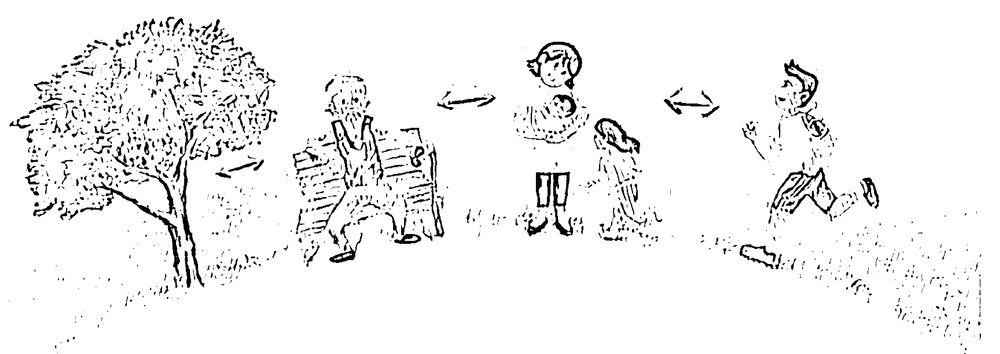

李研慧／繪；引自《神聖的你》

有時候，我們會以為因一果被打破了，也不過是生命的內在透過對稱法則不斷湧出來，而好像有了外在的變化。再加上我們的注意力總是放在外在，無法體會到內在的運行，也就誤以為跨過了因一果法則。其實，並不是。

你也可能還記得我在《時間的陷阱》談過，業力是多層面各種條件的組合，就像從各個方向同時衝過來的球，並不是我們可以體會到的過去或現在發生的。

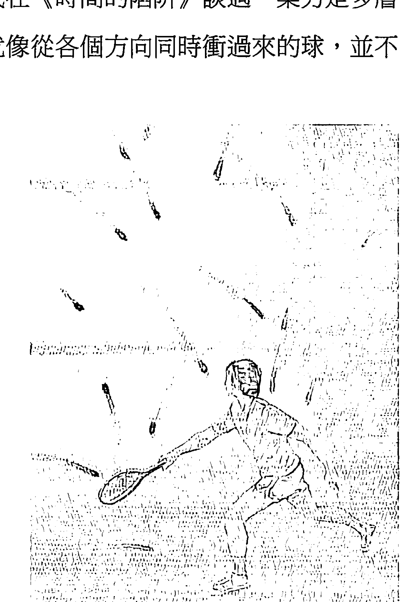

它的複雜性遠遠比頭腦可以掌控的線性先後範圍更廣。

其實，你這一生的業力也是如此，是我們所有行為、意念、動力的總和。所謂的「總和」指的不光是這一生，還是數不完的生生世世累積下來的動力。這些動力的總和，非要透過這一生轉出來——包括人間所謂豐盛或不豐盛的一切。

在這裡，我想用另一個對你可能比較新鮮的方式來描述。如果把業力當作「帳」（確實一般人也有償還業力的想法，就好像業力是一筆債務一樣），我可以試著來比喻業力的計算方式。

如果我們把業力比喻做儲存在某個地方的行為、意念和動力的總和，那麼，我可以進一步借用庫存管理的比喻來說明。你進到一個倉庫，自然會發現裡頭有許多不同的項目，有的已經在倉庫待了很久，有些才剛進來。接下來，如果你想知道這個倉庫裡的存貨從整體來看已經擱置了多久，而該多快將它清空——那麼，你必須先知道每個項目各是多久的存貨，再把每個項目的庫存時間代進去，得出所有項目的加權平均，才可以知道整體庫存已經擺了多久。

講到因－果業力也是如此，就好像有一個整體的會計系統，把你點點滴滴的動力或是累積的能量和意念算出一個加權平均，而從這個加權平均自然排列業力轉出來的順序。它計算的範圍不只是這一生的業力，不光是從你主動延伸出來的業力，還包括你作為一個接受者的反彈和動力。這些動力都會算進去這個意念的能量表或意識表，而計算出來的結果也就在這一生點點滴滴反映出來。

過去，你可能以為有一個神明在主導自己這一生的命運，於是一遇到不順，自然也想去求神。然而，透過這裡的說明，你可能才明白，這一生的命運最多只是透過頭腦虛構的架構，不斷地累積、延伸出來的。

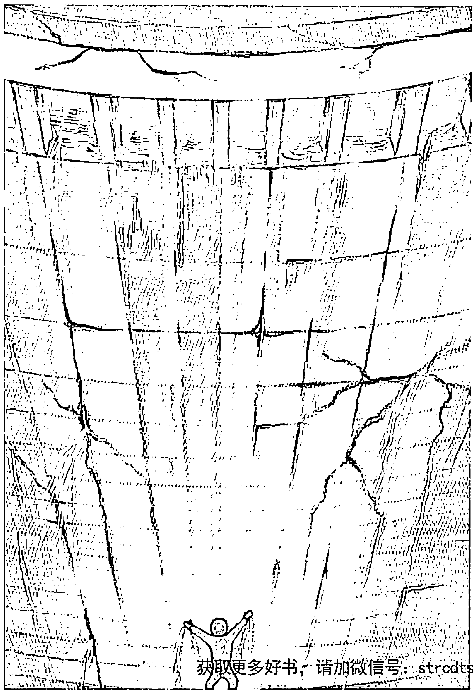

儘管是虛構，但我過去也提過，在這個「有」的層面，業力轉出來的扭力，其實比我們肉體的力量遠遠更大，甚至就像水庫在洩洪，是任何人不可能擋得住的。它本身所帶著的巨大能量差，就是非完成它自己不可。是這樣，我之前才會談「註定論」（determinism，包括在《時間的陷阱》談的

> 施智騰／繪；引自《定》

「科學註定論」）——我們在外在所看到、體會到的，其實一切都是註定。

甚至，從更大的整體來看，你認為真的有的自由意志，其實是不存在的。所謂的自由意志，也就是你認為自己可以做什麼、想什麼、說什麼、期待什麼、體會什麼、否定什麼或承認什麼。這樣的自由意志，依然是透過頭腦去延伸、組合的。它的架構還是虛構的，完全落在頭腦的範圍。是這樣，我才會說自由意志不存在，並不值得你去追求、去聲明、去主張。

既然一切是頭腦的作業，從整體來看根本不存在，而你也沒有自由意志可談，那麼，根本沒有什麼變化（包括命的轉變）是值得去追求的。

只是，對於還活在頭腦的你，我還需要不斷地提醒：無論你這一生的業力怎麼展開，無論你遇到怎樣的困難或失落——這一切，也只能說是剛剛好。

剛剛好的意思是，這一切，不是誰的錯，也不是神明或老天爺在懲罰你，更不是你自己有什麼錯。這一切，只是點點滴滴的意念與能量的總和。對這一切，沒有誰，甚至沒有一個自己需要去責備。說到底，就連「誰」都一樣是頭腦的東西，其實不存在。那麼，還有「誰」可以被責備、被怪罪？甚至，罪又是什麼？

既然一切頭腦的東西都不存在，甚至連你的自由意志也不存在，那麼如果還要用一個虛的機制（例如心想事成的方法）來改變任何現象、任何事件，能得到的，最多也只是一種暫時的結果。只要你退後幾步，從更長遠的尺度來看，也就會發現，再怎麼改變也不可能永恆。你所追求的目標、得到的變化，在整體，還是一樣要受因一果的法來作用。

儘管已經走到這裡，你可能還是想再做最後一點掙扎，認為如果是透過對稱法則的原理，一切從內心出發，是不是可以得到永恆的結果？

其實，我在對稱法則所強調的內心，是「絕對」的另一種表達，本來也就是永恆的層面。對於永恆的絕對，外在，根本不存在。是你、是我還想勉強要有個什麼可以和內心相提並論，才需要去談一個外在。
在這個層面，你再怎麼去講外在或認為有外在，其實稱不上是內心、絕對、永恆的對等。

我過去才會說，你我唯一有的真正的自由，只是不斷地回到內心或是一體。你只有讓意識隨時住在一體，定在一體，才會突然發現自己本來就是自由。到時候，你才會明白你過去所強調、所追求的自由，還是經過扭曲的一種觀念——是把整體帶到一個小角落，而在這個小角落裡想聲明自己的自由。

內心，其實是全部，是一切，沒有任何尺度可以衡量祂。甚至，什麼是內心、什麼是外在，這種分別在整體其實沒有意義。講個更透徹，內心也是祂，外在也是祂，任何地方都是祂。

別忘了，祂不是用人類頭腦所建立的業力機制可以描述。祂，是你我透過頭腦不可能理解的。你如果想透過頭腦去理解，最多也只是用頭腦和頭腦延伸的語言想把祂框架起來。別忘了，一個本來完整的整體，只要一塞進某一種框架，都不可能得到完整的表達。你再怎麼努力說明，對祂也沒有一點代表性。

你看，這是不是很有意思？你可能沒想到，從整體的角度來看，連對稱法則的前提、所討論的範圍竟然都是錯的。

過去，我會談對稱法則，最多是對外在的業力法則做一個參照和補強。換句話說，是在沒有語言可以表達的狀況下，我還勉強想用一個不完整的語言，來表達一個不完整的畫面。

你現在回頭看，自然會發現，「全部生命系列」所強調的，其實也就是這麼簡單——只有一體，只有絕對，只有心。但是，你可能反而還會認為這就是那麼難，而且還認為是透過我們的理性和邏輯絕對不可能懂的。

確實如此，本來就是不可能懂的。你想想，想去「懂」的體、或去「懂」的機制，本身還是人間的觀念。再怎麼「懂」，它本身還是在束縛我們、制約我們。

讓我再換個方式表達——懂或不懂，本身還在建立主體和客體的關係。

一提到主體和客體，你已經知道，它還是落在小我運作的範圍。也就是說，是小我，想堅持自己懂或不懂。也只是小我，才想改變命運，想得到物質所帶來的方便，想延伸自己所認定的生命，而接下來不斷地強化自己的獨立性。講個透徹，是小我還在追求人間認為的豐盛，是小我想要致富、想要有名氣、想要有地位。是小我，把一切看成顛倒的。

講顛倒，我指的是，跟真實不符合。

你看，我這麼講，會不會講得太快，還是你勉強可以跟得上，甚至可以和這些話、跟我達到共振。

# 12
有沒有一個共同點？

你讀到這裡，不曉得是怎樣的心情？是失望？還是感覺到一種歡喜？

無論是失望或歡喜，理由可能都是同一個——這裡所講的一切，跟你這一生所學到、體會到的，可能都是顛倒。

當然，我用這麼多篇幅來談這些方法，你自然會想知道，無論是西方的「心想事成」還是東方的行善改命，或者這本書談的豐盛的練習，這些方法和「全部生命」的重點究竟有沒有共同之處？能不能和「全部生命系列」一樣地，應用在你個人的生活中？

我在這裡，想試著用另一個方法來分享。

你只要仔細思考前面提到的各種法則，無論是心想事成的方法，還是東方流傳上千年的行善積德、轉變命運，或這本書談的豐盛的練習，你一定會注意到——首先，它們都強調一個重點。這個重點，最多也只是身心合一。

無論是東方或西方所推薦的方法，也只是讓你把注意擺到眼前或心中的目標，讓自己完全投入這個目標，而達到合一。當然，西方人的詮釋，會教你把致富當作這項心中的目標。我在前面也提過，這本身就反映了西方以物質為主的思想，是一種唯物的文化。

然而，即使只落在物質的層面，你也已經知道，這個心中的目標倒不局限於致富，而可以是人間的任何項目，例如事業、學業、研究、發明、藝術表現、親子關係、身心健康、哲學探討、修行……各種領域的成就。

就我個人而言，無論東方或西方的方法，關鍵倒不在於要你把注意力擺到哪一種人間的「目標」。真正的重點反而是「過程」，也就是你怎麼將注意力集中，讓身心合一的過程。我前面也提過，這樣的過程，和靜坐的原理，其實是相通的。

不曉得你記不記得，我在《靜坐》已經提到，無論有多少靜坐的法門，都可以用兩個大原則來概括。一是專注（止），另一是觀察（觀）。兩者，是兩面一體。不同靜坐方法的差異，是在於止和觀的比例不同。有些偏重專注，有些偏重觀。

一般所談的止或專注，是讓你將注意力擺到一個很小、很具體的點；而觀或觀察，雖然也讓你從一個點出發，但到最後，觀察會擴散到每一個點上，就好像讓注意力到處都在，又到處都不在。

你讀到這裡，可能已經發現——透過專注，自然可以走到觀；從觀出發，自然也可以走到專注。這兩種方法，都可以幫你集中注意力，讓注意力達到同步。這種同步，我過去也用「諧振」來表達，就好像讓所有的波動完全重疊，完全同步。

你可能還記得右頁這張圖，其實，諧振的現象也只是它所表達的——本來雜亂的腦波（我們隨時在動的思考和散漫的注意力），突然變得像雷射光的波動一樣地整齊、一樣地同步，而帶來不可思議大的能量。

既然之前提過靜坐的機制，為什麼我還要再這裡再強調一次？我想，你大概也猜到了，真正重要的，倒不是讓你的意識去守住哪一個點，或要你肯定守住的點有什麼特殊的地位。真正的重點，其實是這個合一的機制。

是這樣，我過去才會一再地採用呼吸的靜坐方法，讓你的意識守住呼吸。守住呼吸，也就是在你靜坐時，將呼吸作為注意力所專注的客體。呼吸本身有一種重複的規律，相當單純，而讓你可以很容易集中在上面。練習下去，你不知不覺注意力完全集中，也就自然得到身心合一。

身心合一的過程，也就打破你原本念頭和思考的作業。你透過這種注意，已經和目標合一，而自然可以回到我之前所談的「大我」。大我，其實也就是我們在人間可以找到的最源頭的主體。或者，讓我換一個方法表達，也就是小我或「我」的背後，一個更擴大、更基本的主體。

這個在人間最基本的主體，和小我或「我」不一樣。它並不需要產生一個客體，才體會得到自己的存在。可以說，這個最基本的主體或大我，並不是你透過理解、追求、得到、捕捉而可以去領悟到。如果你還想去領悟它，那麼，你能「做」的，最多也只是活出它。

它和任何客體不相關，或者說，它的存在和任何「主體－客體」的連結沒有關係。而且，它是在我們相對意識的最上游。這個最上游的大我，是我們透過頭腦不可能跨過去的，也可以說是頭腦的出發點或原點。我過去也透過「全部生命系列」不斷地強調，所有的修行方法，走到最後，無論是參或臣服，都是把頭腦的專注或觀落回到這個原點。

說到底，任何讓身心合一的方法，包括靜坐，包括這本書前面所談的守住、投入一個明確的目標，對你而言，真正重要的並不是過程中五花八門的現象和變化。對你，真正有用的關鍵，是透過這些方法，不斷把你帶回原點。你用這些心想事成的方法，讓自己不斷地守住心中的目標，徹底地守住。到頭來，你也只是透過合一，不斷地讓自己回到這個人間最源頭的主體。

有意思的是，如果你一再地回到心中的目標，透過合一，而落到最源頭的主體，停留在大我。這時候，你反而發現欲望好像消失了。本來你心裡還總想得到什麼，突然之間，這種動力竟然老早化掉了。反過來，是你偶爾沒守住這個目標，頭腦又開始運作，小我又冒出頭來，這個想得到什麼的動力才又浮出來。儘管欲望又浮了出來，你也已經知道——你只需要透過這些練習，再一次回到這個原點。一到原點，這股追求的勁或動力又自己消失了。

這種方法本身所含著的悖論，對我而言，很有意思。我也很驚訝，過去的人從來沒有分析出裡頭的奧妙，反而把心力集中在分析一個人的作為和目標之間的關係。他們不斷地教人去追求心想事成，卻竟然不知道，一個人真正在這種狀態，其實沒有目標可談，也不可能會有什麼追求。

有趣的是，大我——這個最根源的主體，雖然沒有和任何東西建立「主體－客體」的連結，但它本身好像就是一種聰明，而且還是一種無所不知的無限大的聰明。就好像你的潛意識自然知道自己該去想什麼、該得到什麼、該做什麼。對有些人，確實是該致富、該有名、該成功、該完成眼前的項目。但是，對某些人可能不適合或不該輪到（也許你會覺得自己就是如此），就好像這種更大的聰明對你自有另一種安排，只是這種安排不見得符合你原本設定的目標。

這種時候，你只能借用信仰的力量——正向，正向到底，相信一切的安排都是剛剛好。表面上，你得不到，你失敗了。其實，在整體來看，對你是剛剛好，是符合更深層面更大的藍圖。然而，你透過頭腦是無法理解這個藍圖的，最多是透過臣服或信仰來面對。

透過信仰、正向，你也只是一再地回到目標，守住目標，甚至和目標合一。你最多也只是在不知不覺中，隨時回到相對意識的原點。你一回到原點，也只可能正向，只可能誠懇。誠懇和正向，最多也只是你本性的流露。

你會明白生命還有個更大的藍圖，而你這一生的目標就是和這個藍圖合一。這麼走下去，你到後來最多也只能感恩——感恩這一生有這樣的機會，終於可以完成這趟旅程。

你看，我這麼講，是不是又把吸引力法則、成功法則、富足的科學、服務、行善積德、靜坐、豐盛的練習等各種方法，為你用另一個角度重新做了一次說明。我相信你可能已經體會到，這樣的說明其實和過去的說法沒有一點矛盾，最多只是透過「全部生命」的角度來重新解釋。

反過來，你在這個人間，無論是不是用這些心想事成的方法去追求一個目標，其實也還只是剛剛好。畢竟，每一個人的成熟度不同。無論你活出哪一個層面，可能就是剛剛好你所需要的。

是這樣，我自然會和許多朋友分享我個人體會到的一些好的方法（例如集中注意、正向、誠懇、感恩、堅持、和諧），而引導他們去投入一些好事當作目標，讓他們體會到什麼叫做身心合一。

如果你能夠集中注意，守住眼前、心中一個善意的目標，其實已經在做服務瑜伽。你如果完全投入，和所做的服務合一，不知不覺，你也已經在體會臣服和同步。就這樣子，身心同步了，你也就自然會想把注意力落到更深、更大的層面——不光會想知道什麼是真正的豐盛，還可能想知道世界、自己、現實是怎麼組成的。

你看，從這個角度來談，這些心想事成的方法其實沒有帶來一點矛盾，甚至可以是你成長的過程中一個很好的工具。最多，只是看你怎麼使用。

是這樣，我過去才會推廣各種表面看來不相關的方法。舉例來說，我透過許多學校和單位來鼓勵感恩創作、舉辦感恩日。右頁這張圖，是 2002 年感恩創作的得獎作品，表達守住心中的美和善意。此外，我也在各地大規模地推廣讀經，教小孩子如何集中注意力，甚至用「培養天才兒童最好的方法」這樣的口號來推廣。

當然，我也會一再地提醒大家，從我的角度，所有的孩子生來都是天才，只是可惜被人類的文明和不完整的教育遮住了。我用天才的觀念來提醒大家，要表達的是——其實每個人都有一個領域，是他可以充分發揮的。

你可能也注意到，雖然在探討這些心想事成的方法時，我難免要提到這些作家所重視的財富、名譽、地位這些目標，但我過去從來不特別強調這些。畢竟，這些對我根本不算是人生真正的重點。

> 梁朝凱／繪；引自《全部的你》

如果真的還有一個目標好談、好守住，對我，真正的目標也只是回到原點，而最多只是不斷地回到原點——先找到自己是誰，把自己同時交給更大的聰明。你會發現，這麼做也就是反過來讓更大的聰明帶著我們走——走一條最恰當、最適合的路。

走下去，你早晚會發現，其實你真正的身分就是心，而心本身又是這個最高的聰明。心，是源頭的源頭，是你沒辦法用話去描述的。只要一用語言去表達，已經跟祂不符合。再怎麼表達，也只是你還非要用相對去勉強解釋絕對。

心，不光是你沒辦法表達出來，甚至是你「想」不出來的。可能對你最難懂的是，你連體驗都體驗不到。想想，你能怎麼體驗心？

是這樣子，我才會說，你最多只能活出心。

最有意思的是，如果你真正從心裡聽懂或踏踏實實採用這裡的詮釋，就會發現自己已經可以找出一條路。

儘管在短期內，你可能反而在工作或家庭方面會遭遇很大的變更，也可能面臨大到讓人難以忍受的失落。但是，你只要堅持下去，自然會發現心裡開始平安起來，而且，在這個人間，也就跟著順起來。你該完成的，會順利地完成；不該完成的，心會帶著你避開。

你只要再繼續走下去，自然會發現原來過去認定的目標很幼稚，很單一，並沒有能夠反映心中更深層面的藍圖。

儘管如此，我還是會提醒你——面對自己的變化或不變化，不要做太多分析。如果你心中還有一些想完成的目標，那也沒有事。你只是繼續走下去，到最後你可能完成，也可能沒有完成。從整體來看，這不光是不重要，其實也沒有什麼矛盾。

你只要繼續走下去，遇到什麼困難，自然會知道要怎麼克服。然而，這種克服，不是經過你的思考，而是透過你的點點滴滴——每一個瞬間，你該做什麼，就做什麼；而你所做的，都是剛剛好。

這一來，眼前再大的挑戰或難關，你都可以克服。無論完成或不完成什麼目標，你也自然發現都可以放過。本來你會認定某件事多麼重要，你現在最多是對一切充滿感恩，知道它本身最多只是過去生生世世透過各種條件組合起來的果，對你、對真實並沒有什麼代表性。

到這裡，你可能反而發現自己竟然輕鬆起來了，心裡再也沒有什麼負擔。或許從經濟、從生活各式各樣的角度，其他人還在為你操心。但是，對你，這些操心都不存在。你老早知道，你需要什麼，自然會出現什麼——其實，是你也就自然顯化出什麼。但是你心裡明白，顯化的人不是「你」，而是遠遠更大的聰明。事實是這個聰明帶著你走，倒不是你帶著生命走。

這時候，你或許會想起耶穌曾經用五塊餅、二條魚餵飽幾千人的故事，或是摩西領著眾人分開紅海的奇蹟。你會發現，這樣的經過其實一點都不誇大。儘管你不需要期待那麼大的奇蹟，你仍然充滿信仰，心裡明白——自己需要什麼，生命自然會提供。你過去的憂心和顧慮，已經老早沒有了。

你知道，活在這個人間，需要的其實不多。你完全可以做一個樸實、普通的人，將自己的需要減到最低。無論到哪裡，那都可以是你的家，你自然把那裡當作剛剛好該去的。無論做什麼，眼前所做的，自然是剛剛好你該做的。

這麼一來，你過去的矛盾和糾結，可能也就完全跟著消失了。你說，這樣子，是不是才是真正的豐盛？

# 13 難道頭腦有那麼大的力量？

前面已經提過，頭腦和念頭的作用再大，心想事成的練習在人間的效果一樣是短暫，是無常。但是，光是談念頭在人間的作用，可能還是會讓你覺得相當不可思議——頭腦，真有那麼大的力量可以轉變物質？這個現象，是不是在說念頭是人間最基本的組成，而且我們可以透過念頭的力量去轉變一切？

當然，你可能更想知道，透過念頭的力量，是不是可以讓你在人間的這一生順利起來。哪怕人生只是一場夢，你可能還是希望可以在這個夢中得到尊重，得到愛，得到一切你認為自己缺少的東西。甚至，你可能希望在這個夢中得到開悟，得到醒覺。

當然，你只要去找，就會找出許多實例，是一個人用了心想事成的方法，來達到個人物質的要求。但同時，你也可以找出許多實例，證明心想事成是無效的。

然而，從華特斯的角度，他會認為所謂的無效，最多只是你對這個方法沒有信心，沒有徹底活出心想事成的道理。其實，他這麼講多少是對的。耶穌也說過「是因你們的信心小。我實在告訴你們，你們若有信心，像一粒芥菜種，就是對這座山說：你從這邊挪到那邊。他也必挪去；並且你們沒有一件不能做的事了。<馬太福音 17:20>」。

> 「是因你們的信心小。我實在告訴你們，你們若有信心，像一粒芥菜種，就是對這座山說：你從這邊挪到那邊。他也必挪去；並且你們沒有一件不能做的事了。<馬太福音 17:20>」

不過，信心或信仰並不是靠你「想」而來的。

我自己從很小的時候開始，自然就會把注意力集中在眼前的項目，點點滴滴守住每一個瞬間進行下去，從來不會刻意去規劃或操心。然而，這麼做，我發現樣樣反而都可以完成。任何阻礙，都不會是多大的限制。

記得很早開始，我也自然懂得什麼是集體的聰明，而隨時用一種正向啟發的方式跟其他人互動。也就發現，這種集體的聰明、集體的力量，比我個人的力量遠遠更大。

當時，我沒有想過所謂的信仰。或許，對我，一再回到每一個瞬間，本身就是最大的信仰。當然，你現在或許也體會到，就是連信仰或不信的念頭都沒有產生，這才是最大的信仰。

儘管如此，我在這裡還是必須說實話，就連華特斯所講的有顯化能力的念頭，本身一樣還是物質，並沒有比物質更優越、更優先。你想想，是你先認定有一個獨立的身心，才從這個身心延伸出來念頭。這樣來的念頭，當然離不開你頭腦延伸的因－果機制，而一樣是會來，也會走；會生，也會死。從這一點來看，念頭本身，跟好像比較下游、比較粗重的物質其實並沒有什麼不同。

所以，如果你要強調念頭可以轉變物質，認為你憑著念頭就可以轉變這一生，我要提醒你，說這種話，要非常小心。念頭，一樣要受因－果的作用，它本身並不是可以獨立發揮作用的存在。

你已經知道，因－果，在你虛構的人生劇本裡，是一個很重要的角色。這一來，認為憑著念頭就能改變物質，這種話其實不正確。它和它所要改變的物質一樣，都是物質，最多可說是和物質相對相成，而都要受因－果的作用。從我的角度，它是等同於物質。這一點，你完全可以自己去驗證。

你如果把念頭集中，守住某一個目標，而希望讓目標實現，這本身一樣離不開人間的劇本，一樣是無常。你也會發現，有時候，心想事會成；有時候，心想，事不會成。然而，這裡的心，講的還是念頭，是頭腦。

其實，念頭和物質兩個都在真實的下游，是在意識譜「有」的層面，而都一樣要受因－果的作用。只要還受到因－果的作用，在整體而言，它不會有任何永恆的價值，不可能發揮任何關鍵的作用。它最多只能算是無止盡的幻覺中的一個，無止盡的可能性的其中一種。

是這樣，我才會在《清醒地睡》提到，「有」的層面連全部的兆分之一都不到。只是因為你還認為肉體是真實，才非要守住這不到兆分之一的一小部分，而還把這一小部分當作是全部，也才好像可以錯過真實。

你可能也記得，華特斯強調過有一種無色無形的聰明、最高的聰明，可以幫助你完成人生的目標。這種聰明，也就是在任何念頭前還有一個無色無形的力量或聰明。而你當然會聯想到，這樣的聰明，應該也就是過去我在「全部生命系列」所談的智慧、心、在、絕對。

但真正的無色無形的聰明，跟你在人間想得到的目標和豐盛，這兩者之間的關係，和華特斯所講的剛好是顛倒。

其實，並不是讓無色無形的聰明來完成你眼前的項目或東西。真要說到底，華特斯所強調的無色無形的聰明，還不是「全部生命系列」所談的無色無形，而只是透過頭腦和念頭延伸出來的一種作用。

真正無色無形的層面，是心，是絕對。心，只有心。你找不到什麼，可以和祂相提並論。

心，不計較。心，不在意你想不想要豐盛，也不在意你有沒有目標想完成。更不用講，心不會重視豐盛這種觀念帶來的目標。心連一句話、一點想法都沒有，也懶得有什麼想法。看法和想法，是你我透過肉體才有的。任何看法、想法，都有主觀性，是站在「身心是真的存在」的錯覺裡才有的。

到這裡，你應該已經想到，透過心、透過絕對來為你取得人間的成就，不只不可能，根本就是兩個不相關的軌道。

華特斯認為可以和無色無形的聰明接軌，還認為可以讓無色無形的聰明幫你完成在人間豐盛的目標。如果你把他講的無色無形的聰明當作是絕對，那麼，他所謂的這種接軌還是認為——透過這個肉體和念頭的相對（也許是一個摩擦比較小的相對），可以讓你去勾住絕對，還可以把絕對拉進來相對的範圍，來完成相對的頭腦和念頭所下的指令。這種想法，不光可笑，根本是不可能。

雖然華特斯把自己的一套觀念稱為是科學，但從我個人的角度來說，這頂多是不存在、不通的科學。它過不了最基本的數學、物理、科學的檢驗，也不是你能隨時重現的。

唯一讓你可以和絕對接軌的方法，也就是我透過好多作## 14 正向：你自然的流露

只要你实验了追求丰盛的方法，尤其是第6章的练习，大概也已经发现，这些练习的目的，都在帮助你我培养一种习惯——正向的习惯。假如你正处在人生的低潮，你可能更需要让正向的心，带领你走过怀疑、担心、烦恼、哀伤和恐惧的低谷。

你或许还记得，我在许多作品，从最早的《真原医》《静坐》乃至于后来的《时间的陷阱》《头脑的东西》都再三强调——你如果要执行或改变任何习惯，完全都是依赖头脑的回路。然而，之所以谈头脑的回路，最多也只是需要你知道——身心的运作，是透过头脑的回路再加上肌肉的动力才可以完成的。

也就是说，你的头脑若要达到省力地运作，最好是把神经系统的作业都变成自动运行的回路。你也大概观察到，一个回路（一种应对）只要多运转几次，自然会变成自动运行（习惯）。接下来，它还会一再改善自己的效能。

你的头脑之所以会这么设计，可以说是为了考虑你的生存。毕竟，只要能把一些你平时要重复做的事变得自动化，这些反应也就落到背景自己运行。这一来，你就可以把全部的精神和注意力挪在前景——眼前要面对的状况或危机。

从你一起床到睡前，你已经在采用数不清的回路。这个事实，你几乎不可能注意到。毕竟透过这些回路，你想都不用想，就可以吃饭、上班、应对、办事，而让你最新鲜的注意力，自然去关注重的环境变化。只要回路不出状况，你根本意识不到它的存在。

不过，面对再怎么新的变化，你只要多采用同一个回路几次，这个回路也自然转成自动运作而落到背景。你不断面对新的状况，也自然会分析出一种最好的应对。接下来，你的头脑会把这套应对方式储存到神经运作的资料库。

头脑和神经的这种作业，你也可以称之为学习。你也可能会认为，只要让愈多回路或习惯落到潜意识自动运作，也就等同于学会了什么。对你而言，学习，也就是把一个新鲜的经验落入现有回路的机制，让你可以不断地脱身，把注意力转向学习更新的层面。

很有意思的是，日积月累，这些自动化的习惯和习气，也就变成你性格上的特质，而让你不断地强化自己的个体性。

你只要接触过一般心想事成的方法，应该会对里头自我暗示或自我肯定的练习留下深刻的印象，而你也可能这么做过：每天一起床，就对着镜子里的自己不断地肯定，给自己打气，教自己怎么面对一天。这么做，就好像你围绕着心里目标的上中下游，点点滴滴建立起一个虚拟的现实，而希望把它化成真的。

你大概已经联想到，自我肯定，其实就是刻意地、不断地建立起头脑的回路。确实，自我肯定是符合神经回路运作前馈（feedforward）的原理——你愈投入注意力，它显得愈真实，一样是顺着头脑回路的机制在运作。

即使你没有特别去做一般心想事成的练习，仔细观察，光是你每天活着、去接受感官的资讯、透过头脑建立眼前的现实，你已经在不断地自我暗示。你大概没想过，你建构这一生的方式，其实和心想事成的自我暗示并没有什么不同。

真要说有差异，最多也只是心想事成的自我暗示，是把你的知觉、接受资讯的范围先缩到一个很小的层面，而在那个很小的层面刻意一再地重复，好像建立一个小型的回路。

换句话说，心想事成和自我暗示，对你不能算是新鲜的发现。你一天24小时，已经透过和自我暗示同样的原理，不断地肯定透过五官所得到的虚拟的现实。这些从感官讯号衍生而来的资讯，对你、对整体其实没有什么代表性。只是你难免要把这个虚拟的现实当作一切，既然如此，我们就从这里开始。

你大概已经发现，一般心想事成的方法，都希望让你透过自我暗示守住正向、保持正向、活在正向。甚至，要努力避开负向。当然，你现在对回路的观念愈来愈熟悉，也自然明白这种作法就是在建立回路——透过这些练习，希望你不断去设立正向的回路。透过你的投入，让它变成一个靠得住的、强大的回路，而且是愈运作会愈轻松不费力的回路。

你或许会忍不住想问，为什么正向那么重要？

这个问题，多少反映了人间和头脑的洗脑有多强烈，让我们以为负面才是常态，完全忘记了正向才是你我的本质，或者说是从本质自然流出来的。正向，是你在没有念头的时候，最基本的状态。是这样，你才会一再地想回到正向，甚至愿意透过练习，帮助自己不断回到这个本来就有的状态。

正向，是你本质自然的流露。这个本质，本来就是无限，本来就是无色无形。你如果能够不断地回到正向，也就是把自己交回到最原始、最大的力量。正向，成为你的的一个切入点，让你头脑不停的「动」能够踩个刹车。

最不可思议的是，你从每个角落，其实都可以回到正向。回到正向，你自然延伸出生命最大的力量，而让无限带着有限的身心往前走。

我过去在《不合理的快乐》也是这么说的。快乐、正向，其实不需要有理由。你从人生任何一个角落，本来就可以随时找到快乐和正向。它们本身就是你，是从你的本质流露出来的。

倘若快乐和正向不是你，不是从你的本质流露出来，那么，就算你可以找到正向，也守不住。毕竟一个不是本质的东西，早晚会离开。正是因为快乐和正向就是你，是你自然的流露，你当然可以用各式各样的方法从各个角落回到它。方法，最多也只是念头的转变，最多是提醒你，让你想起，让你记得——这是本质。

可以说，建立正向的回路，其实跟静坐是同一个道理，而甚至可能更简单。

你可能还记得，我在《我：弄错身份的个案》提过，你透过静坐，不断把注意力从个人的主体（你）落在客体。这个被你专注的客体，可以是你的呼吸，可以是你身体的一个点，可以是你内心的观念、一个数字、一个声音或一个咒语。你透过专注或观想，意识自然会达到合一。这种合一的状态，其实没有其他的属性。你会发现，这种状态本身就代表你的全部，本身已经是你想找的一切。

然而，对你，如果想要达到和静坐同样的效果，那么，透过感恩，为自己建立正向的回路反而是更简单。你在生活的每一个角落，无论睡前、醒来、正在做或不做任何事都一样。你只需要透过一个感恩的念头，自然把注意转回到本质的原点。回到原点，你自然又体会到这个原点发出来的最大的能量，也就是正向。

这个作用，相当有意思。当然，你透过静坐或许一样可以体会到爱、正向、宁静、欢喜，而且，你可能也已经体会过。但是，只要你没在静坐，就会发现自己早晚还是回到人间的烦恼和二元对立。接下来，你还得再找一个时间，透过静坐的练习，再把这个合一的感受找回来。

然而，感恩的练习不太一样，你只是在心中生出感恩的念头，或是随时随地用「谢谢！」两个字直接表达。就这样，它已经把你的念头调度到一种动力，让你可以随时透过感恩回到原点，回到正向。倒不像静坐，还需要你挪出一段时间，特别去专注眼前的一个观念或东西，得到合一，才可以得到一种不同的状态。

让我再从另外一个角度来补充：其实，你只要一做感恩的练习，也就同时守住最后的结果——感恩带来的正向。正向是你本质的自然流露，是你本来就有的。你一做感恩的练习，只是不费力地想起本来就有的，也就自然达成这样的目的。感恩，合并了起点和结果，就像带你抄捷径，而不像静坐需要经过「专注→合一→得到」的步骤，才可以让你接触到这样的状态。

正向，虽然不是原点本身，但它是从原点直接流露出来的特质。你可以观察周边，谁不喜欢随时乐观？随时快乐？你也自然能体会到，正向，本身为你带来一种欢喜和舒畅，是心的作业。过去，我也说是心的层面，才会透过各种创作活动，希望鼓励大家从心出发，随时感恩。

# 15 心的力量

其实，感恩就是正向，正向就是感恩。

正是因为正向带来的特质，是最放松、最舒畅、最稳定，而对你自然带来很大的吸引力，你才会那么想要正向，而且比期待其他状态都更期待。是这样，正向的练习才有那么大的作用。甚至，连任何静坐的方法，对你都没有那么大的吸引力。

这是从古至今的大秘密——这种最源头的感受，包括正向、爱、欢喜、平静，是你早就在不断期待；而就是透过这么简单的回转，可以那么轻松把你带回绝对的意识轨道。

很有意思的是，你可以观察看看，人在表达正向的感受（例如爱、慈悲、宁静、欢喜）时，通常会用手指着心。就好像人类天生有一种直觉，知道正向是心的力量，倒不是头脑的产物。

你可能还记得，我过去说——心的力量，远比脑的力量更大。你可以试试看，透过感恩，不断地回到正向，这本身自然让心的能量流出来。心的能量，本来就是正向、最欢喜、最舒畅、最休息、最不费力的状态。

我之前在《真原医》和《静坐》都提到，就连身体的血管和器官都有一种共同的波动。有些人把这种波动称为梅尔频率，当然也可能是人类还没测量到的更低沉的频率。

心的力量，带出来一种共同的频率。你进入这种心流，也就自然进入同步、谐振的状态。你从头顶到脚心，身心每一个角落都落在同一个波动上，一同起伏，一起休息。同时，这个正向的回路或脑波，也自然跟这种全身的波动达到共振。就好像下一页我在《短路》带出来的这张图，是一种全身的同步。

透过这种全身心的舒畅和欢喜，你自然会发现，正向是你一天下来最想取得的，也是最容易回到的。只要一个感恩的动机或念头，你自然可以回到它。它本身，在能量上就是一种比较稳定的状态。

你也发现，感恩和正向，是一种愈做愈不费力的练习。透过感恩，你愈能够自然而然地随时感恩。你愈是练习正向，愈是能毫不费力地正向。到头来，正向会成为你生活最基本的状态。你所建立的这个正向的回路，本身已经在加持自己。这也就是前馈的机制，愈运作，愈强化自己。

正向，本身已经自然而然带动你全身心的反应。最奇妙的是，它会取代你平时杂乱的念头，而让你进入一个随时没有念头的空间。正向到底，你不知不觉也就进入一种没有念头的感受。

你已经知道，是心在彻底带动脑，倒不是由脑来带动心。在生活中，感恩和正向的练习是最简单的方法，把你从头脑的状态，落到心的平台。

## 练习：感恩

虽然我在许多场合和作品，都已经带出感恩的练习，但是，我相信，你经过这本书的解释和说明，到这里，对感恩的理解和实践都会完全不同。正因为感恩是一个这么重要的功课，我还是希望把握这个机会，再一次带你一同感恩。

从我个人的角度，这种练习，比前面所谈的各种心想事成的练习都更重要。感恩心，是人生的基础。你有了感恩心的基础，才可以挣得生命的丰盛。

感恩的练习，最多也只是两个字「谢谢！」——从早到晚，不断在心中重复「谢谢！」当然，你也可以说出来。

你早上醒来，还躺在床上，没有起身。这时候，对你想到的、看到、体会到的一切，都可以「谢谢！」

对你所要感谢的一切，你可以观想起来，而且愈具体愈好。比如，你要感谢身体，也就观想身体的每一个角落，从头到脚一一观想出来，对每个观想到的部位都说——「谢谢！」

你感谢的范围，自然会慢慢扩大到身边的人。你可以在心中观想家人、工作遇到的人、今天可能见到或见不到的人。就连你根本不认识的人，你都可以观想出来，而可以对他做感恩的功课——「谢谢！」

你感恩的对象，还可以从人延伸到东西和事情。你心里可能想起一件事，无论是好事是坏事，都可以做感恩的功课——「谢谢！」

你不光会感谢周边的人为你带来的帮助和贡献，对于种种条件的组合，也都可以在心中——「谢谢！」

你不光是感谢眼前的事，甚至对你这一生想完成的一切，都可以感恩——「谢谢！」你心里明白，一切都是最妥当的安排。无论有什么结果，你最多只有感恩，只有感谢，感谢一切都是刚刚好。

你一天下来，都可以这么不断地感恩。到一天要结束了，你已经躺在床上准备睡觉。这时，你可以再重复起床时的感恩功课。这一次，专注在今天见过的人、处理过的事，对每个人、每件事都同样感恩——「谢谢！」

每天这么做，一开始可能还带着一点费力，不知不觉，竟然变成不费力。不费力的感恩，自然变成你的特质。不知不觉，你整个人都活出感恩、正向和丰盛。

- 谢谢！
- 一切，谢谢！
- 宇宙，谢谢！
- 自己，谢谢！

# 16 真正的正向，是不费力

你读到这里，应该已经可以理解，为什么种种心想事成的方法都会先强调正向的观念。其实，你过去倘若没有理解这一点，也只是因为那时缺乏精确的语言，而让你无法将这些练习和观念与你自己身心的机制串连起来。

当然，站在现在的理解上，你也马上发现一个矛盾——一般心想事成的练习，会要你不断观想目标（也许是财富、也许是想得到什么）。然而，这种观想不仅相当消耗能量，还把你的注意力落到一个头脑的境界。甚至，即使你从早到晚都观想财富，透过密集的观想在头脑培养出一个稳定的回路，还让回路落到潜意识去运作而达到最低的费力，这样的运作再省力，终究不可能完全不费力。

我在《我：弄错身份的个案》也跟你分享过——任何东西，只要费力，其实还是属于头脑的状态。无论你期待什么、渴望什么，反而为你带来一种限制。反过来，只有心是毫不费力。

我在「全部生命系列」一再强调——真实是不费力的观念。心（真实、绝对）是无限，是永恒，而祂的力量比你透过头脑和期待的力量远远更大。

假如你认同这一点，那你可能接着问：「如果不是头脑在运作，那么，心怎么知道要完成什么目标？」坦白讲，如果让心带着走，即使你现在没有念头，即使你没有一直求或守住一个目标，过去建立的目标其实早就落入潜意识，而更高的聪明和一体自然都会知道。你每次回到正向，也可以说就是把自己交给更大的力量——让祂带着你走下去，让祂衡量你头脑想追求的目标适不适合，可不可行，或者从业力的角度来看，让你的某个渴望转出来，是不是妥当？

到现在，经过这些解释，你自然也会发现，让渴望转出来的过程或结果，可能根本不是你一开始想要的。这一点，其实才是一个大的悖论，而且是一般心想事成的法则完全避而不谈的。但我必须告诉你实话。毕竟，懂了这一点，你才可以避开不需要的冤枉路。

让我再讲得更透明，你现在透过头脑可以期待的财富、名气、地位、成就……只要是透过努力、费力才能得到，绝对不是长久，最多只是暂时。来了，也会消失。要用一种刻意、不稳定、无常的机制来取得的，它本身也只可能是暂时或无常。

这些话，我过去只会跟很少数的朋友分享。因为一般人如果没有亲身体验到，是很难理解这样的观念，但我们仔细观察，其实这才是真正理性的结论。

无论如何，我明白这些方法和练习，也许是正向、祷告、信仰或守住心中的目标，至少都能帮助你集中注意力，让你的头脑早晚进入谐振的状态。这当然都是好事。假如一个人还没有亲自体验到谐振或同步（也许是透过静坐，或突然有一种灵感、一种启发），接下来要谈醒觉、绝对、心或甚至丰盛，是不可能的。

我最多只是劝这些有种种追求的朋友不要那么认真，我还会提醒他们生命还有些更深的意义更重要。但是，我绝对不会阻止他们。反而，是针对最成熟的修行者，我才会说这些话。

在这里，我是把你当作最成熟的修行者，才会分享这里所讲的一切。

如果你彻底懂了这些，你也知道根本不需要去否定这些心想事成的方法。甚至，你可以亲自做个实验，看看这些方法有没有道理。也许，你还会得到在人间很好的结果。

但是，你可能很快就会察觉到，结果是好或是坏，这种分别本身还只是人间的观念。是你透过人类的制约和价值，在衡量这些结果。然而，事实其实很单纯：对整体，没有什么好跟坏的结果。一切，都好。

虽然如此，可能在这个过程，你也自然发现正向的力量有多么大，而可以像骑马或龙一样来驾驭它。你只是轻轻松松骑着它，至于它带着你走到哪里，你自然会发现，并不是那么重要。对你，这个不断回到正向、落在正向的过程，可能已经比原先的目标更重要。

这么做，你也突然发现你的生命竟然活起来了。从人生的任何困境，你都发现可以找到正向。找到正向，你的心态只要一转变，你对困境的看法也自然跟着变更。困境，已经不再是困境，自然轉成機會。

臣服、接受這些機會，你也不知不覺已經活出心想事成所追求的成功、富足和豐盛。但你會發現，你活出豐盛不是因為去模仿心想事成的練習。你活出豐盛，也只是自己一再不費力地回到原點。

你一再地回到正向，回到臣服，生命的豐盛、智慧、力量和勇氣自然會延伸出來，跟你做或不做練習其實沒有關係。甚至，連跟「你」都沒有關係了。它是一個自然而然的結果。

我認為，這才是心想事成背後最大的秘密。但是我相信，過去沒有人這麼跟你說過。

# 17 少，才是多

我在這裡，想帶出一個中心的理念，也就是：Less is more.——少，才是多。這一點，是我認為和豐盛這個主題最相關的一個觀念。

當然，談到豐盛，你大概和一般人一樣，第一個想到的會是「多，還要更多」。但是，從我的觀點，倒不一定更多才是豐盛。有時候，是剛好相反。你如果想要活得豐盛，可能需要的是更少，倒不是更多。

生命的豐盛，其實最多只是一種滿足感——你徹底知道你完全不缺。樣樣你所需要的，生命都會安排。

然而，「少，才是多」這句話還帶著一個你過去可能沒想過的觀念——也許，你需要放掉那些你「不再需要」的東西。你不再需要的，也許是一段感情、一份工作、一種人生規劃、一種往來的圈子、某種生活方式、居住環境……

生命本身是簡單的，是單純的。祂自然也想讓你簡化。
你今天會讀到這些話，也許正是因為低潮和不順。跌到谷底的，或許是你的感情、你的健康、你的工作、你的經濟狀況、你人生的規劃，也可能是你失去了人生的意義。你自然會希望自己能透過「全部生命系列」的觀念和練習，而走出來。
但是，你可能沒想到，透過「全部生命系列」帶來的重新整頓和轉變，會是全面的，會滲透到你生活的點點滴滴。你自然會回過頭來，想徹底轉換生活習慣，讓自己重新歸零，重新起步，當作配合身心轉變的一種配套措施。
這樣的轉變，自然會反映在你生活最尋常的瑣事裡。你也許發現，其實自己不需要睡那麼多，不需要非吃什麼不可。無論哪一件事，其實不需要符合別人講究的標準。包括自己平時穿什麼、怎麼表現，也是一樣的。
你也自然發現，你其實並不需要那麼多東西。你過去認為自己需要的衣服、紀念物、照片、工具、廚具、收藏、嗜好品……其實都可以大幅度的簡化。這一些物品，你過去可能根本不會想去清理。但是，我希望你能理清頭緒，知道哪些物品是自己不再需要，而可以把自己不再需要的清掉，最好是能轉送給別人。

這種對生命的清理，可以是全面的。你需要去清理的，也許是十年甚至更久前的衣服，也許是書、是文件、是信件、是日記、是相片、是當年最新款的電子用品、是別人送來成套的杯碗……衣服，可能早已經過氣，不合身，不符合你現在的氣質和狀態，不符合你現在這個人生階段的需求。

其他的东西，也是一样的，可能早就不再是你需要的。既然你不想再困在过去，这一切，也跟着都要清掉。

是的，我知道，谁会想做这种清理？你在清理的过程中，有些得从高处拿下，有些得从柜子或仓库的深处挖出来，有些是你早就不再愿意面对，只是随便收到某个看不到的角落藏好。这些东西的摆放，本来还勉强可以维持一种表面的秩序。但是，你一开始清理，也就破坏了表面的和谐，甚至还让家里看起来更杂乱。

清理这些旧物不光费力，有时还会带来一种情绪的萎缩，甚至勾起过去的画面、感情和记忆。而就是你可以翻出它们，因着种种感情和记忆，你也可能舍不得清掉。即使清掉了，甚至可能还想尽办法又把它找回来。无论这些旧物含藏的是怎样的画面和记忆，都让你心里纠结。

清理旧物会如此，如果是让你清理一段多年割舍不了的感情，那么，你内心的反应会更大。你没想到自己还会有那么多眼泪，明知应该放掉，但怎样都舍不得。但是，你也知道，就是因为一直舍不得，才累积那么多情绪的负担。

这些负担随时把你冻结在过去的某个瞬间。你，至少一部分的你，好像還留在那裡，好像還在等著什麼再一次出現、再重新來過。但是，事實是那個瞬間已經不存在了。這還不值得你去簡化、去處理嗎？

對你，無論是什麼，你都可以去清理。而這種清理，一樣地，最後都會減輕你的負擔。

修行，最多是回轉。假如你過去有情感上的失落或創傷，幫助自己恢復內外的一致，是特別重要的。倘若你的身心還在混亂中，念頭和情緒是凍結或還在隨時起伏，那麼，你全部的注意力自然不斷往外頭找。一個人身心還沒有同步，在這種身心不統合的狀態下，是不可能回轉的。你還需要透過我之前帶出來的練習，包括靜坐，幫助自己達到同步和諧振，才有辦法進一步接受醒覺的觀念。

化解過去創傷的方法，當然可以先從環境的簡化開始，透過物件的清理，拋開這些傷痛的記憶。特別是會讓自己回想起這些創傷記憶的物件，例如衣服、紀念品，都應該清理掉。

把舊物清理或送人，和過去的一段感情徹底告別，你會突然發現，你的負擔不見了，整個人輕盈起來。你會體會到，這樣的清理，不光能讓情緒的悲傷踩一個剎車，而你甚至開始充滿活力、平安和歡喜。你還可能會想——原來早該這麼做了。

你原本可能不敢相信自己能跨過某個創傷，沒想到，你竟然已經很久不再想起。這時候，你已經走出來了。

你也會明白，原來身心確實是幾面一體。外在是反映內心，而內心反映外在（如果你還記得，這也就是前面提過的對稱法則）。你的環境如果整齊、簡單、乾淨，其實也反映你心理的狀況。兩面是一體的。

一個人生活簡單，不讓自己被雜物圍繞，這樣的樸實，也是在跟自己內心做一個同步的聲明。當然，除了舊物之外，其實，更重要的是對過去創傷、情感、記憶、傷痛的清理。長期來說，這樣的清理是更重要，而它本身其實是一種臣服的功課。

你也自然會發現，一個東西，無論你再怎麼放不下，最終還是帶不走。其實，人生中，什麼都可以放下，可以丟掉，可以簡化，沒有一樣東西有絕對的重要性。

剛開始清理，你可能還會覺得費力。然而，不知不觉中，你愈清理，愈不覺得費力。甚至，你會發現自己隨時在順手清理。你不再想囤積東西，也不再把感情、念頭、不確定、各種顧慮擱在心裡。

這種清理，還會讓你上癮——你愈放手，愈是感到喜悅。你甚至會趁一個東西還是好的、還可以用或還是新的時候，就送給別人或捐出去，而不是等它舊了、沒用了甚至壞了才放手。看到別人得到一個新的東西，他臉上發出的喜悅，自然可以為你帶來更大的歡喜。

你自然會發現，對任何擁有物，包括住慣了的房子，都可以放手，可以重新開始。甚至，對所擁有的物質都不會再那麼重視，不會再想留下任何紀念。你想不到的是，這種放手，雖然還稱不上是從人間徹底出離，卻是我們一般人隨時可以做的。這種放手和清理，不光影響你的客觀環境，其實也在整頓你生命的價值，讓你對豐盛有了全新的看法。

你自然發現，這種放手，本身其實是最高的豐盛。你從原本一心只知道取得和渴望，突然轉到放手、給予和服務。你也會發現，你真正的需要其實並不像過去想像的那麼多。甚至，比任何人想像的都更少。

你不光發現人生其實不需要符合規劃，有時候，甚至大部分時間可以讓生命帶著走。也許，你本來連開車都要隨時設定導航，不可以失去方向。也可能，你本來認為自己應該完成某一個項目。或者，你本來很在意別人眼中的你是好或壞。現在，這一切，你發現都可以不去操心，都可以隨緣。

一切都能夠放手，都可以隨緣，你自然體會到心中隨時有一種滿足感。這種滿足，跟結果似乎沒有直接的關係。過去你會認為是錯誤，會讓你失望的，你現在發現好像也沒有什麼錯誤可談，而任何對錯其實都沒有什麼重要性。就連這些所謂「錯」的狀況，都可以讓你得到學習和滿足。

這樣的滿足感，或說豐盛，愈來愈脫離你所處的環境的條件和狀況。你已經可以隨時把它活出來。

少，才是多——因為這個觀念太重要，我談豐盛這個主題時，也一定要把它帶出來。就好像我在「全部生命系列」進入參和臣服之前，會先帶出種種靜坐的方法，讓一個人可以達到同步或共振。少，才是多——這觀念，在豐盛這個主題，就是這麼重要的基礎。

通常，我會讓人從清理自己周邊的環境開始，從你自己的房間、家裡、辦公桌、工作環境，都可以得到練習。我相信，假如你可以這麼做，你已經對自己的生命引發了一個大的調整。

清理生命中不再需要的東西，本身就是一種簡化——幫助你把頭腦簡化，讓身心一致而同步，達到諧振。這種清理、簡化的作用，和我過去帶出來的許多練習包括靜坐，是一樣的道理。到最後，還是讓你的內外能夠一致，而可以回轉到心。

讀到這裡，或許你會想起自己可能還有一段感情、一件事、一種人生規劃、某個環境所引發的障礙，正等著你去簡化。有時候，你可能要先從這個層面著手，才能讓身心回到同步而合一的狀態，而可以讓自己準備好歡迎生命的豐盛。

## 練習：簡化生命

看看你的臥室，總有些東西，是你不再需要的。你可以把它清理掉。

清理掉，不是讓你找個地方再收起來，而是丟掉或送人。當然，最好能夠轉送或捐給需要的人。

你可能會問：「我怎麼知道自己不再需要它了？」

很簡單，你看到這個東西，接觸到它，心裡的第一個反應是正向、快樂的？還是充滿萎縮？

會讓你萎縮的東西，就可以優先處理掉。

然而，繼續清理下去，就連帶著好的回憶、帶給你正向的能量的，只要跟現在生活已經不相關，也可以處理掉。

一一掃描臥室裡的東西，哪怕只是桌上一個不起眼的小物品，也稍稍用心去體會，看它和現在的生活相不相關。

清理的過程，可以充滿感恩。無論這個東西，為你過留下了正向或負面的回憶，無論現在是不是有用，你都可以帶著感恩的念頭——謝謝！你為我帶來一種功課、一種練習，你過去也曾帶給我許多快樂和滿足。儘管我現在不需要你了，我還是要謝謝你！

清理，不是因為討厭而放手。最好可以把清理出來的東西轉送給需要的人，而不是把它銷毀。這時候，我們心裡更要做一個功課，知道放手是善意——謝謝！也許你在別人手裡，會帶來更好的能量，造出美好的空間。

在清理時，帶著這樣正向的意念相當重要。

你如果才開始做這個練習，倒不需要一口氣把所有東西清理掉。你可以把它變成一個小小的儀式，讓自己每天清理一樣東西。這樣子，把清理的門檻降下來，讓你隨時可以輕鬆進入，而不會那麼費力。

你只要一開始動手清理，反而可能發現自己想清掉的不只一樣東西，而是兩個、甚至三個或更多。無論你想清理多少個，在這個練習中，最重要的是心情。你可以在清理舊物、轉送或捐給別人的時候，隨時帶著很正向的念頭。

你應該猜得到，最重要的心情，也只是感恩。在清理的過程，更可以同時做感恩的告別——謝謝你對我的幫助，現在我雖然已經不再需要，但願你能帶給別人一樣的快樂。

這麼做，讓清理舊物對你不再是純粹的痛苦和失去，而是一個帶來歡喜的練習。是這樣，清理東西，才會為你帶來一種清爽而快樂的感受。這種正向的心情一再地重複，自然會落到你的潛意識。

一再重複這樣的心情和感謝，就好像在進行一個儀式。本來你可能懶得清理、捨不得丟，對清理舊物充滿了心理障礙（想想，誰會喜歡失去東西？）但是，一再地重複這種感恩的告別，你的心情會逐漸變得開朗，甚至可能讓你開始期待下一次的清理。

同樣的道理，不只是清理舊物，其實你投入任何事，都要配合感恩和正向的念頭，才會為自己建立正向的迴路，而讓你會愈做，愈想做。面對困難，也只是如此。你完全可以試著把一切變得正向，純粹為了正向而正向，倒不是為了取代、推翻或否定什麼。

你也可以抱著這種正向的心情來簡化事情，一樣地，你也會不知不覺上癮。你可能終於體會到，無論是把東西和人分享，或是把事情簡化，同時帶著感恩的念頭，這本身自然帶來最大的歡喜。

無論是整理東西，還是整理環境的空間，還是簡化事情，你還可以把這樣的清理延伸到自己——舉例來說，清理自己的飲食習慣。

有些不健康的飲食癖好，你過去心裡明白，只是為了滿足一種慾望，並不是你真正需要。現在，你看可不可以清理掉。然而，說清理，其實沒有什麼具體的東西需要丟掉，最多也只是你不再用這樣的飲食。你並不需要責備自己過去對它的依賴，最多是在心裡清楚地表達——謝謝你，我不再需要你了。

你會明白，這樣的清理可以延伸到每一個習慣，包括講話的習慣。過去，你也許說話總是帶刺，以為這樣比較直接。現在你可以告訴自己——一切，其實都是剛剛好。我現在不再需要這麼說話了。請祢，幫助我，讓我轉一個方向。

我們平常待人處世，也是一樣的。有時候，我們會發現，單純化或簡化，反而是處理事情最簡單的方式，而倒不是一再地累積更多選擇，反而把事情或關係變得更複雜。

這樣的清理，也可以延伸到心態。舉例來說，在工作上，你本來有樣樣的期待，樣樣的要求。當然，你不需要責備自己，只是現在看可不可以踩剎車——我過去需要金錢，需要名譽，需要地位。然而，我現在不需要了。請祢幫助我，讓我將渴望簡化，把念頭簡化，把生命簡化。

再舉一個例子，眼前你可能突然出現一個賺錢的機會、出名的機會、擴大影響力的機會。然而，你可能也意識到，這樣的機會，原來還是從自己心裡的貪念和慾望延伸出來的。一樣地，為自己踩一個剎車——謝謝你，一切，都是剛剛好。然而，現在我不需要了。謝謝！

包括你對未來的安排、認為自己所需要的保障，都可以做一個清理，看可不可以放手——我知道，我過去需要這樣的安排和保障。現在，我不需要有這種擔心了。我可以放手，解散這些安排和保障。

你如果能徹底這麼做，自然會發現，生命裡，其實真正需要的不多。這些「不多」，你在心中已經老早都有了。

最終你會發現，你對生命簡化，最多也只是改變一個習慣，到最後甚至連一個告別的經過都不需要。你並沒有取代或換掉什麼，只是表達感恩，同時延伸一個新的迴路。

或許你還記得，我在《真原醫》也提到習慣或習氣是透過頭腦的迴路所建立的。如果你要改變習氣、建立一個新的迴路，最簡單也最有效的方法，還是透過行為，也就是透過肌肉和我們整個人身心結構的「動」來配合。每一個新的行動，也就自然而然建立一個新的迴路。有了新的迴路，生命也就跟著改變。

新的迴路一旦建立起來，你也會發現，自己自然不會再想回頭。

> > 謝謝！

現在我不需要這麼多了
請幫助我
將生命簡化

# 18 愈給，愈多

前一章提到——少，才是多。我要再提出另一個豐盛的重點：Giving is more. 給，會帶來更多。而且，給，不光會帶來更多，甚至是——愈給，愈多。

你可能不明白，如果你把你所擁有的給出去，按道理來說，你擁有的應該會變少，怎麼反而會更多？

愈給，愈多——其實是豐盛的一個核心觀念。一個人願意給予，而且一直給予，這樣的慷慨，也是豐盛的一個核心特質。

華人文化相當鼓勵節儉，讓一般人以為是要節省、最好到一毛錢也不花甚至斤斤計較的地步，才能點點滴滴累積財富。但從我個人的觀察，事實都是剛好相反。這樣子節省的人，當然可以累積許多財物，但到後來反而活得很不愉快，甚至人生出現很多問題，連身邊的人都會彼此對立。

這麼說，當然並不是要鼓勵你奢侈浪費。我相信，你也可能聽過或遇過一些揮霍無度的實例。確實，一個人如果不能節制自己的欲望，哪怕擁有再多，早晚也會一無所有。他的念頭和注意力再怎麼往外尋，非但滿足不了肉體的欲望，反而還讓能量不斷往外漏，不斷地流失，造出嚴重的失衡。

反過來說，一個人過度節儉，也就是能量只進不出，一樣是失衡的。

如果你希望取得豐盛，要記得，豐盛本身是一種均衡的狀態。你的生命如果隨時在均衡的狀態，我要再強調一次，那麼，你真正需要的其實很少。甚至，你根本不會有想要揮霍的欲望，生活自然會變得簡樸。你最多是基於一種照顧大家的心情，該大方時，自然大方，甚至隨時大方。但是，你這麼做，是把金錢當作服務大家的工具，倒不是沒有節制的大肆揮霍。

其實，如果你發自內心慷慨，甚至還能把自己擺到最後，那麼，你不光可以創造更多的資源，還可以照顧身邊的人。這一來，你反而可以累積更多財富。即使沒有累積更多，你的人生也會更豐富，更豐盛，為自己和身邊的人造出一個彼此信賴、真心關懷、讓人成功的環境。到了這時候，是不是累積更多的金錢，其實已經不是你真正在意的。

念頭和物質層面的慷慨，其實是兩面一體。你不光是可以在物質層面慷慨，更可以在念頭層面大方——給人成就、給人功勞，不光是給別人應有的功勞，肯定他本來就有的貢獻，甚至，你可以真正謙讓，把自己排到最後，不需要再去表揚自己的功勞。

我過去觀察，真正成功的人（我指的不光是在財務層面成功，而還是身心快樂的人）都是這麼做。真正成功的人並不需要為自己爭取名譽、好處或功勞，而是把功勞歸給別人，就好像他在輔導每個人成功，而把整體的成功當作自己的成功。這麼做，是真正的慷慨。

真正的慷慨，可以透過各式各樣的層面表達。舉例來說，在工作上和人接觸時，你可以少看缺點，多鼓勵。甚至，是隨時找機會慶祝——即使很小的突破、很小的成就，都可以慶祝。你不光是為自己的突破慶祝，更可以為別人的突破慶祝。你自然會想要隨時跟別人分享好的東西、或你所知道的好東西。你不再是等著別人來照顧，而是隨時都去照顧別人。不知不覺，你也發現，愈是帶著慷慨的心情稱讚別人，愈是給人正向的鼓勵，一天下來，你自己反而更是充滿了能量。

當然，你也看過，有些人專門挑別人的短處來看，到哪裡都在找缺點。不管別人怎麼做，他就是挑剔，認為別人這也做不好，那也做不好。其實，這樣的人怎麼活都會覺得不好、不夠、不對勁。也許他這一生有相當好的福報，好像有地位、有財富，但他的念頭、語言、行為隨時盯著缺少的那一面，從來不去欣賞豐富的一面。這樣的人，即使什麼都有，他反而活得好像樣樣都缺。

是這樣子，我才會說一個人的念頭、語言、行為要隨時保持正向。你也可以體會看看，就拿這張圖的水來說，你會像右邊的人一樣看到還有半杯水？還是會像左邊的人一樣，看到有一半是空的？

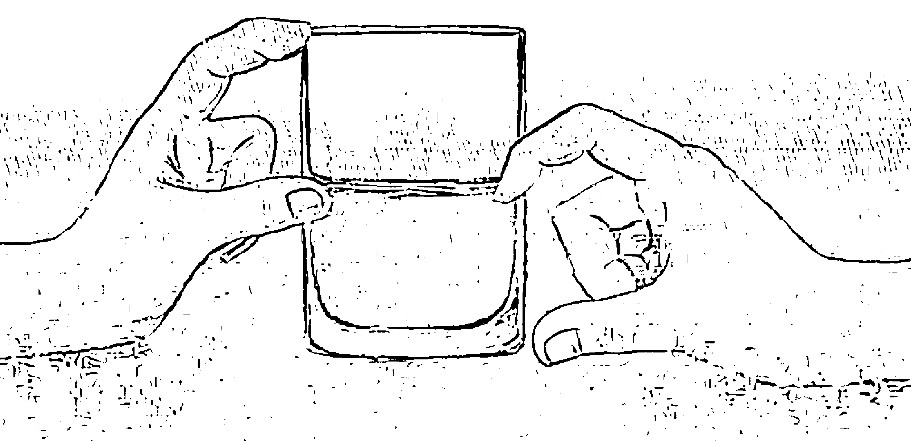

發自內心的慷慨和大度，其實是我們每一個人都可以學習的。

即使你本來就很理性，講究精確，傾向就事論事來衡量好壞對錯，然而，只要你願意試著去多鼓勵，少看缺點，早晚你會發現稱讚和鼓勵的力量竟然是遠遠比責備、挑毛病或找異常來得更大。可能只是寫一張小紙條，帶給對方幾句鼓勵、安慰、稱讚的話，就能為彼此帶來很大的幫助。

只要開始讚美、鼓勵身邊的人和事，你自然會不知不覺上癮，甚至會隨時主動為對方找到各種可以鼓勵和讚美的地方。接下來，你甚至還想鼓勵別人更多，想為別人找到可以獎勵的標準，只要達到就一起慶祝。你隨時都能體會到，就這麼簡單的做法，可以帶給周邊喜悅，還帶動一種正面的能量，這本身會是你最大的收穫。

確實，慷慨和大度，自然帶來正向。你如果從心裡對人、對事、對物慷慨，也就不會再渴望從別人身上得到什麼，也不會想透過這些人事務為自己達成什麼。你會認為早就已經達到了，如果還有突破，那完全是意外的驚喜。對這樣的結果，你當然只能感恩、只能稱讚、只能放手。

其實，一個人能夠慷慨，也只是反映了這樣的領悟——沒有一個東西真正是屬於「誰」的，更不用講是自己的。每一樣東西都是共同的，是整體的。你即使擁有一個地方、一個東西、一個物質，也最多好像是在幫忙整體照顧它，它並不是你的。

反過來，既然全宇宙就是你的家，也可以說沒有一樣東西不是你自己的，而你又有什麼東西不能跟人分享？不能給出去？無論是一個好消息、一句好話、一個好的物質，你自然會大方給出去。你會隨時照顧別人，會為人處處著想。

同時，既然樣樣都是整體，而沒有一樣東西不是你自己的，你又有什麼會需要去爭奪、取得、拿到，或刻意要留住、累積？無論你需要什麼，整體自然會為你考慮。對你，豐盛是自然而然的結果。

從能量或對稱的角度來說，樣樣都是一個循環。你「給」，其實也就打開一個能量的門戶，帶來一種流動。接下來，這個流動自然會找到它自己的平衡——既然有東西可以流出去，也會有東西可以流進來。一個系統是這樣與周遭不斷地互動，才可以達到平衡。

我前一章所講的清理，也可以促進能量流動的平衡。如果你的生活都是塞滿的，也就擺不下新的東西了。生命，也是一樣的。假如你的腦海滿滿是各種現成的觀念和知識，那麼，新的靈感又怎麼進得來？

這時候，你反而需要放手，才可以挪出一個神聖的空間，讓宇宙正向的能量不斷地流進來。

你所放手、所給出的，不光是物質，也可以包括精神的層面。

就像前面提過的，在和大家共事時，你原本可以把所有功勞留給自己。但是，你懂了能量平衡的道理，反而可以選擇把功勞交給別人。這麼做，不光讓共事的人能全心發揮，更讓你可以隨時肯定別人的表現。不知不覺，生命的力量就在團隊裡活了起來。

當然很多人會用投資的心態來解釋這些話，也就是認為樣樣都有代價，也許是先要付出，才可以得到。後來，也有人帶出另一種「pay it forward（先把好處分享出去）」的觀念——不是講究一對一的回報，而是再進一步分享給更多人。到最後透過宇宙的循環，這一切的好處還是會回到自己。

然而，從我的角度，慷慨就是慷慨，其實不需要用這些道理來解釋。你不需要帶著取得、回收的預期，更不需要認為對人好，自己早晚有一天可以得到回報。你如果沒有得到回報的念頭，接下來，也不會有期待落空的煩惱。

給，最多是為了給。

給的念頭，本身就是你我最大的恩典。給予和付出，帶給自己能量和平安，讓自己和身邊的人事物不斷地回到平等，倒不是為了想從物質層面得到什麼回報。

你看，這麼講對你是不是有道理，而你，會不會想這麼做？

## 練習：給予

你可以從自己珍惜的物品開始，將前一章「清理」的觀念再做一點小小的調整——從清理轉成分享。透過這樣的轉換，你自然從簡化生命進入給予的豐盛。

前一章的練習，是請你清理自己已經不再需要的東西。這裡的練習，則再進一步，請你把自己心愛的東西跟別人分享。也許是一朵小花、一枝漂亮的筆、一個稀有的收藏、一張難得的照片、最新潮的電子用品、很有質感的擺設、設計巧妙的家具……其實，樣樣我們都可以跟別人分享，貢獻給別人。

我有時也會開玩笑——這麼做，就像是每一天都讓自己當某個人的聖誕老人。舉例來說，你如果去用餐，可以比一般的慣例再多給一點小費，將用餐的滿足與快樂，用金錢的形式，一同分享給為你服務的人。

當然，在與人分享這些好東西之前，不要忘記對這個送出去的東西，在心裡誠懇地感謝——謝謝你，為我帶來喜悅。現在，我希望把你帶來的喜悅分享給別人。

只要做，你會發現，這樣的分享會讓你上癮。愈是分享，你愈想要分享。一開始，也許你只是從物質層面著手。接下來，你會自然發現，連自己為人處世的態度、肢體語言、說出來的話甚至心裡的念頭都可以奉獻出來，為別人服務。這些不那麼物質的東西，一樣也可以帶給別人快樂。

如果你希望投入這樣的練習，可以從讚美開始。

一天，你至少給自己機會——讚美別人一次。接下來，從一天讚美一個人，變成一天讚美兩個人，一天一天增加。到最後，你見到的每一個人，無論對方在什麼狀態，你都可以給他一些鼓勵或讚美的話。不知不覺，讚美和打氣就變成你的本能。你也自然發現，從你流出來的一句話、一個動作、一個念頭已經全部都是正向，都為身邊的人帶來幸福。

透過這種練習，你看可不可以體會，其實，連一個「給」的念頭都是多餘的。假如還有一個「給」的念頭，那麼，最多是給——自己。你和身邊的人事物，早已不像過去有那麼厚重的隔離。

甚至，你這麼做，已經為自己、為身邊帶動了真正豐盛的機制。

這樣子，其實也是讓你達到平等心最好的方法，甚至可以為你化解時間的觀念。

怎麼說？

你隨時給，隨時正向，也就是將每一個瞬間都當作平等。在每一個瞬間，你都讓自己做到最好，和身邊的人合一。在每一個瞬間，連過去的記憶，無論是好是壞，你都可以隨時交出來，都不再受到影響。

這樣子，你隨時活在瞬間，倒不會一再回顧過去，也不需要期待未來。

> 謝謝你！
讓我有機會
隨時給予
隨時付出
活得豐盛

# 19 不再恐懼

在人生低潮時，你難免會遭受不安和恐懼的侵襲，甚至可能會跟著不安和恐懼，做出許多不需要的防範、準備、擔憂和反擊，而讓你在事後或多年以後想起來還會懊惱、還會自責。

你可能還記得第2章談成功法則時，希爾也提到，一個人要成功是需要培養自信、克服恐懼。這一點，你當然會認同。在這裡，我想再用「全部生命」的角度，來為你談這些心想事成的方法，也和你一起觀察一般人用這些方法可能有的期待。

恐懼對人造成很大的影響，我才會在《神聖的你》提出「萎縮體」的觀念。你可能早就體會到——自己大多數時間都活在一種萎縮的狀態，而好像遠離了生命本來的圓滿。

我也提出來，在萎縮體的組成裡，恐懼可以說是最強烈的負面力量。

如果你還記得，我當時也透過神經生理學的觀念來解釋，為什麼恐懼有那麼大的負面作用。如果你曾經體會過情緒和身體反應緊密的關聯，那麼，接下來這些生理運作的描述，對你而言，已經可以幫助你消除萎縮——至少讓你知道，萎縮或恐懼並不是你不夠堅強，並不是你的錯。

從演化的角度來看，各種身心的負面反應，最多也只是延續人類這種動物生存的反應。我會建議你，面對自己的恐懼和萎縮，最多把它當作一種先天的體質來看。接下來，你不光可以學會和恐懼與萎縮共存，甚至還可以把它當作一個入口，隨時為自己帶來一個反轉——從外在，回到內心。

在你的大腦裡，和情緒關係最密切的結構，也就是所謂的「邊緣系統（limbic system）」。邊緣系統裡最發達的構造，它的作用是去接收危險的信號，並透過恐懼的反應盡快轉達出來。從這個角度來說，你全身神經系統的運作，所著重的就是怎麼把環境的危險訊號盡快加大，大到讓你的身心無法忽視，而在第一時間化成你身體肌肉的反應。是透過這樣強烈而迅速的反應，才讓你可以來得及躲開眼前的威脅和危機，或是可以全心去面對它。

你可以想像，在處處都是野獸的時代，這樣的反應當然相當重要。如果你就是活在那個時代，和力氣大或動作快的動物相較之下，你其實是非常脆弱的生命。不只如此，環境裡還到處都是危險。那時的你不只要面對野獸的攻擊，就連最基本的覓食、尋找水源、面對天候的變化、抵擋夜裡或冬季的低溫……樣樣都是考驗，更不用講還要面對同類之間的相殘。

你身心裡強烈的恐懼本能，透過經驗和學習一再加強，才讓你個人甚至全人類可以在艱難的環境裡生存下去。

然而，雖然你的恐懼有助於提高生存的機率，而你的身心也透過自律神經傳達的指令，讓你能在第一時間採取面對或逃走的行動。不過，如果外在的危機大到一個地步，已經是個體沒辦法克服的，這時候，你可能反而會恐慌發作。或許你過去也經歷過，因為太害怕，整個人好像呆掉了，甚至失去行動力，沒辦法做任何保護自己的反應。

想不到的是，隨著人類文明的發達，現在的你所要面對的，竟然已經從外在的危機，透過念頭轉成內心的危機。甚至，內心的危機所造成的恐懼，倒不會比外在危險造出的恐懼更小。或許，你自己也體會過——比起外在的危險，內心的危機不光是遠遠更大，而且還可能隨時浮現。

> > 李研慧／繪；引自《神聖的你》

想想，這是合理的。內心的危機雖然比較抽象，但是它在你的腦海還是一樣不斷地產生恐懼的迴路，而不見得需要由外在的威脅信號來引發。從外頭的世界，你明明看不到、注意不到任何徵兆，沒想到，內心的恐懼竟然好像無所不在，甚至隨時會找機會發作。

你可能對左圖還有印象，就像圖裡所畫的，不知不覺，你透過無所不在的恐懼也就進入一種萎縮的狀態。面對樣樣，都是透過萎縮來過濾。這個世界，對你，其實可以說是夾雜著恐懼建立起來的。

當然，從能量的狀態來談，這種強烈的萎縮其實也就自然讓你和周邊隔離開來，就好像自己把生命的能量場給封閉了。這種封閉，不光是限制、扭曲你對生命的認知和理解，同時也讓你錯過走出困難的機會。我在前一章也提到，假如你的能量是堵塞的，也就沒辦法和宇宙達到平衡和交流。再講個更透明，在這種狀態下，宇宙就算是想要幫助你，也幫不上忙。所以，解開恐懼和萎縮的結，在活出豐盛的過程中，是有關鍵的重要性。

或許，你會讀到這本書，多少也是希望能透過豐盛的觀念，幫助自己從這種狀態走出來。有時候，你明明知道自己需要去面對生活某一種負面的狀況、走出失落、穿越創傷，但是，也就是透過恐懼帶來的萎縮，讓你可能認為自己怎麼做都不對。整個人變得非常被動、非常消極，就好像已經凍結，採取不了任何行動。

你當然明白，最好能夠不要恐懼，回復自信；甚至應該面對失敗，扭轉失敗。這些觀念，你都會認為是正確的。誰都會想要遠離恐懼，扭轉失敗。就算是一再地遭遇挫折，你心裡還是會渴望成功，想要振作。但是，重點是怎麼做？怎麼脫離恐懼？

一般人面對恐懼，可能是去分析恐懼的內容，看能不能找出最初造成恐懼的原因而將它消除；或者像前面提到的，透過知識把恐懼「理性化」，告訴自己這是正常的反應，並不是個人的無能；也可能模擬恐懼的場景，希望降低自己對恐懼的「敏感度」；更可能是鼓起勇氣去直接面對最害怕的場面、人物和事件；也可能是不斷告訴自己「我不害怕、我不害怕」，或隨時鼓勵自己「這一切，難不倒我」，用自信的迴路去取代恐懼的迴路……

無論哪一種方式，都有它管用的時候。確實也有一些朋友，透過這些分析或練習得到了一些幫助。你可能也曾經透過其中一個方法走出來，甚至，還走到現在。但是，我在這裡要坦白說——這些觀念，最多還是站在真實的下游，或說是站在「有」的層次在說話。

仔細觀察，你會發現，其實真正有效率而究竟的切入點，並不是在各種念頭、情緒、現象、事件的執行層面去分析、理解、演練、替換、面對。你可能想不到，要克服內心的恐懼，你唯一需要「做」的，竟然最多又只是把注意力帶回到一切念頭和情緒的原點，也就是相對意識的源頭。這個源頭，你已經知道了，也就是前頭提過的大我。

儘管這些話對你可能還有點抽象，但我相當有把握，要解答任何問題，這樣的回轉，是唯一你需要做的。而且，你最多也只可能做到這裡，只可能回到這一點。

換句話說，你還是可以培養自信，用自信的迴路去取代恐懼的迴路；也可以用前面的各種方法來克服恐懼。然而，對我來說，更根本的方式反而是——回過頭來，從任何問題和現象的上游去著手，徹底把自己找回來。這時候，人間種種正向的勇氣、智慧和力量，自然會流露出來，倒不需要你再刻意做什麼練習去鍛鍊、去培養、去修正、去追求。

坦白說，如果是刻意去追求才有的自信、勇氣和力量，反而靠不住，最多只是一個額外的動作或行為。結束了，也就消失了。你可能還得經過一再地練習，才能勉強守住它。

然而，你徹底把自己找回來，一切正向的特質反而會跟著自然流露。

你會發現不需要刻意去規劃或多想，正是同一個力量，會帶著你活過每一個瞬間。你該做什麼，自然就做什麼。你不再操心、煩惱，恐懼竟然已經消失，而你不知不覺已經開始採取行動。

過去意志消沉，滿心憂鬱的你，不知到哪裡去了。接下來，你發現你竟然可以繞過頭腦的運作，而就好像不依賴「想」，反而在你的身心造出一套全新的迴路。而你，透過每一個瞬間的行動，已經自然走出來了。

也許你會想起右頁這張圖所表達的，一個人是真正從心活出來，倒不是靠腦。然而，是怎麼走出來的，其實你不會再去回顧。你最多只是把自己的念頭，一再地落回到意識的原點。你只是用「全部生命系列」所講的輕鬆簡單的方法，一再地把注意力回到念頭的上游，而不是進入念頭的內容。你會發現，到頭來，你是怎麼走出來的，跟之前的「你」所認為的，是完全不一樣的。

我會在接下來的練習打開這個方法，但願讓你能夠得到一個對照，而內心確信——這個方法，確實能帶著你走這一生。無論再遇到怎樣的危機，引發內心多大的恐懼，你已經知道，只要你願意，隨時可以走出來。

在這裡，我只能為你再一次點出「全部生命」觀點的獨到之處。而這一點，對我個人而言，是再明白不過的。

無論你面對的是內心的脆弱、恐懼和痛苦、相對世界的考驗、還是想在更深層面解開真實的謎，要能夠解開這一切，都是透過我們本來就有、又最自然的生理和頭腦的運作機制而可以完成。甚至我敢大膽地說，這種手法，是唯一一種作業，可以幫助你化解任何人生的問題和矛盾。

就連你面對豐盛的課題，希望這一生活得豐盛、活得心滿意足，也只是如此。

生命的豐盛，其實是本來就有，並不需要你額外做什麼去追求。如果還真的需要「做」什麼，也只是把你真正的自己找回來。

你找回自己真正的身分，也就反而自然活出豐盛。然而，活出豐盛的這個「誰」，和之前認定自己只是活在肉體的這個小小的「你」，已經不一樣了。

## 練習：將任何念頭，一再落回意識的原點

恐懼，是你我意識轉變最好的切入點。恐懼或任何負面的情緒，本身就帶來一種能量差。透過這裡的練習，這種能量差反而成為你我意識轉變的燃料。可以說——恐懼愈大，反而含著更大的轉變力量。

你可以從兩條路，幫助自己透過恐懼或任何負面的念頭，一再回到意識的原點。

首先，是臣服的方法。

無論心裡有任何萎縮、任何恐懼，只要你觀察到，也就把內心的恐懼和萎縮交給你信任的力量——主、神、佛、菩薩、宇宙、本性。

剛開始，可能你還不熟練，要等恐懼已經發作了一陣子，才想到要交出來。這時候，可能踩不了剎車，更不知道要交出什麼。甚至，你還可能會害怕交出來的東西與交出來的結果。你可能已經愈想愈多，既痛恨帶來恐懼的原因，更害怕事情的後果。但是，沒有關係。一樣地，無論是恐懼、它的前因、可能有的後果，你都可以交出來，交給主、神、佛、菩薩、宇宙、本性。

心裡有恐懼、有憤怒、有擔憂、有後悔，你也只是一再地這麼交出來。

一再地交出來，你愈來愈熟練。甚至你只是體會到一點恐懼的影子，提早覺察到，也就已經可以交出來，交給心裡的主、神、佛、菩薩、宇宙、本性。

你一再地交出來，心裡好像也出現了一種空間，讓你體會到有些環境的狀況，很容易引發你的恐懼。你愈來愈靈敏，也愈來愈熟練，一進入這個環境，即使還沒有恐懼，也已經自然可以交出來。

臣服，帶著合一的觀念。合一，也自然會讓人歡喜。你只要一再地交出來，愈來愈習慣臣服的練習，自然會發現臣服本身就帶來喜樂和放鬆。它本身就是一種正向的迴路，讓你隨時期待進入它。

再進一步熟練下去，你會發現，即使還沒有察覺到一點恐懼的影子，你已經在臣服。你隨時在臣服的歡喜，恐懼反而完全沒有機會發出來。這麼做，倒不是壓抑，更不是把恐懼壓到潛意識，而讓它還有機會隨時反撲。

你會發現，你愈常練習臣服，這個正向的迴路會完全擴大開來。即使你做臣服的初衷並不是為了用它取代負面的迴路，但負面的迴路不知不覺已經消失。

更重要的是，假如你習慣臣服到一個地步，隨時可以肯定，隨時可以臣服，這麼做的吸引力，會大到一個地步，就好像臣服變成你人生很重要的部分。不知不覺，你從早到晚都不費力地在做，臣服已經成為你的常態。

停留在這種狀態，本身也就是停留在大我。這樣的臣服，不需要跟任何東西連結——是臣服，為了臣服；臣服，得到臣服；臣服，交給臣服；臣服，等於臣服。接下來，沒有接下來，我們自然走到相對意識的根源，而可以隨時停留在那裡。

第二條路，是採用參。

只要你發現自己在萎縮、在恐懼中，你其實並不需要分析萎縮和恐懼的前因後果與內容，而是馬上做一個回轉，問自己——誰在萎縮？誰在恐懼？為誰，有這個恐懼？為誰，有這個萎縮？

這時候，自然會發現，有一個「我」在體會到萎縮、體會到恐懼，而接下來可以輕輕地問——那，我，又是誰？

到這裡，我相信你已經知道，這麼問，重點並不是要你得到怎樣的答案。這麼問，最多只是個提醒。提醒你什麼？提醒你——我，最根源的我，其實不是這個肉體，不是這個可以侷限、萎縮、恐懼的身心。最根源的我，是還沒有恐懼前就有，恐懼後還是有。最根源的我，是永恆的。

這時候，你只需要輕輕鬆鬆把注意力帶回呼吸。回到一進，一出。一進，一出。接下來，輕輕鬆鬆地體會呼吸所帶來的一種存在或存有的感受。

你不斷地體會到這個感受。熟練了，和臣服的練習一樣，自然會發現這是一種歡喜的感受，而會寧願停留在它。

你愈來愈熟練，一樣地，你會愈來愈靈敏。在恐懼發作前，你已經在做參的練習。甚至，你隨時都可以透過參，停留在一種存在的感受。不知不覺，參的提醒，變成你一天最平常的作業。無論你在走路、講話、辦事，你都發現可以輕鬆體會到這個存有的、存在的感受，而跟眼前的事一點都沒有衝突。

你不需要透過「想」，反而隨時可以取得「動」，就好像是這個存在的「在」，幫你在做事、在想。不光對你眼前的事沒有任何影響，你也突然體會到什麼是自在。

不知不覺，恐懼、萎縮、過去的悲傷和創傷變得很遙遠，你自然發現這種作業為你帶來一天最大的歡喜和快樂，而你隨時選擇進入它，讓任何負面的念頭沒有機會來干涉你，更不用講恐懼。

即使偶爾還有恐懼的念頭和萎縮，甚至有時候踩不了剎車，你發現你還是會隨時進入這個練習，而發現恐懼對你不再有什麼影響。你最多只是一時忘記練習，但一想起來，你又把这个練習帶回到心中。

臣服和參這兩個方法，隨時都可以把你帶回意識的原點，就像我在《我：弄錯身分的個案》這本書所講的——在這個人間，假如你我還有一個練習可談，最多也只能到這裡。你倒不需要去跳出人間，或進入更前面的源頭。這一點是你我都做不到，而其實也是不需要做的。接下來，一切就順其自然。你會發現生命已經有很大的轉變，而過去的悲傷和恐懼竟然已經消失。

我在這一章，是用恐懼的情緒作為練習的切入點。我相信你已經發現，任何習氣，尤其是負面念頭或情緒，正是一個很好的練習機會。

這個練習，真正的重點倒不是要把負面的習氣改過來，而是利用它作為一個解脫或找回自己真正身分的機會。這個負面的習氣消失，也只是一個順便的後果。

這種心態是很重要的。你如果能守住這一生最大的目標——醒覺，其他的一切，自然樣樣可以成為你的工具。這種心態的轉變，本身帶來一種完整的正向的迴路，讓我們隨時期期待進入它。

如果沒有掌握這個心態，你再怎麼練習，最多可能又是培養另一種競爭的狀態，是用一個同樣無常的迴路取代另一個看來痛苦的迴路。這種取代，本身其實是靠不住的。

換句話說，你如果能從人生的每一個角落都培養這個渴望醒覺的迴路，這個迴路本身自然會擴大、穩定下來，成為你這一生最靠得住的機制。

你，從每一個角落都可以回到它。

> > 任何時候
每一個角落
隨時可以守住自己
隨時都是
練習的機會## 20 只是没有抓到重点

我在这本书透过「全部生命」的观念，为你所做的解说，如果你可以接受，也自然会发现——真正的丰盛，跟「全部生命系列」过去所谈的一切，其实一点都没有矛盾。

你如果能够透过某个方法集中注意力，让头脑、身心随时活出同步和谐振，这完全是好事，还可以为你反映生命最舒畅、最不费力、最根本的境界。你也会发现，反而是平时头脑不断起伏所带来的杂乱念头，才让你脱离了它。

你如果懂了这一点，其实可以用各式各样的方法，把身心带回到这种最源头的状态。

举例来说，你已经知道静坐的方法可以有数不完的变化，而古人也用「八万四千法门」来形容。过去，你可能会想问「哪一种静坐的方法最究竟？」然而，你现在已经明白，无论哪一种静坐，走到最后，最多也只是让你的头脑得到休息或专注。这一点，确实是好事。

一样地，东方文化会教你要做善事、行菩萨道、服务瑜伽，西方人也鼓励你做慈善和公益，而希尔、华特斯透过推广吸引力法则，提醒你付出应该要比得到的多。我透过前面几章，也试着把这些观念进一步深入。你从正向、感恩的练习，到清理与简化，再到给予和慷慨，自然也会明白这些丰盛的特质本身都带来善意。

这些练习，都能让你回到谐振。毕竟，人类和任何众生，本身离不开善意。你如果多做好事，多做善事，也自然让身心合一，回到最根本的频率，更进一步回到第12章提到的——人间最基本的状态。

然而，我相信你也发现了唯一的差别——其实，人间的丰盛并不是「全部生命」的丰盛。

人间所强调的丰盛，包括财富、名气、地位、成就、突破、夫妻和谐、儿女孝顺、受人景仰、有才气、有魅力、到哪里都被人看得起、吃得开、完成多伟大的项目、有通天的本领、一生顺利好运、无病无痛、或从重病找回健康、为后代留下福报、培养好的生态环境、为地球创造永续的未来、甚至建立外太空的新基地……不管你怎么去归纳、去定义，这些丰盛最多只是反映人间一个狭窄的层面。你只要仔细观察，就会发现，这样的丰盛还只是从头脑延伸出来的期待。

不光如此，你还可能记得，我在《我：弄错身份的个案》强调过——你透过这些种种的期待和观念，最多还只是继续强化你的个体性。而这个个体性，无论怎么分析，你到最后一定会发现是虚的，是假的，是不存在的，是个幻想。无论采用什么方法去追求，最多只是把你生命宝贵的能量浪费在一个虚的目标上。而这么做，还误导你自己，让你以为非要达成某个目标，才算是活出了丰盛。

你可能会问：「那么，是这些方法有问题，是吗？」

再一次地，我必须跟你说实话：其实，种种在人间追求丰盛、转变命运的方法，本身称不上是问题。它们最多是没有抓到重点。真正的重点，其实也只是——人间的一切，和真实究竟有什么关系？

如果错过了这个重点，你再怎么投入这些方法，都还是在真实的下游、在果的层面着手。你再怎么合一、同步，仍然没有解答「因」——你生命的根源，是什么？

到目前为止，你这一生可能有过的种种尝试和努力，也不过就像演员不断在戏里追求一个好的命或好的结果。你可能比谁都努力，甚至比前一分钟的自己还拼命，但是你却完全不晓得——你在这一齣戏里，再怎么追求，都没有用。你看不到剧本，不知道自己只是演员，甚至不知道这只是一场戏。你也不知道，在这一齣戏里，任何追求到最后没有一点代表性，也不可能让你学到什么。

我也要坦白告诉你，不光以个体性为基础的竞争心态是幻想，说到底，连创造心态都是幻想。想想，你在宁静或平安中，还会需要创造任何东西吗？说到底，真正无色无形的聪明（心）包括一切，祂不会需要创造任何东西来满足自己。哪怕你完成的是再大的工程、再高的突破，就连整个宇宙那种规模的创造，对祂，都是多余。

我这里讲的实话，也只是透过「全部生命系列」带来的这些观念（然而，这其实不是新的观念，最多只是彙总过去大圣人的心得），加上我个人从体验出发的分享，希望为你建立一个基础，让你确实找到生命的方向。但愿这样的基础，能够帮助你，让你衡量任何人間的方法。

倘若没有这个基础，恐怕你只要遇到一个「好」的方法，大概也就马上去追求，甚至就迷失了。到时候，不知道你还要迷路多久，才可能再找回正确的路。

但是在这里，站在「全部生命系列」为你建立的基础，你只要随时在宁静的状态，也就自然发现——样样变成一个工具。包括你的念头，都是工具。是什么的工具？在人间的层面，最多也只是让你这个肉体可以生存，可以满足基本需求的工具。

然而，我还是要提醒你，这种生存或基本的需求其实是很低的，比你想像或你认为需要的少得多。你倒不需要把这种基本需求放大成一种主要的追求，还让自己用尽一生去奋斗、去拼搏。

其实，在追求意识转变的层面，就连这个肉体也可以是一种工具。透过这个肉体的运作，也只是反过来随时让注意回到相对意识的原点，回到大我，回到一种扩大的意识。

回到这个原点，作用的方式跟你在人间守住眼前的一个客体或目标是刚刚好颠倒。你不再是把注意力往外找，而只是把注意的照明回到自己，回到这个注意力的起点。倘若没有这个肉体来对照，你其实也没有什么照明到自己或停留在大我好谈的。

在这个人间，你还需要「做」的，也只是不断地注意力回到自己，照明到自己，你也就不不知不觉会跟无限大的意识——绝对、心合并，而被祂融化。是到这个时候，你才可能突然体会到——这个无限大的绝对才是唯一真实的身体、是唯一的真實。

这些话，对你不再只是理论，而是事实。你会突然明白，真实，倒从来不是你过去心中认为「有」的个体「你」。

从我的角度来看，是体会到这一点，才是你这一生来最大的目的。

这一来，你自然可以把全部注意力摆回到真正的自己，完成一趟没有回头路的旅程。你过去心中的负担，也许是想要、想得到、想成为什么，或可能是担心失去什么、害怕成为自己或别人眼中的失败者，这些埋藏在内心的恐惧也跟着完全消失了。

这时候，我要再重复一次——你自然会发现，心的力量比什么都大。心，会照顾身体。你这一生该做什么、该完成什么，自然会进行，完全不需要头脑去担心。

这种放下，自然会为你带来过去没有体会过的欢喜和宁静。这时候，你的生命才突然活起来。任何考量和顾虑自然融化到一体，你全部的烦恼和担心也跟着消失。你也就自由起来了。

自由起来，你并不是全部都要失去，都要放掉。其实，这时候你反而可以完全享受每一个瞬间，自然会发现心跟物质没有矛盾，是两面一体——你该得什么、该完成什么、该进行什么项目，它还是会发生。但是，你已经发现，这一切没有一个「谁」在主导。

一切，好像是顺其自然。丰盛，也是理所当然。

# 21 还有别的领域值得追寻吗？

我在这本书，试着从「丰盛」这个主题切入，先将过去相关的方法拿出来对照，接下来再从「全部生命」的角度为你解说。这么做，除了让你可以衡量自己的理解与意识状态，也有进一步整合的用意。

在这里，我指的整合，是意识谱的整合。也就是说，我透过这本书的比较与解说，帮助你更深入这一生最重要的一趟旅程。到最后，我希望能帮助你建立一生的信心和信仰，而可以让你轻松地走下去，并且将这一生、甚至生生世世一直在等着你的最珍贵的宝藏找回来。

但是，也可能，你就是读了这么多作品，心里仍然不稳定，而还可能觉得自己需要再去寻，再去找，再去比较，再多研究、多读几个不同的作品，看看还有没有其他好的法门可以进行。

尽管我一再地提醒，你可能还是会忘记——用相对的头脑、脑海里局限的观念，是不可能去衡量绝对。再怎么去衡量，你衡量的重点可能还是错的，和绝对摸不到一点边。然而，尽管我一而再，再而三地提醒，你可能仍然舍不得不去延伸修行的幻想。

你还可能在观望着，在这个人间，或许可能还有一些秘密是你想知道或在等着你发现。这些秘密也许在一种气脉的层面，或可能在哪一个物质的层面，让你舍不得不在这些层面上取得一点成就或告一个段落。你还可能认为，哪一个新的宗教门派会带来某一种过去世人都不知道的秘法，可以让你找到一个新鲜的切入点去投入，而能得到更大的成就。

你也可能遇到一位老师，而认为他相当符合你的理想和期待，甚至认为他就是人间的救主。你可能不顾一切地投入，相当热情地宣传这位老师的优点，希望每一个人都能接受这位老师所传递的方法，认为最好是所有人能和你一起得到拯救。

当然，反过来，你也可能正在面对某一种法门，心里感觉不对劲而抱着质疑。更可能，你正面对某一位老师，相当慎重地用放大镜点点滴滴看他的行为，将他一举一动的重要性放大到不能再大。然后，你也许还很严肃地，用你现在理解的程度，来投射这位老师的领悟的状态，而还会引经据典来下判断。你可能不光认真地一个一个判断，还进一步对这些法门或老师做一个排行榜，认为这种判断对自己、对别人都会有帮助。

甚至，你还可能想完成这一生的缺憾。也许，你还是希望能找到一位好的伴侶、或至少补足物质层面的安全感。要不然，你会觉得这一生好像不完整，让你总是觉得少了什么，总是感觉不对劲。

在人间的框架下，你会有这些追求和想法，都是可以理解的。毕竟这个世界是透过二元对立的机制所组合的，是透过「主体－客体」之间的互动、对立、比较、分别而建立的。只要你认为自己还缺什么，自然会将注意力集中在上头，希望从这个人生的缺口找到生命的解药，帮助自己从不完整回到完整。

只是，我还是必须跟你说实话——再强烈的追求，无论是财富、名气、地位、感情、享乐、学问、健康、修行……其实没有一项可以有任何代表性。

当然，你不需要因为明白了这一点，反而开始自责甚至后悔。你也不需要为此看轻自己的能力、理解、成熟度和聪明。其实，你就是这么责备自己也没有用，不会让你离真实更近（当然也不会让你离真实更远）。无论你做或不做任何事，和你原本就有的整体一点关系都没有，也不会让你接下来的路变得顺或不顺。

反过来，你最多只是需要不断地回转到自己。用我的语言来说，也就是你从眼前各式各样的客体走回主体，再走回更前面的主体，而不知不觉回到「我」的根。

你会发现，一切过去曾经有过的观念，包括可以得到的互动、理解、知觉、或深或浅的意思和意义，全部都离不开一个假相的「我」。这个「我」，这个看起来既坚实又逼真的「我」，最多是一团念头。我们再怎么费力从里头去找，也找不出一个实体可以称为是「我」。它其实只是一个虚的架构，唯一的功用也只是为你不断强化一个虚的现实。

你如果轻轻松松，把注意回转到「我」的根——大我，自然会发现，任何领域的学问，无论是哲学、宗教、科学……其实跟我们可以彻底体会到的整体，根本没有一点关系。并不是透过哪一个比较新鲜、更吸引人的领域，你就会离真实更近。反过来，你也没办法离真实更远。

当然，你已经知道从相对到不了绝对。你也知道，这些话我其实重复了好多次。然而，最不可思议的是——你可能还是宁愿浪费生命宝贵的能量，进入一个虚的境界，想在虚幻里头找出一条路，认为可以走向虚幻的终点。

只有走到最后，你可能累了，也走不动了，说不定你会突然体会到——是誰，还在找？是谁，还在质疑本来就有的一切？谁还想透过学习再深入另一个领域？谁，还放不过？

这时候，答案你都已经知道了。

既然已经知道，为什么还需要从别的地方继续消耗你的光阴？

# 22 重新排列生命的价值

我们一路下来，一起为你对照「全部生命」的观念和各种追求人间丰盛的方法。我相信，到现在你也已经体会到，人类确实是只选择了几种特定的价值在追求。最不可思议的是，我们绝大多数的人竟然愿意为了这些价值，送上这一生全部的注意力。

你已经看得出来，这些被认为值得追求的价值，最多也只是落在财富、地位、名声、圆满的关系、受欢迎、有号召力、有才华……的范围。而且，这些价值里，财富还被认为是最优先的。是这样，你才会看到那么多的作品在教人吸引财富、获得丰盛、带来成功。

我相信，你已经意识到这种趋势本身就反映了人类文明最重视的价值观——也就是认为需要让物质去延伸物质。你会明白，世人特别重视财富，也是因为透过财富，让人还可以再进一步，在这个基础上再延伸出更多更丰富的物质。

这种想法，不是别人才有，是你过去以来也难免要采用的。你和绝大多数的人会强调这一点，也就是肯定这个身心是真的、是坚实的。你会认为这个身心需要生存，不光需要饮食的滋养，还需要一个好的地方可以住、可以休息，要有一份好工作带来成就感，需要高级的衣服来打理形象，还要有好的对象、好的子女让你可以称这一生是好命，而感觉自己这一生活得值得。

这一切，对过去的你是再理所当然不过。你可能也告诉过自己：谁不想要？如果没有意外，你自然会很认真地去追求这些目标，把人生当作是一趟追求之旅，而把财富当作这趟旅程的燃料或基础。

当然，你或许会想反驳，甚至很诚恳地想要表白——其实，金钱对你并不重要。然而，我也要提醒你，你已经活在这个世界，已经认为这个身心是真的，为什么需要强调金钱对你不重要？对你，金钱的重要性，又有什么好否认的？

其实，问题不在于金钱对你重不重要，也不在于你该不该有钱，而是在这个观念的更源头——你到底知不知道真正的自己是谁？你是不是还把全部的自己都落在身体的局限，而自然认为身体是全部，还要随时担心甚或改善它的生存或成长？

到这里，你应该已经明白，去辩论财富、名气、地位、关系、才华、成就……究竟重不重要，对你根本是多余的讨论，完全不是重点。而你也只是把自己的身份摆错了，才会竟然想要探讨这个问题。

毕竟这种探讨再丰富、再深刻，反映的其实也只是错觉。你如果真心想找答案，那么，我们并不需要一起在错觉中着手，反倒是能够很单纯地回到错觉的源头——谁，还可能有这个错觉？你唯一需要做的，也只是回到这个最源头的「谁」，把你的注意力集中在人间这个最基本的主体。

你过去可能没想过，对你，真正的关键，是回到这个最源头的主体，而随时住在它；倒不是在头脑反复衡量该不该追求丰盛。

坦白说，对丰盛的追求，也只是你的脑海和人间数不清的种种观念中的一个。毕竟你有这个身体，也认为这个身心是真的，自然会想要更多，希望过得更顺，想要透过丰盛来延伸自己。也因为如此，它带来的渴望和冲突，确实会比其他念头更强烈。

你一路接触「全部生命」的观念，到现在，或许已经可以将自己对丰盛强烈的渴望转成练习的出发点。也许你还想追求人间的丰盛，也可能是还在挣扎该不该追求人间的丰盛，然而，这些追求和顾虑，其实都不是问题。无论任何时候，对你，真正需要「做」的，也只是随时试着产生一个提醒、反省，来追察——是誰，有这个丰盛的念头？

或是换个方向，你可以透过臣服，连对丰盛的渴望都交出来。让它来，也可以让它走。你知道自己对丰盛的渴望、对好命的期待，确实带来强烈的冲动和挣扎。但是，走到最后，你自然明白，对好命的期待和其他种种的期待其实是一样的，最多也只是一个期待。任何期待，离不开欲望。你透过不断的臣服，自然会发现，种种的期待和欲望会来，也会走，早晚会消失它自己。

是到这里，你才有了不动摇的信仰。你知道，人生的重点倒不是要你把全部注意力摆到心中的欲望和目标——财富、地位、爱情、名气、享乐；也不是要你透过更究竟或更深刻的心想事成，将注意力集中到一个比这些目标更高的体（像是华特斯所说的无色无形的聪明）去满足欲望。

坦白说，你采用这种作法，就算表面上好像是把欲望交出来了，但最后其实还是想要满足欲望。这么做，就好像在和最高的聪明讨价还价，想试试看能不能用「先交出来」来交换「后来的丰盛」。这，根本称不上是交出来。

现在，你应该已经意识到，即使表面上你在交出来，但只要含着这样的目的，或认定应该这么做才符合心想事成的道理或任何一套道理，这种「交出来」一样还是在人间打转，只是在真实的下游或「果」的层面着手。这种「交出来」跟从来没有动过的因，也就是你的心，根本沾不上边。

你只要回想，也就会明白，我在「全部生命系列」所强调的参或臣服，其实没有人間的目的。参和臣服，没有任何帮你发财、改命、丰盛、成功、甚至开悟的出发点。如果还要勉强讲一个出发点，最多只是让你把真正的自己找回来。

我在前面提过，感恩，也只是让你直接集中在果着手，而把起点、过程和最后的结果变成同一件事。一样地，透过臣服和参，你最多是把人生最终的问题，在练习一开始就摆出来，等于是把这一生最终一定会浮现、可以说是最重要的问题——「我是谁」变成唯一值得你追求的，而且从一开始就走到这里。

其实，你这一生来，完全是为了准备你追求或面对这一点。是这样，我才会不断地用各种角度，为你强调这两个最终练习的重要性。

# 23 把丰盛当作饵

你读到这里，可能自然有一种反应——发现好像又「上当」了。本来你可能期待，透过「丰盛」这个主题，我会把一些秘密转达出来，让妳不光可以顺利度过这一生的考验，还可以从人间得到一般人所谓的「丰盛」。没想到，我用这个题目，竟然又把你带回到真实的门口。

你有这种反应，多多少少是对的。毕竟，对我个人，没有什么主题比真实更重要。

我担心的是，倘若你对真实一点都不了解，也不知道自己真正是谁，而竟然想要转变这不知从何而来的命运，那么，你再怎么努力，也只能说是完全错过了真正的重点。从我的角度来看，一个人不知道自己真正是谁，却死心塌地去追求人生的目标、成就和丰盛，这才是真正的不可思议。

但话说回来，你假如彻底知道自己是谁，也充分了解什么叫做真实，这本身已经是最高的功德，最完整的福报，而自然会为你带来天翻地覆的转变。不光是命运会改，连你个人生命的点点滴滴也会跟着转变。而且，是彻底的转变。

针对这样的转变，我已经从各种可能的角度，透过「全部生命系列」的书籍和音频、视频，希望把你带进来。甚至，我在各个作品里，不断交出一把又一把的钥匙，但愿能帮助你走下去。

首先，我希望你还是要能认同，我们表面看来好像真的有的个体性，其实是虚构的。事实是没有一个东西或一个体（包括你）和整体是分离的。任何区隔或隔离，是不存在的错觉，都是你头脑的作业。

丰盛，本身其实是一个整体的观念。可以说，回到整体或一体，本身就是最大的丰盛。最不可思议的是，其实，你本来就是祂。你还没去找祂之前，你已经就是祂，已经就是丰盛。你只是透过这种隔离的假设，让你误以为自己和整体是分离的，而甚至还想让你回转到整体，希望透过整体再去取得一个无限大的丰盛。

其实，要找回你本来就有的丰盛，倒不是采用任何练习或追求。反过来，你最多只需要把真正的自己找回来。找回来了，也自然解开了真实。你自然发现，自己本来就是真实，从来没有离开过真相。你过去只是透过了一个虚构的「我」，透过这样虚构的头脑所投射的因－果的机制，才让你得到一个虚的前提——假设自己跟整体或丰盛是分离的，而还需要反过来去追求。

我大胆地再往前推进一步。其实，就是你懂了这些，也没有用。「懂」毕竟还是逻辑和理性的一种运作，本身就需要你透过比较、隔离、加上一个框架才可以得到。最不可思议的是，懂了，本身反而让你领悟不到。

我指的领悟，最多只是你不透过头脑而可以体验到的。然而，所谓「不透过头脑而可以体验到的」最后也只是——这个「我」根本不存在。透过「我」延伸出来的任何观念，包括对丰盛的期待本身也不存在。

这些观念，并不是你透过「我」可以想像或描述出来的。我才会不断地提醒你，透过这个头脑，你绝对跨不过身心，跳不进去真实。最多，你只能老老实实把全部的注意摆回来，摆到这个「我」的根，停留在大我。

你只要这么做，自然会发现，连「追求丰盛」这个念头本身都是多余。你如果彻底明白自己本来就是丰盛，还需要去追、去求、去寻找吗？最多，你只是活出你本来就是的状态。

然而，我理解你可能还是放不下。你会觉得，这一生明明有种种的缺乏、不顺、困难，怎么可能不去追求，不去改善？你也可能认为，站在人的角度，追求财富、地位、关系、健康、修行，是再正常不过的。

是的，这些追求是正常的。但重点是，你在追求的时候，还记不记得自己是谁？你是在一个虚的架构上，去追求一个虚的目标？还是你已经回到真实的自己，而让一切自然展开？

如果你忘记了自己是谁，那么，所有的追求都只是在加强这个虚构的「我」，让你更坚信自己是分离的、不完整的。反过来，如果你随时记得自己是整体，是丰盛本身，那么，你追求的动机和方式都会不一样。你会从一个「有」的心态，转向一个「在」的状态。

你会明白，真正的丰盛不是你拥有什么，而是你是什么。你就是丰盛。你就是生命。你就是整体。

有了这个理解，你再去看人间的追求，就会像看一场戏一样。你知道这场戏的内容，但不会完全认同。你可以参与，可以享受，可以创造，但心里清楚，这一切都不是终极的真实。终极的真实，是你自己——那个永恒的、无限的、不动的觉察。

这才是真正的丰盛。它不在外面，就在你里面。你只需要停下来，回转，拥抱它。

那么，你这一生，不管外在发生什么，都已经圆满了。你已经回家了。

到相对意识的根源——「大我」。前面也提过，你最多只能做到这样子，而也只需要做到这样子。你只要住在这个大我，或人间最源头的主体，而不断定在它，住在它，享受它，你自然发现，这种住在或定在会愈来愈不费力。它本来还是一种练习，是要你透过头脑的动（无论是参或臣服）才可以进行。但是，没想到，继续做下去，你不知不觉完全被它吸引住。接下来，停留在大我，反而变成你生活中最理所当然的现象，可以让你完全不费力地进行。有意思的是，你愈是不费力地进行，它会变得更不费力。不知不觉，它成为最轻松的状态，让你随时定在它。这种定，是你一天24小时都可以进行的，跟你眼前做什么、不做什么、宁静、不宁静、动、不动，倒是再也没有什么关系。也就好像你的注意突然从一个客体，转回到整体，而接下来懒得让它再回到客体。眼前的一样东西、一件事、一个念头，无论别人认为多么精彩、多么出众，对你，最多只是一个浅浅的印象。这个印象，和整体随时在重叠。这种印象，来了，也会走。事情来，你处理完，它也自然消失。一个念头来，你对它不感兴趣，它自然也离开了，什么后果都没有。

对整体，什么影响都没有。

不知不觉，你会发现，一天24小时可以体会到的样样都是平等的。你眼前的一个人，接下来也许看到的一样东西、一只动物，要处理的一件事，体会到的一个念头，喝的一杯水，回答一个问题——全部，都是一样的。这时候，一切对你最多是一种电子讯号，倒没有哪一个比较重要或比较不重要。

一切，都重叠在你真正的自己上。你可以随时停留在大我，停留在最根源的主体。一天下来，任何体验，再多体验，你都发现可以把它断掉。来了，你不去理它，它也自然断掉了。又来了，你不跟着它走。它又断掉了。它本身再没有什么链接让你可谈或可追求的。

这样子，你突然体会到什么叫做平等心。你也突然体会到，除了真正的自己（尽管你这时候还可能需要称它为大我），接下来没有什么其他还有存在的价值。样样，自然会来，也自然会消失。

这时候，你也突然体会到什么叫做宁静。

不知不觉，你发现你全部的世界简化成一点。这一点，再一次，你又最多只能称为大我，或人间最源头的主体。在这个人间，你最多也只能走到这里。但是，也只需要走到这里。

走到这里，停留在这种状态，你自然会发现自己和眼前的事拉开了一个距离。你不会想在上面再取得一个意义或链接。你也就不断地，可以回到当下。然而，你突然发现——回到当下，最多也只是停留在大我。

随时停留在大我，你才发现——没有一个观念需要链接起来。没有一个观念需要支持它自己。那么，样样也就不需要链接起来了。

任何观念，无法在你心中立足。你可能更进一步体会到，每个瞬间都是独立，都是自由的，它和前面的瞬间、后面的瞬间，根本连不起来。链接的机制，也就是业力，你对它已经不感兴趣。你不感兴趣，它也就没办法吸引你，更没办法折磨你。

这时候，你在这个意识谱，已经走到一个奇点。这个奇点，最多也只是一个意识最高速的螺旋场，把你吸进去，愈转愈快，愈转愈深。至于转到哪里，对你已经不重要。你最多只是停留在大我，不再注意到。然而，停留在大我，会是你一天下来最自然的作业。它本身带来最大的休息，最高的欢喜，最轻松的心情。你没有理由不停留在它。

左边这张图，相信你已经很熟悉。你只是不断地住在它，住在大我，反而也就启动奇点的作用。你已经知道有一个通路，带着你跟一体接轨。但是，什么叫一体，什么叫接轨，一样地，对你已经不重要。你知道这最多是透过头脑的聪明而有的观念。对你，最多有最终的主体，有大我。对你，轻轻松松停留在它，也就够了。

接下来，我只能这么说——你早晚一定会醒过来。然而，这醒过来，不是靠你。醒过来的「你」，和前面还没有醒过来的「你」，好像已经是两个体。甚至，要谈是「谁」在醒过来，这本身都是悖论。毕竟，没有一个「人」真正存在，更不用说还有「谁」可以醒过来。这种对照，本身还是一个大幻觉，是人类集体留下来的误解。

我敢大胆说，假如你听到前面的话，一点都不惊讶，而可以随时停留在人间最终的主体（大我），接下来，醒觉是不可能避免，不可能不发生的。你想挡，都挡不住。对你，只是早晚的事。就是这一生不发生，早晚也会完成。但别忘了，去完成的，不是「你」，是祂。是祂，完成祂自己。

你看这些话，还可能不可能在你心里造成矛盾？还是你已经觉得再熟悉不过，而现在充满着信心，明白它就是早晚的事情，早晚的发生。

不知道你能不能想像，我是等了这么久，才可以毫无负担地从心里自由流出这些话，而不再担心你懂或不懂。我心里也明白，我本来的任务是把你交给一位最好的老师。这个任务，也差不多快要完成了。

接下来，其实，没有接下来。只有这里。只有现在。

# 24 人生的黄金法则

你可能注意到，在前面提到的成功法则里，希尔是到最后才谈他认为最重要的黄金法则，而这个法则，是他认为一个人要脱离悲惨、贫穷和欲望必须掌握的。这个黄金法则就是「待人如己，你希望自己被怎么对待，就按这个方式去对待别人。」这道理和《圣经》「要爱人如己〈马太福音22:39〉」是相通的，也可以说就是儒家的「己所不欲，勿施于人」。

这些话，无论是谁说的，对你我都是很好的提醒。

然而，我相信你读到这里，可能已经有自己的一套体会，而可能比这几句话的观念更为扩大。你仔细观察，就会发现人间所有的法则，无论是着重在修行、sādhanā 或心想事成的练习，都含着一个假设——强调你这个肉体（个体）有它独立存在的价值，而认为你的身心要跟周边的环境和宇宙保持和谐，才会有生存的能力和机会。

接下来，为了达到和谐，你当然要正向，并且落实这里所讲的黄金法则——对人仁慈、包容，而不能亏待或欺负别人。你不只是在身体上不亏待、不欺负别人，就连语言、念头都要守住。你自然会发现，轻浮的语言、不好的念头，本身最多还是在强化你自己的区隔、个体性和对立，而和这种仁慈心、包容心是不符合的。

站在人间，透过你「认为身体是真的有」的假设，这些话当然是正确。我过去也不断为自己、为别人重复这些观念。然而，到现在，你大概已经隐隐约约感觉到，就连这些鼓励的话，最多还是一种比喻，是对一个还认为自己活在肉体和物质的人在说话。

其实，就像静坐一样，你练习「待人如己」的黄金法则，唯一的目的也只是把头脑净化，看可不可以让头脑落回心。心，也只可能是慈悲、包容、圆满。

其实，从心的角度来看，到处都是心，没有一个角落不是心。心是你的全部，是你的本质；心根本不在意你是不是还在区分好、坏、你、我。心更不可能去讲究任何追求，包括丰盛、慈悲、包容。

心本来就圆满，早就圆满。你还没有追求丰盛，心就是圆满，已经圆满。倒不是靠你的追求，心才会圆满。

你来这一生之前，心老早是圆满。你走了，心还是圆满。只是你透过这个身体没有接触过这样的圆满，才会认为这种表达是不可能的。

既然心是整体，是你的全部，要再对你强调待人如己，是多余的。无论你或我，对整体，其实称不上有一点实质。你要在这个不存在的剧本里，强调把样样当作平等，对别人也平等，这本身还是在下游、在果的层面作业。这种强调，是站在一个错的假设才有的。就好像你在剧本里想安排自己再写一套剧本，以为这个在戏里写的新剧本可以真的去扭转或平衡剧情的走向。

但是，假如你突然有一天发现，你其实就是心，心就是你，根本从来没有分离过，而你可能还记得——你就是你想找的一切的答案，那么，你会发现根本不需要去强调这个黄金法则。它完全是理所当然，而更是一个不费力的当然。毕竟，一切都是你。你根本不会动念、更不可能有本事来亏待自己，更别说也亏待不了。

这一来，你最多只可能承担你的本质，活出心。你不是去想心，不是去理解心，只是活出心。你活出心，本来就是透过大慈悲、大爱、大欢喜、大正向、大诚恳、大信仰的动力来显化自己。

到这里，任何物质的追求，对你可能已经不重要了。假如还可以讲有什么重要性，这种话最多还是在表达你的无明。这个无明，最多又只是反映过去的制约。这些制约，是透过生生世世的人生巩固在你头脑的回路里。

当然，这么一讲，你自然发现其实没有一个实体叫做无明。无明，和黄金法则一样，本身也是虚的。谈无明、谈黄金法则，也只是你透过头脑在做一个区隔，就好像还可以把无明跟醒觉拿来一起比较。

但是，在这里，你大概也已经发现——既然一切只有心，只有意识，是唯识，那么，什么又可以称为是无明？

## 练习：把自己的痛苦，作为祝福

有时候，人生的遭遇对身心造出很大的痛苦，带来一连串负面的念头，让我们在痛苦的时候很难踩刹车，更别说走出来。甚至，有时候，看到周边的不公不义和痛苦，也会引发自己的萎缩，就好像是自己在受苦一样。这时候，你会需要一点缓冲，让自己明白——我所受到的痛苦，并不是个人的，而是反映所有生命的痛苦。我的痛心，其实不光是我个人的痛心，还是所有人的痛心。我失落，是为了全人类在失落，在流泪。我在《神圣的你》提过这样的观念，将个人的痛苦与牺牲，献给每一位过去、现在、未来和你一样面对失落的人。也就好像把自己的痛苦，当作是为人间承担，而把这样的承担当作一个最高的供养。这时候，你可以在内心做一个给予和祝福——但愿每个人都好，一切都好。

有时候，你可能承受得太多。无处可去的痛苦，只有在浴室里、在个人的房间里才有机会释放出来。你也许是在睡眠中、在淋浴时，才有机会让全世界的痛苦通过你，流过去。你的泪水，是在帮别人释放同样的痛苦。你的痛心，也只是承担别人同样的痛心。

你可以用自己的话，表达为人间承受痛苦的心。这是一个人在痛苦中，可以为世界带来的最纯粹的安慰和奉献。

渐渐地，你不再是在为自己祈求，而是为别人祷告，为世间的痛苦祷告。你不再是为个人的痛苦寻找解答，而是先为所有生命的苦难请求安慰。

不知不觉，你个人的痛苦不再占据你全部的注意力。透过痛苦，你竟然有能力将祝福和安慰带给其他生命。

悄悄地，透过痛苦，你竟然已经活出心。

心，也只可能是慈悲、包容、圆满。

抱着这种态度，你会发现——待人如己，你希望自己被怎么对待，就按这个方式去对待别人——这个黄金法则是理所当然。

熟练了，你也会自然发现，不光痛苦是虚的，连人间都是虚的。一切，是宁静，是合一。但是，这一次，你不是从理性和逻辑去发现它，而是发自内心的同意。因为，你已经活出来。

愿所有人都好 一切都好

# 25 让自己，轻轻松松存在

我在前一章提到「待人如己，你希望自己被怎么对待，就按这个方式去对待别人」的黄金法则，也提醒你，你如果愿意把自己的痛苦当作是为世人承担，甚至把别人的得救摆在自己之前，反而自然而然也从困难走出来了。你如果希望怎么被对待，先这么去待人。这么做，你也就逐渐看穿有「你」有「我」分别的错觉，而活出内心的力量和丰盛。

然而，还有另一个观念，可能比黄金法则更为基本。甚至，你如果活不出这个观念，也不可能做到前面的黄金法则。这个观念也只是「让自己，轻轻松松存在」——对自己可以接受、可以理解、可以原谅、可以放过。你可以爱自己，可以完全接纳自己，让自己轻轻松松存在。

这个观念很简单，但我明白，对大多数人并不容易。

坦白说，我们一般人对自己的要求，都比对别人更严格，看待自己的眼光也比看别人更苛刻。也许，你就像大多数的朋友，平时更容易去责备自己。你也许希望自己好还要更好，也就不断地检讨，认为自己本来可以做得更好，认为自己刚刚、上次、以前没有到达应该有的水准，而为此不断地陷入懊恼和后悔的心情，还为此感到失落，不断地自责。

这些，不光是不需要，而本身就是你烦恼和痛苦的来源。我在这里，也只能提醒你，首先，要懂得包容自己。

有一个功课，可能是你我都需要学习的。我们平时待人处世，总是会面对各种状况，需要处理事情，要面对人。然而，事情过去了，你已经处理完了，也就提醒自己——是不是可以放下。

那个处理事情的瞬间，已经过去了。你可以放过瞬间，放过自己，不需要再检讨——当初是不是可以做得更好，当初是不是多注意一点、采用不同的做法，就可能会有不同的结果。即使面对不好的后果，你也不需要再去追究前面的起因。毕竟，任何追究到最后也只是不断后悔，而让人难以原谅自己。如果只是一再地这么打击自己，你还有多少心力可以做得更好？

当然，我可以理解，你会一再地检讨自己，也不过是希望自己记取教训，下次可以更好。然而，你如果能放下对自己的要求，放下各种「早知道」的懊恼和检讨，你其实不用担心事情会做不好。相反地，少检讨、少虐待自己，你反而可以不再担心事后的责备，而每次都能全心投入，不可能做得不好。

你如果能这么包容自己、善待自己，自然活出最高的丰盛。你如果可以自在，无论在哪一个角落、哪一种场合，面对哪一种状况，都可以原谅自己、接受自己，可以轻轻松松让自己存在，这本身自然让你从心里感到快乐，而能够随时带着正向的心情。你不光是自己心怀希望，而且还能够带给别人希望。

想想，这样的人，是不是连你也会想去接触？我们心里都明白，这样的人，自然会让人注意到，而让人想跟他亲近。

我也常讲 Be as you are. 或是 Just be. ——你最多只需要自在；在，也就够了。你现在的样子已经是刚刚好。你如果对自己感到满意，对自己本来的样子心满意足，很自然，你会明白你现在的样子就是刚刚好，不需要多，也不需要少。

丰盛，最多也只是内外的平衡。假如你本来就是平衡，本来就是圆满，你其实完全是成熟，是刚刚好。该发生什么，你也就接受发生什么。你不需要再有一种弥补、改善、修正、追求或取得的观念。对你而言，一切该是什么，就是什么。这完全是理所当然。

其实，修行走到最后，也只是这样子，你只是自在活出你，活出你本来的样子。真实的你，是一点也追加不了，也减少不了。最后，一切是刚刚好。你，也是刚刚好。

你，只需要做你自己，自在地成为你本来的样子。你如果真正心满意足，知道自己是圆满，是完整，也就自然能够该接受时接受，该付出时付出。你会随时自在，知道自己和一切都是刚刚好，明白自己本来如此，而也只需要是如此。你什么都不缺，自然没再有什么期待和需要。

这种明白，就像你内心完全是满足的，而你也自然会表达「我已经什么都不缺，一切已经是刚刚好」。是这种时候，才真正和宇宙达到平衡，和一体、和生命完全达到同步。

你本来就是完整，本来就和宇宙完全达到平衡，没有什别的会流进你，也没有什么你的会漏出去。你会包容生命，生命自然也包容你。你已经是圆满，再加上圆满，而最终只是圆满。你没有什么东西可以去得，你也只可能活出丰富，你已经在丰盛之中。

至于「待人如己，你希望自己被怎么对待，就按这个方式去对待别人」的黄金法则，我相信你已经体会到，如果你真正自在，真正接受自己，就连黄金法则的提醒也是多余的。如果还在提醒你怎么待人如己，这种提醒只是在更后端的结果着手。然而，你如果完全接受自己，完全满足，也就自然承担自己，自然跟整体和谐。那么，善待一切，对你只会是不费力的理所当然。

自在，轻轻松松让自己存在——这本身，其实也是最高的信仰。

你如果从内心完全满足，随时满足，你不会需要再从任何别的东西得到满足和完整。你自然已经完全和生命同步而接轨，不再有什么需要追求、取得、期待、完成。你原本就圆满，本来的样子已经是最完美的状态。不需要再多加一点一滴，来完成自己的完美。这一点，已经是最高的信仰。

自在，轻轻松松让自己存在——这本身，也是最高的丰盛。

你过去会认为要得到什么，要有一个动力来补充，才可以完成自己。但是，如果你已经是完整、是圆满、和一体分不开，那么还有什么流动可以来加持你？还有什么不好的要流出去才能完成你？这些变化，和真正的你，并不在同一个层面。

可以流进来或流出去的，其实还是人间。你真正的满足、圆满和丰盛，是在一个更深的全部的层面。

你既然是全部，和全部没有分手过，还有什么可以让你更满足？更有丰盛？

## 练习：接纳自己

接纳自己，完全接纳自己，可能是许多朋友最需要的一堂功课。这本身是你我要取得生命的丰盛的基础。透过这样的心态，也就准备好你可以接受丰盛。

早上醒来，你睁开眼睛第一个念头，就可以对自己说一些友善的话——谢谢！

你可以谢谢这个身体，谢谢这个身体为你服务的一切。

- 头发，谢谢！
- 头皮，谢谢！
- 额头，谢谢！
- 眉毛，谢谢！
- 眼睛，谢谢！
- 脸，谢谢！
- 耳朵，谢谢！
- 鼻子，谢谢！
- 嘴巴，谢谢！
- 舌头，谢谢！
- 下巴，谢谢！
- 脖子，谢谢！
- 肩膀，谢谢！
- 手臂，谢谢！
- 手肘，谢谢！
- 手指头，谢谢！
- 胸腔，谢谢！
- 在跳动的心脏，谢谢！
- 休息了一整晚的胃，谢谢！
- 这里，还有一点不舒服，谢谢！
- 肠子，谢谢！
- 肚子，谢谢！
- 膀胱，谢谢！
- 骨盆，谢谢！
- 大腿，谢谢！
- 膝盖，谢谢！
- 小腿，谢谢！
- 脚趾头，谢谢！
- 后脚跟，谢谢！
- 脚踝，谢谢！
- 脚底板，谢谢！

你可以从头到脚，一路扫描下来，遇到不舒服或生病了的部位，对它特别感恩「谢谢你，为我承受了那么多」。接下来，你起床刷牙洗脸，看到镜子里的自己，也对自己说「谢谢！」。

这是我们对身心最高的顶礼。

接下来，一整天，你可以提醒自己避开各种后悔的念头和表达。你已经知道「应该如何」「早知道」「假如……就好了」这些话都含着后悔和自责，而你老早不再需要。

一整天，你面对一切，也只是不断地肯定自己「很棒，已经做到最好」。你不光是肯定「一切的发生，都是刚刚好」，更是肯定「我所做的一切，都是刚刚好」。

遇到任何事，包括表面上犯的错，你即使知道所有人都会认为你错，你仍然可以安慰自己「It's OK.」甚至，你可以更正式地加上自己的名字，就像面对面跟自己说话「(你的名字), It's OK. It's OK. 没有事。没有事。完全没有事。」

> 李研慧／绘；引自《全部的你》

你需要做的，也只是不断地这么对待自己、安慰自己、肯定自己、理解自己、原谅自己、接纳自己。

习惯了，你会发现，在不知不觉中，你所做的样样，自己都可以接受，都可以肯定，都可以理解。你自然轻轻松松让自己存在，不再需要随时不放心，不再需要随时担心犯错，不再需要随时窝囊自己。你知道，你完全可以轻轻松松存在。

这个练习，就是这么简单。

一有负面的念头，例如你发现自己又开始责备自己，试试看，可不可以对这种责备踩个刹车，不要让自己再怪自己，而是反过来对自己说：「It's OK. It's OK. 没有事，我已经做到最好了。没有事，一切都是刚刚好。宇宙的一切都刚刚好，没有什么还可以更好。我也只是这个宇宙的一部分。我也已经是刚刚好。」

不断练习下去，你会愈来愈体会到你和整体从来没有分手过。既然整体一切都是刚刚好，不可能有哪个地方不对劲，那么，你也是一样的。你会从心里明白——你不会有什么地方不对劲，你不会有什么地方需要被认为是缺点，而还需要修正。

需要去修正。

繼續做下去，讓這些話成為你每天的基礎，就像呼吸、吃飯一樣重要。不知不覺中，你可以很自在，可以完全接受自己本來的樣子。你沒有什麼不完美需要修正，更不需要變成別的樣子，不需要羨慕更完美的偶像，也不需要追求更高的目標。

這麼說，你也會自然發現，友善對待別人，最多也只是友善對待自己。這兩者，本身其實是同一件事，是兩面一體。你無論在哪裡，自然會發現可以完全接受自己。你也自然會發現，周邊和自己完全沒有隔離。你只會善待自己，善待周邊，善待生命，而生命不可能不善待你。

> 🕯真正接受自己
知道一切沒有事
本來就沒有事
我已經做到最好
一切
都是剛剛好

# 26 失落所含的丰盛

其实，我写这本书还有另外一个目的。

就在这段期间，我所接触到的朋友无论年轻、年长、是男、是女、是怎样的专业或背景，都让我感受到一种共同点。这个共同点，也就是很深的失落、很重的创伤。

这些朋友也许遇到了感情的挫折、婚姻破裂、亲人离开、合伙陷入纠纷、被背叛、很大的财务损失、事业失败、被人诬赖、生病、忧郁、退化……不只如此，我也体会到，地球变化的速度似乎愈来愈快，对立的气氛也愈来愈强烈。这样的环境好像随时在加速、在放大个人的失落，让失落的打击和创伤几乎是无法忍受。

我想，或许你也有类似的遭遇。

是这样，才让我们相遇。

你可能還記得，我過去不斷地提——失落，尤其是大的失落，其實是一種恩典。是透過重大的失落，才會讓你想要反省而有機會接觸到「全部生命系列」所表達的。反過來講，如果你這一生都很順利，甚至是想要什麼，就有什麼，那麼，你大概會覺得這裡所講的一切很遙遠，而不認為跟自己有什麼關係。

這些話，我相信你過去都聽過。然而，是到了這個時候，你才發現一點都沒有誇大，而你個人的情況確實就是如此。是這樣，你才那麼急切地希望能走出一條路。

正是為了這樣的你，我才寫下「全部生命系列」，包括這一本《豐盛》。

當然，現在的你可能認為「豐盛」離你很遠，是你根本不敢奢求。畢竟，你現在面對的可能是別人想不到的痛苦、打擊和絕望。這種慘澹的處境，能有什麼豐盛好談？甚至，你可能已經氣餒到一個地步，心想——這輩子，豐盛這種境界，估計要讓給別人享受了。對你，這一生最多是找到一條出路，看能不能把人生的漏洞給填滿，給補起來。平安無事，就好。

我完全可以體會你的感受，也明白你為什麼這麼想。然而，我還是要提醒你——這本書《豐盛》正是為你寫的；倒不是為了在順境中還期待更多財富、名氣、地位、享樂的人而寫。

也許，就是現在，你可能認為自己跌落到人生的谷底，處處都是傷，心裡只有痛，只有沉重，只剩下負擔，只留下絕望。你一整夜沒辦法闔眼，即使睡著了，也沒有停過惡夢。有時候，你還可能會生起「乾脆結束一切」的念頭。然而，正是在這樣的時點，你可以用上這本書所講的一切。

我在第 19 章〈不再恐懼〉帶出來的練習，用最輕鬆的方式，從任何負面的念頭和情緒回到意識的原點，回到大我。在這裡，也是一樣的。

當然，你在人生最低潮的時候，心裡最疲憊的時候，或許只能勉強集中注意力，還沒辦法體會到什麼是前面所談的大我，還感受不到真正的自己。儘管如此，也沒有關係，讓我們一起先把注意力集中，集中在隨時都有、你從來不會失落的呼吸。

## 練習：吸氣，吐氣，體會「我一在」

你只要簡簡單單守住呼吸，隨著呼吸的進出，只是在心裡默唸「我一在」。做熟練了，你自然會從呼吸的進出，再進出，再再進出，慢慢體會到「我一在」的感受，體會到什麼叫做「在」。

這種感受，可能變得愈來愈微細，但是，你開始能隨時體會到一種存在、存有、活著的感覺。從這種感受，一步一步，你慢慢可以體會到「我」的源頭。你自然會發現愈來愈不費力可以停留在這個源頭，可以住在它，定在它。

如果你練習對了，停留在它，不光是不費力，更是帶來一種放鬆，一種舒服。甚至無論白天晚上，無論在忙什麼或不忙什麼，它好像隨時在等著你去找它，去把它帶回來。

這麼一來，不知不覺，你的興趣和注意也就自然集中在上面。即使有煩惱浮出來，你知道了，也只是馬上把自己帶回到這個狀態。甚至，夜深人靜時，被惡夢嚇醒，你還是可以隨時回到這個狀態。

你或許會認為自己應該趕快振作，把注意力集中到一個人間的項目或動力，讓你從眼前的困境走出來。確實，有時候這麼做也可以。你如果能夠一心一意守住一個想達到的目標，自然會讓你得到一種注意力的合一，而減輕煩惱。

但是，假如你已經熟練了「我－在」的練習，自然會發現「我－在」的力量，遠遠比守住任何其他客體或目標都更大。畢竟，你配合呼吸做「我－在」的練習，所守住的客體其實就是自己。換句話說，也只是自己守住自己，守住人間最基本、最源頭的主體。而且，這個最基本的主體不需要和別的客體、別的觀念建立連結，反而讓你比較容易集中注意，而不會讓心思散落到其他地方。

反過來，如果你是把注意力擺到一個下游的客體——也許是某個現象、某個狀態、某個人，或者是某個你在人間想要的目標，這麼做，就像是讓你拿注意力去瞄準一個隨時會消失的點，不光不穩定，而且還比較費力。即使你能守住一段時間，得到短暫的合一，然而，一旦這個不穩定的連結消失，你也就失去了合一。

再換一個角度來說，任何客體或目標，一透過連結，對你也就產生了意義，頭腦自然會開始作用。這一來，不光是你守住它會比較費力，同時也帶著一種緊張感，一種張力。你一放鬆下來，頭腦反而立即產生雜念，而你的注意力也就跟著跑到別的地方去了。

比起守住一個外在的目標，你透過「我—在」讓注意力輕輕鬆鬆守住這個最源頭的主體，反而會帶來一種放鬆擴大的感受。即使你不去刻意守住，這種放鬆和擴大感，還會持續一段時間。這種舒暢的感受，不光是自然讓你的念頭降下來，而還有一種淨化的效果，讓你落回真實的層面。

你最多是做這個練習，而且，也只需要做這麼簡單的練習。熟練了，你會發現，原本心中滿滿都是負面的念頭、傷痛和萎縮，老是心裡發慌，覺得不踏實，這也不敢做，那也不想做，甚至到動彈不得的地步；現在，心裡開始出現一種空間，你的情緒已經自然轉到一種正向或至少中性的層面。不知不覺，自然找到勇氣，恢復自信，重新得到信仰。

你其實什麼都沒有做——沒有計劃，沒有目標，沒有鍛鍊，沒有追求。什麼額外的功課都沒有做，最多只是一心一意擺到最源頭的自己。一切，就是這麼簡單。做下去，你自然可以快樂起來，恢復活力，可以重新把注意集中到眼前點點滴滴的每一個瞬間，而不再迷失在念頭和頭腦的境界裡。

過去，你心裡的恐慌、失落、悲傷、種種負面情緒的包袱太重太大，讓你應付不來，讓你面對樣樣都消極，都提不起勁——你也想行動，也想改變，但，就是動不起來。別人可能不明白，但你自己很清楚，不是你不想改變，而是你做不了。

這些話，我知道別人可能聽不懂，但是你會懂，因為這是你可能的經過。

然而，你採用這裡所講的簡單的練習，只要練習下去，你並沒有做一個很大的變更，也沒有要求自己馬上採取行動，你只是無論有怎樣的念頭、怎樣的感情、怎樣的想法，都只是透過呼吸，透過「我－在」不斷回到意識的原點，回到大我。自然而然，你也就回到眼前的每一個瞬間。

其實，生命的根源，本來就是這裡現在的瞬間。接下來，透過每一個瞬間，你開始得到一些啟發，讓你知道該做什麼，而你也就自然去做什麼。但是，你反而不再需要像往常一樣去規劃、去操心。就好像你該做的，本來就是最自然的一部分。

而且，一回到平常充滿念頭的狀態，你會發現這些啟示或靈感反而會踩剎車。就好像你透過過分的顧慮，又把自己給凍結了起來。

然而，不用擔心，你已經知道怎麼帶自己走出來——你只要回到「我一在」的練習，輕輕鬆鬆地練習，不知不覺，你已經為自己設立了一個正向的迴路。透過這個正向的迴路，你隨時可以回到瞬間，而接下來讓瞬間帶著你走下去。

這麼一來，你明明沒有做任何規劃，命卻已經轉變了。至於這些改變是怎麼發生的，你不用再多想。會轉變到哪裡，你也沒有什麼好期待。你知道的也只是，從原本失落的狀態，你已經為自己找到一個最好的出路。

我希望你試試看，是不是可以對自己有耐心，輕鬆活出這幾句話。你要做的，也只是透過呼吸，透過「我一在」，一再回到意識的原點，回到瞬間。

就只是這樣，你自然會感覺到自己好像得到最大的休息，而重新恢復了動力。你發現自己不再猶豫，不再遲疑，該做什麼，自然去做。從一種被動的狀態，自然轉到積極、主動。然而，你可能想不到，這個採取主動的竟然已經不是你過去的小我，不是過去那個充滿念頭和顧慮的「你」。

你自然發現，就是透過這麼簡單的方法，儘管並不帶著改變的動機，但你反而自然回到瞬間。你也發現自己自然得到動力，可以開始行動。但這一切，倒不是你刻意去想出來的。其實，你在低潮的時候也想不出來。那時，你還在一種悲觀、局促的狀態，可能連轉變都不敢想像。

「我一在」的練習，為你帶來一種勇氣，不是從你的頭腦可以生出來的。我才會對你說，對人生，千萬不要放棄。面對再大的難關，你要做的也只是把自己輕輕鬆鬆帶回到意識的源頭。你只是把生命交出來，交給這樣的信仰。一切，自然跟著走下去。

就這麼簡單，你自然發現可以為別人帶來一股力量、一束光明。這一切，也只是點點滴滴透過你——你說什麼、做什麼、表達什麼，而讓周邊的人收到了光明。當然，這光明更是照亮了你自己。從人生絕望的黑洞裡，你已經得到一種重新的整頓，而可以發現人生更深的意義，再一次找到人生的希望。

你會重新發現的這個希望，倒不是為了在這個人生得到什麼或完成什麼目標。這種希望，對你，已經不重要了。你好像已經從人生最深最黑的洞爬了出來。你又重新看到了陽光，感受到空氣裡新鮮的氣息。你，好像已經重生在一個全新的世界。

這種經驗，會讓你點點滴滴都珍惜，而珍惜到底。

眼前再有什麼困難，對你好像已經不再那麼重要，不再造出那麼強烈的打擊。如果過去再大的難關，你都已經度過，那麼，還有什麼可以打倒你？別人想要財富，你最多是想要平安。別人想要地位，你最多只想停留在歡喜。別人想要出名，你最多只是希望服務。到這裡，你的價值觀念，已經和別人截然不同。

你沒有去追求物質，也沒有期待，想不到命運竟然開始轉變。你已經老早活出豐盛，只是別人不見得知道。你也不會覺得需要跟任何人說明。你最多只是自由起來，度過這一生。但是，是誰在度過，你不再追究，也不會再去計較。

你只是隨時在感恩，隨時在臣服，隨時在禱告。然而，你發現你沒有任何儀式，感恩、臣服、禱告已經成為你生命的基礎，是你隨時在活的。

更不可思議的是，就那麼簡單，你只是一心一意把注意回到自己，而你竟然發現這一生所需要的，就好像心中本來有一股力量、一種聰明完全理解你，而一切都幫你安排得剛剛好。即使沒有安排得剛剛好，你也已經老早不在意了。

到這裡，你充滿了信仰，而你最多也只能往前走。走到哪裡，就是那裡。這種信仰，不是學來的，而是從內心最深處自然發出來的。

對你，最多還只是一心一意，把注意回到自己。其他的，其實你也沒有再刻意去做。你不需要再期待什麼結果。你竟然會發現，一切順其自然，反而就是最好的安排。

你也會再一次發現，這本書，其實就是為你寫的。

# 27 是心的啟發，倒不是腦的動機

有了信仰，你自然也跟生命接軌了。
你與生命接軌，真正結合在心，你也會自然發現——人間所談的法，全部的法，包括這本書一開始所談的吸引力法則、成功法則、富足的科學，乃至於各種追求豐盛和好命的方法，對你而言，與事實都是顛倒的。
到這裡，如果還要談一個目標或目的，其實，你這一生更大的目的是把自己找回來。活出這個更大的藍圖，才是真正的豐盛。
你真正重視的價值，不再落在相對範圍裡變化無常的高低起伏和各種現象，而是無限而永恆的絕對。
面對人間的一切，你不再需要任何動機來激勵自己，更不需要刻意設想什麼策略、實現什麼、有什麼人間的錢財、物質、成就。什麼都不需要，你反而發現自己竟然隨時從心裡得到啟發，得到靈感。

如果你還有一個目標的觀念，那麼，最多是說你的目標已經擴大到無限，從「目標」變成了「願」，甚至成為你一生的「使命」。在這種狀態，也可以說你的目標已經大到一個地步，不再落在人間的層面。是這樣，我才會用「願」這個字來表達。

有了這樣的願，你反而自然而然理解了這本書前面所談的集體的聰明。你不光可以和這種聰明同步，更隨時充滿了這最高的祝福。也就這樣，人間沒有任何現象可以把你帶走，讓你分心，讓你好像還克服不了。

無論遇到什麼困難，你都可以走過去。在別人的眼中，也許還會覺得你要面對種種的難關、挑戰，甚至很大的犧牲與痛苦，但這些對你而言，其實稱不上是什麼真正的困難或犧牲，最多只能稱作表面上的困境。面對這一切，你隨時有所啟發。你不只是自己充滿靈感，還能為周邊的人啟發眼界和希望。

生命隨時為你帶來最深的啟示和靈感，讓你克服表面一重又一重的難關。對你，不光是物質層面的需求已經降到最低，而且你早就不再有物質或靈性的區別。一切，是來自更深的內心，倒和頭腦的種種目標、動機、策略、訣竅沒有一點關係。

或者說，你已經從身到心到靈完全一致，徹底和一體接軌。你隨時得到啟發，而活出整體的豐盛。這樣的啟示與靈感，自然跟生命最高的價值結合，本身含著一個無限大的動力，帶你度過一切。

活出整體的豐盛，讓你隨時嘗到一種「回家」的滋味。活出這種狀態，你也就活出「回家」的歡喜。是這樣，你隨時都會期待。

倘若不是如此，倘若你還要依賴人間的吸引力法則、成功法則、富足的科學，那麼你不光要先化出一個人間的目標，而隨時還要注意守住它，更要為自己找出一個動機來激勵自己。不光是過程費力，即使可以達到目標，最多也只是短暫的滿足。

反過來，如果你從一早醒來到晚上睡前，都能活在這更高的層面，你會發現，任何從心流出來的靈感，本身不光是不費力，而它帶來的啟示是永恆的。

不費力，從心啟發的靈感，不斷地修正自己，加持自己，回轉到自己。就好像這種更深的啟示，帶著你活過這一生，而倒不是讓你費力地去追求它。

講坦白，其實你也追求不來。

你只是活出最深的愛、最高的服務、最深的靈感，在每一個瞬間，活出喜悅和光明。

# 28 生命的禱告

我在這裡，想為你再一次帶出禱告的練習。

現在，你可能已經明白，真正的禱告，完全不是一般有所求、期待心想事成的禱告。你也可能希望我能再次用「全部生命」的觀念，為你做一個整合。

我也曾經在《神聖的你》以及各種分享的場合，帶著大家一起禱告。從我的角度，禱告，是接受一切，倒不是為了達到什麼目的。禱告，可以說只是一種肯定、感恩、臣服的功課。

如果你可以為了感恩而感恩，哪怕你在物質層面什麼都沒有，但你的心自然是滿足的，你的生命也肯定是豐盛的。禱告，其實是為了聲明這一點。
禱告，其實是跟主、跟真正的自己、跟絕對在接軌，在交流，在對話。

可以說，禱告是讓你繞過頭腦運作最直接的方法。然而，假如你是為了追求什麼，而帶著一個目的在禱告，那麼，你其實並沒有繞過頭腦。你最多還是一樣落在頭腦的境界，甚至還透過你的禱告在肯定、強化一個本來不存在的「個體性」。

對我來說，禱告的練習其實是陪你做個徹底的感恩：臣服一切，肯定一切，包括現在的狀況——

> > 主，我感謝祢，帶著我走出來
> 走到哪裡，我不在意
> 我願把自己交給祢
> 我願跟隨祢，將一切交給祢，照著祢的意思來行
> 任何安排，只有祢知道，也只有祢清楚
> 到這裡，我最多也只能感謝祢為我做的安排
> 是的，有時候，我還認為這一生不順
> 讓我心痛，隨時失望
> 但是，請祢帶我走下去

走到哪裡，我會儘量不在意
儘管偶爾我還可能會抗議
還可能提出不滿
這一點，希望你可以原諒我
讓我繼續走下去
讓我看到圓滿，讓我活出美
在我最困難的時候
祢給我那麼多勇氣和力量，讓我走到這裡
接下來，也請祢繼續給我鼓勵，讓我走下去
我知道走到哪裡，其實都不重要
我最多只能張開雙手來接受一切的安排
讓我透過點點滴滴活出感謝——對祢，對一切的感謝
心中隨時有祢，是我唯一渴求的
也就讓我這一生平安地度過
讓我充滿信仰地度過

這才是真正的禱告。

我相信，你從這幾句禱告，已經發現你個人對豐盛的理解，和一般的體會遠遠不同了。我也相信，你走到這裡，自然會想用自己的語言、自己的狀況和心情，把你心裡的話，透過禱告表達出來。

你應該已經明白，透過禱告，最多只是肯定一體。你也知道，一體其實從來沒有跟你分手過。透過禱告或肯定，你最多是在做個反省——接下來，但願活出一體，倒不是在物質層面繼續追求。

活出一體，儘管你心中已經沒有什麼可求的，但你其實明白，自己所需要的一切，生命都會照顧你，都會安排。這些需求，倒不再是你透過過去的小我所指定的，反而是一個更大的聰明在主導。

你的禱告最多是在肯定——肯定你本來就有的狀態。這個狀態是既完美又完整，是你還沒有禱告前已經有，禱告後還是有。

不知不覺中，你的禱告最多也只是在表達感恩。然而，你的感恩倒不需要透過語言、文字、念頭來描述。

你如果隨時活在感恩，其實隨時在禱告。感恩本身，也就是最高的豐盛。

你會明白，豐盛，最多也只是這種沒有條件的境界，不會動搖的信仰，無限大的善意，不理性的勇氣，沒有索求的聰明。

這麼說，你的禱告最多只是反映自己的領悟，而這種領悟，倒不是用語言或是念頭可以表達的。你的禱告，也自然會進入沉默。沉默，你自然活出最高的信仰。

我在這裡談的信仰，不只是一般的自信和信心。一般人強調的自信和信心還是從「我」從「有」出發，好像還要從「我」認為一切都是完美，到頭來還是強化自己的身分。雖然，一個人如果信心夠大，多少也會讓「我」擴大放鬆，但這種信心還是需要一個對象、一個目標讓「我」去相信。坦白說，還是離不開「動」，離不開「有」。

然而，真正的信仰，不是從「我」在看一切，而是從全部看自己，從主在看主，從真正的自己，看真正的自己。它不需要一個對象、一個目標才能信仰。徹底的信仰，跟這一生的發生、人間的變化沒有任何關係，最多只是無條件的肯定真實。

真心的信仰，最多是臣服，是承認這個身心的「做者」從來沒有存在過，是把自己完全交出來，臣服到宇宙，臣服到真正的自己，讓宇宙或整體帶著走。

說到底，真正的信仰可能和你原本想的是剛好顛倒，其實是信仰本身來信仰自己。

禱告，最多也只是符合這個道理。

真正的禱告，其實沒有「誰」在禱告，是禱告來禱告自己。

# 29 真正的豐盛

無論你是從哪個角度切入，也許是個人的失落、也許是生命意義的追求，走到這裡，我相信，你對生命的要求與期待，已經和過去有很大的不同。甚至，你對真實或真相的認識，和過去相較，也已經是顛倒的。

到這裡，你可能早就發現，其實，我在「全部生命系列」所談的修行，包括豐盛，最多也只是對真實做一個充分的領悟。然而，這種領悟不是透過頭腦的機制可以得到的。甚至，是要你繞過頭腦才可以悟的。

表面上，這種說法會為你帶來一種矛盾。畢竟，你讀過、聽過的任何領悟，還是透過腦的過濾，才可以用語言或念頭帶出來。你會想問——假如突然不用腦的機制來領悟，那麼，它又怎麼變成可以談的經驗？

我也只能坦白回答你，这样的疑惑，可能会是你这一生最大的悖论，而且一样是头脑不可能了解或接受的。

当然，你不会这么容易放弃，毕竟修行、丰盛对你是那么重要的主题。你可能还是会继续追问下去——好吧，如果透过头脑领悟不到，那么，不透过头脑而可以领悟到的，又是什么？

你问的同时，大概没有意识到，这个问题本身就是一种矛盾。真实，既然不可能透过头脑来体会，当然也无法用头脑来描述、来表达。正是因为如此，我过去才会不断地说，真实，最多只能由你活出来，倒不是让你去理解。假如勉强要用语言来表达，也只是——你不透过头脑，最多只可能领悟到：「头脑或一切（包括世界、人间、你我）根本不存在」。

你过去认为是真的的一切，其实只是从没办法表达的整体延伸出来的一个虚构的现象。这个有生有死的虚的现象，只是随时重叠在整体上的影子。对整体，说不上有什么代表性。更遗憾的是，透过这个虚的影子，你再怎么去理解，也没办法领悟什么是整体。

我相信你读到这里才明白，我为什么总说这是我们这一生最大的悖论。但是，尽管你心里明白，你的头脑还是一样很难理解这些话，而难免对人生还要有一个丰盛的观念。

没有错，丰盛这个观念本身就符合头脑运作的机制——不断想捕捉什么，而且是捕捉愈多愈好。你会有这样的期望，当然是合理的。毕竟你始终是用这个捕捉的机制在建立人间，当然会有些东西被你认为重要，而会让你认为累积愈多愈好。这种多、这种丰盛、这种顺利，无论是谁，都会期待。

即使你远离世俗，哪怕你是一个专修了几十年的修行人，对你，还是一样有一个丰盛、顺利的观念——也许是解决生存的基本需求，而接下来可以得道。然而，这样的观念，一样离不开我前面所讲的错觉，最多只是继续延伸你的个体性，滋长虚构的二元对立的机制。

这一点，值得你我每一个人去反思，而我才会用丰盛这个主题想要帮助你整合。尽管如此，我同时也要提醒你，其实不需要反思太多。事实是，你再怎么反思，也没有用。别忘了，你的任何反思，还是透过念头在运作，而不会反思到真实。

反过来，「全部生命系列」所讲的其实很单纯。它最优雅的独到之处，也只是轻轻松松带着你，带着每一个人，回到人间最基本的原点。这是你透过目前的聪明或意识就可以做到的——把全部的注意带回到大我，回到这个最根本的主体。

或许我再怎么提醒，可能都还不够——其实，你最多只需要做到这一点。而且，你也只可能做到这一点。接下来，一切顺其自然。

一切顺其自然，不知不觉，你可能突然发现你的注意从一个小小的体落回到整体。而这个整体，可能就是你所想找的真实。你会突然明白，原来真实根本不是靠你费力或刻意去寻。真实，也只是真实，本来就是你。

原来如此，原来只是如此。

当初，你再怎么用心、费力，最多还是在反映人间和头脑的机制，而跟真实没有一点关系。你怎么也没想到，到最后，这个注意力的移动，不光是完全不费力，不光是突然，而且跟「你」一点关系都没有，完全不是你可以主导的。

最后，讲个更透彻，不是「你」在领悟，反过来，是一体「借用」你这个身心来领悟到自己。

你走到这里，也就自然明白——这才是我透过「全部生命系列」想转达的。

对你，丰盛，最多又只是一种从整体自然流出来的特质。你倒不需要再刻意去追求。你最多只是老老实实把真正的自己找回来，也就自然活出最高的丰盛。

这样的丰盛，是一般人想不到的状态。那是一生又一生，一世又一世，一直在等着你的丰盛。

假如你随时可以停留在这样的丰盛，那么，我也只能恭喜你。

# 30 最后，还只是丰盛

无论你是从追求丰盛、想要疗愈、希望改变命运、还是从追求生命的意义走到这里，早晚，你都会醒过来。而且，是不可能不醒过来。

然而，你可能现在会想问——醒过来后，对你，这个世界又是如何？它会消失吗？丰盛，对你又是要怎么解释？

哪怕已经跟着「全部生命系列」一路走到这里，我们每一个人，包括你，可能还是会随时忘记：只要我们还认为这个世界是真的，有「我」存在——不光「我」存在，而「我」还要面对所安排的命运，那么，这个世界对我们最多还是无常的。

你应该已经知道，这世界既然是站在一个不可靠的「我」之上成立的，到头来，它难免只是一场幻觉、一出戏剧、一个头脑的产物。这样的世界会生起，当然也会消失，而对整体其实没有任何影响，也不可能还有什么代表性。

在整体，这个世界最多是数不清的可能性里的一个小小的可能，只是刚好被你的五官守住而好像显化了出来，更好像变成你的唯一。

你有时也可能感慨，这种唯一是多么地不理性！即使你落入无梦的深睡时，它连个影子都没有，但只要你一睡醒，它也就突然变得再坚实不过，而让你认为不可能不是真的。

当然，你现在也知道，这就是你的五官和头脑带来的作用。而你透过五官认为真的有的外在，对整体，它反而完全是虚幻。甚至，任何一点存在，只要你认为是客观，或是可以用你的逻辑或聪明去框架起来，它完全是从一种主观的意识延伸出来的，其实一点都不客观。

无论如何，你跟着「全部生命系列」一起走到这里，应该已经有这样的自信——早晚有一天，或谁晓得哪一辈子，你可能也就突然醒过来。

只是，你怎么也想不到——醒过来后，对你，这本该无常的世界，反而样样都变成真的。

## 怎么说？

醒过来，你透过任何角落，会看到什么？你所看到的，最多也只是自己。醒过来，你只是体会到自己，反照到自己，重叠到自己。毕竟，唯一真实存在的，只是自己——一体、心，祢。

你现在总觉得还有一个「你」，有一个「我」，最多只是理论上知道你我都是一体。没想到，醒过来后，你已经没有什么整体、一体、个体、「你」「我」好分别的。全部，都是自己。然而，这个自己，跟以前的小小的「你」已经完全不相关。

不过，就连这么说都不正确。你醒过来，自然会发现，即使过去这个小小的「你」，都是自己。任何你可以体验的客体，包括这个世界，还是自己。你从最小的一个分子，一直到最广阔的宇宙，其实最多还是体会到自己。

你本来可能还重视丰盛的观念，到了这里，人间的丰盛对你已经失去意义。毕竟，一切都是自己，那么还有什么其他的，会让你想取得？当然，醒过来，你可能还在为别人服务、做事，表面上，从别人的眼光看来，你可能还会得到什么或失去什么。然而，对你，其实并没有一个「谁」在做，也没有「谁」可以失去或得到。

醒过来，突然，你不需要别人解释，也自然领悟到，这个自己，又只是爱、宁静、欢喜、平等——丰盛。

这一切，是多么不可思议。但是，就连不可思议都还是多余的表达。

你是整体，是全部。全部都是你，而你和你和你之间没有落差，不可能产生一个梯度让意识可以流回或流向哪里。

你也才真正明白——其实，你根本没办法去理解你的本性。「理解」是需要透过主体－客体的隔离与动力，才能得出一种分辨、一种意思，而让你透过五官和头脑的作用可以体验到。然而，你已经是整体，是全部。全部都是你，没有什么其他的「体」或「东西」还可以或需要理解。最多，也只是爱、宁静、欢喜、丰盛、平等。这些特质本来就是你我的本质，而从来没有离开过你。

醒过来，你自然明白为什么好像是一生又一生，一世又一世，包括这辈子都在不断期待回到爱、宁静、欢喜、平等、丰盛。说到底，这些本质本来就是你。

这些话，你老早听我重复一次又一次，甚至或许会惊讶，我怎么可能一再地重复，而每次都像第一次要告诉你。是到现在，我相信你对这些话的体会和过去已经完全不一样。

你可能到这里才真正进一步明白——这些本质本来就不能用你的头脑去框架，甚至只要你一用头脑去理解或取得，它们也就失掉了绝对的地位，反而落到头脑延伸出来的一个很狭窄的角落。然而，你不需要去理解，你最多只是承担它们，承担你本来就是的——你自然也活出它们了。

当然，这些话你也听我说过。但我很有把握，这一次你的体会已经会截然不同。

丰盛，也是如此。你醒过来，既然已经发现谁才是生命的主宰，你根本不会需要追求或想得到什么东西。过去的你会想得到的，你已经知道一点都不重要，甚至你明白跟你真正的生命一点都不相关。其实，就连「东西」「可以取得的」「相关不相关」这些话本身也失掉了意义。

过去，你透过取得，就好像不停忙着把一个或好多个东西从一个角落挪到另外一个角落。然而，醒过来，你只是发现一个再简单不过的事实——没有一样东西曾经跟你分开，没有一样东西和真正的你、全部的你分离过。

到时候，你回想起原本傻里傻气的样子，会笑的。你会笑自己怎么可能那么幼稚，竟然有一种拥有或占有的观念，而还被这种观念束缚那么久。

醒过来，你活出来的爱、宁静、欢喜，自然跟你过去定义的爱、宁静、欢喜已经完全不同，倒不是透过五官可以去描述的感触，而已经是你最基本的组成。是这样，你才明白我在《短路》所谈的转化（transformation）、形变（transfiguration）和质变（transmutation）真正的意思。甚至，你会发现连我过去常讲的「脱胎换骨的转变」，相对于真实，也只是个比喻。

你醒过来，自然明白其实什么都没有发生，倒不是你从某一个状态可以变成另一个状态。你最多只是发现注意力的焦点已经移动，你站在哪一个角度在看、在说明、在知觉——这个角度已经不同。你意识的焦点，已经从相对的范围移到了绝对，而你是站在绝对看着一切。然而，这一切，其实是自己。

醒过来，你站在整体，可以觉一切。但是，这个机制并不是透过人间的动，也不是透过二元对立和五官去捕捉。既然不受到这些机制的限制，对你，也就不会再有人间的任何意义，或还为你带来任何一种观念。假如还有一个转变，你会明白是根本靠不住的。

我们在这里好像还可以谈的本质——爱、宁静、欢喜、丰盛，本身真正是你，是你的本质。你不可能变成它，也不可能得到它。到这里，你终于明白这些话不是理论，而就是事实。

《旧约》<创世纪>提到「神就照着自己的形像造人」或是用我的白话来说「我们是依神的形像而造的」。假如把神等同于绝对、佛性、本性、真正的自己，也可以说《旧约》这句话早已在肯定爱、欢喜、宁静、丰盛是我们本来就有的。

神创造你，不光是从绝对、真正的自己延伸出「你」的体，连爱、欢喜、宁静、丰盛也一同落成了「你」的本质。这些，我过去会说成 Godly quality，是神的本质。

这些本质你老早就有，而「你」自然会不断地想要回到这些本质。

你过去也只是忘记了，这些本质和「你」一样，是从绝对延伸出来，本来就有，而从来没有离开过你。

你就是这些本质组合起来的。只是在这个世界有无明，有烦恼——也就是二元对立的机制，好像不断地造出一种隔离，你才会表面上仿佛失去了它们，而又同时不断地想回到这些最完美、最圆满的本质，甚至还想追求它们。

醒过来，表面有爱、欢喜、宁静，有丰盛，一样地，对你，已经没有「谁」还可以体会到这些。你个人可以得到的爱、宁静、欢喜、丰盛，老早和整体分不开。你不可能为了某一个客体、某一个对象再去区隔什么、体会什么。这些分别已经是过去，跟现在的你已经没有关系。甚至，整个世界都与你无关。我才会说从任何角落，你只会看到自己。然而，这个自己已经不是过去的「你」。

醒过来，你也自然会明白，你多生多世追求的丰盛，其实老早就在等着你。但是，并不是透过你规划、努力、练习而可以得到，反而是你臣服到生命的点点滴滴，你才发现竟然可以跟整体接轨。因为一切，都是你真正的自己。你就是整体。

突然间，生命也就这么简单打开了。

醒过来，你倒不需要再「取得」丰盛，而是可以直接活出它。这一切，可能跟你过去想的完全不一样。最不可思议的是，现在，你可能已经发现，从每一个角落，你体会到的都是一体或自己。而样样，虽然你没有任何干涉，反而跟着活起来。到处，点点滴滴，竟然都是奇迹。没有一个东西或角落，你没办法体会到什么叫丰盛。

这一点，才是最大的悖论。我没想到，竟然要等那么久，才可以和你分享。

光是这几句话，我其实已经推翻「全部生命系列」过去所谈的观念。我也明白，要先为你建立一个相当稳固的基础，你才可能体会到这里所谈的颠倒的事实。

我相信你现在多少可以理解，为什么我不断地在强调每个人的成熟度不同，而为什么「全部生命系列」的每一句话、每一个观念在不同层面都有不同意义。你大概也开始明白，这些不同的观念和表达，最多还是我试着为你对照「有」或「在」或是「相对」与「绝对」。

毕竟，有些观念假如太早提出来，对你不光可能没有意义，还可能反而带来更多矛盾。我只能用分段的方式来为你谈同一件事，希望把你从「有」带回「在」，从「相对」轻松地滑落到「绝对」，从「脑」不费力地落回到「心」。

当然我早就知道，这是急不来的，我也只好用那么多篇幅一点一滴走到这里。我想，你现在已经发现，从任何观念、任何角落，都可以回到「在」或「绝对」，因为这些本来就是我们最主要的本质。我才会那么有把握，知道你我总有一天会走到这里。

接下来——其实，没有什么叫做接下来。

一切本来就是完美的，老早是完整的，最多也还只是真正的自己体会到自己。

祢，体会到祢。祢，活出祢。

你过去的这一生，人生的这一章，也就告了一个段落。

接下来，你就可以自由走下去。

## 结语

我们一起走到这里，我也只能再一次恭喜你，有这样的耐心将这一堂功课告一个段落。接下来，我希望你不光可以活出丰盛，而同时可以随时体会真实。

我知道，现在，你已经可以试着从各个角落把真实带回到生活中。你也会明白，假如修行所为的真实和日常生活不相关，那么，这样的真实根本是多余的。毕竟，这一生也就是这么短暂，再拿来做这种无谓的追寻，不光浪费时间，甚至还是走冤枉路——再造出另一个同样虚构的现实。

正是「真实」这个主题和你我的生命有紧密的关系，而且含着最急切的重要性，我才会用「全部生命系列」那么多的篇幅来说明。此外，我通过那么多的作品，最多也只是为了不同的人，从不同的层次去反映同一个真实。假如你真能跟着读到这里，我认为总是已经反映某一个层面的成熟度。

是这一点，才值得恭喜。

我也相信，你走到这里已经发现，很多过去你可能认为重要的价值观念已经跟着修正。不光你对人生的看法已经不同，可能连你的生活习惯也在改，甚至你的朋友和生活环境也正在跟着变动。

短期来看，这些变化都可能为你带来种种的考验，甚至危机。这时候，我劝你还是要有信心，再加上信仰，试试看，可不可以不断地回到参，回到臣服，不要放弃。你只需要一心一意，往下走到底。至于，这个底是什么，或走到哪里，我希望你现在已经可以认同，这些其实都不重要。

假如你无论如何还是会选择走下去，而且会不断地走下去，这是更值得恭喜。

在这里，再一次谈到信仰，其实我想强调的是——丰盛并不是透过头脑可以想出来，也不是透过逻辑可以理解，而是透过信仰活出来的。我在「全部生命系列」一再带出来的各种练习，最多也只是为了培养你的信仰——把念头放下，让心活出每一个瞬间。丰盛这个主题，对你最多是带来一个最大的考验——你的信心是不是足够大到让你可以活出生命的丰盛？说实话，是这样的信心，甚至是全面的信仰，才真正让你没有回头路。你完全可以让每一个瞬间，都成为这一生最珍惜的恩典。

信心够大，不光是丰盛就在眼前，而你已经随时活在恩典，活出真实。

不知不觉，你竟然会发现是通过丰盛，心、一体才可以和人间做一个连结。是通过丰盛，心才可以活出祂自己。

你看这么说，是不是又一次带给你一个不需要的悖论？

---

国家图书馆出版品预行编目（CIP）资料

丰盛／杨定一作.--第一版.--台北市：天下生活，2019.12
304面；17x23公分.--（全部生命系列；21）
ISBN 978-986-98204-3-1（平装）
1. 灵修
192.1 108018430

## 全部生命系列0021

## 丰盛
Abundance

-   作者／杨定一
-   编者／陈梦怡
-   特约资深责编／陈秋华
-   封面设计／卢峻樑
-   内文排版／中原造像 张依宸

-   发行人／殷允芃
-   总经理／梁晓华
-   总编辑／林芝安
-   出版者／天下生活出版股份有限公司
-   地址／台北市104南京东路二段139号11楼
-   读者服务／（02）2662-0332 传真／（02）2662-6048
-   划拨帐号／19239621天下生活出版股份有限公司
-   法律顾问／台英国际商务法律事务所・罗明通律师
-   总经销／大和图书有限公司 电话／（02）8990-2588
-   出版日期／2019年12月第一版第一次印行
   2020年1月第一版第二次印行
-   定价／420元

ISBN：978-986-98204-3-1（平装）
书号：BHHY0021P

ALL RIGHTS RESERVED

-   天下网络书店 www.cwbook.com.tw
-   康健杂志网站 www.commonhealth.com.tw
-   康健出版脸书 www.facebook.com/chbooks.tw

本书如有缺页、破损、装订错误，请寄回本公司调换
获取更多好书，请加微信号：strcdts 店铺：http://strc.cr.cx

活在这个人间，我们很自然会想追求好的命、丰盛的生活、顺利的人生。

本书从「丰盛」的主题切入，对照古今中外各种教人追求好命、过得顺遂的方法，包括吸引力法则、成功法则、富足的科学、行善积德、祷告与各种修行改命的练习。杨定一博士透过「全部生命」的观点汇总这些方法，并进一步扩大深化，让我们通过各种练习重新整顿习气，而从人生不顺利的表相走出来，活出随时肯定和正向的顺利。

透过这本书所谈的正向与集中注意力的练习，我们一点一点脱落纷扰的念头与障碍，为自己创造一个神圣的空间，让身心同步，达到谐振与合一。念头减少，身心合一，也就为我们自己准备好迎接真正的丰盛——生命全部的丰盛。

这本书也为「全部生命系列」的读者进一步整合现实生活与对真实的理解，让我们可以在生活的每一个角落，通过臣服、参、我—在带来的提醒——对真实的理解，在这世界的重重幻影中，平安走过这一生。

书号BHHY0021P
定价420元
www.cwbook.com.tw
康健出版天下杂志社

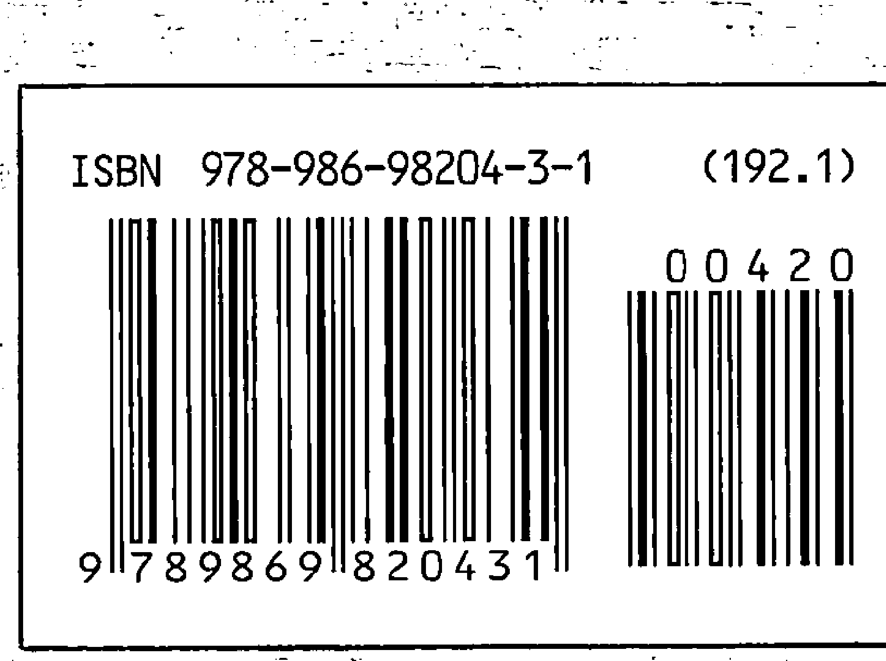