# Crossroads

# 【全部生命系列問與答】

## 十字路口

作者 楊定一

編者 陳夢怡

## 十字路口

# Crossroads

——全部生命系列問答（一）

楊定一 著・口述答覆
陳夢怡 編

本書音檔可線上收聽，憑音頻卡片專屬序號登入
https://www.windmusic.com.tw/crossroads/
需要音頻卡片的朋友，請洽長庚生技門市或網站

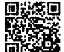

# 目錄

## CONTENTS

- A01 從真原醫到「全部生命系列」作品........................................ 4
- A02 為什麼說我們活著是「被洗腦」？........................................ 9
- A03 如何不被人間的身分角色牽絆？........................................ 18
- A04 面對人生的關卡，我不敢放下........................................ 25
- A05 這麼修行，可以解決我現實問題嗎？........................................ 33
- A06 如何面對生活的無力感？........................................ 40
- A07 放不下感情，要怎麼樣能夠醒覺？........................................ 44
- A08 我受夠了人生的種種折磨，該怎麼辦？........................................ 49
- A09 我可能有快樂這個選擇嗎？........................................ 56
- A10 為什麼我一直在付出，卻總是感覺不到快樂呢？........................................ 64
- A11 要怎麼讀才會懂？........................................ 66
- A12 如何停止痛苦，選擇快樂？........................................ 74
- A13 追求，不會帶來快樂嗎？........................................ 79
- A14 表現好，被人排擠，要如何臣服？如何讓別人接受？..... 85
- A15 每個人都萎縮而不自覺，怎麼辦？........................................ 90
- A16 如果不用念頭來生活，不就活得像行屍走肉嗎？........... 96
- A17 丟掉頭腦，我是不是就變成沒有靈魂的人？................. 103
- A18 快樂量表分數高，就代表真正快樂了嗎？................... 111
- A19 如何回到「在」，活出高效率？........................................ 115
- A20 一個人什麼都有，還會受到業力的制約嗎？................... 120
- A21 我很認命接受一切，卻依然不快樂，哪裡出了問題？.....126
- A22 臣服了，不會加重這個世界的不公平嗎？.....................132
- A23 我要如何接受先天有障礙的孩子？.................................137
- A24 面對很大的苦難如何接受？...................................................140
- A25 如果我向神求助，神會理我嗎？...............................................147
- A26 生病痛苦如何「在」？.............................................................153
- A27 怎麼淨化身心，打開情緒的結？...............................................158
- A28 對細胞感恩的功課，最後回到內心.........................................164
- A29 怎麼啟動新的大腦迴路，不再痛苦？......................................167
- A30 壞念頭來了，怎麼讓它輕輕走？..............................................173
- A31 靈性的旅程有目的地嗎？...........................................................176
- A32 如果喜怒哀樂是虛妄的，為什麼要來體驗這些呢？.........184
- A33 醒覺的人會有什麼改變嗎？會有什麼提升？.......................190

# A01 從真原醫到「全部生命系列」作品

問 博士，我相信有些讀者，就像我一樣，從您最早的《真原醫》開始接觸，到現在的「全部生命系列」，好像讀到兩種不同的觀點。您在《真原醫》很具體談如何透過飲食、搭配最佳比例的營養素、運動和種種身心均衡方式去追求自我的健康。但是，在「全部生命系列」談一體意識、談臣服、談放下自我，因為自我到最後其實什麼也不是。這兩個觀點，乍聽之下很不一樣，可以請博士多說一點嗎？

答 這需要從幾個層面來回答，首先，相信你還記得，我在《真原醫》主要強調怎麼把身心的均衡點（balance point）找回來，無論是透過飲食、運動、心理的管理、呼吸等等，都在強調身心的均衡。

身心不均衡，也就是你我每個人目前的狀況。假如飲食的負擔重、身體的結構僵硬、運動少、心情不好、不重視心情的管理，我相信很難進一步去探討靈性或意識層面的問題。正因如此，我過去遇到許多有慢性病的朋友，無論是罹患腫瘤、機能退化或老化，我都會先強調身心的均衡。

一個人身心失衡，很難有空間聽進其他的觀念。

我過去常常提到——身心不均衡，或生了重病，其實是人生的一個大機會——把自己找回來的機會。首先，把自己身心的負擔降低。為什麼我會強調彩虹的飲食、多吃蔬菜、生機飲食？飲食和斷食、運動等等方法一樣，都是為了淨化身體。運動也要均衡，強調拉伸、有氧、健身。各式各樣的方法，都是希望將身心的負擔降低，達到徹底的淨化。

一個人只要很輕鬆、很爽快、很疏通，自然會覺得比較舒服、心情比較好，也自然可以去探討另一層面的觀念。假如一個人身體不舒服，要談意識層面，大概也聽不進去了。這一點，你我都是一樣的。

所以，先找回自己的身心健康，找回來後發現——其實肉體所能提供的健康只是一部份，心提供的健康也只是一部份。身心的健康，其實不能完全代表生命的一切。

幫助一個人得到身心健康，對我而言，是一個門戶。才可以把生命的整體帶回來，聽得進去。

現在回頭看寫作的過程，其實也不是刻意規劃，自然就是這樣一個經過。

我們先談肉體，談怎麼去找到身體的健康。然後，回到心理的健康。透過靜坐或情緒管理、呼吸的方法，把心安靜下來。一步一步，去追求生命更深的奧妙，也就是生命的一體或整體。這條路，其實從來沒有過矛盾。

有意思的是，矛盾還是我們自己透過頭腦創造出來的。生命，其實完全沒有矛盾。你不管從哪個層面談，都沒有矛盾。站在一體，更不用講，完全沒有矛盾。

我過去才會這麼說，只要你我認為身心是真實的，認為身體真的存在、壽命有限，認為生命受到種種的局限和制約，只要我們還認為世界是真的，那麼，身心的健康對我們還是重要的。既然我們認為自己活在這個時空，身心健康當然有其重要性。

是透過整體而全面的反省，一個人可以把時空、業力看穿，知道一切都是大妄想，是幻覺。這時候，身心的健康已經和我們不相關了。既然身心本身也是個大妄想，哪來的健康不健康好談，本來就是完美。

但是，一個人要相當謙虛，要很實在。只要我們認為這個身體存在，有這個肉體，有這個人生，還是要做功課，還是要消除或減少頭腦所產生的那麼多念頭。

首先，回到身體。所以我們透過各種運動，其實是和身體對話。無論是做感恩的功課，或把每一個細胞觀想起來，都是讓意識從頭腦的二元對立落回身體。我們現代人很少有這種經驗。

所以，先體驗什麼叫做把頭腦落回身體。體會到這個身體其實和宇宙、一體、大自然從來沒有分手過。再從身體走出來，是這個道理。

你仔細去探討這個問題，自然會發現其實一點矛盾都沒有。

只要我們有這個肉體，還是可以養活它、活化它、淨化它，讓它跟我們一起走、一起去練習，做 sādhana 靈性的練習，讓我們從這個人間走出來。

# A02 為什麼說我們活著是「被洗腦」？

問 博士，我想問的是——其實，我讀《全部的你》發現裡頭有許多很顛覆的地方，顛覆一般人的講法。一般談論到生命的智慧，我覺得常常讀著讀著，又回頭過來告訴我，怎麼在社會上扮演一個好的角色。但是，比如你在第二卷提到人不快樂的原因，提到角色的建立。聽起來，好像跟一般所講的，完全相反。我想問的是，你為什麼要用這種角度來切入。

答 因為就是相反、顛倒。
我就是想表達——每個人都被洗腦。你我，就是被洗腦。一出生，從眼睛一睜開，一個娃娃開始哭起來，已經開始被制約——父母的制約。他不是刻意來制約，他也是被制約的。

然後，一連串的——回到家庭、長大、進入學校、找一個工作、交朋友——完全是被社會把我們的價值觀念釘死了。然而，社會也不是刻意的，它也是反映上千萬年來自然的演變。所以，是我們每個人都受到這種制約。

那麼，怎麼跳出來？

要跳出來，首先要充分理解——我們從來沒有自由過。我們都在一個制約的架構裡活。從第一口呼吸，到最後一口氣，人要走了，我們幾十年從早到晚都是在一個制約中。

一個人一生出來就有一個身分——你有名字，我有名字。對不對？名字還不夠，還要由角色——「我在社會要扮演什麼角色？」「我是老師的身分、是學生、是弟子、是企業家……」角色，和自己就併在一起了。好像就是說，我的角色，再加上我的名字、身分，這就變成了「我」——「我是某某人，這是我的一切。」

我這本書表達的是 No. 這是制約。——我本來是自由的，我本來是跟一體、整體、生命從來沒有分手過。怎麼可能有人可以把這個角色、身分掛到我頭上，就成了我的整體？不可能的。

但我們不會認為是這樣子。

所以，你剛剛講——你所聽的，全部社會想表達的，都是希望你做個好人，有用的人，傑出的人。你希望做一個歌星或什麼，都是一個角色。企業家，是角色。醫師、工程師，都是角色。都在教你怎麼去做，都在這裡面打轉。都在一個完整的、封閉的架構裡打轉。全部，都在講這些。

甚至，我們在講心理療癒。什麼叫心理療癒？

好，比如說我有一個問題，我就坐下來去找專家幫我分析，去了解我的問題的來源，創傷怎麼來的。有些時候，要重複我過去創傷的經過，或從更內心去了解，創傷的經過所帶來的結和瘡要怎麼去打開。都在談這些。但是，就連這些，本身還是沒有離開人間所造出來的制約。

我們不知道，全部問題——我們煩惱、痛心的來源，都是自己。都是頭腦投射出來的，是「我」製造出來的。

> 很多人聽了，會想——「咦？我怎麼可能製造問題？」「我想解開都來不及了，對不對？」「怎麼可能還會想製造問題？」

這時候，我會提醒——其實，連這個世界、宇宙都是頭腦投射出來的，你知不知道？

也許你不知道。我們不可能知道。我們被洗腦，認為這個宇宙、月亮、太陽是有的。很客觀的「有」。時間上，我看錶，它是「有」。怎麼可能是頭腦投射出來？

你看，在書裡面，我花好多好多篇幅在表達這些。

所以，我們仔細探討這些問題，知道結論是這樣子。我們有一個頭腦，透過念頭、透過五官，造出一個因—果的連結，有一個因，有一個果。就連太陽照著，是太陽的光照到地球——太陽是因，光到地球是果。我們都要有一個連貫性。一連貫起來，點點滴滴連貫起來，就有了一個宇宙，一個世界。

這些，我們平常不會注意到的。

所以，可以說這個世界本身是虛的，是頭腦投射出來的。是我們造出一個虛的宇宙、虛的世界，然後一個虛的人生。完全活在我在書裡提到的——念頭所造出的世界（thought-world）或念相（thought-form）。全部，都是念相。但是我們一般人不會去這樣想。所以，忙碌了一生，想追求這個，追求那個，全部都在外在——在社會上的表面，從物質層面的變化去追求。然而，物質層面，不可能是永恆的。全部，都是短暫。樣樣，有生，都一定有死。有快樂，一定有悲傷。有悲傷，一定有快樂。全部都在這裡起伏、打轉，從來沒有離開制約所帶來的自然的週轉。它自己有個步調，是個封閉的系統，一直在那裡打轉。

我們人，從來沒有離開過這個架構。

所以，我這次才需要做一個顛倒的工程，讓大家反省——你知不知道，你完全在一個制約的狀況下生活，從來沒有自由過。你只要認為世界是真的，你已經受到這個制約的影響。一切，都是已經註定。

很多人聽了，會嚇一跳。會想抗議。會認為這些話不科學。但是，仔細觀察，會發現百分之一百科學，百分之一千正確。

我敢這麼講。當然是這樣子，本來就是這樣子。百分之百是數學，百分之百是物理，百分之百科學。

只是我們人類用頭腦的聰明，或頭腦的限制，觀察不了。所以，你看人類被綁架、被束縛了那麼多年。而且，不光是一代，是多少代。從有人類到現在，我們全部的演變，都落在制約中。

為什麼是那麼大的制約？這一點，我已經在書裡面慢慢打開探討。我在這裡，不多講。最多，是透過別的主題、回答、分享，再去做一個解答。

但是，我認為，既然你碰到這本書，是不是好好花點時間。先把一些悖論、頭腦造出的抵抗挪到旁邊。即使不認同，還是讀下去，沒有關係。我們有機會，你也提出一些問題，像我們現在有機會互動。我相信，你只要聽我講，把一個問題打開，往下談，你一定會認同。

而且，最有趣的是，認同的不是腦，是心。心，會認同。

不要急，人生這次來，碰到這個法門，跟我不相關，是大聖人留下來的。我最多只是彙總這一生遇到的兩個大法門，透過自己的一點體驗，完全肯定、驗證這兩個方法。

這兩個方法是什麼？——臣服（bhakti yoga），再加上參（ātma-vichāra, jñāna yoga）。這兩個大的智慧法門，最直接，最快。是沒有法的法，沒有路的路。看是不是可以帶著大家走出來。

這樣的方法，最適合我們這個時代。因為我們都很聰明，我們現在可以溝通。一兩百年前，可能還沒辦法溝通到這個地步。現在，每個人都很聰明。給自己一點信心，不要急。我相信你會發現，有一種脫胎換骨的變化和轉變，不要刻意去追求。

把一切，都擺到旁邊。

讀，然後用心去探討這書所講的一些重點，是不是正確。

「全部生命系列」的作品，我希望你一本書都不要跳過去，因為它有一個步調和順序。我在前面先鋪了一個平台，才敢在接下來把步調加快。你可能會感覺到一種重複，但這種重複，是必需的。因為從邏輯，是跳不出來的。所以，我需要從各式各樣的角落去切入，帶出這些觀念。

到後面的作品，步調會相當快。假如你沒有這種基礎，根本會看不懂。後面的作品是透過一體、空或「在」，看這個世界。前面的作品，全部都是透過「有」在看這個世界。你如果已經覺得前面的作品，已經和這個世界是顛倒了，那麼，後面的作品，更是想像不到的顛倒。

所以，不要急，一步一步來，我們有機會再做分享。

# A03 如何不被人間的身分角色牽絆？

問 博士，您在《全部的你》裡說，我們扮演的角色愈多，煩惱也就愈多。但是，既然我們在人間活著，這些角色都沒辦法脫離。而且，隨著年齡增長，角色只會愈來愈多。那麼，我又怎麼可以不被這些角色絆住呢？

答 我從兩個角度，來回答這個問題。
首先，並不是說我們的角色愈多，就會把我們綁的愈緊。我們每個人從早到晚，其實都扮演著許多角色，有不同的身分。問題是，我們都把自己和這些角色或身分綁在一起。好比說，我是個老師，我就認為老師的身分和角色，是我全部的生命。我把全部的一切，跟這個角色綁在一起，而看不到整體了。

也就是說，我完全落入這個角色，很認真地認為自己就是一個老師。以為自己全部的可能，就只是一個老師。哪裡還有其他生命的可能？完全被這個老師的身份綁架了。自然充滿了嚴肅，認為自己講的每句話、每個動作都有絕對的重要性。重點，是在這裡。是說我們被角色帶走，自然看不到真正的自己。即使有一個全部的自己在後面等著我們，但我們因為投入在某一個角色，就再也看不到，錯過（miss）了。
你看，這樣解釋夠不夠清楚？
但從另外一個層面來說，確實是像你所講的。
只是我們年齡愈大，倒不是因為角色愈多，就把我們綁住愈緊。而是因為我們年齡愈大，被洗腦愈徹底，自然把這個世界看的很真實，把每個角色都看的很重要。把自己人生的故事，如何失落，如何悲傷，樣樣都看的很重，要，很堅實。
所以，年紀愈大，要走出這些角色的制約，是更不可能的。因為我們在每個角落都很投入每個角色，對每個身分都很認真，被帶到很小的角落，認為全部的一切就是——眼前，五官加上念頭所體會到的。

我們一出生，就被期待做個好學生。如果不成為一個好學生，接下來前途會跟別人不一樣。等到進入社會，遇到很多困難，還要奮鬥，認真晉升。後來有了家庭，或者沒有家庭……我們以為，這一切都是真的。一切，就是這樣，就是這麼多而已。認為這一生來，就是要活出這些人生故事。你、我，無論什麼角色，都是這樣認為。這跟有多少角色，其實沒有關係。是我們把這一切當作生命的目的，認為人生只有這樣而已。

這一點，我認為相當可惜。我們本來隨時站在整體、一體、生命全部的潛能。然而，我們竟然只選擇站在一點。還把這一點當作有全面的代表性，反而錯過了生命的整體。

所以，我在《不合理的快樂》《我是誰》不斷提醒——最多，我們只需要做個反省，知道眼前體驗到的「一切」，在全部可能中，只是一個單一的可能。而這個可能，其實根本沒有完全代表性。知道了這些，自然就可以全面接受生命，每個瞬間來，都不去反彈。該怎麼做，就怎麼做。處理完，就把念頭擺在旁邊。把每個瞬間當作很新鮮去面對。

它來，也就讓它走。走了，下個瞬間來，就讓它來吧。

清清楚楚的知道，每個瞬間所帶來的一切，對於整體生命其實都沒有全部的代表性。最多是頭腦投射出來的境界，是我們自己被這個小我綁住，所投射出來的。這個瞬間，是過去種種因果所組合的。所以，去抵抗，去做個大的抗議，去反彈，好像不需要。該怎麼處理，就怎麼處理。

就這麼簡單，一個人，只要這麼做，自然會發現愈來愈快樂，而且變成無條件的快樂，隨時都快樂，也不需要去分析為什麼會快樂。這種快樂就是不受制約、沒有條件，本來就是我們的本性。愛，也只是如此。寧靜，也只是如此。在，也只是如此。都是我們的本性，都是我們的本質。

我們本來就是這樣，但是我們加了腦，用念頭投射出一個虛的境界，念頭的境界，不斷把我們帶到扭曲的境界，帶到人間的小角落。把人間看得充滿問題，大的問題，小的問題。讓我們一直陷下去，看不到邊。所以我一直提醒你我，要看清楚，這一生來，主要的目的，最多也只是充分理解「我是誰？」

首先理解「我是誰」「真實是什麼？」倒不是一直從外在的世界到處去尋物質上的價值，去追求物質上的累積，物質上的成就。

要理解「我是誰」，比我們想像的更簡單。這不是透過二元對立的邏輯去尋，想從局限的腦，跳到無限大的腦，倒不是這樣子。是讓局限的腦臣服，交給無限大的腦。讓無限大的腦，也就是無色無形，讓心接手（take over），讓心帶著我們走。我們會發現，原來我們把一切弄顛倒了。

我們過去把一個不成比例的「小」腦，不成比例的「聰明」，沒有智慧可以講的一點點，當作自己生命全部的潛能。你看，多可惜。

所以我們透過臣服（後面我還會談「參」的法門）。前兩本書，我不斷強調臣服的功課。這是好簡單的功課，只怕我們不做。透過那麼簡單的方法，我們好輕鬆，把局限的狀態、頭腦交出來，交回給心。交回給心，也就是承認——我們其實有一個智慧，遠遠大於我們頭腦可以投射出來的聰明。

心的力量（power），遠遠大過於外在、頭腦投射出來的力量。所以，我才會不斷講 ” the power within “，心的力量，遠遠大過於外在我們所看到、可以提供、可以產生的力量。也就是信任這一點，讓生命的全部帶著我們走下去。試試看。

你可能還是想問——那麼，生命會不會好？這些問題，都不重要。只要問這些問題，還是頭腦投射出來的境界。安全感或是沒有安全感，本身都是頭腦的狀態，都不要去管它。生命怎麼來，帶著我們往哪裡走，就跟著走。

可以試試看。

最多，我敢保證——你我一切頭腦投射出來的問題、疑惑、兩難，都會消失，而我們會自然愈來愈快樂，無條件的快樂。在每一個角落，都可以找到愛，可以找到神，可以找到平安。也就是那麼簡單，就在等我們把它找回來。

這一點，是你我每一個人都有的。我們還沒生出來就有，走了，還是有。但是，我們透過人生，把它扭曲了，扭到不曉得哪一個角落。所以，把人生看得那麼不愉快，到處都是悲哀。這是太可惜了。

就是透過那麼簡單的轉變，我們就可以把真正的自己找回來。我想，這一點，我們每個人都可以試著做。

# A04

## 面對人生的關卡，我不敢放下

> > 問 博士您好，我拜讀過您的《全部的你》與《神聖的你》，有很深的感動，也獲益良多。但是，我現在人生遇上了一個關卡，我無法運用書上的道理。希望博士能給我一些指點。
> 是這樣的，我目前四十多歲，失業將近一年。我沒有放棄過希望，非常努力，但始終很不順。眼看著家庭負擔愈來愈重，我很擔心我愛的家人和這個家，會因為我失業，而毀在我的手裡。
> 我曾經想過，就這麼順著生命，來帶領我活出臣服與放下。但是，又覺得這樣的自己很不負責任，非常愧疚。我也想靜坐，讓頭腦安靜下來。
> 但光想到放下煩惱，不去想辦法，就讓我觉得自己太不負責了。這種矛盾，時時刻刻在心中拉扯著我，讓我坐立不安。

博士，感謝您在百忙之中，還耐心聽完這些問題。打擾您了。也非常期待能聽到您的指點，謝謝！

> >答 聽到你這些話，我可以感受到你的誠懇。你用最誠懇的方法，來表達你現在所遇到的困難——失業對你造出的危機、失衡、沒有安全感。我在這裡，也只能用最誠懇的方法來表達我個人的看法。這些看法，我最少要用兩個層面來表達。首先，是希望你我都來做一個比較，比較我們頭腦的聰明跟生命的智慧。將兩個做一個對照、比較。我們可以問自己——頭腦投射出來的聰明、二元對立的聰明、局限的聰明，透過這肉體（頭腦也是肉體的一部份）所投射出來的聰明，可不可能比生命的一體、整體、內心、全部、一切、無限大的意識層面所帶來的聰明還大？

我相信，只要我們去探討這個問題，答案是相當清楚。當然是不可能。

生命所帶來的全部的聰明，我們也可以稱為智慧，遠遠大於肉體帶來、頭腦可以投射出來的聰明。

我相信，每個人都會同意這一點。問題是——我們遇到困難、災難、危機、考驗、大的失落，讓我們心痛，沒有安全感，帶來種種的顧慮。在這個時點，可不可能我們有勇氣，把自己交給生命的全部？讓生命，也就是心、一體帶著我們走。讓我們做妥當的選擇，讓我們帶著這個身心走下去，勇敢的走下去。我們可不可能有這個勇氣，這個時候，把頭腦交出來，交給我們的內心。交給一體。交給上帝。交給全部的生命，讓它帶著我們走？

這是最關鍵的問題。

假如我們信得過去，有這個勇氣，自然就把頭腦全部的顧慮、全部的窩囊交出來，臣服到一體。所以，你可以採用一個很簡單的方法，試試看——早上

一起來，眼睛一打開，還沒有完全醒過來。這時候，跟上帝、佛、一體或真正的自己對話：「上帝，佛，一體，我知道，沒有什麼叫做對或錯。絕對不可能犯錯。生命不可能犯錯。雖然我外在痛心，沒有安全感，但我完全信任你，完全相信你。就讓我把自己全部的問題交給你吧。請你接受我全部的問題，我全部的煩惱，我全部的心痛，沒有安全感。接受一切，讓我全部交出來吧。」

這一點，用最誠懇的心，我們可以重複，重複，再重複。

試試看。

你把自己的問題，最嚴重的問題交出來，讓上帝幫你煩惱，讓上帝幫你解答。讓你的心，帶著你走。有什麼問題，還沒有起步，只要看到，踩個剎車。這時候，把它交出來「上帝，你就接受我的問題吧，我就完全臣服，交給你。」

一天下來，不管什麼煩惱，不斷把它交出來。這同時也在表達——對上帝完全的肯定、完全的相信。一點質疑都沒有。

完全交給祂，表面再怎麼不好，即使一天下來，沒有任何工作的消息，就業還是沒有什麼進展，一樣地，還是不斷地交出自己，不斷地臣服。

你試試看，只要一個人誠懇，最誠懇，再誠懇，把每一個瞬間當作不斷的誠懇，把自己交出來。心，本身會產生一個力量，會保護你，會愛護你，會帶你走出來。

但是，要記得——不要期待得到什麼東西，不要做一個要求「上帝、神、佛、生命，請你幫我解決這個問題」不要，不需要。這是多餘的。只要把自己眼前所面對的問題交出來，最多只是這樣子。生命要帶著你怎麼走，怎麼去做，自然會完成的，自然會帶你走出來。

這一點，我是用最誠懇的方法，來表達我個人的看法。

你要追求什麼結果，不重要。這個時候，不重要。不要去刻意追求有什麼好的轉變，帶來一個理想的工作或什麼，都不要去管這些。把這些挪開，連這些念頭、這些期待，都把它交出來，臣服出來。

最多，你唯一的功課可以做，就是臣服，臣服，再臣服，把自己交出來，把自己念頭所想出來的問題，所顧慮的沒有安全——「萬一怎樣」「萬一怎樣」，把全部這些顧慮交出來，不斷地交出來。

這是唯一，你現在需要做的。

自然不知不覺，在哪個角落，也許有一個訊息，也許某某人，也許什麼東西帶來一些機會，你不用擔心。就是機會不來，你還是繼續做，一直做到底。繼續做，為什麼做，沒有什麼原因，不要去追究，不斷地做。這一點，你看有沒有這個勇氣去試。

你誠懇愈大，不要說轉變愈大，而且你醒覺的機會愈大。一個人醒覺，還是比人間所找到的答案、解決方案更重要，遠遠更重要。但是，也很奇怪，很神秘的是，生命也自然跟著轉了。外在也跟著轉了。

這是最奧妙的事情。我希望你親自體會。

從另外一個層面，我想做一個分享——你就是不這樣子做，其實，為了工作、事業，從早到晚去顧慮、去窩囊、去煩惱，也沒有用。你就是不做，落回在一個頭腦的境界，其實也沒有用。你可能會責備自己、責備環境或認為自己的命不幸……不斷地制約自己，透過這種反彈，因一果反而更加強。就是你不這樣做，而是去規畫、去計畫，其實也沒有用。

所以，我希望你把這件事情徹底想通。自然會發現，用剛剛講的方法把自己交出來是最理性的。一睜眼，第一個念頭，就是把全部問題交出來，不斷肯定生命是完美，是完整。現在遇到的災難、失業，就是剛剛好你現在目前所需要的。為什麼會需要？不重要。有什麼理由？也不重要。只是肯定生命不可能犯錯，不斷這樣走下去。到了晚上，睡前最後一個念頭，還是做一個感恩的功課——上帝、佛、生命、一體，

謝謝！謝謝你！讓我度過今天。我在這裡，請你接受我的頭腦所帶來的全部問題，我現在所面對的全部困難。你就接受它吧。把這個問題帶走。就交給你吧。請接受吧。

用最誠懇的方法，睡覺前，最後一個念頭，也這樣做。

我希望你很誠懇的去試試看，接下來有什麼結果，都不要去追求。就這樣子，勇敢地走下去。

# A05

## 這麼修行，可以解決我現實問題嗎？

問 博士，我想進一步再問，如果這麼修下去，我現實面對的問題真的能夠解決嗎？我的意思是，我可能面對關係破裂，可能面對經濟危機。這些問題，我這麼修下去，真的就可以解決嗎？謝謝你。

答 你我要注意的是，這些問題，反映的還是一個「有」的層面，「有」的範圍。因為我們把這個人間看得很堅實，把它認為是一個事實——有生存的壓力，肉體要奮鬥，甚至有工作上、情緒、關係，種種的壓力。所以，我們才會有失落感，覺得好像有什麼損失，也許是達不到我們的要求，也許是一個大的變動。而這個變動，我們認為有好、有壞。好的變化，當然帶來快樂。不好的變化，就讓我們有失落感。

是因為我們把這個世界看得那麼堅實，你才會產生這些問題——可不可能把人生做一個變更，甚至變得更好？

這是難免的。

幾乎每一個人，還沒有醒覺過來，要面對這個世界，面對這個人生，都會產生這個問題。

所以我過去常常提醒——我們一般人，都還是把修行當作改命的工具或一條路。很多人，即使修行幾十年，還是會認為，只要投入修行，人生就應該愈來愈順，愈來愈好。這本身，是一個誤會。反映了我們還是認為世界是真的。認為五官、頭腦投射的世界，是唯一的真實，是唯一可以體會、體驗的真實。所以，沒辦法放過這世界，也沒辦法放過自己。我們可能期待，透過種種規劃，希望為人生帶出一個好的轉變。每一個人大概都有這種期待。

這一點，首先要看穿。修行不是為了改命，而是為了從這個人生跳出來——超越、看穿、解脫、自由。讓我們第一次真正生出來、活出來、重生出來。修行，是為了這個目的。

這個目的，本身也不能算是目的。因為我們本來就是醒覺的，本來就是自由的，本來就是一體。我們因為忘記了，因為集體的失憶，反而認為生命是奮鬥，是窩囊，是煩惱，是一連串的問題。但是，站在一體的角度來看，沒有任何東西可以傷到我們。

所以，才會用種種古人留下來的大法門，最多只是做個反省，提醒自己。把自己交出來，臣服。或透過參，有個動力，把自己從念頭、腦鈎回到心。自己來證明，這些話是不是正確。

從另外一個角度來談，就算我們從早到晚都在規劃、都在煩惱、都在刻意想改人生的這一條命，這種種的動作，也沒有用。只是又加上好多層面的煩惱。我才會講，首先，把自己交出來，把腦帶來的念頭、煩惱擺到旁邊。讓心，帶著我們走。走到哪裡，算哪裡。都不要去問、不要去分析。

一個人，只要輕輕鬆鬆這樣去做，自然從人生會走出來一條路。眼前的一些問題，不管多嚴重，自然會解決，會有一個解答。

不這麼做，我們種種的反彈、不舒服、痛心，其實也沒有用。只是把過去的記憶，當作我們目前的經驗，當作現在這個瞬間的經驗。還一再地把過去的經驗帶回來，變成瞬間的經驗，組合瞬間所活出來的人生。

這是相當可惜。

所以，一個人不管遇到好事、壞事、多大的災難，就往前走。怎麼走？——不斷交給瞬間，讓這個瞬間帶著你走。走到哪裡，算哪裡。

對，也許在這個人間的外表、外在看來，還是不順，甚至可能更不順。一個災難，再接著一個災難，再接下來一個災難。這時候，更需要做這裡所講的 sādhana 靈性的功課。不斷把這個災難，這個失落當作一個學習的功課，當作一個反省的機會，不斷把自己交出來。

試試看，失落愈大，本身是愈大的恩典，愈大的機會。

不要停留在這個人間——「眼前遇到的問題，會不會有一個好的轉變？」倒不要去追求。只要有這種追求，你又回到過去，又回到人間。還把人間當得很堅實，好像它是唯一的可能性，唯一的真實。

我才會說，這種時候，遇到多大的困難，心裡還是充滿了感恩。知道生命、一體不可能犯錯。眼前的困難，是因為肉體是因—果組合的，是透過一個扭力轉出來。而這個扭力相當大，我們擋不住的。即使一個人醒覺過來，還是擋不住。

所以，就讓它來吧。就讓它走吧。痛心來，痛心走。難過來，難過走。沒有安全感的來，讓它走。

試試看，這樣子，一個人就得到安慰。在安慰中，生命會來照顧你，會來愛護你，不可能不是這樣子。我們本來就是從一體延伸出來的，最後，還是回到一體。所以，一體會來保護我們，不要擔心。

沒有時間、時空的觀念，不是一天、兩天、三天、四天的事情。時一空，都還是我們頭腦投射的。就往前走。走到哪裡，不要追求，不要有什麼期待。

一天，過一天。

在這當中，會有一些轉變，會有一些訊息。不一定是某個人帶來的。有時候是一個狀況，有時候甚至是一隻鳥、一隻動物、一個東西，會突然給我們一些靈感，帶著我們走。該做什麼，做什麼。可能遇到一些人，有一些狀況，剛剛好是我們那時候需要的。

不知不覺，就走出來了。這是我前面想表達的。

所以，只要把一切問題擺到旁邊（這不是完全放棄，不是把生命完全放棄，倒不是這個意思）。不是完全被動，而是讓心帶著我們。

要讓心帶著我們，首先一個人要把頭腦擺到旁邊。心才可以浮出來。

不這樣做的話，因為我們頭腦的作用相當活躍，會把我們心蓋住。會扭曲，會讓頭腦投射出來另一個真實，而只會把我們的痛苦延續下去。

你看這樣子夠不夠清楚。

# A06

## 如何面對生活的無力感？

問 楊博士您好，最近又把《全部的你》《神聖的你》再看過一遍，準備繼續重讀《不合理的快樂》。最近常有一個念頭，覺得這一生好像已經活夠了，感覺該體驗，都體驗過了。隨時死去，好像也可以，沒有什麼好遺憾的事。當然，硬說什麼有遺憾，就剩下還沒有看到女兒好好長大成人，這世界還有很多國家和地方沒去過。但又覺得好像也不是那麼重要。博士，我這樣的想法算是太過極端了嗎？還是這種想法也是一種臣服？當然，還不至於自己傷害自己，去結束生命，但就是隱約對生活有一種無力感。包括已經失業一年多，對未來經濟上的不安全感和不確定感，問題尚未解決。期待博士的提點，滿懷感恩。謝謝。

> > 答 當然，你前面所表達的狀況，我們都完全可以理解，也可以充分體會到你的困難。而且，你現在幾乎是絕望的這種狀態。

這些想法，我講很坦白，不算是臣服。你有一點是放棄，而且本身還帶來一種對事情的反彈，一種不滿。它不算是臣服。

臣服是什麼？臣服是接受。你記得我們常常講，接受一切，也就是把自己全部交給上帝。現在失業很久，也可以接受。生命帶來種種的困難，我們每一個瞬間都可以接受。

接受，不是放棄。要記得，這兩個有區隔。

每一個瞬間，我都可以接受，是說——我再也不去想它。想它，也沒有用。我最多是接受，只要有念頭，我就接受它。接受，在這個接受的過程，要做什麼、該做什麼，還是會做。只是把自己完全交給上帝、交給佛陀、交給宇宙、交給生命，讓生命帶著我走。

甚至，也許有時候心裡還是不舒服，感覺有個層面還是沒辦法接受。好，那就接受「眼前沒辦法接受」的狀態。接受自己還是反彈，感覺不舒服，覺得委屈，對這個人生覺得不公平。就接受這一點。

接下來，該做什麼，還是要做。但不去想那麼多。因為現在你去想、去規劃，其實對你不會有什麼幫助。它本來的狀況就是這樣子。你去多想它，也沒有什麼用。

把自己不斷地交給心。而心，內心知道要怎麼做。心，不是不知道你要做什麼。剛好相反，是完全知道你該做什麼，就做什麼。

雖然頭腦完全是幻覺的產物，但是，透過頭腦隨時想著上帝，隨時想著一體。接下來，一體也會想著我們。隨時把自己交給一體，一體自然會關懷我們。不用擔心。要有這個勇氣，要有這個耐心。雖然已經失業一年，但是，你這時候更是要加倍做這種練習，這種功課。

會走出來的，要不斷有勇氣走出來。只是走出來的方法，不一樣。

不要再去期待「只要我臣服，就有什麼作用」。這樣子，還是把人間看得很真實。認為眼前的狀況是唯一的真實，唯一的可能。所以，你不斷地接下來做功課、練習，是希望走出來，在人間得到一個好處、一個轉變。這本身，其實還是在肯定業力的真實。

業力怎麼來的？讓它走過去。怎麼來，就讓它來。怎麼走，就讓它走。不去反彈，樣樣都可以接受。

我知道在這種狀況，是加倍的難。但是，只要做，你身心的轉變會比任何人都快。

你現在碰到大的危機，大的挑戰，大的困難，其實，是大的機會。這一點，你要有信心。不要再加一個念頭，期待有什麼轉變。最多只是交給本來就有的一體，交給自己，交給內心。最多，是這樣子。

接下來，是讓一體帶你走出來。

# A07

## 放不下感情，要怎麼樣能夠醒覺？

問 您好，我是一個相當重感情的人。像我這樣總是放不下感情，就無法覺醒了嗎？我曾經嘗試靜坐，讓自己不受人間感情的束縛，但好像行不通。我還能怎麼做呢？

答 其實都好，你記得我常講——一切都好。一個人感情很豐富，很重，對事情、對別人有很大的感情的反應，其實也沒有事。這是你從出生到現在，一點一點累積的。一個人有很多念頭，對事情有各式各樣的好壞判斷、觀念，或是沒有豐富的念頭、感情，其實都一樣的。假如不看穿，不理解，在這個世界，一切都離不開因一果。其實，感情跟念頭不會影響我們。不用擔心。記得一切都好，都剛剛好。你這一生有很豐富的感情，到這裡，也讓你有機會接觸「全部生命系列」，對自己的人生觀可以做一個反省，不是很好嗎？

一切都好。

不要有任何質疑，或對自己有什麼判斷，責備自己，倒是不需要。是剛剛好相反。一個人假如一起來，看著鏡子，不斷地在心中對自己強調——一切都好，其實我已經完美，我跟神從來沒有分手過。我就是神，神就是我。我就是 sat-chit-ānanda（在·覺·樂）。我是「在」，完全是醒覺的。在歡喜當中，在平靜當中，在愛的當中生活。不斷地重複這些——我就是愛。我就是醒覺。我就是全部。我就是一體。我就是神。假如一個人從一早起來就不斷地對自己重複這些，很有意思，我們自然也就變成不斷地重複「洗腦」自己的這些。

為什麼我敢這樣講？

其實，到最後，你我就是我們現在想找的。你，就是你現在所追求的。答案就在你眼前。

答案就是你。

你從來沒有跟神、主、生命分手過。

你就是醒覺，只是不知道、不承認。因為不承認，你活不出來。只要承認，一切就平安了。沒有事，本來就沒有事，不要變出來事。

所以，情緒很豐富，對很多事情有個激烈的反彈，最多知道。即使來不及踩剎車，it's OK！你記得，我們常常提到 Everything is OK。——我現在沒辦法踩個剎車，因為我本來就是人。我來到這個世界，本來就是受人的影響，受過去種種制約、種種束縛的影響，才會到這裡。所以，沒有事。

這樣子，踩不了剎車，也好。知道——我踩不了剎車。我之前情緒反應很激烈，跟別人吵了架，有很大的情緒反彈，而這個反彈是幾乎不成比例。試試看，知道，只要你知道——知道你做不到，知道你踩不了一個剎車，其實，你已經踩了一個剎車。

其實，你已經接受你自己。

然而，你自己，不是這個小小的我。不是你眼前的這一點萎縮體，不斷憂鬱，不斷擔心——自己會不會醒過來，這一生會不會有什麼成就。

其實，你本來就是醒覺，本來就有成就。不是你做什麼，或變成什麼，會比你現在更完美。

只是因為你不相信這些話，對自己沒有信心，所以還有一個情緒豐富，讓你顧慮。把一切的事情，全部的顧慮擺到旁邊。一個人，不知不覺就讓生命帶著走。

一切，什麼都好。

記得，從早到晚不斷強調、不斷重複——一切都好，一切都剛剛好。我來到這裡，走到今天，一切都剛剛好。過去我經過的，全部都是我需要的，都是我要學習的功課。

所以，不要後悔，不用後悔，沒有什麼好後悔。後悔、不後悔，還是受到因果的作用。所以，沒有用。就是後悔也沒有用。想改變，或轉變自己的情緒，也沒有用。因為不需要。一切，都是一個大幻想。一個幻覺。情緒是，念頭是，萎縮也是。一個人只要看著它，接受它——怎麼來，怎麼走，跟自己都不相關。情緒，踩不了剎車，又投入人生的話劇，也沒有關係。知道了，也就退出來了。沒有事，一切都沒有事。

試試看，我講的這個，可以變成一個很好的方法，讓你面對人生。

接下來，醒覺不醒覺，不要去管。其實，你也管不了。做不了主。它要來，就來。不要來，就不來。沒有事。

這樣子，輕輕鬆鬆地，一個人也就過一輩子——沒有事，no problem. 記得一切都沒有事，一切都 no problem.

# A08

## 我受盡了人生的種種折磨，該怎麼辦？

**問** 楊博士您好，我好像碰到了人生的瓶頸。過年的時候，一個人孤伶伶地，在爸媽的牌位前吃飯。我受盡了人生的種種折磨，我受夠了。您可以給我一些建議嗎？謝謝。

**答** 我們這一生來，難免會碰到你提到的這些困難。家庭，其實最容易有這種磨擦。家人的關係——父母、孩子、姊妹、兄弟，可以帶來種種安慰和鼓勵，但從另外一個角度，也是磨擦的來源。我想這一點，我們每一個人都有經過。

我這幾本書所想講的是——在這個世界，這些對立、這些磨擦，是難免的。因為我們活在這個人間，本身是二元對立（duality）組合的，由一個分別、比較、相對的邏輯組合的。相對，一定要有個摩擦，有個對立，才可以建立。它本身是透過對立、摩擦才組合的。

念頭，也是這樣子。

我過去常常講，一個人假如氣脈是通的，很舒暢，他沒有念頭，連一滴念頭都沒有。念頭，是因為有一個對立，不管是眼前東西和東西的對立，或觀念和觀念的對立，是這樣組合的。有一個比較，有一個分別，有一個差異，才可以得到。

所以，我們活在這個人間，離不開對立。假如你懂了這些，也就知道不是從父母的關係去著手，不是從外面去著手，而是從內心、從自己去著手。回頭轉，從自己的內心去著手，這是唯一的一條路。

這是從古人、大聖人到現在所提的，從人間走出來的一條路。我才會不斷提醒你我——只要我們活在這個世界，認為這世界是真的，家庭是真的，工作是真的，週邊的東西、大自然一切是真實不過的，只要我們這樣認為，那麼，對你我，一切都是註定的。沒有什麼東西叫做自由。

在這種不自由的狀況下，唯一一個稱得上自由的選擇，是我們——不去反彈，對樣樣都不去反彈。對眼前任何事情——再好、再不好、再喜歡、再不喜歡——都不要去反彈。不要激烈的反應，反而把它當成真實。反過來，樣樣東西，也可以來，也可以走。這樣子，我們自然把瞬間包容起來，擁抱起來了，看它往哪裡跑。

也就是，跟每一個瞬間說——我過去因為昏迷，在無明的狀態下，不清楚，就被你騙了。現在，我清清楚楚，再也不會被你騙了。

這不是冷淡，好像眼前來什麼，都不去理它，或是自己高高在上，連眼睛都不眨，不去回應。不是這個意思。剛剛好相反，一個人懂了這些，就活起來了，知道——樣樣都是幻覺，但是在這幻覺的世界中，完全可以做一個最不費力的互動。而且，該做什麼，心會帶著做。不用再去落在煩惱，頭腦的境界。不用再去加一個念頭去解釋、分析，再做一個反彈。最多，只是這樣子。

所以，一個人懂了這些，父母來，講了再不順耳的話，心裡不舒服，就知道不要去做個對立。在妥當的時間點，也自然知道站在父母的立場，當然出發點是為小孩子好。但他有他自己的制約，有他的習氣。每一個父母都有他的制約、他的束縛，本身也是在無明的狀態。他有他的習氣，有時候講話不好聽或激烈。但是，假如我們知道他的出發點是友善，就放過。

放過這世界，放過父母，放過家庭，放過自己。對自己，也不要有什么放不過的要求。全部，都可以放過。這麼一來，一個人，樣樣都放過。試試看。

眼前的人來，講的話讓人很不舒服，對自己好像造成一種傷害。但是，提醒自己——對這些反彈的念頭，我可以臣服，可以把它交出來。自然就踩了一個剎車。踩了剎車，會發現——原本相當大的對立或反彈，現在懂了，也就不需要，也就放過它了。讓它來，讓它走。自然也就發現，它不是那麼重要。本來認為別人和自己過不去，讓自己充滿了憤怒或憂鬱。現在發現，對自己的情緒，一點都沒有影響。

這麼一來，最有趣的是什麼？父母或周邊的人，自然會去調整。你沒有反彈，他跟你吵不起來，他自然去修正他自己的習氣。甚至可能還會慚愧「前面不該講這些話，不應該用這種口氣、語言表達，其實我是愛你。這樣表達，我現在知道效果反而是顛倒的。」帶出這個對立的人，他自然也會踩一個剎車，做一個調整。不用擔心。

但是，我們先管自己。把自己的內心、身心做一個調整和反省。透過這個經過，把它當作一個功課、一個練習、一個 sādhana ——喔，原來我這個時候還會反彈，還會心裡不舒服。這樣子，還可以做一個見證，看到自己的一些經過。試試看。

這麼一來，你會發現——樣樣都不需要那麼嚴肅，不需要有那麼大的重要性。你從任何狀況，不光是跟父母之間的摩擦或糾紛，跟任何人的糾紛都可以走出來，都可以踩個剎車。

很有意思，都可以發現這本身就是給自己帶來最好的一堂功課。不用去管對方，不用去管別人，跟別人的關係，自然會做個調整。而且都是友善，往好方向的調整。

這些話，我講的時候，完全不是理論。你試試看，看這些話有沒有道理，拿自己做實驗。

最多是，如果我講的不對，你可能再多受一次委屈，那又怎麼樣呢？對不對？但是我相信，只要你很誠懇，很謙虛接受這些話，而且去試試看。我相信，你會親自驗證，古人所講的話絕對是正確的。你的生命，就突然很好過。生命的品質，也就改了。

週邊，什麼都沒有改。自己，內心改了。一切都改了。週邊也跟著改了。命，不用去管它，已經調整了。

我很誠懇跟你分享，希望你拿自己的生命，做個驗證。

# A09 我可能有快樂這個選擇嗎？

**問** 博士你好，你在《神聖的你》引用了一段話「快樂，是一種選擇。只要自己想要快樂，就隨時可以快樂。」當然，我也想要快樂。可是，我每天還要為生活奔走。生活中，還有種種問題不斷困擾著我。我根本快樂不起來，心中好像沒有快樂這個選項。我想請問的是，您書裡後來也提到臣服與參的練習。對於在為生活奔走的我來說，心中真的可能浮現快樂這個選擇嗎？

**答** 只要把這個世界當作你全部的可能、一切的選擇，而且，只有世界、人間這個選擇，那麼，你當然快樂不起來。

因為你跟著因果走，被它綁架，還看不到——你這一生，從出生到現在，甚至到走，全部離不開頭腦的產物，頭腦的投射，頭腦建立出來的時——空。你到今天所體驗到的，全部也跟著離不開因果。因果本身，就是我們頭腦最直接的產物。

怎麼說？

就是因為頭腦有一個作業的方法，設立我們二元對立、相對的邏輯，讓我們樣樣都在比較，都在排列先後，才有因果。因果本身，就是我們製造出來的。反過來，因果本身就是我們邏輯的架構。是我們看人生的架構，跟我們全部的體驗沒辦法分手。

站在因果，樣樣當然是無常。有生，一定有死。我們的五官不斷設立新的經驗。眼前出現的一個新東西，也一定會消失。所以，我們這一生離不開無常的觀念。無常，也是我們頭腦的投射。無常是我們唯一不變的常態（constant）。無常，本身就是我們的架構。這一來，有快樂，一定有痛苦。有喜樂，一定有悲傷。好事，接下來一定有壞事。你這一生來，樣樣都好。下一次來，一定樣樣都不好。它是輪流的。這是一種物理的法，不是我、你或任何人創造的。

你來這一生，已經註定了。我常常講，這一點是大家最難接受的，還會認為這句話不科學。

其實，只要一個人有很強的物理、數學背景，他自然會發現這幾句話是最科學的，其實就是牛頓第三運動定律。不同的是，牛頓第三運動定律是建立在時一空的範圍。假如我們把時一空擴大，會發現——這個法，本身就是因果。這麼說，一個人還沒有來這世界，樣樣已經都註定了。因為組合每個瞬間的力量，大到一個程度（我常常講是不可思議的大）。我們看到的，只是透過五官體會到的一點。五官體會不到的，遠遠更大，在一個我們用腦、眼睛、耳朵看不到、體會不到的背景運作。所以，要去轉變眼前的瞬間，把命從不好轉成好，是不可能的。絕對是不可能的。你就是暫時擋住一些發生，它還是從別的角落再重新發生。變成另一個形狀，再發生一次，跟我們這個生命分不開。我們的人生，本身就是因果組合的，就是一個能量的狀態。所以，要把因果轉走、轉開或擋住，是不可能的。

我們這一生唯一可以做的，唯一的選擇也只是——不要反彈。

把注意力往內轉。本來注意力是往外，對著事情、煩惱、眼前不舒服的人事物在做抵抗。突然，把注意力轉到內心。一轉到內心，會發現——你跟這個業力來，業力走。事情來，事情走。人接觸來，接觸走，再也不相關了。你自然發現，其實眼前看著這個身體——你、我的身心，跟一體一點都不相關。它是一個小小的可能。甚至這個宇宙、這個世界、這個人間，跟這小小的可能，不過是在數不盡的可能、無限大的可能中，一個小小的小可能，一個局限。

然而，我們再也不要被一個小的局限給限制。

這是唯一的一個選擇，我們這一生可以有的。

這不是理論，是我們都可以做到的。

這麼一來，一個人透過臣服，也就是接受一切，再加上參（你看，我不斷重複這兩點，只怕講不清楚，也怕你信不過），本來很在意環境帶來的不快樂，就像你問的，會突然發現，什麼都不用改變，你已經快樂起來了。

你知道，眼前的人、周邊的事情、災難、危機，再也影響不了你。甚至你會發現——沒有人、沒有事情想害你，想虐待你。因為我們所談的人、周邊、環境，其實不存在，都是頭腦投射出來的。

眼前的人，是頭腦的產物。

眼前的事情，都是頭腦的產物。

宇宙，還是頭腦的產物。

假如懂了這些話，整個宇宙、眼前的人、事情也跟著消失。這樣子，一個人就突然醒覺過來，快樂起來了。再也沒有什麼東西可以影響到自己。我們，跟環境、眼前發生什麼事、什麼體驗，都不相關了。

也就突然放過自己，放過別人，放過這個世界。

放過自己，是什麼意思？

放過這個身心，是什麼意思？

就讓這個身體、這個身心完成它這一生想來完成的——也許是上洗手間、吃東西、笑，甚至有時候哭。你知道，在全部的選擇中，這只是一個小小的選擇。那麼，又怎麼樣呢？就放過它，放過自己。放過自己或別人，就突然發現——再也沒有什麼東西，有絕對的重要性。再也沒有什麼東西或什麼人，值得讓我們充滿嚴肅，甚至忘記自己是誰。

這是唯一的方法，讓你快樂起來。這種快樂，是沒有條件的快樂——不受環境影響、不受別人影響、不受工作影響。

很多人聽到這些話，會說——好，你說你的，說歸說，但我還是要回到我的環境，我還是要面對我的世界。這也是你的問題所含的重點。

我個人的看法是——這種想法完全是錯的。因為你到現在還認為，你的世界是個獨立的世界。認為這個世界是客觀的存在，是獨立的存在，而你人生的故事、全部的煩惱，都值得你分心，都值得你面對。

錯了。你愈去面對它，愈去想它，愈去窩囊，愈去煩惱，你永遠走不出來。你在一個制約裡面，要跳出來，是絕對不可能的。

最多是把制約挪開，這個一體，或說「在」、佛性，本來從來沒有離開過你的，就浮出來了。

我講的這些話，假如不是真的，假如一體、在，不是隨時都有，連你最煩惱的時候也有，快樂的時候也有，那麼，要去找祂，是不可能的。然而，也因為祂隨時都有，你不可能去找一個東西，是本來就隨時都有的。最多，你可能做的是——挪開「你不是」的部份。

- 你不是煩惱。
- 你不是不快樂。
- 你不是這個身體。
- 你不是制約。

只要把「你不是」的部份挪開，「你是」的一體、在，自然就浮出來了，就是那麼簡單。

只怕你到現在還不相信，還認為這幾句話是理論，跟你不相關。這本身，就是太可惜。也許這一生，會讓你再錯過一次。

但是，我常常講——錯過，也沒有關係。下一次，總是機會。

你總是有一點會成熟到一個程度，會突然發現這裡所講的，都是正確，為你這一生帶來一把鑰匙，帶你走出來。跟你目前所面對的生命，有密切的關係。跟你每一天處理事情、煩惱、不快樂，有密切的關係。它本身帶來一個解決的方法。而這個解決，是徹底的解決。讓你再也不受任何條件的影響，是一種永久、突然、徹底的解答。

看你可不可以信得過去。

# A10 為什麼我一直在付出，卻總是感覺不到快樂呢？

**問** 博士，您總是說，可以付出的人，最快樂，而且是一種無條件的快樂。但是，我覺得自己一直在付出，卻怎麼也感覺不到快樂？

**答** 要記得，假如我們是真正的付出，其實沒有任何的期待。甚至，連快樂的期待，都沒有。

付出，最多只是回到瞬間，是踏踏實實地把自己交出來。交給什麼？交給眼前的瞬間。

每一個瞬間，都交出來。再接下來的瞬間，再交出來。一路，每一個瞬間，都交出來。人，其實就活出來服務。這麼一來，什麼叫做快樂，根本不會去想。也不會去期待什麼回饋，可以得到什麼。既然把自己交出來，完全可以臣服，樣樣都可以接受。樣樣都可以包容。最多，只是接受一切。樣樣都認為是剛剛好，是在眼前可以學習的一堂功課。這麼一來，快樂的要求或期待的念頭，是起不來的。其實就那麼簡單。

假如，一個人懂了這些，他不會再加一個「什麼叫做服務」的念頭。服務，是希望我們把對人生的全部期待都消失掉，都挪開，擺到旁邊。只是接受生命帶來的一切考驗、好事、壞事，最多只是這樣子。

你用這個角度來體驗，看接下來是不是就不去追求快樂，反而快樂就在眼前。

這個快樂，跟我們想的完全不一樣。不是人間的快樂，是從最深的層面，身心最深的層面自然浮出來的快樂。這種快樂，不是情緒的快樂。最多只是平靜。只是歡喜。只是一種沉默。是一種圓滿、完整。而且知道我們本來就是這樣子。

我們一點一滴都加不上去，本來我們跟神就從來沒有分手過。

這個，本身是大服務。

## *All*

## 要怎麼讀才會懂？

**問** 楊博士您好，我過去從來沒有接觸過心靈成長的書籍，也沒有接觸過宗教團體。因緣際會之下，我讀了《全部的你》，突然發現腦袋一片空白，對內容似懂非懂。但是，內心又有一點著急，很想要了解。想請教博士，我該如何來閱讀您這一系列的書籍呢？謝謝！

**答** 我在這裡，只能恭喜你。你表達的相當精彩，也證明了古人到現在都知道的——其實，一個人醒覺或不醒覺，其實跟宗教、過去靈性的追求，一點都不相關。一個人時候到了，成熟了，剛剛好，自然就醒覺過來。有時候，這個成熟不成熟，跟我們想的，一點都不相關。

很多人想——自己這一生，拼命做好事（當然我也鼓勵大家不斷做善事，帶著善意的念頭）大概比較可能接近醒覺，或靈性上比較容易有成就。反過來，有些朋友，過去犯了許多錯，知道傷了自己或別人，也因為宗教會用「罪」（sin）的觀念，就認為犯了太多罪、太多錯誤的自己是不可能醒覺的，在這方面，不可能有成就。

其實，你只要看過去的經典，無論佛經、聖經，包括佛陀、耶穌都在講——醒覺，跟一個人過去做的，一點都不相關。耶穌還在的時候，他週邊的人，無論從現代或當時的眼光來看，都充滿了罪，做了很多不好的事，可能待過監獄，可能做了一些我們眼中認為相當不可思議的壞事。他週邊的人，都是這樣子。他也不在意。因為就是理解因緣到了，一個人，剛剛好，那時候要醒覺過來，他也就醒覺過來了，跟過去不相關。跟任何宗教的追求也都不相關。

所以，我透過這幾本書想表達什麼？想表達生命一個更完整的架構，我們稱為——真實 Reality。這個真實，跟我們頭腦所想的，完全不相關。遠遠大於頭腦投射出來的真實。

我透過這兩本書，用很多篇幅來說明。為什麼需要那麼多篇幅？（接下來還有幾本書，可能會用上百萬字來表達。）

就是因為我充滿了信心，現在的人夠聰明。我們的分別，是極端的分別。我們的聰明，也是極端的聰明。我們的比較、邏輯、二元對立的思考方式，極端的聰明再聰明。人類在歷史上，從來沒有這麼聰明過。我現在講的 IQ、分別的能力，足以讓人類到月亮、發射火箭，讓我們有各式各樣發達的技術，甚至可以毀滅掉地球。就是有那麼大的聰明，那麼大的本事。不管在任何領域——科技、醫學、社會、經濟，各方面，我們人類的發達，可以說是黃金的時代。已經發達到這麼前線的地位，是不可思議的轉變。

因為我知道人類那麼聰明，所以這一次充滿信心——透過邏輯、二元對立（文字語言本身就是二元對立的邏輯），我們可以理解這個全部的真實、一體、無限大的永恆。我們通常不會去想，但是透過我們極端的聰明，我們其實可以領悟到祂，可以把祂找回來。這一次，我相當有把握，我認為透過語言、透過邏輯，可以做一個完整的說明。

所以，你透過這幾本書，也許頭腦還不一定完全理解。但是，從更深的層面，透過你的心，相信你讀了這些書，會發現好像有部份懂，有部份不懂。但又知道這些觀念，你過去好像都接觸過。好像從更深的層面都在告訴你——好像是真的，好像是對的。

所以你才會「上癮」，好像被它吸住，想進一步再追求。投入進去了，進入更深的層面，會發現——心，怎麼會寧靜下來？怎麼會突然沒有念頭了？思考，突然不見了？好像突然體會到什麼叫做沉默。念頭和念頭中間的空檔，你可以稍微專注看到，可以做一個見證。甚至，連見證都不需要做了。

這本身就是一個「在」的境界，就是一個一體的狀態。我們每一個人都有，而且不可能沒有。我們只要用邏輯去探討這個問題，就知道不可能沒有。沒有一體，沒有絕對（一體就是絕對），怎麼可能有相對？二元對立，本身就是相對、比較的邏輯。假如沒有一體，你怎麼可能有比較？假如沒有整體，有哪一個範圍可以做比較？

這一點，我認為是不可能比這更清楚，比這更簡單可以理解。我們絕對有這個聰明，可以完全了解這個觀念。

首先，透過邏輯，我把真實分成兩部份，一部份是相對，也就是我們頭腦的部份；一部份是絕對，是永恆，是無限大，也就是跳過這個時一空。接下來，再用聲音，比如我們現在的分享。聲音本身有一個直接的力量，可以穿透心。意念，加上聲音的能量，跟我們的身體可以達到一個共振。

我想，很容易，你前面沒有任何宗教、知識的包袱，反而更單純，可以更直接體會到。我們一般太多包袱，比如懂得太多專業、宗教，知道太多宗教的觀念、名詞，反而帶來太多束縛。所以，一個人愈單純，反而愈有機會醒覺。

我常常跟大家分享，這幾十年在國外看到的現象是——西方的人，反而更容易醒覺過來。因為他沒有宗教的包袱。

什麼叫做宗教的包袱？宗教帶來許多好的觀念，無論佛經、聖經、道經。不過，只要透過腦去整合，就把它落在頭腦的範圍、邏輯的範圍，尤其是左腦的範圍、理性的範圍。然而，這些一體的理解，一點都不理性，不能用邏輯的理性來談。要跳出我們的邏輯，我們的理性。

任何語言，任何念頭，其實把我們綁架。所以，一個人，懂得愈多宗教，有時反而愈難跳出來。這是我用最誠懇的話來回答，你提到的一些個人變化。

# A12
## 如何停止痛苦，選擇快樂？

問 博士，我知道在我們的內心深處都有快樂的因子。但是我覺得，在我的內心深處，也有痛苦的因子。那麼，如果快樂是個選擇，痛苦是不是也是個選擇呢？當我的負面情緒起來的時候，我發現我的痛苦一直停不下來。要怎麼樣才能讓痛苦可以停下來，而讓我有心去選擇快樂呢？

答 你問的這個問題，其實還是在人間的範圍，頭腦的範圍。當然，我們有人間，一定是頭腦的範圍。就像你講的快樂，當然是從生命、生活當中找到快樂。相對的，當然也有痛苦。就像你剛剛的問題是說，痛苦是不是也是個選擇。

其實，人間的快樂和痛苦是兩面一體。因為，這個世界是一個二元對立的世界，完全是比較、相對、分別。透過比較，才有快樂、不快樂。痛苦、悲傷、喜事……都是透過比較才建立的。這個架構，本身是二元對立。

在這種原則下，快樂、不快樂或痛苦，兩個都是無常的，都沒有什麼代表性。最多是一種情緒，或是感受的範圍。坦白講，兩個都沒有什麼代表性，其實都是物質層面神經信號的傳達。有一些信號傳到大腦，讓我們感覺是好、是不好，是喜事、壞事……其實在整體，都沒有代表性。

我講得很坦白，因為你很誠懇問這個問題，我也很誠懇回答。我才會在「全部生命系列」的書不斷強調，我們可以選擇這種快樂。在人間，我們可以做個選擇。選擇什麼？選擇快樂。不需要有什麼理由，我們可以有不合理的快樂，讓它發出來。

深入去探討這個問題就知道，其實這個快樂，不需要跟什麼條件有關。不需要因為有條件，快樂或不快樂。不需要因為物質上、生命上有什麼轉變，就快樂或不快樂起來。其實它不相關。我們隨時都可以快樂。這個選擇，是這樣子。

這個選擇，最多也只是把注意力回到內心，回到瞬間。讓我們針對每一件事情，都可以把它擁抱起來，容納起來，接納起來，把它接受。透過接受的態度，我們樣樣隨時都做一個臣服（surrender）。

樣樣都可以吞下來，都可以接受。那麼簡單一個態度的轉變，就會讓我們快樂。這本身，就是選擇快樂，每個人隨時都可以做得到。你也可以講不快樂也是個選擇。你可以選擇不快樂，然而，何必去選擇不快樂，對不對？

但是，不用去追究這個問題。一個人只要隨時回到瞬間。

你看，我從《全部的你》就開始談。擔心大家聽不懂，接下來，又寫了《神聖的你》。很多人認為《全部的你》是不是要人放棄一切，我在《神聖的你》特別強調—— No, 不是，是選擇一個神聖的生命。透過這些方法，接受一切，認為宇宙不可能犯錯。No mistake. 沒有犯錯，一切都好。一個人自然就進入神聖的生命。《神聖的你》，是在表達這些。

我又擔心這還不夠，所以又花很多篇幅寫《不合理的快樂》，來表達生命有個不合理的層面。這不合理的層面，自然是心的層面。祂是絕對，不是相對，不是透過二元對立。語言、念頭沒辦法表達出來。一個人只要進入心的層面，自然就快樂起來。我們稱為「不合理的快樂」，最多只是這個樣子。

我要進一步再做一個補充。假如，你真正進入生命的內在、全部、一體、在（beingness）——不是透過「動」「做」，是輕輕鬆鬆透過「在」，自在——其實，這個問題也就消失了，沒有什麼選擇好談的。你自然快樂起來，不可能不快樂。

因為你的本性就是快樂，所以我們不斷回到快樂。你的本性就是愛，所以我們不斷回到愛。你的本性本來就是寧靜、平安，所以你不断地希望回到寧靜、平安。這本來就是你的本質。

你生命的本質，本來就是這樣子。

所以，你不需要去追求，只要把你自己找回來——「我到底是誰？」把自己找回來，快樂，就在眼前。我們說它是選擇，這還是比喻。其實，不是追求得來的。但是，在人間的範圍，在人間的層面，在人間的意識層次，還是可以講我們有個選擇。

我不曉得這樣講，夠不夠清楚，還是會帶來另外一個層面的悖論。我相信，只要你探討、去思考、去想剛剛所講的這些，應該會得到同一個答案。

# A13 追求，不會帶來快樂嗎？

問 博士，《不合理的快樂》有提到「享樂適應」的觀念。也就是說，我們對快樂會有一個「適應期」。而且，眼前的快樂，說不定就是下一個不快樂的原因。我想請問，有些人工作很認真，竭盡所能，努力不懈，希望得到工作上的成就感。那麼，這些工作那麼認真的人，到最後也會不快樂嗎？

答 好，你講這個 hedonic adaptation，勉強翻成中文是「享樂適應」——我們的人體、頭腦很有意思，任何刺激（經驗就是給我們刺激）會帶來快樂。包括我們吃、喝、種種感觸，帶給我們快樂。然而，刺激過多，我們的身體會麻木，自然會踩一個剎車。這是保護我們身體的機制，讓它可以把注意力集中到別的地方。不然假如過度刺激，我們人畢竟還是離不開動物本能，可能反而失去了生存的作用。一直守住刺激，會很快樂，但可能會忽略掉身邊的危機。所以，人體的這個反應，和動物的反應是一樣的，是來保護我們。

我用這種反應來表達什麼？——來表達從物質的層面、人間，有任何喜事、成就、中獎、或我們認為的好事，都靠不住，不可能帶給我們長期的快樂。所以，從物質層面去追求，不光是不需要，而且是最好不要這樣做。因為它不可能帶給我們一種長期的滿足感、成就感或是快樂。

透過這本書，我想表達的反而是——我們有更深層面的快樂。這快樂本來就是我們的本質。你就是不去找祂，祂就在眼前。甚至你不去找祂，沒有念頭，不去刻意追求，祂就浮出來在眼前，一毛錢都不用去花。這樣子，就可以得到。

所以，我在《不合理的快樂》，把快樂的科學做了一個彙總，從生理、腦科學、哲學、心理學、社會學……各角度來做一個分析，讓我們大家得到什麼結論？得到的結論是——從人間的層面、物質的層面，要去追求快樂，是不可能的。這個快樂，最多是短暫、短期。

你問的問題，含著另外一個層面——一個人長期去追求、去用功、去進修，這還是一個物質的層面。有時候，也許需要做，因為你需要去完成一個工程，完成一個眼前的項目，你可能要花好多時間，好多小時來完成。去追求、去完成，也沒有什麼問題。它本身沒有什麼矛盾。但是你說，去追求、透過這種功夫，可能帶來一種永久、長期的快樂，這是不可能的。最多只是為著眼前要完成一些工作，要告一個段落。

我們既然有這個身體，來到這個世界，身體需要我們吃喝睡覺，它本身有一些需要。有一些實務的層面，它要完成它自己。去做，也沒有什麼不好。沒有事。但是，跟我講的快樂不快樂，不相關。

我這裡，還含著另外一個訊息，也可以講是一個重點想轉達出來——其實，不合理的快樂，永恆的快樂，含著一個很簡單的觀念。我常常說，當一個口號或咒語—— It's all OK. 假如你記得這些話，一切也就好了，也就快樂起來了。也就是說，樣樣都好。

首先我們要認為，要承認——這個宇宙、生命絕對不可能犯錯，也不可能刻意來欺負我們，不可能刻意讓我們不快樂。一切都好，都剛剛好。眼前、表面上有什麼不好的事情，其實在更深的層面來看，也是剛剛好我們所需要的一堂功課，逼我們做個反省，讓我們看到生命的無常，比如說一個很大的失落。所以，它還是跟生命的一切都不相關。

壞事也好，好事也好，樣樣都好，你可以試試看。用這種態度來面對生命，會發現很多本來看不開的事，自然就看開了。用這種層面來面對生命，自然會發現快樂就在眼前。不需要再加另外一個層面的快樂，或是追求。

這相當重要，含著一個臣服的觀念——我接受一切，甚至接受生命的根源，知道生命不可能來害我。我任何這一生所看到的事，所面臨的事，都剛剛好。都知道最多只是因果的反映，我來到這個人間，也是因果的反映。我從小到大，上學，進入社會，都是因果的產物，有什麼好壞可談？就讓這因果來，讓它走。每件事情，我都可以克服，都可以接受。都把它當作平等，也沒有什麼好，沒有什麼不好。

試試看，這就是一個徹底、突然的心理轉變（a radical change of mindset），就這麼簡單。這種態度的轉變，馬上就將我們人生的價值觀做一個修正，做一個大的轉變。

接下來，面對你自己的問題，你已經就答覆了，也不用再問了。

針對快樂不快樂的追求，你自己也就清楚了。什麼是永恆的快樂，也都知道了。

「全部生命系列」這幾本書留著許多古人的寶藏，我認為相當難得。將大聖人留下來的寶，我們親自去體驗，自然就懂了。是頭腦的一個轉變（mindset change），也就讓我們自然回到「心」的層面。

這樣子，試試看。

# A14
## 表現好，被人排擠，要如何臣服？如何讓別人接受？

問 在職場上，常常因為工作分配不均，升遷機會不公平，同事之間產生衝突和摩擦。為什麼自己的付出總是得不到肯定？別人看到我的好表現，就嫉妒我，故意冷落我。我感覺自己愈努力，就愈感到孤單。這樣的我，到底要如何讓別人都接受呢？

答 在人間有摩擦，是難免。我們活在這個人間，早晚，無論讀書、出社會、同事……任何環境都可能遇到不順，遇到摩擦，讓我們心裡不安，甚至認為不公平。你現在講的，是工作的範圍。假如你把這個範圍擴大，可能會認為這個社會都不公平。這個世界，哪裡有什麼叫公平？對不對？老天爺，好像也不公平。

所以，答案不在週邊，不在別人的眼光，不在人家對我們可不可以接受，或是需不需要做些什麼，好讓人家接受。這答案，是在自己的心中，在內心。不是往外去找接受，反而是往內心去找到全部的答案，包括——我自己是誰。

也就是說，從這個世界、外在，絕對找不到答案、找不到幸福。任何答案，是人間透過制約所帶出來的。靠不住。是短暫、無常。就是週邊人都接受，又怎麼樣？會不會帶來滿足和長期的快樂？這本身都是問題。

我們假如把自己全部的幸福，擺到別人的眼光上，很可惜。這代表我們承認這個世界，最多也只是這麼多。認為我們的潛能，我們有這個生命，最多也只是眼前的價值。而這個價值，是別人幫我們決定。

我相信，倒不需要這樣子。

首先，從自己身上著手——你可不可以接受一切？

首先問自己，是不是可以把自己當作實驗者，透過自己來體驗生命的奧妙？

是不是可以隨時肯定這個生命？完全認為樣樣都是你我需要的功課，都是剛剛好。

表面上的不公平，也可以接受。甚至，受到別人的嫉妒，或嫉妒別人，心理上沒有安全感，這些，都可以接受。

接受自己的狀態，接受目前的狀態，試試看。

它讓我們在情緒和念頭踩一個剎車，讓我們慢慢安靜下來，也就不會受到週邊那麼大的影響。

這麼一來，我們完全投入自己的內心。內心很穩重，樣樣都可以接受。本來會反彈的——週邊不公平，別人的眼光、對我們的意見也——都放過了，完全不把它當一回事，沒有任何反彈。

你可以這樣試試看。

這樣一來，本來看不慣的、看不過的問題，說不定就好轉，或是不像我們想的那麼嚴重。

不知不覺，我們的對象其實是自己——是內心做了轉變，環境也跟著做了一個改變。也就是說，我們看著世界，其實在反映我們自己。假如我們心裡完全是臣服的狀態，什麼都可以接受，什麼都不在意，好像自然對世界也帶來一個善意，會發現——說不定是過去自己有什麼表現、行為叫別人看不慣。現在完全轉回到自己，一百八十度往內心轉進去，隨時看著自己的動態，自己的行為。說不定，別人看我們也跟著改變了。別人就是對我們的看法沒辦法改變，還是可以接受。

沒有事。

這麼一來，試試看，我相信你的命會做一個大的轉變。最重要的是，在自己著手，倒不是在別人身上著手。這我認為是重點。而且，不要把樣樣看的那麼嚴肅，反而把樣樣看的剛剛好。沒有什麼事情，是絕對的重要。樣樣都是相對的。這樣子一來，好多事情，你本來看不過，說不定也就能放過了。

至於公平不公平？還是要記得，都是頭腦投射出來的。連這個世界，都是我們頭腦的投射。所以，什麼叫公平？什麼叫做不公平？全部還是頭腦的產物。

慢慢地，我相信你只要做臣服的功課，也自然會理解我現在講的這些話。

# A15
## 每個人都萎縮而不自覺，怎麼辦？

問 楊博士，我讀了《全部的你》，忽然發現我每天看著身邊的人，包括同事、家人、朋友，好像每天都被生活上的瑣事綁住，忙著轉來轉去，也似乎習慣了這樣的日子，好像昏迷的在過每一天。就算是我自己看了書，我也感覺自己一樣在這個昏迷的日子裡面，忙著團團轉。那，我要怎麼能夠清醒？

答 你可以看到身邊的人都在萎縮，週邊的人都在萎縮狀態。不斷反映他們的萎縮體，也就是情緒。或好像很忙，麻木的忙。甚至認為樣樣都有絕對的重要性，好緊張。要趕時間，好像人間就那麼多——要完成這件事，接下來那件事。你至少可以看到、體會到，已經相當不容易了。

我還是要恭喜你，這是一種出發，一種起步。很重要，要不然這一生也許又過去了，完全沒有體會到這一點。等到最後一個念頭、最後一口氣走掉，也來不及了。一生又被自己騙走了，跟著社會、跟著家庭、別人打轉，把別人的價值觀念變成自己的價值觀念，還當成真有這回事。對不對？

從早到晚，一直在追求這個、追求那個，追求不完的。也許，就連這一生要走的時候，最後一個念頭，還是放不下。還在想下一代，還有好多事情要交代。這是你我每一個人普遍的狀態。

你可以看到邊，至少這時可以摸到一個邊，可以看到周邊的萎縮，不合理的萎縮。其實，這種萎縮才是不合理。我們認為人間樣樣都合理，這其實是個大笑話。對不對？樣樣都不合理。但我們頭腦認為合理。

我還是要再恭喜你一次。

所以，就把這當作出發點。我用英文會說 reset point，重新整頓、重新開始的點。接下來，就不要浪費時間。這一生，好寶貴。你說人一生最多可以活多少年？幾十年好了。幾十年，還是有限。在一個整體，也就那麼多。

不要浪費掉，好好把這個人生告一個段落。這個段落，不是在人間、外在告一個段落，而是在內心告一個段落。

首先把自己是誰找回來——「我是誰？」把自己找回來。

你剛剛講《全部的你》，我後來還寫了《神聖的你》，希望每個人體會——你我本來就是神聖的。我們本來就是神聖的（sacred）。不要讓任何人掛一個「你不是神聖的」的標籤，或讓人家責備你「沒有用」「是壞人」「是罪人」「你的身分跟別人不一樣」「你的家很平凡、很窮，物質層面比不上別人，所以一輩子不如別人」，不要讓別人為我們做一個評價。不要。

《神聖的你》想表達——你我生出來就是神聖的。而且，這個神聖的層面，跟物質、跟名譽、跟社會所認為重要的任何事，都沒有關係。

所以，你我不要被這個社會騙走。我們都是神聖的。讓心，帶著我們走這一生。這個身體要完成什麼，自然都會完成。而且完成的更好、更有效、更順。

接下來，《不合理的快樂》也已經出版了，希望大家接觸這個作品。這個作品要表達，人生本來就是快樂的，沒有什麼好去追求快樂。並不是需要完成什麼業務，完成什麼工程，完成什麼項目，完成什麼學習，一個人才可以快樂。什麼都不需要。

你要快樂，現在，就可以快樂起來。快樂本身有一個不合理的層面。其實，不合理的快樂才是永恆的快樂。只要還在人間刻意去找一個題目、找一個成就，那絕對不可能是長期的快樂。《不合理的快樂》是在談這一個部份。

《不合理的快樂》還帶出來一個好大的法門，叫做「參」的法門——ātma-vichāra. 我前面的兩本書在講臣服。這一本開始，講「參」。臣服跟參，是過去大聖人留下的兩個大法門。無論哪一個宗教、哪一個文化，都離不開這兩個大法門。所以，我很誠懇希望你去接觸。

既然體會到社會上每個人都在萎縮，其實，自己也是一樣的。所以，不要去管別人，不要去管社會。還是自己要告一個段落。透過這些好的工具，看自己可不可以隨時使用。

接下來，我擔心我講的「參」還不夠，又用很多篇幅寫了《我是誰》，把參的工具再打開，希望大家可以做更深層面的理解。

後面還有《集體的失憶》《落在地球》，這兩本書是完全把角度反過來。我們的人生，都是站在「有」，看到「空」；站在「有」，看著一體；站在「有」，看到「在」。我們的人間，全部靠「有」靠「做」靠「成」——想成為什麼，在追求。然而，「全部生命系列」的作品想表達「在」的觀念。「在」的觀念是說，你本來就是在（beingness），自在。一個人很輕鬆自在，什麼都不用做，老早已經在家了，他只是不知道。一體從來沒有離開過我們，只是他自己不知道。這是「在」的觀念。過去我們看的書、追求、大家的分享，都是從「有」看著「在」。這一點，很有意思。

因為我們要透過語言分享，然而，語言的表達全都離不開二元對立，離不開「有」或「做」的範圍。假如我們突然反過來，從「在」看著「有」，從「在」看著這個世界，會是什麼境界？所以，我後來寫下《集體的失憶》《落在地球》，接下來還有《定》，都是顛倒過來——從「空」，看著「有」。

我為什麼寫，是希望大家體會——本來，什麼事都沒有。是我們人類透過頭腦，造出好多問題。給自己找好多麻煩，把本來很快樂的這個生命，變成很不快樂。就是這樣子。

# A16 如果不用念頭來生活，不就活得像行屍走肉嗎？

問 博士你好，你說人就是要活到無思無想。我的問題是，如果不用念頭來生活，一個人不就活得像行屍走肉嗎？這真的是我們想要的嗎？

答 值得注意的是，你問的，還是在腦的層面。離不開動，離不開想，離不開二元對立。所以，從二元對立，從動，從有，要去體會無思無想、無形無相（formlessness）無限（infinity）或是一體（Oneness），可以說幾乎是不可能。

我更直接回答，假如你沒有去動腦，沒有念頭，沒有思考，你不光可以生存，還可以生存的更好。這些話，不是理論。所以，更重要的是，我們要下一個決心，親自去體會，這些話講的對不對。

你問的問題，含著一個矛盾，帶來一個誤導，是一個要澄清的重點。

也就是說，我們認為非要有念頭，而且以念頭為主，念頭成為主人，我們才可以生存、才可以運作。這是很錯誤的觀念。

是心，做主人。心本來就是主人。心，做主人，帶著念頭走，不是念頭消失喔。是需要用的時候，隨時用念頭、隨時用思考的邏輯、用人的聰明。用完了，也就自然擺到旁邊，不跟著念頭走。就是差在這一點。

假如你體會到這一點，任何矛盾也就自然消失掉了。其實，本來就沒有矛盾。任何矛盾，是我們人製造出來的。也就是說，用心帶著我們走。一切的出發點，是透過心，我們完成任何任務，不管大小。這本身就是最圓滿的狀態。一個人，從心出發，從心起步。會發現，全部矛盾也跟著自然消失。

我們的人生本來是活出各種的問題——大問題、小問題、煩惱、失落、損失、不公平、不平衡，然而，一個人只要輕輕鬆鬆回到心，也就是無色無形，全部這些問題跟著消失，跟著走掉。一個人就自然快樂起來了。

到哪一個角落，他輕輕鬆鬆都在。存在，「在」(Presence)的狀態——很自在。不會經過再一層的過濾，不會再刻意完成這個、完成那個，不會繼續在尋、在找，不會充滿著顧慮——要規劃人生，接下來還要期待怎麼做比較好。

一個人很自在，就讓心帶著走，隨時讓生命（全部的生命）帶著走。不光想的少，想的又直接，需要就用。也就自然發現——很多問題，本來就是念頭造出來的，是頭腦造出來的。我們過去有很多想不開的問題，自然會發現這些問題的來源，就是我們的頭腦。我們不斷想到過去，去規劃未來，投射到未來。很少有人可以說是自在。

所以，你前面所問的這些，它本身還是反映頭腦的投射。假如我們光去想，其實永遠想不開、想不通的。因為我們腦的架構，本身就是二元對立的組合。二元對立的範圍內，所想的一切，也就成了我們的「一切」，成為我們體會世界的全部，這是最可惜的。我們本身就是被二元對立、局限的腦限制，而通常都不知道，是透過這個腦、「動」「有」、二元對立，在看這一切。

你的問題，反映的也是一樣的限制。這種制約（conditioning），也就是說有種種條件把我們綁住，組合這個世界。讓我們隨時感覺有個因果的作用，好像樣樣都有個道理，有個來源，有個後果。這本身，就是我們因果的世界，因果的狀態。就是時空（space-time）的來源。

我才會不斷地提醒，這是多麼可惜。我們本來有無限大的潛能，每個人都可以把這個無限大的潛能活出來。然而，我們選擇把自己守住，綁在一個角落。讓自己充滿了質疑，充滿了懷疑，認為樣樣都不可能。承認自己這一生就是那麼一點點，就是綁在那個角落。任何其他的可能，都是不可能。

我認為，我們可以把這些念頭先挪開，擺到旁邊。用這幾本書好簡單的方法，我用了那麼多篇幅，用不同的角度，用不同的切入點，重複再重複。在《全部的你》《神聖的你》，強調臣服的重要性。後面幾本《不合理的快樂》《我是誰》《集體的失憶》《落在地球》強調參，然後做個整合——參跟臣服就是兩面一體。

我們做做看，做了的話，你這個問題自然就不會起來。

你會發現，不只這個問題，任何問題自然就消失了。

任何問題，只是再加一個質疑的層面，頭腦的層面。頭腦的作用相當激烈，不能小看它。是因為有「我」小我（ego），才有頭腦的作用——「我是誰」「我……」「我……」「我……」「我有什麼感受」「認為頭腦有什麼作用」「我認為，如果沒有念頭，人間就沒有意義」「假如沒有頭腦的作用，我不就變成白痴？」「我……」「我……」「我……」一連串的我，從早到晚，我們離不開「我」——「我非要怎樣」「我非要有一個問題好分享」，甚至「我的意見比你的意見更重要……」「我……」本身，就是「我」投射出來的。所以，「我」絕對不會讓我們輕鬆把它消失，把它壓抑或擺到旁邊。

「我」一定會抗議，會用各式各樣方法抵抗，也就是希望繼續存在。「我」絕對不會輕輕鬆鬆消失，一定希望存在，所以會造出各式各樣的質疑心，讓我們懷疑這個、懷疑那個，這是自然的現象。這是自然的經過，是一個門檻。有些人，這個門檻過不去。因為他知識太豐富，認為這一生累積許多聰明，而這些聰明讓自己可以得到生存、改進或提升。所以，我們絕對放不開這個小我。

我最多只能講——試試看，試試這幾本書的方法。而且，這些方法太簡單了。簡單到一個地步，我們也許會不相信。然後，我們再回到這個問題。看這個問題還會不會起來，好不好？

我最多只講到這裡，人還是要透過自己的體驗、自己的領悟，拿自己做實驗。不要管這些書寫什麼，不要管大聖人過去講什麼，拿自己做個驗證者。

好，大概這樣子。

# A17

## 丢掉头脑，我是不是就变成没有灵魂的人？

問 博士你好，我也跟很多朋友分享《全部的你》，很顛覆一般人看的心理勵志的書。在裡面，博士提到「頭腦的監獄」，希望我們能夠到無思無想的程度，甚至是超越思考。我們都會覺得這好難——把頭腦丟掉，在這個人間好像是不可能的。丟掉了它，我不是就變成沒有靈魂的人？

答 其實，把頭腦挪開，比什麼都簡單，比我們想像的都簡單。因為太簡單了，所以大家都認為不可能，會去期待，會去質疑，產生問題。大家都想做到，認為是一種解脫的境界，卻又認為它要很難，必須要費力，要刻意去做。

在這本書，我先把一些觀念丟出來。同時，很多朋友也會跟我分享——他讀不懂。好像表面上懂，但又不懂，認為中間好像跳很大一步。這都是難免的，一定是這樣。

因為我們大家習慣，樣樣都是透過因一果（cause and effect）業力，樣樣都要有一個邏輯上、頭腦要的解釋。什麼叫做解釋？也就好像我們把它對照起來，樣樣要做一個比較，取得中間的連貫性。

我們仔細看，比如我們說「我懂了」。「懂了」是什麼意思？懂了 something，有個東西，我們懂了。也就是我們突然了解兩個重點——第一、中間的連貫性，我們可以掌控；第二，除了事情跟事情、東西跟東西之間的連貫，還有跟過去的比較，透過記憶把它調出來，而可以做一個完整的比較。這個比較，會讓我們眼前的發生，落入記憶的架構，而可以做一個歸納、排列，把順序排出來。一般我們說「懂了」，是這個意思——以後可以從腦海裡調出來了。

我們每個人，都是這樣。

但是，這個作用，是人的聰明，離不開二元對立，離不開分別、比較、相對、很局限的邏輯。所以，我在書裡畫出一個圓圈。這個圓圈裡頭，要去懂圓圈以外的，是不可能的。它違反數學的道理。所以，我用數學家歌德爾（Kurt Gödel）的理論來解釋，這是不可能的。

你這問題本身帶來一個矛盾，然而，這個矛盾，是我們自己建立的，認為好像很難跳出來。所以我說，不需要跳出來。反過來，接受它——眼前任何事情，任何念頭。去接受這個念頭，去臣服。把它包容起來，接納起來。

接受，總是我們可以做的。它還帶著一種動力——接受眼前我在反彈，我在發脾氣，有情緒的轉變。我就去接受。我知道，也就接受。就這麼簡單，不斷的接受。其他，什麼都不用做，就接受。一直接受到底。

很自然地，你念頭就降下來，自然就跳出來，自己還不知道。跳出哪裡？哪裡都沒有跳出，最多只是回到瞬間。

瞬間——這裡！現在！就是一個交叉路口，剛剛好讓我們把生命永恆的部份（一體、在、神聖、不生不死的層面、無思無想、無形無相）跟有形、局限、相對、制約、人間，兩者之間有一個交會點。就像我們去電影院，在黑暗中，會看到 EXIT 緊急出口的標示。這，是唯一的出口。

你可以抗議——出口？沒有出口啊，只是回到瞬間。

對啊，是這樣子。你哪裡也跑不掉。

你唯一「跑掉」的方法是——全部，回到瞬間。

你會說「我本來就在瞬間」，是啊，恭喜你，接下來就沒有問題了。

所以，最多只是這樣子。

一個人，做到這樣子，生命活起來了。跟你剛剛問的，恰好相反 just the opposite。

> >「會不會變成白痴？生命沒有意思了？」

剛好相反。生命活起來了，活躍起來了。假如你想做什麼，你比任何人效率都高，而且沒有需要準備這個、準備那個，需要怎麼刻意地規劃，要怎麼去安排、怎麼去煩惱。你該做，就做。剛剛好，要講的話，要做的事，心就帶著你做了。可以說，瞬間就帶著你做了。

是這個道理。

所以，在《神聖的你》接下來，我講心流（flow）。因為很多人產生這樣的問題——是不是我就投降了，我什麼都不做了？什麼都不追求了？

我每次聽到這個問題，當然首先會反問「想追求的人是誰？還有一個東西想追求的人，是誰？」

> >「是我。」

> >「我……」 「我……」 「我……」 「我……」

還想做這個、想做那個，是「我」要做。「我」做不好的。沒有一個「我」，沒有一件事是「我」可以做好的。

但是，這也不是重點。

我沒有強調什麼都不做、放棄、投降，而是讓心帶著你做。念頭是個阻礙，念頭不是你最親密的朋友。我在書裡是這麼表達的。念頭是煩惱的來源。心的聰明，遠遠大於頭腦的聰明。你為什麼不讓心——這更聰明的部份帶著我們走？為什麼把自己局限在一個頭腦的境界、虛的境界，而認為這是一切的潛能？

差別是在這裡。

我認為這本書所轉達的重點——大聖人留下來的法門，對我們是最關鍵、最重要的一堂課。

很多人會說——我想做，但這跟我生活不相關。

No, you're wrong.（不，你錯了。）剛剛好顛倒，跟你的生命有密切的相關。你現在煩惱、痛心、有創傷，它是最好的心理療癒，你比誰都更需要。應該要這麼做。你煩惱愈大，你傷痛愈大，你愈需要。它會讓你從這個人生走出來。

不是「你講你的，但我有我生活的困難」。No.

因為你從生活的困難走不出來，你更需要這本書，而且好好去想，去觀察，去比較，去對照自己的生活——「講的有沒有道理？」「我可不可以使用？」「我可不可以把這些道理帶到人間，帶到我的生活中？」

這是重點。

並不是你用不用得到。

假如你用到了，你脫胎換骨，人生改變了。你會變成一個很快樂的人。誰不想快樂？只是快樂不起來。是不是這樣子？為什麼快樂不起來？因為這些道理沒有貫通。

試試看。把自己主觀的看法、質疑心挪開，把心胸打開，去試試看。

你最多花多少時間讀這本書？花多少時間去探討這些問題？講來講去，也沒有這麼多嘛。對不對？

有什麼東西比這更重要？反正你看一個電影，兩個小時也過去了。看新聞，都是負面的，幾小時就過去了。幾個小時，你已經把這本書看了一半。說不定，假如把它消化了，人生可以改變。

從這裡起步，好不好？

我在這裡，用最誠懇的方法來表達。因為我知道，這可以幫助我們。

# A18

## 快乐量表分数高，就代表真正快乐了吗？

> 問 博士，我看了《不合理的快樂》，有提到「生活滿意度量表」以及「牛津快樂量表」，請問這兩個量表代表什麼意義呢？我真的需要去做這個量表嗎？如果我做了，分數也還不錯，代表可以進一步去了解「不合理的快樂」嗎？

答 很好。
什麼代表性都沒有，你看可不可以接受？
有時候，我們樣樣都不需要太認真。對我來說，都像辦家家酒，帶著大家做一點遊戲。所以，前面的量表，對我是一種切入點，可以切入快樂的主題。也就是說，先做問卷、讓自己回答、衡量自己快樂的程度。

但是，這種問卷都離不開人間，講的還是人和人之間的互動，從不同的層面，來評估自己快樂的程度。這種快樂，都是離不開人間的快樂，包括感受、人和人的關係、生命的意義，都離不開人間。對我而言，這是一個初步的出發點。

我們寫書也是一樣的，要有一個互動，先讓大家的注意守住自己的狀況，然後從這裡談起。最多只是這樣子，不需要太認真去看待。

但是，從這些問卷，可以發現自己的個性。很多跟個性相關的題目，都會讓許多朋友，尤其是過去沒有接觸過的，可以做一些反省「喔！原來我屬於這種個性，自己都不知道。」而且，這些個性可以歸納成幾種。講最多的，就是榮格（Carl Jung），佛洛依德的大弟子。他當時延伸出一套方法，後來的人歸納出十六種或多少種，講來講去，就這麼多。我們第一個反應是「怎麼可能？十六種個性就可以把人講完了嗎？」不過，我們可以試試看，大致可以這樣歸納。

其實，我們一般談什麼自由、多元，講來講去，還是一種屬性——什麼文化、哪一個背景、皮膚什麼顏色……講來講去，就那麼多。

這些問卷有一個作用，就是作為一個提醒，讓我們可以稍微停下來思考——我們這一生來做什麼？我落在地球，在這個地球生存，成為人類（我是人，你也是人），這個人類的角色是什麼？什麼叫做制約？是不是我完全被這個地球、被人類、文化、民族制約，自己還不知道？——是這個作用。

從這本書，我又用各式各樣的科學，包括醫學、生理學、神經科學、社會學、哲學，好多各式各樣的領域來分析這個快樂的主題，就是想表達——快樂，不是在人間可以找到的。這些快樂，離不開物質的層面，都是相對的。這種相對的快樂（relative happiness），是人間所講的快樂。許多專家用各種方法想讓我們取得的快樂，其實都還是相對的快樂，都是短暫的。是生，也可以死。本來沒有，它當然也會消失。任何東西本來沒有的，都會走掉。

我個人認為這是很可惜的。這種快樂，去追求，不值得。

人間帶來的種種快樂、種種突破、喜事……這種快樂，都是短暫的。我認為，我們要追求的快樂，是人生更深的層面。這種快樂，本來就存在，不生不死，是永恆的。我們每個人都有。不花錢，沒有成本，每個人都可以找到這個快樂。看你要不要去找。甚至，有「找」這種觀念都是錯的。祂本來就在你內心。只要你反省，從頭腦，回到內心，祂就在眼前，在等著你，因為我們的本性就是快樂。

所以，這一生，把快樂找回來，也就是把自己找回來，把「我是誰？」這個問題妥當的回答——我認為，這是我們這一生來要做的。至於這些問卷，不要那麼認真。但是，我還是鼓勵大家去做，對自己的個性、屬性、習氣做一個理解。

# A19

## 如何回到「在」，活出高效率？

問 我一直很好奇，楊博士您如何運用「在」來面對外面的生活，而又能這麼高效率地做人間的事？在投入每一件事之前，是有什么動力或什麼樣的狀況，讓您不斷往前進？

答 其實，我講很坦白，我沒有往前進，也沒有往後面退。完全交給宇宙，交給生命。是心帶著我走，最多是隨時把自己交給心，也可以講上帝，或講佛性。每個人都有佛性。每個人都有「在」。就把自己，交給生命的全部或一體。要把我帶到哪裡？我就到那裡。假如不動，哪裡也不帶我去，我就不動，哪裡也不去。所以，沒有矛盾。我也從來沒有追求過效率，對我是無所謂，不重要。

我會提到效率，在《神聖的你》特別花好多篇幅談心流（flow），也就是因為很多人不懂。甚至，他會認為自己修行好多年，透過靜坐或別的練習，認為已經有相當穩的基礎。讀到我寫的這些書，尤其《全部的你》，他的第一個反應是——楊博士，你的意思是 / 要我放棄一切嗎？

我很多次聽到這種反饋。

這種誤會，我認為相當可惜。其實，從這種表達，多少反映他的修行還沒有到內心的程度。什麼意思？他還在這個世界的外在，不斷地追求。比如認為禱告是求什麼，說不定飲食上很注意吃素，或是在靜坐有所謂「定」的功夫，而會認為《全部的你》所轉達的，跟人生是兩個軌道，這兩個沒辦法整合。才會問「一個人要做到這個，是不是要完全放棄？」我才會用那麼多篇幅去談心流，用好多好多實例來談。

在《不合理的快樂》，我還拿出更多實例。像我喜歡運動，舉出許多運動員在籃球、棒球、足球……各个领域的突破。也像画家，要完成作品，要跟内心完全合一，进入心流。是心带着他走。用这些例子，来回答好多的质疑、不放心、不确定、没有安全感——「是不是醒觉过来了，我这个生命就没有了？」「我这一切就要放棄了？」

所以，我用这种方法来安慰大家、鼓励大家——其实你的生命会更好、更有效率。其他人想都想不到，甚至不敢去规划、不敢去完成的，你都可以完成，一点事都没有。就是因为有这些经过，我才会用好多篇幅，希望做一点鼓励。但是坦白讲，从另一个层面来看，这些追求也不重要。

我们去谈这个主题，不是为了追求更高的效率，不是为了完成更多事情，也不是为了让人生成就告一个段落。比如说，有些朋友在追求灵性，希望灵性也能告一个段落，像是醒觉的成就。也有些朋友想做个画家、工程师，为人生留下一个纪录，而这个纪录愈有突破性愈好——其实，不是为了这个。

如果修行是為了這一點，還是要在外在世界追求表現，又是誤會了。這種誤導，會騙自己，給自己帶來許多阻礙。因為還是在追求，還是有成就的觀念，在生活中一定要有成就。就好像還是不承認、不肯定——自己已經完美，是完整的。一點都加不上去，也減不了，其實不靠「做」，就可以得到。無形當中，好像還含著這種意思。即使不講出來，從這問題，還是可以表達這種念頭。所以，就連這些追求，也要擺到旁邊。

無論在人間、外在有多麼大的突破，是社會、同事、別人公認的大突破，都一樣是無常的。在永恆、長期的角度來看，沒有什麼代表性。一點代表性也沒有。最多只是身體有它自己因果或業力的週轉，它要完成自己這一生來想做的。然而，跟這個「做」、會不會出名、不出名、效率、不效率，一點關係都沒有。

我要特別提醒，不要往這方面追求，不值得。

假如你這一生來，要變成一個很有名的企業家、運動家，很好啊，恭喜你。但是，講恭喜，也沒有什麼好恭喜的。最多只是一個肉體和物質上的轉變，幾年過去了，這種名譽，也就沒有了。還不如把全部精神投入在這一生最重要的一個問題—— Who am I？我是誰？

把自己找回來，一切其他的追求都清楚了，其他所有的問題也消失了。我想，這個問題還是比較根本。其他，在我看來，其實都不重要。

# A20

## 一个人什么都有，还会受到业力的制约吗？

問 如果一個人在這個人間，他什麼都有，有一個幸福的生活，生活條件也很足夠。那麼，在他的人生中，從來沒有想過要去追求什麼是永恆的快樂。這樣的話，他還會受業力的制約，下輩子還要再來學習這個功課嗎？

答 百分之分會受到制約、因一果的作用，下次還要再回來。不光回來（我相信一般人不會想聽這些話，但我還是要講實話），這個世界是二元對立組合的，是由比較和分別造出來的。有好，一定有壞。對不對？人間一定是這個樣子。有高，一定有低。有胖，一定有瘦。有錢，一定有窮。有地位，一定也會有沒有地位。人間就是這樣組合的。你這一次來很幸福，下一次來很可能相當不幸福。物質的層面，這一次來，有錢；下一次來，可能是叫花子。

很多人認為自己這一次來，一直累積，比如累積財富，下次會有更多。No. 假如有這種好事，我們每個人樣樣都可以擺到旁邊，不去追求了。

不是這樣的。

這是物理的法，是不可能如此的。人間是透過因一果，而且永遠透過因一果的制約來運作。這跟你我沒有關係，是宇宙、人間、生命的法，不是我們可以去踩刹車或是控制的。

就是這樣子。

所以，一個人假如表面上很幸福，我講「表面」，因為那還是物質層面。你剛剛所表達的，也是這樣子。人間的快樂，全部都是物質的層面。無論是感情的快樂，或有好的家庭，一樣還是物質層面。只要有人跟人的互動、有個關係好談，還是離不開物質，一樣離不開這個肉體。還是無常，還是短暫。這種快樂，是靠不住的。

所以，一個人在這個時候，還是要把注意力做一個回轉。

回到哪裡？回到內心。

還是要追求「我是誰？」——生命是不是有個神聖、永恆的部份，只是自己不知道？

因為人會認為自己表面上快樂，就不追求了。但是，早晚還是有一天，會失落。每一個人，都一樣的。站在我們的立場，去關心某個朋友或某某人，也是多餘的。其他人快樂，恭喜他。是他的事啊，我們也要放過。

放過世界。對不對？

我在書裡常提到——放過自己，放過世界。不要管別人怎麼想，他的人生規劃是他的事，他要面對的業力是他的事。甚至，就連自己家裡的父母、孩子，都一樣的。誰也管不了別人。最多只能管到自己。甚至，連「管自己」都是問題。

放過這個世界，不要去管別人。最多，是問自己——我，知道「我」是誰嗎？我現在還健康，還過得去，我可以把精神、注意力投入這個人生最大的問題嗎？

這一次來，生命太寶貴，我們聰明，又有這個人身，是不是可以告一個段落？把「我真正是誰」找回來，把這個問題做一個解答。這是比較關鍵。

我認為我們最多只能守住這一點——回到內心。

不要管別人，不要管週邊，不要管其他——管到自己。而自己最多是臣服、再參，不斷地臣服、不斷地接受這個瞬間帶來的全部的考驗，不斷地參。

念頭一出來，就像一隻烏龜，從心，從絕對的範圍，從什麼都沒有，從安靜，從寧靜，從本來就是的大喜樂，從愛，探出來一個頭。有個念頭，馬上知道，可以做一個提醒——為誰，有這個念頭？這個念頭是怎麼來的？是誰，有這個念頭？

當然答案是——我。

## 然而，我，又是誰？

不斷地用這種方法去追求，試試看。

只要下這種決心，一個人不要管這一生是不是告一個段落，可不可以完成一個目標，問題可不可以解答，或是最後有沒有成就——這些，都不要去追求。最多只是往這條路走，在業力上，在因果上，反而自然可以踩一個剎車，會發現「喔！因果帶來這個肉體，只是很小很小一部份。是因為我承認一切都是很真實，看到這世界好像是真的。眼前看到的人、事情、東西，都認為是真的。我才不斷地強化這個因果。假如我讓這個因果來，因果走，樣樣都可以接受，因果跟我也不相關了。」

就是那麼簡單。

這一點，我們每一個人都可以做到。

我是希望大家共同來分享——只要你去體驗，自然會產生一些問題。把這些問題表達出來，對大家都有幫助。要不然我們一直停留在理論的層面，這不是

## 你我需要做的。

我想，我們每個人到最後還是想解脫，都想從這個人間走出來。但是，假如你光是停留在理論的層面，永遠走不出來，甚至還會陷進去愈來愈深。任何知識，只是會把我們束縛，把我們綁架，把我們困住，會產生更多結。

從這裡面，要怎麼走出來，我相信，是你我都想追求的。

# A21

## 我很認命接受一切，卻依然不快樂，哪裡出了問題？

**問** 我是一個家庭主婦，也是職業婦女。很多同事都和我有相同的困擾，夫妻的相處，常常因為工作的壓力、孩子管教的問題、家事的分攤、經濟的負擔……而心力交瘁，也就衝突不斷。要扮演的角色這麼多，要處理的事也很多，就是感覺很累，一點成就感也沒有。我覺得我都接受，也都甘願去做，難道這不叫臣服嗎？為什麼我都接受、我都無條件的付出，但還是不快樂呢？

**答** 我可以體會到，你已經做到最好。要照顧家庭、小孩子，樣樣都要做到最好，這相當不容易。所以，首先還是要恭喜你。恭喜你，不光是因為一個人面對家庭、工作、個人的挑戰可以做那麼好。恭喜你，更是因為你已經體會到人生更廣的層面，包括體會到即使做了那麼多服務，但最後還是不快樂。

這一點，本身是不容易。你體會到好像不斷的在服務，而你把這當作臣服，卻還是不快樂——這種矛盾浮出來，本身是個恩典。

我常常講，任何委屈、任何打擊、任何生活上的困難，我們都要把它當作恩典來看。是讓你得到啟發，才會在這裡留話。也才可能看到之前的作品，而有很多感觸，想進一步了解。至少對照一下，看看自己的狀況，和書上的臣服，有什麼不一樣。

既然你那麼誠懇，相對的，我也要誠懇回答——你在臣服，雖然你認為這是臣服，其實還是含著一個期待，期待自己做得更好。對自己有個要求，期待自己可以有快樂和滿足。這種期待，還是人間的期待。這種服務，不是臣服。

我在書上講的臣服，比你想像的更簡單。只是隨時投入在每一個瞬間，臣服在每一個瞬間，眼前樣樣都可以接受。一個人樣樣都可以接受，他自然會發現不需要對自己要求那麼多，對別人要求那麼多。有時候，過得去也就可以了。

這樣子，家庭裡的摩擦、對立也可以減少。只要帶過孩子，有個家庭，就會知道，年輕人、孩子的抵抗、伴侶的抵抗，是難免的，一定有的。小孩子懂事了，到了十幾歲，這種抵抗是更大。這是難免的，這是一種發育的過程，通常都會有。假如我們很認真，把它當作很重要的事，甚至當作想不通的事，自然我們會受好多壓力、數不完的壓力，會感覺自己種種層面好像沒做好，喘不了氣，跟不上。

我們每個人都一樣。

臣服到每個瞬間，自然知道這個生命有更大的一個藍圖，帶著我們走。那麼，樣樣還要計較做到最好嗎？倒不需要。也就自然放過。放過自己，放過別人。這樣比較輕鬆，全部負擔也就減少了。

同時，臣服還帶著更深層面的意思，就是肯定宇宙不會犯錯，肯定更大的力量在我們心中，帶著我們走。肯定我們所知道、所理解的，站在全部生命，根本不成比例。從這個角度來看，它是小之又小，是把全部生命落在一個狹小的角落，根本不可能有個整體的代表性。

這種肯定、這種信仰，它本身會加強我們的臣服。

這麼一來，本來過去可能造出很多摩擦的，也不是那麼重要了，也不是有絕對的重要性。自己主張的觀念或價值，也不是絕對的，好像也可以讓步。甚至，自己的觀念可能是錯的，是不存在的。這樣子，就把自己許多制約，一層一層地，像個洋蔥一樣地，把它剝開。把它取消掉。

最後的目的，不是在追求快樂。但是，快樂它自然會起來，寧靜會寧靜起來，好像更大生命的藍圖帶著我們走。這個生命更大的藍圖，本身就是快樂，本身就是寧靜。不是人間的快樂。不需要任何條件，就可以浮出來。

這些話，絕對不是理論。我相信，只要冷靜觀察，都可以驗證，都可以為自己的生命做一個大轉變。

假如你不去做，跟著業力反彈，希望把命轉過來，希望克服這件事、那件事，那麼，你是在強化眼前的業力。不光沒有幫忙，反而像火已經在燒，而你再往上丟燃料，一樣的意思。不但沒有解決問題，反而把問題更擴大。更多衝突、更多反彈、更多糾紛——更不快樂，是我們最後的結果。

反過來，每一個瞬間，我們都可以接受、都可以容納。也就是說，樣樣困難，都可以克服，而任何事情，都不需要做個反彈。就是反彈了，踩不了剎車，事後，還是可以做個反省，做個觀察。最多只是這樣子。

你這樣試試看，說不定眼前許多問題，包括家庭的要求、種種的壓力也減少，甚至也可能消失掉了。

因為你對這個生命再也沒有什麼要求，知道自己已經把這一生交出來了，交給生命更大的層面，更大的力量，也就是一體。祂本身就是上帝，本身就是我們全部的可能。

最有意思的是，你走下去，把自己也找回來了。你真正的自己，全部你想找的答案，其實就是你。你，含著全部你這一生想解開的問題。想尋的、想追求的，全部都在你心中，都存在。

全部答案都在你心中。只要臣服，全部都會浮出來。

我希望你可以接受這幾句話，可以帶回家，帶回身邊。隨時，可以做起來。

# A22

## 臣服了，不會加重這個世界的不公平嗎？

**問** 博士你好，我發現自己這一生一直在努力做個好人，希望讓世界變得更好，我也很小心，不希望讓別人因為不公平而受到傷害。然而，我也發現，一看到這個世界的不公平，哪怕跟我自己沒有利害關係，好像裡面有一個按鈕就被打開了，讓我非常激動。
這時候，臣服的功課有用嗎？不會加重這個世界的不公平嗎？

**答** 你愛護這個世界，想服務其他的眾生，取得公平，取得平等，本身是很了不起，這本身就是菩薩道。
你可以有這種念頭，這種願望，是很好。一個人站在服務，自然就會謙虛，想為大家好。

這一點，是了不起，很好。但是，要注意，有時候，我們為了公平的念頭，還是很主觀性。是我們認為什麼叫做公平，什麼叫做不公平。它可能還是頭腦的投射，是我們在做一個比較，根據我們人生的價值，或是我們對世界看的觀念，來判斷什麼叫做公平或不公平。

不公平的事情，我敢這樣講，是數不完的。不光在家庭裡面，兄弟之間的不公平，父母對待的不公平，社會上的不公平，而且還有國家。一整個國家，有好多事情讓我們覺得不公平。全世界，又有什麼東西叫做公平，對不對？

我在過去，不斷地提醒自己，也提醒別人。首先，要著手的對象還是自己，不斷地回到自己。暫時不要管世界公不公平，是不是有什麼地方可以幫助這個世界。在短期內，先把自己找回來——把自己完全、一百八十度反轉，回到自己的心。

潛入到自己的心，不斷地更深，然後更深地不斷地潛進去。尋自己到底這一生怎麼來的，怎麼組合的？先把這個問題找到。接下來，你會發現對這個生命、對這個世界、對這個公平不公平的題目，你自然很清楚有一個回答。

所以，講到最後，還是要先做臣服跟參。我相信我在前面做了好多回答，好多分享，你都知道應該怎麼做。不斷臣服，也就是把自己交給每一個瞬間，也就是眼前樣樣都可以接受。公平不公平，不管，都可以接受。都可以不去反彈，不把它真正當作一回事，都可以把它放過。

這本身就是臣服。

有時候，心裡面安靜了，可以達到一個平靜，還有一個念頭起伏，比如一個「不公平」的念頭——認為眼前有什麼事情不公平。這時候可以輕輕鬆鬆提醒自己——為誰，還有不公平的念頭？為誰，還有這個不公平的觀念？甚至，為誰還有這些情緒的反彈、這些念頭？

當然，這個答案很簡單。當然是我，又是我。

我認為這個世界不公平，是我認為眼前看不慣，是我還需要反彈，還需要平等。認為這個世界還需要我服務，需要一個修正。

是我，一切都還是我。

好，接下來——我，我又是誰？我，是誰？我，是誰？

重點擺到「我」，這時候就在提醒，一切都是大妄想。沒有「我」，沒有世界。沒有念頭，沒有問題。一切都沒有，一切都消失了。

站在一體，最多是提醒自己，假如有什麼不公平，這本身，還是我啊。我產生這個不公平的觀念，那麼，我又是誰？

這樣一路參到底，自然不知不覺醒覺過來。醒過來之後，發現這世界還存在，因為有這個身體、肉體還存在。然而，公平或不公平，看法完全不一樣了。

自然會發現——這個宇宙，這個世界，其實不需要你。一點都不需要你。它毀滅過不曉得多少次，接下來還會毀滅。假如，你把自己找回來，這個問題——公平、不公平，完全沒辦法起伏。

因為連這個世界都不存在，是大妄想，哪裡來的公平不公平？

這樣一來，你發現，你怎麼做、不做都可以。輕輕鬆鬆在，在，在每一個瞬間都在，輕輕鬆鬆在。

祂本身是最友善的力量，就帶來一種平等、公平的狀態。倒不需要去面對世界每一個角落的不公平，去追究、去修正。

這一點，我希望你聽進去，而可以拿自己當作一個驗證者，去體驗。

# A23

## 我要如何接受先天有障礙的孩子？

**問** 從你分享《真原醫》以來，收穫很大。去年，我生了一個女兒。很感恩，也很無助，是個聽力受損的聽損兒。我告訴自己一切 OK 的，我接受，但仍然流淚，無數次地流淚。我該如何接受女兒？該如何讓她知道她是完美的？這個大妄想的世界，該如何導引呢？真的是無助。

**答** 我們每一個人，聽到你這些話，最多，只能為你難過。人生好像就是這麼殘忍，有許多事情，你、我、每一個人都沒辦法去理解。你所經過的，也是如此。這時候，既然發生了，還是要把心收回來。因為再怎麼難過，還是要面對眼前的事情。把這個發生，當作一個修行的機會。最多，也只能這麼做。

去追究、去解釋，其實，已經都發生了，也不會為自己帶來安慰。受到這麼大的打擊，一般人不可能去理解你個人所遇到的打擊。這時候，一個人一定要把生命的無常看清楚。知道種種都是因果，而因果本身就是因為有這個身體、有這個世界，才會造出來的。也就是因為我們把每件事看得那麼真實，才有一個因果法好談的。這個因果，非要完成它自己，我們無法改變它。

你現在遇到這件事，有些人是年紀大才會碰到，或是快要走掉才會碰到，或是剛生出來，自己所碰到。都是讓我們反省，提醒自己看穿這個生命的無常。將人生的一切，從更深的層面做一個理解。最多，只能這樣子。

所以，我期待你可以每一天隨時都做接受、臣服、參的功課。自己醒過來了，其實自然會發現一切都是完美，一切都是完整。眼前所看的不可思議的損失、失落，還是完美。只有這個方法，一個人才可以幫助週邊的人，幫助這個世界。

你醒過來了，也會發現——其實，沒有世界好談的。沒有週邊人好談的。一切，都是寧靜。你該做什麼，就做什麼。該完成什麼，就完成什麼。週邊的人需要你幫忙，你就自然去幫忙。不要再去費力，不要再去難過。一切就是這樣子。也都是如此。全部眼前所看到的，都是平等。

這不是追求來的，它是一個自然的結果。

所以，我還是要不斷地勸你，既然碰到那麼大一件事情，把這一件事情當作你練習的功課、最好的機會。把每一個瞬間，都當作自己修行的大機會。把你的孩子，雖然發生這樣的事情，當作你個人最大的恩典。你本來不可能追求修行的這條路，遇到了，只好包容起來，只好去接納全部生命帶給你的考驗。它本身就是你最大的恩典。

我最多，也只能講這些。

# A24

## 面對很大的苦難如何接受？

**問** 楊博士，我在YouTube《祈禱和信仰，本身就是臣服》的影片中，聽到博士說：「每個瞬間，把自己交出來，這是祈禱，這是信仰，這是真正的臣服。一個人充滿著愛，把自己交出來，這時候你所看到的人，事，物，一隻小貓，一朵花，甚至看到自己，都跟看到上帝是一樣的。」我想，在一般生活中要練習這樣的臣服，是做得到的。接受親人的死亡，以及面對自己得到腫瘤這樣的困境，或許要學習臣服還不會太難。但是，如果是在一場戰爭之中，自己要面對戰爭，要面對敵人。要面對在炮火中生離死別的親人，而且當時的自己正在面臨挨餓受凍的種種困境之下，要怎樣才能做到「充滿著愛，把自己交出來」的這種臣服呢？我覺得這真的是太困難了。

**答** 你會問這個問題，本身在反映一個矛盾——我們把這個人間看得很真實，很堅實，才會有這種問題。也就是說，我們透過二元對立的邏輯，把一件事情看成或是歸納出簡單／難、大／小，而要做個比較。你在問題中，含著這個意思。也就是說你可以理解，我們看著大自然，看著一朵花，看著一隻小貓，看著其他人，可以當作上帝來臣服。然而，碰到生活上的危機，像是吃不飽、生存問題，這種臣服比較難做。也就是認為有些狀況我們可以做到，還有一些狀況，是不太可能的。這個問題，含著這個意思。我要說的是，這個問題本身，就含著一樣的矛盾——我們把在人間所看到、體會到的，都認為是真的。真的有困難的事，真的有好事、壞事，一切，是真的。我們才會有這種歸納、區隔或是排列——有些是好，有些是壞的。好的，又可以排出最好、比較不好。壞的，也可以排列。有些算是大的危機、災難，有些是比較不那麼嚴重的壞事。大概是這樣子。

一個人，要真正進入這個修行，是要體會——這一切，我們所看到、可以體驗，可以講出來，可以用語言表達出來的，都不是真實。站在局限的腦，我們會認為是真實。但是，頭腦投射出來的世界，本身就是受到二元對立或是時空、業力的局限。我們用頭腦化出這個人間，才有這種比較——好事、壞事。

我們仔細想，什麼叫做因果？因果代表——任何事，有一個來源，有個原因。而且，因果跟因果當中，從來沒有斷過，是連續的，才會讓我們感覺是真的。

假如我今天突然說，你我在一個夢中，而且，這個生命，全部是一場夢。我相信，你我馬上會抗議「人間那麼真實，樣樣都那麼真實，我在吃飯，我在睡覺，我肚子會餓，吃了飯會飽，怎麼可能是一場夢？」我們很難理解，用頭腦，不可能理解。

頭腦，是二元對立所建立的。我們的五官和思考，全部都是二元對立所建立出來的。所以，透過頭腦，去理解前面這句話，是不可能的。一個東西，建立在一個虛的架構，它本身是虛的。你不可能突然叫它理解自己是虛的。它在一個虛的架構下，是看不到邊的。大概是這樣子。

我常常提醒，要站在無限大的整體，絕對的整體，倒不是相對局限的這個人間。

只有一體，就是整體，就是全部。

假如我們說，在一體裡面還化了另外一個體——你、我、一個東西，那是不可能的。所以，臣服最多是什麼？臣服是在這種理解之下，輕輕鬆鬆提醒自己——最多，我跟一體、神、主從來沒有分手過。

其實，可以說，我就是主，我就是神，我是一切。

不可能在一體之下，還有一個神、你、我可以插進去的，允許在這個空間。

本來就是完整的。最多只是提醒自己——在一體下，全部看到的，還是一體。我所體會到的，可以看到的，都不是真實。或是，反過來，都是真實。

所以，一個人最多只能提醒——真實，不是這個，也不是那個。什麼都不是，哪裡都不是。什麼語言，都沒有辦法表達出來。念頭，也沒辦法投射。

只要可以用語言、念頭表達出來，那已經是二元對立帶出來的局限，本身也不是真實。

臣服，最多只是輕輕鬆鬆反省，提醒自己這一切的道理。

禱告，最多也只是這樣子。禱告給誰呢？禱告給自己——真正的自己，全部的自己。這個自己，不是小的自己。不是小的我，小的你。是一體。是整體。真正的自己。

禱告，最多也只是跟一體做一個對話——神、真正的自己，其實你從來沒有離開過我，我也從來沒有離開過你。我們完全是一體，沒有分手過。最多，只是提醒自己這一點。這是真正的禱告。

再進一步回答你的問題，一個人只要誠懇這樣子做，隨時在禱告，隨時在臣服，會發現一體自然會來照顧我們。把自己交給一體，讓一體包容我們，一體就會帶著我們走。所以你提到有沒有衣服可以穿，有沒有生活可以活，不用擔心，走到最後，你需要什麼，這個肉體需要什麼，一體都會來照顧。倒不需要你刻意再去做一個規劃，用頭腦再帶來一個層面的目標、窩囊和顧慮。一體會來照顧我們的。

但是，千萬不要去期待，認為要禱告，要臣服，是為了一體來照顧我們。這些，還是頭腦在講話。

把全部交出來，接下來，什麼都不要擔心。一體自然會牽著我們的手，走出這個人生。我們需要什麼，身體需要什麼，祂會來照顧。會讓我們生存，讓我們養活自己，讓我們走出來。然而，在這個過程，其實沒有「誰」在做，沒有一個「做者」，沒有再加一個頭腦——我在做什麼。一個人已經完全跟心，跟一體，沒有分手。

這一點，大家都可以去試著做，不需要強迫自己相信。

只要完全把自己交出來，每一個瞬間跟瞬間當中可以臣服，眼前看到的一切，可以交出來，可以放過，一個人自然就回到瞬間。瞬間，跟瞬間當中拉長。瞬間，再加上一個瞬間，再加上一個瞬間，自然就變成永恆。一個人，也就這樣子活在永恆，活在無限大的潛能。就是那麼簡單。

每個人都可以試，儘管祂不是透過「做」。其實，什麼都沒有做，最多只是肯定。把自己交給這個宇宙，給這個生命。相信宇宙、這個世界不可能犯錯，生命不可能犯錯。我信賴祂，我完全有這個信心，沒有什麼錯好談的，一切都是剛剛好。這種祈禱，本身就帶來最高的信仰。就是生命的力量。就是智慧。

# A25

## 如果我向神求助，神會理我嗎？

**問** 請問楊博士，您是有神論嗎？當我們有困難的時候，跟神求助，神會理會我們嗎？會用自己的方式來幫助我們嗎？謝謝。

**答** 你問的這個問題，問我有沒有「神」的觀念，也就是在問我的信仰，或有沒有宗教信仰的觀念。
這些問題，我都認為還是站在「有」來看整體，可以說是從人間看著一體。怎麼說？
我們認為有神的觀念，無論是主或佛性，都還覺得和我們自己不相關，好像那是站在我們之外的存在，來看著我們。一般西方的基督宗教，包括天主教，也自然有很多朋友提到主就往天空看，好像主是在天堂，好像還在天上或別的哪裡，或在未來，等我們走掉了會上天堂。所以，在國外有一個 ascension 提升的觀念，升到天堂。而且，認為我們需要做許多好事或服務來磨練自己，才會提升。我們東方人也是一樣。東方有菩薩道的觀念，也就是一個人不斷地信仰，求神、求佛、求祖先，這樣會和生命的整體達到一個整合，這樣的話，我們才可以把命做一個修正。

所以，你這個問題含著一個用意——生命，要怎麼去改？假如我對神充滿著信仰，求神，無論是心外的神還是心內的，是不是可以把這個生命做一個轉變，而且是好轉？

我想你的問題含著這些意思。

我在這裡，必須很誠懇跟你做這個分享——其實，我們人本來就是站在心，本來就是在一體，本來就是站在神。我們從來沒有跟神分手過。

神，其實就是我們自己——這個自己，不是小的自己，而是大的自己，是生命的全部。

我才會在這幾本書裡，用「一體」「全部」「在」「絕對」（人間是相對，無限大的層面是絕對）來表達。我們本來就是神。從來沒有跟神分手過。

不可能從我們這個一體、整體，還可以撥出來一個其他什麼東西叫做神。

所以，真正的信仰，其實在對誰頂禮？是真正的自己，是全部的自己，從來沒有分手過的自己。

是這個意思。

一個人假如很誠懇，很謙虛，知道我們來這個人間，全部所看到的一切都是相對的，沒有任何東西有絕對的重要性，或絕對的真實。假如一個人充滿著誠懇，充滿著謙虛，可以理解這幾句話，會自然發現自己充滿著信仰。

神，就在自己心中。從來沒有離開過你我。

這麼一來，生命內外全部接軌，全部達到一體，全部變成整合、圓滿、沒有矛盾。這麼一來，你想求的——生命要改，要有一個好的結果，是多餘的。

這個念頭，自然起不來。

反過來，我們最多只能做什麼？只能隨時禱告。向誰禱告呢？禱告給自己帶來的整體——你本來就圓滿，本來就完整，不需要更完整，不需要在外面再找一個體（我們或許會稱為神、佛或任何的體），都是多餘的。

所以，你禱告，最多是做什麼？

最多是在做一個感恩的功課。臣服的功課。

我記得過去也帶過大家做禱告，在這時候是在跟自己、跟整體做一個告解。

什麼告解呢？

也就是承認你自己是完美，你自己是完整的。透過你這個自己完整，不可能再加任何一滴其他的東西在上面，也沒辦法拿走任何一點。

所以，你充滿著感恩，感恩有這個生命，感恩這一次來，父母帶你來這一生，雖然表面上遇到一些困難，生命不順。但是，你知道，一切都是安排的，一切都是註定的。因為你還有這個身體，還有這個人間好談的。你個人還有一個人生的故事，你知道——一切，都是剛剛好，都是一堂再一堂的功課，讓你不斷地學習，不斷地準備自己。

準備自己做什麼？

來醒覺。

最多，只是從一個夢中醒過來。

所以，你這個禱告，最多也只是肯定，不斷地肯定一切都是完美的，宇宙都是完美，世界是完美，大自然是完美，人是完美。人和人之間的互動，表面上再怎麼不愉快，還是完美。

肯定完美——完美到底，肯定到底。

這麼一來，你不用擔心，你生命就改造了，變更了。你過去所認為的問題，它自然消失掉了。世界可能都沒有改，但你自己心內已經改了。內心一改，有意思的是什麼？外面也會跟著改。你不用擔心。它會跟著改。

這才是真正的信仰，我相信你只要冷靜，一一去參，去反省，去找，自然會發現跟你講的不一樣。但是這些話，你本來都知道，只是忘記了。所以我在這邊最多只是做個提醒。

# A26

## 生病痛苦如何「在」？

問 博士您好，您在作品提出「在」的觀念，或許也可以說是一種境界。您也經常說——我們只是輕輕鬆鬆回到「在」。但是，如果生病造成肉體的痛苦，或是面對危機、威脅，各種極不舒服，甚至是恐懼的情況，有沒有什麼好方法，可以讓我們回到「在」？而「在」的感覺，喜樂也好，平靜也好，那又是怎樣的一種感受？我知道這樣問，其實也反映了「在」對我是一種陌生的經驗，希望博士能多談一些，謝謝！

答 最好的方法回到「在」，就是臣服。樣樣眼前所看到的、身體不舒服，甚至是痛、恐懼、難受或任何感受——我都可以接受，我都可以把它接納、包容。一切，我都可以臣服。

你可以用這種方法試試看。

眼前再怎麼不舒服，好，我可以接受它。有時候我們太痛了，身體很痛，沒辦法忍受，沒辦法踩個剎車。接下來，我還是可以臣服。可以接受——剛剛前面我沒辦法接受。

我可以接受——我前面痛到，我完全不清楚、完全萎縮、完全踩不了剎車。

我可以接受——我踩不了剎車。我還是可以臣服。我事後，還是可以不斷的臣服。

就那麼簡單，一個人樣樣接受，樣樣都可以放過。

這本身，就是讓我們回到「在」，回到這裡、現在——這個瞬間。

就連這些念頭，這些理解，這裡所表達的，我都可以接受。自然就會發現——在，祂不是個境界。

只要我們可以用語言、念頭把祂描述出來，祂本身已經不是「在」，是頭腦所投射的境界。

頭腦投射出來的語言，全部離不開二元對立。人間所看到的、所體會到的、所想到的、所感受到的任何東西，都還是由我們二元對立、有限、相對的邏輯所表達出來的。它本身是限制，把整體限制到一小部份，再經過比較、記憶、整理、分析而去得到的。一切還是離不開頭腦。連痛，連不舒服，都還是頭腦的作業。

所以，面對任何狀況、不舒服、失落，最好的方法回到「在」。也就是接受，就是臣服。

也有朋友問，面對生存的壓力，有恐懼，或是遇到災難和危機，怎麼可能會想禱告？怎麼可能還有信仰？

跟這個問題所講的，是一樣的。（編註：楊博士指的是問題A24〈面對很大的苦難如何接受？〉）

面對生活上種種的考驗，你我都一樣，從早到晚，一定有些不順——也許是人，讓我們不愉快、不舒服；也許是事，讓我們窩囊，心裡悲傷。整整一天，從早到晚下來，難免會碰到這些事。就是因為如此，所以，更需要做臣服的功課。

你或許也注意到了，我花那麼多篇幅，用各式各樣的方法來切入、帶回——surrendered state 臣服的狀態，也就是我們想追求的。然而，其實可以說，追求也追求不來，因為祂本身是我們的本性。只是因為我們透過頭腦，把注意力集中在一個小角落，把人間看得很堅實，把我們的本性忘記了。是這樣，才有一個方法好談。

所以，做臣服的功課、練習，最多只是對自己輕輕鬆鬆提醒——一切，我看到的，都是妄想。對任何東西，不需要那麼嚴肅，沒有絕對的重要性。任何東西，都是相對的。所以，我何必那麼嚴肅，放不過，放不過自己，放不過別人。

懂了這些，最多只是提醒自己——好吧，怎麼來，怎麼走。我真正的自己，其實跟眼前所體會到的這些，不管對我現在多麼痛、多麼傷心，一切，都不相關。真正的我，是一體。

只要我接受一切眼前所看到的，可以臣服，可以把自己交出来。看著眼前的東西，不再綁在一起。不再把我自己的身分投入眼前的事情。眼前的人，我都輕輕鬆鬆可以接受。無論好事、壞事，一個人，自然就在臣服的狀態，自然回到「在」。

- 在——最多只是一體。
- 在——最多只是瞬間。
- 在——最多只是——這裡！現在！

你試試看。只要一做下去，我相信你自然會快樂。而且，是不合理的快樂，是想不到的快樂。是與任何條件不相關的快樂。跟好事、壞事、人間、物質帶來的任何快樂都不相關。這種快樂，不需要花錢。跟你目前面對的狀態——好事、壞事、災難，都不相關。不會影響到你。

試試看。看這樣子可不可以理解，而活出快樂，活出「在」。

# A27 怎麼淨化身心，打開情緒的結？

問 《真原醫》談過體內淨化，當時談的是用飲食、好水來代謝身體的廢物。但是，到了「全部生命系列」，我們又談萎縮體，講情緒體，都有一些從小到大累積的情緒，其實是我們長期累積下來的。有時候在某些場合，我們也不能生氣，只能壓抑下來。這些情緒，在身體裡頭，也是累積成一個「結」或「廢物」。我們要怎樣淨化累積下來的情緒體？

答 很好。我們都難免如此。每一個人，隨時都在壓抑自己（repress or suppress）。
也就是說，情緒，有些是發出來的。而你說的沒有發出來，擺到內心，其實也已經「發出來」了，只是沒有在表露出來。這種壓到心裡面的情緒，更嚴重。就像你剛剛講的很清楚，好多年後，會建立一個「結」。會說「結」，就是它本身不讓能量、不讓生命的氣很舒暢地流過去。它本身就造成一個結，流不過去。Repressed feelings 就是把過去一些壓抑，沒有流到外頭的能量，在上頭加了一個殼子，把它包了起來。你剛剛所談的廢物，這是每一個人，可以說沒有一個人沒有這個現象。

我們這樣子探究下去，會發現更嚴重的，還不是人跟人之間的互動產生的，有些是我們文明造出來的。怎麼說？華人的文化，或台灣當地的文化，這些文化和習慣已經把我們包裝起來了。到了大陸、美國、歐洲，還有另外一種文化。我們不知不覺，就連舉動都不一樣。人和人之間溝通的方式也不一樣。不斷在制約我們。

人跟動物不一樣。我們人不能隨便做什麼，因為我們認為這不是人的行為，所以我們也會多少去把它壓抑。雖然有這個念頭，但不讓它出來。

我常常講，如果我們在馬路上走，而可以聽到每個人的念頭，那好精彩。你會發現——唉呀，人怎麼那麼壞？那麼不公平？或那麼多問題？

有那麼多的問題，這是我們頭腦的作用。這些機制，會造成萎縮，而萎縮再造出一個「體」。所以，萎縮體就成為人生的制約。你可以想像，一個人活了七、八、九十歲，這一生壓抑的情緒、念頭、萎縮，可以說是變成了一個硬的殼子，打不開了。我們每個人都是這樣子。都不開放，更不要講什麼自由，什麼解脫。

你看我們每一個人，走到最後，充滿著制約。人家還沒有講完，我們就好像已經知道這個答案了，已經要反彈。每個人，都一樣的。有時候，不是刻意的。畢竟時間就那麼多，你已經懂了，馬上要做個表達。每一個人，你我，都一樣的。

所以，要從這種制約走出來。

## 為什麼我們從《真原醫》就在講身心平衡的問題？

我們一般不知道自己不均衡，連看都看不到。飲食上的不均衡——我們非要吃飽，而且還非要肉類不可，它都在表達一種「欲」，我們想抓、貪。人要貪，吃飽還不夠，要吃得很飽。對不對？

從飲食的習慣，我們就可以看出來。所以在《真原醫》教大家「細嚼慢嚥」，慢慢吃飲食。本來一個人嚼了兩口就嚥下去，如果嚼了一百口還在嚼，其實你已經在「騙」自己的頭腦——不需要吃那麼多了。滿足感就出來了，這有個生理的作用。

至於水，不光是喝，而且要做個感恩的功課。一些好的水、有能量的水，就讓我們不知不覺透過生機飲食或真原飲食，把我們的頻率增加、提高了。提高了，一個人自然會發現他身體負擔不那麼重，自然會想追求心靈的層面——「我來這世界做什麼？」「疾病有什麼意義？」「我來這一生，是不是來痛苦的？」

這些問題，自然會浮出來。

一個人做運動，也是一樣的。運動，是在享受，在跟自己對話，做感恩的功課。一個人的頻率，慢慢就增加了，到一個更心靈的層面。他的重量、他的負擔就開始減少了。一個人不知不覺就走到心靈的層面，這是《真原醫》主要的目的。

從這裡面會發現，一開始做感恩的功課，做懺悔的功課，好重要。我講過，首先感恩，然後懺悔，才會充滿著希望，發願。一個人不知不覺，就透過行為，透過「動」走到修行的路。

《真原醫》是帶著大家這樣慢慢走，情緒體就慢慢能看到了——「咦？我前面在反彈。」

不然，它是濁重到一個程度，根本就看不到。

很多朋友，或許你們大家都認識，我也認識。充滿著重要性、嚴肅，感覺自己了不起，多有成就，認為「我的成就比你的更大」。從來沒有反省過，說不定是家裡有錢，家裡面有點地位，其實不是他自己爭取的、自己產生的名譽。連這一點都看不到。人，就是這麼可憐。制約太重，他看不到。

說不定你我都一樣，都一樣的。

也許是知識，充滿著知識、學問，好有學問「嗯，你一點學問都沒有。你聽我講……」技術層面，是不是也是這樣子。不只是我常拿來舉例的財富、名譽。其實，我們人間的任何專業，任何可以取來、可以累積的物質層面，全部都是一樣的，就是這樣子。

我們人太粗重，看都看不到。

所以，透過《真原醫》，透過《結構調整》，透過好多練習，看看這個密度可不可以減輕一點。就像一個殼子，我常常說種子的殼，厚到一個程度，敲都敲不開了，是不是可以把它稍微化解一下。

是這個意思。

# A28

## 對細胞感恩的功課，最後回到內心

（問）我想問一下，博士在《真原醫》講到「心的功課」——感恩、懺悔、祈望、回饋。過去分享的時候，我都會說——你先感恩自己，感恩自己的細胞，然後去懺悔對他做過的事。接下來，抱著希望，先回饋給自己。這樣子，一個從肉體層面可以看得到的感恩，最後是不是會變成一個內心的願。這個願，發出來之後，是一個能量，最後會走到內心。

（答）很好，你表達的很清楚。恭喜你，能跟大家這樣分享，就是最好了。感恩本身會把一個人的頻率增加、提高。它會把一個人的頻率升到很高的層面，到心靈層面，這是它的一個作用。

要不然的話，一個人進入懺悔，在很低的頻率做，會開始責備自己。

所以，感恩還有一個用意——沒有什麼好責備自己。你首先要原諒自己——感恩。對自己感恩，對細胞感恩，你才可以原諒別人。接下來，懺悔的品質會完全不一樣。

就像你講的，它就自然已經頻率高了，進入一個「心」的狀態。所以，懺悔也是在一個「心」的層面，倒不需要在物質層面數算「我昨天做了什麼事不好，怎麼去虐待別人，做了什麼動作……」這是講不完的。當然，很嚴重，它給心裡帶來的結，還是要做懺悔。所以，從感恩，把這個注意和專注一百八十度回到內心，接下來，再做好多功課，自然就從物質層面進入內心的層面。

這好重要。

你看，到今天，「全部生命系列」出來了，到現在我，還在講感恩的觀念。我用好多比喻，帶著大家去練習——臣服，還是帶著一個感恩的念頭。從感恩的念頭著手，帶大家怎麼去讀經、去禱告。

其實，禱告，第一個念頭是「感恩」，是跟上帝、跟內心在對話——上帝，其實我什麼都不需要，我感恩都來不及了。這是一個感恩的功課，而且，一個人這時可以很誠懇，為了感恩而感恩。他沒有目的，不是為了想得到什麼。

所以，到今天還是在講感恩。講了那麼多年，還是一樣。因為它是最直接，讓我們直接切入生命另外一個軌道，是一個「不合理」「不理性」「全部」「一體」「無限大」「絕對」的軌道。不是「相對」的軌道。

你從人間這一小點，突然跳到那麼大的軌道，你試試看。作用很大。

不用去分析了。

一個感恩的念頭，就是有那麼大的力量。

# A29

## 怎麼啟動新的大腦迴路，不再痛苦？

問 您說生命中發生巨大的傷害，我們只能面對。我也嘗試要去接受，無奈的是痛苦的念頭總是反覆的出現，有什麼方法可以讓我啟動新的大腦迴路，不要沉浸在痛苦的念頭裡呢？

答 問的很好，一個人受到傷害或失落、損失甚至災難，這是難免的。其實我們每一個人早晚都會碰到。我在好多角落都不斷重複表達——我們要面對。但是，要記得，這個面對，不是抵抗，不是帶來一個反彈、一個激烈的反應。 面對是什麼？最多，只是接受。 你剛剛問的問題，含著就是說——我就是沒辦法接受。

對不對？你含著這個意思——我就是現在沒辦法接受，我想找別的方法。

不要那麼快放棄，這是我唯一可以建議的。

就把「沒辦法接受」接受吧。

也就是說，我是不是可以接受「我現在沒辦法接受」——我現在眼前想起這個問題，心裡很難過，很大的一個反彈，我知道了，接下來就接受這個反彈，接受「我沒辦法接受」。

試試看。

我們每一個人都一樣，不可能受到冤枉或是有一些大的挑戰、危機、損失，都隨時可以接受。每個人都會反彈啊。

那麼，沒關係，就接受這一點，接受「我現在沒辦法接受」。

有憤怒，感覺自己受害——我怎麼可以接受？
就接受「我沒辦法接受」。

這樣子，不斷地用這個方法來面對，你可以試試看，它會消失掉的，它會讓你整個人放鬆下來。

用這種方式，你就不會去躲避，像你剛剛說——是不是建立一個新的迴路。

假如沒有把舊的能量消失，你就是建立新的迴路，它還是會隨時從腦海出來。

唯一的方法是徹底把它消失掉。每一個迴路的能量，每一個記憶都有能量，每一個受傷都有能量……讓這個能量消失它自己，讓它轉到別的地方。讓它出來，一波波地出來，讓它自然把它消失掉了。

它轉出來了，一次一次轉出來，你沒有去抵抗。只是接受它，不去反彈，它就沒有了。它就消失，轉到別的地方了。

這是唯一一個方法，可能從根源解決。不是這樣子的話，當然有各式各樣的心理療癒，希望在這中間，讓你的過程、你的心情轉出來、浮出來，去看著它，讓它這樣走過一次。

這個道理，其實講到最後也是一樣。但是，用接受的方法，更有效。因为它不管這個情緒上失落的內容，不管什麼內容，我去接受。不去分析這個傷害從哪裡來的，因為分析不完。

直接承認，它是叫你直接承認——這個受傷的念頭或心情，本身是「我」頭腦產生的，而頭腦本身是虛的。全部念頭都是個大幻想，是頭腦透過「我」產生的。所以，把「我」的根源找來，不斷地臣服，讓它首先念頭消失，把頭腦淨化，接下來，用參，把真正的我找回來。

最多就是這樣子，一個人，就落回到心。本來很難過，接下來，慢慢可以接受，接受過去的一些損失，一些大的失落、分手、吵架、受到冤枉、被人欺負。自然會發現本來連想起對方，都有很大的傷害，你自然發現它力量慢慢減少，甚至消失。

我很希望你直接去體會，親自去做個驗證——我講的這些話，正不正確。

我相信，你只要去做，本來是一個完全沒辦法接受的狀況，不光可以接受，以後回頭看還覺得很冤枉，其實不需要那麼大的反彈。其實也沒有像自己想的那麼糟糕，那麼悲觀、那麼不理性。

這個痛苦的動機自然沒有了。

也會發現其實還好，其實是個人沒辦法接受、反彈而擴大的一種狀況。所以，我才會勸大家一個方法，跟這個很類似，就是臣服或接受的方法。其實也算是臣服的一個延伸——

隨時碰到什麼問題，或一個念頭浮出來，很難過。這時候跟自己不斷地重複 It's OK. 都好，都好，我都可以接受。宇宙不會犯錯的。這時候，就是剛剛好我需要的一堂功課。

不管多委屈，剛剛好就是我需要接受的一個功課，我要成長、要學習的一個功課，我完全把自己的命交給宇宙，知道我再怎麼反彈，再怎麼不舒服，都是 OK 的。生命不會來傷害我，不會刻意地來欺負我。我都可以接受。

這麼一來，一個人本來想不開，他突然想開了，而且對生命充滿著信仰，把自己跟生命、跟宇宙接軌起來，聯合起來。好像這宇宙全部的力量，變成自己內心的力量。

這樣，一個人就會很安靜，知道表面上好像是吃虧了。但在更深的層面，什麼都沒有發生，都可以接受，都可以原諒，都可以接納，都可以臣服。

# A30

## 壞念頭來了，怎麼讓它輕輕走？

問 您好，如何在壞念頭來時，讓它輕鬆地走呢？

答 接受。

接受一切，是唯一的方法。一個人樣樣都可以接受，甚至可以接受「沒辦法接受」。眼前有個念頭，是沒辦法接受的，連這個反應都可以接受。只要知道，還是可以接受。

就這麼簡單。

自然就會發現，其實念頭好壞，任何區隔分別都還是頭腦的作業。嚴格講，沒有什麼是好的念頭，也沒有什麼是壞的念頭。有這種理解，自然會發現——一切都剛剛好。完全都剛剛好。自然也發現宇宙不會犯錯，可以把自己完全交給宇宙，交給生命。讓生命帶著走。這麼一來，眼前所看到、體會到的，好像都是剛剛好。

剛剛好。

一點都沒辦法改。

一點都沒辦法犯錯。

只要這樣走下去，自然會發現不光是「壞」的念頭，而是任何念頭都開始消失。頭腦開始淨化，開始安靜下來。念頭來，念頭走。有時候還沒有起伏，就已經看到了。都可以接受。接受，最多也是變成一個見證者，看著念頭來，看著念頭走。

最後，連這個見證的境界都可以打破。完全自在。一個人，就活在當下。跟著當下走。當下往哪裡走，他就往哪裡去。怎麼來，他就一起來。這麼一來，一個瞬間變成兩個瞬間，兩個瞬間變成四個瞬間，也就變成永恆。

一個人在永恆的狀態，沒有生，也沒有死。會放過一切，放過身體，放過週邊的人，放過世界。也就沒有什麼念頭好壞可談。 其實，就那麼簡單。 你試試看，用這種理解看可不可以把全部念頭打破。

## A31

## 靈性的旅程有目的地嗎？

> > 問 楊博士，在 YouTube《從失落是最大的恩典談起》這個影片中，聽到有人在問：「靈性的旅程會有目的地嗎？還是會一直走下去？」關於這個問題，我非常感興趣。我也常在想，我們人到這個地球上來之前，是不是也簽了一個靈魂的合約，要來完成這個旅程呢？這個靈魂在簽約的時候，是怎樣決定要來到這個地球？他又是怎樣決定是來到這個家庭，有這樣子的父母？靈魂在玩這種不斷闖關的遊戲，生命的闖關游戏当中，是不是有最後一關？到遊戲結束，圓滿之後，這個遊戲是不是就終止了呢？那麼，「我」的角色又在哪裡？我們有自由意志去參與這個遊戲嗎？

① 我很少談輪迴或是靈魂的旅程，因為它本身還是頭腦的產物，離不開發頭腦的投射和作業。

靈魂或輪迴，還是離不開制約，離不開我們帶來的束縛。千千萬萬年，離不開我們所帶來的業力。因為我們認為這個人生是真的，自然會投射許多幻想和境界，包括輪迴的境界。

只要我們認為是真的，那當然，不光輪迴是真的，就連這個人生也看得好堅實。好像真有一個世界，有太陽，有月亮，有樓，有馬路。有我們生出來，一生在變化，等到年紀大走掉。有家庭，有朋友。有失落，有喜樂。這就是我們人生的故事。因為我們離不開這種幻覺，認為是真的。

我相信，每一個人假如聽到我說人生其實是一場夢，你我都在夢中，我相信一定都會抗議「不可能！那麼堅實的人生，怎麼可能是一場夢！根本不可能，不符合邏輯。」我想，這是每一個人的反應。

也因為如此，輪迴當然對我們也是真的。在比較微細的層面，就是人還沒有組合之前，我們當然會想認為有一個能量，這個能量可以當作靈魂，透過種種過去的業力（它離不開業力），把它（把我們）局限在人間。所以，透過輪迴，我們一次一次來。

這是我認為最可惜的現象。一般人認為透過靈魂或輪迴，可以找到樣樣的答案。其實，不光沒有找到答案，反而再進一步制約自己。一般很少用這種角度去想，只是去求一些微細的能量、靈體、天使或境界，像一般新時代（New Age）的朋友講究能量轉變、修煉脈輪，都在談這些。假如有一個真實可以談，我們以為只要比人間看到的肉體密度低、更輕、更微細的能量，好像就比較接近真實。這些，都還是頭腦投射的觀念。

任何觀念，我們可以想出來，最多還是反映人間的種種制約（conditioning）。人，要打破一切的制約，才可以醒覺過來。所以，花很多時間，去談過去這個肉體是怎麼組合的、意識是怎麼組合、為什麼一次一次來、有沒有什麼可以學習、可以得到、有沒有什麼功課可以學到、來的目的是什麼……這些問題，其實不會讓我們找到最後的答案，不會讓我們從人生得到解答。

這是我最誠懇的回答。

不光沒辦法給我們最後的答案，還會讓我們制約更多，限制更多，讓我們絕對走不出來。因為我們也就真的認為，透過轉變——意識的轉變，輪迴的轉變，可以得到最後的一堂功課，最後也許就走完了，一個人就解脫，就自由了。你的問題，含著這個意思。

這是很可惜的。

因為，從一體的角度，沒有什麼叫輪迴，沒有什麼叫靈體，沒有什麼叫肉體，沒有什麼叫身心。全部這些，都是人間製造出來、想出來、制約出來的。也因為這樣子，才會有因果，才會有時空。全部，都是一個大妄想。這是站到一體的角度來談。

這麼說，我們人有沒有自由？

過去，我用了好多篇幅來談，只要我們承認有這個肉體，認為這個肉體是真的，因果是真的，時空是真的，其實我們沒有什麼自由好談。我們被建立的這個架構，本身就是制約。制約中的一些現象，讓我們突然在這個制約裡，問自己「可不可能得到自由？」這個問題本身就是矛盾。絕對沒有什麼自由好談的。但是，反過來，也可以這樣說，這一生，唯一可以有的自由，是把它放下。把眼前所看到的時空看穿。透過臣服，透過參，放過它。放過眼前的一切，一個人自然回到這裡現在，這個瞬間。

回到這個瞬間，是唯一的選擇，也是我們一生可能做到的。想不到，一個人只要回到這瞬間，他就自由了。自由，最多也只是一個瞬間，再接下一個瞬間，再接下下一個瞬間，讓瞬間連串起來。一個人隨時活在當下，活在瞬間，他最多只是 Be Oneself ——存在，在。在哪裡，不重要。在什麼，也不重要。在什麼角落、什麼身分、什麼角色都不重要。輕輕鬆鬆在。

最多只是在。沒有再加上一個念頭，或是一個層面的過濾。完全很紮實，很踏實，很自在的在，就是那麼多。

Be what（是什麼）不重要。知道什麼，也不重要。輕輕鬆鬆在，最多這樣子，一個人就自由起來了。一個人自由，活起來，我們可以想想，他還會去追求什麼叫做輪迴？什麼叫做靈體？什麼叫做人生的意義？來這一生做什麼？——這些問題，其實都老早不存在了。

他喜樂，都來不及。歡喜，都來不及。愛，都來不及。還有什麼空檔，可以想什麼？追求什麼？

他突然體會，全部只有一體。一體是全部，沒有第二個體、第三個體好談的。在一體裡，哪裡還有一個靈體可以談的。什麼都沒有。

什麼都沒有。一切只有寧靜。只有喜樂。只有愛。只有永恆。

回到你我面對的生命，也就是這裡現在。我們自然會發現，每一分鐘，甚至每一秒鐘，我們的念頭其實都不斷在輪迴。我們的念頭，從來沒有斷過。一個一個念頭來，一個一個念頭走。隨時讓我們落在地球，落在人間。隨時把我們綁架，讓我們把一切——這個世界、你、我——看得很堅實。假如我們連念頭都斷不了，連念頭都是透過因果組合的，讓我們自然認為有一個遊戲規則，有一個原因，有一個後果。有個因果。那麼，更不用談你所問的靈體和輪迴。

也因為這樣子，我過去很少談這個題目，最多只是提醒你我，我們還是要隨時回到這個瞬間，這裡現在。先把念頭跟念頭的空檔，更深的層面找回來。找回來，看透它。看透——念頭本身就是個大妄想。念頭是頭腦投射出來的，而這個世界從來沒有離開過念頭。

我們自然發現，其實一切是寧靜，沒有念頭好談，也沒有人生好談。更不用講，沒有輪迴或靈體好談。

## 靈性的旅程有目的地嗎？

一切，都要放過。一切，都要看穿。一個人，才可以醒覺過來。

# A32
## 如果喜怒哀樂是虛妄的，為什麼要來體驗這些呢？

問 如果說人就是整體，跟宇宙是一體，doing（做）不重要，只有being（在）才重要。那麼，我們人生在這個世界上的意義是什麼？如果說生老病死、喜怒哀樂都是虛妄的體驗，為什麼我們要生在這個世界上，去體驗這些並不真實的經驗呢？

答 你問的是，有這個生命、活在這個世界的意義。因為我知道你很誠懇問我，我也只能很誠懇回答——其實，沒有任何意義。
我們人，經過頭腦、經過感受、感覺、知識，我們認為做任何事要有一個更深的意義。連你看我們講話、聽話、寫文章、看書，都要有一種理解。對講話，我們首先希望掌控意思。對更深的層面，對一個整體，比如說整個人生的經過，想知道「有什麼意義？」「我們活這一生，難道沒有什麼目的嗎？」

短暫的目的，我們可能稱目標。對一個項目，我們有這個目標、那個目標想達到、要期待達到什麼。但是在更深的層面，我們會講目的，講一個意義——「這個人生有什麼目的？」「活在這個世界，有沒有一個更深層面的意義好談的？」

答案是——沒有。沒有意義。

你聽了，可能會很失望。但這是實話。

首先，我還是要提醒，我們所謂的人生，其實是大妄想，是頭腦的產物，頭腦的投射。我們是經過「人」，再加上五官、念頭，建立這個世界，建立一個虛的時空，產生一個虛的時間的觀念。

在這個架構，透過二元對立，二元對立本身就是因果的來源。我們全部的邏輯都是比較，都是相對的，沒有一樣邏輯是絕對的，都在一個相對的範圍。

透過比較，比如前面一個杯子，一塊玻璃，桌子，都是透過比較才得到意思，才得到一個意義、理解。這本身又建立了一套很完整的因果法，也就是業力法，我們才把一個很完整的人生可以表達出來——好像有昨天，好像有今天，好像有明天，好像我一生做了好多事。到走了，這幾十年過去了，不光我幾十年活在這個世界，還有前輩子，還有幾千、幾萬年前的祖先。就這樣，文明就出來了。全部是我們頭腦投射的。

這些話，不是理論。有一天，假如你去追究、去參，會得到同一個答案。

既然全部都是我們頭腦投射的，接下來你問這人生有什麼意義，這本身，我相信矛盾就出來了。

假如我們這個人生都是大妄想，不存在，是我們頭腦投射出來的。那你接下來問——有什麼意義？這個問題，就好像一個人在沙漠遇到一個大幻覺、一個海市蜃樓，在前面看到一個駱駝、有水。在這個海市蜃樓裡，一個人在問——咦？我這一生有什麼意義？

你站在外面看，你會笑的。「咦？你本來根本就不存在，哪裡有意義好談的？」

我們的人生，也是如此。

這個相對的範圍，明明知道站在整體（前面你也提到一體或全部，就是絕對的範圍），它是不成比例的小。在這個小的角落、小的範圍、相對的範圍（本身是一個頭腦投射出來的範圍），我們要去找人生的意義，卻同時忽略掉遠遠比這個人生更大的一個範圍、意識，在那裡等著我們。

一體在等著我們，我們卻在這個小的範圍要找意義。你說，是不是很可惜？

所以，我建議不要追求這個問題。反過來，不斷地用這幾本書所講的臣服跟參，不斷問自己——誰，認為還有一個意義？認為有意義的人，或在追求意義的人，是誰？誰，有這些念頭？對誰，這些念頭重要？

這樣子下來，一路參，參到底。會發現，全部還是從「我」——念頭、全部觀念、價值、意義，都是從「我」起步的。

「我」是誰呢？去參。

參到底，自然會有這個答案。

有意思的是，你把真正的自己找回來的時候，人生就會有一個大的意義。你不用問，也沒辦法講出來，也回答不出來，但是，這個人生的意義對你相當清楚了。

你最多只能說「我在這人生活了一輩子，假如有個意義好談的，有個目標、目的好談的，最多也只是醒覺，而我本來就是醒覺的，只是忘記了，忽略掉了。完全把它挪開了，所以才忘記我們是醒覺的」

想起來了，一個人就輕輕鬆鬆醒過來了。

醒過來了，全部這些問題、意義或是有沒有意義，都是多餘的。這些問題跟你不相關了。

你最多知道，你本來就是愛，本來就是喜悅、歡喜、寧靜，你本來就是絕對，你跟上帝從來沒有分手過。

知道這些，你還需要問意義嗎？

上帝可能會問意義嗎？

上帝問人生有什麼意義？——你說，祂會問這個話嗎？

既然我們跟上帝、佛陀、全部宇宙的佛陀、我們的佛性，從來沒有分手過。我想，也不用再問下去了。對不對？

所以，一個人要有信心，不要想那麼多。不斷地做一百八十度的反轉，回到內心。從這個世界、外在，是絕對找不到這答案的。但是心中，有一道光，就在等著你。你只要回頭看，一百八十度轉過來內心，你自然會發現全部答案都在眼前。

全部的答案，你本來都知道，只是忘記了。

# A33 醒覺的人會有什麼改變嗎？會有什麼提升？

> > 問 請問博士，覺醒後的人會有什麼改變呢？會提升嗎？

值得注意的是，這個問題，本身還是站在二元對立，是從人生、人間的軌道在看。在人間的軌道問——醒覺可不可以帶來什麼幫助？可以帶來什麼提升？有什麼好處？ 這些觀念——好處、改變、提升，就把我們束縛在這個世界，在這個人間。它本身就是頭腦的投射——我們不斷地認為人生有一個比較好的地方可以去，還有其他比較好的境界，比較好的狀態。所以，接下來，我們也就不斷地透過「動」「做」「追求」「改善」來得到。

然而，我現在所講的、以及古人所講的醒覺，和我們人間的觀念（頭腦的限制、二元對立、制約的邏輯，讓我們可以講話，可以去想的邏輯）完全不相關。跟這個軌道，完全不在同一個層面。祂是無限大，本來就有。不會生，也不會死。是永恆的。我們每一個人都有。每一個人都可以去找到。

找到了，一個人醒覺了，他自然發現過去講的，想得到、想改善人生、有什麼好處可得的，本身都是個大妄想。其實，連人生都是個大妄想。就是因為我們看不穿這個妄想，這場夢，才會被它制約，被它綁住。

你看這樣子可不可以理解。

當然，以我們的腦去理解這些話，是不可能的。最多，只是從心，看可不可以稍微點到一點。知道——這一生，充滿著痛苦，充滿著煩惱，充滿著追求。甚至，連修行，我們都想得到什麼東西。就連透過修行，都想改變我們的命，才要去修行。

這就是你我、每一個人的狀態。連修行，都放不過這個人生，還是希望有改進。

所以，不要去追求這些問題，還設立一個目標。假如有目標，要為了什麼目標去做，永遠醒覺不過來。因為你已經被那個目標綁住了。

但是，話講回來，一個人醒覺過來，他的命真的就已經改了。然而，命，本來就是個大妄想。這是一個最有意思的大悖論。

假如你這裡、現在醒過來了，前面這些問題，你也問不出來了。因為這些問題不存在，連這個人間都不存在，都是個大妄想。你已經看穿它，還有什麼命好談？還有什麼提升好談？

但是，話講回來，你人已經完全改變了。你充滿喜樂。充滿陽光。充滿寧靜。充滿愛。週邊的人，都可以感覺到。因為你沒有問題了。生命，再也不是一個問題。它不是一個大問題，接著小問題和一連串的問題。它已經老早超越了。是誰超越？是你超越嗎？

不是。是生命超越自己。

也就是說，是生命來活你。因為，假如你這個「我」能徹底消失，那就有意思了。生命會帶著你走。該做什麼，還是會做，而且做得更好。但是，你已經沒有一個好壞的觀念（你看這會不會造出矛盾）。因為你也不會想去追求什麼是好或壞。不會去區隔，不會去分別。你只是突然發現，沒有念頭，沒有雜念，沒有煩惱。需要解決問題時，你就把念頭當作工具。用完了，也就擺到旁邊。

所以，最多只是這樣子。

透過「全部生命系列」的書，以及好多聲音的作品，這些話，不是理論，需要你親自去體會。聲音本身是個最大的能量，可以帶來最大的能量轉變。最大的能量的互動。

我為什麼要用講話的方式，來回答你的問題，而且帶出很多聲音的作品？因為聲音的作品可以最直接穿到我們的心。用文字，很多人看不懂我寫的這些書。因為文字是透過腦的轉達，好多重神經的處理，不只是一兩個神經細胞的處理，而是好多細胞來轉達這個訊息。所以，這個過程，已經成為一個過濾網，把一件很單純的事變得複雜，落到二元對立的層面。

從文字，一個人要醒過來，是比較難。但是，聲音不一樣。聲音可以從很單純，從沒有，穿到心。帶出來一種能量。

前面講的這些話，自己要去參，要去領悟。它不是腦去想出來的。

所以，再一次回答你的問題——醒覺，不會帶來任何好處，沒有什麼好處好談。只要帶著一個好處的觀念去追求，你大概也醒不過來。醒覺，也不費時間。你看這是不是一個大悖論。

你現在想醒過來，就醒過來吧。下一個決心——就是現在，我就想醒過來，把過去的一些制約看穿、挪開。

最多只是這樣子。

# 楊定一博士 全部生命系列

# ■ 文字作品

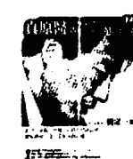

## 真原醫（平裝 316 頁 / 附螺旋拉伸 DVD）

以轉變的心念重新去理解世界或幫助他人，已踏出了自我療癒的第一步。真原醫（Primordia Medicine）是身、心、靈全面且完整的健康生活體悟，是最古老卻也最經得起時間考驗的預防醫學。

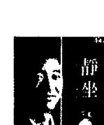

## 靜坐（平裝 291 頁 / 附靜坐導引 CD）

靜坐等同開發一個大腦神經新迴路，放鬆心智，讓身心重回和諧、完整。深一層是對生命全新的領悟，完全沉浸於慈悲、智慧、與喜悅之中。

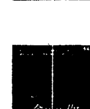

## 全部的你（平裝 381 頁）

全部的你，是古人留下來的最完整的哲學系統。是包括智慧，又包括慈悲的大法門。透過這本書，希望可以把讀者一起帶回到家、自己的本性，也就是——自己的心。

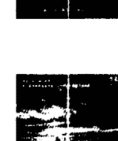

## 神聖的你（平裝 397 頁）

本書的「神聖」，反映的是內在生命和外在世界的接軌，達到最和諧、最完美、最平安的境界。如何去整合內在生命和外在世界，是本書想探討的主題，帶來另外一個層面的理解，完成轉變的旅程。

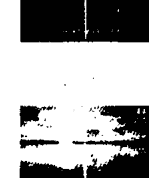

## 不合理的快樂（平裝 375 頁）

真正的「全人快樂科學」，由哲學、靈性層面著手，透過「臣服」與「參」，運用現代人最豐富的頭腦與感受，徹底翻轉生命，和讀者一起進入「不合理的快樂」。

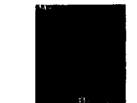

## 我是誰（平裝 187 頁）

透過現代的語言，運用無時無刻的念頭與感受，讓注意力從「腦」落回「心」，體會「在」，甚至古人所談的「空」。十七章解說、十四個與生活緊密結合的練習，解開古人「悟」的奧秘，陪伴你我重新探訪華人的智慧寶藏——「參」。

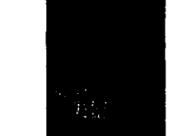

## 集體的失憶（平裝 158 頁）

醒覺，其實是簡單再簡單，只是把原本屬於你我的一體找回來。這本隨身指南，站在「一體」或「在」的層面，幫助讀者對照自己對真實、對領悟的理解。每一章內容精簡，值得用心來「讀」與「參」。

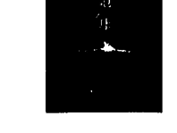

## 落在地球（平裝 179 頁）

解脫，其實是打破「人」的制約，跳出「人」的處境和特質。醒覺過來，從地球的束縛解脫，我們才真正愛護地球，而真正成為地球的住民。

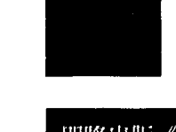

## 定（軟精裝 228 頁）

貫通全部意識的連結，我們稱為「定」。然而，這裡想帶出來的，是永恆、無限大、大喜樂當中的定，或說「大定」。最有意思的是，這裡所稱的大定，比小定更不費力。活出大定，比我們每個人想的都更簡單。

- 《插對頭》
- 《時間的陷阱》
- 《短路》
- 《頭腦的東西》

# 音聲作品

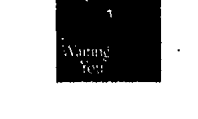

## 等著你（導聆手冊 + 4 CD）

等著你 · 放放下 · 超超越 · 超原諒 四個超越的主題，破除對修行的迷思，為生命帶來新希望與期待。

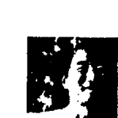

## 重生：蛻變於呼吸間（導聆手冊＋2 CD）

這是啟蒙的時代，也是疏離尋覓的年代。跟不上變化的人，容易陷入深淵，感到孤獨。這套專輯正是為你而來。

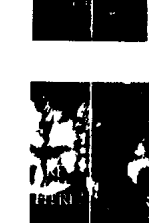

## 你．在嗎？（導聆手冊＋2 CD）

你早就完整，早就圓滿。並不是「誰」「做」點什麼，就能帶你更靠近真實的生命——你早就是。而且，永遠都是。

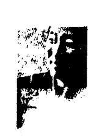

## 光之瑜珈（導聆手冊＋4 CD）

透過聲音的導引，結合最有效率的「專注」和「觀」，身心合一，讓身心的能量開始流動，充滿希望、充滿活力，面對人生。

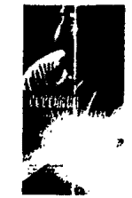

## 真實瑜珈（導聆手冊＋2 CD）

跟著音聲導引，把全部的自己交出來，臣服、參、臣服、參……沿著每一個念頭與情緒，發現最高的真實。

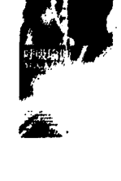

## 呼吸瑜珈（導聆手冊＋2 CD）

跟著引導，從數息、觀息到隨息，一路走到臣服與參，一步一步帶到更深的層面。念頭停止，自然回到寧靜、一體，體會到「在」的無限。

## 四大的瑜伽（導聆手冊＋3 CD）

從東方到西方的哲學、醫學、實修，都談到四大元素（地、水、火、風）的組合。身心合一是歡喜、活潑而專注的過程。輕輕鬆鬆落在不費力、最單純的覺。

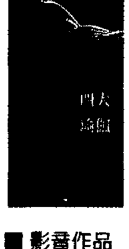

### 影音作品

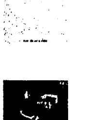

## 螺旋舞（DVD＋書 123 頁）

螺旋是宇宙最原始、最強大的力量。源自最古老養生修煉的螺旋舞，將人體的兩側對稱作為工具，以中脈為軸心，輕鬆畫一個∞，可以說是動態的靜坐。透過最少最簡單的「動」，達到最大的身心合一的效果。

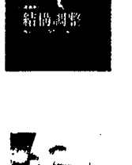

## 結構調整（3 DVD＋書 215 頁）

重複的動作慣性，本身就帶來因－果的制約，累積因－果的作用。要徹底的逆轉，需要一個回轉的動作，解開落在身體和結構上的因－果的結。透過簡單的螺旋拉伸運動和療效姿勢，跟著影片的速度慢慢進行，每個人都可以自我調整。

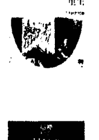

## 蛻變・重生（一日共修實錄）（4 DVD＋小冊）

2016.06.25 楊定一博士在台首場六小時共修全紀錄，全部生命系列書籍、音響作品精華濃縮，六個小時親自引導實錄，理論與實修循序漸進，交會貫通，帶領一起融入更廣大的一體意識。需要你親自用「心」來品嚐與體驗。

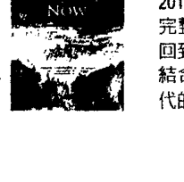

## 這裡・現在（一日共修實錄）（4 DVD＋小冊）

2017.03.25 國父紀念館「這裡！現在！」一日共修影音全紀錄，完整細緻呈現。從臣服到參，一步一步引導，超越頭腦制約，回到生命真實。
結合光與聲音的觀想、呼吸練習，一場心對心的交流，無可取代的神聖現場。

全部生命系列 0012

## 十字路口 — 全部生命系列問答 (一)

（全書一套三本，附音頻卡片）

- 作者 楊定一
- 編者 陳夢怡
- 音頻製作 陳夢怡
- 責任編輯 陳夢怡 · 陳錦書 · 陳靜雯
- 封面 · 音頻卡片插畫 施智騰 (Simon)
- 封面 · 音頻卡片設計 盧峻曦
- 音頻網頁規劃 · 設計 林愛敬 · 楊宜桂

- 出版者 真原文化股份有限公司
- 地址 (10508)台北市松山區敦化北路201之30號8樓
- 電話 +886-2-27122211 ext. 7695
- 出版日期 2018年7月第一版第二次印行
- 定價 200元
- ISBN 978-986-96536-0-2

讀者服務、楊定一博士作品視頻分享、演講活動公告，請至Facebook「楊定一博士 · 全部生命系列」專頁

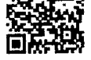

國家圖書館出版品預行編目 (CIP) 資料

```
十字路口：全部生命系列問答 / 楊定一著 . [述
答覆：陳夢怡編 .-- 初版 .-- 臺北市：真原文
化,2018.06
冊：公分 .-- (全部生命系列 ; 12)
ISBN 978-986-96536-0-2 (第 1 冊: 平裝).--
ISBN 978-986-96536-1-9 (第 2 冊: 平裝).--
ISBN 978-986-96536-2-6(第 3 冊: 平裝)
I. 藝術
192.1	107007680
```