# 杨定一：十字路口2

#### B01 「全部生命系列」算是宗教嗎？

問 您剛剛提到「全部生命系列」傳遞的理念或系統，雖然你不希望它變成系統，你也覺得只要大家上路了，你就會離開。但我覺得，现在很多宗教，包括很激進的一些宗教團體，都很積極地吸收信徒。有很多師父也會希望自己門下的徒弟會愈來愈多，認為可以把他的理念傳遞出去。當然，在這過程中，也會有很多人來找我們這些還沒有信教或還沒有找到師父的「迷途羔羊」，希望我們去相信這個系統或宗教。但是，太激進了，的確會讓我們卻步。我覺得您「全部生命系列」講的參或臣服，其實是很簡單的。幾乎不是宗教，也不像一般講的信仰那麼龐大或堅實。就是很簡單，一個人在日常生活中隨時都可以臣服，隨時都可以去問「我是誰」。

我反而會覺得，這才是我們一般人在沉浮的人生中更需要的。如果要我們去相信某個團體，我們可能還很擔心這樣一進去太沉迷了，到時候反而忘記當初的初衷了。這會是我們很擔心的。

答 很好。你剛剛表達的很清楚——很多人有這個沉迷的過程，就是找到一個偶像，非要有這個老師不可。而且，也有老師認為自己的法門是獨一無二。就是因為普遍有這樣的現象，我更需要退出來。

我不斷地說，這不是宗教，不是任何法門，不是誰在發現，做了多偉大的整理。都沒有。

它是順其自然的。

最多只是看著人間太多痛苦，希望透過自己微薄的力量，做個解釋或分享。最後，每個人還是要找到他自己心中的老師。那位老師，一直在等著你。其實，不需要是一個人。

上帝，如果把祂當作一個人，那很可惜。上帝是在心中。

佛性，每個人都有，是在心中，是看不到的。

所以，這對我個人反而是一種提醒。市面上那麼普遍，有那麼多變得很玄，很沉迷，甚至要有什麼系統，收多少弟子，多少信徒，我們不可能扮這個角色。

我也不可能扮這種角色。不想扮這種角色。沒有能力扮這種角色，也不希望扮這種角色。

一切本來都沒有。

就像我們畫那隻烏龜在笑「你們在忙什麼？」（編註：《全部的你》的插圖）

本來什麼都沒有。有什麼系統好談的？只要談系統，那是二元對立的產物，要小心。不知不覺，落在一個系統，我們認為頭腦又開始懂了。懂了，但對心沒有幫助。你懂了是懂，但遇到事情還是會反彈。還會起伏。

所以，我才會講一個人這時候還是要很老實、很謙虛、很誠懇不斷地練習，不斷地往前走。

走到哪裡？不重要。沒有叫你去哪裡。哪裡，也去不了。對不對？

我常常接觸一些朋友，找一位上師或老師學。最可惜的是，他滿口都是「老師講什麼」，他會記得老師所講的話，有頭有尾。我就聽，聽了五分鐘、十分鐘、十五分鐘，你聽得出來這不是他個人的經驗，完全落在理論的層面。

我等了十五分鐘，跟他說「很好，你對你的老師很尊重，很了不起。但這是你師父的話，你自己，怎麼說呢？你認為是怎樣呢？這些話，對你有什麼幫助？在解脫的方面，這些話對你有什麼解脫的作用？」

他回答不出來。

我不相信任何人可以回答得出來。

當然，他可以回「我的老師說……」再重複一次。

我認為太可惜了。真正的道理，真實，小孩子都可以聽得懂。五歲、六歲都可以聽得懂。有小孩子五、六歲，就醒覺過來。

你看，有沒有意思？

十幾歲，就可以醒覺過來。他什麼知識也沒有。甚至，知識愈多，污染愈多，愈把他綁住了。

像我過去做科學、醫學、物理，我什麼都有興趣。現在回頭看，喔，被醫學綁住，被化學綁住，被物理綁住。而且，愈綁住，在人間的範圍還愈得意，感覺什麼都懂。懂了愈多，在心的層面，發現什麼都不懂。而且，前面懂的，都是障礙。

你守住一個領域，當然會以這個領域為主。認為這個領域是最先進、最權威。這是太可惜，太可惜了。

我們有時候，要退兩步，對自己做一個反省。真實，一體，在等著我們。不是透過哪個老師去取得。前面講過，一個人很誠懇，就剛剛好找到你需要的老師。

我們也不能小看弟子沉迷於老師的現象，也是剛剛好他需要的。Who are we？我們有什麼資格去批評，對不對？

剛剛好對他有點安慰，對他的人生有點鼓勵，不是很好嗎？老師也沒有叫這個弟子去害別人，那就天下平安，沒有事。所以，都很好。

我個人很清楚，所以那麼專注，希望告一個段落。大家，能用就用，不可以用丟到旁邊，無所謂。因為 Nothing happened. 什麼都沒有發生。

沒有什麼特別有價值，或沒有價值，都無所謂。

#### B02 如果這一生醒覺了，下輩子再來地球，一樣是醒覺的嗎？還是又歸零要重新開始？

問 楊博士您好，您在《真實瑜伽》Yoga of Truth 專輯有講到——我們這一生如果遇到的是好事，下一輩子，可能就遇到不好的事。人像單擺一樣，在好好壞壞中擺來擺去，也是不斷地重複。我們必須從這種集體失憶的狀態，把生命的源頭找回來，不要被這個世界困住，也不要被這個世界騙走。我們透過臣服與參，一個人可以徹底看穿人生種種的現象，決定我們要不要醒覺。我想請問的是，如果我這輩子醒覺了，下輩子再來到這個地球，是會維持醒覺的認知，還是又要重來？又要歸零從頭開始呢？

答 你這個問題，是完全站在「沒有醒覺」在看「醒覺」。好像「沒有醒覺」是一回事，而「醒覺」是另外一回事，倒不是這樣子。

這是用我們邏輯、二元對立的腦，在看一體。

這是難免。我們有這個腦，全部是在比較，在分別（二元對立的意思就是兩個東西在比較。有三個點，一個觀察者看著眼前兩個點，你才可以得到數據或資訊。接下來，就成立一個世界），這是站在「有」看著「空」，看著「一體」。

一個人，醒過來了，是什麼意思？

本來他就是醒覺的。

他最多是知道醒覺。

什麼意思叫做知道醒覺？

知道他是醒覺，代表說——他徹底理解這個世界是個大妄想，是相對的層面。這個生命，我們認為從生到死，好豐富，有各式各樣的故事包含在裡面。其實，站在一體，它根本不成比例。小到連一隻小螞蟻和大象相比，都還太高估它。

但是，我們人類很可愛，因為有五官，而且這世界是透過因果建立出來的，不斷地想投入這個世界，把這個世界當作自己全部的可能。

你看這多可惜。

站在一體，沒有觀念、沒有念頭、沒有任何東西好談。一切都是平靜，一切都是涅槃。

一個人醒覺過來，最多懂了這些。

懂了什麼？

再講一次，懂了一切都是個大妄想。

懂了這些，他也不來了。沒有什麼來，沒有什麼走。他，從來沒有來過。

他怎麼可能走？或是怎麼可能再回來？

輪迴，來來去去，本身又是一個因果的作業。

我再講一次，只要你把這個身體當作真的，把人生當作真實，你當然一定會再回來。

你當然一定會受到因果的作用——這次好，下次壞……永遠不會停的。

很多人認為自己專門做好事，下一生的福報業力都會往好的地方轉。倒不一定。業力是種種力量組合的，我們人間所能看到的只是一小點，小的不成比例。

我再三這麼說。我知道大家很難相信，所以最多只能一再重複。

這樣子一來，只要我們把人生當真，當然你還是要回來，還是要受到因果法。但是，反過來，只要一個人徹底知道——「我本來就是醒覺的。」在人間唯一的選擇，也就是——「不去反彈，不承認有這個因果，知道因果本身是幻覺，和我不相關。」

這麼一來，他就跳出來了。

一個人醒過來，這個身體還是要完成它因果的轉變。這一生來，想做什麼，做什麼。想完成什麼，就完成什麼。甚至，不想做什麼，也就是如此。

我們醒過來，最多只是放過一切。包括放過身體，放過自己，放過別人。讓這個身體完成它自己——假如身體要得病，就讓它得病；這個身體想做什麼事情，就讓它做。沒有什麼事，也不用去干涉它。

一個人就輕輕鬆鬆活這一輩子，知道這個生命、人間的好事壞事，再也跟他自己不相關。所以，沒有什麼再回來不回來，輪迴再一次，再受到因果的法……他已經解開了，再也不參與這個遊戲。

和他，沒有關係了。

但是，只要還在這個世界，有這個肉體，就像梵文的 lila（話劇、遊戲），像扮家家酒，就繼續玩下去、繼續生存、繼續服務……都無所謂。

他本身在醒覺的狀態，其實充滿著愛、充滿了「在」，充滿最高的頻率，帶給週邊。其實不需要透過「做」講話、講課、念頭、作品，任何東西他都不需要，他平安的過一輩子。但是，他已經影響週邊每一個人、每一個眾生。

就那麼簡單。

你現在回頭看你的問題。為什麼我說你的問題是站在頭腦的角度在看著一體？這是很合理的。站在「有」看著「空」，站在「有」看著「一體」。

反過來，假如你站在一體看，自然就知道你所問的問題不存在。這個問題本來帶來悖論，就是因為有這個悖論，所以解不開。

所以，你還沒有醒過來，就這麼簡單。

把這些問題擺到一邊，都不要去追求。我勸你不要追求，因為追究這個問題，不會帶來解答，起不了任何解脫的作用。

最多，規規矩矩回到兩個方法——臣服，參。

這幾本書，我希望你有機會都看，因為它會建立一個基礎。

這一生，醒覺不醒覺，都不要去重視、不要去管它，知道有這回事就好了。完全把自己交出來，交給誰？交給自己的意識，交給生命、交給內心，也可以 說是交給佛陀、上帝、主。

這裡所講的上帝、主、佛陀、佛性，就是你我的本質。你，就是你在找的答案。

你在找，對不對？

在找什麼叫做醒覺。

其實，這個答案就是你，你已經醒覺過來。

要有這個信心。把這個基礎建立起來，自然不知不觉，醒過來了。

醒過來，什麼都沒有發生。跟你現在所想的，完全是兩回事。你現在認為有一個東西叫做「沒有醒覺」，認為做某些事、做某些追求，就可以醒覺過來。倒不是這個樣子。

這是兩個不同的軌道，一個是相對的，一個是絕對的。

從相對，到不了絕對。是把相對挪開，你本來就有的絕對，也就浮出來，亮出來，就把你佔住。

就是這樣子。不知道這樣能不能聽懂？

就是聽不懂，也不要著急。其實，什麼事都沒有發生。

#### B03 宇宙和佛的能量誰大誰小？

以能量來說，我很想知道宇宙與佛之間的能量大小分別為何？

宇宙、佛、能量，任何東西，可以用語言表達出來的，都是頭腦的投射，都是妄想。只要我們可以用語言表達，全部都是妄想，是因果的組合，都是頭腦投射出來的時空。宇宙本身，也離不開時空。所以，本身也是個大幻覺，大妄想。

我很誠懇地，在這裡做個提醒——不要花時間去追求能量大小或關係的這種問題。這種理解，本身還在做比較，還是二元對立的表達。我們今天就是因為有二元對立，有這個頭腦，才會有一連串問題。讓人生從生到走，都是痛苦。

我們本來就是要從人間跳出來，要從二元對立跳出來，才可以解脫。所以，去衡量能量，其實沒辦法給我們帶來任何解答。甚至，連我們講生命、宇宙、一體、全部、在、上帝……都還是一種表達，一種比喻。也只是一個頭腦的產物。

都不要去重視。

最重要的是拿自己，你自己的身心，做一種體驗。為你自己證實，這裡所講的一切正不正確。

在這個世界，全部我們可以表達、可以看到、體會的一切，全部都是頭腦的投射。

這一點不是理論，是你自己要去體驗，要透過每一個細胞，每一個體——情緒體、意識體、身體……去體會這幾句話。完全體會到了，你也已經醒過來了。

接下來，也知道，沒有什麼宇宙，沒有世界，沒有能量。

一切，都是完美。一切，都是空。

#### B04 神聖聲音有正確的讀法嗎？

問 我在許多場合聽到博士在帶領我們進行「嗡啊吽」這些神聖聲音的練習，不免讓我想過去，學習時，曾經聽到有人說，這些神聖音聲，要愈接近古代印度人真正的發音，能量場才會完整。比如「嗡啊吽」的吽，有人說要讀成嘴巴閉起來的 "hom !" 也有人說要嘴巴打開 "hon !" 發音的不同，真的有能量上的差異嗎？對我們的學習，會有影響嗎？還是說重點真的不在這邊？

答 你的問題很好，我至少透過兩個層面來回答。首先，我必須說，我們這裡還是追求意念 (intentionality)，也就是一體的意識。從一體的意識來看，你說，用語言、聲音、念頭、邏輯、觀念來表達的，會有什麼能有絕對的重要性？什麼都沒有！對不對？

所以，怎麼去張嘴、合嘴，都不重要。我認為，去理解什麼叫做一體、什麼是無限大的意識和邏輯、跟有限的二元對立的邏輯（也就是頭腦邏輯）的差別，這個比較重要。

只要把這個搞通了，自然回到一體。回到一體，什麼都沒有。就是無所不在、內心的狀態，一片空。講祂沒有，又什麼都有。講祂什麼都有，又什麼都沒有。沒有什麼具體的東西，可以講是 something。我們說 nothing 沒有東西。其實 no-thing（沒有東西）本身還是一個觀念，對不對？只要我們一開口，講任何語言，就已經走歪了，就是那麼微妙。

所以，跟聲音怎麼發，都不相關。

但是，只要你承認這個身體是堅實，只要你承認還有頭腦、肉體，承認這世界是真的，對你，還是有因—果，還有頭腦（這世界是頭腦投射出來的），還有時一空，還有肉體。甚至，肉體還有個結構。

我們透過結構的解剖去看，可以分成好多好多層面——從比較粗重，比如肉體的層面，到比較微細，能量、穴道的層面，甚至到意識的層面。有這些層面，是因為我們還在因—果的層面，受到因—果的影響。

所以，只要你認為有，當然離不開因—果，當然離不開穴道的作用，也當然離不開古人所講的原則。比如說，吽是不是閉起嘴巴，從齒縫發音。因為我們身體有很多穴道，古人叫 nadis，尤其在鼻腔和眼睛後面特別豐富。不知道你過去有沒有接觸過，我過去在許多場合，帶著大家練習四短一長的呼吸——用短的呼吸，也是要大家把嘴巴閉起來，在後面造出一個反方向的回壓（back pressure），讓氣脈打通，這是相當有效的。

透過鼻腔後方很豐富的穴道，只要把嘴巴閉起來，透過這樣的練習，就會把全身的穴道震通。

也就是因為這樣子，我才會講究中脈觀想的靜坐。一邊觀想，一邊用聲音引導，把中脈打通。這些，我們最多可以當作是幫助身心達到均衡、舒暢、放鬆，帶來健康。最多只是這樣子。

但我認為，不要太認真去做。而且，知道這些，本身還是大妄想，對不對？只要你認為有這個肉體，你還是在活出這個業力。還是離不開因一果的轉變。

我們修行的目的是什麼？是超越這個時一空、人間。不是把業力消失，是看穿業力。知道這個業力，對真正的你，一點都影響不了。但是，對這個虛的、頭腦投射的肉體，它當然有作用。

不知道這樣子回答，夠不夠清楚。

有機會，我們可以在這方面，再做更多分享。

#### B05 觀想不到光在體內的流動，怎麼辦？

問 博士，我在聽您《光之瑜珈》靜心引導的時候，無法觀想光在我的身體裡流動。請問，有什麼方法可以讓我觀想到光呢？謝謝。

答 我勸你，勸大家，不要擔心對某一種觀想（例如你這裡講的光），觀想不起來。這本身，都不是那麼重要。

這些方法，主要是希望可以得到一個淨化。讓頭腦安定下來，許多念頭可以踩個剎車，甚至讓它消失。一般人踩不了這種剎車，念頭不斷地起伏，看不到念頭的根源，也根本看不到念頭經過——不斷在重複，不斷在起伏。

因為我們看不到，我才用各式各樣的方法，從《靜坐》開始，每次出來辦活動，都帶大家練習各式各樣的聲音和觀想。就連呼吸的靜坐方法，還是把觀想和聲音帶進來。我知道現代人離不開眼睛和耳朵，把眼睛的作用往內轉，這本身就是觀想。耳朵，也是一樣的。我們用聲音去朗誦，包括你現在聽到我講話，或是我自己在講話，都離不開聲音的作用。所以，這兩個方法是最有效率的。

我帶「光之瑜珈」，一方面是希望大家體會到，念頭可不可以踩個剎車；另一方面，我們的身體，本來有很完整的意識體，我們隨時落回身體，也就把一體找回來了。

你看動物也是一樣。動物因為頭腦不是那麼發達，所以它不受頭腦的作用或指揮。一般吃飽了，就躺下來休息。沒有吃飽，就去找東西。就很簡單。過的很簡單。植物，更不用講。但是，人類因為頭腦發達，太進步，所以隨時透過頭腦的指揮在運作。

我們跟動物的不同，主要在這裡。

我們一般人很少體會到這個身體，也很少把意識落在或進入身體。我才會把「光之瑜伽」帶出來，希望大家跟著觀想練習。輕輕鬆鬆把意識交出來，把念頭交出來。透過聲音的導引，看能不能把每個部位觀想起來。最多，也只是這樣子。

觀想不起來，也沒有關係。不要把這當作一個問題。

因為到最後，最多只是做一個淨化。淨化到最後，沒有念頭，接下來比較容易練習兩個大的靈性功課——臣服與參。一個人假如念頭從來沒有停過，接下來，講臣服與參，會比較難接受，比較難體會。才會先讓大家靜下來。靜下來之後，自然可以做臣服的功課——接受一切，放過一切——這個功課先做起來。

接下來，更安靜了。念頭一起伏，馬上看到。看到，就去追這個念頭。把我們的意識輕輕鬆鬆擺到這個念頭上，貼著這個念頭回轉。回到哪裡？回到它的根。輕鬆地——這個念頭，是為誰有的？它的源頭在哪裡？念頭是從哪裡出來的？

這樣子，參的功課就出來了。

所以，這兩個就是根本。

假如你不把念頭的根找回來，念頭就是「我」，沒有把「我」的根源找回來，再怎麼淨化也沒有用。

反過來，一個人淨化到最後，完全沒有念頭，念頭再也沒有辦法起伏，內心、一體自然就爆發出來，智慧就爆發出來，就把知識蓋住了，把全部「我」化解掉了。

一個人就完全站在「心」，活這個生命。那是很有意思的。

古人常說，讓心完全爆發出來，一個人，才真正醒過來。西方的宗教，無論基督教或天主教，會用 re-birth「重生」來描述。意思是，我們過去從來沒有真正活過。一個人醒過來，才真正開始活起來。

所以，只要輕輕鬆鬆做光之瑜伽。不要去在意觀想不起來，這不重要。

反過來，假如我講的這些話，你完全可以聽懂，你自然也就觀想起來了。因為這觀想不重要，你反而觀想起來了。如果這觀想還很重要，你還抓著不放，反而觀想不起來。

這本身好像是個矛盾，是個悖論。但其實不是。

任何練習，包括光之瑜伽，都要輕輕鬆鬆做。

為什麼？

它本來就不存在，最多是像個遊戲一樣，帶著大家扮家家酒。是一種遊戲，古人說 lila。就像在玩，也不需要很認真。

你要充分知道，到最後，其實什麼也沒有做，什麼也做不來。你本來就有。

也就是，我現在帶著大家在找——你本來就有的。你本來就是光，本來就是愛，為什麼還需要去找祂呢？為什麼還要去觀想起來呢？反過來，把頭腦一擲開，擺到旁邊，光就浮出來了。

是這個道理。

愛也就浮出來了。

所以，假如認為是透過練習，可以找到自己，本身是個大笑話，是個大妄想。

醒覺，不靠時間，不靠努力，不靠費力，不靠功課。

輕輕鬆鬆懂了這些，你也就醒過來了。醒過來，你發現——其實跟你的功課、練習，更不用講苦修，一點都不相關。

試試看，看可不可以體會，領悟到這些話。

#### B06 共振是什麼？是在哪個層面共振？

問 博士提到共振，在一個場域空間，就可以感受到心流的共振。我想問的是，它是意識，還是超越意識的同步呢？

答 很好，很好，這個問題問的很好。也是，也不是。什麼意思？共振，是在物質的層面，可以說有個東西叫共振、波動、頻率。透過螺旋場，在人間的物質層面可以看到。所以，我們講頭腦或全身的共振，這是物質的觀念。我們有這個體，當然離不開物質。身體每個部位，本來就有它生理的結構和機能。那麼，我們講共振，是要表達什麼？注意，其實左腦、右腦，一般人很少達到諧振。

也就是左腦和右腦不協調，在不同的軌道上運作，兩邊不交流。一個人也就憂鬱、悲觀、躁鬱……有好多問題，反映他不均衡。

連我們的腦，本身都達不到共振，更不用講身體。血管有一個基本的週轉頻率。我們一般人，很少跟自己的血管、心臟、胃部、腸道……達到共振。從身體的層面，我們必須講到共振。

我在《真原醫》花了好多篇幅，也花了好多時間帶著大家做練習、運動、螺旋舞、螺旋拉伸。幾十年打基礎，帶著大家。想表達什麼？是身心的共振，身心的諧和，身心的諧振。透過運動，希望把自己的心找回來，跟自己的心共振。

像你在帶課的時候，會把步調慢下來。一個人透過跟細胞對話，反省更深的層面來達到共振。你透過運動，護理師透過飲食的教育，透過好多方法（包括靜坐）帶著大家，就是希望達到身心的共振。

我們更深的層面，確實還有一種更深的共振。我在《神聖的你》就把這個重點稍微點出來。《全部的你》有介紹過，後來在《不合理的快樂》《我是誰》把這一點打開，談「對稱法」。

什麼意思？我們的內心和外在，也要達到共振。這是最有意思的。

我們認為只是在外在、在週邊要達到諧振。是的，沒有錯。但是，我們每個人只要把注意力回到內心，就會發現自己跟內心缺少共振，失衡了。

所以，要把人生全部的生命找回來，最多也是把注意力和專注，一百八十度往回轉，回到內心。

回到內心，讓內心帶著我們走，這就是臣服。

內心有全部的潛能，完全無所不知。我們最多把自己的生命交給內心，讓內心帶我們走。這就是共振。是更深的共振。

這種共振，一走下去，很有趣，到處都看到奇蹟。奇蹟就在眼前，隨時有恩典，好像宇宙非要恩典我們。透過一個動物，透過大自然，透過一個人，透過小孩子。我們不需要分析，只要把心胸打開。這個對稱法，讓我們完全可以得到豐盛（abundance），也就活出豐盛了。

我們很少聽到有人問豐盛，為什麼？大家首先認為不可能，所以也不會提出這個問題。

只是透過生命的共振，可以有那麼多的現象，我們也自然寧靜下來了。跟內心達到共振，你自然就寧靜，自然就平安，自然就喜樂，自然發出愛。

也就這樣子。

#### B07 靜坐時要做多少事才能讓內心平靜？

問 請問靜坐時，念佛，可以嗎？念佛時，沒有想法，僅口念，或口念加上觀想佛陀，或是默念口不動，或是不念佛，僅僅靜坐，哪一種對於內心平靜或腦部發展比較好呢？

答 念佛，或念佛再加上觀想，或其他的靜坐方法，每一個都很好。哪一個更好，這要看每一個人的個性、屬性、教育背景、興趣……都不一樣。所以，很難讓我們肯定哪一個比較好，哪一個比較有效。只要一個人可以適應，隨時可以做，而且可以把念頭踩個剎車，都是好事。你前面提到，念佛加上觀想，其實準提法就是這樣子。一邊唸著準提佛母留下來的幾句話，再加上觀想心輪，讓心輪不斷帶著你走進去。這都是一樣。都好。

但這是看每一個人的習慣。

有些人認為這樣子很複雜，也沒有關係，就光唸佛，阿彌陀佛或釋迦牟尼佛。或觀察呼吸、數呼吸、隨息……我在《靜坐》，都用好多實例帶出來。

都是好事。我認為一個人，任何練習都是好的。但是要記得，練習、唸佛或靜坐，目的是什麼？目的其實是讓念頭踩一個剎車，讓頭腦得到一個淨化。本來我們頭腦不斷地起伏，念頭不斷地起伏，突然可以踩一個剎車，可以寧靜下來。念頭一寧靜下來，其實我們的一體就浮出來了，最多是這樣子。

我在接下來幾本「全部生命系列」的書，雖然不斷地強調兩個大的法門——臣服（bhakti yoga 奉愛瑜伽）和參（ātma-vichāra），而且強調這是對最成熟的人做的。但是，坦白說，假如你做，不習慣，或是，做了，感覺不適應，不也是一樣嗎？

所以，一個人可以隨時用唸佛、數息或我常提到的 I Am Meditation（「我一在」的靜坐），不知道你有沒有接觸到。I Am、我是、我在，就是聖經在表達上帝的名字，梵文叫 *soham*，也就是說 I Am、我就是、我在的觀念。這本身也可以做練習。

呼吸。

吸氣時，講「我」。吐氣，講「在」。I - Am 不斷地重複。

這都一樣。

又帶出來一個觀想，同時唸上帝的名字。

很多朋友沒有佛教的基礎，佛教或基督教，無論哪一個宗教都是一樣的，走到最後，都是希望我們在念頭踩一個剎車，體會到什麼叫做寧靜。

假如一個人做，做到最後，唸佛到最後，感覺很淨化，念頭完全沒辦法起伏，但是偶而念頭還是會來，這時候，可以做參——輕輕鬆鬆問自己「誰？還有念頭？為誰？還有念頭好談的？誰還可以注意到有一個念頭、情緒或是感受？可以拿出來分享？是誰在注意？誰還在做見證？可以看到自己的念頭？」

這時候，答案當然也只是——我。

當然是我。

那，我又是誰？

我是誰？

這樣不斷地追求，不斷地潛入一層層更深的層面。如果拿水來比喻心，一個人潛的愈來愈深，落在心中，沉在心中，一層層地沉下去。因為，這種問題「我是誰」沒有答案。最多只是讓一個人提醒自己——你本來就在家。你本來就是一體。你本來就是絕對。你本來就是神。你本來就是解脫。你本來就是在一體。為什麼還要再加上一個層面？對不對？

所以，最多只是提醒自己。

這麼一來，一個人體會到，他會突然發現過去念佛、任何練習，最多是讓心得到一個淨化，讓頭腦躁一個剎車。走到最後，還是要有這個領悟，要把自己不斷地帶回到一體。

其實，就連「把自己帶回到一體」這種說法都是錯的。你本來就是一體，一體本來就是你最重要的部份，你最多只是把局限的腦、相對的邏輯挪開，一體就浮出來了。祂從來沒有離開過你，假如祂離開過你我，那我們找不到祂，就是找到了，祂也不會是永恆，也不會是無限大的，最多還是無常。

我們頭腦全部可以投射出來的，都是無常。所以祂本來就是在我們眼前，在我們心中。只是我們忘記了，還要唸佛，把這個頭腦踩一個剎車。還要練習，做好多好多練習，無論是呼吸或其他的練習，讓我們得到一個淨化。

假如懂了這幾句話，你最多是輕輕鬆鬆做個選擇，也就是醒過來吧。

這時候，這裡現在，就可以醒過來，不需要再做任何練習，就可以醒過來。

#### B08 人類可能走出集體意識的制約嗎？

問 楊博士你好，在《全部的你》你曾經提到「集體意識」（collective consciousness）這個名詞。您說我們這一生來，都是受到家庭、社會甚至整個華人社會制約的影響，才塑造了現在的我。我想請您進一步說明，集體意識是怎麼形成的？又如何能夠不受到這種集體意識制約的影響？

答 集體意識是怎麼來的？是透過我們的感官——看、聽、聞、嘗、觸，再加上念頭所建立的感官。人跟人之間的感官，當然各有不一樣的地方，但是會有一部份是重疊的。所以，我們人跟人之間看的範圍幾乎一樣。聽的範圍，也差不多是一樣。我們聽、看的範圍，當然又和動物不一樣。人有人的範圍，體會這個世界，覺察這個世界。透過感官，有一個範圍。

我們的念頭，一樣是透過神經細胞運作，本身也有一個範圍。這個範圍在重疊的角度來看，自然就會造出一個集體的意識。

有意思的是，這個重疊會讓我們感覺自己所體會到的，有一個客觀的層面。舉例來說，我們眼前看的東西，比如牆壁，你看的和我看的大致一樣，我們會認為是真實不過。好像真正有這個牆壁。因為你可以看到，我也可以看到。甚至連動物從感官的角度來看，都有一部份重疊。雖然看的深度、廣度、顏色或能量譜的層面不一樣，但大致有一個重疊的部份。

就這樣子，自然建立一個好像很堅固的世界，是人類共同建立的一個平台，共同的一個世界，共同的一個意識。

集體意識又是一層的制約。我們除了個人的一些經驗、束縛，被人間、社會、家庭、地球所绑架的種種制約。還有家庭的制約。走到最後，我們會發現有「人」的制約。

什麼意思？

比如說，我認為我自己是個男士、華人，而你是女士、華人、幾歲……這是「人」的制約。制約，是一層一層的。走到最後，很微細，其實我們都看不到。你活在地球，一定有地球的制約。

一個人要醒覺，要把全部這些都丟掉。不光是我們一生累積的知識，要把它看穿、丟掉，把它完全推翻。任何制約，包括人的制約都要充分地超越。

怎麼去超越？

最好的方法，還是用「參」——為誰，有這些條件？為誰，有這些特色？有這些特色的人，是誰？有這個特色的生命，是誰？

走到最後，答案還只是——我。

全部都是「我」。

「我」認為我是人。「我」認為我是男士。「我」認為是華人。

那麼，「我」又是誰？

所以，到最後，參到底，答案是同一個，是同一個共同點。也就是「我」——是全部觀念的根源。是從這個虛的「我」產生的。然而，「我」沒有來源。「我」後面沒有任何東西可以支持它。它本身就是個大妄想。

這樣，一個人不斷提醒自己——這一生所有的觀念、所有的知識、所有的知覺怎麼來的。到最後，答案都是同一個——什麼都沒有。是「我」創出來的。

所以，這時候，不要擔心哪個觀念還不知道。以前有人說「無我無法」，其實，沒有必要去追求法。沒有「我」，自然沒有「法」。

用「參」，最簡單的方法，就可以把真正的自己找回來。而我所講的這個真正的自己，不是「我」，不是人，不是眾生。什麼都不是。

把這個真正的我找回來。這個真正的我，才是全部生命的共同點，而祂不是透過念頭可以想出來。

只要你想——「我」認為……開悟是什麼、醒覺是什麼。你已經走錯了，祂不是用二元對立的語言，可以描述出來的。

我常常會說，比較像什麼？比較像深睡無夢（dreamless sleep, deep sleep state）。

什麼意思？

你在深睡的時候，沒有夢，什麼都沒有。但是一般我們不知道，假如你是醒覺的，你是有意識知道在做夢（或不在做夢），那時候還比較接近。你會發現，這時候，沒有什麼分別可以起伏，沒有「人」或制約好談。但是，只要我們讓念頭從「心」跑出來，自然就生出來一個世界。生出來一個「我」。生出來這個時一空。而這個時一空就跟著因一果作業。其實是這樣子。

講的好像很難，但其實很簡單。

一個人不斷地參下去，自然會參到底。

參到底的意思是，包括「人」的觀念都要打破。眾生的觀念要打破，菩薩的觀念都要打破。到時候，全部都粉碎。一個人，才真正從泥巴走出來。醒過來了。脫胎換骨了。重生了。

這一生，接下來，就完全不一樣了。

我希望你聽到這些話，不要擔心，做好了。不要有什麼追求。

一個人走到最後，你想想，連「人」的身分都要丟掉，可以說他沒什麼期待了。沒有什麼東西好得到。沒有什麼名譽想得，財富想得的。什麼都OK。什麼都不相關。什麼都可以否定。

這樣子，一個人到最後，什麼欲望都沒有，根本就沒有欲望。他自然會發現，什麼叫做「人」「非人」「天使」「好人」「壞人」跟他都不相關。

輕輕鬆鬆，他最多，只是醒過來了。

醒過來了以後，還是有這個肉體。這個肉體，還是有業力，還是跟著業力法在走。你只是輕輕鬆鬆地放過它。

看著很有意思，這身體想做什麼，做什麼。需要什麼，內心有個力量自然會照顧它，不用擔心。而且從別人的眼光，會做的更好。但是，從你的觀念，你也不在意了。

這個身體、世界全部放過。

你做人、不做；做個好人、壞人。什麼事，都跟你不相關了。

不要擔心，只要你放過這個世界，你自然會做個好人。不光做個好人，會做個最友善的人。會服務，會有各式各樣善意、快樂、寧靜。會活出 sat-chit-ānanda（在·覺·樂）。

是這樣子。

## B09

## 静坐时，每个人都会有身体的微妙变化吗？

(問) 楊博士您好，我自己在學習靜坐，到現在已經有一個月的靜坐經驗了。在靜坐的過程中，我可以感受到身體的微妙變化。像今天，在靜坐的過程中，就覺得呼吸的空氣很不一樣。特別的新鮮，特別的舒服。靜坐後，也覺得身體特別輕鬆愉快。請問楊博士，這是每個人在靜坐的過程中，都會有的體驗嗎？謝謝！

(答) 你有接觸靜坐，是太好了。一個月，練習呼吸的方法，可以體會到身心的放鬆。你所表達的經驗，其實就是一種身心合一的狀態，讓人可以得到一種平靜和舒暢。這是太好了。我相信你之前大概沒有這種經驗。第一次體會，是要恭喜你。

但是，還是要注意：任何靜坐的方法，最多是讓我們專注。把注意力專注到一點、某一個東西、身體某一個角落，例如呼吸、眼前的一個點、一個光。持咒，也是一樣的。把我們的注意力擺到咒語，念到最後，也是會集中。愈來愈集中，最後連咒語也唸不下去了。

注意力集中，會帶給身體各式各樣的好處。從健康到思考的範圍，都會強化。我多年來才用各式各樣方法帶大家靜坐——包括呼吸，朗誦。就是希望大家可以體驗身心合一的狀態。我們平常在麻木中，可能一輩子都沒辦法體會。

你問：是不是每一個人都有這種經過？

這不一定，跟方法有關係。有些人持咒，白骨觀，瑜伽，練習呼吸，像我過去帶過《光之瑜伽》《呼吸瑜伽》（*Yoga of Light, Yoga of Breath*），體驗都會不同。

從身體或意識的某一個角落去切入，得到的效果也會不一樣。當時佛陀就提過，有時意識會膨大，有時候會消失，有時候會集中到一個點。這些都是好事，但並不是說每一個人都非要重複某些經驗不可。

我建議你守住一個方法，一直走下去，多深入體驗。不要從一個方法，跳到另外一個。更不要因為我這樣講，引發你的好奇，要去採用不同的方法。

等到你熟練了，再接著讀「全部生命系列」的作品，接下來體會什麼叫做臣服（bhakti yoga 奉愛瑜伽），什麼叫做參（ātma-vichāra）。

然而，在這時候，還不用去考慮。你先以初學者的精神，很開放（open），很放鬆（easy），先去體驗靜坐帶來的淨化，這都是好事。你做了，不要放棄，不要多想，你自然會進入更深的狀況。

我也希望你找到一位好的老師，帶著你走。將自己交給一位這樣好的老師，一層一層去體會生命更深的層面。

這些都是好事，恭喜你。

#### B10 身體的變化，是因為我在排斥外在的負面力量嗎？

問 我發現自己最近常常心跳很快，即使我沒有做很激烈的運動，心跳還是會很快。我曾經懷疑是不是跟自己身體的問題有關係，但是我發現，透過靜坐、閱讀博士您的文章或書，反而可以讓我心跳慢下來，身體也會感覺比較舒服。另外，我也發現自己接觸手機、網路或電視的時候，心跳又會加快。我想知道，自己身體的這些反應，是不是我對外在世界的負面能量的感應？是不是我在經歷「全部生命」過程中的一個排斥現象呢？

答 落在身體的任何症狀或現象，還是要很客觀的去面對。像你講的心跳加快（palpitation），還是要檢查有沒有什麼原因，是不是心臟衰退等等狀況就可以解釋。

身為醫師，首先還是要給你這樣的提醒。有時候是內分泌的狀況，比如有些人體質很敏感。或憂鬱症，會有心律失調的狀況，有時跳快，有時跳慢。這些，都是應該先注意的。

但是，沒有錯。假如你注意到，心跳的頻率透過靜坐可以慢下來，當然可以多做。我在《靜坐》也提過，把舌頭頂到口腔上面，輕輕抵在口腔的上方，自然會活化副交感神經系統。自然會發現呼吸慢下來，心跳慢下來。

這個練習，我還是鼓勵你要多做。

回到練習，也就是我在書裡提到的靈性的方法。首先，是臣服的大法門。接下來，是在《不合理的快樂》講到的「參」。

就我過去的經驗，兩者都可以幫助調整身體的頻率。不一定只是心跳，包括呼吸、消化、內分泌都有幫助。說不定你也已經發現，有時候，本來不曉得自己有憂鬱，做這些練習、靜坐或安靜下來，可以看到自己的憂鬱，心跳和其他的生理頻率也就正常化了。

在這方面，可以多做，也可以隨時提醒自己——知道自己心跳加快的，是誰？我是不是可以接受心跳快？我是不是可以臣服？

這樣做，會發現心跳也就慢下來了。接下來，不要刻意去管它。知道心跳快，接受它，臣服它。試試看。

不要去管它慢或快，其實它自然會慢下來。念頭自然跟著消失。

念頭一消失，代謝慢下來，心跳也會慢下來。偶爾，還是會有一些念頭起伏。這時候，一個人假如比較安靜了，可以問「剛剛為誰有這個念頭？」「誰還知道心臟跳得快？」

答案當然是「我」「是我知道。」

好，「我」是誰？

#### Who am I?

這個話頭就出來了。

輕輕鬆鬆這樣做，最多只是一個提醒。透過「我念」（我的念頭），一直去追求它的根源。自然，它就回到心。

回到心，一切就安定下來。

心臟跳快，也跟自己不相關了。自然會慢下來。

這兩個大的法門，希望你自己去體會。

我在這幾本書花了許多篇幅說明，也希望大家去讀，同時去接觸我透過聲音錄下來的作品。像瑜伽系列的《真實瑜伽》和《光之瑜伽》，用聲音帶大家去練習。

這些功課還是要做的，可以幫助我節省時間，讓我回答時直接切入重點。但是，如果沒有這些基礎，我每次回答這些問題，都還需要從很根本的、很基本的常識再重新做一個彙總，也會耽誤大家的時間。所以，假如大家花一點時間好好讀這些書，跟自己的體驗對照。這樣子，可以幫我們都節省時間。書裡，有許多練習的方法，都可以採用。

假如不去做這些練習，光是追究理論，只是在某個層面稍微有一點理解，一樣是耽誤過去，相當可惜。所以，這些實務的練習，還是要做。從這些實務的練習提出問題，我相信會比較有意義，也會對大家有幫助。

#### B11 不會走火入魔嗎？

過去您也曾經提過，修行的過程如果能找到一位好的老師帶領，其實是一件很好的事情。我也曾經聽人說，學習靜坐的時候，最好能找到老師帶領，或參加宗教團體，在靜坐的過程才不會走火入魔。但這對長期住在國外的我來說，其實很困擾。我一直都很想學習靜坐，但又不想加入宗教團體。所以，我一直都是透過 YouTube 來聆聽您的分享，與靜坐的帶領，也包括最近的讀書會。我想請教楊博士，透過這樣的方式來學習，會讓我走火入魔嗎？謝謝您。

很好，你問這個問題，反映了許多朋友所面對的。我用幾個層面來回答。

首先，我還是要恭喜你，在這方面投入。你會找這條路，會接觸到修行、靜坐，或「全部生命系列」的觀念，本身就代表你個人的人生可能告了一個段落——也許是有許多問題沒辦法解答，或是和很多朋友一樣，面對身體不舒服、疾病，或感情、人生的失落或打擊。我遇到的，通常都是這樣子。

很少人很快樂，樣樣都滿足，比如說要有錢就有錢，要有名譽就有名譽，要有權力就有權力，樣樣都很幸福。我們一般認為很幸福的人，通常在這個階段，不會去追求什麼是真實，不會去追求「我是誰？」「我來這世界是做什麼？」這些生命價值的問題。我一般很少會碰到。

所以，我過去才會提——一個人假如很年輕，很早，在一般人眼光看人生很順遂，比如釋迦牟尼佛是王子，把禪從印度帶來中國的達摩祖師，也是一個王子。一個王子，把他的身分丟掉，來追求生命的真實。我們一般人會認為不可思議。我們一般會想——你好好過，就好了。光是在這個人間打轉，都享用不完。

有些人有財富，也是一樣很年輕，很早就去追求這個問題，這個福德是不得了。他大概是過去練習過，是成熟再成熟。所以，這一生知道，一分鐘都不能浪費。他最大的問題，就是把真正的自己找回來。還有什麼東西，比這個更重要？

一個人成熟到一個地步，才會有這種領悟，才會去追求下一步——「好，我就是領悟到底，這些領悟，要怎麼跟我一切整合？」

我先回到你的問題。

你說你在海外，而且不斷接觸，透過 YouTube，用各種方法去理解、去練習。這還是要值得恭喜，你在這方面下了一個功夫，而且在人生的層面比較成熟，知道從人間絕對找不到更深層面的答案。所以，針對這些解答，在追求。

接下來，你說擔心走歪，走火入魔。這是很多人問的問題。我勸你，把這個問題擺到旁邊。

這個問題，我從各角落都聽過。一般提這個問題，都在「做」的範圍追求。比如說：「我打坐，要得到什麼好處？」「我去練習，要得到什麼幫助？」「靈性的追求，是不是可以讓這一生變得更好？」「我去領悟，是不是可以把生命不順的地方變得比較順？讓命可以徹底轉變？」

一般過去所接觸，或問「走火入魔」的，都是這樣的朋友。所以，我很誠懇勸你，把這個問題挪開。因為我聽你所講的，知道你其實不是單純為了生命轉變而去追求這條路。假如你還是在人生的層面想做一個好的轉變，我最多也只能講，修行的目的，不在這裡。

修行的目的，就是希望你徹底醒覺過來。即使這一生不醒覺過來，下一生也希望可以醒覺過來，把生命最重要的問題——「我是誰？」「真正的我是誰？」把這個答案找回來。

有什麼問題，比這個還重要？

有什麼問題，比理解自己是誰，還更重要？

你就是有多少錢、多少權、多少名譽，假如對自己不理解，一切都還是虛的。

所以，首先要把自己找回來。

修行，是把自己找回來，把真正的自己找回來。

靜坐，最多只是把念頭消失，把它慢下來，踩一個剎車，把它化掉。我們從早到晚，每一個瞬間，有數不完的念頭。一個念頭，再接下一個念頭。一整天，也就是念頭再接一個念頭，再接下一個念頭，這樣活下去。但是，我們通常不會感覺到，不會注意到。

靜坐有許多方法，我過去帶大家示範過，相信你也看過。無論透過 YouTube 或曾經參與活動，大概都有一些基礎。你大可用你的方法練習，什麼方法都好。全部練習的方法、靜坐的方法，最多是把念頭稍微慢下來。不敢講消失，是把它慢下來。最多，只是這個作用。

所以，要講走火入魔。你可以往哪個地方走火？

##### 往哪個地方入魔？

再進一步探討這個問題，我們本來就是一體，本來就是全部。我們不是這個小小的身體——「我是誰」「我是某某人」「我長的多高」、男、女、過去的背景是什麼、人生的故事是什麼。我們不是那麼一點點，我們本來就是整體，是永恆、無限大、不生不死，這是我們的全部。這才是我們真正的自己。

所以你說，意識可以往哪邊跑？你最多，是把這個有限的肉體，帶來的念頭稍微慢下來。需不需要擔心走歪了？你可以往哪裡走歪呢？

所以，我才會用那麼多篇幅來說明——真正的生命是什麼。給大家一個全部的說明，用各式各樣的方法歸納，讓大家可以接受古人的經典。無論聖經、佛經、道家的經典，古人留下來相當多了不起的大作品，都是經典的範圍。

最多只是這樣子。

我們示範了好多方法，只是帶到大聖人的門口，讓每個人去接觸。有些人有基督教或天主教的基礎，他接觸耶穌。有些人比較有佛教基礎，那就接觸釋迦牟尼佛、觀世音菩薩、各式各樣的菩薩，或過去留下來的一些觀念和作品，你就多接觸。我們最多只是做個介紹。

一個人，只要誠懇，只要在這方面去追求、去理解，你不用擔心，好的老師自然會在眼前，自然幫助你走出來。

而且，這好的老師，是怎麼來的？這很有意思，我們可以把它當作一個巧合、奇蹟（miracle）。

坦白講，我們其實跟生命、一體從來沒有分手過。不可能的，這個肉體就是生命整體的一小部份。有這個肉體，本身是頭腦的投射，是我們五官投射出來的。所以，有這個肉體，才有因—果的觀念，才有時—空的觀念。

也就是說，反過來，是我們用頭腦，才投射出因—果，投射出來這個時—空。是這樣子，投射出來這個世界。

這個世界，其實是我們頭腦的產物。

這是比較難理解的。你要慢慢去做個體會。

但是，我在這裡，想表達的是——只要你在這個基礎上，有一個全部的理解，再透過各式各樣靜坐去練習，自然頭腦會踩一個刹車。在這個時點，再多接觸一些，無論是讀書會、YouTube，多理解，多聽一下。

理解什麼？聽什麼？不重要。

去聽，你自然會慢慢沉澱到心的層面。會有好多好多觀念，好多正確的觀念會沉澱下來。你也會突然發現，你過去所看的世界，完全沒有代表性。完全是自己被誤導了，那才是走火入魔。我要坦白跟你講。

走火入魔，不是從靜坐、修行所帶來的。走火入魔，是你本來就在走火入魔。我們每一個人都在走火入魔，每一個人都在無明。對這個世界完全不理解，完全被洗腦，認為所看到、聽到、聞到的，就是一切。

被誤導了，完全被這個世界綁架了。

這才是真正走火入魔。

一個人走進修行，真正的修行、靜坐，其實才是從走火入魔，回到正確的方向，正確的路。

這一點，你可不可能接受？跟你原本想的，剛剛好顛倒。

每一個人，我們大家認為的走火入魔，是 just the opposite, the other way around，剛好是顛倒的。走火入魔，其實是每個人現有的狀態。每一個人都無明（unconscious），在做夢。這才是走火入魔。

一個人真正醒過來，才發現，過去所體驗的人生、一切，這一生過去的種種，完全是一個夢，再加上一個夢，再加上一個夢。所以，我最多只能鼓勵你多接觸，選擇一個方法。什麼方法，都無所謂。修行，有好多方法。靜坐，數不完的方法。

我過去強調呼吸的方法——數息、觀息、隨息……有好多方法，隨便選什麼方法都好。唸咒語也可以。但是，你自然會發現，就是早上、晚上選一個時間靜坐，還是不夠。比方說，你靜坐兩小時，一天剩下二十二個小時，腦還在不停地打轉，不斷有念頭。

所以，我透過《全部的你》《神聖的你》首先把臣服的觀念帶出來。後面，《不合理的快樂》和《我是誰》，接下來《集體的失憶》《落在地球》，後面的幾本書，把參的大法門帶出來。

一個人，是醒，是睡，都可以做，隨時可以做。二十四小時都在做，不知不覺，就落在心的層面。在做事方面，會效率更高。

很多人會擔心——那我這樣子，隨時落在心，腦好像就不想、不動，這是完全錯的觀念。其實，一個人落在心，完全從心出發。心帶著腦走下去，效率是不得了。該做什麼，做什麼。不該做的，不做，就把腦擺到旁邊，讓它休息。

這種狀態，我希望你能親自體會。不要聽我講，又帶來一個層面的幻想、要求或追求，只是輕鬆體會這些話。所以，這一次才會費那麼大的工程，把這些話帶出來。

我很誠懇希望如此。因為醒覺是我們生出來就有的權利（birth right），每個人都可以醒覺過來。

其實，就連「醒覺」這兩個字都是錯的用法。每個人本來都是醒過來的，不可能你本來沒有醒過來，突然醒過來。「醒覺」只是個比喻，只是方便我為大家說明。只因為我們不知道自己本來是醒的，所以還有一個醒覺好談。

我希望你，這一次，好好告個段落。即使沒有辦法完全走下去，也不用擔心。「全部生命系列」是古人留下來的最好的心理療癒方法（the best psychotherapy）。我們每一個人都有過創傷（trauma），只要生到這個世界，不要說等到離開，就連還沒有成形，其實都已經受到創傷了（traumatized）。所以，面對創傷，它是最好的心理療癒方法。

只要走下去，我相信你會愈來愈快樂。本來很多想不開、想不通的，自然會想開、想通。自然會快樂起來，愈來愈快樂，而且是沒有條件的快樂。

不需要得到什麼、成就什麼，才會快樂。你，隨時都會快樂起來。

這一點，我希望我們一起共同來體會。

## B12

## 「我」是怎麼來的，就在前額葉裡嗎？

問 楊博士您好，我在讀《不合理的快樂》時，看到博士有提到新哺乳類動物的腦，包括人類、猴子、海豚、鯨魚這些高智慧生物，都有一個高智慧腦區叫做「前額葉」。有這個腦區的動物，會發展出一個「我」的觀念。關於這部份，我有兩個問題想請教：一是人類或其他高智慧動物，有「我」的觀念，這很自然。但是，雞鴨這些動物難道不算有「我」的觀念嗎？它們在被宰殺的時候，也是痛苦，也是哀嚎，這樣子不算有「我」的觀念嗎？另外一個問題是，如果我們的「我」的觀念，是從腦的前額葉發展出來的，當我們死掉，這個身體被火化之後呢？前額葉就化掉了，這個「我」是不是也就不見了？是由誰來繼續這個生命的輪迴呢？

答 我建議，不要去追求這些問題。這種問題，還是站在「有」、人間在看著整體。然而，我們是要從這個人間走出來。走出來，不是靠知識、不是靠追求這種資訊而可以得到最後的答案。這些話，是我很誠懇表達個人的看法。

想要從人間走出來，反過來，是要了解你問這些話的念頭的根源，是怎麼來的？小我是怎麼來的？

小我是從腦的哪個部位來的？是不是從前額葉來的？我講很坦白，也不重要。因為「有」最多也只是反映我們人類的聰明。就是因為有這種聰明，經過了千萬年，人類可以上月亮，也可以發展高科技。這些發展，本身反映我們的聰明，那是很好的事。

我們是有高智慧的眾生，本來是最好的工具。但很可惜的是，我們受到念頭的制約和指揮，念頭反而變成我們的主人。是這個問題。

既然知道、懂了這些，透過我們的聰明，我很有把握這次我們可以做一個全面的理解。

##### 理解什麼？

理解我們全部的經過，一生看到、體會到、想到、感受到、可以預測到的，全部離不開頭腦。是頭腦的境界，是透過二元對立（我們人類很有特色的腦、邏輯）創出來的。沒有任何東西，是真正客觀，或有絕對的真實。沒有，都是從頭腦，透過五官化出來的。

一個人理解到這些，就要進一步去問——假如這麼說，小我根本就不存在？對不對？

本來就是這樣子。

小我不存在。不用去管海豚或其他動物的小我，就連人類的小我本身就不存在。世界都不存在。我們何必去追究其他動物、其他眾生的小我存不存在？

先把自己找回來。

什麼意思？

這個自己，不是小我，是大我。
是全部的我，一體的我。

把全部找回來，你自然會發現——不光人是大幻覺，動物，是大幻覺，大自然，也是個大幻覺。我們這一生所體驗到的世界，全部是個大幻覺。

這樣子的話，一個人就寧靜，就平安了，沒有事。他沒有什麼出發點要去有什麼活動，想去追求什麼，甚至去救這個世界，或救其他的眾生。

這個世界，其他眾生都不需要你去救。不用擔心。

先把自己救回來吧。

先把自己找回來吧。

一個人醒覺過來，自然會發現——原來，一切都是頭腦投射出來的。業力也是頭腦投射出來的。連這個時一空，也是頭腦投射出來的。有什麼是真的？

這麼一來，一個人輕輕鬆鬆地，該怎麼做，就怎麼做。心，會帶著你走。看到眾生，不光是人，需要幫忙，你也會去幫忙，也會去救一把。

但是，清清楚楚知道，你就是在救，其實沒有什麼人好救，沒有東西好救，也沒有什麼救好談的。

這麼一來，沒有什麼矛盾。但是，樣樣都可以做。而且做的，樣樣都是善意，都是好意。沒有什麼慈悲好再談的。我才常常會講，假如這個身體對你是真的，假如這個世界對你是真的，很抱歉，業力對你也是真的。你最多也只能做慈悲的事，不斷做慈悲、友善的事。因為還有世界、還有人的觀念。

但是，醒覺過來了，你本身就是慈悲，你本身就是愛，你本身就是喜樂、寧靜。所以，有什麼慈悲好談的？有什麼其他的眾生要可憐？

你看我講這些話，對你可不可能有矛盾？

你後面問的問題，我相信你已經知道答案了。也就是說，輪迴這個問題，一樣的，只要這個身體對你是真的，這世界對你是真的，當然還有個輪迴好談。因為，你不斷受到制約。活這一生，全部都是制約。然而，你看不到。從還沒有生出來，到走，到走後，從來沒有離開過制約和業力。全部，都是注定的。

因為這個五官，我們所觀察、所投射的世界，本身是透過條件所帶來的。透過五官所看到的，只是一點點。我們所看到的每一個瞬間，其實和整體不成比例，只是很小的小部份。我們卻認為這個小部份有全面的代表性，可以代表我們全部的生命。

這本身是個大笑話，對不對？

所以，我們觀察不到生命後面的動力或扭力有多大，全部是注定的。

講到輪迴，當然，假如你認為人生是真的，這有限、局限的人間是真的，那麼，輪迴對你當然也是真的。那麼，你就一次一次來吧。

我們在來的當中，會忘記過去已經來過，而未來還要回來。不斷為每一次的人生，一次一次的生死。每一次來，離不開。每一次的人生，我們完全會投入，而且完全離不開因一果的作用，跟著打轉。一個人，不光是束縛一代。不曉得多少代，多少百萬年在那裡打轉。

這次，我認為，我們有這個機會，把全部看清楚、看穿。看穿之後，發現——喔！連輪迴都是大妄想。而且，不用再講生命跟生命的輪迴。每一個瞬間、每一秒，自己的念頭都在輪迴，都在再生。都不斷重生，再生。連念頭，都踩不了剎車。

那麼，生命的輪迴，有什麼好談的？

本來就是如此，它本身是業力的作用。我才很誠懇，提醒你我——不要去追究這些問題。這些問題，本身不重要。重要的反而是，一個人要隨時回到內心、回到自己、回到心裡最深的層面。是往內走，而不是往外去找答案。

你全部的答案都在內心。

往內反轉，它是個反轉的工程。你本來就有全部的答案，只是忘記了。我最多在這裡只是做一個提醒，讓我們大家可以反省。

你看這些話可不可以聽進去。

## B13

## 醒覺，就是要跳出人間嗎？

問　我看了《全部的你》，第一卷有一個問題想請教博士。博士有提到，我們眼前的世界是一個虛擬實境，我們必須走出這個虛擬實境，才能活出全部的生命。但是，佛教的六祖常常提到，佛法就在世間，是不離開世間的。這兩種說法，有矛盾嗎？醒覺，到底是要跳出世間，還是不用跳出世間呢？

答　要提醒你注意一點，雖然問的相當好，也表示你有佛法的基礎，但要注意的是，這本身還是一個理論的基礎，是一個左腦的反映。最多還是知識的層面、知識的範圍。

我建議——不要管六祖講什麼，也不要管我這本書講什麼，反而是——你個人體會到什麼？你個人領悟到什麼？對這世界有什麼看法？

我認為這比較重要。

要不然的話，我們所聽到、所看到、所讀到的，都可以說還是一套理論。對我們對這個世界的領悟，不光不相關，還帶來限制。

任何話，可以講出來；任何念頭，可以想出來；任何思考、分別、感覺、感受，最多還是把整體區隔，落到一個人生的小角落。我們通常會認為這個角落代表一切。所以，要去探討，比如從理論層面，那真的會有很多理論，這一生都講不完。

最多，我只能這樣講。從無限大的意識，從一體（永恆，無限大）跳脫時—空（space-less, time-less，沒有時—空的觀念）。意識從最大，到最小（最小，就是二元對立。我們一般的邏輯是要比較——兩個點、兩個東西、兩件事情、兩個人，才可以得到一套邏輯），從無限大到局限小，不管站在什麼角度談，它（醒覺）都存在，都沒有什麼是矛盾。是看從什麼角度在談同一件事情。

所以，我們在講一體。一體包括全部，包括這個人間，包括我們每一個人這一生遇到的事情，甚至包括遠大於我們這一生可以想到或體驗到的。一體，都沒有矛盾。我們活在這個世界，本身就是一體延伸出來的。所以，哪裡有矛盾？

但是，「全部生命系列」所講的是——假如我們把人間當作一切，那就太可惜了。它在整體，是小再小再小，根本就不成比例。然而，我們把這個不成比例小的部份，當作全部的可能，全部的潛能。這不是很可惜嗎？

所以，一個人活在人間，做一個平凡人、一般的人，但是完全可以體會到——眼前的一切，都還只是限制，是頭腦投射出來的境界。我在書裡用「虛的境界」表達的，是這個意思。

這個虛的境界，是頭腦投射出來的。它本身離不開因—果。有一個因，有一個果。接下來，再有一個因，有一個果。這樣，我們創出來一個好像有連續，好像很合理、很具體的世界。

我們把這個當作全部，這不是很可惜嗎？

我想表達的，最多只是這一點。六祖當時所講的，也是如此。

你從人間，可以看穿人間帶來的模樣都是大妄想。就連講大妄想，這種描述都是多餘的。我們是不斷比較，不斷分別。六祖的方法則是，直接拿把刀，或針，直接插到心。他說，不要做那麼多分析。不要講人間不人間、超越不超越、有／沒有、空／有。一個人可以鑽到底，很自在的當作自己，很自在的活出全部生命的可能，也就到家了。

對不對？

就是從不同的角度，不同的層面，在表達同一件事情。

假如你懂了這些，說不定有一天你有你個人表達的方法。但是，它離不開什麼？離不開領悟。

領悟，是代表什麼？

它不是只從理論的層面，對真實做一個理解。要靠你每一個細胞，身體的每一個角落，包括情緒體、個體、邏輯體、意識體，更不用說肉體。從每一個角落，你都體會到這幾句話，就是書裡面所講的，也是六祖所講的。

只有這種方法，全面去體會，它才可以落在你的身邊，落到你的生活中。

倘若不是這樣子，全部講的，都只是理論，還是頭腦邏輯的產物。它本身還是虛的，還是妄想。所以，要相當清楚。走下去，是要把自己過去帶來的觀念和知識挪開。挪開，一體、整體才會浮出來。什麼都不用做。

我在書裡面，不斷區隔「做」和「在」的觀念。然而，什麼都不用做。

我們一般修行人會認為——只要我讀佛法、靜坐，做種種追求，下功夫、持咒……這樣子，一路就到家了。

這觀念其實本身是錯的。

因為你本來就在家，從來沒有離開過家。你就是在人間，還是在家。只是因為不知道，才流浪一輩子，還有種種阻礙。

在物質層面，我們不斷追求，不斷想得——到最後，發現它本身還是無常。任何名譽或財富帶來的快樂，本身還是短暫。所以還是靠不住。

靠不住，不是要我們從人間跳出出來。這本身，又是一個誤會。

你在人間，本來就可以看通，可以領悟，跟跳不出來不相關。嚴格講，也跳不出來。沒有什麼地方可以跳。你本來就是一體，一體本來就是你，你可以往哪邊跑呢？就是把整個宇宙逛一圈，還是沒有地方走。

一個人懂了這些，也就突然圓滿，突然完整了。

他知道他本身就是喜樂，就是愛，就是寧靜。到任何角落去找，永遠找不到的。

因為本來就是 *sāt-chit-ānanda*（在·覺·樂），只是自己不知道。所以，才到處去尋，到處去找。浪費很多時間，去找自己本來就有，從來沒有離開過身邊的。

你看，這麼多冤枉。

所以，我才會很誠懇提醒——六祖說什麼，不重要。我在書裡講什麼，更不重要的。最重要的，是你我老老實實，很誠懇問自己——我快樂嗎？我對這個生命滿足嗎？我可以活出來愛，活出來喜樂嗎？我可以隨時活出寧靜嗎？

這個，比較重要。

## B14

## 為什麼說有兩種意識軌道？

> 問　博士您好，看了《全部的你》，我和朋友有一個共同的問題想請教博士。
您在書中提到四種意識狀態，第四個意識其實是我們本來就有的意識，而前三個意識是我們分別的意識。這是不是代表有兩種意識在我們心裡面？怎麼去解釋這件事情？我們有不同的意識在心裡，這會不會很奇怪？

> 答　很好。你想想，《全部的你》是「全部生命系列」的第一本，我當然是一步一步講，先把一些比較基礎、根本的觀念丟出來。
在這裡，我確實是講四種意識。這不是我的發明，是古人留下來的。我們在講話、做事，而且認為自己很清醒的意識，這是第一個意識。睡覺，可以分成兩種意識。一個是做夢的意識，另外一個是深睡沒有夢的意識。為什麼我強調深睡？以後我要慢慢講。（我一直期待有朋友能問這個問題，但是，我們先把這一點挪開。）

接下來，就是第四個意識，古人又稱 turiya，這是真正的覺醒，或我們顛倒過來稱醒覺。醒覺的意識（awakening），我用「在」（Presence）的觀念帶出來。

所以，你問的沒錯，確實有兩個軌道。

意識有兩個軌道，這是我們一般不會去觀察的主題。

兩個軌道，是什麼意思？

一個是我們頭腦的邏輯，它是一種二元對立，分別的意識。是一種局限（finite）的意識。比較，當然是局限。要有兩個點，然後有一個參考的觀察點，從第三個點來做比較，才可以有二元對立。

二元對立，本身也是因一果的來源。讓我們看著樣樣，好像都有一種連貫性。前面發生了什麼事，後面一定有什麼結果。後面的結果，又變成下一件事的原因。我常常講，一樣地，也是透過三個點建立世界（人間，我們頭腦投射的世界）。這是我們局限、相對的意識（relative, finite logic）。稱它相對，因為它沒有絕對的作用，只是局限（finite）。

然而，我們每一個人有另外一個層面。是無限大（infinite），又是絕對（absolute）的意識軌道。

兩個表面好像不相關，因為我們從來不會注意到這無限大的意識。確實，因為不是屬於人間的邏輯，祂是 Oneness ——— 體、全部。你把祂分成一個個小塊去分析、比較，就建立了我們人間的意識。

站在一體，祂不需要講話，也不需要觀察。祂沒有任何動作需要做，沒有任何目的。祂就是存在，輕輕鬆鬆存在。這是我們每一個人都有的。然而，我們人類很奇怪，非要對一個局限、相對的點（用手指頭來比，就那麼一點點，在整體中，連表面都稱不上），把它稱為人間，而把我們全部的意識集中、守住。

這是最不可思議的。

古人都曉得。

古人就知道要退出來。

什麼意思？就是把這個（局限）意識稍微挪開一下，讓內心、一體、遠遠更大的永恆、神聖的部份就發出來。

什麼都沒有做，最多只是注意力不要全部集中在這小小一點人間的部位——這個世界。讓更深的層面同時存在，就是那麼多。

你說發生什麼，什麼都沒有發生。

兩個都同時存在。你只是讓更大的部份，更有意義的部份，更深的部份，讓祂浮出來。

醒覺，就是這樣子。對不對？

所以，我用古人的語言講第一、二、三、四意識。

Turiya，第四個意識，我們仔細一想，其实在每個角落都有。在前面的第一、二、三意識也有。

我在《神聖的你》，和接下來《不合理的快樂》特別強調這一點。

Turiya 只是一個表達（只要表達，就有限制，又進入二元對立），其實，祂在前面三個意識中都有。

你看這樣講，夠不夠清楚。

我很希望你接下來也去讀《神聖的你》，把它告一個段落。也去好好研究《不合理的快樂》，接下來讀《我是誰》，因為裡面帶出來一個大的法門。

我介紹兩個大的法門（就不在這裡重複了），這是比較重要的，因為這個人生很快就過去了。這裡頭，有很清晰的基礎，用我自己的語言和體驗帶出來。你研究之後，我相信你問的問題會不一樣。我們再來一起分享、解答，可以省掉好多時間。

假如有這個機會，好好讀這本書。不要光用左腦看。讀的時候，把左腦擺到旁邊，用心來體會。

### B15
### 手術被麻醉時，沒有念頭，算是醒覺嗎？

❶ 請問您，如果我動手術，經歷兩小時的全身麻醉，沒有意識，也沒有時間和空間的概念。這種狀態，是不是就像您所說的，是進入整體或者無我的狀態呢，因為已經不受神經和大腦的控制了？

❷ 其實，倒不是。
你所講的，手術帶來的昏迷，其實是一個不清醒的狀態。在這個時候，我們完全沒有一般的意識，這不是我所講的醒覺。因為你從這個角度在看，還是從二元對立在看整體。
整體、一體、在，是超越二元對立，超越人間可以想像。從有限（finite），很難可以理解無限（infinite），或是沒有條件、沒有制約。我們透過腦（本身就是二元對立組合的）很難可以跳出來去理解、掌控整體，幾乎可以說是不可能。我們用各式各樣的語言來表達，最多也是比喻。

一個人，到最後，是挪開有限、二元對立、局限的腦。突然，沒有受條件局限的整體，無限大的整體，快樂的整體，喜悅的整體，愛的整體，自然會浮出來。

你看這樣子講，是不是比較清楚？

它又是一個反復的觀念。不是你可以去找到祂，反而是理解、充分領悟——就是因為我們有這個局限的腦，把整體好像蓋住。其實，也沒有真的蓋住，只是我們認為蓋住。我們透過腦所去了解的一切生命，還是從局限，想了解無限大的層面。所以，是不可能的。

從物理、數學、哲學的角度，都明白是不可能的。永遠理解不了。

我才會說，一個人透過身心、透過腦，永遠不可能開悟。開悟的觀念，本身是一個局限的觀念，是語言所帶來的一個二元對立的觀念。

所以，談到開刀，把麻醉的這個狀態，當成醒覺——這個觀念是錯的。反過來，我們應該這樣講，醒覺是二十四小時都存在，從來沒有離開過我們。我們去追求，是多餘的。本來就在我們身心，從來沒有離開過我們。沒有這個無限的部份，其實沒有二元對立，也不會有這個局限的世界。

反過來，比較接近醒覺的狀態，是我常在說的「深睡無夢」（dreamless sleep）的狀態。一個人，在這個狀態下，也不是清醒的，但因為沒有二元對立，好像還有點接近一體、全部。

一個人醒覺過來了，其實在深睡無夢中，也是清醒的。這個清醒，並不是我們一般認為二元對立的「知道」，只是輕輕鬆鬆有一個「在」的觀念。很難用語言去表達，要親自去體會。畢竟這裡談的，不是理論。所以，我說深睡比較接近，這種說法又錯了，又是一個比喻。

難就難在這裡。

祂簡單到一個地步，我們非認為祂更難。所以就不斷地走歪，不斷地在我們的世界去尋、去找、去體會。但其實是反過來，是把這一生所帶來的一切觀念，全部知識挪開，祂自然浮出來。

把全部知識挪開，並不是一個人就變成呆子，或變成一個機器人、廢人。剛好相反，知識變成我們很小很小的一部份。需要知識的時候，就把它帶回來。不需要知識的時候，就把它挪開。

一體變成主人，頭腦變成工具。

不是這樣的話，我們就活得剛好顛倒——把小小的頭腦，當作我們的主人。然而，頭腦投射的聰明，也只是很小的一部份。和一體帶來的大聰明（智慧）相較，是小小小的不成比例。

這樣子，看看夠不夠清楚？

我再補充一點，一個人睡前或醒來後，我在書裡帶出一個好重要的練習功課——臣服、I Am 靜坐、參——不斷地練習。

一個人剛醒過來，就那幾秒鐘，也許一秒、兩秒、三秒，那時候是一片空，很舒服，很舒暢，氣脈全部是通的，沒有事——no problem. 剛清醒的那個時候，反而比較像我這裡所講的「在」、一體或醒覺的狀態。

聽了這些，你今天晚上就可以練習，明天早上也可以試試看。它會影響到你整天的精神和意識狀態，一個人自然就快樂起來，發現——在這人間，沒有任何一件事情，有絕對的重要性。

一個人也就自然不會那麼嚴肅，就快樂起來，笑起來了。

試試看，好不好？

## B16

## 睡著了沒有念頭，這個世界還存在不是嗎？

① 你在《全部的你》一開始就說，這個世界離不開念頭。我的問題是——睡著了，沒有念頭，這個世界還是存在。不是嗎？

② 假如你深睡，沒有夢的深睡，其實對你，這個世界不存在。

這種體驗，我們每個人都有。你我都有。只要我們在深睡，沒有夢的睡，還沒有睜開眼睛，剛醒過來，什麼煩惱都沒有，什麼事都沒有，世界也沒有。

是睜開眼睛，突然陸陸續續知道「喔！是我，剛剛在睡覺。是我，剛剛很舒服。很休息……」這麼一連串，「我」的念頭才會起伏。但是，「我」沒有起來前，其實世界是平安的。沒有事。

沒有「我」，本身就沒有事。

一般人，最有意思的是，張開眼睛後就開始體會「咦？是我啊，某某人，剛剛在睡覺。」從來沒想過，是因為沒有「我」，才睡得那麼好，才可以把全部念頭消失。

念頭一起伏，一起來，這個世界也就跟著來了。「昨天我沒有辦完什麼事，有什麼糾紛，有什麼煩惱。今天要做什麼……」一連串的事情就來了。這是我們大家的經驗，而每一個人的經驗都如此。

因為我們人腦的架構，本來就是透過五官，它本身就是個資訊場（informatics field），是資訊的螺旋場。而且，這個螺旋場、資訊場，是頭腦投射出來的。是透過五官去看這個世界，把這個世界分成一小塊、一小塊，讓我們眼睛可以看到，耳朵可以聽到，鼻子可以聞到，皮膚可以感觸，念頭可以想到——是這樣組合起來的。

我們人和人的五官是很接近，雖然我的五官的範團，比如我的眼睛看的遠近，耳朵聽的遠近，可能跟你的範圍稍微不一樣，但大致是一樣。所以，五官的接收，在人和人之間，創出來一個「人」的世界。一樣地，在動物和動物之間，也會創出來一個狗或貓的世界。

全部的世界，從資訊的角度來看，其實都是虛的。它本身是一個電子的訊號，不存在，不像我們想的那麼堅實。其實這一點，物理學家都懂。把桌子、椅子、房子、人體、動物解剖開來，都是空的。「空」的部份，佔了可以說99.999%，不知道多少個9。剩下來的，是原子組合的。

所以，大致來說，我們主要的成份是空的，代表它不存在，沒有東西。但是，透過五官再加上念頭，會認為真正有這個世界，而且相當堅實。

既然你問了這個問題，我在這裡洩露一個很大的秘密——我常常開玩笑，其實深睡，也就是睡覺沒有夢（dreamless sleep）、沒有夢的深睡（deep sleep），還比較接近醒覺。

也就是說，在深睡時，我們跟一體是連起來的，只是不知道自己是一體。可以說，我們不知道自己是醒覺的（unconscious realization）。但是這個狀態，還比較接近醒覺。

一個人醒過來，發現這個世界帶來的全部資訊（世界本身就是資訊），所有我們可以體會到、看到、聞到、聽到的，其實好像都是多餘。沒有它，還是有一體。好像它是多餘的、不需要的存在。

一個人醒覺過來，會突然發現——喔！原來眼前看到、這一生所體會的，全部都是頭腦投射出來的境界。接下來，再一個境界。再接下來，又一個境界。全部離不開因—果，而因—果又離不開頭腦，是我們的頭腦投射出來的。

再進一步觀察，原來是因—果才會製造時—空。假如沒有因—果，沒有時—空（space-time），沒有我們所認為的世界、椅子、房子，或是時間——昨天、現在、明天這些觀念。

這些觀念，是頭腦投射出來。我們再繼續「參」下去。假如有個外星球來的人，他本身的時一空觀念，可能跟我們完全不一樣，甚至可能沒有。但是，從某一個角度，他有意識（consciousness）。所以我們可以說他是眾生。這些，我們都不需要去追究，畢竟跟我們個人的狀態——快不快樂、有沒有煩惱不相關。然而，有時候，懂了這些，我們會比較容易理解這個世界是怎麼組合的。

所以，你看，在這幾本書，不光是《全部的你》《神聖的你》，接下來《不合理的快樂》，我都花了相當多的篇幅，詳細分享、說明——真實、世界是怎麼組合的。但是，我再用多少字句去說明，還是說明不來的。最多，它本身又建立一套邏輯。

我們現在在講話，就像你在聽我講話、我們用話來表達，本身是一種限制（restriction），是把整體、一體、無限大，分成區塊、切塊（fragmentized），落到一個很小的角落。再透過我們二元對立的腦的比較，才可以產生一套邏輯，產生一個我們所認為的知識。我們在這裡才可以講話，你才可以理解我在講什麼。

但是，只要可以理解、可以看懂，本身就是一種限制，不可能有全面的代表性。我才會不斷地說，從局限的腦，要跳出來到無限大的一體、無限大的生命、永恆的生命、完美的生命，可以說是不可能的。

光是這幾句話，本身就是矛盾。局限，就是因為跳不出來，不可能回到完整、一體、無限大的整體，才可能稱為局限、有限。假如不是如此，它早已經回家了，不需要我們去跳出，或領悟。我們本來就是一體。

這一點，是最難懂的。

一個人要親自去體會，才會發現——喔，這不是理論的層面，而是再簡單不過，連小孩子都懂。我們大人因為在這世界經過多年的洗腦，每一個人多多少少都有創傷，都有心理上的損失、失落、悲傷，這世界也就顯得愈來愈堅實。所以，我突然講這個世界是虛的、是五官組合的，本身並不存在，只是資訊場，你當然不可能會相信，反而會認為大概是頭腦不清楚了。

但是，我相信，只要你参下去，你會發現，這裡所談的，是完全正確。最多跟古人——佛陀、耶穌講的都一樣。我只是透過個人的體會和經驗，用語言來描述，最多只是這樣。這些話，不是我個人創出來的，不是一個新的系統。假如是一個新的系統，你最好質疑——咦？這講的對不對？為什麼他所體會的境界或狀態，跟我個人所體會的不一樣？跟我這一生看的不一樣。

對不對？值得質疑。
我最多是再一次提醒——不要相信我這裡所講的任何話，拿你自己當作實驗者，親自去體會，看這些話正不正確。

親自去體會——假如真正領悟到這些話，人生會不會突然有一個大的轉變？一個徹底的轉變？這個轉變，會讓你充滿信心、充滿信仰、充滿喜樂、充滿愛和寧靜。可不可能？體會這些話，可以活出來這些話，對你人生是不是最大的轉變的機會？

這些話都不是理論，是你可以實際去驗證的。

我這次才會大膽地出來跟大家分享。本來，也不想做這個角色。但是，我看著週邊的人煩惱，對這個世界有那麼大的錯覺，我認為是太可惜了。反而叫我認為，必須要提醒大家——這一生來，最大的目的，最多也是醒覺。

值得注意的是，我們本來就是醒覺的，只是不知道。假如你現在不醒覺，而可以突然醒覺過來，那麼，這種醒覺本身也不可能是永恆。它只是短期的。

所以，我進一步再說——醒覺，在每一個狀態都有。無論你現在是清醒地在聽我講話，或是做夢，或是深睡沒有做夢，醒覺其實從來沒有離開過你。

Turiya 醒覺，或第四意識狀態，其實也是第一、第二、第三個意識狀態，是全部的狀態。只因為語言的區隔，為了容易理解，古人才稱為第四意識狀態。

這麼一說，醒覺，在人間也可以找到。之前有朋友在問，是不是要跳出人間？為什麼六祖說不需要跳出人間，而我好像主張跳出人間，把人間當成一個虛的境界，要大家跳出這個人間。其實，倒不是這個樣子。

假如真正懂了，醒覺是在每一個角落、每一個瞬間都存在。我們在每一個角落、每一個瞬間都可以找到。所以，才會強調，一個人老老實實、自在，每一個瞬間都自在，自然就發現——這裡現在的瞬間，拉長了。把當下的瞬間（present moment）拉長，它就變成永恆。

也就是說，無論哪個角落，就是在辦事、睡覺、吃飯、洗澡、坐捷運……你隨時都是醒覺的，隨時都可以看穿這個世界，知道人間本身也是一體的延伸。

這樣子，全部矛盾都消失了。
你自然會發現，醒覺跟你很深的睡眠有什麼不一樣。你醒覺的時候，是完全知道自己是醒覺的。一個人醒覺過來，就連睡覺的時候，都知道自己是醒覺的。
就差在這一點，希望你親自去體會。

#### B17 能量療法，也是註定的嗎？

- 目前有一些能量療法，認為可以調整一個人的思想和潛意識，而可以改變外在的生命。請問，這樣的改變是不是也是註定發生在生命中，是業力所安排的呢？

- 我的建議是，任何療法，無論是不是能量療法，想把潛意識轉變，把外在做一個變更，讓生活品質、個性或是命運做個改變，我建議，都不要去追求。怎麼說？

任何改變，任何追求，任何療法，還是離不開人間的境界、物質的境界、外在的境界。當然，也離不開因果。去追求這些改變，其實還是在人間很淺的一個範圍。我們就是因為過去不斷追求一個好的命，

好的結果，也就不斷同時在肯定這個世界完全是真實的。

我在這幾本書想表達的是，生命有一個更深層面的部分，一個內心的層面、一體的層面、「在」的層面，遠遠比我們這個人間更大。超越我們一切的制約，是我們這個世界永遠沒有辦法去理解的。

我們的腦也沒辦法理解這幾句話。所以，最多只能用各式各樣的方法，把頭腦投射出來的念頭、追求挪開，就自然浮出來了。浮出來後，一個人就好像再一次重生。好像這輩子突然重新生出來，突然體會到什麼是大愛，大歡喜，大寧靜，大解脫。這些，是我們過去認為不可能的。

因為太簡單，我們每個人都有，所以每個人都往別的地方找。比如透過外在的方法、療癒的方式，能量的轉變。我這一生遇過許多朋友，尤其很敏感的朋友，喜歡集中在能量的轉變、潛意識的變化。我認為，這些都不斷在肯定、強化業力。好像業力帶著我們有

這個世界、有這一生還不夠，我們非要往上再加，再強化。然而，我們只要想改造任何瞬間，其實就是在強化業力。

我才會提出，最多只需要肯定、接受、臣服每一個瞬間。瞬間帶來的每一個變化，我們都可以接受，都可以肯定，都不需要反彈，它自然扭到別的地方。至於命改不改，我們也不需要去重視，只要知道眼前所體會到的人生，離不開頭腦，離不開因一果。去轉它，最多是把因一果移到別的地方。你還是逃不過它，最多是把它強化。

所以，才會講一個人徹底臣服，接受一切，也就把業力的力量消失。

這樣子，一個人不再受人間的制約，看法和價值觀的束縛，也就不會在人間去追求任何改變。輕輕鬆鬆知道，怎麼來，讓它來。該處理的事，就處理，再也沒有的什麼事情是絕對的重要。一個人，才可以慢慢打開種種的結——你我一出生帶來的結，人類有史以

來，文明、文化帶來的結。一層層去解開，才可以跳出來，從人間徹底解脫。

這才是大問題，倒不是我們要在人間體會到能量的轉變。能量是永遠轉變不完的，因一果也是能量轉變，也是永遠轉不停的。我們眼前所看到的世界，就是因一果組合的。所以，透過腦去想跳出出來，是不可能的。我們的腦，本身就是我們的阻礙。

所以，最多把腦挪開，透過接受，透過臣服，再加上參。心，也就是我們內心、一體才可以浮出來。

我用最誠懇的幾句話，在這裡重複再重複這些，希望你可以聽進去。

#### B18 不是應該鼓勵種善因得善果嗎？

問 我在聽讀書會（一）從失落是最大的恩典談起，您提到：「一般人以為做一點善事，可以讓生命好一點，這種想法其實是錯誤的。人生，其實是彩虹的，現在你有錢，下次就讓你嘗嘗沒有錢，這次你有權力地位，下次就可能一點地位也沒有。」我不明白的地方是，既然在地球，是受因果法，為什麼不是應該種善因得善果呢？

答 問的很好。
其實，一切都沒有矛盾。任何矛盾，是頭腦帶出來的。假如你仔細讀「全部生命系列」的這幾本書，裡面想表達的，跟你講的，其實沒有任何矛盾。
一個人做善事，當然有好的福報。問題不在這

裡。問題是，我們還是有個小我。隨時有個小我，好像必須透過善事，才可以得到一個好的福報。才會自然創出一個 karma yoga ——善事的瑜伽或服務的瑜伽，都是好事。

一個人做善事，不去害週邊的眾生，不光是人，還包括動物、植物、地球、礦物。自然，他的念頭會消失。因為他跟大的宇宙、跟生命接軌，完全是合一的狀態。

只要合一，跟內心接軌，他自然沒有摩擦，沒有念頭。念頭，要有一個比較、對立才可以啟發。假如沒有對立，一個人沒有念頭，他隨時活在心。

所以，這是好事。我從來沒有說一個人不要去做善事。你可以回去看，仔細聽，我從來沒有提過一個人不該做善事。剛好相反，這個世界全部、每一個人、你我，你看我們多殘忍，對別人不斷地分別，不斷區隔，不斷期待別人該做什麼，對我們有什麼好處。

連我們所謂的人間的愛，也都是期待別人做什麼事，自己可以得到什麼。你這時候，才會愛別人。假如沒有期待，沒有得到什麼，人類哪裡有愛好談？

這都是人間的感受，人間的感情。

所以，人類是相當殘忍的動物、眾生，不斷傷害週邊的人。

為什麼？是不斷地強化「我」，小我。小我要突出來，才有一個小我好談。假如小我完全跟週邊接軌、合一，其實這個小我也就消失掉了。

我最多講，一個人不要那麼現實，不要為了得好的福報做善事。善事，是自然從心裡面發出來的。更重要的是，完全要清楚，最後其實也沒有善事跟壞事的分別。全部，都是頭腦投射出來的。都是我們頭腦建立的因一果法，我們建立的時一空。

一個人懂了這些，也沒有什麼事、好事、壞事好談的。一切都是平靜。一切都是喜樂。一切都是愛。是這個意思。

你看看，我這樣講，跟你個人的理解有沒有衝突。因為你现在是站在「有」，站在這個世界，在看同一個題目，心裡就會產生一些悖論，好像某某人在講不要去做善事。其實，不是這樣子。

我最多在提醒，做善事是個結果。我們心裡充滿著愛，充滿著善意，自然會做善事。做完善事，也沒有什麼善事好談。一切都是善意，是這個意思。

沒什麼矛盾。

然而，也許你的理解剛好是顛倒。還是認為你一定要做，或是一定不要做。還是認為假如做善事，在這個世界會有福報。假如不做，可能樣樣都沒有。這全部還是站在因一果的角度，在看同一件事情。

所以我才會不斷地提醒——只要這個人間，對你是真實不過的，你當然要不斷地做善事（karma yoga）。我在書裡也提，它會幫助消失念頭，幫助淨化頭腦。

但是，一個人真正要幫助這個世界，倒不是用這

個方法。最多，只是自己醒覺過來。醒過來了，該怎麼做，你自然會做。而且，即使不做任何動作，都已經可以幫助這個世界。倘若還沒有醒過來，還落在一個虛的妄想，非要去幫助別人、救人才有好報，這還是在一個夢中，把這個夢看得是真的。

我最多，是在提醒這一點。

但是，假如你沒有醒過來，這個夢，對你當然是真的。既然是真的，為什麼不多做一點善事？一個人醒覺過來，知道一切都是大妄想，一切都是平等，一切「有」「沒有」完全是平等，哪裡有善意不善意好談？他自然每一個動作、每一個念頭、每一個行為都是善意。他個人活出最大的真善美，最多只是這樣子。

你看，這樣回答，看能不能把你的悖論解答了。

#### B19 怎麼從萎縮回復寧靜？

問 我想回到書裡面談的萎縮體，其實，書裡也談了很多制約，無論是過去的、現在的或是現在家庭帶來的制約，還有五官帶來給我們頭腦投射出來的一些念頭或情緒的制約。知道自己是個萎縮的狀態之後，怎樣可以回到一個比較寧靜的狀態？

答 所以，我從《全部的你》就開始談——什麼叫做萎縮體？（contraction state, contraction body）就是含著一個重點——我們本來站在心，什麼都沒有，更不用講什麼是萎縮。我們本身是完整、圓滿，是全部。哪裡來的萎縮？是因為我們進入這個頭腦、念頭、情緒，認為有一個反彈，對事情有什麼不滿，就萎縮了。萎縮在

一個層面？比如說在安全感的層面，我們就沒有安全感了。在一個放鬆的層面，我們不能放鬆，反而繃得很緊。相信，原本是個圓滿的境界，卻變成不相信、質疑、嫉妒或是恐懼。恐懼，是最強烈的萎縮。是我們每個人最怕的萎縮。

很有意思的是，在生理的層面，我們過去講情緒腦，有一個杏仁核（amygdala），它完全在負責什麼？——恐懼。杏仁核的結構，像個杏仁一樣，在邊緣系統的尾巴上的球狀構造，為什麼不成比例的大？為什麼那麼發達？

是為了我們生存。你可以想像，過去幾千萬年來，遇到一個危機，碰到一隻野獸，或是肚子餓，你必須要有一個恐懼的反彈、反應，才會逃避眼前的危機和危險。所以，這樣的結構才會那麼地發達。

但是，到了現在，我們還是透過恐懼來面對生命，才帶來那麼多的問題，一連串的問題。生命，也就變成問題——大問題，再加上小問題。可以想見萎

##### 縮體的重要性。

生命本來是圓滿的，沒有萎縮，是透過我們有記憶，不斷從過去的經驗，而且以經驗「不好的程度」來排順序——不好的經驗放在前面，優先把它調出來。讓我們看這世界、面對未來。

所以，萎縮本身，帶著一種負面的刺激，是不可思議的大，也讓我們繃得很緊。透過神經系統的作用，讓我們不斷地焦慮，不斷地活在交感神經活躍的狀態，遠遠大於副交感神經的作用。我們每一個人都被壓得很緊（stressed），都感覺喘不過氣，從早到晚都是這種感受。

你剛剛提到，萎縮本身就是制約。萎縮本身就是制約顯現出來的一個現象。怎麼說？也就是我們不斷認為因果是真的。前面有個因，後面有個果。前面的因，帶來不好的果。比如說這樣子。所以，一連串的制約就出來了。

我們認為這是真的——「前頭挨罵，我後頭一定

要反彈。我反彈，是因為前頭挨罵，之前有個不好的事發生。這些對我，都是很真的。所以，下一次，我又要把這個記憶調回來。」

這些，都產生一個制約的作用。我們人從出生，到老死，都活在制約裡。這是最可惜的。我們制約自己、制約別人。要怎麼走出來？不是去面對制約，這是永遠走出來的。而是隨時回到瞬間。

只有一個人老老實實回到瞬間，輕輕鬆鬆回到瞬間，而且不費力的回到瞬間，自然會發現，你活在瞬間，你就是 Yourself 自在。

你就是你。

你本來就是你。

你沒有再加一層過去、未來。就這樣子，全部的制約就沒有了，消失了。

你什麼都沒有做。對呀，本來什麼都不用做。因為制約本身是虛的，是頭腦的產物，你何必去面對它？這樣子，好像從旁邊有個出口，就走出來了。不

是回頭面對，因為這樣面對不完的。

我用這種方法，很誠懇的回答。一個人接觸這些道理，很誠懇先做個反省，想想有沒有道理。如果有的話，千萬不要把這一生輕易浪費掉。你來這一次，是太難得的機會。讓自己用很謙虛的眼光，來接受自己，接受別人。接下來，把自己的這一生做個轉變。自己做個轉變，不要再談萎縮，萎縮自然就消失掉了。你看到的世界，也就完全不同。

這幾本書，裡面有好多方法，好多練習，我都希望大家真正去做。

真正去做，才可以得到一個結論——對你有沒有效。裡頭所講的這些話，假如你完全站在理論的層面來辯論，沒有什麼幫助。我希望每一個人花一點時間去做。我不斷地提出這幾本書，為的是不用重複提出這些觀念。假如你真正去讀，可能提出的問題比較深入，我們在這裡再共同研究，看怎麼去解開。

我相信對大家都會比較有幫助。

#### B20 醒覺的人還受潛意識影響嗎？

問 醒覺的人，是否還有潛意識？還是醒覺的人活在一體意識中，就沒有潛意識？而回到人間，仍然受到潛意識的影響呢？

答 一個人，徹底醒覺過來，沒有生命，也沒有世界，也沒有宇宙，也沒有什麼東西叫潛意識。甚至，沒有什麼東西叫做醒覺。

他自然知道一切都是個大幻想，一個幻覺。過去認為真實的這個世界、我們人生的故事、宇宙……全部都是頭腦投射出來的。是腦，建立這個世界、時一空、因一果。只要這個世界還是真實不過，當然，還有個潛意識好談，還有個世界好面對，還有人生好分享，還有體驗好談……

--個人徹底醒覺，會發現，就連「你」「我」根本就不存在，全部是大妄想。回到人間（假如還可以談回到這個人間），也清楚知道它本身是因一果、是頭腦組合起來的。去分析、去抗議、去解釋、分享，都是多餘的。

他自然活在寧靜。我們也可以把這個寧靜當作一體。用這個方式來表達或比喻，也可以稱祂為大愛、大寧靜、大歡喜。但是，這些話，本身還是比喻。

因為要講話，離不開二元對立。離不開比較。離不開各式各樣的分別。所以，還有這些話好談。

這些，我認為都不重要。重要的，還是一個人很謙虛、很踏實，不斷回到練習。練習，最多只是一個提醒，提醒自己——本來已經是完美，本來就是一體。一切，都是一體延伸出來的。

這種提醒，自然讓各種矛盾消失。一個人，不知不覺，也就醒過來了。

醒過來了，這些問題自然也都回答了。沒有什麼

# 醒觉的人还受潜意识影响吗？

問題，也沒有什麼答案好談的。一切，回到涅槃、寧靜。

#### B21 我們明明活在時一空，要怎麼跳出來？

> > 我想要問《全部的你》書中的問題，你在書裡提到——要從痛苦解脫，要先超越時一空的觀念。我的問題是：可是我們就活在時一空裡，聽起來，要超越時一空，好像很難做到？

> > 問的很好。它比什麼都更簡單。更不費力。簡單、不費力到一個地步，才會認為難。所以，你剛剛問的問題，本身就含著這意思——我現在就生活在這空間，生活在這時一空，而超越時一空，我怎麼可能做到？我現在明明就活在時一空。這本身含著很多誤會，對真實的誤會，所以我才

會用那麼多篇幅去解釋。讓我還是先從理論的層面做個理解，無論是《全部的你》還是接下來的《不合理的快樂》都在說明。說明什麼？——其實，這個時—空本身是我們頭腦投射出來的。連因—果都是我們頭腦投射出來的。你也可以講，因—果投射出頭腦。顛倒也是對的，看你用什麼角度來看。

這一點，一般人就過不了這關，認為這世界很堅固，很真實，怎麼是頭腦建立起來？

所以我在書裡花了好多篇幅，從物理、從意識的層面、從各角度來解釋——我們認為很堅固、很真實的世界，它一點都不堅固、一點都不真實。它其實是一個頭腦的資訊（informatics），是資訊累積、轉達出來的一個境界。

我們的世界，假如我們用解剖的方法。我當醫師，學過生理學，學過解剖。假如我們拿解剖的工具，拿一把刀，解剖這個肉體，或把一個桌子、一個房子，一點一點解開。自然會發現，走到最後什麼都

沒有，是空的。

元素和元素之間「有」的東西，遠遠低於「空」。反過來，「空」是遠遠大於「有」（分子、元素）。所以，我們首先要承認這一點——從物理，老早已經把它解開了。

但是，我們經過頭腦的作用，是認為「有」，而且認為樣樣都有一個連貫性。二元對立就是這樣子。二元對立，假如沒有一個連貫性，我常說需要三個點，--個參考點（reference point）是來觀察、來衡量兩個其他的點，跟自己做個比較。這就是二元對立。

二元對立本身，透過這種比較，透過這種三個點的運作，假如沒有這種作業，沒有因—果。因—果也是這樣子來的。

前面一個因，後面一個果。後面這個果，再變成後面的因。因—果—因……把整個因—果設立出來。

這個作業，就這麼簡單的機制、原則，就建立了

整個世界，造出來整個宇宙。我們這個世界、宇宙，是這樣子來的。

所以，你前面講「可是我們就活在這個世界」，本身矛盾就出來了。

活的人是誰？這世界是什麼？這本身都是矛盾。

你認為——當然有一個「我」活在這個世界。

我會問你—— Really ? 這個「我」是誰？

你會說——就在這個世界，我就活在這個世界。

啊，真的嗎？這世界是什麼？

你會說——我就是離不開這時一空啊。

我也知道啊，但時一空把你綁架了，因一果把你綁架，把你洗腦了，對不對？所以你才會有這種抗議，這種很直接的反應——我就活在（這時一空）！

一追究下去，一切，一切都是頭腦的投射。我們這一生認為樣樣很真實的東西，沒有一件事、人、東西、動物、植物、礦物，沒有一個東西真的存在。

站在一體，它都是幻覺。上百萬、千萬的可能

中，它是一個可能。只是從一體延伸出來的，從一個絕對的範圍，infinity 無限大無限小的範圍，落在一個小小的角落。這個角落是個相對的角落，relative。這是我們的世界，是我們頭腦投射出來的小範圍——小小小小小範圍。

這個範圍，我們把它認為是人間，認為是我們世界的一切。

所以，很可惜，對不對？

我們在這方面做那麼多文章，那麼多篇幅，那麼多問題回答，就是因為沒有理解什麼是真實。

這是最可惜的。

一個人徹底理解，領悟到了這個真實，發現—— Nothing happened. 沒有一件事發生。什麼都沒有發生，對不對？

你講的超越，時一空的超越，只是一種比喻。我在書裡面講，就像好多過去的表達，最多只是一種比喻。你用語言總是還要做妥當的溝通。

但是，不要忘記，任何語言可以帶出來的，本身離不開二元對立。這是我們最難懂的層面。

語言本身在限制自己，邏輯本身在限制自己，頭腦在限制自己。

這幾句話，看能不能聽懂。

它本身是它自己的阻礙，本身是綁架它自己的框框，你跳不出來。

可以說，頭腦、邏輯、語言本身擺了一個框架，而且你從這個框架跳不出來。所以你這個問題本身帶來一個矛盾。矛盾，再矛盾。好像一個人在沙漠，快要死掉了，突然看到沙漠裡一個幻相，有水，有駱駝，有植物。然後，他突然，用你的問題的語言說

> 「我就活在這個沙漠，我就在這個境界，有水可以喝，有個駱駝在我旁邊，我怎樣跳出來？我怎樣可以從這裡面走出來？」

是一樣的問題。

> 「我就在這個夢，那怎麼從這個夢醒過來？」

一樣的意思，對不對？

本身你這個夢就是個幻覺，人間就是個幻覺，從這個幻覺，你想醒過來，是你這個問題在問的——可是我醒不過來。

是啊，你就是醒不過來，才有這個人間，才有這個人生的故事，也才有這個制約。

所以我認為這是個很有意思的問題，本身就是我這本書想解答的。想透過古人兩個大的方法，一個是臣服，一個是參，想把它解開。

解開了以後，一個人醒覺過來以後，剛剛講Nothing happened. 什麼都沒有發生，對不對？

他充分知道，只要他回到這個世界，承認世界是真的，因果還是在作業，他本身還是因果的產物。所以，只要回到這個世界，還是在作用。

什麼事情都沒有發生。但是，一個人醒覺過來，跟你我不一樣在哪裡？他看著這世界，等於和他自己在做一個重疊。

##### 什麼意思？

同時清清楚楚知道他從來沒有離開過一體，這個一體上面，重疊了一個像影子一樣的世界。他高興在這世界運作，可以跟你講話，可以跟你做事，還可以上洗手間、可以吃飯，還可以表達他很欣賞眼前的飲食。他也可以跟你對話。但同時，他從來沒有離開過一體。

就是那麼絕。

這是你我每一個人都可以做到的，看你可不可以信得過。就這一點不一樣，你再仔細想一下我們這裡所表達的，甚至可能要重複聽，看可不可以聽懂。

我在這裡，要再感謝你問這個問題，你這問題問的很好，雖然我現在有點像一根大棒子打到頭頂，但你其實是代表好多好多朋友，甚至我敢講是99%以上的朋友都有這個問題，但是，你用你的語言，把它描述的這麼清楚。所以，我還是要感謝你。

#### B22 為什麼特別強調「不二論」和六祖的頓悟？

博士，你在書裡、讀書會都常提到 Advaita Vedanta「不二論」以及六祖壇經的頓悟。我想問的是，為什麼這兩個法門對你這麼重要呢？

不二論，跟六祖的頓悟法，對我重要，因為是最直接的法門。也就好像，一個人透過練習、追求，早晚還是會回家，但是會走很多冤枉路。然而，透過這兩個大的法門，是直接的。用一個直線，最短的路徑，不費力、最輕鬆可以回家。所以，從效率的角度來談，它們最有效率。最多，也只是這樣子。從另外一個層面來講，我過去不管從事科學或任何領域，在表達或講課，都喜歡簡單明了。我常常講，假如一個領域，連一個小孩子也懂，大概也差不多，已經貫通了。

我們可以注意到，這兩個大的法門 Advaita Vedanta 或是六祖的頓悟法（禪）本身含著一個不得了的觀念，也就是說——其實，真實是絕對的，所以你沒辦法用語言去表達。

這個真實，我們也可以叫祂「在」或「空」「上帝」「佛性」「絕對」「永恆」「無限」「一體」。從這個一體，自然可以延伸出來數不完的可能、數不完的相對的世界，相對的潛能。

我們人活著，所稱為的人間，最多也只是其中的一個可能。

懂了這些，修行是顛倒的。從我的角度，六祖跟不二論所教的，幾乎和一般的想法是完全顛倒的。

首先，一個人領悟到——最多，真實是一體，而且沒有二，沒有三。除了一體，沒有別的東西是真實。甚至連「一體」這個說法，本身還是一個比喻。這麼一來，修行變成顛倒的，它是反復的。一個人本來充滿壓力——這一生一定要練習，花多少年去進修、苦修，去學這個、學那個。做完瑜伽，可能要去做呼吸法門。做完呼吸法門，還要去學持咒。講不完的。

突然發現，沒有這個壓力了。因為他知道，他老早在家。他老早已經是開悟的。甚至，沒有什麼東西叫做開悟，每個人都是開悟的。只是因為透過無明，就像一層雲，把太陽蓋住了，他不知道。不知道自己隨時可以把一體的本質、「空」的本質找回來，也就忽略掉了。最多，接下來只需要提醒自己，也就回家了。

是顛倒的。

所以我才說，這次是最大的一個反復工程。說它是「反復」，因為什麼都沒有做，最多只是一個提醒——你本來就在家。

你需要做什麼？什麼修行都不用。什麼苦修都不用。

最多只是輕輕鬆鬆提醒自己，透過臣服，把念頭稍微淨化一下，把頭腦淨化一下，然後透過參，提醒自己——其實，念頭的根源什麼都沒有。

當然，我們參下去，首先會發現，念頭的來源是「我」，是為「我」而有念頭。但是，再繼續參下去——我是誰——找不到答案。因為，沒有答案。

全部都是空。

一切答案，都是幻覺。

頭腦，給什麼答案都不正確。

所以，到最後，我們最多是否定這個，否定那個，否定一切。

是那麼簡單明了，簡單再簡單。甚至，簡單到了一個地步，可能你我不相信，所以還要轉一個大圈，走許多冤枉路，耽誤不知多少時間。

但是，走到最後，最多還是走到原點——什麼都沒有發生，什麼都沒有做，什麼都沒有得到。冤枉費了好多力氣，還是走到原點。本來就在這原點，什麼都不用做，一個人就可以醒覺。

你看，這不是很有意思？

假如一個人可以那麼簡單就醒過來，為什麼我們還要花那麼多精神，去推廣其他的方法？

我必須要這麼講。講這些，假如一個人沒辦法接受，或他的成熟度不夠，是沒有用的。首先，講了，跟沒有講，是一樣的。接下來，甚至可能抵抗、反對、挑毛病、質疑，對不對？我常常說，我講完以後，一個人好像都聽懂，但是才走出門，質疑心就開始起伏。接下來，也就好像不懂了。

所以，這兩個方法，是為最成熟的人而來。

其他的方法，也不能小看。是讓我們不斷地對頭腦帶來一個休息，踩一個剎車，做一個淨化。到最後，念頭消失了，參的作用、力道就出來了。

是這個道理，並不是比其他的方法更有效。

它確實是直線的，但是你要有一個籌備、一個準備，才可以接受它。假如你現在頭腦很亂，有各式各樣的念頭，這時，你去參，參不了的。因為參本身是顛倒的一套邏輯，是站在心很安靜的時候，一個念頭跑出來，你馬上就像抓老鼠一樣，把它抓到。這時候，它才有效果，讓你回到心，停留在心。

什麼都沒有發生。

心，你本來就有。只是透過念頭雜亂，你的注意力從心跑出來了。

回到心，你本來就有心，本來就是你最舒服、最休息、最舒暢的狀態。

你什麼都沒有做。最多，只是回家。

是這個意思。

我希望這些話不要當作理論來聽，拿自己的生命來做驗證，比較重要。

#### B23 從全部生命的角度，怎麼看「懺悔」的功課？

問 你之前把懺悔也放在感恩的功課裡，我想知道的是，現在你從「全部生命系列」的角度，會怎麼看懺悔？懺悔，它的角色又是什麼呢？

答 這問題問的很好。其實，都是用不同的角度，在談同一件事或同一些觀念。我最早在《真原醫》主要談健康，把感恩的功課和懺悔的功課帶出來，是希望我們對念頭踩一個剎車。所以，感恩和懺悔，是帶來一個身心淨化的效果。

靜坐，也是一樣。各式各樣的靜坐練習，是希望我們的頭腦可以簡化、單純化、淨化。一個人，假如念頭總是不斷地浮出來，不斷地起伏，要懂得什麼是意識、全部生命的觀念，我認為是比較難。

所以，透過簡單的感恩、懺悔、祈望和回饋四個大的功課，叫一個人可以放心、可以安心下來，也有相當好的結果。我相信很多人只要做，都發現我們平常一些負面的行為和念頭，自然會踩個剎車。這對我們都是好事。

等到我透過「全部生命系列」建立一些詞彙和觀念，我認為，這時候我們已經準備好，可以再進一步理解，其實任何我們所分別的好事、壞事，甚至有善、罪的分別，都是頭腦的產物。嚴格講，從一體，沒有什麼叫做好或壞。這些，都是人投射出來的價值觀念。

所以，站在「全部生命系列」，我們只要理解這個頭腦的作用，什麼叫做因果，甚至我們人間看到的一切，包括時空，怎麼來的。我們只要理解這些，這懺悔也就不需要做了。

什麼意思？

一個人只要能夠接受，接受生命所帶來的一切，自然就已經踩一個刹車。甚至，就算做不到接受一切，還是可以接受自己現在的狀況——「我現在做不到」。

一樣地，還是可以在念頭層面踩一個刹車。這麼一來，其實跟懺悔一樣，甚至更有效。注意力不是停留在行為上，不是在追究動機、行為好壞而希望在上面踩個刹車。而是從念頭的根源，從最上游，它的來源，做一個充分的理解。這個，效果更大。

所以，之前談的懺悔，我認為對小孩子是一個相當好的準備功課，所以我還是希望帶著年輕人做。甚至，我們自己有時候念頭踩不了刹車，還是可以做。懂了全部生命的觀念，就會發現，到最後，即使透過靜坐、各式各樣的方法踩了刹車，得到淨化，但還是回不到一體。

要回到一體，還是要從「根」——回頭反轉，去找念頭的根源。去找，自然會發現什麼都沒有。一切我們人所想、所做的、可以用語言表達出來的，全部都是幻想，都是二元對立，都是頭腦的投射。

是這樣子。

臣服的功課，再加上參「我是誰」。這兩個，反而是最有效。有沒有跟之前談的衝突？一點都沒有。跟懺悔、其他的功課、靜坐，一點衝突都沒有。只是從意識不同的層面，在談同一件事。

看這樣講，夠不夠清楚。

#### B24 為什麼要帶年輕人練習懺悔？

問 博士，謝謝你前次的回答，你提到懺悔是很適合帶年輕人做的練習。為什麼這麼說呢？我們不是應該正向鼓勵小孩嗎？又要怎麼帶他們做懺悔？對他們、對自己，做懺悔又有什麼好處呢？謝謝！

答 問的很好。懺悔其實會教我們謙虛，會讓我們每一個人對自己的行為做個反省，做個觀察。一個人，假如知道自己可能會傷到別人，而且自己的行為跟心不一致，只要透過懺悔（懺悔本身是在觀察，觀察再加上念頭——我可以改進，我剛剛做這個不對），很誠懇地懺悔，其實，他的行為也就改了。不斷地做懺悔，也就是說不斷地謙虛，知道這宇宙樣樣都是平等。我們跟別人、跟東西、跟動物、跟植物都是平等的。我們好不到哪裡，也差不到哪裡。所以，沒有必要，也不應該透過我們的行為傷害別人、傷害東西、傷害動物。

這種修正，對一個年輕人是最重要的。所以，不斷地帶著年輕人、小孩子做懺悔，就是不斷地設立他人生的價值觀基礎。

對一個小孩子，最好、最簡單的懺悔的方法，也就是做一個練習，做一個筆記。我過去在《真原醫》寫過，一個人拿一張紙，就像日曆一樣，從上面到下面，把一天所做的好事都寫下來。但是，壞事、不好的事、不好的行為，從下面往上寫。

用這個方法記錄，自然教小孩子做了自己覺得不理想的事情，也可以學習踩一個剎車，甚至把它記下來。這樣子，帶小孩子養成習慣，他自然就知道。不需要一個誰來指定他要做好事，不能做壞事、或者該不該懺悔，他自己自然曉得。

這麼一來，一個人設立一個很單純、很謙虛的基礎。再加上臣服，自然會發現，到最後，連做懺悔都不需要了。

臣服本身，就讓我們把自己交給這個宇宙，交給上帝，交給生命，交給一體。最多，只是讓每一個動作，不再有一個「做」的人，把「誰在做」的觀念交出來。反過來，是讓生命帶著我們走出來。

走下去，一個人自然在每一個瞬間、每一個動作都在懺悔，是輕輕鬆鬆懺悔再懺悔。不斷地修正自己的行為。很多看法自然會改變。很多粗糙或憤怒的行為，自然就會改了。

是自己在修正自己。就這麼簡單。

所以，我過去對年輕人特別強調懺悔的重要性。

##### 為什麼說「空」可以被科學證明出來？

> 問 博士，我們一般談到空，會覺得最多只是一種哲學的描述，但你常常說，空，到最後也會被物理的科學證明出來？

> 答 站在物理角度來看「空」，其實不是現在才有的問題，是個老問題。幾十年來，甚至幾百年來，都在追求，已經有相當多的資料。只要查，都可以查到。像量子力學（quantum mechanics），包括多少諾貝爾獎得主，都是在這方面研究。就算在這裡很詳盡的說明，我始終認為這些是頭腦、左腦的一種辯論。最後，就算透過知識懂了，對我們有沒有帶來任何解脫？放鬆？會不會帶來快樂？我相信，答案會相當清楚，是不可能的。

所以，過去，對這些問題，我不希望用一種哲學、科學或學術的角度來做說明。首先，我要這樣提醒。

你講的沒錯，一般人，尤其華人、東方人、亞洲人，都懂「空」。我過去每次講到這個，就會有人提出《心經》《金剛經》各式各樣的經典來做一個說明，用幾句古人的話來做一個佐證。但是忘記了，這些理解全都是一種理論的理解。就像你說的，是很抽象、很左腦、很理論的理解。至於自己有沒有懂？其實，沒有懂。因為頭腦去分析的東西，他活不出來，最多是在理論的架構，稍微沾一點邊。

在「全部生命系列」，我不講究過去從經典、宗教所帶來的理論架構。而是希望透過不同的語言，讓我們一步一步推進去。最後，希望一個人發現，希望你我都可以體會到——其實，「空」含著「有」，「有」含著「空」。

在這個世界，任何一個角落，任何一個經驗、一個東西，都含著「空」。假如不是這樣子的話，我們絕對不可能從「有」走到「空」，一個人絕對不可能開悟。走不出來。假如不是這樣子，他最多跳到另外一個範圍（「有」或「沒有」），是短暫，是有條件的。就是因為「有」和「空」是兩面一體，一個人可以隨時從「有」落到「空」，從「空」可以建立「有」、製造「有」、延伸「有」。這一點不是理論，是自己要去體驗的。

用全部生命的力量去體驗這些，一個人反而會脫胎換骨。這一生，會完全不一樣。

假如要完全用一種科學、物理、數學去追求這個，是追求不完的。走到最後會發現，對個人生命的價值、行為、生命品質只帶來很有限，幾乎可以說是沒有效果。

所以，這個決定要自己做。自己要相當清楚。

許多人喜歡用理論在做評論，但是，我認為這沒有幫助。既沒有幫助自己，也沒有幫助別人。本身就是帶來一層制約，一層束縛，把自己綁架在這個世界。

我們主要的目的，是希望從這個人間走出來，不要像過去到現在被它束縛那麼徹底。是希望透過這個生命，看可不可以找到一個完整、圓滿的狀態，是每一個人、你我都有的。

好不好？

我在這裡要勸你，我們一起來，不要去管這些理論架構有什麼內容，而是去問自己——我可不可以體會到？這些話，我可不可以驗證？我可不可以用我的生命來驗證？

不是用頭腦驗證。頭腦驗證了，也沒有用。

為什麼？

你想想，一體是絕對的，是無限的。然而，我們用頭腦可以想到的任何東西，可以用語言表達的任何觀念，是相對的，是很小的一個局限的範圍，是透過二元對立所建立的。

##### 什麼是二元對立？

二元對立就是做比較。對兩個點、三個點在做比較。所以，任何語言，離不開二元。無限大的一體，也就是生命的根源，是沒有話可以去描述的。我們去做任何表達、任何解釋，一樣沒有用，永遠摸不到邊。再繼續往下分析，假如摸不到邊，假如沒辦法完全理解，那麼，去描述祂、解釋祂，有什麼用？

用頭腦，是沒辦法理解的。因為我們頭腦還是用語言、用有限的邏輯，不可能可以理解絕對。但是，我們可以領悟到。一個人，絕對可以領悟到。

我們要把這個頭腦擺到旁邊，不要去追求理解。我敢這樣講，你我反而要把全部的知識，一生所讀、所看、所學到的知識通通丟掉。一個人，才進入一體。

#### B26 看清到什麼地步才能解脫？

問 你也提到「看穿因果」是真正的解脫法。我從你的解説裡明白，因果是透過分別比較的功能，產生一個順序的觀念，我們就把發生在前面的稱為因，發生在後面的稱為果。也就這麼不知不觉的，在這個因果編織的網絡裡，按著這個先後順序，就這麼活這一輩子下去。這一點，我在看著外頭的發生，或看著我不理解、不明白的事時，很容易去看——一切一切都是同時發生，沒有什麼真正的關連。可是，一旦事情落到自己頭上，我很本能的馬上就會去分析——因為剛剛發生了什麼事，所以我現在會有某種感受。愈分析，好像聽起來也就愈合理。也就進入了一個因果的網絡。什麼看穿因果，也早就忘記了。

我想問的，其實合併了兩件事。一，當事情落到我身上的時候，我如何可以停下這個幾乎是本能反應的因果分析？第二，因果這個觀念，不可否認的，聽到的時候總是會和業力、報應、因緣聯想在一起，甚至好像帶著傳統道德禁止人做某些事的味道，我要問的是——為什麼你要用現代的邏輯，甚至科學的語言，一再強調因果，並且說看穿因果是真正的解脫法。然而，看穿因果，又要看到什麼地步，才可以解脫？

> 答 你這個問題，本身就在反映因果。本身就從因果轉不出來，本身就在認為——因果是堅實。才會提到「我怎麼可以從因果解開？從因果解脫？可以避開？而因果到底對我有什麼作用？而我在反彈的時候，我怎麼可以看穿因果？而這因果可以怎麼分析？」

這一連串的問題，就是在反映因果。就是在反映——你在這個世界，被這個世界綁架、束縛，還看不到邊。

我必須很坦白這麼分享。

記得，我在這些書裡不斷強調——只要你認為這人間很堅實，是真的，因果對你就存在。只要你我對這個時空，覺得好像有這回事，那麼，對你我，因果也就是存在。

面對因果，最簡單的方法，最多也是不反彈，最多也只是接受——接受這個瞬間，接受任何考驗。生命帶來的任何好壞，我都可以接受，我都可以放過，我都可以輕輕鬆鬆地放過。不去干涉它，不對它有什麼抵抗，不對它有什麼反彈，不對它有什麼期待。這本身，就已經消失因果帶來的任何轉變。

我們就是因為承認有個因果，同時被它綁住，看不到周邊。所以，任何眼前的事情，都認為很堅實。同時，帶來反彈和期待。自然讓我們投入這個瞬間，完全當作真的。

跟自己的身分完全分不開，跟自己的角色也分不開。好像「我」就是——我的身分，我是某某人，辦什麼事，扮演什麼角色。在這個瞬間，已經被因果帶走了，連這個問題都不會注意到。

接受每一個瞬間，不管是好事壞事，本身就是讓因果來、走，不去理它。不去管它。不去對它有任何批評、解釋、分析，這本身就是最好的方法來面對因果。

假如我們抵抗因果，抵抗瞬間帶來的一切。不管是好事，是壞事，其實因果還是要從別的角落反映出來。因果的力量是相當大，是我們想不到的大，不可思議的大，擋也擋不住。

你我，本來就是因果組合的。就是因為每一個瞬間，我們被這個時空綁住，認為你我是真的，而不是頭腦的投射。就是因為看不穿，被它綁架，我們才有因果好談。才受因果的制約。才受因果的作用。

假如我們對每個瞬間都可以接受，都可以臣服，都可以讓它輕輕鬆鬆來跟走，其實，因果，也就到那裡為止。它也不起伏，作用也到這個瞬間為止。

這樣子，一個瞬間，再接下來，下一個瞬間，下下個瞬間，因果自然會解散。最不可思議的是，我們的生命也跟著轉變。

我們過去所帶來的因果，本來就是虛的（只是我們不知道，認為是真的），自然讓它消失掉。讓它自己本身慢慢毀滅掉，轉到別的地方。我們的生命也就好比較過。一個人自然就快樂起來。

本來樣樣都看不透，沒辦法接受，樣樣都要反彈，認為自己的生命不公平，世界不公平，自己的命不好，也就自然看開了。發現——其實一切都是虛的，都是頭腦自己投射出來的。

因果也只是反映這個無明。

所以，我們什麼都不用分析。一個人分析，本本身就是因–果的作用。你剛剛所講、所問的話，都是因–果。我這裡講的話，也是因–果。你分析，更不用講，還是因–果。

所以，不用分析，一個人自然從腦落到心的層面。

為什麼我不斷強調這一點？你注意喔，一般人談修行，很少談因–果，都不喜歡去面對因–果。因為因–果本身需要解釋，相當難。我幾乎很少看到人去解釋因–果，都只是重複傳統、宗教、大聖人的話。

其實，一個人只要親自體驗到，他可以用自己的話輕鬆轉出來。科不科學，都不重要。用最平常的話，把它做個解釋。它是個人的體驗，所以，真或是假，自己知道。最多只能把實話跟大家分享。希望別人自己去參、去探討、去體驗、去推翻，都無所謂。

所以，回到因–果的問題。我們看著這世界，想、做、任何動作（要注意，念頭也是動作），其實離不開因–果的作用。離不開頭腦的投射。是我們的腦投射這個世界，而這個世界、這個投射的動作，本身是符合一個遊戲規則。這個遊戲規則，本身就是因–果。

所以，我們從出生到走掉前，一生從來沒有離開因–果的作業。進一步講，人類的文明，從古到今，從來沒有離開過因–果，都在因–果裡打轉。這就是制約。我們從來沒有離開過制約——一個念頭，再接下一個念頭，再接下來，下下一個念頭。一連串的念頭，好像都有一個連結性。連你剛剛問的話，我現在回答的話，好像本身都符合一個邏輯。假如沒有這套邏輯，我們聽不懂。

因–果本身，讓我們的腦可以做一個理解，接下來做一個分析，得到一個意義，對人生有種種的目標、有種種的追求。因–果本身是工具。然而，我們把這個工具當成一切，才會有那麼多煩惱，才有那麼多問題好談。

我會用那麼多篇幅來談因–果，因為要看穿因–果的架構，我們才可以解脫。只要我們認為人間是真實的，絕對離不開因–果的作用，更不用講解脫。這一點，我希望有機會慢慢把它打開，再用我（在國外長大）不標準的語言跟你分享。

但在那之前，我希望不要有那麼多念頭。你剛剛所講的，好多話，一段問題一段問題相當複雜，本身就反映一個左腦的境界。一個人要有有很多很多念頭，才可以組合起來。所以，暫時把這個念頭放開，最多臣服、接受——任何好壞來，我都可以接受。因–果自然就會慢慢消失。

我們自然心裡安靜。

一個人心裡安靜，因–果起不來。不要說因–果，連念頭都起伏不了。大家都可以試試看。

當然，我在後面的書也提到「參」的作用。「參」——不斷地問自己——咦？還有念頭？還有因–果的觀念，這個人是誰？怎麼在這個時候還有念頭，有這個念頭的是誰？

當然，答案是——我。

那麼，我是誰？

一路參到底，一個人自然從頭腦的虛的境界，可以落在心。心是真實。一個人很安靜，很平靜地回到本家。

我很期待你，有這個體驗。先把全部這些問題挪開，不要去分析因–果的問題。到最後，一個人醒過來，會發現，連因–果本身也是妄想，其實什麼都沒有。因–果本身最多也是投射。所以，去談因–果，去分析，用左腦去理解因–果，本身是妄想。對我們，會再加一個層面的束縛。

所以，我們不要去多想這個。最多就是回到練習的方法，而練習方法最多就是臣服、接受一切——樣樣，我都可以接受。樣樣，我都可以放過。試試看，這樣子對你有沒有幫助。

## B27

### 只是接納，這樣真的就夠了嗎？

問 想請問博士，讀了博士的書之後，對我確實有許多啟發，讓我比較能夠接納當下的狀態。只是，接納著，接納著，還是會困惑——難道我們都不追求工作加薪？都不追求更高的成就？甚至不追求後代的子嗣，如果我現在還沒有？我知道，這樣的提問，其實還是陷入自己的念頭或社會的制約，但是真的很想聽聽博士的說法。謝謝！

答 這完全是兩回事。我想，這問題本身帶來一個矛盾——這個社會，本身有一個週轉。我在書裡，用許多篇幅來表達，只要我們認為這個世界是真實的，本身有一個業力的週轉，它就是因–果造出來的。

因–果，就是業力。因為有業力，有因–果，我們才有時–空。有時–空，才好像有這個世界。所以，有這個身體，它要完成它自己的運作。這沒有任何矛盾。矛盾，還是我們自己帶來的。

一個人，該做什麼，你擋不住，還是會去做。有家庭，還是照顧家庭。有工作，還是照顧工作。有進修、讀書，還是可以進修讀書。一點關係都沒有。

在這種狀況下，最多是在每一個瞬間，把它看穿，回到每一個瞬間，臣服到每一個瞬間，最多是這樣子。

試試看，只要做，你會發現——假如你的命要成為畫家、企業家、工程師……你還是可以做，甚至會做得比原來更好。可以把很多顧慮、規劃完全擺到旁邊。接下來，讓心帶著你走。你可以完成這一生，在外在世界的旅程。

從內心的層面，你自然不費力，隨時可以回到一體。不動的永恆，這個部份，不管你在睡覺、醒過來或在做夢，都存在的。

雖然，我從《全部的你》就開始提第四意識狀態，也就是古人講的 *turiya*。前三個，就是一般的清醒、做夢以及深睡無夢。接下來，有第四個狀態，也就是醒覺的狀態。然而，儘管這樣講，一樣還是比喻或表達。真正要表達的，在《神聖的你》《不合理的快樂》才打開。

其實，只有第四個狀態存在。而且，這第四個狀態，是在前三個狀態裡都有的。這反而是我們一般邏輯最難懂的——內心，在外在也存在，從來沒有不存在過。這個生命的背景，隨時都有，而我們非要把注意力，全部的精神、注意力擺到生命變化的過程——可以稱為前景。這是我認為最可惜的。

因為這個前景的部份，在生命的整體只佔很小一部份，萬分之一、百萬分之一、兆分之一都不到。但是，我們非要把注意力擺到那麼一點點，認為自己生命全部的潛能、生命全部的選擇，就是這麼一點點。看清楚，知道每一個瞬間都有 *turiya*，一個人才真正活起來，自由起來。

這跟在人間工不工作，完成什麼，有什麼關係？一點關係都沒有。

人間的工作完成中、完成前、完成後，*turiya* 還是一直存在啊！一點都不相關，是兩個不同的意識軌道。一個是局限、制約的相對，另外一個是無限大、永恆的絕對。沒有生，沒有死。我們每一個人本來就有。沒有生之前，本來就有。是兩個不同的意識軌道。

假如理解了這一些，我在每一本書都舉出了許多 *sādhanā* 練習的方法。像是《不合理的快樂》，以及之後的《我是誰》，還有好多 CD 專輯。因為聲音的力量比較直接，更可以穿透心，所以我透過各式各樣的瑜伽——《真實瑜伽》《光之瑜伽》，接下來還有《呼吸瑜伽》，和之前的演講，就是希望用各式各樣的方法，帶大家來練習。

##### 練習什麼？

嚴格講，其實什麼都不用練習。假如它存在，還需要練習嗎？

但是，我們在這個世界，幾乎全被洗腦而麻木了——從早到晚在忙，在做，在動。所以，透過這些方法，只是稍微做個提醒。讓念頭消失一下，做個反省。

反省什麼？反省到原點。

你本來就有這個原點，從來沒有離開過這個原點。

這樣的話，我們這一生可以完成各式各樣的業務，各式各樣的實務工作。想做什麼，做什麼。而且，可以很認真的做。在做之中，知道自己還有一個更深的「在」的層面。「在」的層面，隨時都在心中，從來沒有離開過自己。

這樣講，看可不可以聽懂，能不能聽進去。

所以，這個矛盾，本來沒有，是我們自己造出來的。是透過頭腦，投射出一個矛盾。把矛盾擺開，一個人也就活起來了。

## B28

### 不同的意識軌道，是「有我」「無我」嗎？

問 楊博士您好，在《全部的你》，你提到四種意識狀態。前三種（醒著、做夢、深睡無夢），是一般人日常的狀態。第四種，不受念頭的限制，是真正的醒覺。對這四種狀態，我很想去了解，也希望博士能夠指導。

我們可以說前三種意識狀態（醒著、做夢、深睡無夢）是用「我」的角度來看生命，而第四種意識狀態，是用生命的角度來看「我」。所以，才可以說它不受念頭的限制，是真正的醒覺，可以這樣講嗎？

答 很好，你會問這個問題，大概也經過很多思考和深入的探討，才會問出來。想知道三種意識狀態和 *turiya* 第四個狀態的區隔。

就你的解釋，前三個狀態是透過小我在看世界，而第四個狀態是透過一體或全部在看這世界，這當然合理。但是，我必須這樣講，連這個分析和結論，本身還是頭腦的產物，還是二元對立。其實，光是講還有第四個意識狀態，而這第四意識狀態是站在整體來看，光是這樣的說法，本身就帶來很多矛盾。

我們從頭腦的二元對立，要去了解全部、一體，是絕對不可能的。我過去常常講，從有限（finite）要了解全部或是無限大（infinite），是不可能的。這本身違反全部數學的道理。從局限的頭腦要去理解什麼叫做開悟、全部、在、一體、神、上帝、絕對，是不可能的，永遠理解不了。

我們最多只能把一切的知識、一切的理解、一切的觀念全部挪開。這是太不容易。在這時候，一體或第四個狀態才會爆出來，讓我們可以體會到。

不是去理解。

因為永遠理解不了。我們最多稍微沾到邊，可以體會到一點，領悟到一點。最多，只是這樣子。

頭腦和一體是兩個不同的意識軌道，一個是局限的軌道，一個是無限大、永恆的軌道。從局限，很難去理解無限大。

所以，我們才用語言，同時站在語言的限制，才會講有第四個意識狀態或 *turiya*. 這種表達，本身也是大妄想，一樣是二元對立帶出來的。但是，我們總要有語言去表達。不用語言，我們就只能不講話。

過去，許多大禪師，大聖人確實是不講話。我過去跟大家分享過 Ramana Maharshi 的經過。他幾十年待在山洞，不講話。當時，還沒有道場（ashram），只是一個山洞。因為知道任何話，不光是多餘，本身還帶來一個誤導。

只要用嘴巴講，念頭去想，已經走歪了——從一體，延伸出一個局限的小圈子，讓我們誤導自己，誤導別人。用語言，絕對不可能把祂描述清楚。但是，我們總是要用語言來溝通，才需要用那麼多篇幅，來表達一個那麼簡單、不費力的觀念。

剛剛前面不是說很難把全部觀念丟掉？對不對？這本身好像是一種矛盾，但其實一點都不是。

就是因為那麼簡單、不費力，我們就可以讓一體浮出來、活出祂自己。我過去才說——不是靠「做」，是靠「在」（being），是「在」的觀念。

我們過去常說「存有」（existence），同時也有一個詞「存在」（being）。我會這樣解釋——存有，還是站在人生的層面，還是「動」；「在」，完全不透過「動」，不透過「成為某種東西」，完全不費力。

但是，這個觀念，對我們是太難接受。所以我們還要追求，還要到處去找。往外找數不完的觀念——各式各樣的門派、文化、解釋，來表達那麼簡單的東西。

其實，最多只需要把任何觀念和念頭挪開。從一體的角度來看，知識本來就不存在。所以說挪開，也是多餘的。本來就不存在，最多，只是看穿——它不存在。我們先這樣說「把它挪開」，自然這個一體就浮出來。

回到一體，你什麼也不用做，也找不到，祂本來就在你身邊。用你的語言，或我書裡的語言，可以說—— *turiya* 這第四個狀態，在第一、二、三個狀態裡也存在。你在清醒的狀態，祂也在。你在做夢的時候，祂也在。你在深睡無夢，祂也在。從來沒有離開過你。

所以，說分出第四個狀態，本身是個大妄想，是個錯的觀念。這第四個狀態（假如有一個第四個狀態）在第一個狀態也在，在第二個也在，在第三個也。不是這樣子的話，你永遠找不到。不是這樣子的話，本來沒有，又突然有，這本身不也是矛盾嗎？這樣的東西，也不可能是永恆，不是真實。還是無常，還是受到條件的制約。

就是因為祂隨時都在，而且沒有一個東西不是祂。講一體，只有一體。連這個小我，本身都是個大妄想。

因為祂存在，而且只有祂，我們才可以隨時找到祂。甚至，不用找，祂也就浮出來。最多是把第一、二、三個狀態看穿或挪開。這個 *turiya* 或一體，就浮出來了。

你看看，這樣解釋會不會對你有幫助。但是，不要太認真去想。因為去想，是想不來的。用心，來聽我講這些話。用腦，它本身又是帶來好多悖論。所以，放下腦，把腦挪開，用心來體會、來享受我剛剛講的這些。

## B29

### 念頭和情緒也是外在？

問 你在書中提到「內在」和「外在」，也提到內在和外在要整合，也會說我們要跟著內在走。我們一般人會用身體來區隔內在和外在，在身體外的是外在，裡頭的是內在。但是，我讀你的書，發現你會把念頭稱為「念相」，對於情緒你會用「情緒體」單獨拿出來談，就覺得好像你談的「內在」和「外在」並不是用這個身體來當區隔。

答 當然不是。但嚴格講，也沒有錯。怎麼說？當然，我在談的是抽象、看不到的。我們用二元對立沒辦法描述出來，用語言沒辦法表達，就是內在。語言可以表達的，包括念頭，包括情緒——外在。

是這樣來區隔。

你現在用時–空的維度，用空間的外內來談。這種區隔，還是在外在的範圍。不是我所講的。

但是用身體的「內」來講，也沒有錯。我們過去談頭腦，頭腦投射出來的邏輯和世界，完全是二元對立。但是，你進入到身體，比如心臟、細胞，並不是每個細胞都有神經的分別作用，而是比較像動物、花朵、植物。比較接近一體，沒有受到（頭腦）的管制（當然，還是有個身體的意識 [body consciousness]）。

所以，這種區隔，嚴格講，也沒有錯。我們不需要在語言上作那麼多區隔。

我所講的內／外確實不一樣。內心，是「在」——不動、不生、不死的層面。而另外一個是——「動」「做」「成」（成為什麼）的範圍。念頭，是動。情緒，也在動。它是在「動」的層面、「做」的層面。

所以兩個這樣區隔，一個是無限大、絕對（absolute）；另一個是相對（relative）、比較的範圍。用這兩個來區隔——絕對是內，相對是外。也可以這麼講，二元對立，是外；一體，是內。

你看這樣清不清楚。

然而，這些都是語言。

一體，包括全部，也包括二元對立。

所以，我用手勢這樣區開，本身已經錯了。區隔開來，本身是時–空的觀念。有左有右，已經錯了。這個，很難表達。你會發現這個語言的限制——用什麼表達，都不對。

才會說——否定一切。否定語言可以講的，任何可以表達的——都不是。It's not it.

我們所講的一體，語言表達不出來，只要一用語言去描述，馬上就落到一個角落。

## B30

### 臣服與參，可以解決我的情緒問題嗎？

問 博士，關於情緒，許多學派都告訴我們，可以去觀察自己的情緒。我的問題是，面對讓我憤怒的事情，雖然我去觀察它，看到我自己憤怒的心，可是卻無法立即停止怒氣。最多，只是聽聽音樂或其他方式來轉念。這樣子，其實並沒有真正解決我情緒的問題。我想請問的是，書中提到的臣服跟參，真的可以解決情緒的問題嗎？謝謝！

答 憤怒，或其他激烈的情緒在發作的時候，我們一般人當然踩不了剎車。但是，值得注意的是，只要我們可以觀察到，可以知道自己正在發作，有激烈的情緒反應；即使沒辦法立即觀察到，是事後才可以觀察到，這本身，已經是一個很大的突破。

所以，過去許多法門，強調我們去觀察自己的情緒，講的當然是正確。我們最多只是從這個層面，再延伸出來——觀察到了，接下來，不要再責備自己；不要認為自己好像少了什麼；或者責備自己做不到、失敗了。甚至，接下來，不要認為自己受到委屈，認為自己是受害者。

反過來，最多我們是接受——接受這裡、現在這個瞬間的種種變化，包括我的情緒的變化，包括我在反彈。包括我沒辦法踩一個剎車。包括我失掉控制。——我完全可以接受，完全可以容納，完全可以臣服。

就算是當場沒辦法，做不到，沒辦法關注到。接下來，還是可以踩個剎車，因為只要事後觀察到，已經踩了一個剎車。甚至，連剎車都不用踩。最多自己微笑一下，知道——我看到了，我可以完全接受之前沒辦法踩一個剎車。我之前還要反彈，激烈地反彈。我就接受我自己。不要再加一個念頭，不要去責備自己或別人。

最多，只是一個接受的動作。I accept myself. 這什麼意思呢？我完全可以接受自己，甚至我知道宇宙絕對不會犯錯。前面我沒辦法踩個剎車，也好。接下來，再試試看。

前面踩不了剎車，其實也是讓我做個反省，剛剛好是我需要的。所以，不斷地又浮出來這樣的人生態度——一切，都是剛剛好。一切，都是剛剛好我所需要的。

就是那麼簡單。

你會想，那麼，進一步可以延伸出另一種看法——其實，什麼都不用做。

是啊，本來就是這樣子。你看，我花了多少篇幅，就是來表達這麼簡單的道理——你什麼都不用做，什麼都做不來。

一個人要醒過來，跟「做」完全不相關。

接受自己，接受一切，本身就是承認——什麼都不用做。

這麼一來，很有趣的是——外，和內就接軌起來了，結合起來了。這個通道，本身就打開、擴大了。

這個瞬間，就擴大了，就永恆了。甚至，接下來連一個「瞬間」的觀念都沒有，都消失了。

瞬間——前面的瞬間、下一個瞬間，全都消失了。最多只剩下什麼？剩下「在」。

這時候，偶爾還是會有念頭。有念頭，一個人很誠懇，很謙虛的問——為誰，還有這個念頭？誰，還有念頭好談的？誰，還有情緒？誰，還知道？誰，還可以做一個見證者、觀察者？

答案當然是「我」——是我啊。

- 我有念頭。
- 我有情緒。
- 我還可能反彈。
- 我還有動念起伏。
- 我還有個東西可以觀察。
- 我認為自己還是見證者。
- 我認為……
- 我……
- 我……
- 我……
- 我……

都是「我」啊。

那麼，「我」又是誰呢？

這就是參。

答案是——沒有答案。

順著「我」的念頭，不是停留在「我」或「念頭」，而是順著它的繩子（我在《我是誰》比喻成繩子）去拉、去找、去尋它的來源和源頭。

自然會發現——這個源頭，找不到。

因為你就是祂，你從來沒有離開這個源頭，這個「自己」（大的自己 Self）、神、主、佛性。你就是祂。

假如還有一個念頭，還有一句話可以表達祂，其實還是透過小我、念頭、情緒在看著祂。

這樣子一來，透過寧靜，透過沉默，什麼念頭都沒有。你自然已經被一體吸收掉。被心，把腦帶回家。

也就是那麼簡單。

所以，不要擔心對情緒沒辦法踩個剎車，沒辦法看穿或還會反彈。其實它本身對你是最寶貴的練習功課 (*sādhanā*)。

這麼一說，一天二十四小時，都是寶貴的功課。每一個瞬間都給你機會來參，來臣服，來練習。練習到最後，你會發現——什麼都不需要練。

因為練的人不存在，這個可以練習的人，本身就是個大妄想，是頭腦投射出來的，是小我。所以，到最後，自然會問自己——還有誰，可以練習？還有誰，可以看到這個世界？還有誰，在追求修行？還有誰，有任何東西好談的？

這樣子，一路就參到底。

## B31

### 如果參是最好的心理療癒，其他功課都不用做嗎？

問 博士你好，我讀了《我是誰》，你在裡頭提到——參，是最好的心理療癒，是最高的法門。這意思是說——我只要修參就好了嗎？我只要不斷地參「我是誰」就好了嗎？其他的，靜坐、感恩、行善這些功課都不用做了，是嗎？

答 問的很好。參，是最有效的心理療癒方法，因為它不講究問題的經過或內容，而是輕鬆地帶我們到源頭。

全部念頭、全部問題的根，透過參，可以找到。找到什麼？——找到「我是誰」。

一個人去參，參到最後會發現，其實沒有什麼東西叫做「我」，「我是誰？」這個問題沒辦法回答。

沒有什麼、沒有東西可以是「我」的根源。

這樣一來，問題也就消失，一個人也跟著快樂起來。很多問題，自然也好轉，自然會消失它自己。

一個人做參，是不是其他方法都不需要做？No. 不是這樣子。其他的功課，包括種種靜坐的方法（我過去在《靜坐》也帶來各式各樣的法門）其實可以讓我們身體做一個淨化。

什麼淨化？就是把念頭做一個整頓，甚至消失。不讓念頭一直起伏。

假如念頭一直起伏，要做參，是做不了的。因為你念頭隨時不斷地來，不曉得從哪裡切入。參，可以說是為最成熟的人而帶來的。我在書裡，也這麼說。

意思是說，我們首先要把念頭踩一個剎車，讓它消失，要讓身心、頭腦淨化。透過各式各樣靜坐的方法，我們先可以靜下來。這時候參，才會有明顯的效果。

假如可以做到沒有念頭，那麼，念頭一起伏，這時候可以立即抓到，效果才會明顯地出來。我在《不合理的快樂》《我是誰》以及接下來的兩本書都在強調，一個人睡前最後一個念頭，輕鬆但專注地，看自己的念頭落回到心——腦落回到心。假如睡覺前，可以看到最後一個念頭落在心，那麼，睡眠的品質也會不一樣。睜眼，一醒過來，因為整個晚上腦或念頭落在心，第一個念頭起伏，從心裡流出來，看得特別清楚。

這時候，再去參我是誰——為誰，有這個念頭？這個念頭怎麼會起伏？

這樣一來，它就很輕鬆地不斷停留在心，是這樣子。

假如一個人隨時有念頭，心裡很亂，是做不到的。

服務，更不用講。我在《落在地球》提過——服務、參、臣服好像是三隻腳一樣的，支撐住一個很穩重的平台，服務就是其中一隻腳。透過服務，不斷地強化對人生的一種關懷，對周邊人的關心和善意。

有時候，我們光做參，會讓一個人很冷淡，看這世界好像跟他完全不相關。一個人如果完全只做臣服 (bhakti yoga、奉愛瑜伽)，也自然會發現好像沒有智慧，只是不斷把自己交出來。但是，交給誰？為什麼要交？也不清楚。很多人長期這樣練習，假如沒有一個好的基礎，自然好像有個偶像在心中，對著一個形相不斷在求，求著把自己交出來。倒是沒有了解，這個形相其實最多是自己。臣服是臣服到自己，大的自己——就是主，就是佛性。

是這樣。

所以，它是三合一。加上服務，一個人自然會產生慈悲心，產生愛心——跟別人還是有個互動，在一個團隊要生存，跟別人要有一個好的行為來交誼，都離不開這些基本的道理。

所以，你的問題——是不是光參就夠了？不是。

光參，不夠。

參，在最後一個階段，一個人心安靜了，他做這個服務瑜伽（karma yoga），感覺心完全淨化，沒有什麼動機，甚至沒有什麼期待，充滿著愛，充滿著慈悲，充滿著喜樂。這時，一個人做參的功課，特別有效。

我相信，你可以拿自己做個實驗，來驗證這些話。

## B32
### 我曾體會到和宇宙合一，這是《靜坐》談的奇點嗎？

（問）楊博士您好，您在《靜坐》和《全部的你》這些書中，都有提到「奇點」（singularity）。我在靜坐的時候，曾經體會到一種禪定的境界，全身動不了。我知道自己還在，但是「我」慢慢消失。我的意識跟周圍的空氣、周圍的一切融合在一起，感覺到一種溫暖的力量，是一種被宇宙母親擁抱在懷裡的力量。這種和宇宙合而為一的很神聖的感覺，一種很神聖的體驗，是所謂的奇點嗎？
如果我的意識再突破奇點，我是不是會進入另一個時空呢？

（答）有這些經驗，很好，太好了，恭喜你。在靜坐，體驗到這種很深、很安定、很投入的境界浮出來。這種體驗，很難忘。我看你所轉達出來的，還是相當精彩。

但是要記得，醒覺或大定，其實跟任何境界都不相關。只要我們可以把一個境界講出來，還是頭腦的產物、頭腦的投射，還是觀念。離不開時空，在這個時空運作。

這一點，本身都還是一種束縛（bondage），綁住我們，制約我們。很多人自然會發現他認為很深的一種境界，好像潛到內心很深的境界，都很好，自然也會期待能夠重複。不重複，也就覺得失望，好像失掉了什麼。

其實，這還是頭腦的作業。

不要去管什麼叫奇點，奇點只是一種比喻，一種表達。因為我們沒有語言可以去談超越，最多只能說把注意集中在一個小洞，一個小角落、一個小點。這個點，自然會小到一個地步，好像失蹤，又沒有失蹤，好像自然跳到另外一個狀態。

這另外一個狀態，並不是另外一個時空，時空只有一個。時空本身是因果造出來的，是一個妄想。其實，沒有什麼東西叫做時空。

我們人看到時空，有一個時間的觀念，還有一個長寬高的空間的觀念，是這樣組合出來的。我們人類有這些。動物，當然也有一點時空的觀念。時間，對動物就比較短。人，煩惱特別多，本事特別多，聰明也特別大，是這樣子來的。時間，其實是頭腦的一個產物。我在書裡面也提過。

接下來很有趣，我自然會想寫《定》，也就是談你現在的問題。

我簡單用幾句話來跟你分享。你全部所講的——我們集中在哪一個點，在靜坐，好像跳出來，好像跟這個時空、跟宇宙併在一起，感覺到一種合一。這本身，我在《定》還是稱為小定（small samādhi）。

大定（maha-samādhi）本身可以說是解脫的一個工具，就像一個攜帶器（transporter）、一個載體（carrier），帶著意識去醒覺，穿過所有意識的門檻。

這本身不是境界，而是單單純純「在」的觀念——隨時，我都「在」。隨時，這個瞬間跟我離不開。隨時，我沒有任何觀念。我站在一體、站在心，隨時看著這個世界。

在大定，沒有什麼觀念、念頭、體驗好談的，也沒有什麼境界好談的。

這一點，你大概要親自去體會。

也不要在腦海裡從早到晚去追求什麼是大定，或是奇點（point of anomaly, singularity）。這都不重要。

最重要的是，記得自己的身分是什麼。然而，你的身分，跟神從來沒有離開過。你本來就是一體，你就是你在找的答案，你還沒有去尋一切，你就是這個答案了。

你，就是你這一一生的問題和答案。

只是你認為你是小小的自己，離不開世界的制約。從出生、上學、進入社會、成家、離開人間，充滿了制約，充滿了失望，充滿了絕望和追求。但沒有想到，其實還有一個很大的層面在等著你，最多只是把小我挪開，這個層面就浮出來了。

這本身是大愛、在、sat-chit-ānanda（在·覺·樂）、涅槃。

就那麼簡單，祂就在等著你。

假如你現在沒辦法醒覺，走了以後，也是醒不過來。你最多只能再找另外一個生命投入，再回來一次。

所以，要醒覺，就輕輕鬆鬆，在這裡，就醒過來吧。

什麼都不用做，也不用去找什麼叫做 singularity 奇點，什麼是靜坐、什麼是超越，都不用去追究，都不要去追求。

最多只是輕輕鬆鬆臣服，接受瞬間所帶來的一切。

不管是好事、壞事，樣樣我都可以接受，樣樣我都可以承擔，樣樣我都認為是好的。不好，我也認為是剛剛好。好的，我也認為是剛剛好。一切都是我剛剛好需要學習的。

建立了這種信仰，眼前再怎麼好，也就是如此，你也不會激動去看著它。接受它，再怎麼不好，別人認為都是大災難，你知道都是剛剛好，是過去業力、種種力量組合的，也不用擋它。不要去反彈，不要去抗議，不要去擋住。

最多是這樣子。

不去抵抗，很有趣的是，眼前不好的事，自己本來就會做個轉變。業力的力量，自然就轉到別的地方，消失掉自己。

懂了這一點，你就會發現，你這一生全部的自由，最多也就是眼前這個選擇——我選擇完全投入內心，潛入自己，潛入再潛入，不斷地往自己反轉，回到自己。

不是在外在停留，而是回到自己。

這種決心，是每一個瞬間都要做的。

這麼一來，心就安靜下來了。接下來用參，透過後面這幾本書《我是誰》《不合理的快樂》，試試看。

你自然就發現——原來什麼都沒有發生，什麼都沒有動過。眼前全部的變化，都是無常，都是我頭腦投射出來的。我不需要把它變得特別重要，也不需要把它當作有什麼絕對的重要性。

這麼一來，人生很好過。生命自然會帶著你走出來，不用擔心。生命會來照顧你。

這種信心，自己要建立。

#### B33 怎麼站在「對稱法則」看待世界的不公平？

- ① 楊博士您好，有個問題想請教您。我們從小到大，都被告知世界上有因果，也都習慣用因果去看世界上發生的所有事情，包括很多不公不義的事。但是博士在書上提到一個更深、更基本的觀念，叫做對稱法則（law of symmetry）。請問，我們怎麼站在對稱法則的基礎，去看這個世界呢？這世界有那麼多不公不義的事，這麼多讓人痛心的新聞事件，怎麼從對稱法則去看？
- ② 我們本來就是透過因果組合這個世界。這一點，是一般最難懂的。

也就是說，其實因果是我們頭腦投射出來的，是透過我們頭腦有限的邏輯，相對、比較、分別的邏輯，才讓我們得到一個因，接下來一個果。

透過一個因，再一個果的關係，讓我們對世界得到一個理解，或取出一個意思。對任何東西，我們講究意義。你才會說對這個世界不滿，看到很殘忍的現象。也許有好事，也有壞事。有人有善意，也有惡意……

但是，我們一般沒有注意到——其實，是顛倒的。因果本身是透過頭腦投射出來的，是透過五官建立出來的。沒有因果，其實沒有時空。才會說，連時空、這個世界、時間都是頭腦的產物。這是我們最難懂的。

我接下來在《不合理的快樂》也提到——只要把這世界當作真的，我們離不開因果的作用。

這幾句話是什麼意思？

是來強調，這個世界本來不存在，是頭腦的產物，是虛的。但是，透過感官，我們把它看得很真實，認為這世界樣樣都是真的——你我都是真的，人生的故事都是真的。我們痛，我們悲傷、絕望、沒有安全感……全部，都是真的。

我們的感官，透過邏輯（一種相對、二元對立的邏輯）自然產生因果的關係。讓我們看這世界，得到一個人生的故事——有一個因，要有一個果；而這個果，又變成下一個因果的因，再接下來一個果。這樣子，一連串的故事也就出來了。

最難懂的是，事實其實剛好顛倒。假如沒有頭腦的作用，也沒有因果好談。我們只要承認這個世界是真的，因果是真的，我們很難從這世界跳出。

好像一個人在一個幻覺，在夢中，認為樣樣都是真的，很認真投入這個夢。所以，要看穿這個夢是虛的，是頭腦的產物，是幾乎不可能的。我才會用「對稱法」來描述另外一個狀態。

「對稱法」本身也只是一種比喻。最多只是說，每一個瞬間，只要我們把瞬間包容起來，可以接受它，可以臣服它，其實，我們已經離開因果的作用。

只要我們對每一個瞬間不去反彈——它怎麼來，我也是這樣子；怎麼走，我還只是這樣子。我都不去理它，跟我完全不相關。我知道，樣樣眼前所看到的，跟我真正的一體、真正的生命一點都不相關。我完全可以接受它。我完全可以肯定這個宇宙、生命所帶來的一切。

只要一個人有這種態度，有這種狀態，其實已經脫離因果了，跟它不相關。

有這個身體，當然還是有因果，我們就輕鬆地讓因果掃描過去。因果也是個能量的狀態，最多可能讓它自己消逝，到別的角落。只要不反彈，就好像在火上不再加燃料，火也就慢慢自己消失。
是這個道理。

所以，我們面對因果，每一個瞬間把它包容起來，擁抱起來，把它接受，把它容納，把它接納，把它包容。其實，我們已經跳開因果的作用。在這個時點，只要這樣做，其實我們已經和一體接軌。從外回到內，回到心。

回到心，很有意思，心就自然帶著我們走。
我用「對稱」是來反映這種理解和領悟。這麼一來，一個人也不需要用頭腦去規劃、去計較、去刻意抵抗，或是去講究怎麼變更。一般人會想把命改變，其實都是多餘，甚至是不可能的。

只要我們去抵抗生命，同一個狀態，從另一個角落，又會出來。不斷地出來。這就是因果的作用。

假如我們讓任何狀態來了，走了。都不去理它，不去把它當一回事，都可以接受。有趣的是，我們已經不受因果的作用，而透過「對稱法」，讓心帶著我們走，自然命也改了。雖然我們沒有去追求改變，其實，已經改了。

這一點，你看看可不可以理解。

我透過《不合理的快樂》做了相當多說明，只要一個人採用臣服的功課，再加上參，很容易進入對稱法的作用，不受這個世界外在因果的刺激。既然沒有刺激，也不需要做任何反彈。就輕輕鬆鬆地，這一生，讓心帶著走。

這一點，看有沒有信心可以讓你克服阻礙和質疑，讓你輕鬆走出來。

#### B34 如何隨時活在這裡現在？

問 臣服似乎比參還困難。我常常在接受這不知道是否有效果的接受，也知道自己常常忘記這分接受的理解，好像注意力又被眼前帶走了，在昏忙中度過瞬間。我還是在努力在接受，但是這種簡單的方法，對我來說又是難。如何隨時隨地都可以活在這裡現在？

答 其實一個人要醒過來，沒有方法好談的。一個人很自在。在。這個瞬問也在。這一秒也在。下一個瞬問也在。接下來，在。在。在。在。把每一個瞬問、每一秒變成永恆的瞬問。一秒變成永恆，變成無限大。有什麼方法好談？ 假如你有這種理解，我相信也就把你自己的問題回答了。

不要去分析那麼多，不要刻意去解釋有沒有效果，不要刻意去接受，或是刻意去參。這都還是頭腦在作業。

你前面有另外一個問題，我稍後再回答。談心經、談覺，很多都還是頭腦的投射。（編註：見問答B35）

我們人往往是這樣子，懂得愈多，反而阻礙也愈多。全部知識到最後都要丟掉。所以，我們用各式各樣的方法去理解、去解釋、去分析，反而多了一層。

接受就接受。每一個瞬間來，我都知道。我都可以完全接受它。

這樣就講完了。

不要在一個頭上，再加一個頭——我要怎麼接受，效率是高還是低，是難還是簡單？

有時候，一個方法表面上愈難，說不定就是你需要做的。

因為它對你的腦，造出一個矛盾，你才會感覺到是難。接受、臣服，是什麼意思？是肯定這個瞬間，肯定一切，肯定生命絕對不會犯錯，肯定一切都是安排好的。只要有這個身體，都是註定的。計較眼前的瞬間好、壞，可不可以接受，其實都沒有用。

接受，也是如此。不接受，也是如此。

所以，最多只是知道了，也就接受了。

你看這會不會給你帶來一種悖論或矛盾。

樣樣其實都很簡單，它簡單到一個地步，是我們想不到的簡單，才會把它變得很複雜，用各式各樣的方法去解釋、去分析。本來是很簡單，沒什麼方法好談的，卻變成一連串的問題。

連方法，都變成問題。

所以，這裡要很謹慎。自己要知道，完全放掉，把全部的問題都放掉。人生本來就沒有問題，是我們造出來一連串的問題。問題，是頭腦造出來的。你本來就是完美，你本來就是完整。沒有任何地方要修改，也沒有任何地方可以修正。不是你修改什麼才可以完美。

你仔細看，我們不是要回到一體嗎？對不對？

我們就是一體，我們就是神的一部份，就是天主、上帝、佛性的一部份。難道主、神會在意我們做什麼動作？會在意我們要怎麼追求？才可以得到一體？才可以回到一體？

你想想，這本身就是矛盾。

所以，最多只能放下。放下全部的念頭，放下所有刻意的追求。這麼一來，一個人就輕輕鬆鬆的，眼前有什麼事情，都可以接受。有時候太投入，忘記了。好，知道了，也就可以接受了。

忘記了，一知道，也就把自己帶回來。什麼都沒有發生，什麼都沒有損失。一切都還是頭腦投射的。

就連接受這個動作，這個理解，都還是頭腦。但至少它幫助頭腦踩一個剎車，念頭稍微可以壓抑一下，可以淨化一下，最多只是這樣子。

我們每一個人都是完美的。

千萬不要責備自己，不要後悔。

這人生其實沒有什麼好追求的，一切都是個大妄想。

我們有時候想非要完成什麼業務，完成什麼目標，才可以有一種成就感。這完全是在騙自己，是人生帶來的制約，透過教育、前世等帶來的制約。

全部都可以放開。放開來，試試看。

你這一生，會不會活的更好？

不需要相信我講的任何話，拿自己，為自己做實驗。

最多只是這樣子。

#### B35 道理好像都知道，卻無法實行？

（問）《心經》說「受想行識，亦復如是」。您的書裡也提到，站在「覺」去想，在每一個形相中，找到「空」。無論受想行識，站在空檔或覺去動。這些話，我並不能完全體會。用我的理解去解釋，覺，一直都在。見證、注意每一個想、每一個動、每一個識，這就是在。也在每個在中，知道自己的圓滿，在每個想、行為當中，意識到自己的圓滿。但是，卻不能完全實行，好像，又會被眼前的事物帶走。

（答）我這裡再補充，你前面所表達的，提到心經，提到在任何現象可以看到空、全部、在，但雖然懂得這些，為什麼做不到？為什麼沒辦法隨時活在空？

這種問題，還是一種頭腦的產物，頭腦的投射，是頭腦想出來的問題，是這個理性創出來的問題。其實，對一個人要解脫，是一點都不重要。

所以，我勸你，不要用頭腦去理解這些。也因為如此，你可以想像，為什麼我們華人在東方世界，只有用手指頭數出來那麼少的人，有機會醒覺過來。

原因其實很簡單，我們包袱太重了。表面上每一個人都懂，因為我們佛教的基礎，過去的文化、哲學基礎太強了，太堅固。但是，反過來，它變成一個頭腦的產物，變成一套理性的邏輯。從這套邏輯要走出來，是絕對不可能的。

愈多這種知識，會把我們綁住愈多。

所以，我勸你不要去追求這種問題。不要在理解的層面去面對佛經。佛經，最多只是一個手冊，一個大領悟者——佛陀和弟子在分享，拿他個人的體驗分享。反而是後來的人，把它當作一套哲學，一套很完整的法門。從這個法門再分得很細，有論，有各式各樣的說明，也就從裡面再也跳不出來了。

所以，我們可以簡化，可以把全部的觀念都擺在旁邊，最多就用參，用臣服這兩個大的法門（也就是過去大聖人留下來的）。我們拿我們自己做個體驗，來驗證什麼叫做真實。而這個真實，是絕對不可能用文字去表達的。只要你可以去表達，它絕對不正確，已經走歪了。

因為祂不是任何東西、任何人可以表達清楚的。

語言的表達，任何東西可以表達的，我們最多也是從一個無限大的層面，落在一個很狹窄、人間的、有限、有制約的層面。我們所講的二元對立，本身就是我們頭腦的限制，才會設立出來。

所以，都不要去做這些分別和追求，把一切擺到旁邊。參「我是誰」，沒有一個答案，最多只是一個提醒。提醒你自己本來就站在一體，本來就圓滿，一切已經完整，老早完成祂自己。不用你再加一個頭，就完成任何東西了。

臣服，是不斷地加強、重複同一個觀念——我從來沒有離開過一體，我跟一體不可能分手的。這麼一來，我當然相信一體也不可能犯錯。祂最多帶著我走，樣樣都是完美。樣樣都已經完成祂自己了。

所以，臣服再加上參，最多也只在提醒自己。提醒什麼？——你本來就有的層面。

最多只是這樣子，這叫做修行。這叫做反覆工程。

你看這樣子可不可以聽懂。

#### B36 主動去改變，是否也是註定？

- ① 雖然這個世間是虛妄，但我還是會想在人生中做一些改變。您又說人生是註定，那麼，我去做改變，包括追求心靈成長，這樣的改變也是註定的嗎？
- ② 全部的發生，全部眼前可以體會到的信念、潛意識、外在世界的轉變，任何經驗、東西、狀態，能用語言表達的，都離不開因果，離不開註定。然而，老早都已經安排好的。

去追求這些，其實都不重要，因為最多只是從一個狀態轉到另一個狀態，從一個境界轉到另外一個境界。從生命不好，要把命改好。接下來，還是會不好。再好，再不好。永遠沒辦法結束。可能一千次來回，沒辦法解決，不斷地延伸自己。就像能量的轉變，不斷地轉到別的地方，永遠沒辦法消失。

因為只要有這個世界，我們不可能離開因果的作業。不可能離開因果法，業力法。所以，這些問題，我認為都不重要。不要拿生命很寶貴的能量，剩下的力量去追求這些問題。

就是懂了，你接下來可以問自己：「我就是知道了這些答案，對我會有什麼幫助？會活出來寧靜、快樂、愛？喜樂？解脫？」

我想，這個答案是很清楚的：「不會。」

任何知識，最多只帶來多一個層面的結。從這個結到另外一個層面的結，不斷有結好談，有結好解開。任何知識，不可能帶來快樂。

你不需要相信我所講的這些話，你完全可以親自去做體驗。無論讀什麼書，追求什麼知識，多有學問的一些看法，到最後，還是對自己增加一個層面的結，一個層面的問題。可能會延伸出更多問題，更多結。

所以，我還是很誠懇地提醒——我們來這一生，有多麼寶貴，要多麼珍惜。而且，我們要充分體會，這次來，只有一個目的好談的。這個目的，是大目的。最多，也只是醒覺。然而，醒覺本來就是我們有的，只是我們不知道。昏迷了，無明，讓我們盲目了一輩子。要等到下一次，再來，再重複。

誰曉得下一次，這些種種的條件會不會組合起來？會不會剛剛好讓你碰到這種解答的方式？也許不會，也許會。

但是，我認為最重要的是——把握每一個瞬間。把每一個瞬間當作練習的功課。其他，全部頭腦想出來的，都不重要。

所以，在書裡面，我才會把古人一個大的法門（梵文 netti netti）帶出來——不是這個，不是那個。

任何頭腦可以帶出來的幻覺、理想、領悟、看法、觀念，都不是真實。

所以，我們才會講「參」的大法門——我是誰。

任何答案，任何頭腦跑出來的答案，我們都要把它放下，都要擱開，都不是。

才會提到 netti netti 這個也不是，那個也不是。

那到底是什麼呢？

要自己去體會，拿自己的生命去體會。

體會了，最多也是這樣子——什麼都沒有發生。

你本來就有，是不清楚了，昏迷了，忘記了，我們今天才有那麼多話好談的。

我用最誠懇的方法來表達，希望你可以完全接受我這裡所講的這些話。

## B37
你所談的，和經典的智慧有何異同？

問 博士，我想請問，您在「全部生命系列」想表達的理念，跟古人想表達的，是一樣的嗎？

答 我們要記得，古人、大聖人其實沒有什麼特別想表達，甚至沒有什麼法，沒有什麼學問想表達出來的。

過去的大聖人，無論佛陀、耶穌、老子，最多只是把他個人的體驗和理解，用最普通的話，最平凡的話，跟週邊的弟子做一個表達和分享。最多，只是活出真一善一美。他們活出來的真一善一美，大喜樂，無論週邊的人，或是後來的弟子，都可以體會到。

也就是說，他們最多只是活出自己解脫的狀態——愛、喜樂的狀態。是後來的弟子，把他們的話留下來，做個整理，才有後來的法或宗教。是這樣子建立出來的。

古人該講的，其實都講過了。我過去常說，我們不是要去追加、補充一個個完整的法，設法從過去留下來。重點反而是減少，是取消我們的包袱、用邏輯去理解的一些知識。把它取消，擺到旁邊，活出心本來就知道的層面。

有時候，我感覺不忍心。很多朋友，修行幾十年。愈修行，愈不快樂。煩惱愈多，對自己失望，甚至絕望。有些朋友會認定，這一生不可能成就。這是你我都會碰到的狀況。

根本沒想到，其實真正要「做」的，反而是做不來的。你不可能得到「本來就有」的一部份，而且還是主要的一部份。

所以，這時候，我們需要簡化。人生已經太複雜，帶來許多的煩惱，步調又快，我們需要大大的簡化，把方法簡化。

其實古人老早都已經把這個路走出來，也老早為我們指出路標。我最多透過「全部生命系列」把這些路標找回來，做一個簡單的整合。接下來，用個人的一點體驗，來做一個彙總、說明和分享。倒不能說，這麼講，跟古人是相同或不相同。這一點，對我個人也不重要。

但是，我敢這麼說，這些分享，絕對離不開古人留下來的話。只是透過整理，透過現代的語言，希望你我都可以活出來。活出來，並不是在理論的層面懂了。很多朋友會認為自己懂了，這也是我最擔心的。他以為懂了臣服，懂了參，懂了二元對立，就解答了，一切的問題就解決了，也就修到了。

其實，不是這樣子。

真正活出來，是透過每一個細胞的體驗，來證明古人留下來的這些話，或「全部生命系列」想表達的重點。只有這樣子，才可以徹底體會、領悟這裡表達的觀念。

領悟了，發現這本來就是自己有的。你本來就知道。假如你不知道，不可能被這些話吸引，還想去多接觸。就好像你在更深的層面，本來就知道這裡想表達的一切，才會一次一次想回來，想回到生命的根本。

也就是那麼簡單。

我很誠懇地，希望你聽到這些話，把質疑心挪到旁邊。把自己的腦投射出來的種種問題挪到旁邊。把種種抗議、或認為自己懂的心態，擺到旁邊。最多，就像天真的嬰兒，才從這個瞬間生出來。

每一個瞬間，重生。天真，單純，就像個嬰兒。

不要再加一個層面的理解、解釋、分析、抵抗、反對、反彈。

把心打開，用心來體會、來證明這裡所講的，正不正確。

這麼一來，你自然就會發現，我們這一生所體驗的人生，其實是個大妄想。是頭腦投射出來，再透過五官的作用，把這個世界局限到一點。而把這一點，當作我們的人生來看。我們自然發現，其實全部生命的潛能，不是這麼一點。不可能就是那麼一點。

我們活這一輩子，下一次再來，下下一次再來，不曉得要來多少次，才理解、領悟到自己本來就有的一個層面。這個層面是無限大。是無所不在。是永恆。是愛。是喜樂。是全部。是一體。

這是我們每一個人都可以體會到的。

我敢這麼說，這一生來，主要的目的（假如有一個目的好談的，其實講目的，也是頭腦投射出來的觀念）最多也只是輕輕鬆鬆醒覺。

輕輕鬆鬆體會到，真正的自己是誰。其他，沒有一個東西比這個更重要。

我們可以想得出來的全部問題，跟真正的生命、一體，其實都不相關。我們可以用語言表達出來的任何經驗，不管多豐富、精彩、微細，還只是頭腦投射出來的，還離不開二元對立。這一點，大家要注意。

走到最後，其實一句話都講不出來。

最多只能說——我寧靜。再寧靜。再寧靜。

誰寧靜？也不用去管。

只要講到「我」，還是小我。

我才會說，古人其實什麼都不想表達，一個字都沒有留下來，是後來的弟子轉出來，留下來一個記錄。你看，耶穌也沒有留下記錄。佛陀，更不用講。連蘇格拉底，這位西方的大禪師，也沒有，是後來弟子留下來的。老子也是如此。孔子，也是這樣子。

為什麼不會想留下一個法？一些課程？因為這些對他不重要。

古人都知道，任何話，可以表達出來，已經把一體局限了，把整體區隔成一個時空的小角落。所以，何必去留話？

這一點，假如你懂了，一路走下去，會愈來愈寧靜。最多是放過這個世界，也放過自己。不做任何批評。不去責備自己，也不去責備別人。

沒有任何期待——對自己沒有什麼期待。對別人，也沒有什麼期待。

因為只要可以講到自己、別人或是世界，還是頭腦投射出來的。因為我們還認為這個世界很堅實，所以不可能離開因果的作用。

是因果再加上頭腦的投射，才讓我們有時空的觀念。我們仔細想，什麼叫做時空？有空間的觀念，有時間的觀念，這本身，還是二元對立。

所以，一個人真正懂了，發現全部的法，都要放掉。連知識都要放掉。全部的法門都要放掉。這裡講的話，都要放掉。「全部生命系列」所帶來的全部觀念，都要放掉。一個人，才可以解脫，才可以醒覺過來。

## 文字作品

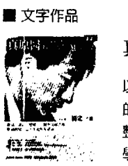

真原醫（平裝 316 頁 / 附螺旋拉伸 DVD）
以轉變的心意重新去理解世界或幫助他人，已踏出了自我療癒的第一步。真原醫 (Primordia Medicine) 是身、心、靈全面且完整的健康生活體悟，是最古老卻也最經得起時間考驗的預防醫學。

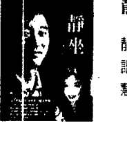

靜坐（平裝 291 頁 / 附靜坐導引 CD）
靜坐等同開發一個大腦神經新迴路，放鬆心智，讓身心重回和諧、完整。深一層是對生命全新的領悟，完全沉浸於慈悲、智慧、與喜悅之中。

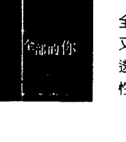

全部的你（平裝 381 頁）
全部的你，是古人留下來的最完整的哲學系統。是包括智慧，又包括慈悲的大法門。
透過這本書，希望可以把讀者一起帶回到家、自己的本性，也就是——自己的心。

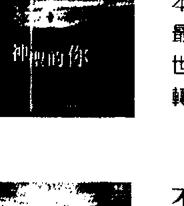

神聖的你（平裝 397 頁）
本書的「神聖」，反映的是內在生命和外在世界的接軌，達到最和諧、最完美、最平安的境界。如何去整合內在生命和外在世界，是本書想探討的主題，帶來另外一個層面的理解，完成轉變的旅程。

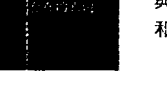

不合理的快樂（平裝 375 頁）
真正的「全人快樂科學」，由哲學、靈性層面著手，透過「臣服」與「參」，運用現代人最豐富的頭腦與感受，徹底翻轉生命，和讀者一起進入「不合理的快樂」。

##### 我是誰（平裝 187 頁）

透過現代的語言，運用無時無刻的念頭與感受，讓注意力從「腦」落回「心」，體會「在」，甚至古人所談的「空」。十七章解說、十四個與生活緊密結合的練習，解開古人「悟」的奧秘，陪伴你我重新探訪華人的智慧寶藏——「參」。

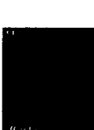

##### 集體的失憶（平裝 158 頁）

醒覺，其實是簡單再簡單，只是把原本屬於你我的一體找回來。這本隨身指南，站在「一體」或「在」的層面，幫助讀者對照自己對真實、對領悟的理解。每一章內容精簡，值得用心來「讀」與「參」。

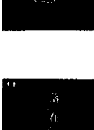

##### 落在地球（平裝 179 頁）

解脫，其實是打破「人」的制約，跳出「人」的處境和特質。醒覺過來，從地球的束縛解脫，我們才真正愛護地球，而真正成為地球的住民。

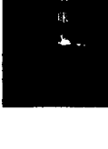

##### 定（軟精裝 228 頁）

貫通全部意識的連結，我們稱為「定」。然而，這裡想帶出來的，是永恆、無限大、大喜樂當中的定，或說「大定」。最有意思的是，這裡所稱的大定，比小定更不費力。活出大定，比我們每個人想的都更簡單。

即將出版《插對頭》、《時間的陷阱》、《短路》、《頭腦的東西》

##### 音聲作品

##### 等著你（導聆手冊 + 4 CD）

等著你，放放下，超超越，超原諒
四個超越的主題，破除對修行的迷思，為生命帶來新希望與期待。

##### 重生：蛻變於呼吸間（導聆手冊＋2 CD）

這是啟蒙的時代，也是疏離尋覓的年代。跟不上變化的人，容易陷入深淵，感到孤獨。這套專輯正是為你而來。

##### 你，在嗎？（導聆手冊＋2 CD）

你早就完整，早就圓滿。並不是「離」「做」點什麼，就能帶你更靠近真實的生命——你早就是。而且，永遠都是。

##### 光之瑜珈（導聆手冊＋4 CD）

透過聲音的導引，結合最有效率的「專注」和「觀」，身心合一，讓身心的能量開始流動，充滿希望、充滿活力，面對人生。

##### 真實瑜珈（導聆手冊＋2 CD）

跟著音聲導引，把全部的自己交出來，臣服、參、臣服、參……沿著每一個念頭與情緒，發現最高的真實。

##### 呼吸瑜珈（導聆手冊＋2 CD）

跟著引導，從數息、觀息到隨息，一路走到臣服與參，一步一步帶到更深的層面。念頭停止，自然回到寧靜、一體，體會到「在」的無限。

##### 四大的瑜伽 (導聆手冊 + 3 CD)

從東方到西方的哲學、醫學、實修，都談到四大元素（地、水、火、風）的組合。身心合一是歡喜、活潑而專注的過程。輕輕鬆鬆落在不費力、最單純的覺。

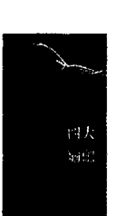

##### 影音作品

##### 螺旋舞 (DVD + 書 123 頁)

螺旋是宇宙最原始、最強大的力量。源自最古老養生修煉的螺旋舞，將人體的兩側對稱作為工具，以中脈為軸心，輕輕畫一個 ∞，可以說是動態的靜坐。透過最少最簡單的「動」，達到最大的身心合一的效果。

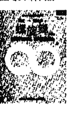

##### 結構調整 (3 DVD + 書 215 頁)

重複的動作習性，本身就帶來因果的制約，累積因果的作用。要徹底的逆轉，需要一個回轉的動作，解開落在身體和結構上的因果的結。透過簡單的螺旋拉伸運動和療效姿勢，跟著影片的速度慢慢進行，每個人都可以自我調整。

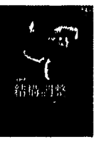

##### 蛻變・重生 (一日共修實錄) (4 DVD + 小冊)

2016.06.25 楊定一博士在台首場六小時共修全紀錄，全部生命系列書籍、音聲作品精華濃縮，六個小時親自引導實錄，理論與實修循序漸進，交會貫通，帶領一起融入更廣大的一體意識。需要你親自用「心」來品嚐與體驗。

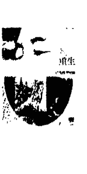

##### 這裡・現在 (一日共修實錄) (4 DVD + 小冊)

2017.03.25 國父紀念館「這裡！現在！」一日共修影音全紀錄，完整細緻呈現。從臣服到參，一步一步引導，超越頭腦制約，回到生命真實。

結合光與聲音的觀想、呼吸練習，一場心對心的交流，無可取代的神聖現場。

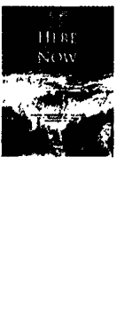

