# 杨定一：十字路口3
# C01 頭腦的理解，是進入真正體悟前必經的過程嗎？

（問）我的疑問是，我聽懂了博士的話，也看懂了博士的書，可是，總一直覺得是在邏輯理論上的明白。可以說是理悟，而沒有體悟。理論上，我明白我們是整體意識，從不分開。可是，我沒有感覺到那種體悟以後的寧靜和喜樂。好像我一直透過看書，透過頭腦，在想像我們是一體。可是，無論我怎麼看，我們還是分離的。

對於我們這種只能用想像去進行理悟的人來說，這種階段，是不是體悟之前必經的一個過程？還是我有機會可以直接進入所謂的體悟？

（答）很好，你問的這個問題也是很誠懇。把自己的一些經過，跟大家分享，是用很誠懇的話。所以，我首先要感謝。

你反映的這些個人的狀況，其實相當有代表性。一般人，也都一樣的。

也就是說，讀了這些書，好像懂得裡面想表達的重點。但是，為什麼從其他的層面（比如說感受、情緒或整體的層面）沒辦法活出來？最多只是一個理論上的理解？

這是難免，每一個人都是在這個經過，都是一樣的。

但是，不要小看這個理解，其實就像在腦海種了一個種子，它會慢慢長出來，發出芽來。不要急，透過好多好多 sādhana 的方法。從前面兩本書《全部的你》《神聖的你》，我特別強調臣服（bhakti yoga）——古人留下來的大法門。而接下來就是《不合理的快樂》《我是誰》等作品，又強調「參」（ātma-vichāra）這個大法門，也就是說參跟臣服這兩個最大的法門，是我認為最有效、最直接，可以說是——沒有法的法，沒有路的路。這種最直接，像一根針或箭，直接射到心。

給自己多一點空間去練習，最多只是這樣子。不需要特別去追求什麼，也不要急，就把全部時間的觀念挪到旁邊。

既然你現在理論上懂，哪怕是有些時候懂，又好像不懂，都沒有關係。有時候，就像我們現在在對話，我們就多分享一下，就像跟 sat（自己的 being、「在」真實）在一起。

Satsang 或 satguru，並不是形式上有一位上師坐在這裡跟你分享，跟這個形式沒有關係。Sat 指的是你自己，這個自己是真正的自己，是一體。每個人都有，是真實。

這個一體，在你內心，不是在外面。

一位真正的、好的老師，並不是跟你有區別、在外頭的一個老師。真正的老師是你自己，是你真正的一體。在你內心，本來就有。所以，不要急。

不要急。

一點一滴，每一天，把握每一個瞬間。最多，就是把瞬間當作你最好的朋友、親密的朋友，不斷地回到這個瞬間。把這個瞬間包容起來，任何好事、壞事、考驗、不考驗，都可以接受，都可以把它當作完美。

用這個方法，試試看。我相信，不要管成就不成就，慢慢就愈來愈透徹。愈來愈可以反省。愈來愈可以落在心。落得愈來愈深。落到你從來沒有進入過的那麼深的那種地步、範圍，這樣就好了。

它會帶你到哪裡？也無所謂。

本來就是個無底洞。心，是無底洞——是無限大。是無限小。哪裡有一個底，對不對？

所以，都不要去管這些。走到最後，你會發現，其實，連透過「做」都不需要。就連「要有什麼成就」的念頭，都起不來。一個人自然會到這樣子，不需要有別的追求。這樣子就好了。

你的問題，還含著一個用意——一個人一定要懂這些理論，才可以醒過來嗎？

我這裡要很坦白跟你說—— No. 剛剛好相反。

我為什麼會掙扎那麼多年，不想把這些道理、古人寶貴的法帶出來？用我自己的語言，自己的一些體驗，把它做一個彙總？為什麼有這個掙扎？

其實，本來是不想扮演這個角色的。

我當時就擔心，甚至現在也在擔心——建立一個很完整的系統，是不是反而害了大家？

什麼意思？

很多人頭腦很靈活、很聰明，他表面上好像懂了，可以建立一個很完整的系統，也可以回答問題。但是，他回答的層面是在理論。是頭腦、左腦的層面。這些知識，這個完整的系統，本身也就把他束縛、制約、綁架了。不知不覺，他就陷入另一個系統。雖然很完整，但是從裡面，他也跳不出來。

這其實是我最大的顧慮。

很多朋友是這樣子——表面上都懂，甚至也可以講課，但是，他做不出來。

為什麼？因為他只是在腦的層面懂，並不是在每一個細胞、每一個體（不光是肉體[其實腦還是肉體的層面]，還包括感受、情緒體、意識體、神通體、各種能量體、全部的體）都體會到古人所留下來的這些大法門。他的理解還不是透徹，還是在一個理論的層面。

所以，我才在這裡要特別強調——就是頭腦一點都不懂，可不可能有這個靈性的成就？

當然可能！它不是靠腦的範圍才有成就的。甚至有時候，腦想太多，理解太多，建立很完整的知識體，本身是阻礙。

我們回頭看，古代那麼多大聖人，已經幾乎是佛陀的境界。這種不是一般的菩薩，不是修來的。好多是十幾歲、二十幾歲，什麼都不知道，也沒有什麼教育。Ramana Maharshi 十六歲，有些人才十四歲或幾歲，就醒過來了。

你說他做了什麼？什麼都沒有做。他什麼都沒有追求。是宇宙來把他醒過來，是醒覺來醒覺他。

他什麼都沒有做，也不懂。但是，我也必須再做一個補充——這些大菩薩、佛陀般的人物，過去有練習過。他過去不知道花多少生命做 sādhana，規規矩矩的練習，規規矩矩地接觸老師、苦修、追求。他已經有這個基礎了，所以這一生來，風一颳、雷一打、太陽一照，他就醒過來了。

但是，我們一般人呢，我認為還是要很謙虛，很誠懇，知道自己做不到，還是要老老實實回到一些方法。充分的理解方法和理論，點點滴滴去接觸這方面的老師和法門。然後用自己的方式，去磨練，去追求。這樣子，老老實實把好的方法落在心中。

但是，也不要急，也不要把這當作一回事。因為走到最後，連這個追求的念頭，醒覺的願望都要丟掉。這本身就是個大悖論。但是，不是你這個時點要做的。這個時候，還談不到這一點。這時候，還是要規規矩矩地去練習。

我在這裡帶來兩個大的方法，濃縮了全部的法門，我認為對現代人是最有效的方法。因為你我夠聰明，所以我先用理論把真實做一個彙總（其實也談不來。真實，沒辦法用語言做一個彙總或說明。但我還是盡力表達），透過我們的聰明，去做一個理解。

接下來，不是透過這些練習去醒覺，反而是我這次帶來的一個中心理念—— You are there. You just don't know. 你本來就是醒覺的，你本來就已經到家了，你只是不知道。透過你我的聰明，我們從理論上做一個整理。接下來，透過練習，不管是臣服或參，最多只是做個提醒——你已經在家了。

最多只是做一個小小的提醒，讓你——喔！又想起來了，又回家了。

這是一個顛倒的工程。你仔細想，這個方法也許跟古人講的很不一樣。但是，我認為現代人夠聰明，你我夠聰明。所以，我承擔相當大的一個風險帶出來。

雖然是「顛倒」，但嚴格講也離不開古人所講的範圍，最多只是把重點顛倒過來。

這樣講，看看夠不夠清楚。

# C02 臣服，不反彈，就可以了嗎？

（問）楊博士您好，我聽了您的《醒覺，有多重要》的讀書會，您談到人間其實是個大妄想，這個世界是個遊戲場，我們都活在夢裡，都把人間的一切看得很真實，都活在因果業力的組合裡，醒不過來。我想請教的是，是不是只要在日常生活不斷去投入「這裡！現在！」或是臣服的練習，無論遇到好事，還是壞事，只要不去抵抗、反彈，就可以醒過來了嗎？可以體會到您所說的神聖與永恆了嗎？

（答）是啊，其實就這麼簡單。一個人徹底臣服，自然會醒覺過來。一個人徹底臣服，會發現什麼念頭都沒有。甚至，可以醒過來。

但是，要記得，壞事表面看起來難，但我們還是可以去做一個接受或者臣服的動作。好事反而更難練習。

畢竟，誰都喜歡喜事。面對喜事和好事，要臣服，要輕輕鬆鬆接受，要輕輕鬆鬆讓它過去——這是相當不容易的。一般人，包括你我，大概都做不到。我們從早到晚，都在找一種滿足感。難得遇到一件事情、一個人、一個東西，讓我們得到一個完整或是滿足的感受，我們絕對不會放過。

一個人好事、壞事都可以放過（臣服，其實就是放過，就是放下），相當不容易。我們開始練習，面對每一個瞬間——好事、壞事，最多只有接受。任何東西，只有接受，不斷地接受。好事，我也接受。不好的事情，我也接受。壞事，我還是可以接受。

試試看，自然會發現念頭減少，開始快樂起來。從早到晚，可以快樂。最有意思的是，心裡的快樂，跟眼前的狀況、發生的事一點都不相關。

眼前，表面上在處理事——煩惱的事，不愉快的事，但內心可以接受。透過接受，可以找到一個寧靜。這個寧靜，本身就是快樂。

這種快樂不是任何物質可以取得，不是人生可以理解或是帶來的快樂。最多只能稱為一種平靜。平靜，再加上平靜，再加上平靜，一個人自然快樂起來。自然脫胎換骨。就那麼簡單。

這是一個古人的大法門，是古人的秘密—— bhakti yoga 奉愛瑜伽。每一個人都可以做。就連一個小孩子都可以做。

你看，一個小孩子很天真，樣樣都很珍惜，新鮮。什麼事情，都是第一次見到。自然會好奇。很直接，很自然，自然活「在」。我們成年了以後，充滿了顧慮。想要預防這個，預防那個。不斷投射在未來，擔心未來。用過去的教訓，來預防未來。

本來是那麼簡單，卻把自己的生命複雜化，帶來數不完的煩惱。

所以，要踩一個剎車，最好的方法就是——接受一切，接受生命帶來的、眼前看到的一切。就那麼多，就那麼簡單。

試試看，拿自己來做實驗。只要做，你會發現會上癮——好事來，也可以接受。也只是如此。不好的事情來，還是可以接受。

接受，再接受。自然發現，念頭少了。自然開始活在這瞬間。對任何東西也沒有期待。

事情發生了，也就讓它過去，好像它留不住。

過去的記憶，也不用去追究，也懶得去分析。

未來，還沒有發生，又何必去管它。

一個人就自在，隨時活在這裡現在。這本身，已經進入一個神聖的生命。我相信，每一個人都可以做到。只要去做、去練習，不要多想，自然會有一些好的結果。

最多，也只是這樣。

# C03 不期待，樣樣都放過嗎？

（問）我心裡突然有一個疑問：是不是只要放開我以為可以掌握在手中的一切，甚至，對於未來沒有多的期待，也不去設定我的人生目標，不期望自己有什麼成就，只要每天都可以讓自己生活得很愉快，很快樂，這樣子是不是也是一種解脱？

（答）很好啊，你所講的，對樣樣都沒有期待，都可以放過，輕輕鬆鬆地活「在」，沒有什麼規劃，也沒有什麼目標……這當然這是一個修行的起步。它本身，就是一種練習。一個人自然會發現，其實沒有一樣東西，是絕對的重要。從這個人間，絕對找不到什麼叫做真實。我們一生活過去，全部——你注意喔，是全部離不開「動」、離不開「做」、離不開「想」。全部的價值觀念，離不開「動」和追求。

這是多麼可惜，好像我們從早到晚在承認自己不夠完整。要「做」、要達到一些理想、一些追求，一些目標，我們才可以完成自己。這種想法，多麼可惜。

其實，我們出生就是完美，是完整。不可能比現在更完美，更完整。並不是透過「動」「做」可以得到更完美。

任何「動」和「做」完成的目標，本身還是無常。只要和物質有關，都是無常。然而，我們一輩子都在為無常的東西，無常的結果，無常的成就，在追求。不光自己抱著這種價值觀，還對別人有同樣的看法。無論衡量別人、衡量自己，都離不開這種比較，這種虛的境界。

你仔細觀察，一個人再怎麼有錢，難道更快樂嗎？一個人再有名譽、有權力，其實也只是更不愉快。畢竟樣樣都是無常。有了更多，還要更多。永遠不會滿足。這是你我每一個人的狀況。

也有人把修行當作一種方法，拿來解決目前看到、遇到的一些不好的事情，或是人生的危機。一般人修行，好像都在這一方面追求。

然而，修行，跟這個一點關係都沒有。我們再怎麼把一個狀況解開，再有什麼好的消息，最多還只是短暫的變化。絕對不可能帶來長期或是永恆的快樂，這是不可能的。

從這人間，絕對得不到永恆的快樂。絕對找不到自己——真正的自己。

所以，最多是把任何念頭挪開，或是反過來說，面對任何念頭、任何經驗、任何感受，我們都可以輕輕鬆鬆接受。無論好壞，完全接受，沒有條件的接受。

試試看，自然可以從頭腦的層面，落回在心。接下來，讓心帶著我們走。

一個人，遇到事情，還是會用腦。但是，腦就變成工具；心，會輕輕鬆鬆指揮腦——往這裡走，或往那裡去；解答這個問題，或克服那個困難。再也不會反過來讓腦帶著心、帶著我們走。其實，就那麼簡單。

很多人認為，如果把腦所創出來的境界、思考挪開，人可能就痴呆了，沒辦法做主，沒辦法克服困難，沒辦法面對生命。其實，答案是剛剛好相反——心帶著我們走，一個人可以完成的事情，不可思議，假如這是他這一生來想要做的。

心帶著我們走，會輕輕鬆鬆度過這個人生。好事、壞事，都不在意。自然會發現人生比較好過。你把生命當作最好的朋友，不要刻意去追求，不要去期待，生命反過來，也會幫助你。

有些朋友會問「我怎麼可能會有信仰？」「我怎麼可能禱告？」「我怎麼可能相信神聖？」尤其，面對人生的困難——吃不飽、沒有安全感、碰到不好的事情，這時候，怎麼可能做到？

答案其實很簡單。我們面對這些煩惱、失落、危機，更需要做。更需要做什麼？——做接受，或臣服的功課。

只要做，生命會順利起來。即使沒有變化，我們也不管，也無所謂。走下去，樣樣自然會發生。該發生的，會發生。不屬於我們的，也得不到。

這樣，一個人就突然寧靜起來了。生活習慣改了。也不需要從人間、透過物質，去追求什麼快樂。也不會再想去轉變物質、改變別人、改變自己。最多，是放過別人，放過自己。

一個人，什麼都可以接受。苦難，也可以接受。好事，也可以接受。自然就活在瞬間。

這個，你我都可以做到。只要從一個點開始做，自然發現，其實是幫助我們克服任何困難。我們都可以試試看，就從你剛剛留的話，你的體驗開始。

不要等到明天，這樣的功課，隨時都可以做。一個人醒來，剛睜眼，還沒有起床，就可以做這個功課，馬上帶著自己做臣服。

臣服什麼？——臣服給生命。知道生命絕對不會犯錯。任何表面看來、體驗到、經過的一些困難，都剛剛好是我所需要的。是剛剛好，我需要的功課。生命，安排得剛剛好，一點都不會錯亂，一點都不會冤枉，我都可以接受。最多，我只能感謝，對生命充滿感恩。

剛醒過來，就可以作這個感恩和臣服的功課。一天下來，每一個瞬間，在刷牙時，也可以接受；想到一個不愉快的事情，也可以接受，包括可以接受「我沒辦法踩個煞車」「我還是要想一些不愉快的事情」；跟人接觸時，不斷接受——接受生命的完美，接受眼前所看到的人、在作的事。

有時候，不小心反彈，還是可以接受——接受「我剛剛沒辦法踩個煞車，還需要反彈」。也不需要責備自己，最多只是接受。這樣子，一天下去，到晚上，最後一個念頭，還是接受——接受生命，接受一切。

最後一個念頭，自然會是一個感恩的念頭，充滿著信心，充滿著信仰。可以完全接受這個生命。生命帶來任何好壞，都不在意。對生命其實沒有什麼期待。都已經滿足了，樣樣都可以接受。

試試看，你只要這樣子做，可以帶著這種念頭入睡，那麼，你的人生已經在轉變了。你會發現，連你夜裡頭的夢，都會改變。本來容易做惡夢，自然會改。夢，會帶來一個完美的境界。

但是，假如沒辦法做到，即使夜裡有惡夢，還是可以接受——知道自己有惡夢。接下來，不要做任何分析。

假如晚上睡不著覺，接受自己在失眠。

試試看，其實就那麼簡單。

## C04

### 需要慧根才能體會嗎？

（問）我已經拜讀了《全部的你》《神聖的你》，說實話，有些地方真沒有讀懂。我覺得大概是自己慧根不夠，但是，上次參加過三月二十五日的一日共修，雖然大多數時間只是靜靜跟著引導靜心，體會自己，沒有去思考書的內容。回去之後，再讀這兩本書，卻好像有了新的理解。以前不懂的，突然開竅了，這是怎麼一回事呢？

（編註：讀者指的是 2017.03.25 在國父紀念館所舉辦的「這裡・現在」一日共修，本次共修 DVD 已由風潮音樂錄製發行）

（答）一樣的，我只能恭喜你，用這種方法跟我、跟大家做個分享。

你前面提到，對這兩本書，有時好像懂，有時好像不懂，很多地方不懂。我首先要講，這不是你的問題，也不是什麼慧根的問題。

這兩本書，是我個人在很安靜、很寧靜的狀況下，從心裡浮出來，口述出來的。用這種方法來表達，跟一般的寫作會很不一樣。它本身帶著一種重複性，就像詩一樣，流出來。

我們的左腦，一般是透過腦的邏輯看東西。從腦二元對立的邏輯，會認為時常重複，甚至認為跳了很大一步，覺得不清楚。就好像我們的邏輯跟不上去，跳不過去。這不是你的問題，也不是任何一位讀者的問題。

你記得，我常講──二元對立（也就是我們的世界、人間、現實），跟真正的真實（一體、整體、在、全部、永恆、無限大），是兩個不同的意識軌道。一個是無限大的軌道，是絕對；另一個是相對、有限，是狹窄的軌道。

用英文來表達，一個是 infinite 無限大，另一個是 finite 有限的。

所以，我們透過有限的腦（二元對立本身就是有限的腦），對 A 跟 B 做比較，得到另一個答案 C。但是，這個 C 離不開前面的 A 跟 B，離不開一個有限的範圍。

我們一般的邏輯，無論是透過看、聽、想，都是在一個狹窄、有限的範圍不斷做比較，得到我們可以稱為的知識或理解。我們一般以為，是要透過這些有限的邏輯，突然要跳到一體、無限大的軌道、每個人都有的永恆。（當然，沒有絕對，不可能有相對。就像沒有銀幕，不可能前面能放映電影。要有後面的銀幕，前面才有東西可以擺上去。我之前用「背景」來解釋。）然而，有限和無限，這兩個軌道，是太不一樣了。

甚至，你不能稱有限和無限是對稱或對等的，連這種比擬都不正確。好像把「有」跟「在」或「有」跟「空」擺在一起談，以為「沒有『有』」，就是「在」。這種邏輯，還是二元對立。

所以，用任何語言、各種表達，是跳不過去的。更不用說，用眼睛讀書，更是跳不過去。

我們的眼睛相當複雜，訊息是透過一個神經，再下一個神經，再下下一個神經，一直到大腦的後部，把它做一個整合，我們才可以看到東西。

聲音，就不太一樣。聲音比較直接，本身是一種和肉體接近的能量。帶來的能量轉變，可以說比較直接、跟我們肉體比較接近的範圍。所以，透過聲音，再加上意念，再做一個解釋，透過一個場，讓人受到的影響，是遠遠大於看或左腦的理解。

聲音，相當直接，就像一根針，透過你的心，插過去。另外一個方法，透過好多好多邏輯上的轉變，讓你得到同一個領悟，這是不可能的。

所以，古人老早就懂。許多大聖人，沒有留下文字，而是用聲音口述來表達。讓週邊的弟子、朋友，透過聲音的能量和意念轉過來。從有限，突然跳到無限大的範圍。一個人，就突然醒過來了。

醒過來，不是透過邏輯。其實，透過邏輯，絕對醒不過來。

就像我用滑冰的比喻，他只是輕輕鬆鬆滑過去。不是透過你去做、你去練習、你去追求可以得到的。是輕輕鬆鬆透過——不去追求、不去管、不去動——在，Being Yourself. 輕輕鬆鬆地在。

在。在。在。在到底。

每一個瞬間，在。

在什麼？不重要。

在做什麼？不重要。

故事的內容是什麼？不重要。

是隨時都在。在哪裡？不重要。

這個「在」，Being Yourself, 最直接，沒有過濾，沒有一層膜。

有些人認為自己醒覺了，但我從他肢體的語言一眼就看出來不是。他可能以為講話慢慢的，或怎樣的表現，就可以表達「在」，這完全是錯誤的觀念。

一個人「在」，是很自在，很誠懇。就像小孩子這種天真。沒有經過多少思考的過濾，很直接，就是他自己。

自在，最多只是反映他自己，反而可以活出一點「在」。

有些人認為要講話慢慢的，有些人認為他領悟到了，來跟我表達。其實，不到兩句話，我就知道他還沒有到，連邊都還沒有碰到。

因為還是在一個左腦，在一個理解的層面。

這一點，我相信你有注意到。就像你說三月二十五日的活動，你有體會到。體會什麼？你不知道，也沒辦法分析。叫你講，也講不出來。只要講，就講歪了，對不對？

因為，不是透過邏輯，來表達這種領悟。

假如可以用邏輯、用知識來表達，我可以坦白跟你講，其實又差遠了。對不對？一體，是無所不在，哪一個角落都在。沒有什麼，需要再經過一層念頭去理解、去表達，甚至想知道。祂什麼都不是，什麼都不需要知道。

什麼都不是，又什麼都是。

這句話，看看可不可以參透。

什麼都不知道，反而什麼都知道。但所知道的，不是我們一般強調的二元對立。這不重要，最多是一點皮毛的懂，根本沒有代表性。全面的懂，是什麼？是單純的意識，最根本的意識，是輕輕鬆鬆存在的在。是這樣子。

那一天，我相信你稍微有體會到這一點。體會到什麼？不重要。對不對？

你這樣子，回到這兩本書，重新讀，也就發現——喔！懂了。

至於懂了什麼？也很難講出來。因為你一分析，又跑掉了，又誤解了。

我其實也沒有在講什麼。透過這兩本書，其實什麼也沒有講。很多人認為它有什麼學問，是在轉達什麼法門或方法。其實，什麼都沒有在轉達。

> 一片都是空。

> 一片只是喜樂。

> 一片只是愛。寧靜。

> 什麼都沒有。

你懂了這些，我只能再次恭喜你——你已經入門，已經脫胎換骨了。這一生，已經不一樣了。

接下來，隨時輕輕鬆鬆做個提醒、做個練習——我是誰。或甚至，連「我是誰」都不用練習。老老實實地，跟著這個宇宙，不斷肯定。肯定一切，肯定這個生命。肯定生命所帶來的好事、壞事。把全部信仰，交給上帝，交給神，交給自己的佛性，真實的自己。

知道生命絕對不可能犯錯，即使表面上痛苦、被欺負，也充滿著信心，絕對沒有任何錯好談的。

都是剛剛好。眼前所經過的一切，正是我需要的，也就接受吧。

我就接納它。我就包容它。我就臣服吧。

一個人，只要懂這一點，他就沒有事了。樣樣，之前做不做得到，認為自己有罪或是清白，都不相關。

我們，任何人，懂得這一點，知道這是我們出生就有的權利⋯⋯這一生，就是要醒過來，每一個人都可以醒覺過來。

你過去犯過多少錯、多少罪，還是頭腦的投射。只要活在現在 Be Yourself. 踏踏實實地自在，絕對有機會醒覺。跟你的過去無關。

這樣子，一個人就突然快樂起來了。不會再責備自己，不會再追究過去有哪些地方做錯，有哪些地方放不過。就突然放過自己。放過世界。放過週邊的人。放過家庭。放過過去認為欺負你的人。放過被你欺負的人。放過全部。放過這個世界。

沒有事了。輕輕鬆鬆，一個人，就醒覺過來了。
醒覺過來，發現——其實連醒覺都是大妄想。
你我本來就是醒覺的，只是自己不知道，所以還有一個醒覺的問題好去追求。

## C05

## 醒覺，比頭腦可以想的更簡單

我在《全部的你》看到你提到四種意識狀態，對於醒著、做夢，我們都可以很清楚的去知道。然而，到底什麼是深睡無夢？這個狀態又說會帶給我們不快樂？深睡無夢是怎樣的狀態？

首先我要修正這一點：深睡無夢（deep sleep, no dreams）不會帶給我們不快樂。我不記得任何角落寫到這個。事實上，是剛剛好一百八十度相反（just the opposite）。深睡無夢（deep sleep, no dreams）是帶來給我們快樂。可惜我們每一個人接觸這個狀態太少，一個晚上可能沒有幾次，都被夢帶走了。這一點，我以後會把它打開，從這一點去著手。對一個修行者是太重要。

我常常開玩笑，在國內沒有一個人問到這個。其實，在這個深睡無夢，還比較接近醒覺、一體。
你們看看這是不是個大悖論。很有意思。
我們一般最深睡，沒有夢，一起來「啊！好舒服啊。」好像休息過來了，沒有事。每一個部位都是放鬆、舒暢的。這時候，頭腦一起步，煩惱就來了，世界也就沒有那麼美了。是不是？
想想，每個人經驗都是這樣子。所以，深睡無夢是相當相當重要。有許多修行者，到了某一個地步，我會拿這個比喻來說明和解釋。
一般人在找的境界，其實都不是醒覺的狀態。在找的，都還是一個可以認知、分別，可以留下一個記憶。還是一個因一果的作用，頭腦的作用。
都剛好顛倒。都把它想到別的地方去了。
你會說「深睡無夢，那很簡單。每天晚上我都在做。」
是啊，假如你隨時都在做，那不得了了。你醒過來了。

深睡無夢，是從腦落回到心。只是你不知道，沒有意識，沒有覺察到。假如你腦落回到心，而隨時知道。那麼，你醒過來了。

這樣子講，清不清楚？

這一點，我不應該講。我擔心一講下去，很多人就把這個當作追求的目的，每天躺在那裡睡覺，想通過睡覺去醒覺。

這想表達的是，醒覺，其實沒有大家想的那麼難。假如那麼難，我們根本醒不過來。代表你還要特意去做，有一個難度，有一個門檻，而你必須跨過那個門檻才能醒過來。

> > No! Just the opposite. 剛好顛倒！

一生，你被洗腦而認為重要的一切，剛好相反，要挪開。

把腦挪開，讓心發出來。反而更簡單，一個小孩子都可以做到：那麼多小孩子醒覺過來，大聖人都是很年輕就醒覺過來，而不是像我們這樣，等到晚年。

因為就是簡單，什麼都沒有發生 Nothing happened.

可以說，醒覺是你一生出來的權利。你沒有好好用這個權利，是太可惜。也就下一輩子再來。

非但是你一生出來的權利（birth right），甚至還沒有生出來，你已經醒覺了，只是不知道。

## C06 不要讓任何人制約自己

問 我們在《全部的你》就在談制約，談跳出制約。到了《神聖的你》最後也有一句非常感人的話——不要輕易讓別人制約你，不要讓別人制約自己。
我要問的是，對於在東方文化下成長的女性，其實很多時候不要說跳出制約了，而甚至是配合別人，在別人還沒有制約我們的時候，就自己制約自己。我想從女性的角度，請博士多說一點。

答 其實男性女性都一樣，都有制約。當然女性有女性的制約，和性別有關係。男性當然也有一些性別的制約，但大致都一樣。只要我們生出來這個世界，已經開始制約了。

## 不要讓任何人制約自己

我常常講，只要我們生出來，本身就是一個大創傷（trauma）。人生的創傷，是從生出來就已經有了。

很多人會講「當然，從母親的肚子生出來，在物質層面上本身就是創傷。」但是，我要講的是心理層面更大的受傷。

你只要來到這個世界，一個小娃娃，睜開眼睛，開始哭，開始懂事，他知道這個世界是真的。他要有怎樣的表情，怎樣的反應，父母才會來餵奶，給他一點注意。從這裡，他已經開始被制約，也制約自己。被週邊的人制約。這是一種互動。他本身得到制約，他也制約週邊。每個人都這樣，有個互動，互相制約。

制約本身在反映什麼？最多是在反映因—果。就是因—果。我們看這個世界，認為是真的。是透過什麼在看？就是因—果。

我重複了好多次，但我必須再講一次——我們全都只是透過五官，在看這個世界。也常常在講，一個外星人有兩百個感官，他看這世界會完全不一樣。他所看到的細緻的程度，我們人類怎麼也想不到。或是另一個外星人，只有一個感官或兩個感官，看到的會完全不一樣，粗糙得很。甚至他會笑我們怎麼計較那麼多。這點差別，他根本不在意。因為他看不到、他不會去想，腦的念頭沒辦法組合起來。

然而，我們是透過五官，再透過頭腦去做一個整理（permutation）。將全部的可能交錯，跨過感官來處理。比如將耳朵和眼睛的訊息相互交錯，串起來一個整體的故事、意義。人生是這樣來的。

有這種二元對立，本身離不開因果，離不開制約。就是這樣子。

就是這麼簡單明了，不可能比我現在講的更簡單、更清楚。怕的是什麼？不是聽不懂，而是我們經過太徹底的洗腦，一走出這個門，就忘記了。因為我們都在被洗腦，你我都在被洗腦。我們認為是真的，就是因為五官把它認為是真的。

我好幾次在講，我們前面的椅子、桌子，假如用解剖去把它分開、研究，完全是空的。「空」的部份，佔了99.99999%。但是我們看到不是空的，反而相當堅實。它就是有一個體的觀念。不光桌子有體，就連情緒，我們都認為是真的。

在書裡面，我才會稱「情緒體」。比如說恐懼，我們隨時都在窩囊，隨時都在擔心這個，擔心那個。我們把一個念頭當作真的。我們躺在床上這樣想著「唉呀，有人刻意要來害我，或我多委屈。」一連串下來，不知不覺，就把它當作真的。

然而，我們更想不到的是——時空（space-time），是我們頭腦投射出來的。這很有意思，有些物理學家明明懂，還是會來辯論。這時，我會說「你回到自己的物理，你的專業，自己去想通。」

是透過五官，我們這五官，眼睛、耳朵、鼻子、嘴巴、身體的觸覺……製造一個東西叫做 space-time 時一空。你看，這很有意思，對不對？假如你沒有這五官，你的時一空是完全不同的。甚至可能沒有。

這是物理。是這樣子。

所以，我們是從自己的制約，造出這個世界。

你剛剛談女士對自己的制約，它有內分泌的層面——一生出來，女生長的就和男生不一樣。你看動物，母獅子、公獅子有不同的地位，不同的身份，不同的角色。公的，和性的內分泌有關，就是比較往外，就是想佔領、想欺負，比較凶（aggressive）。母的，或是女士，因為缺少雄性睪固酮（testosterone），比較可以原諒，可以讓步，但同時也比較內向。

進一步，從我們認為的身體、社會的接受度，或許有一種自卑感。女士有時候對自己有一種評價，總是在評估——自己的身體長的怎麼樣，行為是不是可以被社會接受……雖然男士也一樣，但是女士更明顯。這些都是生理上的差別。

還有，女士的情緒比較發達。我常講，女士的感受比較豐富。因為她在肉體上沒有發達的肌肉。男士有肌肉，而且在行為上會搶，比較凶，動物也是一樣的。女士很自然往內發育，感受、心情、情緒會比較豐富。差別就在這裡。

一個人，到最後要解脫，要跳出這個人間。就連這些情緒體、感受體都要去注意（cover），都要去把它顧慮到。如果你還不斷被情緒綁住，還跳不出來，遇到什麼事情就會反彈。自然會用過去的情緒，它已經成為一個固定的記憶，落在我們記憶的檔庫，而把過去的記憶調出來了。這一來，你對眼前的事情已經不客觀，是透過情緒在看眼前的事情。

這難免，每個人都這樣子，男女都一樣。

我認為這些事情不用去分析，分析不完的。分析到最後，還是沒有用。對你沒有幫助。你最多是「喔，我對自己了解多了一點。」那又怎樣呢？對不對？

真正的心理療癒，我常講，不要去不斷分析當時的創傷怎麼來的。最多老老實實回到修行。

修行有兩個很好的方法，不是我發明出來的。

是古人留下來的兩個大法門，一個是臣服（bhakti yoga，奉愛瑜伽），另一個是參（ātma-vichāra）。你看我講來講去，就是回到這兩個方法。我認為，我們要很踏實，很實在，很追根究柢去追求。其他，都不重要。

做完以後，女士的情緒轉變或其他的特質，自然會消失，自然會看穿。這自然會帶出一個反復的過程，從情緒、念頭，回到心。

無論男女，接下來，都不用再花時間去分析這些。最多只是知道——咦？我對眼前有反彈，我可不可以接受我在反彈？我可不可以接受眼前的狀況？我可不可以接受一切？接受，我完全接受我自己。我現在怎樣，我就可以接受。

No.

我現在就可以接受自己，擁抱自己。I can accept who I am. 我現在就可以接受自己——這是臣服的觀念。

一個人走到最後，念頭和情緒開始減少，偶爾還是會發現有念頭。這時候，你們都知道，就用「參」。

-   為誰，還有這些念頭？
-   為誰，還有這些情緒？
-   答案當然是——我。
-   是我，有這個情緒。
-   是我，有這個念頭。
-   那，我又是誰？
-   一路參到底。

你會注意到，我不斷帶大家回到這兩個重點。其他，都不重要。

我可以講很多，但是對你們幫助不大。最多我們是用很紮實的方法，而方法是一天二十四小時都可以做，而且是輕輕鬆鬆地做，只怕不做。

這樣子，一個人不知不覺就進入這個狀況。

## C07

## 怎麼做，才能醒覺？

**問** 楊博士您好，看了您的書和影片，讓我真的想要醒覺，有一種想要回到本來面目的動力。然而，在我想讓自己靜下來的時候，發現腦筋裡充滿了從小到大所學到的種種制約，種種別人給我的定義，種種的限制，讓我的腦筋無法專一，沒辦法打開，好像卡在什麼地方一樣。像這種情形，要用什麼方法才能夠跳脫這些限制和制約呢？

**答** 你仔細讀「全部生命系列」的這幾本書，都在講好多方法。這些方法，可以濃縮成臣服（也就是接受）與參。只要你很認真、很誠懇、很謙虛面對生命，隨時使用這兩個方法，試試看。它們不是理論，就是懂了，假如不做，還是一樣。

一天下來，不要去想醒覺或不醒覺，祂其實不在你手裡面。只要你說「我想醒覺」，你看，是「想」，是「我」——「我有」什麼感受，「我有」很多念頭，「我充滿」制約，都還是個人的小我在運作。接下來，「我想」醒覺，其實是做不到的。用念頭去追求醒覺，本身就是不合理、不可能，從一個 finite 有限而相對的範圍，要去跳到無限大的絕對，是不可能的。絕對做不到的。

答案，比你想的更簡單。

我也不斷在書裡強調，最多是把相對、制約、有限的部份（也就是小我的世界）挪開。自然，醒覺隨後就浮出來了。

想想看，假如醒覺（也就是一體、在、全部或無限大的意識、永恆，這好多詞，都是比喻）不在我們現在這個世界，假如祂本來不存在，就是怎麼找也找不到的。我們也不可能醒過來。

祂隨時都在背景，我們的人生就像電影，就像話劇，而他在後面，就像銀幕一樣的，從來沒有動過，一直在等著你。所以，不是去找他，反而是把這個電影挪開，或是看穿。

怎麼看穿呢？最多就是接受他、臣服，甚至充滿著信心，知道宇宙不會犯錯。這世間有什麼考驗，有什麼挑戰，有什麼變化，怎麼來，怎麼走，都可以接受，都可以把它包容起來，接納起來，臣服。

就那麼簡單。這樣的話，你再也不需要做任何抵抗或反彈——任何生命所帶來的狀況，我認為都好，跟真正的我不相關，跟真正的一體不相關。最多，只是知道這一點，你自然就安靜下來。念頭也就消失。自然進到一個寧靜的狀態。

進到一個寧靜的狀態，不用擔心，你只要停留在這個寧靜的狀態——一個瞬間，接下來再一個瞬間，再一個瞬間——他會把你「吞」掉的。這寧靜，本身就是心，自然把你整個小我化解了。

所以，你什麼都沒有在做，什麼都沒有追求。

反過來，可以這樣講，一個人真正要醒覺，到最後什麼也不想做，什麼也不想追求，也不想得到了。沒有什麼想、可以去學到或可以去練習。最後，是把一切都放開。一切，都可以接受。現在的狀態，完全可以接受。

一個人到這種境界，反而已經連醒覺的念頭都沒有了。他整個貪嗔痴完全挪開，擺開了，放下來了。這時候，自然就醒覺過來了。

這一點，你看可不可以接受。

假如可以的話，那大恭喜你，你已經走上醒覺的路，而且沒有回頭路好談。

就是那麼簡單。你看，我重複了多少次。但是，我擔心大家聽了這些話，認為太簡單，幾乎不可能，而這一生還要浪費不知道多少時間、多少年，不光這一生，也許還包括下一生，一次一次再來。走到最後，还是要验证这些话是不是正确的。但是，并不是说你理解了，就可以醒过来，倒不是这样子。还是要从理论的层面落在生活，落在心中，就这样子。

所以我常问——醒觉对你到底有多重要？假如真正重要，就把这几本书的那么多方法落实，活出来，其实就这样子。

不要像好多人，包括我认识的好多同事、亲戚、朋友，都不断在闲聊，不断地想别人在做什么，担心别人有什么看法。讲一大堆这个话，其实都没有用。表面上有用，因为是在处理事情，或关心别人。然而，最重要的问题——自己是谁，都不了解。这一生，也就浪费过去了。

但是，我再怎么讲，坦白讲，也没有用。大家听的时候，会觉得好像有道理。但是，只要扭头一走，就回到自己的大妄想，回到自己的制约。也就把这些话都忘记了。

我希望，你可以很诚恳地面对这个问题，而变成少数的一个。这一生，做一个很大的决心走下去。把醒觉、把自己找回来，变成你这一生最大的目的。甚至，没有其他的目的比这个更重要。到最后，连这个目的都不存在，变成你生命最重要的一部份。

这样子，试试看，宇宙会来带你走出这个人生，会把你带回家去。你什么都不用做，也做不来的。就这样子。

## C08 要怎么活的不萎缩？

（问）博士你好，读了你的书，我才意识到原来每天我活的就是萎缩，要怎么能活的不萎缩呢？

（答）好，问的好。
首先还是要恭喜你，你有这种体会——也就是随时活在萎缩，其实没有什么时候没有萎缩——这不容易。假如你亲自体会，是很不容易的。首先，这就是一种修行的起步。

我们仔细观察，本来什么都没有，只有一体。这个一体，就是真正的自己（英文用大写的 Self，大的自己）。其他，什么都没有。祂是圆满的，完整的，全部的，无限大的。

任何东西，我们可以描述出来或是想出来，还是头脑投射出来的一个虚的境界、虚的东西。只要可以用语言表达，我们仔细想想，还是受到制约。是因为我们把整体做一个区隔、分部、分别区块，把它落到一个小小的小角落，才可以用二元对立、分别、比较的逻辑，让我们可以得到一个印象、一句话、一连串的语言。而可以有个动机想表达、想说明、想比较、想批评。

在完全的圆满，任何动机、念头、动作、话都是多余的。一个人会自然宁静，而宁静完全是不费力，祂本来就是我们的本性。每一句话、一个念头好像都是多余的，都是不需要的。

这本身就是一个大的悖论，好像我们这一生，从生到死，都被洗脑了。把真实的这些重点忘掉了，完全忽略掉，甚至看不清楚。才会让我们不断地透过「做」、透过「有」、透过「成」，不断去追求。好像我们每一个人从来没有完整过、圆满过，还要不停地「做」、追求、改进、追加，去完成本来就有的。

这是我个人认为最不可思议的。

你也会自然慢慢体会到，我们的任何动作、任何动机、任何念头本身都是个萎缩。我们随时活在萎缩场。生命本来是圆满的，我们把他落在一点。这本身，就是个萎缩的动作。从整体落在一个萎缩的点，要透过萎缩，才可以有一个点，才可以有句话，有一个念头。

你前面问「那要怎么做呢？」

很简单，首先要理解现在讲的这些话。一个人彻底理解了，什么都不用做。瞬间来，我们让瞬间来。瞬间走，我们让瞬间走。任何事情在眼前，我们可以接受。可以把它容纳，把它包容，把它臣服。这本身，是面对萎缩最好的方法。

甚至萎缩，就让萎缩来吧。萎缩走了，也就让它走吧。都知道，都不需要反应、反弹。都可以做个见证人，看着它来，看着它走。这是最直接的方法，就像一根针、一支箭，可以射到底、射到心，直接把我们带回到心。

所以，从早到晚，还没有起来，第一个念头，就做一个提醒——这一切，都是个大幻觉。有什么东西值得让我反弹，让我不愉快，让我烦恼？什么事情来，就让它来吧。什么事情要走，就让它走吧。我一切都圆满，我一切都满足。我最多只有一个感恩的心。

我对一切没有任何要求，没有任何期待，就随自然吧。

一个人这样子，第一个念头起来，就这么做。

面对一天下来每一个问题、每一件事、每一个东西，也都轻轻松松做一个提醒。提醒什么？——一切也就是如此，让它来，让它走。该处理事，就处理。处理完了，也很好。好事，我也可以接受。坏事，我还是可以接受。样样，我都可以接受。

这个接受的动态，本身就是臣服。习惯了，到最后连一个「动」——接受，都不需要起来，都不需要起步。我们自然可以接受、臣服--一切。

这就是古人臣服的法门。

我到这里，就讲到奉爱瑜伽（bhakti yoga），在《全部的你》《神圣的你》花了相当多篇幅来描述、表达这个方法，包括各式各样的练习。希望你我都可以把握住，从这里开始着手。

我在《不合理的快乐》《我是谁》接下来又带出一个大的法门——「参」。参自己是谁的法门（ātma-vichāra）。但这个法门，我在这里不想谈。因为一个人要相当成熟才可以接受，才可以应用。首先，还是从臣服着手。从上面几句话，你就可以开始做一个练习。

我相信你只要试着去做，给自己一点空间。有耐心，不要追求什么，不要有预期，不要有什么期待。你自然会发现——做下去，每一天都做，自然愈来愈快乐，愈来愈清楚。每一件事情来，其实完全没有绝对的代表性。一个人自然开始轻松、爽快、自在。

本来很多问题让我们想不通，自然把它放掉了。

把这些事情放掉，会发现——咦？解答的方法自然就在眼前，好像不费力。不管多困难的问题，都可以处理，都可以走出来。

这就是奥妙的一部份。

我想，只要你做，自然可以验证我前面所讲的这些话。

## C09 怎么体会深层的宁静？和安静有什么不一样？

问 博士您好，您常常在作品里谈到宁静，生命深层的宁静。我的问题是，我们一般要静下来，都很难了。要怎么能体会到你所说的最深层的宁静？这种宁静，和安静又有什么不一样吗？

答 宁静这两个字（silence）是来表达全部修行的经过和结果。

它本身是来表达，我们对这个世界再也不用做任何反弹的动作。甚至，任何动作都不需要带出来。最多，是完全可以接受这个世界，完全接受生命、宇宙带来的任何考验、好事、坏事……都可以接受，都知道本来是圆满的。

既然本来就是圆满的、完整的，还需要去做任何表达吗？

不要说反弹，就连表达、肯定，还需要再做吗？当然答案是——不需要。

我们已经跟生命、整体融合在一起，老早无所不在，无所不知，无所不能。

还需要用话、语言、念头来表达、来肯定、来称赞？更不用说抗议、反弹、有意见。好像都是多余的吧。

所以，最多一个人就进入宁静。

而这个宁静，跟沉默、不讲话、不动——是完全不相关。

怎么说？

只要有这个身心，有这个肉体，有这个头脑，它本身是透过「动」所组成的。过去，很多修行者，甚至有一些自己认为大修行者，有多年苦修、有经验的修行者，会认为只要坐在那里不动，甚至眼睛闭起来，不睡觉、不去反应、不去回答。这本身是表达个人修行的程度。

我每次看着这种现象，会充满同情，很想去拥抱这些修行者。想劝他

> ——「不要这么做。你有这个肉体，这个肉体本身是因一果组合的，你就放过它吧。身体想到洗手间，你就让它去吧。想吃东西，你就让它吃嘛。想穿衣服，就让它穿嘛。想在外面跑步，想聊天，你就放过它吧。」

这些修行的成就，一点都不相关。

我说的宁静，是说一个人虽然在不动、动、激烈地动、快速地动，在心里面没有任何反弹。心里面没有任何抵抗，没有任何意见。他完全放过这个世界，放过这个肉体，放过这个身心。让这个身心完成他自己这一生来想完成的业力。

假如懂了这些，--个人就醒过来了。

他发现，很有意思，这个肉体本身可以讲话、可以做事，高效率的做事，甚至有时候不做事。跟一体，一点都不相关。

完全不相关。

因为他充满了理解，只要还有一个体活在这个世界，当然有它的因一果要完成，要发散出来，让它消失自己。

为什么要去干涉？有什么必要去干涉？

所以，这么一来，一个人在动的时候，他也宁静。在不动的时候，他也宁静。讲话，他在宁静。处理事，他在宁静。没有什么时点，他不在宁静。

每一个瞬间，都在宁静。

甚至，连瞬间的观念也打破了。

也没有什么叫做这里现在，完全是宁静，接下来宁静，再接下来宁静。

宁静，就是他的本质。就是他永恒的部份，就是他一体的部份。

他最多，只是站在宁静看着一切。

这是我所讲的宁静。

是你我每一个人都可以做到的。

### 怎么去做？

我在这几本书不断强调两个最有效的方法——臣服和参，而且用各式各样的角度来切入这两个方法。但一个人真正懂了，也不用这些方法，他本来就在宁静中。

你就是不宁静，宁静还是存在。

这么一来，全部矛盾都消失了。

一个人不断地在醒觉当中，在宁静当中，看着一切。再也不需要证明什么，不需要跟别人有什么辩论，有什么抗议，需要表达自己的聪明，还有什么责备……

什么都不需要。

他就轻轻松松活在这个世界，他已经充满着慈悲，一件事情、一个瞬间还没有来，他老早已经活过了。他也不在意，怎么来，怎么走，一点跟他也不相关。跟他自己不相关。

这本身，才是宁静。是你我每一个人都有的，只是忘记了，不知道。所以还要用方法把本来就有的部份找回来。

一个人活在宁静，发现——过去所谓的快乐，所谓的爱，其实跟他也不相关，都还是情绪的转变。有好事，好的感情，一定有坏事、坏的感情的转变。这些，都还是人世间所产生的情绪的变化。

他知道，真正的宁静，真正的爱，真正的光，真正的喜乐，其实没有动，不是透过动态可以得到。最多只能是一种平静，一种圆满，一种宁静。

这种宁静，这种平静，这种圆满，是你我每一个人都有的。

这一生，还没有来之前，就有。就是走掉了，还是有，从来没有离开过你。

祂是一体。

可惜的是，假如这一生你没办法体会到祂，还会需要下一次再来，下下一次再来，这是我认为最可惜的。

这是我们这一生来最大的目的，千万不要忽略掉祂，不要错过这种大机会，这是你我生出来就有的权利，最多，只是把祂找回来。

我相信，你懂了这些话，这一生，会完全不一样。

## C10 臣服了，我不会受到更深的伤害吗？

> 问 杨博士，您提到对宇宙要有信心，知道宇宙不会犯错。然而，我受到很深的背叛，一想到，心就很痛。即使我知道要放过自己、放过别人，但是，在夜深人静时，那些被背叛的记忆、对自己、对别人的怀疑，还是会不断浮出来。甚至，白天也一样。有时，光是别人无心的一句话，就使我反应过激。我想知道，在伤痛的情绪和念头不断来的时候，我能怎么臣服？臣服了，我不会受到更深的伤害吗？

> 答 这时候，我建议把臣服丢到旁边，不要去管什么叫做臣服。最多，把接受这两个字记得。你接受一切。

接受，它的力量跟臣服不太一样。它是往另外一个方向可以延伸出来。怎么说？有时候我们不是真的懂什么叫做臣服。臣服，比较像是把自己交出来。但是，接受不一样——眼前本来就在发生，本来就可以接受。

比如说，你现在遇到很多挫折，心里在痛，这时候就接受。接受什么？接受你现在心里痛、不舒服、感觉委屈。还不一定需要接受别人对你的看法，先接受你自己在反弹，接受你心里不舒服。

首先，接受你的现况。

你的现况，先接受下来。试试看，这我们每个人都可以做到。

接受「你没办法接受」。

你眼前在着火，你没办法接受，你不断地在反弹。好，事后，你是不是可以接受你在反弹。你之前反弹，之前不舒服，有个抵抗，对生命有种种的看法——你都接受。

接受你眼前的状况，你的现况，自然在某个层面好像踩个刹车。这样子，念头会减少。提醒自己，宇宙不可能犯错，这本身会给你很大的安定和安慰力量。

假如我们知道，眼前所看到的全部，都是头脑的产物。这个人间，其实是头脑延伸出来的。你相信吗？都是五官感受到这个世界，一点一滴这样延伸出来。透过什么延伸？透过因一果。然而，因一果本身也是头脑的产物。

只要我们认为这个世界好像很真实，很坚固，因一果的作业和运作，你完全挡不住。它的力量比我们想象的大多了。而且，透过五官绝对想象不到，也不足以理解，因为有很多力量，存在于感官不可见的范围。所以，要挡住这个业力，本身是不可能的。

接受这个世界，接受、肯定宇宙不会犯错，本身也是在肯定——业力带来的变化是我们想不到的，而且种种的力量完全是你我没办法去抵抗、去转变。

我们最多只能接受，不去反弹。

所以，不断地接受、肯定这个宇宙不会犯错，本身也带来一个信仰......让我充满理解，每一个瞬间带来的功课都刚刚好是我所需要的。

虽然眼前不舒服，很痛心，甚至从别人的角度看來是大危机、大灾难。你心里不断地重复告诉自己——它是刚刚好我需要的一堂功课。过去的业力是怎么组合的，我虽然不理解，但我知道不是那么单纯，不是眼前所想象的。去抵抗它，没有用。最多，我只能接受它。

既然，宇宙不可能犯错，那我去计较眼前这些问题，做什么？

既然它完全是注定的，我最多只能接受。

这样子，就把身体、全部身心的负担、甚至生存的负担，都让它消失、减轻了。

这些话，希望你实际去做，看可不可以把这几句话活起来。只要去做，我相信一定会有收获。这样子，就不会去追究问题——谁对、谁错、来源是怎样、谁该或不该怎么做、当时应该怎样去修正。这方面，都不要去追究，因为追究不完的。到最后，你还是回到原点。回到原点，问题还是没有解决。

反而，让自己回到一体，这样子比较快。

另外一个方法，我建议，睡觉前，也要带着正向的念头：感谢，对宇宙做个感恩的功课——感谢这个宇宙。虽然眼前有全部的困难，你都知道，不可能犯错的。

早上一张开眼，也是一样的，做一个感恩的功课——对宇宙感谢，有今天。从生出来到今天，感谢周边的人。不管再怎么困难，都是刚刚好所需要的一堂功课。

早上起来，对镜子，对镜子讲话——我知道，我不是眼前看的小小的我，其实我跟神从来没有分手过。我是圆满的。我是完整的。我是神圣的。不断地重复。对着镜子里的脸孔笑一下，给自己一个肯定，

赞美，祝福。试试看，听起来很傻气，好像是小孩子才讲的话。但是，它有效。只要做，慢慢地心情会改。心情一改，念头也跟着消失了。念头消失之后，你可以继续用《不合理的快乐》《我是谁》里面「参」的方法来做。

心里安静了，接下来，有时候还是有一些反弹，偶尔还有一些情绪起伏。接下来，可以问自己——咦？这个情绪，是为谁在反弹？

是为自己。是我。念头来，是为我。还有一个不舒服，是我。

那，我又是谁？

这个问题，本身没有答案。因为你已经站在一体、全部看这个世界，最多是透过这个没有回答的问题，做一个轻轻松松的提醒——已经老早回家了。

另外，我要劝你，生命离不开能量，而能量最直接的切入方法，还是声音。声音，跟我们生命的互动最直接。有三个作品你可以想办法接触——《光之瑜伽》《真实瑜伽》《呼吸瑜伽》。

这些作品，你多听。懂不懂，没有关系。我很有把握，会给你一种安慰。因为它不断地把你我带回真实，而你现在需要不断地提醒自己，从来没有离开过真实。尤其《真实瑜伽》，对你现在的状况会很有帮助。

## C11 回不到主体，很挫败，怎么办？

问 我想知道如何能回到「本体」，而不被「客体」带走？感觉在人世间，我常常因为习气，或各种环境的因素，一再地被客体带走。一被带走，要回到本体，感觉很困难，让我感到很挫折。

答 你问的这个问题，其实表达我们一般人普遍的状况。我们只要活在这个人间，当然随时被它带走。像你讲的客体——眼前的人、要做的事、一个东西、一杯水、一个桌子、一个屏幕、身体种种的感受、周边的人、时间、工作，就这样被带走。这是难免的，是我们每一个人的状况。

我们认为这个人间是真的，是再坚实不过，真的是有的。我们认为眼前看到的一切，当然很坚实，才会完全投入这个世界，做这个事，跟人讲话，甚至有时候是讲不完的话，想不完的事。随时认为这个世界是坚实，我们才会这么做。

只要我们承认有这个人间，其实我们已经落在因—果的范围。

就是因为有因—果，活在因—果，我们才有头脑，才会投射出这个世界，才会有这个时—空。

其实是这样子。

这个时—空，我们认为很真实。就像你说的「客体」，或我们眼前的一件事，我们随时受到因—果的影响，在因—果的范围内运作，才会随时被它带走。

我们非但把自己（identity）投入眼前的事，而且认为个人的角色，哪怕只是讲一句话、做一个反应，都是很直接、很坚实的。就好像认为，所扮演的这个角色，有绝对的重要性——没有这个角色、没有眼前所要反应的一句话、一个念头、一个动作，就不行了。认为少不了它。认为它很有代表性，有绝对的重要性。

这是你我每一个人所面对的，也是难免。所以，你前面表达的，也只是反映我们一般人的状况，不需要特别去着急。

你很诚恳，把你个人的状况，用你的语言表达出来，已经很了不起。因为你已经可以看到自己被眼前的客体带走，对不对？

可以看到，做个见证，知道被带走——这本身，已经是在做一个臣服的动作。你只要可以做见证，就是事情发生了，被带走，但是，你知道被带走，也是好事。

已经知道被带走，已经知道前面完全投入，没有办法跟你真正的自己分开来。因为你完全认为自己就是眼前做的事，才有这种被带走的感受跟观念。

但是，事后，你刚刚提到你还是可以踩个刹车，

还是可以看到。这很好，是一个起步。一般人其实还做不到。这本身就是接受、接纳、包容、臣服。

这都是好事，代表你已经投入这一条路。

在这上面，还有什么办法可以帮忙？其实，我在《不合理的快乐》和《我是谁》都在答复你的问题。前面几本书，也带来许多方法，帮助我们大家，把这种提醒，可以更频繁地落在眼前。

一个很好的方法，你可以采用的，就是 I Am Meditation（「我一在」的静坐）。I Am 是「我一在」或「我一是」。

I 是主体，就是你问题提到的本体（subject，客体是 object）。这个本体，本身是来表达什么？——上帝的身份，神的身份。

当时在《圣经》，上帝最多只是讲 I Am.

I Am 什么？我是谁？——接下来，没有没有什么谁。

当时，上帝跟摩西说 "I Am that I Am."（我是。我是我。）等于是，我就是本体，我就是一体，我就是全部。接下来，我不用去表达我是什么，我不需要用二元对立再去解释我是什么。对不对？

我过去也跟大家分享过，甚至在我们的读书会带着大家一起来做这个练习。

首先，我们可以自己观息。

看着自己的呼吸——

进，出，我都知道。

呼吸长短，我都晓得，观察这呼吸。

进，让它进来，不要去干涉它。

出，让它吐出去，不要去干涉它。

进，出，我都知道。重复几次。

接下来，I 吸气，我。吐气 Am 在。

进，I. 吐，Am.

进，I. 吐，Am.

I... Am.

不断地，只要有任何空档，都练习「我—在」的静坐。

透过这个静坐，轻轻松松在提醒自己——其实，我就是一体。I Am One. 我就是整体，我就是「在」。I Am Presence. I Am God. 我是神，神是我。从来没有分手过。我无所不在。I Am All-pervading. 我无所不在。I Am Omnipresent. I Am Omnipotent. 我无所不能。我样样都知道，样样都不知道。我每个角落都存在。

最多只在提醒自己——透过 I Am，不断提醒自己。

I Am.

这样子，用最轻松的方法提醒自己——一切都是完美，一切老早已经完整，老早是 complete，是 perfect。没有什么东西好追求的。

有个追求的念头，本身还是个大妄想，还是我们头脑投射出来的。我投入这个瞬间，我被它绑架，我被眼前的客体带走了。知道了，又怎么样？I Am、一体、整体，一点都没有受到什么影响。没有没有什么影响，絕對不可能影響。有什麼地方可能好影響。

我理解了。對什麼事情還放不過？還看不順眼？還要去修正？我就是被一個客體綁住、帶走，又怎樣？知道了，不是又回家了嗎？又回到一體了。

所以，我最多只能臣服，透過I Am 不斷地提醒自己——一切都剛剛好，一切都是我剛剛好需要的。一切，都不可能比現在更好。假如我可以選擇，我最多也只是選擇這個瞬間。Everything is all OK. All good. 一切都好。

透過I Am，不斷地提醒——一切都好。

你可以試試看。只要做下去，我相信你愈來愈輕鬆，愈來愈不會那麼嚴肅，不會把眼前看的有絕對的重要性。人生本來就是喜樂，本來就什麼事都沒有，為什麼還需要把人間活出來問題。

這樣子，就把它放過。放過了，你前面的問題，自然也就消失了。

試試看，看有沒有效。

## CM

我當初學佛用錯心了嗎？

（問） 剛剛從 YouTube 聽楊定一博士的講課，似乎遇到一位知道自己內在狀況、迷惘感的智者，在他輕鬆的言談之中，一切是那麼自在與清澈，洞悉世務。不僅如此，聽著演說，我感到心靈的輕鬆與自在、被包容、被了解。我可以感受到一種光，一條真正可以解脫的道路。怎麼會這樣呢？為什麼我學佛的過程與聽博士解說的內容，會產生不太一樣的感受呢？最大、最明顯的不同是——我被包容了。我被理解了，而不是慚愧自己有所不能，不是時時覺察與反省的制約與修正。這是因為我當初學佛用錯心了嗎？

（答） 我首先要恭喜你有這種體會，可以接受「全部生命系列」所想转达的。接下来，我劝你还是不要去追究、去分析哪个对或哪个错。一切都是刚刚好。

假如你没有接触佛法，也不会走到今天，也不可能认为在这里打开了一个门。

刚刚好。

就是过去学佛法的过程，对你也是刚刚好。

佛陀用的方法，无论就深度或广度，是我们一般人想不到的。其实佛法有各式各样的法门，而当时佛陀用他个人的体验和领悟，针对不同的弟子，来做不同的表达和说明。不同的弟子，有不同的成熟度。所以，佛陀当时也只能根据对方的程度，个别做一个妥当的回答。

这些，都不要质疑，最多只能接受。

你所讲的忏悔，我们也用。假如你记得，我过去都在强调「感恩、忏悔、祈望、回馈」，还记得吗？

忏悔，是很重要的一个工具。会让一个人谦虚，让一个人重新整顿、反省，带来一个重新的开始。所以，懺悔是對的，沒有錯。只是說，透過懺悔，我們走到最後，是不斷的淨化頭腦，把念頭不斷踩個剎車。讓我們不斷從行為強化我們的理解，從理解，再回頭強化我們的行為。讓「動」和「想」完全一致，變成兩面一體。

一個人就自然變得很誠懇，表達、和想、和做，完全一致。自然會發現一個誠懇的層面，是自己或許過去沒有體會到的。

所以，懺悔是好事。

但是，我必須講，佛陀也是這麼說，走到最後，一切都是「空」。意識是空。

空，是什麼意思？

是一體的意思。

我們用現代的語言，會用 Oneness 或是一體來表達。

也就是說，一個人走到最後發現，連這個身體、制約、因果，全部是空的。全部都不存在。

所以，哪裡好追求？什麼是對？什麼是錯？ 我們可以追求，可以表達出來的，包括你前面很誠懇用個人體驗來表達的，我還是必須提醒你，這些還是離不開頭腦的投射。就是因為可以用語言表達，還是落在世界的某一個境界或層面。當然，最多只是因一果，只是頭腦的投射。從這裡面，是絕對走不出來的。

從我們的頭腦，用語言、用境界來表達，再怎麼感動，再怎麼領悟，本身還是帶來矛盾。真實，是我們難以想像，是語言無法表達的重點。

所以，這些都不要去追求，最多只是完全體會到——眼前這個世界所帶來的考驗，用「全部生命」的語言來說，說不定就剛剛好是你需要的。你才會有一個比較深的領悟或體會。

過去所學的，都沒有浪費。都可以使用，完全沒有矛盾。

一個人沒有矛盾，也就不知不覺醒過來了。

醒過來了，突然發現——什麼都沒有發生，都沒有事。一切發生，把這個世界當作一連串的事情，一連串的問題來活，其實什麼都沒有。佛法也什麼都沒有在教，是我們自己局限的理解造出矛盾、錯誤、錯覺，是這樣來的。

所以，一個人最多感恩，感恩有種種的經驗，帶我們到今天。但是接下來，你要怎麼去使用？全部的理解，就是要看你自己。

## C13

静坐时，体会自己的黑暗，要如何走出来？

> > 问 博士您好，我是一名忧郁患者。它带给我痛苦，以及对生命的质疑。可是，我很想走出来。最近在 YouTube 看到你的静坐，我也开始学习。在过程中，我看到自己黑暗的一面、光明的一面，以及心中的不解、心中的难受，都集中在胸口，好沉重。可以问问博士，是这样的吗？

> > 答 静坐所带来的任何感受、任何境界，都不要去理它，都轻轻松松地接受。不管是胸腔在紧，看到光，看到黑暗，都接受它。让它自己转走，让它起伏，自己消失。不要去抓它，不要去管它，不要给自己另外一个头、念头。

这样的话，任何境界，最多也只是如此。也只是一个境界，都可以放掉。

用这个方法，无论面对什么修行的方式，我相信，你会很快地把过去感受到、体会到的，都挪开。一个人，把每个境界，每个念头挪开，才有机会进入生命的全部、一体。

我也建议，有机会读「全部生命系列」的书，对你的忧郁症绝对会有帮助。比如说，首先接受自己的忧郁症，这就是接受和臣服的功课。我们要不断建立信心，知道宇宙绝对不会犯错，而一切都是刚刚好。包括忧郁，也都是刚刚好。假如你没有忧郁，没有过去种种的不安，也不会走到今天。也不会遇到一些方法，让你从人生走出来。

所以，不要去追究为什么自己有忧郁症。面对忧郁症带来的种种，完全都可以接受。忧郁症在发作，也可以接受。忧郁症带着自己到哪里、种种不顺，都可以接受。

试试看，用这个方法，一个人也就自然走出来了。

只要接受一切，一個人，自然就安靜下來。頭腦受到淨化，很多念頭，自然消失，也不會去多想。甚至，連多想，都可以接受。各種憂鬱、負面的念頭，也就自然消失掉了。

用這種方法，你會發現——連靜坐的必要也自然減少。你隨時都在靜坐。透過臣服，透過接受，隨時都在靜坐。

這種境界，是自己可以隨時得到的，不需要老師，也不需要有特殊的環境，或需要特別做什麼功課，你隨時都在練習當中。這樣子，面對生命，是最好的方法。面對憂鬱，也是最容易走出來的一條路。

我很期待你一步一步地走下去，不要急，不要給自己設定什麼目標，不要刻意去轉變任何狀態。假如眼前不舒服，看到光，看到黑暗，都輕鬆地臣服，輕鬆地接受，不知不覺，就走出來了。

走出來，還是要修行，還是要參——這個念頭怎麼來的？

不管好的念頭，壞的念頭，它的根源是在哪裡？

當然是我。

我造出這些念頭。

我，因為有我，才有憂鬱。

因為有我，才對世界有種種的看法。

而「我」又是從哪裡來的？我，是誰？

就這樣，一路參到底。

最後，一個人自然會感恩——感恩自己有憂鬱，感恩自己表面不完美，感恩身心的障礙。因為，它本身就是你最大的恩典。

## C14

## 逼著自己去臣服，也可以嗎？

(問) 有時候，不想臣服，卻忍著去臣服。這樣可以嗎？

(答) 臣服，倒不是勉強，是最輕鬆的狀態。不反彈，沒有任何阻礙，沒有任何對立，這叫做臣服。

我在書裡才會提到，即使不想、沒辦法做臣服，最多，就接受自己沒辦法做到，沒辦法臣服。也就那麼簡單。

它是一種不費力，沒有阻礙，沒有任何抵抗的狀態。所以，沒有必要勉強。刻意做臣服，這本身，又額外加了一個念頭。

只是輕輕鬆鬆臣服。

有些人不斷地提——就是因為沒辦法臣服，才有那麼多的問題。

我才會回答——好，就接受你現在沒辦法臣服。接納你眼前有那麼多問題沒辦法解答，有那麼多煩惱。就接受自己有那麼多煩惱，接受自己就是沒辦法臣服。

就這麼簡單，其實，你已經在做臣服。

就是這麼說，臣服其實帶一個很深的意義，它不光是一個念頭——臣服不臣服，接受不接受，而是含著對生命的一種信仰——全部接受，全部相信。

相信宇宙絕對不會犯錯。

眼前所看到的，過去所經過的，都是剛剛好，剛剛好是我們承擔的功課，需要練習的功課。是經過這些功課，今天，才走到這一步。

走到這一步，也是剛剛好。你在哪裡，都是剛剛好。

宇宙完全不可能犯錯。要有這種大信心，一個人，才可能輕鬆地做臣服。

有時候投入這個人間，忘記了，也就踩一個剎車。想起來了，又可以接受了——接受一切，接受宇宙絕對不可能犯錯。生命帶來的，完全是最好的安排。

表面上，可能不好。但是，從更深的層面，是一切都好，從來沒有離開過一體。

一個人，也自然不知不覺就醒過來了。

你看這幾句話對你有沒有幫助。

## C15

是腦在提醒我接受？還是心在提醒我？

問 博士一直提醒我們，不要用大腦分析太多，可是我很多時候感覺心聽懂了，後來在做事或不順時，常常會浮現博士說的「這些都是大妄想，沒有絕對的重要」，提醒自己要接受現在這裡所發生的，然後，遇到反彈了，也一直不斷地提醒自己接受。我的疑惑是，是腦知道了，在不停的說話，還是心在告訴我。因為這幾天，我的腦在不停重複告訴自己，要醒覺。我分不清楚是心，還是腦了。

答 我這裡首先還是要恭喜你，只要用心想去練習，想提醒自己——一切是個妄想，參「我是誰」，或是臣服，眼前的一切都接受——這都是好事，等於說是一種起步。只要做下去，一定會有一些結果。

結果是什麼？都不要去管。分析這個過程，也是不必要，是多餘的。

不要去分析是頭腦的境界，還是心流出來的，這都不重要。

仔細觀察，你最多在做什麼？——最多，是踩個剎車。在這個人間，我們好像在一場戲，一場電影。有時候，忘記了自己在一場電影，在一場夢中。你現在踩個剎車，提醒自己。最多也只是這樣子。

踩一個剎車，你會觀察到，它還是會再連續，再起伏。很好，你再踩個剎車，不斷重複看到。

眼前的事，知道自己在反彈，不要樣樣都有絕對的重要性。

眼前的事，你知道那是一場電影，你也知道你在扮演電影裡的一個角色，都沒有事。

你在這個人間活著，當然你也是這個電影的一部份。所以，要去跟其他人互動，本來就是應該的。活在這個人間就是這樣子，該幫助人，幫助人，該處理事，就處理事。這是難免的。都不需要去多想。

我相信，你現在只要守住一點——心，在心的角度來看這個世界。臣服，完全接受眼前的一切，完全把自己交給生命，交給宇宙，交給內心。再加上參。

你試試看，只要這樣走下去，一定會有一些結果。而且，會帶給自己一些療癒，一些鼓勵，一些信心。會發現——怎麼愈來愈快樂，愈來愈輕鬆，好像樣樣都不是那麼嚴重。

過去，把人生樣樣都想的好嚴重，好像都很悲觀。遇到一些事，難免會反彈。現在發現，愈來愈不會反彈，隨時可以快樂起來。而這個快樂，不是跟眼前的條件有關。

接下來，你生命的價值觀念也會跟著改，不用擔心。改到哪裡，也無所謂。也不需要不斷再加一個念頭「我非要醒覺過來」。這都不重要。

你本來就是醒覺的，只是你現在不知道，在昏迷。

所以，我要再重複一次。醒覺不是靠你「做」，不是靠你「得到」，不是靠你努力練習或什麼。練習，最多是對念頭踩個剎車。之後，一個人最多是到心的門口。

要讓心完全把腦化掉，把「我」散掉，從根處理掉，最多只需要讓念頭慢慢降下來。知道一切已經是完美、完整。一切，都沒有離開過心。只需要不斷建立這個信心，自然就會把它消失掉。不用擔心。

它不是透過你做什麼動作，或是要完成什麼功夫，都不重要。

這些話，雖然重複那麼多次，還是希望大家聽進去，因為這是唯一的選擇。

這一生，你我的選擇，也就這麼多，也就是透過每一個瞬間——我選擇把這個生命交給更大的自己。交給生命。把這個瞬間完全包容起來。完全接受它。

這是唯一的選擇，我們每一個人可以做到的，也就是反轉，就那麼多。

其他，全部都是註定的。

假如你認為人間是再真實不過的，業力一定離不開你身邊，你就是要符合業力法。假如你把一體或生命的全部當作唯一的真實，這個真實，是——只有一體。只有內心。只有在。

祂本身也會來照顧你。也會帶你從人生跳出來，讓你離開這個業力。

就是那麼簡單。

就這些，我們每個人都做得到。

只怕每個人都覺得太簡單，簡單到一個地步，反而認為不可能是那麼簡單，又往別的地方去找。

## C16

我曾走过迂回的修行路，现在该如何切入？

問 楊博士，我在 YouTube 看到您的影片《醒覺有多重要》，有很深的感觸。我想起自己年紀很輕的時候，就對醒覺這個主題很感興趣，也投入研究，去參「我」是誰。但是，因為誤解，所以一直向外追尋「我」。幾十年來，這個「我」非但沒有消失，還愈來愈大。甚至，把我綁的死死的，根本掙脫不出來。能不能請博士針對「參」——「我是誰」再說明一下。要怎麼樣做，才不會誤解，才能夠真正走向「參」——「我是誰」的道路？

答 我這裡首先要恭喜你，那麼誠懇，那麼坦白，把自己的狀況跟大家做一個說明，至少跟我做一個分享。

你會表達——雖然年輕的時候參過「我」是誰，但也许参的方法不合适，也许更可能的是环境帶來種種雜念和分心（這當然是你我每一個人的狀況——人生本來就帶來種種變化，一個故事，再接下來另一個故事，組成我們人生的故事。每個人一樣）就把我們帶走了，迷路了。

我們有時候要到了中年或晚年，才把這個題目找回來。

一般是人生不順。我們每個人都遇過種種的打擊、失落，甚或重大的考驗、災難、危機、損失，都讓我們痛心。一般人是遇到很大的悲傷、心裡不舒服、感到絕望，才會再一次把這個題目帶回到身邊，重新探討——生命的價值觀念在哪裡？意義在哪裡？我，到底是誰？難道生命就是這麼殘忍？我，就是一個受害者？眼前種種，都不公平？

一般都是到中年、晚年，才把這個問題帶回來。

這是大部份人的狀況。

只有少數人，在很年輕就能告一個段落。這 是不得了的福德。大概是過去一次又一次來，投入 sādhana 靈性的練習。在很年輕的時候，才會突然醒 覺過來——參到空，參到心。「心」把「腦」的境界 完全化掉，把「我」徹底的化掉，一個人才真正的醒 過來，找到自己。

找到自己，「我」的根才會斷掉。但這是不容易。

就我在這一生所遇到、看到的，能真正做到的， 實在是太少、太稀有、太不容易。一般，我們有時候 會「看到」——好像在一眨眼間，看到真實，看到整 體，看到一體，看到「在」。就好像有點把法身串透。 但是，可以維持下去，不容易。

我們還是隨時會被人生吸引，讓我們再帶回到這 個人間。而在人間，我們又迷失掉了。有時認為自己 醒覺了，但是，碰到一些考驗，還是發現「我」又在 起伏。自己沒有完全通透，沒有真正整合。

這是很多人遇到的狀況。

我這一生所看到的，大概都是這樣子。你我，很多人，都稍微有一點境界，有一種領悟或更深的理解。但是，早晚也是被人間帶回去。所以，一個人要參到底，這一點的重要性，或說醒覺的重要性，也就是這樣子。

建議你可以參考《不合理的快樂》，以及接下來的《我是誰》《集體的失憶》《落在地球》。我聽你問的問題，就知道你相當成熟，也很誠懇。先對過去的理解做一個對照，相信對你會有幫助。

一般人，或許還不夠成熟，我不見得會建議去讀這些書。成不成熟，這種話，大家聽了也許不舒服，但就是這樣子，也不需要去追究或解釋。

我們有時候是透過「聰明」去分別，去理解。然而，一般講的聰明，其實只是在二元對立裡的一種成就。用腦，其實沒辦法了解，沒辦法掌握「空」、無限大、永恆。這是兩套邏輯，在不同的軌道。再怎么聪明，再怎么用脑去理解，都理解不了。其实，有时候，愈聪明愈理解不了，阻碍愈多。

我常常讲一个人要很成熟——在心灵方面、灵性方面很成熟，很多人听了这种表达会觉得好像在说一般人不成熟，而把它当作一种批评。

其实不是的。

首先，我们要很诚恳地去克服这一点，去承认自己的状况。知道它不是从逻辑上去追求，一个人可以放过，可以放下，也就没有什么事。

放下这个问题，放下一切，包括去追究、比较——谁比谁更成熟……其实，这都不重要。只要我们去谈、去想这些事情，其实还是头脑的境界。一切还是要放过，还是要放到旁边。

我先用这几句话来回答你。

就是你现在在这个时点，多接触一下这些书，包括读书会的分享，相信对你会很有帮助。

参，参什么？——在这里，我简单点一下。其实這是相當大的題目，講不完的。

我在《不合理的快樂》以及之前《全部的你》《神聖的你》花了相當多的篇幅在表達——我們其實不是這個肉體，甚至不是身心的組合。我們所認為的「我」（某某人）其實是一個虛的境界。

「我」是誰？什麼身分？扮什麼角色？——是我們頭腦投射出來的。它是一個虛的架構，本身不存在。我們腦的架構——五官再加上腦，這種架構所組合的世界、所組合的現實（包括我們可以看到的世界、聽到的世界、看到週邊的人、體驗一切的發生、我們喜歡或討厭的反應）全部都是在資訊的範圍。而且，這些資訊還相當有限，不可能有全部的代表性，對不對？

我們想想，聲音是一個波動，只是被我們聽成聲音。它本身可以說是無限大，包括了最高到最低的頻率，而我們的耳朵最多只能聽到其中一些波段的頻率。眼睛，最多只能看到一些波段的頻率。聞，也是如此。皮膚的感觸、嘴巴的味道、甚至包括頭腦的「想」，也是一樣的，當然已經受到五官所截取資訊的限制。

其實，只要我們可以想到的、可以表達出來的，都是代表限制（limitation）——從整體，我們切成一小塊一小塊，然後局限到一個角落。這是最可惜的，也是平常頭腦絕對不會想到的。

首先，一個人要理解——我們頭腦所看到、所體會到、所感受到的世界，都是在一個限制、二元對立、狹窄、沒有全部代表性的一個狀態。這是我們的意識，是我們的世界，是我們人生的經驗。

我想，這一點，我們大家要先承認。

所以，我把最古老、最大的——參和臣服（ātma-vichāra 再加上 bhakti yoga；我們可以稱瑜伽、或梵文的 mārga——道、路、法門、方法）這兩個最大的法門帶出來。

但是，這兩個方法不容易理解。我才在書裡以及讀書會的分享轉達中，不斷強調——一個人要相當成熟，才可以理解怎麼去用這個方法。

我這一次，對古人「參」的方法，再稍微做一點調整。怎麼說？

我們現代人是充分的聰明，如果我光是不斷地要你去參——參「我是誰？」相信你只要自己問了幾次，就不感興趣了。因為這個問題本身沒有回答，怎麼問都沒有答案。而我們夠聰明，既然知道它沒有多回答，多問幾次，也就自然失掉了興趣。這個方法，也就不靈了。

我這一次，就是知道大家夠聰明，所以將它做了一點調整。這個調整，最多也只是先用相當多篇幅來解釋、沉澱——我們不只是這個肉體，不只是這個身體，甚至連身心都不是。我們一般講心，其實還是落在腦的範圍。包括身心，都在腦的範圍。然而，我們是遠遠大於這身心的範圍，大於這肉體的範圍。

我們，是無限大。我們，是永恆。我們，是無所不在。我們，是一體、整體。我們本身就是「在」，跟「做」不相關。

「做」是我們的肉體在做。假如把自己限制在「做」的範圍，認為自己——可以做什麼、可以學什麼、可以理解什麼、可以表達什麼……那太可惜了，才那麼一點點，根本不成比例。

所以，我才說首先要承認我們本來就是整體。我們既然是整體，所以，參，最多是輕輕鬆鬆提醒自己：

- 我，是誰？
- 這個人，還有念頭，還在談這個問題，是誰？
- 還有感受的人，到底是誰？
- 一睜眼，醒過來，知道之前在睡覺的人，是誰？
- 或是一個人有情緒，之前反彈，有情緒的人，是誰？
- 不斷地，輕輕鬆鬆問這個問題。

## C17
## 如何回到一體意識？

- 問 我在YouTube《祈祷和信仰本身就是臣服》的读书会影片听到您说「一个人如果他把自己交出来，交给生命，交给一体，他就已经和上帝，和佛陀的一体连起来，再也不分开了。」您又说「我们本来就是一体，只是我们忘记了。才好像有另外一条生命，才有一个隔离——有我，有你，有上帝。就是因为这样，我们人彼此之间，才还会有互相排斥的事情发生。」
那么，要怎样才能够真正达到一体？是随时提醒自己跟一体没有分开过，就可以达到一体吗？还是我们另外有一个灵性，这个灵性显露出来，才能够真正达到一体？究竟怎样才能够达到一體呢？

- 答 你會問這個問題，本身就代表——你真正的你、真正的自己，本來就知道答案。但是，透過腦，有時候我們會把它扭曲，把一個完整的一體（一體本來就是一體，沒有二體、三體。祂是整體，是真實，是永恆）做一個隔離、分別、投射，落到一個二元對立的境界。

二元對立，跟一體相較，小的根本不成比例。然而，我們所談的全部人生，都在二元對立的範圍內，才有你現在所問的問題（怎麼回到一體）好談。

要回到一體，其實坦白講，你也「回」不去。祂本來就是你——你就是一體，一體就是你。假如還有個「回到一體」的動作好談，最多只是輕輕鬆鬆接受，或是臣服。

透過臣服——接受眼前所看到的一切、任何事情，我們自然回到一體。站在一體，沒有一個體好談。一體，在每一個角落無所不在——在你、在我、在任何角落，都在。所以，一體本身沒有空間再含著另外一個體——沒有一個「我」，沒有一個「你」，也沒有一個別的靈性存在。

不需要從「別的地方」再去找一個一體，或是找一個「其他什麼東西」可以把你帶回到一體。你，現在就在一體。一體，從來沒有離開過你——只是你不知道，忘記了。因為我們把完整、完美的一體局限了，才有頭腦投射出來的這個人間，才有一個時空好談。時空又建立一個因果。或是反過來，是因果建立這時空，是這樣子來的。

我們全部的五官，都是透過二元對立、比較所得來的。產生的，最多只能講是資訊，再經過腦和念頭的處理或擴大，還是一樣離不開資訊。我們活在一個資訊的世界、虛擬的世界、頭腦的世界，但是自己絕對不會這樣認為。

假如我現在說，我們就在一個夢中，在一個大夢想裡面活著。說這人生就是一場夢，我相信，我們都會抗議——「我，那麼真實！周邊，那麼真實！人間那麼真實！不光真實，還帶來那麼多痛苦，怎麼可以是一場夢？」這是你我都不會相信的。

因為我們忘記了——這個組合起一切的架構，是頭腦投射出來的。是透過我們的頭腦，把整體、一體局限到很小的一個角落，分成一個很小的小部份，而我們還把這個小部份當作全部。是這麼來的。

只是，我們都忘記了，才會有這些問題好談，還有一些練習的方法可以重視。而認為透過這些練習的方法，可以找回到一體。其實，這本身就是個大妄想。

最不可思議的是，我們認為——每一個人，你我，都是自由的。認為自己隨時可以做一些自由的選擇，而透過這些選擇，可以決定自己的人生，可以決定一切。

但是，我們沒有想到——我們活在一個虛擬的架構（因果的架構是虛的。我們這一生活的，全部都是虚的。所看到的，也是虚的。五官，也是虚的。在整体看来，根本没有什么代表性）也就忘记了，人生所看到的一切都是注定的。

你我根本想不到——怎么可能是注定的？也许还会抗议“我现在是自由的！”“我想做什么，就做什么！”

但是，只要继续探讨、追究下去，会发现人生这个架构本身是因果，是头脑投射出来的，哪里来的自由？其实，我们从来没有自由过。

一个人突然醒过来，会发现也只是如此——过去认为自己是自由，其实从来没有自由过。我们被头脑给束缚，却完全没有发现。

唯一还可以称得上是自由的，最多只是——每一个瞬间，我们决定不去反弹，不去抗议，不去抵抗，不去反对这瞬间。

瞬间所带来的任何东西，本身就是因果的投射，是头脑投射出来的。我们不把它当作一回事，不認為它有絕對的重要性，只是接受，只是臣服。因果來，因果走。來來，走走。跟我們，都不相關。這一來，我們的命也就改了。

其實我們講命改了，本身也是在妄想裡談妄想。本來就不存在，只有一體，哪裡有「命」好談？

這一點，希望你我都可以去探討，都可以去追究。然而，連追究，都是多餘——最多只是臣服。臣服，你這裡、現在就可以做——任何瞬間所帶來的，我都可以接受，都可以臣服。

最多只是這樣子，試試看。

## C18
## 怎麼讓「腦」落到「心」？

- 問 博士有提到，要把腦落到心，這是一句話。我想知道，如果落到實際生活上，要怎麼做，才叫做腦落到心？比如說，我們在做事情的時候，如果把腦當作工具，事情做完，就把腦放下，繼續看著這個世界，這樣算腦落到心嗎？

- 答 其實，比較正確的表達應該是腦落回到心。

什麼意思？

其實本來只有心，只有一體、在，什麼都沒有。你也可以講，什麼都有。

但是，我們有一個頭腦投射出來，裡頭有一個部份叫做腦——腦的部份，腦的境界，腦的範圍。表面上好像有一個隔離，才會說要把腦帶回來。

把腦帶回來，並不是透過靜坐，閉著眼睛做工夫。這樣做，腦其實從來沒有落回在心，而還是二元對立的作用。只是表面上淨化，把腦的念頭稍微壓抑。但是，還有「人」知道沒有念頭。你只要知道沒有念頭，還沒有離開二元對立，等於腦還在作用——知道你沒有念頭，知道你沒有腦，知道你在一個無思無想的境界、狀態，知道你還有一個心。還有一個隔離。

所以說，是功夫不來的。不是透過功夫，去體會到。

就像你問，在生活當中，怎麼隨時去取得這種理解、這種領悟、這種狀態？

其實，取不來的，追求不來的。你刻意去找它，永遠找不到，本來就在你心中。我常常說，我有一次看到一隻狗，感覺相當不可思議，它一直在轉圓圈，想咬自己的尾巴。咬不到。大概尾巴有點不舒服，一直在那裡打轉、轉圓圈。它想舔它的尾巴，舔不到。

一直在轉。

一樣的，心，本來就有。你在腦的層面也有心，只是看不到，把祂蓋住了。所以，刻意去找，或去落，祂是落不回來的。

本來沒有事，本來就在眼前。所以，最多只能稍微把腦挪開。但是，也不需要太認真去把腦挪開，好像刻意把這變成一件事，從早到晚要去挪開，倒不需要這樣子。

只是輕輕鬆鬆地，眼前有什麼事情，就很誠懇

> > Be Yourself.

你該怎麼做，就怎麼做。但同時又可以接受之前有點反彈——有點情緒化，或有點念頭起伏太大、太激動、太快了——反彈，稍微知道，就接受。接受自己不完美（其實你是完美，是完整，但自己還認為不是）。所以，你還在問「怎麼從腦落到心」，就接受——「我還在尋，我還在找，我還不在家」。接受自己——「我還認為自己不完美，不完整」。即使你本來是完美，是完整。接受，總是可以。

臣服，就是這樣子。

參，是說，什麼都沒有。之前已經知道了，什麼都有，什麼都是一體。然而，一體的範圍內沒有一個小我，其實沒有一個東西叫念頭體、或情緒體，萎縮體，什麼都沒有。透過參，只是提醒自己——咦？有這個世界，有這個念頭的，是誰？答案當然是——我。那麼，我是誰？

輕輕鬆鬆點一下，不是去尋這個答案。

這樣子，一個人自然可以回到心。但是，連這句話都講不到。

最多只是在當下，在這裡、現在活出你本來就是的自己。不需要再加一個頭，再加一個念頭，再加一個煩惱，再加一個 problem，再加一個問題，好像非要做什麼。

其實，什麼都不需要做。不是透過一個尋或找。一個人不知不覺，從早到晚都沒有事。有事了，輕輕鬆鬆參一下，回想一下——「我接受我有事」。

不是這樣就好了嗎？接下來，什麼都沒有發生。

不知不覺，一個人就醒覺。

最有意思的是，也沒有一個人在醒。假如還有一個人在醒，你就再問「誰認為醒覺過來了？」這樣一路走下去，一個人就非常快樂。

我才常常講這是一個最好的心理療癒方法。

很多跟我們接觸的朋友，心裡很痛，受到委屈、悲傷，心裡恐懼。我才不斷地說，在這個過程，你會慢慢發現—— There is nothing to be afraid of. 沒有一個事情可以帶來恐懼，可以讓我萎縮，讓我委屈。沒有一個東西是刻意來欺負我。在這個過程，自然也不用去追求。輕輕鬆鬆用這兩個方法，不用再去分析這萎縮怎麼來的、恐懼怎麼來的、悲傷怎麼來的、痛苦和痛心怎麼來的。不知不覺，就走出來了。

所以，這是最有效，最直接的方法。一個人做下去，他愈來愈成熟，會發現——「喔，原來什麼都沒有。」

是啊，本來就沒有。

「喔，原來樣樣都 OK.」

是啊，本來樣樣都 OK. 是你認為不 OK.

即使你認為不 OK, it's OK.

你就是承認，你還沒辦法認為一切都 OK. ——「我可以接受，我認為自己還有一個不 OK. 的部份」。

那麼，還有什麼問題呢？

這樣子，一個人就进入了。

进入哪裡？不用去追求。哪裡還有哪裡可以講？

最多是說——「我回到生命。我回到內心。我回到本來就有的一個層面，是我還沒有生出來，就有的。」

一個人就自由起來了，沒有事。本來就沒有事。

佛陀在你前面，本來就沒有事。一切是你自己造出來的。那為什麼需要做那麼多學習呢？不用啊。誰叫你學習呢？練習，最多只是提醒你自己。

我們說練習，最多只是在做一點提醒，提醒你本來就知道的。你本來就有的。你「得不到」的。這樣一路走下去，一個人就 no problem（什麼問題都沒有）。

## C19
## 怎麼把「在」隨時帶到人間？

- 問 楊博士您好，我讀完了《全部的你》和《神聖的你》。您提到在任何瞬間，任何事情，我們都能夠找回生命的空檔。所以，無論我在想事情，我在做事情，其實都可以從中找回生命的空檔。此外，您還說輕輕鬆鬆把「在」挪到「做」。但是，我發現，當我在辦事情、說話、面對任何一個瞬間的時候，如果我自己投入眼前的事物，我沒辦法體會到「在」。我如果要體會「在」，我就無法完全投入眼前的事物。這兩件事情，我好像沒辦法合在一起。所以，想要請教博士的是，要如何做到輕鬆的專注，而能夠在瞬間把「在」帶回到「動」，找回內心的寧靜呢？

- 答 問的很好。你所問的，也就是怎麼把「在」隨時帶到人間、任何生命的瞬間，這當然是可以做到。

但是，我們一般人很忙，從早到晚在忙，不容易，對不對？你現在在問的，也就是這個問題。

不要著急，首先，先為自己安排一些時間去體會，比如說早上一起來，晚上睡前，白天開會、談話中有一些空檔。體會什麼？體會臣服，體會接受。

接受眼前可以體會的任何變化。任何經過，任何經驗，都可以輕輕鬆鬆接受。

只要有這個動念——我一切都可以臣服，我一切都可以接受，其實，你已經體會到這個瞬間，和瞬間所帶來的空檔。

不要急。

睡前，是很重要的練習時間。

一個人，在睡前做點功課——祈禱、跟自己說話、心裡流出來念頭——一切都好，一切我都可以接受，一切都剛剛好。

接受「有時候我沒辦法接受」，接受「我在反彈，但事後我還是可以看到在反彈」。

只要有接受的念頭，自然會發現睡覺的品質會好。

一睜眼，還沒有念頭前，很安靜。念頭一起伏，馬上看可不可以看到。這時候，就做參的功課。也就是《不合理的快樂》《我是誰》所介紹的——為誰，有這個念頭？

輕輕鬆鬆問自己，輕輕地問自己，很微細地問自己——對誰，還有這個念頭？誰現在知道自己是醒過來的？甚至知道有煩惱，有這個身體？

答案當然是很簡單——當然是——我。

「我」，又是誰？

這時候，看可不可以掌握。

從睡覺中，有很長一段時間沒有夢——深睡無夢。這時候，其實很接近我們所講的「在」或「一體」。在這個深睡，沒有夢，沒有念頭、沒有世界，什麼都沒有。是一片空。

但是，你注意到，一起來就感覺很舒服、很休息、很舒暢。你我都有過這種經驗。我們停留在哪裡？停留在心、在一體。最多只是不知道。

你在深睡的時候，不曉得自己在深睡。

當然，有一天，醒覺過來，都知道。

睡覺、做夢、平常清醒的時候，都是醒的。意識都可以追察到。

但是，不要急。

在睡覺前，做一點臣服的功課，或是參的功課。早上一睜眼，這時候做功課最好。做臣服或參的功課，它會影響你一天。

一天下來，無論在做什麼，在這個腦海裡，好像有個「參」的味道出來。不一定要參什麼，其實就已經在做一個提醒，讓你記得自己是一體，是神。記得，一切都好。

這麼一來，你在談話、在做事，不會那麼嚴肅。不會事事都有絕對的重要性，甚至樣樣都沒有絕對的重要性。你可以處理事，可以交代，可以跟人家辯論、談話，也就自然發現你話會比較少，會希望鼓勵別人，希望團結、希望和諧。自然會這樣子，行為上也會做一個變更。

有時候還是會反彈。反彈，就讓它反彈。因為你這時候不知道。

事後「啊，剛剛知道自己反彈」，還是可以做個接受。接受什麼？接受自己前面反彈。

這麼一來，自然發現很有意思，自己就成為一個見證者（witness）。眼前發生什麼，可以很被動看著——看著自己回答，看著別人回答，好像就跟你做了一點隔離。

你不是眼前很激烈地在反應，而是可以看到自己在反應。這也是個過程。是怎樣的過程？就是在某一個階段，心很安靜，自然變成見證。一種見證的意識 ( witnessing consciousness ) 在存在。

有一天，連這個都打破。

你輕輕鬆鬆只有「在」，沒有「我」，沒有「做者」。眼前誰在做，你也不知道，也不去管它。但是，做的很好。你完全可以做，甚至做得更好，幾句話就交代清楚了。不會囉嗦，也不會多話。

該做什麼？甚至，一個一個藝術品出來了、好多創意、突破，就這麼出來了。但是，又沒有「誰在做」。這麼一來，其實你已經活「在」。

「在」已經在你的生活中。

內心、一體的軌道浮出來了，因為你把小我、念頭、頭腦挪開。是這樣子。

它是一種經過，不要急。最多一開始有時間就做一點臣服，接下來參。

這幾本書，包括接下來的《集體的失憶》《落在地球》《定》都在講這些，慢慢從「有」轉到「沒有」或「在」，好像站在「在」在看著一切。

你會問這些問題，本身還是站在「有」。

從「有」，想跳到「在」是不可能的，最多只能把「有」挪開。

怎麼把「有」挪開呢？臣服，是最快的方法。再接下來參。

參，最有意思的是——站在一體，最多只是在提醒自己「我是誰」，沒有答案，對不對？

我在這幾本書都在講「沒有答覆」。

原來答案就是自己——你本來就是一體，你本來就是醒覺。只是不知道，所以才走了那麼多冤枉路，到處在找。這麼一來，知道了以後，你就跟瞬間分不開了。誰投入？沒有一個人在投入，沒有一個「做者」。

你看這樣子講，夠不夠清楚。

## C20
## 意識擴大，空檔與當下

- 問 博士您好，在《全部的你》有提到關鍵是「空檔」。在我們講話和講話之間，會有一個空檔。在念頭和念頭之間，會有一個空檔。您也提到深睡無夢，這是不是就是一個空檔的感覺？我曾經在戶外健走的時候，走到一個程度，會發現身體好像沒有界線了。整個人，好像不是我原來的這種身體的感覺，好像融入了環境。可是，這種快樂的感覺，一進到我的房間，回到家裡頭，又覺得身體好重，好像回到人間的感覺。在平常的生活中，要怎麼讓這種輕鬆又寧靜的空檔能夠延長呢？

- 答 很好，你剛剛分享這種體驗——放鬆，或可以說無邊無際（boundless space），自己已經沒有邊，擴大到一個整體，擴大到沒有邊的空間。這已經相當不容易，這本身是一種解脫的觀念。

這個問題很好，我本來也期待大家透過問題，把這個重點帶回來。

很多人認為，我是在轉達一些過去大聖人或科學的知識。其實這完全錯誤，完全沒有理解。我在這裡想轉達的，其實不是文字或是話可以表達出來的。

甚至，假如我們注意去體會——你會不斷的想聽、想體驗的，我們透過讀書會或問答想表達的，倒不是這些話帶來的意義或轉變的力量，而是透過寧靜。

這是頭腦最難理解的。

其實你們現在聽我講話，是用「心」在聽「心」，是一種「場」的作用。我們講「場」也不那麼正確。但場，比知識，更接近一點。

「在」的場的作用，是話跟話中間，你好像聽到一個空檔，一個寧靜。體會到一個寧靜。這不是頭腦聽到的，是心體會到的。

所以，我才不斷地在《全部的你》這些作品裡，包括我和長泰老師帶大家做螺旋舞，假如我們注意看，他想表達的，不光是動作或技術的層面，不光是橫的∞字，不光是對稱。其實，講來講去就那麼簡單。然而，他真正想表達的，是動作和動作之間的寧靜。

什麼意思？是轉達心。

所以很多人看他示範，會楞住。看什麼，也不知道。在那個時點，是心跟心達到一個共振。心跟心在做一個溝通，在做一個說明。透過沒有話的沉默，造出一個溝通。我才會講，這個空檔，比話重要多了。

是這個意思。

當然，我在話中也會表達一些重點。這些重點，一樣會落在心。這些話，跟寧靜其實就沒有區隔了。寧靜可以做到這樣子。話，也可以做到這樣子。

所以我才很有把握，我們這次出來，不斷強調大聖人老早就知道的，會帶來一個轉變的效果。

你剛剛提到你個人的經驗，比如走回家，在路上，突然沒有念頭了。是一個無思無想的狀態。突然沒有念頭，no problem，什麼事都沒有了，身體也沒有了。身體沒有，是一個很大的解脫。代表你沒有重擔，什麼都沒有，連身體都沒有。這是一種每個人早晚都偶爾會體驗到的一種無思的狀態。但可惜，它是短暫的。

因為你接下來，一有念頭「啊！」回到身體。身體有阻礙，有重量，你就拉著它走。種種的大問題，小問題，煩惱就出來了。你就受到這個人間的制約，又落回時空。雖然時空也是自己製造出來的，但你就是又落回時空。

這是真的，每個人都一樣。

怎麼去面對這個問題？（其實本來也不是問題，是我們製造了好多問題。）站在一體，祂不在意。內心，什麼問題都沒有。就像我們在《全部的你》畫的烏龜，它看著上頭「喔！有魚，忙著跳來跳去。」它戴著墨鏡，像電影裡的尼莫一樣的——

「你們在忙什麼啊！」

「你們為什麼有那麼多事想做？」

「喔！是啊！重要喔！講不完的話。做不完的事。對，好重要。重要，你去做吧。」

這樣看著世界，什麼都沒有做，什麼都沒有動。

用這個畫面，比喻他醒過來了。

醒過來，最多只是什麼？知道這個世界真的是個大妄想。從心可以延伸出來一個宇宙。萬物，從我心裡發出來。隨時看這個世界，和我一點沒有矛盾。清清楚楚地知道——心，跟眼前的現象，不是兩個不同的 exclusive 的狀態，互相抵銷。兩個可以同時存在。

你試試看，一個人這樣子，隨時活在你剛剛講的這個境界。他沒有事，一點事都沒有，高興得很。喜樂得很。充滿著寧靜、光。你不管用什麼名稱去描述，都不正確，都只是一個小的部份。

但是，我們做不到。所以，就要很謙虛回到方法，最多就兩個大的方法。當然你已經有各式各樣的方式，要持咒，全都 OK. 從一體來看，全部都 OK. 你想用瑜伽，想練身體的功夫，恭喜，去做啊。你用數息、觀息，very good. 去做嘛。

用你可以做的各式各樣方法，做什麼？淨化。淨化這個頭腦，是把念頭挪開。做到最後，本來念頭是最好的工具，反而有時候要把這個念頭挪開，用過了，就擺到旁邊。是這個意思，最多只是這樣子。

但是我坦白講，還不夠。

所以，我帶出來兩個大的法門，一個是臣服 (bhakti yoga，奉愛瑜伽)，一個是參(ātma-vichāra)。

不斷地，我接受一切。剛剛本來有個好的境界，現在沒有了，我接受現在回到這個瞬間。我接受我現在的樣子。我完全可以接受。不需要加任何一點。我不需要去學習、去進修，再刻意去找什麼。

Right now, right here, 我可以接受我自己，愛我自己。

就那麼簡單，臣服了。

臣服，回到瞬間。偶爾還會有一個念頭，這時候就參——我是誰。誰，還有念頭？誰，還有情緒？誰，還有一個問題想問？

我。

那，我又是誰？

試試看，就這樣子。

用這兩個方法，這個境界自然就找回來了。但我要提醒——要小心，只要可以講境界，It's not it. 都不是。只要用語言描述一個境界，還是在二元對立。

走到最後，沒有境界好談。沒有人在體會什麼叫做境界，沒有一個對象在接受你所講的境界，什麼都沒有。

你才真正活起來了。

## C21 絕對和相對

① 我記得在《全部的你》有一個灰色的框框，提到「生命的奧妙」(paradox of life)，很清楚地把「絕對」和「相對」做了說明和舉例。我印象很深刻的是，比如「生命」是絕對，「生死」是相對。我的問題是，為什麼在體會生命的時候，要去區別什麼是絕對和相對？

② 很好。我首先要講，這幾本書，我想你也知道，是很寧靜，從沒有念頭中轉出來的。轉出來，也就忘記了。在過程中，也沒有去想。你可以想像，過了，更不會去想。所以，你說書裡說什麼，我也不記得，好像有這個印象。 但是，你講到這個生命和生死的悖論，我想，這個問題又回到——我們怎麼組合這個人間，怎麼組合時空，怎麼組合因果。其實，樣樣我們看到的世界，都是因果組合的。因果就是我們頭腦投射出來的。

你看，這有一點 schizophrenic（精神分裂），逼我們好像腦要分解一樣的。怎麼也想不通，對不對？因為你去「想」的這個架構，本身是虛的，是相對的，是我們頭腦投射出來的。這個架構本身不存在。

我請教你，「想」出來的東西，存不存在？

只要這樣去想，你會突然反省「那、什麼存在？你在說，其實我只要想到，可以點到，可以講到，可以用手指頭去指的 anything 任何東西，都不存在？都是頭腦的產物？」

對啊。

「所有的體——我、你，好像都在互動，有個 somebody，有神，有人——其實都不存在？」

是啊。

「那麼，我如果有任何念頭，任何境界……不管多美的境界，空的境界，沒有身體的境界、天使的境界、天使的音樂……很多人有很多幻覺，認為自己開悟了，聽到聲音，看到好美好美的畫面。神通出來了，飄到天上了。或者可以跟動物、植物講話——但是，你在說任何境界，不管多美、多微細、多了不起，就算是只有少數人、只有我有這個境界，都不存在？」

是啊。

「那麼，什麼存在？」

是啊，你參吧。你自己去參吧。

我怎麼跟你回答？

全部這個世界，我們所看到的，從生出來，都是相對的，都不存在。我們講「不存在」，有時候會讓大家誤會。或者說，它只是其中一個小的可能。比如一個無限大的空間，裡面有一個點，是我們的人生。你講它存在，它也存在。你講它不存在，它也不存在。

有些朋友會說「我看到，我可以體會到。雖然我的頭腦架構是虛的，但我還是可以體會到啊。」好吧，我也可以認同它存在。但可不可以講它根本不成比例？明明有無限多的可能，只是其中一個可能，是透過我們頭腦、身體帶來的一個產物，是身體稍微有所體驗的。然而，我們非要把這當作全部的人生來看。而認為一切——人生、生命——全部就是這些。

我才會去區隔——有生，一定會死。生死是相對，是頭腦的產物，是無常，是局限，是制約。而我講的生命、內心（名詞本身沒有什麼意義，只是我總是要找一個話來表達，來溝通），是永恆，是「無無常」。是神聖。沒有生，沒有死過。我們每個人都有的。

你這一生還沒有來之前，就有生命了。你已經有了這個永恆，有一體，有全部，有「在」。是這個意思。絕對，是沒有動過的部份。

每一個動物，每一朵花，每一個人隨時都有這兩個意識的軌道。它有一個相對、局限，另外一個有一個絕對、無限大的層面——一體。沒辦法去分開的一體。

最不可思議，要讓我們發現的是——兩個是重疊的。你從一體延伸出相對，所以相對也含有一體。

這是最有意思的發現。

而這一點，我們每個人都可以去發現。

從人間、相對，我隨時可以找到一體。因為不需要去找祂，祂隨時存在。假如你去找祂，找不到的。最多只能把這個小小的相對挪開，把頭腦挪開，把全部的煩惱挪開，把「我」挪開，一體、全部就浮出來了。

嚴格講，你什麼都沒有做。是啊，你做不來的。做不了的。假如要做，透過想，刻意去規劃，永遠找不到。

祂就在你眼前或在心中，你不用去找祂，最多讓他浮出來。不要去刻意擋住他，蓋住他。講坦白一點，蓋不住。但我們以為可以把他忘掉。

但是，你忘不掉。

接下來有一本書《集體失憶》，是這麼來的。我們都忘記我們本來就有的，而且永遠都有的。

我在其中談到，你這一生來的目的，最多是醒覺，是把這一部份找回來。這本身又是個比喻，是個大妄想。因為你找不回來。你也丟不掉，永遠丟不掉。他本來就在你心中，是你忙到別的地方了——像個大老鷹，非要躲到一個小角落，把自己變成一個小老鼠的身分。忘記了你本來是大老鷹、大鵬鳥，飛上去，無邊無際。你本來無所不在，無所不能，無所不知。但是自己忘記了，非要落到一個小角落。

我認為，這是最有意思的。

## C22 把「我」挪開？

① 博士，我們常常在寫書的時候說「最多，是把『我』挪開」。我有一個自己的問題——「最多，是把『我』挪開」是誰在挪開它？如果是頭腦在挪開的話，它再怎麼挪，還是頭腦。我不知道是誰在挪它，把它挪到哪裡去？

② 這問的太好了，我發現你慢慢進入這個狀況，才會產生這個問題。
簡單講，頭腦不可能可以挪開自己。透過腦，不可能去挪開的。也就好像一個小偷，突然把自己當作警察，然後去抓小偷或是自己。這是不可能的。
所以，「把『我』挪開」這樣的說法最多只是個比喻，因為不可能。你自然會發現，走到最後，最多只能用兩個方法，一個是臣服，另外一個是參。

怎麼說？

臣服，你記得我們說——臣服就是接受一切。所以，沒有把它挪開，最多只是接受，接受頭腦所帶來的任何變化——任何瞬間所帶來的內容，我都可以接受，我都可以臣服。我接受，就代表說我再也不做個反彈。假如我樣樣都可以接受，對我也就是說——來也好，走也好，都OK. 一切都OK.

這麼一來，頭腦假如沒有一個對立、一個阻力、一個抵抗，它其實就已經消滅自己了。

你看這樣講，清不清楚。

打個比喻，假如眼前有人在跟你講話，有一個朋友在找你，你不去理他，是不是說——既然你不理他，沒有給他注意力，他是不是就自然轉到別的地方？別人的身上？

也就是這個道理。頭腦，透過念頭來找你，想做一個對話，希望你的注意落在它身上，落在念頭上。

你不去理它，也就是說——「我接受一切，一切都好，你怎麼做，都好。我跟你再也吵不起來，你再也找不到我。樣樣都好，我完全臣服——好事，也就這樣子；不好的事，也只是這樣子。」這個念頭或頭腦，自然已經在消失它自己。

其實就那麼簡單，對不對？

這樣一講，你就會發現古人相當有智慧，老早已經把這個想通了。正是知道頭腦不可能消失它自己，任何一個起伏，一個動念，都是念頭——念頭怎麼可能消失自己？對不對？

所以，你最多只能臣服，接受念頭——「什麼念頭都好，我不去理它。把自己當作一個死人、木頭人，不去反應。什麼來，都好。我清楚的在看，但是我無所謂。」這樣子，念頭就消失了。

參，更有作用。等到念頭大致消失了，偶爾還會起來。還沒有起來，或剛起來的時候，就抓到、已經看到了，馬上就問——這個念頭，對誰在起來？為誰來的？

當然，答案是——我。

「我」又是誰？

這樣子，一路參下去，念頭自然就——不是消失，而是因為落在一個空——沒有誰，叫做「我」。既然念頭是從「我」在起伏的，假如「我」都消失了，念頭從哪裡來？

一個人自然被心吸進去，落在心了。

就那麼簡單。

我相信，你用邏輯這樣去追究，也會發現——也就這個方法，可以讓我們最快、最直接回到心。就那麼簡單。而且，古人老早都知道。

我才講這些法門不是理論，只要你做，一定會有效果。最怕的是，有些朋友懂了或半懂不懂，好像懂又好像不懂，做了一天、兩分鐘，說沒有效，就放棄，或他的興趣挪到別的地方。這是我認為最可惜的：

所以，一個人遭遇災難，感情、家庭、個人遇到很大的失落，其實不要灰心，而是把它當作一個恩典，當作宇宙、生命帶來最大的禮物。

表面上不好，但是它可能讓你在失望的當中，體會到——這世界不可能給你什麼東西，比回到自己的內心更有吸引力。從這世界，你已經吃虧上當了。接下來，就不會讓這個世界再把你帶走。

這麼一來，你自然會接受一切、臣服一切。念頭就消失了。

是這樣子。

最怕是，一個人本來遇到生命負面的遭遇，引起他去修行，但是，生命總是會好轉。有低，也有高。有壞，也有好。總是有一天會好。我看過太多修行者，命一好，就忘記，就丟到一旁。這一生，也就白過了，就開始延伸他人生的故事，希望再得到更多好的消息，更多喜事，把人間的變化變成他全部的可能。接下來，最多也只是等下一次吧。下一次，再重複。

我只能講，把握這一生，太寶貴了。現在，一路走下去，不要分心，一定會有結果。就算一個人走到最後，還是沒有醒覺，也不用擔心。下了這個種子，會帶到下一生。

一個人要充滿這種信心，一路不管好事、壞事，往前走。只要這樣做，我相信你的命會有一個大的轉變。這一生來為的醒覺，也就被你把握住了。

我在很多場合接受訪問，無論廣播、電視，你也注意到有些主持人常常會提到——一個人假如命已經很不好，或很冤枉，怎麼可能再去接受？臣服，不就是放棄了嗎？甚至有些主持人會一再重複這種問題，我認為是好可惜。

表面上，好像有道理——既然受到委屈了，為什麼還要去接受瞬間所帶來的一切？為什麼還要講「剛剛好，一切剛剛好」？

他有這個疑問，表面上好像很合理。其實，一點都不合理。因為自己沒有去做，只是一個理論的層面去對話，去辯論。沒有想到，一個人受到很大的打擊，而還可以接受眼前樣樣發生，這本身，是在做療癒，讓他消失心理上全部的結。不光如此，還可以讓他自然找到一切痛苦的來源，也就是念頭。再往前，還可以找到念頭的根源，也就是——什麼都沒有，是空。這麼一來，他的人生就走出来了。

假如我們花全部的精神、時間在辯論，在抗議——這一點不可能，那一點不可能，我認為這是蠻可惜的。到最後，吃虧還是自己，還是沒辦法走出來。

所以，你前面問這個問題很好，念頭是不可能消失自己的。假如消失自己，它就沒有了，等於說像自殺一樣的。它不可能消失它自己。

最多，我們只能接受它。我們接受全部念頭，它自然已經消失一半。甚至，就慢慢全部消失掉了。

## C23 參，不是來捕捉任何東西

問 請問，當參「我是誰」的時候，我會感到幾秒的停止，是要去捕捉這一個短暫的幾秒鐘嗎？

答 參，其實不是來捕捉任何東西。 一個人很寧靜的時候，念頭會停下來，什麼境界都沒有。最多，在念頭有起伏的時候去參……對誰，有這個念頭？誰還有這個念頭？誰可以看到、體會到這個念頭？ 這答案當然是——我。是我啊。當然是我，才有這個念頭。 那，我，又是誰？ 這時候，也許是幾秒鐘。習慣了，幾分鐘，甚至整天、一個下午、一個早上都可能。

倒不是去捕捉這個寧靜。

什麼都不要去捕捉，都不要去注意，完全放鬆。

你的目標，不是那幾秒鐘的寧靜，或是那幾分鐘的寧靜、沉默。倒不是這樣子。

最多，只是輕輕鬆鬆（一片安靜）。

你看，我接下來沒有講話，對不對？

你剛剛在聽，也沒有聽到任何聲音。也就是說，那時候，好像知道、又不知道，好像有，又沒有。最多只是這樣子。

這樣子，就把這個練習變得很單純化。

透過「我」的念頭，去體會一切「我」的根——有沒有一個「根」？有沒有一個東西在「我」的前面？「我」是從哪裡來的？

自然去體會。

什麼都不要去做，不要再加一個念頭，或再加一個層面，以為好像要停留在哪裡、或不是在哪裡、好像還要去掌控什麼、或去抓什麼。

都不要。

完全輕輕鬆鬆地，中心就是參，在問自己——是我，那我是誰？我有念頭，那，我，我又是誰？

這種輕輕鬆鬆的提醒，很輕鬆的提醒，就已經把你帶回到一體。站在一體，只是清醒的知道。知道什麼？不重要。

假如你可以表達出來，還是念頭。

我前面知道停留了幾秒鐘。這已經是念頭，已經又被帶走了。接下來，當然要參——誰知道？誰知道有幾秒鐘的寧靜？

這樣子再重複一次。

你看，這樣子講，清不清楚？

你剛剛這樣子表達，很好。你做下去，自然就會產生這些問題。我唯一的建議就是——輕輕鬆鬆地做，不要再管那麼多。不要再加一個頭或一個層面。讓它很自然地，就像很天真地在問——我，我是誰？

自然會發現，這個問題沒有答案。或是反過來，一個人熟練了，就這麼輕輕點一下，就回到一體了。

一體本身，什麼念頭都沒有。用什麼，都沒辦法具體的表達。只要講 something 有個東西，那麼，從這個東西，絕對解脫不了。任何東西，都沒辦法帶來解脫。任何東西，本身又落在二元對立。

這是我們用頭腦最難懂的。就像你的問題，好像我們要抓什麼，去停留在什麼地方——好像可以表達出來。

我過去才會用無夢的深睡當作一個比喻。那時候，什麼都不知道。當然，我們一般在睡覺的時候，也不見得曉得。對不對？只是昏迷的睡過去。但是，一個人醒覺過來，他是清醒的，他知道，停留在哪裡，對他不重要——誰停留在哪裡？也不重要。

也沒有人，也沒有東西。一切是平靜。好像是平靜，停留在平靜。

你看這些話可不可以聽懂。

聽不懂，也無所謂，也不要去分析、不要去解釋、不要去追究。

## C24 一體從來沒有造出虛幻

問 博士您好，首先感謝您寫出《我是誰》《集體失憶》《落在地球》這三本書，我是無意間在書店看到《我是誰》這本書，才有如獲至寶的感覺。才知道原來心中一直猜想最終都會歸向虛無，是真的。不用再質疑自己。

以往質疑自己的問題，在《我是誰》這本書中都得到解答，但也有因《我是誰》而產生的疑問。

所以，又馬不停蹄地把《集體失憶》《落在地球》看完。同樣的，每一本書所產生的疑問，都在下一本得到解答。

但是，讀到《落在地球》大約三分之二時，我卻開始生氣了。不是對書本或任何人，而是突然覺得一體是過的太無聊，是沒事找事做，而延伸出無限的意識，讓它昏迷，再看何時會醒來。

就好像有一天覺得太無聊，就延伸出無限個意識，創造出無限個虛擬實境，讓那無限的意識去玩 second life（第二人生），玩的好的，還可以跳到不同介面，玩不同的等級。玩到最後的，發現其中的定律或規則而覺得無趣了，又回到本體。

我想了想，如果真的懂了，照理應該像書上說的，充滿喜樂，充滿慈悲，充滿寧靜。是吧？可是相反地，我卻覺得自己在生悶氣。而且還找不到一個對象可以生氣，因為自己就在其中。現在心裡也感受不到慈悲，因為總有一天那個無限的意識，會一一醒來。目前還不想醒，就讓它繼續玩。總有一天膩了，也就醒來了。以上這些負面的內心感受，卻讓我感到很困惑。

> > （答）我首先還是要恭喜你，甚至是大恭喜你。你說一本一本讀下去，解答了前面的問題。接下來，不舒服，甚至生氣，認為一體怎麼會那麼無聊，沒事延伸這個。其實，這些都是好的現象，好的反應。我從你的表達，知道你其實已經可以理解更深的層面。

本來什麼事都沒有。接下來，還是沒有事。是我們人，搞出來那麼多事。唯一的不同是，不能把這個責任交給一體。

一體，坦白講，祂不在意。完全對祂無所謂。

一體，是圓滿，是無所不在。你到處都在，怎麼可能去加一個東西在裡面？無所不在。到處都有你。全部潛能都是自己。你說哪裡還有什麼東西可以擺進去？所以，這個世界，我們的人間，一切我們所認為是真實的，是個大大大妄想。

一個人體會到這些，不是大笑，就是大哭。沒有什麼對象可以生氣，生氣的人，本身是個大妄想。生氣，也是大妄想。生氣的對象，也是大妄想。所以，有什麼好生氣。當然，你也可以說，笑的人，也是大妄想。

妄想。對不對？笑的對象，也是個大妄想。就是這樣子啊。

Nothing happened. 我常常講，什麼都沒有發生。是人類變出來那麼多幻覺，透過我們的頭腦、五官化出來世界。這個世界包括時空，或說時空包括這個世界，而讓我們認為再真實不過。包括我人現在在美國回答你這個問題，德州颶風剛過，到佛羅里達，全國二十四小時都在廣播。無形當中，我們真的把這個世界當作真實，當作真實不過。當然是這樣子。我們有家、有身體、有健康，假如消失了，當然嚴重。我們所有人都是這樣看法，所以都落在一個 maya，一個大幻覺。愈落愈深，也就看不清了。

懂了這些，就會發現我們眼前看到、體會到、想到、聞到、聽到的一切，全部都在建立這個大幻覺。只要這個人間可以表達、可以想出來的，很抱歉，它還是要符合業力的作業，還是要跟著業力打轉。

所以，我才講一個人不要認為自己有什麼自由。

根本沒有自由。自由，這兩個字本身是二元對立，是我們人類取出來的。修行，也是人想出來的。你唯一的一個選擇是什麼？——對樣樣的事情，好、壞，都不要去反彈。樣樣，都讓它過去，都可以放過它。甚至，到時候，可以放過自己。

最多，只是做到這樣子。

雖然只是那麼一個小的轉變。每個瞬間，讓每個瞬間過去，不要反彈。自然會發現——其實你老早都是自由的。你本來就是自由的。本來跟一體從來沒有分手過。你只是認為自己不自由，認為還有這個世界，還有一個對象好生氣，認為還有一個東西叫一體，而一體是無聊沒有事情做，才演變出那麼多幻相。

什麼是一體？一體還是人想出來的觀念。我在書裡總是要用一些語言來溝通，當作一個比喻。其實，沒有什麼東西叫做一體。我們想到一體，難免以為還有二體、三體、其他體，這本身又落在一個幻覺，也就是頭腦的境界。所以，到最後發現，什麼都沒有，最多只有寧靜。

我們全部所談的「有」，到今天，從出生到走，全部都在不斷制約我們。所有的價值觀念，都是人造出來的。其實，沒有一件事情存在，這是最有意思的。只是我們不相信，才會編出那麼多故事。

雖然我重複了那麼多次，大家還是會不相信，還是要從這裡頭再去解釋，透過某一個道理、某一個解釋、某一個觀念，想把它打開。然而，我要提醒，沒有一個「東西」可以讓我們醒覺。只要有一個可以講出來、想出來、聞出來、描述出來的「東西」，本身是制約，是我們頭腦的限制，本身是二元對立的一個表現、一個現象。

就是這樣子。

一個人，只要不斷提醒自己，不知不覺，也就醒過來了。

然而，就連這些話，最多也是個比喻。你我本來就是醒來的，本來就是醒的，只是自己不知道。因為不知道，就把全部的可能落在一個小角落，認為人間是真的，還有一個生氣好談的——為什麼一體不會放過我們，要化出這些或那些。這些話，本身是個大妄想。因為從一體來看，這些事情本來都不存在，是我們由這個身心創出來的，跟一體一點關係都沒有。

這樣子，一個人不斷地反省，不斷地提醒，不知不覺，就醒過來了。

## C25 「我」不存在？

這幾年，我不斷思考這些問題：如果，沒有天堂也沒有地獄，沒有神沒有魔鬼，沒有前世沒有來生，甚至沒有外星人！如果，死後沒有什麼稱之為「我」的靈魂呢？這樣的推論，會和所有人抵觸，畢竟，沒有「我」，是非常令人恐懼的事。這一、二年，我沒有辦法推翻這個結論，跟這個原則抵觸的事情，我也沒有辦法投入。而且，我也沒辦法跟任何人說。我想確定我的結論對嗎？但老實說，我覺得我只有這條路可走了，這兩年不管去接觸什麼門派，最後還是放棄，再走回這個結論。

你所講的——沒有神、沒有鬼、沒有外星人，什麼都沒有——不正確，不是對的結論。怎麼說？你這是用理論在講。

只要你認為有這個世界，而有恐懼、反彈或要去否定它不存在，其實，坦白講，對你是有的——對你而言，也有神，也有鬼，也有地球，也有天堂，也有外星人。什麼都有。要完全把它當作一種領悟、體會，用每一個細胞去體驗這些話，它才可能變成沒有。

最多，你只能講，全部都是一體，哪裡還有一個別的體，跟一體是隔離或分開的。你自己本身也是一體，從來沒有離開過一體。你本身就是神，你本身就是鬼，你本身就是天使，你本身就是外星人——你是全部，無所不在。只是你不知道。

You are that. 你就是你在找的答案。

這是一種領悟的理解，不是理論。每一個人都可以領悟到。

但假如你用頭腦去分析、去追究、去解釋、去歸納……又落回在一個頭腦的境界，頭腦的狀態，二元對立的邏輯，在那裡打轉。去談，去跟別人分享，都沒有用。我用最誠懇的方法來回答你的問題。我相信你也是用最誠懇的方法來表達你的問題。

所以，這些都暫時挪開，不要管有沒有神，有沒有主、有沒有鬼，有沒有天堂、地獄……都挪開。最多，回到參，回到臣服。最多只是問一下，提醒自己——有這些念頭，有這些觀念的，有地獄或否定地獄，有天堂或否定天堂的人，是誰？

答案很簡單，當然又只是自己——是我啊。

那，我，我又是誰？

我，是誰？

一切，都是從我頭腦投射出來的。天堂，也是我頭腦投射出來的。樣樣，有天堂、沒有天堂……全部都是我頭腦投射出來。那麼，我，我又是誰？

反過來，臣服——一切，我都可以接受。眼前瞬間帶來的一切，我都可以接受。甚至，我沒辦法接受的東西，我都可以接受。我把自己全部交給瞬間。交給瞬間，交給宇宙，交給生命。我根本就沒有時間去辯論有沒有主，有沒有鬼，有沒有天堂，有沒有地球，有沒有外星人……我來不及去辯論，去解釋，去談。最多，我只是接受我眼前一切所看到的。

這麼一來，這些問題就不會浮出來。

你拿自己的生命去體驗，從自己的體驗得到結論。然而，這個結論，只要可以講出來，可以描述出來，本身還是頭腦的產物。一樣的，還是繼續參，還要繼續臣服。

這樣，一個人到最後發現，自然把這個 *sat-chit-ānanda* 在·覺·樂、愛、寧靜活出來。

不是想出來，是活出來。差別，在這裡。

## C26 為什麼沒有念頭了，還是不能醒覺？

問 歷史上有一位真實人物袁了凡，和雲谷禪師對坐三天三夜不起一念，雲谷禪師卻說他還是個凡夫。但是，我記得楊博士您說過，沒有知見還是可以醒覺的。袁了凡沒有醒覺的概念，可是他生命確實已經做到一念不起，為什麼還是沒有醒覺？ 我曾經閉門唸阿彌陀佛，一心求生西方淨土，兩年十個月。後來做夢的時候都是清醒的，知道自己在做夢。不想繼續做夢，就在夢中唸佛，然後就會醒過來。當初，沒有醒覺的觀念。為什麼當初醒著和做夢都一致的我，還是沒有醒覺？也正因如此，努力好長時間，既沒有往生淨土，也沒有開悟，我後來就放棄閉關，不久後就退轉，能夠夢中清醒的狀態，也就失去了。

答 問的太好了。

從你這些問題，可以聽出你有修行的基礎，而且對禪宗一些相關的故事、記錄有研究。這都是你個人的成就，透過努力所累積的觀念和狀態。就像你說，睡覺的時候，清醒的知道自己在做夢，而且唸佛就可以醒過來。但是也發現只要沒有閉關，就會退步。接下來有一本書《定》，希望你有機會可以看。我心中的讀者，就是像你這樣有靜坐或修行的基礎，會特別珍惜這本書。也正是因為如此，我很大膽寫出來。為什麼會寫這本書？我認為，一般對修行的理解，其實都是錯的觀念。你仔細觀察，包括你前面所講的，包括這個故事，都是從「做」「成為」「境界」出發。境界，本身還是「做」。有境界，本身是念頭，而念頭離不開動和做。從「做」，想「得到」什麼，想得到 something 什麼東西——醒覺、一體，或是去哪裡——例如阿彌陀佛的淨土或境界。其實，這些觀念都是錯的。我才會不斷地講，從這個世界、「做」、一個東西，永遠不可能解脫，跳不出來。因為你是從兩個意識的軌道看同一個事情。然而，從一個相對的軌道，你無法跳到絕對。醒覺，是絕對。從一個有限的軌道，跳不到全部或是一體或是無限大。從無常，想跳到永恆，這是不可能的。違反物理、數學、邏輯，它是不可能的，是兩個不同的意識軌道。我雖然不斷這樣講，但我擔心，大家表面上好像聽懂，但其實沒有真正領悟到這一點。醒覺，不是透過做，不是透過動。做，是相對的軌道，是人間的軌道，是頭腦產生的軌道。反過來，假如一體不是隨時都有（在夢中也有，在醒覺的時候也有，在講話也有，不講話、沒有念頭起伏也有，任何時間都有，任何瞬間都有），一個人不可能醒過來的。你我也不可能醒覺。就是因為一體在每一個角落都有，是無所不在。你就是不想要，祂還是在你的心中，還是在眼前。只是我們不曉得、看不到、錯過了、忘記了。要不然，你醒不過來的。所以，不是把一體找回來，而是把我們好多觀念挪開，祂自然就在眼前。這麼一講，其實，你這個找，透過閉關，透過練習 sādhana。用你的方法，無論是念佛或任何功夫，是絕對醒不過來的。因為醒覺，跟功夫完全不相關。你最多，透過功夫，只能把念頭稍微消失掉。這個消失，其實也是一時的。你也可以驗證。假如沒有閉關，沒有準備理想的環境，自然念頭也就回來了，自然又感覺到退步。這些，都是你親自驗證過的。然而，這些觀念本身都是錯的，都是誤導。因為你假如還有一個進步或退步的觀念，其實也還是在一個小定的範圍。為什麼我大力推薦你讀《定》？大定（maha-samādhi 或 raja samādhi）是不同，祂無所不在。是樣樣都存在，樣樣都有，樣樣都沒有。隨時有「空」，也有「有」。「有」和「空」，是兩面一體，沒有矛盾。沒有境界好談，沒有狀態好談。甚至，連一個醒覺的觀念都沒有。連醒覺，都知道是多餘，都知道是比喻，都知道是一個二元對立分別的語言，來表達一個沒有辦法表達的。只要任何可以表達的東西，不是你想找的，不可能帶你醒覺。透過任何東西、任何觀念、任何境界、任何狀態，你是醒不過來的。你本來就在心中，你本來就是醒覺過來，只是不知道。所以到處在外面找，從靜坐、壓抑念頭、認為夢中知道自己清醒的在做夢去找——這本身，還是一個幻覺。我常常會說，比較接近（也一樣是不同）是你清楚的知道你在無夢深睡。無夢深睡是什麼意思？是這個時候你好像知道，好像不知道。知道什麼？沒有東西可以知道、被知道。假如有一個東西可以知道，那就是在做夢了。所以，最多只是有一個「知」（perception），有一個「在」（Presence）的觀念，最多是這樣子。假如你可以很清楚表達出知道什麼、有什麼境界，我只能說——很抱歉，這還是頭腦的產物。我認為這些話，你都可以聽懂，都完全可以聽懂。現在的問題是——怎麼做到？我認為，一個人老老實實回到臣服、參。再臣服，再參。念佛，本身其實是一個臣服的觀念。臣服到底，到最後也沒有人在念佛。也沒有對象可以唸。什麼都沒有，甚至，也唸不出來，對不對？這時候，一片寧靜。偶爾還會起伏，有一個念頭出來，這時候可以用參——為誰，還有念頭？誰還有佛好唸？或可以聽到自己在唸佛？誰還可以區隔寧靜、不寧靜？是誰？答案當然是「我」啊。是我，還知道。那麼，我，我又是誰？Who am I？Who am I？我，重點在我。我，又是誰？這麼一來，你會發現，把全部觀念的門打破，把全部的隔離打破，就自然發現—— You are that. 你就是你在找的答案。你就是神。神就是你。從來沒有分手過。一切，都是從你的心延伸出來的。沒有心，沒有世界，沒有宇宙，沒有生命。就這麼簡單，這要親自去體會，是比你想像的更簡單。你過去所花的時間沒有浪費，完全是在建立一個基礎：這樣子的話，你可以做一個比較詳細的觀察，觀察到自己。所以，才會有前面所說的那些禪的故事。然而，你刻意沒有念頭，刻意去壓抑念頭，這本身就像在一層樓上，再加上一層樓。一個人，真正醒覺過來，隨時可以拿念頭來用。用過了，擺到旁邊，沒有矛盾。有時候，你在講話，你在投入。就像我現在跟你講話，也在投入。投入了，講完了，什麼事都沒有。Nothing happened. 講話的時候，也有一體。沒有講話的時候，也還是有一體。隨時在眼前。最多是這樣子。有時候忘記了。但是又想起來的時候，不是又醒覺過來了嗎？沒有矛盾。一切矛盾消失，一個人就不知不覺醒過來了。醒過來了，發現——沒有什麼叫做醒過來。醒過來，本身還是一個比喻。沒有事。這一路走下去，生命帶著你走，走到哪個角落，那個角落是剛剛好你需要在的。是你剛剛好需要體驗的。發生什麼事，再不好。剛剛好，是你所需要經過的。這種信仰就建立起來了。再有什麼事情、熱鬧、好、美、欣賞、不欣賞、痛苦、不痛苦、好事、壞事……跟你不相關了。你還是可以去體驗它，透過這個身心，你還是活在這個世界。這個身心活在這個世界，還是要符合業力法。你還是會老化，會生病。但是你已經知道，充滿信心，知道跟真正的你，跟一體，再也不相關了。

## C27 好像變了一個「我」，這樣 OK 嗎？

① 我依著博士教的方法，練習至今。念頭來了，念頭走了，念頭愈來愈少。情緒來了，情緒走了，不舒服的情緒消失地愈來愈快。好像有另一個「我」像旁觀者似的，看著自己和人的喜怒哀樂，不再隨之起舞，不再像以前跟著狀況打轉，而且心裡時不時會湧現一股很愉悅的感覺。我好喜歡這樣的自己。可是，最近腦中偶爾會有——你怎麼了？這樣是正確的嗎？一種質疑的聲音跑出來。所以我想問：這樣的狀況是 OK 的嗎？不會是什麼人格分裂之類的問題吧？

② 你可以一路做下去，我還是要恭喜你。只要做，就對了。腦帶來一種質疑，這是正常的。你這樣想，我們從出生到現在，全部都是腦在運作、在作主。它怎麼可能會輕鬆的放棄？放棄什麼？放棄自己。它絕對會抗議，會想著各式各樣的方法來質疑。甚至，你偶爾會有惡夢，就是過去的業力浮出來，而且加快浮出來，帶對自己更多一層的質疑，或顧慮。這是難免的，都是好的現象。懂了這些，最多只是往前走，不斷地往前走。會發現——走到哪裡，無所謂。對不對？就交給生命。臣服，不就是把全部自己交給生命嗎？這樣子，一路走下去，不要去管結果，甚至不要去管生命可不可以做一個好轉。生命眼前看到的一些不順的問題——經濟、個人、關係、家庭有沒有變更，都不要去管，不要去追求。這樣一心走下去，試試看，反而你會很快的進步。講到這裡，我也常常提醒大家禱告。我看很多朋友禱告是為了一個目的，希望做一個轉變。我常提醒，這是一種錯誤的禱告，是一種頭腦的禱告。禱告，最多是臣服，把自己全部交給上帝、佛陀、內心、宇宙、一體，全部交出來。這才是真正的禱告，是一個臣服的觀念。你也可以這麼做：不斷地，每一個瞬間，都可以接受。都可以知道——你在哪裡，那裡是你剛剛好需要在的。遇到什麼事，那是你剛剛好需要經過的，需要學習的功課。這不是放棄，不是對事情完全做一個放棄的念頭。不是這樣子。接受眼前所帶來的。不接受，它也已經發生了。你最多是接受它。這樣子，接受眼前的念頭，包括你剛剛所表達的反彈、質疑的念頭都可以接受。It's OK. 一切都OK. 這樣子，不再帶多一層反彈。你就會發現，業力來，業力走，自然會消失它自己。命也會轉好，但這不是我們想追求的目的。這一來，一個人就自然進入生命更深的狀態。祂就在等著你。其實從來沒有離開過你。假如離開過，或你還可以把祂找回來，祂不是屬於你的。祂還是無常，會來，也會走。對不對？所以，從來沒有離開過你。只是你不知道，所以在各個地方去找，到處去尋，走冤枉路。大概這樣子。一路走下去，你會發現愈走愈快樂，愈來愈寧靜。會發現跟其他人的價值觀完全不同，你的興趣也改變了。接下來，可能你朋友的圈子也自然變了。但是，你的人生找到了更深的一種意義，找到一種方向，帶著你走下去。這樣子，一路也就沒有回頭路了。這一生來，你知道，其實是來接觸這些觀念，是讓生命帶著你走下去，解答你全部的問題。全部問題的回答，都在內心。你全部問題的答案，內心都有。不要有任何質疑，任何顧慮。都會找到的。

## C28 為什麼稱修行為「反復工程」？

博士您好，我最近看 YouTube 上您演講的錄影，聽到你說一個詞「反復的工程」。我想請問：為什麼您把修行稱為「反復的工程」呢？

我用「反復」這兩個字來描述修行，因為它本身其實沒有什麼事情可以做——沒有什麼叫做修行，沒有什麼東西叫做練習。是因為我們完全忘記、忽略掉了——真正的我到底是誰，才有一個練習、一個修行好談。我們本來就是一體。我們本來就是佛性。我們本來就是神。我們本來就是全部的可能。但是，因為透過頭腦化出了一個局限、制約，而把這個整體忘記了，所以還有一個修行好談。讓我們不斷地想努力解脫，不斷地想逃避，想跳出來，想走出來，想醒覺過來。這本身，是宇宙帶來的一個大笑話（cosmic joke）。我們本來就是解脫的，我們本來就在一體，哪裡來的解脫好談？為什麼非要解脫？假如我們已經是解脫的。就是因為我們忘記了，我們集體的失憶（接下來有一本書表達這個狀況），才有一個解脫好談，才有好多練習可以談。所以，最多我只能用「反覆工程」來表達。我們現代人發達到一個地步，聰明到一個極端的地步——可以上月亮，科技發展的速度愈來愈快。無論電子、網路、知識的轉達，人類有史以來，沒有過那麼快的速度，那麼地發達，又那麼地分別。我認為，這種快步調本身就帶來大的危機。你看看，我們沒有一個人快樂，沒有一個人不在煩惱中。隨時充滿著壓力，好像跟不上，又帶著一種憂鬱。這是我們大家普遍的狀態。但是，危機也帶來機會，就是因為我們那麼聰明——語言、數學、物理、生物、化學……發達到這種地步，我才認為可以用邏輯懂、體會到什麼是一體，什麼是全部，什麼叫做「在」，什麼叫做神，什麼叫做我們全部的可能。包括什麼叫做制約，什麼叫做因—果，什麼叫做相對和絕對的差異……就是因為我們那麼聰明，那麼發達，我認為，這次是我們的大機會——用我們的聰明當作一個工具。聰明和知識本來束縛了我們千萬年，然而，我認為這次有機會把它當作一個解脫的工具，讓我們透過聰明，領悟到什麼叫做一體。才會花那麼多篇幅，從《真原醫》一路走到現在。而未來還有一些作品，從「有」，一步一步轉到「在」；從有形，一步一步轉到「無色無形」，來表達一體跟「有」、跟我們的世界的區隔。我才會把它當作一個「反復工程」。因為我認為，假如我們懂了什麼是一體，徹底理解這個人生是個大妄想，任何東西我們可以體驗、所看到的，都是我們頭腦的產物；假如我們徹底可以體會到這一點，那麼，接下來修行是顛倒的，是反復的。是透過修行，來記得、來反省、來把我們帶回來。帶回到哪裡？帶回到我們本來就有的。所以，修行會變得簡單明了，不可能比這個更簡單，不可能比恢復這個記憶更簡單。這一來，就沒有什麼好練習，沒有什麼東西叫苦修，沒有什麼東西叫法門，沒有什麼東西叫宗教……甚至，科學跟宗教是完全一樣的。從科學，也是走到同一個點。從宗教、哲學，都一樣的。到最後，都可以落回到家。再也不需要去分別、區隔。所以，這次我才認為多麼有意思，是個反復的大工程。甚至，我敢這樣講，將來會變成地球最大的田野實驗（field experiment）。是透過我們人類，體會到什麼叫做醒覺，而且不是少數人醒覺。過去每一代，醒覺的人數，也許只能用手指頭數。從過去到現在。在，都是这样子。接下来，会大规模的醒觉，可能是几百、几千、几百万人同时醒觉。这样一来，不得了，这个频率会让地球提升，让地球跟着我们反转。

醒觉过来，我们自然会发现过去人类带来的全部历史，千万年所累积的文化，全部都是制约。全部都不存在。全部都是个大妄想。都是我们头脑的制约和束缚所带来的。

一个人，才真正的自由起来，发现——只有我们人，少数的众生，因为头脑发达到这个地步，有时一空的观念，才有一个醒觉好谈。然而，人类可以醒觉的这种机会，是太宝贵了。动物、植物不需要醒觉过来，它本来就在一体，跟一体从来没有分过。是人类极端的聪明，从来没有过的聪明，从来没有过的分别，才有机会有一个醒觉的体验。

我才说，这一生，千万不要让它错过。

这一生，是你我最大的一个机会。让我们共同来體會本來就有的一個層面，是在一個夢中本來沒辦法體會到的——從這個夢中，我們突然醒覺過來了。

最多也只是這樣子，發現——什麼都沒有，什麼都寧靜。

本來就有的，再繼續延伸下去。什麼都沒有發生，什麼都得不到。但是，接下來，這一生，只要還有這個肉體活在這個世界，完全都不一樣了。

該做什麼，就做什麼。不該做什麼，還是不需要去做什麼。

就輕輕鬆鬆存在吧。

# 楊定一博士 全部生命系列

# ■ 文字作品

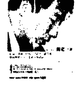

### 真原醫（平裝 316 頁 / 附螺旋拉伸 DVD）

以轉變的心念重新去理解世界或幫助他人，已踏出了自我療癒的第一步。真原醫（Primordia Medicine）是身、心、靈全面且完整的健康生活體悟，是最古老卻也最經得起時間考驗的預防醫學。

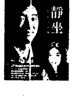

### 靜坐（平裝 291 頁 / 附靜坐導引 CD）

靜坐等同開發一個大腦神經新迴路，放鬆心智，讓身心重回和諧、完整。深一層是對生命全新的領悟，完全沉浸於慈悲、智慧、與喜悅之中。

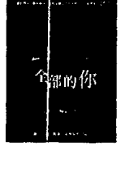

### 全部的你（平裝 381 頁）

全部的你，是古人留下來的最完整的哲學系統。是包括智慧，又包括慈悲的大法門。透過這本書，希望可以把讀者一起帶回到家、自己的本性，也就是——自己的心。

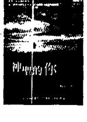

### 神聖的你（平裝 397 頁）

本書的「神聖」，反映的是內在生命和外在世界的接軌，達到最和諧、最完美、最平安的境界。如何去整合內在生命和外在世界，是本書想探討的主題，帶來另外一個層面的理解，完成轉變的旅程。

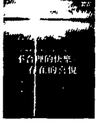

### 不合理的快樂（平裝 375 頁）

真正的「全人快樂科學」，由哲學、靈性層面著手，透過「臣服」與「參」，運用現代人最豐富的頭腦與感受，徹底翻轉生命，和讀者一起邁入「不合理的快樂」。

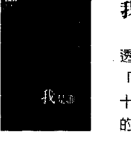

### 我是誰（平裝 187頁）

透過現代的語言，運用無時無刻的念頭與感受，讓注意力從「腦」落回「心」，體會「在」，甚至古人所談的「空」。十七章解說、十四個與生活緊密結合的練習，解開古人「悟」的奧秘，陪伴你我重新探訪華人的智慧寶藏——「參」。

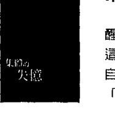

### 集體的失憶（平裝 158頁）

醒覺，其實是簡單再簡單，只是把原本屬於你我的一體找回來。這本隨身指南，站在「一體」或「在」的層面，幫助讀者對照自己對真實、對領悟的理解。每一章內容精簡，值得用心來「讀」與「參」。

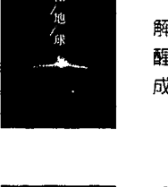

### 落在地球（平裝 179頁）

解脫，其實是打破「人」的制約，跳出「人」的處境和特質。醒覺過來，從地球的束縛解脫，我們才真正愛護地球，而真正成為地球的住民。

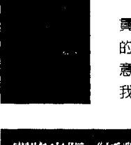

### 定（軟精裝 228頁）

貫通全部意識的連結，我們稱為「定」。然而，這裡想帶出來的，是永恆、無限大、大寧靜當中的定，或說「大定」。最有意思的是，這裡所稱的大定，比小定更不費力。活出大定，比我們每個人想的都更簡單。

### 即將出版《插對頭》、《時間的陷阱》、《短路》、《頭腦的東西》

舊聲作品

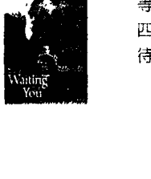

### 等著你（導聆手冊+4CD）

等著你，放放下，超超越，超原諒。四個超越的主題，破除對修行的迷思，為生命帶來新希望與期待。

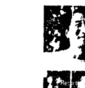

### 重生：蛻變於呼吸間（導聆手冊＋2 CD）

這是啟蒙的時代，也是疏離轉覺的年代。跟不上變化的人，容易陷入深淵，感到孤獨。這套專輯正是為你而來。

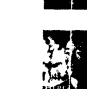

### 你，在嗎？（導聆手冊＋2 CD）

你早就完整，早就圓滿。並不是「誰」「做」點什麼，就能帶你更靠近真實的生命——你早就是。而且，永遠都是。

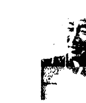

### 光之瑜伽（導聆手冊＋4 CD）

透過聲音的導引，結合最有效率的「專注」和「觀」，身心合一，讓身心的能量開始流動，充滿希望、充滿活力，面對人生。

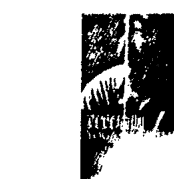

### 真實瑜伽（導聆手冊＋2 CD）

跟著聲音導引，把全部的自己交出來，臣服、參、臣服、參……沿著每一個念頭與情緒，發現最高的真實。

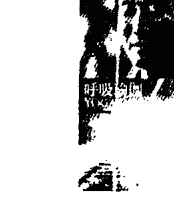

### 呼吸瑜伽（導聆手冊＋2 CD）

跟著引導，從數息、觀息到隨息，一路走到臣服與參，一步一步帶到更深的層面。念頭停止，自然回到寧靜、一體，體會到「在」的無限。

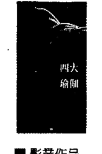

### 四大的瑜伽 (導聆手冊 + 3 CD)

從東方到西方的哲學、醫學、實修，都談到四大元素（地、水、火、風）的組合。身心合一是一歡喜、活潑而專注的過程。輕輕鬆鬆落在不費力、最單純的覺。

### 影書作品

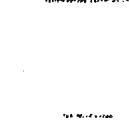

### 螺旋舞 (DVD + 書 123 頁)

螺旋是宇宙最原始、最強大的力量。源自最古老養生修煉的螺旋舞，將人體的兩側對稱作為工具，以中脈為軸心，輕輕畫一個 ∞，可以說是動態的靜坐。透過最少最簡單的「動」，達到最大的身心合一的效果。

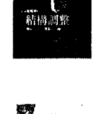

### 結構調整 (3 DVD + 書 215 頁)

重複的動作習性，本身就帶來因－果的制約，累積因－果的作用。要徹底的逆轉，需要一個迴轉的動作，解開落在身體和結構上的因－果的結。透過簡單的螺旋拉伸運動和療效姿勢，跟著影片的速度慢慢進行，每個人都可以自我調整。

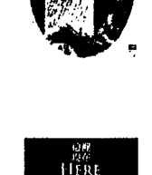

### 蛻變·重生 (一日共修實錄) (4 DVD + 小冊)

2016.06.25 楊定一博士在台首場六小時共修全紀錄，全部生命系列書籍、音聲作品精華濃縮，六個小時親自引導實錄，理論與實修循序漸進，交會貫通，帶領一起融入更廣大的一體意識。需要你親自用「心」來品嚐與體驗。

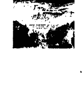

### 這裡·現在 (一日共修實錄) (4 DVD + 小冊)

2017.03.25 國父紀念館「這裡！現在！」一日共修影音全紀錄，完整細緻呈現。從臣服到參，一步一步引導，超越頭腦制約，回到生命真實。結合光與聲音的觀想、呼吸練習，一場心對心的交流，無可取代的神聖現場。
