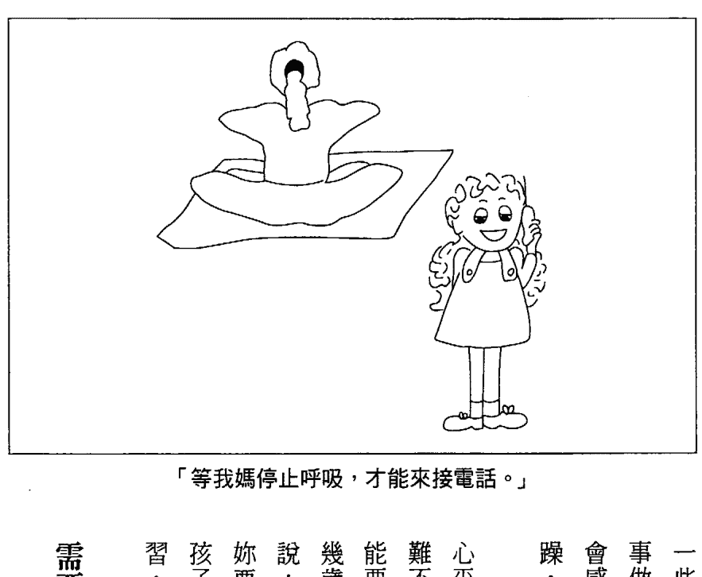
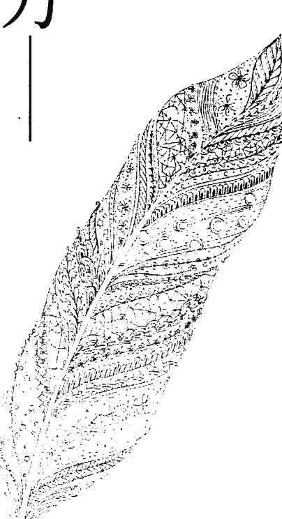

《真原醫》、《靜坐》作者 楊定一、楊元寧 總策劃·導讀

# 呼吸的自癒力

簡單幾步驟，降低壓力和焦慮，提高專注力，帶來情緒的平衡

The Healing Power of the Breath

暢銷書《真原醫》、《靜坐》作者 楊定一博士、楊元寧 專文導讀推薦

高壓時代最需要的放鬆方法！ 「試試看，你的世界會從此改觀……」——楊定一博士

★ Amazon讀者評價4.5顆星 ★

2016/1/7楊定一返台演講活動免費報名中 （詳見書腰背面）

隨書附贈約70分鐘有聲教材

## St. Royal College

## 天使神秘学院

- ※ 神秘学资料库
- ※ 神秘学培训机构
- ※ 水晶能量研究中心
- ※ 专业占卜预测机构
- ※ 官方微信：strcdts
- ※ 微信公众平台：strc2011
- ※ 官方店铺网址：http://strc.cr.cx
- ※ 读书交流QQ群：
    - 占星塔罗占卜师交流群：814594478（加入密码：PDF）
    - 神秘学其他综合群：659338717（加入密码：PDF）

微信号：strcdts

## 天使神秘学院

微信公众平台：strc2011

## **制作说明：**

本书由 **《天使神秘学院》** 出重金从台湾购入的原版书籍扫描制作完成。为达到最好阅读效果，特地把 **书全部切开** 后，再经由专业扫描设备 **高精度扫描** 完成，并经过 **一张张的PS** 后期处理最终成书，其间花费大量的人力、物力以及时间，只为能给大家提供经济并优质的神秘学学习资料而努力。

本学院强力谴责某些机构和个人，把本学院花心血制作完成的电子书籍，包装后直接放在自家淘宝网上低价倾销的行为，以谋取不劳而获的经济利益。 **如果长此以往最终将无人愿意再为大家花心思制作电子书，那以后可能大家再无新书可读。**

为让大家以后能够读到更多的好书，也为了本学院的良性发展。本学院恳请大家尽量做到如下几点：

- 一、尽量在天使神秘学院的官方网站购买电子书籍。
**官网电脑访问地址 : http://strc.cr.cx**

- **手机微信购买**
请扫以下二维码

- **手机淘宝等购买**
请扫以下二维码

- **加店长微信号**
请扫以下二维码

- 二、在收到电子书后小范围传阅即可，千万不要公开传播，更别挂到淘宝网上低价销售。

同时为答谢广大支持者，学院电子书将做如下调整：

- 一、学院会把一些早已收回制作成本的电子书折价销售。
- 二、最新制作的电子书籍会开放打印功能，大家购买后有条件的可自行打印成书。

天使神秘学院
2020年5月

## 目录

# 壹

导读  透过呼吸，带来谐振  杨定一博士 6

推荐序  改变呼吸方式，就能转化自己  杨元宁 17

引言  呼吸的自愈力 23

本书和有声教材的使用说明 26

以简驭繁  谐振式呼吸和身体扫描 33

谐振式呼吸和「心率变异」 35

正念呼吸（觉察呼吸） 40

腹式呼吸 40

谐振式呼吸 41

每天练习谐振式呼吸 45

如何处理练习谐振式呼吸的障碍 49

身体扫描放松法 61

身体扫描「基础版」 62

身体扫描，同时觉察脉搏 64

脉搏身体扫描 65

## 贰

为什么猫打呼噜？  阻抗式呼吸 69

呼吸：身心疗愈的门户 72

阻抗式呼吸 74

## 参

圆唇呼吸法 75

阻抗式呼吸：海洋呼吸（胜王呼吸） 77

阻抗式呼吸，用于性创伤幸存者 81

练习阻抗式呼吸的困难 81

阻抗式呼吸，你我更亲近 84

平衡演出——呼吸导引、全呼吸、整套练习 85

呼吸导引：入门练习 88

练习呼吸导引的常见困难 91

「全呼吸」= 谐振式呼吸 + 阻抗式呼吸导引 92

整套练习：动功、呼吸与静坐 95

其他动功 99

职业伤害 100

继续练习 104

## 肆

改变的气息——一呼一吸，面对压力、失眠、焦虑、恐惧、耗竭、忧郁、创伤和天灾人祸 107

压力和负面情绪 109

失眠：想不停，不肯睡 113

焦虑：烦吧，反正烦不死人 113

各种恐惧症 115

## 伍

- 广泛性焦虑症 118
- 天灾人祸 120
- 呼吸练习在疾病和健康的应用 148
- 激荡生命力 ── 「哈」式呼吸、数息、振动式呼吸（「嗡」、「松、空、通、洞」） 151
- 以「哈」式呼吸唤醒身心 152
- 数息 157
- 数息时可能发生的困难 164
- 4 ─ 4 ─ 6 ─ 2 呼吸的各种用途 165
- 好呼吸，激荡生命力 168
- 宇宙的声音「嗡」 171
- 在体内引导意念与振动感，是怎么发挥作用的？ 180

## 陆

- 接近真实的自己 ── 一呼一吸，改善人际关系，爱与亲近，疗愈创伤，与人不再隔阂 183
- 你就在眼前，却不知道我爱你 186
- 从科学角度谈转变 191
- 不只与人亲近：连结和隔绝 193
- 创伤后压力症候群和性创伤 200

## 柒 登峰造极 — 一呼一吸，改变人生 203

- 回归真心 206
- 呼吸练习如何化解创伤经验的影响 207
- 上场焦虑 209
- 运动员的焦虑：一体两面 210
- 简单的回顾 215

## 捌 总结、回顾各种呼吸练习的技术 222

- 全呼吸：谐振式呼吸、阻抗式呼吸、呼吸导引 223
- 整套练习：动功、呼吸、静坐或放松 224
- 「哈」式呼吸、数息、4－4－6－2 呼吸法和呼吸导引 226
- 振动式呼吸 227
- 一呼一吸，如何改变人生？ 228
- 注谢 228
- 附录 231
- 表一：各种呼吸练习的使用原则 235
- 表二：各种时机可以做的练习 235
- 附注 240
- 参考书目 244

## 导读 透过呼吸，带来谐振

杨定一博士

首先，我要向理查 P. 布朗和柏崔霞 L. 葛巴两位医学博士致贺。他们长年投入呼吸练习工作坊，以呼吸练习帮助一般人，尤其是病苦之人减轻压力与焦虑，提升专注力，重拾情绪平衡，这是他们一生的志业。最重要的是，不用任何药物，就能达成这些效果。这就是两位受过扎实医学训练、在纽约重点医学院从事教学工作的名医，在自己的临床经验中发现的奥秘，他们不靠药物，却已帮助了许多为创伤后压力症候群（post-traumatic stress disorder, PTSD）所困扰的患者。大家都知道，为压力、焦虑、忧郁、失眠、创伤引发失调等等身心疾病所苦的人，全世界少说几千万，甚至说上亿也不为过。然而，最可惜的是，大多数用以治疗这类疾病的药物都有副作用，更别提有些还会引发严重的断药症状。某些失眠用药，长期使用下来，非但效果会愈来愈不显著，还会导致药物症状。

致一般人对药物上瘾。布朗博士和葛巴博士为世人的压力和情绪困扰，带来这一整套不用药、无副作用的解决方案，我之所以打从心底完全支持，不只是因为理论上可行，更是因为这也是我的亲身体验。这些年来，我也在推广类似的呼吸静坐技巧，而我自己的观察和这对博士夫妻的研究结果是完全一致的。

两位博士所开发的方法，我们也可以称之为「呼吸法门」，最非比寻常之处，在于他们全面而循序渐进地将各种流传久远的呼吸秘法去芜存菁，取法各宗各派的修行和养生秘法之长。他们经年不懈地「以身试法」，透过自身的经历以及临床的现场观察，反复测试各种古代的呼吸修法，这一精神尤令我钦佩。

布朗博士和葛巴博士结合了自身的勤恳修持，加上带领共修的第一手观察，而开发出《呼吸的自愈力》所介绍的各种练习，也就是说，本书所介绍的技巧确实通过了长时间的检验证明了实务应用上的效果。我们可以这么说，这两位作者所拥有的广博的实修知识，也是出自渊远流长，永不止息的传承。

读者可以从他们的《呼吸的自愈力》这本书和有声教材的字里行间感受到，这些呼吸练习是相当实用、容易落实的。他们对实修的强调绝不拐弯抹角，这些话不仅是对只想做纯知识理解的人说的，更是对那些有心想透过实修转化身心的读者所说的。我在阅读此书时，同样可以感受到两位作者心中的那股恳切，他们多希望能在一呼一吸之间，转化整个世界！透过文字，我几乎可以亲耳听到、感受到他们心中对读者的殷殷呼唤——『试试看，你的世界会从此改观……』。我的女儿元宁也亲身受惠于两位作者的实修。本书除了我的这一篇导读之外，她也另写了一篇诚挚的序言，提到她自己与这对博士夫妻与呼吸练习的相会和体验。元宁对于他们所介绍的呼吸练习印象十分深刻，深信全世界的人都应该认识这些方法。从许多层面来说，我对这本书翻译工作的支持以及推广，其实是基于元宁个人的恳切与支持。我相信，如果读者能像元宁一样的那么投入呼吸练习，也一定能和她一样亲身体验到种种好处。然而，我还是要提醒读者，不要预设任何期待，只要坚持在一呼一吸之间，享受那一呼一吸的片刻，也就是当下。无论何时，只要轻松的注意呼吸，在一进一出间，放下一切，顺其自然。

## 呼吸——转化身心的奥秘

接下来，谈谈本书的架构：
两位作者将他们所开发的呼吸练习分为三大类：谐振式呼吸、阻抗式呼吸、呼吸导引，只要依照书中的方法按部就班地练习，任何人都能精熟这些技巧。接着，他们将这三大类技巧整合成一套完整的「全呼吸」，带领读者一一进行，我也很鼓励读者跟着一起练，因为这些练习都是经过大量患者验证，能真正发挥效果的。我也亲自验证过这些练习，认为这些方法简易而有效。

本书介绍的呼吸练习为什么令人如此惊艳，原因无他，正是书里提到的——呼吸是通往身心的门户。（此一原理，可参考我在《真原医》和《静坐》相关的章节。）古代的瑜伽士都知道，改变呼吸模式可以有效改变自律神经的作用，从比较原始的低等脑区切入，进一步控制各种身体机能以及调节脑部的高级功能。自律神经系统又可分为两类相对应的神经系统，也就是交感神经系统和副交感神经系统。交感神经系统会加速身体的反应和反射作用，而副交感神经系统则让身体慢下来。

这个年代的人似乎都有交感神经过度旺盛的问题，我们一心多用，头脑一直在忙碌中，被种种的观念绑住，心思总是不在「这里」，随时都在「别个地方」，搞得自己总是焦虑、被压力压得喘不过气来、无精打采、坐立难安，难怪我们面对不了环境的挑战，甚至连自己都搞不定。从我的观点来看，如何把我们带回来，带回与生俱来的圆满本性或说神性，正是恢复身心健康的不二法门。而这一点，只要读者能好好跟着书和教材做呼吸练习，正是这本书和有声教材能带给你的。如果我们把静坐视为整合身心的各种练习的组合，那么，本书所介绍的呼吸练习，基本上就是一种静坐。从这个角度来说，瑜伽也是一种静坐，即是在动作中静坐。其实，「瑜伽」一词的梵文原意就是「合一」，也就是让身心合一，在「一」中绽放。从这个角度来说，传统的养生法门，如气功、太极，甚至就连合气道这类武术，也是静坐。其实，静坐的方法五花八门，而我自己因着往昔诸多因缘，也修习了不少法门。对于熟悉科学语言的人，我通常会说静坐就是强化副交感神经系统的作用，为静坐者带来放松的觉受，并恢复交感神经与副交感神经的平衡；静坐也可以视为平衡左右脑、平衡情绪脑与高等脑、平衡阳性与阴性、平衡内心纯真孩童与智慧老人特质的一种方式。从这个角度来说，静坐就是一种帮助我们恢复平衡的实修。

然而，从灵性的角度来看，静坐不只能够回复身心的平衡，更是帮助我们把自己找回来，找回真实自性的方法。对许多人来说，静坐是走上回家之路、通往真正归宿的入口。当然，这一味悟，仍有待学者自己亲身去体验，去发现。

静坐这一修心法门，可以再分为两大类，我和元宁在《静坐》一书举了不少实例，一是强调专注的「止」，另一是强调觉察的「观」。

本书作者所介绍的呼吸练习，则横跨了「止」与「观」两大原理，也因此无法简单的归类为「止」或「观」，我会说明为什么。

我们不妨以「谐振式呼吸」作为例子。

谐振，是脉动系统的一种有节律的振动状态，能让脉动系统以最省力的方式，保持在最稳定的状态。我在《真原医》曾以相当篇幅从心脏的观点来解释谐振的概念，也指出了身心的最佳状态其实并不是由脑部所主宰，而是跟着灵性与情绪所定的更大的蓝图运作的。因此，光是一个感恩的念头，就能让心跳进入谐振状态，进而与身体其他部份产生谐振，包括我们的脑。

呼吸对身心也能发挥一样的效果，如果我们以呼吸作为身体的节律器或振动仪，很快就会发现，对我们而言最悠闲自在的呼吸，其实就是一种和身心完全合一的节奏式呼吸。事实上，谐振式呼吸是离不开身心的，完全随着身心而升降起伏。
谐振式呼吸是人人都学得会的，这就是《呼吸的自愈力》一书的前提，也是我在静坐的演讲和著作一再强调的观念。
选择一个呼吸的节奏，例如每分钟五次或六次呼吸，练习时既要专注于呼吸本身，也要觉察呼吸。从这个角度来说，它确实蕴含了「止」的专注定力与「观」的觉察观照。我们的心必须保持专注，才能「定」在每分钟五次或六次的定速呼吸而不散漫，同时，在一呼一吸之间保持观照，我们的「觉」也随着自然生起。
阻抗式呼吸和呼吸导引，也是一样的。
多年以来，我发现将「止」的专注定力和「观」的觉察观照结合起来的修法，往往比只偏重其一的修法更为有效。之所以如此，或许是因为我们现在所体验到的能量频率的变化愈来愈强了，而我们愈能将心思和注意力放在一个定点上，愈能将身心慢下来，让身心进入谐振，回到最悠闲自在的状态。

呼吸练习，也是我自己很喜欢的一个身心转化媒介，因为呼吸既是一个随意（voluntary，可由意识控制）的生理机能，同时也是一个不随意（involuntary，不以意识控制）的机能。虽然呼吸是一种睡着了也能自动进行的功能，然而，就像《呼吸的自愈力》这本书所介绍的，我们可以透过意识去改变呼吸的模式。透过随意呼吸，有意识的训练身心，渐渐地，即使我们不刻意控制，身心也开始有所调整。这都是古代瑜伽士所熟知的密法，瑜伽呼吸调息法即是以各种方式调伏身心，透过呼吸控制自律神经系统。很有意思的是，虽然布朗博士和葛巴博士的背景与我大相径庭，却不约而同地找到了呼吸练习作为身心疗愈的解答，同时也以之作为个人的实修法门。我也同样向古老的灵修法门取经，一样多年浸淫于呼吸练习和静坐修持。我们的相通之处不少，举例来说，作者提及了谐振式呼吸，而我则在大型的演讲共修以节律式呼吸带领大家将呼吸慢下来静坐，引领身心进入悠闲自在的状态。本书介绍了阻抗式呼吸，而我则透过「内呼吸练习器」这一简单设备的协助，对呼吸加以些微的正压与阻力，就能引发很深的健康效果。最后，作者介绍了呼吸导引，而我则是结合了「全身观想」（Total Body Visualization）和「光之瑜伽」（Yoga of Light）。要怎么说呢！地球真的是圆的，我们即使殊途，到头来依然同归。

呼吸练习还有一个面向，是我也与这对博士夫妻有同感的，就像书里说的，我们可以透过呼吸练习，转化了自己与别人的关系。呼吸练习的效果不光是让自律神经系统重回平衡，对布朗博士和葛巴博士这样的研究者而言，他们还亲眼见证了它能够重建一个人的社会交流系统（social engagement system）：修持呼吸练习的人变得柔软、慈悲、有同情心、能与人建立连结。

长期下来，呼吸练习帮助我们与孩子、与周遭的人都能处得更好，更重要的是，呼吸练习还有助于孩子建立自信、提升自我形象和EQ（情绪商数）。我很喜欢举一个例子，就是呼吸练习能改善受刑人的攻击行为和疏离心态。我们带领孩子做类似的静坐练习时，也发现练习静坐的孩子变得更专注，学习和交流能力变得更好了，好到让我多年来一直透过全人教育方案继续推广静坐。

正因如此，布朗博士和葛巴博士这么全心全意推广呼吸练习，不只是一种治疗，更促进了亲子、夫妻、朋友、同事甚至仇敌之间爱的正向流动，这一点真的让我非常感动。

好了，关于科学、关于身体，我说的够多了。我会鼓励读者跟着这本书一起做呼吸练习，还有一个很重要的原因。古人把呼吸当作生命力，梵文称作 prana，也就是「气」，然而，他们谈的不是物质上的呼吸，甚至不是在肺部进行交换的气体。古人所说的「吐纳」不只是点燃生命的火花，更是衔接意识和灵性体的一线「生机」。精熟了吐纳之道，呼吸便成了通往纯粹意识、通往开悟的门户，陪我们一同走上「灵性觉醒」之旅。修行师傅和老爹所教的呼吸法门，搭配此书的呼吸练习，会陪伴我们每个人，走上通往更高意识领域的道路。我相信两位作者也和我一样，完全明白呼吸的转化力量，也就是说，他们之所以推广呼吸练习，不是只为了身心健康而已，对他们而言（我也一样），只要勤练，那是必然而然的结果。他们还希望能看到身心彻底的蜕变，以之巩固地球的高等意识。从这个角度看來，他们所传授的，正是一个起于无始之初，终将延续至人类未来的渊远流长的传承。以往的密教传承，把门槛提高很多，带给学者相当不方便与困难，相比之下，透过本书就能无碍「得法」的读者，实在是有福之人。是的，黄金盛世清坦而光明的本质，必会消除这些浊重的阻碍。然而，在我看来，这一福楊定一博士 John Ding-E Young M.D., Ph.D

著有《真原醫：21世紀最完整的預防醫學》、《靜坐的科學、醫學與心靈之旅》。曾任洛克菲勒大學分子免疫及細胞生物學系教授、系主任，現為兼任教授。長庚大學、長庚科技大學、明志科技大學、長庚生物科技、美國 Inteplast Group 董事長。

份也有美中不足之處，因為就人心來說，容易得到的，可能不會像古人必須拜師多年求法那樣的珍惜。為此，我鄭重地請求讀者，務必珍惜本書所介紹的秘法，並且勤懇修習，直到深得其中三昧為止。

吸氣，吐氣，在一呼一吸間跟著練習，這是你我一天最重要的事了。精熟書中每一個技巧，直到你能透過作者的「全呼吸」將身心帶至諧振，而悠然安住。到了這個時候，我相信，全新的實相會為你綻放，你的生命也會全然改觀。

謹此，但願讀者和諸位有心實修的朋友，都能踏上這一快樂的旅程。

## 推薦序 改變呼吸方式，就能轉化自己

為了跟上現代社會的快節奏，我們大多數人都在各種長期而龐大的壓力下討生活，就連好好喘口氣也成了一種難能可貴的奢侈，心思總是向外攀緣，根本無暇從容地關注自己的一呼一吸。

我們受制於身心累積的緊繃，呼吸大多只淺淺地在胸腔進出，難以進行深長的腹式呼吸。其實，這種倉促的呼吸速率相當接近「過度換氣」，等於對自律神經系統發出壓力訊號，要求身體進入鎖定模式。

身體只要處於壓力狀態，自會調整五臟六腑的運作，像是關閉不那麼迫切需要的消化系統，加速心跳、呼吸這類攸關活命的功能，以幫助我們自我防禦。這種神經系統的活化模式，使生物能夠應對環境時不時出現的威脅，是一種由生存本能所激發的演化產物，幫助人類於幾千年前在猛虎、野熊等猛獸環伺的追獵下存活。然而，這不該是生活的常態。

楊元寧

我們糊里糊塗地在壓力下一步步習慣了淺而快的胸腔呼吸，殊不知這樣的呼吸方式反而延長了壓力反應，使神經系統長期亢奮，好讓身體隨時「打」或「逃」。我們已經發現，習慣於胸腔呼吸會打亂人體的新陳代謝，讓人容易焦慮緊張，神經兮兮，過度警覺，彷彿隨時都有生命威脅，不得不保持待命，為大大小小的威脅作好準備。只是，到了這個年代，即使我們不再像幾千年前的老祖宗成天在猛獸的獵食下驚險求生，卻難逃種種情緒和心理壓力的追擊：我們要催促孩子上學，硬著頭皮開會，在上下班的車陣裡焦急地按喇叭，還要在最後一分鐘趕上交件，一天要完成這麼多事，這樣的多工狀態已經窮盡了人類的極限。我們習慣了「總得做點什麼」，於是總逼迫自己進入這種緊張狀態，讓生理代謝超速運作，以應付這個刺激多得超乎我們想像的世界。在一刻不停的忙碌中，我們幾乎停不下來喘口氣，也忘了如何放鬆，只能一心一意繼續衝刺，哪有心思覺察呼吸？身心系統就要分崩離析了，難怪我們會這裡痛那裡痛，會出現各種身心症狀。從養生和修行的角度來看，好多人連睡覺都沒有放鬆。沒有適當的休息，不讓自己從緊張中脫身，一旦習以為常，身體根本沒有休養生息的空間，邏輯維持正常運作。

古代的瑜伽行者認為，呼吸就是生命力，能滋養我們，維繫生命。 由於呼吸對身心的影響是全面的，透過改變呼吸的方式，我們可以轉化自己的心態和整個人的狀態。 他們知道倉促的呼吸會導致緊張和焦慮，而深長的呼吸能引發內心的安寧、淡定和覺察，使身體放鬆。 因此，只要每天願意用短短的幾分鐘覺察呼吸，有意識地延長並加深呼吸，這樣充滿覺知而專注的練習便足以使人生改觀。 這個道理，和東方的氣功與太極其實是相通的。 我也親身驗證了呼吸對身心的驚人轉化效果，並在壓力大的時候，運用呼吸技巧幫自己靜下來。 有時候，稍微調整一下日常的習慣，更容易幫助自己回復平衡。 在我的練習經驗中，每分鐘五次的諧振式呼吸（Coherent Breathing）是最方便、易學、能隨時應用而不會打斷日常生活步調的練習之一，不需要避世離俗，也無需遠離塵囂。 這一練習就是這麼平易簡單，卻是威力無窮。 光是將呼吸放慢到每分鐘五次，就能引發身心的放鬆反應，身體愈是放鬆，呼吸就自然變得更深長了。 我參加過很多次諧振式呼吸的工作坊，也在課堂上擔任助教，親眼見證了光是二十分鐘有覺察的呼吸，便能讓人煥然一新。

當初，我在一場情緒管理的瑜伽工作坊認識了本書作者理查·P. 布朗和柏崔霞·L. 葛巴，馬上就深深受到這兩位醫學博士的課程所吸引。那天，我正好犯了偏頭痛，好長一段時間什麼也做不了，然而，當我待在教室最偏遠的角落，隨著課堂上的磬聲一呼一吸，經過兩輪二十分鐘的練習後，沒想到，肩膀的緊張就消失了，而偏頭痛竟然開始消退，這讓我好驚訝，因為偏頭痛發作，往往會抽痛好幾個小時，最起碼也要折騰一整天才會消退。就是這樣，我開始探究呼吸緩解疼痛的奧秘。我相信，如果呼吸練習可以幫我消解體內的壓力，對其他人也會有用。我為什麼開始探究呼吸的修行，並且大力推動此書的中譯計劃，這一切，全是因為我自己切身受惠於他們的教學所致。我後來發現理查·P. 布朗和柏崔霞·L. 葛巴兩位醫學博士早已投入多年的心力，以科學精神探討呼吸練習結合氣功運動（動功）與音聲的身心影響。這些臨床研究的靈感，正是源自布朗博士親身修煉靜坐冥想、合氣道、氣功與瑜伽的心得。布朗博士四處求法，學習各個宗派傳承的奧秘。兩位博士結合了自身的經歷，以及數千名參與者的臨床研究成果，銜接許多修行者夢寐以求的古老法門，為讀者帶來了一系列完整的修練。他們所介紹的技巧不僅容易上手，只消練習幾週就能發揮很好的效果，而且，經過他們去蕪存菁之後，這些方法能適用於更多人，對禁忌症的顧慮也比傳統修法少了很多。兩位醫學博士以焦慮症、憂鬱症、創傷後壓力症候群等心理失調患者為臨床研究的對象，發現呼吸練習能顯著改變這些受試者的生命品質。他們兩位也與「服事助人者」（Serving Those Who Serve）這個致力於協助紐約世貿中心恐怖攻擊事件受害者的非營利組織合作，為受害者和幫助現場清理工作的志工開設工作坊，克服他們所經歷的創傷。這些學員不僅是心理和情緒受到衝擊，就連身體也在無意間暴露於各種毒素和化學物質的危害。理查·P·布朗和柏崔霞·L·葛巴兩位博士走遍天涯海角，只為了將這些修法帶給需要的人，包括前往南蘇丹協助那些在北蘇丹淪為奴隸十多年後獲救的婦孺，以及遠赴盧安達和海地與他們培訓的學員合作，啟動災後復原方案。他們的研究與教學，雖然大多是針對有情緒或心理困擾的族群所設計，但總的來說，這些技巧本來就有緩解壓力的效果。他們所傳授的諧振式呼吸練習，融會了正念內觀的精神，在讓身體平靜下來的同時，保持心靈的敏銳與醒覺。因此，這些簡單而有力的技巧可以在工作中、在家裡有效地運用，甚至可以在公車或火車上隨時隨地練習。剛認識布朗博士和葛巴博士時，他們告訴我，希望有朝一日能改變世界。在親眼目睹他們的毅力、決心和信心後，我深信這雄心壯志總有實現的一天，也很願意支持這兩位先驅結合東方秘傳與西方理性邏輯的宏大志業，那是出自他們內心深切的召喚，也是我們對人類共同的心願。

楊元寧 Lena Young
哈佛大學畢業，表現出色，獲獎無數。
著有《靜坐的科學、醫學與心靈之旅》（二〇一四年度暢銷書）、《哈佛心體驗》、七本童書繪本。

## # 引言——呼吸的自癒力

> >願痛者不受苦縛，懼者免驚恐。
>願傷者一掃悲痛，眾生得解脫。
>——毗瑪拉蘭希法師 (Venerable U Vimalaramsi)

縱觀歷史，偉大的治療師早已發現：呼吸練習能引發人體自我療癒的能力，為患者帶來身—心—靈的健康。這些呼吸練習，一度是神聖的不傳之秘，現在卻是人人可學可練的法門。我們邀請你，透過本書和《呼吸的自癒力》有聲教材，親身體驗這一簡單而自然的方法，學習沈著冷靜、克服壓力、提升精力、澄靜心神、改善體能、睡得安穩香甜、和所愛的人更為親近。本書會介紹核心的呼吸技術，解釋其中的奧秘，教你如何運用這些練習，面對生活中的諸多挑戰。

人體的每個細胞都有自我療癒的能力，身體組織每天都會汰舊換新。早在西藥問世前，薩滿巫師、僧侶、祭司、部落首領就知道如何啟動人體與生俱來的能力，以預防並治療疾病。世界各個角落的瑜伽教室都教人調息（呼吸練習）的基本功，而在現代的瑜伽行者和武術家浸淫於呼吸練習的同時，科學也開始探索人體呼吸系統的巨大療癒潛力。

愈來愈多的研究指出，只要改變呼吸模式，我們可以讓壓力反應系統恢復平衡、使喋喋不休的頭腦思緒安靜下來，還能紓解焦慮和創傷後壓力症候群（PTSD）的症狀，強化身體健康和耐力，提升臨場表現，改善親密關係。本書會由科學角度來說明呼吸練習的作用，同時解釋如何應用於生活的方方面面。

聖雄甘地、武打明星李小龍、禪修人士、基督教修士、夏威夷卡巫那（kahunas）、俄羅斯特種部隊有何共通之處？他們都因呼吸練習獲益，改善了身—心—靈的健康。
舉例來說，堅持正直和非暴力原則的聖雄甘地，就很享受每天早上的朗聲頌禱。想想，他領導印度人民進行和平抵抗，向英國爭取政治獨立，所面對的壓力必然遠大於一般人每天的瑣碎壓力。朗聲頌禱的修持，陪著甘地一路帶領追隨者度過危難，一樣地，呼吸練習能幫助我們面對各種壓力，維持壓力反應系統的平衡。
武打明星李小龍在發動致命一擊前，一定會猛然大吼，不只是為了嚇唬對方，更是因為大吼所引發的龐大呼吸量能使感覺更為敏銳，而能傾全身之力於當下一擊。
中世紀俄羅斯東正教靜修士則在唱誦〈耶穌禱文〉（Jesus Prayer）之前修練「呼吸導引」（Breath Moving），以進入更高的靈性境界。他們將這一呼吸秘法傳授給基督教聖騎士，助其抵禦外侮。至今，俄羅斯特種部隊的訓練仍有呼吸導引的影子。此外，呼吸的奧秘也在夏威夷山地的卡巫那間代代相傳，目前的夏威夷呼吸練習，與印度和中國的呼吸法也頗有相通之處。
有這麼多類似的呼吸鍛鍊功法在世界各地流傳，這意味著呼吸練習的根源，可能有千萬年的歷史。舉例來說，瑜伽、氣功和禪修靜坐都有「放慢呼吸速度，至每分鐘五到六次」這樣的功法。
本書會為讀者介紹最新的研究，談談呼吸練習是怎麼用來減輕壓力的。呼吸練習對現代人健康的重要性，絕不亞於昔日。現代生活的壓力除了會導致焦慮、憂鬱、忿怒、憤世嫉俗等等負面情緒，還會促使人體早衰，引發心血管疾病、肥胖、發炎、免疫功能障礙。每天做呼吸練習，可以逆轉壓力的影響，對抗疾病惡化，提高整體的生活品質。

## 本書和有聲教材的使用說明

本書主要與《呼吸的自癒力》有聲教材搭配使用，讀者會學到一系列的核心呼吸技術，以及其他輔助技巧。第一、二、三章著重於掌握呼吸技術的核心：諧振式呼吸、阻抗式呼吸、呼吸導引、「全呼吸」、身體掃描。

因為這些技術是循序漸進的，請務必從頭開始，跟著本書的章節一一練習：先閱讀個別呼吸練習的解說，找出相對應的有聲教材曲目，跟隨有聲教材的指示，調整你的呼吸速率，慢慢練習。你需要練習一段時間，才能順暢、自在而不費力地運用每個呼吸技術，熟練之後，再向下一章前進。

壓力非但讓身體付出代價，也會損耗靈性：日積月累的情緒防衛，窒息了我們愛、同理和親密的能力。呼吸練習與自我反思結合，能鬆開心靈的枷鎖，讓我們重拾愛和正向的感受，使我們在自身以及與他人的關係中重新體驗到愛和正向的情懷。

舉例來說，你可以這麼試試：先練習「諧振式呼吸」，一天一或兩次，每次十分鐘，練了幾天之後，再進入「阻抗式呼吸」。然後，在進入「呼吸導引」之前，先花幾天，同時進行諧振式呼吸和阻抗式呼吸的練習。

開始做呼吸練習時，最好能全神貫注，減少干擾：找一個安靜的地方，請朋友和家人配合一下，這個時段不要打擾你。關掉手機或PDA，找張舒服的椅子坐下，躺著也行。

呼吸練習的形式五花八門，各有所長，本書只會介紹幾種最有用、能迅速生效而且簡單易學的練習，並以安全性做為重要的選擇依據。我們教過幾千人做呼吸練習，發現有些人確實容易發生副作用，因此，本書只引介所有人都能安心練習的技術。書裡介紹的前四項「核心」呼吸練習，並不全是粗淺的功夫，從傳統的修行角度來看，有些技術是要修習瑜伽多年後才可以練習的。

古代的瑜伽行者之所以多年不輟，每天修練好幾個小時，除了想達成身—心—靈的統合之外，更是為了靈性的開悟，因此，只有最虔心投入的行者才能接觸這些高深的修法。

今日，雖然仍有認真修持的瑜伽行者，但是，大多數人（尤其在西方）並不把瑜伽當作一種靈修法門，而是一種體位練習或放鬆方法，目標是健身或放鬆，因此，只要找對方法並投入一定的時間，其實是更容易達成的。我們會著重於初學者和老手都能學的溫和呼吸練習，深入的呼吸練習則需要投入更多的時間，而且需要老師的指導。 一旦掌握了前三個核心練習的要領，就可以進入本書的「全呼吸」，這是一種溫和、效果強大而且用途廣泛的練習，能緩解種種身心痛苦。如果你一天只排得出二十分鐘空檔，我們會建議你將這二十分鐘全用於練習「全呼吸」。不過，第四、五章還會介紹更多的技巧，包括「哈」式呼吸、數息和振動式呼吸。 我們會在第五、六、七章說明如何運用前幾章的呼吸技術，處理壓力、失眠、焦慮、憂鬱、創傷後壓力症候群、人際交往障礙、身體不適等身心問題，並提升表演和運動競賽的臨場表現。這幾章會解釋呼吸練習是怎麼影響大腦、情緒調節、壓力反應系統、內分泌、負面和正向情緒、感受愛的能力的，除了提出相關的科學證據，還會透過學員和患者的親身經歷，以及我們自己的體驗，說明呼吸練習如何點點滴滴地改變人生。

雖然我們的患者都很樂意分享自身的經歷，但我們仍改編了部份細節，以保護他們的隱私。此外，這幾章也針對常見的問題，予以一一解答。如果本書解答不了你的問題，歡迎至「全身心呼吸療癒網站」www.breath-body-mind.com 提問，我們會竭盡所能答覆與呼吸練習相關的疑惑。附錄的兩個表格，針對本書介紹的練習，整理出使用的時段和方法。

## # 氣喘、阻塞性肺病、反應性呼吸道疾病患者注意事項

氣喘、慢性阻塞性肺病（COPD）、反應性呼吸道疾病、吸入有毒物質……等等重症患者，在開始做呼吸練習之前，請仔細閱讀第三章關於氣喘的說明。我們也建議你先與醫師商量一下，確保這些呼吸練習對你是安全無虞的。

長遠來看，呼吸練習確實能改善大多數呼吸系統疾病的症狀，然而，一開始可能需要調整練習方式。我們會在第一章教你如何調整，幫助你安心運用這些「呼吸治療」。

## 《呼吸的自癒力》有聲教材

本書的有聲教材英文語本，可至 www.shambhala.com/healing powerofthebreath 下載。我們會在本書各章節一一說明如何搭配，幫助讀者熟練該章節的呼吸練習。英文有聲教材的曲目如下：

- 1. 引言
- 2. 諧振式呼吸暖身，5 bpm（5分鐘）
- 3. 阻抗式呼吸（3分鐘）
- 4. 呼吸導引（6分鐘）
- 5. 「哈」式呼吸（2分鐘）
- 6. 4—4—6—2 數息（2分鐘）
- 7. 「嗡」與「鬆·空·通·洞」（5分鐘）
- 8. 全呼吸，5 bpm（1分鐘）
- 9. 身體掃描（5分鐘）
- 10. 全呼吸，6 bpm（21分鐘）
- 11. 身體掃描（5分鐘）

> （編注：我們另為華文讀者準備了中文版有聲教材，請參考本書附贈的 CD 光碟）

## # 其他輔助教材

史蒂芬·艾略特 (Stephen Elliot) 也編製了一套諧振式呼吸的輔助教材，想要有更多曲目可供選擇、需要節奏變化、或有聽力障礙的朋友，可以到他的網站看看：www.coherence.com。

- 1. 《慢下來！ (Slow Down!)》CD，很適合已經依照本書指示練習，卻無法將呼吸速度放慢到每分鐘五次的朋友。患有肺病或呼吸困難的朋友，可能需要更多的時間才能熟練。此外，高焦慮的朋友也可能需要更多時間，才能學會調整呼吸。

    如果你練了幾天，仍然無法依著第一章的指示，將呼吸速度降到每分鐘五至六次，那麼，不妨試試《慢下來！ (Slow Down!)》（可以在 www.coherence.com 購買），幫助你更循序漸進地慢下來。這片 CD 會引導你，由目前的呼吸速度開始，透過節奏的輔助，逐步由每分鐘十九次降到每分鐘五次。第一章會有更詳細的說明。
- 2. 「諧振時鐘」是一個在電腦上使用的「呼吸律調節器」程式，在螢幕上顯示時鐘，秒針由 12 往下移動至 6 時吐氣，6 往上走至 12 時吸氣，秒針移動時，程式會同步發出「嘀嘀」聲。這個應用程式除了聲音之外，還有秒針移動的圖像，讓聽障朋友可以用「看」的跟著練習。「諧振時鐘」的網址是 www.coherence.com/coherence_clock.html。
- 3. 史蒂芬·艾略特在 www.coherence.com 提供了另一套調節呼吸速率的有聲教材，想要有更多曲目、節奏選擇，或者聽力受損的朋友，都可以試試這一套《呼吸 (一) (Respire-1)》CD，包括了解說、西藏頌缽和人聲導引曲目。雖然大多數人都挺喜歡磬聲，但有些腦震盪或腦傷患者不那麼喜歡磬聲的波動。如果有這種情況，不妨試試人聲曲目。

呼吸的自癒技術，是人人都可以練習，而且很快就能學會的，大多數人都能在三十分鐘內掌握本書的第一個呼吸技術：諧振式呼吸。然而，如果你無法這麼快進入狀況，只要有耐心，早晚會愈來愈容易上手。呼吸練習的療癒效果，全看你有多投入。

或許你會這麼想：要每天挪出二十分鐘，吞顆藥丸不是更快一些嗎？但如果你想活化身體的自癒力、更接近真實的自己、擁有充實的人際關係……想要這些藥罐子變不出來的寶貝，那麼，這本書就是為你而來的。每天投入一點點時間和心力，很快你就能駕馭呼吸的療癒力量，走向健康，擁抱幸福。

查詢演講、工作坊、教學影片，以及整合醫學的最新發展，請至「全身呼吸療癒網站」：www.breath-body-mind.com。

# 壹

## 以簡馭繁——

### 諧振式呼吸和身體掃描

> 專氣致柔，能嬰兒乎？
——老子《道德經》第十章

嬰兒是非常柔軟而靈活的，讓他們把腳趾塞進口中，就像舔大拇指一樣容易。他們不只是關節柔軟，全身都比成年人更有彈性。只是，隨著年齡漸長，我們身心逐漸失去原本的柔軟靈活，愈來愈僵化，一到中老年，運動不動就「血管硬化」。

相較之下，嬰兒非但血管壁相當有彈性，神經系統的反應也更加靈活。

正是這種靈活性，使嬰幼兒和兒童面對各種環境的變化，更能即時反應，也更能適應。適應力強的人，在面對生活的挑戰和壓力時，身心不會那麼容易損耗。抗壓復原力是一種適應的能力，也就是在需要時，能否儘快開啟神經系統和反應系統的療癒和復原功能。

人遇上了超過自身負荷的壓力，尤其是一再發生的長期壓力，對情緒和身體健康必然會造成不利的影響。一開始，當事人可能只是有些緊張、操煩，不太容易入眠；下一步，可能變成貨真價實的焦慮、偏執的擔心、失眠、日間疲勞、煩躁易怒、肌肉痠痛。這段時間，體內的壓力反應系統必須加足馬力，好全力應付眼前的壓力，釋出更多的皮質醇、腎上腺素、興奮性的神經傳導物質，燃燒更多的能量，釋放更多的自由基，使體內發炎更嚴重。可以想見，這一情況若維持過久，會耗盡壓力反應系統的資源，而導致當事人憂鬱、慢性疲勞、過動、老覺得不堪負荷、無能為力，甚至發生腦血管或心血管疾病。如果我們知道怎麼強化、平衡、提升壓力反應系統的復原力，那麼，我們是可能防止甚至逆轉這一過程的。

## 諧振式呼吸和『心率變異』

面對壓力，為了培養復原力，我們會由腹式呼吸和諧振式呼吸開始，以此活化神經系統的自癒力與復原力，化解身心的防衛與耗能狀態，讓壓力反應系統向更健康的平衡狀態移動。等你學會了諧振式呼吸，我們接下來會再教一個提升心血管彈性的『放鬆練習』。

諧振式呼吸的自癒效果，結合阻抗式呼吸與呼吸導引的練習，可以得到更大的發揮。由於大多數人太忙了，沒法子花幾個小時作身心的鍛鍊，因此，我們設計了「全呼吸」，將這三種呼吸練習合而為一，以最短的練習時間，發揮最大的效果。

身心的療癒和鎮靜，是由副交感神經系統負責的，而副交感神經系統的活化程度，則可以透過心跳速率的自然波動（與呼吸息息相關）和由此計算出的「心率變異」（heart rate variability）來測量。也就是說，改變呼吸的速率和模式，我們便能改變心率變異，從而改變神經系統的活躍程度。

我們現在談的，不是冷冰冰的科學研究成果，而是自己親身嘗試過，並在患者和學員身上所觀察到的現象。

你不妨自己做一個簡單的測試：以舒適的姿勢坐著，用兩根手指在頸側或手腕去感受脈搏，哪裡比較容易摸到脈搏，就放在那裡。然後，慢慢地，深深地呼吸。給自己把脈的同時，繼續緩慢地深呼吸。吸氣時，數脈搏，吐氣時，也數脈搏，兩者相較，你會注意到什麼？如果你發現吸氣比吐氣的心跳更快，那就對了。你已經發現了這個現象：光是一呼一吸，就能影響你的心跳。

然而，心率變異不只因吐氣或吸氣而異，也隨呼吸的整體速率而變。舉例來說，呼吸放慢，就會提高心率變異。不過，這是不是好現象呢？由於心率變異的變化是透過自律神經系統所調控的，心率變異升高，意味著整個系統正即時反映著你的一呼一吸，時時刻刻在調節心跳，也就是系統對呼吸變異是更敏銳、反應更完整的。心率變異低，則代表系統內某個部分受損、老化而僵硬了。

因此，心率變異升高，肯定是個好現象，因為它代表了心血管系統比較健康、靈活，而體內的壓力反應系統比較平衡而有彈性，整體上更健康、更長壽。

對科學家而言，心率變異可作為評估壓力反應平衡程度的指標。壓力反應比較平衡，意味著身體不那麼容易損耗，焦慮症、抑鬱症、創傷後壓力症候群、注意力缺失症、攻擊，心血管疾病和腸躁症患者的心率變異偏低，則代表壓力反應系统的功能是有障礙的①。等你學會了諧振式呼吸，我們會再教一個能提高心血管彈性的放鬆練習。

諧振式呼吸是一個提升心率變異，讓壓力反應系統恢復平衡的簡單技術。科學家測試了人體對各種呼吸速率的反應，發現了一個理想的呼吸速率：以成人而言，大約在每分鐘三次半到六次之間，而且一呼一吸大致等長。這個速率是呼吸練習以簡馭繁的關鍵，非但能使心率變異最大，還能讓心、肺、腦的放電節律同步化；現代的研究者稱之為「共振率」②，然而，這個現象，至少在幾百年前，早在許多修行法門中流傳了。

舉例來說，佛教僧侶禪修，進入「坐禪」的深度冥想時，呼吸速率是每分鐘六次③。義大利心臟科醫師陸芝亞諾·波納迪（Luciano Bernardi）也發現，唱誦拉丁萬福瑪利亞時，呼吸速率也恰好是每分鐘六次④。我們會在第七章多介紹一些波納迪有意思的研究成果，包括「共振式呼吸」怎麼強化高海拔地區的體能。

諧振式呼吸，則是每分鐘五次，正好落在共振率的中間。《呼吸的自癒》有聲教材的曲目8和10，磬聲提示的速率各是每分鐘五次和六次。我們採用這兩個速率，可以最大限度地提高大多數人的心率變異。如果我們的呼吸速率能接近這一理想的共振率，對心率變異的改善效果，可高達十倍⑤。

身高超過一八〇公分的人，理想的共振率是每分鐘三次至三次半，而十歲以下的孩子，舒服的範圍在每分鐘六至十次之間。

大多數青少年和成人都能輕鬆學會每分鐘五次的呼吸法，而氣喘或阻塞性肺病患者則比較不容易辦到，此外，身體緊張僵硬的人也很難放慢呼吸速率。為了幫助這些需要多一點時間才能放慢呼吸的人，《呼吸的自癒力》有聲教材的曲目10，特別將速度定在每分鐘六次。要學會諧振式呼吸，有各式各樣的方法，市面上也有許多提供視覺提示的輔助工具。但是，我們更喜歡輕鬆一點、而且隨時隨地能用的方法。研究已經證實，閉上眼睛，手靜止不動，對腦波有顯著的影響，有更好的放鬆效果。如果練習時得盯著電腦螢幕、眼光跟著上下飄移，甚或還得輸入點什麼，都會干擾放鬆的過程。我們之所以提倡呼吸練習，正是基於同一道理，因為呼吸練習可以閉眼進行，不需要手部做任何動作。

要學會呼吸練習，請記得，關鍵在於放鬆。道理聽起來簡單，其實不然。我們在學習新技術時，可能會感到尷尬、不自在，也可能擔心自己做得不對，擔心這一套管不管用，擔心自己是不是練得還不夠。這些想法和擔憂只會讓人更緊張，而自我批判反而使壓力更大。你對自己的判斷愈少，就愈容易放鬆，全心體驗諧振式呼吸的好處。所以，閱讀本書時，只需盡力依照指示練習，給自己充分的時間，慢慢掌握它的竅門，你會比自己原本想像的更快、更順暢就學會了。試著不要評估、不要判斷，跟著練就是了。

## 正念呼吸（覺察呼吸）

佛陀在《入出息念經》裡提到，覺察呼吸既是成道之路的起點，也是終點。要覺察自己的呼吸，最好是以舒服的姿勢坐著，閉上嘴，用鼻子呼吸。如果不能用鼻子呼吸，也可以雙唇微啟，用嘴呼吸。喜歡的話，可以閉上眼睛練習。緩慢而深入地呼吸，感覺鼻腔出入的氣流，感覺氣流向下進到肺部，然後撤退，呼出體外。感覺腹部和胸部的起伏，感覺肋骨的起伏。現在，你已經能覺察到呼吸了。

## 腹式呼吸

這個練習，比較適合躺下來進行。確定頸背是舒適的，需要的話，可以用枕頭或墊子調整高度。閉上眼睛，合上嘴，用鼻子呼吸。深深吸一口氣，同時放鬆腹部的肌肉，不需要主動用勁，讓腹部在吸氣時自然隆起。讓呼吸充滿全身，腹部自然會上升，就像氣球充飽了氣一樣。吐氣，同時讓腹部自然下降。重複這一過程，慢慢來，多做幾次。每次呼吸都要緩慢而溫和，不要用力。

如果你看不出腹部的起伏，不妨放個小東西在肚臍上，觀察它是不是隨著你的呼吸上下起伏，可以是鞋子、面紙盒，或你喜歡的毛絨動物。如果你能夠閉著眼睛，舒適地進行腹式呼吸了，就可以進入下一階段，開始練習諧振式呼吸。

## 諧振式呼吸

你可以坐著或躺著，只要姿勢舒服，有足夠支撐即可。閉上眼睛，合上嘴，用鼻子呼吸。感覺氣流在鼻腔、肺部進出，如果腦海浮現其他念頭，只需任其飄過，再次回到一呼一吸的覺受即可。呼吸要緩慢、柔和、舒適，不需刻意。

第一次學習每分鐘五次（5 bpm）的諧振式呼吸，可能需要逐步放慢呼吸速率。一旦學會了這個呼吸速率，就不需要再重複這些暖身步驟，而可以直接播放《呼吸的自癒力》有聲教材，大概幾次呼吸之後，就會進入正確的節奏。不過，前幾次練習時，還是依照下列的暖身步驟開始。

### 諧振式呼吸的暖身步驟

- 閉上眼，以鼻子呼吸。
- 慢慢來，在心中慢慢計數：吸～～2～～，呼～～2～～，一呼一吸，重複兩次。
- 慢慢來，在心中慢慢計數：吸～～2～～3～～，呼～～2～～3～～，一呼一吸，重複三次。
- 慢慢來，在心中慢慢計數：吸～～2～～3～～4～～，呼～～2～～3～～4～～，一呼一吸，重複四次。
- 慢慢來，這次計數的速度再放慢一點，在心中慢慢計數：吸～～2～～3～～4～～，呼～～2～～3～～4～～，一呼一吸，重複四次。

如果每分鐘五次太難，可以改用有聲教材的最後一個曲目，試試每分鐘六次。一旦掌握了每分鐘六次的訣竅，再放慢一點，到每分鐘五次，就沒那麼難了。當然，停留在每分鐘六次的速度，也是可以的。如果不能放慢到每分鐘六次，你可能需要史蒂芬·艾略特錄製的《慢下來！（Slow Down!）》CD（具體步驟請參閱第60頁），這張CD會從你平常的呼吸速率開始，一步一步來，循序漸進地放慢呼吸。

一旦學會了每分鐘五次的呼吸速率，就不需要再重複這些暖身步驟，直接播放《呼吸的自癒力》有聲教材，跟著做幾次呼吸後，自然會進入正確的節奏。

播放有聲教材的曲目 2，先跟著提示，慢慢呼吸，然後跟著兩個響聲的提示，聽到第一次的響聲，慢慢吸氣，用非常非常慢的速度，聽到第二個響聲，慢慢吐氣，同樣的，要非常非常慢。如果吐氣或吸氣維持不到下一次的響聲，可能是太用力，使得氣流進入或呼出的速度太急太快。

可以試著讓推動氣流一吸一呼一進一出的力道再輕一點，這會幫你放慢呼吸，讓吐氣或吸氣足以維持到下一個響聲。呼吸的速度愈慢、力道愈輕柔，就能愈輕鬆做到這個練習。

這時，往昔累積的緊張仍然殘留在體內，感覺身體哪裡是緊繃的，或許在腹部、胸部、喉嚨或頸部。每呼一口氣，就放掉一點緊張。想像一下，讓一呼一吸像微風，在樹梢輕輕拂過。

繼續練習諧振式呼吸，維持五分鐘。如果練得很順，可以延長為十分鐘。然而，如果你在掙扎，請停下來休息一會兒，放鬆後，再試一次。要有耐性，給自己足夠的時間調整呼吸，不要為此批判自己。如果還是有困難，請閱讀接下來的「如何處理練習諧振式呼吸的障礙」。

大多數人挺喜歡《呼吸的自癒力》有聲教材的柔和聲響。然而，有些人覺得人聲更能让心情舒緩下來。如果你喜歡聽人聲的提示來調節呼吸，不妨試試史蒂芬·艾略特的《呼吸（一）（Respire-1）》CD（可以在他的網站 www.coherence.com 購買），這張CD的曲目3是以人聲提示來調節呼吸的。頭部受過創傷的人，通常會覺得人聲提示更舒服，更有鎮靜的效果。我們推薦《呼吸（一）》CD，還有一個理由：如果想練習二十分鐘，時間長一點的曲目比較方便。Coherence 網站可以讓使用者將曲目下載到 iPod 或 MP3 播放器。

練習諧振式呼吸，一開始只要五到十分鐘，每天一或兩次，躺或坐在舒適的椅子上都行，以後再慢慢延長至二十分鐘。大多數人會立刻感受到好處，像是心靜了些，喋喋不休的念頭少了，身體也鬆了些。

初期，這些好覺受多半維持不了多久，一起身，一忙，回到平時的壓力環境，這些感受就消失了。然而，練習久了，效果也會維持得更久，自然培養出一種鎮靜而不失警覺的心境，逐漸不那麼緊張了。倘若你是想到才隨興練練，也會有些幫助，但是，愈是能每天規律練習，進步會更快，效果也更好。只要掌握了諧振式呼吸的竅門，你便無需前述由一數到四的暖身步驟來逐步放慢呼吸，而可以直接進入狀況。

### 每天練習諧振式呼吸

## 諧振式呼吸有幾種用法：

### 1. 以諧振式呼吸，面對焦慮和睡眠障礙

壓力一來，開始感到焦慮，就是運用諧振式呼吸的好時機。你會發現，即使只練習短短五分鐘，也能幫你停止操煩而放鬆下來。不容易入睡的人，可以在上床睡覺時播放磬聲提示的曲目，關燈，在呼吸練習中自然入睡。

### 2. 以諧振式呼吸，面對每天的瑣碎忙碌

我們通常會建議學員閉眼練習諧振式呼吸，但是，持續練習三個月後，不妨試著張開眼睛練習：像是在屋子裡播放磬聲提示的曲目，一邊忙家事，一邊練習；或在搭車上下班或散步時，也可以練習。

諧振式呼吸相當適合在走路時練習，不過慢跑或運動就需要更快的呼吸速率了。功夫深了，到最後，即使沒有聲響提示，你也能自然而然地保持諧振式呼吸的速率，無論在電腦前工作、填表格、考試，在這些可能引發焦慮的情境下，都能自然地進行諧振式呼吸。

你可以將聲音提示曲目下載到iPod或MP3，走到哪兒，放到哪兒。舉例來說，你可以在搭地鐵或捷運通勤時練習諧振式呼吸，放鬆自己，為新的一天做準備。你甚至可以在上班時，繼續進行諧振式呼吸，反正沒有人會發現你的呼吸多慢，也沒人知道你是怎麼在所有人都快瘋了的時候，還能保持淡定的。到頭來，即使沒有聲音提示，你隨時都能回到諧振式呼吸。

若能練到這個地步，我們會建議你全天隨時進行諧振式呼吸，對健康非常有益，使身心更強壯、更平衡。

即使已經精熟諧振式呼吸的竅門，最好還是能撥出一個時段，專心練習，讓這一呼吸練習發揮最大的效果。只要播放《呼吸的自癒力》有聲教材，閉上眼睛練習，每天一次，每次約二十分鐘。至於有焦慮症或憂鬱症的朋友最好每天練習兩次，每次二十分鐘，我們會在第四章說明具體的作法。

## 讓諧振式呼吸，成為生活的錨點

我們就像漂流在海面上的船隻，被各種念頭和慾望的洋流，牽引到不同的方向。頭腦追求興奮、刺激、挑戰、成就，要想出新點子，要改變；而身體喜歡舒適、歡愉，需要安定的飲食和睡眠。那麼，「心」要的是什麼呢？愛、溫柔、親密和安全感。

然而，我們的頭腦、身體和心何時才會渴求同一件事情？即使有，這種片刻肯定不多。此外，我們還受外境的要求和他人的需求所牽制，在各方的要求與渴望的拉扯間，如何保持自身的平衡？一個方法是：讓諧振式呼吸成為生活的錨點，引發心一腦之間的共振。

只要覺察到自己脫離了這一共振狀態，就回到這裡來。漸漸地，我們愈來愈知道如何統一頭腦、身體和心的步調。每天回到這一共振狀態，在動靜之中，與真實的自我接觸，回復身一心一靈的相契。

## 如何處理練習諧振式呼吸的障礙

學習新的事物，是會遇到困難的，以下是可能會遇到的困難，以及化解之道。

### 屏住呼吸

你會在吸氣吸到一半時，不自覺地屏住呼吸嗎？這可能是因為壓力和緊張的緣故。不用擔心，繼續練習，無論是不是又屏住呼吸，你還是會體驗到諧振式呼吸的好處。最後，透過這樣的身心練習，原本積累的緊張逐漸被釋放出來，你會更順其自然，吸氣也會更流暢。在那之前，繼續練習，不要被屏息所困。不理它，它早晚會自行消失的。

### 氣不足

倘若你試了又試，仍然無法跟上聲聲提示的速度，還是無法放慢呼吸，好像氣總是不足，總等不及下一個提示聲聲，就已經吸飽氣了。遇上這種情況，只要稍事暫停，等下一個聲聲響起，再慢慢地吐氣。久了之後，你就知道怎麼呼吸得更輕、更慢，而一呼一吸，便會自然延長到下一個磬聲提示響起為止。提醒自己，一呼一吸，再輕一點，讓氣流隨呼吸進出的速度，再慢一些。有些人吐氣雖然長一些，但還是撐不到下一個吸氣。大多數人都會發現，與吸氣相較，吐氣是比較容易延長的，尤其是練習初期。初學者吸氣時往往太快，但練習久了之後，就會有所調整，知道怎麼更輕、更慢地吸氣。有些人老是想付出，拼命地給，但是不懂得接受。如果懂得放慢吸氣的速度，也等於敞開自己，練習收下來自生命氣息的禮物。

### 每分鐘五次，會不會太快？

有些人覺得每分鐘五次的呼吸速率太快了，他們喜歡更慢的呼吸速率。會這麼想的，多半是訓練有素的跑者或泳者，有些瑜伽行者也想把呼吸速率放慢到每分鐘四或三次，甚至兩次，這是深度靜坐的情形。慢一點，在深度靜坐或其他練習是合適的。然而，若你要學習諧振式呼吸，保持每分鐘五次，是練習的關鍵。為什麼不慢下來？慢一點，不是更好嗎？不見得如此，看你想要的是什麼。

如果你的目標是進入深度而放鬆的靜坐狀態，甚至是放掉自我意識，那麼，慢的呼吸速率可能是合適的。然而，這種狀態，無法讓人照常工作、進需要專注的任務。另外，呼吸速度慢，會使副交感神經佔上風，而不是維持副交感神經和交感神經系統之間的最佳平衡。諧振式呼吸的獨到之處，在於以一定的呼吸速率，引發鎮靜而又不失警醒的心境，這是我們一般人居家、工作或玩樂時的理想狀態。我們發現，每分鐘六次會擴張毛細血管，讓四肢的血流和氧氣達到最理想的狀態，而每分鐘五次則有更好的鎮靜心情效果。如果目標是強化體能，尤其在低氧環境（如高海拔地區），每分鐘六次會是很好的藥方。說到這，你可能還是覺得每分鐘五次不過癮，但是，除非你是超過一八〇公分的高個兒，否則還是跟著磬聲，依照我們的說明，練習每分鐘五次的諧振式呼吸。（我們前面提過，如果你身高超過一八〇公分，理論上，共鳴率是要再慢一些的，大約每分鐘三次到三次半）如此，你自會發現諧振式呼吸的獨特魅力。

### 鼻塞時，怎麼練習？

鼻塞時，如何練習諧振式呼吸？你不妨半閉嘴唇，以口呼氣、吸氣，直到鼻腔暢通為止。不過，張嘴練習，比較難放慢速率，喉嚨也容易因為乾燥而不舒服。有鼻塞毛病的朋友，包括過敏患者，練習諧振式呼吸時，可以試試略略噘起嘴唇。我們會在第二章說明如何正確練習「圓唇呼吸法」，教你如何撮起嘴唇，有效地一呼一吸。

讀者也不妨嘗試一些能幫助鼻腔暢通的自然療法，例如雙手緊緊握拳，右拳用力頂住左腋窩，左拳用力抵著右側腋窩，維持兩分鐘。這麼做，可以刺激感覺神經，左腋窩的壓力會使右鼻孔暢通，而右腋窩的壓力會使左鼻孔暢通。或者，也可以使用含薄荷的咳嗽滴劑、吸劑、鼻噴劑，或以鼻腔清洗器沖洗鼻子。

### 寵物讓我分心！

家裡的寵物爭著要人注意時，該怎麼練習呢？怎麼處理這些貓貓狗狗，取決於你家寵物的性格。舉例來說，如果狗狗會粘人、汪汪叫，讓人不注意也難，或者老要跳到你身上，這時就得讓牠離開房間，因為實在太令人分心了。

## 如何兼顧家人的需求？

沒有人喜歡在自我療癒和照料家人需求之間左右為難。然而，非常年幼的孩子，不見得能控制自己粘人的需求。曾有一位母親告訴我們，她的小小孩會在她練習諧振式呼吸時，躺在她身邊。她相信，他們在一邊感受、聽著她的呼吸，也會跟著靜下來。雖然老師通常會建議父母單獨練習瑜伽，但如果孩子不太躁動，或許留在身旁，也不見得會妨礙練習。倘若不是這種情況，或許得趁孩子午睡，或有別人可以照顧他們時，才做自己的練習。

如果你想要練習，又不希望和孩子鬧得不愉快，那麼，最好能給孩子明確的訊息。好好解釋，爭取家人的支持，讓家人知道你每天都需要保留一段時間，讓呼吸練習幫你減輕壓力、提升精力和心情，才有力氣應付份內的事，包括你為他們做的一切。

請幫助家人理解，你需要一段特殊的時間，不被打擾，也請幫他們規劃一些活動，在你練習時，讓他們有點事做。孩子會是第一個受惠者，他們會感覺得到你愈來愈鎮靜，不那麼煩躁，更有耐心，對他們更有回應了。一旦明白了呼吸練習能讓媽媽更心平氣和、更快樂、更溫柔，他們很難不成為你最忠實的擁護者，甚至可能要你教他們一些技術。葛巴醫師十幾歲的兒子曾經取笑她的呼吸練習，說：「媽媽，妳這麼淡定，就算我跟妳要一輛保時捷，妳也會答應的。」孩子自然會用自己的方式支持你練習，像是下圖所描述的情況。

> 「等我媽停止呼吸，才能來接電話。」

### 需要「呼吸專用時段」嗎？

有時候，一天忙碌碌下來，很難找出時間練習呼吸。那麼，一天的哪一個時段最適合做呼吸練習呢？任何時候，只要能練習，都是好時段：早上練習，讓人神清氣爽，心平氣和；晚上練習，可以恢復精力，讓人放鬆入眠。

我們有一位病人愛莉森，她整天都覺得累，工作壓力大，晚上回到家，心情又容易暴躁。她愈來愈容易出錯，擔心自己保不住工作。我們在診間教她諧振式呼吸，讓她體驗到放鬆和神清氣爽的效果。

即使愛莉森已經體驗到了呼吸練習的好處，她仍然不想提前二十分鐘就起床練習。她的折衷之道是，早上練習十分鐘，餘下的十分鐘，留在一天結束時再練習。這麼練習了一週之後，她發現早上的練習讓人神清氣爽，抵抗疲勞的效果，比賴在床上多睡十分鐘更好。

此外，由於她一整天比較放鬆，有餘裕注意細節，非但犯的錯誤少了，和同事的互動更順暢，還能完成更多的工作。現在，她下班回家時，不再老是覺得自己快被打垮了，而是對一天下來的工作成果相當滿意，可以安心回家和家人相聚，而家人對愛莉森是很重要的。第一個月練習近尾聲時，她決定早上固定做呼吸練習，而且，挺神奇地，她竟然空出了二十分鐘來練習。

### 想保持清醒，卻睡著了！

做呼吸練習時，你可能明明想保持清醒，卻因為太放鬆而睡著了，會有這種情況，多半是因為你晚上睡得不夠。如果不急著出門上班，而且有時間，最好讓自己再多睡會兒，因為這可能正是你身心最需要的。然而，如果沒有時間補眠，在做呼吸練習時，或許你可以試著坐直，以呼吸導引（會在第三章介紹）保持清醒。

我們看過許多嚴重睡眠不足的患者在練習諧振式呼吸時睡著了，即使坐直了身子，仍然鼾聲大作。倘若這種情況一再出現，或許要留意是不是有「阻塞型睡眠呼吸中止症（OSA）」的情況，這是一種必須由醫師評估診斷的疾病，可能導致疲勞、開車時睡著、肥胖和肺動脈高壓。

### 總是不安心

我們工作坊的學員，有不少嚴重虐待或重大創傷的倖存者。這些在受傷環境裡擔心受怕長大的人，和執行多次任務的退伍軍人有許多相似之處，其一是「沒有一個地方能讓他們感到安全」。過度警覺，草木皆兵，是創傷後壓力症候群的症狀，當事人總是隨時留意各種危險訊息。正因如此，受## 可以全家一起練呼吸嗎？

有過創傷的當事人，只要有人在場，就無法閉上眼睛。

我們在帶領「全身心呼吸工作坊」時，通常是一人在前頭帶領，另一人在教室裡四處走動，看看有沒有學員需要協助。在某天早上的工作坊，我們留意到白安嘉，一位黑髮的苗條女性，睜大眼睛，坐得筆直。葛巴醫師問她，在呼吸練習時閉上雙眼會不會舒服些，她搖搖頭表示否定。只要身邊有人，白安嘉從不閉上雙眼。

她生長於暴力家庭，從來沒有安全感，即使過度警覺的習慣讓她吃盡了苦頭，她還是身不由己的隨時掃視周遭，留意各種可能的威脅。葛巴醫師沒有要求白安嘉閉眼，只是建議她不妨試著半睜半閉，幫助自己收攝注意力，留意微細的身心感受。

半年後，白安嘉回來參加另一次工作坊，告訴我們說，她已經學會了在恐慌感來襲時，用諧振式呼吸與阻抗式呼吸幫助自己平靜下來。另一個進展是，她在參加第二次工作坊時，能夠閉眼做呼吸練習了。

甘迪思是兩個女兒的媽，十一歲的女兒也想和她一起做呼吸練習。我們認為十歲以上的孩子，是可以和父母一起做練習的，但孩子一開始可能只能練習幾分鐘，那是他們可以保持專注的極限。強迫孩子長時間靜靜坐著練習，是徒勞無功的，到頭來只會帶來挫折感和煩躁。如果孩子真的練出了樂趣，自然會延長練習時間，但是，這全由他們自己的感受決定。

甘迪思接著問：「那麼，我六歲的女兒也能練嗎？」請注意，因為幼兒的呼吸速率比成人快，以五歲至十歲間的孩子來說，最簡單的呼吸練習可以定在每分鐘十次，這是能讓他們完整一呼一吸的速度。也就是說，磬聲提示響起，吸氣，然後吐氣，吐氣完成時，下一個磬聲正好響起。

所以，父母做每分鐘五次的練習，同樣的節奏，正好能讓孩子一起做每分鐘十次的練習，但孩子只需在注意力所能維持的範圍內練習幾分鐘就好。

呼吸練習對注意力不足過動症（ADHD）的兒童和成人特別有益。我們另有《ADHD 不吃藥》（暫譯）一書，介紹以呼吸練習和其他身心鍛鍊面對 ADHD。

## 如何慢下來？

倘若你已經練習了一陣子諧振式呼吸，無論將目標設定成每分鐘五次還是六次，依然慢不下來，氣不夠長，無法放慢呼吸速度，別氣餒，你只是比別人更需要按部就班，一步一步地慢下來。史蒂芬·艾略特的《慢下來！（Slow Down!）》CD 會幫你更輕鬆地達成目標。你可以到他的網站 www.coherence.com 訂購這片 CD，聆聽指示，依照下列的「一步一步，慢下來」說明進行。

《慢下來！（Slow Down!）》這片 CD 收錄了十六種連續的呼吸節律，由每分鐘二十次，到每分鐘五次，每個曲目以一個高音，搭配一個低音，一遍又一遍地重複，直到曲目結束。我們建議在高音提示聲出現時，吸氣，低音，吐氣。每一個音結束時，會有響聲提示，要由吸氣轉為吐氣，或由吐氣轉為吸氣了。

## 一步一步，慢下來

步驟一：正式開始前，先舒舒服服地坐一陣子，以手錶或時鐘計時，大概計算一下目前每分鐘的吸氣或吐氣次數；不需要刻意改變目前的呼吸方式，只要計算吸氣或吐氣的次數即可。記下這個數字，這就是「目前的呼吸速度」。

步驟二：打開《慢下來！(Slow Down!)》CD，找到和你目前呼吸速度相同的曲目，也許是每分鐘十五次，搭配這一速度的曲目練習呼吸，約莫四分鐘。這麼做，能幫助你在目前的呼吸速度下，建立平穩而有節奏的呼吸方式。

步驟三：這一曲目結束後，會自動進入下一曲目。曲目一換，便以新曲目的速度開始一吸、一呼，如此進行，大概持續兩、三個曲目。以前一段的情況為例，你可以練習每分鐘十五、十四、十三次呼吸的曲目。

步驟四：次日，將前一天的「目前呼吸速度」減一，再練習兩三個曲目，延續上一段的例子，也就是練習每分鐘十四、十三、十二次呼吸的曲目。繼續這麼練習，直到能輕鬆達成每分鐘五次的最終目標為止。一旦達到了這一目標，只要條件允許，就以每分鐘五次的速度繼續練習下去。

如果你目前的呼吸速度是每分鐘十八次，以下是慢下來的具體操作方式：

- 第一天，練習每分鐘十八、十七、十六次的曲目。
- 第二天，練習每分鐘十七、十六、十五次的曲目。
- 第三天，練習每分鐘十六、十五、十四次的曲目。
- 第四天，練習每分鐘十五、十四、十三次的曲目。

（編注：www.coherence.com）以此類推，每天降速一次，直到能夠舒服地做到每分鐘五次或六次為止。倘若因為生理限制，降不到每分鐘五次，也沒關係。舉例來說，如果你的呼吸速度最低是每分鐘八次，依然能改善壓力反應系統的。每天繼續練習，久了之後，呼吸速度很可能會再往下降。

## 身體掃描放鬆法

現在，你已經熟悉諧振式呼吸，可以進入「身體掃描」的練習了。呼吸練習結束時，最好不要馬上跳起來，急著去忙、去做事，而是不妨做一個簡單的放鬆練習收尾，讓身心充分吸收練習的效果、記住好的感覺。看你喜歡哪一種放鬆方式，也許是靜坐、觀想、或身體掃描練習。有些人覺得此時此刻的心境特別適合深入的祈禱，因為呼吸練習後，頭腦會變得清晰，心與靈特別敞開。不過，我們還是先搭配《呼吸的自癒力》有聲教材，教一個最基本的身體掃描放鬆法，具體說明如下：

## 身體掃描『基礎版』

練習諧振式呼吸十分鐘，躺下，準備進行身體掃描。請參照以下提示：

- 閉上眼睛，合起嘴，慢慢地呼吸，維持諧振式呼吸的節奏。
- 繼續進行諧振式呼吸，身體靜止不動，感覺你的腳跟。
- 讓感覺在腳跟停留一會兒。
- 感覺你的腳尖。
- 讓感覺在腳尖停留一會兒。
- 感覺你的腳踝。
- 讓感覺在腳踝停留一會兒。
- 感覺你的膝蓋。
- 讓感覺在膝蓋停留一會兒。
- 感覺你的髖部。
- 讓感覺在髖部停留一會兒。
- 感覺你的腹部。
- 讓感覺在腹部停留一會兒。
- 感覺你的胸部。
- 讓感覺在胸部停留一會兒。
- 感覺你的手。
- 讓感覺在手上停留一會兒。
- 感覺你的肘彎，也就是手肘向內彎的地方。
- 讓感覺在肘彎停留一會兒。
- 感覺你的脖子。
- 讓感覺在脖子停留一會兒。
- 感覺你的臉。
- 讓感覺在臉上停留一會兒。
- 感覺你的頭部。
- 讓感覺在頭部停留一會兒。
- 感覺整個身體。
- 讓感覺在全身停留一會兒。現在，放鬆，自然呼吸。向右翻身，側躺，休息幾分鐘。

> >〈編注：讀者也可以跟著本書所附有聲教材的曲目8，來嘗試一個略為不同的版本〉

## 身體掃描，同時覺察脈搏

等你能維持諧振式呼吸長達十五分鐘後，可以再學一種身體掃描的放鬆法，順便測試自己血液循環系統的彈性。身體掃描的形式千變萬化，共通點在於將注意力導引至身體各部位，一般是從腳開始，往上一推進，直到頭部為止。

這裡要介紹一種不太一樣的身體掃描，重點在於感覺脈搏。為了感覺脈搏，你會喜歡舒適地躺下來進行的。在感覺各個部位時，停留至少十秒，再移到下一個位置。如果時間充裕，可以停留久一些，也許三十秒。過程中，不需要精確讀秒，以免分心，只要專心感覺脈搏即可。對了，正式練習前，請務必讀完這一節的說明。

## 脈搏身體掃描

開始前，先播放諧振式呼吸的曲目（有聲教材的曲目2）來暖身，平躺下來。

閉上眼睛，合起嘴，輕輕、慢慢地呼吸。曲目停止後，維持諧振式呼吸的節奏，大約十五分鐘。

繼續進行諧振式呼吸，身體不動，靜靜感覺腳趾外緣的感覺。能感覺到脈搏的跳動嗎？在各部位，至少停留十秒，好好感覺自己脈搏的跳動。

感覺到腳踝的脈動嗎？感覺到膝蓋後方的脈動嗎？感覺到雙腳和身體相接之處的脈動嗎？

- 感覺得得到腹部的脈動嗎？
- 感覺得得到胸部的脈動嗎？
- 感覺得得到指尖和指腹的脈動嗎？
- 感覺得得到腋窩和肘彎的脈動嗎？
- 感覺得得到脖子和喉嚨的脈動嗎？
- 感覺得得到嘴唇的脈動嗎？

好好感覺你的感覺。在眉尾再過去一點，感覺得得到太陽穴的脈動嗎？現在，放鬆，自然呼吸。向右翻身，側躺，休息幾分鐘。

我們原本感覺不到這些位置的脈搏，怎麼突然都能感覺到了呢？這是因為諧振式呼吸能增加血管的彈性，而放大脈搏的振幅。血管壁的彈力變好了，就能隨著脈搏而起伏，使血液流經動脈時，不只引發一個微小的波動，而是更為明顯的脈動。這一來，你已經親眼目睹諧振式呼吸是怎麼提升心血管系統彈性的。

如果你無法在所有部位都感覺到脈搏，別擔心，多練幾次，心率變異也會隨之改善，總有一天，還是會在每個位置都感覺到脈搏的。目前，只要去感覺身體的各個部位，即使感覺不到脈搏，也無所謂。光是去感覺，就能夠發揮身體掃描的放鬆效果。面對日復一日的瑣碎流轉，每天練習諧振式呼吸和身體掃描，你會開始感受到體內再度充滿活力，變得年輕，更能體察接納自己的情緒。可以這麼說，你正在與身體重新建立連結，以一種更溫和、更有療癒力量的方式，一呼一吸，護送自己回到兒時那種心理和情緒的彈性，卻不失身為成年人的方向和目標。練得久了，你自然會更鎮靜、放鬆，更能覺察到自己的身體、呼吸和心靈。

# 貳 為什麼貓打呼嚕？——阻抗式呼吸

> > 這時我才明白
> 是喬佛萊這樣的有情生命
> 教我們學會喵嗚讚美
> 以他的語言
> 活著，如火通明
> ——艾德沃·赫希〈狂野感恩〉（Edward Hirsch, “Wild Gratitude”）

「阻抗式呼吸」的意思是，在呼吸時製造氣流阻力，方式包括噘嘴、舌頭尖頂住上門牙內側、從牙縫發出嘶嘶聲、收緊喉嚨肌肉、半閉聲門、縮小聲帶間隙，也包括以吸管等物體製造阻力。為什麼要在呼吸道製造阻力？和貓打呼嚕是同樣的道理。然而，貓打呼嚕又是怎麼回事？因為氣流通過半塞住的呼吸道，振動而發出了「呼嚕嚕」的聲音，可以活化貓咪體內負責放鬆的神經系統。所以，打呼嚕不只是一種放鬆狀態的表現，還是啟動這一狀態的訊號。

我們在前一章提過，神經系統有一部份是負責舒緩、放鬆和恢復的，這就是學界耳熟能詳的副交感神經系統，能抵消交感神經系統的興奮，以及耗能作用。興奮作用幫助我們釋放腎上腺素、加快心跳、增加呼吸率、提高血壓、讓血液改流向胳膊和腿部肌肉，以準備好應付種種需求，包括各方的威脅和危險。這一「戰備系統」會消耗能量、釋放自由基（會傷害細胞的小分子）、促進發炎反應。副交感神經系統的舒緩和復原作用則能減緩心跳、放慢呼吸、澄靜心神、恢復精力、修復細胞、減少發炎。交感與副交感神經系統都是我們生存所需，但是，身心健康需要的是兩個系統的平衡。還記得嗎？我們在第一章提過，諧振式呼吸的頻率是每分鐘五次。阻抗式呼吸透過各種技巧來製造氣流阻力，而能夠強化諧振式呼吸的效果。還有，阻抗式呼吸會略略提高肺部壓力，活化副交感神經系統的舒緩、復原作用❶。此外，提高阻力，也能促使呼吸的肌肉施力對抗，久了之後，這些肌肉便會變得更為強壯。呼吸深長，則能擴大肺泡，而肺泡內的微小氣泡，正是供氧氣進入血液、二氧化碳排出的介面。肺泡擴張後，能使肺部更健康，提高人體的含氧量。這一效果，對於容易有呼吸道感染、肺炎、或肺組織塌陷的朋友，尤其重要。

## 呼吸：身心療癒的門戶

自律神經系統是人體壓力反應系統重要的一環，作用在於協調心血管、呼吸、消化，內分泌以及免疫系統種種自動運作的不隨意功能。體內複雜的通訊網路，會將訊息由大腦傳送到身體，以調節這些自動化功能，而來自身體各處的訊號也要即時回報至大腦，如果呼吸不對勁了，大腦必須迅速知曉，才能立即採取行動。

舉例來說，如果呼吸道被食物噎住了，要想活命，大腦只有三、四分鐘的時間可以爭取時機，當然得設法儘快恢復呼吸。因此，對大腦來說，呼吸的訊息是必須第一優先處理的項目。所以，來自身體的回饋訊息，對大腦的運作有極大影響，包括我們的感受、思考、對眼前事物的理解、知覺、決定，以及對所有經驗的情感和身體反應②。

人體所有的自動化功能中，唯一還多少能由意識控制的，就是呼吸了。有意識地改變呼吸速度、深度和模式，便能夠改變呼吸系統傳遞給大腦的訊息。如此一來，呼吸技術便成了通往人體自動通訊網路的門戶，光是改變呼吸方式，就可以發送訊息給大腦，而且這種身體的語言是大腦能夠理解、知道如何反應的。

呼吸系統的訊息，對思考、情緒和行為等重要大腦中樞的影響，既快又深遠。舉例來說，焦慮時，只消練習幾分鐘的諧振式呼吸，就能使操煩不已的心緒平靜下來，而能從長計議，不會衝動行事。

想想，為什麼有這麼多人喜歡唱歌？當然，音樂本身很美，能提升心靈，統一心神。不過別忘了，朗聲唱誦也是一種阻抗式呼吸，能活化副交感神經，讓我們覺得好受些。收縮聲帶，製造氣息通過喉部的阻力，便帶來了音樂。聲樂家演唱時必須延長呼氣，本身即是一種特別有效的呼吸練習，而發聲還能誘發體內振動。這些技術都能活化神經系統的舒緩和復原功能，讓人放鬆而精力充沛。

## 阻抗式呼吸

通過鼻子呼吸，比起用嘴呼吸，能製造更多阻力。我們會教兩種不同的呼吸方式，都能增加呼吸道的阻力，而強化練習的效果，一是「圓唇呼吸法」，另一是「海洋呼吸法」。圓唇呼吸法相當易學，只是吸氣和吐氣需要鼻口交替，鼻子吸氣，嘴巴吐氣。

海洋呼吸法有許多別名，包括勝利呼吸、聲音呼吸、和梵文的「勝王呼吸」（Ujjayi，意為征服頭腦思緒的呼吸），也就是本書的「阻抗式呼吸」。

只要稍加練習，大多數人都可以掌握阻抗式呼吸的訣竅，也可以變化出難度再高一點的練習。

只要學會了諧振式呼吸，隨時可以開始練習，你會發現更收放自如，在減緩氣流速度的同時，還維持諧振式呼吸的速率。不過，我們的建議是，一開始，只在呼吸練習時段的前五分鐘進行阻抗式呼吸，並在接下來的一兩個星期中，一點點逐漸延長阻抗式呼吸的時間，直到能全程二十分鐘運用為止。這道理和肌肉訓練一樣，阻抗式呼吸所用的咽喉肌肉，必須練習一段時間才能強化，而能習慣長時間的收縮，不會緊張、疲勞或聲音嘶啞。

## 圓唇呼吸法

讓上唇往下略略遮住下唇，在兩唇間留一個縫隙，透過這個小縫，緩緩吐氣。圓唇呼吸法和其他阻抗式呼吸一樣，能活化神經系統的舒緩功能，也能減緩氣流速度，讓你可以輕鬆地拉長呼吸。你可以或坐或躺，只要舒服就行。閉上眼睛，吸氣時，閉上雙唇，以鼻子吸氣。然後，透過雙唇間的縫隙吐氣。用鼻子慢慢吸氣，用嘴唇慢慢吐氣，練習五分鐘，直到能不加思索地切換為止。這時，你可以結合圓唇呼吸法和諧振式呼吸了。

## 諧振式呼吸，搭配圓唇呼吸法

- 閉上眼睛，以鼻子吸氣，圓唇吐氣。
- 播放《呼吸的自愈力》有聲教材曲目 2 來暖身。
- 在兩個磬聲的提示下，繼續慢慢呼吸。
- 磬聲響，以鼻子吸氣。
- 第二個磬聲響，圓唇吐氣。
- 輕輕地，慢慢地，跟著諧振式呼吸的速度呼吸。
- 別忘了，放鬆你的臉、脖子、肩膀和手。
- 倘若能順暢進行，曲目停止後，可以繼續練習十分鐘。結束時，稍事休息。
- 感覺一下身體，留意頭腦思緒的品質。

## 阻抗式呼吸：海洋呼吸（勝王呼吸）

本章接下來，只要提到「阻抗式呼吸」，指的就是海洋呼吸（Ujjayi，勝王呼吸）。呼吸時，要略略收緊喉嚨後上方的肌肉，發出柔和的聲音，就像在貝殼裡聽到的浪潮聲一樣。要學這個呼吸技術，最好由專人來指導、檢查、糾正。不過，大多數人能透過聆聽、模仿來學習。《呼吸的自癒力》有聲教材曲目3阻抗式呼吸，便示範了這種像浪潮般的聲音。

還有一種方法，能幫你掌握浪潮聲的秘訣：張嘴，吐氣，同時輕輕發出「啊～～～」的氣音，就像你在大熱天喝了一大杯水止渴，滿足之餘，自然而發出的聲音。閉上雙眼，重複幾次「啊～～～」的氣音，同時感受咽喉後上方肌肉些微的緊縮。接著，閉上嘴，重複發出同樣的氣音，聽起來就像「白噪音」背景音效。已經熟練阻抗式呼吸的人，無論吐氣、吸氣，都可以套用這一技術。如果妳以前沒有做過這種練習，最好只在吐氣時使用。倘若沒有專人仔細聆聽、回饋、指導，要自行學會吸氣時進行阻抗式呼吸，對大多數人而言，並非易事。不過，即使只在吐氣時進行阻抗式呼吸，還是會有效的。

## 阻抗式呼吸：海洋（胜王）呼吸

- 聆聽阻抗式呼吸曲目的海洋浪潮呼吸聲。
- 閉上雙眼和嘴唇，試著在以鼻子呼氣時，發出同樣的聲音。
- 掌握到發聲的位置後，試著將這一聲音由呼氣的開始延續到結束，這個聲音會很穩定，就像「白噪音」的音效一樣。
- 現在，再次發這個音，但更柔和，不那麼費力。讓呼氣全程都有這個聲音，但愈小聲愈好，最好是幾乎聽不到。
- 閉上雙眼，以鼻子吸氣、吐氣，吐氣時，運用阻抗式呼吸技術。
- 播放《呼吸的自愈力》有聲教材的曲目2來暖身。
- 繼續跟著諧振式呼吸的速度呼吸。
- 輕輕地，慢慢地，進行阻抗式呼吸。
- 別忘了放鬆脖子和肩膀。
- 倘若能順暢進行，曲目停止後，可以繼續練習十分鐘。結束時，休息一下。
- 感覺一下身體，留意頭腦思緒的品質。

使用《呼吸的自癒力》有聲教材，練習在諧振式呼吸的速率下，運用圓唇呼吸法或阻抗式呼吸（海洋呼吸），每天一至兩次。接下來七天，將練習時間慢慢延長至二十分鐘，每天至少一次。每天練習，約莫一星期左右，喉嚨肌肉的力道會變強，控制力更好，這時，阻抗式呼吸會變得很簡單，幾乎是自然而然的。

如果呼吸會使喉部或喉嚨不舒服，就先停下來，休息一陣子後，再重新開始，以更輕柔的方式練習。練習阻抗式呼吸時，非但不緊張，也不會費勁，呼吸的聲音相當柔和。你做愈多練習，愈能受益。

那麼，何時使用諧振式呼吸？何時使用阻抗式呼吸呢？

我們的建議是：練習諧振式呼吸的二十分鐘裡，在一開始的幾分鐘同時練習阻抗式呼吸，一旦肌肉感覺疲勞，就順其自然，只要維持諧振式呼吸的速率即可。每天規律練習，喉嚨的肌肉會變得強壯，自然能延長阻抗式呼吸的持續時間，直到可以維持全程二十分鐘為止。

夜裡練習諧振式呼吸時，可能因為相當放鬆，變得有點昏沈，而忘了練習阻抗式呼吸。這不礙事的，反正，練習的目標是深度放鬆。所以，放掉阻抗式呼吸，任由意識輕輕飄進夢鄉吧。

## 阻抗式呼吸，用於性創傷倖存者

一般而言，呼吸練習對創傷倖存者很有幫助（第四章會介紹）。然而，有些性侵受害者在練習阻抗式呼吸時，可能會因為聯想到施暴者的沉重呼吸聲，反而感到不自在。

如果你是性虐待的倖存者，當然可以嘗試練習阻抗呼吸，但是，如果你覺得練習時不太自在，就停下來，回頭練習諧振式呼吸和其他呼吸法（例如圓唇呼吸法），那還是很有幫助的。

此外，規律練習幾個月後，自然會釋放不少創傷和壓力，再接著練習阻抗式呼吸也就不那麼困難了。重點是你的感受，你的身心需要什麼，就練習什麼。

## 練習阻抗式呼吸的困難

對大多數人而言，一次學一個技術，是最容易的。我們之所以先從諧振式呼吸開始，是因為缺乏訓練的肌肉很難維持二十分鐘的阻抗式呼吸，勉強而為，可能反而帶來壓力，這是我們最不希望在呼吸練習看到的情況。此外，有時候，以鼻子呼吸通常比圓唇呼吸法更容易，也不那麼顯眼。舉例來說，上班時間感覺到壓力時，你願意讓人看到你正在噘嘴脣呼吸嗎？還是別引人注意，默默以鼻子呼吸就好？一旦熟練了海洋呼吸的竅門，就能隨時運用自如，不會讓人發現。

### 喉嚨痛

如果初學者只練了五分鐘的阻抗式呼吸，就覺得喉嚨疼痛，那麼，很可能是太用勁或太大聲了。請記得，呼吸聲愈小愈好，幾乎是聽不見的，而且要細緩柔勻。我們聽過新手練習阻抗式呼吸時發出的聲音，真是無奇不有：打呼、微鼾、氣喘聲、作嘔聲，聽不出來像什麼的沙啞聲。但是，練習時，你要試著發出的是一種均勻柔和的聲音，那種感覺，就像潮水輕輕撫觸海岸一樣。

### 過於賣力

帕美拉是一個絕佳的例子，讓我們知道過於賣力練習會有什麼狀況。無論帕美拉去哪兒、做什麼、和誰說話，她都會百般焦慮，身體緊繃，直到筋疲力盡方休。她不想吃藥，認為藥物只會加重症狀。帕美拉的治療師將她轉介給我們，建議她跟我們學呼吸練習，看能不能減輕擔心操煩的習慣。我們教了諧振式呼吸和阻抗式呼吸，要她每天練習，兩星期後再回來。回診時，帕美拉抱怨即使每天練習，仍一點用都沒有，只是浪費時間。我們請她示範平時怎麼練習，她坐在椅子邊上，皺起臉，雙手緊握。吸氣時，她抬高肩膀，快要貼到耳朵。一吐氣，肩膀又垮了下來。她用力呼吸，發出一種短促而斷斷續續的呼嚕聲。她這麼練，怪不得呼吸練習一點用都沒有。可以推想，帕美拉不管做什麼，都是一樣緊繃的。舉例來說，花園的悠閒漫步，她在，就成了急行軍。帕美拉必須先看看，為什麼非像教官一般無情地鞭策自己不可。她至少要放鬆點，才能從呼吸練習獲益。

## 阻抗式呼吸，你我更親近

有個純屬好玩的練習，就是以阻抗式呼吸和家裡的貓同步打呼嚕，你會發現這是一種與寵物交流的新方式。還有，和另一半一起練習諧振式呼吸和阻抗式呼吸，一起做呼吸練習的伴侶會感覺到彼此更親密。而且，能在同一個時間入睡，也很不錯。請記得，夫妻「同聲共息」總是好的。只要會打呼嚕、會唱歌，你的生活裡早已經為阻抗式呼吸留了一個位子。讓阻抗式呼吸融入你最喜愛的活動，幫你更放鬆、全心投入、保持覺察，你會愈來愈平安喜樂，和自己與別人更親近。

# 平衡演出——呼吸導引、全呼吸、整套練習

> 呼吸導引，就像體內的按摩和沖澡，讓人放鬆而神清氣爽。

——理查 P. 布朗醫師

『呼吸導引』即是運用想像力，配合呼吸，將覺察力帶到身體各處。如此，能提升神經系統的能量流動，並促進血液循環。各種調理身心的宗派，都有自己的獨門手法，讓氣在體內流通；某些東方法門更是認為氣脈不通是萬病之源，而要學員透過身心鍛煉打通脈輪（能量中心），化解體內氣脈的阻塞，使氣和生命元素流通自如。直到現在，西方的科學界才開始探索這些技術，還沒能深入研究、掌握生效的原理。無論如何，練習呼吸導引，一定會引發身心的變化。

患有氣喘的朋友，練習諧振式呼吸時，一開始可能不那麼順利，這時可以先練習呼吸導引，讓呼吸道暢通，然後再逐漸放慢呼吸速度，慢慢跟上《呼吸的自癒力》有聲教材的節奏。建議是：先練呼吸導引，接下來，全程維持諧振式呼吸，並同時進行呼吸導引。還有，比起每分鐘五次的曲目2和8，或許先由每分鐘六次的曲目10下手，可能更容易一些。

有些人在練習諧振式呼吸和阻抗式呼吸時，心思容易散漫，而呼吸導引能將心思聚焦於呼吸練習，讓頭腦更為定靜專注，但同時又有一定的敞開，不流於僵化偏狹。這一來，注意力雖然向內，卻又對外界保持開放而有接受力。如此，才能擴展意識。

追根究柢，呼吸導引是起源於中國的修法。但是，氣功和夏威夷的身心鍛鍊，同樣有呼吸導引的影子。古代的夏威夷卡巫那療癒法，以「匹扣—匹扣呼吸」（piko-piko breathing）引導能量在肚臍和頭頂間移動；而俄羅斯東正教靜修士，在十一世紀時，將這類引導呼吸的技巧發揮得淋漓盡致，修士以此作為〈耶穌禱文〉靜觀前的修持，幫助自己在祈禱時進入深沉的冥想狀態，這一修法是秘中之秘，向來只以口耳相傳，從未化為文字。

當時俄羅斯的聖武士要抵禦外侮，修士便將這一呼吸秘法傳授給聖武士，提高他們的適應力，以減少戰事傷亡。此外，這一技術能提升日常生活中的靈性覺察。到現在，俄羅斯特種部隊的菁英訓練，仍然保留這一技術的修練。

受過此一特訓的俄羅斯退伍軍人弗拉基米爾·瓦西里耶夫（Vladimir Vasiliev）在移居加拿大後，於一九九三年創辦「西斯特瑪俄羅斯古武術學院」，世界各地都有人慕名前來求教。西斯特瑪原是一種著眼於身一心一靈的保健和調理功法，非常著重呼吸吐納的練習，作為對戰訓練的基礎①。

## 呼吸導引：入門練習

本書介紹的呼吸導引，主要取自日本和中國的武術、東正教靜修士的修持、俄羅斯的體能訓練、氣功的修練，還有西斯特瑪的培訓教材。呼吸導引的路徑可以有各種變化，本書會介紹兩個基礎循環，更進階的循環會在「全身心呼吸工作坊」傳授。

- 以舒服的姿勢，或坐或臥。
- 閉上眼睛，合起嘴。
- 用鼻子呼吸，一吸，一呼，一吸，一呼。
播放《呼吸的自愈力》有聲教材曲目 4。
- 提示音響起，以鼻子吸氣。
- 下一個提示音響起，以鼻子呼氣。
- 隨著提示音，一吸，一呼。
- 配合諧振式呼吸的速度，輕輕、緩緩地一吸一呼。
- 別忘了放鬆臉、肩頸和手。

### 基礎呼吸導引，循環一

- 下一個提示音響起，吸氣，想像這股氣流被帶往頭頂。
- 吐氣時，將這股氣導引到脊椎底部（會陰處）。
- 每次吸氣，將呼吸導引到頭頂。
- 每次吐氣，將呼吸導引到脊椎底部（會陰處）。
- 循著這個路徑，練習十次。

### 基礎呼吸導引，循環二

- 下一個提示音響起，吸氣，想像這股氣流被帶往頭頂。
- 吐氣時，將這股氣向下導引，像一串泡泡般，通過身體，由腳跟流出。
- 每次吸氣，想像這股氣由腳跟流入，沿著腿和身體向上，流至頭頂。
- 每次吐氣，將氣流往下導引到腳跟。
- 循著這個路徑，練習十次。

### 收功

- 收功，維持諧振式呼吸。
- 感覺你的身體，留意頭腦思緒的品質。

### 基礎呼吸導引，重複循環一

- 下一個提示音響起，吸氣，想像這股氣流被帶往頭頂。
- 吐氣時，將這股氣流導引到脊椎底部（會陰處）。
- 每次吸氣，將呼吸導引到頭頂。
- 每次吐氣，將呼吸導引到脊椎底部（會陰處）。
- 循著這個路徑，練習十次。

我們會建議讀者，除了諧振式呼吸之外，每天練習五到十分鐘左右的基礎呼吸導引。練習自如之後，便可以開始練習「全呼吸」。以循環一作為開始和結束，由頭頂開始，到脊椎底部，每個循環的練習次數是可以變動的。例如：循環一，十次，循環二，十次，循環一，十次，循環二，十次……以此類推。

對大多數人來說，呼吸導引並不難學。然而，本書還是列出兩個常見的困難，以及化解之道。

### 練習呼吸導引的常見困難

#### 難以觀想呼吸在體內的流動

有些人觀想不出「呼吸隨著導引在體內流動」的畫面，在這裡要提醒一點：雖然觀想畫面是有用的，但並不是非如此不可。讀者可以先試試不同的觀想法，像是將呼吸觀想成能量的流動、水的流動、一股流經全身的微風。如果觀想對你很難，只要直接將注意力安置在呼吸導引的目的地，清晰地去感覺這個地方即可。例如，要把能量導引到頭頂，就好好好感覺頭頂、頭皮或頭頂的頭髮。然後，感覺你的脊椎，感覺脊椎與地板或椅子接觸之處。將注意力直接放在每個循環的重點上，不需要非觀想出畫面不可。這樣的練習方式，應該會比較容易。

#### 感覺亢奮，靜不下來

雖然大多數人在練習呼吸導引時，心情會平靜下來，但有些人反而因此精力充沛，甚至亢奮。如果你在練習呼吸導引後，容易覺得亢奮，那麼，最好別在夜裡練習，而是在早上和白天練，讓它發揮神清氣爽的作用。有這種情況的朋友，夜裡上床睡覺前，只要練習諧振式呼吸和阻抗式呼吸就好。

## 全呼吸：諧振式呼吸 + 阻抗式呼吸 + 呼吸導引

一旦你能以諧振式呼吸的速度，順暢地進行呼吸導引，毫無費力之感，就可以開始練習『全呼吸』了。每加上一種呼吸技術，都能夠更加強神經系統的舒緩、復原和療癒的作用。

傳統的作法是將這些呼吸練習分開來進行，我們則另闢蹊徑，將這些技術合併成一個「全呼吸」練習，更加強對副交感神經的活化作用，如此能在最短的時間內，對壓力反應系統發揮最大的效果。「全呼吸」始於諧振式呼吸、逐步加上呼吸導引、阻抗式呼吸，三者合而為一種轉化身心的功法。我們的想法是：與其花一個小時才能個別完成這三種練習，不如透過「全呼吸」，在二十分鐘內完成三種呼吸練習。「全呼吸」的進行方式如下：

### 全呼吸．預備階段

- 以舒服的姿勢，或坐或臥。
- 閉上眼睛，合起嘴。
- 用鼻子呼吸，一吸，一呼，一吸，一呼。
- 播放《呼吸的自癒力》有聲教材曲目2來暖身。
- 提示音響起，以鼻子吸氣。
- 下一個提示音響起，以鼻子呼氣。
配合諧振式呼吸的速度，輕輕、緩緩地一吸一呼。
別忘了放鬆肩頸。

### 基礎呼吸導引，循環一

- 下一個提示音響起，吸氣，想像這股氣流被帶往頭頂。
- 吐氣時，將這股氣導引到脊椎底部（會陰處）。
- 每次吸氣，將呼吸導引到頭頂。
- 每次吐氣，將呼吸導引到脊椎底部（會陰處）。
- 循著這個路徑，練習五次。

### 全呼吸

- 練習呼吸導引時，開始使用阻抗式呼吸。
- 第一個循環練順了之後，就可以套用在第二個循環。
- 交替練習，例如以循環一練習十次「全呼吸」之後，再以循環二練習十個回合。
- 如果練得累了，先放下阻抗式呼吸，同時進行呼吸導引和諧振式呼吸。

## 整套練習：動功、呼吸與靜坐

> > 編注：讀者可以參考所附有聲教材曲目8、曲目10的示範，嘗試一個略為不同的版本即可。一開始，可以只以阻抗式呼吸練習一小段時間，直到肌肉培養出足夠的力道，可以持續全程為止。最重要的是，進行呼吸練習時，保持放鬆而舒適，沒有勉強感。

傳統的身心鍛煉通常採用「多管齊下」的設計，舉例來說，瑜伽八部除了運動、呼吸、靜坐等身體的修煉，還包括誠實、不傷人、正確的生活方式等等人格修持，以兼顧身心靈的成長。我們的三餐不會一成不變，身心鍛煉也要有點變化，從更多的管道下手，幫助我們釋放壓力、平衡神經系統、調和生活，以推動有益健康的改變。然而，倘若真的只能選擇一個項目來練習，那麼，先選擇本書目前所教的呼吸法，只要每天練習，時間久了，一定能改善身心的健康。

### 阻抗式呼吸，搭配轉頭

如果還有時間多做一些，我們會建議在呼吸練習前，先做五到十分鐘的動功，呼吸練習結束時，放鬆，再靜坐五分鐘。已有靜坐習慣的朋友會發現，靜坐時先練習「全呼吸」，心更容易入靜。理想的順序是：先練動功，再做呼吸練習，然後放鬆靜坐。

我們在第一章介紹過身體掃描，這是一種配合諧振式呼吸速率的基礎放鬆練習。至於動功，可以選擇瑜伽、氣功、太極拳這類緩速的運動，或做最基本的肌肉暖身和拉筋。

暖身運動包括轉動頭部、轉動肩膀，伸展小腿、腳跟和大腿，拉伸脊椎，將手臂向上和兩側伸展等項目，在做這些緩速的運動時，配合阻抗式呼吸，能強化拉伸的效果。也就是說，花同樣的時間，卻獲益更多。我們會在第五章介紹更多技巧和各自的長處。

呼吸搭配動功的原則是，身體升起或舉高時，吸氣；向下彎或降下時，吐氣。以下是阻抗式呼吸搭配動功的兩個例子。

站立，兩腳張開，與肩同寬。頭部保持正直，收下顎，放鬆膝蓋。想像有一條由天空垂下的線牽引著頭部，想像雙腿穩穩扎進地底深處。頭微微前傾，直到下巴抵住胸口為止，向右緩慢往後轉動頭部，同時慢慢吸氣。後腦勺抵住背時，開始以阻抗式呼吸緩緩吐氣，同時繼續向左轉動頭部，回到胸口中央。

向右轉頭，重複五次，然後向左轉頭，同樣重複五次。

轉頭時，如果某個位置會覺得痛或僵硬，可以暫停練習，緩緩地做幾次呼吸練習，將呼吸引導到疼痛的點上。
感覺頸部的變化。

### 阻抗式呼吸，搭配動肩

- 站立，兩腳張開，與肩同寬。頭部保持正直，收下顎，放鬆膝蓋。想像有一條由天空垂下的線牽引著頭部，想像雙腿穩穩扎進地底深處。
- 緩緩地向上、往前轉動肩膀，同時慢慢地吸氣。
- 肩膀轉到最高點時，開始以阻抗式呼吸緩緩吐氣，繼續向後轉動肩膀。
- 由前轉動到背後，重複五次，喜歡的話，可以多做幾次。
- 換個方向，向後、向上緩緩地轉動肩膀，同時慢慢吸氣。
- 肩膀轉到最高點時，以阻抗式呼吸緩緩吐氣，繼續向前、向下轉動肩膀。
- 向後轉動到前，重複五次，喜歡的話，可以多做幾次。
- 放鬆，感覺肩膀的變化。

### 舉臂，拉伸脊椎

- 站立，兩腳張開，與肩同寬。頭部保持正直，收下顎，放鬆膝蓋。想像有一條由天空垂下的線牽引著頭部，想像雙腿穩穩扎進地底深處。
- 慢慢舉起右臂，掌心向內，手指向天。左臂垂放身側，手指向地。脊椎保持正直，右臂舉高向天的同時，緩緩吸氣，左臂向下拉伸向地。
- 每次要放鬆的時候，以阻抗式呼吸緩緩吐氣。重複五次。放下右臂。
- 放鬆，感覺身體兩側的差異。
- 慢慢舉起左臂，掌心向內，手指向天。右臂垂放身側，手指向地。脊椎保持正直，左臂舉高向天的同時，緩緩吸氣，右臂向下拉伸向地。每次要放鬆的時候，以對抗式呼吸緩緩吐氣。重複五次。放下左臂。放鬆，感覺身體的變化。

### 其他動功

倘若有時間多做一點肢體伸展，可以搭配呼吸練習，並在完成一回合後，好好品味、感受一下身體的變化。這麼做，能幫助大腦學習聆聽身體的訊息，提高對微細變化的覺察。

在做頸、背、軀幹、手臂和腿的拉伸，以及關節的轉動時，只需慢慢地做呼吸練習，可以搭配對抗式呼吸，不搭配也無妨。轉動關節時，想像氣息也隨之流進了關節，這可以改善關節的活動範圍，減輕疼痛。

如果想再多學一點拉伸或瑜伽動作，可以找個地方上課，也可以跟著DVD練習。從未練習過瑜伽的朋友，最好先跟著合格的瑜伽老師學一陣子，確定自己的姿勢正確，而且沒有勉強。

## 職業傷害

每一種職業都有好處，也有困擾。許多工作必須重複使用某些肌肉群，長期對關節施壓，久了難免都有慢性疼痛、關節退化、頭痛、背部和頸部不適、令人聞之色變的腕隧道症候群等問題。無論電腦文書工作、體力活還是體育活動，都可能引發肌腱發炎、肌肉痙攣或疼痛等肌肉骨骼毛病。我們一起來看看，遇到這些狀況，如何結合阻抗式呼吸與肌肉拉伸、關節轉動，以預防肌肉和關節的毛病，或至少緩解這些毛病的困擾。

## 電腦族的苦悶

大多數人即使工作用不上電腦，回到家後，也常在電腦前一坐就坐上很久。不管看的是什麼，一旦入了迷，往往忘了時間，直到脖子開始痠、下背開始刺痛，才會意識到自己已經一動不動地在電腦前坐了好長一段時間。網路那些好玩的新鮮事，會麻痺人的頭腦，讓人完全聽不見身體發出的訊息，直到身體以劇痛作為抗議，打破這種痲痺狀態為止。每天連續幾小時坐在電腦前的人，姿勢可能根本是縮成一團：頭向前傾，弓著肩膀和背部，肌肉累積緊張。無論是坐在書桌或電腦前，最好每小時稍事休息，轉轉頭，動動背部和肩膀，這是釋放肩頸和背部緊張最好的運動，同時可以搭配阻抗式呼吸，結合剛剛教過的轉動頸部五次。如果還感覺得體內殘留著緊張，可以再重複一回合，多做幾次，能避免肌肉壓力堆積在頸部和上背部。萬一實在是太專心，忘了休息，不妨設定一個小鬧鐘，提醒你每小時稍事休息，做做拉伸運動，聆聽身體的聲音。

### 腕隧道症候群

以前，只有牙醫、音樂家這類過度使用雙手工作的人，才會得腕隧道症候群，但在這個電腦時代，這個毛病已經成了一種普遍的問題。許多人過度使用雙手敲擊鍵盤，而使得下臂和手腕肌腱發炎腫大，壓迫腕隧道裡的神經導致疼痛，而必須穿戴護腕，嚴重的話，甚至得動手術，打通腕隧道。此外，過度使用手部還會使肌腱變緊、收縮。由於肌腱需要反覆拉伸才能維持彈性和健康，所以，多做手腕旋轉運動，搭配慢速的阻抗式呼吸和呼吸引導，可以讓手腕和肌腱常保靈活。

### 手腕旋轉

- 站立，兩腳張開，與肩同寬。頭部保持正直，收下顎，放鬆膝蓋。想像有一條由天空垂下的線牽引著頭部，想像雙腿穩穩紮進地底深處。
- 抬起雙臂，直伸向前，指尖微彎向內，手掌成杯狀，手部在全程中維持這個形狀。
- 慢慢向外旋轉手和手腕，右手向右，左手向左。旋轉時，慢速進行阻抗式呼吸，感覺呼吸進入手腕。重複十次。
- 慢慢地向內旋轉雙手和手腕，右手向左，左手向右。
- 輕輕甩動雙手，幾秒。放鬆，留意手部感覺的變化。

## 第一線應變人員

應變緊急狀況，當事人必須要有強大的生理和心理素質。第一線應變人員除了處理一般的意外事件，還要面對水災、地震、恐怖攻擊、原油外洩、核災等等天災人禍。資深人員在工作多年之後，承受的關節和肌肉損傷，和職業軍人如出一轍，他們以自己的血肉之身，默默承受了親眼見到遍地死傷的心理壓力。

我們與非營利組織「服事助人者」（Serving Those Who Serve）合作，有機會近距離接觸九一一事件在紐約世貿大樓救災的第一線應變人員和現場搜救人員。至今，他們尚未走出當時的工作壓力和毒物暴露的陰影，卻對自己所承受的傷害一聲不吭，這樣的紀律和堅忍實在讓我們印象深刻。

不過，我們還是聽見了他們練習關節旋轉和呼吸的疼痛呻吟，以及終於能夠鬆一口氣的嘆息。長期的規律練習，讓這些陳年舊傷終於得到了療癒的機會。我們教職業軍人呼吸練習時，無論是現役還是退伍軍人，也有類似的反應。

## 運動傷害

從事任何運動，都可能在身體某處造成緊張、疼痛或痙攣。然而，萬一受傷了，同樣可以練習旋轉運動，配合「阻抗式呼吸導引」將呼吸和意念導引至傷處，幫助潤滑關節、拉伸肌腱、改善血液循環、減少發炎、降低磨損、保持靈活……等等喜歡運動的朋友最想要的效果。

## 繼續練習

現在，我們可以簡單地回顧一下：到目前為止，本書已經介紹了呼吸練習的核心技術（諧振式呼吸、阻抗式呼吸、呼吸導引）、「全呼吸」以及「整套練習」。諧振式呼吸（配合《呼吸的自癒力》有聲教材的曲目），可以使呼吸速度維持在每分鐘五至六次。阻抗式呼吸，巧妙地製造氣流阻力，讓呼吸成為海浪輕輕沖刷海岸的低吟。

呼吸導引運用意念，將呼吸導引到需要療癒的身體部位，或透過觀想讓氣流在身體的兩點之間流動（例如頭頂和脊椎底部之間）。「全呼吸」則整合了這三種呼吸技術（諧振式呼吸、阻抗式呼吸、呼吸導引），這種三合一的設計不只節省時間，更能引發體內壓力恢復系統和調節系統的療癒效果。『整套練習』包括了一系列的動功、呼吸和靜坐練習。下一章會介紹如何以呼吸練習，幫助你我面對壓力、職業疲乏、焦慮、恐懼、憂鬱、創傷和大規模災難。讀者會在接下來的幾章，學到更多各有所長的呼吸技巧，明白如何在各種情境和親密關係中運用。呼吸的自癒力，能幫助我們克服負面情緒，釋放內在的創造力，讓我們更有創意、和人更親近、更有愛心。如果讀完本書之後，你還有疑惑未解，歡迎到「全身呼吸療癒網站」www.breath-body-mind.com 和我們聯繫，我們會盡力解答你的困惑。

# 改變的氣息

一呼一吸，面對壓力、失眠、焦慮、恐懼、耗竭、憂鬱、創傷和天災人禍

# 心煩意亂，調呼吸。

——帕坦伽利瑜伽經（Patanjali, Yoga Sutras）

現在，你已經學會了核心的呼吸技術，這個能力永遠屬於你，誰也拿不走，取之不盡，用之不竭，不會過期，完完全全都是你的。那麼，你要如何運用呢？居家、上學、工作、休閒……有數不盡的機會，讓你在一呼一吸中活得更充實、更精彩。

呼吸可以緩解恐懼、焦慮、沮喪、憤怒、憂鬱、自責、困惑、不安等等負面情緒，也可以紓解身體的不適。長期而規律的呼吸練習，能改善身體的健康、耐受力和適應力。

然而，呼吸不光是治療人生疾病的藥方而已，還能為音樂表演、寫作、體育競賽、到大自然走走等等人生樂事增光添色。呼吸練習也長養人心正向的情緒、培植愛與慈悲的情懷，讓人覺得生命有意義，和人更容易親近。

這一章，我們除了介紹如何以呼吸練習幫助自己面對常見的壓力問題，更以科學研究和學員的親身見證，說明呼吸能夠怎樣幫助我們預防嚴重疾病、創傷和天災人禍的衝擊，並從中恢復。

# 壓力和負面情緒

生活的改變一定會帶來壓力。少量壓力對我們是好的，只要能通過壓力情境的考驗，我們會變得更強大、更有能力。然而，倘若壓力超過了承受的能力，可能使我們陷入心煩、恐懼和焦慮的負面情緒泥沼。長期負荷過大的壓力而沒有出口，沮喪、憤怒、精疲力盡、失去動力、憂鬱便隨之而來。

我們得多常面對生活的改變？幾乎是每一天。每一天都有新的狀況，也許是家庭，也許是身體，也許是工作上的公事、也許是朋友圈，甚至是整個世界都變了，所以，我們每天都必須承受、消化一定的壓力。

正因如此，我們才建議每天早上至少練習二十分鐘的「全呼吸」，使壓力反應系統有機會休養生息、恢復平衡，以此面對一天的挑戰。如此一來，無論什麼問題，我們都能以清明的心從容應對，明智決策，並對自己一整天下來的表現感到心滿意足。

瑪麗安在大型的市區學校擔任升學輔導工作，某次參加「全身心呼吸工作坊」後，稍事練習，已相當受用。她寫信給我們，提到工作坊後幾週，她的生活起了很大的變化。她說，工作坊後，她感覺到心特別安定，而且神清氣爽，因為效果如此明顯，她打算用於輔導工作上的個案。隔天，學校就發生了一件意外事故，得呼叫救護車帶走一名學生，有一位老師在課堂上處理了一名二年級孩子的情緒狀況後，始終心神不定。瑪麗安在走廊上遇到愁眉苦臉的她，將她帶到一旁，花了幾分鐘教她練習自己剛學會的每分鐘五次諧振式呼吸。沒多久，這位老師痛哭失聲，說出了自己的難受：事發當時，她非常克制自己，直接回到班裡上課，一整天下來，根本沒有時間處理自己的心情。還好，她的身體對呼吸練習很有反應，很快就釋放了一部分的震驚和壓力。接下來，她覺得平靜多了，可以回班上課了。瑪麗安說，她繼續做呼吸練習，體驗到了很深的放鬆效果。接下來那一週，學校的兩位校長因為州政府人員即將前來巡視而慌亂不已，她夜裡必須加班到很晚，擬定重建方案、製作標準文件。那一週，她根本不可能睡飽，全靠諧振式呼吸保持專注和從容淡定。

她認爲，這些深入呼吸的練習，讓她面對學校可能會被宣佈關閉或解散的壓力，還能處變不驚，不被恐懼打垮，一點點把事情做好。無論是搭地鐵、進辦公室還是回到家裡，她始終都維持著諧振式呼吸，以呼吸練習幫助自己、同事、校長和學校。

讀者可以想像，她的從容就像一顆小石頭在池塘激起漣漪一般，也感染了其他老師，而老師們則將這一心境帶進課堂，傳遞給孩子。這一來，她也幫忙化解了瀰漫在辦公室中讓人坐立難安的壓力。

讀者也會發現，一旦學會了諧振式呼吸，便能立即運用於各種壓力情境，也許多是居家、工作、躺在牙醫診所的診療椅上、或是出差遠行。此外，我們也可以教身邊的人學習諧振式呼吸，學習面對生活壓力源的處理方式，內心安定了，這分篤定自會感染給身邊的人。

# 好好呼吸，好好入眠

史迪夜裡無法入睡，頭一沾到枕頭邊上，腦袋裡某個神奇的開關好像也跟著同步開啟。只是，結果不是入睡，而是躺在那裡不停地想啊想、轉啊轉……愈想停住不想，愈是想得厲害，舉凡八百年前的錯、第二天要做的事、停不住自己的念頭、睡不著的後果、睡眠不足會導致隔天早上疲憊、沮喪、憤怒……光是這些事，就夠他想上幾個小時。現在，一說到上床睡覺，他就怕。醫師給了他安眠藥，但他又怕依賴藥物才能入睡，於是，醫師建議他找精神科醫師談談。

史迪第一次到葛巴醫師的診間時，看起來既疲憊又喪氣，一直到葛巴醫師提到他可以做呼吸練習，不見得要吃藥來治療失眠，他才願意鼓起精神試試。史迪有很強的動機，專心聽講解說明，按部就班練習，不過幾分鐘，便已融入了諧振式呼吸的韻律而放鬆下來，腹部自然而然地隨呼吸起伏，看起 來快要睡著了，不過還夠清醒，跟得上提示，連葛巴醫師都捨不得打斷這種狀態。

但是，諮詢時間到了，她只好輕輕提醒他回到平常的呼吸速度，慢慢張開眼睛。史迪不想離開，他十分眷戀這種難得的深度放鬆感覺。她說，既然他已經學會了諧振式呼吸，任何時候，只要他想，便能再回到這種深沉放鬆的狀態。

最後，他總算張開眼，說：「是的，我辦得到。」史迪後來回門診追蹤時，看得出來總算睡飽了。他以《呼吸（一）（Respire-1）》CD調節呼吸速率，让自己在夜里练习时能自然入睡。至于白天，即使没有教材的辅助，他也时不时的运用谐振式呼吸，帮助自己在压力情境下仍能保持一定的放松。史迪学会了阻抗式呼吸后，还参加了「全身心呼吸工作坊」，深入呼吸练习。

# 失眠：想不停，不肯睡

压力、焦虑、想太多，都会干扰睡眠。谐振式呼吸除了能让人镇静，还能关闭脑内的烦心中枢。

# 焦虑：烦吧，反正烦不死人

你是否也发现了：想得多的人，多半也容易烦躁。头脑动得快，可能是福气，也可能是天谴。彻底想通一个问题、搞定细节、得到解答是很棒没错，但是，如果我们停不了烦躁，头脑便成了在滚轮上拼命跑，却哪儿也去不了的仓鼠。有时候，烦躁之所以停不住，是因为焦虑或缺乏安全感，于是一开始烦躁，就收不住，这正是詹妮丝的情况。

詹妮絲雖是成功的律師，卻很容易為了兒子而心煩意亂。只要她意識到兒子有什麼狀況，腦袋就自動跳進操煩迴圈，一聽到電話響，就坐立難安。她向葛巴醫師求助，因為操煩所帶來的焦慮和緊張，已經讓她睡眠困難、白天沒有精神、肩頸緊繃疼痛。

她是這麼說的：「我明知知道這些操煩不可理喻，但我停不下來。教自己『別再煩了』一點用也沒用。也有人告訴我『別煩了』，當然，也不管用。」

詹妮絲不想長期依賴抗焦慮藥物，因為以前用藥的經驗不好，她吃抗憂鬱藥時容易緊張，而且「性」緻缺缺。她接受心理諮商，每週一次，已經兩年了。雖然和諮商師談談，確實有點幫助，但是，到目前為止，晤談依舊無法讓她停止操煩。她想試試看有沒有其他的方式。

詹妮絲在某次治療時段學會了「全呼吸」，很想看到效果，於是每天老老實實地練習二十分鐘，就這麼持續了兩個星期。下一次前來門診時，她笑咪咪走進診間，看起來比以前放鬆多了。

詹妮絲說：「我每天做兩次呼吸練習，完全按照妳的說明，確實放鬆多了，我不再一聽到電話鈴響就跳了起來。當我發現自己又開始操煩時，就練習阻抗式呼吸，慢慢的，差不多就是諧振式呼吸的速率。呼吸練習真的讓我自己感覺平靜多了，也改善了我的睡眠。」

# 太極拳

太極拳是中國傳統武術的一個流派，屬於內家拳的一種。它結合了哲學、武術、氣功等多種元素，強調以柔克剛、以靜制動、以慢制快。太極拳的核心理念是陰陽相濟、剛柔並濟，通過內氣的運行來達到健身、養生和自衛的目的。

# 站樁

站樁是太極拳的基本功之一，也是太極拳練習的重要基礎。站樁的主要作用是培養內氣、增強腿力、提高身體的穩定性和協調性。通過站樁，可以幫助練習者建立正確的身體姿勢和呼吸方式，為後續的太極拳動作打下堅實的基礎。

# 手型

手型包括：
1. 掌：五指自然伸直，掌心微含，手指自然分開。
2. 拳：四指捲曲，拇指壓在食指和中指的第二指節上。
3. 勾：五指尖捏攏，手腕放鬆。

九訣：
- 虛靈頂勁
- 含胸拔背
- 松腰
- 分虛實
- 沉肩墜肘
- 用意不用力
- 上下相隨
- 內外相合
- 勢勢連綿

Qigong basic actions:

| 動作名稱 | 動作說明 |
| --- | --- |
| 雙手托天 | 雙手向上托起，掌心向上與地面平行，手指相對。 |
| 左右開弓 | 雙手向左右兩側展開，掌心向外，與肩同高。 |
| 誃理脾胃 | 雙手在腹前劃圓，掌心向內，與肚臍同高。 |
| 五勞七傷 | 雙手在體前交叉，然後向兩側展開，掌心向外。 |
| 搖頭擺尾 | 身體向左右兩側搖擺，頭部與尾椎同時運動。 |
| 兩手攀足 | 雙手向下攀足，掌心向下，盡量接觸地面。 |
| 攢拳怒目 | 雙手握拳，拳心向下，眼睛怒視前方。 |
| 背後七顛 | 身體向上跳起，然後落地，腳跟著地。 |

太極拳的特點是動靜結合、剛柔相濟、快慢相間。它不僅是一種武術，更是一種修身養性的方式。太極拳的動作優美、舒展大方，適合各個年齡段的人群練習。

太極拳的練習方法包括：
1. 基本功練習：站樁、手型、步型等。
2. 套路練習：二十四式簡化太極拳、四十二式太極拳等。
3. 推手練習：兩人對練，培養聽勁、化勁的能力。
4. 器械練習：太極劍、太極刀等。

太極拳的注意事項：
- 練習前要進行熱身運動。
- 呼吸要自然、深長、均勻。
- 動作要舒展、緩慢、連貫。
- 意念要集中，以意導氣。

太極拳的功效：
- 增強體質，提高免疫力。
- 改善心血管功能。
- 緩解壓力，改善睡眠。
- 提高身體的柔韌性和協調性。

# 葛巴醫師的公開演講恐懼症

我自己一直視公開演講為畏途，在全班面前說話真是折騰我的神經，焦慮感讓我很難集中心思，根本想不起原本要說的話，甚至連腿都站不直。焦慮，腦袋一片空白，很難做好簡報，更別說還要擔心萬一有人提問而我答不出來怎麼辦，我不想在大家面前看起來像個呆子。

有一次，我實在太過焦慮，連下巴都僵住了，怎麼都動不了，我得在張不了口的情況下，完成報告。這個經驗，為我的公開演講畫下了句點。接下來，整整十五年，我沒在大家面前說過話。對公開演說的恐懼，是讓我放棄大有可為的學術生涯，轉而投入臨床治療的主因之一。

十年來，我和丈夫理查 P. 布朗醫師每天都會在美國精神醫學學會的年會帶一整天的課，介紹另類療法及整體療法。由於我倆在研究與寫作上都是一起的，他當然希望我也上去帶幾堂課。然而，只要一說到讓我講課，焦慮仍油然而生，到現場，我只好搖搖頭，讓他一個人講所有的課。

我每天做呼吸練習後，我丈夫也開始訓練我講課，但是，到了每年的那段時間，我還是能躲就躲。我做呼吸練習，主要是為了提升生理上的耐力，並不期望能改善我的演講恐懼症。不過，隔年又輪到該我講課時，這回我倆都嚇了一跳。

他當時看著我，想知道我是不是可以上台講課了，我並沒有像以前那樣不加思索就拒絕了，而是直接走到麥克風前，開始對聽眾演講。其實，演講挺有意思的。我做了兩年呼吸練習，終於克服了這個恐懼症。現在，我總是滿心期待講課，尤其對問答時段更是樂在其中。

# 廣泛性焦慮症

對臨場表現的焦慮和操心，可能在職場、球場、劇院、音樂廳……等等需要在眾目睽睽下表現的情境，以及臥室裡最私密的兩人世界，造成強大的破壞力。每個人或多或少都會焦慮，只要焦慮沒有強到讓人失去行動能力，反而還能提高當事人的精力和專注力，進而強化臨場表現。

不過，如果焦慮干擾了思考的清明，讓人緊繃，行動無法靈活自如，甚或把人生樂事轉為折磨，便會使我們事倍功半。第七章會深入介紹如何運用呼吸練習克服表演焦慮，化解成功之路的障礙。即使很少或從不焦慮的人，也可以運用呼吸練習提升生理、心理和社交上的表現。

廣泛性焦慮症患者，深受過度焦慮所苦，大半時間都在操心，還可能有無法安定休息、疲倦、易怒、難以專注、肌肉緊繃、睡眠困難等問題。廣泛性焦慮症，症狀會持續六個月以上，非但讓人沮喪，也影響了當事人在社交場合、學校或工作上的臨場表現。一般來說，藥物和長期治療只能帶來部份紓解。

S.T.A.R.T. 診所隸屬於多倫多大學，是處理情感性疾患和焦慮性疾患的三級醫療中心，意思是專治病情比較嚴重，在其他院所治療多次仍反應不佳的廣泛性焦慮症患者。這個診所收治的患者，除了重度的廣泛性焦慮症，多半併有恐慌症、社交恐懼症、強迫症、創傷後壓力症候群或憂鬱症。

莫妮卡·佛馬尼博士（Dr. Monica Vermani）是一位臨床心理學家，擁有瑜伽教學、認知行為治療、正念認知行為治療（MBCBT）的認證資格。她聽說了我們的呼吸練習，介紹給S.T.A.R.T. 診所主任馬丁·凱斯曼醫師（Dr. Martin Katzman），這位主任一直在尋找能真正幫助患者的新方法，他願意針對呼吸練習進行科學研究，探討以此輔助標準治療的效果。

第一項開放試驗探究淨化呼吸法（Sudarshan Kriya Yoga, SKY）的效果，這是由聯合國的大型非政府組織「全球人類價值協會」（Human Values）共同創辦人古儒吉（Sri Sri Ravi Shankar）所設計的六天課程，結合了瑜伽、呼吸練習和靜坐。

全程參與這一試驗的三十一位患者，之前都曾接受認知行為療法、藥物治療，但症狀始終揮之不去。參加SKY工作坊的受試者，他們在漢密爾頓焦慮量表（HAM-A）等焦慮測驗的表現，在六週內都有顯著的改善，六個月後再度接受測驗時，改善效果仍然持續。由 HAM-A 得分來看，淨化呼吸法的反應率達七三％，緩解率則為四一％ 3。

第一項研究完成之後，我們想要縮短課程時間，並採用對各種問題的人群都更安全、更適用的呼吸練習，因而設計了另一套兩天課程，也就是「全身心呼吸工作坊」。凱斯曼醫師和佛馬尼博士主持的第二個開放研究，採用的即是「全身心呼吸工作坊」，對象是和前一項研究相似的二十七名廣泛性焦慮症患者。

同樣的，反應非常穩定，在研究第六週接受貝克焦慮量表、貝克憂鬱量表第二版、焦慮敏感問卷、匹茲堡睡眠質量量表、席漢失能量表和賓州憂慮量表測驗時，焦慮和憂鬱的得分都有顯著的改善 4。

# 天災人禍

天災人禍所揭示的一切，無論是災難的嚴重性、人類承受痛苦的程度、赤裸裸的不公平、出乎意料的突然……往往遠超乎我們的想像。這些大規模的災難，衝擊了世人的內心，引發深藏的不信任感。

想想，怎麼可以發生這種事？這是什麼意思？災難會動搖我們對政府、生活方式、這個星球的未來、還有對上帝的信心。

災難包括了洪水、地震、乾旱等等天災，或戰爭、恐怖活動、化學災害、石油洩漏、核熔毀等人禍，甚或兼具天災人禍特質的污染、森林砍伐和全球暖化。

當然，災難的類型不一，因此，人們從中恢復的方式也有天差地別。住處附近的災難，可能使當事人產生創傷後壓力症候群的症狀，難受的如焦慮、不安全感、過度躁動、夜裡做惡夢、創傷經驗閃回、不易入睡、憂鬱。

然而，有些創傷後壓力症候群的症狀不那麼典型，痛苦卻未減輕分毫，像是防衛、潛抑、隔離。

潛抑是一種將念頭和感受推到意識之外的方式，雖然當事人在意識層面上不會想到和創傷經驗相關的念頭，不過，被潛抑的情緒還是要找出口的，或許化為身體的症狀，或許是突來的情緒暴發。隔絕則是另一種防衛機制，讓當事人的經驗、想法、感受與價值之間脫節。

還有一種隔絕方式稱之為「解離」，當事人認為那些經驗、念頭和感受都不是自己的，這樣就可以將這些經驗、念頭和感受排除於自身之外。無論潛抑、隔絕還是解離，都是心靈面對巨大精神痛苦的最後一道防線，讓當事人得以苟活，只是要付出巨大的情緒代價。

舉例來說，當事人可能失去了認知和情緒的彈性、人際關係受損、焦慮、憂鬱、自我傷害、藥物濫用、覺得孤獨、暴怒發作、失去人生意義、失去創造力、工作能力下降、身體疼痛、生病。

工業化時代前的災難，不外乎是戰事這類人禍，或洪水、火災、地震、火山爆發、瘟疫……等等天災。只是，現在我們的棲地處處是化學合成物質，一旦像四級颶風卡崔娜、九一一世貿中心攻擊、阿拉斯加漏油事件、墨西哥灣漏油事件、車諾比輻射外洩、日本輻射外洩這類災難發生，便有大量的有毒物質流入環境，對人類和其他生物造成成長達數十年的影響。

災難發生，第一線應變人員和當地居民的皮膚可能直接暴露於化學毒物，還有不少人因為吸入空氣中無所不在的毒物而飽受折騰。於是，許多應變人員和倖存者除了要化解情緒壓力，還要面對上呼吸道疾病、慢性咳嗽、聲帶異常、說話困難、肺浸潤、癌症風險劇增等等呼吸方面的問題。

時間久了以後，流入水域的毒物逐漸出現於作物、水產和牲口。因此，災難的倖存者要面對的不只是災難後的創傷、失去親友、失去棲身之所、失去工作、健康受損，還要為災難對身體健康的長期後果顫心驚。災後，原本該好好休養生息的，但是壓力反應系統根本沒機會喘息，因為倖存者的安全蕩然無存，安不了心。

目前，只有少數研究針對身心鍛鍊對天災人禍倖存者的益處進行探討，我們仍有不少探索的空間，儘管災難餘波盪漾的期間，很難為科學研究爭取適合的條件，然而，已發表的研究都指出了有益的效果。

# 九一一世貿中心恐怖攻擊

本書接下來要介紹呼吸練習怎麼協助災民走出二〇〇一年的世貿中心恐怖攻擊、二〇〇四年的東南亞海嘯、二〇一〇年的海地地震、盧安達戰事和種族屠殺、蘇丹的內戰和奴隸制度。讀者自會明白，這些練習不僅可用於受災者個人的復原，更能改善一般人面對災難的反應能力，並幫助整體社群恢復生機。

離二〇〇一年九月十一日，至今已有十幾年，估計還有四十萬人仍然深受世貿中心恐怖攻擊對身心的後遺症所苦。我們有幸和一個小型的非營利組織「服事助人者」（Serving Those Who Serve）合作，為世貿中心恐怖攻擊所波及的第一線應變人員、現場搜救人員和其他人員提供整合療法，因而能掌握問題嚴重程度的第一手資訊。

「服事助人者」組織的創辦人之一尼希米·巴·耶胡達（Nehemiah Bar Yehuda）曾經參加我們的呼吸工作坊。二〇〇七年，他和另兩位創辦人何塞·梅斯特（José Mestre）和馬歇爾·索爾·斯塔克曼（Marshall Saul Stackman）邀請我們加入服務九一一人員的專案。

工作坊期間和結束後，參與者都感到深入的情緒釋放，有不少人覺得身體變得好了些。於是，「服事助人者」組織開始支持我們定期舉辦「全身心呼吸工作坊」，邀請長期接受心理治療和一般醫療卻仍然走不出災難陰影的人參與，他們有些人很願意分享自己的親身經歷。

# 兩次死裡逃生

索妮亞一九九三年就在世貿中心工作，那一年發生了恐怖分子在北塔下方的汽車炸彈攻擊事件，她也在現場被緊急疏散的人群中。那次之後，她就有了創傷後壓力症候群，並為此接受心理治療。她兢兢業業地設法保住工作，但是，二〇〇一年夏天，她開始不停做惡夢，夢到災難即將來臨。

恐怖分子于二〇〇一年九月再次攻击时，她正在其中一栋的八十楼上班。这一次，她试图沿着楼梯间向下逃，却因为身心俱疲而无法继续前进，还好，有两位男士一路陪她到地下室。他们逃出来时，外头一片漆黑，不知何去何从，只靠一位警察的手电筒微光引路，走到街上的安全处，才逃过了大楼崩塌的危险。

经过这次惊险的逃生，索尼娅的创伤后压力症候群更严重了，开始出现焦虑、恶梦和长期沮丧的症状。她试过各种正规和另类疗法，练过阻抗式呼吸（胜王瑜伽），但情况没有改善。

二〇〇八年，离九一一已经七年之久，她参加我们的「全身心呼吸工作坊」，同时参与了我们的研究。工作坊结束后，不只是她自己的主观感受好多了，就连测验结果也显示出焦虑、创伤后压力症候群、忧郁等等具体得分的改善。

## 聲帶異常

二〇〇一年，九月十一日恐怖分子攻击世贸中心时，迈克是纽约市消防局的消防员，基于消防队的兄弟之情，他一直留在现场担任第一线救援，并在接下来的一年，每天上班，全年无休，清理现场残骸。

因为长期接触有毒物质，他的声音早就哑了，连说话都有困难。尽管他不是那种谈感受的人，但还是出现了一些创伤后压力症候群的症状。五年来，他到诊所和医院看诊，毫无效果。他们说，他必须早点适应，或许这辈子都只能这么沙哑下去。

他没有轻言放弃，最后遇上了「全身心呼吸工作坊®」，课还没上完，嘶哑症状已经消失了。长期在现场处理残骸，非但让他的心不断因目睹零碎肢体而惊恐，也让身体受到有毒物质的伤害，这些创伤全堆积在他的喉咙，直到透过呼吸、动功和静坐解开创伤和喉咙之间的连结，才终于能正常说话。

为了评估「全身心呼吸工作坊®」的练习对受到九一一攻击事件波及的人有何影响，我们决定进行一项研究。之前我们和凯斯曼医师和佛马尼博士合作过广泛性焦虑症的研究，这回我们邀请他俩加入两个开放式前驱试验，对象是受到九一一恐怖分子攻击事件波及的「全身心呼吸工作坊®」学员。

两项试验都证实了课程能显著缓解创伤后压力症候群、焦虑和忧郁的症状⑥。后来，我们设计了更精简的课程，让学员能在几小时内学会基本练习，并感受到症状的纾解。

## 肺部毛玻璃狀病變

世贸中心攻击之后，医师们发现幸存者的肺部X光片开始出现浸润的征象，片子上的影像看起来像毛玻璃一样雾雾的，并称之为「肺部毛玻璃状病变（ground-glass opacity or ground-glass lungs）」。这个病症没有具体的疗法，病人会有慢性咳嗽等呼吸道症状，往往会拖上好几年。

「全身心呼吸工作坊」有两位学员用了一年多的阿育吠陀清毒药方，改善十分有限，在工作坊结束之后，他们每天做呼吸练习，持续两个月后，发现X光片上的肺部毛玻璃状病变影像已经消失了。除了呼吸练习和药草之外，他们没有再接受其他治疗。

由于谐振式呼吸能促使肺泡扩张，打通肺部微细气管通道的「死角」，而肺部愈是畅通，愈能将毒物排出体外。许多有呼吸道问题的朋友都发现，只消几周的呼吸练习，他们便开始流鼻水或是咳出大量的痰，这正是肺部清理的过程。

## 身心課程處理天災人禍：科學研究

因为灾区通常已经面目全非、交通中断甚或已成险地，难以支持科学研究的软硬体需求，所以，大多数研究在探讨天灾人祸对幸存者所造成的心理冲击时，只能统计各种症状的发生率，很少深究灾难后各种介入的疗效。我们接下来，要介绍一些目前的研究：

薛莉·特雷斯博士（Dr. Shirley Telles）是兰德福尊者在印度赫尔德瓦尔创立的帕坦伽利瑜伽大师中心的研究主任，也是印度班加罗尔的斯瓦米·维韦卡南达瑜伽研究基金会的印度瑜伽及神经生理医学研究会的计划主持人。

特雷斯博士的团队进行了一项随机试验，在二〇〇八年八月比哈尔邦水患后一个月，以二十二名水患生还者为对象，探讨每天练习瑜伽和呼吸一小时，持续一周的效果。

这场水患造成二五〇人死亡，毁了三十多万个家，三百万人流离失所，土壤肥沃的人口稠密地区，农损超过八十四万英亩。结果显示，参加一周瑜伽课程的生还者，悲伤的程度显著下降，而对照组的受试者则有焦虑升高的趋势。

看来，这个瑜伽课程似乎能减轻悲伤，同时防止焦虑升高。如果将这个现象推而广之，意味的是身心锻炼可能有助于预防灾后发生焦虑疾患，如创伤后压力症候群。这一点，相当值得进一步探究。

### 印度畢哈爾邦水患

（注：此标题为接续上一部分内容，应为二级标题）

### 二〇〇四年東南亞海嘯

一项以二〇〇四年印度洋海嘯的一八三位生还者为对象的对照研究，对这些生还者提供八小时瑜伽课程（单独，或随后搭配三至八小时的个别减创治疗），或任其继续在等待名单上等候（作为对照组），比较两组的效果。

- 海啸灾民的创伤后压力症候群的症状在中至重度间，研究将这样的灾民分为三组：
1. 接受瑜伽呼吸训练
2. 瑜伽呼吸训练，随后提供减创治疗
3. 留在等待名单上，等候六周

研究开始时，以检核表和贝克忧郁量表（BDI-21）各自测得的创伤后压力症候群和忧郁症状得分作为基准，然后，每六、十二、二十四周，再次施测。与对照组相较，治疗的效果在第六周已非常显著：单用瑜伽呼吸组的创伤后压力力量表平均分数下降了四二．五二分，瑜伽呼吸组搭配减创治疗，下降了三九．二二分，而对照组只下降了四．六一分。

也就是说，瑜伽呼吸组（无论是否搭配减创治疗）在六周后的创伤后压力症候群量表得分降低了至少六〇%，而忧郁量表的得分减少了九〇%，对照组则毫无变化。大多数人在第一周就有改善，效果在二十四周的追踪期间始终维持着。本研究表明，呼吸练习能显著且快速减轻创伤后压力症候群和忧郁症状，而且维持长期的效果。

### 二〇一〇年墨西哥灣漏油事件

美国德州、路易斯安那州、密西西比州、阿拉巴马州和佛罗里达州的沿海居民，目前都在面对英国石油公司外海钻油平台「深水地平线」于二〇一〇年爆炸后，原油外泄而流入墨西哥湾的毒素，以及野生动植物族群被破坏而导致的渔业捕捞和观光收入损失，还有对健康的不良影响。

灾区才经历了一连串的风灾和水患，当地的经济和居民尚未完全恢复元气，再添一笔漏油意外，可说是雪上加霜。

为此，密西西比州的心理健康部，以英国石油公司提供的经费作为奖励金，针对漏油事件相关的长期压力升高问题，征求创新的因应措施。我们很荣幸在二〇一一年获得奖励，而培训了众多医护人员、救灾志工、教师以及神职人员，让他们将「全身心呼吸」技术，用于漏油事件受害者的后续关怀工作。

此外，灾区的照护者面临双重负荷，既要协助案主面对创伤，同时要处理自己因创伤引发的失落和症状。照护者所面对的重重压力，可能让人身心俱疲，感到忧郁、无助、挫败、焦虑紧绷。

虽然任何工作都会因为压力或过度劳累而让人身心俱疲，但是，灾区的工作者更容易发生。毕竟，人不可能无止境地长期分泌肾上腺素去应付灾难，最后一定会垮的。但是，这些充满了「怎么努力都不够」的无力感的专业人士，仍得坚守工作岗位，长期下来，可能因而出现在表现欠佳、烦躁易怒、家庭失和与药物滥用……种种问题。

我们以奖励金举办了三天的「全身心呼吸工作坊」，一七○名学员中，有九○位愿意参与研究。波士顿大学医学院精神科副教授柯里思·史翠特医师（Dr. Chris Streeter）在培训前，以及培训后五周施测，以评估工作坊的效果。

史翠特医师的「认知压力量表」施测结果显示，学员在培训前的压力水平相当高，受训之后即有非常显著的好转。此外，他也以「运动引发感受表」记录了投入程度、回复活力、心情安定和精力方面的显著改善。许多前来受训的咨询师和治疗师告诉我们，他们将这些练习教给个案，得到了很好的成果。有些专业人士的服务对象是无家可归的家庭，以及因灾害而失业的个人。尽管眼前的一切仍是满目疮痍，仍有许多案主能因动功和呼吸练习而获益，这对他们是一大鼓舞。

## 資源匱乏的國家的天災人禍

即使美国、日本这类已开发国家的医疗资源都来不及应付天灾人祸后的紧急需求，更何况医疗资源不足的国家，这些地区在灾难之前可能只有少量、甚或根本没有基础医疗建设，专业医护人员也是屈指可数7。

### 二〇一〇年海地大地震

二〇一〇年的海地大地震，催促我们设计出一套不需要任何科技的辅助，而可以随时随地传授的呼吸练习课程。这一系列的工作，始于全球草根基金会总裁葛瑞琴·华莱士（Gretchen Wallace）在海地遭地震蹂躏后一周的来电。

她也是呼吸练习的讲师，深谙一对一的呼吸练习治疗，但从来没有大团体的教学经验。当时，她正要飞往海地当义工，于是请我们设计一套简单、能让地震生还者可以很快学会的呼吸练习。我们由平时的两天课程项目中，选出三个简单的动功和一个基本的呼吸练习。下个周末，一群瑜伽教师前来紧急受训。其中，专精于整体呼吸练习的芭芭拉·强森（Barbara Johnson）后来陪同葛瑞琴前往海地，而且记录了整个过程。地震后两周，葛瑞琴和五十名发生急性创伤后压力症候群症状的海地妇女会晤，她们住在波登谷附近的倒塌废墟，就在太子港的南边。葛瑞琴和在当地设立孤儿院已有八年之久的国际非政府组织「阿南达玛迦妇女泛宇急难救助队」（AMURTEL）合作，认识了一群村妇。某天晚上，她解说创伤的影响，并且教这些妇女学习动功、「哈」式呼吸、腹式呼吸、谐振式呼吸，她们很有反应，很快就感到放松、平静，身体的不适也舒缓了许多。葛瑞琴回想：「他们带一个女人来，坐在我面前。我猜她大概五、六十岁，眼神呆滞空洞，看起来麻木不仁，连看都不看我的眼睛。我握着她粗糙的手，与她一起呼吸，我刻意大声呼吸声，让她可以听见。她开始慢慢地跟上我的速度，每分钟五次。就这样，我们一起呼吸，几分钟后，我邀请其他人也一起来。然后，就是我们第二次的呼吸课程。练习结束后，这位女士点头，终于有了笑容。」葛瑞琴两周后回到海地，这个团体已经自己组织起来，每周聚会，召集更多妇女与他们一起练习。

### 芭芭拉．強森的日誌：

二〇一〇年三月七日

当天下午，我们跟着「娇娇」（阿南达玛迦的女性出家人）和泛宇急救难救助队的工作人员开车到西重，这是一个位于山谷上方的国际安置基地，娇娇请我们为这个基地的妇女教课。我们抵达这个地震后盖好的新社区，约有一百栋以铁皮、合板和防水布搭建的小屋，他们在山谷对面的家，已经随坡面滑落，分崩离析。

我们带了很大的联合国防水布，铺在社区屋间的空地上，人都聚拢过来。已婚妇女和未婚女孩很快就座，很快的，上百张防水布在小屋间铺开，男人和孩子则站在一旁。我们孤零零地站在几张防水布上，看不出谁是这群人的领袖，耳边尽是当地的克里奥尔语喧哗声。葛瑞琴感谢现场的女士，谢谢她们来，肯定她们现在的难处，告诉她们，我们希望能帮助他们，今天要教的练习曾经帮助了许多有类似遭遇的人。然后，她说明了人类遭受痛苦的创伤时，身体会出现的反应，包括失眠、做恶梦、麻木不仁、过度警醒、担心、呼吸困难、紧张、消化问题、腰痛等。她问现场的朋友，有没有人有类似的症状，大多数妇女都点头认同，然后她们开始说，知道这是正常的反应，真是一大解脱，不然都以为自己快要发疯了。我们告诉他们，接下来，大家要一起做一些动功和呼吸练习。我们请他们站起来，示范了怎么放松、怎么垂下双手练习『抖手』。许多人开始吃吃地笑，有点畏缩，不太好意思做，但大多数还是做了。男的，无论老少，都觉得这个动作相当可笑。接下来，我们教『哈』式呼吸，这倒是很成功，一位娇小的老太太进入状况，这些无所谓的家伙也开始跟着做了。然后，我在人群中躺下，示范腹式呼吸，要他们跟我一样躺下来，一只手放在肚子，一只手放胸口上，开始呼吸，感觉胸腹的起伏。葛瑞琴在麦克风旁轻轻摇铃，提示呼吸的速度。他们全都躺平，铺满了防水布的表面，年轻女孩像小狗一样挤着蹭着。开始时，这群人还很躁动，但很快就静了下来，能这么快安定下来，真是惊人的能力。我让他们放松下巴、眼睛、手、脚，只要呼吸，静静的，留意呼吸。我们做了五到七分钟左右后，就接着做身体扫描，然后请他们感觉一下此刻团体宁静的气氛，之所以能做到这儿，是因为每个人都静下来了。我们告诉他们，只要心里烦乱，就可以做这个练习，睡前也可以做。接下来，我们请他们坐起身，询问他们的感觉。他们觉得更好，平静多了，疼痛也好多了。他们很高兴能有机会聚在一起，学习这些让自己舒服一点的技巧。葛瑞琴告诉他们，如果能早晚规律练习，感觉会愈来愈好，呼吸练习会变得更轻松自如。结束时，我们全都起身站着，轻轻摇摆身体，一起唱歌。然而，我看到一个僵硬、看似无动于衷的脸庞，我有时忍不住会想到她，不知道她经历了什么，对这一切又有什么感觉。

## 在盧安達教授諧振式呼吸

苏丹和卢安达等国的种族屠杀幸存者，亲眼目睹甚或亲身经历了种种惨绝人寰的谋杀、强奸、酷刑、饥饿、爱滋病、严重剥夺……，事后往往无意识地将感受和记忆压下去，才能勉强活下去，一旦这些伤痛被触发了，可能会失去控制，神智失常。万人的种族屠杀。葛瑞琴・华莱士回忆道：每年四月，卢安达会举办一场仪式，悼念一九九四年长达百日、殃及百人刚从万人冢中掘出，要另行安葬，每副棺木里装满了多达三十人的遗体。我二〇〇六年第一次去卢安达，刚好遇上大屠杀十二周年纪念，我是在场仅有的三名西方白人之一，身边挤满了七千五百名哀悼的家属，他们的亲人刚从万人冢中掘出，要另行安葬，每副棺木里装满了多达三十人的遗体。小货车队在前开道，近两百副棺木齐整披上紫色的十字，上头沾满了家属的泪水。我们要前往基加里纪念中心，那一带地底全是坟墓，堆满了五万名在大屠杀中失去生命的图西人遗体，往地底叠了九副棺木的深度。幸存者聚在一起，他们日日与弑亲凶手比邻同居，内心的沮丧在白天与黑夜的缝隙间无声无息地蔓延，如潮水一般翻腾。送葬的人群全挤在棚子底，突然，一个女人尖锐的哭喊响起。穿着红背心的创伤志工挤进人群，到女人身边扶她起身。她拖着脚离开，一路哭泣尖叫。

群众的心防溃堤了，集体的创伤痛楚四处流窜，满满的哀悼、愤怒和悲伤，创伤经验的画面在幸存者脑海里重新播放，痛苦不可抑抑地奔流。我瞥见里屋满满是由人群里带出来，瘫坐在墙角抽泣的女性，现场有人为她们扇风，轻轻唱着安抚的曲调，有些人睡着了。我问工作人员，明天还会做点什么来支持这些妇女。他答道：「什么也没有，她们要回去过日子，每个人都一样。」

卢安达的全球草根心识转化学院（Global Grassroots' Academy for Conscious Change）自二〇〇六年起，便将呼吸练习、瑜珈、静坐、内观和其他心识修炼融入他们为当地妇女设计的十八个月社会企业训练课程。

葛瑞琴的观察是，即使种族大屠杀已是十七年前的往事，各种身心锻炼，尤其「全身心呼吸工作坊」的核心练习，仍能带来心理的疗愈，作为个人转化和社会变革的基础。这些妇女上过课后，长年来一直以这些练习支撑着疗愈自己，陪伴自己面对生活匮乏的重重压力。

## 在蘇丹教授諧振式呼吸

言论新闻广播电台（Talk Radio News Service）的主持人艾伦·拉特纳（Ellen Ratner），是资深的心理健康专家，参加过我们很多场工作坊，规律地做呼吸练习。她和邓路家博士（Dr. Luka Deng）在南苏丹离达佛约三十英里的乡区主持一个诊所，服务对象是种族屠杀的幸存者，以及近年由北苏丹奴隶制度解救出来的妇女和儿童。

她认为呼吸练习能缓解忧郁和创伤的症状，便邀请我们帮忙设计一套能让她们在当地自行教授的呼吸练习。她指出，当地没有任何心理治疗和服务机构，呼吸练习很可能是唯一能被当地人接受的心理干预手段。

因为这些幸存者的创伤十分错综复杂，有些人可能必须潜抑、阻断和创伤经验相关的念头和感受才能活下去，而不适合学习某些可能唤醒创伤经验的呼吸练习。因此，我们设计的是气功运动、谐振式呼吸，以及休息的简单组合。

艾伦从苏丹回来后，告诉我们，服务对象对我们的课程反应很好。她观察到，无论是焦虑、恐惧、提心吊胆、心情、身体疼痛的程度，都有改善。目前，村里一位年长的女士已经接手摇铃引导呼吸练习的任务。艾伦请我们前去苏丹，评估她下一组幸存者的课程成效。邓路家博士和艾伦想评估呼吸练习课程的具体成效，我们提供了两份心理量表，对十九位从战争和种族屠杀生还的苏丹妇女施测，以评估忧郁症和创伤后压力症候群严重程度的变化。她们每周来诊所五次，由工作人员带领进行三个气功运动和二十分钟的谐振式呼吸，并各于第六周及第十八周，针对情绪和创伤后压力症候群重复施测。结果显示，经过十八周的练习后，情绪得分有六六％的进步，创伤后压力症候群的得分改善了七一％。即使这项研究没有可供比对的对照组资料，我们仍然能看出趋势：对于经历了如此极端的灾难性创伤幸存者，光是结合动功与呼吸的二十分钟简单练习，就能显著缓解他们的忧郁和创伤后压力症候群症状。二○一一年七月，南苏丹宣布由北苏丹独立的一周前，艾伦·拉特纳和布朗医师前往邓路家博士的诊所，为六百名才脱离奴隶生活的妇女和儿童举办「全身心呼吸工作坊」，教他们以呼吸练习纾解压力和心理创伤。这些妇女赤足在丛林和沙漠的极高温度下走了七天，在返乡前，来到这所位于南苏丹的诊所。

布朗医师在口译员的协助下，带领第一个团体的两百多人进行简单的气功运动和呼吸练习，约莫十五分钟后，原本冰封的严峻面容、空洞的目光有了变化：这些苏丹的朋友开始有了笑容，甚至笑出声来，他们开始真正地呼吸，有的还跳起舞来，情绪的冰山开始融化，他们总算能感受到一点喜悦和希望。两天后，他在带领另一批多达四百名妇孺的团体时，看到了同样的反应。他也针对另外十八名患有小儿麻痹症而不良于行的朋友授课，他们都觉得，这些温和的动功和呼吸练习能强化力气，让自己更有行动力、更能独立自主。艾伦·拉特纳已经带领二十名才刚脱离奴隶生活不久的妇女，做了六至十二个月呼吸练习，她请布朗医师传授更深入、更能释放压力的进阶练习。上完课后，这些妇女也表达了，她们希望自己能前往其他村庄，将这些练习带给其他妇女和儿童。那个星期的课程结束时，南苏丹宣布独立，对苏丹人而言，能拥有自己的一面国旗是重要的独立象征。他们用蜡笔在纸上画了一幅又一幅国旗，粘在棍子上。即使经历了这三年痛苦、什么都得不到的生活，男女老幼仍然兴高采烈地挥舞自制的国旗，希望这个国家能有一个美好的未来。

## 照護者的壓力和一次創傷

照护者常面对极端的人间惨剧，很容易引发「照护者的压力」、「二次（替代性）创伤」和「耗竭」等等不良影响。无论是照顾生病的亲人、在医院急诊室工作、或志愿前往灾区服务，关键是要知道自己的极限，准备好自己，落实自我照顾的种种技术，参加团体以获得其他助人工作者的支持。

被压力、焦虑、疲劳、沮丧或恐惧打垮的助人者，是无法有效帮助他人的。对于灾区当地机构的照护者，这一点尤关紧要，他们同样深受灾难的影响，家人也同样承受极大的压力。照护者必须学习一点技巧，以处理自己的压力、焦虑、忧郁，愤怒和无力感。

芭芭拉·强森在二〇一〇年三月九日的海地日志里写道：

> > 这一天，在海地赈灾联盟，为凯莉召集的志工上课。我们必须承认，这些人士自身同样承受压力，却没有太多出口。上课的教室在一个通风良好的房子，有音响设备，我们进行《呼吸（一）CD曲目3的练习，跟着两个声音的提示，一吸一呼。他们所回报的身体反应，确实是释放创伤后常见的身体感受。

有一个带着蹒跚学步的孩子同来的疲惫母亲睡着了。我们让他们做十分钟的呼吸练习，最后以一首动人的美国原住民颂歌作结。他们都发现自己有很不同的感受。

凯莉也说，她自从到海地之后，从来没有这么放松过。

## 课程的永续性

詹姆士·葛顿医师 (Dr. James Gordon) 是华盛顿特区“身心医学中心”的医疗主任，为美国士兵和退伍军人设计了各种课程，以处理科索沃、加萨、巴勒斯坦和以色列在战后的创伤后压力症候群。葛顿医师的团队进行了一个随机分派等候组的对照研究，受试者包括八十二名科索沃苏哈雷加地区的创伤后压力症候群青少年。

在精神科医生和心理学家的督导下，这项研究请在地的教师提供了十二节身心锻炼课程。与仍在等候名单上的对照组相较，上过这些身心锻炼课程的学生，他们的创伤后压力症候群得分显著低了许多，而且在三个月的追踪期间内，两组间一直保持着差异。葛顿医师在社区推广课程时，十分鼓励学员继续在当地推广，他会提供训练，并由其工作人员定期督导。

葛顿医师还参与“身心医学中心全球创伤救灾方案”，认为应该将这些自助助人技术教给最需要的人，所以，他会训练当地人各种自我保健技能，教他们建立支援网络。他的团队在加萨训练了二四○名当地的医护人员，受益者后来扩展至二万五千人。 他的十二週课程包括慢速呼吸、静坐、生理回馈、运动、引导观想、密集的自我放松法、制作家系图、抖动和舞蹈，以及简单的写作练习，整套课程可以针对不同文化之需求而修订。（详情可至该中心网站查询：www.cmbm.org）

## 身心锻炼课程作为赈灾项目的优势

身心锻炼是在各地文化流传了千百年的疗愈方法，即使到了现代，也深受非营利机构和宗教组织所倚重，为灾区的人群提供情绪上的缓解。从立即及长期效益来看，以身心锻炼课程作为大规模灾难的赈灾项目，具有以下的优势：

- 1. 身心锻炼可以在团体中进行，只需少数讲师，便能为大量的灾民提供服务。
- 2. 只要辅以适当的课程设计，就可以快速发挥缓解的效果。
- 3. 更可依文化需求量身订作，设计容易理解、接受的课程。
- 4. 这类课程不需要设备，即使没有电，没有特定的场地，没有后勤物资补给也能进行。
- 5. 这类课程不需要大量的专业人员和设备，因而成本较低。一旦教会了当地的灾民自行带课，因为他们更能深入边远地区，便能让更多人接触身心锻炼课程，提高成本效益。
- 6. 技术简单易学，当地的社区领袖很快就能学会，有利于课程的维持和推广。
- 7. 这类课程倘若设计良好，都能长期维持下去。大规模灾害的心理影响可能会持续数年，乃至数十年，而身心锻炼课程可作为社区内的永续资源，作为灾后的长期治疗和支持的基础。

## 提高对创伤事件的免疫力

愈来愈多的民众和政府都意识到了防灾的必要性，但是，一说到备灾，我们通常想到的还是手电筒、收音机、急救箱、逃生计划、足够几週的食物和淡水这类措施。尽管公众教育和常识，已经说服了大多数人要为灾难的求生做好准备，但是，别忘了，你我也需要一个帮助情绪存活的工具箱。

在灾难期间和灾后，救援和人身安全当然是第一要务。在这段期间，人体的压力反应系统会不停地长期高速运转，提供眼前生存所亟需的肾上腺素。然而，到了灾后的长期复原、清理和重建阶段，人们开始逐渐意识到自己的失落，这时压力反应系统却已经筋疲力竭，这种状况，会对他们身心的情绪创伤造成什么影响？

太多太多人都发现，修复支离破碎的神经链接，比重建倒塌的房屋难多了。

历史已经一再证明，以医疗方式缓解天灾人祸的心理冲击，非但成果没那么好，在无力提供医疗服务的灾区，根本是天方夜谭。

我们或许不知道下一场灾难会在哪里、在何时来临，但我们至少知道，灾难早晚要来。身心锻炼能有效提升人们对创伤的免疫力，一旦灾难发生，生还者至少知道如何维持自己、家人和邻居的心理健康与复原能力。

沿着这些思路，专家开始制定提升“社区复原力”的课程和方案。举例来说，迈阿密创伤化解中心便为专业人士和一般民众提供了“压力复原工作坊”，中心创始人泰瑞莎·黛思洛（Teresa Desclio）指出：“很少有人能一生不受天灾人祸或人生逆境的波及。由于我们每年服务至少几千名创伤的受害者，为了避免同理疲乏，保持面对压力的韧性，工作人员开始规律地进行呼吸练习、静坐、瑜伽、气功和颂钵等等身心锻炼，并与其他社区服务机构分享这些技术，这都是能进一步推广到职场、宗教团体和家庭里应用的。”

二〇〇五年风灾过后，儿童信托基金为我们的《放松迈阿密》课程提供赞助，而红十字会则资助了我们在二〇〇八年推广的“打造社区复原力”课程。

考虑到绝大多数的天灾人祸难以预测，有了预防措施，多少可以减轻灾难对人所造成的心理负荷。简单的身心锻炼培训，可以提高面对创伤的心理免疫力。倘若因大规模灾难，而可能发生连续几天、几週甚至几个月没有心理治疗服务或药物可用的情况，社区复原力的训练，至少能帮助灾民得到一点力量，降低焦虑、失眠、疲劳和身体疾病的程度。

总而言之，研究证据和实务工作的经验都指出了：无论灾难期间或灾后，由身心着手，都是可行而且有利的介入措施。针对战后和天灾倖存者常见的创伤后压力症候群，和他们所需的健康支持，身心锻炼可说是既不昂贵又有效的治疗，足以作为支持个人疗愈和社区重建的关键力量。

葛瑞琴·华莱士发现，如果能针对创伤后压力症候群提供治疗，倖存者的生理创伤便更能复原得更好。身心锻炼能以更有弹性、更灵活的方式，处理因救灾系统受限或耽搁而无法因应的需求。心理创伤的缓解，还能帮助倖存者在社区内建立解决问题所需的人脉连结，不再动不动为了自保而诉诸暴力。

此外，倘若灾难破坏了心理卫生的服务基础，简单而有成本效益的课程，尤其是那些不需要建立长期医病关系的课程，会是兼具容易习得、永续、跨越多重语言，以及文化障碍等优势的解决方案，能够在当地发挥广泛的影响。

## 呼吸练习在疾病和健康的应用

承受轻至中度压力的健康人士，每天一次、每次二十分钟的“全呼吸”练习，就足够了。然而，倘若压力变大了，每天练习两次会更好。只要学会了谐振式呼吸，很快就能领受到练习时和练习后的轻松感，而持之以恒的练习，更能使效果持久，即使面对压力，也能毫不费力地切换到每分钟五次的呼吸速率，不错失任何一次透过呼吸减压的机会。

对于患有焦虑症或忧郁症的朋友，我们建议每天练习两次，每次二十分钟。“全呼吸”最好在早上练习，因为有些人觉得呼吸导引会让精神亢奋，所以我们建议晚上只采用谐振式呼吸（或搭配阻抗式呼吸），帮助夜间入眠。

- 白天，可以依据需要，多练习谐振式呼吸、阻抗式呼吸和呼吸导引，以防止或尽量减少焦虑。每天练习，三个月之后，除非身体相当疲惫，否则随时都可以单独进行谐振式呼吸，或搭配阻抗式呼吸一起练，并视需要，每天进行或两次闭眼的聚焦练习。

压力和身体的疾病通常是交互影响的。得知自己生病、接受检验，本身就是很大的压力，甚至可能恶化为创伤经验。感觉不舒服或疼痛，就是一种可能引发对健康和未来焦虑的压力，而使消化性溃疡、高血压和心脏病等问题恶化。

面对因为生病而产生的压力，以及因压力而生的疾病，若能每天固定做两次、每次二十分钟的呼吸练习，搭配随时进行的小练习，会非常有帮助。此外，恐惧会使疼痛更难以忍受，因此，光是减轻焦虑，在大多数情况下能降低疾病的疼痛程度，而且降幅可能过半。总的来说，生病时会导致无力感，而呼吸练习能帮人控制焦虑、减轻疼痛，使当事人不会那么无助。任何希望改善身心健康的人，都能因这些呼吸练习而受益，包括二十分钟的聚焦练习，以及日常随时可做可停的练习。

# 伍 激荡生命力——“哈”式呼吸、数息、振动式呼吸（“嗡”、“松．空．通．洞”）

## 以“哈”式呼吸唤醒身心

兴奋性的呼吸练习，能提高心理的警觉力。脑袋不灵光时，“哈”式吸能让头脑聚焦。我们强烈建议，像“哈”式呼吸这类兴奋性的呼吸练习，每次只需短暂练习，不要超过五分钟。大多数人一次练习二到五分钟就很够了。不过，一天可以练两、三次。

> 太初有道，道与神同在，道就是神。阿们（与“嗡”的音素相同）“嗡”是宇宙原初的脉动，梵天至上意识之声。
——《慈氏奥义书》（Maitri Upanishad, c. 800-400 B.C.E.）
——《约翰福音》1:1

现在，你已经熟悉了动功搭配呼吸和静坐的“整套练习”，可以接触其他的呼吸疗愈技巧了。首先，我们要介绍有活化精力效果的“哈”式呼吸和数息。然后，我们可以一起练习两种振动式呼吸：世人熟悉的“嗡”，和彭继辉老师的“松·空·通·洞”功法。

“哈”式呼吸已经在各地流传了几千年，形形色色的人都试过。对于大多数人来说，这个呼吸练习相当安全，能使精力充沛。然而，也有不适合的禁忌情况。

基于这个呼吸练习相当有力，而且有兴奋效果，因此，未接受治疗的高血压患者，有癫痫、妊娠、刚接受手术、有动脉瘤、疝气，或躁郁症的人，都不应该练习“哈”式呼吸，因为用力呼气所产生的内部压力会使血压暂时升高，而快速有力的呼吸可能诱发癫痫发作。如果你刚接受手术，有动脉瘤或疝气，最不需要的就是增加体内压力。对躁郁症患者而言，任何具兴奋性的练习都可能导致过度兴奋、激动、易怒或其他躁狂症状。

“哈”式呼吸有很多练习方式，以下页的说明，对大多数人都相当简单、有用。或参考有声教材的曲目5，略为不同的版本，会陪你完成“哈”式呼吸的练习。

### “哈”式呼吸

- 站直，手肘微弯，掌心向上，手指弯曲微微握拳。
- 吸气，用鼻子深深吸气，手肘靠向背后，手心朝上，双手微微握拳。
- 快速呼气，发出“哈”的声音，同时伸直手臂，双手向前移动，手心向下。推手向前，好像正在甩掉指尖的水滴。向前甩手时，也把手和手指的紧张丢出去。
- 深吸气，掌心向上，弯曲手肘与胸同高，双手微微握拳。
- 快速呼气，发出“哈”的声音，重复同样的手臂动作。
- 这个练习要轻快，每口气大约一秒，也就是说，要在一秒内完成呼吸。
- 你可以练习十五回合的“哈”式呼吸（十五秒），或持续练习三分钟，取决于你的体力，以及活化身心所需要的量。

### 使用“哈”式呼吸的时机

“哈”式呼吸，最适合在早上起床后、白天觉得累了的时候练习。如果你需要长时间学习或用脑，却发现脑袋愈来愈使不上力，只需练习几分钟“哈”式呼吸，就能把注意力带回来。若要达到最佳效果，不要退缩，大声“哈”出来。

### 哪些人不适合“哈”式呼吸

别忘了，有下列情况的朋友不应练习“哈”式呼吸：未经治疗的高血压、癫痫、妊娠、刚接受手术、有动脉瘤、疝气，或躁郁症。

### 对注意力不足过动症的帮助

患有注意力不足过动症（ADHD）的人，表面看来是过度活跃，然而大脑负责集中注意力、抑制不当行为的区域其实是缺乏活力的，而“哈”式呼吸能唤醒这些区域，提高ADHD和注意力缺失（ADD）患者的行为控制能力和专注力。

患有ADHD的学生很难定下心来做功课，因为无法集中注意力，难以组织与完成任务，也无法控制冲动。呼吸练习不仅有助于组织思路，也能平静躁动的身心。

虽然查理是个聪明的孩子，但是，小学四年级，他的学校生活愈来愈不顺利。学校的功课愈来愈需要专注，他的ADHD愈来愈显碍事，成绩由A一路下滑到C，而且没有停下来的趋势。父母意识到查理变得愈来愈沮丧、焦虑，带他向布朗医师求诊。

我们先教他“哈”式呼吸，像查理这样老是被要求安安静静的小孩，会很喜欢这个大喊“哈！”的练习，而且愈大声，愈是开心。接下来，布朗医师教查理和他母亲每分钟六次的谐振式呼吸，让母子俩每天在家里一起练。

每当查理察觉自己写功课又分心了，就以“哈”式呼吸保持头脑清醒，以“谐振式呼吸帮助自己平静下来，集中心思，更能控制自己。他学会了坐着写功课，也在准备考试时练习谐振式呼吸。接下来，查理开始“实验”他的新技术。他发现，在踢足球之前做呼吸练习，能让他不那么容易分心，更能够留意到球场上的突发状况。和许多ADHD患者一样，查理也不容易入睡，他用《呼吸（一）（Repaires-1）》CD的“两个磬声”曲目，陪他做睡前的谐振式呼吸练习，现在已经好睡多了。

### 数息

以“哈”式呼吸来说，因为速度快，根本不需要计数；谐振式呼吸则是搭配有声教材练习，一是使呼吸速度够慢，二是为了让头脑更加放松，不用劳神计算秒数。然而，默数计时确实有其效果，而且有各式各样的呼吸练习默数计时方式可资运用。

举例来说，我们可以将呼吸週期分为四个阶段：吸气、暂停、吐气、下一个暂停，并透过默数计时来调整各阶段的持续时间。各阶段时间的比例不同，可以发挥不同的生理效果，例如，吐气长于吸气，能活化副交感神经系统，而得到心理安定和身体放松的效果。我们会在左页教一个常见于瑜伽和气功功法的4｜4｜6｜2比例：吸气，慢慢数到4，暂停，慢慢数到4，吐气，慢慢数到6，暂停，慢慢数到2。这一数息法搭配动功特别有效，能强化动功对身体和情绪的好处。

### 4-4-6-2 呼吸，搭配站姿

- 两脚站立，与肩同宽，伸直头部，放松膝盖。
- 闭上眼睛，合拢嘴巴。用鼻子轻轻、慢慢地呼吸。
- 吸气，充满肺部，慢慢默数：吸气…2…3…4…
- 暂停，屏息，慢慢默数：屏息…2…3…4…
- 吐气，慢慢默数：吐气…2…3…4…5…6…
- 暂停，屏息，慢慢默数：屏息…2…
- 吸气，充满肺部，慢慢默数：吸气…2…3…4…
- 屏息，慢慢默数：屏息…2…3…4…
- 吐气，慢慢默数：吐气…2…3…4…5…6…
- 屏息，慢慢默数：屏息…2…
- 重复这一 4-4-6-2 呼吸练习，约五分钟。

### 4─4─6─2呼吸，搭配动功

这一呼吸法特别适合搭配肌肉伸展、拉筋这类动功，4─4─6─2呼吸能放松肌肉，而肌肉愈是放松，愈能伸展。对了，有些人在做伸展运动时会忘了呼吸，4─4─6─2呼吸能确保你在拉伸肌肉和肌腱时，还记得深吸气。此外，吸气四拍、暂停四拍也能扩张拉伸的幅度，尤其在伸展背部和躯干肌肉时最为明显，因为深吸气会扩展胸腔，让背部和躯干的肌肉能拉得更开。

### 动功，搭配 4-4-6-2 呼吸

- 两脚站立，与肩同宽，头部轻松摆正，放松膝盖，两手垂放身侧。
- 闭上眼睛，合拢嘴巴。用鼻子轻轻、慢慢地呼吸。
- 双手缓缓高举过头。抬举双臂时，吸气…2…3…4…
- 手掌高于头部时，食指向天，屏息…2…3…4…（同时踮起脚跟离地，尤佳。）
- 手缓缓放下，双臂带回身侧，慢慢吐气，吐气…2…3…4…5…6…
- 休息，屏息…2…

这一呼吸动功组合，想练几次都可以，做其他动功时，也可以试着采用 4—4—6—2 呼吸。举例来说，可以搭配左页所介绍的婴儿式。

### 婴儿式，搭配4-4-6-2呼吸

- 头、胸、臂、膝、腿贴地趴下，屈膝，将腿部折于身下。将头转向一侧，双手平放身侧，掌心向上。缓缓吸气，慢慢默数：吸气…2…3…4…，留意背部和肩膀的肌肉伸展的程度。
- 屏息，慢慢默数：屏息…2…3…4…
- 放松，缓缓吐气，默数：吐气…2…3…4…5…6…
- 屏息，维持婴儿式，慢慢默数：屏息…2…
- 重复四至八次。
- 维持同一姿势，但双臂向前伸，平贴地面，掌心向下。慢慢吸气，默数：吸气…2…3…4…，留意背部和肩膀的肌肉伸展的程度。
- 屏息，慢慢默数：屏息…2…3…4…
- 放松，缓缓吐气，默数：吐气…2…3…4…5…6…
- 维持同一姿势，慢慢默数：屏息…2…
- 重复四至八次。

4－4－6－2呼吸，对神经系统、头脑和情绪有很好的平衡效果，平时可以一想到就练习。如果你或朋友有愤怒管理的问题，你会发现做五分钟的4－4－6－2练习，搭配手臂动作，能减轻愤怒，增进自制力，避免破坏性的行为。

### 数息时可能发生的困难

因为数息不符合自然的呼吸韵律，一开始确实不太好练，然而，大多数人都觉得即使多花点力气，也值得。以下是练习4－4－6－2呼吸可能遇到的问题，以及处理方法。

### 撑不到下一口气

有些人吸气时，撑不了四拍，如果你有这个困难，只要在不勉强的情况下试着延长吸气，继续练习即可。很快的，你就会发现自己已经能撑到四拍了。这是因为你的压力受器（一个特别的呼吸受器）学会了如何等久一点，再通知大脑你需要氧气了。

### “河豚”上身

曾经有一位新学员在数息时有困难，因为他吸气很快，胸部一下就鼓胀起来，像充饱了气的河豚，一下就撑不住了，得将气大声地吐出来。这么费力的吸气和吐气，是很累人的，几乎不可能有什么放松效果。他必须学习在各个呼吸阶段都保持放松，而不是把气直直灌到肺里。屏息，不过是暂停，而不是严防气息的出入。

### 4—4—6—2呼吸的各种用途

4—4—6—2呼吸对神经系统特别有益，每一种变化都有特定的疗愈效果。就像锻炼不同肌肉部位，要配合不同的运动，采用各种不同的呼吸练习，便可兼采各法的独到效果。我们希望人体整个系统都能发挥最佳状态，以下是能让4—4—6—2呼吸发挥得淋漓尽致的各种变化。

### 维持注意力

有些人觉得，比起谐振式呼吸，4—4—6—2呼吸更能保持专注。

### 以数息停止负面念头

容易胡思乱想的人，默数能帮他们保持专心。如果你也觉得 4 | 4 | 6 | 2 呼吸比较容易，而且心思不容易散漫，那么可以在谐振式呼吸前的动功时段搭配使用。

只要有时间，在开始练习谐振式呼吸前，动功搭配数息是很好的。有消极或自杀念头的朋友，可以透过伸展运动和 4 | 4 | 6 | 2 呼吸，缓解这些意念的作用。消极的念头，包括反刍，也就是一遍又一遍地在心中回忆某个情境（像是某人伤害你或激怒你的话，或是你没说出口的反击，或是你但愿没脱口而出的气话，或是反复演练下次见到那个冒犯你的人时要怎么反应，或自己说了什么蠢话，做了什么糗事，或者对未来的忧虑……等等）。

有些负面念头的形式是恐惧，例如老担心孩子会发生车祸，担心自己在街上被人攻击。每天做“整套练习”，并以 4 | 4 | 6 | 2 呼吸搭配动功，可以帮你平息那些反复出现的担忧。

我们有一位同仁，他负责的住院患者一直有自杀的想法，这些患者都是退伍军人，目前没有人真的自杀，但是自杀的念头不断浮现，怎么都停不下来。來，他為此十分擔心。 布朗醫師建議他教授彭繼輝老師的四金輪法（the Four Gold Wheels, www.robertpeng.com），練功時搭配4—4—6—2呼吸。幾週後，這位同仁來電，告訴我們光是每天練習五分鐘功法，搭配4—4—6—2呼吸，已經足以使他所治療的退伍軍人不再出現自殺意念。 要解釋這一現象，我們需要找出科學研究成果，來描述這套神經生理機制。由於憂鬱症患者的血清素系統通常不夠活躍，我們假設4—4—6—2呼吸能發揮活化血清素系統的正向效果。 雖然4—4—6—2呼吸對血清素濃度的影響還未獲得科學證實，但是我們已經發現，如果患者因為停用某些會影響血清素活性的抗憂鬱藥物（如paroxetine (Paxil)和venlafaxine (Effexor)）而產生了戒斷症狀，那麼，做4—4—6—2呼吸練習，可以停止這些戒斷症狀。 改變呼吸步調，很快就能影響我們的心念和感受，而且效果很明顯。同樣受困於負面念頭或毀滅衝動的朋友，可以試試4—4—6—2呼吸、呼吸練習搭配動功、諧振式呼吸搭配「阻抗式•呼吸導引」。在不同的時間點，

## 好呼吸，激盪生命力

阻抗式呼吸，收緊喉嚨後部，製造出海洋的聲音；同樣把聲帶拉緊，造成氣流擾動而產生聲波，就是唱歌和念誦，所以唱歌和念誦也是一種阻抗式呼吸，能放慢呼吸速率、增加肺部壓力，而刺激迷走神經。緩慢唱誦的舒緩效果，多少就是因為把呼吸速率放慢、吐氣時間延長的緣故，兩者都能活化負責放鬆、療癒、帶來好感覺的副交感神經系統。然而，從我們接下來要介紹的音聲振動效果來看，讀者一定會感受到，唱誦之所以能讓人放鬆，原理比這裡談的更複雜些。音聲是一種有多重效果的波動，不只是作用於耳朵，還作用於全身，因為聲波透過水傳導，而人體大約有七○％是水，所以，音聲能將振動在身體內部傳遞。想像一下，當我們在唱誦時，是不是體內的五臟六腑也跟著一起振動。坐下來，調整舒服的坐姿。輕輕閉上雙眼，唱誦「阿～～～～」的長音就好。唱誦的時候，留意感受唱出聲時的振動感，由腹部和胸腔開始，一路擴散到喉嚨、頭部、雙手和雙腳。只需稍做練習，就能感受到這些振動是怎麼擴散到腳底的。我們之所以能感受到這些振動，是因為振動觸發了體內將訊息由迷走神經傳送到腦部的感應器。唱誦所引發的振動，同樣是一種活化迷走神經和腦部各區域的方式。

## 平安振動

聖雄甘地（Mahatma Gandhi）在開始演講前，會先帶領現場的群眾重複唱誦「朗姆」（ram）一段時間。

想想，要讓一群人靜下來，專心聆聽接下來的演說，還有什麼比這更好的方法？

瑜伽和氣功都認為，某些音聲會作用在不同的臟器或能量中樞而產生療效。我們會從最廣為人知的瑜伽梵唱「嗡」開始，然後介紹氣功的「鬆・空・通・洞」。

# 宇宙的音聲「嗡」

東方的法門認為，宇宙起源於一個至今我們依舊能親耳聽聞的音聲，那就是「嗡」。這種認為宇宙始於一個字、一個音聲或振動的概念，也散見於猶太教和基督教的聖經等等古老的宗教經典。現代物理學認為，宇宙是由粒子和波組成的。音聲是能使粒子振動的電磁波，反過來，粒子的振動也會產生音聲波動。在瑜伽裡，「嗡」的梵唱，是天人之間的連結。下一頁我們會說明現代科學怎麼談「嗡」的。曲目7是振動式呼吸的說明。

## 「嗡」的梵唱

唱誦「嗡」時，可以採用任何姿勢。但是，為了能好好感受內在的振動，最好一開始就在椅子上坐著。

背打直，坐在椅子上，兩腳舒適地平放在地面，雙手放在大腿上。閉上眼睛，做兩次深呼吸，鼻子吸氣，嘴巴吐氣。

深深地吸氣，吐氣時，以低沈的聲音唱誦「阿～～～歐～～～姆～～～」（「嗡」的音素）

這個聲音有「阿～歐～姆～」三個元素，唱誦時，將這三個元素延長為「阿～～～歐～～～姆～～～」

閉起眼睛，重複「阿～歐～姆～」三次，拉長發出的聲音，留意體內哪個位置能感應到各個音聲的振動。三次長式的「阿～歐～姆～」唱誦之後，依然閉著眼睛，感覺此刻的感受。

「嗡」可以唱成兩個音素的「歐～姆～」，也可以唱成三個音素的「阿～歐～姆～」，哪一種唱法讓你自在，就用那一種唱法練習。許多宗教都有這原屬印度教的「嗡」的影子，舉例來說，希伯來文的shalom是平安的意思，第一音節的母音是阿，第二音節有「歐～姆～」；阿拉伯人相互問候的salaam也是平安的意思。同樣的，「阿們！」（amen）也有「阿」和「姆」兩個音素。如果你喜歡用自己宗教信仰裡的音聲或字眼，那是完全沒問題的，只要那個字眼有「阿」或「歐」的音素，並以「姆」作結，像shalom、salaam、amen、home都可以。你可以採用對你而言獨具意義，帶來希望或愛心的字，能幫助自己以正向的方式轉換念頭和感受。「嗡」通常以低音唱誦，而非高音。你可以比對看看，試試先用高音唱誦「嗡」，再用低音唱一次；高音的振動通常會停留在喉嚨和頭部，而低音的振動則會穿透全身。許多有神聖意涵的字，包括「嗡」，都可以作為咒語使用。嚴格來說，只有瑜伽上師連同某個心法特地傳授的「字」才算咒語，通常結合手印（一種特殊的手勢）使用，可以讓人心思專注、進入不同的意識狀態，甚或讓人開悟。

本書所指的「咒」定義比較寬鬆，只是指靜坐時在心中默默複誦，引發正向的心念和感受的一個或幾個字。從這個角度來說，「嗡」也不過是眾多咒語中的一種。不過，「嗡」之所以被古今諸多靜坐和瑜伽大師賦予特殊的重要性，正說明了它經得起世代的考驗。

# 現代科學也談「嗡」

二〇一一年，印度班加羅爾的心理健康與神經科學國家中心由班加羅爾 G. 卡里亞尼 (Dr. Bangalore G. Kalyani) 和班加羅爾 N. 甘葛答 (Dr. Bangalore N. Gangadhar) 兩位博士組成的團隊，以功能性核磁共振影像 (fMRI) 探討「嗡」的梵唱所影響的腦部區域。

這個研究背後的邏輯是，有一組分布於耳道的迷走神經是可以被振動活化的，並將振動的訊息經由迷走神經傳送到腦部各個區域。研究人員推測，「嗡」的梵唱在耳朵周邊造成了振動刺激，活化耳部的迷走神經，使特定腦部區域不那麼活躍（安靜下來）。我們還認為，「嗡」的梵唱除了活化耳部的迷走神經，還會在全身各處造成振動，從而活化其他部位的迷走神經。

# 適合練習「嗡」梵唱的時機和方法

任何時候，做呼吸練習前，練習三次「嗡」的梵唱，是一個很好的開始。拉長聲音，留意唱誦時全身的振動。此外，「嗡」的梵唱也是進入靜坐的很好方法。如果想把「嗡」的梵唱融入你的「全呼吸」練習，最好的方法是，在動功結束之後梵唱，接著才進行諧振式呼吸。最後，你是否也發現了：一群人梵唱，效果和一個人唱是不一樣的？團體梵唱是很有力度的經驗。

這項研究請健康受試者進行「嗡」的梵唱，並同時對他們的大腦進行功能性核磁共振影像掃描。

比較梵唱前與梵唱時的腦部影像，研究人員發現，處理情緒的腦部區域，尤其是邊緣系統（右側的杏仁核、海馬、海馬旁回、眼窩前額皮質、前扣帶皮質和兩側的丘腦）活躍程度有下降的趨勢。這項研究提出了很有意義的證據，說明音聲誘發的振動是可以調節情緒的。

既然迷走神經可以被全身的振動活化，而不只是在耳部才能被活化，因此，改變音調的高低，可以使振動流向身體不同部位。瑜伽和氣功這類歷史悠久的療癒法門，都以音聲來刺激、加強並醫治身心。

腦部影像的新技術，使學界能夠更精確地探討梵唱對腦功能的影響，而可能使身心鍛鍊的技術更加細緻。或許，會有那麼一天，我們能以某種梵唱，修正特定情緒調節和其他重要腦部功能的失衡。

# 鬆·空·通·洞：彭繼輝老師的氣功療癒

氣功是一套融合了動功、音聲和觀想技巧的功法，以促進生命能量（氣）的循環、疏通情緒、打通體內能量滯礙的「結」。唱誦的振動能滲入所有的細胞和組織，恢復組織和器官的正常功能。西方醫學對振動的應用，僅止於加速肌肉癒合。相較之下，東方身心鍛鍊重視的則是體內五臟六腑的療癒。

彭繼輝老師從小就向出身九疑的譚師父學習氣功療癒，振動音聲是彭繼輝老師療癒法的訣竅，他以「鬆·空·通·洞」四字訣作為療癒音聲的導引，分別意味著「放鬆」、「空出自己讓上天的能量進來」、「通達體現上天的能量」、「洞察天理」。

完成一回合「鬆·空·通·洞」功法的說明請見左頁：

## 「鬆·空·通·洞」基本功：一回合

• 練習時，可以坐椅子，也可以坐在地板上，只要能輕鬆自在，並保持背脊打直就好。雙手放在大腿，兩手交疊相托，掌心朝上，拇指微微相接。
• 保持背部挺直，以舒服的姿勢坐著，手放在大腿，掌心向上，拇指微微相接。
• 放鬆眉毛，面露微笑。
• 兩手拇指略略分開，再微微相接。
• 深深吸氣，吐氣時，以低音唱「鬆」。
• 深深吸氣，吐氣時，以低音唱「空」。
• 深深吸氣，吐氣時，以低音唱「通」。
• 深深吸氣，吐氣時，以低音唱「洞」。

唱每個音的時候，留意體內隨之振動的部位。彭老師建議搭配呼吸導引，做九回合的「鬆·空·通·洞」基本功，幫助能量在體內流動。本書在第二章教過，如何以呼吸導引搭配諧振式呼吸和抗式呼吸。然而，「鬆·空·通·洞」功法的重點則在於：感受體內的振動在頭部、會陰（背椎底部）、腳底間的流動。以下我們會說明，如何在九回合的練習中，各個音聲所搭配的振動導引方式，其中，只有第一和第九回合將振動導引到會陰，第二至第八回合都是在腳至頭、頭至腳之間流動。

## 「鬆·空·通·洞」功法：第一至第九回合

### 第一回合

- 保持背部挺直，以舒服的姿勢坐著，手放在大腿，兩手交疊相托，掌心向上，拇指微微相接。
- 放鬆眉毛，面露微笑。
- 兩手拇指略略分開，再微微相接。
- 深深吸氣，吐氣時，以低音唱「鬆」，將振動感由會陰（背椎底部）導向頭部。
- 深深吸氣，吐氣時，以低音唱「空」，將振動感由頭部導向會陰。
- 深深吸氣，吐氣時，以低音唱「通」，將振動感由會陰導向頭部。
- 深深吸氣，吐氣時，以低音唱「洞」，將振動感由頭部導向會陰。

### 第二至第八回合 振動導引方向

- 「鬆」: 腳至頭
- 「空」: 頭至腳
- 「通」: 腳至頭
- 「洞」: 頭至腳

### 第九回合 振動導引方向

- 「鬆」: 腳至頭
- 「空」: 頭至腳
- 「通」: 腳至頭
- 「洞」: 頭至會陰

（編注：有聲教材曲目 7，因錄音長度限制，第二至八回合僅示範一次。讀者熟練之後，可自行延長為本頁的版本）

做完九回合「鬆．空．通．洞」功法後，閉眼繼續靜坐，留意體內感受的變化。這套練習，可以在感覺躁動、焦慮或難過時使用。

## 在體內引導意念與振動感，是怎麼發揮作用的？

許多宗派的典籍都提過意念和振動的效果，但是，西方科學始終沒有證實其作用原理。然而，我們確實知道，注意力放在哪裡，就能強化那裡的知覺，非但影響了我們經驗感官的方式，也影響了心靈對感官資訊的詮釋和回應方式。

舉例來說，專注可以誘發一種催眠狀態，催眠師說：「把所有注意力放在你的右手上，感覺到右手愈來愈暖熱。」

你真的會覺得右手比左手還暖和些。儘管右手什麼事也沒做，感覺起來就是比較暖。注意力的導引，可以改變心靈對身體各部位的感知。

身體各部位在腦部頂葉的軀體感覺皮質上，都有一個相對應的位置，將意念引導到身體某個部位上，便能活化身體部位和頂葉皮質對應位置間的聯繫；而體內的感官資訊（包括振動感），則是由顳葉和額葉之間外側裂裡的內感受腦島（編注：腦島是大腦皮質的一部份）接收。巴德·克雷格博士（Dr. Bud Craig）的「內感受理論」認為，這一輸入的訊息就是腦島皮質「傳話」給神經、心血管、消化、內分泌、免疫和其他系統之監管中心的訊息。

舉例來說，體內傳出了某個訊息，讓腦島「告訴」杏仁核裡的情緒中枢「冷靜下來，不要反應過度」；此外，由於腦島連結了體內的訊息和情緒記憶中樞，因此能夠修正、改變我們對身體部位的經驗和感受。

在第六章，我們會討論呼吸練習如何改變長期受虐者對自己身體的感受。在此，呼吸練習可以與一種特殊的「開放焦點靜坐法」（Open Focus Meditation）結合，這是由大腦生理回饋領域的先驅萊斯·斐米博士（Dr. Les Fehmi）設計的靜坐法，能改變我們對疼痛的覺受，使疼痛感減輕至可忍受的範圍，甚或徹底消除。

如果你有慢性疼痛的困擾，可以到 www.openfocus.com 網站進一步了解「開放焦點」靜坐法，也可以參照斐米博士的兩本書《你用對專注力了嗎？》（The Open-Focus Brain）和《化解疼痛（Dissolving Pain）》，以及他的「開放焦點靜坐」教學 CD。

無論你目前的情緒狀態、靈性狀態、身體狀態如何，透過唱誦和觀想集中在振動，都能幫你進入更喜悅、更平和、更心滿意足的心境。愈常做這些呼吸練習，你會更容易感受到與自己、與他人、與天地之間的連結，不但讓你在世間活得更平衡，內在也更容易進入平衡。

# 陸

# 接近真實的自己

一呼一吸，改善人際關係，愛與親近，

療癒創傷，與人不再隔閡

因此，呼吸是通往內心最自然的道路。呼吸，收拾散亂的心思，隨著吸入的氣息，生命進入內心，在此停留。馴服呼吸，不急著排出氣息。將氣息滯留於內，一開始是相當疲勞的；但是，習慣了這方式後，一呼一吸不再只是外在氣流的交換迴旋，因為每個氣息都充盈了喜悅與幸福。

> > ——阿索斯山的聖尼賽福祿 (Saint Nicephorus)

人際關係是錯綜複雜的，最愛的人，有時反而最遙不可及，壓力等諸多因素也會影響我們享受愛的能力。然而，人類天生就有愛的能力，從某個角度來說，我們活著，就是要與人親近的，若無法與人親近，連存活的機會都沒有。

人體甚至還製造一種影響社會親近的內分泌——催產素，又稱為「抱抱荷爾蒙」(the cuddle hormone)。大腦裡有成千上萬個接受器，等著以溫暖柔軟的感受，回應催產素的呼喚。人體除了在生產和哺乳的過程，分泌催產素以促進母親與嬰兒的親近與連結，此外，擁抱、愛撫、性愛，甚至三五好友聚餐，都同樣能使人體釋放催產素①。接下來我們要問的是：既然人類天生就有這種內分泌的作用，為什麼「愛」卻這麼的難？

愛的能力，是你我原初存在不可或缺的一環，所謂原初存在，意思是這一生最初的原始狀態，帶有成長發展需要的所有自然的情感和潛能，也就是所謂的「真實的自己」。

我們的生命，一開始對愛是完完全全敞開、接納，隨時去愛的。接下來，隨著人生際遇的好壞起伏，真實的自己逐漸被層層後天學來的經驗、態度，以及對傷痛的防衛給遮蔽了。保護層太多太厚，連我們也漸漸認不清自己真實的面貌。

有時候，我們的心靈真是塞滿了生存、利害計算、得到所欲、遠離所避、制定計劃……等等思緒，頭腦與心漸行漸遠。此時，呼吸練習能幫助我們找出一條路，回歸真實的自己，回到內心。

愛情要能蓬勃發展，必須有信任感和安全感。負面的經驗，尤其是生命初期的，會傷害我們對人的信任，而損壞了我們愛的能力。愛情雖然美好，卻讓我們落入可能受傷的脆弱之境。受虐、被忽略、被遺棄和背叛是如此的痛苦，受過傷的人會覺得很需要築起心牆，阻止自己再次投入深厚的感情，免得撕心裂肺的失望再度湧現。

然而，這麼做的代價，是我們必須忍受孤獨、與人隔閡、失去意義的空虛人生。因此，經歷創傷的人，可能不只和別人隔離，也與自己失去了聯繫，再怎麼渴望找回曾經擁有的感受能力，卻始終不得其門而入。

我們在第四章已經提過，呼吸練習可以平靜頭腦和情緒，減輕焦慮，包括對信任和親密的焦慮。呼吸練習能打破昔日痛苦的桎梏、活化迷走神經和大腦情感中樞的連結、釋放更多的親近荷爾蒙，由此下手，幫助我們穿透心靈的保護層、恢復愛與連結的能力。

## 你就在眼前，卻不知道我愛你

家人的關係也可能讓人透不過氣來，我們處理成年後親密關係的手法，通常與童年的情緒模式如出一轍，然而，那是透過孩童弱小的眼光學來的。這一模式可能在瞬間，就被對方的一眼或某個聲調所啟動，而這樣本能的反應模式是很難改變的。呼吸練習，或許能幫助我們開啓心靈，以全新的眼光看待眼前的人際關係，這就是羅杰的故事、修尼，以及潔西卡的經歷所要傳達的。

# 手足情深

羅杰和哥哥馬克老是處不好，即使心裡明白，萬一自己真遇上了什麼麻煩，馬克一定會前來解救，但被馬克欺負的記實在太多太多。舉例來說，現在兄弟倆早已各自成家立業，馬克還是改不了數落小老弟的習慣，要是羅杰反駁，馬克會在倆人的妻兒面前提高音量，愈說愈刻薄，最後氣呼呼地走出大門，好好一個家人相聚的夜晚就這麼毀了。 無論羅杰多麼努力，現在多麼成功，馬克總挑得出他的不是。而且，只要馬克張嘴批評，羅杰就氣得說不出話來，毫無還擊之力。羅杰既希望兩家人能親密往來，卻又害怕見面，尤其是那免不了的尖銳批判。 朋友勸羅杰來參加我們的密集呼吸練習工作坊，他練習了幾回合的呼吸、動功和靜坐之後，逐漸放鬆，比較放得開了。接著，他不再控制呼吸，讓呼吸自行主導，感覺到自己就是那一呼一吸，成為能量的流，與宇宙一同脈動。

## 點亮生命的奇蹟

兩個人走得愈來愈近，相愛，成為伴侶，全心相待，分享彼此的希望和意識狀態的提升，彷彿讓他從內心糾結的壓力裡脫身而出，開始察覺得微細的內心感受，也能覺察別人的情緒和處境，甚至是過去的感受和情境。他回想起來，有一次父親手上拿著皮帶斥責馬克：「因為你是老大，就要為他們負責，什麼都要負責。」想起這件事，他能夠理解哥哥的反應了，因為只要一有差錯，馬克就要被抓出來負責，馬克當然會擔心羅杰又惹事，害他挨父親的責打。這份恐懼，驅使馬克對羅杰挑三揀四。一旦羅杰明白，馬克的咆哮底下，其實是擔心受罰的恐懼，他不再害怕哥哥的壞脾氣了。那一刻起，羅杰終於能平心靜氣坐下來，讓哥哥知道這些數落對兄弟感情的影響。他也很驚訝，原來馬克完全沒意識到自己批評的力道，既看不清自己的行為，也察覺不到這些行為對羅杰的影響。但是，他答應應試著不批評了。即使馬克的盲點還在，但是羅杰現在能夠平心靜氣提醒哥哥，這一來，至少能夠保護他自己和兩兄弟的家庭，逐漸遠離過去負面經歷的影響。

想法。這時，閃閃發光的不只是愛，還包括對彼此的一些不切實際的幻想。兩人相處久了，接觸到彼此的模樣，差異和侷限變得愈來愈明顯，大多數人面對這種失望的感覺時，尤其手足無措，尤其不願意承認自己最初的期待可能是不切實際的。
在這個階段，如果雙方還能談話、彼此理解、支持，感情可能會比一開始更親密。但通常的情況是，面對親密關係與期望的落差，大多數人的反應是覺得受傷、憤怒，開始指責對方，愈是抓著這些負向感受和反應不放，愛就再也進不來了。
還有些時候，伴侶不得不關起愛的大門，是因為發生了帶來壓力或失落的大事，像是重大意外、失業、父母或孩子死亡、或伴侶無法調適的其他龐大壓力。一旦對某個人產生了慣性的憤怒、否定、隔閡等等感受，要回頭就難了。有一對夫妻前來參加兩天的呼吸工作坊，他們的互動便活生生地演出了這個戲碼。
我們不知道他倆以前是怎麼回事，也不知道他們是在一次意外事件後，才暫時失去了相愛的能力。但是，休尼和潔西卡這對夫妻來參加工作坊時，看起來確實不太對勁。她總是微笑，很溫暖，他則板著一張臭臉，滿面怒The request was rejected because it was considered high risk

## 上场焦虑

成功之路最常见的障碍之一，就是成功本身所引发的焦虑和紧张，这一点，在体育赛事和艺术表演尤为明显。会因为比赛只剩最后一分钟而紧张的篮球选手，怎能静下心来投篮得分？一上台手臂和肩膀就紧缩的音乐家，表现必然失色。学生都知道，考试焦虑会让大脑一片空白。因此，学习放慢呼吸速度，均匀而平顺地一呼一吸，化解焦虑的感受，这一技能，无论在哪个领域，都有助于走得更长、更远，表现更好。失去连结或缺乏整合，也会使临场表现失色。流畅而有效率的行动需要觉察，也需要头脑、情绪和身体的统合，还要建立演奏者与乐器、运动员和器材之间的默契，滑雪选手和他的滑雪板是合一的，钢琴家和琴也必须是一体的。

### 钢琴家智慧谈

纪达·左哈（Zita Zohar）是国际知名的钢琴家，指导后进多年，对于影响临场表现的各种身心干扰因素有相当深刻而直观的了解，她将自己的音乐演奏心得和神经解剖学与身心知识结合，协助音乐家走过伤后复健的过程，并帮助表演者克服心结，攀上个人演出的巅峰。

左哈女士这位乐坛公认的钢琴名师认为，音乐就是呼吸：

所有的音乐无不尽力模仿人声，而声音是需要时间，需要呼吸的。语言和音乐是透过呼吸组织而成的成品，都有抑扬顿挫。一呼一吸，是音乐交流不可或缺的部份。如果表演者太过紧张，根本忘了呼吸，便很难传递出他真正想表达的信息。

左哈女士认为，在公众面前演出，紧张是必然的，如果音乐家能在上台表演前，学会慢速而有节奏的呼吸练习，便能调节大脑和身体，让两者一起为音乐所要传递的信息而行动。她也鼓励学生，在练琴前先做五至十分钟的谐振式呼吸。

即使许多人都认为自己还有很多功课没做，根本没有时间做呼吸练习，但一个只花五分钟的练习，这样的提议就不好拒绝了。

她的学生很快就发现这短短五分钟的练习可以提升他们的专注力，使演奏的品质大为提升。他们想要再多一点，于是投入更多时间做呼吸练习。差不多半年后，她的许多学生在练琴和上台表演之前，会先做二十分钟的呼吸练习。

爱蜜莉，二十三岁，钢琴教师，向左哈女士学习过两年。虽然她从六岁就开始学琴，然而，上场之前，她仍然相当焦虑，手还会发抖。这一抖，让她更害怕万一在台上失控了怎么办。左哈女士建议她参加二〇一二年二月的“全身心呼吸工作坊”，爱蜜莉在参加工作坊之后，整理了自己的想法，和我们分享她如何让呼吸练习成为音乐生涯的助力：

练习呼吸和静坐之后，我觉得最大的变化在于，头脑里仿佛注入了一股新的活力和清明，就像刚从深沈而舒适的睡眠中醒来一样。静坐，有时我会忘了时间，心灵进入了另一种状态。呼吸和静坐练习得力时，我的练琴时间也跟着自然延长，而且不容易因为重复的练习而烦躁，这是我们练琴不可或缺的。

如果哪次静坐，心特别静，我会觉得整个人更集中，心也安静了下来。心一静，音乐的流动更为自然，而我和琴之间也有更多的情感链接，更专心...更能达成我心里想要的目标，音乐变得更有表现力。我想持续练习静坐，下一个挑战是：不只在练琴时能“有意识的淡定”，而是能在台上表演时也如此。

左哈女士认为，老派的教学法往往忽略了身体姿势和呼吸的正确结合，而身体的紧张和错误姿势，长期下来则会导致腕隧道症候群和肌张力不全，这些都是因肌肉过度紧张痉挛而导致的长期病痛。所以，在教孩子练琴时，应该要有更好的方法，来预防、纠正这些问题。也就是说，无论练琴或表演，都要引入全身的力量予以支持。音乐家的受伤率，在各个年龄层都是很重大的问题，同行之间愈来愈多人认为有必要予以调整。每个动作都应该以最小施力，达成音乐家想要的效果，这种想法进一步点出了压力、身体和乐器间关系的重要性。人处于压力下，呼吸会变得短而浅，肩膀容易向上耸起，造成身体肌肉的紧张，也影响了身体和乐器之间的契合度，而身体没有得到足够的支撑，也容易疲劳、紧张而影响表现。音乐家练习谐振式呼吸，能够缓解紧张，让肩膀松下来，这一来，身体只要我们知道如何运用身体，便能在创造过程中充分发挥身体不可思议的能力，而这是可以透过呼吸练习，和费登奎斯的动中觉察技巧，两相结合而达成的，演奏者的身体、乐器、创作三者一气呵成，构成让人叹为观止的艺术表现。

> 左哈女士指出：

对于长年来错用身体，而与感受愈来愈隔阂的演奏者和学生而言，结合呼吸和身体动作的觉察，对乐者与乐器的契合是相当有帮助的。

以谐振式呼吸的速率，练习阻抗式呼吸，有助于缓解让表演者心烦意乱的高度焦虑。一旦知道自己能运用呼吸练习的技术来控制焦虑，学员会比较有信心。左哈女士将呼吸练习融入费登奎斯的动中觉察技巧，这是一种侧重于觉察肢体动作和念头、觉察和创造力之间关系的技术（www.feldenkrais.com）。

变得更为稳定而踏实。若能运用所有的支撑力，除了以椅子支持身体，还能善用乐器提供给手部的支撑，和地板给脚部的支持，便能提高专注力，和对表现的控制能力。

大约一二五％的音乐家有演出焦虑的困扰，这对乐坛非但是很大的损失，而且就音乐家个人的身心健康、生涯选择或演出品质而言，也是很大的负面影响①。即使不以音乐家为职志的学生压力会小一些，但仍受制于类似的焦虑，想想，学音乐、参加学校乐团和管弦乐队的孩子，除了想在乐团里尽一分心力，莫不期望有上台独奏的一天。

因此，提高学生、家长和教师对压力和焦虑的认识，结合动功、呼吸和静坐技巧，发展有效的应对策略，将有助于减少错误施力、受伤以及焦虑的发生。没有恐惧或焦虑的干扰，音乐家便能自由享受音乐的乐趣，将原本用于对抗焦虑的心力转向真正的舞蹈、表演、绘画和写作的创意和表现。谐振式呼吸、阻抗式呼吸和呼吸导引可以消除障碍，让艺术表现登峰造极。

## 运动员的焦虑：一體兩面

追求巅峰表现的运动员，肯定对兴奋和焦虑间的一线之隔相当熟悉，在掌控范围内的焦虑，能激发肾上腺素和警觉性，而强化竞争力。但是，太过焦虑会使肌肉过度紧张，影响精细动作的控制，也使呼吸短浅，反而破坏了表现。

若想攀上运动表现的高峰，我们建议每天做二十至六十分钟的呼吸练习，呼吸速度在每分钟五至六次间，而且在上场前额外练习十至二十分钟。这能帮助肌肉进入状态，准备好足够的血液和氧气供给，也有助于控制过度焦虑或紧张的干扰，可以有效排除临场表现的障碍。

一般人，能屏住呼吸三到四分钟。如果血中含氧量过低（hypoxia）或二氧化碳量太高（hypercapnia），体内的化学受器会通知大脑，要指示身体再次呼吸，然而，练习慢速呼吸，可以降低体内化学受器对缺氧和高碳酸的敏感度，而使人体能够容忍低氧状态，不会因为不舒服，而急着吸入下一口气。

不过，激烈运动的耗氧速度极快，会使身体组织长时间处于低氧状态而受损，因此反而必须提高氧气供给量，或调降运动强度，以降低身体对氧气的需求。

然而，在许多情况下，若能提高身体对缺氧状态和高碳酸的容忍度，其实是有利的。以下是几个例子：

- 1. 深海潜水员可以屏气长达七分钟。
- 2. 管乐家能吹奏更长的音。
- 3. 歌手可以唱得更久才换气。
- 4. 运动员能增强耐力，在场上表现更久，而不觉得呼吸急促。
- 5. 人体在运动后可以恢复得快一些。
- 6. 在高山滑雪或健行，比较不容易得高山症。

一位意大利的心脏科教授做了一个研究：他安排了一组专业登山者，在攀登海拔八八五〇公尺的珠穆朗玛峰之前，每天做一小时的呼吸练习（每分钟六次），长达一年，以探讨高海拔对心血管的影响。

陆芝亚诺·波纳迪博士比较了这一组登山者和没有做呼吸练习的登山者的体能表现。波纳迪博士发现，做了呼吸练习的登山者，攻顶时无需氧气辅助，而且呼吸速度每分钟只有十次。相对的，另一组登山者攻顶时非但得吸氧，还喘不过气来。

做了呼吸练习的登山者，则能用上八○%的肺表面积，让氧气交换的面积最大化。正因为他们每吸一口气，都能从中得到比别人更多的氧气，才能够从容地慢速呼吸。

波纳迪博士还发现了，节奏式呼吸对末梢血液循环的影响。肌肉的力量和耐力全仰赖良好的血液循环，以供应足够的氧气，并去除导致肌肉疼痛、痉挛的乳酸，这些乳酸若在肌肉长时间囤积，会使肌肉组织受损。慢速呼吸则能改善血液循环、含氧量、除去乳酸等等有毒性的副产品。波纳迪博士发现，每分钟六次的呼吸速率，能使手脚的毛细血管充分扩张，而在四肢末梢产生最大的血液流量。

并非专业登山者才能从节奏式呼吸练习受益，有一位朋友对此体会尤深。詹妮丝和丈夫热爱探险，她在前往科罗拉多度假的前几个星期，参加了我们的全身心呼吸工作坊，但是，当时她还要准备出门，根本没时间练习谐振式呼吸，临行前的最后一刻，只来得及把《呼吸（二）（Respire-Ⅰ）》CD塞进背包。

她在科罗拉多的第二天，住在海拔约一万英呎的度假村时病倒了，头一阵阵地发痛、头晕、恶心、无力、嗜睡，正是高山症的典型症状。在一片混沌里，她想起了背包里的CD，将CD插入播放器，帮助自己将呼吸速率降至每分钟五次，不到半小时，她就感觉好多了。接下来的假期，詹妮丝每天练习谐振式呼吸，以免高山症再次发作。

## 高尔夫运动的全神贯注

高尔夫球员需要高度集中精神，同时又必须让身体充分放松，才能平稳、有力而准确地击球；如果焦虑程度太高，高尔夫球员会全身紧张，获胜的机会就这么泡汤了。

汤姆颇具职业高尔夫球员的资质，但他比赛时，总因为焦虑一发不可收拾而一再失利。最后，他到葛巴医师的诊间寻求心理协助，她在第二次晤谈时，教汤姆放慢速度的阻抗式呼吸练习，并且要他在场上等候发球的时间多练习。

汤姆发现，呼吸练习使焦虑维持在合理范围内，让他能充分发挥平时的实力。他成功地取得职业高尔夫的教练资格，而且打进了职业生涯的重要比赛。他在第三次晤谈，也是最后一次访谈时，十分感恩地向葛巴医师告别，他得到了新的工作机会，到南方去，在一个美丽的乡村俱乐部担任职业高尔夫选手。

## 武术治疗师和运动员

近身搏斗运动，难免大小伤不断。传统上，练武之人都要学习如何减少伤害，以及快速修复内外伤，而密集的呼吸练习是不可或缺的，因为呼吸练习能强化力量和耐力，使觉察更犀利。这正是闪过对方的打击、及时予以反击所必须的。

## 合气道与呼吸练习

合气道是一种日本武术，其主要目的，在于培养一个人的灵性，并透过气（生命力）的运用，和宇宙和谐一致。合气道认为，攻击会扰乱宇宙的和谐，而合气道借着对抗或中和攻击，以恢复和谐。合气道的训练包括长期的体能锻炼、静坐，以及不同速率和强度的呼吸练习。合气道的老手，呼吸速度可以练到每分钟一次的极慢速度。

布朗医师向今泉老师（Sensei Imaizumi）学了二十五年的合气道，目前已经是四段的教练。四段的重点，在于透过呼吸练习培养足够的耐力，提升对姿势的觉察，目标是一招之内抵挡五次攻击。这一阶段的学员，要学习以发自身体深处的响亮而锐利的呐喊，帮助身体猛然发动强力的攻击。

## 气功老师彭继辉

一年夏天，出现了绝佳的练习机会：布朗医师接到电话，要他到山上帮忙整地，将倒下的树木扔进山沟里。每次抬起沉重的树干，他便放声一吼，声音传过湖面，他也顺势将树干甩进峭壁下的深渊。他的组员眼睛为之一亮，很快就学会了这一招。

这群男人边喊边干活，忙了一整天，晚上回去吃饭时，电话响了。显然，他们的喊声沿着湖面传遍千里，吓坏了居民和游客。还好，他们的活已经干完，那一夜后，再也不会有吼叫声扰动湖水的平静了。

气功有不同的派别，有的强身，有的练心。我们在第五章介绍过的彭继辉老师，在接受谭师父的训练时必须作出选择：要专注于打斗？还是疗愈？虽然他选择了疗愈，仍然学了不少强身技能，尤其是将意念专注于手指，发出用以疗伤的“电流”。

他也教人修练“保护力”，提升身体抵抗生病和受伤的能力。善用保护力的人，非但刀枪不入，即使受到猛烈攻击，也不会受伤。彭继辉老师也教人各种呼吸法，其一是轻轻叩住牙齿，透过缝隙进行阻抗式呼吸，还有结合数息和散步的长寿步法。

有兴趣的读者，可以读读彭老师的传记《以简驭繁：找回活力、爱与智慧的气功秘传》（暂译）⚫，也可以前往他的专属网站 www.robertpeng.com，查询工作坊的信息和各种教学 DVD 的介绍。

## 简单的回顾

我们已经明白，呼吸练习（尤其是谐振式呼吸）能消除焦虑和肌肉紧张等等障碍，让艺术家能更自然地透过乐器展现创意。读者还会发现，常做呼吸练习，可以提高智力、体力和艺术表演水平。呼吸练习能减少紧张、减轻焦虑，改善血液循环和含氧量，从而提升速度、精准度、强度和耐力。

# 捌

总结、回顾各种呼吸练习的技术

读到这里，你可能还没充分体会一个再明白不过的事实：透过本书所教的呼吸和运动锻炼，你自己就拥有改变人生的能力。接下来，我们会回顾本书所教的练习，以及这些练习的各种用法。 一开始，或许你会想要一个方便查看各种练习所对治的症状、练习时间和益处的简表。因此，我们制作了附录表一《各种呼吸练习的使用原则》，方便你快速查找。我们先回顾本书的呼吸练习和动功，接下来会说明如何帮助自己在居家生活、工作、创作、艺术以及运动各方面，达成最佳的表现。

## 全呼吸：谐振式呼吸、阻抗式呼吸、呼吸导引

谐振式呼吸为我们的身心转化设定好基本的节奏。如果读者只打算从本书学一种技术，那么，就练习谐振式呼吸吧，以本书所附的《呼吸的自愈力》有声教材的曲目8和10配速，使呼吸速度维持在每分钟五或六次。 这一简单、温和而有弹性的练习，最好能每天专心练习一次以上，所谓的专心，意思是闭起眼来，或坐或卧。对大多数人来说，倘若想要达到最佳的效果，至少练习谐振式呼吸二十分钟，不要间断。

然而，练习时间的长短，其实是没有限制的；练习时间愈长，你会感觉更好。如果你正面对强烈的紧张、焦虑、忧郁、创伤后压力症候群、疼痛或疾病，那么，可以每天练习两次，每次二十分钟。

专心练习大约三个月后，便可以在其余时间多做些谐振式呼吸练习，眼睛或张或闭，只要想做，全天任何时段都可以进行，非但能防止压力累积，还能减轻焦虑。

附录的表格已经整理出谐振式呼吸的效果，包括缓解压力、紧张、焦虑、烦恼、恐惧、失眠、呼吸困难。谐振式呼吸能增加副交感神经的活性，并降低交感神经的兴奋程度，而使压力反应系统平衡且稳定，帮助你以更合适的方式应对各种情境的挑战，而不至于引发过度恐惧、愤怒或动弹不得的无助感。

副交感神经活跃时，能让人的心静下来，减缓心跳速率、降低血压、减少发炎，并加强面对压力的复原能力。

阻抗式呼吸则能增强谐振式呼吸的效果，可以在咽喉后部用力，制造像海潮的声音，或以圆唇法制造气流的阻碍。练习阻抗式呼吸，可以放大谐振式呼吸的好处。

## 整套练习：动功、呼吸、静坐或放松

呼吸导引需要将一呼一吸导引至身体的不同部位，大原则是：吸气时向上，吐气向下。呼吸导引，搭配谐振式呼吸和阻抗式呼吸，能强化这两种呼吸练习的好处。呼吸导引会促进能量的流动，可用以提升精力，减轻疼痛。
将谐振式呼吸、阻抗式呼吸和呼吸导引组合成一套练习，就是本书的“全呼吸”。

若想从呼吸练习得到最大好处，我们建议你在时间充裕的情况下，做一整套结合动功、呼吸和静坐（或放松）的练习。在进行呼吸练习之前，做一点瑜伽、气功、太极拳、热身拉筋运动，都能脱去一点身体的紧张。此外，这类动功能改善关节健康和灵活度、缓解关节和肌肉的紧张和疼痛。
放松的部分，则可以试试第一章所教的身体扫描。倘若只有几分钟空档，可以只将意念依序集中在脚、脚踝、膝盖、肘部、腹部、胸部、颈部、头部和全身。如果时间充裕，可以在每个点上停留久一点，或在更多的点上感受脉搏的跳动。

多花点时间，让身心浸泡在这一放松的体验里。“整套练习”结束后，右侧而卧，休息一会儿，即使只有几分钟也好，让神经系统记住刚刚的感觉。练习的效果，是需要“时间”来酝酿的。

## 「哈」式呼吸、数息、4－4－6－2呼吸法和呼吸导引

与其写一套囊括几百种方法的“呼吸练习百科”，我们只选择了几个易教、易学、安全有效，而且能落实于生活的方法。这些技巧可以单独使用，或在“整套练习”的动功之后进行，接着再做谐振式呼吸。

“哈”式呼吸可以缓解精神疲劳、注意力不集中、注意力缺失和思绪不清的情况，提升精力，同时强化专注力和定力。只要练习一至五分钟的“哈”式呼吸，应该就足以发挥功效。

以4－4－6－2的节奏为呼吸的各阶段计时，这一方法帮助古人静下心来，减轻愤怒和冲动，同样适用于现代人。运动搭配4－4－6－2呼吸练习，还能有效驱逐负面的念头，例如抵挡自杀意念入侵。

## 振动式呼吸

唱诵“嗡”，有镇定、舒缓和平衡的效果，所产生的振动能刺激迷走神经和副交感神经系统，触及体内脏器和身体组织。“嗡”能调节身心灵，带来安宁详和的感受。

彭继辉老师教人唱诵“松·空·通·洞”，提高洞察、清明程度和专注力。因此，这一练习在心思散漫不安、无法专注、烦躁、不胜负荷时，最为管用。

运动或拉筋时，搭配呼吸练习，对于颈、背、肌肉、关节的紧张和疼痛都很有好处。谐振式呼吸，透过阻抗式呼吸的强化，可以搭配各种动功，提高柔软度、关节的灵活度和耐力，同时，也可以减少发炎，防止损坏，促进伤处的愈合。

## 一呼一吸，如何改变人生？

呼吸练习已经改变了数百万人的生命，这些练习如何改变你的人生，完全取决于你愿意投入多少心力熟悉、练习本书所教的技术，也看你是否愿意参加一些密集课程。
虽然本书和《呼吸的自愈力》有声教材是为了帮你在家自学而设计的，但我们明白，只凭一己之力，要持之以恒、每天练习，也很困难。大多数人发现，参加为期两天的“全身心呼吸工作坊”，能很快带来强烈而且深刻的变化。而且，在工作坊中认识同好，以及后续的共修练习，都能够加强你的动机。
“全身心呼吸工作坊”基础班通常连续两天，课程共十二小时，学员有充足的时间浸淫于练习中，体验呼吸练习的威力，每一轮练习都包括了动功、呼吸、静坐和放松。每练习一次，就能消除一层压力，使接下来的练习效果更容易深入，而发挥更大的力量。
工作坊结束后，大多数人都会感觉好多了。然而，愿意多花点时间规律练习的朋友，会得到最多效益。别忘了，让压力反应系统恢复平衡，是需要时间的，建构新的情绪反应模式也一样。我们需要先将繁忙生活的各种琐碎搁置一旁，好让自己能将心力集中于内在的变化。
要培养对身体觉受、念头和内心感受的觉察，同样需要时间。若能由过往伤害的自动反应中脱身、滋养正向情绪、恢复内心的安全感，我们的人生自然会有所改变。我们愈能觉察、接纳内心的世界，便愈能清明地知道自己何去何从，消除成长的障碍，懂得好好爱自己、爱身边的人。归根究柢，回归真实的自己，是最值得我们投入时间和心力的锻炼了。

# 誌謝

《呼吸的自愈力》集结了各种身心智慧的精华，从古代的身心灵修持，到当代的神经科学、心理学、生理学和我们在精神科门诊行医三十多年的心得。我们一路走来，要感谢许多导师，为我们备妥了各种探究呼吸练习治疗身心问题所需的知识。此外，也要感谢众多促成我们写作、编辑这本书的朋友和同事。布朗医师在此要向各方传承和创新的老师致敬，今泉镇雄老师（Sensei Shizuo Imaizumi）是当今世上少数有幸得到合气道始祖植芝盛平（Morihei Ueshiba）亲传的弟子之一，并于一九八六年传授布朗医师谐振式呼吸。此外，也要感谢空手道大师暨禅师中村忠（Tadashi Nakamura）、提出净化呼吸法的开悟大师古儒吉、禅师暨“开放焦点静坐”生理回馈法的创始人莱斯·斐米博士、气功师父施祖谷、自幼修炼疗愈气功的彭继辉老师。

我們尤其感謝彭老師同意我們於第五章介紹他的「鬆·空·通·洞」功法。接下來，我們還要感謝史蒂芬·艾略特，他慷慨提供了優美的聲聲提示曲目，讓《呼吸的自癒力》有聲教材生色不少。史蒂芬結合了他的氣功功底和工程背景，使這些曲目能兼有音色優美和計時精確兩大長處。此外，我們還要感謝獨角獸音樂製作的作曲家彼得·艾鴻（Peter Einhorn），為我們精心錄製有聲教材。

本書之所以有現在的面貌，要歸功於三位很棒的讀者給我們的寶貴建議，她們是葛瑞琴·華萊士、萊斯利·安德拉德（Leslie Andrade）和米歇爾·惠特莫爾（Michele Whittemore）。葛瑞琴是一位整合性呼吸練習治療師，也是在盧安達開設心識轉化學院之非營利組織全球草根的創辦人暨總裁，她們在此為飽受戰事和災害摧殘之弱勢婦女服務，教授各種身心鍛鍊、心識領導和社會企業的精神。葛瑞琴曾在二〇一〇年海地地震後，教當地的倖存者學習「全身心呼吸練習」，也把「全身心呼吸課程」介紹給盧安達的女性。萊斯利·安德拉德擁有教育碩士學位，是一所小學的老師。我們是在布魯朗大學的寫作工作坊認識的，此後她便一直為我們的書做編輯工作。萊斯利是第一個使用本書學習呼吸練習的朋友，仔細地指出文句需要釐清之處，也提出了許多刁鑽的問題。米歇爾·惠特莫爾同樣擁有教育碩士學位，在紐澤西法蘭克林湖的拉馬波中學教英文，她由情感和靈性的角度出發，用心校讀我們的手稿。過去三年來，同樣擁有教育碩士學位的新聞廣播電台的艾倫·拉特納以及南蘇丹帕梅拉·利普金醫學博士診所的鄧路家博士，一直在運用「全身心呼吸練習」協助戰亂和奴隸制度倖存者，減輕創傷經歷的影響。他們全心支持我們的課程，也讓我們知道課程對蘇丹人民帶來的利益，這是最好的回饋。我們還要感謝前來參加「全身心呼吸工作坊」的眾多學員，以及願意分享自己的經歷，幫助我們說明呼吸練習是怎麼克服人生困境的朋友。我們尤其感謝秋琳·埃斯匹諾沙，她原本是美國空軍飛行員，與讀者分享了二〇〇一年九一一恐怖分子挾持第九十三號航班，攻擊世界貿易中心後，身心康復的歷程。本書英文版出版時，秋琳應該已經準備順利由醫學院畢業了。我們也要感謝摯友紀達·左哈，她是鋼琴家，也是鋼琴教學名師，不吝與我們分享她對於呼吸練習用於表演藝術的想法（第七章）。愛蜜莉·周是和她學琴的學生之一，也與我們分享她如何透過呼吸練習，克服表演焦慮的挑戰。

我們十分感謝香巴拉出版社的兩位編輯貝絲·弗蘭克爾（Beth Frankl）和班·格里森（Ben Gleason）在出版過程一路同行，兩位的合作和敬業精神幫了我們很大的忙。我們也感謝本書的守護者溫迪·卡雷爾（Wendy Carrel）全力協助新書的宣傳工作。

## 附錄

### 表一：各種呼吸練習的使用原則

| 呼吸練習 | 適用情境 | 練習時段 | 練習長度 | 練習次數 | 效果 |
| :--- | :--- | :--- | :--- | :--- | :--- |
| 諧振式呼吸 | 壓力、緊張、焦慮、煩惱、恐懼、失眠、生理疾病、呼吸困難（可能必須由上開始） 每分鐘六次以上 | 早/晚 隨時 | 二十分鐘 五分鐘到一小時以上 | 每天兩次 全天都可進行，在壓力期間持續進行 | 靜下心來、身體放鬆、減少恐懼、恢復睡眠、平衡壓力反應系統、促進療癒、避免生病、減輕惡化、減輕疼痛、加強表現 |
| 阻抗式呼吸（海洋呼吸、勝王瑜珈） | 搭配諧振式呼吸於呼氣時使用，加強靜心效果 | 早/晚 隨時 | 由五分鐘開始，可以延長到二十分鐘 | 每天兩次 有壓力時，隨時進行 | 與諧振式呼吸相同 |

| 呼吸練習 | 圓唇呼吸法 | 呼吸導引 | 全呼吸（諧振式呼吸＋阻抗式呼吸＋呼吸導引） | 身體掃描 |
| :--- | :--- | :--- | :--- | :--- |
| 適用情境 | 倘若鼻塞太嚴重，無法以鼻子呼吸時，可搭配諧振式呼吸於吐氣時使用 | 強化諧振式呼吸的效果，氣喘（諧振式呼吸時，記得搭配呼吸導引） | 注意力缺失、疼痛 | 放鬆身心，恢復 |
| 練習時段 | 早/晚隨時 | 早/晚，只要夜裡不會睡不著即可 | 學習/工作，同時或之前 | 隨時 | 早/晚 |
| 練習長度 | 由五分鐘開始，可以延長到二十分鐘 | 五至二十分鐘，想練多久就練多久 | 五至二十分鐘，想練多久就練多久 | 五至八分鐘 |
| 練習次數 | 每天兩次，有壓力時，隨時進行 | 每天兩次，依需要，隨時進行 | 每天兩次，依需要，隨時進行 | 呼吸練習後 |
| 效果 | 與諧振式呼吸相同 | 與諧振式呼吸相同 | 在呼吸練習時保持專注、提升精力、減輕疼痛 | 平靜、舒緩、的所有效果 |

| 呼吸練習 | 右側臥 | 「哈」式呼吸 | 4-4-6 呼吸 |
| :--- | :--- | :--- | :--- |
| 適用情境 | 復連結 | 讓身心消化練習的效果，作為回到日常生活的緩衝 | 心理疲憊、注意力不集中、思緒不清 壓力、緊張、焦慮、煩心、雜念不斷、有自殺意念 |
| 練習時段 | 早/晚 | 諧振式呼吸之前，可於任何時段單獨使用 | 隨時 |
| 練習長度 | 至少一分鐘、五分鐘，如果時間充裕，可以久一點 | 一至五分鐘 | 進行八至十回合，約五至十分鐘 |
| 練習次數 | 呼吸練習後、身體掃描後 | 前 諧振式呼吸之時單獨使用 | 「哈」式呼吸之後、諧振式呼吸之前，可用於停止雜念 |
| 效果 | 放鬆，帶來平安與連結的感 | 整合、鞏固呼吸練習的成果，讓效果維持更久 | 提升精力、心理專注力、定力和注意力 平靜、舒緩、平衡 減輕憤怒、暴力或自殺意念 減少衝動 |

| 呼吸練習 | 數息搭配動功 | 振動式呼吸：嗡 | 振動式呼吸：鬆·空·通·洞 |
| :--- | :--- | :--- | :--- |
| 適用情境 | 壓力、緊張、焦慮、煩心、雜念不斷、有自殺意念、肌肉緊張、肌腱或肌肉疼痛 | 壓力、緊張、焦慮、煩心 | 心思散漫不安、無法專注、煩躁、不勝負荷時 |
| 練習時段 | 以運動搭配呼吸，可隨時進行 | 數息後、諧振式呼吸前 | 數息後，諧振式呼吸前 |
| 練習長度 | 進行四至十回合，約五至十分鐘 | 三回合，吐氣時，拉長「嗡」的聲音 | 六至十二回合，約三至六分鐘 |
| 練習次數 | 隨時搭配4-6-2呼吸進行 |  | 一週一至三次，需要時可以多練幾次 |
| 效果 | 停止衝動、憤怒、自殺意念 平靜、舒緩、平衡。加強4-4-6-2呼吸的效果。 | 擴展舒緩和內在療癒效果 平靜、舒緩、刺激內臟和體組織 平衡內組織 調和身心 帶來平安的感受 | 強化洞察、清明、心理專注 補充精力 強化滋養的感受 |

| 呼吸導引 / 或阻抗式呼吸及拉伸練習 + 諧振式呼吸 | 適用情境 | 練習時段 | 練習長度 | 練習次數 | 效果 |
| :--- | :--- | :--- | :--- | :--- | :--- |
| 將呼吸導引至疼痛部位 | 肌肉、肌腱、關節疼痛或受傷 | 呼吸練習前，或隨時單獨使用 | 五至七分鐘 | 一週一至三次，需要時可以多練幾次 | 強化「鬆·空·通·洞」功法的效果 增強精力，促進能量循環，讓人神清氣爽，調和身心 |
|  | 肌肉緊張、頸背或肌肉疼痛、腕隧道症候群、臨場表現 | 呼吸練習前，或隨時單獨使用 | 每次拉伸，至少維持三次呼吸 | 一天一次，需要時可多練 | 提高拉伸運動的效果 提升靈活性和耐力 減少發炎、疼痛 幫助傷處癒合 強化循環、幫助傷處放鬆 減輕疼痛和發炎 |
|  | 疲憊、心思散漫不安、無法專注、煩躁、不勝負荷時 | 數息後，諧振式呼吸前 |  |  | （效果延伸：調節身心狀態、舒緩壓力等） |

### 表二：各種時機可以做的練習

| 呼吸練習/心不定 | 傍晚二十分鐘 | 早上二十分鐘 |
| :--- | :--- | :--- |
| 動功 | 同右，只要時間和精力允許 | 瑜伽或其他身體的暖身、拉伸、太極功 |
| 「哈」式呼吸 |  |  |
| 6-4-2 呼吸 | 動功 + 6-4-2 呼吸 | 轉動關節 + 呼吸 |
| 「嗡」 |  |  |
| 「鬆·空·通·洞」功法 |  |  |
| 呼吸導引 | 諧振式呼吸 + 阻抗式呼吸 | 導引 + 全呼吸（諧振式呼吸 + 阻抗式呼吸） |
| 靜坐或放鬆（或觀想、正向肯定、身體掃描） | 靜坐或放鬆（或觀想、正向肯定、身體掃描） | 靜坐或放鬆（或觀想、正向肯定、身體掃描） |
| 休息 | 右側臥五分鐘或更久 |  |

| 失眠、壓力、煩心、焦慮 | 過動症、注意力不集中 | 無法專注 | 白天疲勞 |
| :--- | :--- | :--- | :--- |
| 動功、暖身、瑜伽、運動 | 動功、暖身、瑜伽、運動 |  | 動功 |
| 「哈」式呼吸 | 二至五分鐘 | 二至五分鐘 | 二至五分鐘 |
| 5分鐘 | 6-4-2 呼吸 + 動功 |  | 6-4-2 呼吸 + 動功 + 轉動關節 + 呼吸 |
| 「嗡」 | 三次 |  |  |
| 「鬆·空·通·洞」功法 | 九次 |  |  |
| 呼吸練習（諧振式呼吸 + 阻抗式呼吸） | 全天二十分鐘以外，再進兩次十分鐘 |  |  |
| 身體掃描 | 五至十分鐘 |  |  |
| 靜坐或放鬆 | 五分鐘或更久 |  |  |
| 休息 |  |  |  |

| 體育鍛煉 | 自殺意念 | 憤怒 | 纖維肌痛症候群 | 創傷後壓力症 | 憂鬱 | 方法 |
| :--- | :--- | :--- | :--- | :--- | :--- | :--- |
| 靈活度 |  |  | 十分鐘，每天兩次 |  |  | 動功 |
|  |  |  | 二至五分鐘 |  |  | 呼吸「哈」式 |
| 五分鐘 | 五至十分鐘 | 五至十分鐘 | 五分鐘 | 動功 + 6-4-4-2 呼吸 |  |  |
| 預防受傷、傷處癒合 |  |  |  |  |  | 轉動關節 + 呼吸 |
| 三次 |  |  |  | 三次 |  | 「嗡」 |
| 九次 |  |  |  | 九次 |  | 功法「鬆·空·通·洞」 |
| 全呼吸 |  |  |  | 全呼吸 二十分鐘，一天兩次 |  | 呼吸練習 |
| 身體掃描 五分鐘至十分鐘 |  |  |  | 身體掃描 五分鐘至十分鐘 |  | 靜坐或放鬆 |
| 一至五分鐘 |  |  |  | 五分鐘或更久 |  | 休息 |

| 張力、表現：緊張、壓力、焦慮 |  |
| :--- | :--- |
| 身體減少：緊張、身體 |  |
| 呼吸「哈」式 |  |
| 練習五分鐘；上場前；動功+呼吸+2；4- |  |
| + 呼吸；轉動關節 |  |
| 「嗡」三次 |  |
| 「鬆·空·通·洞」功法；九次 |  |
| 全呼吸；二十分鐘，一天二次；上場前進行二十分鐘至二十分鐘 |  |
| 呼吸練習 |  |
| 靜坐或放鬆；早晚練習各五分鐘 |  |
| 休息；五分鐘；早晚練習 |  |

## 附注

### 第壹章

+   ❶ 由 T. P. Beauchaine 在 2001 年發表於《發展心理疾病學》期刊的〈迷走神經張力，發展與葛瑞的激勵理論：打造一個自律神經系統於心理病理學作用之整合模型〉（ “Vagal Tone, Development, and Gray's Motivational Theory: Toward an Integrated Model of Autonomic Nervous System Functioning in Psychopathology,” *Developmental Psychopathology* 13, no. 2 (2001): 183–214）；由 T. P. Beauchaine, E. S. Katkin, Z. Strassberg 和 J. Snarr 在 2001 年發表於《異常心理學》期刊的〈男性青少年失去抑制力的心理病理：以多重自律神經狀態之同時評估，區分行為異常與注意力不足／過動症〉（ “Disinhibitory Psychopathology in Male Adolescents: Discriminating Conduct Disorder from Attention-Deficit/Hyperactivity Disorder through Concurrent Assessment of Multiple Autonomic States,” *Journal of Abnormal Psychology* 110, no. 4 (2001): 610–624）；由 R. P. Brown 與 P. L. Gergarg 在 2005 年發表於《另類與互補醫學期刊》的〈淨化呼吸法用於治療壓力，焦慮和憂鬱（一）神經生理學模型〉（ “Sudarshan Kriya Yogic Breathing in the Treatment of Stress, Anxiety, and Depression: Part 1 — Neurophysiologic Model,” *Journal of Alternative and Complementary Medicine* 11, no. 1 (2005): 189–201）；R. P. Brown, P. L. Gergarg 和 P. R. Muskin 合著《維繫心理健康的藥草、營養素和瑜伽》（暫譯）（*How to Use Herbs, Nutrients, and Yoga in Mental Health Care* (New York: W. W. Norton, 2009)）；由 S. W. Porges 在 2001 年發表於《國際心理生理學期刊》的〈多重迷走理論：社會神經系統的親緣受質〉（ “The Polyvagal Theory: Phylogenetic Substrates of a Social Nervous System,” *International Journal of Psychophysiology* 42, no. 2 (2001): 123–146).
❷ 由 A. L. Hassett, D. C. Radvanski, E. G. Vaschillo, B. Vaschillo, L. H. Sigal, M. K. Karavidas, S. Buyske 和 P. M. Lehrer 在 2007 年發表於《應用心理生理回饋期刊》的〈探究心率變異（HRV）生理回饋對纖維肌痛患者的效果：一項前期實驗〉（ “A Pilot Study of the Efficacy of Heart Rate Variability (HRV) Biofeedback in Patients with Fibromyalgia,” *Applied Psychophysiology Biofeedback* 32, no. 1 (2007): 1–10).
❸ 由 P. Lehrer, Y. Sasaki 和 Y. Saito 在 1999 年發表於《心身醫學》期刊的〈坐禪與心率變異〉（ “Zazen and Cardiac Variability,” *Psychosomatic Medicine* 61, no. 6 (1999): 812–821).
❹ 由 L. Bernardi, P. Sleight, G. Bandinelli, S. Cencetti, L. Fattorini, J. Wdowczyc-Szulc 和 A. Lagi 在 2001 年發表於《英國醫學期刊》健康專輯的〈玫瑰經與瑜伽持咒對自律性心血管節律的影響：一項比較性的研究〉（“Effect of Rosary Prayer and Yoga Mantras on Autonomic Cardiovascular Rhythms: A Comparative Study,” Health Module, *British Medical Journal* 323, no. 7327 (2001): 1446).
❺ S. Elliot 和 D. Edmonson 合著《諧振式呼吸：最可靠的方法，理論與練習》（暫譯）(Coherent Breathing: The Definitive Method, Theory, and Practice (Allen, TX: Coherence Press, 2008)).

### 第貳章

+   1. R. P. Brown 和 P. L. Gerbarg 合著《淨化呼吸（一）》（“Sudarshan Kriya Yogic Breathing, Part 1”），以及收錄於 2009 年出版的《長壽，再生與健康》的《瑜伽呼吸，靜坐與長壽》（“Yoga Breathing, Meditation, and Longevity,” in *Longevity, Regeneration, and Optimal Health* (Annals of the New York Academy of Sciences, vol. 1172), edited by C. Bushell, E. L. Olivo, and N. D. Theise (Boston, MA: Wiley-Blackwell, 2009))：由 P. Calabrese, H. Perrault, T. P. Dinh, A. Eberhard 和 G. Benchetrit 在 2000 年發表於《美國生理學期刊》的《阻抗負荷呼吸時的心血管呼吸系統交互作用》（“Cardiorespiratory Interactions during Resistive Load Breathing,” *American Journal of Physiology: Regulatory, Integrative, and Comparative Physiology* 279, no. 6 (2000): R2208–R2213).
2. 由 S. W. Porges 在 2009 年發表於《克里芙蘭醫院醫學期刊》的《多重迷走理論：自律神經系統調適反應的新理解》（“The Polyvagal Theory: New Insights into Adaptive Reactions of the Autonomic Nervous System,” *Cleveland Clinic Journal of Medicine* 76, no. 2 (2009): S86–S90)；由 S. W. Porges 在 2001 年發表於《國際心理生理學期刊》的《多重迷走理論：社會神經系統的親緣受質》（“The Polyvagal Theory: Phylogenetic Substrates of a Social Nervous System,” *International Journal of Psychophysiology* 42, no. 2 (2001): 123–146).
3. 由 J. Yu 在 2005 年發表於《呼吸生理神經學》期刊的《呼吸道的力學受器》（“Airway Mechanosensors,” *Respiratory Physiology Neurobiology* 148, no. 3 (2005): 217–243).
4. 由 P. Philippot, C. Gaetane 和 S. Blairy 在 2002 年發表於《認知與情緒》期刊的《情緒產生過程的呼吸回饋》（“Respiratory Feedback in the Generation of Emotion,” *Cognition and Emotion* 16, no. 5 (2002): 605–607).

### 第三章

- ① Vladimir Vasiliev著《让呼吸带着你走…俄罗斯吐纳大师的秘密》（暂译）（Let Every Breath . . . Secrets of the Russian Breath Masters (Richmond Hill, Ontario: Russian Martial Art, 2006)).

### 第四章

- ① R. P. Brown和P. L. Gerbarg合著《净化呼吸（一）》（“Sudarshan Kriya Yogic Breathing, Part 1”）以及收录于2009年出版的《长寿、再生与健康》的《瑜伽呼吸，静坐与长寿》（“Yoga Breathing, Meditation, and Longevity,” in Longevity, Regeneration, and Optimal Health (Annals of the New York Academy of Sciences, vol. 1172), edited by C. Bushell, E. L. Olivo, and N. D. Theise (Boston, MA: Wiley-Blackwell, 2009))；由V. Kuntsevich，W. C. Bushell和N. D. Theise在2010年发表于《西奈山医院医学期刊》的《瑜伽修持对健康，老化和疾病的影响机制》（“Mechanisms of Yogic Practices in Health, Aging, and Disease,” Mount Sinai Journal of Medicine 77, no. 5 (2010): 559–569)；由J. F. Thayer和J. F. Brosschot在2005年发表于《心理神经内分泌学》期刊的《身心医学与心理病理学：由脑部往上，向下看》（“Psychosomatics and Psychopathology: Looking Up and Down from the Brain,” Psychoneuroendocrinology 30, no. 10 (2005):1050–1058).
- ② 《精神疾病诊断与统计手册》第四版（Diagnostic and Statistical Manual DSM-IV, 1994).
- ③ M. Katzman等人在2009年于「美国焦虑症学会」的年会发表的《一项以瑜伽为基础的多元化呼吸介入课程作为广泛性焦虑症（GAD）患者之辅佐治疗，患者併有或未併有其他疾病》，期刊投稿中（“A Multicomponent Yoga-Based, Breath Intervention Program as Adjunctive Treatment in Patients Suffering from Generalized Anxiety Disorder (GAD) with or without Comorbidities,” paper presented at the Anxiety Disorders Association of America conference, Albuquerque, NM, March 10–12, 2009. This paper has just been submitted for publication.).
- ④ M. Katzman等人在2010年于「美国精神医学学会」的年会发表的《全身心呼吸工作坊作为广泛性焦虑症（GAD）患者之辅佐治疗，患者併有或未併有其他疾病》（“Breath-Body-Mind-Workshop as Adjunctive Treatment in Patients Suffering from Generalized Anxiety Disorder (GAD) with or without Comorbidity,” paper presented at the American Psychiatric Association Annual Meeting, New Orleans, LA, May 22–23, 2010).
- ⑤ R. P. Brown, P. L. Gerbarg, M. Vermani和M. Katzman在2010年于「美国精神医学学会」的演讲「呼吸，动功与静坐对纽约世界贸易中心九一一恐怖分子攻击引致之创伤后压力症候群，忧郁症和焦虑症之影响的第一个和第二个临床试验」（“First and Second Trials of Breathing, Movement, and Meditation PTSD, Depression, and Anxiety Related to September 11th New York City World Trade Center Attacks,” lecture given at the annual meeting of the American Psychiatric Association, New Orleans, LA, May 22, 2010).
- ⑥ R. P. Brown, P. L. Gerbarg 和 P. R. Muskin 合著《维系心理健康的药草，营养素和瑜伽》（暂译）(How to Use Herbs, Nutrients, and Yoga in Mental Health Care (New York: W. W. Norton, 2009)).
- ⑦ 由 P. L. Gerbarg, Gretchen S. Wallace 和 R. P. Brown 在 2011 年发表于《国际瑜伽疗法期刊》的《大规模灾难和其身心治疗方案：实证与田野现象的理解》(“Mass Disasters and Mind-Body Solutions for Mass Disasters: Evidence and Field Insights,” *International Journal of Yoga Therapy* 21 (2011): 97–109).
- ⑧ 同上。
- ⑨ 由 J. S. Gordon, J. K. Staples, A. Blyta, M. Bytyqi 和 A. T. Wilson 在 2008 年发表于《临床精神医学期刊》的《以身心治疗技术团体，处理科索沃青少年战后之创伤后压力症候群》(“Treatment of Posttraumatic Stress Disorder in Postwar Kosovar Adolescents Using Mind-Body Skills Groups: A Randomized Controlled Trial,” *Journal of Clinical Psychiatry* 69, no. 9 (2008): 1469–1476).
- ⑩ 由 P. L. Gerbarg, Gretchen S. Wallace 和 R. P. Brown 在 2011 年发表于《国际瑜伽疗法期刊》的《大规模灾难和其身心治疗方案：实证与田野现象的理解》(“Mass Disasters and Mind-Body Solutions for Mass Disasters: Evidence and Field Insights,” *International Journal of Yoga Therapy* 21 (2011): 97–109).

### 第五章

- 1\. 彭继辉著《以简驭繁：找回活力、爱与智慧的气功秘传》（暂译）(The Master Key: Qigong Secrets for Vitality, Love, and Wisdom (Louisville: Sounds True, 2014)), 此书为彭继辉老师自传新版，旧版为 *Qigong Master: My Life and Secret Teachings* (New York: Rainbow Tree Publishing, 2010).
- 2\. 由 A. D. Craig 在 2009 年发表于《自然期刊文献回顾系列：神经科学》的《“你现在什么感觉?” 谈前脑岛与人类觉察》（“How Do You Feel—Now? The Anterior Insula and Human Awareness,” *Nature Reviews Neuroscience* 10, no. 1 (2009): 59–70); 由 A. D. Craig 著《内感受与情绪》, 收录于 2008 年出版的《情绪手册》第三版(“Interoception and Emotion,” in *Handbook of Emotions*, 3rd ed., edited by M. Lewis, J. M. Haviland-Jones, and L. F. Barrett (New York: Guilford, 2008), 272–288); 由 A. D. Craig 在 2003 年发表于《神经生物学之当代观点》期刊的《内感受：对身体生理状态的知觉》（ "Interoception: The Sense of the Physiological Condition of the Body," *Current Opinion in Neurobiology* 13, no. 4 (2003): 500–505) ；由 H. D. Critchley 在 2005 年发表于《比较神经学期刊》的《自律，情感与认知整合的神经机制》（ "Neural Mechanisms of Autonomic, Affective, and Cognitive Integration," *Journal of Comparative Neurology* 93, no. 1 (2005): 154–166).

### 第六章

1.  由 C. S. Carter 在 1998 年发表于《心理神经内分泌学期刊》的《社会依附与爱的神经内分泌观点》（ "Neuroendocrine Perspectives on Social Attachment and Love," *Psychoneuroendocrinology* 23, no. 8 (1998): 779–818)；由 C. S. Carter, A. J. Grippo, H. Pournajafi-Nazarloo, M. G. Ruscio 和 S. W. Porges 在 2008 年发表于《脑部研究新知》期刊的《催产素，血管加压素和社会稳定》（ "Oxytocin, Vasopressin, and Sociability," *Progress in Brain Research* 170 (2008): 331–336)；由 S. W. Porges 在 2001 年发表于《国际心理生理学期刊》的《多重迷走理论：社会神经系统的亲缘基质》（ "The Polyvagal Theory: Phylogenetic Substrates of a Social Nervous System," *International Journal of Psychophysiology* 42, no. 2 (2001): 123–146).
2.  由 W. Bucci 在 2001 年发表于《精神分析探索》期刊的《情绪交流的路径》（ "Pathways of Emotional Communication," *Psychoanalytic Inquiry* 20 (2001): 40–70).
3.  由 C. S. Carter 在 1998 年发表于《心理神经内分泌学期刊》的《社会依附与爱的神经内分泌观点》（ "Neuroendocrine Perspectives on Social Attachment and Love," *Psychoneuroendocrinology* 23, no. 8 (1998): 779–818).
4.  由 L. G. Fehmi 和 J. T. McKnight 在 2001 年发表于《神经治疗期刊》的《注意力和神经生理回馈同步训练：临床结果及其意义》（ "Attention and Neurofeedback Synchrony Training: Clinical Results and Their Significance," *Journal of Neurotherapy* 5, no. 1–2 (2001): 45–62).
5.  由 F. Hummel 和 C. Gerloff 在 2005 年发表于《脑皮层》期刊的《更大区域的区域间同步性与复杂感官统合任务的行为成功程度相关》（ "Larger Interregional Synchrony Is Associated with Greater Behavioral Success in a Complex Sensory Integration Task in Humans," *Cerebral Cortex* 15, no. 5 (2005): 670–678).
6.  Cholene Espinoza著《穿越暴风眼》（暂译）(Through the Eye of the Storm (White River Juction, VT: Chelsea Green, 2006), 以及作者与秋琳的email 往来.
7.  R. P. Brown 和 P. L. Gerbarg 合著《净化呼吸（一）》（ "Sudarshan Kriya Yogic Breathing, Part 1" ), 以及 2005 年发表于《另类与互补医学期刊》的《净化呼吸处理压力，焦虑与忧郁（二）：临床应用与指引》（ "Sudarshan Kriya Yogic Breathing in the Treatment of Stress, Anxiety, and Depression: Part 2 — Clinical Applications and Guidelines," *Journal of Alternative and Complementary Medicine* 11, no. 4 (2005): 711–717).
8.  由A. D. Craig在2009年发表于《自然期刊文献回顾系列：神经科学》（“你现在在什么感觉？”谈前脑岛与人类觉察）（"How Do You Feel—Now? The Anterior Insula and Human Awareness," *Nature Reviews Neuroscience* 10, no. 1 (2009): 59–70); A. D. Craig著《内感受与情绪》，收录于2008年出版的《情绪手册》第三版（"Interoception and Emotion," in *Handbook of Emotions*, 3rd ed., edited by M. Lewis, J. M. Haviland-Jones, and L. F. Barrett (New York: Guilford, 2008), 272–288); 由A. D. Craig在2003年发表于《神经生物学之当代观点》期刊的《内感受：对身体生理状态的知觉》（"Interoception: The Sense of the Physiological Condition of the Body," *Current Opinion in Neurobiology* 13, no. 4 (2003): 500–505).
9.  由C. C. Streeter, T. H. Whitfield, L. Owen, T. Rein, S. K. Karri, A. Yakhkind, R. Perlmutter, A. Prescot, P. F. Renshaw, D. A. Ciraulo和J. E. Jensen在2010年发表于《另类与互补医学期刊》的《瑜伽与步行对心情、焦虑和脑部GABA水平的效果：随机对照的MRS研究》（"Effects of Yoga versus Walking on Mood, Anxiety, and Brain GABA Levels: A Randomized Controlled MRS Study," *Journal of Alternative and Complementary Medicine* 16, no. 11 (2010): 1145–1152).

### 第七章

- 由C. Peters, C. Spahn和A. Aschendorff所撰的2009年德国弗莱堡大学医学系升等论文《音乐表现的焦虑：文献回顾》（"Music Performance Anxiety. A Review of the Literature," inaugural dissertation of the Faculty of Medicine presented at the University of Freiburg, Germany, 2009, www.freidok.uni-freiburg.de/volltexte/6603/pdf/MPA.pdf).
- 由L. Bernardi, A. Schneider, L. Pomidori, E. Paolucci和A. Cogo在2006年发表于《欧洲呼吸期刊》的《成功的高海拔登山者的低氧呼吸反应》（"Hypoxic Ventilatory Response in Successful Extreme Altitude Climbers," *European Respiratory Journal* 27, no. 1 (2006): 165–171).
- 彭继辉著《以简驭繁：找回活力、爱与智慧的气功秘传》（暂译）（*The Master Key: Qigong Secrets for Vitality, Love, and Wisdom* (Louisville: Sounds True, 2014)), 此书为彭继辉老师自传新版，旧版为*Qigong Master: My Life and Secret Teachings* (New York: Rainbow Tree Publishing, 2010).

## 参考书目

Beauchaine, T. P. “Vagal Tone, Development, and Gray's Motivational Theory: Toward an Integrated Model of Autonomic Nervous System Functioning in Psychopathology.” *Developmental Psychopathology* 13, no. 2 (2001): 183–214.

Beauchaine, T. P., Katkin, E. S., Strassberg, Z., and Snarr, J. “Disinhibitory Psychopathology in Male Adolescents: Discriminating Conduct Disorder from Attention-Deficit/Hyperactivity Disorder through Concurrent Assessment of Multiple Autonomic States.” *Journal of Abnormal Psychology* 110, no. 4 (2001): 610–624.

Benson, H. (1996). *Timeless Healing: The Power and Biology of Belief*, 222–234. New York: Scribners.

Bernardi, L., Gabutti, A., Porta, C., and Spicuzza, L. “Slow Breathing Reduces Chemoreflex Response to Hypoxia and Hypercapnia, and Increases Baroreflex Sensitivity.” *Journal of Hypertension* 19, no. 12 (2001): 2221–2229.

Bernardi, L., Schneider, A., Pomidori, L., Paolucci, E., and Cogo, A. “Hypoxic Ventilatory Response in Successful Extreme Altitude Climbers.” *European Respiratory Journal* 27, no. 1 (2006): 165–171.

Bernardi, L., Sleight, P., Bandinelli, G., Cencetti, S., Fattorini, L., Wdowczyc-Szulc, J., and Lagi, A. “Effect of Rosary Prayer and Yoga Mantras on Autonomic Cardiovascular Rhythms: A Comparative Study.” *Health Module, British Medical Journal* 323, no. 7327 (2001): 1446.

Berntson, G. G., Sarter, M., and Cacioppo, J. T. “Ascending Visceral Regulation of Cortical Affective Information Processing.” *European Journal of Neuroscience* 18, no. 8 (2003): 2103–2109.

Brianchaninov, I. *On the Prayer of Jesus*. Translated by Father Lazarus. Boston, MA: New Seeds, 2006.

Brown, R. P., and Gerbarg, P. L. *Non-Drug Treatments for ADHD: Options for Kids, Adults, and Clinicians*. W. W. Norton: New York, in press.

———. “Sudarshan Kriya Yogic Breathing in the Treatment of Stress, Anxiety, and Depression: Part 1 — Neurophysiologic Model.” *Journal of Alternative and Complementary Medicine* 11, no. 1 (2005): 189–201.

———. “Sudarshan Kriya Yogic Breathing in the Treatment of Stress, Anxiety, and Depression: Part 2 — Clinical Applications and Guidelines.” *Journal of Alternative and Complementary Medicine* 11, no. 4 (2005): 711–717.

———. “Yoga Breathing, Meditation, and Longevity.” In *Longevity, Regeneration, and Optimal Health* (Annals of the New York Academy of Sciences, vol. 1172), edited by C. Bushell, E. L. Olivo, and N. D. Theise, 346–355. Boston, MA: Wiley-Blackwell, 2009.

———. “Mechanisms of Yogic Practices in Health, Aging, and Disease.” *Mount Sinai Journal of Medicine* 77, no. 5 (2010): 559–569.

———. “Psychosomatics and Psychopathology: Looking Up and Down from the Brain.” *Psychoneuroendocrinology* 30, no. 10 (2005): 1050–1058.

———. “How to Use Herbs, Nutrients, and Yoga in Mental Health Care.” New York: W. W. Norton, 2009.

———. “Mass Disasters and Mind-Body Solutions for Mass Disasters: Evidence and Field Insights.” *International Journal of Yoga Therapy* 21 (2011): 97–109.

———. “First and Second Trials of Breathing, Movement, and Meditation PTSD, Depression, and Anxiety Related to September 11th New York City World Trade Center Attacks.” Lecture given at the annual meeting of the American Psychiatric Association, New Orleans, LA, May 22, 2010.

Brown, R. P., Gerbarg, P. L., Vermani, M., and Katzman, M. “A Multicomponent Yoga-Based, Breath Intervention Program as Adjunctive Treatment in Patients Suffering from Generalized Anxiety Disorder (GAD) with or without Comorbidities.” Paper presented at the Anxiety Disorders Association of America conference, Albuquerque, NM, March 10–12, 2009.

Brown, R. P., Gerbarg, P. L., and Muskin, P. R. *How to Use Herbs, Nutrients, and Yoga in Mental Health Care*. New York: W. W. Norton, 2009.

Carter, C. S. “Neuroendocrine Perspectives on Social Attachment and Love.” *Psychoneuroendocrinology* 23, no. 8 (1998): 779–818.

Carter, C. S., Grippo, A. J., Pournajafi-Nazarloo, H., Ruscio, M. G., and Porges, S. W. “Oxytocin, Vasopressin, and Sociability.” *Progress in Brain Research* 170 (2008): 331–336.

Craig, A. D. “How Do You Feel—Now? The Anterior Insula and Human Awareness.” *Nature Reviews Neuroscience* 10, no. 1 (2009): 59–70.

———. “Interoception and Emotion.” In *Handbook of Emotions*, 3rd ed., edited by M. Lewis, J. M. Haviland-Jones, and L. F. Barrett, 272–288. New York: Guilford, 2008.

———. “Interoception: The Sense of the Physiological Condition of the Body.” *Current Opinion in Neurobiology* 13, no. 4 (2003): 500–505.

Critchley, H. D. “Neural Mechanisms of Autonomic, Affective, and Cognitive Integration.” *Journal of Comparative Neurology* 93, no. 1 (2005): 154–166.

Espinoza, C. *Through the Eye of the Storm*. White River Junction, VT: Chelsea Green, 2006.

Fehmi, L. G., and McKnight, J. T. “Attention and Neurofeedback Synchrony Training: Clinical Results and Their Significance.” *Journal of Neurotherapy* 5, no. 1–2 (2001): 45–62.

Gordon, J. S., Staples, J. K., Blyta, A., Bytyqi, M., and Wilson, A. T. “Treatment of Posttraumatic Stress Disorder in Postwar Kosovar Adolescents Using Mind-Body Skills Groups: A Randomized Controlled Trial.” *Journal of Clinical Psychiatry* 69, no. 9 (2008): 1469–1476.

Hummel, F., and Gerloff, C. “Larger Interregional Synchrony Is Associated with Greater Behavioral Success in a Complex Sensory Integration Task in Humans.” *Cerebral Cortex* 15, no. 5 (2005): 670–678.

Katzman, M., et al. “A Multicomponent Yoga-Based, Breath Intervention Program as Adjunctive Treatment in Patients Suffering from Generalized Anxiety Disorder (GAD) with or without Comorbidities.” Paper presented at the Anxiety Disorders Association of America conference, Albuquerque, NM, March 10–12, 2009.

Katzman, M., et al. “Breath-Body-Mind-Workshop as Adjunctive Treatment in Patients Suffering from Generalized Anxiety Disorder (GAD) with or without Comorbidity.” Paper presented at the American Psychiatric Association Annual Meeting, New Orleans, LA, May 22–23, 2010.

Peng, J. *The Master Key: Qigong Secrets for Vitality, Love, and Wisdom*. Louisville: Sounds True, 2014.

———. *Qigong Master: My Life and Secret Teachings*. New York: Rainbow Tree Publishing, 2010.

Peters, C., Spahn, C., and Aschendorff, A. “Music Performance Anxiety. A Review of the Literature.” Inaugural dissertation, Faculty of Medicine, University of Freiburg, Germany, 2009. www.freidok.uni-freiburg.de/volltexte/6603/pdf/MPA.pdf.

Porges, S. W. “The Polyvagal Theory: Phylogenetic Substrates of a Social Nervous System.” *International Journal of Psychophysiology* 42, no. 2 (2001): 123–146.

Streeter, C. C., Whitfield, T. H., Owen, L., Rein, T., Karri, S. K., Yakhkind, A., Perlmutter, R., Prescot, A., Renshaw, P. F., Ciraulo, D. A., and Jensen, J. E. “Effects of Yoga versus Walking on Mood, Anxiety, and Brain GABA Levels: A Randomized Controlled MRS Study.” *Journal of Alternative and Complementary Medicine* 16, no. 11 (2010): 1145–1152.

Thayer, J. F., and Brosschot, J. F. “Psychosomatics and Psychopathology: Looking Up and Down from the Brain.” *Psychoneuroendocrinology* 30, no. 10 (2005): 1050–1058.

Vasiliev, V. *Let Every Breath . . . Secrets of the Russian Breath Masters*. Richmond Hill, Ontario: Russian Martial Art, 2006.

Wallace, G. S., Gerbarg, P. L., and Brown, R. P. “Mass Disasters and Mind-Body Solutions for Mass Disasters: Evidence and Field Insights.” *International Journal of Yoga Therapy* 21 (2011): 97–109.

- Sciences, vol. 1172), edited by C. Bushell, E. L. Olivo, and N. D. Theise. Boston, MA: Wiley-Blackwell, 2009.

- Brown, R. P., Gerbarg, P. L., and Muskin, Philip R. How to Use Herbs, Nutrients, and Yoga in Mental Health Care. W. W. Norton: New York, 2009.

- Brown, R. P., Gerbarg, P. L., Vermani, M., and Katzman, M. "First Trial of Breathing, Movement, and Meditation for PTSD, Depression, and Anxiety Related to September 11th New York City World Trade Center Attacks." Lecture given at the annual meeting of the American Psychiatric Association, New Orleans, LA, May 22, 2010.

- Brown, R. P., Gerbarg, P. L., Vermani, M., and Katzman, M. "Second Trial of Breathing, Movement, and Meditation for PTSD, Depression, and Anxiety Related to September 11th New York City World Trade Center Attacks." Lecture given at the annual meeting of the American Psychiatric Association, New Orleans, LA, May 22, 2010.

- Bucci, W. "Pathways of Emotional Communication." Psychoanalytic Inquiry 20 (2001): 40–70.

- Calabrese, P., Perrault, H., Dinh, T. P., Eberhard, A., and Benchetrit, G. "Cardiorespiratory Interactions during Resistive Load Breathing." American Journal of Physiology: Regulatory, Integrative and Comparative Physiology 279, no. 6 (2000): R2208–R2213.

- Cappo, B. M., and Holmes, D. S. "The Utility of Prolonged Respiratory Exhalation for Reducing Physiological and Psychological Arousal in Nonthreatening and Threatening Situations." Journal of Psychosomatic Research 28, no. 4 (1984): 265–273.

- Carter, C. S. "Neuroendocrine Perspectives on Social Attachment and Love." Psychoneuroendocrinology 23, no. 8 (1998): 779–818.

- Carter, C. S., Grippo, A. J., Pournajafi-Nazarloo, H., Ruscio, M. G., and Porges, S. W. "Oxytocin, Vasopressin, and Sociability." Progress in Brain Research 170 (2008): 331–336.

- Clark, M. E., and Hirschman, R. "Effects of Paced Respiration on Anxiety Reduction in a Clinical Population." Biofeedback Self-Regulation 15, no. 3 (1990): 273–284.

- Craig, A. D. "How Do You Feel—Now? The Anterior Insula and Human Awareness." Nature Reviews Neuroscience 10, no. 1 (2009): 59–70.

- Craig, A. D. "Interoception and Emotion." In Handbook of Emotions, 3rd ed., edited by M. Lewis, J. M. Haviland-Jones, and L. F. Barrett, 272–288. New York: Guilford, 2008.

- Craig, A. D. "Interoception: The Sense of the Physiological Condition of the Body." Current Opinion in Neurobiology 13, no. 4 (2003): 500–505.

- Critchley, H. D. "Neural Mechanisms of Autonomic, Affective, and Cognitive Integration.” *Journal of Comparative Neurology* 93, no. 1 (2005) : 154–166.

- Damasio, R. R. *The Feeling of What Happens: Body and Emotion in the Making of Consciousness*. New York: Harcourt Brace, 1999.

- Das, P., Kemp, A. H., Liddell, B. J., Olivieri, G., Peduto, A., Gordon, E., and Williams, L. M. “Pathways for Fear Perception: Modulation of Amygdala Activity by Thalamic-Cortical Systems.” *NeuroImage* 26 (2005) : 141–148.

- Descilo, T., Vedamurtachar, A., Gerbarg, P. L., Nagaraja, D., Gangadhar, B. N. G., Damodaran, B., Adelson, B., Braslow, L. H., Marcus, M., and Brown, R. P. “Effects of a Yoga-Breath Intervention Alone and in Combination with an Exposure Therapy for PTSD and Depression in Survivors of the 2004 Southeast Asia Tsunami.” *Acta Psychiatrica Scandinavica* 121, no. 4 (2010): 289–300.

- Elliot, S., and Edmonson, D. *Coherent Breathing: The Definitive Method, Theory, and Practice*. Allen, TX: Coherence Press, 2008.

- Espinoza, Cholene. *Through the Eye of the Storm*. White River Junction, VT: Chelsea Green, 2006.

- Fehmi, L. G., and McKnight, J. T. “Attention and Neurofeedback Synchrony Training: Clinical Results and Their Significance.” *Journal of Neurotherapy* 5, no. 1–2 (2001) : 45–62.

- Fehmi, Les, and Robbins, Jim. *Dissolving Pain: Simple Brain-Training Exercises for Overcoming Chronic Pain*. Boston, MA: Trumpeter Books, 2010.

- Fehmi, Les, and Robbins, Jim. *The Open-Focus Brain*. Boston, MA: Trumpeter Books, 2007.

- Gerbarg, P. L. “Yoga and Neuro-Psychoanalysis.” In *Bodies in Treatment: The Unspoken Dimension*, edited by F. S. Anderson, 132–133. Hillsdale, NJ: Analytic Press, 2007.

- Gerbarg, P. L., and Brown, R. P. “Yoga: A Breath of Relief for Hurricane Katrina Refugees.” *Current Psychiatry* 4, no. 10 (2005) : 55–67.

- Gerbarg, P. L., Wallace, G. S., and Brown, R. P. “Mass Disasters and Mind-Body Solutions: Evidence and Field Insights.” *International Journal of Yoga Therapy* 21 (2011) : 97–109.

- Gordon, J. S., Staples, J. K., Blyta, A., Bytyqi, M., and Wilson, A. T. “Treatment of Posttraumatic Stress Disorder in Postwar Kosovar Adolescents Using Mind-Body Skills Groups: A Randomized Controlled Trial.” *Journal of Clinical Psychiatry* 69, no. 9 (2008) : 1469–1476.

- Hassett, A. L., Radvanski, D. C., Vaschillo, E. G., Vaschillo, B., Sigal, L. H., Karavidas, M. K., Buyske, S., and Lehrer, P. M. “A Pilot Study of the Efficacy of Heart Rate Variability (HRV) Biofeedback in Patients with Fibromyalgia.” *Applied Psychophysiology Biofeedback* 32, no. 1 (2007) : 1–10.

- Hummel, F., and Gerloff, C. “Larger Interregional Synchrony Is Associated with Greater Behavioral Success in a Complex Sensory Integration Task in Humans." *Cerebral Cortex* 15, no. 5 (2005) : 670–678.

- Kalyani, B. G, Venkatasubramanian, G., Arasappa, R., Rao, N. P., Kalmady, S. V., Behere, R. V., Rao, H., Vasudev, M. K., and Gangadhar, B. N. “Neurohemodynamic Correlates of ‘OM’ Chanting: A Pilot Functional Magnetic Resonance Imaging Study.” *International Journal of Yoga* 4, no. 1 (2011) : 3–6.

- Kuntsevich, V., Bushell, W. C., and Theise, N. D. “Mechanisms of Yogic Practices in Health, Aging, and Disease.” *Mount Sinai Journal of Medicine* 77, no. 5 (2010) : 559–569.

- Larsen, S., Yee, W., Gerbarg, P. L., Brown, R. P., Gunkelman, J., and Sherlin, L. Unpublished paper presented at the annual meeting of the American Psychiatric Association, Toronto, Canada (May 20–25, 2006) .

- Lehrer, P., Sasaki, Y., and Saito, Y. “Zazen and Cardiac Variability.” *Psychosomatic Medicine* 61, no. 6 (1999) : 812–821.

- Peng, Robert. *Qigong Master: My Life and Secret Teachings*. New York: Rainbow Tree, 2010.

- Peng, Robert. *Four Golden Wheels*. Audio DVD. www.robertpeng.com.

- Peters, C., Spahn, C., and Aschendorff, A. “Music Performance Anxiety. A Review of the Literature.” Inaugural dissertation of the Faculty of Medicine presented at the University of Freiburg, Germany, 2009. www.freidok.unifreiburg.de/volltexte/6603/pdf/MPA.pdf.

- Philippot, P., Gaetane, C., and Blairy, S. “Respiratory Feedback in the Generation of Emotion.” *Cognition and Emotion* 16, no. 5 (2002) : 605–607.

- Porges, S. W. “The Polyvagal Theory: New Insights into Adaptive Reactions of the Autonomic Nervous System.” *Cleveland Clinic Journal of Medicine* 76, no. 2 (2009) : S86–S90.

- Porges, S. W. “The Polyvagal Theory: Phylogenetic Substrates of a Social Nervous System.” *International Journal of Psychophysiology* 42, no. 2 (2001) : 123–146.

- Streeter, C. C., Whitfield, T. H., Owen, L., Rein, T., Karri, S. K., Yakhkind, A., Perlmutter, R., Prescot, A., Renshaw, P. F., Ciraulo, D. A., and Jensen, J. E. “Effects of Yoga versus Walking on Mood, Anxiety, and Brain GABA Levels: A Randomized Controlled MRS Study.” *Journal of Alternative and Complementary Medicine* 16, no. 11 (2010) : 1145–1152.

- Streeter, C. C., Gerbarg, P. L., and Brown, R. P. “Mind-Body Training for Health Care Providers in Areas of Mississippi Affected by the 2010 Gulf Oil Spill.” Poster presentation given at the Symposium on Yoga Research, Stockbridge, MA, September 23–25, 2011.

- Telles, S., Singh, N., Joshi, M., and Balkrishna, A. “Posttraumatic Stress Symptoms and Heart Rate Variability in Bihar Flood Survivors following Yoga: A Randomized Controlled Study." *BioMed Central Psychiatry* 10, no. 1 (2010) . Retrieved from www.biomedcentral.com/1471-244X/10/18.

- Thayer, J. F., and Brosschot, J. F. "Psychosomatics and Psychopathology: Looking Up and Down from the Brain." *Psychoneuroendocrinology* 30, no. 10 (2005) : 1050–1058.

- Vasiliev, Vladimir. *Let Every Breath . . . Secrets of the Russian Breath Masters*. Richmond Hill, Ontario: Russian Martial Art, 2006.

- Weintraub, A. *Yoga for Depression*. New York: Broadway Books Random House, 2004.

- Yu, J. "Airway Mechanosensors." *Respiratory Physiology Neurobiology* 148, no. 3 (2005) : 217–243.

國家圖書館出版品預行編目（CIP）資料

呼吸的自癒力：簡單幾步驟，降低壓力和焦慮，提高專注力，帶來情緒的平衡 / 理查 P. 布朗 (Richard P. Brown) , 柏崔霞 L. 葛巴 (Patricia L. Gerbarg) 合著 ; 陳夢怡譯 . -- 第一版 . -- 臺北市 : 天下生活 , 2015.10

面 ;  公分 . -- (健康人生 ; 144)

譯自 ; The healing power of the breath : simple techniques to reduce stress and anxiety, enhance concentration, and balance your emotions

ISBN 978-957-0388-65-7 (平裝附光碟片)

1. 呼吸法  2. 心身醫學  3. 健康法

411.12                                                  104018738

## 訂購康健雜誌圖書的四種辦法：

- ◎ 天下網路書店線上訂購：www.cwbook.com.tw
  會員獨享：
  1. 購書優惠價
  2. 便利購書、配送到府服務
  3. 定期新書資訊、天下雜誌群網路活動通知

- ◎ 請至本公司專屬書店「書香花園」選購
  地址：台北市建國北路二段6巷11號
  電話：(02)2506－1635
  服務時間：週一至週五 上午8:30至晚上9:00

- ◎ 到書店選購：
  請到全省各大連鎖書店及數百家書店選購

- ◎ 函購：
  請以郵政劃撥、匯票、即期支票或現金袋，到郵局函購
  康健雜誌劃撥帳戶：19239621 天下生活出版股份有限公司

- 優惠辦法：天下雜誌GROUP訂戶函購8折，一般讀者函購9折
- 讀者服務專線：(02)2662-0332（週一至週五上午9:00至下午5:30）

# 呼吸的自癒力

## 簡單幾步驟，降低壓力和焦慮，提高專注力，帶來情緒的平衡

## The Healing Power of the Breath

作 者／理查 P. 布朗，醫學博士（Richard P. Brown, MD）；柏崔霞 L. 葛巴，醫學博士（Patricia L. Gerbarg, MD）
總策劃・導讀／楊定一博士、楊元寧
譯 者／陳夢怡
責任編輯／陳秋華
封面設計／盧峻峰

發 行 人／殷允芃
康健雜誌社長／李瑟
總 經 理／梁曉華 總 編 輯／張曉卉
出 版 者／天下生活出版股份有限公司
地 址／台北市 104 南京東路二段 139 號 11 樓
讀者服務／（02）2662-0332 傳真／（02）2662-6048
劃撥帳號／19239621 天下生活出版股份有限公司
法律顧問／台英國國際商務法律事務所・羅明通律師
印刷製版／中原造像股份有限公司
電腦排版／中原造像股份有限公司
裝 訂 廠／中原造像股份有限公司
總 經 銷／大和圖書有限公司 電話／（02）8990-2588
出版日期／2015 年 10 月第一版第一次印行
2015 年 10 月第一版第二次印行
定 價／380 元

The Healing Power of the Breath
By Richard P. Brown, MD and Patricia L. Gerbarg, MD
Copyright © 2012 by Richard P. Brown, MD and Patricia L. Gerbarg, MD
Traditional Chinese edition copyright © 2015 by CommonLife Publishing Co., Ltd.
Published under license with the authors
All rights reserved

ISBN：978-957-0388-65-7 （平裝附光碟片）
書號：BHHH0144P

天下雜誌網路書店 www.cwbook.com.tw
康健雜誌官網 www.commonhealth.com.tw
康健雜誌出版臉書 www.facebook.com/chbooks.tw

一呼一吸，是維繫生命的證明，善用呼吸練習，則能療癒身、心、靈，讓你恢復愛的能力，找回真實的自己。

★楊定一博士親身驗證確實有效，專文導讀：楊元寧誠摯策劃、推薦

「兩位作者將他們所開發的呼吸練習分為三大類：諧振式呼吸、阻抗式呼吸、呼吸導引。只要依照書中的方法按部就班地練習，任何人都能精通這些技巧，接著，他們將這三大類技巧整合成一套完整的『全呼吸』，帶領讀者一一進行，我也很鼓勵讀者跟著一起練，因為這些練習都是經過大量患者驗證，能夠真正發揮效果，我個人也親自驗證過這些練習，認為這些方法簡易而有效。

精熟書中每一個技巧，直到你能透過作者的「全呼吸」將身心帶至諧振，而悠然安住，到了這個時候，我相信，全新的寶相會為你綻放，你的生命也會全然改觀。」
—— 楊定一

「那天，我正好犯了偏頭痛，好長一段時間什麼也做不了，然而，當我待在教室最偏遠的角落，隨著課堂上的磬聲一呼一吸，經過兩輪二十分鐘的練習後，沒想到，眉頭的緊張就消失了，而偏頭痛竟然開始消退，這讓我好驚訝，因為偏頭痛發作，往往會抽痛好幾個小時，最起碼也要折騰一整天才會消退，就是這樣，我開始探究呼吸緩解疼痛的奧秘。我相信，如果呼吸練習可以幫我消解體內的壓力，對其他人也會有用。」
—— 楊元寧

聖雄甘地、武打明星李小龍、禪修人士、基督教修士、夏威夷卡巫那（kahunas）、俄羅斯特種部隊有何共通之處？他們都因呼吸練習獲益，改善了身心靈的健康。

理查 P. 布朗、柏崔霞 L. 葛巴兩位醫學博士，透過本書及隨書附贈的有聲教材，邀請你親身體驗這一簡單而自然的呼吸方法，幫助你沉著冷靜、克服壓力、提升精力、澄靜心神、改善體能、睡得安穩香甜，並且和所愛的人更為親近。

主題 • 重生：蛻變於呼吸間
時間 • 2016/1/7(四) 19:00-21:00 (18:00開始報到)
地點 • 臺北科技大學 中正館中正廳 (台北市忠孝東路三段1號)
報名網址 • topic.commonhealth.com.tw/breathe/ (10/9號開放報名)

免費入場，座位有限，請先上網報名，額滿為止。
現場參加者可領取長庚生技購物兌換券一張（每人限領1張）
活動洽詢專線：(02)2662-0332

