# 杨定一：唯识

## 序

這本書，其實我等了很久才動筆。

本來我希望很早就分享出來——甚至，是當初寫完《全部的你》之後就想表達。遺憾的是，《全部的你》出版後，我才發現大家對用詞和我想表達的內容其實是陌生的。有些朋友還可能會認為它不符合一般的邏輯。是這樣，我只好先踩一個剎車，把步調放慢，透過接下來一系列的作品，像搭建樓梯一樣，一步一步地為大家建立一個更穩健、更踏實的基礎。

什麼基礎？

也許你還記得，我不斷地強調，意識其實是一個譜（spectrum）。這個譜是很廣的，從一種有限而相對的範圍（finite, relative realm），一直到無限大而永恆的狀態。

這裡所談的「相對」，既包括你我在人間可以體會到的所有經驗，也包括微細得五官捕捉不了的現象，甚至用念頭想像不來的境界。至於無限大、永恆的狀態，我過去最多也只能稱為「絕對(absolute)」、一體、心、本性、主、神。

意識譜，就是這麼的廣。

這種廣度，不光是我們用頭腦想像不來，也沒辦法用語言表達。畢竟，我們表達得出來的所有觀念，沒有一個不是還在局限的相對範圍裡。

然而，你也一定還記得，我過去不斷強調——無限的絕對，其實遠遠比局限的相對更大、更長遠，而且是不可思議的大、不可思議的悠久。基於這個事實，我有必要建立一個穩定的基礎，幫助你我讓意識從一個相對、受限的角落擴大開來。這局限的意識如果能擴展到一個地步，自然會讓你可以接受這裡談的絕對和一體，接受全部的生命。

接下來，透過「全部生命系列」的作品，我一邊寫，一邊建立一套完整的詞彙。這麼做，除了幫助我自己節省時間，同時也為你省下了許多光陰。有了共同的語言，我們才能一路走到這裡，而能準備好自己來接軌——跟一體接軌。

當然，我也不斷提醒，你我還是要透過練習，而且是在生活的每一個角落，甚至是一天24小時、一星期7天、一年365天不斷地練習，才可以把這許多觀念沉澱到潛意識裡。甚至進一步，讓它隨時可以浮出來。

只有這樣子，你才不知不覺，讓「全部生命系列」所談的觀念能真正成為你生活主要的部分。並且，在練習中，你會建立起一個全新的、完整的迴路（neural network），而讓自己面對生命有一個嶄新的開始。

你可能會想問，到了這個時候，我為什麼還會想再一次動筆，重新把一個完整的意識相關的理論帶出來？透過練習，再加上過去累積的那麼多觀念，不就夠了嗎？

這麼講，當然也是對的。但是，我總認為，我們過去所談的，絕大多數還是從身心出發，是從一個角落、一個局部在表達。我們很少有機會站在一個更大、接近全部或一體的層面來回顧一切，包括這個人間。

對於你，既然已經走到了這一點，這種理論的架構，可能會是你現在這個階段最需要的。我透過文字和表達所嘗試的，也就是為你建立一個關於真實的架構，同時讓這個架構可以說明你個人從練習得到的體驗，甚至可以加深你的領悟，而讓你得到一種全面的整合。

我也希望透過這種全面的整合，讓你在迷茫中隨時擁有一個指南針，能夠為自己指引方向。

說到指南針，確實，你可能會迷路。然而，這不是你擔心就避免得了的。這早就是你我活在人間的現況。你、我、每個人都會迷路，也隨時都在迷路。

你只要觀察自己：面對周邊的人、事、物、情況、考驗，是不是馬上就把注意力完全集中在眼前的一小點？

就這樣，你隨時忘記了自己真正的身分。

這一關，誰都過不了。更何況，你不見得有一位好老師在身邊提醒你。這時，你會更需要一個完整的理論架構、知識體或古人所說的「法」，帶著自己不知不覺走上——沒有回頭路的路。

此外，我常常聽到有些朋友說（你很可能也說過），理論是理論，實務歸實務。坦白講，我自己也說過類似的話，就好像心裡暗自認為兩者各走各的，搭配不起來。

然而，我寫《唯識：新的意識科學》這本書，所想表達的是——事實，並非如此。

會有這些表面的矛盾，也只是因為你我是透過身心、透過肉體的聰明在看生命。然而，這種聰明（我通常稱為小聰明、人間的聰明）對整體並沒有什麼代表性，也不足以全面地說明、解釋你透過練習而得到的體悟。

這種從頭腦而來的限制，最多還是一種表面上的阻礙。透過這本書，我希望能打破任何限制，讓你可以透過每一句話、每一個念頭、每一個感受，整合你更深層面的領悟。這樣，才足以消除你全部的矛盾。

為了達到這個目的，我這次的分享，還是選擇用直接跟你對話的方式來表達。

如果你有科學背景和相關的訓練，也許會很驚訝這樣的選擇。畢竟，大多數人（包括我），只要講到科學，想到的會是一種中立而客觀的口吻，好像是一個第三者站在外頭來表達自己的看法，同時還要引用各式各樣的根據來佐證。

然而，意識這個主題，和一般科學截然不同。我認為是一個完全不同的考驗。

我不是沒有嘗試過用科學界熟悉的方式，來切意識的主題。比如說，儘管 1998 年是我在美國東岸工作相當忙碌的時期，我仍然在巴西最大、擁有幾十萬讀者的科學期刊《科學和文化》(Ciência e Cultura)爭取到整整一期的篇幅來談意識。那一次，我不光是自己寫了引言和專文，更向各領域相當有地位的專家邀稿，希望達到一個整合。後來，我在美國擔任其他期刊的編輯，也再次試著用這種方法來整合意識的科學。不過，現在回頭看，當初的嘗試可以說每一次都失敗。沒有一次，能達到我一開始的理想。

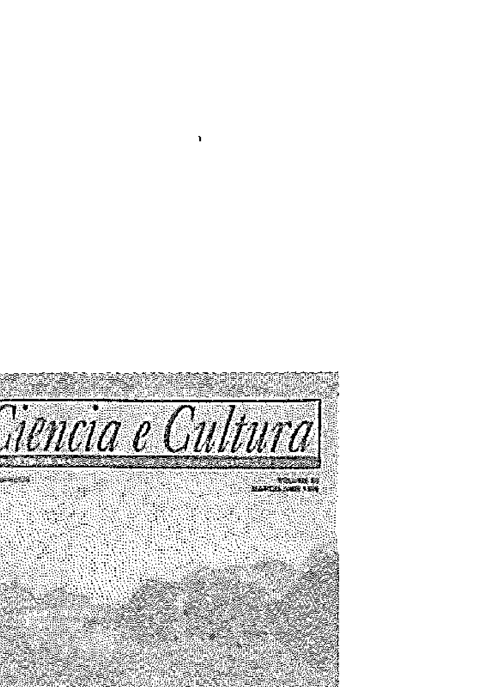

當然，這個情況並不難理解。畢竟意識這個主題，其實沒有客觀的根據可以引用。我又怎能用這樣的方法來探討祂？

別忘了，我可以引用的任何根據或佐證，本身還是落在客觀現實的範圍。然而，從我個人的體會來說，任何可以觀察到、可以表達的客觀現實，都還是從主觀的意識延伸出來的。再進一步，這個世界、一切、包括物質，都是從無限大的意識延伸出來。

基於這一點，如果你也要探討意識這個主題，也就應該是採用顛倒的方法，倒不是依循傳統——從客觀觀察到的一個點，去理解這無限的整體。

從客觀的現實出發，去探討無限的意識，這本身完全違反最根本的定律，而是不可能成功的。你只要想用一個客觀、有根據的方法來面對意識，也自然會發現這根本是不可能的任務。畢竟，針對這無限大的意識、永恆的整體，又有什麼東西可以稱為根據？

是這樣，我才會把科學家熟悉的這種方法暫時擺到一旁，而選擇分享我個人最直接的體驗。也許會有那麼一天，未來的人的聰明可以達到一個地步，而真正為意識建立一個完整的科學基礎。

然而，我很有把握，這樣的基礎絕對離不開這本書所談的觀念。畢竟，科學離不開經驗，而一套理論首先要符合實務上的經驗和體驗，才能站得住腳。

## 編者說明

陳夢怡

在寫作《唯識》這本書的過程中，楊定一博士口述時一再地提醒我，這本書在「全部生命系列」具有關鍵的重要性。同時，他也請我轉達給大家：讀的時候，不要太講究效率，每一章都要慢慢讀，讓這些觀念沉澱到心裡。

在對稿的過程，楊博士也一一體會讀者的心，而有了如今的安排：有些章節的頁面是不同的顏色。這些章節，要不在理論的層面帶著一種關鍵的轉折，需要靜下心來「參」；要不就是需要用「心」來讀，當作一種潛入心的練習。

這本書附的圖許多來自過去的作品。在作品中大量採用圖畫，對楊博士而言，一直都有一個主要的用意。畢竟你我接受觀念，文字的敘述並不是唯一的途徑。畫面或聲音的作用，往往是更直接、效果更好，而甚至能從多種層面帶來觀念上更大的整合。

如果讀者對這些圖已經有了一定的熟悉感，採用這些圖片本身一方面可以當作一種索引，方便讀者回顧之前的作品來對照自己的理解。同時，透過這些圖片，也不斷地帶來一種整合或提醒的作用，在理解的層面強化一個能夠自己培養自己的迴路、一個生生不息的迴路，而不斷深入全部生命的觀念。

正是為了強化和深入，楊博士沒有再採用新的圖片。畢竟，對於已經有一定熟悉度的讀者，重點不在於用新的素材去建立理解的新迴路。如果這時候還要強調「新」，也只是引發頭腦二元對立的作用，好像還要不斷去尋、不斷去找。反過來，從任何角落把大家帶回到一體，這本身才是「全部生命系列」想做的。

但願這個簡單的說明，可以幫助大家充分運用這本書整合的性質。

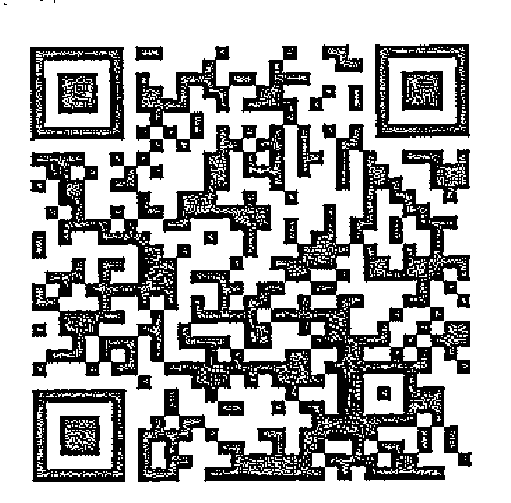

掃二維條碼，進入本書相關影片清單

## 01 人生，到底有沒有一個共同點

在這裡，我想引用希臘偉大的赫密斯（Hermes Trismegistus¹）的這句話——「如其在上，如其在下（As above, so below.）」作為這一章的開始。

這幾句話，對我可以說是在表達：一個真理，它本身一定是完整的。無論從哪一個角落去看，它都可以反映整體，或至少不違反它所表達的真理。

其實，如果你想探討意識的科學，真正重要的也只是如此。

我的意思是，對你，任何所謂的「真理」，一定要符合你的體驗，而且是從任何一個層面都說得通。如果只是一套單純的道理，但不符合現實，那也不足以稱為真理。

用這樣的原則，你可以仔細觀察，自己從出生到現在，這一生有種種樣樣的經驗，在經驗和經驗間有沒有任何的共通性？有沒有一個性質，是在所有經驗都可以重複的共同點？如果有這樣的共同點，它本身是不是一個可以獨自成立的本質？

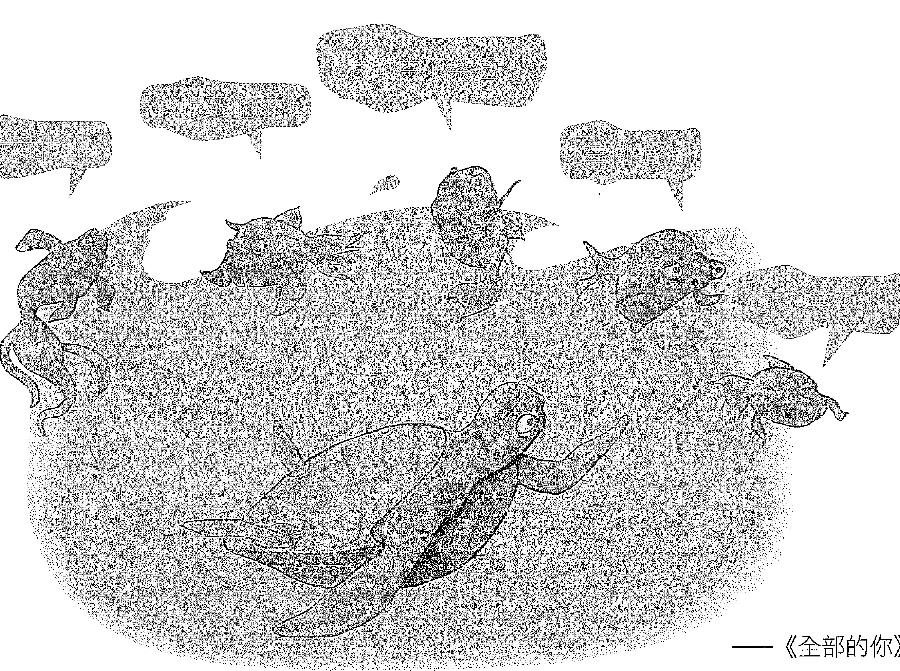

> ——《全部的你》

當然，你會說，這是不可能有的。

你只要回想就會發現，從你很小很小剛懂事開始，到今天，每一個經驗、每一個經過，無論是性質或內容都不一樣，並沒有什麼共同點。也正是因為沒有共同點，對你，每一個經驗才會新鮮、才會有趣。當然，這些經驗最好是「好」的：遇上好事、見到好人、感覺舒服、覺得放鬆。不用說，這類好的經驗和不舒服、不愉快、煩惱根本截然不同，完全不會有什麼共同點。

不只如此，你再用科學家的眼光對樣樣去追根究柢，也自然會發現：眼前的人、事、東西、狀況、狀態、一切，最多是在你腦海累積的印象。這種印象，你也可以稱它是頭腦運作的電子訊號。訊號隨時會出現，也隨即會消失，稱不上是一個可以獨自成立的本質。

如果你還有疑慮，也可以親自做一個思想實驗：拿一把解剖刀，一點點去分解眼前的某個東西。無論是眼前的桌子或書，只要拆解，所得到的部分自然會失去原本桌子或書的特性。再一路拆解下去，可以得到古代希臘和印度哲學家認為不可能再切分下去的最基本的單位（原子）。當然，你站在現代物理的角度，也知道就連原子也還可以再往下繼續切分，而還有所謂的基本粒子可談。

只是，你再進一步切分下去，到最後自然會發現什麼都沒有。

剩下的，最多是一片空。

這麼拆解下來，也就發現，在物質的層面並沒有一個本質可談。也就是說，任何物質，切分到最後，自然會讓你落到「空」。

然而，如果你把這種「空」當作「什麼都沒有」，其實也不正確。你最多只能說，最後剩下來的，是人類的五官再加上念頭也體會不了或體驗不來的空。

用同一個原則，你可以再三地重複這個思想實驗。你可以這麼拆解眼前所見、所體會到的一個人、動物、植物、東西、礦物，也能用同樣的方法面對每個心情、感受和念頭。

我相信，只要做下去，自然會發現，不光外頭的東西，就連你的心情、感受和念頭，同樣沒有一個獨自成立的本質足以讓它們單獨存在。

心情、感受、念頭，本身最多也只是頭腦運作的電子訊號。這些訊號不光是沒有實體，而且本身並無法獨立存在。每個訊號還要靠其他的訊號才足以成立、才可以存在、才可以產生意義。

你大概也能夠體會到，這樣的意義，其實還要靠許多條件（比如說記憶、情緒、整體的經驗）來衡量。

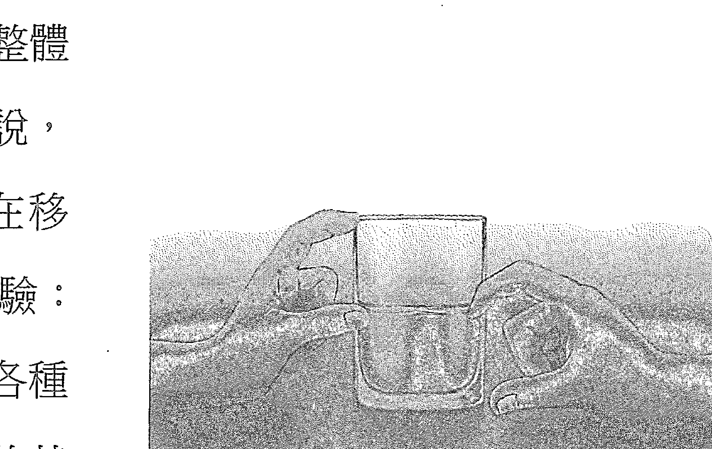

> —— 《豐盛》

更不用說，這個衡量的基礎是隨時在移動。你我都有過這樣的經驗：生病不舒服的時候，衡量各種心情、感受、念頭、印象的基礎，其實和平常完全不同。

是這樣，你我的經驗當然不會有共同點。不光是你的經驗和我的沒有共同點，就連同一個人的經驗和經驗之間，也沒有一個足以獨立存在的共同點。

只要你還想在一個具體的對象（也就是所謂的「客體」）上去分析、去找，例如眼前的人、發生什麼事、人間的關係、對未來的理想、個人或群體的期待、過去的發生、好事、壞事、意義、價值……你自然會發現，再怎麼找，也不會有一個根本的共同點。
唯一可能講的根本的共同點，是空。但是，這個空，你也知道，是頭腦沒辦法體會的。是這樣，對頭腦而言，只能承認沒有共同點，沒有一個我們能夠體會到的共同點。

## 02 共同點，是在於能知覺的，倒不是在於被知覺的對象

儘管頭腦找不到這樣的共同點，我在這裡還是要提醒你：其實，是你找錯方向了。你透過五官的觀察，自然會把全部的注意擺到客體的層面，甚至會忘記是五官在不斷為你建立眼前的現實。一天下來，無論是清醒、是睡夢中，你還是只會把注意力集中在眼前種種的客體。這樣的客體，可能是東西、事件、人物、經驗，甚至是想法、情緒、感受。只是，你只要一步步分析下去……

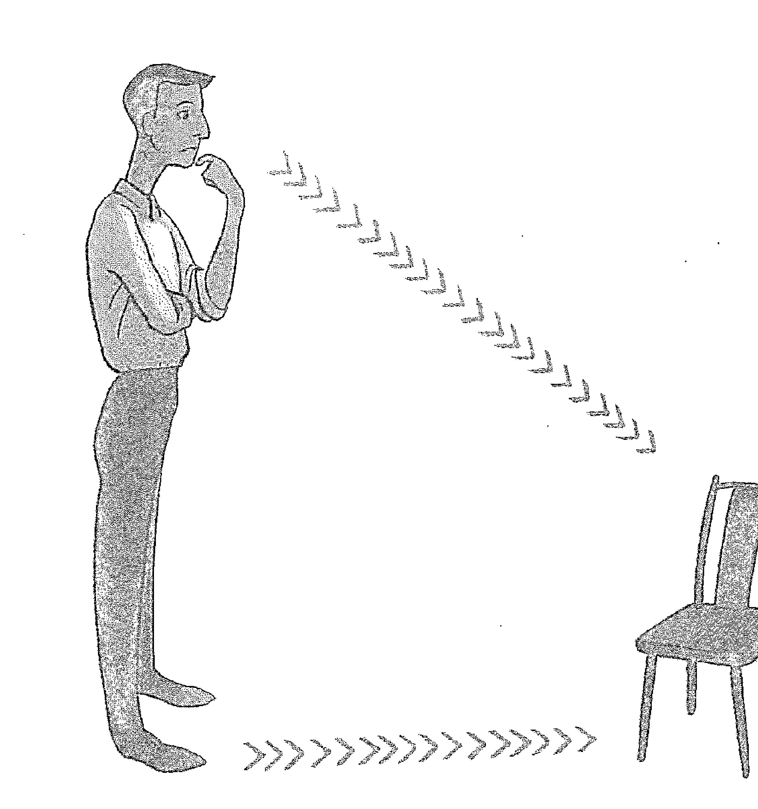

> ——《全部的你》如此，也就知道，所有這些客體，都沒有足以獨立存在的本質，最多是一種神經的印象。

儘管如此，我還是必須講，這一切其實是有一個共同點，只是你過去沒有注意到。

這個共同點，不在眼前或心中的客體，反過來是在——可以體驗到這種種客體的主體。這個主體，也就是「我」（對你，也就是「你」）。

回想一下，你這一生的任何經驗，是誰在體驗？
當然，是「你」在體驗。
任何東西，你可以觀察到的，都是「你」在觀察的。任何感受，是「你」在感受、在覺察的。就連這個世界，都是「你」在體會的。所以，全部經驗的共同點，當然是「你」。

但值得注意的是，我在這裡講的這個「你」，可能跟你所想像的不一樣。

我用這個「你」，是來表達最原始、最根本的「你」，是還沒有被染色、未經修飾、不曾被扭曲的「你」。

這個根本的「你」，比較接近一個可以覺察、知道、自在的潛在的能力。你也可以說這個「你」是還沒有去覺察什麼的「覺」、還不知道任何東西的「知」、還沒有在哪裡的「在」。就好像它還沒發揮作用前，它老早就存在。

它的存在，你、我、每一個人其實都知道。對你而言，這種「在」的存在，好像不需要任何說明或解釋，它本來就在。甚至，一個似懂非懂的小小孩，都自然知道有一個「我」存在。他可能用手去比自己、去指你、指其他的人，來表達有一種存在。有意思的是，就連動物都知道這種「在」的存在，而自然會想維持或保護自己的生命。

讓我再講得更清楚一些：舉例來說，你隨時會說自己體會到什麼或經驗到什麼。然而，我在這裡所講的「你」，這個根本的「你」，則是體會或經驗還沒有發揮作用的體。

這個還沒有發揮作用的體、最根本的「你」，才是我所要講的「主體」。過去，我在談這個最基本的主體時，要跟小我、小你做個區隔，也就稱它為大我（當然，現在我也可以稱它為大你）。

是經過這個大你的作用，你才可以突然體會到某個東西、體驗到某種經驗、覺察到這個世界、知道某一個觀念、在某一個地方、而接下來想去別的另一個地方。大你、大我，是這樣的一個共同點。它也就是最根本的「你」「我」，或「在」「覺」「知」。

它其實是最輕鬆、最穩定的一個點。當然，我們也可以把它稱為最穩定、最輕鬆的狀態，是每一個人都有的——隨時都有，只是也隨時都忘記。

畢竟，頭腦的機制，本身就是靠捕捉、追察、取得、期待而讓你從最穩定的點、最輕鬆的狀態移到一個比較不穩定的點或緊張的狀態。只要你的注意力一離開這個點或最輕鬆的狀態，頭腦的這種機制本身就讓你落回到一個狹窄、局部的角落。

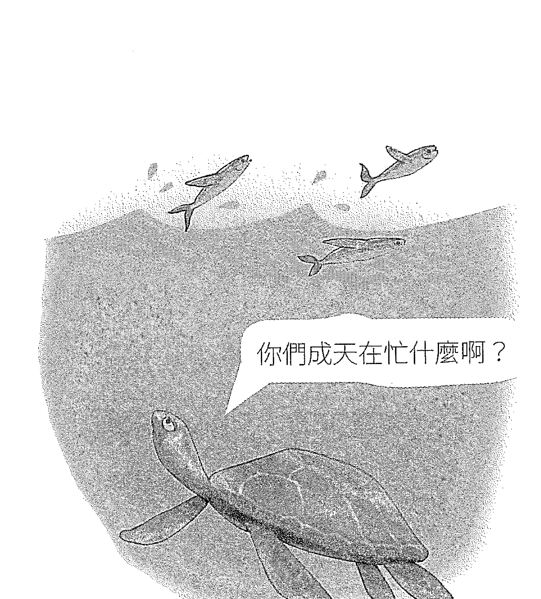

> ——《全部的你》

你的注意，從一個最根本的主體落到客體。這個過程，也就是我過去談過的「客體化（objectification）」，可以代表一切頭腦的機制，也是你隨時在運作的過程。

你透過你的聰明，哪怕是一種很深很奧妙的念頭、或像詩一樣美的表達，其實也就已經把自己從一種最輕鬆的狀態，帶到一個靠不住的角落。

這就是你、我在每一個時點所遇到的挑戰。

這樣的聰明，讓你隨時把這個最原始、最輕鬆的「你」擋住了。頭腦的聰明所帶來的影響，就好像你在一張新鮮、沒有人畫過的畫布上塗了幾筆，不知不覺就把自己投入了這些隨手畫上的顏色和線條，而把它變成你主要的存有，反而把畫布隨時忘記。

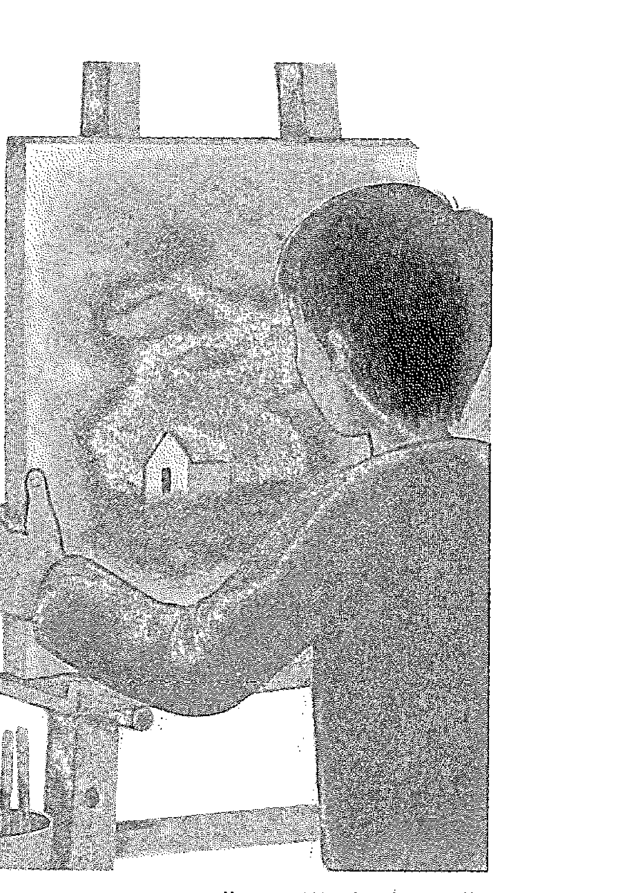

> > ——《頭腦的東西》

也就像你、我，隨時注意聰明帶來的各種相對的區隔和境界，而隨時把整體、無限大、永恆、絕對的意識落在注意的背景，也就把他隨時忘記了。

## 03 又再一次抓錯重點

雖然說你也就把意識的背景、把畫布隨時忘記，但真正奇妙的是，其實你也忘不了祂。別忘了，如果沒有這個意識的背景、沒有畫布，你連顏料都塗不上去。

其實，你在人間的每一個畫面、每一個經驗，從來沒有離開過祂，只是你不知道。然而，不知道的你，並不是這個最原始、沒有被污染過、沒有被扭曲過的「你」（大我、大你），而是頭腦投射出的小你。

這個頭腦投射出來的你，和大你不同。這個小你，本身

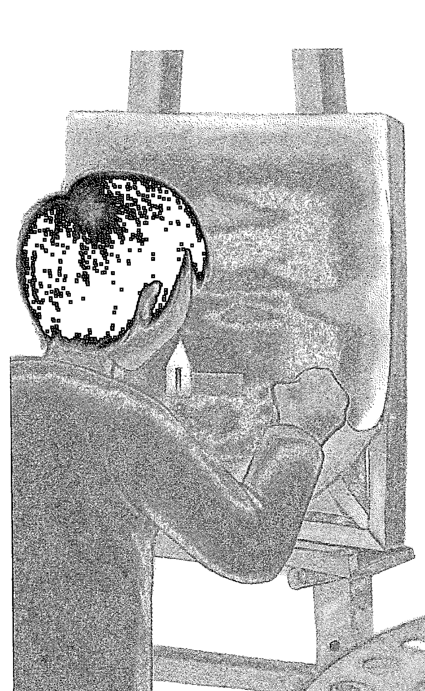

> ——《頭腦的東西》

是頭腦的產物，是一團念頭的組合，本身需要別的條件才能成立，隨時要受到限制和制約。

這個小你，跟我們每一個瞬間所觀察到的任何客體一樣。它有邊界、有限制、是一個框架。它會出生、也會死亡、會消逝。它是我們頭腦和五官所投射出來的印象。

你摸摸自己，摸到了臉、手臂，摸到了區分身體內外的皮膚。你有 170 公分的身高。你是男的或女的。你的長相、外貌。你帶著某一種氣質。

你這一生從來沒有一件事是單獨的發生。每一件事都依賴著前面有一件事來引發它，而它本身也會產生後果。

你打開冰箱拿水，喝了，會解渴。你到浴室洗臉，感覺清爽許多。你看電影時，會吃爆米花。你工作做不完，週末又得加班。車子里程數滿了，你不能再忘記送廠保養。有了孩子，你開始小心地記錄生活開銷。

你收到一封信，看到寄信人的名字，馬上想起上次的不愉快。你一看到同事的臉色，就知道人家對你有意見。主管誤會了你，才剛把你罵了一頓。每次開完會，總是胃痛，你開始定期做健康檢查。

探病回家，你想起孩子還小，也就決心要規律運動。你在電視上看到車禍的畫面，會叫其他人開車要小心。你開會時胸口一緊，你沒有告訴任何人，一個人夜裡上網查「胸悶症狀」。收到同年齡的人的訃聞，你默默加買了保險，第一次想遺囑要怎麼寫……

全部這一切，都有條件，而都受到限制、受到制約。這一切，都是在這個框架裡建立的。這就是你這一生認定是全部的你。你認定，這一生全部的可能也不過如此——會來、會走、會生、會死、會病、會老化。

這，就是你認為是自己的全部。

這個你，會把自己的注意力投入到物質，同時認為自己被眼前的物質守住。這個你，不光和它合一，認為自己被它困住，還會認定自己就是從眼前的物質延伸出來的。這種處境，是多麼荒謬可笑。

然而，大你、大我是不一樣的。它是還沒有產生作用、還沒有產生關聯前就有。它是獨立的存在。

大你、大我，是你可以輕輕鬆鬆承認、可以在的一種存在的觀念。最有意思的是，你有的大你，它其實並不受你觀察或體會的同一個限制！

這個觀念實在太重要，我可能需要再重複一次。

你或許沒有注意過，眼前所看到、所體會、感受、想得到的一切（你可以把這一切稱為人間），其實都是站在一種局限、相對的層面。甚至，眼前的東西或思考愈具體、愈局限，也就愈讓你能夠注意和區隔。

至於能觀察的這個體（你可以暫時把它稱為「主體」）則不受到同一個限制。它是無邊無際，隨時可以存在。

讓我再試著用另一個方法來說明：

你可以把觀察（五官透過捕捉資訊為你建立印象的機制）比喻成光的折射（refraction）——就像是透過一個稜鏡，把無限大的宇宙或無限的光捕捉下來，同時還扭曲光線前進的方向，來照明一個很小的範圍。

這種局部化的過程，和你隨時在運作的注意力是一樣的，把本來無限大、永恆、到處都有的整體，落成局部的一個小點。

你的注意本身就帶著一種類似光線折射的機制，而你是透過這樣的注意才可以建立眼前的世界。至於你注意不到的東西，比如說那個無限大的宇宙，也就自然落到背景。

如果用光線的折射來比喻你的注意，那麼，你觀察的機制，也就是五官和念頭二元對立的比較和對照，作用則是像稜鏡一樣——扭曲你的注意。

進一步，你自然會透過比較和對照，就像用畫筆在畫布上一個點一個點建立出一幅畫，把你注意到的東西、東西之間的關係建立起來，而能夠從眼前的人、事、物取得一點意義。假如再加上念頭，去比較一個點的位置、它之前的位置、它未來的位置，也就這樣，對你，時間的觀念就出來了。

> ——《頭腦的東西》

當然，點和點之間的每個角落，因為注意不到、抓不到、沒辦法體會到、無從比較起，你也自然會把它當作空白。

你只要懂了這樣的比喻，或許也能夠體會到——對任何東西的觀察，不光受到注意力折射的作用，它本身也完全被觀察的機制或工具（稜鏡或這裡講五官和念頭）框架起來了。

在這種限制之下，還要探討這一生究竟是自由或不自由——這種議題，對你其實沒有意義。畢竟，你可以體會到的現實本身就已經不是自由的。它是透過條件才可以聚合，又怎麼可能組合出自由的人生？

儘管如此，這個議題還是反映了一個重點，也就是說，從每一個角落，不管是虛的或不虛的，真實到頭來還是會現身，還是會露出祂自己。

這句話含著一把寶貴的鑰匙，讓我再換個比喻來切入。

「真實會露出祂自己」這句話要表達的是，不管你是忘記了真實，你所遇到的每一個客體，本身已經在為你反映它是怎麼來的，或者說，它已經告訴你它是怎麼被顯現出來的。

一個客體的存有，本身已經在反映它成形的機制。

就好像你看一幅很美的畫或去欣賞一場演出，因為畫很美、劇情很精彩，你可能會忘記這幅畫其實只是顏料在畫布上的組合，而戲只是舞台上的演出。

但是，你忘記了畫布和舞台，並不代表它們不存在。畫布和舞台其實還在。只是你的注意力被它所包容的內容帶走，被畫作的美或戲劇的情節給迷住了。

既然，畫布和舞台隨時存在，沒有不在過。你只要把注意放鬆回來，那麼，一直在背景裡的畫布或舞台，也就隨時會從你的注意露出來。你就是想把畫布忘記，想把舞台忘記，對它也沒有影響。然而，如果沒有它們，你根本沒有這幅畫、這場戲可以談。

你懂了這一點，也自然可以體會到過去所講的：人生的每一個經過、每一個角落都是出口。

當然，你讀到這裡大概也理解了，雖然我用「出口」這個詞，倒不是為了讓你透過注意或是意識的轉變從人生「跳出來」。其實，你也跳不出來。

你最多也只能把原本的注意放過。本來你的注意完全擺在客體，把注意放鬆回來，讓它輕輕轉回來，你反而才突然可以體會到，原來，觀察的人或主體一直在背景。

也就這樣子，你的頭腦突然回轉過來，而你可能發現自己進入了一條沒有路的路。接下來，對你，最有意思的，不是眼前不斷改變、會生會死的客體，反而是後面輕輕鬆鬆可以觀察的主體。真沒想到，這個不動的主體，竟然比各種不斷變動的客體還更有趣。

也就這樣子，你會發現，就連外頭的客體，包括物質，也就是從頭腦延伸出來的。

其實，要體會到這些，倒不是把你的注意擺到哪些學問、某一種法或某一個神聖的象徵。反而只要放過眼前的事，把原本盯著客體不放的焦點退回來，也可以說是把你投注在上頭的注意解散。

這也只是你唯一需要做的。

## 04 物質是一種觀點，並不是一種東西

我等了好久，到現在才敢提出「物質是觀點，倒不是東西」的主張。

這一點，從唯識的角度，完全是正確的，但它和所有人的認知可以說都是相反的。為了避免不必要的反彈，我也就要用那麼多作品來鋪路，而到現在才寫出來。

人類就自己所承認、認定有的現實來看，一般都會認為物質就是最根本的存在。仔細觀察，你、我、每一個人都確實也都把物質的存有視為理所當然，認為它就是我們所有認知的前提。

何況，你我從小就接觸人、動物、植物、東西、念頭，當然會認為物質本來就存在，而且是再理所當然不過的存在。

到了現在，你我還是如此。你讀這些話，是靠一本書（是物質！），也許戴著眼鏡（又是物質），坐在椅子、沙發或床上（沒錯，還是物質），放下手上的咖啡（物質），去洗手間（物質），想起明天上班還有許多事要煩惱（煩惱，從我的角度來看，可以說是比較微細的物質。當然，當煩惱落到你的眼前，其實已經再明顯不過，一點都不微細了）……

既然你從小到現在面對的，就是這樣的現實，你難免會想問：「物質存不存在，這種問題還需要談嗎？」

但是，話說回來，你也知道，物理學家努力了那麼多年，就是想解開物質最基本的性質。只是，到今天，經過百千年的探討，還是沒有找到這個最基本的組成。這一路上，無論物理學家找到了什麼，再小、再微細，他們也知道還有更小的。而且，根據他們的預測，再往下找，找到最後，會是空。

你看，最先進的物理學，窮盡理性所得出的結論是——物質，到最後是空。這一點，符合你自己的體驗嗎？還是，即使如此，你仍然覺得這個題目只是無謂的閒聊？

除了物質存不存在這個主題，另外還有一個層面值得你去探討。畢竟人類幾百年、甚至幾千年來都是往物質層面發展。你、我也當然會重視物質。舉例來說，你不只認為物質是理所當然的存在，同時更會認為所有的意識都是從物質延伸出來的。

對你而言，是因為有遺傳物質 DNA，而由 DNA 延伸出來蛋白質，再延伸出來細胞；細胞組合成各種器官；其中，有一種器官是腦；腦和神經細胞再延伸出你的意識。

而且，你還會很篤定地認定有一個世界，而這個世界有種種的物質。這些物質有各式各樣的形狀。樣樣的人、事、物，動物、植物，每一個都有獨立的存在。

對你，這一切的存在，不僅在你之外，而且跟你一點都不相關。你有你的存在，其他東西或其他人有他的存在。你有你的意識，其他人（甚至其他眾生）有他們的意識。這些不同的意識，最多是偶爾有個交會，但大多數時間沒有相通之處。

這種以物質為主的觀點，也就是過去所稱的唯物論或唯物主義，本身幾乎可以說是所有科學的前提。如果你正好從事科學或技術研究，你也可能認為倘若連這個前提都不存在，根本就沒有現代的科學或科技可談。

但是，我還是想為你大膽地提出另一種可能的解釋。

你已經知道，透過你這個肉體的生命可以觀察到、體會到的，都已經受到頭腦的過濾。你甚至可以說這種過濾，其實是一種窄化。這一點，只要自己仔細去體會，會發現當然是如此，也自然會覺得這沒有什麼好辯論的。

但是，你或許沒有想到，透過這種過濾、窄化而可以體察到、體會到的，其實也包括物質。並不是其中某一種物質，而是全部的物質。也就是說，你過去認為堅實有形狀的一切物質，其實都是透過同一組過濾的機制，才可以讓你的神經、大腦捕捉到。

當然，神經跟大腦本身的存有也離不開同一組過濾的機制。是基於同樣的機制，我們才可以體會到什麼叫「腦」什麼叫「神經」。也就是說，就連腦和神經，本身也受到和所有物質相同的限制。

說到底，這一重過濾的限制，本身已經把你觀察到的客體（任何物質）固定而框架起來。你觀察到的任何客體、任何物質，本身就已經被限制、被鎖定。

被什麼鎖定？也就是被頭腦的機制，被製造它的機制鎖定。

物質，離不開製造它的過程，最多是在反映你認知它、捕捉它的機制。而製造它的過程、捕捉它的機制，本身也離不開生死，都是從二元對立衍生出來的。是這樣，我才會說，物質本身是個觀點，最多代表了一種看世界的方法，而根本不是一個東西。

一樣地，局限的腦，也不是一個具體的東西，它最多是一種認知的方法或過程，或者說是看東西的方法。局限的腦，本身就是一種限制的機制，是把整體限制，設定出一個框架。把一個沒有邊的無限大的空間，造出另一個比較小的體，而讓我們可以覺察出來。

你體會到了這一點，也就突然明白，其實，沒有一個物質足以獨立存在。任何物質，都沒有一個站得住的本質可談。

雖然，我過去用「頭腦的東西（mind-stuff）」來描述物質，你現在應該也發現了，其實，連頭腦的東西也算不上是一種東西。再怎麼說，你、我所認識的頭腦和東西，這兩個還是受到和物質同一種機制的限制和扭曲。在整體來說，一樣是不存在。

我相信，早晚有一天，這些話對你不再是理論，而最多只是反映了事實。

## 05 雖然如此，物質對你我還是存在

物質，最多只能算是一個觀點，只是反映你我認識世界的方法。或是換句話說，物質反映的是我們用怎樣的管道和機制在看一切。從這個角度來看，物質最多是反映一種觀察的機制、管道或工具，倒不是足以獨立存在的客體。

當然，物質，對你我還是相當具體。這種具體感，背後其實含著一種假設——好像我們被限制在這個身心，而這個身心有一個獨立而相當具體的生存，跟整體或意識是分開的。是這樣，從這個具體的身心所觀察到的物質，才會那麼具體。

我在這裡也只能坦白說：對你和我（也就是對小你、小我），物質當然是存在。你可以稱為的物質，所反映的觀察管道也正是小你、小我。是有你這個肉體、這個身心，才為你反映出物質。

物質是頭腦和神經的產物，是靠這個身心才有。不只如此，物質本身就是在反映身心或說小你、小我的存在。

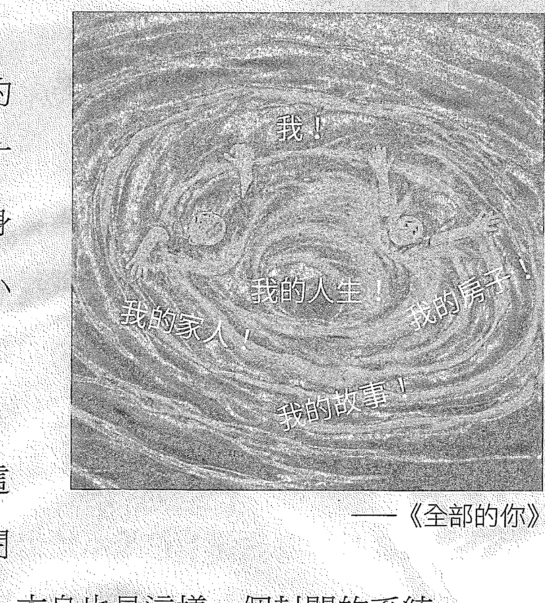

小你、小我、身心、頭腦、神經、物質……這些觀念，都屬於一種封閉的系統。你所面對的人間，本身也是這樣一個封閉的系統。

> ——《全部的你》

是這樣，你假設有的你，假設有的我，都離不開這個封閉的系統，本身也繼續塑造這個封閉系統的限制。你才會不斷認為自己是有界線的，而且你的作用會受到邊界條件的限制，會出生、會死亡、認為樣樣有先後的順序。會跟著受這個封閉系統運作法則的影響，承續它顛倒再顛倒的洗腦。

你都認為自己是真的了，即使你說物質不是東西，而只是個觀點，這話是很勉強的。只要你還認為有一個獨立存在的「你」可以講這種話，現在這個小你所見到或面對的現象，從你的角度當然還是獨立的存在。

對你，不管怎麼講，物質還是存在。

到這裡，我相信你才會理解，我為什麼認為去談物質的來源、宇宙的起源、物質和物質之間的關聯或互動機制……全部都是一種顛倒的追求。畢竟，這些追求再怎麼深入，最多只是在延伸一個本來就顛倒的觀念。

反過來，比較正確的探討，是集中在觀察物質的主體（或前提）——這個主體是怎麼來的？它又可以去哪裡？它跟真實有什麼關係？它是不是也要受到人間這個封閉系統的法的作用？它本身是不是一樣是局限、是無常？

我認為這樣的探討才是重點，而且是更值得深入的題目。

但是，你過去可能也跟大多數人一樣地，完全忽略了這個層面，而竟然把自己的注意都落在一個狹窄得多的範圍裡，也就把自己這一生當作和這範圍一樣——最多只是一段暫時的經歷。

讓我再講得更透徹一些，就算你要探討的是「世界、人間或任何物質是不是幻覺？」這本身依然沒有抓到重點。你投入這樣的探討，反而還讓你耽誤許多時間在一個根本沒有用的主題上。

我在這裡要再重複一次：你既然有這個小你、這個身心，眼前這個世界、物質、宇宙對你當然會再真實不過。

這個論點，根本沒有什麼好去探討，而且也沒有必要去否定。

只是，你過去可能已經耗費無數的時間，透過各種修行或靈性的領域在追求這一點，而可能不斷地勉強說服自己去認同——這個世界是幻覺。然而，現實是——你只要一回到生活，你就不認為是幻覺，樣樣都很真。

對你，你想要相信的理論，和你個人生活的經驗是有矛盾的。而且，這個矛盾是你過去整合不來的。

你所謂的修行其實充滿了矛盾，即使我已經講得這麼清楚，但是你到現在還可能希望跟人分享心中種種的境界，

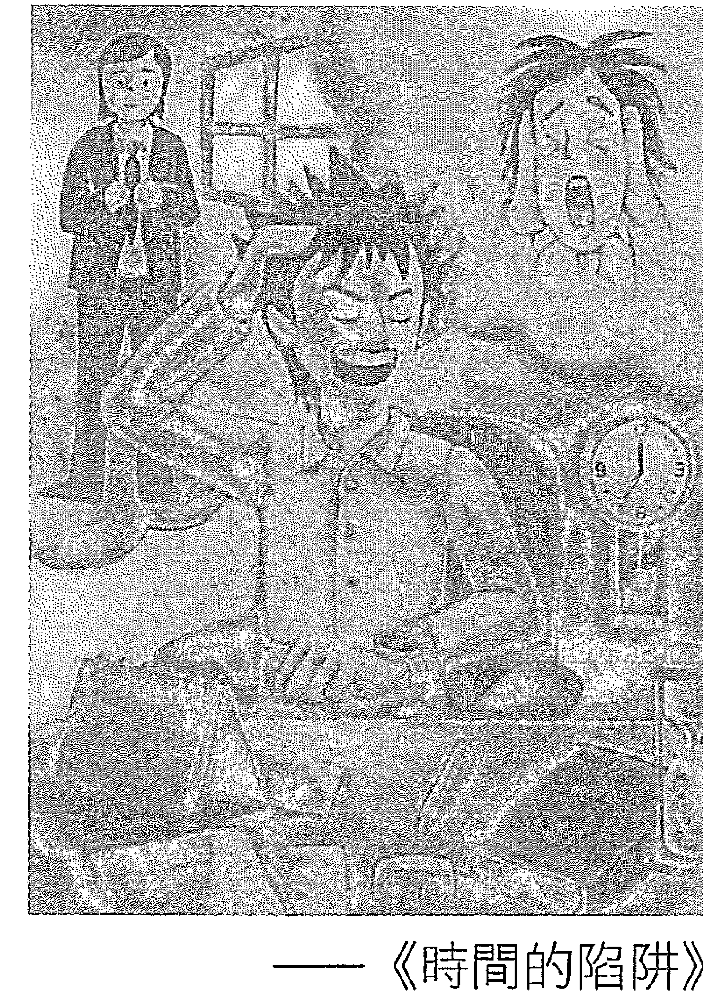對修行的主題有種種的看法或問答。

你或許還是沒有意識到，就連你以為正確的種種修行的分享，其實還是站在一個顛倒的角度——從這個身心，也就是物質、「有」、相對的層面，在看全部的生命。

## 06 物質跟意識的關係是顛倒的

在這裡，我要為你再提出另一個大膽的說法。

這也就是——你有沒有想過，要是一切都是顛倒，而假如一切都是顛倒......

萬一「物質」（你所認為的物質）反過來是從意識延伸出來的？！

- 有了一，才可能有多。
- 有了統一的整體，才有多重，才有樣樣。
- 有了一，才可能有二、三......一切。
- 有了無限，才有有限。
- 有了絕對，才有相對。
- 有永恆，才有無常。
- 有了心，才有體。不只是身體，而是任何體。
- 有了空，才有有。
- 有了在，才有有。
- 有「知」，才有知道。
- 有「覺」，才可以覺察。
- 有主體，才可能有客體。

寫到這裡，我並不期待你馬上認同這些話。反過來，我會建議你，給自己一點時間，讓自己可以沉澱，可以一一回想——這些話，跟你個人的體驗或認知符不符合？還是你依然覺得完全陌生，甚至認為不符合常識？

## 07 意識含著一切的物質

我知道，你讀到前一章顛倒的觀點，一定有些感觸，也可能想立即跟我分享。

我都知道。

但是，請你等一等，讓我再指出另一個觀點。

你是否想過，你、我、每一個人覺、知、在（也就是每個人都有的覺察、知道、在的潛能和作用）全部都還屬於一種「場」的觀念。

場，嚴格講也離不開物質（當然，和一般理解的物質相比，還是微細多了）。場，可以說是在你、我的五官去體會前的一種潛能。你可能也記得我時常強調，任何意識或意識場，本身離不開螺旋或螺旋場。生命，也離不開這樣的場。

意識，可能會讓你感到比較抽象。是這樣，我才會試著用生命場或意識場的觀念來表達。其實，人可以體會到的生命場或意識場，最多是一種高速的螺旋場。

你再仔細去觀察自然界的現象，從星系的爆發，水流的漩渦、天邊襲來的風暴、一朵花綻放、葉芽探出頭來、貝殼的紋理、DNA 的纏繞、蛋白質的架構……自然界所有的形態，都離不開螺旋。就連超導體，也離不開螺旋。

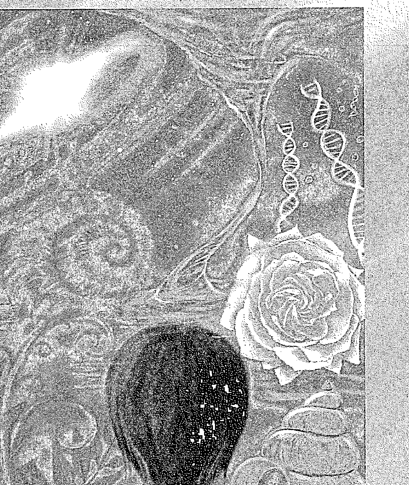

> ——《奇蹟》

只要你去看，就會注意到：螺旋，其實無所不在，到處都在。就好像生命不斷跟你留下悄悄話，隨處留下祂的腳印，要你去注意祂的來源，等著你去發現祂。

我常開玩笑，生命處處都有螺旋的形態，就好像小偷四處留下自己犯案的證據，生怕你猜不出是祂做的，更好像在等著你抓到祂。

只是，祂也真不明白為什麼你非要把頭轉開不看祂，好像在跟祂賭氣，怎樣都不肯承認這麼明顯的事實。

不要說螺旋場，我們對意識也是一樣地視而不見。

意識，最基本的表現，其實就是「覺」「知」「在」。這些特質，在任何念頭前就有。也就這樣，你透過念頭或語言，再怎麼努力就是觀察不到。

這次，我要再往前推進一步：其實，你這一生還沒來之前，「覺」「知」「在」就有。就算你離開了人間，還是有。這些特質，跟你在人間的區隔與分別一點關係也沒有。

祂不需要一個客體來建立自己。

在意識，最多只有自己。

祂是圓滿的。

祂本身是無限大、無限小。既永恆，又短暫。全部，都離不開祂。

祂獨立存在，並不需要依賴任何條件或「東西」才能成立。甚至，任何條件或東西，都還是在意識內發生，或從祂衍生出來，而不可能在祂之外。

這麼說，連你的這個身體、你的腦、你的聰明、你這一生的故事、你全部覺察的能力、你所看到的別人、別人看到的你，都是同一個意識延伸出來的。

甚至，講延伸「出來」都不正確。沒有什麼「東西」，可以從祂延伸「出來」。

一個圓滿、不受約束、開放的系統，包括一切。

一切，離不開祂。

一切，也不可能另外再建立一個獨立自主的系統。

假如可以在祂之外成立另一個體，這樣的意識不可能是無限大、永恆、圓滿。

你最多也只能承認，意識是包括一切。甚至，祂包括我們人類所體會的空（哪怕這個空最多是一個「小」空或「相對」的空）。

你只能承認——祂包括一切。

你也只能肯定——除了祂，沒有其他。

這一點，可能是你這一生最難體會到的。

過去，你全部的注意都擺到你所覺察到的什麼、你所知道的什麼、所在的這裡或那裡。這一切，都是在意識的下游著手。

甚至，你一天 24 小時、一年 365 天都把自己活在一個充滿客體的範圍。然而，客體，再怎麼豐富，還只是一個很狹隘的注意對象。而且，這狹隘的注意對象，最多只在意識場佔了不成比例小的部分。我也說過，可能不到兆分之一。

回到前面的重點，我要再跟你分享一個論點：是從同一個統一的意識場，才延伸出樣樣多重的現象。

光是地球上的 70 多億人類、再加上動物、植物、數不盡的各種微生物……用幾兆來估計，都還是遠遠低估了。這麼多這麼多的各種生命，正因為來自同一個統一的意識場，在物質層面當然會重疊。是這樣，你看到的，和我、他看到或體會到的，好像是差不多的。

這，就是我們共享的世界。

你可能要坐不住了：等等，前面不是才剛說過沒有共同點嗎？為什麼你看的和我看的會好像差不多？

很好的問題。

在這裡，先讓我繼續講下去。你自然會明白，這種印象的共同和重疊，和這本書一開始所談的「沒有共同點」其實沒有矛盾。

對頭腦而言，這種表面上的共同性是這麼地理所當然——你看到的，我也看到了。我看到的，你也看到了。

你過去自然會用這種表面上的共同性，來證明你看到的是真的，而我看到的也是真的。

不光你我都看到的現象是各自獨立的存在，你也會推論出來：看得到這些獨立存在的你、我、每一個體，也都是各自單獨的存在。

你更會進一步認為，這些單獨存在的體各有各的獨立的意識。

你同時也會用這個道理，對自己強調意識是從物質出發。

無形之中，這種區隔成為人類共同的假設，成為頭腦啟發任何作用前必然的前提。

換個方式，讓我借用網路的寬帶（寬頻，也就是設備能接收到的頻率範圍）再做一個比喻。

你現在所體會到的世界，也就是你在某一個寬帶內所能體會到的。假如你擴張了涵蓋的範圍，可能又存在著其他眾生才彼此相通的世界。它們之間共同的世界，是你在目前的頻率涵蓋範圍內體會不到的。當然，寬帶涵蓋的範圍有無限的可能，這種某些眾生之間才彼此相通的共同世界，也有無窮無盡的組合。我才會說，就在現在，就在同一個時點，你我其實和宇宙數不完的眾生同生共存。只是，我們所體會到的，是其中一個不成比例小的部分。這些觀念，在量子物理其實也早就已經強調過，只是沒有或不會有實驗數據來證明。其實，再豐富的可能，無論相通或不相通，背後仍然沒有一個共同的本質，沒有足以獨立存在的共同點。

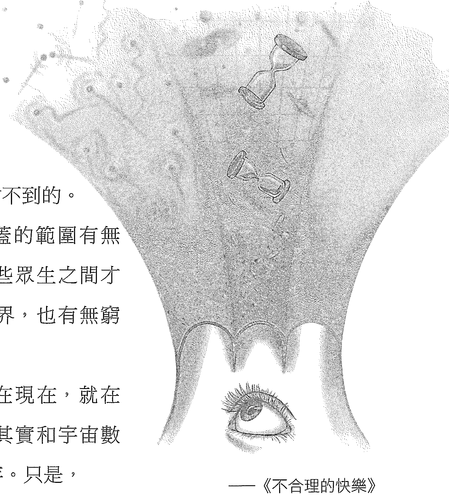

> ——《不合理的快樂》

## 08 No-Thing Exists

沒有東西存在²

我知道，連續兩章，我都提出了一些顛倒的主張，而可能對你帶來很大的衝擊。

不過，衝擊可能還沒結束。

在這一章，我要再提出另一個顛倒的觀念。

假如你一路走到這裡，全部生命的觀念已經落到心中，而你甚至已經熱切地投入練習，我認為你現在或許已經能夠接受以下的觀點。

首先，我前面已經提出了幾個顛倒的觀念：意識走在物質之前，是意識優先，倒不是物質優先；是意識含著物質，倒不是從物質延伸出意識；甚至，就違反過來「物質從意識延伸出來」都不正確。

你最多只能說，最根本的意識本來是無限大、是永恆，只是突然被一個小體「遮住」了。而這個小體（也就是小你、小我）產生一個機制——二元對立、聰明、區隔、邏輯、分別，再透過這樣的機制，靠一種叫做物質的現象或觀點建立起自己的存在。

千萬不要小看這個機制，這個機制其實含著相當高的聰明。它利用因一果的法（業力）可以將任何事物連結起來，讓你眼前的東西與現象得到一種連繫或整合。同時，它也建立出兩個不可思議的觀念，一個是空間，另一個是時間。

空間，其實也是無限大的意識突然透過覺察被客體化。透過五官的覺察，它設立出長、寬、高三個維度，為你帶來一種立體的空間感。

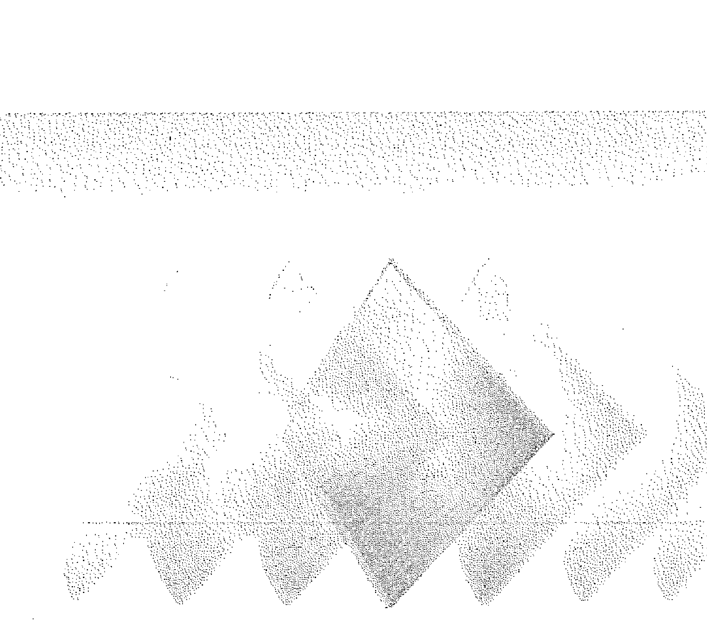

時間，是怎麼來的？本來是永恆的意識，突然被頭腦給客體化。它透過念頭將這些空間重疊起來而不斷地比較，進一步帶給你時間的觀念，以及「動」的印象。

無限大的意識，落到一個角落，變成空間。永恆，落到一個點，變成時間。時一空，是這麼來的。

就像看電影。你進電影院時，明明知道電影的畫面是從投影機放出來，落在一個其實是平面的銀幕上。但有趣的是，你看電影時一定會認為它有立體的深度、有空間。你會看到演員在動，在從一個平面化出來的一個個空間，透過一個個或快或慢的動，建立起他的人生故事。

> ——《全部的你》

你還可以透過你情緒體的反應，去衡量他的故事夠不夠精彩、夠不夠真實、夠不夠深刻、能不能觸動人心，而最後是不是能讓你學到什麼或累積什麼印象。

電影結束了，你起身離開座位，也自然再一次看到，在種種的動中，唯一不動的，最多也只是這個銀幕。放電影前，銀幕在。電影播放時，銀幕當然在。電影結束了，銀幕還是在。

對你，這個在看電影的人，當然，電影是真的，而且每一個片段都是真的。你是投入在五官的層面。但是，銀幕從來不介意這故事的內容，也不會動。

電影最多是借用銀幕來講它自己的故事，但我們通常會投入在電影，也自然忘記底下的銀幕。

只是，無論電影有多精彩，銀幕不受影響。劇情再怎麼悲傷，銀幕還是銀幕，不會流一滴眼淚，更不會為它嘆息。就算投影機定格下來，不讓這個故事離開銀幕，它還是沾不住，不可能在銀幕本身留下一點印痕。

意識，就像這個銀幕。祂和從你眼前流過的豐富內容、種種變化一點都不相關。

你現在回想，過去我還會說意識、整體、一體、心、佛性、主、神會來關心你、會來疼你。現在，你突然發現這些話好像不相關，根本不是重點。

跟你講這些話，就好像要你去問銀幕會不會關心電影的內容、在不在意它傳達的訊息、是不是會覺得哪個演員特別可愛、還要心疼哪個角色特別可憐、評論哪一個情節特別動人或特別不公平，而甚至還會想插手修改。

我相信，你心裡都明白，都是不可能的。

儘管如此，你可能還是捨不得不繼續看這場電影。你甚至可能已經對某一個角色有了感情。你會捨不得他受苦、在白費力氣，你看不下去他付出真心卻沒有回報。他受傷時，你也可能別過頭不忍心去看。你明明知道這角色是虛構的，還是會想貼到他耳朵邊提醒他：「你醒過來吧」。

當然，你發現他聽不到。於是，你會再大聲一點，甚至用盡力氣大喊。然而，再怎麼喊，你會發現他還是聽不到。

這時候，你最多也只能認清這個電影的任何角落，無論是一個角色、一匹馬、一輛車、一張桌子、一間咖啡廳、一個熱鬧的市集、主角和愛人相遇的巧合、那一刻的晚霞……其實，都活在一個封閉的系統裡。

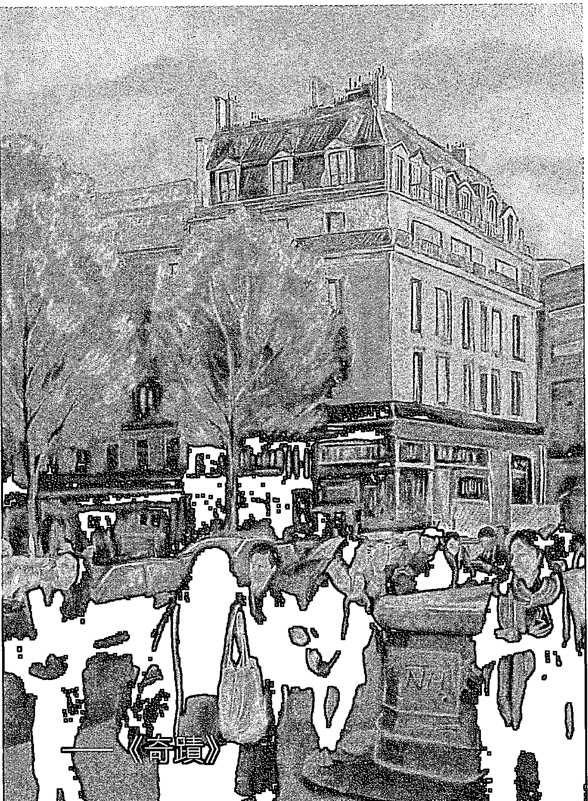

當然，嚴格講，我們的人間不也就是這樣的封閉系統？但是，這電影是封閉裡的封閉，跟它自己以外的，沒有任何交流。在這個比較小的封閉系統內，角色、馬、車子、桌子、咖啡廳、市集、愛人、晚霞……都是再真實不過。它們不光是真的，而且都有各自的特色。

一樣地，對你，任何物質不只存在，而且是真的，根本就是再真實不過。

要講物質對你不存在，才是胡說。

物質的觀念本身就定義了你，而你也在定義物質。也就是說，透過物質，是不斷地在強化「你」，而「你」也會一再地強化物質的存在。對物質的認識，離不開我們人間覺察的機制。這個覺察的機制（有人稱為二元對立、人類的邏輯）本身已經建立起一個封閉系統。

這個封閉系統，含著你，以及跟你相關的種種物質。

最有趣的是，在這個封閉的系統裡，點點滴滴好像都可以連結起來，甚至還有一種悠久的時間感。至少，在人類眼中已經有了幾百、幾千、幾萬年。你自然可以得出一個演化的印象。這樣的演化，對你（小你）當然是存在的。如果要說不存在，對你才不符合現實。

對，你可能想起來了，也明白我過去講歌德爾的理論，其實就是為了談這一點。

對你，這個認為樣樣都真實的你，很難留意到——其實，你所觀察的東西，或你用來找它的機制，本身已經被你觀察的工具框架起來了。無論你想找什麼或可能找到什麼，最多也只能找到（你觀察的工具所能找到的）這麼多。

你從一個封閉的系統，是絕對跳不出來的。最多，你只能抵達你的工具或技術所含的邊界條件。你不可能找得到範圍以外的東西。

你離不開這個框架，我們也可以把它稱為邊界條件。

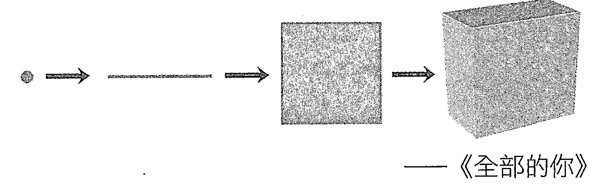

比如說，一個點，看不到一個平面；一個平面，體會不了立體。我們要怎麼跟一個點說明它沒有這個機制可以看到一個平面？平面也是一樣的。它再怎麼練習、體會，對它好像也沒辦法有一個東西叫做立體。你可能還記得，我過去用螞蟻的比喻。螞蟻在桌上爬，對立體的認知是很有限。桌上的東西也就是牠的世界。超過桌子之外的，牠連想都想不到。

其實，我們也是如此。我們就在一個封閉的系統，而被我們覺察的機制和二元對立鎖住了。但因為我們在這個系統，覺得運作得還不錯，當然也不會想去注意封閉系統之外的，更不會想去探討。

講到這裡，你大概也想到了，前面說從物理的角度，到最後可以找到空，這種話本身也沒有道理。從人類的邏輯和採用的技術，既測不出來、也體會不了什麼叫做空。最多，你只能說那是超過人類所能想像的。

> ——《頭腦的東西》

你體會不了空，也沒辦法講出一個東西存在，因為你體會不了「沒有一個東西」。而且，要談存在不存在，是站在一個封閉的系統在說話。這種表達，對整體、對意識完全沒有意義。

在這裡，讓我用我的方法再切入一次。我這次要請問你：站在整體或回到意識，有沒有一個東西叫物質？

其實，假如沒有一時空的限制，根本也沒有物質。

對整體，物質稱不上是一個具體的東西。它最多好像是一種機制、一個動力、一道投射，把本來沒有維度的整體突然染上一點顏色、做了一點變動，或者就像把整體搖晃了一下，用某種機制把祂投射到某個地方。然後，從這裡，突然出現一個現象叫做物質。

從這個角度來看，其實物質並沒有對整體造出任何差異。哪怕經過了這些投射和扭曲的機制，它早晚還是會回到整體。

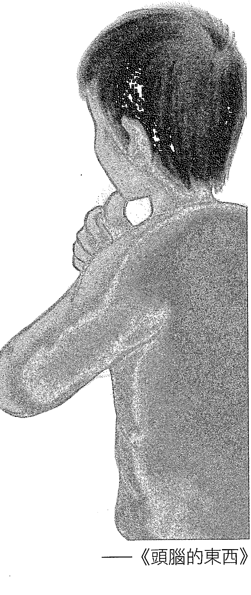

就這個層面而言，物質本身確實不是一個具體的東西，並沒有一個獨特的生命，沒有一個可以獨立存在的機制。

物質要存在，其實是有條件的。這條件，最多也就是「你」或是人類共同的意識場。物質存在，是因為這意識場存在。也就好像你、我會存在，最多只是意識場的作用。我們在這個意識場內，和其他的物質一樣，最多也只是一個波浪。波浪過去了，我們自然又回到深海。動力過去了，海面也就平靜了。波浪，也就消失了。

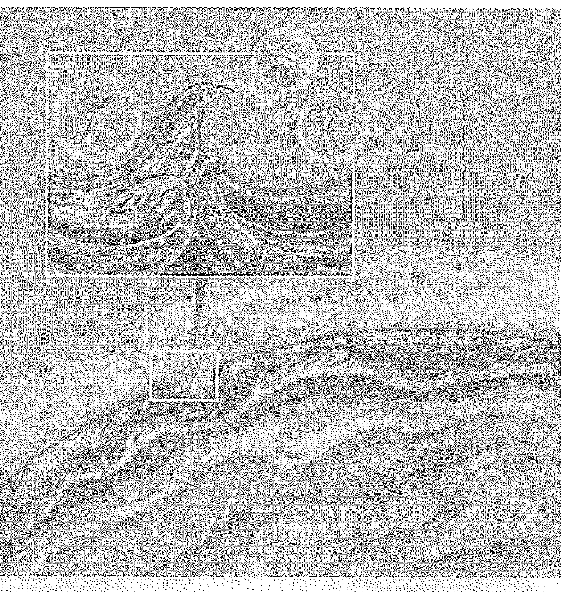

> ——《全部的你》

雖然我希望你一步一步去得到這個結論，而我認為你接下來也只可能得到同一個結論。但是，在你親自證明前，千萬不要勉強告訴自己——樣樣都不存在，一切都是空的。這種不真實的說服，反而會為你帶來矛盾，甚至讓你感慨：「那麼，在這世界活著有什麼意義！？」

這種不需要的勉強和衝突，其實還只是表達你的幼稚和無明。

首先，你要知道，講這些話還是從你（小你）、從你的身心在作聲明。這種表達本身含著一個前提：認為「你」當然存在，認為你有念頭、你可以覺察、你有感受、你有煩惱、你有喜樂、你有理想、你有抱負、你有期待、你有衝勁……對你，這生命是真的，這些都是真的，而且也必須是真的。

這一點，你騙不了自己，也騙不了別人。在物質或生命存不存在的探討上，你的反應已經說出了你目前的結論。

然而，你倒不需要再勉強去推翻目前的答案，畢竟也推翻不了。

但是，就是在得到這結論之前，讓我再給你一個線索——其實，就連講存不存在，包括這裡講的所有話，都不是絕對的真理。

不管怎麼樣，我還是希望你消化一下這些論點，而能夠慢慢了解：

重點，並不是你從任何注意的對象或客體可以去得到答案。重點，是在你個人。不管我們怎麼稱它，說它是主體也好，說是覺察的機制也好，重點是在你自己。在你自己，你才可以著手。

是在你這一生全部意識的來源，你才可以得到一個進入的門口，而從這裡看到一個小縫。

從這個小縫，可能會為你打開一個全新的體會。你也可以終於明白，無論是我在這裡所談的，或你可以體會到的一切，全部還是離不開意識。

我指的意識是——你我共同的統一場。

統一的整體。

## 09 覺察到什麼？覺察自己

我知道，這本書到目前為止，可能會讓你感覺步調很快，好像還來不及讓你好好沉澱，就已經到了這裡。雖然我也希望讓你有機會分享你的看法，但現在還是先讓我進入下一個重點。

我要談的這個重點，從我的觀察，幾乎可以說是每一個修行者走到最後，既避不開也過不了的關卡。

這個重點，其實是很簡單，而且是你從前面幾個重點，很自然可以推導過來的。但是，它的影響非常大，所以我希望在這裡講個透明。

你已經知道，意識是無限大，而且本身是代表絕對，而我們稱的「你」「我」不光是代表相對，而且還是相對裡的一個小相對……

你可能接下來會問：絕對，是不是可以觀察到相對？

當然，你或許還沒想到絕對要不要去觀察相對。這個問題，可能對你太抽象了。然而，你可能曾經在人生某個時刻問過：老天爺，或者，神，祢知不知道我？祢會不會知道我的痛苦？

只是，答案可能跟你期望的完全不一樣。

絕對，觀察不到相對的你，在相對的人間，有著相對的快樂或痛苦。

絕對，最多只能觀察到自己。而祂所觀察到的自己，最多也只是絕對，也只是心，也只是一體，也只是全部、主、佛性……

這什麼意思？

假如絕對可以觀察到一個體叫相對，不管這相對是你、你人生的故事、你的痛苦、你的絕望、你的決心、你的昏迷、甚至你的醒覺，那麼，你也只好承認：這樣的絕對根本不能算是絕對。

假如絕對可以觀察到相對的你，那麼，相對的你，就變成了祂以外的第二個體，甚至還不只有你，還有其他，也就有了第三、四、五……更多的體。這一來，不光違反了絕對的定義，祂本身也算不上是一體。

絕對，在任何一個角落，最多只是體會祂自己，活出祂自己，站在自己，發揮自己，停留在自己，享受自己，放過自己。

如果還要說覺察，是要覺察什麼？

當然最多也只是覺察自己。

從相對，祂還是只能看到祂自己，觀察到自己，體會到自己，活出自己。

嚴格講，觀察的機制（也是二元對立的機制）對整體並沒有代表性。觀察，是對人間才有意義的機制。對絕對而言，根本不存在。

祂的身分，即使我們說祂是「最根本的主體」，也只是一種勉強的說法。

如果還要講觀察，祂一定要投入二元對立的機制，才有一個東西叫觀察。

是這樣，這些觀察不觀察的探討，對整體其實沒有意義。

如果要勉強講，最多是整體觀察到自己、聲明自己、延續自己。

祂沒有動力。
祂不需要有動力。

祂沒有什麼可以觀察的動力。

祂可以觀察到的，最多是自己。

既然如此，還有什麼主體、客體、動力可談。

站在絕對，世界根本不存在，宇宙也根本不存在。

就算我們勉強要說有一個世界、有一個宇宙存在，存在的，也只是絕對自己。

除了祂，什麼都沒有。

我過去說“I Am.”是修行的中心理念，是主在聲明自己的身分。是這樣，我才會不斷提醒你，可以拿這寶貴的兩個字，當作這一生最珍貴的領悟的工具。

——《不合理的快樂》

Sedona Fantasy, photo courtesy of www.sedonalandscape.com

不光如此，你可能記得《聖經》裡也多次重複 “I Am that I Am.” 這句話。用我的方式來說就是「我在，我就在。我是。是誰？我就是。」會用這種表達，也就是因為會擔心講 “I Am.” 還不夠透徹，不能夠完整地表達主的身分，也就讓主再一次地表達 “I Am that I Am.”

“I Am that I Am.”這句話，本身就在強調這一點：
站在絕對，祂最多只能覺察到自己。

祂是一體，而根本沒有什麼叫多重。再多的樣樣，還是
祂自己。

這幾句話已經含著一切的真相，包括任何修行的方
法，也包括你在人生可以找到的任何路。假如你可以讓這幾
句話沉澱到心裡，隨時作為自己的提醒，那麼，你這一生可
以說是真正沒有回頭路。

## 10 沒有絕對的真理

讀到這裡，你或許已經發現：沒有什麼是絕對的真理。

關於修行，過去可能許多老師會用不同的語言，在不同階段來鼓勵你，至少讓你對於修行好像還有一個可以期盼、可以得的。他也許會先這麼把你帶進來，再一步步把這個最後的真實鋪出來。

當然，用什麼方式來表達，也跟老師個人領悟的程度有關。然而，對真實的任何描述，最多也只是一種方便的表達。可以表達出來的東西，其實已經落在意識的下游，倒不能真正反映無限大、永恆的整體。

包括新時代一些很美的說法，例如「把天堂落到人間」其實還是在物質、在客體的層面著手。

想想，是從誰的角度要把天堂落到人間？是從誰的角度有一個天堂？有一個人間？

這些話想要強調的境界，都還是在客體、小我的層面在談，沒有離開過二元對立的邏輯。

不光沒有什麼是絕對的真理，談到修行，更是沒有什麼絕對的方法。

是小你，想要體會到意識；然而，事實是——最多是意識，在體會到意識，和小你、小我一點關係都沒有。既然如此，又有什麼方法可能讓你體會到意識？

我認為這些話相當重要，所以，在這裡也讓我為你踩一個刹車，不要認為任何話有絕對的重要性，而把自己又落到一個角落。

我記得過去也跟你分享過：你千萬不要讓這一生白白過去，要把握這一生。畢竟人類跟其他眾生最大的不同也在於，人類所擁有的聰明，有機會讓你可以清醒地做一個回轉，可以體會到絕對，體會到你生命主要的部分。就像電影裡的角色可能突然醒過來，知道他所活的那場電影其實是一場夢。不光如此，透過你這個狹窄的身心，還可以讓絕對觀察到自己，就像鏡子反映出神自己。

你現在知道了，就連這些話也還只是很勉強的表達。坦白說，絕對並不需要你、我來反射或體會到祂自己。

祂並不需要人類聰明或覺察的機制。

甚至，祂連覺察都不用。

祂最多是自己。

我過去也只是勉強去表達：祂最多活出祂自己。跟你、我修行不修行，領悟不領悟，醒覺不醒覺一點關係都沒有。會想要有關係，這種期待還是小我、小你在說話。

對整體、絕對，祂完全不在意。

你我出現前，祂在涅槃，在休息。

有了你我，祂還繼續在寧靜，在涅槃，在休息。

只有最純的意識才能突然體會到自己，而祂並不需要你的頭腦來幫祂體會祂自己。更有趣的是，祂並不是把自己當作一個別的對象來知道。其實，祂知道自己並不是一個對象。

這一點是我們頭腦最難理解的。

頭腦需要一個對象，才可以理解。但假如意識要把自己當作一個對象或別的什麼來理解，祂首先要製造第二個體才能做這樣的理解和區隔。

舉例來說，假如你把意識當作一個泡泡，對意識而言，要探討人間的各種觀念，就好像要祂再生產一個個泡泡。一個泡泡叫「你」，再一個泡泡叫「我」，同時還有「物質」「世界」「宇宙」的泡泡。就像意識要先把自己變得不圓滿，製造出更多的泡泡，祂才能夠觀察到世界或物質。

然而，意識，除了牠自己，沒有其他。意識看這個世界，最多是看著牠自己。看著這世界，把世界當作是自己，跟牠一樣地快樂，一樣地滿足，一樣地圓滿。

懂了這一點，你想想，要問絕對會不會關懷你？就好像在問：「一體會不會關懷牠自己？」「絕對會不會想愛或合一自己？」「主會不會疼自己？」「佛性是不是可以活出慈悲？能不能活出自己？」

這個答案，你現在也老早都知道了。而你完全可以放心走下去。

你要充滿信心，要明白絕對、心、一體、佛性、主疼你都來不及了。祂疼你，就是在疼自己。無論動物、植物、礦物，沒有任何體可能不疼自己。

你再仔細想也就明白：疼自己，就是慈悲。想跟自己不斷地合一，就是愛。

> 滿足自己，就是快樂。圓滿到自己，就是寧靜。——《神聖的你》

整體，完全不受約束，不光可以發揮祂的創意，而這個創意並沒有腳本。這本身，就是自由。

你再回頭再想一下，你這一生是不是在不斷追求慈悲、愛、快樂、寧靜、自由？假如我再進一步提醒你：這些特質本身就是絕對、心、一體、佛性、主的特質，那麼，你可能還會繼續問絕對、心、一體、佛性、主疼不疼你嗎？

再講個更透明，你這一生沒有過不追求慈悲、愛、快樂、寧靜、自由，因為你從來沒有過不追求自己，你不斷地想跟自己合一、回到自己、回家、解脫、自由。

但是，講到這裡又多了。其實不是你想去哪裡或回到哪裡，反過來，是一體在吸引你到祂自己。

或許，你也想起來了，這個吸引的力量，我過去把它稱為恩典。

## 11 全部都是自己

前兩章的觀念，我認為對你可能是關鍵，而最需要補強和重複。所以，我試著用另外一種方式來再一次補充。

你大概也已經老早發現，我前面所談的自己，是在表達永恆、無限、全部、一體。你最多也只是承認——這個自己，是圓滿的。

這個圓滿的體系，我們也可以說圓滿到連一個縫都沒有。如果還有一點縫，可以讓一個小小小的體（例如你）塞進去，也就自然讓祂不圓滿。因為好像無形之中出現了一個別的體，而這個體竟然不是祂，竟然在祂之外。然而，這是不可能的。假如可能，祂也就沒有絕對的地位，而不可能稱為是主。

我才會講，在圓滿的當中，祂最多只是圓滿自己，圓滿每一個瞬間，每一個角落。然而，就連這個瞬間、這個角落的「觀點」，對祂其實也不存在。即使透過這個瞬間跟角落，祂最多還是體會到自己。

也就是說，還沒有你，祂就圓滿。你出生後，祂還是圓滿。你走了，祂依然是圓滿。祂圓滿到底。祂跟你想像的相對的人間，其實不相關，建立不來一個關係，一個連結。

再講個更透明，我再試著用以下幾句話，看可不可以再做個補充：

- 前、後、左、右，
- 開始、結束，
- 全部都是自己。
- 出發點是自己，到達的也是自己。

你還沒有一個動，就是自己。
接下來，一切結束，還只是自己。

從自己，到自己。

> ——《我：弄错身份的个案》

這麼說，站在整體，也沒有什麼叫主體或客體，更不用說中間還有什麼經過或連結，沒有什麼東西叫動力，也沒有我們所講的時間，更不用講空間。

就連主體跟客體，最多也只是自己。

假如你還是要堅持時一空的重要性，我最多也只能這麼說：

> 過去，是自己。現在，是自己。未來，是自己。
每一點，都是自己的一部分。
到每一點，最多也是到自己。
祂沒有屬性，沒有性質。這麼說，祂也不符合什麼條件，也不可能被任何條件制約。祂可以制約的，可以影響到的，當然也只可能是到自己，也只會被自己影響。除了自己，沒有什麼東西可以制約自己。

對祂，我們也套不上任何期待，也只有這樣子，才不會違反祂自己永恆跟無限的條件。

當然我相信你已經發現，就連這麼說，我等於又為祂套上了一個不存在的「條件」。所以這些話還只是勉強的比喻。

最多，也只是——自己自己自己，一直到無限。祂本身是無限大的，也可以說是無限小。
每一個瞬間，只剩下自己。
只存在自己。
如果你還要問存在什麼，答案是很簡單，當然是自己，自己存在自己。
覺察的，或是被覺察的，都是同一個自己。
知道的，或是被知道的，也是同一個自己。
要做的，被做的，也還只是自己。
然而，坦白講，任何說法都是非常勉強，還只是頭腦在試著靠近祂。
在頭腦的範圍內，我們沒有任何語言可以表達祂，或把祂框架起來。
是這樣，我才會用重複的方法，用某一個跟祂稍微沾上一點邊的字帶個頭，然後一直重複到底。
也許你還記得，我一直試著引導你把觀察的注意回轉——從在人間每一個角落體會到的客體，不斷地回到主體，也就是「我」「你」（大我、大你）；同時，也可以回到這個最原始的「你」所發揮的機能，比如覺、知、在。

然後，你只是守住這一點，一直不斷地守住這一點，再繼續守住這一點。用這樣的重複，把你的注意力不斷集中在這個源頭。透過這種注意的迴轉，你也就既輕鬆又自然地中斷頭腦帶來的任何連結。

是這樣，才可以讓你回到這個自己，也就是最原始的意識的門口。

比如說，用「我」：
我－我－我－我－我－……
只有我。
或是「覺」：
覺－覺－覺－覺－覺－……
只有覺。
或是「在」：
在－在－在－在－在－……
只留下在。
或是「知」：
知－知－知－知－知－……
全部都是知。

這是唯一的一個表達方法，讓你用受限的語言，透過這，種重複，可以接近無限，接近絕對。也只有這樣子，你透過這個局限的肉體，可以抵達絕對的門口，而停留在那裡。

你可以注意到，重複「我－我－我－我－我－……」，倒不是讓你從「我」再去延伸出一個別的身分或角色；「覺－覺－覺－覺－覺－……」也不是讓你去覺察到什麼東西；「知－知－知－知－知－……」更不是讓你知道什麼知識；「在－在－在－在－在－……」當然不是讓你在哪裡、或在做什麼。

意識，雖然好像還需要「在」「知」和「覺」來完成祂的作用。然而，祂的性質或結果，本身是快樂。滿足和圓滿，不可能不是祂的性質。

祂只是一體。

假如你還想勉強給祂一個動力，或習慣有一個目的地，那麼，你最多可以再加上另一個觀念：我－我－我－我－我－……到最後，還只是自己。覺－覺－覺－覺－覺－……覺察到最後，最多只是覺察到自己。

知－知－知－知－知－……知什麼？知道自己。

在－在－在－在－在－……在哪裡？在做什麼呢？在自己。

用這種角度打開，你已經發現，「我」跟「覺」「知」「在」其實是分不開的。不同的字眼，都是在講同一個觀念。而這個觀念，本身就是一個「體」的觀念。你也可以把它稱為最根本的「主體」，或者，也可以說是你這一生用你的邏輯和聰明，唯一可以抵達的一個最原始的點（或一個體，我過去稱為大我）。

說到這裡，我想再表達另一個修行的中心理念。這個中心的理念，我相信你也早就曉得。

在人間，處處是局限、是相對。我在這裡，用「意識」是來表達一種無限大、永恆、絕對的觀念。如果你想透過你的邏輯或聰明，要去進入絕對，是不可能的，也是你永遠做不到的。

你可以做到的，最多是把注意集中在相對最源頭的一個點。

也就這樣子，你已經把小的自己，交給大的自己（意識、全部），而你最多也只需要做到這一點。

你只需要做到這一點。

而且，要做到這一點，其實比你或任何人想像的都更簡單。

只看你會不會想去「做」。

就連臣服跟參，最多也只是幫助你回到這一點。

然而，你已經知道，回到這一點，其實你可以用各式各樣的方法切入，倒不是靠任何固定的方法。

我過去才會說，臣服跟參是為最成熟、已經準備好的修行者帶出來的方法。但說它是方法，其實它又不是一個固定的方法。

最多，你只能說它是一種沒有方法的方法。

## 12 是意識，倒不是意識場

我本來想繼續講下去，但是，我一邊講，也同時體會到，前幾章的重點是太難用邏輯去理解，而對修行又那麼有中心的重要性。是這樣，我認為還是有必要再進一步說明。

談到注意，一般人心目中的意識，其實也就是注意。

你把注意當作了意識，也就自然會認為意識離不開注意或覺察的作用，而必然要有一個目標——也就是等著意識去捕捉的東西或感受。

這種觀點就好像認為神經的運作能代表意識，或好像意識會不斷試著用五官去截取環境或內心的信號。既然如此，你也會覺得意識應該離不開資訊的內容或資訊轉達的作用。

你也可能會把進一步的思考當作是意識的功能，就好像認為意識會四處尋找，而在東西和東西、人和人、事和人、情況和情況之間作一個連結，透過這樣的連結，去得到一個比較高層次的判斷。

是這樣，一般人所認為的意識，其實離不開人類或人間的聰明。也有科學家透過所謂的人工智慧，在客體的層面不斷地來回運算和比較，認為這麼做就可能產生所謂的意識，而可以讓機器取代人性，甚至佔領神的地位。這類的科幻故事或電影，我相信，你也不陌生。

可以說，從人間的角度，如果物質是結構，那麼意識好像是一種功能。一般會認為先有結構才有功能，而把功能當作結構的附屬品，也就會認為意識是附屬於腦和神經這種物質之下的一種作用或現象。

然而，我在這本書所談的意識，既是結構也是功能。甚至，什麼都不是，不是你所能想像的任何比喻。我之前雖然會用意識場或甚至螺旋場來代表意識。但是，我相信你也已經發現，這種表達是不太正確。

螺旋場，雖然也還在物質的層面，但我們可以把它當作一個物質前看不到的力量。透過螺旋場高速的扭力，它可以帶動其他的「前物質」，讓它們凝固下來，而慢慢成為我們可以看到的物質。

星系，是這樣來的。

一朵花，也是如此。

龍捲風，那就更不用說了。透過龍捲風的實例，你也自然比較能夠衡量螺旋場的力量可以大到什麼地步。

當然，你、我、任何人都不可能親自知道大霹靂究竟是怎麼來的。但你還是可以想像：它本身要投射出一個完整的宇宙，最早也是透過這樣一種螺旋的力量延伸出來。

> ——《靜坐的科學、醫學與心靈之旅》

從最微細，到比較不微細，到更具體，再到一個完整的世界，一個完整的宇宙，包括裡頭的行星、星球，全部都是這樣來的。

但是，不管你怎麼描述或歸納，意識場或說高速的螺旋場，還是跟我在這裡所談的意識不一樣。

從這裡講的觀念，意識場或螺旋場還是落在一種物質的層面。你或許可以稱它是物質的出發點或源頭，但它本身，嚴格講，還是離不開物質。

我會強調這些，是想再一次表達，無論你多聰明、多努力，你想用語言去套住意識，是套不住的。你可以套住的，還是落在物質的範圍。

你、我本身離不開物質，而你二元對立的聰明，也根本離不開物質的層面。頭腦和物質是相輔相成的，你的頭腦會為物質背書，而物質也會回頭證明頭腦的作用。頭腦和物質是在同一個完整的封閉系統裡運作。

然而，我講的意識，是這個封閉系統加上世界、人間，再加上你我都無法描述的整體。這才是我這裡所講的意識。

這個理念，本身跟修行有密切的關係，而含著最管用的一把鑰匙。我這次透過「全部生命系列」的作品，用這種最大眾、最普及的方式，把它輕鬆地交給你，就看你願不願意收下來，親自去使用。

然而，我也必須要提醒：這裡所有的觀念，跟你聽過的修行，可能完全是顛倒的。

顛倒什麼？

讓我再一次重複：

是，是透過你的頭腦才可以修行，才可以摸到解脫的邊，才可以把全部的潛能活出來，才可以讓你擁抱全部，讓你回家，讓你回到心。

這一點，倘若你沒有人類覺察的能力或注意，是不可能的。如果沒有頭腦的聰明，你就連這個題目都不會想到要談，也談不起。

但是，話說回來，你頭腦可以集中的注意，還屬於相對的範圍。它本身受到三個維度的空間、再加上時間的限制，讓我們最多在四度的時—空裡運作，也就還是在一個封閉的系統裡操作。

在這樣的前提下，無論你是透過注意去捕捉客體，或透過注意回轉到一個假設的主體（你或大你），這本身還是受到邏輯的限制，還是離不開相對的範圍。而且，再怎麼做，還是不會跟絕對有任何交會。

假如你不認同這個觀點，而你還認為從這個身心，可以透過某一種更好的方法、切入點或力道讓你「回」到、「體會」到絕對或最原始的意識。這種想法才是旁門左道，而且是你用頭腦絕對做不來的。

要是經過了這麼多作品，你還有這樣的錯覺，認為透過頭腦的努力可以醒覺或開悟，那麼，這問題不在你，而是在我。可能是我表達的還不夠準確，才會為你造出這種不需要的誤會。

意識，這裡所講的意識，也就是古人稱的意識海、阿賴耶、心、佛性，本身是不符合任何系統，沒有邊的，和任何東西也沾不到邊。但很有趣的是，祂又包括一切。

這怎麼可能？

假如你可以接受這幾句話，也會發現，就連有沒有邊、系統、沾不沾、一切……這些話，都還是一種勉強的表達，是因為語言本身的限制。它明明說不了，卻又要表達，才反而為你造出了額外的困難。

認為從這個身心可以開悟，這種想法還是有一種「譜」或順序的觀念——認為是從沒有、到少、再到多、甚至數不清的多而最後到無限。然而，這些全部都還是站在頭腦，在看世界，看意識。

這一點假如想通了，或許你這一生也就非醒覺不可。

接下來，你並不是在這上面著手，反而是很自然進入另外一個層面，也就是想知道怎麼活出過去古人所稱的「報身」或「化身」——怎麼用這些領悟來面對你的生活、面對你這個肉體點點滴滴累積的習氣，將一層層固定的迴路或習慣解開、看開、超越。

也只有這樣子，才讓絕對來照明你，照亮你每一層的組成，就連你認為有的一個個細胞，也都被這麼照明過去，而達到一般人所理解的超越。

然而，超越什麼？

我相信，你已經知道不是超越任何東西。最多是你不再帶來任何阻礙——只是讓祂透過你，照過去。

你看，這又是一個顛倒的觀念。

這時候，假如你還會勉強想用意識和有四個維度的時空做一個對照，那麼，我最多也只能這麼分享：意識，是沒有維度的維度。

既然沒有維度，你說頭腦可不可以體會？當然是體會不了。但是，我想你現在也知道，就連說祂是沒有維度的維度，這種表達，最多也只是閒話。

不管怎麼樣，意識不可能知道這個相對的世界。

意識本身是沒有維度的，不可能知道有維度的世界。

無論多少維度的世界，對祂，都不存在。

甚至，雖然從意識場可以延伸出一切的生命、念頭和東西，但它本身最多也只能勉強算是從沒有維度的、最純的意識凝結出來。

當然，就連這些話，也只有對人的頭腦才有意義。說這些，最多只是強化二元對立，而二元對立最多也只是拿來證明它。是头脑体会到一个意识场、一个螺旋场。如果没有人类的聪明，意识场或再高速的螺旋场根本一点意义都没有。

这么说，意识场或高速的螺旋场也只能算是一个比喻，并不是真的实有。然而，意识，虽然什么都不用知道，但它本身却像黑洞一样地，对一切有最大的吸引力。

这吸引力，把一切拉到哪里？

拉回到自己。

它是最根本的状态，也是最轻松、稳定的根本态，也因为如此，我们也可以把它称为平等。

它的表现，本身就是平等。它内没有梯度，没有任何的高低差，也自然就想把一切拉回平等。

这种拉的吸引力，其实你在生活中随时都体会得到。无论是你的期待、欲望，还是你对快乐、平静、满足的追求，你的渴望愈高，拉扯你的力量愈大。

这种渴望，就好像你随时想回到意识的蓝图，回到无色无形的完美，而又没办法用话或用念头来表达。

你的欲望、追求和期待，最多像回音一样，不断地在回应一个你用话讲不出来的力量。

## 13 意识，比零点还稳定，比自由更自由

前面，我用黑洞的比喻来解释，意识其实是最稳定的状态，而对你、我、一切自然有最大的吸引力。

在这里，让我再用另外一个角度来打开。

意识，不光是最根本、最稳定的状态。如果有个东西叫零点，我有时候会半开玩笑说它是比零点还低的点。甚至，连一个点都算不上。

它虽然带着最低的能量，却又含着最高的自由度，而比完全散乱的状态更自由。

> > ——《神圣的你》

是这样，从热力学第二定律所讲的乱度趋向最大的原则，你自然会想回到它，想回到这最自由的状态。

最有意思的是，反过来，从结构的角度来说，它又含着全部结构的潜能，是没有结构的结构，而可以说是唯一完美的架构。

它同时含着最高的熵（entropy），也同时含着最高的“负熵（negentropy）”。它是最高的自由度，又同时含着最高的秩序。也就这样子，它表面上好像违反热力学的定律，但其实一点都没有违反，只是所探讨的层面不同，而随时等着我们去验证它。

当然，我所谓的结构，倒不是你、我在人间所知道、所可以想象的结构。毕竟，人间没有任何结构（比如身体或建筑）是永恒，当然也不会有完美的结构。

我把意识或这里讲的“在”当作最完美的结构，也就是说它是最稳定的状态，而它既含着超越世间的美、无无比浩瀚的可能，又同时含着无限大的自由。

这是我们在人间用头脑体会不了，甚至认为是不可能的。

当然，严格讲，任何架构或状态，跟“在”其实都不相关。无论是用能量、秩序或状态……再怎么比喻，都不会正确。到最后，或许共振的观念还比较接近。

可以说，“在”是通过共振来和你互动。

是看你的成熟度，可不可以跟它共振。

共振到底，剩下的，也只是最根本、最基本、分不开的整体。

修行，也只是站在分开的整体，看这个世界。

过去，你会认为这根本不可能。但是，你现在知道了，这才是最基本、最普遍的状态。

## 14 意识，并不偏袒谁

读到这里，你可能得到一个很深的领悟，而可能是你这一生没有遇到过的。

然而，这些领悟也可能造出一个很大的抵抗，让你认为是不可能的。其中，可能最绝、最重，而让你怎么都很难过关的一句话是：God is impersonal. 主、神、佛性、一体、心，既不会偏袒谁，也不会选边站。

这句话，不光是想表达主不会偏爱谁，更不会选择站在谁那边，特别支持谁或护着谁。再进一步是说，人类看重的任何价值，跟主，都不相关。

你重视的好、坏、正常、不正常、有气质、没有气质、温柔、粗鲁、大方、小气、敬业、不敬业、有责任、不负责任、公平、不公平、应该、不应该、按道理该怎样、又不该怎样……这一切的认为，其实，跟主（或每一个人都有的意识海）毫无关联。

虽然，主没有人间的层面，但你想不到的是，它吸引的力量却比任何人间的力量都大。

它所代表的平等心、大爱、大宁静、大欢喜……本身就是一切的特质，也是你我一生又一生地来都期待得到的。通过这个期待或愿望，它当然会造出一个相对的力量，把你拉回到自己。到最后，你甚至是挡都挡不住。

> —— 《神圣的你》

但是，这吸引的过程，其实和你个人的人生剧本无关。你的人生经过，无论再精彩、再伤痛、再得意、再尽责……都过去了。这些经过，最多只可能挡住你，让你被拉回得慢一点。

怎么说？

如果你对人生的期待或制约愈大，那么，你的成熟度其实愈小。

意识一直在等着你，等着你有一天可以拨开人间制约造出的布幔，而可以体会到它。

这一点，是每个人可以重复验证的，而跟你个人的条件都不相关。唯一相关的，也只是——这里、现在，你的诚恳心、你的决心够不够。

其实，你体会或体会不到它，跟你过去做了多少善事、有过多少供养、做了多少练习、吃过多少苦头、经历了多少苦修，都没有关系。最主要的，还是你现在的决心。

反过来，你无论认为自己过去做了多少坏事、累积了多少罪、有多深的创伤、多少无奈、让你这一生感觉丢脸、后悔、抬不起头来，一样地，只要你这里、现在下一个决心，诚恳地重新开始，你还是可以醒觉过来，还是可以回到主的怀抱。

我等了很久，才能对你这么坦白。

确实，我会担心，你听了这些话或许会失望，也可能认为事实不是如此。然而，我记起曾经承诺过，我只会对你实话。

话实说，也绝对不会用一些似是而非的观念来浪费你我宝贵的生命。

最重要的是，我相信你读到这里，你的成熟度已经和我们相遇之前远远不同。现在，你已经准备好了，我才会希望可以把这个观念彻底说清楚。

你可能还记得，我之前说过：修行，其实是把一层一层的制约打开。

> —— 《全部的你》

一开始，你也许是从个人的制约着手。到某一个阶段，你会发现家庭、教育、社会都带来各式各样的或深或浅的制约。

甚至，你怎么也想不到，就连你身为人本身，也就含着人类的制约。同时，也就是这样的制约，让你与动物有所区别。这种制约所造成的束缚和压迫，可能是你这一生根本体会不来的。不只如此，你还会认为这些制约都是理所当然。毕竟，要不是有这些制约，哪里有你的人性？

再回头想，身为人，你对自己、对别人会有什么要求？

你可能会坚持，身为人，就要当一个有用的人、成为好人、要成功、要诚实、要正直、要照顾弱小、要顾全大局、要维持公平、要正义、要博爱、要无私……

> 然而，全部这些特质，再好、再完美、再重要，也不过是一层又一层的制约。而你，还会想把这些制约，再往一个相对短暂的架构（也就是你）上头套。
> 
> ——《全部的你》

对意识，它是单纯、是永恒、是无限、是全面、是绝对。你这一切的相对，和相对里的相对，跟意识其实一点都不相关。

它在“好”的状况，是体会到自己。
在你认为不好的状况，也只是体会到自己。

遇到好人，它是体会到自己。
遇到坏人，还是体会到自己。
好命，也是反映自己。
恶运，一样是反映自己。
一切，是宁静、平安的。

对意识，连个小小的起伏、小小的波浪都没有。如果我们还要勉强用什么特质来描述它，最多是爱、快乐、平静、宁静、沉默。

是这样，我才会说意识并没有偏袒谁。

至于“人”，是你在人间相对的观念。你要有这样的观念，你得先把整体缩窄成一个小角落，然后，在这个小角落上，再贴上一个“人”的标签。

接下来，从这个“人”出发，你还会把样样再进一步限制、过滤、涂抹、粉饰、遮掩、扭曲，让你可以得到一个狭窄的境界，也就是所谓的人间。

或许，你读到这里也会感慨：既然如此，我何必再重视这一生做什么。既然当好人、坏人没有差别，做好事、坏事也没有不同，那么，我何不想做什么就做什么？

坦白说，你都读到这里了，应该不至于有这样的想法。但是，假如你确实有，那么，你其实又看错了重点。

你还会计较有没有后果，那么，对你来说，你这个人还是真的，这个世界也是真的。你真的有一个体是小你，而这世界对你也是再真实不过。这一来，很抱歉，这个系统仍有一个很清楚的机制，也就是业力。

是业力组合了你，这样的你怎么能说你离得开业力？这样的你跟业力分不开，这一点只是必然。

在这样的机制下，你每一个动作都有后果。还不用讲到行为的层面，一个好念头，在宇宙转了一圈还是回到你。坏的念头，也是早晚回来伤害你。这一点，在这个相对的、有物质、有二元对立的世界，是违反不了的法则。你一点都不用怀疑。

假如你不相信，而非要去违反，那么，坏的结果很可能也就在眼前。你就是这一生承受不完，下一生也还是要还。

我同时从意识和个体这两个层面切入，这种表达，到了这个时候，会不会还带给你矛盾？或者，你其实听得进去。不只如此，你甚至可以认同，也有一个空间让它落到心里。

> —— 《定》

你已经可以，也愿意，让这些观念变成你生命主要的一部分。

## 15 意识场的科学

关于意识这个主题，你现在也可能已经发现，其实没有一个科学可谈的。

“科学”这两个字，在这里最多只能算是比喻。

所谓的科学，一定要有一个主题，而让你需要一些“客观”的测量方法去面对它。然而，任何的主题与方法，本身还是落在客体的层面，还在相对的地盘里作业。

至于我在这里所谈的意识科学，坦白说，是一种没有科学的科学、没有哲学的哲学、没有知识的知识。

这样的意识科学，并不属于客观的层面，而完全是属于主观的范围。这主观的科学，是要透过你、我每一个人亲自去体会、去验证。

但是，我相当有把握，未来几百年、甚至几千、几万年后，这些话都会被验证出来，而且通过亲自验证而得到确认的人只会愈来愈多。早晚，这样的人会变成大多数。

当然，这也是我对未来的人的期待。

然而，不管怎么说，用人类的工具，要探讨意识是不可能的。相对地，意识场，反而是可能着手的层面。是这样，我才会把意识场或高速的螺旋场的概念在这里就先抛出来。

未来的人，最多是把这些场和其他物质的观念做一个结合。他们从场和物质的转换或互动中，会发现相当多的规律和原则。这些原则，对物理学家而言，也就是所谓的自然律。光是这本身，就足以建立一套科学，从而影响到各种科技，改变人类生活的每一个角落。

> ——《时间的陷阱》

举例来说，通过这套科学，可能会研发出你目前想不到的未来工具，包括瞬间移动、瞬间传送（teleportation）和其他物质的转变或改善。只是，无论这些进展多么新奇，意识场或高速螺旋场毕竟还只是在意识的下游，本身不可避免还是落在物质的层面。

物质，任何物质，包括场，其实还是离不开头脑的层面。它本身还是由头脑延伸出来，离不开你二元对立的聪明。

客体好像存在，也只是因为头脑把它变成真的。它们好像会生会死，主要还是因为头脑观察这些客体、这些东西，是通过一种会生起、会消失的机制（也就是二元对立）所建立的。是这样，它看的东西，当然会来也会走。

如果你还是想给物质或意识场一个本质，别忘了，物质、意识场还是离不开意识的怀抱。它们的本质，说到底还只是意识。

样样，好像都在借用意识的存在来存在。

物质和意识场，都是意识组合的，是藉由意识才可能成立。甚至，没有意识，也就无法成立。

换一个方式来形容，就好像是从无限大的意识借一点“原料”，来制造出客体一个个的存有。是这样，任何客体，还是随时会把真实的部分泄露出来。

这么说，你也不用在别的地方找意识。任何地方都不用去找。因为你往哪里找，都是同一个意识。

当代科学的发展，最多也只是从名相的分别展开。然而，未来意识的科学会超过这个范围，而进入一种无色无形的层面。人类自然会发现，全部的名相，都是从物质延伸出来的。意识除了自己以外，没有其他的东西。名相，最多是暂时的现实。然而，意识不需要二元对立，就可以理解一切，包括自己。

这一点，对你的头脑也许是最难理解的。

不需要头脑，意识可以体会到自己，这才是唯识的核心价值。

此外，包括我在“全部生命系列”所谈的，通过这种意识场科学的探讨，将来也有一部分现象可以得到验证。

比如说，前面提过你其实是更大、永恒的生命，是通过人类的机制才会落到所谓的地球（而且是上头的某一个角落）、做某一件事、承担某一种身份或责任。

在你还没有投入之前，站在觉、知、在，你的潜能其实是无限。可供你选择的可能，本身也是无限的。

但是，只要你下了一个决定，要投入某一个空间、某一件眼前的事、某一个身份……也就这样，你已经把这个人生活不断地守住、再固定，而更进一步只锁住其中某一个点。

就好像在原本无穷无尽可能的路径里，你选择了一个，也就只好这么继续走下去。

无论你选了什么，数不清的其他可能、甚至数不完的众生、各种生命无数的觉察能力，其实是同时存在。而且，这种多重的存有，完全在一个统一的场里面发挥作用。

这一点对于我们目前的脑，是太不可思议，是根本想不到的观念。然而未来的意识场研究，自然会把它证明出来。

此外，物理学家一直以来，始终化解不了量子力学和牛顿力学之间的矛盾。毕竟，你我在眼前的世界确实体会不了量子的现象。是这样，物理学家还需要刻意去区分量子世界和牛顿世界的不同。

然而，从意识场的科学切入，这个矛盾也就消失了。量子力学和牛顿力学其实没有差异，最多只是观察角度不同。

你可能还记得，我之前曾经和你谈过量子世界和牛顿世界。在这里，我也就不再多说。毕竟，你可能已经注意到了。这一次，我是通过文字希望带你进入体验的层面，而不是再一次为你分析一套学问。

你再研究下去或参下去，自然会注意到，跟其他的科学不同在于，只有通过意识的科学，你才会自然得到欢喜。它随时随地指出路标，带你回家，带你回到意识海。

> —— 《时间的陷阱》

相对地，任何现在人间的领域（不只科学，而是包括你想得到的任何一个领域或专业），最多是在你头脑本身的阻碍上再额外加一层（甚至多层）的障碍。这一来，反而提高了回家的难度。

你可以期待，唯识或意识的科学，将来一定会变成主流的学问，而成为未来的显学。有一天，它会比数学、物理、化学、生物、社会学、哲学……任何一个领域都更重要。它会整合人类所有的学问，彻底确实地将人类的知识合一。接下来，人类的发展，当然会完全不同。

是从那时候，人类才真正进入光明的黄金时代。这个趋势，是谁都挡不住的。

哪怕短时间内，你我可能遇到数不完的灾难，遭受一个比一个更大的冲击。但是，话说回来，每一个所谓的打击，最多也只是个恩典，会让你的注意从表面的形相和物质移开，甚至彻底地回转到心。

也就这样子，自然会加快人类整体的演化。

## 16 经验和经验当中的共同点

我们探讨了意识场的科学，也认为这样的科学，对未来的科技发展和人类的演化是相当重要。然而，对此刻的你，真正重要的，大概还是你每天的经验。

你可能没想过，其实你这一生全部的经验，从你出生、长大、受教育、成年、工作、有或没有伴侣、有或没有家庭、生病不生病、衰老、死亡……点点滴滴的经过都离不开意识的作用。

这一切的经验，都在意识之内发生。

或者，换个方式说，你所有的经验，都离不开意识场的怀抱。

坦白讲，这一生，你大概找不到一个经验是在意识或意识场之外。

你全部的经验，包括眼前瞬间的体验，全是由意识组合的。就连经验所含的内容和特质，你只要去探索，到最后，会发现还只是意识。

> ——《神圣的你》

这一点，可能对你是最难想像的，完全颠覆你的认知。

讲全部经验都在意识内，这句话其实也意味着——包括你的一个念头、你体会到身体、觉察到世界……全部这些体验，都是在意识内。甚至，就连你对身体的体会和感受，还是在意识内，而倒不是意识在身体内。

再一次，这一点和你过去认为的，可能又刚好是颠倒。毕竟，要说连身体的感受都在意识内，这一点，对你会是比较难懂、难接受的。

从你过去的体会和各种观念的洗脑，你自然会认为各种感受都是从一个具体的体才有的。这个具体的体，也就是你的身体。你当然会觉得是有了身体，才有意识，而自然会以为意识应该就藏在身体里的某个地方。

认为有身体才有意识，这种观点，也就是一般人以物质为主的观念或说唯物论。但事实其实是刚好相反。

对你，这些话可能已经够多，够需要消化了。但是，我还没讲完。

除了刚刚讲的，你这一生的体验离不开意识，都在意识的怀抱里；任何体验的本质，就是意识。你更想不到的是，你唯一可以觉察到的人生，无论是你过去的经验，还是你这个瞬间的体验，其实，可以去观察这一切的，还只是意识。

是意识，可以观察你这一生的经验，可以知道你这个瞬间的体验。而根本不是你过去认为的一个体（小你、小我、身心）在观察这一切。

再讲一次，是意识，体会一切。

只有这样子，它才符合我过去讲的自己完成自己（self-sufficient）、自己包含自己（self-contained）、自己证明自己（self-evident）。

这本身就是永恒、无限的特质。

我要强调，是意识在体验这些，体验一切。但是，什么叫做“意识体会到或知道一切”？而“意识体会人间点点滴滴的经验或体验”又是什么？

对你，可以想像的，也许还是一个“什么”在知道“这个体验”。就好像你这个小你看到眼前有个人、知道有颗石头、摸到旁边有张桌子。

假如你有这样的印象，也只是反映了一种理解上的落差。在这里，让我把它补起来。

回到你这一生种种的经验，你已经知道，经验和经验当中、这个瞬间和下一个瞬间的体验彼此之间，唯一可以称为共同的点或本质，最多也只是知、或是觉，或是在。

这样共同的点或本质，是在你任何觉察或分别前，一个微细的性质。而且，这样的性质，不会突然出现，也不会突然消失。它是你最稳定不变的“常”。

你也知道，这样的共同点，并不是让你往客体、或你所注意的对象去找就可以得到。这个共同点倒不在于你知道什么、觉察到什么、在哪里。反而，你是往可以认得客体的主体或机制去看，才可以找到同一个本质。

是这样，任何经验和经验当中的同一个共同点，对你，最多也只是一种在、一种微细的觉、或一个轻微的知。你也许会以为这种在、微细的觉、隐约的知，是在感受的层面。然而，并不是。你最多可以说，它是在感受之前就有的。

但是，假如你是用感受去体会它们，其实也没有错。它们的存在，本来就绕过念头的地盘。念头侦测不到。而感受，不经过念头，反而可能通过共振，反映它。

让我再重复一次，你这一生，最多只能把自己的注意，往回转到这一点。你或许称它是知、是觉或是在，也可能是其他的字眼。无论你怎么称呼，给它什么名字，你所能谈的，也只是这一点。

我跟你分享过，只有意识可以知道自己或是一切。一样。地，也只有意識可以體會到覺、知、在。既然覺、知、在是全部經驗的共同點，你自然會推論出來，只有意識可以體會到任何經驗。但話講回來，體會的方法、體會的內容，是你透過人間想像不到的。

祂最多可以體會到自己。

說意識（絕對、整體）體會到、覺察到自己，其實也就是華人所講的「悟」。

悟，也只是悟到自己，這個自己，最多也只是心。

或者，也只是隨時見到本性。

隨時體會到自己，隨時見性，隨時在悟，最多也只是醒覺。

然而，坦白講，到底是誰可以悟？誰可以醒覺？悟，又是悟到什麼？而是從哪裡醒覺到哪裡？

答案可能會跟你或任何人所想的不一樣，而且可能根本是完全顛倒的。

透過每一個經過，悟、見性、醒覺、意識倒不是體會到人間認為重要的種種客體和發生。祂從種種的發生，最多是體會到自己。

透過每一點，還不用講客體或一個過程，意識，最多只是在體會到自己。祂體會的倒不是客體和客體間的差異，也不是為了去做各種你會認為重要的區隔。

認為意識應該會知道點點滴滴的差異和區隔，是人類的期待，是你投射給意識的角色。

也因為這樣子，我前面才會說，意識祂不知道、也不會去區隔我們在人間所重視的差異。無論是好事、壞事、好人、壞人，祂不光不在意，更沒有必要也懶得去做這種分別與區隔。

要做這種分別或區隔，祂得先認定有另一個體值得做比較——先承認有一個別的主體，再發揮二元對立的作用，把這個主體當作客體，這樣才可以區隔。

然而，站在意識或整體，全部都是祂自己，一切老早都圓滿。

是圓滿，我才會說，連一張紙都插不進去，一個縫都找不到。這種完整的圓滿，全面的圓滿，對頭腦很難想像。但是，事實就是如此。

這一點，假如你徹底可以領悟，它其實含著一切過去所講的真實的鑰匙。這本身，正是你來這一次，在等著你去領會、去體悟的。

我才會說，你真正應該追察的，倒不是客體和客體的差異。再浩瀚或再微細層面的差異，都不是值得你去追察的。就連任何引發其他聰明的機制，也一點都不值得讓你投入這寶貴的一生來解釋它、記錄它。

反過來，你真正要投入探討的，其實是——是「誰」、是「什麼」在體會這個客體？

追察的方向，是讓你往上游去找，倒不是在客體的下游尋覓。

未來的意識科學不是在客體的層面著手，而是要從最源頭——意識的源頭切入。是這樣，我才會在〈序〉提到，沒有一個工具可以去探討意識這個主題。任何工具都還是下游，都還一樣只是客體。

> ——《我：弄錯身分的個案》

## 17 統一場

我也一直在提醒：你認為客觀的現實，其實是從你主觀的意識延伸出來的。

你再進一步仔細觀察，你這一生採用的覺察工具，最多也只是你的注意。注意的機制本身還是在反映二元對立，或說還落在一個主客二元的架構，要有一個「主體」注意到一個「客體」。既然如此，如果你的頭腦要和身體或世界互動，注意其實是唯一的工具。

不過，最不可思議的是，你也可以把注意當作一個解脫的工具。

雖然我一直強調，從相對到不了絕對。但是，透過注意這個工具，你可以試著把它落到最源頭的覺、知、在。

你用前面的方法，親自一步一步去推論，接下來，也可能自然會想知道：覺之前，又是什麼？

其實，你只要去觀察，也就會發現好像還是有一個「體」知道自己在覺。然而，你框不住這個體的邊界。這個體，好像是你，好像又不是你。你不覺得它是平常你認為的你，但你又不能說它不是你。

這是最新奇的一個發現，只是你我一般根本不會注意到。

你從頭腦的作用一路往回推，推到你可以到的最源頭。到這個地步，已經沒有區隔或分別心存在，沒有啟發二元對立的作用。那麼，為什麼你會知道還有一個覺？

最多，你可以這麼表達，是自己知道覺在覺自己。

> 這個知道覺在覺自己的自己，也就是我過去不斷在談的《聖經》裡的話，好像是主在表達自己的身分“I Am that I Am.”「我是，我就是。我在，我就在。」

祂知道什麼？最多只知道自己就是自己“I Am that I Am.”

這種知道，並不是一個有客體的主體在知道。是這樣，我才會用螺旋場、生命場、意識場或大你、大我來表達這個相對意識的原點。這個原點，站在你的立場，它還在相對意識的層面。它雖然好像還沒有啟發主體－客體的作用，但它本身就是知道。

它知道什麼？知道自己在覺。

這一點知道，才是你所有思考、覺察、感受的出發點。它可以連繫你這一生所體會到的全部，是你對外、對內所有體驗的源頭。

其實，就連一個剛懂事的小孩子，都曉得自己在覺。然而，他在覺什麼？不是覺察到另外一個客體。他最多只能說覺察到自己。這個最原初的生命場或意識場，自然帶著一種在、一種覺的味道。是這樣，這個小孩子才知道自己好像是活著，好像有一種存有的體會。然而，體會什麼？也只是體會到——自己，就是自己。

我想，你讀到這裡，就可以親自試試看，看這些話正不正確。

我借用「意識場」這個詞，是來表達由意識所延伸出來的一種最原始的力量。這種力量，好像是意識跟物質世界的一個橋梁，或者說是我們在人間可以體會到的一切的出發點。它最多是一種微細的有，而從這種微細的狀態，可以凝結出一切的物質，包括你我的念頭，包括你我全部的經驗。

你親自去體會，也已經注意到，在這個最源頭的點（我過去暫時稱為大我、大你的意識場）最多是一個好像有、好像沒有的體，或說是一種很微細的存在，一種還沒有出發的動態。是這樣，我也會用覺、知、在來稱它。

嚴格講，這個最源頭的點或意識場，雖然我勉強稱為大我、大你或覺、知、在，但它其實不是一個「體」，也不是一個動態，最多是你全部體驗的共同點。

說到這裡，你或許會想問：那麼，這個意識場是各自獨有？還是所有生命共同的？換句話說，地球上有 70 多億人口，再加上數不完的眾生。有這麼多的生命，那麼，這個源頭的意識場是每個生命各有各的？還是不同的生命都共同有一個統一的意識場？

我相信，你只要再繼續追察下去，自然會得到結論——是統一的。

這意識場，是人間對無限大、永恆的體——意識、心的代表，它不可能是多重的。假如是多重，它就不是唯一。如果要靠其他的體才可以成立，它也稱不上是圓滿，也就不符合無限與永恆。

假如你可以接受這一點，接受所有生命都共同有一個統一的意識場，那麼，你也許也會留意到另一個層面的含意——其實，透過你每一個瞬間的體驗，你隨時可以體會到這同一個意識場，或說接觸到意識在這個人間的代表。

你會再進一步發現，我過去把一體、意識用銀幕或背景來做比喻，這並不是準確的描述。假如我們把一體當作背景或銀幕來看，等於在說除了銀幕之外，確實還有銀幕上的電影，而銀幕和電影其實是分開的體。你想想，這樣的一體、意識還算得上是一體嗎？

提出這一點，我不只是要強調一體和人間並沒有分開，而是更想表達另一個重點：對你、對我、對這個人間，

> ——《不合理的快樂》

一體或說意識其實比親密更親密。祂隨時都存在。祂在背景存在。在前景也存在。再講個更透明，就算是我之前不太準確的比喻——銀幕、電影、內容……全部，其實沒有一個點沒有祂。

祂，隨時都存在，你或許還記得我會用「在（beingness）」來表達祂，而不是用「做（doingness）」來稱祂。

在相對的層面，世界、全部都落在五官的範圍裡。你只有突然體會到這裡現在，進入「在」，才可能從五官的牢籠跳出來。是這樣，你才突然明白，原來你過去認定是客觀的現實，其實一點都不客觀。

你還不用去談客觀的現實只是從主觀的意識延伸出來的，只要仔細觀察，也就能體會到，所謂客觀的現實，也只是完全限制在五官的地盤內，在念頭的操作下建立起來的。

只有進入「在」，隨時回到這裡現在——一個沒有維度、沒有時一空的觀念，你才可能突然跳出五官和念頭鎖住的籠子，而發現真實並不是這麼狹小，並不只是你這一生所看到，所體會到的。

你懂了這一點，也自然不會再用任何具體的畫面、比喻或客體來代表祂——一體、意識或意識海。

祂在。在「在」也在，在「做」也在，沒有一點祂不在的空檔，更沒有一個客體離開過祂。

我用「在」來稱祂，也就是肯定祂永恆、無限的特質是隨時都有的。不管有動或沒有動，不可能有哪一個瞬間或角落沒有祂。也不可能有哪一個角落，是祂不在的。

我又特別強調祂和「做」不同，也正是提醒你我，祂並不是透過人間二元對立的聰明或機制可以找到或得到的。

事實是，你還沒有找，祂已經在。

讀到這裡，你可能還記得，我過去曾經特別為你區分費力和不費力的觀念。去探討費不費力，也就是要強調意識並不是你透過費力可以得來的。

其實，你再怎麼透過任何二元對立的聰明機制（無論是讀、看、聽、理解、思考、研究、整合……）去努力，反而是把祂蓋住。

這個時代，你很容易聽過或接觸過許多的法。這些法，說到底，絕大多數都是在教人怎麼讓自己變得更好。目標是改善自己的情緒、改進生活或命運，或是讓自己的行為得到修正。

我相信，你應該已經比較清楚了。你也明白，在這些層面去強調把自己變得更好，這種角度其實沒有什麼代表性，和整體的自己一點關係都沒有。

你再怎麼花時間改善自己的想法、情緒、行為，或者去分析心理的糾結，希望能做一點調整，這些努力，從我的角度來看，只是守住一個沒有代表性的自己（小你、小我）在運作。並沒有多大用處。

> —— 《不合理的快樂》

對你，可能比較有效率的方法，還是先把真正的自己找回來。

談到靈修，也是一樣的。

真正的靈性是什麼？許多人都誤會了。

真正的靈性，其實，還是自己，倒不是一種比較微細、比較玄、落在別的層面的存在。一般所認為的靈性，還是離不開頭腦在相對世界的作用。

然而，你真正要找的靈性，其实就是自己。只是，這個自己隨時都在，倒不需要你去追求。

是這樣，所謂的靈修，要不就是誤會，要不就還是一個大妄想。

## 18 一切都在同一個意識場

雖然說，透過我們的聰明，反而是把意識蓋住。然而，這同一個意識，其實是我們最根本、最原初的核心或說共同點，你只要把遮住祂的部分稍微挪開，祂自然從裡面浮出來。

- 浮出什麼？
浮出自己。
浮到哪裡？
浮到自己。
祂浮出做什麼？

祂什麼都不做。不需要做。但是，祂也可以做。只是做不做，不是重點。

祂最多是承擔自己，聲明自己。

甚至前面講的費力不費力，都跟祂不相關。費力，祂也在。不費力，祂也在。最多是如果你費力，也就自然把注意力擺到人間的層面，而就這麼錯過了祂、忽略了祂，還好像跟祂接不上頭。但嚴格講，祂跟你費不費力其實沒有關係。

一樣地，就連說祂可以浮出來，又是一個不必要的比喻。

全部都是祂。祂是全部。祂不需要浮出來，也沒有從哪裡可以浮出到哪裡。就是有哪裡可以去，又有哪裡不是祂？

最多，只是一個暫時存有的你突然發現有祂。而且，你最多只是用注意的工具，突然從外在或下游轉向祂。

然而，你又不可能回轉到祂。

祂是無限，你最多也只能回轉到祂的門口。

是這樣，我才會用大我、大你、在、覺、知當作暫時的一個目的地，讓你的注意可以錨定在那裡，而讓你好像可以勉強摸到一點邊。

> > ——《神聖的你》

注意，就是有那麼關鍵的重要性。

透過你的專注或注意，你最多是把共同的意識場找回來，或說是輕輕鬆鬆停留在這個共同點。這是你這一生唯一可以做到的。

但是在這裡，你也一定會發現，連說「可以做到的」都已經產生一種矛盾。

祂不是透過做，也不是做得來的。甚至，你還沒有做，你已經老早在祂。而且，你根本沒有本事或能力可以離開祂。

接下來，你也突然會發現，原來過去想找的，都找錯了地方。

你過去的理解是錯的，都把祂想得比較難，而自然往客體多元化、複雜化的方向去延伸。你也會想去找某一個境界、某一個印象、某一種狀態。

真沒想到，原來這個最根本的共同點是這世界的70多億人都有的。

這最根本的共同點，最多是最輕鬆、最微細的一個覺、知、在的觀念。然而，你只要體會過，也就明白——就連說觀念都太複雜，觀念本身已經是念頭的組合，而覺、知、在其實是簡單、是單純到一個地步，連觀念都稱不上。

如果說覺、知、在是感受，或許還會比較接近一點。但是感受又離不開你身體的感官，也就又多了一個層面。

你最多只能講是一種很微細的什麼。你對在，有一種覺或知，就好像是一種很微細的存有的體會。

這個理解，我相信現在會為你帶來一把最好的鑰匙，讓你徹底明白——自己過去只是找錯地方，而你要找祂，確實是比你過去想的都簡單。祂本身是最單純、最簡單，而又含著一切的答案。

至於，祂是不是真的含著一切的答案？針對這一點，我敢大膽地說，只要你誠懇地去參，也自然會發現事實就是如此。

我們現在談的在、知、覺，其實，你可以體驗的一切，沒有一點在祂之外。是這樣，我才會用意識來包括在，包括知，包括覺。全部，都含在意識內。坦白講，連這個宇宙都含在祂裡面。沒有什麼在祂外面。

也就這樣，祂本身是圓滿。

我才會說，祂本身最多是知道自己，體會到自己，在自己。

過去，你還可能會想問：祂在體會什麼？祂又在哪裡？

現在，你已經發現，光是這種問題本身就帶來矛盾。

你已經知道，對這個最原初的體、對這種圓滿的狀態，這個問題是不存在的。假如有這個問題存在，就等於還要化出另外一個體，好讓這個圓滿的體去體會、去在。但是，這一來，祂就不是全部，也就不是圓滿去體會圓滿。

你也可能突然發現，覺、知、在是在你任何覺察、念頭、感受之前就有。是這樣，你任何覺察、念頭、感受也污染不了祂。祂沾不上任何東西，也沒有任何東西可以影響祂、可以打擊祂，或還可以把祂抵消。

祂最多只是每一個瞬間都在，下個瞬間也在，下下個瞬間還在。

一連串的在。

你還沒有來之前，就在。

你走了以後，還是在。

祂在，在到底。

但是，祂在哪裡呢？

最多，我們只能講是在這裡、現在。這個這裡、現在並不屬於時－空的範疇，不受時－空的限制。所以祂隨時都在，在這裡、現在也在。

這一點，接下來我會繼續打開。

### 19 從自由，到不自由

我在這裡，想邀請你再一次回到前面的觀念——意識場其實是統一的。

你已經知道，所有的眾生、整個宇宙的點點滴滴，都是從同一個意識場或統一場延伸出來的。

然而，這一點，你最多是用你的聰明或邏輯勉強去推理出來。對你，這是不可能體驗到的。這也就是我常常提醒的：相對，永遠不可能體會到絕對；局限永遠沒辦法體驗無限；無常，不可能去框架永恆。

但是有一點，你可以拿自己做實驗，去體會看看。

我前面也提過，是透過念頭，你才會產生時間的觀念。感受，讓你得到一個身體的身分。而覺察，可以為你化現出一個完整的世界。然而，念頭、感受、覺察，其實都是從同一個意識延伸出來的。

這些話，你完全可以親自驗證。

你可以透過靜坐，或是用我跟你分享過的各種方法，包括數息、觀息、隨息、配合呼吸在心裡默唸「我—在（I-Am）」來驗證。你一開始只要投入其中一個方法，而接下來，也只是不斷地重複你選定的同一個方法。

你只是不斷地投入。
如果分心了，就回來。再分心，再回來。一再地回到你選定的這個方法，一直到你終於安靜下來、沉澱下來，而頭腦的作用得到淨化。

你只要把注意不斷地集中眼前正在進行的這個方法。你愈來愈熟練，也愈來愈投入。你竟然會發現，你並沒有刻意去壓抑念頭，但是念頭反而會降下來，甚至停下來，而自然被這個方法取代。

> ——《定》

在這個很安靜的狀態下，你可能會偶爾注意到一個念頭，或一種感受，甚至好像覺察到什麼東西。這個被覺察到的什麼，可能相當具體，也可能很抽象。

不管怎樣，假如你的心安靜了，淨化到一個地步，你會發現，其實你可以注意到念頭、覺察或感受正要露出頭來的瞬間。

> ——《我是誰》

你可能也自然會發現，無論正要浮出來的是念頭、覺察或感受，你都沒辦法定位出一個具體的源頭。比如說，你沒辦法區分出是腦部或身體的哪一個部位在產生這些念頭、覺察或感受。

當然，如果某一個感受已經起步了，接下來，你可以定位出它的部位。但是，在這之前，你絕對找不到那一個點在哪裡。不光找不到那一個點，你也沒辦法判斷這些點是共同的一個點，還是分開的好幾個點。

對你的印象而言，無論是念頭、覺察或具體的感受，最初好像都是從一個沒有空間的空間延伸出來，互相重疊，但又沒有互相排擠，最多讓你感受到好像有前後的順序。

最有意思的是，它們不光沒有互相排擠，甚至不能落到一個點去啟發，同時也沒有一個邊可以去區分彼此，也沒有內、外。是這樣，你沒有辦法守住它。

雖然你沒有辦法守住它，但它又好像和你很近，就好像和小你、小我分不開。然而，它在小你、小我的哪裡？你又找不到它。

更有意思的是，這個要出來還沒出來的覺察、念頭、感受（也就是覺、知、在）是要落在某一個部位後，它才突然被守住，而自然就落在一個相對的層面。

也就是說，它從「一個」沒有維度的點，透過你的二元對立或聰明的機制，才有了空間的維度而受到限制。它從無拘無束的自由，透過你的觀察，才突然落入一個局限、相對的範圍。

你看，這是不是非常有趣。

這時，假如我再進一步跟你分享：你的頭腦，包括你觀察能力，就像一道鎖鏈，把你本來自由的全部鎖在一個不再自由的點。這些話，你現在已經知道，並不是一種文學的表達，而是事實。

你也可能想起前面棱鏡的比喻：真沒想到，本來無限大的意識，竟然非要透過頭腦和五官二元對立的棱鏡，把自己永恆而無限的光，折射到一段很狹窄的範圍，為的只是讓頭腦取得那麼一丁點意思。

懂了這些，你也就明白，你最多是把注意回轉到——是誰在觀察、誰在覺、誰在知、誰在想，這本身才是你應該投入的課題。

這一生值得你做的，也只是這個，倒不是讓你再把注意力放在觀察什麼、覺察到什麼、想到什麼、知道什麼。

不知不覺，你會發現，針對來來去去的各種念頭、覺察、感受，唯一的共同點好像最多是前面所講的，只是一種微細的知、覺、在。而且，知、覺、在，跟念頭、覺察、感受一樣地，沒有出發點，也沒有空間，更不用講有時間的觀念。但是，它又隨時在。

就好像你可以體驗到的所有經驗，一再地濃縮簡化到最後，也只剩下知、覺、在。再怎麼濃縮簡化，也無法讓它更小、更單純了。

這個實驗，假如你能夠既認真、又同時輕輕鬆鬆地去進行，你自然會發現，這本書所講的一切都是正確的。甚至，它是唯一的共同點，是你這一生再也不會失落的共同點。

你這一生值得來這一次、值得去體驗、值得學到的，可能也只是這一點。

你同時也會發現，這個共同點——知、覺、在（有時候我稱為大我、大你），就像前面講的，它沒有維度，不屬於我們用時一空可以描述的東西，甚至不能算是「頭腦的東西」。

這個共同點，算不上是知識，和宗教、哲學……等等領域也沒有任何關係。最讓人納悶的是，它明明是你、我、每一個人都有的，但怎麼每個人都好像那麼費力地想把它找回來？

你同時也可能發現，這個沒有維度的特質（假如我們可以這樣稱它），其實也就很接近過去我所說的「這裡，現在

在」。

當然，我相信你到這裡也可能老早體會到，「這裡，現在」其實不屬於時空的範圍，也不適合套用時空的比喻。

怎麼說？

讓我再說清楚一些：

這個「這裡」並不是在指哪一個空間，比如那裡和那裡的中間。「現在」也不是過去和未來之間的一個空檔。雖然這兩個比喻還落在時空的四個維度裡，但它們所想表達的，其實不屬於任何一個維度。

假如你還勉強要用一個詞來講，它最多是「沒有維度」。你最多是用「在」來表達。

我用「這裡、現在」，其實也是在試著表達覺、知、在（或大我、大你），只是當時沒有一套完整的詞彙，也沒有更合適的字眼，可以讓我建立現在的連結。

當然，你或許正在想，為什麼我要在這裡把它提出來？

其實，就像我之前會擔心你可能把大你、大我當作一種客體，我也一樣會擔憂，倘若不這麼提醒，你也可能會把「這裡，現在」當作一種時空的觀念，甚至會想勉強去找出某一個時空的點，讓你期待可以透過它去領悟。

「這裡，現在」是在任何體驗、經驗之前，好像突然自己體會到自己，想起來自己。

體會到，自己在自己內，而且全部是活的，都是為了自己。

體會到，除了自己，沒有其他東西。

也就這樣子，意識突然就醒過來。

醒到哪裡？醒到自己。

當作自己。

符合自己。

在自己內。

為了誰？為了自己。

體會誰？體會自己。

主體和客體，已經變成同一件事。

讀到這裡，你大概也注意到了：你其實可以從任何一個點回到意識的門口，而你過去可能還有的矛盾感，自然會一層一層解開。

意識，並不屬於任何的知識體。祂本身是一個完整的體、完全的全部。

講到知識，一樣地，你也會自然發現，任何你所謂的知識，站在整體，其實都還是一個阻礙、一個盲點，或說一道遮擋的過濾網。知識，只有對人類才有意義。無論粗淺的知識、高深的知識都一樣地，最多只是強化你的制約、強化你和整體的隔閡感。

未來的意識科學，倒不是透過這種知識的累積可以逐步去建立。這一點，可能跟過去所有的學問、所有的科學、所有的專業領域都不一樣，甚至可能是完全相反的。

## 20 你可能忘記意識，但意識忘不了你

假如你可以認同，這個「在」就是人跟人、人跟其他、人跟世界、人跟一切的共同點，那麼，你也可能突然發現，其實，倒不是你在修行。反過來，是意識在修行你。怎麼說呢？

你仔細觀察，你這一生不斷想找的，不管是愛、快樂、滿足、平靜，其實都是站在一個站不住的前提：你有一種隔閡感，有一種隔離的觀念。

你不光認為自己和其他人是隔離的，是不同的。你覺得自己跟東西、世界、甚至一切都可以區隔開來。對你，樣樣都是不同的體。

是這樣，你才會失掉安全感，感覺不安，隨時覺得不夠、覺得缺乏，總是感覺自己少了什麼。

你或許還記得，我過去把這種狀態稱為萎縮態，而你也就自然成為一個萎縮體。時時刻刻的萎縮，讓你這一生總是認為缺少了什麼，好像隨時會受到攻擊、受到刺激，而隨時得不到安全。

你可能沒有想到，這一切，也只是你完全忘記了你本來就有共享的同一個存在（shared beingness）。這種共享的存在，也就是前面提到的統一場，或唯一的意識。

你隨時會把祂忘記，因為你在每天的忙碌中，把自己所有的注意都擺到客體的下游。你忙著鑽研客體和客體之間的關係。你也隨時在注意環境種種客體的變化。你總是把眼光轉開，只關注眼前很小的一個點，而且根本不敢放過任何一點。這，反而讓你隨時忽略掉共享的同一個存在。

然而，你也許暫時忘了祂，但嚴格講，你是忘不了的。

> ——《神聖的你》

祂隨時存在，沒有停止過啟發祂自己的作用。

所謂的作用，最多也只是「在」。

這個「在」，本身有一個很大的吸引力。祂是唯一靠得住的真實，是任何力量都抵消不了、毀滅不來的真實。

真實的吸引力，更是遠遠比眼前一時的現象都更大。

是這樣，才可能讓你肯定地說，早晚，樣樣都會回到真實，也就是意識。

你再仔細觀察，你這一生，其實隨時都想回到祂，只是你還可能不知道。

這個不知道，你也可以暫時用「無明」兩個字來表達。

在無明的狀態，你會以為這個共享的存在就等於是人間的愛或滿足。是這樣，你自然會希望在人間找到一個理想的同伴，讓你可以把自己個別的存有，融合到眼前認為所愛的對象。

> ——《全部的你》

只是，早晚，你的不滿足感會再度浮出來。你會覺得不太夠，還是少了點什麼。當然，這時候可能會換一個對象，再重新追求下一次的融合。這樣的對象，可以是一個人、一隻寵物、一樣東西或一個理想。

很快地，也或許是經過很多年後，你也自然發現，人間的任何人、東西、甚至理想都沒辦法給你長久的幸福。

你這一生，透過個人的努力，可以完成一些項目，得到某種身分和地位，甚至可能開創一個領域。但是，一樣地，你或許很快就會發現，人間的任何狀態，不管多麼好、多麼豐富、多麼偉大，其實都是短暫的。你就算得到再大的成就感，透過每個人天生都有的享樂適應的機制⁴，這種感受也會慢慢消失。

> 4 如果你還記得，我在《不合理的快樂》也跟你分享過享樂適應的機制 (hedonic adaptation)。
這是一種生存的機制，不光人有，動物也有。
透過這個機制，我們所體會到的快樂、舒服、悲傷……種種感受，都只會持續一陣子，然後就消失了。這樣的機制，讓我們的注意不會被重複出現的經驗給綁住，而可以把注意轉到環境潛在的危機。是這樣，從演化的角度來看，它是一種能幫助物種存活下來的機制。
當然，正是因為天生就有這樣的機制，所以我們再滿足也滿足不了多久，很快又要去追尋更新鮮的刺激。可以說，這個幫助生存的機制，同時也造就了我們的不滿。

當然，消失了，你還是可以再找下一個。哪怕一再地嘗試，一再地失敗，你還是可以再找下一個。總有一天，你把全部可能的目標都試遍了，你才可能發現過去原來一直找錯對象。你所追求的目標、你認為可以為你帶來愛、滿足和幸福的對象，倒不是在人間可以找到的。

其實，你真正愛的，並不是這個對象，而是自己、一體、意識或你本來就有的全部。這個全部，其實隨時在等著你。但是，你忘了，也就把祂變成了一個客體。甚至，你會離開自己，想去追求這個沒有離開過的自己，沒有減少過的

> ——《集體的失憶》

全部。

這時候，修行的動機才起步。

我們可以說「找」這個真正的對象，也就是修行。

至於找誰？嚴格講，你不見得清楚。

從你的角度，你認為是你在找祂。

但是，你跟我一起走到這裡，其實也已經知道，事實是剛剛好顛倒。

對愛的追求，是如此。你對快樂的追求，也是如此。你想要快樂，其實也就是從不滿足出發，想去找回滿足。

當然，你透過愛情，也可以去追求滿足、得到快樂。但是，快樂，似乎比愛更廣泛。畢竟，你的不滿足，不見得是透過兩個個體的融合就可以消除。而對你，不滿足感，有時候甚至會延伸出恐懼、不安、痛苦、悲傷、自卑、挑剔、對樣樣都看不上眼、對自己有更高的要求……總之，隨時讓你感到還不夠、還是少了什麼。

不快樂、感覺不到愛、靜不下來、人間種種的痛苦和煩惱、種種不夠、總覺得少了什麼的不滿足或匱乏感，始終離不開你與自己的隔閡。而你深信不疑的隔閡感，本身自然產生一股推力，促使你不斷地要往外去尋、去找。

到最後，你也許終於找到這個意識的門戶。

你把全部的意識隨時活出來，也自然發現過去認為缺少的，已經跟著消失了。到時候，可能你也發現，其實你老早是圓滿，甚至沒有不圓滿過。

真不曉得，你當時怎麼會那麼幼稚，連這麼明顯的事實都不知道，還要浪費那麼多次的人生，經歷那麼多的痛苦，才明白這個理所當然的真理。

你也自然發現，其實愛、快樂就是你真正的本質。如果不是這樣子，你不會一次一次地想去找它們。

平安和寧靜，也只是如此。

站在整體，站在意識海，站在主的角度，最多只有圓滿。

接下來，還只是圓滿。

一直圓滿到底。

祂是立即圓滿，從來沒有不圓滿過。

最多是圓滿自己。

這一點，可能用我們頭腦是最難懂的。但是，你這時會發現，你隨時可以把注意落在一個「不存在的體」。這個不是體的體，你已經知道可以稱它是大我、大你，或最純粹的知、覺、在。或者，你也可以很簡單地稱它是「在」。

它是所有生命的共同點，是你、我、任何生命、東西都有的共同點。

守住它，定住它，停留在它，其實是你這一生最不費力的作業。

它不費力，不靠「做」而隨時可以得到。甚至，你還沒有做之前，它已經存在。

你定在它，也只可能是滿足。

這滿足沒有開始，沒有經過，沒有結束。

是滿足在滿足它自己，一路滿足到底。

沒有底，也只是無盡的滿足。

它沒有什麼特質，可以讓我們描述。假如我們可以描述出什麼，最多還是一種頭腦可以談的境界、經驗或狀態。

唯一可能的，最多是透過平安和寧靜，它探出頭來現身，露出它自己。

你發現你突然變得平靜，而你心中的寧靜流出，為周邊帶來平安。

無論個人遭遇多大的危機，環境帶來多大的考驗，你發現，這個平安和寧靜是消失不了的。心中的平安和寧靜，變成你這一生最可靠的層面。

這樣的滿足感，自然讓你不需要去做任何表達或分享，你也沒有任何動機想去延伸什麼、完成什麼或達到什麼。

然而，這並不代表你會突然放棄人生，變得冷淡，什麼都不參與、不干涉、不去。要記得，這種冷淡的狀態，本身還是一種隔離，只是為自己跟一切製造一個其實不存在的距離。

到這時候，其實剛剛好相反。你還是會參與、會干涉、會去做。只是你在參與、在干涉、在做的前中後，始終都活出平安和寧靜。

你還是該做什麼就會做什麼。比如該幫人就幫人，該關懷就去關懷。甚至，你的熱忱還會帶動周邊更多的人。

儘管如此，你始終沒有認為自己在「做」什麼，或幫助誰。是這樣，平安和寧靜對你是理所當然。

意識或一體的力量就是那麼大，祂會讓你不斷地想著祂。就算你好像把祂忘掉了，但透過潛意識，你還是會想找祂，想回到家。

可以這麼說，這一生，你體會到的所有痛苦、悲傷、失落、萎縮，從更深的層面來看，其實都還是意識在跟你講悄悄話。祂希望你醒過來，不要繼續再折磨自己。

我才會說，人生所帶來的難關、衝擊和考驗，其實是這一生最大的恩典。

但願你，不會白白錯過它們真正的訊息。

> ——《全部的你》

## 21 落到人間的天使

到這裡，我相信你已經明白，這一生、你的身體、你的人間，最多只是一種限制。然而，你這一生的掙扎和痛苦，大多也只是因為你一直想從這個限制，透過一個限制、再一個限制，而竟然希望能夠一路走到無限，得到自由。

這真是讓人感慨，你本來是整體，竟然會落到一個局部。你本來的生命是無限、是永恆。到人間的這一生，卻充滿了考驗和痛苦。

心情低落時，你也許會認為這一生只可能會不好。你甚至會對老天發牢騷：這樣的一生，怎麼可能會好？

這種墜落，真是匪夷所思。就好像上帝突然睡著了，祂醒過來時，忘了自己是主，而把自己的身分落入一場惡夢。在夢裡，祂更把這場惡夢變成自己全部的可能。也就在夢裡，祂還要一次又一次地重複不同的惡夢，才可以突然體會到自己真正是誰。

這本身，多麼不可思議。

其實，你成為一個人，也就像是天使落到了人間。

你是天使，本來是自由，想在哪裡，就在那裡，想做什麼都可能。但是，自從你懂了樣樣有它自己的名稱，再加上隨著形相有了一層又一層的分別，你也就頓時失去了方向。

沿著這條分別的路，愈走，你無限的生命愈是變形、扭曲、萎縮，甚至凋零。一路走下去，你自然會設立出更多分別的機制，延伸二元對立的同時，還用因一果和業力把它鎖得更緊。

再一路走下去，你眼前的路愈來愈窄，愈來愈崎嶇。你看不到盡頭，早就失去了出發點。你根本認不出方向。等著你的，也只是更難走的路。

這就是人類活出來的樣子，而這也就是你認為的命。

> ——《全部的你》

你想不到的是，其實，主，雖然被你在人間的過程給遮住了，但祂捨不得在每一刻、每一個角落留下祂的足跡。祂隨時希望你看到祂，體會到祂，接下來，活出祂。

而你，你來到這個人間，即使像是剛出生就被遺棄的孤兒，但你總是好像也有一個很古老的記憶。你好像記得，又不記得你自己真正的身分。但是，這個記憶一直存在，在潛意識、在背景裡存在，而且，一直在為你指著回家的方向。

終於有一天，你會突然體會到祂。也就這樣子，把那麽漫長又孤獨的旅程告一個段落。接下來，再也沒有東西可以蒙蔽你，把你騙走。

你雖然早就跟這個身心、肉體緊緊地結合，而透過它好像還得到一個獨特的身分。但是，你已經發現，其實你完全可以輕輕鬆鬆地放過身心、放過身體、放過二元對立、放過業力、放過任何的法。

你也發現，你這個身心，這個肉體，還是會依照二元對立、業力的法則運作下去。然而，你不會再為此擔心。

這些，都已經跟你不相關了。還有相關的，最多只是一個局部的小部分，而且還是一個不可思議小的小局部。

你也突然體會到，即使還活在這個相對的身心，相對的人間，你依然可以隨時停留在整體的門口，也就是大你。

停留在大你、大我，它是完全敞開、沒有界線、沒有框架限制的意識場。

它本身就是空靈的覺，是開放的知，就是自由的自在。

最有意思的是，你自然會發現，你不再渴望，也沒有任何期待，反而一切竟然已經圓滿自己、滿足自己。

過去的痛苦、煩惱、不滿、不快樂、缺少愛、靜不下來……這些狀態，不知不覺，也完全跟著消失了。

你發現，一點都不費力，你自然完成一切。

你已經是整體，只是活出整體。

沒有操心，沒有顧慮，一切自然變成完美，變成 OK。

這個生命，本來既痛苦、又悲傷，點點滴滴都讓你難受，甚至忍耐不了。現在，樣樣反而都帶來歡喜。這歡喜是圓滿的，本身是寧靜，是充滿著慈悲。

也就這樣子，你突然發現可以享受這一生。

這也就是你全部的你。

你，隨時在等著你。

## 22 愛，意識轉變的力量

哪怕已經讀到這裡，或許你還是會認為這一生要切入唯識的重點，是相當難的。

但是，坦白講，這其實比什麼都簡單。

如果你希望有一個基礎，可以讓你用在每一個方法上。那麼，也就是愛。

到這裡，你或許會問，守住大你、大我，或知、覺、在，不就已經站在意識的門口了？為什麼還要談愛？愛的作用，又在哪裡？

你可能還記得，感受是比念頭更深的層面。我過去也不斷提到，修行一定要從感受著手。畢竟，對你我最難過關的，最多也只是種種的感受、樣樣的創傷、心裡各種的糾結。

然而，在感受中，對我們最有吸引力的，就是愛。你仔細觀察，你這一生最想取得的，也就是愛。愛，又是我們整體的本性，當然可以作為一個吸引的工具。

坦白說，任何角度，都可以把你帶回意識的門口。對意識來說，都不成為問題。你也時常聽到我說：回到意識或意識海，是唯一我們可以稱為是愛、是歡喜、是快樂、又是寧靜的狀態。

畢竟各種狀態好壞的分別，其實還是從人間的「缺」或說不圓滿的錯覺才延伸出來的。一個自認為和整體隔離的小我或小你，自然離不開這種不圓滿的錯覺，總會覺得自己還少了什麼。然而從不足去著手，也只會繼續強化這種隔離。

既然如此，而既然每個人（包括你、我）都想要愛，你也就可以把意識當作你想要合一、想找到的愛。

也只有愛，才能貫通任何表面上的分離。對你，用這樣正向的情感切入，或許比較容易帶動。就這樣，你的修行也只是——透過愛來找到愛。

當然，你會想問：站在意識的角度，如果一切都是意識，祂還需要去愛一個目標，或成為一個被愛的對象嗎？

是的，意識，沒有個人的層面。意識沒有目的，也沒有動機想干涉任何東西。意識不會去沾任何客體或人間的事情。任何好像「有」的東西，都還是從祂延伸出來的，最多，也只是反映祂自己。

意識最多是圓滿，是全部，是沒有維度的維度。樣樣都是祂，祂最多是圓滿，自然沒有什麼認為值得干涉。祂不會拒絕愛，也不會拒絕被愛。

意識，一無所缺。愛，最多也只是反映祂自己。

對你，要進入意識，隨時守住愛，是練習最好的工具。

真正的愛，也只是突然體會到意識是圓滿，是一切。

如果還要談愛，那麼，意識也只是愛，只是愛著愛自己的全部，而沒有任何拒絕。

你完全明白了這一點，接下來，你活在人間，自然隨時知道真正愛的對象是意識。不管你的生活再怎麼忙碌、外在環境為你帶來多少衝擊，你始終不會忘記你真正愛的對象。

這個愛，是大愛。

你愛祂，祂愛你。

這是唯一重要的事實。

對你這個在愛中的人，無論面對什麼困難，這個愛的場帶來的力量，也自然會帶著你去克服、去度過這個世界。

你完全知道，你愛的對象並不在這個人間。

你愛的是自己，是意識。

你是意識延伸的。

你愛的，是自己這個意識的意識。

> ——《時間的陷阱》

我也跟很多朋友說過，在修行中，透過正向的機制，讓它自己強化自己，無論從過程或結果來看，都會是比較容易的練習。我們倒不需要不斷地責備自己、要求自己，而非要經歷各種辛苦才覺得算是修行。

是這樣，你透過任何的練習，隨時回到意識的門口，很重要的是帶著愛，或者說把愛奉獻出來。這樣的奉獻，自然帶來一種溫暖、正向的感受。這樣的愛，不是隔離的體之間的小愛，而是大愛。

這樣的愛，是你對想要合一的對象，最高的一種頂禮。

比如說你做“I-Am”的練習，在每一個吸氣、每一個吐氣中，你都可以把愛奉獻出來，用愛表達自己的尊重、對合一的渴望。

就連輕輕鬆鬆講“It's OK.”也是帶著愛。你透過這句話，也只是用愛在肯定這個最高的狀態，肯定真正的自己只是自己，不是其他。

甚至連「netti netti 不是這個，不是這個」也沒有離開過愛。你否定眼前的一切，也只是知道最後等著你的，是大愛。

臣服，最多也只是臣服到主的愛。

參，到最後，也只是停留在這個最溫暖、沒有分別的大愛。

也就這樣子，不知不覺，你把愛的感受帶到生活中，而透過每一個點點滴滴的練習把它活出來。

人間再怎麼亂，你始終知道有一個穩定的力量，在等著跟你合一。你不會找不到愛，不會失去你心中的愛。

現在，我相信，從意識的角度講——OK、好、都好、一切都好、宇宙不會犯錯……你現在已經可以體會，這幾句話領悟的深度其實不會低於參或臣服帶來的狀態，而可以守護你度過這一生。

愛，帶給你一種徹底的安慰，又帶來一種心態的轉變，讓你化解掉生命帶來的傷痛，本身是生命最高的瑜伽。

只看你敢不敢相信，有沒有決心這麼做。

## 23 從整體落在局部，又從局部放鬆到整體

我在前頭跟你分享過注意對修行的重要性，其實，你也可以想到，它不光是對修行重要，更是在生命的任何角落都重要。

倘若我們集中不了注意力，其實，就連基本的判斷能力都沒有。沒有了注意這個生存的工具，你我不要說當不了人，就連動物都做不了。

你一般認為的注意，至少是透過兩個層面建立的。一方面，是透過你的覺察。這個覺察，是透過五官的捕捉和過濾而達成。

比如你的眼睛有它覺察的範圍，你的耳朵也有它聽的範圍。通常要透過不同感官得到的資料重疊起來，互相對照，你才可以得到一個立體的空間感，而得出一種世界的印象。

但是，覺察本身建立不了時間。你還要再進一步透過念頭去比較、去整合，將空間和空間重疊起來對照，才突然產生一個動態，而你會將這種動態稱為時間。

此外，注意還有第三個層面，也就是由你的感受所引起的。

你仔細觀察就會發現，任何感受，都是在強化身體某個部位或身體的意識。當然，感受再加上念頭，可以把覺受變得更複雜。它可以利用你身體某一個部分，比如用你的心臟來表達痛苦，用你腸胃的不舒服來表達突然失去安全感的衝擊。

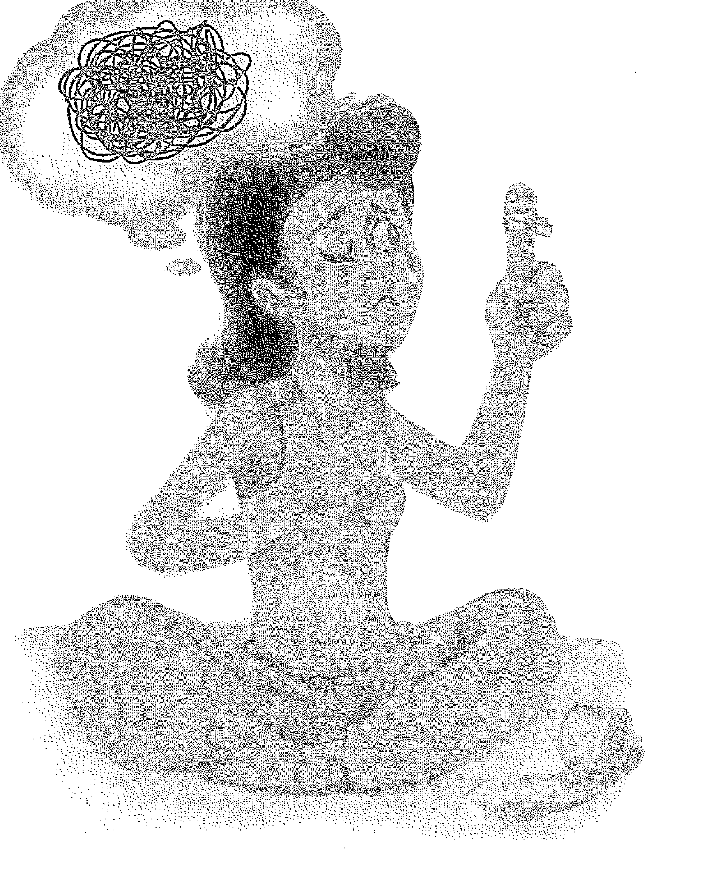

覺察、念頭再加上感受，也就這樣子重疊起來、互相彌補、對照比較，不知不覺建立了你的身體的觀念，甚至為你樹立起一個完整身心再加上你的世界。

> ——《時間的陷阱》

你再參下去，會突然發現，生命多重的樣樣，其實完全是無限大的意識把全部的身分投入在局部而有的。你的身體、身體的部位、你的感受、你的覺察，正是這樣才可以建立出來。

這種機制，我用英文會這麼表達——Awareness needs to localize in order to perceive. 也就是說，意識要完全落到一個局部，祂才能夠覺察，或者說可以得到一個東西被祂覺察或注意。

再進一步講，要落在一個局部或去覺察到什麼，意識必須要透過另外一個體才可以產生這些作用。這個另外的體，按道理，最多也只是一個局限的體。

### 什麼叫做一個局限的體？

身心、你我、就是一個局限的體，也只有透過你我所有的身心，意識才可以局部化而覺察到東西。

但是，話說回來，我想你也已經老早知道，一個無限的體其實是圓滿到底，連一張薄薄的紙都插不進去，也不會有另一個和祂一樣的體。既然如此，這個局限的體（你、我）最多還是一個幻覺，不過是種種可能中的一種可能。這個局限的體最多是暫時，是無常，而早晚要回到一體。

假如在這個過程，無限的意識清楚知道一切只有自己，那麼，注意產生不了作用。它沒有一個人間或世界可以建立。

哪怕注意隨時在運作，隨時還要帶來一個身心、人間、世界的印象，在這個過程，整體或意識隨時可以看穿它，而就自然地停留在平等心。

也就是說，對意識，樣樣都是一樣的，都是整體，都是同一，沒有什麼差異。既然樣樣都沒有區隔，樣樣都是同一，還有哪個劇本或故事比較重要，值得挑出來演或不演下去？

你假如懂了這些，也會突然發現，你這一生的劇本其實再也不會把你騙走。你可能選擇讓它再演下去，但是，你已經清清楚楚知道故事裡的角色是誰，而故事的內容和你真正的身分（也就是意識）到底有什麼關係。

你同時也突然明白，修行倒不是把注意挪在哪裡，更不是把注意落在局部，甚至不是像我之前講的把它挪到最根本的原點——大你、大我、在、或類似的共同點。

這些表達，你最多也只可能稱為一個過渡或方便。

其實，是沒有一個點可以落，整體才會發揮祂的作用，才能夠聲明祂的存在。假如還有一個點在吸收你的注意，反而又把整體蓋住了，讓你從整體落在一個小小的局部。

不過，這個局部，在整體，最多只算是一個虛擬的局部。不可能因為一個虛擬的局部，就讓整體失去了自己。

對整體，這個局部，還只是整體的自己。既然是自己，沒有一個特點或特色可以從祂自己突顯出來，可以獨立存在。那麼，還有什麼點（更不用講一個特點或特色）值得讓祂去停留、去欣賞、去肯定？

其實是剛好相反，你不是停留在一個點，反而是把注意從一個局部放開，讓這個注意輕輕鬆鬆地滑回、落到自己。

當然，你或許已經知道了，這個自己最多也只是大你、大我、在。倒不是還有一個具體的東西，是要你應該守住或可以守住的。

雖然我前面也談過這一點，但我這裡要再重複一次，也就是擔心假如不這麼再三提醒，你可能還會在頭腦裡再產生一個客體來守住。倘若如此，這可能又把你耽誤了。

懂了這個道理，你也會自然發現，過去所講的「netti netti 不是這個，不是這個」是一個很有意思的練習，而本身就在提醒這些重點。

當然，你可能會問：如果不是落到一個局部，那麼，我是不是永遠抓不到一個體，摸不到一個邊？那又要怎麼去練習？

其實，你不用擔心。你還是可以試著用「netti netti 不是這個，不是這個」或之前跟你分享過的「守住一個主體、大你、大我、在」來進行。

奇妙的是，你只要進行下去，不知不覺，也就突然可以體會到這裡所講的一個沒有點的點、沒有體的體、沒有開頭的開頭。

這些，都會自己浮出來。

然而，在這個時點，你可能已經沒有念頭。這個疑惑對你也自然已經不重要。也就這樣子，什麼都不用做，你已經入定了。

### 生命帶來的祝福

陳夢怡

熟悉「全部生命系列」的朋友可能會知道，寫這本《唯識》的時間點，正是在 2020 年 3、4 月，也就是 COVID-19 全球大爆發的期間。儘管這段時間楊定一博士正在出差，卻仍然在百忙之中抽空開始寫這本書，就像是有一種更強烈的急迫感，希望更快將「全部生命系列」真正想要轉達的唯識（意識為主）的觀念帶出來。

楊博士口述這本書的時候，我除了同時記錄下來，也會抓緊白天的空檔回頭整理文字。一般情況下，我會在整理告一個段落時，再讀給楊博士聽，一方面和他核對是不是貼切地表達原意，另外也是保留調整和補充的空間。

那天，很有意思。我通常讀完每一章，就會停下來，等楊博士補充。有時候他也會打斷我，直接修正。但是，那天，我讀完接下來的第24章，沒有任何回應。

我等了一會，確認手機還在運作，沒有斷線。接下來，才打破沉默問他是不是忘記打開聲音了。

再過了比預期更長的時間，也許是半分鐘還是一分鐘，我才聽到電話那一頭有了聲響。

楊博士告訴我，他剛剛聽這一章，感覺它好像帶著一股全新的能量，力道和前面的章節完全不同。正在想要怎麼調整時，一隻美麗的鶴，突然來到他眼前。

接下來，楊博士把鶴的照片發過來，也就是在這裡和大家分享的這一張。

確實，這樣的經過，在我們寫作的過程是一再地發生。有時是小鹿，有時是老鷹。對楊博士來說，這是生命來和他打招呼。讓他道，這麼走下去，是對的。

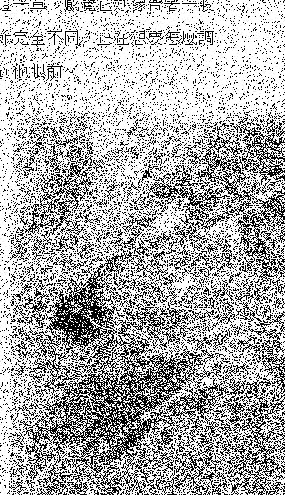

尤其在寫《唯識》這本書的時候，楊博士後來告訴我，其實他周遭的祝福是豐盛得不可思議。鶴群的唱和此起彼落，就像是現場演奏的交響樂。也是因為這樣，他有時候還必須把手機調到靜音，免得我分心。

是這樣，後來楊博士也決定這一章不需要再做調整。它全然不同的流動和力道，本身其實就在說話。

最重要的是，從他的角度來看，唯識，不只是一種抽象的觀念，而是可以完全穿透身心，跟你、我眼前正在面對的挑戰結合。也只有落實唯識的觀點，讓我們能真正掌握地球變化所帶來的轉機，而活出每個人本來都有的醒覺。

至於是不是如此，相信讀者只要讀下去，也都能親自去實驗、去體會。

這一點，是最重要的。

## 24 從身體的感受開始

前面談到感受，談到愛，說到底，都離不開身體。注意往外，你的覺察自然體會到一個世界，而會認為這世界是完整的獨立存在；注意往內，也就讓你體會到這個身體。

假如往內的注意，再加上感受，就化出一個完整的身心。這一來，也自然讓你會認為你的身心是獨立的存在，而自然要有一個生死的機制。

注意無論是往外或往內，所捕捉到的印象，再加上念頭的比較或整合，不光是讓你成立記憶，更讓你建立時間的觀念。

在這個前提下，身體的意識（body consciousness），是我認為最有意思的一個題目。身體的意識，本身就重疊了感受和念頭，才會讓你認為身體是那麼地堅固、那麼地固定、那麼地扎實、那麼地實在。

你可能還記得，我過去說，一切的念頭都是神經的訊號，最多可以說是神經細胞的活動或作用。

然而，感受，比起念頭還額外加上了一重放大的效果。它用你身體種種的內分泌化學分子作為訊息傳導物質，再進一步擴大神經的作用，而可以跟每一個細胞互動，直接去影響甚至指揮細胞。是這樣，我才會說細胞本身就有記憶（cellular memory）。你、我心理和情緒的創傷，許多都還埋藏在細胞的層面。

當然，透過感受不斷放大訊息的過程，最後得到的電子訊號，還是會回饋給神經系統。這樣子，才讓腦和神經能夠跟全身的細胞做一個雙向的交流。

你仔細觀察也就能體會到，你對外的覺察，是用五官（看、聽、聞、嚐、觸）再加上念頭所得到的。但是，你對外的覺察，偶爾也會跟感受連結起來。是這樣，你才會對世界某個部分、某一個人、某一件事、某個東西、某一個畫面、某一個聲音、某個味道、某種感觸有特別深刻的印象。

透過五官和念頭組合的覺察，再加上覺察和感受揉和出來的印象，你更會認為世界真的存在——不光存在，而且你、我是可以跟它區隔的。你、我跟這世界是分開的。

對外的注意，就已經有這麼大的作用。然而，你對內的注意其實更是被放大再放大，而且都跟感受連結起來。你只要想想，也就明白這是再理所當然不過的。畢竟，你對內的觀察，不是眼睛可以看得到的，而是要經由你去觀想（念頭的作用）才能掌握。是這樣，更需要靠感受，來為你建立足夠深刻的印象。

你只要去觀察，也就能歸納出來，注意對內時，感受的作用更是特別豐富，而且幾乎是要隨時發揮作用。只要你去注意身體、觀察身體，不可能不帶著一種感受的成分，而且感受的成分比念頭的作用更大。

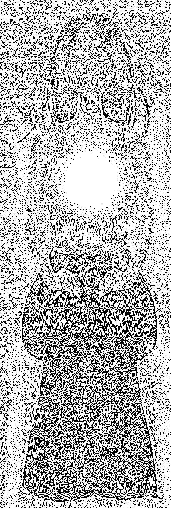

> ——《神聖的你》

過去，你會認為身體的反應是相當客觀。但是，你現在再去體會，也自然會發現，你對身體的衡量或注意，主要是受到感受的影響。比如說，你會感覺身體很舒服、肩頸是放鬆柔軟的，你也可能覺得頭痛、喉嚨緊、臉紅心跳、手痠、腳麻、關節僵硬、胃痛、腸胃不適、皮膚發癢、手腳無力……透過這些（其實是主觀的）感受，你也自然就把感受和那個部位做了連結。

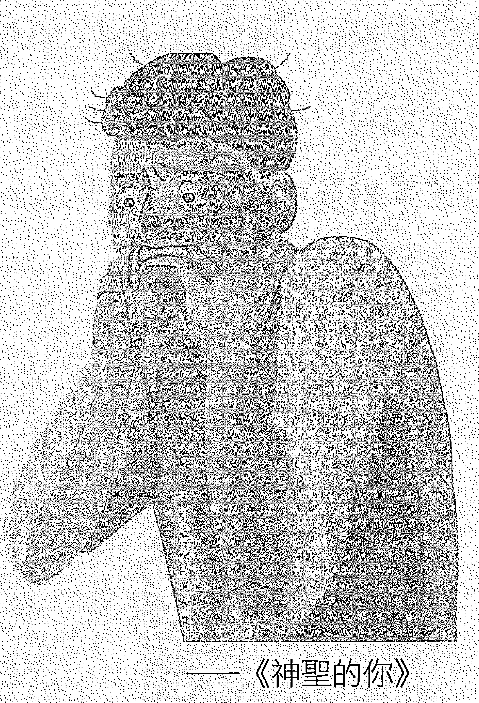

> ——《神聖的你》

對你，感受和身體部位的連結也就活了起來，好像有一個獨立的生命。這些感受是那麼真實，而讓你覺得真有一個身體，而它會痛、會癢……

你再透過身體去接觸外界，也自然發現，樣樣你所接觸的，都可以引發不同的感受。比如說，你摸到一個溫潤的表面，自然讓你容易心平氣和。有些人聽到粉筆刮過黑板的聲音，會不自主地脊椎發涼，覺得很不對勁。吃一口濃郁的食物，會為你帶來滿足。有些人光是吃一餐冷食，就可以難受一天。

在公園的角落，看到流浪漢在翻找垃圾，你可能會感到心酸。路邊有人大聲罵人，你聽不清楚他罵什麼，身體可能已經縮起來，心情也變得緊繃。

柔柔的風吹過來，會讓你放鬆一些。貓咪沿著牆壁走到你腳邊，牠毛毛的身體蹭過你的小腿，你可能覺得很有趣，想蹲下來摸牠。一隻大黑狗豎起了背上的毛，發出嗚嗚的聲音，你也可能立即覺得有危險。

看見別人做好事，你或許心裡馬上感覺暖暖的。看到有人對服務生很不客氣，你自然會討厭。小嬰兒黑黑的眼睛盯著你，你自然會浮出微笑，覺得歡喜。

感受，不光讓我們對於在環境所看到的樣樣，都肯定它們的存在，反過來更確定了自己也有一個獨立的存在，而認為自己和環境是隔離的。

從你出生，到這一生結束，在這個經過中，你可能從來沒有想過，原來就是你自己不斷地在強化一個不存在的身分。這個不存在的、虛擬的身分，也只是一個既局限、又隔離的一個相對的小你。而你真的認為自己就是這個小小的你。

你非但把一個虛擬、不存在的小你當作自己，而就這麼一輩子走下去；你更會認為這一生所能累積的，也只是數不完的傷痛。

你可能因為長相、習慣或一個你永遠不知道的理由被周圍的人霸凌。沒有人站出來幫你，讓你覺得好像被全世界遺棄。你也可能被最親密的人拋開，不斷懷疑自己是不是真的很糟，才沒有人要。

你也可能掏心掏肺對人，最後卻受到背叛，再憤怒也無濟於事。你可能受過侵犯，但好像所有人都認為是你的問題。也或許，你一直感覺受到歧視，因為你是某個性別、種族或出身，你再怎麼努力都得不到公平的對待。

甚至，可能連家人都不理解你，就連你善意的表示都被誤會是別有用心。你也可能受到別人惡意的欺騙，讓你不斷責備自己的輕忽，始終不能原諒自己的愚蠢。

> ——《時間的陷阱》

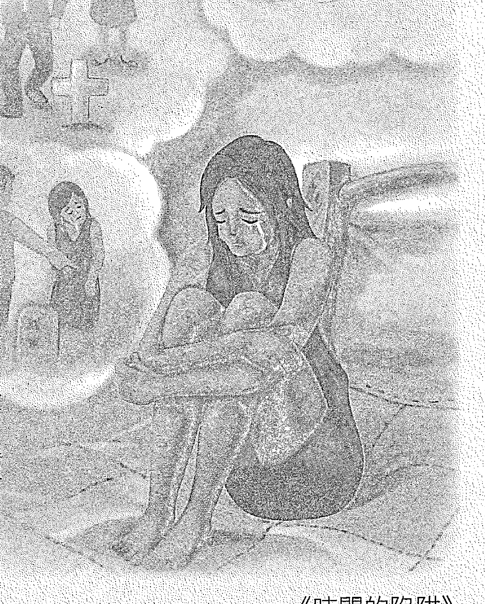

這一切的經過，可能都已經在你心裡留下了傷疤，就像一個綁得死緊的結。這個心結，你還不敢想去解開。畢竟，就連輕輕碰一下，都可能激發你強烈的反彈。

在這種情況下，要讓你看到整體、體會到心或意識，坦白講，是不可能的。你的注意已經老早被情緒帶走了，任何經驗和體會都免不了要經過這些傷痛的過濾。也就這樣，這些情緒層面的傷疤，還會進一步建立你的個性、你對人生的觀感，也就這麼把你鎖定下來。

要你從這種狀態走出來，確實是相當困難。

即使你願意走出來，你也自然會想去分析為什麼自己當初這麼倒楣，是不是當時做或不做某件事，現在就會有不同的結果。你也不斷地自我檢討，想在行為或「做」的層面找到一個補救的方法，看能不能減少一些損失。

但是，你現在仔細觀察也就明白，這些檢討、反省、分析或補救，都還是在意識的下游著手，或者也可以說是在客體、一般人所謂的客觀的現實在著手。這些檢討、反省、分析或補救，坦白說，其實只會耽誤你的時間，反而還讓你更是找不到出路。

既然你的注意力都擺在這上頭，也就根本來不及觀察到真正的重點。你不會去注意到——咦？認為自己有那麼多悲傷的人是誰？你也不可能看清為你組合出各種印象的機制。你更不可能去覺察到，到現在你所經驗的一切，究竟是怎麼來的。

這些都看不到了，你也根本不可能去探討多重性是怎麼來的。對這些生命根本的機制，你連一點好奇心都不會有。你不可能會去想：奇怪，一個統一的全部、一體、心，怎麼可以延伸出那麼多樣、多重的現象和事件？

其實，樣樣倒不是由這個統一的意識或意識場延伸出來的。事實是剛好相反，是因為你有一個頭腦在不斷地做隔離，不斷地區分念頭和念頭、感受和感受、覺察和覺察、身體部位和部位、身體和別人和世界的隔離，所以，是「你」在體會到多重的樣樣。而且，最多也只是你、我、全部人類、地球的眾生都共享同一個意識場，你和我和其他生命才會得到一種重疊的印象，而有一個共同的世界的觀念。

你可能很少有機會去觀察一個最基本的事實：五官的作用（無論是看、聽、聞、嚐、觸）是各自排斥？還是可以同時存在？就算可以同時存在，這些作用是不是要受到邊界條件的限制？是不是要受空間和時間的限制或框架？一樣地，無論是對外或對內的注意，有沒有一條界線可以區分開來？對外或對內的注意，一個時間是只能存在一個？還是一起存在？

你沒有去探討，也自然不會留意到：你所想、所體會、所相信的一切，也就只是你自己透過覺察、念頭和感受建立起來的。

正因為你還是沒有領悟到真正的重點，也就自然會把這一生的注意落在樣樣的現象或形相。你會想了解或建立種種形相和現象的關係，並且想知道用什麼方法或技巧可以把它們連結起來。你以為這麼做就能為你累積更多學問和道理，還以為這些學問和道理可以讓你從裡頭走出一條路。

你從來沒想過，落在形相和現象的層面上，你想找或認為可以找到的這一條路，反而是讓你陷得更深。

你可以再進一步觀察：感受是從哪裡出現？是不是從一個沒有空間的空間、不是點的點延伸出來的？

感受延伸出來後，也許是痛、不舒坦、萎縮……接下來才會落到一個部位。但是，你仔細觀察，初期的感受好像是中性的，還沒有帶動情緒。是你透過記憶，也就是念頭的作用，把它連結到一個部位。接下來，你還來不及注意到，這個部位就再也跟你的情緒分不開了。

也就是因為這樣的機制，這個身體的意識才會那麼堅實。

你可能還記得，我過去不斷地提醒你，要先從身體的意識著手。畢竟，即使你懂了理論，甚至在思考層面也領悟到了全部生命的種種觀念。但是，你透過身體累積下來的習氣實在是太固定、太堅實。

是這樣，我才會用那麼多的作品，先為你建立一個理論的基礎，為你省掉追尋觀念的時間，讓你可以真正體會到修行的理論其實是再簡單不過，而你不需要再浪費時間往別的地方找。

在我看來，真正的修行，是在這個領悟的平台著手，將這一生所有的習氣、累積的洗腦和錯覺做一個轉變。這一個層面，才是我們真正該做的。如果不這麼做，你即使懂了道理，還是難免再被身體和習氣給帶回去。

我也看過很多修行者，雖然有一定的成熟度和領悟，但是一落到經驗的層面（特別是身體的需要和變化），也就隨時不小心又被帶走，繼續迷路。他可能突然辯才無礙，又有神通，也就認為自己有老師的身分。不知不覺，他甚至反而可能迷路更深，跟別人、跟一切的隔閡不但沒有減少，而是更大了。

這就是我 30 年來一再觀察到的普遍現象。

你想想，這是多麼可惜。

當然，你也可以說，這些所謂的修行者，或許就是領悟還不透徹，才會走歪。

是這樣，我才會強調：修行，要建立在一個穩健的理論平台上。

五官和注意的作用，無論從哪一個角落出發，其實從來沒有離開過意識，最多可以說是從同一個意識場延伸出來。甚至，無論肉體、情緒體、心智體、各種能量體......所有的體，都是從同一個意識場、同一個意識延伸出來的。

即使在一個幻覺的世界裡，全部的共同點，依然是意識，倒不是物質。物質，最多也只是一種透過念頭或二元對立的機制延伸出來的現象。對二元對立的頭腦，物質是真的。但是，對整體，一切物質的後面最多還只是意識。物質，也只是反映意識。

意識，隨時在你內，而你也在祂內。

祂跟你的距離是比近還更近，完全沒有一絲縫隙。

你不管怎麼看、怎麼找、到哪裡，都可以找到真實，甚至，連在你會認為是幻覺的世界（例如作夢）都可以找到。

有了這樣的理解作為你修行的平台，你的修行最多也只是表達——從生命的每一個角落，你都可以體會到意識，知道自己沒有離開過意識。

你全部的體驗本來就是意識組合的。如果你還要去分析所有的經驗，再把它變成另外一套道理，也只是繼續在不相干的層面上忙碌。而這一生，也許就這麼過去了。

你最多是發現，你需要在這個基礎上不斷練習的，最多也只是接受——完全、徹底、一點一滴都沒有質疑地接受，也就是臣服。

你只是接受——一切，本來就是如此。It is as is.

你只是接受祂。

這句話，我想你現在也可以體會到了。在任何現象，你都可以看到主，可以接受祂。既然如此，你還需要對任何現象去要求、去評估、去做改善嗎？

一切，本來就是如此。

你也可能注意到，無論在活動或讀書會，我帶著你做練習時，都是陪著你一起先把身體的意識找回來。畢竟，雖然這個身體意識騙了你、我一輩子，但是以現代人的處境來看，你可能根本還來不及注意到它。

現代人對生命的體會並不均衡，幾乎是失衡地只停留在頭腦的境界。你在生活中完全依賴頭腦過度的作用。你不光是讓頭腦加倍工作，要比別人更快、更好、更有效率，你甚至還進一步希望透過科技快速的發展，讓你將注意轉向一種虛擬的實境。就連你不可或缺的身體，你都注意不來，更別說去探討我前面所分析的這些機制。

是這樣，我才會花那麼多時間，讓你先把身體找回來。然而，這裡說的把身體找回來，指的是讓注意落回到身體的點點滴滴、落到每一個部位。也只有這樣子，你把注意從頭腦的範圍挪開，讓意識落在身體，而從身體的全面再延伸甚至擴大，而讓你走到意識海的門口。

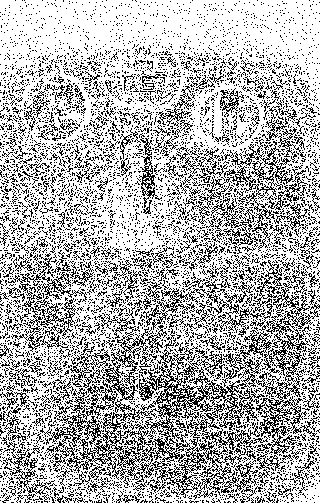

現在，你站在這本書的角度回頭看，是不是可以理解我們確實就這麼走了好多冤枉路？

但同時你又會同情我，也明白這冤枉路是必要的。要不然，我們抵達不了一個共同點。

## 25 對情緒踩一個剎車

前面講到身體的意識和感受是關鍵，我這裡想再進一步深入下去。

如果我跟你談情緒或情感，你可能馬上就覺得，跟感受相比，情緒或情感好像更遙遠，是在一種比較抽象的層面。

其實，這是剛剛好顛倒。

感受被固定下來後，自然變成你我所稱的情緒或情感。一層層累積下來的情感和情緒，也就自然變成小你。既然如此，如果你要修行，卻不去面對自己的情緒和情感，也就不可能得到一個穩定的結果。

其實，你、我不光是頭腦帶來的心智體，也還有情緒的層面。是頭腦，再加上情感和情緒，才變成一個完整的小你。

過去，佛教會用「法身」來表達理解或領悟，而同時用「報身」來包含這裡要談的觀念。哪怕你或許領悟到了，而且可能是大領悟，不只是小領悟，但是，因為你這一生累積了太多層的結，有太多情緒留下來的傷疤，也就讓你的注意還可能隨時回到創傷的層面。是這樣，只有在心智體和情緒體都有完整的轉變，你才可以徹底活出全部的生命，或反過來讓意識或心可以隨時浮出來。

你也還可能記得，我過去不斷地提醒你，要從情緒層面著手。

首先，你對情緒要能踩個剎車。然而，這裡所談的踩剎車，並不是壓抑情緒。相反地，要踩剎車，最簡單、最直接的方法，就是接受自己。

> > Accept yourself as you are.

接受，完全接受你自己，接受現在的自己。

這是對情緒踩剎車最簡單的方法，而這本身也就是在肯定你自己、肯定一切、肯定生命不可能犯錯、肯定你來到這裡點點滴滴活出過去的每一個瞬間。

哪怕你走了數不完的冤枉路，但一切還是剛剛好，其實沒有一點一滴不是剛剛好。

這種肯定或臣服的功課，是你隨時都可以做的。

只要有任何情緒起伏，你只是試著去接受它，不要再加上任何抵抗、反對，更不需要責備自己，沒有必要為了情緒怪罪自己。

你最多只是輕輕鬆鬆接受它，接受自己，肯定自己，原諒自己。

也就這麼簡單，你只要開始做，它自然會產生一個迴路，讓你不斷地想做它，而讓它為你的人生設立一個全新的開始。

這個迴路，是愈做，愈會強化它自己。你一再地投入這個迴路，不斷地接受自己、肯定自己。這麼做，也自然會讓你隨時地回到它、靠著它。它會自己餵養自己，自己強化自己。

不知不覺，接受和肯定，也就變成你生命最主要的部分。

在人生的任何片刻、任何角落，你都可以用接受和肯定，來面對讓你最難過、最不舒服、會心痛的情緒。

你只是接受自己，肯定自己可以有這些情緒。你接受自己會難過、會心痛、會鬧彆扭、會生氣。你試試看，你自然會發現，原本很強烈、好像在對著你張牙舞爪的情緒，漸漸地好像失去了力量，而自然會踩一個剎車，消退下來。

無論什麼情緒，你都可以這麼接受，這麼肯定。熟練了，無論是大的情緒、一般的情緒、小的情緒、中性的情緒、甚至正向的情緒，你都一樣可以肯定自己、接受自己。

不知不覺，你會發現這樣的接受和肯定，不光為你的情緒踩一個剎車，還帶著一股回轉的力量。這股力量，也就是透過「接受」和「自己」而來的。

你會突然發現，過去，你全部的注意原來都擺到外在。這一生，種種經驗、每一個經驗，都會立即吸住或佔據你的注意，甚至把你的注意完全壓過去，讓你根本沒有空間可以體會到這裡所講的意識或是心。

簡單說，你隨時被經驗帶走。對你，經驗的重要性，其實是超過意識、超過心。

當然，你可能會抗議——咦？不是這樣的。我其實也花了很多時間，透過感受，把注意擺到身體內。我並沒有完全被外在帶走。

這裡，我必須提醒你，站在意識或心，其實身體老早是外在。和身體分不開的感受、情緒、情感也是一樣地，都是屬於外在的作用。甚至，任何頭腦的作業、任何念頭還是屬於外在。這一切，都不是你生命不變的核心。

是透過你這個「體」，你認為自己跟意識、跟全部是分開，而且還是獨立的。其實，是對你這個分開的體，把全部、意識、心顯得陌生，變得好像是外在。

然而，站在意識，其實沒有內，沒有外。一切，只是祂。

事實，也只是這麼簡單。

對這個事實，如果你有百分之百的篤定，那麼，站在這樣的平台上，無論你身在多激烈、多精彩、多刺激的經驗，你知道還是隨時看得到意識，而你其實什麼都不用「做」。

是這樣，我才會說要完全接受自己。

你接受自己，接受自己現在的樣子——你現在是怎樣，就是怎麼樣。現在是什麼樣子，就接受這個樣子。然後，從這裡開始著手。

講著手，倒不是說你還需要去改進什麼、要學到什麼、努力得到什麼、或是還要補充加強什麼，而認為要到那裡再著手。就好像還以為小我、小你要完美到某個程度或滿足到一個地步，你才可以進入修行，才可以把真實、把意識找回來。

其實，又是剛剛好相反。

你只需要接受自己，接受自己現在的樣子。

不管你是不是受到委屈，認為自己受過多少罪，或是你認為自己做過不妥當的事，覺得自己有罪，總覺得抬不起頭；甚至，不管你是不是認定自己是加害者，不管你是不是擔心自己曾經傷過别人……

不管。

就從這裡，你開始著手。

就從這個「你」開始，你臣服、接納、容納、包容，所臣服、接納、容納、包容的，也只是沒有離開過的真實，沒有不是過的意識。

其實，就是這麼直接，這麼簡單。

你不斷地肯定，不斷地接受，早晚，你可能突然體會到——內外的分別消失了，而意識也就隨時浮出來了。

過去，你可能隨時被經驗帶著走。現在，剛好相反。對你，是意識為主，是意識主導，甚至隨時蓋過經驗。

同時，你也會突然發現，就像前面提到的，身體的感受，本身其實是中性的。

我們所談的感受，最多只是反映一個訊號。身體是透過這樣的訊號，想來表達它自己。比如說你碰到一根尖銳的針或燙的爐子，自然會帶來痛的感受。你吃了足夠的食物，會有飽的感覺。你不吃飯，會感到飢餓。這是很自然、很直接的反應。

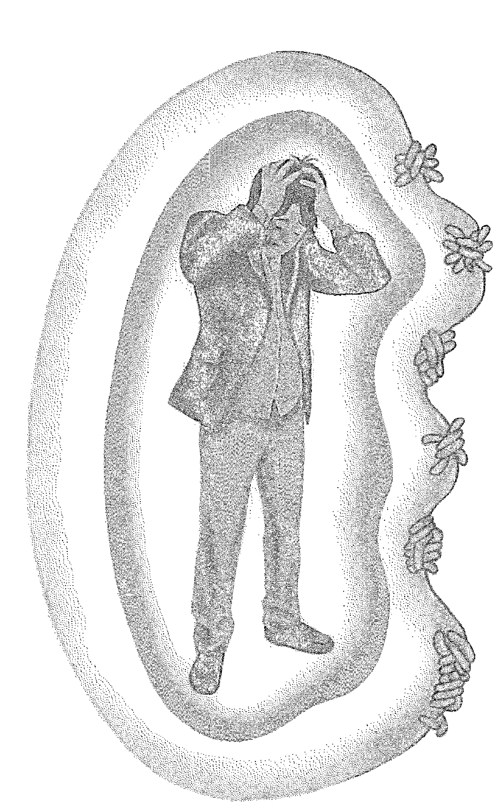

——《神聖的你》

但是，就是因為你又加了一層念頭，就這樣，單純的感受突然變成一個情緒。這情緒會在身心的層面造出一個結或一重阻礙。

在這裡，我也要提醒你，只要你親自去做，去肯定一切，尤其肯定你自己，你自然會發現有數不完的情緒會發作，會浮出來。

這時候，你要很清楚地守住自己。要記得，一切你想找的答案，其實是在這些情緒的上游，倒不是情緒本身，也不是情緒的下游。

假如你不小心或不夠清楚，而讓自己又跟著這些情緒的內容去分析、去注意、去反應，那麼，你也就又被這個情緒的漩渦給流走了。

然而，你要找回這個上游，是很簡單的。

面對任何客體，包括情緒，你最多只需要輕鬆地接受或肯定，也就這樣為自己踩一個剎車。

一再地接受，一再地肯定，只是接受，只是肯定，你也已經回來了。

## 26 對誰，世界是一個幻覺？

我和你一起分享了意識的科學，也從頭腦、物質一路探討到身體、身心的層面，你自然會讓這樣的問題再一次浮出來：這個世界，到底是不是一個幻覺？

雖然之前不是沒有談過，但我總是認為這個題目太重要，在這裡，讓我試著用不同方法再打開一次。

前面提到，我們透過念頭、感受、覺察，可以投射出一個完整的世界，而這個世界包括你，包括我。

這個世界，總是讓你得到一個印象，讓你認為你的身分就是困在這個身體。從你還是個剛出生的嬰兒開始，你接下來會生長，會一點點老化，有一天，會走掉。就在這幾十年的生命，你還要掌握每一個關鍵的階段，把握每一個點，要活出你全部的潛能。但是，你全部的潛能，還是受限於你現有的身心。

你也聽古人、大聖人談過（也或許是聽到我時常重複）——一切都是幻覺。人生是一場夢。樣樣都不存在。一切，都是空。空，空到底。

這些觀念，可能帶給你矛盾。因為它不符合你每一天日常的經驗，和你隨時的體驗搭不上邊。

對你，這世界當然是真的——你的生命是真的。你的生活條件、你的家庭背景、你的工作環境、你生活裡點點滴滴的考驗，當然是真的。這一切怎麼可能不是真的？怎麼可能是幻覺？

過去，這個矛盾或許是你解不開的。這自然讓你認為大聖人談的修行只是空話，也就讓他說他的，而你活你的。最多是你偶爾找不到人生的出口，或生活的困難讓你感到絕望，你還可能再回去讀一點、聽聽看，希望得到一點淨化或安慰。但是，你心裡還是會覺得，這些話和你現在的生活並不符合。

在這裡，我想提醒你，大聖人話其實一點矛盾都沒有。

對你，你這人生的經驗，確實是真的。比如說，你的手碰到一個火燙的爐子，你自然會喊痛，也立刻會把手縮回來。這個痛的經驗，對你，當然是真的。我們不需要在這上面探討它真不真。

不只如此，你也可能遇過一個人。他帶給你滿滿的喜樂和愛。這個人，和他帶來的喜悅與溫暖，對你當然也是真的。不只是真的，還讓你一生難忘。光是回想，就讓你從心裡溫暖起來。

對你，身為人類，樣樣可以體驗到的，都會建立你生命的某一個部分。這些經驗，你可以透過記憶隨時把它找回來。大大小小經驗的組合，對你就是人生。

重點，倒不是在這個層面上爭論真不真。

要說世界究竟是不是幻覺，你要知道，這個問題最多是站在不同的角度來探討。

你在局部，去體會局部。樣樣，對你都是真的。

然而，會說世界是一個幻覺，是你在整體去看一個局部。對整體而言，這個局部，最多還是離不開自己，是自己延伸出來的。

站在這個全面的角度，你所重視的經驗，無論是一個點或是一個局部，都沒有一個獨立存在的身分。任何讓它成立的機制，無論是二元對立、人的聰明、記憶、頭腦連結的能力，依然離不開這個統一的意識。

這些機制，本身並沒有獨立存在的本事，最多只是在自己、意識、心的表面漂浮著的一個小而又小的小漩渦。

你現在應該可以明白，一切，其實一點都沒有矛盾。說世界是不是幻覺，只是站在不同的平台來看同一件事。

你可能也已經注意到，我在這本書已經移到一個全部或意識的層面在看一切、看這個人間。

其實，這還含著另一個重點：你倒不用把注意完全轉向全部，才可以體會到這些話。你可以輕輕鬆鬆地選擇——把注意同時落在眼前的經驗，又可以看穿它、體會到全部或是意識。

也就那麼簡單，你可以輕鬆地選擇——把每一個瞬間、每一個眼前的經驗，都看成是整體或意識的一部分。也就這樣子，你知道自己離不開全部或意識。

你突然在每一個點、每一個角落都可以看到主，看見真正的自己，體會到意識海。這輕鬆的選擇或決定，其實才是關鍵。就這樣，你輕輕鬆鬆擴大你的注意，同時會發現，這些探討在過去所引發的矛盾感，已經消失了。

但是，從另外一個角度來說，其實你所做的，和過去並沒有什麼不同。差別最多只是讓你的注意擴大自己、放鬆自己，而不再帶來一種阻礙、緊縮或過濾。

或許，你這時候還會擔心。你害怕會不會這樣就失去了你的注意，失去了焦點。但是，只要你親自去試試看，不知不覺，你發現你反而自然建立起信心，甚至是信仰。你變得愈來愈篤定，而讓你可以放下這個顧慮、那個顧慮。你會放掉任何顧慮，讓一種更大的聰明帶著你走下去。你只是自在地走下去，好像有一種更大的聰明會帶著你點點滴滴辦好眼前的事，說該說的話。唯一少掉的，是一層頭腦的過濾網。沒有這個網的阻擋，你會發現你反而做得更好。

是意識、是一體、是心在帶著你走。最多，只是這樣子。

既然一體、心、意識是無限大，祂帶來的聰明也是無限。大到了一個地步，你自然會想稱它是智慧。

其實，這就是活在當下，活在這裡現在，活在心流。

你再仔細觀察，你這個身心到這一刻，也只是你過去種種的無明和制約的累積。我過去會用核桃的硬殼或洋蔥一層又一層的皮來比喻。不過，對你，這個厚殼已經很固定了。甚至你年紀愈大，殼也愈乾硬。它阻擋了你，讓你活不出這些領悟。

假如你可以接受這些觀點，你也自然會明白，這一生的重點應該是擺在——要用什麼練習的方法，解開這一生所有的制約，讓你能夠放掉這個厚重的殼子。

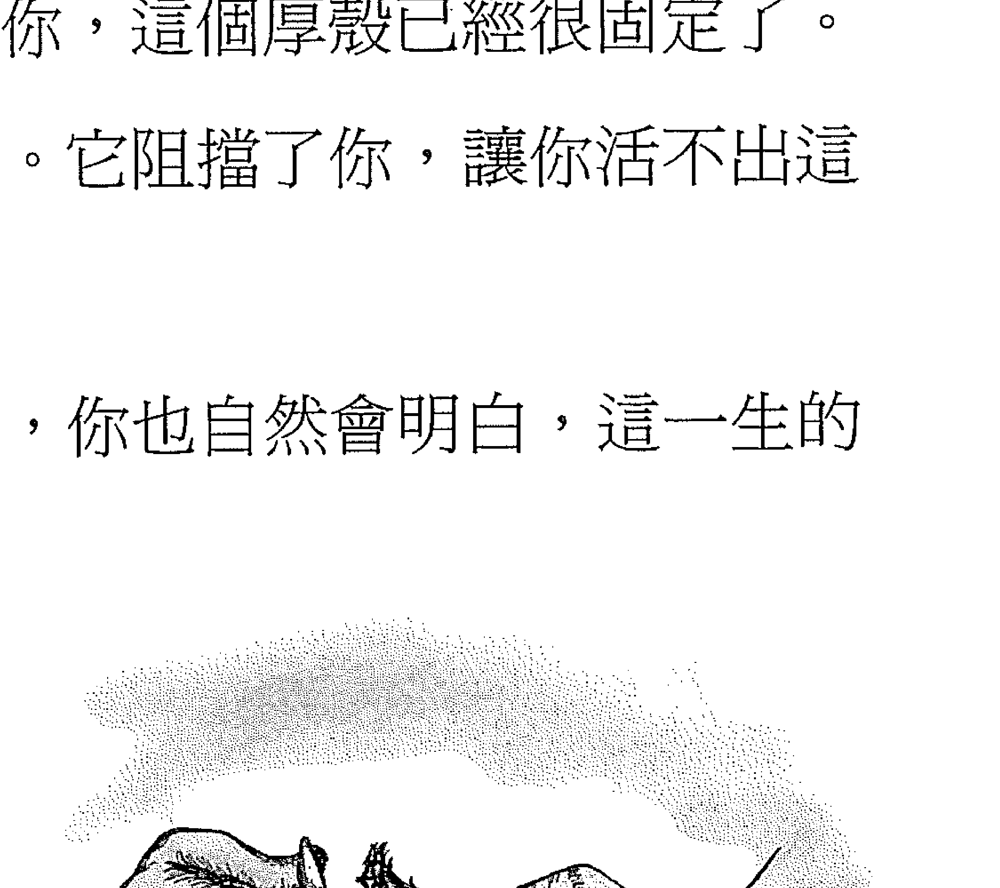

> ——《不合理的快樂》

值得注意的是，修行的重點，其實是要建立在一個好的理論基礎上。我透過「全部生命系列」的好多分享，希望能夠為你建立的，就是這樣的一個基礎。

接下來，你主要是多花時間，熟悉這個基礎，而隨時站在這個基礎上，把身心和生活點點滴滴的經過當作一個機會，讓你親自鬆脫這些制約的殼。

倘若沒有這樣的理論基礎，你再怎麼蒙著頭努力做，坦白講，作用也不見得大。甚至，如果沒有一個指引可以為你點出方向，你有時候遇到一些新奇的體驗，也可能就跟著誤導了自己。

然而，光是在頭腦建立一個完整的理論架構也是不夠的。如果你的理解延伸不到你的生活，你自然隨時又被這一生累積的制約洗腦，而隨時又走上回頭路。

它是兩面一體。理論強化實務，實務再回來強化理論。從多個層面來著手，才能讓自己跟得上轉變的速度。

你自然也會發現，對唯識這樣完整的科學而言，理論離不開實務，實務也離不開理論。它確實是兩面一體，而你從任何一面都可以得到答案。

最後，你也會發現，透過一個好老師，或是一個好的學習環境（例如共修，無論是小的或大的共修），其實也是在培養這個整體的基礎，而這個基礎並不是靠語言來幫你建立。有時候就是需要透過接觸、共振、心跟心的對話，一個成熟的修行者才可以快速地轉變。

## 27 全相式的宇宙

你讀到這裡，也會很清楚地發現，我這裡所講的唯識，其實跟實務和練習分不開。

唯識，你不能把它稱為是一套哲學，也不能把它當作真理。嚴格講，其實沒有哪一個哲學或真理可以反映真實。只要你還可以用文字、用語言來表達，就已經在扭曲整體。重視這些表達，你不只是在把它勉強落在一個局部，而且還進一步可能會以為這點局部就是一切。

坦白說，我對這些學問是一點興趣也沒有。透過這本書和其他作品，我最多是想和你分享一些個人的體驗，也希望這些分享會對你有幫助，倒不是為了想去建立一套道理或一門學問。這本身，從我的看法，其實對誰都沒有用。

我在這裡，再舉一個這方面的實例。

你可能曾經聽過有人用「全相式的宇宙（holographic universe）」來表達真實。「全相式的宇宙」這個概念，其實是想來表達——從每個角落，我們都可以看到整個宇宙。確實，這個概念有它突破性的地位，就好像從某個層面打開了理性的局限，讓我們從線性邏輯有先有後的順序，突然可以接受非線性和同時性的可能。

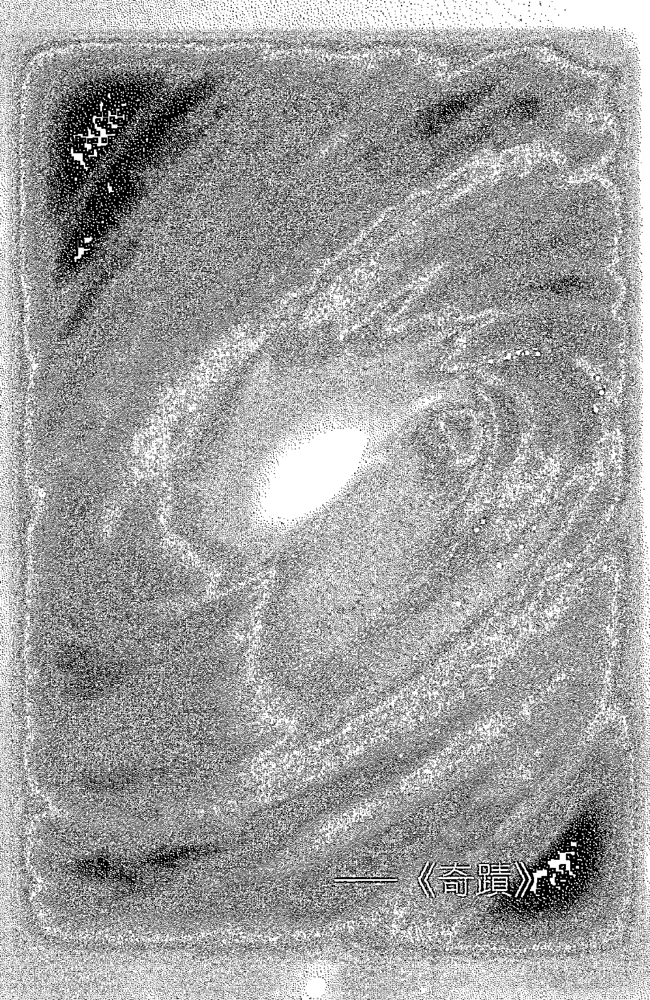

是的，就像我在這本書一開始就提到的「As above, so below. 如其在上，如其在下」，這宇宙的每一個角落，都是由同一個原則建立的，也沒有一個角落離開過螺旋場。一個具體的東西，比如星球的誕生或是樣樣生命的形態，當然是如此。甚至，就連意識場都離不開一個高速的螺旋場。

> ——《奇蹟》

但是不管怎麼講，這些共同點還只是在物質的層面。就連「全相式的宇宙」所談的宇宙，最多也只是代表現象或物質的層面，並不能完全代表真實。

我透過這本書想表達的則是，真正的共同點是在這螺旋場的前面，也就是意識，或意識海。

讓我再用另外一個角度來表達。

一般人會用「全相式的宇宙」這個概念，最多是想比喻——從局部，可以看到整體。然而，這個比喻表達不了的是：整體，和局部並不是平級的對等，也並不是從畫面的一部分就可以看出整體的畫面。整體，事實上連「畫面」都不是。不只如此，從局部也根本推不到整體或全部。兩者是在不同的層面。

整體是意識，而局部最多只是試著把整體、全部、無限大的意識，勉強局限到一個具體的範圍裡。

然而，反過來，也可以說，局部本來就含著整體。只是，整體就算含在局部裡，也並不在局限的同一個意識軌道。祂並沒有受到局部性的作用，也沒有受到局部性的影響。就算有影響，最多也只是一種表面的影響——讓局部的腦以為看到這個世界，認為真的有這個世界。

也就是說，是局部透過自己的遮蔽，認為有影響，才會建立一個完整的世界。但是，整體並沒有真正受到影響。即使在局部，整體看到的，最多還只是自己，還只是全部。

當然，所有的這些觀念，包括這裡所談的全部、局部、整體、看到、世界，跟真正的整體、真實其實一點都不相關。就連我的這些說明，最多也只是無事生非——much ado about nothing。

唯一你可能表達出來，而還比較接近我們想表達的真實的，我在這裡再重複一次，是意識。

意識本身沒有特質可談，更不用講祂還會跟你、跟我沾上邊。我一再地說過 It’s not personal. 祂不會落在個人的層面。

對你，祂最多是帶著一種微細的覺、知、在的感受，讓你好像還可以勉強描述祂。然而，你最多也只能承認，其實，祂可以覺察到、知道、在的，最多還只是祂自己。

你可能還沒想到，你可以用話表達出來的任何觀念、或這一生可以體會到的感受或經驗，這些不光是從意識發出來，而本身就是意識組合的。這一切的本質，最多還是意識，而只是意識。

當然，這樣的邏輯，可能會對你的頭腦帶來一種表面的矛盾。不用擔心，讓我接下來再進一步試著說明。

## 28 意識，到底涵蓋了什麼？

在這裡，我可以再試一次，用一個頭腦比較可能理解的角度來切入意識。

首先，你可以用空間的觀念去理解意識。從這個角度，也就好像是把你所有的體驗或經驗，都落在一個沒有邊的空間裡。

無論你看什麼、聽什麼、想什麼、覺察到什麼，都是在意識之內，或者說都落在一個意識場的範圍裡。

意識場，也就是這樣的一個範圍或空間。然而，我這裡指的空間，當然不只是空間，其實是時一空。無論過去、現在、未來，你可以想像的任何經驗，都還是包含在同一個意識場內。你最多會說它是一個沒有維度的維度，沒有時間的時間，沒有空間的空間。

再或者，你也可以透過時間所帶來的動力去切入，也就是從管道、機制或功能的觀念來理解意識。

你觀察到世界、你體會到身體內的感觸，或是你產生了一個念頭，那麼，你是用什麼方法或機制可以體會到呢？

這種觀點，也就是用你去體會的機制或方法，來理解——意識，其實就是你去捕捉、去體會、去觀察、去理解、去產生……一切的方法、管道、功能、過程或機制。

再講個更透明，假如你把一切分成主體和客體，而不斷透過五官的看、聽、聞、嚐、觸或再加上念頭，去建立主體（你）和客體（東西或者世界）之間的關係。你所建立的所有主體—客體之間的關係，還都是意識，或是從意識延伸出來的。

你看這些話，是不是跟你過去所認為的是一樣？

把意識當作一個包括一切的時—空，或是去注意一切的機制，這兩種角度，都還是頭腦比較能夠理解的。畢竟，頭腦本身也用類似的運作來面對樣樣的現象，例如把各種印象儲存在記憶裡，或是發出一個注意去認識樣樣。

第三個角度，則是一般比較不會想到的，也就是把意識當作是一切內容的質。

換句話說，從這個角度去理解意識，也就是去問——你在想、你在感受、你覺察的時候，你是想到什麼？感受到什麼？覺察到什麼？

當然，這些「什麼」也就是所想、所感受、所覺察的內容。內容，可以是念頭、是感受、是眼前的自己、是具體的世界……然而，無論什麼內容，它本身的組成當然就是意識。

從這個角度來看，意識，是內容。或者說，是內容的本質。有趣的是，這個角度既含著空間，也同時帶著時間的觀念。畢竟內容，也就是一種物質。而物質其實是念頭透過時空才有的，也就自然離不開空間，離不開時間。

是這樣，你可以說，樣樣的經驗，都是在意識內，透過意識，用意識組合起來的。

你看，這還會不會讓你感到很錯亂？意識，祂可以是一個範圍，而這範圍含著時空，祂又可以是一種機制，而又同時是內容的本質。

當然，這樣的邏輯，你可能會覺得還是一種循環論證，無論頭或尾都是同一個點，而讓你覺得根本不符合常識或邏輯。你用人間的聰明或邏輯，怎麼都覺得不通，繞不出來，而會產生一種矛盾。

但是，你再進一步仔細想，如果有一個體是無限、是永恆，祂當然也就是如此。

祂的出發點和終點不可能不是同一個點。或者說，祂沒有出發點，也沒有終點。祂包括一切，但除了自己什麼都沒有。祂本身就是在強化祂自己，在聲明自己，在主張自己。祂就是自己的基準。除了自己建立自己的基準，其實，沒有其他的點，可以跟祂相提並論。

> ——《不合理的快樂》

如果你讀到這裡，反而覺得再清楚不過了。那麼，說意識「是一切，是全部，除了祂，沒有其他的東西」，這樣的表達對你也不會再是口號，而確實就是如此。

用這三個角度，再延伸下去，你當然可以問：覺，覺什麼？知，知道什麼？在，在哪裡？

當然，你也只能說，
覺，覺自己。
這個自己，是機制，也是內容的本質。

知道什麼？知自己。
這個自己，是本質，也是機制。

在哪裡？在自己。
這裡的自己，是機制，同時也帶著一個空間或範圍的觀念。

意識，是本質、是機制、是發生的空間。同時，意識是所有發生的主體，也是被發生的客體，以及連結主體—客體之間發生的動力。任何層面，都是意識組合的。沒有不是意識過。也沒有在意識之外過。

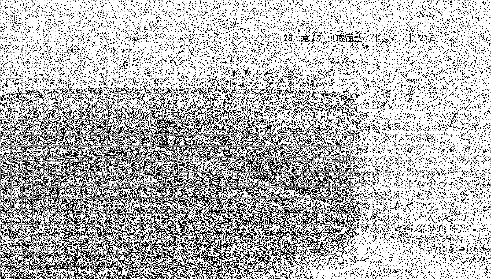

或許，你還記得最早接觸這些作品的時候，就讀過我這樣的表達：你是球員，也是球判，也是觀眾，甚至你也是球，是球場，你是一切。我當時也試過用另外一個比喻：你是演員，是導演，是編劇，是觀眾，是舞台，是全場。當時，這兩個比喻，對你可能充滿矛盾。你也不見得明白我想要表達的究竟是什麼。

> ——《全部的你》

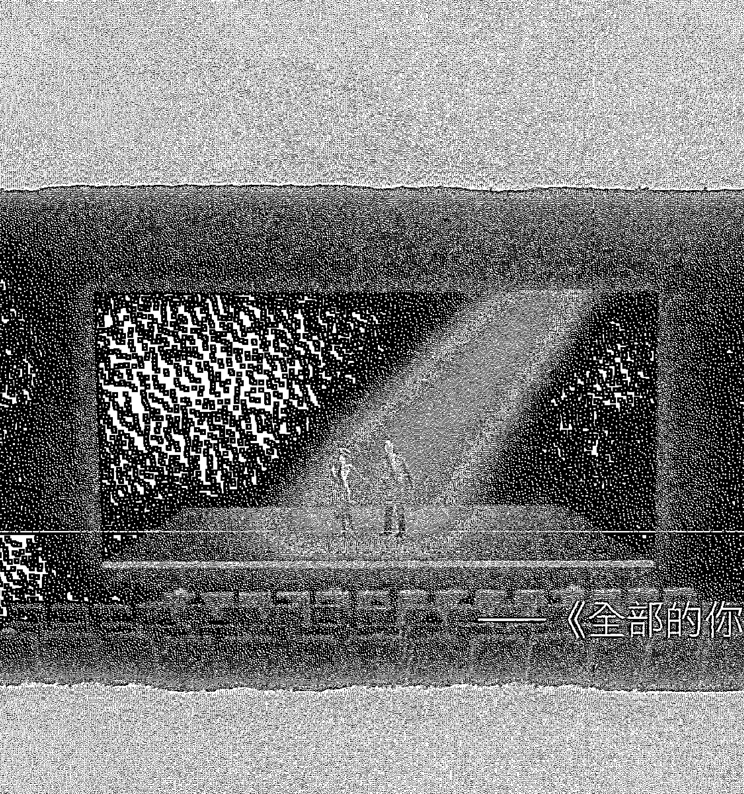

> ——《全部的你》

當然，我也知道你一定不懂。是這樣子，我和你才要走那麼長的冤枉路，讓我花那麼多的篇幅，一個字一個字地為你鋪路鋪到這裡。我相信，有了這樣的基礎，這些比喻，對你才開始變得清楚起來。

現在，你讀到這裡，再想起這兩個比喻，自然也就明白——是啊，意識就是如此。祂是全部，也同時是部分。甚至，祂什麼都不是。

在這裡，我還是要再強調一次：意識，並不是一種頭腦的聰明。你所謂的聰明，還是二元對立造出的機制。然而，聰明其實也離不開意識，還是借著意識在作用。

意識本身沒有一個目的，祂不像人類需要一個動，要有一個目標，還可能隨時想做一個聲明。

意識，老早就已經圓滿。接下來，也早就圓滿。

我才會說，祂最多也只是如此。

任何經驗，都像是在跟意識海借祂的本質，把本質借到這個人間，而沒有簽署任何條件。是這樣，你我才會有在、覺、知，而且隨時都有，隨處都有，不可能沒有。

你我把這個共同點（不動、不生不死的「在」的本質）從意識或意識海借過來，佔滿每一個瞬間，讓每個瞬間都有祂。是這樣，我才會說你的所有經驗，其實都在借用意識——從這個共同點，借來不動的「覺」的潛能。

過去，你可能常聽到「如此」「如來」這兩個用法，而把它當作只是一種文學的修辭。但我相信，你現在聽到這兩個詞，心裡的體會已經完全不同了。

其實，五官也是一樣地，隨時都在從意識借用「覺」。如果沒有「覺」潛在的動能，五官也產生不了作用。

是這樣，我才會在一開始就強調，共同點倒不是五官可以注意到的客體。反而是可以去注意的主體，或者說，是在前面驅動五官作用的潛能。這才是真正不變的共同點。

意識，是這麼不斷地在延伸自己、回到自己、承擔自己、循環到自己。也就像是你在這個世界可以體驗到的任何東西、經驗或片刻，是在不斷地借用祂、借用這同一個本質來聲明祂自己。然而，你的頭腦承認不了這個事實，寧可集中注意在表面，而非要選擇看不到祂、體會不到祂、不理祂、假裝忽視祂不可。

回到修行和實務的層面，現在，你已經更能夠體會到，要回到這個本質，其實是「做」不來的，也不是透過在一個領域練習或多用功可以得到的。

這些話，過去你或許還會認為只是比喻。但是，你現在會發現，事實就是這樣子。

透過「全部生命系列」，我無論採用任何字、任何練習，最多是想從不同的角度切入，希望能用最輕鬆的方法，把你的注意做徹底的回轉。

然而，說回轉，其實連往內心回轉都不是。畢竟，只要你去區分一個「內」或「心」，也就還是離不開物質的層面，而又不免好像在時空的層面上去找一個平級的對等。這種勉強的表達，最多只是想把你的注意，帶到你過去沒有一個注意到的一個沒有點的點。

讓我再進一步做一個比喻。

你可能還記得，我隨時都會強調參和臣服的練習。但是，參，是要你參什麼呢？

或許你現在也可以突然了解：即使講「參」、或提醒你把注意帶到「我」或甚至「大我」，這本身還只是個比喻。

意識既然不會落在個人的層面，也就沒有一個「我」需要去談。就連「大我」這個相對意識的根，雖然還落在相對，但是它也不再需要「主體一動一客體」的框架。

當然，我也可以換句話說，要你透過參，把注意帶回到覺。

這個作用，跟前面所談的大我是一樣的，只是用字不同。

所以，你也可以問：覺，覺什麼？

最多只是覺自己。

無論是回到大我、大你、覺、知、在，你都能用這些話做一個反省，而作用其實是一樣的。

當然，你也可能還要繼續問：但是，覺，要用什麼方法或機制去覺察到自己？

其實，它倒不需要用任何機制，尤其不需要我們人間所謂的方法來覺察到自己。

反過來，你也可以說，它是透過沉默，是透過念頭和念頭之間、動和動之間的空白，來覺察到自己。

它並不是透過一個體去覺察一個體。

全部的可能，都在自己。

在你還沒有這個問題前，它已經輕輕鬆鬆圓滿到自己、覺察到自己。
接下來，也只能是如此。
就算你把注意完全集中在客體，覺，還在覺自己。
最多是你在忙碌的生活中，隨時有念頭，而隨時跟著念頭跑。是這樣，你好像也就忘了。然而，就在你念頭覺察不到的空白，覺，還在覺自己。
你看，這個事實，是不是很有趣？
那麼，你也可能再問：臣服呢？
很好。
其實，都一樣的。
臣服，最多也只是意識自己在聲明自己。
你的臣服，最多也只是把這個遮住祂的小你暫時挪開，而透過肯定、透過接受，自然讓意識或自己浮出來。
這是自然的，本來就有，本來就是，倒不是透過你的尋或找。
你的臣服，最多也只是接受這個事實。
到這裡，假如你每一句話都可以接受，那麼，你現在的體會可能已經完全不同。

你可能突然明白，你的修行，其實一開始就只是在這樣的基礎或平台著手——站在全面，接受自己，清楚地領悟到自己；完全明白除了自己，沒有其他的體。

既然沒有其他的體，那麼，是誰在醒覺？又是在醒覺什麼？

啊。

原來，是醒覺，在醒覺自己。是悟，在悟自己。

當然，你也可能進入更深的感觸——原來，這個旅程還沒有開始，其實老早也已經結束了。

你看，這些話，對你現在是不是開始有意思了？

## 29 無明，可能遮住意識嗎？

你讀到這裡，假如已經一點都不驚訝，你自然可能會領悟到——既然每一個角落都有意識，而意識是全部的生命的共同點，那麼，什麼又叫做無明？無明，是不是本身也含著意識？

是啊，當然是如此。

無明、不無明，其實最多又只是人間的一種說法或比喻。

過去，我會用「無明」兩個字，也只是想表達一種遮住的觀念。就好像太陽的光，會被雲遮住，然而，如果雲挪開了，太陽也就照明出來。

照明什麼呢？

是照明自己。

然而，我現在必須再講清楚一點：其實，太陽的光是什麼都遮不住的。會感覺好像被遮住，是因為「你」這個小小的體還在做種種的區隔。「你」認為有太陽，也認為有你；而且，「你」認為太陽跟你有距離。對你，太陽有光可以照明，而你有時候照得到光，有時候會被雲或窗簾遮住。

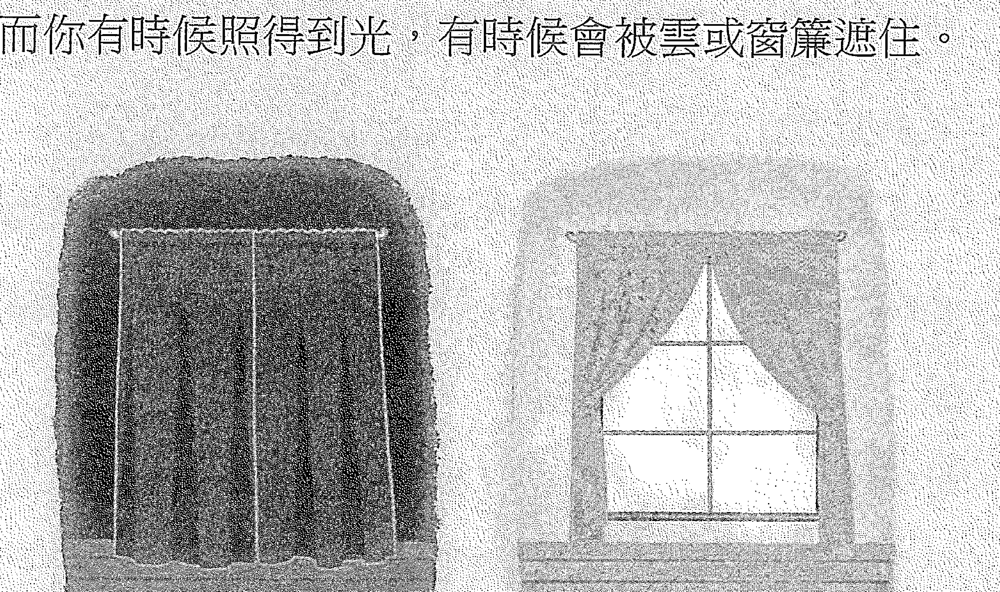

> ——《全部的你》

但是，對太陽，關於照不照明你，它其實什麼都沒有做，也沒有動。它本來是太陽，現在是太陽，接下來還是太陽。白天、晚上，它隨時都是太陽。它從來不擔心要照明誰或為誰去照明。它最多是活出自己，承擔自己，照明自己。絕對、主、意識、心，就是如此。

太陽，也只是來比喻絕對、意識、主、心。

對無明的你，意識一直都在。最多只是站在你這個小你，還有一種區隔、分離或隔閡感。但是站在意識，你始終屬於祂。或反過來，即使有你，祂還是一樣存在。祂不會為你，做什麼變更，更不會去提醒你。反過來，祂也不會冷落你，又怎麼可能排斥你。

沒有你前，意識就是意識；就是有你，意識還是意識。

然而，對你，你會以為有一個「你」存在，但對意識，最多還是祂自己存在。

對祂，你最多就是祂自己，而從來沒有過不是祂自己。

至於你究竟存不存在，這樣的問題對祂其實是不存在的。對祂，沒有一個東西、沒有一個角落不是祂自己。

在你認為的無明當中，意識還是存在。甚至在無明當中，意識還是照亮出來。

我跟你談這些，並不是無謂的閒聊。這些話想表達的，對你，其實含著一把關鍵的鑰匙。

首先，我是希望你回轉——回轉到自己，回轉到意識的出發點。只要你可以守住這個你所認為的自己（無論是小你或大你），你自然會發現，人生過往的基礎竟然開始垮掉了。這種崩塌，自然會把你過去累積的任何價值觀完全推翻。

但是，你過去累積的習氣實在太多太重。對你，這個身體還是真的，有它的實質性。是這樣，你就算懂了前面的道理，也不見得就能夠徹底用這樣的領悟來面對你身體和人生的經驗。

反過來，你需要將眼前的樣樣做一個徹底的整合，或者說，跟你相對意識的源頭做一個結合。你才可以輕輕鬆鬆地接受任何接下來的經驗、面對每一個瞬間的體驗，而不會在你心中繼續產生矛盾。

樣樣，你都能回到相對意識的源頭。這也就是我過去所講的，在每一個角落，你都可以看到主。You see God everywhere.

不要小看這句話，它其實是你修行最難過的一關。但是，這個領悟，本身可以讓你最徹底地轉變、甚至顛覆自己的行為。

我知道，這些話，可能對你到現在還是很遙遠。畢竟，你有時候好像聽懂，同時又好像不太懂。但是，沒有關係，讓我用另外一個比喻試著再表達看看。

我用大海，來表達意識。大海，只有表面才有風浪；同樣是大海，對深海而言，它完全不知道什麼是風浪，而且也懶得知道。

深海，要完全忘記自己是深海，而把自己徹底投入到海的表面，它才可能突然體會到什麼是浪。

對從來沒有動過的深海，你不會想去問它：「為什麼海的表面有那麼多波浪？」

然而，面對意識或意識海，你竟然會想問：「怎麼從一，會有那麼多的『體』？」

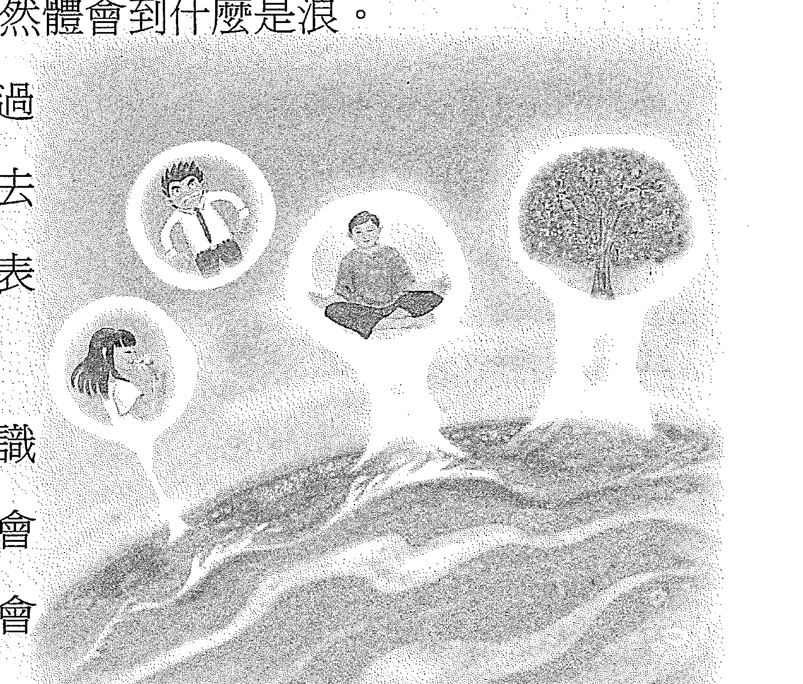

> > ——《神聖的你》

意識，根本不知道你所談的。其實，祂也懶得知道。

祂最多可能跟你點一下——其實，你表面看到的波浪，對你好像是多體；但是，你的多體，對祂最多只是無限多的可能中的一個。樣樣可能，都不會比其他可能更有趣，也不會值得祂特別注意。

當然，這樣的答覆可能滿足不了你，那麼，祂或許要再一次這麼表達：

如果意識要知道你所指的海的表面或多重的樣樣，那麼，祂要完全投入在這個世界、投入在眼前的一點，而且建立一個機制叫注意。接下來透過這個注意，從自己延伸出一個好像有的主體，又再透過注意看到一個客體，而且覺得這個客體跟主體是分開的……這樣祂才能夠體會你所講的。

然而，這對祂是不需要做的。

對祂，這麼做不會增加什麼，也不會減少什麼，又何必去做？

這一點，你只要去參，也自然就明白這是事實。

不管怎麼說，雖然好像有深海和淺海的差別，但深海和淺海的組成還只是水。不管它進入什麼狀態，水沒有變。

無明或不無明，也是一樣，還是同一個本質，隨時都在。在無明，隨時可以找到意識。在完全放鬆、打開的狀態（你也可以稱為是覺悟或開悟），意識還只是存在。什麼都沒有變。差別，最多只是這觀察的人有沒有體會。

然而，你說什麼是觀察、是體會？對意識，對這個不動的本質，祂沒有動機想去觀察、去體會任何事。

甚至，什麼叫做意識，和祂也不相干。

祂是一片寧靜。

### 30 又可以無明或忘記什麼？

這些觀念太重要，我再試著用另外一個角度，把無明這個主題再打開。

我在這裡，用深海忘了自己，還要把自己投入到一層薄薄的表面的比喻，來說明絕對和相對的關係。你可能會認為這種機制不是常態，認為它和你的生活很遙遠。

然而，這個機制其實並不遙遠，也並不是什麼特殊的現象。只要觀察，也隨時能在自己的生活中看到類似的實例。

舉例來說，現在的科技普及到一個程度，你、我、每一個人隨時都可以自己選擇聽誰講話、看誰的影片、選擇看或不看某些新聞。

這樣的選擇是很方便就能執行，可以讓你隨時投入某一個人的說法、守住某一個頻道、訂閱某一個社群媒體。你透過自己的興趣，完全可以選擇收聽什麼、收看什麼、接收什麼訊息。

對你，這是再稀鬆平常不過的事。然而，光是這樣選擇、投入的過程，本身已經在強化你自己的身分，加深你自己的偏見。

不過，你就算是只看某一種新聞的管道、只接收一個觀點的訊息，在選擇和選擇當中，你自然會發現有一個東西沒有變過。

這個不變的，最多是你的意識或觀察的能力。而你所謂的選擇，最多也只是把觀察的能力從一個範圍轉到另一個範圍。

無明，最多也只是如此。透過無明，你不知不觉把全部的身分，挪到一個狹窄的局部。這樣的局部，你會稱爲是人間。就那麼簡單，你把自己真正的身分忘記了。

然而，就連說「你把自己真正的身分忘記了」這句話還只是比喻。

怎麼說呢？

其實，倒不是誰，忘記了什麼。

可能你還沒有想到，連這一點，和你過去所認爲的，是剛好相反。

假如還有一個體或誰可以忘記什麼，你最多也只能說，是意識忘記了自己。

意識首先要忘記自己，祂要把自己局限到一個角落，才可以呈現一個體。

也因爲這樣子，全部的客體、五官造出來的現實，都是局限，都受到限制。

最好笑的是，可以覺察到、知道這些觀念的意識，祂本身其實從來沒有受到限制過。

這也就是我常在講的——*lila*，神聖的喜劇。

你我怎麼也想不到：一個無限大的存在，竟然會忘記自己的身分，而投入一個有限的局部。最奇妙的是，祂雖然忘記自己是誰，但祂始終沒有受到限制過。

無明，倒不是你有本事從相對的意識建立出來的，也不是從你的頭腦投射的。

無明，最多只是意識投入在一個具體的層面，而把自己的身分和這個具體的體綁在一起。無限，突然以為自己是局限，也就這樣子迷失了方向，用這個身分來遮住自己。

這才是無明。

倒不像你過去所想的，以為你竟然有這個能耐像雲一樣把太陽遮住地，就這麼為意識套上一層面紗。坦白講，這絕對、無限的層面，是你遮不住的。

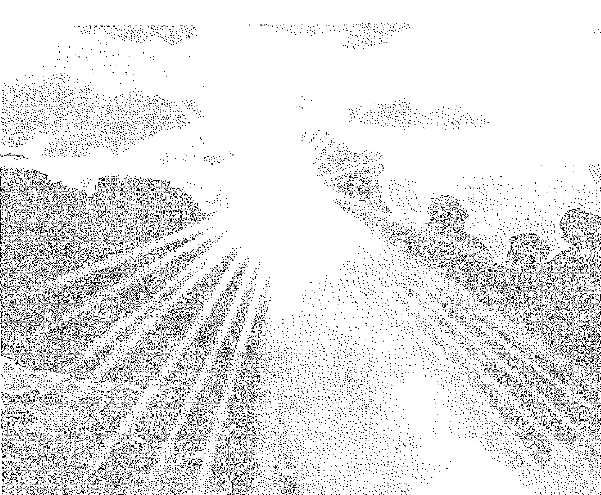

> > ——《神聖的你》

事實，是剛剛好相反。是意識，透過注意投射在一個點，才把自己的身分給忘記了。也就這樣子，製造了一個完整的世界。這個世界，有各式各樣的角色，各種劇情的劇本，發展出各種感人的故事。但是，總是有一天，祂會想起來自己是誰。也就這樣子，這一層無明也就消失了。

你看，要消失這個無明，跟你個人甚至是一點關係都沒有。它生起，和你無關；它消失，還是跟你無關。

這一點，是不是跟你過去所想的不一樣。

當然，你可能也已經發現，就連「意識忘記自己」這些話都還是比喻。忘記不忘記，還是頭腦在講話，想要取得一個意義。站在整體，站在意識，沒有誰可以忘記誰，最多只有自己。我在這裡最多是用這些話換個角度來勉強表達，看是不是能對你有幫助。

我相信你已經發現，我可以表達或你可以想像的一切，無論是多微細、多奧妙、多深刻的理念，都還是站在相對的人間講話。而這些話，對整體，沒有任何代表性。

這一點，我還是必須對你坦白。

然而，對無明裡的你，一切都有關。一切，都會讓你認為應該做點什麼，才能把全部、整體找回來。

只是，消除無明，其實跟你沒有任何關係。

懂了這一點，你會省下數不完的時間，省去數不盡的痛苦，無數的壓力、負擔。這些不必要的經過，全都能省掉。

這是我認為對一個成熟的修行者最重要的一點。

說到這裡，你可能還記得，我過去用「集體的失憶」來表達人類的處境。或許，你聽到「集體的失憶」這個詞，可能會以為是要把你頭腦的記憶轉到某一個事件或某一個知識，而可以這樣把全部找回來。

假如你有這樣的期待，其實，你已經誤解了。

希望你讀到這裡已經明白，並不是如此。你並不是失去了某個具體的東西，而還要用這一生把這個具體的東西找回來。對你的生命，你可以忘記、可以找回來的，其實並不是一個東西、不是一種印象、一個記憶，甚至不是一套知識，更不是某一種遙遠的經驗。

你所忘記的，最多也只是真正的身分，而你真正的身分，最多也只是真正的你——意識。意識從來沒有離開過你。

你看，這些話，是不是可以符合你的理解了。

另外，我要再強調另一個重點。

在生活裡，科技的發展讓你我的步調特別快，而隨時都有東西值得注意。你的注意不斷地受到刺激，要隨時集中在變化。確實，這樣下來，快速的變化也就成為人類新的正常或新的常態。

正因為現在技術的發達和方便，你我現在可以隨時把注意投入各式各樣的內容，幾乎沒有任何阻礙。然而，我要提醒的是，其實你選擇投入某一個內容，不光表達了你對某一種現實的偏好，同時，你選擇投入的也自然會排斥別的。

就這樣，人類社會的發展雖然愈來愈發達、愈豐富，但是你、我的身分卻是愈來愈孤立，隔閡感愈來愈強。

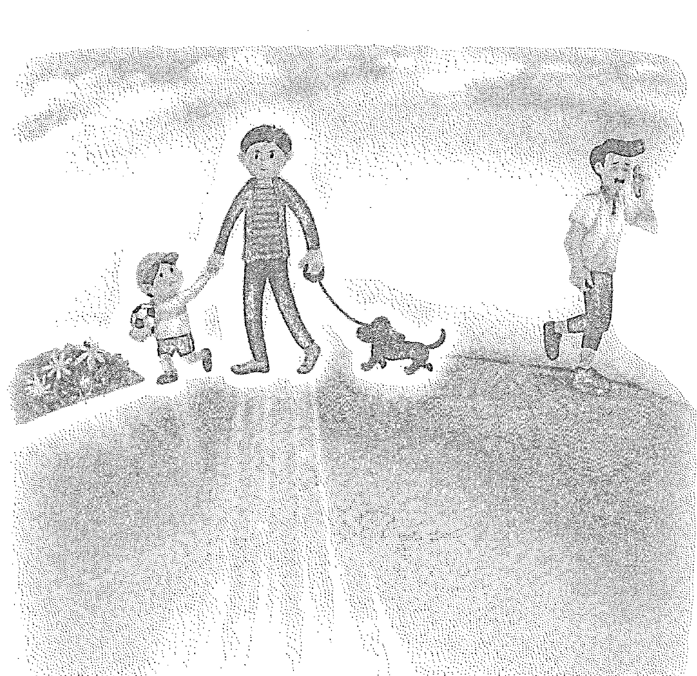

坦白說，這樣的情況，其實已經極端到一個地步，讓你失掉了和諧與合一。在這之前，你早已一點一滴失去了快樂，愈來愈沒有安全感，很難體會到平安。

這個時點，是人類最大的危機，但也是最大的機會。

首先，這種極端狀態是維持不了多久的。它失去了均衡，而是早晚要重新平衡回來的。

另外，從個人的角度，你自然會發現，這種大環境所帶來的危機，對你是最好的機會，推動你去接觸全部生命的觀念，甚至能遇到這裡所講的唯識。

外在，一切都在動，而且動得非常快，就像龍捲風襲捲而過。

這時候，你投入內心，找到一個穩定不動的力量，反而是最理性的選擇，也是你唯一可以做到的。

## 31 顛倒的世界

「世界是顛倒的」這句話，或許你已經聽我重複過不知道多少次。

一開始，你也許會覺得這只是我的口頭禪。

當然，你現在可能也已經知道，我指的顛倒其實是——真實，和你透過五官和念頭所可以得到的現實，其實是完全顛倒的。

你也可能已經愈來愈能體會到，事實就是如此。對你，感覺到顛倒的範圍，現在可能愈來愈廣，愈來愈深入，顛倒得愈來愈徹底。

假如你確實隨時有這種感受，我還是要恭喜你——不知不覺，你已經投入了唯識的觀點。從唯識的角度看一切，你自然會發現，世人認定的各種價值和觀念，不光是不存在，而且與事實幾乎都是顛倒的。

不只價值和觀念是顛倒的，你現在回頭看，一般所講的常識，其實最多也只是一套信念，最多只是你從出生、到成年，透過洗腦而認為理所當然的現實。

你到了某一個階段，這些過去會認為最基本的常識，不只是失去了常識的地位，而且這些所謂的常識，竟然正在一個個被你推翻。

也就好像，這一輩到這裡，要逼你做一個全新的開始，讓你承認——世界，完全和事實是顛倒的。這種顛倒，徹底到一個地步，或許到最後，你就是完全懂了，也可能像過去許多古人一樣，選擇一句話都不講。

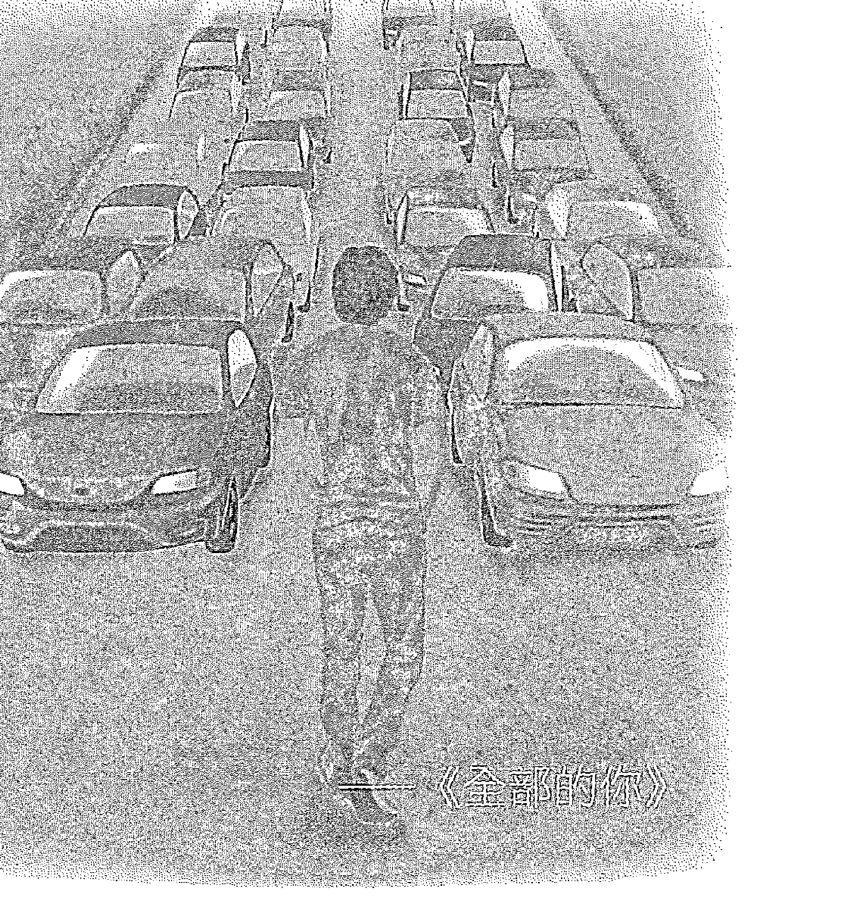

你最多，是用沉默表達這徹底顛倒的領悟。

用唯識的角度，你再回頭看人類的歷史，想想歷史上的名人，回顧各種過去認為值得效法的經過，你可能會覺得——真不可思議！

不可思議的是，人類怎麼可能會這麼傻？！

甚至你可以說人類是幼稚到一個地步，幾千年來，把自己的真實從生命本來的和諧與合一，陸陸續續落到個人狹窄的層面。接下來每個人還要主張種種個人的自由、個人的選擇、個人的體會、個人的權力、個人的方便、個人的感受。

也就這樣子，你、我自然完全把注意擺到外在的種種變化，而倒不是擺到每一個人本來都有的、核心的價值觀念。

真正重要的，其實是強化我們和所有生命、無生命的共同點——意識。但是，人反而自然把注意轉到種種的分別與形相。

人類的發展，本來有一個自然的過程。就好像你我生命剛開始時，自然會給眼前樣樣的東西、人、事、物、觀念取一個名字，建立種種形相的分別，這樣對自己、對外界得到一個粗淺的認識。你、我成熟了，也自然會從名相的種種分別，自然而然轉向生命的在和意識，體會到生命的本質本來就是快樂、愛與寧靜。

這樣的發展，也就像古人講的 *Nama, rupa, sat-chit-ānanda. 從名、相走到在、到意識，而讓快樂、愛與寧靜自然活出來。

沒想到，人類幾千年甚至萬年的歷史，竟然活成了一種顛倒的演化——從本來就有、最高的狀態（在、覺、樂）倒退到只剩名相和分別的地步。

這一點，對我，是最不可思議的，讓我有時想笑，有時又會忍不住掉淚。

當然，這些話，更是不知道要跟誰分享。

你再仔細觀察，也就會發現，有色有形的狀態，和在、覺、樂相比，在意識譜裡並不是同等的比重。我過去會說它在意識譜裡連兆分之一都不到。有限、相對的層面，無論多豐富、多精彩、多新奇、多搶眼，和無限的絕對相較，最多只能算是一個小之又小的可能。

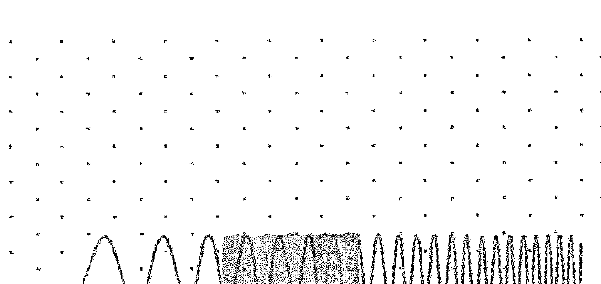

> ——《全部的你》

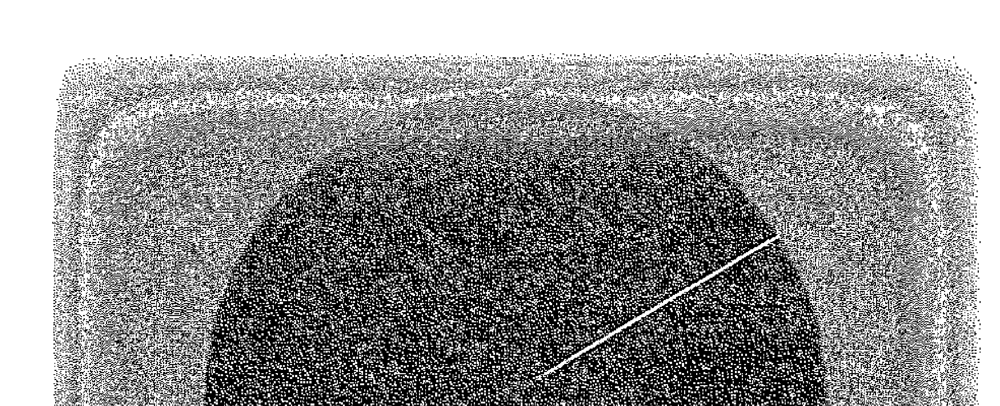

> ——《清醒地睡》

但是，我們人類，就連這麼基本的事實，都沒有認清。

也就是因為如此，人類（也就是你、我）根本不知道在這個宇宙，有數不完的平行的世界同時存在。每一個平行的可能，都同時在開展它自己。

或換句話說，這些數不完的平行世界，透過在各自可能的框架裡的觀察機制（不見得是二元對立，也許還有別的），由它個別的無明一再地延伸或活出它自己。

這一點，假如你可以體會到，也自然明白這才是真正的多重。

這樣的多重，有無窮的變化。你最多只能說是不可思議的多，不可思議的豐富。它所涉及的領域，可以延伸到不可思議的大或不可思議的小。

最有意思的是，這些平行的世界還可以重疊，而你可能完全覺察不到。

有些世界（其實是絕大多數的世界），是落在和你完全不同的頻率，採用截然不同的機制。這樣的世界，確實很可能超過你的五官所能接收的頻率範圍。

也就這樣，你要透過感官去覺察或證明這些世界的存在，是不可能的。最多，你或許可以勉強感應到。但坦白講，就連說感應也不見得正確。更別說這種感應和你用人間的五官或任何偵測的方法是一點關係都沒有。

無論是五官或是另外一種偵測的機制，既然是超過你能接收的範圍，又有什麼感應可談？這樣的世界，根本是你連想像都想像不出來的。

還有另外一個現象，你可能到現在還沒想到。

對你，歷史就像是一條直線。你沿著這條直線，當然可以指出遙遠的過去，而經過幾萬年甚至幾十萬年的時間，人類才發展到你比較熟悉一點的近代，短暫地落在現代，而還可以繼續通向未來。

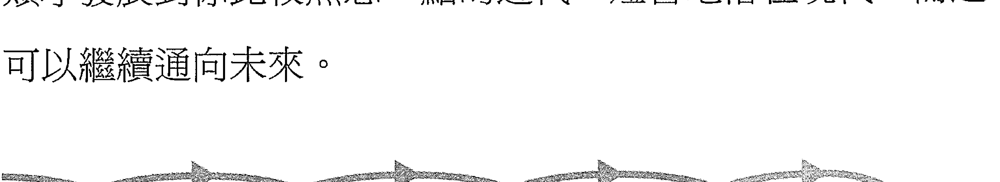

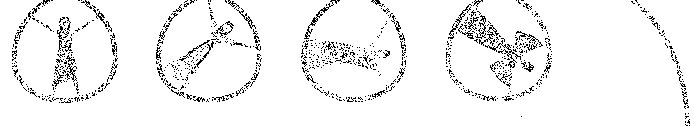

> ——《神聖的你》

你自然也會認為宇宙、地球當然有一個直線式的歷史。是這樣，你才能推出最早應該要有一個大霹靂，而把它當作宇宙的起源。這些天文物理的學問，是那麼完整，讓人可以一生投入鑽研。然而，你可能沒想過，就連這麼完整的學問，竟然還是純屬頭腦的虛構。最多，我們只能說它是幻想的產物（figments of imagination）。

頭腦，沒有辦法在同一時間處理不同序列的畫面。是這樣，你自然會把人類的故事、地球的歷史、宇宙的存在當作直線，而讓它只有一條前進的劇情，有先後的順序。這樣，你才能得到意義。就像電影要由一個個畫面先後組成，才讓我們得到一個順序或劇情的觀念。

假如同時有好幾場電影在你面前演出，或者一場電影裡，有好多支線的情節同時在發生，那麼，你的頭腦捕捉不了，對你，也就什麼意義都沒有。

從你的角度，只能有一場電影。而且這場電影，要規規矩矩地讓你一幕一幕一個畫面又一個畫面去欣賞，你才能看懂它在演什麼。

但是，或許現在就有另外一個生命，它可以同時看到你所看的電影，而又可以看到其他也在演出的電影。它看著你那麼認真盯著眼前的電影看，或許還會笑你，笑你是多麼天真，真以為你在看的這場電影是唯一的可能。

你說，他會不會想來拍拍你的肩膀，問你要不要醒過來呢？

你大概也猜到了，如果你是他，看到你在這個角落跟著哭、跟著笑，他最多也就是笑笑。然後，選擇沉默。

話說回來，這些平行的世界，或說平行的宇宙，當然也包括一般所謂的天堂、地獄、任何用頭腦可以想到或甚至想不到的境界。

人類可以想像得出來的境界和生命，像是有翅膀的天使、長角的惡魔、噴火的地獄，在現象的層面都同時存在。

這一切的境界，跟二元對立的機制還是分不開。裡頭的內容、角色和規則，也自然被同樣的機制給鎖定。而超過二元對立的邏輯所能想像的平行世界，更是可以說數都數不完。然而，再多、再奇幻、再美妙、再可怖，在整體而言，其實是沒有的。

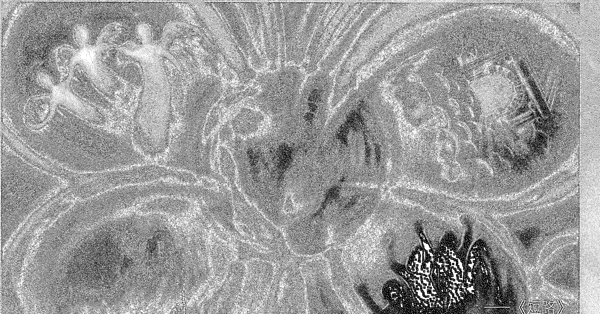

我過去才會說，去尋找或分析這些境界，甚至還要講究怎麼從一個境界提升到下一個境界、再一個境界，都只是浪費時間。

當然，就算我講到了這個地步，你或許還是會想知道世界或宇宙的起源、或是想知道更多奇妙的境界，而期待我再講下去。然而，坦白說，這並不是我在這裡想表達的重點。更重要的是，我並不認為談這些對你的處境會有幫助。

首先，你就是找到這些境界，而發現這些境界都符合某一種規律，再多的境界、再關鍵的規律，也跟你的現況不相關。就算你去理解、甚至投入，也不可能幫助你體會到——原來，你這一生、這一切的根源，只是意識，只是心。

事實，再一次地跟你所以為的是顛倒。

你其實不需要離開世界，不需要離開任何瞬間，不需要離開這裡現在，你本來就能找到這一生來所想找到的意識。

## 32 顛倒的，其實就是唯物

其實，比起追尋更多的境界，前面也提過的「人類的價值觀都是顛倒」，對現在的你，這個觀念可能是更重要。

這一生，你過去得到的印象可能是：如果一個人愈聰明、有豐富的知識、深廣的學問、高尚的地位，而他有經濟實力、手上能掌控權力，或是他比別人更強壯、更美、口才更流利、更多才多藝……這些種種的區隔，無論是從個人、家庭、社會或國家的層面來看，都是讓人佩服，也讓人覺得值得效法。

這種「要比別人更突出」的價值觀，就是西方文化的基礎。

然而，東方文化早期倒不是如此。東方人在佛陀、老子、孔子等等大聖人的薰陶下，自然會講究整體的平衡，而甚至會更重視心靈生活的層面。

只是，這麼幾千年下來，也自然忽略了物質和經濟的發展。這方面的發展，是到了近百年才開始，於是更要加緊追趕，甚至非超越西方不可。也就這樣，東方的民族即使還沒有完全忘記自己文化的基礎與核心價值，也已經把這些珍貴的理解擱到了一旁。

不過，坦白講，人類的發展從精神轉向物質，似乎是一個共同的趨勢，只是時間早或晚而已。

你過去可能也聽我說過，在古希臘文明裡，我認為在哲學或修行最有成就的一位，是蘇格拉底。他的境界，是不可思議的廣大和深邃。到了他的弟子柏拉圖，已經把他全部生命的理解縮簡成一種唯心論。雖然說是唯心，但所談的又離不開念頭。再到亞里斯多德，重點就已經完全落到物質，而用物質的觀點看待一切。是這樣，而開創出天文學、生物學……各種西方學術的領域。

後人會認為是亞里斯多德的才華，才開創了西方接下來的文明和科學。然而，對這一點的強調，其實又把重要性給顛倒了。

讓我們回來看東方的文明，舉例來說，老子在《道德經》留下的話，雖然很簡短，卻是千萬年後也不會消失的。他只用簡單幾句話，就點到真實。而這種表達，是不可思議地通透、不可思議地深邃。然而，後來的莊子（或其他自認為繼承了老子精神的人），反而已經把這些真實的描述（道）落在一個更窄的範圍。

從孔子、到孟子，乃至於後來的儒家，也是一樣地把最早想表達的整體落到了具體，把精神降成了規矩。也就這樣子，一路往物質層面走下去。

釋迦牟尼佛之後，也是一樣的情況。他所留下的法，在他離開人間後沒多久，就被後人分成了不同的部派。或甚至更進一步，透過後人更多更複雜的解釋，把經落成了論。

這些人類史上一再發生的現象，不就是一再地重複「把絕對落到局部」的錯誤嗎？

雖然我認為現在的華人和東方人過度偏向物質，但是，你回頭看就明白，將生命從一個均衡的整體落到一種不均衡的物質層面，其實是人類文明化共同的趨勢。只是西方文明走向物質層面的經過，前期是比我們早了點、快了一些。到現在，無論東、西方，物質化的程度其實沒有兩樣。

你再仔細看接受現代教育的年輕一代，他們（其實也包括我們）的價值觀完全鎖在人生的表面。現在的人所在意的，不外乎怎麼表達自己、影響別人、增加自己的特殊性；也特別關心怎麼累積物質，而讓物質愈多愈好。比起古人來，現代人是特別著重於怎麼去享受物質、怎麼主張個人的特色和權利。

這樣的轉變，從我的角度，和真實全部是顛倒的。

但是，你、我也就這樣，選擇把全部的注意力集中在外在的變化。儘管明明知道這些變化只是暫時、是短暫、是無常，卻寧願將這一生所有的心力，擺到一個靠不住、會生、隨時也會死的一個層面。

這就是絕大多數人所接受的人生。

是這樣，我才會說，假如你一路讀到這裡，非但不覺得乏味，甚至還好像被吸引住了，我當然也只能恭喜你。

說恭喜，不只是單純為你打氣，給你鼓勵。說恭喜，其實我更是在肯定一個現象，心裡愈來愈明白這一幕早晚會成真。

這一幕，也就是《馬太福音》裡，耶穌對大家講的一句話，用我的話來表達也就是「弱小的人有福了！因為他們將要主導、要繼承這個地球。」⁵ 這一天，不見得很遙遠。 也許地球的條件、時空各種條件的組合剛剛好，而醒覺的生命達到了一個關鍵的數量。這一天，你會突然發現，人類的意識突然掙脫了枷鎖，過去經由各種強制的措施而累積的種種價值觀念全部都會被推翻。

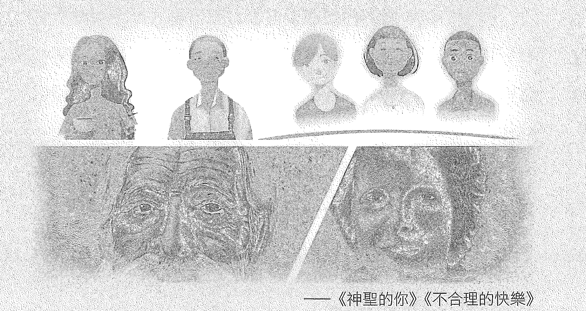

> > ——《神聖的你》《不合理的快樂》

到時，耶穌的話，已經實現。

這些準備好的朋友——現在也許表面上還受到委屈、被壓迫，從別人看來是不成功、不得志——其實才是我透過「全部生命系列」想要分享的對象。

我留下這些作品，一方面是想為這些朋友帶來希望，另一方面是要為他們（也包括你）建立一個基礎，而能從生命悲慘、黯淡的境界走出來。

為什麼是這樣的朋友？

我坦白說，假如你現在要財富就有財富、要名聲就有名聲、可以呼風喚雨、想做什麼就可以做什麼，而你也覺得相當得意，認為這就是理想的人生，那麼，我認為你會來讀這些作品、接觸全部生命的觀念、做這些練習的機會並不大。就算是接觸了、練習了，大概也只是當作短暫的消遣。隨時，又會被生命的變化帶回去，被你認為更重要的事帶走。

然而，我這麼說，並不是要譴責任何人，只是反映我幾十年來所觀察到的現象。畢竟人間的變化，對你、我的吸引力實在太大，很少有誰可以過關。

想清楚了這一點也就自然會發現，過去有成就的大修行人，無論出身高低，在物質層面是富足還是清貧，只要選擇了這條路，都是經過相當多的考驗、遇到各式各樣的挫折和個人的危機，到最後才徹底將自己全部的注意力交給絕對。

假如這個人間對你還有一點吸引力，讓你上癮，讓你放不過，讓你捨不得放手，那麼，你怎麼會有勇氣和信仰把自己完全交出來？

## 33

那，又要怎麼去切入？

你還記得，我過去常常講，你認為你在修行、在找真實，但從我的角度，其實，你都找錯地方了。

我通常也會提醒，修行、真實，其實遠比你想像的更簡單。只是它簡單到一個地步，是你根本不會相信的。既然你不相信，你也就隨時錯過。

然而，錯過的，不只是你。其實，每一個人都錯過了。
這些話，我過去會一提再提，其實是想表達一個觀點：
你我隨時都往客體的層面在找，但是自己不知道。

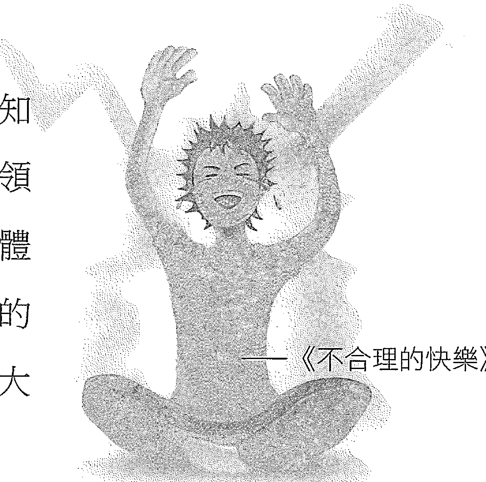

对你，所找的客体或许是知识、是资讯、是一句话或是一个领域，也或许是一种豁然开朗的体会、一种扩大的经验、一种奇妙的体悟、一种激烈的落差、一种巨大的流，或是一种翻天覆地的动。

只要你往这上面找，再怎么找，其实从来没有离开过客体的层面。

当然，你的头脑也只能这么去找。它的本事最多就到这里。然而，对在修行、在找真实的你，你要找的层面，其实并不在这里。

我用各种方法，一再地暗示你、提醒你。只是，你还是不断地想透过理解突然去体会。

不过，只要你仔细观察，任何理解，最多是落在一种局部。任何领悟，是透过注意，你才可以去体会。而我在这里一再提醒的，却刚刚好是完全颠倒。修行或找到真实，最多是——从局部，回到整体；从区隔的样样，回到没办法分割的一体。

如果用睡眠的意識變化來比喻，在清醒、作夢、深睡無夢三種狀態中，前兩種狀態含著變化多端的印象，會讓你以為裡頭應該含著你想找的什麼。你幾乎不會想到，其實是連一點印象都沒有的無夢深睡，才更接近你所想找的。

這種無夢的深睡，最多是一種最原始的覺、知、在。唯一的不同是，你並不知道自己在深睡，所以，也可以說，你到現在還沒有醒過來。

當然，也許你讀到這裡，也可能又會想努力去找無夢深睡的狀態。你可能還會想透過各種練習，希望能夠快點進入或停留久一些，就好像還想把深睡這個狀態當作一個客體或目標，讓頭腦可以去捕捉。

然而，我還是要提醒你，就連談無夢深睡，最多也只是為你而用的比喻。

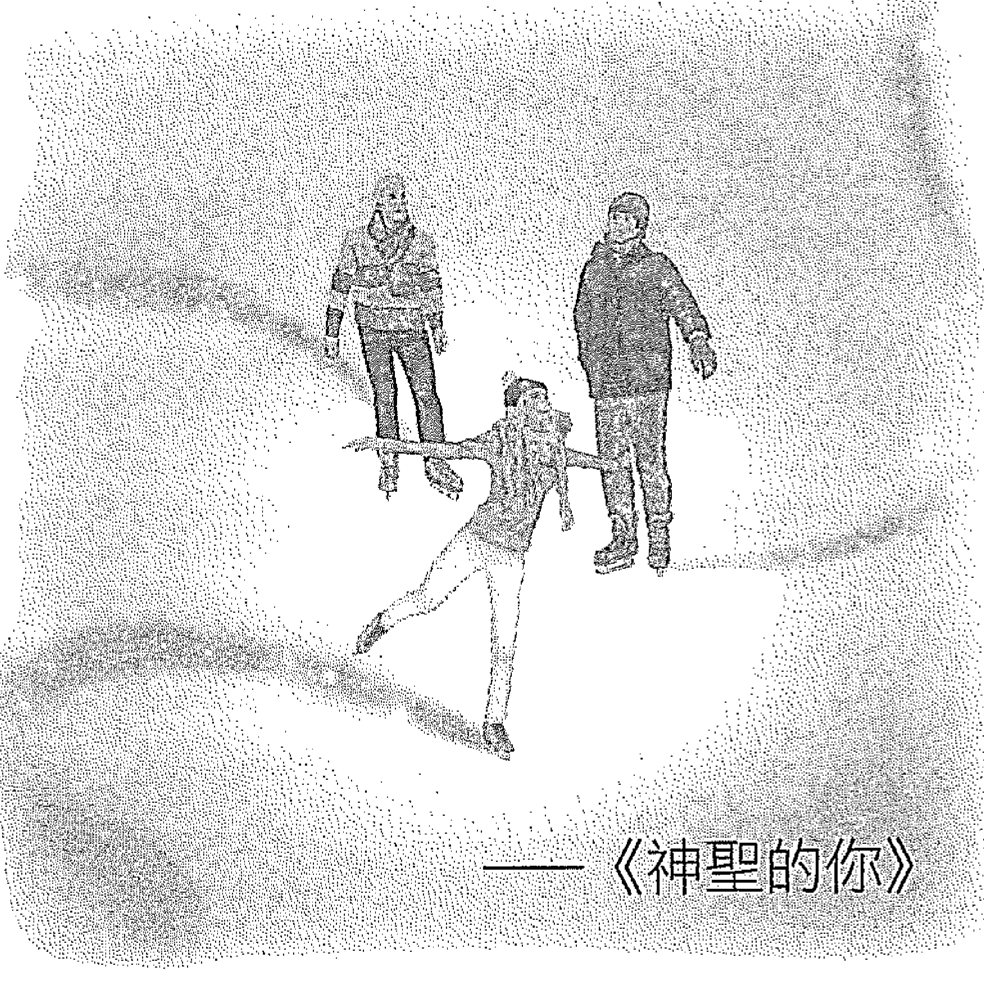

> ——《神聖的你》

這樣的比喻，只是希望讓你接受一個簡單的事實：真實，最多也只是不費力地落入一個你本來就有的狀態。

多不費力？

是完全不費力。

就像無論你知不知道、睡前做不做準備，睡覺自然會落入無夢的深睡，而不可能沒有無夢的深睡——其實就是這麼簡單。你不可能沒有。只是你以為沒有，才要一直去找。

說你清醒地知道無夢深睡，這種知道，最多也只是這裡所講的覺、知、在，是最微細的一種意識非意識的體會。

無夢深睡，最多也只是自己體會到自己。再勉強再講下去，最多也只是延伸自己，而在這個延伸的過程，什麼都沒有改變，什麼都沒有發生，所以最多還是自己延伸到自己。

然而，對你（難免還是要找一個客體的你），如果還要勉強有一個練習可做，那麼，最多是你守住最輕鬆的在、覺、知，有一天，你會發現，就算是睡著了，你還是清楚地知道。

知道什麼？

知道自己。

醒過來後，你跟一般人不同的是，你知道自己是知道的。

知道什麼？

再一次強調，你不是知道自己在深睡或在哪個狀態。

你最多只是清醒地知道自己，最多只是活出——I Am that I Am.

是這樣子，你白天隨時都在覺，都知，都在；從來沒有不覺、不知、不在過。很自然地，到了晚上，在無夢深睡裡，它也只是延伸到自己。

當然，你自然會明白，就連現在說這些話，最多也只是一個方便的比喻。

在深睡或不在深睡，你最多還是清楚地知道你沒有失掉什麼。這個什麼，只有真正的自己隨時知道，隨時住在，而最多也只可能知道、住在這麼一點。

最有意思的是，也並不是深睡或不深睡，讓你跟這個根本沒有動過、從來沒有生過，也沒有死過、不可能受任何影響的狀態，可以更接近或離得更遠。

坦白說，就是你還沒有進入這個狀態，也早就已經圓滿，倒不是還要你再去體會到另外一個狀態。你再怎么往客体的层面找、在这方面期待或追求，都是不可能的。

对你，在、觉、知，就好像是意识带来的一个线索，让你体会到什么是大你、大我，还没有念头的你。

没有念头的你，在每一个现象里都存在。是这样，你不可能还说物质是和意识分开，或在意识的外面。事实上，这是不可能的。

说到底，没有什么叫做东西或客体，一切都只是反映我们二元对立的机制或是作用，最多反映一种波动、一个转变。然而，全部这些，都是意识。

前面也提过，觉察、感受或是念头，其实都在同一个意识场里起伏。

从你过去的认知，你可能会认为是由你的身体来产生这些作用。产生的，可以是念头，也可能是感受，或是觉察。但其实是相反的。念头、觉察、感受都在意识或同一个意识场出发，而且不受到身体范围的限制。

或者说，身体，和念头、觉察、感受都在意识或同一个意识场出现，而延伸它们自己。

你再仔细去观察，也会发现，意识没有边，不受边界条件的限制。意识并不存在一个门槛，并不是透过感受、念头、觉察就会突然出现，或突然消失。

祂好像哪里都在，哪里都不在。

最多，祂是跟我们最亲密的部分。但祂没有边，不是从你里面往外延伸出来的。祂是突然出现的，你没办法画出一条界线。

一样地，讲清醒、睡着、作梦、无梦深睡，这些意识状态的切换也是突然的。甚至，是没有边，你没办法知道它和它之间的界线。

到今天，我还没遇到谁能知道自己什么时候落到深睡、什么时候在作梦。不同意识状态的过渡好像并没有一个界线。就好像是同一个意识场产生了三种状态，而这三个状态其实是互相重叠，只是好像某段时间是以其中一个为主。

当然，你醒过来了，也自然会知道，三种状态都不是真的。最多只是意识海的波动，或画在画布的三抹颜色。虽然颜色不同，对你其实都是一样的。

到这里，我相信你也老早已经明白，同样地，这些话也离不开一个比喻。我最多只是希望用深睡为你点出一个方向，带来一个线索，倒不是建议你还要特别去取得一个你本来就有的状态（例如深睡），而认为这个状态会跟你随时没有动过的意识更接近。

我要再一次强调，其实一点都没有更接近。清醒、作梦、无梦深睡这三个状态，都还是头脑的区隔。整体，是永恒、无限、没有改变过、没有动摇过。对这三个状态，整体连一点印象都没有，更别说还有什么分别。

最多，只是头脑还在不断地想去理解真实，想用它的方法来掌握整体，才有一些暂时的区隔。

你再仔细观察，我不断地强调相对意识有一个最原始的点，也把它暂时称为大你或大我。我也认为，从修行和练习的层面，你最多只需要停留在这样的一个“体”。然而，这个我们暂时称它为“体”的体，其实没有边界，也没办法用什么话来描述。我最多是再用知、觉、在来表达。

但即使用知、觉、在来表达，不会像一个体那么地具体，然而，也并不是要你在修行中去强调“谁知道什么”或“可以知道什么”。当然，你现在也可以想到了，即使站在这个暂时称为“体”的体，也暂时称它是大我、大你，其实，并没有一个“我”或“你”可以去标定的。

停留在这个“体”，虽然是你、我每一个人还可以“做”到的，但它跟我们在这个人间随时有的主体—客体的二元架构已经不一样了。是这样，我才会称为大你、大我，而不是随时还在找一个客体的小你、小我。

再坦白讲，其实，就连这个“体”也不存在。大你、大我也最多只是一个标签、一句话。

你懂了这一点，就连这个“体”都要丢掉。

我会跟你谈这个“体”，本身只是一个方便，让你暂时知道有一个“体”可以不落在人间二元对立的限制，可以从人间跳出，但还属于相对的境界，而让你、我每一个人都可以停留在它。

想不到的是，这个体或点，每一个人包括你都知道，老早知道，是你随时都有的，是你这一生从婴儿到现在都随时体会到它。我才会讲，这个点又简单又不费力。你只是简单地想起来，就可以落在它。这些话，不只是一种形容，而就是事实。

你现在可能明白了，你只是过去完全没有注意，也就这么忽略掉了。

## 34 什么叫做“去客体化”？

前面提到，面对样样，你都透过脑自然想把它客体化，变成一个个客体。你再从客体，想找回自己的身份。

正是因为头脑的机制随时在运作，你才能突然体会到有那么多客体，而也竟然好像能让一体变成多重的样样。而你还会从样样，想找回到自己。

假如你想解开人生的谜，这段话其实含着一把很宝贵的钥匙。

你已经知道，从意识的角度，物质跟头脑最多只能算是一个过程、一种作用，或是一种扭曲。

一样地，你任何人生的经验也是如此。经验，本身也只是一种作用，或者说是一种客体化的经过。你透过经验，把一个本来分不开的，变得好像是可以分开、可以区隔。经过经验的作用，对你，整体也就变成一个个客体。

你只要仔细观察，自然就会发现是如此。

在人间，这个对你充满了客体的人间，修行很重要的一个关键，其实是“去客体化（de-objectification）”。

“去客体化”也就是反转、解除你头脑原本客体化的作用，而将客体的角色解散。

举例来说，你眼前看到一朵花。

其实，对你，花是因为你看，才有的。你如果没有去看，花，在你的印象里也就不存在。

也就这样，对你，真正关键的不是你看到的花，而是“你看”。

再比如，你在听音乐。

对你，关键是“你在听”。不然，每个声音一出现，也就消失了。音乐，不会落到你的印象里。

或者，你对谁生气。

生气的对象、生气，是因为你而有的。是你把对象和感受带到印象里来，留着生气，留着感受，留着产生一点刺激。

对你，重要的是“你生气”，或者说“你有（某个感受）”。

对每个经验，你都可以这么试试看。也就这样，你把过去摆在客体上的注意力一点点散掉，一点点放手。

很有意思的是，你不光是对客体可以“去客体化”，面对主体，你一样也可以将它“去客体化”。

你现在就可以试试看，用眼前的经验当作你的实验。

你在读这本书。

书，是因为你读才有。是这样，你可以取消它客体的地位，剩下“你在读”。

然而，站在整体，哪里还有一个别的主体“你”可以读？

是这样，就连主体也“去客体化”，也去掉。

只剩下“读”。

+   读。
读。
读。
读。
读。

你看，这是不是很有意思？

如果你可以透过“去客体化”，轻轻松松地把注意力从客体带回到联系客体和主体之间的动，这本身就是很重要的一种修行方法。

你试试看，用自己的生活当作实验，不断地把任何经验“去客体化”，甚至把任何主体也“去客体化”，这结果是相当有趣。你在其中得到的放松和惊喜，可能是你这一生过去连想都没想过的。

而且，只要你确实去进行，也就会突然发现，每一个经验的内容其实一点都不重要。最多是对头脑还重要，但对整体倒没有什么实质的意义。

既然内容不重要，你也就随时可以“去客体化”，而把经验当作只是一种作用。你也就发现：你不会再去计较里面读的内容或情节，你不会想去区隔哪个内容比较重要或不重要，也不会再去排列哪个内容比较优先，更不会想去分别哪个是你比较喜欢或不喜欢。

把经验“去客体化”，你也就发现，你还没有费力，还没有一个动作，任何瞬间已经老早都圆满。

有经验，没有经验，甚至经验发生前，或经验发生后，祂早就是圆满。而祂是从圆满，到圆满。圆满，回到圆满。圆满，去圆满。每一个瞬间是圆满，圆满，接下来，只有圆满。

圆满什么？圆满自己。

真实，是自己圆满自己。

既然对眼前的任何体验，你没有什么想交代，也没有什么想得到，没有什么期待。既然没有期待，你好像也没有什么东西需要放过，或需要原谅，还需要看不开，或还需要去修正。你也自然可以让经验来，让经验走。

一个个经验来，又一个个经验走，对你，也不重要。再多的经验，最多还只是一种作用。你随时可以选把它“去客体化”、把它客体的身分解散，而进入一种单纯的动。

从客体的层面着手，你只需要这么做。

如果从主体的层面切入，你也是一样地可以把它“去客体化”—从“我”最多回到一个动力，或说功能，也就是觉、知、在。

这么切入，你连“大我”的观念都不需要有。就好像你不光是不需要觉察到什么，也不需要有一个谁告诉别人自己在觉、在知、在在。

面对这个在声明的、想要告诉别人、想要主张的“我”，假如你选择将它“去客体化”，这件事也就像不光是没有一个对象，也没有一个出发点。

对你，经验不光是没有一个对象，再从这个角度，就连出发点都没有了。

你把主体、客体都去客体化了，好像只剩下一种动力。但是，就连这个动力也一样地，它没有一个对象，没有一个主体，没有一个来源，没有一个出发点。

也就这样子，对你，每个瞬间变成觉－觉－觉－觉－觉……

或者也只是知－知－知－知－知……

当然，也可以只是在－在－在－在－在……
然而，没有“谁”在觉，没有“谁”在知，没有“谁”在在。也就这样子，它自己圆满自己。

你也自然体会到，每一个瞬间，其实没有主体也没有客体，最多是一个好像空白的意识、一个完全打开、没有条件、无限、随时都在的意识。

意识到什么？

现在你也知道，就连“意识，意识到自己”这句话，好像都是多余的。因为这个自己已经不存在了，所以好像最多只是意识轻轻松松变成一个觉，变成一个在，变成一个知。

你可以仔细观察，你到今天（或任何人到现在），只要有一个好像突然开悟、醒觉或意识扩大的体验，所体验到的，最多也只是突然发现二元对立的机制暂时被打断了。突然之间，你建立不来任何主体、客体的观念，最多只是觉在觉、知在知、在在在，活在活。你没有一个内容的概念，更不用说哪个内容才重要或不重要的概念。

甚至，你连在、知、觉的分隔也自然消失。

你在哪里？在觉。

在觉什么？觉自己。
你知道什么？知在。
你在哪里？
在觉。

到这里，你也明白了，在、知、觉本来也不是分开的。这样子，你也体会到这个瞬间好像没有头，也没有尾。它是无穷无尽，是一片空白，但又有一个知、觉、在的功能。然而，其实也没有谁，在知道什么。

我想，这样的表达应该可以涵盖所有意识扩大的经验。

可惜的是，对大多数体验过的人（或许就包括你），这个经验很短暂。随时，下一个瞬间，你又回到二元对立的机制，回到头脑的作用。但这种经验实在太深刻，也自然会让你想不断地回头去寻，想回到它，或想把它一再地找回来。

从这里面，是少数再少数再少数的人才可以突然断根，把这个机制完全打断，而不让它再建立起来。

但是，就连这些描述也还只是很勉强的比喻。

你应该还记得，站在整体，没有什么叫做主体、客体，也没有什么主体和客体的关系可谈的。对祂，什么都没有。什么都没有发生，也没有什么可以被打断。所以，你也打断不了。

最多，也只是你彻底知道这些话是真的，而可以随时停留在整体，或者说主要都在整体，而最多只是偶尔转向这个二元对立的世界，去暂时采用主体—客体的关系。这些，最多也只是一种作用。既然是作用，你也知道不是真的。只有这样清清楚楚地知道，才可以称为是真正的断根。

你应该也早就知道，这样的状态，并不是透过任何人类的活动（包括静坐）可以得到的。它是学习不来的，不是透过压抑这个脑，也不是把脑转到某个点或不转到某个点。这些，跟这个最根本的状态没有任何关系。

这个最根本的状态，本身就是一种最休息的状态，而且是脑最想休息的状态。

+   - 休息什么？休息自己。
- 休息到哪里？到自己。
- 休息在什么？在自己。

也只有这样子，你会突然发现你什么都不需要排斥。你可以在这个世界，但这世界又好像没有一点一滴跟你相关。你表面看来是温和，甚至可能让你觉得你软弱。但是，这样的你却是任何力量都打击不了、主导不了、左右不了。

我用这几句话，把修行全部做一个汇整，也只有这样子，对唯识的科学可以做一个妥当而全面的说明。

这一点，你看可不可以体会到。

## 35 “在”的瑜伽

到这里，你可能已经发现，修行这条路，可以说是比什么观念都简单，也比什么策略都更简化。但是，从另外一个角度，你也可能认为，这样的修行，似乎比你这一生所遇到的任何课题都更难。你甚至还会觉得，修行的路好像漫长无比。怎么走，也走不完。

当然，我还是要为你打气，也要再一次提醒你：其实，你会认为这么难、会觉得一路有这么多门槛，这本身就是你的小我在抗议。

小我觉得自己的生存受到威胁，自然要抗议，而要把你想做的样样变得难。它会用尽各种方法阻止你，希望为自己争取最后一个保命的机会。

尽管如此，我对你的建议还是一样的：

这时，你也只能往前走，让这些话带出来的体会，不断地沉淀再沉淀，让它深深地穿透你，穿透你的心。让它穿透的伤口愈来愈大，而没有机会可以再愈合，没有机会再启发过去的作用。也就这样子，你打开的心，会彻底融化到整体的意识或意识海。

然而，这种“融化”，其实不是经过一个动力或一个发生而有的。只要你还有一个动力或发生的观念，也会发现它反而是动不来、发生不来的。

你也自然会发现，光是去想这些观念，本身就是一种阻碍。

是这样，我才从那么多的角度给你许许多多的提醒和建议，为的就是帮助你建立新的回路。透过正向、再正向、正向到底的循环，让你最多把注意挪到相对意识的源头（嗯，假如这时还有一个源头可以谈）。

同时，我更要提醒你，不再去积累更多的观念。

这一点，也是很重要的关键。

你不断地积累观念，自然让注意力不断地往外漏，流向一个又一个的观念，也就是客体。这么做，就像你一直想装满一个水桶，又任由水不断地从桶底的洞漏出去，这样，你要到什么时候才能把水桶装满？

我刚刚提过的“去客体化”，也就象是一个帮你封住这个漏洞的方法。这个方法随时为你带来提醒，让你不知不觉也就彻底修正自己对世界的理解，而让注意停留在源头。

其实，我过去也用游戏的方法带出许多类似“瑜伽”的练习。这些练习，离不开对整体的领悟，而且都是为了帮助你将领悟整合到每一天的生活。

当然，我这里谈的瑜伽练习，或许你都听我说过，也亲自接触过其中一部分。你也可能知道，我过去只要有机会，例如办活动、读书会，也就想把各种瑜伽的练习带出来，像是光之瑜伽、呼吸瑜伽、真实瑜伽、四大瑜伽、或接下来会带出来的“在”的瑜伽。

对我，这些瑜伽练习的作用，最多是帮助你透过一种动态，整合对真实最深、最终的领悟，而和生活结合。值得注意的是，这些瑜伽练习，倒不是一种身体的运动，甚至也不是让身心合一的练习。最多是说透过练习，希望为你在不动和动态之间建立一个桥梁。

你或许会很惊讶，没想到这些瑜伽竟然不是身心合一的练习。但是，坦白说，一样有身心合一的效果。只要你念头彻底转变，可以完全理解这本书和过去作品的观念，那么，你已经不费力达到合一。甚至，这种合一，会是你这一生不曾体会过的。这种合一或整合，也是根本“做”不来的。

这些瑜伽的练习，之所以会有这么大的效果，其实也只是因为让你站在一个稳定、彻底领悟的平台，再来做进一步的整合。

我过去也喜欢带年轻人做一些很简单的观察的练习，一步一步透过静坐，把意识扩大。换一个说法，也就是让你从专注 (śamatha) 到观 (vipaśyanā)。或再换句话说，是让你局限相对的意识扩大，从一个小点，扩大到好像没有点的点，让你尝到一点好像无限的味道（当然，你早就知道，真正到无限是不可能的）。

在这种扩大的空间，再让你回头观察、欣赏或扫描身体的动作。

不断地这么练习，自然能很轻松地把意识守住眼前很窄的一件事或一个人，而同时有机会体会到一种整体的观念。

这一点，不光对许多人是有天翻地覆的效果，也可以让我证明出来，意识是能够同时作用的。你可以一边处理生活里的需求，又同时可以体会到这本书讲到的唯识的观念。

你的注意力摆在一个点，但这个点又在反映整体。是这样，你在体验一个具体的客体时，你也同时在体验整体，只是你可能还不知道。

在意识扩大的状态下，就连你动一动手指头，也可能就自然发现，其实动手指头的好像不是“你”，而好像是宇宙或整体透过你在动这根小指头。

如果你觉得这些话很抽象，接下来的例子，或许能帮助你衔接起来。

> ——《定》

你看看芭蕾舞者优雅地从舞台的这里，三、两步跳到了那里。你会认为自己只看到跳芭蕾舞的人，而看不到舞台吗？

一样地，你看到云，你是不是也同时看到天空？

> ——《全部的你》

不光是看，自然让你把注意锁定在前景，而忽略背景。我之前提过一种帮助生存的享乐适应原则，也是类似的机制。

你身体很舒服，心情很快乐，也只是一开始的舒服特别舒服，一开始的快乐比较快乐。一直舒服下去、快乐下去，你也就习惯了，而把舒服和快乐落到注意的背景里，好让你的注意能够挪出来，去侦测有没有其他的危险和不舒服。

是这样，你其实不需要担心自己能不能看到整体，体会到意识。最多，也只是你太习惯祂的存在，而把注意挪到了更新鲜的变化。

你活在这世界、在你每天的生活，无论你练习不练习，做不做，醒觉不醒觉，从根本来说，你已经看到整体，只是你过去没有注意到，或是你的注意只摆到全部里的一小部分。

然而，就算你真心想离开整体，其实你根本离不开。没有整体，没有局部，也就没有你。

就算是你把注意完全投入眼前的一个体、一个东西、一件事、一个人，但它没办法真正把你从一个整体带走。你还是离不开意识，只是你透过注意，暂时把自己交给一个局部，而跟局部的身份绑在一起。

也因为这样子，我才会说，你早晚会回家，什么都不用做，都可以回家。

最多，你有一个愿，会让你回家更早。

愿，可以算是一种能量，在宇宙转一圈还是会回到自己。你对这样的说法可能并不陌生，也知道一个人离开人间前的最后一个念头很重要，会决定他的演化。

但严格讲，你再怎么投入、再怎么忘记，都没有事。

你离不开的。

你其实都随时体会到整体，在局部体会到整体。

再举一个实例，就像你随时在听别人讲话。这其实可以说是你的小你在听，又同时是大你（意识场）在听。这两者是分不开的，并不是两个分开的体。你在听的这个小你，和大你是同一个体，是在同一个意识场产生作用。

大你和小你的听，差别在哪里？

你最多可以说，小你，用一个局部化的机制，把听觉的信号扭到它可以懂的层面，让人的聪明可以捕捉，而还可以变成记忆，随时调出来。这些发生，其实同时在整体内发生。只是，整体不重视，不会认为它重要。

对整体，小你再多的发生都没有代表性，只是无限可能之中的一个可能。它倒不需要有动机集中在这上面。

也像电影，全部都可以在银幕上播放，重叠在银幕上。但是，银幕倒不会跳到电影里，去表达它的看法，主张它的权力，甚至还想去修改剧本。

最多只是差在这里。

是这样，从局部可以看到整体，但整体倒不是从局部可以想象出来和它同一个维度的整体。整体确实是整体，但和局部所想的不一樣。

你把注意從局部解散，意識擴大開來，主體、客體、做的連結，都已經打斷了。你自然發現，沒有一樣東西是可以屬於你的，而也沒有什麼是你可以指揮不指揮，改善不改善，或去推翻不推翻的。

透過你，也不可能把什麼東西帶給什麼東西，或還建立什麼，或還能去破壞什麼。你也可能突然發現，你不光不需要去做什麼，而你根本沒有動機想去做什麼變更。

甚至，就連過去所謂的臣服，對你其實是多餘的。

臣服，好像還帶著讓步、接受、肯定、容納、包容的動作。你自然發現，其實，沒有誰可以去讓步、接受、肯定、容納、包容，也沒有哪個對象在承受讓步、接受、肯定、容納、包容。

這麼一來，面對一切，你會發現自己雖然就像是處在龍捲風的正中央，卻突然體會到一種奇異的寧靜。

這種寧靜，就像是沒有聲音的聲音。

或者，如果你要說是沉默，它其實一點都不沉默。

你說它沒有力量，但它的潛能卻比什麼都大，甚至比周邊物質的動能遠遠更大。是這樣，它才有那麼大的破壞力。

這，就是我們這裡所講的空。然而，這裡所談的空，其實不是你過去認為的「沒有」，更不是和「有」同等級的對等。

> ——《神聖的你》

這時候，你也就突然體會到意識。但是，你也發現，就連這些話都已經不正確了。沒有「誰」可以體會到什麼叫「意識」。

就連說是宇宙在動你的手指頭，都不是。你最多勉強講是宇宙在動，而不是你。或最多，是整體帶著你在動。但是，就連這些話，坦白講，還不是完全正確。其實，怎麼講，也不會正確。

這個整體，對你確實在動，而你站在小你也可以驗證。但奇妙的是，沒有一個真正的主體可以表明是它在動手指頭。

假如現在你還想把它當作一種體驗，那麼，這確實可以說是相當有趣的體驗。而且，可能是你這一生，甚至過去多生多世從來沒有體會過的。

當然，你又會發現，連說你不曾體會過，也不對。

其實，你每個晚上的無夢深睡都在這個狀態，只是你不知道。你覺察的工具沒辦法察覺到這個無夢的深睡。你最多是早上起來後，覺得神清氣爽，好像透過深睡得到一種很深的休息、心情放鬆、精神也得到了補充。是這樣，你每天晚上自然期待能重複它。

然而你不光是在晚上的睡眠會得到重複，其實每一個瞬間，在念頭和念頭、話和話、感受和感受、動和動之間，都在這個狀態。只是你一樣跟著不知道，也就把它忽略掉了。

不過，說不知道也不那麼對。好像在潛意識或更深的層面，你其實還隱隱約約知道。要不然，你不會不斷地想把它找到。這些話，對你也不會有那麼大的作用。

我想，你讀到這裡，大概已經準備好，可以接受接下來的這些話。

你可能還記得，我重複了不知道多少次：「全部生命系列」的作品，包括這本書，其實沒有作者。是宇宙或意識透過這個肉體，把它記錄下來的。

過去，你聽我這麼說，可能會認為只是一種形容。但是，你現在已經自然體會到，這些話並不是比喻。事實，就是如此。

現在，你讀這些作品時，假如能夠安靜下來，讓裡頭的話沉澱到心裡，你會發現這些話有一種意識擴大的作用，而讓你對話和話、意思和意思的分別不再那麼重視。

你重視的，是心跟心自然達到的共振。這共振會讓你沒辦法解釋，而覺得不可思議。

## 36 意識落在內或外，都可以成為練習

前面提到瑜伽的練習或整合，你也可能自然發現，就是懂了這麼多的觀念，好像你還是隨時會忘記。尤其一遇到考驗，或是眼前有件事讓你覺得很不順，你也就又跟著被人間帶走了。

我知道這是難免的，也理解你的這種處境，才會提到我過去設計那麼多瑜伽的練習，就是希望幫助你我隨時做一個回轉，而在生活當中隨時把真實找回來。

當然，你跟我透過作品也接觸了相當長一段時間。雖然我時常提到這些作品並沒有一個作者，更不用講有一個規劃或佈局。我寫的時候也沒有寫作大綱。每一句話，都是從心流出來的。一章又一章，是它自己找到位置，自己組合起來的。但是，我還是要承認，它本身確實有一個藍圖。

這些作品，包含了一個既完整又完美的系統。只是，這個藍圖或系統，跟那個決定要寫的我，不僅沒有關係，也是當時的我想象不到的。

坦白說，如果一開始就知道後來竟然有那麼多作品，我想，我根本不會動筆，連一個字都不會想寫。

現在回頭看，我也只能笑自己：這一路，就好像宇宙哄著我要一步步走下去，讓它完成它自己。

回到沒有藍圖的藍圖，你可能也注意到，「全部生命系列」的作品（包括這一本《唯識》）含著兩個層次的用意。

首先，我花了相當多篇幅，希望為你、小你跟意識做一個連結，讓你透過這些話，你可以徹底體會到你是誰、你是怎麼來的、而你又可以去哪裡、你跟整體又有什麼關係。

但是，懂了這些，你也自然發現還需要另一個層面，也就是怎麼跟生活結合。你會想知道要怎麼把這些觀念活出來，而不要讓生活大大小小的變化隨時把你帶走，讓你繼續迷路。

我以前也會半認真半開玩笑地說，禪、不二論或任何大法門，首先會集中在第一個層次或階段，也就是希望你突然領悟到你真正的身分。這徹底的理解或領悟是既完整又圓滿，沒有一個點會受攻擊，也不會從某一個點被分開。
這一點，我很有把握，透過「全部生命系列」是可以做到的。也就是說，在這個階段，你確實需要回轉、要投入內心。如果沒有這種內省，你是醒不過來的。
但是，醒過來後，你又怎樣可以跟生活結合？
不要忘記，你經過這一生的洗腦，已經層層疊疊累積了厚重的制約，就像戴著厚厚的殼。你也聽我講過，這些洗腦不光是這一生的事，你還同時承受了人類歷史文化、社會、集體的意識留下來的包袱。
是這樣，你，才成為你。
就這情況來看，你就算突然醒過來，怎麼可能完全拋得開這些？要完全拋開，這難度太大，可以說幾乎不可能。
這時候，就是要展開第二個層面，而這最多也只是讓你透過每一個瞬間、每一個動作、每一個動念、每一個點點滴滴看到整體，體會到整體，活出整體。
也就是透過每一個動，你確實可以體會到不動；或是，你讓不動浮出來，卻又不干預動。

透過練習、沉澱、決心再加上真心，你已經充滿了把握，知道眼前的動態對你並沒有全部的代表性。

你可以讓它來，也可以讓它過去。

你可以注意，也可以不注意。

最多只是透過你的意識，可以選擇不斷地觀察或是覺。

這種觀察或是覺，跟你要處理事情或行動，你已經發現並沒有帶來衝突。

你該動，還是會動。最多是意識的焦點移動了。

講到意識的焦點移動，也可以這麼比喻，其實，你知道你真正的家並不在這個世界。你心中有一座皇宮，又美又大，隨時在等著你。這樣子，你還會想把注意集中或停留在人間的哪一個「家」嗎？

我想，你已經知道，這些話都還是比喻。而你也明白，無論你在哪一個世界，你隨時都可以住在皇宮，住在你真正的家。甚至，你真正的家，比任何皇宮遠遠更美，可以說是一種沒有皇宮的皇宮，沒有家的家，哪裡都不在的在。

也就這樣子，在人間，你沒有一樣事情需要拒絕，而又同時樣樣都可以包容。

你可以點點滴滴投入在這個世界，跟樣樣都建立親密的關係。但有意思的是，你又清楚知道你不屬於這個世界。

甚至，你可以隨時退出，也隨時可以投入，而你也不會在這上面再做文章。

更有意思的是，你發現你再也不需要遵循人間的價值觀念。即使在別人眼中，可能覺得你太過軟弱溫馴，但你也不會跟別人去辯駁，也不會想去主張自己的種種權益。然而，你又同時是無懈可擊，好像全身上下沒有一個弱點，沒有什麼力量或東西可以把你帶走，或把你佔領。

這一生全部的可能，對你，好像是已經老早都活過，而沒有任何一樣會讓你感到驚訝或覺得稀奇。同時，又對每一個可能都認真地投入，就像第一次認識、第一次知道一樣。

你最多是天真地活過每一個瞬間，讓每一個瞬間活出它自己。

你也知道，這種不干涉、不去期待、不去調整，本身是你這一生最大的自由。

也只有這樣子，你這一生所有的問題和矛盾，也就終於告一個段落。

我們交流了那麼久，但你很可能是在這裡才可以體會到：每一個作品其實都含著這兩個層次。只是文字的作品，比較集中在第一個層面；至於共修的活動，因為時間比較充裕，近期以來也就自然可以偏重在第二個層面。

最重要的是，你自己要下一個決心。

有足夠大的決心，你的信心也跟著大。

有了信心，你自然會擴大自信。

有了強大的自信，你才會培養出信仰。

> > 最後，讓這個信仰不斷地擴大，大到沒有一絲縫隙可以讓任何質疑溜進來，你的領悟也才會大，甚至，成為你的全部。——《我是誰》

你不光可以領悟到，其實可能還是頓悟。但說頓悟，最多也只是徹底的醒覺。

你只是輕輕鬆鬆、不費力地，讓醒覺成為你隨時都有的常態。

但有趣的是，有這種常態的人，已經老早不是「你」。是這樣，也就沒有什麼可以宣稱是常態，沒有誰可以說他有這個常態。沒有什麼成就可談，也沒有什麼身分可以取得。沒有一個「誰」還可以去做老師或榜樣。

既然沒有什麼老師或榜樣，那更不用講還有什麼系統或法可以轉達的。

## 37 注意焦點的移動

前面提到練習，你大概還記得「見證者」，也可能還記得我透過各種比喻和練習，希望你可以突然體會到，有一個背景，而有一個體，注意到一切都在前景。

絕大多數的人，是隨時都在往外看，把全部注意都放在客體、在物質的層面，也就是隨時把注意落到前景。這個過程，對你是隨時在發生。甚至，它發生得太快，你根本不會發現自己隨時在往外看，更不會發現原來還有客體和主體的區隔。

把注意落到一個可以看到、見證一切的體上（這個體，也就是隨時可以看到前景的見證者），留意到有一個「見證者」——這種體驗，你可能一生沒有過。
是這樣，好像有必要做一個區分，讓你把注意力可以挪到旁邊或退後，而讓注意可以看到自己。讓你的注意發現，喔，原來是有一個主體，在看一個客體。

注意往後退一步，也就打開了一個空間。不然，你我一般都很衝動（當然，你可能不會用衝動來形容，而是覺得自己很實際、很務實），都把注意落在眼前，而根本沒有一個空檔或緩衝來看到自己。

然而，你透過靜坐，或提醒自己 "It's all OK." 或是反問：「真的嗎？」「真的是如此嗎？」為自己的注意踩個剎車，漸漸會打開一個空間，而能做見證。當然，你也可以透過接納、包容、臣服，一樣也可以抵達見證者的位置。

如果你過去沒有這樣的空間，或說心不夠安定，自然是做不了這種內省。然而，你時常退到見證者的位置，看著眼前或心裡的發生——這樣的見證熟練了之後，你也不知不覺更成熟，更沉穩了。

接下來，你就比較容易可以去觀察——意識的性質是什麼？意識，本身是什麼東西？有什麼屬性？

這時候，你會突然發現，其實意識可以觀察。

觀察什麼？

觀察到自己。

也就是說，你一再地見證，也就發現，原來是自己在見證自己。

這是很大的一個突破，你要親自去體會。而這個突破，會是你這一生難忘的。

你會突然體會到，你見證、觀察到的全部，其实就是自己。你每一個角落，觀察的，都是自己。

這個自己，好像有一個吸引力，讓你開始休息，讓你的注意完全放鬆到自己（而倒不是把注意力集中到某一個東西）。

你會覺得這個自己是最有趣的，也就隨時停留在大你，停留在一個最基本的主體、停留在知、停留在在、隨時都覺。這時候，你不會想出來，不會想離開這個狀態。它會讓你著迷到一個地步，甚至就像上癮一樣，沒有一個別的東西還會讓你感興趣。

你在休息中，得到一種徹底地整合。面對外頭的世界，你會發現，矛盾已經沒有了。

對你，任何矛盾都消失了。

你的五官依然在捕捉資訊，然而你也發現原本的客體已經不會再帶來一種矛盾，不再帶著一種分離。不再讓你覺得好像有一個「誰」在觀察以外的「什麼」。

你自然發現，眼前的一切跟你自己沒有分開過，完全就是同一件事情。

從眼前的物質、客體，你其實完全是體會到自己。

這是相當有趣的。

你從各個角落，都看到上帝，但是，其實沒有一個主體看到上帝。

讓我再回到銀幕的比喻，也就是本來好像有一個背景，有個前景，而你是一個見證者，這個見證者也只是突然落到背景在看前景。甚至，你的注意是隨時休息在背景，在不動的背景，做一個很深、很放鬆的休息。到後來，對你，不再有什麼叫背景、前景。
到了這時候，對你，剩下的只有什麼？
對你，其實也只是還有一個波浪、一個動力、一個波動、一個作業——知、覺、在。

到最後，只剩下這一點。

這時候，見證者的角色，對你也就清清楚楚地整合起來了，而全部的分別、矛盾也就消失了。

從古人的經歷，你也知道，一個人如果見道了，他會發現這世界的一切，跟他所體會到的完全是顛倒。他也就自然想去閉關，想到某個角落專修。那個時候，他是歡喜都來不及，而整個心是打開的，完全不會想動，只是住定在自己的本質、佛性。

幾年，也可能比幾年長或短，他會想回到人間。但是，他其實不是要回到哪裡，而只是在這個時候做一個整合。他發現人間的任何物質和現象，對他而言沒有矛盾，也沒有帶來一個隔離。

他一邊在考驗自己，一邊就像在扮家家酒，發現全部都是一樣，而自然把大平等心活出來。

當然，有些人的定力不夠或轉變不夠徹底，可能這些領悟又消失了。他又把這個世界看成在外面，又好像有個目的，有個世界，有個自己，就這麼又全面浮出來了。他也就還要再回去磨練。

你看，這些話，對你是不是已經理所當然，還是在某一層面帶來一個矛盾？

## 38 裡外、中間、一切……都是意識

你大概也注意到，我想了各式各樣的方法，試著透過手上的任何工具，從任何一點、任何角度，無論是感受、體驗、覺察......希望把你帶回家。

無論是全部生命的觀念，包括我過去講的大你，這本書講的覺、知、在，或是任何可以觀察、捕捉資訊的工具，我都認為可以作為你的工具，把你帶到意識的門口。

但是，從另外一個角度，這些方法或工具的背後其實有一個共同點，也就是解散——把你這一生得到的任何觀念，包括前面提過的、這本書提到的，全部拆開、粉碎，接下來把它化解掉。

> > —— 《集體的失憶》

你自然能體會到，你能說得出來的、或任何人可以說得出來的，無論表面看來多有道理、有深度、有力道、有說服力，到最後，從絕對的角度來說，其實都還是站不住。

任何話，最多只是一個觀點。而且，這個觀點還需要其他的工具、其他的平台才能立足。它本身並沒有什麼動搖不了的意義。

你了解了這一點，或許突然能體會到，我為什麼在那麼多場合要帶著大家用「netti netti不是這個，不是這個」的方法來面對意識。

「netti netti不是這個，不是這個」也只是，無論在眼前或在心中，你一發現有任何念頭、任何體會、任何觀察，它們都沒有絕對的重要性。你要找的真實，都不在這個層面，你最後還是要放掉。

用這個方法走到最後會發現，沒有東西可以再丟掉，沒有東西可以再讓你擺到一旁，沒有東西可以再去化解，沒有東西可以再去否定，只剩下你最純、最原始的意識。

你會發現，就像前面提到的，意識本身就是像是一個整體或空間。在這整體或空間（當然祂並不是真有一個體或空間）．一切經驗，都在祂裡面發生。

同時，意識又帶著一個機制的觀念——也就是一切的體驗，本身就是用意識來捕捉。意識既然是機制，任何一個機制，自然帶著一種動力、一種觀察。任何人間想得到的經驗，都要經過一個動力，經過空間和空間之間的重疊和對照而發現一個差別，而有了先後。是這樣，這機制也自然離不開時間。

前面也提過，可能最讓你意外的是：就連經驗的內容也是意識。包括主體、客體、主體一客體之間的連結，都是意識。全部，離不開意識。

當然，說這些話，或說剩下的是最純、最原始的意識，都已經又把一個本來沒有辦法標籤、根本沒有邊的東西，硬是套上了一個名稱，而接下來，逼你的頭腦做一個想像，把這個名稱再連結到一個形相。

也就這樣，可能為你隨時又打開了一個有生有死的循環。

相當有意思的是，你把一切都否定，都知道不是真實。不知不覺，你會發現回到這個原點，可能比你想到的更簡單。

可以被否定的，都是虛的。你否定掉一切，反而也只是一再地回到唯一一個否定不了的。你一再地回到本性、回到空、回到意識。你會發現意識和自己其實從來沒有區隔，沒有分開。

你往內轉，體會到意識，也體會到好像全部的經驗都在意識裡面，從來沒有離開過整體。接下來，你才發現，就連你去觀察的方法，都還是由意識組合的。是誰在觀察？誰在體驗？體驗到什麼？這本身都離不開意識，就連所體驗的內容也離不開意識。

你回轉過來，發現一切在意識裡發生，而全部的機制和內容都離不開意識。

對你，一切都是意識。

一切都是意識。

這一點，在你內心整合得清清楚楚。

有了穩定的領悟，你回到世界，自然發現眼前的任何客體、任何東西，其實都沒有跟自己分開過，而自然也沒有什麼矛盾可談的了。

你內心的整合自然想要翻出來，就好像你要踏出來看看——外在、客體、一切也都是意識。

畢竟你我這一生，經過身心的洗腦實在太徹底。對這個身心，這些客體都存在。你突然叫它不存在，是不可能的。

但你也只是在這個客體看到意識，不斷地看到意識、知道是意識，知道祂是整體，祂是主。

你愈來愈清楚，在任何體都可以看到主、看到心。這就是在做一個大的整合。

對你，全部的矛盾就消失了。

裡頭，外頭，是一樣。

這個人間，再也不給你造成矛盾。

你自然在樣樣看到平等。

你自然會看到平等。

因為樣樣都是意識。

意識＝意識＝意識＝意識＝意識＝……。

無限多的樣樣，還是意識。

也就這樣子，對你，全部都通了。

你的前面、後面、中間，全部都通了。

就像下棋一樣，每一顆棋子都擺對了位子。

對於徹底活在絕對的你來說，一切都一樣地，是意識，是絕對，只是你。你還沒有來，一切就是你，樣樣都是一樣的。

這些話，也只是徹底站在意識的角度，自然而然的表達。

一位好老師，本身也在幫助你在這個層面做一個整合。他隨時住在絕對，停留在絕對。可惜的是，這樣的老師，在我這一生所見到的人物當中，可以說是少之又少。即使有這樣的人，他也不見得會想出來當老師。

## 39 一切合一，是最自然的現象

客觀的現實，其實是從主觀的意識延伸出來的。

這句話，你可能還記得。我也一再地提醒。

然而，它還含著什麼意思？

唯識要表達的重點，確實是「意識為主」。然而，你我能夠體會到的意識，其實是一種主觀性的，倒不是客觀。也就是說，談「意識為主」，其實也就是「以主觀的意識為主」。

當然，站在唯識的角度，你、我、每一個人的主觀意識，到最後是同一個，是一個統一的意識場或統一的意識。

然而，就你、我而言，主觀可以體會到的，也只是經驗或體驗。無論是體會到世界，體會到自己，其實全部都屬於經驗。這樣的經驗，一部分是念頭，一部分是感受，一部分是覺察，而三者常常會相互重疊。無論經驗是念頭、是感受、還是覺察，全部的經驗都含在意識裡，而意識含著全部的經驗。

但是，你、我是怎麼體會到經驗？

首先，經驗是意識組合的。而意識要體會到經驗，本身還是離不開意識。任何經驗或體驗，它本身也是意識。

要體會經驗，無論是機制、內容、體會的人，都離不開意識。

談到任何經驗，都是由意識構成的，我認為很重要的是，意識並不是去捕捉、去抓，好像祂還要跳到人間跟著每一個現象、每一個客體去取得平等，或還要透過每一個客體去看到主、看到更深的層面。

倒不是這樣子，事實是剛好相反。

你倒不是把意識挪到外面去捕捉任何東西，最多只是輕輕鬆鬆地定住，把中心停留在一個不動、甚至連主體都稱不上的一個點或狀態。你也已經知道，這就是大你或在、覺、知。就好像任何現象來、任何狀況來、任何客體來、任何東西走，你始終站在那個點在看一切。

你的中心其實沒有動，你還是站在這裡看著每一個東西來，每一個東西走。對你，人間的一切，就像影子一樣地流過去。

> > 這相當有趣，你會突然發現，一切沒有那麼堅固、那麼扎實了，好像沒那麼固定。樣樣，都跟以前你所看的不一樣了。但是，它又存在它自己。——《奇蹟》

這時候，你會體會到，雖然這些現象是從頭腦一波波來，但你清楚看到每一個現象之間的平等性，而又同時發現你不需要對它們踩一個剎車，而只是讓它們一波波來。

這一波波，最多是什麼？
最多是過去的習氣（vāsanā），也就是你過去種種的經驗、透過業力所造出來的習氣。

是習氣，一波波來，而且隨時都來。就像海面上的浪，永遠停不了。

你會發現，其實不用去阻擋、去壓制。儘管它一波波來，你隨時是看到不動，就好像這一波又一波，已經跟你不相關，影響不到你。

你也就可以放過它，放過任何波浪、任何現象、任何客體。它來，就讓它來吧。

也就這樣，你很輕鬆地發現，好像沒有哪件事或哪個東西，是還需要你去引導、調整、修正、阻止或做一個主導。樣樣，你都可以放過。

你本來好像還有一個見證者的角色，看著種種的客體一波一波來。但是，你不知不覺也就發現，就連見證者，也已經跟客體完全分不開來了。就連這一波波透過習氣來的客體，也最多是自己流出來的本質。

這麼講，也沒有誰在做見證。不知不覺，連在看客體的「你」，也跟著消失。

也只有這樣子，眼前的客體、主體、跟大你、覺、知、在之間的距離突然變得無限小。沒有「誰」站在什麼「角色」在「看」了。

眼前的東西，你讓它來，讓它去。沒有了距離，比內還更內，比近還更近。你自然會發現，站在客體，也就是站在自己。

位置，完全沒有更動過。

你發現，你站在客體看，跟前面講的站在不動的自己，其實完全是一樣的，沒有區隔，本身是同一個點。

你突然發現，沒有背景、前景，也沒有誰在看什麼。全部都是整體。背景是整體，前景也是整體。

那麼，你還在看什麼？

也只是在看自己。

## 40 就連業力，也只是反映意識

業力或因果，本身就是在聲明二元對立的機制。

站在二元對立，只要你認為世界是真的，主體-客體是分開的，有一個主體在觀察客體，而且有一個客體可以回頭強化主體，那麼，確實有個東西叫業力。

業力，有因，有果，而這個因果還不一定是這一生所能看到的。業力和因果的展現，是可以跨越不同輩子的。

你、我平時觀察到的因果，要展現出來，所需要的時間可能很短。或者說，在你記得住的範圍裡，你已經很容易觀察到因果的作用。甚至，你再進一步去分析，還可以把因果的作用區分成更小的因果。就連那麼小的範圍，還是有業力，還是有因果。如果把時間拉長，你的一生、我的一生，其實也一樣是業力或因果的表現。

但是，也許在更長的時間，因果還沒有展現完。對人類來說，跨越不同輩子的因果，是很難想像的。是這樣，一般人才會去爭辯是不是有輪迴。

講到輪迴，是，沒有錯，在二元對立的原則下，是有一個東西叫做輪迴。輪迴是一生又一生累積下來的業力的展現，而且沒有一個人可以逃過它。

當然，你多少也感覺到了，就連這裡講「一個人」也是在強化二元對立的作用。

很有意思的是，是的，業力隨時在發生，你、我的每一點都是業力組合的。但是，就連業力也是一樣地，也在點點滴滴反映意識。最多只是你、我自己不知道，看不到意識，也就把祂當作背景忽略了。

前面會說好像有一生還不完，要到別世再還的業力，也只是從人類的角度來看。畢竟，業力的周轉，好像有時候時間拉得特別長，長到超過你的一生可以觀察的範圍。

然而，業力，也是意識組合的。從意識的角度，就連時間的分別，也根本不存在。

只是，你會認為這宇宙、世界是真的，也自然就在裡頭打轉。對你，既然有一個業力的機制，也就有業力讓「你」體會，讓「你」感受，讓「你」承擔。

我們頭腦本身也是業力的一環。因果就在裡頭轉，轉不出來。這一套機制愈是運作，也就能產生愈細緻的分別，甚至可以建立起一個完整的演化。你在裡面，還能夠體會到它有一套法則、有一個根據、有一個連結。這樣的連結本身是靠著一種力量，我們可以稱為是「能量」。從能量，又延伸出來所謂的「動力」。也就這樣，透過一連串原理的作用，幾十億人都可能從它衍生出來。

> ——《定》

站在裡面，它真的是真的，當然是真的。

對你，地球全部70多億人口、甚至數不盡的外星生命……所有生命的組合都是真的。對你，世界是真的，宇宙是真的。

你也許還記得，前面提過還有其他平行的世界、平行的宇宙。可以說，有數不完的平行宇宙同時在承擔因果。這些業力的體現，不見得是你的五官可以體會。有些境界的因果比較重，類似人類所想像的地獄，有些像是天界的境界，業力比較輕。不管是什麼，只要還有一個境界或「界」好談，其實還是離不開因果。

在這個法之下，你的每一個體驗、每一個過去的經驗都是真的。經驗本身就像燃料一樣地在支持這個世界。如果世界是真的，它又怎麼可能是假的？

站在人類的角度，這一切當然是真的。

> ——《不合理的快樂》

你認為人是真的、世界是真的，當然樣樣經驗都是真的，沒有一個是幻覺。

然而，這種真，是站在幻覺、站在局限裡，認定經驗是真的。

你醒過來了，樣樣都是真的，每一個點都是真的。然而，這不是幻覺的真，而是你清清楚楚知道，每一個經驗、點點滴滴都是意識組合的。

每一個經驗是真的，並不是因為經驗本身是真，而是意識是真的。

差別，最多也只是這裡。

真實，是每個角落都在。你的每一個經驗也都在反映真實，而所反映的真實，就是意識。

這時候你可以清楚地體驗到，在經驗裡，真正的本質，就是意識。

但你體會到的不是一個別的意識，而只是自己體會到自己，或者，最多只是體會到它的作用——在、知、覺。

回到業力，一樣地，對你，每一個經驗都是真的。但是，到底什麼是真的？這是值得探討的。

站在你的角度，物質本身是真的，而物質給你一種體驗，也就好像是真的。

站在意識的角度，唯一的真實，最多只是祂自己——意識。

## 41 一切，都是一樣的

你透過見證，有了一定的熟練度，好像把主體—客體間緊得分不開的注意，拉出了一些空間，而能夠體會到——是，是有一個主體在觀察客體，而這個主體才是重點。

接下來，參和臣服會幫助你，自然讓你輕鬆、不費力地，把自己的注意和興趣從客體完全轉到這個最基本的主體。

這一點，我過去也一再地說，臣服和參是最成熟的修行者要做的。

你已經不需要再浪費時間去分析客體，反而是把注意徹底回轉，回轉到內心、到自己，到一個主觀的體，也就是大你、大我。

無論透過參或臣服，都是在做回轉的動作，把這個注意回轉到自己。

-   先守住在這裡。
-   不管眼前有什麼，先守住在這裡。
-   有什麼想分享，守住在這裡。
-   想到什麼，還是守住在這裡。
-   有一個見證者，誰在見證？
    > > ——這是參，還是守住在這裡。
-   把這見證者，也放過，也交出去。
    > > ——這是臣服，交回到自己，回到主體。

你也就自然發現，你一方面可以把任何眼前的經驗看穿，知道它本身就是在這個意識內發生。不光在意識的範圍內發生，它本身就是離不開意識的機制。

也一樣地，你也會輕輕鬆鬆地發現，它本身就是意識的內容。

所以，你再一次發現，就是那麼簡單，你最多只需要這樣做，也就把樣樣自然看成平等。

接下來，你也發現，就是經驗來經驗去、體驗來體驗去，你樣樣都看成是平等。但是，有「誰」在看平等？也沒有哪個制高點，能讓你站在那裡衡量哪些是平等或不平等。

好像這時候，最多只是平等，再體會到平等。再接下來，再體會到平等。

這是相當有趣的狀態，而這些不是理論，最多是等著你體會到它。

但話又說回來，體會到它的，不是你。那麼，又是什麼？

你也自然發現，你最多需要參和臣服，也只是這兩個那麼簡單的練習。然而，你也發現，講它們是練習，其實也算不上是練習，甚至根本不能說是練習。好像它們最多只是一種休息。

透過參，你竟然隨時想停留在一個不動的知、不動的在、不動的覺、不動的大你。而透過臣服，你也輕鬆地，就是動了，最多也只是把自己交回這個原點。

但是，你本來就不費力地自然待在這個原點，你也就發現，臣服或是參，這兩個又好像是多餘的，也稱不上是一種練習，因為你已經隨時住定在這最輕鬆、最不費力、最根本的狀態。

你所需要做的，也只是一再地回到自己，回到這個主體。

你的注意穩定下來，可以輕輕鬆鬆地住在自己，這時候可以再一次地回轉。

回轉什麼？

這個世界，是主體一客體組合的。你可以把注意放出去，好像送它去接觸各樣的客體。

但是，這時候，已經跟見證的你不一樣了。是主體清清楚楚知道自己的身分，是站在意識在看客體。透過這樣的互動，其實你也就做一個大的整合。

到這個時候，前面提到的一些瑜伽的練習或整合，也只是你看著每一個客體，看可不可以體會到整體、體會到意識、體會到自己。

有意思的是，你本來是在找自己，找自己是誰。但是，到最後，這個自己竟然是上帝。是這個時候，你自然會說：「Everything is God.」

樣樣都是上帝，樣樣都是主，樣樣都是完美、完整。

在這裡，你徹底得到了整合。

在每一個客體、每一個物質，你都可以找到上帝。上帝，就在你眼前、你心中的每一個點點滴滴。但最有意思的是，這個上帝又是誰？又是什麼？這時候，你會再一次發現，你本來在找上帝，但不知不覺，從上帝，找回你自己。

> ——《時間的陷阱》

站在這個角度，你的重點在上帝、在主體、在意識、在絕對、在自己。對你，樣樣都平等。

我透過各個角度不斷地強調，一位好的老師，就是在幫助你這一點。他所教你的，最多也只是自在，只是合一。

過去，我知道在印度有一位女聖人阿南達瑪依會說：「It’s all the same.」一切，都是一樣的。

她在整體，她是整體。這個整體，被自己吸收都來不及了。對她，一切其他的，好像都在下游，是個模模糊糊的影子。好像需要看，又不需要看。好像有，又好像不需要有。

對她，一切是平等的。

平等心，最多也只是合一。

合一什麼？

最多也只是主體和客體合一，知道的人和被知道的完全合一。過去主體透過做、透過想、透過看、透過觀察、透過知道和客體建立的關係，也就完全消失了。

這時候，是主體，還是客體，已經沒有分別。也沒有一個人在看，或還需要看什麼。更不會認為客體和自己是分開的，而是發現客體就是自己。在每一個角落都看到自己。也就那麼簡單，一切進入平等心——樣樣都是平等。

但是，也沒有誰對誰可以說是平等，或還有什麼東西值得去平等。

雖然主體和客體的連結跟著消失了，但總還有一個微細的運作或作用還存在。透過這樣的運作，你還可以處理事、可以想、可以反應，而還活得很好，甚至可能更好。但坦白說，已經沒有一個人在運作，也沒有運作的對象。

這時候，腦真正變成一種工具。

你會發現，沒有「你」在知道「什麼」，只剩下知。

覺察什麼？只剩下覺。
在哪裡？在做什麼？只有一個在。
樣樣都變得跟「你」不相關。
這時候，甚至連連結都打斷了，更沒有「誰」在連到「什麼」。

站在這個世界，最多只是一個在。
是這樣，耶穌會說「Be in this world, but not of this world.」活在這個世界，又不屬於這個世界。

你該做還是做，該上班還是上班，該吃飯還是吃飯，該喝茶還是喝茶。但是，沒有誰在做，也不需要再找到什麼真理，不需要再找上帝。

對你，一切都是平等。
大平等。
大平靜。
大涅槃。
空，空到底。

前面提到印度的女聖人阿南達瑪依，這是我十幾歲時很難得的相遇。

當時，我讀到 *Autobiography of a Yogi*。這是早期從印度到西方推廣瑜伽和修行的瑜伽士尤迦南達（Paramahansa Yogananda, 1893-1952）所寫的自傳。無論是尤迦南達本人，或是他的自傳，對西方世界都有很深的影響。

他在書裡，提到在印度遇到歡喜之母阿南達瑪依的經過，讓我印象特別深刻。阿南達瑪依是一位嬌小的女士，沒有上過學。但她用梵文寫的詩，連學者都讚嘆。而她只要在場，就能撫平一個人最深的痛苦，就連生病的人都會療癒。

阿南達瑪依見到尤迦南達時，也是一個很奇妙的過程。

她主動去抱住他的脖子，頭靠在他肩膀上說：「父親，您終於來了。」

那是 1935 年，在保守的印度，這麼親暱的舉動，當然讓周邊的人都相當驚訝。更何況，在這之前，他們從未見過面，彼此也不認識。

阿南達瑪依一入定，就是好幾天，不說話，也不在意肉體的需要。她出身婆羅門種姓，是印度最高的階層。但是她不受階級的束縛，隨時去幫助改善社會的問題。

尤迦南達邀請她到他的道場做客，也發現阿南達瑪依隨時流露天真的笑容，讓人感覺很親近，但她同時又散發著一種不在人間的氣息，就好像她其實是一直在神的身旁，從來沒有離開過神。

尤迦南達請她說一點自己這一生的經過，她也只是說：

> 「父親，你都知道的。」

並沒有打算多說什麼，就好像這一生對她一點重要性都沒有。

他後來再接著問，她才說：

> 「父親，這有什麼好說的呢？」
> 「我從來沒有把自己當作是這個身體。身體來到人間之前，我就是這樣。還是小女孩的時候，我也是一樣的。長大成為婦女，我還是一樣。家人為這個身體安排了一個婚姻，我也依然是一樣。」
> 「我的先生在情欲的驅動下，靠近我，貼在我耳邊說甜蜜的話，想撫摸我。他一碰到我，整個人就好像被雷劈中，一動也不能動。即使這時候，我還是一樣的。」
> 「我的先生請我原諒他。他不知道在這身體裡的，不是他人間的妻子，而是他的上師。他發願從此守貞，成為我的弟子，終生禁語，希望能彌補自己的過錯。」
> 「即使我接受了他的提議，我還是一樣的。」
> 「父親，現在我在你面前，我也還是一樣。未來，無論萬物如何變化，我也還是一樣。」
> 「一切，都是一樣的。」

幾個月後，他們在火車站又遇到了。尤迦南達發現，不論在人群裡、在火車上、在吃飯、或只是靜靜坐著，阿南達瑪依的眼光從來沒有離開過神。回想起她，也好像隨時還會聽到她說：「一切，都是一樣的。」

前面提到拉瑪那·馬哈希，或是禪宗的六祖，更前面的釋迦牟尼佛、老子，這些大聖人在我心目中都是最好的老師，而且是人間最稀有難得的好老師。（你或許會想問，怎樣的老師是真正的好老師？這一點，我會在這本書後面再多分享一些。）

至於我，這一生很幸運在各個角落遇到過好老師。有些，是在夢中遇到，像是彌勒佛。有些只是看到老師的臉孔，像虛雲老和尚和拉瑪那·馬哈希。

遇見阿南達瑪依，也是一樣的經過。是她的臉，讓我自然進入她的狀態，和她共振，而體會到她不光是隨時在歡喜中，更是在一種完全臣服的狀態。就好像是意識接收了她的一切，讓她完全以不動的意識為主，而只以意識為主。

大平等心，大愛，大歡喜，大寧靜，也就是她活出的一切。

## 42 意識與空的關係

前面提到「空」，你可能也好奇，心想：意識和空到底有什麼關係？

你可能進一步發現，我很少用「空」這個字。最多，是偶爾點出來，表達我對大聖人、佛法的尊重。

確實，《心經》短短 260 個字，可以說是人類談修行最濃縮的精華。《心經》裡「色不異空，空不異色，色即是空，空即是色。受想行識，亦復如是」，就好像是用「空」來總結所有的色、受、想、行、識。

是這樣，過去也常有朋友問我，而你或許現在也想問：從古人的經典看來，好像還有一個觀念叫做空，是比意識還要究竟，而是一個最後的階段嗎？

然而，每次我聽到這類問題，我都會勸大家：不要去想那麼多，不需要去擔心：除了意識好像還有一個「空」才是最後的階段。

不需要擔心，是因為這還是頭腦想去捕捉一個什麼的觀念。

其實，就連這裡所談的空本身也是意識，最多也只是讓你把一切都粉碎，把小我粉碎，把主體－客體之間注意和覺察的關係都打碎。

假如你懂了，也就知道後來的人其實都誤把空當作跟「有」平級的對等，而自然把「空」變成二元對立的一種相對。

我很少用「空」這個字來跟你談整體、全部、一切，甚至只要有人談空，也就只好去否定。這最主要的原因是：用你的頭腦，其實體會不了什麼是空。而且，你不只是一時體會不來，根本是永遠體會不了。

這個空，雖然觀念是正確，但卻是頭腦整合不來，建立不了一個能讓你跨過去的橋梁。所以你去想，也沒有用。

坦白講，你也分析不了，因為你過去所想的空，還是一個相對的觀念。你多去想，其實是沒有用的，更是反而給自己額外造出一個門檻，在一個很單純的事實上再套上一個頭。

頭腦，本身就是用「有」來運作。假如你勉強要講空，最多是把「空」扭曲成「有」的對等，也就是「沒有」，或像我用英文說的“no-thing”。這些表達最多帶來一個否定或不是的意思，而都不是古人、大聖人所講的「空」的真正的意涵。

大聖人所談的空，其實還是在表達永恆和無限、絕對。當時，沒有現代「無限」「永恆」「絕對」的字眼，也就採用了「空」這個字。

你現在應該也明白了，正因為是頭腦一定會去抓，但又抓不來，我過去才幾乎不談「空」或「天堂」這類詞彙。愈談，祂愈會變成一種客體，而讓你自然想去捕捉，而還想從裡面建立一種關係。

只是，你確實不用去想。最多你只是需要把頭腦擺到意識的門口，而這個意識的門口，還在相對的範圍裡，也就是我們所說的大你、大我、在、知、覺，最多只是這樣子。

你不斷透過參、臣服，把自己落在這最輕鬆、最不費力的一個點，而這一點還不是全部、無限大的意識。

> 連無限大，都是我們「做」不到的，何況是「空」。
——《集體的失憶》

我們跨不過去，但也不需要跨過去，最多是到祂的門口，停留在門口。讓這個門口成為你這一生最感興趣的一個點，而你隨時希望找它。

它是最寧靜、最沒有波浪，就像深海一樣，是你最靠得住而隨時可以找回來的。

前面，你可能還需要參、需要臣服、需要一點練習、需要一點提醒，把它找回來。但是不知不覺，你發現它隨時都可以浮出來，成為頭腦唯一的迴路。你隨時都可以回到它。

而且，它符合最正向的強化，隨時在鼓勵自己回到它。它變成你這一生最著迷的事，而你隨時都想回去。

你如果能做到這樣子，不光是沒有回頭路，你也發現，沒有什麼東西會讓你更感興趣。

所以，守住這一點，不斷看到這一點，站在這一點看這個世界，你不知不覺就發現，好像有一個力量把你從有限的意識拉進去。

但是，拉到哪裡，你也不知道。
是不是無限大、是不是永恆，你也不會去管它。
好像就是有個力量要把它吞掉，把你拉進去，拉到它自己。

你進入這種狀態，至於什麼是空、有沒有一個東西叫做空，你自然也清清楚楚。你只是輕輕鬆鬆地完成這一生的旅程，而不會再去分析、區別什麼是空。

也只有這樣子，你才真正輕輕鬆鬆地、沒有任何包袱、沒有什麼東西去制約祂。

甚至，連一個字都不用，你已經從人間醒過來了，發現過去一切都是大妄想，包著小妄想，再包著更小更小的小妄想。就連這裡所講的每一句話都還帶著一個幻覺，畢竟沒有一件事、沒有一句話、沒有一個字、沒有一個念頭，可以描述這種生命的奇蹟。

然而，這是個人要親自去體會，倒不是任何人可以替代你去得到。

## 43 顛倒的真相——從唯物到唯識

前面提到古人講 Nāma, rupa, sat-chit-ānanda. 短短五個字，就講完了從名、相走到在、到意識，而讓快樂、愛與寧靜活出來的過程。《心經》短短 260 個字，裡頭也用「色受想行識」就交代出來：從形相、感受、頭腦到身心，而最終、最重要的是意識。

既然意識是最重要，那麼，可不可能，你我對真實的認識，應該要完全顛倒過來才對？

讓我再舉一個例子，前面提到入睡過程的三種意識狀態：清醒、作夢、深睡無夢。一般都認為是以清醒為主，然後才有淺睡、作夢和無夢深睡。這樣的想法，也反映了你我自然會認為理所當然的重點：先有物質（色），才有人的聰明（或說身心、人的意念、意志，也就是「行」），接下來才有意識（識）。

這種描述，也就是唯物的角度，是你我一般認為自己有的經驗。你根本不會想到，你以為的這個順序，或說認為是主要的部分，其實和事實剛好是顛倒的。

## 怎麼說？

其實，無夢的深睡（這個甚至算不上是狀態的狀態），才是我們最恆常的一部分。它隨時都有。只是你現在不知道。

你再想想，你所謂的一天，其實是這麼開始的：從好像什麼都沒有的無夢深睡，突然跑出一種東西叫做身心，而從這個身心開始認出樣樣形相或物質。有了形相，也就有夢。出現了更多的形相，和更堅實的物質，也就有了人間所謂的清醒。

> ——《時間的陷阱》

在夢裡，時-空的作用還沒有完全堅固，二元對立的動力也還只是似有若無，並沒有完全成熟。是這樣，你在夢中，有時候會從一個時點跳到另一個時點，或從一個空間突然到了另一個空間。在夢裡，多少有一點因－果的影子。但是因－果有時候會被打斷，讓夢不合邏輯。有時候還勉強可以運作，夢也就有一點劇情。

然而，到了物質的層面，也就完全落到一種時－空的範圍。這時候，所有的現象就必須完全符合因－果業力的作用。二元對立的作用，在這個層面已經百分之百成立。

莊子說他夢到了蝴蝶，他怎麼知道那是在作夢？一般是等睡醒了，才知道剛剛在作夢。而清醒之後，還會入睡，還會作夢。

> ——《神聖的你》

但就像前面說的，這個過程其實是反過來的：你是從意識進入了夢，夢裡其實還是含著意識，只是你不知道。然後，從這裡又延伸出一個所謂的「清醒」，而讓你覺得是真實的。

你一般會認為所謂「清醒」的狀態才是真的，也就當然是以物質為主。認為是有物質，接下來，才有你的身心。在這個層面，物質和身心看起來都很堅實，你的意念和意識也就顯得不太重要，甚至看起來只是附屬於物質和身心的副產品。這也就是唯物的觀點。

然而，唯識的角度是剛好相反。最恆常、最主要的部分，其實是意識。從意識延伸出一種動力（意志／意念／行），再進一步延伸出身心和物質。

這個主從的順序，和你過去所以為的，完全是顛倒。不過，只要你願意放下原本的觀念，冷靜去觀察，你早晚一定會得到驗證。你會發現，原來真相是顛倒的，而這個顛倒的真相才是真的。

再換個角度，也可以說，意識一直都在，沒有不在過。你最舒暢、最休息、最根本的狀態，也就是這個最純的意識在發揮作用。只要靠著它，隨時都能得到「休息」。

確實也是如此，你每天晚上都會有無夢深睡最深的休息，接下來會作夢，而再來才有所謂的清醒。這一點，是你我每個人人都可以體驗到的。這樣的循環，每天都在發生。只是你過去忽略最休息的狀態，而非要把所謂的「清醒」當作真實不可。

其實，輪迴最多也只是如此，只是休息得更久更久。

一般談輪迴，你會認為是從這一生的身心開始，然後老化、死亡，進入漫長的休息，而有一個叫做靈魂的東西在休息的空檔要去找一個體投胎，重新再來，好回到身心。

這些，其實都還是以物質為主的觀念。包括一般人對轉世、重新再來的討論，其實也是在強化物質為主的觀念。

然而，真相又是剛好相反。

你有意識，而且是意識為主。你沒有來之前，就有意識。是這個意識延伸出一個大你、大我，而同時透過大你、大我，才有了身心。你從唯物的角度，會把沒有身心的空檔當作是死亡。但是，對意識而言，沒有東西安可以死亡，更不用講有一個東西可以生出來。意識最多只是從衪好像有過的投射，又回到了祂自己，而不斷地回到自己。

從意識的角度來說，哪裡有什麼輪迴？

其實，什麼都沒有生，什麼都沒有死，什麼都沒有發生過。

意識，只是回到祂自己，回到沒有不圓滿過的整體。

只是你還沒有醒覺，也就把所謂的清醒、一般的注意當作最主要的狀態，而沒辦法把注意集中在意識的層面，也就無法驗證這一點。

畢竟，你一切的思考都是從物質為主的角度出發，而你觀察這世界也是從物質為主的角度在觀察。是這樣，物質和形相的「有」或「沒有」也就註定了你所能觀察的範圍，而自然讓你看不到這裡講的唯識或意識。

只有把注意的焦點完全顛倒，唯識所談的一切，對你才會變得是理所當然。

一般認為有輪迴，是站在物質往下推展，把沒有物質當作不存在，而認為一定要再回到物質。

然而，唯識，也只是意識經過好像有的生死又回到祂自己，還只是繼續休息。站在意識，站在整體，還是什麼都沒有發生。最多衪還是一樣地，不斷在你耳邊留下悄悄話，想讓你體會到這一點。

你每天晚上都要睡覺，都在作夢，也就每天要經歷好像有的生死，而又再度回到意識，只是你不知道。你醒覺過來後，會突然發現意識為主才是理所當然。而你每一天都可以驗證這個真實不過的真相。

從唯物到唯識，其實，也只是每一步都這麼顛倒看，自然就通了。

## 44 唯識：徹底的典範變遷

回到前面所談的空，其實，幾百年來，尤其最近幾十年的物理學，已經發現從這裡所講的空可以延伸出一切。無窮無盡的能量與物質，都可以從中延伸出來。

這樣的空，從你現在的理解來看，最多是在另一個軌道。假如你把人間的軌道當作局限、相對，那麼，空是無限、絕對的層面。

到這裡，你也只好再一次回到這本書所談的：一個體站在相對、局限是不可能體會到絕對或無限的。

是這樣，我才選擇用意識或唯識來表達生命無限大的潛能。

我會選擇意識這個詞，因為它含著一個覺或覺察的觀念。此外，用意識，除了同時表達絕對和相對的層面，也是含著「注意」的意思。意識透過注意，從整體落到局部，也就是人間的意識。而整體，也就是意識海。

你在這個世界要運作，也離不開覺的功能。你全部的聰明，離不開注意。注意是唯一一個頭腦的工具，足以讓你做一個回轉，從外在回轉到內心，回轉到自己。

當然，說了這麼多，你也自然會發現，這些最多是咬文嚼字，在字眼上太過認真去分別。類似的分別，對你一路走下去，是一點都不重要。反倒是掌握物質與意識顛倒的關係，才是關鍵，才可能推翻你這一生來帶著的無明，也才可能幫你跨過被社會的洗腦進一步延伸的無明。

假如不從這裡著手，你最多只是符合現在的典範或框架（paradigm）——意識是從物質延伸出來，是先有物質才有的，最多是物質的副產品。

然而，我在談的，是希望你可以活出一個徹底的「典範變遷（paradigm shift）」，而這樣的變遷是巨大的，比讓世界天翻地覆的大還更大。是在搖晃、撼動、甚至消失你這一生完整的信念體系（belief system）。

總有一天，你會突然體會到：你這一生所認識的、透過五官的接收再加上念頭整合出來的現實，完全離不開一套很完整的信念體系。這套信念體系是綿密到一個地步，你會發現不只你自己被騙了，而且是地球70多億人口都被騙了。

我現在在談的典範變遷，可以用人類宇宙觀的演變來做一個說明：

早期的人類一直認為地球是平的，是無邊無際、平坦的大地（當然，現在也還是有少數人這麼相信）。直到亞里斯多德（Aristotle, 384-322 BC）用天文和航海的觀察得到不同的證明，才開啟了「地球是圓的」的世界觀。

然而，亞里斯多德當時還認為地球是宇宙的中心。儘管不到百年，就有另外一位天文學家阿里斯塔克斯（Aristarkhos, 310-230 BC）提出其實是地球和其他星辰繞著太陽轉的想法，但亞里斯多德的觀點始終是主流。

> ——《奇蹟》

把地球當作是宇宙的中心，這種觀念也反映了人類一直以來對世界和自己重要性的認識。直到 1,700 年後，哥白尼（Nicolaus Copernicus, 1473-1543）再次提出其實是地球繞著太陽轉的論點，而再幾十年後由克卜勒（Johannes Kepler, 1571-1630）和伽利略（Galileo Galilei, 1564-1642）得出證據。人類才終於徹底放棄「地球是宇宙中心」的想法。

到了更近代，人類才進一步發現，就連包括了太陽、水星、金星、地球、火星、木星、土星、天王星、海王星、冥王星的一整個太陽系，在整個宇宙來說，也只是一個不成比例小的小星系。

而這一切，到了最近幾十年，物理學家才確立了一個共同點——這一切都是透過一個大霹靂所延伸出來。從好像沒有、或超越時空的一個沒有點的點、或說小到無法再小的一個點（過去我稱為奇點或 point of singularity），建立出所有的一切。

你可以想像，這一系列的發現，對當時人類的啟發都是革命性的。不光推翻了千百年來深信不疑的系統，更讓人們心裡的真理得到了全新的設定。

我在這裡，也要大膽地聲明，將來，唯識，也就是意識的科學，它所帶來翻天覆地的力量，會比這些宇宙觀變遷的總和都還更巨大。

甚至，你會發現，包括我常說「世界是顛倒的」「我們所認識的一切都是顛倒」……這些話，一點都沒有過分的誇大，而是事實。

做這樣的主張，我並不擔心。這些話，遲早會被驗證出來的，最多是時間早或晚而已。

當然，我期待那一天的來臨。

那一天起，全人類、你、我的命運也就突然改變了。

畢竟唯識這一套科學非但更接近真實，而且完全是可行的，自然讓人類的任何系統，從科學、社會、政治、任何體系都更符合人性。

當然，地球的命運也就跟著改變了。

## 45 一位好的老師

這幾句話，你應該也聽過我一提再提——我寫這些「全部生命系列」的作品，是希望為你解開許多觀念，然後，把你帶到一位最好的老師的門口。

或許，你現在再一次讀到這些話，還會覺得只是一種比喻。你也可能仍然不明白我的用意，不知道要把你帶到怎樣的好老師的門口。

這一次，我會清楚表達，在我心目中，一位好老師的角色應該是什麼。

我相信，你讀完後，自然會得出你個人的結論。

一位好的老師，在我看來，有兩個角色。首先，為了讓學生省掉不必要的冤枉路，他可以儘快將「什麼不是」做一個清楚的表達。

你可能會愣住：什麼是「什麼不是」？到底不是什麼？我會強調一位好老師要清楚表達「什麼不是」，指的也只是——把你過去的洗腦或累積的制約徹底打開，為你排除這種其實不存在的障礙。

既然我們不可能用任何話或道理將真實講清楚，一位好老師能做的，最多也只是將「什麼不是」點出來。這麼做，就像是為你把遮住太陽的雲挪開。或者，就好像你本來走在一個軌道上，而他突然帶出一個力量，把你推到另一個軌道上。

> > ——《全部的你》

這樣的好老師，可以為你省下的，不只是眼前的幾年，也不只是這一生。透過這樣的提醒，他為你省下的，很可能是數不完的生生世世。

好，讓我再試著表達得更具體一點。

你從出生，到現在，一生所有的注意都集中在數不完的客體。你是透過對一個客體、又一個客體、再一個客體不斷地觀察和比較，才不知不覺得出一個「小你」的印象，而接下來又產生一個完整的世界的觀念。

可以說，你這一生，從出生到這一刻，始終有一個共同的機制在運作。這樣的機制，從來沒有停過。這個不斷運作的機制，也就是前面提過的客體化。

透過客體化的機制，你會把樣樣都變成一個個具體的印象或觀念。

舉例來說，你遇到任何狀況，自然會認為能夠認識得愈清楚、愈具體愈好。而且，你甚至也把這樣的要求帶到修行，希望我能表達得愈具體、愈有說服力愈好。假如你認為某句話不夠清楚，當然也會希望我能進一步，用別的方法，再解釋一次。

但最有趣的是，假如我選擇用很簡單的話來解釋，甚至是用最簡單明瞭的表達，那麼，你可能反而會覺得——修行怎麼可能這麼簡單。

這是因為你把這一生（包括世界和修行），全部客體化了。

是從客體化的機制，你才得到多重的樣樣，而讓你認為人生的經驗離不開多重性。

你承認多重性是有的，也就是認為眼前樣樣的形相都是真的。

不只如此，你一邊認為樣樣都是真的，還會一邊描述各種形相的差異。然而，你愈是描述，本身反而就在強化你自己跟世界的隔閡。

其實，一位好老師，最多只能為你點出這一點，讓你看清這個你本來就有的機制和現象，而讓你體會到——其實眼前所看的一切，並不像自己所認為的那麼堅固，最多只是反映你自己覺察的機制。

讓我在這裡試著再表達得更清楚、更透明：

一位好老師，其實是隨時在提醒你——物質不是一個東西，甚至不是客體。物質，最多是一種看待世界的方法、或捕捉資訊的機制。

不只如此，就連你的頭腦也不是一個東西、不是一個可以客體化的體。頭腦，最多是意識的一種作用。

不要小看這一點，一位好的老師，假如他有這個能力把你突然轉到一個整體，而讓你看清這裡所想表達的一切頭腦的機制，那麼，他會讓你突然醒覺（或古人說的「悟」或「明心見性」）。

然而，在這個時代，要找一位好老師並不容易。即使找到了，他也不見得會採用你覺得具體的表達。他可能還是會沿用古人的話，輕描淡寫地帶過去。你的頭腦還是會覺得很籠統、很抽象、摸不著頭緒。

不過，這種作法其實有它的道理。一位好老師心裡明白，假如他講得太具體，反而會將修行或意識客體化，讓你的頭腦好像還有一個對象可以抓、可以學、可以得。一不小心，也就這樣又為你造出一個其實不必要的系統。

是這樣，他也就可能選擇繼續用古人的方法來表達。至少，這是老早已經得到證實的作法。

但是，我總認為時代不同了。人類的發展是不可思議的快，聰明是不可思議的進步。講人類，當然也包括你。到了這個時候，我倒並不認為頭腦的理論或邏輯一定會為你帶來什麼抵觸、障礙或矛盾。

尤其，在我看來，站在修行的角度，理論和實務其實是兩面一體。

我的意思是，相對和絕對其實是可以完全重疊而且互相支持。這一點，不只是看法，而是事實本來就是如此。

過去的作法，有它的道理。畢竟，無論哲學或其他領域，過去的語言都不夠精確，不知不覺也就好像帶來一種矛盾。是這樣，古人才會選擇用一種比較籠統的方法來引導學生。

這麼說，一位好的老師，其實有很多選擇。他可能用不同的方式來表達，來適應眼前學生的需要。他也可能根本不做任何表達，或甚至根本不扮演老師的角色。

說到底，他怎麼表達，其實跟他是不是一位好老師無關。

這些，從我的角度，還不是決定一位老師好或不好的關鍵。

怎麼說？
我接下來，會把這個關鍵的角色進一步打開。

## 46 真正的老师

反過來，一位好老師其實還要扮演另一個角色。對我，其實是從這個角色，才比較能夠判斷他是不是一位好老師。

讓我再試著直接用一個實例來說明。

前面提過，一位好的老師用他的表達方式，可能會讓你突然醒覺，或古人說的開悟、見性、見到本性。但是，你會發現，頭腦和身心的反應還是會不知不覺又落回到一個相對的層面。

畢竟你這一生的洗腦太透徹，從出生到現在的點點滴滴，沒有一個不在強化這個身心的存在。對你來說，不可能不滑回到這個身心的層面。

要你徹底轉到絕對，而接下來可以隨時定住在絕對，是太難了。對你我或任何一般人，這種定力最多是短暫的。你我一不留神，也就自然順著習氣又落回人間。

一位好老師的貢獻，從我的角度來看，其實主要是集中在這裡所謂的修行的後段——既然學生已經相當成熟，也確實瞥見了一眼真實，那麼，他要怎麼把這種領悟穩定下來，變成他日常的常態？

這，才是一位最好的老師的角色，而你過去可能完全沒有想到過。

是這樣，古人才會說，這種最好的老師有如鳳毛麟角，十分難得。他不會浪費時間來說道理，而是把學生很快帶到一個理論的平台，也就是我們現在談的一個沒有邊、和人間完全顛倒的平台。

讓學生儘快進入、站上這個平台，他才開始著手。

你會問：那麼，又是怎麼著手？

也許表面看來，最多也只是老師和學生一起像扮家家酒一樣地做練習，或者甚至什麼都沒有做，只是單純的接觸。

但是，你仔細觀察，也就發現：其實這些練習或接觸都在讓你沉澱，而幫助你隨時讓真實落在生活中，讓你時時刻刻得到一個反省——從動，找到不動；從現象，看穿到整體。

當然，這位老師不一定要講課，或是做什麼示範。他也可能選擇輕輕鬆鬆地不動，只是用沉默表達一切。

你自然會發現，其實帶領學生進入更深的層面，倒不是靠老師的語言或任何動或練習。它其實是靠一個場。

我指的是生命場或意識場或高速的螺旋場的作用。

這種作用是不可思議的大，就好像這個老師透過肉體所帶來的阻礙已經老早消失，而讓意識海或心可以透過他，自由地活出自己，照出自己。

這種意識海的力量，比人間任何相對的力量遠遠更大。是這樣的力量，才把學生的狀況不知不覺穩定下來，讓他可以輕鬆地住定在他本來就有的狀態。這本來就有的狀態，最多也只是心，絕對、本性。

然而，跟這樣的老師接觸，學生本身要有相當的熟練度，也就是自己已經有定力，完全準備好，才可能接受或適應老師這樣的作法。

是有了這樣的決心和準備，他才可以克服種種的習氣，讓自己的本性隨時活出來，甚至讓這個本性隨時都在。

然而，說「要克服種種的習氣」到底又是什麼意思呢？

其實，就算你自己認為成熟了，在這個過程中，你自然會發現過去許多埋住的創傷、或所謂的情緒結、能量結會陸陸續續反映出來。甚至，可能讓你進入一種相當激烈的反彈，或連你自己都難以置信的萎縮。

舉例來說，可能你一直都是個很溫和的人。但是，你的溫和，並不代表你沒有情緒、沒有受過傷、沒有任何萎縮和反彈。你只是過去一直把這些創傷壓著，不想刺痛自己，也不要傷害別人。然而，進入這個過程，你可能開始意識到，過去的種種傷痛和反彈，竟然一個個浮出來，而讓你感覺根本踩不了一個剎車。

這種極端的現象，不光是你，是每一個人都要經過的，也是過去每一位大聖人，包括佛陀、耶穌都要經過的。

現代人也有些會用「靈魂的暗夜」來描述這樣的過程。

在這過程中，可能不只是你這一生的結要一個個解開，甚至可能是過去生生世世的結都要浮出來。就好像要你再一次經歷所有的悲傷、再一次承受所有的制約。這些結，可能不只是個人的經過，甚至可能是人類集體的創傷。

這一切，自然為你在短期內帶來很大的考驗。

但是，假如你已經成熟，也接觸到一位好的老師，面對這一切，也就可以像看一場電影一樣，讓這些經過掃過自己，流過去。你不會在這種時候，再讓自己的領悟受到動搖。

我這麼說，也就是要表達，不光是這位老師要有他的長處，你也是一樣地，要有你的長處（當然，我過去也只是用熟練度來稱它）。這樣子，雙方才可以配合得起來。

倒不是到了這個階段，你還在想要透過一位老師東找西找，還想再找一個更究竟的理論，或還想多試幾個門派。

然而，假如你現在還認為修行也只是如此，只是盡可能多找多聽多看。那麼，坦白說，對你，一切都是剛剛好。你所遇到的老師，也只會剛剛好就是你需要的。

既然你的基礎還不夠穩定，還在東找西找的階段，那麼，就繼續找吧。這不見得不好，也沒有誰有資格說好或不好。

但是，如果你已經有了一定的成熟度，而重點已經移向整合的層面——想進一步知道這些領悟可以怎樣和你的生活徹底整合，那麼，我當然只能恭喜你。

但是，我也必須說實話，在這個時代，你所希望的整合，其實比古人所要面對的難多了。

古人到了這個階段，可能去山洞或哪裡閉關。但是，對於活在這個時代的你，閉關專修的機會並不大。我指的不只是物質層面的資源夠不夠，你也可能還有社會或家庭的責任要承擔，而讓你滿足不了閉關的條件。

但是，這些表面上的困境，從我的角度來看，不見得不好。

我的意思是，在這時候，活在這個社會，你還是可以把它當作一種「閉關」。這種人間的閉關，其實遠遠比關在一個角落的閉關，作用更大。

在人間的這種閉關，就好像是讓周邊的人事物不斷地考驗你。然而，所謂的考驗，也只是看你是不是在隨時的動態中，還可以定在一個不動或全部的層面。

這種考驗，才是真正的難關。而這是一位好老師可以幫得上忙的。

反過來，假如你還是期待一位好老師應該給你開示、為你做說明、答覆問題，那麼你可能還沒成熟到這個地步。

其實，你到了某一個階段，也自然會想跟一位好的老師接觸。這位好老師散發出不可思議大的生命場，讓你不知不覺被吸引。

透過他的生命場或說意識場的感應，即使這位好老師一句話、一個聲音、一個動作、一個表情都不用，你已經受到感染，而徹底和心、和真實共振。

這樣的共振，不可能不影響你這一生。

你的生活、你活出來的點點滴滴，已經徹底改變。

而你，也已經跟著脫胎換骨。

到現在，有許多朋友，包括我周邊的同事，不要說見到一位好老師會想分享心得。就連跟我，都會想分析他個人在修行中得到什麼收穫，或分享他們認為的重點。儘管他們很熱切，然而，我每次聽到，還是會為他們覺得遺憾。

不過，再怎麼遺憾，人生也只是一場戲，一個夢，或古人所說的*lila*，一個神聖的喜劇。

我最多只能誠懇地勸告這些朋友，不要講究這些表面的收穫或理解。其實，你不需要記得任何重點。你光是接觸一位好老師，就已經受到感染。而感染的程度，比你這一生遇到的任何一個人、事、發生或力量都大。

它是在潛意識，甚至比潛意識更深的層面著手，只是你的頭腦不知道。

假如你很幸運，接觸到這樣的老師，那也是你的福報。不光如此，你可能發現，碰到這種老師，你不見得需要把他的法做一個彙總或整理。甚至連他講的課，你接觸之後，可能根本回想不起來，只是感到一片空白。

倘若如此，那麼，也就差不多了。

想想，你進入的是一個圓滿的生命場。而這個生命場，既沒有也不允許任何分別或隔閡。就算你只是插一張薄薄的紙進去，都做不到。

那麼，經過這種生命場的洗禮，你怎麼可能有本事再從裡面去做任何區隔、排列或歸納？何況，就是你有本事區隔，你還會想做嗎？還是你會寧願停留在這無比享受的沉默，活出這一生可能從來沒體驗過的寧靜、歡喜和愛？

這，大概也只有你自己才可以回答。

在這個物質世界，我們所有看到的、摸到的、討厭不討厭、喜歡不喜歡，都是主或意識無限大的體。沒有一個點，沒有一個東西不是。

其實我們還沒有開始找，已經找完了，結束了。沒有一個經驗可以帶我們回家，因為我們已經在家了。

這些話，我相信對你是愈來愈清楚了，你聽到，自然會明白是什麼意思。

回到「一位好的老師該扮演什麼角色」這個主題，確實，我的看法，很可能是跟你過去所想、所聽說的完全不同。

講到這裡，站在「全部生命系列」的角度，你也會發現，其實沒有誰在教誰。而你一路讀到這裡，或許也會想問我：到底在扮演、想扮演什麼角色？

坦白講，我連想都沒有想過。做不做，對我都不是問題。但說到底，我其實沒有資格扮演這個角色。再怎麼捨不得你孤獨地流浪，我還是知道差不多了，需要把你交給一位好的老師，送你到他的門口。

我過去不斷地提醒，最多，只有自古以來的大聖人，而且是千百年來不斷影響到人類文明的上師，才有資格稱為真正的老師。當然，我過去也提過，一個人也不見得要經過一位老師或其他人，才可以醒覺或見性。也有神聖的山、神聖的河或海、或神聖的空間可以幫助你穩定醒覺的狀態。

你這時或許會想起來，我曾經說過一個人如果很年輕就醒覺，他的福報其實是不可思議的大。這種福報，不是這一生就能建立的。是透過多生多世的追求，讓他得到一種不可思議大的定力。

他自然能夠集中、而且夠穩定，這一生才能夠在很年輕時，不是透過誰教或經過什麼學習，竟然可以又自然、又突然地讓自己或整體活出祂自己。

但是，無論如何，人類還是有一種很獨特的生命場。是這樣，在某個階段，你接觸一位有人身的老師還是正確的。這種接觸可以讓你得到一種共振，而是你透過別的互動得不到的。

回到「全部生命系列」，包括這本書，其實，我個人最多是把自己的一些體驗拿出來分享，但願你能少走些冤枉路。但是，坦白講，我從來沒有把自己當作老師來看。假如有這個動機，大概也犯不著那麼傻，要去用自己最不熟悉的語言，爭取工作內和工作外的任何一點空檔，集中在這麼短的時間內完成那麼多作品。

這麼做，最多也只是希望對你、對宇宙有一個交代。畢竟前面也說過，老師的角色，對我其實是做不來的。從我的角度，把這些個人的體驗作完分享，也就差不多了。

把你帶到一位好老師的門口——這件事，也就可以告一個段落了。

最後，我還是要再一次提醒，如果你認同這些作品的內容，也希望活出這些作品所想表達的，我還是希望你能把握這一生，下定決心，只是一直往前走。走下去，不知不覺，你自然會找到最好的老師。

最不可思議的是，總有一天，你會發現，這位最好的老師，已經在你心中等著，一直在等著你。最多，他也只是你絕對的部分、是你心中主要的部分。而這不是在這個世界可以找到的。

答案不在這個世界，老師也不在這個世界。這一點，看你能不能信得過。

## 47 愛，進入愛

就算把你帶到了門口，你可能會問：怎麼知道自己遇見了一位好老師？

你又要怎麼知道，你的心已經穿透了一個傷口，而再也沒辦法癒合？

答案，是很簡單。

你知道，而且你自然會知道。

你會進入愛，接下來，停留在愛的體驗，愛的空間。

但是，你這個愛，並不是愛誰，甚至不是愛一個老師、愛某一個人、愛某一個東西。

它是一種合一、圓滿、滿足的狀態。

而你，最多只能用「愛」來描述它。

這種愛，是天真，是小孩子都懂的愛。

這種愛，不在個人的層面，不是愛什麼東西，也不是愛什麼人。

它是愛，而接下來還是愛。

真要勉強去講愛什麼，它最多也只是愛自己。它本身是滿足自己，是圓滿自己。而且，是老早就滿足，老早就圓滿。真正的愛，最多也只是回到自己，承擔自己，住定在自己。

真正的愛不缺少任何東西，而自然為你帶來一種完整感，讓你感到圓滿無缺，充滿了一種沒有目標的成就，而內心完全是滿足。

這種完整，你沒辦法用其他的字眼來形容，你最多也只能說是——愛。

確實，一位好的老師就是有這樣的本事，可以讓你進入這個狀態。

這個狀態，你只能稱它是愛。

這個愛，是每一個瞬間都愛，而接下來，還只是愛。

它為你帶來全新的開始，就好像你這一生第一次睜開你的眼睛，好像你過去從來沒有見過這個世界。對你，樣樣都新鮮，樣樣都充滿了清新的氣息。

透過這樣新鮮的感受、天真的熱情，你最多只能說，你進入了愛。

這樣的愛，並不是被動的被愛。這個愛，充滿著活力，帶著很高的頻率，而讓你自然充滿了能量。然而，這種飽足的能量，完全不會讓你躁動，也更不會讓你衝動，而還讓你非要去思量、去回應不可。

倒不是這樣子。

這個愛，會讓你深深地滿足。你自然會發現，原來你什麼都不用做。

在滿足和滿足中，你任何做，好像都是多餘。

在合一和合一裡，你也不至於還需要去對誰主張什麼。

你最多是選擇停留在沉默，用沉默表達你的愛，而同時對環境帶來恩典與祝福。

你會把你的愛帶給周邊的人、周邊的生命、非生命。

你好像建立了一個愛的場，讓它擴大，再擴大。而擴大到一個地步，這個愛的場，自然跟意識場融合為一。你自然再也分不開什麼是愛，什麼是意識。

愛和意識，變成了兩面一體。你離不開愛，自然也離不開意識。你從來沒有離開過。你是愛。是意識。從來沒有不是過。

這就是一位好的老師的作用。

他會為你帶來一個全新的開始。

在這位好老師的眼中，無論你是什麼出身，哪怕你這一生事事不順，種種都讓你自己失望，甚至絕望，而可能你還會覺得自己樣樣不如人……這一切外在的條件，從來不會比「你」這個人更重要。

他平等對待你，和對待最有財富、最有地位、最有權力的人是一樣的。對他，最重要的，最多也只是你誠懇不誠懇，或者說你成熟不成熟。但就是你還不夠成熟，他也會想盡辦法來幫助你。

即使你沒有一般社會重視的價值或條件，他一樣看重你。甚至，是加倍地同情你。他會把你捧在手掌心，為你打氣，給你鼓勵，只怕你走上冤枉路。

任何外在的條件，他一點都不重視。

對他，樣樣都是平等的。

他會歡迎你，讓你進入他自己愛的場。

他會用他愛的場，把你融化，把你所有的防禦化掉，讓你沒有第二個地方可以逃跑，讓你唯一能做的，也只是面對他的愛。

看你能不能接受這種愛，甚至讓這愛穿透你的心，而讓它沒辦法癒合。

面對這樣的愛，倒不會讓你還想到處去講，四處去說。

面對這樣的愛，融化一切的愛，反而會讓你變得謙虛再謙虛。

你變得很低很低，低到不能再低，好像逼你要把過去全部的價值觀念、一切的制約，包括你的面子，你所認為的本事，一切的特色，全部剝得光光的。讓你什麼都遮掩不了，只能赤裸裸地去面對。

愛，像一把火燒過你，哪怕是一個念頭、一點小我都燒得乾乾淨淨，燒得你連灰塵都剩不了。

哪怕你還期待一個稱讚、一個認可，無論是什麼，愛也只是繼續燒過去，全面地征服你，讓你只能跪在地上，眼淚流不完。你沒有第二個地方可以去，也沒有空間可以躲，你完全和地上的塵土合一，沒辦法再低到更低。

你這一生全部的創傷，也就這麼告一個段落。你沒有一絲絲可以再創傷，你沒有一滴滴可以再墮落，你沒有一咪咪可以追加，你沒有一點點還要被補救，你更沒有一丁點還可以去修復，沒有一點自尊你還捨不得拋棄。全部，完全，不光在大火裡燒得光光，就連最後一點點灰，你也都放手，都讓風吹過。

一切，乾乾淨淨地跟著消失了。
也就這樣子，你這一生、你這個小你，也就變成了過去式。接下來，你也只是徹徹底底地重新開始。
開始什麼？
從哪裡，開始到哪裡？
這些問題，對你已經都不重要了。
這就是一位好老師最後的作用。

## 48 踏出第一步

我多少會擔憂，前面所談的，無論是一個好的老師的條件、或是其他觀念，可能因為跟你過去所想的完全相反，反而對你在無形當中可能又設立了一道門檻。

你可能會感覺這門檻相當高，要符合太多條件，才能繼續走修行這條路。甚至，你可能認為自己這一生沒有希望告一個段落。

假如讓你有這種印象，這完全不是我的本意。

事實，是剛好相反。

就是因為要進入生命最穩定不變的狀態（或我過去講的醒覺）是比簡單還更簡單。畢竟，它本來就是你隨時都有的一個狀態。我才會透過那麼多作品為你建立信心，但願你珍惜這一生的機會，把這一生當作一個最珍貴的禮物。

這一生，是意識帶給你的恩典。我也希望你千萬不要白白浪費。是因為這樣子，我才用各式各樣的語言，想從各個角度來幫助你進入這個狀態。

是的，沒有錯。在這個年代，要找一位好老師非常不容易。畢竟人類透過自己的聰明，不是已經忽略了過去大聖人留下來的法，要不就是把這些難得的法扭轉到其他不相關的層面，而反而又造出許多不正確的觀念。對你，如果想找到最純粹、沒有偏離過大聖人傳承的法，已經是相當地難。

我才會不斷提醒你，到最後，你還是要靠自己一路走下去。

最多，你可以把大聖人留下來的話當作一個指南針。但是，到最後，這個路還是要你自己走。你不可能靠別人，也沒有誰能替你走下去。

畢竟，修行，雖然說只是把真實找到，而這一點確實只是一個徹底的領悟。然而更重要的是，可以踏踏實實地把這個領悟活出來。

這一點，完全是你自己的事，沒辦法讓別人代勞。

此外，我也擔心這本書可能給你一個不正確的印象，讓你認為修行的過程好像沒有什麼人味，甚至好像意識（也就是主、神或全部的生命）根本不在乎或不疼你。

坦白講，如果你到現在還有這種詮釋，也只是徹頭徹尾的誤會。

我會探討這個重點，想要表達的其實是，你在說的在乎或疼愛，其實還是站在小你在說這些話。

對，祂確實沒有人味。因為所謂的人味，還是從小我、小你延伸出來的。然而，你現在要把這些小你所重視的人不人味的觀念挪到旁邊。

不光是意識、主、神或全部的生命，沒有這種個人的層面。你再想想看，其實就連我不斷強調的大你、大我也是一樣的。

大你、大我，最多也只是還沒有產生客體化或覺察分別的作用前，一個沒有形狀的你、我。雖然我還會說它是主體，但它其實沒有去建立主體－客體的連結。最多，是一個沒有客體的主體，沒有發出動的主體。

雖然你還是會稱它是大你或大我，但一樣地，它其實已經沒有了「你」「我」、沒有性別、沒有年齡、沒有種族、沒有家世、沒有任何身分，也就是沒有個人的層面。

也就這樣子，你隨時停留在大你，反而自然把小你打斷。

假如還有一個東西叫修行，這其實是修行的共同點，是讓你走到主的門口。

或許，你還會擔心，憑你自己走到主的門口，這樣就夠了嗎？

針對你可能有的擔心，我也要提醒你：過去所講的對稱法則，是確實有的。

假如你的信仰已經大到一個地步，是任何人、任何事、任何發生都動搖不了，那麼，很奇妙的是，你每踏出一步，意識海或主竟然會走十步來迎接你，牽著你，帶著你度過人生。

祂的力量，當然比你的遠遠更大。

祂等了你好久好久。祂隨時想把你帶回到自己，讓你沉浸在祂的歡喜，接受祂的光明，享受祂的愛。

這一點，你其實完全不用擔心。

至於你現在好像還沒有接軌，也只是因為你還認為祂跟你自己是分開的，而你竟然還需要從外面把祂找回來。你就這麼把注意力都擺到別的地方，而這些別的地方都是反映小你。是這樣，你才好像跟祂接不上頭。

然而，你現在也知道了，最多，也只是看你自己要不要踏出這第一步。踏出這第一步，最多也只是反映你的決心，你的真心。

是這樣，你才可能建立信心，活出自信。

對你，假如已經沒有任何東西可以把你的注意挪開，而你從早到晚都清楚地知道這一生的方向已經老早定了，沒有任何東西可以再把你帶走，那麼，其實是意識、主、整體來找你，來練習你，來定你，來恩典你。

倒不是你有這個力量或任何本事，可以去把意識、把主、把整體找回來。

這麼說，修行，對你最多也只是這樣子——不是你去做什麼，甚至不是你去活出什麼，而只是讓生命、讓意識來活出自己。

你最多只是保持開放，很誠懇地拿自己來驗證這裡所講的話。驗證到了，你也只是誠懇地活出來。

其實，就連你現在進入真正的修行，也是剛剛好。

你選對了時點。

地球的變化會帶來種種的危機。面臨這些外在的衝擊，假如是你沒辦法改變的，你更需要從內在去調整、去適應。這一點，也是過去的人面對大災難時所經過的。

從這個層面來說，這些外在的衝擊，也都可以當作是我們現代人的恩典。畢竟，這些衝擊可能完全避不開，而非逼你我在意識上做一個轉變不可。

接下來，地球還會有好多精彩的發生。遺憾的是，我過去也常常講，這些精彩的發生，不見得是好事或突破，也可能包括種種的災難。

面對環境的變化或災難，你也可能就這樣被帶走。甚至，你的注意力也許就這麼完全落到這些可能的好事、可能的壞事、可能的突破、可能的災難、各種可能的進展、可能的威脅、可能的危機、可能的衝擊。

然而，你的注意力一落在這裡，要再找到一個不動的層面，這難度只可能是更高，而不會更少。

但願，你不用等到那時候，而是現在，就下一個決心。

我用了這麼多作品試著為你所指出的這一條路，假如它真的發揮了作用而落到了你心裡，而你也明白它就是事實，那麼，這不動的信心就是你最好的老師。

這不動的信心，比任何人可以教你的遙遙更多，而為你帶來更大的禮物。

也就是透過這種信心，你很自然地會遇到你剛剛好需要的貴人或老師。而我也要再一次提醒你，這樣的貴人或老師，不見得需要是一個人。

這一點，我相信你早晚會親自驗證的。

倘若如此，那麼，「全部生命系列」（包括這本《唯識》）的任務，也就可以告一個段落。而我也可以輕鬆地退到背景。畢竟，我可以講的，也就差不多了。

當然，我還是可以用別的方法，像帶小孩子扮家家酒一樣地再換一種方法來刺激你，或拿個榔頭再敲你一下，甚或換個力道再讓你切入。但是，我總認為，假如我非要一直勉強去扮演這個角色，對你不見得會是最好的幫助。

畢竟，該找到這些作品的人，他自然會找到，也會重視。就算現在他還沒找到，未來，他自然剛剛好會找到，也剛剛好會重視。這一點，任何人都不用擔心，也勉強不了。

但假如你這次錯過了，或選擇不重視，而我卻偏偏要拼命帶著你走，那麼，這不光是達不到目的，甚至可能還有反效果，反而讓你排斥。

還不重視的朋友，他最多是耐住性子聽我講完，然後可能用抱歉的語氣跟我說：「很遺憾，你看到前面的畫面了沒，如果我再不去給駱駝喝水，牠就要渴死了。我還有很長「的路要走，更重要的事情要照顧。喔！你大概不明白我周邊的人帶給我多少煩惱。我連自己的憂鬱都顧不上了，真的沒有時間去探討你所認為的真實或不真實。謝謝你。你說的很好，但這些跟我人生不相關。」 ——《定》

這個比喻，說的其實就是我過去幾十年來面對人間的經過。

什麼是重要、不重要？什麼又是真實、不真實？——我的看法，和大多數人都是顛倒的。

所以，到某個時候，也許就差不多了。

或許你也已經發現，隨著這些作品的深入，就連你，有些時候也可能會認為它不符合你的生活，對於你在生活中要面對的考驗好像沒有直接的幫助，也就暫時又把它擺到旁邊。

這些，我都知道。

但是，也可能你會發現它在你生命中，已經種下了一顆種子。這顆種子，在你的心不斷發芽，而讓它的吸引力愈來愈大，讓你不可能不隨時守住它，看著它。

倘若如此，哪怕這些作品只是為你和少數幾個人所寫的，但我個人在時間和心力上的犧牲好像也就值得了。

最後，我希望你認同一個重點，而這個重點最多也只是——在意識的層面，我們過去所學或重視的一切，其實好像都是顛倒的。

「一切，都是顛倒的」這句話一點都不是過分的表達。
這句話所涵蓋的點點滴滴，其實你都可以親自活出來。
最多只是看你願不願意下這個決心，踏出你的第一步。

## 49 唯識，和這個人間有什麼關係？

你讀了這麼多，也可能偶爾還是會認為：就算唯識所講的是真的，但這跟我的現實、這個世界有什麼關係？對我，有什麼影響？

你會有這些疑問，是相當合理的。

畢竟，你隨時看到這個世界處處充滿了摩擦，隨時都帶來危機，而讓你受到創傷。各式各樣的衝擊沒有停過，不斷來到你眼前，讓你根本喘不了氣。

你只要去看，也就自然會看到，無論政治、社會、經濟、心理、生活條件、家庭、周邊，甚至你自己的心中，到處都有衝突、都有矛盾、充滿了抵觸和困難。你自然會覺得事事不順，而好像隨時都在面對不愉快的煩惱。

說實話，就算你懂了一些道理，這些道理，對你，又有什麼用？

當然，我還是要提醒你：會有這樣的感慨，其實是你的理解還沒有完全貫通。你沒有參通真實，也就自然會認為這個世界的確是再真實不過，也自然會有這些疑問。

然而，你的這個疑問，從另一個角度，其實也反映了你對現有的社會、經濟、組織架構的期許：既然樣樣都是顛倒的，那麼，為什麼我們眼前的這些架構會存在？你、我每一個人在其中又是扮演什麼角色？

針對這一點，我只能告訴你，其實，你不用擔心。任何一樣東西，無論是組織、觀念、制度或架構，如果它不符合真實（真實，最多也只是意識），那麼它是不可能永久的。

任何不符合真實的，最多只是一種無常的經過或過渡性的臨時架構，接下來，最多還是會被推翻，而需要重新整頓、重新開始。

如果下一次的新開始，還是偏離真實，那麼它還是要消失，要再來。還是無常，只是一個經過。

再一次。再一次，直到它符合真實為止。

只有符合真實，或說它的頻率可以呼應真實、和真實共振，才能永續存在。

這一切，就是如此。

只是人類也就只有幾千年歷史的記憶，難免也就會以為眼前這些無常的架構就是全部。然而，這個道理，可以套用在萬事萬物各種現象。你所關切的社會、組織、制度、經濟、日常生活……所有的層面，都是如此。

而你到目前為止所看到的，人為的種種制度、樣樣的觀念、各式各樣的組織、種種的理想，都不是能夠長期存續的。這一切，最多是靠著一套不存在的信念而存在。這套信念，也只是一種以物質為主的唯物主義，相信物質就是生命唯一的一切。然而，這套與事實顛倒的信念，其實根本不存在。它最多只是在短期內好像還可以延續下去。早晚，它會自己消失自己。

然而，它消失不消失，對整體，其實也沒有什麼影響，更不用講有什麼代表性。

我會在這個時候為你提出唯識的觀念，也是很誠懇地希望：未來，你、我、大家可以重新設立一種架構，而在這樣的架構上，讓我們得到一個比較符合真實的社會和人間。

是這樣，我才會選擇這個時候出來，和你談全部生命這些完全顛倒的觀念。

當然，這一切能夠多快或多慢實現？而又要多早或多晚才能讓你我看到一點改變？——這其實是另一回事，要看人類集體的命運或者說大家的福報如何。

接下來，你可能會遇到數不完的打擊和危機。你和這個世界、宇宙都一樣地，是從二元對立製造出來。也可以說，你就像是一個小宇宙，落在一個比較大的宇宙裡。

是這樣，無論是大宇宙或你個人的小宇宙，全部都一起受到頭腦和身心的影響。這種影響，你也可以稱為是業力的作用。你個人受到了衝撞，其實整個社會、地球、宇宙也一樣會受到衝擊。

即使在看得到的未來，你我都可能會遭遇數不完的這種大的衝擊。這樣的衝擊，有些人會稱為是災難。這樣的年代，雖然含著種種的危機。但是，對我，它也是人類意識轉變的「黃金時代（Golden Age）」。

畢竟，假如沒有摩擦、沒有危機、沒有生存的威脅，你不會想接觸全部生命的觀念，而人類也不會有動機想要醒過來。

外在的危機會大到一個地步，讓你沒有第二個選擇，沒有任何替代的生路。從外在，你找不到任何答案，你也就只好選擇往回轉。

是這樣，我過去也說，外在的衝擊愈大，所含的恩典也是相對地愈大。

然而，坦白說，我用「黃金時代」並不是準確的表達。古人早就說過，這個年代其實是「末法」時代。到這個地步，人類已經從無限的心或意識，一路落到很細很窄的分別。

就算知識的整合，對我，其實還是分別。這種整合，是在物質的層面想得到一個獨立存在的根據。但是，在這方面做整合，其實也只是帶來更多層面的假設，延伸更多的信念，得到的最多是一種虛假的自主性。

在這個層面，你怎麼找，還是找不到真實。

這樣的分別，現在可以說是已經分別到底，而再也沒有地方可以讓人類繼續走下去了。或者說，再繼續往下走，繼續在分別中不斷地競爭，甚至惡性競爭，人類也只是早晚要自己毀滅自己。

在這個時代來到這個地球，許多人（或許你正是如此）心裡隱隱約約知道，這一次來，是要處理過去沒有了結的事 (unfinished business)。是這樣，你自然可能會很珍惜來到這個人間幾十年的生命，而希望充分掌握這寶貴的一生，徹底投入真實的追求。

——《神聖的你》

你或許也已經體會到，面對這樣艱難的時刻，我更寧願為你點出它的價值。是這樣，我才會採用「黃金時代」這種正向的表達。

但願在人類最艱困的時刻，你會遇到一位好的老師，為你把小我燒得乾乾淨淨，讓你像鳳凰一樣從大火的灰燼裡重生。

讓你，重新開始。

你如果能夠突然領悟了唯識，也就自然會發現樣樣都是平等。你也可能會明白，在這個地球的生存，其實是過去業力的組合，而在無明中透過二元對立所建立的。你既然清楚了，也自然會問自己——為什麼不現在就放下分別、放過競爭？為什麼不互相合作、互相支持？

也就這麼簡單，只是這一點心態徹底的轉變，地球的命運、個人的命運也就改了。

是這樣，我才會認為唯識這個新的意識科學，是最能夠呼應現代人的需求。而且，對你、對我，沒有任何一門學問，會比這裡所談的唯識更加重要。

## 結語

或許你已經發現，其實「全部生命系列」的作品，本身就是一個唯識的法門。

最多是之前的作品，在步調和架構上，與你現在手上這本《唯識》不同。之前的作品是站在人間的層面，和你一同走到意識的門口。這本書則剛好相反，是從意識來看一切。

有意思的是，你讀完《唯識》這本書，現在再回頭去讀最初的《全部的你》，也自然會發現當初對你很抽象的章節，已經是再清楚不過了。

我在寫這本書（當然也包括其他「全部生命系列」作品）的過程，也遇到許多同事或朋友想跟我分享一些建議。當然，他們提供的觀念都是從各自的領域出發。有些朋友是佛教背景，自然會提出一些佛學的觀點或詞彙。基督教或天主教的朋友也一樣地，自然希望我分享耶穌的話或《聖經》裡的句子。這些建議，我都相當感激。我心裡也明白，他們的出發點完全是善意。是這樣，每次，我都會認真考慮。

這次在寫這本《唯識：新的意識科學》時，也有同事建議我可以進一步說明華人過去對唯識的探討，或對照彌勒佛透過無著菩薩留下來的《瑜伽師地論》和其他作品。

我知道這些提議，都是善意。正是因為他個人接觸過這些論述，他自然會想從這些資料得到一個更廣的理解，並且和這本書所談的做一個對照。

但是，這一次，我最後選擇都不做。

不做的原因，其實很簡單。

首先，我認為自己沒有資格對佛法或任何宗教做進一步的詮釋。這些法，從我的角度，都是人類最珍貴的寶藏，而我又有什麼資格在上面再多說什麼？

從另一個角度，我但願能用最誠懇的心情，向你坦白：所有「全部生命系列」的作品，最多是反映我個人的體驗。既然是個人的體驗，我用自己的白話來表達，應該已經是足夠的。為什麼還需要假借過去的經典，來支持這些對我再理所當然不過的事實？更何況，這些事實，是你、我、每一個人都可以親自去驗證的。

在這方面，我並沒有想要扮演一個學者的角色，也不會去論述、比較或分析，當然更不會想去爭辯。而且，坦白說，我認為這方面的辯論對你一點幫助都沒有。

我記得好多年前，我剛回到亞洲，接觸到一位很好的老師。這位老師用他的方法，很用心分享唯識的詮釋。既然我的中文能力很有限，我也就請別人把唯識的論讀一部分給我聽。

只是，我一聽就馬上知道，這方面的論是在一種比較理論的層面。接觸一個頭腦的理論，並不會帶來一種解脫或意識擴大的領悟，反過來還會讓人守在一個局部，好像它比全部還更重要。這種理論層面的探討，一不小心，也就自然把人吸引到一個頭腦的範圍，而讓人再也走不出來。

是這樣，當時我聽了幾段之後，也就把這件事擱到一旁。

說實在的，我並不認為這種分析對現代人會有幫助。

我心裡明白，唯識是彌勒佛（你也可以說是未來佛、未來的基督) 的大系統。我們稱為彌勒佛的這個聰明的體，或說智慧，不可能不用最輕鬆、最簡單明瞭的方式來表達唯識。而且這樣的表達，會符合現代人修行的經過。是這樣，我才敢大膽採用「唯識」當作書名。

是站在這樣的出發點來寫這本書，我才能對自古以來的大聖人、上師有所交代。不然，以後接觸的人可能還會繼續把唯識當作一種學派。也可能有人會把它當作又一種學術，而可讀可不讀。

我對彌勒佛，對基督，是抱著最大的尊敬和信心。而這尊敬和信心是大到一個地步，讓我這一次敢鼓起勇氣，完全用自己的話來表達。

然而，我的目的倒不是為了闡述一套完整的唯識科學。畢竟，這個主題是這本書有限的篇幅怎麼講也講不完的。反過來，我最多是希望開個頭，啟發你的興趣，讓你親自去衡量、去領悟。

你可能也注意到了，我在這本書已經把許多理念推翻。推翻的，不只是一般的觀念，也包括「全部生命系列」過去所強調的重點。

我會這麼做，也是擔心透過之前可能已經太詳盡的說明，反而讓你又落到一個理論或客體的層面，而甚至會想用你的聰明和邏輯去掌控。萬一如此，那麼，我反而不小心又害了你。

既然我這一次選擇了這種切入的方式，也自然讓這本書不可能是一套完整的闡述。當然，如果因為我解釋得不夠全面，而對你造出矛盾，這是我個人的限制，倒不能歸咎於唯識的大法門。

最後，你讀完這本書，倘若就是一個字都不記得、說不出任何重點，都沒有關係。說到底，還是你個人的領悟比較重要。

你也知道，這個領悟，並不是在於任何學問的整理和描述。最多，只是看你能不能活出來。

### 祈禱

彌勒佛，我在這裡
要特別感謝你
這一生，帶我走到這裡
讓我有這個資格
把你留下來的唯識跟大家分享
這是我這一生最大的榮幸
也是我過去連想都不敢想的
同時，我也要感謝你
給我勇氣，給我耐心
帶著我一個作品，再一個作品
試著打開你既完整又完美的唯識的法
至於我有沒有做到
也只有你知道

我，最多只能誠懇地向你表白
我已經試著做到最好
我對你，最多也只有一個請求
請保護每一位接觸唯識的朋友
讓他們進入你的光
讓他們得到你的安慰
讓他們體會到你的愛
讓他們活出你的全部
讓他們可以跟我一同
期待你的來臨
我充滿著信心
知道這一刻遲早會發生
你是未來的基督，未來的科學
我知道，只有你的大智慧
可以統一全部的學問
而這一天，即將到來
