# 杨定一：头脑的东西
# 序

「全部生命系列」走到這裡，我本來認為可以告一個段落，接下來，只要透過讀書會的互動，再多做一點補充，也就差不多了。但是，經過這段時間，跟許多朋友接觸，我發現有必要為大家再進一步鞏固「全部生命」的理論架構，讓它更落實而可以扎根到你我的生命。

此外，有一個現象相當令我擔憂——許多朋友在談話或提問時，自然會引用書裡的一些話。一方面，好像真的認為這些話有什麼重要性。從另外一個角度，我也感覺到他們最多是在表達一種理論上的理解，並不是真正領悟、體驗更深層面的意義。

之前也提過，我這一生本來大可輕輕鬆鬆度過，只是看著世界運轉，而跟世界一點都不相關。既不去干涉，也不需要造出風波。只是，到現在，我一再地體會到，自己的體驗和認識，和週邊人是完全顛倒的，才大膽地把自己的理解帶出來。當然，心裡也明白，就是我不講出來，事實也是如此。

真實，本來就和世界是顛倒的。

我知道總有一天，也許幾年、幾十年、幾百年甚至幾千、幾萬年後，「全部生命系列」的理念會完全被驗證。不過，這個驗證不是透過理論或頭腦的作業，也不是透過語言的表達來辯證。

真正的驗證，是每一個人都可以從心中活出來。

看到大家用理論或頭腦來接觸「全部生命」的理念，我認為相當可惜。甚至，不小心，可能又讓我造出一個跟真實、修行相關的系統，帶來另一個層面的束縛，反而耽誤了大家。我才有動機寫《頭腦的東西》(Mind-stuff) 這本書。

「頭腦的東西」這個標題所要強調的，和每個人所想的，剛好又全部都是顛倒的。

簡單講，我們這一生所體會到、看到、聽到、聞到、觸摸到、感受到、經驗到的——全都是頭腦的產物，都是頭腦的東西。

沒有一樣東西，可以被我們講出來、想到的，不是頭腦的產物。

我會選擇「東西」這個詞，來表達「我們在人間可能體驗的一切」，是經過考量的。「東西」(thing or stuff) 這個詞，本身就落在一個物質的層面，比如眼前的桌子、椅子、房門、人體，我們自然會稱為「東西」——它們都夠具體，可以用「客觀」的角度來驗證，是你我都可以聯想、都可以談、都可以想像的，而自然會讓我們認為「存在」。

然而，我這本書想表達的是——就連看起來具體、客觀的東西，本身還只是頭腦的產物。包括世界、月亮、太陽、宇宙……全部都是頭腦的東西，都是我們的腦投射出來的。

其實，沒有一樣東西，不是頭腦投射出來的。

換另外一個角度，也可以說——全部都是意識。

全部，都是意識組合的。Every-thing is consciousness.

沒有一樣東西不是意識。There's no-thing that is not consciousness.

這一點，我相信是大家最難以理解的。頭腦本身，也是我們最終的門檻，耽誤我們徹底醒覺。

# 引言

我透過「全部生命系列」帶出來許多觀念，而這些觀念，都跟我們所面對的生命現實直接相關。然而，許多朋友可能還是認為這些觀念過於抽象，跟他個人的生活沒有關係。也可能認為我只是清談閒聊，和現實生活是脫離的。

經過了這一系列的書，再加上音聲作品與讀書會視頻的分享，我不斷地表達「全部生命」觀念的重要性。我常提到，要把生命的意義、方向、價值找回來，一個人首先要對自己充分了解，才有資格往下談。

我也常用沙漠裡的海市蜃樓作為比喻，來形容一個人好像在一個幻覺當中，非但不斷投入這個幻覺，而且還非要從這個幻覺找到生命更深的層面。我們自然會忘記，在這個幻覺中，其實找不到答案。最多，只會愈陷愈深。

看著這個幻覺，本來明明知道每個人（包括自己）只是其中一個演員，所演出來的幻覺，最多也只像一場電影。但是，最不可思議的是，不知不覺，你我自然把這個電影當作真的，完全投入進去，把自己等同於那個角色。

我過去不斷地提醒，只要投入「全部生命系列」，透過練習或是更深層面的領悟，你這一生的生命會完全轉變。而我相當有把握，這種轉變會影響到生活的點點滴滴、每一個角落。表面上不相關，但這種領悟，可以成為你我最親近的同伴，帶我們走出人生的一條路。

這一條路，遠比我們想的更不可思議，更美。

《頭腦的東西》跟前面作品的不同之處在於，我已經進入一個整合的階段。假如前面的作品還在介紹「全部生命」是什麼，我透過《頭腦的東西》，最多是選取一個重點來切入全部生命的理念。希望為你我在更深的層面做一個彙整，成為個人生命的參考和對照。

我認為，從不同的層面來談同一點重點，有其必要。也只有這樣子，這種徹底的領悟，可以落在我們每一個體，甚至每一個細胞，讓我們全部的疑問和問題都得到徹底的解答。

只有把所有矛盾完全解開，你我才可能真正進入信仰。透過全面的信仰，自然進入全面的信心，可以自然地把生命含有的一體、真正的自己找回來，而這個自己和小我的自己是不同的。

也只有這樣子，我們才可能找到真正的老師，而發現這個老師一生都在等著你我，從來沒有離開過我們。

就像我在〈序〉裡提到的，mind-stuff「頭腦的東西」是來強調一個悖論——你我眼前看到、體會到、感受到、體驗到，可以用語言表達、用念頭想出來的一切，全部都是頭腦的東西或頭腦的產物。就整體或一體而言，是不存在的。

這裡所談的「東西」，包括前面提過的你、我、其他的人、眼前的海獺、海鳥、植物、礦物、地方、世界、太陽、月亮、別的星球、星系、宇宙；甚至包括別的境界，例如天堂、地獄；更包括任何觀念、任何領域、任何哲學、任何理解、任何體驗、任何奇蹟……任何好像有一個真實可談的一切。

凡是我们可以用語言表達的，包括任何「不可說」，都最多只是頭腦的產物，或說頭腦的東西。沒有一個自足的存在（self-existing）來支持它，才會生，也會死。

假如談到這裡，你已經可以接受這個觀念，我最多只能恭喜你。接下來，你會想知道，用什麼方法將這個觀念跟我們的生活整合。從另外一個角度來看，《頭腦的東西》(Mind-stuff) 這本書也可以稱為「一個真實的新科學」。

但是，假如你讀到這裡，產生了質疑、不認同甚至不相信，我建議不要馬上把這本書擺到旁邊，認定它不符合事實。我希望，也許可以考慮給我這個機會，讓我說服你——我們這一生從出生到現在所有體會到、所有懂的，全部都是腦的產物。不光沒有獨立的存在性，還是你我全部痛苦和煩惱的根源。

看穿了任何東西，而隨時可以臣服到真實——語言跟念頭沒辦法表達的一切（所以，真實本身不是一個「東西」）——這本身，就是你我這一生來到這個世界的目的。

其他——任何追求、目標、意義，最多還只是頭腦的東西。

# 01 為什麼現在？

一切，都是頭腦的東西。

這句話，是我在「全部生命系列」一路不斷重複的一個主題。

我相信，這反而可能是最難懂的，才會讓我們大多數時候只把它當作一種抽象的觀念來看，或最多只是一個比喻。

雖然，從許多層面，我們好像聽得懂。畢竟我們都知道，任何物質、樣樣東西，只要進一步觀察和拆解，到最後都是空的。這是一個已經被證明了近百年的物理學事實。但是，我們還是會認為這個事實和每天的生活經驗不吻合。

想想，我們走在大地上，好像被走的地面、走的人，都很堅實，甚至還有一種觸感的回饋，讓我們不斷體會到個體的存在（individuality）——你、我、其他人、東西、世界、地球、宇宙都有一個「單獨的存在」。而這種存在，是相當具體的。不光我們每一個人自己可以再三地體會，而且，人和人之間，甚至人類和動物之間，所體會到的都差不多，可以交叉驗證，也就在不知不覺中建立一個集體的體驗。這樣的證據，是叫我們最難推翻的。我們每一個人自然不斷地拿來告訴自己——「地球有七十億人口，所有人都體會到自己和別人或別的東西有所區隔。那麼，一切怎麼可能只是頭腦的東西？這種想法根本不正確，想不到還有人想推廣這種觀念。是不是他自己的錯覺？還是有嚴重的妄想？」

有了這樣的想法，我們讀每一部經，又發現古代聖人一樣不斷地在重複同一點——Everything is unreal. 每樣東西都不是真實——當然也會認為，這些大聖人所想、所講的，和自己的生活不相關。

有些朋友很虔誠、很用心，每個星期會固定抽出時間去靜坐、去唸佛、去讀經、去共修，或到教堂聽神父或牧師講道，也可以在其中體會到一點寧靜和平安。但是，時間一到，聚會一解散，也自然認為一切到此為止，又該回到現實生活。心裡默默地認為，接下來要面對的事情和煩惱，和讀經、共修、聽道所領略到的寧靜都不相關。最多只是抱著一種奢侈的希望，想試試看，能不能把在那裡體會到的寧靜和信心帶到生活中。一樣地，不知不覺認為聖人所講的，和自己的生活是兩個不同的世界、兩個不同的軌道，而且應該不會有交集。

此外，我們又活在一個步調很快的世界。透過科學和科技的進展，每一個人都覺得自己快要跟不上這個時代的腳步。就連很年輕的孩子，都一樣感受到這種壓力。畢竟資訊隨手都可以取得，是讀不完也學不完的。這樣的現況帶來一種無力感，也自然認為這些作品的理念更是遙不可及而不那麼重要。想想，生活中的每一刻都是透過「動」活著，而且是被快步調的「動」給占滿。「動」都來不及了，怎麼還有時間寧靜下來？

也就這樣，什麼叫做寧靜？很可能根本沒有體驗過。

我身為醫師、科學家，首先自己就要面對這種挑戰——知道這本書和「全部生命系列」所帶來的重點，和人間的認識都是顛倒的，跟我們現在可以體會的，是徹徹底底顛倒。不光是和我在醫學與科學領域同儕的想法顛倒，更是與所有人的理解顛倒。

我鼓起很大的勇氣出來，因為我知道從「全部生命系列」帶出來的，才是真的。而我們在人間可以體驗的一切，都是假的，或說虛妄的。

我充滿信心，這裡所講的一切，可能在百千萬年後，都會證明出來。但是，不是透過我們現在所理解的「科學證明」來驗證，而是每個人把自己當作實驗的受試者，都可以體會到。我已經發現，許多朋友確實已經驗證了我所講的。而且，隨著時間過去，這樣的人，會愈來愈多。

我知道，這裡所講的一切都離不開我個人的體驗。然而，我的體驗最多也只是再次驗證了過去全部大聖人所留下來的話。

我這次選擇出來，扮演這個分享的角色，還有另外一個動機——過去和現在之間，有一個很大的知識的鴻溝。以往的幾位大聖人，例如佛陀、耶穌、老子、孔子、蘇格拉底，他們留下來的話是直接反映個人的體驗。接下來的兩千年，後人反而寧願守住一個最原始的想法，用過時的語言來表達。

到現在，我沒有看到任何人用現代醫學、自然科學、心理學、社會科學的語言做一個橋樑，來表達這些古老的分享，好讓現代人可以充分理解。大部分人還是堅持使用古代的語言、道德甚至社會框架，來論述這再明白不過的真實。這種表達方式，也就好像在無形當中證實了大家心裡的懷疑——果然這些智慧很遙遠，和我們的生活不相關。

我才會選擇透過「全部生命系列」，把全部古人的智慧，用我個人的體驗，整合現代人類的各種知識領域。用這種方法，建立一個很完整的修行的基礎。我認為，只有這樣的基礎，才會和個人的生活產生密切的關係，甚至可以影響人生任何一個階段，任何一個角落——無論你我是在社會的邊緣流浪、在端盤子、接電話、打掃環境衛生、擔任司機、在生產線上工作、在建築工地忙碌、當公務員、寫程式、規劃工程、開發產品、科學研究、經營企業、會計稽核、藝術創作、讀書進修、教學、美術設計、音樂戲劇表現、醫療護理、慈善公益、服務大眾甚至閉關專修，都一樣適用在生活。

我才敢說「全部生命系列」所帶來的理念和練習，不光是最有效的心理療癒，還是徹底轉變人生最直接的方法。不只可以使用，而且在每一個角落都可以運用，跟人生的任何領域都分不開，也自然讓我們做到最好。但是，我在這裡所講的「最好」跟頭腦、人間想的，可能不一樣。

關於語言，我還有另外一個考量。

我認為人類有史以來，經過了也許幾萬年的演化，從來沒有過這麼發達的頭腦。人類是那麼的「聰明」，無論是科技的進展，乃至溝通的層面，特別是語言表達的豐富與細膩，已經進入了一種極致的階段。現代人不只可以把樣樣都說清楚，而且樣樣還可以透過多種媒介來表達。我們的五官隨時都受到資訊的餵養，這非但是古人從未體會過的，連我們的父母輩甚或幾年前的自己都會發現，這方面的轉變是爆發性的展開。

我才有信心分享一套完整的系統，這是古人做不到的。一是當時沒有這種語言的工具，此外，也沒有這麼聰明的聽眾。我所做的，也只是試著把個人的體驗轉變成一種具體的語言，讓現代人透過頭腦完全可以理解。儘管這樣的解說可能出現矛盾，但是，這些矛盾，是透過理論再加上練習可以消失的。我才會認為，這時候做這樣的「反復工程」是最好的時機。

接下來，透過這種表達的方式，我很有把握可以建立一個修行或生命的科學。我不敢說它能做為未來人類的指南針，但至少可以當作一個重要的參考基準。不只是為許多人帶來一個活這一生的全新方式，而還是一個徹底的整頓。

這三十多年來，我有機會接觸許多物理學家和數學家，也自然發現用他們的語言，特別容易讓他們聽懂「全部生命系列」所想表達的。不知不覺，透過這些互動，讓我建立起一套自己的說明系統。當然，這些專家還是國外的居多。在國內當然也有幾位相當優秀的同儕，只是因為他們還在某些機構扮演重要的角色，我不方便指出姓名。最多只能感謝他們很有耐心地與我互動，讓我知道自己的論述還有哪些地方需要補強。

回到主題，你可能認為有一部分已經在前面的作品提過了，但我還是希望你能耐心讀下去，你會發現，現在的切入點和以前已經不同。我用下圖的單擺，來表達每個作品在意識譜 (spectrum of consciousness) 的相對位置。左邊所代表的是「有」或是「思考」、「動」、物質的層次，而最右邊是一個「在」、不動、一體、心、空的觀念。仔細體會「全部生命系列」的作品，《真原醫》可以說是在意識譜的最左邊。我先把一套妥當的詞彙建立起來，才透過接下來的作品，一步一步帶著你我往右邊擺動，希望進入「在」的狀態。

「在」，是我們最根本的狀態，過去也有人稱為turiya 或頓悟，在意識的層面就是空或一體。假如用能量來講，它本身是零能量點的觀念（zero point energy）。其實，連這個名稱都不正確。「零能量點」還是含著一種東西或物質的觀念，一樣會讓我們進入不同能量狀態的對照。

對我，零能量點是含著全部潛能，包括能量的潛能，但同時又是一個絕對的觀念。也就好像全部能量還沒有凝聚成形之前，有一個潛能存在，而它本身卻沒辦法用任何物理的觀念來表達。

這表面上好像是矛盾，但是，對當代的物理和數學家，這些話是完全合理的。

接下來，看我這一生能不能把你我帶到意識譜的最右邊，不費力地進入一體。人類整體也就自然完成這一生最大的一個反復工程。

在意識譜的角度來談，其實這本書——《頭腦的東西》——和之前《全部的你》、《神聖的你》、《不合理的快樂》相比，已經落在相當右邊的位置。是假設你之前已經有過這些基礎，才可能理解這本書所想表達的。從用字遣詞來說，當然會重複。但是，走到這裡，切入點已經完全不同。

我希望透過這本書，能讓你對照自己的理解，甚至對比自己這一生全部的價值觀念，看看可不可以讓我們一起從人生走出來。

雖然我把「全部生命系列」當作「這一生最大的一個反復工程」，其實講「反復工程」最多也只是比喻。走到最後，哪裡來的什麼工程？什麼工程，都沒有。

所以，就連「反復工程」最多也只能算是頭腦的東西。

## 02 是什麼，讓世界這麼真？

我們雖然知道這個世界是虛構的，但是，為什麼還是會讓它隨時把我們帶走？

即使花了這麼多篇幅來解釋「人類對現實的認識離不開五官的運作，而五官最多只是對資訊做截取、比較，再加上頭腦的整合，於是我們所認為的現實，最多也只是資訊的建立、資訊的延伸，也就是資訊的總和」，我相信頭腦雖然可以懂，而且知道最多只是反映物理或神經生物學早就有的概念，但我們還是會抱著很深的質疑，認為跟自己的生活體驗並不一致。甚至，不一致到一個地步，讀過這些，把書闔上，也就忘記了。

我在這裡，想用另外一個層面的說法，看可不可以對這個題目再次深入。

首先我借用《定》提到的，我們認知的世界，離不開三個點不斷的比較。也就是有一個中心A在觀察眼前的B和C，不光是不斷在衡量B和C，還要衡量B和A、C和A的關係，來產生一個意義。而這個意義，最多是對A有意義。假如只是B和C之間不斷的比較，沒有這第三個點來當作基準，其實得不出什麼意義來。

再講具体一點，假如B是一個城市，C是另一個城市，BA是B和A的距離，而CA是C和A的距離，BC是B和C的距離。是透過BA和CA兩個距離的比較，我們才可以得出結論：B 比 C 更近。距離誰更近？當然，是距離 A 更近。這個「近」，也是從 A 的角度來看的。

這裡，只用眼睛的觀察作為例子。然而，其他感官也是可以用同樣的道理來得到比較，比如從 A 聽起來，來自 B 的聲音比較大或小，從 A 所聞到的，來自 B 的氣味比較強或弱……我們有五個感官（其實不只五個，就在細胞的層面還有好多捕捉各種資訊的受體）可以互相對照、驗證。不光看到 B 比 C 離 A 更近，我們還可以聽到 B 的聲音比 C 更清晰。接下來，還可以透過嗅覺等種種感觸，來確認其他感官所得到的資訊。

我在這裡想表達的重點是，所有這些資訊，都是和 A 這個參考點不斷建立關係。這一來，A 自然變成對照全部資訊的中心。A 也就成為「我」。接下來，自然是透過「我」（A）在看見、聽到、嗅聞、觸碰、體會這個世界。最不可思議的是，也就這樣不知不覺建立了一個 A 的世界。

現在，假如有第二個人 A' 用同樣的機制，觀察 B 和 C，一樣地，會建立起一個 A' 的世界。不光他們建立的世界是不同的，A' 和 A 也會認為彼此是不同的個體。假如還有一隻動物透過牠的感官，也在建立自己的個體性，自然也會認為自己跟 A、A' 是不同的個體，A 和 A' 也會認為自己跟牠不同。

這樣重複的比較沒有中止過，一天下來，透過五官可能發生不知多少次。經過幾萬次的重複，自然把 A 凝固下來。而且，透過皮膚表面的感觸，從一個點擴大成一個身體的大小，讓我們認為自己真正是一個「體」。

也就這樣子，一個虛構的東西——最多只是資訊，加上資訊，再加上更多的資訊——也就自然變得很堅固。

最難以想像的是，我們透過這每一個小小的資訊中心（「我」），不光認為自己有一個個體性，而對自己還可以做一個投射，進一步得到一種特殊的自我形象——認為自己長的高或矮、是男、是女、是聰明、是愚笨、是大方、是小家子氣、是可愛、是不惹人喜歡……也就繼續不斷強化自己的個體性。

這種觀察的過程，從時間的角度來看，發生的既快速又敏捷。我們一般體會不到其中的機制，也意識不到自己所觀察的其實只是感官的資訊，本身並沒有什麼實質。我們以為是真實的現實，不過是五官再加上念頭對各種資訊做一個過濾，而變成可以被我們理解的數據。

當然，有些東西我們看不到。頭腦也會發展出諸如「超感官知覺 ESP」或「神通」等概念，來表達五官看不到但好像在更深層面能體會到的現象。然而，即使做了這樣的區分，彷彿這些更微細的現象在另一個層面真的存在，其實一樣是資訊。再微細還是離不開頭腦的組合，只是透過更深的感官來截取訊息。

我們所認為的語言和建立的用詞與詞彙，最多也只是表達一種局限，只是描述或肯定一種邏輯所帶來的範圍。

不只如此，情緒本來最多也只是一種工具，擔任頭腦和每一個器官和細胞的橋梁。然而，我們人和動物不一樣，不只在演化的過程中把眼前的狀況區分成好、壞、中性，還會把自己的情緒狀態變成一種具體的現實。我們可以表達自己今天舒服、不舒服、快樂、不快樂、受了創傷、被侮辱、感到失落、忍不住地興奮、得到榮耀……一連串生命的故事也就出來了。我們在一個已經是虛擬的現實裡，再造出一個更微細的虛擬空間，而且還認為這些虛擬的現實就是再真實不過的存在。

但同時，假如有人提醒我們，一步步去拆解所有的現實和現象，我們也自然會發現——到最後，什麼都沒有。甚至，連稱它們是一種能量狀態都不正確。因為，就連這所謂的「能量狀態」也沒有根源，沒有禁得起驗證的實質。就好像一個人在沙漠裡見到了海市蜃樓，裡頭的人、駱駝、沙子都是那麼地堅實。但是，只要他仔細去追察，這些堅實的畫面，其實都不存在。他從這個妄想裡清醒過來，也就發現一切都不見了。

我們每天晚上睡覺，也是一樣的。睡著了，很多夢很具體，情節有頭有尾，就像真的發生，真的遭遇。但是，一醒過來，我們也知道剛剛所經驗到的是夢，不會去認真追究夢的內容是真、是假或有沒有什麼意義。甚至有時候，我們只是知道好像做了一個夢，但具體內容也不記得了。

相較之下，我們對白天所謂「清醒」的狀態，反而很難看穿這些妄想。因為我們的邏輯是透過線性的因一果所組合出來的——B和C建立起一個關係。接下來，不光是B和C之間的關係確立了，從A來看，C和A、B和A全部的關係也都建立了起來，甚至其他更多的點（D、E、F……）都互相生成看起來有因有果的關係。每一個點，不光是跟A產生關係，在這過程中，還造出了一個個順序、連結和階層，把所有點和點之間的關係全部建立起來了。

這是理所當然的，腦的運作架構（或限制）讓我們可以得到資訊。無形當中，我們（也就是 A）自然會認為眼前所看到的，全部都有一個起因。樣樣都受制於另外一個東西，而同時也去制約下一個東西。在這樣的關聯裡，沒有一個東西，是可以真正獨立存在的。

我們一般想不到的是，頭腦既是一個過濾器，又是一個擴大器，就像這張圖的稜鏡一樣。它就是有這個本事，把全部的真實落在一個小範圍，而又把這小範圍擴得很大。透過五官的回饋，讓這個被放大的小範圍變得再真實不過。因為在這個範圍運作，讓我們隨時認為這個範圍是全部的可能，而自然讓我們忘記五官的根源是從哪裡來的。而任何限制、局限世界之前的根源，又是什麼？

的觀念。任何東西，對我們都會是靜態的，沒有連結或是意義好談。

「我」就是這麼成立的，我們仔細觀察，自己的所有覺察、注意力和行動最多都是在保護、強化小我，都不斷在建立「我」的存在。也就這樣子，我們自然製造了一個「我」的世界。

再進一步觀察，動物也是如此，也是站在它的身體覺察、衡量一切，一樣是在強化自己的存在。但是，跟人類很不一樣的是，動物聯想的能力和記憶的容量有限，它沒辦法把每一個瞬間連結起來。比起人類，動物還比較可以活出自來（spontaneity）——在每個瞬間，單單純純達到「我」的需要，比如吃別的動物、喝水、睡覺、繁衍後代。它虛擬的現實比較有限。雖然透過五官再加上頭腦的排列組合一樣建立一個世界，但是動物頭腦的作業受限，反應也就比較直接，是跟著環境的變化和需要在演變。

我們很難想像，假如沒有頭腦，我們還可不可能生存或運作。或是反過來，我們是不是就像動物一樣，吃飽、睡了，接下來最多只是在發呆。

我在前面的作品，已經一再地說明，沒有頭腦的主導，我們不光可以運作，而且還可以運作得更好。我還用「心流」來描述這個生命的力量。但是，我相信你可能還是在懷疑，認為是不可能的。

然而，這一點，不光是可能，而且我們其實既不費力又輕鬆，就可以超越頭腦所帶來的全部限制。

首先，我們要承認，最大的限制，就是頭腦投射出來的「我」——我所製造出來的隔離、區別、個體化。假如沒有這個「我」，我們自然會發現只剩下無我的一體。除了一體，其實沒有其他的體可談。但是，我們被這個小我的機制隨時吸引住，而且吸引得太徹底，也就隨時被它綁住。

也就這樣子，從早到晚，讓我們不光隨時投入一個虛擬的世界，還認為這個世界是我們全部的可能。

## 03 人的聰明，可以製造一個虛擬的美麗世界

最有意思的是，人類後來會用兩個詞——演繹（deductive/inferential reasoning）和歸納（inductive reasoning）來總結並分類人的邏輯，也就是講究為什麼人類會有推理的能力。

我相信每個人讀到演繹和歸納這兩個詞，馬上對「歸納」就覺得有一種熟悉感，但對「演繹」或許感覺比較陌生。然而，演繹和歸納這兩個觀念，其實是很容易懂的，也是我們隨時都在用的，只是我們一般不會對自己的思考去特別分辨，還把其中的不同指出來。

我們仔細觀察，演繹的推理，是一種在封閉系統內有效的邏輯。透過一點一滴的推演，從一個點，可以預測到下一個點。點點滴滴都有緊密的連結，樣樣都符合一個道理。(Every-thing makes sense.) 點和點之間，都存在著因一果關係。我們只要擁有足夠的資料點，符合有效的演繹規則，就可以預測下一個點長什麼樣子，或在哪裡出現。

演繹，我們也可以把它當作一種預測的聰明。比如說眼前有一隻小螞蟻，頂著一片草，慢吞吞走著。這個畫面落到眼前，我們不光是馬上知道有小螞蟻、有草、有走，透過邏輯，我們還能夠定出小螞蟻要走的方向和走多快。加上這片草的大小和重量，我們還可以得出小螞蟻能扛多重。接下來，還會為它規劃，可以去撿多遠的草葉。

這種邏輯，我過去也稱為左腦的邏輯，本身帶來時一空的觀念。之前，我在《靜坐》和其他作品也花了相當多篇幅來談。

有意思的是，演繹的聰明不只可以在同一個層面進行連結，還有本事跨越不同的層面。就像透過念頭做整合，隨時從單一層面的線性邏輯分岔到別的層面，而建立一個虛擬的空間。

舉例來說，五官本來是各自獨立的作業，然而透過思考，我們隨時可以從一個感官跳到另一個，甚至可以隨時採用不同的路徑，就好像因一果的連結可以分歧。

比如說，我們看恐怖片，眼前的畫面帶來恐懼。不知不覺，透過音效，進一步讓我們感覺更逼真，甚至擴大我們的恐懼。我們很自然從感官看的範圍，滑到一個聽的範圍，兩個感官突然可以互相加成或抵銷。我們的頭腦隨時都在忙著做演繹，從中取得意義，也就自然忘記眼前是一場電影，而讓任何現象都變得再真實不過。光是坐在電影院裡，我們也許就手腳發涼，還隱隱地冒著冷汗。

我在《不合理的快樂》用過一個網路圖，也可以解釋這種不同層面的連結。但是，無論再怎麼分歧，再怎麼複雜，本身還是在一套封閉系統內作用。就整體而言，它還是小的不成比例的一套邏輯。

另外一種邏輯，也就是歸納。歸納不是一步步依順序的推理，而是從各方面的資訊整合出一個結論或規則。和演繹相比，歸納是開放的，從一個個特例，可以整理出各式各樣通用的結論或規則。雖然如此，歸納最多也還只能說是一種跨領域的邏輯，一樣離不開二元對立相對的範圍。

再回到小螞蟻的例子，我們突然發現不只是這隻小螞蟻，前前後後還有好多好多的螞蟻，每隻螞蟻都朝向同一個點前進。我們透過歸納的邏輯，自然體會到「喔！原來螞蟻在做窩。」這時，再往四周看看，附近還有好幾個螞蟻窩，只是原本沒有注意到。我們忍不住會擔心這個地方是不是要被螞蟻佔領了，離房子還有多遠，會不會咬到經過的小孩子。我們從眼前的小螞蟻，突然跳出小螞蟻的世界，想要掌控更完整的全貌。

當然，我們認為更全面的這種歸納，其實還是離不開連貫的邏輯和記憶，一樣是透過這種方法來整合的。我們可以採用的，不只五個感官，還可以包括其他層面的知覺。

更深層面的整合，我們通常稱為靈感或ESP（超感知覺）。但就連ESP這類運用五官之外的感知去捕捉的靈感，從我的角度來看，一樣離不開頭腦相對的範圍。它最多也只是表達——我們從一個小小局限的腦，還是可以把意識擴大，打破好多自己帶來的制約和邊界條件。但是，這一切，本身還是在一個「有」的範圍。

通常，我們比較不會去接受從這方面得到的認知，因為我們會認為自己看不清楚它的靈感是從哪裡來的，而頭腦自然會設定另一套邏輯來解釋瞬間得到的靈感。對頭腦，樣樣的連結（因－果）是一個必要的經過，讓頭腦可以接受。假如突然有一個不知道哪裡來的靈感，或是跳出這個因－果的框架，本身會帶給「我」一種威脅，讓它感到不安全。畢竟，頭腦的機制是透過這種連結，才可以運作的。沒有連結，也就好像隨時可以讓頭腦的運作崩潰，這是頭腦不可能會允許的。

我必須強調——人類和其他動物、眾生不同，最多只是在相對的邏輯上可以做區隔。人類分別比較的能力特別強，再透過記憶，可以產生一個完整的時空觀念。這種觀念，在地球上沒有另外一種生命比我們更發達。

不過，這種聰明最多只是一種相對或局限的聰明，需要把整體切割成很小的部分。把全部的聰明，都集中在這區隔的小小部分（我們稱為人間），自然讓我們得到一種印象，認為人類可以完全統御其他的眾生，稱霸這個世界，甚至還要改變這個地球，改變人間的經過。無論從個人的生命，或是從集體來看，我們都會認為透過自己的規劃，可以找到意義或更好的出路。

也就這樣子，透過演繹和歸納的邏輯，人類很自然地，不只是把一個虛構的現實變得堅固，還進一步否定有一個絕對、永恆的部分。

我們仔細觀察，全部其他的眾生，不只是動物或植物，包括礦物，其實都有意識。只是這個意識，和人類透過二元對立所建立的演繹和歸納的邏輯不同。這個意識，是絕對、永恆、無限大的一體意識。全部的生命，都是代表一體，而都是一體延伸出來的。這個絕對、永恆、無限的意識，我們當然也有。只是人類有一個邏輯很強的腦，好像把祂蓋住了。用第一章的比喻，我們人其實是意識譜的組合。然而，我們的注意力完全落在感官所建立的一個小的封閉、局限、相對的範圍。

醒覺，最多也只是徹底領悟到這些，而輕輕鬆鬆選擇把注意力放在整體，也就是頭腦和感官之前的源頭。這時候，頭腦和感官還是可以運作，但是它已經不再變成我們唯一的選擇，唯一的可能。

這個完整的意識譜，我們本來就有，過去最多只是不知道。才會說醒覺和五官、頭腦、相對可以學到、可以體會到的，一點關係都沒有。它是我們的本質，是我們這一生還沒有來之前，就已經有。就是走了，它還是有。

## 04 讓我再一次試著用電腦來比喻

Every-thing can only be mind-stuff. 一切，只能是頭腦的東西。

你可能發現，我對第一章「Every-thing is mind-stuff. 一切，都是頭腦的東西。」這句話還沒有詳細說明，就已經更進一步肯定了這個論點——不只樣樣都是頭腦的東西，而且，只可能是頭腦的東西。

這幾句話，最多也只是在表達，我們所認為或建立的真實，全部都離不開頭腦，都是頭腦的運作或產物。不光我們眼前全部所經過、所體驗的煩惱、糾紛、失落、價值、意義，全部都是頭腦延伸出來的。就連我們看到而認為是具體、客觀、物質性的事實，都一樣是頭腦的延伸。

也許你讀到這裡，還是不以為然。沒關係，科學家最喜歡做實驗，就讓我們把這本書當作一個實驗，用自己最直接的體會去實驗看看——如果事實真的是如此，那麼，我們對生命的認識會有什麼變化？

借用電腦的語言，我們每一個人的頭腦都像一個小終端機，在一個封閉的網路系統裡運作。表面看起來是獨立作業，但所有的小終端機，都離不開一個中央主機（mainframe）。這個主機，也可以說是一個「共同的腦」（universal mind），是每一個人透過網路都可以進入的。我們都離不開它，還都是這共同的腦的一部分。

也就好像我們在地球生存，當然離不開世界，而世界離不開宇宙。從我們的邏輯，自然會認為，有這個宇宙才有世界，而有了世界才有我們。甚至，假如沒有宇宙，也就沒有世界。沒有世界，當然也就沒有我們。我們進一步，還會從生物的角度來講，認為是先有種種的動物，從中才衍生出來人類。從種種的人，才有「我」。而「我」在全人類之間，就像是這裡所畫的一台終端機。全人類或宇宙，可以當作這裡所講的中央的主機。

用主機這種比喻，來表達人類集體的聰明，就像下圖左邊所表達的架構，是我們一般人可以接受的。

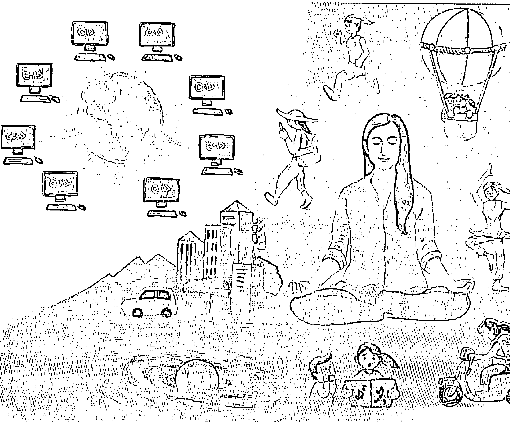而且，也許你聽到這個比喻，自然會想到《駭客任務》(Matrix) 這部電影。而心裡會猜想，會不會跟這部電影所說一樣，真實，其實是落在中央的主機、落在一台遙遠的超級大電腦？然而，我在這裡想表達的，又是顛倒——就連這個中央主機、共同的腦、人類集體的聰明，都還是從我們小的頭腦投射出來的。

我們都沒想過，就像這張圖（P.49）右邊所表達的，所謂的中央主機其實就是我們自己的頭腦。再講透徹一點，每一個人的頭腦不光是終端，也是主機。並不是把我們的終端機去連結一個遙遠的主機，而是反過來，我們不光是主機，還可以投射出數不完的終端。這些終端，從我們頭腦的運作，會認為好像每一個都在單獨作業都有個單獨的個體。但我們只要去追查，自然會發現，每一個個體都是從終端化出來。

我們過去會用這種中央主機的比喻，而且會認為自己這個小終端還要去和一個遙遠的主機連結，這種觀念其實反映了人類對自己的制約和限制。我們認為自己在整體最多只是很渺小的一部分，而這個小部分還要受到整體或是一個更大的中央主機的影響。

然而，我在這裡要談的剛好相反——我們每個人早就是完整，老早無所不能。

我們會認為每一部終端都是分開的，是一個個的個體。但其實，每一個終端都是同一個體，和整體從來沒有離開過。是從每一個終端，延伸出整體。是透過終端建立的「我」，才自然有一個完整的宇宙、世界、人間可談。

我才會說 It all starts with “Me” and it all ends with “Me” . 一切是從「我」出發，而一切都回到「我」。是小我製造了一切，倒不是一切製造了「我」。這個因果的關係，本身又是顛倒的。我這裡所指的「一切」，最多還是頭腦所延伸出來的一切，是我們這一生可以體驗的一切。

你看，這幾句話是不是就把你嚇倒了。還是，你和「全部生命系列」一同走到這裡，這些話其實已經符合你的領悟。

嚴格講，連前面這些話也不完全正確。因為中央主機和終端都是資訊的組合，不光主機是虛的，而終端也是虛擬。並不是真的有一個中央的主機，更不用講這些終端。而連這個顛倒的因果關係，也不存在。最多，我只是拿來當作一個比喻，因為我們頭腦還是需要抓住一點東西。但是，最後連這個比喻都要推翻。

沿用原本這個電腦和網路的比喻，我另外想表達的一個前提是：每一部終端機，或說小小的頭腦——你、我——其實沒有一個起源，也沒有一個終點。雖然它可以發揮主機的功能，卻無法追溯自己的起源。即使不知道自己是怎麼來的，設備裡的所有零件還是可以重新組合成別的終端機。重新組合後，原本的電腦名稱也就消失了，沒有一個實質的存在。

你我當然可以去追溯眼前這個中央主機或各個角落的終端機是怎麼來的，但永遠追究不完，也永遠追求不到。它本身並不存在，對整體來說，最多只是個臨時的存有。我們去解釋它，是多餘的。我們最多是透過它，看可不可以找到進入中央主機的路徑，甚至接觸到這個中央主機以外的部分。

即使你還有質疑，認為還是有一個共同的腦、中央主機，或說神、上帝存在，而不是樣樣都是虛構，但我們無論把中央主機當做多大或多有威力，它還是在一個相對的範圍。從這個中央主機要跳到無限大，還是跳不過去。

我們沒想到，最多是把終端機本身或這一生帶來的任何觀念挪開，也就輕鬆地活出整體。而這個整體，是遠遠大於任何聰明或任何電腦可以推測的。

借用前面的比喻，我真正要表達的重點是：在這個共同的腦之外，還有一個更大的層面，是沒辦法用語言、文字來表達的。我們每一個人，不光是祂的一部分。但是，要注意，這個「部分」的觀念或任何可以表達的連結和關係，本身一樣是虛的。其實，可以說我們每個人就是祂——這沒辦法表達出來的東西。

站在共同的腦後面的力量或意識，我們最多只能稱為主、一體、空、全部——我們。

## 第四章 讓我再一次試著用電腦來比喻

## 05 感官、外星人、相对、局限——你都老早已经知道的

如果借用数学的语言，我们自然会用「相对」和「绝对」的比喻来表达这个主题。一般都认为，人类的聪明可以让自己跳出任何相对、局限的框架，想出无限多的可能和变化来描述自己的生命，甚至让自己感觉到可以在各种变化中自由选择。

但是，我们很少停下来想，再多变化，总数其实还是有限的。

我们头脑的架构，就是从各种边界条件（boundary condition）所组合出来。边界条件，是由数学和物理来的观念。从数学的角度，一个定理的有效性最多只在它运作的范围内才成立。在这范围之外，當然它本身沒有什麼意義。從物理的角度，每個東西都自然有一個邊界。甚至，就連浩瀚的宇宙都有一個邊界。只要在局限的範圍裡，不可能沒有邊界。然而，只要有邊界，它本身是在邊界的範圍內運作，而受到邊界的限制。

我常常舉一個實例，假如拿一個火箭從地球發射出去，將路徑設定成直線，而且這路徑上沒有任何阻礙，它走到最後，又會回到原點。當然，這最多是一個舉例。是不是回到原點，其實沒有任何人可以驗證。但道理是正確的。

怎麼說？假如物理學家所創出來的大霹靂理論是正確的，這個理論所強調的是，宇宙是從一個比小還更小的點，最多只能稱為「奇點」所爆發出來的。也就這樣子，經過這140億年，從一個點變成一個球，而沿著球形的軌跡不斷膨脹，變成一個完整的宇宙。但是，無論宇宙再怎麼膨脹，再怎麼延伸，假如理論是對的，它的軌跡還是離不開球形。宇宙，還是有個邊界。我們從任何一個點走到最後，最多也只能畫出這個球形，而早晚會經過或回到原點。回到前面談的火箭，它只能在邊界所設定的範圍裡運作。倒不像我們一般人所想的，能夠脫離這個宇宙。

同樣的，感官的邊界條件，也就決定了感官的運作範圍。

我們只要仔細觀察自己的五官，自然發現它截取的資訊是在一個很具體的範圍。我以前也說過，我們的眼睛能看到的，比鳥類更有限，而耳朵能聽到的範圍，比海豚更窄，更別說鼻子遠遠不如狗敏銳。從取得資訊的一開始，我們自然已經被自己的感官限制，而就從這裡開始建立了種種邊界條件。不光是人，感官範圍更廣的動物，一樣有牠自己的限制。

我想，任何一位科學家都可以體會，假如你去觀察一個現象，所採用的方法和設備是受限的，當然，你可以覺察到的東西，本身也只是在覺察的界線裡局限地運作。

我也用過以下的比喻來表達這種觀察的限制——假如有一個外星人，他可以看到比我們觀察範圍更廣的能量譜，那麼，我們眼中看到的人和人、人和東西、人和動物、體和體之間的隔離，對他很可能是完全不存在的。他最多只是體會到一種漸層的變化。我們認為個體和個體之間是空間，但他很可能看得到彼此之間還有很多的連結。即使這些連結不那麼具體，但所呈現的還是合一的。對他來說，我們每一個體不可能真正分開。這麼一來，這個外星人對現實的認知，會跟我們完全不一樣，甚至可能是顛倒的。

我在這裡想強調的是，也許你還記得，即使這個外星人有一百個感官，而每一個感官的範圍都比人類更廣，但這一百個感官帶來的現實還是一樣的局限。就整體而言，還是不成比例。再怎麼豐富的感知，對整體來說，還是不成比例的小。即使有一百個甚至上千個感官在運作，它截取資訊還是透過一個比較的機制。而任何比較的方法，本身離不開二元對立——感官，本身是一種限制。是把整體限制到一個小範圍，才可以運作。這種運作，本身就是受限的。

反過來，如果用「意識」來含括所有我們可以體會，甚至沒辦法體會到的現實，那麼，最多只能說，用我們局限相對的感官，是可以觸及到意識，但只能觸及到一部分。甚至，應該說是很小的一部分。

透過頭腦——無論效能多高的頭腦，它本身可以認知的現實，最多也還是在一個相對、局限的範圍，對全部或一體來說，完全沒有代表性。不只對一體沒有代表性，對我們這一生可以體驗的，本身也沒有代表性，更不足以代表我們可能經過、來來去去的多少輩子。

我知道，你讀到這裡，也可能全部這些觀念都已經清楚了，最多只是複習和提醒。但是，反過來，也可能你讀到這些名稱——感官、相對、局限——就進入萎縮的狀態。不用擔心，理論也就只有這麼多。比較重要的是，怎麼親自去體驗，倒不是從頭腦刻意去理解。

讓我們頭腦更想不到的是，頭腦的聰明，本身是這個體驗與領悟過程最大的限制和阻礙。它透過演繹和歸納，自然會延伸出來一個觀念。只是，任何觀念，無論多偉大或多微細，本身還是帶給我們束縛，本身離不開我們這裡所稱的邊界條件。

一個人要徹底領悟，倒不是從種種邊界條件跳出來，是剛好相反，是把自己的身分和任何條件都挪開，都不要做任何連結，才會讓生命更深的層面自然浮出來，來肯定祂自己。

你可能已經發現，我無論再怎麼重複，這一點就是我們頭腦最難掌握和理解的。我不斷地強調，要把全部的理解都挪開，我們才可能領悟到那理解不來、理解不到的一體。然而，這幾句話，卻是頭腦絕對沒辦法接受的。才讓我們走那麼長的冤枉路，讓我們非要透過著手和費力，才能理解 something——一些東西。

## 06 你還記得鑰匙孔的比喻嗎？

也許你還記得，我過去會用另外一個比喻，就像以前在《不合理的快樂》用過的這張鑰匙孔的圖——如果想知道門外的世界，光從鑰匙孔往外看，所得到的畫面可能完全會誤導自己。要把門打開，才會看到整體。甚至，有些現象，可能是過去的生命所產生的因果，是透過眼前這個小洞完全看不到的。

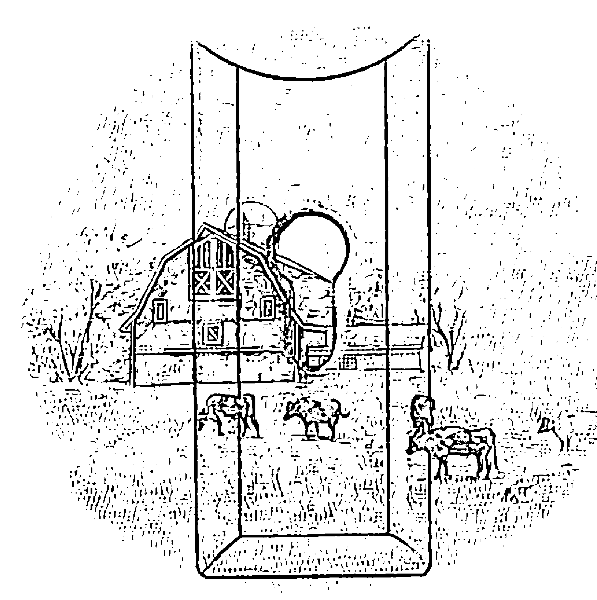

比如說，我們眼前也許看到一個小孩子受到虐待或被欺負，自然會認為他是受害者。就像我們從鑰匙孔看出去，只能看到前面的一點點小範圍。我們自然會對虐待或欺負他的人抱著負面的評價，認為這些人太不公平。但是，可能我們打開這個門後，會發現他們兩個人的關係其實不像我們想的那麼簡單。不光是這一生才建立的牽扯，而是在前輩子可能早就有關聯。而過去的情況可能是剛剛好相反，現在看來傷害的人，在之前可能是受害的。我們所看到的不公平，落在更長的時間範圍裡，或許就不那麼容易判斷了。沒有人知道究竟怎樣對誰才是公平或不公平。甚至，也許在未來的畫面裡，兩個人已經什麼事都沒有，可能關係還很好。就好像過去的糾紛和牽扯，已經脫落了。

不只是我們看到的範圍是限制的，我在這裡要強調的是——就像下一張圖所表達的，即使把門完全打開，所看到的全部，還只是很小的一部分，一樣不足以代表整體。它本身還是被看的機制（我們觀察的設備——感官和頭腦）所限制。

我會不斷強調這一點——你看的方法，限制了你所看到的——是因為我們隨時會忘記，而認為眼睛所看到的就是全部，對整體有完整的代表性。

當然，不光是看，聽、聞、觸、嘗也是一樣的，把我們限制在它們的框架裡。

意識本身是個無限大的譜，即使我們觀察不到全部，但就像我們可以借用數學的概念，透過「無限」來推想到它。我們透過數學，老早可以推測到最小的存在，也可以推測出最大的存在。我們的頭腦雖然想像不出什麼是無限小或無限大，但是，還是可以設想出一種規律或機制，好像可以去預測出來，讓頭腦摸到一點「無限」的邊。

這些，其實還離不開人類的聰明。它本身是二元對立所衍生出來的，但是，這種聰明只是在一個相對的範圍。我們全部的聰明是更廣大，只是被相對給限制住了。我們真正的聰明，可以稱之為意識譜，是遠遠超過五官的範圍，從最小到最大都存在。但嚴格說起來，它跟五官所能體會到的最小或最大一點關係都沒有。

我會這麼說，透過頭腦，雖然我們可以逼近無限，但是我們也同時要承認自己永遠到不了。無論無限大或無限小，我們永遠跨不進去。最多，只是逼近。

但是，我們頭腦雖然到不了，最多只是逼近更大的聰明，沒想到我們還可以隨時活出它。你還記得，我前面已經提過只要把頭腦——包括頭腦的限制——鬆開，這更大的聰明，是我們每一個人都可以活出來的。

我過去也不斷地說，是一體來活出我們，倒不是我們去尋或可能找到祂。我相信，到這裡，你可能對這一點又有不同的理解，而且認為這幾句話一點都沒有誇大，也不抽象。

我們這一生來，從我的角度，最可貴的是透過這個有限的體，讓一體活出祂自己，而我們又同時可以體會到祂，這是沒有別的生命可以做得到的。

我才會說這是這一生最寶貴的機會，千萬不要錯過。

## 07 邊界條件：螞蟻的比喻

也許你已經發現，第五、六章都在談邊界條件，只是用不同的比喻和表達去切入。你可能已經開始認為，邊界條件好像對我有特別的吸引力，才讓你一次次地重複。

確實如此，坦白說，它含著一把從人間走出來的鑰匙。

但是，我也明白，無論再怎麼重複前面所講的觀念，你還是可能認為這些觀念不符合你生活的經驗。這是理所當然的。我們體會不到人生就是在一連串的邊界條件的限制內，不斷地打轉。

因為我們可以體驗的，本身就是我們的限制，又是一個邊界條件。

前面提過，我們最多是逼近無限，但其實永遠到不了。到不了的原理很簡單。我們本身就是局限，我們對這個世界的認識也是局限。局限，就是我們過去提到的邊界條件。假如這個邊界條件本身是局限，被這個邊界條件所包裹住的世界和一切，當然是透過同樣的局限的條件，在一個封閉的系統裡運作。

以我們日常的運作來說，比較（二元對立）本身就已經成為我們的邊界條件，時時刻刻約束著我們，決定了我們每一個想法、每一個念頭、每一個動作，甚至每一個經驗、每一個體會、每一句話的範圍。

比如說，兩個東西、兩個數字、兩個人之間的關係，是透過不斷地比較而建立起來的。任何一個數字要有意義，一定要透過和某個東西的比較。要不然，對我們而言，它一點意義都沒有。一句話、一個字、也是如此。要有意義，一定要有一個前後的脈絡或上下文（context）。是透過跟別的字比較，在各種對比、同義、反義、對照、相近或相反的映襯之下，我們才可以得到一個字的意義，而可以連結到我們的經驗。不然，任何字，光是單獨存在，是沒有意義的。

只是，這些機制，我們很少會觀察到，而且會認為根本是理所當然。

我們在每一天的生活，透過念頭的變化，認為自己可以活出自由的選擇；透過語言，認為自己可以描述眼前的一切。更顛倒是非的是，我們非但認為自己只是用念頭、語言、頭腦的聰明被動地描述眼前好像客觀存在的一切，而且還會認為眼前這一切和自己的頭腦沒有什麼關係。

也就這樣，眼前的一切自然被賦予了一個獨立的存在。我們跟它互動，而我們本身也就跟著有了一個好像獨立的存在。這個好像獨立的存在，還認為有時候可以影響到週邊的現象，但大部分時間其實影響不了。

我常常和朋友半開玩笑，說我們就像下頁這張畫裡的螞蟻，在野餐桌上爬，認為自己就活在這樣一個局限的世界。虽然不知道桌子以外是什么，但如果离开这张桌子，就会像从悬崖摔下去，没有好下场。

当然，这最多只是比喻。蚂蚁没有这么发达的头脑或时空的观念，它只会在这餐桌上继续爬，从来没有想过会摔下去。只有我们人类，可以透过头脑去想象超过局限的后果。

然而，我们从来没想过，是我们自己建立这些边界条件，在这里面建立那么多的局限。而且，还在这样的一个封闭系统里头，误导自己可以自由地活出全部的可能。

到这里，虽然谈了这么多边界条件，但我们并不是非受到边界条件的限制不可。只是因为我们把中心放在小我，会认为受到边界的限制，认为有这个宇宙、世界，透过一个排列大小的程序，把自己当作最小。一个小小的「我」要面对那么大的宇宙和世界，当然会有无力感。

邊界條件，也讓我們感覺到不可能解脫。然而，前面也提過，解脫，不需要從邊界條件跳出來——其實，也跳不出來。最多，是把全部的觀念消失，讓頭腦安靜，邊界條件也就不起作用。沒有一個排序，沒有一個分別大小的觀念。一個人，也就這樣自由了。

然而，從這個最小的體「我」，我們還是可以活出生命全部的潛能，找到內心所追尋的全部答案。用邊界條件的語言來說，我們還是可以跳出來。因為這個小的體可以說是不存在，或說它的本質和全部的本質都是同一個東西——一體、意識。

## 08 大霹靂之前，又有什麼？

讀到這裡，或許你還會認為，只有普通人，才會落入這種感官、頭腦和邊界條件的錯覺。但是，只要你我去觀察現在所有的科技和科學領域，會發現就連專家也受到一模一樣的限制。我在《時間的陷阱》談過，天文物理學家普遍接受了大霹靂理論（the Big Bang Theory），把它當作這個宇宙存在的前提。這本身就含著人類頭腦自己造出來的矛盾——我們的頭腦不斷地往前提推演，一路推進到最初始的邊界條件，也就是在大霹靂前的狀態。然而，這個狀態卻是我們怎麼想都想不出來的。這樣的前提是局限的腦的投射，而我們非要用這個方法來解釋無限的宇宙。到最後，會發現是不可能的。

前面已經提過，無論一個人、一個東西、任何數據，要有意義，一定要透過比較。而拿來比較的對象，一定要是具體而也同樣落在邊界條件內的東西。像「無限」這個觀念，是沒辦法比較的。它本身已經在任何邊界條件之外，而無法作為一個基準。

我才會不斷地說，我們由頭腦建立的人間的意識，和無限大的意識是在兩個不同的軌道，一個受到局限的限制，一個在任何限制之外。

我在這裡想表達的是，其實我們可以進入無限。而且，這樣的進入是隨時都可以。並不是透過我們頭腦連貫出來的邏輯（動、做）可以進入，而是剛好相反，是輕輕鬆鬆不費力地把局限交給無限。讓局限，臣服給無限，也就自然讓永恆的無限活出祂自己。

從另外一個角度來講，要讓無限活出祂自己，我們最多只需要突然領悟——這無限大的絕對，是在每一個局限的角落都存在，就像兩個不同的軌道不斷重疊。只是，我們過去沒有覺察到。

我曾經用銀幕來比喻絕對。銀幕上，演出著電影的畫面。這些畫面（也就是我們人生的故事）不斷在上面呈現。呈現完畢，還沒有換成下一場電影，也只剩下銀幕。就算換了別的電影，銀幕也還是銀幕。電影充滿聲光效果和劇情起伏的畫面，只是讓我們的注意力擺到前景，而忽略遠遠更久遠的背景。

在這樣的現況下，怎麼進入無限大的意識？怎麼徹底領悟到這個無限大的意識本身就是我們的本性？這才是我們真正需要關心的。

## 09 人的聰明，也是我們最大的阻礙

我在第三章談到，人的聰明最多是在建立一個虛擬的世界。然而，這個虛擬世界太逼真，讓我們不光是這一生，而是一生又一生、一世又一世在裡面打轉，希望能繼續延伸它。

在這個過程中，每一個人都忘記了，是我們自己製造出這個世界。是透過我們邏輯的架構，才有一個東西叫業力。我們不但忘記了，更是被這個業力的法綁住。因為我們認為自己頭腦延伸出來的因和果是真的有，也就這樣子，被自己騙了。

我過去在《全部的你》用過這樣的比喻——我們既是球場、球員、球判，也是球，也是觀眾，也是草地，也是球賽，更是一切。相信你讀到現在，已經比較可以體會到這幾句話的用意。

絕對沒有層次。祂是包括一切。從祂裡面，好像不需要化出一個體，更別說用一套邏輯來說明。任何邏輯，只是不斷從裡面化出一個個體、一個個隔離。無論人類頭腦演繹和歸納的邏輯多強，和絕對的意識相較，還是不成比例的有限。

祂本來就是圓滿。祂是完整的，不需要也不允許層次。是透過我們人類的邏輯，而且最多只是演繹和歸納的邏輯，才有一個可以「懂」的理解。別忘了，只要用頭腦可以「懂」任何東西，已經把一個完美的全部——從絕對，帶回到一個相對的角落。我們不管再怎麼聰明，其实在整体都沒有代表性。

這一點，可能是我們用頭腦最難懂的。我們會想透過「懂」，掌握人生的每一個部分——樣樣都需要理解，需要體會，需要建立連結。也因為如此，這樣的聰明，就是我們醒覺最大的阻礙。

假如人类没有这样的聪明，自然也就落回到一體。也就像透過我們意識的轉變，自然把時空這種看起來是四維的架構，一大步落到「沒有維度」，把我們一生被洗腦的觀念完全消失。

一個人自然發現，沒有維度或沒有觀念的觀念，最多反映絕對。而這個絕對，含著全部相對的可能。是我們同時活出它，又可以同時參與任何一個維度，沒有任何矛盾。

這時候，我們也只能笑，最多可能問自己——哪裡還有一個世界或是人間可談？我們最多只會發現，這一生想找的答案，全部都老早在心中。而且，我們自己，就是這一生所追求的寧靜、快樂、大愛、歡喜。我們就是祂。

我過去喜歡用「直覺」、"gut feeling" 或「全相圖的意識 (holographic consciousness)」這些詞，來表達我們還有一個意識層面，不是透過一步步順序性的推演而來的。這種意識，完全跳出我們人類推理的能力、思考的範圍。祂是一個絕對的觀念。本來隨時都有，倒不是可以從我們的邏輯去截取。最多，我們只是把這個相對的邏輯挪開，祂自然會浮出來。

我會用「全相圖」來形容這個絕對的意識，也只是表達——我們在任何角落都離不開整體，而且都可以覺察到整體。只是，這種覺察，和人類與動物感官的覺察完全不同，並不是透過比較、分別而可以具體描述的過程。

這種覺察，倒不是可以這麼表達的。

一個人隨時在這種絕對、一體的意識，其實沒有宇宙、世界、人間好談。自然立即體會到這些話都不是理論，而是事實。最多只能自己去體會，卻又無法用人類的語言來表達。

這一來，「這個世界到底是不是一個頭腦的產物？」這種問題所帶出來的矛盾，也就立即消失了。一個人自然會發現，我們透過自己的聰明，竟然沒辦法理解這麼簡單的道理，甚至還要冤枉地迷路，迷了那麼久。

我再大膽地說，不只世界是頭腦的產物，甚至上帝、主、神，都是我們頭腦的產物。過去我們說 "We are created in the image of God."「我們是以神的形象所造的。」你自然會發現事實和這句話又是顛倒，其實是 "God is created in our own image."「神是依我們自己的形象所造。」我們人類就是有那麼大的本事。我們就是造物主。

但是，如果你認為這裡所講的神、主、上帝，是在你我自己之外，是位於別的哪裡的存在，那麼，你又誤會了。

我講這幾句話，並不是說沒有主、沒有神、沒有佛。剛好相反，最多只是表達——不是大家一般體會到的主、神、佛。一般對主、神、佛的體會，無論多精彩或再高深，最多是反映頭腦的作用。然而，我在這裡講的主、神、佛，是一切，是全部。每一個角落、點點滴滴都是祂。我們，也就是祂。

講得更透明一點，我們和神是沒辦法區隔的。這個時候，我們才真正成為造物主。我們可以無所不在，無所不知，無所不能。也可以選擇什麼都不做，輕鬆過這一生。而這一生的每個角落、每個時點，最多是用來肯定「全部生命系列」所講的一切。

到這裡，你自然也會發現，就連什麼叫相對，什麼叫絕對，什麼叫無常，永恆、昏迷、醒覺，全部都是比喻。這些用詞的區別，本身還是離不開二元對立。

其實，沒有一個「東西」叫做醒覺，也沒有一個狀態叫做 turiya。我們本來就是醒覺的，而祂不可能讓一個東西或一個狀態可以描述。假如可以描述，我們也就又回到一個相對的範圍，而又透過描述的局限把自己做了一個隔離。

但是，就連這幾句話，最多也還只是比喻。

一個人落在一體，會發現自然已經是寧靜。沒有一個念頭可以起伏，可以計較，而隨時都可以體會到這兩個邏輯的運作——我們每個人都有一個相對的意識，重疊在絕對的一體之上。而這個世界、人生，只是數不盡的可能性中的其中一個。

醒覺，最多也只是清楚地知道這一點。這種知道或肯定，隨時都有。一個人也就自然不會被人間帶走。

## 10 一切，最多只是資訊

一切，最多只是資訊，而任何資訊都只可能是虛擬的。

> Every-thing is no more than informatics and any informatics can only be virtual.

在這裡，我用這幾句話，來總結前幾章所談的。我認為這個觀念重要到一個地步，一個人只要徹底理解，而且一點質疑也沒有，也就醒過來了。醒過來，也就是——醒覺、大徹大悟、脫胎換骨。

這本書的書名《頭腦的東西》和這幾句話，其實是最重要的修行的基礎，也是最根本的原理。從這個原理，我們可以推演出一切，也同時可以推翻一切。

我們仔細觀察，人類所謂的文明，其實都是頭腦的東西。人類從古到今的價值觀念，打自一個人出生、上學、進入社會、工作、建立家庭、和人互動……一直到死亡所得到的全部觀念，都有一個共同的大漏洞——我們忘記了，眼前所看到的樣樣、每一個東西，最多只是資訊和數據。而且，這些被我們認為是真實的數據，對整體而言，根本沒有任何代表性。

這些數據和資訊，最多只能說是透過一個「我」的觀察中心不斷巡視週邊的空間，而在這單一觀察的角度或情緒狀態下，得到的一張張快照。透過不斷的快照，再加上虛擬的時間觀念，讓我們認為自己所看到的一切都是真的。

我們不只認為一切都是真的，也就這樣子，自然衍生一個生死的觀念。好像認為自己透過出生，來到這個世界；透過成長、學習，建立一個完整的生命；而透過死亡，離開這個世界，也就把生命告一個段落。

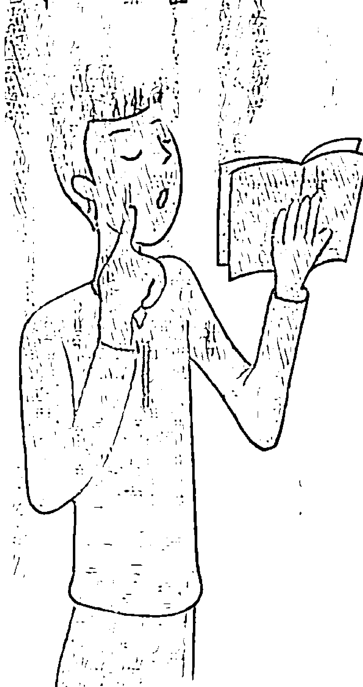

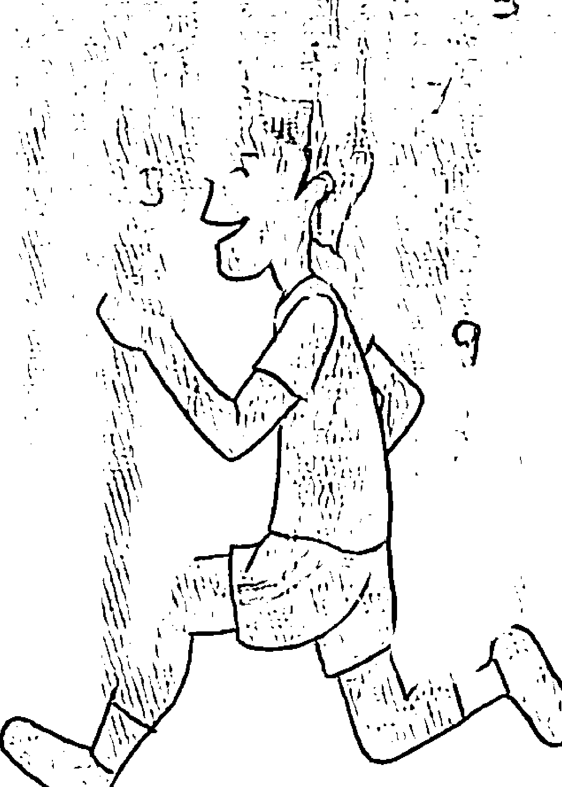

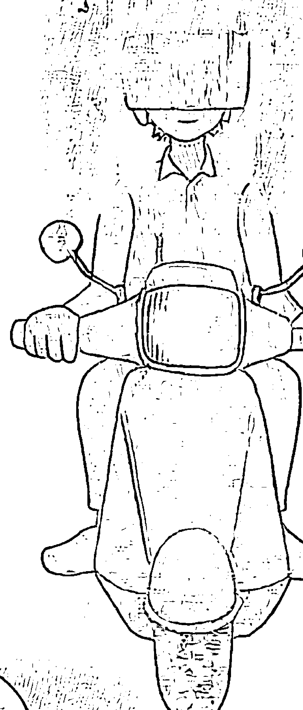

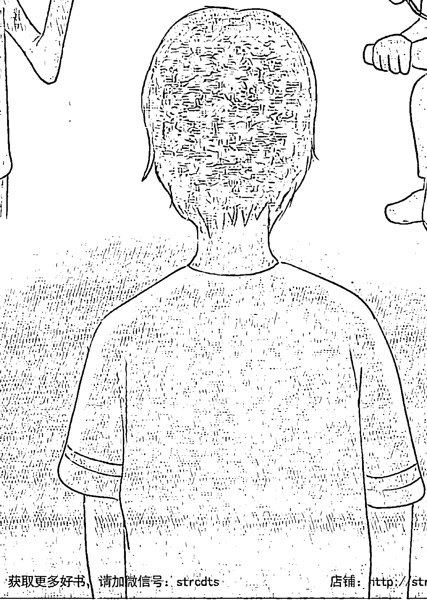

你我幾乎都意識不到，其實我們就是這樣被自己的邏輯綁住，認為因－果是真的——人生的任何果，一定要有因，而我們當然不可能跳出這個因－果的關係。我們怎麼也想不到，人生全部的這些現象，都是頭腦製造出來的。更想不到的是，連最基本的因－果觀念都不正確。

你還記得，我在第六章用過鑰匙孔的比喻來說明——我們觀察到的，只是相當窄的範圍。我們看不到眼前每一個好像存在的果，它的因落在好多個不同的層面。而且，大多數層面，是我們感官體會不到，但對這個體是存在的，都在不斷塑造這個果。

在這樣的限制之下，我們自然會想改變結果。畢竟我們不知道自己看不見所有的層面，也就這麼認定眼前的果是透過自己可以掌控的因所組合的，而自然會想去改動。不只如此，我們還會不斷追求更多「更好」的果。把這些更多「更好」的結果，變成人生的目標，還認為自己有自由好談。

在這種情況下，我們根本不可能發現，自己來到這一生，其實已經是過去的因的組合。而且，這個組合的力量大到一個地步，讓這一生的一切早已經定型。一切，都是註定。我才會說，連我們去洗手間、說話、反彈、抗議……任何動作都是註定，不可能不是註定。假如我們還認為不是註定，這種想法才是最不科學的，本身違反宇宙很多基本的定律。

我前面才會不斷提到，只要我們還會受到人間變化的影響，還認為肉體是真的，世界是堅實的，也就表示我們還是在頭腦因一果的架構下運作，分不出什麼是真，什麼是虛擬。對這樣的我們，每一個動作當然都是被註定的。

但是，假如我們突然體會到，從人類還沒有出現之前，到無盡的未來，可以在人間看到、體會到、表達出來的全部，都是頭腦延伸的產物。而我們本來就是一體，本來就是全部。那麼，也就可以體會——真正的我們跟這個肉體完全不相關，因一果跟自己也就突然不相關了。我們可以輕輕鬆放過它。

只是，在這個過程，肉體還是會受到影響，還是會完成它這一生來想做的（一樣也只是因一果的組合）。然而，我們不需要再抵抗這些業力。不只是不需要抵抗，也不需要肯定。

這一來，樣樣可以放過。最多是充滿信心，充分明白樣樣都是頭腦的東西。無論我們抗議或不抗議，都不會有任何實質的影響。任何反彈，最多是讓業力從別的地方又浮出來，讓我們一再地來迷路——在每次看似不同的人生，扮演表面上看起來不同的角色，而誤以為那就是真實的自己。

然而，即使如此，最終其實也沒有什麼損失。沒有一個獨立的「誰」可以損失什麼。我們會覺得有一個獨立的「誰」存在，是因為我們把自己當作只是這個身體。

讀到這些話，假如你一點都不驚訝，甚至認為本來就是如此，我最多也只能說，你已經在一個醒覺的過程。而且，這個醒覺是擋不住的。跟你接下來做、不做，也沒有任何關係。即使這一生不醒來，你的命已經徹底的轉變。醒覺，最多是早晚的問題。早晚什麼，也不用刻意去追究。

### 11 神經迴路的把戲

雖然前面我這麼解釋我們的認知，是任何專家都只能認同的。但是，值得再談或分享的是——雖然懂，我們怎麼還是會認為這個世界那麼真實，而會被它帶走？

講到這裡，又需要回到我們頭腦的架構。

我們每一秒鐘，其實透過五官捕捉、再加上腦整合的數據，可能有成千甚或上萬筆。就連一個動物，都隨時有這麼豐富的運作。只是，人類透過頭腦去進一步整合，把複雜性又提高了不知多少倍。這種運作的機制，有它的道理。是希望我們把全部注意力投入新的訊息，像是環境的變化，以及這些變化可能帶來的威脅。

七

不好

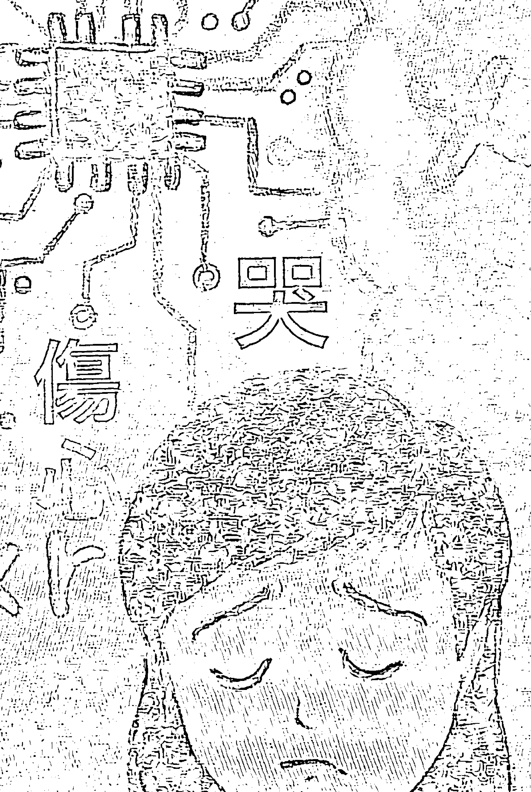

# 笑

病痛

求

我們仔細想，我們在觀察世界，大多數的訊息其實已經是落在注意力的背景裡。透過頭腦不斷建立迴路，讓它們自動化地運行，而讓我們可以把注意力從上頭釋放出來，集中在新的變化。

比如說，我們好像隨時可以體會到天空、雲、樹、馬路、對面的學校、回家路上的商場、辦公室的走廊……眼前再尋常不過的畫面，其實都已經落在頭腦老早就建立好的迴路。讓我們用最省力的方式，可以在心裡把它反映出來。

假如這些畫面有些變化，像是天空暗了，雲動了，風吹過樹梢，綠燈變成了紅燈，一群又一群孩子從校門口出來，路上開了新的商店，走廊上出現陌生人……對我們的注意力來說，不需要重新反映整個畫面，而只是需要處理些微更動的部分，就可以留意到更可能威脅生命的狀況。

這種做法，從神經運作的角度而言，是最經濟的。自然而然，也就把一個完整的虛擬數據庫，變成了我們注意得到的全部真實。讓我們認為好像真有個東西叫天空、雲、樹、馬路、對面的學校、回家路上的商場、辦公室前的走廊。無形當中，這些資訊變得堅固，讓我們真正認為有個「東西」。

也就這樣子，我們「製造」出一個完整的世界，而且認為有個堅固的世界是天經地義。接下來，也一再地透過五官和念頭不斷肯定它，不斷驗證它，不斷確認它。你我的世界，就是這麼來的。

這個機制，很少人意識得到。甚至，聽到這個世界是虛擬的，每一個人都會立即抗議，認為跟生活的體驗完全不符合。但是，我相信只要我們面對自己覺察的機制，從這裡出發，自然會發現——我們所見到的、讓我們得到堅實的印象的，確實只是資訊和數據。然而，這個世界隨時落在我們注意力的背景，已經變成生活主要的部分。從生到死，都在身邊，在眼前，很難把它否定掉。

我常說，修行，從人間的角度來看，只是建立新的迴路。讓我們從過去數不完的習氣和模式突然跳出 來，徹底體會全部的習氣都是虛擬的現實。想想，假 如習氣是真的有，而不是虛擬，「我」不可能消失。 這個世界，一樣消失不了。那麼，我們就算是透過修 行想轉變意識，難度會相當高，甚至，是不可能的。

就是因為「我」和這個世界是虛的，我們才可以 隨時跳出。

如果你還記得我在《靜坐》用過這張圖，用箭頭 代表迴路的作用，它自己不斷在那裡運轉。其實，就 連靜坐最多也只是建立新的迴路，讓注意力隨時專注 到眼前觀想的對象。透過這種不斷的觀想，設立一個 新的路徑，讓我們隨時可以回到它。透過這種機制， 本來是同時在多層面運 作的複雜迴路，突然落 在一個很單純而重複的 迴路，讓我們的注意力 可以集中在一點。

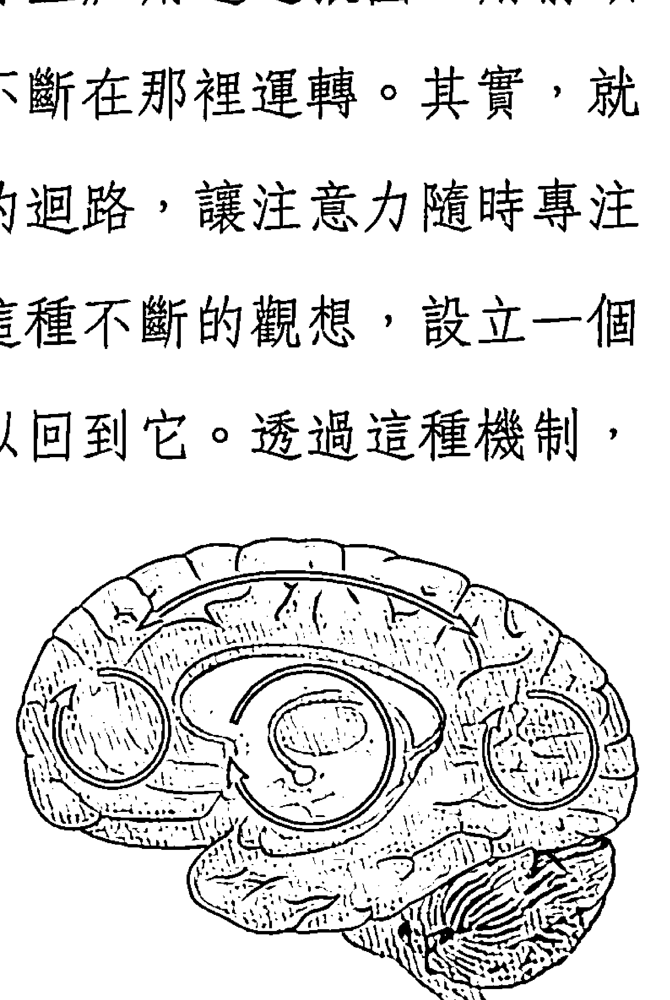

「全部生命系列」最多也只是如此，希望將我們局限的腦不斷落在心，落在全部，落在「沒有東西」。這樣的切入點合併了過程和結果，讓我們隨時體會到這個世界的虛擬，又同時建立一個完整的新迴路，來支持這新的領悟。

也只有這樣子，我們才不知不覺化解這個虛擬的世界。儘管最後什麼都沒有化解，它本來就是虛的。一個虛擬的東西沒有必要、也不可能得到化解。其實，也就這麼簡單。

我才會說，一切都和事實是顛倒的。我們把假的變真的，真的變假的。仔細觀察，其實我們連物質和意識的地位也弄反了。我們認為眼前所看到的，都是真的，自然會認為是先有物質，才有意識。舉例來說，對現代的神經科學家而言，是先有人的基因，才有我們的體，而有了體，有了神經細胞的作用，才意識。

是的，站在狹窄相對的意識，用二元對立的邏輯來看，這個推論當然一點都沒錯。是先有了人的架構，才有人的聰明。然而，我們通常體會不到，在人還沒有出現之前，已經有一個意識，也就是我在「全部生命系列」所稱的「絕對」或「一體」。就是我們走了以後，絕對、一體的意識還存在。我們來不來這個人間，跟祂其實不相關。

我們有了肉體的聰明，最多只是用肉體的範圍想去局限絕對。也就這樣子，自然忽視了絕對，忽略了一體。最可惜的是，這個肉體的聰明，對整體一點代表性都沒有，不過是生命上兆的可能裡的其中一個。

此外，我們通常以為一個東西是活的（什麼叫做生命），一樣又和事實是顛倒的。我們是透過頭腦的機制，創出「動」的觀念。而「動」，又建立時間，我們才可以衡量死、活，認為這就是生命的分野。一個東西在「動」，可以生，也會死，我們認為它自然是活的。一個東西不動，也就自然認定它是死的。

就這樣，我們會假設一顆石頭沒有生命，而一株植物會慢慢的發芽、開花、結果，雖然很慢，還是在動，也就認定它有生命。我們沒有想到「動」是一個頭腦的觀念。我們認為「動」才有生命，其實是透過我們頭腦的運作，人為地賦予了某些東西「生命」。

在這裡，我所指的顛倒是——其實，沒有一樣東西沒有生命，沒有意識。就連一塊石頭、一根木頭、天上的雲、地上的水……全部都有意識。

沒有一個東西沒有意識。只是它們沒有把自己局限在一個小範圍裡運作。我們從五官和頭腦的角度來看，體會不到它們有生命。

我們神經的迴路，就是有那麼大的本事。不光是騙過我們一生，還可以帶著我們製造一個虛擬的世界。

## 12 感官過度的刺激，反而加強了限制

我們一般也很難想到，不光是靜態的空間會不斷透過神經迴路的建立而落在注意力的背景，成為我們習以為常的狀態。就連一個東西不斷地在動，我們也會透過神經迴路的運作，把一個不停的「動」落到注意力的背景。這樣，才可以把注意力釋放出來。要等到動的速度變快或慢，才會引起我們的注意。然而，連「動」的快慢，一樣是比較而來，全部都是頭腦的產物、頭腦的區隔。

同樣地，時間，透過神經迴路的建立，也變成注意力的背景。我們隨時不會注意到它，而會把它當作本來就存在，也就自然認為時間是真實的。我也在《時間的陷阱》特別強調過時間是怎麼來的。長期下來，我們自然會認為時一空是真的，眼前所看到的快步調的情節和畫面都是真的，而讓自己不斷投入其中。

即使我們已經知道全部人生所看到的，其實都是數據和資訊所帶來的體驗（換句話說，我們可以體驗的，最多只是資訊）。但是，只要仔細觀察就會發現，幾十年來，人類始終在不斷追求更快步調的資訊轉達，來刺激我們的感官。就好像透過快速的轉變，可以得到一種滿足感。

我們現在的世界速度愈來愈快，就連快的步調，也一樣落入神經的迴路，而隨時在注意力的背景運作，讓我們習以為常。過去幾十年來，有了收音機還不夠，要有電視。電視的步調還要不斷加快，也就有了即時直播和二十四小時播放的新聞。有了電腦網路，資訊傳遞的速度更是愈來愈快，方便到了一個地步，隨時可以透過網路調出來數不完的資訊。這些，都是因為我們認為透過感官刺激頭腦的速度愈快，可以帶來更大的滿足，才造就的現象。

而且，不光是透過單一一個感官，現在的技術還可以透過多個感官，建立更逼真的虛擬實境。我們在這個虛擬的現實裡，非要用各式各樣的方法，再投射出更多的虛擬現實，認為透過這種方法才可以取到足夠多的資訊，而得到夠大的刺激。

我們很少想到，步調愈快，其實是在二元對立的虛擬現實裡，陷進一種愈對立、愈虛擬的狀態。從這裡頭，很難爬出來。因為樣樣都像真的，我們看不到虛擬的邊。

反過來，我認為，未來有一天，大家會突然體會到，再怎麼快、再怎麼精彩、投入更多感官，其實得不到滿足感，只是短暫的刺激。長期下來反而會讓人遲鈍，需要更多刺激，而且要更快得到。就像嗑藥，第一次用，會帶來很大的快感。多用幾次，就會發現劑量必須更重，而快感持續的時間會縮短。到最後，人麻木了也就不再反應。

這個道理，也就是我在《不合理的快樂》講的享樂適應的機制 (hedonic adaptation)。我們不斷地刺激感官，後果會相當嚴重。人類全都在不斷地動，而且還動得特別快，來得到刺激。到最後，非但無法再反應，甚至可能會落入絕望。

我個人認為，將來的人會發現所要追求的，剛剛好又是相反——不再是透過「動」來刺激感官，反而是收攝甚至剝奪感官 (sense withdrawal or deprivation)。等於說把感官的刺激去掉，無論是眼根的看、耳根的聽、鼻和舌所嗅嘗的味道、身體的觸感都不再給予刺激。一個人在完全沒有刺激的狀況下，反而可以突然發現，有一個東西或有一個意識可以浮出來，讓我們稍微可以體會到「絕對」所帶來的安定。

透過這種體驗，我們知道外在無論怎麼變化、多麼刺激，不光是讓人躁動，還會讓人感覺缺乏安全感，帶來各式各樣的煩惱。未來的人會發現，人類的發展必須踩一個煞車——要一百八十度迴轉，進入內心的狀態。

這裡所談的現象，我相信，我們在幾年內都會親眼看到。

我們到這裡，會突然發現，人類倒是沒有自己想象的那麼聰明。其他的東西或生命，也沒有人類想的那麼「傻」。聰明或傻，本身是二元對立的分別，只有人才會這麼區隔。站在整體，全部是平等。花朵、雲霧、石頭、動物，全部都是平等，最多是在活出一體。除了一體，沒有任何東西有獨立的存有。

活出全部的生命，最多也是領悟到這一點。

## 13

## 我們是幻象的造物主

前面提到，我們這一生的任何體驗，都是頭腦的東西。

從古到今都一樣地，一個人只要寧靜下來，潛入內心，說「我」的時候自然會指向胸腔。指著這個位置的時候，很少人指著心臟。古代有些聖人還會說這個位置是在胸腔的右邊。

這種直覺的表達，也就好像我們多少還記得自己是從一個虛構的點擴散出來的。是透過念頭，建立一個完整的身體，而從這個身體延伸出整個世界。

我們本來以為，人類的聰明發展到某一個地步，自然可以體會到意識、永恆甚至絕對。然而，我在這裡想表達的，又是剛好和大家的想法顛倒。

顛倒的是，我們本來認為是宇宙帶來世界，而世界又創造了我們，而我們確實也有一個「體」會生、會死、會有各式各樣的體驗，我們把它稱為人生，認為是自己在人間全部的生命。

然而，我一直在提醒，其實這個關係是顛倒的，是我們透過頭腦的運作，才製造一個世界，而建立各式各樣的關係。我們把跟自己、跟週邊、世界、宇宙一連串的關係造出一組矩陣，一組基質，一組母體（matrix），而把它認為是人生。

我在第四章提到，我們不光可以進入這個中央主機、這個共同的腦，其實，透過表面上局限的腦，還可以進入這個主機背後遠遠更大的意識。這，才是我們的本質。體會到它——而隨時體會到它，是我們來這一生最大的一堂功課。

前面提過，其實我們才是造物主。We are the Creator. 是我們造出一切。我指的一切，是人間可以體會到的一切。

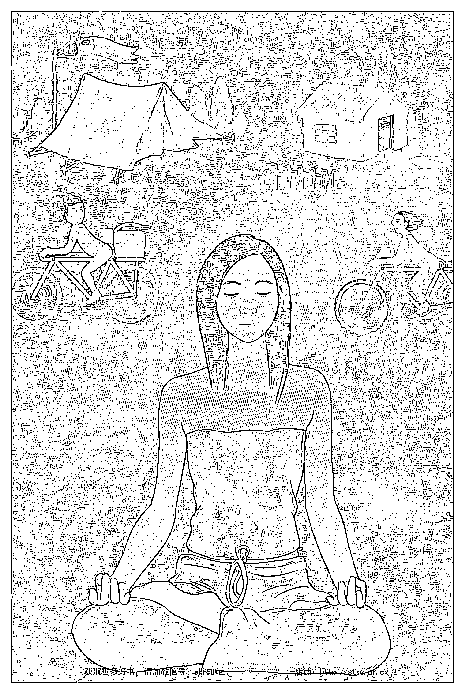

我們製造一切，這一切包括上帝、包括宇宙，包括所謂的中央主機、任何東西。只要是可以想像或表達出來的，都是我們自己製造的。包括我們這一生到現在，認為有價值、有意義的全部和一切。就連這個用中央主機來比喻的共同的腦，都還是我們小小頭腦投射出來的。

我們的頭腦，就是有這種本事，不光可以化現一個宇宙、一個世界、你、我，還可以投射世界之外、感官體會不到、但可以想像出來的。

講到「我們是造物主」，如果你認同這句話，也不需要感到驕傲。我們最多是幻覺的造物主，透過我們的本事，不過是把它延伸下去，經過千百萬次的人生，還認為有什麼「東西」可以學習到。不光是為此要一次又一次地再來，而且，最後可以學到的，其實還只是在相對的範圍。到最後，最多是肯定這個妄想。

過去，常有人問我，人生的意義是什麼，我最多只會回答「沒有什麼意義好談的」。其實，連一點用意都沒有，更不要說還有一個意義。不光人生沒有意義，其實宇宙本身也沒有一個目的。如果有，也只是頭腦組合的。

我之前還強調，任何意思，包括字和字之間的理解，我們所有發達的溝通工具，無論是語言、文字、各種媒介、思考、幻想，全部都離不開頭腦的運作。對整體而言，沒有什麼意義好談。所謂的意義，最多是在一個封閉系統裡運算的結果，而這些結果自己肯定自己的重要性，自己支持自己虛擬的存在。

想想，這樣的運算，對誰可能有意義？只是對一個封閉系統裡的人才有意義。

但是，進一步觀察，就連探討人生的意義，無論是提問的人，還是作答的人，一樣還是頭腦的產物。在這樣的架構下運作，「有沒有意義」的探討根本也就不存在了。

就像一個人晚上睡覺做夢，夢裡好像樣樣都有意義，我們才有夢好談。但是，一醒過來，就會發現所有意義都是假的，都是製造出來的。醒過來，夢裡所有的意義自然消失，而我們也不會再繼續去分析或追究夢裡的情節和意義。一樣地，我們在看似清醒的狀況下，其實全部是頭腦在作業，讓我們講話得出一個意思，接下來，人生好像還有一個目的或意義。然而，這全部都是虛構的。

一個人突然醒覺過來，會發現，沒有什麼意義好談的。過去認為重要或真實的意義，醒覺過來後，會發現都不存在。

這才是正確的理解。只要我們認為人生還有一個意義、目標或規劃可以追求，這本身就是我們醒覺過程最大的阻礙。

## 14 人生的意義，什麼意義？

我相信，讀到這裡，很多朋友會很失望，認為這樣子人生就沒有目的，沒有什麼地方可以追求。我會安慰這些朋友——正因為沒有目的的好談，甚至沒有追求好去求的，你的生命才可以全部打開，才可以活出生命的奇蹟，擁抱生命全部的潛能，包括種種的可能，而超越這個小小的生命。

這不是放棄生命，是剛剛好相反，是透過這種領悟，讓全部生命打開它自己。而這種打開，比我們想像的還更不可思議。所以，我在這裡要再一次強調，為什麼人生沒有什麼意義好談。

很多朋友，會認為人生的目的就是要找到生命的意義，才值得活一輩子。甚至，會想用修行找到答案。許多修行的朋友，更是在不斷找各方的老師、各樣的法門，認為只要能理解到什麼，或透過功夫得到什麼，就可以突然頓悟，解答生命所有的問題。

無形當中，我們反而都忘記了，這個人生是頭腦透過因－果組合的，最多只是作用力－反作用力的擺盪。而且，這些作用力還不一定是感官可以體會到的。

要修行，透過一般的方法，反而是在上頭加上一層不必要的意義和意圖。就好像我們又忘了，其實說到底沒有什麼意義可以談。就算還有一個意義，最多只是等著我們不要再繼續肯定這個虛擬的世界，等著我們看穿頭腦產生的任何產物，包括這個世界。

也只有透過這種理解，而每一個瞬間重複再重複這樣的理解，我們才可以輕輕鬆鬆放過這個世界。讓任何眼前的經驗可以來，也可以走，再也不會造出一連串的作用力－反作用力。

真正可以談的修行——無論哪一個文化、透過什麼法門——最多也只是把「我」的起步找回來。讓我們徹底了解，「我」其實是個念相，本身不存在。

深深體會「我」是個念相，接下來，整個世界也化掉了。我們才會徹底體會到，這個世界，其實最多只是念頭的產物。這種理解的基礎，不是靠修來的。它是本來就如此。透過修行，我們最多只是做個提醒——提醒自己一個本來就再明白不過的事實。

前面談到造物主，我們一般都認為有一個創出生命的指導原則或機制，而這機制有一種聰明，可以製造甚至控制這個世界。也就這樣，我們通常認為這個世界、宇宙有一個力量，而把這樣的力量稱為上帝。我們會認為這個上帝是優先於我們，而且衪的力量是我們外頭，比我們遠遠更強大，帶著我們走。

但是我們從來沒有想到，就像前面提到生命沒有意義，一樣地，其實並沒有一個指導原則帶著我們走，也沒有由這樣的指導原則造出來的世界。只要還講得出來這樣一個機制、一個指導原則，其實還是頭腦的產物。一個人走到最後，自然會發現什麼都沒有，最大的力量反而是自己——真正的自己、絕對的部分。如果這本身可以稱為上帝，也就是祂。

這樣子，一個人會發現全部都是念頭的世界。其實，沒有人想害我們，也沒有人要刻意欺負我們、帶來麻煩或是造出阻礙。全部，都是自己的頭腦在分別區隔。是我們，分出什麼是好，什麼是壞。倒沒有想到，一連串的區隔、二元對立，也就跟著出來了。

畢竟，如果我們認為有個東西或上帝在製造一個世界，那麼當然也就有天堂，還有地獄。就連修行，也還是二元對立的產物。是我們認為自己跟宇宙、跟全部是分開的，才會想透過修行把自己找回來。也自然造出一連串說明和練習，來表達這些不必要去找的真實，還想在其中找到意義。

一個人體會到這一點，自然會發現「全部生命系列」包括這本書所講的，其實都沒有什麼意義可以談。不會透過它，讓你理解什麼東西。甚至，事實又 是剛好相反，最多是透過這麼多的字句和論述，你突然體會到這個人間沒有一個東西可以帶給你幸福、快樂、愛、寧靜。甚至，沒有一句話、一個系統、一個法可以幫助你找到這些。

這些，本來就是你自己。你，也從來沒有離開過祂。

甚至，連我在這裡說 Every-thing is mind-stuff.「一切都是頭腦的東西。」可能最多還只是一個比喻。比較正確的表達應該是 Every-thing is within you.「一切，都在你心中。」或是「一切，都是從你延伸出來的。」

你這一生想找的全部，其實已經找到了。祂就在你心中，等著你肯定祂。就連全部的外在，這個完整的世界，這一生可以體驗的點點滴滴，包括任何頭腦的產物，都是從你心中投射出來。

我用各式各樣的方法切入，最多只是表達這些重點。只怕你我還是聽不進去，我才不斷地試著用不同 的方式來強調。其實，我講的這些，你老早都懂。我才會在《集體的失憶》指出——我們只是忘記了。然而，一想起來，也立即就懂了。沒有什麼損失，也沒有耽擱什麼時間。畢竟，時間本身就是頭腦的產物。

之前提過，我們人活在一個局限的框架，還有一個遠遠更大的層面（我們稱為一體或絕對），在完全不同的軌道。所以，雖然我們頭腦建立世界，但我們透過頭腦跨不出去，兩個是不同的意識層面。

顛倒是，絕對的層面本來就有，從來沒有沒有過。我們人類還沒有出現，祂就有。人類消失了，也許幾百年、幾千年，甚至幾萬年、幾億年後，祂還是有。但是，我們只要一開口，比如我前一句裡用「有」（或再講究一點，說「存有」）本身已經把祂限制了。我們用頭腦最多只能試著去描述祂，稍微做一點解釋。

然而，只要把祂的意思一定下來，我們其實又把祂落在人間的框架。如果真的要描述，最多只能講——是我們沒辦法理解的。

理解，本身也是我們局限的二元對立的作用。絕對，是塞不進我們頭腦的架構的。然而，我們又離不開祂。並不是因為我們有人類的聰明才有祂。反而是，祂在等著人類發達到某一個聰明的程度，突然可以有一點小小的領會。

矛盾的是，要理解祂，我們竟然要把我們聰明的腦擺到旁邊，祂才可以浮出來。但也就是有這麼聰明的腦，我們會突然體會到——有祂，卻又沒辦法用我們的語言來描述，最多只是心中知道。知道什麼？講不出來。

你說，這是不是又是一個大的矛盾？

我要進一步大膽地說，解答這個矛盾，是我們這一生來最大的目的。

但是，講到目的，本身又帶來一層限制。

## 15 蜉蝣的故事

美國北部和加拿大的夏天通常很短。當地人大概都看過，在六月，會出現大量的蜉蝣（shadfly）。就是一天兩天的事，不曉得它們從哪裡突然一起冒出來。

蜉蝣是一種很原始的昆蟲，體長大概兩、三公分。出現時，幾乎是鋪天蓋地。一般人都知道，住家附近不要有強的光源，免得把它們吸引過來。

蜉蝣不會咬人，事實上，它羽化成蟲後，根本沒有內臟，連進食都省下來了。蜉蝣喜歡靠近水邊交配，不過交配的時間也很短暫，我們根本看不出來，最多是覺得有兩隻蜉蝣在半空中靠在一起，然後一同落到水面。就像兩片葉子在風中碰到了一起，也就一起落下。

它一碰到水，就好像全身的骨架撐不住，完全陷到水裡。也就短短的一天，大量的蜉蝣，成千上萬甚至上億的蜉蝣落在水中。乍看之下，好像許多小魚在水裡。再過幾天，一隻隻蜉蝣也就沉下去，成為水裡魚兒們的食物。

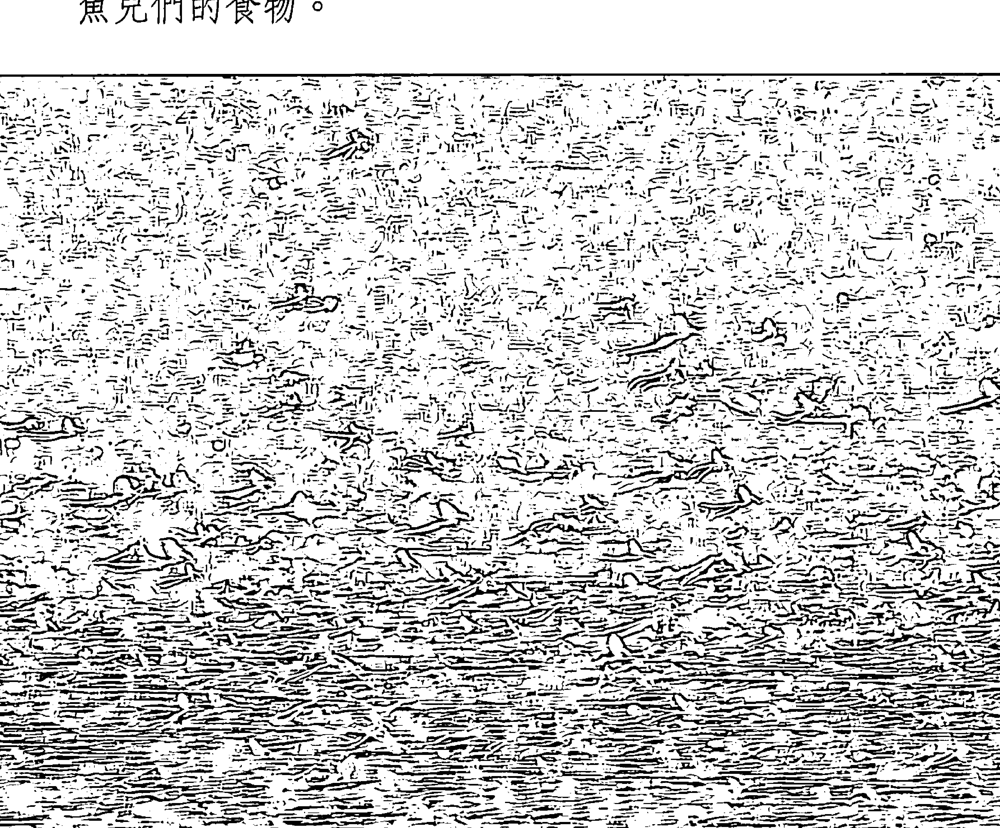

蜉蝣和大家熟悉的蜻蜓、蝴蝶或螢火蟲一樣，壽命都很短。羽化成蟲的蜉蝣，最多也就活上一兩天。短的，甚至只有幾分鐘。古人才會用「朝生暮死」來形容它。我們站在人類的角度，自然會想問：「這麼短的壽命，有什麼用處？或有什麼意義？」

這種質問，本身就反映了我們人類的特質——要從生命的各個角落，得到一個連結，而從這個連結得到更深的意義。好像眼前的狀況不夠，要得到一個更大的藍圖或更高的原則。而且，這個原則必須滿足更完整的一個週轉。

我們都沒想過，站在整體，我們的生命其實就像一眨眼那麼短暫，沒有更深或更完整的意義可談。人類，和這些蟲子其實沒有什麼差別。但是，我們非要取得一個更深、更大的意義，認為這一生來，是要來學習到什麼東西。我們根本沒有想到，可以學習到的，不光全是頭腦規劃出來的，而且還是落在頭腦的範圍內才可以學到。也就好像一個虛的架構，非要得到一個虛的內容，也就這樣子，它可以達到虛的目的，得到虛的意義。

這本身，就是我們抓得緊緊的人類的特質。

## 16

## 人類的發展，人類的價值

這個主題太重要，讓我換一個角度，再繼續深入。

前面談到，任何語言或是念頭所組合出來的意思（meaning），都離不開二元對立，而最多還只是一種頭腦的東西。

我們仔細觀察，沒有任何一個我們人間所稱為的連結（無論是人和人、東西和東西、人和動物、人和世界之間的連結），不是頭腦組合的。這些連結，本身不斷地把我們局限到自己所建立的框架。你我每一個人從出生、長大，透過家庭和社會所得到的教育，其實最多也是不斷地強化這種連結，想從中取得意思，取得意義。

無形當中，我們自然會肯定，一個人最好有這種連結的能力（樣樣都可以看出意義），可以學習東西，在樣樣中區隔出好、壞、對、錯，是有利還是有害。我們也會希望透過這種區隔的能力，為自己帶來一些優勢。認為有了優勢，自然可以在社會上順暢地運作，甚至可以在群眾裡脫穎而出，得到少數人才有的地位。這種地位，一般都離不開物質的層面，不是財富、權力就是名譽。透過人生的學習，我們最多不斷在強化自己的個體性。

任何話、任何表達、文字語言可以得到的意思，不光是落在相對的層面，本身還給我們帶來束縛——只是我們通常把這種束縛稱為人生的「意義」。比如說認為有些話有用或有意義，有些行為跟話沒有意義。也有些人會強調要說有用的話，做有用的事。

然而，這種區隔，本身還只是一個頭腦的產物，是在這框架內好像擴充出另外一個層面的平台，讓我們認為更值得用人生去追求。修行，就是個很好的實例。我們也許就是對人生不滿、失望，才有個修行的追求好談。

我們透過社會的洗腦，其实在年紀很小的時候，就已經建立起一個人生的意義想去追求。不只是物質層面的目標，例如想賺很多錢，成為出名的明星、有魄力的政治家、醫術高超的醫師、有愛心的護理人員。在內心，也自然排列某些狀態、境界或追求才有意義，而某些沒有。就這樣，我們為自己的人生定出一個優劣的次序。

幾百年來，我們東方的民族受到西方物質文明的影響，也特別重視物質帶來的意思和意義，而自然把它變成文化的一部分。現在的東方世界，都離不開這種規劃和追求。認為所謂的社會發展，就是要建立一種優劣的排序，讓我們好進一步做比較。這樣的比較，也許落在經濟的層面，也許是社會情況或生活方式，也就變成人類文明共同的追求。

我們回頭看，人類發展至今，幾千年來都在不同的優劣次序上追求。認為自己的努力一定可以勝過自然和環境，而想刻意去轉變、改善，直到符合人類所要的樣子為止。我們是透過這種眼光，一樣不斷在衡量週邊或別人。我們認為的成功和失敗，也是這麼來的。

這樣的觀點，背後其實還有另外一種肯定。也就是在不知不覺中，我們每一個人都接受——全部的生命，只是局限在生和死兩個點之間的有限片段。而人類整體或個人發展想要得到的最後結果，也只是希望延伸眼前的人生。最好在這幾十年，可以取得愈多愈好。而且，這方面的成就，最好足夠將自己和別人區隔開來。

表面上看來，我們現在生活的步調這麼快，好像可以完成更多任務，取得更多成就。但是，我們在這當中，反而不斷肯定了自己的限制。

我們再怎麼累積，無論是財富、名譽、權位、勢力，到最後還是有限的。就連宇宙，當初從什麼都沒有，生出來種種的有，還有上兆的星球，到了遠比我們可以想像的還要更廣闊、更龐大的地步。即使如此，它還是有限的。和我們全部的可能相較之下，還只是一種不成比例小的存有。

而人間所強調的價值觀念，最多也只是反映我們頭腦的機制。頭腦本身要有一個落差、一個差異，才能夠作用。念頭，也就是這麼來的。假如樣樣是平等，其實，沒有念頭可談。非要有差異不可，這本身就是帶動頭腦和人間運作的機制，哪怕是在一個虛的世界，也自然讓我們往外在世界去追尋。我們最多也是透過價值觀念反映它自己本來就有的機制，不斷想找一個差異和落差。好像這樣才能滋養、強化頭腦自己的運作，讓它自己擴大自己。

這一點，我們一般人很少去想到。所以，我們最多只可能繼續在物質層面集中注意力，把人生的限制，自然變成自己的邊界條件。

我透過「全部生命系列」想表達的是，人間可以建立、想到的意義，沒有一個不是頭腦的東西，本身也只是一個束縛，為我們設下數不完的陷阱。人類的任何發展，都是往具體的方向走。就是現在強調的統一，最多還只是把物質層面既有的理念連貫，而延伸出另一個在物質層面上比較簡化的平台。比如說，物理學家會想追求大一統理論（The Grand Unified Theory），想為分子和更小的粒子找到單一個源頭，並且用同一套原理來解釋宇宙的四個基本作用力。但是，就算有了這樣的大一統理論，這些最基本的粒子，又是怎麼來的？這種追求，不光是沒完沒了，不會解開我們生命的潛能，反而還不斷地局限在物質層面。不只讓我們這一生就這麼被帶走，而且是千萬年來，一代又一代地引導人類走向一個虛擬的狀態。

我要強調的是，每一個意義、每一個人間所重視的價值，都是頭腦的產物。最後，都要放開。我之前在《落在地球》也提到，連人類的價值觀念、人類的特質都需要放掉，你我才可以徹底解脫，跳出人類帶來的全部限制。而且，要放掉全部這些觀念（包括人類的特質），比我們想像的更簡單——不是去追究這些價值的意義，最多只是看穿它們怎麼來的，而它們的來源又是什麼？本身有沒有一個實質的存在？

一個人也就自然會發現，全部我們可以想出來的，包括人生最高的意義，包括什麼叫做最高的真實，都離不開頭腦。本身還是頭腦的東西。還是一個人為的系統。本身還是一個阻礙。

## 17 業力，又是什麼？

假如一切都是頭腦的產物，我們怎麼去看業力？它又是怎麼衍生出來的？

這個問題，我相信在此時，你心中已經有了答案。只是，這個題目不光是重要，還是最難懂的。我在這裡，希望能再帶來一個切入點。

業力，其實也是我們頭腦的產物。但是我們也可以說，頭腦，也是業力的產物。兩個，其實是兩面一體，分不開的。

怎麼說？

頭腦的作業，本身有一個運作的機制，或說有規矩，有法則。而這個運作的法則，就是業力。業力，其實就是因－果的連鎖，是不斷延伸一個作用力，接著再一個反作用力。也就是一個因，再加上一個果的作用。連貫起來，讓我們有一種連續的印象，看這個世界不會是斷斷續續，而可以得到一個意義。

這個關係，就像結構和功能是分不開的。舉例來說，我們有一個身體的架構，身體會動會運作，反過來，又透過動和運作，自然影響身體的架構。

頭腦的架構在運作，而運作的範圍，也就是業力的架構。我前面講的「意義」，也就是在談「果」是怎麼延伸出來，而讓我們頭腦可以理解。甚至，從理解中得到更大的意義，好像還能把人生的全貌建立起來。

我們的頭腦，假如不透過因果來組合，是沒辦法作用的。每一個念頭，每一個畫面，都是單獨的，連貫不起來。是我們，有本事把一個又一個畫面串起來。這種連結，自然創造時間的觀念。

時間，本身是空間比較的機制。是我們把眼前這個瞬間所看到的，和過去、未來的瞬間相比，而得到。

一個好像在動的印象。接下來，也才產生時間的觀念。反過來，一個因－果的架構，本身也在引導頭腦的作業。應該說，透過這個架構，它已經可以決定或框住我們這個頭腦的運作——會自然讓頭腦觀察到眼前任何東西，而從這裡面取得因－果的關係。同時，讓我們隨時肯定因－果的法則。

我們最難懂的是，這個因－果，不只是落在我們感官的範圍。我們其實不只是一般眼看、耳聽、鼻聞、舌嘗、身觸的感知，還有許多其他的感知的門戶。我們最多是透過各種感知的門戶化出一個自己認為「有」的現實，而透過這個有限的現實，想在裡面尋找一個因－果的關係。

但是，我們看不到全面，想不到就連兩個人的互動，都其實老早已經是決定好的。透過業力的運作，早就註定。前面也舉過這樣的例子，看到一個人被欺負，我們會理所當然地在這個限制的範圍內把他當成受害者，而把另一個人當作加害者。接下來用心險惡、居心不良、壞心眼、奸詐、受騙、倒楣、不公平、委屈、冤枉……來描述這個經過。

只是，因－果的出發點，不是我們想像的那麼單純，不是受限於我們眼前這輩子。它是從各個層面、各種角度，甚至過去數不完的輩子所組合起來的。我們這一生眼前所看到的，只是五官可以體會的一個小小的層面。

一般人說眼見為憑，然而，眼睛所看到的現象其實很狹窄，不足以代表全面。我也才不斷地重複——只要我們在業力的架構運作，認為它是真的，我們其實就連一個動作、一個念頭都是註定的，不可能跳出來。它本身就是一個封閉的架構，怎麼轉變，也永遠轉不出來。反過來，假如真正明白這裡所談的是真的，知道連業力都是頭腦的產物，我們自然可以選擇跟它沒有互動，才可以從這個封閉的架構，隨時轉回到一體。其實就是那麼簡單。

但是，無論我怎麼講，甚至到了重複再重複的地步，你雖然懂，但下一秒就會質疑，馬上會忘記。甚至，面對下一個瞬間發生的一切，你會立即反彈、抗議。就這樣，立刻回到頭腦的世界，投入業力的漩渦。

「全部生命系列」要提醒你我的是，一個人其實不需要追究業力怎麼來的，甚至不需要去管它是不是頭腦的產物。這種問題是追查不完的，再怎麼辯證，還是一種頭腦的作業。我們最多只要去體會到，沒有一個實質叫做業力，也沒有一個東西叫做頭腦。也就這麼簡單，跳出了頭腦和業力的範圍。

我們不斷提醒自己，不斷承認這個事實——沒有一個範圍、一個東西叫業力可以守住，我們才可以選擇不受它影響。只要我們給予它一點點肯定，其實，從業力是跳不出來的。還不知道要回來多少次，也許幾十、幾百、幾千次，最後，才會領悟到這一點。

這個選擇，還是在你自己手裡。沒有一個人，包括我，能幫你做這個心態的轉變，只有你可以做。然而，做之前，要承認沒有頭腦，沒有個東西叫轉變，才可以轉變過來。

你看這是不是又增加了一個悖論？

## 18 還有什麼可以稱為真實？

我相信走到這裡，已經把好多觀念整合起來，也會比較清楚我們當初為什麼要做好多練習，而這些練習又是為了什麼？

我在這裡，再重新談一次《我是誰》的練習，相信你的理解，到現在已經完全不一樣，而可以跟你自身的體會做一個對照。你可能還記得，第一個練習〈「我」所見的一切，都不是真實〉就是來肯定——一切，都是頭腦的產物。

它本身是最重要的觀念。只要能徹底活出這幾句話，其實，對你我而言，接下來的一切，也就理所當然。然後，也就沒有什麼練習好談。可以這麼說，無論是《我是誰》或其他作品所帶出來的練習，還沒有做，自然已經完成了。

你或許也還記得《我是誰》第二個練習〈真正的我，沒有生過，也沒有死過〉也就是在提醒我們——真實，沒有生死，最多是永恆。然而，就連永恆這兩個字，最多也只是比喻。

畢竟，真實並不等於無常的對等。真實，本身是沒有特質可談的。

接下來，我也不斷提醒，連你我，都不可能有一個獨立的生命。這個世界的一切，都不過是頭腦的東西。它本身其實沒有一個最源頭的因，也沒有一個最終的果。是我們人認定有一個最源頭的發生，還拿自己當基準，一步步從人類，往前推到猴子，再往前推到大霹靂。然而，推到底，根本難以想像大霹靂之前又是什麼。

再用一個比喻來表達，就好像一個很美的美人魚，不知道是從哪裡冒出來的。她在虛空中飄浮著，突然間看到海水，也就完全適應了，認為自己就是水中的生物。海裡不光是有生物，而且樣樣都是區隔的，也就這樣子衍生很完整的生態系。她欣賞著海裡美麗的珊瑚，逗弄五彩繽紛的小丑魚。有一天，她突然轉過身來，看到自己的倒影，才發現原來自己是那麼的美。然而，除了自己，什麼都沒有。她才發現，這個世界全部都是幻覺，是自己延伸出來的。接下來，自己怎麼來的，她不追究。往哪裡去，她也不管。最多是停留在自己的美。

我們人類也是如此。其實，「我」沒有根源，也沒有終點。

我們去追究「生命」的根源，非但永遠追查不完，而且這種追求，本身對我們沒有任何解答的作用。是直到有一天，我們突然轉過身來，知道自己真正是誰，才明白自己含著一切的答案。而我們想要追求的，本身就是祂。

這個真正的自己，沒有生過，也沒有死過。是透過我們頭腦的作業，一切才仿佛有一個頭尾。透過我們每次來片片段段的生命，建立起一個有生有死的觀念。這一點，我相信是頭腦最難懂，甚至不可能懂的。假如真正懂了，本身也就把頭腦消失了。

頭腦要生存，一定要能夠排列一個先後順序——有個因，接下來有個果，可以把因－果連串起來。就像前面提到的，假如連貫不起來，樣樣都沒有意思，更沒有意義，這個人間也就跟著消失。

這些話，不是頭腦可以理解的，最多是我們親自去體驗、去領悟。其實，連這麼講都不正確。比較正確的反而是，我們把人生樣樣可以體驗的全部，包括領悟、觀念、體會……都挪開。一體或說真實，也就自然浮現在眼前。這不是我們透過人類的任何特質可以取得的。

但是，我敢進一步說，只有這種領悟，才能把業力的連鎖打斷。我在《短路》用這張圖表達過——把因－果看穿，突然徹底體會到，在每一個瞬間前，沒有因，在每一個瞬間後，也沒有一個果。每一個瞬間，自然拉長，變成永恆。也只有透過這種當下，而每一個瞬間，不斷地，最多也只是當下，我們才突然讓千萬年的因果鎖鏈斷裂。

就是那麼簡單，又有那麼大的作用。

我們千萬年來，一次又一次地來到地球或活到其他星球，也許最多也只是為了體悟到這一點。

業力的鎖鍊斷落了，我們這個人生還繼續。它本身是因－果的組合，還是要完成它自己。但是，怎麼去完成，跟真正的我們，再也沒有什麼關係。我們也可以隨時放過它。這麼一來，很有趣。這個身體也好像還是可以運作，可以上洗手間、喝水、吃飯、溝通、談事，而且可能還做得特別好。但是，好像沒有一個主人在主導它。

走到這一步，我們也只可能發現，連這因－果其實也不存在。就是它不存在，我們才可能解開。這個觀念，本身又是和一般人所想的顛倒。然而，透過這種領悟，人、房子、一切……都跟著消失了。

但是，話說回來，只要我們還隨時認為這個身體存在，而眼前有個堅固的世界。那麼，對我們，業力當然還是存在。這種矛盾，一個人到這裡，也就解開了。

然而，就連「解開」的說法，其實也都不正確。

我們最多只是發現，是自己過去把注意或身分投入一個狹窄的範圍，而現在選擇接受全部。也就這樣子，不讓因－果再繼續帶著我們投入人生任何的角落。

這種體會，值得一個人為它出生入死（to live and die for）。當然，這種說法，本身又只是一個比喻。甚至，我在這裡提，最多也只能把它當作玩笑。

## 19 「我」不存在

回到《我是誰》所帶出來的練習，或許你還記得，接下來是這樣的提醒——「我」根本沒有存在過。一切，都是頭腦的產物。連「我」的觀念，當然也是頭腦延伸出來的，本身也不存在。

假如連「我」都不存在，還有什麼世界好談？還有什麼東西要追究或放不掉？還有什麼東西值得追求，值得分享？

「我」不存在，是誰可能醒覺？

「我」既然不存在，還有誰可以醒過來，值得說是醒覺的？

這麼下來，我們也突然會發現，過去全部的痛苦，是讓一個不存在的「我」製造出來的。

我們心中的失落、悲傷、失望甚至絕望，不光是透過一個虛構的「我」投射出來，還不斷地折磨這同一個虛構的「我」，造出一連串的傷痛。讓我們在這一生想把它告一個段落，做個收拾。這一生假如沒有收拾乾淨，可能接下來千千萬萬個下一生，最多也只是延伸同樣的劇情。

這是最不可思議的。

「我」沒有因，沒有一樣東西有因。當然，也不可能有果。沒有因，也沒有果。其實，全部已經老早自由。不光「我」不存在，即使「我」存在，它也是自由的。沒有因，沒有果，也就沒有業力可談。業力本身也是頭腦的產物，是我們自己製造出來的。

假如不是這樣子，一個人可能一生都要去追究自己的罪，認為自己有罪或犯了錯要被懲罰。這是我們一般人的想法，總是認為要改變世界，要改變自己。甚至，認為有一個因－果在等著處罰我們。

我們絕對不可能相信——從這齣戲跳出來，我們連「跳」都不需要做。比我們想像的，更簡單到一個地步，反而讓我們認定不可能那麼簡單。也因為這樣子，我們自然「做」不到。

其實，只要去觀察就會發現，我們真要「跳」出來，最多，只需要徹底體會到，自己真實的身分比起這個身心是遠遠的更大。甚至，應該說和這個身心根本不相關。

我才會說人類是一個弄錯身分的案例（a case of mis-identity）。

只要冷靜想想，倘若這個「我」是真正存在，那麼，也不可能這麼簡單可以解散或讓我們從「我」的範圍跳出。可以說，是根本不可能。

不光「我」，而且，整個世界都是一個虛構的現實。是這樣子，我才敢講，要解散這個「我」，比我們想像的簡單更簡單。甚至，是不費力。

這兩章的觀念，你會發現，都是從「頭腦的產物」這個觀念自然可以延伸出來。我才會說，一個人只要徹底領悟到一切是頭腦的產物，其他一連串的觀念，也就推翻了。一個人，也就不覺醒過來了。

## 20 都不是真實

我們讀到這裡，《我是誰》的下一個提醒〈都不是真實〉，也自然容易懂了。這個提醒，最多也只是說，我們真正要懂得真實，倒不是去理解什麼「東西」，而是透過否定「一切的東西」。

只要我們可以說理解到什麼東西，其實也就已經被一種頭腦的狀態帶走了。任何「東西」離不開二元對立，都是在相對的範圍裡成形，古人才會用 *netti netti* 「不是這個，不是這個」來面對眼前的任何東西。

*Netti netti* 「不是這個，不是這個」這個聲明，最多也只是從另外一個角度強化前面所談的一切——這個世界，我們可以看到、體會到、認知到的全部，都是頭腦的產物。都是局限。都是束縛。都是制約。

假如我們可以徹底領悟這幾句話，其實也不需要再用 netti netti 「不是這個，不是這個」來提醒了。

但是，坦白講，對我們一般人，可能還是需要透過 netti netti 「不是這個，不是這個」否定一切——沒有一樣東西是真實。透過這種不斷的提醒，提醒我們眼前看的，都不是真實。我們接下來，才可能稍微體會到醒覺的一點味道。

只是我們還半信半疑，認為這些話和生活經驗並不完全符合，才需要採用這麼多的練習（或我所稱的提醒），讓我們真正的自己浮出來。

想想，假如祂隨時浮出來，那麼，又有什麼練習可以做？更不用講，還有什麼東西可以修行？我們最多只需要承認自己真正是誰。接下來，也只是接受我們真正的自己，真正的身分。最多，只是這樣子。

雖然全部的修行，最多只是一個反覆的提醒，但是，不能小看 netti netti 「不是這個，不是這個」的作用，它其實比任何持咒都有更大的效果。

我們一般持咒，最多是把注意力集中在一個點，希望和咒語達到合一。最終，沒有人在唸咒語。沒有咒語，甚至沒有朗誦的過程，讓我們進入「奇點」而回到一體，達到徹底的寧靜。

然而，*netti netti*「不是這個，不是這個」的作用不只是讓我們身心合一或寧靜下來，它本身已經含著最高的真實。把我們的出發點、過程、結果都合併在一起了。最後的結果，最多也只是肯定我們本來就有，本來就知道的部份。

*Netti netti*「不是這個，不是這個」本身含著臣服和參的練習，還含著 *I Am.* 的作用。

*Netti netti*「不是這個，不是這個」其實是在不斷地提醒——我們本來就是造物主，本來就跟你神沒有分手過。而接下來，也沒有什麼東西可以分享，或還有什麼領悟可談。甚至，也沒有什麼身心的矛盾沒辦法解答。其實，全部的矛盾還沒起來，已經老早消失。它本身就是有那麼大的力量。

但是，不管怎麼講，所有的這些練習，最多還是回到最源頭，讓我們體認到——一切，都是頭腦的產物。

沒有一樣東西，不是頭腦的產物。全部，只可能是頭腦的產物。

這幾句話，既是修行的源頭，也是最後的結果。它本身既是領悟，又是過程，又是練習。

## 21 把情緒，當作一個解脫的工具

前面提過，只要是用五官可以組合出來的現實——這個世界的一切——最多只是頭腦的產物，我過去用「念相」(thought-forms) 來表達。現在仔細想，我們自然會明白這是再清楚不過的事實。然而，比較難體會的是，連我們心中所體驗的一切，包括我們的情緒，一樣的，都還只是念相。

情緒，本來是身體運作最好的連結工具，我指的是作為頭腦、神經和身體每一個細胞之間的連結。透過情緒，能快速轉達頭腦的指令，讓這些訊號幾乎同時擴散到身體的每一個角落。

各種情緒，無論恐懼、悲傷、絕望、沮喪、憤怒，乃至於興奮、滿足、快樂，本來是為了對眼前的體驗做一個快速的評估，讓我們的身體可以隨之迅速的反應，而爭取到最好的生存機會。沒想到，經過了千萬年的演變，情緒的運作本身活了起來，好像成為了一個「體」，我過去稱為「情緒體」。這樣的體，大多是由不好的情緒所組成，而讓我們每一個人都隨時都在萎縮的狀態。

也因為如此，我們不知不覺，自然追求認為是正向或好的情緒。比如說，我們每個人都希望透過飲食和觸碰得到滿足，也希望透過親密關係得到一種圓滿。就好像我們平常都在萎縮的狀態，自然會想透過正向的情緒來得到一種平衡。不知不覺間，追求快樂、滿足、安全、舒適也就變成我們人生的目標。

仔細觀察，在修行，我們也一樣的，會自然想追求正向的狀態。會強調歡喜、寧靜、愛、滿足。或是哪個部位發麻、發熱、氣脈打通、感覺到心打開、和宇宙融為一體、無邊無際、自由自在的感覺。也會強調開悟、解脫的重要。然而，這些轉變，都離不開頭腦再加上情緒擴大的作用。

你我都一樣的，隨時忘記這些情緒的狀態和轉變，最多還是在反映念頭的狀態或念頭的變化。稍稍進一步分析這些情緒的轉變，就會發現最多只是感官的資料和數據，會生起，也會消失。都是無常，是靠不住的。最可惜的是，任何人只要體驗過，都自然會想再重複這些經驗，還把它當作修行進步的指標，甚至當作這一生最大的追求。

除了追求正向的情緒轉變，我們人類其實還有更複雜的運作。常見的一個例子是透過失望，造出情緒上的萎縮。比如說，一個人好不容易見到一位上師，沒想到，上師沒有對他談法，還很隨意和身邊的人閒聊，講話像小孩一樣口無遮攔，甚至一點都不莊嚴，達不到他心中對上師的期待。他不光會失望，還從失望轉出一連串負面的情緒——也許接下來很討厭這位上師，或者反過來開始自責、懊惱，覺得自己不夠成熟，才會產生這些批評的想法。

此外，有些修行的朋友，會認為身心應該受苦才可以成就。認為自己要忍受靜坐時各種發麻、發痛的感覺，要忍住各種不好的情緒，不要讓它發出來。或是要不斷的懺悔，把全部過去可能犯過的錯透過頭腦不斷重複的反省，才可以得到一個徹底的消除和淨化。心裡好像認為，如果沒有經過這些苦修或磨練，沒有累積一些修行的年資，沒有在情緒上為修行吃過苦，也就不可能有成就。

仔細觀察，這些認定，其實還是頭腦的產物，離不開「我」的運作。然而，你我也是一樣的，即使讀到這裡，也明白這個道理，但是面對情緒的變化，它還是有壓倒性的吸引力，讓我們很難過得了這一關。一遇到狀況，我們往往會忘記其實並沒有一個真正具體的實體叫做情緒，而情緒本身一樣是頭腦的產物。

前面提過，情緒本身是頭腦和身體每個器官與細胞之間的橋樑，有著訊號放大的作用。它其實不光是前面說到的「頭腦的產物」，情緒的影響還會落在每一個細胞。一個人遇到情緒上的失落和創傷，會結結實實地落在身體，在細胞的層面留下一個疤、一個印記。

這也就是為什麼，一個人受到很大的創傷，很難去解開。雖然頭腦有時候可以想通，去把它解散，但是，身體的細胞好像還是在不斷地重複同一個反應路徑，一直要不斷地重複創傷的經驗和痛苦。也就好像細胞所接受到的創傷的訊息，已經凝結在細胞的層面。而它本身已經建立了一個完整的迴路，反過來希望頭腦不斷重複它。

我們從心理學的角度也都知道，情緒帶來的失落和創傷，是相當難化解的。不光影響這一生，還可能帶到下一生，就像能量已經凍結在細胞的層面，特別難打開。

但是，無論如何，情緒還是頭腦的產物，還是從頭腦延伸出來的。到最後，我們倒不是從細胞的層面去解答，也不是不斷重複過去創傷的經驗可以解開。

反過來，是到源頭——透過念頭，一個人不斷地臣服，不斷地參，不斷去體會到情緒創傷的來源是念頭，而念頭本身是空的。只有這個方法，一路探到最上游的源頭。參到最後，發現連這個源頭都不存在。一個人才自然可以讓任何情緒來，而接著放它走。

不去干涉它，不去干涉眼前的念頭、身體任何部位的萎縮，一個人其實也就自然懂得放過這個世界。

陸陸續續把過去的結，自然一層一層打開，而可以徹底從情緒的創傷走出來。

隨時可以觀察到自己的情緒，而接下來又可以隨時放過它，不去干涉它。徹底地體會，每一個情緒和念頭都是一樣的，都是虛構的。倒沒有必要去追究、分析或解釋任何眼前所帶來的萎縮。

除了觀察、接受、隨時放過，我們也可以不斷地參——「為誰，有這些情緒？有這種萎縮？有種種的感觸？」透過參，我們自然可以發現，其實，可以感受到情緒的這個體，是不存在的。

這樣的 sādhana 或練習功課，是我們一天隨時隨地可以做的。甚至，在睡覺時也可以做，是最好的 sādhana。

我會提到睡覺，是因為一個人如果創傷很重，通常會有惡夢。假如我們剛睡醒時，可以觀察到這個惡夢所帶來的情緒的萎縮。接下來，一樣可以接受、放過它，或是一樣地去參。也就那麼簡單，從任何創傷，我們都可以徹底轉出來。

我才會說「全部生命系列」所帶出來的方法，不管是臣服、參或是相關的練習，其實是最好的心理療癒。

不光如此，我會不斷把「全部生命系列」當作一個反復的工程來提醒，也就是在表達——從我個人的角度，我倒不認為一個人從早到晚專修，透過各式各樣的靜坐方法，可能找回他自己。

既然念頭和情緒兩個本身都不存在，都是虛構的，我們透過念頭去專注在一個點，集中注意力，最多只是再加上一個層面的束縛。只要我們沒有集中注意力，雜念一樣隨時冒出來，而情緒也沒有停止過萎縮。

反過來，一個人假如讓情緒和念頭本來就有，隨時就有，不去抵抗它們，而甚至可以當作一個最寶貴的意識轉變的工具或門戶，也就這樣子，輕輕鬆鬆的，一整天下來，就連睡覺，也隨時在修行。

我們夜裡一醒過來，看到情緒。看著它，接受它，清楚知道跟真正的自己一點關係都沒有。就是不接受它，不放過它，它還是虛的。放過它，也是虛的。不放過它，也是虛的。我們用這種中性的方法看到念頭，它也自然就化解掉了，反而不需要再額外加上一個肯定或反對。只是利用每一個瞬間，把每一個瞬間當作最後一個瞬間，都可以徹底轉變。

我提到念頭和情緒是虛的，還不光是指壞的念頭、壞的情緒，而是任何念頭、任何情緒。不分好壞，我們都要透過每一個瞬間把它看穿。

透過前面所談的練習，面對每一個念頭、每一個情緒，我們自然會發現好壞還是人主觀的判斷。好壞其實都不存在。有了好的念頭和情緒，接下來，可能就變成壞的。而壞的，又轉成好的。也只是不斷重複這樣的起伏，沒有一個終點。不知不覺，我們也就這麼陷入人生。

我們徹底知道，一件好事，也許帶來快樂和興奮，嚴格講也沒有好到哪裡。壞的事，可能帶給我們憤怒、失望，也沒有壞到哪裡。兩個都一樣在頭腦的層面。我們也自然發現，自己的念頭和情緒起伏愈來愈少，也才會寧靜下來。

不知不覺，我們自然會發現，一個念頭或情緒還沒有來，我們也就好像已經活過它了。無論好壞，再也不會有個誘發的作用。我們透過每一個瞬間，自然可以活出來我們的圓滿。然而，這種圓滿，跟任何狀況的好或壞都不相關。

這種提醒或 sādhana，是我們每一個人都可以活出來的。

## 22 沒有批判

我們不光是放不掉情緒，其實也放不掉任何批判。

對樣樣，我們隨時要做一個區隔。不是好，就是壞。這些批判，當然也是作為我們情緒的佐證和對照。我們也就在不知不覺中，將人區隔成好人、壞人。特別好的，我們還稱為善人或聖人。特別壞的，就把他們歸為罪人或惡人。

遇上了一位聖人，我們還可以區分出更多細緻的特質，來充實我們個人對神聖和聖人的判斷。這些種種的分別和評斷，全部還是透過我們相對、二元對立的腦在區分。幾乎是自動運作，也是我們最難觀察到的。

我要提醒的是，要看穿這個世界——醒覺，其實跟我們的情緒、我們的批判一點都不相關。

我常常用英文說 “

> Every-thing is no more than a judgment call.

” ——我們頭腦想出來全部的念頭和看法，講出來的話，感受到的情緒與體驗，最多只是一個批判。是我們人為造出一個好壞的觀念，其實都是虛的。

不光眼前的東西是虛的，連我們加上一個念頭的好或壞都是虛的。接下來，連我們感受的好壞，一樣是虛的。再接下來，一連串的好或壞的反應，也還只是虛的。

一個人假如好壞都可以放過——好的念頭、壞的念頭，好的情緒、壞的情緒都可以放過，他自然發現好像對樣樣不再有那麼強烈的批判。

甚至，好的念頭、壞的念頭，好的情緒、壞的情緒，其實跟我們再也不相關了。我們除了發現對樣樣再也不需要再做一個批判或判斷，甚至還會發現，任何判斷——而我們其實隨時都在批判——一樣離不開頭腦的產物。

一個人不做批判，自然發現自己安靜下來，而會選擇沉默。面對眼前的人事物，也自然不去做任何批判。不光如此，連一般人認為很單純的表達——「天氣真好」、「又下雨了」、「陽光好刺眼」、「風吹來好涼」、「糟糕，忘記這件事了」、「真是倒楣，怎麼會沒有想起來」……也不會想再講，甚至根本講不出來。

到這時候，一個人心裡明白，任何可以講出來的東西、包括任何表達，最多還只是個批判或判斷，一樣離不開頭腦的運作。選擇不表達，最多其實也只是在肯定這個宇宙沒有一個角落需要我們修正，沒有一個角落有什麼缺點。任何可以說的話，不光是多餘，最多也只是顯示了自己的無知或局限。假如我們還有任何體驗可以談，無論是好、是壞、是高、是低、是粗重、是微細，本身還是在頭腦的範圍裡運作，一樣離不開因果。

這一點，我在這裡想再一次提醒。

畢竟，過去幾十年來，我所接觸到的修行者，都還是在用個人的體驗來表達意識的狀態。甚至會認為，有一種經驗叫做醒覺。這種觀念，本身就已經找錯了切入點。

我們在這裡就算不談切入點，光是從最簡單的原則來看，只要有個點可以注意、觀察、描述，本身又是頭腦的作業。讓我們繼續束縛自己，而且跟解脫、醒覺其實沒有一點關係。假如可以落在沉默、定在沉默，還比較接近。然而，我在「全部生命系列」所談的沉默，其實是絕對的觀念，跟有沒有聲音，一點關係都沒有。

針對眼前的狀況，不再加上一層反彈，包括批判、判斷，才是真正的沉默。透過沉默，我們最多只是肯定，從人生的任何角落，都可以輕鬆把絕對找回來。不會讓眼前的任何狀況把我們帶走，而讓我們需要投入這個人間。

我們最多只是輕鬆的運作，該聽就聽，該講話就講話，該做就做。這一切，其實與絕對沒有一點關係，最多只是反映這個身心的運轉。絕對是我們的本性，我才會說，沉默最多是我們的本質。不需要去追求，也不需要用任何形容詞來描述。

只有懂得留在沉默，一個人才突然發現他不需要去干涉這個世界的任何角落，沒有必要刻意去轉變什麼或得到什麼。他最多，是變成一個見證者。我常用 contemplative（默觀者）這個字表達一個人隨時在關注這個世界，而心中充滿沉默。這本身就是最好的 sādhana，是最好的練習方式。

不要小看這種不費力的不做，從頭腦的層面、世界的層面來談，一個人進入這種狀態，他的頻率和螺旋場其實是最高的。是透過他，自然把地球的整個螺旋場提升。我常說，地球的演化，其實是靠這樣子的少數人隨時觀察這個世界，不一定要透過做和動，而 .

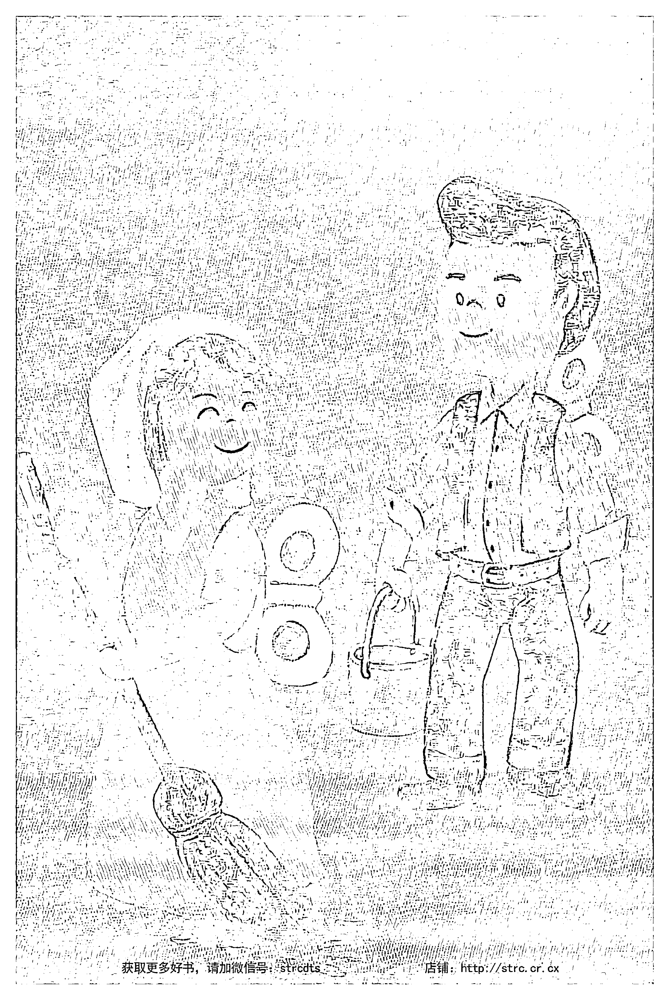

已經影響到全人類的發展，守住地球全部的潛能，甚至讓它發出來。

但是，我相信，你讀到这里，也會發現連這幾句話都是比喻。

不光「地球」本身離不開頭腦的產物，包括「演化」、「人類的發展」、「全部的潛能」也一樣離不開頭腦的運作。是我們還認為有個地球、有個人間可談，我才會提到默觀，就好像默觀還有一個角色或功能可以發揮似的。

反過來，一個人假如徹底醒覺，最多只剩下一片寧靜。

## 23 自由

懂了前面談的這些，我們自然解開探討「自不自由」這個主題所帶來的矛盾。

我過去不斷提醒你我，這一生唯一的自由，是不對眼前的狀況做個反彈。我知道，許多朋友不光聽不懂，而且感覺這些話帶來很多矛盾。我們一般人會認為，自己本來就有自由，怎麼可能連自由都沒有？而更難接受的是——要自由，唯一的方法，竟然只是對眼前的事不反彈？自然會認定這是不合理的。

我們很少想到，既然全部都是頭腦延伸出來的東西——這個世界、你、我——都是頭腦的產物，都是虛擬的狀態。在這樣的現實下，假如還要強調我們有自由，本身才是矛盾。

我們一方面不斷肯定、不停強化這個頭腦的虛擬現實，認為它就是真實。那麼，要談自不自由，這本身是個幻想。

讓我再回到之前的比喻，在這種處境下的我們，要強調自己是自由或不自由，其實和在沙漠裡著迷於海市蜃樓的那個人沒有兩樣。這種辯論，本身並沒有什麼意義。我們即使耗盡一生談這個主題，一樣也沒有什麼意義可談。我們在這個人生可以體驗到、感受到的一切，全部都是頭腦的產物、頭腦的東西。任何結論，我們可以得到的，都是在一個虛擬的境界裡得到的幻想，跟真實不相關。

我們對樣樣不再做一個反彈，也只是充分活出這個領悟——肯定眼前的一切都是頭腦的產物，而不需要再去做一個反彈。如果還有什麼要「做」，最多是輕輕鬆鬆讓眼前的一切自己來，自己走，自己展開自己。

業力本來是生命最根本的機制，只是我們平常看不到。這一來，我們反而突然看到業力的動機，它怎麼來，怎麼走。業力，本來是全部痛苦的根源，突然之間，業力不再干涉你我，回復它本來的中立。就好像業力放過你我，我們也放過它。

既然業力是個限制或束縛的機制，從人間的角度來看，唯一的自由最多也只是不把自己等同於它。對這個機制，不再帶一層肯定，隨它自己運作。只要抱著這種態度，不去進一步承認這個機制，不陷入這個機制而跟它一起運作，它自然也會離開你我。業力是虛的，從這個人間的角度，我們的自由最多也只是——不跟一個虛構的機制再產生任何關係。

當然，從整體來看，其實什麼都沒有發生。你我做不做，跟整體也不相關。你我本來是自由的，而這一切本來都不存在。在這上面做文章，或對業力抱持什麼態度，對整體，也沒有什麼意義。

假如把業力當作頭腦的產物，這麼一來，一個人輕輕鬆鬆讓業力來，讓業力走，最多是當作一個見證者。頭腦也就不再有一個落差、差異和摩擦，念頭也起不來。業力既然是頭腦的產物和機制，也跟著起不來。它來了，你沒有對付它，只是放過它，它也就輕鬆地散掉了。

這也就是唯一的一個自由，我們在這個人生可能有的。面對虛的東西，我們不是去干涉它，不是去刻意轉變它而再帶來一個阻礙。反而是不理它，讓它輕輕鬆鬆轉過去，浮出它自己。

我才會說，不繼續肯定這虛擬的世界，是唯一可談的「自由」。不去反彈，最多也只是不斷地肯定眼前所看到的一切就像海市蜃樓，只是虛擬的境界。同時，不反彈，也就等同於我們不斷肯定、承擔自己真正的身分。這個身分，比我們在人間所看到的一切，遠遠更大。甚至，可以說是不相關。

其實，這一生唯一有的自由，也只是知道你我本來就是自由的，從來沒有不自由過。我們只是隨時落在人間的意識層面，也就突然認為自己不自由，而還有一個自不自由好談的。

這樣子，一個人會突然發現自由就是自己的本質，從來沒有離開過。只是回到這個人間，也就失去了這個自由，而讓人間的自由騙了我們一生。人間的自由其實不是真正的自由，只是配合業力的運作，而帶給我們一個虛的自由的觀念。

我相信你已經理解，連這句話，一樣最多是個比喻，本身並不符合理性或邏輯。其實，就連「自由」兩個字都還含著一種對立，好像還可以分別自由和不自由。畢竟，假如眼前所看、體會到的，都是頭腦的產物，都是幻覺，不去肯定它，是我們本來就該做的，跟自由不自由不相關。最多，我們只能借用這樣的比喻來表達，承擔我們真正的身分，而這個真正的身分和人間一點都沒有關係，這才是我們唯一可談的自由。

自由，最多也只是肯定，我們老早住在一體或全部，倒沒有任何動機在別的地方找到什麼，而把它認定成真實。「樣樣都可以放過」本身就是不斷地肯定我們這種領悟。

自由這種說法，最多也只是表達我們的理解——知道過去被騙，現在透過醒覺，再也不會讓它繼續騙我們。這個領悟，本身最多也只是在反映 *netti netti* 「不是這個，不是這個」。

這種提醒，其實帶來了你我這一生唯一的一把鑰匙，讓我們從幻覺走出來。透過這種不合理的自由，在人間對任何狀態，不要做進一步的反彈，我們就已經在不斷肯定最後修行的結果。

這個結果，本身最多也只是一體、全部、在、心、絕對、空。除了祂以外，什麼都沒有。甚至「有」、「沒有」跟真正的我也一點都不相關。假如還可以提出來任何東西和我們的本性相關，又是一個因—果造成的束縛，不過是讓我們繼續糾綁自己。

## 24 謙虛

如果你讀到這裡，一點都不驚訝，認為符合自己的理解或領悟，而且這些領悟隨時在心中浮出來，你也自然懂了什麼叫做謙虛。

我在這裡講的謙虛，是大謙虛。

我們既然知道，一切都是頭腦的產物，那接下來，也不需要去改造這個世界。甚至，沒有世界可以改造。世界本身，不過是頭腦再加上業力和因—果的作用。我常常說，這種改造，就像我們看到在一個海市蜃樓的畫面裡，一個人想救駱駝，甚至想種點花，

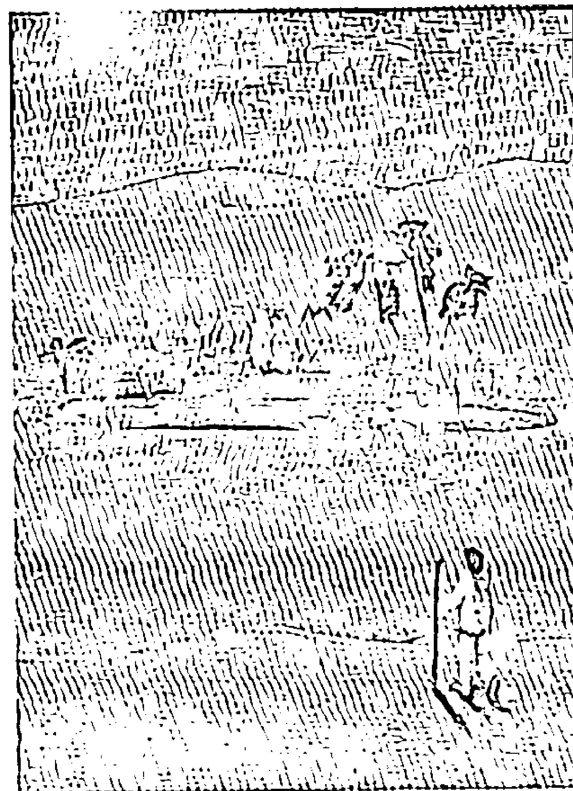

種點樹，好好改善沙漠的土質。從旁觀者的角度來看，當然會覺得這是不可思議的可笑。一樣的，我們非要去改造一個虛構的世界，把我們個人人生的目標和一切的意義，跟這個世界的改變全部綁在一起，本身也是一個大妄想。

我過去才不斷地說，一個人要先把自己找回來，徹底理解自己是誰。找到了，自然知道還有沒有世界可救。就算還有一個世界可救，至少知道接下來要怎麼去救。也就是說，把自己找回來，自然是比人生其他的作業都更重要。

大謙虛，最多也只是領悟到前面這幾句話。知道一切在這世界都是剛剛好，沒有一個角落需要修正，全部都是過去因－果的組合。面對因－果的種種組合，我們沒有資格，也沒有必要去判斷好壞或它該不該發生。其實，發生本身是虛構的。站在整體，什麼都沒有發生過，更不用講還有什麼東西應不應該發生，或甚至還需要修正。

這麼一來，我們全部自然可以放過。心裡也明白，就連「放過」都只是比喻，不需要去提。畢竟全部都是虛擬的，講「放過」，等於又再加了一個不需要的層面。好像我們不光肯定眼前虛構的現實，還要多做一個動作來放過它。

一個人真正的謙虛，是體會到沒有什麼東西可以放過的，也就讓任何東西——好好、壞壞、傷痛不傷痛、歡喜不歡喜、好命不好命、喜歡不喜歡、公平不公平、愛不愛、被愛不被愛——全部，都讓它來，都讓它走。我們再也不需要去干涉它。

這種領悟，我們也可以帶到愛、歡喜、寧靜，任何我們認為是生命的特質。

我們自然會發現，沒有什麼人或東西可以愛或不愛，甚至沒有東西可能帶來歡喜或不歡喜，寧靜、不寧靜，完美、不完美。最後，我們連一句話都講不出來。沒有一句話，能歸納我們眼前看到的一切。

定一切，我們最後才自然體會到什麼叫做絕對。而絕對本身，就是沉默，歡喜，愛，寧靜，一切。

## 25 你還有什麼責任可以承擔？

讀到這裡，我相信你已經發現，自己的許多問題或是障礙，並不是想像得那麼嚴重。甚至，也沒有什麼絕對的重要性了。

既然一切都是頭腦的產物，沒有什麼重大的失落是我們不能克服的，或是會帶來身心永久的傷害。

甚至，進一步，我們可能發現，其實，沒有人想傷害我們，也沒有東西是刻意給我們帶來刺激。甚至，也沒有什麼東西可以或需要改變我們的生命。

我們過去所做的區隔——好壞、順不順——其實都離不開頭腦的作業，而一切都是頭腦在做分別和區隔，延伸出一個好、壞的觀念。我們其實不是受害者，也不是加害者，什麼都不是。突然發現自己什麼都不是，我們才開始真正的自由起來。

接下來，我們其實不用再去追究責任。畢竟，也沒有一個「我」或「你」可以承擔任何責任，這本身都是頭腦的幻覺。「我」本身只是頭腦的產物，去怪罪「我」，更是不需要的。我們沒有必要追究自己或別人犯過的錯，也沒有必要去分析過去種種的經過，無論這些經歷曾經帶來多大的傷痛。

我們突然發現，過去所重視的，認為對每個點點滴滴的動作都要承擔責任，這個觀念本身也是個大妄想。不光責任本身是人間化出來的一個虛構的現實，而且，就連「誰」可以負責，都不存在，根本還是頭腦的產物。要談責任，最多只是帶給自己不需要的負擔，讓我們在人間所建立的遊戲裡，不斷地肯定遊戲的規則，要扮演其中某一個角色，接下來還對這個角色再加上種種的評價。

談這些，倒不是說一個人就要突然「不負責任」，認為可以傷害別人或做不妥當的事。假如有這種理解，本身又是個大的誤會。畢竟，只要我們認為這個世界存在，當然還是要受業力法的作用，也會從業力得到妥當的後果——好的或壞的。一個人徹底看穿這個世界，完全明白這世界是頭腦的產物，才會突然體會到，業力本身也離不開頭腦的運作，跟真正的自己老早已經不相關。

但是不用擔心，一個人真正看穿這個世界，反而每一個動作、每一個念頭都會是友善的。即使清楚知道週邊的人、事、物、世界都是頭腦的東西，他還是選擇對全部週邊的生命，不光是人類、動物，還包括植物、礦物，都表達最高的尊重。透過這種善意，不斷肯定自己跟週邊是平等的。知道一切都是頭腦的產物。肯定自己，肯定週邊，最多也是對整體不斷地肯定。透過每一個動作，都帶來恩典。

我前面所強調的，是希望你我走出人間的失落，不要再繼續分析自己或別人過去犯了什麼錯，不再苦苦回想是不是當初沒有做什麼或講什麼，人生的結果就會不一樣，甚至還想回去彌補。這種責備或懺悔，不光沒有給自己帶來一個出口，反而讓我們不斷陷入過去虛構的現實，要透過人生一再重複、再重複過去的悲傷。

反過來，一個人突然知道，過去、現在、未來全部的生命，都是頭腦的產物，也就突然肯定了生命最原初的力量，或生命的流。明白這一生，從出生到現在，自己所體會到的，全部都老早已經是註定。是我們離不開業力的法，離不開頭腦的運作，認為樣樣都是真的、都堅實，才受業力的捉弄。

既然全部都是註定，去計較、去後悔、去刻意轉變，都是多餘，只會給自己帶來更多痛苦。曉得這個業力所安排的一切，本身還是頭腦的運作。而且，正是我們過去肯定它，才一次又一次地限制、束縛自己。我們才更需要進入生命的另一個軌道，做一個徹底的反省，接下來不斷地提醒自己——真正的自己，其實跟這個人間不相關。

我們有一個完美、永恆的部份，讓我們隨時把祂找回來。

完美與永恆，等著我們隨時承認我們就是祂。

就那麼簡單，我們也就自然脫離過去所有的痛苦和悲傷。不要再帶來一個對立。甚至，連一個肯定都不用再做，也就讓它透過我們掃描過去。

這種隨時的領悟，才叫做臣服。

臣服，本身含著最高的理解。而這個理解，最多只是我們肯定自己的地位。這個地位，最多也只是一體。是絕對。是愛。是平安。是歡喜。

全部這些特質，跟我們人間的問題都不相關。人間沒有任何事可以相提並論。雖然如此，我們也知道這就是我們這一生想活出來的，只是過去認為祂是人間某一種相對的特質，而讓我們不斷在人間追求。沒想到，過去追求的切入點或方向都是錯的。

這種臣服的理解，跟“I Am.”是一樣的意思。無論唸或不唸出聲音，這時候，我們其實都在一個肯定當中——肯定這個宇宙有一個遠遠更大的力量，會帶著我們走出來。無論眼前多大的失落、多大的損失、多大的悲傷，祂都可以帶我們走出來。我們最多是相信，而把自己全部交給祂。

最後，我們在人間走出來或不走出來，成功或失敗，都不重要。連這一生醒過來或不醒過來，也不重要了。我們可以投入一體，肯定一體，交給一體，已經是最高的真實。接下來再多的變化，包括醒過來或不醒過來，都是多餘的。

我才會說，「全部生命系列」是最好的心理療癒。但是，並不只是重大的失落、悲傷和創傷才需要這種心理的療癒。其實，我們每一個人都需要。

畢竟，我們只要一生到這個世界，才張開眼就已經受到創傷。突然之間，我們落到一個念頭的境界，而把這個念頭的境界完全當作真實。然而，這種念頭虛擬出來的境界，最多只是無常。有了生，一定會有死。有好，一定會有壞。有快樂，一定會有痛心。這種無常，就是你我這一生都要體會到的，沒有一個人可以逃掉。

這種創傷，大到一個地步，會讓我們每一個人忘記自己的身分，我才會透過《集體的失憶》來談，希望你我能想起自己真正的身分——真實，一體。

## 26 頭腦其實不是你的朋友

我過去提過，頭腦最多只是我們的工具，讓我們可以在這個世界操作。但一般沒料想到的是，頭腦本身就是我們全部人生問題和煩惱的根源。

然而，這麼講，也並不完全正確。其實，煩惱本身是頭腦的產物，跟頭腦一樣是虛的，沒有一個本質。假如我們仔細分析任何煩惱和失落，也會發現都是一樣的，根本沒有實質好談。

雖然如此，我們生在這個頭腦的世界，隨時都在頭腦的架構裡運作，即使明白這一點，也沒有用。我們當然還是受到頭腦和世界的影響。

頭腦要運作，一定要透過不斷地比較，才可以產生意思或得到意義。假如突然失掉比較的功能，或是這個比較對過去的推理造出矛盾，頭腦當然會受到刺激，感到威脅，也就好像自己會被消滅一樣。

我們通常講「我」會受到生命的威脅，也是一樣的意思。我們每個人都有一種最深的恐懼，也許是怕被淹死，也許是怕被火燒死，也許是害怕自己沒辦法達到別人的期待。會恐懼，就是因為小我會抵抗，不光是不希望自己生命被消失，甚至，就連在別人的眼裡也不希望被消失。不只是失去這個身體會帶來威脅，就連失去念頭，也帶給頭腦同樣的危機，等於是推翻了它全部的存有和價值。

只要有任何威脅它存有的可能，頭腦一定會抗議，甚至自然把它排除。假如排除不掉，頭腦自然會帶著我們延伸這二元對立，讓我們走到最後，沒有第二條路。接下來，最多只能附和它。

我才會說，頭腦不是我們的朋友，它最多是「我」的夥伴。它存在的用意，完全是為了強化、肯定小我的存在。

比如說，頭腦可能讓我們對這個人間不滿，希望找出一條路。但是，所找出來的，總是全部落在物質的層面，一樣還是頭腦的東西。舉例來說，一個人如果窮，會希望有錢。被人瞧不起的，就希望能成名，想要有地位。沒有這些，會讓我們覺得不如人，甚至心裡受傷。

但是，可以試試看，就是這些希望都滿全了，我們接下來還是會不滿足。前面也提過，透過「享樂適應」的機制，讓我們對快樂的期待只要一得到滿足，接下來就進入一個不快樂的狀態。我們也就突然又把目標轉到別的地方，一樣還是頭腦的東西。就像在人間，好像永遠有一件事要等著我們去完成，而這個清單是忙不完的。

也有少數的朋友，可能對世界不滿，而往內心投入。但這種傾向，一樣還是頭腦的運作。這些朋友自然會認為，內心或更微細的層面，是比我們這個世界更踏實，好像比這個人間更值得投入。在新時代的圈子，我認為這種心態是特別明顯。一個人會自然更投入脈輪的練習，追求微細能量的變化，透過種種轉變、包括各種看不到但可以體會的現象，建立另一個虛的現實。

為此，我不斷提醒，透過這個身心是不可能解脫的，不可能透過它可以回到一體。一個人進入再微細的狀態，一樣還是頭腦的產物，和永恆的無限是在不同的層面。走到後來，也只會充滿失望，認為自己修行幾十年還是得不到答案。最後，也只好回到本來所不滿的人間。或是，可能再一次鼓起勇氣，再找另外一位老師，投入另外一個法門。

我才不斷地透過「全部生命系列」，想做一個直接的對話。這個對話，是心對心的對話。只有心可以聽懂，而不會產生悖論。透過頭腦，這裡或其他作品的許多觀念，自然會帶出矛盾，而為頭腦提供一個充分的理由將它排除。

我認為最有意思的是，我過去舉辦過一些活動，希望每一位朋友直接用心來體會。一個人只要很誠懇地投入，自然會發現透過這些活動，心會達到沒有念頭、很平安的狀態。甚至，體會到一種過去沒有體驗過的歡喜。但是，一開始追究在這個活動學到了什麼，可以分享什麼、轉達什麼，有什麼知識可以消化，也就又回到人間的一個小角落，讓頭腦的運作又浮出來。甚至，接下來他可能就開始貶低、否定或質疑，認為這些活動也沒有原本想像的那麼重要。

我只能這麼說，頭腦可能去重視或是去取得的「東西」，沒有一樣會跟我們的本質、本性有任何共同點。一個人要徹底醒覺，首先心態要有一個徹底的轉變。接下來，把每一個念頭，眼前看的境界，都變成平等，而不特別去重視它或特別去排斥它。可以讓它來，也可以讓它走。

我會強調用「平等」的態度來看一切，是因為你我就是想排斥任何東西，也排除不了。任何東西，本身是虛的。你用來排斥它的工具，甚至「誰」在排斥，一樣都是頭腦虛構的產物。排斥、拒絕或捨棄，本身又進入了另一個錯覺。這其實還含著臣服的理解。我才會強調，讓頭腦來取消自己的念頭，本身就是從一個幻覺，再延伸一個幻覺，甚至延伸出第三個，來處理第一個幻覺。這種手法，就像過去大聖人所講的，假如把念頭當作小偷，就像請小偷來充當警察，幫忙我們抓小偷，表面上是不可能的。

從這個角度，我相信你可以理解，要透過靜坐突然醒覺，一樣是不可能。靜坐，無論任何方法，只是帶來集中，更深層面的專注。讓我們把看的人、看的東西合一，也就是消失念頭。不光如此，靜坐是從「有」、從人間出發——還有個人在靜坐，還有靜坐，還有要專注的對象。然而，靜坐、在靜坐的人、專注的對象，本身都是頭腦的產物。我們不可能把自己落在這個人、這個身心，可以醒過來。這一點，和前面所說的道理是一致的。

消失念頭，最多是讓給一體一點空間，讓它浮出來。最後，我們不是透過這個身心可以找到一體，而最多只是把這個阻礙（頭腦）挪開，一體自然就在眼前，就在心中。

要做的，其實比我們想的更簡單，最多只需要跟一體全部接軌、插對頭。什麼意思？一個人，最多只需要透過頭腦，肯定自己本來就有的身分。而且，只是一再的肯定。雖然前面提過表面上不可能，但很有趣的是，你讓念頭集中在一體，不斷地想到一體，和一體合一，也就不不知不覺被祂吞掉了，被祂拉到心裡面。

畢竟，我們這一生本來就完全是一個洗腦的過程，從生到死，沒有一刻不在洗腦。那麼，我們為什麼不反復的洗腦？徹底把自己的身分落在全部、一體——本來就有、現在就在等著我們的部分。這樣一來，不知不覺，也就被自己吸收進去、被祂吞掉。這，才是真正正確的方法。

只是一講方法，就會發現自己又已經被帶走了。~~因為，這是個沒有方法的方法~

怎麼說？這種「方法」，最多只是在肯定真實。只是在承認你我本來就有的。所以，也不能稱為方法。然而，這是古往今來的大聖人都懂，也是唯一的一個「方法」，讓我們這一生可以跳出來。

全部的修行，到最後，也只是懂這一點。

我才會不斷地講，一切，甚至連修行，我在這個世界所看到、聽到的，跟事實都是顛倒的。也就這樣，我才會不斷提醒你，這裡所帶來的練習，最多只是一種提醒，提醒自己本來就有，本來就是的。而且，事實是剛好相反，並不是這個本來就有的部分沒有了或消失，而最多只是我們自己透過念頭，好像蓋掉了這個本來就有的部分。

但是，這麼講也不正確。要去蓋掉，也是做不到的。是我們完全迷失在身心當中，才有一個蓋掉或浮出來的觀念可談。前面這些話，還是站在這具身心的角度在看一體。

假如我們隨時住在一體，也就自然發現什麼都蓋不住祂。只有祂是真的，只有祂存在。其他，都是暫時的，來來去去。生了，也就死了。

一切可以體會到的，我們只要不去干涉它，它們自然會來，也會自然走。唯一剩下的，來不了，也走不掉的，最多也只是永恆。

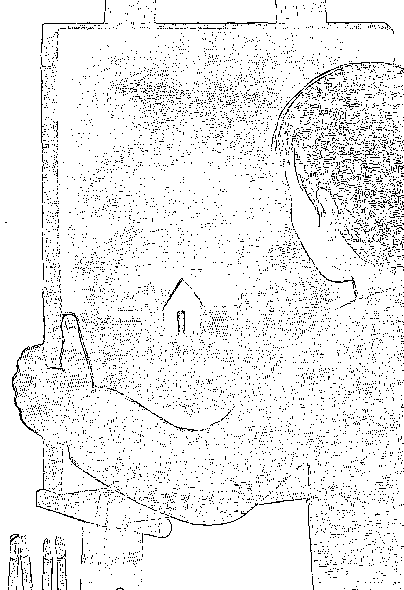

## 27 参的作用

用同样的角度来分析，我们自然会发现，过去所提到的参，最多也只是在肯定——一切，都是头脑的产物。一切，眼前人生可以看到、体会到、经验到的，全部都是头脑的东西。

参「我是谁？」、「为谁，有这些念头？」、「为谁，有这些境界？」、「对谁，还有世界好谈的？」全部这些，最多都是带到同一个点。这个点，是在念头起伏之前。是还没有一个点的点。本身，是一个绝对的观念。

参，是希望提醒我们，追察到最后，从一个相对的范围（人间的变化）得不到一个最终的因。最后，只剩下「空」或是「绝对」。

許任何語言或念頭來描述的。只要還可以描述出來，還是一個相對的觀念，是我們頭腦的運作。

跟前面所談的一樣，參最多是一個提醒，倒不是一個練習或靜坐的方法。它只是承認我們已經在家了。既然在家，最多只是不斷提醒自己。

這種反復的手法，我認為是唯一符合事實的方法。把修行的結果、過程和整個方法，全部都落在同一個層面。而這個層面，最多只是絕對或一體。也就好像透過這些方法，一體最多只是在提醒自己就是祂。除了祂，沒有第二個體——沒有別人，沒有別的東西，沒有小我，沒有其他的人，沒有世界，沒有任何東西可談。

這裡用「提醒」來表達，其實也不是那麼正確。一體不需要提醒自己。最多是我們迷路了，把自己的身分搞錯了，才需要透過提醒，把自己找回來。如果真的還需要用語言來表達，或許比較貼切的說法可以是 “relaxed to Yourself” 輕鬆地放鬆到自己。放過、放下全部頭腦的東西，我們才突然可以放鬆到自己。

我才會不斷強調，醒覺，就是我們的本質。沒有醒過來之前，我們已經是一體。醒過來後，還只是一體。在這之間，什麼都沒有發生，只是透過這個身心做了一個回轉，突然可以反射到自己——真正的自己。

假如你真心相信這幾句話，從每一個反應、每一個念頭、每一個想都認為是真實的，你的人生會完全改變。但是，講人生改變，又是一個妄想。這個人生本來就是頭腦的產物，不存在，是虛構的。又要怎麼去改變？

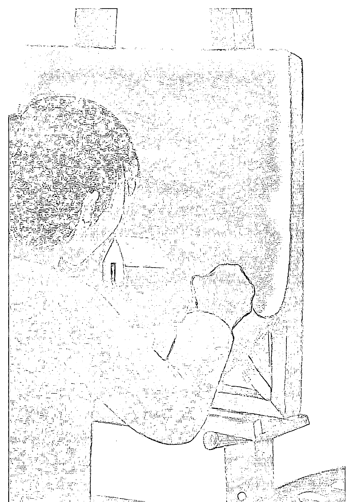

## # 28
It's all OK.

你自然會發現，我透過「全部生命系列」想表達的，也就是這麼一點。

真正的重點是非常簡單的，簡單到一個小孩子都可以聽懂。就好像他受頭腦的污染，不像我們受到的那麼多，自然有一種心的聰明（我們稱智慧）可以讓孩子聽得懂。我過去喜歡帶領孩子讀經朗誦，把他們交給古時候的大聖人。讓大聖人帶著他們，面對這個人間。也就好像讓他們還沒投入到人間，就已經讓他們走出來了。

雖然從我的角度來看，其實就是那麼簡單。但你會發現，我已經用了多少篇幅來表達這一點點內容，試著用各種角度切入，就怕你我還是聽不懂。只是，我相信你已經發現，其實連這種擔心也是矛盾。畢竟，本來就應該聽不懂、看不懂。無論是聽和看，都離不開頭腦，而頭腦不可能會隨便被消滅掉。看不懂、聽不懂是再理所當然不過的。

你讀到這裡，也可能已經發現，我在之前的作品帶出來許多最簡單的方法，看起來像是遊戲，本身其實含著最深的意義。比如說，我在很多場合帶出 It’s all OK. 一切都好，一切都剛剛好。許多朋友告訴我，就這幾句話，帶他從人生走了出來。無論人生遇到多大的問題，帶著這句話，都可以跨過去。

我們仔細觀察，從人生這樣子走出來，其實是帶著一種理解。理解什麼？——一切都是頭腦的產物。

既然一切都是頭腦的產物，為什麼我們還需要去抗議、去抵抗、去刻意轉變或改善虛構的業力？只要去抵抗人生，我們最多是在肯定這個虛擬的境界。還認為有一個人生需要去變更，有一個命需要去改。

我們徹底了解這個虛擬的現實是怎麼來的，那麼，肯定一切都好，最多只是在肯定——它有它自己的運作，我們可以稱為業力。而且，因為它符合一個法，本身還有一個壽命好談。但是，這個壽命、這個法，跟我們真正的自己不相關。

我們肯定一切都好，最多只是把自己帶回我們真正的身分。知道自己就是一體，一體就是我們，從來沒有分手過。最多只需要透過「一切都好」，看穿眼前帶來的畫面。

我們大家都可以試試看，隨時肯定「一切都好」，念頭自然減少，我們也就自然進入一種生命的流，而放過這個生命。該做的，生命會帶著我們做，倒是不用擔心。這一生來，要完成什麼，自然也會完成。然而，完成或不完成，已經徹底不重要了。我們知道，全部這一切，都是頭腦的產物。重視它，或不重視它，本身也是多餘的。

這麼一來，我們才真正自由起來。我們每一口呼吸，突然變長，也就好像是第一次真正的深呼吸。透過每一口呼吸，我們最多只在提醒自己真正是誰，和天地，全部都合一了。

這一口呼吸，也把它當作最後一個呼吸。我們每一個瞬間，自然拉長，也就變成了永恆。我們突然發現，自己自然活在 eternal now——永恆的現在。

## # 29 就是 As Is

It is as is.
It is always already as is.
It is just as is.

既然我們懂了一切都好……
一切都是如此。
一切本來老早都如此。
一切只可能如此。

假如這幾句話，你都可以認同，那就太好了。如果你可以徹底做到或體會到一切都 OK，而隨時可以讓這種領悟浮出來，你自然也會發現，OK 或不 OK 還是人的投射，本身還是頭腦的產物。是我們人的判斷，才希望刻意加上一層 OK。

眼前的任何東西，跟我們認為好不好，其實都不相關。眼前的東西，本身就是頭腦的產物。無論我們肯定或不肯定，最多是在一個虛構的架構裡，再做一個虛擬的肯定。都是多餘的。

這種練習，最多只是給我們帶來一個頭腦的剎車，讓我們突然體會到——宇宙不會刻意來欺負我們。我們不是什麼受害者。也沒有走什麼冤枉路。這一來，自然可以從自己的煩惱跳出來。

最多只是這樣子。

一個人也就自然進入沉默。接下來，也不會去肯定或不肯定眼前的一切。最多，只是讓它來，讓它走。知道眼前的任何現象，不光是人事，包括任何東西，都是頭腦過去的運作組合延伸出來的。跟我們真正的自己——一體，最多只能說做一個重疊。我們可以輕鬆地選擇不去干涉——不干涉一切，讓一切掃描過去。就像雨或風飄過去，而我們自然選擇定在一體，定在全部，定在絕對。

倒不是從一體看著這個世界，最多，只是輕鬆的覺。

覺什麼？都不重要。我們知道，人間的一切已經是老早安排好的。然而，我們真正的自己，倒不靠人間的任何變化或眼前的現象來定義。

這種信心或信仰，我過去把它稱為大的信仰，是一個人臣服到真正的自己，把這個小我交給大我，甚至交給全部。接下來，只剩下一個東西，我們沒辦法描述出來，最多只能稱為「覺」。

我過去在很多場合提到，無夢的深睡含著這一生最重要的一把鑰匙。假如一個人可以清醒地知道自己在睡覺，而隨時在白天清醒的時候，或夜裡做夢的時候，都知道，一個人只可能是醒覺的。

知道什麼？最多只是覺。

覺察到什麼？什麼都沒有。最多還只是覺。

相對地，一個人在白天清醒的時候，也隨時可以體會到無夢深睡。無夢深睡跟清醒已經完全不分，也就自然懂什麼是覺。

覺，不是覺察什東西。只要我們還有一個東西好談的，又落到一個相對的層面。

我希望以後在別的作品再多談一些。以前，我不敢輕易談，因為我相信幾乎沒有人能聽懂，但是，走到這裡，你應該已經可以摸到一個邊，稍微可以聽懂。我在這裡最多只是交出一個話頭，希望你可以把它參透。

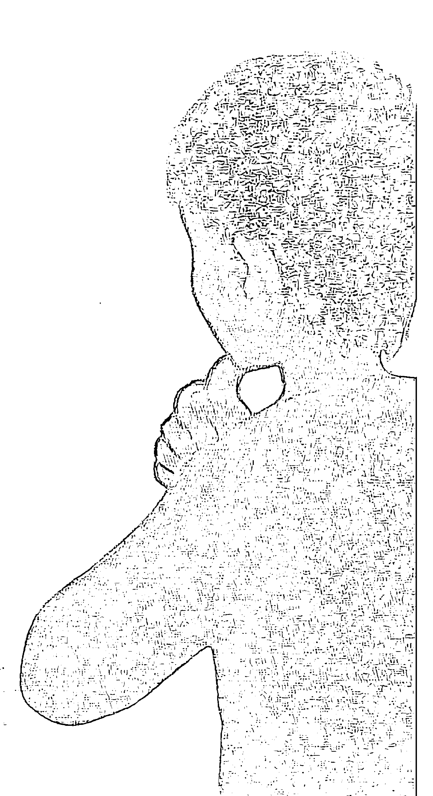

## 30
為什麼不醒過來？

假如臣服、參、‘It’s all OK.’全部最多只是在做一個反覆的提醒，那麼，你可能會想問，究竟什麼是修行？而修行的目的又是什麼？

我相信，你自然會發現，其實沒有一個東西叫修行。反過來，從古至今所談的修行，本身還是一個頭腦的產物，離不開一種虛擬的追求。好像認為透過「修行」，我們可以把真實找回來。

但是，站在真實的角度來看（假如可以這麼說的話），一切都是永恆。從來沒有一個生，也沒有一個死，哪裡來的修行可談？不光沒有一個修行，人生也沒有一個目的或用意可談的。如果我們可以從人生得到一個目的，這本身又只可能是頭腦的產物。

有些朋友，聽到這幾句話，會認為我強調的不過是「空」的觀念。一樣的，這種認為也只是頭腦的產物。我們一般人講空，是當作一個「有」的對等來談，並沒有真正領悟到什麼叫做「空」。所以，我過去也很少用這個字。

我發現，就連這一點觀念，和一般人所體會到的又是剛好顛倒，才會用全部、一體、在、心、神、佛性、本性來描述祂。

一個人隨時可以輕輕鬆鬆醒過來，因為確實沒有一個東西叫醒覺。我才敢這麼講——只要誠懇地下一個決心，也就醒過來了。醒覺，不靠層次，不靠方法，沒有過程。祂本身就是我們的本性。最多，我們只要承認祂，住在祂。

除了祂，沒有其他的東西。其他的東西，都是虛構的。站在其他的東西來看祂，不光是一個幻覺，還相當可惜地要耽誤這一生的生命。即使一次又一次地回來，也還只可能是站在外面，看著裡面。當然，從外面，看著裡面，這本身也只是一個個人的選擇。是自己把身分搞錯了，才有這種狀態好談。

假如一個人已經知道，沒有一個東西叫醒覺，也就醒過來了。也就發現，有些修行人辯論是頓悟還是漸悟，是突然還是逐漸的醒覺——這種辯論本身就是個大妄想，只是在「相對」和「絕對」之間的差異著手。而這個切入點，是完全沒有必要的。

醒覺，是一個絕對的觀念。那麼，當然只有徹底而突然的轉變，不可能還有中間過渡的層次或階段。就連講「頓悟」，都還不正確。因為「悟」可以說比頓還頓，比突然更突然。相對和絕對，是兩個不同的軌道。假如還是要找一個方法來表達，最多是「頓悟」，但其實比頓悟還更頓悟。

這個比較，也就好像想從「有限」一步步走到「無限」。「無限」是超過任何世間的觀念，不能用任何世間的觀念去概括。假如我們用時間講「頓」或「漸」、「突然」或「逐漸」，這本身又是一個時間的陷阱。這時，我們還是站在局限的腦在說話。整體，是無限大的永恆。祂不允許任何時間的觀念。只是我們受到語言的限制，最多也只能勉強用「頓悟」來表達。

這也是為什麼，我不斷強調，沒有什麼方法有這個力道會讓你醒過來。甚至，\"It’s OK.\" \"I Am.\"「我一在」這些練習，也不會讓你醒過來。假如它們有作用，最多是扮演一個提醒的角色。

然而，一個人假如清楚了，都懂了，為什麼還不選擇醒過來？既然知道全世界都是頭腦的產物，就連頭腦，也還是頭腦的產物。那麼，為什麼不要選擇醒過來？這一點，只有你我自己可以回答。

醒過來之後，會發現過去認為是真實的，全部都一樣是頭腦的東西。連全部的法，包括「全部生命系列」想表達的，還是頭腦的產物。一切，都沒有絕對的重要性，也不可能有絕對的重要性。

醒過來之後，發現走了許多冤枉路，才終於明白。但是，明白什麼，也講不出來，最多是有沒有走過什麼冤枉路。其實，就連這一點反省，本身還是妄想。沒有什麼路可走，也從來沒有走過。連這個路，也是頭腦的產物。你這個醒覺過來的人，更不用講，一樣是頭腦的產物。

接下來，最多，只是涅槃。

## 31 「在·覺·樂」又是什麼？

過去，我花了很多篇幅談什麼是「在·覺·樂」（sat-chit-ānanda）——一個人住「在」，也就輕輕鬆鬆在覺，而透過覺，自然進入樂。我指的是大喜樂，大歡喜。

然而，到這裡，我們會突然發現，任何觀念，甚至連「在·覺·樂」、大歡喜、大愛……只要可以表達出來，全部還是頭腦的產物。

畢竟我們還是要用語言去溝通，也就借用這些字眼，來表達一種無法言喻的狀態。無法言喻，因為祂是一個絕對的範圍，不可能用一個相對的語言來表達。最多是用語言稍微靠近，略略點到。

重點是，這個講不出來、無法表達、無法言喻的絕對的狀態，是我們每一個人輕輕鬆鬆可以進入的。它本來就是我們的本質。然而，重點還不是進入不進入。它不是透過「進」或「入」可以進入的。最多，我們只是需要承認有這個狀態，而自己的身分本來就是這個狀態。我才會說，它是一種不費力的狀態，隨時在等著我們。

這樣的狀態，我們透過人間的變化或東西，當然是找不到的。畢竟，只要一講出來，一落成「話」，在我們頭腦又造出一個相對的比喻，讓頭腦可以去不斷做比較。

雖然，在人間，我們沒辦法真的去理解、去體會這些狀態。但是，好像從某一個層面，我們都懂。甚至，我們每一個人都體會過，而自然會珍惜它們，隨時想把它們找回來。

這個觀念，可能又跟我們一般人的想法是顛倒的。就是我們每個人本來就有，只是有時候又認為失掉了，才自然會想把它一再地找回來。就連我們神經和頭腦的架構，一直都在準備我們可以去得到祂。我在《短路》提過，我們就連在深睡都可以體會到無思所帶來的一種最深的平安、最大的休息，就好像在某一個層面，我們其實都記得。

這些狀態本來是我們的本質，只是我們居然都忘記了，反而把這些狀態變成我們往外追求的目標。我們每個人這一生也就好像在追求愛、快樂、平安。這些狀態，也自然變成我們人生最高的目標，最高的追求。

然而，這些狀態，不只是我們本來都有的本質。一個人徹底醒過來後，其實不會用「在·覺·樂」或任何形容來表達自己的狀態，最多只是停留在沉默。他沒有什麼東西要跟別人分享，更沒有什麼作品會想留下來。最多只是平安地透過每一個瞬間，體會到不可思議的奇蹟，而發現這種狀態是每一個人本來都有的，也沒有什麼特別稀奇而好去表達、專注它或和別人分享。

這也就是「全部生命系列」所帶出來最大的悖論。然而，這個悖論是頭腦不可能理解的。最多，是把它活出來。

## 32 那麼，修行又在修什麼？

修行，其實是為「我」才有的。假如沒有「我」，沒有什麼東西叫修行。任何修行，都是透過「我」。最多對自己做一個反省、理解，知道這個小我是虛的——這才叫做修行。甚至，連我在這裡談的臣服、參，再加上「I Am.」都還是頭腦的產物。（作者註）1

1 | 我在這裡要說明，提出這一點，並不是我對任何修行的工夫或練習有任何負面看法。事實上，我個人在很多場合和活動也喜歡用各種瑜伽和靜坐的方法帶著大家練習，不光可以讓頭腦專注，對健康也有很大的幫助。

重點其實不在於做或不做這些練習或要不要下工夫，而是在於我們做這些練習的起心動念。懂了這些，透過「全部生命系列」，反而可以為你我本來的練習做一個互補，而讓練習發揮更大的作用。一個人只要清楚，可以放下「我」，在這些練習上反而可能還做得更好（假如好不好對你還重要的話）。

講到參，我用這裡的四張圖再做一個比喻。

一個人本來好好的活在一個虛擬的世界，把全部虛構的現實當作真的，從小到大，都很認真的投入這個生命。但是，總是有一天，成熟了，突然發現好像生命不至於只是眼前所看到的現象，自然好奇——開始尋、開始找眼前真實的來源，也就這樣投入了參。

### 我想知道
問題是怎麼來的，
我想要療癒，
想知道創傷怎麼來的

突然，我們透過頭腦產生一個疑問「世界怎麼來的？」「頭腦怎麼來的？」「問題是怎麼來的？」「創傷是怎麼來的？」一個虛的體，產生一個虛的念頭，再加上一個虛的提問，而可以得到一個虛的答案。接下來，答案，當然是——我，我製造這虛的世界，虛的念頭。

到最後，問這個問題，當然沒有回答。也就透過這種方法，讓念頭裡這個虛的人，體會到沒有一個東西可以產生念頭。甚至，也沒有東西可以稱為念頭。我們再怎麼追根究柢，都追查不到它的根源。

> 誰，認為這是真的？
誰，認為有受傷？

是透過這種參，貼著一個虛構的念頭，一直走到虛構的根源。到最後，發現什麼都沒有，沒有頭，也沒有尾，甚至連問的人都沒有。

也就這樣子，一個人頭腦打開了。自然知道，全部想找的答案，就是自己。除了自己，其他，什麼都沒有。

這個自己，本身就是一體，是全部。停留在祂，本身已經找到了全部的解答。接下來，一句話也講不出來。一個念頭，也懶得想。

原來自己從來沒有離開過家。

只是因為有念頭，才認為離開過家。

臣服，最多也只是停留在自己，肯定自己就是全部過去所想找的。肯定我們老早已經圓滿。在我們自己之上，加不上任何一個東西。甚至，就連一個念頭也加不上，也不可能跟真正的自己相關。臣服，最多也只是肯定真實，而進一步再肯定沒有一個東西叫做真實。

「I Am.」或是「我-在」，最多也只是在提醒自己真正的身分。這個自己，本身就是全部。也就是神。就是主。全部都是，也同時全部都不是——祂跟是或不是沒有關係。只要我們想去表達、描述祂，又增加了一個虛擬的層面。最多，只能用「我-在」來提醒自己——自己就是在。到處都在。在到底。這個身體還沒有生出來，就在。這個身體走後，還是在。沒有一個東西不在。

走到這裡，所有的練習，包括反復的提醒，其實都是多餘。都是在一個虛構的樓台上，再多加一層。好像要給它再多一點重量，讓這棟本來就沒有的樓台可以倒塌。

塌到哪裡？哪裡都沒有。出發點，本來就沒有任何東西。

沒有，就是我們的全部。

你看，我們還可以怎麼表達呢？還可以用反覆、參、臣服、「I Am.」或任何用詞來表達嗎？

## 33 輕輕鬆鬆，做一個見證者

這麼一來，一個人發現，在這個人間可以看到、體驗到的，沒有一樣還對自己有什麼稀奇，而會想再重複去體驗。最多，只可能做一個見證者。

雖然我之前在許多作品提過——最多，我們對人間不要產生作用或反彈，做一個見證者，在一旁默默地觀察也就夠了。但我相信，你也許過去還沒有真正了解。然而，現在再讀這些話，可能會有另外一個層面的領悟。

一個人如果全部的慾望都沒有了，沒有任何人間的追求和期待，自然會發現，面對眼前樣樣的現實與現象，我們都可以站在一個被動的角色觀察一切——觀察眼前的東西、眼前的人、自己和眼前人的互動。

然而，誰在觀察？自然也不會再去追究。知道一切都是從整體延伸出來的，連眼前海市蜃樓般的幻相，也是從一體延伸出來的，都離不開一體。

也就這樣子，「『誰』在觀察『什麼』？」這個問題也就不會再起伏了。

一個人也就好像在這個人間看一場電影，而自己好像還同時在電影裡面扮演某個適當的角色。一邊扮演這個角色，一邊欣賞這個電影。最多也只是這樣子。

一個人如果可以這樣子輕鬆退出這個人間，會發現，這個人間任何一個角落，自己都在。甚至，任何角色都可以扮演。這一生想來做什麼，就做什麼。但是，這個世界，跟自己已經沒有關係，不會影響到真正的自己。

這種信心是完整而全面的，讓我們面對任何狀況、任何事情時，都知道不需要離開自己真正的身份。只是完全站在一體，站在全部，去面對這狹窄的生命。

這麽一來，一個人也可以輕輕鬆鬆地度過任何表面的難關。好事、壞事不會再重視，也不會再進一步區隔。最多，只能說心裡是安靜的。念頭需要動，自然會把它動起來，完成眼前的作業。接下來，也就把念頭收回來了。也就這樣子，一個人輕輕鬆鬆度過這個人生。

最有趣的是，一個人不斷地做一個見證者。自然發現，透過這個見證，可以一直沿著注意的根往回走。走到最後，自然進入一個最原始、最純的覺。我們也會發現，平常假如觀察到什麼東西，就已經被虛擬的世界給帶走了。而最純的覺，倒不是見證到什麼東西。只是好像有個微細、輕鬆的知道，而知道什麼，倒不重要。只是清楚的覺。

清楚的覺，並不是覺察到什麼東西。假如還有一個東西可以覺察到，我們也已經被這個東西吸引走了，已經又落在一個感官的意識層面，繼續建立一些東西。

可以覺，而什麼都沒有在覺，但還可以繼續再覺，不斷地覺，這本身，就是最純的覺。

祂本身就在反映絕對。也是我們的本質。不光是每一個人都有，甚至，連動物、植物、礦物都有一個東西沒有。我們這一生還沒有來，就已經有了之後，還是有。假如每一個瞬間，最多只剩下覺，自然就讓每一個瞬間連起來了，變成永恆，永恆的現在。

我們也就清楚，要回到這個覺，祂本來就是我們的本質，倒不需要用任何靜坐或其他修行的方法去達到。靜坐或任何修法，反而最多又帶來一個境界或狀態。一樣靠不住，早晚會消失。只有回到我們本來就有的本質，才最踏實。祂本身，是最穩定的狀態。是我們來之前，走之後，都還在的狀態。

這麼一來，一個人隨時可以投入人間。動、做、講話、處理事、欣賞東西，而用完了頭腦，也自然退回到覺，做一個見證者。

一個人透過這種最根本的覺，自然會發現，從早到晚，我們都是覺醒過來的。無論是在白天的清醒，還是晚上睡覺、做夢或是深睡無夢，一個人隨時都在覺，都在做個見證者。也才會發現，其實沒有一個第四個狀態或 turiya 可談。

這個覺，在每一個角落，每一個時點都可以體會到。祂跟我們這個人間從來沒有分手過。是因為沒有分手過，才可以隨時不費力找到祂。但是，這種找到，不是透過任何動作，最多只是我們的注意力放鬆或退回到源頭。

假如我們在意識層面真要追根究柢，還要談一個最根本的根源，那麼，「覺」本身就是最根本的狀態。祂本身是個完全放鬆、完全不動、隨時都在的狀態。

也就那麼簡單，我們輕鬆地完成這一生來最大的目的。

最後，連這幾句話，都還是比喻。站在一體，沒有什麼東西叫做見證，也不需要做任何見證。任何見證，不光多餘，本身還一樣是二元對立，還是頭腦的東西——要有一個人做見證，有一個東西被見證，才可以談見證。

一個人，和一體合一，最多在存在。接下來，也沒有什麼必要去做見證。就是他懶得見證，認為任何見證都是多餘，而自然無所不在。也就這樣子，樣樣都可以見證。

我們頭腦聽到這幾句話，可能認為又是一個悖論。但是，確實是如此。

## 34 透過沉默，找回自己

一個人進入見證，隨時停留在覺，也就可以輕鬆地放過這個世界，做到《聖經》提到的“being in this world, but not of this world”（活在這個世界，但不屬於這個世界）。也就發現，這個世界，完全是個虛構的境界。然而，我們也不用在這上面再加一層個人的意念、反應或反彈，而在虛的架構內，又延伸出更多業力。

走到這裡，一個人反而真心希望將這一生告一個段落，不光不要再延伸業力，還可以讓過去的業力輕鬆完成自己。怎麼來，怎麼去，真正的自己其實都不會在意。再怎麼困難的事，我們都可以度過，而都還可以隨時停留在覺。

過去，我們會覺得這個世界不公平，認為自己是受害者，還要隨時檢討自己做錯了什麼？為什麼我們隨時會被傷到？隨時充滿哀傷、自責，面對生命沒有安全感，認為別人想刻意欺負我們，或認為自己過去是罪人，犯了很大的錯，做了很多不該做的事情……這個世界，隨時還是在影響我們。

雖然我們也知道，也隨時可以分析出來這個世界是幻想的境界，是頭腦的世界，全部都是念頭建立出來的。是透過頭腦，不斷強化它自己。讓那些負面的念頭建立很堅固的迴路，不知不覺讓我們重複再重複這些經驗，而把這些經驗當作現在、眼前唯一的現實。哪怕我們都知道，但還是不斷地受影響。念頭帶來的吸引力，幾乎讓我們沒辦法打斷，甚至看不到邊。

過去，最多是記憶。記憶是念頭。

未來所有的顧慮、窩囊和煩惱，也只是念頭。

甚至，現在所體會的一切，還只是念頭。

從古人到現在都知道，我們能做的，最多也只是放下，放過這個世界。現在，做一個見證者。

一個人已經徹底知道，這個世界完全是虛構的。自然選擇輕輕鬆鬆停留在「在」，停留在沉默。

本來一個人可能很外向，總是不斷地動，不斷往外尋找注意。突然發現，自己可以寧靜下來，讓注意力回到自己，自然變得安靜。生活習慣，也會跟著改變。從外在的世界，突然收回到內心，一個人自然寧願沉默，勝過音樂、看書、思考、任何其他的動。

這種沉默，和靜坐所帶來的沉默，是不一樣的。

靜坐的沉默，是透過注意力和眼前的客體合一（將注意力和靜坐的對象合併），讓我們得到一個專注。但是，靜坐結束，我們也就自然被這個世界帶走（或帶回來），接下來心裡不安穩，或是意識變得稍微遲鈍，還需要一個重新適應的過程，會感覺一種不對勁。

然而，我在這裡講的沉默，是自然的沉默，是我們每個人都有，隨時可以找回來的沉默。祂本身就是動和動、念和念之間的空檔。甚至，就是沒有這個空檔，我們也可以體會到。祂其實是我們最根本的狀態。

停留在這個沉默，不是透過意識集中或注意可以得到，而是輕鬆地回轉到祂，放鬆到祂。這種沉默的力量，比我們任何人想像的更大。沉默當中，才有這一生全部想找的真實。

這種沉默會讓人脫胎換骨，讓頭腦休息，帶來一種徹底的寧靜。我們生命的一體才可以浮出來，沒有一個頭腦的東西可以干涉祂，可以遮住祂。

只有透過沉默，我們才可以和全部的意識、一體插對頭、接軌，進入沉默，準備我們投入人生最後一個階段，讓我們徹底回家。

這種沉默，我們每一天都可以體會到。

我們一般以為——在睡覺的時候，頭腦沒有作用，最多只是在休息，暫時停止動作，而認為清醒的狀態才是正常。然而，無夢的深睡，其實就是一種沉默。雖然我們不知道，但我們醒過來，會感覺到很舒暢、很休息。

這種無夢深睡的狀態，和醒覺的不同只是我們自己不知道（醒覺過來，我們是清醒的知道）。不光我們無夢深睡時，不知道自己在沒有夢的深睡，每一天晚上做夢，也隨時被夢帶走。

雖然睡著和醒著，兩個都有做夢的狀態，但是我們一般只可能體會睡眠的夢。晚上做夢，我們醒來，可以清楚發現剛剛是夢，就好像什麼都沒有發生。我們知道這個夢是虛構的，也通常不會再追究，不會去多想，也不會有什麼情緒。我們平常清醒的時候，反倒不知道這個世界一樣是頭腦的產物，一樣是夢裡的世界。

只有透過沉默，我們才會突然體會到，所有狀態都一樣的，全部都是做夢的狀態。而我們這一生全部想找的答案，都在沉默當中。祂可以化出這個世界，可以把我們隨時吞掉，把我們帶回家。

我們仔細觀察，全部修行的方法，包括參，包括臣服，走到最後，最多也只是把這個身心帶到沉默的門戶。比如說，參，到最後，是沒有答案的答案，也就是沉默。臣服到最後，只剩下什麼？也只是沉默。

甚至，連持咒或是重複默唸「I Am.」「我-在」，到最後，自然會發現，不要說連咒語都唸不出來，就連想唸的動力都消失。最後，也只剩下沉默。

我才會說沉默是最高的真實，是最深刻的法。

一個人要等到完全確實徹底醒過來，才會發現這一生相信是真實的東西，全部都是假的，突然體會到 “That which is real is no-thing. That which seems to be real is nothing.” 唯一真實的，是沒有東西，不是東西。過去認為是真的的一切，現在，反而竟然都是假的。

一個人到這裡當然會發現自己被欺騙了，被誰欺騙？是被自己念頭的世界欺騙了。這時，通常會大哭。知道这一生从出生到现在都被骗走，而且是彻彻底底被骗走。原来，全部过去的痛苦、烦恼、失落都不存在，都是头脑制造出来的。而自己过去都是在一种被催眠的状态，竟然会把头脑的产物当作唯一的真实。

怎么可能会被骗得那么明显？它的吸引力怎么会那么大，让我们完全不知道自己在做梦？

这个泪，会流不完。不只是这一生的泪，还是为过去百千万次，一次又一次来的人生而哭。透过泪水，但愿让过去昏迷无明的业力，消失它自己。这种解脱的大哭，是发现——一个人怎么能那么彻底受骗，连梦的边都看不到，完全投入进去，还认为自己这一生真正想完成什么事情，成就什么东西，想成为什么人物。

体会到这一点，一个人最多是继续沉默，自然有舍离。再也不会被这个世界骗走。再也不会让世界吸引到自己，让自己过不去。

當然，也有人這一生很年輕，沒有透過練習或任何修煉，不知不覺就醒過來了。他反而不是大哭，而是大笑。只是，人類有史以來，這樣的人可以說是少之又少。這種醒覺，當然是過去不曉得多少輩子修行的成就。他的福德，超過人間所能想像。但是，對我們一般的情況來說，醒覺過來，還是會大哭。

無論如何，醒覺過來了，最後也只是剩下沉默。

## 35 非醒來不可

假如我們讀到這裡可以承認——一切，都是頭腦的產物，我們也就會發現，無論用語言表達任何道理，這種表達本身就不可能正確，還只是一種頭腦的產物。

甚至，我們在「全部生命系列」所表達的觀念，也一樣受到邏輯的限制，本身也沒有什麼代表性。不光如此，我們會發現，這一生到此，我們在人間所學到的任何東西，其實都不存在，甚至可能和事實都是顛倒的。

但是，講它不存在或是顛倒，這本身又加了一層分別。也許可以說好像存在，又好像不存在。好像存在，是因為我們的五官可以體會到這個世界所帶來的變化，也就好像有。好像不存在，是因為它在一個很狹窄的相對的範圍內運作，不要說站在整體，只要從這個小範圍稍微跳脫出來一點，它本身又是不成比例的小，對整體沒有什麼代表性。然而，這個不成比例小的一點點，也就是我們來這一生可以學到的全部。

一個人自然也會明白，不光任何世界的東西、任何觀念都是虛的，都是頭腦的產物。甚至，任何期待，包括性的欲望、人和人之間的親密，都不可能帶來永久的快樂。最多也只是產生人間更多的欲望，繼續延伸它自己。

到這裡，自然什麼期待都沒有了。任何可以追求的念頭，也已經消失。甚至，連醒覺的念頭，也都沒有了。這麼一來，也就不知不覺醒過來了。就是沒有醒過來，自己也無所謂，也不再重視。樣樣都不重視，反而接下來只有一條路可能走下去——醒覺的路。這個，可能是你我這一生含著的最大的悖論。

全部我們可以體驗的，或是人類歷史所留下來的知識和觀念，站在整體，沒有任何一項會有什麼代表性。甚至，我們最多可能講是顛倒的。

人類的演化，並不總是連續的。我們認為演化是向外展開的，愈演變，愈發達。卻沒想過站在整體來看，人類的演化其實是愈演變，愈狹窄，分別愈重——把虛構的，變得愈來愈肯定，衍生出更多幻覺。

怎麼說？不光我們這個現實是虛擬的，我們透過人工智慧和各種感官模擬的整合，還想在這個虛的現實裡，進一步衍生出 2D、3D 甚至更多維度的虛擬實境。我們只要看看現在的小孩子（大人也一樣）多麼投入電腦或手機裡的遊戲，就可以理解到我這裡所談的人類未來的發展，是怎麼樣在虛構中衍生出更多的幻覺。

但是，總有一天，走到最後，透過人間的聰明，我們會突然明白——再怎麼演變，一切還是頭腦的產物。

那時候，我們突然從人間跳出來。跳到哪裡？跳到一體。

這一來，才會突然發現，我們過去認為「有」的東西，包括人類的歷史，一生累積的物質或知識，全部都是虛構的。連演化，都是顛倒的。最終的演化階段或方向，最多只是讓我們回轉到生命的根源。也就這樣子，知識和智慧才可以結合。我們人類的發展，也才會告一個段落。

站在整體，沒有剩下任何空間，可以允許別的體或真理存在。跟祂比較，沒有一樣東西的重要性會成比例，或是足以稱為究竟的真實。

這一點，才是真正最高的真實。讓我們體會——這一生所學的，全部都不正確，都沒有任何代表性。比較真實的，反而是我們這一生「學不到」的。真正正確的，反而是根本沒辦法表達的。只要還能用一句話去描述，我們已經又回到了一個狹窄的範圍。最多只能一笑置之。用沉默，用自己的行為來表達這最深的領悟。

但是，連這麼講，也不可能正確。既然沒辦法表達，那麼，跟行為、跟沉默不沉默、跟任何動作或不動作都不相關。又有什麼東西可以表達祂？

既然如此，一個人為什麼不好好活下去？最多只是自在。隨著生命來，該怎麼做就去做。該走，就走。一個印記，一個軌跡，都不需要留下來。

一個人，最多也就是輕鬆活下這一生。在活的過程，知道沒有一個人在活，也沒有一個人生可以活的，才說輕鬆活下這一生。

## 結語

我相信，假如我现在提出来对这些作品的期待，你也不会再惊讶了。

我期待的是——什么都没有。

什么都没有。

没有想透过这几本书完成什么，更不用讲还有一个「反复工程」好说的。

我过去用「反复工程」这个词，最多只是一个比喻。说到底，就像莎士比亚讲的 “much ado about nothing” 明明没有事，却生出了许多不必要的是非。

这些作品所谈的，对我本来都是理所当然的事实。只是到了这个年纪，我才大胆跳出来，把这些事实分享出来。然而，讲跳出来，也一点都不正确。从哪裡跳或跳到哪裡，本身都還是幻覺。我最多只能說，是透過這些作品，把我個人的一點點親身體驗做個分享。

我很有把握，有一天，這裡所分享的，全部都會被科學完全驗證。其實，嚴格講，也老早已經驗證了，只是缺乏一個全面的整合。怎麼說？站在物理，尤其量子物理，我在這裡所談的，全部都是理所當然，也老早被證明了。但是，因為還沒有落到我們生活中，還好像理論歸理論，而我們在現實生活的體驗又是另外一回事。

然而，我更有把握，這種理論上的驗證，是我們每一個人都可以做到的（假如我們願意拿自己來做實驗）。但是，值得注意的是，「全部生命系列」所談的，其實比我們任何人所想像的都更簡單，倒不需要從人間取得根據。因為只要可以說出來的，指出來的，它本身又是一個頭腦的產物，是二元對立，是一個虛構的資訊。

不過，不用擔心，透過科學全面的整合，來驗證我們這裡所談的每一點，是早晚的事情。只是，我們這一生來實在是太寶貴了，倒不應該耗費在等待科學來整合。

另外一點值得注意的是，追求知識的朋友，反而更要記得，全部生命不是透過知識可以取來的。而是剛剛好相反，是要把所有的知識挪開，才可以讓祂浮出來。

別忘了，我們一般所稱的理性，是站在意識來區隔或分別，本身還是在一個不成比例狹窄的範圍所取得的，並不足以代表生命的整體。

最後，我還是要做一個最誠懇、最坦白的提醒——你讀到這裡，倒不需要相信我所講的任何一句話，而是完全可以拿自己的生命來做驗證。你只要誠懇，而願意敞開心胸，我相信這裡的每句話，你都可以親自驗證出來。

我知道，聰明和智慧是兩個不同的軌道。人間的聰明，再怎麼講，是在局限而相對的範圍。然而，要進入智慧，不是透過聰明。甚至，是剛剛好相反。

我過去才會說，一個人雖然很聰明，但站在整體，他不見得成熟。甚至，有時候要把人間的聰明挪開，他也才準備好了。當然，有些朋友聽到這些話，可能心裡還會覺得不舒服。所以我這三十年來，寧願選擇沉默，而最多是不分享，來放過這個世界。

正因如此，我也不擔心現代人不夠成熟，而把這些書擺到一旁。這對我沒有什麼損失，我也不在意。但我充滿信心，可能幾十年後，乃至幾百或幾千後，等大家成熟，讀到這些話，也就可能突然有個很深層面的領悟，甚至是脫胎換骨的領悟。

可不可能有這種現象，誰曉得？我們也不用去推測。

- 過去的人，是頭腦的產物。
- 現在的人，是頭腦的產物。
- 未來的人，還是頭腦的產物。

從一個假設性的真實，再做這些對未來的假設，本身一樣還是頭腦的產物。

在第十四章，我已經帶出來一個核心的理念 “Everything is within you.” 一切，是從你出發。一切的答案，都老早在心中等著你。沒有一件事，不是從你心中延伸出來的。甚至，全部外在的世界，都還是從你心內流出來的。

在這裡，我想更徹底來彙整這本書所想表達的—— “Everything is consciousness.” 一切，都是意識。無論是什麼，甚至這裡所講的虛擬的頭腦的東西，都還只是意識。最多是反映一個意識譜，從相對，一路擺盪到絕對。

這麼一來，沒有一個東西、沒有一項觀念從真實的角度會比較有代表性。我們所認為的虛擬、虛構，其實站在整體，和真實一樣有代表性，兩者都是觀念。

我才會不斷地說，這一生雖然是虛構的，一個人還是可以好好欣賞它、享受它、完成它。我們知道沒有一樣東西可以說是比較真實或比較虛擬，知道這一點——沒有一項東西值得變成問題，或需要我們將它捨離，但是也沒有一樣東西需要我們特別肯定或特別重視。

在國外，我會跟朋友說 “Enjoy the dream while it lasts.” 這個夢還存在，就享受它吧。但關鍵的是，我們再也不會被這個夢騙走。知道這一點，一個人不可能再有矛盾，而同時可以活潑起來、天真起來，把樣樣都看作是第一次發生、第一次體驗。也就這樣子，我們還住在這個人間，卻老早跳出它，跳出一切。

你看，我用這個方式彙整，是不是和你所想的一樣？還是對你而言，可能帶出更多悖論？

# 楊定一博士

# 文字作品

真原醫 (平裝 316頁 / 附螺旋拉伸DVD)

靜坐 (平裝 291頁 / 附靜坐引導CD)

全部的你 (平裝 381頁)

神聖的你 (平裝 397頁)

不合理的快樂 (平裝 375頁)

我是誰 (平裝 187頁)

集體的失憶 (平裝 158頁)

落在地球 (平裝 179頁)

定 (軟精裝 228頁)

十字路口 (豆裝三本·共589頁·附音頻卡片)

插對頭 (軟精裝 199頁)

時間的陷阱 (平裝 305頁)

短路 (平裝 243頁)

好睡 (平裝 380頁)

無事生非 (平裝 245頁)

即將出版《清醒地睡》

獲取更多好書，請加微信號：strcdts

店鋪：http://src.cr.cx

# 影音作品

螺旋舞 (DVD + 123頁)

結構調整 (3 DVD + 215頁)

蛻變・重生 (一日共修課程) (4 DVD + 小冊)

這裡・現在 (一日共修課程) (4 DVD + 小冊)

# 音聲作品

等著你 (聆聽手冊 + 4 CD)

重生・蛻變於呼吸間 (聆聽手冊 + 2 CD)

你・在嗎？ (聆聽手冊 + 2 CD)

光之瑜伽 (聆聽手冊 + 4 CD)

真實瑜伽 (聆聽手冊 + 2 CD)

呼吸瑜伽 (聆聽手冊 + 2 CD)

四大的瑜伽 (聆聽手冊 + 3 CD)

# 楊定一博士線上影音課程

https://21days.windmusic.com.tw/

獲取更多好書，請加微信號：strcdts

店鋪：http://strc.cr.cx

## 國家圖書館出版品預行編目（CIP）資料

頭腦的東西：一個真實的新科學／楊定一作．--第一版．--臺北市：天下生活,2019.03
256面；12.8x18.8公分．--（楊定一書房．全部生命系列；17）
ISBN 978-986-96705-7-9（平裝）
1. 靈修
192.1
108002868

## 楊定一書房．全部生命系列0017

# 頭腦的東西：一個真實的新科學
Mind-stuff: A New Science of Reality

- 作 者／楊定一
- 編 者／陳夢怡
- 插 畫／施智騰（Simon）
- 封面設計／盧峻咻
- 責任編輯／陳美宮

- 發 行 人／殷允芃
- 總 經 理／梁曉華
- 總 編 輯／林芝安
- 出 版 者／天下生活出版股份有限公司
- 地 址／台北市 104 南京東路二段 139 號 11 樓
- 讀者服務／（02）2662-0332 傳真／（02）2662-6048
- 劃撥帳號／19239621 天下生活出版股份有限公司
- 法律顧問／台英國際商務法律事務所·羅明通律師
- 總 經 銷／大和圖書有限公司 電話／（02）8990-2588
- 出版日期／2019 年 3 月第一版第一次印行
- 定 價／335 元

ISBN：978-986-96705-7-9（平裝）
書號：BHHY0017P

## ALL RIGHTS RESERVED

- 天下網路書店 www.cwbook.com.tw
- 康健雜誌網站 www.commonhealth.com.tw
- 康健出版臉書 www.facebook.com/chbooks.tw

本書如有缺頁、破損、裝訂錯誤，請寄回本公司調換

你可曾想过——

人間，凡是我们可以用語言表達的（包括「不可說」），最多只是頭腦的產物，會生起，也會消失！？

楊定一博士由意識的科學切入，從頭腦、感官、神經迴路的邊界條件，以及這種運作必然產生的錯覺，一步步答覆人生的大哉問——因果業力、人生的意義、責任、自由、人類的價值、真實。

他一再地提醒，聰明和智慧是兩個不同的軌道。人間的聰明，再怎麼講，是在局限而相對的範圍。要進入智慧，不是透過聰明。甚至，是剛剛好相反。

真正的驗證是——每一個人都可以從心中活出來

看穿人間的一切都是虛構，而隨時可以臣服到真實（語言跟念頭沒辦法表達的一切）才是你我這一生的目的。

本書從各種層面幫助讀者沉澱這一領悟，並將「全部生命系列」所談的反復工程、醒覺、臣服與參做全面的整合。

這一生雖然是虛構，我們還是可以好好欣賞它、享受它、完成它。放下期待，所有矛盾完全解開，你我反而天真、活潑、自在起來。
