# 奇蹟

楊定一/著

## 「全部生命系列」全作品

### 文字作品/
- 《真原醫》
- 《靜坐》
- 《全部的你》
- 《神聖的你》
- 《不合理的快樂》
- 《我是誰》
- 《集體的失憶》
- 《落在地球》
- 《定》
- 《奇蹟》
- 《十字路口》
- 《插隊》
- 《時間的陷阱》
- 《短路》
- 《好睡》
- 《頭腦的東西》
- 《無事生非》
- 《清醒地睡》
- 《我：弄錯身分的個案》
- 《豐盛》

### 音聲作品/
- 《等著你》
- 《重生：蛻變於呼吸間》
- 《你，再嗎？》
- 《光之瑜伽》
- 《真實瑜伽》
- 《呼吸瑜伽》
- 《四大的瑜伽》
- 《最終的真相》
- 《瀑布跟水滴的靜坐》
- 《岩漿的靜坐》
- 《森林的靜坐》

### 影音作品/
- 《螺旋舞》
- 《結構調整》
- 《蛻變：重生》與《真理：現在》一日共修營
- 《原醫運動新觀念》

### 「全部生命系列」YouTube頻道
https://reurl.cc/7GVlQ

### 楊定一博士。全部生命系列專頁
https://www.facebook.com/TheTotalityOfLife/

從《真原醫》到「全部生命系列」。楊定一博士最新隨身音頻、共修講座視頻、全系列作品問答，與你我一起活在「心」，共享存在的喜悅，進入全部生命的無限。

合作、採訪與演講邀約，請洽康健雜誌出版行銷02-25078627分機260

## St. Royal College
天使神秘学院
- ※ 神秘学资料库
- ※ 神秘学培训机构
- ※ 水晶能量研究中心
- ※ 专业占卜预测机构
- ※ 官方微信：strcdts
- ※ 微信公众平台：strc2011
- ※ 官方店铺网址：http://strc.cr.cx
- ※ 读书交流QQ群：
  - 占星塔罗占卜师交流群：814594478（加入密码：PDF）
  - 神秘学其他综合群：659338717（加入密码：PDF）

微信号：strcdts
天使神秘学院

微信公众平台：strc2011

## 制作说明：

本书由《天使神秘学院》出重金从台湾购入的原版书籍扫描制作完成。为达到最好阅读效果，特地把书全部切开后，再经由专业扫描设备高精度扫描完成，并经过一张张的PS后期处理最终成书，其间花费大量的人力、物力以及时间，只为能给大家提供经济并优质的神秘学学习资料而努力。

本学院强力谴责某些机构和个人，把本学院花心血制作完成的电子书籍，包装后直接放在自家淘宝网上低价倾销的行为，以谋取不劳而获的经济利益。如果长此以往最终将无人愿意再为大家花心思制作电子书，那以后可能大家再无新书可读。

为让大家以后能够读到更多的好书，也为了本学院的良性发展。本学院恳请大家尽量做到如下几点：

一、尽量在天使神秘学院的官方网站购买电子书籍。
官网电脑访问地址：http://strc.cr.cx

手机微信购买
请扫以下二维码

手机淘宝等购买
请扫以下二维码

加店长微信号
请扫以下二维码

二、在收到电子书后小范围传阅即可，千万不要公开传播，更别挂到淘宝网上低价销售。

同时为答谢广大支持者，学院电子书将做如下调整：

一、学院会把一些早已收回制作成本的电子书折价销售。
二、最新制作的电子书籍会开放打印功能，大家购买后有条件的可自行打印成书。

天使神秘学院
2020年5月

## 奇迹

### Miracles
作者 楊定一

## 誌謝

寫「全部生命系列」，包括這本書，本身就是個奇蹟最好的實例。我用「奇蹟」指的也只是：我好像最多是提供一個平台，而周邊——無論是人、出現的巧合——也就剛剛好，透過這個平台，把這些書帶出來。

因為這個系列，周邊自然出現一些生命來協助、加持、祝福。比如這本書的編者陳夢怡，用她的效率和靈感，把我不標準的口語表達化為流暢的文字，並且妥當地編輯，讓這些作品能夠快速地出版。

此外，書裡的插圖，本來都是我先用鉛筆畫草圖。後來，一位插畫家施智騰（Simon）突然出現，讓我連畫草圖的工夫都可以省掉，只要直接用語言表達，他畫出來的會比我原本想的更精彩。他的妻子李研慧，之前也為《全部的你》和《神聖的你》畫插圖。他們的到來，都是奇蹟。

我周邊的一些老同事，一樣用他們自己的方法，幫助我一起完成「全部生命系列」的作品。舉例來說，王先堆在公務之餘為我嚴謹地校讀這些作品，也提供個人寶貴的意見，讓這些書更完整。這一點，我衷心感激。柯雲飛教授與邱金國帶領長庚生技推廣健康的理念，同仁在演講和共修現場的熱心和誠懇，更是每一位參與的朋友都可以體會到的。身心靈轉化中心的同仁和呂欣欣長年為大家示範身心健康的原則，陳靜雯為我鉅細靡遺統籌出版和活動事宜，陳錦書協助核對書籍和音聲作品，廖珠君配合演講的作業，也幫助錄製「全部生命系列」讀書會。是大家的協助，再加上康健出版與風潮音樂熱心地推動，透過一種輕輕鬆鬆、不費力的使命感，自然為這些作品帶來一種祝福，也為我省去數不完的煩惱，才讓我有時間可以完成一個又一個作品。

當然，我過去參與的各個團隊，裡頭的主管和同事們，也是讓我不斷地感激。是他們對工作的投入與責任感，才讓我可以輕鬆地看著他們幾十年來不斷突破，得到成就，而讓我滿心歡喜，也衷心感謝。正是大家的團結和共識，我這一生才得以順利完成一些該完成的事，而能安心寫作「全部生命系列」。

這本身就是奇蹟，就好像宇宙非要讓我完成這幾本書不可。

## 目 錄  CONTENTS

誌謝

編者的話

序
- 01 不想出生
- 02 星球的聲音
- 03 我們每個人的光譜
- 04 足球帶來的一堂課
- 05 心裡有太陽
- 06 往心內觀想
- 07 天使
- 08 跳到天花板
- 09 顛倒的唸書
- 10 時空
- 11 從一個感官，跳到另一個感官
- 12 從靛藍小孩，水晶小孩，到人類的未來
- 13 母親的愛
- 14 父親的付出 …… 059
- 15 人生的流浪 …… 063
- 16 成長在巴西 …… 067
- 17 彭姆姆 Sister Emmanuelle …… 071
- 18 神聖的空間 …… 074
- 19 耶穌，透過《聖經》來教我 …… 077
- 20 巴西的小嬰兒 …… 080
- 21 食物鏈 …… 085
- 22 沙灘上的耶穌會修士 …… 089
- 23 尋，尋什麼？自己不知道 …… 093
- 24 卡夫卡 Francis Kafka …… 097
- 25 無所不在 …… 102
- 26 無思無想 …… 107
- 27 杜博斯 René Dubos …… 113
- 28 歌德爾定理 …… 117
- 29 紐約的一家書店 …… 123
- 30 《六祖壇經》...........................................................127
- 31 自由墜落..................................................................132
- 32 內爆...........................................................................138
- 33 從自由墜落，到內爆，再墜落，再內爆 .........................143
- 34 宇宙，用螺旋來說話 ....................................................149
- 35 過去的記憶 ................................................................152
- 36 鏡子裡的人，是誰？ ....................................................156
- 37 市集，一個教室 ............................................................163
- 38 大自然，大愛 ................................................................168
- 39 石頭說話 ....................................................................171
- 40 海底也說話 ................................................................176
- 41 多重宇宙 ....................................................................179
- 42 我是誰 ........................................................................186
- 43 什麼是修行？ ............................................................191
- 44 曼哈頓東河的日出 ........................................................195
- 45 「我」創出來的世界 ....................................................200
- 46. 我不是自由 - 205
- 47. 我的老鼠老師 - 211
- 48. 念頭的世界 - 215
- 49. 南西 Nancy - 219
- 50. 造物主，是誰？ - 223
- 51. 我是全部，我什麼都不是 - 228
- 52. 透過每一口呼吸，我延伸這個世界 - 233
- 53. 享受沒有夢的深睡 - 236
- 54. 佛性 - 239
- 55. 大菩薩 - 244
- 56. 觀世音菩薩 - 247
- 57. 我們每一個人都有的特質 - 251
- 58. 兜率天 - 258
- 59. 藥師佛 - 262
- 60. 苦修 - 265
- 61. 時空也離不開螺旋 - 269
- 62 人間的牽絆 276
- 63 母親與我 281
- 64 各地的老師 287
- 65 閉關 292
- 66 宇宙帶來的下載 298
- 67 自然療法 303
- 68 食物的祝福 307
- 69 生命的一些奧妙 310
- 70 身體的結構來到我眼前 314
- 71 人生的舞蹈 318
- 72 海豚與我 323
- 73 手上的蝴蝶 327
- 74 魚鷹 332
- 75 眼鏡蛇的偶遇 335
- 76 人生的海嘯 339
- 77 集體的力量 343
- 78 孩子的練習 ................................................................ 348
- 79 宇宙對我說話 ................................................................ 352
- 80 重回巴西 ................................................................ 358
- 81 水晶的故事 ................................................................ 370
- 82 飛行物 ................................................................ 374
- 83 海裡的生命 ................................................................ 380
- 84 神聖的槽 ................................................................ 386
- 85 阿拉斯加的療癒師 ................................................................ 392
- 86 能量場的加持 ................................................................ 397
- 87 向過去的聖人致敬 ................................................................ 404
- 88 坎昆的聖人 ................................................................ 410
- 89 樣樣都像雲 ................................................................ 414
- 90 走過鏡子的長廊 ................................................................ 417
- 91 到處都是奇蹟 ................................................................ 420
- 結語 ................................................................ 423
- 後記 反復的工程 ................................................................ 425

## 編者的話

陳夢怡

《奇蹟》這本書，是目前所有寫作裡，最享受的一次。

每一章寫作的過程，都非常單純，只是記下楊定一博士個人的回想，無論情感、敘述、語言都是新鮮的。是什麼，就是什麼。沒有負擔。

寫作的時間，在二〇一七年夏天八月。約莫兩個星期左右，完成了初稿。我還記得，最後一章是在晚上九點完成，比平常工作結束的時間早得多。我換上球鞋，去基隆河右岸走了近兩小時，把完書的感覺散一散。夜風習習，對岸環東大道的車燈在流水與夜色間穿梭。我想著剛剛才完成的這件事。一切，彷彿在一個世界，又不在同一個世界。

相信讀者只要翻開書，就能體會到這一百多張天真爛漫的插圖是《奇蹟》的一個特色。非但每一章都有圖，而且是提前約莫半年就請 Simon 開始作畫。我記得楊博士有時一天就提出四、五張圖的構想，而 Simon 竟然也能一天回上四、五張草圖，這種超乎默契的一致，始終在整本書裡流動。

完稿後，楊博士先分享給幾位朋友，反應多半是很喜歡也很期待。然而，還是有少數朋友不是很理解創作的心情，而甚至把這本書當作楊博士的自傳來看待。當然，現在回想起來，可以明白並不是每一個人都能體會楊博士寫作《奇蹟》的情懷。其實，這本書最多是楊博士對個人的經過充滿感激，而願意拿出一些片段當作實例，親身鼓勵大家活出自己的奇蹟。此外，這本書沒有別的用意，更不足以承擔自傳的角色。

因著這樣的轉折，楊博士也就在《奇蹟》送廠印刷前，請康健出版配合，延後發行。楊博士有時候還會跟我半開玩笑：「我們把稿子鎖到保險箱裡，等哪一天我離開了，再拿出來發表。」我也只好跟著開玩笑：「好啊，最好把密碼拆成三組分開保管。要三個人都到齊了，才可以打開。」

現在回頭看，這個波折完全是剛剛好。畢竟，從經驗去貼近「全部生命」的理念，還是需要多展開一些觀念，讓大家可以有一個深入和親身體會的基礎，而不會只停留在表面的感動與現象。

暫緩出版，對周遭許多朋友有很大的衝擊。然而，在這段期間，楊博士和我還是照常寫作，又完成了《十字路口》《插對頭》《時間的陷阱》《短路》《好睡》《頭腦的東西》《無事生非》《清醒地睡》《我：弄錯身分的個案》《豐盛》這些書。

也許讀者之前已經注意到，「全部生命系列」在《定》和《結構調整》之間的編號10，是一直保留給《奇蹟》的。我想，楊博士選擇這麼做，一方面是為原本的創作順序做一個紀錄，另一方面也是為了將來可以幫助讀者，理解整個創作的流動。

杨博士时常告诉我：「这些书，是宇宙在透过我下载，想表达祂自己。倒不是因为作家想写什么而来的。」两年后的现在，时机到了，《奇蹟》才要出版。

这个过程，对杨博士的创作形式，也是一个决定性的转折点。毕竟「全部生命」本来也不全靠阅读的逻辑去了解，而杨博士本著科学家的性格，样样都喜欢做实验。接下来，也就比较投入影音的作品，尤其是读书会，透过多重媒介的互动，达到心的共鸣，而不知不觉地接触到更多各地的朋友。无形之中，创造了一种心的共振场。这是最不可思议的。

陪着「全部生命系列」走到这里，好像也打破了我对时间的观念。杨博士常跟我说，任何事，该是什么，就是什么。急也急不来，慢也慢不了。话中不急不缓，不徐不躁的心境，对我而言，也就是奇蹟之一。

## 序

楊定一

我會寫這本書，是希望引發你我每一個人回想——自己這一生，從出生到現在，有多少次，遇到不可思議的現象。

無論是巧合，或是一些沒辦法以邏輯、理性解釋的發生，雖然我在這裡稱為奇蹟，但其實是每一個人都經歷過的。

可惜的是，我們每一個人都會把它過濾掉，不光是認為不可能，還覺得需要做種種解釋，來把它「理性化」。我們不光對自己是如此，對小孩子、其他的人也同樣做這種嚴謹的過濾，需要把人生最不可思議、最美的部分做一個分析、理性化，而把這個美消失掉。

透過這種過濾，我們最多也只是不斷強化眼前的「真實」，而這種「真實」最多也只是反映自己的限制和質疑，以及我們對自己與別人種種負面的看法。

我們從出生到現在為止，不斷洗腦自己，洗腦別人，認為全部都應該符合我們的理解與期待。面對任何出乎意料的現象，更往往透過我們自己建立的理解和期待帶來一個反彈——不光認為不可能、不應該是這樣子或那樣子，甚至希望做一個變更，好帶回到我們所認為的「正常」，來符合我們的「期待」。

這幾十年來，我認為這種反應反而是最不理性，對我個人是最不可思議的。

我這一生全部的觀念，可以說都跟一般人顛倒。幾十年來，也就好像在一座沙漠或孤島上，看著這世界。

有時候會掉眼淚，會為了人的痛苦和無明而著急，希望用種種個人的方法做個推翻。

但是，也有時候，又充滿了笑容，看著人的傻勁多麼可愛。清楚看到是一個幻覺，而同時知道——活在這個人生幻覺裡的人，從來不知道這是幻覺。這種天真的嚴肅，是多麼珍貴。

看著人間這樣的劇情，我也只好跟著笑。我想表達，這種「神聖的鬧劇（divine comedy）」，才是最大的奇蹟。但我相信，你我可能從來沒有體會到。

一個人年紀大了，心境成熟了，反而可能鼓起勇氣，做一些其他人認為不可思議的事。我有勇氣寫這本書，也只是如此。

我當然知道提出與自己相關的實例，也可能造出爭議乃至於辯論。但是，從另外一個角度，我又相信——如果我自己不把個人生命的奇蹟拿出來分享，又怎麼有資格談這個題目。

所以，我在這裡把一些個人經驗到的簡單的奇蹟，透過插畫家 Simon 的創意帶出來。最多，只是給你我做一個參考。

首先，這些奇蹟的紀錄，不見得符合實際時間的先後。畢竟，許多經過已經是幾十年前的事。而這些經過，最多是從我個人的角度在看，在表達上不能說是真正客觀。

此外，這些奇蹟，對我個人有多少代表性？坦白講，沒有太大的代表性。還有許多奇蹟，可能比這裡談的實例更大，但是我決定暫時不提。我心裡知道，那些例子對一般人而言，可能玄到一個地步，而不能完全理解。我寧可暫時保留。

我這裡提出的一些實例，是比較容易透過藝術表達的，才先把他們拿出來。

我會談這些實例，是因為捨不得看到那麼多小孩、年輕人甚至成年人，一天下來隨時都有數不完的奇蹟——人生點點滴滴，其實都是奇蹟——卻因為人類集體的文化和觀念的洗腦，而讓我們否決它們。

我相信，假如你可以接受這些實例，也自然可能有一樣多或更精彩的實例可以分享。這一來，我很有把握，人生對你我就不會那麼堅實，也不會只是充滿絕望、痛心而沒有安全感。

更重要的是，我希望透過這本書和「全部生命系列」的作品，讓你我充分體會：一個人，往外在世界去找，絕對找不到人生最後的答案。

相反的是，一個人要完全潛入心，再潛入心，再更潛入內心，才可以找到這一生所希望的全部解答。

更不可思議的是，你我會發現，追求到最後，你我自己就是我們想得到的答案。

也就是說——你我其實不是這短短的生命，不是眼前所見的衝突、心中的難受、感情上的失落、眼淚流不完的悲傷、一個失望，再一個失望。

都不是，你我是——完整，圓滿，神聖，永恆，大愛，大喜樂，大平靜。

答案，從早到晚都在我們自己。

但因為我們非要探出頭往外尋，才一生生耽誤過去。不光永遠找不到答案，反而投入因果的世界。

愈走，陷得愈深。

把我們的原本完全忘記了。

然而，一個人只要往內完全反轉，而且是徹底、一百八十度地反轉。讓內心完全超過外在的喜事、財富、名譽帶來的注意，也就自然重生。「奇蹟」這兩個字，也不用再去追求或分析。

每一個瞬間、每一天、每一個禮拜、每個月、每一年、這一生、還沒有到來的一生、數不完的生生世世，你早已活出奇蹟——大的奇蹟、小的奇蹟、不可思議的奇蹟、人間想不到的奇蹟——全部，你都可以活出來。

假如我講的這幾句話，你不光是不驚訝，而可以完全接受，認為是再明白不過。那麼，我認為這本書，包括前面的作品，也就達到它的目的。

你我也就一起活出生命的奇蹟吧。

# 01 不想出生

很小很小，還不到幾歲，就常聽母親說起我出生的經過來。

我們家四個兄弟姊妹，年齡相近。差距最大的是大姊和二姊，但也只相差兩歲四個月。接下來二姊、我和弟弟，差距都不到一歲半。

在那麼短的時間內，四個兄弟姊妹一一到來。小時候，聽到這些，不曾理解大人的為難。長大後，才真正體會到難處。

更難想像的是，根據我母親的說法，她懷我的時候，其實是過期妊娠（postterm pregnancy）。

一般孕期是三十八週，我在她肚子裡超過至少四到六週。我母親記得是六週。她的記憶，我不知道正不正確，但是我後來確定的是，我出生時，胎盤已經完全鈣化，變成白色。體重超過四千公克，比一般嬰兒都大。就連頭髮都不只一、兩公分長，一點都不像剛出生的嬰兒。

這些話小時候聽只覺得好玩，也沒有特別去注意。後來等我長大，有了醫學的知識，才覺得不可思議。這本身就是個最大的奇蹟。

我們現在都知道，遇到過期妊娠的狀況，死產或胎兒出生後死亡的比例會提高兩倍到七倍。如果是現在，大概沒有一位醫師或準父母會想承擔孩子死亡的風險，一定會考慮催生或剖腹。我出生時，台灣的醫療環境可以說是還在另一個時代，作法和選擇當然也不一樣。

我常開玩笑，會超過六星期，就是因為我不想來到這個世界，一直待到實在待不住了，才出來。

當然，對我個人而言，這個經過還含著其他的用意。想到這裡，我最多也只能滿懷感激。今天我充滿了誠懇，希望透過實際的經過，給奇蹟這個主題一個真實的畫面，才大膽地在這裡提出來。

我提出這個經過的另一個用意，是對我父母的感恩，尤其對母親表達我最深的懷念。他們的愛心，我在生命的很早期就受到感染，才會對生命有不同的看法。這本身也是最大的奇蹟之一。

# 02 星球的聲音

我從小，從有記憶開始，就對這個世界相當好奇，什麼都想問。最常問的問題都是用「為什麼……」來開頭。

「為什麼這樣子？」「為什麼那樣子？」成天跟在我母親後頭問。

回頭想，真不知道她哪裡來那麼大的耐心來面對我，不是隨便應付小孩子，而是每一次都心平氣和地回答。這是我認為最難得的。

我最早可以記得的是——我這一生好像不想來，總覺得一切很不自然。好像在這世界所看到、體會到的種種樣樣，都帶來一個疑問，而延伸出來更多問題。

也難怪要用「為什麼？」來質問眼前所看到的一切。

小時候，我一聽到母親或任何人回答「本來就應該這樣子。」接下來就反問「為什麼本來就這樣？為什麼不是那樣？」想不到，這種反問本身就建立了我這一生的指南針，影響以後幾十年人生的旅程。

更有意思的是，從有記憶開始，我就不那麼相信五官所看到、體會到的一切。好像我所看到的、聽到的、聞到的、嚐到的、觸到的，跟別人所表達的不只是不一樣，還非常不一樣。我很早就學會不跟別人分享，免得別的小朋友會嘲笑，而大人馬上否定，認為是小孩子不懂事胡說。

比如說，我記得，從很小開始，睡覺時，自然會聽到音樂。這種音樂，不是人間可以聽到的，也不是這個世界可以模仿出來的，我現在最多也只能用天音來表達。好像是從另一個維度的空間，透過聽覺，來跟我做一個交流，讓我體會到。

成年後發現，這就是畢達哥拉斯所說的「星球的聲音（music of spheres）」，是反映宇宙最根本的聲音。可以說是別的空間產生的能量，而這些能量最多是透過我的耳朵，轉為人間可以體會到的範圍。

每一天晚上，睡前或睡覺中，我都可以聽到。這音樂會讓我心裡充滿光和喜悅，好像變成我成長過程中唯一的常態，而立即為我帶來安定和放鬆。一天下來，我隨時都在期待。

我也發現，透過這個音樂，我的意識可以跟著它走。跟著它擴大，離開身體，好像到其他的世界去旅遊。

早上醒來，反而很納悶，怎麼又回到身體了。看著身體，感覺跟我無關，好像不是自己的身體。到底是誰的，也不曉得。不知不覺又落回來了。

在成長的過程中，我從來沒跟任何人分享過這些經驗。成年後，就漸漸沒有了。後來深入靜坐，有定的體驗，發現它自然又回來了。這個過程，讓我自然體會到，這本身還只是一種物質上的轉變，接下來也沒有再去重視。

不去重視它，它也自然消失。

# 03 我們每個人的光譜

我發現，不光耳朵可以聽到另一個空間的聲音。其實，眼睛也是一樣。

從小，我看到的任何東西或人，都好像帶著一種光。在我眼中，這個光有各式各樣的顏色，而顏色或顏色的轉變，對小時候的我都有意義。

比如說，一個人很快樂，他帶來的光，和一個憤怒或不舒服的人不一樣。這些光，我看人時，是第一個瞬間就會感覺到的。它本身也在跟我對話，傳遞了很多訊息，讓我省掉很多跟人互動的需要。

一個人也許這一生有許多經歷，他隱瞞下來，不想跟人分享。但是，他的光藏不住。在一個小孩子的眼裡，他等於是赤裸裸的。

這些，我也不方便和別的小孩或大人分享。

不光是我自己可以從眼睛看到的畫面、耳朵聽到的訊息，而得到一種靈感。後來發現，連動物甚至植物也是一樣，好像有一種第六感。我從小就觀察到，一般的動物，尤其是沒有被人類馴養的，對人的氣或光特別敏感，而自然會靠近比較友善的小孩或大人。

這種友善，其實從光，可以看出來。

植物，也是如此。我觀察到，就連植物都想接近充滿善意的人。同時，植物遇到雜音、噪音或邪氣，自然會想避開。這個觀察，我沒辦法跟別人分享，最多是幾十年來反覆驗證再驗證，而最多體會到所有生命都離不開整體，彼此之間都在不斷地互動。

但這些互動倒不是落在我們一般可見、可以聽到的範圍。

透過這些看不見、聽不到的互動，人和動物一樣自然會各自成群結隊，而這個群裡的頻率或說能量場是彼此契合的。這一點，我們很難用邏輯或一般的聰明去理解。從某個角度來說，是一種「不理性」的相應（irrational attraction）。

# 04 足球帶來的一堂課

我小時候除了喜歡看人踢足球，自己更喜歡踢，而且相當投入。在華人中，我應該算是個子高的。就是在巴西人中，也還是比較高，自然覺得自己有點優勢。而且，我發現自己的心更投入足球，所花的時間，完全超過讀書。

當年，我的偶像都是足球球星，包括球王比利（Pelé）。

當時的資訊不像現在這麼發達，我們也只有黑白影片可以看。那時我還小，就會想模仿他的動作。有一次，還不到十歲，在踢足球時，有人傳球給我。我從左後方防守的位置，一個人帶著球跑了至少七十公尺（球場大約一百公尺），越過大概四個人的防守。

在這過程中，我記得一點都不費力，也只是盤著球，一個一個閃過去。現場的家長都在興奮吶喊，但他們的聲音好像距離我很遙遠。

慢慢地，球門出現在我的視野，至少還有二十公尺的距離。我不知不覺，就用兩隻腿的腳踝夾著球，反腳一踢，球從守門員頭頂上過去，輕輕鬆鬆進門得分。

同隊的隊友和家長當然都是大大地讚美，認為這一幕不可思議。連我自己也覺得不可思議。

但是，最特殊的是，整個經過，我沒有去想任何動作。甚至沒有任何雜念。好像是一片空，一片寧靜。在腦海裡面，只有沉默。不過，這個沉默又好像比打雷的聲音還響。我最多只記得這樣子。

這個經驗，讓我好奇了很久——難道一個人不去想，反而可以做得更好？為了比賽得勝，我當然也很想知道，又是什麼時候可以進入這種狀況？

然而，也自然發現這種狀態是追求不來，不是我可以控制的。

# 05 心裡有太陽

除了晚上可以隨時聽到星球的聲音、對別人的光譜敏感，我也不知不覺發現，夜裡要睡覺，但還醒著的時候，如果心裡很安靜，有時候，會有一個光在心中擴大出來。就好像一顆太陽，甚至比太陽還亮。發出來的光會亮到刺眼，帶著溫暖，有時候更是炙熱的。

我記不起來是幾歲看到這顆太陽的，但應該是從有記憶開始，都可以意識到。我還問過母親：「人的身體裡頭是不是有太陽？」「假如沒有，為什麼我可以看到？」

最有趣的是，這顆太陽在擴大的過程，好像會把身體全部都燒掉，包括骨頭。燒完之後，它會自然膨大，自然把房間包圍起來，都是光。

然後，又從房子擴大出去。

我躺在床上，最多也只是跟它一起膨大，擴大到房子之外。這種感受，就好像在空中漂浮，沒有重量。最多只能說很舒服，沒有任何負擔。

每一次，只要有這種光，早上醒來，心情很好，很舒暢。

這種經驗，不曉得重複了多少次，而自然變成我自己的一部分。長大後，也不會特別去回想。

有時候，就連白天，比如踢球或看書的時候，自然發現也有這個現象。甚至，有時，我不知道是誰在踢球，誰在看書。

好像是心裡的太陽，帶著我運動、看書，還帶著我寫筆記。

# 06 往心內觀想

講到眼根的看，我後來陸續發現，可以看的其實不光是外在，也可以往內看——也就是中文所稱的觀想（visualization），而跟我們的念頭、其他感官互動。

我很早就發現自己可以看到一些友善的生命來跟我接觸，我最多也只能稱為大聖人。祂們好像隨時來教我。

我印象最深刻的是，透過天主教信仰所體會到的基督。

一般人提到基督，是一個抽象的觀念，但對我來說是相當具體、相當真實的存在。

我很小就受母親的影響，她是相當誠懇的天主教徒，受到一位抗戰期間認識的修女的感召，為她建立了宗教的觀念。我們都稱這位修女為彭姆姆。我也記得父親常常提起，我母親本來想當修女，對人世的想法都很單純。這些印象落在腦海，自然讓我產生一個問題：「為什麼一個人會想獨身當修女或神父？這種決心是從哪裡來的？」

我很喜歡跟母親接觸。她的話不多，相當寧靜，但是對樣樣有一個很深的看法，和一般人的觀點不一樣。透過她，我自然開始接觸《聖經》。還沒有上學，就熟悉許多經文，也受洗。還當神父的輔祭，每個禮拜天特別期待去教堂。

我記得，其他小朋友到教堂都是想玩。但是，我反而對神父講道特別感興趣。好像懂又不太懂，總是很專心地聽。不知不覺，成為一個神父的嚮往，自然落在我腦海中。

我記得告解時，特別誠懇，相當投入。在這個過程，我自然得到一種喜悅和寧靜，沒辦法和別人形容。

有時候，我可以很長的時間坐或跪在那裡。別人看來是一個小孩子在發呆，但我是完全融入自己的禱告。禱告什麼？現在回想，其實也不太記得。最多好像是在內心建立一個神聖的空間，只是安安靜靜地停留在那裡。

也許五歲或六歲，還很小的時候。有一次，我在禱告，看著十字架上的耶穌。突然，耶穌從十字架上動起來，好像活起來。我看得清清楚楚，就像眼前的真人一樣。他兩隻手打開來，充滿金色、白色的光，慢慢走到我眼前，看著我的眼睛，輕輕地把手掌放在我頭頂上。

這時，好像是閃電一般。

一股熱流從頭頂往下灌，流過我的身體，讓我也充滿著光。光，亮到好像照遍了身邊的一切。這時候，我的心臟好像也停住了。我第一次體會到一種沒有辦法形容的快樂、一種滿足。當時沒辦法解釋，現在也沒辦法解釋。

回頭想，最多只能說那是愛。

這種經驗，後來陸陸續續出現了很多次，一次比一次更透徹。耶穌的光，不只從手掌出來，更自然讓我完全投入這個光。

甚至，最後連耶穌在不在，我也不在意。溫暖、快樂的光，不斷地沐浴我。到最後，只剩下光，連我的身體也不見了。

最多只有光。

這種境界，我這一生只跟母親分享過，因為我知道只有她懂。我也突然體會到，她禱告的過程也是如此。也同時理解，為什麼她可以那麼誠懇，那麼投入。

這個現象，接下來重複了不曉得多少次。一直到我成年、成家，仍然不斷地出現，讓我把找回來，帶給我一種充電甚至重生的感覺。我後來也發現，這種很深的靈性體驗，很多人都有。尤其一個人遇到困難或災難，自然會產生這種狀態。也就是與神合一的狀態。

但最可惜的是，我們遇到這種最美、最自然的狀態，還會需要去分析、去幫它解釋。也就把它消失，變得不自然，甚或「超自然」。也可能把它和宗教連想在一起，認為是信到入迷。

# 07 天使

不光我在最誠懇禱告或祈求的時候，耶穌會來到我面前。接下來也發現自己隨時可以看到天使在我眼前，常常出現。

一般人所說的守護天使，就我小時候的經驗來說，絕對不是比喻，而是隨時可以看到，就好像任何時候都會來保護我。

我也發現很多身邊的人就像天使，比如說我的父母。一直到成年，我還是覺得他們兩位是天上落下來的天使，來保護我，帶給身邊的人恩典和快樂。

最有意思的是，天使其實和我們不在同一個空間。表面上，我是用眼睛看到，但其實他們是存在另外一個層面。

天使不一定是兩隻翅膀，有些是五隻，甚至七隻。小時候覺得很有趣，看到翅膀的數目，自然會去聯想這個人的成就和掌管的範圍。

在天主教的傳統，是一個人充滿善意，死後轉生到天堂而成為天使。也有些是進化程度很高的靈魂（大天使），掌管一個法界。我記得很小的時候，就記得米迦勒、拉斐爾、加百列、約斐爾、亞列爾、愛瑟瑞爾、夏彌爾、烏列爾、沙利葉、以西結、拉結爾、漢尼爾、薩多基爾、尤費爾幾位大天使，我自然會常常重複唸誦他們的名字。每次唸誦，他們也就一一出現在我眼前，也讓我很容易把一個願望化現出來。從小到大，我一直認為這跟向天使禱告和祈求是有關的。

相對地，我也常常看到很多人對立心很重，甚至情緒不穩，有憤怒、不友善的行為，就好像有其他不同的生命跟著他們。這些不友善的生命，也有各式各樣的形貌。我在這裡就不多描述，一直等到我自己再大一點，大約十來歲，才發現這些現象都是頭腦創出來的。

頭腦創出好的念頭、好的形相，當然也相對會有不好的念頭、不好的形相。兩者才有對稱。

到快成年時，我才發現，對稱其實是「人」的法。是因為我們腦的限制，才有個好／壞的觀念，或是有一個天使／魔鬼的分別。然而，再後來我也體會到，這些分別是反映一個人氣脈的轉變。只是因為我們不知道，也就把這種氣脈通暢的變化看作天使，而把氣脈堵住的現象當作不友善的生命。小孩子不懂，自然會好奇，一直想接觸「好」的生命，而自然會認為光比黑暗更有吸引力。

我後來發現，許多小孩子都一樣敏感，可以看到人的光，或看到其他人看不到的現象。但是，這些孩子跟我一樣，總是透過人間的洗腦，告訴自己這不過是意外，不需要跟別人分享，好省掉很多不必要的辯論或爭議。

另外，我還觀察到一個人的氣或光譜，可以透過練習而變化。透過這種變化，所互動的夥伴自然從一個群轉移到另一個群。這一點，我相信我們每個人都體驗過，隨著人生價值和興趣的改變，也自然調整自己朋友往來的圈子。過去很要好的朋友，現在沒什麼話可以談。反而，以前從來沒有接觸過的陌生人，突然跟我們很親密。

雖然如此，透過聽和看，我很早就知道，人間所謂的堅實，其實對我一點都不堅實。假如從那麼簡單的感官，就可以延伸出不可思議的資訊，我們也就可以理解人間所謂的知識，是相當主觀而武斷的，本身就帶給我們限制。

當然，全部這些，當時我也只是放在自己心中。

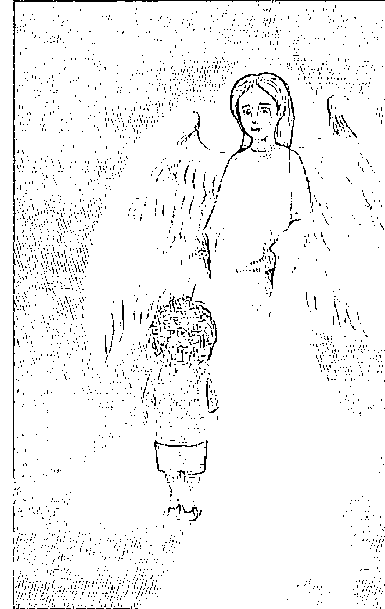

# 08 跳到天花板

我相信，每個小孩子在成長的過程，都會有一些超自然的經驗。也許是從樹上或高處掉下來而沒有受傷；或是突然會一些不曉得哪裡來的語言，可以跟動物或其他生命溝通；或有一些靈感、一些巧合，讓他一生忘不了。

這些發生，對這個小孩來說，相當難忘。但是，跟別人一分有，有時聽起來也就相當平淡，沒有什麼稀奇。對我，這種經驗相當多。

小時候，有一個比較難忘的經驗。約莫八、九歲時，有一天，我和我弟弟在往上跳，看誰跳得比較高，可以碰到上方的門框。我弟弟跳，碰到門框，就畫一個記號。雖然我是哥哥，比他大將近一歲半，但從小到大，他都和我一樣高，甚至長大後還比我高。我當然會想至少跳得和他一樣高。

想不到的是，我不光跳得和他一樣高，甚至身體沒有停下來，還在繼續往上升，再往上升，一直升到天花板。跳起來，腳至少離地面一百二十或一百三十公分。

這種感受很難表達，就好像內臟有一個反重力。身體裡頭甚至有一段是真空，好像沒有重量。不光我自己很驚訝，我弟弟也嚇一大跳，覺得不可能。一直追問我是怎麼回事，是不是在鞋子裡藏了什麼東西。

我記得接下來沉默了很長一段時間。不光是那一瞬間的驚訝，還讓我覺得充滿了自由。

我突然體會到，我其實想做什麼，就可以做到什麼。但是，我通常會被自己限制，認為動物有動物的範圍，植物有植物生長的範圍，而人也有他的範圍，包括跑、跳、學習、任何表現，都有它的極限。

在那個瞬間，我才明白——任何限制都還是頭腦化出來的。我們每一個人的潛能，其實是意想不到地大，只是自己不敢相信。

這個經驗，讓我接下來很多年，直到成年後，都在探討這個問題——人的潛能到底多麼大？

再進一步不斷探討，我們人是怎麼來的？

# 09 顛倒的唸書

前面跳到天花板的經驗，自然會讓我這一生打破很多慣例。我說的慣例，指的是一般人接受或服從的規則。

比如說，我從小到大的學習很順利，一再地跳級，很年輕就進入大學。一般人會以為我花很多時間用功讀書。但是，事實剛好相反。我從小喜歡運動，尤其玩足球的時間遠遠超過讀書。然而，我記得自己有一個提高讀書效率的訣竅——很簡單，就是同時看幾本書。

我記得小時候，剛懂得唸書的時候，就把全部的書放在桌上，不是客廳就是廚房。這本書看看，就到下一本，再到下一本。最多，桌上擺了十本書。一般情況，是放六本。

後來連坐下、站起來的時間都省下，直接繞著桌子站著讀。

從一本書換到另一本書，幾乎是重新開始讀。這麼讀，有個作用，它讓記憶更強化、更鮮明。通常只要讀一次就記得，而考試就不會忘記。大多數小孩會為了考試而特別讀書，但我從來不重視。因為這種讀法，可以帶著一輩子。

後來我發現這方法很有用，比如讀微生物或解剖學，我用「橫式」的方法來讀。例如說，在微生物學講到一個主題，囊括所有不同的菌。一般人的讀法是縱向的，想把一種菌的全部知識一次讀完。然而，這樣比較難記，要重複許多 次。如果用橫式的讀法，一次就一個小主題，把不同的微生物讀完，比較容易記起來。

好多年後，我才聽說，這種我從小就用的方法，有人拿來當作一種強化小孩子記憶的教學法在推廣。誰想得到，我早就這樣子讀書？

其實，很多事我都用不同角度去做。

就像跳到天花板的經驗，我不斷地在測試，把自己的潛能拉到最大，拿自己做實驗。走著和人間顛倒的路，點點滴滴都是相反。想證明我們不需要迎合任何過去的規則或信念來生活、來運作。

這一點，讓我這一生自然對眼前所見的一切打個問號，會在心中問——為什麼？是嗎？為什麼不是剛好相反？

# 10 時—空

我很小就發現自己很容易專注。小時候，一個題目進入我的腦海，假如沒有解答，我通常會發呆好幾個小時。直到想通，才把它放開。從小就喜歡解謎，也喜歡益智類的遊戲。

我尤其喜歡把一個問題投射在腦海裡虛擬的空間，透過視覺，把抽象的問題「看」得很清楚。樣樣的難題，我認為只要用心都可以解答。年紀還很小，就在心裡不斷探討「真實」的問題——我們人類、這個世界是怎麼組合的？

小時候，因為不斷跳級，很早就學代數與幾何。我記得還不到幾歲，就接觸到座標軸的概念。例如我們都知道，空間可以用 X、Y、Z 三個軸來表達。再加上時間，最多是四個軸。

當時，第一次接觸這個觀念，我整個人呆住了，接下來幾天都專注在這個題目上。無論醒著還是睡著了，都在想。

我想的，可能跟別人不一樣，跟數學並不相關。純粹數學的角度，對我當時而言，相當簡單。

然而，在另一個層面，這個題目帶出另一個更大的題目——難道我們用三個軸再加一個軸，這樣組合出來的時—空，就可以代表全部的真實嗎？

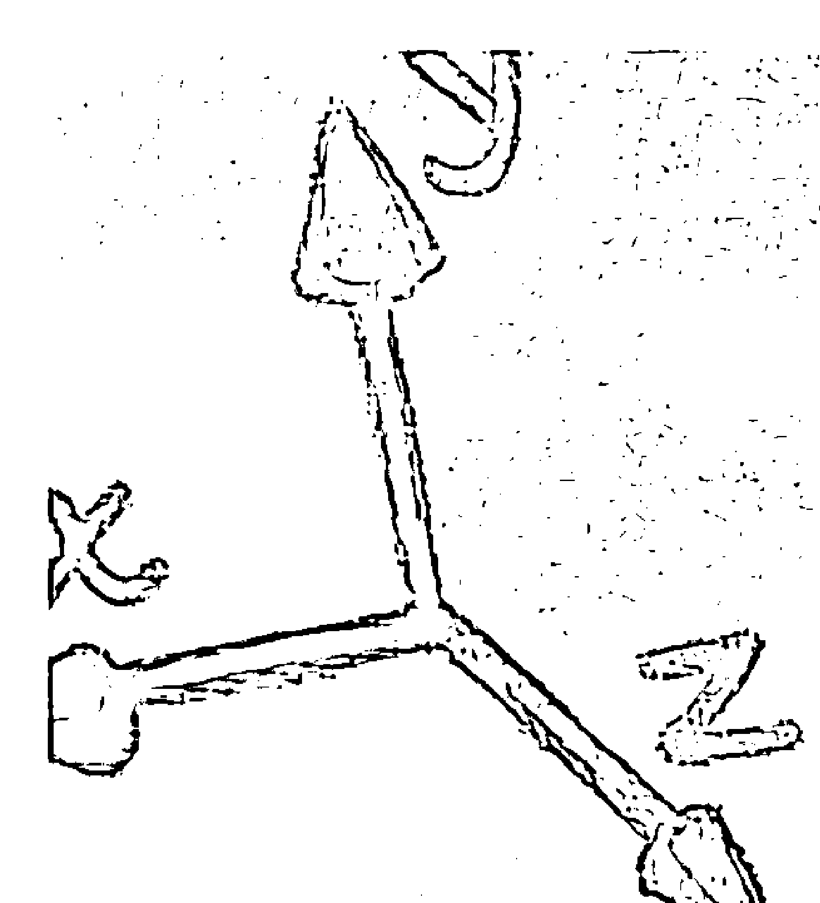

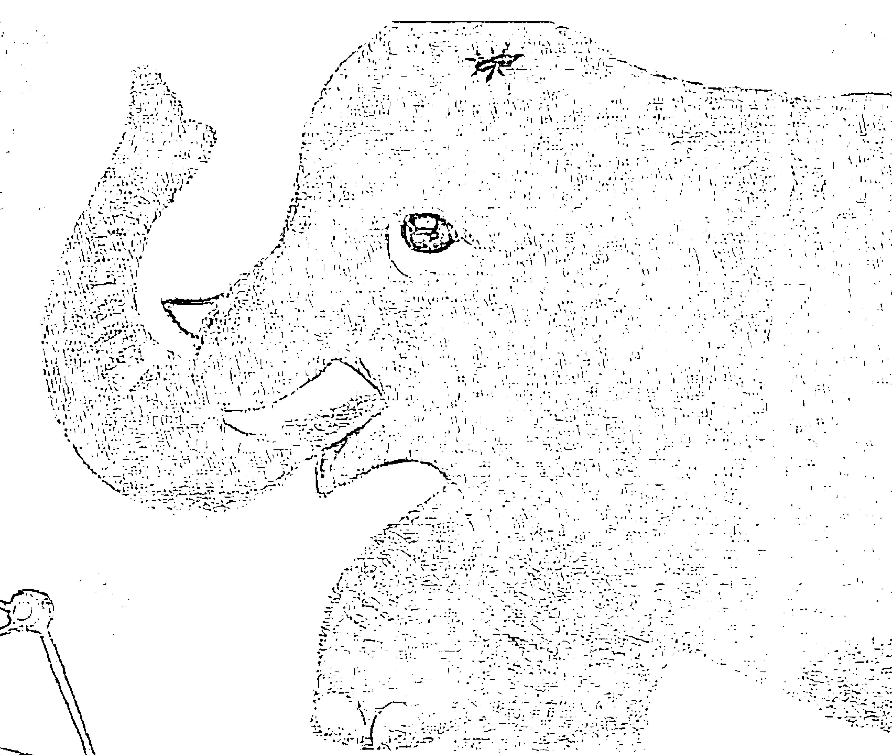

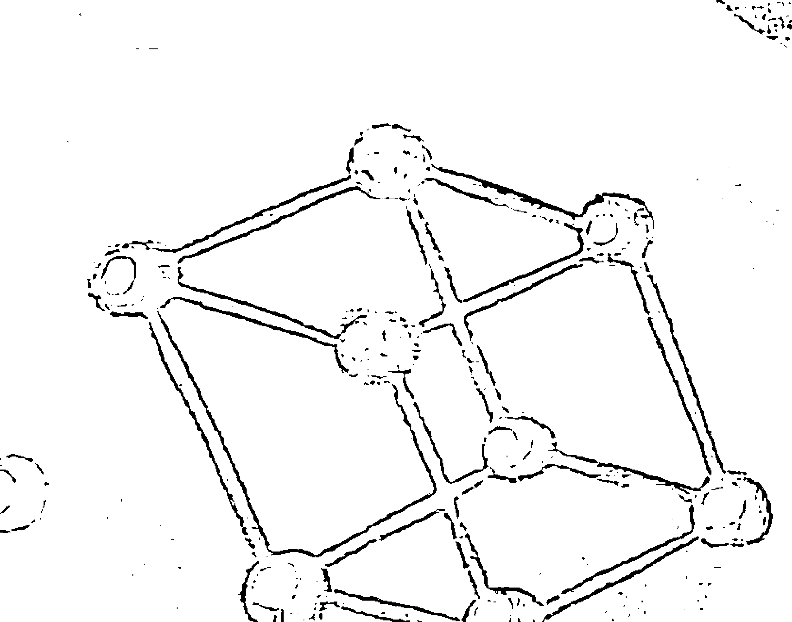

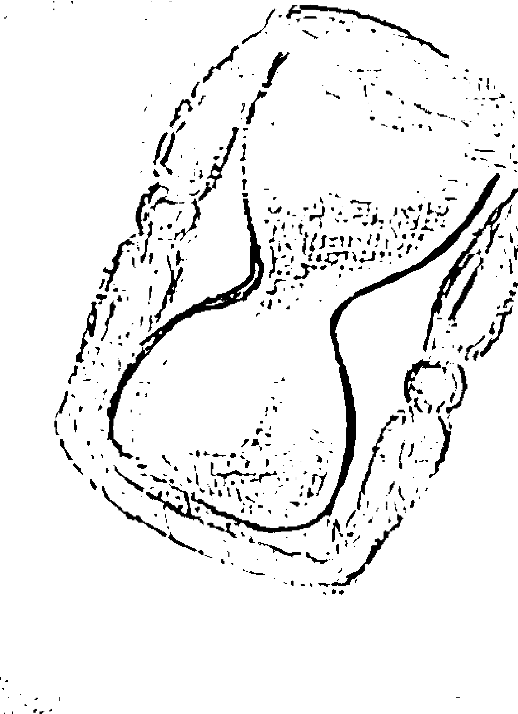

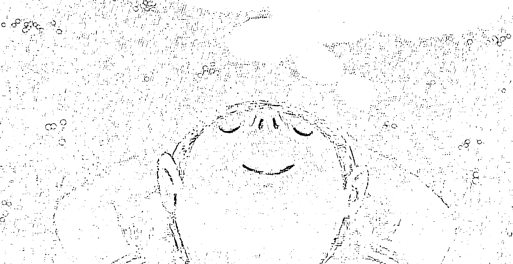

我心中很清楚——當然不可能。

當時我早就體會到，許多現象是在更深的另一個層面，不是感官能看到、聽到或體會的。跟我們這個最多四維的時—空好像不相關，而不可能用這幾個維度就可以把它表達清楚。

然而，這個矛盾，並沒有到此為止。

它引發更大的矛盾，讓我突然體會到——我們所認知的世界，本身是透過我們看、聽、聞、觸、嚐所建立出來的。只是，我們有的這些工具，最多也只能化出我們所體會到的三度或四度的世界。

我們不可能透過同一些觀察工具的範圍，看到它之外更大的層面。這本身，就帶來一個矛盾，讓人平常連想都不會去想。所以，我們只會隨時在一個封閉的系統——這個世界裡互動。

但是，在這些矛盾當中，還有一個更大的矛盾。

我記得當時還小，在巴西看電影。那個年代，只有黑白電影。不光只有黑白的對比，播放的時候，還可以看到底片上一個畫面和下一個畫面的分隔。

是這樣一格一格地放下去，愈來愈快，才從靜止的畫面，轉出了像我們平常體會到活生生的、會動的影像，而在一個影像再接著一個影像之間，才轉出了整個電影的故事。

這個觀察，讓我有很大的體悟——原來人和人、人和東西、人和世界、動物和世界的互動，要產生我們可以理解的意義，它的原理和電影其實是一樣的。它本身要有一個參考的基準點，而這個點不光是在空間裡當作一個基準，還要跟過去、未來作一個對照，才能讓我們的頭腦建立世界和時間的觀念。

我也突然體會到，就連時間都是虛構的，完全是我們人做出來的。空間也是這樣子，是腦透過看、聽、聞、觸、嚐所化現出來的一個印象。

時—空本身全是幻覺，完全是我們人做出來的。

我記得當時沒幾歲，是跟我弟弟一起看電影。電影演什麼，我完全不記得。最深的印象是，我在那裡發呆了兩個小時，突然發現周邊是個大幻覺。

那時年紀很小，也不可能跟弟弟分享這些話，當然也沒跟父母談。最多是連續很多天，連作夢都還在想這個問題。心想，這個世界怎麼會那麼堅實？那麼堅實的一個世界，原來只是跟幻覺一樣？

我也才突然理解為什麼我可以體會到耶穌、意識到光、感受到音樂，原來那是在不同的層面，剛好被五官領受到。

也就這樣，原來的矛盾——不知道為什麼這些現象有時有，有時沒有——也跟著消失了。這些現象自然變成我生命的一部分，接下來也沒有再更多疑問。

好多年後，我才了解，不到幾歲時體會到的這一點，也就是數學家歌德爾（Kurt Gödel）所提出來的定理——在封閉的系統裡，絕對看不到系統外的世界。我們所憑藉的觀察和思考工具，本身就是我們的阻礙和制約。

另外，好多年後，我聽到數不完的科學家談黑洞、大霹靂、混沌理論、乃至弦論，希望表達宇宙的來源。我一聽，心裡明白這問題還包含著更深的層面。無論談的是統一場論、標準模型（standard model），想透過這些頭腦架構出來的理論去了解宇宙，是不可能的。

我們本身被感官和知識鎖住，無論所體會或理解的再小或再大，還是離不開感官的範圍。要從感官跳出來，就像要跳出一個封閉的系統，那是絕對不可能。

那是頭腦沒辦法掌控的領域。

# 11 從一個感官，跳到另一個感官

透過前面這些經驗，我總是認為——我們的感官，其實不是表面看來那麼狹窄。我很小就常注意到，狗會豎起耳朵，好像聽見了什麼，是我們人聽不到的。貓隨時會睜大眼睛，好像看到我們人所看不到的東西。

我發現我所感受到的生命體，無論是天使或是光，貓也可以看到。也因為這樣子，讓我得到一個驗證。更特別的是，我從小就喜歡海豚，而海豚的知覺，包括聽、看、感受，遠遠超過人類的範圍。

這些事實不斷地讓我建立一種信心，明白我們的感官表面上可以捕捉一點資訊，但抓不著、看不到的資訊，其實遠遠超過能看到的。

我很小就拿自己做實驗，像是有時候會把手擺到書上，體會這本書在寫什麼。

驚訝的是，我雖然不見得清楚裡面的文句和順序，但這本書大致寫什麼，每次都猜對。也有時候，一本書放到床旁或枕頭下，第二天起來，發現書裡很多內容也就自然清楚了。

我發現，用這種方法，其實可以跳過感官知覺範圍的限制。好像每一個感官，無論是耳朵的聽、眼睛的看，最多只是一個門戶——是從「未知」通向「已知」的入口。只是，這個入口覆蓋的範圍通常很狹窄。比如聽有聽的波動範圍，看也有看的頻率範圍。

但是，假如我們自己不認為受這個限制，其實，可以從任何感官跳到另一個感官的範圍。像是眼睛可以聽，耳朵可以看，皮膚可以有情緒上的感受。所謂的限制，還是我們每一個人的制約所帶來的。

成年後我才體會到，任何資訊本身還是螺旋場。生命本身是螺旋場，能量是螺旋場，物質是螺旋場，意識是螺旋場，樣樣都離不開螺旋場。從「沒有」到「有」，任何東西一定要透過螺旋場產生出來。

這麼一來，只要我們可以感應到一個螺旋場，透過任何感官，自然都可以體會到生命更深的層面。

這一點都不玄，完全是科學。

接下來二十多年，我很少看書。雖然有幾萬本藏書，包括哲學、各種科學、心理學、宗教……但我其實很少花時間去讀。就好像在無限當中，一切的知識自然像水一樣，可以被我們吸收進來。

這麼一來，我自然認為任何細節不重要，而不會去重視。我發覺知識的細節，本身只是讓人分心。在知識的枝微末節下，有個更深的層面，才比較重要。只是腦通常會去抓這些表面的資訊，反而忽略底下才是關鍵。

同樣地，我也體會到，只要心很安靜，一個人的作品，無論是他留下來的文字、藝術或甚至一頓飯，其實都已經把他的生命場留下來，透過這個生命場在跟周邊的人互動。

很有意思的是，從很小的時候開始，我只要接近一本書，就可以感受到作家當時寫這本書的心情。一幅畫也是如此。甚至，到餐廳吃飯，這個廚師的心情也可以從他烹調的食物流露出來。跟我接觸的朋友都知道，只要到餐廳，我一定會請廚師出來，大大稱讚他的善意和用心。我也希望幾句鼓勵，可以帶來一些正向的能量。

一直到我長大之後，才知道很多人認為這是特異功能或超能力，而且花很多時間去分析或解釋，甚至會想去研究。

但是，從我的角度，這些能力是我們每一個人都有的。就連「超自然」的說法都是錯的。這些體會明明是最自然，反而是透過人類的洗腦才把最自然的部分變得不自然，而還需要用我們的科學去做說明或分析。

我常跟這些朋友分享，我們目前的科學本身離不開感官的作用，本身只是在一個狹窄的範圍裡，透過比較，建立一個相對的真理。這種多變數、多層面的真實，也就是我們的生命，反而是不可能用現在的科學可以整合的。反過來，要我們現在的科學完全脫胎換骨到另一個層面，才可能完全理解。

這些話，我知道早晚有一天會證實。在這上面爭辯，其實並沒有多大意義。

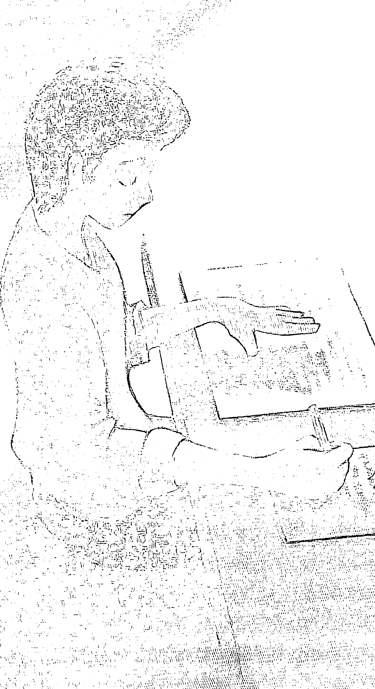

# 12 從靛藍小孩，水晶小孩，到人類的未來

講到從一個感官，跳到另一個感官的範圍，一般人還是會認為很玄。想不到的是，這其實已經是相當普遍的現象。

幾十年前，在西方已經有個普遍的說法「靛藍小孩（indigo children）」，指的是大概一九七〇年前後，有很大一群小孩子總是在這世界感覺不對勁，而把注意力往內心擺，比較自閉。

我們一般不知道的是，這些孩子對環境特別敏感，體會到很多的現象，是一般人透過單純的五官體會不到的。其實，這些小孩子就是這樣，有這些現象，他自己不知道，也沒有人幫他解答。

用「靛藍」來形容，是來表達這些小孩子有一些藍紫色的光。會有紫色的光，也代表他們對物質看得比較淡，而投入在靈性，注意力向內轉。

我從個人對光的體會，認為這些描述完全是正確的。不只光的描述是正確的，他們內向的價值，其實也是正確的。

當然，從大人的眼光會把這些小孩解釋為「不正常」，認為沒有生存的能力。他們對財富、工作、物質的關心程度比較少，不像過去的世代都在奮鬥、努力，爭取更多的名譽、財富、物質。從大人的角度來看，總覺得這些孩子不對勁，沒有生存的空間。

這種觀點是我認為最可惜的，本身也表達成人的無知。

不光有靛藍小孩，這二十年來又有另一個族群——「水晶小孩」。這些孩子發展比較平均，內外比較整合，光是乳白色或帶著彩虹的顏色。我自己的觀察也是如此。

這些小孩都相當聰明有創意，創意的原因也就是他可以跨感官，可以跳到另一個感官的範圍，在多層面運作。從大人來看，會覺得這小孩的彈性是不可思議地廣，反應很快。這些小孩電腦網路的運作也快，觀念相當靈活，不受限在哪一個角落。

最特別的是，這些小孩也不容易受到過去的限制，而認為樣樣都可能，樣樣都要試。在一般大人的看法，很難去接受這些小孩。總是認為他們應該更守規矩，應該更尊重過去的領域或價值。

想不到的是，地球的未來其實要靠這些小孩子，建立一個新的現實。打破全部人類帶來的制約和不可能，創造一個更友善、共生存的觀念。

就好像四十多年前，人類的文明透過靛藍小孩而重新設定，對人間所看的任何現實，都產生一個疑問或反彈。也就自然把這個注意力從外轉到內，從物質轉到靈性。再二十年後，這種內和外的差異已經變成一種自然的現象，內和外於是開始整合。就好像靈性和物質兩方面都一樣重要，而這兩個層面可以隨時透過水晶小孩而整合起來。

進一步說，好像在「有」或「知」的後面，這些小孩自然可以接受有一個「沒有」或「未知」，兩者都可以接受。有物質，也有靈性，都不再有衝突。這些小孩比較平衡，自然對這個地球和身邊的人有友善的看法。而他的價值觀念遠超過家庭、文化所賦予的，本身就在反映一個更深的層面。

我寫這本書，跟「全部生命系列」的作品，也是為了這些靛藍小孩和水晶小孩寫的。我不敢把這些作品稱為指南針，最多只能說帶來一點參考的價值，帶來一點鼓勵，讓他們強化對自己的信心。

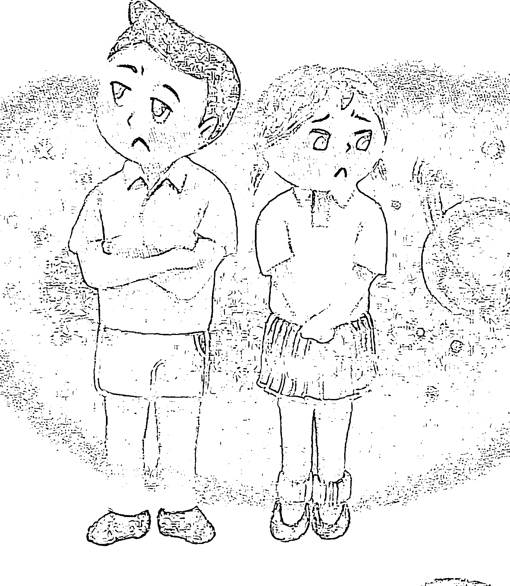

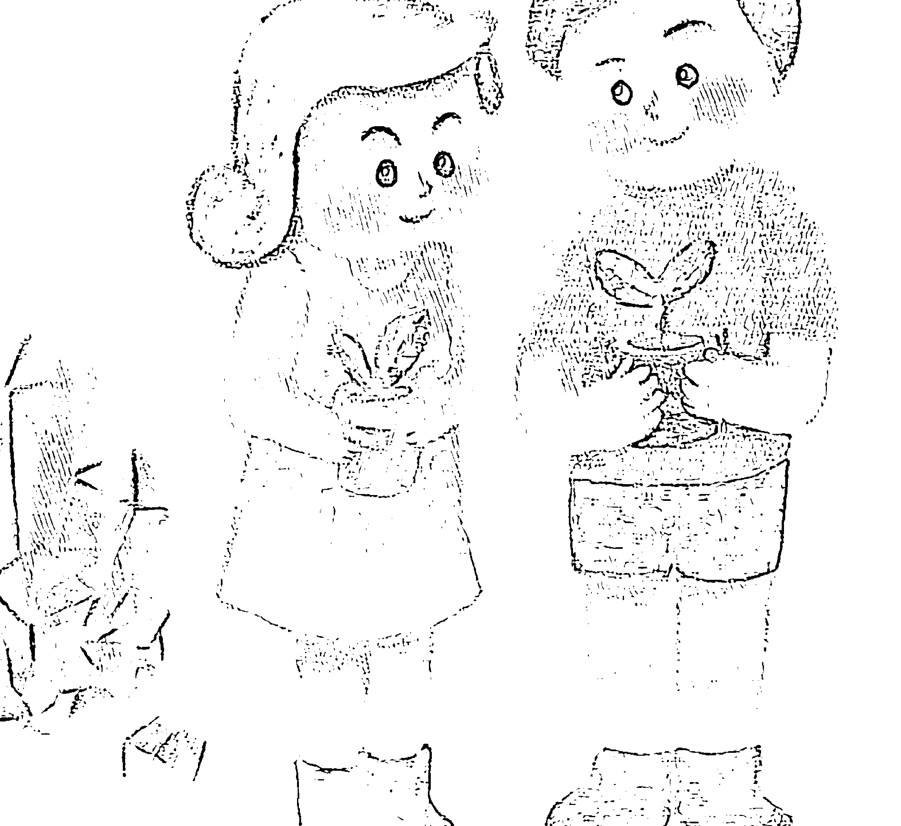

# 13 母親的愛

前面提到，家裡的廚房，是我讀書的據點。我當時喜歡待在廚房讀書，也有另外一個原因。只要想到廚房，就想起我母親很安靜在做飯。廚房充滿食物的香氣——饅頭、包子、餃子、麵條、各種不同的菜。一直到今天，只要一想到我母親，就好像想起不同的氣味，不知不覺讓我透過嗅覺想起她來。

也因為這樣子，我長大後總是認為，任何飲食都沒有比我母親做的更好吃。我相信，每個人應該也都是如此。也就好像我們的味覺從小就被訓練，將母親所做的飲食當作一個基準。接下來，全部的飲食經驗，都跟這個高標準在比較。

同時，我記得我母親對這個家庭的愛、對每個人的愛。從她的飲食，我可以體會到。所以，談到自己母親的飲食好吃，不光是一個習慣，而是落在一個「心」的層面。透過飲食，每一個母親，都是心在對心說話。她的愛心，透過飲食很自然傳達出來。

我在廚房和母親待在一起，往往也只說上一、兩句話，但我總認為她和我之間有很深的理解。她的安靜，本身就是一種表達，自然讓我感覺這世界沒有什麼東西有絕對的重要性。有什麼急迫的事、好事、壞事，她都是安靜地對待，這自然會讓我在情緒上踩一個剎車，認為一切都很自然，沒有什麼事是特別好、或特別不好的。

這種教育，最讓我難忘，是我母親帶給我最大的恩典。

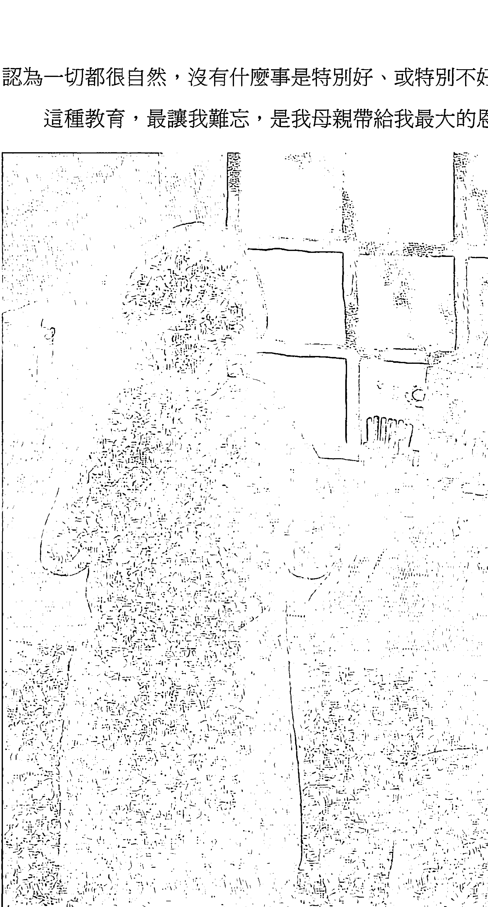

# 14 父親的付出

想到我父親，也自然就會想到「付出」這兩個字。

從我有記憶開始，我就記得父親和母親一樣，像從天上落到地球的天使。始終像小孩子一般天真，面對這個世界、面對別人。

我回想起來，記憶中，從來沒看過我父親拒絕幫助別人。每次都看到他很熱心地，像小孩一樣關心別人，想進一步幫助人。說出來的，都是鼓勵的話。

我那時候很小，懂事後自然會區隔人的不同，覺得有些人很友善，而有些人不見得。但是，我父親的反應都是平等的。

甚至，有些人講話帶著諷刺或責備，我小時候聽到了，自然會覺得是父親太單純，把別人的話都往好的地方想。

十幾歲時，我還覺得父親怎麼這麼傻，連這種刺激都聽不懂，非要把它落到好的層面不可。

成年後才體會到，這種真善美，就是他修養的特色。
他把樣樣看得很美，我也發現，周邊對他自然也是友善的。很多人，連小孩都可以看出不老實，竟然也變成他的朋友。只要接觸過的人，都是他的朋友。朋友和朋友間的糾紛，他都可以幫助解答。他就是單純希望每個人都好，樣樣都好。

叫我最覺得不可思議的是，我父親的善意，不光是其他人可以感受到，就連植物都可以感受到。

家裡人都知道，朋友也知道，只要他在，就會養出不可思議漂亮的花和樹。甚至本來養不活的花，在他手上幾天或幾個星期，就會長出來，而且是大家沒看過的顏色和大小。

他沒有特別下肥料或澆水，就是喜歡這裡修一下，那裡剪一下。這樣的結果，對我是個謎，不知道植物的養分是哪裡來的。直到快成年時才明白，這個養分，其實最多也只是愛。

愛本身是最高的頻率，就好像他把愛的場轉給周邊，連植物都感受到。

我小時候看到，連植物都想接近他，就像慢動作的畫面一樣。我本來以為是我的幻覺，但後來發現，事實就是這樣子。

我相信，從別人的角度來看，會覺得我父母很傻氣，甚至我自己年輕時也這麼以為。成年後，才完全改觀。

他們友善的傻勁，本身就是他們的長處，而會讓我我相信他們一生沒有做過一件壞事。

我常想一個人如果能「傻」到這樣，也不錯。只怕你我做不到。

# 15 人生的流浪

谈到我父母，自然想起我们一家六口从台湾移民到巴西的旅程。

在二次世界大战前，父母的家庭在大陆都是当地有名望的家族。因为战事，全部都失去了，家人也离散。只有他们两位年轻人，各自跟着军队撤退到台湾。本来还从家里带出一点钱，流浪了几千公里，到台湾时，已经什么都搞丢，什么都没有了。

当时会移民，主要是因为我父母的母亲都还留在大陆，如果待在台湾，也就失去了联系的希望，只好移民到巴西。

现在回头看，最难以想像的是，我父母带着一家人，身上只有不到一百块美金，却有勇气和决心到一个完全陌生的地方。既不懂语言，也不懂人家的文化。父亲当时从空军电子工程师退役，带着全家人到巴西，不光可以生存下来，到后来连命运也有很大的好转。这对我而言，也是不可思议的奇迹。

小时候，虽然我们四个孩子什么都没有，看到其他小孩有玩具、住得很好、想要什么就有什么，我记得自己心里并不会羡慕，反而觉得我们一家人活得很好的。家庭很有爱，随时觉得很温暖，什么都不缺。这为我们兄弟姊妹建立一个基础，让我个人对物质一点都不重视，我相信也是这么来的。

我回头想，我们小时候住的地方很平凡，甚至可以说是简陋。刚到巴西时，跟别的家庭共用一个房子。后来搬到巴西北部的海西菲，住在一个不会让人想带同学回家的区域。那些房屋因陋就简的程度，是现代人想不到的。

但是，也就这样子，我成年后，发现很多华人的家庭都跟我们类似。家里很贫穷，单独出来打天下，没有任何依靠，只有靠自己的毅力，而从人间这样走出来，不怕语言和文化的差异。

我常常开玩笑说，我们华人是「打不死」的，在哪一个角落都可以生存。其实，这种表达也是对华人的祖先，包括我父母，一个最大的尊敬。他们可以抗压、可以生存，把全部心思放到下一代身上。为了后代的生存，自己什么都可以牺牲，把自己的欲望和享受完全放到一边，这本身也反映我们华人传统的文化。

别人没办法忍受的，我们华人都能忍受，甚至可以过得很好。就好像内心有个指南针，可以超过物质的层面，而带着我们走下去。这本身也是我认为最不可思议的奇迹，也让我感觉是人生最大的恩典。

我们也都看过一些实例，有些家庭，物质条件很好，一般人都会羡慕。但大家想不到的是，烦恼和纠纷却特别多。反过来，也有些小孩子在贫穷中长大，想要什么都没有，反而到最后在精神的层面，他们对世界、周边有更深的爱和善意。

这本身，我认为也都是上帝的安排，反映一个自然的法则——有好，接下来也可能有坏。有坏，接下来也可能好。物质的缺少，自然会在别的层面，例如心灵的层面，让我们成长。讲到最后，我们最多还是要肯定上帝是公平的。

# 16 成长在巴西

谈到巴西，本身也是个奇迹。

巴西，拥有广大的土地面积，是世界第五大国。

有意思的是，我认识的每个巴西人都会说，如果不算阿拉斯加，巴西其实比美国还大。也总是喜欢说，我们的国家是一个两面靠海的大三角形，很少有国家有那么长的海岸线。还有人会自豪地表达「我们巴西人绝对不会动武，样样都讲究和平。动武，是美国和其他国家才做的事。巴西，从来不会。」

巴西虽然地方大，但人口少，我记得当时不到一亿（现在是两亿人口）。有很多空旷的空间，以及没有人去过的原始森林。

一般人想到巴西，就想到它天然的资源，或嘉年华会。我从小在巴西长大，最深刻的印象也就是人与人之间的热情和诚恳。

说巴西人很友善，绝不是过分赞美。巴西人重感情，甚于理性。我在巴西长大，自然学会和人拥抱。自然会发现，有时候一个很诚恳的拥抱，比说多少话都更有诚意。那是一种心和心的沟通，语言没办法表达。

另外，我最记得的是，我在巴西不同地方长大，无论到哪里，都能体会到各地的善意，而且每个人都很友善。巴西一般住家的简陋程度，是华人难以想像的。然而，一个家庭不管多穷，只要遇到了，一定会请客人到家里用餐。即使自己也没多少东西可以吃，但一定会跟客人分享。这种好客，本身反映这个民族的善意。

这段过程，因为经济和资讯并不发达，甚至从别的国家的角度会称它是落后，表面上，让我在巴西长大，带来很多困难。但是，对我其实是这一生最大的礼物之一。

在巴西长大，对于像我这样的华人，更能够深深体会到民族的平等性。

巴西很开放地接受外国人，接受各种文化的人。我发现自己在成长的过程，完全不懂什么叫歧视，和其他在美国、欧洲的华人所遇到的情况完全不一样。

因为如此，我心理上完全没有自卑或障碍。自然认为文化和文化间，民族和民族间，不同肤色，没有什么隔阂。

最多只看到平等，也就自然会开朗。

我后来观察到，在其他国家长大的华人，因为文化或肤色不同而受歧视，这一点是最可惜的，难免在人格的发展上造出一种刺激，带来一层区隔或隔阂。

在长大的过程中，我对巴西特别有感情。回想起来，无论交友或生活，都是最美的记忆。

最奇妙的是，每个民族都有他的特性。说到巴西人，最多只能说是非常快乐的民族，比任何民族都快乐。巴西虽然很穷，而且有很多政治、经济、社会的问题，但大多数人都很快乐，对生命很乐观，并不需要有什么条件或有什么理由才能快乐起来。

这让我对生命的看法也比较乐观，影响到我一生。在任何状况下，随时都会想起在巴西所见到的那么多人。那么多过去的朋友，在不顺的情况下，还可以维持没有条件的快乐，这本身也是最不可思议的一堂功课。

每次和巴西人接触都很舒服。他们心里没有什么顾虑，也没有什么禁忌，没有额外的动机。总是很开朗，很容易得到快乐。这让我发现，人生其实不需要有什么条件，我们就可以快乐起来。一个人，最多想要快乐，就可以快乐。

相对地，我们华人通常充满严肃，快乐不起来。好像对我们华人，总是需要得到成就、成绩，才有「资格」快乐。

后来也发现，一般各地的原住民，包括台湾和北美、亚洲各地的原住民，都跟巴西人一样，比较容易快乐。对于物质的要求倒不会那么高，很容易满足。

我过去常跟朋友开玩笑，假如有的话，我相信更进化的灵魂，回来这个世界，最多也只会想当个巴西人。

# 17 彭姆姆 Sister Emmanuelle

前面提到，我母亲从小就很投入宗教，受到一位德裔修女彭姆姆很深的影响。她们在大陆因为流亡而分开，却又在台湾再次相聚。

我记得母亲说，彭姆姆虽然是修女，没有钱，也没有资源，却样样都做到最好。比如说，有人衣服破了，她非但会缝，而且缝得很漂亮，每一个小地方都很仔细。她住过或待过的地方都整整齐齐，干干净净。

来台湾后，彭姆姆在新竹教英文。我们一家人，包括母亲 Isabel、父亲 Paul 和四个孩子的英文名字，都是她帮忙取的。

最难想像的是，一位欧洲的女士，没有建立自己的家庭，而把所有华人当作自己的家人，用一生来服务，并且从无私的服务，找出人生最大的目的。我当时才几岁，刚懂事，非常好奇，想了解为什么一个人会这样子做。

大概七岁，才到巴西没多久，虽然跟她不熟，有一天，我向母亲询问她在新竹的地址，开始跟她写信。现在回想起来，也不知道当时怎么有能力用英文写信。

没想到几个月后，她写了很长的回信。很可惜，后来这些信不晓得放哪里去了。我虽然很诚恳，但毕竟是一个小孩子，和她相差至少五十多岁。然而，她会花时间，非常真诚地回信。

我记得，她写来的信，我通常会读好多次，仿佛在某一个层面，为我带来很大的鼓励和欣慰。我从这些信，可以体会到彭姆姆个人的平静，并且从每句话深刻感受到她对上帝的信仰与喜悦，也自然会产生这样的疑惑——一个人怎么达到那么安静、那么诚恳而自然的喜悦？这是怎么来的？为什么她和别人不一样？

我首先是问我母亲，后来，这个问题不断在我心中反刍。她和我的互动一定让当时的我留下很深的印象，不然不会多年后还在回想。

她的为人，让我觉得一个人可以达到这种状态，本身就是一个不可思议的奇迹，而且还带给周边的人，尤其我，这样的信心。

在我成长的过程中，我很喜欢接触神父、修女和出家人。但我必须坦白说，彭姆姆的影响力，是难以想像地大，可以说是为我带来灵性的启发，而让我难以忘怀。

好多年后，当时我母亲已经失去意识，我也不在台湾。听我父亲说，彭姆姆已经将近九十岁，出现阿兹海默症的状况，要回奥地利还是德国度过这一生最后的时光。离开台湾时，她除了行李箱，连锅碗瓢盆也带在身上。我父亲特别送她去机场，舍不得她年纪那么大，还要带那么多东西，一个人大包小包上飞机。

分手前，彭姆姆抱了我父亲，完全像记忆还很清楚，说：「我会永远想念你们两位。I love you.」我父亲跟我分享这经过，我们两人自然也不再讲话，只是流下眼泪。

# 18 神圣的空间

在成长的过程中，这个世界还有别的生命的这个事实，对我是愈来愈清楚，愈来愈平常。虽然没办法用语言表达，但心里总觉得人间还有别的存在，是一般用眼睛、耳朵体会不到的。

同时，也好像随时浮出「真实（Reality）」的疑惑。不断地在心中探讨——到底什么是真实？这个问题后面，含着我个人的理解——我眼前所看的真实，不是真正的真实。

换个比喻来说，也就是车子有马达来驱动，然而，马达后面还有什么？是我们看不到的东西。

我记得很小，就问母亲：「我们来这世界是为了什么？」「我们到底是谁？」「为什么我们不是天使？不是神？」……一连串相关的问题。

我的母亲每次都很有耐心，用她天主教的理解来答复我。但是，我总认为还少了什么。回头看，我还是对我母亲相当怀念，相当感激，有那么大的耐心面对一个不懂事的小孩子。

说也奇怪，几十年后，我再也没有遇过任何小孩子，包括我自己的孩子，会在五、六岁那么小的年纪，就探讨人生的问题。这也让我对母亲加倍地感恩，她要克服我那么多难题。

我很早就明白，心底的这些问题，不可能从世界找到答案。我自然变得很沉默，常常坐在一个角落发呆。有时好像在想、在反省这些答案。后来发现，好像愈来愈长的时间，其实也没有在想。

我也发现，心中好像本来就有一个神圣的空间。我最多只是沉默，也就进入了这个空间。

我很早就认为，有个东西叫做神圣。对我，神圣是一个更深层面的状态。透过这个状态，好像比较接近天使或是主。另一个发现是，有各式各样的地点，比较容易找到这个神圣的空间，比如教堂。

所以，我每个礼拜天都很期待去教堂。我发现只要诚恳地祷告，不需要任何祈求，自然有一种光进入身体，与我的心合一。接下来，好像我从心中也可以放出这个光，而这个光变成整个周边，布满整个宇宙。

最有意思的是，这种经验一点都不让我惊讶，好像很自然。

我相信因为很小的时候就接触到耶稣，也就准备我可以接受这种经验，而接下来没有什么好奇，不会觉得奇怪。

有时候，假如我睡觉前也很诚恳地祷告，整个睡眠自然像是睡在光中。醒来的时候，也只是一片光。这时，我会感觉特别平静，本身会影响到一天的心情，而自然不想多讲话。就好像在这世界任何的互动，都比不上这种内心放光的状态。

## 19 耶稣，透过《圣经》来教我

经过几次这种跟耶稣的互动，我自然对天主教和基督教的《圣经》感兴趣。现在回想，也许从六、七岁就开始读。一开始，看不懂中文，请母亲读给我听。后来读巴西的版本。再后来，又读英文本。

我很自然地更喜欢早期的译本，好像在某一个层面相当熟悉，是在过去曾经听过或读过。

每次读到或听到《圣经》的句子，就好像耶稣所讲的话对我都是活的，是在跟我个人对话，甚至好像就出现在我眼前讲话。我最多也只是很认真、很诚恳地在听。有时候好像听懂，又好像听不懂，但总是想听，想接触，也不晓得为什么。

我后来发现，自从小时候接触《圣经》，耶稣所讲的话，我随时可以把它调出来。在我成年后最困难的时刻，它自然会浮出来，带给我心中安慰和鼓励。

耶稣讲的好多话，自然留在心中，对我好像都变成一种难以解答的问题，我最多只能把它称为悖论。说是悖论，倒不是有什么矛盾，而是对当时的我而言，带着一种解不开的谜团。然而，我的心，又好像有一点懂，只是很难用语言可以表达。

比如说，耶稣讲到「你想野地里的百合花怎么长起来，它也不劳苦，也不纺线。」我也记得小时候读过“Be in this world, but not of this world.”的说法，用我的翻译就是——活在这个世界，但是又不属于这个世界。

这些话，停留在我脑海里，不知多少个月，甚至许多年。

耶稣这几句话在告诉我，我这一生想得到的，跟这个人间好像一点都不相关。一个人可以轻松地活在这个世界，这个世界自然会来照顾我们。

这些话，对年轻的我，自然认为和周边所听到的观念完全不一样。我从一开始上学就知道，老师喜欢排名。就连不同的科目，也要排出重要和不重要的。然而，所谓的重要，也只是和这个世界的生存相关。好像所谓的学习只是在筹备我们进入社会，找到一份好的工作，有所成就。接下来，在受教育的过程中，也不断提醒——一个人要完全靠自己的本领、自己的努力、自己的专长、自己的规划，才可以决定这一生的命运。

但是，耶稣所讲的话，是刚好颠倒——是说一个人不经过规划、思考，反而可以轻轻松松活出他最美的生命。不光如此，好像生命最美的部分，本来就有，倒不是透过这个世界可以找到。

这一点，对当时的我，本身变成一个想不通的话头。但从更深的层面，我又完全相信耶稣所说的每一句话。

这种悖论，对我好像是一种燃料，推动我对这些生命的问题不断地做一个追求，而变成我生命接下来主要的动力。

# 20 巴西的小婴儿

我也体会到，在这个人間，我所看到的全部境界，自然让我认为不平等。我也看到，人创出来的任何价值观念，其实都在强调不平等。

比如说，我很小就记得，我的同学或同事大多数想取得的不是名就是利。这些，也就是我成年后看到的社会，包括媒体、电影、娱乐圈不断强化的观念。

我逐渐发现，一个人要从这些观念走出来，达到平等，几乎可以说是不可能的，好像走一个和全人间颠倒的路。

我很年轻时就进入医学院就读，把学业告一个段落。除了理论之外，我很早就喜欢亲自动手做，包括喜欢开刀。当时认为开刀是最直接修正一个疾病的方法。同时，在巴西的乡下，很早就有机会练习。

假如没有记错，我才十几岁时，就有机会在寒暑假练习动手术。手术的针是弯弯的，长度也不长。一般缝合伤口时，医师会拿着持针钳夹住针来缝。但是，我嫌这样太慢，宁愿戴着手套拿着针直接缝，而且不断打破自己的纪录。

我当时很好奇，想知道一种手术可以在多短的时间内完成。也发现，一样地，不去想它，反而身体会选择最简单明了的动作去完成任何手术，而最后的结果也是最好。不光失血最少，恢复的时间也是最短。

那时喜欢练习，甚至都已经在纽约完成医学的教育和研究，还是喜欢回到巴西实习。因为遇到的病例，远远超过在美国可以遇到的数目，而且可以看到许多在美国不可能看到的疾病。

我记得有机会到首都巴西利亚最忙的医院服务。遇到长假，没有足够人力值班，但病人反而更多，一个接一个不断涌进来。不是车祸，就是种种的外伤。

夜里两点，有一位父亲抱着小婴儿，崩溃地大喊他需要帮忙。我到他身边询问，一观察就知道孩子是被车子撞到，头皮已经撕裂。

当时走道到处都是病人，我马上找来一台小推车，简单消毒，铺无菌巾，直接把这个小婴儿摆上去，把小推车当作手术台。同时，也喊护士来帮忙。

不过，喊了半天，等不到半个人。每个人都在忙。

小婴儿一直在动，我只好请这位父亲帮我，好让我处理现在的状况。这位父亲毫不犹豫马上答应：「Sim!（没问题！）」

我没想到，这个决定大错特错。

我当时一手拿着镊子，要打开伤口用生理盐水冲洗。结果，这位父亲一看到婴儿整个头皮几乎都掀开，马上就昏倒了。我连忙用一只手撑住他，慢慢把他接到地板上，同时另一只手还要稳住小婴儿，不让他乱动。

假如我当时跟纽约的同事分享，没有人能想像这种画面。

接下来，我尽快洗完伤口，进行缝合。如果现在没有记错，至少缝了二十五针，就是那么大的伤口。约莫过了半小时左右，这位父亲睁开眼，慢慢爬起来。一清醒，马上眼睛睁得大大地：「Doutor, que aconteceu?（医生！发生什么事？）」

我立刻跟他说：「你的小孩子没有事，正在恢复。是我的失误，不应该勉强你当助手。现在没事，一切都好。」

后来，我马上又去忙别的病人。

大概七、八天后，总之，不到两个星期，这位父亲又回来了。这次一样抱着婴儿，回来拆线。小婴儿又笑又动，活泼得很。他让大家都看看小婴儿，原本的伤口，连疤都快看不到了。再把线一拆，根本看不出痕迹，几乎可以说是完全恢复。

这位父亲，抱着孩子，手上还提着一个篮子，里面有柳橙、香蕉。他跟我说：「医师，其实我家里很穷，没有钱。我跟我太太都不知道要怎么感谢你，但是，我还是想把这些水果送给你。」

因为太突然，我当场愣了一会儿，才伸出双手接下他的水果，拥抱他。然后，问他介不介意我将他的礼物与所有同事分享。我在他面前，为自己留下一个柳橙和香蕉，其他都分送给在场的同事和护士。

我常回想起这个父亲的脸孔，从一开始的慌张，到后来感恩和满足的变化。

虽然这个经过很单纯，但对我个人，它肯定了我多年来的服务，同时不断强化人与人之间的平等性。我深深体会到，就像这位父亲的感恩心，每个人都有一个最美的部分，都可以随时活出来。而这个美，和他在这个世界的经济与教育状况，一点关系都没有。

这样的美，我在每个人都看到，好像只是在等着一个人自己可以发现。

我透过这个经验，也明白自己来到这个世界，倒不是为了主导什么，反而是来服务所有人。我也自然发现，一个人站在服务，而只有服务，没有任何要求，也不希望回馈，这本身是欢喜最大的泉源。

# 21 食物链

好像因为心里有一个平等和服务的观念，自然会想要帮助、关心周边的众生，而这对象不一定是人类。有时候，看到一只动物需要帮助，而自己行有余力的时候，会想去救牠。

有一次，我一个人在新泽西州南部五月岬（Cape May）的海滩走路。突然看到好大一只海鸥，嘴里叼着一个东西。那个东西在扭动，好像比一般的鱼还大，但又肥肥的，不像蛇。

走到距离二十五公尺左右，我才发现那是一只小鲨鱼。海鸥正在不断啄牠，鳃裂下方已经裂了一道大口子，在流血。

我想都没想，马上跑过去，要赶走这只海鸥，救小鲨鱼。海鸥马上叼起小鲨鱼，想要飞。嘴里的猎物太重，牠飞不动。飞了，又掉下来。又飞，还掉下来。一次最多就飞个两、三公尺远，又掉下来。

我追上牠们，把海鸥赶走。

海鸥的喙沾着血，表情很不高兴，对着我大叫。我看到小鲨鱼还活着，在沙子上动。就抓住牠的尾巴，轻轻地把牠拖到水里。牠开始游起来。

很特别的是，放小鲨鱼的过程中，我可以感觉到海里还有更多鲨鱼，而且好像跟这小鲨鱼很亲密。抬起头就看到一只大鲨鱼在游。

我叫小鲨鱼走，祝福它。

它没有走，游了两、三公尺，又回到岸边。我还站在水里，它在不到半公尺的距离停下来，两眼盯着我看。

那一刻，我感觉到它是回来表达感恩。我自然从内心生出一种祈求，不光是对眼前这只小鲨鱼，还包括海里更大的那一只——

>「希望你，下次遇到海豚或人，也能把他放过。」

小鲨鱼慢慢地往后游，转个弯走掉了，我再也没看到。

海鸥还在一旁，好像舍不到嘴的猎物就这么溜走了，不断地继续喊，嘴边还有血迹。

我继续在沙滩上走，没想到，它还跟着我，好像跟我抗议。我好几次回头，它还在跟着我，跟了将尽三百公尺。我想，并不是我手上有什么东西吸引它。它只是不高兴，要抗议。

我没去管它，走了几公里回来。时间还早，也就在海边找了一个地方用早餐。那天，餐厅供应的特餐是蛋和鲜鱼。我点了餐，结了帐。天气很好，找到外头一张桌子，我坐下来等着。

餐一送来，我心想，分量太大了。早餐其实并不需要那么多蛋白质。不过，还来不及反应，一群海鸥从我头顶飞过。其中一只，两脚抓住餐盘上的鱼，另一只抢走了蛋，还有一只把马铃薯泥踢翻，全都掉到地上。

这几只海鸥和前头那只是不是一伙，或它是不是也在其中，我不知道，也没办法认出来。

餐厅的女主人拿着扫把跑出来，她身后跟着一个不到六岁的小孩，也出来帮忙赶。但是，海鸥已经飞走了。

女主人连忙道歉，说她在这里开店将近二十年，从来没看过这种情况。

>「没想到会这样，很抱歉，我再帮你做一份早餐。」

>「不用。不用。It's all OK.」

她一直坚持。我告诉她，其实我也不是很饿，就离开了。

我心里最多只是笑自己，同时体会到生命的一个规律。不光是人类有业力的平衡，整个大自然都有。有些动物会被吃，而有些动物去吃别人。就靠着吃与被吃的循环，在食物链的每一个环节稳住生态系的运作，而没有一个人需要去打破这个自然的生态。

从我的角度，小鲨鱼很可怜，自然想救它一把。小鲨鱼本来是海鸥很好的一餐，却被我剥夺了，也就破坏了这个平衡。我打破这个平衡，好像反而又额外造出一连串本来不需要的反应，而它到最后，还是要完成它自己。

在人类眼中，我们会同情或可怜某某人、动物、植物。但是，在上帝眼里，全部都是平等的。没有强者，也没有弱者，最多都只是一个食物链、生态系的一部分。

我可以做的，最多是放过这个食物链、生态系的每一个。不要再做一个虚假的分别，自己认为谁该救，谁不该救。

# 22 沙滩上的耶稣会修士

我发现，只要宁静，好像可以很长一段时间都没有念头。最多只是感觉很平静，心里很温暖。

我另外一个发现，就是自己跟天主教似乎有特别密切的关系。小时候认为是受母亲和彭姆姆的影响，毕竟在天主教的家庭长大，自然亲近天主教。但是，我在成长的过程，也发现脑海时常闪过一些片段、一些脸孔，好像都和宗教有关。虽然不是这一生的记忆，但总隐约认为跟我个人有关系。

我想不起来是什么时候的事。有一次，一位朋友带着大家催眠，透过他的指示，带着大家一步一步回溯之前的记忆。

我也很认真配合，跟着他的提示，从现在往前走到五年、十年、二十年前。等到他讲到婴儿的时候，我也确实可以看到当时自己是婴儿的样子，而且有一些记忆。

但是，等他讲到出生前，画面突然全部黑掉了。不过，我还有意识。眼前突然看到一位男士的后脑勺，他站在海边，附近都是当地的原住民。

这位男士，慢慢转过头来，最后盯着我看。他的脸，看起来是五、六十岁，有很多皱纹。充满慈悲，眼睛还带着一种光，好像在微笑。他穿耶稣会的衣服，身上挂着一个十字架。

这时，好像一道光从我心里穿过。眼泪掉了下来，心里非常笃定，知道他是我，我是他。我们是同一个人。

他那一生，几十年的经过，我当时好像都知道，不用解释都知道。他出自一个好的家庭，生在战乱而进入耶稣会。因为受过教育，他负责保管典籍和教学。当时，欧洲西班牙的教会到巴西宣教。船刚到，停在沙滩上。他第一次和当地的原住民碰面。

这个影像，在我头脑里停留了好久。到今天，都还清清楚楚，就像昨天发生的事。那一天晚上，我连作梦都在重新经历当时的经过。知道他一生的所作所为，而最后又是怎么离开人间的。

我也发现，自己不光可以随时重新活过那一生，还可以随时把过去很多别的记忆找回来。这些记忆跟我这一生一点关系也没有，或至少表面看来不相关。但是，回溯的过程却让我感觉再真实不过了。

就像那一次看着神父的脸孔一样，有时会让我一惊「喔！原来那就是我。」这些人物都是穿着古代的衣服，让我体会到不是现在的发生。奇妙的是，我不一定是男士，有时候是女士，而有时候看起来是小孩子，有时是老人。甚至，有些人物好像不是这个地球的生命。

虽然有时是在梦中、或在跑步的时候出现这些画面，时间不会超过几分或几秒，但总是可以快速扫描过那一生的经历。这个过程，并没有受到时间长短的限制。记起来的一生，当时在做什么、扮演什么角色，主要的困难和突破，好像都知道。

然而有个印象是——我好像在找什么东西，但从来没有找到过。

我十几岁、二十出头就完成医学院的学业，很早就进入学术领域，开始研究、教书。对这世界的看法，当然是受到西方教育的影响。而且身为一个医师、医学专家，不可能承认有什么东西叫前世。

但是，透过这些经验，我自然对这个主题产生兴趣。后来发现，学术界早就有数不完的真实案例，没办法用这一生的记忆来解释。不过，这些领域并不符合现在主流科学对时空的认知，一般人最多是把它挪开，放到一个角落。最好不要去碰、不要去谈。

从我个人的角度，那些感受是再真实不过，我根本不会想跟别人辩论某位人物是不是我的前世。然而，问题是——怎么和这一生的生命连结起来？我也想了解，除了这一生肉体的生命，难道还有更根本的本质吗？如果有的话，这个本质或特质，又是什么？

从生物学的角度，透过分子或是各式各様物质的领域，可以解释全部的生命。但我从小到大的经验，都好像在告诉我——有一个更高的聪明在主导。生命的源头好像不只是分子或物质的变化，好像还有一个更深层面的力量，用逻辑没办法去解释。对我，也没办法用言语描述出来。

这个力量，我没办法表达。但很奇妙的，也就是这个力量，把我不断地带回到同样的问题——探询它自己。

# 23 寻，寻什么？自己不知道

我在巴西长大，我的印象中没有什么东方哲学的书好读，全是西方的典籍。从最早希腊的苏格拉底、《圣经》，到当代法国、德国或当地的作品。

小时候读书很快，学校或公立图书馆有什么书，几乎全都让我看完了。九岁到十几岁之间，我们住在巴西北部滨海的海西菲，学校图书馆所有的书，从第一本到最后一本，我都看过。

回想起来，我对那位图书馆员特别感激。我记得，学生最多只能同时借三本或四本书。然而，这位金发的女士，当时应该有五十多岁，每次都让我拿两个大袋子，带几十本书回家。不到两、三天，我就回去，再重复一次。

她很好奇，认为我不可能看得完那么多书。有一次她忍不住拿了其中两三本书，一本是莎士比亚，一本是她很熟的文学作品来考我。

我记得自己不光是答出书里的细节，还跟她讨论书的意义，以及作者为什么这么写或那么写。我看见她不可思议地摇摇头，笑了起来。接下来，她再也没有考过我，而让我继续把图书馆的书一袋又一袋地借回家。

记得当时我自己一个人在图书馆，或者在家里看书，有时往窗外看，别的小孩都在玩。那时，心中好像在找，但不知道自己在找什么。眼前所看到的一切，都可以看懂，却同时知道那不是我在找的东西。就连所读到的所有哲学作品，包括苏格拉底，都不是我想找的。

唯一比较接近我心里所追求的问题的，是《圣经》。

不光《新约》，还包括《旧约》〈创世记〉〈诗篇〉〈箴言〉。我自然被耶稣所讲的话吸引，尤其钦定本的文句（詹姆士王译本，King James version）。我认为耶稣的话特别美，每一个福音的经句，我会重复再重复去念，甚至在心里全都背起来了。

然而，我并不是透过读把它背起来，而是这些话对我个人有很深的共鸣，就好像验证了我心里早就明白的。所以，不费力就记起来了。有一阵子，甚至哪句话出在《圣经》哪一个章节，我都知道，都说得出来。只是后来几十年没有用，也就不再去记了。

对，是验证。我突然发现，其实，我在找和验证是同一件事。就好像透过耶稣的话，可以验证我最内心想表达的一切。而这一切，好像不符合一个小孩子在人间体会到的现实。也就这样子，读到耶稣的话，让我心里得到一种说不出来的宁静。我现在回头看，也只能将它称为是一种欢喜。

不过耶稣在《圣经》里所讲的话，虽然我心里都可以听懂，但也同时让我得到一种没办法解答的悖论。从逻辑的层面，总觉得自己好像少了什么工具，没办法把耶稣的话解开，也才会一再重复地读。

有个印象相当强烈，十岁左右，我总觉得好像有一把熊熊的烈火，在我头顶上烧。这个追寻，对我，就是有这么急迫。好像我一直在找，但是，在找什么？问题是什么？连我自己都不清楚。只是，心很急。

一直在找东西，但找的内容也不清楚。只是一直觉得来不及。

我随时随地，不管在玩足球、讲话、唸书，只要有个空档，这种急迫感又回来，好像总有一把火在烧。

这个问题，到后来，对我已经比任何一切都更根本、更重要。

其实就像前面所讲的，这种急迫感，最多也只是想得到验证。我老早就知道自己体会的现实和一般人都不一样，自然不断地希望能得到验证。这种心情，除了我母亲之外，也不方便跟别人分享，包括我的弟弟和姐姐。我知道这些问题和其他人都不相关，只会被别人觉得奇怪、嘲笑或当作小孩子胡说。所以，最多是把这些问题藏在心底。

回头看，我也是相当感激我的父母。他们两位给我一个很简单、平凡的家庭环境，又刚好在巴西一个很偏僻的地方成长，才会有这样的条件，让我追寻生命最大的一个形而上的问题。

# 24 卡夫卡 Francis Kafka

我从有记忆起，就隐约有一种负担，我最多只能称为「存有的负担」。无论在读书、在学校或回到家，就好像随时有个重量落在肩膀上，不晓得从哪里来的，也不知道怎么把它消失。

我记得，还不到几岁，就不断浮出人生存有的问题，不但小时候追着母亲问：「为什么我们活在这世界？」「活着，有什么目的？」其实，这类问题一直跟着我，到快要成年，还在不断浮出来。

前面提过，甚至有时候，早上一起来，发现有这个身体，觉得好像很陌生。第一个念头是「这是谁的？」「我怎么会有这个身体？」接下来想起来自己是谁、是什么，才完全落回身体。

我也记得很清楚，在学校，虽然一样跟同学互动，在别人眼里，无论学业和运动都还算突出，但总觉得好像少了什么东西。

和同年龄的小孩子对话，自然感觉注意力好像根本落在不同的层面。他们所顾虑的——玩具、父母的看法、同学的态度、个人的成绩、球赛的输赢、考不考得上大学、要不要进修、男女朋友的问题……好像都跟我不相关。

反过来，我所顾虑的人生层面的问题——「为什么我会来到这个世界？」「我来这一生，是来做什么？」不断浮出来。我发现，跟其他同学谈这些问题，也好像跟他们不相关。

从小到大，我的世界，好像跟别人的都在不同的轨道。

我记得当时很小，也许九岁到十一岁左右，就接触到西方一些有名的思想家和作家。其中，尼采、卡缪、卡夫卡，他们冰冷黑暗的作品，反而自然吸引我的注意力。他们毫无保留描写人生的绝望，就好像这些作者自己体会到生命存有的压力，透过作品把这种心情表达出来，让我相当有共鸣。

在其中，我特别注意到卡夫卡的《审判》，在讲一个年轻的银行经理 K 在住处被逮捕，却没有宣告他的罪名，也没有把他带走，只是要他等着受审。

接下来，K 被通知要去法庭，但没有人告诉他时间。第一位法官弄错他的身份，他表达不满，却被告知他即将失去普通人的权益。样样，愈来愈不对劲。他在法院奔走、等待传唤、找关系帮忙、寻求周边人的安慰，却只换来一连串阴错阳差又说不清的误解。

表面看起来都是偶然，又好像都指向同一个重点：他逐渐失去对自己命运的控制。

只要他为自己辩护、想法子，情势或周边的看法就对他愈来愈不利。这让他感觉，自己不可能跳出人生这个荒谬的局面。

到最后他只能感到一种不理性的冤枉。这种绝望的困境，是人间一般的理性无法解释。这本书当时相当引人注意，后来英文里也出现 kafkaesque（卡夫卡式）这个新词，来形容这种人生不理性的毁灭。

我当时才九岁或十岁，就觉得这个世界正是如此，感觉样样都不理性。好像身边的同学朋友都觉得再自然不过，但从我的角度，这世界反而完全是颠倒。

那本书，在我的头脑停留了好多天，处处都是作者所描述的绝望，到处蔓延。脑海里浮出的画面是，一个人要不被困在一个狭小的房间，要不就是在很窄小的黑暗洞穴里走不出去。这种恐惧比什么都强烈，甚至把一个人都冻结。这时候，一个人自然会产生想要离开世界的念头。

我记得当时虽然很小，却完全可以体会这种绝望。

很幸运，我从小自然而然跟大圣人接触，尤其跟耶稣接触，也在其中体会过意识的变化。所以，我即使认为这些作者所表达的状态是正确的，却和他们抱持截然不同的想法——我充满信心，认为一定有个解开这种困境的方式。而且这个答案，在这一生是可以找到的。

这种自信是从内心发出来，而且不断地发出来。我自然发现，从这种人间绝望的描述转向找出一个解答，变成了我这一生接下来的目的。

我会提到这些，因为我认为这种信心对我是这一生最大的礼物，本身是最大的奇迹。就好像我不知不觉已经清楚了方向，让我建立一个很坚固而可以靠得住的平台，而不会往人生存有的泥沼愈陷愈深。

同时，我认为更大的奇迹是——我从小到大都认为这个解答应该是最简单，而且应该完全不费力可以找到。

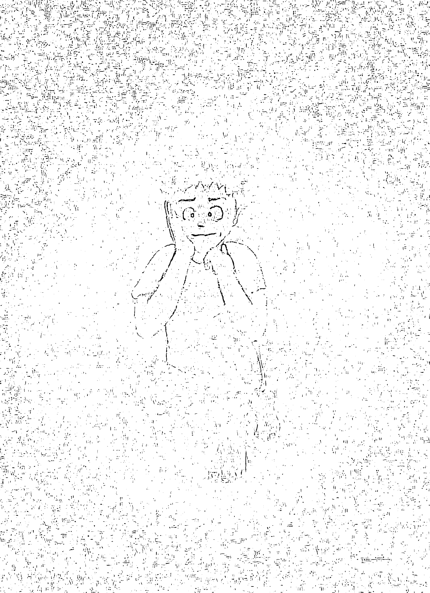

我现在回想，当时九岁还不到十岁竟然就有这个把握——如果一个解答很难，或一般人做不到，那么，这样的解答是绝对靠不住的。那时候还小，怎么有这样的坚定，是自己现在也无法理解的。

但是，也就是心里有这样的指南针，让我省下很多冤枉路。无论周边再困难，我心里都知道可以度过。

长大了，其实后来又遇到相当多类似的不理性，或说卡夫卡式的状况，带给我人生很多的打击。然而，因为有这样的决心，一样地，也就度过了。

度过了，我常常回到当时的原点，也看到现在的人愈来愈多有这样的状态，甚至有严重的忧郁。

因为前面提到的这个经过，让我对这样的朋友特别同情，而我自然会不断在找一个方法，来帮助这一群人。

# 25 无所不在

我相信每个人只要回想，都有过意识扩大的经验。有些人是登山、搭飞机、潜水、滑翔翼的广阔感，有些人是赛车、开船、跑步的速度感。有过这种经验，就好像意识从身体扩大到更大的范围，而让我们心中有一种解开，或放下的体验。

我很小就发现，有时候注意力集中，或睡前特别诚恳地祷告，自然就有这种扩大的经验。最有意思的是，我常常体验到自己是一只老鹰，从天空看这个世界。好像透过老鹰的眼睛，我也跟着一起欣赏这个世界。

让我最难解释的是，在这种经验中，所看到的世界很具体，而且经得起查证。例如从住家往下看，全部的细节都吻合，只是看的角度和平常的角度不同。我会发现，有时候就连在玩足球或走路，也会突然跳到老鹰的角度看着自己、看这个世界，而所看到的细节，和走路的体会完全符合。

好几次，在柔道或足球比赛最精彩、最紧张的时候，我发现自己只要集中注意力，这种全观的现象自然浮出来，让我可以用每一个角度看着整个比赛和对手。同时，它会把这种状态冻结。例如踢球入门的瞬间，或在柔道比赛中不光挡住对方的攻击，还可以把他摔倒。对我而言，自己的反应就像慢动作画面一样发生，但发生的速度其实一点都不慢，而是相当快。

当然，站在小孩的角度，我会发现这个能力很好用。让我争取到很多金牌，踢进许多分数。尤其，在大家最紧张的时候，我反而感觉最放松。最多是把注意力带到自己的心中，而可以看着、体会到的，比一般肉眼体会的广度更大，甚至是无限大。

在更深的层面，我体会到一种过去没有想到的可能。平常，我们都靠讲话来交流。就连小孩子都知道，要用说话和人连结。但是，透过这些很安静的片刻，我自然发现，瞬间和瞬间要连结的倒不是话、不是念头、不是思考，反而是沉默。一个人在沉默中，心自然是流动的。从一个瞬间，不费力，流到另一个瞬间。

而沉默，对我个人是一种「活」的状态。是要透过沉默，才可以找到我这一生想找到的全部。我当时也充分理解，其实沉默和「做」和「动」，一点都没有矛盾。在「动」和「做」的当中，只要可以体会到沉默，自然让我活出「心」——一种无思的状态。而让人印象深刻的是，它本身会让我达到人间认为最巅峰的表现。

这么一来，我发现自己安静下来，从外向转为内向，话也就跟着变少了。

后来我体会到，科学的发现、文学的创作，或公开演讲的表达，都很自然可以进入这种现象。成年后，才懂得这其实是无思无想的状态。这一点，假如不是亲自体验，我过去会认为是根本不可能。

一个人注意力集中，突然跳出思考的范围，也就没有一个作为者的存在。身体自然会做，最多是把马达启动的钥匙交给内心或一个更大的力量，跟我们个人再也不相关了。把这个钥匙交出来，最多是透过信仰，相信生命有更大的力量带着我们走。

好像这么一来，不是「我」或任何人在踢球；也不是「我」做一个完美的过肩摔；就连演讲也没有拟稿，该讲什么，就讲什么；做实验时，每个动作好像会找到它自己，跟我一点都不相关。

成年后才知道，运动和其他领域的所有突破，只要去问当事人，都会用类似的方法来表达。后来，心理学家把它称为心流。

这一来，我才发现这是人类最普遍的现象。但是，我们因为信不过，好像非要用头脑去主导眼前的动作，反而带来一层阻碍，达不到最完美或理想的状态。

这种理解，也自然让我在很年轻的时候就知道，头脑其实是带来一个限制，倒不是一种解答。

头脑本身是人类所面对的一层阻碍，让人无法活出最高的潜能。

甚至，我也同时体会到，透过知识，永远没办法得到生命更深层面的答案。以我个人为例，累积愈多知识，好像限制愈多。最多是在不同的层面堵住，带给自己多一层制约。

我读西方的希腊哲学，也就带来希腊古老的制约。转向文学，就带来文学的制约。后来，读了医学，也就带来医学的制约。任何人为创出来的知识，本身还只是限制，还是制约。

这种领悟，对我的冲击比海啸还剧烈。让我很年轻就发现，这一生是要从知识脱离，倒不是一再地投入知识。我自己可以读很快，比别人吸收得多。我知道这是自己最大的一个挑战，是我今生最大的一个陷阱。

懂了这些，好像肩膀上一个很重的负担消失了。

后来几十年，我看的书其实不多。甚至，这二十年来很少有机会读书。即使工作上需要，我通常都口头交代几句就处理了，倒不会去特别讲究文字。

我过去常听到一句话「真理带来自由」，后来演变成「知识让人自由」。这个演变，从我的角度来看，是错的。其实，知识从来没让任何人自由过。正是因为我们每个人累积那么多知识，才给我们带来那么大的束缚。

回到前面意识扩大的经验，我想不起来是什么时候，也许是几岁或二十几岁，它就自己慢慢消失。我同时体会到，没有一个知识我会想抓，也没有一个角落我想停留。自然发现，我随时可以在每一个角落观察，在这个身体的内或外，甚至在天空，但是同时又懒得停留在任何角落。

也就这样子，在很年轻的时候，就觉得我随时哪里都在，又哪里都不在。这种自由，很难跟别人去分享。但是，我发现它跟了我一生。后来，我听到「无所不在（omnipresence）」这个词，才发现完全可以代表我随时的体验。

# 26 無思無想

我接下來的成長過程很平凡，和別的小孩子都一樣。因為在巴西單純的環境長大，我記得花最多時間的，還是踢足球。其次是很早就進入科學，尤其醫學的領域。

我十三、四歲的時候，住在我父親擔任電機系教授的大學宿舍。那時，我常常一個人騎著腳踏車，到二十四小時開放的大學圖書館，一個人待到半夜，讀科學和醫學的期刊。當時，我最喜歡 *The Journal of Experimental Medicine*（《實驗醫學期刊》）。這個期刊有四位主編，其中，寇恩醫師（Dr. Zanvil A. Cohn）是當時免疫和細胞學領域的大師。

談到免疫，也就是我們人體對疾病或病毒、細菌的抵抗和防禦。這個題目表面看來單純，但可以從各式各樣層面切入，例如從細菌的角度或反過來從宿主的角度著手去研究，其實是相當廣的領域。

寇恩醫師的論文，不光是實驗設計的邏輯清晰，表達方式也相當明瞭，簡單幾句話就能把實驗的重點表達出來。我記得每次讀，就帶來很大的喜悅，讓我非常投入，而希望有一天能跟他一起做研究。

當時我才十幾歲，就給他寫了一封信，希望可以加入他的研究團隊。沒想到，他馬上回信，等我去紐約見他。後來，我也就這樣完成了醫學和研究的訓練，並且在同一個單位建立自己的實驗室。

到紐約後，他把我當作自己的兒子一樣對待。我覺得又從天上落下一位守護天使。回想在紐約那幾年，從當學生、實習、研究、教學，我一生中最愉快的幾年，都跟這位教授有直接的關係。

他同時是美國科學院的院士，可惜英年早逝。他當年的博士後研究員，也是我的同事史坦曼醫師（Dr. Ralph Steinman），因為和他共同進行的研究而拿到諾貝爾獎。我們都知道，如果寇恩醫師還健在，會一起得獎。

布朗克大樓，對我而言不光就像家一樣自在，在同一棟大樓的同事，都是非常傑出的人物。

我後來建立的獨立實驗室，佔了二樓至少一半的空間。在那之前，是在四樓和史坦曼醫師一起在寇恩醫師的實驗室進行研究。不只四樓的史坦曼醫師，還有三樓與我合開「細胞生物學」，解開蛋白質在細胞內運送方式的布洛貝爾（Günter Blobel）、五樓發現輔酶 A 的李普曼（Fritz Lipmann）、六樓證明核糖體功能的帕拉德（George Palade）、七樓發現溶酶體的杜維（Christian de Duve）、九樓定出抗體結構的艾德曼（Gerald Edelman），都是諾貝爾獎得主。

在這棟大樓，我當時還年輕，才剛起步。其他教授都相當年長，都是美國科學院的院士，包括八樓證明 DNA 就是遺傳物質的馬卡蒂（Maclyn McCarty）。雖然後來諾貝爾獎頒給解開 DNA 結構的華生（James Watson）與克里克（Francis Crick），但是他的研究也是相當有分量，本來大家都看好他會拿諾貝爾獎。

那幾年，從十幾歲開始對科學有興趣，到後來做博士後研究、自己獨立帶領一個很大的實驗室，是我專業上最快樂的幾年，在科學上也有不少突破和成就。

可以想像，當時年輕的我，在這種高成就的環境，自然影響到我對科學的看法。讓我對自我要求嚴謹，對學生也相當嚴謹。這也成為我一生的基礎。

但是，現在回頭看，我印象最深刻的，還是一種意識的狀態，好像從來沒有離開過我。

這一狀態，就是一種沒有念頭的狀態。

我從十幾歲開始，包括成年之後，常常會很長一段時間沒有念頭。當然，從別人的眼光來看，就像在發呆。但是，我自己心裡知道是在專注。是一種意識擴大的狀態，也就是前面提過的無所不在。

不知不覺，我自然就發現，其實我全部的創意或靈感，都是從這種狀態自己生出來的。想不到，其實我什麼都不用做，不用去思索眼前的這個問題或題目，自然知道要怎麼進行。

這本身，常讓我覺得不可思議──既然沒有念頭，眼前的問題或情況好像和我分離了。但不知不覺又好像可以針對這個問題得到一個最好的解決方法。當時，這對我充滿了悖論，沒辦法用邏輯去解釋。

除了創意之外，對我最明顯的是，這種無思無想的狀態其實是大休息。讓我身心可以放鬆，甚至比睡覺的休息還更深。

後來我才發現，我們在睡覺時也有一個無思無想的狀態——沒有夢的深睡，和這種無思無想的狀態很接近。差別在於，我們一般睡著了，也就意識不到。

我們每個人大概都有這種體驗，經過一個沒有夢的深睡，這時候醒過來，一定是個最休息，最舒暢的狀態。無論之前有什麼煩惱，經過這個深睡，也就好像把它洗清了。

因為這樣可以得到很大的休息，我成年後自然發現自己需要的睡眠愈來愈少。有時候，連續一個晚上或好幾個晚上不睡覺，別人也看不出來。但是，我自己心中知道，還是有透過這種無思無想的狀態來充電。算起來，真正休息的時間不會低於一般人夜裡睡眠的時數。

習慣了，我最多也就接受這些現象。接下來，也不再分析這種狀態。它已經變成我生命裡既自然又重要的一部分。

另外，有一個現象很有意思。雖然在無思無想的狀態，卻轉出來許多畫面，是關於未來的發生。

剛開始，我認為是幻覺，沒想到卻都驗證了。有時候是下午、明天、下星期要見到的人，或要發生的事。在那之前，都有一個畫面浮出來，而從實際的發生，讓我可以證明這些畫面都是正確的。

好像一個人在無思無想的狀態，已經沒有時間的觀念。就像打破了時間的框架，彷彿走在時間的前面。這好像也沒有什麼特殊，它本身就是一個自然的現象。

同時，我發現，隨時進入這種無思的狀態，它本身就可以讓我發揮最高的效率，而可以隨時從科學轉到哲學、醫學、下棋、操作電腦、一般生活，而中間似乎沒有一種隔離。當然，從別人的眼光看，會覺得我做事速度很快，效率很高。但從我個人實際的經過來看，剛好相反，沒有念頭，也沒有什麼效率好談，都是在很輕鬆的狀況，一件一件事地完成。

我後來試著想跟別人分享這種意識的狀態，但發現每次只要開口跟人家分享，馬上就受到質疑或引起對立。聽的人第一個反應是——不可能，沒有這回事。也有人認為，這種表達很奇怪，不太正常。

還有人說，「當然你有，而別人不會有」，認為這是一種 IQ 的表現。所以我幾十年來，從來也不想多說，只是心中一直認為這是每個人都有、而且最自然的狀態，當然總是期待有一天可以大膽地跟別人分享。

# 27 杜博斯 René Dubos

我當初到紐約洛克菲勒大學，它完全是研究型大學，沒有招收大學部的學生，而且偏重醫學和化學領域。

將近四十年前，我在那裡當學生的時候，我記得全校有六十個獨立實驗室，而每一個實驗室的規模和一個系所差不多。每個獨立實驗室都有一位指導教授。我當時所待的實驗室，規模相當大，有八十幾位研究人員，再分成八個研究單位，各由比較年輕的教授負責。

當時，我記得，很多教授已經得過諾貝爾獎，或是被公認早晚要得獎。我後來回去查，從一九〇一年創校以來，已經有二十五位諾貝爾獎得主，是醫學領域得獎者最多的機構。

當初洛克菲勒大學至少在免疫領域，是全球最大的研究單位，也最有影響力。所以，我那時就喜歡找同事們談話。他們每一位在各自的領域不光是投入，而且都是權威。

我們在學校有一個教職員俱樂部，提供飲料和食物，讓師生可以交流。當時，學校每年只收不到十五個博士班學生，可以說是老師比學生還多，而學生是個個都很傑出。不過，我的興趣讓我一直去親近一位老教授。當時我二十歲，他已經八十幾歲了，可以說是上上一代的教授。

這一位老教授，就是杜博斯博士（Dr. René Dubos）。他在一九三九年，發現了短桿菌素（gramicidin）這種抗生素。三年後，就點出了未來抗生素很可能濫用的問題，當時他的同事都認為他會得諾貝爾獎。但是，盤尼西林後來得到全球的注意，發現它的弗來明在一九四五年成為諾貝爾獎得主。

我當時會想親近杜博斯，倒不是為了他在抗生素或免疫的成就，而是他寫了很多本書。其中，《So Human An Animal¹》得到一九六九年的普利茲非小說類文學獎。跟他接觸，就像和一位哲學家交流。他來自法國，帶著一種歐陸的優雅，充滿哲學的味道，不光對樣樣都看得比較完整、圓滿、周到，而且帶著一種靈性的層面。我接觸他之後，才會用英文 holistic（整體）來表達生命有更深的、我們眼睛看不到的層面。

我跟他相差了至少六十歲，但是，他對年輕人的尊重，是我難以想像的。有時候，我會跟他聊上好幾個小時。直到他的秘書進來，提醒他該去用餐，或有其他重要的事要處理，而我該走了。

在這些談話中，他影響了我一生對醫學和健康的觀點。

比如說，我記得當時大家都想找出病毒致病力（virulence）的機制，而他的注意力反而完全放在宿主。他用一個詞 host terrain 來描述宿主的狀態，就好像在講土壤健康不健康。

¹ 本書尚無中譯本，暫譯《人！這種動物》。

他強調的是，如果可以改造宿主這種「土壤」的性質或狀態，會比探討病毒的致病力更為重要。當然，他沒有找到一個具體的方法，來證明這個觀點。但我記得，這些觀念與我相當相應。

此外，我喜歡跟他談人生的問題。透過他，我發現，一位科學家不見得需要把自己陷入一個狹窄的範圍、只對自己的科學領域感興趣，而是可以進一步整合所有的領域，在其間沒有任何衝突。這是杜博斯吸引我的地方，自然影響到我個人研究的興趣。

杜博斯不是只跟我談哲學或科學，也跟我談他在第一次世界大戰後，從紛亂的歐陸移居美國安身立命，度過人生後半的經過。這些，也讓我相當注意。

他說起自己的故事時，用一個很慢的步調來講。我發現，他看人生，就好像在畫畫。一個細節，又一個細節，很有耐心把畫布一點點填滿。自然讓聽的人投入他所表達的世界。

除了這些以外，我必須承認，我每次和杜博斯談完話，就好像得到一次洗禮，對我個人帶來好大的淨化。自然讓我對生命更有信心，更有希望，而可以站在整體，重新看我眼前的世界，為我帶來一種更深層面的充電和鼓勵。

# 28 歌德爾定理

除了杜博斯之外，我相當幸運，能在洛克菲勒大學見到當時各領域最頂尖的人物。洛克菲勒大學是一個很純粹的研究型大學，從各地把最好的人才挖角過來。每一個「系」或說「獨立實驗室」，規模其實相當於外界的一個研究機構。他們效法英國的制度，每間實驗室都是一個獨立的單位，由主持人獨立運作。每一個實驗室的主持人，地位就像一般大學的系主任一樣。

建校初期的幾位校長都提過，洛克菲勒大學也許是全世界最迷你的大學，卻集合了各領域的菁英，包括數學、物理，更不用談最核心的生化和醫學。前面也提過，在很短時間內，就累積了二十多位諾貝爾獎得主。

我自己的專業是生物醫學，主要是分子免疫和細胞生物。但是，我年輕時，更喜歡探索數學、物理、化學、生物這類純科學的領域，也自然喜歡接觸數學跟量子物理的研究人員。當時，我擔心自己基礎不夠，晚上還另外到紐約大學去上研究所的數學課。

洛克菲勒大學那時大約有六十位教授，如果我沒有記錯，其中只有兩位是華裔。從哈佛大學聘來的王浩教授，就是其中一位。他的領域是數理邏輯，也就是用數學來研究邏輯。我跟他接觸，馬上感受他和別人不同。他跟杜博斯一樣有很濃的哲學傾向，只是他用數學來解釋哲學。

是王浩教授，介紹給我歌德爾的數學定理。歌德爾的數學定理，是在探討自然數（natural numbers）。我在之前的作品提過，假如用一般人的語言來講歌德爾定理，最多是在說：處在一個封閉系統，你絕對不可能解釋架構之外的現象或動力。一個人要從這個框架跳出，才可以理解框架外的世界。

然而，要從這個框架跳出來，是相當難。因為所謂的「跳出來」，也只是落到一個更大的框架。這也代表，人類全部的突破，必然是觀念上徹底的變更（典範轉移 paradigm shift）才可能達到。

當時，我記得，他課堂上的學生都是主修物理和數學的研究生，他很慷慨讓我參與旁聽。然而，課堂上，往往是我和他兩人對話。

我記得，當時王浩也很期待我們的談話。他沒有想到，竟然有人可以在意識的層面親自體會到歌德爾的理論。除了課堂之外，我們也會約時間討論。有時候本來只約半小時，但是到後來一講就是兩、三個小時，而他對於我們的談話相當歡喜。從他的角度來看，本來只能從理論架構在解釋哲學，卻突然出現一個年輕人可以驗證——特別是透過個人的體驗，為他驗證這一整個理論。

有時，碰到數學上的盲點，他會在課堂上讓我用哲學的角度來解釋，讓大家從另一個層面理解數學的意義。歌德爾定理給我一個語言，讓我可以很容易從相對的層面，進入絕對的討論。我也用我個人的體驗，來驗證歌德爾定理在相對的範圍其實是對的。

現在，王浩已經過世二十多年。然而，這些互動，在我人生留下很深的印象，讓我回味再三。很多年後，我用歌德爾定理帶出全部生命的觀念。雖然知道它沒辦法表達意識譜的全部，但至少可以讓我在語言上用更清晰的方式來說明。

除了王浩，還有一位柯恩博士（Dr. Edward Cohen），他出了一本《量子電動力學（Quantum Electrodynamics）》。這個領域一般縮寫成 QED，剛好和數學證明完成時最後寫的 Q.E.D.（由此得證）是相同的三個字母。

量子電動力學，是量子物理和狹義相對論的交會。透過這個領域，可以用量子力學來解釋一般現象。比如說，解釋光和粒子之間的交互作用。這個領域，也可以說是古典電磁學用量子的語言來延伸。

我父親是電子學專家，當時還在大學教書。我不到七歲時，已經讀完他書架上所有的物理和數學的書籍，包括後來在一九七七年拿到諾貝爾化學獎的普里高津（Ilya Prigogine, 1917-2003）的《非平衡態統計力學（Non-Equilibrium Statistical Mechanics, 1962）》。他文章的流動，甚至他的公式，在我讀來，就像讀詩、像聽古典音樂那樣地美，讓我進入一個不同的狀態，真是不可思議。我相信不只是我有這種體會，也有愈來愈多科學家體會到他的突破是前所未有的，才會頒給他諾貝爾獎。

在這些物理和數學書籍中，我最喜歡讀的是馬克士威方程組（Maxwell's equations），以及非線性微分方程（nonlinear differential equation）。我很早就知道，一般對這些數學方程組的理解都相當淺。其實，裡頭含著很多珍貴的點，可以用來解釋當時一般人無法理解的特斯拉的突破。

當年，在我小的時候，沒有人知道誰是特斯拉。沒想到幾十年後，他的名字已經家喻戶曉。一般人只知道愛迪生是直流電之父，也是燈泡的發明人。小時候，我曾經跟父親表明，特斯拉才是我的偶像。他不光擁有千項專利，是交流電之父。他的眼界更遠遠超過愛迪生和同代的科學家。只是因為他特立獨行，自然被同行排斥。

回到量子電動力學，你可以想像，我讀完馬克士威方程組後，再讀到量子力學，就好像嘗到靈魂的甘露。每個數學式，都讓我愣住停留好久，而自然可以解釋我個人的經過和領悟。

當時，和柯恩互動也是一樣。其實他課堂上都是優秀的物理學生，但是不知道為什麼，每次到後來，就變成我們兩個人在對話。

半年後，他問我主修什麼。我告訴他，我主攻分子免疫和細胞生物，尤其在醫學領域。他很驚訝，說了一句：「你在浪費時間。你應該成為物理學家才對。」

我當然知道，從他的角度說這句話，是對年輕人一種最高的稱讚。我也很高興，可以得到一位那麼有名專家的肯定。但這個經過同時也讓我覺得相當有趣，一位專家，無論什麼領域，都難免會認為自己的領域是最重要的。

這類的互動多了，也自然教會我可以很輕鬆地去面對科學、醫療、管理……各種不同領域的專業人士，知道重點倒不是去直接衝撞一個問題，而是站在領域之外，來看同一個領域。

也就這樣子，對任何事、任何主題，我自然有一個更大的藍圖。不光不會帶來衝突，反而帶出來解答。也就這樣子，我發現自己隨時在試著活出前面提到的歌德爾的理論。而這種做法，是不費力的，是輕鬆把眼前的觀念或難題挪開甚至放下來，一個人也就不知不覺可以進入一個更大、更深的藍圖。

我會提這些經歷，一方面是表達對這些老教授最高的敬意，另一方面也是讓我有充分的把握——有一天，也就是現在，全部科學的領域都可以拿來解釋靈性。

科學的發展相當完整，好像只差那麼一點點，就是沒有從哲學或生命更深的層面來看科學。所以，指出的重點都偏了。

從更深的層面，提到和他們互動的經過，也同時讓我再次想到自己的父親和母親給我一個相當安靜的環境。畢竟，在巴西，除了足球之外，沒有別的事讓我分心。我花很多時間閱讀父親的藏書，也就透過這些鑽研，把我個人在各領域的理解做了一個統整。

# 29 紐約的一家書店

在紐約，二十歲左右，有一天走在路上，注意到一家店飄出一股檀香味。我很自然就走進去，發現它是一間有各式各樣哲學、宗教、靈性書籍的書店，讓我非常感興趣。

在書店裡，從一條走道，逛到另一條走道。眼角突然瞥見一本書，平擺在架上。書的封面，是一張照片，是一張年紀相當大的臉。我也不知道為什麼，突然愣住了。盯著這張照片，注意力全部集中在他的臉上。眼淚，從眼角落下來，愈來愈大滴，像珍珠一樣，停不下來。

我站在那裡，看著他的臉。沒有什麼念頭，只是看著他。這張臉，好像在更深層面早就已經認識。不光認識，還是最親密的認識。我也只是繼續流淚，流不完的眼淚。

這時候，就像觸電一樣，從我的頭頂到腳底，一波波不斷沖刷下來。我感覺到鼻腔的空間整個都放大了，背部也放大了。呼吸，好像沒有邊，沒有底。意識好像自然擴大。人好像在那個時一空，又好像不在那個時一空。

在哪裡，我也不知道。不知道，我也無所謂。

我站在那裡不知道過了多久，也沒有時間的觀念。後來好像聽到旁邊有人在關心，有一位女士問我：「你還好嗎？」我才回神，回到那家書店的空間。對她笑了一下，說：「I’m OK. 沒有事。」
我看到的那本書，是一本從外語譯成英文的書。誰譯的，我也想不起來了。封面上的男士叫做拉瑪那·馬哈希（Ramana Maharshi）。我把手放在書的封面上，好像突然體會到他在說什麼。不用讀，似乎已經完全理解他想表達的。
簡單看一下封底，知道他是一位大聖人。一八七九年出生在印度，在印度聖炬山（Arunachala Mountain）修行幾十年，一九五○年去世。
後來也知道他是 *ātma-vichāra*——探究真我的大師。探究真我，是一千多年前印度不二論的修行方法。在我心目中，它就相當於華人禪宗的參。好多年後，我透過「全部生命系列」的作品把「參」的觀念分享出來，提到拉瑪那·馬哈希。許多人以為我花了很多時間閱讀他的作品。其實，完全沒有。除了恰好看到的幾句話，我從來沒有去讀這些作品。
但是，我也沒辦法解釋。透過我年輕時在書店的那一次相遇，好像把他找回我的生命，也自然讓他和我在內心更深的層面結合。接下來，對他的理解，完全不是透過他的文字去抓、去解釋。
最多是透過那次的經驗，看著他的照片說——Thank you. 謝謝。我懂了。
我最多也只能感謝他，再度回到我的生命。再次回來成為我的老V2.012U

- VIDEO MODE
- ▼ ▶
- REC
- ...
- ...

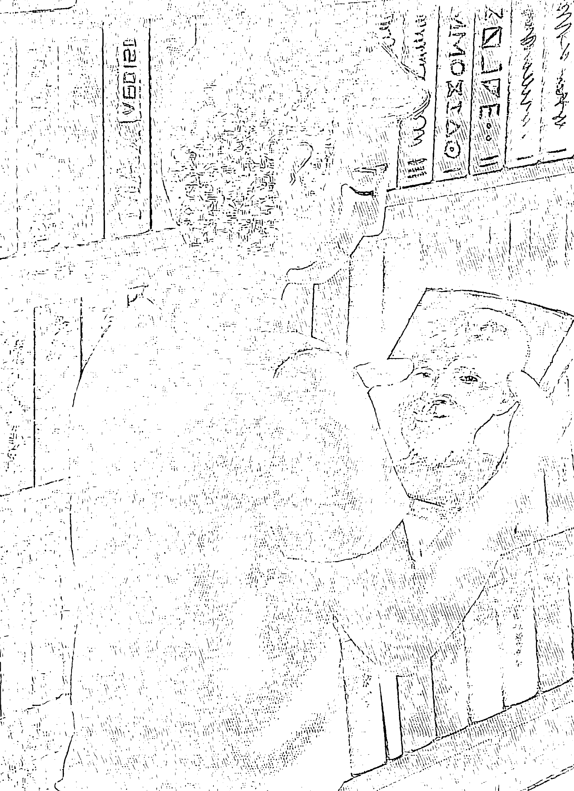

師，在那個書店完成了一個沒辦法表達的傳承。 這一生最親密的重聚，我認為是我得到的一個最大的禮物。這本身也是一個最大的奇蹟。

# 30 《六祖壇經》

過去有人說，假如一個人誠懇，所需要的老師自然會來找你。
我記得小時候就聽過這些話，想不起來是誰告訴我的。但是，這
句話總在心中造出一個矛盾——怎麼會是老師來找學生，而不是學生
去找老師？

一直到成年，我才懂得這句話是對的。

在紐約這個書店的經驗之後，很短的時間內，我也在各種因緣巧
合下，踏入各式各樣修行的領域，包括佛教。

在這之前，因為很年輕就成為醫師，又拿博士學位，把醫學和科
學研究當作主要的追求，自然把小時候對哲學和宗教的追尋擱到一
旁。沒想到，紐約這個書店的經驗，就像打開了一道水門。接下來，
各種機緣像水一樣不斷沖過來，擋都擋不住。

例如佛教，我小時候沒有接觸過。畢竟，巴西沒有這方面的資
訊，是後來到紐約才有機會接觸。然而，最早讀到的也不是佛經，而
是禪宗六祖慧能所留下的《壇經》。中國禪宗的祖師是印度人達摩，
他是從佛陀弟子大迦葉算下來第二十八代傳人。他一個人來到中國，
將禪的傳承一代一代往下傳。直到六祖，禪宗才在華人的文化裡普
及。華人所留下來，唯一一部可以稱為「經」而不是「論」的紀錄，
也就是《六祖壇經》。

假如我沒有記錯，是在紐約同一家書店，順便買了這本《壇經》。但是，放了好幾個星期，都沒有去讀。

有一個週末，坐在家裡一個角落，打開書。和看到拉瑪那·馬哈希的臉一樣地，從第一句話讀下去，眼淚就停不下來。接下來，我發現自己在天花板上看著自己在讀。讀什麼，我也不知道了。但是，從某一個層面，又好像全部都懂。就好像第一個字和最後一個字沒有任何差別，全部都在腦海，好像老早都知道，都見過。

從天花板往下看，在看的我，好像還可以繼續擴大，甚至可以放開《壇經》，不用再守住它。最多是從天花板浮出來，看著下面的房子、馬路、森林。接下來，月亮、星星，整個宇宙。

我突然體會到，哪裡都可以在，而且，哪裡都不在。

也突然體會到，一切都是完美，一切都是完整。一切都有，一切什麼都沒有。

我不曉得在這個宇宙待了多久，也許是一秒鐘，也可能是一個小時，也可能是永恆。對我，一點都不重要，而跟我一點都不相關。

最有意思的是，當場，整個宇宙怎麼來的，地球數不完的文明，好像瞬間從我眼前流過去。自然讓我體會到——樣樣，沒有一個東西是絕對的，也沒有一樣東西是重要的。全部，都是一個大幻覺。

我們人是個大幻覺。東西、世界、連宇宙都是個大幻覺。

而我們還在談什麼是人生，這完全是個大笑話。

最不可思議的是，整個宇宙、這個世界，我們每一個人、每一樣東西——全部的大幻覺，都是從我心中延伸出來的。其實，是我製造了一切。是我想出來了全部。沒有一點一滴，不是我創出來的。我是太陽，我是月亮，我是地球，我是地球的每一塊石頭、每一棵樹、每一個眾生。我是每一個嬰兒，我是還沒有生出來的嬰兒。我是往生的人，我是往生後的人，我是一切。

沒有一個東西，不是我。

這種體會，比一個足以毀滅地球的地震帶來的震動還大，比一個海嘯的力量還更可怕，比一個真空更能吞沒一切。我發現，我過去所建立全部的世界，也就跟著消失了。

這時候，我終於回到肉體。發現《壇經》在我手上，閤了起來，已經到了封底。

我想不起來自己停留在這個狀態多久，只記得這個經驗對我影響相當大，讓我想捨離這個世界。

接下來，我看這世界再也不一樣了。對古時候的大聖人，自然從心裡產生一個最高的尊敬。

（文档内容因图片模糊无法准确提取具体文字）

# 31 自由墜落

前面讀《六祖壇經》的經驗，帶來一個很有趣的現象。

我突然發現，這一生所經過的，到那一天為止的一切，都是一個「假」的現象。我說「假」，倒不是它不存在，而是說它只是隨時從腦裡面延伸出來的。

我注意到，連眼前講的任何東西，可能被我認為既堅實又客觀的一切，一點都不堅實，也一點都不客觀，完全是由眼睛的看、耳朵的聽、鼻子的聞、舌頭的嚐、身體的觸覺造出來的。

真要從裡面去找什麼，其實什麼都找不到。

這幾句話，其實我早就懂了，但沒有那麼清楚體驗過，沒能那麼清晰地整合起來。

好像在那個經過裡，有一個「我」在讀經，甚至可能在掉淚、感動或有其他更深的體會。但是，又同時對我——可以看到、體會到的我，一點都不相關。就好像意識可以做一個分離，有一個部分不斷地在動，透過語言不斷地在表達，透過「想」不斷創出一個世界，而還有一個部分完全不動。

這個不動的部分，隨時在身邊。但是，為什麼我從來沒有體會到它？這本身，對我才是最不可思議的。

我發現，其實只要我不去抓眼前的東西，不去抓任何事情的發生，自然也就退到這個不動的層面，而什麼都不需要做。

這種感受就像一個人從大樓跳下去，自由地墜落，而不斷地繼續往下掉。摸不到邊，抓不到任何東西，沒有任何依靠，沾不上任何東西。最多只能不斷地在跌落。當然，也可以反過來說，是不斷地往上升。沒有任何東西可以把它拉下來，沒有東西能把它擋住或限制。

我發現，在這種狀態，我自然可以從一個境界再到一個境界，一個世界到一個世界，甚至穿越天堂、地獄、各式各樣的天界。但同時清楚地理解——這些，都跟我一點不相關。

對我沾不上。

最難想像的是，任何觀念、任何語言、甚至任何念頭，都跟我無關。

我會用自由墜落來描述這個經過，雖然它確實帶來一種自由，但這種完全的自由，讓我當時完全失去安全感，甚至帶來很大的恐懼。因為，一生所有可依靠的東西，都突然靠不住了。

甚至，在墜落的當中，我發現，連一個念頭都不能去抓，抓不到。連我們一般所說的意思或意義，都離不開頭腦的投射。本身沒有一點點真的存在，都抓不到。

自由地墜落，我發現自己頭腦不斷簡單化。回到像一個嬰兒，連衣服都沒有。光著身子，完全沒有地方可以跑可以躲。對他，沒有一件事情重要。

這本身，帶來一種放下，是我過去從來沒有體會過的。

最奇妙的是，從這種放下的狀態，可以延伸出任何東西，甚至宇宙。一點衝突都沒有。讓我自然發現，「有」是從「空」生出來的。而兩者確實是兩面一體。

我自由地墜落，自由地上升，本身就為我帶來難以言喻的喜悅，就好像停留在這個喜悅。甚至，連這個喜悅，我都不用停留，它反而會愈來愈大。我愈不停留在它，它非要更大，甚至想把我整個人吞掉。大到一個程度，每一個細胞都跟著喜悅起來，而創出一個無限大的波動，一個喜悅場。不需要對任何境界帶來干擾，也不會讓任何境界干擾。

我想不起來停留在這種狀態多久，可能幾個月，甚至幾年。但是，我清楚地知道，它對我每一個細胞，尤其神經細胞帶來一個大的整頓。就好像我身體的組織非要重新連結，建立新的線路，透過徹底的變更，來配合我的理解。

我自然注意到，自己的睡眠習慣、消化功能有了大的改變，代謝也慢下來，呼吸自然拉長。到最后，連身體皮膚的味道也變得不一樣。同時，自然對許多事情的發生、甚至還沒有發生的，有一種不知從何而來的體會。還沒有見到的人，好像都見過。再陌生的人，也可以變成親密的朋友。個性也突然變了一個人，說不上是外向或內向。最多，只能講兩個都是，看情況。

接下來，看世界，也好像顛倒。發現我全部過去所學的，無論從學校學來或自己所讀、所體會的，沒有一樣東西是存在。任何一個我過去認為重要的價值觀念，最多也是清楚知道全是人造出來的。

我突然發現，不光這一生所看的全部是顛倒。整個人類的歷史、文明和文化，過去所留下來的紀錄、奮鬥、理想，都是顛倒的。全部的領域，包括修行的領域，全部都是顛倒，都是多餘的。

最多只是反映我們大家的無明。

最好笑的是，我從出生到現在，都以為自己在主導生命。但其實是反過來，什麼都主導不了。沒有一樣東西，我可能主導。

但是，我們因為有這個腦，表面上有「自由意志」，自然會以為是相反的。

# 32 內爆

我想出家的念頭，不斷浮出來。想離開家，離開這個世界。當時連飲食習慣也轉為素食，維持了許多年。體質變得相當敏感，好像隨時可以感應到別人的疾病、痛心，就連陌生人也一樣。我花很長的時間靜坐，甚至閉關。有時候，可以幾天靜坐不動，自然也就斷食。

我觀察到，頭腦自然還是會動。雖然到了很微細的境界，但不管怎樣，還是有境界、有畫面可以描述。我發現這些都只是妄想，最多讓它自己流過去。只要不去管它，任何境界，來了，也可以走掉，確實都留不住。

沒想到，我自然體會到這個宇宙的根源——這個宇宙怎麼來的。好像我見證了宇宙的爆發，地球怎麼延伸出來，而同時看到——一個文明來，一個文明走。雖然樣樣都很精彩，但是，不去理它，也就像一個海市蜃樓，也就過去了。

記得有一天，我自然接觸到佛法。或反過來說，是佛陀把我找回來。

在很短的時間內，有各式各樣的巧合（也可以稱之為奇蹟）。朋友，或許再透過他們的朋友，把佛陀的全部經典都帶到我面前。當時，如果有人看到我的圖書館，自然會說——任何一部經，尤其佛經，只要譯成了西方的語言，都會在我的藏書裡。

但我必須坦白向大家告解，這些經，除了《心經》《金剛經》和一部分《楞嚴經》之外，我沒有讀過任何一本。許多人以為我應該讀遍了所有的經典，然而，我讀過的，最多也就是這幾本。

沒有人能想到，我在這些經典的旁邊靜坐，居然在這個空間會有一個寧靜的場。這個場是不可思議地大。好像透過這個寧靜場，這些經典活起來了。自然跟我感應，倒不是透過文字。

我和文字的互動，往往是好多年後，也許是自己恰好讀到或剛好有人讀給我聽，我才發現經典所表達的，其實是我老早就親自體驗到的。也就是透過這些經典的對照，讓我對自己的體驗得到一個很深的驗證的作用。這樣的緣分，當然會讓我珍惜再珍惜。

也因為如此，我對經典的體會也可能和別人都不一樣。我後來也發現，自己自然能夠解釋任何一部經典的內容。而且，這些解釋不是一般從人間理性的層面可以得到的理解，甚至往往和一般的看法完全顛倒。

有一天，有人送給我一本書，我打開包裹，看到一位老先生的相。鬍子很長，頭髮也長。像是出家人，又不像出家人。他坐在那裡，很寧靜。

這就是虛雲老和尚。

我站著，看著他。眼淚像珍珠一樣掉出來，好像過去就很熟悉。

和上次不一樣的是，好像眼淚掉到一半就凍結了，而我在凍結的狀態下停留了不曉得多少小時。接下來，也就自然想盤腿坐下來。

事後，我才知道，虛雲老和尚（一八四〇年至一九五九年）可以說是當代華人的大禪師，活到一百二十歲，而我手上的這本書，有他一百一十三歲遭遇大難後寫下的自傳。

我坐下來，眼前浮現出許多畫面，在時間順序上是顛倒的。就像一個漩渦，從現在，回到小時候、出生、出生前、前世、再前世、再再前世、原始人、野獸……不斷地像漩渦帶進去，速度很快。

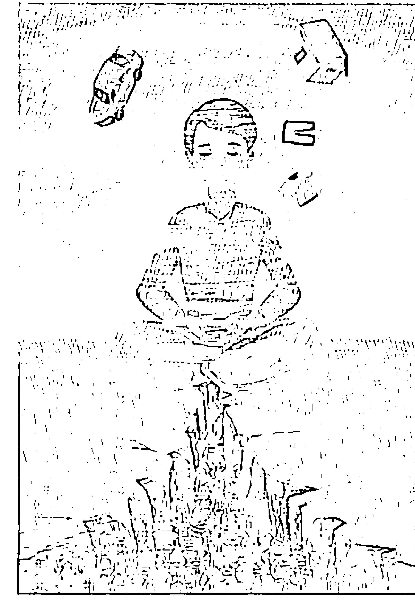

突然之間，《心經》的每一個字浮現出來，每一個字，自然和我自己的體驗與領悟在對照。就好像每個字活了起來，而每個字都有想不到地深的意義。

二百六十字，一字一字跟我對照。

接下來，順序反過來，從後面往前，一個字一個字浮出來。一直到最後一個字，也就是《心經》的第一個字。突然，身體爆炸了。不是往外爆，而是內爆。不光好像我從頭頂劈開，而這劈開是從各個方向在裂開，甚至是粉碎。它突然連腳底下都打開，像地震一樣裂開。好像下面是無底洞，剩下的粉碎，就從這裡掉下去，乾乾淨淨，什麼都沒有留下來。

內爆後，什麼都不剩，什麼都沒有。

連沒有都沒有，乾乾淨淨的。

我記得坐下來的時候還不到晚上六、七點。睜開眼睛時剛好看到太陽升起。還看得見最後一顆星淡淡的影子，和早上淺淺的月亮。

我也看到釋迦牟尼佛，兩千六百年前，他睜開眼睛，看著宇宙，就是這個畫面，在我腦海閃過去。

這個經過不光是太突然，我沒辦法跟任何人分享，也知道沒有任何人可以體會。最多在心中，不斷地向全部大聖人頂禮。心裡明白，只有祂們會理解。

# 33 從自由墜落，到內爆，再墜落，再內爆

這兩個現象，讓我停留了不知多長時間。

頭腦的觀念還是會再三起伏。特別的是，它一直往過去走，甚至回到嬰兒的狀態。我突然也記起之前數不完的生命，只要不去理它們，自然就進入一個自由墜落——什麼都抓不到。什麼記憶，什麼觀念，對我都不重要。

連知，知道什麼，都跟著不重要。

好像它最多變成一波又一波的回憶和觀念流過去，而我都不去理它。只要剩下一點，我自然發現它會透過內爆，完全毀滅掉。

在這種經過中，我過去提到的太陽也出現了。像一千萬顆太陽那麼亮，擴張到整個星系那麼大。但是，它自然也內爆，碎到最後什麼都不剩下。接下來，太陽會更強烈，但也隨時會內爆。

想不到的是，不光是頭腦的觀念或心理的狀態依序一一回來，而我發現，我的身體也跟著變化，會自然重複身體哪一個角落不舒服。一樣地，也是從現在回到嬰兒的時候，好像身體也要跟著去整頓。

但是，我很清楚，是有這個意識的轉變在先，才跟著有身體的變化。也就好像身體想跟上意識，不想被意識落在後頭。我後來，用「好轉反應」來描述這種身心隨著時間回溯的淨化。然而，這些觀念當時對我都不重要。我只是讓它消失它自己。

我現在想不起來，這種經過不知道重複了多少次，多少天，多少禮拜，多少個月。沒有任何觀念，有時候讓我自己覺得像一張白紙，什麼都沒有，連一個字都沒有。

很不可思議的是，我在國外長大，原本只要見過的人，都可以叫出名字來。但是，那一段時間，不要說別人的名字，有時就連自己的名字都說不出來，而自己在做什麼也不清楚。

有幾次會緊張，擔心自己的腦是不是嚴重的退化。但是，只要不去理它，一樣發現我還是可以做事、可以講話、可以動腦筋。

只是，少掉了「誰」在主導這個身體。

我突然想起數不完的生命，好像快速地閃過去。我當醫師時接觸過很多病人有瀕死經驗。有些人的心跳或腦波停了，在臨床上認定已經死亡，但是又回來了。活回來的過程中，有各式各樣的記憶和影像。我不知道我個人的體驗和這個相不相關。但是，我不去理它，它自然樣樣都不停留，而不斷地再往過去去捕捉更多記憶。

我看到自己當過叫化子、男人、女人，曾經是各式各樣的種族，在各式各樣的星球都待過。周邊也有各式各樣長相不同的人，甚至有比我們遠遠更先進的人類。當然，我也不知道這是過去還是未來。這些經過，快速地流過去，而我的感受是永恆。那一生的點點滴滴，到今天我還是可以描述出來。

內爆之後，我自然又跳到另外一個空間，重複那一個空間的經過，從嬰兒到老死。

但是，不去抓它，它又像個影子或雲，飄過去。我最多只是被動地看著它們。

不光有各式各樣人間的境界，也同時去了各式各樣的天界。發現每一個天界的生命，長相外觀都不同，而且表達溝通的方式也不同。有些用語言，有些用眼睛對看。有些用波動溝通，有些在無思的狀態但還是在溝通。

溝通的，最多也是愛。

相對地，我也發現停留在地下，或者說地獄，不知多久。一層一層，愈來愈粗重，看到的生命也不一樣。有些就像怪獸。有些跟人比較接近，但很清楚看到帶著惡意。甚至有些生命，有著女性的外形，會來勾引或吸引。我發現這些生命，無論好好壞壞，都像在考驗我。我樣樣都不去理它，它也就像雲，像影子，過去了。

接下來，假如那個空間還剩下下來，也就自然爆掉了。

> 有時候，我會想起《聖經》提到耶穌在沙漠經過四十日夜的誘惑。這種理解自然讓我把持住，把這些都當作幻覺。

回到人間，我也好長一段時間留意到每個人不但帶著光，而且讓我明顯地意識到和其他境界的關係。有些人好像有一些靈體連在他身上。還有人，似乎帶著他前世生命的特徵，例如一個老人的形相。

也有很長一段時間，我一看到人，就好像感覺到他有什麼疾病。那時，我甚至可能會去跟這個人打聲招呼，而幾乎都猜對。有些人，像我的父母，我體會到的除了人的形貌，還包括背後好像有天使連到天界的印象。

這些，對我就是那麼具體，和白天與黑夜的分別一樣清楚。

甚至連晚上，我的身體好像都不斷到別的境界。不光是醒著時有這些印象，就連作夢也有。即使未來還沒有發生的事，也隨時都會浮出來。有些跟個人相關，有些跟地球整體有關。

我記得很長一段時間，我見到人自然會講：「喔！我們又見面了。」對方會相當驚訝，不曉得我在講什麼。從他的角度，他是第一次見到我。奇特的是，很多事情，對我好像是在重複。還沒有發生，也就好像知道最後的結果了。

這種印象不光是超越時間，比如體會到明天或後天發生的事。也可以超越空間，比如說很遠的地方發生的事，我都好像有一種連結。看到的，有些是親人，也有些是表面上沒有關係的人。經過重複驗證，發現都是正確的。也可以聽到不同的天界的聲音，美得不像人間的音樂。

這些現象，不知道停留多少時間。但是，我知道，這些全都是頭腦的產物，是頭腦的投射。只要不去理它，它也不會打擾我。

一直到有一天，這些現象完全沒有了。接下來，什麼境界都沒有了。

連看到某個人的病或未來的什麼，也都自然消失掉了。

我注意到自己可以停留很長一段時間，不要說沒有境界，就連什麼念頭都沒有。有時候，我很驚訝發現，原來已經過了那麼長的時間，自己都不知道。

有一次，我記得至少三天。整整七十二小時，也渾然不覺。但是，事後看這段時間，該做什麼，也自然做了。該吃飯、該去洗手間、穿衣服、跟人講話、寫論文、商量事情，都做了。

只是中間好像沒有任何思考，想不到有什麼思考或考慮可談。

我這段時間，發現——我個人的任何理解、任何觀念，都還離不開腦的作用，而最大的發現是——連天堂、地獄和任何的信念，包括「神」和「人」的分別，都還是我自己產生的。全部，離不開我頭腦的作用。

沒有念頭，這一生全部的觀念，也自然跟著消失了。但是，想不到的是，我還可以存在，而存在得特別好。這段時間，是我一生中最平靜的時光。從來沒有那麼平靜過，也從來沒有那麼快樂過。

對我，沒有念頭，反而是個平靜、快樂的狀態。

# 34 宇宙，用螺旋來說話

這一段時間，可以進入相當寧靜的狀態。我發現，頭腦可以擴大到無限，也可以縮小到「沒有」。同時，也自然打破時間的觀念。

從「沒有」到「有」，我發現一個很有趣的現象。一切「有」，都是透過螺旋產生的。我體會到，螺旋或螺旋場本身就是一個橋梁，從「空」到「有」。意識或意識場，離不開螺旋。任何物質，包括超導體，也離不開螺旋。

我突然也觀察到，無論颶風、漩渦、貝殼、一朵花、樹、DNA、蛋白質，自然界的任何架構，只要打開，到最後都浮現螺旋。螺旋的極角（polar angle）都是註定的，而螺旋的極角和轉速，本身可以影響到物質最後的表現。

這也就讓我突然體會到：我們全部所學到的，都和事實相反。其實是意識創出物質，倒不是反過來。

我過去雖然懂，但不是在一個完全領悟的層面。

身為一個科學家，我過去完全在追求物質的根源。例如在免疫領域，自然想知道白血球怎麼殺腫瘤、怎麼去除被病毒感染的細胞、消滅生病異常的細胞。

不光如此，我自然也想理解人和動物、植物有沒有相同的防衛機制。

制。假如有，是不是由相同的物質來構成。甚至在蛋白質和基因的層面，有沒有相同的結構和對抗的機制。倘若少了這些要素，對一個生物體的免疫功能會不會有影響？

這方面的追求，後來都告了一段落，也出現在每一本主要的教科書上。我突然也體會到，這些追求都還在物質的層面。是想透過簡化再簡化，縮小再縮小的策略，從多元化想走回一體。但是，這個一體還是在物質的層面，再怎麼稱它為根源，也還在意識的下游，並沒有真正回到根源。

這時候，也許就是因為我很誠懇在追索這個問題，我記得當時也突然領悟到「唯識」，也就是「只有意識」。這一點，讓我在科學、任何領域，突然發現了一個顛倒的理解。

讓我真正體會到生命的大奇蹟。

# 35 過去的記憶

雖然我把全部境界都當作幻相，每一個都可以丟掉，但總是發現有幾組記憶，讓我特別難放下。

不光它們是再真實不過，而讓我會記得。而且，那些回憶中，我好像在某一個層面知道自己所扮演的角色也許比較重要，或是當時遇到的人比較親密。所以，我會一再回到某些記憶，而自然停留更久。

比如說，有一次在北紐約的一個湖畔，眼前是一個很大的營火。突然之間，在我眼前出現畫面。一樣也是在營火前，是北美還是哪個地方的原住民在火堆前面唱歌、跳舞，喝著含酒精或會改變意識的飲料。我記得，我就是這個部落的巫醫還是酋長。

當時，這個影像就像在眼前一樣真實。我搖搖頭，把它當作幻覺，它反而更具體、更真實，甚至好像活起來——唱歌、跳舞、打鼓，種種聲音和動作，我都可以看到、體驗到，就像在眼前一樣。

好不容易，這個影像完全過去，又來一個記憶。也許是更早或更晚，甚至可能不是在地球的生命，但都是類似的。都是原住民，坐在火堆旁，唱歌、跳舞、喝東西。

這些回憶，每一個都讓我很快樂。我知道當時的氣氛是慶祝的，是透過音樂、喝東西、放鬆。火不光是帶來溫暖，還有喜悅的心情。

我突然也就明白，過去的人跟大自然比較接近，自然知道我們這個時空帶來一種束縛或局限，而會去想各式各樣的方法，讓意識擴大，回到一體。

我過去會認為各地的原住民是比較落後，無論知識、學術好像都跟不上所謂的文明人。但是，現在知道事實是剛剛好顛倒。他們沒有受到知識的污染，反而比較天真，也更為誠懇。

我在這些回憶中，好像沒有什麼念頭，也沒有什麼動機，最多只能活在當下。而當時的當下，就是快樂地欣賞火、跳舞、唱歌。

談到火，其實火不光有一個淨化的作用，也代表把全部的觀念、全部人為的架構消失，讓我們回到最原點。這也是為什麼，古人喜歡用火當作修行的象徵。

那一次，也讓我有一個很深的體會——其實地球和人類早已毀滅過不知多少次。我們認為現代人多麼發達，但過去有更發達的人住過地球。只是最後，還是跟著地球毀滅。

人類自己認為的存在，是完全靠五官所建立起來的印象。

我突然體會到，這些和我不同的生命，他們完全不靠人類熟悉的五官來接受這個真實。

用物理的語言來表達，最多只能說這些過去的生命是活在另一個層面。人類要去追究他們的存在，永遠不會找到根據。即使找到根據，也只是剛好和人類感官重疊的一小部分，而讓人類可以體會到。

最想不到的是，文明和科技的發展，其實不是人類最高的追求。

剛好相反，人類最高的追求，最多也只是把自己找回來，把我們生命永恆的部分完全活出來。

我透過這種數不完的記憶旅程，發現到最後，最原始和最先進的文明，最多也只是追求這一點。只有這一點，可以帶來幸福。追求科技技術或快步調發展的文明，反而一個個消失。

走到最後，還是要回轉，把真正的自己找回來。

我活在每一個畫面中，自然發現這個主題——把自己找回來，或活在無限，是唯一的一個動機，是我認為有共同性的。

回到一體——這個追求，在我所待過的每一個文化都存在。它本身自然變成最普遍、最主要的追求對象。最多只能說是我所看到的，多得數不清的畫面的唯一共同點。

回到這個瞬間，我怎麼也沒有想到，已經至少三、四個小時過去了。只剩下我一個人還坐在火前面，火也快燒完了。

我清楚看著剩下的火，知道這些過去的記憶或幻覺，我全部都可以放下。但最難放下的是——眼前，這一生，所看到的一切。

完全丟掉眼前的火，那麼美麗的湖，晚上的月色，星空，不光難度高，而需要把全部知識丟掉，甚至要把知覺放掉。這是我過去完全沒有想到需要克服的。

我最多坐在那裡看火，任由這些領悟自由地墜落。

整夜，我坐在那裡，一個人，發呆。

接下來，這些經驗也不知道又重複了多少次。

# 36 鏡子裡的人，是誰？

有一天，早上起來刷牙。抬頭，看著鏡子，不知道眼前看到的是誰。但是，沒有任何恐懼，就好像這是再自然不過了。只是不知道眼前的人是誰。

到了實驗室，又突然體會到，眼前在做實驗的，是誰？再一會兒又意識到，前面在做實驗的，是誰？中午吃飯的時候，很長一段時間沒有念頭，而很好奇，想不起來誰在用餐。

下午回到實驗室，也是如此。晚上吃飯的時候，也是一樣。甚至睡覺的時候，也想不起來誰在睡覺。

該做什麼，還是會做。但是，誰在做？完全想不起來。

一天，好像一眨眼也就過去了。中間只有幾次愣住——誰在做事？誰在吃飯？眼前的人是誰？誰在想？除這之外，也沒有什麼念頭。只是晚上睡前回想一整天，也刷牙了，吃飯了，做了實驗，教課，晚餐。現在，也躺在床上。

時間，到哪裡去了？

也就這樣子，一天就過了。

接下來，這種經驗愈來愈頻繁。不光念頭自然減少，甚至好像消失了。透過任何角度，好像都思考不起來。但是，每件該完成的事，自然完成它自己。

我覺得最不可思議的是，有一次，我需要為《Physiological Reviews（生理學評論）》寫一篇相當有分量的總評，是免疫領域，一百五十頁。寫的過程中，從頭到尾我想不起來有過什麼念頭。寫到九十頁左右時，電腦當機，我前面寫的，全部都消失了。

我記得很清楚，沒有失望或任何情緒，只是下個瞬間又開始重寫。不費力，就完成九十頁，再完成接下來的六十頁。

最多是中間停下來，多存檔了幾次。

這種經驗，多次重複發生，自然變成我生活的一部分。讓我親自體會——其實我們完成任何事，都不需要經過念頭，更不需要去刻意做安排或分析。

我自然發現這樣子做事，不光可以達成一個個項目，對我沒有帶來任何壓力，更可以輕鬆地完成。

從另一個角度，我發現自己很容易就在一個角落坐著坐著，幾個小時也就過去了。但是，接下來也沒有什麼念頭。有時一坐，一個晚上就過去了。甚至，有時候整個週末就過去了。

在這個過程，有意思的是，什麼體驗都沒有，但卻又不是一片空白。

周邊的聲音、背景的電視、別人講話，都知道。但好像都不受影響，都跟我好像不相關。好像從任何瞬間，從瞬間的眼前，我都可以輕輕鬆鬆跳出來。隨時好像在，又不在。參與，又不參與那個瞬間。

最有趣的是，有人在問問題，我透過這個身體也可以回答。但是，回答什麼，我也不在意，也沒有注意。只是知道該怎麼回答，就回答。

陸陸續續，也發現自己在人前講課，甚至主持幾百或幾千人的大會，也可以放過這個身體，讓它自己去演講。該講什麼，好像老早都知道。不用擔心，反而講得更好。

久了，我自然發現，連有時候愣住去回想誰在做？眼前的人是誰？也變得多余了。接下來，也就輕鬆地去做事、去睡覺、去吃飯、去洗手間、講話，不會再去尋「誰是眼前作為的人？」也不會去找誰在做什麼。

我發現這種信心，本身帶給我一種放下，是過去沒有體會過的。好像過去所認為重要的樣樣，都不重要。好像沒有什麼東西真的重要，沒有什麼東西非怎樣不可。

過去，對某些事還會有評論。到這個地步，我沒有任何動機再想講或分享，最多在有必要的時候回答或交代幾句。就好像沒有再加一層的過濾或思考，樣樣都非常直接。講到什麼，就做到什麼。這樣子，省掉思考。

我突然意識到，是過去把自己的身分完全搞錯了，認為自己就是站在這個身體看著一切。假如把注意力移動到一個不動的背景，例如眼前的鏡子，會突然發現鏡子前的一切，包括這個世界，都消失了。

或比較正確的表達是，這面鏡子不用再反射一個人或一個世界。

也就這樣子，省掉它的作用。

從來沒想到，注意力一挪到所有知覺的背景，反而什麼都消失，連個影子都沒有。嚴格講，不是從鏡子在看一切。其實沒有看到，沒有體會到。假如可以看到或體會到，我清楚地知道，又已經落在鏡子前了。

跟一體完全合一，最多只是一種輕鬆的「知」或是「覺」。最多，也只是這樣子。

也就那麼簡單，我發現，我可以輕輕鬆鬆把自己的注意停留在任何知覺、體驗、或是認知之前。而這種停留是完全不費力的。因為它不費力，我也自然可以重複再重複，甚至輕輕鬆鬆地讓它變成我主要的部分。

但是，我心中也沒有任何壓力。假如需要，把注意力擺到鏡子前的我，也就是用知覺，來面對這個世界。用完後，我又可以輕輕鬆鬆落回背景。來來回回，什麼事都沒有。這一來，這一生全部的矛盾突然都消失了。

對我個人，也解開了這一生最大的一個話頭，可以解釋前面提到的「內爆」。

內爆什麼？最多只是內爆小我，內爆和小我合一的身分。

把小我的身分打開、拆開或說撕開，我突然輕輕鬆鬆跳到另外一個層面，而這個層面是包括一切。但是，有必要的話，我也可以停留在小我，可以透過小我來運作。它本身其實根本就不是個阻礙，也沒有帶來什麼矛盾，只是過去我自己不知道。

我自然也解開了幾十年後所稱的無所不在、無所不知、無所不能。就是因為我們隨時都可以把意識落在無限大的背景，倒不需要覺察到或知道什麼，而可以輕輕鬆鬆停留在最初的「覺」或「知」。沒有任何必要去覺察到或知道任何東西。也就這樣子，我們輕輕鬆鬆跳出人所定的架構。透過這個有限的生命，活出無限大的全部。這本身帶來的矛盾，也跟著消失了。

我也發現，這很容易解釋我過去全部靈性相關的突破和領悟。然而，也明白其實最後——什麼都沒有發生，什麼都沒有體會，什麼都沒有學到，什麼都沒有突破。

接著幾十年，我試著用各式各樣的方法，想跟其他人分享。甚至去認識好多老師，想跟他們交流。結果發現，這樣的分享和交流相當難。畢竟，假如沒有親自體驗過，是聽不懂的。就算表面上懂，也還是站在小我的層面在懂。

到最後，我才學到，最好是什麼也不講，只是做一個默觀者。安安靜靜在我自己的角落，完成這一生所需要完成的事情，而不去干涉任何東西。也就自然可以接受——這個世界一切都是顛倒的。

接下來，從我個人的角度來看，全部都是顛倒的。

後來是透過「全部生命系列」——其實我也不了解為什麼有這個動機和勇氣——才試著用一種不同的語言，來說明這種個人體驗。

我用這些名稱——相對、絕對，局限、無限，分別、一體，有、在……也只是為了表達我多年來體會到的：我們的意識確實有兩個軌道。一個，是人間相對、局限而分別的軌道。然而，我們每個人（包括眾生、非眾生）都有一個不動、不生、不死的無限，也可以稱為一體、絕對或是「在」。

從我的角度，這兩個軌道，只有不生不死的層面是真的，而我們在人間所經過的全部，最多是一場夢，最多只是重疊在不生不死的層面上的一個影子。

我們一次又一次來，把注意力擺到眼前有生有死的這一點點，到最後還可能忽略掉我們生命最主要的一部分。從我個人的體驗，這本身是最不可思議的。

但是，這些話，又可以跟誰分享？

這一次，用我個人鏡子的體驗當作一個實例。我們通常把自己擺到這個肉體，看著這面鏡子。假如突然把自己挪到鏡子的層面，會發現——什麼都沒有。眼前的人、世界，包括鏡子，也跟著消失。

這是我認為最大的一個奇蹟。

# 37 市集，一個教室

對我，所解開的矛盾，還不只前面所講的那幾個。我發現我們人相當複雜，是好多層面的組合。也可以說我們這一生，活到現在，都是一連串的矛盾。而我當時也發現，其實全部都可以解答。

比如說談到奇蹟，我記得當時有很長一段時間，看這個世界都好像第一次看到。就好像嬰兒第一次睜眼看到這個世界，樣樣都新鮮，樣樣都好奇。

面對樣樣現象，腦的架構好像都在重新整頓（reconfigure），好像過去全部的理念都被推翻。

我自然發現，我可以體驗的，全部最多也只是神經傳達的訊號。並沒有一個東西真的存在，也沒有什麼東西好像特別重要。

比如說，我在洗碗，接下來，看新聞、寫報告、跟旁邊的人講話、到洗手間、睡覺、第二天醒來……全部，都是神經信號帶來的差異，才會讓我認為是不同的經驗。

這一段時間則深深體會到，我所認知的差異與不同，全部是我自己想出來的。過去所認為的重要——比如眼前要處理的事，總是比穿衣、刷牙、吃飯更重要——這個差別，仔細觀察並不真正存在。只是我自己認為有差別。其實沒有一樣東西，比另外一樣東西更重要。

重要不重要，我發現全都是自己頭腦的運作。

一切，都是我的腦的運作。

我的人生，從出生到那一刻，全部是頭腦一連串的運作。

當時，體會到這一點，也就像前面講的自由墜落和內爆一樣，對我是比海嘯、地震都更大的一個領悟。透過這個領悟，我突然發現前面所講的全部的境界，都消失掉了。

第一次體會到這一點，我最多是大哭一場。體會到這一生過去所累積的全部觀念和知識，都是幻相，都是腦的運作，而且只落在一個很狹窄的範圍裡。至於整個生命，我從來沒有體會過。現在，才第一次體會。

我記得，閉關出家的念頭在腦海不斷地浮出來。為了克服這個念頭，我也自然喜歡到熱鬧的市集去。尤其，有時候到歐洲、北美、南美出差，就喜歡一個人幾個小時坐著發呆，待在最熱鬧嘈雜的地方。

我坐在那裡，不是為了欣賞人來人往。是因為在這個場合，變化很多。有人走快，走慢。有人講話，聊天。有人拍照。男女老少，有各式各樣的變化。

我透過這些變化，最多只是不斷地肯定——一切都是平等，都是一樣的。

男女是一樣，小孩子是一樣。走路、跑步、講話、每一個動作，都是一樣的。

「動」「不動」有差異，是我的腦的運作在分別。這個世界，全部是我的腦的運作。

我在這之中，不斷地讓這種領悟徹底沉澱，再沉澱。也自然把我出家、想閉關的念頭消失掉了。

有一次，我在巴西西南部內陸的歐魯普雷圖（Ouro Preto），剛好趕上每年四月二十一日的獨立英雄紀念日（Tiradentes Day，這個字是葡萄牙文「拔牙的人」）。這是巴西的國家假日，紀念一七八九年三月，一位牙醫 Xavier 為反抗葡萄牙重稅而發起的革命。儘管這場革命，後來沒有成功。

那一天，家家戶戶在門前擺滿了花，比賽哪一家的裝飾最出色。那個美、空氣中瀰漫的氣味，讓人陶醉。我坐在椅凳上，看人遊行，看他們晚上在馬路跳舞。

我一個人坐著，在看。

也是一樣的，每一個現象都是平等。平等和平等當中，沒有念頭。

抬起頭一看，已經天亮了。大概過了至少十六個小時。

但是，在這過程中是清醒的。

這種清醒，不是在比較眼前發生，或是還在東西與東西之間做區隔的頭腦的清醒，我最多也只能講——只是清醒。

假如要比喻，也就好像我小時候沒有作夢、最深的睡眠。當時，其實是清醒的。沒有任何幻覺，沒有任何影像，沒有夢。好像最多是一個「存在感」，並不是我們一般所講的「知道」。

經過這一次，我不光體會到，沒有念頭時，其實跟深睡無夢比較接近。也發現過去我可以體會到的一切，最多只是在一個「知道」的範圍。

然而，有一個「存在」，遠遠比任何「知道」更大，但我這一生反而忽略掉了。就好像過去完全不知道「存在」的存在。

我一個人坐在椅凳上，一邊領悟到這些，一邊在流淚。不一樣的是，是大高興、大喜悅的眼淚，好像這一生重生一樣的。

我知道這些體會，是一般人都不可能去理解的，當時也沒有語言可以表達。這麼多年來，我也從來沒有跟任何人分享過。

# 38 大自然，大愛

我不光是常去市集，也自然喜歡跟大自然接觸，停留在大自然，帶來寧靜。而透過寧靜，我也可以停留很多時間，讓身心淨化。

也是透過這些停留的時間，我才可以讓自由墜落和內爆，不斷重複它自己。

然而，我相信從別人的眼中看來，也不過就是一個人坐在石頭或草地，在發呆。

奇妙的是，很多動物自然會想來接觸。最平常的，就是鳥、兔子、松鼠和鹿。在不知不覺中，牠們都來到身邊。

這讓我體會到，一個人沒有念頭，反而自然產生一個寧靜的場。這樣的場，對這些野獸和動物沒有威脅，牠們可以安心停留。我也猜想，這個場，大概對動物或生命還帶著一種吸引力，不然不會每一次都重複出現這個現象。

有趣的是，動物一進入這個場，原本的行為也會改變。比如說，鹿一般很害羞，只要接近五十公尺內，就會跑掉。不光躲著人，對其他動物也是如此。然而就連鹿也自然靠近，不怕其他動物也在旁邊。

美國的狐狸和浣熊，常常讓別的動物害怕。但在這段時間，好像牠的威脅也就暫停，讓別的動物敢靠近。有幾次，老鷹也是如此。

這些經驗重複了許多次。有一天，我突然發現，其實我們從來沒有分開過。不要說動物和動物之間，甚至動物和人之間表面的隔離，說到底也只是腦的運作。

我的腦不去做隔離，也就是沒有念頭，自然全部都是一體，都是一個。

我突然從心中，懂了什麼是愛。不是過去在人間和父母、兄弟姊妹和其他人的愛。這種愛，沒有對象。也沒有誰在愛誰。我最多只能說，是愛自己。但是這個自己，其實是全部，是一體。是一體愛著一體，再加上一體。

除了全部，除了一體，其他的，都是我的頭腦的產物。任何隔離都不存在。非但沒有誰可以愛誰，也沒有「我」可以去愛「你」或是別人。

我也同時體會到，我過去在人間體驗的愛，其實都不是真正的愛。因為它本身很明顯有個對象，而且是透過一個隔離的角度在看這個對象——最多只是想要某個人，想要某個東西，想要得到什麼，想透過「愛」，把這個隔離的距離減少，甚至取消。

這些，我過去把它當成愛，發現完全是錯的觀念。這種愛，本身還只是一個頭腦的作業。

# 39 石頭說話

透過多次腦的淨化，多跟大自然接觸，我自然發現一個很有趣的現象，也就是我的腦似乎在重新整頓。過去好像只用到一小部分的腦，而現在可以靈活地運用左腦和右腦。甚至，有很多過去不知道會運作的部位，現在也開始動起來。

有時候，會突然聞到很香的氣味，有時從舌頭上方不斷地滴下甘露，而腸道的功能完全改變，甚至連身體分泌和排泄的味道都完全不一樣。

就連視力也發生了變化。

我發現，雖然過去的一些境界消失了，但好像隨時可以體會到物質和物質之間的連結。即使不知道連結彼此的是什麼，也許是能量、是光譜還是別的。然而，也就好像眼前的一切，樣樣都是連起來的。就連太陽、月亮、星星、天空、世界，整個都是連起來的。

我自然想起梵谷的作品。他畫中的筆觸，也是想表達這種「有」和「沒有」之間的連貫性，而我也可以體會到這樣的連貫性。

不過，我還是把這些當作幻覺，不去理它。心想，一段時間後自然會消失。奇妙的是，不光沒有消失，反而更強烈。

更有意思的是，這種連貫性，接下來幾個禮拜、幾個月，愈來愈強，讓我體會到一種生命的相應與共振。

比如看到一隻狗右後腿受傷，我不光可以體會到牠跟我是連結的，還可以體會到牠哪個部位在痛，而這個痛，非常詳細，非常具體。我身邊的人的煩惱或痛心，好像我也自然知道，也就好像自己親自在體驗。

如果我不去理它，這種連結的感受反而更擴大，擴大到整個地球和宇宙。

有一次，我在森林裡，自己一個人坐著。突然意識到，連下面一塊很大的石頭都有生命，都在呼吸。只是它的呼吸或波動，比我個人慢很多，才會讓我過去沒有注意到。

原來，每樣東西，包括土壤、石頭、植物，全部都是有生命的。而這生命都離不開我自己。

我突然明白，讓這些東西共同連起來的，原來是意識。

這是我第一次體會到，意識本身跟物質是分不開的。我過去所看的，好像是有粒子的實體，其實本身都還是意識。

這個發現，讓我太驚訝了。過去以為意識是抽象的，甚至連波動都稱不上。然而，現在對我是那麼具體而堅實，跟物質分不開。

這個發現，對我個人是不可思議地大。

我記得我坐在那石頭上，也就讓一天過去了。

原來，我們每一個人、每一隻動物、每一株植物、每一塊石頭、每一樣東西，也不過是意識所創出來的粒子。我們才可以連起來，也才有一種一體的感受。它本身就是我們的本質。

這一切，我過去怎麼也想不到。

我也突然體會到，愛、快樂、寧靜，是這麼來的。本來就是我們的本質。

我也突然發現，沒有什麼東西叫做修行或開悟。因為一切——悟或開悟、甚至腳下的地球——本來就是我們的本質。最多也只是意識，我們每個人本來就有的意識。

我坐在石頭上，更進一步體會，其實沒有什麼東西叫愛、快樂和寧靜。這些，最多又只是頭腦造出來的幻覺。

最多是因為它們本來是我主要的部分，而頭腦自然會投射這些特質，讓我透過神經的感受，自然希望接觸或感應到這些性質，過去才會不斷地想追求。

我現在才懂——我想追求的，我本來就有，本來就是。

甚至連修行都是顛倒的。修行想追求的開悟也是顛倒的。悟是我本來都有的，而我反而是好像是透過修行，想把本來就有的找回來。

我當時體會到這個，大笑一場。

笑，是我發現這一輩子所理解的，都是顛倒的。不光如此，連人類歷史全部留下來的知識，都是顛倒的。我們的文明，是愈走愈遠。表面上是發展，但其實是不斷離開我們的「心」，不斷造出虛的世界，帶來虛的真實。

這本身，我認為是最大的「奇蹟」。真沒想到，人會無明到這個地步，而且是愈來愈無明，不是愈來愈聰明。

我坐在那石頭上，自然發現這個地球和我從來沒有分開過。兩者都是從頭腦投射出來的。愛它，也是愛自己。愛自己，也是愛它。

有趣的是，我第一次體會，兩個都不存在。所以，談愛，本身也是多餘的。

# # 40 海底也說話

從樣樣之間的連結，我自然體會到生命的力量。每一個角落都有生命，不光是人、動物、植物有生命，連物質都是活的，每一個都是相連的。

我記得自己剛懂事的時候，對全像圖（hologram）的觀念特別感興趣——透過一個點，可以看到全像，包括其他的每一個點，甚至整體、全部。

但是，我現在所體會到的，和全像圖不同的是——每一點、每一個角落，都跟其他點、其他角落是連起來的。動到一個點，其實也牽動其他的每一個點，等於動到全部。

我過去沒想過是這個樣子，而我現在可以在生活中直接驗證這個理解。

比如眼前和一個人在對話，雖然是一對一在說話，我自然發現它有連鎖的作用，跟周邊的其他人、未來的事情，全部連起來了。也像是一件事或一個發生，可以影響到許多其他的事情或發生。全部都是連起來的。

全部都是連鎖起來的。

這個連結，不光是跟人，跟動物、植物、礦物、地球、宇宙，全部都是連起來的。

而我突然體會到，我過去認為的巧合，其實沒有巧合。也沒有什麼東西叫奇蹟。一切都離不開整體。是這個整體，透過好像無數看不到的連線，在組合、在發生一件事。

光是這一點，就打破我這一生所帶來全部的觀念。

我自然發現，我頭腦所體會到的一切，不管是其他的人或整個世界，都是連起來的，才會讓我們大家體會到表面上的同一個真實。

任何頭腦的境界，跟其他的境界都是連起來的。也就好像我們大家共同創出一個意識的網格，而這個網格是互相輔助，加持它的真實性。在這個網格的運作下，全部都是連起來的。

假如沒有親自體會，我絕對不可能會相信這一點。

因為跟我平常用感官所體驗的，剛好是顛倒。一般感官的體驗，反而讓我對樣樣自然有個隔離。然而，這種隔離在這領悟中，突然消失了。

很長一段時間，我到各地都希望驗證這個連貫性、共同性。就連潛水，我在水底下，看著眼前的魚、珊瑚、種種生命，美到這程度，眼淚就掉下來了。知道眼前所看的，包括水，都是活的，而且都是連結的。

我過去全部被自己的感官給騙了。我最多也是這整體的一小部分。

假如眼前所見的是創造的奇蹟，我，其實也是奇蹟。

# # 41 多重宇宙

前面談到生命的連貫性，提到眼前的石頭和眾生之間的橫向連結。我記得，在我很年輕的時候，這就已經不是理論，而是真正可以體會的。

接下來，我發現還有一種縱向的連結，更是錯綜複雜。

我意識到，全部的動物，包括人類的知覺，都集中在感官。

人類有五個感官，動物的感官範圍雖然和我們不完全一樣，也許聽、看、聞的感應範圍比我們更廣或更窄，但大致都離不開這五個感官。所以，人和動物體會到的世界，幾乎是重疊，或甚至可以說是一樣的。

也可以說，人和動物都在同一個層面共生存。

我透過靜坐，很容易讓意識擴大到無所不在，而可以在各種宇宙中穿梭。不光是空間，就連時間的觀念都可以打破。

我也體會到，時—空跟頭腦分不開。即使到了其他的宇宙，也好像還是透過五官的體會和頭腦的理解，把其他的境界，帶進我們人間的維度。這樣子，這些所見所聞究竟有什麼代表性，我也不知道。但是，每次都一樣。無論到哪個時—空，都還是可以看到、體會到植物、石頭和礦物的存在。

然而，我發現，礦物、石頭和植物的知覺是在完全不同的軌道，可以隨時穿過不同的意識層面，連結不同的眾生，而同時跟每個意識層面的不同眾生互動。

比如說，我在眼前看到一株植物，和另一個層面的眾生所體會到的，可能完全不同。但還是有一個東西叫做植物，只是在各自的層面扮著不同角色，或用不同的方式交流。

石頭如此，礦物也是如此。

這麼一來，我突然可以解釋小時候常意識到仙女、地精和許多好像有又好像沒有的眾生是怎麼回事。它們出現，不是在虛無縹緲的虛空之中，而還是出現在我可以認得的空間，例如樹或石頭的旁邊。

這對我而言，是一個認知的共同點，才會讓我覺得不是完全陌生的背景。

很多人都有同樣的經驗。所有民族的神話故事，也都有類似的元素。除了這些可愛的眾生，還有龍、阿修羅……無論東方或西方，都是一樣的。在各文化的傳說中，這些眾生的長相都差不了多少。我在靜坐體會到的，也是一樣。

這些經驗，都讓我體會到，這些眾生其實都存在。只是存在在另外一個層面，是我們人類的二元對立不可能看到的。但有時候，透過種種的感應，也會有重疊。

當時，這個發現，對我也是一個相當大的刺激。

我發現這個宇宙延伸出數不完的世界和生命，而人類最多只是參與一個很窄的層面。我們所看到的宇宙，其實一點代表性也都沒有。但是，眼前看到的世界，過去對我竟然好像是唯一的事實，而讓我完全意識不到其他的可能、其他的世界。

我從這個發現自然得到一個連結，讓我可以用很科學的方法，把意識和物質做一個連線。而這一點，後來也影響到我怎麼表達自己的體驗。

我們過去一般都認為物質是主體，是由物質才延伸出意識。也就好像把物質當作構造，而意識是從它延伸出來的功能。認為先有構造，才有功能。

然而，我再一次深深地體會到，事實是剛剛好顛倒。意識才是主體。

意識不光延伸出所有的物質，還同時延伸出數不完的物質外的特質，是我們人透過頭腦難以想像的。但是，這些現象，包括物質，最多還只是一個相對的層面。站在意識的整體，這個層面根本就不成比例。最多只能說是數不完的可能中的一個可能。而每一個可能都可以重疊，彼此沒有矛盾。

大概十年前，我再次受到《科學人（Scientific American）》的邀請，把我們推翻奈米細菌傳說的經過，寫成一篇專文。當時，我記得跟總編輯來來回回討論要不要用我們的奈米顆粒照片當封面。畢竟過去兩次受邀寫的文章，都被選為封面照片。我當時的學生馬奕安（Jan Martel）當然也會期待。

後來，因為編輯的種種考量，把奈米細菌的文章當作封面的重點報導，但是選擇了另一篇文章的照片來當封面。這篇文章的標題就是——Life in the Multiverse?（多重宇宙也有生命？）

馬奕安當然會失望。但是，這個經過也就讓我注意到編輯所選的封面，也才注意到 Multiverse 這個標題。當然，我沒有細看文章的內容。只是這個詞讓我愣住，忍不住笑了出來。

Multiverse 這個標題，是一種文字遊戲。用 multi-（多重）和uni-（單一）做對比，和大家都知道的「宇宙」universe 做一個對稱和區隔。

雖然這是一種比喻，但是，multiverse「多重宇宙」這個詞，相當貼切地表達了我個人的體會——就在同一個空間，有不同的宇宙或生命在重疊。甚至，光是在地球，就活著數不完的眾生，有著數不清的「世界」。

我也體會到，連我們所稱的時—空（space-time）都是頭腦人為的產物。

然而，就連我提到「同一個時—空活著不同的生命」這樣的表達都不正確，因為時—空就是我們創出來的架構。我最多只能說，並不是在這個時空真有一個空間去容納這些生命，而是這些生命重疊在我們時—空的架構上。但是，無論表面上看來有多少生命重疊在我們時—空的架構之上，站在一體的角度來看，這些生命根本就不成比例。甚至，連這些生命，都可以當作幻覺來看。

# # SCIENTIFIC AMERICAN
## Life in the Multiverse

我也突然理解，是自己過去完全被五官綁住，才會把眼前的世界看得那麼真實。

其實，身為一個科學家，假如沒有這樣親身的體驗，一聽到這裡所講的，我的第一個反應也可能是：「告訴我，證明在哪裡？有什麼根據？」所以，多年來，我從來沒有跟任何人分享過這些。

有意思的是，我們所要的證明或根據，無論是實證的根據或理論的證明，最多也只是在強化頭腦自身的邏輯架構。

我很早就知道這些作品所談的，不可能用理性或左腦可以驗證。因為驗證本身就是自己所帶出來的限制，而自然排除掉這些可能。

這也讓我發現，有許多狀態，是「心」可能可以體會，而對「腦」則是完全陌生，沒辦法接受。

假如我的腦可以接受這本書所講的，它也就自己消失。腦，也就自然回到心。

我體會到這個關鍵，帶給我相當大的信心。讓我充滿把握，無論這個生命帶我往哪裡走，頭腦絕對是跟不上的。既然跟不上，我也最多把它擺到旁邊，不讓它來干擾我。

我發現，光是這一點，本身就帶給我無法描述的大歡喜和平靜。

# # 42 我是誰

我懂了這一些，很長一段時間內心非常寧靜。一有機會，就到大自然、熱鬧的市集或某個角落待著，不想講話。很長的時間，都沒有念頭。

停留在這種狀態，我自然失掉時間的觀念。有時候，幾個小時、一整夜或幾天過去了，我都沒有注意到，偶爾發現自己知道或是注意到某個畫面——這時候，才體會到腦在運作。

體會到了，我自然可以踩一個剎車，眼前的念頭也就沒有了。

當時洛克菲勒大學——康乃爾醫學院的附設醫院（紐約醫院）就在曼哈頓的東河旁，我住的宿舍也在旁邊。下班之後，我喜歡在東河畔跑步。

有一天，在跑步時，突然體會到——有一個人在跑步。但是，在那個瞬間，卻不曉得是誰在跑步。

這個經過相當奧妙，也好像明明是我自己在跑步，但不曉得是誰在跑。

我停下來，自然產生一個問題——誰在跑？

過了幾秒鐘，發現腦自然給我一個答案——是我啊。

我很認真地再問——那，我是誰？

我一個人站在那裡不曉得多久，怎麼也找不出答案。
我，不知道自己是誰。
得不到答案。
也許每個人聽到，都認為不可能。但是，我很認真在找，就是找不到，找不到一個東西，是我可以認為是我的。
找不到的瞬間，自然發現，什麼事都沒有，也沒有念頭。
我繼續跑。
不曉得跑了多久，自然又發現——有人在跑步。但跑步的，不知道是誰。
自然重複前面的詢問。
也自然地，又找不到。
我不知道這個經驗重複了多少次。我當時通常會跑一小時，從曼哈頓六十街，跑到一百四十街，再折返。但是，那一天的跑步，停下來好幾次。我只記得從五點半開始跑，回到家已經七點半多，將近八點了。
中間的時間，也不曉得到哪裡去了。
經過這一次，我發現，這本身變成一個很好的方法，讓我可以隨時回到一個最寧靜、最放鬆的狀態。
接下來，也發現我在哪裡，都可以使用。同時還可以做事、講話、跑步、吃飯。甚至，連睡覺的時候，都可以用，自然把我帶到一個沒有夢的深睡狀態，意識卻十分清醒。

我回頭想，當時看到拉瑪那·馬哈希的臉孔，好像得到一個傳承。傳承的，最多也只是這個。

我也突然意識到，其實自己重新發掘了一個很古老就有的修行方法，而這個修行方法是最有效的。

特別的是，我在這過程中發現一個現象，是過去沒有聽任何人提起過的——一切是顛倒的。

「顛倒」的是——這個方法，最多只是讓我們從寧靜，再回到寧靜；倒不是從不寧靜，走到寧靜。

我最多只是從一體把自己找回來，或是「釣」回來。

但是，其實什麼都沒有發生。也沒有「誰」在「動」或在「做」。

就好像是一體想把一體自己找回來，最多只是提醒一體，而回到自己。

這個發現，突然讓我理解，過去所談、所聽到的修行方法全是顛倒。透過任何人為的領域，想回到本來就有的一體，我現在才知道是不可能的。全部這些修行的領域，最多只是減少念頭，為頭腦帶來一種淨化或休息，最多只是把頭腦推到一體的門口。

但是，要跳回到一體，我發現不是透過這些方法。而是反過來，是在沒有頭腦干擾的狀態下，一體自己浮出來，把頭腦一口吞掉。

我會在多年後又鼓起勇氣提出來，是因為我同時體會到——一體本身包含這個世界，而我們人生的任何角落都可以找到它。但是，一體，跟我們一般的意識又不是站在同一個層面，或說不是落在同一個軌道。

任何人生的角落，都是頭腦的產物，本身是虛的，不存在。要從一個不存在的點，到一體，是不可能的。我這裡才會用「顛倒」來形容，比較準確的說法反而是——從一體，把自己找回來。

這個發現，對我又像一個大海嘯或地震一樣地大，讓我接下來更不知道如何與別人分享。

我心裡明白，這個發現本身，會推翻我接觸過的各種瑜伽、靜坐、持咒、禱告……所有修行的觀念。於是，也就不敢開口。最多是在心中，跟過去的聖人不斷頂禮。心裡知道，只有他們才會理解我這個發現。

# # 43 什麼是修行？

我接下來很長一段時間，遇上了很多修行的法門，包括各式各樣的瑜伽、靜坐、持咒、觀想、禱告與不同的宗教。

我發現，每一種方法都很好。只要我投入、再三練習，都會讓身心淨化，而達到專注的狀態。到最後，都可以消失雜念，而把頭腦帶到一個放鬆的狀態，對身心的健康都有好處。

但是，我也同時體會到全部這些方法的限制——最多，是為我帶來安靜，卻帶不回去一體。

也就好像這些方法和一體，還是落在兩個不同的層面。兩面接不上頭。

我意識到，這些領域在追求的，都是想把念頭跟「我」消失，而全部都是從「我」的立場在面對修行。也就是從「我」，希望達到「無我」。從「思」，想走到「無思」。

我也自然明白，其實，所有方法都是多餘的。我們站在一個頭腦投射出來的境界，包括「我」，卻想透過頭腦投射出來的方法，跳出它自己。這是不可能的，本身就是矛盾。

我才發現，為什麼大部分人透過各式各樣的宗教和修行，到最後只是失望，認為自己沒有什麼成就。

因為我們想追求的，是本來就有的，其實不需要追求，也追求不來。經過練習，反而添加了一層不需要的工夫，甚至帶給自己更多的壓力。

任何領域，只要有人分享，我一樣會認真去聽、去體驗。但是，到最後，也一樣不斷回到這個結論——這些體驗，我們老早都有，倒不需要做任何追求或練習。

我深深地體會到，這種體驗不需要做任何練習，甚至練習不來，它是我們本來就有的一部分。

也就是說，修行還沒有起步，已經老早完成了。沒有任何修行的過程，是必要的。

但是，這些話，我很少跟修行人分享。我心裡明白，這個觀點，跟我所見到的修行者的主張都相反。一般修行的人，都認為需要多年的工夫，需要經過數不完的犧牲或苦修，才可以有一些意識轉變的體驗。所以，我總是認為這種不費力的觀點，很難讓別人接受。

我也自然發現，人離不開「動」或是「有」，而「我」的任何「動」或「有」，還是離不開頭腦。

最有意思的是，我發現頭腦的架構本身就是靠「動」才可以運作。

念頭本身就是「動」，假如沒有「動」，它根本不存在。於是，連修行也自然建立在一個「動」的基礎上，而最多只是頭腦在運作。是我們頭腦想出來一個觀念叫「修行」。一樣，是頭腦再進一步想出一個觀念叫「解脫」或「開悟」。

但是，我過去沒想到，原來頭腦本身就是開悟最大的阻礙。只要頭腦在運作，不可能有什麼開悟好談的。開悟的觀念，本身是在消失「我」和「念頭」，也就是我們頭腦的運作。然而，這樣的理解或解釋，本身最多又只是帶來一個矛盾。在頭腦正常的運作下，是不可能接受的。頭腦不可能輕易地任由我們去消失它自己。

體會到這一點，其實讓我相當難過。我總算明白，過去流傳下來的修行領域，完全和事實是顛倒。不過是讓人浪費數不完的力氣和時間，在追求一個虛的境界。

我怎麼也沒有想到，只是輕輕鬆鬆把頭腦挪開，不去跟它抵抗，完全放過它，自然一切就已經是寧靜。我們也自然就回家了。

然而，只要有個「尋」、有個「找」、有個「求」，我們永遠找不到的。

但是，這些話，我又可以跟誰講？又有誰，會相信？

# 44 曼哈頓東河的日出

我不曉得當時停留在這個領悟多久。甚至，它一次次重複，重複了不知多少次。好像它本身希望徹底地浸潤我每個細胞，讓我沒有第二條路可以走，非要面對它不可。

記得有一天，我打開窗簾。眼前是曼哈頓的東河，太陽剛昇起。
我愣住了，就好像這一生第一次看到太陽升起。第一次看到流水。第一次看到大橋。第一次見到房子。第一次看到一些小小的建築物。第一次看到這個世界。

我記得這個畫面，不光新鮮，而且美。美到眼眶開始溫暖、濕潤，難以置信有這麼美的畫面。

我突然體會到——一切，老早都是完美，
太陽是神。
眼前的橋梁、樓、流水，全部都是神。
沒有東西不是。

我一樣地，也老早都是完美，從來沒有跟佛、神、天使分手過。
我們每一個人，最多也只是神。

除了我自己，沒有另外一個神好存在的。

我想起小時候自然會祈禱，自然會向神祈求。從來沒有想過，這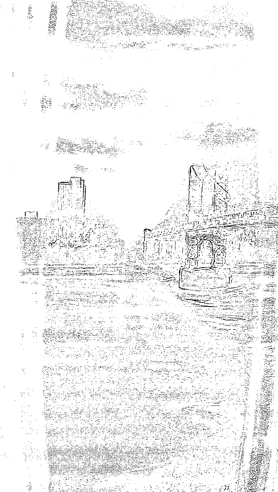

這樣的祈禱，其實是在向自己求。而這個自己，本身就是全部的答案。
沒想到，是有了這個頭腦，才讓我走了那麼長的冤枉路。非要把這個完美的全部，局限地落在一個相對的角落。
原來——
我其實就是這完美的化身。
我自己，就是我這一生想找的答案。
我是永恆。
我是無限大。
我是一切。
一切，都是我。
我透過每一個細胞體會到這幾句話。讓這些話從外到內，從頭頂到腳底，透過每一個細胞肯定——最多也只是如此。

- 我是永恆。
- 我是無限大。
- 我是一切。
- 一切，都是我。

真沒想到，我過去完全被自己騙走了。以為透過一點學習，接觸一些老師，讀一些經典，投入一些法門，認真地練習，勇敢地苦修，我就可以悟道。卻只是一次又一次發現，這本身是個大妄想。
悟，跟這個世界一點都不相關。甚至跟我做什麼、長什麼樣子、追求什麼、任何舉動，都不相關，祂不屬於這個世界。
祂本來就是我有的最根本的部分。
我也突然發現，我過去個人所想到的修行、或聽別人在談的修行，跟事實剛剛好顛倒。不只是「我」找不到悟，其實反而是——悟，來悟我。

而這個悟，跟業力一點都不相關，完全站在兩個層面。只是我們肯定有這個身體，並且肯定有業力的存在，才受它影響。所以接下來，還有個修行好談。

但是，不去管它——一切都不去管它、甚至不對它做個抵抗，我發現，一個人也就輕輕鬆鬆地度過任何業力帶來的困境，而讓它轉到別的地方。

我記得從那時候開始，我自然會用「好！」「都好」「一切都好」「樣樣都好」「剛剛好」「剛好都是我需要的」這些話不斷地提醒自己、提醒別人，來面對生命帶來的任何變化。

這自然變成我的一個心法，就像一個在心裡不斷重複的咒語。

我也記得，心情上突然有一個很大的轉變，變得開朗，甚至是沒有條件的快樂。

我記得接下來很多人問我，是不是正向的心態或思考可以改變人的命運？我通常都會這麼回答——不是的，其實這兩者不相關。

正向，最多只是肯定任何生命的結果都剛剛好是我需要的，是最妥當的安排。一切該發生的，自然會發生。不該發生的，絕對不會發生。正向，最多也只是接受這個事實。

想不到的是，如果可以完全接受這個事實，這一來，命也改了。

此外，這樣的肯定，也只是對自己做一個提醒，提醒我——生命有另外一個軌道，遠遠大於我們在人間所看到的重重限制。

這些領悟，徹底影響了我的個性，而後來也自然讓我帶出一個最直接的方法，和別人的說法完全不同。

很多年後，我透過這些作品，想跟別人分享這個沒有方法的方法，沒有路的路，沒有道的道。這麼做，但願帶給大家一個希望——其實，任何人都可以領悟到生命的真實。這跟一個人認為自己老不老實，認為自己有沒有修行的慧根或資質，認為自己有沒有做善事、有沒有拜師、有沒有學習，一點點都不相關。

悟，本身就是這個宇宙的本質，而開悟最多也只是領悟到自己——本來就有的。

# 45 「我」創出來的世界

這個發現，對我的衝擊太大。我記得，當初在這上頭，不知停留了多久，好像要不斷讓它沉澱。

透過這些經驗，我突然發現，沒有什麼東西叫「我」。

「我」是假的。是頭腦的產物。「我」不見了，世界也不見了。
「我」消失了，世界也跟著消失了。

我過去把全部的注意落在這個身體上，而透過這個身體在看這個世界。也就是從一個小角落，在看一個整體。現在，我倒不需要從任何角落看到整體，反而是從整體看到任何角落，或者不看。

有趣的是，偶爾注意力回到世界的某一個角落，我自然可以回到人的世界、動物的世界，或植物、石頭的角色。我也發現，每一個角度看到的完全不一樣，甚至人和人之間所看到的，也不一樣。

我也可以站在整體，而不需要把這注意集中在任何角落。這樣子，反而最不費力，最自然，最輕鬆。但是，讓我感覺最不可思議的是，這個世界還繼續運作。雖然從我個人的角度來看，世界消失了。
但從別人的角度，還是存在。

另外，我和別人的看法，還有一個很重要的差異。我發現，自己跟別人對這個世界的知覺，已經老早不一樣。對一般人，這個世界有一個自然的連貫性。他個人所看到的，都可以透過因果去解釋。一件事的發生，和前面有什麼原因，後來又有什麼結果，都可以描述出它們彼此之間的關係。

也就好像，在這個世界，樣樣都有一個前後的關係。

有趣的，幾乎每個人都想影響這個關係。例如想把世界變得更好，改變自己或別人的命運，做個好人，看看能不能改善自己的財務和名聲。於是，對每一個人來說，這世界自然也就再真實不過了。

然而，別人看不到，但對我愈來愈清楚的是——其實，樣樣老早已經決定。

過去我完全沒有想到，眼前所體驗的一切，是由種種力量組合起來的，甚至可能是超過我們每一個人可以看到或體會到的層面。

我可以看到的，眼前每一個所謂的經驗，本身又是數不完的過去的發生，或同時的發生所組合的。但是，我們過去完全沒有體會到這個層面，自然認為眼前所看到的，單純跟我們個人有關係，而以為自己可以來變更。

其實，眼前的一切，是由我們可以體會到或體會不到的所有現象，來共同決定每一個角落可以體驗到的。要針對一個點去做更動，實在太難，幾乎不可能。我們不可能了解整體的力量究竟有多大。

光是這一點，我也知道，任何人不可能相信。

我發現可以輕輕鬆鬆決定不去落在任何角落，也不去參與任何頭腦的運作。最多只需要站在整體不動，也可以跳到人間某一一個角落，只是不去理它，不要帶來一個對立，也就讓這個角落完成它自己。

這種自由，我沒辦法形容出來，這一生從沒想過可能有。

所以，前面講消失「我」，這句話其實完全不正確，最多只是比喻。「我」只是站在一個小小的角落在看這個世界，它本身沒有什麼代表性，根本只是不成比例地小。不去理它，反而是比較正確的表達。倒不是消滅它，因為連消滅的必要都沒有。

光是理解了這一點，我過去全部的壓力都消失了，所有的矛盾也跟著無影無蹤。

「我」，代表「有」。一體，是代表「在」。對我來說，兩者一點衝突都沒有，可以同時存在。

這種理解，也就象——馬達的渦輪突然停下來，我心中過去累積的全部重量跟著消失。或好像一個人從泥巴裡面走出來，脫落全部黏膩的負擔。

我突然明白——為什麼意識可以停留在一體，而身體還可以運作，甚至運作得更好。

過去，我認為全部都是由腦主導，認為是腦帶著身體運作。現在，發現這個結論是錯的。腦最多也只是一體所延伸出來的工具，最多化出一個人認為有的世界和人生。但是，針對這個虛的世界的運作，它卻因為受制於每一個現象的集體意識的影響，而一點都影響不了。非但抵擋不了，也沒辦法改變。

假如頭腦硬要去改變世界，也自然會發現同一件事又從別的地方浮出來，好像有個力量非要完成它自己不可。我過去從來沒有體會到，但現在可以看到——生命的力量大到一個程度，是不可能擋住的。

我發現，假如不去干涉這個世界，身體可以做得更好。我可以選擇把這個主導的力量，從頭腦移到一體或心。一體或是心，才是我們生命的根源。把這個生命交給一體，遠遠比交給我眼前的這個頭腦更妥當。它本身可以不費力地引導我，帶著我走下去。

也就這樣子，我才突然理解，為什麼沒有念頭，反而樣樣事情，包括演講、寫文章、處理事、跟別人相處，都比較理想。倒不是我原本想像的那樣。事實，又是剛好相反。

最有意思的是，不光「我」和一體之間的區隔或矛盾消失，就連「空」和「有」之間的矛盾也跟著消失。我自然體會到，「有」含著「空」，「空」也含著「有」。這種分別，還是我自己的腦過去運作的結果。

這樣一來，一層又一層的矛盾全部跟著消失。只剩下完美跟奇蹟。

甚至可以說，連完美和奇蹟，也跟著消失。

# 46 我不是自由

我接下來對業力的主題特別感興趣，但是自然發現，一般修行者比較不喜歡談這個題目。因為它本身往往帶來矛盾，讓人忍不住抗議或質疑。
從宗教的層面，談業力最多的，是佛教。
雖然各方面資料很多，我當時並不想花時間去研究，只是從其他修行者的理解，知道他們心中還是有相當多的矛盾。
業力的觀念，對我之所以相當重要，是因為我自然體會到——人類在談的自由，本身就是個大妄想。認為自己有自由，這種想法，跟我個人的體驗，完全是顛倒。
有一天，我不記得是在跑步，還是在和別人講話。突然，在我眼裡，每個人就像是裝上了發條的娃娃，在完成業力早就安裝好的程式。我自己也好，眼前每一個人，也都一樣。所完成的任何動作，包括吃飯、睡覺、擺個姿勢、喝一口水、講一句話、坐下、起身、激烈地吵架、斯文地講話……無論做什麼，全部都是老早註定的。
有意思的是，做的人當然只會認為自己是自由的，而認為每一個動作都是自己在主導。也就這樣子，無視於眼前所看到的一切其實都只是頭腦投射出來的產物，而完全忽略因果的作用。

我清楚體會到，只要有這個身體，或認為這個身體是真的，它是完全跟著因果在運作。也就是說，一切都是早就決定或註定的。只是我原本看不到這個註定的力量，看不到業力。

但是，只要看到樣樣東西之間的連貫性，自然體會到——因果或業力不光存在，而它的扭力大到一個地步，我不可能擋得住。

這一點，我透過自己數不完的親身經驗來驗證。

我觀察到，只要我去刻意改動生命，或是任何一件事，有時候，結果跟原本所希望的，恰好相反。好像反而會從其他角落延伸出來，或是繞了一大圈又回到原點。只是耽誤了時間，甚或衍生看來更嚴重的後果。

反過來，我也發現，假如我不去抵抗，不再帶來一層對立，可以接受眼前的結果或經過，它也自然消失。業力的力量也自然完成它自己。有痛，也就好像避不開痛。然而，這個痛，好像也是短暫的。如果要勉強用一般人的話來表達，可以說是——長痛不如短痛。

我過去怎麼也想不到，意識原來有兩個軌道。一個是頭腦投射出來的世界，也就是我誤認為是真實的一切。站在這個軌道，完全跟著因果在走，而我完全抵抗不了。沒有自由好談，一切是註定。

然而，意識還有另一個軌道。

這個軌道，遠遠大於人間的軌道。站在這個軌道，不受業力的影響。業力的力量無論多大，跟它比較，還是不成比例地小。這另一個軌道，沒有生過，也從來沒有死過，沒有任何變化。

當時最讓我想不到的是——這個軌道其實本來是我主要的部分。但因為有一個頭腦，把它蓋住。自然讓我這一生的注意，從不可思議的廣大和美，不知不覺落在一個狹窄的人間軌道，騙了我一輩子。

不光一輩子，還是百千萬數不完的生生世世。讓我這一生從那麼完美的整體，非要落入一個狹窄的角落不可。非要認為這是我全部的可能，非要讓因果帶著我走。

不光如此，還讓我有一個虛假的「自由」的觀念，虛假的「作為的人」的角色，創出一個虛假的境界，成為我這一生的故事。

這本身才讓我難以想像，我怎麼可能會被因果騙走？怎麼可能被這個頭腦和頭腦建立的因果騙走？而且，還大意地認為，自己才是主人，可以影響到這一生周邊、環境、世界。

這麼一來，我發現連這因果過去所帶來的矛盾，也自然消失掉了。我清楚地知道，我這一生唯一的自由的選擇，也只是放過眼前所體驗的任何東西、任何人、任何事情。不讓這個世界影響到我，也就那麼簡單，甚至不費力。

也就讓因果像霧一樣，從我身體透過去，跟我再也不相關。

我突然也體會到一個最不可思議的結論。我過去不光是認為自己可以主導自己的生命，還會認為有一個世界好救，需要我的幫忙。沒想到，只要我認為這世界是堅實的，這一切本來就老早已經完成它自己。倒不是我可以去影響到，或還需要我去影響。

我只能搖搖頭，再次覺得不可思議，其實這世界，根本不需要我幫忙。

我最多只能不斷地領悟我真實的本性。這種領悟，本身才是對自己跟周邊的人最大的幫助。我最多只是體會到，這個表面看來需要幫助的世界是虛幻，幫助的人也是虛幻。虛幻的人幫助虛幻的世界，本身就是個大妄想。都是頭腦的投射。

回到業力，我自己有另一個發現：即使隨時活在一體——我們一般稱為開悟，只要還有這個身體，這個身體一樣要符合業力的運作，一樣會生、會老；會生病，會死；還是會有情緒，會有各種需要。甚至，因為這個身體是透過這一生或之前的業力組合，還是需要完成它自己。

我也突然懂了——一個人完全領悟，可能出家、不出家，可能有家庭、有事業，或是沒有事業，也可能用或不用他還沒領悟之前的一些專業，成為一個老師、技師、藝術家、牙醫、工程師、油漆匠、水電工或任何一個專業或非專業人士。這些變化，跟他的領悟一點都不相關，是兩個意識的軌道。

因為這個世界是業力組合的，他也自然會讓業力完成這個肉體來這世界想做的。假如還有一點阻礙或矛盾，其實可以講——沒有開悟。

最後，我認為最顛倒的是，一般人認為這兩個軌道是互相排斥的，會產生矛盾。而我竟然發現，這個看法是完全不正確。最多只能說，這兩個意識的軌道是重疊的。

這個業力的世界，雖然是頭腦的產物，其實同樣含著更大的一體，甚至從來沒有離開過它。用另外一種語言來說，也就是「有」隨時含著「沒有」「空」「一體」。不是如此的話，我們不可能開悟，沒有悟好談。

更大的意識層面，用我的語言是「一體」，它隨時都存在，我才可能找到它。

甚至，不去找它，它還是存在。

我理解了這一點，也就好像頭腦突然完全打開。好像沒有邊，沒有底，可以去撐住它。

我最多只能用眼角的一滴淚，珍珠般的淚，來面對它。

我當時也知道，這一點和所有人想的顛倒，最多也讓這個理解消失它自己。

# 47 我的老鼠老師

有一天，我進到車庫，要準備上班，突然看到旁邊跑出一隻棕灰色的小老鼠。從一個角落，跑到另一個角落。我沒有經過思考，當場拿出一支掃把，馬上就把牠打死了。

這時候，心裡立即知道不對。一邊清理小老鼠的屍體和血跡，心裡也不斷地念阿彌陀佛，不斷地重複對牠說：「對不起。So sorry.」

我到了辦公室，感覺很不對勁，渾身不舒服。找了一個角落，一個人在地板上靜坐。突然，看到這隻小老鼠。牠一生的經過，從我眼前流過去。我對著牠，看著牠，不斷跟牠說——Sorry，對不起，請原諒我。

這時候，突然感覺到一陣刺痛，就好像有很長的針，至少有十公分長，從頭頂刺出來。那種痛、不舒服，我到現在都還記得。不光如此，眼前突然出現我過去殺過的所有的老鼠。

以前習慣用小白鼠做生物實驗，如果實驗需要，有時候一天可能犧牲五十隻以上的小鼠。為了求效率，犧牲小鼠時，是用最簡單的方法，把脖子一拉。為了讓實驗能完成，當時也不會去多想。

這時候，我坐在那裡。每一隻處理過的小鼠，都像一根針，從我頭頂鑽過去。我坐了差不多一小時，數不清的針從頭頂鑽出來。

痛，比什麼都痛。

難過，比什麼都難過。

懺悔，從內心最深的層面不斷流出來。

這個經驗，讓我很清楚地看到業力，也看到業力的轉變。讓我深深體會，只要還有這個身體，過去全部的業力都需要活過。然而，站在這個身體，業力是消失不完的。

我個人知道，過去做了種種的事情，都可能傷害了別人，哪怕是無意的，它一樣自然會產生一個反作用力，早晚會回到我的生命。所以，要去抵抗任何業力，不可能。

然而，不斷要求自己不犯任何錯，我也知道不可能。因為，只要有這個身體，我知道從生到死，每一個瞬間一樣在不斷產生業力。

我最多，也只能這麼選擇，選擇讓它活過我。

其實，我也老早清楚，就連這麼說也還只是一種比喻。說到底，還有什麼可以活過什麼？

雖然只要還有一個體，例如身體，那麼，還是有業力的作用。然而，站在整體，根本沒有什麼獨立的體可談，更不用說還有什麼東西叫業力。

同一件事，光是站在不同的意識層面來談，就是有這麼大的差異。這本身，才是真正不可思議。

获取更多好书，请加微信号：strcdts

店铺：http://strc.cr.cx

# 48 念頭的世界

我前面提過，年輕時，喜歡待在熱鬧的市集，看著眼前的種種變化，體會變化與變化之間的平等。然而，當時還有另一個體會。

無論在哪個地方、哪個角落，只要我心裡很安靜，就好像可以體會到對方或其他人頭腦的動念。此外，有時候自己比較清淨，包括飲食調整為素食，也會讓我特別敏感，可以同時體會到好多人的念頭。

也就是說，念頭本身好像就會講話，倒不需要用聲音把它表達出來。

只是，我所聽到的，幾乎都是不好的念頭，遠遠多於好的念頭。

有趣的是，念頭好像不斷想抓什麼東西、想追求、想得到。而且，我只遇到很少數的人是完全友善，對環境與別人沒有什麼要求。這些少數人，不光念頭是聽不到，而且光譜也跟別人的不一樣。

我在各個地方，坐在市集的一個角落，看著這些畫面，就像看連續劇一樣精彩。

這樣子，自然讓我體會到念頭的力量是不可思議地大。即使不出聲音，都會傳播到周邊和世界。就好像帶出一個能量，不斷地循環。不斷和我們認為的物質交流，化現出東西來。

最有趣的是，我好像突然可以體會到，念頭本身要透過磨擦而形成。我指的是念頭要跟物質、跟其他的念頭摩擦，才可以維繫下去。就像颱風，透過風和水介面的摩擦，才可以擴大或餵養自己。假如沒有摩擦或對立，颱風也好像起不來。

因為可以把這個念頭看得很真實，就好像讓它凍結成形，我接下來做了許多實驗來驗證——如果不去抵抗、不去對立念頭，它也就像雲過去了。也許轉到別的角落，或是慢慢自己消失自己。

但是，只要我抵抗，或想刻意地去轉變，例如我對某個現象產生一個不滿意的念頭，或想把一件事轉成別的結果，或去做一個評論或評價，甚至只是做一個單純的肯定或認知，光是這樣子，念頭竟然就活起來了。就好像我在它上面澆養料，把它養得更大，而接下來化出一個生命。

這一點發現，對我當時是怎麼都想不到的。

也就好像，念頭變成業力和業力之間的養分。念頭其實是我自己頭腦化出來的世界中很重要的一部分，而我過去根本沒把它當回事，從來沒有把它當作一個能量來看。更沒有想到它可以成立一個世界，還影響到周邊。

然而，要消失念頭並不簡單，甚至我發現是不可能的。最多，我只是否定它。甚至更簡單，不去管它。只是不給它任何支持，或任何肯定，它也自然散掉了，而饒過我。

就像前面老鼠的經過教我的，我在這個經過，又得到另外一個體會——每一個念頭，不是單純我這個身心產生的。它對我，是反映更深層面的力量，而這個力量是我透過眼耳五官體會不到的，最多只能用兩個字「業力」來稱它。

這是我以前也從來沒有想過的。

我自己的每一個念頭，都是過去因果帶來的。去抵抗念頭，本身等於在承認因果是真的。接下來，這個世界也就一樣再真實不過了。然而，放過念頭，我自然發現，眼前因果所帶來的力量，也就消失。

這麼一來，我自然體會到什麼叫臣服。臣服，最多也只是輕輕鬆鬆把眼前任何所想到、體會到、看到的東西，都讓它存在，而不要去干預它。

不去干預，不去重視任何觀念，我發現自己才真正體會到前面所講的平等。

# 49 南西 Nancy

在那一段時間，我也見到許多特殊的人。有時候我跟自己開玩笑，好像全世界最奇怪的人，都在那段時間被我見到了。

我小時候對別人的光敏感，而這種感受性，後來一直跟著我到長大。有時候，讓我不知不覺很快地掃描一個空間，而得到一個初步的印象。我後來在西方和東方，遇到許多修行者。無論有沒有宗教信仰、是在家或出家，也有不同的光。有一段時間，我也難免會把它和一個人的性格、修行的心得或工夫連結起來。

記得將近三十年前，在德州，我為同事主持一個宴會。現場有好幾百人，但我一眼就注意到一位年長的女士。她好像帶出不可思議大的光，就像落日的金紅色。

我自然想接近她。走到她身邊，直接問她：「妳是誰？」她的回答很有趣：「我是上帝的孩子，跟你一樣。」我下一句話：「妳斷食多少天了？」「五十四天。」「有沒有吃任何東西或喝水？」「最多喝水，偶爾放一些檸檬片。」我其實知道，從醫學的角度來看，一個人斷食，不要說五十四天，連一個禮拜都是一件難事。很少人可以忍受，更別說度過。但是，到了這時候，我個人有了那麼多各式各樣的經過，已經一點都不覺得稀奇，反而認為這才是正常。

> 「妳的體重穩定嗎？還是下降了？」

> 「體重完全一樣，我自己還覺得好像增加了。」

> 「妳認為為什麼呢？」

她馬上說：「是聖靈。」

我也跟著重複：「是聖靈。」

> 「妳常斷食嗎？」

> 「只要有機會，我就會斷食。但是，這次比較特別，我想體會耶穌四十日夜在沙漠是怎麼度過的。」

> 「那麼，妳幾乎也睡得很少囉？」

> 「對我，一、兩個小時就夠了。甚至，不需要睡。」

> 「妳有沒有閉關呢？」

> 「沒有特別閉關。我是一位牧師，照常和大家接觸、服務。」

這位女士的名字是南西（Nancy），我倆似乎有很多話可以談。她接下來用兩隻手抓著我的手，好像進入出神的狀態（trance state）。不給我機會插話，就把我這一生主要的經過講了出來，準確性也相當高。不光如此，還把未來可能做的，或可能遇到的困難，都一口氣說完。

我聽著她，一句話也沒回應。沒有肯定，也沒有否定。最多是把它聽完。

我心裡知道，完全知道，她所提到的發生，最多只能當作一個參考。只要把它肯定，以為非如此不可，也就自然落入一個幻覺。

但是，我知道南西的用意是好的。她隨時都想給周邊的人鼓勵和信心。接下來，我和她也變成了好朋友。有時候雖然隔了幾個月或幾年才碰面，一見面依舊感覺很親近。不光如此，她的先生也變成我的好朋友，在專業上互動了幾十年。

這裡談我和光的互動，最多也只是反映——其實我們每個人都是一面鏡子，看到的，也只是自己在別人身上的反射。

我把自己修行出發點落在南西身上，自然體會到她是紅色很美的光。

假如我們隨時看到上帝在自己心中，也就自然會看到上帝在別人心中。

這一來，其實每個人、每樣東西，最多也只是反映祂神聖的光，無論什麼顏色，大小，都是神聖的。

# 50 造物主，是誰？

前面提到，全部的宇宙都是從頭腦投射出來的。

這句話，對我一點都不是比喻，而是真正感覺到如此。

只要我安靜下來，自然看到宇宙從我頭腦延伸出來。然而，頭腦本身又不存在，它是從一體或心化出來的。我突然體會到世界從來沒有存在過，未來也不可能存在。假如它可以存在，我也只能承認「我是一切的造物主」。而整個宇宙，包括這個世界，都離不開我的心。

這個啟示，停留在我腦海裡不知道多久。

前面，透過《壇經》的經驗，我發現意識最多是擴大，可以離開這個身體，而可以見證整個宇宙，也就好像身體和意識可以分開。但是我接下來也就發現，連這種分開都還是幻覺。

其實，這個意識可以擴大，可以擴張。但是，不需要離開身體，可以輕輕鬆鬆地守住在心。最多只是膨脹，擴散到每一個角落。就好像我心裡有一股力量浮出來，像一層又一層的花瓣突然打開，把我突然短路，從頭頂到腳底全方位和宇宙完全整合，或者說是和宇宙徹底結合（unified）。

這種意識擴大，倒不是一個「出體」或「出竅」的經驗，反而是一種很穩重、踏實、很接地、很溫暖的狀態。好像我的人的中心，也就自然變成宇宙的中心。我輕輕鬆鬆地，最多只是透過我個人的心在欣賞宇宙，而這個宇宙本身是我製造出來的。

這時候，不光是全部的矛盾消失，甚至連一個念頭都沒有。最多，只有一體。一般人所談的空，還是一種頭腦的觀念。真正的「空」和「有」並沒有矛盾，都是一體的延伸。

我看到，數不完的星球，數不完的空間。想不到的是，全部宇宙所可以想像、可以看到的一切，可以在我心中不斷地延伸出來。

一切，是顛倒的。

連這個宇宙都是一個頭腦的產物，這就連作夢也想不到。

也可以說，連未來對宇宙、星際的全部發現，都是從心中延伸出來，都是透過頭腦和感官延伸出來的工具，在我們理解的範圍內得到的發現。

過去，我很少跟人分享這些領悟，因為我不認為它是一種體驗，也不可能用話描述清楚。對於古人提到的「心」，我也發現，它可以是在比較擴大的範圍，代表永恆和無限的觀念；也可以指我們的心，而且是離不開身心的心。這其實是一體兩面。

全部的一切，都離不開我們的心中。

我會再次重複，因為這種領悟是難忘的，它本身不是理論。也就好像對我每一個細胞、每一個角落、每一個部位、每一個體（假如還可以這麼說），這個真實是再真實不過。就像前面所講的，我真正認為，我是全部世界的人。我是馬路上的流浪漢。我是一朵花。我是一棵樹。我是宇宙的每一個星球。我是全部的動物。我是眼前的石頭。

我到處都在，但是又哪裡也不想去。我沒有一樣東西需要知道，而就是那麼簡單，可以觀察到一切，甚至觀察不到一切。

我沒有生過，也沒有死過。我是每一個瞬間，但是又跟任何瞬間一點關係都沒有。我老早跳出時間的範圍。

我是一切。我什麼都是，又同時什麼都不是。而這一切，也只是我。

我發現一天二十四小時都可以輕鬆停留在一體，從一體運作，和眼前要做什麼、講什麼、想什麼、扮什麼角色，一點矛盾都沒有。兩個，可以同時存在。

這個身體，這個世界，對我最多只是個影子。雖然如此，這個影子在動，不斷地在展開，不斷在活出它自己。好像本身有一個馬達或輪子、一個機制不斷地在活化，不斷地在攪拌，不斷地在支持它。

但是，對我來說，它又好像跟我不相關。沒有「我」在主導，它還是可以活出它自己。甚至，我一點都不費力，它還是在我眼前展開。

這本身，我認為是最不可思議的。也就好像我這一生來，最多只是來體會到這個不可思議的奇蹟。

這時候，透過每一個細胞，我體會到愛。而這個愛，最多也只是理解我跟一切眾生和非眾生從來沒有分手過。

一切都是從我心中延伸出來的，不可能不愛。

# 51 我是全部，我什麼都不是

更想不到的是，隨時，我眼前所看的東西、人、動物、植物，馬路，房子，大樓……一切可以體驗的，都讓我一再體會到——全部的現象，全部的「有」，其實都是頭腦化現出來的。

假如沒有我的五個感官，其實什麼都沒有。即使「有」，站在整體，可以說根本不成比例。好像眼前明明有一頭大象，而我透過感官只看到牠身上的小螞蟻，更非要把注意力落到這隻小螞蟻身上不可。

然而我的意識自然想擴大，想站到每一個宇宙的角落。它擴大的速度是無限大。也就好像我的身體粉碎成百萬億萬個活生生的粒子，而每個粒子都有意識存在。然而它還繼續在擴大，擴大到「沒有」。

有意思的是，擴大到「沒有」，又好像跟「有」完全沒有區隔。

這時候，讓我感覺這人間的範圍，在意識上根本小到不成比例。倒不需要把注意力帶回到這個人間。

而站在整體來看，它一點都沒有影響。

任何眼前在發生的、在動、在做、在講話、在分析的，全部好像一個走出來的迴圈。它本身在自己裡面打轉，對整體沒有什麼代表性。從來沒有離開過整體，也從來沒有過獨立的存在。

過去，我已經開始體會到，眼前的一切，包括自己的身體在講話、在動、在做、在吃飯、在睡覺、在工作，好像都可以把它放過，讓它自動發生，倒不需要再加一層顧慮或照顧。

這樣，不光可以完成眼前發生的事，而自然會花最少時間，達到最高的效率。好像樣樣眼前事情都不用費力。一天，想做什麼，自然可以完成它自己。

這種經驗，假如不是親自體驗到，我做為一個醫師、科學家會認為根本不可能。然而我不但親身體驗到，還持續好幾個月一再重複，讓我不能忽視它的存在。

只是，這種體會，我誰也不合適去分享，心裡明白——誰會相信？懂醫學的人，可能會誤以為是不理性或錯覺。但有意思的是，我其實充滿了信心，知道這種狀態是我們每一個人都有的。問題是——為什麼一般人體會不到？

我進一步發現，人類歷史上留下來的紀錄，這一切表面看來延續了上萬年的積累，依然都是從心中延伸出來，都是腦的產物。

是透過腦的分別和區隔，再用感官守住、定位，而產生一種好像有東西在發生、有東西在動的印象，而延伸出有個連續的觀念。這自然讓我感覺樣樣都有理由，有個來源，有因有果。

真想不到，連這個連續性，都還是從心中再透過腦的運作延伸出來。一建立這個連續性，自然產生時間的觀念。

我突然發現，連時間都是頭腦的產物。

人類和動物最大的區隔，在於人類的時間觀念特別堅固。這本身也就是人生痛苦和不安的最大來源。這種連續性，包括時間怎麼來的，假如沒有親自去體會，絕對不可能會相信。

這個領悟，讓我當時沒有辦法整合，跟我一生的經驗也沒辦法整合。當時最多只能透過個人的情緒來表達這個理解，而大哭了一場。接下來，這個領悟又重複了好多次。它不斷地重複，我也只能從哭轉為笑。最主要還是笑自己——怎麼可能被這一切騙得那麼徹底？

最可笑的是，我也發現沒有什麼東西叫做「客觀」。我們認為是真的，認定是事實的，例如一顆蘋果或一個定理，因為可以被我們看到、驗證到，也就被我們稱為具體或「客觀」。但是，就連這種「客觀」，本身還是從主觀延伸出來的，少不了「我」的運作。

要被「我」所看到、驗證，才可以稱為「客觀」。

所以，任何我們稱之為客觀或具體的，其實一點都不客觀，一點也不具體，本身還是建立在感官帶來的一種幻覺。

我接下來很長一段時間，隨時在體會創造和造物主的關係。自然產生一個悖論——為什麼人類所體驗的範圍都差不了多少？

後來發現，也就是因為我們人的五個感官體會的範圍都很接近。比如說我們眼睛所看到的頻率波段，在人和人之間都是大同小異。耳朵聽的、身體感觸的，也都是如此，都在同一個狹窄的範圍裡運作。是這樣，才在人和人之間得到一個表面的共識，而自然透過這個共識，建立一個共同的真實。

這麼一來，我們不光是把自己騙了一生，而且還是全人類整體的洗腦。本來頭腦最多只能提供一個相對的比較，而突然之間，我們賦予了它絕對的地位。

後來，連這個悖論也自然消失，而給我帶來很大的平靜。

# 52 透過每一口呼吸，我延伸這個世界

這世界，是個大妄想。

想不到的是，這個大妄想是我自己建立起來的。

前面這種經驗，不斷不斷地重複發生。這讓我真正感覺到，這一生，無論過去、未來、任何可能發生的，已經相對不重要了。

一切都是個大妄想。

我記得，從醒來到睡，甚至連睡眠中，我隨時停留在心。

透過心，在看著這個世界，看著一切的妄想。

我可以清楚地把這種領悟，帶到每一個瞬間。也就自然發現，連呼吸本身都還在延伸這個妄想——也就是我們從出生、長大到死亡，透過每一口呼吸，都不斷被洗腦，都認為要守住每一口吸氣，不然眼前的「命」也就消失了。而認為從出生到死，每一口呼吸都有絕對的重要性。

就這樣，連一口呼吸，我們都放不過。

我突然發現，眼前的呼吸，其實我可以放過。讓呼吸，完全呼吸它自己。好像跟我的心，再也不需要有什麼連結，不需要有什麼關係。不用守住它，甚至不用去理它。

透過每一個呼吸，我自然發現，我也在延伸一個世界，創造一個世界。透過這種不費力的呼吸，在吐氣中，這個宇宙，也消失了。

而我同時發現，因為不用再去管呼吸，它自然慢下來。好像是透過頭頂和腳心在吸氣和吐氣，吸氣和吐氣可以拉得很長，而甚至好像不在動。這本身帶來一種自由的感受，很難可以描述。但是，我認為只要有過，就很難忘。

我自然發現，可以透過呼吸，很扎實地落在地球，與大地合一。好像一口吸氣，不光是從頭頂貫穿到腳心，還可以進入地下，讓我完全與地球連通起來。這樣子，一天，可以從早到晚都很穩重，而隨時在歡喜中。好像眼前樣樣事情發生或不發生，都跟我已經不相關了。

這些經驗，也讓我親身體會到，呼吸可以當作一個意識徹底轉變的大工具。而且，是轉變最快的工具。

# 53 享受没有夢的深睡

在這個經過，我也突然體會到，不光人和人、東西和東西、事情和事情的區隔都是腦的作用。其實連意識狀態和意識狀態之間也沒有什麼區隔，本來是平等的。是我們自己，非要帶來一個分別不可。

過去，我好像認為清醒和睡覺當然不一樣。即使同樣在睡眠中，作不作夢也可以做個區隔，都屬於不同的狀態。

後來對我愈來愈清楚，可以做區隔的，本身只是頭腦在運作，在費力，在打轉。然而，在每一個狀態中，同時有一個共同點。

這個共同點，最多，只是一個輕輕鬆鬆的知覺，或知道。

知道什麼？

其實，什麼都不知道。

最多，只是知道自己是醒的。

是有一個微細的存在。

存在什麼？或在哪裡？也講不下去。後來自然發現，再講下去，它其實又離不開腦的作用。

最有意思的是，我透過這些理解，不光睡眠減少，甚至，就在睡眠中，發現自己是「醒的」。

好像一整天在做事、在講話、在睡覺、在作夢，完全都是同一件事、同一個東西。然而，這個醒的什麼或哪裡，倒不是我用語言或念頭可以把它描述出來。可以表達的，好像最多在話跟念頭前面，有一個什麼東西，讓我定住在這個最原始的生命。

這種覺知，我發現竟然隨時都有。只是在白天當中，把它忽略了，注意力自然跑到眼前的人事物，我也就不會去注重這個微細的知道。不光如此，睡著了，在作夢，我都發現這個狀態還存在。只是我一般會被夢裡的情節和現象帶走，而一樣不會留意。只有在沒有夢的睡眠中，它才比較清楚，而可以讓我徹底去注意到。

我雖然在這裡輕輕鬆鬆地用這幾句話表示這個理解，但當時，這種體驗，對我的衝擊之大，讓我突然感覺到過去修行的追求，好像告了一個段落。就好像生命將一把最寶貴的鑰匙交給了我。

接下來，只是重複地在驗證。

至於生存，有沒有什麼意義，好像對我一點都不重要了。

我體會到這一點，而這一點從來沒有離開過我。好多年後，為了解釋這個理解，我才會這麼表達——最深、沒有夢的睡眠，本身就含著我們的本性。我們只是不知道，而在睡覺中跟著昏迷。假如知道，甚至隨時都可以掌握到它，這本身就是我們這一生想找到的。

# 54 佛性

除了前面的經驗，我也自然發現，這段時間，我接觸到很多修行者，包括牧師、神父或出家人，好像交友圈子自然開始調整。過去往來的都是醫師、科學家。突然間我似乎對這個圈子不那麼熱絡了。

雖然我參與了各式各樣的科學研究、發表論文，也有很長一段時間講究要在最頂級的期刊發表。但我突然發現，這些都沒有什麼永久、長期的價值。要說有什麼價值，本身也只不過是人透過頭腦創造出來的。

任何突破，不光只是短暫存在，更是沒有辦法對我們真正的本性，最重大的人生問題，做任何解釋或解答，也不可能帶給任何人幸福。所謂的突破，最多只是成立一個領域，不斷強化它自己。

我發現，這個現象是普遍的。沒有一個人為的領域可以成為例外，包括哲學和宗教。

過去的大聖人以自己的生命驗證了領悟，不會想留下任何文字紀錄。弟子後來整理和轉達，反而建立了一套系統。這樣的整理和系統無論多完整，本身還是在一個狹窄的頭腦的層面在運作，最多也只能帶給我們束縛。

我自然發現，這幾句話，是我過去用頭腦最難理解的。因為我本來就是透過腦，想理解這個世界，包括人生。沒有想到，頭腦竟然會建立一個完整的系統，做一個完整的說明，而透過這個完整的說明，還進一步可能綁架我，並不是帶給我自由。

我也體會到，過去大聖人留下來的經典，全部都是後來透過弟子留下來的紀錄，最多只是為我帶來一個指南針。然而，這些指南針只要落在語言的範圍，也就引起頭腦的作業——讓人會想用頭腦，去理解非頭腦的狀態。這本身，我現在已經知道是不可能的。

不光用頭腦去領悟是不可能的，透過任何的「做」或練習，一樣是不可能。我個人所體會的狀態，是跟這個身心、這個人間、這個世界一點都不相關。我深深體會到，我過去走的方向都是錯的，甚至可能是顛倒的。就連過去的切入點，都不正確。

我過去不斷地認為有一個「醒覺」的狀態，是透過頭腦可以懂或領悟到的。然而，事實又是剛剛好相反。這個狀態，本身是在我不可能知道的範圍。也就好像是透過「不可知」，我才可能摸到一點邊。是透過「不可知」，才有一個領悟的觀念可以談。

當然，作為一個科學家，我本來就希望事事簡單明瞭。面對一個科學的題目，也希望簡化，回到問題的上游或根源（在醫學，我們稱為機制）。面對修行，我也只是如此。

但是，事實比我想象的更簡單，還更不費力，還更上游。它不是靠任何做或追求可以得到的。這一點，假如過去有任何人跟我這麼講，我不可能會相信。

這幾十年下來，我見到的眾多修行者，都讓我發現在重複同樣的錯誤，都還在追求人為的一些練習或領域。無論是靜坐、瑜伽、禱告，各式各樣的功夫，都一樣，離不開頭腦的限制。

我每一次接觸不同的修行人，都不忍心看著大家浪費那麼多生命，追求根本不需要追求的狀態。但是，自己當時還年輕，只要一開口表達，就造出質疑或是對立。這種反應，自然讓我一句話都不吭，不把它當作一回事。

我自己心裡明白，假如有一個東西叫真實，這個真實絕對不可能是練出來，或修行出來的。祂不是人為的產物。

而我們所想追求的答案，本身就是我們自己，是我們本來就有的。可是，我們自己不知道，還認為需要透過那麼漫長的追求，再加上種種的練習，來得到我們本來就有的。

這個觀念就是這麼簡單明瞭，一樣地，我印象中沒有人相信。無論修行多少年，有多少成就，一定要走這麼一趟長的冤枉路。

然而，我總是捨不得大家走這麼多冤枉路，多年後，我才試著用「全部生命系列」將這裡所講的好多觀念，一段段帶出來。

我自然發現另一個更有意思的現象——我們眼中的不同，例如佛教有眾生非眾生的區隔，或眾生和菩薩的區隔，或一般人看到人與動物、植物、其他生命的區隔，全部都是人製造出來的分別。

人和任何東西共同的本性都是一樣的。這種共同的本質，我們再怎麼找，都找不到，但是它到處都存在。這在表面上好像有矛盾，對我卻是再明顯不過。只要親自體會到，全部矛盾也就自然消失了。

這麼一講，沒有東西沒有佛性。

我們任何追求佛性的想法或舉動，其實都是多餘的。

我也自然發現，這麼一來，我好像跟全部過去的大聖人沒有分手過。其實，沒有人分手過。也就好像我隨時認為佛陀就在我頭頂上，跟我合一，沒有任何分別或差異。

這種合一，與耶穌跟我合一是一樣的，徹底合一。甚至，合一到一個地步，沒有佛陀，沒有我，沒有合一。最後，只剩下沒有光線的光，沒有意識的意識，沒有寧靜的寧靜。

不只如此，我發現，跟任何大聖人，不光是佛陀、耶穌，還有數不完的過去的大聖人，都可以合一。假如我們沒有把他當作一個個人或個體來看，其實合一的部分，也只是真實。

也就是說，他們最多只是代表真實。透過合一，我體會到的，最多只是真實跟我合一。

其實，連說真實跟我合一都是多餘。

最後，只有真實與真實合一。

我連一個合一的觀念，也自然沒有。

回到眼前所看的全部生命，雖然都知道是幻覺，但是，同時讓我不斷地「喔！」再驚訝不過的是——生命點點滴滴都是奇蹟，但我們在忙碌當中看不到，也就當然認為是不可能的。

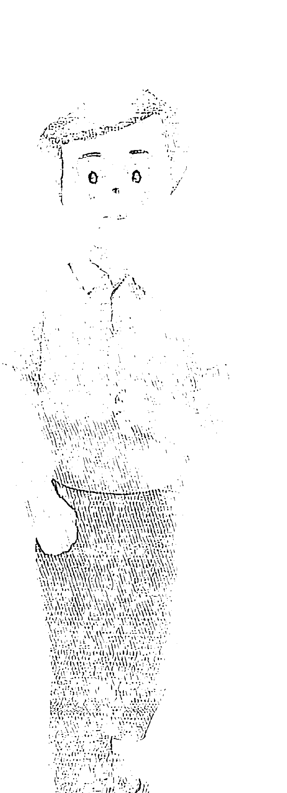

# 55 大菩薩

我記得當時也有很長一段時間，也許幾星期，可能幾個月，前面談到的菩薩道自然在心中浮出來。

也很巧合，遇到一些出家人，向我介紹大乘的佛法，而且很詳細地說明與解析。我才知道，原來佛教有那麼多寶貴的資料。這些經典就像一套最完整的修行手冊，不光把佛陀個人的經過講得那麼清楚，甚至還把任何人可能遇到的意識狀態，都做了詳細的說明。

我才知道佛教不光有菩薩和眾生之別，就連菩薩本身的層次都有區隔。比如從初地菩薩到十地菩薩，十地之後，才成佛。

我記得當時很多朋友的理解是，菩薩首先想度眾生，是為了度眾生來犧牲自己的成佛。但是，我讀到這些敘述，反而覺得最多只是一種比喻，倒不是非如此不可。這些經過，最多是在強調菩薩所代表的價值或修行的特色，並不是要有一個分段的觀念，不是真的要等度完眾生再成佛。

我已經老早知道，人、菩薩、佛本身是我們頭腦投射出來的。更不用講，這三者之間的區隔，最多也只是反映我們頭腦的運作。或者說，佛或菩薩的特質，本來就是我們的本質。只是我們過去不知道，才需要走那麼長的冤枉路，還要在人、菩薩、佛之間做一個區隔，甚至還需要經過那麼多的練習、那麼多的修行。

至選擇。

既然佛性、醒覺、悟、道……本來就是我們的本質，我們也不可能去分段來找到它。即使透過一個「菩薩」的位階，也不會跟我們本來就有的佛性更接近或距離更遙遠。去強調有菩薩的位階，再附帶分段的醒覺、分段的成就，這些觀念反而又是我們的頭腦在運作，是我們自己加上一個不需要的層面。

回到前面所講的，我當時就認為「菩薩」這種名稱只是在強調一些修行的成果或特質。比如說，文殊菩薩，最多是表達智慧。然而，這些智慧倒不是我們人間可以理解的，也不是用任何語言可以描述。文殊菩薩所代表的智慧，跟我們這個人間一點都不相關，是在絕對的範圍，倒不是在任何相對的領域。

這一點，我自己不斷地驗證，而深深體會到不可能用理論去探討。真實，並不是可以用幾地菩薩的比喻來表達。只要分地（bhumi），這些語言還是離不開頭腦的作用，最多還是在做一個區隔和分別，也還是二元對立。

我已經清楚地知道，一個人只要進入生命的一體或是絕對，一切的分別就到此為止，智慧也就在眼前。智慧，不可能是分等級的。任何區分或等級，都還是人所創出來的觀念。

我記得很年輕的時候，只要想到文殊菩薩，我自然會把他化成《金剛經》白色的光，進入身體跟我合一。這樣的觀想，讓我透過每一個細胞來接受他，融入他。我當時自然而然地，採用四種光的顏色，各自呼應華人所熟悉的文殊、觀世音、普賢、地藏王菩薩。很長一段時間，只要想到這個光，自然聯想到其中一位菩薩的特質，為我做一個加持和祝福。

回到文殊菩薩，我這一生很幸運，跟他相當親近。他好像隨時來教我。有時候，我在走路、跑步或是靜靜地盤腿，或者有時候跟人講話，會突然有一種更深層面的領悟。這些領悟，都是在提醒我——眼前的一切，就像雲一樣，最多只是幻覺。

文殊菩薩隨時來提醒我——既然樣樣都是幻覺，也沒必要做一個激烈的反應或反彈，更不需要把眼前的現象做一個肯定，當作真的。最多只是讓樣樣來，也可以讓樣樣走。我其實都不用去干涉。

也就這樣子，一切回到寧靜。

光是這幾句話，其中所含的文殊菩薩的法，讓我這一生受用不盡。這些話，也帶著對業力的解釋，希望之後在這本書再把它打開。

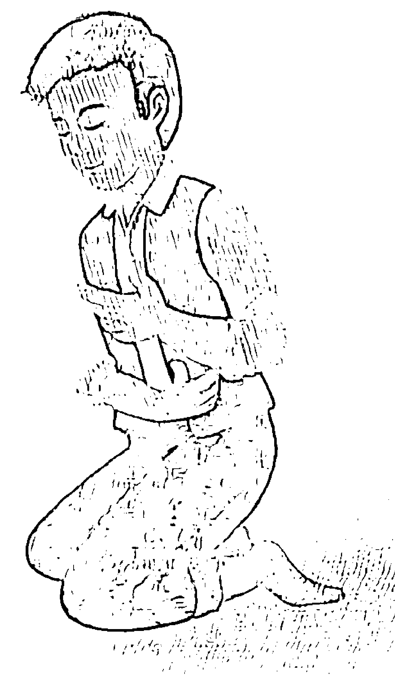

我成年之後才知道，文殊菩薩其实在各地的文化都有，只是名稱不同，也不一定化身成人的形體。我發現有時候遇到一隻動物、一朵花、一塊石頭，只要很誠懇，心裡很寧靜，它本身也就變成我的老師，也就是文殊菩薩的化身。

# 56 觀世音菩薩

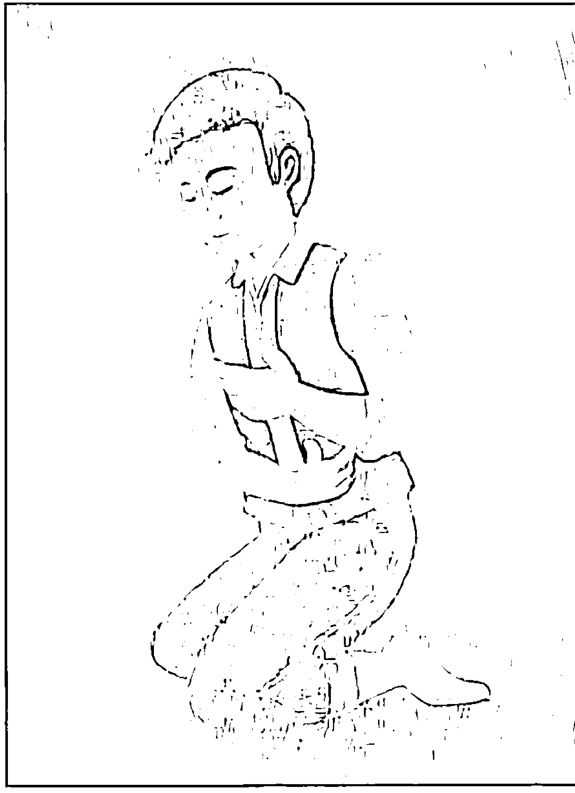

前面提到和文殊菩薩相當親近，其實，對我而言，每一位菩薩都帶來很深刻的啟發。比如說，講到觀世音菩薩，他不斷地在對我示範慈悲。而且，是沒有分別的慈悲。在沒有分別的慈悲中，我也自然發現，我們本來就跟一切從來沒有分手過，而一切本來就是空的。

從我的看法，到這裡，談慈悲都已經是多餘。假如全部的生命和全部的世界就像一頭象，這頭象怎麼可能會對他自己的耳朵、或哪個部位不友善？如果還要談慈悲或友善，最多是對自己慈悲或友善，因為「別人」還是我自己透過頭腦投射出來的觀念。

觀世音菩薩和文殊菩薩一樣地，和我特別有共鳴。我也自然發現，幾乎每一個文化都有這樣的一個象徵，來表達慈悲，表達愛。比如說，西方可能用聖母瑪麗亞或某一位聖人，來表達這個觀念。我們可以觀察到，幾乎每個文化都採用女性的象徵，就好像是對母愛的感念。其實，母愛不光是人類的特質，而是每一種動物都有的。我們談到母愛，在表達的更是一種涵容一切、不分別的愛。也只有這種愛，可以感動周邊和世界。

講到這裡，我們也自然會用「地」和「水」來形容觀世音菩薩所蘊含的女性陰柔的能量。我發現，透過這種穩重的能量——大地和水，可以接受或包容一切，而樣樣都可以原諒。也因為如此，無論男女，都會自然想接觸，想接受。

這一點，我後來發現是身為父親和母親最大的差異。一位父親，自然會講道理，強調原則，區隔對錯，而對孩子有種種期待。然而，我發現母親更是隨時掛心孩子的生存和幸福，而通常比較可以接受、可以原諒，比較容易站在孩子的角度看這個世界，倒不是堅持自己的原則，自己的期望。

光是這一點，對我就有很大的影響，而讓我後來可以降低對孩子、對周邊人的期待，甚至有時候可以消失。多年來我也自然更喜歡用「愛」來形容這種特質。東方人常用的「慈悲」，我反而很少用。我多少覺得「慈悲」比較遙遠，而「愛」是生活中更直接的表達。

我也同時發現，愛與慈悲本身一樣離不開智慧。前面提過，《心經》代表觀世音菩薩修行的精華。短短兩百六十個字，將整個佛法的精神融會貫通，可以說是最高的智慧。透過它，我自然發現愛或慈悲與智慧是兩面一體，根本是不可能分開的。

在東方的傳統裡，觀世音菩薩也代表聲音的大法門。我認為最有趣的是，早在兩千六百年前，佛陀也自然會認為聲音是最有效的意識轉變的工具。我每次想到這一點，都在心中對佛陀深深地頂禮。在我心中，他所教的，從任何角度來看，都是正確的。

我个人也老早發現，雖然幾百年尤其這幾十年來，人類透過眼睛所開發的意識是特別快。樣樣，都靠眼睛來運作，包括閱讀、觀看、各種操作，而且需要的反應時間愈來愈短。但聲音其實是更直接的。

我指的直接，意思是聲音好像可以穿到心。眼睛所看的，反而要透過種種神經的處理，才可以轉成意思，而比較落在理性的層面。

當然，這本身就是文字和聲音的差別。其實，透過文字，我們也可以寫詩，直接點到心。但是仔細觀察，詩要有一個步調，透過韻律和格律，加上特定的重複，再加上文字本身的意義，才會帶來一樣的效果。我們透過文字，模擬出聲音的作用，才能跳出理性的範圍，而點到心。

這些領悟，後來對我有很大的影響。經過「全部生命系列」，我發現，只有透過口述，我才可以跳出理性的範圍，而直接點到心。不光如此，我後來也自然選擇用聲音的作品，把一些觀念帶出來。

從我個人練習的角度，我也發現自己自然喜歡持咒，或是採用和聲音有關的法門，讓一個聲音不斷從腦海浮出來，作為我的練習、我的 sādhana 。

同時，我發現，觀世音菩薩也是我最好的一位老師。我隨時想著他，他也好像隨時出現，不斷地把我擁抱起來。有時候，是從心中浮出一種安慰的力量；有時候，是在這個空間有一種正向的鼓勵；都是來恩典我。

小時候，母親對我的影響特別大，後來又遇到彭姆姆。現在回頭看，對我，她們都是觀世音菩薩的化身，就好像觀世音菩薩從來沒有離開過我。

我後來也發現，觀世音菩薩和文殊菩薩雖然是兩面一體，但切入點確實不同。愛，從我們人間看來，離不開情緒。觀世音菩薩，是從情緒和感受切入。我也發現，一個人即使懂很多知識和觀念，但最難離開的是感情。愛和其他渴望，自然讓我們對這個世界難以割捨。

觀世音菩薩，是這方面最好的一位老師。他教我隨時理解，其實種種情緒和念頭是分不開的。情緒，最多還只是念頭的一個產物。反過來，念頭最多也只是情緒的延伸。也就這樣子，讓我發現，我們平常講念頭，好像對這世界有一個客觀的看法。但仔細觀察，這些看法，最多其實還是在反映情緒。

我認為這觀念相當重要，好多年後，我試著用截然不同的語言，來表達這些看法。甚至，我從科學的角度，提出——邊緣系統或情緒腦，是大腦的過濾網。我們看這個世界，已經完全受到情緒的過濾，而沒有一樣東西是完全客觀的。

既然沒有任何一件事是客觀的，也就沒有哪一件事或哪一個東西，有絕對的重要性，要讓我們放不過。

# 57 我們每一個人都有的特質

我用前面兩章當作一個比喻，來打開菩薩的觀念。一寫下來，也就不不知不覺想談更多，自然會想到其他兩位菩薩——普賢菩薩和地藏王菩薩。

普賢菩薩所代表的平等心，讓我自然領悟到生命的無常，也就是否定任何事情有絕對的重要性。進一步講，也是來表達，沒有一件事是多麼重要。無論我是喝一杯水，或是要處理一件事，站在整體，是一樣地重要，一樣地不重要。

我透過我個人的體驗，自然可以體會到祂所代表的平等心。我記得，很長一段時間，前面也提過，也許幾個星期，或幾個月，完全沒有一個念頭。不光沒有念頭，我發現眼前在處理的任何事、看到的人、在動的東西，對我，最多只是一個神經製造的資訊。

我去拿一杯咖啡，我清楚地知道，最多只是資訊。接下來，喝一口咖啡，還是資訊。和周邊的人互動，是資訊。寫一個稿，資訊。到洗手間，資訊。接個電話，資訊。一天下來，全部都是資訊。

雖然表面上樣樣都不同，也許人長得不同，事情不一樣，而有各種的動態。但是，對我而言，每個現象都有同一個特質，而這個特質，最多只是資訊。也許是不同的資訊，但說到底還是資訊。

沒有任何一個資訊，背後真正有一個本質在支持它。
也就這樣子，讓我深深體會每一個瞬間都是平等的。透過這個瞬間，我們可能扮演不同的角色，做不同的事，想不同的東西，反映不同的情緒。但是，假如我們沒有一個動機，不再加一個層面的思考，其實，每個瞬間都一樣。不可能不是平等，也沒有一個瞬間比較重要或不重要。

後來，就是有念頭，我也自然發現，其實「想」和「無想」、「有」和「沒有」、「一切」和「空」，還是平等的。它們的任何差異，最多還只是反映我們頭腦的運作。也就這樣子，透過不斷地肯定，不斷地活出平等心，瞬間和瞬間中的矛盾，全部都跟著消失了。

我自然發現，這種對平等心的解釋，我過去沒有聽過任何人這麼表達過。然而，現在對我，它不只是一個很重要的觀念，而更是反映事實。對我，平等心就是我們的本質，並不是一個可以學來的特質。

當時，我記得自己重複再重複這個體會。這個體會，也就好像強烈的雷電貫穿頭腦，從我的身體經過。不光經過，還非要把我的頭腦徹底撐開不可。撐開到底，讓我將這一生全部的觀念都消失，而且消失得乾乾淨淨。

接下來，就好像從一張白紙重新起步。

過去所學到的全部，好像都已經跟我這一生不相關了。不光用不到，而且根本沒有什麼重要性。甚至，我發現人類的全部歷史、文化、價值、期待，好像跟我再也沒有一點關係。從我的角度，任何觀念，最多只是和事實顛倒。如果我去重視任何一個觀念，也就自然從一個平等的全部，進入一個不平等的角落，而很可能從這個角落，再也看不到邊，更不用講跳出來。但是，只要知道這一點，全部或一個角落的矛盾，其實也跟著消失了。

我過去想起普賢菩薩，也就像土壤一樣安穩，讓我聯想到沉穩的咖啡色。此外，我也會聯想到大象，大象代表穩重，也就是隨時可以把自己的中心找回來，讓一個人可以踏實，而能自然體會到前面所講的平等。這個體會，讓我面對任何場合，無論多大的事，都不斷地可以找到自己的中心，而得到安定。

很多年後，我才發現普賢菩薩所帶來的練習方法是數不完的。他可能採用觀想、呼吸、朗誦等等方式，讓我們可以把注意力集中。從頭腦的境界，落回到這個身體。從身體，再落回到更深的、不動的層面。

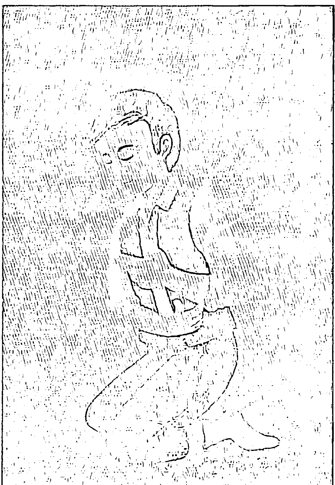

我很喜歡採用這些方法，也老早就知道，五官全部都可以當作身心轉變的工具。多年之後，我也自然會帶大家做這種多重感官的練習，比如又觀想、又聽、又朗誦，將我們的意識和頭腦守住，讓它安定下來，而得到專注。對小孩子，我發現讀經朗誦，也離不開這裡所講的原理，而可以作為一個很重要的教學方法。

現代人的步調太快，我發現，要用這種多層面的意識工具，才可以自然幫我們沉澱。後來，我也透過這種方法，在活動中和其他朋友分享。每一次，只要這麼進行，我自然會想起普賢菩薩，而對祂充滿了感激。

如果前三位菩薩和我都有共鳴，我必須要承認，我和地藏王菩薩感覺格外靠近。在過去，也用土黃色的光來代表祂。地藏王菩薩，從當時就不斷地提醒我——在這個世界，不可能沒有業力，因為這個世界本身是業力製造的。只要活在這個世界，還是一樣受到因一果或業力的運作。然而，要將業力轉變，並不是去對付它。最多，只是放過它，放過這個世界。

這幾句話，對我不是空談，而是我確實體會到真正有一個東西叫做「意識譜」——我們的意識可以從最小、最狹窄的範圍，延伸到無限大的全部。

我很早就體驗到，我們所稱為的人生，無論是用話表達、用念頭想、透過情緒感受到、或有一個動力來運作的，全部都還屬於我多年後所稱的相對和局限的範圍。然而，我們真正有一個部分，是無限大的絕對，是沒辦法從相對局限的範圍跳過去的。無限的絕對，我們每個人都有，但是可能隨時都忘記了。

對我來說，地藏王菩薩所指的業力，最多是在相對的範圍裡運作。然而，站在無限大的層面，其實沒有一個東西叫做業力。我要從業力跳出來，其實是不費力的。甚至，只要還費力、還透過任何動機，我最多還只可能在一個相對局限的範圍裡打轉。反而是，不費力，我們自然定在絕對。而這個絕對，是我們每一個人都有的，最重要的部分。

不費力，也含著不去肯定、不去反彈。不反彈，最多只是否定相對所帶來的局限，對人間樣樣所看到的，不要把它當作真實。也就這樣子，我可以不費力地讓樣樣來，讓樣樣走。就這麼輕鬆，也就可以活出無限，活出絕對。

我透過前面幾句話，濃縮自己這一生從地藏王菩薩得到的領悟。也透過這幾句話，消失了許多矛盾。後來，我才發現，其實這種矛盾是幾乎每一個修行者都有的——表面可能聽懂，但其實活不出來。

也因為我充分知道這幾句話的重要性，在好多年後，我才試著在「全部生命系列」用自己創的用詞，希望能夠表達。

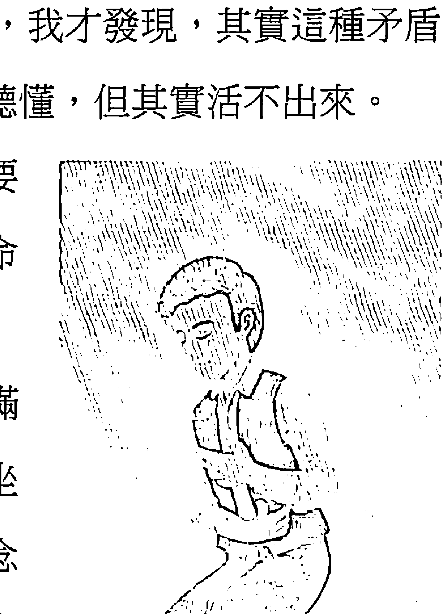

回到地藏王菩薩，對他，我只能充滿感激。我在很年輕的時候，在跑步或靜坐時能和他相遇，而對我醫學和健康的觀念有徹底的轉變。最重要的是，我體會到全部的疾病都離不開業力。同時，地藏王菩薩的啟示也讓我驗證和業力相關的觀念，比如說後來《真原醫》提到的「好轉反應」。另外一個例子，也就是我後來稱的「結構調整」，也和地藏王菩薩有關。我接下來會再把這個經過打開。

講到疾病和業力的關係，坦白講，其實我們只要生出來到這個世界，從我的角度來看，已經是落在一種疾病的狀態。因為只要有生，一定會死。就從生出來的那一秒，我們其實已經開始死亡。

這一點，對我太重要了，我到後面還會再提。

這四位大菩薩，對我都有很深的影響。佛陀之後的修行者，甚至將這四種特質——智慧、慈悲、平等、業力的轉變——拿來全面地代表修行。當然，這種修持相當讓人欽佩。但是，這種說法從我個人的體驗來看，因果關係是顛倒的。這些特質，本來就是我們的本質，是自然而然的後果，倒不是拿它們來追求，好像還有一種別的目標。

其實，我只要輕輕鬆鬆放過這個世界，把真正的自己找回來，也就可以活出智慧、慈悲、平等、業力的轉變。這四種特質，跟一體的領悟是分不開的。反過來，少掉其中任何一項，一個人也不可能開悟。

即使如此，我還是擔心大家會把四位菩薩當作單獨的個體，而跟自己做一個隔離，認為跟自己不同。是這樣，我才會在多年後不斷地分享，這些特質本來就是我們的本質，和我們的心從來沒有離開過。而且，這些特質本身是活的，好像有一個動力。前面也提到，我會自然觀想代表每位菩薩的光。只要想到哪一位菩薩，我自然體會到一種祝福，一種恩典，就像在我的內心做一個提醒。

後來，我也發現連特別去觀想都是多餘，祂們自然會在我內心浮出來。

# 58 兜率天

我深深地體會到，頭腦雖然是虛的，卻可以造出人生所看到、體會到一切的真實。

我在東河跑步時的體會，也就讓我發現——假如把腦擺到一體，自然就被一體吸收回去。透過「我是誰」，我最多也只是在提醒自己：一切都完整了，接下來不需要做任何其他的練習。

我也聽說，有一位未來的佛，叫做彌勒佛。讓我覺得最有意思的是，傳說中，他的教學工具就是後人所稱的「唯識」大法門。

唯識 Consciousness Only，對我而言就是「一切，只有意識」。

我當時還很年輕，聽到這兩個字，連續幾個晚上沒有睡，自然拿自己的體驗來和「唯識」這兩個字對照。透過這兩個字，驗證當時我一切修行的理解和經過。

唯識，最多對我是在表達——一切，都是顛倒的。

我過去跟別人一樣，完全認為物質才是主宰。甚至，身為一個醫師、一位生物學家，我當然認為生命是透過元素組合成分子，再組合出 DNA、蛋白質而進一步構成的。並且，透過遺傳和一代代的變異與演化，才成為我們現在的人。

然而，從我個人的領悟，事實是剛剛好顛倒。

我體會到，首先，什麼都沒有。接下來，還是什麼都沒有。

任何所看到的東西，包括蛋白質、DNA、細胞、組織、器官、人的身體架構，全部都是透過五官延伸出來的。最多是在五官的範圍內，好像有。

可惜的是，我們非但沒有辦法體會到五官以外的世界和整個生命的藍圖，更沒辦法體會到——我們所見的人生，只是億萬種可能性的其中一種。更別說我們根本沒辦法想到，這個世界全部都是因－果的產物，而因－果的力量遠遠大於生物或物質運轉的力量。

知道了一切是顛倒，也就是說——意識優先，是意識演變出來物質和因果——我發現這樣的結論其實沒有帶來任何矛盾，只是比人類現在的理解更深一層。

所以，唯識，不光跟科學、宗教沒有任何矛盾，我很早就知道它會是未來的科學、未來的宗教、未來的哲學。

透過它，將來一切都會整合起來。全部的矛盾，會跟著消失。

可以想見，彌勒佛對我相當重要。我後來的這些作品，全都離不開彌勒佛的唯識。我年輕接觸佛法之後，心裡總是有一種感覺，覺得自己這一生來，是為彌勒佛和基督而服務。彷彿要為他們在人間鋪一張紅毯，準備好他們的到來。

我相信自己當時的誠心應該到了一個地步，有一天早上我突然發現，我夢到彌勒佛，甚至到兜率天去聽課。他講的課，到今天，我每一句話都記得，而可以驗證自己的體驗和這本書的詮釋。不光如此，他老早有一個完整的系統，也就在等著人類演化到一個地步，可以接受。

我在夢中去了兜率天，記得自己一去，就不想回到人間，迫不得已才會回來。接下來，又去了好幾次。每一次去，最多只是在聽課，沒有什麼問題可以問的。

最後，連到兜率天的渴望，也自然消失。

# 59 藥師佛

因為我個人技術的背景是醫學，再加上投入生化和免疫的研究，自然對於非傳統的醫學和古老的中醫特別感興趣。很年輕時，我就參與各種期刊的編輯工作，包括為《科學人》的子刊《科學與醫學（Science and Medicine）》擔任非傳統醫學的編輯。

當時，《科學人》翻譯成至少二十種語言，包括繁體中文和簡體中文，全球至少有兩百萬的讀者。我認為透過這個編輯的角色，可以引介各地文化的療癒領域。但是，在這個過程，我總是認為少了什麼，好像跟目前的科學無法結合。一仔細觀察或研究，自然發現很多矛盾。

比如同類療法，是古人早就知道的療癒方式，和現代西方醫學不同在於——西方醫學是透過藥物消除或壓抑症狀，而同類療法是把主要的症狀浮出來。透過浮出來的經過，希望讓這個疾病反轉。

其實，西醫最早發現的一些藥物，都帶有同類療法的性質。例如奎寧，是用來治療瘧疾。然而，它本身只要很低的用量就會讓人發燒或發冷，也就是瘧疾發作的症狀。當時也是因為如此，才被發現。

華人都知道，假如感冒發燒，不可能採用西方的冰浴法為病人直接降溫。雖然病人體溫高，每個老祖母都會為他牢牢蓋上棉被，等身體出汗了，體溫就容易下降。然而，從西醫的角度來看，會覺得這種作法有許多地方說不通。可惜的是，西醫完全守住這些表面的矛盾，當作主要的反對理由，也沒有再深入去探討。

當時，我開始注意古人提到的藥師佛。藥師佛的傳承，在西藏密宗特別重視。藥師佛不是一位，而是七位如來。很多療癒的解方，都是藥師佛流傳下來的。

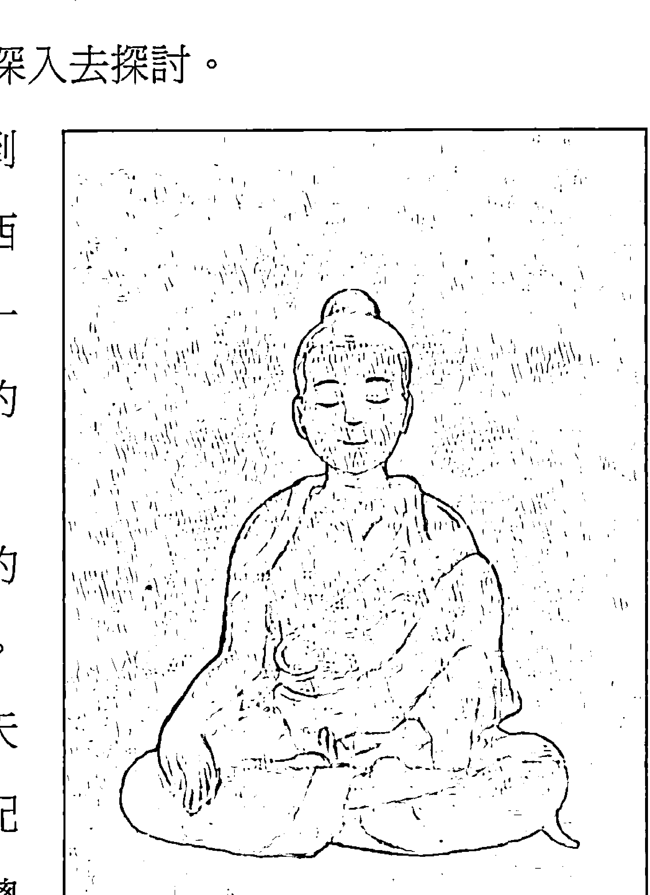

我當時很年輕，對藥師佛的體系特別相應，感覺特別熟悉。我也發現，自己突然學到很多天然植物或礦物的配方。而這些配方怎麼來的，我不清楚，心中總認為是藥師佛的傳承。

最叫我當時想不到的是，透過這個系統，其實帶來一個新的化學元素結構，跟一般物理和化學的思路完全不一樣。同時，有很多身體療癒的機制，跟一般醫學的體會也大不相同。這些，我後來稱為「真原醫」。透過它，幫助了相當多有疾病的朋友。

其中，有一部分礦物質的醫學，我始終沒有公開。因為跟佛陀留下的舍利子相關，我對它也有一種神聖的看法，不認為這個世界已經準備好接受。只希望未來有機會，再跟大家分享。

談到舍利子，也有數不完的奇蹟。這些奇蹟，不光讓我這一生有福報接觸舍利子，也讓我有機會研究，而得以發現一套全新的材料科學。這套科學還沒辦法用當代一般的科學來解釋，而是要透過元素的電子架構重新定義，也可以說是未來的超導體學。

當時怎麼讓我發現這一點，我認為相當不可思議。沒想到佛陀透過他自己留下來的身體，竟然會這樣與未來的科學接軌。

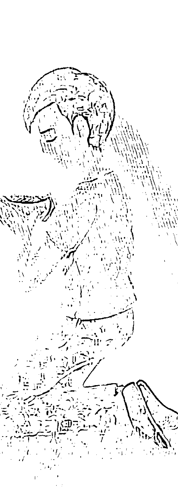

# 60 苦修

談到這些大聖人，包括西藏密宗特別重視的藥師佛，我也想起來，年輕的時候，有很長一段時間，無論是作夢或醒著，我眼前常浮現一個畫面——一位修行者在山洞裡跟他的上師對話。

畫面看起來，至少是幾百年甚至千年之前的時代。畫面裡的這位修行者，對上師特別尊敬，時常拿個人修行的問題去向老師請教。

跟我過去體驗到的其他人物很不一樣，這位修行者似乎有醫學的背景，對於身體的轉變，例如氣脈、結構相當感興趣。他特別講究功夫，時常拿靜坐時微細能量的轉變、氣脈流動這些身心變化來問上師，把這些變化當作進步或是成就。一次又一次地，上師都對他潑冷水，推翻他對功夫和成就的期待。

這麼描述下來，雖然只是短短的兩段，但是，在我心中，這位修行者一生經過的點點滴滴，好像在某個層面我都知道，甚至是相當熟悉，就像我隨時在他身邊一樣。

那個時候，我雖然已經開始收藏佛經和各種修行的經典，但是很少花時間去讀。我對這些畫面也沒有特別重視，只是把它當作一個幻覺，最多是讓它自己流過去。有一天，不知多少年前，我在書架上看到一本後人談岡波巴的書。只看了書名，順手翻了幾頁，自然發現眼淚掉了下來。

後來才知道，畫面中的上師就是密宗所熟知的密勒日巴，是西藏近千年前苦修成道的一位大師。岡波巴是他的弟子，對醫學和佛學相當投入，在向密勒日巴學習之前，既是名醫，也已經是有名的法師。

他的過程，為我帶來很大的反省。我這一生也對各種靜坐的方法、氣脈的轉變、生理和修行之間的橋樑與機制特別感興趣，自然體會得到別人很少提過的現象。即使沒有特別去讀或是去想，但有時候就是知道，而能夠貫通這方面的理念。

然而，從各個層面，我相當清楚自己這一生來，連這些知識、功夫都要完全丟掉。

完全丟掉，我才可以輕輕鬆鬆地回到自己本來就有的原點。

同時我也充滿信心，這一生想找的，老早就已經找到了。其實還沒有開始找，就已經找到了。找到什麼？用語言是說不出來的。

我知道所要找的、已經找到的，跟任何的功夫都不相關。

就好像過去有記憶以來，不只這一生，我所累積的全部理解，走到最後，最多只是準備我——讓一切的知識或經驗脫落。

我要找的，無法用語言描述，後來最多用「覺」來代表。

覺察到什麼，反而不是重點。可以覺察到東西，全部都是五官或頭腦在作業，倒不是我領悟到的。

我講的「覺」，是還沒有覺察之前的「知」或「覺」，本身是沒辦法去形容的。最多，只能用「覺」一個字，來代表這種沒辦法形容的特質。

覺，我也稱為「清醒的覺」。我也老早發現，無論是醒著、作夢或睡覺，這個「覺」從來沒有離開過我，隨時都可以體會到。

前面提過，我小時候體會到心裡有太陽，尤其在睡著或安靜的時候。這時，我也自然發現，睡眠本身是最好的修行工具。甚至，每個人剛從睡眠醒過來時，可以說其實是完全醒覺的。

只是，接下來很自然地，注意力從這個「覺」或「心」跳回到腦，也就被帶走了。覺，是我們每一個人都有的，但多少都被我們的頭腦蓋住，而讓我們自然把它忽略。

我不知不覺發現，睡覺中的狀態，和睡前的狀態、醒後的狀態，其實是沒有中斷，沒有區別的。我後來才會強調睡眠和醒著這兩種狀態，而把睡眠當作是一個相當有效的媒介。從中，自然讓我更深地領悟到——一切都是顛倒的。

我後來透過《我是誰》帶出來的臣服和參的練習，最多是在提醒自己本來就有的層面。

這些話，很多年來，我沒辦法跟任何人分享。畢竟，這一來，我把修行簡化到大家想不到地簡單，我知道最多只會引起爭議。於是，最多也是跟面對其他的領悟一樣，讓它消失掉自己。

# 61 時空也離不開螺旋

對我，突然間，好像全部的矛盾都消失了。「空」隨時可以含著「有」，而且「有」隨時含著「空」，確實是兩面一體。
我發現，若非如此，從「空」也跳不到「有」，從「有」也整合不了「空」。

就是因為兩個都是同一本質，我才突然體會到，沒有什麼東西叫做開悟。開悟的觀念，反而會帶來一個矛盾。如果有一個悟，這個悟會是我們每個人都有的最根本的層面，否則一個人不可能突然開悟或進入什麼神聖的空間。如果還要談開悟，最多只是一個人不知道自己老早開悟，老早是神聖的，老早就是奇蹟。知道後，而且是徹底地隨時都知道，我們才可以稱他為開悟。

這個，大概是我這一生最大的發現。
我記得不斷地自由墜落、內爆。到最後也只是理解這一點。
這麼一來，沒有一樣東西可以帶來矛盾，或對我產生什麼對立。
全部都剛剛好。

人生也不需要有什麼目的，不需要有什麼理由存在。
我們來這世界，本來也不需要尋找什麼東西，也沒有什麼價值好談。這個沒有價值、沒有意義、沒有理由都「存在」的生命——我發現，反而是我們最難接受的。然而，它是最根本的觀念（假如還可以稱為一個觀念）。只是，我們只要有一個念頭、一個動念，也就自然離開了它。

當時，透過種種的自由墜落和內爆，我最深刻的印象，也就是內心似乎有流不完的淚，好像不斷感覺到自己這一生被自己騙走。

不光這一生，數不完的生生世世，都把我自己騙走了。

這些，是我最深刻的印象。

我同時也體會到，我的注意再也不用停留在任何角落，甚至不用停留在「空」。我也自然發現，全部修行的領域只是讓我們把注意擺到一個狹窄的角落，最多是透過這種專注，為我們帶來一點淨化。

然而，這些領域和工夫，全部都是多餘的。

一個人要領悟到全部這裡所講的，一點工夫都不需要做，什麼費力都沒有。想醒過來，也就醒過來了。這是我個人認為最不可思議的。

我這一生就喜歡簡化，認為把任何事簡化，也就自然簡單了。然而，因為太簡單，反而我自己忽略了，還認為宇宙含著什麼秘密，是需要多年的磨練或知識累積才可以懂。其實，剛剛好又是顛倒。

費力，或是追求，本身已經錯失了重點。

同時，我也體會到，從「空」產生的最大的力量，就是螺旋。螺旋本身就代表最根本的「動」、最有效率的力量。它延伸出不光是意識，任何場，包括能量場、整個宇宙也是跟著螺旋化生出來的。

我仔細觀察，一切都離不開螺旋，從颶風、一朵花、蝸牛、DNA、蛋白質，就連時空也離不開螺旋。全都離不開螺旋。

這個宇宙要透過白洞延伸或透過黑洞消失，也離不開螺旋。但仔細去觀察螺旋，觀察到底，一樣會發現什麼都沒有，最多只是空。

我也自然體會到，這種區隔本身就是頭腦的產物。從一個整體來看，都是同一個層面——空、有、螺旋、物質、任何宇宙、世界、人生——全部都是同一個東西，而這個東西從來沒有離開過我，我也從來沒有離開過這些。接著還是頭腦把它分別，變成各式各樣的體、觀念。我們才取出一個人生，而把它複雜化，最後自然變成痛苦。

我接下來發現，任何領域都只是站在一個狹窄的解釋範圍。就連科學帶來的全部領域，包括數學，都還是我們頭腦想著辦法把一個整體分成各種小體。而且，在這個小體上，還要做一個連結、解釋和分析，而忽略了它們本來就是相通的。

現在，對我而言，無論物理、數學、哲學、生物、醫學，都好像沒有什麼絕對的重要性，都是通的。一個可以通到另一個，沒有什麼門檻。有門檻，本身還是我們頭腦所帶來的限制。

我記得，大概四十年前，霍金（Stephen William Hawking，1942-2018）當時已經很出名了。他是研究天文物理黑洞的專家，很年輕就已經獲得劍橋大學榮譽教席盧卡斯數學教授（Lucasian Chair of Mathematics）。他因為患有「漸凍症（肌萎縮性脊髓側索硬化症 amyotrophic lateral sclerosis，縮寫為 ALS）」長年坐輪椅，後來就慢慢退化。一般漸凍症患者壽命不會超過幾年，沒想到他後來那麼長壽，幾十年來為天文物理學做了那麼多貢獻。

他很年輕時，已經是學術界的超級明星，來到洛克菲勒大學的卡斯巴瑞大禮堂（Caspary auditorium）演講。這個演講廳本來可以容納上千人，沒想到，他一來，非但全場坐得滿滿的，就連走道上都擠滿了人。

我如果沒有記錯，當時他還沒有採用聲音合成系統，還要透過別人把他的話轉達出來。那一場演講，他談黑洞和一套當時還沒有發表的理論——黑洞本身吸引力大到一個地步，不光會把時空完全吞掉，甚至連資訊都會崩解。

我當時很年輕，英文也不見得標準，當場就提出這絕對不可能——假如真有這回事，我們不可能坐在這裡聽講，他也不可能坐在那裡。這個世界根本也就不存在了。這個理論不光違反對稱的觀念，還把這個時空當作一種獨一無二的存在，認為它本身就足以支持自己。

我當時是想表達我個人的領悟——既然有黑洞，也有白洞。有東西把時空吞下去，也會有另一個東西把時空吐出來。資訊本身是螺旋場，黑洞最多也只是螺旋場的組合，它不可能把自己吞掉。

我記得當時表達這些，讓大家相當驚訝。現場突然很安靜，連一根針掉下來都可以聽見。我很多年輕的同事也覺得不可思議，認為我怎麼敢在一群物理學家面前，在我不熟悉的領域發表自己的見解。

但是，他們沒想到，霍金很有耐心，也很坦然地說，我所講的，他都同意。只是，透過數學的推算，他得到的結論不同。

在很多年後，他公開表達他當年的理論錯了。在這段期間，白洞的理論也慢慢建立出來。

我在這裡會分享這些，最多是來表達——很多觀念不一定需要透過科學來驗證或來帶頭，我們每一個人其實可以拿自己當作實驗者。

只要我們寧靜，宇宙會透過各式各樣的機會來跟我們分享，來跟我們說悄悄話。

我深深體會，我們要有這個勇氣親自驗證，不用管身邊的人認為科不科學。假如一個理念是正確的，早晚有一天科學會跟上，不用擔心。

我也同時想表達，生命的奧妙，是科學任何局限的領域——任何人間創出來的有限相對的領域，甚至語言——不可能描述出來的。

我們的生命，遠遠大於這些限制。

# 62 人間的牽絆

雖然前面分享過一些從無思無想延伸出來的奇蹟，但我也必須承認，我們活在這個世界，還是離不開感情。

前面提到，在營火前，浮出許多好像是前世的經驗。不只如此，有時在睡覺，我也突然會看到一些經驗，重複自己在扮演某個角色，講什麼話。這些畫面相當具體，讓我覺得自己曾經在各個角落活過各式各樣的人生。

有時候，在同一場夢，或只是坐著，我可能會看到幾次不同的經過。每一次，雖然時間很短，但是好像體會到很多，經驗了很多那一世的畫面。

這些數不完的畫面，都讓我感覺可能是過去一些前世的記憶，或未來還沒有活過的投影。至於是不是真正的前世或未來，從客觀的角度，我也不曉得。只是在很深的層面，讓我覺得很親近。讓我感覺，那就是我。

雖然畫面中，人的長相跟我這一生好像不相似——有女、有男，有各式各樣的人或非人。但這些所看到的、所體驗到的，都是站在「我」的第一角度在看、在體驗。也就因為這樣，才會讓我感覺這些畫面或記憶，都還是從我延伸出來的，就好像是「我」的一部分。

這很難用語言再進一步表達。最多我只能說，假如有過這種體驗，自然知道我在說什麼。

每一次重複這些畫面或記憶，最耐人尋味的是，我沒有一次看到自己當過華人。最多是曾經生活在鄰近的地區，例如西藏。除此之外，我沒有一次看到自己有家庭、有子女。

也許因為如此，有時候，我早上醒來，心裡會想：「咦？我有一個家？」對於有這個家庭，更是格外珍惜。

看著孩子長大，陪著他們讀書，我相信我比周遭其他父親，陪孩子的時間和心力遠遠更多。和他們一起玩各式各樣的運動，參與孩子學校的活動，都讓我覺得特別珍貴，好像都是得來不易的經驗。

小孩子的任何活動，好像都跟我有關係。無論大女兒的排球、大兒子的摔角或小兒子的足球，我都會想出各式各樣的方法來參加。我也發現我對孩子的功課、學習特別感興趣。從他們還小，一路到大學，甚至上了大學，還不斷地關心、協助他們。各式各樣與老師的互動，也都讓我感覺與這些老師們特別熟悉。

有時候，孩子同學的家長，尤其是他們的母親看到我出現，都會開玩笑問我——是不是單親照顧孩子？就連我自己的小孩，有時候也會問我：「為什麼你又來了？」

我最多是回答——我來，是為了我自己啊。

老三，從小就喜歡玩足球，和我小時候一樣，是踢足球長大的。足球好像才是他的主要部分。其他的事，包括讀書，都是次要。

看他帶著球，從後場，一路穿越整個球場，讓我自然會回想起自己在巴西長大的經過，而對生命的變化與無常有很深的感觸。不光是陪他踢足球這件事，和孩子們的互動，也讓我自己發現，我和親人的互動，自然讓我把我這個世界看得再真實不過，很難把一切看穿。

明明知道這些都是大幻覺，是這個身體的因果，但為什麼遇到家裡的人和事，我還是放不過？自然想出手去干涉？一樣捨不得放下？

要把這些經驗看穿，難度相當高。我認為，這才是修行真正的考驗。這種體會，本身變成我最好的練習功課，讓我把我個人的種種矛盾不斷消失。

我所指的矛盾，意思是——年輕的時候，我認為修行是一種非此即彼、或說專一的狀態。以為有了一個狀態，就不能有另外一個。或是，我還有一個要費力去取得的觀念。認為要有它，就必須要犧牲其他的選擇——包括跟家人的互動、工作上的交流、生涯上的衝刺。

我現在不斷地體會到，這兩個世界是在不同的軌道。一個最多只是相對的存有，另一個是絕對的存在。然而，相對，也就是我們的世界，隨時含著絕對。也可以說絕對，隨時含著相對。

我也老早發現，不是這樣子的話，一個人不可能從一個軌道，跳到另一個軌道。

站在這個世界，我完全可以投入。然而，只要想起來了，也就自然回到絕對，一點衝突都沒有。沒有一樣東西被當成代價，也沒有失掉什麼。

所以，我發現自己也可以投入孩子的世界，幫助他們解答問題、學習。當一個家長，為他們加油打氣，不斷地給他們擁抱。這些經驗，全部跟修行一點衝突都沒有。

這種領悟，不斷地領悟，不光讓我全部的矛盾消失。同時，看這個世界，隨時好像是第一次看到。一樣地新鮮。一樣地可愛。

# 63 母親與我

我從小就很敏感，對人、事、物都有一個敏感度，感覺自己跟別的小孩不一樣。後來，透過身心的變化，我發現敏感度也大幅度提高，甚至隨時看到其他的空間，或未來的一些事。
從我的立場，修行反而變成一種提醒。提醒我——全部這些靈感，其實都離不開頭腦的投射，本身還是落在念頭的層面。
我講這些，是因為我自然發現自己的意識好像隨時到一個更微細的境界，比如說從地球到某一個天界。或像我小時候一樣，看到自己認為比較高等的生命，例如天使或天使長。從小，這些經驗都會讓我認為這些境界比較真實，而投入這方面的追求。然而，經過自己的淨化，我突然發現，追求這些境界，也就好像無形當中，不光已經肯定這些現象是真的，而且還要進一步排列它們的重要性。
不只如此，我只要認為這個生命有什麼意義，有什麼目的，或有什麼價值、觀念，也就發現連這些表達都還在一樣的妄想裡。我最多只能提醒自己——站在一體，哪裡還有意義、目的或價值好談的？
雖然如此，我從小跟我母親特別親近，好像我們不用講話，都隨時有一個更深的理解。在家裡，和兩個姊姊和弟弟相較，我不光是從小在文學的表達完全不同，而且，對哲學和宗教的興趣，只有我跟母親一樣，就好像她把這些興趣傳給了我。

三十多年前，有一天，我在紐約帶著學生做實驗，突然感覺到很不舒服。哪裡不舒服，也說不上，就是覺得頭很暈。我沒有告訴任何人，只是走回東河旁的宿舍。也不曉得為什麼，就在電話旁坐著，好像在等著什麼事發生，或什麼消息會隨時來找我。

當時，沒有手機。我記得等了大概半小時，雖然身體不舒服，但我不想離開，最多是用手撐著頭，繼續盯著電話。

電話來了。

是從台灣來的緊急電話。

是醫院打來跟我說明，我母親本來去做一個普通的健康檢查，意外服錯了藥物，昏迷過去。我父親也同時誤服，只是量沒有那麼多，雖然也昏迷過去，但還是醒了過來，沒有受到那麼大的影響。

在那一剎那，我好像可以看到他們兩位，尤其我母親，而跟她的意識交流。我記得，眼淚湧了出來，什麼都沒有多說，只是跟對方說：「知道了。知道了。」

我還記得幾乎每一天都想到，每一次想到也都在祈禱，希望得到一個好的結果。即使我心裡知道，在這人間的一切業力都不可能停止，最好的方法最多只是接受，接受一切。透過接受，透過臣服，才可以讓它自己做一個修正。但是，我記得這時候心裡還是很懇切地祈禱，希望能影響到結果。

我母親從此昏迷了將近三十年，本來等到兒女都成年了，終於可## 标题

-   - 项目1
- 项目2
- 项目3

以跟我父亲轻松地到处旅游。没想到，发生这种事。接下来，我也再没听见她任何一句话。这件事，对我父亲当然影响重大，从此也就陪着母亲。一眨眼，三十年也就过去了。

我父亲相当自责，后来透过《大地儿女》和其他书，把这个经过表达出来。透过这本书，不光可以看到他对家庭、大地的爱心，这本身还就是一个奇迹最好的纪录。

几年前，我又收到照顾我母亲医师的通知，知道她的情况明显地退化。当时，我已经连续几天在另外一个层面跟我母亲沟通，也知道她快走了，马上回到台湾，而我的三个兄弟姊妹也赶回去。

我们四个人从各地分别赶来，有人要将近两天路程才能赶到。记得那天早上，最后一位赶到后没多久，我母亲就吐出最后一口气，我父亲也在旁边。就好像她等了那么久，是要和我们所有人一起告别。

我负责处理后事，也亲自把骨灰带回美国。在这过程中，对医院同仁只有充满感激。最多站在管理的角度上，希望任何其他病人不会再重复这个遭遇。

我会提出这个经历，不光是想分享奇迹。同时，也是想表达——我也是一样的，在人间遇到一些事，即使道理都懂，但面对自己最亲密的人的情况，反而很难看淡，难以释怀。有时候也很难原谅别人、原谅自己。

这个经过，把我踏踏实实地带回到这个瞬间，面对这个瞬间重大的失落。但我总是认为，修行的机会这时也来了。因为它让我们看到生命多么无常，而我们对人间的这个戏剧有多深的投入。

在戏剧中，很难看到自己或是周边。也就好像把一场电影变成真的，不光跟每个角色互动，最后还想知道一个好结果。我心中知道，是不可能的。

我在这里，最多用这个实例来谈：从这些个人的失落，我不段地重复一个理解——什么都没有发生。我眼前看着东西在掉泪、难过、悲伤。但是，这个难过、悲伤哭过之后，自然知道——什么都没有，什么都没有失去。

表面失去的是肉体，因为它存在，早晚会死，早晚要面对周边的变化与失落。但是，过了，也没有什么代表性。对我，最多是因一果在完成它自己。

也就好像，活在这世界，本来就要面对痛苦、烦恼和失落。这是难免的。这些经验，跟真正的我，一点都不冲突。有时候，自己忘记了，投入了这场梦。但是，知道了，想起来了，也就自然退出来。

在梦和梦之间，还是什么都没有失去。

这样一来，我也就发现——什么都可以做，也什么都可以不做。什么都可以感受，也什么都可以不感受。即使很认真地落在这场梦，和角色互动，甚至把这场梦当作真的，在其中迷失，也没有损失，也没有多严重。最多轻轻地知道，自己在这场梦。这个知道，又让我们跳出来了。

也就这样子，全部矛盾跟着消失。

# 64 各地的老师

那段时间，突然想接触不同的老师。

我想接触老师，其实不是为了再学什么新的东西。最多只是想接触有过同样经验的修行者，想知道他怎么跟自己的生活去整合。

我记得过去也提过，一个人只要诚恳，就连老师都会自己出现。

事实也是如此。

当时，在很短的时间内，透过各式各样的巧合，不断地出现老师。有时是刚好看到一个名字，让我特别注意到。也有时候，是别人突然介绍。那个年代没有网络，不像现在能很方便地搜寻。然而，介绍的人，总是会给我一个很具体的联络方式。

我敢说，当时，无论东方或西方，该见到的老师，我都见到了。中间联系的过程，本身都是奇迹。都是从某一个角落，突然冒出来。好像宇宙非让我们见面不可。

我记得那段日子相当忙碌，但是我大胆地跳出来，前前后后花了至少半年的时间，到处去找。从一个老师，自然就走到另一个老师，就这么走了一圈。

在每一个老师的道场，无论东西方，我都没有停留太久，只是去对每一位老师表达最高的尊敬。有些老师穿得很正式，打扮像古人。也有些老师住在山洞里，不见任何人。有些老师穿得很少，几乎是裸着上身。他们或许住在山上，或许在海滩走路，或最多只是跟学生聊聊天。光是怎么找到他们，本身就是奇迹。

我去接触老师，除了带一些礼物去致意，差不多都是很安静，没有太多语言上的互动。最多只是一起坐着一段时间，并不会长篇大论去沟通。最长，在一个地方停留过一个月，后来也就自然离开。

我感觉最有意思的是，人的生命场自然可以带来一种共振。很多沟通，不靠语言，反而可以得到一种更深入的交流。

透过这样子，我自然发现对很多修行者，最大的考验还是怎么去跟日常的生活整合。虽然少数修行者有很深的体验和领悟，让他可以看到生命更深的层面。但是，终究还是要回到这个世界。接下来，不一定可以完全整合起来，就好像领悟与世界还是充满矛盾。

比如说，一个人在山洞或偏僻的关房待上好几年，总有一天要下山。下山后，不见得能适应山下的嘈杂纷扰。所以，也不一定得到真正的宁静或解脱。

也有修行者，虽然有最深的领悟，但总还是认为在人间还有许多事情可做，还有事情要完成，还有一个“善事”或“使命”的观念在脑海。

也有些修行者已经跟这个世界彻底不相关。他虽然活在这个世界，但老早已经完全脱离这个世界。这个世界，对他没有什么影响。接下来，也没有什么作为的人好谈。他虽然在做、在动、在走路、在吃饭，但好像没有一个“人”在做这些事。

这种修行者，我敢讲是少数再少数。

但是，我发现一个人只要很诚恳，也都还是可以找到。

当时，这些稀有难得的人是我最想接触的。我知道这一生大概没有多少这种机会，于是也争取每一点可能的时间去拜访。当然，这样的追求为我个人和周边人带来很多挑战，甚至困难。但是，我总认为这种内心的召唤，是每一个人早晚要去面对的。

我所参访的修行者或老师，都是相当了不起的人物，他们也和弟子或访客分享他们个人的经验。当然，每一位分享的方法都不一样。

有些老师住在山洞，相当宁静，不认为有必要做任何开示。也有老师是忙着自己的事情，让我跟弟子和学生会面。有些老师举办活动和闭关。也有些老师相当慈悲。有些老师则相当严厉。方法都不同。各有各的作用。都有它的效果。最后我也体会到，每一位都很慈悲。

我发现，只要我自己很诚恳。看着老师，也就像看着镜子一样，最多只是反映我自己。

假如我慈悲，看着老师自然也慈悲，无论他用什么方法教。假如我自己不友善，自然看这老师也觉得不友善。

我认为全部还是反映我自己。

当时，我主要观察的是——眼前这位老师怎么去整合他的生命，怎么去整合领悟和他一般的生活。这个整合度，对我而言，是反映他领悟的成就。

经过了这些考察和参访，我自然得到一个结论，也就是——不用再找了。活在这个世界，其实没有地方可以躲开。我本来老早都是完美，倒不需要透过一个山洞、闭关、苦修变得更完美。

我充分体会，全部大圣人所有的，其实我自己也老早都有。任何人也是一样。任何老师所可以教的，我自己也老早都知道。每个人也都一样。因为所知道的部分，不是透过语言或知识可以转达或得到的，跟知识、跟任何法门都不相关。

我理解了这些，发现心中自然有一种没有办法表达的宁静，知道这一辈子也不用再去寻找，也没有什么方法可以拿来练习。一切老早都宁静，都是完整的，最多我只要轻轻松松放过世界，而这个世界也轻松放过我。

懂了这些，也只好回家，安心面对眼前每一件事情，做个交代。

接下来，也再没有什么动机，更没有什么理想。就好像这一生，还没有发生的一切，我都老早活过了。接下来，也没有什么事情特别重要或特别不重要。

我轻松地连我自己、这个肉体都可以放过。

最有意思，接下来二、三十年，其实我连书也懒得翻。最多只是一些公文，为了处理事情会稍微翻一下，但心中总是知道它们对我没有任何重要性。我也没有特别想去见任何人，无论多么出名、有钱或有权力，都没有兴趣。

# 65 闭关

我四处参访老师，在各地绕了一圈，回到美国东岸的家，发现最后还是回到原点。回到原点，回到自己。但是，自己已经不同。我清清楚楚地知道，全部的答案就在自己心中。

其实，没有什么叫做问题或是答案。这都还是我自己过去从头脑延伸出来的。

接下来，很长一段时间，有机会，我自然喜欢闭关。我所讲的闭关，最多也只是到某一个寺院，或是在自己的房间。也许断食，或是只用很少的饮食，完全在一个休息的状态，或者，也可以说是一种“冬眠”的状态。

静坐也好，发呆也好，完全把自己交给内心。一样地不断经历自由坠落、内爆，好像这个身心自然想把过去从出生以来累积的全部印象、观念和价值都打碎，洗得干干净净，不让任何东西残留。

只要还剩下一点，我发现就再次地自由坠落、内爆。就像一个大的粉碎机，非要把样样可以看到、摸到、感受到、体会到的，粉碎得干干净净。到后来，连念头的起伏已经再跟我没有关系了。我也就可以放过，让它轻轻松松来，轻轻松松地走。

无论如何，我好像都清楚知道——任何经验，跟我真正的自己一点都不相关了。最多，就像看一场电影，让电影的故事流过去。

我记得，有时候会到纽约北边的庄严寺闭关。在那里，最长待过几个礼拜。也有些时候，我单独在海滩走，带一个背包。走到哪里，其实对我也不重要。最多只是随时知道，走到哪里，刚刚好就是我需要到的那里。

最多也只是一切都好。

我没有任何期待，再也没有期待着去哪里，或是要完成什么旅程。好像人生的旅程老早已经完成它自己，再也不需要任何人主导。

这么一来，一个人自己走路散步。有时候我记得可以走上十二个小时，甚至十六个小时。也就在海滩上过夜，看着星星，看着天空的云，欢迎第一道阳光的出现。这种感受，自然带给我一种全身的放松，以及对生命价值一个大的调整。

还有有些时候，我喜欢自己一个人在森林走。也是一样地，可以走上一整天，或就在森林里过夜。

有时候，走着走着，自然遇到一些圣人。我这里指的圣人，和一般认为的完全不同。他们没有老师的身份，但是，从他们的行为或一句话，可以让我做一个很深的交流。

这些走路或闭关，自然变成我生活很重要的一部分，也就让我对新闻、媒体、谈话、闲聊或互动不那么感兴趣，而最多只是很安静地停留在一个完全清晰的状态。在这种状态，好像连一个动机、念头，不用说出来就可以看到。就像在一个很明亮的空间里，一颗灰尘怎么扬起，怎么落下，都可以看到。

有时候，我会轻松地提醒自己——这灰尘，这念头，从哪里来的？轻轻松松点一下，随时又回到一个清醒的状态。我自然发现，在这个状态，我可以处理任何事，可以讲话、吃饭、跑步、上洗手间、做事情……跟它好像完全没有冲突。甚至，没有一样事情可以带来任何冲突。有时候，和别人交流，会比较投入，但又随时可以退出来，也就好像最多只是观察到自己跟别人的互动。

这些状态，进，出，或是随时使用，我发现本身不是互相排斥的。头脑用完了，也自然让它休息，好像什么都没有发生，也没有真正在做什么。就好像每一个念头、每一件事在完成它自己。一切，最多只是平静。

我清楚地发现，其实我们每一个人都有这个意识状态——我指的是清醒的无思无想的状态。但是，好像眼前的变化吸引力太重了，不断让我们掉进去。

最有意思的是——知道了，我反而什么都不用做，也就自然回到这个状态。什么都不用去分析，也没有什么好追求的，我们本来就有。而这个无思无想的状态，远远大于其他的状态，是我们最主要的状态。根本不需要去找它，它自然会浮出来。

但是，我讲这些，这几十年来都没有办法跟任何人分享，因为我知道其他人不可能相信。

我没办法跟别人分享的，最多也只是强调这个生命本来就是完整的。透过修行，其实也取得不来。所以，所有修行的领域，谈到最后，都是多余的。

我自然知道，在这一生所有的追求已经告了一个段落。接下来要去哪里、做什么事、完成什么，其实再也不重要了。因为我全部的想法和价值，完全和周遭的人颠倒，自然会把一切看得像一出闹剧。

我有时候不愿意多讲话，最多只想拥抱人——拥抱陌生的人、熟悉的人、亲密的人。总之，见了人，就拥抱。拥抱女士、男士、年轻人、老人、东方人、西方人——很有意思的一个发现是，就连拥抱东方人，都可以打破东方人的许多制约。

通过走路，我不段地让全部过去的业力浮出来，流过去。甚至，让全部的动机，包括未来可能的、全部可能的，都浮出来，一一扫描过去。我自然认为这一生该做的、该活的，都活过了。再也没有什么东西可做或值得做，最多只是轻轻松松让这个身体完成这一世的业力，最多也就是这样子。

这种领悟，重复了不晓得多少次。也许上百、上千次。都让我不段知道，没有任何动机、没有任何项目或是有任何观念再值得谈。甚至，没有任务可做。一切，都老早已经消失，不需要再起一个念头，再带给自己不需要的困难。

我一个人，几十年来，总是喜欢在沙滩走路。我发现，自己最多随时在拥抱自己。这里所说的自己，本身就是全部，也就是一体。

这么一来，我这几十年其实都在闭关，而这个闭关和一般人想的不一样，是在人间闭关——Be in this world, but not of this world. 活在这个人间，但不属于这个人间。

在这些真实、平安、快乐的片刻，我最多只在拥抱生命。

# 66 宇宙带来的下载

我发现，接下来，对任何事情都没有什么期待，也没有对任何事情感觉好像非做不可。

我常常跟家人或周遭的人说自己老早退休了，没有什么事情，是接下来真正想做的，反而随时体会到有一个“在”或“存在”在心中。

说“在”是一种感受也不对，讲它是知觉，也不对。它好像跟我们头脑的任何境界都不相关，所以我也懒得用语言来表达。

接下来，无论走路、跑步、发呆、吃饭或是睡觉，我常常浮现一些灵感，也许是一个观念、一个领域或一个方案。虽然我也不去管它怎么来的，但好像最后跟我要做或扮演的角色都相关。我不知不觉也就自然去接受它，并没有特别把它当作一回事。

通常，假如是该做的，我会让这个灵感重复几次，甚至睡过一觉沉淀一下，心里才有把握而肯定是该做的。

这种状态，我过去几乎没有跟任何人分享过。因为我知道它不符合理性，不是我们习惯透过头脑主导的角度可以接受，好像是生命带着我走，倒不是我去影响生命。

比如说，前面提过我喜欢在东河跑步。有一天，也是一样。跑步时，我突然领悟到我们神经的架构是怎么运作的。

我发现，我们都过去集中在大脑，毕竟是透过大脑，人类和动物才有了明确的不同。我们的聪明，是要透过大脑才可以表现出来。

然而，在大脑的下面，称为脑干的地方，其实有一个独立运作的自律神经系统。它对我们的生命有密切的关系。比如说，我们心跳、呼吸、消化、代谢，都是这个系统在管制，而随时都是它在运作，但我们平常总是不会去注意到。

它是透过两个对称的系统在管制，一个是交感神经系统，加快呼吸和心跳，可以配合我们面对各种生存的危机或负荷而运作。它的对称，也就是副交感神经系统，刚刚好让我们放松，步调可以慢下来。

我记得当时，没有任何专家会注意到这两个作用。

一百多年前，法国生理学家贝尔纳（Claude Bernard, 1813-1878）发现交感神经的作用，美国生理学家坎农（Walter Cannon, 1871-1945）提出交感神经与“打或逃反应”。但是，他们的发现都停留在理论，没有在临床受到重视。

有一天，我在跑步中，突然体会到这两个系统对健康的重要性。

我甚至进一步体会到，我们每一个人都在一种不均衡的状况，活在不均衡的自律神经系统。我们其实每一个人都步调快，活在一种紧张的范围，也就是交感过度刺激的范围。这种交感过度刺激的状态，我当场体会到这是二十一世纪最主要的文明病。它本身就可以解释各式各样的退化、老化和其他的慢性病。

此外，我也从自律神经系统的解剖，体会到另外一点——交感神经，是透过每一节脊椎延伸出来的神经，和身体器官连结，例如，调控心脏的交感神经，从胸椎第一节延伸出来，而调控消化与肠道的神经，则是从胸椎的更下方延伸。两者可以独立作业。副交感神经，其实也是一样的。

但是，副交感神经有一点不一样的是，在脑干有一个引动点，只要去刺激它，就可以带动全部副交感的作用，让人可以全部放松。

这一个点，相当容易刺激，也只需要把舌头抵到口腔上颚。

我一边跑步，一边把舌头抵到口腔上面去体会。也就发现，只要舌头往上抵，我的呼吸自然拉长，而我的心跳会变慢，肌肉会放松，全身的重心自然往下下沉。

我马上停下来，再三重复测试。每一次，都得到同一个结果。

我没办法表达这个发现对我有多重要，它其实为我带来一把钥匙，可以解开交感－副交感神经失衡的问题。接下来几十年，我不段把这观念带出来跟朋友分享，也自然发现，许多有气喘的小孩或成人，在发作前或发作时，可以透过这方法踩个刹车，让呼吸重整，回到正常。光是这一点，就已经帮助数不清的孩子回到正常的生活。

不是这样子的话，有这种状况的人，会随时没有安全感。甚至，会影响小孩子一生的个性。

不光如此，我观察到舌抵上颚对许多状况，包括心脏衰弱、高血压或中风的朋友，都有相当大的作用。它本身是调息最快的方法，自然会带动道家所说的丹田，就好像启动一个马达，让身体的小宇宙活起来。

我也同时体会到，一个人只要安静在静坐，到最后舌头也自然会抵住上颚。所以，这个练习，最多是为我们带来一个静下来、放松的捷径。

# 67 自然疗法

也许受到药师佛的感应，我对于自然的疗愈和每一个文化的疗愈系统特别感兴趣。这一点，就像前面体会到交感神经和副交感神经重要性的经过，是突然间，一个完整的系统落在心中。或者，更正确的说法是，它从心延伸出来。

我发现，人，其实跟动物一样地，可以透过饮食调整体质。然而，是最原始的饮食，而不是加工处理过的饮食。

我观察到，每一只动物也都是如此。一只狗身体不对劲，自然会去东闻西闻，去吃草，甚至有时候吃土。有时候，它还会让自己呕吐。但最后的结果，都是它自然会疗愈自己。

这并不是说要特别去吃什么或做什么才可以疗愈，均衡其实才是重点。我当时也自然想用“彩虹”的丰富光谱，来表达均衡的观念。

所以，并不是光吃素就可以健康。除了熟食，一个人还要吃生机的饮食。除了快步调的有氧运动，一个人还要拉伸和健身，更要懂得随时调整身体的结构。

饮食，再加上运动、心理的调理、习气的转变，可以得到一个自然的疗愈。

我体会到，我们人其实也有这个本事，但是透过文明所带来的洗脑，反而失去了这个灵感，认为非吃药不可，以为要通过外在的干预才可以治好。

我也意识到一个更严重的现象，人类多年来密集且单一作物的农耕方式，反而破坏了土壤养分的均衡，而让饮食偏重少数几种元素。本来土壤中丰富的微量元素和营养成分，也就这样稀释，甚至消失。

另外，我们每一个人都活在一个过度用脑的世界，已经跟身体隔离。虽然身体随时在表达哪里不舒服、哪里需要照料和调整，但我们停留在头脑的世界，也不可能去听、去配合。

我还体会到另一个重点，同样跟一般的常识颠倒。

一般人会认为我们的身体很脆弱，但是，从我的观察，是刚好相反。人体由三十兆个细胞组成，我们只要去体会人体自然的运作，也就可以观察到一个又一个奇迹。人体有很强健的调控系统，假如哪一个部位受损或失衡，身体本来就有调整的能力，而让我们恢复。反过来说，一个伤害不知道要到多少细胞、多少器官失掉功能的地步，才会产生症状，而让我们感受到不舒服。

我观察很多疾病末期的患者，也都是如此。到了末期，通常身体会在很短的时间内垮掉。这其实是身体承受一个地步，撑了不知多少时间，实在没办法补救，才让我们得到突然退化的印象。

医学界刚发现爱滋病的最早期，我还是个年轻医师，已经在纽约接触到爱滋病人。我发现，也是一样地，这个病毒在体内可能要累积到上亿的量，人体才有症状，才好像突然之间把握不住生命。

# 68 食物的祝福

奇迹的，不是我们身体多衰弱，而是身体有多强壮。

因为这样子，我才有信心在接下来几十年整理出各文化最有特色的疗愈方法和系统，加上我个人的体验，或说是从宇宙下载、带来的灵感，让我建立「真原医」的基础。

我后来整理、组合「真原医」，有一个中心的理念——身心合一的重要性。然而，我也发现不光是心要和自己的身体合一，也包括心和任何物质合一。

比如说，讲到饮食，我很小就发现，母亲所做的饮食，因为透过母亲的爱，我们的体会会特别深。后来，在外头用餐，我也自然能透过饮食体会到厨师的心——他的情绪，他的状态。其实，区隔是相当明显。快乐正向的烹饪所带来的频率自然更高，而会让一般的人自然选它。

当然，我们的脑会去判断、归纳——用食材、佐料和火候来解释这种本能的选择。但其实，我们每一个人都自然跟有些菜肴比较相应，也跟某些餐厅、大厨或厨师会自然比较相应。也就好像这个饮食本身会带给我们一个共振，让做菜的人和吃的人产生一种共鸣。

我到每一个餐厅，都会想和主厨碰面，很自然想做个互动，给他一点支持或赞美。我也发现只要有正向的互动，那一餐的饮食就会有很大的不同。无论是自己去或带着朋友去，大家自然有很好的经验。

这些年来，太多朋友与我分享，跟我去，和他自己去的感受完全不同。我才会想透过奇迹的主题，将这种最容易体会身心合一的状态表达出来。

我认为，想要健康，这是最快、最直接的方法之一。我们只要分一点时间，用正向的念头或互动来祝福厨师和饮食，厨师和饮食也会自然来祝福我们，也就自然达到一种对称和平衡。

后来我发现，每一个宗教都强调「祝福饮食」的重要性。美国的感恩节和犹太人的洁食（kosher food）也是这么来的。

# 69 生命的一些奥妙

要完成「真原医」，有数不完的巧合或奇迹，让我建立一个完整的系统。

比如说，光是元素的知识，其实当时根本没有这个领域。从西医的角度，元素只是饮食中最小的成分。医学界的注意力都放在元素所造出来的蛋白质、醣类、核酸和其他有效的成分，而最多把元素当作一个基本的组成单位。

我自然知道不是如此。元素，尤其微量元素，在某些状况下跟有机分子结合后（我们通常称为螯合），本身反而产生一种触媒的功能，是身体任何化学反应都需要的。特别是微量元素在饮食里本来就稀少，它的角色更是加倍重要。

我记得当时自己也突然体会到这个重要性。有趣的是，在很短的时间内，宇宙也就带给我相关的答案。

比如说，有时候我在翻书，没有透过思考，一翻开，就看到一个关键字，或一个关键的化学结构，正是我在那个时点需要的答案。也有些时候，无论在美国或台湾，有些人，也许在走道或大厅遇上，或者从外头特地走进来要见我。他们好像体会到一个灵感，感觉到要来跟我转达几句话。而这几句话也刚好就是我需要的，让我组合出一个配方，或是补足一个知识。

有一次，在台北，一个陌生人到办公室来找我。他不认得我，只知道名字。当然，我们同事会客气地挡住。然而，我刚好听到外面的声响，也就走出来接待他。有趣的是，这个人在楼下骑脚踏车，听到一个声音要他到某个地点转达某句话。想不到，这刚好是我早上遇到的一个难关，针对某一种元素的螯合反应所需要的答案。

我再举一个实例，真原医的体系有一种疗法叫做结构调整，是透过运动和徒手矫正为我们的身体和脊椎做一个彻底的调整，不光可以调理结构上的受伤，就连西医认为不相关的许多慢性病都有一个整顿的作用。这个原理，经过了几十年，透过上千人的实例得到验证。然而，就连接构调整的灵感，也是这么来的。

有一天，在跑步时，我眼前出现一个人影。这是几十年前的事了，但对我就好像昨天一样。我现在回头想，不太确定是不是实际的存在。应该是一个画面。但当时对我非常真实。我的脑海就想到地藏王菩萨——业力转变的菩萨。当场，他把结构调整的整个系统交给我。我一体会到这个系统的重要性，也就愣住了，眼泪流不完，只能向眼前这位大菩萨顶礼。

接下来，多年后，上千的病人不断验证它的正确性。接下来，我又遇到相当多的结构调整的大师，透过他们个人疗愈的经验，也带给我一个验证。

这些数不完的巧合或奇迹，自然变成我生命一个主要的部分。让我充分体会、不断验证过去想不到的一个现象——一个人没有念头，自然可以感应到生命的根源。不去担心，反而也就自然可以走出自己的一条路。

走到哪里，也无所谓。最多一路上，生命会不断来提示方向，而带着走下去。

# 70 身体的结构来到我眼前

纽约的东河，和我相当有渊源。回想起来，许多主要的突破，都是在东河旁跑步时体验到的。前面提到舌抵上颚、身体的结构，我又想起一个相关的实例。

我记得有一次，也是一样在河边跑步的时候，突然体会到身体有个组织，是唯一一个把我们从头到脚连起来的。它本身就是一个整体。同时我也突然意识到，这就是由纤维母细胞所构成的结缔组织。

纤维母细胞，我们一般都不会注意到，最多是在受伤了，伤口愈合要结疤时，知道有它的作用。

从最浅的皮肤底下，到最深的脑内，我们全身各个角落都有纤维母细胞的踪影。这是一个整体的组织，而且细胞和细胞会融合，成为一个更大的整体。

其实，这种细胞融合成一个整体，对我不是一个新的观念。我过去也研究过心脏的细胞，知道心脏其实也一样是由单一种细胞融合起来，而能让整颗心脏每一个角落的脉动都同步，就像同一个单位。

但是之前没有想到，除了心脏之外，整个身体透过纤维母细胞的融合，造出一个规模更大的结缔组织，让我们从上到下全部连起来。

一样地，也是在东河跑步时，有一天不小心扭到脚，小腿有点抽筋，我才突然体会到——这个全身相连的组织不光是把身体上上下下都连起来，而且还是透过螺旋来完成。

我们的每一条肌肉，都被肌筋膜包覆，而肌筋膜本身又和身体其他的脏器，包括心脏的结缔组织里的纤维母细胞，全部都相连，而且是以螺旋的形态来链接。

我在跑步中体会到这一点，当时相当惊讶。

我老早已经知道，螺旋本身就是宇宙最根本的力量。从我个人的体验，螺旋是从「没有」到「有」，从意识转变到物质的一个桥梁。

前面提过，我们在大自然处处可以看到螺旋的轨迹。对我而言，这就像意识不断留下它的足迹。而我认为最不可思议的是，就连我们身体最大的组织也一样是螺旋的形态。我突然体会到，肌筋膜不光是支持人体的力学结构，更带来一种沟通的管道，让我们身体每一个角落的意识和资讯可以转达到其他角落。

站在西医的角度，很少人会停下来思考，肌筋膜本身竟然跟我们每一个组织的健康、老化都有关系。这个组织很容易受伤，而受伤了，也就自然产生疤痕组织，让我们的身体堵塞、萎缩，甚至退化。对我们的影响确实相当大。

后来，我自然有动机想找一个解答，来修正这个退化。

想不到，也是跑步时，有一天我又体会到地藏王菩萨，就像前面提过的经验，而全部的答案就在眼前。这一次，让我体会到一个「反复」的动作观念。要调整结构，除了可以透过别人的手来矫正，也可以自己做这种反复的动作。为了这个，我在台北设立了身心灵转化中心提供这种徒手矫正的方法。最后这个反复的理念，帮助了许多人。

接下来，我观察到，对一般人而言，随着老化、筋膜组织不断结疤，我们平常习惯的姿势和行动其实已经是不自然的，和本来的螺旋形态是颠倒的。违反自然的螺旋，也就造出结疤和接下来的异常，让人驼背、五十肩、关节僵硬、退化。我发现许多「反复」的动作可以修正这种自然的退化。也就这样子，我自己延伸出一个完整的系统。为了把它轻松化，我也选择用跳舞和一些简单的动作，来做这方面的疗愈和修正。

多年后，透过《真原医》这个作品，我把「螺旋舞」和「结构调整」带出来。螺旋舞，就是轻轻松松透过螺旋的扭转，打开我们的身体，让筋膜组织过去受伤的疤给撕开来，解开肌筋膜之间的沾黏。结构调整，也是一样，透过很多动作，修正我们脊椎和结构上的受伤。

没想到，这么简单的领悟，后来在各地可以帮助相当多人。在这个经过，我始终不认为这些突破跟我个人有什么关系。反过来，最多我也只是体会到本来就有的常识。而我认为最不可思议的是，透过这些经过，包括和地藏王菩萨的相遇，我才突然体会到结构和业力的关系。其实，我们就是业力组合起来的。表面上，我们看到的结构好坚实，但也突然让我体会到，它其实最多还只是一种比较凝固的意识。

最后，我最多只是对地藏王菩萨和过去的大圣人，在心中充满着感激，知道这些经过也就是反映前面所讲的生命的奥妙。

# 71 人生的舞蹈

提到没有念头，我发现无论任何一个种族，都晓得无梦深睡的状态。这种状态，是每个人都期待能一再重复的，它本身给我们带来最彻底的休息。我们每一天醒过来，也不断想回到这个状态。

每一个民族或文化也自然会强调一些有韵律、有节奏的动作，让人进入一种同样无思无想的状态。透过这种状态，好像得到一种放松或休息。

现代人也一样地，无论是通过音乐、电视或是各种视觉和触觉的刺激，自然期待有一种重复的模式，可以让人不用脑筋就重复这些动作。有些人喜欢做菜，也是一样的道理。透过动作和嗅觉，让人完全投入在一个有规律的「动」，而让头脑达到一种接近深睡的休息。打扫、散步都是一样，也让人在重复的动作中能够放松。

我发现，任何运动，甚至跳舞，都自然让做的人、看的人达到一种休息的状态，让脑自然落回在心。也就这样子，自然让参与的人达到身心的合一。

虽然人比任何动物都发达，可以不断透过脑去追察和分别。然而，我们自然会想把人的特质挪到一旁。也就好像接近了动物的状态，我们才可以得到一种放松。比如说，跳舞，是每一个民族都懂、都投入的。尤其各地的原住民，更是如此。没有一个民族例外。

我发现身心合一最快的方法，也就是透过身体所带来的律动。像我在巴西长大，自然受到巴西人喜欢跳舞的影响。巴西人，无论男女，都相当开放大方，不只是嘉年华会一整个星期从早到晚都在跳舞，其实是随时喜欢跳舞。

我从小也喜欢嘉年华会，无论是跟朋友出去或自己一个人跳，我记得可以连续跳上几个小时，而没有什么念头，但又可以完全跟上森巴的音乐，充分配合。用这个方法，身体每个角落都可以动起来。

不知道——是因为巴西人那么喜欢跳舞和唱歌，所以比较快乐？还是因为他们比较快乐，就比较喜欢唱歌和跳舞？我个人认为是两面一体。

我也发现所有原住民，包括巴西人，舞蹈的动作都很流畅，两手自然对称，也自然用这种方法对身体做个调整。让身心回到一种最原始、最稳重的状态。

在身体不断重复而畅快的动作中，我也发现，有一种动作带给关节最大的活动度。不费力，却带来最大的放松。而这个方法，就是螺旋。如果用身体的中轴做一个对称，从左右或上下互补的螺旋方向拉开，还可以把这个拉伸做得更透彻。

我记得好长一段时间，我自己假如身体不舒服，或心里有什么障碍，就喜欢自己放着音乐，跳起来。不光对身体是很好的运动，可以流一身汗。在跳的过程中，我也自然发现一点念头都没有。

透过这种影响，不只是我自己喜欢跳舞，接下来，也就自然让身体的运动以对称的方式带出来调整的效果。我后来称为螺旋舞，用它帮助了不少人。

最有意思的是，不知不觉之间，没有特别去考究或追察，自然让我重新发现一个最古老的身心疗法。同时，我更发现朗读或吟唱的作用，和舞蹈是一体两面。两者都可以帮助意识集中，甚至达到无思的状态。

这些经过，都不断地让我得到验证——我们的生命，其实本来什么事都没有，甚至连一个念头都没有。是我们自己把人生变得那么复杂。然而，从各个角落，无论是通过舞蹈、吟唱、朗读或其他重复的动作，只要可以达到共鸣和宁静，都会让我们的身心自然欢迎。

在更深的层面，我也同时得到一个验证——我们其实随时都想回家，回到心。任何从心自然延伸出来的状态，无论是宁静、沉默、爱、欢喜，都是我们自然想追求的。

没有念头的这些状态，是我们最普遍的本质，也是我们一般在忙碌中反而更想追求的。就好像我们身体有个记忆——记得这些就是我们想得到的，而会让我们不断地追求、想念它。

最不可思议的是，是我们自己反而忘记了这些特质本来就是我们的本性，而我们不断透过动或想，反而把它忽略掉了。尤其我们在忙碌中，不光是随时在动，而所动的内容和形式都不同，没有让头脑得到一个休息。它不断在面对不同的动作，反而体会不到。

如果没有这些体验，我们大概很难想象得到，其实，一天下来，随时都可以回到心。

这些领悟，我每次只要想到，哪怕早已重复百千次，还是会让我愣住，感觉不可思议。不可思议的是——一切我过去所体验的，全部都是颠倒。一切都是相反的。

我们的心，随时想把我们找回来。而我们的感官和头脑，却不断地往外去追求。这样不同步，自然把它变成两个不同的世界，中间好像得不到一个接轨，才会让我们的文明愈走愈偏。

# 72 海豚与我

前面提到，一般人所认为的奇迹，对我而言，其实一点都不意外。

我知道，最多我只需要不把眼前的生命当作全部，而随时把眼前所看到的一切，当作自己最好的老师。我只是把自己交给它——交给眼前任何东西、任何人、任何事。也就自然发现，好像生命有一个更大、更深的力量会活起来，带着我走。

虽然在别人眼中，是不可思议或意外——奇迹，从我的经验，它其实是生命最自然的一部分。

反过来，我们人间所看到的一切才是异常，才不自然。是把生命的全部残忍地切割成一小块一小块，而非要把这一小块当作整体来看不可。

前面提过，在所有的动物中，好像海豚跟我最有默契。我从小就发现，只要在海边，海豚好像随时都会出现，都要来跟我接触。

我带着孩子长大的过程，小孩子总是喜欢邀请朋友或亲戚来跟我们一起渡周末，而且宣传我可以接触海豚。

我印象中一个比较有趣的经过是，孩子的一个堂妹很好奇，想看海豚。我也只好带着女儿和这个小女孩，在下午四点多，一起到海边。我们走进海水，刚走到还不到我大腿高，大约她们胸口深的水时，一只海豚不知道从哪里游过来，左看右看，轻轻地碰我一下，然后绕着我游。

当时，我也希望它和小孩子有互动。不知道是不是海豚听到了我心里的愿望，它也各碰了两个小孩一下，还让她们摸它后面的鳍。海豚停留了很久，大概五分钟后，才慢慢游走。

接下来，三个人都不讲话，回到海滩，头对着头，躺在沙子上看着天空，就好像都在发呆，或在更深层面领悟到什么。

这一来，在海滩上躺了至少一小时，我才出声：「我们该回去。家里人都在等我们一起去吃饭。」三个人舍不得地慢慢起身，走回去。

回到家，发现两家人都在找我们，而且很生气，因为耽误了晚餐时间。我们三个人很有默契，都不讲话，只是道歉。

# 73 手上的蝴蝶

前面提到跟小孩子的互动，让我不断地体会生命的天真。

最直接、最原始的天真，也就是小孩子自然可以活出来的。我后来，用「自在（spontaneity）」来表达这种天真、放松、没有顾虑的状态。

我发现这种状态，就像我们脸孔在笑一样——我们每一个人都有一个最自然的笑，好像是从心里面笑出来，倒不需要刻意去笑。

讲到这里，我也记得另外一个经过。当年，我女儿的一位同班同学，跟她很要好。虽然还没有进高中前，两个人就已经分开读不同学校，但一直保持联系。

有一年暑假，她远道来我们家玩。那时，十四、五岁，已经是个亭亭玉立的漂亮女孩。我问她们俩，想不想去纽约的中央公园，也就是纽约最大的公园。我自己年轻的时候，常常在那里跑步，玩足球。后来，就很少有机会再去。她说：「当然好啊。」

在路上，我们很自然聊了起来。聊到动物，尤其海豚、鲸鱼、鸟、蝴蝶，她的眼睛完全亮起来。样样都想接触，毕竟样样都没有直接遇到过。我跟她开玩笑：「海豚和鲸鱼今天大概来不及。但是蝴蝶，有机会。」

我们车子停在中央公园附近，一起走过去。

中央公园很大，有广大的草坪、有树林，就像花园一样。她好像已经等不及，一路几乎是半走半跑。我看她很兴奋，大概已经忘记了蝴蝶的事。我就坐在一个长椅上，看她们在草地上玩，在跑跳。

没想到，过了几分钟以后，她跑回来问：「蝴蝶呢？」「你有多想跟蝴蝶接触？」她这时候已经等不及了：「这还需要回答吗？」表情好生动，我看她已经两只手都高高举起来了。「那好，你坐在我旁边。眼睛可不可以闭起来一段时间，不要动。」她完全照着做。坐在那里，眼睛闭得紧紧的。

我记得，我们大概一起坐了快要五分钟。我让她张开眼睛，不要讲话，最多只是——看着眼前任何东西，都在心里说：“Thank you.” 我带着她一起做。

很慢地说——  
眼前的树，谢谢！Tree. Thank you.  
周边的人 All the people. Thank you.  
松鼠 Squirrel. Thank you.  
天空 Sky. Thank you.  
地 Ground. Thank you.  
给自己 Me. Thank you.  

我接下来就不讲话，让她自己做。我不知道当时一起做了多久，接下来又安静了多久。我记得最多也只是几分钟而已。很不可思议的是，眼前就有一只很漂亮的蓝色的蝴蝶，慢慢降下来，在头顶上绕。我把右手伸出来，它自然落在我手上。我用左手示意：「不要动，不要讲话。」我也一样不动，不讲话。最多只是在心里，对蝴蝶重复 “Thank you.”

有意思的是，这蝴蝶大概停留了至少一分钟。究竟多长时间，我的回想应该已经不准确。时间好像被冻结，时空好像扩大了。究竟是几十秒、一分钟或多久，现在我也不记得了。

但是，我注意到，这个女孩子完全投入在眼前的蝴蝶。眼睛睁得好大，连眨都没有眨过一下。这只蝴蝶，从右手飞到左手，也停留了几秒钟。然后，慢慢绕着我，在肩膀、头顶停了一下，再飞走。我假如没有记错，这孩子一句话都没有讲。一直到回家，在路上，她也没有再说话。

几年后，我从女儿那里听到，这个蝴蝶的经过，改变了这个女孩子的价值观念，让她想去接触灵性方面的知识。我相信是这样的。

大概十年后，我在一个公开场合遇到她父母。我虽然不记得曾经见过面，但她母亲认出我，过来给了我一个大拥抱。也提到，当年那个蝴蝶的经过，怎么改变了她的女儿。

其实，这种经过，对我个人没有什么代表性。最多只是让我不断地肯定——大自然含着我们全部想找的答案。只要我们对生命有尊敬，它也自然跟我们融合起来，透过各个角落，来拥抱我们。

可惜的是，我们人都一定要透过理性去解释眼前的奇迹。也就这样，随时忘记奇迹本身就是跳脱理性。它本身就是我们生命的根本。

# 74 魚鷹

講了海豚和蝴蝶，我反而捨不得不提美國南部的魚鷹。魚鷹，英文稱 osprey，美國又稱 sea eagle（和老鷹屬於同一目）。牠們住在海邊，以獵魚為生。

每一次我在佛羅里達或比較靠近熱帶的州，就常看到牠們出現。
當時，每次動念想寫「全部生命系列」的書，牠們也隨時出現。我一邊走路，就在我頭頂上飛，距離很近，大概不到五十公尺，感覺像是來為我打氣。

甚至有時候連我在屋裡口述，都可以聽到外面傳來魚鷹的聲音。相信和我一起合作、整理稿件的同事，也常常隔著越洋電話聽到。

有一次，一樣地，我用佛羅里達出差的空檔，一大早就走到海灘，開始口述書。突然聽到上面很多鳥的聲音，抬起頭看，沒想到竟然有三十隻魚鷹在天上飛，叫聲此起彼落，像樂團在演奏交響樂。

這群魚鷹跟著我走了很遠，大概有一百公尺的距離。附近有人停下來拍照，都很驚訝。幸好有這些朋友見證，不然我還認為是幻覺。因為牠們突然出現，也突然消失。我再回頭看，也沒有了，好像最多剩一、兩隻。

我會分享這經過，因為這種魚鷹向來獨來獨往，最多是兩隻伴侶一起。魚鷹的地域性很強，也不太可能看到那麼多隻同時出現。當然，我們可以用一般的理性來解釋，也許下面有比較大的獵物，而牠們都注意到了，要來覓食。

從另外一個層面來說，我會想分享這一點，也是因為——其實，「全部生命系列」，是我本來不想去碰的。

我這一生，原本不想跟任何人分享自己這一些體驗。我認為自己最多只是做一位醫師、科學家或辦企業，沒有必要走出來，造出別人的質疑甚至爭議。而且，我也不認為自己有什麼資格或成就，足以將這一些理解和大家分享。

但是，看著這世界絕大多數人因為無明而近乎瘋狂，自己卻不知道。再加上地球的變化特別快——想不到地快，幾乎想做一個反轉。所以，才不忍心，鼓起勇氣大膽跳出來，做這些分享。

總之，在這過程，當然還是有掙扎，還是有一種惰性，懶得轉達也懶得下筆。我多次動念，也多次自己踩剎車，把它空掉。

好像透過這些不同的動物，來幫我打氣，我才有這個勇氣跟著宇宙走下去，透過許多話，做一個交代。

# 75 眼鏡蛇的偶遇

我發現，就連動物，我們都自然有一些主觀的觀念。

對一些動物，我們自然會欣賞，認為很可愛。然而，其他的，則讓我們排斥，甚至帶來恐懼。北美有各式各樣的野獸，像熊、山獅、胡狼，也自然讓人害怕。但是，就我過去的觀察，只要不要去打擾他們，他們也就自然放過我們，甚至會想來善意地接近。

回到台灣，我也發現如此。台灣其實是座美麗的島，雖然很多地方受到人為的破壞，但依舊保存了很多本地特有的植物和動物。

台灣的蛇，全世界都知道特別多。早期的生物研究，也自然離不開蛇毒的主題。幾位相當出名的老教授，我當時都有機會拜訪，而成為很好的忘年之交。

我雖然老早放掉免疫的研究，但後來又很巧合地進入奈米細菌和奈米醫學的領域。這是我認為相當新鮮的一個題目，也自然在台灣成立一個小團隊，做這方面的研究。同時，之前在美國的一位學生歐大衛（David Ojcius）來台灣合作，帶動大學和醫院的免疫研究。他當初在紐約和我共事，八○年代後到法國其他單位，也是相當傑出。

有一次，我帶他到內湖爬山。假如沒有記錯，我那次還帶著兩個孩子一起去。爬著爬著就發現，山上的風景相當美。他也自然比較起北加州的山色，相當喜歡這裡。

話才說到一半，兩人都突然看到，前面有兩隻眼睛在瞪著我們。是眼鏡蛇，大概六、七公分粗。頸部一張開，卻讓人感覺幾乎有三十公分寬。牠立起身體的前半部來，比我們的腰還高。

大衛當然嚇了一大跳，退了兩步，差點從山上掉下去。我記得自己完全沒有動。牠看著我，我也看著牠。

牠停留最少二十秒，可能有三十秒。莊嚴得像森林的王一樣，一點都沒有動。

我用手攔住大衛，讓他別動，只是輕鬆地看著牠。這時候，眼鏡蛇好像整個洩了氣，縮到地上，很快從我們身邊竄走。

下山的路上，我們都沒有說話。

後來大衛非要找一個地方吃飯，慶祝我們還活著。我也跟他一起起鬨，甚至還請客。但是，我心裡很明白，這條眼鏡蛇根本沒有帶來任何威脅，最多是剛好路過，偶然跟我們遇上。

我沒有跟大衛分享，那幾十秒，我腦海閃過很多過去的畫面。對這條蛇有一種更深的理解。另外，我同時看到很多次夜裡在營火旁唱歌的畫面，也突然明白，為什麼梵文 nāga 來表達小龍或蛇。

過去，有一位龍樹菩薩 Nāgārjuna。在傳說中，祂是到了龍宮把許多大乘的經典帶到人間。這些經不是人能夠寫出來的，格式和內容與其他經完全不同，好像是在更美、更不可思議完整的境界。也就是這樣子，佛教才有那麼多經，不可能是人可以想像或完成的。

我自然發現 nāga 本身雖然指的是蛇或龍，但還含著另一個意義，也就是知識的保管，是每一個文化知識保管的管道。

好多年後，我聽到一位北美洲的療癒者說自己是 nagual，得到北美洲一種靈性部落的傳承。我問她，妳知道 toltec nagual 是什麼意思？她說她不知道。聽了我的解釋，她大哭一場，同時也就了解——在宇宙的層面，最多只能說是一個大幻覺，都是從同一個源頭延伸出來的。

無論哪一個文化，到最後，最多還是回到同一個點。這個點，一切都是從我們的頭腦延伸出來的。

# 76 人生的海嘯

我們談到奇蹟，自然會聯想到一些好事。這也就是反映了一一我們的腦不斷分別什麼是壞、什麼是好，而且通常會期待好的結果、好的發生。

我們一般人對整個大自然通常都帶著同一種期待，也就是認定一個美的或好的層面，還進一步會認為大自然一定會友善，以為跟它全部的互動，都會朝向一個美或好的結果。然而，我個人的看法，並不是如此。

我這一生遇到許多大事，甚至一些大災難發生時，我自己就在現場。我發現，在這樣的時候，一個人要看到樣樣平等，是比較難。

比如說，二〇〇四年底，印度洋發生大地震，導致了南亞大海嘯。當時，我們一家人剛好就在泰國的普吉島。

那個時候，孩子們都還小，有時遇到長的假日，我會帶他們到Club Med去度假。既是放鬆，也有地方讓孩子活動。那一次，我父親也一起去。

我父親喜歡在海灘散步，那天上午，他剛回屋裡沒多久，第一波海嘯就來了。原本一切風平浪靜，憑空突然生出十公尺高的巨浪。如果父親再晚幾分鐘回來，可能就趕不及，而被大浪沖走。

當時我在運動，往外看，處處都是人慌亂在喊叫。整個度假村的右邊泡在海水裡，許多設施都被沖毀了，也有人來不及躲開大浪而喪生。幸運的是，我們在度假村的左邊，孩子還在睡覺，家人都平安沒有事。

第二波海嘯又來了。

這時，所有人已經在度假村的大廳等著撤離。突然間，六、七公尺高的海浪沖過來，海水重重撞上大廳的落地門。

接下來，所有人，一個接著一個，往更高的地方移動。一路走上去，就像長征的隊伍。我一邊走，一邊觀察周邊的變化。發現野生的猴子、蜥蜴、鳥都彷彿已經預知了海嘯，早就往山上走。一般人家飼養的家畜或寵物，根本來不及躲過。

到了山頂，每個人都很焦慮，不知道接下來會發生什麼。無論大人、小孩，很多人的腳被漂流的重物打傷，或被大浪沖散四處的涼椅、木條、枝幹、石頭割傷。除了幫助大家檢查、照顧傷口之外，我記得很清楚，自己心裡很寧靜，也不斷地安慰大家，給大家打氣。不光我自己，我記得我父親也是一樣。

兩天後，我們也就和其他海嘯的倖存者一樣，離開普吉島，平安回家。我後來才知道，從印度、印尼、斯里蘭卡到泰國，將近三十萬人在這一次海嘯失去了生命，其中大多數是兒童。

我會分享這個經驗，主要想表達——從大自然的角度來看，一切還是平等。它不會偏愛誰，最多只是讓我們體會到它原始的力量，可以創造，可以毀滅。同時，讓我們隨時認為這些發生——甚至全部的大自然——是再真實不過了。而讓我們全部注意力集中在上面，也就自然陷進去了。

不只是颱風、地震等等天災，我們遇到人間的失落，包括感情的失落、家庭的破裂、親人離去、財務上的損失、人間的糾紛、經濟大環境的變化，也是如此。這些事件，不斷地讓我們感覺這個世界是真實的。

然而，這些災難或失落，對我個人倒是最好的練習功課，不斷地考驗我有沒有離開意識的中心——能不能在該處理、該幫助人、該善後的時候，還是處理、還是幫助、還是善後。這時候，沒有前因後果好分析，也沒有「誰」是始作俑者，或「誰」是受害者好追究。最多，只是處理。

甚至，到最後，連處理的「人」都沒有。清楚知道沒有一個「誰」在做這些事，而是完全交給宇宙。

這時候，我還可以不斷地肯定——一切都好，都是剛剛好，都是在那個時點，我必須有的經過，最多是因－果的轉變。我有這個身體，還是要符合因－果的法。我最多可以選擇讓它來，讓它走。不要再為它再添加一股動力。

這樣子一來，我發現樣樣都可以度過，不光是不好，甚至我們一般認為的好，也可以輕輕鬆鬆放過它。

最後，只剩下寧靜。

# 77 集體的力量

我認為有一種奇蹟，我們每一個人隨時身在其中，但不見得體會得到。那也就是 mastermind 集體的力量，或集體的聰明。我用 mastermind 來稱一種集體的力量或祝福，遠遠大於我們個人可以產生的。

我過去發現，任何組織，無論是課堂、工作環境、族群、公司、任何單位，只要大家有一個共同的目標，參與的人心意一致，透過和諧而可以團結，自然會產生不可思議大的力量，不是我或任何一個人可以帶來的。

我認為這是集體創出來的一個奇蹟。

每一個足以在人類歷史留名的紀錄，都是透過這種團結的力量而創出來的。我相當幸運，在每一個待過的單位或項目，都剛好可以遇到人才，一起完成眼前的業務。無論經營公司，參與學校、醫院的規劃，帶一支足球隊，參加足球協會，在我個人參與的任何領域，都讓我體會到——集體的力量，遠超過單一個人的貢獻。

假如人和人之間沒有摩擦，彼此有向心力，守住一個共同的目標，而這個目標遠遠超過個人的利益，個人的因一果就像是會互相抵消一樣，而讓整體扭轉出一個更好的結果。

有時候，表面看來有一位主角或一、兩個特別傑出的人打開了一個局面，但其實是其他人滋養出一個環境，而讓這個突破成為可能。

人和人之間的互動，其實就像一個生態系。我常常注意到某些人參加一個團體，而他不一定扮演主要的角色，但好像剛剛好帶來一種互動，或推動整體的業力轉變，而最後帶來最佳的結果。

無論在任何團體，我自然學會感激周邊的人，充分知道一個人都少不了。每一個人有他重要的角色，雖然個性不同，難免有時候造出一種對立，但是，透過一個清楚的整體目標，也就自然可以克服個別的差異。

理解到這些，自然會讓我不斷肯定生命有一個更大的智慧，是在邏輯上看不到的。它的安排，也許短期看來是錯的，而長期下來則是好的。所以，我也自然不斷在心裡肯定「一切都好」。

這本身對我變成一種很重要的修行方法。有時候，遇到表面看起來的不順、不理想，或和期待不符合，我難免會想做一個修正，或甚至一個抗議。而這個動機，我自然可以看到。

接下來，也就自然在頭腦裡重複——一切都好。甚至，有時候會講出聲音來。這本身也是來肯定生命的奧妙，讓生命帶著走。至於走到哪裡，都無所謂。

我意識到，假如可以完全接受眼前的狀況，甚至臣服於它，好像眼前的因一果也就自然消失它自己，而自然轉成一個更好的結果。

這非但是我個人不斷驗證、體會的，從整體的角度來看，也是如此。

回來談集體的力量，其實，只要了解周邊的人，也就自然發現每個人經過的歷程完全不一樣，是許多因緣讓這些人可以聚在一起。

比如說，大約將近三十年前，我認識了一位工程師班哲明（Benjamin）。當時，我就注意到他很老實，話不多，相當忠厚誠懇。那時候，我正在幫助規劃、執行一個重大的工程。他很早期就參與，什麼都歷練過，後來還升為廠長，有很大的貢獻。

我問他為什麼會來到這個集團，他說自己原本是教會的長老，到了德州南部，內心有一個聲音告訴他——這個地方，對傳教是剛剛好，也就這樣定下來了。

三十年後，他也老早在這裡建立了教會，花了數不清的時數，幫助實習生和其他的同事。無論在哪一個環境，大家都欣賞他。也就好像他帶來一束光，照亮他所在的每一個地方。

我很幸運，多年來，身邊都是像這樣又誠懇又熱心的同事。自然讓我充滿了感激，而認為這本身，就是個大的奇蹟。

此外，多年來，我一再體會到，正向鼓勵的力量，遠遠超過任何責備、處罰或負面的措施。我發現，其實沒有人想要失敗，每個人都希望成功。用一個正向的鼓勵，反而可以讓一個人最根本的潛能全部發揮。

帶著正向的心態，不只可以讓一個人完全放鬆，接下來也讓周邊的人全部放鬆，帶來真心的互動，並帶來更高的向心力。

反過來說，責備，不光沒有用，還造成反效果，反而讓所有的努力打折扣。

我認為最可惜的是，有許多朋友會忽略前面講的這幾點，認定自己有什麼本領或成就，而沒辦法看到周遭人的長處。他反映出來的態度，自然吸引一些負面的注意和負面的結果。有時候，一個單位本來好好地在經營運作，但是，因為沒辦法凝聚向心力，也就跟著把過去的成就消失了。

這一點，我很誠懇地提醒，尤其是提醒我自己，無論是參與或帶領一個團隊，都需要注意。畢竟，參與一個團隊，而團隊的表現突然變得不理想或衰退，會讓我們忍不住想採用種種修正的方法，卻輕忽了對集體力量的尊重。

懂了這些，我相信一個人也就自然會調整自己的語言、表達和行為。有意思的是，從我個人的經驗來看，自己改變了，對這個世界的看法也改變了。而一切，也就確實跟著改變了。

# 78 孩子的練習

我常常認為，整個人類歷史的進展其實是顛倒的，並不是由古人前進到我們這裡，而是隨時讓我們回到古代幾位大聖人的手掌心。

無論文明再怎麼發達，科技的進步再怎麼加快人類的步調，你我最後都會發現——自己反而找不到快樂。

就我個人所體會到的——最後，還是要往內心反轉，才可以找到快樂，倒不是從外在去追求或得到什麼。

我自認為相當幸運，在年紀很小時，就和大聖人相當親近而為這一生帶來一個基礎。甚至讓聖人隨時在前面指引方向，帶我走下去。

等我有了孩子，自然也希望他們親近大聖人的話。甚至在他們還沒有出生前，我就會跟他們對話。但是，我所謂的「對話」，最多也只是朗誦古代聖人留下的話或經典，讓他們很小就跟著一起聽，一起朗誦。

為了創造一個比較正式的環境，我記得當時還在工作之餘成立一個讀經班，帶著我的孩子和同事的孩子一起朗誦經典，不做任何解釋或分析。就好像大膽地把這些孩子交給大聖人——佛陀、耶穌、孔子、老子、唐朝的一些大師，直接透過他們的話，與孩子互動交流。

後來，我又跟許多朋友一起大規模地推動讀經，推廣到中國和各地。透過這樣的方法，也让上百萬名孩子有機會接觸經典。

我認為在這個經過中，最不可思議的現象是，讀經本身為這些孩子帶來一些立即寧靜的作用。透過朗誦的動，自然可以集中孩子的眼睛、耳朵，將注意力落在眼前的經典，也就自然寧靜。這一來，孩子反而可以不費力地進入接下來的課程，更容易吸收。

不知不覺，我發現這些小孩，包括我自己的孩子，不需要額外再用邏輯或白話去說明，他們對古人所想表達的內涵，自然有一個更深的理解或領悟。小孩子，只要讀經，也就會在藝術、文學等等領域找到自己的興趣。同時，也為自己的生命價值打下了一個基礎。

除了讀經，我也自然發現，帶孩子，一定要用鼓勵的方法，準備他面對這個社會、面對人生的挑戰。學習，倒不是光指學術的範圍。其實，除了讀書，也需要動手操作，需要運動。

然而，要怎麼鼓勵孩子？

我們幾位同事設計了好多種遊戲。如果一個孩子朗讀得出來，就給他一張貼紙，可以收集在本子裡。我印象很深刻，從孩子得到很多貼紙的表情，看得出來他會更期待去參加讀經的活動。

我也記得，我的孩子會比較誰得到的更多。這也帶來一種動力。

但我認為更重要的是：每個孩子都要成功。

這一點，是和傳統教學最大的區隔。我不希望有孩子被留到後面，或沒有受到鼓勵，或沒有受到重視。所以，我都是用鼓勵的方法，反而可以引導他的興趣。

儘管有些孩子比較慢一點，還是可以用鼓勵的方法，讓他在進度比較快的孩子中，也走出自己的方向。

好多年後，我還會收到各地小孩子的回應，說當初讀經班的經驗，是他一生最大的影響。

除了讀經，我認為每個小孩子要從多層面的方式來接觸刺激，而不光是透過語言的表達和吸收。回頭想，我記得自己會帶孩子做木雕，動手做玩具，帶著他們在戶外遊戲，把遊戲當作運動。

很多年後，我把這樣的教育方式稱為「全人教育」，也就是來表達這個觀念——生命有一個更深的層面，遠遠大於人間所看到的。

我也自然發現，讀經除了讓注意力集中，也自然帶來和諧的力量，讓小孩和小孩之間自然產生一個互動，將能量場放大，而透過這能量場自然產生生命更大的智慧。

# 79 宇宙對我說話

前面提到動物，包括魚鷹，帶來一個加持、祝福和鼓勵，也讓我想起當時另一個有意思的經過。

我在台北習慣一大早去跑步，有時不到六點半就已經出門運動。那天，是週五，也是一大早。

天剛亮，出門跑步。我跑到一個紅綠燈前，正停下來等著過馬路。突然，旁邊出現一位中年女士，跑過來攔住我。

> > 「楊博士，你讀過《奇蹟課程》嗎？」我笑笑，反問她：「妳有讀嗎？」她說：「有，每天都用功在讀。」我答覆她：「很好。有人送過我這本書，我覺得很厚，寫得很好。」

綠燈亮了，我也就繼續往前跑。

我來不及跟她分享，其實我當時最多只是把手擺到書上，翻了一、兩頁，知道裡面有些內容相當好。

我記得《奇蹟課程》是相當龐大的一本書，超過一千多頁，是哥倫比亞大學一位心理學家透過感應從宇宙下載的。她的系主任幫她打字記錄下來。印象中，這本書後來翻譯成很多國家的語言。

回到办公室，我把陈梦怡找来。梦怡与我原本并不认识，是透过翻译社介绍，很早就译出了《真原医》的小册。许多巧合认识后，又翻译《静坐》，后来才直接合作「全部生命系列」。

虽然原本不认识，我脑海里却一直认为要把她找回来。只是，她来到公司后，一时之间也没有什么重要的项目让她翻译。她同时在读心理咨商研究所，也非常忙碌。这样子，一年多也就过去了。

那天早上，我经过这件事，把她找进办公室。「梦怡，我不知道为什么要跟你讲这些话。但是，我心里好像知道，有一个灵感让我需要跟你讲。」

接下来，我就简单讲了早上遇到那位女士的经过。

我记得她很惊讶，告诉我，她之前为《奇迹课程》的译者若水做了好几年事。刚好那星期若水来台湾，她周末已经安排好去上课。

很有意思，我后来才知道，她原本读哲学，后来改念植物，还读过教育和法律，又读心理学。当年翻译《真原医》的片段时，她回台大读动物学研究所。博士班读到一半，她同样因为一个奇妙的因素，开始为若水工作。

我记得当时跟她说：「所以啊，你这一生都在准备你，要做接下来的工作。」

我没有想到，就这样把完成「全部生命系列」的决心带出来了。在短短的时间内，「全部生命系列」的作品，从《全部的你》开始，也就这么起步了。

但是，我不知道的是，梦怡当时其实有相当多考量。毕竟来到我们单位一段时间，一直没有什么具体的主要项目。而「全部生命系列」是什么，连我自己也只有一个初步的印象，并没有什么具体的计划。

一直到口述这本《奇迹》，梦怡才跟我提到，当初如果没有这些经过，而且没多久之后就开始「全部生命系列」的写作，她确实已经想要离开了。

听到她的回顾，我不禁也笑了起来。生命的安排都刚刚好，一点一滴都是刚刚好。这些经过，对她的重要性，跟我个人遇到海豚、鱼鹰、蝴蝶、狗……各种动物来加持，都是一样的。

回头看，假如不是这些生命来跟我打气，我也没有勇气想去做那么大的工程。

一样地，如果没有碰到梦怡，我相信我绝对不会开始写，甚至一个字都不会想留。《真原医》是由我为病人写的一些松散手稿整理而成，《静坐》也是女儿帮我整理的。在这方面，我从来没有留下任何文字纪录，也不想到了这把年纪还要开始那么大的工程，根本不知道从哪里着手。遇到她，让我可以从我不标准的语言，转成那么精确而完整的表达，否则根本也没有什么「全部生命系列」的作品好谈。

我最多只能体会到，在生命的整个奇迹里，又有许多小的个人的奇迹，不断地重复，建立我们的信心。我有常常会笑自己，宇宙有时候用各种方法来哄我们做一件「傻事」，或一件本来不该我们做的事。

# 这个奇迹的另一个角度

其实，来到杨定一博士这里，这过程就是一个奇迹。

虽然早在二〇〇三年，我们就开始合作，但毕竟是透过翻译社往来，没有直接的互动。即使有人向我转达杨博士很欣赏我的翻译，但我那时候一心想拿学位，希望留在学术单位发展。后来论文一忙，合作也就暂时告一段落。

二〇一二年，杨博士再次找到我。我相当惊讶他还记得我。当时，因为心思还系在奇迹资讯中心，见了一面之后，也自然不了了之。中间介绍的人，也认为这件事应该就到此为止，他们不会再介入了。

二〇一三年，我非但工作、家庭都出了状况，甚至还意外摔断了手，很长一段时间连最简单的穿衣吃饭都无法自理，真不知道自己所为何来。我认真思考，体会到自己这一生就是来修行的，或许投入我也相当有兴趣的心理治疗，可以是一条疗愈自己，疗愈别人的路。

于是，我很认真地准备考研究所，隔年考上后，现实的问题才浮出来——怎么生活？

一个夜里，我坐在书桌前很诚恳地祈祷，也不知道向谁求，只是在心里自己说：「如果这真是我要走的路，请给我一份可以同时读书的工作，让我做什么，我都愿意。」隔天一早，我接到杨博士秘书的电话，告诉我，即使还要读书，也欢迎我到长庚生技上班。

我相当感激，杨博士仿佛听见了我的祈祷，却没有让我开口求。

接下来，我半工半读，在研究所课业繁忙之余，也很有效率地译出了三本书，但总觉得没有完成什么真正的工作，相当过意不去。于是，也积极探寻去中国发展的可能，自己在心里想着，如果杨博士未来需要我做什么，我一定第一优先完成他的专案。

没想到，二〇一六年三月，距离我计划去中国的时间不到三个月，杨博士开始口述《全部的你》，接下来的事，应该就不需要再多说了。我唯一想说的，也只是—— Thank you!

——陈梦怡

# 80 重回巴西

我一路走下去，见到的有意思的人，数也数不完。

有些是修行者，有些有神通，有些有疗愈的本事，也有些人全部都有。有些人完全没有什么名气，但他刚好可以完成眼前项目的某一个层面。也有时候，只是一只动物或一朵花，刚刚好带给我某一个层面的灵感或领悟。

我在「真原医」投入的矿物研究，后来也跟许多有疾病的朋友分享过，主要是探索非定形的元素。这样的元素，没有固定的结晶形状。然而，我接下来反而对比较有结构的矿物好奇。其中，水晶相当特别，也是世界各地都有的。同时，我还想进一步了解信仰为疗愈带来的帮助，也就自然接触到巴西一位疗愈师 John of God。

这位疗愈师，他后来跟我说，还不到十岁就被附体。附体时，他会失去自己的意识，而在这种状态，治疗了百万以上的病人。虽然行事作风相当有争议，但后来他还是在巴西中部的内陆成立了一个机构，接受各地的病人来做治疗。

通常，他治疗的方法是，让所有的病人和访客穿着纯白色的衣服，在他面前排队走过去。一天下来，可能多达两、三千人。他每次治病，会被不同的灵附体。最有意思的是，这些灵也属于一个组织，由耶稣会的创办人圣依纳爵领导。他除了透过个人的信仰带来疗愈，也喜欢用水晶协助治疗。甚至，在很短的时间内，就可以做一个灵体手术。

这些传闻，我几十年前就听说过。当时就不感兴趣，也没有花时间去接触。

好多年后，透过各式各样的巧合，刚好有机会回去巴西的老家，顺便经过这个小镇。我一到那附近，就发现那里的磁场完全不一样。自然知道底下是一个水晶的矿场，就好像在底下产生一个水晶的泡泡，包住整个城市。

我到了这个小镇。当晚，没有其他的事，也就和大家一样穿着白色衣服，这里走走，那里逛逛。走着走着，进入一家水晶店。店里人很多，John of God在店的另一头。他转过头来，用手指着我，慢慢走过来，用巴西话跟我说：「兄弟，我等了你好久，怎么这个时候才来？」给我一个大拥抱，抱了很久。

我还不知道怎么回事，顺着他的话，和他聊下去。

一小时后，他走了。我问了旁边的人，才知道这是他两个儿子经营的店。我再问他们刚刚是怎么回事，我之前根本不认识他。他们也很好奇，告诉我：「我父亲来，就说他来找兄弟，我们也不知道他说谁。这时候，你走进来，他转过去看到你，就说是他。」

我并没有跟这两位兄弟提起，在John of God拥抱我的时候，我脑海里闪过一个画面，突然体会到他的疗愈系统是怎么来的。

耶稣会，是成立在天主教最紊乱的时候。当时天主教会为了排除异端，用很粗暴的手法处决、刑罚了成千上万的人，包括「女巫狩猎」。耶稣会是很正统的保守派，完全效忠教廷，在排除异端时手段相当激烈。John of God 的疗愈，可以说是这一群当时参与的神职人员在赎罪。我知道，他当时也属于这个圈子。

等到他正式治疗的时候，当天大概有两千个人特别来见他。我和所有人一样静静待在那里，但他总是会叫身边的人找我跟他一起去做疗愈。我也总是客气回绝，告诉对方其实我没有疗愈的本事。这种情况，后来又重复了好几次。每一次，我也只能回绝。

在他的机构，我亲眼看到许多病被治好，而且是从西医的角度认为不可能痊愈的疾病。例如有些人，脑部有肿瘤，也突然好了。

我到的那一天，同时有一位西班牙女士也去见 John of God。她有多发性硬化症（multiple sclerosis）已经三年。去的时候还坐着轮椅，当天不但站了起来，还跟我一起走路去用午餐。她在我前面走，我在后头观察她走路的样态。以她肌肉萎缩的程度，竟然可以支撑她站立，甚至走路。如果不是亲眼见到，真的难以置信。

然而，到了这个时候，我也早就打破可能不可能的观念，只是接受眼前所见的一切。毕竟，我们每一个人活在这个人间，也就是透过二元对立、透过摩擦所组合的。疾病，也一样离不开二元对立的层面。各种疗愈的助缘，包括能量场带来的帮助，也只是在这个二元对立的层面着手——透过水晶在这里创出一个特殊的能量场、一个神圣的空间，再加上我们个人的信仰，让人在这个层面可以着手做一点调整，而可以将身体的状况做个转变。

从我的角度来看，治病的人其实并不是 John of God，而是当事人透过自身的信仰，带着朝圣的心，排除万难来到这个地点，藉由这个地方很大的水晶能量场，再加上John of God的引导，而把病治好。

这样的发生，对我其实是很自然的事。当然，我也看到有些生病的朋友转变不大，甚至没有转变。

尽管很多人认为 John of God 有很大的疗愈力量，但是在我的心中，一切其实是刚好颠倒。事实上，每一个人都有疗愈的能力。只要真心，由自己的信仰带领，每个人都可以达到一些转变，如果这个转变是他生命中真正需要的。

此外，光是我在那里停留的短短时间内，也就听到了一些 John of God 的流言，主要是他个人行为上的缺失，尤其是男女之间的问题。在这么短的几天内，就从好些不同的人听到类似的话，我想这些传言有一定的可信度。

后来，在离开之前，我也让他知道这个情况。毕竟那么多人诚心来到他这里，是在最病苦的情况下，就像把命交给了他，却反而在他这里受到伤害，这是多么大的遗憾。

我劝告他要改变这个情况，当时办公室好像突然有地震一样。接下来，他的眼睛翻了过去，声调也变了，就好像是被不同的灵附体。他流下眼泪，大哭：「我控制不了他，你可不可以帮我。」我还是告诉他，这是他自己要面对、要克服的。要彻底消除这种欲望，只有一个人彻底地回转才可能办得到，其他人完全帮不上忙。

后来，他到美国好几次，无论是透过电话联系还是见到面，他都告诉我，他的灵体指示，希望我能帮忙。但是，我也只能拒绝。毕竟，要用什么方法来帮他？几年后，这些事也就被媒体曝光，而他的声望一落千丈。

虽然有这样的经过，但回头看，我始终认为，他那里发生的疗愈是真的。许多生了重病的人，确实在他这里疗愈了。当然，我还是认为这样的疗愈和当事人个人的信仰与这个地方的能量场有很大的关系，倒不是透过 John of God 或谁才有这个疗愈的力量。前面也提过，这个小镇底下都是水晶矿，这带来一种很特别的能量场。关于这一点，我接下来会再多说一些。

说实话，假如还有其他人在帮助，最多也只是做为一种管道，将一切转为疗愈的能量。一个人要康复，真正靠的还是自己。我过去也不断地提，这种神圣的空间，是从内心流出来的，倒不是从外在世界可以取得。

回到这趟巴西的旅程，其实，在这个机构的后山，有一个小瀑布。每个人都说，这个瀑布可以清洗业力。我也当然跟大家一样好奇，想去那里冲洗。但是人太多了，总是排不上。

我心想，要去的话，只好趁一大早，早上五点半应该不会有人。

但那里有个规矩，每次去瀑布，一定要一男一女同行，而且要分开冲洗。

第二天，我一大早醒来，才四点半，虽然天还是暗的，但天气很暖，我也就穿上短裤出门，心想：「John，看你的运气如何。是不是刚好能遇上一位女士，最好还是金发，像天使一样。」

没想到我走出民宿，真的有一位和我年纪相仿的金发女士，就在马路对面等着。我上前问她，是不是要去瀑布。她说是，我问她：「你刚刚为什么站在那里，在等什么？」

「你不会相信，我一大早起来，想去瀑布，也知道规定要有人一起去。我走到这个民宿前，有一个声音告诉我，要在这里等。然后，你就出来了。」

到这个地步，什么都不稀奇了，我也最多也只能对她说“OK.”

我们继续往前走，要经过一个很大的门，穿过John of God的疗愈中心，从它的后门，才可以去那个瀑布。

我走到那里才想起来，疗愈中心六点才开门。

这时，一位守卫走过来，问我们在做什么。我告诉他，我们要去瀑布。他说这里按规定是六点才开门，但突然之间，他好像想起了什么，勉为其难开了门，让我们进去。

经过疗愈中心，穿过后门，接下来的路完全是弯弯曲曲的泥巴路，要走上二十分钟，而且天色还是黑的。

这一路走下来，我突然感应到，跟这位女士过去在某处见过，而且不是这一生的事。最妙的是，她也同样感应到。后来我们变成好朋友，谈起来才发现，两人感应到的完全是同一个境界。

一边走，不到五分钟，我又跟自己开玩笑：「OK，现在只少了一项——Bābāji，巴巴大师，我好久没有看到你，你可不可以出现在我眼前？」

巴巴大师是印度传说中的大修行者，一世又一世回来，就像华人心目中的文殊菩萨，教过相当多出名的大修行人。我过去在不同的境界也常遇到巴巴大师，在心里也把他当作我个人的老师，和药师佛、弥勒佛一样。

这时，我发现有东西在碰我的脚，让我一下愣住了。用手电筒一照，原来是一只黄色的狗，一直碰我的脚跟我打招呼，也不出声。我心里暗暗笑着：「OK，巴巴大师，我那么诚恳请你来，你怎么化成一只狗，来跟我见面？」

我发现这只狗很奇怪，知道我看见他后，就快步走到前面，带着我们走。一路左看右看，好像在帮我们留意有没有蛇或其他动物。

走到瀑布，有一道很长的阶梯，牠一直走，一路回头看。

我跟这位女士说：「你可以先去冲洗，不用担心，可以待久一点。毕竟机会难得，平常人很多，都要匆匆忙忙的。」女士听了很高兴，就走下去瀑布。

这时候，我坐在山路旁的石头上，等着。

这只狗先把通往瀑布的门顶开，让女士走过去。然后，一步，又一步，看着我的眼睛，像梦游一样地走过来。在我前面停下来，依然看着我的眼睛。两条腿搭上来，头靠在我的膝盖，趴在那边，继续看着我的眼睛，好像跟我在很深的层面进行交流。这么安安静静地看着我，至少大概五分钟。

接下来，牠一只脚放下来，再放下另一只脚。回过头，再看我一下，就走掉了。我再也没有看到牠。

我那时愣住，在那里发呆不知道多久。女士冲洗后，轮到我，我就下去。

这时候，有各式各样银色、蓝色的蝴蝶在我头上飞，我一点都没有注意，是这位女士点出来，我才知道。

这只狗让我印象太深刻了。回去的路上，我一句话都没有说，只是沉默，只是充满感谢。

回到纽泽西，好像不到两个星期，当时我的二儿子也还住在纽泽西，周末时会带着他养的一只狗罗根（Logan）回家。他喜欢看《美国好声音》（The Voice）这个节目，我从来不看电视，但也就陪着他看。

那一阵子，我在处理很多事情。其中有许多事，会让一般人感觉相当不愉快。当时，对这个「全部生命系列」的作品，也还有一点挣扎，犹豫着要不要进行。

在处理这些事情的时候，罗根好像看到什么东西，耳朵都竖起来，突然转过来看我，而且看着我的眼睛。

我在《神圣的你》曾经提过，罗根从小就有恐慌发作的情况，也不喜欢和别人或别的动物眼神正面相对。只要被注意到，就会让牠恐惧不已。

但这时，牠突然眼睛盯着我不动。接下来，慢慢站起来，但还是看着我的眼睛。牠走过来，两只脚跳到我的腿上，一样地，鼻子嘴巴放在我两腿中间，头趴在那边看着我。和巴西的那只狗，一模一样。

牠停在我的大腿上，大约几分钟。接下来，才退下去，把两只脚放到地上。

牠没有出声音，我也没有出声。但是，我心里充满了感恩。对我眼前的生命，最多只是用爱来接受牠。

再一次，是生命来跟我打气，为我加油。提醒我往前走。

从另外一个层面，这两只狗的发生，那么接近。这本身也是在对我说话，让我知道前头在巴西所发生的不是巧合，甚至也不是偶然。

在这个过程中，我的二儿子继续看电视，跟着电视里的人陶醉地哼歌，一点也不知道刚刚发生了什么。

这本身，我认为也很有意思，也就是说，这些奇迹是为我发生的。只有对我，它本身才带着意义。

可以说，奇迹，本身还是很个人化、很主观的。不一定要在人间多么稀奇、多么意外。最多也只是在最平凡的现象中，一个人可以找到一些讯息，而这些讯息只对他个人有意义。

这些讯息，我们都可以称为老师，也就刚好是自己需要的老师。有趣的是，这样的老师，不见得是人类。

# 81 水晶的故事

前面讲到巴西这个小镇出产丰富的水晶矿，这个地方的水晶的能量，和我过去在其他地方接触到的完全不同。所以，后来有人送我，我也带了一些水晶回到台湾和美国。每一颗水晶，本身都含着丰富的故事，从我的角度——都是神圣的。但我这里也不多谈了，最多是分享一个和疗愈有关的小故事。

有一天，走进公司大楼，我看到一位金发女士，是我们德州一位采购主管苏珊（Suzanne）。我见到她，自然抱了她一下，问她来做什么。她说来参加培训，正在等我们另一位主管来接她。

我跟她说不需要在那里干等，我办公室后门，有一条路比较近。

那是星期一的早上，我先到办公室把公事包放下来，想带她走那条路去那位主管的办公室。

还没有走，我停下来跟她说：「我不知道为什么，要跟你讲这些话。但是，你有没有看到这些大水晶。我刚刚体会到，你最近好像有些状况需要帮助。你不需要告诉我是什么。可不可以答应我，把手放在水晶上，诚心地祈祷。也许，这对你的情况会有帮助。」

她马上答应，也就走到水晶前，闭上眼睛，把手放到水晶上。我因为刚出差回来，也就继续整理文件。五分钟后，我眼角瞥见她在流泪。我继续整理桌上的档案，再给她五分钟。

十分钟后，我说，「可以了，我带你去那位主管那里。你可以在那里等他。」

两个星期后，我到德州开一个大会，最少有三百多位主管参加。中场休息的时候，又遇到苏珊。她扑过来，给我一个很长的拥抱。我跟她开玩笑：「你不要转过去。现在有几百只眼睛在看我们，他们不知道怎么回事，可能以为我和你有什么，要不然就以为我在欺负你。」

听了我的话，她忍不住笑出来，脸上的表情也放松下来。

「你不会相信的。几个星期前，我的脖子出现一颗肿瘤，长的速度很快。每个同事都看到，要我一定要去做检查。我去了，虽然超音波、核磁共振、电脑断层扫描都看不出是什么，但是，医师很严肃地建议我要做手术切除。顺便拿切片做病理检查，看看是怎么回事。」

「这件事，我一直挂在心里，我那天祈祷的就是这个。我很诚恳地，一边把手放在水晶上，一边祷告。最多只是感觉脖子有点发热，但也没有其他特殊的感受。接下来，一整天也没有什么异样。」

「等到晚上，回到纽泽西的旅馆，我感觉肿瘤好像变大了，又热又痛。夜里痛到一个地步，让我醒来好几次，后来才沉沉睡着了。第二天醒来，我自然用手去摸脖子，竟然发现肿瘤完全消失，甚至也一点都不再痛了。」

「三天后，我回德州，同事都发现肿瘤不见了。我原本排定周二要去做手术，手术前，要做超音波再一次确认。医师看了结果，问我是不是另外去做了手术，还是做了其他处理。」

「总之，他在影像上已经看不到肿瘤，只剩下钙化的疤。后来又做了一次电脑断层扫描，也是一样的。现在没事了，最多只要再继续观察。」

她很高兴，也很感激，问我可不可能是当天在楼下见到时，我抱了她一下，给她的祝福。我笑出来，对她说：「喔，这绝对不是，这是你和上帝之间的事。是透过你个人的信仰，才会得到这个效果。」

我分享这些奇迹，并不是为了表达水晶或哪一位疗愈师多有本事。这些能力和现象，对我个人其实都不重要。最多，我只是想表达信仰的重要性。

我知道，头脑可以把任何东西都化为真实。只要我们头脑注意力集中，在这个人间，一切都可能。

# 82 飛行物

談到巴西，我想起一個很有趣的現象。這是一般人，尤其有科學或醫學背景的，通常不會想去提的。

我待在巴西那個小鎮的時候，也趁空檔去接觸不同的人。巴西人的膚色通常比較黑。但是，在那個小鎮，到處都是來自各地的金髮的人。每個人都穿著白衣服，看起來就像天使一樣。

我認識了一位同樣是金髮的女士桑德拉（Sandra）。她是羅夫按摩的專家，專門幫人做結構調整。我過去對任何結構調整的領域都感興趣，早就熟悉羅夫療法創始人愛達·羅夫（Ida Rolf）的想法，也自然好奇桑德拉的手法，就請她為我示範。

在示範和調整的過程，我問她一些機制，她也很熱心回答。接下來，我也跟她分享我對結構調整的理解。甚至有一些手法，我會跟她說，如果是，我會採用不同的手法來做。

調整需要一段時間，接下來，她也自然告訴我她自己的過程。原來桑德拉曾經待過歐洲，尤其是法國和荷蘭。不光是英文，法文也講得很好。她又告訴我，自從來到這個小鎮之後，不到四年，看到各式各樣意想不到的現象。所看到的東西，不光和靈體有關，更常常聽說在這個小鎮會有外星人。

我也很自然問她：「你看過 UFO 嗎？」
「從來沒有！我這一生最想看到了。」
「不可能吧？妳這一生從來沒有看過？」

我這句話雖然是開玩笑，但其實也反映了自己的經過。從小，我自己常常看到。後來，有了孩子，陪他們時，也常常看到。UFO有時是圓的，有時是長形的。有一個特色是，它在天空的移動，是想不到地快。而且，不是一直線，是隨時可以突然轉變方向。當然，說這些，最多也只是我個人的體會，客觀上不見得有代表性。

我看她很誠懇地表達，就跟她說：「我在這裡沒有車，既然妳有車可以用。那麼這個晚上，等妳忙完要調整的病人後，我們到一個沒有光害的山坡，可以試試看，能不能等到 UFO。」

她準時八點出現，開了一輛吉普車，經過民宿，把我帶到小鎮後面的小山坡。確實很暗，沒有路燈，沒有車子經過的光。什麼東西都看不到，除了滿天的星星。

我下車，坐到前面引擎蓋上。我用手示意，請她坐我旁邊。再做個手勢，請她不要說話，只要靜靜看著上面的天空。

有一顆星星特別亮，我跟她說：「妳就注意看著那一點，不要說話。」

我想，至少過了五分鐘、十分鐘，她有點不耐煩，覺得有點無聊。後來，我知道她想說話。我馬上把手擺到自己嘴巴上，示意她不要出聲。

這時候，眼前最亮的星星，突然動了起來，往我們的方向前進，速度非常快，比一般的飛機還快上好幾倍。走到一半，又突然分成兩個，在距離我們幾百公尺左右的地方停下來。閃著藍色、黃色、綠色、紅色、紫色的光，而周邊還有一圈微微的藍光。

從我的眼睛，我只看到下方在轉，而且閃出來不同顏色的光。這時，桑德拉也用巴西話喊出來：

「Oh meu deus! 我的天啊！它在轉！」

「妳可以試著跟它說 hello 啊！」

事後，我們比對了經驗。桑德拉說她看到了上下都在轉，和我看到的不一樣。我也不能確定誰是對的。

我想，這一幕大概停留了三十秒，而且完全固定在同一個點，看不出來任何移動。這兩個點，突然來，突然地一起往後退。速度快到來不及看清有沒有合併成一個，也就消失了。

接下來，我沒有說話，桑德拉也不講話，在那裡發呆至少幾十分鐘。我看到她很努力看著天空，看還可不可以找到其他東西。

「我一生中第一次，没想到，有那麼美的東西。」

「是啊，在這個小鎮，什麼都可能。」

接下來她不斷地重複：「你改變了我的生命。」

我忍不住跟她說，這種外在的事物不可能改變我們的生命。非但這種現象不值得追求，甚至靈體的療癒，一樣都不值得追求。它本身不會帶來任何人生的解答，不可能帶來快樂的鑰匙。也沒有什麼代表性，全都是頭腦投射出來的。

這些現象，其實跟一朵花，一顆石頭、一片草地，沒有什麼差別，也沒有什麼好值得去期待的。

可以影響的，最多還只是自己。

我勸她，把這當作一個幻覺，最多只是來對自己做一個祝福，鼓勵自己繼續往前走。

我知道，無論如何，她很明顯受到很大的震撼，不斷跟我說謝謝，也抱著我不放。我可以感覺到，她的眼角在流淚。

當然，我說我的，桑德拉看來還是被這個經驗愣住了，也不曉得有沒有聽進去。

我後來很少跟她連繫，也沒有再聽到她的消息。

我會分享這個故事，因為人間有很多現象，被我們很快地排除。但是，只要觀察，其實很多人都看過這種現象。光是我，就遇到不少這樣的人。只是看到這種現象的人，通常也不會特別跟別人去分享，也不在意別人對這種事情的分析。甚至會看到的人，通常都會看到好多次，而不只是一次。

至於看到或不看到，有什麼意義，其實我也不清楚，後來也不覺得這有什麼值得稀奇。我記得，有一次在亞洲，看到兩個一樣的UFO。那一次，身邊的人都看到，他們也沒有認為多特別。

有趣的是，無論世界哪個角落，只要會出現UFO，這個地方的能量場確實不太一樣，好像比較高或比較快，總之比較特別，才會讓這種現象浮出來。從我的角度來看，重要的並不是UFO本身，而是這些地點竟然可以讓這些現象發生。就好像這樣的地點，本身會促成各種特異的現象，不只UFO，也包括身心的療癒，或意識的提升。

然而，我會分享這個，有另一個用意。

我們看到這個世界，最多只是透過五官去體會。而人類還不斷地往外、往別的地方，甚至別的星球在找生命。一般人想不到的是，就在我們生活的同一個空間，都可能有其他的生命。只是，這個生命的波動和我們五官接收的範圍並沒有重疊。而且，不重疊的部分，有無限多的可能。也可以說，就在地球，就在現在，可能就同時生存著數不完的生命，只是我們透過五官感應不到。

這些生命，假如很先進，也許可以把它的頻率或波動偶爾稍微加快或放慢下來，落到跟我們的感官可以重疊的部分，而有機會讓我們看到或體會到。

這種可能，我個人認為不光存在，而且是再明白不過。在這一點上，也沒有什麼值得去辯論的，最多只是等著有一天科學來解釋。

最後，我想把這種經過分享出來，也是希望我們大家把這個世界看得有彈性一點——其實它並不是那麼固定，也不像我們所想的那麼堅實。

# 83 海裡的生命

很多事情，我們不知道，或認為不可能，而把它排除掉。
這不見得是明智的。

舉例來說，哥白尼在一五四三年提出地球不是宇宙的中心，而是繞著太陽運轉。但是，一想到堅固的大地竟然會動，一般人也就很難接受他的發現。一直到一六〇九年伽利略製作了天文望遠鏡，發現了一些可以支持哥白尼觀點的天文現象，才開始引起人們的關注。

在中古世紀，看起來好像是「地球繞著太陽轉動」這個發現突然改變了人類的觀念。但是，更早的古人其實本來就知道。公元前三百多年的赫拉克里特和阿里斯塔克斯，早就提到太陽是宇宙的中心，而地球是圍繞太陽運動。只是在中古世紀的黑暗時代大家忘記了，非要把地球當作是不動的中心。

跟這個例子一樣，我們心中也在隨時產生許多「不可能」。

我認為，面對這些現象，最多是老老實實把自己看到、體驗的當作一個參考，而不是馬上當作「不可能」排除。

前面提到，和我們人類不同的生命，其實也可以用另一個實例來說明。

我們一般人想不到，就在很高的溫度下，還有生命。比如海底的火山口，不光是高溫，周邊環境還布滿硫磺，濃度高到幾乎取代其他的元素。就在這樣的地方，依然有生命。這樣的生命，它的生理代謝已經跳出碳能量的循環，是運用硫的元素來傳遞能量。

其實，地球上各式各樣極端的環境，也許在深海底、火山深處、極圈，甚至一些重度污染的地方，都已經發現了不同的生命形式。

這些生命形式，有些活在八十五℃～一百三十℃的高溫、有些喜歡負二十℃～負二百℃的極低溫、有些必須在完全沒有氧氣的環境下、有些需要超過五百個大氣壓以上的壓力、有些甚至活在含有高濃度重金屬、甲烷的環境。

這些證據，很早都被科學家找出來了。

嚴格講，所謂的「極端」，是從人類的角度來看，才認為是極端。如果我們把生存的環境當作一個光譜來看，人類也不過是落在「適溫」「好氧」的這個區段，而這個區段，對某些生物來說，可能才是「極端」。

我會提到這些，是來補充前面所提的飛行物的故事。光是在這個地球，就在我們可以觀察到的範圍，我們已經可以遇到一些感覺不可能存在的生命。

然而，年輕的時候，對我個人比較重要的問題，還是——到底什麼是生命？

我過去也很喜歡親近一位洛克菲勒大學的老教授，馬卡蒂（Maclyn McCarty）。當時，我二十歲，他已經快七十歲。前面提過，他是最早證明基因是由 DNA 而非蛋白質組成的人，等於開啟了現代的分子生物學。一般人比較知道的是後來得到諾貝爾獎的華生與克里克。他們定出 DNA 晶體結構，在一九五三年，發表在《自然》。當時，很多人認為馬卡蒂也應該得獎。

我和馬卡蒂談，也自然發現這個領域的專家都認為生命離不開遺傳物質。包括一九七五年諾貝爾生醫獎得主，巴爾的摩（David Baltimore）和田明（Howard Temin）。巴爾的摩，三十幾歲就得諾貝爾獎。他發現 RNA 病毒複製的關鍵，也就是反轉錄酶，對後來分子生物的技術影響很大。當然，也有人認為這個獎應該由田明獨得。

在他們兩位中，我跟巴爾的摩比較熟。他擔任洛克菲勒的校長時，我也正在建立一個獨立的免疫實驗室，跟他有比較多的互動。我還記得很清楚，他本來在麻省理工學院，擔任懷海德生醫研究中心的創辦所長。來到洛克菲勒沒多久，就來到我辦公室，本來只是半小時的談話，竟然談了三、四個小時。我們樣樣都可以談，從生命的根源，到免疫細胞殺戮的機制，沒有一個領域他不感興趣。當然，他的看法也是一樣，認為生命完全受遺傳物質的啟發，無論是 DNA 或 RNA，而且透過遺傳物質可以延伸下去。

但是，在這些遺傳物質之前的，又是什麼？

沒有人知道。

當然，過去也有科學家提出在核酸之前，還有一些更簡單的架構，但這個問題還是存在——這個更簡單的之前，又是什麼？

# 而我們所稱為的意識，又是怎麼來的？

當然，從科學的領域又是一樣，大家會認為是從物質延伸出來，要有頭腦，才有意識。

這一些看法，也就代表了現代人唯物的觀點。

而我自己內心的體驗，又是剛剛好相反。

一般人，包括科學家所稱為的意識，其實是個很狹窄、有限的意識，它最多只是在我們頭腦運作的相對的範圍。但是，這個有限的意識之前，有個遠遠更大的意識，是無限大而絕對的存在。一切的物質，其實是從這個最原初的意識延伸出來的。是從這個一體、不分別的意識，才有局限的意識。是從這個一體、絕對的意識，才可能有多體，才可能有物質。而物質本身，是透過我們局限的意識才可以體會到的。

這些顛倒的看法，最多也只是我個人在非常寧靜中所體會的。物質，從我個人的體驗，最多只是一個局限意識的產物，也可以說是頭腦的產物。我所講的物質，包括這個時一空所可以看到、體會到的。所以，整個我們所講的世界和宇宙，離不開頭腦的運作，本身還是一個虛構的現實。

這種看法，許多年後，我把它稱為唯識。

也就是意識優先。

前面也提過，我這幾十年發現，所有在人間可以看到的創造的力量，從一個星球的出生、颶風、花、DNA、RNA……都離不開螺旋。但是，很少人會停下來問——為什麼？

甚至從我個人所體會到的，連意識本身都是一個高速度的螺旋場。從「空」延伸到「有」——一切，一定要透過意識把它延伸出來。然而，意識本身是從「空」透過螺旋延伸出來的。只是仔細觀察，意識本身也沒有實質。因此，我們最多也只能說它離不開空。

嚴格講，我深深體會，連「唯識」本身都是個比喻。是落到人間的範圍，它才有一個意義。

這些話，這幾十年來，我又可以跟誰分享？但是，在我的心中，它是再科學不過了。

樣樣大自然的現象，包括這裡提到海底的生命、極端的生命，我最多只能稱它為造物的奇蹟。

從我的角度，它們不斷地想跟我們呢喃生命的秘密，可惜的是，我們不斷否定它，讓自己看不出生命的奧妙。

# 84 神聖的槽

我前面提到水晶帶來的一些能量的轉變。

從我個人的角度，水晶是一種材料，有均勻、完美而不斷重複的排列，才有晶體的結構。從很多角度，可以把它當作一個能量的容器，就像電路板上的電容一樣。我則是把它當作集中能量的媒介來使用。

一般人想不到，同樣就在物質的層面，有各式各樣的結構形式，可以帶來不同的能量狀態，甚至能量的轉變。前面也提過，我多年來，除了結構規律的水晶之外，也喜歡探討非定形的元素。這些材料，不受晶格作用力的限制，而稱為非定形。

我也從自己的經過體會到，一個人假如領悟，不用說生理功能，就連身體的結構也會跟著轉變。也就好像身體的架構，非要配合意識的狀態。這樣，才完全有個整合，而達到整體的一致。

我認為，人類最完美的意識狀態，也就是佛陀或耶穌的狀態。但其中只有佛陀留下一些實體的遺骸，後人稱為舍利子。我和舍利子有相當深的感應和緣分，有時也很感動地跟同事說——「真原醫」最多也只是想表達舍利子的科學。透過舍利子，我體會到佛陀的身體已經和意識完全一致，身體的元素成分也自然達到一個完美自由的狀態。

這幾十年來，我對物質的不同形式一直相當有興趣，不斷追求——有沒有一種物質的狀態是完全自由的？如果有，這個形式又是什麼？用電子或物理的語言來說，假如有一個生物結構可以作為超導體，那麼，這種結構應該會是什麼？

雖然我認為佛陀的身體遠遠超過生物超導體的觀念，但我最多也只能用這種比喻來描述。

一個元素，和其他元素完全沒有化學的鍵結，也就在化學上可以稱為自由。我也自然發現，有時候，一個元素確實可以獨立存在，而且自由到一個地步，完全不需要和其他元素產生關係。就像週期表上的「高貴氣體」（noble gas，又稱鈍氣或稀有氣體），是完全獨立的元素，不和周邊反應。

例如氦氣，它不和周邊反應，不會爆炸，可以填充在氣球或浮船。此外，這種氣體可以在極高的溫度下保持穩定，普遍用在各種照明設備，讓使用更穩定，帶來更好的效果。

然而，「高貴氣體」還是氣態。我自然認為固態的物質應該也要有這種架構，在化學層面完全保持惰性，不與任何物質反應。後來，也讓我找到了。當時最關鍵的一個實驗，是夜裡三點左右，我一個人在實驗室完成的，得到了一個不容否定的證明。

當我得到這個解答時，我記得很清楚，眼淚掉了下來，心裡向佛陀深深地頂禮，同時也對他深深地告解——原來我們在兩千六百年後，還沒辦法走出他的手掌心。

佛陀，與他所留下的舍利子，是我這一生最大的恩典，也是生命最大的奇蹟。

這些元素，進一步成為真原醫很重要的一個支柱，我稱之為「真原素」。只是過去沒有機會多談，也不想跟人分享。最多，我只能說，很多元素本來就自然在這種狀態。

我很有把握，這在未來會變成重要的領域。因為延伸的用途包括醫學，我也就自然會做各種材料的測試和驗證，希望能帶出各種用途。我後來花了很多時間去分析它，所用的設備和分析方法，都不同於一般過去的作法。

將近二十年前，我還做了一個很有意思的實驗。我採用一些非定形的材料，用金字塔神聖幾何的比例，請一位從 NASA 退下來的朋友做一個陶瓷材料的槽。

這個槽很有意思，在裡面裝水，水的結構會改變。如果在裡面種植物，也會長得更好、更大。甚至，接下來，它產出的蕃茄、胡蘿蔔都味道不一樣，更甘甜。十個人試吃，十個人都感覺到明顯的不同，會覺得這麼種出來的更好吃，很難用別的方法來形容。

當時，在內華達州，我請這位朋友按照我的配方做這個材料。他住在森林旁邊，院子很大。在後院就有一個自己專用的窯，可以自己燒製陶瓷。這個槽燒好後，他把槽埋在地下，讓它冷下來成形。

第二天，我在紐澤西，他打電話給我。

「John，你不會相信發生什麼事。早上我一走過來，發現裡面非常精彩，各式各樣的小動物都在裡面，像個小動物園一樣。喔，根本就像諾亞方舟。

「還有一隻鹿也擠在裡頭，幾乎沒有空地，排得滿滿的。還有鳥。牠們怎麼找來的，我也不知道。你這個槽，好像帶來一個很大的能量場。」

我最多只是笑出來，請他寄照片給我，讓我留下來存檔。

後來，這種經過不知道發生多少次。

再實驗下去，我發現放不同的水、不同的材料，可以得到不同的組合，而讓我集中在不同的作用，都與生命相關。後來，我在台北設立了一個「身心靈轉化中心」，讓許多朋友有機會體驗不同空間與材料的組合可以帶來的身心變化，而且全部都是正向的變化。我也用各式各樣的方法，將「真原素」提供給大家使用。

光是從這裡，我就親自看到數不完的奇蹟。最重要的，不只是身體狀況的轉變，而是只要接觸「真原素」，好像就在更深的層面打開了一個門戶，讓人接下來很容易進入意識轉變的主題。我發現，這時候，他們的接受度遠遠更高。

可以說，是透過真原素，自然讓人跟過去的大聖人，或說自己的一體接觸，而帶來意識的轉變。

我發表過幾百篇論文，身為一個科學家，當然會想把這種突破跟大家分享。同時心裡也明白，以多年累積的實例，和這個領域的重要性，我可以輕易地發表許多論文。但是，我對它神聖的尊敬，遠遠超過科學發表的動機。所以，我也自然決定，不用這種方法去推廣，而從來沒有將這方面的研究成果拿出來發表。

許多同事，都聽我提過舍利子是最完整的未來的科學，但是我相信他們始終不知道我在說什麼。畢竟，基於對佛陀最誠懇的尊重，再加上時機也還不成熟，我也只能點到為止。最多只是和許多朋友分享這些真原素，幫助他們讓身心達到合一，帶給意識一個正向而善意的轉變。

# 85 阿拉斯加的療癒師

類似在巴西遇到的人事物，我這一生遇到太多。是否值得分享，我自己都會打個問號。如果分享出來，最多也只是希望帶來一點鼓勵，讓你我不要把人生看得那麼固定。

人生雖然是個大幻覺，但在這幻覺中，還是有些現象很有意思。

我通常很少安排固定的行程，因為喜歡跟著宇宙走，要去固定一個行程反而是給自己增加麻煩，接下來也只是忙著不斷地改動。再加上我後來發現，有時當天或前一天才訂票，反而更便宜（當然，不見得每次都如此）。接下來，也自然學到不要固定任何行程。

有一次，一樣地，我本來要回台灣，但是還沒買機票。到機場之前，同時有幾個人發 email 給我，告訴我在阿拉斯加有一個療癒地球的火典，邀請我一定要跟他們一起去。

我看了笑笑，心想這件事跟我應該沒有什麼關係。

但是，很奇妙，到了機場，發現回台灣的飛機延遲，也沒有別的航班或路線可以替代。這時，從螢幕上，看到好多到阿拉斯加的航班。確認過從阿拉斯加也可以回台灣後，我就買了阿拉斯加的機票。

我先到阿拉斯加首府朱諾（Juneau），再去史凱威（Skagway）。一下巴士，就有一群人在那裡等著。聽他們說，這一次的火典相當重要。要，是不知幾百年前，當地原住民早就預言的，而我也是在中間幫助的一位。

這時，我已經不會給自己空間驚訝。最多，也就用「好」表達一切。

我們到史凱威，發現參加火典的人，包括來自全球各地的原住民，以及各式各樣的療癒師。有些人穿著很漂亮的原住民服飾，也有人穿日本正式的和服。只有我最隨便，穿著一般的運動服和球鞋。

這之中，有一位日本人讓我愣住了。他長得像相撲選手，一開口唱歌，發出來的聲音好像不是這世界的。

火典在湖邊舉行，我們同時發現他唱歌的時候，湖邊石頭產生了回音，而所產生的和聲，把這歌聲帶到更高的頻率。後來，才有人解釋這是石頭的共振，是石頭在唱歌。

讓我再愣住的是，他身後總是有很大的光柱。我數了一下，有十二個光柱，又大又高，衝向天空。當然，我並沒有特別當一回事。

協助了這一個很美的火典，甚至有一部分是我親自帶領的。之後，我拿著手機，把火典和光柱拍下來，留個紀錄。

晚上大家回飯店，聚在一起用餐。我和身邊的人談話，一邊看照片，才驚訝地發現，照片非但拍到了光柱，而且還很清楚。背景的樹林顏色剛好比較深，相襯之下，光柱更是明顯。

那位日本人在另一桌，旁邊還有幾位比較年輕的日本人，大概是他的弟子。我走過去，拿照片給他看。他一開始沒看懂，我用手比給他看，他才看到光，當場眼淚流出來。一個像相撲選手那麼龐大的男人在啜泣，每個人都看呆了。

等他平靜下來，可以說話，他透過翻譯跟我說，自己從小就知道有光帶著他走，保護著他。他這次看到照片，才知道這不是幻覺。

他也說，他唱出來的聲音，其實和他自己沒有關係，是從更深的層面出來。

這時候很多人很好奇，圍過來看。每個人都好驚訝，都給我email，要我寄給他們。

為了寫這本書，我也回頭找這些照片。想不到的是，那麼清楚的光柱竟然消失了。假如當時沒有給過那麼多人看，甚至還用email轉出去，我也一定會以為是自己的幻覺，而不會當一回事。

這種用照相機捕捉下來的光體，隔了一陣子又消失的現象，我有數不完的實例。

在巴西，我到處都可以看到靈球體（orbs）。不光有各式各樣的顏色，而且好像有生命，會動，有時也在一個角落停留。靈球體，遠看像螢火蟲。再走近看，什麼都沒有，只是一個光。不光我可以看到，其他人也會看到，也可以照相。我是科學家，當然會想拍下來。一樣地，隔一陣子，光也就不見。至於為什麼消失，我沒辦法解釋。

我認為最多是宇宙來加持，也只是如此。不值得我們再進一步分析。其實，全部這些現象都不重要，包括所謂的療癒。我們只要仔細觀察，會發現全部都是空的，都是頭腦投射出來的幻覺。

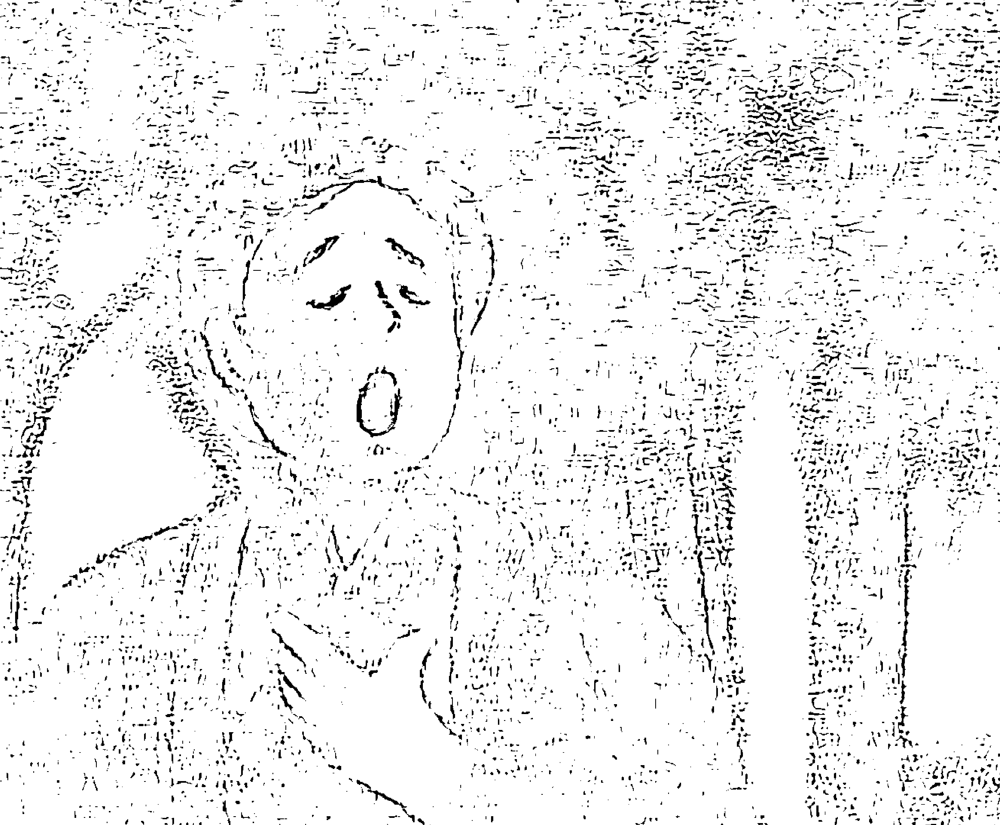

我會認為，這些奇蹟是來讓我們體會生命的完美或整體，以及生命數不清的可能性。倒不是讓我們把注意力轉到上面，跟著追求。如果去追求，反而又是一個束縛，甚至綁架，讓我們跳不出來。

我分享，也只是為了帶來祝福和鼓勵，倒不是把它當作一個真實來看。

# 86 能量場的加持

講到跟我們人類一起存在，但是在不同層面的生命，其中，龍特別有意思，跟人類似乎有一個共同的交會點，與華人的文化有很深的淵源。

這方面的故事，希望以後有機會再談。

前面也提過，小時候，我一看到人，常體會到他帶著某種氣色、光或是連著其他層面的生命。這樣的生命也許是天使，也許是阿修羅。有時候，我也可以意識到有些人帶著強烈的惡意。但我覺得比較特別的是，從小，我好像會意識到一種存在。這種存在，我不知道是不是就是華人所說的龍，也就暫且用龍來代表這種印象。

有些時候，我還會感受到一個人就像龍一樣。不過，這和他是不是生肖屬龍無關。當然，我們也聽過有些人會用龍來形容一個人的氣勢，但在我看來，他們想表達的特質，其實用阿修羅來描述還會更貼切。阿修羅是天界的眾生，很兇，爆發力很大。雖然比喻的方式有差異，我們也可以說是每個人對這些不同層面的能量和特質，多少都有自己的體會。只是，每個人的體會不同。任何體會，也稱不上是一種能力。

我小時候對這種存在的體會，都是在天空看到，而且都和雷雨有關係。那時候，我沒有特別把它當一回事，是到了成年後探究這個主題才發現——我從小得到的印象，和全世界各文化所描繪的龍是一樣的。而且無論哪一種文化的龍，長相都很接近，包括《哈利波特》小說裡的龍，都不像古生物的恐龍，而是更近似於華人所畫的龍。

但是，小時候，我試過幾次，把我的體會告訴家人。他們聽我說的時候，都一頭霧水，覺得莫名其妙。於是，我也就發現身邊的人其實看不到。之後，我就學會不再提，心裡明白這並不是我們透過人間的五官可以去觀察的，也就自然把這些經驗放過了。

其實，這些印象出現的頻率高到一個地步，對我來說，它們的存在沒有什麼好爭論的。它們是真正存在，最多是像我小時候體會到的其他生命，是在另外一個層面。後來我也發現，有很多小孩子跟我一樣可以意識到。

是這樣，我也就自然對這個主題特別感興趣。我後來發現，有人會用紅外線或遠紅外線去拍攝雲。尤其在打雷下雨的時候，他們所拍到的形態，和我得到的印象幾乎一樣。當然，這個現象並不是每一次都有。從科學的角度來說，也就是再現性不穩定，偶爾會發生，有時不會。

最特別的是，我在許多地方，尤其是一般人會去朝聖的聖地，也會感受到同樣的存在。這些和傳說中的龍相近的存在，就好像在守護這個地方。當然，也並不是每一個聖地都有。我有時發現一個，有時是兩個，甚至有時候更多。看多了，我自然會好奇，想知道數目多少是不是代表了什麼意義。

後來在台灣，有朋友要帶我到台東一個很有能量的地方。然而我去的時候，發現其實不需要誰來帶路，憑直覺我也自然能找到那裡。

我到的時候，正好是中午十二點。抬起頭，又發現好像有一對龍。這時候，正中午光亮的天空突然整片暗下來，下起大雷雨，讓我覺得好像在和我對話。我和帶我去的朋友分享這場大雨和龍的象徵。後來才知道，原本他們心中有許多顧慮，透過這些分享，各種擔心也就好像解開了。

從小，我就一直感覺到這種印象的出現，本身就好像在跟我表達什麼。我印象很深的還有加拿大的路易斯湖，湖水是很美的綠色。很有意思的是，這樣的地方自然會吸引很多人去。

還有一次，是在亞歷桑納州出差，剛好有一個週末的空檔有機會去塞多納。這個地方，也許大家都聽過有很大的螺旋場，也可以說是意外的能量場。當然，這個地方的能量，對我是相當特別。我參加塞多納當地的旅遊行程，不光是上去塞多納紅色的山頂，也在附近到處看看。

導遊開車往城外走，那時是六月底，陽光很強。我感覺到在前面的天空，似乎又出現了我小時候所意識到的龍。我跟導遊說：「咦？這個季節會有大雷雨嗎？」

他說：「一般這個時候不會，還太早，通常要到七月底八月才會有雷雨。」

話說完，沒幾分鐘，頭頂上的天空暗了下來。我們聽到雷聲隆隆，下起了大雨。我跟他開玩笑：「也許上面有龍喔，你要不要試試換個方向開？」

他往左開，雨跟著我們下得更大了。好大的雨。

他往右開，雨就好像還是跟著我們。怎麼都離不開這場雨。

我跟他再一次開玩笑：「算了，我們不用躲了，上頭的龍想跟你打招呼，只是你不知道。」

他抬頭往上看，好像也突然得到一樣的印象，馬上把車子停下來：「你下車！」當然，他是開玩笑。但我也看得出來，他是真的嚇了一大跳。他後來跟我說，他是從明尼蘇達州搬來亞歷桑納州，在當地三十八年，從來沒有體會過這種現象。

從我多年來所體會到的，龍的出現其實是為我們帶來恩典和祝福。龍是不同層面的生命，但始終和我們人類共同存在。我也提過，龍好像是在守護一個知識體，或說是在守護一種知識的檔案庫。

我前面提過佛教的龍樹菩薩，傳說中，他從高山的雪湖進入龍宮取得佛教經典裡最龐大的一部經——《華嚴經》。《華嚴經》一樣是釋迦牟尼佛所講的經，但這一部經和他在其他地方所講的經，味道完全不同。而奇妙的是，這部經是透過龍樹菩薩從龍宮帶到人間，這個經過也是離不開龍的境界。此外，我也發現，在我印象中有龍守護的地點，從能量的角度來說，都是意外的點。

有些人認為地球上有八萬四千個能量上的翹曲點，停留在這種特異的螺旋場，自然帶來意識的轉變和提升。這一點，我認為特別有趣。畢竟，一個人在修行的過程確實可能見到空、見到一體，但不一定能夠待得住，不知不覺也就滑回到人間，回到「有」的層面。然而，這些地點的能量場，卻讓人比較容易住在一體。就好像我們透過靜坐、功夫、瑜伽、持咒可以讓頭腦一致而同步、淨化，這樣的能量場，自然支持一種更高的意識狀態。

很特殊的是，我也發現這些大聖人，自然而然會自己找到這樣的地方，也就好像這些地方會吸引他們。或者說，一個人進入某種意識狀態，自然會想親近這樣的地點，也許是來閉關，讓自己沉澱下來告一個段落，將意識的轉變徹底穩定下來。這是我個人很深的體會。

我同時也意識到，目前地球的轉變相當大。這樣的轉變，都在支持我們讓意識提升。然而，各種分別、對立、隔離的情況在這過程中也會特別強烈，就像我們現在從世界各地所知道的。是如此，我才會出來分享自己的一些體會。

其實，我也同時體會到，正是透過這樣的轉變，地球現在到處都是很好的能量場。一切，也就看我們自己要不要下一個決心——決心做一個徹底的轉變。

我會談這些種種的現象，也只是希望能夠打開頭腦的限制。我們一般會受限於在這個人間透過五官所看到的一切，而把這一切當作是我們生命全部的可能。然而，我們的可能遠遠更大，甚至是無限。樣樣的奇蹟，包括生命本身這個奇蹟，本來是到處都有，比我們可以想像的遠遠更多，只是我們透過頭腦和五官無法掌握到這些。

其實，不光是我們在人間的經驗，就連各種生命在各種層面的經驗，包括我在這本書提到的各種經驗，再怎麼精彩，都只是從人的頭腦所投射出來。對真實來說，最多也只像一個影子。我過去也很少跟大家分享，不認為有什麼分享的價值。

包括這裡講到各種生命——龍、阿修羅、人類，好像表面上都有一個獨立存在的機制。但最不可思議的是，連這個機制都是頭腦的投射，而讓我們隨時認為是「真」或「假」。這種區隔，對我，是我們這一生來最大的奇蹟，而且是我更難以和別人分享的。

# 87 向過去的聖人致敬

談這些稀奇古怪的經歷，當然多少能為你增添一些閱讀的趣味。然而，從整體來看，這些經歷對我個人並沒有什麼重要性。反而是後來，或許是我內心有強烈的渴望，無論我去哪裡，都剛好有些巧合帶來難得的機會，讓我可以到一些神聖的地點朝聖，而有機會向古往今來的聖人致敬。

比如說，前面提過我在很年輕時，在紐約的書店知道了拉瑪那·馬哈希。當時，我只是看到他的照片，就有很深的共鳴。接下來，雖然我沒有再讀他的作品，但總是對他充滿了敬意，心裡明白他所談的是真的。很自然地，我也會想去他在印度南部的道場聖炬山去參訪。

後來，我有機會到聖炬山，發現那裡已經有了一個以他為名的道場。很難想像，印度南部那麼偏遠的一個小地方，竟然有那麼多人前往，而且，到處都是金頭髮的白種人。許多都是來自歐洲，包括德國、法國。

大家都聚在道場的三摩地大堂，那是拉瑪那·馬哈希圓寂的地方。我的注意力，反而自然而然被聖炬山吸引。聖炬山不過是一座小小的石頭山，卻帶著不可思議大的能量。我也就把鞋子脫掉，光著腳上山。每一步，都在心裡對他頂禮。

不知不覺，我走進一個山洞，坐下來，也就在那裡入定。後來，好像有人用手碰了碰我。我睜開眼，才知道天要黑了。

叫我的，是看門的苦行僧。他告訴我，這個山洞要關門了。「你從哪裡來？我感覺得出來你對拉瑪那·馬哈希有很深的敬意，才能這麼地定。之前，你和他有什麼淵源嗎？」當然，我不會想解釋年輕時的那段經歷，也只是用我的右手輕輕拍著左胸口，在心中對拉瑪那·馬哈希致意。這時，他好像突然懂了什麼，也就讓我一個人留在那裡過夜。

是這樣，我才有機會在這個山洞待上好幾天，完全沒有人打擾。這對我，是最大的享受。在靜觀中，我不光是和拉瑪那·馬哈希完全合一，更體會到聖炬山在過去已經幫助了數不完的修行者，讓他們在最後的階段達到解脫。

靜坐到最後，一種無限大的感恩從我心裡浮出來。我充滿感謝，感謝這樣難得的恩典，感謝印度這個地方的所有眾生。是在這裡，生出了那麼多位聖人在這裡的，不只是拉瑪那·馬哈希。所有的聖人，都同時在這個空間。而他們，完全跟我合一。

這個山洞，從能量的角度，不光是直通天際，與四面八方都是相通的。傳說中，甚至是通到北方中印交界（現在屬於中國）的聖山岡仁波齊峰。我個人在很深的寧靜中也有類似的體會，只是也不會想多分析，最多是把它當作一個幻象來看。當然，我心裡明白，這一生，不可能再有機會重複這樣的經歷。也就這樣，對它特別珍惜。

聖炬山，完全是光，本身就是一個通天的大螺旋場，住著數不完的成道的大師。其實，我們的心只要純淨下來，也就好像和所有的聖人都連結起來。此時，我不光是對拉瑪那·馬哈希頂禮，也對古往今來數不完的大師頂禮。

從山洞往下看，可以看到一座濕婆廟。有人說是印度最有名的，也有人說是全世界最大的濕婆廟，這是大多數人觀光都會去的景點。這座濕婆廟的內殿，外國人是不被允許進入的。我站在外頭，也就遇到一位當地的祭司。他看著我，我也看著他。不知道是怎樣的緣分，他主動提出來，要帶我進入內殿。

這座濕婆廟的坐向和方位可以說是再完美不過。從內殿，我可以看出來，它的結構也是直通天際。古人的設計真是了不起，這完全不是人間的建築。從濕婆廟再往山上看，也可以看到拉瑪那·馬哈希簡樸的山洞。對我個人來說，這兩個地方的意義完全不同。

類似的朝聖，我也一再重複。後來，我也去了不丹百羅的一個山洞。在那裡，藏密祖師蓮花生大士曾經閉關三個月。這個山洞很偏僻，要走很長的階梯才能抵達，並不是安全好走的路。

一般人旅遊都會去比較有名的景點，也許是廟的建築很漂亮，或是當地民俗有特色。至於百羅的這個山洞，畢竟路程不方便，還要走一段又窄又長的階梯，特地前來的人並不多，更不用說想留在山洞裡靜坐。但是，從我的角度來說，能夠在聖人曾經長時間停留的地方，回想他們帶來的這個神聖的空間，喚起我很多記憶。我在這些地方，自然生出一種莫名的熟悉感。

雖然，我們都知道「心」的力量其實才是最大。但是，我們畢竟還是有這個肉體，而肉體還是能量組合的。我們隨時被這個肉體綁住，也就難免隨時把虛擬的資訊當作真實。如果有這樣的環境，帶來不同的能量，為身體帶來提升的作用，還是多少讓我們比較容易潛入心。過去的古人都明白這個原理，到某一個階段，也就自然會躲開人間，讓心帶著他到一個對他的修行最適合的地方。

只是，我過去也從來沒有建議任何朋友到哪個地方去專修或閉關。舉例來說，聖炬山就像火，可以把一切「燒」得乾乾淨淨。除非一個人夠成熟，否則他到那裡反而可能「被燒掉」——承受不了浮出來的所有過去的業力。我也聽過有些人在那裡精神崩潰，就好像身心承受不了這種能量強烈的衝擊。

拉瑪那·馬哈希情況比較特別，他在十六歲就悟道，接下來離開家，也就住在聖炬山至少二十八年。從他的解釋，其實是這個聖炬山，才把他的狀態完全穩定下來，讓他完全可以住在心，而接下來在任何場合都可以活出心。他的每一個行為和每一句話，他都很清楚知道是從心出發。心，也就是我後來所講的絕對、全部、一體、永恆。

從我個人的看法，他是有史以來少數再少數可以隨時住在心的聖人。反過來，我後來發現，很多修行者都曾經見道，但他們的狀態不穩定，悟道後又落回人間相對的軌道。接下來，都是透過這種相對或「有」的軌道在講道理。

對我來說，一個神聖的地點，就是有那麼大的作用。當然我也知道，只要我們的心成熟，就可以跟生命接軌。這些地點，其實都不需要刻意去找，它會來找我們的。我個人也有這種數不完的體驗——也就是它來找我，不是我來找它。但到最後，誰找誰，對我已經不重要，最多像遊戲一樣。我可以做的，最多也只是讓身心配合這遊戲走下去。

回到拉瑪那·馬哈希，他可以說是印度過去千年絕無僅有的大禪師，透過個人的領悟，對傳統的印度教帶來了一種革命性的理解，也打破了印度教和其他宗教的分野。儘管如此，拉瑪那·馬哈希的道場後來也自然又回到印度祭拜的傳統（puja），每天擺花獻供，好像又落回一種宗教的習俗。其實，華人在這一點也是一樣的——把最根本、最不費力的本質落在人間儀式的層面，而把最單純的修行變得很玄。

當然，從更大的層面來看，奉愛（bhakti）與解脫智慧（jnana）是一體兩面，其實沒有衝突。拉瑪那·馬哈希的方法雖然是更直接的智慧法門，但真正解脫的智慧也不會去否定人們奉愛的心。

# 88 坎昆的聖人

我前面談到一些療癒師和修行的實例，來表達奇蹟。其實，我們每一個人隨時活在奇蹟。只要仔細觀察，都是奇蹟。然而，有些奇蹟乍看之下，很平凡。

有些人一生默默地做善事，從世界的角度來看並不特別傑出。但是，從我的角度，他其實就是生命最美的奇蹟。

我過去喜歡在墨西哥坎昆寫文章。有時候自己一個人去，或者和家人一起在那裡度週末。坎昆的沙灘相當出名。這個城市已經很繁榮，儼然是一個觀光都市。但從另一個角度來說，它還保有傳統的墨西哥文化，當地人依然過得很簡單。這樣的對比，相信是很多人會想去坎昆的關係。

坎昆在墨西哥灣，水比較溫暖，沒有什麼風浪。我記得一位年紀相當大的男士，在那裡當救生員。大概六十幾歲，很瘦。讓我印象最深刻的是，他張開嘴笑時，少了好多顆牙齒。臉上都是皺紋，連皺紋都充滿善意。

他的笑容，自然讓你感覺到他什麼都看過，什麼都體會過，也自然讓人在他身邊覺得

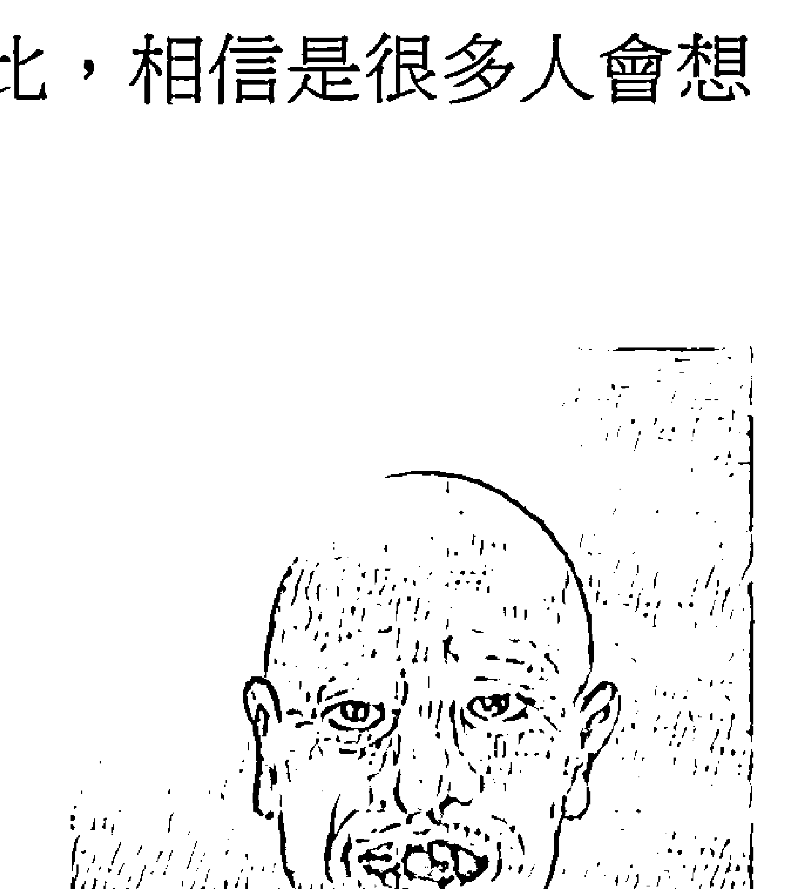

很安靜。

有一次，我看到他下班後還在海灘上蹲著，不知道在看什麼。我湊過去看，發現他正在觀察海龜產下的蛋，看看可以怎麼保護起來。

他跟我開玩笑，二十多年來，他不光是在這海邊救大人、救小孩，也同時在守護這些海龜的生命。

我沒有完全理解他的意思，也就自然好奇跟著他走。

晚上，他拿著手電筒，讓我看從地下鑽出好多小海龜。跟我說，幾百公斤的大海龜會來海灘產卵，然後又回到海裡。夜裡，孵出來幾十隻小海龜，在很短時間，一隻隻往海裡衝。

他會在旁邊守著，不讓任何人用手電筒的光干擾。甚至，如果發現小海龜跑錯方向，往陸地上跑，他會把牠們反過來，讓牠們順利回到水裡。

他說，其實這些小海龜到最後剩不了幾隻，因為在海裡會被吃掉。他想增加牠們生存的機率。

接下來，他又說，就這幾十公尺的沙灘，只要不去干擾，這些海龜到海裡會產生一個記憶。幾十年後，牠還是會回到同一片沙灘來下蛋，重複母親把牠帶到這個世界的經過。

無論多遠，總是有一天會回來。

我後來去翻看資料，發現他講的是正確的。但是，對這位老先生，最多是為了小海龜的安全。其他的，包括正不正確，對他其實都不重要。

對我而言，這非但是大自然的奇蹟，更可貴的是，有這樣善意的老人家，自己過得那麼簡樸的生活，還希望保護這些小海龜。

這對我是更大的奇蹟。

我只能給他一個大的擁抱，對他說“¡Gracias!”（西班牙文的「謝謝！」）！

樣樣都像雲

除了前面提到的坎昆的聖人，我這一生見過這樣善良、發心的人，數也數不清。我的父母，也是最好的例子。

後來，我在世界各個角落都會遇到類似的人——無私地服務、話不多、生活很樸實、沒有什麼要求，但是又充滿了感恩心。有些是打掃、清潔、做工的人，動的腦筋很少，但隨時可以看到他的平靜和滿足。

我喜歡跟這些人接觸，因為發現他們的光、頻率和行為與一般人都不一樣，也會想跟他們說幾句話，給他們也給自己一些鼓勵。同時，我心中也知道，是這些善意的人，決定了地球未來的演化方向。他們的高頻率，自然透過地球的變化，成為一個指南針，也不知不覺幫助這個地球轉變。

雖然從別人的眼光看來，我這一生活得很充實，好像做了不少事。但是，其實我自己的心很平靜，沒有對這個世界再有任何要求，對自己和別人也不再有任何期待。心裡是輕輕鬆鬆的，只是把每一個瞬間都當成一個修行最好的機會。

當然，有時候，為了一個組織的生存和發展，我還是會參與管理、設定目標、驗收成果、給予鼓勵。但是，心中總是知道，樣樣都像個大幻覺。眼前的人事，就像雲一樣，來了，在心裡更深的層面不去反應，也就輕鬆讓它們走掉。就好像我可以徹底放過這個世界，而這個世界也可以放過我。

當然，從別人的角度來看，表面上的煩惱和失落，以及個人在時間和精力上的犧牲，是數也數不清的。但是，在我心中，再也沒有什麼影響。我發現，我隨時可以活在快樂，而這快樂已經跟眼前樣樣都不相關。

這一點，是我周邊的人最難理解的。

多年來，我也就自然產生一個念頭，而且在心裡不斷重複。也許，應該稱為肯定。肯定的，也只是——無論到哪裡，那裡都是剛剛好我需要去的。這裡、現在，也是剛剛好我該在的。

光是這個念頭，就可以很輕鬆地消除任何其他的念頭，甚至不讓別的念頭起伏。

在人間，無論處理什麼事，我發現，這種肯定自然帶來一種安定的作用。這種安定，自然可以延伸到周邊。

從我個人的角度，最多是讓我對生命不斷產生最高的敬意。

# 90 走過鏡子的長廊

多年來，還有另外一個現象，同樣一再地重複發生。

見到任何人、任何東西，我常常發現，它們就像鏡子一樣會反射，而反映出的，最多也只是——我自己。

也就好像我自然發現——對別人好，最多也是對自己好。對別人不好，也是對自己不好。

這些話，對我已經不是理論了，它是再真實不過。

同樣地，我發現假如我對自己友善，也自然會對周邊任何東西、事情、人都會友善。

反過來，我包容別人，自然對自己也包容起來了。好像自己和別人沒有什麼差別，對於自己過去似乎數不完的缺點——也許是自己認定或別人批判的——我自然發現可以完全接受，甚至包容，完全把這些包容起來。

我記得年輕時，有時還會不斷地責備自己或懺悔。但是，已經很多年了，我可以完全接受自己，不會再加一個好、壞的念頭。

常常，在一天中，數不清多少次，我發現眼前的鏡子，是空的，沒有什麼東西可以反射或值得注意。

這個經驗，後來變成一整天主要的經驗。我用沙漠的腳印，或海灘的腳步，表達的也就是這種狀態——好像有人在做、在聽、在走、在動、在開會、在做事、在聽話、有人安慰、有人同情。但是，誰在做？

已經老早跟我不相關。

也就好像——做，為了做。走，為了走。

這種自在，是很難描述的。

我另外認為，我已經幾十年都感覺跟世界是顛倒的。甚至，人間的價值觀念，對我都是完全顛倒的。

我發現這種領悟對我是相當重要，讓我完全可以整合，把我的領悟和眼前的世界可以完全整合起來。

透過這種理解，再也沒有什麼矛盾好談的。

# 91 到處都是奇蹟

從我的看法，人間每一個角落，都是奇蹟。

我發現，只要我一寧靜下來，從各角落都冒出來一些頭腦想不到的現象，讓我最多只能用「奇蹟」兩個字來形容。

過去，我把整個世界視為理所當然。太陽早上昇起，傍晚落下。一朵花綻放。到了春天，眼前的草木從一顆種子生出來，愈長愈大。過些時候，又換成另一群植物，不斷延伸生命。

光是眼前的一片土地，不用去挖掘，就可以發現數不完的生命。然而，這些生命全部都在一個生態系裡，每個都有它的角色，一個都不能少。

我年輕的時候，把這些當作理所當然。不光沒有時間，注意力和領悟也不夠，不足以讓我觀察到生命的奧妙。

現在，成熟了，稍微懂更多了一點，也自然會把每一個瞬間當作奇蹟。讓我有時候看到眼前的生命，就好像是第一次看到一樣。

這個，我發現，就是我自己修行最好的方法。

每一個瞬間帶來的奧妙，我都可以觀察到。都可以對它有一個最高的尊重，甚至在心中不斷地頂禮。

這就是我修持的法門，讓我走到這裡，走到這一天。

未來，會發生什麼，其實我也不在意。最多也只是知道，其實跟我根本不相關。
怎麼來，怎麼走，我在哪裡，接下來好像都不重要。
反而充滿了信心——我去哪裡，那裡就是我的現在。
而一切可能發生的，都是剛剛好。
我接下來，對這生命也沒有什麼期待，更不用講有什麼要求。
一切，就讓它順其自然。
我最多只能把眼前的瞬間，當作生命最奧妙的奇蹟。
最多也只是這樣子。

# 結語

這本書，超乎我任何的想像和預期。我過去從來沒想過拿自己的實例來談。就是有人這麼建議，我最多也只會拒絕。甚至，就連「全部生命系列」都本來是一個字也不想寫的，更不用說把這些經驗拿出來跟任何人分享。

開始寫這本書的時候，我其實沒有任何藍圖。寫的過程，就好像是這本書自己帶著我寫，把這些故事講出來。

即使寫完了，我還在猶豫要不要出版，甚至會想交代離世之後再出版。我知道，假如不小心，它可能落到另外一個層面，反而造出不必要的爭議。

但是，從另外一方面，在口述的過程，我自然也體會到，把「全部生命」的觀點落到生活中——我自己的生活，可以為你我建立一種信心。從只是一個抽象的可能，落到一個現實的層面。

假如這些故事達到了這個作用，最多，是為我帶來欣慰。

在這裡，我還是要做個提醒：我在這本書，談到許多意識擴大或移動的經驗，而你可能把這些經驗當作開悟或醒覺的經過。但從我個人的角度，它其實並不代表開悟的狀態。

真正的開悟或醒覺，其實沒有現象好談，更不是讓意識從一個空間移到另一個空間。我會大膽地拿這些經驗出來分享，最多也就是像哄小孩子一樣，希望讓大家對修行這個主題感到興趣，倒不希望造出不必要的誤會。

坦白說，假如真正要談不費力的絕對——也就是我們的本質，是根本不費力的醒覺——不可能會有什麼實例可以分享，也不可能有這些書。對我而言，這些意識擴大的經驗，並沒有什麼真正的代表性，最多還是在一個「有」或「相對」的層面。

最後，我還是希望每一個人走出來自己生命的一條路。更期待有一天，你用自己的語言，將你的領悟做一個分享。不要受到這裡帶出來的語言的局限，或任何過去文學或哲學所帶來的限制。

我相信，一個人也就自然活出生命的自由。

# 後記 反覆的工程

我這一生本來只想輕鬆地度過，最多在孩子年紀還小的時候，多花一些時間陪伴——享受和他們相處的時光，安排他們進入一個好的大學。等他們長大了，都安排妥當，我也即將進入人生的黃昏，安穩而寧靜，可以完全放過這個人間。

其實，也老早都放過。

我這次會把「全部生命系列」的作品帶出來，而且一個接著一個作品出來，不光別人想不到，就連我自己都想不到。

為什麼會出來寫這些作品，背後的動機，其實連我自己也不清楚。最多只能說，在猶豫掙扎的過程中，遇到了數不完的奇蹟，遠遠超過這本書所可以表達。

我很少作夢。但是，這幾年來，時常夢到一些大聖人，為我鼓勵和祝福。也就好像是他們帶我來做這些作品，而這些作品跟我個人好像一點關係都沒有。

在這過程中，我注意到了幾點，才對自己的動機得到一個可以理解的解釋。

這個時代，不光我們生活步調快，透過資訊快速地流動，我們好像就活在同一個網格裡。在人類歷史上，從來沒有這種隨時彼此連結的作用。不光任何歷史留下的紀錄都可以找到，甚至在地球每一個角落隨時可以通話。然而，雖然有了那麼大物質上的方便，讓我們增加效率，但我們每一個人反而都繃得很緊，幾乎沒有人有安全感，更不用談快樂。

地球也是如此。頻率不斷上升，不斷加快。透過人類和自然的一些轉變，本身也繃得很緊，好像想跟著一起翻身，做個全面的反轉。

一般人不知道的是，我們正在一個上升的週期。這種週期循環，古人早就知道。無論印度、馬雅、中國的奧祕文化，都提過這種長遠的週期，也許是一萬兩千年或兩萬四千年。現在，我們剛好在一個上升的週期。

黑暗時代已經過去，現在是名符其實的黃金光明世紀（Golden Age of Enlightenment）。

我認為，是整個地球準備好了，才有緣分讓我這麼做。而且，這次會有無數的人醒覺。和過去一代只有寥寥幾位的情況，大不相同。

不只是地球到了這樣一個階段，人類的聰明，也從來沒有這麼犀利過。

有史以來，人類進入了一個最聰明的階段。透過二元對立，可以對整體做各式各樣的分別。舉例來說，光是探索的尺度，大可以到無限大，小不只小到微米、奈米、皮米、飛米，還更不斷往下探到幾乎是無限小。不光是從一體走到多元化、多體，也試著將多體整合成一個統一的架構。無論回到無限大或回到無限小，都在逼近絕對的觀念，試著回到一體，也就是「心」。

也就好比，人類累積的全部聰明，剛剛好可以準備接受「全部生命系列」的一些觀念，而透過這些觀念，自然可以從人間跳出來。

跳到哪裡？

跳回到一體。

跳回到無限。

跳回到絕對。

跳回到原點。

我透過「全部生命系列」的作品，試著以語言去表達那幾乎沒辦法表達的重點。沒辦法表達，因為一體的意識是絕對寧靜、不分別的狀態，而任何語言，反而自然把祂落到一個二元對立的角落。

語言和念頭本來是對於理解一體的最大阻礙。但是，這一次，人類進入一個截然不同的發展階段。我們透過聰明和分別，其實可以投射出來一體，而化出一個指南針。再加上地球快速地頻率提升，帶來了史無前例的巨大轉變動能，產生最大的轉變的扭力。

過去的修行，是一種很低調的傳承，只在老師和弟子之間單獨地互動。最多，有些老師在一個神聖的空間或道場，可以接觸幾十個人，很努力地推廣，也許可以接觸幾百或上千人，然而，再多或再少人，在整體上能达到的效果還是很有限。

很多法門，在過去，是分段地帶出來。這並不是老師的自私或保留，而是考慮到學生的成熟度。意識是個譜，從相對走到絕對，像彩虹，中間的變化很大。在不同的階段，要面對意識和法的不同層次。甚至從相對跳到絕對，幾乎可以說是不可能。我們腦的運作，是在一個相對的範圍內。連我們透過腦去表達絕對，本身已經落在一個相對的角度。更不用講，透過任何練習或做，不可能讓一個人回到絕對。

過去的聖人都知道，這種領悟不是靠語言或練習，也就在無形當中，讓這些傳承變得很隱密，而修行也就顯得很神祕。

我這次會把「全部生命系列」完全帶出來，不光沒有任何保留，還加快速度一口氣完成，也就是肯定——這一次，跟過去完全不同。

過去，一位修行人要完全把這一生投入修行，最後才可能有點成就。這一次，無論你我在什麼領域，是服務人員、廚師、工程師、司機、老師、技術人員、銷售員、藝術家、文學家，是不是知識分子，是富人還是乞丐，有沒有地位，有沒有名氣……任何人，這一次都可以轉變過來。

這次最有意思的是，我大膽提出了反復工程的觀念。而且，和一般人的想法完全顛倒，是更大膽地說——沒有什麼東西叫修行。修行，最多是帶你我到醒覺的門口。但是，醒覺，最後的一步，並不是靠修行或練習，而是把全部有限相對的境界都挪開，內心自然把一個人拉進去。

不要小看這個力量，「拉」還不見得是正確的形容。比較貼切的表達方式，反而是把一個人「吞」進去。

我才會稱這次的項目是反復工程，不只如此，它還是整個地球最大的轉變趨勢。坦白講，地球的快速變化可能為人類帶來前所未未見的危機。但是，危機大，本身就是我們轉變的機會，是這個轉變最大的恩典或動力。

我才會說，條件已經到齊。你我怎麼樣都擋不住，最多只能順著它走。

我在這裡，也想分享一個最大的秘密。我在國外常常重複一句話——The mind makes everything real. 頭腦會把一切成為真實。

大家認為這句話是來表達，我們將這個世界的一切妄想，透過腦的運作變成真實。這種解釋很可惜，明明樣樣的本質是「空」，但我們非要把意識落在不成比例小的「有」，來做這樣的解釋。

儘管如此，我會常說這句話，其實是因為它本身帶著解答的鑰匙。也就是說，既然我們可以承認，一切的世界都是腦的投射，那麼，為什麼不把頭腦落在一體？

- 我們隨時想到一體，一體也會想到我們。
- 你去關懷祂，祂也會關懷你。
- 你去疼祂，祂也會疼你。
- 你向祂求助，祂也會幫忙。

換句話說，假如我們隨時把注意力集中在一體，一體自然也就變成我們的真實。

假如你注意到「全部生命系列」的訊息，包括所帶出來的方法，無論臣服或參，最多也只是站在一體，把我們帶回家。倒不是從這相對的世界，想辦法推進到一體，這本身是不可能的。

站在一體，把自己拉回去，最多只需要提醒或反省。倒不需要經過各式各樣的練習，或像過去所強調的一樣，還要累積什麼工夫。這一條路，其實是最直接、最快的。

我很有把握，我們大家夠聰明，可以領悟到這一點。若非如此，我也不會想拿自己過去所遇到的一些實例來做分享。畢竟這些經驗本身還是一個幻相，沒有什麼代表性。甚至，任何奇蹟本身都是現象，而任何現象還是頭腦的產物。我透過這本書做一點分享，最多把個人所體驗的奇蹟當作鼓勵，除了引起你的好奇，也是提供一些信心，讓你安心走下去。

最重要的，還是我們自己把生命的奧妙、生命的奇蹟親自活出來。透過它們，不斷地強化信心，帶來意識最徹底的轉變——我在「全部生命系列」稱為「醒覺」。

最後，我希望你我都記得，無論發生什麼奇蹟、做什麼事，遇到好事、壞事、大事、小事，其實一點都不重要。唯一重要的是——醒覺。這是我們這一生來，唯一值得分享的目的。

一個人醒過來了，不用擔心。即使什麼都不做，他可以影響到周邊，甚至這個世界。

講這些話，其實也不那麼正確，比較正確的表達是——你我本來是醒覺的，只是不知道，或是可能忘記。然而，只要知道，或想起來，你我就已經活出我們本來就有的醒覺。

# 國家圖書館出版品預行編目（CIP）資料

奇蹟／楊定一著．--第一版．--臺北市：天下生活，2020.01
432面；17X23公分．--(全部生命系列；10)
ISBN 978-986-95151-9-1（平裝）
1. 靈修
192.1
106024441

全部生命系列0010

# 奇蹟
Miracles

- 作者／楊定一
- 編者／陳夢怡
- 插畫／施智騰（Simon）、李研慧
- 特約資深責編／陳秋華
- 封面設計／盧崢嶸
- 封面封底插畫／施智騰（Simon）
- 內頁編排／中原造像 王筱婷

- 發 行 人／殷允芃
- 總 經 理／梁曉華
- 編 輯／林芝安
- 出 版 者／天下生活出版股份有限公司
- 地 址／台北市 104 南京東路二段 139 號 11 樓
- 讀者服務／（02）2662-0332 傳真／（02）2662-6048
- 劃撥帳號／19239621 天下生活出版股份有限公司
- 法律顧問／台英國國際商務法律事務所・羅明通律師
- 總 經 銷／大和圖書有限公司 電話／（02）8990-2588
- 出版日期／2020 年 1 月第一版第一次印行
- 定 價／550 元

ISBN：978-986-95151-9-1（平裝）
書號：BHHY0010P

ALL RIGHTS RESERVED

- 天下網路書店 www.cwbook.com.tw
- 康健雜誌網站 www.commonhealth.com.tw
- 康健出版臉書 www.facebook.com/chbooks.tw

# 「全部生命系列」简介

人的健康，身、心、靈從來沒有分開過。楊定一站在全人健康的角度，重新整合從古到今、世界各地的健康法門與哲學系統，用現代的語言重新表達，幫助你我活出全部的生命潛能。

《真原醫》、《螺旋舞》、《結構調整》與《好睡》是從身心，也就是從「有」看著這個世界。希望在這個快步調的社會，幫助你我身心做一個整合，希望每一個人回到均衡。畢竟，在失衡的狀態下，一個人隨時都會被身心的不均衡給拉扯，而難以體會生命更深的層面。然而，一切都是多面一體。有了「全部生命系列」的基礎，自然可以在這個最完整的預防醫學的每一個角落，體會到愛、平等、寧靜與希望。

從《短路》、「全部生命系列」《全部的你》、《神聖的你》、《不合理的快樂》到《我是誰》、《集體的失憶》、《落在地球》、《定》、《奇蹟》，再到兩本問答《十字路口》、《插隊》，以及之後的《時間的陷阱》、《短路》、《頭腦的東西》、《無事生非》、《清醒地睡》、《我：弄錯身分的個案》、《豐盛》，逐漸地，自然移動角度，從二元對立轉到一體，從「空」看著「有」，從內心看著外在，從「在」看著「做」，從「心」看著「人」。

隨著每一個作品，我們深入的，不是知識，而是每一個人內心都有的層面——生命最深的智慧與慈悲。這，是人類終極的康莊。

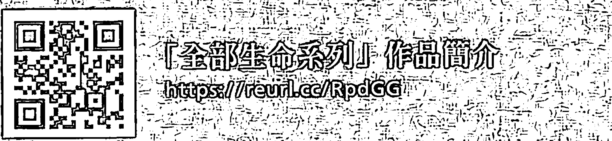

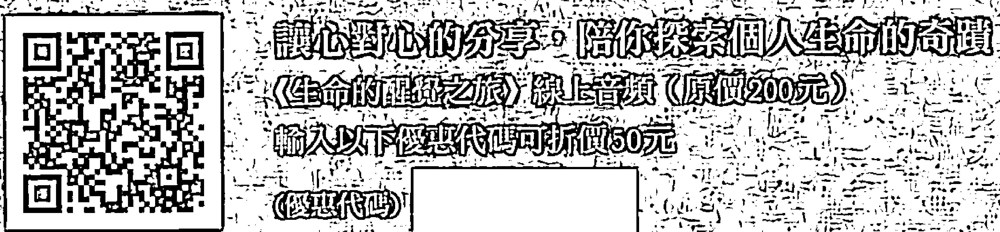

*使用方式：掃QR code進入「風潮線上課程」並登入會員，依照一般購課流程購買此堂課程，於最後「付款流程」輸入優惠代碼，即可享折價50元之優惠。（風潮客服：02-2218-5881*622）

天下網路書店 | www.cwbook.com.tw
康健雜誌官網 | www.commonhealth.com.tw
康健雜誌出版臉書 | www.facebook.com/chbooks.com

一個人年紀大了，心境成熟了，反而可能鼓起勇氣，做一些其他人認為不可思議的事。我有勇氣寫這本書，也只是如此。

我當然知道這些實例，也可能造出爭議甚至嘲諷。但是從另外一個角度，我又相信——如果我不把個人生命的奇蹟拿出來分享，又怎麼有資格談這個題目。

一個人要完全潛入心，再潛入心，再更深入地潛入內心，才可以找到這一生所希望的全部解答。

更不可思議的是，你我會發現，追求到最後，自己就是我們想得到的答案。

你我其實不是這短短的生命，不是眼前的衝突、心中的難受、感情的失落、眼淚流不完的悲傷、一個失望、再一個失望。

都不是，你我是——完整，圓滿，神聖，永恆，大愛，大喜樂，大平靜。

答案，從早到晚都在我們自己。

每一個瞬間、每一天，你我早已活出奇蹟——大的奇蹟、小的奇蹟、不可思議的、人間想不到的——全部，我們都可以活出來。

這幾句話，如果你不光是不驚訝，而可以完全接受，認為是再明白不過，那麼，我認為這一系列的作品，也就達到它的目的。