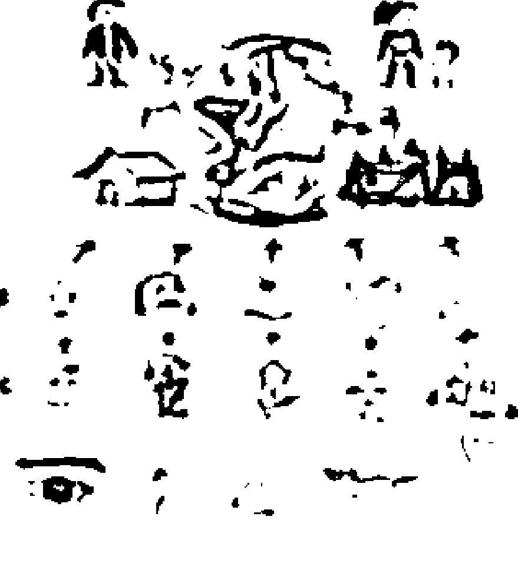
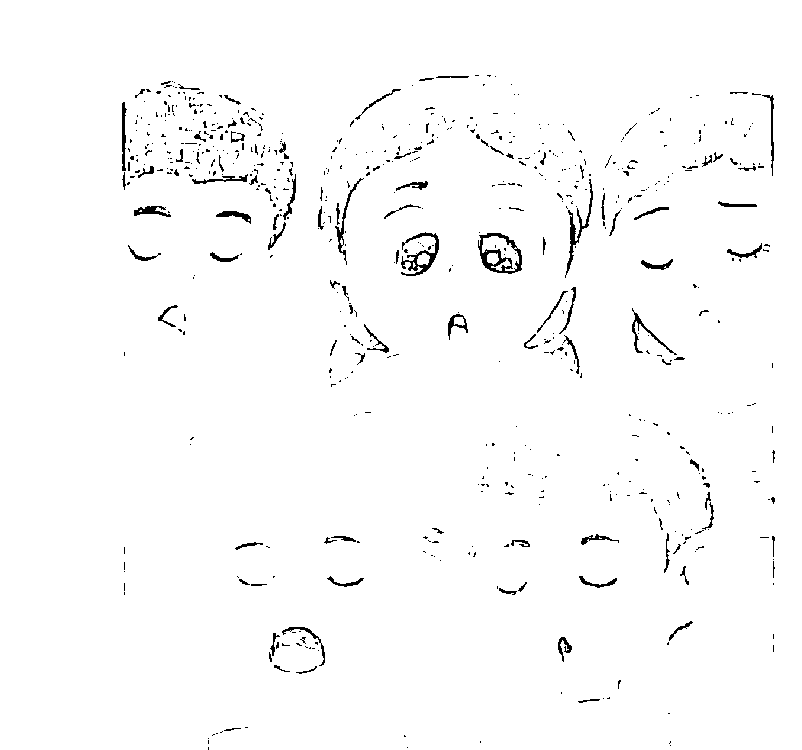
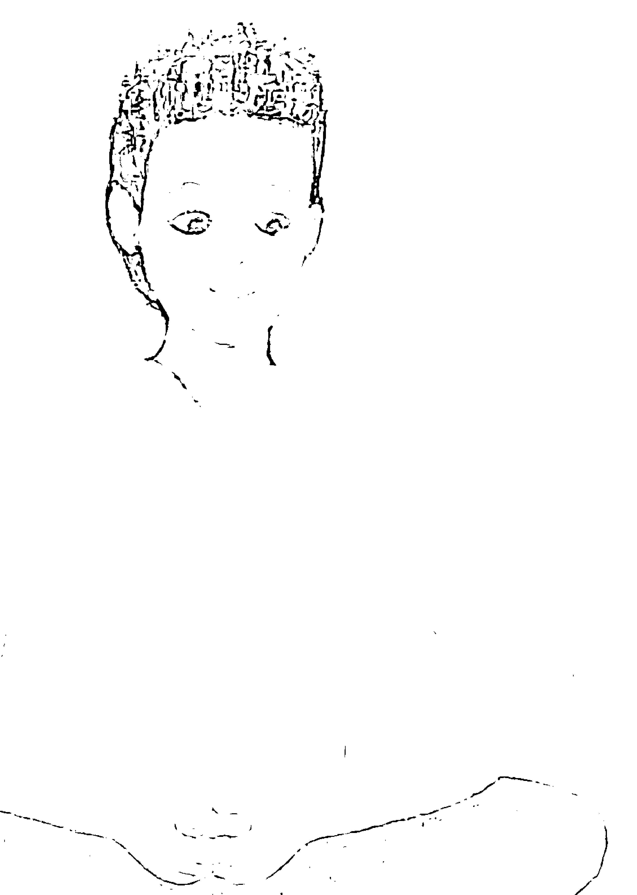
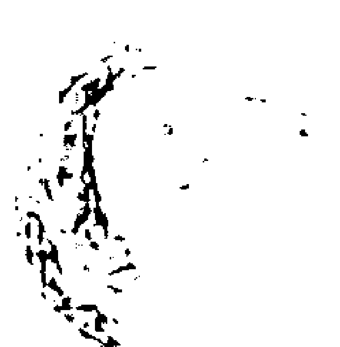
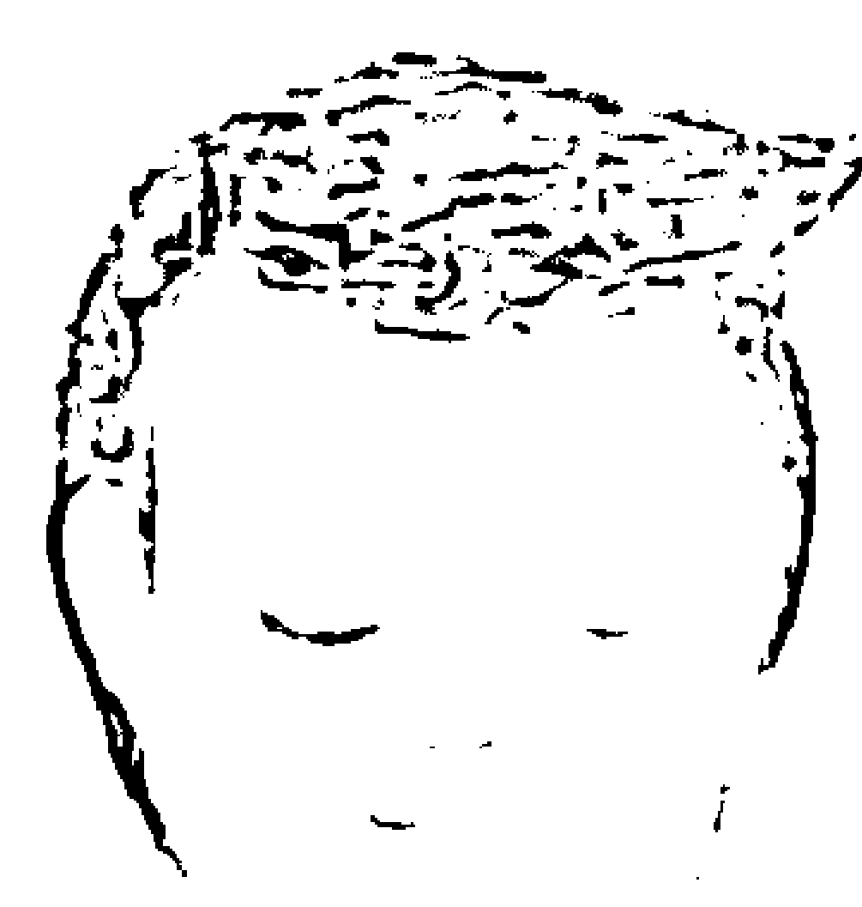
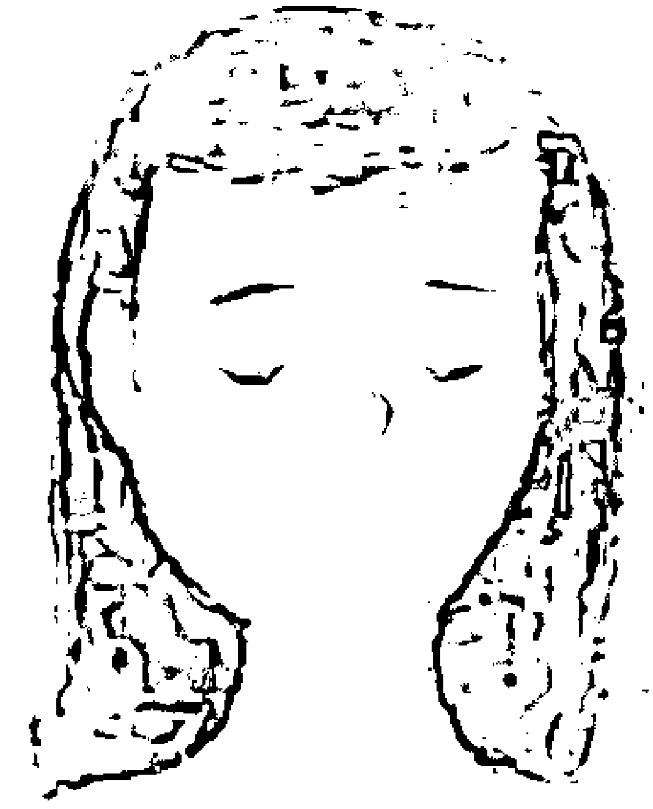
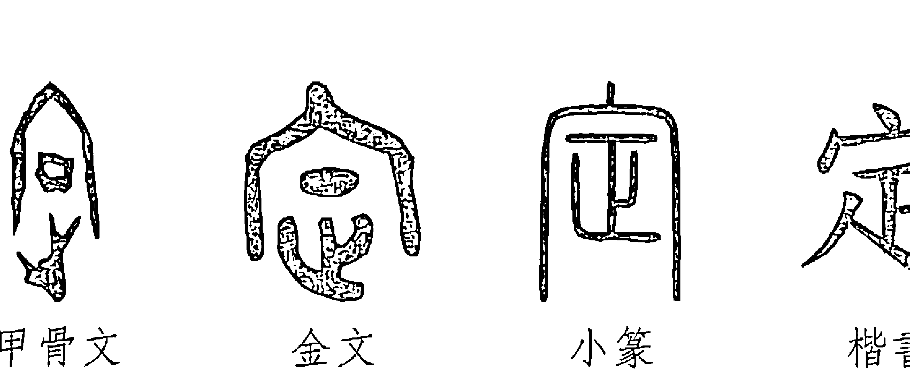

# 杨定一：定

## 作者

### 楊定一博士

著有《真原醫：21世紀最完整的預防醫學》、《靜坐的科學、醫學與心靈之旅》、《螺旋舞》（DVD+書）、《全部的你》、《神聖的你》、《不合理的快樂》、《我是誰》、《集體的失憶》、《落在地球》，以及《等著你》、《重生：蛻變於呼吸間》、《蛻變·重生》一日共修營實錄DVD，與《你·在嗎？》、《光之瑜伽》、《真實瑜伽》、《呼吸瑜伽》音聲作品專輯。

## 編者

### 陳夢怡

編有《全部的你》、《神聖的你》、《不合理的快樂》、《我是誰》、《集體的失憶》、《落在地球》。譯有《靜坐的科學、醫學與心靈之旅》、《呼吸的自癒力》、《奇蹟半生緣》、《性、金錢、暴食症：談形式與內涵》、《親子關係：世間最難修的一門課》、《心理學：適應環境的心靈》等書。


# 序

我前面透過「全部生命系列」的作品，想表達——我們擁有的全部的潛能，遠遠比我們所體驗的、所可以想到的更大。

我也相信，讀到這裡，你自然會認同——我們每一個人能夠認知世界、生命的意識很廣，本身既有一個有限、相對、無常、受到條件束縛所組合的部份，是我們承認的人生；也有一個無限、絕對、永恆、完全自由的層面，我們過去把它稱為「主」或「佛性」。

我透過「全部生命系列」，是希望表達我們每一個人都可以活出無限、絕對、永恆、自由。

這其實是我們生出來就有的權利，甚至是我們還沒有來這一生就有的權利，因為它是我們主要的一部份。

要活出它，比我們所想的簡單更簡單。所以，一般人反而會不相信，而寧願一生走上許多冤枉路，花很多時間去找它，或透過各種練習想去取得本來就有的本質。

但是，聽到這些，許多朋友會問——既然不是頭腦的產物，要怎麼去取得？假如全部、絕對、無限、永恆、自由，不是透過「動」，而人類的意識又全部是透過「動」而來，又怎麼可能體會到？

也就好像說，假如我們要從一個地方到另外一個地方，總是需要搭一個交通工具才可以到，而這個交通工具一定是兩邊都可以到，才能把兩邊連結起來。

其實，答案是很簡單——有的。貫通全部意識的連結，我們稱為「定」。但是，一般人想不到的是，「定」是兩邊都有，兩邊都存在。

所以，我才在這裡把「定」當作這本書的主題。

# 引言

「定」，梵文稱 *samādhi*，也就是漢傳經典提到的「三摩地」或「三昧」。雖然「定」帶著一個完全專注的味道，但其實不光是專注，甚至不是專注於一點，而是含著一個身心合一的境界，這本身也是古往今來大修行者所追求的狀態。

它也含著一個止的觀念，也就是念頭的止 (*samatha*) 。

不光是佛教強調「定」，在大乘和小乘經典都有記載。天主教、基督教也有這個觀念，透過祈禱，達到一種融入 (*absorption*)、一種合一。可以說，每一個修行的法門或領域都有這個觀念，只是以不同的用詞來表達。

我們每個人都想知道——除了早晚會凋零、時時都在變化的人生之外，有沒有一個可以永恆存在，而足以稱之為永久的真實？

答案其實很簡單，是有的。

人類從古到今都知道，「定」離不開生命更深的層面。

我之前在許多作品中稱之為「在」、一體、因地。而且，這個更深的層面遠遠大於人生可見的一切變化，甚至是大得不成比例。所以，我才會稱之為生命的真實，而把人生的變化最多當作生命的前景，甚或幻覺。

隨時停留或「定」在生命更深的層面，透過這個層面看這個世界，一個人也就醒覺過來了。

我希望透過這本書，將聖人所談的「定」，和「醒覺」的觀念連貫在一起，透過我個人的經驗，做一個與過去不同的整合。

你我可能都沒想過，修行和醒覺不光和生活有密切的關係，還可以隨時帶我們在人間走出最不費力、最快樂的一條路。我也表達過——這一生，甚至多生多世以來，沒有第二個追求可能比這個主題更重要。

在寫作「全部生命系列」的前幾本書時，我多次提到——是鼓起了相當的勇氣，才能完成這一系列我本來不想，也覺得自己沒有資格完成的作品。

我等了許多年，認為自己最多是進行醫學和科學的研究，應該把哲學層面的闡述交給別人。然而，坊間一本本探討生命科學的作品，都把這個題目變得理論化而遙不可及，讓你我普遍認為古聖人留下的智慧最多只能參考，和現代快步調的生活早已脫節，甚至不相關。

這樣的局面，是我多年來感到最遺憾的。

一個人對自己不了解，卻想去尋生命的意義或價值，不可能有所成就。

我相信，只要你我投入這條路，自然也會發現——我們這一生來，主要的目的是透過認識自己而醒覺。

這麼一講，要談「定」這麼一個重大的題目，這樣的書更不應該是由我來寫。

過去，探討 samādhi 的「論」相當多，禪宗的六祖也把「定」當作智慧的基礎。

定，就是一個這麼重大的題目。

到了現代，可以很輕易找到前人的各種「論」，以及現代人的論述或評注。很可惜，我認為最多只在頭腦的邏輯層面反映了理論，而一般讀者可能會看不懂。

因此，即使我個人可說是最沒有資格探討或解說這個主題，但還是認為有必要用現代的語言來談「定」，並以個人的體驗做一個分享。

既然我不是佛學或任何宗教學派的學者，沒有任何包袱，也不需要去符合任何宗教體系的說法，最多是把自己的體會、經驗和理解做一個輕鬆而純粹的分享。當然，我這種整合沒有依照任何嚴謹的學術要求去引經據典，不見得符合一般的慣例。

會想寫成作品，最主要的原因是——我發現許多關於「定」的論述相當理論化。讀了，會立即感覺到是一種頭腦的產物。反而把「定」變得複雜，讓你我以為是超過自己此生所能體會的境界。而我在這個作品採用的表達方式，相信會比較新鮮，而更容易滲透到你我的內心。

我很有把握，這本書所談的，不可能離開經典的精神。因為真實只有一個，所以怎麼去切入，到最後，結果都一樣。

而且，很有意思的是，跟一般人想的完全相反，「定」其實隨時都存在，隨時都有，從來沒有離開過我們。

沒有定，沒有生命。
它不需要我們找，也是找不來的。
這麼說，定，又是什麼？

## 01 意識譜：回到最基本的意識科學

在談「定」之前，我有必要從意識科學的脈絡，也就是意識譜（spectrum of consciousness），首先探討人類意識的組成。

我透過「全部生命系列」的作品，對意識做了一個探討。主要想表達——我們思考的邏輯，不光是相對、局限的，採用的還是一種比較、分別的策略，落在我稱為「二元對立」的架構裡運作。

然而，除了這種直線性、順序性的邏輯之外，你我其實有另外一套邏輯，是無限大而永恆的，可以稱之為一體。至於人類頭腦的運作，其實最多是把一個完整、絕對、永恆的整體切割，帶入一個有限、相對的範圍。接著再透過比較，才會累積知識 (knowledge)，而自然就變成世人所稱讚的聰明 (intelligence)。

我們仔細觀察「二元對立」的來源，最多是有一個觀察者，看著眼前的兩個點，透過個人觀察的角度，衡量眼前這兩個點的關係。

透過五官不斷的比較，好像我們隨時可以用三個點（其中一個點是參考的基準）化出一個世界。

有意思的是，我們透過一個觀察點，可以不斷建立起兩個點的因—果關係。就像右頁圖所顯示的，本來只是散落的幾個點，不但被我們連線，還指定一個為「因」（C, cause），再指定一個為「果」（E, effect）。假如在注意的範圍內又出現一個點，我們也自然可以把原本兩點中的「果」（E）變成新出現的點的「因」（C），並把新出現的稱為「果」（E），建立起一連串因—果的連鎖反應。

這麼一來，在二元對立的架構下，因—果的關係都建立起來了。透過因—果這種連貫的機制，我們也就突然產生一個時間的觀念，建立了時間的順序，也就是過去－現在－未來，我們才可能取得意義(meaning)。

假如不是透過因一果，把所見的現象連貫出先後順序，人間其實沒有意義，連一件事都沒有。人和人、人和事之間再也沒有連貫性，更沒有一個意義好談。

值得我們深思的是，時一空本身是因一果的產物，而因一果最多也只是頭腦的運作。所以我們在人間看到、體會到的一切，最多只是二元對立的作用。然而，二元對立只是頭腦的投射、是念相。

我們截取或捕捉資訊的架構，本身就是建立在二元對立上。所以，我們所看、所體會的一切，自然都落在這個範圍內。

然而，在這個範圍內，只有無常。所以，「永恆」對於這個架構下的我們，是沒有意義的。

這麼一來，站在人間，想要談永恆、不生不死，本身是個笑話。透過我們的腦，不可能體會到什麼是永恆不變的真實。

二元對立架構的運作離不開「動」、離不開「想」。

「想」，其實就是腦海的「動」。

「動」離不開時一空（時間＋空間）的觀念。所以，我過去也把這個架構在二元對立的物質和心理現實，稱之為外在世界，或簡稱為外在、前景；而將遠遠更大的一體，稱為內心、「心」或背景、因果 (causal ground)。

如果用煙火和天空做一個比喻。煙火，代表人生的變化，而天空，是我們的內心、一體。我們一般都把注意力全部放在煙火的前景，欣賞它的顏色、它的變動，而忽略了後面遠遠更大的天空。再怎麼吸引人的注意，煙火最多只是短暫的。但是，也就好像我們非要把注意力挪到無常的變化，而忽略了還有遠遠更大的背景，在等著我們。

我們每一個人平常都活在狹窄的前景或外在世界，要把意識移到內心或內在，才突然體會到生命的全部潛能，也才有機會活出解脫。

建立了意識譜的基礎，接下來，我又強調古人留下的兩個主要的大法門，一個是臣服（bhakti yoga），另一個是參（ātma-vichāra）。

臣服，再加上參，人自然回到心，回到一體（abiding by the heart or Oneness）。

這是全世界的修行門派，都想追求的。

可惜的是，我們每一個人從生到死，都被洗腦，認為要不斷地透過「動」來完成生命。透過「動」，我們不斷地「想」、不斷地追求學習、進修、升遷、好的變化、規劃、執行、評估、理解、反省、回顧、發現意義……甚至連修行還是離不開「動」，希望透過「動」，成為一個聖人或比較有用的人。

然而，要找到自己，其實倒不是透過「動」(doing)——任何的「動」，反而是要透過「在」(being)——輕輕鬆鬆的「在」。不費力的「在」。隨時都有的「在」。才可以把真正的自己，也就是一體找回來。

透過臣服，我們最多也只是看穿每一個眼前所帶來的「動」，讓我們自然回復「在」。

每一個境界，任何體驗，我們都可以放過。不光放過自己，還可以放過別人。樣樣都放過，我們自然就進入臣服，也就自然「在」。

「在」，本身又和一體分不開。

參，是從佛陀傳下來的大法門，是千年後中國禪的基礎，也是一千三百年後，印度不二論的基石，更是消除二元對立最犀利的工具。

「參」的獨到之處則在於——

透過臣服，我們自然落回到「心」。但偶爾心還是會動，會延伸出來一個念頭。這時候，透過「我是誰」的參，守住念頭的根源。

這麼參，自然又回到心。

「臣服」與「參」兩個大法門，雖然是兩面一體，有意思的是，所有宗教都強調臣服的觀念。我這幾十年觀察下來，也認為——臣服對一般人比較容易。參，確實比較難切入。一個人要相當成熟，有很多妥當的準備、練習的基礎，才可以著手。

但是，只要做下去，就會發現，兩個大法門都帶來一種動力，是靜坐單純的專注所帶不出來的。這個動力，其實是一種螺旋的扭力。透過最不費力的路徑，達到最大的效益，讓我們可以從念頭沿著這個扭力，回到心。

我會用這麼多篇幅來描述這兩個法門，正是因為深知現代人安靜不下來，光是靠靜坐等種種方法，不足以达到徹底的轉化。

人類在這個年代，意識上要真正有所轉變、突破，需要不斷的修行。透過這兩個方法，才可以隨時在做練習，也就是我之前說過的 sādhanā。

這兩個方法，「臣服」和「參」，和一般靜坐不同的地方是——靜坐，本身要有一個對象，也就是要有一個客體作為注意力所專注的對象。然而，這樣的架構，必然需要一個主體「我」，去專注在一個客體。直到最後，這個主體「我」與「客體」合一，透過這樣的過程，把念頭消失。

可以說，靜坐一樣離不開二元對立的架構（主體「我」——客體「對象」）。

而「臣服」與「參」的不同在於，它完全跳過二元對立。透過腦對理論的吸收，先把我們的意識挪到一體，站在一體來面對這個世界。

所以，透過「臣服」與「參」的 sādhanā，最多只是提醒我們回到一體。

我在前面才要花這麼多篇幅來設定基礎，用各種切入點、各式各樣的解說與比喻，讓你我自然從一體出發，把「臣服」和「參」這兩個工具當作一個提醒。

### 提醒什麼？

提醒自己老早已經在家，在一體，在存在的家。老早已經完整、完美、圓滿。老早活在「在·覺·樂」，活在「愛」。最多，只是這樣子。是用這個基礎，來面對人生。

再講透明一點，我透過「全部生命系列」這幾本書，逐漸從「有」轉到「在」。甚至後來，是站在「在」的立場（假如可以這麼說）來對話。

也就是說，如果一體可以表達，它會對我們人間怎麼說？

這種邏輯顛倒的手法，會突然帶給我們一種思考上的突破，甚至讓我們看得更清楚——這一生所經過、承受的制約和洗腦。

因為一體和人間的意識是在不同的軌道，我們怎想都想不到，一體是用任何語言都無法描述的。於是，我們自然會產生那麼多矛盾，也會同時認為這些探討帶來那麼多悖論。

有意思的是，腦無法理解的悖論，「心」反而會當作甘露，知道在某一個也許更深、更抽象、更奧秘的層面，是真的。

所以，就像你我，會不斷地回到「全部生命」的系列，而自然被吸引。

我用同一個手法，來探討「定」。

我相信，用這種方法來表達，和你過去所接觸的作品會完全不同。

我接下來要談的不是理論，更不是學術，也沒有什麼好引經據典。最多只是把個人的一點體驗，在這裡做一個表白。但是，我相信，只要冷靜去探討、去參，你會發現——這裡所講的，和古人的經典完全吻合，沒有任何衝突的地方。

## 02 反復的工程

在正式進入「定」的討論之前，我還是有必要再進一步闡述前一章的彙總。因為我心中知道——這一堂課，是我們這一生最重要的，然而，它本身可能跟你在生活中、甚至修行，到目前為止所學到的一切，是全部顛倒的。

我透過這幾本書，已經跟你接觸了一段時間。在此利用「反復工程」這個標題，先把一切想表達的重點講出來。接下來，透過「定」做為一個實例，讓你可以對照你的理解。

反復工程，其實指的是——經過「全部生命系列」的作品，我們對修行或進一步的真實，在觀念上已經站在一個完全顛倒的基礎。所謂的「顛倒」是說——這個生命、一切我們所體驗、所看到的，和一體相較其實不成比例，最多只是生命全部潛能的一個可能。然而，我們竟然為了這個可能，投入一生。

不光一生，還是無盡的生生世世。

我們最難想像的是——這個世界，竟是我們頭腦投射出來的。

針對這一點，相信你我透過頭腦的聰明會立即抗議，認為不可能。

所以，我再進一步做一個說明。

我們透過五官在二元對立建立的知覺，自然會排出一個順序：有一個因，有一個果。

我們透過記憶，再經過分析（比較、對照、分別、衡量），才可以把眼前的幾個點聯貫起來，透過這個線，得到一個虛的聯貫性。時間，也是這麼來的。

時一空，也是如此。透過五官，我們可以得到一個立體感，而在體和體中間創出一個連線，也自然得到一個距離感和座標，包括面積、大小的層面。

也許這麼講還是抽象了點，就讓我用具體的例子來表達——

我們可以進一步看到，對周邊全部的感知，還是離不開眼耳鼻舌身的知覺。然而，就連每一個感官本身，都在建立因—果的排列順序，就像右頁圖所表達的。

比如鼻子，我們聞到一朵玫瑰花，接下來，有兩朵玫瑰花，然後，一束玫瑰花。香氣愈來愈濃，它本身產生一個時間的觀念，好像從沒有味道→有一點味道→更多→更強。假如我們同時有眼根的配合，眼前本來沒有，從一朵、兩朵、一束。鼻子和眼睛的資訊兩個配合起來，也就自然讓我們覺得眼前的現象很真實。當然，如果可以配合觸覺，摸一下這朵花，就更堅實了。

再舉一個實例，假如眼前只出現一個人形，我們可能還覺得是幻影。倘若還同時聞到了香水的味道、聽到聲音、摸到人、體會到這個人的溫度，我們當然會認為是真的。

# Document Title

Introduction paragraph here.

- Item 1
- Item 2
- Item 3

| Header 1 | Header 2 |
|----------|----------|
| Cell 1   | Cell 2   |

> This is a quoted text.

```
python
print('Hello, World!')
```

五官本來有它單獨的作用，但是它隨時在重疊。只要重疊，它就好像不斷得到驗證。而且是自己證明自己、自己支持自己。我們所感知的現實，就是這麼組合的。不同感官的重疊，互相支持、驗證彼此的資訊，讓我們從不同的方向都可以得到同一個結論。

這種重疊，再加上整合，也就這麼建立了一個世界。就這樣，我們一生就這麼被洗腦，才會讓我們把這個世界看得那麼堅固。這個世界，有你我，有男女，有其他人，有住宅，有森林……一個完整的人間，就出現了。

不光人間，整個宇宙，包括月亮、太陽、別的星球，也就一起被我們投射出來。

假如有個外星人或外星生命，它有一百個感官，不像我們只有五官。我們可以想像，它眼中的現實多麼複雜。說不定，就在我們這個地球，它可以看到許多不同的眾生。而我們認為是地球表面的平面，在它眼中可能不存在，也可能更高或更低。它可能不光有時一空的觀念，還有更複雜的維度，是人類難以想像的。因為我們一般只能體會到三度的空間，最多再加上時間，一共四度。

不光如此，也許就連單一感官，它所能體會到的範圍都比人類所能接收到的更廣。所以，我們可以想像，這一來可以追加多少複雜度。這個宇宙很可能長得完全不一樣，甚至根本沒有所謂的宇宙。

我才會再三地講，我們一般人過去沒注意到的是——因一果本身就是五官建立出來的。是透過因一果的作用或機制，我們才建立一個時一空。這時一空包括世界，包括你、我和全部的「有」的範圍。

但是，假如我們從物理的角度進一步解析，任何東西，無論表面上堅不堅固，自然會發現都是空的。無論一個宇宙、一個星球，到一個分子，只要這麼分析下去，到最後，都只有空。

但是因為感官的運作，讓我們建立一個很堅固的世界，反而體會不到這方面的矛盾。

我們透過感官，全部可以體會的，都在裡面。即使五官看不到，只要腦可以想像得到的，也是知覺透過念頭的整合所延伸出來——從最小的量子維度，大到地球、宇宙，包括你我、世界、人間。就連我們一般比較想不通的，像是所謂的「沒有」或「空」也可以在裡面。只要可以想像的「有」的對稱，從腦延伸出來的，都還在裡面。

任何幻想、念頭，也都在裡面。

我用同一張圖，延伸另外一個層面，也就是一體、空、在、全部、心、因地。

這個層面，遠遠大於前面所講的「有」或因一果建立的層面。因為因一果建立的時一空或「有」小得不成比例，古人站在一體會稱之為幻相 (illusion) 甚至妄想，而把一體稱為真實。

會用這種語言來表達，是因為因一果造成的世界，也就是我們的人生，是在相對的範圍，最多是無常，會生會死。而一體是無限大的範圍，不會變更。所以，才會把它當作真實，而把短暫的，稱為幻相。

也因為如此，在這張圖，我無論用什麼元素都沒辦法去表達一體、去表達空。只要借用任何一個東西或觀念來表達，又落回人間因一果的範圍。所以，這張圖最多用紙上的空白來表達一體。但是，連這種表達方式都跳不出人間的二元對立。

有意思的是，一體遠遠大於右頁圖中所表示的人間。我們才會稱一體是無限與永恆的絕對。但是，反過來，最不可思議的是，我們透過頭腦，把五官的注意力全部鎖定到一個有限而相對的層面，也就是人間的二元對立（右頁圖中的那一小部份）。不光以為一體不存在，還同時認為我們全部生命的潛能，就是透過人間的這麼一小點可以找到。

過去也談過，局限的意識、世界和無限意識唯一的通道，是「這裡！現在！」，也就是每一個瞬間。我才會那麼強調活在瞬間，或活在當下的重要性。

### 怎麼回到瞬間、活在當下？

「臣服」和「參」，自然把我們的注意帶回當下。



获取更多好书，请加微信号：strcdts
店铺：http://strc.cr.cx

当下，本身就是「心」，是「在」。

最多，要把心、一體、瞬間找回來，也只是把全部的「有」挪開，讓下面的「在」或「心」自然浮出來。不是這麼做的話，透過「有」是永遠不可能追求到「在」或「心」。

我要再強調一次，因為兩者在不同的軌道。

但是，每一個「有」內，都含著「心」，含著一體，含著「在」。若不是這樣子，一體也浮不出來。

所以，在這個因一果或制約的世界，隨時含著無條件的一體。我才會不斷強調，要找回一體，沒有一個經過或過程好談。因為經過本身還是透過「動」或「做」，還是受條件的制約和影響。

這些話，跟我們接下來要談的「定」，有密切的關係。

我過去所看到的作品，都還是從有限、二元對立的世界的角度來追求定。自然把它當成一個功夫、「動」、「做」來探討。坦白說，這種「定」還是頭腦的產物，本身沒有離開過時一空或因一果，還受條件的制約和影響。

件的影響，還是制約。

我在這本書則從兩個層面來談，首先從「有」的範圍來談定；接下來，從一體的角度來談同一個題目。我很有把握，可以把全部的矛盾打開。所以才說，這工程完全是反復的。

「全部生命系列」的作品，走到最後，是透過一體來看人間。所以，這裡所談的，不是靠時間、努力、費力或練習所追求到的。甚至，用練習，反而追求不到。

因此，這本書所要談的定，跟幾乎所有人想的都不一樣。透過練習或努力，也是追求不到的。可以追求的定，是人間的定，短暫的定，我在這本書會稱之為「小定」。

然而，我在這裡想帶出來的，是永恆、無限大、大喜樂當中的定，或說「大定」。

# 03 快速的步調，缺失的注意力

可惜的是，現代人其實隨時處在注意力渙散的狀態。

我們仔細觀察，現代資訊技術的突破，讓我們每個人都同時在做好幾件事。無論在講話、走路、寫字、吃飯，不是看著手機，就是在搜尋資訊或用訊息軟體和別人交流。

頭腦的運作，一刻都沒有停過。

這是很普遍的現象。

儘管我們每個人都認為有點跟不上，卻又同時期待步調可不可以更快，有沒有什麼方法可以達到更高的效率。

就連看電視，一個畫面上都同時有好幾條跑馬燈，就好像把一個瞬間切割成好幾個，才配得上我們對快步調的期待。

這本身，自然會讓我們把無常和變化視為生活的主成分，而同時讓我們在現實中建立一個個虛構的架構，而每一個架構都彷彿有獨立的生命。

我在《真原醫》和「全部生命系列」曾經多次表達——這種快還要更快的步調，本身就是現代人最大的危機。

讓我們不快樂，總是感覺到壓力或是不知哪裡來的沉重感，好像隨時背著一種負擔。這種不快樂的現象，甚至蔓延到年輕的一代，即使很年輕的孩子都有注意力缺乏和躁鬱症的問題。

這種更快的步調，其實是相當近代的產物，人類演化多年來的架構沒辦法適應。畢竟，種種快步調的反應，當初只是為了生存而留下的「打或逃」本能，本來只是短期的應對。

沒想到人類發展到現在，這種快步調的反應，反而變成我們隨時的常態。

步調快，還不是主要的問題。

問題在於，它同時帶來念頭快速的轉變，以搭配感官在世界運作所收到的資訊。透過念頭，頭腦隨時創出一個虛的現實。這些不斷在動的印象，頭腦來不及處理，本身也就不斷的帶來壓力。

我在之前的作品，也用相當多篇幅來表達——頭腦受到壓力或危機，自然轉到肉體上，帶來不安，帶來萎縮。

所以，讓注意力集中而專注，是我們最需要的一堂功課。對忙碌的現代人而言，守住的感官愈多，通常愈能幫助守住注意力。

其實一般所談的「定」的功夫，都離不開時空，更離不開感官。「定」或「專注」的功夫，是透過感官才可以運作。

再說清楚一點，一般所談的「定」或專注，是透過感官的運作或「動」來捕捉資訊，而進入一個「不動」、寧靜或合一，才有「定」好談。

懂了這些，我們自然可以把感官當作一個專注的門戶。

如果我們懂得從多重感官著手，例如同時耳朵聽，加上眼睛觀想、鼻子聞、口腔的體會、皮膚的觸覺，反而更容易達到專一。

重點是，不要同時產生念頭。

所以，一般專注的練習，會透過重複的動作（例如朗讀、呼吸）讓念頭不容易起伏。

也因為如此，多年來，我常常與朋友分享如何教小孩子讀經。不光是因為讀經可以讓孩子接觸大聖人的觀念，而讓這些大智慧落到腦海。此外，由於讀經同時運用多重感官來集中注意力，對腦部發展的活化，有不可思議的作用。



透過朗誦，其實是教孩子學會掌握耳根的聽、嘴巴的發聲、眼睛閱讀的觀、集體共振的觸覺，把注意力守住。透過重複的朗誦，不容易產生念頭。

所以，我過去不斷地提醒家長和教師，不需要為孩子解釋經典的意義。因為任何解釋，是落在一個念頭的範圍。

最多只要透過朗誦，讓古人的話落到心裡。

最不可思議的是，讀經的孩子，不光是學習能力提升，靈感也被強化。我親眼見到許多小孩子自然在藝術、文學、科學、數學領域有特殊的表現。

有意思的是，就是古人留下來的這麼簡單的方法，透過千萬個小孩子，可以驗證這裡所談的原理。

相信你讀了前兩章，已經體會到，我這本書所談的，倒不是這方面的專注，更不是強調要怎麼以各種方法透過多重感官去切入。剛好相反，這裡所要談的是——希望你我用這方面的知識和練習作為基礎，也就是透過一般的靜坐，而可以跳一大步，帶來意識徹底的轉變。

怎麼徹底轉變？這一點，希望透過這本書可以轉達。

# 04 從專注到「定」

第一章提到，一般的靜坐是透過主體和客體的互動。也就是主體守住一個客體，比如「我」守住「呼吸」。守住的客體，可以從「呼吸」，進一步變成守住「單純的觀察」呼吸或守住「數」呼吸。

我在《靜坐》也用了很多篇幅表達——這種透過主體和客體間互動而來的專注，可以透過單一感官，比如觀想的眼根或聽聲音的耳根來達成。前一章也提過感官的作用，因為這個觀念太重要，我想再強調一次——我們可以透過多個感官來得到專注。

舉例來說，持咒，一方面用口發出聲音，以及耳根來聽。例如準提咒還以觀想守住心輪，也就是再加上眼根的作用。任何呼吸的法門，也是如此，除了觀想，還可以透過覺察氣流經過身體的觸覺，來幫助守住注意力。

然而，這裡所講的專注，本身還離不開時一空。時一空本身含著我們感知的架構，任何可以用感官去專注的，也離不開時一空的範圍。

也就像下一頁圖裡的人，看著眼前的小螞蟻，而把全部的注意力專注在眼前的小螞蟻，甚至和小螞蟻合一。這本身是一個功夫的產物。當然，小螞蟻是一個比喻，對象可以是呼吸、可以是觀想、可以是持咒......

最有意思的是，我們透過靜坐來專注，主要的目的是讓主體和客體合併，最終跳出時一空。也就是——用時一空來超越時一空。

怎麼跳出時一空？

也就是我們注意力集中在一點，這個點總是會小到一個地步，低於時一空的法可以運作的範圍。這樣的點，我們稱為奇點。透過奇點，自然穿過時一空，到另一個意識狀態。奇點，也可以稱為 singularity(或 point of anomaly，意思是——意外的點）。



佛

用物理來說明，我們一般體會得到人、東西、動物、植物，這個範圍的維度是受牛頓力學所管制的。但是，當維度的尺寸小於普朗克長度（~1.616×10⁻³⁵m），自然不受牛頓力學管制，而進入了量子的世界。在量子的範圍，我們一般體驗的時一空完全不存在，而進入了一個以不同物理法則運作的世界。

反過來，當維度的尺寸大到一個地步，也是一樣的。只要超過時一空的管制，一樣適用奇點（「意外」的觀念）。我在這裡雖然用小到無限小來舉例，但也可以用大到無限大來描述。

我想再講清楚一點，只要意識達到了奇點或意外點這樣的臨界，就好像進入一個黑洞或白洞，自然帶我們踏進另一個意識狀態。我們一般難以想像，通常會將這個狀態稱為超越（transcendence）。

奇點，或意外的點，還是透過時一空的角度在看世界。站在這個角度，還有一個奇點好談的。

然而，它其實是一個超越的窗口，一點也沒有什麼意外。它本身就是人間各種現象的共同點。

嚴格講，其實透過時一空，要跳出時一空——也就是從無常、相對、有限的範圍，跳到生命的永恆、絕對、無限——無論透過奇點或任何點，都是不可能的。最多只是把我們的注意縮小或擴張到一個範圍，讓它自然融化到一體或整體，我們也就自然超越了。

超越，或解脫，其實是生命最普遍的現象。但你我透過人生的洗腦，都忘記了，反而認為解脫不可能，或需要透過很多功夫練習專注才能達到。

真正的超脫本來就有，倒不是透過一個奇點或任何時一空所帶來的點。

這一個關鍵是最難懂的，因為不符合頭腦這一生所累積的邏輯。我才需要透過這本書一步步談下去，把人生最重要的這一堂功課帶出來。

雖然如此，我認為我們還是可以踏實地回到專注，回到最基本的練習。透過這些方法，讓念頭不斷的「動」踩一個剎車，讓我們至少體會到什麼是專注，什麼是意識集中。這本身已經是一般人想都想不到的狀態，能為身心帶來一個放鬆和大的調整。

你我只要體驗過這種專注，自然難以忘記。

回到靜坐，比如說，假如我們觀察一個點（例如「呼吸」），只要投入，自然會體驗到這種合一的狀態。熟練了，沒有「人」在觀察，也沒有「東西」被觀察。主體和客體的界線消失，我們自然達到前面所講的「超越」。

超越，最多也只是讓念頭暫停，而成為一個意識的門戶，讓我們達到「止」（samatha）的境界。

假如我們可以把這個暫停拉長，從一個瞬間，延伸到下一個瞬間、一連串的瞬間。延續下去，也就成為古人所稱的「定」（samādhi）或三摩地。自然會發現在意識層面帶來不可思議大的轉變，甚至，對我們可能是個脫胎換骨的體驗。

專注所帶來的「定」，除了可以延長停留在瞬間的時間，當然和一般的專注也有一個深度的不同。一般要透過靜坐徹底達到念頭的「止」，主體和客體要完全合併，也就是「我」和「對象」之間的一切距離完全消失。

「定」和一般的「止」不一樣。一般的「止」最多是讓念頭停下，而「定」除了主體和客體徹底合一，還含著一個無所不在的感覺。

也就是說，還是有一個意識知道，但這個「知道」擴散到每一個角落。「我」突然是「你」，是「呼吸」，是眼前的桌子、椅子，是世界，是宇宙。

意識可以到任何角落，可以擴張到整個宇宙，也可以縮小成不可思議小的點，落到任何角落。它可能是永恆的，也可能完全沒有時間的觀念。重要的是，還是有個「知」，然而這個「知」沒有一個基準點——就好像「知」知道「知」，沒有一個主體在知道，或一個客體被知道。

這種狀態不是理論。一個人有過這種經驗，會得到一種平靜與喜樂，是人間很難想像，也難以理解的。所以，經歷過這種狀況，不見得會想和人分享，也沒有語言可以描述這種狀態。就連我在這裡講的，最多也只是用比喻勉強去形容。一個人要親自體會，才可以理解這種經驗的可貴。

雖然這種體驗相當難得，但是，我在這本書要強調的是，這依然離不開「有」或是「做」，還是站在「有」來體會。最多是透過「動」得到「不動」，但接下來，早晚還是會回到「動」。因為我們人本身的架構，就是「動」和「有」所組合的。

所以，任何人透過前面所談的靜坐功夫達到「止」，甚至是「定」。無論持續多久，這個「定」也只能說還是短暫的。因為本來沒有，突然有，本身還是受條件制約，最多還是無常，早晚還是得要回到人間。

甚至，從這種「定」回到人間，很可能沒辦法整合經驗的落差，而在心裡造出矛盾，感覺處處不對勁。這也是過去許多修行者所面對的「落空」的境界，發現好像透過「定」所帶來的「止」和生活沒辦法相容。甚至有時候會有嚴重的憂鬱，想從人間徹底捨離。

也有些修行者，在這個時候會認為自己開悟。我們常會看到有些人在這種狀態，講話變得很慢，閉著眼睛，帶著安靜的念頭，不希望別人打擾這種安靜。

我還認識相當多的修行人，不光認為不講話代表定，甚至在這定中帶著一種隔閡、可以說是不友善的感覺，讓身邊的人相當不舒服，沒有安全感。

這些朋友忘記了，真正的定是喜樂，是「在・覺・樂」的體現，是溫暖的存在，會讓每一個人、甚至動物都想接觸。這些帶著隔閡感的朋友，我們最多只能稱之為淡定，其實是一種冷淡。

至此，我只能這麼表達——透過這種「定」，一個人確實在這個時候得到靜。但是，這個寧靜並不完全是從心出發。或者說，因為不是守住心，還產生一種矛盾。這種靜，最多是靠「不動」而來，充其量只能算是「動」或「有」在二元對立架構下的對等（counterpart）。

## 05 不要把五官變出來的現象，當作定的成就

前面提到專注的一些現象，在修行領域的重要性。不光是佛教，包括瑜伽以及基督信仰，也強調小我消融、神我合一（absorption）這類與禪定相似的境界。我在這裡，想進一步提一些和「定」相關的變化。

這些靜坐過程的現象，可以說是相當了不起的一個變化。甚至，是一般修行者一生可能都體會不到的。有了這些體驗，好像確實打開了知覺的門戶。接下來，對這個世界的看法截然不同，同時還會產生很多靈感。無論對人、事、周邊，好像有更深的理解。但是，要記得，它本身還是離不開物質、離不開頭腦，最後還是需要放掉。





前一章提過，一個人透過專注帶來的「定」（小定），除了導致行為的某些偏頗，也可能因為過度集中某一個感官而產生一些特殊的現象。

比如說，很多人自然會看到一些畫面（inner vision）。也許是很美的天堂，或種種人間未見的異象，甚至可能看到未來的發生。

有人從內心聽到一些聲音，美得就像是天堂落下來的音樂（celestial music），甚至有時候是佛陀或耶穌在耳邊說悄悄話。有時候則是聽到別人的念頭，或是體會到未來的發生。

還有人突然聞到奇特的香氣，是人間聞不到的，而且喚起過去的記憶，甚至不只這一生。

也有人突然在口腔品嚐到甘露的滋味，既清甘又甜美，完全不是人間飲食所能帶來的味道。

甚至，有些人專注到一個地步，打破了感官門戶的界線。有人透過身體的觸覺，用手指或皮膚去讀取資訊，感應到一些訊息。或者耳朵竟然可以看，眼睛可以聽，而不受到一般神經轉達的限制。

有些人體會到各式各樣的境界和畫面，就好像進入另外一個空間。還有少數人，對別人氣脈感應特別敏銳，也可以治療或診斷別人的病，而被人認為有很深的療癒功夫，並把這樣的功夫當作修行的成就。

仔細觀察，這些體驗其實都離不開某一個感官的作用。比如說，透過眼睛觀想，我們會觀想得愈來愈細緻。因為我們觀想起任何點，可以愈來愈微小。自然可以變成一個奇點，而跳出單純觀想的範圍。所以才會突然從觀進入未來時間的領域，而可以知道過去和未來。甚至在腦海化現一些相當精彩的現象，而可能從這裡衍生出「天眼」的觀念。

耳聽、鼻聞、舌嘗、身觸，也一樣的，都可以透過專注，從時空某一個角落，再加上奇點的作用，好像跳出來或轉到別的地方。甚至結合多重的感官，相互連結，可以產生更精彩、更複雜的境界，是我們一般人難以想像的。

沒有錯，有這些功夫，其實已經相當了不起。代表透過專注，已經把靜坐的主體和對象，透過某一個感官合一了。所以，站在感官，有一個「超越」一般現象的體驗。

西方的密契家，例如蓋恩夫人 (Madame Jeanne Guyon)、天主教的聖方濟 (St. Francis) 用「在」 (Presence)，同樣表達這種現象。一般是透過禱告達到這種合一。雖然採用不同的手法，最後其實都離不開合一或止的觀念。

除了五官帶出來的現象，還有人採用相反的策略，透過振動器、音聲或外在的刺激，讓人達到共振，認為透過共振可以入定。這一些作法，還是離不開五官的範圍，是透過五官得到某一種頻率的交流，而認為外和內的共振（其實還是在外在）可以帶來所謂的專注或定，一樣離不開我們前面所談的五官帶來的現象。

最可惜的是，一個人面對這些變化，也許心裡生出恐懼，或可能反而以為這代表了一種成就。甚至，



最遺憾的是，有些人碰到這些現象，會以為自己開悟了，就好像認為透過物質和現象可以表達心中最深的成就。

這種詮釋相當普遍，同時也誤導了許多人。不光誤導修行者自己，他身邊聽聞這個現象的人，也會誤以為這代表開悟，以為有這種表現就代表成道，把有這種功夫的人稱為老師。

我在這裡最多只能提醒——任何物質層面的變化，包括念頭、任何念相、情緒、感受、感官帶來的境界——無論多神奇、多微細、多超自然、多不可思議——都跟一體不相關。反過來，也可以說，它們還只是一體延伸出來的幻覺，本身對「定」和醒覺沒有一點代表性，最多只是反映功夫的經歷。

我這裡所稱的功夫，可說是一種本事，但最多也只是一種專注在某個時空範圍的能力。然而，我這本書想表達的「定」，和這種時空的專注一點都不相關。甚至，我敢這麼說——這種時空範圍的專注，無論多麼微細、精彩，甚至愈微細、愈精彩，可能反而帶來一個更大的阻礙，追加一個更高的門檻。

本來，回到一體是完全不費力的。最多是把時空延伸出來的現象挪開或看穿，一體也就自然浮出來。然而，我們非要把注意力集中在時空哪個點或角落，最多是把時空凝固，把它變得再真實不過。

我會在這裡特別做這個提醒，因為我必須坦白說——最可惜的是，我到今天所見到的修行者，無論是初學，還是多年的老修，都離不開外在或物質的層面。都是透過「動」或「有」來看這個世界的一切，包括修行。所以，自然把全部的注意力擺到各種現象、境界、動態或狀態。

這種誤會不是哪一個文化才有。東西方幾乎一樣，都以為「有」的境界愈微細愈好。以為看到天使、佛陀、耶穌，聽到天樂，看到預言的景象或神通……這些變化可以表達自己的成就、衡量自己的程度或修行到了哪一個階段。

有些朋友不光認為這些微細的境界比較真實，還可能追求諸如靈魂出竅或中陰的狀態（bardo），好像認為這些微細的狀態比人間更接近一體。很多人甚至會把這種微細狀態當作修行的目標來追求。這一點，就我過去所見，是無論新時代或傳統宗教都普遍有的誤解。

這麼一來，站在修行，全部可以追求的，自然集中在變化、「有」、經驗或經驗的內容。甚至，忘了自己為什麼要修定，連修行和練習專注的初衷，也都忘記了。

只是，一開始本來是希望專注，最多是透過時空把專注落在哪一個點，希望透過不斷地專注達到淨化——讓腦休息，念頭消失——而讓「心」浮出來。想不到的是，透過這種練習，卻從本來什麼事都沒有，變化出一連串的事和現象。不過是把注意力從「有」，又帶到另一個「有」的角落。在這過程中，還認為自己很有成就。

我還見到許多修行者，不光是心不斷地搖動，在追求境界，身體還會不由自主地發出動作。要不擔心走火入魔，要不就是想解讀這些動作更深的意義。通常我看到這些朋友，最多只會給一個擁抱，不會說他好，更不會說不好。最多只會勸他，把這些變化當作一個不重要的現象或過程，不要去抓任何意義。

修行，是讓一個人回轉到內心，從腦落回到心，而不是在肉體層面去取任何功夫或變化。

## 06 四禪八定所帶來的淨化

很多朋友懂佛法，也會提醒我「從《阿含經》來看，當時佛陀也談四禪八定」。古人談「定」的論也相當多，例如龍樹菩薩的《大智度論》、覺音菩薩的《清淨道論》、無著菩薩的《瑜伽師地論》、世親菩薩的《俱舍論》等等。所以，這些朋友自然把四禪八定當作修行的基礎，認為值得追求，希望我做一個解釋。

四禪八定的佛經經文，是由兩千多年前的古梵文，譯成文言文，精簡而不易掌握。我在這裡先以我個人的語言來解釋，同時也把原文放在附錄，方便有興趣的朋友查看。

我相信佛陀當時談四禪八定，是希望為講究功夫的弟子帶來一點鼓勵——透過練習，可以體會到更微細的境界。等於是透過四禪八定，帶著大家接近無色無形。或至少讓弟子可以體驗到無念的狀態，透過這種基礎，帶來一點成就、一點信心，而可以繼續走下去。

畢竟，在人間，頭腦的作用太真實。從我的角度來看，佛陀談四禪八定，最多也只是當作一個淨化的基礎，讓身心淨化，讓一個人愈來愈清楚自己的情緒和欲望。看到，也就守住了。

「四禪八定」這個名稱，常會讓人以為四禪之後，有八種定。其實，佛教所稱的八定，是連同四禪一起算在內的。站在定的角度，四禪可以稱為「色界定」，而後四定則被稱為「無色界定」（梵文稱arupa jhānas，rupa是形相，arupa是無形無相；也有人稱為「四空定」）。

比如說前四禪，從初禪到四禪，主要是頭腦的種種「動」和念相，也就是念頭和情緒，由粗糙到愈來愈微細。初禪是消失念頭，在沒有念頭的狀態下，一個人自然開始體會到喜樂。二禪則進入更細的境界，連念頭發生之前的覺和觀，都已經可以停下來。我們除了念頭之外，還有情緒，而情緒都帶來一個反彈和萎縮，所以我過去才談「萎縮體」。三禪談「離於喜欲」——一個人安靜到這個地步，所有的情緒，都可以看到在反彈，而把它看穿，讓它消失。

四禪，身心達到合一，念頭和情緒都是平等，最多只是一個資訊。無論什麼念頭，不光是微細到一個地步，甚至會停止。進入一種很根本、很穩定的狀態。

一個人只要透過任何靜坐的方法，長期練習，可以專注一段時間，也就自然能體會到這四種色界禪的境界，而體會到這四禪的順序是完全正確。從比較粗的境界，包括快速的念頭、強烈的情緒，自然轉化到比較微細而慢的步調，讓念頭和情緒消失，甚至到最後會達到一種止的感覺。

在有些經典中，四禪的描述還會提到，就連生理上的作用，包括呼吸，也自然慢下來，甚至停下來。

這樣的描述並不是毫無根據。一個人在四禪的定中，不光是呼吸，包括心跳、腦波、代謝全部都會慢下來，讓我們感覺到幾乎是停止。

這些現象，我因為有醫學的背景，年輕時也相當好奇。非但透過各式各樣機會去觀察，接下來，也自己做體驗。一般人確實想不到，呼吸可以慢或微細到一個地步，而達到最徹底的深呼吸。吸氣特別深，特別長，吐氣也一樣，完全超出一般人肺活量的範圍。如果我們用氣球做一個比喻，一個大氣球只要一點點縮脹的變化，所帶來的氣流量，其實比一個小氣球的全部容量都更大。但從表觀來看，和我們一般呼吸急促的上上下下相比，幾乎就像停止，彷彿沒有在動。

心跳也是如此，因為全身血管都放鬆而擴大，心臟的步調也自然可以放慢，甚至停下來，一樣達到最高的效率。身體需要消耗的能量也一樣。所以，我過去在很多場合，才會把靜坐當作一種類似於動物冬眠的現象來談。

我會提到這些，是因為很多朋友讀到四禪或靜坐現象的描述，可能會以為超過人體的極限，而不會想親自去實驗，這就太可惜了。

所以，從這裡也可以體會到，站在身體或物質的層面，我們離不開念頭也離不開情緒，是念頭和情緒組合的。透過四禪，可以把念頭和情緒分開，把它撫平，甚至消失。反過來，念頭和情緒消失，身體的變化也跟著慢下來，甚至接近停止。

從另外一個角度，我再借用《全部的你》的一張螺旋圖，本來是表示全部生命與感官的交會點，也就是瞬間。在這裡，這個交會點也可以當作感官所守住的一點。在四禪中，透過感官、注意力專注在時空的某一點，注意力的焦點和這個點完全合一，自然把頭腦和情緒挪開了，才會有這種「止」的體驗。

再用另一個角度來說明，是因為透過這個點，不斷地專注，讓注意力不斷集中，自然會產生之前提過的奇點，讓我們的意識從一個迴路跳出來。

就好像這個點帶來一種扭力，造出一種新的迴路。也只有這樣子，我們才可以得到一種超越的感覺。超越什麼？超越我們平常意識的作用和範圍。站在腦神經科學的角度，也就是跳出它平常慣用的神經迴路。

我個人對佛陀有最高的尊敬，他留下的所有經典，對我都是修行的手冊。所以，我在這裡想從意識譜的角度，再對前四禪做一點補充，並將後四定留到下一章討論。

我們仔細觀察，四禪還是站在有色有形的部份。一個修行者，站在有色、有形有相的層面，透過靜坐，進入愈來愈微細的境界。情緒的起伏愈來愈輕，從腦粗糙的「動」，變得愈來愈微細。

一般來說，四禪是連續而有階段的。從我個人的角度，可以說是一種淨化的過程。從身心粗重的「動」，取消一些心理障礙——包括欲望、判斷，各種執著。甚至包括一般認為是基本的心理功能，例如從有覺有觀到無覺無觀，從離苦，生喜樂，到不苦不樂。透過淨化，愈來愈微細，愈來愈專注。

一個人離不開時間的作用，才會透過記憶把過去連串起來。再透過二元對立，不斷建立因—果的關係。讓我們對樣樣都有個判斷，而對任何不滿都有個反彈。甚至對喜事也有一個期待或歡迎，一樣都是情緒的反應。

仔細觀察，一個人如果沒有時間的觀念，這裡談的全部念頭和情緒，都沒辦法起伏。這些，嚴格講都是時間的作用。一個人如果隨時回到當下，他其實沒有念頭，也沒有情緒好談。

念頭和情緒的浮動愈來愈小，甚至只剩下很微細的部份，要透過特別觀察才可以注意到。比如初禪還有評估，二禪還有比較大的喜，三禪有微微的樂。四禪甚至連呼吸都停下來，但還剩下一點覺察。最後留下來的喜樂，和人間的快樂不一樣。不是情緒波動的樂，而是我在《不合理的快樂》提到的——寧靜的樂，而佛經稱「不苦不樂」。

也就是說，無論從思考或情緒的範圍來看，四禪循序漸進，一路減輕我們的反彈，才有這種穩重專注的境界。

## 07 从意识谱来谈四禅八定

接下来的四个无色界定，或说四空定，分别是空无边处定、识无边处定、无所有处定、非想非非想定。也就进入了一个不同的范围，或者说无色无形的范围。

守住一个点，透过这个点和修行者合一，最后连整个时—空的观念甚至任何观念都解散，时—空也就突然消失。只是因为前面守住的点还在空间或时间的范围内，所以在「空」的过程中，仍然带着一个时间和空间的残余。让人还略略偏重在时间或空间，自然会用永恒或无限大来表达，而有一种无色无形的味道。

比如说，空无边处定，时间和空间带来的实在感消失，甚至帶來一種擴大的意識。從局限，開始有無限的觀念。識無邊處定，徹底從相對局限的意識範圍，擴大到無限大、永恆的地步。無所有處定，連無限大的意識，都可以看穿是空，本身沒有一個獨立存在可以支持它。非想非非想定，一切看到平等——「在」和「不在」，「有」和「沒有」，「空」和「有」，都達到一個平等。這些觀念都已經不存在了。甚至連「無限」的觀念都已經消失。

從我個人的角度來看，這些「無色無形」的定，在表達上還是相對於有形有相。可以用這樣的語言表達出來，所以還是在時空的範圍內。雖然這些定本身沒有離開一體，但如果徹底站在一體，就不會用一種排除其他的語言來談，也沒有一個專注的語言好談。其實，任何語言可以表達出來的觀念，哪怕再細微，甚至表達無形無相的境界或狀態，本身一樣是二元對立，脫離不開有色有形的範圍，還是沒有完全離開時空。

比如說，第五定「空無邊處定」，除了頭腦的作用穩定下來之外，還進入一個「無色」的層面。但是，是誰在體會這個無色？這本身還是腦的作業——還有個主體在體會什麼是無色，所以，最多也只是意識擴張，並帶來一種空間擴大的體會。而且，還是有一個「知道」。這個「知道」還是一個時－空的觀念、因－果的反應。

我們接下來看第六定，也就是「識無邊處定」。一樣的，誰知道「識無邊」？還是有一個主體在欣賞這個意識，還在見證，而突然可以體會到什麼是無所不在。

這本身，還是沒有跳出時－空。

第七定「無所有處定」，我用英文通常會稱之為no-thing的狀態（「什麼都沒有的意識」），也就是一個「空」的境界。這個被知道的「空」，本身還是相對於「有」——是站在「有」知道有一個「空」。這時候，念頭情緒起不來，所以有一個「空」的體會。然而，這個「空」和人間還是有個隔離，自然是「有」的對等，本身還是離不開時－空。

甚至連第八定「非想非非想定」，不但「知」已經消失，連「知道『知』已經消失」的觀念都消失了。但是，誰知道「知」消失了？又是誰知道「知道這個消失的」也消失了？它本身還是要有一個可以對照的參考點，哪怕再微細，否則不可能知道——連「知」都不成立了。

然而，我還是要特別提醒——站在一體，本來什麼都沒有，什麼都圓滿，就連四禪八定的分別都不需要。一切本來就寧靜，我們不需要再加一個頭。就連談「禪」和「定」，還是落在二元對立在說話。

我前面提到，四禪八定離不開時空的範圍。也就是說這四禪八定是相當了不起的，要透過相當深的功夫，從不同意識層面來切入。從粗糙到微細，再到更微細，甚至到「沒有」。然而，這種比較本身，最多只是一種對比的表達。一樣離不開因一果，離不開投射。最後，頭腦的投射，也離不開局限、制約、二元對立。

這些「禪」或「定」的表達，落在語言的限制裡，就連「無所有處定」、「非想非非想定」一樣受到語言的限制，自然讓人難以理解。再加上後人在理解上的退步，或理解的範圍離不開二元對立，也就是時—空，而使得後來對「定」的解釋落入二元對立的範疇。

我進一步推想，佛陀當時很誠懇地分享自己苦修的經過，透過四禪八定，他確實達到人間難以想像的寧靜。而且，是透過這種基礎，他才一步跳到一個沒有功夫、不費力的解脫或成道的狀態。

從另外一個角度，我們可以想像，儘管任何語言所表達的還是有相，但是，因為當時佛陀要為弟子帶出整個意識譜的觀念，最多也只能由有形有相和無形無相來區隔。而分別表達出「色界禪」和「無色界定」，或說「禪」（dhyāna）和「定」（samādhi）。 區隔了，佛陀接下來最多也只能否定任何觀念，任何定義。甚至，希望弟子們能否定語言能表達或念頭能想像的一切。在空間或時間或兩者的範圍內，都自然達到一個否定。透過否定，消失或放掉有限。

換個角度來說，前四個色界禪與後四個無色界定，完全是兩個不同意識的軌道。前四禪還是在一個二元對立的範圍集中注意力，而集中的程度愈來愈專注、愈來愈細，才會有初禪→四禪的功夫的成就，也可以說符合一個功夫的分階排序。後四個無色界定的不同在於，它站在一體、空、在、無限大、絕對在看這個世界，最多只是在一體不同的特質上著墨，本身沒有順序好談。

我再補充一點，後面這四個無色界定，和前面四個色界禪相較，確實更微細，而且不像色界禪還有一個階段和次第。無色界定，在很微細的層面，所以不受色相的阻礙，而可以隨時相互切換，沒有順序的問題。反過來，也可以從無色界定的任一個，跳到前面色界禪中的任何一個，不會有任何矛盾。

後四個無色界定，本來就含著前面四個色界禪，兩者並不是互斥。因為如此，當時佛陀才會用「禪」和「定」來分別表達，標示出兩個不同的意識軌道。而所謂不同的意識軌道，也就是——是透過「有」、還是「空」來看這個世界。

這一詮釋方式，對於讀完「全部生命系列」作品的朋友，自然會領悟到，而讓全部的矛盾消失。

佛陀當年苦修，向許多老師求教。一年後，才進入第八定，而知道透過四禪八定，還是沒辦法解脫。要解脫，連這四禪八定都要超越。後來，也有人把這個狀態稱為第九定，我會在後面繼續說明。

回到前面提到的意識譜。醒覺，和二元對立不在同一個意識軌道，所以不受任何制約局限或二元對立的作業。很可惜的是，這是我們用人間的頭腦或邏輯，不可能理解的。

所以，四禪八定本身不過是一種表達。只是後人跟著打轉，會用左腦邏輯去強調每一個的重要性，而失去它整體的用意。

進一步講，只要用功夫可以得到的成就或意識狀態，根本不可能離開二元對立。

而二元對立和醒覺或一體，還是不相關。

我本來也可以花很多篇幅，根據個人的體驗，將每個禪和定的關係做更豐富的分享和說明。但是，我總是認為，追求這些畢竟不會帶給人永恆的幸福或解脫。

只要去找，到處都有很豐富的文獻和資料。只是，無論怎麼引經據典去分析，都離不開功夫的層面。而醒覺與一體，永遠是功夫追求不來的。功夫所帶來的定，還是停留在某一個意識的狀態。站在一體，沒有狀態可談，也沒有點可以停留。

我在這裡，想分享的是沒有次第的意識，也就是一體意識。

功夫帶來的定，我認為還是要稱為小定。

由一體意識所衍生的定，沒有分段、沒有次第，我們稱之為大定。

其實要進入大定，比任何人想像的更簡單，甚至簡單到大家會質疑、會不相信。

透過大定，一體是活躍的。不受任何限制，也不可能用任何語言描述。

我今天會想傳達這本書，也是因為相關的文獻雖然多得數不清，但幾乎全部落在二元對立、功夫、「做」的層面，讓我感覺相當遺憾。所以，才想要透過這本書表達我自己的看法。

四禪八定本身是一個身心淨化的過程，不能講它沒有或不重要。但是把四禪八定當作最高的目標去追求，這本身是一個錯的理解。

一個人領悟到真實，可以完全重現四禪八定，倒不需要一一去追求。四禪八定也就自然變成一個領悟的成就，而不是一個修行的目標。

## 08

### 定，承载意识的工具



「定」這個字最早是含著「住在」的觀念。就像從左邊開始的甲骨文、金文、小篆、楷書：字上方是房屋的象形，而下方是「正」，表示腳步走到的地方。整個字組合起來，表示人回到家中，帶來一種安定和平安。

這樣子解釋，雖然符合古文的考據，但少掉了一個很重要的涵义——用房屋来表达「定」，虽然也可以，但這棟房子其實是可以動的。也就是它是一個載具，載著東西抵達一個安定的地方。所載的東西，也就是意識或覺知。也就這樣子，「定」就可以成為覺知的載具。它才變成那麼重要的身心轉變的工具。

用這個比喻談下去，我們自然會發現，這個載具透過意識守住的一點，可能是時—空的某一點，比如透過感官所守住的點。所以，「定」本身包含著感官的覺察，再加上覺察的對象。覺察和覺察的對象慢慢合一的時候，也就自然產生「定」的作用。

但是，有時候，這個載具所承載的東西，和載具本身是相同的。也就是透過意識，觀察到自己。也就是它突然守住自己，觀察到自己，體會到自己。這本身就讓意識做了一個徹底的轉變，轉到哪裡？轉回到自己。

也就是說，想問的人，本身就是回答。想要去找的東西，就是自己本身。這麼一來，從一開始，主體和客體就已經合一了。或者說載具，和目的，是同一個東西。最多只是透意識會到自己。因為這種體會可以不斷地加強，等於是自己支持自己、自己滋養自己，這麼一來，最後只剩下自己。自己以外，沒有其他東西。也才自然可能用「我在」“I Am.”來表達這種狀態。這本身，就是前面談的大定。

這是我們用頭腦最難懂的。因為腦的架構，不允許這種循環邏輯的存在。頭腦要運作，一定要有一個觀察的對象，而這觀察的對象一定要和觀察者區隔。也就是有一個主體和客體，才可以發生作用。

正是因為如此，我才會寫這本書，做這個說明。

你或許還記得，我之前提過一個人醒覺，不是靠「動」，而是靠「在」，而任何頭腦的觀念都還是在動的範圍裡。現在，如果我又把「定」形容為帶著一種動力，你可能會想問，這是不是違反了這個原則？

這個答案其實很簡單，其實「定」唯一的「動」，最多只是帶著自己，去找回自己。也就是定的作用最多只是——把自己，跟自己，再加上自己，再加上自己，不斷地連貫起來。好像把每個瞬間所體會的自己串起來，變成一個永恆。也就是說，在，下一個瞬間是在，再下一個瞬間還是在。一個人也就醒覺過來了。

我在第六章，曾經以螺旋來表達四禪八定所達到的專注。專注到哪裡？其實也可以說是專注到瞬間。有意思的是，我們隨時把注意力擺到這個瞬間，小定和大定也就合一了。也就這樣子，小定和大定的全部差異和矛盾也就消失了。

透過瞬間，可以活出小定，也可以隨時活出大定，也就自然活出永恆的現在。

定，就是「動」和「在」之間的一個共同點，一個連結。

透過大定，是定，定到自己，也是意識定到意識。這麼說，定和醒覺有什麼關係？是不是定可以帶來醒覺？

答案依然相當簡單——當然不可能。因為我們本來就是醒覺，只是自己不知道，或是體會不到。假如一個人本來不在醒覺中，而可以突然醒過來，這個醒覺也是靠不住的。醒覺是我們的本質，是有念頭才把它蓋住了。

所以，定的作用最多只是讓我們體會到醒覺或自己，而透過它，每一個瞬間隨時都可以體會到。最多只是這個作用。

所以，一個人懂了這些，真正醒過來，也不用從定著手，是多餘的。

反過來講，我們也可以說，定可以自然變成醒覺的成就。它是什麼都不用去做，自然有的。

這一章，可以說其實已經把「定」這個主題談完了。但是，我總擔心還是不夠清楚。接下來，我會把步調慢下來，把這個題目打開。

## 09

### 定，其实比任何人想的都更简单

定，最多也只是 abiding by the heart，停留在「心」。這本身就是靈修與宗教最高、最想追求的狀態。

透過不斷地「臣服」和「參」，「我」自然會被吸收掉、吞掉。

「我」一消失，「法」也跟著消失了。

反過來，任何可以稱之為「法」的，還是從「我」延伸出來的。

我這裡談的「法」，是二元對立所建立的全部邏輯、語言、思想、或知識。我記得很年輕時就看過「無我」「無法」這種表達，甚至有老師特意強調兩者的區隔，以及各自的重要性。當時我就知道，這種解釋還站在一種理論的層面。其實，只要無我，接下來不用再去追求無法。

任何法，自然都消失。

嚴格講，連世界甚至宇宙都消失，哪裡還有一個法可談？這本身就是一個矛盾，或說不必要的區隔。

所以，站在修行，最多只要面對「我」。

過去大聖人留下的 sādhanā，最多也只是把「我」化解、解散。

這個人間，是「我」投射出來的。我們一切的痛苦，也都是「我」製造出來的。只要有「我」，就自然有因—果，也自然有時—空。有了時—空，接下來有世界，有宇宙，有生命。所以，只要還有「我」，我們當然還受因—果的作用。也因為這樣子，還有一個「不動」、「在」、「一體」甚至「定」或是「法」好談的。

只要「我」被看穿，我們自然會發現本來一切都安靜，根本就沒有什麼好特別叫做「定」的。本來就只有定，也就是說——一體本來就在定中。

因為一體，意思本來就是沒有二體或其他獨立的體。一體包括一切，而「定」最多只是反映它無所不知、無所不能、無所不在的功能。如此一來，沒有另外一個「不定」好談。也不用在一體頭上再加一個「定」。

這些話，可能用邏輯很難懂。甚至在腦的層面，帶來一個沒辦法解答的悖論，造出表面上的矛盾。但是，站在心的層面，這些話就能聽懂。

別忘了，頭腦的邏輯和一體站在兩個不同的軌道，一個是有限，一個無限；一個相對，一個絕對。

想從相對看到絕對的一體，必須站在相對、又同時跳出二元對立的邏輯範圍，這本身就是不可能的。

我才會說，停留在「心」。一切，回到「心」。接下來，最多只有「心」。本身是最高、最完整的定。

它本身就是定到底，沒有其他地方可以再定下去。

也因為這樣子，我才需要再重複一次——一體本來就是全在，是無所不在；全知，而無所不知；全能，而無所不能。

根本沒有一個「我」，可以獨立於一體之外存在。「我」本身就含著一體，沒有地方、沒有角落不含著一體。

這一點，是我們一般用頭腦最難理解的。因為我們是站在一個局限的邏輯（finite），來看著無限（infinite）。透過頭腦，不可能跳脫這個局限。

前面說「修行只要面對『我』」，其實，就連這句話本身都是多餘的表達。

因為只有一體才真正存在，其他即使不說是虛幻，最多也只能說是不成比例，而且無常。在一體的角度來看，我們的人間只是眾多可能性中相當渺小的一個。沒想到，我們卻把所有的精神都投入在這一小點。

然而，只要把頭腦的架構挪開，不再讓它成為一個阻礙，自然會發現——一體從來沒有離開過。也就自然像陽光一樣照出來，而你我也就自然在定中。

這樣去表達，我們也可以把「定」當作「在」或智慧。我過去才說，定是一個「在」的成就。

真要說有什麼不同，「定」和「在」的些微差異在於——它還含著一個「動」的扭力。也就是說，我們把意識扭轉到一體，把一個局限、二元對立的意識挪開，讓腦自然落回或扭轉到心。

所以，過去的聖人還會把「定」當作一個功夫、一個練習來談，是因為它本身還含著一種「動」的意念。

但這些，最多只是勉強用語言去表達「定」。畢竟站在一體，沒有「動」，也沒有「不動」，更沒有「在」或「定」或「智慧」好談的。

> 我此法門，以定慧為本，大眾勿迷。言定慧別，定慧一體，不是二；定是慧體，慧是定用……

前面談的這些話，與過去少數的大聖人所談的，完全是一致的。例如，禪宗的六祖說過「我此法門，以定慧為本，大眾勿迷。言定慧別，定慧一體，不是二；定是慧體，慧是定用……」也就是說，定和慧是兩面一體。

假如六祖在這裡，我會跟他開玩笑，把話反過來說——慧是體，定是用。畢竟，體和用兩個都不存在。一切本來就完美，沒有本體和作用的分別好談的。

## 10

### 活在一體，也就活在定

我知道，無論重複多少次，你我還是很難相信一體是唯一的真實。而且，一切都是從它延伸，早晚都要回到它。

這一生可以體會到的一切，無論是透過看、聽、聞、觸、嚐，加上念頭的想，都是「我」投射出來的。

最奇妙的是，「我」本身也是五官加上念頭投射出來的，兩邊互相強化自己。

可惜的是，這個觀念，我重複了這麼多次，相信你我充其量還是當成一種理論或比喻，認為跟現實生活的考驗一點都不相關。

也就好像一個人在沙漠，明明體會到水、綠洲裡的駱駝都是海市蜃樓、是幻覺，但捨不得把這幻覺丟掉。隨時會忘記一切都是幻覺，堅持著水、綠洲、駱駝隨時存在。要從這一個虛的現實，投射出更多、數也數不清的其他虛的現實。堅持著要在這些虛構的真實裡，尋找人生的意義。

我們仔細觀察，人間明明是虛幻，但我們要透過娛樂、媒體、網路、電影、電視、小說、評論不斷強化這個虛的境界。從一個虛的境界產生更多虛的現實，變成我們稱之為「人生」的劇情。

這些劇情逼真到一個地步，甚至，人寧可回到人間的夢——你我塵世的夢——去扮演夢中虛構的角色，繼續延續這個夢的重要性。認為這裡所談的一切，包括醒覺，和自己夢中的現實不相關，還要延伸更多的虛的境。

這是我覺得最不可思議的。

也因為承認虛的境界是真實，才需要產生一個「定」的觀念，想修正這個不完美的現實。頭腦想出來的、最徹底的修正——也就是希望從虛幻走出來，希望從虛幻轉向真實。甚至期待透過「定」可以更容易、更有效率地專注、看穿這個幻相。

然而，沒有什麼好修正的。一切都是幻覺，連「定」都不存在。

一般對「定」的說明，包括後人種種的論，還是把「定」建立在二元對立之上。因為我們講到定，馬上會覺得是「動」的對等，也就是「不動」，才造出那麼多誤解。

梵文有一個詞彙 nirvikalpa samādhi，是無思無想的三摩地 (no-mind samādhi)，也有人稱為「無想定」。佛教的四禪八定，從某一個層面，也一樣帶著這個觀念——透過四禪八定，讓頭腦踩個剎車，將念頭消失。而透過念頭消失，自然得到一個超越的觀念。

然而，這種無思的境界，最多還只是一個「思」或「念頭」的對稱。還是站在二元對立，從「有」進入「沒有」，透過「有」體會到「沒有」。是透過念頭，去體會無思、無想。

這一來，「超越」就變成了頭腦一般意識的反面；而所謂的「入定」，則是從原本有思有想的「有」，進入到無思無想的「沒有」。

這種定，最多只能說是暫時的定，我前面稱之為「小定」。

也就是說，即使頭腦被心吸收掉了，短期內沒有念頭，但念頭早晚還是要浮出來。浮出來了，一個人和本來一樣，還是無明，還是投入人間，還是認為樣樣都堅實，還是離不開因一果。

因為如此，拉瑪那·馬哈希（Ramana Maharshi，1879–1950）特別重視*sahaja samādhi*，我則稱之為*maha samādhi*，也就是「大定」或「最高的定」——腦徹底被心吸收，完全失去它的身分。也就是說「我」的根徹底被切掉了，再也沒辦法起伏，這種脫離是徹底而永久的。

但有意思的是，雖然再也沒有「我」的觀念，然而，這個身體還在，非但可以運作，甚至運作得更好。只是，再也沒有一個「我」作為主宰。最多，只是心或一體帶著這個身體走。走到哪裡，有什麼成就，或沒有成就，也沒有一個「人」在意。

這種定，也就是佛陀當時所說的「滅盡定」（*nirodha-samāpatti*），也就是他個人成道的定。後來的人稱為第九定，也只是如此。

1 │ 當初佛教東傳，大譯師在譯經時採用音譯「三摩地」或「三昧」來表達 *samādhi*，而非意譯成「定」，也是因為 *samādhi* 的含意不只是「定」在中文裡衍生的「落到一個小點的專注」能夠完全表達。後人的論述都用「定」來談，難免也就失去了 *samādhi* 更廣的意涵，甚至衍生許多誤解。原本我想在書中保持 *nirvikalpa samādhi* 和 *sahaja samādhi* 的原文，或採用現成的譯法「無想定、無想三昧」和「俱生三摩地、自然三摩地或本然三摩地」。但現成的譯法其實並不廣為人知，採用原文又可能造成部份讀者的不便。所以，我也只好在本書採用「大定」、「小定」，希望能更完整地表達 *samādhi* 所代表的意識狀態。

這時候，一個人才徹底醒覺。

醒覺了，發現沒有人醒過來，沒有一件事叫醒覺，當然更沒有東西叫作「定」。就連「大定」或說滅盡定、sahaja samādhi都不存在，因為沒有「人」可以體會到「定」。

最多只能講——定，再加上定，再加上再加上定……一路，定到底。

這本身，才是大徹大悟。

回到「滅盡定」，「滅盡」這兩個字也許會因為一般的理解而造出誤會，讓人以為滅盡定談的是一種「消逝」或「沒有」的狀態。這種誤解，本身不光是帶來「相對於『有』」的印象，而且還是離不開「動」。

我多次重複，從「有」和「動」絕對沒辦法進入「空」或「一體」。是輕輕鬆鬆把「有」和「動」挪開，「一體」和「空」自然浮出來。

因為「有」從來沒有「沒有過空」，從來沒有「沒有過一體」。

「滅盡定」的滅盡，最多也只是表達一切的平等。是「萬物」和「一體」的平等。「有」和「空」的平等。甚至「思」和「無思」的平等。在這種平等當中，念頭再也不起伏，因為沒有一個落差（gradient）可帶來一個動力。

一般在時—空的範圍，要產生一個落差或差異，才可以產生一個動力。「我」其實就是透過差異，才建立起來的。「我」跟周邊的落差，「我」跟他人的差異，「我」跟一切的差異……假如任何差異突然消失，那麼，最多只剩下寧靜。甚至，連「法」也跟著消失。

然而，這種表達，最多是在人間和時—空的範圍作個描述。比較難懂的是——「萬物」和「一體」、「有」和「空」、甚至「思」和「無思」是在兩個完全不同的意識軌道，而這兩個意識軌道並非對稱。前面提過，一個是站在相對、局限、無常，而另外一個是絕對、無限、永恆。

「萬物」和「一體」的平等，「有」和「空」的平等，甚至「思」和「無思」的平等，是頭腦不可能透過二元對立可以理解的。我們最多只能說，一個人進入這種定，連一體和時一空都再也不是對立。兩個可以同時存在，或者說，可以同時不存在。

這樣子，突然打破所有的門檻、所有的阻礙、全部的矛盾。這麼一來，一個人隨時可以在「有」和「空」。無論「有」或「空」，都不是一個排除其他狀態的狀態 (exclusive state)。所以，也沒有一個地方好專注或定住。

要提醒的是，這裡談的「大定」和一般的觀念剛好相反，是哪一個地方都不定住，才是大定。

再換個角度來談：一體在一個絕對而無限大的軌道，而「有」，最多只是二元對立相對的意識產物。只要可以用語言、念頭想出來的東西、境界、經驗、感受，其實都離不開二元對立。

要進入「大定」，我們最多只是輕輕鬆鬆地否定一切。輕鬆的否定，也只是輕鬆地不去抓這個人間的任何東西。

雖然是輕鬆的否定，但在「大定」中，全部矛盾都消失了，包括專注不專注、停留不停留。

因為這些觀念相當重要，我這裡必須再次強調。一個人隨時可以達到專注，然而這個專注不是停留在任何狀態或境界，甚至不是一個功夫的成就，更不是去消逝什麼。

其實。他哪裡也沒有停留，也就是無所不在。哪裡也不停留，或無所不在，時空跟著消失，「我」也就消失它的作用。

所以，前面提到「我」的根切除，其實最後也沒有什麼東西可以除。最多只是一個人清楚地知道「我」是個妄想，而且不斷地知道這個事實。「我」也就自然沒辦法作用。所以，沒有什麼要「除根」的。

這本身又是一個顛倒的觀念。

一個人充滿信心，對真實沒有質疑，才進入大定。這也就是虛雲老和尚五十六歲開悟時所說的「頓斷疑根」。

因為一個人在這種大定中，都隨時在永恆的現在 eternal now，也就自然打破因果、打破時空、打破「我」的作用。

小定透過功夫，也可以體會到永恆的現在。但是，他有時候會退回來，回到人間，而讓時空和因果延續它的作用，而「我」當然也跟著這麼起伏，而回復它的作用。

而大定，雖然說不是專注在一點，但其實也是專注，只是專注在哪裡？專注在一體。

『專注在一體』這種說法，也就是在表達「無所不在」。跟我們一般想的專注到某一個點、某一個境界，甚至發展出四禪八定的功夫，剛好顛倒。畢竟，在一體中，沒有什麼東西可以定住。

大定，或許更正確的表達，是「非定」或「否定」。也就是說，這個人間沒有任何東西、任何觀念、任何念頭、任何感受、任何知識值得守住，樣樣都可以放掉。放掉了，大定才會浮出來。

所以，和一般的想法又剛好相反——透過「有」所得到的小定，本身最多只是透過「動」或「不動」而得到，這可以跟大定做個區隔。

最有意思、而且和我們每一個人所想的又再次顛倒——其實，這裡所稱的大定，比小定更不費力。

事實上，小定是費力，反而不自然；大定，才是你我最自然的狀態。

小定要透過苦修、練習才可以得到，反而是更大的工程。

然而，大定，我們天生就有，不會生出，也不會消失，沒有生，也沒有死。我們最多只是把它撿回來，其實是最不費力、最單純、最放鬆、最舒暢、最寧靜的狀態。

## 11 定，是不費力地專注在一體

從這個角度來談定，全部的矛盾，也就這樣子消失了。

醒覺了，活在大定，一個人最多只能像佛陀當時所說的「自知自證」，也就是——自己支持自己，自己證明自己，自己圓滿自己 (Self-supporting, Self-evident, Self-complete)。這裡談的自己，不是「我」的自己，而是從一體的角度在看——如果一體可以講話，說的也就是這個。

這幾句話的涵義，用幾本書也表達不完。我最多只能說一體本身是圓滿、是完整，不允許甚至不需要有任何其他的「體」跟它做一個區隔或隔離。

一切都屬於它，一切都離不開它。

也就好像一體圓滿到底，沒必要有其他的體（包括你、我、人間、一切我們可以想像的）。所以，過去很多修行者認為——這個身體跟一體好像是兩回事。這種觀念，本身就是個大妄想。身體本身是一體延伸出來的，「我」還是一體的一部份，而不構成一個獨立的存在。

所以，才會說，站在一體，「我」是不存在的體。不用刻意把它處理掉，它本身早晚會消失掉自己。

也就是——一切，只有一體。

再一次強調，在一體，甚至沒有無思無想好談。念頭來，念頭走，沒有帶來什麼矛盾。念頭本身不是問題，它自然變成最好的一個工具。用過了，接下來也可以把它擱著。

佛陀所說的「滅盡定」或後人提到的 sahaja samādhi，也就是本書提到的大定，還含著另外一個秘密——一個人充分知道，人間最壞的狀況、最好的狀況、各種好好壞壞的狀況，都有個共同點。這共同點就是一體，或全部。

這個共同點（一體、全部）跟眼前的狀況、或狀況的內容一點都不相關。

我們的注意力，通常全放在瞬間帶來的狀況——它的變化、條件、高低、好壞、起伏——這些我們稱為「意義」，而忽略了生命的架構是一個不動的背景或不動的整體。而且，這個整體一點都不受瞬間內容變化的影響，是在頭腦認得任何知覺或聯想到意義之前，就存在的。

這一點，本身就是頭腦最難理解的。

我在第二章提過，頭腦可以理解的範圍，都離不開因果，也就是說我們全部的注意力都專注在人和人、事情和事情、東西和東西、人和事情和東西之間的連貫性。我們隨時透過發現這連貫性，才可以得到一個理解，或從理解推出一個意義。

想不到的是，就是這個「理解」或所謂的「意義」本身束縛、綁架了我們，讓我們跳不出來。

其實，在任何理解的當中，有個絕對的存在，不是用一般的邏輯可以注意到。它隨時都存在，我過去用「銀幕」來比喻。

我們的注意力全部關注銀幕上的畫面，從來沒有注意到後頭始終不動的銀幕。畫面跟著每個瞬間在走，銀幕沒有動過。

念頭生生生死死，任何狀況來來去去，但生命的銀幕或背景從來沒有動過。沒有生出來過，也不可能會消失。

要找回「定」或「醒覺」，最多也只是把注意力輕輕鬆鬆從這些畫面挪開，落回生命不動的銀幕。

這裡說「挪開」，也不正確。因為挪開還隱含著「動」或「做」。其實，連挪開都不需要。

在每一個畫面（人生的情節、故事、遭遇），一體都存在。所以，最多只是讓一體自然浮出來，而讓我們可以體會到，一體隨時和任何現象重疊 (superimpose)，也就是一直都在。

這麼一來，所謂的專注，最多是自然達到一個平等——前景和背景的平等。前景沒有特別重要，背景也沒有特別重要。前景和背景的區隔，其實還是頭腦的投射。

這一來，我們最多只能說，全部都存在，全部也都不存在。

一切寧靜。

正是因為如此，我才會說醒覺或「定」比什麼都簡單，比什麼都不費力。但，只要我們「動」，刻意去費力，就又回到銀幕上的變化，也就自然讓注意力失掉重點。

隨時找回銀幕，可以說什麼都沒有發生，因為它不是透過「發生」、「變化」、「生死」可以找回來的。最多只能說——用最不費力的部份，我們退或滑回一體，落回在心。

遇到人間稱為最不好的狀況，也是如此。見到最好的狀況，最多還只是如此。重要的是，全部答案，宇宙全部的秘密，都在自己可以找到，而這個自己——是一體，倒不是「我」的自己。

這麼一來，在最壞的狀況下，一個人自然也可以活出「定」。在最好的狀況下，還是可以活出「定」。這種「定」和人間的任何狀況，一點都不相關。

這種定，才是我心目中的「大定」。
在這樣的大定中，突然之間，也沒有任何獨立、專一、非此即彼的狀態好談。沒有任何東西好談，也就是連一個「否定」或「非否定」都不存在。沒有一個「法」或「無法」好談，甚至連「我」跟「無我」都是多餘的。

任何狀態，可以談或想出來的，還是落在二元對立。本身無異於做一個隔離、區別的動作。
這樣子談下去，其實連「大定」本身都是一個虛妄。甚至，「我」最多是一個可能，是數不盡的可能中的一個可能（我們可以稱之為妄想），一樣不存在。

所以，前面才會說——「我」被化掉或「我」的根被切除，最多只是一個比喻。充其量只是表達一個人徹底領悟，只有一體是真的，而全部、過去、乃至眼前所看到的「我」都不存在。

是站在一體，才會說「我」的念頭，再也起不來了。因為在還沒有起來前，已經徹底知道「我」是個大妄想。最多只是讓眼前的身體，完成它自己所含的業力。

站在大定，連「心」和「腦」的分別也都消失。就是在腦的層面，也可以隨時活出心。或是反過來講，在心中，整個宇宙，包括你我，都同時存在。

就像前面提到銀幕的比喻，也就是銀幕的背景（心）存在，銀幕上的畫面也存在。換個角度，銀幕不存在，上面的畫面也不存在。一切，都是平等的，都是安定、平靜的，沒有帶來任何矛盾。

這麼一來，一個人徹底領悟到，萬事萬物可以從空延伸出來，而從萬物，每一個都可以體會到空。一個人這樣子，也就徹底自由了。

说到银幕和舞台的比喻，我前面也提过前景和背景是平等的。其实，就连这句话也只是一种比喻。站在整体来看，后面不动的银幕，是远远大于前面所变化的演出。一个比较好的解释，也许就像下一页的图——我们的人生的故事，包括任何变化，任何人、东西可以体验的，远远小于这个银幕，最多是无限多可能中的一个小的可能。

最可笑的是，是透过狭窄的五官，再加上念头（念头也只是因果的组合），我们宁可抛开不成比例大的、绝对的一体——无法形容，最多只能称为「在·觉·乐·爱·宁静」——非要选择投入一个狭窄的人间，带给自己和别人数不完的痛苦。

找到后面的银幕，比任何东西都更简单。因为它在每一个动作、每一个画面随时都存在。我们最多只需要——臣服。

最后，连银幕的比喻都不正确。其实，比银幕更大的，在后面的，是空。 一体，最多也只是空。

## 12 大定和小定的差异

大定其实含着另外一个关键，也就是全部现象的平等 (equality of all phenomena)。

这一点，我们以头脑很难理解。不光是人和人、事和事、物和物表面上的平等，更深的平等其实是同时看穿——无论眼前的是人、事或物，最多还只是资讯的传达，是五官再加上念头所组合的，最多也只是资讯。

资讯和资讯之间，其实没有什么差别。最多是电子的信号，透过脑的处理扩大，并没有绝对的重要性。

前面这几句话，对一般人而言，已经超过平常的理解。更难懂的是，人类透过头脑会指定不同的意义。

意义，自然会去定位、排列任何现象。从我们的逻辑来说，人当然比动物、东西更重要，而所谓的「事」也就是人和人之间通过互动所造出来的。所以，我们通常会把眼前的事做一个排列——重要、不重要，而由此将我们的注意力绑住，逼我们在事相的层面寻求一个解决。

所以，谈到人、事、东西都是平等的，这观念本身就是头脑会去抵抗、反对的。我们甚至会认为这种想法不符合常识。

然而，活在大定，这却是事实——没有一件事、一个人有绝对的重要性，样样最多也只是幻想。通过这些幻想，最多也只是看到自己——不是「我」的自己，而是一体。

可以这么说，也就好像是一体看到一体，一體回到一体，一体延伸到一体，最多是一体包括一体。最后，什么都没有动，什么都没有发生。

进一步，比这个还更难懂的是，这个平等还延伸到「有」和「空」（也就是前一章提到的画面和背景），连「空」和「有」都是平等。

「空」也含着「有」，「有」也含着「空」。从「空」延伸出「有」，从「有」也延伸出「空」。两者其实是两面一体，从来没有分开过。

这些话不是理论，一个人在大定，确实是这样子觉察到一切。

一个人，「我」完全消失，落在心，或前面所说的「脑」完全被「心」吸收，会突然发现——过去的矛盾自然全部跟着消失。

有时候，他从「心」延伸出「动」或「想」，自然会产生脑部的作用。但是，这种念头的起伏，对他完全不会造成矛盾。一个人在大定中，彻底知道头脑的意识和一体意识是两个不同轨道，而两者可以同时存在，倒不是非此即彼。

比如说，头脑一动，对一般人而言，好像一体意识消失了；或以为站在一体意识，头脑局限的意识好像就不能作用。这种矛盾，还是由「我」投射的脑的作用所造出来的。

站在大定，一个人可以轻轻松松地把注意力偏重在一体或眼前的二元对立，甚至随时调用两边。比如说，一个人可以很认真处理眼前的事。但在处理当中，他清清楚楚了解，眼前的二元对立最多是这个肉体所面对的状态。通过这个肉体，他可以面对、也可以做个妥当的反应。用完了，摆在旁边，或继续再使用，一点矛盾都没有。

这跟小定的不同在于——通过小定，就像右页这张图的人，把注意力挪在眼前的一点。没有念头，一会浮出来，但这种停留总是一个专一性的状态。一回到头脑的作业，就好像跳到另外一个境界。一个人从小定出来，也就好像把一体忘记了。好像一体和人间带着一种区隔。这时候，烦恼也会起伏。

甚至，因为之前在一体很宁静的状态，回到人间，反而更容易烦躁。就连蚊子叮一下，小小的骚扰都会带来很大的反弹。好像还要透过另一种程序或步骤，才能从「有」重新回到似乎「没有」，也就好像还把「定」当成功夫。

我会用「似乎『没有』」是来表达——其实，通过小定，「有」是不可能消失的，也不可能走到「没有」。小定产生的专注，无论用眼前的什么当作专注的对象，其实都没有离开过时空。最多只能把意识集中在某一个点，而达到净化。

这么说，小定还是一个功夫的成就。我之前才会不断地提到，一个人进入大定或醒觉，和功夫不相关。这也是我们透过头脑最难懂的。

然而，一个人在大定中，再也不产生矛盾，不会因为「动」或「想」就失去了一体。也就是说，所有万物，包括眼前看到的境界、全宇宙全部在一体，都是一体延伸出来的。

因为一体和自己分不开，所以完全体会到是从自己延伸出全部宇宙、世界、现象，包括眼前所见、所感的画面。用同一张图来谈，大定和小定的不同，不在于通过某一个感官可以体会到样样的大平等或小平等，而是通过身体每一个细胞、每一个知觉、每一个体把平等随时活出来。

在这种状态，任何事情都可以处理，也可以不处理。但是，是「心」带着「脑」在作用，而自然会达到最好的结果。达不到最好的结果，也无所谓。因为站在一体，样样都好，样样都完美。所以，外界遭遇的困难，也不会让这完美失色半分。

这种平等心，自然带来宁静，而在外在带平安。

一个人进入这种状态，随时都在喜乐，而这种喜乐是大喜乐，没有什么语言可以描述。这种喜乐，大到变成「在」的场，这个场本身就为周边带来最大的恩典。这时候，一个人可以教书、讲课，也可以不教、不讲。无论讲课或不讲课，周边的人自然会受到影响。

这个影响，其实就是从古至今所谈的 live transmission，也就是师徒之间的亲传。醒觉，是通过这种生命的场传下去的。

严格讲，这个传承也断不了。因为醒觉是最根本、最不费力、最简单、最理所当然的状态，是我们每一个人早晚要回去的。

甚至，醒觉，不见得需要透过一个老师来传承。

拉玛那·马哈希就是一个最好的实例。

他十六岁时，父亲已经过世，住在叔叔的家里。当时他很年轻，身体也很健康，然而，有一天「死亡」的观念，或者说死亡的恐惧突然进入了他的内心。他认为自己就要死了，注意力完全导向内在。在脑海中，经历了栩栩如生的死亡过程。在其中，他不断地询问——真实的我是什么？

在这过程中，没有任何现成的观念阻挡在他和死亡之间。他直接感知，几乎未经过思考，自然转向真实的自己。从此，「我」消失了，对真实的觉知自然浮出来，就像脑海里的架构完全爆裂塌陷。接下来，他对一般的学习失去兴趣，个性彻底改变，仿佛完全换了一个人。

这时他很年轻，听到印度南部蒂鲁瓦纳马莱 (Tiruvannamalai) 这个地名，离家有几百公里远。他从来没有去过，却感觉相当亲近而熟悉。于是决定离家，到这个地方闭关，从此禁语几十年。
从他年轻时这个脱胎换骨的经历来看，可以说很早就已经有很大的醒觉，而且是自己醒觉，并没有受到任何老师所启发。假如还有一个醒觉的传承好谈，最多是蒂鲁瓦纳马莱这个地方的呼唤，并不是一个人类的老师把传承带给他。

前面用「状态」来形容醒觉，多少也会误导，因为醒觉不能用任何语言来锁定。任何语言，包括「醒觉」两个字，自然把它带回二元对立。

醒觉是我们本来就有的主要的部份，并不是可以用一个状态——好像前面没有，后来有——来表达。倘若可以用状态或特质来表达，它本身还是受到条件的制约，一样无常。

「我」是人间烦恼主要的来源。所以，在人间，我们应该把消失「我」当作修行的重点。也就是说，只要把「我」挪开，最自然的状态——醒觉——也就自然浮出来了。倒不需要去追求某种称为醒觉或「定」的状态。

消失「我」，可能稍纵即逝，也可能是永久的体验，差别就在这里。我才会在此采用拉玛那·马哈希所引用的《不二论》在这两者所作的分别，认为这种区隔可以帮助补充四禅八定和灭尽定的不同。

四禅八定还在分阶、分次第，而无我，是个不分段的状态。

我再次从排他性的观念，来表达这两种「定」的差异——在小定中有一个一体的意识，跟「我」还是有个隔离。偶尔，通过这个小定可以回到一体，但回到人间「我」的状态时，会感觉两者之间有个隔离、区隔，甚至是互斥的。所以，才会让修行者无法适应。有些人会离开世俗，即使没有离开，也会因为周边环境的影响，继续反弹，反而不断强化业力。

然而，站在大定，就像「我」的火完全灭掉。一个人这时候没有任何欲望，样样都可以放过——放过自己、放过别人、放过一切。对任何东西，他都清清楚楚——让它们来，让它们走，不需要再做任何反弹，自然让这业力转到别的地方。这时候，一个人完全没有欲，连醒觉的念头都起不来。

在这时候，他可以放过一切，甚至放过这个身体，放过「我」。

不用去抓「我」，甚至不用去根除「我」。放过「我」，「我」自然也就消失，或者说——「我」的业力也就转到别的地方去了。

至于这个身体这一生想做的，他可以放过，也可以共容，让这一生完成它想完成的业力。这样，对样样都不需要反弹，样样都没有不能做。想不想、做不做，跟他、跟一体一点都不相关了。

这一来，身体的后果——健康、不健康，命好，或坏——在一体，他也不在意了。也就是让一体带着生命走，而一体最多也是对身体相关的层面一点都不在意。

所以，才随时是醒觉的。随时在定中。
最多，也只剩下在·觉·乐。

## 13 打開所有修行的制約

我过去也常常提到，一个人要修行，拉玛那·马哈希的经历可以说是一个最好的参考。

拉玛那·马哈希没有完成世间的教育，修行前也没有研究过经典，没有任何制约或是过去文字观念的束缚。最多只是不断地通过自己的体验，推动意识的转变，往更深的层面领悟。所领悟、所体验的，又回过头来推动更深刻意识的转变，不断地回到自己。

他在日后读到经典，最多是跟他个人的理解做个对照。所以，他的表达方式才会完全新鲜，完全是个人的。

虽然他不讲究过去任何的系统，但又不可能离开任何大圣人的系统。最多是借用圣人过去的表达方式，做一个印证和肯定。

当时六祖也是如此，只受过很少的教育，甚至可能根本没有受过教育。二十三岁时，安顿好母亲的生活后离家，见五祖之前已经有很深的体悟。第一次见面，就跟五祖禀告「弟子自心，常生智慧，不离自性，即是福田」，也就是智慧不断地由脑海浮出来。这种表达，其实本身就在强调他时时处在大定。

这里要提醒的是，六祖谈的智慧，不是人间的聪明，甚至是人间的聪明或专注不可能去掌握的——这才是智慧的定义。

六祖和五祖接触的时间不长，是自然大彻大悟。接触佛经，是长住寺院后才听别人读、在讨论。最不可思议的是，六祖虽然几乎不识字，但听到别人朗读的经文，却可以做妥当的解释。他的表达，在当时也是完全新鲜，没有受到任何佛教或系统的制约。正因如此，禅宗才被彻底打开，甚至两千年后还在流传。直到现代，也依然相当深入人心。

談這兩位聖人的經歷，其實，我是很誠懇地希望大家不要被任何文字或觀念綁住。無論一個宗派多麼稀有難得，還是把大聖人留下的系統當作一個參考，來對照自己的現況。

比起大聖人說過什麼，更重要的是——你個人認為如何？

這些聖人的話，對你自己有什麼幫助？讓你解脫了嗎？假如已經解脫，為什麼還需要重複同樣的話？

也就是著重在你個人的體驗，透過體驗來親自驗證，而不是透過經典或理論帶來一層不必要的制約。

用這種態度來追求，你我會自然發現——大多數情況下，所謂的「修行」，反而是被一個體系綁住。

聖人留下來的話（其實不是他們親自留下的，而是後來弟子的筆記和整理才流傳下來）本來是讓我們解脫的。他們絕對不可能希望後人把這些話落在頭腦邏輯的層面去解釋，或只是重複這些話或觀念，而從來沒有真正活出來過。

我多年來和修行者接觸，有時對方言談中充滿了已知的知識、觀念和學問，還隨時引用聖人的話來證明自己。遇到這種情況，也就知道他要從中跳出來、或從自己的人生得到一個解答，會相當不容易。甚至，比一般沒有接觸過的人更難、更不可能。

所以，我透過「全部生命系列」的作品，用一個相反的手法，先把我個人所體驗到的作一個表達。並站在這些體會上，對人間、對真實作一個彙總。再與聖人的話對照。

這種作法，其實也正是反映了我個人的經歷。

我在巴西長大，當時幾乎沒有這些資料可看、可追求，要想接觸聖人的思想，幾乎是不可能。然而，現在回頭看，這一切都是剛剛好，甚至可以說是宇宙帶給我最大的恩典。讓我全部都是自己體驗，成年後，才讓我讀到相關的資料。

談到定，也是如此。

回想起來，其實我年紀還很小，不到幾歲時，就體會過定的作用。在我自己的閱讀和學習上，很容易隨時運用這種專注，專注在眼前任何的主題或空間。

正因如此，當時可以同時讀十幾本書，無論是科學或其他領域，而不覺得有什麼矛盾。現在回頭想，當時也很容易進入無思的狀態，甚至體會到超越。不過，那個時候也沒有四禪八定的知識，所以也不知道怎麼去解釋。

後來，是經過種種個人的體驗，才發現這種人間的專注，最多和前面所講的小定一樣，還是靠不住。最多只是一種會生起也會消失、也就是無常的狀態。一個人需要將自己的人生徹底翻轉，打破全部的觀念，才懂得一點什麼是大定。

因為語言的限制，當年都是透過英文或法文的譯本，才有機會接觸佛經。直到多年後，約莫是三十歲或更晚，我才在一個機緣下，讀到《三摩地王經》（Raja Samādhi）剛出來的英譯本。

我記得當時才讀前幾句，眼眶就濕潤了，內心感到很深的共振。對佛陀生起很大的敬意，又覺得很親近，好像在更深的層面被理解。雖然我當時最多只讀了幾句，沒有再接著讀下去，但好像這部經所談的一切，我已經都懂了。接下來，不需要在文字上去琢磨。坦白說，《三摩地王經》接下來談的是什麼，我也不知道，或者說也不在意自己知不知道。

當時出乎意料的是——原來，站在佛教大乘的角度，大定最多也只是平等。所以，是透過佛陀的話，驗證了我本來所體會到的。

人生，就是這麼奧妙。

我對修行人的期望是，也許有一天，透過個人親身的領悟，假如願意的話，能夠以自己的語言來表達內心的狀態。當然，也不見得要表達，比較重要的其實是活出這裡所談的大定。如果表達了，這樣的表達也自然跳出過去各大宗教、法門的語彙，而跳出人類所帶來的任何框架或制約。

## 14 把「定」當作瞬間和瞬間中的共同點

第十二章提到大定是一種平等的狀態，我擔心不夠清楚，所以還是再補充一點。

瞬間和瞬間中都存在的共同點，也是在表達——任何經驗，任何體驗，都是平等，都是一樣的。我們一般聽到這句話，會以為自己懂。但仔細體會，就會發現這個觀念很難理解，更只有少數人才活得出來。

我指的經驗和經驗一樣，是在強調——不光是人和人之間、事和事之間、東西和東西之間的一樣或平等，更是——人、和事情、和東西、和動物、和一切都是平等的。

比如說，現在和某人在說話，下個瞬間接電話，再下一個瞬間喝一口水，再下一個瞬間到洗手間。接下來，開會。再接下來，寫 email。再接下來，思考。接下來，表達。接下來，吃飯。接下來……每一個經驗全都是平等的。

前面提過，每一個經驗最多是電子轉達的訊號，只是由五官產生出來的。再進一步，任何重不重要的分類和排序，都是虛的，都是人透過資訊的分別投射出來，本身沒有什麼絕對的代表性。

這種理解還不夠，還只是一部份。我們自然可以發現——其實，我們對一件事情、一個或一群人、一樣東西的認知，本身已經含著一個「人」、「眾生」的角度的偏差，而由這個偏差決定了我們的體驗。

我這裡想強調的是，沒有一個經驗有絕對的重要性，或任何堅實的組成。

你我聽到這些話，也許會認為不可能——人、東西和一件事，怎麼可能在更深的層面都沒有差別？甚至會擔心——一個人醒覺過來，是不是人生也就結束了？應該不可能在這個世界運作了吧？

針對這兩點，我最多只能這麼說——這些話都不是理論，而是要你我親自去體驗。

一個人假如真正醒覺，不用擔心，他反而會活得更好。最多是把自己交給一體，讓一體帶著走。而一體的智慧和聰明，遠遠大於「我」可能產生的。他自然會活出這個肉體最大的潛能，但這個潛能可能和我們的期待完全不同。

再講得更透明一點，我見過幾位少之又少的人，非但多才多藝，而且樣樣都做到最好，遠遠超越人間認為可能的境界或可以得到的成就。樣樣成就都帶來歷史性的突破，不是一般人可以做到或理解的。

他們其實都活在這種平等的定中。

這些稀有的人，沒有一個「做」、「不做」的觀念。就是「做」，也是不費力的「做」。隨時活出心。隨時帶出「在」。這種「心」、「在」的狀態，可以影響到周邊全部的人與生命，而帶來很大的成就。

但是，這樣的人，內心沒有一個成就、不成就好談。對他，眼前的一切都是平等。做到的、可以做或是不做的，都還只是平等。

回到人、事情、東西的平等，最不可思議的是，突然之間，沒有一件事、一個人、一個東西會再有絕對的重要性，甚至突然體會到——沒有人會想刻意傷害我們，也沒有什麼東西非要有、非要沒有，也沒有什麼事情放不過或非要解決不可。

不去刻意干涉、解決，任何事情自然有一個妥當的安排。假如要安排、規劃、刻意地去操作、扭轉或影響什麼，我們最多只可能帶來一個阻礙，而耽誤時間。

另外，只要做任何頭腦的規劃或對事情有個抵抗或反彈，其實，不光在肯定頭腦投射的眼前的境界，而還同時在衍生這個身體或世界的業力。也就好像在業力的火上再澆更多燃料，讓它不斷演變出更多的負面的業力。

因為這個身體本身受一個循環的週轉，在因一果的軌道運作，我過去才不斷地講，只要和人間、「我」相關，樣樣都是註定。任何反彈，其實都沒有用，不光沒辦法扭轉局勢，甚至反而讓它轉壞。

可以這麼說，一個人一生出來，如果順著生命走，也就是順著過去業力組合所帶來的一切條件，在每一個瞬間、每一個經過不去反彈，最多只是接受、容納，甚至完全臣服，生命自然很好過，什麼問題都沒有。但是，只要一起抵抗的念頭，對生命不滿，要刻意去調整，甚至要反彈，自然就產生更多業力。

業力本身是能量的狀態，它一定要轉到別的地方，才能消退。一般人不了解的是，只要反彈，反而將業力的運作擴大。其實會帶給生命更多阻礙，讓我們在其中打轉，永遠走不出來。

很難想像，人間背後的業力是由多少層面所組合，甚至絕大多數是五官所體會不到、捕捉不到、理解不了的層面，而這些層面帶來的扭力有多大，到最後，才轉出來一個所謂的瞬間。

假如我們知道這力量多大，大到我們連想都想不到，而且不可能靠人間的力量可以擋住或反轉，我們自然也會順著它走——接受它，臣服它，而不会再刻意把它扭轉到別的地方。最多，也只是不斷地接受它。

把這瞬間擁抱起來，讓我們完全臣服到瞬間，也只是「這裡！現在！」，也就是臣服到自己的一體。

臣服到這個瞬間，我們也就自然跳出這個註定的範圍。因為已經充分知道真正的我——一體，跟這個肉體不相關，或說遠遠大於肉體的限制。

所以，我們最多只能說，瞬間和瞬間中，最多只有領悟，最多只有定。而這裡所講的定，最多也是臣服——透過臣服，我們理解平等心，理解瞬間和瞬間之間的平等性。

也就是說，我們「定」在瞬間共同的架構，而不是跟著瞬間的內容走。

這麼一來，所談的定，最多也只是接受——輕鬆地接受、不費力地接受瞬間帶來的考驗、變化、高低、經驗，而再也不用刻意做一個轉變、修正，或是還做一個抵抗。

再強調一次，瞬間和瞬間，在這個人間，其實沒有什麼共同的本質。只要我們還肯定有一個共同性，其實就已經進入因一果的作用。也就是說我們把瞬間和瞬間之間的連結當真，而產生人生種種的意義，這本身就是因一果的來源。

瞬間和瞬間中，其實沒有任何共同性，若真要說還有共同性，也就是——「空」。

講到「空」，最多只是表達——「定」是透過人間任何境界或念頭，不可能理解的。也就是說，「定」和我們所有人想的剛好相反，是樣樣都不去抓、都不去鎖定。這本身才是「定」在「空」。

假如還有一個東西可以讓我們去定住，最多只是專注在時一空的某個點或某個部位，還是小定。

懂了這一點，一個人也就自然進入定，因為「定」本身就是一個「空」的產物。

也就是說，清楚地知道——任何瞬間和瞬間所帶來的連貫性（我們一般稱之為意義）本身就是束縛，我們也就突然可以擁抱不確定（uncertainty），也就自由起來。

所以，「定」最多也只是「自由」的呈現。

擁抱不確定，任何知識都可以丟掉。就連聖人的文字和觀念都可以放掉，沒有一件事需要當作非有不可。

樣樣都可以放過，一個人也就自然站在大定——無所不在。哪裡都不需要去。哪裡也都不需要來。

我才會不斷地說，定，不是專注在一個小點。許多人認為一個人在表面上寧靜、或莊嚴地閉眼不動才算是定。嚴格講，這連小定都不算。

一個人理解了這些，他可以全面接受自己，充分知道——我在這裡現在就是解脫的，完美的，我本身就是「在·覺·樂」，我本身就是愛，而一點一滴都不用去做。

透過這種領悟，最多是瞬間加上瞬間再加上瞬間的領悟。不斷的領悟，一個人就自然定在一體，而不知不覺就徹底醒覺過來了。

這幾點，可能和我們一生學到的，都不同。

但是，活出這幾點，本身就是在活出「定」，活出「在」，活出一體，活出生命的全部潛能。

本身也就是解脫。

## 15 一體，最親密的朋友

在一個無我的狀態，一個人自然會發現——只要回到人間，把人間當作真實，業力或因一果自然又啟發作用，樣樣都是註定，在這個人間都是註定的。

對一般人而言，這是想不通的矛盾或悖論。然而，對一個在大定中的人，這是再明白不過的。他突然體會到，這世界本身就是因一果所組合。所以，把這世界當作真實，本身就是肯定因一果。

因一果，本身就是多層面的扭力，點點滴滴透過每一個瞬間轉出來的。所以，因一果不是沖著誰來的，或是有什麼刻意非來欺負我們不可，也沒有什麼加害者一受害者的分別。

它是個物理的作用，最多只能說是一個能量的轉變，完全符合物理的法則（physical law）。其實，因一果法比牛頓的三個運動定律還根本。可以說，沒有因一果法，甚至也就沒有宇宙，沒有人間，也就沒有問題了。

所以，我常說「業力不是衝著任何人來的！」（Karma is not personal! It does not take sides.）因一果、業力不會因為任何個人的過去來評價，沒有一個神明給予獎懲，甚至沒有一個判決。最多只是反映種種的力量，我們也可以稱之為能量。每一個行為引起的種種力量或反應，透過各層面的整合，得到最後的一個結果，而在每一個瞬間化現出來。

假如用數學的語言，就好像下一張圖所表示的，由各式各樣的向量（vector），從不同的層面，加總出一個合向量。這就是因一果。

最難想像的是，這些力量來自不同的層面，甚至遠遠超過五官所能體會到的層面。

我們從物理的角度，應該可以接受這幾句話。畢竟我們透過五官也只是看到這個現實很窄的範圍，而超過五官的範圍，並不代表不存在。也就是說，我們沒辦法體會的，還是在眼前帶著許多影響，繼續不斷地建立因一果。全部這些影響，集中在最後一個力量。我用圖裡的合向量來表達。

這個力量，最多也只是透過瞬間轉達出來。讓我們體會到的，也只是在五官的領域。至於沒有轉出來的，則仍然遠遠大於五官所體會的範圍。

所以，我才會說業力不在意誰是誰，或誰做了什麼。好壞，都跟它無關。它最多是一個累算，把每一個動作產生的能量做一個整合，透過每個瞬間把它發散出來。這種轉動，是一個整體的轉動。從宇宙最大的範圍，到最小的尺度都不斷地在轉。而人間、這個世界、宇宙就是這麼組合出來的。它的範圍遠大於人間，在時間上也遠超過個人的一生。

它的力量大到一個程度，時間長，作用範圍大，不是我們憑人間一生的經驗能轉變、脫開的。倘若如此，也就違反了物理最基本的法則。

我才會說，人間所見到、體會到、想到、可以經驗到的，都是註定的（pre-determined）。這一點，和我們可以想像的，又是剛好顛倒。但仔細探討參究，我相信，你自然會達到同樣的結論。

而且要提醒的是，就連「想」還是因一果的作業，它本身也是註定的。

這種解釋，其實自然消除許多矛盾。一個人假如在小定中有一個領悟或見道的經驗，但還不是徹底轉變，一回到人間，只要把人間當作真實，一樣完全跟著因一果的轉動在運作。

假如他這時對樣樣都在反彈，反而又加重業力的作業。

任何對瞬間的反彈，都有這個作用。因為業力本身就是靠抵抗才可以滋長。

反過來，一個人懂了這些，可以完全臣服這個瞬間，樣樣都可以放過。他自然也就是讓因一果來，讓因一果走，讓它消失自己的能量。

再講更徹底一點，人生本來沒有什麼問題。是從我們開始肯定經驗、接下來反彈，才給自己帶來問題。不光帶來更多問題，只要反彈，我們也不斷產生業力。這個業力或因一果，還是要透過未來的瞬間來展開，而且大多數不一定在這一生展開。

一個人反彈或抵抗，也就像下一頁的圖所表達的。就好像面對一個即將潰堤的大水壩，卻只對著眼前漏水的一點或兩點，用盡全部的力氣，想要阻止更大的水流沖進來。完全沒有意識到，即使擋住眼前這個出口，還有更多的水、更強的力量隨時從其他的出口沖出來。

所以，我過去才不斷提醒——抵抗、反彈，不光對眼前的問題沒有幫助，對未來還留了一個因一果的根，最多也只是延伸過去或現在的痛苦。

一個人懂了這些，反而也就突然沒有任何「存在的負擔」，自然充分知道，這一生沒有任何惡意可能帶來什麼後果，而值得反彈。一切，最多只是種種的能量或影響所組合出來的。去擋住它們，也沒有用，最多只是耽誤自己。甚至，連去主導它、想改變命運，也是多餘的。

反過來，最多是接受它、容納它。它的力量也就自然消失，命運也就轉過來了。

這好像造出一個悖論或矛盾，但我們只要親自去觀察，自然會得到這個結論，並體會到這是走出人生痛苦唯一的一條路。

這些道理含著一個很務實的啓示，也許你還記得，我過去在其他的作品不斷強調——解決人間問題最好的方法，就是把問題挪開。不要用腦刻意去想、去窩囊、去規劃、去解決。

腦，挪開了，讓「心」帶領。我們可以想像——心帶來的智慧和聰明，是遠遠大於腦的能力。所以，解決的方法，也就是最理想，剛好是我們需要的。

這不是放棄，很多人會誤以為是放棄。

這最多只是不讓腦再加上一層阻礙，而讓心站出來，帶著我們走。

也因為這樣子，我才會不斷地講——樣樣都好，樣樣都剛剛好，剛剛好是我們需要的。

不管在外在多煩惱，有多大的失落，倘若我們當作剛剛好，完全不覺得有矛盾，完全不覺得受害，自然會發現——透過危機，是我們轉變最大的機會。讓這個危機，像雲霧一樣，穿過我們，飄過去。我們自然領悟到——危機和好事其實沒有什麼差別。兩者最多都只是透過神經傳達的電子訊號，而由五官擴大出「好」、「壞」的定義。然而，無論是「好」或「壞」，還是有共同或重疊的一點，而這一點，最多只是一體。

如果能在危機體會到一體，那麼，在每一個瞬間，我們也自然可以體會到。

這還含著另一個層面的理解和領悟——人間種種的故事，內容發生了什麼，其實不重要。比較重要的是架構、框架，或我們稱為本質、背景、基礎（substratum）、因地、一體比較重要。

我們一般都把注意力集中在人生的內容，也就是無常的變化。然而，我想強調的，剛好相反——在變化和變化中，有一個永恆不動的點。這個永恆不動的點，本身就是人生最大的秘密。

這個秘密，是每一個人都可以找到的。

找到它，一個人回到人間，也不可能還重視這個世界所帶來的好壞變化。每一件事，無論好壞，他都可以投入，都可以參與，都可以欣賞。但是，他清楚的是——這和真正的自己一點都不相關。

真正的自己，也就是一體意識，自然變成他最親密、最忠實的朋友，從生到死都不會離開。其他的朋友，即使人間認為最親的夫妻、夥伴，早晚有一天要分離。

懂了這些，一個人自然寧靜，而自然會欣賞沈默。

有些話，可以講，也可以不講，或者就乾脆不講。

也不需要做任何表現。

什麼人來，有什麼事浮出來，都好。

都可以放過。

這麼一來，也就解脫了。

## 16 定，穿透世界的一切

沒有什麼想表達，沒有什麼想表現，一個人自然慈悲起來。

他的接受度變成無限大，自然變成一個空的容器（empty vessel），深得看不見底。或者，其實沒有底。

任何東西，好好壞壞，是好的，是渣滓，都可以吞掉。

哪怕知識，也一樣。他對任何知識都不重視，完全知道沒有什麼知識可以把自己的完整與完美，變得更完整更完美。所以，連知識都會放過。

這種人，旁人看會覺得很天真，像孩子一樣天真。但是，又會發現他對樣樣的看法，自有一個深度，和人間不同。

因為什麼也沒有，不需要表達，也不需要表現，一個人自然變得像一面鏡子。我們看著他，也就好像看著自己，就好像全部宇宙在他的心中。

跟他講話，好像跟一個活過萬年生命的人在講話。

我們看不到邊，也摸不到底。但是可以體會到人間稀有罕見的善意（benevolence）。這種善意，不光是你我有所感應，連動物或任何眾生都可以感受到，都會想靠近。就好像朝著陽光或養分靠過去，因為他不只不帶來威脅，還會滋養生命。

一個人在這種狀況，不需要故作姿態，閉眼安靜。他的寧靜，不是限制在外表，而是從內心發出。即使「動」，甚至有時非常活躍的「動」，其實還是在寧靜中。

心，從來沒有離開過定。

定，從來沒有離開過心。

假如懂了這幾點，我們自然會發現——大聖人其實跟我們過去的期待完全不一樣。

我們可能會認為醒覺的人應該要有種種表現，例如成為一個好老師，或要有特別強的表達能力。然而，一個人活在定中，其實不會重視這些人間的價值。即使做個叫化子，他還是在定中，在喜樂和愛中。就算當個富人，還是在定中。

他在定中，跟他做什麼，一點都不相關。

他也沒有想跟別人轉達什麼，深知任何可以轉達的，還是離不開二元對立，而二元對立和他一點都不相關。所以，他沒有必要，也不想進入人間的戲劇故事，再去製造一個虛的境界。

一個人最多在定中知道，沒有人在定，也沒有什麼叫作定。本來就只有一體，而這個一體是一體到底。

任何分支，包括二元對立，只是從一體延伸出來的一種可能，而這種可能是數不完的。沒有必要去否定，也沒有必要肯定。

這麼一來，一個人突然也就無所不在，無所不知，無所不能。

## 17 你我本身就是自己想找的答案

一個人活在定中，自然知道——全部生命的答案老早在心中，而不需要從任何經典或法門去尋、去找。

全部的答案，自己老早都有。只是過去信仰不夠，對自己缺乏信心，所以還要一生又一生地來，去尋本來就有的答案。

而這個答案，就是你我自己。
找到答案，本身就是你我。
你我不光是含著答案，本身就是這個答案。

我過去才會講，如果真正知道你我是誰，這一生可能就完全不一樣了。

我們真正的潛能，不會輸給我們投射出來的任何神，而這個宇宙本身就是我們透過頭腦投射出來的。
假如我們認為宇宙是奧妙，我們最多也只能承認自己是奧妙。

仔細想，還有什麼我們沒辦法製造，有什麼需要計較，又有什麼需要追加、改變、犧牲？

我過去才會說，醒覺，要活出定，什麼都不用做。做任何東西都是多餘的。其實，連提「什麼都不用做」本身已經落入一種「做」，又是語言的限制。

我們最多只要輕輕鬆鬆地回到自己（be who we are）。

一切，也就會完成它自己。

完成了，其實還是什麼都沒有發生。因為它不是人間的語言可以描述，是在另一個意識的軌道。

我們最多只能把人間帶來的制約挪開，最多也只是這樣子。

我們本身就是自己想找的答案。

這句話你我都可以去參。

參到底，什麼叫作「定」，我們自然也就懂了。

我們自然會發現，我們不懂的部份，才是真正的我們。(That which I don’t understand is who I am.)

這幾句話，是我們腦最難懂的。

我講的這些話，是所有古人、經典想表達的。最有意思的是，一個人不需要去讀經典，不需要去投入一個頭腦的理解，更重要的反而是從心親自去體驗、去參、去驗證。

比如前面談的平等心，是透過領悟，才會認為是真的，甚至認為沒有什麼東西比這個更明白。

前面提過遇到《三摩地王經》的因緣巧合，當時最叫我驚訝的是，大乘談定，透過佛陀的語言，完全在強調平等心。那時，我只是簡單讀了這部經的幾句，馬上在內心對佛陀頂禮，向祂表達最高的敬意，同時也突然體會到佛教的大小乘之別。

這裡用大小乘的名稱，不是作一個高低分別。

我們一般人談到小乘，好像帶著貶意，甚至我過去親耳聽到，有些朋友會說小乘最多只能當作大乘的一個註解。這種評論，是我覺得最不可思議的。只能說還在表達我們個人的昏迷，或最多是無明。

貶低小乘，其實是錯的。

小乘強調練習、功夫，是從「有」進到「空」。確實不像大乘站在一體在說話，站在「空」和「在」，看著「有」。表面上，兩者看起來有矛盾。但是，無論走哪條路，其實都可以走到底。

一個人，透過個人長期而規律的練習（不止一生）用小乘的方法實修，才可以打穩修行的基礎，讓專注可以集中，讓念頭消失，讓頭腦可以完全挪開，才可以接觸宇宙或生命帶來的全部。

今天，我們大家有機會接觸這些方法，是透過不知多少生世建立這個基礎。否則根本不可能遇到，更別說理解。更不要說透過這個方法，來跨越二元對立的限制。

小乘了不起的是，將佛陀在人間的經過，包括犧牲、苦修、謙虛、守戒、怎麼體會到人間煩惱和痛苦的形成、和我們的念頭又有什麼關係、四禪八定的淨化過程，老老實實而完整地表達出來。到最後，還從人間所累積的一切跳出來，甚至丟掉，才進入醒覺的狀態。

所以，小乘，講究功夫、sādhanā、四禪八定，可以說是從人間五官的體驗、從人間的「有」，一步步打開，穿透時空，走到「空」。

大乘，是站在另一個意識層面，站在一體在講經，站在解脫或一體在看人間。站在一體，沒有什麼叫功夫，也沒有四禪八定，但也不去否定它。只要透過一步，就可以到家。然而，這一步本身也是虛的，我們本來就在家，只是我們不知道。

其實，不只是佛教大乘這麼說，《聖經》裡耶穌所說的，也只是如此。

耶穌完全站在一體，也就是天國在講話。一樣，沒有次第好談。最多只是不斷的提醒天國在我們的內心，是我們每一個人本來就有的。他完全站在一體說話，希望一個人能有徹底的轉變。

「神的國來到不是眼所能見的，因為神的國就在你們心裡」意思是從外在的世界，絕對找不到天堂。

天堂，其實老早在內心。耶穌透過這種不斷的提醒，不斷地肯定你我自己本來就是的——活出愛，活出我們本來就是。兩千年來，影響了無數的人。

我從小受到耶穌的影響最深，但這本書並沒有特別引用耶穌的話，也只是因為耶穌當時不講究功夫，並沒有指定什麼練習。而我在這本書，則是與佛教的練習做一個對話。

站在大乘或一體，所有的人間和天界，都是同樣的可能，同樣的不可能。同樣的有，同樣的沒有。

所以，把「有」和「空」當作平等來看。

大定，最多也只是這個領悟。

這麼一來，大乘、小乘之間的差異完全消失。如果還有任何矛盾，還是人的頭腦製造出來的。

## ## 18 唯一的選擇

我們回頭看，這幾本書全部所想表達的，無論是透過臣服或參，最多只是把念頭的根源找到，而讓它化回到心。

化回到心，自然產生一個「在」的狀態（state of being），而這個「在」的狀態，本身就是醒覺的基礎。

「在」與「定」的差別，其實只是在語言的表達。我過去才會說，「定」是「在」的成就。反過來，「在」也就是「定」的成就。

「在」，在哪裡？在心。

「定」，到哪裡？定心。

一個人即使懂了這些，活在這世界，難免還是被頭腦帶走。我才會不斷強調要活用臣服和參，隨時回到心。

就像我之前用過的比喻——好像從一體伸出來一條繩子，把「我」拉進去。也就是說，一體為主。

只有這樣子，一個人才可以站在一體來面對修行。

這個手法，和任何方法都不一樣。不是透過方法去找到心，因為心本來就存在。方法最多只是做一個提醒。讓我們想起——「心」為主，而其他一切都是相對，都是無常，是不重要。

也就好像我們承認，自己就是心，就是神，是一體，是全部。

而天堂，就在心中。

人生的鑰匙也在我們的手心。

所以，生命的方向不是對外，反而是對內。

我採用這種方式來表達，和過去傳統的靈修剛好相反。正是因為我充滿信心，相信透過千萬年的演變、近代科技快速的轉變，你我的頭腦都已經夠聰明，足以採用這個方法。

我這裡所談的方法，是先透過頭腦的邏輯，對真實或一體有一個徹底的理解，而進一步把我們的意識挪到絕對、無限大的一體的層面。接下來，無論是透過臣服、參或其他法門，最多也是輕輕鬆鬆、不費力提醒自己——還有絕對、無限大、永恆的層面，倒不是認為透過任何法門可以取得什麼。甚至，不可能取得一體。

假如還可以用一個比喻來談，我最多只能用右頁的圖來表達。一個人躺在沙灘，全部放鬆。什麼都沒有在做。但隨時在哪裡？在每一個生命的角落。每一個宇宙的哪裡。但是，又同時不在。

> 你想野地裡的百合花怎麼長起來，它也不勞苦，也不紡線」（《馬太福音》6:28）

也就是活出生命全部的潛能，不是透過「動」，而是輕輕鬆鬆「在」。這裡所談的「在」，和「動」一點都不相關。

透過「在」，一個人充滿信仰——對生命、對宇宙、對上帝的信仰。把自己輕輕鬆鬆交出來，臣服到一切。讓這一切、一體帶著走下這一生，倒不是透過頭腦去做、去規劃，而帶給自己數不完的煩惱。

這些話，都在表達——生命有更深的層面，遠遠大於人間可以體驗的一切。而這更深的層面，我們不可能用頭腦或知識可以理解。

我們把自己交給這更深的層面，可以活出全部的潛能。

我常常用營運的語言來做一個輕鬆的比喻，這種作法是「拉動」(pull-through) 而非「推動」(push-through)。也就是說，我認為以現代人的聰明，大可站在一體的層面，將「我」不斷地拉回一體，倒不是古人認為的好像是靠什麼把「我」推動到一體。

我相當有信心，更因為人腦極端的發達，透過左腦的理性，反而允許人類大規模的醒覺。

以前的人不斷地強調這個時代是末法時代，然而，我個人的看法剛好相反。沒錯，現代人極端的分離和快速的步調，帶來了極端的不快樂。但是，這反而是最大的恩典，帶給我們最大的醒覺的機會。畢竟，若不是這個危機，你我不可能透過這個機會來一同探討生命更深的層面。

前面談到，人間的一切都是註定。你我可能想不到——唯一的自由，是我們回轉向內。只有投入內心，是我們可以自由選擇的。而這個選擇，是每個瞬間都要做的。

投入內心，最多也只是不反彈、接受、接納、包容、臣服每個瞬間。

我們仔細去參究，其實這些話是再合理不過。心或一體，本來就是我們的全部。所以，我們選擇接受它，也就是選擇真實，選擇不被頭腦帶來的幻覺繼續騙下去。

我們稱為選擇，本身也是一種不精確的表達。因為真實本來就存在，我們這裡講的選擇，最多是承認真實，肯定真實。

同樣地，你我本來都是自由的。是透過錯覺、制約，才會認為不自由。所以才有個註定好談。假如我們知道自己真正的身分不是這個肉體，我們早就自由了。身體有它的業力，要繼續走下去，但是跟真正的自己不相關。

不是這樣子的話，連這個選擇都沒有。

一體，包括我們可以想像的全部選擇。在我們還沒有選擇前，它已經完成它自己。表面看來還有一個選擇，是因為我們不斷否定一體，非要在這個人生，透過這個肉體，把一體局限到一個小小的角落。

人間的扭力或因果，就是有那麼大的力量。我們跟著因果轉，其實很難看得到邊。不只一生，甚至重複百千萬生，都看不到邊。

談到這裡，也許你我會問——這樣子，醒覺或大定，也是註定的嗎？假如是註定的，那麼，跟我們修行不修行都不相關了？

其實答案相當簡單。

## 第十八章 唯一的選擇

只要你我承認人間是真實的，一切都是註定。

醒覺和大定，完全在另一個意識的軌道。人間是制約的，而一體和大定是沒有條件限制的；人間是局限的，一體和大定是無限；人間是無常，一體和大定是永恆。

在人間，隨時隨地都含著一體，都含著大定。

所以，在任何瞬間、任何哪裡都可以找到一體，可以找到大定。每個瞬間，只要把人間或頭腦挪開，一體或大定就自然浮出來。浮出來，其實什麼都沒有發生。我們不能用任何「動」來衡量。這是最難懂的，因為它本身是在「在」的層面。

所以，我才不斷重複——答案比我們想的簡單更簡單。

反過來，如果這裡現在你沒辦法在大定，百萬年後，也不可能定。因為大定不靠時間，更不靠時空，而且更不靠費力。

我也不斷在講，一體、大定、在，不是我們可以找來或取得的。我們最多只是把腦帶來的限制挪開，它們就在眼前。

也就那麼簡單，也就那麼直接。

也因為這樣子，我才會不斷強調，什麼都不用做。

一個人可以完全接受自己現在的狀況，無論表面有多少缺點、多少罪、犯了多少錯、有過多少失落、痛心、成就……，全部都不相關。完全接受自己，無論現在是什麼樣子，都可以接受。充滿信心，相信自己是圓滿和完美。在生活上所面對的一切，都是剛剛好。一點都不需要追加，也不用減少。

就這樣，一個人也已經開始把人間挪開，讓頭腦帶來的全部阻礙消失。

接下來，發生或不發生什麼，也無所謂，我們也沒有什麼期待。就連談醒覺、不醒覺、在、不在、定、不定，都是多餘的，本身還是個大妄想，還是束縛。

只有這樣子，一個人就潛入心，定在心。

## ## 19 「定」不是功夫，也不是狀態，那它是什麼？

也許你已經發現，我這裡所稱的「定」（大定）完全是一個領悟的成就，倒不是功夫的深淺。可惜的是，一般人只要提到「定」，馬上就會想到是一個功夫的成就。認為要透過不斷的練習，長期的練習，才能得到。

所以，我時常聽到——「某某人定的功夫，相當好」。我只要進一步問「什麼是定的功夫？」也就自然發現對方再次強調一種「專一的狀態」或「排除其他狀態的狀態」（exclusive state），也就是「專注」或一種意識擴大縮小的觀念，甚至認為一個人盤腿多少小時不動就是定。

我假如再進一步問「這麼說，定，是有條件的嗎？是本來沒有，透過功夫可以得到？接下來，是不是可能退轉或失去？假如是這樣子，它本身還是制約，離不開因果（別忘了，任何有條件的狀況都離不開因果）。那麼，它本身既不是永恆，也不是真實。是這樣嗎？

談到這裡，對話自然就停下來了，因為沒有回答。

我用這些話，要特別表達的是——為什麼功夫所帶來的「定」靠不住，而且是不需要的？

我們最多只是把它當作一種淨化，讓頭腦休息，或達到止。但還是屬於一種無常的境界。

這本書想探討的「定」，不是任何境界可以描述，甚至稱不上是一種「狀態」。

因為狀態還是在做一個分別、區隔，好像這個狀態（定）比別的狀態更有特色，更殊勝，或有什麼不尋常的特質。

然而，定，最多也只是來表達瞬間可以延長、擴展，甚至成為永恆。也就是我們隨時活在瞬間——「這裡！現在！」。

所以，定，本身不會帶來任何矛盾，也沒辦法和任何其他狀態區隔。因為它本身是無限大，同時也是無限小。無限，是摸不到邊、局限不了、也停留不了的。因此，連講「停留在瞬間」都不精確。畢竟，只要可以停留，這個瞬間又被我們鎖定、固定、限制了。

我們用這種角度來看，自然會發現——「臣服」和「參」的重要性，最後自然走到這兩個大法門的門口。

我才會不斷強調，你我今天會遇到這兩個法門，尤其「參」，是你我的福德。是透過不曉得多少世的練習，讓我們點點滴滴成熟，準備好可以接受它。
全部的法門，到最後，都自然匯入這兩個法門。
我大膽地講——這句話，是任何人都可以驗證的。

這個年代唯一的不同，是我們過度的聰明。知識已經累積到一個頂峰，每個人都可以隨時調出資訊，不斷地累積。所以，想達到意識的轉化，要用的方法和古人留下來的並不一樣。

古人單純，一天所面對的變化是有限的。「動」的速度自然比較慢，思考範圍也不像現代人那麼複雜廣泛。所以，對現代人而言，古人的盤腿靜坐，甚至特別挪出時間和空間來專修，都不是辦法。現代人一回到人間，就會發現步調太快，自然覺得適應不了。

我反而認為，現在這個時代，必須運用現代人一般意識的聰明作為解脫的工具，因為這個聰明已經足以理解這一系列作品所談的「局限」與「無限」的邏輯之別。

我們已經夠聰明，可以接受人有兩層意識。一是局限的二元對立，最多只是相對的比較，再怎麼了不起的發達、創新，還是離不開這個架構的限制；另一個層面是無限大、永恆的，我們天生就有，跟肉體和任何形相的生死都不相關，是永遠存在的。

古往今來，人類所談的修行，最多也只是從局限的意識，跳回無限大的一體意識。沒有一個宗教、思想學派、修行離開過這個重點。

從這個角度來看，其實相當簡單，也很容易理解。問題是——怎麼做到？可不可能做到？

所以，對現代人，不是蒙著頭去盤腿、靜坐、修行，而是清清楚楚知道這一套理論，用臣服和參做一個輕輕鬆鬆而徹底的反省或提醒。

這個觀念非常重要，所以我在这里要再提出一次：我相當有把握，現代人透過千萬年的發展，絕對有這種聰明。也正因為如此，我才會大膽地提出——這個時代，醒覺會大規模發生，而且是集體的醒覺。準備我們變成一個未來的人，而地球變成一個未來的地球。

未來的地球，其實就是天堂，而這個天堂是心中的天堂，倒不是外在的天堂。

當然，連談「未來的地球」「天堂」「心中」都還只是比喻，或說一個大幻覺。一個人投入大定，自然發現什麼都沒有，或說一切都有。有，又好像沒有。沒有，又好像有。

人間，最多也只是反映了人類集體的因—果，讓我們以為是很堅固的存在。在大定中，全部自然都消失，包括時—空。所以，接下來，還有什麼地球、未來的人類或是天堂好談？

前面這些話，是站在不同的層面在談同一件事。表面看似矛盾，但我相信你我只要仔細探討，其實都沒有衝突。最多也只是如此。

## ## 20 從小乘的定，走向大乘的定

前面提過，「定」離不開專注。就小乘而言，是專注在一點，而這種專注可以拉長，幫助我們消失念頭，達到「止」。可以這麼說，透過小乘的定，專注最多也只是把注意力擺到一個角落，或說時空不同的部份。接下來，自然產生一個「意識的奇點」(singularity of consciousness)，讓意識跳出時空。

反過來，這裡所談的「大定」可以說是剛剛好顛倒。是注意力不停留在任何一點，自然讓它在一個「無所不在」的狀態，我們的意識才可以跟一體合一。

甚至可以說，只要還有一點好談或好專注，我們已經從一體落到二元對立，又從一體做一個畫分，而失去了一體的意義。

進一步講，只要把注意力停留在任何東西或任何體、任何觀念、任何身分、任何哪裡 (some-thing, some-body, some-where)，一樣地，我們已經從一體，落入二元對立的境界。

這一點，對一般人是最難懂的。

所以，最有意思的是，重點不是把注意「放在」或「去抓」哪一點，反而是「否定」任何點。

我們之前提過——這個也要否定，那個也要否定，樣樣都要否定。真實不是這個、不是那個。

也就是說——真實是什麼？我們沒辦法去表達。但真實不是什麼，倒是可以透過語言或念頭去排除、去否定。

否定任何可以體驗的，不把它當作真實，也就自然落回無限大的一體。

一路否定到底，最後，連否定都要丟掉。因為一個人站在一體，沒有什麼東西需要否定。所以，否定最多只是一個臨時的工具，透過它，對我們做一個提醒——提醒自己本身就是真實。而真實，不可能用語言或念頭可以定義。

只有這樣子，才可以產出一個平等的狀態，也就是說——樣樣都重要，也樣樣都不重要。沒有任何經驗、任何東西有絕對的重要性，甚至連相對的重要性都沒有。

沒有任何東西或道理足以稱為真實，沒有任何經驗、體驗足以代表真實，或足以表達一體。

甚至連沉默、不動，也都不是。

也只有這樣子，每一個瞬間和瞬間都是平等的。

人的注意力也就自然從瞬間的內容，轉向瞬間的架構或背景；也就是從無常的變化，轉到永恆而不生、不死、不動的一體；自然發現瞬間和瞬間中，有一個從來沒有生出也沒有死過的本質，才是瞬間和瞬間的共同點。

我很希望我們不要將這一點只視為理論。它不是一個頭腦的推論，而其實是要透過體驗，讓我們的每一個細胞、每一個體，包括情緒、能量、意識各層面的體來領悟。我們才會發現——這裡所談的，全部都是真的。

回到定，回來談專注。假如有人問——專注在哪裡？最多只能回答，哪裡都在，哪裡也都不在。

前面談的這些，對一個成熟的修行者相當重要。我才會用相當多篇幅，說明真實/真理不可能以語言表達。充其量，我們只能描述什麼不是真實。是透過「不是真實」，我們才可以稍微嘗到一點什麼是真實。

我們也會突然體會到佛陀的偉大。從佛的狀態來談，絕對不可能講什麼是真實，最多只能表達什麼「不是」。

後人鑽研宗教，沒有掌握到這個表達手法的重點，才會認為佛教主張虛無主義(nihilistic)，認為佛教是消極而什麼都否定。

其實，這種評論，完全沒有體會到人類最高智慧的精髓。

耶穌也一樣的，最多把自己和主合一。每一句## 2.1 信仰與定是兩面一體

我想一般人到這個時點，會產生一個疑惑：定或不定，醒覺或不醒覺，跟我們的日常生活有什麼關係？可以改善生活、轉變命運嗎？

我在這裡，最多只能提出兩個答案——首先，從一體的角度，其實沒有什麼改善好談。

我們所稱為的人生，本身是頭腦的產物，一切都是頭腦的投射，本來就不存在，有什麼改善好談呢？我們最多只要看穿這些投射，透過大定，不斷地活出「心」。這些疑惑，自然也就跟著一起全部消失。

接下來，只剩下寧靜，再加上寧靜，再延伸出去，還是寧靜。

但是，站在人間「有」的層面來看，不斷地活在大定，一個人自然讓心不知不覺地浮出來，由它主導我們的生命。

雖然從表面看來，我們還繼續活在這個人間，但其實老早已經把自己交給生命更大的力量，也就是內心的力量，而讓這個力量帶著自己走下去。

千萬不要小看這個力量，它遠遠大於頭腦可能產生的。

在這個力量背後支持的本質，本身就是智慧。而智慧的創造與潛能，遠遠大於頭腦可以產生的聰明。

所以，從這個角度來看，確實可以改變生命，而這種改變是徹底的。

但是，有意思的是，從頭腦的層面，這種改變不見得是它歡迎、想要的，甚至短期看來可能是一種壞的變化。只是，從長遠來看，它可能帶來一種不可思議的轉變，也正好符合我們在這個時間、這個空間所需要的變化。可能表面上會有一個壞的轉變，其實還是符合因果法。也就是一個人在醒覺、或進入大定的過程中，會不斷地產生我們過去在《真原醫》所提到的好轉反應。

和身體的好轉反應不同之處在於，這裡的好轉反應是在更深的層面。是透過意識的轉變，讓我們過去在心理上下來的結不斷地翻出來。我們的轉變快，浮出來的速度或頻率也跟著快。

懂了這些，不要反彈，這些業力也就自然消散它自己的能量。我們最多可以把它當作一個淨化的過程。

講到這裡，從更大、或者說一體的角度來看，可以說心彷彿比我們更清楚知道，哪一些變化剛好是我們需要的。反而，腦在大多數時候會抗議，有不同的看法。

雖然這麼說，生命的轉變其實不是重點，最多只能當作一個副產品、後果或可能。

耶穌在知道自己即將被門徒背叛、受難之前，也只是向上帝祈禱：Not my will, but thine, be done.（「不要成就我的意思，只要成就祢的意思。」）把自己完全交給上帝，完全臣服。

一個人，把自己全部交出來。完全沒有「我」，甚至在最痛苦的時候，還可以知道「我」完全是從一體延伸出來的。對生命沒有任何要求和期待，這本身，就是大定。

這裡，含著另外一種用意——一個人進入大定，自然把一切交給內心。讓內心帶著往前走，再也沒有任何疑問。

這種信心是徹底，是全面的，也可以說是無條件的。在每一個細胞、每一個體，都同步而有同樣的信仰。

人走到這一點，連死亡都不怕。既然如此，哪裡還有什麼生命的轉變或不轉變好追求？

這種對生命的信任，是持續「定」最大的燃料，支持並穩住「定」的狀態。

這些話，不可能用邏輯可以理解，最多只能親身體驗。

一個人信仰無限的大，「我」自然就消失。他已經老早將「我」交給生命，讓生命帶著走下去，跟著生命走。

信仰大，念頭自然也就消失，甚至連起都起不來。

沒有問題、沒有疑問、沒有質疑，瞬間跟瞬間中自然也就平等。

所以，透過信仰，最多是又回到平等心。

無論是透過「臣服」或「參」，最多也只是走到信仰的門口。也就是前面提過，虛雲老和尚在年譜描述自己開悟時，所說的「頓斷疑根」。

一個人到這裡，是「誰」沒有疑惑、是「誰」斷疑根，也不重要了。沒有「誰」回家、回到家的存在的家；也沒有「回」到家。甚至，連「家」都已經消失。

對生命的信任和信仰，是沒有條件的，跟生活的任何狀況不相關。生活的狀況好，本來就有信仰。生活的狀況往壞轉，還是有同樣的信仰。這麼一來，一個人不知不覺就醒覺過來了。

接下來，最多只剩下瞬間，再一個瞬間。接下來再一個、再一個瞬間。一個人自然活出永恆的現在。

很多人聽到這些話會立即反彈。甚至因為過去被洗腦，認為信仰是落在宗教的層面，覺得信仰（faith or belief）本身沒有根據，在物質世界的層面沒有任何支持，而認為這些話不科學、不理性。

這種看法，本身其實是制約，把自己窄化到二元對立的軌道。透過這種觀點，來排除生命更深的層面，而誤把人間所建立、找到、可以取得的知識，當作人類的全部潛能。

也有些朋友，透過科學的制約，會認為只有科學才存在，而一切其他的領域或過去所稱的信仰，是不科學的，於是不值得討論。

這些看法，都讓我覺得相當可惜。最多只是反映人間狹窄的聰明，只是表達我們從生到死的制約。

我這裡想表達的，是透過語言、知識、任何領域的學問不可能表達的層面。遠遠大於人間的聰明，也不可以透過我們二元對立的腦而可以理解。最多只能領悟。領悟到了，這裡所講的全部，都再理所當然不過了。

所以古人才會講，信仰大，醒覺也跟著大。信仰小，醒覺也跟著小，或甚至沒有。

「定」最多也只是反映信仰或醒覺的程度。

然而，談到大定、醒覺，其實都是比喻，好像我們還在承認什麼不是大定、什麼不是醒覺——這本身還是個大妄想。

站在醒覺、站在大定，一切都已經完美。一切都是醒覺。一切都是大定。一切都是從它自己延伸出來。所以，沒有什麼好追求，也沒有什麼額外的大定、醒覺可以得到的。

## 22 空和有都是平等的

我們從小定和大定這兩個角度來看，自然會發現——修行人最多可以有一個突然的領悟（a flash of enlightenment）。但是，這個領悟假如不徹底，一個人早晚還是會在人間失去領悟，也就自然回到人間因果的運轉。

一般修行者往往沒有意識到，小定本身是一個獨特而專一的狀態，在人間和一體之間帶來一個區隔，而以為停留在「心」、「一體」的狀態就是開悟。卻沒有想到——任何境界可以專注，或還有哪一個角落可以停留，還有一種特別的狀態可以守住，本身還是一個二元對立產生的無常的境界。會生起，早晚也會消失。因為它還是有條件，還是離不開制約。

一個人要完全斷掉「我」的根（也就是前面說過的大定），太不容易。然而，這個狀態和一般修行人想的完全不一樣。

有意思的是，一般會誤把大定當作一種獨特的狀態，而沒有領悟到它其實是隨時都有的。大定和我們日常的意識不在同一個軌道上，是一個無限大（也可以說無限小）的意識軌道。自然讓意識無所不在、無所不知、無所不能。

站在大定，全部矛盾都消失。因為它允許二元對立存在，也允許一體和空存在，完全沒有衝突。沒有任何特色好談，沒有要排除哪一邊，也不用刻意停留在哪一點或哪個角落。

一切達到平等，二元對立和空完全平等。可以說兩個都有，而同時兩個都沒有。

空也是有，有也是空。

甚至連意識，最後也可以是有，也可以是空。

沒有一點意識會想去抓，去理解，去解釋。

意識，也就自然被一體吞掉了。

這麼一來，一個人也就突然發現——全宇宙的百千萬般現象，都是從心創生出來。心，含著全部生命，全部的可能。同時，也含著空，無限的空。

也就是從絕對可以找到相對，而從相對可以找到絕對。

我們再進一步可以說——什麼境界來，什麼境界走，全部和我不相關，和真正的自己不相關。

同時也可以說，樣樣都相關。

這本身就是一個最大的謎。

我們用頭腦怎麼也永遠到不了，解開不了。

一個人進入大定，什麼都不用做，而同時什麼都可以做。因為任何「做」跟他的本體都不相關。任何事，任何念頭，做了，想了，就擱到旁邊。一切平靜，自然知道什麼都沒有發生，什麼「做」都沒有。

大部份人都認為，醒覺或大定會讓一個人變得「遲鈍」，完全放棄這個世界全部的「有」，而讓一個人徹底捨離世俗。

聽到這些話，我常不知道要笑還是要掉淚。因為這些話本身反映人間可愛的無明，或反映我們被洗腦、制約得有多徹底，所以才有這些顧慮。

就好像透過這些顧慮給自己一個理由——不要醒覺。

也好像醒覺與否，還是一個自己可以決定的範圍。這本身，多麼荒謬。

其實，醒覺或不醒覺，定或不定，和這個人間一點都不相關。一個人，透過醒覺，活出大定，自然會體會到——什麼都沒有發生。最多是透過人間的聰明或各領域的專業，或是講個透明，是透過這一生帶來的業力，而讓它成為一個工具。讓它活出自己、展開它自己。

展開什麼？最多是展開它自己這一生想完成的業力，最多是透過醒覺，在上面帶來一些加持。

比如說，有些人是建築師，突然醒覺過來，可以定在他想做的作品。這種從「空」所產生的作品，遠遠超過任何人可以想像。也因為如此，這樣的作品可以成為歷史性的地標。

一個科學家，一樣地，透過徹底的領悟，可以定在一個科學的領域，而透過他的本行，留下一個人類認為不可思議的突破。

畫家、音樂家、歌星、療癒師、工程師、設計師、錄音師、老師……甚或一個沒有什麼身分的人，醒覺了，也是如此。

醒覺過來後，他其實會用在人間所累積的聰明和技能，而讓這個聰明轉成智慧。透過這個技能，達到人間想不到的成就。

反過來，一個人醒覺過來，也可以決定什麼都不做，甚至輕輕鬆鬆地在哪一個角落生存，沒有想要轉達、教學或達成任何人間的成就。

但是，不要小看這種意識的狀態。如果還有一個意識狀態好談，一個人醒覺過來，是對這個地球最大的恩典，而這恩典超出人間的想像。

他本身用他的「在」，指引了人類未來的演變方向。並透過輕輕鬆鬆的「在」，對這個地球的頻率帶來最大的轉變。

但是，達不達到成就或轉變，對他不重要也不相關。也就是說，一個人沒有刻意想要達到成就，也沒有一個世界好對著表達成就。更有意思的是，連創作的「做」都不存在，因為是心帶著做、帶著一切。其他，什麼都沒有。

這一點，假如一個人可以徹底理解，他老早已經無所不在、無所不能、無所不知。反過來可以說，最多只剩下寧靜、愛和喜樂。這本身就是人類最大的成就，但坦白說，又是我們追求不來的。

什麼都做，卻又什麼都沒有發生。或什麼都不做，卻又什麼都發生——這本身又是一個悖論，是我們頭腦沒有辦法理解的，也是生命最不可思議的奧妙。

一個人在這種狀態，聽到有人認為自己這一生最大的目的，是來表現、是服務這個世界，甚至認為透過自己的表現或服務，可以救這個世界或救別的眾生，最多只會微笑，或是感到不忍心，而給這個人一個擁抱，說些鼓勵的話。接下來，什麼也不會多說。

他也不會去強調該不該表現、該不該發揮，更不會去強調有什麼世界好救，最多只是提醒他——孩子，先把自己找回來吧。把自己找回來，接下來，有什麼好表現，甚至有什麼好救，要表現什麼、要救什麼，自己就完全清楚了。

一個人在這種狀態，也充分知道這個世界跟自己一點都不相關。他完全把這個世界看成一個幻相，再一個幻相，再接著一個幻相。幻相和幻相之間，全部都是平等。不會刻意去偏向哪一個幻相，也不會避開哪個幻相，最多是讓任何幻相完成它自己。

這麼一來，他輕輕鬆鬆活在這個世界，但也不屬於這個世界。

遇到任何生命，他可以幫忙就幫忙，可以鼓勵就鼓勵，可以救就救一把。但是，他同時知道，沒有人在救，也沒有人可以救，甚至沒有救的動作可以談。要救的人、被救的人、救的動作，這三個層面都是平等。

救不救、做不做、想不想，他隨時都在大喜樂、大愛、大寧靜，隨時都可以活出「在・覺・樂」。

也許你還記得，我在《不合理的快樂》用左頁這張光流的圖來表達一體、生命。儘管一體沒有方向好談，但圖中的光流還是有一個從左下到右上的方向，讓我們比較容易理解。也就是說，全部只有光，全部只有一體，但它偶爾會延伸出一個局限的小圈子，把一體圈到或局限到一個不成比例小的角落——比如我們的人生。

我們把左頁這張圖的小圈子放大來看，自然會發現，這個局限小角落的光，本身像一個能量的循環，會完成它自己。一再地循環，而自然消失自己。

到最後，一樣的，什麼都沒有發生，最多也只是回到一體的光。

嚴格來說，回到一體或進入一體，還是人類頭腦投射的表達。站在一體，可以說什麼都沒有發生，哪裡還有一個「悟」、「進入」或「回到」好談？

一個人活在有限的人生，而想去克服人生種種的力量——業力。這種努力，非但可笑，甚至可以說是不可能的。不光不可能，還是多餘。不光是因為業力的力量很大，不可能擋住。就連想刻意去改變它，根本只是多餘的費力。

因為這些業力，站在一體來看，根本小得不成比例，連去改變都沒有必要。反而最多只是輕輕鬆鬆地接受、臣服，也就自然看穿它的有限，也就自然輕鬆地讓自己回到一體。

有意思的是，這個回轉或放掉，其實是我們這一生唯一可以有的自由。

連這裡的說明，其實都只是比喻。真正可以活在這種狀態，隨時有這種領悟的修行者，是太稀有難得了。

值得注意的是，我們每一個人，尤其自認在專修、資深的修行者，都被聖人過去留下的語言綁住了。表面上，雖然大聖人的話我們都懂，但很難真正活出來。

連講「平等」，最多也只是比喻。因為東西或人存在，才有一個平等的觀念。

假如樣樣都不存在，樣樣都是幻覺。追求「平等」，其實也是多餘的。有一個平等的念頭在起伏，本身還是二元對立。

最多，一個人輕輕鬆鬆對任何人、東西沒有任何反彈。完全可以接受，徹底理解它的「空」性。這本身就已經進入平等。

但是，你我也要承認，溝通還是透過語言。所以，這裡的表達一樣離不開這個挑戰。我才會用「平等」這兩個字來表達許多觀念。

最後，連這個「平等」也都要放掉。一個人才真正自由起來。

真正進入大定，完全不需要重複過去大聖人的用語。而會創出自己的語言，既新鮮，又不制約，來分享自己的體驗。最有意思的是，還跟古人、大聖人留下的話完全一致。

這種創意，是從心自然流出來的。當然，佛陀和耶穌活出這種狀態。除了他們之外，還有禪宗的六祖和拉瑪那·馬哈希都屬於這樣的例子。

但嚴格講，這種示現在人間是太難得。在地球，可以像他們一樣，生命的外和內可以完全整合，又同時消失全部的矛盾，這樣的人還是少數再少數。

## 2.3 我这一生可能体验大定嗎？

這可能是最普遍的問題。我們投入到某一個地步，都會想知道。

有些人修行了幾十年，認為自己好像沒有什麼進步。也有人覺得過去自己犯過太多錯，把自己當作罪人，認為無論從自己或別人的角度來看，都不敢奢望有什麼成就，覺得自己沒有資格。還有些人，覺得大聖人才有資格、才有慧根可以醒覺，而自己沒有。

這一點，我認為是最可惜的。

大定、「在」，跟醒覺一樣，和時間不相關。我們預測不來，用功夫也累積不來、修行不來，因為它本來就是我們主要的部份。

當然，我這裡講的「大定」，不是一般佛教所談的四禪八定。

前面提過，四禪八定，完全是一個功夫的成就，是把注意力守住某一點、某一個觀念，而最後讓意識和這個點、這個觀念合併。甚至，透過奇點扭轉到某一個角落或觀念，而開展出來。

這樣的功夫，不光跳不出時空，讓意識守住在一個專一而排他的狀態。雖然，在四禪八定的範圍內，這些狀態是連續而相通的。但前面解釋過，是落在時空範圍內，以及透過感官知覺的一個點。從哪個角度來談，都離不開二元對立。

佛陀當時尋遍了最好的老師，自然發現——透過四禪八定，沒辦法達到解脫。最終要把全部的「有」或二元對立消失，才徹底醒覺過來。

最多，我們也只能說——定，跟醒覺一樣，是透過恩典。

這個恩典的意思，是來表達一切剛好是顛倒的，是一體或心來定我們。假如還有一個「人」或「體」可以去定，這種定，還是小定，是一個功夫的成就，離不開二元對立。因為還是站在「我」去面對世界，甚至面對「定」。

至於恩典什麼時候到身邊？誰曉得？假如知道的話，老早就已經定了。

就是因為不知道，一個人只能往前走，走到哪裡也不重要。這一生能不能定，定到哪裡，也不重要，因為這不是他能掌控的。最多是老老實實透過每一個瞬間、每一個 sādhanā 不斷放下一切，放過世界、放過自己、放過瞬間帶來的任何體驗。甚至，「定」或是「不定」，都可以放過。

用這種臣服，一直往前走。走到哪裡，也不用去問、不用去尋、不用期待。

試試看，能做到這樣子，其實恩典也在眼前。

古人也都知道——修行還有一個秘密，也就是傳承的重要性。我們人類有個特色，也就是分別心或人間的聰明太強烈，反而像一片隔膜造成阻擋。要把這片膜打破，一個人才可以見道或回到一體。

所以，不能小看老師和弟子關係的重要性。正因如此，也自然從古就有一個 satsang 的觀念，也就是「與真實同在」。

畢竟我們是人類，更容易與同為人類所產生的螺旋場、生命場感應、共振。所以古人早就知道，待在一個見道的人身邊，是醒覺最直接、最快的路。什麼都不用刻意做，停留在這個場就對了。要做，本身還帶來一個阻礙，造出一個門檻。

我很誠懇地希望，透過這幾本書陪伴你我，將你我護送到好老師的門口。我們這一生，以及過去重重生命，不斷地嘗試錯誤，也不過就是為了準備好自己接受一位好老師帶來的恩典。

但是，坦白講，真正的老師 sat-guru 不一定以人類的形式出現。我們最多只能講是剛剛好我們需要的恩典，讓他化現在眼前。Sat-guru 或真實的老師，也可能是一種不同的生命形式，或許是動物，甚或不是生命，最多剛好是我們那時最需要的提醒。

換個方式說，最好的 sat-guru，其實就是你我本來就有的一體。最多是化成不同的生命形式來教我們，但其實，說到底，還是一體，還是真正的自己。我們這裡所說的老師，最多也是自己的一體化出來的「其他體」。

最終，沒有一個老師，也沒有一個弟子。因為，只有一體是真實。

我們的角色，最多只是把自己的腦過去帶來的污染挪開。就像一個天真的小孩子，第一次去接受這光明。

倒不是靠我們去做任何事。

只要有一個「做」，又退了好幾步。

其實，退不退步也只是一種說法。退不到哪裡，也進不到哪裡。你我本來就是一體，也沒有哪裡好退或好進的。

最後，我只能這麼說——一個人不要管那麼多。不要去管這一生可不可能醒覺，或不能醒覺。最多，往前走，就對了。

你可能會想問——往前，走到哪裡？

往前走的意思是說——不斷地臣服、不斷地參，不斷地把自己找回來。隨時停留在真正的自己，也就是一體，自然也不會去擔心這一生會不會醒覺過來。

一個人，什麼期待都沒有，甚至連醒覺不醒覺的期待都沒有。也就這樣子，不知不覺，就醒覺過來了。

但是，要記得，這個結果，跟你不相關，也追求不來。

這麼一來，全部的矛盾都消失了。

## 24 透過空檔來體驗定

談到這一生可不可能體會到定，我也不斷強調——定，比我們想像的更簡單。反過來，用另外一個角度來談，最多是理解——「定」本身就是我們的本質，是我們的真實，而從來沒有離開過我們。

重點反而是——怎麼隨時體會到這個本質、這個真實、這個完全沒有離開過我們的全部。

最簡單的方法，是不斷地提醒自己——Nothing is real. That which is real is no-thing. 只要我們所看到、想到、聽到、聞到、感覺到、體驗到甚至體會到的，都不是真實。都是「我」衍生出來的。

真實，不是用任何東西、人、狀況、觀念可以描述。

它最多只是不費力、不分別而完整的純粹的覺知。我們每一個人都有，隨時都有，不可能沒有。

但是，只要加一個念頭，加一個區隔，加一個知覺，加上一個分別或分析，我們也就被這個「我」帶走了。

我過去才會用一個人在無夢的深睡、或清晨剛睡醒，好像知道，又好像不知道，沒有任何念頭的狀態來比喻；並且強調——這樣的狀態，反而比較接近你我都有、不生不死的本質。延續這樣的比喻來看，我們每一個人，每天「清醒」的時候，都不斷地在追求從「動」所衍生出來的人生的意義。其實，都找錯對象了。

我們在這樣的追求中，隨時都在忽略「動」與「動」之間的空檔。然而，這個空檔才真正含著全部生命的意義。它本身就是我們所講的絕對、無限大、不生不死的一體。

只是，我們全部的注意力都擺到一個相對、有限的境界，包括任何話、任何念頭可以表達出來，任何可談的境界，任何值得分享的人生的狀態。

我們通常把全部的注意力落在「動」的範圍，才會以為還有個「定」好談、好追求的。

根本沒想到，「動」和「動」之間，甚至「動」本身本身就含著定。

只要我們把注意力挪開，這個「定」就自然浮出來。

把注意力挪開，最簡單的方法也就是這些書所談的臣服，再加上參。

這裡要再強調一次——全部我們所想「定」或想追求的「定」的狀態，本身都還只是二元對立。是頭腦投射出來，從來沒有離開過「我」。

甚至連修行兩個字，都是多餘的。因為修行的觀念本身、修行所追求的目標，一樣離不開二元對立的作用。

一個人懂了這些，也就突然體會到——這一生，什麼都不用追求，樣樣都可以放下。樣樣都肯定圓滿，他也自然活出大定。

有意思的是，連寧靜或沉默都不用追求。他自然可以在生活的忙碌中，在念頭「動」的運作中，隨時體會到寧靜或沉默。最多，也只是讓念頭來，讓念頭走，讓這個身體完成它自己的業力。

樣樣，包括念頭，他都可以放過。

定，就在眼前，也就在心中。

全部人生的矛盾，也就跟著消失。

## 25 定，到底有什麼作用？

講了那麼多，你我可能會想問——大定和醒覺有什麼差別，為什麼要特別帶出一個「定」的觀念？而「定」在一體，又是扮演什麼角色？

假如你有這些問題，答案其實很簡單——一切，都只是一種語言的表達，本身沒有什麼重要性。甚至，在這上面做分別，對我們的修行一點都不重要。

定，最多是帶著一種動力。

我之前說過，臣服和參，跟一般靜坐不一樣，是讓我們從「有」回到一體。而定，剛好相反，是從一體延伸出來到「有」，而同時讓我們清楚地停留在一體。也就是說，好像我們的出發點是一體，而透過定，延伸出「有」，在延伸的過程，它還可以守住一體，也就是自己。
所以，前面才會說——定，定什麼？
定到一體。

這幾句話是要表達，一個人進入大定，自然發現一切都是從一體延伸出來。也就是，從自己的心中，可以欣賞到整個宇宙、人間和萬物。大定，最多也只是來表達——一切萬物是重疊在一體之上。所以，一個人進入這個世界，但是又好像沒有進入這個世界，因為他同時定在一體。

所以，才會講，定帶著一種動力或扭力的觀念。
再一次講，這種定，我們前面稱為大定，和「小定」剛剛好顛倒。小定是透過專注，守住人間、時—空的一個點。透過這個點，把它集中再集中，變成一個奇點，並透過這個奇點，穿過或超脫過去。

穿過或超脫到哪裡？是超脫這個人間、這個時—空，最多也只是這樣子。但是，它不是永久的，只要稍微失掉專注，又會滑回人間。

我們也可以說，其實，連超脫都是不精確的表達。透過小定，從來沒有超脫過時空。無論多麼美甚或無思無想的境界，透過這種定，最多只是到了另一個時空的範圍，最多只是更微細。

大定不同的是，它其實含著一個「否定」的觀念。跟我們講的剛好顛倒，是否定一切時空所看的現象。否定它是真實，才可以讓我們體會到什麼是一體。倒不是專注在一體的哪一個角落。

這是我們頭腦最難懂的部份。

所以，跟我們在談真實是一樣的。要領悟真實，我們沒辦法表達真實是什麼，最多只能說——真實不是什麼。也就是是否定一切，才可以逼近真實的門口。大定，最多也只是否定什麼是時空、制約、因果、局限。否定——任何意識可以抓、可以勾住的對象。

我才在前面提到——入大定，其實最多只是活出不確定。也就是說一個人透過大定，徹底知道，沒有什麼地方可以去。沒有什麼東西可知。沒有什麼東西可以定。

我才敢這麼說，一個人進入大定，他的腦海會像是「劈開」。甚至可能會像是「內爆」。而這種劈開或內爆是我們這一生從來沒有經歷過的。也就好像頭腦想化解或消失掉自己。而這種消失，是突然的，所以，我才會用劈開或內爆來形容這種領悟。透過它，我們的「我」的根，也就自然消失。

一個人這時候自然有大智慧，而這個智慧，不光是無所不知、無所不能、無所不在。就連這無所不知、不能、不在，用任何語言都沒辦法描述清楚。因為沒有剩下什麼「人」可以體驗任何狀態。

最多只能講一個人進入大定，跟所有的古人、大聖人都連結起來，自然懂得大聖人留下的所有經典。一個字都不用讀，本來就理解，也可以講課、說明經典，也可以選擇不講、或什麼都不做。

這個世界，再也跟他不相關。

接下來，他也沒有什麼需要表現。

這麼一來，他清楚知道——定，其實什麼作用都沒有。定，最多只是醒覺和智慧的產物，最多還帶著一種動力的觀念。接下來，什麼都沒有一個人也沒辦法透過定得到名利、權勢、各種世間認為寶貴的事物。

定，也跟長生不老沒有關係，更不用講對生活的品質有什麼改進。站在一體，這些跟一個人醒覺不醒覺、定不定，一點都不相關。這些追求最多只反映一個人的束縛。對一個人在大定中，一點都不重要。

假如還重視，也就不可能入大定。因為大定和人間、時空、因果一點都不相關，它本身是跳出二元對立，超過頭腦可以理解的範圍。

最可惜的是，我們每一個人還沒有出生就有這種大定。走了以後，還是有這種大定。它是不生不死的，沒有消失過，也不會突然出現。但我們不可能相信，所以還要繼續昏迷不只這一生，還包括下一生、下下一生，才可以找到我們本來老早都有的。我們不可能相信，人可以不費力地把大定活出來。

雖然人有那麼多的聰明，竟然不懂這個層面，這才是讓人覺得最遺憾的。

我才會說，也許這一生來醒覺、接下來活出大定，是我們最重要的一堂功課。但這堂功課，沒有人能夠代你我做，需要我們自己下一個決心。

## 26 透過定，把「我」徹底取消

前面提過，大定和小定的不同在於——只有透過大定，才徹底把「我」完全根除，而這狀態是永久的。小定的不同則是，透過小定，一個人可以完全體會到一體，可以跟一體合一，但這個狀態是不穩定的。所以，還會落回到人間，還把人間當作真實，而回到業力週轉的運作。

我在這裡想記錄一個大聖人都認同，都領悟到的觀念，而這種領悟可能跟你我想的都不一樣，因為透過頭腦絕對不可能理解。

我前面提過「我」要徹底根除，一般人馬上就聯想到一個「動」。像是一個「除」的動力、念頭或畫面。好像要拿出一把刀，把「我」的根砍掉。這本身就是理解的錯誤，也因為這個錯誤，你我還可以不醒過來。

其實，站在一體，沒有「我」。

也就是說，只有一體存在。除了一體外，什麼都沒有。一體是我，也是你。也是其他的人。也是這個世界。是宇宙。是一切。

一體本身是圓滿的。在這圓滿當中，不可能還有空間，讓另外一個體可以有獨立的存在，最多也只是從一體化生或延伸出來的。你我最多也是如此，是我們在一體的架構內投射出來的。透過「我」、「你」的因果，建立完整的時空觀念，包括這個世界，包括人生。

透過大定，一個人最多只是領悟到這一點。而隨時看穿任何現象，不斷地回到一體。所以，嚴格講，什麼都沒有做。

我之前也提過，一個人在大定中，沒有「人」好做，沒有「做」，沒有「做的對象」。更不用講，沒有什麼「我」需要消失掉，或「我」的根需要處理掉。這本身還是我們頭腦二元對立的想法，是多餘的。

好像刻意在圓滿的一體之下，還要額外製造一個話題。又透過這種語言，延伸更多不需要的誤解。而我們就是這麼不斷透過二元對立，試著想去摸到一點邊。

所以，要把這個「我」徹底根除，一個人最多只要輕鬆在大定的狀態下，不斷地站在一體，看穿任何現象，包括這個人間。什麼都沒有做，什麼都做不了。輕輕鬆鬆，不費力，自由活出他本來就有的解脫。

在解脫當中，活出這個人間留下來的生命。清清楚楚知道，沒有人在自由或活出任何東西。「我」本身就是大妄想。接下來，一句話都談不下去了。只有這樣子，一個人才突然在一個無所不知、無所不在的狀態。這才是「無我」。

我會說這些，其實是想表達更重要的一個關鍵，也就是想說明——意識其實是一個譜。從「有」到「在」或一體，是個完整的意識譜。我們不過是站在不同的層面（「有」←→「在」）來來回回地談同一件事。但是談了那麼多，講到最後，最多只有一體。

有意思的是，從一體延伸出來一個表面上的意識譜，可以包容全部可能的「有」。我們全部的矛盾，都是因為從二元對立的「有」在看著一體，而從來沒有體會到這是兩個不同但並不互斥的意識軌道。

這個事實，最多可能對頭腦帶來矛盾或悖論。但其實站在一體，什麼事都沒有。我最多只能說站在一體，就連「全部生命系列」的觀念，包括這本書談的大定和小定，也只是為了方便而做的一些比喻。

任何一個觀念，包括我們這一生從生到死，透過洗腦帶來的觀念，或我在這些作品所談的觀念，都不存在，都沒有絕對的重要性。一切都是在頭腦的層面打轉，就像是在「什麼都沒有」之上，做出好多的「有」。

用莎士比亞的話來說，也就是 Much Ado about Nothing（《無事生非》）。用我的白話來說，也就是在「沒有」或「不必要」當中，非要「做」不需要的「做」。

站在一體，本來就寧靜。本來就涅槃。本來就圓滿。是透過我們人類設定的條件和帶來的制約，不斷要從圓滿中分出不圓滿。雖然這個小小的不圓滿遠遠小於一體，但我們非要把所有注意力放在上面，這本身才是最不可思議的。

最後，我在這裡還想留一個悖論。雖然會在你我的頭腦造出矛盾，但我認為心可以聽懂——過去所談的眾生、菩薩、佛陀，本身一樣是一個比喻。甚至連所謂的菩薩道，還是頭腦的產物。

我們最多只能說，在一體，一切都圓滿。一切老早涅槃。我們本來都是一體。一切有情無情眾生，乃至於無生命的存在，都有佛性。只是因為自己不知道或忘記了，所以我們不稱自己為佛陀。

所有菩薩道都還在「有」的範圍，還是人類頭腦的投射。

讀到這一點，我相信會激起許多朋友激烈的反彈。然而，我也有信心，只要冷靜下來仔細探討，自然會明白我在這裡所說的是再明白不過了。

# 結語

我從《真原醫》開始，從來沒有想過，有一天會有那麼多的作品一本一本出來。這一點，不能說超乎我的規劃，因為從來沒有過規劃。甚至，連《真原醫》也從來不是為了出版而寫，最多是為了一些病苦的朋友，利用零碎時間整理的一些提醒。後來，是透過《天下雜誌群》殷發行人的鼓勵，才成為一本書。

《靜坐》也是如此，最多是過去演講的一些紀錄。

至於「全部生命系列」的寫作，最多是進入寧靜，讓生命帶著我，讓一體帶著我走。每一句話都是透過這種寧靜、無思無想的狀態，以口述傳達出來的。

可以這麼說，從一開始到現在，我沒有刻意想寫過一本書，也沒有特意想在這世界留下一本作品。最多，我只能告解——我是一位醫師、科學家。而我過去在人間用的工具，最多也只是醫學和科學。從不認為我個人有資格把「全部生命系列」寫出來，更不認為留下那麼多篇章，可能起到任何帶動的作用。

想想，我從小就在國外長大。最流利的語言不是英文就是葡萄牙文，中文只有小學一年級或幼稚園的程度。所以，我說沒有資格寫這些書，不是故作謙虛，而是連語言表達的能力都沒有。最有趣的是，連這些作品，即使有些有英文原稿，我也從來沒有動念想要出版英文本。

這個過程，是我認為最不可思議的一個悖論——讓生命帶著我走，讓我以此身心可以見證無數的奇蹟。包括這一本又一本的作品轉達出來的速度，與帶出來的進展。

我記得自己當時還相當年輕。約莫不到三十歲時，最多曾經浮出一個念頭，希望有一天可以寫下《未來的人》（The Future Man）。當時，這本書在腦海雖然已經完全成形，我心裡也明白，即使寫出來，也沒有一個人可以理解、可以看懂。有意思的是，從一開始到現在的這幾本書，好像都在為《未來的人》鋪路，做為一座通往它的橋梁。

有時，我也跟自己開玩笑，也許到最後，連那本書都不用寫了。這一生要完成的，也該完成了。至於完成什麼，其實都不重要，最多只是讓這個身體完成它這一生來想完成的事。

仔細觀察，《真原醫》是從身心，也就是從「有」看著這個世界。最多只是把身心做一個整合，希望你我每一個人回到均衡。在失衡的狀態下，一個人想修行，是不可能的，因為隨時都會被身心的不均衡給拉扯，而難以體會生命更深的層面。

即使進入了《靜坐》，以及「全部生命系列」《全部的你》、《神聖的你》、《螺旋舞》、《不合理的快樂》，都還是從一個「做」或「有」的範圍來看整體——我在這幾本書稱之為一體（Oneness）。也就是以二元對立的語言，從相對、局限，去探討絕對和無限。

雖然我在作品中一直反覆強調，這兩個範圍是在不同的意識軌道。從相對和局限，不可能跨到絕對和無限。但是，我總是認為現代人夠聰明，足以理解完整的意識譜。才會承擔「可能說不清楚」的風險，把古人完整的意識法門轉達出來。

值得玩味的是，從《我是誰》開始，到《集體的失憶》、《落在地球》和這本書《定》，逐漸地，已經自然移動角度，從二元對立轉到一體。

就好像——如果一體可以講話，它會說什麼？

文字，透過頭腦，會造出悖論；但是，變成了聲音，對心，反而是甘露。

透過聲音，我可以直接指向心。

因為文字本身是靠理性的邏輯去理解，自然帶來它自己的限制。而聲音是跟我們的生命場最接近，本身最容易達到共振。所以，除了這些書，我又同時完成了一系列的音聲作品，從《等著你》、《重生》、《你・在嗎？》，到《光之瑜伽》、《真實瑜伽》、《呼吸瑜伽》。

不光是這些作品，我還透過讀書會、音頻，不斷地作為這些作品的補充。希望透過這些轉達，直接穿透心，幫助你我做更深的理解。

我用這樣的手法，是希望消失任何可能的矛盾，消除聖人的經典留下來的悖論，或說你我一般人對聖人和經典的誤解和爭議。假如你我認真去探討這幾本書的訊息，自然會發現，所謂的矛盾或悖論，最多只是站在不同的意識軌道，在談同一件事。

我們一般人守住一般的意識狀態，最多只能站在「有」去看「空」或生命的一切。然而，聖人隨時可以從「有」到「空」、到一體，也可以從「空」或一體回到「有」。

所謂的矛盾，是我們二元對立的腦才體會到的。其實，站在聖人的角度，他最多只是活出他的自由，而不受到任何制約的限制。我們用一個二元對立的框架想把大聖人、一體意識去框住來理解，是不可能的，因為我們不可能知道他在哪一個角度在談同一件事。

他已經老早從人間的二元對立跳出來。然而，活在這個人間，他也可以用二元對立在對話。

覺得混淆、有矛盾的，是我們。

假如你可以聽進這些話，並深入探討「全部生命系列」前幾本書所談的意識科學，我很有把握，接下來，任何的經典，你都可以讀懂。

也許你原本並沒有接觸多少經典，是因為覺得這些古人的話美則美矣，但和自己的生命不相關。然而，透過這些書，再加上你個人實際去練習、去實修，會突然發現：古人的經典不光和你我的生命息息相關，甚至是你我這一生最好的朋友，隨時讓我們從人間走出來一條路。

此外，談到「定」，我雖然在這本書引用了許多佛教的觀念，那也只是因為佛教相當重視定，而最先提出「定」的觀念。但是，我在這裡所談的，其實和宗教不相關，最多只是探討生命的科學。

講得再直接一點，我透過「全部生命系列」這幾本書，是想表達「唯識」的科學。也許有一天，我能有機會對唯識的科學——未來最重要的一門生命之學，再進一步說明。

我會用「唯識」這兩個字來總括「全部生命系列」，也是表達我對未來佛（彌勒佛）、未來基督最高的敬意。雖然這些觀念和宗教一點關係都沒有，但反過來說，也離不開宗教或任何領域。

過去，唯識是最難懂的一門學問。就我之前所讀過的論述來看，我並不認為它們足以充分表達這門學問的獨到之處。然而，我認為這個時點和百千年前留下那些論述的情況不同。因為，人類的聰明已經發達到一個地步，絕對有資格理解。只是目前還缺乏妥當的解釋。

同樣地，我也有信心，現代人已經足以理解「全部生命系列」的作品。假如我們可以透過人間的聰明，去理解這些作品所想表達的生命的一體或全部，那麼也就證明了——頭腦可以成為人類最寶貴的工具，承載我們通往解脫。

最後，我想再提醒一點：這些作品，其實一點都不抽象。假如我們能好好地去探討所表達的觀念，而可以讓這些話落在自己的生活中，我相信，你我都會得到徹底的轉變，這一生接下來會完全不同。

至於不同在哪裡，只等著你我親自去體驗。

## 附錄 四禪八定

有興趣的讀者，可以參考佛經談到四禪八定的原句。其中，《中阿含經》是這麼描述四禪八定的境界：

- 初禪——離欲、離惡不善之法，有覺、有觀，離生喜、樂。
- 二禪——覺、觀已息。內靜，一心。無覺、無觀。定生喜、樂。
- 三禪——離於喜欲，捨無求遊。正念正智而身覺樂。謂聖所說，聖所捨，念，樂住，空。
- 四禪——樂滅，苦滅。喜、憂本已滅。不苦不樂、捨、念、清淨。
- 空無邊處定——度一切色想，滅有對想，不念若干想，無量空。
- 識無邊處定——度一切無量空處，無量識。
- 無所有處定——度一切無量識處，無所有。
- 非想非非想定——度一切無所有處，非有想非無想。

除了得到定之後的境界，《雜阿含經》也描述了正在四禪八定中的境界：

- 初禪——言語寂滅，止息。
- 二禪——覺觀寂滅，止息。
- 三禪——喜心寂滅，止息。
- 四禪——出入息寂滅，止息。
- 空無邊處定——色想寂滅，止息。
- 識無邊處定——空入處想寂滅，止息。
- 無所有處定——識入處想寂滅，止息。
- 非想非非想定——無所有處想寂滅，止息。


在談「定」之前，我有必要從意識科學的脈絡，也就是意識譜 (spectrum of consciousness)，首先探討人類意識的組成。

貫通全部意識的連結，我們稱為「定」。

人類從古到今都知道，「定」離不開生命更深的層面。「全部生命系列」的作品，走到最後，是透過一體來看人間。因此，這本書所要談的「定」，跟幾乎所有人想的都不一樣。透過練習或努力，也是追求不到的。可以追求的定，是人間的定，短暫的定，我在這本書會稱之為「小定」。

然而，我在這裡想帶出來的，是永恆、無限大、大喜樂當中的定，或說「大定」。

最有意思的是——其實，這裡所稱的大定，比小定更不費力。

事實上，小定是費力。要透過苦修、練習才可以得到，反而是更大的工程；大定，才是你我最自然、不費力、最單純、最放鬆、最舒暢、最寧靜的狀態。

活出大定，比我們每一個人想的，都更簡單。