# 杨定一：我弄错身份的个案

## 序

讀到《我：弄錯身份的個案》這樣的書名，你可能會認為我是不是又回到了好幾本書之前，好像還想要重新說明《全部的你》所介紹的「我（ego）」。你或許還想問，既然之前談過，為什麼在這裡要再一次強調這個觀念？

是的，你說中了一部分。我在「全部生命系列」的每一本書，都強調「我」是人生全部煩惱和痛苦的根源。仔細想想，「我」本身既是所有修行法門都想努力去消除的，更讓我們這一生走了數不完的冤枉路，它當然重要。

但我們想不到的是，這個「我」決定的範圍，遠遠超過我們對人生可以有的判斷或感受，也遠遠超過我們自以為的人生。「我」不光是決定了我們的個性和行為，它所決定的其實比我們想像的更根本，甚至包括我們對真實的認知。

我們更想不到的是，我們在這一生建立的全部觀念、價值、意義、樣樣的理解，都是「我」投射出來的。其中，還包括——修行。我們再怎麼領悟，無論多深刻、多微細，還是離不開「我」的範圍。可以說，幾乎每一個修行的人都是透過「我」在找真實，透過「我」在期待領悟，希望透過「我」回到一體；卻沒有去想，這樣的真實、領悟、一體，其實還是離不開「我」，最多是一個比較擴大的「我」。

這一點，確實是很難察覺到的。

從我的看法，這個迴圈是修行會遇到的最大的阻礙。

我提過，「用頭腦來消失頭腦」「透過局限來找無限」「透過無常進入永恆」「把相對交給絕對」……全部這些觀念，其實還是離不開「我」的作用，離不開我在前面作品提到的「做」或是「動」。我也不斷提醒，這些理想是不可能達到的。

你讀到這裡，也可能認為矛盾又出來了。既然不可能，為什麼我還要用「全部生命系列」那麼多篇幅，來鼓勵大家去追求本來就不可能追求到的？

解開這個表面上的矛盾，就是我這本書想分享的。

會採用「弄錯身分的個案」作為書名，多少也反映了我個人的醫學背景。站在醫學的角度，我們通常用「個案（case）」來表達一個病人的案例。醫學，無論是過去傳統或現代的西方醫學，其實完全是靠數不清的病人的個案，點點滴滴建立起來的。從個案，透過重複，延伸出通用的原則，也就是通則。從通則，才可以建立理論。從理論，才可以擴大到解釋和預測真實。其實，每一個學門的建立，無論化學、物理學、生物學、心理學……都是如此。

有時候，個案本身是特例，對整體並沒有代表性。但是，我們又不能說這種特例不存在。站在整體，一套道理必須能解釋特例，而且是解釋所有的特例，才足以稱為真理。

不只如此，我用「弄錯身分的個案」來比喻「我」，其實是帶著雙重的反諷。

首先，我們以為理所當然的現實，坦白說，一點都不客觀。這個不客觀的現實，正是透過「我」這個弄錯身分的個案所建立起來的。其實根本沒有一種東西叫做客觀的現實，現實完全是主觀的。

此外，對整體而言，「我」和這個世界一點都沒有代表性。「我」和這個世界最多就像一個特例，只是從完美的整體切割出的一小塊版圖。我們本來是整體，但是我們竟然寧肯錯過，寧願把自己的身分從整體落到「我」，而成為一個弄錯身分的個案。也就這樣子，我們誤以為自己可以從整體孤立出來，而隨時得到一個與事實完全顛倒的印象、顛倒的認知。

我希望從這方面著手，看可不可以幫助你我做一個整合。

最後，我會用「個案」這兩個字，還含著另外一層用意。

自古以來，真正、徹底參通的人，我會稱之為「聖人」。他們參通什麼？我指的是參通真實。這樣的聖人，是少數再少數，我們也可以稱為是一種稀有的特例。我總是期待，透過「全部生命系列」的作品，你我也可以突然成為這樣的特例——從一個錯覺的個案、弄錯身分的個案，我們突然把意識打開，讓所有矛盾全部消失。

這可能是我們這一生來最原初、也是最終的目的。

## 引言

講到真實，假如你跟著「全部生命系列」一起走到這裡，而又可以接受這些作品所帶來的訊息，我相信，你對真實的理解已經完全不同。

哪裡不同？

你或許說不出來，也可能沒辦法和別人分享。雖然如此，你總是會認為自己知道這個世界好像不那麼堅實了，而你這一生過去所接觸的樣樣觀念，跟你個人現在能體會到的，好像也都是顛倒。

我相信，你也可以認同，從「有（doingness）」的範圍慢慢地進入「在（beingness）」的層面是相當不容易，更不用說我們還要試著用語言去表達。

在這個人間，我們透過「動」或「想」可以得到的，全都離不開一個局限的版圖。我們卻沒有一個人想的到——自己其实就含著永恆、無限大的全部。

確實，這永恆和無限大的全部，是我們透過「動」或「找」取得不來的。儘管祂隨時等著我們體會到祂（我相信你也知道，連這種話最多還是比喻），我也一再強調這種體會非但是不費力，而且不可能是費力的，但我們還是會自我質疑，不敢相信自己這一生可能體會到祂。

我多次提醒，這種體會（也就是我們這一生來最大的目的），最多只是一種心的轉變、一個徹底的領悟，倒不是靠練習或是用功。而且，我們對真實的領悟，其實是一點都不費力。

假如你認同這一點，我相信你自然會好奇，為什麼我還需要透過那麼多作品來表達這麼簡單的觀念？這麼做，從表面來看，好像是在延續這些矛盾。

再怎麼說，我總是期待，透過這些話，你可能突然對真實有所領略，稍稍看到一眼真相，而在這一生得到一個大的反省，甚至是徹底的轉變。

但是要記得，看一眼真相、對真實有所領略，你的意識或許還會滑回局限的範圍，而你還可能繼續被人間的變化和挑戰綁住。只是，這一次，也許會稍有不同。畢竟你曾經看見這條路，也有相對完整而妥當的基礎，讓你懂得透過「練習」或 sādhana 不斷提醒自己。然而，提醒什麼？最多也只是來提醒你本來就知道的。倒不是再透過更多的「動」，又把你帶住其他面向的錯覺。

我透過這本書，還想試著用另一個角度來補充「用話不可能補充的」一些觀念。

這樣的「補充」，有其必要。

我一再強調，我們無論採用哪一種靈性的法門，修行到最後，都離不開臣服與參。然而，不少朋友練習參或臣服時，一方面認為有相當的難度，沒有辦法投入；另一方面又聽到我說，一般人沒辦法投入，不是因為難，而是因為太簡單。這些說法，讓他們感到相當無力。我才認為有必要從另一個完全不同的角度切入，看看能不能讓我們一起真正投入臣服與參。

為了達到這個目的，我還是要從「我」談起，而且從「我」著手。即使難免會重複過去所帶出來的一些觀念，但在這本書會更深入，希望能為你我帶來一個徹底的整合。

我會提這些，也是為了之前沒有接觸過「全部生命系列」，而一開始就遇到這本書的朋友。我要提醒的是，不要因為這本書用字很簡單，而讓你認為自己已經完全讀懂了。其實，這本書的深度和過去截然不同。我認為讀者還是有必要回頭接觸前面的書籍和聲音作品，才足以讓這本書所講的話沉入潛意識，而讓我們可以隨時用得上。

## 1 我體、我結、我念，都還只是小我

我會用「我」作為書名，在這本書有時候會用 I-entity 「我體」／I-complex「我結」／I-thought「我念」這些詞彙來補充，是因為這幾個以「我」開頭的概念，可以說含著解開一切的鑰匙。

「全部生命系列」的一個中心理念，也就是——我們這一生可以體會到，更不用說看到、聽到、聞到、感受到、嚐到……全部都是一連串虛的念頭。這些虛的念頭，並不是偶然發生，而是跟這個身體完全分不開。

我們只要讀過一般的科學，都知道，念頭本身還是離不開電子的訊號，而這個訊號是從身體產生的。從這個角度，說「念頭離不開這個身體」，是相當合理的說法。然而，讓我們最難懂的是，就連身體也是念頭成立的。假如沒有念頭，其實對我們沒有什麼身體的觀念可談。不光沒有身體，甚至連周邊的環境、這個世界、宇宙……一切的一切，也跟著從我們腦海裡消失了。

講更透徹，這個世界包括生命，是念頭在腦海裡組合起來的。過去，我一再強調「念頭」「念相」「念境」，並不是為了標新立異。事實，就是如此。對我們而言，是念頭組合起一切；一切，是有念頭才有的。這一點，我們每一個人早晚都可以體驗到，但也是透過頭腦最難懂的。

這方面的理解為什麼最難懂？一個比較大的阻礙，也就是我們隨時認為這個世界，包括這個身體、其他人的身體、其他的東西和生命，都好像有一個不曾中斷過的連續性。透過這種表面上的連續性，我們自然會認為樣樣不光是真的，還是堅實的。

這種理解上的阻礙，背後的原因其實很清楚。就像下面這張圖，我們的五官（其實不只這五個感官，只是我們自己不知道其他感官的存在）是透過電子訊號在體會周邊。這些訊號的接收，多半是由某一個感官為主。也許是看，或許是聽。舉例來說，我們大多依賴眼睛的「看」來接收資訊。這樣的接收，時常和其他的感官交替重疊。此外，儘管我們很少察覺到，但訊號和訊號之間，當然不會是一直連續的，難免有空檔。某一個感官有時也會休息，只是同時有其他的感官在替代。例如，耳朵的聽，可以在眼睛看的空檔作用。這麼緊密的銜接甚至重疊，無形當中，讓人覺得所體會到的訊號都是永久的，而自然讓我們感受到周邊環境是堅實的。

我們其實就是透過這個身體的角度在體會一切，衡量一切。每一件事、每一個現象，都要透過「我結（I-complex）」的過濾才產生關係。我們腦海記錄下來的，並不是種種單一的現象（比如眼前的一朵花、一棵樹、一個人、一片天空），而是樣樣透過跟個體「我」的互動關係所建立的體會。

我們仔細去觀察，一般所謂的客觀現實，其實是經過我們主觀的意識，把它變成客觀。任何東西的客觀，是已經老早被我們的主觀給測量過、衡量過、比較過，才可以在腦海裡取得一個意思。可以說，這客觀的世界，根本就是透過我們主觀的評估才建立的，它本身並沒有一個客觀存在的機制，並不是真正的存在。任何「好像存在的」客體，其實都是從我們的主觀延伸出來的。

最讓人想不到的是，就這麼簡單的事實，我們每個人竟然隨時都會忘記。

說到底，站在「全部生命系列」的角度來看，客觀的現實其實只是虛擬的資訊，反過來，是主觀的意識才含著一切的真相。這一點，和世人所認定的，剛剛好又是顛倒。

五官再加上念頭的運作，自然會帶給我們一個印象——樣樣都在不停地動、永遠在動，而讓我們隨時透過「動」得出一種體驗（我們自然會稱為「發生」「得到」「成為」「抵達」「完成」「突破」）。至於本來不存在、最多只是一種念頭體的「我（I-entity）」，反而成為了背景，在一切背後默默運作。

「我」雖然只是不存在的念頭體，但是，站在我們頭腦的架構，它也就是我們這個身心所認為的真實（包括這個世界）的起點。我們會認為它的存在是理所當然，而自然隨時得出一個假設——假設這個「我」是再真實不過的。接下來，我們全部的注意力都擺到前景，擺到眼前的發生。我們也就自然忽略掉「我」始終在背景裡不斷地知覺，不斷地作用。

於「我」這個知覺者。甚至，我們一般人所認為的主體或「我」，指的其實不光是這個知覺者，更包含了它跟周邊被知覺到的客體來來回回不斷地互動。就像下面這一張圖所畫的，我們要認識一張單純的椅子，在透過五官去看、去體會它、去接收資訊的同時，也已經在腦海裡透過想、歸納、整理……建立起「我」（主體）和這張椅子（客體）的種種關係。可以說，我們對「我」的認識，是透過這樣「主體－客體」的互動（其實就是二元對立的作用）才被建立了起來。
我們再仔細觀察，這樣的「我」並不是獨立的存在。它本身，還要依賴與種種客體的互動，才可以得到它自認為獨一無二的身分。但是，我們平常觀察不到這種「主體－客體」的互動。因為互動隨時在發生，速度太快，而且彼此重疊。無形間，透過這些隨時在運作的互動，我們從中得出一種「個體性」的觀念。我們會認為這個主體、這個知覺者是獨特的，非但跟眼前的客體是分開的，而且它本身還有個獨立的生命。

此外，人類記憶和聯想的能力，比任何生命都更強烈。是透過記憶和聯想的整合，我們才有所謂人類的智力。這種智力，自然會延伸五官知覺造出來的連續性，甚至加倍強化這種連續性。讓我們認定過去、未來和現在是一樣的真實，是真正存在同一個軸線上的三個點，而不只是頭腦虛構的作業。

從這樣的角度來看，我們也自然會發現人類的智力最多只是強化一種錯覺，也就是把一個不存在的、念頭製造的「我」變成真的。不光給它生命，還給它一種實質，讓我們好像可以摸得到、感受到、看到、聞到，而透過我們的感受和體驗，再進一步強化它的存在。

前面也提到，這種表面上的實質性或堅實感，也自然產我們每一個人，都被「我」騙了

值得每個人去問的一個問題是：假如「我體」是一個虛的架構，為什麼會讓我們感覺那麼真實？而且還讓我們認為需要透過修行來把它消失？

其實，「我」可能是我們這一生來，最難解開的悖論。每一個人，都被它騙了。

我們人類的邏輯，是在一個局限的層面才可以運行。它是透過不斷的比較和對照才可以運作，也才可以支持自己。假如不在一個相對的範圍內進行對照，我們也不可能產生一個機制叫做邏輯，更沒有一種特色叫做理性。

到這裡，我相信我們都可以聽懂，可以接受。

但我們通常不會想到，所有的比較和對照，都只是從一個點出發的結果。這個點，就是前面所講的「我體」「我結」「我念」，也就是「我」。這個點，本來是以我們的身體為中心，而從這個身體衡量一切，進行比較。就這一點而言，人類和所有的動物其實沒有兩樣。

從這個身體，我們也自然延伸出各種區隔，甚至隔離。就連小嬰兒或動物，也可以突然懂得，自己這個身體和別的身體以及環境裡的其他東西，好像有所區隔。這個身體會餓、會想休息、會不舒服，也就不斷地建立「我」的觀念，而這個「我」會強化身體的界線。透過不斷定義這個界線，我們也不斷強化這個個體性。只要談到「我」，其實和身體的界線是分不開的。而周邊的東西，更是要透過「我」的感觸，才可以被衡量。「你」「他」，是透過「我」的比較才有的。這種種機制，讓「個體性」愈來愈堅固，也就是認為「我」有一個體，而這個「我體」和別人的體是分開、是不同的。

我們再仔細觀察，沒有一個經驗、沒有一樣我們可以體驗、可以知覺到的，不是隱含著「我」。反過來，假如不是站在「我」的角度在想、在說、在動、在吃、在看、在體會、在休息，也沒有經驗好談。

### 36 || 我：弄错身分的个案

人类发育的过程，和动物的不同在於——人类不光可以建立「我」和周边的关系，而且随时有一个时间的观念，让人类不只有身体，还发展出一种更抽象的存在。

我们不只是一再地重复「过去」，也不停地把「过去」投射到「未来」，而竟然将「现在」变成这两个虚拟架构间的过渡状态，让我们随时都「不在」，随时都在「别的哪里」或「别的虚的境界」。我们没有想过去，最多只是念头；未来，更是要透过每一个瞬间所带来的现在，才可以点点滴滴活出来；甚至，就连这么一点一滴累积的未来，都一样是虚构的资讯。

我们不知不觉建立了一个完整的虚拟实境，而人类的虚拟实境更是特别发达、特别复杂。现代人普遍觉得处处不适应、不对劲，这种感受，最多也只是隐约反映了我们内心对这个虚拟实境的观感。就好像我们内心深处其实知道眼前的现实是虚的，只是我们透过头脑和五官，始终不肯承认这个事实。

我们肯定了时间是真的，「我」的界线也从身体扩展到更深的层面，而被我们称为身心。接下来，身心、小我和个体性，根本分不开。也就这样子，我们随时体会到的现实，其实已经不是真正的现实，而是透过头脑的加工把它复杂化。我们想不到，透过我们认为理所当然的喜欢、讨厌、爱或不爱……竟然可以产生数不完的烦恼、委屈、难过和受伤。

身心、小我和个体性变得分不开，「我体」不光活了起来，还可以投射到别的空间、别的哪里。甚至，它会拿当下正在进行的行为，来筹备或克服想象中的未来。这不是人类才有的本事，很多动物也有。举例来说，狗会把骨头埋起来，留着以后再吃；杀人鲸会教幼鲸猎食，用复杂的团队合作去围捕猎物。

这些演变，就像从一个身体非但延伸出一个虚的「我体」，还更进一步再从「我体」扩大出一个群体、社会体、民族体……这样的程序，也可以称为演化。我们自然会认为，这样的演化是理所当然的过程。不光「我体」被当作真的，还被赋予某种更广的角色，来强化竞争力，抬高地位，提升个体的生存。

在这样的前提下，我们很少停下来去观察「我」加工的机制（我通常用英文说 I-conversion; I-extension; I-distortion; I-possession，也就是透过「我」所加上的调整、延伸、扭曲、占领）。

「我」，就像是全部相对意识的「根」。从这个「我根」，延伸出我们这一生可以得到的全部认知。无论是一朵花、一颗石头、一个念头，甚或一个理想，乃至于领悟，其实都离不开「我根」。正是透过「我」的扭曲、加工、变化、错觉……种种机制，我们才把整体局限到一个范围，并且称这个小范围为人间或是人生。甚至，我们会认为这人生、人间是唯一的真實。

可惜的是，這個加工的機制，因為隨時在建立自己（別忘了，全部的對照，都是隨時和這個「我體」做比較）、隨時在運作，我們反而體會不到它。

我們更不可能想到，就連看到別人（你、他）存不存在，也是靠「我」。沒有「我」，其實也沒有別人。當我們指出「你」「他」的時候，並沒有注意到，這樣的覺察已經是「我」在宣稱這個「你」或是「他」。不光是透過「我」才觀察到「你」或「他」，而還是透過「我」這個基準在衡量一切。你，是「我」的你。他，是「我」的他。

不只如此，就連別人的動作、行為、感受，還是靠「我」。他委屈、你受傷、她難過、他討厭、她喜歡、它休息……還是透過「我」而有的。

假如我們濃縮或簡化人間所有的經驗，包括這種有「你」有「我」的經驗，一直往上游去追，簡化到最後，還只剩下「我」。

怎麼說？我會在後面的章節進一步說明。

## 4 其實，除了「我」，還有一個大我

然而，大我又是什麼？

不光「我體」「我結」「我念」是虛的，就連「我」造出的個體性，也根本不存在。是這樣，我們所看到、體會到的一切才會是無常，才會讓我們感覺到萬事萬物都有生有死。一個東西，假如是永恆，假如是沒有生沒有死，那麼，「我」的意識、邏輯（也就是頭腦）反而是體會不了的。絕對、無限、永恆沒辦法落到一個點作為對照的基準，頭腦無從比較，也就體會不來。

其實，無論頭腦的運作變得複雜或多微細，都離不開一個假設——「我」是真的，是真正存在。我們會認為真有個東西叫做「我」，而這個「我」是獨立的，和周邊是區隔開來的。透過「我」和周邊的區隔，我們還會進一步認為有一個「動」——有追求、有練習、有用功。而這一切，都被認為是真的。

無論我們有什麼念頭、做任何行為，這個假設始終都存在。就連任何「練習」（包括靜坐）在幫我們把念頭降下來的同時，也可能會強化「我」、強化「個體性」，繼續建立「主體-動-客體」二元對立的關係。畢竟，這個過程確實存在著「我」的假設——有一個人在動、有一個動作。延續著這個假設，我們練習的同時，也不知不覺繼續認為這一切都是真的。

對我們，「我」本身就已經成為一個理所當然的前提。要去取消它，我們會認為相當不容易。「我」已經被我們認為是一種真的東西。甚至，我們會認為如果要讓「我」斷根，還需要產生一個額外的動作（叫做修行，或其他的作業）才能達成。而且，我們還會認為，把「我」消失，那麼「我」的生命也就不存在，而這一生也會跟著消失。

然而，這個假設，其實不容易被看到。一個人即使經過幾十年的修行，倘若沒有一個完整的基礎，最多是在靜坐和各種靈修體會到主體（「我」）和客體（所體驗的對象）合一，或是一些深刻無比的境界，但還是沒有辦法徹底根除這個假設。

一，明白兩者其實沒有分別。但是，回到生活，他還是沒辦法在點點滴滴的經驗裡看穿這種「個體性的假設」。不光如此，他可能還透過修行，反而更強化個體性，認為自己有一個更深的理解或領悟可以和別人區隔。

這種個體性的假設，不光在我們每一個念頭都存在，我們其實可以把它當作全部念頭的根。在全部念頭發生前，就有。可以說，個體性（「我」）本身就是頭腦（mind），兩者是不可分的一體兩面。頭腦一動，自然產生個體性。頭腦的二元對立一啟動，它自然要去看到、知覺到、覺察到一個對象、一個客體。在這個過程，它的主體性、個體性也就浮出來了。

這種個體性的假設，是所有念頭的共同性。這個事實，也帶來一把鑰匙，讓我們可以著手。

念頭，無論多粗糙、多微細，其實都有這個共同性。這個共同的個體性的假設，也就成為我們可以著手的點。至於念頭的內容是好是壞、是善是惡、是粗糙是微細、有什麼意義、要怎麼把它轉過來……這些議題，都是從這個個體性的假設衍生出來的。我們可以說各種念頭，都已經在這個假設作用的下游，而且是追究不完的。包括一般人修行所關心的——靜坐帶來的各種境界、身心舒不舒服、腿麻不麻、意識狀態的變化……都是從這個假設衍生出來的。光是講究這些，本身並不足以消除這個個體性的假設的作用。

然而，其實有一個更簡單的工具，比我們想像的都簡單，而且還隨時在等著我們，這就是我在這本書想說明的。

我們平常不光意識不到這種個體性的假設，更忽略了一個重點——也就是在任何念頭之前，甚至在任何假設之前，其實還有一個體。

前一章提到，任何經驗濃縮到最後，都只是「我」；而人間的任何經驗，也都可以表達成「主體－動（體會）－客體」。如果我們把「我」這個體當作主體；一切「我體」可以體會、可以捕捉到的現象，都是客體；念頭或任何行動，最多只是作為「我體」和客體之間的連結。這一來，我們一路往上游去追，自然會發現，到源頭只剩下一個主體「我」。

讓我再借用一個比喻，最後的這個主體「我」就像下頁這張圖畫的樹根，而這棵樹的點點滴滴，無論是莖、葉、花、果，都是從這個根延伸出來的。甚至，連莖、葉、花、果所需要的水分和地裡頭的養分，都是從根輸送上去的。

這個最後的主體「我」，是人間所有相對意識的根源。除了人間這個源頭的「我」，我們不可能再往前推。它本身就是我們人間意識的出發點，是相對意識的原點。

這個相對意識的原點、最源頭的「我」，為了區隔，我在這裡稱為「大我」。

和前面提到的小我或「我體」不一樣的是，這個相對意識源頭的「我」或大我還沒有啟發「我體」的作用。要啟發「我體」二元對立的作用，這個大我需要體會到一個「體」（任何客體，比如說自己、你、他、其他的東西），而需要有一個連結的程序。這個連結的程序，通常是透過動力（比如想、念、或知覺）才可以把一個完整的主—客聯盟建立起來。

只要建立「主體—動—客體」這個二元對立的關係，這個大我也自然就把自己的身分投入到眼前的客體，而成了小我。接下來，「我」也就拿客體來衡量自己不存在的個體性，繼續強化自己的隔離，帶出和其他身分的區別，成為一個孤立的「我」。

然而，大我如果沒有發揮作用，我們怎麼可能體會到它？我們想不到的是，其實它是透過一種「覺」、一種靈感、感受或一個微細的存有或存在的肯定（certainty of existence）才讓我們可以體會到。

我們再仔細觀察，存在，倒不是透過頭腦的理解或頭腦的任何作用，也不是透過一般的經驗讓我們體會到它。別忘了，只要頭腦一動，把一個經驗明確地描述出來，其實，我們已經落回「主體－動－客體」的二元對立，又跟「我體」和「小我」分不開了。

這個大我，最多只是我們在人間可以想像的最源頭。它本身是我們「還沒有客體化的主體」。我們可以試著用圖畫來表達，圖的上方，代表我們人類所有相對意識的出發點——大我。相對地，小我，在這裡用黑色的圓指出一個箭頭來描述。透過小我，我們已經把一個最源頭的身分，落在主體和客體之間的互動。透過這種互動，延伸出一個身心的身分。同時，也讓我們認為身心是真的。

當然，嚴謹的讀者會發現這種表達也不正確。上面的出發點，其實是一個不存在的點。假如要勉強用一個點來表達，它最多是一個意外的點（point of anomaly）或奇點（singularity），也就是在這個人間還沒有啟發任何作用的點。

大我，是我們每一個人相對意識共同的原點。它不能再縮減，是我們資訊場（informatics field）最基本的數據單位。我們也可以稱它為 universal-I、cosmic-I 或 primordial-I，也就是一個共同的、宇宙的、源頭的「我」。

你或許還記得我說過「我－在」（I-Am 或「我－是」）是主的身分。但是，嚴格講，從我們這個身心其實沒辦法體會到絕對或無限的一體，那是跨不過去的。我們透過「我一在」所能體會到的，最多是相對意識的起點、人間最源頭的主體或大我。而透過這個共同、宇宙、源頭的「我」或大我，也就反映出一般人心目中主、神的觀念。

然而，真正的主、神——其實是永恆，是絕對，是無限。祂並不需要聲明或主張自己在哪裡、是誰、是什麼。祂也不需要是大我。祂不可能有哪一種我們可以描述的特質。

神最多只是自由地存在。甚至，神不需要創造任何東西，更不用說神還有什麼意念或欲望想完成什麼。神最多只是輕鬆、不費力地存在。

是這樣，我才會用“It is.”「就是」「就在」「在」來表達神。

最不可思議的是，我們、一切（包括眾生、非眾生）也就是神，從來沒有跟神分手過。只是，我們透過二元對立，化出來一個「我」的身分，讓我們和自己的肉體與延伸出來的身心分不開。也就這樣子，不只孤立了自己，還隨時把神忘記了。

前面提過，我們從相對，不可能延伸到絕對。絕對的觀念，是人類描述不了的。在相對世界唯一一個比較接近這個觀念的體，還是大我。嚴格講，主、神是超越大我。但是，我們體驗不到。人所體驗到的，最多是透過大我的觀念，自然建立一個橋梁，而體會到一般概念裡的主、神。從我的角度，兩者可以說是相通的。

大我，畢竟還是落在相對意識的範圍，是一個離不開「我」或「我體」的起點，但是，它對我們又同時是一個門戶——相對和絕對意識之間的門戶。要透過它，我們才可能體會到絕對。你可能記得耶穌在〈路加福音 17:21〉說過「神的國就在你們心裡（The kingdom of God is within you.）」。而我過去也是這麼表達——主、神，就在我們內心，而我們隨時都可以體會到祂；但是，倒不是用我們想、做、成為或任何行動（學習、修行）可以領悟到祂。

是這樣，我才會把握各種機會，帶領大家隨時做「我－在」的練習，也鼓勵每一個人在睡前或早上一醒來就做這個練習。透過練習，我們一再地重複「我－在」，也就是主張、聲明我們的身分其實是主、是神、是絕對、是無限。透過這樣的聲明，我們也就一再地回到大我，這個相對意識的源頭、絕對的門戶。然而，只要一把注意力落到了「我在－這裡」「我在－那裡」「我是－這」「我是－那」，也就又把自己的身分落到了小我。

大我，是我們或人間一切最根源的主體，或說相對意識的原點。它本身在任何動和觀察之前就存在，而讓我們通常認為自己看不到它。但有意思的是，我們每一個人隨時都可以回到大我。

比如說，無夢深睡的時候，它在，只是我們沒有任何念頭或「我」可以談它。從睡眠中醒來後，我們自然知道自己還是存在，甚至一天下來都知道這個身心存在，但我們不會認為需要去描述什麼東西存在，在哪裡存在，為誰存在。我們最多是在心中默默地有一種存有的感受或感觸。

進一步講，我們一般並不需要去證明自己是活的，也不會認為有必要跟自己或別人聲明「我是存有的」「我是活著的」。就好像不透過腦海，我們在某個可能更深的層面，早知道自己是存在的，而這個特質倒不需要別的東西去描述或是去補充。它本身好像有個獨立的地位。我們一天下來，隨時都可以體會到它。

然而，話說回來，我們無夢深睡的時候，既然沒有任何知覺或感受好談，而是要醒過來後才知道。那麼，就連這種存有的感受，本身還是離不開「我」。我們只能說，它在一個更擴大的層面，無法描述，最多可以稱為大我，也就是人間最根源的主體。它還沒有產生去抓一個客體的作用，我才會說它是在任何客體或動的前面。

再換一個方式來說，大我和其他的觀念沒有一個連結。用「主體－客體」的架構來說，也就是只有主體，主體到底，而沒有其他觀念可以和它連結起來。它是我們最理所當然的存在，而我們每一個人其實都可以體會到它。只是因為沒有觀念、沒有客體去連結，我們當然沒辦法透過頭腦去描述、去表達、去想它，才會認為它很抽象、很遙遠。

這本書想表達的是，人類的一切意識，竟然都是從「我」的根延伸出來的。這麼一來，守住這個「我根」——大我，當然也就含著打開真實之謎的鑰匙。

我們要解答真實，是往念頭的上游或根源回轉，也就是從這一章一開始就提到的共同的個體性的假設著手，最多是回到還沒有啟發二元對立作用的大我，倒不是在「我」的下游或末稍去尋、去找、去解釋。比如說，得到真實，並不是透過心理治療去修正一個人的行為、追究夢的意義，也不是從某一個身體的姿勢、哪一種功夫、某一個練習、某一種行為（例如人間所謂的菩薩道）去解開業力。這些作業，不光跟真實一點關係都沒有，最多也只能算是這裡所談的下游或末稍。更別說這些運作，全部還是從「我」延伸出來的。

從這個角度來看，我們可以明白，一般人努力的方向，可以說完全和事實顛倒。

不只如此，我們再仔細去追察，也自然會發現，全部的念頭和行為，都是從「我」出發。本身都還只是現象，沒有什麼絕對的代表性。儘管之前也稍稍提過，我在這裡還是要再一次大膽地提出來，人間一般觀念裡的主、神、天堂、天使、佛、菩薩、地獄、鬼、靈體、高靈……全部都離不開「我」。一樣地，都是從「我」延伸出來。甚至，連我們可以稱為的領悟或頓悟，本身還是「我」的作用。

比如說，我們突然體會到一個不可思議大的領悟，也可能會認為這就是開悟。但是，這時值得問的是，是誰領悟到了？或是誰認為自己領悟到了？是誰，突然脫胎換骨？仔細去追察，一樣地，全部離不開「我」。

當然，這個「我」可能是比較擴大的我，但不管怎麼講，還是「我」。

我們想不到的是，我們就是用 *netti netti*「不是這個，不是這個」否定一切。否定到最後，剩下來，可以領悟到的，還是「我」的一個層面。

這些話，可能是我們這一生最難懂的。我們要懂任何東西，一定要透過「我」才可以懂，包括「全部生命系列」所有的觀念，還是透過「我」才可以理解，本身還是在一個相對的層面打轉。

一不小心，我們也可能又讓一個系統（可能就是一個很完整的系統，甚至就是「全部生命系列」的系統）給騙走，而又耽誤很多時間在尋找一種不可能尋到的東西。

我才會說，我們沿著相對意識，往上游追溯到根源，最多也只能到大我這個門戶。接下來，我們不可能透過腦，而可以跳過去（最不可思議的是，其實，也不用跳過去。這一點，我在這本書後半會解釋清楚）。

雖然這麼說，我認為透過前面的說明，已經帶出一個很重要的提示——假如要一路走到底，「我根」本身就含著我們這一生想找而可以找到的全部答案。

我在「全部生命系列」不斷地強調，要解開真實，就像下頁圖所表達的，無論面對多精采的境界、多高的成就或沒有成就、多好或多壞的理念、多積極的追求或不追求、多強烈的情緒、感受、念頭，我們也只是回到這一切的根源，也就是集中在「我根」。

集中在「我根」，也就是一再地回到這個相對意識的原點，回到大我。這樣的取向，是我過去提到，為了最成熟的修行者所帶出來的方法。守住這一點，會為我們省下數不完的煩惱、數不盡的徒勞。

這些話，和臣服與參有什麼關係，我會在這本書一點一點展開。

# 5 一般人理解的參，最多還只是頭腦理性的追求

到這裡，我想再一次強調，我們每一個人的頭腦的根，離不開「我」。而「我」和個體性也分不開。個體性，本身就含著「我」。兩者都是頭腦最基本的運作機制。

這一點，是過去所有大聖人都親自體會到的。但是，這麽重要的觀念，已經被後人模糊化了。畢竟我們再努力或費力去理解這些話，其實還是透過「我」站在個體的角色，想取得它的意思。這一來，我們可以得到的任何意思或解釋，還是離不開「我」。

相對地，過去所有大聖人也不斷強調——真實，倒不是透過頭腦，更不是「我」站在「個體」就足以體會。我們要驗證真實，反而只是透過不費力的體驗，而且是一種「不透過頭腦」的直接體驗。

這幾句話，對我們一般人而言，一樣也是最難懂的。而且，和參或以前人所談的參禪、參話頭、參公案又有什麼關係？

禪，從佛陀的年代就有，在中國透過禪宗的「參」代代相傳到現在。在印度，後來由「不二論（Advaita Vedanta）」重新復興起來。近代拉瑪那·馬哈希（Ramana Maharshi）透過弟子傳出來的 Ātma-vichāra 或 Self-inquiry，有人譯作「參究真我」或「探究真我」，但對我而言，其實就是「參」的方法——參的，不是話頭、不是公案，而是本性。

我會把整個「全部生命」的觀念透過各種作品帶出來，原因之一是，多年來我發現，那麼簡單又那麼重要的方法（而且，從我的角度，是一個人走到最後，唯一可以依靠的方法）已經讓後人扭曲成另一種樣子。

參，對後來的人，已經變成一種尋、一種找。透過修行，後人把參所用的「我是誰？」變成了一種純粹智性的追求、一種頭腦的遊戲——用頭腦不斷地找一個答案。後來的禪宗，除了「我是誰？」更是留下許多話頭（例如：念佛是誰？本來面目？拖死屍的是什麼人？）讓人去追求一個解答。

我遇過相當多修行的朋友，他們都希望在這方面可以得到一個答案。這些朋友經過多年的努力，從理論上可以明白這個答案應該不是理性的，並不是頭腦可以得到的。但是，他們明知「做不到」，卻還是離不開追求的觀念，一樣採用了完全透過頭腦在運作的機制，還是想透過理性的頭腦，去找到一個解釋不來、甚至可以說是不理性的「心」或「道」。

同時，也有朋友可以明白，知道自己在找的答案和這一生過去所體驗的全部都不同，而自然會採用前面提過的 netti netti「不是這個，不是那個，不是任何可以知覺、可以想像的」來面對任何眼前的現象。雖然我也在「全部生命系列」帶出這個練習，希望幫助大家讓頭腦安靜下來，甚至達到同步。但是，我必須提醒，光是否定一切 netti netti，走到最後，也走不到整體，回不到心。

別忘了，這個否定一切的體，還是離不開小我——是小我，在否定這個，否定那個。在否定的過程，小我還是在活躍地作用。走到最後，還是「我」的一部分。當然，這個 netti netti 還可能帶著其他的作用。然而，這個作用也許和我們想像的不一樣。我在後面，也會進一步說明。

講這些，我想表達的是，我們這一生全部的理解，就連我們心目中最高的領悟，還是離不開「我」的範圍。然而，我也要再一次強調，要解開人間這些表面上的矛盾，其實是比我們想像的更簡單。

# 6 要體會真實，是不費力，而只可能是不費力

首先，我想再一次強調，任何跟頭腦相關的作業，都是費力，包括否定一切的練習，包括任何其他的練習，都費力。只有活出心，是不費力。

這幾句話，本身就是一個很重要的指南針，讓我們可以衡量自己的理解是不是符合這幾句話所反映的真實。

講到這裡，讓我再一次用頭腦的作用，來做一個比喻。我在《靜坐》已經提出神經迴路與習氣的觀念，而你也可能還記得這張圖。一天下來，頭腦就是不斷地活出過去的迴路，活出過去的習氣。只有偶爾出現新的狀況，會讓它產生一條新的路徑。但是，任何新的經驗只要多重複幾次，所帶來的新路徑也就成為神經迴路的一部分。

我之前在《頭腦的東西》也解釋過，建立習慣或神經迴路，讓我們面對環境隨時出現的要求，可以把費力的程度降到最低。舉例來說，飲食、上洗手間、見人打招呼的習慣，都是利用本來設定好的迴路在自動運作，而可以最低程度地消耗能量——讓這些運作保持在背景作業，而使我們覺察不到。說到底，這種運作是為了確保我們的生存。可以說，頭腦會採用神經迴路的自動運作，是讓我們把有限而寶貴的注意力擺到環境的變化，去留意以前沒有遇過的刺激和挑戰。然而，透過迴路的運作，也自然組合出我們的性格、個性和行為模式，這就是古人稱為的習氣（vāsanā）。

這樣的機制，讓我們把沒有太大危險性或安全顧慮的舊經驗放開，讓這些知覺和經驗落到我們隨時都有的背景。神經迴路不光對我們肉體的生存有重要性，同時也透過在背景不斷地自動運作，讓我們隨時得到一個印象，認為這個世界是真實、是一直都有的。舉例來說，天空，本來不存在。但透過這樣的運作，本來不存在的天空，也就變成了我們認為理所當然在頭上的一片天。

我們再仔細觀察，雖然習慣的建立可以讓費力降到最低，其實還是費力。只是這種費力是落在意識的比較底層，可以說是在潛意識的層面運作，讓我們平常意識不到頭腦還是一樣在動，還是在作業。

我會提出這些觀念是想表達，我們透過現有的迴路，這一生已經老早建立一套對真實的理解或看法，也就是我們自己認為的真實。從我們睜眼醒來，到入睡前，甚至入睡之後，我們其實都在用同一些既有的神經迴路在運作。這種限制，是我們通常意識不到的。

我們要體會自己，體會到周邊，離不開既有的神經迴路的作用。而這些神經迴路本身是被制約的，是透過舊經驗轉出來的信號所建立的。這些信號儲存在腦海的資料庫裡，頭腦隨時從裡頭取出新或舊的數據，再從這些數據導出可能的變化。無論是資料庫的建檔、裡面儲存的信號資料，全部都依賴過去的運作，也就是需要條件才能成立。這樣建立起來的神經迴路，不可能自己支持自己，自己驗證自己，自己完成自己。它無法獨立存在。

我們個體性的假設或「我根」，一樣離不開這樣的機制，無法獨立存在。它的存在，也需要符合種種條件才有。既然需要依賴條件，它離不開條件的作用，也就可以生，可以死，有作用，會消失，是無常的。

費力和個體性，這兩個觀念其實和制約分不開。就算我們頭腦平時的運作已經把費力的程度或能量的消耗降到最低，但是它只要運作，仍然不可能不費力。再進一步來說，「我」或我們頭腦可以主導的全部作業，包括修行、靜坐甚至領悟都還在某一個層面費力，而必然受到條件的限制。就這樣，這些修行的作業，本身還是在一個相對的範圍運作，而跟絕對所帶來的真實，一點都不相關。

我在所有的作品都一再強調，要體會心，是比任何人想像的都更簡單。甚至，是不費力的簡單。這些話，並不是口號，也不是空話。

費力，是要有一個「體」來體驗，才可以稱得上費力。體驗什麼？體驗種種的客體。再透過這些頭腦的體驗，不斷地建立一個虛的「我」的身分，強化個體性。

我們仔細觀察，就連靜坐都離不開這種機制。
在靜坐中，就像這張圖所表達的，我們一樣是透過主體（「我」），透過「動」（知覺），在守住一個客體（例如呼吸、持咒），而最後希望主體跟這個客體合一，得到古人所稱的止或是定。然而，合一結束了，我們還是回到「我」的主體，還是離不開動，最多，只是得到一個短暫的寧靜、歡喜，讓頭腦得到一個暫時的休息。接下來，頭腦還得運作，還得主張它自己的個體性，而這個個體性可能比之前還更強烈。

## 靜坐

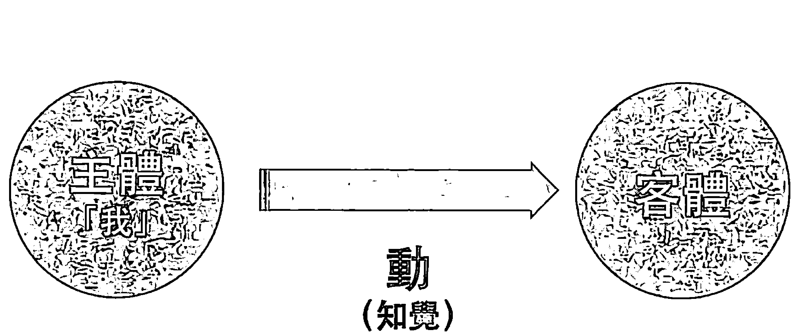

一個領悟，假如本來沒有，後來才有，一定是費力；本來有，後來還可能沒有，本身就是無常，也靠不住。一個東西是要費力才得到的，它一定站不住腳，而且早晚會自己消失，不可能不是無常。

我才不斷地提醒大家，領悟，並不是透過「動」去取得的，它本來就存在，是不費力的存在。領悟，是我們本來就有的本性。我們還沒有追求前就有，追求時有，追求後還是有，從來沒有變過。從這個角度來看，我們想找的究竟的真實，一定是不費力、隨時、老早、已經存在。

這麼說，任何領悟，只要費力，我們反而可以判定——它本身不可能是究竟的真實。而任何追求，不可能不費力，也不可能讓我們找到究竟的真實。

這個觀念，就是這麼簡單，而且不可能推翻。最後，有意思的是，是小我認為一個東西費力或不費力。然而，站在整體，不光沒有費力的觀念，衪其實沒有任何觀念。

我認為最可惜的是，我們每個人一面對修行，竟然都會把這麼簡單的重點給忘記。不只忘記了，還認為必須費力、用力、要透過功夫、累積成就才能取來。完全忽略了，只要費力，反而讓我們的注意力離開了「我」，離開了大我，又落到二元對立。

對我來說，修行最多只是把我們真正的身分找回來，而這個真正的身分竟然不是我們現在當作是自己的這個身心。站在這個角度來談，修行其實才真正和我們的生命點點滴滴相關。甚至，它的迫切性是其他事不可能相比的。如果我們非要認為它遙不可及或甚至和自己不相關，這種想法才是一個大妄想。

一般人會認為修行很遙遠，和自己的生活不相關。我要再提醒一次，也就是因為我們有「我」的觀念、有一個「個體性」的存有、認為這個身體是真的。我們不光認為自己就是「人」這個身分，而且在人間還有一個角色或地位可談，還可能需要完成「重要」或「有意義」的事。

可惜的是，幾乎所有人都把虛構當作真實，而把真實當作虛幻。一切，都顛倒了。這本身，還是我們繼續被一個虛構的人間、被一個虛構的身分帶走。

一個人充分把人間看穿，會突然發現過去做什麼——做這個，或做那個，無論做哪一個——其實沒有不同，最多是表面上有差異。對這個社會或某種價值而言，好像還有重不重要的分別。然而，站在整體，其實都一樣的。
一樣地不重要。
一樣地，跟真實不相關。

過去，就好像我們非要從一個其實是虛構的境界，找出一個好像很重大的意義不可，還認為自己扮演著看來很重要的角色。我們從來沒有去體會——站在整體，沒有一件事是重要，沒有一件事是相關；而唯一重要的，最多是把自己真正的身分找回來。

然而，我還是要提醒，就連「唯一重要的，是把自己真正的身分找回來」這種話，也還是牽強的比喻。對整體而言，我們找不找回來自己的身分，其實都跟祂不相關。走到最後，每個人還是會找回來，只是早晚的問題。

可以說，我們現在還在辯論、還在探討的這些話，全部一樣是大妄想。這才是一個比較接近事實的說法。其他再多的話、探討、追求，還只是在虛幻裡打轉，最多在虛構的境界建立一套虛的邏輯、虛的系統，而早晚自己會消失。

這些話，即使我們都可以接受，而我們也知道修行走到最後，真實是個不費力的領悟。祂，是個沒有頭腦的體驗。是不經過頭腦的加工和處理，我們才能體會到祂。但是，我們隨時會忘記這些事實。頭腦還是會去抓一點東西。

從這個角度來談，我們做參和臣服，其實還是可以順著頭腦一定要抓點東西的機制來練習。當然，參和臣服作為一種練習，一開始難免有一點費力，但是我們熟練了，也就可以把費力降到最低。

然而，我在這本書更想強調的是，參和臣服，不光是一個練習，它本身就是我們想得到的答案。它不光是過程，它本身就是最終的結果。

參什麼？臣服什麼？參自己，臣服自己。

你看，這些話還會不會帶來另外一層不需要的悖論？

### 7 解開修行的機制

我相信，熟悉「全部生命系列」作品的讀者，對這張圖一定相當熟悉，知道我在《不合理的快樂》用從左下到右上的光流，來比喻一體無限的光明。而且，我相信你也知道，在整體，沒有什麼「流」「動」「光」或甚至「方向」。這些比喻，都還是「我」從「我念」演變而來的。但是，無論如何，還是讓我先用這張圖來表達。

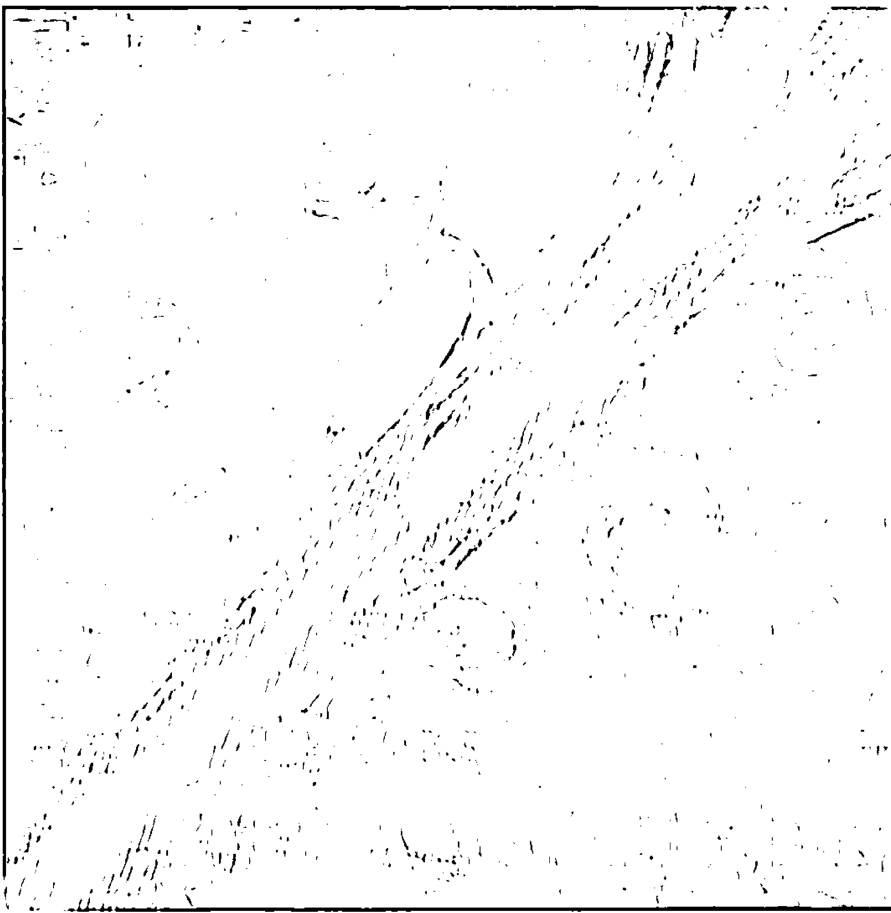

你或許還記得，從這個光流分出很多支線。我在《定》把其中一個分支放大，除了表達相對怎麼從無限大的絕對延伸出來，也表達了再怎麼延伸，只是愈來愈局限。然而，你也可能還有印象，我後來在《時間的陷阱》用下一張圖來表達，在任何角落，絕對還是存在，而隨時都有個出口，讓我們可以跳出來，跟整體合一。

你到現在也應該知道，就連這些圖畫、這些描述最多還是比喻。再怎麼講延伸或出口，都只是相對、局限的語言，是我們頭腦造出來的觀念，本身一樣是虛構的。但無論如何，在這裡，還是讓我們勉強繼續沿用這個比喻。

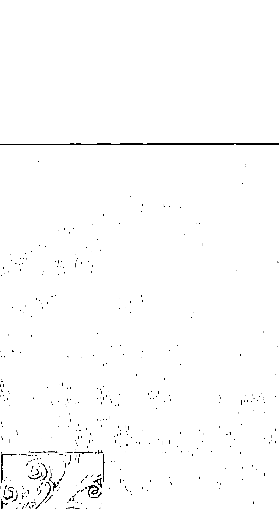

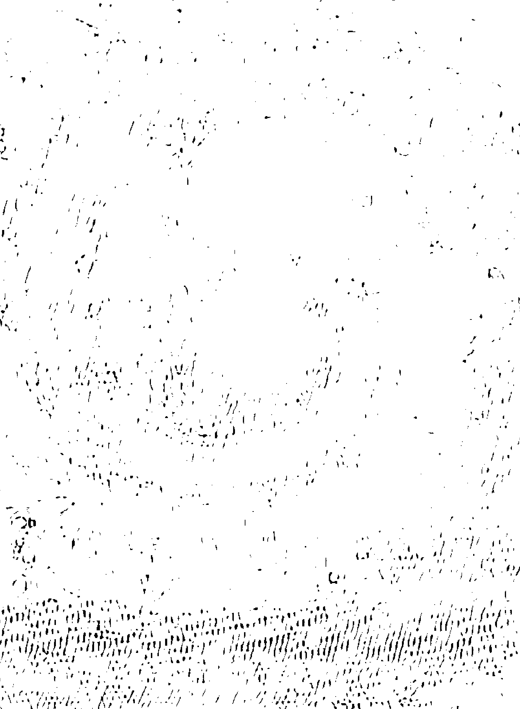

我將你所熟悉的第一張圖，再做一點變化，就像下一頁的圖——沿著每一個分支，就像我們的注意力跟著人間種種虛幻的現象和變化跑。現在，我們突然守住它，讓它回轉到念頭的上游，而且是最上游的根源、相對意識的原點。我們讓注意力輕輕鬆鬆反轉回來，集中在念頭的出發點，這本身才是參。

表面看來在問「我是誰？」的這個問題，最多也是引導我們到這個出發點，倒不是帶著我們去找什麼答案。別忘了，任何答案，其實和整體與真實都不相關，兩者在意識軌道。我們在人間可以問或可以答得出來的，都離不開相對；而真實，是絕對。前者受到局限，而後者是無限。從相對，是延伸不到絕對的。這一點，你可能聽過我不知重複了多少次。但是，這就是我們每個人隨時都在忘記的事實。

正確的參，這個方法可能跟你過去想像的「自己問，自己回答」很不一樣。你也許會想問——那麼，要怎麼把注意力擺到前面、擺到念頭最源頭的點？就是知道要住在它、住在這個原點，我們又是透過什麼機制可以體會？而可以確定自己做對了？

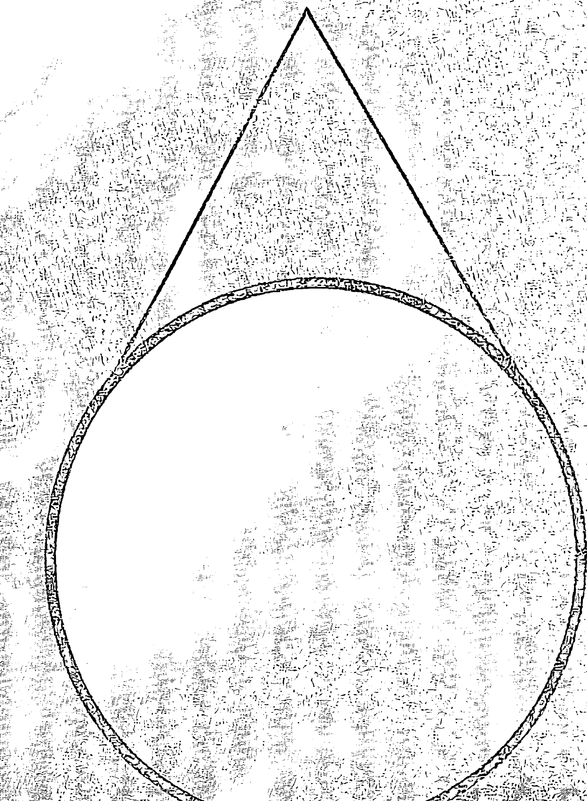

其實，這個答案我老早已經分享過。住在這個原點，也只是「我一在」。

我過去在各種場合，包括讀書會，都是先進行「我一在」的練習，再帶著大家來參——將每一個浮出來的念頭，用「我是誰？」帶回到念頭之前的空檔。可以說，假如參做對了，最多也只是把我們帶到「我一在」的狀態，回到大我。

我在這裡可以再講得更清楚一些。

我們用「我一在」的練習，一再地聲明我們每一個人從來沒有跟主、神分手過，而讓頭腦體會到「個體性」其實是一個虛構的觀念，不再把它抓得那麼緊。

「我一在」這兩個字，本來是一個頭腦的追求，是把自己提升，把一切交給主。做得熟了，到後來，我們也就不費力進入一種直覺或感受的層面。透過呼吸和重複地默念，我們已經從頭腦的運作，慢慢轉到一個更深更大的感受或覺受的範圍。

這個感受或覺受的場，比念頭創出來的場遠遠更大。它會突然漫開來，就好像包住念頭場，讓我們減少甚至消失念頭。即使還剩下一些念頭，我們只要停留在這個覺受的場，自然會發現自己不受到頭腦二元對立的影響。是這樣，它才有那麼大的作用。

我用這張圖再表達一次，小我、頭腦本來隨時都在啟發二元對立的作用，就像圖的左邊，好像隨時出動「動」的箭頭去抓、找、觀察、體會、想……一個客體，這就是我們每個人的情況。然而，透過「我－在」，我們自然少動、少抓客體。頭腦費力的程度降低，自然放鬆開來，擴大開來（我用中間比較淡、比較少箭頭的小圖來表達）。我們真正放鬆在沒有二元對立作用的狀態，也就像圖右邊表示的，自然產生一個更擴大、更深、更放鬆的生命場，溫柔地環繞著「我」。這時候，二元對立的作用沒有啟發，只是一種輕輕鬆鬆的存在。

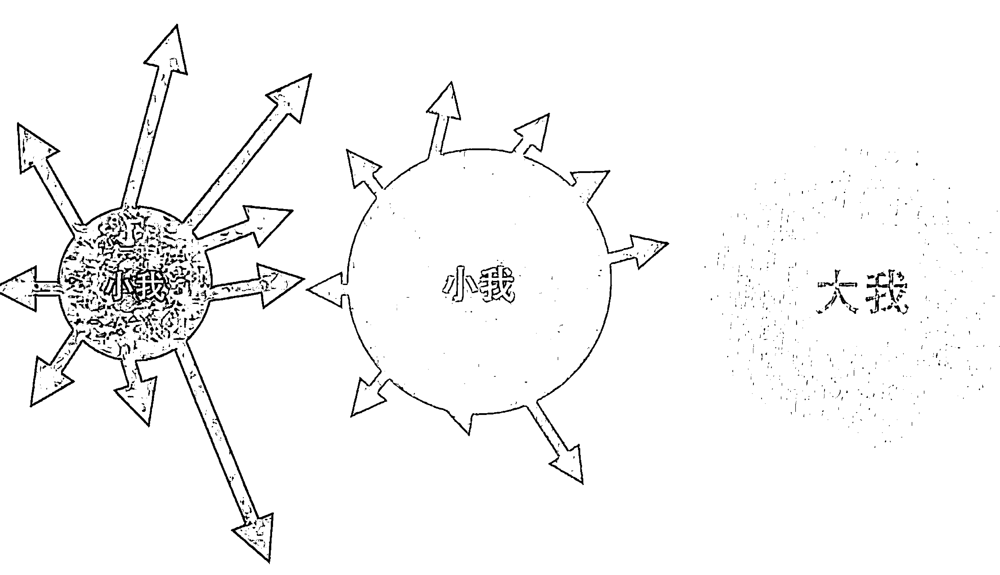

不知不覺，我們自然發現透過身心每一個層面都可以體會到「我－在」這兩個字的作用，也就好像我們所體會到的現實漸漸擴大。不光我們的肉體、身心，連全部宇宙都和我們合一。

也就這樣子，重複「我－在」，自然帶出一個全部存有、全部存在的體會。

而這種體會，已經不借用任何念頭，最多我們只能用一種感受、直覺或靈感來形容。如果還要勉強去歸納它，我們最多只能說是剩下一個主體、一個共同、宇宙、根源的我，也就是前面所說的大我。

我們長期投入它，自然發現它會把我們的注意吸收，就好像讓我們從一個不存在的外在，不斷轉向一個真實的內心。而這樣的回轉，就像這張圖左邊第二個圖示所表達的，一開始還有點勉強，有點費力。多練習幾次，也就像右邊第二個圖示，我們不但更放鬆，而且更容易回轉到心。到後來熟練了，就像最右邊所表達的，自然愈來愈輕鬆，甚至變成不費力，而我們可以隨時定住在它。

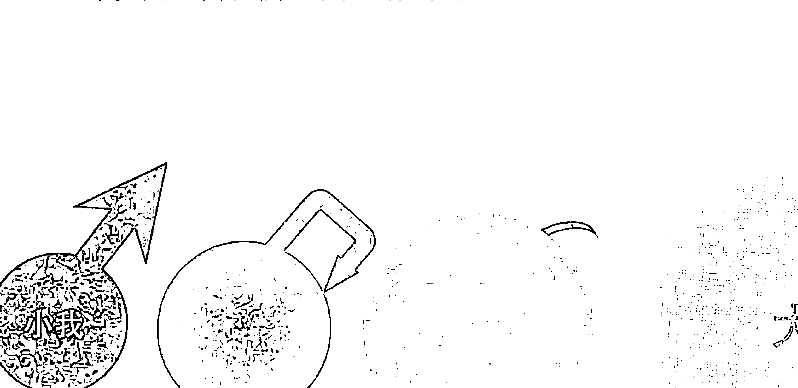

這一點，我相信每個人只要投入，自然能體會到。

回到「我－在」這個練習，當然，你現在已經明白，與其說練習，它更是一種提醒或反省。我們最多也只是在聲明「我－在」這個理解，而讓這個理解落在每一個角落，不光是在頭腦知道，而更是透過呼吸、感受、知覺、覺受、甚至「沒有頭腦」去體會它。

最不可思議的是，任何人只要輕鬆地重複練習幾次，也就自然可以體會到。

「我－在」本身是輕鬆把我們帶回到主體，甚至把這個主體做一個隔離。為什麼要回到主體？為什麼要把主體隔離？因為這個主體一延伸出來，抓住一個客體，二元對立的作用就啟發起來。

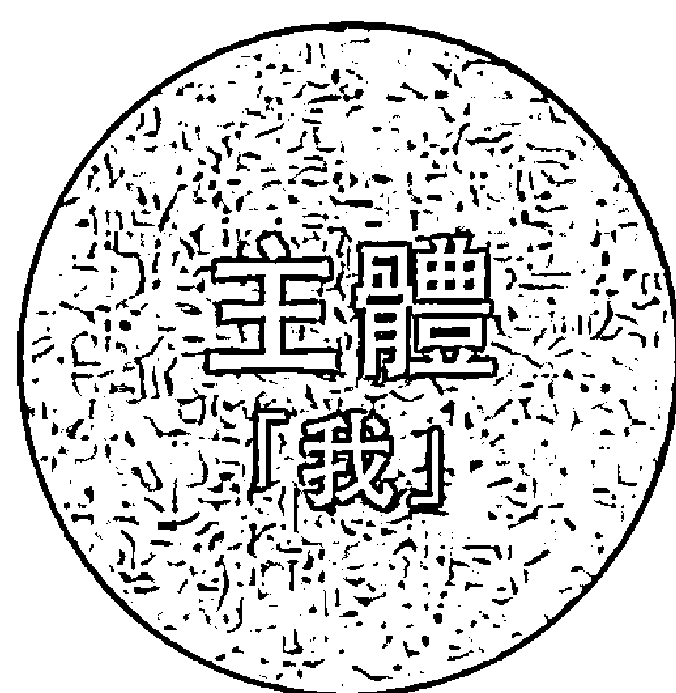

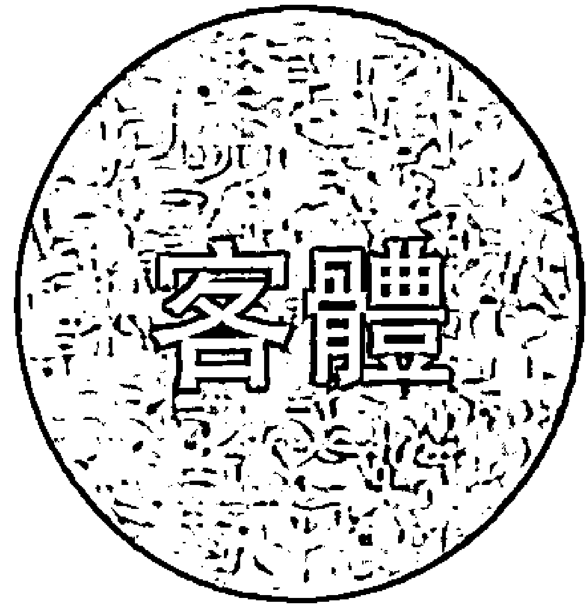

「主體－動－客體」的二元對立一作用，「我」也就自然把自己的身分混淆，落入「我體」。就像這張圖用光照來表達的，我們的注意力完全投入到客體，甚至宣稱自己擁有這個客體的所有權。大我就變成小我，回到人間相對的軌道。

然而，透過「我－在」把主體隔離起來，這個主體也就沒辦法啟發「我體」的作用（它需要跟一個客體互動才可以主張自己），而「我體」自然就消失掉了。這個消失，是完全不費力的。

這個不費力的消失，倒不需要我們再加上任何消失或化解的意念。甚至，只要我們帶來任何意念，或是為它套上任何觀念，這時候，小我其實已經在發揮作用。它已經抓住了一個對象、一個客體。

這幾句話，含著修行最珍貴的寶藏。從我個人的角度，是完全科學的。一個人只要有耐心去嘗試，自然就可以驗證。

值得注意的是，我在這裡最多是用「大我」來代表人間一切的源頭，是相對意識最根源的主體。參，就像下一頁這張圖，把注意力的光帶回到「我」。一切，都回到「我」。到頭來，也只是一個最基本、沒有和任何客體產生連結的「我」——大我。我們只是輕輕鬆鬆把注意力帶回到大我，帶回到這個原點、最根源的主體。這個原點，本來就是最輕鬆、不費力、最穩定的點。

參，最多也只是讓我們不費力地滑回原點。

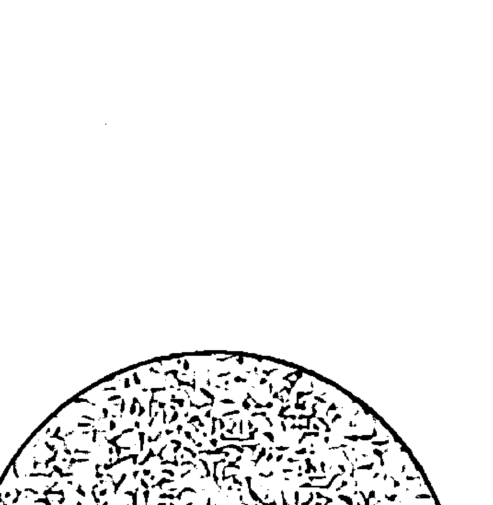

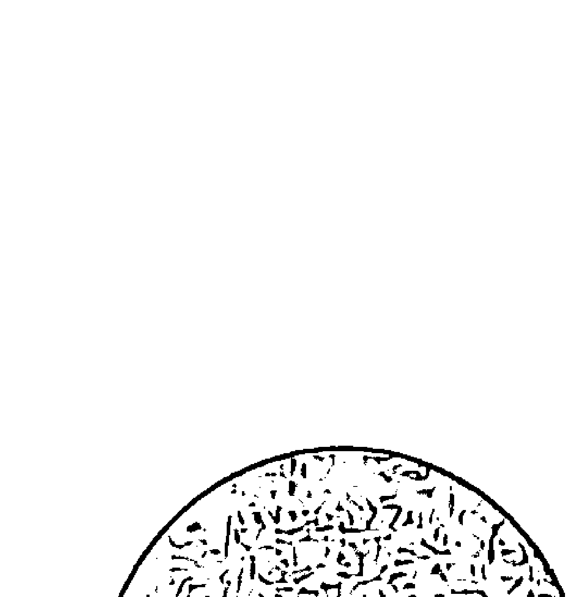

講得更透徹，前面提到站在相對意識的根源，或人間最根源的主體，我們可以不費力做一個隔離，而接下來可以輕鬆守住它，定在它，享受它，小我或「我體」的作用自然會消失。

消失了，還剩下什麼？剩下的，就是大我。

我們停留在大我，是最輕鬆、最不費力。這時候，個體性好像被略過了。我們的念頭起不來。我們只是輕輕鬆鬆地在，不費力地在，自在。倒不是在哪裡，也不需要去覺察什麼麼或知道什麼，只是輕輕鬆鬆住在「在」，停留在「覺」，停留在「知」。

停留在大我，不光是完全不費力，其實，只要帶一點費力、努力的觀念，還有那麼一點點追求的目的或得到的期待，本來輕鬆不費力的「在」，反而延伸出一個不必要的機制。原本單純的「在，只是為在」，也就突然變成「在哪裡」「去哪裡」「可以得到什麼」「有什麼目的」「滿足什麼期待」。這樣子，光是透過一個念頭，我們就落回到人間的二元對立。不知不覺，也就忘記自己真正的身分。

讓我再強調一次，停留在大我，不光是不費力，而且只能不費力。假如費力，本來活出的自在，也就突然消失；而個體性又浮了出來。

停留在大我，其實是最輕鬆、最溫和、最不費力的方法。這個方法，不像靜坐要勉強把注意力放到某一個客體，反而只是回到我們本來就是的狀態。

這個方法，不是壓抑念頭。壓抑念頭，其實沒有用，念頭還會再回來。這個方法，只是輕輕鬆鬆交給自己的主體，本來就有的主體。

停留在大我，這個方法的重點更不是去「想」大我、我根。「想」，一樣沒有用。想，本身就是二元對立的機制。去想，這本身就在強化「我」。住在大我，倒不是用念頭去「想」，而是承擔它。

我擔心，這一點，如果沒有講清楚，很多朋友會以為是用意念去想大我，而又把大我變成一個二元對立作用的客體。

是這樣，參的作法才會是——先透過「我是誰？」讓我們不知不覺退到大我。到這個時候，雖然還是「我」，但已經不是小我。

到這裡，其實也不需要做一個見證者。過去講見證，還是多了一層。見證，本身還是離不開「主體－動－客體」的架構，本身還是一個主體在看到一個或多個客體，一樣還是動。

我們能「做」的，最多也只是輕輕鬆鬆地承擔它。

我過去也常提醒幾位好朋友：不需要去想「在」，不要去想「在哪裡」或可能「去哪裡」。「在」不是用想的。

「在」，最多也只是——你就是。

不需要去想在或不在，你就是。

你完全可以直接體驗生命，不需要再經過一層「想」的過濾。你不需要去想「在」「心」「大我」「在哪裡」，你本來就在。你自在，就對了。

這樣子，一個人還需要靜坐、需要練習、需要磨練嗎？老老實實「在」吧，自在。你就是。

這種體驗是不一樣的，本身已經跳過了許多不需要的門檻。

這個方法，一天24小時隨時可以投入。透過它，我們只是輕鬆回到我們本來就有的、最根本的狀態。無論我們在做什麼，有什麼活動，都沒有衝突。這個方法，不需要安排特定的時段、或到某一個地點才能進行。它並不是靜坐或什麼功法的練習，也不是要我們去體會到什麼。

當然，初學的朋友可以先守住一個時間，例如早上剛醒來或晚上睡前來做。如果我們早上一醒來就做，無論能做多長時間，都可以影響到一天的心理和意識狀態，讓我們好像進入一個比較大的層面。一天下來，我們在處理事情，也就能夠不斷地從一個比較大的藍圖來面對，而圓滿地處理。晚上睡前，一樣地，停留在大我，會影響我們睡眠的品質。把大我帶進睡眠，不知不覺，就連我們的個性也好像跟著轉變。

停留在大我，我們最多只是放鬆到這個最根本的狀態、本來就有的狀態，明白這個狀態隨時都存在，和我們分不開。其實，有「我」，就有它。它本身最多是一個擴大的「我」、最原點的「我」。

停留在大我，是透過這種感受，我們才可以輕輕鬆鬆體會到一體永恆的味道。雖然大我最多還只是一個最原點的「我」，但它已經進入了一個「在」的狀態，本身沒有動力，我才會稱它是一體的門戶。

停留在大我，習慣了，接下來愈來愈不費力。甚至，有一天，它會吸引我們全部的注意力，讓我們覺得沒有其他事情比它更有趣。也就那麼簡單，那麼不費力，我們就落在絕對意識的門口。

你會發現我一再強調費力、不費力的對比，可以說這個觀念相當重要，讓我們可以衡量自己究竟做得對或不對。

本來一個人是輕輕鬆鬆體會到什麼是自在，什麼是大我、心、不動的一個層面。然而，只要有一點點費力，本來不費力的體驗，也就突然取消了，變成是頭腦在體驗這個最輕鬆、最不費力的狀態，而落成了一個人間二元對立的經驗。我們又已經落到一個相對的軌道，而在這個相對的軌道，想去衡量沒有軌道可言的一個點。

然而，透過這個費力、不費力的基準，我們馬上可以知道練習的方向對或不對。

當然，一開始，我們是透過頭腦落回原點，難免還是帶點力道、需要一點動力。但是，不知不覺間，回到這個原點、停留在大我，帶著人間沒有的歡喜和光明，自然讓我們守住它。它變成最有趣的，好像我們非做不可。甚至，就是不做，也只有它。它全面吸引住我們的注意力，就像一把野火，愈燒愈大，愈來愈旺。我們把任何念頭丟進去，也就燒掉了，消失了。無論有什麼念頭，它根本不在意。

有時候，頭腦還是會抵抗、會自我質疑、會帶來一些反彈。這時候，我們也不用去阻擋，就讓它來，讓它走。既然它本身不費力，我們連去阻擋、去抗議、去阻撓、製造一個門檻……都不需要。它要來，就讓它來。

這一來，自然帶動臣服的機制。種種的自我質疑、雜念、反彈，也就順著流過去了。我們讓它來，也就可以讓它走。它自己會流過去。

用這種方法，我們不知不覺，又回到自在。自在，一樣地，不是透過「想」去自在。想「在」，是不可能的。

是自在為主，是自在在主導，是樣樣都自在。我們只是輕輕鬆鬆活出它，而沒有一層頭腦在主導，在過濾，在解釋，在掌控。

### 8 大我，是相對和絕對意識的門戶

前一章所講的，可能是最簡單，但同時也可能是最難懂的。

簡單的是，這本書所談的大我、這個人間最根源的主體、相對意識的原點，是我們每一個人隨時都有，沒有可能沒有的。一個人只需要自在，讓自己的本性完全發揮出來。這本身，就是大我。

大我，最多只是意識的橋樑，是相對和絕對之間的門戶。是我們這一生還沒有來就有，走了之後，還是有。它本身才是我們眾生的意識的根源。我們唯一需要「做」的，也只是定到它、住在它。

難的是，我們會想在它上面再加一層念頭、再加一層解析，而且自然會自我質疑，認為修行不可能那麼簡單。就算真是那麼簡單，我們也會認為要守住或定在它好像有相當大的難度。

這是難免的，畢竟我們這一生早就被充分地洗腦，認為需要用頭腦去定住一個觀念或一個體。假如這個體不是一個很具體的體，我們的頭腦還會害怕定不住或守不住。甚至還沒有嘗試，就已經感到挫折。

然而，我們仔細觀察，究竟是簡單還是難，其實完全是我們自己透過頭腦建立的區隔。

我們需要「做」的，也只是有一點耐心，不斷重複前面所講的，從「我－在」體會到一種全面的、存有的覺受，而且讓這個覺受不斷地重複再重複。最多，只是這樣子。

這個「我－在」的覺受，從能量的角度是最穩定的基本態，是我們最根本的狀態。停留在它，其實是最不費力的。但是，我們只要加一個念頭，停留在它就從不費力變成費力，從最簡單的變成有難度，甚至成為挑戰。

守住人間這個最源頭的主體——大我，定到它、臣服到它、只是它，其實是最直接的法，因為它最多只是在肯定我們本來就有的。

這一點，跟你過去所認為的修行可能完全不同，甚至是顛倒的。

一般修行的方法，還是想透過「動」去找到「不動」；或透過一個業力的行動，想把一切的業力消失，例如一般人會想做好事，來清除壞的業力。然而，我要在這裡提醒，透過「動」來消解業力，是絕對不可能；此外，只要我們還認為有一個個體性，當然，樣樣都還是假的，還是無常，都不存在。反而是這個個體性消失，對我們，樣樣反而活起來，樣樣都是真的。

我過去接觸過的老師，有些雖然也同時強調小我和大我的分別，並且教弟子先放下世界和小我，但是他們還要再點出一個「打破大我，從大我跳到無我（或是空）」的過程，認為這才究竟。如果要簡單表達就是，他們認為修行的過程就像下頁這張圖。如果用左邊的擴大的球來表達大我，那麼，對這些老師來說，修行好像有一個終極目標：一個人還要慢慢地下功夫，讓這個大我分解，就像下頁圖的右邊所表達的，這樣才能化回到一體。

這類說法，通常是把這個機制當作一種分段式的進展。例如，要弟子先用止和觀把念頭慢下來，達到意識的同步，或一種定的狀態。接下來，要用功、不斷地維持這個定，這個擴大的我才會解散。

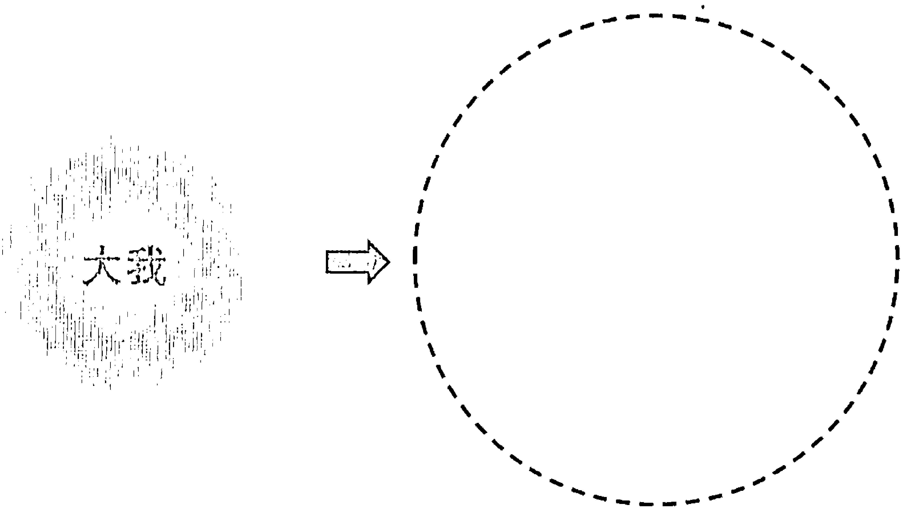

但是，根據我個人的體驗和「全部生命」的觀念，最後這個「打破大我」的步驟不光是多餘的，其實還是不正確的。雖然是好意的補充，但可以說又加了一層不必要的門檻。別忘了，透過靜坐或任何練習，「我」其實是跳不過去的。這也就是我常常說的，不可能從相對跳到絕對。

一般所謂的定（從我的角度，是小定），最多是一個人刻意地將注意力投入、守住一個客體。也就這樣子，把「我」的主體和所投入的客體合一，而造出一個人為的「不動」（主體和客體假如合併，主客之間沒有距離，也就沒有了「動」）。但是，他只要回到生活，頭腦一動，之前的定也就消失。

而且，這樣維持住的定，再怎麼擴大，它本身還是透過條件或因－果才建立的，還是代表局限或相對，最多只是一個擴大的局限，一個延長的相對，一個少動或不動的客體，本身並沒有離開過相對的範圍。我們從相對的這裡，要靠相對的意念跳到絕對、到永恆、到無限，是不可能的。

我們都忽略了，我們就是透過意念，才把一個不生不死、完美的整體給局限成眼前的人生。正是我們頭腦創造出來的機制、我們有的邏輯，才造出我們的現實。要透過頭腦，從它造出的這個現實跳出來，是不可能的。不光是悖逆它運作的機制，更是違反它本身存續的條件。

一般人都不知道，只要有一個念頭，我們已經從內在跳到外在；而用意念去維持一個狀態而想要回到絕對，就好像想用一個外在的東西去把內在找回來。我過去在許多作品也提過，要透過意念去改變頭腦的慣性和所造出的習氣，甚至只是去踩個剎車，是不可能的。它的力量太大，擋不住，更別說在這過程還反而會造出別的迴路。

如果我們要透過頭腦，將這一生和過去生生世世所累積的數不完的習氣消失，這是做不到的。我們想去消失、想去抵抗，這種動機本身還是一種動，只會造出更多習氣，充其量是不同的迴路，而還一樣是落在頭腦的迴路。

我們最多是把注意力引導到別的軌道。打個比方，就像看見小孩子在玩一個危險的遊戲，我們會哄著小孩子，帶他到別的地方，去玩另一個比較不危險、而有趣的遊戲。

這種手法，是改變頭腦慣性和習氣的關鍵。假如要透過壓抑、苦惱、費力、努力去做，反而不能達到這個目的。我們只是突然改變方向，讓新的過程變成很有趣，而將小孩子引導到別的地方。這一來，他為什麼不會跟著我們到別的地方去玩家家酒呢？這是一樣的道理。

借用古人的比喻，讓頭腦這個小偷去做警察來抓自己，確實不合理。但是，如果是運用頭腦作為工具，就像透過參，把注意力引導到一個最不費力而且最有趣的點。在這個點，頭腦不受任何刺激，可以休息。頭腦得到休息，自然會舒暢，也就不知不覺對費力的「動」漸漸失去了興趣。

這種作法，連一個去消失頭腦和習氣的出發點或動機都沒有。別忘了，即使有這樣的動機，也沒有用。假如有，那麼還有一個目的，還有一個動的觀念，一樣還是落在頭腦。

這種不費力的手法，其實就那麼簡單，不需要針對頭腦和小我，我們反而輕輕鬆鬆把小我交出來、把頭腦挪開。只要輕輕鬆鬆落到這個點，自然會有一個更大的力量帶領我們。帶到哪裡？其實都無所謂。因為我們在那個點，是舒服、舒暢都來不及，不會再顧慮到這些。

也就這樣子，我們把頭腦引導到另一個層面。不知不覺，這個層面愈落愈深，跟人間的層面愈來愈脫離。然而，我們不能說它是離人間更遠或更近，只是愈來愈不相關。

這種不費力的手法，我們每個人都可以自己試試看，自己得到自己的體會，最多只是這樣子。

你可能已經發現，我在這本書所強調的「方法」，最多也只是不斷地肯定本來就有的一個更深的層面。而這個「肯定」，也只是記得或反省我們本來就是的真實。從注意的角度來談，我們最多只是把注意從一個不存在的頭腦的世界，回轉到真實的內心。我們只是跟真實不斷地達到共振，得到共鳴。我們並不是透過「想」或任何動作或甚至練習去接近，反而只是輕輕鬆鬆活出祂。最多，只是這樣子。

回轉到真實，活在心，其實沒有什麼練習或作業的形式可談，最多只是接軌的作用。接軌什麼？勉強說，是和真實接軌。

然而，到這邊，連用這些話來表達或分析都是多餘。

真實，本身是我們「做」不來的。或許，比較貼近事實的表達是，我們輕輕鬆鬆地臣服、接受、擁抱大我，不斷地回到大我，是大我。透過大我的不動，自然讓我們停留在一種「在」的狀態。只有在這個不動的「在」的狀態，我們有一天才突然體會到一體。

這個大我不動的狀態，本身沒有動力。我才會不斷地強調，最多是我們借用小我的動力，將自己帶回到不動的大我。不要小看小我的作用。雖然它帶給我們數不完的煩惱，同時也可以成為唯一的一個修行的工具——讓我們透過動，回到不動；從客體，走回到主體。

但是，我也要提醒，跳到一體，倒不是我們透過小我可以期待的。從大我轉到一體——這個機制會是我在這本書的後半想談的重點。

最有意思的是，我自己是後來才有機會讀佛經，也才發現古人留下來的全部的修行手冊（也就是大家所稱的經典）都在表達這些重點。但是，不知道為什麼，後人把它弄擰了、變得複雜，才增加了那麼多煩惱，設立了那麼多門檻，而讓這些門檻成為障礙。

講到這裡，可能還有一點和一般的理解不太一樣。就像前面所講的，大我本身是我們人類相對意識的源頭，而它的地位不會低於一般人心目中的主、神、造物主。大我沒有動力。透過這樣的觀念作為橋樑，我們也就自然明白，主、神、造物主，倒不需要有任何動力甚至動機。祂哪裡都是，哪裡都在。最奇妙的是，我們也就是祂。

一樣地，這些話不是我們透過念頭可以去領悟，反而最多只能活出祂。祂倒不需要動、做，但又同時含著全部生命的潛能。其實，講祂動或不動，又是從我們人間的角度在衡量。因為祂同時超越動，超越不動。

從我個人的角度，真正要談主、神、造物主，是在另外一個意識的層面——絕對、無限、永恆。然而，那是不可能讓我們用語言可以描述的。其實，是這個沒辦法描述的整體、一體、心，才可以表達真正的主、神、造物主。

人類可以體會到的主、神、造物主，還不是究竟的真實，本身還是我們用意念可以想出來的，最多是幫助我們體會到相對意識的根源。我們最多只能說，這樣的主、神、造物主是一個人透過語言或念頭可以逼近、可以描述出來的最究竟的真實。

這種表達，雖然還是受到頭腦和語言的限制，但我總認為已經非常了不起。無論西方的《聖經》和東方的經典，都說出了人類可以想到的最高的真理。這樣的真理，透過經典保存下來，為後人帶來那麼珍貴的指南針。

透過禱告和冥想，一個人不斷地停留在主、神和造物主，其實和這裡所講的停留在不動的「在」，停留在大我，是站在同一個意識的層面。共同點是，只要一個人把注意力和信心隨時擺到主、神、造物主或人間最源頭的大我，也就簡簡單單讓一個原本那麼抽象的觀念活起來，而變成生命中最大的力量。

我們念頭自然會減少，而早晚被整體、一體融化。到這裡，反而也就沒有一個主、神、造物主的觀念。畢竟任何觀念，還是受到人間二元對立的作用，而不可能來框架無限而永恆的主、神、造物主。

我們每個人的修行，一開始是小我在追求大我，甚至是小我在追求全部、一體、意識海。但是，到了一體的門戶，到最後可以跳過去的並不是這個小我，也不是任何「我」可以延伸出來的東西或層面（甚至包括大我），而是反過來，是一體把它拉進去。

再換個表達方式來說，也就好像完成旅程的人，倒不是開始旅程的那個人，不再是同一個人（The one who starts the journey is not the one who ends the journey.）。人和旅程，都還是符合人間相對的邏輯。但是，走到最後，完成的、所完成的，倒不屬於這個相對的範圍。它是徹底跳出來，最多也只是完成它自己，而不是完成一個項目、得到一個不同的東西、或者到其他的哪裡。

回到前面所講的個體性，我們也可以這樣子說——本來我們是站在一個個體，在追求比這個個體更大的範圍；突然，這個個體的小我，竟然發現有一個整體的大我在等著它。它體會到這個大我比小我遠遠更有趣，而這個大我自然吸引小我全部的注意力。

接下來，不知不覺，沒有了「主體－客體」的互動來強化，就連大我其實也站不住，支撐不下去。它不再有一個機制可以支持、輔助、穩定它。早晚，大我本身也自然化解。最後，只留下一體，或是整體。

從這個角度來看，我們可以說小我就是一個「弄錯身分的個案」。

其實，就連一般人所講的心，一樣還是大我。

當然，古人禪宗最早講的心，是悟、道、佛性。但是，這種本質可以說是我們用頭腦絕對體會不了的。不知不覺，大家開始認為「心」是一種可以稱為「不動」的東西，也就是我在這本書所講的大我。

如果從這個「心」或大我，再往外延伸去捕捉一個數據、一個動、一個現象，它就從心變成頭腦、變成人間。如果從這個「心」或大我往內回轉，不斷地潛進去、沉下去，它自然最多只是變成自己。並不是它體會到自己，而是變成自己。不再是透過一層體會的過濾、隔膜或任何機制，它就是變成自己。它會發現自己就是心。心就是自己。

當然，到這裡，這個心，已經跟一般人認為的心不同了。假如還可以描述得出來，這個可以描述出來的不是心，最多還只是相對意識的源頭，也就是一般人講的心。

一個人最多是輕輕鬆鬆落回心，住在這個大我，讓大我輕輕鬆鬆完成什麼？什麼都沒有完成，什麼追求都沒有。不可能有追求，不可能要做一個努力和費力。只要有一滴費力，小我已經露出頭來，又變成世界、人間、頭腦的作業。

一個人最多只需要輕輕鬆鬆住在、定在本來就有的。

這最輕鬆、不費力的一點，明明是我們每一個人都可以做到的，卻反而變得最難懂。其實是我們信心不夠，總是認為不可能這麼簡單，總是認為可能還少了什麼東西，才會不斷地在外面尋、往外頭找。

站在小我，這個相對的世界好像樣樣都是真的。但是，從整體來看，最多是充滿了虛構的分別和隔離，樣樣都是虛的。最後，從大我回到心，反而剛剛好相反，樣樣都活起來，樣樣都變成真的。從任何角落，一體或整體隨時浮出來，而沒有一個角落不是祂。

我相信走到這裡，這些話對你已經不再那麼陌生了。

活在這個相對的世界，我們隨時都會忘記這個二元對立的機制是怎麼來的。它本身是靠一個主體在抓一個客體，再加上動，才建立的。假如我們輕輕鬆鬆定到這個主體——大我、大我、大我到底，反而倒不用擔心。這個主體，任何主體，無論是小我還是大我，它自然站不住。大我，也就被一體完全吞沒。

是這樣，我才會說「不費力」。它沒有任何具體的體在主導。費力的小我已經融入不費力的大我。我們只是停留在不費力的大我，就連大我最後也不知不覺消失。

我們可以「做」的，最多只是把注意力擺到相對意識最源頭的一個點。然後，其實和源頭下游的小我一點都不相關了，沒有任何作業可談。我們最多可以說，是小我被吞掉，而大我完全不費力地被化解，一個人才徹底醒過來。

一個人徹底醒過來，大我還是可以啟發作用，因為只要還有個體，大我也自然浮出來。不光大我可以啟發作用，連小我都可以活躍起來。只是，跟之前不同的是，它們最多只是變成工具，再也不是主人。

大我，最多只是一個「覺」的場（field of awareness）。去覺什麼？覺察到自己。從每一個角落，最多只是在覺察到自己。既然每一個角落都是自己，每一個角落也自然變成就像幻覺一樣的，最多只是重疊在絕對上的影子，再也沒有什麼重要性或代表性。

小我也一樣可以啟發作用，但奇妙的是，已經沒有一個體或一個大我在主導或是在操作，也沒有誰得到小我的成就，甚至沒有人在意有什麼成就不成就。

如果還要強調一個後半段的機制，那麼它確實就是這麼簡單，這麼不費力。我們所講的修行，其實也只是輕輕鬆鬆把自己的注意落在本來就有的主體，而不斷地只落在主體，讓這種練習變得不光不費力，反而還變成我們一天下來最有樂趣的一個項目。

最多，也只是這樣子。其他的，不光沒有用，更是「做」不來的。

體會到這些，我們突然發現，生命已經大大的不同，而且已經大大的簡化，把一個本來抽象、遙不可及、表面上和我們的生命一點都不相關的觀念，變得不光是具體，更成為我們這一生最重要的一項工程。

## 9 螺旋場的比喻

一體的力量，遠遠比人間任何的力量都更大，自然會把相對的意識吞掉。這是自古以來，大聖人都知道的。因為這個觀念太重要，而且含著修行的精髓，接下來，我想借用另一個比喻來說明。

用「全部生命系列」的語言來說，一體就像一個無形的螺旋場。是螺旋場的速度慢下來，才可以凝結出物質。而物質的頻率（比較正確的表達是意識螺旋場的扭力和速度）又可以有大小和快慢的分別。

物質就不用說了，其實，連念頭都離不開螺旋場。一般比較正向或友善的念頭，是屬於扭力比較大、速度比較快的螺旋場，它本身自然讓我們的肉體提升，甚至會帶動周邊。我們一般都喜歡接觸充滿善意的人，甚至連動物都會想接近他。其實動物的生存，只是單純滿足自己生理上的需要，平常也停留在一個比較高的場。也因為如此，我們都喜歡接觸動物和大自然。

反過來，壞的念頭，過去聖人稱為貪嗔痴，是屬於一種比較重、比較慢的螺旋場，本身會帶給周邊負面的影響。然而，會說負面，最多也只是身心失衡，讓頭腦走到更二元對立的境界，而把我們本來更高的頻率好像蓋住了。

用右頁的螺旋來表達意識場，我們會發現，它外圍的速度逐漸變慢，也就凝聚出我們五官一般可以體會到的物質。是這樣，我們才能創出人間的現實。但是，愈往中心，速度愈快。到螺旋的底端，它已經接近無限大的速度。

我們可以借用這種觀念，來解釋大我。

大我，是我們相對意識的源頭。用螺旋場的比喻來談，可以說大我是扭力和速度都比較大的螺旋場。只要停留在大我，我們自然進入大歡喜、大愛、大寧靜、大平安或過去所謂的在·覺·樂。但是，這些狀態還不穩定，並不是永久的。借用螺旋場的比喻，也就是大我的意識場無論扭力或速度都已經逼近了無限大的邊緣，但畢竟還是屬於人間的狀態，早晚還是會慢下來。大我所帶出來的意識場，自然會受到環境和周邊的影響，本身也變慢，進入二元對立。

儘管這麼說，大我這個相對世界的源頭、通往絕對的門戶，它本身其實已經處於一個費力／不費力的邊緣。我一樣借用前頁在《靜坐》出現過的這張圖來表達，圖上方深藍色代表相對的世界，下方的橘紅色代表絕對或心。大我帶來的意識場（上方螺旋底端）的速度接近無限大，這時候，假如有另外一個力量加快它的速度，速度快到一個地步，進入我過去所講的「奇點」（圖中央的光點），它也就自然不費力進入一個扭力無限大、速度無限快的螺旋場——我們也可以稱為永恆、無限、絕對、一體或心。但是，這個作業和這個「我」已經不相關，並不是我們去努力就可以加快速度。甚至，這件事是努力不來的。就好像它是被拉進去，並不是它自己用力擠進去。

我才會不斷說最後這一段是不費力，而只可能是不費力的。

再重複一次，我們的意識住在大我，也就是讓我們接近這無限快或無限大的螺旋場。唯一讓我們相對意識可以掌握、可以摸到邊的，只是透過大我這個人間最根源的主體所呈現的一滴滴。它是唯一最逼近一體的，但還是在相對的範圍。

要勉強說，是透過大我這個主體延伸出來的直覺或靈感，我們可以去體會到一體。假如這個螺旋場還更大，我們也就自然進入「奇點」，跟我們人間的意識也就徹底脫離，不相關了。這個場的力量和速度，也就變成無限大。

「場的扭力無限大」這種說法，其實也就是強調心的力量是無限大。心把一切拉回到哪裡？拉回到自己。我才會說，最後也只可能是自己體會到自己，自己完成自己。

但是，這個拉回到自己，不見得是一次可以完成，也可能要重複幾次，甚至是很多次、多生多世，而且一次比一次更徹底，才可以完全拉回到自己。

如果勉強用「場」的比喻來描述，也就是在這個過程，大我的場還可能會減弱。只要減弱，就像前面第 6 章〈要體會真實，是不費力，而只可能不費力〉所講的，我們也可能又回到二元對立，而這個二元對立的作用在短期內還可能更強烈。

儘管二元對立的作用還是會再啟發，小我還是會再露出來，「進入大我」只是一種暫時的狀態，不過，我還是要強調，這種體驗已經是一般人終其一生甚至多生多世都不可能體驗到的。

一個人站在大我，也自然有機會稍稍領略到大我之後的真實、一體。光是這麼看到一眼，就讓人自然產生一種重生、醒覺的觀念，這本身已經是一個足以讓人脫胎換骨的經驗。許多人會認為這就是開悟，是見到「空」。然而，就像前面所說的，這最多只是看到了一眼真實。不知不覺中，對他，小我會再延伸出來，也就又落回到人間。

一個人如果有過這樣的經驗，再落回人間，他當然會抱著期待，希望能再次重複這種狀態。但是，他如果沒有好的基礎，非但這輩子不見得有機會重複，也可能反而進一步誤導自己，以為這是一種可以透過小我努力追求、努力地「動」、努力練習而再次得到的經驗或狀態。

儘管如此，我還是要強調，停留在大我確實是一種難得的經驗。一個人只要能停留在上面，自然會有更深的體驗。然而，它本身還不是一種完整、永恆、穩定的狀態。

有些人或許可以透過自己的修練，也許是閉關，把這種狀態穩定下來。但是，這種機會其實是相當渺茫。很多人修行時，頭腦一樣靜不下來，即使有閉關的條件，在閉關中還是頭腦的運作，想去捕捉一個比較微細或比較究竟的狀態。

然而，一個人如果能真正隨時停留在大我，讓「主體－客體」二元對立的作用被大我吸收掉，這本身其實代表他過去生生世世投入練習的程度，或他的成熟度。坦白說，並不是透過閉關，就一定能把這種狀態穩定下來。這一點，要看個人過去的福德，或說熟練度、成熟度，倒不見得是透過閉關，就能再次重複。

但是，一個人只要有自信，堅持下去，不斷地透過參和臣服，把自己頭腦的意識擺到相對意識的根源或大我，這個工程早晚會完成，而且是不可能不完成的。

可以說，一個人只要有耐心，有毅力，大我斷根是早晚的事，而這個最後的斷根，也只可能是突然的。斷根的意思，最多也只是徹底看透「我」，明白小我、大我和「個體性」都不存在；真正存在的，最多也只是自己——整體、一體、主、神、心。

佛陀当时说连一朵花、一片草叶都会成佛。在这里，也让我大胆重复佛陀的结论——早晚，无论众生、非众生都会醒觉，而不可能不醒觉。毕竟，只有心或真实的力量是最大，甚至是无限大，而它早晚一定会吞掉一切不存在的、让人「分心」的幻觉。

再讲得明白一些，醒觉，就是我们的本性。讲醒觉，这两个字还是站在小我在讲——好像还有一个经过，我们可以称它为醒觉。站在整体，既然醒觉最多只是我们的本性，我们最多只要承担它，活出它，自在地落回它。

讲到这里，我相信你或许也可以体会到，一体无限大的场倒不是用理解或领悟可以接触到的。我们领悟前，它也在；领悟后，还是在。

同时，我们也突然体会，最高的法，其实是沉默。

沉默，我指的是真正的沉默，倒不是没有声音，或没有动。它本身就是「在」，本身也只是无限、绝对、永恒。我透过「全部生命系列」可能表达的，到最后，最多也只是沉默。我说过会把你带到一位老师的门口，这位老师，当然最多也只是沉默。

## 10 把修行浓缩、简化到大我

一般人说开悟，在英文里用“enlightenment”来表达。这个词，含着「光」的观念，但这是自己照亮自己的永恒的光，倒不是相对于人间没有光线的黑暗而有的光明。我们不能称这种永恒的光为「空」或「没有」，它本身并不是人间的「不空」或「有」可以对照的，也不需要和「不空」和「有」相提并论。我们最多只能承认它在另一个轨道，而这个轨道和人间相对的意识一点都不相关。

这种永恒的光，虽然好像和人间的意识不相关，但我们还是可以尝到一点祂永恒的部分。唯一可以让我们体会的门户，也就是透过人间这个最根源的主体、大我。但是，这种体会不是透过头脑「主体－客体」的作用。假如是透过头脑的作用，接下来当然就有个经验或体验可以描述的，甚至还有个对象，比如说可以体会到什么东西。

我在「全部生命系列」常提到类似的观念 “Truth can only be intuited. The mind needs to be bypassed for truth to be experienced.” 真实，最多只能被直觉到或领悟到。而这种直觉或领悟，并不是一种头脑「主体－客体」的作业。甚至，是这个头脑的作业要被略过，真实才可能被直觉到。这一点，也就是我们透过头脑不可能懂的。

我也一直强调 “Complete, radical awakening is Self-Realization without the mind, or direct experiencing without the mind.” 也就是表达——彻底的醒觉或是顿悟，最多只是「不透过脑，来随时体会到自己或一体」或是「脑没有办法干涉的体验」。

最有意思的是，这种体验其实是描述不了的，我们才会用光、开悟、在·觉·乐、大爱、大欢喜这些词汇来表达。就好像这些身心的觉受，是我们唯一可用的形容。但是，就连这些词汇和觉受，最多也只像一面不平整的镜子，模糊地反映我们内心的转变。

> 《圣经》在〈出埃及记 3:14〉用 “I AM THAT I AM.” 来表达主或一体。这句话本来是神对摩西说的，一般的中文翻译是：「我是自有永有的。」或用我的话来表达：「我，就是我；而我，只能是我。」这句话，可以说已经含着所有宗教和修行法门想表达的真理。

用「全部生命系列」的语言，“I AM THAT I AM.”是来表达——觉，只是觉，不是觉察到什么。知，只有知，倒不是知道什么。爱，只是爱，倒不是爱谁，或爱什么。在，只是在，倒不是在哪里。

这些话，离不开这本书所强调的大我的观念。大我，这个相对意识最根源的主体，不是靠任何客体或任何观察（动）来表达自己。但是，只要我们进一步观察，大我还是离不开我们的身心。是透过我们的直觉或灵感，才可以把大我描述出来。反过来，假如这个身心的架构不同，例如我们采用的是一种外星人的生命形态，那么，这个大我的观念也会跟着变。

我们透过身心，没办法完全描述这个最根本的主体——只要可以描述出来，它其实又进入了一个二元对立的「动」或「主客分别」的作用。是这样，主、神、佛性对我们才会变得很抽象，好像有时候可以体会，而大部分时间又体会不来。

前面也提醒过，站在大我、站在人间这个最根源的主体，不等于回到一体、醒觉或开悟。然而，我们只需要这么做，也只能做到这一点。我们只是不断地站在这个人最基本的主体。最后，是一体会随时显露出祂自己。

在一粒灰尘、一个观念都剩不下来，只有祂本身是自己验证自己，自己成立自己，自己圆满自己，只有自己存在。这么说，任何可以想像的观念，包括我们过去所强调的主、神、佛性……也就自然化掉了。样样，也就自然变得神圣。我们突然发现，每一个角落都含着主、神、佛性，而透过每一个东西，我们最多只是体会到祂。我相信，这样的神圣，和你原本所认为的，可能又完全不一样，甚至可能是颠倒的。

前面提过有些朋友会认为可以透过瑜伽「和一体合一」，这种话还是可能产生误解的模糊表达。不只是从「我」延伸不到一体，甚至，其实没有一个东西叫做「一体」。到这里，你应该可以体会到，「一体」或「和一体合一」其实是我们在这二元对立的世界才有的观念。

真要说合一，最多是我们在这个人间难免有时候头脑纷乱、烦恼重或身心波动很大，那么，透过瑜伽和任何练习，都能够帮助我们降低念头，甚至没有念头，而自然同步、谐振，为自己创造一个神圣的空间——回到或守住大我，或说「和大我合一」。

当然，如果我们明白了「全部生命系列」所谈的，也就会突然发现其实不需要透过任何瑜伽或练习，本来就可以轻轻松松地住在大我。

我会一再强调这些观念，不光是我认为对修行重要，而同时是要再次表达，这个大我，是我们在人间不可能再缩减、再浓缩的体验。

过去，作为一个科学家，我样样都希望简化，也就是想把一个复杂的题目缩到最小。这样的取向，也就是英文里的 reductionist 或 minimalistic approach——最化约、最小化的取向。

我等了好久，才能够把这些观念带出来。虽然「全部生命系列」的作品都提过这里所讲的大我、小我、个体性的观念，但过去没能表达得这么清楚。我知道要先建立完整的基础，才能让这些话活起来，而为你我带出更深层面的意义。

用这种最化约或最小化的取向来讲，也可以说大我就是我们在人间不可能再缩得更小的体验，本身是人间相对意识的根源。换个角度来说，人间全部的体验里都有它，只是我们平常没有注意到。

它随时都有。是这样，我才会说体会到它，臣服到它，是一点都不费力。

一个人懂了这一点，自然会想住在大我，而大我到底。只有这样子，没有启发「主体－客体」的作用，他才可能完全放松，完全休息，完全自在，而随时停留在真实的门户。

虽然我在这里这么讲，并不是停留在大我有什么目的。其实，没有任何策略、任何规划。什么目的都谈不来，也不需要谈。别忘了，只要有目的，它本身又是费力。

假如一个人的注意力，时时刻刻，从小我制造的、不存在的外在，转回到内心一直都有的大我，而且这种回转不光随时可以做，对他更是理所当然，不可能不这么做，那么，这个人也就差不多了。对他，已经没有回头路。

接下来，他不需要去追求，更不用说还要投入什么。再一次提醒，全部都是自然而然，和他的小我已经不相关。

该发生什么，就会发生，已经没有什么体在主导。

一切都顺其自然。

顿悟，就在眼前。

## 11 参，其实是最轻松的练习

这里表达的「参」的练习，我在第7章〈解开修行的机制〉也提醒过，可能跟你过去所认为的完全不一样。它本身已经不是练习，最多只是在提醒我们，有一个远远更大的状态在等着我们。我们最多是把注意力从狭窄的外在世界，轻松落回到扩大的大我。也就那么简单，我们就跟它接轨了。

要做参，我还是要强调「我－在」的练习。是透过「我－在」的练习，不断地重复回到自己，才叫做参。

怎么说？前面提过「我－在」所带来的直觉和灵感，是透过它，我们不断地重复，也就自然住在一种「在」的体验。这样的「在」，倒不是透过念头可以描述的。

透过参，我们把眼前的任何念头收回来，收回到这个念头的根源，不断地回到「我－在」的体会或感受。这就是我们透过参，想完成的。

接着，念头可能又浮了出来，我们也只是轻松地问——

- 为谁，有这个（快乐、喜悦、轻松、悲哀、担心……的）念头？
- 为谁，有这个知觉？
- 为谁，知道自己有念头？
- 是我。
- 是我，有这个念头。
- 是我，有这个知觉。
- 是我，知道自己有念头。

那么，我又是谁？

透过这样的参，一再地将注意力带回到「我」——人间一切的根源，也就是大我。

前面也提过，这个参，并不是一般人认为的在问、在寻、找答案。一般人所认为的寻，是透过「我是谁？」想找一个答复。然而，参，倒不是这么进行的。任何答案，其实都还是二元对立。

甚至，有些朋友以为，参，就是不断重复在心中诵念「我是谁？」「我是谁？」好像把它当作一个咒语。其实，这个练习倒不是这样子进行的。参，不是机械性的覆诵，并不是透过重复，可以让我们去得到解脱或某种不同的意识状态。

这里所讲的参，最多只是轻松移动注意力的焦点，从下游的客体，不费力挪到最上游的主体。我们最多是透过参，提醒自己——彻底站在人间这个最根源的主体，其实没有问题可以问，更不用说没有答案可以回答。

这时候，如果还有念头，还有体会，继续轻轻松松点一下——

- 为谁，有这个心情、这个知觉？
- 为谁知道，自己有个境界？
- 是我。
- 是我，有这个心情、这个知觉。
- 是我，知道自己有境界。
- 那么，我又是谁？

这时候，和「我－在」一样的，注意力自然回转，从外在回到内心，轻轻松松留在任何念头之前的空档。这样的空档，我们也可以比喻成一种「体」——「主体」「大我」。我们做熟了，这个空档也就活了起来，带来一种更深层面的感受。一种存在的感触，自然会浮出来。

这种空档，并不是虚无，最多是一种头脑无法描述的内心或「在」的体会。这种「在」的体会，可以说是一种存有，一种灵感，倒不是落在这个身心的框架里。这种感受，本身带来一种完整、全面的状态，而自然把脑海里起落的念头消失。

这个大我，并不通过其他的客体来主张它自己。我在第7章〈解开修行的机制〉才会说，用这种方法，最多是把人间这个最源头的主体拥抱起来，包围起来，把它变成这一生和自己最亲密的一个点。也就是前面提过的，就好像把它隔离起来，让它在短时间内没办法启发作用。当然，只要启发作用，二元对立的架构又开始运作，而念头又开始起伏，我们也只是轻轻松松地再参，一而再，再而三，不断地再一次回到原点。

头脑偶尔或随时还可能会动或启发作用，透过一个念头的链接（比如说想到什么东西、观察到某一件物品），也就让这个相对意识最源头的主体附着到接下来的客体。这一来，两个又变得分不开，也就这样把我们带回到人间相对的意识轨道。然而，我们最多也只是再一次轻松地重复，一再地用参、一再地用「我是谁？」自然从小我到大我，而回到相对意识的源头。

不过，小我不会那么轻易放过机会。它不光会产生念头，而我们还会不知不觉去追这个念头。不只如此，我们还会受到这个念头的影响，甚至无形当中受到念头的制约——比如说这念头的内容是好还是坏？是轻松，还是带来烦恼？是无关紧要，还是很严重？跟眼前的事有没有什么关系？会不会带来什么后果？——这一来，我们又继续跟着念头走下去，也就让自己的身分和这些念头带来的境界完全结合，完全分不开。

这时候，其实有一个很简单的方法，可以把自己带回到前面所讲的原点，也就是提醒自己：全部念头都是平等的。

我们把全部念头都当作平等——念头大、小、好、坏、舒服、不舒服、重要、不重要、急迫、不急迫……全部都一样，全部都当作平等。重点倒不是去研究、分别、衡量念头的内容，更不是根据对我们的重要性去做进一步的区隔。只有这样子，我们才可能对念头踩个刹车，而可以轻轻松松地用「参」来面对这个身心产生的种种杂念。

我们用这种平等心来看念头，其实已经把我们练习的作业简化，而同时也不断地强化自己本来就有的平等心，一再地提醒自己——这一生，表面上的重要不重要、有意义、没有意义、有特色、没有特色……其实还是头脑的作业，本身没有一样东西有绝对的重要性或代表性。

有意思的是，即使不这么做，事实也只是如此。我们最多只是透过练习，提醒自己这个没办法推翻的真实。

透过「我是谁？」或参，并不是去把大我或根源找回来，也不是透过「我是谁？」的回答让大我和根源出现。我们最多只是透过轻松地参，想起这个源头随时都存在，从来没有离开过我们。但同时，我们又可以轻轻松松地，把全部相对的意识交回到这个「我—在」的源头。

是这样，透过「我是谁？」我们最多只是把我们的意识住在这个「我—在」的源头——人间这个最根源的主体、这个没有客体的主体、这个不产生客体的主体，而最多是透过我们的感受或更深层面的灵感，把它轻轻地点一下，轻轻松松地落在它，只是它。

一再地熟练，我们的注意力也就已经脱离念头的范围。我们自然会发现，好像是用全身，而不光是感受，来体会到「我是谁」的答案。然而，这个答案倒不是带来什么，也不是「谁」，甚至不是什么体。

我们也自然明白，现在所体会到的，已经跟前面一开始问「我是谁」的这个个体「我」不同。它已经扩大了，如果要勉强取个名字，最多也就是我们前面提到的大我。

会用「大我」这两个字，是我们不断地想跟做二元对立的小我做个区隔，倒不是要把它当作一个客体来描述。但是我们仔细观察，我们还是可以体会到这个大我，只是用的管道倒不是头脑的机制（也就是说，倒不是想、做、取得一个客体）。站在头脑的角度来谈，可以勉强说这个大我是比小我更深的一个层面。

再用另一个角度来讲，参，是从现象和头脑的「动」后退几步，是简化，是将费力变成最低的费力，甚至不费力。我们在参，本来是追察头脑的运作，接着把这运作缩减到「什么都没有在追察」。最多，我们只是在体会没有追察的味道或状态。一样地，没有一个策略可谈。

这时候，不光没有一个策略可谈，前面也提过，其实已经没有「谁」在做见证。假如我们还可以做见证，比如说知道眼前有什么现象、心中有什么念头，这本身还是离不开二元对立，还是有一个主体在追察一个客体，本身还是在「动」。

对大我，其实没有任何东西可以追察或值得追察。我们只是在样样活出大我，在样样体会到它，而它和自己完全没办法分开，也没有什么意念或动机可谈的，更不是经过再一层过滤网去观察或衡量自己、大我或其他。

虽然这么讲，你也可能还记得，我在前面的作品还是把「见证」当作一个很重要的练习。这是因为，透过这样的练习，我们自然能够不执着样样的现象。而这样的抽离，是一个人身心要安定下来，必须有的一个过程。

参，让我们体会到，过去头脑所有的运作，都是透过费力得到的，而我们终于找到一个状态是完全不费力，但是又同时没办法用头脑描述。原本，我们只是轻松透过感受去体会一种没办法用头脑描述出来的状态，然而，只要我们稍微有一点费力，想去抓住它、想去分析它、或想去延伸它，透过这个费力，我们已经从一个不费力、没有脑、最直接的经验，离开大我，离开这个人最源头的主体，回到二元对立，又把它变成一个人间的追求。

这一点，值得我们注意。参，不光是不费力，甚至，是只要有一点费力，也就又回到人间的轨道。

讲参费力或不费力，最多是小我的参一开始是费力的，但做习惯了，住在大我，是完全不费力。停留在大我，它本身会活起来，带着喜悦、光明、在·觉·乐，占用我们大部分的注意。我前面才会说，参，最多是把注意挪开，从不存在的虚拟的世界（包括虚拟的「我」、虚拟的脑海）回转到真实的门户。最多只是这样子。

熟悉了，这种内心的感受或状态自然代替任何念头。甚至会让我们感觉到，眼前的现象和念头，没有一个比它更奇妙。也就这样子，自然让我们注意力从外在转到内心。

参，本身就是解脱，就是在·觉·乐。我在第6章〈要体会真实，是不费力，而只可能是不费力〉也说过，它的练习和结果，其实是两面一体，分不开的。我才会说，这个练习，最多是一种提醒，提醒我们本来就是、本来就有、本来就在的一个状态。透过这个练习，我们其实得不到任何本来没有的东西。参，本身最多只是在强调、在主张——我们本来就是的一切。

讲到这里，也许你还记得，我在《不合理的快乐》曾经用狗追脚印的图来解释参。当时，我最多也只是想表达——我们是带着一种诚恳、热切、专注而投入的心情，把注意力从虚幻的利益、权力、成就、关系、现实、冲突、挣扎，转回内心的真实。

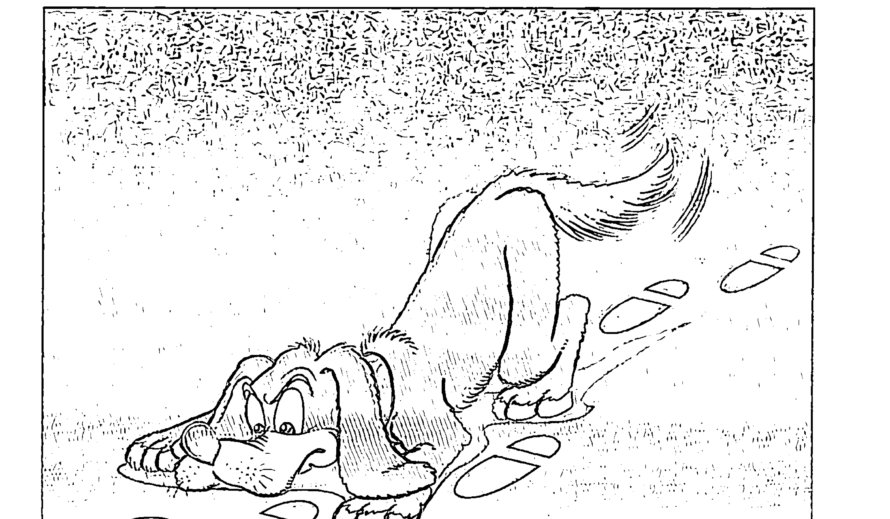

透过参，我们回到相对意识的原点。我们只是守住这个原点，不断守住它，而且还是轻轻松松地守住它。我们只是这个原点。接下来，我们对其他东西好像已经不感兴趣了，心里明白其他一切都是假的，充其量是资讯的组合，而最多是把全部的注意力摆到我们心里知道是真实的层面。

人间再多的故事、经历，这时候，最多就像杂讯和幻觉，对我们都不重要了。

我们这一生已经找出一个清楚的方向，找到一个清晰的目标，而在这方面轻轻守住。只要我们有耐心，坚持下去，就像之前提过的，到最后，自然会发现把注意力轻轻落在大我这个相对意识的原点，这个原点也就跟着活起来，而比任何其他的注意都有意思、更引人入胜。

这个原点，是我们最放松、最不费力可以注意到的点。它跟每一个念头、人间每一个变化，都一起存在。要专注意它，倒不需要把注意往外延伸出去，最多只是把注意轻松落回到它。

然而，我还是要提醒你我，这里所谓的大我，其实还不是家、一体、永恒、绝对、无限、本性、悟、醒觉、真实，最多只是真实的门户。大我，也就是在我们相对的意识范围内的最上游、最源头。虽然已经到了意识海的边，但它本身还不是意识海。它还是代表一个相对的观念。

我相信你读到这里，自然会想问，那么，从大我，又要怎么回到无限、绝对的一体？这个机制，要怎样去完成？我在第8章〈大我，是相对和绝对意识的门户〉已经打开了这个讨论，提醒你我——从大我，跳到一体，这本身是追求不来，也不需要去追求的议题。只要我们停留在一体的门口——大我，熟练了，一体自然会把一切吞掉。我们也就在轻轻松松与一体合一。

怎么说？这就是我在下一章要进一步打开的。

## 12 大我，是怎么消失的？

为什么要把注意力摆到相对意识的根源——大我，而不是一步跳回到没有条件、无形无相的一体或真实？我要再一次提醒，透过我们局限相对的意识是跳不过去的，那是两个层面。

我们最多只能把注意停留在相对意识最上游的门口，不断地透过「我一在」带来的存在的感触，好像停留在那里，停留在大我。再往前走，我们是走不过去的。但有趣的是，我们最多也只需要这么「做」。

这本身含着一个修行的大秘密，也是大圣人透过他们个人的经过，都验证到的。虽然前面也谈过，但我认为这个主题太重要，让我在这里用另外一个角度来分享。

「我」的机制，是透过去抓、去捕捉、去追求、去得到一個客體，是在二元對立的架構下，才可以產生作用，而得以主張自己的身分。也就是說，如果沒有客體，其實主體也沒有什麼身分好談，最多是一種還沒有啟發作用的「我」（或說大我），沒有特質可以描述它。是透過客體，以及主體一客體之間的互動，主體才可以把自己的身分顯露出來。這一點，可能和一般的想法剛好相反。

換句話說，是透過客體，一個主體才能主張它的身分，再透過「動」或「想」來確立「主體一動一客體」的關係。我們一生，從生到死的每一個互動，都在不知不覺中強化個體性，為這個體賦予特質、給它一個身分。這個機制，是我們一般人意識不到的。無形中，每一個「主體一客體」的互動，都不斷給我們一個印象，讓我們確認一個假設——小我是真的，而且是從小我在看一切、在體會一切。

這個個體性，是在所有「主體一客體」關係裡都存在的既定前提，就像在背景運作，始終都存在。

我們會認為個體性是連續的，也就是因為第 1 章提過的——五官的作用，好像沒有停過。即使我們並不是一直在看，也不見得一直在聽，但不同感官的作用可以輪流補上其他感官的空檔，也就讓我們覺得個體性是連續而永久存在的一個體，不曾中斷過。

我們透過「參」停留在一個人間最根源的主體（大我），也就是因為我們知道，這個人間的二元對立（我們也可以稱它是相對局限的意識）需要靠主體和客體之間的互動關係才可以建立，可以維持。而參的練習，最多只是不斷回到大我（人間最基本的主體「我」），把「主體－客體」間的互動關係暫時切斷，原本「主體－動－客體」的架構也就開始鬆動，甚至撐不住。

這個主體「我」，突然體會到自己——體會到往下游投射出去「主體－客體」的互動關係是虛構，而甚至這個主體想去抓的客體根本是假的。其實，這個「主體－客體」互動的關係，本身就是我們的頭腦。然而，就連這個頭腦本身也是假的，是站不住的，是虛構的。

這個「我」守住自己，也就發現沒有其他。既然只有自己，沒有其他，那麼，以前認為「有」的其他也就是假的，根本不存在。甚至，連「有」或是「沒有」，本身都失去意義。

其他（也就是客體）突然不存在，那麼，主體「我」早晚也跟著消失。「我」的消失，是一種自然的內爆（implosion）。因為維繫主體存在的機制消失了，這一來，這個主體早晚也會跟著消失。這種消失，是不費力的消失。沒有任何東西在主導，最多只是它本身支撐不住。

無論如何，這種消失，假如還要勉強說有個東西在主導，我們最多說，是心的力量遠遠比相對世界的扭力更大，而不費力地把相對（包括大我）吞掉、化解掉。

這種消失，倒不是透過我們的體（無論大我或小我）來主導。我們最多只需要透過參，把自己交給人間這個最源頭的主體——大我。也就這麼簡單，接下來自然帶動一個沒有回頭路的機制，讓它完成它自己。

## 為什麼會這麼說？

其實，小我本身是透過我們頭腦的種種迴路來運作，而這些迴路是這一生經過許多年，甚至不只這一生累積下來的。這些迴路好像是凝固的，也是我們在人間最不費力的運轉機制。它運轉的扭力，不只在人間是最大的，而且它本身會自己維持自己的運作和存有。是這樣，眼前的種種錯覺（其實全部都是五官捕捉的資訊，根本沒有實質）才會讓我們感覺到再真實不過，而讓我們有那麼多局限或制約可談。但是，人間再怎麼能強化小我，小我的力量跟一體相比之下，可以說是一點都不成比例。早晚，小我會被消失。

我們也可以說，小我再怎麼堅實，最多還只是一個虛的幻覺。一個虛的幻覺，早晚會自己解散。事實就是如此，我們才會承認人間是無常（我們每一個人會來，早晚也會走）。這樣的觀察，也代表我們心裡明白，人間是靠不住的。

只有心或一體無限大的力量，才可以徹底把「我」（大我、小我）的根除掉。沒有其他的什麼，有那麼大的力量，可以做一個徹底的斷根。

任何其他方法，最多只是發揮一時或部分的作用，沒多久，小我的作用又會突顯出來，甚至可能帶出更激烈的反應。有些人可以停留在大我很久的時間，有深刻而誠懇的體驗，但不知不覺早晚還是會落回這個肉體、這個身心，將自己的身分又落到這個人間。這時候，過去的習氣甚至可能發作得比之前更強烈。是這樣，才有那麼多人走歪。有些朋友本來是善意推廣或接受一種理念，卻不知不覺地變質成為一種社會的運作。更可惜的是，這些運作還可能引發種種矛盾、糾紛和爭議。

別忘了，在人間，沒有一個東西、沒有一個觀念、沒有一個道理是絕對正確而含著究竟的真實。在二元對立的世界，其實沒有什麼是真理。這一點，值得我們每個人更要更謹慎，隨時提醒自己注意。

此外，一個人常常停留在大我，在這種意識擴大的狀態下，會出現很多過去認為不可能有、不可思議的現象（一般人可能會說是「超自然能力」，例如神通，甚至天眼會突然打開）。這是一個人在修行的過程中難免經歷到的，甚至可能不只這一生，而是生生世世都體驗過這些變化。

但是，從我個人的經驗來看，很少人可以過這一關。一般人即使修行了幾十年，一有這種能力（也許是神通、開天眼、會治病、預測未來會發生什麼事、把一個人過去甚至前世的經歷點點滴滴講出來、或在物質層面示範一些變化），也就自然把心力集中在上面，而要展現這些能力，來強化他個人的地位。至於還沒有出現這種能力的人，也自然會好奇，會期待。

要過這一關，我個人認為是太難。一個人要相當成熟，才可能意識到這本身還是一種阻礙，還是一種頭腦的狀態，還是「我」在作用——無論這些能力多微細、多粗糙、多高、多低、多偉大、多奧妙，其實還是離不開「我」的範圍。

確實，一個人要相當成熟，才能突然明白，就連能體會到這些能力，都還是「我」，還只是「我」，而更嚴重的是——這個「我」還不存在。

然而，我們也不用擔心還要去消除這個「我」。前面提過，頭腦本身是虛的，更不用講它造出的慣性或習氣（包括「個體性」、包括「我」）也一樣是虛的。想用一個虛的機制去消失另一個虛的機制，不光不需要，本身也是不可能的。這個機制本身是虛的，即使我們已經採用一個虛的機制肯定它、強化它，也不可能就此產生一個真實的對象可以去消失。它本來就不存在，我們去消失它，沒有用，是多餘的。

其實，沒有「誰」在斷根什麼，假如真正有一個「我」，那我們是斷根不了的。就像我們想從根拔掉一棵樹，不光會破壞底下的土壤，這棵樹也會受傷，而一定會產生其他的後果。但是，別忘了，這棵樹、樹的根其實都是虛的。我們甚至不需要去拔它，最多只是把注意移轉到另一個層面，回轉過來，發現一切都是假的，都是虛的，全部的努力都是多餘的——沒有什麼東西可以拔，也沒有什麼東西可以被拔。

真要談「斷根」，我敢這麼說，心和一體的力量，是唯一無限大的扭力，可以把「我」斷根。當然，你讀到這裡已經明白，連這句話也只是一種比喻。站在整體或絕對的層面，我們人間相對的意識，包括「我」可以產生的各種現象，其實是不成比例的渺小。甚至，在整體看來，它根本是虛的，最多是一個幻覺。既然如此，又有什麼東西需要被斷根？又有什麼還需要產生無限大的扭力？這一切，借用我之前的比喻，就像想讓一個演員從電影的劇情醒過來，不光是不需要，甚至是不可能的。

所謂「斷根」，其實也只是「一個本來就不存在的幻覺，自己解散自己」。就像一縷輕煙會自己消散，一場戲早晚會演完，其實並沒有什麼力量或能量的落差來把什麼東西解散。這種比喻，最多還只是我們站在二元對立講的話。只是，我們必須透過各種比喻來表達這個觀念。否則，頭腦會聽不懂。

如果真的還有一個斷根好追求，我們要做的其實不是再加一個斷根的意念，而最多只是把注意擺到相對意識的根源。透過這個根源，讓我們不費力、不知不覺進入絕對的範圍，一直到我們相對的意識不會再啟發作用，甚至，不想啟發作用。

最多也只是這樣子，也就輕鬆完成我們這一生來最主要的目的。

我才會說，每一個人都可以徹底斷根。我們最多是透過醒過來，發現「我」這個機制不存在，也就這樣子，完成這個大家認為不可能完成的工程。

醒過來了，一個人會發現，其實什麼都沒有發生，因為他不是用「動」或各種發生來衡量自己的領悟。

醒過來了，一個人也自然發現，連講主、神、佛性、大我……本身都是大妄想。其實並沒有一個具體的東西叫做主、神、佛性、大我……我們也沒辦法形容出來。但有意思的是，我們還是可以聲明——我們就是祂。

前面也提過，我們最多只能活出祂，因為我們就是祂。

我們自然也會發現，臣服和參，其實是兩面一體。

臣服，最多是把我們相對的意識交給大我，也就是相對意識的根源。接下來，什麼都不用做。我們想追求的，自然會完成它自己。這個完成，和「我體」已經一點都不相關了。

我才會不斷地說，參和臣服是為最成熟的修行者所準備的。是我們身心完全和一體接軌，而且不知多少輩子透過練習在接軌，才走到最後可以接觸它、接受它，讓它帶著我們完成自己。

儘管嚴格講，真實或一體沒有什麼機制好談，但如果還要勉強談一個機制，那麼，為什麼只有透過參和臣服這兩個機制，才可以完成這個作業？

其實，我們就是用其他的方法，也許是專注在一個點上，或是用觀來擴大意識，或是其他任何法門，走到最後，早晚還是會回到這個人間，而難免還是踩不了剎車，二元對立還是會啟發作用。

畢竟這些其他的方法，都有一個前提：頭腦是真的。
這些方法，站在這個前提上，以為透過練習或修行去壓抑頭腦的作用，就可以把頭腦消失掉。但是，一般人大概都沒有仔細思考過，這種作法是不是真能達到它所追求的效果。

別忘了，這個前提其實是錯的。

頭腦是虛的，並不是實質的存在。把頭腦當作真實，還設計出那麼多方法去壓抑它，不光沒有效，也壓抑不了。頭腦還是可以繞過這些方法，或等這些方法結束，再繼續起伏。

是這樣，我才會一再強調——參和臣服，和其他的方法完全不同。

參和臣服，最多只是承認——所有的現象都是假的、頭腦是虛構、個體性是虛幻；再怎麼用各種練習或方法去壓制它，不光沒有用、不需要，更是多餘的。我們去壓抑一個不存在的東西，不光化解不了它，還反而是在肯定它，讓它好像真的存在，甚至讓這個幻相更強烈，還可能換個別的方式延伸出來。

就連前面提到，一個人常常停留在大我，意識擴大，而自然出現各種「超自然現象」。一樣地，這些超常的能力，本身到最後還是一種主要的阻礙。一個人假如沒有「全部生命系列」的這些理論基礎，要突破這個阻礙，可以說是幾乎不可能。他可能要經歷一生又一生、一世又一世，一再地活出種種微細、妙不可言的可能，某一天才突然體會到——

-   咦？為誰，還有這些超常的能力？
-   是誰，還在體會到？
-   誰知道？
-   誰還期待？
-   誰重視？

這時，才自然走到了參的門口。

一樣地，我們就是進入小定（nirvikalpa samādhi），即使不只這一世可以入定，甚至數不完的生生世世都在入定，早晚有一天仍然會從小定出來。這時候，頭腦還是一樣啟發作用，而我們一樣會問：

-   之前入定的，是誰？
-   之前在定的，是誰？

## 有過天翻地覆的領悟的，是誰？

## 而這個知道的，又是誰？

我們最多也只是回到參或臣服的軌道。

既然不管我們採用什麼方法，進入再深刻、再微細、再奧妙的意識狀態，走到最後，還是會浮出來同樣的問題，那麼，為什麼不把這個問題擺到最前頭？為什麼不把這條為最成熟的人準備的路，變成你我的第一步？

也就這樣子，為你我省去數不完的時間。

當然，我在這裡還是要提醒，前面提到——參或臣服，是為最成熟的修行者所準備的一條路，這種說法，本身最多還是一種比喻。事實是，一個人聽懂了這裡所表達的觀念，倒不需要用任何方法，可能不費力也就醒過來了。只是我必須承認，能夠不用任何方法，自然就醒過來，這樣的人是相當稀有難得，可以說是少之又少。

## 13 臣服，和参其实是两面一体

我在「全部生命系列」不斷強調，臣服與參，其實是大同小異。最多，我們可以說臣服與參是兩面一體，是同一件事的兩個不同切入點。前面，我用大我的觀念來談參。一樣地，也可以借用大我的觀念來談臣服。我會在下一章打開另一個層面，也就是透過愛（大愛）來臣服。然而，在這一章，讓我先從大我談起。

站在這樣的角度，臣服最多也只是肯定、包容、接受、容納一切。是透過這種「接受一切」的念頭，我們反而輕鬆地讓「主體－動－客體」的二元對立中斷，讓主體倒不需要隨時取得某一個客體。這一來，我們也不需要隨時去取得一個意思。念頭，也就自然降低，甚至消失。

接受一切，也就是面對樣樣，我們都可以接受。尤其在腦海裡，我們一有任何念頭，比如想到我、想到你、想到他、想到一個東西、想到任何行動（做、想、預測、投入……）、想到任何客體（行動、思考、表達的對象——對誰可以做、可以想、可以稱讚、可以責備、可以教導、可以幫助）……無論是在哪一個層面的各種念頭，一樣地，我們都可以接受。而我們自然會發現，這種接受的念頭，隨時可以切進念頭的連鎖，而隨時可以中斷它。

我們可以這麼做臣服的練習，就像這樣：從早到晚，不斷提醒自己——

-   一切，不光是好，不光是剛剛好，而還是剛剛好我在這個瞬間需要的。
-   除了這個瞬間，我倒不需要追求任何其他瞬間。
-   我來這個瞬間，不需要成為是誰，我也不需要到哪裡，可以輕輕鬆鬆地誰也不是、哪裡也不需要去。
-   一切，老早都完美。
-   這一來，每個瞬間所帶來的，都剛剛好。
-   除了眼前的、心中的瞬間，其實沒有什麼動機還值得我去注意、去追求或去抗議。

透過不斷聲明一切都好、樣樣都好、都剛剛好、一切都是完美、宇宙不會犯錯……我們也只是不斷地肯定、包容、接受、容納。既然樣樣都好，好像連下一個念頭、下一句話都可以省掉，都不用再繼續。全部的動機（無論想做什麼、說什麼、解釋什麼、分析什麼）自然消失。我們好像連一個念頭、一個覺察，也懶得完成。接下來，任何念頭，也就不再有絕對的重要性，甚至，不再有任何重要性，而自然變成多餘。

無論眼前來什麼，我們最多是肯定一切，也就結束了。
我們肯定、接受每一個念頭，不知不覺，我們甚至會發現，是臣服、肯定、包容、接受、容納……這本身遠遠地比念頭更有趣。用這樣的方式來做臣服，不光更不費力，而我們無形當中體會到一種完整、舒暢、放鬆、穩定、歡喜的感受。就好像臣服本身是一個穩重的錨，帶來一種力量，幫我們住在、定在念頭還沒有來之前的原點。

這個原點，最多只是大我。我們，只是大我。
住在大我，本身就是帶來一種完整、舒暢、放鬆、穩定、歡喜的感受。

是這樣，我才會說臣服和參是同一回事。從這個角度，可以說臣服與參都是隨時讓自己回到原點，住在大我，是大我。真要說有什麼不同，最多只能說臣服和參的切入點還有些差異。

參，是透過「我是誰？」將眼前、心中一切「主體—動—客體」的連結，簡化到主體，甚至讓注意力回轉到主體的上游，讓我們體會到自己就是這描述不來的存在。

然而，臣服，透過接受、包容一切、「一切都好」，是從主體的下游切入，讓我們在還沒有發生「動」、或還沒有透過「動」取得一個客體之前，踩個剎車。我們已經在告訴自己：到這裡，覺察不覺察、取得不取得一個客體，已經不需要，已經是多餘。眼前的這個念頭已經完成它自己，我們不用再去追究，也不需要再追求。

我們用「一切都剛剛好」這個方法來臣服，也就像前面提過的，是把這個最根源的主體圍繞起來、擁抱起來。主體，自然發不出任何一個動機、注意不到任何客體、任何動態。我們最多是停留在主體，而一再地輕鬆停留在主體。

當然，到頭來，我們也會發現，連說是從主體的上游或下游切入，都還是一種比喻。其實，一個人停留在主體，也沒有什麼上游或下游的分別，一切都是完美，一切都是完整，一切都老早已經完成它自己。

每一個瞬間只有這個主體，只是這個主體，一個人自然進入沉默，進入寧靜，進入平安。或許在別人眼中，還會覺得他倒楣，認為他受委屈，想為他抱不平，甚至催他為自己抗議或表達什麼意見。然而，對他而言，既然一切是剛剛好，也沒有什麼動機要再去多談。

畢竟，如果可以追究的樣樣，本來都好，而還沒有追究前，樣樣其實也只是剛剛好。那麼，還有什麼好追究的？

透過臣服，我們輕輕鬆鬆地肯定再肯定、接受再接受，到最后，反而把樣樣都放過了。樣樣，都可以來；樣樣，也都可以放它走。到最後，就連肯定、包容、接受、容納，都是多餘的。無論眼前要面對的是什麼，都跟自己不相關，而我們可以輕鬆地觀察、見證。

熟練了，甚至連見證都消失。我們也自然發現，沒有什麼東西好見證。

既然樣樣都可以放過，樣樣都不在意，沒有誰在見證、沒有被見證的東西和對象，也就這樣子，我們一切順其自然，而對樣樣都可以不黏、不執著，可以抽離出來。

臣服，可以把人帶到這樣的狀態。這一點，可能是我們過去想不到的。

不管怎麼講，臣服還是離不開大我。最多，是透過臣服和肯定，我們不斷把注意帶回到大我的原點，不知不覺讓頭腦得到休息，而舒暢地住在大我。而大我本身，和前面講的一樣，和「我一在」也沒辦法分開，本身最多是一種滿足感，或微細的存在的感觸。

接下來，什麼都沒有。

從這個角度來看，我們也自然明白臣服和參一樣地，可以打破二元對立的機制。不光如此，它是又輕鬆、又正向，就可以完成同一項作業。表面看來是不同的方法，但其實是一體兩面。

是透過臣服與肯定，我們不斷回到這個原點——大我。此外，沒有什麼可以追求的。就好像這個意識的原點，是我們在人間剩下的最後一個點，是我們值得在人間活出來的最後一個點；而這個點，比什麼都更有意思，本身是唯一值得我們讓意識停留的。

我在前面提過，費力不費力，是一種相對的觀念。費力，本身就是一個「我」的特質。講費力，本身就是小我在作業。是進入相對意識的範圍，我們才可以衡量一件事費力或不費力。是對小我，才有費力。對小我，樣樣都消耗能量，需要使力，而不可能不費力。

無論是參或臣服，作為一種練習時，我們將注意向內迴轉，一開始是費力。然而，只要停留在大我，反而不可能費力。停留在大我，「主體－動－客體」的連鎖沒有一個客體可以連結，而費力的念頭、動機也起伏不了。費力的「我」已經暫時消失了。

參和臣服之所以是最輕鬆的練習，也就在於這兩個方法並不是去管束、控制、壓抑頭腦，更不是去把念頭消失。反而是我們透過練習要刻意專注在一個東西，才比較難。刻意地專注，相對地消耗比較多能量，也才費力。

參，最多只是我們把注意從這個不存在的世界收回來，落到跟這個虛擬世界不相關的最根本、最真實的狀態，而這其实就是大我。它是最輕鬆的。

假如我們感覺不輕鬆，其實已經走偏、走錯了。然而，即使走歪、走偏了，這時候，我們最多透過臣服，讓念頭和煩惱來，讓它走，不去跟它對立，不干涉它，也不抵抗它。

這一來，我們的注意反而自然回到大我，滑回到最根本的狀態，落回到原點。我們只要停留在這個原點，而透過臣服不斷地肯定、聲明它、不斷地是大我，和參一樣的，早晚這個作業也變成不費力；而在不費力當中，這個原點、大我也一樣地，早晚站不住，而遲早會被心吸收掉。

我們做到最後會發現，就連透過臣服繼續聲明，都好像已經是多餘了。它已經擴大到無限大——自己自然驗證自己、自己自然支持自己、自己也就完成自己，倒不需要我們再加上任何念頭來描述它。其實，本來也描述不了。

再有念頭，我們最多也只是需要接受它、肯定它、包容它、容納它，甚至放過它。它自己本身也就消失了。

一個人成熟了，這種消失，自然會變成不費力，也自然會變得徹底。

## 14 臣服和愛有什麼關係？

在這裡，我要從另一個層面來談臣服，也就是愛——大愛。

雖然我不斷地強調——參，是再簡單不過的練習方法，最多只是不斷聲明我們本來就是、而且最主要的部分。但是，每個人的特質、屬性和性格都不同，很多朋友可能還是認為參比較抽象，覺得不容易著手。我要提醒這些朋友，做不了參，也還是可以選擇臣服。透過臣服，其實，一樣地可以走到相對意識的源頭，結果不會輸給參或任何其他的方法。

我在「全部生命系列」提到參，是用一種還有個東西可以捕捉的方式來進行，倒不是用一個偏抽象或否定的方法來切入。講到臣服，我們一樣可以用這個理念來進行，而最直接的方法，就是透過愛——愛的感受來著手。

我會這樣子提，因為愛其實就是我們的本性，而且它是最直接、最大的力量。用螺旋場的比喻來講，愛是扭力和速度都最高的螺旋場，也是我們在大自然隨時可以體會到的。是這樣，我們才對愛特別感興趣，而在人間不斷地自然想回到它，或和它接軌、得到共振。

用另一個角度來看，是透過愛的連結去加強、促進、提升周邊的能量場（加快速度和扭力），我們才有這個生命可談。這些話，大自然其實隨時都在示範，而我們處處都看得到實例。我們仔細觀察，生命的所有展現，無論一朵花、一個颱風都離不開螺旋的作用。螺旋的形態是愈到中間，轉速愈高，扭力愈大，卻反而變得愈不費力。舉例來說，處在旋風中心的暴風眼，是出乎意料的寧靜，能量（我們可以說是還沒有消耗的潛能）反而是意想不到的大。一般所謂的超導體，也是如此。一個物質進入超導體的狀態，也就是進入一種最根本、最自由、最不費力、阻礙最低的狀態，而自然把「動」轉回到潛能。

念頭、任何能量、我們意識的狀態，其實也是如此，只是我們平常體會不了。就像古埃及智慧之神托特（Thoth；後人也稱為「偉大的赫米斯（Hermes Trismegistus）」所說的「如其在下，如其在上；如其在上，如其在下。（“As below, so above; as above, so below.”）」，在生命中，我們隨時都有證據可以驗證這些話。反過來，這裡所談的，最多也只是呼應我們在大自然每一天都觀察到的。

借用愛的力量來臣服，一樣地，也是最不費力的練習。我們就好像隨時不費力地搭順風車，它完成旅程的同時，也就把我們帶到了目的地。

用這個角度來談臣服，最多只是愛——愛主、愛神、愛佛、愛菩薩……愛眼前所有的一切。我們倒不需要自己先做任何否定，也不需要先把什麼交出來，最多只是透過我們每一個人都懂的愛的力量，來面對主、神、基督、佛、菩薩、周邊、宇宙、每一個眾生、非眾生。這也就是古人所說的Ātma bhakti——愛真正的自己。這個自己不是小我的自己，而是一體、整體，也就是神。

儘管如此，就連這樣的表達，還是多餘的。其實沒有誰愛誰，沒有哪一個體把愛交給任何一個體。最多，只有愛，只是愛。為愛，而愛。

愛，是我們的本質。即使沒有人這麼教過我們，我們也不知道這個事實，卻很自然地在人間投射出愛。愛，是我們最原始的感受，也同時是我們最渴望得到的體驗。人間種種的愛，最多也只是反映我們的本質。我們自然會一再想回到本質，也就不斷想要重複愛的體驗，就好像希望透過人間的愛回到本質。然而，正因如此，反而讓我們可以借用每個人都有的這種動力來臣服。

只要一再地重複，我們自然會發現，我們本來想愛的對象，無論是主或神，本來就無法用念頭或話來描述。祂只是無限，只是絕對，只是永恆。到最後，我們倒不是去愛什麼，而是輕輕鬆鬆體會到——愛從內心浮出來。

這個愛，可能是一種感受、直覺、共振或共鳴。接下來，我們沒有什麼念頭可談，也不需要去框架它。

再繼續臣服，這個愛就活起來了。我們自然會發現它比我們的生命更大，而會帶我們化解一切。到頭來，它大到一個地步，會讓我們明白是為愛而愛，而不是去愛什麼，也不是透過愛得到什麼。這個愛，甚至比我們解脫的慾望都更強烈。它是沒有目的的愛。

這個愛，它沒有一個動作，甚至連動力都沒有。就好像我們的生命自然成為一片愛，而是愛在愛在愛——愛到底。

這時候，我們也沒有什麼慈悲可談，沒有「誰」可以去可憐誰或慈悲誰。我們原本還認為有些人可憐，認定有些人更值得幫助。這時候，我們自然發現連這種人和人的區分，都只是從這個無條件、不分別的愛的場做了一個分別。把無條件的愛，帶到一個人間認為的愛或不愛的範圍。

一個人，不斷地活出這個愛的場，遇到眼前有人需要幫忙，他自然會幫助人、鼓勵人、給人稱讚、為人打氣。但是，他不再有一個「誰」在做，沒有一個「做的人」——沒有一個「人」在愛，沒有一個可以愛的對象。到這裡，所有「誰去愛什麼」的觀念，完全消散。

在人間的眼光，他只可能做善事，散發滿滿的光（我們當然可以稱為愛的光）來面對一切。無論對象是人、動物、東西、甚至一塊石頭，都一樣。

但是，從這個人的角度，他其實什麼都沒有做。去做的，已經老早不是他——不是過去的小我，甚至連大我都不是。他也不曉得為什麼在「做」。對他，已經沒有什麼做或不做，最多只有愛。

## 15 Neti Netti 不是這個，不是這個

這本書前面提過 netti netti「不是這個，不是這個」的作用，我也說它最多是一個臨時、短期的練習，是為了讓我們身心安靜下來，而可以進行參或臣服。在這裡，我想就這個觀念再做一些補充，避免造出誤會。

我們仔細觀察，「全部生命系列」所談的參或臣服，還是含著一種正向（positive）的觀念，還是讓我們的頭腦可以住在或守住一個點。比如說，參，最多只是讓我們定到相對意識的最源頭——我在這本書稱為大我。臣服，也只是把自己交出來，交給誰？也是這個大我。兩者都還是含著一種可以取得或可以抵達的觀念。

我們採用這種取向，本身就是順著頭腦二元對立的機制來進行。我們的頭腦，是透過「取得什麼」而建立——一個主體一定要取得或守住一個客體，才能建立頭腦二元對立的邏輯架構。

我們通常意識不到，光是我們自己從早上一張開眼，體會到世界，已經完全在採用這種取得的機制。就連我們睡著了，夜裡做夢，還是採用一樣的機制。最不可思議的是，甚至透過 netti netti「不是這個，不是這個」，還是可能在用這個機制。畢竟，是誰在聲明「不是這個，不是這個」？還是頭腦。依舊是頭腦在取得它自己否定的一切，同樣離不開它最根本的機制。

無論是透過「我一在」的靜坐、臣服、參或其他方法停留在大我，這種大我的感受會繞過頭腦的作用，會避開念頭的領域，而讓我們自然想要隨時守住大我。它本身帶著一種我們在人間找不到的歡喜和光亮，而自然吸引我們的注意，讓我們覺得更有意思，讓我們寧願守住它。我才會說它是一種正向的作用，而不是需要去拒絕或否定。

懂了這些，我們自然會理解「全部生命系列」的前提——也就是順著頭腦取得的功能，輕輕鬆鬆讓自己定到大我，而大我到底。這個機制並不是透過否定任何東西，也沒有要去違反頭腦的運作。

我在這本書引用過這樣的比喻：用頭腦來修行，就像讓小偷當警察，再讓警察回頭去抓小偷，是不可能的。古代大聖人用這個比喻，就已經解釋了前面這幾段的重點——頭腦，絕對否定不了自己。畢竟，它本身的機制就是要守住、衡量、延伸或得到一點東西。靠它自己本身，是否定不來自己的。

就連我們一般所謂的否定，也還是要先取得、再做否定，並不是純粹的否定。而且，即使透過純粹的否定，也不會讓我們進入一體。再怎麼否定，最多只能把我們的注意，從人間一再地回轉到一個怎樣都沒辦法否定的體。這個體，就是大我。

然而，我要再一次提醒：大我，並不是修行最終的目的——一體、心。大我最多還是在一體和心的前景，本身還是在相對的範圍。

我們懂了這些，自然可以選擇——不一定需要否定任何東西，可以更直接地透過參或臣服選擇守住大我、停留在意識的門戶，而省掉費力和時間。

當然，我們明白了這一點，也自然發現 netti netti「不是這個，不是這個」並沒有帶來什麼矛盾，最多是幫我們頭腦過濾人間帶來的雜念，讓我們輕鬆地回到大我。

這時候，你我也可能發現，netti netti「不是這個，不是這個」和臣服與參沒有兩樣，是多面一體。一個人透過淨化，消失念頭，不費力地住在大我，定在大我。這時候，再浮出任何念頭，也只是用 netti netti 輕輕地提醒——不是這個，不是這個。

站在大我，沒有任何東西可以存在，這本身自然已經否定「個體性」。其實，我們並不需要刻意去面對個體性。停留在大我，頭腦並沒有在做區隔。不光沒有個體性，就連任何觀念也跟著消失。甚至，連整體的觀念，也起伏不了。一切，最多只是它自己。本來是什麼，就是什麼。即使又落到了個體，從任何角落，透過否定，我們也就輕鬆回到大我。

簡單來說，netti netti「不是這個，不是這個」的提醒，並不是要我們去追究「既然不是這個，是什麼？」或「為什麼不是這個？」而是透過最不費力的提醒，想起自己和大我其實沒有分手過。我們也就透過 netti netti「不是這個，不是這個」的練習，一再回到大我。這種作用，和參是完全一樣的。是這樣子，我才一再地帶出 netti netti「不是這個，不是這個」。只是，這個方法和它的目的，可能跟你原本想的不同。

最奇妙的是，無論是肯定或否定，都會讓我們走到同一個點，是大我。

我認為最有趣的是，臣服，是帶來一個肯定的念頭，而 netti netti「不是這個，不是這個」是帶來一種否定。然而，我們會發現，無論是肯定還是否定，都可以讓我們的意識回到一個原點；而這個原點，就是前面所講的大我。

再進一步講，無論透過肯定或否定，我們都可以打斷二元對立，將「主體—動—客體」的連鎖隨時打斷。打斷了，我們最多也只是輕鬆回到最前頭的一個點，也就是人間最源頭的主體、相對意識的原點。

這一來，無論透過肯定或否定，一樣可以把主體隔離起來。這個主體最後也就支持不下去，自己消失。而且，從這個角度來看，其他的練習方法，無論哪種練習、哪種靜坐，到最後都是一樣的。

舉例來說，一個人持咒，假如完全專注，到最後，其實是念不下去的。持咒的「人」、所持的「咒」、持誦的經過，已經完全三合一。對他，沒有一個「誰」可以持咒，沒有咒可以被持念。他的心是一片寧靜、一片沉默。

當然，頭腦早晚還是會起伏。然而，這時候他是特別清楚，透過大我，馬上可以看到念頭的啟動。在這當下，他當然可以立即回到持咒，但是，他也可以只是輕輕鬆鬆看著這念頭的根，看著它啟發。反而，它也自然消失了。

到這裡，持咒不持咒，都已經是多餘了。

一開始，持咒是為了讓頭腦安靜下來。到了這裡，我們透過淨化，已經到了相對意識的根。這一來，持咒和透過臣服、透過參、透過 netti netti「不是這個，不是這個」回到它，又有什麼不同？

我敢再進一步講，一個人懂了這裡所說的全部，也自然會發現，停留在大我，不光否定是多餘的，就連這裡講的參和臣服都是多餘。甚至，連任何練習都是多餘。最多是有時候從大我又延伸出小我，我們才需要練習（或者更貼切地說，是需要練習帶來的提醒）。

是這樣，我才會一再強調臣服和參是最有效率的練習，而這樣的練習，最多只是不斷地肯定、不斷地回到這樣的領悟——相對世界的一切，都是從大我延伸出來的。我們只是一再地回到這樣的領悟，肯定這一個領悟。透過這樣的練習（我們最多只能稱它為「不是練習的練習」）也只是不斷地提醒自己一個最基本的事實，一個最輕鬆的領悟。

別忘了，大我隨時都存在。無論我們發出念頭的前中後，乃至於採用任何動作的前中後，大我隨時都存在。如果我們還想去定到它，或還要一再地回到它，這本身又是多餘的動作，就好像額外加了一套程序，還想把大我變成一個要頭腦去追求的客體。

其實，一個人輕輕鬆鬆地，最多只是自在——自己存在，只是存在。自己存在什麼？也只是你，是你早就已經是的自己（Be, just be. Be what? Be who you are. Be who you always already are.）。

一個人自在，自然活出大我，也同時自然定在大我。儘管他還是一樣在動、在做、在人間忙忙碌碌，依然隨時清楚地知道，沒有哪一個運作、念頭、哪一句話離開過大我。

最多只能自在，讓任何念頭來，也可以讓任何念頭走，更不需要去引導、改變、消失任何東西。

這種無欲無求、無所求、無可求的狀態，才真正符合我前面所談的一個最成熟的人的狀態。在這種狀態下，他很明白沒有一句話可以表達這種領悟，更沒有哪一句話足以描述這種理解，也就不不知不覺選擇這個狀態。這個狀態，最多也只是沉默。一個人隨時停留在大我，選擇沉默，自然也會明白沒有一個東西或狀態叫無欲無求。

這種沉默，他會發現跟講不講話、動不動一點關係都沒有，是心的沉默，倒和外在二元對立的動靜沒有什麼關係。

一個人站在沉默，什麼都好。什麼都可以接受，什麼都不在意。甚至連這一生可不可以完成這裡所講的大工程，他也不在意。

他知道，這跟他的「我體」「我結」「我念」一點都不相關，他最多只能輕輕鬆鬆走下去。至於走到哪裡，跟這個「我」（無論大我、小我）一點關係都沒有。所以，也沒有什麼東西值得誰去在意。

這才是我在這本書真正想表達的。

## 16 把神經迴路當作醒覺的工具

為什麼我要一再地強調，臣服與參也只是順著頭腦本來就有的機制，而能讓我們隨時回到大我？

前面已經提過，我們頭腦的機制，是透過二元對立的作業（主體取得一個客體）和我們稱為迴路的循環所建立起來的。我在《真原醫》和《靜坐》老早已經提出來，要改變習慣或習氣，靠的不是壓抑，而是投入一個新的習慣，建立一個新的迴路。

有了新的迴路，我們自然減少使用舊迴路的機會。舊的習慣或迴路愈來愈少被使用，不知不覺，它對我們也不再重要，甚至，可能也就從我們的生命裡消失。

神經迴路運作的機制，本身就是靠著去抓取一個東西。它會一直想抓客體，無論是新或舊的客體。如果我們充分懂這個原理，也就可以利用這個迴路的力量去建立一個新的迴路，而效果會比我們去壓抑舊迴路更好。

修行、解脫、跳出人間也是一樣的，不是壓抑念頭，更不是透過靜坐去把種種的念頭從根源取消掉。你到這裡應該已經知道，這種取消不光是多餘，其實也取消不了。念頭本來是虛的，如果我們還要刻意去取消一個虛的東西，最多是把我們自己從一個虛擬的狀態，帶到另一個虛擬的地方。

然而，知道歸知道，我們還是會跟著頭腦「主體－動－客體」的運作走，還是希望透過什麼方法能把念頭的根除掉。於是，我們也就忙這個，忙那個，忙著修行，忙著解脫。再換句話說，我們會認為自己還沒見道，無形當中，也會認為自己需要克服，而還要有一個動——去修行、去解脫、去見道。然而，這本身就是我們最大的阻礙。

我之前常勸朋友——壓抑念頭是絕對行不通的，甚至會帶來一層不需要的反彈和阻力。假如我們要去違反頭腦運作的機制，用苦修、用種種的練習去壓抑它，反而愈壓不住。它一定會從別的地方反彈，再延伸出一個別的迴路。用擬人化的方式來說，我們去壓小我，小我自然會覺得「好，你來壓制我，我非要往別的地方去露出頭來折磨你。」這是一個我們沒辦法違反的人間的基本法則。

我才會說，一個人想修行，光是懂靜坐、盤腿、擺個姿勢，即使重複幾百次，其實也沒有什麼用，他最多只是得到一種淨化、諧振、合一、同步，並沒辦法真正從人間走出來。

真可惜，絕大多數的人，都是這麼做的。

其實，就像我一再強調的，面對習氣，我們不需要去壓抑，更不需要強迫自己去處理它、對付它。要修行、解脫、醒覺，我們要做的，不是和頭腦「主體－動－客體」二元對立的架構對抗，而最多也只是順著它的架構，輕鬆產生另外一個迴路，讓自己投入另外一個迴路、再一個新的迴路。我們沒有費力，也就從舊的迴路走出來、把舊的習氣忘記了。原本困住我們的習氣，已經轉化成另外一種狀態、另外一個習慣，也可以說成為新的習氣。

假如這個新的迴路、新的習氣就是前面所講的機制——透過「主體－客體」的動一再地回到主體，那麼，即使我們透過念頭所建立的練習其實都是虛的，但是，就像我在第 8 章〈大我，是相對和絕對意識的門戶〉提到的，我們還是可以像哄小孩一樣地，透過念頭，將注意力轉回到主體，轉回到大我。

真沒想到，就是那麼簡單。就像這張圖所表達的，我們自然建立了另外一個迴路——把主體守住，把它擁抱起來。那麼輕鬆，一點都不費力，我們已經讓頭腦淨化，讓它脫胎換骨，而不違反任何頭腦運作的機制。這樣的迴路自然帶我們一再地回轉到原點——從主體－客體建立的關係（也就是腦海和人間），一再地回轉到主體，守住心的門戶。

此外，全部宗教和法門都認為，走到最後，慾望是對一個人成道最大的阻礙。絕大多數的法門會強調，這樣的障礙是需要去克服的。過去的做法，也就是讓一個人去壓抑頭腦、壓制念頭、去捨離，守各式各樣的戒律，想要捨棄世界和人間的誘惑。然而，我透過「全部生命系列」，尤其這本書所想表達的則是——這麼刻意地去壓制慾望，不光是不需要，其實也做不到。這個道理，用這一章前面談的神經迴路來看，是再明白不過了。

我過去在《全部的你》《神聖的你》都提過，腦部的配線，老早準備好讓我們體驗全部的本性，也說——人的左右腦架構，老早等著我們醒覺。透過臣服和參，我們也只是輕輕鬆鬆地把注意力擺到最源頭。一開始還有一點費力，到最後，變成完全不費力。這個新的迴路，會讓我們覺得愈來愈有趣，而完全吸收我們的注意力。就這樣子，我們完全不需要、不會想把注意力擺到慾望或念頭。而且，我們是自然而然覺得不需要、沒有必要、注意不到，而不是刻意去避開。慾望，對我們自然失去了吸引力，已經不能稱之為慾望了。

更有趣的是，這個過程，完全是靠我們本來就有的神經迴路的機制而完成的。我們只是透過這樣輕輕鬆鬆地練習，不知不覺中，比起各種念頭和煩惱，最放鬆、最休息的大我和源頭反而讓我們感到更有興趣。也就這樣子，讓我們不再想去延伸一個小我，不會想再去抓一個欲望。

就像這本書不斷強調的，我們也只是不費力把注意擺到一個原點。這個原點、大我，也只是人間一切現象的原點，還不是絕對本身。就這樣，透過這種輕鬆的練習、回想或提醒，我們已經建立了一個新的迴路。而且，就在迴路運作的過程中，這個迴路會自然不斷擴大它原先的出發點。小我的二元對立不再延伸，大我自然成為我們一再重複的體驗。

也就這樣子，我們明明沒有去對付這個或那個欲望，它反而自然消失。但是，「消失」這種說法也不那麼正確。對我們，只是不斷地停留在大我，也就不再有任何注意力去灌溉其他，種種的欲望也就好像經過了自然的淘汰，自然荒廢掉了。我們什麼都沒有做。它反而起不來了。

同時，從神經迴路的調控理論來看，一個迴路除了透過事後的回饋機制（feedback）來做調控之外，也可以透過事前的規劃與預期來進行調節。

先的前饋機制（feedforward）來運作。透過前饋的機制來調控，非但更省時間、省掉事後來來回回修正的冤枉路，而且正確度更高。

不過，這樣的機制，和我們的修行又有什麼關係？舉例來說，我之前常常提到一個人還不夠成熟，也就做不了臣服和參。然而，反過來，同樣的論證，也在強調，一個人進行臣服和參，他自然就變得更成熟。更成熟，也就自然更容易投入臣服和參。這個邏輯，對一般人是難以理解的，甚至會認為有矛盾。

然而，用神經迴路前饋的機制來看，也就是說——一個人如果知道了臣服和參其實只是輕鬆地隨時放鬆到大我，而能夠透過參、透過臣服隨時讓這個迴路運作起來，自然能夠讓他更不費力、更穩定——更成熟。更成熟，也就更容易做練習。甚至，到最後是不費力停留在練習。

停留在參，停留在臣服，也就在不斷地進展，不斷地更成熟，愈來愈明白真實完全是我們最輕鬆、最根本、最不費力、最穩定的狀態。這種狀態，雖然沒辦法客體化（objectify）——沒辦法用任何名稱來描述，我們自然會發現，不需要頭腦的表達和描述，這個狀態其實反倒是最穩定的。

透過這本書所談的一個回到自己、回到主體的迴路，我們不斷地透過臣服與參的練習，反而會愈做愈輕鬆。這一點，其實不需要驚訝，它本是理所當然。無論從神經的電傳導還是細胞生化作用的角度來看，一個迴路運作久了，本來就會愈來愈順、愈不費力，這才是迴路真正的用意。

奇妙的是，我們只是透過神經迴路本來就有的機制，不知不覺，也就醒過來了。

## 17 無欲無求

在第 15 章的最後，我提到「無欲無求」。這一點，在我看來是一個再重要不過的觀念，可以為我們帶來一把最關鍵的鑰匙，讓一個人可以一路走下去，而沒有退路。

前面已經提過，古今中外的任何宗教，為了教人得到救贖或解脫，到最後，所強調的也是一種無欲無求、無所求、無可求的心境。也是因為如此，所有的宗教才把它當作一種要追求的境界或狀態，而想透過捨離、持戒、苦修來達到。

一個人停留在大我，其實自然進入沒有欲望、沒有渴望——無欲無求的狀態。然而，我們一有欲望、一有渴望，包括渴望一種無欲無求的狀態，這本身已經是小我又想去抓一個客體，啟發「主體－動－客體」二元對立的作用。

我們幾乎不會發現，就連這種想把欲望去除的渴望，本身一樣還是欲望。大多數人從來沒有想過，要達到無欲無求的狀態，不是經過持戒，不是經過捨離，不是經過苦修，最多只是輕鬆地讓頭腦順著心理「動」的本能去練習，練習抓住一個點——大我。停留在大我，任何欲望也就自然起不來。

既然欲望起不來，那麼，我們還需要透過持戒、捨離、苦修來去除它嗎？最有意思的是，我們只是用一個順著頭腦運作的方法落到或定在大我，接下來一點都不費力，這些欲求、渴望和追求反而無影無蹤。我們多生多世所追求的任何欲望，甚至對無欲無求的渴望，也自然消失。

是這樣，我才會說「全部生命」是最簡單、最不費力。甚至它是簡單、不費力到一個地步，反而沒有人會相信。既然不相信、沒有信心，接下來當然也就做不到。

我們一般人做不到，其實也只是我們又落入了二元對立「主體－動－客體」的架構。就像前面提到的，把大我當成了一個客體來追求。一樣地，我們也會覺得好像有一種狀態叫做無欲無求，而且還會認為這種狀態是可以追求的。

「無欲無求」本來是不追求任何狀態的一種領悟，也就這樣子又被頭腦變成了一個可以追求的客體，被當作是要透過「動」去得到「不動的無欲無求」。也就如此，我們不光是這一生讓頭腦運作的架構誤導自己，甚至可能是生生世世都被帶著走。在我所接觸過的修行者中，這是絕大多數人最容易落入的誤解，但自己完全意識不到。

我才會在「全部生命系列」一再地強調，透過相對的意識、相對的狀態，要領悟到無限大的絕對，是完全不可能的。人類頭腦的機制，本來就建構在各式各樣的欲求和渴望之上，總是要去抓一點東西，總是有欲有求。我們透過這樣「有欲有求」的機制，想去達到「無欲無求」，其實只是無謂地為難自己，跟自己過不去。畢竟，這一點，不光是做不到，甚至，假如我們愈想去做（欲求的動力愈強），反而只會進入一種無力感、一種失望。

總有一天，我們會自己發現——這種追求，是做不來的。這個目標，是達不到的。再怎麼追求、再怎麼想達到無欲無求的目標，也只是在一種虛的狀態裡，想去追求、變成另一種虛的狀態。

我們會發現，要從人間任何一種頭腦的運作、任何練習，去消除欲望，去達到無欲無求，是不可能的。畢竟，任何理解，本身就是透過頭腦的「動」，是透過頭腦的欲求，才得以建立出來。在這樣的機制下，我們又怎麼可能理解「無欲無求」？這是最基本的道理，是我們不可能違反的。

在這裡，我要再一次提醒，覺得費力或不費力、有欲有求或無欲無求——這種種二元對立的觀念，完全是因為小我才有的。畢竟小我、頭腦本身就是靠動、摩擦、要克服阻礙、要有個差異才得以成立，就連我們生起一個念頭都是靠摩擦、差異、克服、對立才可以得到。可以說，只要有小我，不可能不費力，不可能沒有追求。

就這樣，我們透過小我給自己設立一個門檻，好像樣樣都有困難度。再怎麼簡單的東西，也還是一個難度需要我們去克服。既然有小我，有難度，有費力，也就讓我們的頭腦建立一個觀念叫做修行——非但認為人生虛構的狀態是真的，更要認真從這個虛構的狀態跳出來。不只如此，我們還要給自己設立種種的難度、里程碑，認為需要克服、需要達成。

既然小我、頭腦本身是透過努力和費力才能成立，「全部生命系列」所談「不費力」「沒有追求」「追求不來」的觀念自然會產生一個矛盾，是頭腦不能接受、也不可能理解的。透過小我，我們不敢相信醒覺是比簡單更簡單的作業，也不敢相信真實是不可能用人間的比喻來描述的。

現在，你應該已經體會到，談不費力、談無欲無求，對小我而言是一個不可能理解和接受的重點。大多數情況下，我們即使理解，也只是理論上短暫的理解；就算感動，多半也只是情緒片刻的鬆動。沒有全面的信心，我們接下來自然會用各種言行舉止把這個理解給一筆勾銷。

我才會在這本書的第 6 章提出來，即使小我理解不了「不費力」，但是「費力－不費力」這個議題本身已經足以作為一個指南針，為我們指出方向——如果有一件事，是我們認為透過費力可以得到的，那麼，它本身還落在一個相對的範圍，並不是絕對、無限的真實。

相對地，醒覺、真實完全不費力，甚至是簡單到讓人難以置信。事實就是如此，就是這麼簡單，而每個人竟然都認為不可能。我才會透過「全部生命系列」出來扮演這個角色，來談語言不可能談清楚的範圍。

真實、醒覺、無欲無求不是透過練習、透過修行、透過任何追求、任何作業可以得到的，這個狀態本來就是我們的全部。如果還要談練習，那麼練習的作用是幫我們集中注意力，充分體會到——我們不是透過任何練習和費力可以得到真實和醒覺。徹底理解了這一點，我們才可能自然而然把練習、不練習的追求放掉。

我在前面提過，一個人有多麼無欲無求，其實這本身也就反映了他的成熟度。用大我來談，也就是一個人停留在大我、定在相對意識的根源，他其實延伸不出來任何念頭、要求和期待。他自然會發現，無欲無求其實就是自己的本性，最多只能說是自己本來就有的狀態。是這樣，它才會是追求不來的。

無欲無求，是我們追求不來的。既然追求不來，我們最多是輕輕鬆鬆地把這個人間看淡、看穿。而看淡或看穿的方法，也只是讓自己的注意力回到人間的根源、回到相對意識的起點。也就這樣子，我們最輕鬆、最不費力，反而自然進入無欲無求的狀態。

其實，最多只是這樣子。

一個人走到最後，自然會什麼要求都沒有。甚至，連一個需要救贖、解脫、成道、見道、頓悟……的要求都沒有了。他老早放棄。這些念頭，也起不來。

只有這樣子，我們才可以突然理解過去大聖人所講的無欲無求。

到這裡，參和臣服的作用最多是對我們自己做一個輕輕鬆鬆的提醒。前面也提過，到後來，連這個提醒都是多餘的。需要提醒，是因為我們已經離開了無欲無求的心境，進入了有欲有求二元對立的狀態，才會需要透過參和臣服來提醒。透過這樣的反覆工程，我們讓自己體會到、看穿有欲有求其實是一種萎縮而扭曲的狀態。而我們真正體會到這一點，自然也就回到最根本、最放鬆的狀態——無欲無求的心境。

我還是要再強調一次，無欲無求，倒不是去追求來的。

反過來，我也要更大膽地表達，即使我們做不到無欲無求，在人間樣樣的吸引之下，還不斷地有欲有求，有各式各樣的渴望，其實也沒有什麼真正的損失。只要我們突然想起來，回轉過來，那麼，一樣地，最根本的狀態、無欲無求的心境還是在那裡等著我們。

從頭到尾，我們沒有任何損失，也不需要去懊惱或後悔。這些，都還是頭腦多餘的作業。種種懊惱、悔恨、自責或檢討，最多只是頭腦的無事生非——非要變出一個客體、一個對象，讓我們去責備自己，還要去分析自己為什麼做不來，從中又延伸出一連串人生的故事，甚至還是修行的故事。

## 18 業力和個體性，是一體兩面

我在「全部生命系列」的作品，還強調一個重點。這個重點，在修行的領域一般很少被深入探討，也就是——對業力正確的看法。

過去一般的說法，都在強調要我們多做友善的事，來解散業力、清除業障或償還過去的業報。這些話，確實說對了一部分。畢竟，每一個動作、每一個行為都有後果。做友善的事，當然有友善的後果。對一般人，我們還是要強調做善事的重要性。但是，我過去也常常提醒朋友，這種業力觀只是給初學者的一種經過簡化的版本。事實是，透過「做」或「動」（哪怕是好的做、好的動），永遠不可能消失因－果的力量，最多只是把它扭轉到別的層面或轉成別的狀況，倒不可能將它徹底消失。

業力，本身是透過「動」才有，是透過因－果才可以建立。再講透徹一點，因－果和業力，本身就和「個體性」的錯覺分不開。有了因－果的機制，我們才有個體性的錯覺。而有這個個體性，因－果才有作用。再進一步，因－果的作用，又回頭繼續強化這個個體性的錯覺。可以這麼說，只要我們還有一個「體」的觀念，無論這個體是善或惡，業力的運轉其實從來沒有停止過。

更嚴重的是，任何行動、人、東西究竟是善或惡，還是由一個個體性的「我」在衡量。它判斷的量尺和標準，是透過個人過去的制約（包括人間的教育、文化背景）所建立的。我們自然會發現，對某個人而言的好事，對其他人來說不見得是好事。

當然，對好壞善惡的判斷，多少還是有共同的認知。但是，集體的認知依舊離不開「個體我」的作用，只是得到比較多個體的肯定與認同。是這樣，我們才建立一種集體的文化，而設立一套可以被大家接受甚至認可的行為。

我才會說，透過服務瑜伽不斷做善事，本身還在維持業力的運轉。最多，只是將業力扭轉到一個（從人的角度認為）比較好的方向。

另外，我還要提醒一個或許更關鍵的觀念：我們所有人對業力的觀念都是錯的，都和事實是顛倒的。我們這一生，無論透過身體活出多少業力，其實還只是全部業力的一小部分。種種的業力，是從不知道多少選擇、多複雜的作用裡，透過過去所累積的動力或能量梯度自然排出順序，才排進我們可以活出來的一生。

沒有活出來的業力，可以說是數不完的，還在背景裡，隨時等著被活出來；或是也可能在別的境界活出來，但這個別的境界因為跟這個人間的「我」不相關，我們自然不知道。

然而，這一生究竟要活出哪些業力？這樣的篩選，其實並不像我們一般人所想像的，要靠一位神明或高靈來運作。最多，是依照過去各種場的力量大小來排列，而自然得出一個順序，可以在這一生活出來。

但是，話說回來，說「不是一位神明或高靈在運作」，連這種話本身也是比喻。我指的是——不是人間所指或所想像的神明。假如說有一種機制在運作，它其實是一個沒有體的體。而這個沒有體的體，可以說是最高的聰明。這種聰明，不光比人間的聰明遠遠更大，甚至，是我們理解不來的，即使用「聰明」來描述它，也是描述不了的。

我們一般人的邏輯是順著頭腦二元對立「主體－動－客體」的架構建立起來的，面對樣樣，也就自然要去追究，去分析什麼是因、什麼是果，了解一連串的來龍去脈。人間的運作有相當多的作業落在這個層面，心理治療就是一個例子。在分析的過程中，要追究樣樣的來源——情緒問題是怎麼來的？是這一生來的？還是出生時的創傷？甚或是前世的創傷？其實，這些分析是追究不完的。

我還是要提醒大家，分析這些，對我們其實一點用都沒有，毫無好處。我們無論是想用各種角度分析、強化行為的善惡好壞，解釋任何人間的機制，包括尋求心理療癒或任何靈性的追求，一樣都碰觸不到真正的重點，而對自己沒有什麼實質的好處。這麼做，反而最多只是讓我們又多走了原本不需要的一條路，耗費更多時間做本來不必要的追求。

我們自己認為可以提供幫助的人或需要接受幫助的人，其實一樣是小我。也就是說，需要幫助的人，是從「我」延伸的。而我們自己（可以提供幫助的主體）也一樣是小我的幻覺。甚至，連幫助的動作和動機，都是從小我延伸出來的虛構的動。

這些追究，還是從一個假設出發——我們有一個身體，而這個身體等同於我們全部的身分。不只如此，而且這個身分還是獨一無二，和別人、和其他都不同。

然而，我要再強調一次，這個假設本身是錯的。

一個人是突然體會到過去的觀念（包括個體性）完全只是錯覺，是大妄想，他才能突然中斷業力的循環。對這個人，最多只剩下這裡、現在，而每一個瞬間都是新鮮的、獨立的、自由的。每一個瞬間都是新鮮、獨立、自由，他才真正不費力把任何連結瞬間和瞬間的機制打斷。

只有這樣子，他才可以把每個瞬間單純化，讓它接下來沒有連結，而同時不受過去的任何瞬間的制約，更不用講還留下什麼負擔。就這樣，他自然不再建立一個個體性的觀念。

既然每一個瞬間單獨存在，跟任何其他的瞬間建立不了任何關係，他也就自然活出一體。活出一體，他最多只是突然體會到這個瞬間和其他瞬間是分開的，也就那麼簡單地失去了個體性。也就這樣子，業力不可能再起伏。

假如他的轉變是徹底，而每一個瞬間都可以活出自由，那麼，就連我之前提過的隨伴業（*prarabdha karma*）最多還是一種比喻。

什麼是隨伴業？這是古人提出來的觀念，指的是這一生伴隨著身體而來的業力。要強調隨伴業，也就是說一個人即使醒過來了，他這一生還是要活完伴隨而來的業力。

但是，坦白講，連隨伴業充其量還是比喻。一個人假如完全融化到整體，而最多只剩下一個無限大的愛的意識場，那麼，為誰還可能有業力？

其實，因－果和輪迴一樣地都是因為有個體的「我」，才有因－果和輪迴可談。假如一個人完全看穿這個虛構的個體性，回到整體，自然沒有一個體可以受到因－果的作用，也沒有一個體可以輪迴到哪裡。既沒有哪個地方讓業力的作用出發，也沒有因－果可以延伸出來而產生輪迴，一切也就跟著消失。

說到底，是我們把身分弄錯了，把自己的身分落回到身體，而認為身體對我們有全面而唯一的代表性，我們才有業力可談。這個業力，是跟著身體走，身體也否定不了它。身體本身就是靠業力才建立的，當然不可能去違反業力的原則。

由於這個觀念太重要，讓我換個方式再表達一次。是我們透過無明，認為這個體或任何體是真的，甚至認為自己就是這個身體、這個身心，我們才會受到因－果和輪迴的作用。

一個人醒覺、解脫，在旁人眼中，他還有這個身體，可能會摔傷、遇到意外、被人讚美、受人議論、被攻擊、有成就、有失落、命好、命不好……而讓人認為需要用隨伴業的觀念來解釋。但是，對這個解脫的人，沒有什麼叫業力，甚至也沒有什麼隨伴業。他一切所做的，對別人而言，是真的，是存在的；然而，對他，這種虛擬的現實已經和他沒有任何連貫性，是無所謂的。

要體會業力，一定要有一個個體，才可以體會到。假如這個個體性徹底融化在整體，那麼，已經沒有一個做者、一個個體、一個「誰」可以去體會到什麼機制。假如還可以體會到，他不可能是自由的。一個人醒覺過來，他和這個身體已經沒有連結，對他，業力已經消失。

當然，說「業力消失」是站在整體來看。其實，也沒有消失，畢竟業力本來就是虛的。但是，假如我們的身分依然和這個身體綁在一起，一樣還是會體會到這個業力。是對小我，才有業力。

我們最多是把它看穿，知道自己再也不受影響。然而，說不受影響，並不是對這個身體。這個身體本身還是受影響。而我們只要還認為自己完全等同於身體，那麼，我們一樣要受影響。但是，假如我們已經把身分和身體完全脫鉤，那麼，業報再怎麼好、怎麼壞，再多的福德，再重的業障，跟我們一點都不相關了。

儘管懂了這一點，我們還是難免會想去解釋隨伴業。其實，會有隨伴業這樣的觀點，是站在別人角度，還想衡量一個人醒覺後的行為——他吃什麼？做什麼？講什麼話？怎麼待人接物？健不健康？會不會生病？有沒有財富？是不是可以不費力取得人間認為最高的價值和成就？

但是，這些概念，完全跟這個醒覺的人一點都不相關。

這一點，我認為是我們過去最難懂的。正因如此，即使一位好老師就在眼前，可能你我仍然視而不見，完全忽略，甚至根本不知道、意識不到。

要解開這一切，其實不是靠追求，而只是把我們的注意輕輕鬆鬆帶回人間的源頭。有一天，我們會突然發現——人間可以追究或解釋的一切，全部都是多餘的。去追究、去解釋，只是讓我們在裡面打轉，浪費數不完的生命。

假如我們開始體會到——為誰，有這個業力？為誰，有的一切，有念頭，有情緒，有創傷？會發現——是我。我們會進一步發現，其實這個「我」是虛的、是不存在。

這是唯一的方法，讓我們可以把業力粉碎。但是，說粉碎、甚至化解也不對。畢竟，業力本來就是虛的，最多是有這個虛的「體」，才有業力作用的機制。

不可思議的是，我們想追求的答案，其實我們自己全部都有、老早都有。更不可思議的是，我們本來就是祂，就是我們想找的答案。

什麼意思？我們想找的是絕對、永恆、無限，而我們就是祂。我們就是絕對，就是永恆，就是無限。

我們就是他，倒不需要刻意去想他。想，其實還是一個相對局限的機制。去想他或任何東西，透過這種二元對立的框架，反而也就讓一個那麼輕鬆存在的整體流失掉了。然而，講他會流失，也不正確，他流失不了的。有趣的是，不去想他，我們也才可以自然活出他。

要活出他，我們也只是走到相對意識的根源，停留在絕對意識的門口，定住在大我——最多也只是這樣子。我們早晚也會發現，過去的所有矛盾，包括什麼叫業力、什麼是好的業力、什麼是壞的業力、怎麼轉變業力、怎麼清除業力……這些議題本身也是多餘的。不去追究這些，我們竟然反而把全部煩惱都解散了。

這本身才是奇蹟。

而，這個生命的奇蹟，不曉得已經等了我們多久。

## 19 真心和信仰

前面提到业力，你也可能会想问：什么是信仰？既然我们用参和臣服，把注意力摆到相对意识的根源，也就可以轻轻松松回到整体，那么，信心或信仰到底还有什么作用？如果这么轻松就可以执行，又何必去强调信仰？
在这里，我必须提醒，我们的习气太重了。不光是这一生的习气，还有过去生生世世带来的习气。种种的习气，让我们进入一种错觉的状态。无形中，我们还是会认为有这个身、有这个心。我们也会认为眼前的现实，离不开这辈子的身心。也就这样子，我们从本来的一体落到个体，而让无明可以启发作用。
只要我们有这个身体，只要我们认为这个世界是真实的，只要我们认为个体性是真实的，认为真正有个我、有个你、有个他，都免不了要受到这个机制的作用。也就这样子，我们不断回到这个人间，要承受人间对立的因—果法则的作用，而受到它的限制。

这时候，唯一能带领一个人跨过去的力量，也就是真心和信仰——虽然被带走，知道身心有痛苦、而我们也要承受这个痛苦的作用，但总是在一个更深的层面知道这一切是幻觉。同时也知道，还有一个更深的、不生不死的永恒的层面在等着我们。

只有透过真心和信仰，我们才能生出热忱、决心、诚恳、专注、信心，而投入这一生最重要的工程。同时，是这样的肯定和确信，本身才会延伸我们的真心和信仰。

再讲个透明，真心和信仰是两面一体。一个人有真心，他自然会有信仰。有信仰，他不可能不真心。两者其实分不开。

真心，是随时住在一体、住在心，或用这本书的语言，最多也只是停留在大我所带来的门户。站在这个门户，也就是一体的门口，一个人只可能发出真心。而信仰，是我们心里自然发出的一个机制，让我们随时走回到同一个门户。

信仰，本身含着一个动力。这个动力不是透过脑运作，而是透过内心（也许是情绪或感受）来发挥作用。但是，不知不觉，它还是会影响头脑。讲个更透彻，它随时就像在洗脑，把脑带回到心。

真心和信仰，这两者的作用，都是让头脑踩个刹车，做一个彻底的回转。一个人面对一整天忙碌的生活，处处都是烦恼，难免被念头和烦恼带着走。但是，假如他心里深处或说潜意识含着真心和信仰，也就自然产生一个动力，让他回转到心，而不容易受到环境那么大的影响。

我在这里特别要谈信仰，是因为我们生活步调快，变化多，随时烦恼很重，而需要一个这样的力量来加持。在无明的当中，我们完全要靠信仰度过。可以说，到最后，是信仰带着我们走这一生。

这种信仰，本身是从内心发出的一种决心、肯定和把握，知道“全部生命系列”所讲的是真实；不存在的——反而是这个外在的世界。

不要小看信仰，在我们人生最黑暗的片刻，在我们落入人间认为的灾难或悲哀时，信仰可以带领我们。经典里记载了许多历史上真实的例子，也就是希望透过这些实例来强化我们的信心。

耶稣被钉上十字架，在这种最痛苦的时刻，一般人流泪都来不及，他反而打从心里说“Thy will, not mine, be done. （愿祢的旨意承行）”或用我的话来表达，也就是“父亲，一切就按照你的意思来办吧。”这是内心最深的发愿和誓言，来表达他对内心的主最高的顶礼。面对内心的主，他可以牺牲所有，甚至可以臣服、完全接受一般人不可能忍受的痛苦。

这样的信仰，才是唯一可以帮助我们度过的力量。

即使我们面对古人所描述的“灵魂的黑夜（dark night of the soul）”，也许是受尽各式各样考验的折磨，或是遭遇最亲近的家人的质疑，被最信任的人诬赖、背叛和不公平的对待，就和耶稣一样地，我们还是可以透过内心的信仰去度过。

懂了这些，我们自然会将真心和信仰当作最好的朋友，而能够轻松又不费力过这一生。在任何难关、痛心、落泪的时刻，让真心和信仰带领我们走过一切困难，帮助我们守住人生这次来更大的目的，也就是醒觉。

是透过这种力量，我们才可以克服头脑和因－果带来的挑战和阻碍。倘若不是如此，一个人通过头脑与社会多年甚至多生多世的洗脑，很难可以看到小我的框架，更不容易静下心来，而守住大我。

我相信，你我只要下一个决心——连死亡都不害怕，投入这条路，自然会发现，在人生的某些片刻，有时会想起这一章的几句话，陪伴你我走过去。

## 20 接下来，样样都是自己

醒过来了，一个人其实已经超越大我。然而，超越大我，最多也只是移动了意识的出发点、平台、参考点——从相对，移动到绝对。

一个人活在相对，本身是从一个中心“我”看着一切。醒觉过来，他突然把注意力移动到绝对。绝对，并不是一个体，不是一个范围——可以说是到处都是，也可以说到处都不是。

一个人醒觉过来，站在整体，最多也只是意识的出发点彻底移动到整体、一体。

一个人醒觉过来，站在整体，面对样样，都是在体会自己。

对他，看着样样、每样事情、每个东西、每个人——无论是在眼前、在心中，最多只是反映他自己。一切、万物、众人、样样都在心中，都从自己里面不断浮出来，从每一个角落，最多只是在反映自己。一切，变成是自己在体会自己，最多只是这样子。

然而，连“自己在体会自己”这句话都不贴切，不是足够正确的表达。毕竟，站在整体，又有什么在看？还有谁在听？

他不需要再延伸出一个二元对立的机制。无论是五官、甚或百千万个感官，都是多余的。在整体，没有什么东西叫做知觉。有知觉的，是人间这个小小的身体。

他最多是透过这个身体活在人间，而这个身体还有感官，也就还有一个“看”、一个“听”、一个知觉、一个体会……他站在整体，即使透过看、透过听、透过任何方法得到了知觉，又是在知觉什么？一样地，最多只是在反映自己。

他不断地知道，一切，最多是自己重叠在一切，重叠在自己。

这种笃定，一个人醒过来，随时都有，再也不会失掉。最多只是这样子。

站在整体，最多只在反射自己——是自己不断体会到自己，是一体不断体会到一体。样样，都变成真的。他看到的每一样东西、每一个事情、每一个角落，都离不开真实。对他，从每一个点都看到真实，而真理始终存在。

相对地，一个人在无明或昏迷中，对他——样样，都有个内外。他所看到的样样，都在自己外。他自然会认定，在外面好像有一个真实。然而，这些外头的存在，其实没有一样是真实；他所见的一切都经过扭曲。既然他看不到真实，所看到的当然是假的，而当然都无常，当然都有生有死。他会认定这一生是真的，而会投入这个人生，还会想留下什么、争取什么、得到什么。但他就是没想到，这一切，样样都是假的。

> 他认知的一切，都在自己外。
但是，只有自己是真的。

一个人离开了自己，离开了真实的内心，认为除了内心，还真有一个外在的世界，还认为这个世界是真的，其实他还在往外看，也就自然觉得样样和真正的自己都是分开的。这些虚拟的分隔，自然延伸一个全部都是客体的现实，也就让他体会到世界是无常，有生有死。对他，样样当然都是假的。

然而，一个人站在自己，而随时都体会到自己，自然也就发现——样样都是真的。这种“真”，和过去所想的，完全不一样，甚至可以说是颠倒的。在过去的人生，他还是站在小我的中心看一切，体会是相当狭窄而有限的。是一个人突然跳出来看到整体，而整体没有一个点，才会说样样都是自己，都是真的。

这么讲，其实也没有一个东西叫做无明。是因为有一个虚的小我，才有无明。假如没有这个虚的小我，没有一个东西叫做无明。样样，都是真的。

到这里，我认为有必要再提醒，就连“一体不断体会到一体”这种话都是比喻。一体不光不需要、也没有一个机制让它体会到自己。体会到任何知觉、现象、变化、甚至自己……这还是二元对立的架构。

然而，这个重点，是我们通过头脑绝对接受不了的。是这样，我才会在“全部生命系列”用“是一体体会到自己”这种表达，让头脑好像还可以运作、可以接受。

其实，走到最后——去体会的主体，不存在。体会到的对象，也不存在。体会的机制，也不存在。就连说存在、不存在，这种话还是二元对立的作用。

你看，这样子是不是带给你数不完的悖论？

## 21 那么，还剩什么

一个人醒过来，连大我都被吸收掉。那么，这个世界怎么办呢？对他，这个世界，又是谁在体会呢？

这个问题相当有意思，但一样地，这样的探讨，还是站在相对的范围在追究。

前面提到，一个人醒过来，所有知觉、认知、体会全部跟着消失，世界，也跟着消失了。从另外一个角度，也可以说，对他，一切可以体会的，最多只是看到自己，体会到自己，根本没有什么是和自己分开的。一切，其实都是自己。

当然，前面也提过，就连这么说，最多也只是一种比喻。本来就没有自己，那么，还有什么体可以体会到自己？这个自己，又有什么意义？而且，什么叫做体会？这个二元对立的机制，早就已经完全消失了。

最多，我们可以说，一个人醒过来，他轻轻松松活出自己，不是靠知觉什么、体会什么、承担什么……也不是靠“想”或任何其他动力，他最多只是轻松不费力活出自在。

这一点，对头脑是最难懂的。我们的人生完全是靠动力、摩擦、梯度、落差、压力差累积而来，本身就离不开这个机制。然而，一个人醒觉过来，完全不是靠这些动力或人生的机制来体会到自己，最多只是活出自己，存在自己。

他最多是轻轻松松在自己，活自己，活这个主体。然而，他活的这个主体，甚至可以说早就已经跟大我不相关。毕竟，大我早晚还可能会变成小我，它还是有一个机制会延伸出来一个客体。

这一点，可能让人难以置信——其实，一个人只要懂了这些，而且是彻底地懂，也就突然醒过来，就好像这一生第一次真正地活了起来。

在别人的眼里，站在小我来看，他醒觉了，世界还是存在，好像还是有个“他”在动、在做、在讲话、在生存、在活下去。但是，对他，根本不会想追求一个动机，也不会刻意去做什么转变。眼前来什么，做什么。甚至，不做，也都没有矛盾。没有顾虑。没有忧郁。没有期待。没有欲望。没有什么人生的目标。更没有什么成就可以重视。他最多是不断地活出自己——透过每一个瞬间、这里现在，不断活出自己。

这一点，一个人倘若可以彻底做到，他其实不知不觉、不费力、轻轻松松就醒过来了。醒过来，他会说什么都没有发生。毕竟，并不是透过一个发生、一个动态可以让人得到这种顿悟。如果顿悟或领悟竟然有一个发生、一个动态，它其实还是条件组合的产物——之前本来没有动，现在有动；之前没有的，现在有了。这样子，这种“动”或“有”的状态还是有它的寿命，无论多长或多短，有生，还是会死，总之不是永久。既然不是永久，不是永恒，再震撼的动态，对整体一样毫无代表性，最多只能算是一个幻觉，或一个暂时的状态。

这一点，一样地，还是我们头脑难以理解的。就像我们在看一场电影，或看着一个海市蜃楼里的幻觉，里面有一个角色不断地在问：“我想醒过来，我究竟要做什么动作才可以醒过来？”我们在外头看，非常清楚——这场电影和幻觉，它本身存在的机制是虚的。这个角色，是在一个虚的轮回里流转，他是透过同样虚构的机制才可以建立自己、进一步支持自己、最后取得自己。对他，“要跳出来”本身根本就违反他的宇宙最基本的法则，他是绝对跳不出来的。

没想到，他只是轻轻松松往内寻、往内转，用臣服、用参把这个机制看穿，放过相对的世界带来的一切（也就是他的剧本），他不知不觉也就醒过来了。

然而，醒过来，又如何呢？

就像电影里的一个角色醒过来，表面来看，这个人什么都没有发生。他本来是在一个虚拟的涡流里流转。最多是，突然之间，他明白这个涡流不存在，连他自己也不存在，当然也不会再陷进去了。

读到这里，你可能会忍不住想问——那么，什么叫做醒觉？

其实，没有什么“东西”可以叫做醒觉。

醒觉，本来就是我们每一个人的本质、本性。如果我们非要用一个动力、带一个动作来表达，这种描述本身就是一个大妄想。

## 22 最后，还可以说什么？

一个人将“我”断根，或彻底醒过来，自然发现——其实，他什么都没有做，这个个体性竟然消失了。

他会突然发现，头脑、小我、大我都全部不存在，完全是一场幻觉。这个人生真的就是一场梦，最多像一场电影。

他这一生，从头到尾都被骗了。但是，被骗的“他”，是小我。他到最后，还是只能笑自己。笑的不只是自己走了多少冤枉路，还有——其实，连这个被骗走的“我”都不存在。甚至，讲到底，究竟是“谁”能骗“谁”？

对他，一切都是平安，都是宁静，都是涅槃。到最后，他会发现个体性是假的，没有什么叫做个体性。甚至，连这个个体都是假的，都不存在。

他突然明白因为过去无明、不清楚，才有一个个体可谈。现在，他自然变成整体。他，一切站在整体出发。站在整体，他还是可以动，还是可以做，还是可以讲话，还是可以想，但是已经没有一个主体可以宣称是自己在做，更没有什么角色或目的可谈。

不光失去了个体性，他也不再有好坏、美丑、善恶、哪个人或生命可以帮助的观念，也没有什么故事，非要活过不可。他知道，是过去有无明，才有个体性；有个体性，才会认为有好坏的分别，而还衍生出更多的差异，像是哪些众生比较幸运、怎样的众生是比较不幸而需要帮助。

在每个角落，他都看到神、看到主，而每一个角落就是祂——就是主，就是神；没有一个角落不是。也就这样，没有一个角落需要改变，每一个点点滴滴都是刚刚好。如果他还认为有什么需要修正、需要改变，那最多只是“我”在作用。要为此忙碌的，最多也只是“我”。想宣传一个理念、打造一个理想的，还最多只是“我”。

他会觉得好笑——“我”根本不存在，而一个不存在的体，竟然可以制造出那么多噪音、生出那么多麻烦。

这种不可思议，是一个醒过来的人充分可以体会。但是，他又能跟谁分享？就是可以分享，他又会想跟谁分享？
他知道我们所称为的“人”，也只是反映二元对立的作用。
我们就是被二元对立给骗了，还连续被骗上无数个辈子。
然而，就连这些话，本身也不存在。连几个辈子、时间都还是二元对立的产物，本身也不存在。
接下来，还有什么可谈？

## 23 最多，只是沉默

我过去常提到——沉默是最好的老师。唯有沉默，才足以真正表达真实。那么，沉默和停留在大我有什么关系？

毕竟，只要我们动一个念、讲话，其实已经落在二元对立。然而，一个人只要轻松落在大我，守住主体，他不会有一个出发点，不会延伸出一个念头，更没有一个客体可谈。这时候，他其实就在体验沉默。

这种沉默，倒不像一般人想的只是声音的“没有”或对立，倒不是如此。我们并不是透过不动、不出声音，就可以得到沉默。这两者，其实不相关。

我过去也常说，一个人即使盘腿坐上几个小时不动，但心里不断在动，不断产生念头，不停地在抓、注意到一些客体，他其实没有在沉默。

沉默，最多是一个人轻轻松松地在觉、在知、停留在“在”、停留在主体，而接下来没有一个客体可谈，他也就进入沉默。

就是那么简单。

一个人停留在大我，他不需要去追求什么是沉默。他自然是宁静，是在沉默中。他会突然明白，原来沉默是他的本质，是他的一切。

沉默、完美、宁静、涅槃……本来就是他的本质，只是他过去不知道。他之前将注意力摆到主体延伸出去的下游，摆到和客体的互动，而被这些互动带走了。过去，他也甚至把自己的身份等同于下游的客体。也就这样，浮出来一连串的念头，还引发一连串的动。

一个人真正停留在沉默，也会发现这种状态并不是排他的。他还是可以做事，可以应付环境的变化。该讲话，就讲话。该反应，就反应。但他可以发现自己是清清楚楚站在一个不动的主体、大我在做一切，他注意的中心和焦点没有移动过，没有落到下游的哪里，也没有把自己的身份模糊成下游的一个客体。

这才是真正的沉默，而且是大沉默。

他也会发现，停留在这种大的沉默，本身就是恩典。

他随时在沉默，也就随时在当下，随时在这里、现在，随时在一个不动的状态。他虽然肉体在动，但心中不动。他虽然活在一个相对的范围，但他的注意力在绝对。他自然明白什么是恩典——原来任何时间、任何瞬间，都是恩典，都可以为我们带来一个人间的出口。

这个出口，不是我们去追求，而是它来找我们。只要我们轻松把注意力落在我们本来就有的主体，接着什么都不用去管，不需要刻意去变更、去改善、去计较——这本身就是恩典。

我透过“全部生命系列”，最多是准备大家来接受最好的一位老师。这位最好的老师，其实就是恩典。是恩典，把我们带回到大我。接下来……没有接下来。一切，顺其自然。

这位老师，也可能有肉体。甚至，有肉体的老师，对我们一般人比较合适。毕竟，我们人类的生命，是透过互动、摩擦、比较所组合而来的产物。一位同样拥有肉体的老师，让我们比较容易得到共振。假如这位老师真正在宁静中，在沉默中，我们也很容易进入同一个状态。

然而，我们只要仔细想，就会发现——既然这位老师最多只是带来恩典，而这个恩典，也只是把我们带回到本来就有的沉默，那么，样样都可以变成我们的老师。

一颗石头可以成为我们的老师，一朵花、一棵树、一只动物、一片天空、发呆……都可以变成我们的老师。这样子，一个人自然充满信心。他明白自己这一生已经找到一把钥匙，在心中有一个指南针，一路走下去，就对了。

其实，一路走下去，他本身也就自然成为他自己的老师。

## 结语

没想到这么快，我们已经一起走到这里。

到了这里，我认为没有什么需要再多讲的。毕竟，我已经试着用各式各样的角度来谈同一个真实，也希望透过这本书，让大家进一步体会究竟什么是修行。

对我来说，修行的中心理念最多只是体会到——即使我们从无限大的一体降到一个个体，而全部的烦恼也跟着来了，但是，要回到一体，却比我们想的更简单。

这本书就像手册一样，我希望大家一同采用，而带来一条路——没有路的路。采用了，熟练了，习惯了，我们不知不觉已经自然走到一体的门口。到了这里，也就随它，让它自己完成自己。

假如你走到这里，而且一路充满诚恳，带着信心，那么，透过“全部生命系列”，我很有把握能将你送到一位最好的老师的门前。这位好的老师，他的生命场或意识场是远远比我们人间所能看到的更大，一直在等着把我们带进去。

然而，即使找不到一位同样是人类身份的好老师，别忘了，在我们内心就有一位上师随时在等着我们。

再换一种方式来说，好的老师，无论多么好，也没办法教会我们“本来就有、本来就懂的”。而且，好老师也不可能给我们“我们本来没有的”。假如可能，他所给的，也不是永恒。也就是说，老师并不会从外面带来一个新的什么，而是带我们回到自己本来就有、本来就是的。既然如此，为什么我们还要等到未来？为什么不是这里、现在就着手？

这本书，和“全部生命系列”的其他作品，也只是等着把我们带到内心更深的层面。这个层面是我们每个人都有的，而可以让我们完成这个工程。

接下来，我想采用问答的方式，答复你可能还有的疑问，透过这样的互动，希望能为你进一步整合“全部生命”的观念。

## 问与答
为什么个人的“身份”或“我”是那么的重要？

为什么个人的“身份”或“我”是那么的重要，值得让你用一整本书来阐述？

我在不同的作品，虽然都提过“我”的作用，但是，没有机会可以像这一次那么透彻将“我”所带出来的“个体性”做如此详细的说明。

我们仔细观察，这个个体性——“我”的作用，本身就是人类所有的宗教和修行方法最后都要面对的。甚至，把“我”消失，是一切探讨真实的法所要追求的。

没有个体性，其实也就没有“我”。没有“我”，一切都解答了。一个人再也没有什么问题、矛盾或烦恼可谈。

甚至，一个人假如彻底懂得这一点，而可以更进一步把这本书所谈的真实活出来，那么，对他也已经没有什么练习。

是重要或還值得談的。

這本書，可以說是完全從這個角度延伸。同時，我也做了一個比較徹底的整合。整合什麼？也就是整合之前我透過「全部生命系列」帶出來的觀念，包括什麼是參、什麼是臣服、什麼是修行。

其實，我等了很久，到現在才能做這麼徹底的整合。過去，我總是認為還需要為大家在意識科學的層面建立理解的基礎，還需要用我的方法重新解釋許多相關的字眼。是這麼一步一步走過來，才走到這一本書。

此外，雖然我從各方讀者的反應得到一種印象，知道之前的書對許多朋友有幫助，但我還是可以從大家的表達方式或提出來的問題體會到，絕大多數的朋友在對真實的理解上，仍然有相當的落差。這一點，我認為是需要透過這本書來補充的。

比如說，很多朋友告訴我，他們想要投入參或臣服，但執行時還是遇到許多困難，不容易進入。我認為這一點相當可惜，也認為或許是我的表達還不夠清楚。畢竟這兩項作業，其實比任何人想的都簡單。在這本書，我試著用另一種角度和方式來表達，希望你我都可以把這兩個珍貴的方法，隨時落在生活中。

從整體來看，假如我們還能用光譜這個比喻來形容意識，那麼，透過「全部生命系列」的作品，我們首先是從一個「動」的範圍，像單擺一樣，不斷地試著擺盪到「在」的層面。

可以說，你正在讀的這本書，已經擺盪到相當接近「在」的方向。是站在「在」，看著一切。用這種更深的層面，我希望把許多之前談過的觀念，再做進一步的整理。

## 這樣的方法和其他的修行方法一樣嗎？

停留在相對意識的根源、停留在大我，這樣的方法和其他的修行方法一樣嗎？

所有修行的方法，走到最後，全部都是一樣的。

嚴格講，沒有一個方法可以讓我們抓到或回到本來就有的一體或心。

每一個修行的方法，到最後，最多只能帶給我們不費力的理解，而徹底明白——其實沒有一個方法可談。從一體的角度，沒有一個方法是重要或不重要，更不用講還有什麼方法會有絕對的重要性。最後，所有的方法和努力，全部都要丟掉。

我們透過修行想找的，其实在方法和練習前就存在，在方法和練習中還是存在，在方法和練習後也只是存在。其實，練習不練習，和醒覺根本沒有什麼直接的關係。

我才不斷提醒，透過「全部生命系列」，我們最多只是在做一項反復工程。這樣的反復工程，也可以說是一種回轉和提醒，讓我們想起本來就最不可能忘記的一件事。但是，不曉得為什麼，我們竟然會忘記祂。

站在這個角度，守住大我，最多也只是守住人間最源頭的意識，而我透過這本書提供了一個理論的架構，透過「主體－動－客體」的互動，描述出一個修行的完整骨架（framework）。

透過這個骨架，我很有把握能夠帶來一個共同的平台或連結點，而可以將所有修行的方法做一個整合。這個共同的平台本身，就是我們在人間所有修行、所有追求，可以踏上的一個點。

最後，站在這個點——我們本來就有，隨時都有，從來沒有離開過的原點，我們最多是輕鬆守住它。接下來，該發生的，會發生；該完成的，自己會完成；該展開的，也會自然展開。一切，跟原本透過練習想追求的「我」，一點關係都沒有。

我才會說，這時候，費力不費力、期待不期待、想不想、得不得、覺不覺，知不知、在不在、悟不悟……這些二元對立的觀念，其實老早脫落，老早都不相關。

我再一次強調，這些話不是理論。只要你我投入去做，自然可以驗證這一切。但是，這裡所講的「做」，倒不是用頭腦去做。甚至，也不是透過一個練習可以做。

你看，這些話，是不是又帶給我們一個悖論？

## 神，为什么和大我是同样的地位？

上帝，或你所说的主、神，为什么和大我是在同样的地位？

我们一般观念里的神，指的通常是「造物主」的角色或身份。

然而，只要我们仔细去探讨，自然就会发现这是一种太过天真的想法。我们拿人间二元对立的机制所产生的观念去框架神——认为凡事都有一个头、一个尾，有因、有果，有一个体来作用，而这个体就该有它的角色。就好像是我们勉强让神来符合人类的逻辑，采用人类运作的机制，进入人类的剧情，最后变成人类的故事。然而，人类为神所写的这个剧本，完全不是他的创作。是我们透过人类狭窄的聪明，非要把他写成这个样子。

在这个过程，人类从来没有给他一个机会来澄清我们为他所指定的角色。更不可思议的是，人类还会以神之名去审判、排斥、处分、杀戮、凌虐其他人或别的族群，在历史留下下一个又一个蛮横残忍的悲剧。可以说，为了神，人类所造出的恶行、所牺牲的生命，俨然成了人类最匪夷所思的遗产。

然而，这种一般观念的神，倒不是古人所认知的神。古人的神，除了同样带着造物主的观念，更含着一种均衡、合一、智慧、心的层面。

古人生活的步调慢，除了养活自己、繁衍后代之外，其他时间都在静静地观察这个世界——观察月亮、观察太阳、观察环境、观察自己，而可以深深体会到一种统一性、一致性和完整性。他知道，他和周边、别人、月亮、太阳、一切其实没有分手过。既然没有分手过，他不能称自己是一切创造的一部分，事实上他就是一切的创造，就是造物主，没有两样，全面一体。

现代人往往带着一种偏见，认为过去的古人或当代少数的原始民族比较落后、没有知识。但是，我们仔细观察，自然会发现他们与环境的互动比我们更和谐。他们不会去伤害周边。他们饱足了，也没有去拥有任何东西的欲望。他们明白自然并不属于自己，而也没有必要去占领。他们所需要的，一切创造自然会提供。

这种统一性、一致性和完整性，其实就是每一个宗教真正要表达的主、神或佛性的观念。

当然，各个领域用的语言不同。然而，只要我们亲自体会这种统一性和一致性，就会知道都在讲同一件事，表达同一个理念。

这种统一性、一致性和完整性，与分离、隔离、分别、区隔、个体性是刚好颠倒的。统一性、一致性和完整性是心、在的状态，而分离、隔离、分别、区隔、个体性是一个二元对立的观念。

两者虽然重叠，但一个是真实（永恒），另一个是虚构（短暂、无常）。

神，当然是真实，而当然不可能离开统一性、一致性和完整性。但是，我们又可以用什么语言去表达？

一切语言的架构，本身离不开二元对立。真要透过人来表达，最多只能把本来没办法分开的一个整体，好像切割成人间很狭窄的一个范围。透过语言来表达，就像是想把那么完美的整体，用局限来描述他。这本身就是一场闹剧。但是，偏偏只有人，会那么努力地想要做到这一点。

我在这本书所指的大我，仔细看，也就是在人间相对意识可以走到的最根源的一个点，可以说是我们最主体的主体。是从这个主体，才延伸出一切的动，而通过动，才可以抓到一个客体（「我」听到什么、「我」看到什么、「我」尝到什么、「我」摸到什么、「我」想到什么）。

我也提过，从人间这个最源头的体、大我，再想往前走，是不可能的，并没有一条路可以通过去。

这个大我，还是一个处在局限的点，最多只是不那么局限。我们想通往的那里，却是无限大，并没有一个特色或形相可以描述或代表他。然而，我们也不需要有这个动机去跳到哪里、或通往它更源头的源头，倒不需要。

最多，我们只需要住在它，享受它，体会它，交给它，臣服到它，而它本身是我们最不费力的随时。

严格讲，也没有什么可以住在它，享受它，体会它，交给它，臣服到它。我们已经走到一體的门户，接下来，一体或真正的主、神、佛性自然会完成他的运作。完成什么运作？也不过就是我们生生世世来，随时应该体会到的。

这，就是我过去所称的醒觉。

醒过来后，我们自然发现过去观念里的神，其实是个大妄想，只是从错觉延伸出来的观念。而我们本来想追求的神，到最后，就在眼前，在心中，就在每一个点点滴滴的瞬间和这里。

也就这样子，没有做什么，没有费力，没有追求什么，我们也就完成了这一生最大的工程。

### 參，真的是不費力嗎？

參，真的是不費力嗎？為什麼那麼多朋友覺得難？

不光是參不費力，其實臣服更不費力。而且，整個修行，包括任何方法、任何練習，全部都是一樣的不費力。

會這麼說，是因為費力不費力的觀念，是我們頭腦延伸出來的產物。對頭腦而言，當然有費力不費力的分別，甚至是樣樣都費力。但是，站在一體、整體、心、永恆、真實……來描述，並沒有一種東西可以稱為費力或不費力。

最多，我們只是需要活出整體所帶來的真相。也就好像我們把注意從一個虛構的世界（我過去稱為外在），突然回轉到一個真實的心（內在）。這個轉變，本身跟我們最後想得到的結果，是分不開的。

從一個虛構的現實，轉回到一個真實的真相，怎麼可能是費力？

假如我們還有一點費力的觀念，也就已經離開了根源，進入二元對立的範圍。可以說，其實我們還在用頭腦去解答一個頭腦沒辦法解答的問題。

我們最多只能輕輕鬆鬆，把注意落在我們相對意識的最原點。這，就叫做參。把自己完全交給它，這就叫臣服。

仔細觀察，這個原點，本身就是落在一體的門戶，而早晚會被祂吸收。停留在它，不知不覺也會變得不費力。

再仔細觀察，這些練習，無論是參或臣服，最多是「在」的觀念、「不動」的觀念。

在哪裡？在自己本來就有的真實。怎麼不動？停留在最前頭的原點，也就是我在這本書所談的——每個人都有的主體、大我。停留在這個最原點、大我，其實沒有動或不動可談。是這樣，我才會說它是不動、在的作業。

任何修行，也只是如此。無論意識再怎麼轉變，再怎麼擴大，再怎麼入定，我們到最後還是要面對參和臣服這兩個機制，才可以徹底活出一體，徹底將「我」的根斷掉。

我才會一再地透過這本書和過去的作品來強調，所有修行的方法都是好的，但值得注意的是，這些方法的目的，並不是讓我們醒覺，而是讓我們淨化頭腦，讓念頭可以沉澱下來。

真正醒覺，並不是透過任何修行或練習。我們本來就是醒覺，醒覺是我們主要的本質。這麼說，我們不可能從一種不醒、昏迷或無明的狀態，突然可以移動到另一種狀態叫做醒覺。

「移動」或「不移動」這種觀念，還在支持前面的不醒、昏迷或無明，本身就是這些狀態的主要機制。可以說，是透過「動」，才有無明。

然而，這個「動」，說的倒不是身體動或不動，而是心或意識透過念頭動或不動。再講更徹底一些，是透過動，我們才把原本是完美整體的身分，落在一個不存在的虛構身分——「我」。沒想到，我們還想進一步透過「動」——練習或修行——來取得本來就有，而且是隨時在等著我們的全部。這本身是個妄想。

然而，雖然說是妄想，回頭看，人類幾千年的歷史，其實無不是在反映這個錯覺。在這個過程，只有少之又少的聖人，參透了「我」，而可以親自體驗到這些話。

這本身，才是我認為最不可思議的。

## 難道全人類都被騙得這麼徹底嗎？

這麼說，我們過去所追求的、修行的，全部都是顛倒的。難道全人類幾十億人口都被騙得這麼徹底嗎？

是啊，你不會認為這是最不可思議的嗎？

假如不是這樣子，那麼，全人類早都醒過來了。

但是，我們不需要悲觀，只要有一小部分人醒過來，人類和地球的命運都會完全改觀，甚至會完全扭轉現況。我們過去的價值觀念、人和人的互動、被我們稱為合理、被我們視為理想、想追求、想得到的，包括對未來的規劃，將來都會完全不同，甚至可能會和現在完全顛倒。

人類的架構是在昏迷和錯覺中成立的，才那麼徹底騙了我們不曉得幾千年甚至幾萬年。

然而，為什麼我們會被騙得那麼徹底？

我過去透過作品已經不斷地解釋，這個機制其實是相當清晰的。我們透過五官所接收的電子信號建立了一個資訊場，而這個資訊場，本身好像有一個中心——在這裡，稱為「我」。不知不覺，「我」認為自己是獨立的，也就有了個體性。再接下來，我們雖然有個體性，好像個個不同，然而，非但你我同為人類的知覺範圍差異有限，甚至人類和動物五官的運作範圍也有彼此重疊的部分。也就這樣，我們得到一個連續性，得出一個我們會稱為客觀的現實。

這一點，加上人類的種種發展、聰明、突出的記憶能力，還有本事做紀錄，也就讓我們不知不覺認為這個連續性是真的，而真的有一個世界是我們客觀的現實。

「我」的運作，是我認為頭腦最難懂的。是這樣，我才要用一整本書來闡述。

反過來，我們假如懂了這一點，也就自然發現，一切的修行到最後其實也只是領悟到——非但沒有「個體性」可談，而意識確實是一個譜，我們可以輕鬆地擺盪到一體。當然，進一步探究，我們也自然發現連「意識譜」都還是比喻。我們站在一體，沒有什麼意識譜好談。只有一體是真實，並沒有什麼叫做客觀的現實。所有客觀的現實，都是經過主觀意識才延伸出來的。

因為這個觀念極具重要性，我很誠懇地希望你我仔細探討這些話，而不是一味地肯定或馬上否決。

會說這些觀念最難懂，不光是從理論來談，也是基於我的觀察。我發現，這是許多修行者可能有的最大的門檻。其實，只要哪裡有大師或明師，我年輕時都接觸過。當時，我最多是希望了解他們用什麼方法來表達個人的領悟，而又是用什麼方法來表達「沒辦法用語言表達的真實」。但是，每次進入這些修行的團體，就會發現連追求了二十年、三十年、乃至五十年的修行者，他們提出來的問題，始終還是站在頭腦的角度，想要透過「動」和「想」去套一個「沒有透過腦的領悟」。前面提到，一般人的主、神的觀念，就是一個例子。

甚至，我也發現，有些修行者還可能認為自己有一點成就，而會提出數不完的物質層面轉變的問題。例如脈輪的變化、七個脈輪之外還有沒有更奧妙的脈輪、脈輪之間的互動、乃至於想知道或分析一個領悟的人的睡眠、飲食和生活習慣。

我印象最深刻的是，有人會想知道除了「第八意識」（阿賴耶、意識海，或我們這裡稱的一體）之外，還可不可能有第九或第十意識。而這更多的意識是連佛陀都體會不來的。

他想表達的，用我過去借用歌德爾定理來比喻的，也就是可不可能在一個圓圈外，還有一個更大的圓圈。然而，這一層又一層是永遠追尋不完的，當然永遠會有一個更大的圓圈在等著他去體會，甚至還有數不完的更小的圈子在等著他去探索、去鑽研。

對我而言，這種問題本身就含著矛盾。同時，我也明白，提這種問題的修行者，最多還是用頭腦在運作。這種左腦的作業，並不會把任何人帶回到一體的門口。不光如此，還可能造出更多不需要的雜念。

### 閉關又是為了什麼？

臣服與參，是隨時可做的練習。那麼，閉關的用意又在哪裡呢？

這個問題，問的很好。

從我的角度，這個問題終於開始反映更深的層面，而不是透過頭腦在表面不斷互動，而且還互動不完。

什麼叫做閉關？也只是因為我們還有肉體，而還要透過山洞、密室、山林來避開種種讓我們分心的雜音，讓自己完全專注在大我。這才是真正的閉關目的。

其實，就是那麼簡單。一個人徹底懂了，也就明白過去透過追求或練習可以達到的意識狀態，最多是讓猴子一般躁動的心安靜下來，稍微讓頭腦得到一點休息，並且透過休息集中注意力。但是，這一切，和一個人見道不見道、開悟不開悟、醒覺不醒覺，其實一點關係都沒有。

一個人突然體會到，他所追求的統一性、一致性和完整性，其實自己本來就有，老早都有，甚至從來沒有離開過自己，也不需要透過什麼管道才能接觸。只有這樣醒覺過來，他才突然發現「全部生命系列」所談的都是正確，也會突然可以完全理解經典所講的一切。這樣的理解，已經完全不是從理論的層面懂或不懂，而是從最深層面（甚至不是頭腦）可以領悟到。

然而，從我的角度，這最多還是對真實稍微有一點領略，就像是匆匆看了一眼。他自然會發現自己依舊不知不覺受到周邊的影響，煩惱和念頭還是會起伏，也自然發現「我」的根還沒有斷掉。這是難免的，因為我們每一個人的習氣太重，尤其年紀愈大，這一生的習氣也愈堅固。這些習氣，也自然會產生念頭，把我們帶回二元對立的境界。

但是，這時候，他已經充滿了信心和信仰，已經體會到、可以認定一個方向。而這個方向，在這一生就不會再改變了。透過繼續參，繼續臣服，不斷地輕輕鬆鬆落在大我，體會「我一在」I-Am，總有一天，他的意識會徹底轉變，而接下來就不可能再轉回去了。

不再轉回去，他這個人其實還是可以運作。我在許多作品都說過，他還會運作的特別好，能夠完成一般人不能完成、甚至不敢想像的項目。但是，完成什麼項目，對他其實也不重要。他也不會用完成什麼，來衡量自己的領悟。

這麼說來，閉關還有什麼角色？

自古以來，古人都知道，一個人只要看到了一眼真實，有了一點領略，自然會跟這個世界的價值完全脫離，甚至會感到一切都是顛倒。他自然會想透過一個很安靜的環境來讓這個領略沉澱，讓它完成它自己。

這時候，假如環境裡沒有充斥五官的刺激，他可以專心住在這個統一性、一致性和完整性中，透過這樣的閉關，他在這一生可以將「我」徹底斷根。

我們仔細觀察，過去的大聖人，有許多閉關的實例。

比如耶穌，年輕時（還沒回到巴勒斯坦之前）有很長一段時間的經過並沒有被記載下來。有人說，這段時間，他是在閉關，以他個人的方式完成意識的轉變。

佛陀則是經過6年苦修，終於讓「我」徹底斷根。他也主張一個人的意識轉變到了某一個階段，應該要找比較安靜的地方，來鞏固這個轉變。

禪宗的祖師達摩一路獨修，從印度來到中國，在山洞裡面壁多年才等到二祖。我們也可以把這樣的經過當作閉關。

禪宗的六祖慧能也是如此，六祖見到五祖時才 23 歲，已經見道。但是，他還是用了 15 年的時間，避開人間，後來才出來傳法。

拉瑪納·馬哈希也是一樣，16 歲就有大領悟。但是，他後來的 28 年都在聖炬山（Arunachala）的山洞裡閉關，長時間住在維魯巴沙洞屋（Virupaksha Cave），只在夏季短住芒果樹洞屋（Mango Tree cave）。被世人發現之後，他並不講課，只是透過沉默和學生互動。

關於閉關，我相信大家讀到這裡，會覺得表面上好像有個模式。但是，再仔細觀察，其實也沒有一種固定的方式。這些大修行人老早就領悟，領悟之後，對他們而言，什麼叫做閉關、不閉關？聖人也沒有這個觀念，最多是選擇獨自做一個長期的休息或專注。

怎麼說？

一個人領悟或徹底醒覺過來，他知道這個世界是個大妄想，不會想去干涉，更沒有動機想將世界轉變成好或壞。反過來，他輕輕鬆鬆放過這個世界。他知道這個世界帶來的劇情，早晚會自己消失。世界、劇情本身對整體沒有代表性。去干涉一個不存在的劇本，這種事，他過去可能會想做。然而，現在跟他不相關了。

這麼說，什麼叫做閉關，對他其實沒有意義。閉關，是人間站在二元對立而有的一種觀念。然而，這些觀念，一樣摸不到真實的邊。

我過去才會勸許多提出這類問題的朋友——不需要去探討，畢竟對自己沒有幫助，反而還帶來一種需要閉關的期待。

要找回真實，我們最多是老老實實先問自己是誰，把自己的身分找回來。接下來，再去面對閉不閉關的問題。

這時候，我們自然會發現，真的沒有什麼閉關、不閉關可談的。假如在人間還有一種作業可以找回一個不生不死的整體，這本身，才是個大笑話。

醒過來了，一個人可以選擇單獨待在某一個角落，平安地活這一輩子（而可能被別人稱為閉關）。反過來，他也可能在動盪中、在社會亂象中走下去，而把周邊的雜音當作自己練習或反省的工具，不斷地考驗自己「這時候，還可能有心可以起伏嗎？」從別人的角度，可能會覺得很奇怪，他怎麼還待在人間，還在忙著處理各種大小事，和別人一模一樣。但是，對這個人而言，這種生活，其實和一般人所稱的閉關沒有兩樣。

# 地球的變化對我們的修行有什麼影響？

你之前提過，這個年代是我們難得的修行機會，而地球也在跟著改變。這種改變，對我們的修行會帶來什麼影響？

我們確實有一個黃金般的機會。

我過去也說過，我們的地球進入了一種黃金時代，而地球的頻率或螺旋場也在跟著變化。受到太陽和其他星球的作用，就好像連地球也想跟著翻身。這個年代，是人類有史以來難得的機會。我認為，我們最多也只能把握它。

很多朋友聽到我講黃金時代，會以為無論是個人或集體，未來在這個人間會樣樣都順。然而，我倒不是這個意思。

順的部分，最多是在物質的層面——我們會愈來愈豐富。以往的年代，還有饑荒、各種災難；未來，這樣的可能性愈來愈少。同時，社會也會愈來愈平等、愈透明化，過去種種不合理、不公平的現象都會浮出來，等著一個公平的解答。人類也會愈來愈打破民族的界線，雖然短期內，還會冒出一些強烈的界線的看法，但這類偏激的看法早晚會消失。人類自然會去追求——這一生還有沒有更大的目的，而不是只講究一個小社會、地區、民族的問題。

科技和交流的層面更不用講，進展的速度只會加快，而且會到一個極致的地步——我們想知道什麼，只要隨時按一個鈕，甚至連鈕都不用按，就可以得到資訊。這種效率，是人類歷史前所未見的。

這一切，都在準備我們接受更高的生命。而外星生命的到來，本身也是早晚的事。有一天，這些更高的生命、外星的生命會突然被所有人接受。一切都是理所當然，而不是遙遠的未來。

這些都是人類發展的正面；但是，從另外一個角度，值得注意的是，這種快速的發展，本身就帶給我們數不完的危機，甚至會是人類有史以來最大的危機。光是站在物質的層面，地球本身就會有一個大的轉變，就好像前面提過的，地球想要翻身，而接下來帶給人類種種的挑戰——有環境的危機，也有心理的危機。

心理方面的危機，也就是我們身心不斷分離。心，想定，想透過無思無想隨時體會到自己；但是，腦的方向剛好相反，是透過二元對立的機制不斷在分別。大，想去探究更大；小，永遠可以更小。衡量精確度的單位，從公分、微米、奈米、「埃」（Å，angstrom，10^{-10} 米）一再地細緻到甚至皮米（10^{-12} 米）的地步。衡量速度也是如此，甚至要進入微秒、奈秒、皮秒等級的反應來衡量效率。

當然，透過這樣的效率，我們累積了很多知識、建立了各種學問、強化許多專業。透過這些知識、學問和專業，我們每個人會愈來愈專精於一個主題，而懂的範圍會愈來愈窄。只有夠狹窄的知識領域，我們才可能投入，而足以成為專家。

這兩個極端，「不動」或「在」vs.「動」、更快的動，就像圓上距離最遠的兩個點，讓我們身心分離。身心分離，後果就是不安、失衡、不快樂、不圓滿、不舒服、不樂觀——這一切，也就是這本書用「個體性」三個字在表達的。

我們心裡不平衡，又加上自認為有充分的自由，而自然要主張自己的看法、自己的權利、自己的一切。就這樣，把原本用來方便交流的社交媒體，變成了一個戰場。人和人之間的友善、禮貌、尊重和善意的互動，已經成了過去式。現在唯一剩下下來的，只有假公平之名的衝突。然而，究竟是怎麼樣的公平？當然只是個人認為的公平。

這種腦和心的分離，會繼續延續，甚至到一個極端的地步，讓我們的心非要做一個轉變不可。

同時，地球當然也受到影響，不光是被人類活動影響，而是它本身就有一個週期。這個週期是宇宙性的，作用比人類任何活動和循環的影響都更大。

我過去也提過，這種地球的週期倒不是以太陽和月亮運轉來衡量的年（365 天）或月（30 天）計算。地球的週期，不光和其他行星有關，也和星球之間的排列有關。是這樣，我過去才會重視週期在萬年以上的古文明曆法。

不要小看地球的週期，它本身當然影響人類和眾生的意識。我所要強調的是，未來這段時間會是意識提升的階段，也就是黃金時代。但是，在進入黃金時代之前，我們還可能會待在黑暗時期一段時間。黑暗時期的特點，也就是腦和心的分離。

前面提到極端的危機，包括地球的轉變和意識微細層面的變化，這一點，其實是我們每一個人都可以體會到的。這種體察，和一個人敏不敏感並沒有關係。

然而，這種表面的危機，正是我們的轉機。任何轉機，都是透過動力、摩擦、阻抗才可能萌芽。這樣的機會，本身是從痛苦、痛心、煩惱裡延伸出來。是我們活在這個世界，在各種極端的快步調裡不適應，認為一定還有一個人生的答案並不是這個人間表面可以帶來的。是這樣，才會逼我們往內尋、往內轉。

也許就是這種內心的召喚，才讓你在這裡相遇。

# 「全部生命」有藍圖嗎？

從這本書的角度，「全部生命」可以說是一套藍圖或理論嗎？

「全部生命」不是藍圖，也不是理論。

真實——完美的真實，也就是我在這裡所講的整體、一體、心、在、永恆、絕對、無限、愛、意識海……並不是一個相對的觀念。假如用人類的語言來勉強表達，最多只能說祂站在一個絕對的身分。但是，我們一講「絕對」，反而又把祂框架起來，而讓自己以為絕對只是相對的對照。就這樣，這種理解已經又走偏了。

我們透過頭腦、透過任何理解去取得一個解釋，已經又把真實局限了。就好像我們想把真實帶到人間的範疇，好讓自己理解。然而，這種理解本身還是一種錯覺。

其實，我們最多只能活出祂，領悟祂——我們就是祂。最多是用 It is. I Am. I AM THAT I AM. 來表達祂。要再勉強講，祂是一種不費力，不透過腦可以有的體驗。這種不費力、不透過腦的體驗，我們可以再勉強稱為醒覺、開悟、悟道。當然，到這個地步，我們自然會明白連這些話最多都只是比喻。

真實，就是沒辦法用頭腦體驗，那麼，我們又怎麼能用任何語言——無論多微妙、多精確來描述祂、表達祂、解釋祂？

省掉了種種解釋，我們也就發現——最多只能活出祂。

但是，我們心裡明白，就連這句話，最多也只是比喻。

我透過「全部生命系列」的作品，最多是用各式各樣的角度來切入——嚴格講，沒辦法切入的整體和全部，或本來就有的真理、本來就是的真相。

透過這些作品，最多也只是帶著你我走到真實的邊緣，輕輕鬆鬆稍微點出方向。最後，要穿過這個門戶，並不是我們用任何語言或框架可以進行的，而是要我們自己親自走過去。

當然，這時候，我們也會發現，連這句話一樣還是比喻。

其實我們老早已經穿過門戶，老早已經在另外一邊。只是我們透過頭腦，讓自己認為我們還不在、我們還沒有到、我們還需要穿過、我們還需要領悟、我們還需要醒覺。

# 應該從哪一個作品開始著手？

不知不覺間，你已經為讀者準備了這麼多的作品，讓他可以接觸、可以投入、可以練習。你會建議從怎樣的順序著手？而個別作品的用意又是什麼？

「全部生命系列」的作品，無論我當初用文字或聲音表達，讀者也只需要按照完成的時間先後順序來接觸，就是這麼單純。

我也提過，這些作品就像一個單擺。可以說，我透過它們為讀者掃描整個意識譜，從人間相對的層面（我用「做」「想」「成為」「追求」來表達），一直走到無色無形的「在」——心、一體、無限、絕對、永恆、全部。

一路下來，我不斷地為讀者建立不同層面的平台，並且把關鍵的字眼定義出來，做一個說明。我明白，讀者來自各行各業、有不同的屬性、有各自不同的背景和訓練，也就透過盡可能多的角度，用人間的各種學問（從醫學、科學、哲學、社會學、乃至於心理學……）以及方方面面的常識，鋪出一條通往真實的路，讓大家有一個可以理解、可以著手的基礎。可以說，這些作品就像指南針，為我們不斷指出「在」的方向。

## 從身心的平衡開始

比如說，我最早從《真原醫》著手，希望透過生活習慣、運動、飲食、心理的管理等各種實用的方法，幫助大家得到健康。從我的角度，真正的健康也就是均衡。然而，我心目中的均衡是全面的，不光是這個身體在物質層面的均衡。或者，再講清楚一點，是身心的均衡。有了身心的健康，一個人才可能去追求更深層面的真實。

在這本書，我也提過，假如一個人身體不健康或虛弱，相對地，念頭反而會特別多。這是事實。每一個人只要生過病、或身體正有慢性的退化，都會明白。

我過去也透過長庚生技和身心靈轉化中心，特別集中在身心層面的健康，做各種活動和教育推廣，為大家示範什麼是活的飲食、什麼是微量元素。其實，微量元素的螺旋場特別高，可以配合我們意識的轉變。這一點，不只幫助相當多人找到健康，還讓他們可以有時間，追求心。

當然，將全部的時間和精神擺到養生，也可能反倒耽誤了這一生。有時候，我反而要不斷提醒這些可愛的朋友，希望他們不要太認真，而是把握機會，讓身心回到一定的平衡，接下來，儘快投入心。

從健康的主題，我再進一步走到靜坐的領域，並且用科學的語言來說明，建立大家的信心。我在《靜坐》是希望透過各式各樣靜坐的方法，讓大家可以回到心的寧靜。一個人只有內心安靜，才可能打開心胸，接受身心更深層面的觀點。如果我們的心靜不下來，隨時充滿物質層面的顧慮和煩惱，面對更深的層面，往往是還沒有投入就馬上否決。這樣子，就太可惜了。

## 進入意識的科學

《靜坐》出版兩年後，我透過《全部的你》希望和大家進一步探討意識的科學。這本書其實相當全面，本身從「有」已經擺盪到「在」。不過，完成這本書之後，我才發現有些觀念太早提出來，反倒讓務實、偏重左腦的朋友覺得不容易懂。是這樣，我才決定把步調慢下來，將「全部生命系列」徹底展開。從神聖、快樂、時間、頭腦、靈性帶來的身心轉變、睡眠、呼吸、結構調整等主題，徹底闡述「全部生命」的理念，希望一點一滴把大家帶進來。

是這樣，我們一起走到現在。

從另外一個角度來看，我也一再提起，「全部生命系列」的作品其實代表一個完整的意識譜，是從身體、肉體、物質、有、行動、念頭的層面，一點一滴地擺到「在（beingness）」或絕對的觀念。

站在這個角度，《真原醫》《螺旋舞》《結構調整》《好睡》都可以說是從身體起步，讓我們可以集中在一個生活的主題，而透過這個主題再延伸到身心更深的層面。

這幾項作品本身離不開「動」的層面，而且是重複的「動」，我稱為練習。

除了飲食的配方、運動的練習，還有在更深的心理層面、透過觀想或集中五官的練習。透過這些練習，我希望你我可以把身心安定下來，讓念頭自然沉澱，甚至淨化。

一個人念頭少了，身心也就自然成熟，可以準備接受下一階段（也就是更深層面）的意識轉變。這意識轉變不是靠頭腦去爭取、追求、主張、體驗什麼，反而是透過一個最徹底、不費力的轉變。

從這個角度來看，你會注意到，從《我是誰》《集體的失憶》《落在地球》《定》《時間的陷阱》《短路》《頭腦的東西》《無事生非》，一路走下來，落在愈來愈深的層面，是頭腦一般不能理解的。但是，我相信，經過這一路，我們的心反而可以得到共鳴。

這個單擺在意識譜擺蕩的過程，對我個人最有意思的是，有幾個作品，像是《插對頭》，是已經站在整體面對身心，站在整體在答覆「我們身心要怎麼去接受祂」，倒不是怎麼從身心延伸到祂。這一點，可能和你我原本所想的，也是相反。

前面提到，我後來認為《全部的你》有些觀念太早提出來。其實，如果大家讀完這個系列再回到《全部的你》，可能會發現過去讀不懂的段落，現在已經可以完全領悟到。我們會自然明白《全部的你》是在一個很深的層面，倒不像大家以為的只在左腦的層面打轉。

連我自己都沒想到，是那麼早，我已經把人類全部潛能的本質交代清楚。當時，也沒有想再寫下一本書。是後來為了解釋裡頭的一些觀念，才有了那麼多後面的作品。

《神聖的你》表面上在談心流、談修行——尤其臣服，和我們生活有什麼關係？但是，假如你現在回頭看，也會發現，我當時已經把修行的路完整地鋪出來。我也表達我們這一生最神聖的，就是你我自己。我們這個生命，點點滴滴都是神聖的。我才不斷強調，這一生，無論如何要在意識層面告一個段落，不然我們還可能繼續忽略掉每個人都有的、最寶貴、最神聖的部分。

## 跨領域的整合

前面已經提到，這些作品，有不少主題是採用比較科學的方式來進行，例如養生、運動、呼吸、睡眠，可以說是做一種跨領域的整合。甚至，我還透過《不合理的快樂》來探討快樂的科學，用這個每個人都想追求的主題，從淺白但相當完整的科學知識切入「全部生命」的觀念。一樣地，走到最後，都回到心。

最有意思的是，在《不合理的快樂》，我從科學出發，走到哲學甚至靈性的領域，是希望透過這樣跨領域的整合再加上練習，讓大家可以徹底找到人生真實的快樂。這種快樂，是我們這一生來最高的目標。

同時，和現在這本書最相關的是，我在《不合理的快樂》第一次介紹參的練習。因為這種練習太重要，後來才透過《我是誰》再一次闡述。我也在《定》做了相當的補充——除了將參和定的觀念徹底整合，也對修行人都想追求的定，用我個人的體驗做一個說明。

《我：弄錯身分的個案》這本書表面上很淺，畢竟「我」是從《全部的你》就開始談的一個觀念。但我相信大家可以注意到，我在這本書已經探討到很深的層面。如果沒有前面的書來鋪陳，讀者可能看不懂這本書。即使表面懂，也無法讓理解落到心。

我在這本書，也整合許多修行的觀念，甚至徹底做一個推翻。當然，推翻的角度，最多只是我個人的。這種個人的角度，本來沒有什麼代表性，卻出乎意料地和過去的經典完全一致。是這樣，才會讓我大膽地把它再次提出來。

一樣地，《時間的陷阱》這本書，讓我採用物理的語言來解析「時間」。我想表達的是，時間，其實是一個頭腦的作業。時間，一點都不是客觀的存在。這一點，和我們一般的想法完全不同。大多數人更是不會想到，就是我們將自己綁住在時間，才建立一個痛苦的人生，而帶來更多煩惱。

《短路》更是奇妙。這本書，終於讓我有機會在另外一個層面說明——如果一個人接受一體、和真實接軌，對個人的身心會帶來什麼作用？這本書的內容，集合了我過去在各地遇到的修行人喜歡問、想要了解的問題。雖然這個顛倒的觀念，對一體而言根本不重要，但是，我相信許多修行的朋友會非常感興趣。

睡眠這個主題也是如此。我一直明白，現代人把失眠當作是造出身心失衡最主要的危機之一。首先，我透過《好睡》希望帶出一個完整的睡眠科學，幫助大家得到睡眠。然而，光懂得科學，對個人的睡眠其實沒有用，反倒還可能帶來壓力。就像光懂快樂的科學，也不能讓一個人快樂一樣。進入睡眠這個主題，我個人更大的目的其實是在更後面的一個階段，也就是前面所講的，把睡眠變成我們意識轉變最大的工具。

我利用接下來的《清醒地睡》，延伸《好睡》在物質層面的討論，希望一個人解開了睡眠的困擾後，還可以把睡眠當作一個最好的修行工具。我認為最可惜的是，這個知識在幾千年間幾乎完全消失。這一點，相信你只要讀過這本書，自然會明白。

## 透過聲音，和你心對心

當然，假如將過去聲音的作品一一列出來，那麼，最早的《等著你》，可以說是我想提供的一種心理治療。對於遇到創傷卻走出不來的年輕和年長的朋友，我希望用相當直接的語言，把大家帶到一個更深的層面。

《重生：蛻變於呼吸間》我將兩種調整身心的呼吸帶出來，一個是每分鐘六次、五次、四次的諧振式呼吸；其中，一分鐘五次的方法，還透過磬和鼓的聲音，錄成一小時的長版本，讓需要的朋友有足夠時間可以投入，甚至體會到當下。另一個方法是四小一大的淨化呼吸法，這也就是我在《神聖的你》談「清醒的受苦」時，為遭受嚴重創傷的朋友所準備的方法，幫助他們讓情緒最深的層面浮出來，得到淨化。

從我個人的角度，聲音還是帶來最直接的一種交流。這種交流，最多只能說是一種共振或共鳴，而可以繞過頭腦的作業。是這樣，我才認為有必要透過這些作品，包括《你·在嗎？》《真實瑜珈》來整合「全部生命系列」的觀念。

我們的頭腦還是需要一些方法或練習，才比較容易安靜下來，進入真實。我在《光之瑜珈》《呼吸瑜珈》《四大的瑜珈》透過各式各樣的觀想——觀想光、觀想呼吸、觀想四大元素，結合觀想和聲音的引導，與聽眾做一個心和心的互動。

因為聲音的穿透性，我後來更透過讀書會，從本來只是少數幾個人的互動，到後來透過網路進行大規模的線上共修，將「全部生命系列」的觀念更進一步帶出來。

我會這麼做，其實完全是為了我個人和大家的方便。畢竟我在國外停留的時間愈來愈長，和大家直接互動的機會並不多，也只好運用現代科技的便利，希望能有更深的互動。

透過讀書會，每一次的焦點可以落在一個小範圍，將某個重要的觀念充分展開。而且，在讀書會的過程中，我完全沒有任何規劃，所講的，全部都是很自在、從心裡流出來的話。這一來，我認為作用反而是更大、更直接。從許多朋友的反應來看，也是如此。

這本書，我也是一樣地儘量運用文字和聲音的結合。除了這本書的文字，我還透過風潮音樂，錄製了這本書的有聲導讀《最終的真相》。此外，我在2019年5月17日「活出心、只有心、徹底活在心」活動後，也不斷補充這本書的觀念。這麼做，也就是方便你，在一個主題上，同時從閱讀的理性和聲音的直接著手，做為不同的切入點。

## 「全部生命系列」最多是唯識的科學

整體來說，我還是希望大家按照出版的順序來讀、來聽。

最初，這些作品其實沒有什麼順序或理論的藍圖可談。我並沒有一個整體的規劃。包括這本書，也是一樣的。我沒有承諾任何人要寫，但不知道為什麼，這本書突然冒了出來。就好像透過我的口述，宇宙有一個流動帶著我走。至於走到哪裡，我也不知道。

假如要用幾個字來總結這個系列，我最多也只能用唯識（Consciousness Only）來表達。我認為，這會是未來最完整的科學。而它跟一般的科學不一樣，它是自己支持自己，自己驗證自己，自己完成自己。它並不需要額外的證據來解釋、證明自己。我才這麼地有把握，認為這套科學會流傳到後世。

說了這麼多，我還是希望大家有信心，自己決定從哪裡切入。

最重要的，還是心的共鳴。

心共鳴了，頭腦會讓步，也就不會在意你是從哪一個角度、哪一本書回到心。

既然人間的作為都是有限，都是相對，那麼，透過方法和練習，要怎麼回到無限？回到一體永恆的絕對？

如果，是要繞過頭腦的作業，真實才可能被領悟到，我們又要去領悟他？

解開這些表面上的矛盾，正是本書寫作的目的。

楊定一博士以意識的科學，從五官和頭腦充滿「主體一客體」的作用，到沒有主客二元對立作用的大我，一路向真實的門戶移動；更進一步透過「我一在」、臣服與參的解說，為你我精彩而綿密地整合了「全部生命」的理論和各種修行的觀念。

對於接觸過「全部生命系列」而且做過練習的朋友，這本書的解說會讓你我豁然開朗，就好像之前的理解完全活起來，而讓我們能夠徹底投入臣服與參——這兩個為最成熟的人所準備的最終的方法。

熟練了，我們自然會發現，費力的小我已經融入不費力的大我。我們只是停留在不費力的大我，就連大我最後也不知不覺消失。沒想到，我們一直想追求的答案，自己全部都有、老早都有。最不可思議的是，不是靠費力，不是靠追求，我們竟然可以完成這一生最大的工程。

活出真實，確實比每一個人想的都更簡單。