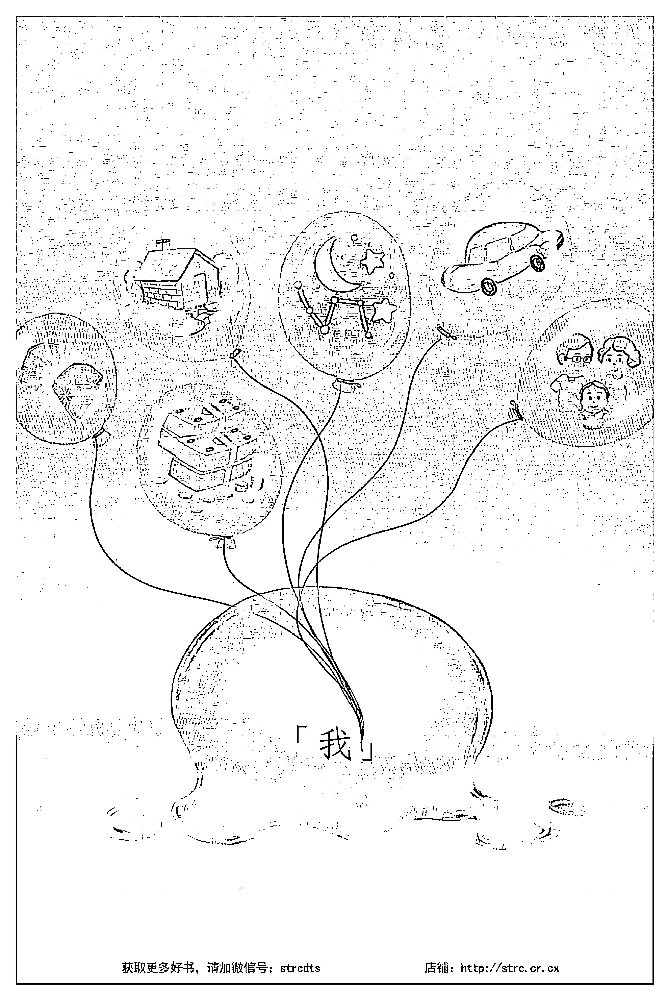

# 杨定一：我是谁

## 引言

「我是誰」是古人留下來最徹底、最有效的心理療癒。

我在《不合理的快樂》已經以相當多的篇幅來表達「我是誰」——「參」的系統，但是總認為少了一個練習的層面。所以，在這裡，特別要強調的是——如何落實在生活之中。

我目前為止聽到所有人表達的，無論是讀了這幾本書的體會，或是相關的提問，都還站在頭腦局限的層面，稱不上是領悟的成就。為此，我也擔心之前用了將近五十萬字來表達那麼簡單的觀念，卻無法將人類最深奧的精華轉達出來，又落入一個知識的體系，成為在邏輯上用來分別的工具。倘若如此，就太對不起從古至今的聖人了。

我在《靜坐》做過詳細的說明，指出無論哪一種靜坐法，都離不開這兩個層面：專注（śamatha）或是觀照（vipaśyanā）。任何靜坐的方法只是一個工具，讓我們可以找到自己（Self realization）——真正的自己。後來，我也用「醒覺」一詞來形容這一領悟。

領悟，其實也只是意識狀態的變更——從局限落回無限。然而，這種轉變離不開兩條路徑：「參」（ātma-vichāra, self-inquiry）與「臣服」（praṇidhāna, surrender）（後來各自衍生出中國禪宗的參話頭、印度的 jñāna yoga 真知瑜伽、解脫瑜伽，和 bhakti yoga 奉愛瑜伽）。

中國的禪宗，從達摩祖師開始。他從印度沿著海路，先到中國南方的廣州，再到北方的洛陽，在嵩山少林寺面壁九年。二祖慧可來跟他求法：「我心未寧，乞師安心。」曰：「將心來，與汝安！」祖曰：「覓心了不可得。」曰：「與汝安心竟。」

二祖心不安，達摩教的方法，用這本書的話來說，也就是——你說心不安，不安的人是誰？這段對話不光把禪的傳承帶出來，還把「參」的方法留下來。

無論用各式各樣的方法來靜坐，最多是淨化頭腦的作用，讓念頭消失。於是，我們在寧靜中走上這兩者中的一條路徑。假如把這兩條路徑也稱之為方法，只能說「參」和「臣服」是萬法之首，是最高的法門。透過它們自然可以進入最高的定（mahāsamādhi），是指向智慧最直接的一條路。從這兩條路徑，人類比較容易醒覺。

正因如此，除了前幾本書已經提過的「臣服」，如何將「參」落實到生活中，也值得在此進一步分享。

然而，因為現代人頭腦高度的發展，傳統的「參」，透過例如「我是誰？」這樣一個簡單的問題，是引不起頭腦注意的。所以，我在這裡採取不同的角度切入——如果有一個一體或真實好談，先把一體與真實做一個描述，將原本的話頭轉為一個提醒，提醒你我真實、一體。

腦透過念頭不斷的「動」，自然被真實、一體所融化，走到最後，一樣回到心。

這本書與前幾本書的不同之處在於，我會以相當快的步調與你一起進入「參」，而不再重複說明之前提過的基礎觀念。我在《不合理的快樂》提過「參」是相當少數成熟的修行者才可以理解或運用的方法。甚至，在成熟的修行者中，能真正掌握的人更是少之又少。

大部份人把這個世界抓得太緊，和家庭、事業、身分、物質、感受、感情綁得太密，也就是「我」太強烈，而不可能有空檔去看到自己。即使看到自己，一般人也還沒有準備好去理解自己有多少陰暗面從深處一一浮出來。大多數人看到這一點時，無法面對自己那麼多的面向。所以，只有少數再少數的人適合這個方法。

然而，「參」可以說是人類最高智慧的傳承，從來沒有中斷過。更是靈性旅程最後一段最重要的關鍵，足以讓人一路走到底。我在這裡，還是要把它分享出來。如果你覺得切入的速度太快，或出現了不熟悉的名詞，我希望你可以回頭複習前幾本書，再來體會「參」的奧妙。

從一個更高的層面來看，我從《真原醫》、《靜坐》、《等著你》、《重生》、《你・在嗎？》、《全部的你》、《神聖的你》、《不合理的快樂》這些過去的書籍和音聲作品一路下來，最多也只是為你準備進入這一堂功課。

或者說，我們這一生來的目的，也只是完成這個功課，而這個功課最多也只是把自己找回來。

把自己找回來，一個人自然就活出「在」、「覺」、「樂」，也自然活在愛中。

就開始進行吧。

## 醒覺——對你有多重要？

你到底多想醒過來？

你有多想醒覺？這個問題，只有你個人才能回答。

醒過來，或說醒覺，對你有多麼急迫，也只有你自己可以答覆。大部份的人活過這一生，都在一個大的夢中。一生都在迷路，都在繞圈子。這個問題，根本不可能浮出來。

然而，也有人知道人生確實是一場夢（通常是惡夢），而想從這個夢醒過來，從人生走出來。但是，我所看到的，一般人醒覺的決心並不大。遇到好事，也就把醒覺忘記，又回到夢中。

這大概就是我們大多數人的狀況。

所以，要談解脫或是活出全部的生命，可能都還太早。

但是，也有少數朋友會把醒覺當作人生最大的目的，隨時隨地都想追求，不願輕易放過。我想，你能讀到這裡，大概也就屬於這少數人，希望把全部或神聖的生命隨時落到生活中，跟自己的生命整合。

假如我猜對了，相信這本書雖然篇幅不大，卻會成為很好的隨身指南。前面提過，我在這本書，不希望再重複名詞的定義，而是想用自己的體驗，用最誠懇的方式跟你對話。倘若，你也同樣誠懇地投入，將一生所學到的觀念，包括宗教、科學、各種學問，都可以放下。面對這些字句，也不要去分析。那麼，你自然會讓這些文字流到心中，建立生命完整的基礎。

從第三章到第十六章，每一章都分成兩部份，前面是針對真實（Reality），透過各種角度去切入，而後半是進入練習的層面，是從早一醒來，到晚上入睡前都可以做的練習。

我們就一起開始吧。

## 01 從腦落到心，解開人生的鑰匙

人為什麼會有痛苦？為什麼有種種煩惱？頭腦明明是工具，為什麼反客為主，成了生命的主人而帶著我們走這一生？

想想看，我們只要一睜眼面對這個世界，就受到頭腦的制約，產生一連串的分別和批判，認為樣樣都不順、不夠好，都帶來煩惱。一天下來，總覺得不公平，總是事與願違。從人類的歷史，我們一樣認定人生就是你爭我奪、不公不義，樣樣都不好。自然認為從一開始到現在，人類的生存史就是一連串的悲慘，要不斷地自保，再加上奮鬥，才有生存的希望。

人只要有念頭，就從本來很單純的靈性中心，也就是不分別、一體的「心」探出頭來，做了一個分別，進入了腦的狀態。頭腦生出一個念頭、兩個念頭、三個念頭……愈來愈多。愈分別，也就愈複雜愈嚴密。就這樣，從不分別的一體踏出來。踏出來之後，往外界看，也就創出了一個世界。

從人出生後的發育來看，也就是如此。小嬰兒在成長，他的頭腦也跟著在成長，就往外去尋、去追察、去捕捉這些資訊，就這樣建立一個他的世界。

從心往外，透過頭腦的二元對立和周邊區隔開來，自然創出一個「我」。「我」又不斷地把自己投入周邊的形相，把種種形相跟自己綁在一起。「我」和周遭形相的關聯建立得愈來愈強，再透過情緒、念頭的擴大與反彈，又創出種種的萎縮，甚至凝固成萎縮體，接下來就是一連串的不快樂。

你想不到的是，「我」的來源其實是——什麼都沒有。

我們的腦不只是投射出一個世界、一個宇宙、一個生命，而且都站在一個共同點在看、在體驗一切，這個共同點就是「我」。一生所體會到的一切，都是站在「我」的角度在看。沒有「我」，也就沒有這個世界。但是，我們很少可以觀察到這一點，也就這麼被虛構的「我」帶走，以為這一切是真的。

頭腦為了得出一個意義，在念頭與念頭之間，自然虛擬出一個連貫性。自然指定一個虛的因（cause），讓我們認為人與人之間、事與事之間、物與物之間有一個連結，還各自有獨立的存在。

我們從頭腦的分別，再用五官往外看，慢慢創出一個個人的世界。跟著二元對立的邏輯，加上比較，不斷地分別，不斷地批判，造出一個完整的人間，而這個人間的無常與制約本身就是我們痛苦的來源。這種困境，要想透過念頭解開，是幾乎不可能的，因為這個人間就是念頭的產物。

不只如此，由頭腦的二元對立和念頭所組合的這個人生，要想透過念頭跳出來，這本身就是不合理。一切是透過念頭所建立的，怎麼可能從這個框框跳出？要跳出來，就是給頭腦帶來最大的危機，等於清除自己所建立的一切。於是，「怎麼跳出來」這個問題根本不會從腦海浮出來。

懂了這些，一個人要怎麼把全部的生命找回來？

他要走上一條「回頭路」。

我們頭腦發展的方向是往外，以前是往外尋，往外分歧，岔出種種分別；現在是回頭走，往內看，落回心。

從頭腦，回到無思無想、一體、不分別的「心」。

這個「心」是生命的中心。真實生命的中心不是頭腦，因為頭腦投射的念頭，只是把無色無形限制成人間。但我過去借用人心體解剖上的心臟來解說，也只是一種方便比喻，最多可以說是我們人的中心，或宇宙的中心。

意識回到這個中心，可以比喻成回到螺旋場的奇點、回到黑洞。到那裡，念頭完全消失。這個中心點融化一切思考的範圍，把念頭完全吞掉，回到最原始、最輕鬆、最根本的「心」的狀態。

一個人寧靜得沒有思考，沒有念頭，這個心就好像一萬個太陽在照，而且這個光明是永恆的，不會現在有，待會沒有。它是完全不會中斷的，是永續的光明。這個光明，是我們的本性，無法用一般的光度來形容，最多用「一萬個太陽」這種比喻來表達這種更亮的光。

這是每個人要自己去體會的。

一個人要解脫，要透過一個完全顛倒的迴路——從腦，回到心。

人生是這樣形成的：從心，延伸到腦。從腦，產生「我」。再從情緒擴大反彈成萎縮、痛。所以，如果要回頭去找「我」的來源，找到最後，自然落回「心」。

要回到心，最直接、最快的方法就是——只要念頭一進來，就緊跟著追問這個念頭或「我」的來源是什麼，看能不能把「我」的根源找到。一路跟追到底。

這就是「參」的觀念。

只要有念頭，情緒一來，萎縮產生，就接著「參」誰，有這個念頭？誰，有這個情緒？誰，有這個傷痛？誰認為被欺負？誰心痛？誰在算計？誰在嫉妒？誰在計較？誰被背叛？誰想報復？誰覺得世界不公平？誰痛到一句話都說不出口？誰，不想再見到明天的太陽？

當然，在痛的，是我。反彈的，是我。眼淚流不完的，是我。被欺負的，是我。受傷的，是我。不敢再信任的，是我。沒有安全感的，是我。絕望的，是我。想結束生命的，是我。一句話都不想說的，是我。失去了一切的，是我。

這樣子，有任何念頭、感受，都用這個方法一路不斷地去尋。

無論「我痛」、「我傷心」、「我掉淚」……都集中在「我」——「我是誰？」

這麼一來，樣樣都集中在「我」，只要參下去會發現——全部知覺、感受、念頭的來源，其實也只是「我」，都是「我」。

「我」，又到底是誰？

這個問題一問下去，沒有一個答案。

最後，全部答案都有了。

沒有答案，本身就是答案。

這個方法和其他方法完全不一樣。它本身就站在一體、整體。最多只是把全部的不真實、全部的幻覺、「我」挪開，到最後只是我們的本性、一體。

完全回到這個靈性的中心，這就是「參」。

「參」最多帶我們走上回頭路，回到最源頭的那一點，我們本來都有的一體的狀態。

所以，「參」什麼？「參」自己，回到家，回到存在的家。

「參」到最後，沒有什麼可以參了，一切都挪開了。接下來，可能又生起一個雜念，也就不斷地「參」——還有什麼？誰知道這個？參到底，還有什麼？

接下來，什麼都沒有。

連一個沒有，都沒有。

這個沉默，本身就是我們無色無形的全部。它本身就是一體意識。是存在的家，也就是我們的本質。

沒有語言可以談。這些表達的方式，最多還是一個借用的比喻。

這個方法就是這麼簡單，也就這麼談完了。

然而，它本身有很多變化。一天隨時都可以做，跟任何活動——包括處理事、與人互動、靜坐都不衝突。從早上醒來，就可以做。最不可思議的是，一個人熟練了，就連睡覺，也自然在做，是它帶著你做。

不一定要擺出什麼姿勢，排出某個時間，或規劃什麼練習。

你隨時都可以做。

每個人在做的時候，隨著自己的個性、習慣，自然會形成自己的「參」。

有些人是不斷地問「我是誰？」「是誰有這個念頭？」「誰有這個感受？」有些人是安安靜靜的，很長時間沒有什麼念頭，連問都問不出來，最多是輕輕鬆鬆地，念頭來時，再問「我是誰？」也有些人的情緒特別豐富，而隨時可以問「誰有這些情緒？」

有些人是很激烈地在問在尋。

也有人是很長的時間沒有念頭，停留在空檔，在寧靜。

所以，從這裡面，可以有各式各樣不同的選擇。這也就是「參」的方法。

## 第二章 「參」帶來最大扭轉的動力

這樣子來解釋「參」，自然會發現它和任何靜坐方法都不一樣。它不追求姿勢、方法、甚至不講究練習的形式。假如還可以把它當練習來談，也就是從早到晚都可以練習。

「參」只是讓我們肯定自己從來沒有跟一體、整體分開過，也只是讓我們隨時提醒自己，而同時回到一體。透過「參」，也是在承認從身體或腦是不可能醒覺的。從相對，不可能跳到絕對。

任何靜坐的方法，無論是專注或觀照，用意最多是把頭腦的運作集中，集中或停留在同一個對象；或停留在同一個過程，保持專注或觀照，而讓念頭消失，讓我們的本性自然浮出來。本身還是站在「我」面對這個世界，培養種種「我」的功夫。衍生出來的種種身心變化，難免還是從「我」的角度在看。例如覺得「我」的雜念減少，或「我」與宇宙合一，「我」的定力更深更強了，「我」有種種超脫的體驗。

「參」的不同之處在於，還沒開始「參」，修行者就已經站在真實來看這世界。最多是透過「參」，把這個真實找回來。所以，「參」其實帶著一個動力，而靜坐是在同一個對象或過程上重複。

用一個比喻來描述兩者的差別：靜坐就像一尾魚專注於眼前的東西，也許是其他的魚、石頭、泡泡、水草……透過專注或觀照，念頭停下來，甚至消失。透過這樣的空檔，一個人原本看著外在的事物，突然轉回內心，看到自己。

或者換個說法，靜坐是讓主體（「我」）與客體（靜坐的對象）合一。在合一的狀態，我們自然進入當下，把當下這個瞬間拉長。當下一拉長，我們的本性或生命的本質（也可以稱為「真實」）自然浮出來。

然而，「參」站的角度不同。它已經肯定生命的全部，是站在無色無形、空、內心去觀察一切，去看著眼前的注意力落入一個角落。意識的出發點截然不同。「參」什麼都不理會，不去在意任何由「我」衍生的產物。它繞過一切現象和狀態，只是一心專注於「我」的根源。

「參」採用不同的優先順序——完全集中在「我」的上游。把「我」的根源找到，一切現象自然消失。一個人自然達到「止」，也就自然解脫。不需要再花時間練習或是分析各種體驗。甚至，一個人站在一體，就連「參」都變成多餘。最多只是透過「參」記得一體，記得自己的本家。

我才敢說，對已經準備好的人來說，「參」是最好的心理療癒。它跟任何療癒的方法不同，也是一樣的道理：不在創傷或失落的層面去不斷分析，不刻意去重現痛苦，而是直接把注意力集中在「我」的根源，也就是痛苦的根源。透過「參」，參到底，「我」消失了，一切的障礙和問題也就解開了。

回到魚的比喻，靜坐是從意識的一個角落進入一體，就像前面說的，是站在魚或「我」的角度，念頭安靜下來，注意力突然從外轉向內，而看到真正的自己。相對地，「參」不是站在魚的位置，反而是從本性的角度在釣魚（「我」、「我」的念頭）。本來就站在一體或整體，一切已經是完美，一切都已經完成。假如用狀態來表達，它本身是最輕鬆、最根本、最不費力的狀態。

「參」，最多是站在一體，就像順著線鉤住魚，把它往主體拉，拉回存在的家。最後，沒有釣魚的人（「參」的人），也沒有被釣的魚（念頭或「我」），連釣魚在拉的線都沒有，只剩下一個拉的動作——「參」。

假如說把「我」畫成一個人，而「我念」（I-thought）畫成一根繩子，這根繩子最多就像落在一個看不到底的深淵。我們非要去拉一拉繩子，看看裡頭有什麼東西。但是，永遠拉不到的。眼前的，是一個無底洞。

我們不知道其實是反過來的，是一體在拉我們，早晚把我們吞掉。站在「我」或「我念」，我們會認為是自己在主動追求。這是「參」最有意思的層面。

在這過程中，我們有一天會突然體會，就連這個「我念」的繩子，其實也從來沒有離開過一體，甚至連「我」也沒有離開過一體。就連「我念」的繩子也和一體一樣在放光。

「我念」、「我」、「一體」其實從來沒有分手過，一而三，三而一。接下來，沒有一個人在釣魚，也沒有人在拉繩子，更沒有繩子（我念）好談。存在的，最多是一體。

所以，「參」不講究方法，不在形式上著墨，沒有什麼遊戲規則好談。它本身就是最簡約、最有效率的方式，讓我們記起自己就是一體，一體就是自己，從來沒有分手過。我才會在〈引言〉稱它是最高的法門之一。

儘管「參」是最高的法門，卻只有少數人懂得運用。可惜的是，即使這一傳承千年來不曾中斷，卻已經失去了脈絡。

我常常看到有些修行者在參話頭¹，卻不明白為什麼要參。最多只是讓念頭消失，進入比較安靜的狀態，而不能從一般的意識跳出嚟，更不用談解脫。

我會把「參」的方法當作最高的法門，還有一個原因：古人的傳承是靠著上師與弟子代代相傳，而不曾中斷。一位好老師的印可（印證、認可）在過去是相當重要的關鍵，可以讓學生省下許多冤枉路。

> 1 | 話頭，是指說話的前頭，也就是在動念要說話、未說話之前的「那個」。參話頭的修行方法是由禪宗的臨濟宗發揚光大。尤其南宋的大慧宗杲禪師，提倡參究趙州禪師的無字公案—「因甚狗子無佛性？」，或是簡化為「無」。其他的話頭包括「念佛是誰？」「本來面目？」「萬法歸一，一歸何處？」，可簡化為「一」、「拖死屍的是什麼人？」

只是，過了千百年，這個傳承不再那麼犀利，找到一位好的老師非常不容易。而「參」這個方法，本身就像一個好的老師，可以引領你我走到底。一個人即使有各式各樣空靈或奧妙的領悟或體驗，甚至認為自己開悟了，還是需要透過「參」穿越自己的體悟而不會迷路。也就是說，只要有任何體驗或領悟可談的，還是可以「參」——

> > 還有領悟可談的人，是誰？
> 有佛陀或天使現前的人，是誰？
> 可以表達這麼高妙的境界的，是誰？
> 可以描述這些境界的，是誰？

這樣子，一路參到底，才可以消除頭腦所帶來的任何錯覺。

前面也提到，古人認為只有最成熟、最夠格的修行者才有機緣接觸到「參」。其中，又只有少數的人會運用。假如門檻那麼高，也許你會想問：「為什麼還要帶出來？」

我承認，這確實是一個考驗。明知這個門檻不容易，但總認為你我夠聰明、夠成熟，而可以接受這個方法。

從另一個層面來談，人類生活的步調已經快到一個地步，讓每個人都活在分別、隔離的意識狀態。假如沒有一個犀利而到位的解答方法，人類不可能永續健康，甚至可能連生存都談不上。然而，這一集體的危機，也促使我們更快踏出來，盡快在意識上徹底地轉變。

人類從有文明到現在，沒有一個時點像現在這麼難得——地球的發展或頻率，已經快到足以觸發集體的醒覺。當然，我也捨不得錯過這個大機會，才鼓起勇氣寫下這一系列的書，為你我準備進入人類演化的下一個階段。

相信你讀到這裡，會想再進一步知道，怎麼去「參」？和一般靜坐又有什麼區隔？

靜坐是守住一個客體、一個對象，假如我們把「參」當作靜坐，「參」的靜坐可以說是守住純淨的根源，也就是生命的來源、「在」或「空」，是我們全部意識的根源。

「參」，最多是把注意力守在這裡。

透過「參」的靜坐，一直把注意力守住的對象（「在」或「空」）當作自己，一個人也自然成為這個——「我」融化到一體，成為「在」，成為「空」。

一般我們用 I Am 靜坐，也就是不斷重複「我——在」，坐到最後，沒辦法重複了。那麼，「參」，反而是透過腦的「動」，也就是念頭，一路追察到根，透過「動」回到寧靜。本身是用「參」的力量——

我是誰？對誰，有這個念頭？有這些情緒、有這些感受、有這些變化？

答案，當然是——我。

## 那，我是誰？

重點是「我是誰？」沒辦法回答的部分，沒辦法回答的寧靜。

沒辦法回答的寧靜，其實就是 "I Am."「我——在」。

但是，它不動，它也不需要表達它自己。

這樣子做下去，「我是誰？」之間的空檔自然愈來愈長，一個人也就停留在空檔。

重點就是停留在這個空檔，意識層面的動——念頭，也就自然消失。

停留在這個空檔，也就清清楚楚地在「在」的狀態。

其實就是那麼簡單。

一個人臣服到底，自然有一個見證的作用。意識和念頭會劈開，人站在意識做見證。意識本身就好像是「在」的觀念，一個人也就是從「在」看著「有」，進一步「參」——

我是誰？對誰，有這個念頭？為誰，有這個見證的觀念？誰還在做見證？

當然，答案又是——我。

那，我是誰？

所以，「我是誰？」這種參，自然就把一個人的狀態帶到見證的上游，走到哪裡？完全走到「在」，走到沒有念頭，走到 beingness，走到存在。

走到——你，就是。

你是。

完全沒有念頭。

不光把主體和客體、對象之間的關係打破，連「觀」都打破。

到最後什麼都沒有。

「參」之所以不同於其他方法，原因在此。

## 03 所見的一切都不真實

我們眼前所看到的、體驗到的，都是五官的捕捉，再透過念頭建立而成的。

我們在人間所體驗的一切，從生到死，都離不開腦和神經不斷產生和演變的資訊，而這些資訊也從來沒有離開過電子訊號的傳遞。

我們認為很堅固的一棟樓、眼前的一個人、甚至自己，最多也只是這些電子訊號的組合。

這種看法，對一般人而言，已經很難接受。更難接受的是，這些資訊不要說沒有一個全面的代表性，甚至連部份的代表性都沒有，只是一個狹窄的窗口，讓我們對世界得到一個狹隘的認識。這一點認識，在整體中不成比例，也沒有任何代表性。

我們一般人根本想不到，不只五官帶來的資訊是如此，再多感官，也依然是狹窄而沒有代表性。

我們能觀察、體會到宇宙的無限大與無限小。然而，五官所看不到、體會不到的宇宙，它的層面遠遠大於我們所可以想像。再多感官或語言去截取、去描述，還是落在一個角落，是站在一個小點看整體。即使用螞蟻和大象來做對比，也遠遠不足以描述小點與整體的差距。

無論站在哪一種角度，科學也好，科技也罷，人類認為可以完全掌控真實，甚至可以推導出一個真實可談，這種想法才是不可思議。

我們認為人類文明累積下來的知識足以描述全部的生命，同時還認為看不到就不存在，這本身更不可思議。

這種觀念不只違反常識，本身也違反理智，而我們都是這樣活了一生。

我們不用提這不是真的，更不用去分析所謂的人生（你我活出來的故事、生命的内容）來探討這一論點是不是成立。只要觀察，自然會發現我們認定曾經發生的一切，都是透過腦的記憶取回來的；至於還沒有發生的未來，也是靠腦海的投射帶到現在。無論過去和未來，都離不開腦的作業。

透過腦，我們覺得一切有一個連貫性，也把過去的事稱為「因」，未來的作用稱之為「果」。在這種連貫性之下建立的人生，最多也只是反映因－果的前後連結。過去、未來、因果、先後，都是思想虛擬出來的解釋機制，一般人很難看穿它的虛妄，也隨時都被它綁住，很難跳出來，很難過關。

比較正確的問法是：假如這一切不是真實，我們這一生的體驗又是怎麼來的？為什麼讓我們的人生那麼真？為什麼我們認定人和人、事和事之間有一個連貫性，看得那麼真實？

答案其實相當簡單。我們的人生是念相的組合，而念相從來沒有離開過二元對立，從一開始就是腦的電子訊號再加上比較、分別、區隔的作用所得到的產物。要對人類的腦產生意義，首先有一個「前－後」的比較，而自然衍生出「時－空」的觀念，和周遭的環境區隔。

對人而言，區隔不只是空間的，還需要有一個時間上的區隔。透過心理的時空觀念，人類才得以體驗這個世界，而創出一個人生的故事可談。

所以，談到人生是虛的，一點都不過分。

人、事、物，就是這麼透過一點虛的念相所組合而成。

我們本身對世界的知覺已經受到這種局限，不可能在局限之外體驗這個世界。假如可以看穿這一局限，我們體驗的範圍自然更大，自然把局限納入體驗的範圍，也就不能稱之為局限了。這本身帶來一個矛盾、悖論（paradox）——觀察者透過有限的觀察方式，只能觀察到生命有限的範圍，而不可能體會到這個角落外有什麼。

他已經被自己觀察的能力所限制了。

這是人類一生最大的悖論，可惜的是，一般人很少去想，根本意識不到。

這麼一探討下去，自然會發現這個結論——一切我們所見、所聞到、聽到、觸摸到、嚐到、體會到的，都是頭腦投射出來的。

沒有一樣是真實的。

### 練習

醒來第一個念頭，就對自己的狀態做一個回想。
告訴自己：一切，一切我所看到、聞到、聽到、觸摸到、嚐到、體會到的……都是我的頭腦所投射出來的，沒有一項是真實的。
接下來，有任何念頭，告訴自己：這些念頭都不是真實的。
心痛或煩惱的事、大大小小的失落，知道了，也告訴自己：
一切都是腦投射出來的，都不是真實。
假如念頭開始一個個起伏——
看著它們，提醒自己：任何念頭，都不是真實的。
也不用去管它們。隨它們，讓它們來，讓它們走。
就放過這世界吧，讓世界自己存在。
這樣子不斷地提醒，會發現念頭自然減少，心裡自然安靜。但是，隨時還知道有一個人在觀察，也有一個身體可以被觀察到。這時候，輕輕鬆鬆地問——

- 還可以想、可以觀察、可以感受的人，是誰？
- 答案自然是：是我，當然是我。
- 那麼，我又是誰？
- 我是誰？

不要落入任何答案，最多只是輕輕鬆鬆守住這個問題。也許一秒、兩秒，不要去追究答案。接下來，念頭可能又進來了，這時候再問：

- 念頭是對誰來的？
- 誰有這些念頭？
- 是我。
- 那，我是誰？

起床後，穿衣、照鏡、盥洗、用餐，不斷提醒自己：在我眼前可以體會到的一切，都不是真實的。都只是念相。是「我」投射出來的。

「我」，也是頭腦投射出來的。

「我」，也只是念相。

出門散步、工作，一天當中，隨時想到，就提醒自己：

我眼前所看到的、所體會到的一切、一切，都不是真實。

都是我的腦所投射出來的。

晚上要睡覺了，最後一個念頭，也不斷地重複提醒自己這幾句話。

## 04 我是神聖的

假如全部生命是不受制約，那麼，它沒有生過，也沒有死過。一樣地，真正的我，也就是自性或本性，不可能生，不可能死。

它本身就是永恆，本身就是一體。

假如有一個主或神，我也不可能跟祂是分開的。
我就是神。神就是我。

了解了這些，人就突然落回整體，看著這個世界。也自然會發現，人生的一切是頭腦建立出來的，離不開念相或妄想。即使還有那麼一點真，跟整體相較，也小得不成比例。既然如此，何必去計較這一生所遇到的困難、不滿和挑戰？

放過它們，放過自己，讓一切輕輕鬆鬆存在，是我們這一生唯一要學習的功課。

放過一切，一切再也不與我們相關。人間所帶來的任何價值，跟自己再也不相關，也沒有什麼東西值得去分析、去解釋。

我們也就輕輕鬆鬆地，什麼都沒有做，進入神聖的「在」，神聖的寧靜，神聖的全部。

一個人本來就圓滿，一切就是圓滿，而一切都屬於整體，不可能從哪一個角落，有一個動力，對這個整體造出什麼後果。

最多也就是醒覺，如果現在不醒過來，要等到什麼時候呢？反過來說，如果現在不是醒著的，未來也不可能醒過來。

我們不知道的是，自性本來就是醒覺的。因為我們不知道，也就在這個世界昏迷打轉。要突然體會到我們本來就有、從來沒有離開過的，這個醒覺才落到生活當中。這時候會發現——什麼都沒有發生，什麼都沒有得到，但自己已經完全不一樣。

換一個角度來說，談醒覺，本身也是個大妄想。醒覺的「人」、醒覺的「動」、醒覺的「對象」，本身都不存在。假如還有一個醒覺的人好醒覺，反而是我們自己建立的阻礙，還是落入二元對立的觀點看這世界。

懂了這些，一個人自然也就平靜下來，再也不做抵抗，也沒有什麼知識或學問需要和人分享，或還有什麼成就值得追求。任何成果、任何成就、任何追求都還是人所帶來的，一切都只是人局限自己而創出來的價值。

我再也不需要讓這個世界帶走。

我本來就是解脫的。不可能比現在的解脫更解脫。

我沒有生，沒有死。我自由地來，也可以自由地走。

### 練習

跟前面一樣地，剛醒來，睜開眼，還躺在床上就可以練習。

告訴自己：

我知道，我完全承認，眼前所體會的一切都不是真實。

真正的我是神聖的。

我的本性從來沒有生過，從來沒有死過。

我的本性從來沒有來過，也從來沒有去過。

一切人間所體會到的、所經過的，跟我的本性都不相關。

任何經驗，無論多美，多不好，多大的成就，多深的失落，是歡笑，還是流淚，是喜事，或是壞事——都不是真正的我。

沒有一件事情可以沾到我。

我連來都沒來過，怎麼還可能受人間任何事情的影響？

這樣子，不斷地重複這個提醒。自然發現，進入更深的安靜。在這個時候，念頭起不來。

念頭一起來，輕輕鬆鬆地問自己：

對誰，有這些念頭？

當然又是我。

是我。

繼續問：我，又是誰？

我，是誰？

不用追求回答，輕輕帶一個「參」的味道，停留在這個空檔。

念頭再出現，再問一次：我，是誰？

沒有念頭的空檔，就是正確的答案。

有些朋友覺得念頭總是停不下來，尤其是正遭遇重大的傷痛、失落，在物質的層面、關係或心理層面受到很大的損失，可能覺得自己做錯了，承受很深的內疚，也可能覺得受委屈——為什麼是我？對自己的安全或未來，有數不完的憂慮。

這種情況，最需要一個安慰的力量。沒辦法自己停住負面念頭的朋友，有一個很好的方法可以採用。

我們還是知道真正的自己才是生命的主人，但是，在這痛苦的一刻，讓我們暫時把這個神聖的身分挪給一個「他者」。選一位跟自己的心比較親近的代表，也許是菩薩、佛陀、耶穌，甚至上帝，用最誠懇的方式，做一個請求：

> >上帝（佛陀、耶穌、菩薩……），請把我全部的煩惱或是罪帶走，就讓我把你痛心交給你吧。

這個請求，假如真正誠懇，多次重複，本身就帶來一個安慰的力量，遠遠超過世間所能想像。用這種方法可以得到安靜，再進行前面所談的功課。

一個人平靜時，可以「參」，即使念頭起伏，一樣可以用「我是誰？」參下去。安靜下來之後，還可能對自己的神聖有質疑，不敢相信自己的神聖。這時候，也可以採用"I Am"meditation（「我在」的靜坐）。「參」和「我在」的靜坐可以交替使用，不見得需要依照一定的順序。

我們可以用"I Am."（我是，我在）代表上帝的名字。因為祂所顯化的，和祂本身分不開。最多只能用這種方法來表達——「我在」"I Am."。

用這個方式靜坐，自然就在強調本性、自性的神聖。

結合呼吸的練習，甚至可以讓這一神聖落在我們的肉體。我過去才會強調，透過觀息來做一個開始。

我們輕鬆地觀察呼吸。
進。
出。
進。
出。
不要去影響到它。

- 呼吸快，我也知道，看著它。
- 呼吸慢，我也知道。
- 都不要去干涉它。
- 呼吸自然會調整。
- 自然落入一個規律。
- 這些都不用管。
- 只要回到呼吸，回到觀息。
- 這時候，把注意力擺到吸氣和吐氣上。
- 吸氣時，輕輕鬆鬆帶出「我」。
- 吐氣將盡時，帶出「在」。
- 吸氣——我。
- 吐氣——在。
- 透過呼吸，把這個神聖的身分落到自己。
- 我——在——。
- 這樣子，只要投入，念頭馬上會減少。
- 我——————在的距離愈來愈長。
- 甚至，我——————之後，連「在」都起不來。

只有一片空，一片光明。

輕輕鬆鬆停留在這個狀態。

這時候會發現，還有一個認知，一個見證者，一個觀察者在知道。

知道自己在唸「我——在」，或知道自己在空檔，在無思無想的狀態下。

這時候，輕輕地問：

那個知道有空檔、知道在唸「我——在」的，是誰？

還有誰，是可以體驗到的？

答案自然也就是：我。

那麼，我是誰？

## 05 最多，只有一體

「我」、「你」、其他、一切，都離不開一體。都是從一體延伸出來，也自然只能回到一體。我們也沒有任何體，單獨存在於一體之外，或可以與一體區隔。然而，「我」、「你」、「他」最多只是念頭的產物，只能稱為念相，或是一個妄想。本身不存在，是我們腦所局限、分割出來的。

難以想像，我們的頭腦那麼發達，可以透過二元對立的工具，在念頭的主宰下，只是簡單透過人和人、物與物、人與事、人與物的比較，就可以創出一個那麼完整的世界。透過念頭，我們創出念相。透過念相，我們創出那麼複雜的人間百態。

這些人間百態離不開時空。透過時空，我們才樣樣都有一個表面上的連貫性。最不可思議的，樣樣東西在空間都有相對而連貫的關係。然而，這對我們的腦還不夠，還要發展出一個時間的連貫性。我們的記憶和思考，也就是這樣衍生出來的，而且樣樣都有個理由、有個原因。而這個理由和原因最好是符合理性，而透過頭腦可以理解。

我們都那麼聰明，也受到那麼完整、豐富的教育。然而，最難想像的是，每一個人都被自己的頭腦給騙了，被腦給洗腦了，把這個時空當作真的。這連貫的關係，明明一深入分析就知道是虛的，居然把它當作真實，甚至還把它當作我們人生的局限。

荒謬的是，人類的頭腦一定要把整體局限到一個小角落，才能產生認知或體驗，於是自然把局限當作全部的潛能，也就這麼騙了自己一生。

局限只是邏輯的工具，想不到我們會把局限當作成果。假如有一個來自外星文明或未來的人，來觀察地球的人，會覺得不可思議。頭腦造出的相對的觀念（包括相對的一切，相對的世界），站在絕對的一體，只是很小的一部份，根本就不成比例。怎麼也想不到，念頭投射出來這麼小小一點的相對的世界，竟然可以遮住無限大的絕對存在，讓我們忽略了整體。

這種不斷的分別與區隔，還成為我們人生的出發點，主導了人類的所有體會，讓我們不斷地向外奔走、忙碌，反而成為離心的生命。愈發展，愈離開一體。都忘記了，一體才是一切的源頭，比局限更大。

回到一體，我們的生命才會有無窮的活力。

在這裡要提醒一點，我用「一體」、「整體」來表達我們真實生命的本質，也就是一切，是「空」、是無色無形、是無限大、也是無限小。然而，這些語言還是頭腦局限的產物，一樣離不開二元對立。

如果要表達得更為清晰，用「一體」、「整體」所表達的其實是——「樣樣都不是」、「樣樣設想都構不著」，不是透過任何「做」或「動」可以理解的。

只是，習慣了局限的頭腦，會把這種表達當作衝突，而極力排斥。

誰能想到，那麼聰明的生命，會被自己發展出來的工具——頭腦——綁住。不光被綁住，還把頭腦提高到主宰的地位，而我們反而成為頭腦的奴隸。痛苦一生、忙碌一生、追求一生，都離不開一個虛構的境界。

這個觀念是再簡單、自然不過的了。其實，我認為任何真實，都只能是簡單明瞭。過去才會講一定要小孩子都懂、可以做到，才是真實。但可惜的是，人類教育本身就是限制的產物，而使得我們認為這些都不可能，寧願把自己的生命落在五官可以界定的一個小小的範圍。無論再用多少篇幅、各式各樣的比喻來表達，也不可能描述這麼簡單、自然的觀念。即使表達了，又有誰可以聽懂？誰可以聽得進去？

假如可以突然體會到本性、自性的地位，也就是從來沒有離開過神——我們就是神，神就是我們，所帶來的形態轉變，只能用不可思議來形容。對很多人來說，知道自己和造物主等同，自然卸下許多包袱，而不再被過去的問題困住。這遠超過人間所能帶來的療癒和安慰。不只這一生，接下來，我們永遠都不一樣了。自然輕輕鬆鬆跳出一切的制約。

突然會理解，眼前所看到的你、我、東西、動物、植物、泥土、天空、世界，都是頭腦透過業力的邏輯所包裝起來的產物。這些產物或業力，跟真正的我、跟本性都不相關，最多像一點塵埃，飄到一個從來沒有動過的銀幕上。有意思的是，它連這個銀幕都沾不上去，但我們反而被它牽著走，會崇拜它，把它看得比遠遠更大的整體更重要。

其實，業力也就是制約，也只是頭腦固化的連鎖反應，最多帶來能量的轉變。談到業力，許多人帶著種種誤解，甚至用科學的角度去質疑。聽到這些問題，我常常不知道怎麼回應，不曉得要笑還是掉眼淚，最多只能為這種質疑所反映的制約、或人類有史以來的灌輸而嘆口氣。

因為頭腦天生的制約（與業力），許多人可能沒有想過、沒有看透——這個世界本身就是業力的組合。透過腦永遠斷不了，也無法消除。

也就是說，我們眼前所看的高樓、馬路、動力、世界，就是透過五官所建立的資訊，再透過頭腦所帶來的關聯（也就是制約、因果）才建立起來的。沒有因果，其實也沒有世界好談。更沒有時空。有了因果，才決定了人間。

就像一個科學家或觀察者，透過他的測量工具想觀察這個世界，卻沒有想到——自己得到的數據，正是被觀察、測量的方法給決定了。樣樣所可以表達的，也離不開他所採用的測量工具。回來談人間，因果就是人類觀察的工具，想不到也就決定了我們所可以看到、體驗的世界。這關係，其實就是這麼簡單，這麼明白。

從另一個更高的層面來談，人類所想得到的任何工具，無論多麼發達，多麼精密，都不能對整體做一個描述。甚至，連我們人類創造出來的語言和邏輯也不可能。有限（finite）永遠不可能理解無限（infinite）。要不然的話，就會違反數學和物理的所有道理。

我聽到科學家在質疑這一切有什麼科學根據時，最多是看著他，不覺得需要延續這種辯論。其實，一般人站在科學的立場時，往往沒有想過，當代的科學本身無法了解一體、整體。目前的科學工具都帶來局限，帶來分割，離不開二元對立。要了解一體，使用這樣的邏輯工具，本身就不是正確的策略。

我們的頭腦除了投射出一個連貫性，為了對它自己產生更多意義，會再把一個動力分割成「有一個人在做」、「一件事被做」以及「做」三個觀念。我們的語言架構，也要有一個「做」或「動」的主體（主詞），有一個「做」（動詞），再一個「被做的對象」（受詞），二元對立的邏輯才可以發揮作用。《道德經》也說：道生一，一生二，二生三，三生萬物²。

談到需要三點，才能讓二元對立的邏輯起作用，這裡還有另一個例子，可以讓你一起體會。舉例來說，公元指的是耶穌誕生後多少年，然而，從整體的角度來看，這種紀年法並不精確，只是描述了耶穌誕生和多少年後這兩個時點的相對關係。再加上一個點，例如耶穌誕生後兩千年，可能是某件事的一萬年後，這樣才能更精確地比對出這兩個點的所在。

即使如此，還是不夠，還是會發現——再增加多少個點，還只是建立一個相對的範圍，只是參考的點挪到一個稍微大或稍微更小的領域。我們永遠可以建立更多參考的座標。

空間上也是如此，兩個點，只能表達彼此的相對位置或關係，至少要有三個點，透過第三個點的位置來看，才能比較釐清這兩個點的所在。

二元對立，離不開至少三個點的觀念，有「做」的人／「做」或「動」／被「做」的對象的區隔，才能在時空裡成立。假如沒有這個 doer/doing/be done 的區隔，其實也沒有這個世界，一切我們所認為的人間百態，也就突然消失了。

懂了這些，一個人自然會體會到——沒有誰在做（there’s no doer），也沒有什麼東西好被做（there’s nothing to be done）。任何「做」或「動」，還是頭腦的產物，是透過虛的業力所組合的。

解脫，是跳出任何人間百態，跳出任何人類的元素（human-ness）。也就是知道任何東西、「人」都是由頭腦的投射創造出來的，本身並不存在。

這包括業力，也包括「我」、「你」、「他」、「一切」，都沒有什麼獨立的存在好談的。

去抵抗業力，本身也只是個妄想。假如業力不存在，去抵抗它，又有什麼作用？

抵抗業力，最多只是帶給自己一個不必要的難題，本身只是延續一個妄想。不過是用虛妄去對治虛妄。最多是讓這個業力繼續轉變，透過反彈，帶來更多數不完的反彈。

正確的觀念是——讓眼前發生的一切，釋放它自己所含的能量，完成它自己存在的目的。不要去干涉它，不要進一步去做任何反彈。

放過它，放過一切。讓一切自然存在。

人間帶來的業力，自然會完成它自己的週期，反而能饒過我們。

放過世界，世界自然放過我們。

假如有一個「命」好談（即使一樣是妄想），這個「命」也會跟著好轉。

這是一個最根本的法，是轉變命運最有效的方法。可惜的是，懂得運用的人太少。才會有一個臣服的練習好談，也才有一個「參」好練習。

再講透徹一點，假如我們徹底知道自己就是一體，一體就是自己，那麼，面對任何事情，人生帶來的任何狀態和變化，我們都可以接受、臣服，不再做任何反彈。如此，我們已經化去業力的力量，把它當作雲一樣，最多是——讓它來，讓它走。

我們該做什麼，自然會以最有效、最有利的方式去做。而且，在做的過程，並沒有一個「我在做」的觀念，這也就是臣服的做（surrendered action）。最多只能說是生命帶著我們走，帶著我們做。我們再也不加一個「我」的念頭在上面。

面對不愉快的人事物，我們最多也是知道——這些事、這些人都是反映個人的潛意識，甚至是集體潛意識的一部份，倒不是「我」真的存在，更不是誰有好意、恶意。是我們集體的失憶，集體的隔離，才有眼前這些狀況。

臣服於他們，最多也只是承認他們還是一體的一部份。討厭他們，也就是討厭自己。傷害他們，也就是傷害自己。這不是相信與否的問題，它本身就是一個根本的法則。從石頭、植物、動物、到人類都不可能不符合這個法則。

有了這些理解，「參」也就自然浮出來。因為還有一個人在做見證，充分地知道——沒有「我」、沒有這個世界、沒有任何東西值得那麼認真、值得我們反彈。

這時候，一個人自然會歡喜、得到安慰、得到解答。最多只是輕輕鬆鬆地「參」——知道那麼多，體會那麼多，肯定那麼多，告解這些的人，是誰？

誰還有一體意識的觀念？

誰還有什麼東西可以分享？甚至，還有一點無我的觀念？

當然，答案是：是我。

那麼，我是誰？

### 練習

從醒來，到入睡前，有機會就不斷地重複：

我知道，我體會到，透過每一個細胞都可以領悟到——

一切，一切我眼前所看到，可以感受，可以體會的，都是頭腦所投射出來的。沒有一樣是真實的。
Nothing is real.

不光如此，我是神聖的，從來沒有來過，也不可能離開。

我是永恆。我是無所不在。

人生所見的一切，都不是真正的我，都跟真正的我不相關。

就連人生所謂的目的，跟真正的我都不相關。任何目的，都還是頭腦投射出來的。更不用講「我」。
「我」不存在，也根本沒有存在過。

沒有任何一件事，有什麼意義可談的。

沒有什麼目的好談的。

沒有人在做事。

也沒有事可以被做。

人和人之間，事和事之間，物和物之間，「我」都不存在，都是平等的，都還是頭腦所投射出來的。

不斷地提醒自己這些根本觀念，自然會發現——頭腦不斷重複的觀念，就會化為我們的真實（What the mind thinks, it becomes real.）。雜念也自然開始消失。一有念頭，就輕鬆地「參」——

> > 對誰，有這些念頭？
> 誰還有什麼念頭可以有的？
> 回答當然是：我。
> 我，又是誰？

## 06 要懂得真實，首先要發現——什麼不是真實

智慧的根源，起步是知道沒有什麼東西叫智慧。

「參」這一系統的前提，本身就已經在承認——一切都是一體，都是 One Self。沒有兩個體、三個體。全部都是從一體出發的。甚至沒有一個東西有原因存在。沒有一樣東西可以有一個自己的本質好談，或可以體會的。沒有一個東西有自己的根源。

「參」是站在這樣的角度在看一切。

透過「參」，最多是把不真實挪開，輕輕鬆鬆地，真實也就亮出來、洩露出來、自然浮出來。因為真實本來就是永恆的、永久的，也不可能用語言可以描述。不可能是你去找，甚至你也不可能找到。有限，不可能足以找到無限。

要回到真實，最多是把局限挪開。從頭腦的盡頭，一直走到盡頭。只能說是把頭腦挪開，把不真實放掉。

想不到的是，把全部的不真實挪開，我們才體會到真正的我。

### 為什麼要不斷地問「我是誰？」

任何答案——我們這一生，從生到死，所體會的最多也只是「我」。我們能想出來的一切，甚至連解脫或修行的觀念，都離不開「我」。

「我」是這一生的根源。

透過「參」，我們自然把全部的世界濃縮到一點——「我」。站在「我」，再繼續追——「我」的來源是什麼？這樣子才可以把「我」，一次徹底粉碎。這是最有效的方法。

不這樣做，我們首先要面對全部的現象，要面對各種心理的作用，各種情緒、各種創傷，永遠談不完的。頭腦二元對立的邏輯，在我們的生命中反客為主，從工具成為主人，只帶來局限、限制，和數不完的煩惱、傷害、心痛、捆綁。但是，如果反過來把二元對立作為工具，透過腦的過濾「以毒攻毒」，把頭腦所創出來的一切，匯集到一個共同的平台，濃縮到一個共同的點——「我」。在這同一個出發點回頭，再往上游去找它的來源，這樣把「我」消除，是最有效率的方法。

過去大聖人所留下來的種種智慧法門，不二論（advaita vedānta）也好，般若法門（prajñāpāramitā）也好，中國禪宗的話頭也好，都自然會採用「參」。「參」可以說是最大的秘密，或各個法門共同的出發點。

我一直以來覺得相當可惜的是，許多人用「參」的方法，但沒有認識、領悟到這一點。往往做了幾天之後，也就放棄了。或是練習歸練習，生活歸生活，好像兩者不相關。這次特別透過這本書，把「參」帶出來，作為修行的參考。

### 練習

我們要懂真實，要先挪開不真實。
最多只需要提醒自己——這個不是真的，那個不是真的。
任何所看到、聽到、聞到、碰觸到、體會到的，都不是真的。
都不是真正的我。
從早到晚，眼前看到、聽到、體會到任何東西，無論是人、東西、事情，再美的事、再好、再不好、再平凡的事，輕輕鬆鬆告訴自己：
這個不是。
這個不是真實。
這個不是真正的我。
無論多麼小，多麼大的事，
都不是真實。
都跟真正的我不相關。

我所看的一切，都還是我過去業力的組合。是我透過多生多世的無明，把它局限出來的。

一切眼前所見的，本身就是局限，跟真正的我，一點都不相關。

我最多也只能讓它們來，讓它們走。

隨它們。

老早也已經放過它們。

更不用干涉它們。

甚至，懶得反彈或抵抗。

因為我知道——樣樣都不是真的。

這麼一來，念頭自然就消失，心裡也就平靜。

再怎麼大的打擊，我突然都可以接受。

因為，我不斷地提醒自己——它們都是虛的，跟真正的我不相關。

這時候，出現念頭，再輕輕地「參」——

對誰，有這個念頭？

還有什麼念頭值得談？

值得讓我注意？

讓我放不過？

這時候，要注意甚至放不過的人，是誰？

當然是我。

那，我又是誰？

## 07 不批判

批判，是我們全部煩惱的來源。
我們從早到晚，不斷地批判自己、別人、事情、環境、國家、地球，樣樣都看不順眼，樣樣都值得批評。在我們的眼中，很少有事情是圓滿完整的，所看到的全都是缺點。連一個好事，都要透過我們主觀判斷而同意，才變成一件好事。別人講的好事，不經過我們的過濾，我們也絕對不會稱之為「好」。

我們見到一個人，第一個念頭就是已經開始判斷——這個人友善不友善、禮貌不禮貌、風度好不好……一連串的判斷。從早上一起來，到入睡之前，我們一天從來沒有過不批判。不放過自己，也不放過別人。

批判自己，自然產生「罪」的觀念。

我們通常都認為自己是罪人。當然，有很多人認為其他人才是罪人，自己反而是聖人或好人。這種標籤或判斷，自然也就決定我們對自己、對世界的看法。有了「罪」的制約和認定，我們自然也同樣用這種方法看著世界，反映同一種負面的觀感。接下來，要談修行，根本不可能。因為認為自己有重重的阻礙（罪），總是需要有漫長的時間，要透過善行，甚至人生徹底的轉變，才可以消除這些罪，才有機會重新開始。

然而，站在整體，沒有什麼東西叫做「罪」。

也沒有什麼東西叫做「好」、「壞」，有意義、沒有意義，有目的、沒有目的，公平、不公平，善人、壞人，修行、世俗。

假如連人、這個世界、一切，都是頭腦投射出來的，那麼，去批判好壞，本身就是個大妄想。

一個人懂了這些，最多是大笑或大哭一場，發現——這一生，從來到離開，都是活在一個洗腦的狀態，把一切虛妄的境界和虛妄的判斷當作真實。

突然，一個人也變得話少，自然理解——一切所講、可以表達，甚至可以想像的，都不存在。都還是我們用有限的聰明，透過二元對立的語言或思考的邏輯來描述不可能描述的整體；而局限，是永遠不可能描述無限的。

局限，是無限大的一小部份，最多只是從無限大劃分出一個小角落，在這個範圍裡好像有一個獨立的存在。任何語言、任何表達不光沒辦法描述，即使描述出來，也都失真了。都是把整體化為一個切片，最多只是透過一個狹窄的角度來看全部。

我們最多只能用空間的三度，再加上時間的一度，勉強湊出四度，而認為可以對無盡的維度做一個全面的表達。這不光是不可能，還是人類過於天真的想法。

但是，無論用多少篇幅重複這一點，我們還是可能聽不懂。無論多少語言，指出這符合科學的道理，你我不可能相信，也過不了這一關，會認為還是有一句話好講，有一個判斷值得分享。有一個「我」，有一個「你」，有一個人生，有一個世界好談。我們自然還是可能回到一個受委屈、受害者的身分，認為周邊的人不公平，人間充滿虐待，自己倒楣。還可能認為自己的人生故事最有特色，一生所遇到的痛心，是別人絕對沒辦法理解的。也因為如此，更有理由可以繼續折磨自己、虐待別人，從早到晚都在埋怨。這可能是我們每一個人的心理狀態。不經過一個徹底的翻身，沒有一個人可以逃過。

### 練習

只要任何念頭起伏，想做一個判斷或批判，告訴自己：

- 這個不是我。
- 這不是真實的我。

就連看到最美的風景，還是提醒自己：

- 這不是真實。
- 不是真實的我。
- 這一切，還是頭腦投射出來的。

假如做不到，因為反彈太激烈。沒有關係，反彈之後，還是可以練習：

- 剛剛反彈的，
- 不是我。
- 不是真正的我。

### 假如因為念頭太多、反彈太重，這時就採用前面所談的兩個方法：

首先把自己的煩惱和反彈交給佛、上帝或自己覺得親近的象徵。要記得，神沒有問題。把自己的問題交給神，那自然也沒有問題了。

不要小看這個作用，它是真正有效的。外頭的問題自然會得到妥善的解決，而內心的反彈也自然消失。

再進一步，結合呼吸，「我在」的靜坐，提醒自己：

- 我已經圓滿，我和神從來沒有分手過。
- 我就是神。神就是我。
- 都離不開一體。

如果還不適應，可以用「我————————我」，也就是從大的我，看著小的我。

## 08 你不是小小的我

你還可能認為自己是無力，是不成比例的渺小。命帶來天生的限制，讓你認為自己不如別人。只是，心裡就算不滿，也認定這就是自己的命。認為這樣一個不成比例微小的自己，來這一生，只能接受世界所帶來的限制。最多可能期望能有一個好的出身背景、好的父母，追求好的學歷、好的工作、好的朋友、好的家庭、好的後代，希望對自己的不完整做點補償。

你不光在這些物質層面一生不斷地追求，得到了，很得意，想跟別人分享。就是沒有得到，在談吐中也不斷地流露出失望、後悔、懊惱、羨慕、期待或規劃。你這一生，有沒有一句話離開過物質？進一步講，你一生有沒有講過一句話，不是在繼續肯定人生的夢？不是在夢裡不斷建立、延續這個妄想？你有沒有想過，連你所信仰的愛、感情、感受、理想，都從來沒有離開過物質或「我」的層面？你甚至認為，連愛、快樂，都要從外界取得，而取得的過程就構成了你我的一生。

修行？什麼修行？算了吧。等到不順，等到沒有第二條路可走，再說吧。趁現在還有活力，可以取得，可以累積，能爭取一點，就算一點。——這幾句話，其實反映了你我的心態。

可惜的是，你當然還認為修行本來就是虛無飄渺，和自己不相關。你自然會想，這一生全部所經過的，幾乎都是不愉快的經驗。少數可以暢快慶祝的，也全是靠自己爭取。不靠自己的努力，哪裡有安全感？誰可以理解自己這一生的痛苦和奮鬥？

這些想法所反映的制約，不是你製造出來的，是你一生就已經註定了。有從這個捆綁脫身過。看這世界，自然從這個捆綁的眼光在看一切。從懂事開始，到進入學校、進入社會，透過社會帶來的規矩和種種制約，從來沒離開過「人」所創出來的「念境」（thought-world）。

活在「念境」，想解脫，想看穿自己的限制，幾乎是不可能的。這種洗腦不是這一生才遇到，是人類有文明以來千萬年的灌輸。不是任何人的錯，也不是任何人惡意的限制，本身最多只是反映我們對世界錯誤的認知。

我們受到五官的扭曲，不光活出一個身體，一場人生，還不斷地區隔，不斷地分別「我」、「你」、「他」，建立一個虛假的獨立的存在。再加上語言發達的分別，透過記憶，我們還可以創出個人和集體的故事，而把它稱為歷史。不斷地把虛妄的境界，提高為值得傳承下去的紀錄。

因為我們每一個人五官所體驗的範圍差不了多少，人有人的，動物有動物的感官，植物有植物的知覺。我們認為這一重複性就足以證明它自己是真實(self-evident truth)。又衍生出一套學問，進一步證明它的存在，並稱之為科學。即使這一切在整體中都是不具代表性的虛妄架構，只是五官帶來的資訊，我們還會用歷史和科學來論述什麼是真，什麼是假，甚至定出什麼是可能，什麼是不可能的。

這種不符合邏輯的邏輯，也就把你我制約了一輩子。

假如，你充分知道自己真正的身分離不開造物主(Creator)，而且充分知道宇宙就是你造的，那麼，你不光是突然有了一個徹底、全面的大轉變。還會體會到這一生所面對的煩惱或困境，跟真正的你不相關。最多只是透過過去的制約和業力，不斷地在轉變形態。不去理它，業力也自然轉到別的地方，眼前的危機消失，命也就改了。

有趣的是，你什麼都沒有做，但你不只是自己轉變，還可以帶給周邊一個不可思議大的轉變力量。

談到轉變，談到周邊，其實還只是一種比喻。最後，誰在轉變？有什麼環境可以影響？這本身還是頭腦投射出來的。借用這些說法，其實也只是為了方便在這本書透過文字和你溝通。

### 練習

這裡，我們重複前面的功課，每一天，剛睜眼醒來，就提醒自己：

- § 我知道，我完全理解，我肯定，透過每一個細胞都可以體會到：
  一切，一切所看到、聽到、聞到、碰觸到、體會到的都不存在，都是頭腦投射出來的。沒有任何一個東西是真實的。
  There is nothing that is real.
  Nothing is real.
- § 我知道，我完全理解，我肯定，透過每一個細胞都可以體會到：
  我從來沒有生過，也沒有離開過。
  我是永恆的。
  我是無限的。
  我是絕對的。
  我就是真實。
  真實就是我。
  我是——在·覺·樂。
  我是神。
  我是永恆的。
  我是神聖的。
- § 我知道，我完全理解，我肯定，透過每一個細胞都可以體會到：
  到處——每一樣東西，每一件事，每一個人、「我」，都不存在。
  「我」「你」是虛的，是頭腦化現出來的，也就這麼騙了我一生。
  一切都是一體。
- § 我知道，我完全理解，我肯定，透過每一個細胞都可以體會到：
  我知道我不是這個，我不是那個。
  任何東西、經驗、所活的，都不是真正的我。
  也不值得讓我追加任何話或任何念頭。
  任何批判都還是頭腦的作業。
  我最多，只能活出一體。
  我看別人不對，其實是看自己不對。
  我責備別人，也只是責備自己。
  我傷害別人，其實也只是在傷害自己。
  一切，都是一體。

用自己習慣的語言，不斷提醒自己上述四個觀念。緊貼著你個人生命的狀況來表達這四個觀念，愈接近，愈有效。

讓這些話，成為你的口訣或心法。從早到晚，像持咒一樣不斷地提醒自己。

The mind makes everything real. 我相信在短短的時間內，也許是一天、一星期、一個月，你所認得的現實已經開始移動，帶來一個全新的現實。

念頭自然會減少，甚至消失。這時候，假如有任何念頭起伏，輕輕鬆鬆問自己：

對誰，有這些念頭？
還有念頭的，是誰？
還在質疑自己身分的，是誰？
答案當然又是：我。
那麼，我是誰？

## 09 你最多只能放過這世界

第七章談到不批判，其實也可以用本章這個標題來表達。

你這一生所有煩惱的來源，其實就是放不過這個世界。不光放不過這個世界，放不過別人，就連自己也放不過。

放不過別人，放不過自己，才自然會有一個修行的觀念。

因為我們對別人或自己不滿意，才會想要解脫。

針對「解脫」的理想，不是光為了個人得到解答，還認為要為世界、人間做一個解答。透過滿滿的善意，希望把這個世界變成比較公平、平等、友善，甚至救它一把。我們認為這些就是修行的目的——讓自己跳出來，也帶著這個世界好轉。這種種用心都離不開「動」，離不開追求，離不開轉變。也就這樣子，一生又可能這麼被騙過去了。

我過去才會不斷地提醒所見到的修行人。

許多修行的人都是充滿了理想，充滿了批判，對世界看不順眼。不光對自己有一個革命的念頭，還要對世界帶來革命，才對得起良心。不知不覺，也可能愈來愈不快樂。大多數的修行人，可能要注意、要小心的是——走到最後往往都不快樂，甚至容不下別人。只要聽到任何人表達想法，就要發表自己的見解，來強調自己的學問或領悟，表明自己到了什麼境界，卻沒有發現自己所講和所做的不一致。講歸講，做歸做，兩個從來沒有結合起來。更嚴重的是，不斷地批判。用這個批判，不光批評別人，甚至虐待或欺負別人。

假如你我屬於這種人，一點都不意外，這本身還是反映了人類集體的制約。

因為你我是從一個局限的框架看這整體，無論出發點或最後的結果，最多也是在同一個框架裡，受到這框架的限制。解脫，最多也只是個理念，還是腦海的產物。

你我都沒有想過，真正的解脫，沒有什麼解脫好談。因為我們人本來就是解脫的。只是不知道自己已經解脫，而還有一個解脫可以追求。更貼切的表達是——連我們人、人間都是一個妄想。想要解脫，想要修行，也就好像一個妄想，接著另一個妄想，以為可以從妄想的世界解脫出來，這本身就是荒謬。

懂了這些，你自然會放過自己，放過別人，甚至放過這個世界，而讓一切自然存在。

你會突然理解，樣樣可以體驗、表達的，跟真正的你都不相關。假如你肯定任何的體驗，甚至對此做一個反彈，其實還只是跟著這因果在轉，把自己落在一個角落，落回這個制約。

充分知道，一切所看到、所理解、所想像的，跟你的真實都不相關。你自然會看著一切來，看著一切走，不把一切當作真實，也更不用再做任何反彈。

遇到事情，你輕鬆地處理，有人需要幫忙，你自然就去幫忙。但是，同時知道，也沒有一個人可以幫忙的。站在一體，這個需要幫忙的人不存在，幫助別人的人也不存在，幫的動作本身也沒有「我」的存在。儘管如此，還是繼續做下去。最多我們只能用前面提過的「臣服的做」來表達每一個行動。是生命反過來帶著這個肉體，來完成它的作業。有趣的是，生命只可能帶著我們做友善的事情。

這個人間本身就是一場神聖的遊戲（lilā）³，而我們就站在這遊戲的平台。過去累積的業力和制約，最多是讓它自己展開，讓它自己延續下去。不用擔心，它自己會消失，或轉到別的哪裡。一切，跟真正的你都不相關。

這才是解脫。

> 3 | Līlā一般翻譯作「遊戲」，比較正確的說法應該是神聖的遊戲。為什麼會說是遊戲，也只是表達，我們活在人間就像活在一個幻相(mirage)當中，我們順著這個幻相在遊戲，不和任何幻相對立。

### 練習

任何念頭來，你都可以接受。

任何感受，不管多痛、多傷心、多恐懼、多萎縮、多快樂、多麼好……你都可以容納。

任何眼前的好事、壞事、來的人、看到的東西、想到的現象，你都可以包容起來。

都可以吸收，甚至任何壞事都可以吞掉。

你不需要作任何肯定，也不需要作任何反彈。

瞬間，再一個瞬間，下一個瞬間，再下下一個瞬間，一切瞬間所帶來的好壞、考驗、煩惱、喜事，你都可以臣服，不用作任何批判。

讓它們來，讓它們走。

你不用作任何反彈。

最多，只是輕輕鬆鬆地臣服。

瞬間前，你是臣服。

瞬間中，你是臣服。

瞬間後，你是臣服。

臣服，再接下來，臣服。

再臣服。

你自然讓每一個瞬間活出它自己。

活出它的永恆。

你最多也只能回到你自己 (be yourself)。

也不用再加一個念頭。

就連這個瞬間，你都放過。

讓它輕鬆存在。

不去理它，不去管它，不去要求它。

放過它。

最難過的事，最讓你傷心的事，你都可以接受，都可以容納，都可以包容，都可以臣服。

因為你知道，人間所帶來的任何打擊或喜事，跟真正的你，都不相關。

它會生，會死，會轉變。

真正的你，從來沒有生過，也沒有死過。

它本身只是光，是愛，是喜樂。

這時候，讓自己停留在瞬間裡。
念頭來，讓它來吧。
念頭去，也就讓它去吧。
不要干涉。
不要去反應，更不用反彈。
最多，也只能輕輕鬆鬆地問：
見證這一切的，是誰？
知道念頭來，念頭去的，是誰？
還知道在接受、包容、接納、臣服的，是誰？
還有事可以臣服的人，是誰？
答案又當然是：我。
那麼，我又是誰？
就讓問題本身，成為你的答案。

## 10 一切都好

OK. 好。都好。一切都好。一切只能好，沒有東西不好。樣樣都好。

每一句話，都只是在表達——一切都是意識 (consciousness-only)。

意識外，意識外，什麼都沒有。

只有意識是真的。

意識，我們也可以稱為「空」。它是包括無色無形和有色有形，無限大也無限小。它是自己完成自己 (self-sufficient)、自己包含自己 (self-contained)、自己證明自己 (self-evident)。

懂了這些，你自然體會到——透過這個身體，你不可能開悟。甚至，透過腦，你也不可能開悟。從有限，永遠跳不到無限大的整體，也就是意識。最多只能是意識觀察到意識自己。

而你，最多就是這個意識。

其實，比較正確的表達是，就連「意識」這兩個字，都還是頭腦的產物，本身就帶來不必要的局限。它本身還含著一個觀察的動力，區分出觀察者和所觀察的對象。也就好像說我們的本質還有必要投射出一個意識，而這意識再產生一切。這種說法其實還是人腦創出來的觀念。

我才會把「參」當作最高的法門。一個人就連參到一切都是意識，還是認知所帶來的理解。最後，這個理解，透過「參」，都要去把它打碎。

領悟到一切只有意識，已經是很了不起的狀態，是只有少數人可以參透的。但是，就連這一點領悟，還離不開制約。沒有把這個制約解開、消失，會讓一個修行者認為自己真正領悟，又騙了自己，接下來騙了別人。

再講透明一點，凡是有可以領悟到、或是還可以表達出來的任何境界，本身還是個妄想。

不要小看「我」，它有各式各樣的本事，各種方法，想辦法讓你落回這個世界，也就自然讓你在解脫前還有一個開悟的觀念。甚至是透過腦讓你取得一個空靈的體驗，讓你還有一個「悟」可談。

假如真正解脫了，不光「我」會消失，人所理解的這個世界和宇宙，也就同時消失了。這一來，「我」自然會抓住「有」的境界和頭腦的產物不放。它本身的生存就靠這一點存續，不可能那麼容易放過你我。

真正的領悟，要從這裡起步。

我很誠懇地希望你聽進或採用這些話。這個年代，找到真正好的老師實在太難，幸好還有大聖人留下的智慧可以作為借鏡。這本書透過我個人的一點體驗，用個人的語言做說明，最多是把自己的理解和古人的表達做一個對照，希望為你建立一個基礎。即使還沒找到好的老師，也能透過這本書指出正確的方向，一路走到底。

然而，但願你我都可以找到一位好的老師，畢竟直接與老師的「在」互動、共振還是相當重要的。

回到我們人間，「一切都好」也同時是對生命最大的肯定，是承認宇宙不可能犯錯。一生到現在的任何遭遇，包括經過的種種傷痛，留下的種種傷痕，都是剛剛好。一切，也只是一個業力的轉變，讓你得到學習，讓你磨練，讓你成熟。沒有它們，你也不可能走上這條路。更不用談會剛剛好遇到這本書。

一切都剛剛好。

對任何事情、任何災難、任何打擊都帶著這個態度，自然會發現它們無形中就消失了。過去想不通、沒辦法接受的，也自然想通了。任何結，也就自然解開了。

這些話不是為了安慰你，只是表達最真的真相。

最多，你只能拿自己做一個實驗者，看看這些話正不正確。不用管我說什麼，或別人講什麼。只有你自己體會，才真正算數。

一切都好——含著這些意思，也對你做一個提醒——假如一切都是意識，而你也是這個意識，何必讓一生在計較、煩惱、窩囊、籌備、計劃、追求之中過去？有什麼好值得你傷心、過不去、憂鬱、悲傷？還有什麼好追求、想得？又有什麼方法可以完成你本來就完成的全部？

1. 你本來就是圓滿的一切。
2. 你本來就是神聖的你。
3. 你最多只能回到你自己。
4. 最多只能承擔你本來就是的。

這麼一來，放過一切，包括世界和你，不是一個形容或口號。你就是不放過，也沒有一個東西是真實的。跟你放不放過，其實一點也不相關。

妄想放不過妄想，也不需要放過任何妄想。它本身不存在，有什麼好放過的？有什麼好原諒？好責備？好解釋的？

我才勸你，一切都好。

重複這些話，但願你立即記得自己真實的身分。不要再讓這個世界把你帶走，延續這些虛妄的制約。不要在你自己的頭上，再加另外一個頭。也不要再繼續把自己打折釦，把自己當作罪人或是受害者。

犯錯，到這裡為止。

痛心，也到這裡為止。

絕望，也就在這裡終結。

你是沒有生過，也沒有死過的意識。你本身就是在、覺、樂。

你就是不醒過來，醒覺也放不過你。你早晚還是要回到醒覺，回到意識。因為你從來沒有離開過它，只是把它忘記了，被自己和別人騙走，而以為人生的現象就是真實。

你來過那麼多次人生，重複再重複你的痛苦。你還想來多少次，才可以醒覺過來？

也不用擔心，就是這一次醒覺不過來，還有下一次，下下一次，或下下下一次。

就隨你吧，隨你決定吧。

過去談到人生最大的目的是醒覺，這句話本身也只是個大妄想。

人生其實沒有什麼目的。

目的這兩個字還是頭腦二元對立的產物。我們人好像還需要一個目的，存在要有一個目的。目的，帶來種種的動，種種的尋，種種追求。有了目的，痛苦就來了。

醒覺，跟任何目的沒有關係。

是醒覺來喚醒你，跟「你」不相關。

你追求不來的。

成熟了，時間到了，你自然就醒覺過來。

### 練習

一天當中，面對任何東西、任何人、任何事情，好、壞、愉不愉快、輕不輕鬆、累不累……提醒自己：一切都好。

同時含著這個念頭——我對這個宇宙充滿了信心，我知道它絕對沒有什麼錯好談的。一切，都是剛剛好。

我有這個身體，這個身心，最多也只是在反映過去種種制約所帶來的變化。「我」本身也是業力所組合的念相。沒有什麼好壞可談的。

好壞本身也只是業力的產物。

我最多只能承認——一切都剛剛好。

這樣子，面對每一個經驗，最多只能輕輕鬆鬆地提醒自己——一切都剛剛好。

遇到壞事，可能比較容易提醒。但是，遇到好事，一樣要提醒自己——
一切都剛剛好。
做到最後，可能連這句話都講不出來了。
因為我們已經老早臣服。隨著一切，讓它們來，讓它們走。我已經早就不用做判斷，甚至就連「好」都是多餘的。

> 「參」——

這時候，可能還有些念頭出現，最多我們也只能
知道一切都好的，是誰？
還有什麼好壞可談的？好，好到哪裡？壞，壞到哪裡？
還可以分別好壞的人，又是誰？
當然，答案又只是：是我啊。
那麼，我又是誰？

## 11 失落是你最大的恩典

你會遇到這本書，可能以為只是偶然，其實，從一體的角度來看，沒有什麼是偶然，樣樣都是安排好的（pre-ordained）。

很多朋友讀到這裡，尤其本身有科學背景的，會立即反彈，認為這是迷信，覺得像我這樣的科學家，怎麼會講這些話。

每次聽到這種抗議，我都只能苦笑，因為我所反映的是科學得不能再科學的原理了。我們通常都會忘記——自己所看到的世界、體會的人間，本身就是透過「我」創建出來的。「我」從來沒有離開過時－空的限制，自然要對每一件事、每一個東西產生「有一個因」的關係，甚至會把樣樣的因聯繫起來，拼湊出一個因果的觀念。

「我」所投射的所有境界，包括人生、你的故事、我的故事都是虛妄（念相本來就是虛的）。但是，我們並不認為如此，而認為它是不可能更堅固了，也就這樣騙自己騙了一生。

只要承認有「我」，而把自己和「我」創出來的任何現象綁在一起，還會被這樣的結合欺騙，自然就還有一個因果好談。我指的因果是集體的，也就是你、我、大家共同創造出來的集體的因果。當然，也有個人的因果。這些因果同時在作用，透過每一個瞬間，帶來一個交會，共構出一個業力的互動。

即使科學的工具，還是離不開五官捕捉的資訊。我前面提到，透過科學，採用五官所建立的資訊，也不過是重複和肯定這些虛妄的現象。因為我們可以想像到的任何科學的工具，都不可能離開二元對立，也就是我們人間的現實。我們自然也就被這些科學所得到的資訊所限制，再成立又一個層面的制約，而不可……

吸氣時，我。
吐氣將盡時，我。
吸氣時，我。
吐氣時，我。
不斷的「我——————我」。
這本身就在不斷地透過呼吸提醒自己，提醒自己神聖的身分。
也就是說，我遠遠大於肉體所建立的我。
我可以透過每一口呼吸，把我的神性活出來。
這麼一體會，反彈的念頭和感受自然就降下來。

這時候，一個人安靜下來，可以輕輕鬆鬆微細地「參」——
這個批判的人，是誰？
有必要批判的人，是誰？
還有必要分享自己的看法的，這是誰？
還有話好說的，是誰？
當然，答案又是：
我。
那麼，我又是誰？

沒有回答，就讓這個寧靜持續下去。
有了念頭，再重複同樣的參。

能從「人」的邏輯框架跳出來。

再進一步探究，我們透過五官所體會到的世界，不要說在整體不成比例，其實，在所有有色有形的現象中，也是渺小得不成比例。我們體會到的只是眼前的一點，從來沒有過一個全面的掌控。是這些種種條件和制約同時運作，才可能組合我們人生的體驗。

我們想想看，我們和時空的交流，最多只能透過每一個瞬間來互動。而這個瞬間本身就是反映種種業力所組合的條件。也只有很小部份的條件，是我們透過五官可以體會到的。在後面體會不到的變數，則遠遠超過五官可以理解。

我們對每一個瞬間怎麼組合的，也從來沒有了解過。人間離不開念相，它就像一台馬達或壓縮機，轉動的扭力是不可思議的大。我們最多只是透過瞬間，瞄到一點這個力量所產生的後果。

我們對瞬間想做一個轉變，抗議也好，阻擋也好，是不可能的。它的能量釋放太大，就算擋住，也會透過瞬間流到別的地方。同時，我們每一個念頭，每一個動作，其實也都是整體流轉出來的。

「一切都是安排好的」這句話，也只是表達這個理解。

我也提過，我們從來沒有離開過念相所帶來的捆綁，而念相是種種條件組合的，才會說我們從來沒有自由過。最多是局限的頭腦以為自由，哪怕這個頭腦本身，依然被種種的條件綁住。

甚至，只要我們還沒有醒覺過來，這一生所發生的，沒有一項不是安排好的。連頭往哪個方向轉、這一口呼吸是深是淺、走到哪裡、站在哪裡，任何可以想像的動作，都是早就安排好的。是我們活在一連串制約下，一個因接著一個果，再成為下一個因的必然結果。

只要我們仔細探討，不可能不是這樣子。

我才會不斷地提，宇宙不會犯錯，也沒有什麼對錯好談。

你也只能接受這一點。

不接受，事實也只是如此。跟你相不相信，一點關係都沒有。

差別只在於，可以接受這個再明白不過的道理，就能當作一個心理療癒的工具，讓你可以面對人生的一切變化和危機。

仔細想，人生本來就是無常，本來就是念相的組合，一定隨時都在起伏。看到別人的命好，也不用覺得自己倒楣，不如別人。這其實只是很短時間內的現象，不用擔心。畢竟人間樣樣都是無常的，所謂好壞也是相對的，是透過頭腦二元對立所分別出來的。

這一生你最羨慕的，也許是富人，也許是有地位、有權力、有名氣、有才智、長得漂亮、身材健美、討人喜歡、有影響力的人，可能前一生、下一世都不是如此，只是我們看不到自己與別人是怎麼在生命的流轉裡好壞輪替的。最好，也許變得最不好。最窮，也有機會變最富。財富、名譽、地位、外表甚至聰明、個性都靠不住，本身還是念相的組合，其實都與真實無關。當然也跟我們認為公不公平，一點關係都沒有。

生命的安排，在這個時點，對我們是最剛剛好的學習，也不用去多分析或期待。不管多好，不管多壞，都是剛剛好。我們唯一可以決定的就是——心的狀態是清醒還是昏迷，是把握這瞬間，還是讓這瞬間把我們帶走，以為眼前的一切都是真實。其實，表面的好壞都還是人基於制約或業力的判斷，跟整體、跟真實一點關係都沒有。

只要我們還有一點「我」，業力也跟著存在，我們還是受到這個世界的制約和局限。但是這些表面的變化跟真正的我一點都不相關。常常聽到有人問業力可不可以打斷，這種問題本身就是矛盾。因為只要我們落到人間，有一個「我」的觀念，業力就在眼前，痛苦、煩惱也就是這樣跟著來的。

就算下一生的遭遇不會顛倒，就算沒有對稱法則來調整，人間所見的這些好好壞壞的現象、轉機、危機都還只是念相，也沒有什麼好去計較，或期待的。

一樣的，碰到再大的危機，再大的悲痛，懂了這些，也自然會想通，知道一切都還是安排好的。沒有這個痛心，沒有失落，你也不會想解脫，可能還繼續被綁住。不光這一生，甚至下一生，再下下一生。

也有時候，表面上看，生命真不公平，一個悲慘，接著又來一個悲慘，我們心裡會想一個人怎麼會那麼倒楣。有些人則認為這一生犯了一連串的錯，覺得自己罪孽深重得無藥可救。也許，正是生命非得要把你從人間帶出來不可，讓你沒有第二個地方可以逃，逼得你只能完全臣服。它就是透過這些失落，逼你面對這個人生的真相，而想從裡面跳出來、解脫。

一般人眼中的倒楣或厄運，有時候含著很深的恩典。是宇宙來幫你解脫，你擋都擋不住，非逼你解脫不可。怎麼抗議、抵抗、干涉、阻礙都沒有用，它就是要逼你臣服，甚至解脫。

同樣地，有時遇到某些人，表面上在傷害我們、欺負我們，然而，從更高的角度來看，他們也是在扮演來協助的角色，只是他們自己不見得知道。就是這樣打擊我們，有時候讓我們沒有選擇，而想從人間跳出來，投入靈性的這一條路。

當然，從世間的角度，我們不能把這樣的人算作恩人。但是，從更高的層面來說，他們是扮演了一個恩典的角色，來成就我們，也就剛好是我們所需要的。站在這樣的層面來看，沒有一件事、一個人、一樣東西，可以被稱為好或壞，這種標籤離不開頭腦二元對立的制約。甚至，一個人會傷害別人或其他生命，他本身也不能稱為是壞，最多只能稱為無明或昏迷。這一點，其實是我們每一個人的狀態。

最後，從更高的層面來看，其實沒有人被欺負，也沒有人去害別人。沒有受害者，也沒有加害者。任何的觀念，不光人扮演的角色是個妄想，連「人」本身也還是個妄想。都是頭腦化現出來，離不開頭腦創出的種種制約和限制，讓我們隨時認為這都是真實的。肯定這些虛妄的現象是真的，甚至再接著反彈，這本身就讓我們進入這個虛的人間，任由業力把我們捆綁起來。反過來，可以接受生命所帶來的一切考驗，本身已經在提醒自己，這一切都不是真實。

但是，你即使做不到，對環境或別人依然有激烈的反彈，知道了，也沒有什麼好挫折或需要懊悔、分析、反省的。最多，只是看著自己的反彈，也透過下一個瞬間，讓它消失。這麼一來，也還是回到一體。

沒有什麼發生，也沒有什麼了不起。你也沒有因為反彈而失去了一體。一切還是都好。

可惜，聽懂這些話的畢竟只是少數。

我們過去因為無明，被騙倒了，陷進頭腦虛妄的制約，以為那就是一切。現在，不會再被騙走。面對一切，也就——「隨你來吧，隨你走吧」。

最多只是承認一切安排得剛剛好，在那個時點上，讓我們做一個選擇。

其實那個選擇是老早已經註定了，只是讓我們感覺自己在選，讓我們選擇了這樣的一條路—— 跳出來。

我才會說，失落愈大，愈是大的恩典。一個人極端的痛苦，才會想要徹底跳出人間。解脫的機會，也就來了。

可惜的是，也許你可以聽進這些話，但是當生命一順，又回到原本的習氣。也就投入這個人生，把自己綁到某一個角落，認為自己是一位老師、家長、企業家、服務員、藝術家、學生、主管……完全投入人間的角色，充滿著嚴肅，而把這裡所談的，也就擱到一旁。也許要等到下一次的失落，比這次更大，甚至遠遠更大，我們才會再反省一次。

古人才會說，一個人開始反省探討生命，接下來，遇到任何狀況，多好，多甜蜜，多有吸引力，都不要去依附、去執著。能夠如此，這種福德是不得了的是過去不知多少世累積的基礎，才會讓人這麼成熟，不再讓世界帶回去。

只可惜，一般人包括你我多半做不到。我才會在一開始就問「你到底有多麼想醒覺？」這個只有你自己能回答的問題。

然而，我還是期待——但願你我就是屬於這少數，已經成熟而可以把握這次的生命。

### 練習

醒覺，要透過恩典。
恩典，跟任何生命的狀況都不相關。醒覺，和任何狀況也沒有關係。時間到了，一個人自然就醒過來了。急不來，也慢不了。這個時點，不是你我可以決定的。它是靠生命最原始的力量，帶著我們走，來決定我們該不該醒覺，時間到了沒有。

我們每一個人的成熟度跟練習不相關，跟功夫不相關。任何練習，最多只是幫我們安靜，消失一些念頭，把限制或阻礙挪開。

但是，到最後，那個剎那，要醒覺過來，跟我們任何作為一點關係也沒有。

懂了這些，一個人只可能接受一切。對任何危機，都不用做任何反彈或埋怨。充分知道一切都是完美，都是生命的安排，讓我們早晚完成這個旅程。你就是不完成它，它也會完成自己。你就是帶來阻礙、期待、或焦慮，也沒有用。最多是稍微延後一下這個旅程，它本身還是要完成自己。你任何的「做」或「不做」，不光對醒覺沒有影響，和眼前的狀態也不相關。反而，不去阻礙，樣樣也順了。但是，要記得，這個順，還是表面的。

### 試試看——

一天下來，對每一件事，我都可以接受。我再也不帶來阻礙和抵抗。快樂，我也輕鬆接受。煩惱，我也接受。小的危機，大的危機，我全部可以接受。也就讓樣樣完成自己。

我對任何東西沒有期待，沒有要求，也沒有抵抗。

也就讓它們來吧，走吧。

睜開眼睛，我第一個念頭也只能是——上帝（佛陀、生命），謝謝！感謝你又給我豐富完美的一天。

我對你，沒有任何要求。
一切就隨你吧，你要怎麼安排，都可以。
我對你充滿著信心。
知道一切老早都圓滿，不可能比現在更圓滿。
我完全可以接受生命所帶來的一切。

晚上睡覺前，最後一個念頭，也是如此——
上帝（佛陀、生命），感謝今天讓我活過那麼完美的一天。
我對你，沒有任何要求，任何期待。
一切就隨你吧，你要怎麼安排，都可以。
我對你充滿著信心。
知道一切老早都圓滿，不可能比現在更圓滿。

只要這樣子臣服，一個人自然就把自己交給生命，讓生命帶著走。這時候會發現，連念頭來，我們也不會再在意。輕輕鬆鬆地放過念頭。知道任何念頭都不存在。也就讓它完成自己。

假如還有念頭，這時候，還是可以回到「參」

- 有誰還可以臣服？
- 臣服的人，是誰？
- 是對誰臣服？
- 誰還有臣服好談？
- 沒有答案的寧靜，本身就是答案。

## 12 不要把自己看得那麼嚴肅

談到嚴肅，我們生活中常見到，有些人很嚴肅、很認真，卻往往愈不快樂。可惜的是，這樣的人，自己通常不知道。

也許就是我們自己，在任何場合都不苟言笑，甚至疾言厲色，要求每個人只說有用的話、做有意義的事，覺得這才是應該的。然而，仔細想想，所謂的「有用」是對誰有用？是對誰有意義？是從哪一個層面認為有用、有意義？這完全是受到人類上千萬年的制約，把自己陷在一個條條框框裡。

認為某些話有用，某些事有意義，反映的也不外乎是個人的生存——幫助自己強大，或讓自己得到提升、獲得優勢；最多是幫助別人、幫助社會，強化個人和集體生存的能力。仔細想，有用、無用的分別，本身是個大妄想，還在認為人生的所有價值觀念（一樣是制約）是真實的存在。

許多嚴肅的人，很可能就是我們自己，非但不斷地為自己洗腦，還要洗腦別人，時時為別人說明、解釋，希望能夠影響環境。同樣的，要把樣樣合理化，也是反映同樣盲目的制約。所謂的合理，是不是真的合理，從哪個層面可以稱為合理，都還有待商榷。但一個人深受自己制約的影響，非但會堅持自己所認為的合理，還會要去說服別人。

也有些人，也可能包括我們自己，一開口就是一條條的原則，有好多學問和道理想跟別人分享。甚至，把別人（也許是老師、前輩）或某本書所講的，當作非有不可的前提，好像都有絕對的重要性。一旦不符合自己的理解，就非去修正或批評不可。

也有很多人，當然，我們可能就是如此，面對自己的父母、家人、孩子，都希望符合自己的標準。達不到，就失望或埋怨。还有人把期待的范围扩大，扩張到社會、國家、甚至地球。樣樣都要符合一個遊戲規則，而這個規則是自己訂出來的。不符合，自然要反彈，要修正，甚至推翻。

說到這裡，或許你我都會發現——

自己就是這種人。

把自己看得太嚴肅，太真實，太絕對。

因為你我離不開一個完成或完美的觀念，甚至連修行都含著這個觀念。

到現在為止，我遇到的所有修行者，都還抱著一個希望——希望更完美，做一個比較好的人，甚至聖人；或是打開生命的全部潛能；或是希望透過修行，把自己的命做一個徹底的轉變。這一切，都離不開自己對完美的追求。連「開悟」這兩個字（包括醒覺、頓悟、解脫），都離不開這種完美主義。好像透過種種的心理轉變，我們可以取得新的境界，完成更完美的自己。

我目前聽到修行者的所有提問，包括問什麼是開悟，都還是站在二元對立的角度。是站在局限的頭腦，想要探討一個無限大的整體。一切的問題，甚至體會，最多只是反映個人的制約或限制。

你可能想不到，這些追求或提問，全部都離不開我們想做一個「好人」。而這個「好人」的觀念，又是落在自己限制的框架裡。你更想不到的是，真正的修行，其實是跳出任何「人」可以想到或描述的性質或範圍。

你聽到這些可能立即就反彈，心想「我這一生來，就是要做一個好人，做一個特別的人。怎麼會是把人的一切特質挪開，才可以醒覺過來？假如醒覺了，是不是連人也不要做了？」

其實答案相當簡單——對，又不對。

對，超越人生，本身就是解開我們過去建立的全部限制和觀念。不讓它們再繼續制約我們。

不對的是，一個人真正解開人生帶來的條件和限制，才活出一個真正的人的境界。

過去的大聖人——耶穌、佛陀、老子、拉瑪那·馬哈希（Ramana Maharshi）等等，才是真正活出人的潛能。而我們最多只能把他們當作指南針，為我們指出方向，讓我們學習。

說學習，也不那麼正確。因為大聖人活出的「心」的狀態，我們每一個人其實都有。他們的理解和領悟，也是我們每個人本來都有的。

看到他們，我們最多是充滿信心，告訴自己：假如有聖人或其他人能做到，沒有理由我們會做不到。

這些人也許距我們千百年，或來自不同的文化背景，都可以超越「人」的境界。也就代表，沒有什麼不可能的。我們只是被千年的文化限制，為自己洗腦，還想延續「人」帶來的這個大妄想。然而，別忘了，這個超越「人」的境界（無我、無「人」），才是我們的本質。

我相信你更想不到的是，連「人」，其實都不存在。它本身是頭腦的連貫關係（因果）的組合。假如我們去解析，會發現沒有一個具體的東西叫做「人」。「人」只是資訊的集合體，是一粒籽落在意識海裡，透過五官拼裝出來，並沒有一個真實獨立的個體性或本質（substantiality）。

談到「體」，其實任何「體」，包括身體、身心體、靈體、知識體（body of knowledge），只要我們認為是一個獨立存在的體，「參」下去，自然會發現都不存在。任何體，都是因果的組合，最多只是凝固的資訊，再加上種種關聯而架構起來的。

古人用「妄想」、「幻相」來描述這種虛妄的組成，我最多只用「相對」和「絕對」的對比來談。相對的你、相對的我、相對的世界，表面上看來是「有」。但是，這個「有」和絕對的整體相較之下，就算有一個存在好談，其實也小得不成比例。

我們所可以談的一切（也就是相對），最多只是建立在絕對的基礎上的很小的架構。

要做一個完美的人、完美的「我」，本身反而是繼續捆綁我們，讓我們解脫不了。

我們最多也只能不要那麼嚴肅，不要滿腹學問想和別人分享。一臉都是煩惱，還想把個人的煩惱帶給周邊。

我們最多也只能放過自己。

### 練習

清清楚楚知道——任何眼前所看到的人，所见到的事，所体验到的感受，都知道它是由一体演变出来的相对境界，没有什么代表性。最多只是看着样样百态，充分知道它不存在。自己不存在。这个人不存在。眼前的东西不存在。没有一个人、一个东西，真正存在。

假如不存在，你我何必那么严肃。

任何东西，不管自己认为多么宝贵，多么珍惜，或值得跟别人分享，何必拉著脸、皱著眉头，把样样看得那么真实？还有什么东西，可能有绝对的重要性？

这时候就只好笑出来，让笑自然表达这些理解。

笑本身，含著另外一個意義，也就是在發一個願——

我這一生，再也不嚴肅。

我再也不會讓任何東西或任何人，把我帶走。

過去，因為自己不清楚，所以被騙走，以為樣樣現象都是真實。

現在我知道了，再也不會讓任何東西、任何人、任何狀況騙走。

你會發現，心自然會安定下來，最多順著這個世界走下去。本來想講的話，也自然不想講了。放過一切，放過這個世界，也就自然寧靜。

沉默，自然變成你最好的朋友。

這時候，假如還有念頭，輕輕地繼續「參」——

對誰，有這些念頭？

還有什麼東西重要，值得我想跟別人分享？

這個人，還有什麼東西放不過，認為有絕對的重要？甚至需要跟別人分享？

放不過的人，是誰？

我。

我又是誰？

## 13 還有世界好救嗎？

一般人無論修不修行，都自然會將人間的種種狀態歸納出好事和壞事，會充滿熱心，想多做好事，多多行善。不光希望救自己一把，還想救周邊，救環境，拯救社會，拯救地球。相信你我都離不開這種心態。

無形當中，你我都還可能認為修行的目的是要做個好人，而人間有太多的痛苦需要療癒，我們可以幫助減輕。

菩薩道已經變成一個口號，也就成為我們修行的目的。

這種「修菩薩道」的觀念，在世間被認為是很偉大的情操。帶著這一種情懷，也就隨時認為我們要活成一個好人，為人類承擔一切的罪。透過「好事」承担做人的责任，洗清人类或老天带来的灾难和伤害。

从这种观点出发，也就把人生看成一个问题。说得再贴切一点，是把人生当作一连串大问题再加上小问题。于是，希望透过个人的善意，能为人类弥补多少就算多少。最好是发心救自己，也不忘记去拯救世界。

你我可能都没有想过，修行反而是要解開「人」所带来的任何观念、特质和限制。我们就是被人类的文明制约了上千万年，才会积累那么多规则，甚至好坏的观念。这才是我们的束缚。

我们可以仔细观察——好、坏，是谁在判断？这个有能力判断，又随时在判断好坏的，又是谁？受苦的、痛心的，又是谁？

这样一路参下去，自然会发现一切都是一个大妄想——好壞是个大妄想。有事好做是个大妄想。有人好救是个大妄想。这个世界本身是个大妄想。

就好像一个虚妄的「人」，非要帮助其他虚妄的「人」，建立一個比較好的、虛妄的世界，完成一個比較好的、虛妄的生命，帶給虛妄的「大家」比較好的虛妄結果。

似乎要透過這些作為，想把天堂帶回地球。

你也許不知道，地球現在的文明，不是唯一一個存在過的發達文明。你可能也想不到，這個宇宙曾經有數不完的文明，和我們一樣，甚至比我們更發達。

文明來過，也走過。一個文明毀滅，下一個文明又接著來了。

量子物理的科學家早就提出類似的設想——就在這個時點，同時存在著同樣發達的文明和生命，只是透過我們的五官知覺不到。

那麼多文明毀滅過又來過，你就是想救，又能救到什麼？

甚至，說到底，誰也救不了誰。不光「救」是個妄想，連「拯救者」和「被救的人」都是妄想，都是頭腦的投射。

我擔心這些話會造出種種的誤會，而會讓你以為做善事沒有用，那就太可惜了，也絕非如此。只要一個人有這個肉體，還認為人間是真實，要在這個人間運作，那麼做善事，梵文稱為karma yoga（業瑜伽），是讓一個人積累福德最好的方法。透過「動」再加上善意，讓頭腦的雜念降低而被善意的振動包容，甚至跟著一起振動，而達到身心的合一。

善的行動，讓善事帶著自己走，就讓意識從頭腦落到身體意識的層面，而減少頭腦的作用，這是相當值得我們每一個人學習的。我當然肯定這種練習，也只會遺憾做善事的修行沒有更普遍。

我這裡要談的是，一般做善事，難免頭腦還有一個分別——區分什麼是好，什麼是壞；或認為做善事是為了得到一個成果。這都還是落在頭腦二元對立的邏輯在談的。

然而，一個人內心平靜，和宇宙合一，當然只可能做善事、說善意的話，也可能充滿著愛，而這個愛是大愛。把所有的區別、我－你－他的距離打破，不光是愛別人、一切，還可以愛自己。愛與善意，也就只是延伸「心」的狀態。

最後，連「誰」在做這個好事的觀念都沒有一個人最多也只是站在一個善意場，讓生命最根本的能量（善意與愛）帶著自己走這一生。這時候，即使周遭環境有很大的動盪，帶來種種的考驗和打擊，一個人還是不會被動搖。他本身產生的善意場，就是為地球帶來的最大的恩典。

只是，業力的世界有一個循環和展開，它運作的扭力比任何人想像的都大。只要含著「我」，我們自然把這個世界當作真實，而讓業力透過它的扭力繼續運作。

面對這種困境，唯一你可以作的選擇是——心思不再和業力綁在一起，不再和業力的扭轉糾纏，只是清清楚楚觀察眼前的一切，讓業力完成它自己的週轉。透過每一個瞬間，回到內心。不斷地回到內心，一個人就醒覺過來，也從業力的循環跳出來了。

我之前提到，要醒覺，臣服和「參」是最好的作法。我在《神聖的你》與《不合理的快樂》已經以相當多篇幅介紹臣服這個主題。在這本書，會把重點放在「參」。然而，「參」自然帶來臣服；臣服，也自然走到「參」。這是一體兩面。

透過臣服或「參」，我們最多也只能輕輕鬆鬆地落在一體，把自己交給生命的整體。這是我們這一生隨時可以選擇做的。

此外，你大概還需要知道，頭腦本身是不可能解脫的。

頭腦是局限的產物，所看到的世界全部都是相對，不可能進入絕對。局限的頭腦一定要抓一點東西，要有一個一「體」或整「體」好談。我也只好用「一體意識」的觀念來談。要不然，我們局限的頭腦撐不住，會抵抗，甚至激烈的反彈。我們最多只能說，透過頭腦，一體可以觀察到自己。觀察到自己，自然會發現一切（包括頭腦）都是虛的。接下來，連「解脫」的觀念也就消失。

你可能根本沒有想過，一體意識其實是空，什麼都沒有。然而，「空」或「什麼都沒有」這種表達本身又化出一個客體，從整體落入了一個語言的角落。所以，真要表達，最多只能像《聖經》和古人所說的“I Am.”「我是」「我在」，至於是什么或在什么，也就不再說了。

我們是這個宇宙的造物主。我們的身分不會低於神。我們的潛能也是無限大。但是，這個潛能和頭腦所想的任何潛能都不一樣，和物質、和時空其實一點都不相關。

人間所認定的任何潛能，再了不起，本身還是限制，只是從整體落入一角。我過去才會說——一個人醒覺過來了，不可能想顯示神通或人間認為的其他本事。這些對他不光沒有什麼代表性，還是沒有必要的分心。

對一個醒覺的人來說，一切都是完美，沒有事好做，哪裡還有好事和壞事的觀念，更談不上好事或壞事的對象，或做這些好事壞事的人。

沒有 deed，沒有 doing，沒有 doer，也沒有 be done。

也就是說，沒有事，沒有做，沒有做的人，也沒有被做的對象。

他自然讓樣樣來，讓樣樣走，不會去干涉。尊重業力的法則，讓它完成自己。他知道只要投入這個虛妄的人間，自然有一股扭力要讓過去這些虛妄的制約和條件完成自己，轉成別的能量、別的現象。勉強去阻擋它，也只是讓它轉到別的地方，還是要發作出來。這只是一個普世的法則，誰也沒辦法違抗。連一個醒覺的人也沒辦法^4。

這些話本身含著一個悖論，也就是——儘管這個世界是虛妄，你進入這個依著業力法所組合的世界，無論要不要跟從，這個法就是會這麼運作。

我幾十年來，從修行者所表達的各種問題，可以聽出很少人真正想通這一點，才希望趁這個機會在這裡說清楚，分享我個人的一點理解。

回到這個主題，連「沒有世界好救，最多只能救自己」的觀念，都是不正確。

「人」和「人生」都是頭腦的投射，根本沒有一個「人」好救。最多只能說——你只是代表每一位眾生，透過你這個人所帶來的制約，忘記了真正的你其實不是這個肉體，甚至也不是這個身心或任何延伸出來的體。

4 | 我在《神聖的你》也提過隨伴業 (prarabdha karma) 的觀念。一個人醒覺，只要活在人間，他在人間的「體」還是過去種種業力的組合，還是要受人間業力的作用。所以，一個人醒覺過來，也會老，也會生病，也會出意外。在別人的眼中，他好像還是會受苦，會痛。然而，從一個醒覺的人的角度來看，這些人間的業力歸人間的運作，和他真正的真實一點都不相關。這些話並不是理論，只有一個人醒覺過來，才可以驗證。

所以，也沒有什麼好改變或拯救的。最多只能醒覺，回到一體，自然驗證這裡所談的一切。

最後，連「醒覺」的表達都不正確。你本來就是醒覺的，只是不知道，沒有親自體驗，讓醒覺還只落在頭腦理論的層面。

醒覺，是你的本質，一直在等著你。

你醒過來了，連醒覺這兩個字也就拋開了。

沒有「醒覺」，也沒有「人」可以醒過來。

你本來就是圓滿，也從來沒有不圓滿過。

### 練習

一天當中，隨時觀察自己的念頭，包括語言——是不是在對這世界抗議、批判或判斷？是不是還有一個好壞的念頭？

看看周遭，包括新聞、身邊的事情，是不是對你還有負面的影響，帶來萎縮、不滿？是不是還在期待好的消息？

發現自己怎麼都停不下來，總是在判斷，也沒有關係。

- 知道自己的反彈。
- 接受這個反彈。
- 不要在反彈之餘又責備自己。
- 最多只是知道。
- 接下來，看這個知道可不可以一次一次地提早。
- 甚至還沒有判斷前，已經知道。
- 這麼一來，自然會發現——話會減少，不會再想閒聊、談天、談世界、談社會、談家、談自己，念頭自然跟著少。

不光沒有什麼東西值得盤算、比較或分享，連一個判斷的念頭可能都起不來。

有時候，還會有一個拯救、幫助或幫忙的念頭，輕輕鬆鬆再繼續參——

還有一個「救」、「改善」的念頭的，是誰？對誰，有「人」需要救？有好事需要做？我。那，我又是誰？

你不用擔心這一來不會做好事。其實，走到這一步，你自然充滿善意，隨時在做好事。

只是，你已經完全體會到——天堂是在自己內心，倒不是從外界可以取來的。外在的善事，最多也是反映內心的狀態。

內心平靜，外在自然活出平安。

心裡沒有雜念，自然活出外在的寧靜。

心停留在一體，一定會帶著我們在這世界做善事。

對自己、對眾生、對一切有善意，變成一個自然而然的本質，也沒有什麼值得談的。

有人需要幫忙，你自然幫忙。有人跌倒，你自然把他扶起來。

差別在於，這之中，沒有一個「好」事、甚至沒有一個「人」可談。

假如還有一個做好事的人，那就繼續參。
這，才是真正的菩薩道。

## 14 身體為什麼不能醒覺？

讀到這個標題，你可能覺得矛盾——我過去介紹過種種方法，透過呼吸、觀想和其他的靜坐方法，讓注意力落在身體。同時也解釋——意識落在身體，自然從腦二元對立帶來的念頭挪開。但是，我們要記得，身體還是有一個意識（body consciousness，身體意識），雖然不像頭腦有那麼豐富的分別，還是離不開二元對立，只是分別的作用比較單純。

此外，身體也離不開「我」的觀念。身體的形相是建立「我」重要的一環，一樣受到限制，也是念相的組合。

身體本身也是局根或相對的反映。從局根和相對，絕對跳不到無限和絕對。我才會說，不光身體沒辦法開悟，連腦，也沒辦法開悟。再講透徹一點，透過任何身心的練習或功夫，其實都不可能解脫。因為解脫，和身心的任何動或動態一點關係都沒有。

這個無限大的一體——一切的本質，最多是透過我們的腦再加上肉體，把無限大的意識，落在一個局限的小部位。透過這個小部位（肉體），它忘掉了自己。只要我們把自己的身分挪開，不再把自己等同於肉體或身心，一體也自然就翻轉過來，自己浮出來。

一體浮出來，我們突然也就超越了身心。

身心所創造出來的世界，也自然消失。一切最多只是回到原來的平靜。沒有損失，沒有被折扣，也沒辦法追加什麼。

我們最多只能說——是醒覺，來醒覺自己。沒有什麼腦和身體可以醒覺的。只要頭腦可以想出一個和醒覺相關的觀念，依舊是頭腦的產物。本身還是落在制約。一樣是限制。一樣是束縛。

只是因為你我想不通這一點，所以才有一個醒覺好談。

想通了，你最多也只能講——

> 「I am awake. 我是醒的。我從來沒有不醒。醒覺，是我的本質。是唯一的真實。」

假如你讀到這裡，一點都不驚訝，我真正恭喜你——你已經進入了真實生命的旅程，而且沒有回頭路好談。

你同時也知道，古人和這裡所談的生命的本質，其實是最輕鬆、最不費力、最根本、最簡單的狀態。

我過去稱它 the least of all things，是小到不能再小，簡單到不能再簡單，甚至比一口呼吸還簡單。即使你一切都消失了——念頭、動力……一切的「做」都消失了，全部的一切都消失了。

剩下來的，其實也只是它。

這個本質，在任何念頭之前、甚至在任何「動」和任何「不動」之前就存在。
跟你睡著還是清醒都不相關。
從來沒有離開過你。

我會強調這些，多少還在擔心——你也許認為「參」非但有個東西好參，甚至要費力去參。其實，剛剛好相反。正確的「參」，最多只是輕輕鬆鬆地提醒自己，這個本質輕鬆地就在眼前。連找都不用找（其實，也找不到）。

它是人生最輕鬆、最簡單的狀態，只是我們每個人都忽略了。

我們都在這上面建立數不完的追求，加上煩惱。
不曉得走了多少冤枉路，把這個最輕鬆的狀態，變成做不到的複雜任務。

我們透過這個身心，再怎麼追求也不可能追到。
反而是把身心挪開，消除頭腦的污染，它自然現前。

其實，假如還有一點身體的意識存在，我們也解脫不了。這表面看來是很簡單的道理，但我們都過不了這一關。我們從生出來，就是靠滋潤、供養、愛護這個身體長大的。所以，要超越這個身體，是太難了。只有徹底把「我」的來源徹底根除，才有可能。而根除的方法，是完全把腦落回心。

再講透徹一點，也就是把有限的身心輕輕鬆鬆落入無限的一體，讓它融化在一體。身心自然就成為整體的工具。需要用就用，不用，就把它挪開。

再說得直白一點，假如在這裡、現在不是醒著，以後不管費多少力，也不可能醒過來的。要記得的是，醒覺不靠時間，也不靠努力。它本身就是我們主要的性質。

連一個醒覺的動作都是多餘。它是我們本來就沒有的。

不費力，不靠「做」，你也就輕輕鬆鬆醒來吧。

### 練習

一切，可以想到、可以做到的一切，跟你我的真實都不相關。

知道了，你我也只好輕輕鬆鬆地找到一個最舒服的姿勢，也許坐著，也許躺著。

把自己當作一具屍體。

念頭來，就讓它來吧。

走，也就讓它走掉吧。

你知道，一具屍體不可能會計較，也沒有什麼好計較。

假如一個人已經走掉了，哪裡有什麼可以計較？一點計較的念頭，都不可能起來。因為這個世界跟「我」老早已經不相關。

我最多就像一具屍體，在這裡休息。

讓這個世界輕鬆地吹過去，像風一樣過去。

我連放過這個世界，都不需要。

這世界也老早就放過了我。
我最多只是具屍體。
沒有任何東西想分享，或值得讓我注意。
一具屍體，哪裡會想？哪裡會注意？
我一層一層地讓世界來沉澱我。
讓我每一個細胞都體會到，什麼是——死亡。
徹底死亡。
全部死亡。
一點一滴，都沒有什麼捨不得丟掉。
一生，也就到這裡。

在這個死亡當中，你會發現——
你還可以做見證。
可以知道自己死亡。
也可以知道一切跟你不相關。
還可以知道你一層層地沉澱下來，愈來愈鬆，愈來愈重，一步步體會到你已經與座位或床分不開了。

曉得你和周邊已經包容起來，瓦解到一體。

這時候，你還是微細地知道，而這個知道本身是輕鬆，是自由，是歡喜。

它本身就是最輕鬆、最不費力、最根本、最簡單的狀態。小到不能再小，簡單到不能再簡單。也就是 the least of all things。

這就是我們的本質。

停留在這個狀態，有了念頭，提醒自己——

一具屍體，還會有念頭嗎？

還可以觀察嗎？

這個觀察者，又是誰呢？

## 15 連 turiya 都是幻覺

走到這裡，你會發現任何語言都是限制。只要我們可以想像的，都不是真實，沾不到一點絕對的邊。最多是一個相對的比較，也最多只能帶來相對的重要性。

包括我們過去所談的一切，無論是一體、意識、turiya（第四意識、醒覺），都還是我們局限頭腦的產物，不足以代表整體。

前幾本書所提到的 turiya，也就是除了醒著作夢、深睡這三種意識狀態之外，還有一個醒覺的境界、一個醒覺的意識狀態。

一個人醒覺，自然會發現醒覺的意識狀態隨時都在。甚至連睡著了，都不會離開。

我相信，你會讀到這裡，也是對 turiya 感興趣，希望透過這些書或其他經典找到它。

然而，turiya 是永遠找不到的。它本身還是一個妄想，最多是我們用語言作一個比較，和前面三個意識狀態區隔。但是，只要仔細觀察，自然就會發現—— turiya 和前三個意識並沒有一個距離，它含在每一個意識狀態裡。

前三個意識狀態是頭腦建立出來的相對狀態，本身是無常，是在制約下創出來的。然而，turiya 是無限大、無色無形的本質，是絕對的觀念。在意識狀態中，它當然都存在。

你找不來，因為它本來就在。

你沒辦法消除它，也沒辦法增添它。

最多只能輕輕鬆鬆地滑落到它，落回你本來就有的一個層面。

沒有這一理解，我們可能要花上一輩子，甚至好幾世，來尋找一個虛妄的目標，卻永遠找不到。懂了這些，但願你覺得負擔突然減輕，也發現——這一生沒有什麼任務值得談的。

包括修行。

更不用講開悟。

最多只是從一個人生的夢醒過來。

有趣的是，我們每一天從睡眠醒過來，都知道晚上的夢是不存在的，但是，竟然看不穿我們人生的夢。

畢竟，它比我們每一天晚上的夢更長，而且更凝固。

所以，才有「參」好談的。透過「參」，才可以把任何夢都刺穿，從人生的夢醒過來。

既然 turiya 是我們隨時都有的，因此你最多只能輕輕鬆鬆地讓它浮出來。所以我過去才會借用一些比喻，來表達 turiya 是小到不能再小，簡單到不能再簡單 (the least of all things)，甚至還會說它什麼都不是 (no-thing)。

也因為這樣子，一個人或許一生、甚至生生世世都在追求醒覺，但醒過來的時候，反而會大哭或大笑一場。

因為什麼都沒有找到。

它本來就有，反而因為「要費力去取得一個具體東西」的觀念，也就耽誤了。不過，講耽誤也不正確。畢竟連耽誤的人、被耽誤的時間也不存在。

然而，一個人醒覺過來，突然發現這一切其實跟過去的努力、練習、功夫都不相關，最多只能用哭笑來表達——自己突然從無明中醒過來，突然理解了。

醒覺了，最多也就像前面所講的：「我是醒的」。醒過來，就像佛陀當時的經過一樣，你沒辦法描述一個過程。

從不醒到醒，中間沒有一個程序好談。

最多，你只能跟佛陀當時一樣說：「我是佛——我是醒的。」連醒「過來」，都講不出來，因為你本來就是醒的。

你沒有醒之前，還是醒的。

最多，只是讓這個醒穿透你的身心，讓你看穿一切過去的制約。

知道你也不是身，也不是心。
你是一體，你是整體。
你就是宇宙，宇宙就是你。

但是，一談下去，自然會發現，這些話本身一樣帶來限制。

一個人醒覺，要用一句話來描述他自己的狀態，都講不出來。

他的意識到處都在（omnipresent）。但是，「到處」或哪一處，對他都不重要了。

他知道，只要把這個注意擺到一個角落，把自己投入在一個小點，就又落回人間，又進入了業力的循環流轉。

最多只能讓眼前的一切自己演出，自己展開，讓它們完成自己的週轉。但是這一切，跟真實的自己都不相關。

有時候一興奮，或是不小心又把自己投入這個世界，落到一個角落或一具身體。又從一體化出具體，從無色無形落入人間。一不注意，又落回因果的轉動。只是，接下來，回神了，笑一下，又跳出也來了。也沒有產生任何矛盾，不用再作任何認同或反彈。

懂了，一個人自由地來，自由地去。同時也把表面上的種種矛盾都消除。

這麼一來，一個人醒覺過來，同時活在這個人間，活出在·覺·樂，又不被任何東西困住。

雖然用了這麼多篇幅來表達，也許你聽到這些話，還是覺得很玄，認為不可能。這時候就可以「參」

### 認為這一切不可能的，是誰？

連我們在參的「我」，無論用什麼角度，是局限的「我」，還是整體的我，到最後得到的答案都一樣——什麼都沒有，一切都是空的。「我」也沒有。我也沒有。什麼都沒有。

參下去會發現，「我」是頭腦的產物。我也是頭腦的產物。全部一切一切都是頭腦的產物。我們可以設想到的，沒有一個是真實的。

這麼一懂，「參」也不需要了，追求也不需要了。練習也不需要，修行也不需要，什麼都不需要。你清清楚楚知道——真正的自己哪裡都在，也哪裡都不在。可以來，也可以走。一個人就輕輕鬆鬆解脫了。

解脫，也只是充分知道——樣樣都不是。

接下來，你會發現，樣樣都不用相信。我常對國外的朋友說 “Don’t believe in anything. Just be true to yourself. Be yourself.” 也就是說，過去的人所帶來的全部知識，包括這幾本書所寫的，你都不用相信。答案其實在你自己心裡。

拿自己做驗證，是最可靠、最好的方法。

「參」下去，你也只是證明或推翻我或古人所講的一切。這個答案，只有你自己可以得到。也只有對你自己，它才有作用，才可能帶來不可思議的快樂和平靜。

或許，你還可能有各式各樣的問題想問。但是，我敢保證，所有想到的問題，都是從局限制約的頭腦想出來的，跟這本書所談的一體或整體不相關。無論我們自認多麼聰明，分析能力多麼強，最多也只是在局限打轉，而延伸這一生的痛心。對於從人生解脫，一點作用也沒有。

但是，也不用擔心竟然這麼浪費了寶貴的時間。畢竟時空的觀念，本身的作用也只是把我們困在局限裡，把幻覺當作真實。「浪費」了多少時間，也不值得計較或覺得可惜。

我們也許光聽這些話，會以為什麼都不用做。不需要修行，也不用練習。假如這麼想，是嚴重的錯。透過頭腦認為的不做，最多只能回到頭腦的境界，又繼續把頭腦當作主人。

我們還是需要往前走，不斷地把頭腦的念相挪開，把身心淨化，讓一體浮出來。

也因為肯定虛妄，還是要繼續參，繼續臣服，才可以把念頭踩個剎車。只有這樣子，頭腦才能做為我們最好的朋友，最好的工具。透過它，可以把意識集中，集中之後，讓我們有機會找到念頭的根源。

我進一步敢這麼說，即使你瞄到一點真實，有過空靈的經驗，或不可思議的大歡喜、大喜樂，甚至認為整個人間都爆開，「我」和人間同時消失，或佛陀、耶穌來到眼前，為你灌頂，和你講話，看到光，聽到最美的天音，見到天人或天使，有種種絕妙的領悟、神通或特殊的能力，你反而更需要去「參」，甚至是參到底。

因為任何體驗，可以用話表達出來的，還是頭腦的產物。也只有這樣子——參到底，你才可以徹底跟人生整合，把一體落到生活當中。

其實，從《神聖的你》到這本書，我都在強調整和。最多是希望幫助你將內在與外在做一個完整的結合。這一點，希望你不要忽略。

### 練習

這時候回到前幾章的一個練習，也就是表達，要懂得絕對的真實，首先要拋開什麼不是真實。到這裡，你再重複這個練習，絕對和第一次做，效果完全不同。因為你已經透過觀察和練習，提高了熟悉度。

- 看到眼前的任何東西，重複——
- 這個不是真實。那個不是真實。
- 看到人——
- 這個不是真實。
- 看到任何東西，都知道不是真實。
- 從早到晚，面對所有好壞、大小、不動、動、死物、活物，都不斷地提醒自己——
- 這都不是。
- 也不是真正的我。
- 也不是真實。
- 連夜裡起來，有夢，第一個念頭也是——
- 這不是真實。

這時候，再重複三個原則——

- 一切都不真實，都是腦的投射。
- 我是永恆，我是神聖的。
- 只有一體。「我」、「你」都不存在。一切，都沒有「我」。

這樣子，念頭會大幅度地降下來。甚至，一個人自然停留在長時間的空檔，沒有任何雜念。偶爾還是會有念頭起伏。這時候，再參——

- 生出這個念頭的，是誰？

## 16 我們怎麼知道自己有進步

我們讀到這裡，也許會想問：「談了、練習了這麼多，怎麼知道自己有點進步？還有點希望？」這大概是我最常聽到的問題，也反映了我們人本身還是抱著一個追求的希望，這其實是合理的反應。

要知道自己有沒有進步，有幾條原則可以採用：

1. 一個人自然平安，自然平靜，念頭自然變少。
2. 這種平靜，自然變成一種不合理的快樂。一個人隨時都快樂，但自己也不知道為什麼。我們也許遇到某些別人認為不理想、甚至負面的狀況或消息，但還是一樣快樂。沒有理由，只是隨時快樂。
3. 我們自然會發現，生命唯一靠得住、唯一的常態就是——變化、無常。透過每一個瞬間的變化，自然發現一個共同點——有一個東西不動。注意力自然從眼前所體驗的人事物，輕鬆落到後面——那一個不動的點。因為充滿信心，知道宇宙不可能犯錯。所以，對任何事也沒有什麼判斷或期待。無論發生什麼事情，在別人的眼裡多嚴重，也自然可以接受。再大的危機，也沒有任何恐懼，完全對生命有信任，讓生命帶著我們走。內心隨時平靜，再也不計較好壞，心裡知道也就是如此而已。環境無論如何變化，都沒有那麼大的影響，自然跟我們不相關。
4. 意識不斷地在擴大，隨時與環境和周邊合一（omnipresence）。好像隨時都在，又隨時都不在。隨時知道，又隨時都不知道。有些人甚至體會到上帝在內心。除了和周遭好像分不開，同時，時間的作用也似乎停頓下來。有時候，一個人可以很長一段時間停留在無思無想的狀態。對他來說，幾個小時，也就像一眨眼。這個瞬間、接著下一個瞬間、再下一個瞬間，都是一樣的。沒有念頭，還是在處理事，還是在面對這個世界，只是覺得時間的流動也輕盈了起來。彷彿時空堅實的表相，也可以看穿。這時，也可能出現許多不可思議的意識現象，像是彷彿聽到美妙的聲音，或燦亮亮的光明。甚至是最大的喜樂，從一個瞬間，流入下一個瞬間，再流進下一下瞬間，成為一連串的喜樂，也就是大喜樂、大歡喜。這歡喜不是理論的產物，也和人間任何條件、任何狀況都不相關，要親自體會才可以完全明白。我們最多只能用「在」的觀念來稱它，也就是生命的存在本身。然而，全部這些現象的轉變，都還只是一種經過。從整體來談，還是離不開主體和客體對立的妄想。早晚連這些現象的變化，我們都要放過。

5. 意識的擴張自然延伸到身心。在這種狀態下，會突然發現呼吸拉長了，生命的氣息彷彿從頭頂貫入，而從腳底流出，可以說是天地合一。吸氣，是無限大。吐氣，也是無限長。這一來，甚至會發現——平常再簡單不過的呼吸，本身也帶來制約。只是，這一制約是可以打破的。呼吸本身和頭腦的運作分離。就連呼吸，我們也得到歡喜，得到解脫。身心也就得到一個全新的整頓，大的調整。呼吸成為一個人完全開放、沒有局限、沒有顧慮的表達。人生也就從無比的複雜，簡化成再單純不過的——一吸一呼。

6. 我們自然歡迎沉默，而期待獨處。過去，會想和別人接觸，透過熱鬧或生活的變化得到喜樂。現在，你我突然發現興趣變了，開始欣賞安靜。話和念頭自然減少，寧靜隨時從腦海浮出來。同時，對於外在的刺激，無論是飲食、生活習慣、社交、娛樂，也突然不那麼想接觸。遇到節日，也不覺得和平日有什麼區隔。本來獨處時，會覺得寂寞無聊，現在反而不在意，甚至歡迎獨處，歡迎沉默，在沉默中看到美。一般人要透過五官捕捉種種的「動」，透過聲音、閒談帶來種種刺激。人在這種時候則剛好相反，是在沉默中聽到最美的音樂，而這最美的音樂是沒有聲音的聲音。不可能拿這種寂靜，和任何東西交換，因為知道沉默是一個通往內心的門戶。此外，也只有透過獨處，才可以隨時練習梵文所說的 sādhana ——反省、修行、向內觀察自己的心理狀態，是隨時可以「參」的最好機會。有趣的是，雖然話自然減少，但你我也發現，表達的深度與力道自然比以前遠遠更大。同時，沉默變成表達中很重要的一部份，它本身帶來加持的力量。

7. 我們自然不斷地在探討「我」的來源，而這種探討是不費力，不是去計劃，是自然而然的。無論睡覺、清醒，心思都集中在這個問題上。對每一個動作、每一個念頭，都看到「我」是一切體驗的來源，自然隨時跟追——「我」，是從哪裡起步的？

8. 面對外在的世界，無論多正統、多神聖的觀念，我們都不斷會生出問號——這些怎麼來的？「我」是怎麼來的？宇宙怎麼來的？太陽、月亮、星星怎麼來的？神的觀念是怎麼來的？神聖的觀念又是怎麼來的？看到樣樣，自然產生一個問號——是嗎？確定嗎？是真實嗎？就好像你我突然可以站在一個見證者的高度，站在一個第三者的角度在觀察眼前發生的一切。又和一切有一個緩衝的空間，樣樣看得更透徹，更明白。也自然給自己一個空檔，還可以允許自己問——是嗎？是真的嗎？不會立即激烈的反彈，也不會那麼容易把注意力落入某一個角落，把自己等同於眼前的形相。接下來，還自然會產生這樣的問題——這個見證的人，又是誰？

9. 我們的朋友圈，也自然不斷在調整，成為彼此提醒真實的助緣。你我自然會想獨處，或與志趣相同的人接觸，會選擇來往的對象。也可能會想調整工作環境，安排一個空檔可以練習，甚至工作環境自然也會自己調整來幫助我們。一個人誠懇，生命也自然來安排調度，和生命之旅同步。這些周遭的安排不光省去心思的耗損，也同時擴大我們「在」所帶來的生命場，加強共振。這就是佛陀當時所講的 sangha（僧伽）、耶穌所說的 congregation（會所）、後來中國禪宗的「叢林」，或現代人所說的 master mind 或 community，也就是表達一個神聖的群體。過去指的是宗教性的團體，但是現代人可以把這個觀念擴大，帶到生活中。我因為從小受到了天主教的影響，以前也常用 communion，這個詞原本是天主教的「領聖體」，透過儀式，象徵個人的真實與耶穌的真實合一，是一種神聖的共融、交流、相通、相契，也是一種臣服。用現代生活的角度來看，也就是類似心境的朋友可以彼此提醒真實。這是意識轉變階段相當重要的助力。頻率或波動相近的人在一起，生命場也自然共振出更大的諧波，達到和諧。

10. 我們自然會想找相關的經典、一位好的老師分享他個人的體驗，幫助確認或修正自己的理解。可以說是透過一種神聖的共修或神聖的傳承，跟老師接觸，聽到領悟者的話。這種神聖的共修，梵文稱為 satsang。sat 是真實，也就是存在或「在」，sang 指的是相伴。所以，satsang 也就是和真正的自己（Self）、神聖、一體或整體在一起。意思是說，一位好的老師，和我們的一體從來沒有分開過。你我聽一位好的老師在講課，其實就和聽自己在講課是一樣的，也可以說是一體在我們講課。我們自然會用「心」，而不是「腦」在聽。站在科學的角度，生命場離不開能量，而聲音跟肉體的能量波動比較接近。所以，口述的轉達，在人間還是最有效果。聲音再加上意識，可以穿透我們的心，帶動意識的轉變。它的效率比其他轉達方式都更有效。有意思的是，透過心，我們自然能肯定或確認所講的是真實，或是虛妄。satsang 不是理論層面的解釋，也不是重複經典的文字。最多只是反映老師個人的經驗，透過他個人的領悟做出詮釋，但是又絕對離不開大聖人所留下來的話。可以說，是透過老師的「在」，我們與真實相遇。這種神聖的共修，也可以說是「神聖的會晤」。

也許，我們還會想進一步再問：一個人怎麼知道自己已經進入醒覺的過程？我在國外常常聽到這些問題，離不開西方偏重有所得、有成就的觀念。答案其實也很簡單。這本書前面提過許多觀念，一般人在局限的腦和種種制約的限制下，會覺得不理性，或不可思議。然而，這些觀念，對一個在醒覺過程的人來說，本身就成為他個人的理解、他的領悟、甚至就是他的現實。因為這些觀念太重要，我在這裡重新彙總一次，方便隨時參考，作為提醒與肯定：

- 一. 一切，一切都是頭腦投射的，沒有什麼是真實。
- 二. 我本來就是永恆、是神聖的。沒有生出過，也從未遠離。我在每一個角落，又同時不在任何角落。我樣樣都知道，但是，知道什麼？一句話都說不出來。說得出來的，都是語言的局限。沒有一個東西有實質的存在。沒有開始，也沒有結束。
- 三. 一切都是一體。除了一體，沒有第二個體。一體到底。沒有因，更不用談有果。沒有因，當然也沒有「我」。沒有一件事情需要有理由。我自然可以接受一切。
- 四. 絕對的真實就在我眼前。最多我也只能把相對無常的現實挪開，真實自然就浮出來。我最多也只是知道，任何現象都不是。
- 五. 我完全知道、完全體會到——任何真理都不存在，任何東西都沒有「我」，也就自然只能放過世界，放過自己，放過別人，讓一切存在。全部的念頭來、走，我都可以放過。也就自然發現，我和這個世界不相關。眼前發生的每一件事，我都可以放過。也就自然寧靜。

你大概已經猜到，正是這些話那麼重要，才在這麼小的一本書重複幾次，作為一個提醒，讓我們回到醒覺相關的理解。說不定有一天，我們也會再和別人分享。甚至沒有想分享，只是笑一笑，也只是記得──沒有什麼叫分享。沒有分享的對象，更不用說沒有分享的「人」。就連有分享的動機，本身還是一個大妄想。你可能已經注意到，這本書從第三章開始，到前一章，練習的結構都有兩個層面：首先站在一體看著世界，看著人生；接下來，採用「參」——「我是誰？」的練習。即使我不談，或許你也已經發現了一個最大的秘密——「參」=記得一體。這種安排並不是一時興起，而是表達我個人對「參」的體會。我在《不合理的快樂》也談過，無論是英譯 self-inquiry 或中譯的「參」都還帶著一個動力，好像還有一種追求，而並不是 ātma-vichāra 妥當的翻譯。我過去常用 remembered wellness 或 remembered Oneness 來表達記得圓滿、記得一體。其實這才是 ātma-vichāra 更貼切的表達——一切本來如此，沒有什麼可以追加，也沒有什麼可以減少。最多是透過「參」，我們把一體找回來、想起來。我才會用「記得一體」來表達這個方法其實是最不費力的，甚至不是「功課」或「練習」，最多只是一個提醒——提醒我們回家。換個角度來談，一個人隨時都在「參」，從早到晚，甚至連睡著了都還在「參」，一天二十四小時都在「參」，會突然發現——不是「我」在「參」，而是「參」來「參」我。這麼一來，「參」自然就變成生命最大的恩典。對這個人，「參」、「不參」已經不重要了，甚至進步、不進步也根本不重要了，不在意有沒有進步，也不在意是不是退步。他已經投入全部生命的軌道。就像一條河，早晚會流向一體意識的大海。他同時在臣服，也同時在「參」。只是順著這條河，順著生命的力量，自然就回到家，沒有回頭路。一個人走到這裡，已經把自己完全交出來，也已經沒有什麼路好談的。最多是順著走，走到哪裡，也無所謂。沒有一個念頭好談。沒有主體和客體（對象）的分別，甚至沒有什麼好「參」。畢竟我們本來就是一體，本來就是輕輕鬆鬆地存在，連「參」都是多餘，還要去「參」什麼？還有什麼好「參」的？最多是站在一體，透過「參」輕輕鬆鬆做一個提醒和肯定。「參」也不可能給我們帶來任何答案。只是透過「參」，我們可以記得一體，回到一體，回到心。也就這樣子，把人生的任何矛盾都消失了。最根本、從來沒有消失、也沒有生過的生命本質，是我們每個人都有的。我們要它，它就在眼前。沒有它，沒有生命。沒有整體、絕對，不可能有相對。只是我們透過頭腦的運作帶來各式各樣的雜訊，反而讓我們體會不到。走到這裡，一個人早晚一定會醒過來。然而，站在整體來看，連「早晚」這個說法都不是完全正確。因為他知道——醒覺和時間長短、先後無關。醒覺就是他的本質。而他，從來沒有不醒覺過。沒有「沒有醒覺」。只是他過去昏迷，忘記了。現在，知道真實，自然也就一路走到底，再也不讓任何事情帶走。從整體來看，本來也沒有什麼進步、不進步好談。「進步」與否，並不是正確的表達。一體意識從來沒有離開過我們。沒有什麼可以更接近生命的本質，也沒有什麼可以更遠離。所以，要談進步，最多也只是希望為你我帶來一點鼓勵。即使說了這麼多，我們也可能還記得前面提過，對已經準備好的人而言，「參」是最好的心理療癒。然而，可能還會擔心方向正不正確，或方法是否有效。這時候，其實不用把心神耗費在判斷你個人或別人對這個方法的評價，甚至不用管它有沒有什麼根據，大可直接觀察自己——這麼練習下去，對你我個人的問題、生命的難題有沒有幫助？是不是過得比較快樂？而這快樂是不是和任何物質的轉變不相關？是不是隨時在身邊，在眼前？只要徹底做下去，我們會發現樣樣看得比較淡，人生再也不是一個問題，而自己會愈來愈快樂。

### 練習

把這一章後半部份談到的五個提醒與肯定，重複再重複。從一早睜開眼睛，到晚上入睡，不斷地重複。讓這些提醒與肯定變成你最親密的朋友，就像咒語，隨時從心裡浮出來。接下來，會發現效果是不可思議的。

## 17 還有嗎？

這本書所談的一切，最多只是作為參考，或一個提醒。在這一生的旅程中，作為隨身的指引。假如光是用頭腦去讀，認為已經懂了，而不去參，不去反省，不去練習，那就太可惜了。頭腦層面的理解，和全身心的體會，是兩個完全不同的層面。只有把這本書所寫的，透過你的感受，再加上全部身心的體驗，落在生活中，變成一個人生命的主題，這些話才會起作用。這一來，我們也突然和古代所有的大聖人連結起來了。發現自己讀得懂所有的經典，不再是用二元對立的頭腦去分析不重要的細節，也不會把累積知識或其他物質的變化當作人生的目標。我們這一生來，落到這個世界，當然離不開念境，也更離不開業力。所以，重點不是跟他們、跟自己、或跟其他人計較或作對，而是不要再把自己和人間所見的好壞綁在一起，對樣樣都認真地立即反彈。不再反彈，身心組合的業力自然會轉變，釋放本來就存在的能量。不去干涉，也就自然讓它完成它的作業。我們活在這個肉體，本身就是業力組合的，最多也只能承認這個違反不了的原理。去抵抗，業力也還是要完成自己。你我最多只能跨越它，不肯定它的存在。就讓它像雲，透過我們，穿過我們，讓它自己消失。倘若以為醒過來了，就不會老化，不會生病，不會受到災難，這本身就是不可能的錯覺。只會帶給自己不必要的期待，延伸出不必要的矛盾。千萬不要忘了，你我來到這個人間，本身就是業力的作用。而「你」、「我」就是種種業力的組合。雖然如此，從另外一個角度來看，那麼多業力的條件可以組合「你」、「我」，它本身就是再奇蹟不過了。是多少條件的過濾，剛好在這次為我們準備做一個徹底的反省，讓我們活出醒覺。其實，一個人解脫了，活在這個人間，還是要面對業力。最多只是把業力看透，徹底理解它或身心和真正的你一點都不相關。但是，只要忘記真正的自己，又把「我」和世界認為是真的，我們也自然受到業力的影響。我們最多把人間當作一個神聖的遊戲，順著它，欣賞它，把每一個瞬間當作最後一個瞬間。同時，活在這個人間，不用那麼認真、嚴肅，沒有任何東西能夠有絕對的重要性。再好、再不好，樣樣都不是絕對的重要。沒有一個東西、沒有一個人、一件事可以傷害真正的你，或讓真實消失。唯一要擔心的是，它們會不會把我們帶走，讓我們的注意力陷進某一個角落，爬不出來。包括這本書一開始談到的靈性中心，其實「中心」這個說法還只是一種方便說明的比喻，本來沒有什麼中心好談的。中心這個詞，本身還是一種分別，還是造出一個局限和角落。畢竟要有「我」，才有一個中心可談。一個人到處都在，或到處都不在。他不落到一個角落，不落到一個肉體的中心，也不落到一個靈性的中心。也只是知道，連這個所謂的「中心」，也是「空」，什麼都沒有。清楚了，隨時站在一體，我們也突然理解什麼是全在、全知，而再也不會被任何現象綁住，但是又同時跟一切——一隻鳥、一顆石頭、一個宇宙、一個太陽、一個人、一件事——分不開。你，是一切。一切是——你。一個人走到最後，自然會發現意識哪裡也去不了，因為從來沒有來過。知道哪裡也去不了，也沒有什麼好一世又一世地回來。沒有哪一生值得來，值得投射。生死的輪迴，也就跟我們不再相關。人間就像不斷運作的渦輪，本來在不斷地動，突然，我們透過瞬間，發現它停了下來。最後，只剩下沉默。也就是空。懂了這一點，就帶來一個大的平靜，知道一生所看到、所體驗的，其實跟他自己都不相關，也沒有什麼好值得分享，有什麼課好教。什麼都沒有，一切是個大妄想，一切也只是空。回到這個人間，樣樣的事，我們都可以處理，也可以不處理。其實，你我已經充分知道，沒有一件事跟真實的自己相關。要處理也就處理，或者換一個角度來說，可以處理就處理，不能處理也就如此。生命再也不是一個問題。我們也沒有什麼問題好窩囊，更沒有什麼問題想解答。接下來，最多只有平靜，再接著平靜。平靜，平靜，再平靜。有趣的是，雖然樣樣都跟你我不相關，但是我們輕輕鬆鬆而不費力地，突然發現自己可以採用全面的知識，而這種知識和人間的知識一點都沒有關係。最多只能称它是智慧。对你我，连这种区隔都不重要。被问到了，我们最多回答「我不知道，你知道吗？」也就轻轻松松消除人间意识所带来的业力，同样让它完成自己的周转。

有了智慧，样样人间的事都不需要知道，不用计较。我们突然发现，没有人在做事，也没有事好做，更不用探讨「做」或「不做」的区隔。回头看，我们一生都停留在「做」的范围，透过它，造出一个虚妄的世界。无形之中也就忘记了「做」、「做的人」、「做的事」都是一体，而把样样都落在一个虚妄的区隔。

其实，最后什么都没有。一切，都是头脑投射出来的。

我们这一生要上班、离职、创业、结婚、离婚、交朋友，有东西或事业值得欣赏或积累，其实都不会带来矛盾，最多也只是让业力完成它的周转。只是不去干涉它。这些事，都可以做。你可以结婚、离婚、交朋友、有家庭、没有家庭、拥有物质、参与或领导组织，想做什么就做什么，扮演任何角色都可以，这都不是重点。

重点在于我们不会再把自己和这些绑在一起，不会紧到没有一丝缝隙，没有一点空档，以为自己就等同于这些所做的事、所扮演的角色。

这才是关键。

我们可以做一切，但没有依附、没有执着，而不是什么都不做，一个人跑到小山洞里，离开世间。

哪怕什么都做，你我的心也不会被这个世界沾上，最多也就是这样子而已。

最后，你我最多也只能交给生命，让一体意识带着我们走。做善事的人，跟你我不相关。做大事、小事、甚至不做事的人，也跟你我不相关。

我们最多只能承认——我是自由的。

还有什么好谈？

还有吗？

# 楊定一書房
全部生命系列

人的健康，身、心、靈從來沒有分開過。「楊定一書房——全部生命系列」，便是站在全人健康的角度，重新整合從古到今、世界各地的健康法門與哲學系統，用現代的語言重新表達，幫助你我活出全部的生命潛能。

# 真原醫——21世紀最完整的預防醫學

楊定一◎著　定價◎350元

結合古老醫學和先進科學，提出身心靈平衡且健康的秘訣，強調應與大自然和諧共處，從飲食、運動、呼吸、思緒與情緒管理主動追求，並提醒自己，常存感恩、懺悔、希望與回饋的念頭，徹底轉變心念，才能恢復健康！

# 靜坐的科學、醫學與心靈之旅——21世紀最實用的身心轉化指南

(隨書附贈60分鐘靜坐導引與音樂CD)

楊定一、楊元寧◎著　定價◎380元

分心年代，靜坐讓我們訓練心靈，開發大腦神經新迴路，放鬆心智，找回身體失去的平衡，重尋健康，安住於當下。這是一趟自我發現的旅程，用開放的心態，就能全然的放下與領悟。

# 螺旋舞——打開身體的結，找回快樂的你

楊定一◎著　吳長泰◎示範　特價◎499元

愈對立的年代，愈需要找回寧靜的自己～讓宇宙最強大的力量，輕鬆幫你打開身體的結！源自最古老養生修煉的螺旋舞，不分男女老少都能學。用這種阻礙最少、扭力最大的螺旋律動，就能打通氣脈、鬆開老化的關節，回復健康的狀態。

# 全部的你（增訂版）——跳出局限，擁抱生命無限的可能

楊定一◎著  定價◎450 元

> >「透過當下，我們才能充分活在每一個體的瞬間。」活在「這裡！現在！」，臣服這個瞬間所帶來的各種變化。把全部的你回來，是這一生最寶貴的一堂功課，讓我們從一個快節奏、忙碌而瘋狂的世界裡，自己走出來。

# 神聖的你——活出身心理健康、快樂和全部的潛能

楊定一◎著  定價◎450 元

> >「人生最高的祭壇，其實在我們每一個人的內心。」在這本 21 世紀最實用的靈性健康書裡，引導你在日常生活裡如何醒覺、內在生命和外在世界更均衡，讓你的人生更好過。

# 不合理的快樂——存在的喜悦

楊定一◎著  定價◎450 元

> >「你快樂嗎？」財權名利所帶來的快樂，總是短暫而不永久，快樂，是否有公式可以依循？現代人長期的失衡，過度偏重頭腦，導致身心失衡。本書從哲學、靈性層面切入，和你一起練習，把快樂找回來。

# 【新书预告】

# 集體的失憶

楊定一◎著 定價◎280元

探討「人類的墜落」、「失落的人心」，同時也帶來希望——一起恢復人類最原初的記憶。這本隨身指南，站在「一體」或「在」的層面，幫助你對照自己對真實、對領悟的理解。每一章內容精簡，值得用心來「讀」與「參」。

# 落在地球

楊定一◎著 定價◎280元

我們落在地球，一生全活在「人」的自我認同帶來的制約。本書從「空」看著「有」，從內心看著外在，從「在」看著「做」，從「心」看著「人」。醒覺過來，從地球的束縛解脫，我們才真正愛護地球，而真正成為地球的住民。

少數成熟的修行者才可以理解或運用的方法。
是楊定一博士從《真原醫》、《靜坐》、《等著你》、《重生》、《你。在嗎？》、《全部的你》、《神聖的你》、《不合理的快樂》這些作品一路下來，為現代人高度發達的頭腦，所準備的一堂功課。
透過現代的語言，運用無時無刻的念頭與感受，讓注意力從「腦」落回「心」，體會「在」，甚至古人所談的「空」。
全書十七章解說，十四個與生活緊密結合的練習，解開古人「悟」的奧秘，陪伴你我重新探訪華人的智慧寶藏——「參」，活出生命最簡單、最根本的寧靜與喜悅。
