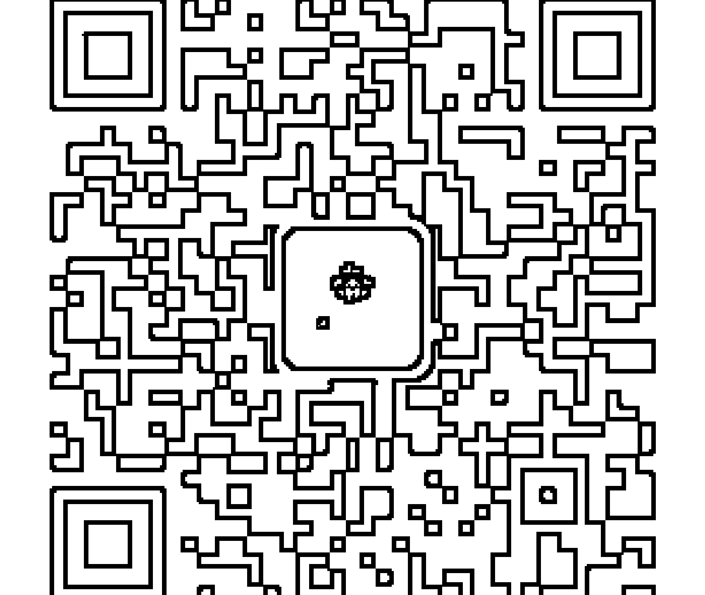
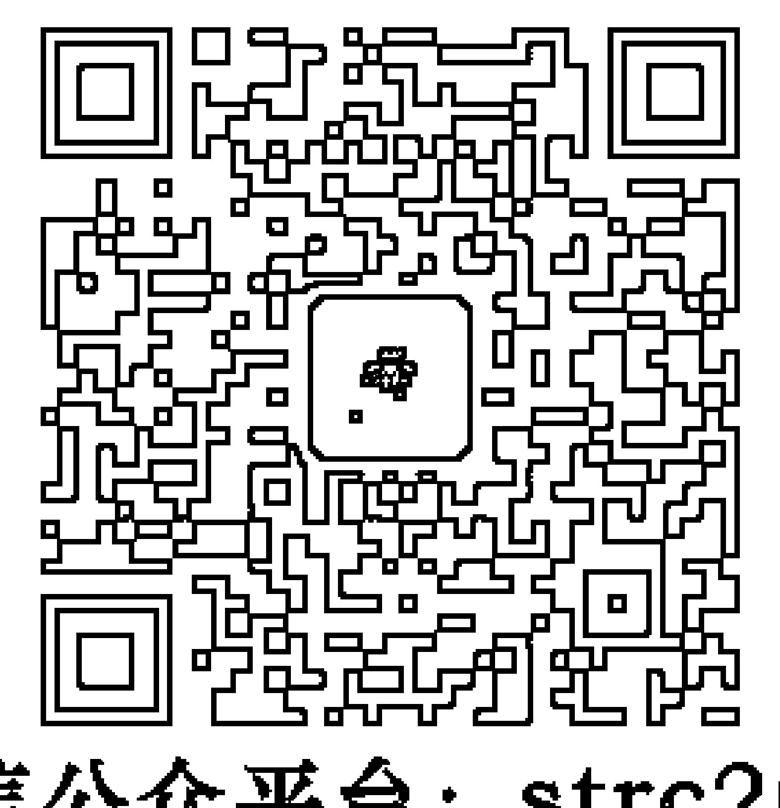
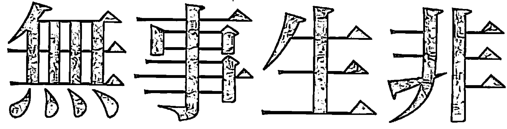

# Much Ado About Nothing
## An Inverted View of Life and Spirituality
### 不同，甚至颠倒的生命与灵性观

# 無事生非
作者 杨定一  编者 陈梦怡

顶部是一个组合图像与标题区域，包含一个由皇冠、翅膀和钻石组成的徽标，徽标下方是英文艺术字“St. Royal College”和中文“天使神秘学院”。

-   ※ 专业占卜预测机构
- ※ 神秘学培训机构
- ※ 水晶能量研究中心
- ※ 神秘学资料库
- ※ 官方微信：strcdts
- ※ 微信公众平台：strc2011
- ※ 读书交流QQ群：
    占星塔罗占卜师交流群：814594478（加入密码：PDF）
    神秘学其他综合群：659338717（加入密码：PDF）

天使神秘学院 院长QQ：715104687

# 制作说明：

本书由《天使神秘学院》出重金从台湾购入的原版书籍扫描制作完成。为达到最好阅读效果，特地把原版书全部切开后，再经由专业扫描设备高精度扫描完成，并经过一张张的PS后期处理最终成书，其间花费大量的人力、物力以及时间，只为能给大家提供经济并优质的神秘学学习资料而努力。

本学院强力谴责某些机构和个人，把本学院花心血制作完成的电子书籍，包装后直接放在自家淘宝网上低价倾销的行为，以谋取不劳而获的经济利益。如果长此以往最终将无人愿意再为大家花心思制作电子书，那以后可能大家再无新书可读。

为让大家以后能够读到更多的好书，也为了本学院的良性发展。本学院恳请大家尽量做到如下几点：

-   一、尽量在本学院的网站购买电子书籍。
-   二、请勿用技术手段把电子书内的水印及加密去掉。
-   三、在收到电子书后小范围传阅即可，千万不要公开传播，更别挂到淘宝网上低价销售。

同时为答谢广大支持者，学院电子书将做如下调整：

-   一、学院会把一些早已收回制作成本的电子书折价销售。
-   二、最新制作的电子书籍会开放打印功能，大家购买后有条件的可自行打印成书。

# Much Ado About Nothing

## An Inverted View of Life and Spirituality

### 不同，甚至颠倒的生命与灵性观

作者 杨定一  编者 陈梦怡

# 目录
CONTENTS

序 4

01 你已经老早活过 11

02 你从来没有自由过 23

03 自由，你老早就是自由 34

04 你什么都不是 43

05 在影子的世界里注定 48

06 修行，最多只会强化「我」，强化「你」 59

07 难道全部修行都不重要吗？ 69

08 没有东西可以让你醒觉 75

09 你就是自己最好的老师 89

10 你哪里都去不了 101

11 超越空 110

12 God Consciousness 120

13 上帝的事，交给他自己照顾 128

14 这是你的梦，一切是你制造的，接下来，你想做什么？ 140

15 跟自己，再亲密一次 147

16 接下来，还有什么事没有完成，需要完成？ 155

17 为什么那么轻松的悟道，变得那么难？ 163

18 这时候，你还能参什么？ 173

19 自在 181

20 接下来，再也没有什么东西可以伤得到你 185

21 没有回头路 191

22 我的话，其实没有含着任何深度 199

23 醒觉，和你过去的任务都不同 206

24 最后，也只是回到原点 217

结语 228

附录 在「我－在」之前 232

# 序

我曾经用单摆的摆动，结合意识谱的观念，来描述「全部生命系列」每一个作品表达的不同意识层次。透过这样的比喻，我们自然会发现，「全部生命系列」想表达的最多是一个「在」(being)的观念。

你我这一生，都是透过「动」想得到什么东西——也许是强化某一些价值观，标榜自己的角色，取得怎样的好处，改善这一生甚至下一生的命运，或得到什么意义。就连修行，一样离不开这种「动」或追求，都想在最后得到点什么——领悟、开悟、顿悟或是「全部生命系列」所称的「醒觉」。

我们都忘了，修行其实是「在」的观念，倒不是靠「动」。

这一点，即使我早就透过「全部生命系列」再三重复，但是，我知道你仍然还可能质疑，或许也不完全理解。我才会借用莎士比亚著名的喜剧 Much Ado About Nothing 当作这本书的书名（名译家朱生豪先生过去译作《无事生非》）。

我希望经过「全部生命系列」的作品，不光为你建立一个理解和领悟的基础，更透过小开本的作品做一个汇总或整合，把最直接、最彻底的真实带出来。

当然，如果你有了之前建立的基础，你应该已经可以理解，就连这些话都还是比喻。其实，没有一个东西叫做真实，也没有一种真实可以说是比较直接，或比较高。

假如你很诚恳读这些书，听这些音声作品，接触读书会，自己也投入练习，我相信这本书所讲的内容，非但不会让你惊讶，甚至你完全可以接受，并拿来验证你个人的体验。

但是，也有很大的可能，这些观念和你的理解有出入，甚至还在你心里产生矛盾与冲突。那么，我还是会建议你回去复习前面作品所表达的观念，一直到这些理念和你的理解完全接轨，完全符合为止。我相信，走到这个地步，你意识的变化，已经会是一个回不了头的转变。不光影响你这一生，也一样影响接下来的生命。

也许你看到这本书的一些标题、句子或用词，会觉得和前面作品所谈的重复。但其实不是，只要你把心胸打开来读，你自然会发现，即使是同样的用词和标题，到这里，已经进入一个更深的层面。甚至，你会明白这种表面上的重复是必须的，才足以在头脑里造成一种对立，让你可以建立一个新的回路或说一个新的基础，再把它解散或推翻。你要把全部的观念消失，才可以轻松不费力随时定在「在」，活出「在」。

我也相信，你自然会发现「全部生命系列」每个作品所表达的，其实是站在不同的层次，说同一件事。举例来说，我大可以早就用 *Much Ado About Nothing*「无事生非」，或「在明明没有事中，生出许多事来」这句话来表达一切。但是，如果一开始就这么表达，我相信没有人可以听得懂。

再举一个例子，我在《真原医》有很短的一章〈真正的静坐是真实体悟〉（*True Meditation is True Understanding*），引起相当大的注意。无论国内外，都有许多读者相当错愕，甚至反映看不懂。他们认为静坐本来就是盘腿、呼吸、不动、苦修，有好多需要锻炼的功夫。那么，如果静坐本身只是个领悟，过去认定而且辛勤投入这些练习，又是为了什么？也因为如此，我才透过《静坐》和后来的作品，把这个观念打开。一步步地，到现在，才走到这里。

在这过程中，相信你自然会发现，后面的作品开始逐渐推翻前面的论点。

「全部生命系列」是一个完整的意识谱，而每个作品所在的意识层次不同。我一开始也用单摆的运动来做比喻——假如最左边代表「做」、「有」、「动」，那么，最右边会是彻底的「空」、「在」、「心」、「道」。

也就是说，《真原医》是从身心「有」的层面着手，而接下来的作品，是一路往意识谱的「最右边」摆荡。从「动」，到「不动」。从「做」，到「在」。乍看之下，我在不同的作品所讲的好像有冲突，但其实只是层次不同。

尽管表面上有矛盾，但是，也没有关系。我不断提醒，心最后会懂，也自然会整合一切。

对心，没有什么叫矛盾。假如是真实，你的心自然会感应，无论在哪一个层次都会共鸣。我才会说「全部生命系列」是和心对话，和心互动，和心共振。

假如你可以接受这几句话，你自然发现一次又一次地，我会把前面所谈的观点修正，甚至推翻。是这样，我们才可以真正一起进入「在」的状态。

讲到和心共鸣，这本书和过去的作品有一个不同点——是我直接跟你对话，是我的心和你的心互动。我大胆地假设，经过那么多篇幅的理解，再加上你自己的练习，到现在，你已经相当成熟。所以，在这本书，我试着不再做任何介绍，而是直接切入到心，所用的语言和语气，也会和你过去所习惯的不同。

我同时明白，只要你相信我的出发点是诚恳，知道我确实希望你可以彻底体会到「在」而投入心，我相信你也自然会跟我进入一个很深的共振。不光如此，我也很有把握，你自然会把这本书所讲的话，当作你个人的一面镜子，来对照你一路累积的点点滴滴的领悟。

最后，我也知道你早晚会发现，无论用多少字句，甚至就是这种心和心的对话，其实还是不可能描述那用话表达不了的最根本的意识状态。最多，也只能说我透过这本书，还在「无事生非」。

# 01 你已经老早活过

我们和「全部生命系列」一起走到这里，我相信，你已经有很多感触，而这些感触，很可能你现在没办法跟人分享。

就是分享了，又有谁可以理解？

你对这世界的看法，可能已经完全不一样。你也可能开始体会，一切，任何点点滴滴的一切，包括这一生的经过、你个人的故事，还包括太阳、月亮、世界、眼前的楼房桥梁、你的家、你的工作环境……一切，都是从你的心流出来的。

跟你过去想的可能颠倒，外在是从你内心流出来，从内心制造出来。你也就明白，这一生想找的全部答案，老早就在你心中。没有一点，不在你心中。

也可能你已经在体会，这个世界倒不像过去想的那么坚实。甚至，连你自己，都不是坚实。它们最多还只是心里化出的一个印象，本身也没有一点一滴有特别的重要性或代表性。

虽然如此，你也已经知道，这一个「你」、这一个「我」都是虚的。你可能会问自己，为什么明明是虚的，感觉上还那么真？让你随时都投入它？更想不到的是，就是这个小小的「你」，在决定你这一生命运，非但可以折磨你，还为你带来那么多的痛苦。

一个不存在的你，反而可以决定你这一生的幸福。这一点，你过去绝对会认为是不可能的。

不光是你自己已受骗了，你往四周看看，全部身边的人，也跟着一起被骗、被洗脑。而且，受骗的，还不只现在这一生。

这些，你只要静下心来观察，也就明白了。

但是，也可能到了现在，你还不见得相信我讲的这些话。甚至，你还可能抱着种种质疑，认为一切不可能那么简单。所以，就让我试着用另外一个角度，再一次切入。

对你，就是走到现在，还可能有一个世界、有你、有我、有一个人间、有个「人」的特质可谈的。也就这样子，才不可能跟无常、跟痛苦分手。你可能还不晓得，就是因为认为自己是 some-body，是个人物，是人类，是众生，你也就受到种种的制约，而接下来可能对样样都有期待，对这个世界有个完美的理想——有许多现象你可能看不惯，甚至全部的现象都放不过，都想从你个人的角度，希望通过你的理想来改变这个世界。

在这种制约下，你当然会对样样都做一个反应，甚至反弹。在不满中，心里受伤，受到委屈。深深的绝望和无力感，可能让你投降。你也可能不死心，要再进一步抵抗。你还可能告诉自己要勇敢地去变更，甚至希望带来改革，将外头的环境，甚至自己的命运做个改善。

是的，情况确实会改善。但是，接下来你也可能发现，这些改善跟你个人的努力不见得直接相关。只是因为这个世界是无常，你的人生也只是如此。所以，任何情况，不可能不改，不可能不变更。

这样的变更，你也知道，跟我们每个人的生死一样。本来有，自然会变成没有。也可以从「有」，不断地跟着演变，最多只是反映更大的层面所带来的因—果。

难道你还不明白，这个世界最普遍、最靠得住的机制，就是变？有生，当然有死。有变化。有过程。有起伏。

你也可以想像得到，有一天，只要命运好转了，你当然可能又回到原本的角落，满足地享受一切成就，而且还可能希望这种好日子愈久愈好。但是，总有一天，命运又会往坏的方向转变，你又只可能再回到原点。

这一生，你可能经过数不完的高低起伏——快乐、痛苦、得到、损失，像跷跷板两边不断上上下下，而且起伏不完。甚至，到了你最后的一口气，心还可能摆不平。你可能还有未了的心愿，还会有期待，还会有想交代的。到最后，你能带走的也可能只是一个「不定」的能量，还没有消停它自己。

你或许也知道，在这种情况下，是有个机制叫做轮回。然而，跟你想的不一样的是，轮回不一定是往未来前进，也可能是往过去移动。就连这么讲，你自然也会发现不正确。毕竟现在、过去、未来都是头脑的产物，你不见得真的要往某一个时间的方向前进。

你已经体会到，是透过你现在在看，才有过去和未来可谈。任何可能发生的事，对你只可能在当下可以体验到。然而，对于当场在体验的你，当然也不可能区分过去和未来。

甚至，你懂了，也可能会试着用别的方法来表达。比如你也许用蚱蜢的「跳」，来表达轮回倒不是线性的，不只是单向的从过去往未来前进。

可能你又回到不晓得哪一个年代，也许是史前时代，还在随时躲避野兽。也许是欧洲中世纪的黑暗时代或过去无数的战乱年代，你可能被贴上女巫的标签，被钉上十字架受苦受难，在恐惧、质疑和冤屈中结束这一生。你也可能突然被征兵，中断你平凡的人生，在战场上失去生命，最后一口气，一样是无止尽的折磨和痛苦。也就这样子，继续活出了结的能量，而你的意识最多又被流转到别的地方。

这样子来来去去，可能你要活上千万次。

不过，总是有一天，你会突然体会到，这个无谓的生命，任何经验，无论好坏，其实你都活过。好像最多只是在昏迷中，再重复一次。

然而，重复再重复，你又能学到什么？

这种探讨，你也可能称为反省或说往内心沉潜，突然变成你人生最主要的部分。你也突然懂了 some-thing，懂了什么，但又没办法把它描述清楚。

这个 some-thing，这个不知道是什么的什么，好像在更深的层面。总之不属于人间，你也不明白。

这也许还不够，你可能发现身体和心的区隔本身是个错觉，而难免想用各式各样的方法化掉这个错觉，让你得到合一。你自然会对任何磨练身心的功夫感到兴趣。也就这样子，可能让你在几千年前，或几万年后，去接触现代人所称的气功、舞蹈、导引、太极、瑜伽、苦修。你竟然也体会到，通过身体的姿势或一些重复的动作，可以感受到合一。这种合一，你会发现很好用，可以帮助你面对生活，简化生命，让你得到舒畅。而这种舒畅，可能是你过去没有体会过的。

你可能对各门各派的哲学或宗教，突然有自己的看法。这些看法，好像是落在更深的层面，是正统宗教通常不提，更不用讲可以理解的。你突然体会到，这些宗教或门派，其实要从一种个人的层面去亲自体验，才可以领悟。光是通过经典的的文字，无论你多么用功，再怎么钻研，都不可能取代这些领悟。

接下来，你可能想去进一步追求各地的宗教。你也会发现，就是连这种追求，还是离不开你过去所接触的文化，或是心中累积的制约。但是，跟过去不一样，你已经不想停留在传统的门派，而自然会投入宗教所带来的更深的层面，也就是各种神秘的教派。

假如你是佛教徒，可能突然投入禅、净土或密宗。如果你是回教，可能去追求苏菲之道。你是基督教徒，也就自然去接触居尔特（Celtic）或其他的隐修门派。你是犹太人，当然也可能会投入钻研卡巴拉。甚至，你如果是清教徒，也可能告诉自己，真正重要的是个人的意识转变或体验，而不是外在世界的累积。

对你而言，投入这些别人眼中非传统的宗派，也就是从外在转到你的内心，老早成为生活最主要的部分，是心灵路上最亲密的伴侣。但是，你知道这些奥秘的宗派也可能被当作邪教或异端，所以，你也隐隐约约地担心自己会被「处决」。甚至，在一生又一生的经历中，你可能确实也被处决过。这就是人类或社会带给你的多次的制约。要面对它，你自然发现，最好是不跟别人分享。最多，只是投入自己的内心。

也就这样子，你把这些社会和别人带来的制约，当作你个人最大的考验，考验自己走这条路的决心——是要继续走，还是就这么放弃？

不管怎么样，无论着重的是身体的功夫还是心理的转化，你会发现，最后的目的都是一样的——都是希望从这个人跳出来，得到解脱，把最高的真实找回来。

只是，为什么那么难？你用尽一生来追求，也还不够。甚至你再重复多少辈子，也不见得找到。

总是到了某一天，你终于累了。这一生，几十年也就过去了。你突然想起，过去数不完的人生都在做同一件事。这时候，你可能接近彻底的绝望，知道没有别的地方可以去，也没有任何一个现成的解答可以有。

不得已之下，你最多只能勉强自己向内心回转，对自己勇敢提出这个问题——是谁，还在不断地找真实？是谁，对这个人不满，要消耗数不尽的生命在调整身体的姿势、调理能量、改变意识的状态、诵经、拜神、祷告，而想得到解脱？

你心里明白，这些问题含着一个更深层面的追寻：「这真实的根，是什么？」「一切的根源，又是什么？」「答案，在哪里？」

突然，你只可能有一个答案——「我」。

当然是「我」。

-   是我在找真实。
-   是我对这个人不满。
-   是我生生世世在调整身体的姿势。
-   是我想要调理身心的能量。
-   是我想改变意识的状态。
-   是我早早晚晚地读经。
-   是我彻夜不眠地拜神。
-   是我不断地祷告。
-   是我想要解脱。
-   是我还在找真实的根源。
-   是我还在找一个答案。

那么…………

我又是谁？

你也老早知道「我」之前还有个 some-thing，还有个什么东西。而这个 some-thing，这个东西又是什么？

就这样，你自然发现了古人所讲的参的方法。你不光是自然找到参，也同时体会到什么叫做臣服。你意识到内心有一个力量，远远比你一次又一次来的人生更大。

走到这里，突然你也体会到，就连回转、就连探讨「我」怎么来的，都是多余的。

接下来，你也只是把自己交给这描述不来的内心的力量。

也就那么简单，那么不费力，透过你自己的生命，你就把全部圣人留下来的宝藏给发掘出来了。

# 02 你从来没有自由过

有一天，你会彻底明白，一直以来困住你的，是你自己的头脑。虐待你的，不是别人，也不是这个世界。伤害你的，其实就是你自己的想法。

这个头脑，本身就是你这一生的监狱，让你过去从来没有自由过，而自己还不知道。你也就这个监狱里，做了一个完整的梦。更把这个梦，称为你这一生全部的真实——你的人生。

过去，你如果听到这些话，可能会抗议。你会举出各种现代社会的进步，来告诉我人早就是自由的，根本没有头脑的监狱，也没有什么叫不自由。

你过去也许还会提醒我，通过社会的发达，你已经可以有各式各样的选择。以前，在落后的奴隶社会裡，你可能得一輩子勞苦、吃不飽、穿不暖，沒有翻身的機會。現在，你至少可以選擇投入某一個領域成為專家，自由選定某一種職業，可以自由戀愛，決定結婚或單身。你會認為，怎麼去安排人生的大事，要爬上哪一個社會的階層，都是你自己可以選擇。從你的角度，現代的進步，也就是可以有個人的選擇，或自由。

你不只可以決定人生的大事，包括每天從一早起來的刷牙、吃飯、穿衣服、上班、面對種種事情、選中這個、不要那個、稱讚人、批評人、回家、休息……你隨時都認為自己可以有一個選擇。

然而，你已經無奈地體會到，人間的洗腦，就是這麼的徹底。你過去認為是自由的這種自由，不光是需要一定的條件，甚至還是透過比較才有的——前面有個狀況是不自由，接下來才有一個「比較進步」的狀況是自由。

你只要夠仔細，也會觀察到，認為有選擇或沒有選擇的人，其實是小你、小我。無論怎麼分析，你走到最後，自然會發現小你、小我本身就是頭腦產生出來的。再怎麼歌頌自由或認定沒有自由，這本身也只是你頭腦的聲明。

你也許聽過我用這樣的比喻——你在夢中再怎麼激烈地探討自由的問題，只要一從這個夢醒過來，你自然對這個題目不會再感興趣。因為，夢裡的你自由或不自由，和醒過來的你，根本不是同一回事。

但是，還不光如此，你只要觀察自己的每一個選擇、每一個動作，也就自然發現都是透過種種的狀況來組合或籌備的。你對職業的選擇，要看你過去的訓練和週邊大環境的變化。一口呼吸，也要各種肌肉的協調和生化反應來配合。就連你的想法，也是站在一定的價值觀而有的。在這個人間，你無論做什麼選擇、領悟到什麼觀念，都還是從其他條件衍生出來的。

你離開了這場夢，也只可能發現過去在夢中認為每一個瞬間有的自由，本身其實不存在。假如樣樣都是由前一個瞬間的條件所指定，那麼，你不可能有一個真正的自由可談。因為，這個自由本身也是透過條件而好像成立的。

換一個角度，就是你還認為樣樣都有一個自由的選擇，那麼，我還是要提醒，你過去認為的自由，最多是一種短暫的自由，隨時會消失的自由，是靠不住的自由。說到底，其實稱不上自由。

當然，你現在也明白，過去會認為你還有自由，這種想法是難免的，最多也只是反映你這一生的框架。這個框架，讓你建立一個完整的世界。而你在這個自己設立的世界裡，當然都會認為自己是自由的，會認為樣樣都是你自己可以自由的選擇。

活在這個框架裡的你，過去幾乎不可能想到，人類愈「聰明」，文明愈發達，反而愈懂得怎麼透過社會的規則建立更多的約束——不只告訴你什麼是自由、什麼是不自由，還一點一滴教你哪些行為可以接受、哪些行為不可以接受……你所想的、所講的、每一個感受、每一個行動，都被它鎖住了。

你在這個框架裡，絕對觀察不到這個約束的鎖鏈。進一步說，活在人間，你沒有一個動作是真正獨立的。你的一舉一動，都離不開過去的約束。不光是動作，就連你的每一個念頭，都離不開你這一生自己所建立的一個完整的範圍。

不只如此，甚至我們還可能對物質的某一個狀態不滿意，而還有本事透過頭腦將它轉成其他的形態。你只要看看四週，也就知道隨時有新的材料和科技可以採用，都是希望在物質層面做一個革命，不斷求新求變，從每一個角落去滿足你對物質的需求。

你回想看看，這一生，你對世界、對自己的印象，是不是全被物質填得滿滿的？你以前最多是隱約感覺到，這些印象再豐富，好像還是集中在一個局限的範圍。但是，消化這些印象都來不及了。不知不覺，對你來說，除了人間可以取得的知識、感情和物質，哪裡還有一個更深的意識存在？

站在這個框架裡，人生，好像最多也是這樣了。你很少會再去想這一生來之前，或走掉之後，可不可能還有一個更深的意識存在。而這個更深的意識，可能跟物質是完全無關的。

很可惜，你只要一投入這個人生，透過文明的發展，你也跟大家一樣徹底被洗腦，認為是物質的一切決定了自己的命。你也可能就拿這短短的一生，也許幾十年，也許一百年，透過各種「動」，忙著從一個狀況，轉到另一個狀況，再去追逐其他的狀況。

換句話說，在人間，你樣樣的「動」，都是為了符合一個或好幾個條件。再多的轉變，還是透過一個有先有後的因果在運作。全部，都是你過去的制約。但是，你會把它們當作完全新鮮。甚至，你還會把這些轉變當作人生的目標，不斷鼓勵自己要努力地追求，勇敢地克服，希望能圓滿的完成。

你過去以為有自由，但樣樣其實都是制約，都要符合條件，而且是一連串的條件。你即使沒有了社會的制約，在更深的層面，你還是不自由。你現在當然也明白，這就是業力的法則。我想，這一點不需要在這裡再談下去了。

就連你的認知，你以為是自己可以決定的，也不可能讓你自由。只要你靜下來，觀察自己看到的、聽到的、可以體會的、想到的……自然會發現，任何知覺，只要你可以指出來的，都是從舊的知識、現成的規則裡浮出來的。

你看著一塊木頭，怎麼說得出它是桌子還是椅子？聽到一個聲音，怎麼知道這個聲音的主人是男、是女、是老還是年輕？聞到味道，怎麼知道是一根草還是一朵花？是花，怎麼知道是玫瑰還是百合？一個念頭冒出來，怎麼會順著一套邏輯自己衍生下去，還讓你覺得樣樣都合情合理？

你已經可以承認——你的認知，包括念頭，都離不開制約和因果的軌道。如果沒有預設的規則，沒有先前的知識，你可能什麼都指不出來，更不用說還去排列好不好、對不對、重不重要。

任何受到因果的作用的，你都可以繼續往下追。中間最多是抓住一個因，停留一陣子。但接下來，你還可能再去找它的原因。而你只要一路追到底，也就不得不面對這個事實——其實，沒有一個東西叫「因」。

因，還是你自己的頭腦的東西。是頭腦為了滿足自己的運作，才虛構出來的。沒有因，頭腦建立不了一套道理，可能運作不了，還會「當機」。這種下場，當然也是頭腦最害怕的。

對頭腦，樣樣都要有原因。就連你的痛苦，都要有一個原因，才能滿足頭腦的運作。頭腦會抓住這個因，把痛苦放大再放大，變成一個非要你解決不可的問題。再從原因，幫你安排一個解答。而這個解答也許是要你去累積財富，也可能是要你得到別人的尊敬，也可能是去鑽研知識，取得更高深的學問，也許是要你改善身體的健康或去追求心理的療癒。甚至，可能是修行。

你會一點一點地認清，在這個人間的一切，包括你的痛苦，甚至包括你認定對痛苦的解答，沒有一樣是真的。全部，最多是在一個轉變的過程。從一個好像有的問題，轉到一個好像可以有的解答。你忙著從一個狀況，再轉到另一個狀況。只是，無論什麼狀況，都只會停留很短的時間。

就連石頭、礦物、星球，看起來好像不生不死，你都會發現離不開制約和因果。對無限大的永恆，還是無常。而且，還是配合著頭腦的作用。

是誰的頭腦的作用？就是你的。

全部，都是你的頭腦在運作。

沒有一個東西，你所認知的，真正存在。只要你想得出來，絕對不可能是真實。只要你可以理解，甚至領悟到的，也不可能是真理。

你這麼走到了真實的門戶，自由的門口，但是，你可能還在猶豫——放開了頭腦，你這一生會不會什麼都沒有？甚至，連醒覺都沒有？

而我最多只能提醒你，就連這個擔心，一樣還是離不開你頭腦的作用，離不開你這一生帶來的約束，只是讓你從自己設定的框架裡跳不出來。

我要坦白地說，醒覺倒不是靠你知道多少，反而是靠你不知道多少。甚至，是靠這個不知道，而不斷地不知道，你才自然而然醒過來了。

只要你還可以指出來知道什麼，也老早被因果帶走，繼續在一連串的制約裡打轉。可能還要繼續發表自己人生的故事，繼續數不盡的傷心，流不完的眼淚。

不知道，你對樣樣反而不再加一個肯定，不再加一個標籤。你不再讓眼前的東西或狀況把自己帶走。不知道，接下來，是不知道。再接下來，還是不知道。沒有一個知道可以作用，不知不覺，你也就把因果的鎖鏈中斷。

你會突然發現，就是沒有想什麼，還有一個知。沒有知道什麼，還能夠覺。沒有了頭腦的起伏，倒不是什麼都沒有。樣樣，反而有了全新的開始。

怎麼開始，都可能。當然，你就算什麼都不開始，也一點事都沒有。

你過去一直在尋尋覓覓，不斷在找人生的答案或出口。你現在發現，一切的答案，包括你在找的出口，其實是在你自己。

出口，還只是你自己的頭腦。

# 03 自由，你老早就是自由

我相信，你可能也突然明白，前面講的「不知道」甚至「不可知」的自由，跟這個人間一點都沒有關係，也更不是你在人間過去所認為的自由或不自由。

這種自由，是真正不生不死的。你還沒來到這個世界，就有這種自由。你離開了，還是有這種自由。這種絕對的自由，從來沒有動過，隨時都存在。人類的特質、你的任何特質，跟這種自由一點都沾不上邊。

你不會再去辯論有沒有這種自由，自然會想誠懇地去探討——這一生，趁自己還有這口氣，可不可能體驗到這種絕對的自由？就是你這一生可以體會到，但值得進一步探究的是，這種自由，是不是可以讓你帶得走？甚至你下一生來之前，還是可以體會？

這才是重點，才是關鍵。

就算你已經親自發現這些話是正確的——真正有這種不生不死的自由，而你隨時都可以活出祂——你看著週邊的人，心裡有數，誰會想到要問這種問題？可能還會認為對自己日常的生活一點都不重要。

對大多數的人，這些問題可以說是遙不可及。甚至遙不可及到一個地步，根本不會成為問題。但我相信，你走到這裡，這個問題，已經變成你這一生追求的重點。

你不會再小看人間帶來的樣樣的約束。這些約束，本身老早把你徹底的洗腦，而你不會再輕忽它們。你心裡明白，這些約束和洗腦的作用可以大到一個地步，讓你難以解開。

你也突然發現，也許就是你自己，本來想要解脫，沒想到修行了幾十年，也還在制約自己，認定透過這個小小的身心，這一生不太可能活出自由。甚至，認為沒有一個東西叫自由。這一來，誰會去想到竟然可以去體驗自由？

你已經意識到，這裡談的自由，沒有門檻，甚至不能說它有門戶。這種自由，不是透過「動」或「找」可以得到，因為你就是祂。

其實，你就是自由，只是自己過去非但不知道，還認為不可能。就這樣，你認定非要透過各式各樣的修行、練習、法門、宗派、儀軌、數不完的規矩、多少年的功夫，才可能得到。

甚至，如果不是徹底轉過來，你可能還認為自己這一生是絕對不可能找到的。你會認定自己這一生充其量只能活出人間的種種境界，最多為下一生打一個基礎，期待未來什麼時候可以得到。你還會安慰自己，這樣子也就夠了。

對於這種理解，你現在會忍不住嘆口氣。

你已經明白，這些理解，還是離不開無常的「動」、追求或是體驗，反而把「全部生命系列」所講的絕對和永恆，當作完全不存在。不過，你早晚也會發現，事實是剛好顛倒。

講一切都是顛倒，最多只是過去你在一個不同的軌道，而切入點是不正確的，才會誤導自己到這麼徹底的地步。

你本來認為，人類的意識應該最高等，也最自由。畢竟，你過去都沒有發現，自己這一生活在人間的種種體驗，也只是透過神經的作用，讓你把資訊轉達出來的印象當作實體。在這種神經的作用下，你自然而然把神經系統發不發達，當作生命意識的高低。你也就以為礦物低於植物，植物又低於動物，而動物發展到最高點，才是人類。

然而，你總有一天會了解，人類意識反映出來的聰明，最多也只是在一個很窄的層面裡重複地比較、分別，造出區隔。反過來，站在整體，樣樣都有意識。只是，這個意識可能跟你想像的很不一樣。不是你熟悉的二元對立，不是比較和分別。這種意識，反而是屬於一種不分別、不比較的狀態。

你過去怎麼也想不到，這種不比較的意識狀態，還更接近無限大的絕對或是一體。而且，就連一塊石頭，都有這種意識。因為這個石頭從來沒有離開過一體。把它當作石頭的，是你。是對你，有石頭的存在。是對你，有礦物、植物、動物、人類的區隔。假如沒有你，其實也沒有這些區隔可談的。一切，只剩下無限大的意識。而這種意識，本來就是自由的。過去，是你非要把樣樣都做一個區隔，才製造了那麼多「體」，包括你自己。

你只有把自己的聰明和認知挪開，才可能突然體會到這幾句話，而剩下的人生，也就跟著變了。

這時候，你才突然領悟到什麼叫做自由，也才突然明白自己從來沒有不自由過。只是因為有頭腦的干涉，你過去會認為不自由，而還要透過修行去追求自由。

你從來沒想過，事實剛剛好又是跟過去的想法顛倒。

但是，就是完全自由起來了，你也突然發現，倒不需要再繼續透過「動」或是「做」來表現自己的自由。

你過去還可能幻想，一個人醒覺，就要活出一種瘋狂的自由，完全任性，不顧慮人間的任何規則。到這時候，你心裡很清楚，這種觀念本身也一樣是一種大妄想。

你真正自由起來，自然會發現眼前每一個畫面全都是平等。在平等當中，最多只是一個個重疊在整體上的影子。你沒有必要做任何動作來表達自己的自由，而會自然活出愛和同情，可以包容一切。這種自由，跟人間的物質、人間的條件再也沒有關連。

你進入每一個瞬間，都是透過平等心。然而，這個平等心是你本來想像不到的，是把過去、現在、未來全部看成平等——你把還沒有活過的全部的未來，都已經看透了。

未來再來什麼，也一點都不會吸引你的注意，而讓你偏離絕對的本質。然而，就是你投入了眼前的情況，也徹底知道什麼都沒有受到影響。你把事情處理完了，把該交代的交代了，你完全還是一片寧靜，你隨時還只是自由的。

這才是真正的不動。
是在「動」，隨時取得不動。
是在「想」，隨時取得無想。
是在「變」，隨時取得完美。
是在每個瞬間，活出永恆。

這才是大平等，大自由，是你在這一生都可以活出來的。最多，只需要一個突然而徹底的心態轉變。你會突然明白，我不斷想告訴你的，都是實話。實話，也只是生命的真實，絕對的自由。如果這些話還需要驗證，那麼，必須是透過你的每一個細胞親自去活出來。

甚至，我要更直接地提醒，要活出你本來就有的自由，其實最多也只是肯定祂，而接下來承擔祂，倒不是透過你活出或不活出任何東西。

講得更透徹一點，其實，連這幾句話都不完全正確。真正的自由，不只跟你活出不活出，沒有一點關係。甚至，跟你肯定不肯定祂，承擔或不承擔，也一樣無關。就算你不認同，祂還是一樣存在。

這種自由，是不費力的自由，是你老早就有的自由，比任何人想像的都簡單。祂簡單、不費力到一個地步，是任何人都不會相信的。甚至，包括你，都可能不會相信。

我才會不斷提醒，我在這裡所講的這些話，甚至「全部生命系列」所要轉達的觀念，其實不見得適合每一個人。甚至，坦白說，也不見得適合你。我指的是，還完全活在頭腦的你。

祂倒不是透過你的頭腦可以理解，而是透過你的心來共鳴和領悟。這些共鳴和領悟是直接的，沒有經過任何解釋或是過濾。透過頭腦的理解，反而最多只會帶來更多的矛盾。

你的頭腦在相對的範圍裡，永遠不會領悟到絕對。你局限的聰明，不可能體會到無限的智慧。透過身體和頭腦，你再怎麼忙不迭地「動」，不可能取得永恆的「在」。

一切，是剛剛好顛倒，是你把相對、局限、動挪開，絕對、無限和「在」才會自然浮出來。因為祂，本來就是你的本質。

# 04 你什麼都不是

走到這裡，你可能已經發現，人生，真的是一場夢。但是，為什麼還那麼難從這一場夢醒過來？

你也許已經意識到，你一生又一生地來，最多還只是在延伸一場又一場的夢。在每一場夢，你自然知道表面上在扮演一些角色。夢中，不管什麼角色，對你好像都很重要。而且重要到一個地步，還可能讓你迫切地延續這個夢，而接下來不肯放過它。也就這樣子，你過去耽擱了多少時間，不斷肯定一個虛的夢。

你也突然發現，你在這個人生可以看到的全部，都離不開這些夢所帶來的幻覺。走到最後，也讓你體會到其實 You are nothing. You are no-body. 你什麼都不是，你誰都不是。只要你還認為 You are something. You are some-body. 認為自己還是什麼東西，還是什麼人物，你也就知道自己還在被這個夢催眠，也許還捨不得放過它。

我相信，到這裡，你也已經明白——You are nothing. You are no-body. 你什麼都不是，你誰都不是——這句話其實是我對你最高的讚美，倒不是一般人認為的反諷。

你可能心裡早就有數，假如我還稱讚你是哪一號人物，有什麼地位，做了多少善事，有多大突破，多少財富，完成了多偉大的工程，有多少本事、功夫，有多深的定力、有各種人間認為多大的成就、多美的特質，其實反而是害了你，可能又耽誤你，讓你再延伸自己的錯覺。

有時候，你難免會忘記，任何特質、再了不起的成就，還是你透過頭腦創出來的。只是，我也相信你也老早已經體會到，無論你有多大的本事、多大的能力，在永恆的無限裡，連一眨眼都構不上，還只是五官加上頭腦的把戲。

你也老早知道，只要是頭腦造出來的，當然只可能有生有死，不可能永恆。就算你努力活上一百年，把生和死之間的間隔延長再延長，再長的時間，和無限的永恆又怎麼能比？

你走到這裡，也早就明白自己倒不是一個那麼小的存在，更不會認為這些特質有什麼重要性。

然而，值得再問一次的是，既然你已經這麼清楚，為什麼還是那麼難醒過來？

答案，你其實也老早已經知道，最多只是你徹底忘記了自己是誰，把自己成為了 some-body，變成了某一種人，而把眼前看到的 some-thing、一切，認為是真的。

對誰是真的？

當然，是對虛構的你，是真的。只要你進一步追究下去，也會發現其實沒有一個真正的東西叫做「你」。當然，也沒有一個東西叫做「我」，更沒有一個東西叫做「世界」。

假如你知道自己真正的身分是什麼——無論存在、知識、能力，你都是無限大——那麼，你可能會笑自己，竟然還會重視這些人間的特質，不管這些特質多「偉大」。

最多，也只是你把本來再明顯不過的真實忘記了。但我也知道，只要提醒，你也就記得了。

你會一再地感受到，把自己落到這些人間的特質，其實就像一隻大鵬鳥，本來有整片的天空，竟然會把自己落在一個小角落。也就好像你這一生，忘了自己是誰，還非要把自己鑽到一個不成比例小的人間，在裡面想得到「成就」。不只如此，你對這個成就還可能相當滿意，捨不得不跟別人分享。

最可惜的是，你還可能把人間的你、世界、成就……一切都變得再真實不過，讓它們變得不可能不是真的。

然而，你只需要冷靜觀察，也就知道在這個人間，沒有一件事情、沒有一樣東西不是隨時都在變更。沒有一個東西，沒有生，沒有死，本身有一個永恆的架構好談。沒有一個東西，可能代表真實。

這樣子的人間，會讓你不知不覺接受這種波動和變化，當作對生命有全面的代表性，也就自然讓你過去認為生命的永恆是不可能有的。就是有，你這一生也體會不來。

體會不到，活不出來，你現在也知道，最多還只是因為你把真實顛倒過來了，才會認為眼前種種的物質、種種的念相是真的。

讓我覺得最可惜的是，這些話，即使你現在可以聽懂，在心的層面，更是認同的，只是，因為你這一生被這個人間洗腦太透徹，所以，還是讓你活不出來這些道理。

# 05 在影子的世界裡註定

這一生，你過去完全投入這個物質的世界，幾乎沒有懷疑過它的存在。

只要你的注意力一直守住物質的層面，當然你也根本不可能留意到，這個由分子組成的物質世界，只是種種可能中的一種可能。而且，最多只是一個小的可能。和你生命本來可以活出來的全部相比，根本是不成比例的小。

這一點，無論我重複多少次，你還是可能會忘記。尤其，如果你有科學的背景，你還會想去追求生命或宇宙最初的源頭。對你，這個源頭，也許是小到看不見的分子、原子、甚至更小的粒子，也可能是一種現在儀器還觀察不到的暗物質和暗能量。你可能認為這個源頭不光可以解釋一切，還可以解釋意識。你甚至還想繼續跟我分享，它們作用的範圍，比一般的物質和能量遠遠更大。

只是，你很難相信，就連暗物質和暗能量，甚至任何其他更深的原理，也不會是世界最終的解答。科學家接下來一定會發現某種更終極的什麼。而這種追究，是永遠追不完的。

你早晚總是會發現，這些追尋，表面上好像是在追根究柢，但其實還是頭腦在不斷延伸它自己。你也會明白，確實有一個狀態，是沒有生過，也沒有死過，是永恆的。而且，站在永恆，如果你還要講永恆前有什麼，或永恆後還有什麼，這種表達是完全沒有意義的。

你也可能對超感官知覺、外星生命、神通、微細的能量、各種能量體、氣脈、脈輪和其他種種的功夫、包括其他的空間或靈界特別感興趣。你還可能認為這些玄妙的現象，比一般的物質有更深或更高的代表性，更值得你去投入，去鑽研。

但是，和科學的追求一樣，這種追究，也是永遠追不完的。對你個人的狀態，也沒有什麼幫助。甚至，還可能讓你在這個虛擬的世界，陷得更深、更徹底。

其實，你不需要特別去追尋宇宙的起源，光是回轉過來看看自己，看著每一個部位、每一個器官、每一個細胞，甚至分子、原子、粒子、能量……也竟然會發現全部都沒有一個獨立的存在可談。任何現象，沒有一個最終的本質，沒有一個核心。樣樣，本身是空的。

你會發現種種的追求，最多只可能從一個狀態追察到下一個狀態，從一個條件再延伸到下一個條件。而這種追察，永遠中斷不了條件和關係的鎖鏈。

不光你身體內的組成是空，就連你身體外的任何東西，任何你可能看到、感觸到的，都一樣是空。你的一個念頭，一個觀念，可以想到的機制和原理，只要往下去追察，到最後一樣還是空的。最多，只有空。

空，才是你主要的成分。只有空是本質，是永恆的。

然而，這個「空」，可能跟你原本的想像完全不一樣。無論你想到什麼，再把它消失，都不是空。反過來，是你把一切可以消失的，都排除，最後剩下那個排除不了的，才是空。

這個空，不等於「沒有」。這個空，其實是活的。它本身就是意識。是絕對的意識。是意識的海。過去，也有人稱為阿賴耶。

總有一天，你會發現，一切，你在人間所體會到的一切，是從意識海延伸出來的。這個空、最純的意識或是意識海，本身就是覺。

其實，你隨時都在覺，只是你過去把注意力完全放在覺察到的什麼東西。你現在可能已經發現，只要你可以覺察到或認知到什麼 some-thing，也就被這個充滿摩擦、阻礙和二元對立的人間帶走，又讓你凝固了一個東西、一個念相。

就這樣子，本來自由的你，突然變成不自由。你的注意力已經被綁住，把自由而無限大的意識，凍結成一個東西、一個人間。其實，你也老早就知道，這種凍結或凝固的原理（你也可能稱它為一個有動力的機制）當然就是業力。

你、我，在這個人間是業力的組合，而你竟然非要隨時去肯定它不可。

想到這裡，你大概會嘆口氣——站在這種機制，你這一生，還可能醒過來嗎？

確實，我過去也是這麼說，就像一個人在睡夢中，而你在外頭，想讓他體會到這是夢，難度很高。甚至，可以說是不可能。你在夢的外面再怎麼喊他，他聽不到。就算他聽到了，可能還會討厭，會嫌你煩，覺得是你有問題。他明明好好的或痛苦的在過，難道你不知道嗎？你看不到他認為再明白不過的事實嗎？就算他人生的架構只是一場夢，然而，他是夢的主角，他當然捨不得放棄這個角色。不要說放棄，萬一看清楚自己只是演一個角色，這場夢又要怎麼繼續下去？

我也必須很誠懇地提醒你，即使走到現在，你也可能還是像這個在做夢的人。是我，不斷在外面，透過「全部生命系列」想要把你喊醒。只是，你可能一樣地會認為有錯覺的是我，而你自己是完全理智。但是，早晚，有一天，你會徹底從你的夢裡醒過來。

醒過來，不像你原本想的那麼難。醒過來，其實是不費力，跟你做不做、進行不進行、練習不練習，都沒有關係。

醒過來，也只是因為一個虛構的東西，早晚會消散。你突然發現全部消失了——全部的現實、宇宙、星球、文化、文明、社會、家庭、你、我……你這一生過去點點滴滴累積的全部經驗，在一個瞬間，完全消失，解散它自己。

這時候，你終於可以體會到覺，而徹底地知道，在這個最純的覺之上，重疊著一個影子。這個影子，也就是你認為是真的全部，是你的人生。這個原本真實無比的人生，還在繼續演變，但突然就像模糊的影子，重疊在意識海上。

不要小看這個影子，它含著最豐富的細節，才會讓你那麼投入，而那麼徹底被騙。但是，到此為止，我相信，你接下來也不可能再上當了。你已經明白，除了你現在的知覺，還有一層最原始的覺同時存在。至於什麼是真，什麼是假，到這個時候，對你也自然顛倒過來。然而，你也不會想特別去說明。

在這個影子的世界，你不光是一個主角，你還是導演。更不可思議的是，你可以一邊演，一邊導，一邊寫這個劇本。面對這幾句話，你以前可能會抗議：不是說人間一切都是註定的嗎？怎麼還可以寫劇本？甚至還能當導演？

這只是因為，你過去不知道自己真正的身分，才還會有這一點質疑。

確實，全部都是註定的，連你要說一句話、抬起手、下一個瞬間要想什麼，都是註定的。雖然如此，這個被註定的你，對整體並沒有任何代表性。而真正的你，是遠遠比這個被註定的你更大。

只要懂了這些，你也突然曉得，一切的劇本，是你還無明中寫出來的。

看穿了這一點，你的劇本已經改了。你也自然可以選擇，跟這個劇本、跟這個角色再也沒有一點關係。你只是輕鬆地選擇放過這個身體，讓它活出它這一生來想活出的。你完全明白，接下來的這一生，跟真正的自己再也沒有什麼關連。

真沒想到，也就是這麼簡單。

你只是看清楚了，這場戲——這個宇宙、世界、人間、你、我，是你自己親手造出來的。是你還沒有來這個世界，就已經安排好的。每一個最微不足道的細節、每個瞬間可能發生什麼、誰可能有什麼反應、你可能扮演什麼角色、做什麼動作、怎麼彌補……你都老早一點一滴地規劃出來了。

我在這裡要大膽提出來，你有的工具和手段，只是業力。業力，是你頭腦製造出來的機制。你這一生一切的安排，最多也只是業力的轉變——一個表面上的因，帶來一個表面的果。從一個因一果變成一連串的因一果，造出一個完整的虛擬的世界。

全部這些，都是你自己老早安排的，只是你過去一直不知道。

等你想通了，最多也只是知道你自己就是演員，自己就是導演，而自己也是這個劇本的編劇。同時，你對這幾句話再也不會感到驚訝。然而，嚴格講，沒有一個東西叫做想通，因為領悟是根本想通不來的。

突然，你意識到，我過去所講的——每個人都可以同時活出兩種意識，或兩個意識的軌道——這句話是真的。你發現，你在這個人間可以體會到的一切，確實都是相對，是在局限中，由同樣是局限的種種條件組合的。可以生，也可以死，樣樣都是無常。同時，也確實有一個絕對的層面，不受任何條件的影響。是永恆，是不生不死。是無限大，也是無限小，含著你全部的潛能。只是，你過去把祂忘記了。

你醒覺過來，不光懂了這些，最有趣的是，你可以從這個領悟延伸出另一個軌道，隨時活出相對和絕對。

在每一個相對，你都知道絕對存在，讓絕對釋放出來。

反過來，你站在絕對的層面，也不會在意同時活出相對。相對威脅不了祂，再也蓋不住祂。你過去一切的矛盾，也就跟著消失。

唯一的差別是，本來你的頭腦應該有種種的反應、作為、規劃、抵制、抗議、反彈、推翻、矛盾、衝突甚至改革。然而，你現在選擇不去干涉。不去動。放過一切。或者反過來說，你一切都可以肯定，你一切都可以順著走，而放過小我帶來的任何動機。

也就這樣子，你隨時在重寫這個劇本。有時候，你也讓這本來的劇本完成它自己。讓原本就註定的部份，活出它本來要完成的情節。

你已經跳出人生的軌道，知道人生任何角落跟你真正的自己建立不了一點關係。也不管有沒有一個註定不註定，該做或不該做什麼。這個題目，跟真正的你完全無關。你最多只是不斷肯定、活出自己的自由。然而，這種自由，是人間不光看不到，而還是體會不到，理解不了的。

但你沒有想到，是只有這樣子，生命突然變成不費力，徹底的不費力。

我前面才會說「你什麼都不是」這句話是最高的肯定，而最多只是希望你活出這個不費力的真實。

然而，活出這個真實，其實不靠你做任何東西。

# 06 修行，最多只會強化「我」，強化「你」

你到這裡，也可能已經體會到——就是因為有「我」有「你」，我們才有人間。有痛苦，有快樂。有公平，不公平。還有數不完的區隔和分別。

是的，如果沒有「我」，沒有「你」，世界其實也跟著不存在。你眼前的現實，也就突然消滅。其實，這個世界就是從「我」從「你」衍生出來的。

你觀察頭腦和感官的運作，自然會發現，不是別的，是你的頭腦會化出來一個世界。而且，化出來的還是一個不客觀的世界，處處都帶著「你」的主觀。加上了「你」的顏色，你這個虛構的世界，還可以和其他人虛構的世界區隔開來。

你過去始終不相信這一點，當然也就隨時迷失在這個人間，而自然會想強調「修行」的觀念。你會希望透過「修行」所帶來的練習、功課和法門，讓這一生得到一個解答。

會這麼想，不是你的問題。最多只是這一生來，你好像失去了一些記憶。你不只忘了這個世界是虛構，更不記得連「你」也從來沒有存在過，未來也不會存在。如果你想起來，自然也就完全明白——根本沒有修行可以談，沒有東西可以修。

一般人會講究修行，是自己認為被這個世界束縛，才希望透過修行尋找解答，想得到一個解脫，讓自己自由。

然而，你只要回轉到自己身上，你不可能不去問自己——誰知道自己在修行？誰知道自己在靜坐？是誰，還有一個體會？是誰，知道自己痠麻冷熱痛？是誰，全身氣機發動？是誰，打通了任督二脈？是誰，知道自己只差臨門一腳？是誰，知道自己修行有成就？誰看得到光？聽得到聲音？誰，有一個空靈的體悟？誰，在悟道？誰，要進入「空」？是誰，知道自己自由？是誰，知道自己快要成道了？是誰，有超越世界的體悟？是誰，感到解脫？

你明白，自己老早是自由的。過去唯一可以綁架你的，是一個虛構的「你」。你過去認定「你」存在，才有那麼多篇幅可以發揮，還要讓你追究什麼是業力、什麼是頭腦、什麼是痛苦、什麼是制約。

以前，你讓這些本來不存在的觀念，將自己洗腦了一輩子。如果不是徹底轉過來，你可能從出生到現在，甚至到死，還是完全離不開「人」創出來的這些現象。

你現在可以體會——你、我，其實都不存在。這個世界，也一樣不存在。最多只是虛擬資訊的總和，讓你得到一個很堅實的印象。既然，全部都只是虛的資訊，又哪裡還有一個東西叫「修行」？哪裡還有「練習」可以讓你投入，去取得「真實」？

假如還有一個東西叫「修行」，那麼，這個修行的角色，可能和你過去所認為的完全相反。最多，是提醒你本來早就是的。如果還有所謂的修行可以談，最多是透過這樣的提醒，把你帶回來。

帶回哪裡？回到你本來就在的家。你的本性。你的心。

光是這段話，或許已經跟你這一生過去所看到、聽到的都不同，甚至可能是顛倒。你如果還不相信這個世界全部都是頭腦建立的，當然也不可能就這麼死心，還會追問：「假如沒有一個東西叫做修行，那麼，我怎麼可能得道？怎麼可能解脫？」

畢竟，你過去為了修行，可能已經犧牲了不知道多少人間的享樂，人間的機會，人間的可能。你當然會害怕，難道到這裡，你連得道、解脫的希望都要失去？

然而，我也只能再對你坦白——其實，連一個世界、人間都沒有。它們本身最多只是資訊，是從你的頭腦延伸出來的。連你認為自己可以犧牲的，也一樣只是資訊。既然如此，你還認為真的有得道或解脫可談嗎？

真要談得道或解脫，最多，是你本來就是得道，本來就是解脫。只是你也自然不知道、不相信、還在質疑、認為絕對不可能。你才只好走那麼多冤枉路，一次又一次回來。讓自己被自己帶走，還迷了路。

你到現在可能才體會到，正是因為大部分人還不相信，所以我還需要透過那麼多篇幅，甚至還要有一個「全部生命系列」，來表達這些再明白不過的事實。而最後，最多也只是讓你、讓每個人理解這幾點。

理解什麼？理解——如果你的現實，其實是虛的，為什麼還需要費力去解開？假如它本身不存在，為什麼不讓它輕輕飄過去？至於飄到哪裡，你也不用再去追究，不用管，對你也不重要。而且，這種領悟，跟任何練習或不練習，修行不修行，又有什麼關係？

過去，你可能會認為，這麼想，和瘋了有什麼兩樣？現在，你只要冷靜下來，也就會發現，這個世界，從你出生到現在所看到和學到的全部，只要進一步去分析、去領悟，和事實都是剛剛好顛倒的。

你也已經逐漸體會到，前面講過人類的兩種意識，一個是永恆的絕對——從來沒有生過，也沒有死過，本身就是寧靜、涅槃、愛、歡喜。另一個是所謂的人間，最多只是從整體化出來的一個很小的小角落。本身不足以證明自己、不足以支持自己。人間的每一件事，都要透過「別」的條件才有。任何標準，都需要衡量、比較才可以得到定義，沒有一個自己獨立的立足點。

你站在絕對、永恆的全部，看這小小的人間，其實渺小得一點都不成比例。就好像在風中飄落的羽毛，風停了，羽毛也就落下來。一切，就是那麼的短暫，那麼沒有代表性，只像一粒塵埃。

當然，對你而言，這最多也只是不同的比喻，再重新切入同一個觀念。

也許有一天，你會完全明白你的頭腦去衡量、評估、捕捉這些世界現象的機制，本身也只是「你」。這個頭腦帶來的小你，是你這一生過去效忠的主人。然而，這個頭腦和小你，最多只能體會到這個世界。對任何東西，超過它可以理解的範圍的，它非但不可能接受，更不可能重視，又怎麼可能會想跳出來說？透過頭腦的洗腦，你被蒙蔽的不光是這一生，更是千千萬萬個輩子，而還會認為這就是自己的命運。

透過這樣的機制，你不光是可以騙過自己，還不斷強化自己的限制，從裡面延伸出更多數不完的現象，繼續綁架自己。而人類文明的發展，最多也只是讓你愈陷愈深，進入徹底的無明。更遺憾的是，人類即使到了完全毀滅掉自己的一天，也還不一定能清醒過來。

但是，即使毀滅自己又如何？「人類」本來也是頭腦的產物，會生，也會死。說毀滅，也只是大規模的死，本身也沒有什麼代表性。在過去，人類和地球甚至已經毀滅過不曉得多少次，也沒有什麼好遺憾的。

真正遺憾的是，你到現在還可能不曉得真正的自己是誰，而還可能繼續迷失在其中。這是我認為最可惜的。我透過那麼多作品，最多也只是希望在你腦海裡落下的一顆種子。但願能為你啟動一個完全不同的機制，讓你一路順利地走回家。

你個人有沒有這種福報功德，最多也只是靠你自己的成熟度。成熟度，最多也只是一個突然的轉變，就像念頭瞬間一閃過去那麼突然。最多也只是這樣子，你也就自然成熟了。

成熟了，你自然得到全部宇宙帶來的恩典。恩典，最多也只是接對頭，或是插對頭，讓內心帶著你走下去。

走到哪裡？其實一點都不重要。畢竟，這幾句話一樣是比喻。

其實，你哪裡都走不了，甚至，連「家」都回不來。因為你在找的家，也只是你，而你就是祂。你老早就是無所不在，從來沒有跟絕對或全部分手過。你最多只能稱自己是「一」的一部分。你到處都在。到處都不在。

頭腦，理解不了「在」。頭腦所認為的「在」，是要佔領一個空間。然而，真正的「無所不在」，其實跟時一空沒有相關。無所不在，最多只是一個圓滿，絕對的觀念。

你懂了這幾句話，自然活出大歡喜、大愛、大寧靜。沒有任何阻礙，會再跟自己相關，或還可能擋住這些本質。人間再有什麼困難，這些特質還是會自然浮出來，因為跟人間的任何條件本來就沒有關係。如果你還認為透過練習或修行可以得到這些本質，這種觀念本身就是個大妄想。

反過來，是你把任何頭腦的觀念或身心可做、可追求、可得的（包括修行）徹底挪開，大歡喜、大愛、大寧靜也就突然在眼前，在心中。

只要你還想用人間的「動」，無論是思考、追求或者修行，或是用人間的任何範圍來進入、來描述、來衡量，也等於還想用頭腦去遮住你本來完美的本質。然而，嚴格講，你什麼也遮不住。

只是因為你隨時認為真實是可以追求到的，自然誤導你又建立了一個因－果的關係——好像你透過努力，就可以追求到什麼。讓你不斷設立一個迴路，為自己又多帶來一個層面的束縛。

「我」「你」，本身就是多層面的迴路所建立出來的。再加上一層不需要的迴路，最多也只是在強化「我」，強化「你」。

你要真正想解脫，還要把這個迴路和其他的迴路取消、解散掉。然而，一般的修行，最多又只是繼續追加迴路，讓你再走更多的冤枉路。

# 07

難道全部修行都不重要嗎？

修行，當然有它的角色。
就是因為你認為這個肉體是真的，「我」「你」再堅實不過，所以修行還是有它的角色。
透過修行，讓你可以集中注意力。透過注意力的集中或默觀，自然可以把你的念頭降低，讓頭腦休息，達到同步。頭腦休息或同步，你才有機會從外在反轉到內心。透過這種反轉，你也就突然體會到什麼是心。所以，修行當然有它的重要性。

但是，你假如隨時可以體會到自己的身分，知道自己跟一體從來沒有分手過，那麼，修行其實是多餘的。或是反過來，修行最多只是帶來一個提醒的作用，提醒自己本來就是，就有，就在的。

這種觀點，可以讓你省去多少輩子的時間，而且是醒覺最快、最直接的一條路。然而，它本身，甚至不能稱為是一條「路」。最多，只能說是沒有路的路。因為它本身跟任何用力、努力都無關。

但願你把這一點放在心裡——只要一個東西是要你費力或努力而得的，那麼，這個東西一定靠不住，早晚一定會消失。假如這個東西是真實，是每個人生命都會追求的最高的真實——那，也是一樣的，應該跟費力和努力一點關係都沒有。甚至，按道理，應該你不費力就在眼前，就在心中。跟你任何做、不做，任何修行、不修行都沒有一點關聯。

最可惜的是，對「你」，對「我」，人間的吸引力是相當大。你隨時下一個反應可能就是：「這些話，跟我的人生、人間所碰到的問題又有什麼關係？可不可能改善我的生活？」

我每次聽到這種話，最多也只能嘆口氣或苦笑，也只好讓步——這樣子，還是讓你回到你的海市蜃樓。接下來，好好改善你虛構的人生，取得你虛擬的財物，追求你虛構的命運，再活一次你虛幻的生命。下一次，誰曉得什麼時候可能再見面，我們到時再繼續談下去吧。

然而，你如果心中隨時可以體會到自己的身分，也可以說是時時都在修行。

你定在你的本性，每一個瞬間，可以說都在修行，而最多只是活出你本來就有的一體，本來就有的全部。無論你在談話、做事、開會、休息、睡覺、吃飯、上洗手間、走路、搭車、運動、聚餐、上學、讀書、畫畫、寫作、雕刻、打掃、甚至聽人抱怨、處理為難的事……都可以修行，都可以隨時體會到一體。

你知道是一體為主。一體不動。一體圓滿。

在一體上，有那麼多畫面在不斷變化，而這些隨時變化的畫面，竟然變成了你的人生。只是，這個人生跟你真正的自己，已經一點都再也不相關。就好像在天空，有數不完的星球。無論早晚，星球在移動。

哪怕星球生起，星球消滅，天空都在。始終不動。都在。從來沒有變過。你最多只是選擇放過，選擇放過星球，放過天空，而接下來，最多有時候透過注意力跟它合一。就是你和它合一了，你還是充分地知道，跟你真正的自己完全沒有關係。

講合一，其實都不正確。因為你本來就是它，它本來就是你主要的部分。只是，你隨時被星球的動態和這個世界的變化帶走了。你的頭腦只能看到這些動態的東西，也就認定只有這些東西存在。

一直要等到有一天，你突然發現，這些動態的東西，本身是不成比例的渺小和短暫，你才突然醒過來，知道真正的自己是誰。接下來，你再也不會被騙走了。

在這種情況下，什麼叫做修行不修行？對你，這也都不重要了。

雖然講了這麼多，我還是要再一次提醒你——假如你的注意力還是沒辦法集中，沒辦法得到專注，而情緒隨時在起伏，把自己帶走，而樣樣對你都還是有絕對的重要性，都再真實不過，那麼，你當然還是有必要練習。

不斷地練習，再練習。

你可能還是忍不住想問，一個人懂了這些，為什麼還要修行？我一樣還是要提醒你，全部的修行，最多也只是在準備你。你過去找到的老師、投入的方法，都是剛剛好。沒有什麼好計較，也沒有什麼好後悔。都在籌備你，讓你透過專注和淨化，走到這裡。所以，剛剛好是你所需要的。

一直等到你頭腦可以淨化，念頭和情緒的起伏可以減少，而接下來隨時可以寧靜，這時候，這本書專為最成熟的修行者所帶出來的觀念，才會真正有所幫助。

你不能小看過去不同修行法門所帶來的練習，經過它們，你已經在對內心說話——希望這一生，能得到一個最終的答案。這個出發點，已經在你的潛意識下了一個很關鍵、很重要的種子。

也就是那麼簡單，你有這種出發點，再加上決心，自然會感動宇宙，而宇宙也只能回來關懷你，為你安排一切。接下來，你會找到好的老師，找到好的法門，一路帶著你從人間找出一條路。

當然，你現在也老早知道，這裡所講的宇宙、老師、法門，最多還是虛構的，都還是從你的頭腦所延伸出來的。雖然如此，透過你的誠懇和決心，還是可以帶動你，完成你這一生所想完成的。

也就好像透過你個人念頭的一種動力，宇宙突然來跟你講悄悄話，和你聯手，就好像非要幫助你，非要讓你找出一條路不可。要注意的是，這一條路可能不是你原本期待的，不見得是你短期內認為友善的。

但是，只要你有自信，一切都會圓滿的完成。

# 08 沒有東西可以讓你醒覺

走到這裡，你也知道你和無限的永恆從來沒有分手過，而你就是祂，就是歡喜，就是寧靜，就是愛，就是醒覺。但是，你被世界洗腦了一輩子，難免還會忘記，而還要認為外頭有一個東西可以讓你醒覺。

你這種想法，從世界的角度，聽起來很合理。你當然會認為要透過某一個「東西」，某一套道理，也許是一句話、一個發生、一個經過，才讓你從人間的夢醒過來。但是，你可能還沒留意到，這還是在二元對立的範圍裡打轉。也是因為如此，我只好一再地重複。畢竟，你還會隨時忘記，還可能隨時回到頭腦和世界的領域裡。

你要記得，只要有任何「東西」可以指出來、可以談的，都還是二元對立的後果。這個東西，包括人、事、念頭——任何你用頭腦可以捕捉到的「東西」，都離不開這個人間。然而，這個人間，本身離不開二元對立，離不開你頭腦的範圍。

跟一體比較，人間本身是落在另一個意識層面，是相對。一體是絕對。兩個倒不是平起平坐的。絕對，隨時都含著相對。然而，你把自己落在任何東西、從任何局限相對的角落，是不可能延伸到一體的。

假如你可以接受這一點，那麼，你也可能進一步得出這樣的結論：不可能會有一句話、一個領悟、一個練習、甚至一位老師——任何東西，可以讓你突然醒覺。

不光如此，你再往下推，自然會明白——其實，沒有一個「東西」叫做醒覺。甚至，沒有一個「人」可以醒覺過來。更不用講，連這位老師可以讓你醒覺過來的，也不存在。

### 為什麼？

你稱為「人」的，其實還是離不開頭腦的產物，一樣落在相對的層面。我才會不斷地提醒，透過你的肉體，乃至於身心，永遠不可能醒覺過來。

既然沒有一個東西叫做醒覺，甚至沒有一個體叫肉體或身心，你再怎麼嘗試，都不可能醒覺過來。因為不是透過任何「體」，可以得到你所認為的醒覺。

如果你沒有親自去體會，這些話，可能對你的頭腦會帶來數不完的悖論。你可能會氣餒，甚至可能對我不諒解。畢竟，你那麼認真投入「全部生命系列」，一路走到這裡，讀了那麼多，做了那麼多練習，也就是心中有個目標——為了醒覺。你實在不明白，為什麼我把你帶到這裡，卻又要把「全部生命系列」到目前為止所講的一切推翻掉？

其實，只要你靜下來想，也就發現一點都沒有推翻。最多，只是從不同的層次去切入。

我們一路從「有」，不斷擺盪到「在」。我也不斷提醒你，「有」和「在」並不是同一個軌道。在，不是「有」的對等。在，指的是無限或絕對。所以，不可能與相對的「有」相提並論。

但是，你的頭腦不可能理解這些話，也自然會把「絕對」和「相對」或「有」落在同一個意識譜，認為是連續的變化。你還會重複我過去用的單擺的比喻，認為可以從「有」一路擺盪到「在」。這是難免的，因為語言確實有表達的困難。

這一次，讓我用同一個單擺的比喻，為你徹底把這個觀念打開——其實從「有」，絕對搖擺不到「在」。最多，只可能擺到「少有」或「沒有」。再怎麼擺過去，也只是從頭腦比較堅實、比較具體的狀態，轉到一個比較不那麼堅實、比較微細或是抽象的狀態，倒不是「在」。

「在」，本身是自己就可以獨立的存在，自己可以證明自己，自己圓滿自己。祂不是透過條件組合的，也不是從意識譜的這邊擺到那邊。祂跟「有」和「做」其實無關，也不是「有」和「做」的對等。

「在」，是個絕對的觀念。但是，你現在應該已經反應過來了，知道就連稱祂是一個觀念或狀態，你又已經把祂局限到了人間的範圍。

這是最難理解的一點，我也明白，從我分享「全部生命」的理念以來，談到「在」，你的反應最多是有時候好像懂，又好像不懂。一轉頭去面對你的生活，也就把這個不懂的「在」拋到腦後了。

沒關係，讓我再提醒一次，其實「在」，不靠「有」或「沒有」。祂本身從來沒有變過。更不用講，沒有生過，沒有出現過，沒有消失過，沒有死過。所以，人間任何的東西，無論力道多強、切入多犀利，都不可能讓你醒覺過來。

我再一次重複，因為沒有一個東西叫醒覺，也沒有一個「人」可以醒過來。

事實，又只可能是顛倒的。是你把頭腦可能捕捉、可能描繪出來的全部挪開，不知不覺，你的本質是等到你完全成為一個 no-body，也就是「非人」；徹底領悟到 no-thing，沒有任何東西真正存在——完全而徹底地知道，沒有一個體，或是沒有一個東西，可以稱之為自己或是世界，你，才不知不覺被醒覺來覺醒你。

因為醒覺就是你的本質，你，就是祂。最多，你只是忘記了。

只要你認為自己還是 some-body、有一個「體」、扮演什麼角色、有什麼人物的身分，還認定眼前樣樣都是真正存在的「東西」，醒覺也不可能浮出來。因為你老早已經又投入眼前相對的層面。最多，又是把自己當作局限。

這一點，本來是最不費力、最簡單可以懂的。不過，假如你真要透過頭腦去懂，它反而會變成最難。因為頭腦不可能接受 no-body 沒有人，no-thing 沒有東西，甚至還沒有一個身分或角色可以去扮演。

這種狀況，是頭腦不可能接受的，等於解散它自己。頭腦本身是透過局限和限制才可以餵養自己、持續自己、存在自己。突然讓它把全部身分丟得光光的，就像一絲不掛，是比死還可怕。

用頭腦去取消它自己，是不可能的。

你唯一可以依靠的方法，而且是最不費力的方法，也就是——把你的注意隨時擺到絕對，自然讓「絕對」把「相對」的一切拉回到祂自己。絕對，含著最大的力量。你只要回到祂，自然把「相對」融化。「相對」一點都不需要費力，也就自然消散了。

這麼說，你最多也只需要一個心態上徹底而突然的轉變，肯定並且承認真正的自己。最多只是這樣子，你這一生最大的工程也就完成了。你什麼練習也不用做，什麼追求都不用去找，甚至什麼困難都不用克服。

但是，頭腦很難接受就是那麼簡單，我才要用各式各樣的方法，讓你到最後能夠明白——其實，站在一體，你真的是 no-body「非人」，而人間沒有一樣東西真正是真實的。

全部的修行，不管什麼法門，哪一個宗派，哪一種文化，走到最後，也只是想表達這一點最高的真理。「全部生命系列」也只是如此。

懂了這些，我在這裡和其他地方所講的，全部都是多餘。你自然發現，我過去提醒的——醒覺，是追求不來的——這句話是千真萬確，也只是如此而已。我不是誇大，也沒有簡化。醒覺，就是你的本質，就是你的，你就是祂，我才會說追求不來。

一個東西，不是你的，你才可能追求到。但是，假如祂屬於你，徹底就是你，還有什麼追求好談的？甚至，你一講追求，已經落到一個錯的切入點。承認祂、承擔祂，還比較接近。

只是，講了那麼多，你的頭腦還可能不想接受這麼簡單的道理。所以，你還要繼續虐待自己，要抓一個點，落一個錨點，讓頭腦可以依靠。畢竟，假如你真正接受自己是 no-body 非人、no-thing 什麼都不是，就好像在無邊無際的空間自由墜落，沒有一個東西可以抓住。你這一生全部的價值觀念會跟著消散，而你過去所知道的、學來的，一樣全部跟著冰消瓦解。這個人間，包括你自己，也突然不見了。

也只有這樣子，你才可以跳出人間的軌道，知道跟這個人間再也沒有什麼共通點，而同時可以放下一切。無論好事、壞事，你全部都可以放得光光的。

你，也就不知不覺跳到絕對。

也就那麼簡單，那麼不費力，自由。

不過，這時候，你難免會恐懼。而這種恐懼，對你，可能比任何恐懼更恐懼。這種恐懼，是「你」感覺到自己連生存都守不住，就像會從這個世界徹底消失，而這是你最強烈的危機。然而，只要你仔細觀察，這個人間本來就是個虛擬的現象，所以，也沒有誰在消失，更不用講還有什麼生存的危機。

只是，你走到這裡，可能還不一定完全理解，就是理解了，也可能還會忘記，而接下來還不可能不恐懼。我才會用那麼多篇幅，為你建立一個完整的基礎。透過理論，再加上練習，讓你體會到這個頭腦假設的門檻——也就是你認為走到一體、走到醒覺的門戶所造出的恐懼——其實跟「你」一樣地，根本就不存在。同時，我也希望你能讓你體會到這個人間真的是夢一場。如果你成熟了，基礎穩了，你不光是不會恐懼，而且還是完全不費力，不知不覺也就醒過來。

怎麼做？最多也只是透過頭腦，為你不斷地把相對 vs. 絕對、有限 vs. 無限、有 vs. 在的比較建立起來。讓你有一個完整的理論架構，讓頭腦放心，知道不會落空。知道還有一個比美還更美的無限，在等著你。

像我過去所講的，上帝已經伸出兩隻手，等著接住你。

你不光不用擔心，你還會完成這一生來要完成的最大的一堂功課。

然而，我要再重複一次，其實，就連這些話都還是比喻。

在一體，沒有什麼東西叫恐懼，這還是你的頭腦投射出來的情緒。也沒有佛陀和上帝，這一樣是你的頭腦延伸出來的東西。更沒有什麼叫做自由墜落，這本身還是一種相對的表達，離不開「動」。

當然，一樣沒有什麼東西叫做再美不過的無限。因為你本來就美。即使不醒覺，你還是美。本來就是完美，跟你醒不醒覺一點關係都沒有。美，就是你的本質。只是你透過頭腦不能理解，而隨時要稱自己不夠美，還需要透過種種追求和練習，來得到你本來就有的美。

我可以再繼續用數不完的字句，來表達這個再明白不過的事實，也就是你自己。我指的，是你真正的自己，真正的 Self——一體。

你這一生想找的答案，包括真實，最多也只是你真正的自己。然而，我再怎麼去表達，只要你還想用頭腦去理解，反而是不可能理解到的。甚至，理解愈多，最多只是為你帶來更多阻礙，反而拉高門檻，讓你跳不過去。

說到這裡，你可能也突然發現，就連這些話一樣還是不正確的比喻。不光是因為其實沒有門檻，你也不需要跳過任何阻礙。門檻和跳，都一樣是虛構的。是虛擬的頭腦，為你製造一個虛構的門檻，想出一個虛構的跳，要你來克服一個虛擬的狀態。

我相信，你可能還是繼續聽不懂。我再怎麼用盡各種方法去解釋，你不懂就是不懂。但是，你不用擔心，因為用頭腦不可能懂。

而且，其實沒有「東西」可以「懂」。反過來，是你把可以「懂」的「東西」全部都挪開，最後剩下下來的，才是你的本質，才是一體。

顛倒的是，不是透過你懂多多才可以回家，反而是你不懂的層面，才可以接近這裡所講的。

好像我又開始重複自己，只是我擔心你可能還不懂。

我這麼說，不是刺激你。其實，是為了鼓勵你，安慰你，希望你充滿信心，知道自己不需要再費力、煩惱、走那走不完的冤枉路來進入一體。

是捨不得看到你這一生要走多少冤枉路，我才要透過那麼多篇幅，來分享一個不可能分享的狀態。

正是因為沒有一個「東西」叫做醒覺，我才充滿信心，你早晚一定會醒覺過來。

不用急，不用為了自己現在不懂而失望。這跟你聰不明一點關係都沒有，是你頭腦的運作才會讓你不懂。

反過來，有一天，假如你突然懂我這裡所講的，而這是早晚的事（但不一定是這一生的事），我相信，你會驚訝——我怎麼可能有勇氣，表達人間認為不可能的事，更不用說做不到的事？也許是百年後，甚至千年後，誰曉得要多久？說不定，這個地球或別的空間的條件剛剛好成熟，你也剛好成熟，讀到這些話，也就突然醒過來了。

這個醒過來，是毫不費力的醒過來。你沒有做，沒有追求，更沒有什麼叫做修行。最多，你輕輕鬆鬆也就醒過來了。

醒過來，你自然發現「全部生命系列」都是在表達真實，而且都是可以驗證到的真實。但是，那時候，「你」跟這個世界已經老早同時消失。

你也自然發現，沒有什麼東西叫做真實。一切，最多只是個大妄想。

然而，這個妄想毫不費力也就消失掉了，消失它自己。

接下來，只剩下 *sat-cit-ānanda* 在·覺·樂。

# 09 你就是自己最好的老師

我透過「全部生命系列」，最終，是想把你帶到一位最好的老師前。

你到這裡，說不定也已經明白，這個老師，就是你自己。

但是，我指的這個老師、這個自己，並不是你小的自己，是你真正的自己。

你真正的自己，等了你不曉得多久。從你還沒有來，就在等著你。就是你走了，還是在等著你。但是，你過去非要在人間的範圍裡尋找，還認為有東西可能要學習，還有經驗要去體驗。

是的，你這種追尋是合理的。畢竟你心裡知道，生命還有更深的層面，或更大的願景。而且，你希望透過不同的法、不同的老師可以幫助你找到。

其實，重點是你的願——你希望從人間走出來。最多，只是你還不一定了解怎麼做，而自然耽誤很多時間在尋找。

然而，你也不需要小看自己過去的願。就是透過這種發自內心想跳出來、想追尋的念頭，你才會不斷地去找這方面相關的資料和貴人，希望為你帶來恩典。

你不用擔心，我過去在好多場合不斷地談，一切都剛剛好——你會找到你所需要的老師或資料，剛剛好配合你當時的需要，符合你當時的層次或需求。

你所找到的人事物，都是在反映你自己頭腦的投射，也可以說是反映你個人的程度。舉例來說，你假如還看不清自己的貪嗔痴，自然也會找到一個老師，是在這方面也沒有完全解開的。但是，不管怎麼樣，這還是你自己當時剛剛好所需要的。

你成熟了，自然也會找到一位老師，可以帶著你進入真實。我們最多又只能說是剛剛好。一樣地，也是在反映你的投射與期待。

總有一天，你經歷了數不完的老師，會突然發現，在你心中其實一直有一位最好的老師在等著你。你這位老師，就是真正的自己，也就是我所稱的「絕對」、「一體」、「心」、「全部」。

只是你過去不懂，或許是不夠成熟，還會認為這些話是不可能，也不認為有一個真正的自己在心中等著。不過，早晚有一天你會準備好，可以跟這個大的自己接軌。

這時候你才會發現，倒不是透過怎麼樣的力道、說明或深度，可以讓你醒覺過來。你在人間可以找到的，無論是透過任何人、老師或東西，本身和你一樣是在一個相對的層面。然而，你不可能從相對，突然跳到絕對。你的身心（相對的體）所佔的有限範圍，跟你所想找的永恆的無限（絕對），完全在不同的層面，不同的軌道。

突然，你才明白過去所著手的全部切入點，所尋找的重點，都和事實顛倒。倒不是透過一個東西或理念可以讓你醒過來，反而是把全部的理念完全丟掉，你自然可以深深地潛入自己，投入到內心。

早晚，你能體會到，「投入到內心」這句話是代表——其實，你沒有地方可以去，沒有東西可以取得，更不是透過任何物質的轉變或東西，可以讓你投入自己。是剛好相反，是你把物質的層面挪開，你才有資格講「深深地潛入自己」。

這是唯一的醒覺的通道。

你可能已經領會到，在心中等著你的這位老師，其實不存在。你說祂是空，也不是空。你說祂是意識海，也不是意識海。你說祂是全部，也不是全部。無論你借用哪個名稱，還是一樣在相對的範圍，是頭腦投射出——有一個「東西」在「哪裡」「等著」「你」，本身一樣是局限，一樣是制約。

反過來，是你把全部的現象，包括老師的表相或是對老師的期待挪開——徹底地挪開，你才突然懂了什麼叫做「真正的老師在等著你」。

我相信，就這幾句話，已經不是過去的你所能理解的。

過去你會認為這些看法很抽象，其實，一點都不抽象。我們一般認為的抽象，還是一樣落在相對的範圍，最多是和具體做一個對立。然而，兩邊都一樣。無論抽象不抽象、具體不具體，都一樣是頭腦的產物。

你也許還想描述這個老師，是更接近空或是一體。然而，就連這種說法，也只是再一個比喻。祂是你這一生最大的力量，是透過這個力量，你才有這個身體，這個頭腦，這個聰明，這個生命。

這個力量，隨時在帶著你往前走，只是你過去不知道。不光不知道，還可能用頭腦產生另一個驅力，不斷改變人生的方向，好像還想去蓋住祂。接下來，讓你自己走數不完的冤枉路，承受沒辦法忍受的痛心，而用煩惱不斷來折磨自己。

其實，是透過這個力量，我指的是內心的力量，是你真正的上師，才帶你度過全部的困難。讓你走到這裡現在，可以接觸「全部生命系列」想跟你分享的觀念。

你還記得嗎？我總是提醒你，過去已經過去，未來還沒有來，沒有什麼東西值得你去後悔。也許，到這一刻，你聽懂了這些話，可能還會責備自己，不斷地後悔——認為自己這一生和過去多少輩子，耽擱了多少時間，全部，全部都浪費了。但是，其實沒有什麼東西好後悔的。

畢竟，你講後不後悔，還是在一個相對而局限的範圍。然而，相對的層面可以產生的一切——即使是無窮無盡的人生，即使是一生又一生，一世又一世——就整體來看，不光根本不成比例，還是一連串的幻影。跟夢一樣，最多是逼真再逼真的海市蜃樓。你只要醒覺過來，會突然發現——全部，都不存在。

人生，沒有一樣東西——無論你這一生，還是你過去種種的生生世世——有任何實質可以支持它。可以支持你這個人生的東西，本身都是有條件，需要靠別的機制才能轉變得來。你只要追根究柢，自然會發現，這個人生沒有一項靠得住，沒有一樣是可以獨自成立的。

這個事實，無論我分不分享，它本來就是如此。早晚，你也只可能得到同一個結論。

這一輩子，不光你沒有什麼東西好後悔，好責備，好原諒或好解開。你也不用期待有什麼高人，可以讓你遇到而成為帶你走出來的老師。甚至，你更不用期待會出現一位心中的老師，來取代過去肉體的老師。

就連這些想法，還是你頭腦轉出來的。

心中的老師，假如你還要勉強用話來表達祂，最多只能說是——

不是老師的老師。
- 不是道的道。
- 無為的為。
- 沒有生命的生命。
- 沒有意識的意識。
- 沒有智慧的智慧。

無論你用多少話來描述，祂不可能落在我們的人間，我才會說祂是你這一生唯一可以靠得住的力量。但我這麼一講，自然又落在一個相對的層面。假如你還要認真去理解這幾句話，反而又帶來一層束縛。

我也只好不斷提醒你，醒覺比什麼都簡單，比什麼都不費力，因為連一個觀念都不需要，甚至是多餘的。祂倒不是靠我們在人間的任何東西或行動。事實是，只要你有一個觀念，又要把祂遮住。而你接下來，還要再費力去打破這個觀念。

這幾句話，可能是最簡單、最明白的，連小孩子都可以懂。但是，反而也可能是你最難懂的。畢竟它本身帶來太多悖論，讓你的頭腦沒辦法應對。

雖然我在這裡提到，內心的老師，倒不是肉體的老師。但我必須坦白說，因為人頭腦的質疑心太重，你可能還是需要在人間找到一位最好的老師，帶著你將許多觀念澄清，讓頭腦可以淨化，讓心安靜下來。準備你，面對你心中的老師。

你要記得，一位真正的老師，無論是肉體的老師還是心中的老師，最多，也只是在反射一體。他不是要為你帶來更多觀念，反而是幫你消失你這一生所累積的數不完的束縛和障礙。

讓我再強調一次，我透過「全部生命系列」想達到的目的（假如還有一個目的可談），也只是——把你交給你自己心中的老師。

祂已經等著你，不曉得多少億萬年。我才會放心，把你交回給你真正的自己。

是透過這一位老師，你才可能把自己真正的身分找回來。有一天，你會突然發現，你心中的這位老師，其實跟主、跟神、跟佛、跟全部的大菩薩、大聖人從來沒有分手過，而你就是他們。

但是，經我這麼一講，你可能又認為「有自己」、「有他們」，而還要做一個努力，把「自己」和「老師」合併起來。

這當然又是你的頭腦在運作，也自然產生一個「動」、「做」、「成為」的觀念，認為自己可以透過努力，成為一個醒過來的人或聖人，而很難接受主、神、佛性本身就是你的本質。所以，要「成為」你本來就是的，這本身不光是不需要，而且，還是「做」不到的。

當然，這些話，你也許已經聽我重複了不知道多少次。但我相信，在這裡，你已經可以從很深的層面領悟到了。

而你可能也已經明白，事實，又是剛好相反。你心中的這位老師，其實從來沒有動過。祂也不想成為任何東西，包括不想成為主、成為神、成為佛、成為菩薩、成為聖人。對祂，全部的觀念，包括主、神、佛、菩薩、聖人最多還是我們頭腦創出來的。然而，除了祂自己，本來什麼都沒有。

就連我在作品裡稱祂為一體，都是多餘的。祂不屬於任何體，更不用講用一、二、三等等數字來表達。最多只能說祂是獨一無二（exclusive），也可以說是包括一切（all-inclusive）。因為除了祂，什麼都沒有。

也只有這樣子，你才可以把真正的身分找回來。只有這位老師是靠得住，從來沒有離開過你，你不可能去消失祂，更不用說找到祂。

無論如何，假如我們還要勉強說心中這位老師就是神，是佛，是主，是大菩薩，是大聖人，你接下來可能需要問的是——難道主或神需要練習？需要靜坐？需要修行？還需要參？還需要臣服？還需要唸I-Am？

答案是再明白不過的，相信也不用我再多說了。我才會一再地強調，你靠的不是「做」、「動」、「成為」而讓自己心中的老師浮出來。剛剛好，事實又是相反，是透過你「不做」、「不動」、「不成為」，祂也自然在眼前。

但是，如果你還沒辦法活出這幾句話，那我的建議還是——透過臣服、參、「我一在」的練習，不斷地提醒自己吧。

你可能還是需要透過這些練習，不斷地提醒自己。

# 10 你哪裡都去不了

你也突然發現，你不光是非人 no-body、什麼都不是 no-thing，其實，你哪裡也去不了 no-where to go。

你可能去的那裡，不管是哪裡，都離不開頭腦的運作。

然而，你終於意識到，你本來就是無所不在。你哪裡都在，哪裡都不在。而且，沒有一個地方，你可能可以去或不去。你所稱為的「去」、「來」或「旅程」，還只是在一個相對的範圍裡打轉。

假如你徹底知道自己的身分是絕對，而且是無限大、無限小的絕對，到處都在，坦白說，你還會想去哪裡嗎？無論哪裡，在整體而言，不光是不成比例，還可能讓你的注意（你記得，我過去稱為覺）限制到一個微不足道的小角落。

值得嗎？

你還可能想去嗎？

我才不斷地說，你假如走到這裡，讀到全部這些話，卻一點都不驚訝，那麼，你哪裡也不會想去的。無論是到多神聖的哪裡朝聖，你老早在心中完成了。

你也自然發現，最神聖的地方，就是你的內心。然而，這個內心，哪裡都不是，不可能是人間可以造出來的。不是一個地理的點，不是一個意識的層面，更不是哪一個境界或狀態可以描述。

只要你還能用幾個字甚至一個畫面、一個聲音、一種感覺來描述祂，還是一樣在人間打轉，還是被你自己的頭腦束縛。

就是因為你哪裡都不用去，甚至，你哪裡都去不了。到處，都一樣。我才不斷地說，你到哪裡，那裡就是這裡、現在、當下。

你真正的自己，也剛剛好在這裡。在每一個當下，你都可以找回真正的自己。祂從來沒有離開過你。

但是，這個當下，跟你本來想的，可能又是剛好顛倒。一般講當下，是時間的觀念。然而，我講的當下是超越時一空，是永恆的觀念，沒有任何限制或制約。祂本身是自由的，跟你可以標定、可以用任何觀念去套的，完全沒有任何關係。其實，你也套不住祂。

這麼一來，在這個瞬間，其實隨時有著全部的生命。包括佛陀、主、神、上帝，全部的大聖人都集中在這個瞬間。你不用去哪裡，不用去任何地方，隨時都在跟他們會面。坦白講，他們也沒有地方可以去。他們無所不在，最多還是你頭腦的化身。所以，也沒有什麼地方可以去的。

你可能會想問，這麼說，那什麼叫做輪迴？

輪迴，其實不存在。最多，又只是你頭腦的產物。

是你過去不相信這些話，非要認為自己是某個體 some-body、某個什麼 some-thing，而又可能扮演某個角色 some role，才自然創出來一個「體」叫做靈魂，而自然衍生出一個機制叫做靈魂的輪迴。

我也知道，透過靈魂的輪迴，你過去認為可以得到一種連續性，而可以把表面上不相關的生命連起來，甚至延續過去的劇本。這個連續的規則，你把它稱為因－果或業力。透過這種機制，讓你認為可以在一生和一生之間隨時穿越。

表面上，你好像還可以學到什麼東西。但是，只要你仔細觀察，自然會發現，其實你什麼都沒有學到。只是原本虧欠別人的，透過這種機制，變成借出的人。受害者，透過因－果，變成加害者。痛苦，轉成喜樂。好事，變成壞事。這種像翹翹板一樣來來回回的作業，是數不完的，而會一再持續下去。到頭來，最多只是讓你重複可以想到的全部人間的經驗、人的經驗。

最後，最多，你只是透過一個比閃電還迅速、比光還快的念頭，也就可以把這個機制推翻、打破、看穿。當然，你也可以把這個機制稱為醒覺。

但是，我前面也已經談過，其實沒有一個東西叫做醒覺。醒覺，並不是這個人間的一種運作。

無論怎麼說，透過這個醒覺的機制，你過去數不完的生命的連結，也就頓時被打破了。你會發現不需要再延續它。延續它的人，其實根本不存在，本身還是你的幻覺。更不用講延續的機制（業力），一樣不存在。

這時候，你也就恍然明白，自己哪裡都去不了。你想去的地方，老早去過。甚至，你不想去的地方，也老早去過。講「去過」其實都不正確，因為跟你去或不去過，一點都沒有關係。你就是去過，也不重要。你就是不去，還是不重要。所以，你還有什麼地方會想去或來？

突然之間，你會發現「無所不在」不是一個幻想，而是千真萬確。祂是你的本質。神和佛陀從來沒有離開過你，哪裡也去不了。每一個哪裡，最多只是你的佛性，而佛性就是你的本性。

你用最誠懇的心，最多只是接受佛陀、基督、全部大聖人所留下來的恩典。從你的每一個細胞，都可以找到他們，因為他們哪裡都沒有去。只是因為你過去昏迷了，才會認為他們還在別的哪裡，而還要再努力去找到他們。

領悟到這些，你也就突然體會，你這個肉體上其實重疊了數不清的生命，無數的體。全部這些體，最多只是重疊到一體。然而，唯一真實的，是一體。而一體，完全沒有動過。

對你，最不可思議的是——你，其實就是祂。

你只是輕輕鬆鬆站在一體，你哪裡都去過，哪裡都不用去。甚至，哪裡也不想去。這時候，你只能張開雙臂，像獅子一樣大吼：

老天爺！

我終於懂了！

我終於知道了！

也就那麼簡單，你結束了一切。結束什麼？

其實，什麼都沒有可以結束的。

真沒有想到，你根本沒有去面對痛苦的內容，這一生數不完的痛苦，反而自然消失了。

然而，你最多也只是看穿這些痛苦，知道它們不存在。甚至，連這寶貴的「你」也都不存在。你不存在，又哪裡來的痛苦？哪裡來的煩惱？哪裡來的悲傷？創傷？

難道你還不知道「你」就是大歡喜、大愛、大寧靜、大平等？

你過去怎麼可能糊塗到這個地步，連自己的本質都不清楚？

你會突然發現，其實，不光「無所不在」一點都不誇大，「無所不知」和「無所不能」其實也只是你的本質，是你全部的特質。

想不到的是（！）——你過去竟然可以完全忽略掉自己真正的身分，這才是最不可思議的。

到這裡，你也明白，連講到「把祂們找回來，是這一生最大的一堂功課」都是不可思議的多餘。

怎麼可能，你還需要別人不斷地提醒你本來就有的一切？

這，才應該是你現在想不通的悖論。

有意思的是，雖然你透過每一個細胞都可以徹底體會到無所不在，無所不知，無所不能。然而，你現在竟然可以選擇哪裡都不想知道，什麼能力都不想得到！

這個人間，再怎麼變化多端、多姿多彩，你什麼都不想要。你沒有任何東西可以期待。反而，你選擇空。選擇在。

你老早知道，這個空，這個在，本身含著全部的潛能。是你這一生還沒有來，都早就活過的。

這麼說，還有什麼可以吸引你的注意？

乾脆，就住在大涅槃吧。

# 超越空

講到「空」，雖然前面已經解釋過，但我擔心你還可能把「空」當作一個具體的東西或狀態，而馬上用頭腦去衡量什麼叫做「空」。

即使我再三地提醒，你難免還是會把「空」當作「沒有」，或是當作「有」的對等。甚至，還可能想像成無限大或無限小的虛空。這些，都還是你的頭腦再延伸出來的觀念。

當然，你現在已經體會得到這點限制。畢竟，頭腦必須抓到一個點，好讓念頭可以想像，或是可以用語言來表達。

你可能接觸過一些朋友，會把空當做不動、不做、不想，而把這當成寧靜。我也遇過很多修行者，下了許多年盤腿的功夫，可以坐上幾小時甚至一整晚都不動，錯過該躺下來休息的時間，而把這當作「空」的狀態。沒想到，這非但不能代表「空」，長期下來，反而還讓自己身體的健康受到影響。

你也許還記得，這種功夫所活出來的境界，其實就是我在《定》提到的「小定」（*nirvikalpa samādhi*「無想定」）。這種定，是有條件的定，是從「不定」，到一個狀態叫做「定」。這樣的定，無論經過多少個小時，只要退出來，一回到這個人間，也就跟著消失了。

更嚴重的是，你在這種定的狀態下，反而可能會變得遲鈍。本來很活躍，突然增加了一層阻礙，變得不那麼靈活。甚至活潑不起來，會想從人間躲開。還讓你認為，最好不要入世。

也就是因為如此，我還可能需要不斷地提醒你，任何要附加條件才能成立的寧靜、定或是空，到最後，其實都靠不住。不只是落在一個功夫的層面，一樣還是頭腦二元對立的產物，而最多還是在你的人生再加一層隔閡，讓你到最後還認為需要費力把這層膜撕開。

我在這裡講的「空」，則是個「超越空」的觀念（beyond emptiness）——超越任何人間可以標籤出來，或還認為可以談的狀態。

我想表達的是，「空」甚至不是個狀態，而是隨時都有，又隨時都沒有。你不可能用任何語言或想像去表達。

所以，你過去很少聽到我談「空」。我更常用心、在、一體、全部、最純的意識、意識海、阿賴耶、因地這些詞來表達。用這些話，我是想描述一個「超越空」的觀念。這個「超越空」含著一切，倒不允許我們拿任何東西來衡量。

這個「超越空」本身是活的，充滿動力。但是，你也可以說完全沒有動力。祂最多，只是含著你我全部的潛能。從全部的潛能，再不斷衍生更多潛能。而你的人生，最多只是一個很小的潛能的範圍。跟祂相較，是一點都不成比例。

除了祂，什麼都沒有。連一個縫都找不到，一張紙都插不進去。祂本身是圓滿的，本身支持自己的存在，並不需要某一種描述、某一個比較、甚至一個標準來表達祂自己。

你活在人間的機制，反而是要透過「動」、「想」、「比較」來不斷衡量自己的存在。你倒沒有想過，只要你把這個機制重疊在絕對、空、心、在、一體、全部、最純的意識、意識海、阿賴耶、因地，自然會發現你所認為堅實的世界，最多只像個來來去去的幻影。這些幻影，就像一場又一場的電影。電影結束了，背景的意識海還是一樣的不動，隨時在等著你。

你在這個人間，任何標準都還要依賴其他的標準或平台來成立，是透過條件去組合的，最多只是暫時的組成。在整體來看，是靠不住的。所以，古人也好，我也好，最多是把它當作一場夢，一個幻覺來看。或是用一眨眼、一彈指這種比喻來描述它的短暫。

值得你用心探討的，倒不是空、意識海、一體存不存在。其實，祂存不存在，跟你探討不探討，沒有半分關聯。就是你不認為有、不承認祂，祂也無所謂，還是一樣一直在等著你。沒有祂，其實也沒有你在人間的生命。

反而，我還是要坦白講，就像你之前面對自由或不自由的主題一樣的，我認為你該追究的其實是，可不可能趁你還有這個肉身，在這短短的幾十年，可以徹底體會到祂——也就是你生命的根源？

你認同了這一點，接下來要問的最多也只是「要體會祂，該怎麼進行？」才可以給自己一個切入點，而讓你可以走下去。

假如，你走到了這一步，真心希望找到一個切入點，那麼，我最多只能再一次提醒——你要體會到真實或意識海，也就是生命的根源，倒不是透過任何「做」或「動」。反而，剛好相反，是你把全部的「做」或「動」挪開，祂也就不費力展開來，而自然落在你心中。

當然，光是這幾句話，你可能已經聽我講了不曉得多少次。我也只能很誠懇地再一次提醒你，值得問的是——你既然懂了，為什麼還是沒辦法活出祂？沒辦法活出祂，可不可能是你還在一個知識的層面理解，而不是真正全面體會到這個事實？

要把全部的「做」或「動」挪開，我指的倒不是肉體上「不做」或「不動」，而是你在思考的範圍，知道任何念頭，本身是透過「動」或「做」所製造出來的。要挪開，並不是你刻意不去想。其實，是更簡單。你最多只需要不斷提醒自己——只要可以想出來、表達出來的，反而不是祂。反而不是真的。

你要找一個切入點，這個切入點也只是——否定一切。

我在這裡所談的「一切」，你已經知道就是頭腦，因為一切都是頭腦的產物。甚至，沒有一樣東西，你可以體會到，可以表達出來的，不是你頭腦的作用。

否定一切，最多也只是你不斷地提醒自己這個理解，不斷地重複，直到讓它成為你的理所當然。

也就那麼簡單，你只是否定一切，不斷地否定一切，也就讓「怎麼都否定不來的」——真實，自然浮出來。

這幾句話，你老早看到我在作品中重複再重複。假如你現在讀到，已經一點都不驚訝。那麼，你自然已經落在內心更深的層面。

然而，就連這幾句話，你現在也都能體會到最多只是比喻，是我拿來鼓勵你的。畢竟，這些比喻，最多還是用相對的腦在表達絕對的觀念，本身是不可能的。

講到觀念，你也許又已經發現，還是矛盾的表達。因為只要成立一個觀念，就不是祂！ It’s not it!

是要把全部觀念丟得乾乾淨淨，你才可以活出祂！

你看，我這樣講，是不是又為你帶來更多不需要的矛盾。

我一直不斷地提醒你，活出心，比你想像的簡單更簡單。甚至，簡單到一個地步，你當然不會相信。

其實，沒有一個東西叫做心，你只要可以把祂落到一個「東西」的範圍，無論是抽象或是具體，還是一樣離不開頭腦的層面。最後，連講「不是東西 no-thing」這幾個字都不正確。你的頭腦，又會立即把它變成「東西」的對立，而建立起一個「不是東西」或你所認為的「空」的觀念。

最後，我也只能這麼說——心，是超越「不是東西」(beyond no-thingness)或是超越任何觀念，包括「空」。

讀到這裡，你可能自然體會到什麼叫做沉默。也就知道，沒有任何語言或念頭可以表達絕對、空、心、在、一體、全部、最純的意識、意識海、阿賴耶、因地。那麼，你乾脆不講話，來表達這最高的真實。

但是，我要提醒你，連講「沉默」，都已經落入了「聲音」或「動」的對等。你難免會認為「沉默」就是「沒有聲音」，而又把自己帶回人間的相對。我這裡提的沉默，是「超越沉默」，是你用頭腦再怎麼努力也想不通的。

雖然想不通，但活出心，其實一點也不費力。

祂是最原初的意識，是你本來就有的層面。會費力，指的是你在人間可以想出來的任何東西，反而都是透過努力，在上面又加蓋了不需要的一層。因為加了一層東西或觀念，你最多只是把祂又落到人間的一個角落，而這個角落最多也是透過條件組合的，本身有生有死，更不用講，和人間的一切一樣無常。

真正的沉默，其實從來沒有生過，沒有死過。你還沒有來，祂在。你走了，祂還是在。我相信，這些話你都聽過。但是，到這裡，你如果還想用頭腦去理解，那是絕對抓不到的。

- 因為你就是祂。
- 你就是沉默。
- 你是最原初的意識。
- 你是覺。
- 是在。
- 是愛。
- 是歡喜。
- 是平安。
- 是涅槃。

# 12 God Consciousness

前面提到意識海或阿賴耶，你自然會發現，即使這麼表達，一樣還是不正確。你的頭腦自然會立刻為「意識」、「意識海」或「阿賴耶」做一個分別，把祂帶回人間，而局限了無限的絕對。

所以，我過去也喜歡用 God Consciousness 上帝的意識來談。（中文把 God 譯成主或上帝，我總覺得味道不對。在這裡，還是採用 God Consciousness 來表達我想講的。）God Consciousness 是為你表達——你隨時都想著主，從來不想跟主分手；透過你這個身心、這個小體，隨時在活出上帝。

透過 God Consciousness，你讓自己的身分和上帝的身分分不開，而不斷穩穩地住在最高的真實。

你站在 God Consciousness，連相對和絕對的差別也都消失。一切，都是平等。甚至，連「平等」都不成立。畢竟，你在講的平等，還是在形容「東西和東西」、「人和人」、「事和事」之間的關係。要先有一個區隔和分別，你才有平等不平等好談的。

你想，假如只有你自己存在，其他什麼都沒有，那麼，你當然沒有平等的對象，也沒有「誰」可以認定「什麼」是平等。God Consciousness 是獨自成立自己。是站在無限，站在永恆，一路站到底。到了底，還只是祂自己。

假如你還可以從人間找出一個特質來形容祂，說來說去，最多也還只是 sat-chit-ānanda、大歡喜、大愛、大寧靜、大涅槃。

你落在 God Consciousness，自然發現全部都是圓滿。倒不需要你做一份功，出一滴的努力，更不用講還要你修行、練習、禱告或是轉變。

一切，老早是完美，而這完美跟人類沒有關係。

人類還沒有來，祂已經完美。就是人類消失了，再一萬年後，祂還是完美。完美，就是祂的特質。沒有一個瞬間，祂不是完美。

你在人間表面看到的戰亂、不公不義、邪惡、各種壞事，站在 God Consciousness，也只可能是完美。完美不完美，跟你在人間看到的種種現象一點都沾不上邊。這種絕對的完美，是在另一個層面。

你站在 God Consciousness，也會突然發現，祂的吸引力，遠遠大於小我的吸引力。

你也許還會納悶，為什麼小我可以製造那麼完整的世界，讓你非在裡面不停地打轉，還看不到邊，醒不過來。它的吸引力，難道有那麼大嗎？

但是，你隨時停留在 God Consciousness，不知不覺，祂也就把小我、小你吞掉了。吞得乾乾淨淨，一點都剩不下來。然而，講「吞」，其實也還是比喻。

你會突然發現，小我、小你其實從來沒有存在。過。它本身是虛的，你才有機會可以醒覺過來，而徹底體會什麼是 God Consciousness。

這種醒覺，就像突然的死亡。甚至，比突然更突然。祂不是靠時間，也不是靠旅程。祂來不了，也哪裡都去不了。沒有地方可以去，也沒有地方可以來。然而，祂為你帶來的轉變（假如到了這個時候，你還要談意識的轉變）是徹底的，會讓你過去所認識的世界完全坍塌。

接下來，再也沒有一個「你」可以主導任何東西。從別人的角度來看，還有一個「你」存在，和每個人一樣要上洗手間、要吃飯、還在做事，甚至還可能做得更多。但是，這個醒覺過來的你，老早已經「不在家」，就好像這個身體的家已經失去了主人。你這個主人老早跟上帝、宇宙、全部合一了。如此，你也老早放過這個身體，讓它自己運作，讓它完成這一生所來完成的一切。

人生還有沒有什麼目的，對你已經不重要了。不光不重要，其實，跟你真正的自己也已經不相關。一點關係，都沒有。

God Consciousness 這個詞，對你已經不是比喻，你已經真正知道這是你的本質。但是，假如你還是希望我再用一個比喻來描述，那麼我也只好再借用一個在國外常和朋友分享的表達，就像你喝醉了，完全沉醉在 God Consciousness，沒有任何保留，沒有任何餘地。你，完全臣服於祂。

這時候，你不用講什麼是大歡喜，你本身已經是祂。這種沉醉，只要你體會過，是難忘的。我很誠懇在這裡提醒，確實有這種狀態，而這種狀態是你在這一生必須活出來的。你光是讀或理解這些道理，其實沒有用。你只要體驗過一次，就會突然認同這裡所談的。而這種認同，是徹底認同。

反過來，如果你還不能完全接受或擁抱 God Consciousness，你可以做的，最多也只是對自己充滿感恩——感恩，自己有這個生命，讓你經過種種的挑戰來到這裡；感恩，有這個機會做一個反省，你的注意力本來完全對外，突然之間轉向內在；感恩，在這一次，你有機會徹底做一個轉變。

感恩，是終於了解，你這一生最大的功課就是醒覺。除了它，任何其他的任務都是次要。它是最優先的優先，從早到晚都在你的腦海中。

只是因為你過去不懂，難免把生命的外在和物質層面的追求排到前面。也就這樣子，自然耽擱了許多寶貴的時間。但是，你現在既然懂了，就知道沒有什麼物質可以再吸引自己的注意力，也再不可能把自己帶走。懂了，你也自然把注意力聚焦，像雷射那麼地集中，而自然會發願「我這一生非要告一個段落不可」。

然而，講到這一點，事實又是顛倒的。表面上，是你在追求上帝，甚至還要追求 God Consciousness。但是，反過來，其實是你把自己這一生全部的隔閡挪開，交給祂來完成你人生最大的工程。

是祂來合一你，倒不是你去合一祂。

嚴格講，你其實沒有去合一的能力，也沒有這樣的力量。然而，只要你夠成熟，把祂當作自己最主要的部分。除了祂，沒有一個東西更重要，祂也就自然來合一你。

不過，這個決心，要從你最內心發出來，而讓祂完全展開。讓這決心大到沒有一個東西可以再擋住祂。包括人生最好的喜事，最快樂的狀態，都擋不住祂。只有完全臣服到祂，祂也才自然會來合一你。

我在這裡講了那麼多話，好像還有一個「真正的你」可以跟 God Consciousness 合一。但是，這麼說，其實又是 much ado about nothing，從明明沒有事，要額外生出許多事來。

再進一步講個通透，其實只有 God Consciousness 存在。除了祂，什麼都沒有。

也就這樣子，你不知不覺不費力進入 God Consciousness。

是透過祂，來完成你，來展開你。

# 13 上帝的事，交給祂自己照顧

你走到這裡，或是走到最後，其實會發現——這個宇宙不需要你。

這句話，是什麼意思？

這麼說，最多只是來表達，一切老早都完美。本來就完美。不可能比祂更完美。

是透過你的頭腦，才認為樣樣都不完美。而樣樣，好像還在等著你來完美。還有一些不完美的東西，需要你去改變，需要用頭腦刻意去重新安排、重整、修正，甚至需要你去拯救。

你可能還想不到，這些出發點，全部都是從小我、小你生出來的。是小我、小你在告訴你，還有「完美」和「不完美」。同時，還會為你設定一個標準，要讓你不斷地努力去追求。一追求到了，標準可能又悄悄地提高，或者努力的範圍可能默默地擴張。讓你不光忙這一輩子，甚至要耗費數不盡的生生世世去追趕。

在這種標準下，你會有做不完的事，對家庭有數不完的掛慮，還要對週遭、社會、國家甚至全球的狀況都充滿擔心和憂慮，希望在個體和集體的層面都找出一些原則來符合你的期待，或讓你安心。然而，這種期待是永遠不會完成、不可能滿足的。

你過去所設定的這種滿足，是從個人的「你」出發，最多也只是表達個人的角度和觀點。這種滿足，不光不足以代表整體，也是不可能從物質層面得到的。只要一滿足，你馬上可能期待更多，或要開發新的層面去征服。

你可能還記得，我在《不合理的快樂》提到「享樂適應 (hedonic adaptation)」。我用這個觀念，是要表達——從物質或外在的層面，是永遠追求不到快樂的。只要追求到了，這個目標馬上又開始往上移。其實，達成目標，並不會讓你快樂。

這個機制，不光是在講快樂的追求，還包括你認為正向的所有感受——安全感、滿足、圓滿、理想、自由、突破、成就感……都一樣，只要一達到目標，很快的，你的目標就會往上調。就好像這一生非要讓你嘗盡「達不到」的滋味，總是還有一個目標讓你去追求。讓你的人生，不只是無時無刻活在一種期待，而且還是活在「期待不滿足」的狀態。

你仔細觀察，無論是報紙、電視、廣播，乃至於網路的新聞，所帶來的，幾乎全部都是壞消息。就好像你不斷地對週遭的環境、國家、地球有種種期待。達不到這種期待，自然要讓你失望、失落甚至感到不安。你過去幾乎不會發現，這一切，全部都是小我、小你在運作。這些大大小小的事，其實都跟你無關。而且你也管不了，樣樣老早註定。你可以管的——最多，是不管。不在這些事上，再加一層自己的反彈。

我不斷地說，這是你唯一的自由。
可惜的是，你讀到這裡，還可能會忍不住質疑。
然而，讓上帝管祂自己該管的事，也就是代表——你可以把全部的質疑、所有的煩惱交給上帝，交給上帝照顧。你放不下的煩惱，把它變成上帝的煩惱。
你就這麼試試看，看看接下來還有什麼困擾交不出來？還有什麼往日的傷痛跳不過去？
這幾句話，其實也是徹底的臣服，還含著另外一個用意，也就是肯定——一切都完美。
一切的一切，點點滴滴，無論世界、你、我，都是完美的。
沒有有一項還等著你去修正，完全都不需要改變。一點一滴都不用調整，你其實都可以接受，包括你自己。
連你自己都不需要調整，什麼都不需要改變，你都 OK。

甚至，連醒覺的念頭，你都不需要有。

你知道，你在現在這種時候，這裡這個狀況，就是完美，倒不需要再加一個醒覺的念頭。既然完美，沒有一個人需要醒覺，也不可能醒覺過來。

這種信心，你也可以把它稱為信仰。假如你的信仰是徹底，而且從內心最深的層面發出來，本身就帶來一個無限大的力量，為你守住人生的方向，成為你生命的指南針。

這種信仰，還含著另外一個意義。你會突然明白，你、我、每個人都是這神聖喜劇的一部份。只是透過小我，我們把一切都弄反了，全部都顛倒了過來。你過去會以為這個宇宙需要你，還以為自己扮演不曉得多重要的角色。可能，你會透過這一生的種種理想，認定自己有多少任務或多少角色要完成。甚至，你還可能需要醒覺。

你會突然自己發覺，不光這個宇宙是虛構的，人間是虛擬的，而「我」、「你」其實就是虛構的體——是頭腦製造出來這個身體的印象，讓你感覺有個真正的體。也就這樣子，你這一生，全部被騙過了。

雖然眼前有這麼一齣神聖的喜劇，而你本來不知道自己就在這齣戲裡演出，但你現在突然自己發現，一切是一場夢。你的這場夢，沒有開頭，也沒有結局。那麼，你還有什麼可以追求？還有什麼故事要收尾？還有什麼生命的根源可以讓你去追察？

也只有這種頓時的領悟，才會讓你突然踩個剎車，體會到眼前的一切都不存在。你樣樣沒有開始，沒有起頭。你發現，無論你追求什麼，其實都不存在。甚至，連你一直追尋的醒覺也不存在。即使醒覺存在，也不需要你。

也只有這樣子，突然間，你好像從一個虛構的框架跳出來，再也不想配合這個遊戲的規則運作。最多，你只是讓它來，讓它走。

雖然你知道全部都是虛構的，有時候，你還是可能認真扮演種種的角色。但是，你扮演完，也就從角色退出來。就像看電影，你不可能不知道演員只是演出，也不可能把他的角色就等同於他本人。沒有人會認為，戲裡演公主的女孩子，在現實生活中就是公主。你也不會認為演強盜的人就是強盜。你當然知道，他只是在扮演一個角色。

這種理解，突然變成你隨時可以領悟到的。在人間，你只是在扮演一個或幾個角色。無論多少個角色，都不是你真正的自己，連一點點邊都沾不到。你最多是透過業力來到這個人間，而透過業力，有齣戲要完成它自己。

至於，完成或不完成，跟你真正的自己其實一點都沒有關係。

這種領悟，自然隨時從你心裡浮出來。不斷地浮出來，頻率愈來愈高。讓你不知不覺從這個虛構的真實，滑到另一個真實，好像非要讓你從夢中醒過來不可。

讓你不去干涉或肯定任何眼前的東西，這種不費力的方法，會混淆你的頭腦，讓它突然沒有安全感。畢竟，頭腦就是透過種種的作用和反應，才建立自己，而好像真的有一個「我」，有一個「你」。你不去干涉，不去肯定，更不用去排斥、去反彈。就這樣，你反而好像突然斷了它的手腳，讓它無法運作。它當然要抗議，會混淆。

然而，你不再透過反應和作用去餵養頭腦，不知不覺，它也就消失了。或者，更正確的表達是——頭腦被整體吸收掉了，融化了，好像起不了作用。最多是你需要就用，不需要就不用。頭腦本身倒是不需要隨時浮出來，像過去一樣，變成你的主人。

一路這樣走下去，最不可思議的是，你明明是把樣樣交給上帝，好像把一切的事當作上帝的事。但是，不知不覺，也就發現上帝跟你是同一個體。你過去講上帝，好像指的還是外頭一個比你遠遠更大的體。然而，逐漸地，你知道祂就在心中，就是你真正的自己。

也就這樣子，你把一切交給上帝，自然變成一切交給真正的自己。

你臣服於上帝，也就突然變成臣服於真正的自己。

這種領悟，不是你頭腦知性的理解。它是突然的。

在這突然的領悟中，你整個人已經完全改造。不光結構徹底變更，你的行為和一舉一動，包括念頭，都完全不同。就那麼簡單，但是你好像經歷了一個完整的演化。

我過去才會說，這種轉變，是比青蛙跳到人類還更大的一步。當然，在外在的世界，你還是有一個身體，一樣要完成生理的功能，一樣要生存。但是，你已經完全不同。至於不同在哪裡，你也沒辦法跟別人解釋。

你突然發現，你不用修行，修行已經跟著完成。

你不用做任何練習，也不需要任何「動」，好像全部，所有的一切，都已經完成它自己。甚至，就算沒有這些變化，一切也已經完成自己。只是你過去固執得很，非要不接受，非要不肯定，才要走上那麼長的冤枉路。

最讓你認為不可思議的是——是你自己，製造這個世界。是過去在無明中，你完全依照自己的形相，來創出這個世界，包括上帝，包括老師。

當然，你過去也常聽到「上帝依自己的形相造人」這句話。現在你也知道，這種說法，其實又剛好是顛倒。以前，你在無明之中，這麼說也是合理的，至少可以把人的身分提高，成為上帝的造物。

然而，你現在突然明白，以前所談的上帝，最多只是在反射你的頭腦。是你投射祂應該是什麼樣子。如果你的小我和隔閡很強烈，你自然會把上帝變成一個很兇的形相，也許在天上坐得高高的，處分所有的人。如果你心裡有慈悲，也就自然把上帝和菩薩變成慈愛的臉孔，展現慈悲的行為。你過去所找的全部老師，也只是如此，最多反映你自己的成熟度和接受度。

假如你讀到這幾句話，還感到一種對立和抵抗，那麼，我只好勸你還是把「全部生命系列」種種的練習和觀念再掃描一次。對你而言，「上帝」和「你」好像還是兩個不同的體，彼此是分開的。

反過來，假如你完全可以接受這些話，一點都不驚訝，而跟你內心的領悟可以共振，那麼，我相信你自然會發現——這一生走了好多冤枉路。

更可惜的是，透過這些冤枉路，你其實什麼都沒有學到。

然而，一切還只是剛剛好。正是因為什麼都沒有學到，你才可以走到這裡現在。也就是你從人間，學不到任何真實，你才突然發現，在阻礙你的，全部都是知識、觀念和念頭。是因為你在人生加了「這一點」，才讓「這一點」來阻礙你。

你要達到 God Realization，徹底領悟到上帝，倒不是把「這一點」或「那一點」挪開，反而是全部接受，一切都接受，包括眼前的那一點。

也只有這樣子，你才可以把全部的現象（包括小我）都化解掉。因為你已經徹底知道，這些都不存在。當然，也不用跟它們再做一個對立。

# 14 這是你的夢，一切是你製造的，接下來，你想做什麼？

前面提到上帝，而一切都是上帝的事。與你無關，你也管不了。其實，這個比喻又是顛倒的。

我過去花了相當多篇幅來表達這些重點——假如你知道自己真正是誰，或是你知道自己過去是誰，未來是誰，而现在又是誰，你也自然會發現，前面所講的「主」或上帝，其實就是你真正的自己（Self）。

然而，我指的上帝和 Self，可能跟你想像的還是不一樣。人間所稱的上帝，其實還是離不開頭腦的作用。

讓我再重複一次，人間談的上帝，其實還是你頭腦的產物。

即使到了現在，你讀到這句話，可能仍然覺得不自在。但是，你只要徹底觀察，自然會發現是如此。

如果，上帝確實是你頭腦的產物。那麼，又是誰製造頭腦？什麼是頭腦的根源？假如你順著頭腦，回到它的源頭，會是誰？又是什麼？

你只要誠懇又謙虛地追察下去，自然會發現，全部這些問題都沒有答案。而你就是那個沒有答案的答案。

你跟主從來沒有分手過。

是你製造一切，倒不是有一個跟你分開的第三個體叫做主、神或造物主。

但是，我相信你已經知道，我在這裡所指的「你」，倒不是你可以想像的小你、小我。而是小你、小我還沒來之前，就有的你。最多，又只是我前面所說的真正的自己（Self）。

所以，光是說這個人生是場夢，還不是真正貼切的表達。這場夢，更是你夢出來的夢。透過你的夢，你製造了一切。你不只造出一個完整的人間，讓每一個角落都好像合情合理的運作，而且還好像運作的相當好。

你製造了一個完整的宇宙，還讓最聰明的科學家和哲學家不斷去探討這宇宙的根源或一切的來源。

你，其實就有這個本事。

千萬不要小看自己。你，其實就是祂。就是造物主。

但是，你其實也不用驕傲。我在這裡所講的「你」，倒不是認為自己是某某人的小你。其實，你的小你，根本沒有這個本事。我指的你，是大你，是你真正的自己，是比這個宇宙更大的你。是你真正的自己，才是造物主。

既然你知道是你製造這個世界，是你是全部的造物主。接下來，你又可能做什麼？

其實，你什麼都不需要做。你也什麼都不可能做。

答案，也只是如此。

到這裡，你突然明白自己什麼都不需要做，而什麼都做不了，因為真實不靠做。你也自然變得誠懇，而當然活出謙虛。

這種誠懇和謙虛的心，是別人不可能理解的。

是你面對這個世界，好像還沒有去面對，就已經面對完了。

你還沒開始，已經結束了。

你還沒有互動，已經圓滿了。

你才突然發現，其實這個世界不需要你做任何變更，沒有一個東西需要你。你老早已經把它作成完美，你就是有這個本事，從每一個角落，都反映這個完美。你這一生還沒有來，就已經把每一個發生的點點滴滴都佈局完成。你站在整體，知道每一個角落，都影響到全部。Everything makes sense. 樣樣都合情合理，沒有一樣東西不是合情合理，沒有一樣不完美。

你謙虛，也只是肯定這個力量，接下來，也只是讓這個力量完成它自己。

再講更透明——It's a beautiful world even without you. 這世界就是沒有你，還是一樣的美。或是反過來，雖然你還可能想去干涉它，還帶著理想，想去變更它，想影響更多人的演化……就是你有那麼多干涉，這個世界還是繼續美下去，好像跟你全部可做、可規劃的，一點關係都沒有。

有這種領悟，你只可能停留在自己的誠懇跟謙虛。不斷停留在誠懇和謙虛，你也就自然懂了沉默。

這個沉默，讓我再重複一次，倒不是靠沒有行為，或沒有動作。

假如你還認為誠懇、謙虛、沉默就是閉上眼睛躲到一個角落，不出聲音，甚至是身體可以坐著幾小時不動，那麼，你的理解又是完全顛倒的。

我講的誠懇、謙虛、沉默，完全在另一個軌道，倒不是和人間還有什麼關係，最多是表達你對全部的肯定。這種沉默，反而遠遠大於任何人間的動力。這個肯定，大到一個程度，會讓你再也不會被人間的任何東西吸引。

這是我在講的沉默。

講到沉默，其實它也含著「不貪戀」的觀念（non-attachment）。只有透過不貪戀，你才可以活出這一生唯一自由的選擇。

不貪戀，倒不是你可能想到的放棄、投降、捨離或出離，更不是冷淡的「不做」、「不動」、「不參與」。這些，和我在這裡講的不貪戀一點都沒有關係。

不貪戀，是你清清楚楚知道。知道什麼？知道你自己真正的身分。這個身分，最多是讓你清楚的明白——你，和樣樣，包括主，包括眼前的人、事情、東西，從來沒有分手過。而一切，我指的是一切！——你都知道是頭腦的產物。

你還是隨時可以做、動、參與人間任何的作業，但是不會讓它們帶給自己任何不需要的期待、煩惱、挫折、憤怒、失望和其他情緒的反彈。最多，你只是處理完眼前的事，也就把它擺開。同時，你也可以放過這個身體，這個身心。就好像把它們交給宇宙，讓宇宙帶著走，讓它們完成這一生該完成的運作。

你本來會陷進去眼前的東西，認為這就是自己的全部。突然，你知道，它本身沒有絕對的重要性或代表性。你可以輕輕鬆鬆放過它，不再去抓它。你也沒有必要再加上一層放棄、投降、捨離或出離。也就是這個方法，你可以打斷業力的鎖鏈。

到這裡，你老早已經知道這個道理，接下來，你應該問的是——為什麼還不能活出祂？難道你還需要更多輩子的經驗？難道你還需要更多的夢，來活出你本來就已經知道、已經理解到的？

# 15 跟自己，再亲密一次

我相信不用讲，你也老早知道，人间最大的吸引力，除了饮食和睡眠，也就是这个肉体。

你可能已经体会到，自己随时被肉体绑住。不只从它投射出个人的形相，同时，你也会被另一个肉体吸引。你站在肉体的层面，通常是对立的另一个极端（opposite polarity），才自然会被吸引。接下来，可能让你不断地追求，认为有这个肉体在你身边，可以帮助你完成、完美、圆满自己。

然而，你的期待，其实是永远达不到的。即使达成了你的期待，早晚也可能失掉一开始的吸引力。甚至，到头来可能让你失望到一个地步，不得不分开。这是每一个人都可能经历过的。

你當然也知道，最不可思議的是，你心中其實有一個遠遠更大的力量，在等著你，要跟你合一。前面提過，對立的另一個極端，對你有最大的吸引力。然而，內心這更大的力量，其實遠遠大於任何對立可能帶來的吸引。只是，祂在另外一個層面，需要你把注意力回轉到內心，才可以發現祂。

人間產生的吸引力，對你無論再強烈，從心的範圍來談，還是小到不可能再小。而且，還是無常的。人間的吸引力既然可以生，可以強化自己，就會消退，甚至，早晚也會完全消失。

這些話，假如你沒有親自體驗，可能對你還是理論。但是，我總是對你有信心。因為心的力量是永恆，可以說是比人間遠遠更大。早晚有一天，心會把你、小我化解掉，甚至吞掉，讓你體會到祂。這時候，你自然會發現，我在這裡所說的一切，你都可以親身得到驗證。

如果你想活出真正的親密，我要坦白說，這不是在這個人間可以找到的。

你或許還沒有看透，人間所有東西，早晚會消失，而且是快速的消失。過去古人的時代，這些變化或消失，要經歷幾十年甚至一生才會完成。但是，透過現代社會的快步調，對你，這些變化可能幾年或幾個月就要走完一遭。現代人的感情，也確實是迅速生起，高速幻滅。

你有那麼多痛苦，也是因為人間帶來的親密，再強烈，再令人歡喜，最終也達不到你的要求，才讓你失望，讓你受傷。

真想不到，在你心中明明有一個那麼大的力量在等著跟你合一，讓你達到最高的親密，而你卻寧願選擇忽略它。

你可能會反駁我——人間的親密，無論是親人或兩性之間的，會帶給你一種扎實的肉體感觸或快樂。非但令人難忘，也是你從別的地方不可能取得到的。

我在這裡必須要提醒你，事實其實又是顛倒的。如果，你跟心中的力量合一，祂帶來的快樂，才是你在這個人間不可能找到的。從古人到現在，都用過這樣的語言來表達——大歡喜、大喜樂、ecstasy、bliss。你只要嘗過這種大歡喜的滋味，不可能忘得掉。

你可能還繼續抗議——男女之間的親密會帶來一種滿足感，是別種親密取代不來的。

那，我要再繼續提醒，又剛剛好是顛倒。男女之間的親密再濃烈，都是短暫的，最多是幾分鐘或幾秒鐘。與心的力量合一，是為你帶來一種永恆的快樂和持續的高潮。這種持續的高潮，在任何狀況下，無論你是醒、是睡、在處理事、面對別人眼裡的大煩惱、人間最大的苦難，都存在的。這種高潮，會把你空掉。讓你從每一個細胞都體會到它，從你的中脈擴大開來，到最後，沒有體，沒有邊際，沒有任何阻礙，而可以把整個宇宙都吞掉。

愛，這個字代表合一。

一般人理解的合一，是在人間和一個別人、一件事、一個東西、一個生命合一。我這裡講的愛，雖然也是合一。但是，你合一的對象，是真正的你。這個真正的你，包括整個宇宙全部的可能。

體驗過這種合一，接下來，沒有東西或對象是你會想去抓、想去貪戀的。

全部都是你自己。

你會突然明白，一切都是你。那麼，還有什麼東西值得貪戀，值得抓，或還可以合一。

我指的這種愛，不是讓你取得或留住身邊任何東西。而是反過來，是放下。是你放過一切。是你徹底放下。全部，放得乾乾淨淨。是一個東西都不用。是 letting go of everything. 不斷跟宇宙聲明——沒有一件東西，我放不下。全部人、東西、物質，我都可以放下。

放下一切，倒不是要你去虐待自己的肉體。你也許還可能認為，要把自己全部累積的財物或資產都丟掉，才代表放下。這種想法，本身又是顛倒。

其實，需要你放下的，不是物質，最多只是你過去認為財物或資產可以帶來的安全感。畢竟，你如果要倚賴物質來安心，這一點，反而才是最靠不住的。你早晚會明白，你唯一可以倚賴的，是你真正知道，而且徹底知道自己真正的身分。如果你可以完全活出真正的你，那麼，你當然樣樣都可以放下。因為你知道，一切，本身不存在。就是你不放下，它也不會存在。這個真實，反而會為你帶來最徹底的安全感。

你已經可以體會到，我指的放下，是頭腦不要去重視或還貪戀任何東西。然而，你同時也知道，這個肉體有它業力的週轉，來到這個世界有些任務想完成。就讓它完成吧。

所以，放下，還要放下你的身體。這個身體還可能有一些生理上的需要，還想完成一些工作，扮演某些角色，累積一些東西，得到一些成就，做一些服務，你也就讓它完成。如果它想要吃飽，想要休息，你可以讓它好好吃飽，好好休息，就吃飯，就休息吧。你倒不需要虐待這個身體，還非要在吃飯或休息的過程強調什麼功夫、什麼姿勢、什麼戒律、什麼規矩。這些，難道不是制約？你也放不過嗎？

這種合一或放下，其實還含著另外一個層面的領悟。你過去面對人間的愛，可能還會想取得什麼，或還期待什麼。也許你還期待對方的同情和注意，期待對方對你有種種的理解和體諒。現在，透過這裡所講的合一或放下，你突然發現，從對方身上，你什麼都不用取得，也沒有什麼好期待的。

光是這一點，我相信你已經發現，和你過去所理解的愛，完全不一樣。這種理解，已經為你省掉數不完的煩惱和痛心。

我講的放下，是沒有一樣東西需要你去重視，也沒有一樣需要你特別不重視。你全部讓它存在，最多是把每一個當作一個練習，但是練習什麼？最多是練習平等心。接下來，你也不需要去分析，也不需要解釋它還有什麼作用。這一來，你反而隨時平靜，沒有什麼動力想做或不做。

沒有這個動力，你不知不覺和心中最大的力量合一，而定在合一。

定在合一，你自然活出最大的愛。也就好像你隨時在愛中，甚至是沉醉在愛裡，而這個愛是遠遠比人間另一個人可以帶來的愛更大。

你看，我這麼說，是不是還可能帶來更多悖論？

反過來，假如你懂了這些，還有什麼比跟心合一來得更急切？

# 16

接下來，還有什麼沒有完成的事，需要完成？

走到這裡，我相信你自然已經進入了一種寧靜，對樣樣都有一個更深的理解。理解什麼？可能你也不在意了。你也就不知不覺，從知道，進入知。從覺察，回到覺。從動，找回在。

但是，偶爾你還可能有許多困惑，帶給自己矛盾。

一般人心裡的難題，大概可以這樣子表達：「假如我這麼走下去，在人間還可能完成任何事嗎？」

這個答案又是相當簡單，而我這裡要分成兩個層面來回答。

首先，你這個肉體這一生要來完成的，你全部都可以完成。

我在前面那麼多作品，已經一再地表達，這完成的過程不需要一個 doer，不需要一個「做者」，不需要一個主體來引導任何事、任何動作。最多，你只要把這個主體挪開，也就是把小我挪到旁邊，透過心帶著你走。

心中遠遠更大的力量會把事情做得更好。你透過小我，反而最多只是把樣樣做得更不好，加上一層不需要的窩囊或顧慮。

差異，最多只是在這裡。

你假如想要達到突破，特別是超過任何人想像的突破，足以在人類歷史留名的作品，那麼，你一定要讓心帶著走，才可能完成。只要你還在用頭腦刻意規劃或推動，到最後，都會發現它的效果是無常，而突破是有限。最多幾年或幾十年後也就被超過，甚至可能完全被推翻。

你仔細想，人類想出來的全部觀念，包括科學和科技所帶來的進步，都還是短暫的影響或突破。全部的學問，也只是如此。任何人，有多偉大的成就，無論是財富、魄力、名譽、聲望。從整體來看，也只是一粒微小的塵埃。宇宙的風，最後還是要把它吹走，吹得乾乾淨淨。一個世代的價值觀，也是如此。最後，也會被超過或推翻。

只有心，是永恆的。

也就是這樣子，你今天才會接觸這個沒有路的路。祂本身是永恆的，哪怕經過幾千或幾萬年，你還是會不斷回到祂。雖然外殼、語言、用詞可能完全改變，你一樣還只能回到祂，回到祂的精髓。

然而，對這個題目，還有另外一個層面，我必須在這裡帶出來。如果你還重視要完成什麼東西，還認為有什麼使命或任務需要完成，那麼，我也只能提醒，你還是要回到「全部生命系列」的每一個作品，誠懇而謙虛地再掃描過一次，看可不可以得出接下來我想表達的重點：

前面我會提到突破，甚至任何人都難以想像的突破，其實，這些話是為初學者所講的。我知道，你可能還放不過成就，還放不過取得，才用這些話吸引你進入「全部生命系列」。讓你知道沒有一個東西需要放棄，不但不需要你放棄，甚至，你還可能做得更好。

然而，走到這裡，我相信你已經體會到，你過去認為全部是堅實的世界、堅實的東西，其實一點都不堅實。它本身就像一場夢，一波一波來，一波一波走，是頭腦製造出來的。

雖然知道是你頭腦製造出來的，你還是選擇隨時投入其中。然而，這些頭腦的現象，全部都是你的頭腦透過因果的機制不斷地在運作。任何「東西」，你只要仔細去觀察，也只會發現其實都不存在。你追根究柢下去，會發現，樣樣最多也只是空的。

但是，你可能還是會不斷肯定眼前的東西或人，還可能想把這個虛擬的世界當作是真的，為它套上一個單獨而獨立的生命。也就這樣子，你把虛幻當成真實，而把真實的完全忘掉。

所以，前面的這個問題，就好像你還在問——一個電影裡的人，需不需要完成任何任務？一個睡著的人，在夢中需不需要完成任何目標？或是夢裡還有什麼東西有什麼絕對的重要性？

這麼問，是不是最多還在延伸小我的觀念，讓你加上一層不需要的殼，而接下來，反而還要把這殼剝開？

假如你充滿著信心，知道宇宙絕對不會犯錯，一切都剛剛好，一切最多在放鬆展開它自己，而一切早晚要回到心，你會真正體會到，沒有一個東西、一個任務、一個目標需要你去完成。對你，已經沒有一個世界好救，沒有一樣東西有絕對的重要性。

而且，這些話都不是理論。

不光如此，你自然會發現，你還沒有開始運作，其實一切已經完成。一切不光是完成，也老早已經是完美。跟你做不做，一點都沒有關係。你做之前，已經完美；做之後，也只可能是完美。

這圓滿或完美，是從你最內心發出來的。是內心，帶著你來肯定祂自己。

是讓你隨時知道，除了祂，沒有其他的東西。甚至，沒有這個世界。

這個世界存在，是你造出來一個小空間，再加上時-空的機制，讓你自己昏迷而投入到它裡面。投入到它，你也就索性忘記了一切。在裡頭滾，愈滾愈深，從裡面產生一套邏輯，讓你更是看不到邊。

但是，無論這世界再怎麼發展，你再怎麼投入，你也不用著急，早晚它會消失它自己，它本身是不存在的。

就像沙漠的海市蜃樓，什麼都不需要你做，早晚，它就消失了。跟你做不做，一點關係都沒有。

懂了這些，你自然會明白，你過去認為的圓滿不圓滿，完成不完成，完全是你頭腦透過二元對立在表達。

你以前可能不知道，頭腦一定要透過對立才可以養活自己。對立，本身是你頭腦根本的機制。沒有對立，頭腦也自然消失了。認為你還有東西可以做，還有任務要去完成，有目標必須達到……這種念頭，本身還是你的頭腦在運作。

但是，假如你還沒有領悟到這些，你會發現不光是你放不過它，這個世界也放不過你。你會發現這個世界隨時可以來折磨你，讓你失落。假如是如此，我還是要建議你——一樣地，你老老實實回到「全部生命系列」多次帶出來的臣服、參、我一在的練習。同時，不斷做一個好人，講友善的話，做友善的事。

也只有這樣子，你才不知不覺讓身心合一，讓注意力透過專注集中。只有透過這種淨化，你才自然而然理解到有一個更深的層面在等著自己。這更深的層面，遠遠大於外在的世界。

這種發現，是你必須去親自體會的，倒不是透過聽講、透過理解可以得到。

在這種原則下，我想再次問你——
「你還有沒完成的事情或任務可做嗎？」
「還有話沒有講完嗎？」
「還有東西可以分享嗎？」
「還有嗎？」

# 17

### 為什麼那麼輕鬆的悟道，變得那麼難？

有些時候，你可能心裡還是會疑惑，既然醒覺或悟是那麼不費力，為什麼在人間反而變得那麼難？看看歷史，幾千年來，竟然只有少之又少的幾個人真正醒過來，而可以悟道。

你心裡難免會納悶，假如悟，是你的真實，而一切都是你頭腦的設計，那麼，為什麼你要給自己設計那麼多難關？讓你非要走那麼長的一條路，甚至幾乎都是冤枉路，才可以嘗到祂？

這個問題，確實點出了一個關鍵。

然而，答案，其實非常簡單。

頭腦是透過抓、取、附著才可以讓你產生感知，而得到知覺。它本身的功能就是「抓」「取」「附著」，才可以從那麼多資訊中，守住幾個小點，讓它突顯出來，而變得更真實。

這個機制，其實是為了生存。

相信你也老早知道，不光是人，全部動物都一樣，要靠頭腦不斷的抓，才能快速地對環境裡各種危險或不危險的訊號做個區隔，而從中排列出重要性的順序。這種重要性的排列，還會依照頭腦去抓、去取、去附著的強度而不同。
需要這麼做，是因為頭腦有它的限制。同一秒鐘，最多只能處理一定的訊息量。雖然人類的腦力確實遠遠比任何動物大，但總還是有它的局限，而必須透過抓、取、附著來選擇性的運作。
你再仔細觀察頭腦，它不斷留住印象，把這印象變成記憶，而接下來可以把記憶調出來。就這樣，才會成立「過去」和「未來」的觀念。而你就是透過頭腦的抓、取、附著，才可以建立一個完整的頭腦的現實。

頭腦所採用的機制，本身當然影響到你對這個世界的看法。只要從頭腦閃過去的東西，你都會不知不覺當作是真的。畢竟，這些東西，即使已經過去，你還是隨時可以從記憶調回來。就算還沒有發生，你也可以從頭腦去投射出它們。

自然而然地，經過千萬年的演化，你對樣樣都會想抓、想取、想附著。早期，你抓、取、附著的對象，是環境裡具體的東西，也許是動物、植物或礦物。經過幾千萬年，你抓取、附著的對象，變成頭腦自己產生的比較抽象的範圍。

我可以再舉一個實例，語言的發展也是這麼來的。

語言，本來只是一種生存的表達。史前的人，看到野獸自然會大喊大叫。這種喊叫，原本是為了嚇唬野獸，是最原始的反應，帶著攻擊和警告的作用。接下來，單純的聲音無形中變成了語言。是這樣得來的語言，竟然會成為人類溝通的工具。

有了語言，自然把你的運作從環境中物質的層面，挪到一個抽象的感受和感情的範圍。沒想到，這個感受和感情的層面，反而後來居上，變成我們另外一個虛擬的真實。

到這個地步，它其實比環境具體的現實更逼真。人類才會累積那麼多痛苦和煩惱，而這種痛苦和煩惱不是其他生物可以體會到的。很可惜，這就是我們人類的宿命。當然，也可以說就是人類的特質。

在這種運作下，你，和每一個人一樣的，從出生到現在，不斷強化更多抓、取、附著的運作。從你還是剛生出來的小嬰兒，光是透過生存最基本的喝奶、排泄，在一天天長大的過程中，就已經在你的心裡灌進了各種規矩。包括怎麼吃飯，什麼叫做偏食不偏食，怎麼表達自己要上廁所，幾點睡覺，睡覺時要不要抱著小枕頭……生活裡，樣樣都有一套規矩。不知不覺，這些規矩變成你這個小嬰兒人生的真實，是你要抓、取、附著的對象。

等你進入學校，更多規則出現了。教你和同學怎麼相處，面對老師、長輩的指示該怎麼應對，考試要考得好，讀書要認真，功課要寫得整齊，要學會午睡時保持安靜，見到老師要有禮貌……雖然是數不完的規則，但是你學習的能力很強，這些數不完的規則，自然變成你這個孩子心裡的真實，成為你要抓、要取、要附著的目標。

接下來，你進入社會也是如此，一樣在面對數不清的觀念、價值和行為。這些規則，大部分是週邊人幫你定的，也有很大一部分是你對自我形相的要求。到頭來，最多只是反映你在人間想為自己投射出來的形相。

面對這種種的要求，無論別人或自己帶來的，你會隨時都覺得自己達不到。即使達到了，要求的基準也隨時在往調。

是透過頭腦和頭腦延伸出來人間種種的運作，你才建立那麼多層的殼。在一個虛的「你」之上，不斷建立更多虛構的要求、虛構的特質、虛構的依附、虛構的貪戀。到最後，反而讓你變得那麼複雜，完全忘記什麼叫做自在。過去我用洋蔥來比喻，其實是低估了人的複雜度。人類為自己建立起來的殼，其實比洋蔥多得多了。

悟，本來是不費力，和喜樂、愛、寧靜一樣，都是你的本質。是你與生俱來的權利，不光你出生之前就有，就是離開了人間，你還是有。但是，不知不覺，你會完全忘記。甚至，你還會認為是不可能的。就這樣，也才突然產生一個「醒覺」的觀念。

對你來說，醒覺，可能還含著這樣的用意——要從一個再真實不過的虛構現實裡走出來，改換成另外一個比較真實的真實。

然而，這些觀念，本身最多只是反映你的制約。

其實，比較正確的表達應該是，你現在清醒的狀態不存在，睡夢不存在，無夢深睡也不存在。甚至，連醒覺也一樣不存在。全部都是夢，全部都是虛構東西。然而，要區別抓、取、附著與理解是不可能的。

我才會不斷提醒你，並不是透過理解任何東西，就可以領悟。更直接講，也不是透過任何東西，可以讓你悟道。反過來，是你還有個東西的觀念（這東西，包括念頭或感受），才把自己困住。

一樣地，這幾句話還是你透過頭腦不可能理解的。它帶來一種頭腦沒辦法解答的悖論。要可以解答，頭腦一定要把自己先消失掉。

也許，你到這裡還可能擔心，假如沒有抓、取、附著的功能，沒有頭腦的運作，你還可不可能活在這個世界，還可不可能有用？我過去針對這個問題，不斷試著用各個角度來回答——

一切，你都可以做，也可以不做。最多，只是可以衡量做或不做的「人」沒有了，消失了。接下來，最多只剩下做。就算還去衡量，倒不是透過一個小的中心「我」，而是透過一個更大的力量（你最多只能稱為悟或心）在帶著走。

其實，你不光可以做，反而還會做得更好。

但是，坦白講，連「做」這個觀念都是小我產生的。是小我在看著眼前，體會什麼叫做「做」或「不做」，甚至什麼叫做「做得更好」或「做不好」。假如小我突然消失，任何「做」也跟著消失了。但是，你反而活得很好，甚至可能從來沒有那麼快樂過，那麼平安過。

你走到這裡，也就自然會發現，你已經跟人類完全沒有關係。甚至，你會進一步明白，人類歷史全部過往的文明，留下來的觀念，和事實都是顛倒的——沒有一樣東西，是重要的。反而是因為有文明，有歷史留下來的種種制約，人類今天才會活得那麼痛苦，而且幾乎走到了絕望的地步。

這時，你心裡很清楚，人類要永續生存（假如還可以這麼說）必須要經過一個大的 reset——一種重新而徹底的整頓。但是，整頓不整頓，對你個人一點都不重要。你已經化回到整體，老早沒有個人的觀念。假如是人類註定要做一個大的整頓，那麼，這個整頓也跟你沒有關係——可以做、不可以做、誰做，對你都好，都沒有事。

一切，都順其自然。

一切，都剛剛好。

一切，都自然在展開。

而在這展開的過程，一點一滴都加不上去，也減不了。對你，已經老早沒有事。你老早自由了。

# 18 這時候，你還可能參什麼？

我相信講了這麼多，你可能在某一個方面還是質疑，認為不可能那麼簡單。甚至，你還可能認為自己有必要修行，有必要練習。而要透過不斷的練習，你這一生，才可能告一個段落。

我認為，這種質疑是合理的。最多，只是反映了你多年來的制約。也就像前面講的，你這一生受到徹底的洗腦，但是你還不一定知道。

你也可能還會抗議，要反問我，既然如此，為什麼還帶出來那麼多練習的方法？而我還不斷地提醒你要隨時回到這些練習？練習有什麼作用？又是來扮什麼角色？

我在這裡，也只能這樣子回答——其實，最多只是我從不同的層次來提醒。你假如是初學，過去從來沒有寧靜過，也沒有往內反省過，那麼，種種的練習，包括靜坐，都可以幫你收心，將你的注意力集中。

讓頭腦得到這種初步的集中，對你，是相當重要的。你才可以從頭腦打開一扇門，而可以透過這個門戶，從人生的框架走出來。

但是，你也已經老早知道，我透過「全部生命系列」所帶來的練習，還含著另外一個層面。這個層面，我過去稱為「顛倒」的層面。

如果你頭腦可以集中，可以專注，這時最多只需要做一個提醒。提醒什麼？提醒你自己真正的身分。倒不是還要你透過工夫的積累，而可以練出什麼。最多，只是透過自己本來就有的圓滿，經由練習帶來的不費力的提醒，讓小我、小你突然回到真正的自己。

在這個經過，其實，你什麼都沒有做，也什麼都沒有發生。最多是透過提醒，你可以住在原點。

# 是誰？

原點，就是你自己，是你本來就有的自己。

比如說，講到參，你可能還記得我過去總是說，參是最究竟的法門，是為最成熟的修行者帶出來的。無論你修哪一個法門，也許持咒、拜神，可能參話頭，也許心中朗誦 I-Am，也可能臣服，甚至可能什麼宗教或修行都沒有接觸過，到最後，都自然會浮出來這個問題——

- 為誰，持咒？
- 為誰在拜神？
- 是誰，在參話頭？
- 是誰，在心裡朗誦 I-Am ？
- 是誰，在練習臣服？
- 為誰，有一個真實可談？
- 為誰，還不斷地追求真理？
- 是誰，有辯論？
- 為誰，可能想分享自己的體驗？
- 是誰，還有問題？還有矛盾？

你也许不是黑髮，而是長得一頭金髮或棕髮。你也不可能一句中文都不懂，更別說讀文言文的經典。或是反過來，你可能一句英文或梵文都不懂，不要說沒有讀過任何經典，更沒有參加過任何宗教。

但是我敢講，你從人生的任何一個角落切進來，都可以問——為誰，有世界？為誰，有一切？包括煩惱，包括幸福，包括人生？

透過這個反問，你竟然可以排除這一生全部的「因」，而自然得出這樣的答覆——全部這一生的體驗，都是從你的頭腦延伸出來的。「你」是全部這些問題的答案。

沒有「你」，其實沒有一個人間、沒有一個人生好談的。

既然「你」是因，你也就把可以想得出來的全部現象，透過這樣的反問，消除所有其他的「因」。

一切，都是從你心中流出來的。

那麼，接下來你也只可能反問自己——那，我又

# 是誰？

這個問題，是沒有答案的問題。

你最多只能用沉默來面對它，來回應它。

是透過沉默，你突然領悟到，你活出來的所有經歷，無論過去、現在、未來，在地球或別的哪個星球，都不可能為你帶來任何答案。最多，是再把你帶錯路。這些旅程的經驗都相當精彩，無論好壞，都自然讓你投入再投入，而忘記了自己的身分。

你停留在沉默，什麼都沒有做，突然發現，全部答案老早就在你心中。也就好像問題還沒有生起，老早已經被回答了。全部的人生，過去或未來的，你還沒有經驗過，都已經老早活過，而且活得乾乾淨淨。你再也不重視它們，知道它們最多是將意識做一個限制和失真，也不需要再去在意了。

我不斷地提醒你，你這一生唯一的自由，也只是——知道這一點，而且透過這一點的領悟，選擇放過這個世界，不再繼續去肯定它。

雖然我也講過許多次，但因為太重要，還是讓我再強調一次——你不繼續肯定世界，也只是不需要對這個世界再反彈。你該做什麼，就做什麼。你放過這個肉體，不用擔心，它會自己照顧自己，也只是順著業力，該做什麼就做什麼。

過去，你非要刻意去變更，堅持用小我的小聰明來主導。然而，你不光擔心不來，還可能反而把好事破壞。

這些話，你其實也已經可以領悟到，那麼，也就是現在，把它活出來吧。

最重要的是，你也突然體會到，過去認為的受傷和心痛，其實都不存在。你什麼都沒有做，它們也就自然解散。你突然體會到，你這一生和過去數不清的生生世世在尋找的寧靜，在追尋的愛，想要擁有的歡喜，也只是自己本來就有的本性。

接下來，你什麼都不用做，反而自然可以活出寧靜，活在愛，活得歡喜。

你當然也會發現，修行最多也只是如此。你想不透過去怎麼會那麼傻，花了那麼多心力，不光這一生，還是一生又一生，一世又一世地，投入一個法門，追求秘傳的練習。你不光忙著盤腿擺姿勢，鍛鍊身體的柔軟度，還想要拉伸到別人意想不到的角度。你追問著氣脈的轉變，想要打通氣脈。你可能還希望最好還能發出神通，把天眼打開。甚至，你默默地希望能透過呼吸和天地合一。過去，你可以說是用盡各種方法虐待自己，就好像這麼做，可以把真實忙出來似的。

到這個時候，你也可能看著天大笑。這個笑，像獅子在吼，是從你內心最深的深處發出來。這個笑，不是人間所認識的笑，也可能含著哭，帶著全部的情緒，也可以說一個情緒都沒有。

你最多只是知道，確實知道，徹底知道，透過每一個細胞、每一個體都知道——眼前再來什麼東西，不管好壞，跟你真正的自己沒有一點關係。你自己確實含著全部的答案。然而，這些答案不是人間的經驗或語言可以描述。這種篤定，讓你最多只是透過這種笑來表達。

當然，你也可能已經經過數不完的痛苦和失望，向內走得很深。這時候，要表達最深的領悟，可能不是笑而是大哭。但這哭和前面一樣的，也可能含著笑，含著所有情緒，甚至沒有情緒。這是你告一個段落的哭。你和人間，徹底地告別。接下來，你知道自己再也不會被騙了。

你也就真正自由了。

# 19 自在

真正的修行，其实最多只是自在。你活出自在。随时在自在。停留在自在。让每一秒钟都自在。自在本身，也是臣服。这臣服是自然的，倒不需要你再刻意加上一层臣服。自在，是面对每一个状况，每一个条件，你都可以接受。然而，你其实连接受不接受都不用去考虑。怎么来，怎么走，好像跟你自己没有关系。你自然该做什么，就做什么。你可以反应，可以讲话，也一样处理事。但是，你不会再加一个层面的思考，好像還刻意要轉變或改變什麼。放過一切，你自然跟著宇宙在走，隨時都在走，隨時自在。

假如你每一秒、每一個瞬間都自在，你其實沒有時間活出任何境界。連一個念頭，都沒有空檔可能有。更不用說批評、懷疑、憤怒、失落、委屈或任何其他的區隔，都插不進來。

透過每一個瞬間，你最多是老老實實活出那個瞬間。該做什麼，你就做什麼。倒沒有另外一個「體」或「區隔」可以同時存在。

這麼一來，你其實隨時自在，很好過。你不再加上一層膜去遮住自己的一體，一體也就隨時照明出來。照出來的光，可以照亮整個宇宙，是任何生命都可以感受到的。

最有意思的是，你什麼都不用做，只要自在，你已經活出你全部的潛能。

但是，對你，什麼叫做潛能不潛能，你已經不在意。最多，你只是隨時都活在自在。

你不会想引用古人所讲的话，也不想带出什么多高的真实的理论，也没有什么法想跟别人分享。你甚至懒得分享，连这种分享的念头都没有。

你最多只是自由。随时，活出自由。

然而，你这种自由，跟任何人间的自由或其他的特质，没有一丝一毫关系。

- 你连一个「有」，都不会想要。
- 你连一个「知」，都知道不来。
- 连一个「观」，都懒得去观察。
- 这个人間，一般人所认为的重要不重要，对你，完全不重要。

你只要自在，其实任何方法都不用做。

自在，这两个字已经包括全部的法，全部的练习，全部的修行。是每个人本来就懂，甚至，连小孩子都懂。只是，到现在，大多数人几乎都忘记了。

进一步讲，其实祂不是你透过人间的理解，可以归纳出来、描述出来的。

你看，這是不是又帶出來一個悖論？而且，還是一個不需要的悖論？

# 20 接下來，再也沒有什麼東西可以傷得到你

你自然會發現，你已經不是這個身體，而接下來你的身分也不再是某某人，不再是男、是女、在社會有什麼地位、扮什麼角色、可能有什麼聲望……

你的身分自然是一體，是全部，是佛，是主。沒有一個角落你不在，或不是你。全部這宇宙所發生的事，甚至還沒有發生的事，都是你。

你竟然是地球生出來的全部眾生，非眾生。就連未來還沒有生出來的嬰兒，還沒有發生的事，全部，都是你。是你組合一切。全部的劇本，都是你寫的。

然而，這還不夠，你還要當裡面的主角。

你也突然發現，沒有一個東西可以再傷到你，也沒有一個東西刻意想傷到你。你可以完全寧靜，而同時可以放過一切。

眼前發生的事情，過去可能折磨你的人，你都可以放過。

甚至連這個地球，你都可以放過。

你知道，除了你真正的自己，沒有別的東西存在。連你自己的這個身心，也不存在。

接下來，沒有一個主題可以讓你分心。沒有一樣東西，需要你去改變。

你也竟然發現，就連你過去經歷數不完的痛苦，都還是剛剛好，最多只是在籌備你。籌備什麼？其實你不知道，不需要知道，也不想知道。

你突然可以接受你自己，而且，就是你現在本來的樣子。

不需要再加一點一滴，只是現在的你。

完全接受了自己，你也突然可以接受别人。甚至，你可以接受这个世界。你再也没有期待，还认为有什么地方可以改变。

你也没有想到，还有什么练习可做，更不会想到还有什么修行需要再补强。你发现，你老早已经宁静。你在宁静当中，倒不需要再追加任何东西。

你也自然发现，每一个瞬间都可以当作最后一个瞬间。每一口气，也竟然变成你最后一口气。

这时候，假如还有一个问题可问，也只是问自己——如果人生只剩下一小时，你又想做什么？想得什么？

假如连这种问题都牵动不了你，你自然发现你已经老早把每一个小时，甚至每一个瞬间，当作最后一小时，最后一个瞬间。到最后，你只可能深深潜入到自己。每个瞬间，老早变成你最后一个瞬间。而透过每一个瞬间，你已经随时完成人生最大的一堂功课。

这个功课也只是——清楚明白自己是谁，是什么。

所以，接下來，你需要走，隨時走。對你，不會讓心情有一點起伏。

你本來就安靜，接下來還是安靜。即使走掉，還是安靜。

你老早知道，這個肉體不是你真正的自己。最多，你只是暫時借用它。住著它，但又知道這不是你真正的家，不會以為自己就是這個身體的家的主人。

這種自由，你沒辦法用語言去表達，別人也不可能相信。你自然不會想跟別人分享，而最多只是成為一個標準的默觀者——低調的存在，觀察這個世界，當作生命最好的見證。

透過你，最多是在反射這個世界的瘋狂。正因如此，你也自然可以放過它，不會再讓這個世界繼續帶走。

你也就自然選擇做為一個默觀者。

做為一個默觀者，你竟然可以活出最高的善意，還帶出不可思議大的生命場。最有意思的是，透過不動或不做，你反而影響了數不完的生命。然而，在影響的過程或事後，你並不認為有任何「人」在做任何「事」。而你也沒有什麼功勞可以自居。

對你，最多是宇宙帶著你走。你走到哪裡，算哪裡。或走到哪裡，是哪裡。

你知道，你哪裡也去不了，哪裡也來不了。你真正的自己——意識海、阿賴耶，老早無所不在。你倒是不會在意還想去哪裡。

這時候，你自然發現，自己已經對一切都免疫了。

沒有一個東西可以動搖你，可以讓你反彈、讓你不舒服。全部，你都可以放過。甚至，連你自己的身體，無論健不健康、有沒有腫瘤、是不是末期的病，你都可以放過。

當然，你也知道，這裡講放過，又只能算是一種比喻。你明白這個身體不屬於任何人，講放過，其實也不正確。你根本不需要再做一個「放過」的動作，而老早已經把它放過了。

這麼一來，過去全部的傷痛，你會發現，已經跟真正的自己沒有關連。

你的過去，老早已經過去。你的未來，還沒有到來。你全部的傷痛，不需要你去療癒，它已經療癒自己。你清楚知道，過去的傷痛還是為了「我」才有的。是小我認為受傷，是小我認為受到委屈，而是小我還有數不完的痛苦想分享。

過去，你自己被小我綁住，也難免要跟著有那麼多傷痛。現在，你既然徹底知道「我」是虛構的，這些傷痛也突然跟著消失。

接下來，你只是不斷提醒自己，不斷想起自己真正的身分。

一切痛苦，好像是上輩子那麼的遙遠。

既然已經遙遠，你也自然知道不再需要想它，不需要把它再帶回來。

# 21 沒有回頭路

相信你走到這裡，也發現了自己和沒有接觸「全部生命系列」之前，已經完全不同。在觀念上，你早已領會到，過去自己認為再明白不過的種種價值，最多只是一種洗腦、一種制約。你自然會突然質疑這整個人生的意義——你來到這世界，活在這個世界，到底是為了什麼？可不可能有一個更深的意義或更大的藍圖，是你在人間看不到的？

你也可能老早已經在轉變的過程中，發現自己無論生活的習慣、興趣和運作，都已經完全不同了。甚至，你可能連個性都正在跟著改，從外向，自然變成內向，注意力從對外，突然轉成對內。這些，都可能。

最重要的是，我相信你已經明白自己跟古人從來沒有分手過。就連你現在想尋找的真理，也和過去人的追尋都是一樣的。

你也能可能充滿信心，知道宇宙絕對不可能犯錯。你來到這裡，也許經過數不完的痛苦，流不完的淚，遭遇不可能再承受一次的傷痛，你仍然在某一個層面，知道是剛剛好。是透過宇宙種種的安排，你才可能接觸「全部生命系列」想帶出來的真理。你也可能從困境中，突然看到一點光明，現在知道你可以走出人間，而讓以往的痛苦和悲傷自己流過去。

這幾句話，你以前還可能聽不進去。現在，你非但聽得進去，還可以隨時採用。

你同時也注意到，心中有一個遠遠更大的力量，好像太陽一樣帶著你走。走到哪裡，你已經不需要再質疑，甚至大多數時候也就跟著祂走。你心裡明白，無論順不順，都要走下去。你也已經知道，就是這個力量，把你帶到這裡。

你可以體會到，頭腦有個機制叫做因－果，叫做業力。是這個機制，為你帶來那麼多痛苦，讓你看不開，讓你不斷地在人間打轉，心情還會時不高高低的起伏。

你已經很清楚，業力的機制離不開頭腦，就是你的頭腦延伸出來的。這一生，你活到現在，點點滴滴全部都是註定。但是，是誰註定？你也知道是自己在註定。你這一生還沒有來，已經把每一個細節，最微不足道的細節，就連拿一枝筆，現在讀這本書，窗外一陣風吹過去，都是註定的。這一生，你需不需要找老師，可不可能找到老師，一樣都是你早就規劃的。

註定的人，規劃的人，是你自己。

是你自己，造出一個走不出來的迴圈。是你自己，在委屈自己。這個自己，又離不開自己的頭腦。你設計了頭腦，而頭腦也設計了你。

頭腦的工具，最多，也只是業力。透過業力，頭腦產生一套邏輯，把時－空的點點滴滴都連起來。

就這樣子，騙了你一輩子。讓你認為，還有一個真正的小你。

到這裡，你也只可能再三體會到，人生確實有兩個層面，一個是這個人間，而另一個是非人間。一個在動，另一個動搖不了，不用動，省掉動。一個需要做，才可以證明自己存在。另外一個，即使不動，都可以在。

然而，這兩個層面，你都可以活出來。

你也自然會發現，這個不動的層面，遠遠大於「動」。甚至，這個不動，含著所有的「動」。突然，你承認自己這一生全部的追求，都是顛倒的。你本來想追求的，其實是你老早已經得到的。

因為你就是祂。

這幾句話，對你已經不是理論。你知道，無論從各個角度去分析，最多只能得到同一個結論，也只可能回到這幾句話。

因為你就是祂。

這個祂，你現在可能還活不出來。但是，你可能已經充滿信心，這一生非要回到祂不可。

這個人生再怎麼哄你、騙你，透過任何喜事、熱鬧、歡喜、興奮抓住你的注意力，你都知道不是祂。這些現象，都不是你想活出來的。它們靠不住。可以來，也可以走。你過去還會上當，但現在，你已經知道是怎麼一回事了。

你也知道，煩惱還是一波一波來。但是，煩惱和煩惱當中，你現在可以取得一個空檔，而這個空檔又隨時把你帶回來。

帶回到哪裡？

你知道是祂。是你本來就有的部分，隨時在等著你。

而你心裡也明白，你本來的自信是多麼渺小，認為自己不過是一個孤獨的人，在廣大的世界和宇宙流浪。現在突然發現，這個有身體的你，不是真正的你。它最多只是人生的夢的一部分，本身不能代表真正的你。

這時候，你也不知道該做什麼，不知道該哭，還是該笑。最多，你是突然知道，過去完全投入在一個夢的你，被它騙了。

你雖然知道被這個人間騙了，也同時知道它還可能繼續騙下去。但是，現在你手上已經有一把鑰匙，可以隨時解開這場夢，而把真正的你一路護送回來。

你原本親近的朋友或親人，你現在發現，他們的影子好像已經很遙遠，最多也只是跟你過去一樣，都在這場夢裡迷路了，一樣是這個夢的一部分。你已經明白，你最親密的朋友，倒不是在人間可以接觸到的誰，而是你真正的自己。祂突然變成你最親密的伴侶，隨時在心中，隨時等著你。

你剛開始，還會想跟別人分享。甚至，你可能還希望「渡」或「救」別人。但是，沒多久，你自然發現其實沒有誰可以渡，也沒有一個世界可以救。這些，還是人生這場夢的一部分。

而你，只要從這個夢醒過來，他們也就消失。一切，也跟著化解掉了。

你唯一可以安慰、可以靠得住的，也只剩下自己。然而，除了你真正的自己外，什麼都沒有。你除了從這個夢中醒過來，沒有其他的目的或意義可談。

你自然也發現，你老早已經跟古人、過去的大聖人連結起來。他們就是你的一部分，你也是他們的一部分。他們沒有離開過你，你也沒有離開過他們。

最多，只有一體。一體之外，什麼都沒有。

你接下來，什麼都可以放過。你不光可以放過自己，更可以放過一切。在這個放過自己和別人的過程中，你會發現，這個世界也自然放過了你。本來你還隨時會受到影響，現在，沒有一個東西會想來干擾你。

醒覺、不醒覺，對誰還重要？

真實、不真實，又是從誰的角度來談？

有或沒有，在或不在，對你還有什麼作用？

雖然有時候，或大部分時候，你可能忘記這些話。但是，你現在有一條路可以隨時回到祂。

這條路，雖然是沒有路的一條路。然而，你已經知道怎麼進入祂。

只是，你現在也明白，不能稱祂是路。因為祂只要變成一個東西、任何東西，又已經隨時不是了。

然而，多多少少，你已經知道自己沒有回頭路。

# 我的話，其實沒有含著任何深度

你讀到這裡，或許還期待著，我還有沒有什麼有深度的話可以分享。也許你還在默默地等著——透過一些深刻的字句所帶來的力道，可以讓你突然醒過來。

這種期待是「合理」的，你的頭腦會不斷地期待有一個更深的意義可以得到。畢竟，無論我再怎麼講，其實你還是很難拋開「去領悟」的觀念。你還可能認為，領悟，也就是突然理解什麼東西，而這個東西可能在一個更深的層面，是過去沒有想過的。

然而，我在這裡需要提醒的是，就這一點，我想談的，又可能和你想的顛倒。

這個人間，沒有一樣東西會讓你悟道。

你從相對和局限，不可能悟到絕對或無限。這一點，儘管我重複了不曉得多少次，你可能還抱著一絲希望，但願透過這個身心，此生可以悟到什麼。
然而，這個可能，是真正的不可能。
透過觀念，無論多深刻、多新鮮，只要是觀念，它本身最多是表達局限和相對。
反而，你要徹底把全部觀念丟掉，從最內心的層面知道——不是這個觀念，不是那個觀念。不是這個，不是那個。不是這個，不是這個——你才可以突然領悟到一切。
是透過「不是任何觀念」，你才突然進入智慧的軌道，才稍微嘗到一點絕對和無限的滋味。
這本身，又剛好和全部人所想的顛倒。
也許到這裡，你還認為這些話只是比喻。但是，事實其實就是如此。
講它簡單，比什麼都簡單。你想講一個觀念，反而是費力的。無觀念，才是不費力。

但是，你過去徹底被頭腦的運作洗腦，才把費力當作自然，而還想「透過觀念」去取「沒有觀念可以表達的」，才會給自己造出那麼多痛苦，走那麼多不必要的冤枉路。

你還可能想問，假如沒有一點更深刻的東西可以分享，那麼，接下來要用什麼方法可以更有效的互動？

答案也是非常簡單，是透過沉默。
沉默。
最多，也只是沉默。
你只有徹底知道，人間帶來的所有聲音，和聲音帶來的所有觀念、念頭和話語，根本都不重要，都是多餘，都是費力，你才會突然意識到自己的制約有多重。你也才突然明白，自己過去都活在一個顛倒的世界，把一場又一場的夢全部當作真實。

儘管我已經透過那麼多篇幅談沉默，你還是可能認為——沒有聲音，才是沉默。就好像你還會把聲音和聲音，間沒有聲音的空檔當成沉默。你甚至還認為只要不講話，這本身就是沉默。

然而，聲音本身和聲音帶來的觀念，還是相對，還是局限。我指的沉默，又是和你所想的顛倒。沉默，是絕對和無限，和「有沒有聲音」並不在同一軌道。

沉默，其實不屬於人間。

沉默，是一個無所不在的觀念。

反過來說，你要無所不在，一定要進入沉默。

沉默，跟這個世界真正不相關，一點關係都沒有。甚至，連稱沉默是一種意識的狀態，都不對。它其實「什麼」都不是。它不是你用語言可以描述出來的。

但是，沉默這兩個字，彙整了「全部生命系列」的所有重點。它本身就是最高的法。

我在國外，常常提醒自己和朋友 “Be still and know you are One.” 也就是說，寧靜下來，進入沉默，你自然知道你就是一體，是全部。

這麼說，沉默是你在人間每一個角落都可以找到，倒不是你透過不講話或不動才可以體會。

在動，你可以活出沉默。

在講話，在運作，你還是可以活出沉默。

沉默，最多只是一個終結。是你還沒有開始講、開始動、開始做，已經完成一個終結，已經告了一個段落，完成它自己。

這種沉默，不是你透過聲音或非聲音可以得到的。

這種沉默，最多只是一種圓滿。

但是，這個圓滿，是圓滿自己，圓滿到底。跟任何條件、跟人間的任何事都無關。

也許你正遭遇分手的傷痛，或是面對親人的去世，也許眼淚還在不停地流，但心中，還只有沉默。

你會知道，人間任何發生，無論多麼悲哀、慘烈、淒涼，帶來多大的危機，都不會動搖你心中的沉默。接下來，你自然不會讓這個人間來擾動自己。這麼說，沉默也是含著定。我指的是「大定」。

領悟到這些，你自己的生命也老早圓滿，你也隨時在活出沉默。你自然發現，在人間的任何行動中，你留不下任何未完成的心願或是能量。沒有一個東西在流。沒有一個東西要從哪裡流到哪裡。

你老早已經無所不在，倒不需要透過意識的移動，把能量或念力從一個地方轉到別的地方。

從整體來講，其實沒有一個流動，甚至漏的觀念。

只有圓滿。

圓滿，是自己支持自己，自己成立自己，自己滿足自己，自己完成自己。這個圓滿，你不光是在每一個瞬間可以悟到。而且，你會徹徹底底知道，你就是祂。

你明白，根本不需要去追求或取得祂。你更不需要「變成」祂。你真正就是祂。

要回答前面的問題，我最多也只能講，等「全部生命系列」的作品告了一個段落，接下來，也沒有什麼話可談的。

一切，本來老早圓滿。接下來，還只可能圓滿。
本來是沉默，接下來，還只可能是沉默。

我才會說，我之前沒有任何有意義的話可說。接下來，也沒有什麼深刻的話可談。

# 醒覺，和你過去的任務都不同

雖然已經用了那麼多篇幅來講同一件事，但無論我怎麼說，你可能還是在某一個層面有許多問題，甚至有質疑。

比如說，你還可能認為，醒覺是一種工程。你這一生既然完成了其他的工程，例如事業告了一個段落，家庭也圓滿了，而財富也已經自由。現在，應該可以把醒覺做為人生最後一個目標，最後一個里程碑，而在這方面需要告一個段落。

或反過來，比較可能的是，你過去碰過相當多釘子，難免覺得自己命不好、天生不如人。這一生，遇到數不完的痛苦和苦難，讓你的心受傷，而對人生感到悲觀。有時候，眼淚流都流不完。那種痛，你很難跟別人分享。你是走了那麼多冤枉路，承擔那麼多傷痛，才終於走到「全部生命系列」所帶來的一條路。你但願透過這條路，或許可以為自己的命帶來一種變更。

無論你有哪種期待，都合理，都符合你人生的過程。這一生，你樣樣項目都需要追求，要花時間，要努力，要守紀律，而要費盡心力才能完成。你當然會用同一個期待來看人生這堂功課——醒覺。

從個人的角度來看，這種期待最多只是反映我們一般的認知和人生的經驗。

然而，對你，我在這裡必須再一次講實話。

無論是你這一生全部的成就，或是反過來，你這一生經過的所有痛苦，跟你真正的自己，其實一點都沒有關聯。

你真正的自己，不是透過這個人間的任何一個東西、一個經過可以把他制約的。你還沒有來，就是自由。接下來，還只是自由。只是你不知道這個事實，我們今天才有這麼多話可以談。

我想再表達的更清楚一點——你過去活出來的痛苦或悲傷，或可能還認為自己犯過多少錯，甚至，有多少罪……全部，都過去了。全部，跟你真正的本性一點都沒有關係。

你最多只需要重新調整你的頭腦和想法，徹底的調整，也就把過去洗得乾乾淨淨，而你可以在任何瞬間重生。

不斷地重生，回到每一個瞬間。

你也自然發現，全部的永恆和絕對，就在眼前。你其實不可能有時間或空間，把過去的念頭和悲傷再活出一次，更不用講還有什麼業力好談。

過去的業力，已經過去了。你隨時站在這個瞬間，把過去一切紀錄洗得乾乾淨淨。這，倒不跟你的任何行為或「做」有任何關係。

講到跟你的任何行為或「做」沒有任何關係，我要再進一步說——其實沒有任何東西，是你需要放棄的。畢竟，沒有一樣東西，真正屬於你。「這個東西」是虛的，「你」也是虛的，那麼，還有什麼需要放掉？還有什麼需要捨離？假如你還有東西可以放棄或捨離，這本身還是小我在講話。

站在整體，沒有一樣東西是真的。

醒覺，和你這一生所面對的全部項目完全不同。
醒覺就是你的本質，本身就是你的本性。

你老早是醒覺的。你還沒有來這一生，就是醒覺的。你就是走掉，還是醒覺的。而你，不可能不醒覺。祂本身就是你的精髓，就是你最內心的永恆的力量。這一生帶著你走到這裡，接下來還要帶你走下去。不光這一生，而可能下一次還是繼續帶你走下去。即使經過上千萬次的生命，也從來沒有離開過你。

只是你過去不知道這個事實，還把你本來就有的，化作一個需要追求的工程或目標。就是過去不相信，你自然化出一個修行的觀念，而要下各式各樣的工夫，比如瑜伽、氣功、甚至「全部生命系列」的練習，想分段去逐漸醒覺。

然而，走到最後，還是一樣的，你什麼都沒有得到，什麼都沒有改變。其實，值得安慰的是，醒覺，並不是透過你的改變或其他的「動」可以得到。你轉了一圈，最多也只可能回到原點，回到祂。

但是，你可能還不知道這個事實，也根本就不可能肯定祂。接下來，你自然又繼續努力往別的方向走。你也許會找一位不同的老師去體會另一套不同的解說，學不同的法，投入不同的門派或宗教。你也可能繼續研究脈輪，看有沒有什麼特別的方法可以把它打開，或把它關掉，或是轉到身體其他的部位。你也許還不斷地在尋有沒有哪個天堂比較美，或可不可能把你提升到某一個天界。或許，你還在追求氣通到哪裡，或是走哪一個氣脈可能到哪一個境界，生到哪一個天堂。也可能你還在繼續追求特別的能力，也許是幫人療癒、為人解決問題、開啟某一種神通或培養其他超人的本事，而還可能認為全部這些都有某一種代表性——代表自己的成就，代表自己跟一般人已經有所不同，而且是反映了你自己多年來努力的結果。

然而，這一些，其實全部最多是在反映你的小我的運作，跟醒覺一點都沒有關係。不光不相關，這種追求，可能最多只是耽誤你自己，在某個層面又給你帶來阻礙。

醒覺，跟你的任何體驗無關。並不是你透過一種多深、多微妙、多了不起的體驗，而可以稱自己醒覺。如果你還想跟別人分享或還認為自己得到什麼成就，本身最多又只是帶來一個局限和隔離。

這種追求，也就好像小狗或小貓不斷轉圈圈，想追到自己的尾巴。這是永遠追不到的。但是，因為不懂，它還是要一次又一次地嘗試。

真可惜，全部的人，就這麼把切入點弄錯了。

儘管我把話講得這麼透徹，你或許還是要繼續認為，醒覺這件事，就像成為科學家、教育家、護士、醫師或任何一種專業，要透過相當多的學習和努力，才可以得到一個學位、一個認證。

你還是難免忘記，醒覺其實跟人間任何專業、任務或成就都沾不上邊。這些成就，最多只是反映小我的變化。然而，從這個小我，你絕對體會不到醒覺。

我多次重複地提醒，醒覺和小我真的是在兩個不同的意識軌道。而且，就連「不同軌道」這種說法都只能當作比喻。否則，你透過頭腦，又馬上會把它落入兩個平行或對稱的觀念。

包括我前面講到「這種追求最多只是耽誤自己」，一樣也只是一種比喻。嚴格講，其實你什麼都沒有耽誤。耽誤的人，是頭腦的產物。時間，更不存在。

沒有誰耽誤什麼。

最多，是一片寧靜。

這個寧靜或涅槃，就是你的本性。

我擔心的是，即使我講了這麼多，真正相信甚至可以活出這幾句話的人，還是少之又少。我從身邊和我相處了不知多久的人，從他們許多的反應就知道，這些話，即使在頭腦的層面可以理解，但還沒有徹底的領悟。剛聽我講完，還可以完全認同，可以達到很深的共鳴。但是，接下來，也就忘記了。從下一個瞬間的行為就可以知道，前面聽歸聽，感動歸感動，但行為，完全是另一回事。

如果你真正知道，全部的追求、全部的渴望都和真實無關，你甚至連醒覺的念頭也會跟著消失。你突然體會到耶穌當時講“the peace that passeth all understanding” ——一種超越所有理解的平安，而突然寧靜。你會發現這是你本來就有的，並不是透過知識，無論多麼深奧的知識，甚或任何轉變可以得到。

其實，反而是輕輕鬆鬆，甚至是不費力，也就讓本來就有的平安可以浮出來。

也就像佛陀當時醒覺過來的時候，最多只是回答弟子“I am awake.”「我是醒的。」他本來就是醒的，只是過去不知道，而現在知道。

等到這裡，我想跟你分享一個大的秘密。其實這個秘密，你可能也已經懂了。我透過「全部生命系列」那麼多字句，那麼多聲音的分享，其實沒有一個觀念值得轉達。而且，沒有一個過去表達的觀念，可以讓你醒過來。

講到觀念，反倒是把全部觀念挪開，包括我所講的一切。

你真正誠懇和謙虛，最後會發現倒不是這些書的內容或聲音所帶來的力道會對你有幫助，而是心和心的共振。是生命的螺旋場，是一體擴散出來的 shakti 神聖的力量或 holy spirit 聖靈，是真實所帶來的空檔，也就是話和話之間不屬於這個世界的沉默——是這些，才其實對你有幫助（假如還有什麼可以幫助）。

這段期間，我在各種大型的活動注意到，有些朋友已經在轉變，而且是不可思議大的轉變。有趣的是，這些朋友，如果請他問問題，他通常沒有什麼可問的。他來接觸，不是為了來聽講話的內容，也不是來分享什麼，而是為接觸來接觸，其他什麼目的也沒有。他知道生命有更深的力量，準備他剛剛好經過數不完的痛苦，別人想不到的失落，根本沒辦法分享的悲傷。他走到這裡、現在，都是剛剛好，才剛好可以接觸。

最多，只是這樣子。
各種要求、追求、期待，到這裡，也就跟著消失了。

假如你屬於這少數的朋友，我必須講，也就差不多了。我透過個人在時間和精力上的投入，來寫本來不該我做且甚至不想做的「全部生命系列」，還要哄著週邊的人，像哄小孩子一樣，讓這些作品可以順利出來……這些種種，也許有朋友還可能會認為是個人的犧牲，但我認為也值得了。

最後，連值得不值得，最多也只是一個比喻。畢竟，還有誰可以稱為值得？為誰，還有什麼值得？而還有什麼東西可以稱為值得或不值得？

這本身，多少還是一種妄想。

其實，早晚，有一天，每一個人都會醒覺。

我敢大膽這樣說，因為可以醒覺的人不存在，是虛妄，而醒覺本身是多餘的一個動作。我才敢說無論你聽不聽得進去，認不認同，有沒有信仰，早晚都會醒過來。只是時間上或許不同，你是現在聽了這些話就醒來，還是你要等到下輩子、下下輩子、甚至億萬年以後再醒來。差別，也只是在這裡而已。

但話說回來，時間本來就是頭腦的產物，你其實也不用計較，這是早晚的問題。

你看，這裡說早晚，是不是又帶來一個層面的矛盾？

# 24 最後，也只是回到原點

沒有想到，我個人在寧靜中，和你的心對話，竟然這麼快，也就走到了最後一章。而你可能還在期待，希望我將這本書和之前所講的做一個簡單的彙整，我也捨不得不試試看。

走到這裡，我相信你已經發現，我最後想表達的（也就是最高的真實），其實從來沒有離開過前面所講的第一個原則、第一個重點。只是我切入的層次不同，而可能還為你帶來許多表面上的矛盾。

你應該也還記得，《我是誰》的練習其實在重複一個重要的原則，也就是看穿——一切都是頭腦的產物。只要你可以稱為是「人」、「東西」、「事情」、甚至「這個世界」的，其實沒有它的根源。

我在國外會這麼說——一切，沒有一個 causal principle，或是 causal ground，也就是沒有一個「第一因」。沒有一個源頭，沒有一個最根本的機制，來引發一切，帶動一切，製造一切。

不光沒有一個「第一因」，其實只要你可以指出一個重點或歸納出一個觀念，一樣是離不開頭腦。而且，是從來沒有離開過你的頭腦。包括你可能認為相當重要的菩薩道、修行、醒覺、真實，這些都還是人所化出來的觀念。最後，還是跟一切一樣，你都要丟掉，都要放掉。

只有這樣子，你才真正可以進入真實。而這個真實，跟你在這個世界的任何觀念和經驗都無關。所以，我在前面，最多也只能稱祂為沉默。

你沒有一個東西可以形容祂，也沒有一個經驗可以描述祂。你會發現，只要你一開口，一下筆，就又落回到人間，而和祂根本沒有關係。

你已經知道，最後你只能用「沉默」這兩個字來表達祂。但是，你又進一步體會到，即使用了這兩個字，你也會發現又不是祂。

這麼一來，你也就徹底明白，沒有一個東西叫做真實。就是有，也沒有一個「人」可以進入或體會到真實。無論是「人」或「真實」的觀念，兩個都一樣是虛的。你或許也記得，我在《我是誰》和其他的作品不斷提醒——甚至連「我」、連「你」都是虛的，都不存在。本身沒有一個源頭、沒有一個根源、沒有一個「第一因」。一樣地，都是你的頭腦的產物。

只有這樣子，你才可能徹底理解這本書前面所談的自由。我相信，對於我過去所講的——你這一生唯一有的自由，就是「不反彈」——你也不會再驚訝了。

其實，你也知道，我接下來會講什麼。最多也只是——既然小我和一切都是頭腦的產物，而都是虛的，都不存在，你又有什麼必要去反彈？

面對人生的一切現象和變化，只要你一去肯定、去反應、去投入，自然會發現自己已經被它帶走。我才會說你擁有的唯一的自由，是輕輕鬆鬆隨時知道這一點，而輕鬆選擇留在一體。定在一體。最多是你透過一體，來欣賞這個生命所帶來的幻影。

只有透過這種領悟，你才會發現過去全部的矛盾也跟著消失了。

你也才會徹底地發現，前面多次談過的意識譜，確實有兩個不同的層面。一個是一體，是無限的絕對。另外一個層面，也就是人間的有限、相對和比較。而真正的自由，沒有條件的自由，最多也只是你輕鬆選擇停留在真實，也就是絕對、心中的一體……

我相信，你讀到這裡，應該已經和過去不一樣，不再有矛盾了。同時，你也可以理解，為什麼我要像剝洋蔥一樣地一層一層去深入，而不斷強調希望你透過之前的作品打一個基礎，深入去理解和探討。你現在也明白，有些話講的太早，其實反而會為你帶來不需要的矛盾。甚至，讓你表面上以為自己懂，但其實是不懂的。

我講的一層一層剝開，不光是剝開你過去的制約，而還是把全部觀念，甚至過去累積的靈性、修行和我在「全部生命系列」所講的觀念全部都剝開。只有這樣子，才可以讓你建立一個更深的基礎。到了最後，你連這個更深的基礎都要剝掉、打碎、化解，甚至徹底消失。

「全部生命系列」的觀念，跟你過去在人間所學到、體驗到的完全顛倒，完全不一樣。你也只能誠懇而謙虛地來面對這些觀念和練習。

再一次，我要提醒你，這種「剝開」，不光是頭腦或理論上的層面，而是透過你身心的每一個體，都要把它根除掉。這才是我用剝洋蔥這個比喻所講的完全剝開，希望這樣子讓你投入內心更深的領悟，透過自己的身心，做一個徹底的體驗。

講到這裡，一樣地，我過去也提過 prarabdha karma 隨伴業的觀念。也就是說你就是見道、懂了、醒過來了，最多也只是發現——醒過來，還可能有一個「你」的體，還剩下過去所帶來的業力。而你還需要讓它展開，活出你還沒來這一生早就規劃好的一切。

這個觀念，我確實在不同的作品裡不斷重複。但是，我坦白講，一樣地，也只是為初學的朋友，帶來一點東西可以掌握。

嚴格講，你真正醒覺，也自然會發現，其實沒有「你」可以醒覺，甚至沒有一個東西叫做醒覺。同時，你也進一步體會到，更沒有一個東西叫做業力。甚至，業力註定或不註定，跟你已經不再有任何關係了，對你不再有任何重要性。

因為沒有一個「你」是具體，已經老早化到整體或一體。除了一體，什麼都沒有。甚至，連一般人所認為的一體，本身都不存在。其實，沒有任何一個「東西」可能存在。

談一個人這時候還有什麼業力，還有什麼要展開，是從人間的角度來看。從「你」、從「我」看一個聖人，從我們的角度、人間的角度來描述，才會看到還有一個體存在。也只好說你還有過去所帶來的業力，你還有殘留下來的東西要活出它自己、要展開它自己。

然而，你醒覺過來，對你，其實什麼都沒有。

就像之前講的，沒有「你」在醒覺，也沒有醒覺的過程。甚至，沒有一個狀態叫醒覺。一切，其實都只有祂。而祂，最多只是一體，只是心。

到這裡，業力不業力、醒覺不醒覺、註定不註定，對醒覺過來的你，已經一點都不重要。這些觀念，跟你活出來的生命，好像在兩個不同的世界——不同的意識軌道。再嚴格講下去，其實，也沒有什麼東西叫做生命。就連你所稱為的生命或存有，本身都還只是一個妄想，都還是頭腦的產物。

你到這裡，自然發現其實沒有什麼練習好做的。甚至你走到最後，連參、臣服、I-Am、我-在，都是多餘的。

你就是祂。你就是一切。你就是你本來想找的答案。你不可能找到另一個答案。你再怎麼找，最多只是回到原點。只是過去你不知道，才有許多練習可談，而可以讓你再繼續迷路，或是好像帶來一種成就，建立一種功夫。

假如你真正知道，其實自己本來就在家，從來沒有離開過家，這時候，「無事生非」這四個字才真正活起來，你才真正懂。不然，「無事生非」這四個字對你一樣只是比喻，一樣離不開二元對立。最多，又只是一個你的頭腦的觀念。

「全部生命系列」所帶來的一切，也就是那麼奧妙，好像有，好像沒有。好像帶來一個指南針，帶著你走。但是，走到最後，你會發現這個指南針也不存在。你到了哪裡，那裡也好像不存在。你懂了什麼，一切的「懂」都要丟掉。你領悟到什麼，更不用講。全部你可以領悟到的，一樣都還是頭腦的產物。

你看，這是不是相當有意思？

你讀到這些，假如一點都不驚訝，而發現自己已經稍微摸到一點邊，可以從心得到一種共振，我相信你自然會同情。同情誰？同情你，同情我，同情整個宇宙，需要透過那麼多篇幅，那麼多話，要整個全部所帶來的決心，再加上勇氣和耐心，才讓我們能透過「全部生命系列」一點一滴地表達，一點一滴在心中讓它沉澱。

表達什麼？體會什麼？表達根本不存在的東西，體會一切你本來就有的層面。

你看，這是不是很有趣？

落在個人的角度來談，假如是你，有沒有這個勇氣來做這個角色？辦這個工程？——你要用自己不熟練的語言來表達，對個人非但沒有好處，反而還可能引發各式各樣的爭議，甚至不理性的誤會。

假如是你，會不會更可能說——既然一切都不存在，有什麼功課好轉達出來的？又有什麼法可以分享？為什麼不乾脆做一個標準的默觀者，活在這個世界，又跟這個世界一點牽掛都沒有？度過它，心裡其實清楚地知道沒有度過任何東西，好像是度過去度過自己。

這些話，我相信你讀到這裡，也一樣地，一點都不驚訝了。

這一來，你會發現，透過「全部生命系列」，我們已經建立了一個完整的意識網格，是在準備你面對未來。然而，你也徹底明白，其實沒有一個東西叫做未來，更沒有一個東西叫做過去，連現在都是個妄想。我才有把握，知道這就是人類的命運，在等著我們。你再怎麼拒絕，其實都沒有用，它早晚會發生。

你看，這是不是又一個矛盾？

因為什麼都沒有發生，也沒有什麼東西可以發生。發生，還是一個頭腦的產物，是我們人製造時間的觀念才有的。

什麼都沒有發生，你竟然完成了人間最大的一個工程。

講到這裡，你看是不是又帶來一層不需要的比喻？

# 結語

我透過這本書，最多只是把許多過去表達的觀念做一個整合。其實，在整合當中，你可能已經發現，我不只是打破，甚至還推翻了「全部生命系列」過去帶來的觀念。這一點，可能會讓你有些困惑。

我必須這麼做，因為我們的頭腦太聰明。只要有任何觀念稍微可以懂的，它一定不會放過，一定會去抓，而接下來附著在上面，非但放都放不掉，還可能愈抓愈緊。就這樣，把「全部生命系列」又變成另一個理論的架構，而非要用頭腦去理解每一個重點。

就是有這層顧慮，所以，我要在很短的時間內，把一本又一本的書完成。不斷透過前面的書，設立一個完整的基礎，讓你可以踏上去，而同時還可以更深地潛入你自己。

最後，我希望，無論是之前的階梯，甚至之後所建立的基礎，你都要散得光光的。你才可以突然體會到——「全部生命系列」想要表達的，其實沒有話可以把它描述出來。

我很有把握，很多過去比較偏向左腦、知性而務實的朋友，完全可以切入「全部生命」的理論。因為我用的語言，是從「有」，一步一步帶到更深的層面。

- 是透過「有」，走到「沒有」。
- 透過理性，超越理性。
- 最後，是透過腦，來超越腦。

就是因為我知道，現在的人是那麼聰明，頭腦是那麼的發達，讓你有那麼強的推論能力。我才認為，假如你這一生在意識層面不告一個段落，是相當可惜的。

因為，除了意識，什麼都沒有。只有意識是真的。

然而，你過去所學、體會到的一切，卻是剛好顛倒。

這個世界，其實不是像你所想的以物質為主，而是唯識——只有意識。

你，就是意識組合的。你只要回到意識的層面，過去認為很扎實的全部物質，也就消失了。

消失了，並不是什麼都沒有。只是讓你跳出肉體的框架，而讓你活出內心隨時都有的最大的力量。祂就在那裡，等著你取用祂，駕馭祂。

最不可思議的是，就在你自己心中，有那麼珍貴的寶，有無限大的力量在等你。你卻反而寧願在表面的皮毛瑣碎打轉，也就好像一隻獅子，被一群貓養大，竟然可能徹徹底底忘掉自己是獅子。

然而，有一天，它突然醒過來，知道自己的身分。這時候，即使它選擇沉默，但它沉默的力道就像獅子在吼。不需要任何動，它尊貴的威嚴也老早流露出來。

不過，就連我用這些話來描述，最多還只是個比喻。

如果你要去解釋什麼是意識，這本身一樣又要落入一個頭腦的陷阱，轉不出來的。自然還要跑出一個觀念叫做「意識」。

最後，是你要把語言可以帶來、或腦可以想出來的全部觀念都打破，你才突然發現，其實最後什麼都沒有。

什麼都沒有，你卻又老早已經圓滿。

你看，這是不是又帶來一層不需要的悖論？

# 附錄：在「我－在」之前

讀到這裡，相信你應該可以理解，全部的練習其實都是多餘的。正因如此，這本書在前頭也沒有安排任何練習。

過去，我會提到練習，最多只是為了兩個作用——

一是淨化，讓頭腦（五官加上念頭）的運作單純化。無論透過哪種方式達到這種淨化，最多也只是希望簡化知覺，讓感官的運作同步而一致，而不是各行其是，甚至到了失控的地步。

我也曾經用「準備好」或「接軌」來表達這樣的同步，就好像所有的練習是為了讓頭腦自然踩一個剎車——從外在的追尋，轉回內心。倘若不是如此，倘若我們的心還隨時在外奔馳，靜不下來，要做反省，是很難的。

接下來，練習的第二個功能，最多也只是反省。

說「反省」，我過去也用「反復」、「回轉」、「記得」這些詞，來表達同一個意思。這麼說，都是為了提醒我們——最多是用練習，來找回本來就有的層面。我們本來就有的「家」或「心」，是在絕對的意識層面，並不是我們透過人間相對的意識可以轉過去。反倒是我們把人間的一切挪開，祂也就自然浮出來。

就像這本書一再強調的，回到這個層面「倒不是靠任何做或動可以得到」，而是剛剛好相反。

我接下來，還是想試著用一個提醒——我在這裡將它稱為練習——來表達這幾句話。試試看，我們可不可以透過它，一起回家。

# 練習：

輕輕鬆鬆地坐著或躺著，把注意力輕輕擺在呼吸上。

吸氣，吐氣。

吸氣，吐氣。

輕輕地吸氣，慢慢地吐氣。

吸氣，只是輕鬆地知道。

吐氣，我也知道。

吸氣長短，都沒有關係，只是輕輕鬆鬆地知道它。

吐氣，一樣地，長短快慢，都沒有關係，只是知道。

知道吸氣，知道吐氣。

繼續輕鬆地知道，知道一呼一吸。

吸氣，吐氣。

只是吸氣，只是吐氣。

慢慢地穩定下來，可能五分鐘，也許十分鐘或更長。

- 接下來，吸氣時，在心裡說「我」。
- 吐氣，加一個「在」。
- 吸氣——我，吐氣——在。
- 吸氣——我，吐氣——在。

「我－在」其實含著絕對的意識。我們配合呼吸，在心中把它唸出來，不光是讓意識和呼吸結合，更是把身心和身心以外都合一。這種合一，是徹底的合一。是把呼吸所帶來的「動」，交給「不動」的層面。也就那麼簡單，讓一切「合一」。

「合一」什麼？合一自己。

透過「我－在」，我們也是對自己做一個聲明——除了主，除了神，除了一體，沒有其他的體。一切，都跟主、神、一體、佛性分不開。我們就是祂。

我們就是這個分不開的祂。

「我－在」最多也只是讓一體做個聲明，聲明祂自己。用「我－在」來表達一切，其他的，任何一句話都是多餘。

「我－在」也含著另外一個用意，就是存有。是誰存有？誰存在？是「我」。透過「我－在」，讓小我做個聲明——「我存在」、「我存有」、「我－有」、「我－是」、「我知道我在」、「我是活的」，或最多是「我知」。

透過「我－在」，也就這樣子，全部的重點落回「我」，而這個「我」已經不是小我。小我是透過客體（覺察到什麼、知道什麼、感受到什麼、看到什麼、體會到什麼、做為什麼……）才可以定義自己。然而，「我－在」的大我，是輕輕鬆鬆地停留在主體——它自己。也就那麼簡單，把全部念頭的根源收回到它自己。雖然只有主體，它又可以存有。

繼續吸氣，吐氣。

吸氣——我。吐氣——在。

吸氣——我。吐氣——在。

重複再重複，至少十分鐘，或到意識穩定下來，很舒暢，可以完全投入「我－在」，再輕輕鬆鬆把「我－在」放掉。

這時候，你已經清楚知道，即使沒有透過這兩個字，你還是知道你存在，而這個存在是不費力的，甚至不需要用這兩個字來表達。

完全不費力，最多只是自在。

是自己存在自己，是自己知道自己在。

除了這個自己，沒有其他的體。也就這樣子，你懶得用「我－在」這兩個字。你明白任何字只是帶來限制，帶來局限。用任何字，都把絕對限制到一個相對的範圍。從全有，落到一個人間的小有、小我。

這時候，心中最多只剩下「在」。除了「在」，什麼都沒有。

不用語言來表達，你自然體會到隨時都在。

接下來，這個不費力的「在」的體會，已經不是透過頭腦，甚至不是透過情緒或感觸，不是透過身心的任何層面，而是一種全部的臣服。你一切自然交給「在」。但是，「在」是什麼，對你已經不重要，也根本不會去重視祂。同時，你也發現，假如還有任何念頭，你輕輕鬆鬆地知道，任何觀念或是知覺，跟這裡所講的都不相關。任何觀念或知覺不光是又把自己限制，而還是要費力才可以維持。然而，真正的「在」，完全跟這個小我脫離，所以，完全不費力。甚至，可以說，不允許任何用力。也就這樣子，你自然進行了「參」，也同時進行了臣服。參，最多只是在尋這個頭腦的來源是什麼。而臣服，最多只是把自己徹底交給這個頭腦前面的一切。參的用意，最多只是透過淨化，把我們的念頭，輕輕鬆鬆帶到念頭的根源，而這個根源，最多只能用「在」來形容，倒不能用「動」、「成為」或時空來表達。只是，我們也自然發現，連這個「在」，在我們一般的觀念裡還是念頭，本身還是在反映「我」。

是「我」還知道有個「在」。或是「我」輕鬆地體會「在」。甚至，「我」覺，「我」知，「我」觀，都還只是「我」的作用。只是，這個「我」的主體，已經脫離了後面所覺察到的客體。就好像主體「我」突然不需要找到、想到、感受到一個對象、一個客體，它本身都可以獨立的存在。也就這樣子，很輕鬆地把過去後段的連結或二元對立的關係打斷了。

但是，「我」——我們也可以稱為大我——還是存在。這時候，輕鬆地用參，來問自己——這個我，又是誰？為誰，有知，有覺，有觀，有在？

答案，最多還只是我。不管是小我，是大我，它還是我。那，我又是誰？

只要有任何念頭，你自然可以否定，知道不是心中的答案。這本身，就是參。

也就這樣子，我們跟著小我，一路回轉，靠著它，接近「在」的根源。是這時候，做一個徹底的回轉，我們才可能順著念頭的流所帶的動力，轉回到頭腦的根源。但是，記得最多也只能到門戶。接下來，還是需要絕對才可以把我們化解掉，甚至拉進去祂，徹底地吞掉。

只有這樣子，我們才可能用腦回到超越腦，用動到超越動，透過有形有相到無形無相，從局限體會到無限。

講得更透明，只有這樣子，我們才可以把腦的根徹底除掉。透過這種尋或是參，我們自然會發現，這個腦其實不存在，本身是虛的。

但是，這幾句話，不是透過念頭能夠體會。甚至，是在一個無念的狀態下，我們才可能突然體會到。

其實，就連「我－在」都還只是一個聲明。絕對，是透過「我－在」，才顯化一個完整的宇宙和造化。在「我－在」前，其實祂老早都有，含著全部生命的潛能，只是沒有透過我們的邏輯顯化出來。

這些話，本身也自然變成一個話頭——什麼是生命？什麼是顯化不顯化？是站在誰的角度，在說這些話？

甚至，連「醒覺」都還是一個觀念。根本沒有一個東西，叫做醒覺。

### 回到練習：

再十分鐘或是一段時間過去，你又進一步穩定在新的意識基礎上。你自然會發現，身體會有很多轉變：可能呼吸變得更慢更慢，可能有歡喜，有寧靜，有光，有聲音，有很多現象。

然而，你最多也只是繼續。

繼續停留在「在」——沒有聲音的「在」，沒有話的「在」。你知道，這些現象其實跟「在」或「不在」一點都不相關。

這樣子，又讓它穩定下去。

終於，你自然發現，你變成一個見證者，不費力的見證者。好像眼前什麼東西來，什麼東西走，你都可以看到，看得清清楚楚，你都知道。但是，你突然可以體會到，連這個見證、這個觀察，都還是一個侷限。你也自然可以把這些放掉。

你清楚地知道，在「我－在」、見證、觀察前，還有一個意識。這個意識，隨時都在，從來沒有離開過你。但祂不是透過見證、觀察、理解、知道可以取得的。甚至，不是用我們一般人想的在、知、覺、觀可以把祂框架起來。不過，沒有祂，你本來也不可能觀察到任何東西。

這個意識，倒不是前面所講的「在」，它是在「在」和「覺」的前面。沒有祂，沒有「在」，也沒有「覺」，更不用講沒有任何知識或任何東西可談。

我們要去徹底體會到祂，最多只能把祂活出來或是定住在祂。而活出來，最多只需要自在。

你會突然發現，「全部生命系列」一步一步往前推，從「知道」推到「知」，從「覺察」推到「覺」，從「有」、從「動」推到「在」，從「相對」推到「絕對」，從「小我」推到「大我」甚至「無我」……這些話，包括觀念，全部最多還是一個比喻。

其實，就連「知」、「覺」、「在」、「絕對」、「無我」、「不動」……還只是一個相對的層面在運作。這本身，還是離不開頭腦。無論多微細，還是站在一個頭腦的層面。

真正的「心」或「家」，是在「知」、「覺」、「在」、「絕對」、「無我」、「不動」……之前。甚至，連意識，對「絕對」來說，又已經是下游了。在意識前面，還有一個層面。

然而，我相信，你也已經發現，連這幾句話又已經不正確了，最多還是個比喻。因為在絕對，沒有什麼前面、後面、內、外、上游或下游，也沒有什麼東西不是祂。祂包括一切。但是，這一切又不是我們人間可以想出來的。

雖然如此，我們還是可以說——真正的你，就是祂。

祂，就是透過這個練習，你可以突然體會到。

假如你真正體會到，你已經脫胎換骨。你也同時突然明白，連「全部生命系列」所帶來的捷徑，還是讓你走了一趟冤枉路。

走到這裡，你看是不是可以將「全部生命系列」所建立的字眼和詞彙，通通都丟掉。最多，只需要把它活出來。你本來就有的完美、圓滿，倒不需要任何字眼、任何說明、任何法來幫你體會到。祂本身就是你的本質。想用任何話去描述祂，都是多餘，也描述不了。

假如這些話，你完全可以聽懂，甚至可以活出來，我相信你也同意，其實祂本身不是一個練習。甚至，沒有練習可談的。

接下來，你想做什麼、想去哪裡，還需要聲明，還用分享嗎？

### 楊定一博士

### 文字作品

**真原醫**
(平裝 316 頁/ 附螺栓拉伸 DVD)

**靜坐**
(平裝 291 頁/ 附靜坐導引 CD)

**全部的你**
(平裝 381 頁)

**神聖的你**
(平裝 397 頁)

**不合理的快樂**
(平裝 375 頁)

**我是誰**
(平裝 187 頁)

**集體的失憶**
(平裝 158 頁)

**落在地球**
(平裝 179 頁)

**定**
(軟精裝 228 頁)

**十字路口**
(套裝三本，共 589 頁，附音頻卡片)

**插對頭**
(軟精裝 199 頁)

**時間的陷阱**
(平裝 305 頁)

**短路**
(平裝 243 頁)

**好睡**
(平裝 380 頁)

**頭腦的東西**
(平裝 252 頁)

即將出版《清醒地睡》

獲取更多好書，請加微信號：strcdts

店鋪：http://strc.cr.cx

### 影音作品

**螺旋舞**
(DVD + 书 123 页)

**結構調整**
(3 DVD + 书 215 頁)

**蛻變·重生**
(一日共修實錄)
(4 DVD + 小冊)

**這裡·現在**
(一日共修實錄)
(4 DVD + 小冊)

### 音聲作品

**等著你**
(瑪聆手冊 + 4 CD)

**重生·蛻變於呼吸間**
(瑪聆手冊 + 2 CD)

**你·在嗎？**
(瑪聆手冊 + 2 CD)

**光之瑜伽**
(瑪聆手冊 + 4 CD)

**真實瑜伽**
(瑪聆手冊 + 2 CD)

**呼吸瑜伽**
(瑪聆手冊 + 2 CD)

**四大的瑜伽**
(瑪聆手冊 + 3 CD)

**楊定一博士線上影音課程**
https://21days.windmusic.com.tw/

獲取更多好書，請加微信號：strcdts

店鋪：http://strc.cr.cx

國家圖書館出版品預行編目（CIP）資料

無事生非：不同，甚至顛倒的生命與靈性觀 / 楊定一作．-- 第一版．-- 臺北市：天下生活，2019.03
248 面；12.8x18.8 公分．--（楊定一書房．全部生命系列：18）
ISBN 978-986-96705-8-6（平裝）
1. 靈修
192.1 108002869

### 楊定一書房·全部生命系列0018
無事生非：不同，甚至顛倒的生命與靈性觀
Much Ado About Nothing: An Inverted View of Life and Spirituality

作　者／楊定一
編　者／陳夢怡
插　畫／施智騰（Simon）
封面設計／盧峻咻
責任編輯／陳美宮

發 行 人／殷允芃
總 經 理／梁曉華
總 編 輯／林芝安

出 版 者／天下生活出版股份有限公司
地　　址／台北市 104 南京東路二段 139 號 11 樓
讀者服務／（02）2662-0332　　傳真／（02）2662-6048
劃撥帳號／ 19239621 天下生活出版股份有限公司
法律顧問／台英國際商務法律事務所・羅明通律師
總 經 銷／大和圖書有限公司　電話／（02）8990-2588
出版日期／ 2019 年 3 月第一版第一次印行
定　　價／ 310 元

ISBN：978-986-96705-8-6（平裝）
書號：BHHY0018P

ALL RIGHTS RESERVED

天下網路書店 www.cwbook.com.tw
康健雜誌網站 www.commonhealth.com.tw
康健出版臉書 www.facebook.com/chbooks.tw

本書如有缺頁、破損、裝訂錯誤，請寄回本公司調換

獲取更多好書，請加微信號：strcdts　　　　　店鋪：http://strc.cr.cx## 24封長信，寫給心——

這一生，誰會和我們談自由？談信心？談生命的自在？

已經有多久，我們不再信任自己的心，而是在上頭套上一個個觀念，在觀念和觀念間來來回回，以為這就是一生？

我們把這一生的經歷當作唯一的真實，努力活得務實，連醒過來都成了一種未曾設想的奢求。

《無事生非》是一個人站在無限和永恆寫的24封長信，穿越人生的錯覺，寫給你我的心，喚起我們依稀的記憶。

楊定一博士透過「全部生命系列」，一步步設立健全的基礎，讓我們從「有」更深入地潛入自己。這次的作品非但整合、同時還打破過去所有的觀念。走到現在，我們才可能體會這本書所要表達的——只是「在」，只有絕對，只有無限，只有心。其他都是多餘，最多只是「無事生非」。

他一再承諾「你不需要相信這些話，最多是親自測試」。我們只是給自己一個機會，測試另一種可能——把語言可以帶來、或腦可以想出來的全部觀念都打破。試試看，會如何？

ISBN 978-986-96705-8-6 (192.1)
9 789869 670586
書號 BHHY0018P
定價 310元
www.cwbook.com.tw
康健 天下雜誌出版