# 杨定一：时间的陷阱

## 前言
Prologue

回頭看，我有時會認為「全部生命系列」的作品，跟我個人一點都不相關。甚至，有時候，這些作品是誰寫的，自己也不清楚。

因為自己中文的限制，這些作品都是以口述轉達。轉達完了，也就忘記，不會再特意去回顧。在寫書的過程中，一開始要寫什麼，接著要寫什麼，也沒有去規劃。只是讓它們透過我，自然完成它自己。

每一本書，其實都有一個臨時的觸發，引起我不知不覺讓一本書流出來。比如寫《集體的失憶》，是好多年前看到一本書《時間的終結》（End of Time），引起我對這觀念有不同的看法——甚至，是顛倒的看法，才有動機想分享。

這本《時間的陷阱》（Trapped in Time），也是如此。寫這本書時，我剛回台灣。一位之前的學生，現在已經是美國一位資深的教授、科學家，他剛好也來台灣。沒想到，距離上次和他坐下來談，一轉眼已經兩年了。我也特別空出時間來陪他。

談話中，他跟我分享最近讀的書，有些和靈性有關，有些當然是比較深入的科學。其中一本書，談的是人類歷史的發展。

我問他，他特別注意到哪些重點？一個引起他注意的段落是，我們現代人（*Homo sapiens*，智人）並不是地球唯一的人種。但是，只有智人不光至今還存活，更主宰了整個地球。能成為地球的主宰，是因為只有人類有連結的能力，可以團結，造出社會、國家、民族、機構。甚至，透過紀錄的轉達（歷史），不斷地把個人的經驗，轉成一個集體的知識。

我很耐心地聽完這位同事的簡介，最多只是簡單評論——

從我個人的體會來說，人類之所以能成功生存，甚至還可以壓倒性的佔領地球，其實只有一個特色，簡單講，就是「時間」——時間的觀念。

只有人，有時間的觀念。

如果没有时间的观念，就连空间的观念都没有。

人类是在演化的过程，突然把时间的观念拉长，才有后面的发展。时间，是我们最珍贵的工具，只是后来变成我们最大的绊脚石，带来数不完的烦恼和忧郁。

是透过时间，我们才会加快生活的步调，而加速地失去了均衡。

是透过时间，我们才愈来愈不愉快。而且把个人的不愉快，变成整体的不愉快。甚至，让地球的其他生命也不愉快。

是透过时间，我们可能有一天，会消灭地球。

是透过时间，这样的命运才变得无法避免。

是透过时间，加上完整的文明，再加上纪录和历史，人类才进入集体的失忆——把最简单的一体、真实，变成一个由头脑虚拟出来的现实。最后，把自己困住。

一个人要跳出人间的种种困境，最多也只是打破时间的观念。

我这位之前的学生，听了很惊讶，因为跟他的理解又刚刚好是颠倒的。也正因为跟我们一般的观念完全不同，甚至相反，我才趁这个机会透过这本书，把个人的体验和看法分享出来。

因为我需要打破一般人对时间的认知，虽然这本书不会集中在科学层面，但我还是认为有必要从物理学的角度，彙总现代人对时间的理解。这样，我们至少可以从同一个基础开始。然而，由于这方面的科学素材相当丰富，用一整本书来表达可能都不够。我在这里最多挑选几个重点来谈，希望足以代表现代物理学界的時間觀。假如步调太快，看不懂，也不需要担心。因为，这本书的重点在于个人心理体验的层面。

最有趣的是，你最后也会发现，心理层面和物理层面的时间，其实是同一件事，是分不开的。我相当有把握，这里所讲的，每个人都可以亲自去体验。甚至，你也不需要完全相信我在这里所表达的。最多，也就是亲自去验证，找出你自己的答案。

说到底，我这里想表达的观念，还是跟「全部生命系列」分不开。最终，还是但愿带来一个基础，不只是不同以往，更希望能成为一个解答生命的工具。

## 01 時間不是絕對的
Time Is Not Absolute

我們從小到大，都離不開時間的運作。就連小孩子只要開始懂事，自然懂得昨天、今天、明天的分別，也自然知道，是透過時間才會長大成人，甚至變老。

無論從個人的體驗，或是站在客觀的層面，時間自然變成一個最普遍的常數，跟我們的生命分不開。但是，很少人會想到，時間其實一點都不是絕對的，不是固定的。就連在相對的範圍內，時間也不是絕對，也不是固定不變的。

時間，本身是個相對的觀念。

物理學家懂得這一點，已經超過百年。愛因斯坦 1905 年發表狹義相對論（special relativity）時，還只是 26 歲的瑞士專利局小職員。接下來，在 1907 年至 1915 年間，他又發展出廣義相對論。突然之間，物理學家對時間的認知也就完全改觀。

愛因斯坦提出了相對時間、比較時間的觀念。舉例來說，如果一個人在火箭上，移動的速度非常快，幾乎跟光一樣快，而另一個人待在地球上。那麼，這兩個人的時間是完全不同的。

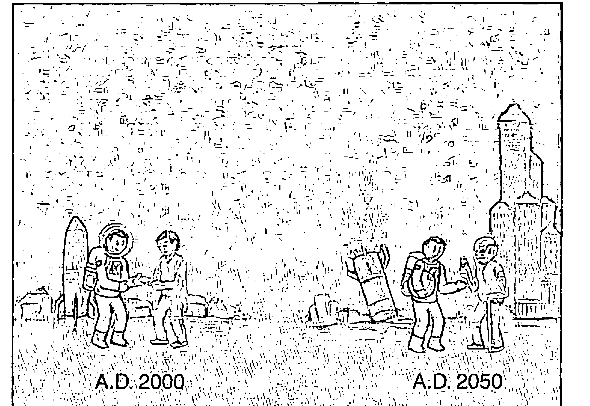

讀到這裡，你或許以為是主觀的時間感不同。其實，這裡指的是，就連他們戴在手上的錶，所經過的時間也不同。也就是說，由鐘錶量測的物理層面的時間，都會得出不同的數字。在火箭上的人，他所量到的時間比較慢。而留在地球上的朋友，他的時間過的比較快。

不光如此，愛因斯坦在廣義相對論又進一步提出，即使兩個人都是靜止不動的，例如一個在地球的海平面，另一個人在海拔相當高的地方，例如聖母峰，兩個人所看的錶的時間，也會不同。海拔高的人，看到的時間會比較快。而在地面上的，他的鐘錶會走的比較慢。當然，地表高度的差異有限，高度帶來的時間差異還是很微小，我們一般注意不到。但是，假如高度差更大，這種差別就會更明顯。這一點預測，後來也被驗證出來。

時間不是固定不變的。這個觀念，一般人很難想像，和我們的生活經驗很不一樣。你可能還記得，《不合理的快樂》提過荷蘭科學家克里斯蒂安·惠更斯（Christiaan Huygens）發現的鐘擺共振現象，類似這張圖裡原本各自獨立的單擺，經過一段時間，單擺的擺動也就自然同步了。我們如果不仔細觀察，很難想像隔著空間，沒有接觸到，也能夠透過共振而影響其他物體的運動。一樣的，在同一個場，有很多力量在互動，而時間離不開這些力量的互動。這些力量的互動，可能影響物理時間的快慢。只是我們一般認定時間是絕對、固定不變的，而不會這麼去理解，也就變得不懂了。

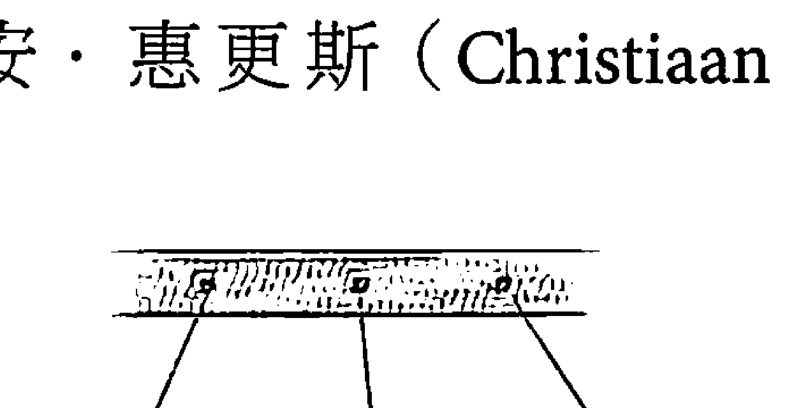

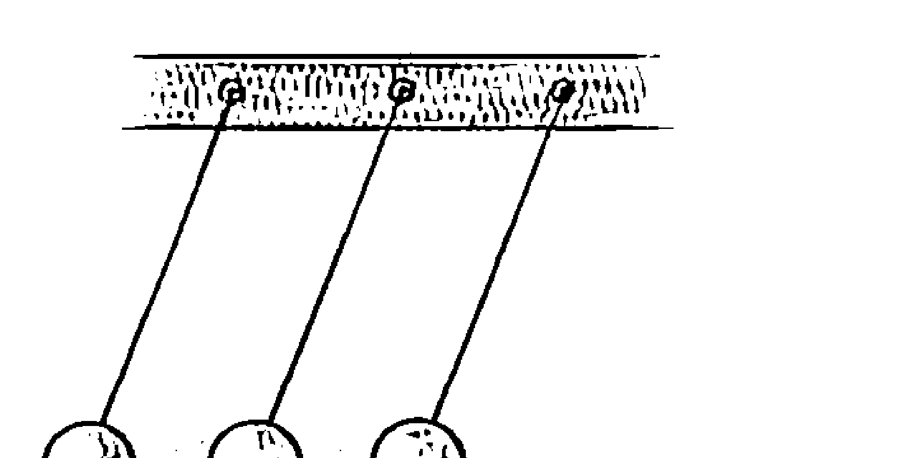

想想，很有意思，因為我們受到感官的限制，只能體會到空間的三個維度。最多，再用頭腦投射出四度的時空（空間的三度，再加上時間的維度）。我們活在一個四度的時空，卻不能直觀地理解這個四度的範圍。

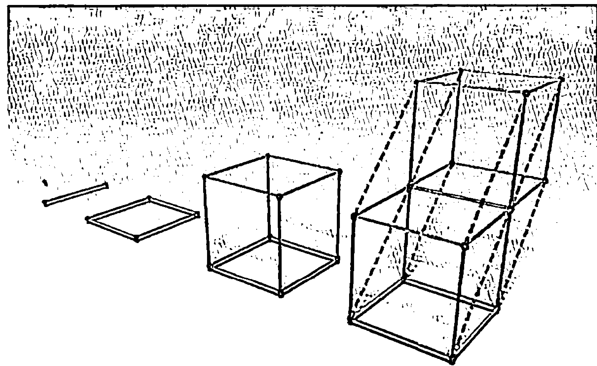

透過思考實驗（thought experiment），愛因斯坦推翻了當代的時間觀。從此，物理學家再也不認為時間是絕對、固定不變的存在。當然，愛因斯坦發現的不只這些。透過廣義相對論對時空的討論，他還改寫了牛頓的重力觀念。

三百年前，牛頓提出萬有引力的觀念，將天體間的吸引力，很清晰地做了一個數學的描述——兩個天體間的吸引力，與兩個天體質量相乘成正比，同時與兩者距離的平方成反比（F=G·Mm/D²）。如果兩個天體的質量不變，距離拉長一倍，引力也就變成原本的四分之一。

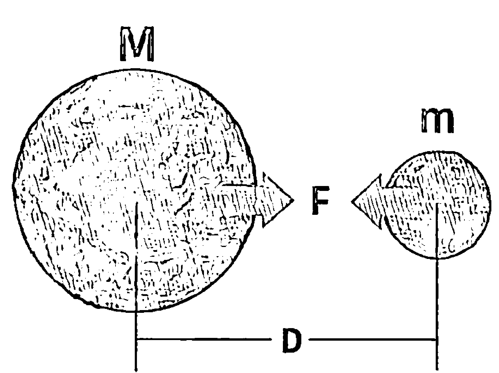

這些吸引力很容易量測，大家可以驗證。於是，接下來的幾百年，物理學家都希望可以找到一個單一的粒子或原因來解釋重力的存在。然而，愛因斯坦在廣義相對論提出，重力和其他作用力不一樣，不需要透過粒子來組合，完全可以從另外一個角度解釋。

我們先回到愛因斯坦對時空的推論——沒有一個單獨的時間，也沒有一個單獨的空間。時間，其實跟空間是分不開的。愛因斯坦認為四度的時空有彎度，因為時間和空間互相影響，也就是時間可以影響空間，空間可以影響時間。想確定時間的參數，要參考空間；反過來也一樣，要充份描述空間，要參照時間的種種條件。兩者是一體兩面。

要了解時間跟空間的作用與重力的關係，可以用飛機航線來做一個比喻。這些年來，國際政治情勢的變化，讓以前禁飛的領空開放了，再加上飛機速度不斷提升，透過考慮氣流變化而設計出來的最短路徑，本來超過二十小時的航程，可以壓縮到十三個小時。

如果我們從紐澤西飛到台北，坐在飛機上，看著小螢幕的平面航線圖，我們可能會想質問機長，明明兩點間最短的距離是直線，對著台北斜斜地往西南方飛就可以了。為什麼還要先往北飛，再往下走？是不是在打瞌睡？還是喝了不該喝的東西？

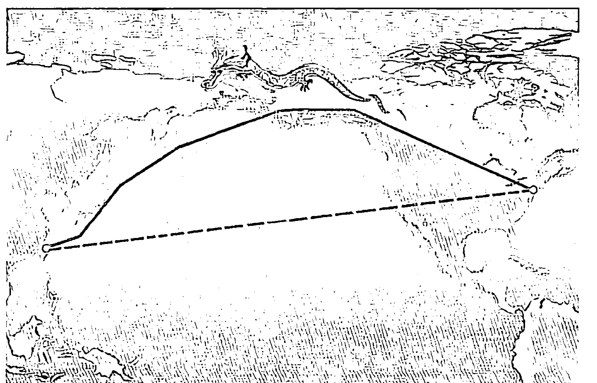

我們都沒有想到，就是因為地球在自轉，所以航線的設計老早考慮進去。也就是地球本身並不是靜止不動的，儘管我們平常不會體會到。

此外，我們都知道，在平面上，兩點之間最短的路徑是直線。然而，如果兩點在一個球面上，它們沿著球面最短路徑的曲線（geodesics）又會是什麼樣子？把三度的空間攤平，自然會發現原本平滑的經緯線斷裂，尤其在高緯度區更是明顯。從球面看來最短的飛行航線，攤在紙上，會變成曲折的路線，如果經過高緯度的極圈，路線甚至是斷裂的。

前面的例子，是透過航線的實例，讓我們體會三度空間的最短距離，很可能跟我們在二維平面的直覺完全不同。時空也是如此，時間和空間之間的互動，是我們平常很難想像的。愛因斯坦也大膽提出，地球的轉動，在四度的時空中是最短距離。但是，將四度的時空，壓成三度空間，反而會讓我們感覺到重力的運作。

他進一步推測，重力和其他三個基本作用力（電磁力、原子核內強作用力、原子核內弱作用力）完全不同，不能用這三個基本作用力來解釋重力。確實，這三個基本作用力有吸引，也有排斥，可以解釋一個原子為什麼守得住電子、中子、質子，讓它們不會散開。然而，重力只會吸引，這個特質和三個基本作用力完全不同。不光如此，量子力學可以完全解釋三個基本作用力，卻對重力束手無策。所以，愛因斯坦還是對的。

回來談四度的時空。時空非但有彎度，在許多局部的區域，這個彎度可能更大或更小，而造出一些意外的現象。這些，接下來，我會再說明。

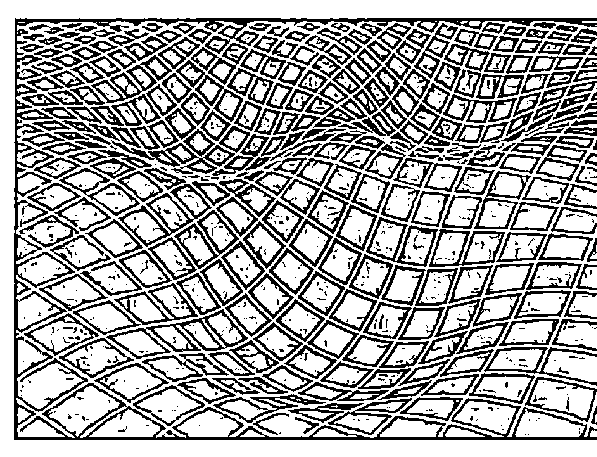

我記得還不到八歲，讀過一本和愛因斯坦有關的書，現在想不起來是他自己為一般讀者寫的，還是別人寫的科普書籍。當時，讀到這些時空的討論，我幾天睡不著覺，十分敬佩愛因斯坦。也自然去折騰我母親，問她愛因斯坦的背景，想知道他怎麼可能發現這些。現在回頭想，我母親當然不清楚。奇妙的是，雖然她說什麼，我已經不記得了。但是，她的說法，對一個八歲的孩子應該很有說服力。接下來，我再也沒有繼續煩她愛因斯坦的問題了。

儘管如此，我總認為少了什麼。假如重力是時空彎曲或某個法則的結果，而天體自然會彼此吸引，那麼，這個宇宙不會垮掉嗎？宇宙本身，又是怎麼來的？為什麼不去談它可能有結束的一天？

我仔細觀察，愛因斯坦和西方早期的哲學家、科學家一樣，始終帶著靜態宇宙的觀念。當然，不是完全一模一樣。早期的觀點還認為這個宇宙是以地球為中心。尤其在西方基督宗教的影響下，理所當然認為宇宙以人類為中心，而一切星球都圍繞著地球轉。

然而，不同的想法也出現的相當早。希臘哲學家蘇格拉底的徒孫亞里斯多德（Aristotle, 384-322 BC）還認定地球是宇宙的中心。但是，不到百年，另外一位天文學家阿里斯塔克斯（Aristarkhos, 310-230 BC）就主張不是日月星辰繞著地球轉，而是地球和其他星辰一起繞著太陽轉。一千七百年後，哥白尼（Copernicus, 1473-1543）再次提出地球繞著太陽轉的觀點。再過半個世紀，克卜勒和伽利略終於得出證據，證實了哥白尼的理論。

又過了一百多年後，牛頓在有名的《自然哲學的數學原理》（Philosophiæ Naturalis Principia Mathematica）提出了萬## 02 時間中的「非時間」
Timelessness Within Time

万有引力定律，與後來以他為名的三個運動定律，統一了地表和天上的力學。到這個時候，歐洲科學界才普遍接受了以太陽為中心的宇宙觀。順帶一提，牛頓當時也順便創出了微積分，讓眾多為了考大學而熬夜的學生，從此對數學帶著揮之不去的恐懼。

雖然牛頓自己提出了重力的定律——解釋了蘋果為什麼會掉下來，但依舊認為宇宙是靜態。他似乎沒有想過，如果天體之間的吸引力那麼大，為什麼宇宙不會塌陷？不會縮成一團？

即使改寫了牛頓的重力理論，愛因斯坦一樣認定宇宙應該是靜態的，是不變的。很有意思的是，他在廣義相對論的演算中，發現式子的等號兩邊無法平衡，於是又帶出宇宙常數（cosmological constant），提供一個相反的力量，讓宇宙回到平衡。這個力量，對他而言可以說是「反重力的力」。而且，這個常數要相當大，才能保持宇宙不會塌陷。即使要加上這麼大的一個常數來調整，愛因斯坦依舊不認為宇宙是動態的。事後，還堅持宇宙常數是他在學術上最大的「失誤」。

多年後，天文學家透過觀測，發現宇宙不光在膨脹，而且膨脹得愈來愈快。其中，最有名的就是哈伯（Edwin Powell Hubble，1889-1953），後來美國太空總署的哈伯太空望遠鏡就是以他為名。儘管天體間還是有吸引的作用，但宇宙膨脹的速度和力量仍然遠大於任何吸引力。於是，科學家繼引入「暗物質」（dark matter）來解釋星系之間的交互作用之後，無可奈何地再次導入「暗能量」（dark energy）的觀念，才勉強可以解釋宇宙在膨脹的事實。

很有意思的是，愛因斯坦自認為的最大失誤，其實在另一個層面可能是正確的。他的式子當時已經指出「宇宙在擴張」的現象，只是因為不符合他個人的信念而被忽略了。

說到底，這也是一種制約，被自己的信念所制約。

假如讀完前一章滿滿的物理學，你還沒有被嚇跑，我最多只能恭喜你——你可能對相對論有一種直覺的理解。儘管距離愛因斯坦提出相對論，已經有百年之久，但遺憾的是，似乎很少人有直觀的理解，更別說體會到相對論和生活的關係。

希望你還記得，時間，才是這本書的主題。既然科學家發現宇宙在膨脹，而且沒有停過，當然也會好奇，想從膨脹的速度回推它什麼時候開始膨脹。目前公認的答案，是將近一百四十億年前。無論從宇宙的哪一個角落，都可以回推到同一個點。好像一切的一切，是從這個點發展出來的。這個點，我個人把它稱為原爆點（ground zero）或零點（zero point）。

聰明的科學家，當然會想問——那麼，在這個點之前，是什麼？
也就自然得到一個不可思議的答案——在這個點之前，什麼都沒有。
對我們而言，這個答案太不可思議了。現代的科學家，就像這張圖裡的人，看著宇宙，不僅體會到這個宇宙正在繼續擴大，而且竟然是從什麼都沒有裡冒出出來的，這怎麼可能呢？！

這個答案，你可能認為太哲學了。讓我反過來，用數理的方式表達。

這個點，如果以物質的質量來衡量，密度應該是無限大。時間，也只能是無限大，可以說——還沒有時間，或者，時間是永恆。用愛因斯坦的廣義相對論來說，也就是時一空的彎度無限大。彎度大到一個地步，這個時一空捲成比一個點還小。小到一個地步，時間也就自然停滯了。

最有意思的是，從任何角度，這個點，怎麼看都是一個意外的點。比如說，溫度，應該是無限的高，無限的燙。後來，也有人稱為奇點（singularity）。當然，從宗教的角度，可以把它稱為神、「空」、全部的潛能。從我個人的角度，最多是稱它為「絕對」（儘管「絕對」不是任何時一空、語言的領域可以描述、解釋）。

無論如何，對科學家來說，這個奇點自然成為宇宙的出發點。既然它的能量無限大，要化出來一個有限的宇宙，一定是透過一個突然的轉變。後來的人，把這個突然的轉變稱為「大霹靂」（Big Bang）。

大霹靂發生的速度快到一個地步，後來的科學家計算出來，溫度從幾百萬度K（絕對溫度的單位）大幅下降（雖然從我們的角度，還是不可思議的高溫），這個過程，也只是幾秒內的事。速度和能量，也是一樣地急速下降。

我們用右圖做一個簡單的表達，圖的中央是大霹靂發生的時點，垂直的軸代表時間。一般認為，就在大霹靂發生後的幾小時內，能量已經凝結出物質。從什麼都沒有，首先有了氫，然後是氦。接下來，再成立週期表的其他元素。有核融合反應的點，自然變成恆星。週邊沒有核融合反應的點，變成行星，圍著它運轉。

接下來，不曉得經過多少億年，恆星慢慢地冷卻下來。這樣子，一個完整的宇宙也就成形了。

也就是說，從某個時間點（大霹靂），宇宙才爆發開來。爆發前，其實沒有時間的觀念。或者反過來說，時間在當時是永恆的。

最早最早的一開始，也就是一百四十億年前，才剛爆炸時，那時候的時間還很長。因為，在爆炸的初期，這個曲線的奇點非常小，空間的尺寸很小。相對的，時間就顯得很長，彷彿是永恆。也就是說，沒有什麼東西叫「時間」的觀念。最多是「非時間」，我們可以稱為永恆。

是透過大霹靂，非時間的永恆，突然落到一個局限的範圍，就像是慢下來，而讓我們透過五官有一個時間的體驗。而同時，宇宙的空間好像一直在快速擴張，有一個空間（宇宙）好談。

這個大霹靂的理論，現代的物理學家幾乎都可以接受。基本上已經含著「絕對」的觀念——還沒有成立這個宇宙前，時間是無限大，是永恆的，甚至可以說沒有時間的觀念可談。是大霹靂之後，才有物質，有了我們看得到的宇宙，突然冒出來一個局限，出現時間的觀念。

時間，最多只是在一個局限的範圍（宇宙、人間）可能運作。時間的觀念，離不開我們的認知，也離不開人類的觀察，更離不開人設計出來的設備的觀測。所以，時間本身是個相對的觀念。

物理學家計算出來，星球的初始能量愈大，燃燒的核反應愈劇烈，也就愈早消失。舉例來說，一開始爆發能量愈大的，可能幾億年或甚至更早就結束了。至於我們的太陽，大約在四十六億年前生成，差不多還可以再存在五十億年。

這些恆星，是透過熱能才會膨脹，而可以和重力向內的吸引力抗衡。如果熱反應消失，也就自然會塌陷。到最後，不光是把自己吞掉，甚至把週邊任何物質都吞掉，這就是物理學家後來所稱的「黑洞」（black hole）。

喜歡看科幻片的人，一定都看過電影裡對黑洞的各種想像。有些認為黑洞會吞噬一切，也有些劇本把黑洞當作一種充滿未知體驗的可能。就像下一頁圖誇大的表達，這個人在想像黑洞是怎麼回事——「如果把手伸進去，無限大的重力會把我的手拉斷嗎？還是會讓我進入另一個世界呢？」

很有意思的是，黑洞和大霹靂一樣都是奇點。在黑洞裡，重力是無限大，時-空的彎度無限大，而時間是永恆。現代的物理學家認為，黑洞本身也在幫助這個宇宙不會消失那麼快。而且，幾乎每個星系都有黑洞。光是我們的銀河系正中央，現在估計就有幾萬個這樣的奇點。

黑洞和大霹靂這些奇點，為物理學家帶來沒辦法解答的兩難或悖論。兩難，是因為「奇點」雖然可以清晰解釋相當多的現象，但是，物理和數學的理論通常講究連續性。也就是說，只要定出一個範圍的條件（邊界條件，boundary condition），在這個範圍內都自然有一個連續性，可以用各式各樣的數學或物理原則來預測它的變化。

有了奇點，無論是大霹靂或是黑洞，突然之間，所有已知的物理定律都被打破。也就是說，在這個奇點的範圍，不只是無法適用任何物理定律，就連宇宙、物質、時一空都沒有。很有意思的是，奇點本來是用來解釋宇宙怎麼來，怎麼結束。但是，一進入奇點，這個問題——宇宙怎麼來的，根本就不存在。

當然，也有物理學家不斷在找一個沒有邊界條件的理論。也就是沒有一個出發點，沒有一個突然的變化，不會帶來無限大和局限之間的斷裂。這樣子，這個理論是圓滿的，自己就足以獨自成立（self-standing）。只是，到目前為止，還沒有找到這樣的理論。無論是解釋最小範圍的量子物理，或是能解釋天體運行的牛頓力學，甚至包括愛因斯坦的廣義相對論，都沒有辦法找到一個能滿足連續性的參數來描述這個宇宙。

談這些，表面看來好像跟我們日常的生活不相關。其實，仔細觀察，到處都有邊界條件。比如說，在愛因斯坦的理論中，光速就是一個邊界條件。速度愈高，甚至接近光速，時一空彎度愈大，時間幾乎已經變成永恆。假如時間逼近了永恆，可不可能達到比光速更高的速度？如果可以，會造出一個時間的悖論，因為不可能比永恆更永恆。

除此之外，愛因斯坦的質能轉換公式 E=mc² 指出，一個粒子的速度愈高，甚至接近光的速度，需要耗費不可思議大的能量，才能維持它的動能（kinetic energy）。美國芝加哥的費米實驗室或瑞士日內瓦的歐洲核子研究中心（CERN，照片是 CERN 科學創新大樓，大強子對撞機就在這棟球狀建築物裡，前方扭轉的金屬雕塑上頭刻滿了物理學家的重要公式和名言，象徵了濃縮的量子物理發展史），有好多物理學家透過高能量的加速器，去加快粒子的速度，希望可以發現更小、更基本的粒子，而可以進一步對宇宙的結構做一個解釋。然而，這種加速所耗的能量相當大。再怎麼加速，也很難達到光的速度。就好像光的速度，對四度時一空的世界是一個門檻，我們跳不過去。

相信你也聽過，透過質能轉換公式 E=mc² 的計算，一公克的質量，可以轉化為接近兩千五百萬度電的能量（可以支持五萬個家庭夏天一整個月的用電）。為了終結第二次世界大戰，而落在長崎和廣島的核彈，就可以用這個公式來解釋它的威力。

其實，這兩個實例都一樣把光速當作邊界條件，只是看這個公式的角度不同。粒子物理學家，是用能量去處理物質，而核彈的應用，是從物質去挖掘能量。

有意思的是，我很早就意識到，透過光速導出來的這個公式，好像反而讓我們限制在自己看得到的「光世界」。 E=mc² 似乎在表達：超過我們所見的物質或質量，以及從中轉出來的能量，就沒有其他的物質或能量好談。然而，我從小體會到的，並非如此。對我而言，不應該有這樣的邊界條件的限制。

後看到物理學家延伸出暗物質、暗能量的觀念，來解釋宇宙的平衡，也就會覺得這樣才合理。這類「暗」的物質與能量，並不在 E=mc² 涵蓋的範圍內，可以說是遠遠大於我們看得到、或人間可以產生的物質和能量。後來的人，也從中衍生出「零點能量」（zero point energy）的觀念。

我還很小的時候就知道，E=mc² 把光速當作邊界條件，還會帶來另一種限制——讓人類在有生之年都不可能完成星際旅行，因為距離實在太遠。光是我們的太陽系，離銀河中心就有兩萬七千光年。從銀河系，到最近的人馬座矮橢星系（Sagittarius dwarf galaxy），也有七萬光年的距離。其他的星系，甚至是上百萬、千萬、億光年那麽遙遠。

不只如此，假如光速是沒辦法超過的邊界條件，那麼，時光旅行也是不可能的。不可能去未來，也不可能回到過去。作為一個小孩子，我當時認為這都應該可能，所以總覺得愛因斯坦的式子好像少了什么。

從理論繼續走下去，會得出這樣的結論：宇宙不是平滑的，不光時一空有彎度，在一些範圍內甚至有很大的皺褶。這些皺褶，其實帶來一個捷徑，後來有人稱為「蟲洞」（wormhole）。就像我們從東南亞到歐洲，最短的路徑應該是攀上幾千公尺高的喜馬拉雅山。但是，如果像這張圖所畫的，突然發現一個山谷，也就找到一個直達的捷徑，不需要攻頂再下山。也就是說，如果我們利用這些皺褶，跟這個四維的時一空「作弊」，可以省掉許多冤枉路，甚至打破時間的觀念。星際旅行和時光旅行，還是有可能。

講到宇宙的皺摺，我記得當時還在巴西，年紀很輕，常常幫同學補習，準備大學的考試。只要用圖來表示這個宇宙，我自然會用一張小孩的臉來表達。就像這張圖所畫的，小孩的臉不斷地變老，不斷地膨大。而且，這張臉一點都不光滑，而是充滿很皺的皺紋。皺紋是表達，局部的時一空彎度特別大。時一空在這裡並不是均勻的，可能有黑洞，也可能帶來捷徑。

讀到這裡，也許你會覺得太科幻。但是，這些描述，從物理學來說是有憑有據，並不是幻想。現實生活中的物理學家，因為受到時一空的限制，想出来的有时候甚至比科幻小说更离奇。比如说，量子力学认为没有一个东西是单纯的粒子或单纯的波。有时候，一个电子，竟然有波的性质。反过来，有时候，光也有粒子的性质。这叫做「波粒二元性」，完全看你怎么去观察。

不光这样子，站在量子力学的角度，一个粒子小到某一个地步，我们就没办法完全描述它。假如要定出它的速度，那它的位置就自然不清楚。换个角度，它的位置清楚，速度就没办法决定了。这个现象是当年才26岁的德国量子物理学家海森堡（Werner Heisenberg, 1901-1976）提出来的，后来称为测不准原理（Uncertainty Principle）。

一般来说，一个粒子小于奈米的尺寸，好像量子的特性也逐渐浮出来，各种性质都不再完全适用大尺寸的物理原则来解释。也就好像任何事件，在一个很小的尺度，都不允许我们肯定的去预测，最多只是一个可能性。在量子的世界里，每一个瞬间最多都只是一个可能。至于实际所发生的，也只是其中一个可能浮了出来。

海森堡在31岁时，得到诺贝尔物理奖。隔年，1933年，诺贝尔物理奖颁给奥地利的薛丁格（Erwin Schrödinger, 1887-1961）和英国的迪拉克（Paul Dirac, 1902-1984），一样在量子物理有很大的贡献。

薛丁格和海森堡都是量子物理学家，薛丁格年紀比海森堡略長，得到諾貝爾獎時已經 46 歲了，成熟度也不太相同。薛丁格在 57 歲時，出版了一本《生命是什麼？》（What is Life?）。因 1953 年解開 DNA 雙股螺旋結構而得到 1962 年諾貝爾獎的華生與克里克，都提到薛丁格這本書對他們有很大的啟發。

薛丁格想探討一個問題——量子世界的原則，可以拿來解釋現實世界嗎？後來他用「薛丁格的貓」的悖論，來說明這兩種物理原則的矛盾——把貓鎖在一個帶有毒氣瓶的箱子，而假設毒氣瓶會不會破，完全看粒子的量子狀態來決定。如果將箱子密封，沒有觀察的狀況下，粒子的量子狀態是兩者都可能。也就是說毒氣瓶可能破了，也可能還好好的。箱子裡的貓既是死的，也是活的。這種描述已經夠不可思議了，但是它無法解答現實——箱子打開時，這隻貓會是死的，還是活的？

當然，這個悖論其實也就反映了，即使對一般的物理學家，還是很難用量子力學，去理解現實世界的運作。非但如此，透過量子力學，也很難理解奇點。或者我們應該這麼說，在非時間的狀態，很難探討測不準原理的現象。

這些理論已經夠違反直覺了，還有更複雜的理論。也許你聽過，物理學界近幾十年來，很多人投入「弦理論」（string theory）。也就是說，一個粒子和粒子不是各自獨立存在，而是好像有繩子（弦）把它們連起來。就像右圖所表達的，某個角落的一根繩子，可以影響到任何其他的角落。這樣的模型，可以解釋很近的作用力，也可以解釋很遠的作用力。

弦理論還含著一個奧妙，如果要讓弦理論成立，我們必須接受這個四度的時－空只是宇宙很小的一部份。按照弦理論，可能需要十度、十一度或二十六度的時－空才能描述這個宇宙。

我常常笑，人類是這麼可愛，凡是不能解釋的，就再加一個維度來解釋。到最後，這麼多的維度，非但遠遠超過人類五個感官所能體會，也超過腦可以想像、描繪的範圍。

物理學家會費那麼大的力氣，想出這麼複雜的理論來解釋真實，正是因為人類受到自己覺察的限制，必須借助其他工具或是範圍，對物理學家才夠清楚。然而，因為是我們看不到的範圍，很難透過我們的五官去驗證是對還是錯。

和這些理論相比，相信你會同意，前面談的時光旅行，其實不算太複雜，不能說它不可能。

回到時間的主題——在物理學的角度，時間已經失去了絕對的地位。而物理學家也老早透過奇點的理論，接受了「非時間」的觀念。時間，只在我們看得到的、顯化出來的世界才有意義。但是，即使是在這個顯化出來的世界，非時間的觀念一樣隨時都有，隨時都存在。不光在大霹靂前有，在任何奇點，任何黑洞都有。

從另一個角度，我想表達，物理學家夢寐以求的統一場論或萬有理論（the unified field theory or the theory of everything），從我個人來看，是找不到的。因為它本身忽略掉了非時間的運作。而且，「非時間」就像他們所提出的「暗物質」和「暗能量」一樣，遠大於我們可見的宇宙。

只要觀測的工具愈來愈進步，自然會發現更多現象，而這些現象也會自然衍生出來新的物理定律。然而，這種衍生是永遠數不完的，就看我們手頭有什麼工具和多少耐心（也有人會稱為創意）。

雖然概括了那麼多領域，我最後想表達的是，我們其實不需要把這個主題變得那麼複雜。我個人認為，人類過去的出發點並不正確。在「有」、在顯化出來的宇宙，想透過奇點，找到非時間、生命的全部、絕對。這種作法，本身是不可能的。再怎麼費力，也找不到。也因為如此，自然為現代的物理學家積出那麼多矛盾。

其實還有一個方法，比這個簡單多了，也就是我這本書想分享的。就我個人的角度，從任何時間的範圍，都可以找到非時間的出口。這樣的出口，到處都有，倒不必大費周章到大霹靂或黑洞去找。祂隨時都在，一點都不需要費力。

這樣的出口，我在「全部生命系列」稱為醒覺。

我知道，對沒有物理學背景的讀者，這兩章可能比較難。正因為我在這本書不想進入冗長的學術論述，才在這兩章濃縮了好多觀念，一步步「哄」著你走完。

前面也提過，假如你讀這兩章感覺吃力，也不用擔心。我答應，接下來會從物理層面的時間，轉到心理層面的時間。但是，我相信你會發現，這兩個觀念，倒沒有矛盾。

## 03 時間帶來的重擔
The Burden of Time

我相信我們每一個人，只要談到時間，都有兩個直接的反應。首先，把它當作一個節律器，就像為生活定下節奏和步調，才可以衡量每一個規劃，每一個動作，每一個追求，每一個結果。但同時，它也帶給我們一種壓迫感，讓現代人總是感覺時間不夠用。

在這個不夠用的情況下，我們自然會想要一心多用——同一個時間，能處理愈多事愈好。透過快速的技術發展，我們可以同時停留在幾個知識的平台。不光有手機隨時可以通訊，還有電腦，同時還可以說話、寫字、和其它的運作。

不要說兩千年前的人，即使是五十年前的人，來到我們這個世界，也會嚇壞的。會認為每一個人的神經都過度激動，不只同時做好幾件事，而且步調快到想像不到，不要說跟不跟得上了。

我也發現，這個時間的重擔所波及的年齡層越來越多下降。尤其華人，總是要充分利用時間，追求高效率，強調一分耕耘，一分收穫。這麼要求自己還不夠，還要把這種追求延伸到下一代。一個孩子，只要懂事、進入小學，總是感覺跟不上，來不及。

讓我最同情的是，小孩子不光是睡不夠，在學校的時間長，功課多，家長的要求又加倍。就好像一上學，就要承擔週邊種種的期望和壓力。如果這個孩子自我要求又高，那麼時間的負擔更是沉重。

所以，我們過去看到是有了一定的年紀才有憂鬱症，例如事業受到打擊，或女士在產後、更年期的變化。然而，現在就連憂鬱症的發生年齡也不斷下降。幾歲的孩子就有憂鬱的症狀，甚至有自殺的念頭。我才會說憂鬱症是二十一世紀最嚴重的慢性病，而時間的重擔是一個主要的原因。

要談時間的重擔，最多也就是「跟不上」。我們每個人都跟不上。一個人在跟不上的狀況下，自然會產生一個兩難。也就是說，在時間的壓迫下，我們認為隨時要有一個決策的備案，用來節省時間、解決時間帶來的壓力。這是我們每個人隨時在面對的。

可惜，在這種狀況下，我們步調自然會加快，而讓我們停不下來。就連休息的時候，還可能想要選擇快速的動，例如不光是看電視，還要對話快，鏡頭不斷的變化，或有暴力的刺激。晚上參加活動，要有大聲的音樂和熱鬧。這些娛樂的選擇，反映了我們個人對生活要求的快步調。

這樣子，別說休息時，慢不下來。就連睡覺的時候都停不下來，難怪那麼多人有失眠的問題。

我過去做為一個醫師、科學家，自然喜歡從機制或問題的根源著手。比如說，我當年研究免疫，就想知道殺手細胞和 T 細胞怎麼殺腫瘤。當時很年輕，很快把這個主題告一個段落，而且跟別人的切入點都不同。

現在，要切入時間這個主題，說時間是我們人類最寶貴的工具，也是我們最大的殺手，我認為這一點都不過份。我在這本書，希望可以再進一步打開——時間，其實跟我們人類的演化有密切的關係。這種觀點，或許你會認為是理所當然，因為歷史本來就是時間演變的紀錄。但我要講的是，人類因為有時間的觀念，才有以後的發展。只是因為時間的觀念過度強化，自然擺盪到一個不均衡的狀態。

講了這些，即使把它解開，最多只是把症狀做個說明。我真正感興趣的，正如我過去所扮演的角色，是希望找到一個徹底解答的方法。

## 04 時間的悖論
Time as a Paradox

人類對時間的知覺並不是直接的，不像鐘錶可以把時間切的準確而客觀。我們是透過神經的作用，才可以體會什麼叫做時間。甚至，是透過一個作用叫做「記憶」，才讓我們取得時間的觀念。

時間，對我們最多分成三個主要的區塊——過去、現在、未來。

現在和未來，其實都是由過去組合起來的。然而，過去，完全是透過記憶才可以存檔，而接下來可以讀取，甚至調出來。

人類和其他動物不一樣，除了比較完整而豐富的記憶的作用，還有很強的聯想能力。人的聰明與邏輯，和其他動物的差別就在於此。很早期的人類，也許幾十萬年前，就懂得觀察一些週邊的現象。例如太陽會升起，會落下。落下後，月亮會升起，星星會出現。不光如此，他還發現有時草葉冒出芽來。然後，會特別熱。接著，樹葉開始落下，甚至下雪。

這些週邊的動態，都會重複。只是重複的週期，有長，有短。

這麼一來，「天」、「月」甚至「季」的觀念，就出來了。

人類也自然就把個人體驗的變化，和環境的週期連繫在一起，而從中得到一些意義。

在人類剛有農業的時候，人會發現——要在「春天」，種下的東西才容易發芽。到了「夏天」，可以不要穿那麼多衣服。等到「秋天」，可以收穫。進入了「冬天」，動物都在冬眠，人類也就跟著休息，要保住溫暖。再區分更細一些，到了「晚上」就該休息，保住身體的熱度，自然會想睡覺。「白天」有日光，可以把環境看得清楚，而可以處理「事」。

人類，其實就是靠記憶維持的比較長，再加上聯想和推理的能力，而跟其他動物區隔開來，才有文明好談。

從主要基因的 DNA 序列來看，人類跟黑猩猩的差別不到 2%。所以人類的特殊倒不是可以完全用基因來解釋。更有意思的是，比起早期存在但後來消失的另外五種人類，我們現代人和他們的 DNA 可以說幾乎沒有差異，但是，到最後只有我們現代的人種留存下來。

留下來的原因，從我個人的角度，是時間——時間的觀念。也就是說，前面講的記憶，加上聯想、推理，讓現代的人類造出一個完整而具體的時間的觀念。

為什麼有記憶，再加上連想和推理，對一個人當時面對環境那麼重要？

我們可以想像，人類的體質本來就不如其他野獸（例如猩猩、老虎）那麼強壯。光是憑肌肉的力量，人類絕對不可能贏過其他的野獸。舉例來說，銀背大猩猩重達四百公斤，可以連續推動八百公斤的重物。即使現代人營養好，體型比古人高大，力量還是遠遠不及體型較小的黑猩猩。黑猩猩的肌力是人類的 1.35 倍，局部爆發的握力更是特別強。從天擇的角度來看，像人類這樣的物種應該老早就會消失了。事實也是如此，其他五種原始人類，早就消失了。

就是因為有記憶、聯想、推理的功能，人類才有機會可以從經驗學習，可以區隔不同的行為。自然發現有些舉動對生存有利，有些則有害。就這樣，不至於重複一些對生命有危機的動作，甚至可以重複一些過去認為比較有生存優勢的舉動。

這個優勢，是其他動物沒有的。即使有，也很有限。才會讓人類不光是生存下來，還主宰了整個世界。

人類更了不起的地方，是發現有方法可以驗證心理的時間感。本來，一開始是參考天體的運動（例如太陽月亮的週轉），才突然產生時間的觀念和感受。但反過來，人類自然用天體的運動來校正自己心理的時間觀念，讓心理的時間感有了一個參考。而這個參考是相當可靠，相當穩定，不怎麼變化。

幾千年后，人間才發明鐘錶，這一來，時間又更精確了。時間本來是人類的體驗，是人類心理的作用，突然變成客觀而具體的存在。甚至，再進一步被認為是一個不變的物理常數。

同時，人類為了跟上時間帶來的變化，於是就有了紀錄。

我們仔細觀察，每一個輝煌過的文明，都有很強烈的時間的觀念。而且，每一個文明都有方法來記錄，也就是我們現在所稱的曆法。有些民族以太陽的運轉為主，有些民族（例如華人）計算月亮的週期。有些文明，所計算出的週期，比每週、每月長得多。印度史前文明和瑪雅文明，光是觀察天體的運作所歸納出來的週期，甚至可以長達幾千幾萬年。不過，發展到現在，配合西方現代社會運作的步調，自然就把「年」當作我們曆法的基礎單位。

時間，不光強化人類的邏輯和推理的能力。有了曆法，也讓我們開始做紀錄，包括歷史。透過歷史的紀錄，人類才可以把經驗留下來，而可以得到進一步的學習。我才會說，時間是人類最大的發明。

人類的全部發展，都是透過時間的觀念而延伸出來的。

是的，時間確實帶給我們數不完的突破，包括現在科學和科技的發展。時間本來是人類最寶貴的工具，讓我們有今天的局面，不光可以主導地球，還可以登陸別的星球。但同時，它本身也是我們全部煩惱的根源。

想不到的是，它同時也是人類最大的阻礙。

我進一步大膽的說，還不用談到突破，人類對這世界全部的認知，包括語言、思考、邏輯、互動、評價……全部離不開時間。有了時間的觀念，我們才成立這個世界，才有這個世界。

所以，時間的地位，遠遠排在任何其他觀念的前面。然而，它本身就是我們這一生最大的束縛，說是陷阱，都不為過。從生到死，沒有一個人能離開時間的觀念。我們都被時間束縛，甚至困住。可惜的是，對這個困境，我們連邊都看不到，甚至意識不到。

我才會說，時間，是我們這一生最大的悖論。

假如我可以把「全部生命系列」做一個簡單的彙總，最多也只能說——修行，或是解脫，是超越「時間的觀念」。

## 05 時間離不開「動」或運動
Time Is Not Apart from Doing

在談時間離不開「動」或運動之前，我想先談一個更基本的觀念——一般人有點科學的概念，都會像第一章提到的，把時間稱為第四個維度。就好像空間的三個維度（長寬高）是基本，而時間是額外加上去的第四個維度。然而，這個觀念，其實不是完全正確。

對我而言，這種說法完全忽略另外一面的可能——假如沒有時間，其實，我們連空間的三個維度都沒得談。

空間的三個維度是靜態，沒有對照，我們得不出三度空間的觀念。反過來，是透過比較。透過一個空間和一個空間的比較，也就是——拿一個空間的三度和另一個空間的三度比較，再加上記憶（時間的觀念），我們才可以認出來長短、高矮、寬窄。

也就是說，假如沒有一個前後的觀念（又是時間！），我們最多只是隨時都在瞬間、當下。在當下，沒有空間的比較好談。空間的觀念，根本就起不來。因為我們區隔不了。

空間，最多只是強化時間的觀念。

沒有時間的觀念，不光空間的觀念產生不出來，其他任何比較、分別、區隔、欣賞、評鑑……也都沒有了。我們也不可能有念頭，更不可能有什麼語言可談的。所以，我們全部的認知和一生的經驗，包括「我」，全部都離不開「時間」這第一把刀的作用。接下來，才有其他。最有意思的是，我們一般很難想像，假如沒有時間，沒有世界。更不用談，沒有宇宙。

仔細觀察，其實動物也有空間的觀念。動物的空間觀念，一樣是從時間延伸出來的，也就是一樣有時間的觀念。但是，它維持的時間比較短，而且觀察的細節比較粗糙。植物和礦物，其實也有意識，但這意識和人類、動物的不一樣。主要是少掉一個時間的觀念。所以它對現實的知覺，和其他生命完全不同。

進一步講，時間本身含著「動」的觀念。因為時間的觀念，是從順序、比較，也就是「動」，才可以取得。

所以，時間本身就帶給我們一個「動」或運動的感受。

前面也提過，我們人類全部的思想、語言、感受——痛苦、快樂、愛、悲傷、溫暖、沒有安全感、憤怒、嫉妒、傷心、難過……——都離不開比較、分別、「動」，都離不開時間，都是時間的產物。反過來，人類所有的突破，一樣離不開時間。

二元對立（duality）——東西和東西的比較、人和人的比較、人和東西的比較、人和事情的比較——這一切區隔，本身是時間的觀念。

是有了時間，才有二元對立，才有文化、文明種種人類的特質好談。

是透過時間，我們才從一體（絕對）落在一個角落（相對）。

是透過時間，我們從永恆（無限大）落在無常（局限）。

是透過時間，我們從無條件，突然受到條件限制。

是透過時間，我們從神，變成人。

是透過時間，我們從不生不死，變成會生會死。

沒錯，時間本身是我們最大的限制，把我們本來有的全部、無條件的生命潛能，限制在一個部份、有條件的相對。

甚至，讓我們從此迷失，再也看不到整體。

它本身，一出現，已經成為對我們的宣判。判的，不是死刑，而是「人刑」。

我知道這些話，你過去可能沒有聽過，也很可能帶來想不清楚的一種悖論或矛盾。

但是，事實並沒有那麼絕望，剛好相反。我在這裡想表達的是，雖然時間帶給我們限制，然而，時間本身也讓我們和任何其他生命足以區隔——只有人類透過時間的轉變，可以醒覺，可以頓悟。

這本身才是最大的悖論。

## 06 念相，離不開時間
Thought-forms Are Not Apart from Time

因為前一章的觀念太重要，而且跟我們一般的認知剛好顛倒，我可能需要從另外一個角度再來切入。

我之前提過，我們眼前所看的東西，都是 thought-forms 念相。

太陽是念相。月亮是念相。別的星球是念相。地球也是念相。

地球的全部動物、眾生包括人，都是念相。

更不用講，人和人之間的互動全是念相。

甚至，連建築物、我們生活所有的用品，都是念相。

我相信，這一點本身就帶來矛盾，讓我們用頭腦不可能去理解。但是，只要我們追察下去，自然會發現——這些話是正確的。

講到念相，也就是說全部世界是透過五個感官去捕捉，而五官離不開神經的作用。透過神經所產生的資訊，而讓我們認為很堅實的世界，其實最多只是資訊——頭腦的產物，或頭腦的東西（mind-stuff）。

我相信你已經熟悉接下來這個比喻，假如用解剖的方式去拆解，會發現到最後都是空的。連物質的原子，追究下去，都是空的。資訊、分子、原子、粒子，都是空的。

可以說，任何堅實的東西，只要往下追究，它的基礎、實質其實是「空」。但是，透過我們神經的作用，會讓我們得到一種堅實的印象。

接下來，相信你可能也已經熟悉這樣的比喻：假如有其他的生命，和人類一樣有感官，但是，是不同的感官，那麼，對它而言，也有「有」的存在。只是，它的「有」可能跟我們的不一樣，可能更堅實，也可能更不堅實。比如說只是能量譜的流動；甚至，可能完全是另外一種物理化學的狀態。

全部這些頭腦的運作，還是離不開「動」。畢竟觀察本身不會帶來意義，是透過觀察再加上比較（動），我們才可以得到一個參考、對照的基準。

有了時間的觀念，讓同一個空間可以和它自己前後在比較，而突然冒出了「動」的觀念。我們仔細想，假如這種比較是不同的空間框架在隨時比較，其實也產生不了「動」。最多只是從一個空間，到另一個空間。在這之中，沒有連貫性。是在同一個範圍（我們也可以稱為空間），不斷透過時間在做比較，才突然產生一個世界，或完整的人間的觀念。

所以，時間本身是來限制我們的知覺，是一個具體的運作範圍。它要在這個範圍內不斷重複觀察，才有一個參考的價值，有一個比較的可能。假如這個範圍是無限大，它沒有可運作的基準或參考點。

「我」也是這麼來的。

因為全部都是頭腦在運作，所以頭腦自然會產生一個中心——它自己。而全部的比較都是跟這個中心點重複地比較。所以，自然會認為「我」是一切的出發點或中心。

也就是說，雖然我們平常沒有注意到，但我們全部的知覺或資訊的比較都是跟一個中心的點——我們頭腦的中心——在做對照。

不知不覺，把這個中心的點，變成最重要的一個點。

也就好比，假如不在一個具體的範圍做比較，沒有一個參考點，沒辦法產生一個「動」的觀念。有了這個中心點，樣樣我們看到、聽到、聞到、嘗到、體會到的，都自然不斷跟這個點在做對照。也就透過這個點，面對樣樣，我們隨時在衡量所得到的資訊。這麼一來，我們不光有一個時間的觀念，而且還跟這個時間的觀念綁在一起，而突然有個人生，自然有「生」、「活」、「老」、「死」的觀念出來。我們也就認為有個生命、有個壽命可談。

不光是生命、壽命，而且還是「我」的生命，「我」的壽命。

從我們的角度，沒有「我」，當然沒有生命，沒有壽命。這一來，也就隨時忘記了「我」本身不存在，是透過時間的「動」才取得的。

我才會說，我們全部所認識的，都離不開念相。而全部念相，都離不開時間。

## 07 時間，是相對；非時間，是絕對
Time Is Relative; Timelessness Is Absolute

前面提到，有時間，才有思考、有學習。這一點，需要再多做一點補充。

時間的作用，從定義上來說，是在一個範圍內運作。只有在一個具體的範圍運作，才有「動」，才可以重複。畢竟，我們都知道，學習——人類最大的能力，本身要靠重複得來。可以說，沒有時間，沒有知識。

這麼一談下去，時間其實是一個限制的程序或工具。我們必須把整體分成很小的區塊，在一個小區塊裡反覆地運作，才可以得到時間的觀念。也才可能產生動、思考、規劃、累積、比較、分別、創意、突破。

時間本身是從條件取得的。是非要從無限的自由、無條件的潛能、無限大的範圍、無邊無際的非時間的永恆，縮到一個跟整體相較小的根本不成比例的範圍裡運作，才可能有時間的觀念。

比如說，我們一輩子就算可以活到一百歲，但是站在非時間的永恆，這一百年，連祂的一眨眼都夠不上。只是，沒有從「一輩子」這個範圍來談，我們其實也沒有人生，更沒有人間好說。

我才會說，任何人間的認知，最多只能說是相對的；而沒辦法用時間去歸納的，才是絕對。過去所談的一體、全部、神、佛性、本質、空、在，都是非時間的絕對。

正因如此，我會用「在」的觀念來形容絕對。「在」，是跟「動」做個區隔。用時間的觀念來說，「動」等於時間，「在」等於「非時間」(timelessness or non-time)。

最有意思的是，我們人，要去想或是體會到絕對，是不可能的。因為這本身跟我們頭腦的架構是矛盾的。

頭腦的架構，創出時間的觀念。然而，時間本身要在一個相對的範圍運作，所以，「絕對」跟時間不相關。

也因為這樣子，我過去才會不斷提醒——局限永遠不會理解無限。也才進一步會說，我們透過這個肉體，甚至透過所謂的身心，永遠不可能開悟。任何思想或感受，可以談、可以體會的，都還在一個時間的範圍內打轉，在運作。本身跳不出相對，跳不到絕對。

儘管如此，我們人透過聰明，自然會有一個無限的觀念，我們通常用∞來表達。許多數學的公式，發展到最後也用極限的觀念去逼近牠（$\lim_{t \to \infty} t$）。甚至我們還可以想像，假如時間 t 或任何其他條件 x 接近無限大，或趨近於零，還可以衍生出其他的參數，而會用 $\lim_{t \to \infty} f(x)$ 的函數來表達。也就是說，我們不光是在頭腦裡可以允許任何參數（例如時間）去趨近無限大或無限小，還可以再進一步去推測牠所影響的範圍。

雖然無法掌握無限，但又可以投射出無限。因此，我們也可以同時推導出一個關鍵的觀念——絕對，隨時在相對都可以找到；相對，也隨時可以在絕對取得。兩者並不是互相排斥的。要不然，兩者根本不相關，我們其實解脫不了。

正是因為絕對和相對是隨時相疊的，我才會說絕對是我們的本質。而且，最多只是把相對挪開，讓時間的觀念消失，絕對，自然就浮出來了。因此，我才會帶出來這個顛倒的觀念——我們隨時可以醒覺。

醒覺，倒不需要靠練習或是修行，才可以做到。牠本身跟動、跟做、跟時間不相關。所以，才有一個醒覺可談。而醒覺，最多也只是隨時明白「在」和「動」都存在，是兩面一體。一個人不斷地站在「在」，不斷地選擇——再繼續「在」或是「動」，也就醒過來了。

從什麼東西醒過來？從哪裡醒過來？

當然，是從這個好像真實不過的夢——我們稱為人生——醒過來。

但，人生的夢又是怎麼來的？

全部，都是透過時間出來的「動」，再加上數不完的「念相」，讓我們得到虛擬的現實。

「非」時間，並不等於「沒有」時間。這種表達，最多只是想強調祂和時間不相關。我常說是落在兩個不同的意識軌道——時間是相對的軌道，非時間是絕對的軌道。

非時間，其實就是當下。

一個人沒有時間的觀念，或說超越時間，自然，就活在當下。

醒覺，就是不費力地隨時活在當下。

## 08 相對世界裡的時間
Time from a Relative Perspective

前面提到，時間是個有限、相對的觀念。然而，不光是從主觀的層面來看是有限、相對。回到我在頭兩章所談的，即使在物理的層面，時間最多也只是相對的觀念。也就是說，從物理學的角度來看，並沒有一個客觀或固定不變的時間。坦白講，這個觀念是一般人最難懂的。

主要的原因，也就是因為在我們的日常生活中，觀察不到那些特殊條件下的變化。我們最多是不斷體會到有一種鐘錶帶來的時間，是相當精準、具體而且客觀，任何人都可以重複。所以，自然讓我們這一生被洗腦，認為時間是個固定不變的常數。也就這樣子，自然把心理層面的時間，跟一般物質的物理性的時間不光是重疊，更認為是同一件事。

即使在前兩章談過這個問題，但是，我擔心相對論可能對一般讀者比較困難，所以，讓我再試著從另外一個角度表達。

只要有中學物理概念，都曉得任何物理的常數還是要有一個參照點來當作基準。講到時間，最精確的表達方式，也跟光速分不開。但是光的速度怎麼測量？跟地球、太陽和其他星球之間的互動有關係。而太陽本身，也在一個星系的範圍內在動。假如我們把參照點拉更遠，光的速度已經不是固定不變的常數，甚至可以有很大的差異。時間，當然也只能跟著變。

我們可以進一步假設，一個人站在光上旅行，他的速度，是光速，再加上他自己的移動速度。這時候，就連他的錶所看的時間，間隔自然會拉長。等他做了一趟旅行，再回到家鄉，童年的玩伴可能都已經不在人間了。

回到個人的體驗，相信每個人都體會過時間的主觀性（subjectivity）。如果沒有記錯，我還不到七歲時，就讀到愛因斯坦這樣描述——我們一般遇上好事，比如談戀愛，或某個期待獲得滿足時，自然覺得時間過得很快。相反的，假如碰到痛苦或不舒服的東西，時間好像變得慢。就像拿手去碰火熱的爐子，哪怕只有一秒，也好像永恆。

不管怎麼講，時間是透過比較、對照才有的。所以，時間所延伸的「動」，當然最多也只能帶出來相對、局限的狀況。

這些現象，都是因著條件生出來的，也隨條件消失。沒有一項時間可以延伸出來的狀態是永恆的。這個架構，本身是在無常的基礎下建立。延伸出來的東西，當然也是無常。

進一步往下推，假如我們全部人生的架構，是時間延伸出來的，當然，人間也只可能是無常的。

這裡還含著另外一個觀念，也就是說，因為時間造出的狀態是有條件，所以它是一個自我封閉的系統。我們最多畫一個圓球來表達。任何在這個時間的領域之外的狀態，用時間的觀念自然是理解不了的。我們，在這個時間的領域之內，也就認為其他的狀態都不存在。從一個封閉的系統，要去理解一個開放的系統，除非他（在這個封閉系統的觀察者）的注意力可以跳出來，否則一定會被自己綁住。

就像下一頁的圖所表達的，我們看著眼前廣闊的宇宙，自然會覺得它是無限大，沒有邊際。但是，我們幾乎不可能想到，只要我們可以想出來的東西，包括想的出來的無限大，沒有一個東西不是局限的。其實，再往下推，就連「這個人正在想宇宙是無限大」的這個思考或感慨，一樣是我們可以想出來的，也還是局限的。

時間不光帶來一個空間上的封閉，也把整個意識局限到裡面。這個意識，包括知識、潛能，全部被它限制了。我們才會認為這一生都是限制、都是局限。知識是限制，潛能也只有那麼多，注意力最多也只能集中在一個點。

所以，我們該探討的，反而是——我們的意識或注意可不可能跳出一個封閉的系統（人間），甚至變成無所不在，無所不能，無所不知。

答案，我相信你已經可以猜到——是可以的。但是，我一直以來的說法，跟一般人講的剛剛好相反。相反的是——一般認為這種無限大、永恆、絕對的狀態，不同於平常醒著、做夢、深睡無夢的狀態。過去的人用 *turiya* 表示這第四種狀態，而我也借用古人的語言把祂帶出來。但其實，並不是真的有一個「第四狀態」。

要表達這個第四種狀態，比較正確的說法應該是 **ground state** 根本態，最根本的狀態。也就是說，這樣的狀態，在一個人醒的時候有，做夢時也有，深睡無夢也有，沒有任何一個片刻沒有過。只是因為我們受到時間所帶來的限制，自然把這個根本的狀態忽略掉了。變得好像沒有這回事，反而認為不可能。

我很有把握，再進一步——如果沒有根本的狀態，也就是絕對的部份，我們不可能有相對的部份，也就是不可能有生命。

這麼說，時間又最多只是一張濾片，遮蔽了絕對的光。就好像，絕對最多在等著我們把這個濾片移開，祂自然就照明出來，浮出來了。

這個根本態不是透過「找」可以到的，因為祂本來就在。反過來，是透過我們不動或是超越動，輕鬆地回到一種「在」的狀態，才可以把時間的作用取消。

其實，也就是那麼簡單。

## 09 時間，是神經架構出來的
Time Is a Neurological Construct

要了解時間，自然會想對我們的神經系統做進一步的了解。這個主題，已經累積了無數的文獻。不光是從物理學談時間，就連人類和動物比較的研究，也有相當多資料，也是幾乎每一位神經學家都想解答的。

一般的研究方向，自然會往記憶來著手。記憶這個主題，又分成不同的次領域。比如說長期記憶、短期記憶，是從距離發生過了多久時間來區分；程序記憶、情節記憶，是用內容的性質來分類。「記憶」已經成為神經科學一個熱門的研究領域。在這方面，最先進的研究報告是數不完的。我希望將來有機會，如果有朋友對這有興趣，可以去進一步研究。

在這裡，我更要強調的是，時間本身是透過記憶累積下來的。其實，沒有時間的觀念，也沒有記憶。最有意思的是，沒有記憶，也沒有時間好談。兩個相對相成，互相強化彼此。透過記憶的強化，時間的觀念也更精確。

我們都會觀察到，有些人年紀大了，十幾年前的事記得很清楚，就像昨天才發生。但是反過來，昨天或半天前的事，卻怎麼也記不起來，好像一眨眼就過去了。小孩子剛好相反，昨天的事可以記得很清楚。同樣的時間，對年老和年幼的人，好像是不同的長度。兒童的時間過的比較慢，因為體驗比較新鮮。

這一點，我相信每個人都經驗過，也就再一次提醒我們——時間是相對的。

回到重點，時間的觀念，主要是透過過去的記憶才可以建立起來。所以，時間跟過去是分不開的。對我們一般人，有了過去，才有現在和未來。

雖然，我常常講，只有現在是真的，而未來只是一個頭腦的投射。但是，過去，絕對不會放過現在和未來，也自然會延伸到現在和未來。因為神經的作用是個迴路，我們要體會過去，最多是透過迴路的運作。假如有過去的經驗——一個失落、過份的快樂、極端的痛苦，會建立一個很完整的迴路。這個迴路一再重複自己，愈運作愈強烈，自然造出現在或未來可以體會的經驗。

例如，一件事發生，我們受到打擊和創傷。雖然是過去的發生，但會一再重新來過，讓我們在現在這個瞬間，甚至很遠的未來都還在重複它。也就這樣子，把一個虛構的真實，變成我們認為真正的真實。舉例來說，有些人怕螞蟻、怕小蟲或怕其他的東西。就像右圖所表達的，讓這個恐懼透過我們身心的神經迴路不斷放大。即使螞蟻不在場，還是可以一再在我們的腦海、身體裡重複這個恐懼。

講到這裡，很有趣的是，就在寫這本書的時候，意外在全世界出名的「自然綜論系列」¹看到神經科學領域 Nature Review Neuroscience《自然綜論：神經科學》的一篇文章。作者綜合多年的腦部解剖和病例研究，下了這樣的標題 “Remembering the past to imagine the future: the prospective brain”（透過過去的記憶，來想像未來：大腦的遠景）。也就是說，如果失掉對過去的記憶，自然沒有未來。

這個觀念對我而言，其實是再明白不過的事實。

我過去在很多場合也推薦過 My Stroke of Insight《奇蹟》這本書。作者泰勒女士（Jill Bolte Taylor）是很優秀的神經解剖學家，後來也被選為世界百大影響力人物。她很年輕的時候，因為左腦中風，不光失掉語言和空間的觀念，連時間的觀念也完全沒有了。突然之間，她沒有過去、現在和未來的區隔。觀察這個世界，她透過右腦的運作，最多看到一個能量譜，樣樣都沒有區隔。好像失掉小我的觀念，樣樣都變成合一或一體。

她以自己的神經科學專業，記錄親身的經過，是相當可貴的。對我，不光表達了時間是個神經的構念，而且還是一個特別集中在左腦的構念。同時，也在驗證我們神經的架構本身可以體會到一體，可以體會到超越。

我也在《神聖的你》表達過，人體神經的架構完全在準備我們活出永恆或是絕對。就好像整個神經和頭腦的架構，正在等著我們找到「非時間」的狀態。然而，這個非時間的狀態，其實已經內建在我們頭腦。連找，都不用去找。最多是把邏輯腦或分別腦挪開，這個狀態也就自然浮出來。

或說，把左腦或「過去」的概念挪開，一個人也就自然浮出本來就有的絕對。

¹ Nature Review自然綜論系列目前共有 15 種期刊，涵蓋多個臨床和基礎醫學領域，大多是各自領域內的頂尖綜論性質期刊，有相當大的影響力。

## 10 所有知識，都是時間的產物
All Knowledge Is the Product of Time

人類和其他眾生最大的不同，就是聰明。聰明，是知識的根源。聰明所創出來的觀察結果，透過記憶或紀錄會累積，自然會成立一個體。這個體，我們可以稱為知識體。

所以，知識本身就是頭腦的產物，是透過頭腦排列先後的能力，才可能取得的。假如沒有這種排序的能力，我們也沒有知識可談。不要說沒有知識，連最基本的認知都不可能有。因為任何知覺所需要的對比，還是離不開先後順序的排列關係。

不光知覺，任何念頭，其實都離不開時間和「動」的觀念。不只是神經放電的「動」，包括神經所產生的信號，都要有一個前後，才可以建立一個念頭的架構。

但是，知識不光是靠排列先後順序而來。還要透過很強大的記憶儲存能力，以及透過聯想而取出記憶的能力，才能得到。

我們回頭看，人類最了不起的地方，就是把這個知識體透過歷史、文化等等各式各樣管道留下來。讓我們留下一個完整的紀錄，可以隨時調回來地球的各種文明，甚至可以讓它復甦。也就好像無論經過了幾千年，透過知識，好像都可以相連。現在，也一樣，可以透過知識延伸到未來。

人類全部教育的基礎，就是希望我們累積各種知識——無論是科學的知識或人文方面的知識。此外，還有實用性的知識。愈分愈細的知識領域，也自然衍生「專家」的觀念。因為知識量太龐大，我們當然希望集中心力在某一些知識，擁有足以與其他人區隔的專業。讓我們不光在工作上可以有更好的安排，更可以延續個人的天份和興趣。說現代人透過知識才可以生存，一點都不過份。過去所重視的農民和工匠，在現代社會所佔的人口比例反而比較小。人類的未來，更依賴知識份子。

知識對我們的重要性，相信不需要我再多說，每一個人在自己的領域都很清楚。但我在这里，特別想分享知識和靈性層面的關係。這一點，可能又跟一般的想法是顛倒的。

我記得笛卡兒（René Descartes, 1596-1650）三百多年前提到「我思，故我在」。這句話，本身在某一個層面，其實是強調知識的重要性。我過去也引用過「真實，讓你自由」這句話（Truth sets you free.），後來演變成「知識，讓你自由」（Knowledge sets you free.）。我很年輕剛到美國的時候，很多大學和活動都用這句口號，來強調知識的重要性。這句話不只是談知識和求生存的能力有關。笛卡兒和後人的表達，更是在強調就連人生最大的題目——存有，乃至於解脫，知識也扮演關鍵的角色。

我前面提到跟一般人的想法「顛倒」，也就是說，從我個人的體驗，這個觀念不光是錯的，根本與事實相反。

知識，最多只是在相對的範圍內，在人間帶來更高一層的分別。讓我們從一個絕對的範圍，投射出一個相對的角落。在這個角落再延伸出更小的角落，再從這個更小的角落衍生出更小更小的角落。不光成為一個領域的專家，還是象牙塔裡的專家。讓我們的選擇不是更廣，反而更狹隘。

這個現象是相當可惜的。任何受過高等教育的人，即使有了博士學位、博士後訓練，包括我，都可以體會它的限制。知識的專業化，雖然能加強在某一個領域的深度，但遺憾的是，從廣度來看，反而會窄化我們思考的層面。

所有知識，都是時間延伸出來的。前面也提過，時間延伸出來的範圍，是局限的。是從整體化出來一個個體，最多只有相對的重要性。

任何知識，其實只有相對的重要性。完全沒有絕對的代表性，更不用談足以代表生命的全部。

我們也可以說，最高的知識，就是全部生命的解答，而這個解答最多是真實。但是，認為透過知識這樣一個相對的領域，一個人可以找到生命的答案——也就是把真實找到——這種想法本身是個大妄想。

不光不可能，我在這裡，要進一步大膽提出來，知識本身是個阻礙。是讓我們投射出一個濾膜，遮住真實的光明。把一個簡單的狀態，扭到另外一個層面。透過這個層面，反而把最根本的狀態蓋住，甚至讓我們都忘記祂存在。

因為這個理解，過去的大聖人都懂，所以，從過去到現在都會強調——知識，不光不是智慧，反而會把智慧蓋住。知識是相對，智慧是絕對。

然而，知識可不可能蓋住絕對或真實？——這種說法最多也只是一個比喻。事實上，不可能蓋住的，因為兩個在不同的意識軌道。正由於本來就遮蓋不住，我這次才大膽出來，帶出一個「反復」的概念——我稱為「反復的工程」。

這樣的工程是說，我們透過自己的聰明和知識，絕對有能力可以理解或最少摸到邊——什麼是絕對。什麼是領悟。什麼是在。什麼是解脫。什麼是本性。什麼是涅槃。什麼是「在·覺·樂」。

會稱這樣的反復工程是大膽，是因為知識本來是阻礙，過去的大聖人也都這麼強調。但是，我們現代人頭腦的發達，已經遠超過古人可以想像的地步。我認為時機到了，成熟了。知識，反而可以變成我們一個最大的解脫工具。

回到「知識，讓你自由」這句話，這是很大的悖論。是的，知識可以幫助我們解脫，得到自由，但不是最早說這句話的人所想的那樣。

我希望講得更透明，我透過「全部生命系列」所表達的，其實是一套唯識的大法門，本身也是一個完整的知識體。即使一樣落在邏輯思考的層面，但是，這樣全面徹底的說明，確實可以設立一個知識的基礎，讓我們接下來透過一些簡單的練習，就可以再往前推進。

沒有這種知識的基礎，我過去發現，許多朋友修行幾十年，甚至投入了一生的心力去專修，就是有很深的體驗或領悟，可能還是不知道這些領悟在更大的架構下，扮演什麼角色，或有什麼意義。看到這些現象，讓我捨不得看到無數朋友走那麼長的冤枉路，才希望建立一個完整的知識體，當作修行的基礎或平台。從這個基礎或平台，讓一個人隨時可以輕鬆面對個人的體會或是領悟。透過這種參照，比較不會繼續走冤枉路。

這種想法，我認為可行。因為我們現在透過各領域的發達，也已經創出完整的語言，至少可以讓我們指向真實。

我會用相對和絕對的觀念來說明，就是一個很好的實例。相對和絕對，到了現在，是很普通的物理和數學的概念。但是，在古人的那個時代，是沒有的。

相對和絕對，雖然是在兩個完全不同的意識層面——相對，是透過二元對立或比較而成立，可以說是在時間中比較；絕對，是跟任何比較都不相關，是超越了時間的衡量——但是，有意思的是，我們可以用相對的腦，去推測一個腦追不上、語言也表達不出來的絕對。

不光是用數學的工具，前面也提過，透過當時經過愛因斯坦而變得普遍的思想實驗，我們其實也可以用念頭去區隔、想像相對和絕對。所以，站在我們人間所採用的二元對立或相對的邏輯，其實，絕對的觀念也不能說是完全陌生。最多只能說，我們在一般生活中，透過五官，再加上一般的念頭，沒有隨時體會到什麼叫做絕對。我才需要透過那麼多篇幅，把絕對的觀念落到生活中，希望用語言和練習的體驗來親自體會到祂。

但是，可不可以真正體會到絕對？當然不可能。這本身帶來一個矛盾，因為我們的五官是透過相對的接收器在產生相對的資訊，接下來再用相對的詮釋來解釋、來體會。所以，嚴格講，是不可能體會到的。

這就是相對的限制。儘管這麼說，在這裡還是要做個提醒——在語言的限制下談絕對，和相對一樣，也離不開時間的觀念。只是我們將語言作為理解一切的基礎，反而會忽略這一點。

最有意思的是，我們腦的架構夠聰明，讓我們產生 *netti netti* 的觀念（不是這個，不是這個）。讓我們透過否決任何知識、任何經驗，任何時一空所帶來的境界，而讓絕對浮出來。

浮出來什麼？我們透過語言和念頭，沒辦法表達。因為只要可以描述的任何東西，都還是離不開時間相對的範圍。

然而，即使沒辦法用我們的語言或感受來描述，但又同時受到一個徹底的轉變。這種轉變，每一個人都可以親自去體會的。

透過這個完整的（相對）知識體，我們還是可以稍微指向祂，點出祂，也才可以把祂做一個傳承。

用這種語言，我們也就自然消化了過去大聖人留下來的很多悖論，證明大領悟者所講的，是完全正確。這是我們透過個人的生命，可以驗證的。

驗證什麼？好像也講不清楚。但是，這個不清楚的觀念再也不會繼續變成悖論，而是在心更深的層面，我們好像自然可以接受。

這些沒辦法表達的觀念，也就是「全部生命系列」想轉達的。

## 11 沒有時間，也不可能有「想」
No Time, No Mind

從古至今，大修行者都知道，醒覺或頓悟最多只是一個「無想」的狀態（no mind）。

無想，也自然進入無我。無我，也自然把全部的法消失。其實，消失，最多也只是個比喻。因為本來「我」和「法」都不存在，所以，也沒有誰可以消失法，或需要去消失任何法。

但是，很少人會提到「非時間」其實是關鍵。

時間帶來一個「動」的觀念，它本身是念頭的「動」組合的。沒有動，其實沒有時間好談。我過去才不斷地提，醒覺是「在」，而不是「動」的觀念。但是，我相信很少人理解。

一般人講到「動」，馬上想到的是身體在動。然而，真正在動的，不光是身體，而是念頭。我們只要表達自己想成為什麼，這本身就是「動」的觀念，自然產生一個時間前後的排列——從前面的什麼，變成後面的什麼，才有一個「成為」的觀念。

我發現很多人聽到這些話，表面上好像聽懂了，卻帶不回自己的生活。還是有很多修行的朋友認為透過練習、靜坐、持咒、禱告、念佛……可以「成」道。還有朋友認為，這一生來最大的目的，是「成為」一個有用的人、一個富有的人、一個有名氣的人、一個有影響力的人、或是做有用的事的人……

幾乎沒有人會想到，這些追求、想法都還落在相對的範圍，跟我們心中的「絕對」一點關係也沒有。甚至，可能永遠（其實沒有什麼叫永遠，這麼講還是相對的觀念）摸不到邊，都模糊了切入點。

我才會用許多篇幅，提到時間帶來的過去、現在和未來，最多也是在表達——在人類的範圍內，要體驗時間最直接的管道，其實就是透過記憶，透過思考，所以自然不斷從過去、現在、未來的層面著手。但是，嚴格講，其實沒有任何角落需要著手。因為時間最多是一個神經的作用，它本身是虛擬的，不用去著手，而且也著手不來。

然而，我认为“全部生命系列”带出来的观念相当关键，可以为修行者铺一个扎实的平台。面对很多可能体会到的身心转变，自然带来一个指南针。让你我跟自己的领悟不断对照，省去数不完的冤枉路。

同时，我很有把握，懂了这些，我们对古人的经典，都突然会有很深的领悟。自然发现——全部大圣人的话并不是遥不可及的比喻，而是随时可以使用，甚至可以让我们的生命（假如还有个生命好追求）活得更好。

这是一般人绝对不可能懂的。

我带出来这些观念，也自然发现很多人认为这是不需要的。认为跟他的生活没有什么切身的关系，最多只是哲学领域的清谈。还没谈完，就等不及回到他的生活，去面对眼前的考验。

这些朋友没有理解到——这里所讲的全部，不光可能影响我们一生，更可以帮助我们从任何困境走出来。只是走出来的方法，不是靠眼前物质的转变，而是内心彻底的转化，把一切的问题化解。从外在找不到的快乐，是透过这种内心转变，才可以找到。

所以，假如还认为这些讯息跟我们的生命不相关，这种想法本身是很可惜的。我最多只能提醒自己，人的聪明智慧有不同层次，而我在这里，希望为最成熟的朋友转达古人的一些礼物，是你我一生取用不尽的。

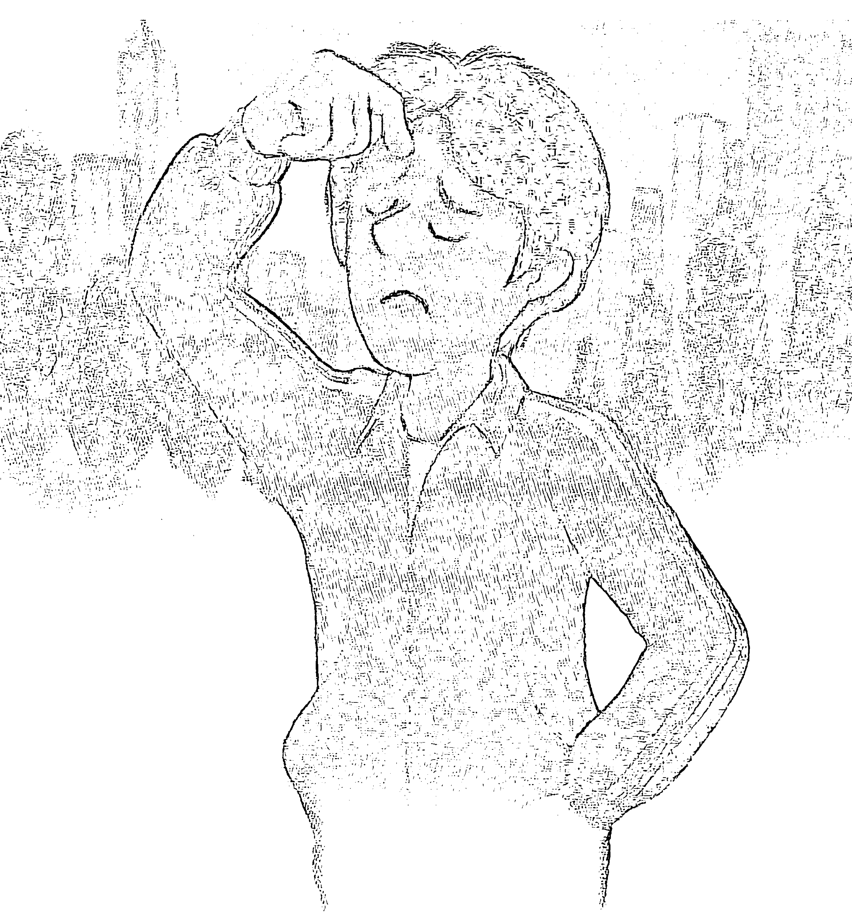

# ！难道我不想，就不存在了？

## 12 难道显化出来的宇宙就是我们的一切吗？
Is Manifested Universe All That There Is?

我知道，一开始答应过只有两章会谈物理。但我相信，你已经发现，不知不觉，自然又回到了科学和物理领域。毕竟从我的角度来看，到最后，真实是可以从各种领域去验证的，而不是只能由某一个哲学、宗教或灵性的领域来垄断。

站在物理的角度，前面提过，光是限制在宇宙的范围来探讨，时间也从来不是一个宇宙的常数。

我们或许会以为常数既然是永恒不变的，那么，应该是经过慎重思考，在理论架构一开始就纳入了。然而，很有意思的是，很多物理的常数，都不是理论一开始就想好的。是反过来，从实验的观测，发现结果与理论不符合，让公式的等号无法成立。于是，再加上一个项目，也就是一个条件或一个变量。这个条件或变量，在人间的范围变化很小，才自然变成一个所谓的“常数”。

举例来说，普朗克常数就是这么来的。

这个故事，要从“黑体辐射”谈起。我们平常看到一个东西的颜色，其实是光线照到这个东西上，被反射出来的部分。比如白色，是光线打上去，全部被反射回来，我们也就看到了“白”。那么，黑色又是什么呢？其实，也只是光线打上去，完全被吸收，不被反射出来。没有任何反射光，我们也就看到了“黑”。所以，对物理学家而言，一个完美的“黑体”，也就是一个完全不会反射光线的体，能完美吸收任何能量。然而，完美的黑体在现实中并不存在。所以，能够观察的，最多是类似黑体的物质。

至于辐射，我们在日常生活中，都有机会观察到这样的例子：加热铁块，站在旁边的人，自然会感受到“热”，也就是辐射。因为热透过红外线，传递到我们的皮肤表面。铁匠会继续加热这个铁块，直到它变成黄红色甚至蓝白色（如果温度够高）。这是因为给予能量愈来愈多，放出的能量移到了我们肉眼可以看到的区块，成为光辐射。

物理学家在实验室里，用一个只有一个开口的小空腔，来模拟黑体。这个空腔只有一个开口，所以，观察到的任何光不会是从另一个开口漏进来的。如果，在这样的一个黑体里，我们竟然看到光色的变化，那么，这个光色怎么来的？应该就是这个物质放出来的辐射，在其他方向的辐射都被黑体完美的吸收掉了，只是透过这个唯一的开口，被我们观察到。

早期的科学家，观察黑体在不同温度下所辐射出来的光谱，也想要建立理论来解释能量透过物质的进入和输出。但是，用传统的光和力学的连续性来探讨，一直得不到能符合观察结果的理论。直到 1900 年，普朗克发现，能量的分布并不像光波一样是连续的。只有假设能量的发射和吸收是一份一份地进行，理论的计算才能符合实验的结果。然而，在计算这一份份能量和频率的关系时，总是好像还是少了点什么。最后，要乘上一个固定的数才能平衡。也就这样，定出普朗克常数（6.62607004×10^{-34} m^2 kg / s）。

当时，普朗克自己也没有想到，这个常数后来扮演了一个很重要的角色，可以说是开启了后来的量子物理。在这个常数衍生的普朗克长度的范围，一个粒子自然可以活出量子物理的不确定。

从我的角度来说，现在物理学采用的很多常数，最多只是来补偿理论的不足，并不是它足以代表永恒，也不是永久不变的。是因为光是为了解释显化出来的宇宙，就已经少了什么，才要凑出个什么东西来称为常数。

我为什么要谈普朗克常数，其实不是为了闲聊，而是有它的背景。至少，透过普朗克常数，我们突然从自己认为很坚实、很确定的世界，进入一个完全不确定的世界（最多，只能称为可能性 [possibility]）。

从另外一个角度来谈，到目前为止的物理学，最多只是代表这个“有”的世界，也就是显化出来的宇宙 (manifested universe)。然而，就连整个“有”的世界，最多还是站在一个局限的范围，不可能是永恒。即使我们认为这个宇宙还不断在膨胀，但是因为它本身有一个出发点（大霹雳），怎么讲还是一个封闭系统，并不是无限大，也没有什么东西叫做无限小。

透过普朗克常数所揭露的量子现象，我们自然体会到，还不需要谈到无限小，光是在这个有限范围里的一个很具体的小数字，就已经足以让过去的物理定律失效。

我们还不需要讲到无限、永恒、绝对，光是在这个有限的范围里，就出现了让所有物理定律都没办法作业的领域。

物理学上的这个突破，让人類不得不谦虚体会到，自己所拥有、所掌握、所认知的，都没有绝对的代表性。最多只是在“有”的世界，有它的作用。还没有离开“有”，只是进入小一点的范围，就已经不作用了。

也就是说，并不是普朗克的发现支持了绝对和永恒。而是，我们透过这个发现可以清楚体会到，就只是在这个显化的宇宙，一旦落到普朗克长度以下，物理的定律就被大幅度推翻了。在这个显化出来的宇宙，还有很多层面的力量、机制、本质是我们不清楚的。

不仅如此，往大的范围走，还不用到无限大，人类已知的物理定律也可能失效。进入黑洞，确实所有的物理定律都失去效用。

现在大家都听过黑洞的理论。几十年前，黑洞理论的发展还在早期，霍金²认为黑洞可以把资讯场吞掉。当初，我就认为这是不可能的。假如可能，那么，在黑洞的状态，或宇宙还没有成形前，也就没有意识，因为意识已经被崩解

> 2 霍金（Stephen Hawking, 1942-2018），著名的天文物理学家，很年轻就得到渐冻症 ALS，是一般人认为的绝症。但是，他这一生，在轮椅上为现代天文物理做了很大的贡献。

了。

很少人能够理解，霍金的说法会衍生出怎样的后果。当时我和霍金也有对话，指出这个问题。他说，他同意我的观点，但数学推算并不支持这样的结论。好多年后，他才澄清了自己理论的错误。

如果霍金原本的说法正确，就好像让一个人在桥上走，走到一半，桥突然断了，非但走不过去，更严重的是，往下看，也完全看不到东西，因为没有东西。他当初的说法不只是在还没有延伸出这个宇宙前，造出一个断裂（不连续性）。甚至，连我们所讲的最原始的意识（primordial consciousness）都没有。按照他当时的理论，绝对也不可能存在——在最早的状态下，不会有什么可以称为绝对，一切都是相对的。

然而，黑洞，尽管什么都可以崩解，唯独资讯场也就是意识，是崩解不了的。在非时间的永恒中，即使没有时间，没有空间，还是有个最原始的意识存在。这个意识不受任何限制，不受到时空的限制，不是落在一个相对有分别的层面。我们最多能称祂是绝对的意识。即使大霹雳后，又过了一百四十亿年，这个意识还是存在。在每一个角落，每一个范围都存在，因为祂消失不了。即使我们把祂称为是“空”，这个空，本身还是含着全部的潜能，包括意识。所以，最多是允许我们用“意识”来称祂。

这么一来，我们才真正有解脱的可能。因为我们在任何相对的层面，在时间的范围内，其实有一个东西叫做非时间的永恒、绝对，随时存在。

假如不是这样，我们解脱不了，也醒觉不过来。因为，醒觉，最多只是活出祂自己。也就像在大霹雳之前，绝对已经存在，祂已经活出祂自己。祂不需要这个大霹雳化出来整个世界，才可以表达祂自己。祂本来就有，就是有了这个宇宙，祂还是存在。就是这个宇宙消失，祂还是存在。

~.~

我会举普朗克常数和黑洞理论的实例，最多也只是在说明，物理学透过理论的架构，早晚会一步步地证明过去大圣人所留下来的全部观念，包括“全部生命系列”所讲的一体和绝对。

但是，从另外一个角度，我们其实也不需要把它变得那么复杂。只是现代人的聪明过度发达，认为样样都需要在理论上解释说明，才有这些理论可谈。其实，我们这里所谈的“非时间的永恒”是每一个人随时可以体验的，倒不需要用物理做什么证明。毕竟，现在的科学也证明不了。

所有的科学，最多是把“有”的世界、显化出来的宇宙做个解释。然而，就在这个显化出来的宇宙，到了相对大和相对小的尺寸，都没有办法得到一个妥当的解释。而且头脑会把本来很直接、每个人可以体验的，变得很复杂，甚至到头来变得体验不到。就像许多现代物理和数学的观念，虽然我们都有过亲身体验，但是一落成数学的方程式，头脑反而无法理解。加速度，就是一个例子。

我们大多数人都开过车，都知道脚下的油门一催，车子就愈跑愈快，也就自然体验到加速度。但是，把加速度用数学来表达——速度随时间的变化（a=v/t），也就是在谈距离随时间的变化再变化（d/t/t=d/t²），或说距离随时间平方的变化。对头脑而言，时间的平方是什么意思，是怎么也想不通的。这些观念，除非我们有所体验，不然理解不了的。

一个好的物理学理论，可以简单解释所观察到的现象，更可以预测未来可能观察到的现象。最优秀的物理学家，无不想要追求一个理想中的统一场论或万有理论，希望能简单解释，甚至预测宇宙一切的现象——小从量子，大到星系，到全宇宙。

第一章提过，爱因斯坦认为重力是相当特殊的作用力，很难用传统的力学观念来解释。然而，量子电动力学（QED, quantum electrodynamics）这个领域，就是希望能用基本粒子解释宇宙全部的组成和力量。当然，这里谈的基本粒子，对我们来说一点都不基本，老早远远超过中学物理所谈的电子、中子和质子。物理学家偏爱的这些粒子，连名字都相当冷僻，像是夸克（quark）、轻子（lepton）、渺子（muon）和涛子（tauon）……等等。

对物理学家而言，任何架构，离不开“架构”和“架构”的关系，也就是“体”和“体”的关系。这种关系，也就是我们一般所说的“力量”。除了解开各种基本粒子的属性，物理学家更想知道可不可能透过粒子，解释四种基本的作用力——电磁力、原子核强作用力、弱作用力、重力。

到现在，已经知道光子（photon）、胶子（gluon）和w- 与 z- 玻色子（w- and z-bosons）可以解释前三种作用力，这些粒子的存在，也都在实验中观察到了。只有重力子（graviton）仍然还停留在理论，没有在实验中观察到。而且，从理论上，也很难解释大的物体（宇宙、地球）的重力。

## 12 难道显化出来的宇宙就是我们的一切吗？

力。

物理学家的追寻，可以说是上天下海，从最大到最小都找遍了。但是，到现在非但还没有一个量子的重力理论，包括我们这里所谈的时间，也没办法有一个妥当的物理解释。

如果真有一个理想中的统一场论或万有理论，不可免的，要把量子力学和古典力学，乃至广义相对论，做一个整合。但是，现在还有很多断层跨不过去。

此外，我在这里还是要再做一个提醒，头两章所汇总的，和时间有关的物理学和科学观念，都还是在一个显化出来的宇宙的角度在谈。全部的物理常数，无论是光速，或普朗克常数，都还是离不开这个显化的宇宙（我通常称为凝结的意识 solidified consciousness——就像是意识的螺旋场从高速降到低速，而在过程中凝结出物质）。光是要解释已经显化或呈现出来的宇宙，量子力学和古典力学就无法衔接，更不用谈去解释还没有显化或呈现的宇宙。所以，物理学家自然产生物质或暗能量的观念，来补足可见到的能量或物质所不能解释的部分。

我年轻时，也花了不少时间想建构一套理想的统一场论。还写了一本书，想把量子力学和古典力学整合起来，到现在还没有发表。假如没有记错，已经写到 937 页。但是，我知道，再怎么整合，还是在显化出来的宇宙着手，没办法解释意识。然而，意识才是根本。

对这已经显化的宇宙，我们解释的再完美、再缜密，这个部分也占不到整体的兆分之一，根本就不成比例。就算把所有的法则解释清楚，也自然会发现它们没有独立存在的价值。少了后面更大的力量，再好的理论也不可能足以解释全部。

假如我们回到最早最早，宇宙还没生出来的时候，自然发现时间是永恒，也就是没有时间的观念。是从物质产生大霹雳，时间的观念才启动。

有意思的是，我们的宇宙到现在还在不断地扩张，而时间似乎最多只是带来一个方向，让空间的变化可以产生意义。尽管如此，我们平时从未怀疑过时间和空间都只是从头脑投射出来的观念。

我会再一次强调，是因为你我随时被时间的方向骗走了。我们都认为，有了过去，当然有现在。接下来，有未来。而且，这个变化像直线一样，有先有后。但是，从另一个角度，光是就我们所看到的宇宙的发展，从没有，到大霹雳，再继续扩张——在这过程中，时间从来不是一个固定不变的常数。不光如此，我们看自己心理层面的时间，也知道时间不可能是常态。它带着一个主观性，只有体验的人可以衡量它的长短。

正因为如此，我们当然也不会认为在每一个时间的范畴里，其实含着非时间的永恒。更不会认为，这个非时间的永恒，可以透过意识随时去取得（而不是从已经显化出来的宇宙去取得）。很有意思的是，我们每个人也就宁愿投入已经呈现出来的很小一部份，而称这是自己全部的可能。

我相信，用这个角度不断谈下去，我们自然会发现，就像第二章谈过的，不需要去黑洞或大霹雳这种特殊状态，才能找到非时间的永恒。其实，我们从来没有离开过非时间的永恒。而且，是透过这个层面，才可以把人生的全部问题解开。

这些重点，我没有听过一个物理学家能从物理的角度说清楚。反过来，哲学、宗教领域的朋友，因为对物理的理解不够深入，也没办法把这两个观念整合起来。这是相当可惜的。我想表达的是——修行、解脱完全是科学化的。未来，会有一套科学，把这个讲的一目了然。只是现在的科学还没有到那里。

然而，所有的这些追求，甚至包括最终极的统一场论或万有理论，对我们个人的生命其实都不那么重要。唯一重要的是——我是谁？我怎么有这个能力创出时间的观念，造出一个完整的时－空，一个世界？

一个人懂了这些，自然明白，任何其他的追求，相比之下都没有重要性。不只对意识转变或解脱没有帮助，可能反而把我们绑得更紧。

最后，连这些知识也要丢掉。

## 13 相反的手法
A Contrarian’s Approach

我这本书，主要想强调——没有时间，不光没有知识；没有时间，其实也没有“我”。

No time, no ego. 没有时间，也没有“我”。光这句话，可能就跟你过去想的完全不一样，甚至根本是颠倒的。这句话，含着两个主要的用意——本来我们的头脑跟动物一样的，很单纯。觉察到资讯，处理完了，把它存档，以后再把它带出来。但是，没想到透过联想和比较，自然产生了时间的观念，而时间自然创出空间的观念。透过时─空的观念，我们不断地体会到每一个环境的讯息或内心的想法都有一个比较的基准点或说中心。前面提过，这个基准点或中心，也就自然变成了“我”。

所以，也就这样子，听，是从什么角度在听？当然是从“我”。看、闻、体会、尝，也当然是从同一个中心。这个中心，当然也只是“我”。

因为“我”，不管是听的“我”、看的“我”、闻的“我”、体会的“我”、尝的“我”，在神经的作用下，好像是完全重叠的。也就不不知不觉，这些虚拟的“我”，变成了真的“我”。好像很坚实，有个本质存在。面对一个经验，假如我们是透过听觉、视觉和其他感官同时体验，得到的“我”还可以互相验证，也就自然确立了一个更坚固的“我”。好像有个独立的生命存在。有生，有死。

不仅如此，这个“我”自然也跟这个身体绑在一起。就像这张图所表达的，我们的身体受伤了，在痛。我们自然会认为“是我痛”。因为身体从我们的感觉上也是坚固的，自然也就合并在一起。这一来，“我”跟身体就分不开了。

也就这样子，这个“我”透过身体，还有念头，造出一个物质的世界，自然感觉是样样都有一个“体”。有身体，才会有念头。没有身体，就觉得一切，包括念头都跟着消失了。自然地，“我”也跟我们的生物周期绑在一起，认为有一个生命，也许几年，也许几十年。然而，最长最长，也就是有限的几十年。

我们就这样完全投入一个相对的世界，随时忘记了——

其实这个世界是“我”延伸出来的。是因为有了这个身体，再加上五官和念头，才可以投射一个世界。不然，这个世界本身没有什么意义。甚至，连形状都没有。

另一个重点是——“我”是时间的作用，所以，“我”最多是虚拟的。其实没有一个东西叫做“我”。然而，有意思的是，虽然它是虚拟的，不存在，这样的“我”，却是我们全部烦恼的根源。

其实，没有一个东西叫做“我”。“我”，最多是个念相。过去大圣人才会说——消失“我”。“全部生命系列”最多也是在表达——化解“我”。然而，这种说法不光是个比喻，更是个大妄想——“我”不可能被消失，因为它本身不存在。假如它真的存在，不可能透过练习或修行，就把它消失。

就是因为它不存在，我才不断地重复——每一个人都有机会醒觉。但是，醒觉的，不是“我”，也不是这个身体。因为“我”跟身体都是虚构的，一个虚构的东西不光不可能体会到真实，而其实也没有必要让它醒觉，所以，也可以放过它。

换句话说，不是“我”或这个身体可以醒觉。这个观点，又和一般的想法刚好相反——是的，有一个东西叫醒觉，也有一个观念叫绝对。但是，不是“我”或身体可以体会到绝对或一体。那么，究竟是什么，才可以彻底体会这个观念？

你我只可能用参的方法，参到底。透过亲自的体验，才可以领悟到。而不是透过任何知识或任何解释，就可以把祂描述出来。

我会说“全部生命系列”所带来的，都是完全相反的手法，还有另外一个原因。我在这里大胆地说，全部的能力、全部的技巧、全部的方法、全部的知识体，包括任何领域（比如说功夫、瑜伽、静坐），再包括任何观念（甚至解脱或是“全部生命系列”的理论），如果只落在知识的层面，最多只会强化“我”。因为是“我”懂，“我”有功夫、“我”有耐心、“我”诚恳、“我”友善、“我”可以做瑜伽、“我”是行菩萨道、“我”领悟、“我”解脱……全部这些观念，还只是在“我”的范围内打转，一样也只会强化“我”。

值得我们注意的是——一个人走到最后，自然会发现只剩下臣服和参。因为，只有透过臣服和参，才可以彻底消失任何体验、任何观念，包括时间。如果走到最后，连臣服和参都起伏不来，一个人也就差不多了。

差不多什么？

接下来，没有话好表达。一切，最多只是沉默。只是安宁。只是平静。只是涅槃。

这里讲的沉默，指的不是没有声音，不是没有动。不是声音或动的对称，也不是声音和声音之间的空档。这里所谈的沉默，本身是一个绝对的观念（假如可以这么称祂）。祂含着一个全面的理解，是彻底领悟到——站在一体，这个世界，没有一个观念，没有一样东西、一个体验有任何重要性，值得再做一个反应，更不用说反弹。

一个人虽然还没有活完这一生，也就好像已经老早活过一切。因为一切可以活的，都不重要。跟他领悟到的整体，一点都不相关。所以，透过沉默，他最多只是放过一切，爱护一切，感谢一切。

因为透过一切，不管是眼前的众生、东西、事情，他最多只是在体会到自己。而自己，就是绝对，也就是非时间的永恒。

## 14 一切是注定的吗？
Is Everything Pre-determined?

讲到因一果，很多朋友会问有没有科学的根据。我有时候用牛顿的作用力－反作用力来说明，但是，也同时知道这个定律没办法完全解释。那么，有没有其他的根据呢？

到这里，我想介绍十八世纪著名的法国天文学家暨数学家拉普拉斯（Pierre-Simon, marquis de Laplace, 1749-1827）。如果你听过拉普拉斯变换（Laplace transformation）大概知道他在数学和物理学有很多贡献。他用数学去描述各种天文现象，包括行星轨道的大小，太阳系是怎么形成，后来又怎么变化，也很早就提到了宇宙应该有黑洞。

当时，他有一套很出名的“科学命定论”（scientific determinism）。强调在科学的角度，只要提供完整的条件（物理学家称为状态，或前面提过的边界条件），那么，透过科学，可以完全预测出过去或未来的变化。比如一个星球的位置，它在宇宙的移动路径和速度。

拉普拉斯认为，我们人活在地球，这个地球只是太阳系的一小部份，而太阳系又绕着银河系在转，和整个星系相比起来，人类是不成比例的渺小。如果科学可以预测出整个星系的周转，和种种物理的状态，对我们人类，当然也一样。甚至，连行为都是注定的。我们倒是没有自以为的自由。

这个观念，当时虽然造出很大的争议，但是在接下来的两百年，其实是学界的主流思想。直到近百年前，遇上了前面提过的德国量子物理学家海森堡所提出的“测不准原理”才势微。测不准原理认为，粒子的主要参数（无论速度和位置）都不可能完全确定，只能部份决定，最多只能说是一个可能。

但我要提醒的是，量子物理虽然可以解释粒子在小范围的行为。但是，对于大的天体的行为，仍然无法说明。大家才会期待量子的重力理论。不只如此，奇点，或大霹雳还没有发生前，也是量子力学没办法解释的。

再换一个角度来说，测不准原理多少也是勉强成立的。也就是把一个东西先当作粒子，非要去测量它的速度或位置，才逼出来一个不确定的原理。反过来，如果把它当成波来看，自然也没有什么原理叫做不确定。

很有意思的是，尽管爱因斯坦的研究，包括相对论，其实是量子物理的基础。但他到死前还是不接受量子物理，甚至说“上帝不掷骰子 God does not play dice with the universe.” 他认为，没有什么事情是真正随机发生的。

这些过去理论或思想的变化，都值得我们参考。

毕竟，边界条件也是感官投射出来的。有了眼睛，才可以体会到光速，就像是一种主观的门槛。对于感官反应可能更快或更慢的外星人来说，他的边界条件，可能是我们的好几倍或几分之一。说不定，有一天，我们会突然发现，所有的边界条件不只限于这个四度时空可以量测、可以看到的，更可能是远远超过。就是考虑到人间四度的时空没办法解释宇宙全部的变化，物理学家才要超过人间的范围，去找一些隐藏的变量和力量。就像现代最先进的各种弦理论，要带出十维、十一维甚至二十六维的参数，来探讨在人间的作用。

如果我们扩大这个考虑的范围，拉普拉斯的科学命定论，到最后可能还是完全正确——不光这个显化或呈现出来的宇宙是注定的，甚至，我们每一个人，这一生，都是注定的。所有我们体验到的，最多是果（outcome, effect），是透过种种边界条件所造出来的。这些边界条件，不是人间狭窄的四度里的变量可以讲清楚的，可能真要像弦理论，用十维甚至二十六维的力量，才可能解释。透过我们的头脑，不可能清楚解释眼前所见的果是怎么来的。

认为在我们的范围内可以体会到“因－果”，其实是不正确的表达。因为我们最多在体会果。因，不是从人间可以体会到，而是在更深的层面老早存在。我们在人间体会的因－果，最多是因－果的一半——只剩下果。

再讲透明一点，也许在量子的范围，还有一个不确定可谈。但是，只要延伸到我们的尺寸（所谓牛顿力学的范围），我们体会到的，最多是已经成形的果，倒不是任何因。

回到物理，我也要再次顺便提到霍金，他说过一句话“Why does the universe bother to exist?”为什么宇宙需要这么麻烦地存在？

假如我当面听到他这么说，最多也只能回他“The universe does not care.”——宇宙，根本不在意它自己存不存在。

宇宙本身不存在，最多只是头脑投射出来的东西。只是因为我们有聪明的脑，再加上五官，才投射出一个宇宙，才有一个真理去追求，而且永远追求不完。甚至，到最后，还可能把我们个人的追索和探察推给宇宙，成为宇宙的问题。

我借用下一页的图来表达，不同感官的生物所可以体会到的真实。图的右半边，是描述我们人类可以体会到的世界和宇宙，每个星球、每个存在，都好像有一个具体的“体”。然而，如果换一个存在于别的星球或别的层面的生命体，就像图的左半边所表达的，透过他的感官（谁晓得他有多少感官，也许五个，也许更多，也许更少），对宇宙的观察和对真理的观念，可能完全不同。从我们的角度，可能比较容易理解，外星人所抱持的宇宙观还是他自己投射出来的。然而，比较不容易反省的是——我们，其实也只是如此。

所以，都是颠倒的，一切都是颠倒的。

因为我们有人，才有这个宇宙，才有宇宙初始的问题要去追求。不然的话，一切都是宁静，一切都是非时间的永恒。要从其他角落把真理找回来，是不可能的。因为它本身不存在，或最多是不成比例的存在。站在整体，没有一点代表性。

回到因一果，最多也是如此。因一果本身也是头脑的产物，我们透过头脑呈现出来一个宇宙，自然会找到许多法解释这个宇宙的运作。因一果是其中一个主要的法，让我们肯定这个宇宙的坚实。透过它，可以延续自己的体验，再继续化出更精彩的变化。在虚拟的状态下，不断建立一个我们认为有凭有据，自己就足以证明自己的世界。

## 15
业力、因一果，离不開时间
Karma Is Not Apart from Time

因为因一果这个主题太重要，我想在这里再做一点补充。

假如我们可以接受“动”、“想”、知识、“我”都是时间的观念，而时间是头脑的产物，那么，我们也就突然理解，什么是因一果或业力。

在时间和头脑的领地，因一果业力就是推动全部运作的游戏规则。是透过因一果，我们才可以把时间创出来的每一个架构产生关系和连结，让头脑可以感觉到每一个架构之间的连贯性，甚至意义。

也就是说，透过因一果，我们才可以得到一个全貌。而这个全貌的每个角落，本身又有它因一果的来源。也就这样子，我们可以组合这个人生。透过业力，一切突然都有了意义——都有了原因，都有了来源。Life suddenly makes sense.

人生，突然可以解释，有了意义。也透过这个意义，我们的人生突然有了目的。

我们不光是在眼前的每件事之间排列先后，还同时可以排列体会到或没有体会到的所有事件。在每件或许相关，或许不相关的事之间，做一个整体的连结。

业力，是我们这个世界的架构。它又是这个世界的动力，又是游戏的规则。让我们更想不到的是，它本身也就是每一个瞬间所看到的后果。就是因为业力就是人间的每一个角落，甚至组合起人间的每一个角落，包括我们自己。所以，要让我们看穿业力，是不可能的。

回到哥德尔的数学定理：假如我们在一个封闭的系统，要经过头脑这个封闭系统去了解外面，是不可能的，因为我们没有一个机制可以去体验。假如我们可以体验到框框的外面，虽然好像已经打破框框，到了更大的范围。然而，这更大的范围，一样是封闭的。我们还是没办法体会到绝对。

不光如此，因一果本身也定出了我们人间这个封闭系统的所有观察机制。它不光是掌控结果，还直接掌控我们为什么观察到这个结果（这个世界）。所以，活在这个人间，我们等于是被因一果锁住。我们的可能，已经被锁在人间的范围，而不可能体会到人间以外的选择。

业力组合我们相对的世界，局限我们。虽然我们从业力所限制的范围，体会不到什么叫整体、绝对、无限。但是我们有很发达的聪明，还是可以投射。我才会用有限和无限、相对和绝对的对比来说明。从数学，我们可以用∞这个符号来描述无限大。也就这样子，一个抽象的观念还是可以落在我们的语言里，建立一个词汇。

回到时间的主题，因一果本身离不开动，而动，自然造出一个时间的排列。回到动的观念，也就可以用牛顿第三运动定律的作用力－反作用力的观念来解释。举例来说，就像把球往墙壁上打，它会弹回来，而反弹的速度、力量和角度，完全和前面球撞到墙壁的速度、力量与角度相关。如果要套用同样的定律，我们因为自己受限于可以看到的范围，自然希望，就在人间，有个因可以解释这个果，而彼此间有连结的关系。牛顿第三运动定律确实可以解释单纯的物体运动，但在我们可见的范围内，无法解释人间复杂的发生，或一个人的命运。

一个人出生以来的经过、扮演的角色、所受到的影响——这个作用力和反作用力运作的范围，不只是落在我们可以看到甚至想出来的范围，重点是很大一部份（应该说是主要的部份）其实是在超过知觉和想像的范围运作。就像这张图所比喻的，这个打壁球的人，他不光要应付自己打出去弹回来的球，还有其他的球从别的空间、别的方向不断地向他打过来。

我在这里所表达的因－果，就好像从各角落跑出来的球，乍看之下，不符合我们自己的任何动作。这个打球的人会觉得莫名其妙，哪里来这么多球往自己身上打来？既应付不来，也和他挥拍的动作不吻合，让他预测不到，最后连一个规律都掌握不了。

然而，站在因－果，其实很容易解释。因为我们在人间所看到的任何反应，倒不是从人间任何动作可以回溯出来。而是从各层面，包括一般人所称的前世、看不到的微细层面所成型的。无论怎么说，它还是符合一个具体的法，是作用力－反作用力“一对一”的运作。但是，这个一对一的对应关系，倒不是我们可以从眼前透过五个感官可以直接观察到的。

正因人间的现象，很大一部份是在超过人间范围的运作而有的果，自然让我们以为人间不适用作用力－反作用力的原则，而以为人生不是注定的，还以为自己样样都有自由的选择。反而很难想像自己眼前所体会到的，其实是“果”。
我们从来没有想过，自己所认为的自由选择，依然落在头脑投射出来固定模式的一个小角落，本身已经是被前面数不完的因所塑造出来的。如果要让我们去影响下个瞬间的果，难度很高，甚至严格讲是不可能。因为宇宙每一个角落跟其他的角落都是连起来的，任何动作都和整体分不开，而这个整体也就自然会跟着做一个修正。然而，所谓的修正，也只是自然想把原本固定的蓝图再重复一次。
我常常用这样的比喻——我们所看到的宇宙，其实就像这张图画出来的蓝色果冻，而这个果冻各角落是连结的。就像全相图一样，让我们从每一个角落都可以看到整体，因为它和整体从来没有分手过。我们不可能变更一个小角落，而没有影响到整体。也不可能整体有了变化，却不影响到一个角落。没有哪一个动作是单一而独立的。可惜的是，我们看不到果冻内在的连结，也就以为每个角落或瞬间是独立的，是单独存在的。甚至，还以为我们随时有一个选择，可以改变眼前的一切。

有意思的是，除了牛顿的第三运动定律，还有一个很根本的法则在宇宙运作，我在这里也举出来做一个对照。这个法则，也就是热力学第二定律所谈的乱度趋向最大的观念。在日常生活中，我们随时可以体会到“乱度趋向最大”的现象。举例来说，周末将家里收拾得整整齐齐，如果没有再继续花力气整理，随着一周过去，原本整齐的物品，自然会散得到处都是。

热力学第二定律谈的也就是，任何力量和能量最后都会消散，达到均匀的分布。任何一个有组织的架构，透过时间，都会朝向能量最稳定的状态移动，也就是和环境达到一个均衡。就像沙丘，随着时间过去，自然会变得平坦，因为从位能的角度来说，会比较稳定。

在大自然，我们偶尔会见到有秩序的组织架构，例如花草、动物或人类。这样的架构，一样要克服乱度趋向最大的倾向。最多是在一定的范围内，得到暂时稳定的秩序，维持我们看到的生命。

后来薛丁格提出“反乱度”的观念（negative entropy，后来的人简写成 negentropy），来平衡乱度趋向最大的倾向。可以说就像从不知道哪里，引入一个额外的动力，来维持这个稳定。刚刚谈过，牛顿第三运动定律在人间的运作，有很大部分是我们看不到的。同样的，在这个世界，热力学第二定律的运作，也有很大一部分是看不到的。

从我个人的角度，在物质的层面，乱度确实随时都在作用。但是，只要把意识带进来，而让意识变成物质主要的本质，我们也就会突然发现，乱度趋向最大的观念，只说明了事实的一半。

我们仔细想，意识的根本态，也就是绝对的意识，本身含着全部的可能。祂本身的创造力或潜能，是无限大。不光含着现在科学家谈的暗物质、暗能量，还可以跟任何物质有直接的互动，只是我们透过五官体会不到。

意识和物质的互动，自然会造出一个“反乱度”的作用。让很复杂的组织可以存在，而不只是简单组织的散乱总和。我们在人间也会观察到，透过生命，能量反而不会消散，而是可以集中，创出一个比较高能量的架构——更有秩序，刚好和时间或乱度的方向颠倒。对我而言，跟之前对牛顿第三运动定律的解释一样，这个力量只是从绝对的范围、超过人间的部份随时跟我们互动，平衡我们的能量。所以，人间的生命，一样没有违反热力学第二运动定律。

前面提过，爱因斯坦会加上宇宙常数，其实是因为当初他想像不到宇宙正在膨胀。我会谈这两个定理，不光是因为它们的重要性（这是每一位化学家和物理学家都早就知道的），而是要表达——我们通常会以为，必须在这个时一空满足这两个定理。但是，这两个定理其实是在更大的范围成立的。而这个范围，我们一般意想不到。

提到热力学第二定律，我还记得到不到十岁时，就对这个定理特别感兴趣，特别去读《非平衡态统计力学》（Non-Equilibrium Statistical Mechanics, 1962），作者伊利亞（Ilya Prigogine, 1917-2003）后来拿到 1977 年诺贝尔化学奖。

这本书提到一个观点——从热力学的定律来看，既然能量和秩序会不断地散掉，不断由高到低，这个方向，自然带出来一个时间的箭头（arrow of time）。也就是说，我们时间的观念，过去、现在、未来，是被这个散掉的方向给决定了。就像这张图所表达的，如果没有刻意去维持一个规律，东西自然会散掉。而这个能量和秩序消散的方向，本身就是我们这个时一空所朝向的方向。

虽然，这个结论让人印象相当深刻。但我当时有个体会，从整体的角度来看，它还是个妄想，是个错觉。是从人间封闭的系统看能量，才得出这个结论。如果站在整体、绝对的角度，那么，任何方向都可能。可以从未来回到过去，也可以不动，不选择任何方向。

站在整体，一切都已经圆满。无论是热力学第一定律所谈的能量不减，还是热力学第二定律谈的乱度趋向最大，都早就已经满足而不可能违反。只是落在一个小的封闭系统（我们的宇宙的范围内），确实还有一个方向可谈。

在一个封闭的系统，任何结果都老早已经是注定的，因为它本身是由注定的架构和机制所组合的。去争论谁先谁后，其实没有意义。也就好像我们在谈先有鸡还是先有蛋，突然发现——鸡和蛋两个都不存在，或说两个都存在。

也就是因为没有一个自由可谈，全部都是注定，只有站在绝对，我们才有资格谈自由。这本身又是悖论，但确实就是如此。唯一的自由，是我们站在整体、绝对，随时可以选择跳到哪一个角落，也就是选择参与或不参与任何封闭的系统——例如人间的运作。

让我换另一个角度，再讲清楚一点。我们会认为，从过去到未来是一个时间的方向。但是，从绝对来看，其实没有方向好谈的。有意思的是，我们假如突然跳到绝对的范围，自然从高高低低的能量状态，回到最稳定的根本态。也就从费力，变成不费力。所以，假如还有一个方向可谈，其实就是回到绝对。绝对，才是相对最终的方向。

我们一般人会认为，从过去，好像有个时间，像箭头一样指向未来，而且认为这个箭头是不可能回头的。然而，比较正确的表达是——最大的吸引力，是从相对回到绝对。这个吸引力，让我们可能在每个瞬间，都找到回去的一个出口。佛陀才会说，连一枝草、一朵花会成佛。

不用担心，有一天，这里所讲的都会被物理和数学的语言证明出来，只是用的不是我们人间的参数。

正因为我个人认为这些观念是完全正确的，知道从“相对”回到“绝对”才是真正不可能回头的方向，最多只是早晚的问题。也才透过这些作品，不断地一次次提出来，希望你我随时找到这个人间的出口。

## 16 时间的箭头 Arrow of Time

讲到时间，讲到因－果，也就会自然谈到轮回——这是许多朋友随时想要知道的。

就是因为我们透过一般的体验，认为这个世界是坚实的，也自然肯定因－果，肯定业力，而认为还有一件事叫轮回。甚至，会进一步认为轮回应该是有方向的，是从过去，往未来推进。

但是，我要提醒，这还是头脑的作业。整个人生是头脑投射出来的，是我们透过各式各样的喜、恶、爱、憎所吸引或排斥而成的最终产物。其实，没有一个真正的东西叫人生或小我。都是头脑的产物，也没有必要跟着时间的先后顺序运作。

讲直接一点，假如我们这一生想的，全都是过去，或是几百年前，哪一个年代，很可能下一生就投生在这样的过去。我知道这几句话，本身带来一个大悖论，头脑会认为不可能。但我最多只能说，这要每个人亲自去验证。

最后，连这些观念都不重要。就像前面讲的，我们认为身体是真的，甚至是再真实不过，也就这么创造出来一个世界、一个宇宙、一个生命。轮回或不轮回，全部也还是头脑的产物，头脑的投射。

所以，追究轮回的问题，一点都不重要。

我才会说，人类集体的失忆，让我们每个人困在时间，而最多成为又一个罹患“错误认同症”的病例（a case of mis-identity）。也就是说，我们本来应该跟绝对接轨，但我们非要把自己的身份落在一个狭窄、相对的轨道。也就这么子，才有那么多痛苦，而还有一个轮回或业力好谈的。

我在《集体的失忆》提到，人类的演化到后来，也就是忘了我们本来就有的醒觉，忘记了这个最不费力的状态。又在《落在地球》谈到，我们要解脱，要跳出全部人类相关的特质。唯一没有提到的是，让我们集体失忆或是落在人类特质的主要力量，其实只是——时间。

也就是说，解脱，是要跳出时间的观念。时间可以带来的任何事物、观念、特色，包括人类的发展、思想的转变，其實已經讓我們局限了——從自由、無限大的絕對，落在一個相對的小範圍。

時間，就是有這麼大的本事。

任何觀念，只要與時間有關，本身就在做一個局限，帶來一個束縛，設定一個條件，落入一個制約，劃定一個邊界。把時間的特質徹底取消，一個人，才可以真正自由起來。我之前在《定》也提到，大定，是最不費力的定，是讓人從時間的束縛跳出來。

從過去和未來的範圍跳出來，我們才輕輕鬆鬆地可以活在當下。全部的修行，也只是從相對，進入絕對。也就是從時間的領域，到非時間的永恆。非時間，其實不是沒有時間，而是跳出時間的觀念。

要提醒的是，從時間的範圍跳出來，會從身心帶出來很多作用，就像是一種好轉反應。我過去在《真原醫》談好轉反應，主要是從疾病復原的角度來談，但套用到身心的好轉，也是一樣的。

一個人要從疾病康復，恢復原本的健康圓滿，要經歷這樣的好轉反應。我常常用這樣的比喻，身心就像一卷錄影帶在回轉，讓這些症狀重新出來，疾病才會真的痊癒。心理療癒的層面也是如此，許多專家都知道，要讓過去的創傷重新浮出來，一個人才可以徹底好轉。

賀林定律（Hering’s law）提到在好轉的過程中，症狀是由上至下，由內而外發出。而且，是近期的先出現，然後才是久遠前的症狀。從我個人的觀察，這個定律相當準確。

雖然，好轉反應的觀念，和近代西醫的主流想法很不一樣。然而，在更之前的西方醫學，好轉反應的道理其實才是主流。是到了近百年，抗生素的使用開啟了對症療法的時代，強調壓制症狀，才讓一切顛倒。

一個人要解脫，也是如此。在修行的圈子，很少人會提到好轉反應的觀念。也就是在解脫的過程，時間帶來的全部因果會先浮出來。從時間，進入非時間的永恆，要面對相當多因果的轉變，會讓人相當不舒服。包括浮出過去的很多畫面，還不光是這一生，都要去面對。佛陀和耶穌，在他們個人的過程都經歷過。這是過去聖人所談的魔考，或靈魂的暗夜。只有全部的因果浮出來，一個人，才可以往回轉，而可以真正跳出來。

所以，我後來才會帶出這些方法，包括臣服和參，也就是幫助你我面對這些好轉反應——身體、雜念或情緒的考驗。最後，還是要記得，無論好轉反應或任何反應，還是離不開頭腦的產物，本身也是頭腦，再加上情緒延伸出來的。

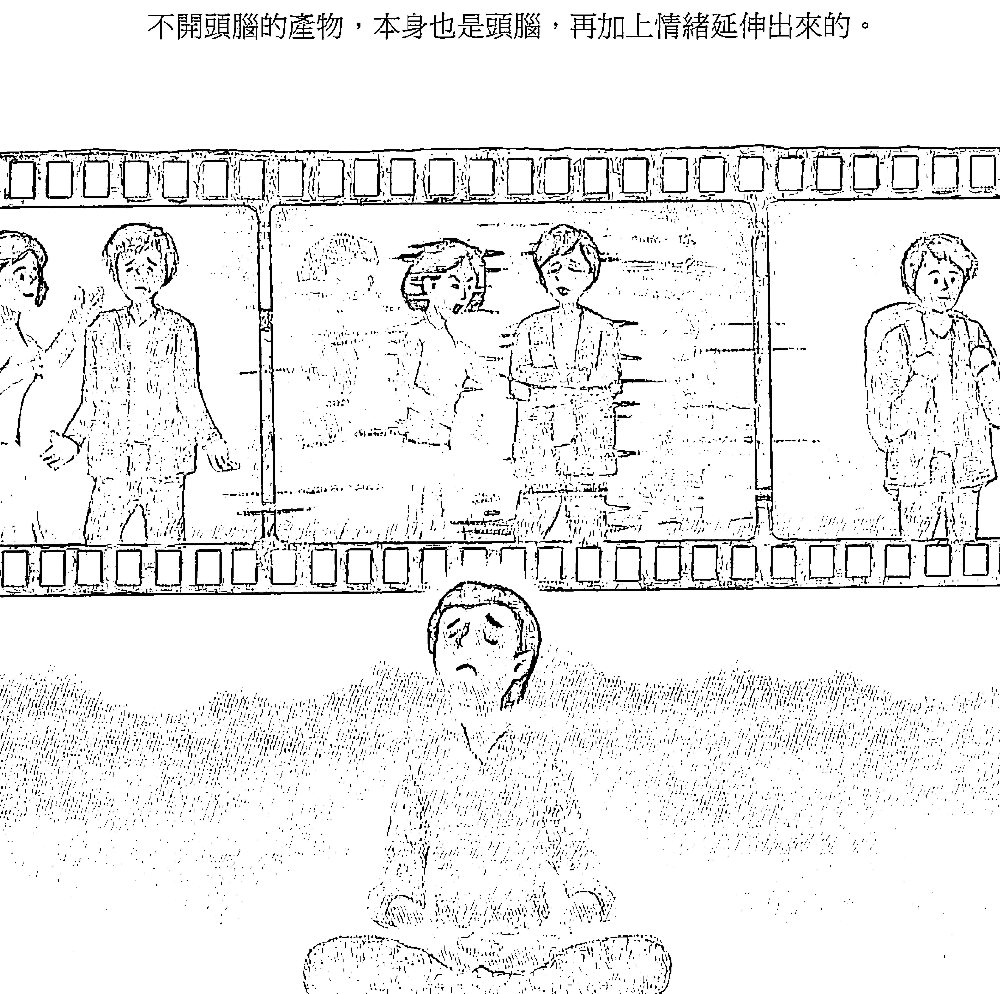

這麼說，好轉反應本身也是解脫的工具。面對任何好轉反應，臣服或是參，讓我們潛入意識更深的層面。我們會輕輕鬆鬆發現，面對人間的任何考驗（包括好轉反應），都不去抵抗或反彈，眼前的好轉反應或因果，自然會反轉，而自己消失。

消失掉因果，消失掉種種好轉反應，一個人也就自然進入非時間的狀態。

## 17 量子眼中的時間
Time in a Quantum Sense

頭兩章，我透過物理學的觀點，把時間做了一個介紹。後來，在第 14、15 章，又提到註定的觀念。對此，有必要回到物理的層面，用量子物理的基礎再談一次時間和註定。

希望你還記得，我在前面的作品《不合理的快樂》和《定》，曾經提過普朗克長度，是 1.616×10^{-35} 公尺那麼的小。小於奈米的物體（10^{-9} 公尺），已經開始呈現量子的性質，更別說這麼小的長度了。

普朗克長度雖然可以用數字和單位來表達，但仔細想，這個長度其實是不可思議的小。一根頭髮（如果是亞洲人又粗又直的黑髮），有 50 微米粗（微米是 10^{-6} 米，百萬分之一米），是普朗克長度的 10^{28} 倍，也就是是普朗克長度的一萬兆兆倍。小的原子直徑只有 30 皮米（皮米是 10^{-12} 米，兆分之一米），要動用到原子力顯微鏡這類先進設備，透過原子間作用的力場才可以看到一個影子。然而，就連一個原子，都至少是普朗克長度的兩百億兆倍。

用這兩個例子，也只是要表達，以我們習慣的尺寸範圍來說，說量子是完全處於另外一個世界，一點也不為過。回到物理的角度，我們所看到、體會到的範圍，尺度遠遠比量子還大得多，才會說要受牛頓運動定律的影響。

對一個量子來說，在它的世界裡，任何「動」或「發生」最多只是一個可能。只是，一但來到我們這個人間的範圍，它已經固定下來，已是「果」。用命運來比喻，它的「命」，已經註定。

我在這裡用下一頁的龍來做比喻，如果龍從量子的世界，飛到我們這個人間，對它來說，本來在量子的世界很自由，哪裡都可以去，也可以哪裡都不去。就像這張圖所畫的，龍的位置是虛的，不是固定在某一個角落。然而，進入牛頓力學的世界，龍的位置、形態也就被註定了。就像畫裡所表達的，龍變得具體了起來。

過去一些物理學上的爭議，包括為什麼確定不了一個量子的位置，因為一觀察，也就固定了它，也就是觀察會決定它的結果。這一點，一般人很難想像。但是，在另外一個層面，又非常合理。因為它從可能，變成一個結果，也就這麼定局了。所以，才會有一個牛頓運動定律可以遵循。

此外，它還帶來另外一個層面的理解——是人類的頭腦在做這個觀察。是人類的頭腦把一個可能敲定了。是人類的頭腦把這個宇宙、世界、人間固定了。

我再大膽往前推一步——是人類的頭腦製造我們認知的世界。

這個世界，包括宇宙跟我們人生點點滴滴的經過。

我過去才會不斷地提，只要我們認為這個人間是真實的，也就是肯定這個架構是一個獨立的存在，我們當然不斷受因果運作的宰制，也就隨時在放棄任何選擇或自由。

在這個因果的世界，不可能有選擇，不可能有自由。一切，都是註定。

講到註定，最多也只是在肯定——任何現象，包括人、動物、東西、世界、宇宙，最多只是個「果」。它前面的「因」，不單純是我們眼前看得到的原因。也就是說，眼前的「果」是從宇宙各角落（包括五官體會不到的角落）隨時建立出來的。我們眼前看的一切都是果，所以，才會說它完全是註定的。

別忘了，是經過我們的頭腦，才把樣樣固定下來，把樣樣註定。我們經過頭腦延伸出來的五官和念頭，不光在觀察、衡量、評估眼前的一切，而且這個觀察或認知本身已經把一個無形無相的東西給定形了。

假如沒有觀察的動作，其實，也沒有世界好談。更不用說有沒有宇宙，或牛頓尺度的世界可談。這一點，確實會帶來一種難以解答的矛盾，因為我們很難可以接受，可以看到的樣樣都離不開頭腦的產物。我甚至會說 Everything (every- thing!!!) is mind-stuff. 一切，一切的東西，一切的念相，一切我們可以體會到的——都是頭腦的產物，都是頭腦的東西！

接下來，我借用量子物理的語言，再繼續談。

尺寸小到普朗克長度以下，可以說「沒有東西」了，沒有一個堅固的實體。前面提過，就連一個肉眼看不到的原子，都是這個長度的兩百億兆倍。

這個範圍，是我們想不到的微小。在這個範圍，沒有「世界」，樣樣只是一個可能。我們人類因為大到這個尺寸，自然進入了牛頓運動定律的世界，也就被定形，而有一個「體」——「你」看得到「我」。「我」看得到「你」。

這已經是結果。而這個結果，已經定形。我們在這個全部是「果」的世界中，感覺——「我」有自由，包括「我」有這個自由把手舉起來，「我」有自由可以思考，「我」有自由可以做任何反應……這種想法是錯的。你我從量子的範圍，一旦落到這個世界的尺度，樣樣已經老早註定。這不是我發明的說法，而是物理的法則。你我，都逃不了這個物理的法則。

很多人沒辦法連結量子物理和牛頓力學，就在於此。牛頓力學的世界只有果，量子世界要成形到牛頓世界所看到的果，其實是透過頭腦把它固定下來的。我們的觀察其實一點都不是中性，它本身就在肯定，甚至決定眼前的一切。

這麼說，我們表達出來的量子的世界，本身也是頭腦的產物。確實如此。但有趣的是，因為量子的尺寸小於我們可以想像的範圍，所以頭腦干涉不了。也只有這樣子，我們才可以把它稱為還沒有發生的可能。

我這幾句話，用邏輯是不可能理解的。它的正確性，我最多只能勸你親自去體驗。

～·～

當然，我現在是用哲學的角度來談量子物理，而且要再進一步大膽的說，透過「全部生命系列」有一個反復工程，是我們可以做的。

其實，我們沒有定形，是我們認為自己定形了。是我們的信念（belief system）把我們定形了。所以，我們會認為自己是一個體，在我前面的你，最多活上幾十年；而在你前面的我，最多也是活幾十年。個人的壽命，也就這麼幾十年，你我最多是可以選擇環境，環境之外，最多還有社會、國家、宇宙。

這是錯誤的觀念。

假如一個人隨時可以把量子的自由找回來——在量子的範圍，它的運動完全自由，不受任何法則的限制——你我會發現，這一生全部的潛能都會活出來。然而，這個潛能跟你我現在規劃的完全不一樣，完全是兩回事。

還有另外一個層面，我過去很少有機會跟朋友分享。因為它最多是反映我個人的體驗。

在量子的範圍，其實沒有時間好談。時間，最多只是因果的指針或座標系統，帶來因果運作的方向。

假如我們透過領悟，然後徹底貫通，貫通什麼？貫通一切——也就是回到真實，隨時回到真實。我們自然會發現物理的一個現象「量子穿隧」（quantum tunneling）是可以活出來的。

也就是從量子最小的尺寸，到最大的維度，是可以連貫起來的。

連貫起來，我最多借用「量子泡沫」（quantum foam）的比喻繼續延伸下去，也就是變成跟量子分不開。

我們也就很輕鬆地，不光進入非時間的永恆。更會發現，我們全部的潛能都可以輕輕鬆鬆活出來。然而，最高的可能是「空」，也只有「空」是無所不在、無所不知、無所不能。我們也可以輕輕鬆鬆選擇什麼可能性都不要去實現。

這麼一來，我們輕鬆、永恆停留在「在·覺·樂」。但是，是誰「在·覺·樂」？這個念頭起不來。也就這樣子，一個人輕輕鬆鬆地找到真正的自己，甚至還可以打破量子物理和牛頓力學的矛盾。

再回到「量子穿隧」的比喻，假如我們穿越一個洞，像隧道一樣，從我們的人間，穿通到量子的世界，而這兩個世界沒有分別。你我會突然發現——這個發現，是人生最大的發現，可能會讓人掉眼淚，也可能會讓人大笑——其實你我從來沒有分手過。我們是一家人。

這不是理論，很多人會真正體會到——沒有隔離，沒有分離。沒有你我的觀念。

一切都不存在。

因為一切都不存在，我才可以一用一體、道、心、上帝、意識來表達。站在意識，全部都是空。祂自己證明自己，自己包括全部，本身就是圓滿的。沒有一點空間可以有別的東西，連一個可以插足的縫都沒有。

在這個人間，你會一再地親身體會到這是個大幻覺。這個大幻覺，不值得不斷地傷腦筋，不斷地去思考，不斷地去煩惱——煩惱自己，煩惱別人。

這是一種很深層面的體會，不是理論。用想，是想不通的。想，最多只會帶來一種悖論，一種矛盾。自然讓我們繼續在因果的範圍內運作，受到因果的處罰或加持，在因果中流轉。

這些觀念太重要了，影響我們對真實的認識，讓我用另一個角度來總結。

我們體會的這個世界，本身是透過時間所創出來的不斷的「動」和比較所建立的。所以，自然把每一個瞬間連起來，才可能有因果。這個世界本身是因果組合的，你如果承認這個世界，也必須要有因果。兩個，不可能分開。

前面才會提到，在這個人間，樣樣都是註定。而我們一般人所謂的自由選擇，根本就不存在。我們只要承認這個人間是在因果裡運作，我們全部的「選擇」當然也是固定的。

我們手中剩下的唯一的選擇（假如還稱得上是自由的選擇）是——不去肯定眼前任何東西、任何事，最多只是讓它來，讓它走。要跳出因果，最多只能這樣做。樣樣表面的連貫性，也就把它解散了。把每一個瞬間獨立化，讓它連不起來，讓它自己存在。也就這樣子，透過非時間，每一個瞬間變成永恆。

一個人，也就不覺醒過來。發現「人間是一場夢」絕對不是一個理論，而是完全可以體會到、活出來的。

雖然可以活出來，但是，沒辦法用任何一句話或任何一種象徵去描述。因為任何語言或表達，還是離不開時間的觀念。本身帶來一個相對、一個限制，跟這種解答的狀態完全不相關，又把祂局限了。

所以，活出來，沒有什麼體驗或感受可以談的。

雖然如此，這種非時間的狀態，會擴散到這個身體。而擴散的，最多是愛、喜樂和平安。

這裡所談的愛、喜樂和平安，不是人間一般所體會的。不是透過某種情境、狀況所造出來的，是無條件的，是「在·覺·樂」的觀念。

談到這裡，還是要注意，只要還有這個肉體，這個肉體還是受到因果的作用。因為它本身是因果帶來的，還是順著過去的因果延伸下去。所以，一個人該生病、該老化，有身體的需要，還是會繼續有。

我會提到許多物理的觀念，並不是重視它們，也不是認為你我一定要有這些物理的觀念，才可以對時間這個主題做一個完整的解釋或表達。

其實，我的用意是剛剛好相反。

透過人類目前的科學基礎，可能永遠沒辦法解答時間的謎題。任何科學的領域，人類對真實的理解，本身是受限的。不光只能代表顯化出來的宇宙，而且還只能代表其中一小部份——不成比例小的一個小部份。

就連整個顯化出來的宇宙，都無法用人類現在的工具來完整解釋，更不用講尚未顯化出來的部份。

我在這本書會採用這些物理的觀念，是希望強調，人類整體到了這個階段，已經快要接近一個非時間、非空間的層面。想不到的是，這個非時間、非空間的層面，對物理學家而言，在理論上已經是一個理所當然的概念，只是一般人比較少注意到這一點。也可以說，這些理論像指南針一樣，指出了人類未來的發展、所要追求的方向。

然而，要真正體會到非時間的永恆，連這些觀念都要全部挪開。這種由理論所推出來的知識，對我們最多是帶來一層不需要的阻礙。

偶爾，我還可能用一些物理的語言，但是最多只是作為輔助，倒不需要把它當作主角。這樣子，我希望你可以輕鬆地讀下去，不需要擔心自己懂不懂這些物理的比喻。

為了完整，我還是會表達。但是，站在整體，其實它沒有什麼重要性。

我接下來，反而是想帶著你我，進入這個最根本的狀態。是本來我們就有，而隨時都可以有的狀態。也就是非時間的永恆。

這才是我寫這本書真正的目的。

## 18 時間，讓人之所以為人
Time Makes Human Human

我在洛克菲勒大學最早的導師 René Dubos 除了科學研究之外，也是一位作家。他的作品《人！這種動物》(So Human an Animal) 在 1969 年得到普利茲非小說類文學獎，可說是美國文壇最高的榮譽。一位優秀的科學家能得到最高的文學獎，又帶著歐陸深沉的關懷，當然備受矚目。介紹他的書名，我想表達的則是 So Human This Being「人，這種存在」，不過，是一個完全不同的切入點。

當初，René Dubos 談的是，我們本來很人性，透過社會的架構，最寶貴的人性正在一點一滴失去。然而，從我的角度來看，無論是保留人性還是失去人性，都一樣是制約，從來沒有離開過時間的觀念。

也就是說，一切都是顛倒的，就連人性的特質，也從來不是我們最終要追求的。

我這本書要談的是——就連時間，最多也只是一個神經製造出來的作用，可以稱為頭腦的產物，也可以說是頭腦的東西。

說它是頭腦的產物，要表達的是——這個世界，最多也只是透過神經系統，做了一個先後的排列所產生的。如果用電影來比喻，每個瞬間帶來的畫面，是透過五官捕捉的。緊接著，就像電影一格格畫面往前或往後播放，愈放愈快，讓我們感覺每個畫面之間有連貫性，也就這樣造出前面所談的因果。

就這樣，透過神經的作用，把本來不存在的排列，凝結成我們的世界。非但讓我們再也走不出來，還帶來一連串的痛苦、煩惱和失落。

我認為最可惜的是，即使講的這麼明白，但很多朋友還可能認為很抽象，以為是清閒的人才有空探討這樣的主題。甚至，有些朋友聽到我這麼解釋，接下來的反應是——這些他都認同，但他要回到他的世界，還有更急迫的煩惱，在等著他去處理。

這種說法，就像一個人在沙漠看到海市蜃樓的幻覺，為著眼前的駱駝和水，不知不覺跳到這個幻覺裡。甚至還要趕緊做點事，好把這個幻覺裡的水收集起來。

假如你跟他說這最多只是幻覺，要他趕快醒過來，清醒地面對這個幻覺。他不光不認同，可能還反彈很大——你明明看到我快渴死了，好不容易看到水，接下來還可以有駱駝帶著我走，你難道不知道這有多寶貴嗎？還要跟我說這些風涼話？我沒有時間跟你談。你講的，對我的現實不重要，趕快讓我回到比較重要的事。

我相信你讀到這個例子，最多是同情這位有錯覺的朋友，也可能用你的方法試著對他說明，希望他不要走冤枉路。但是，最後他聽不聽，還是他的事。你只好安慰自己說這是他的選擇。然而，其實也不是什麼選擇。只是被業力帶走，而自己不知道了。

我寫這些書，也碰到類似的反應。有些讀者立即認同，覺得這一生走了好長的冤枉路，終於找到了一個方向。不光肯定這裡講的，還希望跟別人分享。知道過去是無明，現在有一道光可以帶他走下去。也有朋友本來憂鬱很嚴重，突然發現生命可以有希望，得到自信，而重新做一個整頓。有許多朋友體會到生命就像在不同的意識擺盪，過去全部都在抓「有」，抓物質的層面（念頭也是物質）。然而，現在可以踩個剎車，體會到生命有個「不動」、非時間的永恆，也可以說是「在」。這一點體會，已經讓他走上一條沒有回頭路的路。

但同時，也有少數朋友，尤其是某個專業層面很強，對樣樣都有一個既定看法的朋友，可能反彈很大。因為這一生完全落在二元對立、相對的範圍，幾乎是被固定了。讓他去改變，難度相當高，可以說是不可能。不僅帶來相當多的抵抗，甚至會想各式各樣方法去辯駁或阻擋，希望這種說法不要存在。

這些各式各樣的反應，最多只是表達我們不同的成熟度。成熟什麼？我講的成熟，也就是反映「非時間」的層面。我們前面談過，知識是時間的產物。那麼，智慧是非時間。所以，成熟不成熟，也可以說是智慧貫通的程度。

而智慧，最多也是在講絕對。所以又回到前面所提到的，成熟與否，也就是絕對的透徹性。一個人的意識譜是完全站在相對的知識和無明，還是偶爾可以擺盪到絕對的智慧？

成熟，最多只是這樣子。

雖然，我們只要承認一個人、一個體是真實的，就不可能體會到絕對。因為相對、有限不可能理解無限。但是，我相當有把握，現代人透過頭腦的聰明，至少可以摸到邊，聽到邊。

光是聽到邊，也就夠了。接下來，最多是透過臣服和參，隨時提醒自己。畢竟本來就「得」不到什麼，也沒有練習可以補強你本來就有的。這裡所談的提醒，最多也只是——把對立挪開。一個人，也就找到非時間的永恆。

回到時間和人類的特質，我相信從這個角度切入，你也才會突然明白當時我為什麼在《集體的失憶》和《落在地球》要特別提到，一個人要解脫，不光是解脫肉體帶來的「個體我」，還要解開歷史和文化透過時間帶來的制約。這樣的制約，讓我們不知不覺認為自己是「人」，而且還有一個「人的特質」可談。

一個人只要把每一個瞬間交出來，老老實實交出來，不費力交出來，也就自然潛入非時間的永恆。在這非時間的狀態，其實沒有什麼人、非人，眾生、非眾生好談的，連一個念頭都不會起伏。所以，最多只能用沉默、寧靜來表達他的領悟。

## 19 當下，不是過去和未來的對稱

### Now is on a Different Scale Compared to Past and Future

回到當下，為什麼這麼重要，因為嚴格講，它不是一個練習。

前面也提過，當下，其實不是過去和未來之間的一個東西。讓我用這張圖來說明這個觀念——如果用翹翹板的兩端，各自代表過去和未來，那麼，當下並不是過去和未來的對等，而是完全落在不同的軌道。我在這裡，用一個螺旋來表達。

我之所以有勇氣，在這個時候出來談這些觀念，因為我認為——任何練習，無論是瑜伽、靜坐或所有傳統的練習，都還只是一個暫停的觀念（time-out），是一種專一、和其他狀態互斥的隔離狀態（exclusive state）。透過練習，即使有了這種狀態，早晚還是要回到人間。只有「全部生命系列」帶出來的臣服和參，不是一種暫停的隔離，而是進入非時間的永恆。讓非時間的永恆，和時間隨時交疊，同時存在。透過臣服與參，一個人不知不覺，隨時可以接受絕對與相對。甚至，可以輕輕鬆鬆滑回另一個軌道。我現在才會出來，甚至還帶出「反復工程」的觀念。

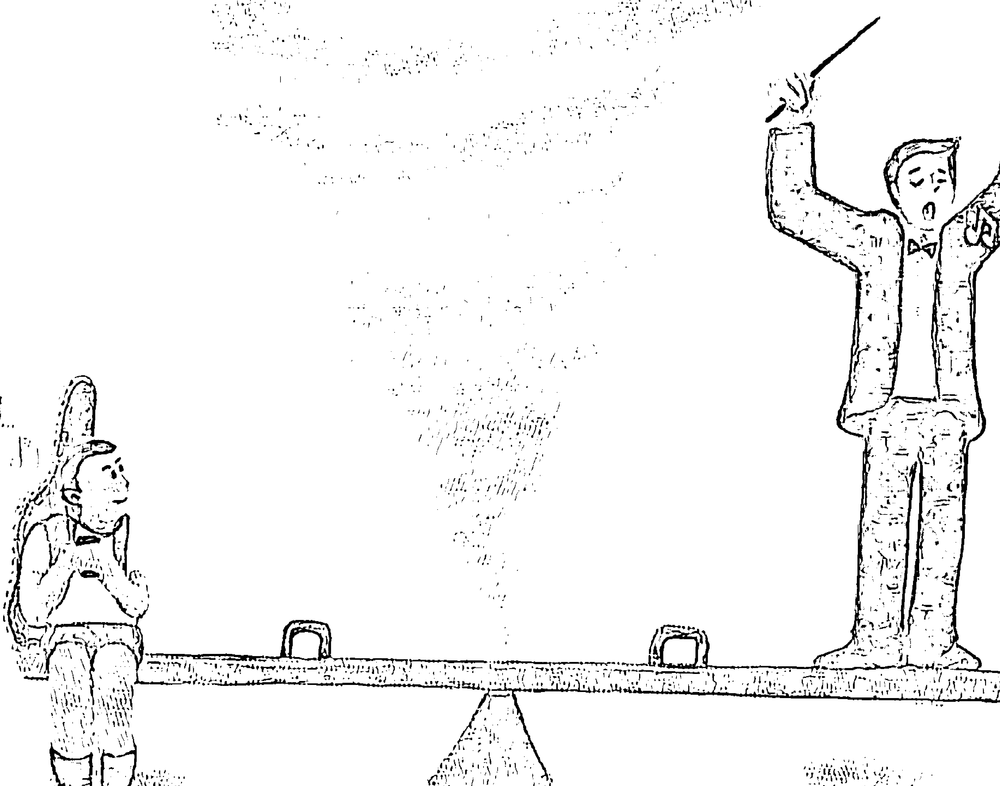

就是因為當下和時間的觀念是在兩個軌道，我們從任何瞬間，其實「回不到」當下。任何瞬間本來都有「絕對」，所以，「回到」當下，不是透過任何動力，而是剛好相反——最多把時間的觀念挪開，當下和非時間的永恆，自然就在眼前。

所以，談當下帶著我們走，最多也只是把非時間的永恆當作我們主要的意識層面，讓祂帶著我們走。心流，自然就流出來了。我們可以完成想不到的工作，儘管完成或不完成任何工作，也不重要。「全部生命系列」的寫作就是最好的實例。從我的角度，沒有刻意去「寫」任何一本書。最多只是把時間的觀念挪開，讓當下浮出來，想轉達什麼，也就自然出來了。

有意思的是，對我而言，沒有「誰」在寫，寫起來也不費力，甚至連規劃也沒有。事後，看每一個作品，好像都有它自己的生命。它的步調、邏輯就像是剛剛好。相信你讀這些作品時，也自然從非時間永恆的意識層面，延伸出一個理解。儘管這些話，對頭腦會不斷產生矛盾或悖論。但是，從心的層面，你知道這些話離不開真實。也因為如此，會不斷回來尋、回來找。

我在《神聖的你》、《不合理的快樂》也談過，人類過去的突破，都是透過心流帶出來的。無論哪個領域的突破，都是從心流出來的。

那麼，什麼是心流？

心流是非時間的狀態，是「在」，是沒有念頭。是把相對，完全交給絕對。或是反過來說，是絕對，帶著心，流出來種種的創意——創出一個作品，或一個突破。

當然，站在心的層面，沒有「誰」在做——嚴格講，也沒有人可以宣稱這是他的作品。假如誰還認為自己是一個作品的創作者，這樣的作品不會有長期的價值，更不用談永久的價值。

所以，非時間，其實並不抽象。每個文化也都有類似的表達——什麼叫做心，什麼叫做穩重、紮實。

在所謂的「現代化」之前，社會的步調很慢。一個人如果步調快，像是情緒上反應快，例如急躁，或是動作很快，會被認為不紮實。坦白講，用我們現代人的步調活在古代，一定會被認為不夠穩重。甚至會被認為內心有很大的障礙，也許是神經衰弱，或有什麼重大的疾病。從古人的角度來看，現代社會的步調相當不正常，就好像每個人都放逐了自己，拋棄了自己。

古代社會的人，比較可以隨時體會到非時間的觀念，而自然停留在這個狀態，因為這是最舒暢、輕鬆、不費力的狀態。現代人凡事都用腦筋去想，反而是一個費力的過程。我過去在很多場合談到，如果父母希望孩子成為天才（對我，每個孩子本來就是天才），那麼，父母自己要懂得什麼是非時間，隨時帶他進入非時間的狀態。

換一個方式來說，修行，其實是從「動」到非時間的「不動」。透過臣服與參，最多是提醒我們自己，有個「不動」——非時間的永恆。

一個人假如懂了這一點，他其實不用參，也不用臣服，本來就隨時停留在這裡，臣服在這裡。

### 【練習】

### Practice: All is Good 肯定一切

我希望這本書不光帶來一個理論的架構，還可以讓非時間的永恆徹底落到我們心中，成為意識、潛意識的主要的部分。非時間的永恆，本來就是我們的本質，只是我們忘記了，才要用許多練習來提醒。提醒什麼？提醒——我們本來就有的。

我在過去的作品，尤其《我是誰》也已經帶出各式各樣的練習，當作一個提醒。無論臣服、參、I Am 的靜坐或其他方法，最多也只是帶來一個反復，讓我們踩一個剎車，提醒自己本來就知道、本來就在的狀態。

真實只有一個，我能做的，最多是從不同的角度切入。所以，在這本書的第 19 章到第 36 章，我會在每一章結尾安排一個練習，看你能不能一整天都進行。一開始，可能不熟練。沒有關係，對自己要有耐心。讓自己一再重複，慢慢熟悉。

這些練習，會不斷回到同樣的重點。即使我只稱這些練習為提醒，但是，不要小看這些提醒。就是因為生活中可以隨時進行，可以說比透過任何靜坐得到的隔離狀態更實用。隨時活出這些提醒，我們也就自然把人生當作最好的道場，無論醒著、睡覺，都可以不斷地展開——我們本來就有的狀態，最根本的狀態。

這一章的練習，足以彙總這本書的重點。要進入這個練習，你要先體會以下幾點：

- 非時間，不是時間的相反。當下，也不是過去和未來的對稱。透過時間，要找到非時間，是不可能的。再進一步說，其實沒有一個「東西」可以稱作當下。假如有個東西叫作當下，每一個人早就活在當下。
- 非時間或當下，本身是一個絕對的觀念，不是在相對的時間領域可以找到的。雖然如此，只有透過每一個瞬間，我們才可以找到相對和絕對的交會。但是，這個交會點，倒不是我們一般所理解的瞬間。因為，每個人只要想起瞬間，其實已經過去了。所以，這個交會點，不是透過體驗、想或任何觀念可以描述。
- 還有另一個重點，隨時要提醒自己：
- 我們所看到、可以體會、可以想到的一切，全部都是果，倒沒有一個東西叫做因。就是有一個因，也不是我們可以體會到的。所以，去找因，永遠找不到。

只要我們肯定這個世界是真實，甚至認為自己所看到、所想、所體會、可以用語言描述的，樣樣都是絕對不變的存有，那麼，對我們而言，因一果當然存在。而且，樣樣離不開因一果。

因為我們可見的世界是因一果組合的，我常常說，最難懂的是，週邊每一個人、每一件事物，最終都是同一種東西的組合。而且，這個組合的源頭，也是因一果化出來的。在這樣的框架下，我們這一生可以活出來的，沒有一項不是因一果。人間的一切是註定，也沒有什麼東西叫做自由。

接下來的練習，最多只是透過我們每一個細胞，每一個領悟，每一個反應去知道、肯定、體會前面這些話。

面對任何事情，再好，再不好，都可以徹底去接受。接受的是——宇宙絕對不可能犯錯，一切都安排的剛剛好。

面對任何災難，還是剛剛好。剛剛好，透過它們，我來到這裡現在，可以肯定一切都剛剛好。

即使我可以自由選擇，我最多也只會選擇每個瞬間所帶來的考驗和一切。而我充滿著自信，知道沒有一件事情我會希望轉變，也沒有任何想得、想追求的。

我充份知道，沒有一樣可以「做」的，能夠影響我本來就有的絕對。我本來就是絕對的存在。絕對本來就是我。只是因為忘記了，還需要做這些提醒。

一天，重複幾次。就連剛睡醒，或要睡了，也不斷地做前面的提醒。

一開始，你可以把這幾句話讀出聲音來，幫助自己進入這個狀態。熟練了，你可以用自己的方式，把這些觀念帶出來，活進去。

一天下來，你可能遇到各式各樣的狀況，有時候不免會質疑這些話的正確性。這時候，這個練習特別重要——也就是接受眼前的不安、恐懼、質疑、憤怒、失落、反彈、追求。一樣的，也不斷接受自己還有許多問題——還有一個相對和絕對分別的觀念，還認為醒覺不可能那麼容易，還認為有一個練習可以讓自己醒覺。

不斷接受眼前的狀態，一個人自然就進入臣服。如果還有非時間和當下的觀念，也就承認自己還有這個狀態。

這些提醒和練習，雖然在其他的作品也談過。但我相信，走到現在，你的體會和它的力道，會跟以前完全不同。

把這個練習落到生活每一個角落，一個人自然體會到，一切人間的經過都是註定。雖然是註定，只要選擇接受一切，也就自然發現，在生命更深的層面，倒沒有什麼叫做註定或不註定。

透過肯定、接受每一個瞬間，我們自然跟生命的絕對接上頭。輕鬆而不費力，把我們意識的中心或注意力移到——絕對的層面。

## 20 在非時間的永恆，沒有過去未來，還可以運作嗎？

### Can One Function in the Eternal Now, Without Past or Future?

前面提到，過去、未來和當下，不是在同一個意識軌道。

過去和未來，是頭腦的產物，是腦在運作，本身是相對的邏輯。然而，當下是一個不費力的絕對。

活出這個重點，就是這本書帶來最重要的鑰匙。讓我們隨時在時間的範圍找到一個門戶，而可以從這個門戶跳出來。

假如我們把當下也錯當作一個相對的觀念，誤認為當下只是過去和未來之間的空檔，反而找不到這個門戶。

一個人，最多只需要把相對所帶來的觀念挪開，絕對自然會浮出來。因為祂在相對的每一個角落都存在，只是好像被相對蓋住，才讓我們找不到。雖然這裡提到相對可以蓋住絕對，其實是蓋不住的。兩者不相關，在不同的意識軌道。

只是因為我們把自己完全擺到相對的範圍，才會忽略還有一個絕對的部份，從來沒有離開過我們。

仔細想，把注意力集中在已經過去的一切，或煩惱未來的規劃，其實無法為我們帶來任何改變，最多只是增加煩惱。可惜的是，許多朋友，哪怕在修行或瑜伽的領域投入了很久，一談起過去，還是憤怒，還是失落。所有的糾結，都離不開過去。過去，就像一個墓地，我們每個人都離不開。

我們都忘了，就是因為把自己投入相對，才會有那麼多煩惱和痛心。如果我們不斷回想過去，想透過頭腦找出一個解決方案，這本身已經把所有可能限縮在人間很窄的範圍內。更不用談，這個範圍本身就是一切問題的來源。不斷回到這範圍，也就是一再肯定這是我們全部的可能，肯定種種的因－果。而讓我們隨時忘記，連因－果都是頭腦的投射。

同樣地，我對許多在煩惱和失落的朋友，也是勸他們，一個人要把全部世界、眼前的問題挪開，不去想它。這一來，反而會從心裡流出眼前所需要的答案。而且，比頭腦刻意思想出來的，更有力道，能更好的解決。

不繼續肯定過去、未來或眼前所帶來的因－果，一個人自然把自己的身分從相對的範圍，挪到別的地方。挪到哪裡？不用追求，絕對的體會自然就出來了。

絕對，從我們人間的體會，最多也只是非時間的永恆。其實，一個人在非時間的範圍，自然讓身體體會到什麼是樂。而這個樂是不費力的樂，是在·覺·樂，跟我們追求或得到什麼一點都不相關。

前面提過，一個人隨時停留在非時間的當下，也自然發現連參和臣服的練習都是多餘。因為站在絕對，就是全部或一體，倒不需要再加一個層面。也沒有什麼東西叫做練習，可以把誰帶回一體。非時間的永恆，本身就是全部。也就是生命全部的潛能，再加上種種可能。

我們全部的矛盾，也跟著消失。

### 【練習】

### 參，把自己從時間挪開

因為頭腦迴路的運作太快，我們有時候不知道自己在想，但有些時候，會突然體會到一種傷痛、不舒服、不安、恐懼、窩囊……這時候，重點是不要去分析事情，最多是輕輕鬆鬆問——為誰，有這些情緒？

答案當然是我。

我，是誰？

這個問題，沒有答案。最多是跟著「我念」（I-thought），一直貼著它走，走到它的根源。而它的根源，是沒辦法回答的。這時候，就停留在這個沒有回答的空間。

自然發現，這個沒有回答的空檔愈來愈長，愈來愈寬廣。

我們自然快樂起來。沒有事。煩惱，也就忘記了。

這是最好的療癒的方式——不去分析悲傷，而是把自己從時間挪開。

面對問題，最好的方法反而是——不去面對它，把它挪開。這不是逃避問題，只是把腦挪開。

該做的，自然還是會做，而沒有記憶的重擔。

## 21 困在時間，一個人永遠不會快樂

### You Will Never Be Happy if Trapped in Time

有了時間的觀念，有了人的特質，我們自然發現自己大部份時間都停留在過去——過去的痛苦，過去的失落，過去的損失，過去的委屈，過去的傷害，包括自己和別人的傷害，過去的失敗，過去的打擊、創傷，過去的學習，過去的成就，過去的光榮……這一切，全都離不開腦海虛擬的現實。

全部，都是從「我」的角度在觀察、在衡量過去。

這些過去的記憶，不光帶給我們痛苦，而且還在強化「我」。就連好事、喜事、快樂的經驗，也都在強化「我」。因為有這些經驗，「我」們自然會期待更多，希望能夠再重重複幾次。

有了過去，才自然會有未來——又是一個虛的境界。

要把頭腦挪開，不受時間的限制，從古人到現在都一再強調，唯一的方法也只是回到瞬間。但是，這裡頭含著一個大的秘密。

其實，瞬間，是回不去的。因為沒有一個東西叫瞬間，或是當下。希望你還記得，只要我們可以講出一個東西叫瞬間，它已經變成過去。我們可以想到它，它已經過去了。即使用各式各樣的練習的方法去進入，也不過像在追一個陰魂，表面上好像追到，但是，追到了什麼？

最多，是過去的一個影子。它已經過去。

這個秘密，是——不去管有沒有什麼東西叫做瞬間，最多只是對眼前任何東西不要做個反彈。

我講的反彈含著很多用意，首先，不要讓眼前的東西把我們帶走，讓自己認為很真實，還可能想做一個反應——喜歡不喜歡，討厭不討厭，甚至想去改變。

不反彈，也代表你我完全知道——一切都是業力組合的，不值得也沒有必要去抵抗。老實說，也抵抗不了。

不反彈，還含著另一個意思——也就是之前的練習所提到的，對生命充滿信任。知道我們走到這一天，走到這裡，都是剛剛好。我們現在有的互動，都是剛剛好。你我過去好像走過許多冤枉路，在整體來看，也是剛剛好。因為有這些經過，才會走到這裡。而這裡，又是剛剛好。

所以，不去對任何事情、任何發生，產生抵抗和反彈，不知不覺，一個人就回到瞬間。因為沒有任何一個東西抓得住他，吸引住他。他用這種不費力的方法，自然打斷了因－果的連結。也就把每一個瞬間單獨化，讓每個瞬間新鮮地活出它自己。

一個人會突然發現，過去所體會到的瞬間與瞬間之間的連結，並不是瞬間彼此之間在做連結，而是我們的腦——是透過你我的知覺再加上念頭，把瞬間粘起來了。

假如不去理會這個瞬間，它連不起來，一個人也就突然自由起來，知道這一生可以有的唯一的自由選擇，也只是——不去選任何瞬間。

其實，談自由或不自由，本身還是相對的語言。一個人不斷地不去做任何反彈，他的注意力自然已經擺在絕對的層面。接下來，連自由不自由的辯論，都起伏不來。

現在一般人所關切的話題，你會突然發現跟你一點不相關。你充份知道，再先進的課題，都會帶來不快樂，不斷延伸更多相對的範圍。但是，這麼講也不正確。畢竟從絕對的角度來看，任何相對的領域，其實也不會影響到祂。

站在絕對，有這些知識也好，沒有這些知識也好。有時間的觀念也好，沒有時間的觀念也都好。就連什麼叫做瞬間、過去或未來，跟祂其實都不相關。這些話，最多是我們人類自然在沒有事中，生出許多事來（much ado about nothing）。

### 【練習】

### 不加形容詞

只要我們看著世界，有認知，包括前面提到的知識、分別、判斷，都離不開時間。

試試看，一天下來，任何事情，好好壞壞，都不要去區隔，不要再加一個形容詞在上頭。像是大、小、長、短、高、矮、胖、瘦、漂亮、不漂亮、好、不好、有用、沒有用、有幫助、沒有幫助、有愛心、沒有愛心、聰明、愚笨、善良、壞心、慷慨、小氣、活潑、呆板……都不要使用，不要加到所見的任何人事物之上。

一天下來，見到、聽到、聞到、嘗到、觸碰到任何東西，完全站在一個中立的角度。我們自然成為一個見證者（watcher），看著樣樣，都讓它來，讓它走。不在上面，再加一個念頭。

站在中立的位置，自然會發現樣樣都跟我不相關。這世界，跟我不相關。好壞，不會讓我動搖。任何經驗，我不需要用快樂、不快樂、痛、不痛、興奮、悲傷、刺激……這些詞彙來限定。自然發現，自己隨時在做一個見證者。

一個人發現自己隨時在做見證，自然沒有時間或非時間的分別，隨時都在當下。甚至，就連「當下」的認知也起不來。最多只是做見證。

## 22 只有在「非時間」的永恆，在·覺·樂才會浮出來

### Sat-Chit-Ānanda Can Only Unfold in Timelessness

我們可能想知道，一個人進入了非時間的永恆，可能會怎麼表達？會怎麼流露出來？

其實，最多只是——在·覺·樂。

嚴格講，非時間的永恆也不是個「狀態」。只要一講狀態，就還是一個相對而局限的觀念。談「狀態」，要用語言表達。然而，任何語言的表達，自然又受到局限。所以，其實沒有什麼東西可以被表達、流露出來的。

我常常說，就算佛陀在眼前，一般人也絕對認不出來。因為我們看別人，最多是看自己，是在投射自己的觀念，自己的期待，自己的制約。

但是，在這個世界，我們有一個體——身心。這個體，這個身心，去覺察絕對。最多也只是透過在·覺·樂。再加上愛。再加上平等心。再加上寧靜。

讓絕對，帶著身心走，這些現象自然會浮出來。

我才會不斷地說，在·覺·樂，再加上愛，再加上平等心，再加上寧靜，是我們根本的特質。是本質，是不費力。還沒生出來就有這些特質，不用去找。也找不到。

人類很有意思，雖然透過人間的「動」找不到，但是，在腦海裡，我們隱約記得自己體驗過這些特質，而可以被這些特質共振。聖人與週邊共鳴的，也就是這些特質。只是我們透過頭腦不能理解，還需要追求，需要去找。

我們可以想像，這一生在追求的，其實都是這些特質。只是方向錯了，誤以為要往外找。從來沒想到，只是輕鬆鬆把注意力轉向內，祂就浮出來了。

醒覺也是如此，找不來的。透過肉體，活不出來的。最多是讓我們把全部的尋、找、想要……都放掉。甚至，連醒覺的觀念都丟掉。一個人，才不知不覺醒過來。

醒過來後，自然隨時都在——在·覺·樂。然而，這個在·覺·樂，和任何條件不相關。祂本身是永恆，跟人間一點都沒有關係，不在同一個意識軌道。

我相信讀到這裡，你現在聽到我說我們是永恆的。

命，再也不会惊讶了。因为，“我们”不是肉体的我。肉体的我，是无常，不可能有任何永恒的特质。我所讲的永恒，是绝对。

而我们就是祂。

## 【练习】
It’s all OK! 一切都刚刚好

非时间的永恒，是一个没有区隔，没有念头的状态（让我们先借用“状态”来继续谈）。臣服，最多也是一个没有念头，没有分别的状态。一个人不断懂了这一点，知道非时间的永恒是自己生命的本质，自然把眼前发生的所有大事小事，都交出来。

交出来，最简单、最直接的方法，也就是接受眼前一切——眼前的事情，无论好坏，都不段的接受。一切都好，一切都刚刚好，就是叫我决定，也就是刚刚好是这个决定。

这个接受，不光是接受眼前的事情，而是含着更大的一个层面——接受真实。知道真实倒不至于被眼前的事情盖住。接受眼前看来很不好的事，其实是接受——全面或一体、绝对，远远比眼前不好的事更大，甚至我就是祂，是绝对。这才是臣服。

一个人对一切都可以肯定——一切都刚刚好，都刚刚好。

透过这种臣服，看能不能活出耶稣被钉上十字架受苦时，对上帝说的 “Let thy will, not mine, be done.”（不是跟从我的渴望，我的想要，而是你的）。也就是样样把自己交出来，交给非时间的永恒，交给生命的主。

## 23 非时间的永恒，真的存在吗？
### Is Timelessness Real?

我在这本书用了好多篇幅谈时间跟人间的关系，非但把时间当作一个此生要超越的阻碍，又把时间当作一个动力。而且这个动力，是从整体把我们局限在一个具体的小范围。进一步讲，时间其实就是我们的束缚。

时间，不光建立空间，还随时让我们停留在过去，或投射到未来。也就随时让我们忽略掉瞬间。其实，只有瞬间，并不存在时间的观念。所以，从古至今的大圣人，都强调瞬间、当下的重要性。

我们真正应该问的是——Is timelessness real? 这个非时间的永恒是真的吗？可能存在吗？假如随时在非时间的永恒，我们还可以继续生活吗？从我的角度，这才是真正应该探讨的重点。

答案，相当简单。

非时间的永恒，不光随时可以活出来，而且比任何人想像的都更简单。

简单，是因为祂不费力。但是，我要再提醒一次。只要有个费力，有个动力，不可能在非时间的永恒。

我也要大胆地说，这个身体、肉体不可能体会到非时间的永恒。因为身体本身是“动”所产生的——是透过我们头脑投射出来，再加上比较，才有一个东西叫做“身体”或任何体。

肯定这个身体，认为它再真实不过，甚至认为它有个独立的重要性，或认为它才是延续生命的机制，我们也自然把注意力落在“动”或时间的范围。也就自然跟着生，跟着死。

所以，透过这个肉体（甚至身心），一个人是不可能开悟的，不可能领悟到什么是绝对。因为只要还剩下一个人、一个主体可谈，要去体会一个客体——绝对，还是在“动”的范围，在因果的范围里作业。再进一步说，我们以为相对可以去吞并绝对，甚至掌握绝对，是不可能的。

我才不断提到这些观念，甚至还要进一步大胆地说，透过任何领域、本事，都不可能体会到绝对。甚至，任何“动”所带来的观念，最多是再加上一层阻碍。

在人间可以想出来的任何领域或本事，包括文学、哲学、科学、商业、政治、理念、运动、修行、练习、瑜伽、气功、功夫、打坐、祷告……都不可能把我们带回家——非时间的永恒。然而，非时间的永恒，才是我们最轻松、最根本的状态。

我只好再三提醒，大家都找错切入点了。其实，没有一个切入点，毕竟连“我”都不存在。业力，当然更不存在。就是认为“我”和业力存在，我们才会建立一个完整的时空，才有练习或修行好谈，甚至还要臣服与参。

否定一切，连一个醒觉的观念都没有，一个人不知不觉也就醒过来了。

你看，这是不是又再带来数不完的矛盾，或又建立了一个悖论？

不用担心有没有“非时间的永恒”，即使你我不承认，甚或否定祂，祂还是存在。祂就是我们的本质，你我不可能丢弃祂——要丢也丢不了。只是，我们去找的对象、方法、锁定的范围，是不正确的。

因为祂不是可以“找”到的。

## 【练习】
一天下来，都不要提“我”

试试看，可不可以一天走下去，没有“我”。
仔细观察自己，一讲到“我”，例如“我”想去洗手间，“我”想吃饭，“我”认为……，“我”想……，“我”觉得……，“我”有什么感受……

会发现这些话，都是从小我局限而个人化的角度在讲。然而，站在整体，这个小我根本不成比例。它本身是一个幻觉，就像是多余的。

试试看，可不可以一整天，从早到晚，不再讲“我”。
平日要上班，也许不方便。不妨在周末试试，就像有些朋友会在周末断食一样，我们来试试看——在周末，断“我”。

如果忍不住还是会说“我”，也可以这么做——把“我”当成第三者，好像是在讲别人一样的。举例来说，我用英文会说 “I is hungry.” 这样的表达，在文法上不通，自然带来一个突兀感。用中文，也许可以在中间，加上一个助词，例如：“我这个人/这个身子想吃饭了。”

词——“我”是饿，“我”在饿……试试看，这么练习，是不是能够观察到“我”。然后，在心里加上一个问题——那么，我又是谁？

这么练习下去，不知不觉中，连平日上班、生活、和人互动，自然会踩个刹车，而可以做一个参的功课。

一天下来，如果随时不会讲到“我”，是相当可贵的。许多转变，已经完成它自己。就连“要意识转变”的这种念头，都不需要再加上。

这时候，自然会发现不需要再“找”一个非时间的状态，只要清楚的看到“我”的起步，或是“我”的来源，而随时让这个动机消失它自己。一个人自然不费力地活在非时间的状态。

## 24 放过身体，让它自己存在
### Let the Body Be

一个人懂了这些，我认为在更深的层面，已经可以领悟到这里所谈的。只是，回到头脑，它还是要扮个反抗的作用。

你自然发现，“全部生命系列”的作品，以及从古到今的每位圣人和每部经典，都在谈不同的意识层面——非时间的永恒，绝对、无限的层面。然而，时间的层面，是相对而局限的范围。既然我们的头脑要靠相对才可以运作，自然会认为绝对不存在，甚至把祂排斥掉。同时，也会担心绝对把相对消失掉，而产生一种惶恐，一种不安。被消失的恐惧，自然要冒出来。

每一个人，只要去追求真实，都会遇到这样的恐惧。在这个过程，难免会产生很多质疑，甚至可能问到前一章还没有完全回答的问题——假如一个人完全回到绝对，相对的身体还可能存在吗？我们还有一个生命可以照顾吗？

答案，又是相当简单。

假如把“我”，或是相对的意识状态，全部交给或臣服到绝对（绝对本身是上帝、佛性、内心、全部生命），我们不光可以活下去，而且活得很好，甚至还特别好。

首先，臣服到绝对，是表达最高的顶礼和信心——肯定生命有一个比相对的“我”远远更大的力量，而且大的不成比例。我们承认这个力量是真正的造物主。假如祂可以延伸出银河、太阳、地球、月亮，再加上人间，怎么可能有所不知？怎么可能有所不能？怎么可能不影响到全部？

把相对交给绝对，最多也只是让生命最大的力量，带着自己走下去。这么一来，我们会突然发现——不是小我、头脑带着我们走。我们过去跟着小我走，跟着头脑走。到头来，只会走错，走到冤枉路，走到烦恼和悲伤。把自己交出来，会发现问题没有了，任何矛盾消失了。

世界没有变，但是“我”变了。

有意思的是，全部世界跟着改了。有些发生，本来会让我们不舒服、觉得委屈、后悔再后悔的。突然发现，没有一件事有绝对的重要性。甚至，不去反弹，它也就消失它自己。

我们放过这些问题，也就好像这些问题把我们放过。让我们的生命有个重新的组合——重生。

放过这个身体，其实不是放弃这个世界。不是放弃家庭，不是放弃事业、环境、责任。最多，只是不需要再刻意用头脑去影响结果。反过来，是让生命最大的力量带着我们走，避开头脑再一层不必要的过滤。

这时，我们不用担心头脑还在运作。毕竟，就连上洗手间，还是需要神经的指令。只是，过去反复受刺激的头脑回路，现在不再去用了。

这么一来，一个人突然“活”了起来。他发挥的创意，比任何人想像的都大。尽管如此，对他而言，没有“谁”在创作。是谁在创作，也不重要。任何创作都还是在相对、二元对立的因果在作业，才有一个创作。

一个人在这个阶段，别人眼中不可思议的创作或表现，他根本不重视，也不认为是一回事。他最多是充满信心，让身体完成它这一生来所要完成的。

他知道身体是因果的组合，假如之前没有肯定因果，这一次也不会来。既然来到这个世界，在人间有这个肉体，还是要受到因果的限制、流转和作业。身体来，有它的目的——有事想完成或不完成。然而，他也不会去重视这些，最多是轻轻松松让身体完成自己。

有些人表达能力比较好，自然变成老师。他讲的课，可能超越任何人的想像。有些人，过去是画家，可能透过他的领悟，画出一个跟人间不相关的画，带给其他人更深的领悟。还有人，可能是运动员，连想也不去多想，只是透过心里的流动，活出每个瞬间，自然进入一个非时间的专注。别人认为他超越了人类的极限，对他，不会特意去想。

我们在每一个领域，都可以观察到这种表现。有趣的是，这种表现对这个人一点都不重要。重视的，反而是别人。

也有人醒觉过来，选择完全避开这个人间，一句话都不讲。但是，不要小看他的“在”（Presence），可以撼动整个世界，震动一个法界，让周边的频率跟着他一起提高。不过，这里谈频率和提高，最多也只是一个比喻。对这个人而言，什么都没有。一切，都是大幻觉，是头脑的产物。他知道自己没有一个体，就连别人也没有一个体，又哪里还有频率，甚至频率的高低好谈。

进入非时间的永恒，最多只是自然活出最轻松、最舒畅的根本态。在这个状态，代谢自然会慢下来，我过去用生物的冬眠或夏眠，或是“定”来描述这个状态。

一个人假如可以完全停留在这种状态，停留在非时间，这个身体也就好像进入一种休眠的状态。饮食、喝水、排泄……种种生理作用都慢下来，甚至停下来。最多，也只是停留在欢喜。

但是，从一个更高的层面来看，无论他在动、在完成事情、或进入不动、在休眠的状态，都是一样的。还是没有一个“谁”在做，或不做。没有一个“人”在计较、在体验这些经过。

假如你读到这里，还是产生这样的问题——接下来，怎么活？我建议你，还是要做臣服和参的练习。毕竟，对你而言，还是有一个世界好过或难过的观念。这世界，对你还是真的。所以，业力对你，还是在运作。

## 【练习】
放过一切，包括身体

放过一切，尤其自己的身体，这本身，就是最好的练习方法。

一早刚醒来，或夜里入睡前，把身体每一个部位产生的感受——无论是痛、舒服、沉重、麻、痒、痠、温热、冷，甚至，有时候说不出是什么的感受——只是感受，轻轻松松地观察。接下来，选择放掉。

放掉的方法，也只是提醒自己——这些身体的反应和感受，还是离不开小我。这个小我，跟我们永恒、绝对、非时间的状态，一点都不相关。

一天下来，会自然发现，其实我们可以经过很长一段时间，没有任何念头或感受好谈，反而还可以过得很好。一直到睡前最后一刻，假如有念头，有感受，一样提醒自己——有任何感受，都知道，而都把它放掉。不断地提醒自己，从来没有跟绝对分手过。

> 我在《全部的你》这么比喻，一个人是圆满的，就像张开的手，是放松、轻松而爽快的。绝对、非时间的永恒是打开的，是开放的。

我们不断观察自己的感受，放掉。再观察，再放掉。自然会发现，只要有任何念头、任何感受、任何动作、任何观念，最多是带来一个层面的萎缩。就像原本张开的手窝了起来，把自己局限到一个角落。

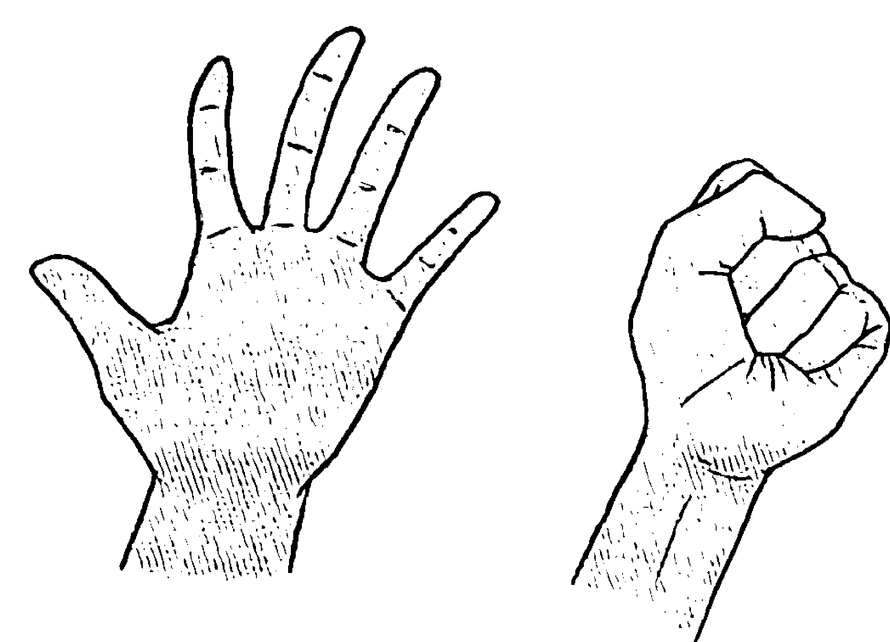

一个人，假如可以随时见证自己的念头，自己的动作，我相信，再次看到这张图，体会已经完全不同。自然知道非时间的永恒是最简单、最轻松、最不费力。一切人间的经过，反而是费力，是全部烦恼的来源。

有时候，在念头或感受上，难免踩不了刹车。比如哪个部位正在痛、不舒服，或内心有很沉重的压力。这时候，可以加一个参的功课，提醒自己——

-   为谁，有这个身体的感受？
-   谁还不舒服？
-   谁还心里闷？
-   谁还在意有没有身体，有没有感受？

答案，又只是——我。
我，又是谁？

## 25 任何练习，还是离不开时间，离不开“我”
### Practice Requires Time, Which Fortifies “Me”

因为这个世界跟真实（我指的是永恒、绝对、心、在）完全是颠倒的，完全站在不同的意识轨道，我才会不断提到“反复”的观念。甚至，我认为，一般修行的观念，即使不能说是错，也都是颠倒。

全部人可以“做”的，都在强化“我”。

不管任何领域，包括修行或不是修行的领域，只要跟身心相关，最后自然都会强化“我”——“我”最清白，“我”很敬业，“我”最珍惜别人的努力，“我”有很深的功夫，“我”的瑜伽姿势特别标准，“我”的气感非常强，“我”的神通最灵验。甚至“我”懂，“我”知道，“我”领悟——一样地，都不断在强化“我”的观念。

有意思的是，虽然绝大多数的修行人也懂“我”是全部烦恼的来源，却没想到，透过重复的练习，反而不知不觉中更强化了本来想消失的“我”，也就在某一个领域或宗教开始运作。甚至，会认为那是唯一可以把人带到真实的轨道，而可能透过修行或宗教，反而造成冲突，甚或带给其他人伤害。

我也担心，就连这里所讲的“全部生命系列”，有一天也会在人间化出一个头脑的系统，而自然失去新鲜的力道——让一般“聪明”人以为透过头脑可以掌握。就这样，它本身又变成了另一道束缚。所以，才透过这些作品，包括这本书，再次提醒——一个人要醒觉过来，不是靠任何“做”，更不用讲时间。

醒觉，是急不来，也慢不来。甚至，没有一件事可“做”。

一个人假如透彻懂了这些话，自然发现——其实，自己已经在绝对。

你要找的你，已经老早找到了。

祂不是透过“找”可以找到的。我们最多只是承认祂，或是把注意力轻轻松松滑回到最根本、最不费力的状态。不过，只要还有一个认知，已经又滑出来了。然而，就算滑了出来，什么损失也没有。懂了，又滑回去了。我过去才会在《神圣的你》用滑冰的比喻来表达。

但是，是谁在滑？其实也值得注意。

假如还有一个“你”或“我”在滑，你还是有一个“谁”在做的观念。这个在做、在滑的“谁”，本身就是“我”。

甚至，假如你还有一个体验，还有一个多深多微妙的领悟可谈，很抱歉，你还是在一个相对的范围运作。

假如你还认为自己有领悟或开悟，小心，你可能还没有醒过来。

假如你突然讲话变得很慢，或是宁愿闭着眼睛面对这个世界——就像是要透过行为，表达一个更深的领悟。要注意，你其实还在人间打转，还认为醒觉跟人间任何东西或行为是相关的。

假如你还认为修行还是靠功夫，甚至强调能够长时间坐着就反映了你个人的成就，要提醒的是，这个定，可能还是小定。甚至，你可能忘记了醒觉跟这个肉体一点都不相关，还可能把身体折腾坏。而你可能坚持一定要坐着不动，或是坚持只能动，不能休息。值得留意的是，无论哪种坚持，你或许还没有贯通，还误以为“不动”或不休息等于“在”。

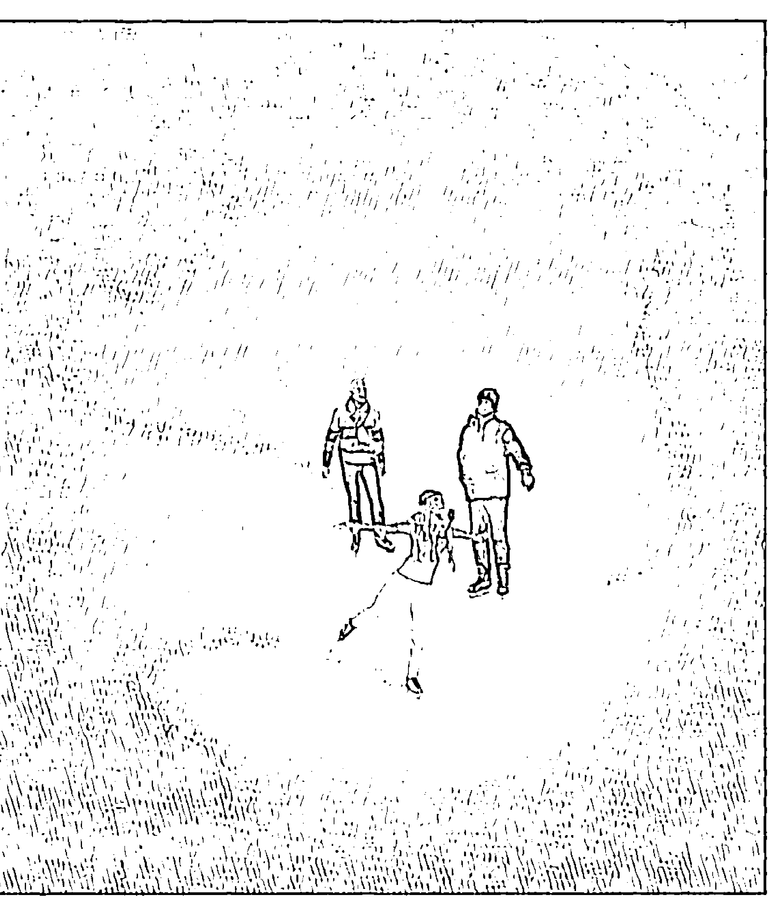

其实，相对和绝对，这两个世界一点都没有矛盾。

矛盾，是头脑设立出来的。站在绝对，你想怎么做，祂根本不在意；你想坐着、用气功或瑜伽的姿势睡觉，还是用语言或沉默来表达领悟，对祂一点都不相关。祂也一点都不排斥，知道怎么做，都没有代表性。

一个人懂了这些，放下了，没有事了。再也没有矛盾，也就可以宁静下来。

我知道，很多朋友读到这里，心里会觉得不舒服，觉得我好像在泼冷水。但是，我之所以还是要提出来，其实是舍不得看到这个世界跟我个人体验到的完全颠倒，才用这种语言来表达。

最后，一个人最多只可能慈悲，因为知道没有一个慈悲的对象，没有一个人有错或对的行为。最多，只是拿这些话做一个参考。读完了，也就放到一旁。不要好像当作尺，处处拿着比对。甚至拿来责备自己、检讨别人。这些，都不重要。

我们还是轻轻松松回到自己。然而，“自己”不存在。所以，最多只能让绝对活出我们，活出一切。

## 【练习】
没有练习的练习

读到这里，你或许已经很自然地可以接受这样的练习。这个方法，其实只适合少数人，不见得适合每一位朋友。但是，我还是想把它带出来。

这个方法，就是没有方法的方法。不光是肯定一切、或是透过“参”否定一切、或透过“臣服”随时停留在非时间的状态，而是同一个瞬间，都希望我们活出这本书所讲的全部观念。

“随时活出全部”的方法，也就是在肯定没有一个方法可练习或可谈的。也同时在肯定——透过任何方法，最多我们只是回到原点。原点，也就是你我本来就在的这个点。

这么一来，全部的观念都可以丢掉。生命所带来的所有变化，其实都跟自己不相关。有，没有，都好。

这一生，要来完成的，其实老早已经完成。因为没有什么“东西”可以完成，或值得完成。只要有个“东西”可谈，还是离不开人间的观念。任何观念，又带来一个局限。

知道这一些，而彻底可以接受这些话，一个人也就轻轻松松地醒过来了。自然活出非时间的永恒。知道本来老早就醒过来的。也同时知道什么都没有发生，什么都没有得到，什么都没有丢掉。

一切，老早都圆满。还没有接触到修行，还没有接触到这本书，还没有接触到“全部生命系列”所谈的观念，其实，老早就已经圆满了。

## 26 时间是一个“瘾”
### Time is Addiction

我们也许会认为咖啡、茶、烟、酒、毒品、各种享乐是这一生最大的瘾头。其实，不是。远远更大的瘾头，是我们的念头。念头，本身又只是时间的产物。反过来，也可以说，时间是念头的产物。

我们从早上一睁眼，开始有念头，就已经建立一个时间的架构，而时间又延伸一个空间的观念。这一来，一天就产生数不完的念头。没有念头的片刻，甚至可能连一秒钟都不到。但是，我们一般绝对注意不到这个现象。因为随时有念头，已经变成了生活的常态。

反过来，少了念头，一般人非但不习惯，还可能认为少了什么东西，怎么样都不对劲。自然，接下来，就去追求念头。

念头的吸引力，比任何人想的都更大。它本身可以建立一个完整的世界，还可以制造一个因果法则。让我们把生命每一个角落都连贯起来，而可以取得意义。我们可以想像，假如念头的吸引力不大，不可能那么透彻地把我们骗走。

所以，其实真正的修行，是面对人生最大的瘾头。这个瘾头，还不用谈到贪嗔痴等等习气，而是比这更根本的，也就是念头。

假如可以克服念头，连“我”都跟着消逝。我们过去所认知的世界，也跟着内爆，随着消失。

没有念头，接下来，外头还是有一个世界。但是，这个世界跟我们这一生过去所认得的，不一样。

要去克服念头，不是去刻意不想，或是勉强去产生沉默。因为沉默——我们所认为的沉默——本身还是念头。最多只是一个没有念头的念头，或是没有空档的一个空档。要面对念头，也不是透过功夫、静坐、祷告、瑜伽、气功……任何修行，刻意去专注。

要克服念头，最多只是看穿它。

看穿什么？看穿念头带来的任何现象，都离不开一个虚拟的真实。甚至，就连这个世界、任何感受、任何体验都还是一个虚拟的现实。

知道，彻底知道，随时知道——这个世界是虚的，是虚的念相。进而，不被任何境界带走。念头也就自然踩了一个刹车。它突然会停止，而我们不用去分析为什么停止。

去分析为什么，本身又是一个念头。

要克服念头，最多是轻轻松松到念头的上游、根源，知道念头的上游或根源不存在。甚至，连“我”也不存在。也就这样子，一个人不知不觉就活在当下。

什么都没有做，也就解答了一切的矛盾。

## 【练习】

参，参什么？

前面提到念头的上游、来源，去寻察这个上游，本身就是参的练习。

参，参什么？

最多只是参——这个真实的来源，这个真实的最源头。

所以，我们轻轻松松地问自己——谁还有一个念头？谁在寻？谁还有一个观念好谈？还有一个真实想找？

答案，又只可能是——我。

是我。

我的根源是什么？

这时候，没有答案。

一个人轻松停留在没有答案。

在这个没有答案中，人好像跳出来，跳到一个更大的我，甚至像宇宙那么大的我。

这时再继续参——这个大我，不分别的我，又是谁？是怎么来的？

- 唯一的答案又是——无法回答。
- 假如有答案，再继续参。
- 一直参到没有答案。
- 有答案，又继续参。
- 继续停留在没有答案。

这时候，一个人自然发现，念头也跟着消失了。从身体最深的层面，心更深的层面，好像浮出来快乐、欢喜、希望、信心、放松、爱、宁静。然而，这些感受，跟人间过去带来的，好像都不一样。

这时候，一个人还是可以继续参——谁还可以感受到快乐、欢喜、希望、信心、放松、爱、宁静？

也就自然会发现，答案还是——我。

当然是我。

是我，有这些种种感受。甚至，还可以用语言表达。

那，我是谁？

这么一来，又重复一个循环。

循环到最后，连这些感受，都一个一个粉碎、消失。发现这些感受跟小我、大我、全部的我，都一样的。一样不存在。

有趣的是，这时候，这些感受不光没有消失，它的强度增加许多。可能几倍，几十倍，几千倍。

比如说，欢喜，比任何肉体带来的喜乐包括高潮、狂喜都大。大到一个地步，好像活起来，变成一个不可思议的场。不光自己把自己吞掉，还带到周边。所有的众生，包括动植物都可以感觉到。

然而，只要停下来去感受它，它也就自然消失了。

一个人，走到最后会发现——全部这些感受，包括在、觉、乐，都不重要，也不会想在它上面停留或做文章，最多只是把它活出来。

谁在活？——谁晓得？
又是谁想知道？谁在意？
想跟人分享，喔，还有什么可以分享，还有谁想分享？又可以跟谁分享？

这么一来，每一个感受，也都只是如此，包括爱。

有意思的是，一个人自然会发现他不是爱什么人，爱什么东西，爱什么观念，爱什么对象。

谁在爱？要爱谁？
甚至，连爱的观念都没有。

一个人突然发现，这种爱，其实是这个肉体不可能理解的。

过去，我们体会到的爱，最多是小爱、人间的爱。是有目标、有目的的爱。最多只能称无常。可以生，可以死。

我在这里谈的爱，一样的，参，不断参到底——谁在爱？有什么爱可谈？爱的来源，又是什么？

一个人自然发现，这种爱最多是非时间的永恒。我们最多也只能讲他是一个场，是个“在”的场。他，没有也不允许——任何动作或时间的排列。

没有爱的前。没有爱的中。没有爱的后。

最多只有爱。

我们最多是理解，爱就是我们的本质。

这种爱，一个人只要体会到一次，会比念头、比世界带来的任何追求都有更大的吸引力。也只有这样子，才足以把念头和时间的“瘾”打破。因为还有一个更大的瘾在后面（如果还可以称他是一个瘾）。

我在这里，还要分享一个大的秘密，而且又是跟一般人想的颠倒——我们会有念头的瘾，是因为在心的层面，无思的层面，我们知道有在·觉·乐。有快乐、欢喜、希望、信心、放松、爱、宁静。

因为我们在无思的睡眠中，随时可以体会。所以，一醒过来，也自然想透过念头，把这个状态找回来。根本没有想到，透过念头，不光找不回来，还带我们愈走愈远。也许，就这么走过一辈子，甚至不只一生。就算多生多世来追求，我们都可能找不到。

## 27 没有最完美的时机
There Is No Perfect Timing

对我们伤害最大的，其实不是周边的人或环境，是自己。我们是透过自己造成伤害，而时间是最主要的祸首。

没有时间的观念，我们不可能有事情的先后顺序，不会有记忆。没有过去，也没有后悔。

对人类创伤最大的，是后悔——不断后悔，不断认为错过了时机，而不断想活出过去。总是想把过去带回来，看可不可以改变时机，也改变命运。

最可惜的是，我们一般人不理解——没有完美的时机。其实，没有完美的任何东西。在这个二元对立、无常的世界，没有一样东西，可以称为完美。包括时机。

我过去常常讲完美——一切都完美，一切都刚刚好。是从一个绝对的永恒的角度，在看这个世界。当然，站在永恒、绝对，没有什么东西叫做完美或不完美。所以，我们才有资格说“一切都完美”。

站在这个世界来看，却没有什么可以叫完美。因为它有生，会死。有生，会死的东西，最多只是一个临时的过渡状态。一样不断在转变，在变化。有了好，可能有坏。有坏，可能又好。所以，不可能让我们可以称之为完美。

完美，含着永恒的观念，不受限于时间的影响。我常提到，从相对的范围，以为可以突然走到绝对，是不可能的。无论从任何领域来看，都不可能。这个世界本身不是生，就是在死，总是在变化。在一个随时变化的世界，没有东西叫完美。

我们有时候会说一个建筑、一个宗教的系统、一个观念、或一个理想是完美，最多只是在表达——在这个人间的范围，比其他现象维系得更久。即使可以维持几百或几千年，但是，在非时间的永恒内，连一眨眼都算不上。所以，站在绝对，人间没有美、不美或完美、不完美可谈。

这只是从时间的观念，来谈完美或不完美。如果从美观、实用、耐用等等层面来看，那么，我们又该用什么基准来定义完美或不完美？只要有一个东西完美，一定有另外一个东西更完美。这种完美，最多只是反映一个相对的量尺。

既然没有完美，甚至，连时机都不可能完美，我们不用再不断地后悔，不用再为过去种种的失落、创伤、损失、受委屈找出一个更深的意义（甚至还要做一些功课、练习，来把它们消失）。这些，都还是多余的。没有一样东西，需要有理由存在。因为它本身不存在，是我们头脑投射出来的。

所以，讲需要接受或臣服，也只是为了我们一般人去面对现实。然而，面对现实，最多只是领悟到——一切全部都是头脑的产物。跟我们接受不接受，臣服不臣服，反弹不反弹，想改不改，变更不变更，后悔不后悔，一点都不相关。

一切，已经是如此。后悔，也改变不了。最多只是再加给自己另外一个阻碍，另外一个烦恼，另外一个创伤。让我们继续坚实、巩固从来没有存在过的念相。

### 【练习】从后悔到参

讲到这里，其实含着很重要的一把钥匙，让你我可以从人间走出来——也就是随时捕捉到后悔的念头。

后悔，会带来一个连锁反应，让我们不断想重新活到过去。

透过后悔，时间的作用自然会拉长。因为我们从过去，又找出一个空间来打转，不断地强化它。强化过去的某一个角落，无形当中，其实在强化那个角落的业力。让它继续运转，自然带来其它的后果。

不去肯定它，最多，也只是让它自然消失掉自己。我才会不断强调“参”的练习。

只要有一个后悔的念头出现，你我留意到了，马上踩一个刹车——

- 谁，还有一个后悔的念头？
- 谁，还需要忏悔？
- 谁，还过不去？
- 谁，还认为受到委屈？
- 谁，还有失落？
- 谁，还对不起自己？对不起别人？
- 谁心里过不去？眼泪流不完？
- 谁认为这一生悲哀？甚至绝望？
- 谁，还认为自己来到这里不是刚刚好？
- 就是应该来到这里，谁，还认为要把这里现在改到别的哪里？
- 谁，对这里现在不满足，还要再去延伸出另一个现实？
- 谁，还认为有一个空间，甚至一个神圣的空间可以去，比这里更好？

答案，当然是——我。也只可能是我。
是我过不去。是我在后悔。是我心失落到底。是我有自杀的念头。
一切，都是我。
那，我又是谁？

我观察到，只有参，再加上臣服，最能够有效地带着一个人从伤痛走出来。任何其他领域的方法，最多是强化“我”。无论是去追察创伤或后悔的来源，不断重新回顾过去，想得到心理的疗愈；或是用任何功夫来对治创伤，一样的，最多只是不断强化“我”——把过去某一件事、某一个发生、某一个创伤坚实化、固态化。

反过来，这里用的方法，最多只能说是颠倒的，是——不去管它，不去理它。最多，只是贴着念头，去找“我”的根源。我过去也时常跟朋友分享，在面对最烦恼的事、甚至大的危机和打击时，不要去想它。

不去想它，透过臣服和参，不断地消失种种窝囊或忧郁的念头。这么做，并不是不去面对现实。刚好相反，最多只是信任生命有个更大的力量，远远超过小我，可以带我们走出来。

不去想它，只是不把注意力落在脑的一个小角落，让心带着我们走。在脑海里不断地去想一个问题，其实没有用，最多只是增加顾虑和两难。对眼前的问题非但没有帮助，反而还会把问题转移到别的地方。

让心带着走，是把注意力轻轻地集中在眼前的事情。而不是让头脑加上一层主观的“我”的阻碍或是过滤，甚至把它扩大，带来一个扭曲。

这一来，我们对样样会比较客观。眼前任何问题，不但可以解决，还可以解决的更好。无论是创作、运动、发明、人事的协调，都会有想不到的突破。

这些话，其实都不是理论。最多看我们敢不敢亲自采用，拿自己做实验。

假如这么做，对脑海里后悔的念头和情绪还是踩不了刹车，就回到前面的 It’s all OK! 一切都好，都刚刚好。也就接受自己还在后悔，接受自己念头和情绪踩不了刹车，接受自己还看不开，接受自己还不想放下这个问题。一切都好，没有事，都是刚刚好。

对很多朋友，先去肯定一切都好，反而会带来更大的一个刹车的作用，也就让头脑安静下来。这时，如果还有念头，再回到前面，去参。

## 28 没有时间，没有恐惧
No Time, No Fear

一个人肯定时间，认为时间是真实，才可能有恐惧。

在非时间的永恒，无我的状态，连世界都不再存在，其实也没有恐惧好谈。就是因为大家我们不断肯定这个世界是真的，而且是再真实不过，才有一种感受叫做恐惧。

恐惧，最多也只是萎缩。是我们对这个世界的认知，达不到期待，让自己失掉安全感，才有恐惧。因为眼前的东西，不符合头脑规划和投射的范围，让我们最多只能用恐惧来表达。

恐惧，可能是我们现代人最大的失衡、不快乐的原因。我们通过恐惧看世界，一切都是灰色，都是悲观。连我们看自己、看真正的自己，都受恐惧的影响。

我在这里所谈的观念——心、全部的生命、全部的潜能、我们跟神从来没有分手过的身份、我们就是世界的造物主——这些观念，透过恐惧，都会被我们认为不可能。甚至，当作笑话。

我发现，对这些观念反弹愈大，恐惧的现象愈明显。恐惧强烈的人，自然对自己和别人都没有向心力，也没有自信。不断认为自己只是小小的体，要受到环境的限制，被宇宙的因－果法左右，或是随时认为周边的人事物都在刻意伤害自己。随时随地，都把自己落在一个念头虚拟出来的世界，认为这就是自己全部的可能。

所以，我提出这些观念，虽然从某一个层面，大家都可以听懂，因为跟古往今来的圣人所谈的完全一致。但是，最可惜的是，接下来，一遇到事，该反弹，还是会反弹。该抵抗，还是要抵抗。甚至，会希望这些讯息消失，不要引发自己更大的恐慌。

我还没有写这系列的书之前，就是因为知道可能会引起反弹，总觉得自己就像一个人独自在世上行走，这些话，不知道要跟谁讲。但是，到最后还是鼓起勇气，把本来再明白不过的观念、我们每个人都可以活出来的真实带出来。最遗憾的是，最需要这种功课的朋友不光排斥，认为不可能，还会想用各式各样的力量让它不成立。

一个人假如可以接受，而且很自然接受这里的观念，自然发现恐惧也就跟着消失。突然，第一次对生命有信任，知道宇宙不会犯错。同时知道，这一生来——来到这个地球，有这个生命，有这个肉体，唯一最大的任务，最多也只是醒觉。

相比较之下，其他的都不成比例，因为全部是念头创出来的。

甚至，再先进的科技，或是人类未来可能的发展趋势，和整体相较，一样地不成比例。透过这些技术和制度的发展，人类不光不可能更快乐，刚好相反，其实会更快乐。因为步调只会更快，生活变得“方便”，自然给头脑更多空间去妄想。带来更多危机，更多不快乐。最后，只是让我们的头脑和身体各走各的——身体变得更不重要，而我们不断集中在脑海里虚的世界。到头来，最多是让恐惧蔓延。

然而，假如我们知道，恐惧和种种负面的念头感受，都是从时间延伸出来，每一个人该问的是——该如何着手？倒不是浪费时间和精力，忙着去追究这些观念正不正确。

就像一个人已经溺水了，却还在不断追究“我在哪里？”“我会不会死？”“水是什么？我死了之后，会到哪里？”这种问题，自然会耽误很多宝贵的时机。

反过来，假如能接受这再明白不过的现实——我既然落水，要怎么出来？这种注意力的转变，会带来脱胎换骨的更新。一个人会突然知道“全部生命系列”作品的重要性。不光会珍惜，而且会认真练习。也自然会发现，这条路是回不了头的，没有回头路好谈。

没有回头路，因为，连路都没有。

是我们，透过时间，制造了一个完整的虚拟世界。所以，还要承受那多负面的后果。还进一步，需要一个解答的方法。假如懂了这些，轻轻松松醒过来，什么都没有做，也不用做。也就这样子，跟任何感受、恐惧都不相关了。

我们一般谈自己，最多还是在谈这个身心。毕竟，站在整体或大的自己，这个世界怎么表现、有什么现象，与整体一点都不相关。耽误不了，也没有什么损失。我们醒不醒过来，他也不在意，不会去干涉。毕竟，一个东西，不存在，去干涉也没有用。

所以，我们最多也只能让过去自己消退，让它消失自己。没有必要把它捡回来，从念相的世界，再把它活出来一次。

不去理它，我们自然全部的注意力，都集中在现在。现在过去了，也就把这个过去的现在丢掉。这么一来，一个人就随时进入永恒——当下。

### 【练习】和“我”分开

读到这里，或许你已经可以接受——领悟，是非时间的观念。超越头脑的范围，超过时间所带来的产物和世界。

但是，仔细观察，几乎每个人都希望把人生中很美的镜头或画面记录下来——像是透过照片，或透过录音，想要冻结这个片刻，留下一个纪念。

你我几乎都没想到，就这么简单的一个动作，已经在不断地肯定过去。不断地肯定一切所看到的都是真的，想把它留下来。这一来，也就在不断地延伸业力，肯定过去。包括，带来恐惧和失落的过去。

我认为，这些都值得让我们参考。

我通常会提醒自己，提醒朋友——看到很美的一个画面，也就在当下好好享受，倒不需要留给未来一个纪录。毕竟，这么做，永远离不开时空的范围。

一样地，一个人遭遇很大的失落、纠纷、痛心，有时候，不妨换一个环境，重新开始。因为我们在潜意识有相关的记忆，踩不了刹车。把周边可能不断唤起过去记忆的一切暂时挪开，甚至丢掉，都可以。包括过去很明显的模式，例如在哪里吃饭、走到哪里带一杯咖啡，都换成新的习惯。也就是说，不需要面对失落的来源，只是改变自己的习惯。

试试看，这样子，把过去的记忆打破，重新再创出一个新的回路。也只有这样子，能让过去带来的记忆和伤痛减轻。

讲到后悔，其实，跟讲过去是一样的。过去和后悔，一样都不存在。

过去什么？过去的任何东西，都不存在。去弥补过去，其实一点意义都没有，最多只会耽误自己。当然，讲耽误自己，这种说法还是个比喻。因为我们也耽误不了。

我们有个永恒的部分——心，在绝对的范围，跟时间不相关。就是想耽误，也耽误不来。

我有时候会用弹指的比喻——应该让过去在这一弹指之间过去，而不是在弹指之间回来。反过来，把每一个瞬间当作新鲜的开始。一切，过去，好像洗的干干净净，跟自己好像不相关。

就像是，过去的发生，是小我在体会的。跟真正的我，跟绝对所支持的我，不相关。

我们有一个很简单的练习功课，也就是随时提醒自己——

> 即使“我”恐惧，“我”失落，“我”没有安全感，“我”痛苦，“我”生气，“我”委屈，“我”悲伤，“我”伤痛，“我”生病，“我”拖累了别人，“我”做错了，“我”有罪，“我”闯了祸，“我”很难堪，“我”收拾不了，“我”被排挤，“我”觉得人生没有意义，“我”想振作却没有力气，“我”没有理由再活下去，“我想放弃一切又不敢，“我”不值得人家再帮助我……

全部的这个“我”是小我，跟真正的“我”是不同的。

其实，是每一个念头、每一个感受、每一个观念，都跟真正的自己不相关。试试看，用这种方法，我们也就自然一再地肯定——只有绝对。

相对的世界，自然会变得比较遥远，不跟自己生命直接相关，不是跟真正的我相关。

这是一个很有力道的疗愈方式。

用这种方法，可以把时间所带来的最明显的产物，也就是“我”——小我的观念，不断地挪开。

不用担心“我”会不会消失。这个，都不需要管，最多是把它挪开，因为它本身不成立。一个东西不成立，严格讲，也不需要去消失。

这个方法自然让我们回到一体，不断地回到一体。

## 29 与非时间的永恒接轨
### Alignment with Timelessness

我在这里，想进一步分享一个最大的秘密——前面提过，头脑是相对的工具，而且要把它挪开，我们才可以领悟到绝对或是非时间的永恒。但就是因为一般挪开不了，所以还有一个修行好谈。

我们走到这里，都知道头脑本身只是虚拟现实的组合。然而，就算知道了，还是没有用。我们一样地，自然被时间困住，而随时被世界带走——会失落的，还是失落；会反弹的，一样要反弹；过度用脑的，还是会继续用。

也就是说，虽然懂，还是在理论的层面。

但是，我们可能都没想到，就是这个头脑，本身就可以成为解脱最大的工具。我们需要做的，最多也只是透过头脑，透过念头，不断地把绝对想出来。把绝对随时想出来，最多也只是专注到他——透过练习，不断把绝对的观念浮出。

在前面的作品，我们已经建立了一个完整的基础，所以，用这种技巧，哪怕就像洗脑一样地哄自己，还是可以让我们轻轻松松跟绝对、无限、永恒或一体做一个链接，跟他接轨。一个人假如懂了，把这样的方法当作工具，而把全部注意力摆到一体或是绝对，自然会发现，比任何静坐都更有效。

一般的静坐，强调专注在一个角落或一个对象上，例如呼吸，自然让我们集中注意力在那一点，而把念头消失。如果把这一点摆到绝对、无限、永恒或一体，我们的注意力一样会自然集中。然而，在绝对、无限、永恒或一体，没有一个对象可以聚焦，最多是把注意力或意识透过一个奇点打开来。

打开到哪里？打开到无限大。也就自然跟一体或绝对合一。在这种情况下，一个人不知不觉，自然让绝对、无限、永恒或一体带着自己走。

让绝对带着走，一个人自然没有念头。他并不是没有办法想，或是失去知觉。刚好相反，他的知觉范围会更大，就像跳出了五官的限制。不是只靠眼看、耳听、鼻闻、舌尝、覺知在運作，而是每一個細胞都活起來，都可以覺察到。

最有意思的是，這是我們每一個人本來就可以的。只是五官再加上念頭的作用太強烈，把其他可能全部蓋住了，而認為不可能。甚至，有些人展露這些現象，我們還會稱為是特異功能、超感知能力（Extrasensory Perception）或神通，認為一般人不可能有這些能力。

我們沒想過，這些「能力」其實是最根本、最簡單、最普遍的現象，只是我們平時透過自己的限制認為不可能，或把它蓋住了。

這麼一來，一個人面對每一個瞬間所帶來的變化、考驗或事情，他都輕輕鬆鬆在體會。

體會什麼？他不是透過頭腦在運作，而是在一個比頭腦大得多的範圍——站在一個絕對的，完全想不到的大力量，站在智慧在覺察。所以，全部的覺察，所有的感知，完全跳過五官帶來的範圍。

一個人這麼活，做任何事，都會做得更好。或是，可以不做，也都是剛剛好。把注意、聰明、頭腦擺到絕對，擺到一體，就是有那麼大的效果。隨時跟絕對接軌，不知不覺把相對化解。

或換句話說，不知不覺，透過相對，活出一體。再換句話說，不知不覺，讓絕對、讓一體帶我們走下這個人生。值得補充的是，只要讓絕對活出來，我們自然發現生命的各角落、整個宇宙都在幫我們加油，希望我們成功，讓我們隨時嘗到甜頭。

因為除了「你」所佔用的體，沒有第二個體。假如還有一個東西叫做全部或一體，那麼，「你」其实就是祂。假如你是一切，一切當然會為你加油，這是相對相成的。

這句話，一個人懂了，會發現是最科學的，最有根據的。因為站在絕對，祂沒有別的意念。絕對，只會以絕對為優先，沒有其他的現象對祂重要。祂會不斷地讓一體、讓你回到自己。也才會說，祂不斷地為你加油。

只是站在人間，帶來的變化，可能不是短期想要的，甚至可能剛好顛倒。但是，長遠來看，剛剛好是我們需要的。

假如我們真心同意這幾句話，自然會把全部的自己交給這個宇宙，甚至從內心最深處浮出來前面提過的這句話——「不是跟從我的渴望，我的想要，而是祢的。」

這是最輕鬆、最不費力、而最透徹的臣服。

只是在這個過程，因為你我還有過去業力的運作，它最多讓業力轉出來。所以，我們還看不懂，體會不到。甚至，還以為有誰在刻意欺負我們。

其實沒有一個人在世界想刻意欺負我們。因為站在一體，所有人，所有東西都是念相，是不存在。

前面也提到，站在一體，讓絕對全部浮出來，我們不用擔心在這個世界無法生存下去。剛好相反，如果要說少了什麼，最多只是沒有了過去全部的煩惱。

在任何狀況下，沒有煩惱，一個人好像重生一樣，看這個世界都是新的。我才敢說，不光可以生存下去，還可以活得更好。

其實，是活得最好。

甚至，可以說把你全部的潛能透過這一生活出來。只是，這些潛能可能跟你現在想的不一樣，也許還完全相反。

### 【練習】「我－我」的靜坐

要去跟絕對接軌，最簡單的方法，也就是過去帶大家一起練習的「我－是」、「我－在」、「我－我」的靜坐。

我知道，假如你有練習，也已經達到了一定的熟練度。但是，我相當有把握，到現在，經過了後來這幾本書，會讓你理解的深度完全不同。

「我－是」、「我－在」或「我－我」所談的「我」，是大我。最多是從主、神、心、絕對的角度，看著這個世界。每一個瞬間，我們都可以提醒自己——跟主，跟大我，跟心，從來沒有分手過。

透過這種隨時的提醒，自然會發現，站在主、心、絕對的角度，眼前全部的問題，都是不成比例的小。都是小我延伸出來的，不值得再繼續計較，或是陷在裡頭打轉，繼續窩囊自己和別人。

因為這個練習太重要，我後來邀請同事在好多次的讀書會一起進行，再透過錄影分享給大家。透過網路，讀書會由各地的朋友參與，本身已經建立了一個意識的網格。不要小看這個網格的力量，本身可以帶來意識轉變最大、最直接的作用。
在這裡，我也想把這個方法送給你。希望你可以一起來做，雖然有時間和空間的距離，也一樣可以一起參與。
我們接下來，就再次進入這個練習。
懂了「全部生命系列」在講的，自然發現這麼做又產生一個反復的作用——不是從「我」跳到或成為哪一種狀態，而是反過來，輕輕提醒自己——
所以，這個練習，本身最多是個提醒。提醒自己本來就是永恆、不朽——
我們活在這世界，隨時都在「動」，也隨時會忘記這些

- 我，就是一切。
- 我，就是絕對。
- 我，就是心。
- 我本來就是永恆。
- 本來就是不朽。
- 本來就是非時間的永恆。
- 本來就是絕對。

提醒。我才會結合呼吸的靜坐，讓我們在睡前或一早醒來時，隨時可以練習。

在這裡，我用「我－我」來做這個練習。無論採用「我－我」、「我－是」或「我－在」，都沒有關係。只要固定下來，不要一直變更。

閉起眼睛，輕鬆坐著或躺著。什麼姿勢，都不重要。最多，是輕鬆地放鬆。把注意力輕輕轉到呼吸。最多，只是在觀察呼吸，輕輕鬆鬆知道，專注到它。

吸氣，我輕鬆知道。每一個吐氣，我也知道。
一進，一出，我都知道。
我不去干預呼吸。
不干預吸氣，也不干預吐氣。最多，只是清清楚楚知道。

這個知道，是很微細的知道。
最多，是在呼吸上輕輕點一下，不會想影響到它。
呼吸長，呼吸短，跟我都不相關。
我最多只是輕鬆地專注到它。只是輕鬆地知道。
這時候，透過每一口呼吸，一進，一出，輕輕鬆鬆地在心裡帶出「我」，用我，大我，在看著呼吸。

或是，透過每一口呼吸，自然站到大我，心。

呼吸就是——心、神、主、絕對、一體。

每一口呼吸，都是我。都是宇宙的我，在帶著我呼吸。

這大的我，或心，就是我。

我，就是心。

透過每一口呼吸，我，最多只是把心活出來。

這時候，只要練習，自然會發現，本來心裡有很多負擔、創傷、失落，自然跟著消失。從內心，會浮出來一種講不清楚的歡喜，說不出的寧靜。

這時候，還是要清楚知道，這還是這個肉體、這個身心產生的反應。任何反應，都讓它過去。最多，還是回到方法。

方法，最多只是「我」——大我的提醒。

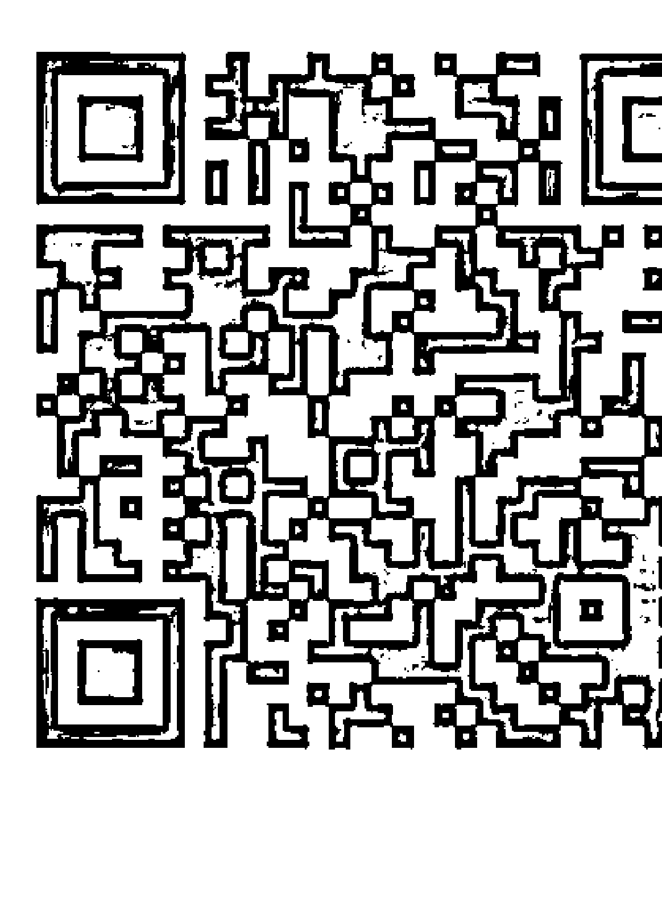

編註：手機掃描左方 QR code，可進入「全部生命系列」讀書會視頻頁面。

### 【練習】所有練習，都是同一個

有時候，「我－我」的靜坐做不下去，很多念頭浮出來。這時候，體會自己有這些念頭，接受自己有這些念頭。
接著參——誰有這個念頭？
貼著念頭這樣問，答案當然還是——我。
那麼，我，又是誰？
回到沒有答案的空檔，這時候，再回到「我－我」。
不知不覺也就知道，在神的身分，沒有問題。沒有煩惱。沒有過不去的事。站在神的角度看一切，其實，也沒有臣服好談，最多是臣服到自己（如果還可以這麼說）。因為衪本身就是圓滿，無所不知，無所不能，無所不在。沒有什麼東西，可以同時存在，而不是衪。
體會到這一點，自然就會發現——「我－我」最多是透過神的角度在說話；參，也只是透過否定一切，而隨時把神找回來；臣服，最多也只是接受自己的真實的身分。
這麼一來，這裡和之前帶出來的所有練習，都跟一般的認知顛倒——不是把「我」變成一個原本沒有的狀態，最多，只是讓我們回想自己本來就是的。

假如你讀到這些，一點都不驚訝，可以完全接受，可以練習，甚至活出來，也就這麼簡單，把臣服、參、「我－我」的練習合一了。

## 30 沒有時間，沒有意義
No Time, No Meaning

我們每個人在修行的過程，都從錯誤的點切入，離不開一個東西叫「意義」。

任何話，一定要有意義。任何念頭，自然會有連結，因為我們在找意義。假如沒有意義，念頭其實不會一直浮出來，因為沒有一個意義在連結它。話，也不會再講了。假如話沒有意義，「啊」和「啊耶咦喔嗚」、「這空間很美」、「時間過的很快」都一樣的沒有意思，我們也自然不會再講話。

但是，我們離不開話，離不開念頭，也離不開意思，隨時都在找意義。從意義，會找出一個更大的目的。我們的人生，不光每個瞬間要有意義，整個人生還要有目的。這樣，我們才覺得人生有意義，沒有虛度，值得存有下去。

其實，我們把這個習氣也帶到修行。無論是苦修、瑜伽、持咒、禱告、淨化……走到最後，要得到一個意義，要有所突破。突破，本身就是意義。突破，是可以想出來、描述出來、觀念化的，當然離不開意義。於是，每個人都往意義上找，都在這上面著手。
我過去會說——是剛好相反，醒覺，不是去找意義。甚 至，反而是在無夢深睡的層面，我們還可以覺。覺察到什 麼，不知道。還是可以覺，不斷地可以覺。
這個覺，本身是最珍貴的一把鑰匙。是透過覺，我們才 可以發現，原來自己就是最單純、最原始、最純的意識。而 且，這個意識從來沒有離開過，祂就是絕對的部份。
假如絕對可以跟我們接軌，最多也是透過覺，就是 覺。在意識的層面，是覺。在身體的層面，是歡喜、大愛、 寧靜，或只是「在」。就是那麼直接，透過覺，讓我們可以 跟絕對不斷地接軌。
談到「非時間」的觀念，其實，就是「非意義」。沒有 意義好談的。一個人假如隨時在非時間的永恆，沒有一個念 頭可以起伏，沒有一個意義可以得到。
反過來，也沒有一個「誰」在做。
連「誰」，也離不開意義。一個動作，也是要得到意 義——是誰在做？什麼被做？要做給誰？——透過這種區 隔，頭腦才可以得到意義。如果完全在非時間的永恆，這個區 隔，也就完全消失。全部的意思，都消失。

我才會不斷提醒——假如你這一生來，到這裡還有一個醒覺的觀念，還有一個目的、一個意義可以得到，你其實還在迷路。

是把這些觀念全部打破，知道你來到這裡，就是剛剛好。醒覺，不醒覺，跟「你」一點關係都沒有。到哪裡，完全不知道，也無所謂。也完全知道，醒覺不是靠「你」或是「誰」在做。如果還有「誰在醒覺」的觀念，還有小我的觀念，你也醒不過來。就連去規劃醒覺、去期待醒覺，其實也是多餘。規劃不了，也期待不了。

一個人這樣做，也就剛剛好，是把全部的意義、全部的知識、全部的經過洗得乾乾淨淨。丟得乾乾淨淨。甚至，不讓它起伏。知道它完全是幻覺，是頭腦的作業。才不知不覺可以醒過來了。

讀到這裡，你可能還是認為很抽象。但是，這些話，一樣可以變成最有效的提醒或練習。跟前面「我－我」的練習一樣，我也多次在讀書會帶出來，跟大家一起練習。
我認為，這個練習相當重要，而且它的切入點，跟一般所理解的修行和静坐截然不同。所以，我不光在这里提供一个练习的方式，也同时将这两场读书会带给你，让你可以跟自己的理解做个对照。

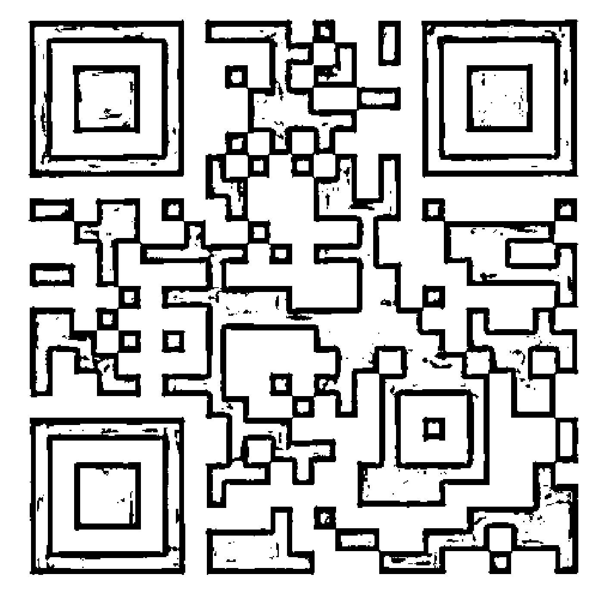

编注：手机扫描左方QR code，可进入「当下，是觉的成就」视频页面。

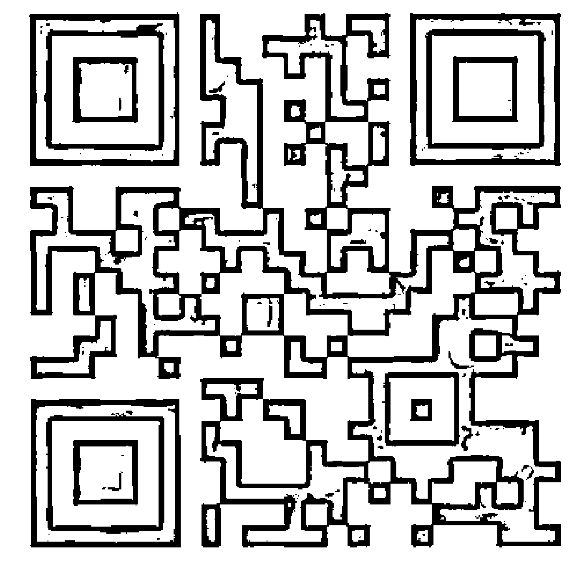

编注：手机扫描左方QR code，可进入「把觉察，交给觉」视频页面。

### 【練習】「覺」的練習

睡了一夜，醒來的第一個瞬間，那時候，剛剛好知道只有覺的時候，輕輕鬆鬆停留在那上面。

過一會兒，有一個「我」衍生出來。接下來，就有各式各樣的感覺浮出來。然後起了念頭——「我睡在哪裡？」「現在幾點？」「今天要做什麼？」。接下來，就有一個完整的「我」。一個完整的世界，也跟著出現了。

試試看，在這個「我」還沒有起步的時候，是不是可以注意到？是不是可以把它凍結，甚至看到它的起步——就像貼著「我」，跟著「我」延伸。知道這個「我」好像從胸口延伸到脊椎，經過脊椎，再延伸到腦，再造出一個完整的世界。

只要輕鬆貼著這個「我」，它自然會萎縮，也就又回到心。會自然發現，這個單純的覺，是覺察到什麼東西之前的覺。最多，只是帶來一種很微細的感覺，只是「在」的感覺 ( feeling of Presence )。

感覺什麼？感覺自己活著。
活什麼，感覺什麼，都還沒有起伏。
除了「在」的感覺，其他，什麼都沒有。
只要有一個理念——知道什麼東西活出來，我們其實又被帶走了，又回到人間。
這時候，不需要馬上踩剎車或反彈。最多，只是看著眼前所知道的東西。你自然會發現，從「知道有個東西」，意識又自然退回到覺——單純、原始的覺。
再表達更清楚一點，我們仔細觀察，剛醒過來，體會到的是一種模模糊糊的感覺，倒不是念頭。只是一種「在」或存在的感覺。然而，在哪裡？存在什麼？倒是還沒有延伸出來。它本來沒有任何意義，只是一個很直接的感覺。是接下來，才有念頭。還是感覺的時候，還來得及踩剎車。一有念頭，就踩不了剎車。一個念頭，接著一個念頭，就造出了一個完整的念相的世界。
我們可能停留一秒，或幾秒。多久，都不重要。只要練習，停留的時間自然會延長。到最後，可能是幾分鐘、幾小時，甚至幾天。會發現，還是可以做事，可以講話，可以在這個世界運作。

晚上要睡了，也是如此。睡覺前，輕輕鬆鬆找回這個覺。

要找回這個覺，最多只需要接受一切，把自己臣服到每一個瞬間。或反過來，每一個瞬間帶來的念相，都不去計較，都不再加一個認知或念頭。最多只是不斷地接受，不斷地讓「一切都剛剛好」的肯定浮出來。

只要睡前這麼做，自然會發現這個狀態會延伸到睡眠，甚至影響睡眠和夢的品質。就算睡著了，一睜眼醒來，也就自然還在延續這個練習。就好像在睡眠時，進入了非時間的永恆，沒有任何中斷。

早上，一樣地，做這個練習，自然會延伸成為一整天的狀態，也就好像準備我們面對白天遇到的所有事情。讓我們不知不覺站在非時間的絕對，看這個人間。

試試看，可不可以停留在沒有分別，沒有意義的狀態，即使一秒鐘、幾秒鐘都可以，效果已經出來了。說效果，最多也只是讓我們清清楚楚知道，有一個更大、更全面的意識，隨時都存在。連睡覺時都存在，更不用說醒時也在。只是我們將頭腦相對的意識套上去，反而把祂蓋住，讓自己忘記了。

我們會發現，這種練習，讓我們體會到生命本來就有的一種狀態。

覺，本來就有，不可能沒有。沒有祂，沒有生命。

但是，我們都把注意力放在覺的下游，也就自然從絕對，落到人間的一個小角落。

## 31 我們行為的慣性，是時間帶來的產物
Behavioral Patterns Are the Result of Time

前面提到時－空的觀念，從物理的角度來看，空間和時間是分不開的。一般把它稱為「空間－時間的連續譜（space-time continuum）」，也就是認為空間和時間聯手創出一個四度時－空的世界。我們也提到，比較正確的表達是「只有時間的連續譜」——沒有時間，沒有空間。是有了時間這個「第四維」，才有空間的三維好談。

前面提過，透過「動」，我們才有一個時間前後的觀念。反過來，時間也強化「動」的觀念，有個前後，才讓我們可以在空間上比較，而隨時帶來「動」。隨著文明發達，我們的「動」愈來愈快。換句話說，第四維——時間的單位愈來愈精細，甚至到了頭腦和五官跟不上，要出動各種設備來量的地步。

人類上古時期留下的許多遺址，是多少個十年，甚或要幾輩子才能完成的，這也是人類當初衡量時間的單位。後來的人，才開始用幾「年」或幾個「月」來表達。到今天，我們開始用分、秒這種單位來衡量。現在，甚至連一秒都嫌太長。我們還有毫秒（10⁻³，千分之一秒）、微秒（10⁻⁶，百萬分之一秒）、奈秒（10⁻⁹，十億分之一秒）、皮秒（10⁻¹²，兆分之一秒）、飛秒（10⁻¹⁵，千兆分之一秒）的觀念。把衡量時間的單位，切割得愈來愈細。這樣還不夠，我們把空間也落到同樣精細的範圍，開啟了奈米或皮米的時代。量子物理的發展，也就是這麼來的。

這樣的過程，自然把我們的步調加快。人類也就自然進入數位時代，再跨到社交媒體的年代。每個人都練就一心多用的本事，隨時應付各個層面紛紛到來的資訊和刺激。

但是，從生理的角度來看，時間其實是神經架構的產物。時間的步調快，身體的反應也要跟著快。也就等於在神經細胞的層面上，建立一個快步調的神經迴路（neural circuit or loop）。只有同一組神經迴路不斷重複自己，步調才能快上加快，最後變成一個自動反射。讓我們一遇到事，就可以立即反應。

透過這種方法，人人看起來都可以一心多用，開啟多工模式，同時處理許多作業。然而，每項作業其實還是需要一個單獨的迴路來指揮。只是每個迴路完成的時間愈來愈短，感覺上好像一個人可以同時面對不同的刺激。但是，仔細觀察，頭腦的作業還是線性的，依照先來後到的順序在運作。最多是每個迴路運作的時間不斷縮短，而且速度是一般人想像不到的快，讓我們感覺不到它還有一個先後順序。

我們面對時間的要求，隨時要立即回應，也就自然把頭腦迴路運作出來的刺激和反應當作真的，就好像在腦海裡建立了一個新的世界。透過頭腦的想像，整合五官帶來的迴路，進一步創出一個虛的現實，讓我們覺得這一切都再堅實不過了。非但讓我們生活在一個虛的現實，還不知不覺就困在其中。因為步調快到一個地步，我們全部的心力，都在這個虛的現實裡運作。根本意識不到除了這個虛的現實之外，還有什麼。

正是因為步調不斷地持續加快，甚至快到連自動運作的迴路應付不了，就像下一頁這張圖所表達的，就連每個神經迴路都在時間的壓力下運作，而讓我們每個人都覺得「跟不上」，總是會感到壓力。我們的頭腦應付環境變化都來不及，沒辦法得到休息，就連充電的機會都也。也因為這樣，現代人可以說沒有一個是舒暢或快樂的。而這個問題，只會愈來愈嚴重。

這種發展——也就是你我每一個人這一生都在面對的，自然讓我們的生活透過密集的反應，建立成一種「慣性的總和」。而且，反應的速度快，快到讓我們以為自己有一個自由意志在運作。卻意識不到，腦最多只是一個超級電腦（或超級處理器），隨時面對很多選擇，要在其中選一個，根本談不到什麼叫做自由意志。充其量，只是不斷為環境的刺激排列優先順序，忙著做反應。

環境的步調太急，迴路的運作太快。我們認為，這就是全部，根本看不出這些選擇其實是順著一個藍圖在運作。這個藍圖，就是之前談到的業力或因一果。

因一果和業力，並不是根據自己或別人的意志而來，而是全宇宙可見、不可見的所有力量的組合。它沒有刻意想帶來一個好的結果，也沒有要刻意帶來壞的後果。沒有刻意想幫助我們，也沒有要特別欺負我們，最多只是反映全部累積的力量。我才會不斷地說——一切，我們所看到、體驗到的這一生，全部都是註定的。而這些話，是再科學不過了。

所以，從這個因一果的層面去著手，想從人間找到一把鑰匙，是不可能的。它本身就是幻覺，讓我們覺得它好像是真的。這個層面從絕對、整體來看，根本不成比例，倒不需要從它身上著手。去分析、去理解它，不光耽誤時間，而且還找不到一個出口。

反過來，最多只是輕輕鬆鬆把全部和時間相關的特質、事物、觀念挪開，這個非時間的領域自然浮出來。這個非時間的層面，我們每個人都有。最後，都可以找到。

全部的練習，包括臣服和參，最多只是把我們最原初的記憶找回來，同時建立我們的信心——我們其實什麼都不用去做，本來就有這個非時間的層面。只是透過這個人生，讓我們忘記了。所以，最多只是把祂想起來，讓祂自然浮出來。

### 【練習】
All Patterns Exist to Be Broken
慣性存在，是用來打破的

我在國外時，常用這個標題，當作一個練習的功課。
每一個人，其實隨時都被慣性綁住。這個練習，最多是
讓我們發現，自己的運作，一直在習氣裡。

一天下來，我們有各式各樣的習慣。比如說早上一起
來，從哪邊下床，被子怎麼疊。是先喝水，還是先上洗手
間。上洗手間，是發呆，還是要順手抓個東西來讀。先刷
牙，還是先洗臉。怎麼吃早餐，是中式、西式或水果餐，一
定要到哪裡帶一杯咖啡，或絕對不喝咖啡。在路上，是滑手
機，還是聽音樂。到了辦公室，先找人講話，還是先開電
腦。開會，要搶在前面發言，還是最好不要讓人發現。下
班，是馬上離開，還是多留一會把事做完。到了家，先洗
澡，還是賴在沙發上看電視。是累了才睡，還是幾點前一定
就寢。睡覺，是抱著被子，還是躺平……每個人，都有自己的
習氣。一天下來，各種慣性是數不完的。

一年三百六十五天，觀察自己的慣性。每一天，有意識的在其中選一個，打破這個慣性。也許是更動刷牙洗臉的順序。換個地方喝咖啡，或放過今天這杯咖啡。開會時本來不說話，試著主動說一句。或者本來搶在前頭，今天刻意不說話，專心聽別人說……

一天選一個來實驗，而且，一天只要做一個。

透過這個練習，我們自然會發現，光是踩一個剎車，換個步調，就可以把一個迴路的運作中斷，去打破慣性。我們不是去面對過去的習氣，而是建立一個新的迴路，來打破過去的慣性。

一個習慣，至少讓它中斷一次，就讓頭腦造出一個新的迴路。

仔細觀察，我們都是習氣組合的。每一天，打破一個慣性，會發現頭腦可以重新組合。一再地發現，這些習氣本身也沒有多大的吸引力。

一開始這麼做，可能會覺得難，畢竟我們多多少少都對一個慣性「上癮」了。從比較小的，不那麼嚴重的開始做。不知不覺，會發現自己不需要再跟著慣性走，而會期待隨時可以打破慣性。

這一來，自然就帶來一個新鮮的迴路。每天，都像重新開始。

～・～

神經的迴路，反覆遇到同一個問題、同一種刺激，運作的速度自然愈來愈快，才可以應付環境的變化。這些迴路會敲定我們的慣性，包括行為上的步驟，也就建立我們的個性、人生觀、價值觀，

可惜的是，我們意識不到自己離不開習氣，意識不到自己只是慣性的總和。

而且，這些慣性或習氣，是頭腦很難理解的。我在《全部的你》提過「我」是怎麼建立的，也提到「我」的組成其實比我們想像的更廣——不光是這個身心，還包括家庭、社會甚至身為「人」所帶來的。我更在《集體的失憶》和《落在地球》談到人類的特質。我們怎麼都想不到，正是這些特質和價值在束縛我們。一個人要解脫，到最後，要打破時間的觀念。要打破時間的觀念，還是要從人的特質跳出來。

換句話說，解脫，最多是看到背後的真實。透過真實，把全部的慣性打破，一個人也就自然而然走出來。

### # 32 什麼都不期待
Expect Absolutely Nothing and You Will Have Absolutely Everything

之前提過什麼都不期待，這個觀念相當重要，本身就是一把鑰匙。我指的是解脫，或進入非時間的鑰匙。一個人只要不斷地反省，往內轉，提醒自己。透過臣服，透過參，不斷把自己帶回到絕對。也就自然發現——在這個世界，任何觀念，包括解脫，包括成道，包括非時間的永恆，包括絕對，全部都還在一個相對的範圍作業。只要用念頭或語言可以表達，都跳不出人間的範圍。所以，儘管我在作品裡花了那麼多篇幅，最多還是在描述一個相對而局限的觀念。

可以表達出來的，沒有一個東西、一個觀念、一句話，我們可以稱為真實。

但是，雖然如此，這些觀念還是像指南針或點出月亮的手一樣，幫我們點出方向。是隨著這些觀念一層一層在心中沉澱，一個人也就慢慢成熟。沒有這些觀念，我們連方向都沒有。也許盲目追求幾十年，但追求什麼，不見得知道。

前面提過，成熟是智慧的貫通。我在這裡，再講得更清楚一點，「成熟」是表達——一個人走到最後，任何欲望或是追求都沒有，自然消失了。他已經知道，可以追求來的東西或狀態，跟真實一點都不相關。想問的問題，也自然減少。然而，他會想跟一些聖人接觸，也許是透過經典，或參訪當代的聖人。接觸聖人，不是為了想要答案，而是最多……也不知道為什麼。接下來，也不想分析理由，就只是想接觸。

禱告，還是繼續禱告。但是，走到這裡，禱告不是為了要求任何東西。他也不期待命可以改變。他沒有任何想變更外境的念頭，自然發現內心浮出感恩、信任、信仰——感恩什麼，不知道。信任什麼、信仰什麼，更不知道。假如一定要用語言表達，最多只能說是感恩、信任、信仰自己。然而，這個自己，最多只是絕對。

有意思的是，他完全沒有什麼可以期待，自然發現生命慢慢打開來，也就自然跟絕對接軌。但是，接軌或打開，又不是靠他做了什麼。他最多只是接受、臣服於絕對。

一天下來，自然發現每個動作都在臣服。至於「誰」在做這些動作？不清楚。不會去追究，也不會去解釋。該做什麼，做什麼。他也不計較做的好壞，就是順著每一個瞬間在做。

也就不知不觉，他滑進去絕對的軌道。但是，就是在絕對的軌道，他也沒有任何領悟、任何體驗好談，會發現這本來就是最自然的狀態。只要分析，又是加上一個不需要的頭。聽到別人講自由、解脫、超越，他也覺得很奇怪，這些觀念都是多餘的。是的，以前他也重視這些觀念。然而，現在好像懶得或不覺得有必要再做任何解釋。談自由或不自由，好像是當時還在無明中，才會發現還有一個自由的狀態好追求。

就這樣，沒有期待任何東西。不知不覺，自然發現這個自由是他的根本態，是本質。這麼說，哪裡還有自由或解脫好談？就連非時間的永恆，都是可笑的表達。

因為他老早什麼都不期待，老早在非時間的永恆。假如還要特意去想，也就回到了人間的小範圍打轉。最有意思的是，連小我，都不需要去根除。因為小我本來就不存在。什麼都不期待，自然活在一個不允許「我」的狀態。假如還有一個「我」，他老早已經落回人間。

什麼都不期待，自然發現一切又是顛倒的。

### 【練習】
見證每一個習氣，再加上否定

在前一個練習，如果可以看到每一個習慣、每一個嗜好、每一個慣性，甚至還可以改過來，你自然會發現，任何念頭、任何動作其實離不開我們這一生的制約。或者說，離不開我們從出生到現在所累積的習慣或習氣。

這麼一來，自然會發現，不只每一個動作，連每一個念頭，都是隨時從潛意識浮出來。我們不知不覺一再重複過去的習慣或模式，卻一點都意識不到，還認為它是一個新的變化或新的觀念。其實，都是重複再重複。一個人假如可以從早一睜眼就不斷觀察自己，他自然變成一個見證者。

從早到晚，清清楚楚看著自己每一個動念，每一個動作。不需要帶著批評或評判，不需要隨時指正自己是對還是錯。輕鬆地，只是觀察。知道眼前所看到的一切動作，都跟真正的自己、一體不相關。

這時候，不斷地提醒自己——不是這個，不是這個——眼前觀察到的任何東西，其實都跟真實不相關，都跟真正的自己不相關。樣樣，都可以放過。眼前任何現象，再好的事，再不好的事，任何感受，都沒有任何期待。

任何念頭、動作，最多代表小我，代表小我活出來的限制和制約。其實，真正的自己從來沒有動過。不知不覺，一個人就進入這個非時間的永恆。發現一天很容易過。

從早到晚，即使沒有念頭，身體還是要完成它自己這一生帶來的一些任務。像是早上起來刷牙、上洗手間、洗澡、吃飯、坐捷運、到辦公室、跟你們講話、辦事，中午休息，下午再繼續處理事情。晚上回家，坐捷運，走路。回到家，吃晚餐。晚上，休息睡覺。一整天，即使沒有念頭，這個身心還是可以自己運作。而且運作的相當好，沒有什麼煩惱。

這麼一來，自然發現非時間的永恆其實是我們的本質，從來沒有離開過。一個人清楚做一個見證者，自然會發現這個身心要完成的，還是會完成。沒有念頭，它還是可以運作。甚至，可以做得更好。

我們也就不知不觉寧靜下來，自然想擁抱沉默。和週邊的人相處，話自然也變少了。別人從事什麼嗜好或娛樂，和自己也不相關。就好像自己的價值觀突然改變了。

#### 33 跨越時間
Going Beyond Time

我在《全部的你》曾經談過人類的演化。在這裡，我再次借用同一張圖，但是區隔不同演化階段的，最多是時間。

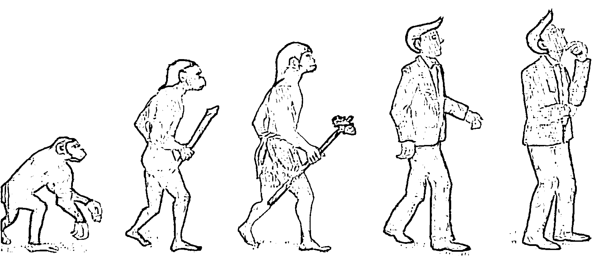

人類的發展或演化，從非時間，走到一個時間被劃分得很精準的階段，讓我們得到那麼多突破和進展。接下來，倒不是要把時間停下來——停不了的。畢竟，有人間，當然會有時間。

如果真正還要做什麼，最多也只是跨越時間，也就是不讓時間成為我們的主人。不要把自己變成時間的奴隸——一天到晚後悔有沒有更好的安排，或想刻意去轉變時間的安排。

如果人類沒有經過徹底的意識轉化，表面上雖然文明愈來愈發達，而且速度愈來愈快，對時間的利用愈來愈緊湊，但是，我們沒有一個人會快樂。甚至，這種不快樂會演變到一個極端的地步，讓我們最後毀掉自己。

從我的角度來看，大規模的意識轉化根本不是個選擇，而是人類演化必然的結果。

很有意思的是，不去肯定時間的重要性，也就自然不進入一個反彈的層面。一個人，也就進入臣服的狀態。

之前的練習提過，臣服，不是接受眼前不可避免的事情。臣服，最多只是接受真實，隨時接受真實。真實也就是絕對，最多也只是化解眼前的狀態。

一個人隨時臣服，也就是接受非時間的永恆，或是接受絕對。這是唯一可以靠得住的生命的力量。輕輕鬆鬆在任何狀態下，把注意力從相對挪到絕對，這才是臣服。

接下來，一個人假如還需要參，最多也只是輕輕鬆鬆提醒自己——全部覺察的根源，都是「我」，都是頭腦的產物。「我」的根源，雖然用語言表達不出來，但心會明白。也就這樣子，把全部矛盾消失了，倒不是還要去消滅「我」。事實上，也消滅不了。

很多人誤解，以為臣服和參是對這個世界投降，或還要去消滅這個世界。這完全是錯的觀念。

懂了這些，自然會有一個超越時間的觀念。我們知道，時間既是工具，又帶來種種的限制。那麼，就把它純粹當作工具。用完了，可以挪開。自然不會被它困住。

那麼，要怎麼去超越時間？

超越時間，其實不是在時間上運作。畢竟在時間上運作，是不可能的。時間就像水流一樣，我們不可能用手去擋住，擋也擋不了。唯一可以著手的對象是「我」，是透過這兩種提醒——臣服，加上參。

不斷提醒自己——「我」是虛的。「我」不存在，時間流或不流過去，自然不相關。「我」不存在，也沒有「誰」會去在意時間是不是在流。沒有時間的觀念，也就代表沒有「法」，自然沒有世界。

任何觀念，我們自然體會到它其實不存在。沒有一個永久的本質。沒有任何東西在支持它。本身還是一個念相。而這個念相，也不存在。

這樣子，一直走下去。走到哪裡，不去在意。不知不覺，就從時間的陷阱走出來了。

超越時間的狀態，我們每個人人生來就有。祂不是透過我們才創出的全新理念。並不是本來沒有，後來有。祂也不是一個獨一無二的特殊存在（exclusive state）。就像這張圖所表達的，這種狀態不是像左邊一樣，是個隔離的狀態，而是像右邊所表達的，在清醒、做夢、深睡都有。所以，我才提醒——turiya 第四意識或醒覺這些名詞，本身還只是一個比喻。並不是說在三個狀態之外，還有一個單獨的第四個狀態。這一點，我也擔心讀者產生誤會。但是，因為在這個人間分享，難免要受到語言的限制，也只好沿用古人的表達，先把這個概念帶出來。

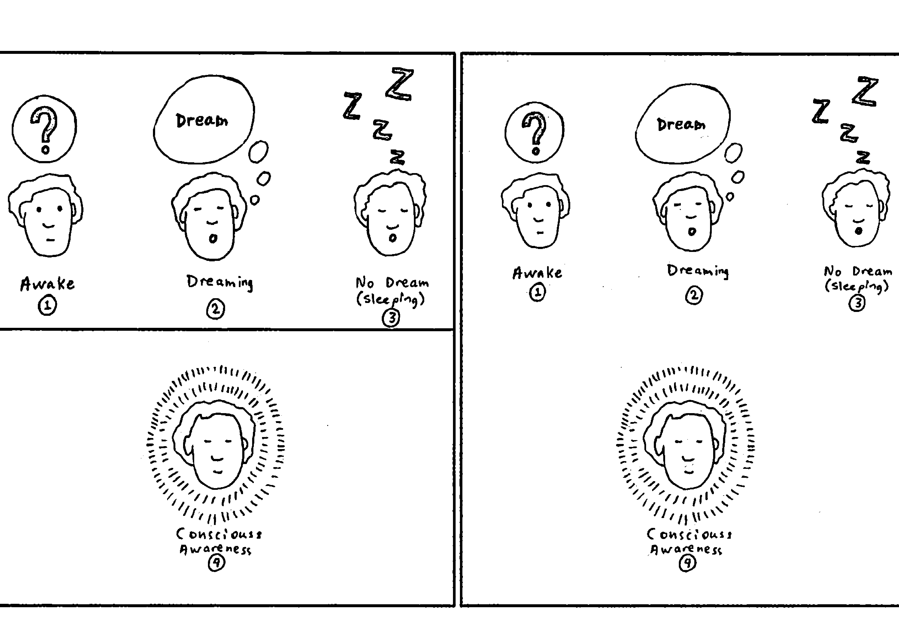

站在一體，前面的三種意識狀態不存在。第四個狀態也不存在。甚至，連「一體」也不存在。畢竟可以講存在的，都還在一個相對的世界打轉，最多是拿來比較和對照。站在絕對，這些知識、論述、辯論都是多餘的。絕對，跟人間的任何事（包括做、時間）都不相關。

懂了這些，也就輕輕鬆鬆醒過來吧。也就這樣子，省掉數不完的煩惱、練習或冤枉路。

### 【練習】
Be a Watcher of Breath
呼吸的見證

經過之前的練習，輕輕鬆鬆做一個見證者。我們自然會發現念頭減少，而念頭和念頭之間的空檔也會拉長。這種空檔，也就是非時間的永恆的體會。一個人會發現，沒有念頭，好像也沒有時間好談。

一個人念頭停下來，不知不覺中，自然可以觀察到很微細的動態，例如呼吸。

走到最後，人就好像跟呼吸合併在一起。吸氣，吐氣，都知道。很平靜的，好像看著呼吸，體會到呼吸，跟呼吸分不開，而隨時停留在呼吸跟呼吸當中的空檔。

這本身，也就是非時間的永恆。

一個人自然發現全部都慢下來——時間跟著慢下來。甚至，好像沒有時間的觀念，也沒有「誰」在做的觀念。

雖然沒有念頭，好像樣樣還是可以繼續運作——可以辦事，可以吃飯，可以睡覺，可以講話。但是自然的，沒有「誰」在做。

講到這裡，你會發現——一切是顛倒的。我們之前有許多練習，好像是想透過這些練習達到非時間的狀態。但走到這裡會發現，其實只是一個心態的轉變。

一個人突然體會到，非時間是最主要、最普遍、最輕鬆不費力的狀態。只要不斷地領悟到這一點，自然發現所有的練習好像都不重要，最多只是提醒自己有這個最普遍的狀態。

但是，沒有一個練習是關鍵。

假如領悟到這些，全部練習也就變成是多餘的。

因為我們沒有信心可以醒過來，才需要做那麼多練習，包括呼吸的見證。假如有信心，老早就醒過來了。

自然會發現，眼前所看到的一切，包括呼吸，都只是幻覺，或像個幻影，重疊在我們的真實上。最多只是讓它來，讓它走。沒有一個可以真正沾到真實的自己。

我才會說，醒覺，比我們想像的更簡單。只是因為我們認為需要「做」，才需要那麼多練習，甚至各式各樣的練習，走那麼多冤枉路。最後，最多也只是——回到原點。

### # # 34 没有目的地，没有旅程
No Destination, No Journey

讲到修行，到最后，也就像跳上一列火车。要去哪里，不重要，我们也不重视。会花多少时间，我们也不去计较。而且知道，还没有离开火车站，其实我们已经到了。因为这个出发点，已经是最终的目的地。

我们还没有出发，已经到了。

假如你可以记得这几句话，而且可以完全活出来，你会突然发现，没有一件事情是可以做的。一切可以讲的，又回到了莎士比亚说的“much ado about nothing”。是从没有事中，生出好多事来。非但是多余，不需要的。甚至，会让我们不断迷路。

假如我们可以接受——我们所有的边界条件，现在刚刚好就是圆满的，也不用再去找其他的条件，其他的状态。我们最多只是接受，彻底知道本来就是圆满的。也就醒过来了。不需要费力再去提醒或反省，不用再费力去臣服我们本来就有的，或是去参本来就在的。都不需要。因为你最多知道——你就是祂。

祂，是什么？再也不用去分析了。

当然，再讲更透明一点，祂就是神、主、一切、心、道、全部。你就是祂，从来没有离开过祂。只是不知道，才会走那么多冤枉路。我还用那么多篇幅，在讲同一件事。

祂就是那么简单——你还没有离开，就已经到了。你才会质疑，认为不可能。非但要一生一生来，不断重复。甚至，还有一个统一场论或万有理论好谈。还有一个物理的追求——有宇宙、大霹雳、奇点、时间永恒或不永恒、绝对或不绝对的观念好谈。

全部，都是“much ado about nothing”，本来没有事，生出好多事来。

全部的追求，对你，不光是不会有帮助，反而还会绑的更紧。这些追求，不只追求不完。而且，愈追求愈微细。表面上看来是愈完整，但是，这个完整其实带着更多分别。让我们从一个简单再简单的状态，被带着愈来愈远。

然而，这么讲也不正确。其实，你哪里也去不了。你所去的部份，最多是一个相对的小部份。只是你把这个部份，当成了自己的全部。我前面才会说这就像是「错误认同症」的病例——把你本来有的全部、完美的意识落在一个小角落，认为这个小角落就是一切。而远远超过这个小角落一兆倍以上的更大的部份，你却选择摆到一旁，甚至把祂完全忽略。

当然，不用担心。早晚有一天，这不成比例大的部份会照明出来，反而把这个比例小的部份「吞」进去，这才是最重要的物理定律。如果还有一个万有理论好追求，这才是真正的万有理论。

会谈这么多，只是我舍不得看你还要经过数不完的冤枉路，还要迷路不知多久才能找到。才透过「全部生命系列」，用各式各样的方法，希望你这一生可以找到路，而且是你心中本来就知道的路。

别忘了，这路，是没有路标的路。这条路，不需要你费力，连眨眼都不用，就可以跳上去。用速度来谈，比无限的速度还更快。在时间上，比一除以无限大的时间还更短。一点都不费力，也就醒觉了。

所以，醒觉不是透过任何练习。只是内心有个决心，有个信仰，让你突然知道，也就醒觉过来了。

你个人的全部经历，一路走来的旅程，跟醒觉，一点都不相关。你要醒觉过来，如果还有一个准备可以做，最多也只是——肯定和感恩。

肯定自己从过去走到今天，一切，都是刚刚好。都在筹备你，走到最后的一刻——醒觉。

感恩，是感恩一切。对全部这一生所遇到的人、遇到的事、各式各样的经过、好事、坏事，都充满感恩，知道这一切发生是符合一个更大的蓝图。然而，这个蓝图是头脑所不能理解的，我们最多也只能透过感恩，臣服到祂。

醒觉后，突然发现——什么都没有发生。什么都没有经过。没有东西好谈。没有「谁」在醒过来。

但是，这个生命对你已经完全不一样了。

至于谁知道不一样了，都不重要。

一切，都不一样了。

### 【練習】
#### 參，沒有答案的答案

前幾個練習，一路都在強調見證。然而，見證，最多也只是輕輕鬆鬆不費力的觀察，觀察「我」所帶來的念頭、行為和動作，和週邊由「我」投射出來的一切現象。

這種觀察，本身站在一個更大的架構看著這世界，讓我們能最有效率地踩剎車。同時，讓我們提醒自己——不要完全投入在一個狹窄的框架，而忽略了意識絕對的部份。

一個人不斷地做見證者，但偶爾還是會發現有念頭來，打破這個見證。自然開始去描述、去形容、去解釋。這時候，就用「參」——

- 為誰，還有這個念頭？
- 誰還在做分別？
- 誰還想形容？想描述？想歸納？想解釋？
- 為誰，有這些情緒、感受？
- 當然，答案不斷地是——「我」。
- 那麼，「我」又是誰？

參下來，自然發現「我是誰？」這個問題，沒有答案。怎麼去找，都找不到答案。假如還有一個來源可談，還是「我」。假如有一個結果可談，一樣是「我」。「我」，是一個走不出來的迴圈。

「我」是全部存有、一切念頭、所有頭腦產物的來源。然而，「我」卻是一個走不出來的迴圈。「我」怎麼來的，其實沒有答案。

透過這個很簡單的方法，貼著「我」，並不會抵達某個地方，因為根本沒有地方可以到。我們最多是體會到，「我」和真實是兩個不同的意識軌道。這兩個軌道是不相關的，一個是局限，一個是無限。這樣子，我們自然發現「喔！有一個無限大，而我隨時把祂忽略掉了。」

這時候，一個人就輕輕鬆鬆做「我－我」的靜坐——Soham或「我－在」的靜坐。最多只是提醒自己，這個「我」，和大我其實不相關。而大我，或真實，也就浮現出來。

也就不斷提醒自己——我跟這個宇宙、跟無限大的意識，其實從來沒有分手過。除了這個無限大的意識，什麼都不存在。沒有「我」，沒有「你」。好像來不及有這個空間。

這個宇宙，這個無限大的意識，本身就是圓滿的。每個角落，都塞得滿滿的。沒有一個空間給「我」，或「你」，或「他」。

也就這樣，不斷練習，透過大我，隨時提醒——「我」不存在。「我」帶來的全部世界的觀念、分別心，都是妄想。

站在大我，沒有時間的觀念，沒有「我」，也沒有妄想好談的。

這樣子，一個人就自然寧靜。

第二章有一張圖（見 30 頁），一個人在好奇，如果把手伸進黑洞，會怎麼樣？也許，你到現在還是很好奇。當然，你我都不可能體驗黑洞。我也只能說，假如用物理的黑洞來談，沒有人知道答案。

然而，黑洞，跟所有人間的觀念一樣，是頭腦投射出來的。有黑洞，是因為有我們。我們局限的腦，想投射出框架之外的世界。所以，自然拿黑洞當連結或管道。

但是，假如我們把黑洞，當作過去所談的專注的奇點，那麼，這個答案就很簡單。一個人，透過奇點，或停留在奇點，自然會發現不光沒有時間的觀念，輕輕鬆鬆可以進入非時間。連「我」都起不來，甚至，早晚消失。而且，不光是小我起不來，你、別人、世界、其他、任何東西，也都跟著消失。我指的消失，不是那個「體」消失，而是消失那個「體」的堅固性。

我們自然會發現，本來很堅固的一切，包括人間一切聽到、感受到、活出來的，都好像成為一個幻影，跟我們真正的自己重疊。而真正的自己，沒辦法用語言表達。因為所有的表達，都帶來一個限制。

回到手的比喻，我們還是會看到一隻手好像從黑洞出來。但是，這隻手沒有主人。它動，它比出一個很棒的手勢，也好像跟「我」一點都不相關。

我們也自然發現，它本身是業力的組合，有它的一個週轉，必須活過。我們最多只能讓這隻手、這個身體、這個「我」活過它這一生來想做、已經註定要做的。

但是，我們可以清清楚楚區隔，這一切，跟我們真正的自己都不相關。或者，一點都不成比例。兩個在不同的軌道，我指的，是意識的軌道。

雖然我在這裡用黑洞或奇點來談，然而，我也在這本書裡不斷地提醒，其實，連奇點的觀念，甚至，連時間或非時間的觀念，都一樣只是頭腦的產物。

我們透過每一個瞬間，其實隨時可以活出奇點（假如還有一個奇點好談）。活出這個奇點或非時間，一點都不費力。甚至，跟我們真正的自己完全不相關。因為我們真正的自己，隨時都在非時間。

到這裡，還有一個非時間可談，因為任何表達，還是需要借用相對的語言或邏輯。所以，最多只能透過「奇點」、「非時間」這樣的用詞稍微點到祂自己。其實，沒有任何一句話或觀念，可以徹底的表達。是希望我們局限的腦可以理解這些話，才冒出一個「非時間」的觀念。

懂了這些，而徹底可以活出這些，一個人，就自由起來了，奇點或非時間隨時在眼前。全部矛盾，也就跟著消失了。

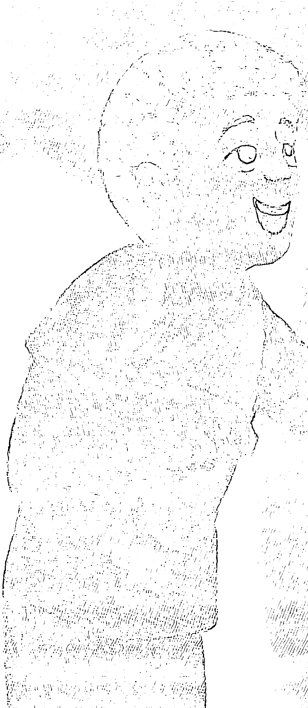

## 35 時間到了 This is the Time

前面談過，沒有完美的時機。我在這裡，要分享另一個大的秘密。

一般人年紀愈大，愈把這個世界看得堅實。就好像活了一輩子，全部頭腦的迴路，都已經建立完整，所有的運作都落在現有的迴路裡，很難創出一個新的迴路。所以，要讓年紀大的朋友去學習新的領域，包括語言，難度相當高。不知不覺，又會回到一個固定的框架。很難有空間，讓新的迴路可以紮根。

過去，我也很少跟年紀大的朋友分享全部生命的理念，因為我知道——假如一個人在二元對立活了一生，甚至認為自己在某一個領域很成功，要他為新的理念開啟一個窗口，這樣的機會，可以說幾乎不可能有。

確實如此，自從開始寫「全部生命系列」，我也發現，年紀大的人，質疑反而比年輕人更強。這是難免的，我本來就知道會是這樣的。

但是，我這次會鼓起勇氣選擇出來，是因為一個很不一樣的情況——地球的頻率，和人類一樣的，正在加速上升。前面也提過，我雖然說「頻率」，但這個詞其實不是正確的表達。與其說「頻率」，更應該說是一個螺旋場，是人類累積所有資訊的總和。或者，也可以說是一個意識的網格，或意識場。

和以往不一樣的是，人類的資訊場和意識場頻率正在加速上升。舉例來說，我們透過網路和社交媒體，人與人、社會與社會之間連結的速度愈來愈快，也就是在加快這樣的資訊場和意識場。而這個加速竄升的速度，是指數性的，遠遠超過直線性的加速。

也就是說，這五十年來，意識場變化的速度，比過去幾千幾百年還快。而這五年，又比過去五十年所累積的更快。也可能未來的一年，甚或半年，都比前五年的總和更快。

我相信有電腦、資訊、人工智慧、演算法專長的朋友，讀到這個觀察，一點都不會驚訝，這本來就符合科技變化的趨勢。雖然這樣的變化，在無數層面帶來同時多工處理的能力，讓生活步調可以加快。但是，也帶來一個很有意思的現象——把我們全部的注意力集中在頭腦。同時執行兩種、三種還不夠，甚至要同時處理四、五種以上的工作。

一般會認為這是人工智慧的優勢，而把它當作是人類了不起的發展。

然而，仔細觀察，用這張你已經熟悉的圖來做比喻，把左下到右上的光流當作一體或絕對，而從光流往外分支出來的，就是一個個相對的世界。也就好像我們從一體、絕對，化出一個相對的世界。又從相對的世界不斷去做分別，透過不停演進的分別，不斷增加相對的聰明，而且速度愈來愈快。但是，快到最後，能走到哪裡？

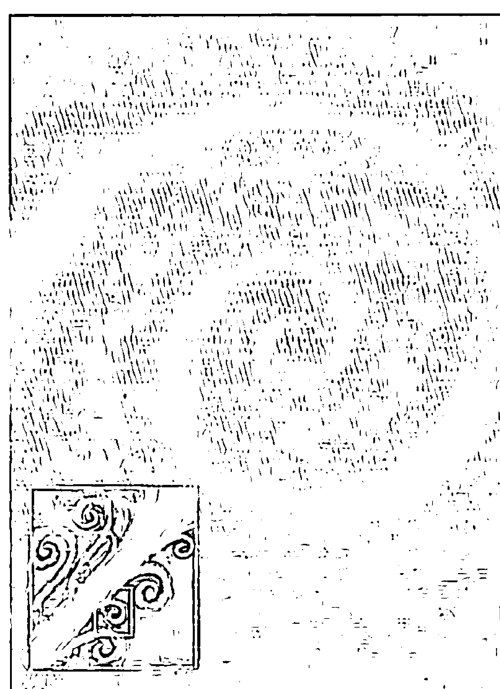

在人類的想像中，當然是愈走愈快，也就愈進步。但是，從我個人的體驗，並不是如此。

從一個相對的範圍往下走，再怎麼發展，是有限的。這條路走到最後，不會通。

而，也沒有關係。只要分別愈來愈快，也就造出一個奇點，會自然跳出時空，而回到一體。

就像下一頁的圖所表達的，從絕對，可以延伸出來相對。相對，無論走到哪裡，就算表面上看來無路可走，也從來沒有離開過絕對。就像這個圖，絕對的光，在相對的任何一個角落都可以自然照出來。我們最多可以這麼說：一體隨時想把自己找回來。或是，一體隨時想活出他他自己。除了他他自己是真實，是永恆，接下來，沒有別的體可以稱為是真實，是永恆。

假如不是這樣子，沒有一個東西叫做解脫，也不可能有一個工程好反覆的。

我所說的，也許跟時下專家想的都剛好相反——我們發展到最後，人類會跳出時空，回到一體。未來的人，和現在的人不同就在於醒覺——turiya、第四意識、一體、在、道、絕對、空。

可以說，要讓我們準備好，最徹底的方法，也就是這快速的分別與變化。我們透過快速度，進入一個很大的危機，隨時覺得跟不上，沒有安全感。然而，這表面的危機，反而帶給我們跳出時空最好的機會。

從時間的角度來談，古人的步調很慢，人類心理層面的時間也是緩慢的。但是，經過幾十年乃至近百年來快速的發展，我們的心理時間已經發展到極端的快，快到本身接近一個奇點。也就準備好我們，剛剛好可以超越。

倘若不是如此，我絕對不會選擇在這個時候出來，去面對一場贏不了的戰爭。非但給自己造出不需要的麻煩，也給週邊人帶來數不完的衝擊。就是因為我知道時間剛剛好，不光「全部生命系列」帶來一個拉動的力量，甚至地球、宇宙的變化也有一股推動的力量，好像非叫我們醒覺不可。

到這個時間點，一切也就是剛剛好。無論透過數學、物理、心理學、社會學、哲學、宗教……任何領域，都可以把絕對的觀念貫通。都是互相支持，沒有留下一點讓理性質疑的空間。然而，哪怕講的再透明，你可能還是不相信，還寧願選擇反彈。甚至，還想設法去消除它。

我在這裡，以最誠懇的心情，希望能再一次表達——但願你我能掌握這個機會，搭上醒覺的纜車。倘若落後了，誰知道下一次機緣成熟，讓你會動念想追求、去練習，又是什麼時候？

也許，這是我個人的期待——就是因為我們大家做一個集體的反復工程，說不定能讓醒過來的人達到一個關鍵的數量。進而，建立更完整的意識網格。不光是資訊，而是超越任何資訊的絕對意識的網格，把地球包起來。甚至，透過我們的連結，能讓地球的頻率更為提升，而完全改變地球的命運。打個比方來說，就像從幼稚園的等級，跳到大學甚至研究所以上的等級。

當然，這種說法最多是比喻。我指的是，地球，其實有很重的因果在拉扯。想想，只要投生到地球，過去全部的記憶都會失去，而完全要從頭再來。很可能再次被這相對的人間綁緊，甚至從此被困住。

或許會有那麼一天，來到這地球的我們，是完全貫通的。過去活過的所有生命都記得，自然跟一體分不開。甚至，連最高等的靈性生命，都會選擇來地球重生。

也許我這一生不見得能親眼看到這個結果。但是，誰又曉得呢？

获取更多好书，请加微信号: strcdts

店铺: http://strc.cr.cx

### 【練習】 在非時間，還需要臣服與參

一般人，往往不是徹底回到非時間的永恆。而是有時候有，有時候沒有。自然會發現，念頭還是斷不了，有時候還是會起伏。這時候，還是要不斷地臣服，不斷地參，不斷地把自己交給絕對。

隨時提醒自己——有念頭的人，是誰？

這樣子一路走下去，會發現非時間的狀態自然會浮出來，而浮出來的時間會愈來愈久。甚至，有一天，變成全部。

這時候，才可以徹底體會到，時間最多只是一個工具。我們透過時間，可以妥當地安排、進行工作。用完了，也可以輕輕鬆鬆把時間挪開。這一來，一個人再也不會被時間困住。

當然，這時候，假如還有一個非時間或解脫的觀念，還是要不斷地參——還有一個非時間、解脫的觀念的人是誰？

答案最多是——我。

當然是我。

是我認為還有一個非時間的狀態好談，是我認為還有一個解脫的狀態好分享。

那，我又是誰？

當然，有少數再少數的人，可以在很年輕的時候，突然跳到非時間的永恆，而再也不離開了。

對這些少數的人，這種轉化不光是突然，而且是徹底的。他們自然體會到全部的練習，包括「全部生命系列」那麼多篇幅所講的，都是多餘。

不光是沒有練習可做，而且，全部的練習都額外帶來不需要的難度。

本來，醒覺、非時間的永恆是不費力，最根本的狀態，哪裡需要用「參」或是其他的功夫來找？

雖然如此，我還是建議，假如你不是屬於這少之又少的幾位，那麼，還是要很謙虛，很誠懇，採用這本書和其他作品帶出來的提醒。也就自然會發現，這一世會截然不同。

## 36 真有「未來的人」嗎？ Is There Such a Thing as a Future Mankind?

前一章提到，未來的人，和現在的人不同就在於醒覺。我擔心，這種表達，又帶出一個不需要的悖論。畢竟，「過去－現在－未來」這種說法，包括之前談到的時光旅行，還是離不開我們頭腦的運作。而且，談「未來的人是醒覺的」，又好像隨時在肯定這就是人類的現實。彷彿站在整體，不光有人類，不光有發展，還值得讓我們去分析或期待。

是的，沒有錯，假如我們繼續昏迷的演變下去，確實「有資格」談未來或未來的未來，來延續我們頭腦的作業。但是，一個人只要突然體會到非時間的永恆，也就發現——全部這些作業，跟真實的自己一點都不相關。

從真實的自己，或非時間的永恆來看，人間其實就是一場夢。要談未來，最多只是延長這場夢，本身沒有什麼意義。不需要去期待未來是不是可能有其他的星球，其他的眾生，或是未來的人類比現在更發達。更不需要去等待一個未來的救世主。這些，都是沒有意義的。

在這個局限的世界繼續演變下去，最多只可能分別愈來愈極端。到最後，逼我們沒有第二條路走，非醒來不可。

所以，我選擇這時候出來，把這些作品交代出來。因為，人類的分別心已經到了一個極端的地步，表面上看似發達進步，可以活出人類全部的可能性，把任何想得到的，都呈現出來。包括從科技發展帶來不可思議的方便和體驗，以及透過醫學發達，讓壽命無限延長。這些，都可能。但是，到最後，還是找不到快樂，總會覺得少了什麼東西。

可以說，人類的發展到了一個最後的階段。樣樣可以想到的，都可以成形，但還是沒辦法找回生命的全部潛能。人活著，自然覺得空虛，而沒有成就。

從整體看，當代所謂的發達和進步，最多是將全人類帶到一個愈來愈窄的角落，把五官不斷產生出來的虛擬現實當作真實。就像我們透過人工智慧，不斷地整合資訊，甚至可以反過來透過頭腦的延伸，讓感官認為真的看到、體會到了。也就好像在不斷地肯定一個自己支持自己存在的世界，然而，這個世界全是虛擬的。

一個人，假如徹底醒過來，會發現所有的觀念，包括這一生所累積的知識，和全人類透過歷史累積的知識，其實都不存在。整個知識體，最多是一個自己肯定自己的封閉系統。透過這些知識，是跳不出來的。更不可能體會到，在這個瞬間，有無數的宇宙同時存在。就在這個宇宙，有數不清的眾生共生存。但是，這些眾生一樣的，都還有它的虛擬現實，早晚也都要醒過來，回到一體。

這麼一來，我們其實不需要一個線性的歷史觀念。不需要為了「大霹靂」到「未來」的過程應該如何演進而爭論，甚至還為此建立數不清的理論。我們會真正發現，時間是幻覺。過去，未來，其實都是幻覺。如果有一個東西真正存在，最多也只是現在。

但是，「現在」怎麼存在，跟我們想的，會完全不一樣。畢竟，只要可以想，已經把非時間的永恆，落入可以被人類掌控的範圍。

### 練習 Netti Netti 不是這個，不是這個

前面幾段話，其實已經帶出一個最徹底的練習。也就是我們隨時體會到——沒有過去，沒有未來，沒有現在。至少，不是我們可以想像的現在。

我們也同時會發現，這一生，從小到大，到離開人間，可以學到，可以想到，可以延伸出來的觀念，都不斷在局限我們，限制我們的自由。徹底懂了這些，自然可以活出《我是誰》所帶出來的這個練習——不是這個，不是這個。也就是說，我們可以隨時輕鬆地提醒自己——任何眼前可以體驗到的，都不是真實。

不這麼做，我們頭腦的迴路，老早已經建立，自然有一個潛意識的迴路，比我們想像的更快。有時候，我們會發現心裡好像有個傷口，沒有安全感，感覺恐懼。這是怎麼來的？其實是因為潛意識在線性時間的運作，比我們想像的都快。所以，用 netti netti 也是提醒自己——任何反彈，都不是真正的我，都不是真實。

什麼是真實？不可能用任何語言或念頭可以描述。

一個人從早到晚，從睜眼到入睡，都可以做這樣的練習，其實最多是提醒自己——不是這個，不是這個。

提醒著，自然會冒出一個問題——What is? 什麼才是呢？

這時候，只可能有一個答覆——I Am. 我是。我在。然而，這個「我」，不是小我。是大我。是全部的我。一體的我。

我，就是祂。

用這種提醒，我們可以輕鬆、坦然面對一生所有的現象。包括認為自己開悟、懂了、領悟到了，這時候，還要再提醒自己——不是這個，不是這個。

那，是什麼呢？

沒有答案的答案，就是你的答案。

## 37 隨時在非時間的永恆
### Abiding in the Eternal Timelessness

一個人隨時在非時間的永恆，真正活在當下，完全在寧靜，也只是不斷做見證，不斷清清楚楚看到小我。小我，也就自然萎縮到一個非時間的狀態。或者說，讓非時間的永恆，重疊到「我」的根源。

一個人，要把「我」的根完全去掉，相當不容易。一般是透過參，不斷地參，完全跳到無我的狀態，而把「我」的根斷掉。

然而，要把「我」的根斷掉，還有一個更簡單的方法。不是靠一個人自己費力練習，而是古人早就知道的——跟聖人、上師或老師接觸，例如我在《我是誰》提過的*satsang*（與真實同在），或西方基督宗教的*communion*（共融）。

為什麼？

聖人老早沒有「誰在做」的觀念，然而，還是會跟週邊的人不停地互動。讓人體會到，這個「動」是從心帶出來的。透過這樣的互動，聖人的心照亮週邊。或是反過來說，我們體會到聖人的「動」，不知不覺，也就跟著直接回到心。

這種接觸，是透過生命最直接的動力。然而，是一個沒有「誰」在做的動力，是最單純的「動」。從古到今的聖人都曉得這是最不費力的方法，比起自己一個人在參、在做，都更直接，更有效。

當然，過去也談過，這樣的老師，可能是每個人自己的心，也可能是一朵花，一塊石頭。

但是，我們有肉體，有習氣，包括語言、文化、人類帶來的習慣，只是我們自己身在其中，意識不到。如果一個醒覺的人，過去也完全有這些習氣，而這些習氣完全斷除了，我們比較容易跟著隨時發現——雖然表面上還在做、還在動，但是，並沒有一個「誰」在做的觀念。

我們隨時接觸到這樣的動力，也就跟著，一起被心吸收掉了。

禪宗的六祖慧能，第一次見到五祖時，已經老早證到空。所以，智慧不斷從內心湧現。但是，「我」的根還沒有完全消失，偶爾還是有「我」浮出來。或者說，從空，到人間的動，還是一個質疑，會感到矛盾。

兩個人第二次見面，在五祖房裡，六祖突然體會，知道「動」和「不動」沒有矛盾。從「空」，可以衍生出「有」。從「有」，可以衍生出「空」。從來沒有矛盾，也就這樣大徹大悟。

我們仔細領會六祖的法，自然會發現他其實沒有任何方法，也不講究任何練習。最多，是把弟子隨時帶回最高的真實。是這樣，我才會稱「沒有方法的方法」、「沒有道的道」、「無為的為」。

然而，他的頓悟已經透徹到一個地步，其實是一體透過他照明這個世界。當時的弟子只是跟他接觸，倒不是去理解什麼或學什麼，也就產生了生命的轉變。是這樣，六祖才可以把禪完全打開。在世時，讓無數的眾生、數不清的修行者得以成就。

佛陀、耶穌、老子……也是如此。

只是，隨著時間過去，一代代傳承下來，後世的弟子反而把這個沒有法的法建立成一個系統，而稀釋了傳承的力道。

雖然六祖傳下來的禪，到後來又分成了幾個主要的宗派。但是，坦白講，這些宗派的力道已經不像六祖在世時那麼廣大。這就是前面提到的——satsang、與真實同在的力量，是不可思議的大，而且是頭腦無法理解的。

前面談到六祖大徹大悟，最多也是徹底體會到平等心——樣樣都是平等的。

空，跟有是平等。在，和做是平等。心，跟外是平等。思，和無思是平等。時間，和非時間是平等。

也就這樣子，一個人自然進入在·覺·樂。活出全部的寧靜。

假如還有一個人間的連結可以談，我最多只能說是極度的快樂，極致的歡喜（bliss out），這個大喜樂就是一個「在時間之外」的觀念（time-out），也就是非時間的永恆。

站在這個角度來談，「全部生命系列」的作品，包括這本書，最多是希望把你交給一位好的老師，帶著你走下去。

走到哪裡？讓我再重複一次——倒不重要。

## 結語 Epilogue

我把「全部生命系列」當作一個反復工程，主要的原因是，這個系列要轉達的，跟一般人的認知完全不同——是什麼都不用做，甚至，只要做，又迷路了。我才會說，這裡想談的，跟所有人想的都是顛倒，是反復。

然而，這個反復的狀態，會是我們未來最普遍、最根本的狀態。其實，用狀態這兩個字去描述，又限制住了。甚至，連「反復」這兩個字，也又加了一個不需要的限定。

一個東西，本來就有的，沒有什麼反復或是狀態好談。有意思的是——透過這種解釋，這種領悟，什麼都沒有發生。然而，你我可能脫胎換骨，非但改變我們的人生，同時也把整個人間、地球、宇宙做了變更。

但是，改變的，其實不是人間、世界、宇宙，最多只是我們自己。更正確的表達方式是——看穿了我們自己，整個世界，就跟著不一樣了。

我充滿著信心，也許在這個肉體生命還在的時候，我可以親眼看到大規模的醒覺。但是，誰又曉得呢？這不是我們可以規劃的，也跟時間早晚一點都不相關。該醒覺的，一點都擋不住。跟我們每一個人，一點關係都沒有。

雖然一點關係都沒有，一切都是註定的。我總是抱著希望——但願前面所表達的，成為最後的註定，會是最後的結果。

你看看，這些話，是不是又帶出來悖論？

不管是不是悖論，我在這裡還是要為你加油。希望到最後，無論透過哪一個切入點，都能把你自己——真正的自己，找回來。

我等著那一天，可以跟著你一起來慶祝。慶祝什麼？其實我也不知道。最多，我只能說——為你高興。

## 真原醫

（平裝 316 頁／附螺旋拉伸 DVD）以轉變的心念重新去理解世界或幫助他人，已踏出了自我療癒的第一步。真原醫（Primordia Medicine）是身、心、靈全面且完整的健康生活體悟，是最古老卻也最經得起時間考驗的預防醫學。

## 靜坐

（平裝 291 頁／附靜坐導引 CD）靜坐等同開發一個大腦神經新迴路，放鬆心智，讓身心重回和諧、完整。深一層是對生命全新的領悟，完全沉浸於慈悲、智慧、與喜悅之中。

## 全部的你

（平裝 381 頁）全部的你，是古人留下來的最完整的哲學系統。是包括智慧，又包括慈悲的大法門。這個傳承自古以來，到現在沒有斷過，甚至不可能有斷層。因為宇宙本來就是醒覺的，而我們就是宇宙的一部份。透過這本書，希望可以把讀者一起帶回到自己的家、自己的本性，也就是——自己的心。

## 神聖的你

（平裝 397 頁）本書的「神聖」，反映的是內在生命和外在世界的接軌，達到最和諧、最完美、最平安的境界。如何去整合內在生命和外在世界，是本書想探討的主題，帶來另外一個層面的理解，完成轉變的旅程。

## 不合理的快樂 (平裝 375 頁)

真正的「全人快樂科學」，由哲學、靈性層面著手，透過「臣服」與「參」，運用現代人最豐富的頭腦與感受，徹底翻轉生命，和讀者一起進入「不合理的快樂」。

## 我是誰 (平裝 187 頁)

透過現代的語言，運用無時無刻的念頭與感受，讓注意力從「腦」落回「心」，體會「在」，甚至古人所談的「空」。十七章解說、十四個與生活緊密結合的練習，解開古人「悟」的奧秘，陪伴你我重新採訪華人的智慧寶藏——「參」，活出生命最簡單、最根本的寧靜與喜悅。

## 集體的失憶 (平裝 158 頁)

醒覺，其實是簡單再簡單，只是把原本屬於你我的一體找回來。這本隨身指南，站在「一體」或「在」的層面，幫助讀者對照自己對真實、對領悟的理解。每一章內容精簡，值得用心來「讀」與「參」。

## 落在地球 (平裝 179 頁)

解脫，其實是打破「人」的制約，跳出「人」的處境和特質。醒覺過來，從地球的束縛解脫，我們才真正愛護地球，而真正成為地球的住民。

## 定

(軟精裝 228 頁)

貫通全部意識的連結，我們稱為「定」。可以追求的定，是人間的定，短暫的定，在這本書會稱之為「小定」。然而，這裡想帶出來的，是永恆、無限大、大喜樂當中的定，或說「大定」。最有意思的是，這裡所稱的大定，比小定更不費力。活出大定，比我們每個人想的都更簡單。

## 十字路口

(套裝三本，共589頁，附音頻卡片)

對每一位提問的讀者，他的問題是最重要的。對每一個誠懇的提問，我也只能誠懇的回答。無論什麼切入點，我還是希望把它帶回到心。

## 插对头……还是接对头？

(軟精裝 199 頁)

楊定一博士實驗創作第一現場，文字語音全紀錄 (書附 278 分鐘隨身音頻)。本書用問答的形式直接切入，希望落在更深的層面，讓大家走出來。真正重要的，除了醒覺，也只有醒覺。

即將出版
《短路》、《頭腦的東西》、《無事生非》

## 等著你
（導聆手冊 + 4 CD）

等著你·放放下·超超越，超原諒四個超越的主題，破除對修行的迷思，為生命帶來新希望與期待。

## 重生·蛻變於呼吸間
（導聆手冊 + 2 CD）

這是啟蒙的時代，也是疏離尋覓的年代。跟不上變化的人，容易陷入深淵，感到孤獨。這套專輯正是為你而來。

## 你·在嗎？
（導聆手冊 + 2 CD）

你早就完整，早就圓滿。並不是「誰」「做」點什麼，就能帶你更靠近真實的生命——你早就是。而且，永遠都是。

## 光之瑜珈
（導聆手冊 + 4 CD）

透過聲音的導引，結合最有效率的「專注」和「觀」，身心合一，讓身心的能量開始流動，充滿希望、充滿活力，面對人生。

## 真實瑜珈
（導聆手冊 + 2 CD）

跟著音聲導引，把全部的自己交出來，臣服、參、臣服、參……沿著每一個念頭與情緒，發現最高的真實。

## 呼吸瑜珈
（導聆手冊 + 2 CD）

跟著引導，從數息、觀息到隨息，一路走到臣服與參，一步一步帶到更深的層面。念頭停止，自然回到寧靜、一體，體會到「在」的無限。

## 四大的瑜珈
（導聆手冊 + 3 CD）

從東方到西方的哲學、醫學、實修，都談到四大元素的組合。身心合一是一歡喜、活潑而專注的過程。輕輕鬆鬆落在不費力、最單純的愛。

## 螺旋舞

(DVD＋書123頁)

螺旋是宇宙最原始、最強大的力量。源自最古老養生修煉的螺旋舞，將人體的兩側對稱作為工具，以中脈為軸心，輕鬆畫一個∞，可以說是動態的靜坐。透過最少最簡單的「動」，達到最大的身心合一的效果。

## 結構調整

(3 DVD＋書215頁)

重複的動作習性，本身就帶來因果的制約，累積因果的作用。要徹底的逆轉，需要一個回轉的動作，解開落在身體和結構上的因果的結。透過簡單的螺旋拉伸運動和療效姿勢，跟著影片的速度慢慢進行，每個人都可以自我調整。

## 蛻變・重生

（一日共修實錄）
(4 DVD＋小冊)

2016.06.25 楊定一博士在台首場六小時共修全紀錄，全部生命系列書籍、聲音作品精華濃縮，六個小時親自引導實錄，理論與實修循序漸進，交會貫通，帶領一起融入更廣大的一體意識。需要你親自用「心」來品嚐與體驗。

## 這裡・現在

（一日共修實錄）
(4 DVD＋小冊)

2017.03.25 國父紀念館「這裡！現在！」一日共修影音全紀錄，完整細緻呈現。從臣服到參，一步一步引導，超越頭腦制約，回到生命真實。結合光與聲音的觀想、呼吸練習，一場心對心的交流，無可取代的神聖現場。
