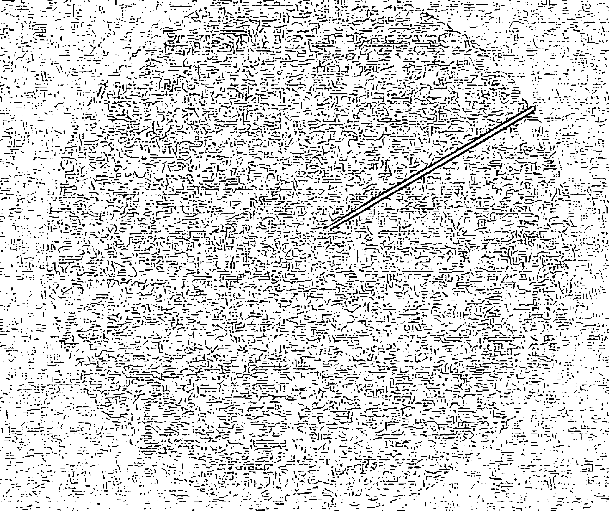
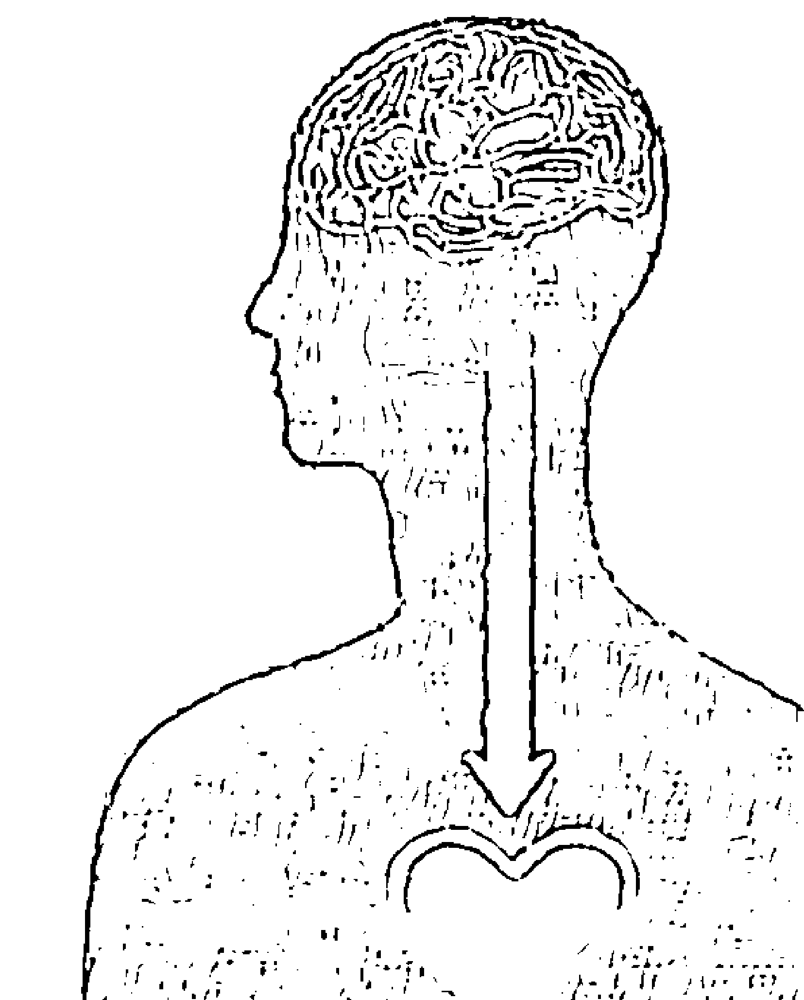
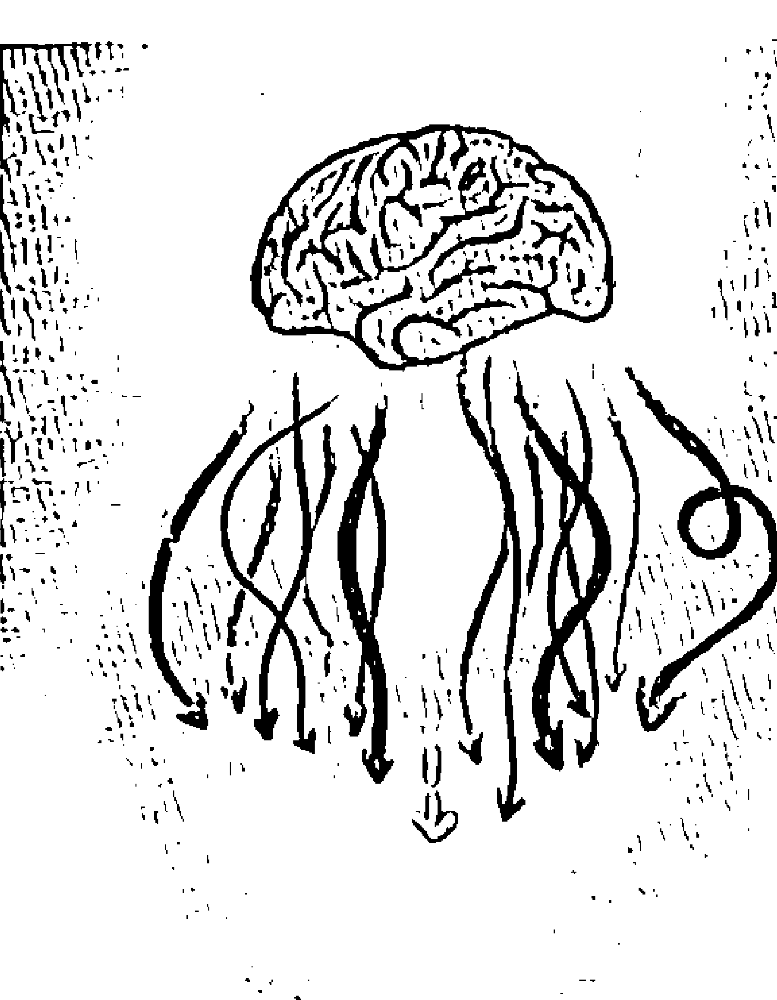
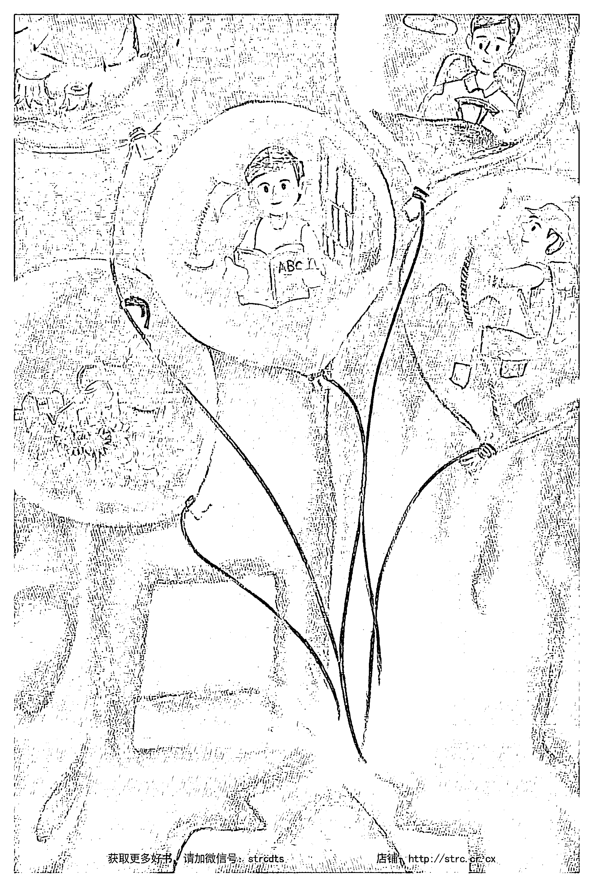

# 杨定一：清醒的睡

# 序

我想，你看到这个书名《清醒地睡》，可能会认为作者糊涂了——睡眠本来就应该好好地睡，如果清醒了，不是反而睡不着吗？而且，之前写《好睡》完全在帮助我们好好地睡、深沉地睡，怎么一下子又要转成清醒地睡？

其实，我一向把睡眠当作修行最宝贵的工具，也把握各式各样的场合不断强调这个观念。然而，是怎样的工具？——是做为理解的桥梁，同时也可以做为练习（sādhanā）。

相信你还记得，我从《真原医》开始，希望你我得到身心的健康，可以透过各式各样的措施和练习，回复身心的平衡。同时，我又不断地强调，恢复身心健康，最多只是幫我們自己「買」一點時間，去投入意識更高的層面。最終的目標，其實是把真正的自己找回來，這才是真正的身心健康。

幾十年來，我不斷地強調「真原醫」的精神，更鼓勵生病的朋友要做一個「最好的真原病人」——無論什麼疾病，即使到了末期，仍然要做一個感恩、友善、正向的病人，將身心的痛苦當作生命轉變最大的機會。

談睡眠，從我的角度來看，也是一樣的。

首先，我在《好睡》透過各式各樣的領域，包括最先進的科學、心理學與醫學，來幫助你我了解睡眠。我也分享了各種調整睡眠的工具，希望能幫助你我調理失眠的問題，減輕身心的負擔。透過這樣的準備，讓我們有機會掌握《清醒地睡》這本書的重點——進一步把握人生僅剩的光陰，將睡眠的障礙轉成修行的大機會，而把它當作我們最寶貴、最有效率的練習。

《清醒地睡》这本书所谈的，包括许多练习，我相信会是你在别的地方找不到的。尽管这些分享最多也只是反映我个人这几十年的一点体验，然而，我敢保证，它绝对不离古今圣人在各种经典里的分享。而且，我在这本书所谈的一切，你完全可以拿自己做实验，踏踏实实而点点滴滴去亲自验证。

我们这一生，也许有四分之一到三分之一的时间（有些人甚至是一半的时间）会落在睡眠。假如我们能懂得把这一部分的时间作为意识转变的工具，可以想见，对个人的生命可能产生多大的作用。

接下来，但愿我们一同以最诚恳、谦虚、开放的心，面对这本书透过睡眠这个主题想传达的一些观念，而能彻底在这一生完成一个段落。

假如可以达到这个目标，我也只能衷心为你我感到喜悦。

最后，要补充一点。我写《清醒地睡》这本书时，是假设读者已经接触过「全部生命系列」所有的书籍、音聲作品和讀書會視頻。這樣的讀者，除了理論上的探討，還做了妥當的練習，也就是我過去稱為「比較成熟的修行者」。

會做這樣的假設，是因為我在這部作品要非常直接、相當犀利地切入，而不再將篇幅耗費在詞彙的解釋和定義上。

這一本《清醒地睡》，正因為是「全部生命系列」走到這裡才寫的，深度和角度會完全不同。即使表面看來，你會覺得有些字眼相當熟悉，但只要讀下去，自然會發現內容和深度完全不一樣，已經是在一個整合的層面。

我指的整合，最多是把過去一點一滴建立起來的觀念基礎擴大，甚至推翻。希望你我能透過這些觀念，真正一步一步走到——沒有、在、心、一體，而最終還要打破這些觀念。到最後，一點觀念都留不下來。只有這樣子，一個人沒有任何觀念，才可以自由，而可以真正解脫。

假如還留下一點點觀念，那麼，你我還是在人間打轉。我才希望透過「全部生命系列」的作品，陪著你走到最後把全部觀念都打破。

說到這裡，相信你已經可以體會到這一層用意。至於沒有接觸過「全部生命系列」作品的朋友，我還是建議你回頭從前面的作品開始。否則，可能不只是讀不懂這本書真正想表達的，甚至，也許就這麼錯失了從睡眠——人生一堂重大的功課——轉變生命的機會。

這一點，從我個人的看法，是再可惜不過了。

# 睡眠——從「全部生命系列」的角度來看

「全部生命系列」的所有作品，想表達的最多也只是——我們有一個完整的意識譜。然而，這個意識譜除了我們在人間可以體會到的一切之外，還有一個部分，我稱為絕對、無限、一體、本性、心、在、永恆。

這一部分，其實遠遠比我們可以從這個人生所體會的一切都更大。甚至，應該說是不成比例的廣大。

有多麼不成比例？我之前常用這樣的比喻——我們在人間、人生的全部經歷，跟絕對相比，可能不到兆分之一。

遺憾的是，對我們一般人來說，這一生全部的注意力，都鎖定在這不到兆分之一的一小部分。這一小部分，用以下這張圖圓形裡的白線來表達，都還太多。而且，我們竟然會把生命最主要的部分（就像這張圖的圓形，然而，其實應該稱為全部）完全忽略，還認為這最主要的部分是沒有可能的。

透過「全部生命系列」的作品，我不斷在表達——和我們所認為的相反，不光有「一體」，而且這是我們此生可以毫不費力就活出來的。不光是你我可以活出一體，其實是每一個人都可能。而且，是早晚的事。

只是，對大部分人而言，不見得在這一生可以活出一體。之所以不是在這一生活出來，也只是因為我們已經認定自己不可能。我們不敢相信自己能夠不費力就把真正的身分找回來，甚至更不可能相信——我們不光含著自己生生世世想找的答案，其實，我們就是祂。

我們就是一體。除了一體之外，什麼都沒有。

其他，如果還有其他，不光是不成比例的小，最多也只像個影子，重疊在一體之上。這個影子，就像沙漠裡的海市蜃樓，怎麼來的？又會去哪裡？它其實沒有一個根源，沒有所從生的因果地（causal ground）。這浮光掠影的部分，最多只是勉強延續自己。延續自己的機制，最多也只是因一果和業力。然而，因一果和業力，正是我們自己的頭腦製造出來的。因一果製造我們的頭腦，而我們的頭腦延續因一果的機制。因一果和頭腦，其實是一體兩面。沒想到，我們就是在這個虛的框架裡，這麼活上一輩子。

之前在《全部的你》，我已經開始介紹 turiya，也就是所謂的「第四意識狀態」——除了我們平常醒著、做夢或深睡無夢三種意識狀態之外，還有一個「第四狀態」，而我稱為醒覺。

我將這第四個狀態，當作我們這一生最高的目標。不光如此，還進一步稱為是人類演化最終的目的地。

其實，醒覺的意識狀態，不光是人類早晚的命運，更應該說是我們生出來就有的權利。醒覺，是我們的本質。我們本來就是祂，也從來沒有離開過祂。祂，是從來沒有離開過祂。

也因為如此，我才那麼大膽地透過「全部生命系列」各式各樣的作品，邀請你我一再地回到祂。讓我們一步一步地，從在人間學到的種種「有」或「做」，回到「在」或「心」。

在這些作品，我用各式各樣的方法來表達——我們的意識，其實有兩個主要的軌道。一個軌道，是透過頭腦的邏輯可以掌控，本身是局限和相對，是透過不斷的比較（而且是樣樣都要比較）所得到的。然而，還有另外一個軌道是絕對的存在，並不是透過比較可以理解、可以觀察到。這個絕對的軌道，其實就是醒覺。也就是前面所講的，遠遠比人間相對軌道更大的意識。

不過，稱醒覺是另一個意識軌道，這種說法最多也只能當作比喻。或許一個比較貼切的表達，就像一開始的圖所畫的——絕對、醒覺的意識，其實佔了99.9999999999%，而相對的部分，就像前面提過的，最多不到兆分之一。

到這裡，你可能也已經發現，就連這種表達還是一種比喻。無限（我們有時候稱為無限大或無限小）其實是不允許用大小來衡量的。無限，和局限不可能拿來比較。一個東西是絕對，就沒有其他東西可以和祂相提並論。我前面用大小的比喻，最多也只是讓我們的頭腦可以抓點東西。要不然，頭腦是不可能理解絕對和無限的。

講個更透徹，連這兆分之一的一點，還是離不開絕對，甚至，隨時都含著絕對。反過來也可以說，絕對含著一切，包括人間的軌道、相對的意識。

我知道，我這麼表達，帶出一個矛盾，是頭腦（相對意識的代表）絕對聽不懂的。但是，我認為有必要這麼直接表達，來修正這個常見的誤解——認為自己透過在相對層面不斷地累積理解、體會、學習……就可以延伸到絕對。

其實，這是不可能的。

我們最多只能活出祂，而要活出祂，最多也只是把我們的注意力交回到絕對，臣服到絕對。最多只是透過自在，活出祂。我們在每一個瞬間，隨時都承認——其實我們就是祂，而不是這個身心所帶來的局限。

我在作品中，也把絕對稱為一體或全部。而且，我不斷地強調，祂不是透過我們的想、體驗、覺察或是任何感官與想像可以去掌控的。祂沒辦法被捕捉，也不是透過我們的頭腦可以覺察到。我甚至提出，並沒有一個特殊的東西叫做第四意識狀態或 turiya。

我才會在《時間的陷阱》和之後的作品特別提醒——祂不光是不費力，在我們每一種意識狀態（包括醒著、做夢、無夢的深睡）都存在，而且是唯一一個自己足以支持自己、自己證明自己、自己完成自己的存在。祂本身，就是永恆。

沒有人想到，其實祂是我們這一生唯一一個沒有生過、沒有死過的永恆，不受人間任何變化的影響，而可以稱為真實。

一天 24 小時，我們當然隨時可以找到祂。

祂，是不可能改變的。

我們平常清醒的狀況下，祂在。

接下來，我們睡覺、做夢都在。

更不用講，無夢的深睡中，祂一樣隨時都存在。

祂隨時在，問題只是我們知不知道。

從我的角度來看，我們當然是不知道。畢竟，如果我們真的知道，自然會把「全部生命系列」所談的視為理所當然。接下來，我們不會再去費力多分析、多解釋，還想多說明。

有意思的是，我們在無夢深睡中沒有念頭，也沒有主體去抓一個客體。我們只有醒來後，才浮出了「我」，才有一個主體去抓客體，而有了念頭。從這個角度來看，這個醒著才有的「我」並不是一個隨時、永恆、穩定的存在，它只是一個虛的架構，卻佔據了我們絕大多數的注意力。

我會把睡眠當作一個修行的工具，也就是因為我們一般認為睡眠和醒著是完全不同的狀態，而通常將注意力集中在它們的差異，倒沒有想過它們的共同點。假如，我們突然可以體會到這三個狀態的共同點，而隨時可以住在祂，停留在祂，也就跟著醒覺過來了。

# 在睡覺中，可能知道嗎？

禪宗有一個睡覺的故事。
兩個修行人，夜裡一起住茅蓬。一個睡著了，打呼聲像雷一樣大。另一個在打坐，心裡不耐煩「不靜坐，只會睡，還打呼！明天還是請他走吧。」好不容易把心靜下來，身上又開始發癢。他伸手往衣服裡一抓，是兩隻蝨子。再想想，修行人不能殺生。只好把它們放在地上，繼續打坐。

第二天一早，打坐的修行人開口了：「你睡了一整晚，打呼那麼大聲！自己不好好修行，還要妨礙我打坐。」睡到打呼的修行人也回他：「你昨晚打坐，從身上摸出兩隻蝨子，把它們摔到地上。一隻腿斷了，一隻死了。這兩隻蝨子難受得很，吵得不得了。」

古人早就知道，人在睡眠中可以還有意識。像這個禪宗的故事就是想表達，一個人修行達到一個境界，即使在睡覺，對環境還是可以觀察到，並不是完全無知無覺。這種功夫，是我們一般人做不到的。

儘管如此，我必須坦白分享我個人對這種詮釋的看法。

最多，我只能說——這個故事和一般人對它的詮釋，不光帶來誤會，甚至反而在我們意識轉變的過程再加上一層不必要的障礙。

我們一般會認為，自己在睡眠中，自然切斷了跟這個人間、跟這個世界的知覺。最多，只剩下做夢。到了無夢的深睡，是完全沒有境界的狀態。然而，我們只要仔細體會就可以發現，這個故事好像是在表達修行的過程會突然得到一種進展。像是在睡眠中可以覺察到環境、體會到這個世界——例如知道別人抓虱子、聽到自己打呼。甚至，讓我們認為對這個世界的點點滴滴都要注意到，而把這種體會、覺察和注意當作是一種成就。

我敢大膽地說，假如一個人隨時這麼做到，就算看起來在睡覺，最多也是在打瞌睡或是半睡半醒，並不是我們一般生理層面的睡眠。

你也許還記得《好睡》裡提到，睡眠可以區分成幾個相當具體的階段。確實有一個階段叫夢，而這個階段和「快速動眼睡眠」是相關的。此外，也確實有一個深睡的階段，甚至無夢的深睡。這些狀態，我們每個人在每晚的睡眠都可以重複再重複，也可以在睡眠實驗室透過腦電圖等等生理監測工具觀察到。

做夢，最多是我們將一天所經過的各種印象，透過記憶，從頭腦裡調出來，而再透過夢重新排列與整合。這種處理，不只讓我們可以重複白天所經過的一切，還可以投射出一些沒發生過的經驗。睡醒了，我們可能知道自己做了好夢、惡夢或不好不壞的夢。然而，一般情況下，大多數人是不記得夢的。

在睡眠中，有一個階段是沒有夢的深睡。我在《好睡》也談過這種深睡對休養生息的重要性。光是從健康的角度來看，深睡可能就是睡眠最重要的部分，讓我們真正休息，身心得到徹底的調整。不過，這方面，我不會在這裡多談。最多，我只是想表達，無夢深睡確實是最休息的狀態。而且，在這個狀態，沒有夢。

儘管醒著、做夢、就連無夢深睡都還是頭腦的不同狀態，還是落在相對意識的範圍，我真正要表達的是，我們有一個沒有動過的本質，在做夢、無夢深睡、甚至白天清醒的時候都存在。然而，這個本質跟我們在人間有沒有各種體驗一點都不相關，倒不是透過我們可以觀察到一隻虱子或環境的變化而成立。無論知不知道自己打呼、別人打呼、夜裡的風聲、救護車經過、屋頂在漏水、地下室馬達在轉動……都不等於這個不動的本質。

這個不動的本質，跟我們透過五官可以掌控的一切，包括任何可以稱為「經驗」的印象都不相關。我們所稱的經驗，也就是由五官的看、聽、聞、嘗、觸，再加上念頭，而可以去捕捉再投射出來的。我們在人間可以活出來的各種經驗，再怎麼豐富，再怎麼精彩，跟這個本質全部都不相關。

這個本質是永恆，是不生不死，跟我們睡或不睡完全無關。祂隨時在，只是我們平常不知道，才有那麼多話可談。

但是，我這麼講，一般人可能聽不懂，也沒有一個切入點去掌控或體會，更不用講住在祂，停留在祂。

換個方式來說，在無夢的深睡中，我們頭腦的作用沒有任何起伏。那個時候，反而是一種接近醒覺的狀態，只是我們自己不知道。想想，一年三百六十五天，一個晚上也許好幾次，就這樣被我們隨時錯過。

假如知道，我們也就輕輕鬆鬆醒過來了。

誰知道？或知道什麼？——這兩個問題，本身也可以成為我們最好的修行，最好的練習。

我在這裡大膽地說，知道的人不是小我。醒覺、絕對，不是這個肉體的身心可以知道的。肉體和身心所知道的一切，都離不開小我，離不開一種相對、局限的意識。

假如有一個體可以知道，我們最多只能勉強說，這個體，是一體。是一體知道，知道什麼呢？知道自己的在，自己的存有，自己的永恆，自己的完美，自己的在、覺、樂。

這個知道，倒不是透過人間任何覺察的能力來知道，當然也沒辦法透過人類體驗的語言，來做任何分享。我最多用 Self-Realization 或 Realization of Self 來表達，也就是真正的自己領悟到自己，真我領悟到真我，倒不是小我去領悟到什麼。比較正確的表達，其實這個真正的自己或真我，也不需要去領悟到什麼，甚至也沒有什麼自己是祂需要去領悟的。祂最多只是存在，而我們要跟祂接軌（一般人稱為領悟或開悟），最多也只是自在，倒不是從小我延伸出來的「動」或「想」可以取得。

我才會說，醒覺是一個顛倒或反復的觀念。

我們在這個人間，從出生，到現在，到離開，可以體會到或可以表達出來的一切，都是站在人間的「有」「做」「想」「動」在看。然而，這個相對的小範圍，本身是封閉的，也跳不出自己所建立的邊界條件。無論我再怎麼解釋醒覺，都不可能讓頭腦突然聽懂。

雖然頭腦聽不懂，但是，我們透過人的聰明，還是可以建立一個妥當的基礎，並且透過這個基礎，往內心回轉。也就這樣子，早晚頭腦會讓步，讓一體自然浮出來，我們也就突然懂了。

睡眠，尤其無夢深睡的比喻，對我們修行的理解就是有那麼大的重要性。

我敢再進一步說，在無夢深睡的狀態裡，我們的頭腦完全在休息。是少了頭腦念頭的干涉，或說少了這一層不需要的折磨，無夢的深睡對健康和療癒才會有那麼大的作用。

我們在這種狀態，不僅讓身心得到放鬆和休息，也讓自己全部的潛能發揮出來。

相信我這麼說，你也自然了解，《清醒地睡》這個書名所指的清醒，和人間一般認為的清醒，一點都不相關。是站在醒覺的清醒，和頭腦的知道或不知道一點關係都沒有。

我們一般人會認為「清醒」的時候的各種現象、變化和動態，會比較接近醒覺；但是，這是在人間相對範圍裡的醒覺，倒不是我們在「全部生命系列」所談的絕對的醒覺。真的要說，沒有念頭、沒有東西可以抓、可以描述的無夢深睡，或許還比較接近醒覺。

怎麼說？

我們仔細觀察，自然會發現睡覺的人（無論做夢或無夢深睡）和醒來的人非但是同一個人，而且，中間的共同點——我們可以稱為本質或本性——是沒有變，是同一個。

這個共同點，又是什麼？

我們也就自然會發現，在這個無夢深睡的狀態下，含著在意識層面簡化到最少，甚至是一個沒有五官和念頭的層面，而這就是意識譜每個角落的共同點。

只是我們一般人不知道或體會不到，而竟然會把注意力擺到動、做、想的層面。我才會把無夢深睡當作這本書的主題，將它作為一個比喻來切入。

## 3 拿無夢深睡和 Turiya 做比較

我會拿「醒覺」和「無夢深睡」比較，是因為我們頭腦要運作，一定要抓、要取得一個東西或對象。然而，頭腦最多也只是透過不斷的比較，來取得差異。假如樣樣都沒有差異，其實它也起伏不了。

用另一種方式來表達：我們一定要有對立、有阻抗，而接下來有動機或動態想去克服眼前這個阻力所帶來的阻礙，才可能有念頭。我之前才會說，念頭是透過摩擦（friction）所取得的。假如沒有對立，其實我們連一個念頭都沒有。

古人早就知道人人都有一個生命場。這個生命場在物質世界要運作，是透過氣脈。是意識自然轉成氣（prāna），才可以帶動這個肉體，或是和肉體產生交會。

我過去也提過，這個生命場的氣是透過一種高速度的螺旋在運作。也因為如此，全部物質，我們所看到的，從 DNA、蛋白質、花蕾、葉芽、海貝、漩渦、颶風、超新星的爆發、到星系的誕生，全部離不開螺旋。就好像物質是濃縮的意識或凝結的能量，而在每一個角落隨時透露自己的源頭——也就是意識，而且是最原始的意識。

從古到今，人類一直有這樣的知識，把氣在肉體進出的門戶稱為脈輪，而脈輪本身最多也只是一個慢下來的螺旋場。慢到一個地步，自然凝結成肉體。這個生命場在物質世界的運作，是透過「氣」不斷浮出來，不斷的流動，也讓我們留下萬物生生滅滅的印象。

反過來，假如我們的氣脈完全暢通，也就是肉體和環境和內心沒有任何差異，完全是平等的，那麼，也沒有「流」（flow）可談。我們也就穩穩地住在自己隨時都有的絕對而永恆的意識層面。我們不要說連一個念頭都沒有，甚至連這個人生都跟著消失，再也不被這個肉體所帶來的生死綁住。

只是因為我們透過人類文明的發展，不光物質的層面被不斷強化，也把生命的根源給顛倒了。後人反而想透過種種身心的練習來強化或集中在氣脈的層面，更誤以為只要透過姿勢或其他的練習打通氣脈，也就把真實找回來了。

這種誤解，和事實是完全顛倒的。我們竟然會忘記氣脈打通或不打通，最多只是一個果，或是更嚴格講，跟真實不真實一點關係都沒有。

雖然這麼說，前面所講的理解（有些人會稱為領悟），是可以活出來的。而且，「把樣樣都看成平等」這句話絕對不是一個理論，而是我們可以徹底領悟，隨時停留的。這種平等心——沒有摩擦，沒有對立，沒有動的平等心——本來就是我們的本質。我們最多是把頭腦挪開，祂也就浮出來了。

這種平等心，我在過去也稱為大定。

雖然這麼講，頭腦還是要抓一點東西才可以懂。就像前面所解釋的，因為抓、動、想，本身就是它運作的機制。如果把這些機制放下，頭腦的作用也就消失了。為了頭腦自己的存續，它當然還是要隨時抓一點東西。無論眼前單純的認知，為各種現象加上一個標籤、一個評價，或對未來加上一個投射，這些全都是頭腦的運作。

我們沒想到自己就有一個無夢深睡的狀態，剛剛好不費力，又沒有念頭。這樣的狀態，跟我們的認知與抓取是一點都不相關的。只是，要談最根本、最不費力的本質，這一點反而又是頭腦最難理解的。我才需要用無夢深睡來做比喻。

頭腦的運作本身一定費力，不可能不費力。頭腦的運作，要有個動機，一個起伏，一個動態，一個對立，一點摩擦，一種阻礙，一種差異，一種流才可以作用。要讓頭腦理解什麼是最輕鬆、最不費力的狀態，是絕對不可能。光是「最輕鬆、最不費力」這幾個字，就已經違反頭腦運作的原則，打破支持它自己的機制。

無論我透過「全部生命系列」再怎麼解說，對頭腦而言，這些話一點都不理性。頭腦聽不懂，自然產生數不完的悖論。而且，因為頭腦不懂，最多只能把它擱到旁邊，等著以後或下個瞬間再說。這一來，我們自然對「全部生命系列」所談的觀念有很深的保留和質疑，認為不可能。

透過頭腦，我們一般人也就自己得出結論，認為絕對或無限是這一生活不出來的。如果這是一件連邊都沾不到的事，又何必花時間去談？還不如就拿剩下的幾十年人生好好在人間告一個段落——取得一點地位，交代什麼事情，提供什麼貢獻，執行什麼理想，得到人生種種的意義。我們還是會認為這一切比較重要，也就自然把「全部生命系列」歸類到「宗教」「靈性」「虛無飄渺」或是「清談閒聊」。

我們有一個無夢深睡的狀態，從意識層面來看，並不是落在人間的軌道，而是接近絕對和無限。是這樣的狀態，才沒有夢、沒有念頭。我才會用無夢深睡當作比喻，說它比較接近醒覺。

我們一般人只有睡得好或休息過來了，事後才知道有這個狀態，倒不是可以隨時體會到它。也就是站在我們的角度，並沒有一個主體在體會無夢深睡。所以，我們還沒有醒覺。

直到有一天，我們只剩下主體。甚至，連這麼說都不正確，最後只剩下自己——真正的自己。而這真正的自己，是沒辦法用「主體」兩個字來描述或表達的。我們最多可以說是一體，是心，是自己。無論在白天清醒的狀態或夜裡無夢的睡眠，祂隨時都體會到自己。徹底知道，除了自己，沒有其他任何體。這個時候，我們在任何狀態，包括無夢深睡，也都是醒覺的。

值得注意的是，就連這些話也最多還是比喻，是讓我們的頭腦可以抓點什麼來比較不同的意識狀態。我會拿無夢深睡這個主題，來做一個說明。

但是，這種比喻，一樣還是站在我們白天清醒或相對的層面在說話，還是透過「有」看著「在」，從「相對」想要體會到「絕對」，想經由「動」去進入「在」。這嚴格來說，是不可能的。它本身還是費力，還是想透過「動」去取得。

我們真正要體會什麼是醒覺（或我透過無夢深睡的比喻想帶出來的理解），反而是要把全部念頭挪開。一切的觀念，都放下。最後剩下的，也就是祂。

假如要用無夢深睡來做個比喻，最多只能說，不是透過追加什麼，真要勉強講，是減少什麼。

但是，我擔心，這些話最多又只可能為你帶來矛盾。

## 白天清醒的，夜裡睡著的，都是夢

我喜歡用無夢深睡的比喻，是它可以帶來很清楚的對照。從我個人的角度，無論睡或醒，兩個其實都是夢。然而，從我們一般人的體會，只有夜裡做的夢才稱得上是夢，而我們會把白天從人生得到的印象，認為是真的。

白天人生的種種印象，從我們的角度還可以得到多重的確認。除了我們自己的主觀，還有好多人的「客觀」來幫忙驗證。比如說，你可以看到一輛車子、一棵樹、一個人，其他人也可以看到，甚至動物也好像可以看到。所以，對我們來說它是真的，有一個客觀性。

我們認為人類和動物都有共同的感官可以取得的共同性，也就這樣子鞏固了我們所體會的現實。我記得在《全部的你》，用過感官的頻率譜來比較不同動物聽覺的範圍。比如說，我們人是 20-20,000 赫茲（每秒振動的次數），而海豚是 75-150,000 赫茲。當時，舉這個實例，是在強調生物之間的不同——人類所聽到的世界，和狗或海豚是不一樣的。有些頻率，我們可以聽到，動物卻聽不到。反過來，動物可以聽到的，我們不見得能聽到。然而，同一個例子其實含著另一個重點：無論差異多大，人類、動物、植物所能捕捉的頻率範圍一樣是有限的，而且有共同的範圍。所以，還是有一個可以共同體會到的現實。

我過去不斷提醒，這個「真實」的世界，只要我們像剝洋蔥一樣，一層一層去剝，剝到最後，全部都是資訊。再繼續剝，就發現只是訊號，本身並沒有一個真正的實質。人類和動物體會的共同點，最多也只是反映人類和動物感官接收的範圍都有重疊，在同一個範圍裡運作，而彷彿有一個整體的共識。這種重疊，帶給我們一個真實的印象，讓我們感覺到好像有一個共同的現實。但是，只要我們觀察，把全部的現實解開來，到最後，剩下的還只是資訊。

所謂的現實，最多是一個資訊體，是我們透過各種感官捕捉、整理再加上歸納所得到的。

至於夜裡做夢的印象，一般會被認為是夢，因為只有一個人單獨在體會，而旁邊的人看不到。即使透過生理儀器的監測、從腦波或睡眠時表情的變化，旁人可能知道他有做夢，卻不知道他夢到了什麼。一個人睡醒了，也知道前面發生的是夢是幻相，最多是過去記憶的重複，也就知道它並不存在。

這是我們一般人的體會。

但是，我們很少去觀察，就連白天的印象最多也只是五官取得的資訊，再加上頭腦的整合與讀取。任何資訊只要再進一步打開，我們最後自然會發現它的根源都是「我」，而只可能在一個狹窄的範圍裡運作。不在這個範圍內，資訊也就不存在，更不用講有什麼意思或意義。

直到有一天，我們突然醒覺過來了，會發現，就連白天的印象也一樣地像一場夢。在其中，我們認為真實的一切，全部是從一個虛的主體「我」點點滴滴投射出來的。就連動物、植物、其他的生命，都可以說是我們夢中的一個演員，同樣是夢的一部分。我們只要徹底醒覺過來，動物、植物、包括整個宇宙，也就像夢一樣跟著消失。

它們有生命，是因為有「我」。

有「我」，是因為有我們人類的頭腦。動物、植物、世界，最多也只是我们透過頭腦投射出來的。我們會投射出一個完整的世界，一整套系統，一套演化或聰明的階層。例如人類之下是動物，然後是植物，再接著是礦物。這本身，也反映了頭腦的本事。

但是無論怎麼投射，我們會發現，動物接收資訊的範圍必須跟我們接近，甚至重疊。如果不是這樣子，動物對我們也就失去意義了，也不可能在我們這個世界扮演任何角色。

最不可思議的是，「我」竟然有總策畫（master planner）那麼大的本事，把樣樣布局得剛剛好，讓每一個角落、每個眾生、非眾生扮演各自的角色。是這樣，我們才可以把這場夢變得完整，而樣樣都合情合理。這種完整，是最不可思議的，而且讓每個人從生到死都被洗腦，跳不出這一場夢。就好像踏進了流沙，愈陷愈深。但是，無論陷得多深，別忘了，這個現實是虛擬的，最多是透過頭腦整合起來的資訊場。這場夢根本不存在，我才有把握，每個人都會醒覺過來。

醒覺過來，會發現除了一體之外，什麼都沒有。

全部，最多只是重疊在一體上的影子。

全部人生的畫面，包括「我」，都是從頭腦投射出來，而重疊在我們真正的自己之上。這個重疊在一體上的影子，本身沒有任何根源，怎麼來的，不清楚；到哪裡去，也不清楚。然而，這個影子，透過頭腦的運作、透過因一果帶來點點滴滴的連結，我們在這個時空也就好像有了「我」。而且，在這個「我」之前，好像真有一個生命的根源。甚至，「我」走了以後，也好像還可以傳承。

但是，假如將這個鎖鏈一路往上游追蹤，我們會發現，站在整體，前面什麼也沒有，後面也沒有到哪裡。全部，都是虛構的。

全部，全部，就像一場夢。

人生的這場夢，假如我們突然醒覺過來，也不會再去追根究柢。最多和我們夜裡醒來一樣的，知道是一場夢，也不用再做進一步的解釋或追究。沒有什麼東西是真正重要，好像還需要我們去分析、去分享、去說明。你就算醒過來了，最多也只是承認或承擔起自己真正的身分，而不会回头去解释和分析一个错觉。

我認為無夢的深睡是一個理解上的橋梁，讓我們體會到睡眠中的夢不存在，而睡眠結束後，我們認為清醒的人生也一樣不存在。真正存在的，跟我們想的，完全顛倒，完全不同。

有了無夢的深睡，也就帶給我們一個指南針，指出一條路。讓我們可以摸到一點邊，或隱約感受到還有一個沒辦法表達的狀態，在等著我們活出來。

## 5 一體，每天晚上來找你

有許多朋友，尤其是西方人，即使經過幾十年專修，一接觸到「全部生命」的觀念，都會感到震撼，甚至有一種很深的共鳴或領悟。接下來，他自然會回頭去整理這一生所學習到的觀念，修正自己的看法。

在這過程中，他會發現「全部生命」的觀念可以幫助整合一切。非但可以作為全部的宗教、靈性、各種法門的橋梁，更可以整合科學、醫學、哲學……任何學門，讓人間全部的矛盾都消失。

多年來，接觸過「全部生命」觀念的朋友，都不斷鼓勵我應該把它帶出來，反而是我個人選擇不這麼做。一是為了避開注意，寧願低調站在幕後。此外，我也明白，就是分享，也沒有用。甚至，就算要分享，又要從哪裡著手？

一方面，「全部生命」觀念簡單到一個地步，是沒有人可以相信的；也可以說是完整到一個地步，用多少字句都講不完。它是全相式的，還可以從各式各樣的層面來談。而每一個層面，對頭腦都可能造出不同的理解。也就這樣子，對一個忙碌而靜不下來的頭腦來說，不光沒有解答生命的問題，還可能帶出更多困惑甚至爭議。

最可惜的是，這些接觸過的朋友，儘管一方面鼓勵我，另一方面也多半為自己感到遺憾。他們會認為自己這一生絕對不可能體會到一體或絕對，認為自己不可能領悟、開悟、頓悟或醒覺。

對這些朋友，無論是誰，我也只能給出同一個回答——

> 其實，你老早就是醒覺的。

> 醒覺、道、悟，本來就是你的本質，只是自己不知道。

假如徹底隨時知道，你就醒過來了。

你不知道，其實每一天晚上，一體都來找你，甚至來祝福你，想把你帶回家，希望你承擔祂。但是，無論祂怎麼來，包括白天你清醒的時候也隨時來找你，你反而不斷地拒絕祂。

即使你心裡明白，無夢的深睡讓你最舒服、最休息、最放鬆、最自在，而且你也隨時想得到它。然而，多多少少，接下來，你又會認為它跟真正的自己不相關。這一點，是最不可思議的。

更可惜的是，你想取得的方法和切入的點，全部都是錯的。

你可能還在找一個不可思議的經過，一種翻天覆地的體驗。也就這樣子，永遠找不到。

祂不是透過任何體驗、任何經過可以描述出來。只要我們還有一個體驗或觀念可談，其實已經把祂蓋住，又帶來一個不需要的層面。

最有意思的是，每天晚上我們睡著了，不可能沒有無夢的深睡。沒有它，也沒有我們的生命，更不用談身體的每一個功能、身心的平衡、疾病的康復，都完全靠無夢的深睡而來。

我們一般都想不到，每一天晚上，透過無夢的深睡，已經在活出我們的一體。唯一的差別是自己不知道，而還有一個悟、道、心好談。

我要再一次強調，千萬不要認定自己這一生活不出我們的本質。我們每一天只可能隨時把祂活出來，因為我們就是祂。活出祂，最多只是承認祂就是我們。

確實，只要我們踏踏實實地去追根究柢，也自然會發現——每一個人，這一生其實都可以體會到祂，最多只是（就像我以前提過的）跟我們想像的不一樣。我才會用無夢的深睡來比喻，讓我們反省——自己原本的理解，和悟、道、心完全是兩回事。

這些，都是無思的狀態，只要我們一用念頭去想或表達祂，全部又搞錯了。但是，如果我們只因為無法表達，就認為祂不存在，也是錯的。我也只好用無夢的深睡來做一個實例來提醒你，每一天晚上都有這種體驗，而且不可能沒有。只是，你竟然不知道。

這些朋友聽到這裡都很驚訝，自然不會想再爭辯，最多是接著問——要進入這種狀況，還需要「做」什麼？

聽到這個問題，我也只好微笑或嘆息，再說明一次——祂不是透過「做」「動」「想」可以活出來的。所以，我們什麼都不用「做」，甚至都「做」不來的。

全部的練習，最多只是讓我們集中注意，而自然進入無思的狀態。也就這樣子，我們本來就有的一體、心、道、悟，也就跟著浮出來了。

也就是說，連走到最後，觀念還是顛倒的。

我相信，假如你讀到這裡，已經可以完全接受這一點，也很可能就和這些少數的朋友一樣，心裡明白這一生可能有機會將這一堂最重要的功課告一個段落。

倘若如此，我也只能恭喜你。你也可能成熟了，被準備的剛剛好——剛剛好可以接受一體。

## 6 再一次，什麼都不是，哪裡也去不了

接下來這兩章，我想再借用無夢的深睡來談修行。

我會不斷地拿無夢的深睡來比喻，不光是它在某一個層面確實比較接近醒覺或 turiya 的狀態，其實還有另外一層用意——我充分知道，我們的頭腦為了運作，一定要抓一點東西（比如說一個觀念）來套上醒覺。然而，我們只要仔細探究，自然會發現醒覺沒有一個特質可談，當然更沒有我在《落在地球》所談的人類的特質（human quality）。我會把無夢的深睡當作一個比喻，也正是因為它沒有我們一般人認為的人類的特質。

一個人深睡，是沒有夢、沒有念頭，才稱得上是無夢的深睡。在無夢深睡的過程，他不會知道有一個東西叫無夢的深睡。對他，這個世界，甚至他的人生，更不用講任何念頭，都不存在。

對無夢的深睡，我們在這裡所講的一切都沒有什麼意義。最多好像是 **much ado about nothing**，在明明沒有事中，要掀起一點風波。就好像我們非要勉強加上一層邏輯，讓自己過不去，而沒辦法接受本來就有的自在 (**spontaneity**)。

我們只要一睡醒，當然一定要抓一點東西，來談一點什麼，讓我們可以面對這個世界，而把這個世界當作堅實不過。接下來，無論我用多少字句重複強調，你絕對不可能相信——醒覺其實不靠一個突破，沒有一個觀念的轉變，不會建立一種新的理解，也沒有任何可以稱為領悟的體驗。

這不是你的錯。頭腦確實不可能接受。就連理解，都需要抓一點東西。我們怎麼可能讓頭腦領悟到「頭腦以外的東西」或「非頭腦的東西」？

把無夢的深睡當作一個比喻，對我而言是有其必要，也有它的重要性。這個比喻，是一個最好的提醒，讓我們可以徹底反省或回轉，同時知道這個反省或回轉不可能用任何話或念相表達。我們只要還可以表達出來，其實還是落在二元對立，也就是頭腦的層面。

但是，人就是有這種聰明的本事。雖然我們還是沒辦法理解，但我相信走到這裡，你已經摸到一點邊，進入一種好像懂，好像不懂的範圍。這些，都是好事。

因為這觀念太重要，我在這裡要試著用另一個切入點來表達。

你可能還記得，我在《無事生非》用 being nobody, going nowhere 來表達生命的意義，也就是「你什麼都不是」「哪裡都去不了」。假如我們可以接受自己什麼都不是，哪裡也去不了，我們也就差不多了。

我們整個頭腦的架構，再加上文化和文明的洗腦，讓我們從出生到最後一口氣所能學到的不外乎——這一生要成為某一號人物，某一種身分，扮演某一個角色，才可以取得生命的意義。而同時，我們還要動，要前往某一個角落，也許是天堂、淨土或輪迴到一個更好的生命。我們還會服務，為了取得福報，來完成這一生。

這些觀念，難免也被我們帶到修行。所以，我們自然會集中在觀念的分享或理解、或感受所帶來的體會、以及種種的練習，再加上一個突破，而把這種經過認為是領悟或開悟。

仔細探究，這些一樣地，都沒有離開過頭腦和觀念的範圍。

我們也自然會去區隔師父與弟子的差異。更不用講，我們等著實現個人的理想（比如開悟），希望可以在這一生完成。如果我們多懂一些，也自然會做一個分別，想同情或可憐其他比較務實的人，認為他們還不到自己理解的深度。

這一些，其實都是和事實顛倒的觀念。

但是，這是難免的。我們人最大的福報，同時是我們最大的負擔，也就是我們聰明的頭腦。

回到無夢的深睡這個比喻，我們自然會發現，在無夢的深睡中，連這些想要醒過來的追求，對我們其實都不重要。假如還有一點雜念，也已經不是無夢的深睡。在無夢的深睡中，就好像連所有醒覺的問題和追求，我們都可以挪開，不讓它們來干擾。

甚至，就連用休息、平靜、快樂、安靜來表達無夢深睡，我們也自然會發現是多餘的。在深睡中，沒有一個人，沒有一個體，可以體會到什麼叫做休息、平靜、快樂、安靜……是事後，我們為了表達這種可能有的經過，才會用這些名稱來形容它，或最多說「我睡得很好」或「我睡飽了」。

將這個比喻延伸過來，一個人醒覺了，倒不是點點滴滴都知道有一個體在睡覺或不睡覺或睡得好或不好，也不在於可以用在·覺·樂來描述他自己的狀態。其實，醒覺不光沒有一個狀態可談，而且根本沒有一個體可以去觀察到這些特質。是別人站在人間或世界的角度，才會描述一個醒過來的人是活出在·覺·樂。然而，是不是在·覺·樂，對這個醒覺的人其實一點都不重要。

就像我們這裡所講的，任何事、任何特質、任何觀念、任何表達，對一個無夢深睡的人，也一樣一點都不重要。不光是不重要，就連任何觀念都已經不存在，更沒辦法起伏。這個無夢深睡的人，還要從哪裡著手，用什麼來表達？

一個人醒來和沒有醒過來，唯一的差別，也只是他一天下來的「在」，也可以稱為自在，是隨時都有的。包括在無夢的深睡，他也可以活出這個在。

這個「在」，不是「在哪裡」，而是輕輕鬆鬆地在，自在。白天也在，做夢也在，無夢深睡也在。

這種清醒地「在」，最多只是站在整體或主體，而不是落到一個眼前、夢中或無夢深睡所帶來的現象——我們可以稱為客體、經驗或境界。這是唯一的差別。

甚至，把它稱為「差別」也最多只是一個比喻。因為是頭腦延伸出來的差別，而站在整體，沒有什麼差別可談的。祂包括一切。白天清醒、夜裡有夢或無夢的深睡，祂都包括，沒有什麼差別需要表達。

當然，這幾句話，又是我們頭腦最難聽懂的。
讀到這裡，沒有任何話，任何字眼可以表達我們前面講的狀態。到這裡，我們也自然懂了什麼叫做沉默，也可以明白為什麼我不斷表達沉默就是我們最好的老師，是我們在找的修行最終的答案。

這個沉默，跟我們所有人以為的又是顛倒的。對我們一般人，沉默最多只是一個觀念，只是相對於聲音或「動」的對立，最多是人間的不動。然而，沉默本身其實是絕對的真實，跟我們動或不動一點關係都沒有。祂本身就是我們自己滿足自己、自己支持自己的永恆，最多也只是我們的本質。

我過去也提過，修行全部的大法門（包括臣服與參），到最後，其實也只是把我們帶回到沉默。沉默，含著我們這一生全部想找的答案。

同樣地，假如可以理解這些話，我們也自然發現，自己一天下來其實隨時有這種狀態，只是以前沒有注意過。

首先，在話和話之間的空檔，吐氣和下一個吸氣之間的一個停止，動和動之間的不動，念頭和念頭之間的寧靜，觀念和下一個觀念間無思的空檔……都已經指向我們本來就有的沉默。

不知不覺，我們會發現，就連在說話、呼吸、動、想、思考中，一天24小時都可以體會到這個沉默的本質。也就這樣子，我們也跟著醒過來了。

醒覺了，最多只是知道這個沉默就是我們的本質。而且，這個本質，跟我們人間任何觀念或經驗都不同。有意思的是，也可以說是沒有不同。因為它本身不相關，講「同」或「不同」都不是正確的表達，都套不上。

這些話，我們早晚都會領悟，倒不是去理解。因為我們理解不來。

即使我們不在這一生領悟到這些話，也許在下一世，或生命之間的中陰，都可能領悟到。祂不是透過任何觀念可以共鳴的。我們就是投生在另外一個星球，換了一套完全不同的腦功能也毫無影響，不會比較靠近，也不會離祂更遠。

我們會發現，只要我們還有一點二元對立的作用，去取得任何觀念、任何知識，永遠不可能體會到沉默。反過來，是把二元對立擱在一旁，它才突然浮出來。是在沒有任何作用的當中，我們才可以找到沉默所含的全部的潛能。最後，我們也自然發現，就是在動，就是在運作，就是繼續採用二元對立，祂其實還是隨時存在。只是我們過去從二元對立去找，一直找錯了地方。

最後，我相信你已經明白，連用「找」這個字都不貼切。我們其實就是沉默，並不是透過「找」把一個再理所當然不過、從來沒有動過的自己找回來。

再提醒一次，我們最多只能承認、承擔起自己的本質。

我才會說，這是人類最後的發展，是我們這一生來所要知道的最高的真實。其實，只有這是真的，而其他都是一場夢或幻覺。只有這個真實的部分，才可能是人類的命運。

## 沒有恐懼的空间

我拿無夢的深睡和醒覺對照，還有另外一個用意。

在無夢的深睡中，我們其實沒有恐懼。

恐懼本身，是我們情緒萎縮最大的負面能量。恐懼不光讓人沒有安全感，帶來痛苦，還可能隨時綁住我們的注意力。甚至，讓我們連還沒發生的未來都投入到它上面。

你也可能記得，人類的情緒腦（有些專家稱為邊緣系統）有一個大的不成比例的神經元聚集中心，像一粒杏仁那麼大，稱為杏仁核。杏仁核的功能，就是完全在於引發以及調節恐懼的情緒。

想想，人類在過去活得像動物的階段，對環境的恐懼，本來就是幫助生存最有用的工具。恐懼的情緒，讓我們可以很快放大環境的危險訊號——比如沿著腿往上爬的螞蟻、吐著舌頭的蛇、獵食中的野獸、眼前的敵人。恐懼，讓這些資訊的重要性擴大再擴大，而讓我們全力投入應對這個危險訊號所帶來的威脅，讓身心開始防衛。也就這樣子，可以確保我們的生存。

面對心裡的恐懼（本身是創傷殘留的後果），是我們現代人（更不用講未來的人）的最大考驗。平常我們講心理創傷，其實也就是在表達恐懼，特別是最後留在心裡的恐懼。

人在無夢的深睡，自然沒有恐懼。不光沒有恐懼，在無夢的深睡，他是自由的。沒有任何邊界限制他，也沒有任何阻礙可以綁住他。他可以隨時來，隨時走，意識沒有受到任何限制。我才會說，在無夢深睡，我們自然活出無所不在，無所不知，無所不能。但是，這幾句話真正要表達的，前面也說過，和我們的想像完全不一樣。

假如我們徹底體會到這種自由、非恐懼的狀態就是自己的本質，也可以試著把這種領悟帶到睡醒後的狀態，面對恐懼所帶來的不安或煩惱。

我們也自然會發現，一切其實都安排的剛剛好，沒有什麼東西值得我們去計較或抗議。表面上，我們以往可能面對過數不完的痛苦。但是，冷靜沉澱下來，我們自然發現所有的痛苦，都是來準備我們走到這裡，來到現在。

最終的真實，和無夢的深睡一樣的，跟任何人間的體驗都不同，也都不相關。

就好像生命非要叫我們體會到前面所有的好好壞壞、圓滿和恐懼、愛與憤怒、高低起伏，才讓我們準備好，知道所有的起伏生死跟自己的生命本質都不相關。

這種理解，其實就是我之前所講的臣服。

假如沒有這些痛苦和傷心，我們不可能會想從人間跳出來，也沒有動機去追求解脫和自由。

到這裡，我們最多只是接受事實。畢竟，就是選擇不接受它，對我們自己也沒有什麼好處。不接受它，什麼都不會改變，最多是把我們的心情帶到一個負面的層面。接受真相，也就承認這個世界無論好壞，不可能影響到我們真正的自己。

我們倒也不需要再去肯定或不肯定眼前的一切，最多只是輕輕鬆鬆選擇放過，讓眼前無論好事、壞事都完成它自己。我們該怎麼做，就怎麼做。也就那麼簡單，我們放過這個世界，自然發現世界也放過了我們。過去所有的煩惱、傷痛和恐懼，也就自然完成它的周轉。早晚有一天會結束，會消失。

我個人認為無夢深睡的比喻，就是有那麼大的作用。然而，它和我們過去以為的醒覺一點都不相似，甚至，它和各種觀念都沒有關係。假如我們參通這裡講的無夢深睡的比喻，可能為自己省掉數不完的時間，甚至是好幾輩子。我們也會突然發現，過去所找的切入點都是錯的。

只要領悟到這一點，我們已經脫胎換骨了。這一點，甚至有天翻地覆的重要性。

從別人的角度來看，我們自然沉默下來。從外向，轉到內向。不需要任何「動」或「做」，我們老早活出完美、完整、涅槃。

眼前再有什麼變化，有大大小小的事來刺激，這些人事都不會動搖我們，甚至沒有一個縫可以切入。我們也不會動念，產生任何動機、抵抗和反彈，甚至什麼都不會留下來。

我們好像變成一個空的殼子，一個瞬間還沒有起步，已經讓它活過自己，跟我們已經完全無所謂。我們也不會干涉它，充分知道這些變化就像一個影子，讓它掃描過去，也就沒有了。

再換一個方式來談，我過去用桶子來比喻，形容我們就像一個桶子愈來愈大，甚至，到最後變得像無底洞，連底都沒有。或者，更正確的表達是，連一個「桶」都沒有。沒有任何東西可以沾住，沒有一個人、一件事可以殘留，根本沾不上。

遇到事情，我們處理完之後，也就沒有事了，隨時可以擺開。從別人的角度來看，我們還是一樣上洗手間、一樣吃飯，甚至可能很積極在處理事。但旁人不知道的是，這些「動」很清楚跟我們自己不相關。做完了以後，也就可以輕鬆地擱到一旁。這個肉體做或不做，其實跟我們一點關係都產生不了。

當然，談這些，還是站在別人的角度去看。我們醒覺過來了，這些話都是多餘的。因為本來就沒有。

本來，什麼都沒有了。除了一體，沒有另外一個體。連一體這兩個字，本身還是一個頭腦的構念，還是離不開一個虛的觀念。這麼一來，還需要用那麼多話，來表達這些理所當然的事實嗎？

前面講到，一個人隨時可以進入沉默，倒不是說他什麼都不做或什麼都不參與，從此躲到山洞去專修，避開這個人間。這種想像，完全又是從頭腦限制的條件生出來的。

其實，醒覺、進入沉默，跟這一點都沒有關係。

一個人進入沉默，反而知道，這一生其實已經完成了。這個肉體還沒有來，全部已經完成了。即使還有這個肉體，反而可以輕鬆讓這個肉體完成它這一生想來完成的。

一個人這一生來，有他的目的，有他的藍圖。懂了這樣的世間法（dharma），他自然放過身體想來完成的任務，也可以放過別人的，包括任何人的。

這一來，一切只能認為是剛剛好，樣樣都是來完成它自己想來的目的。也就這樣子，一個人不知不覺掙脫人間業力的鎖鏈，而可以透過表面上還有的這個肉體，真正完全活出絕對。這是我們每個人都可以做到的。

你我不能錯過這本來就有的，最根本的自由。

一個人到這個時候，可以參與任何組織，也可以扮演任何角色。但是，他徹底知道，人間的任何地位、財富、名譽，一點都不值得重視。有時候，可能當作工具來用。用完了，也就擺到旁邊。

這個觀念，和我們所有人的想像又是顛倒的。

並不是說一個人醒覺、進入沉默，就要出離，就要把全部都丟掉。他連丟掉或不丟掉的動機都沒有。

他雖然不動，雖然選擇沉默，他的存在卻像獅子吼一樣響亮，帶來的生命場比任何人想像的都大。是透過這個生命場，他不費力照亮這個世界，帶給週邊數不完的恩典。

## 全部都可以肯定

醒覺，就像無夢的深睡，兩者的差別最多只是——我們醒覺過來，就連無夢深睡還是清醒的，隨時可以覺。我們也自然會發現，在這個人間，沒有一樣東西值得讓我們痛心或抵抗。再重的打擊，再大的喜事，都是短暫的。只是因為有「有」，才會浮出來。

接下來，我想借用無夢的深睡來表達——真實和人類的特質一點關係都沒有，是要超越人類的特質，而不是用任何語言去描述或理解。

到這裡，“It's all good.”的觀念——完全接受現在的任何狀況，變成領悟很重要的一個基礎。

我會提到這一點，因為我們所有人無論修不修行，都想透過人生把自已人類的特質做一點調整——從一種特質改成另一種特質，從一個狀況改到另一個狀況。比如說命可以怎麼改善？能夠學習到什麼？累積什麼？得到什麼？或是達成什麼成就？這些，都一樣落在現象的層面，而又是一個錯的切入點。然而，我們很可能再把這種觀念帶到修行。

這一來，無論我們再怎麼修行，即使經過幾十年的專修，或是一生又一生再來，都是在一個錯的範圍用錯的手法切入。然而，無論我們再怎麼修正人類的特質，其實跟進入一體一點關係都沒有。反而是我們把全部人類的特質擺到旁邊，全部的制約挪到一旁，才會突然明白還有一個完美的生命在等著自己。

最難懂的是，不光是我們要把人類全部的特質擺開，還需要把任何特質（可以想像的、感受到的或用語言表達的）都挪開，我們才可能完全準備好自己來接受一體。

我不斷地強調——我們這一生唯一的自由，也就是不斷回到心，一再地肯定一體，同時知道一體跟這個世界一點都不相關。

然而，就連這幾句話還是一種比喻。

站在一體，沒有自由不自由的分別。自由或不自由，本身還是頭腦的東西。是頭腦認為有個狀態叫自由，還有另外一種狀態叫做不自由，而認為自由比較好。但是，站在一體，沒有一個東西可以叫做自由，祂本來就是自由。

用這種比喻，最多是來表達一種提醒，一種肯定——除了一體，沒有其他的體。

我們就是不挪開任何特質，最後也只會發現人間任何可以取得的特質都不存在。我們挪開或不挪開一個虛的狀態，其實和真正的自己或一體不相關。對一體，祂也不在意。最多只是透過挪開所有特質，我們才承認一體是全部，也只是這樣子。

人間的任何特質根本不存在，我們才可以說這一生唯一的自由也只是看穿這個虛擬的境界——否定它，或是放過它。

然而，就連這種說法，最多又只是比喻。

說到底，我們站在這個人間，其實沒有自由好談。討論有沒有自由，也就好像我們還要辯論海市蜃樓裡的那個人有什麼自由可言。這種自由，最多是在一個虛擬的真實在運作。站在一體，它稱不上是自由。

就連說在一體稱得上或稱不上自由，這句話又只能是一種比喻。

一體不會想去評估、去看或是體會任何東西。我們只要可以說什麼或看什麼，已經落在二元對立。

假如你可以體會這種比喻，那麼，你會明白，用「自由」這兩個字，最多只是否定人間的任何狀態與狀況。

然而，比較正確的表達其實是，沒有人在否定，也沒有東西可以否定。

再回到無夢的深睡這個比喻，我們在深睡中沒有什麼狀態可以否定，連一個狀態都不存在。假如還有一個狀態可以否定，你我也不可能在深睡。當然，在深睡中，就連否定，也可以省掉。我們認同了無夢深睡的重要性，自然可以在清醒時也這麼用，而影響到白天的狀態。就像在無夢的深睡什麼都沒有，我們白天最多也只能否定一切。

有意思的是，否定一切，最好的方法，是透過肯定——我在「全部生命系列」稱為臣服。要肯定，我們也可以用——一切都好。It's all OK. 都剛剛好。在這幾句話裡，自己選一句。只要有念頭，也就在心裡默默重複，帶出前面所談的肯定。

只要做，我們自然會發現，就像「我—在」一樣，這幾句話會含著愈來愈多的用意。接下來，我們倒不需要特別讓這些用意浮出來。只是重複這幾句話，也就把它們表達出來了。

就好像透過這些肯定，我們正在建立新的神經迴路。然而，這新的迴路不是單一的，而是含著所有的肯定。讓所有層面的肯定一起動起來，一起浮出來。就好像建立更廣的意識的基礎，讓我們即使隨時落到煩惱，也隨時守得住——能從其他的迴路跳出來，而進入這個新的迴路。

進入這個新的迴路，我們面對許多問題，自然不用再去分析。只要我們不斷投入新的迴路，也就發現種種問題逐漸消失。過去的所有煩惱，浮出來的頻率不知不覺越來越少。

當然，你讀到這裡，也許還可能覺得有矛盾，畢竟否定跟肯定是剛好顛倒。但我們要記得，人類其實隨時在意識的兩個層面運作，一個是相對，另一個是絕對，而只有絕對真實。所以，否定一切，是在否定相對的人間。然而，肯定，是站在整體。肯定什麼？肯定整體，肯定一體，肯定我們真正的自己，肯定我們有一個絕對的部分，而這個絕對的部分一定不會犯錯，甚至連對錯的區隔都沒有，也不需要有。

也因為如此，面對每一個眼前的現實，無論一個人、動物、東西、事情，我們都在肯定一體。我們肯定眼前樣樣都是一體延伸出來的。我們走到今天，無論經過多少痛苦，都是剛剛好，是我們當時所需要的經過。是透過它們，準備我們來到這裡、現在。

你回頭想，我用了各式各樣的方法（It's OK. It's all OK. 一切都好，宇宙不會犯錯）來表達這個觀念，而我要再提醒一次，「一切都好」不是對一個相對的世界講話，最多是透過相對的世界或眼前的現象，我們繼續肯定真正的自己——真實。

是透過這幾句話，我們不斷建立新的神經迴路。重複再重複，讓迴路不斷放大，自然變成我們醒覺過程的一個主要的頭腦迴路。前面也提過，這是我們在任何狀況中，可以隨時把它找回來的。

這種肯定，也含著一個大的秘密。

我們或許已經知道，在這個人間，樣樣可以體會或活出來的，從來沒有離開因果的作用，而因果也只是頭腦投射出來的機制。但是，站在人間的角度，要打破因果的作用是相當難。我們一般人，會認為根本不可能。

想不到的是，面對眼前的任何現象，我們隨時肯定，竟然也就這樣把因果的鎖鏈打斷了。

怎麼說？

假如我們碰到任何現象，比如說跟人講話，在處理事，在行動，而我們讓這個肯定隨時浮出來，它其實是最好的一個剎車——讓眼前的念相暫停，讓我們不斷體會到，眼前的故事最多只是在反映業力的作用。

我們隨時在肯定，也自然發現內心的抵抗也跟著減少。透過肯定，我們好像隨時可以放過眼前的東西。

這個放過，是自己清醒的選擇，我們也就發現——東西跟東西、人跟人、事情跟事情之間的連貫性，就算沒有打破，也變得虛弱，或好像淡了。

也就這樣子，我們隨時體會到這個人生真正是一場夢或幻覺。

我相信，你練習到這裡，也自然可能發現這些話——宇宙不會犯錯，一切都剛剛好，一切都是準備你剛好來到這裡現在——其實還是站在人類，站在小我在說話。是我們人還需要投射一個意思出來，要讓任何事合情合理、有意義，而且是對自己要有意義。透過這些話，我們好像還在安慰自己——我來這一生，到走，一切，都是善意的安排。

然而，嚴格講，一體或心不是用這種方法可以歸納的。善意或惡意這種二元對立的分別，對祂而言不存在。我過去才會說只有善意，而且是最高的善意，也就是平等心。

祂，不是用這種人間的角度可以衡量。我們說宇宙不會犯錯，都是剛剛好，還是站在「我」的角度，還需要對自己合理化，做種種說明。但這最多還是頭腦投射出來的原則。

我過去會這麼講，也是希望幫我們把身心放下，得到寧靜，知道一切不是我們可以掌握或控制。在人間，我們最多只能相信宇宙不會犯錯，把我們的信任交給宇宙，讓宇宙帶著我們走。也就這樣子，不知不覺，我們和一體接軌，好像跟宇宙再也沒辦法分手，是幾面一體。

這些話，是這個用意。

其實，講「一切都剛剛好」，也就自然把我們帶到一個不再加一層阻礙的狀態，讓自己回到一個沒有對立的空間。透過這些話不斷的「洗腦」，最多是讓我們體會到，就算抵抗也沒有用。業力的力量太大，它要完成什麼，我們根本擋不住。如果我們要刻意去阻擋任何經過，反而耽誤自己，接下來還造出更多的痛苦。

我用「一切都好」，最多只是讓我們輕鬆地跟一體做個接軌。讓我們承認一體的力量是比眼前的一切遠遠更大。用這句話，我們提醒自己不再對立，它反而會比較順，或是加快走完本來就要完成的藍圖。

我等到现在，才提醒这一点。而这个提醒，本身也是一种练习，让我们不断地把人间可以投射的观念，最后都粉碎，都打破。

我们不断在肯定——没有一样事情是错的，没有一样事情需要我们干涉、变更、推翻，我们也就轻轻鬆鬆地不再受这个世界那么大的影响。

就这样子，透过重复再重复，也就是不断地洗脑——洗自己的脑。这种洗脑，我过去称「反复过程」。我们才不知不觉把这一生所累积的故事、所累积的价值、所累积的阻碍都推翻。

自然而然，我们也就跟着建立一个新的现实。这个新的现实，我们有彻底的把握，是唯一的真实。

别忘了，这趟旅程，其实是我们这一生可以完成的。

我相信，读到这里，假如你从心里产生了共鸣，你自然会发现，如果是过去和你分享这些话，那时的你是听不懂的。现在，我相信你已经不一样了。

但是，假如這些話還帶來一種矛盾或抵觸，我還是很誠懇地建議你，按順序去讀完「全部生命系列」每一個作品，冷靜去參裡面的內容。

早晚有一天，你會突然參通，而可以用你自己的領悟，來證明這裡所講的是正確無誤。

## 再一次回到剥洋葱的比喻

前面幾章，其實帶來很重要的線索。透過這些線索，我們也許已經走到醒覺的門戶。我在這裡想試著用另一個角度切入，再一次詮釋醒覺和無夢深睡的對照。

你或許還記得，我之前用制約（conditioning）來表達頭腦或因果所建立的世界。我用「制約」這兩個字，最多也只是在說明——我們在人間樣樣可以體驗到的，都有一個根源。

我們看到的果，當然一定要有因，才可以成立。我們這一生所看到、體驗到的一切，沒有一樣東西可以獨立存在。它本身，都要靠著一個因才有。

醒覺或解脫，最多也只是把這個制約的鎖鏈打斷。

打斷制約的鎖鏈，我們會突然發現，這個鎖鏈根本不存在。想不到，一個不存在的東西，不光騙了我們這一生，還不知道騙了我們多少輩子。讓我們時時忘記，在這個鎖鏈的後面，有一個真實。而這個真實，從來沒有動過。我們自己隨時都含著這個真實。

甚至，連「含著真實」這種說法都不正確，祂不是在我們內的一個分開的東西。

比較正確的表達或許是——我們就是真實。真實就是我們。除了真實，沒有其他的體可以稱為是真的。這個真實，不受任何條件的影響。我最多只能說祂是 Unconditional Absolute——不受制約的絕對。

## 再一次回到剝洋蔥的比喻

我過去也提過，假如把我們的人生當作一顆洋蔥，那麼，修行就是一層一層把洋蔥皮剝掉。剝到最後，也一樣是把全部的制約一層一層挪開。我們想不到的是，那一層一層其實是我們在人間這一生所經過的任何特質。我們所受到的教育、過去的學習、知識、語言、行為、念頭、感受、價值、評價……全部都在反映制約。

甚至，就連痛，就連難過，都是依靠條件才可以有。肉體的痛，是因為我們眼前有一個肉體，而這個肉體可能受傷，才會痛。心情層面的痛，也是假設前面有種種經驗讓我們的身心萎縮，甚至糾結，接下來，我們才會心痛，才會難過，而讓我們把注意力集中在這個經驗。

這種集中，成為一個惡性循環，讓我們不斷去重複同一個體驗。就連面對一個新的狀況，我們對這個新狀況的認知，其實也已經受到了過去的制約。我們對這個「新」狀況的體驗，最多只是在整合過去全部相關的經驗，想讓這個眼前的發生或狀況取得一個意義。

我們從早到晚，時時刻刻，離不開這種機制。

回到一層層剝洋蔥的比喻，我們最多只要注意到頭腦隨時在運作的機制，而知道這樣的運作和機制，不足以代表我們真正的自己。只要觀察到這一點，我們已經在一層層剝開全部的制約。

剝到最後，可能剩下什麼？

當然，我們可以說是空。但是，一說「空」，自然又落到一個相對的觀念——我們難免會認為「空」是「沒有」，而把「空」和「有」相提並論。這本身一樣還是頭腦的運作，還是洋蔥的一層，是我們必須去剝掉的。

剝到底——我們每一個人都可以親自實驗——剩下的，其實是一種「覺」，我過去稱為最純、最原始的覺（primordial awareness）。這個「覺」，是在知道之前就有，就像是「還沒有知道的知」。

你看，這是不是又是一個悖論？

我在這裡談的「知道」，指的是人間的知識，以及我們透過五官可以體驗的。然而，「知道」前面的「知」，最多是一種「無思」和「思」之間，沒辦法分別，也沒辦法用「知」或「不知」來表達的狀態。甚至，連狀態都說不上。

祂是還沒有定形，還沒有化成念頭或語言的知，是我們隨時都有的知。甚至，是在講話中、在思考、在做事、在睡覺都有的知。但是，祂沒有一個特質，沒有一個屬性（我指的是人間的特質和屬性）。也因為這樣子，我們通常注意不到。

值得留意的是，連我們講「知」都把祂落在一個功能或作用的層面，好像本身還是透過抓、取，也就是動可以得來的。我們頭腦最難懂的是，知，其實是我們的本質（我過去會說 elemental Self——最根本的自己）。這樣子表達，也就打破了結構和功能的界線——既表達一個體（結構），又同時表達一個用（作用）。我們才有資格說，我們就是祂。知就是我們，我們就是知。一樣地，我們就是覺，覺就是我們。

這一點，無論我用多少篇幅來表達，頭腦是聽不懂的。然而，假如你的心在聽，而對這幾句話有共鳴，那麼，光是這幾句話已經把你帶到意識更深的層面。

頭腦不可能理解這些話。這些話完全違反頭腦運作的機制。反過來，是一個人這一生碰過數不完的釘子，經過沒辦法忍受的痛苦，遭遇種種的打擊，發現生命跟他的期待完全不同。甚至，他到了最後已經不再期待任何結果，因為過去所有的期待從來沒有達到過。一個人完全放下，徹底臣服，才完全體會到什麼是覺。

也好像在連最後一口氣都放棄的時候，有一個更大的力量從內心扶住他，擁抱他，將他拉出來。讓他體會到，過去全部的痛苦都是從覺察、知道、認知或是頭腦的作業所帶來的。眼前還有一個完美的覺，在等著他。

只有這樣子，一個人才能徹底理解「全部生命系列」所談的，要不然還是理論，還是在用頭腦去抓。
我過去才說，靈性的追求，並不見得適合每一個人。一個人要相當成熟，才準備好了。這裡所講的成熟，是他過去經過相當多的反省和練習，或是過去經過相當多的痛苦，甚至瀕臨憂鬱和絕望的地步，不光這一生的命不順，更可能是生生世世都不順，才在修行下了很大的決心，而可以剛剛好讓他遇到這些話，把自己帶出來。

但是，值得注意的是，假如一個人的命轉好了，就我過去的觀察，通常也就把這些話忘記了，而又回到他的人生。

反過來，是一個人徹底放下這個世界帶來的觀念，包括放下肉體的感受，放下人間可以體會到的全部——就像把自己剝得光光的，一件衣服都不剩，才可能頓悟。

然而，只要他還抓著一點，甚至把注意又回到身體哪一個層面或世界哪一個角落，他其實又跟這個世界分不開了。

回到前面所講的「還沒有知道的知」，我們一般講的注意，本身已經是一種制約或限制的運作機制。我在這一章所講的「還沒有知道的知」，卻是在頭腦還沒有運作前、運作時、運作後都有的。

沒有動，沒有做，沒有想，祂就在。

就是在動，動完之後，祂還是在。我才会说祂是永恒、不费力、根本、不受制约。

这个「知」，是我们每一个人、每一个生命甚至无生命都有。但是，目前只有人类透过自己的聪明和头脑的架构，可以突然体会到祂。至于动物、植物、矿物，虽然有，反而没有一个足够发达的头脑机制可以体会到祂。

我才会不断地说，随时知道而停留在觉——醒觉，是我们这一生来，最宝贵最重要的一堂功课。是我们千万次一再地来到这里，最终的目的。

然而，这跟我们现在人间的种种价值和追求，刚好又是颠倒的。

讲到人可以体会到祂，我相信你已经想到，就连这句话最多也只是比喻。我过去不断提醒，透过这个肉体，我们其实不可能体会到绝对，也不可能开悟。反过来，比较正确的说法或许是——我们没办法体会的，反而随时把我们带到醒觉的门户。或者说，体会沒辦法體會的部分，這還比較接近醒覺。

只有人有這個本事，知道五官和念頭的範圍之外，還有一個沒有辦法體會的部分，遠遠大於我們可以體會的。也只有，人可以突然打破五官帶來的限制。

再換一個方式來說，「人可以體會到祂」這句話最多也只是表達，透過我們的肉體，一體突然可以體會到自己。

唯一我們可以做的——這也就是人類的本事——是把這個肉體、這個身心全部交出來，臣服到一體。這才是人和其他眾生唯一不同的地方。

因為這一點太重要，我可能需要再重複一次——只有人類有這樣的聰明，可以透過臣服、參的練習和提醒，把所有人類的特質交出來，與眼前看不到的一體合一。其他的眾生或非眾生，倒沒有這個能力。

是透過這樣徹底交出來，徹底臣服，一個人才可以消失頭腦，從而消失頭腦所造出來的一切——包括「我」，包括這個世界。

所以，倒不是我們這個身心去體會到什麼，包括去體會一體、悟、道、心。這是永遠體會不到的。可以體會到的任何東西，其實還是落在相對而制約的層面，本身一樣是有條件，還是有生，接下來還是會消失。反而是徹底把這個身心化掉，讓一體吸收，這才是我們稱為的醒覺、道、悟、心、神、佛性。

我們用心參這幾句話，自然會發現，這些話含著每一個宗教的精華，而隨時在等著我們這一生可以參通。

要注意的是，就連「頭腦消失」或「無思」的說法，一樣也只是比喻。一個人醒覺過來，他不光可以運用他的頭腦，而且還可能用得特別好。本來可能只運用到一點點，大概不到 10% 或最多 20% 的腦。現在，頭腦突然可以全面活化，隨時建立新的迴路，而讓他真正活出無所不在、無所不知、無所不能。

差別只在於，頭腦再也不是他的主人，最多只是個聰明的工具。用完，也就可以把它擺開了。

一個人，醒覺過來。從別人的角度來看，他有時候還在參與、在干涉這個世界。但是，對這個人，他醒過來了，他該做什麼，就做什麼。他可以放過身體，放過一切，也可以投入。投入完了以後，他也就輕輕鬆鬆可以回到心，或把一切放到旁邊。

他徹底知道，任何「做」都沒有代表性，也沒有什麼東西真正發生，或占據了一個經過。Nothing happened. 什麼都沒有發生，都是虛構的。全部都是在夢裡，有一個虛構的人，做一些虛構的動作，而最多只有一個虛構的經過。

雖然他知道是虛構的，但最有意思的是，這個虛擬的架構本身有一個機制（業力）在支持每一個虛的動作。去干涉這個虛構的機制，反而是不必要的費力，也沒有需要，甚至也沒有用。

一個醒覺過來的人知道，業力的機制雖然是虛的，但它的扭力是驚人的大，才會延伸出一個那麼完整的人間。如果要刻意去改變眼前的狀況，最多是帶來一種阻礙，不光沒有用，還衍生一連串新的業力。

這時候，一個人最多也只是輕鬆放過這個身體。讓這個身體透過這個虛的機制，展開它自己。該做什麼，就做什麼。而做什麼，都跟這個醒覺的人一點關係都沒有。

進一步講，其實是從別人的角度在看，才會認為這個醒覺的人在做這、在做那，甚至還可能覺得充滿了動力。但是，對這個醒覺過來的人而言，什麼都沒有做，什麼都沒有發生。做完了，讓身體完成它的業力，他也輕輕鬆鬆把它挪開。對他，其實什麼都沒有發生過。

我們也自然發現，停留在「覺」，而這個覺本來就是我們每天在無夢深睡中不斷重複再重複的。祂本身是最不費力，不靠前一個瞬間帶來的「因」的制約，而自然中斷因果的連鎖。我才會說，對一個醒覺的人，就像對一個無夢深睡中的人一樣，只有當下。之前的瞬間，是獨立的當下。接下來的瞬間，還是獨立的當下。過去的瞬間、現在這個瞬間、還沒有來的瞬間，瞬間的前、中、後並沒有一個連貫的機制來串連。沒有一個橋樑或關係，可以將它們連結起來。

這樣子，一個人也就自由起來了。他沒有受到任何條件、任何負擔的作用，每一個動作都是單純的。沒有什麼動機，也沒有什麼期待。這，就是解脫。

每一天晚上，我們只要進入無夢的深睡，就在活出解脫，只是自己不知道。不過，講不知道，其實也不正確。我們都認為透過無夢的深睡可以好睡、可以得到休息，而自然不斷想重複它。

## 10 超能力是我們的本質，但什麼是超能力？

前面提到無所不知、無所不在、無所不能，這幾句話，我認為假如沒有親自體驗，也是最難懂的。

通常，我們聽到無所不知，馬上會聯想到一個人什麼都知道。我們通常需要在網路上搜尋知識，而我們會以為一個無所不知的人就好像突然連結到一個無限大的資料庫，應該在頭腦裡什麼都知道，而且是每一種學問都知道。也就是人間可以找到或找不到的點點滴滴的知識、常識，包括歷史、各種學問、典故、秘辛、不外傳的秘法，這個人都懂、都知道。

然而，這種觀念，並不是我所談的無所不知。

我們仔細想，人間的全部知識，甚至全人類歷史累積下來的學問，站在整體，還是不成比例的有限。

五官再怎麼覺察，再加上頭腦整合起來的排列組合和種種變化，我們體會得到的全部，還是落在一種物質的層面。

我才會這麼形容，再多的知識，站在一體或整體來看，其實占不到兆分之一，就是那麼的渺小。再有學問，再怎麼鑽研，也摸不到整體的邊。透過知識，我們不光沒辦法解答生命的問題，更不用談解脫。

知識，本身是我們的束縛，帶給我們數不完的、不需要的分心，成為我們跳不出來的陷阱。

無所不知，也只是清楚體會到這幾句話。清楚地明白，人間的知識再精彩、再吸引人，沒有這一點值得讓自己投入，而值得為它受束縛。

無所不知，是一個人輕輕鬆鬆選擇否定人間全部知識的重要性，知道沒有一項對整體可能有絕對的代表性。

無所不知，是選擇無限而非局限；住在永恆而非生死；選擇無思而非念相；擁抱智慧而非知識；活出在 · 覺 · 樂，而非煩惱和痛心。

而且，這個選擇是不費力的選擇，是隨時已經輕鬆注定的，跟這個身心或小我選擇不選擇沒有關係。

我指的選擇，最多也只是活出自己的本質，也就是無所不知。但是，講到無所不知，最奇妙的是，我們回到這個人間，面對任何知識，自然會發現對任何知識的看法，已經跟一般的理解完全不同。我們自然會引發新的詮釋，帶出一個超出原本領域範圍的新鮮藍圖。這種詮釋本身會為週邊帶來一種深度，是一般人想不到、體會不到的，反而會讓一般人注意到。

不光如此，活出無所不知，一個人最多只是讓心流帶出新的詮釋，也就同時帶來一種安定或平靜的力量。這種力量，自然可以擴散到週邊，讓其他的人感到舒暢或得到共鳴。

無所不在，也是如此，倒不是一個人突然每一個地方都在。我們講每個地方都在，指的是這個人間或宇宙的某一個角落——這本身又是我們頭腦用空間的觀念在運作，在局限自己。

比較正確的表達，也又只能說——這個宇宙，和整體相較，完全不成比例，最多只是我們頭腦投射出來的一個影子。每一個角落本身還是受到制約，還是反映一個鎖鏈。然而，無所不在，是活出無限大，活出無限小。

一個人隨時住在無限，不會想投射到哪一個角落。沒有一個角落對他有吸引力或顯得不同。對他，整個造化，包括宇宙都是平等的。沒有一個地方，比哪一個地方更值得去或比較有吸引力。

他充分知道，在每一個物質的分子，跟更小的粒子，甚至粒子之間的空間，他都在。而且，樣樣從最小的粒子，到最大的宇宙，其实就是他。整個造化，從來沒有跟他分開過，就是他。那麼，接下來，有什麼地方值得去、值得來？

無所不能，也是如此。我們一般講到無所不能，馬上會想到超自然、超能力的特異功能。也就這樣子，我們過去可能被迷惑，甚至還誤導自己或別人。這裡所謂的誤導，也就是誤以為人類可以得到的無所不能，是在物質層面的變化，像是化生出物質、有特別的療癒能力、有強大的人格魅力、操控別人的影響力、可以算命、改運、為人消災解厄，或是有天使或天堂的身分、使命或功能等等。

這些，都不是我在這裡所要講的無所不能。

無所不能，最多只是清楚而徹底體會這個肉體不是我們真正的自己。這個世界，我們這一生看到、可以體會到的一切，都反映不出我們真正的自己。一切，都沒有什麼代表性。

我們真正的自己，透過無所不能，最多只是空，或是覺。

我們輕鬆選擇住在覺，定在空，其實含著生命最高或全部的潛能。祂什麼都可以顯化出來，包括一個完整的宇宙，再加上數不清的其他宇宙。

既然有這種本事，我們反而可以輕輕鬆鬆選擇什麼都不要。無論什麼顯化的本事，都放下。最多，做一個平常人。甚至，連這個身體和做一個平常人的觀念，都可以放下。

這一來，還有什麼東西會吸引我們？還有什麼力量或能力值得讓我們注意，更不用講顯化？

雖然這麼說，其實，無所不能的領悟所帶來的生命場（假如還可以這麼表達），本身是無限大的。祂的威力，我們一般人想不到。然而，用威力來描述，也不正確。最多，只能用在·覺·樂來描述祂。

仔細觀察人類的歷史，我們也自然體會到演化的方向其實是顛倒的。我在《靜坐》稱為反向的演化，指的是過去幾千年來，人類的發展好像都跳不出少數幾位大聖人的手掌心。他們已經活出人類最高的價值——愛、喜悅、寧靜、平等、自由。這些價值，也自然變成後人最高的追求。即使再過幾千、幾萬年，這些價值還是人類整體的指南針。

我們都沒有想到，大聖人所講的愛、喜悅、寧靜、平等、自由，其實就是我們的本質。我們倒不需要汲汲營營去找自己本來就有的。假如我們還是要找，不光是一生又一生地耽誤下去，到最後，也只會發現是「找」不到的。這些特質，既是我們生出來本來就有的權利，而且，就是你我必然的命運。

我這裡講的無所不在、無所不知、無所不能，跟現在人間一般的理解，可能又完全相反。可惜的是，一般人會講究或追求神通和其他特異的本領，自然以為那些才是最高的追求目標。也就這樣子，又耽誤了一生。

相信你已經明白，和一般的觀念相反，我所談的這三個特質是我們每個人都有的。我們還沒有出生前，就有。我們走了，還是有。無所不在、無所不知、無所不能是我們最根本，最不費力的本性，最多只是在等著我們活出它們，讓我們徹底完成人類的演化。

到這裡，我也只能再一次強調——我們要把自己找回来，徹底了解自己真正的身分，倒不是往外尋，而是向內深深地投入自己。這一點，可能跟大家想的又是相反。

回到無夢的深睡，其實，我們每一天晚上在睡覺中，只要無思，已經活出無所不在，無所不知，無所不能。只是我們不知道。

無夢的深睡中，我們沒有念頭，自然活在無思的狀態，我才有資格講每一個人每一天晚上都可以不費力活出來。

但是，只要有夢或睡醒了，我們又回到頭腦的世界——從沒有制約，落到制約；從無限，回到有限；從永恆，落入生死；從在、覺、樂，掉到煩惱和痛苦。

## 一路走到這裡，到底是從哪裡走到哪裡？

你可能早已經發現，我在一步一步地帶著你我進入一個內心的層面——從我們平時習以為常的物質世界，回轉到意識。

這個走向，跟人類的全部發展可能是完全相反的。我會這麼說，因為到目前為止，人類的發展還是完全依賴「動」，而且，還要動得愈快愈好。

一般人都以為，古人比現代人活得落後。至少從科技發達的程度來看，古人和現代人根本無法相提並論。我們每個人也自然會希望，接下來幾十年，人類集體還可以再加快步調，甚至進入星際或太空的時代。

然而，我們到最後也會發現，在物質層面的發展，哪怕隨時有更多的變化、更大的進步，不光讓我們永遠跟不上，更是不斷造成身心的解離。之所以如此，正是因為我們對真實的理解，和事實又是剛剛好顛倒。

人類為什麼會集體陷入那麼深的錯覺？而且還不斷地把眼前的錯覺當作真實？這本身，我個人認為是最不可思議的。

我只是一個醫師、科學家，後來投入企業，身為一個普通人，本來不該輪到我出來做這些提醒——我稱為「反覆的工程」。然而，最難想像的是，一步一步，宇宙帶著我，非要把一個完整的意識科學帶出來。

回頭看這個分享的過程，可以說是從《真原醫》開始的。然而，其實到目前為止，任何一本書，我都沒有想寫，更別說會想把這些作品再翻譯成其他語言。包括《真原醫》也沒有這樣的規劃，沒有讓我動過這種念頭。

這個分享的過程，本身就是不可思議。畢竟，在中文的世界，我可以說幾乎就是個「文盲」。這一點，讓我不得不採用口述的方法寫作。然而，即使寫出來了，我也沒有辦法讀自己寫的書。不過，換成我最熟悉的英文和葡萄牙文，我反而沒有任何動機想留下作品。

這些，對我都不重要。我只是看宇宙要怎麼完成，讓它完成。

仔細看，即使最早的《真原醫》，表面上是從全面的身體健康著手，其實重點不光是身心的平衡，更是希望帶出意識更深的層面。可以說，我真正的用意最多也是希望幫助大家「買」時間，讓大家這一生有機會投入更深的層面，也就是我們的「心」。

《靜坐》也是一樣的，表面是在整合全部靜坐的方法。這一點，我認為也達成了。不過，如果你仔細讀會發現，我在《靜坐》這本書強調了領悟，而倒不只是整理靜坐相關的方法或法門。而且，我所談的領悟，和靜坐其實是不相關的。

兩年後，透過《全部的你》和《神聖的你》建立了完整的詞彙，讓我可以將兩個主要的意識軌道（相對－絕對）帶出來。這兩本書，讓我可以強調，你我這一生全部的追求，甚至包括靈性和修行的追尋，基本上都在往外找。我們身在其中，沒有一個人想到，這一生想找的全部答案，其實就是我們自己。

在《不合理的快樂》，我借用快樂這個主題來切入同一個題目，畢竟每個人都想追求快樂。我也再次強調，關於快樂，人類所累積的全部理解和追求，包括再完整的科學（包括我在書中引介的各種醫學和科學的知識），都不會讓我們長期的快樂。人間的快樂，最多是短暫。會出現，也會消失。最重要的是，有一個永恆的快樂，就在我們的內心，隨時在等著我們自己。

我在之前幾本書強調臣服的觀念，但透過《不合理的快樂》，非但將臣服做了一個彙總，同時也轉向了「參」。並且，透過《我是誰》後的幾個小開本作品，讓我更深入探討參的觀念。

接下來，我在《集體的失憶》想強調——我們想找的解脫、快樂、平靜、愛，全部都是自己本來老早就有的。但是，人類透過文明、文化、歷史不斷加深集體的失憶，也就這樣把本來有的完全忘記了。

《落在地球》這本書的觀念，是最難懂。我在這本書更深入探討——文明帶來的人類的特質（human quality）本身就是我們的束縛。只是，從一般人的角度，可能還會以為這就是人類有別於動植物的最大優勢。

我更借用其他主題，例如定、時間、身心的變化、頭腦的運作，來完成後面幾個作品——《定》《時間的陷阱》《短路》《頭腦的東西》。也是希望用各式各樣的切入點，把你我帶回一體——我們本來就有的一體。

直到《無事生非》，我才可以再次做個整合，深入說明許多之前提出來的觀念，而希望將過去帶出來的全部觀念，再進一步推翻。畢竟，只要成為一個觀念，無論多微細、多奧妙、多深刻都還是頭腦的產物，最後一樣還是不存在。不光不存在，只要我們集中在一個觀念，這個觀念也就變成我們最大的束縛。

「全部生命系列」在表達的，都是同一些重點、同一件事，只是站在不同的意識層面談。差別就在這裡，讓每個作品的深度會很不一樣。

談到這裡，你會發現許多音聲作品也可以用同樣的方法去解析。我過去不斷表達，聽和看兩方面都重要。假如說閱讀是落在理性的層面，那麼，聽，就是一個很直接的轉達管道。所以，我用個人的聲音，來轉達一種最根本的能量狀態，希望與你達到心的共鳴。

《等著你》還是站在「有」「動」、感受、情緒在看著這個世界。我的用意是希望能幫助人，讓你知道，即使在最悲觀、最憂鬱的狀態，還是可以看到光，看到更大的層面，而這樣走過人生的困境。

我透過《重生》再帶出各種呼吸的法門，主要是透過呼吸的「動」，讓我們體會到什麼叫 *ānāpāna*，也就是呼吸和呼吸之間的不動或止。

後來，我又用《你·在嗎？》，將我們人生所有的價值觀念（全都是透過「動」取得的）跟「在」（**Presence**, **Being**）做一個對照。我希望透過聲音的力量，讓大家可以體會到什麼是圓滿和空。這跟前面的作品一樣，還是站在「有」在看「心」，幫大家建立一個完整的基礎，來準備接受接下來的領悟。

再後面幾套瑜伽的作品（《光之瑜伽》《真實瑜伽》《呼吸瑜伽》《四大的瑜伽》），透過我們可以覺察、五官可以體會到的「動」，包括眼根的觀想、耳根的聽、身體的感觸，再借用地、水、火、風這構成物質世界的四大元素作為專注的對象，讓我們的五官沒有地方可以跑、可以去、可以躲，而讓全部的注意力能落在一點。假如這個點，可以微細到一個地步，也就突然變成一個超越的奇點。

就好像五官本來都往外抓，突然做了一個反轉，把注意力落在感官自己，或是更正確的說法，是落在感官自己的根源。也就這樣子，讓一般從來沒有體會過寧靜或無思的人突然有這種體驗。許多朋友也跟我分享，透過這種練習，自然達到這樣的狀態。

將每一個感官的層面都集中，我們才有機會跳出感官帶來的限制——我過去稱為幻覺或錯覺。真不可思議，五官和頭腦的作用，讓我們把一個最多只是資訊的東西變成真的，甚至不知道多少輩子一次又一次地身陷其中。

就這樣，我用各式各樣的語言，希望我們可以一起點點滴滴體會到意識的不同層面。從最粗重的層面，也就是我們這個世界和物質，一步步把你我帶到唯識（Consciousness Only）——只有意識的層面。一路過來，我選用各式各樣的詞彙，來表達唯識——比如說心、神、在、道、主、一體、絕對、佛性、無限、永恆。無論選用什麼詞彙，最多也只是在表達你我都有的本質。

儘管表面上寫了好多書，又有許多音聲作品，再加上讀書會和各種活動的分享，然而，就像前面提到的，我其實根本沒有想完成任何一本書，更不用講其他作品。畢竟，我心裡明白，無論用什麼語言，都不可能表達這種不費力、最根本的理所當然。我反而還會擔心，這些分享最多也只可能再加上一層不必要的阻礙。

是整體的力量——我最多只能稱shakti神聖的力量、Holy Spirit聖靈、宇宙或生命的螺旋場——帶著我走下去，而我也只能臣服到祂。走到哪裡，對我也不重要，我也不會去在意。就好像在不知不覺中，透過這些作品，非要帶著你我回家，回到自己。

《好睡》和《清醒地睡》這兩本睡眠的書，也是一樣的。表面上我透過睡眠這個主題，帶出許多科學和醫學知識與實用的技巧，希望幫助你我調整睡眠。

但是，最後的用意，其實不是那麼的表面，而是為了一起深入意識的層面。我希望透過無夢深睡的比喻，讓你可以進一步體會你本來就有、最根本的狀態。其實，一個人只要放下，可以輕鬆選擇睡或不睡，而不覺得兩者有分別。畢竟它們的共同點，也就是覺，是我們隨時都可以住在的。跟睡或不睡，其實不相關。

是這個覺，才讓我們得到休息、自由和放鬆。而且，這個覺，是隨時可以取來。倒不需要我們刻意投入什麼法門，或練出什麼功夫才可以得到。甚至，祂不是靠什麼意識的狀態才可以有。

再回到無夢深睡的比喻，我會這麼說，一個人知不知道自己在無夢的深睡，最多又只是站在不同的覺察的位置。這一點，相當重要。我敢說懂的人是少之又少。我在這裡，想借用這個機會，試著再一次詳細說明。

我們平常要讓五官發揮作用，無論是看、聽、聞、嚐、觸，再加上頭腦的想，都自然把這個世界分成兩邊——有一個體會的人，是主體；被體會到的，是客體。無論主體或客體，對我們都是真的。從我們的角度來說，假如沒有一個主體看著或體會著一個客體，這世界其實不存在。甚至可以說，沒有一個體可以分別或判斷這個世界存不存在。

在我們一般的認知中，這世界既然存在，那麼，這兩個體（主體和客體）也只可能是真的。我們也不會追根究柢，去弄清楚到底是不是真的有主體、也有客體。於是，這樣的循環論證，不光騙了我們這輩子，還讓我們數不清的人生都身陷其中。讓我們認定透過五官取得的狹窄印象，就是再真實不過的生命。

我們再仔細觀察，就連任何靜坐的方法，都離不開這種兩兩成對的二元架構（dichotomy）。你可能還記得，我說過全部靜坐的方法，離不開專注（samāpatti）和觀（vipaśyanā）。我過去才會用古人的比喻，說即使有八萬四千種靜坐的方法，都離不開專注和觀，最多是專注與觀的比例不同。

我們進一步觀察——專注，是誰在專注？當然是一個「我」在專注眼前的一個東西。這種專注，可以透過五官單一或多个的作用，再加上念頭來守住。守住，自然讓我們注意力集中，最後讓眼前的客體不動，或讓它縮到一個點。

我們通常說讓這個點消失，或說變成超越時一空的奇點，最多也就是讓主體和客體合一。但是，只要我們一從靜坐帶來的這種合一狀態退出來，這世界也就又恢復成主客對立的架構。「我」和眼前專注的對象，又變成了兩回事。

然而，我們每個人還是想得到這種合一的「超常意識狀態」(altered state of consciousness)，而這種意識狀態是平常生活中沒有的。確實，我們每個人只要有靜坐的經驗或是很投入練習，都知道我這裡所講的超常意識狀態。而且，我們會認為這是白天和晚上一般沒有的，把這種狀態當成是我們想找的 turiya 。 然而，這反而會誤導我們，而給我們一種錯的觀念。

我過去常常講，我們想找的真實，就像冰山在海面下的部分其實遠遠大於露出海面的部分。我用這個比喻，來表達確實有一個超常的意識狀態。但是，沒想到連這個比喻也不貼切。其實，這個「超常的意識狀態」是我們本來就有。不用找，它就存在。在冰山的上面也存在，在海面下的部分也存在。

觀，也是如此——是一個主體在觀一切。這個一切，就是客體。我們在這裡也可以選擇把單一的客體，變成各式各樣的客體，也就是眼前的全部。比如我們透過眼根的觀想，最多是用眼睛掃描眼前全部的東西，讓它自己過去，不去抓它。但是，還是有個主體在知道。聽，也是一樣的。比如說觀世音菩薩的耳根圓通法門，也就是讓所有聲音掃描過去，我們輕鬆知道，但是不去干涉任何聲音。這時候，全部的聲音，就是我們這裡所講的客體。

讀到這裡，相信你也會自然發現，「全部生命系列」所談的醒覺，其實和靜坐的集中或合一（無論是透過專注還是觀）一點都不相關。醒覺，不是透過任何費力或是動，可以取得的。我才會說，「全部生命系列」所帶出來的 *sādhanā* 練習，是隨時可以做的。它其實不是一個「動」的練習，更好說是一種提醒或反省——我們本來就有的層面。假如用「動」的語言來講，我們最多只是承認，然後接下來承擔起自己真正的身分。

我之前才會用這個比喻，一隻獅子，過去可能以為自己是貓，還會學貓叫，想盡辦法熟練貓咪一切的行為。有一天，它突然知道自己其實是獅子，不需要別人教，它自然會像獅子一樣的吼。同樣地，我時常會跟朋友半開玩笑：難道神還需要靜坐？需要練習？需要苦修？假如我們知道自己跟神從來沒有分手過，我們也只可能選擇讓祂自己浮出來，倒不是透過人間的任何造作，來取得本來就有的本質。

再回到無夢的深睡，我前面提過，一個人醒覺或不醒覺，差別就在於他知道或不知道在無夢深睡。其實，連這種表達本身也只是一種比喻。這種說法，最多也只是在表示——假如我們把一體當作任何主體之前的本體，我們醒覺、知、覺的意識，最多也是我們隨時把一切的注意，徹徹底底住在最源頭的主體。甚至，讓它不知不覺滑回「我們認為的根源」的更前面——說不清的前面，描述不來的前面。

我們能做的，只是把注意力輕輕鬆鬆擺在人間相對意識的根源或主體，而且輕輕鬆鬆地住在主體，自然會發現，全部我們所稱為的客體、現象或經驗，竟然跟著消失了。我們也自然發現除了真實、一體，什麼都沒有，只有祂存在。

突然，我們從一個充滿客觀的現實（objective reality）落回到一個純粹主體的意識（subjective consciousness）。最不可思議的是，這客觀的現實其實是虛的。反過來，是主體的意識才是真的。這是我們一生或是多生多世來也想不出來的。

這種領悟，不光跟靜坐的專注與觀完全不相關，而且跟我們一天下來的任何狀態也不相關。我們白天、晚上、做夢、不做夢，都可以輕輕鬆鬆住在這個主體，甚至是定在這個主體的前面。也就這樣子，沒有什麼東西可以觀察到或觀察不到，全部的矛盾也跟著消失了。

回到「一個人知不知道無夢深睡」這個比喻，其實重點不在於知不知道自己在無夢深睡，反而是隨時都在「知」，一天下來都定在「在」，停留在「心」，倒不是知不知道自己在無夢深睡或是在做夢。甚至，不是靠知道什麼東西或任何東西。

雖然如此，一個人只要住在或定在「知」，自然進入無所不知。

這一點，可能是我們頭腦最難理解的。但是，這幾句話，也就可能把無夢深睡的謎給解開了。

我們平時不知道有一個無夢的深睡，是因為我們隨時都有二元對立，都活在兩兩成對的二元架構裡。我們把無夢的深睡，也當作一個具體的客體，也就只好在白天睡醒後，才隱約知道這個客體可能曾經存在。

但是，假如我們突然發現，其實沒有這個二元對立的架構——沒有主體，沒有客體。甚至，就連「一體」這個比喻都不存在。這麼一來，我們也就突然明白，除了這個沒有存在的任何體（為了方便比喻，我們還是勉強把它稱為一體），沒有其他的東西存在。我過去才會說沒有二體、三體或其他體。

是站在這個不存在的一體，我們才有資格感嘆——白天的清醒、夜裡做夢、無夢的深睡，竟然都是一樣的，沒有任何差異。

我們過去竟然會以為白天醒著的夢、夜裡睡著的夢、深睡的無夢——這三者彼此是不一樣的。我們完全沒有發現，這些最多是透過五官的覺察，再加上頭腦的「想」製造出來的印象。在這樣的架構下，我們竟然會不斷想去區隔，甚至衍生出第四意識狀態

## turiya 或醒覺。

我才會說，站在這個主體（如果到這裡還可以把一體稱為主體，而你已經知道這不是正確的表達），我們老早是圓滿和完整。無論我們睡或不睡，都已經是完整。

畢竟，假如只有祂存在，又是誰可以知道是完美或完整？一體，沒有任何特質可談。我才會說，用任何人間的語言（包括在·覺·樂）來逼近或表達一體，不光是多餘，其實是不正確的。

這些觀念，對我們頭腦還是最難理解的。我最多只能說，是輕鬆不費力讓祂浮出來，讓祂自然展開，讓祂占領我們這一生的全部。

你可以想像，我等了多久，才有機會對你講這些話。我相信你會同意，假如我在最初期就用這些話來分享，你絕對不可能聽懂的。甚至，我敢講，沒有一個人可以聽懂，畢竟這不是透過頭腦的邏輯或理性可以掌握的。

有意思的是，經過這些作品不斷地補充，我相信你讀到這裡已經一點都不會驚訝。也自然會發現，我不斷說「領悟到這些」是我們這一生，甚至生生世世最重要的功課，這句話，其實一點都沒有誇大。

確實，就是如此。

## 12 腦落在心

假如我要再用一個比喻來切入無夢的深睡，那麼，也就跟一個小嬰兒剛生出來時一樣的，是腦落在心。

如果要表達得更貼切，一個小嬰兒，他的腦其實還沒有發展，一切也只有心。小嬰兒是透過慢慢發育，加上學習、教育、人和人的互動，才發展出一個完整的頭腦，也就進入我們的人間，進入一個二元對立的世界。小嬰兒逐漸長大，自然變得以頭腦為主，而心跟我們一般人一樣落在背景。他也就自然忽略掉心本來就在那裡，而且一向是扮演比較資深的角色。

小嬰兒的腦落在心，是隨著成長慢慢失去。在無夢的深睡，腦落在心的作用也是短暫，而不是永久的。睡醒後，很快，腦又浮出來。浮出來後，我們最多只是記得，透過深睡，好像留下了一個舒暢的印象。

然而，一個人醒覺，是徹底的腦落在心，隨時只剩下心，以心為主。如果借用前面「主體－客體」的架構來表達，也就是只有主體，而接下來，還是只有主體。除了主體，什麼都沒有。

然而，這個主體，和我們人間一般所講的主體不一樣。人間的主體，是透過客體才可以區隔出來的，是站在主體與客體的互動才成立。但是，這裡所講的主體，其實是在人間任何體前面的體。

嚴謹來說，講主體並不正確。畢竟主體是要透過客體來定義的，只要談主體（任何主體）最多還是在相對的源頭。然而，我指的「心」，其實是在主體之前，最多只能稱為一體或絕對。

祂的意識地位，不是落在身心哪一個點或任何點。反過來，是在一個沒有體的體，或是無所不在的全部存在。

過去我用種種的圖畫來表達「腦落在心」，那些表達，其實並不正確。但是，當時我也沒有什麼更直接的方式可以代表。

仔細觀察，我們講「腦」，倒不是腦部的腦，心，也不是心臟的心。這裡所謂的腦，包括全部一切的現象，包括世界、宇宙、人、動物、房子、植物……完整的人生。我們可以看到、聽到、想到的全部，都還在物質的層面，都是頭腦投射出來的現象，也就是念相。心，則是在表達一體，是無思的一切，也就是生命的一切，永恆、絕對的部分。

腦落在心，這句話是在表達——絕對的部分，遠遠比我們相對局限的部分更大，而早晚會希望把它吞掉，把它帶回自己。

我過去也用這張圖來表達，從腦落到心的好多種路徑裡，臣服與參，是最直接的方法。你也聽我說過，是沒有方法的方法，無為的為，沒有路的路。一樣地，這種表達也不正確。

畢竟，本來就沒有路，沒有任何法，都是人製造的。其實，就連說它是最直接或沒有法的法，都不是。就是因為沒有任何東西可以稱為法，我才會說臣服和參最多是在提醒——我們本來就有的部分。

用我在《定》的語言，可以說無夢的深睡是 nirvikalpa samādhi——小定，而一個人醒覺過來是 sahaja samādhi，是大定，是不動的定，平等的定。雖然我們用「大定」來表達這種狀態，但對一個住在大定的人來說，就像一個人在無夢深睡時，這些話全部都跟他不相關，對他都沒有什麼意義。

## 13
把你送到一個最好的老師的門口

我們一起走到這裡，不知不覺，已經進入一個意識層面。這個意識層面，我們過去會認為不存在或太遙遠，好像跟自己不相關。然而，我相信，到了這個時候，我們的看法已經完全不同。

我們現在知道，這個層面其實可以影響到這一生的每一個角落，對每件事、每個人都有直接的影響。接下來，我們也可能進入一個沒有回頭路的路，知道生命有一個神奇、奇妙而美的部分，是真正在等著我們。

然而，就連這幾句話，聽起來又像是一個遙遠的比喻。

我之前承諾過，透過「全部生命系列」，我可能扮演的角色，最多只是把你我交給一個最好的老師。

一樣地，他隨時在等著我們。

我也提醒過，這位老師倒不見得是一個人，不見得有一個肉體。其實，連一棵樹、一顆石頭、一隻動物、眼前看到的天空，都可以成為老師。但因為我們人類有一個架構，有一個相當特殊的能量場（也可以稱是一個很具體的意識範圍），大家從古至今都隱約知道，其實還是接觸一位和我們一樣有血有肉的聖人，轉變會比較快。

和我們想的不同，倒不是這位老師可以傳達什麼理念（任何理念，還是頭腦的產物），而是可以讓我們接觸到他的生命場。這樣子，帶來最大的轉變機會。這也是我之前提到的 satsang 的觀念（sat 是梵文的「在」或真實，sang 是「一起」，satsang 也就是與真實同在）。

無論如何，我進行「全部生命系列」唯一的出發點，也只是希望把你我交給一個對你最適合的老師。

## 清醒地睡

也就這樣子，「全部生命系列」可能扮演的角色，也就完成了。

我過去也表達過，我們找老師，最多也只是在投射自己的意識狀態。假如我們謙虛又誠懇，真正領悟到這裡所講的話，而不是停留在一個理論的層面，我們也自然會找到一位老師，他反映這些特質，而可以進一步把我們拉回到心。

反過來，假如我們讀到這裡，還把這一切當作遙遠的比喻，而還有一個「學習」或「得到」的觀念，甚至還想辯論或有種種的情緒和念頭想分享，那可能，我們找的老師最多只是反映這些狀態。我們或許接下來還要追求一些微細的能量、一個美麗的天堂、一些脈輪開啟的轉變和其他微妙的境界。當然，這方面的老師是數不完的，也可能帶著我們再進入現象的世界，讓我們在身心變化的層面，想要告一個段落。

其實，任何情況，沒有什麼對或錯。我們也只能說一切是剛剛好，最多是反映我們當時或這裡現在所需要的。甚至，其實也沒有什麼時間可以耽誤。哪怕事後認為又耽誤了一生，但從更大的層面來看，一切也就是剛剛好，是我們這一生所需要得到或完成的。

嚴格講，這個人生，無論如何都是虛構的，還是頭腦投射出來的，說到底也沒有什麼可惜或耽誤可談，一切最多是順其自然。我們在人間所認為的自然，最多是符合過去老早安排好的業力，只是透過業力的藍圖，完成它自己。

儘管講了這麼多，我擔心你我可能還是聽不進這些話，或最多是讓它落在一個理論的層面，倒沒有徹底領悟，更不用講活出來。比如說，雖然我們理論上懂了，知道覺不是覺察什麼，知也不是知道什麼，但最可惜的是，我們一般還是不斷從人間的行為衡量一個醒覺的人。甚至，我們也會用這些標準去衡量宇宙帶來眼前的最剛好的老師。

我們會不斷質疑別人或自己是不是到了某一種程度。沒有想到，就連這些程度的標準都是自己鎖定的。都是自己透過制約，認為一個醒覺的人或一位好老師該有的。也就這樣子，我們不斷地繼續投射一個虛構的真實，包括「我們」認為醒覺的人或好的老師應該要有什麼表現，還更進一步不斷誤導自己。我們從來沒有想過，用這種尺來衡量，沒有一個人可能達到一般人的期待和標準，而我們早晚也只會失望。

我們活在這個世界，本來就是二元對立的組合，一定要透過「動」和「做」，才可以得到身體的觀念，並讓身體運作。舉例來說，我們無論是到洗手間，或簡單地拿雙筷子或湯匙，都要透過「動」，都在二元對立的架構運作。我們要講話，也一定要有個對立，才可以講出話來。然而，對立本身就是透過比較，從我們有先有後的線性的邏輯所製造出來的。

在這個世界，沒有一個人可能沒有對立。身體本身是由對立組合的，差別在於一個醒覺過來的人或好的老師，他輕輕鬆鬆放過自己的身體，放過週邊的人，放過這個世界，而讓自己的身體和週邊的人完成這一生本來要完成的。

他雖然有這個身體，會老，也會生病，而有時候表面上好像和週邊有互動，甚至是激烈的互動，產生別人眼中的摩擦，可能也要展現魄力去完成一個任務和項目。但這些對他，其實一點重要性都沒有。既然要做，就做好。如果不做，也就擱到一旁。他不會讓這些眼前的項目或人事占據任何絕對重要的地位，或還認為有什麼意義，或以為對真實有什麼代表性。

但是，我們站在人間看這位醒覺的人或老師，自然有不同的看法。我們難免會希望樣樣都有一個意義，也希望一切最好能符合我們個人的期待。結果，當然也只可能是失望。這位老師總是有某個層面達不到期待，我們也只好再受一次打擊。

我認為這種衡量的心態最嚴重的是，會讓我們催眠、誤導自己——只要我們認為一個人醒覺，就非要去了解他一切的經過，想知道他的行為或他怎麼做。就好像認為透過他的「做」，我們可以衡量出他的「在」。

這是不可能的。

其實，醒覺不醒覺，跟我們在這個世界所做的，一點關係都沒有。

醒覺本來就是一個意識的狀態，是我們本來就有的。然而，我們活在這個世界，是透過摩擦才可以生存。醒覺和這個世界可以說完全不相關，也可以說一點都沒有衝突。

醒覺，最多只是反映我們本來就有的狀態。這個狀態，只是我們自己不知道，而祂跟我們這個世界一點都不相關。

我過去也講過，站在這個世界，從二元對立的角度來談，沒有一個東西是完美的。樣樣都是無常，都有生，接下來有死，是透過這種摩擦才可以成立。在世界的範圍內，沒有一個東西可能稱為完美。

反過來，站在整體，沒有一樣東西不是完美，樣樣都是完美。比較正確的表達是，樣樣最多是一個影子，最多是一彈指就過去了，跟完美不完美一點都不相關，對整體沒有任何代表性，最多只是反射祂自己。是這樣，才會說樣樣都完美。

這幾句話，對你我過去可能帶來矛盾，但我相信，現在已經不至於如此了。

過去，為什麼我會猶豫要不要把「全部生命系列」帶出來？一是因為它太完整，要花相當大的篇幅才可能說明。而且，就是說明了，如果一般人沒有領悟，也不能透過頭腦來理解，反而會造出悖論和不必要的辯論。

另外，我也知道，一帶出來這些訊息，大家的注意力不見得落在訊息的內容，反而是落在捎來這個訊息的人。而且還可能拿著放大鏡，想衡量這個傳信者。然而，這些衡量，不過是反映小我的制約。我們如果找到一點「缺點」，也就好像找到理由可以否定全部的法，讓小我得到一個證據「看吧，就說不可能」。

我們沒有真正想過，所謂的「缺點」，是從誰的角度來看？而且，落到個人的角度，有什麼東西、有什麼行為，到最後不是成為一個缺點？

我們沒有仔細想過，每一個人的習慣和文化背景不同。我們所認為的「缺點」，全部都是小我在講話。而且，這個人間，全部是在摩擦和對立中透過「缺點」組合的。站在人間的角度，我也只能再強調一次，沒有一個不是缺點。

也就這樣子，我們把聖人從古至今留下來的話，輕易地全盤否定，認為全部不過只是比喻。

這樣做，最終損失的，還只是自己。但是，我想你也老早知道，就連這麼說，一樣又只是比喻。並不是真的有一個「人」在損失，也沒有什麼東西可以損失。這些觀念，還是頭腦製造出來的。

值得我們探討的，最多是這些法有沒有可能讓我們得到人生最終的解答，甚至，讓我們得到喜樂。在我們人生最痛苦、最絕望的時候，帶來一束光，讓我們走出來。

這些，其實和傳訊息的人已經不相關了。最後，還是要回到自己。

「對我們的作用」才是最關鍵，而含著全部的答案。

舉例來說，我們對一位上師或老師再怎麼欣賞，也不要忘了問自己，這些法對我們個人可不可能帶來解脫。如果沒有，我們再怎麼依賴，再怎麼崇拜，再怎麼視為偶像或救主，再怎麼神化，不光是不需要，接下來還造出更多不需要的錯覺。所以，針對「找一位好老師」這個主題，我才會不斷重複。

一個人，最多是問自己的心。心，含著一切的答案。心，自然會帶著我們走，更不用講和一位好老師得到共振。

過去的大聖人都明白這一點，才不去區隔或篩選學生，而且根本不在意弟子是不是曾經有過錯或犯過罪。他們知道，在這個人間，過去的行為最多只是延伸這個身心的無明，延伸頭腦所建立的虛構的世界。只要念頭轉變，而且這個轉變是完全而徹底，讓一個人全面落在心，一切，也就洗得乾乾淨淨的。過去，也就成為過去。接下來，最多只是講究現在。

任何人，無論過去有什麼行為，到現在都可以告一個段落。甚至我們可以說，在人間怎麼表現，跟真正的自己根本就不相關。

但是，話說回來，一個人假如隨時住在心，他自然會變得單純而友善，活出最高的善意。只是，這個善意，跟人間一般評價的某種動作或某句話一點都沒有關係。

我才會時常提到，耶穌週邊的人，很多其實都犯過人間眼中的重罪。然而，對耶穌而言，也無所謂。他個人也可能有些習慣，是現代人看不上眼的。其他的大聖人，也可能是如此。但是，他們走了之後，所影響的後人，可以說是數都數不完的。

回到「全部生命系列」和這本書想轉達的，我只能用最誠懇的方法來提醒你我，不要相信我在這裡所講的任何一句話。最多是我們把自己當作一個科學家，認真投入和練習，看可不可以驗證或重現「全部生命系列」所談的一切。這個決定，任何人都沒辦法幫我們做。最後，是靠自己的誠懇和謙虛，才可以驗證到。

但是，假如你我還是選擇做一個比較，把注意力又落到傳訊息的人，我認為也是相當可惜。無論大聖人過去留下的法門多麼寶貴，可以點點滴滴影響到我們的生命，但我們到最後竟然還是寧願選擇制約和自我所帶來的痛苦。

這一點，值得我們大家仔細想想。

接下來，我想切換步調，帶著你我落實到生活的層面。

這些練習，最多是整合我過去帶出來的各種 sādhanā，讓我們跟一體接軌，或說方便衪浮出來。到了這裡，我認為，這麼「做」比較重要，倒不是再繼續分享一些理念。

我也相信，就連這幾句話，你都知道最多是不必要的比喻。我們如果真正領悟到，自然會發現——沒有什麼東西可以讓我們跟自己本來就有的本質接軌，更不用講還有什麼練習，可以讓本來就有的一體浮出來。這一切，就好像一個人在海裡面，還不斷地想要找到海。

我過去才會說——我們想找的，我們自己就是衪。

我相信，到現在，對你而言，這幾句話可能已經活起來了，倒不光是一個觀念而已。

## 練習一：讓「我一在」帶著睡眠

我們一開始，會集中在睡前和睡醒後的練習。

睡前的練習，可以滲透到整晚的睡眠。睡醒後的練習，則是將睡眠中意識轉變的特質延續下去，接下來，影響我們一整天的意識狀態。

我過去常常說，睡前和睡醒後這兩個時段最為寶貴。如果懂得善用，對我們意識轉變的作用，其實是最大的。

每天晚上睡前，首先做「我一在」的練習。如果你喜歡，也可以在“I-Am”「我一是」「我一我」中選擇一個。不斷重複「我一在」（或“I-Am”「我一是」「我一我」）來配合呼吸。

配合的方法，很簡單。先讓自己輕鬆的呼吸，自然的一吸一吐。接下來，把注意力集中在一吸一吐。重複幾次，讓注意力穩定地落在一吸一吐。
吸氣。吐氣。
吸氣。吐氣。
吸氣時，在心裡默唸「我」。吐氣時，默唸「在」。
吸氣——我。吐氣——在。
吸氣——我。吐氣——在。
你如果跟著「全部生命系列」一路走到這裡，做過這類的練習，到這裡，相信你已經很清楚知道「我一在」含著主或神的地位。
重複這幾句話，本身已經是一種表態，一種聲明，就像對自己、對世界表達——我和主、神、佛性，從來沒有分手過。祂們的本質，也就是我的本質。這個本質，就是我們共享的一體，就是心。
這種輕鬆而不費力的提醒或聲明，其實也就反映了「我一在」的作用。這才是真正的重點。

透過「我－在」，我們輕輕鬆鬆把全部的煩惱、白天要面對的大大小小的問題、心裡全部的傷痛……都交給神，交給主，交給佛性。全部交得乾乾淨淨，信任祂們會幫我們解答，甚至化解。

「我－在」也含著最高的信仰和滿滿的信心，知道一切都不用擔心。一切，最多只是在符合一個我們不可能了解或知道的最高的藍圖。我們選擇讓這個更高的藍圖帶著自己活出一切，同時選擇不干涉也不改變。

「我－在」也含著一種最不費力，但又最徹底的臣服。

透過「我－在」——最誠懇的心的狀態，我們充分知道自己這一生來不可能做任何傷害別人的動作。我們離不開主、神、佛性的本質，而主、神、佛性不可能做壞事。

透過「我－在」，我們已經和一切合一，把樣樣都當成自己。當成了自己，也只可能是友善的對待，我們不可能不這麼做。

愛、鼓勵、稱讚、尊重、放過別人，最多也只是愛、鼓勵、稱讚、尊重、放過自己。我們也不需要再加一個念頭，認為還有什麼好事或服務好做的。這樣，我們已經隨時活在最大的善意，而這就是最高的服務瑜伽。

不光如此，我們也進一步知道，就連好事、壞事、善意、惡意的區隔，都是多餘的。就是過去有這種分別和區隔，我們才有人類的特質，也才把自己束縛了那麼久。

就這樣，「我－在」已經包括了全部練習最高的法門，也含著最高的真實。

我們隨時集中在「我－在」——不是刻意去想，而是輕輕鬆鬆讓這兩個字的用意浮出來。我們自然會發現，這一生不知不覺中已經轉變，而且轉變得相當快。

即使夜裡還是睡不著，也要不斷重複「我一在」。

只要觀察，自然知道「我一在」的作用，遠大於睡眠的轉變。這一來，失眠非但不是問題，反而讓我們多一點時間來練習。也就這樣子，失眠失掉了它的重要性。睡或不睡之間的差異，也不知不覺消失了。我們也就自然對自己聲明——一切都好，一切都一樣。睡著也好，不睡著也好。

我們可以試試看，用這種態度來面對睡眠或失眠。

最重要的是，假如我們睡著了還帶著「我一在」，夢的品質自然會跟著不同。

然而，這種體會，跟我們現在所認知的其實完全不一樣。只有親自體驗才算數，其他，最多是理論、觀念或頭腦的投射。

進入這種睡眠，不光是影響睡眠的品質，我們自然能體會到，就連隔天整體的狀態都受到影響——我們會比較穩重，對樣樣好像都站在一個更遠、更大、更廣闊的角度看，倒不會樣樣都計較。面對問題或煩惱，我們也自然知道會有一個更好、更透徹的方法可以解決。解決了，也就把樣樣問題挪開，不再跟著問題打轉。

我們也會附帶發現身體功能的變化，比如呼吸自然拉長，吃飯的速度變慢，而消化比較順，血液循環比較穩定而順暢。體質，也跟著一起轉變了。

長期做下來，不光我們認知的世界會改變，連個人的行為也會跟著改，興趣和性格也跟著不一樣。過去也許很外向，自然轉成內向。以前沉迷的嗜好，也不再有吸引力。

一天下來，隨時隨地，我們自然會期待重複「我一在」的練習。心裡知道透過它，我們竟然可以體會到——沒辦法體會到的最終的真實。

## 練習二：繩子的練習

睡眠本身是重要的修行工具。我們進入睡眠的狀況，也就在準備自己每天隨時體會到一體。有些朋友透過觀想，可以把練習更標準化或具體化。在這裡，我為這些朋友另外帶出一個很有效的方法，不光結合臣服與參的練習，而且，對於失眠的朋友可能會有直接的幫助。

這個練習相當簡單。

我們躺在床上，看著任何東西或念頭，把每個東西、每個念頭接上一個很細的繩子，再接到自己的心。比如說，眼前看到天花板，把天花板拉個繩子連到心。想上洗手間，把「上洗手間」這件事拉個繩子連到心。想到明天的事，把明天的事拉個繩子連到心。

有恐懼的念頭或感受，把這個恐懼拉個繩子，連到心。

有任何念頭，倒不需要踩剎車，最多只是不斷拉個繩子，回到心。

一切，只是透過這個繩子，拉回到心，也就清清楚楚知道——全部，還是「我」投射出來的。這個繩子，還是停留在「我」。透過這個「我」的繩子，自然讓我們體會到它的來源，也就是心。

只要提醒自己或領悟到這一點，其實，我們也發現，眼前的東西，透過這個繩子已經融化到心，而本身也消失了。

當然，念頭還是會繼續來。但是，不管什麼念頭，我們透過這種方法，不光可以把念頭連結到心，還可以讓它自然解散。

重複幾次，我們自然會發現，念頭愈來愈少，而我們的注意力會愈來愈微細。甚至，幾乎可以逮住每一個念頭。

接下來，什麼事、什麼功課都不需要做。最多是把每個念頭，拉個繩子，回到心，化到心。

這個心，不是心臟的心，是內心的心。假如一定要勉強指個位置，也可以把它當作胸腔的中心。

只要有恆心，無論是不是失眠，每天隨時做，我們自然會發現——對每一個念頭，自己愈來愈可以清楚地看到。這一來，在情緒上可以踩一個很大的剎車。

這種練習，相當重要。我希望大家在睡眠前後，可能體會到什麼是念頭和念頭之間的空檔。這個空檔，也就是覺。

覺，是我們還沒有覺察到任何東西前就存在。祂本身是最原始、最根本的意識狀態。是透過沒有念頭、沒有觀念、沒有覺察到任何東西，我們才突然體會到。

我們也會自然發現，其實我們就是祂。是這個祂，才跟心、神、佛性、主沒有分手過。祂本身是我們生命的本質，是你我這一生非要體會才可以完成的最大的功課，也是我們今生最重要的目的。

睡前做這個練習，也就好像我們到了睡眠中還在繼續進行。醒過來，也一樣。把睡覺和清醒都連起來，我們比較容易體會到什麼是覺。

我們透過這種觀想，把所有問題交回到心，自然發現沒有一個東西可以獨立存在。一切好像存在的，最多是反映一個頭腦帶來而本來不存在的制約。說到底，不光連念頭都沒有，連心也沒有。接下來，最多又只是一片寧靜。

還有念頭，我們又最多把它交回到心。直到我們徹底體會到一切都是虛的，也就不再需要做一個虛的動作。剩下來的，只有沉默。

這個練習，本身也是含著臣服。

臣服，本來就是把樣樣交回給心，也就是在肯定除了心之外，什麼都沒有。一樣地，我們透過觀想，不斷地用繩子把樣樣交回給心，也就是肯定——心的力量，遠遠比我們個人或頭腦可以投射出來的更大。

我們最多是承認這一點，把自己交回給心，讓心帶著我們走下去。

長期做，到最後也一樣的，我們想臣服的東西和念頭，其實不存在。既然不存在，也沒有臣服的必要。甚至，也沒有一個心來接受這個臣服。接下來，一樣地，只有一片寧靜。

這種練習，我發現，只要做就會帶來不可思議的效果。透過不斷觀想這個繩子，我們已經在建立一個新的迴路，讓我們從任何角落，都可以找回從頭腦到心的一條路。

就連白天，遇到事情都可以做一個觀想，很容易讓頭腦踩一個剎車，讓我們從人間的框架跳出來，到一個更大或更深的層面，來面對眼前所體會的現象。

前面提到，這個練習結合了臣服與參，其實道理是相當簡單。我們透過一個虛的繩子（本身是念頭），把虛擬的頭腦產生的一切觀念，全部交給或臣服到一個虛擬的心。同時，在進行的過程，這種重複本身會對我們所有的念頭踩一個剎車，而突然讓我們去追察——為誰，有這個虛擬的繩子？而誰還知道有一個虛擬的心？既然一切都是虛擬的，這個虛擬的繩子又可以交給哪一個虛擬的心？

在這種可說是翻天覆地、卻又理所當然的啟示中，我們自然進入沉默，講不出任何話，提不出任何觀念。我們也自然體會，其實我們老早就是祂——我們這一生想找的全部答案。

再講個透徹，愛、喜樂、寧靜、涅槃、在·覺·樂，我們倒不需要特別去找，因為我們就是。

這種領悟，是隨時都可能有。我們最多是需要在念頭踩個剎車，讓自己回轉。

假如我們很認真做這種練習，自然會發現，人間帶來的一切，無論什麼經驗、什麼人、什麼東西，不知不覺變得像一個影子，跟我們自己重疊。透過這種練習，我們自然可以輕鬆不費力，讓眼前的現象完成它自己。

我們可以想像，假如在處理事情，還可以隨時對自己做這種提醒，其實我們已經老早把一切交給心，也就等於讓心在處理事。我們會發現事情自然處理的更好，更圓滿，更妥當。

回到睡眠，假如我們每天晚上可以做這種練習，我們自然會發現自己是透過寧靜或沉默進入睡眠，夜裡的夢也會減少。就是還有夢，我們也很容易記得。無夢深睡的時間和頻率都會增加，自然讓我們可以得到「好睡」。

## 練習三：把心裡過不去的難受，當作最大的功課

前面的「我-在」的練習，我發現對一般心裡感覺受傷或失落的朋友特別有效。但是，有時候我們可能還是念頭很多，踩不了剎車。尤其是親密關係破裂時，心裡好像破了一個洞，或是認為自己傷害了對方，充滿後悔和內疚，都會讓人不斷地希望再重複過去，就像想要重新來過，看有沒有機會修正、彌補，甚至是改變過去。

這種狀態，我相信我們多多少少都有過，而可能讓我們安靜不下來。無論做任何其他的練習，不知不覺，又會回到過去記憶的迴路，就好像非再經歷一次不可。但是，透過再一次的經歷，還只是帶來數不完的痛。

對這些朋友，我過去也帶出來一個方法，經過多年的觀察，確實有相當好的效果。

這個方法，是採用觀想。是把跟我們有糾結、有衝突、可能被我們傷害過的人，觀想起來。在觀想的一開始，他可能還很遙遠。我們也許只能想起他的名字，或是一個稱呼。

在練習中，我們把這個人從一個名字，一步步帶到眼前。就好像他從很遠的地方，來到我們面前。這個過程愈慢愈好，這樣子，我們才可以集中在他身上。

不光是把這個人慢慢帶到眼前，連他的臉，他的表情，他的姿態，他的身影，自然愈來愈具體，愈來愈清楚，就好像這個人真的在眼前。

這時候，讓他慢慢地接近我們，看著我們。我們，也看著他。甚至，假如可以，最好是眼睛對眼睛地看著他。假如觀想不了，或這麼觀想會帶來嚴重的萎縮，那麼，不直接看著他的眼睛，也沒有關係。 讓他的臉孔或眼睛停留在眼前最少三十秒，或持續到我們可以守住的時間為止。觀想的畫面穩定下來之後，我們從心里面對他說：

- I'm sorry.
- I'm so, so sorry.
- 我對不起你。
- 真的真的對不起你。
- Please forgive me.
- Please forgive me as I forgive you.
- Please forgive me as Your Self.
- Just as I forgive you as My Self.
- 請你原諒我。
- 請你原諒我，也讓我原諒你。
- 請你原諒我，原諒你真正的自己。
- 讓我原諒你，讓我原諒真正的自己。

這幾句話，你可以用自己的表達方式，把它變成一個咒語，重複再重複。重複到，讓它誠懇地落在心。

前幾次做，你一開始也許會覺得不自在，沒辦法真心說出這幾句話。但認真重複幾次，完全投入，你會發現有很深的情緒從內心湧出來。你可能會掉眼淚，甚至大哭，心里會覺得很痛。但是，你也自然會發現，原本埋在心里很深的一個結，也就打開了。透過這幾句話，我們其實只是建立一個管道，讓原本塞住的能量或痛苦流出來。

假如每次做，都還有很強烈的情緒，那麼先暫停其他的練習，只要重複這個練習。遇到睡不著或失眠，就拿這個失眠的空檔，當作最好的機會來重複它。這麼做，一點一點讓過去累積的業力鎖鏈鬆掉，或讓它完成自己。我們不再干涉它。最多，只是重複前面所示範的這幾句話。

總是有一天，你會發現重複這幾句話不再帶來一層能量或刺激。接下來，就回到「我－在」的練習。

為什麼要回到「我－在」的練習，這個道理是：只要我們情緒緩解下來，還是要不斷提醒自己——其實我從來沒有跟主、神、佛性分手過。站在我的本性，沒有什麼事情叫做對或錯，沒有受害者，也沒有加害者。沒有罪，也沒有善。一切，老早都是完整而完美。不完整或不完美，是我的頭腦產生出來的。而現在，我終於明白了。

我相信，你只要採用這個簡單的觀想，本身就帶來一個最深的療癒。我們這一生遇到任何人、東西、生命、事情的難題，都可以這麼做。假如這些難題對我們帶來相當大的萎縮或負面的影響，更可以這麼做，而效果會相當直接。做下去，不知不覺，也帶給我們勇氣去面對過去的畫面，甚至面對這些人。

也就這樣子，我們可以克服心中樣樣的阻礙。但是，到最後，我還是希望我們回到這一生最大的一堂功課——把自己找回來，徹底知道自己是誰。

## 練習四：接下來，還可能需要參嗎？

一個人不斷重複「我-在」，也就自然發現頭腦安靜下來，念頭降低或甚至消失，也就這樣子不知不覺睡著。

但是，有時候念頭雖然減少，還是停不了。到現在，如果我們一路跟著「全部生命系列」的練習，也就自然進入「參」。

即使我們偶爾還有一個念頭、一個感受起伏，這時已經可以清楚看到它，接下來還是要參——

- 為誰，有這個感受？
- 為誰，有這個念頭？
- 有這個感受和念頭的，是誰？
- 心裡不平衡的人是誰？
- 內心不安的是誰？
- 心裡還有痛，還有失落的是誰？
- 誰，還放不過這個世界，還認為任何東西有重要性？
- 是誰，把煩惱守得緊緊的，交不出來，甚至連神都不放心交給祂？
- 是誰，認為這個世界是真的？
- 是誰，認為自己的問題有絕對的重要性？
- 為誰，認為別人在欺負自己，或刻意作對？
- 是誰，認為樣樣都不順？
- 為誰，還要改這一生的命？
- 是誰在擔心明天不順利？
- 是誰為了心中的一件事不斷地憂鬱？
- 是誰在後悔？
- 是誰需要重複過去？
- 為誰，還想修正自己？
- 為誰，想改變這個世界？
- 是誰，擔心自己睡不著？
- 是誰，沒有安全感？
- 是誰，擔心養不活自己，養不活家人？
- 為誰，心痛到一個地步，認為沒有別人可以理解？
- 是誰，眼淚還流不完？
- 是誰，想放棄這個生命？
- 是誰絕望？是誰沒辦法接受自己？
- 是誰認為自己倒楣？
- 是誰，不想活下去？
- 是誰不斷地擔心自己來不及？
- 是誰還有話想交代？想講清楚？想重新來過？
- 是誰，知道自己有疾病？
- 是誰，想取得快樂？
- 是誰，期待人生的美夢？要有一個好的結果？
- 是誰，認為這個世界不公平？
- 是誰，擔心別人看不起？
- 是誰，還想比別人更好？
- 是誰，還想完成什麼工程？想救這個世界？
- 是誰捨不得這個身體？

你不管怎麼去尋、去參、去問，最後的答案，最多只是一個字——「我」。

一切，都是從「我」延伸出來的。包括全部的煩惱，是透過「我」才有的。

繼續參下去，那麼，我又是誰？

這時候，不要追求一個答案，比如「我是某某人物，什麼名字，有怎樣的特質」……倒不是這樣子。

我們已經充分知道——

「我」是虛的。
「我」是頭腦的產物。
「我」不可能有一個獨立的存有。
「我」對真正的自己，一點都沒有代表性。
「我」騙了自己一輩子。
「我」雖然是虛的，卻是過去、現在、未來所有痛苦和煩惱的根源。

「我」含著一切的答案。

是「我」製造這個世界，而這個世界和「我」一樣都是虛的，都不存在。
再參下去，最多只可能是——沒有話、沒有念頭可以描述的答案。
就連說「答案其實是沒有答案或沉默」這種話也是多餘的。只要落成字句，它本身還是頭腦造出的幻覺。
我們也只能勉強說——沒有答案的，就是我們的答案。
我相信，在前幾個作品的階段，或是只透過讀書會的分享，你可能還覺得參的練習相當吃力，而不太能夠進入狀況。
但是，假如你一步步走到這裡，而且很誠懇、很謙虛地練習，自然會發現，這個時候，沒有答案的空檔，已經從一秒，增加到兩、三秒，甚至幾十秒。說不定，在這個沒有答案的過程中，你睡著了。倘若如此，這個作用會是天翻地覆的大。

講到這裡，我還是要提醒，這是靠你親自的體驗，而不是用這些敘述在頭腦產生一個觀念。不要因為我這樣講，你又覺得應該要體驗到什麼。而是抱著單純謙虛的心態，無論什麼體驗來，什麼體驗走，來來去去，都不重要。你最多只是一再地回到方法，這樣才踏實。

假如過去很誠懇做過這些練習，你會同意我之前說的——參，是最成熟的修行者帶出來的。它跟宗教沒有任何關係，也不屬於任何門派。參，最多只是一個人接近沒有念頭，把人生看穿，自然會產生的問題。

我敢進一步強調，不要小看「參」的作用。一般人假如沒有準備好（我指的準備好，是不只這一生的準備，還是過去數不完的生生世世的準備）可能根本不會接觸。就是接觸了，也自然會排斥。無論我怎麼勸說，你也自然會放棄。

反過來，一個人真正成熟，也就是智慧的門戶再打開，會發現參甚至不能算是練習，最多又是一種反省或提醒。或像我前面提到的，是肯定、承認、表態、聲明——本來就有的，真正的自己。

所以，參「我是誰？」表面看來好像是在提出一個問題，但有意思的是，它其實不是個問題，而是一種肯定、聲明和表態。

不斷地重複這種提醒，我們會發現，透過這種提醒的確定和表態，最多是建立一個信仰，也就是對自己的信心。我們讓這種領悟浸潤到每一個細胞、每一個層面、每一個體——我們的全部。

不斷地參，讓我們的頭腦沒有第二個地方可以躲藏，自然會逼著它最後反過來看到自己，而被這個自己完全吸收，完全融化。

這倒不是說用參來讓腦消失自己，這是不可能的。一個東西（腦）本來是虛的，倒不可能有這個本事消失它自己。我們最多只是透過參，把頭腦帶到心或一體的門口。心捨不得，也就突然把我們拉進去，吞掉我們，融化我們。

我們再怎麼去想、怎麼去表達這個主題，最終還是離不開語言所帶來的限制。到最後，表面上好像還有一個機制、一個步驟可談。然而，假如有一個機制，是去融化全部的機制。到最後，一個人自然會用參來表達這個機制。

我過去遇到許多朋友，他們說自己沒辦法修行，因為從來沒有接觸過宗教，而且自認為是理性、務實的無神論者。我知道，跟我講這些話的朋友，是在很誠懇反映他們的想法。我自己同樣是理性而務實的科學和醫學背景，也可以理解他們的用意。

但在這裡也要提醒，或許我們可以反省一下，這種話是不是反映一種傲慢——認定靈性和宗教是不科學、不理性、不存在的迷信，而且認為這個迷信非但不夠踏實，還可能帶著錯覺。

然而，無論如何，面對這些朋友，我的回答也就是——

太好了！我就在等著接觸最不信的人，最務實的無神論者。這樣的人，反而沒有任何宗教的包袱。

無論「全部生命系列」轉達了多少觀點，你倒不需要去相信任何一句話，而是可以打開心胸，拿自己做實驗。你只要這麼做，自然會體會到，我在這裡所講的，全部都可以驗證。

然而，說驗證，其實是要拿自己的生命、自己的心來驗證，倒不是透過理論的爭辯來驗證。

確實如此，過去和我接觸的朋友，對「全部生命」的觀念最感興趣的，反而是一群沒有修行、沒有宗教觀念的朋友。他們可能是各領域的專家，包括醫學、科學、工程、管理、服務……然而，透過「全部生命系列」，無論從哪一個理性的層面來切入，他們自然會得出這樣的結論——這裡所表達的，其實是完整的生命科學，也就是我過去稱唯識的科學。

就像幾百年前，人類相信地球是平的。然而，地球是圓的這個事實，其實跟世人相不相信沒有關係。一樣地，這一個完整的生命科學，跟我們相不相信，有沒有信仰，也一點都不相關。而且，透過「全部生命」的觀點，我們自然可以克服任何領域或理論所帶來的盲點。我才會同意這些少數國外朋友的看法，認為可以把這裡所講的「全部生命」的觀念當作是「科學的科學」或「未來的科學」。

前面提到無神論者沒有任何包袱，關於這種說法，我也擔心造成另一個誤解。在這裡，我也必須提醒，不要讓這一點再變成另外一種包袱，另一種制約。

回到參的練習和睡眠，我相信讀到這裡，你對這個練習的看法已經完全不同。在前面，我可能已經回答了我認為對修行者最重要的一個問題。但可惜的是，我到今天從來沒有聽過任何人問——要用什麼心情或頭腦的狀態，來接受參的練習？從古至今，既然參是為最成熟，剛好準備好的修行者所帶出來的方法，那麼，我們應該保持什麼態度來進行參？

這個答案，又是非常簡單。

也就是前面所講的兩個字「我－在」或「I-Am」的練習，一個人假如不斷用「我－在」提醒自己真正的身分，提醒自己——我和神從來沒有分手過。神的本質，其實也就是我的本質。只要重複再重複，完全投入這兩個字的用意。這本身，已經幫我們把意識和注意力往最高的真實移動。

換句話說，透過「我－在」或「I-Am」這兩個字，我們已經把自己的地位挪到前面所講的「任何主體之前的體」——我們最多勉強稱它為一體。接下來，也就自然站在一體的地位或身分在參。

可以想像，假如一個人能夠徹底領悟到「我一在」的用意，也就自然發現，包括參和任何其他的練習，就連當作提醒，都還是多餘的。

## 練習五：睡覺前，把全部都交出來

我們每一個人的個性、習慣或氣質都不一樣，所以，要懂得嘗試不同的切入點，來把自己帶回一體的門戶。

比如說，有些人重複默唸「我一在」「I-Am」或持咒，到最後可能覺得無趣。也有些人比較沒辦法投入參，而自然選擇臣服的路。

坦白講，對一般人，臣服確實比較簡單。只要我們觀察，也會發現，臣服這個方法含著每一個宗教的精華。我在「全部生命系列」到了《神聖的你》先集中在臣服的觀念，用了不少篇幅來展開。這麼安排，正是因為知道，對我們一般人，臣服是比較容易切入的。

其實，從我個人的角度，臣服和參一樣有效。我過去也不斷提醒朋友，單是臣服，就可以一路走到底。然而，「底」是什麼，不要去分析，也不要去期待。它本身是最有效率的方法之一。也因為如此，每一個宗教都會強調臣服的重要性。甚至，對有些宗教，臣服是唯一的方法。

回到睡眠，在睡前，我們也可以臣服來入睡。這裡的臣服，可以分幾個層次來進行。首先，臣服很重要的一部分，也就是肯定的態度。我們會稱為肯定，也就是過去所講的這幾句話：

> 宇宙不會犯錯。

絕對不會犯錯。

我所經過的一切，都是剛剛好準備我有今天，可以接觸臣服。

任何痛苦、任何悲哀、受不了的痛、說不出口的失落，都只是表面。它含著一個我個人不可能理解的更深的層面。

然而，無論什麼層面，最多是符合一個更大的藍圖——生命的藍圖。我也只能信任這個藍圖所帶來的一切，包括表面的痛心和悲哀。

我這一生所遇到的一切，包括我現在的狀態，都離不開頭腦所投射出來的業力。而這因一果和我這一生看到的表面，也都可能不相關。我最多也只能讓步，讓它完成自己。

干涉它，也沒有用。吃虧的，還是眼前的自己。

如果我還是離不開人間的制約，對這種制約還要做一次沒有用的抗議，最多也只是延後它，讓它從別的角落再回來一次。

透過肯定，我最多只是接受現實。我心裡明白，就是不接受也沒有用，它還是會轉出來完成自己。接受它，我最多只是跟它接軌，讓它順利、盡快完成自己，帶著我走下去。我也充分知道，這種肯定，是我這一生唯一可以選擇的自由。任何動機或念頭，本身也只是延伸制約，延伸不自由的鎖鏈。

肯定它，接受它，放過它——我最多也只是承認，真正的自己和人間的一切其實都不相關。真正的自己，不會受到任何現象和變化的影響。

接受、臣服一切，最多又只是肯定、承認、表明自己真正的身分。這個身分，遠遠比我們在這個人間所看的表面更廣闊。

臣服，最多也只是重複提醒自己這一點。

甚至，就連把自己交給神，交給主，交給心，交給佛……都是多餘的。因為我們就是祂。臣服最多也只是把自己的身分找回來。透過祂，輕鬆住在祂。除了祂之外，沒有其他任何的層面。

講臣服，最多也只是臣服到自己，而這個自己是真正的自己，絕對的自己。

就這樣，我們把自己全部的問題交出來了。

接下來，還有什麼沒辦法臣服？或還需要臣服？還有什麼觀念會把我們綁住？還值得分享？或值得重視？

## 除了這一點，還有什麼比這更真實？

只要一個人不斷這麼提醒自己，不斷接受一切，甚至，就是還有念頭，還有煩惱，還有反彈，都可以接受——接受自己沒辦法接受。一路這樣接受下去，最後只剩下滿足。一個寧靜的空檔。一個沒辦法解釋的喜樂。一個充滿的愛。一個沒有形狀的形狀。

這時候，如果還有念頭或情緒，我們也可以再一次，輕鬆地把這個念頭和情緒交出來。

這樣子睡著，我們自然會發現，不光是睡眠的品質會大幅改變，我們做夢的頻率和內容會跟著改。而且，睡醒後的心情和穩重度，會完全不同。本來好像很嚴重的失眠或煩惱，也跟著消失了。

## 失眠會消失，因為它對我們已經沒有什麼重要性。

我們竟然可以改變自己面對失眠的態度，甚至歡迎失眠帶來一個機會，讓我們可以不斷地透過臣服，把洋蔥剝到底。剝到底，只剩下一体。這麼看，失眠其實是帶來人生最寶貴的轉變機會。

這，也就是一種反復的心理作用。

有時候，我們愈不想要或愈怕一個東西，反而已經把它成形了。反過來，不去想它，甚至剛好顛倒，去歡迎它，它反而自然離開我們。

面對所有問題，都是一樣的。

我才會說，遇到為難的情況，不要急著做決定，大可把它睡過一夜。這麼說，並不是要你不去克服這個問題，只是不從頭腦的層面去解決。

試試看，問題反而會自己消失。或者，是我們從更深的層面，得到一個解決的方式。

我們可以用這種態度面對生命，看接下來還有什麼問題可以存在。

## 練習六：透過剛睡醒的瞬間，做一個全面的整合

對我們一般人，是早上醒來，才體會到夜裡做了夢，或是體會到無夢深睡帶來的「好睡」和休息。

早上一睜眼，或還沒有睜眼，卻隱約知道自己醒來了，這個瞬間，是一天最重要的一個練習機會。不光是練習的機會，還是效果最好的時段。甚至，可能影響到接下來一整天的意識狀態。

我們只要仔細觀察，就能體會到，自己剛醒過來的時候，可能有一秒或最多幾秒，進入一個知道又不知道的狀態。就好像我們只知道頭腦還不清楚，對自己和周邊的認知還沒有一個肯定或區隔，只是多少知道已經睡醒了。接下來，我們在這種狀態也只停留很短的時間，也許不到幾秒，就開始做更細的區隔，例如——我躺在床上。旁邊有誰。有天花板。有牆壁。今天要做什麼。要趕去哪裡。還有哪些事沒有完成……就這樣，一個完整的人間和煩惱也就出來了。

前面講這個瞬間「頭腦還不清楚」，這種表達也只是比喻，最多是在人間不清楚。然而，這個瞬間其實含著最原始的覺，本身是我們不生不死的本質。覺，不是靠認知或覺察到什麼東西。剛好相反，是只要覺察到什麼，也就把它蓋住了。

是在這個表面不清楚的狀態下，我們才輕輕鬆鬆體會到自己的本質或一體。所以，前頭說「還不清楚」，和事實是恰好相反的。我們是睡醒了以後，才把真實蓋掉，變得不清楚。

為什麼除了早上醒來，我還要強調晚上睡前甚至整個白天的練習？

一整天下來，我們最重要的就是在睡前讓心裡安靜，把自己帶回到前面所講的狀態。這樣子，才會有這個空檔，可以讓我們看到念頭從心起伏。不然的話，我們平時匆匆忙忙起床，其實是看不到的。

這個練習，要在睡前就做好準備。這一來，睡著後，輕輕鬆鬆不費力，這個狀態也就在眼前。如果沒有做這個準備，從我個人的經驗和這幾十年來的觀察，也不是不可能，但確實很難。

從今天晚上，就準備好自己。明天早上，你就可以試試看，能不能體會到我說的這幾句話。

明天早上，不要匆匆忙忙醒來，也許多給自己一分鐘或幾分鐘，好好歡迎或享受這個狀態，而不在這上面再加一個念頭。你會自然發現，只要有這個動機想這麼練習，一體也就好像聽到你的願望，而把意識的門戶打開。就好像你想著祂，祂也會想你，自然不知不覺延長覺的瞬間——從不到一秒，到幾秒，到幾分鐘。甚至，一整天都可能。

當然，念頭早晚還是會進來。重要的是，看我們可不可以在這個時候觀察到念頭的起伏，體會念頭或感受是從哪裡來的。

我們自然會發現，有一個層面叫做心。無論在身心的哪裡，這個心，突然延伸出一個念頭。過去，這個機制的速度快到一個地步，我們不可能體會到。但是，透過這裡的練習，我們安安靜靜躺在床上，在一個覺的狀態，會捕捉到從心出來的瞬間，而竟然會讓我們專注到念頭的根源。

接下來的練習，也就是看自己可不可以停留在這個——沒有話可以表達的根源。

念頭和感受當然還是會浮出來，這時，我們試著用參或臣服來面對。

用參，最多也只是問自己——為誰，有這個念頭？這個念頭的根在哪裡？誰在想？誰在感受？

你已經知道，答案也只是——我。

那，我又是誰？

接下來，也就停留在沒有回答的答案。

參，最多也只是把全部念頭和感受交出來。透過肯定，我們最多只是看著它，觀察到它，做一個被動的見證者。任何動機，我們都不斷地肯定，不斷接受，不斷接納，不斷包容，不斷臣服。

也就是對眼前的念頭和感受，我們心中不斷有“It's OK.”「一切都好」「沒有事」。無論有念頭，沒有念頭；有感受，沒有感受——沒有事，都好。

剛睡醒的瞬間，我們的念頭還不至於和白天一樣，像瀑布流不完。這時，念頭還算是比較少，我們還可以看到念頭的根源，也可以臣服。這時候的練習，效果特別靈，可以讓腦安靜下來。而且，這種安靜，可以影響到接下來一整天，甚至讓我們在白天也可以自然臣服和參。

我們只要從睡醒開始，就做參的練習，不知不覺就會發現，一整天下來，甚至到晚上睡覺前都可以做參。自然，參到最后，沒有答案的答案，臣服到最后的沉默，也就是覺。一天下來，到睡覺前，都是參的練習。甚至，連睡醒了，也還是參的練習。這可能是意識轉變最快的方法，就我多年來的觀察，沒有第二個方法比這個更快。

其實，這裡所講的練習，只要做，就有效果。「全部生命系列」走到這裡，我一路不斷地拿出各式各樣的練習方法，就是希望你我不要只是停留在理論的層面，而是能善用這些練習，將觀念活出來，帶到我們的生活。

我個人最擔心的是，還是有許多朋友停留在理論的層面，最多是在理解的層面消化這些練習，並沒有實際去執行。

我要再進一步提醒——「全部生命系列」帶來的觀念，包括這本書，最多在準備每一個人進入過去的種種 sādhanā 或練習。透過身心每一個角落、每一個細胞把這裡的觀念活出來，「全部生命」才可以變成我們自己的親身體驗，甚至成為我們自己，而不光是讓我們記住一連串的觀念。

一個人有了這樣的領悟，自然明白事實跟原本想的又是顛倒。「全部生命系列」所帶來的一切理論，最多只是來協助自己實際經過的經驗，也就是領悟。

就算你可能沒有讀過也沒有聽過「全部生命系列」的任何一句話，但可以做裡面提到的種種練習，而且完全投入，完全集中在其中一個練習，你自然可以領悟到這裡想轉達的全部觀念。

這些練習，就是有那麼大的作用。但願你不會錯過這一生來最大的機會。

## 練習七：失眠，或其他任何負面的狀態，我都可以接受

夜裡起來，或是失眠，通常我們會緊張。尤其如果隔天還有事，或擔心自己已長期睡不夠，早上醒來會很不舒服，那麼半夜醒來，難免會心慌，不知道該怎麼辦。

我在《好睡》也提過，其實人並不需要睡那麼多，不見得需要連續睡八個小時。我們睡到一半，如果醒過來了，大可該做什麼，就做什麼，把它當作正常。想看書也好，想喝水也好，離開臥室，離開床，就去看書，去喝水。甚至，只是躺在床上發呆，也很好。

已經熟練的朋友，自然發現失眠的重要性愈來愈減少。做到最後，我們其實不需要起身，不需要換個環境，而是在睡不著的當下，做一個「樣樣都可以接受」的練習——接受自己有失眠的狀態，甚至可以把失眠當作身心轉變的一個契機。

這個練習，也只是躺在床上，歡迎「自己沒辦法睡覺」。

把心態轉過來，歡迎自己睡不著，這是最好的練習機會。練習什麼？——接受。接受一切。接受自己沒辦法睡著。知道自己的狀況是沒辦法睡覺，而我可以接受。

不斷地，有念頭，可以接受有念頭。有情緒，有萎縮，可以接受有情緒，有萎縮。有奇奇怪怪的念頭，心裡酸，心痛，各式各樣的，都接受。眼前不舒服，有什麼，就接受什麼。倒不需要去踩個剎車。

就是踩不了剎車，這種負面的情緒或萎縮浮了出來。沒關係，讓它浮出來，不要去抵抗它，可以接受它。甚至做到最後，看可不可以歡迎它。It’s OK.

我們知道它也就是一個好轉反應，就讓它浮出來。可以接受，我們最多也只是肯定生命最大的藍圖。肯定站在整體，一切都是完美。包括眼前表面的不順，一樣都是完美。眼前就是有些好轉反應，我們也讓它浮出來。把失眠也當作好轉反應，是身體調整的經過，是必須要有的，讓它反映出來。也許躺在床上半個小時睡不著，也就半小時都做這樣的練習。就是躺到天亮都睡不著，也就到天亮都做這樣的練習。沒有事，試試看。這種心態的轉變，這種接受的功課，其實自然會讓我們的念頭、情緒和反彈踩一個剎車。很多朋友這樣練習，不知不覺就睡著了。但是，也有些朋友雖然還是睡不著，但也會發現失眠的嚴重性，跟過去所認為的相比，真的不是那麼大。甚至，也就消失了。本來失眠後，隔天白天頭會發脹或發麻，現在，他會發現連這些現象也消失。雖然晚上好像有睡，又好像沒有睡，但他醒來發現，隔天什麼事都沒有。

我在《好睡》也說，這完全是心態的改變——對睡眠，不再那麼重視，我們也就可以輕鬆接受眼前所帶來的一切。

這個功課，我認為相當重要。我過去遇到許多失眠的朋友，透過這個功課，不光幫他們改善失眠，接下來為他們進入身心的轉變，也同時建立了一個基礎。

## 練習八：感恩的練習

我們走到這裡，已經知道「全部生命系列」所帶來的各式各樣的練習，其實是隨時可以做。倒不需要像靜坐或其他練習，要刻意排除所有事，特別排出一個時間、地點才能練習。

這樣的安排，本身含著一個理解：練習，最多只是提醒自己——本來就是的，本來就有的，本來就在的。假如沒有隨時提醒，我們很容易被人間的煩惱或事情帶走。我才會說，這種練習或修行是我們隨時可以做，而也是隨時都要做。

前面講的這幾個睡前、睡醒的練習，也就是在準備我們一整天的意識狀態。反過來，白天做的練習，也剛剛好在準備我們夜間進入睡眠。

最好、最主要的練習，也就是前面講的「我一在」"I-Am"的練習。但我發現，用「我一在」的練習，有時候我們還是會忘記自己和周邊、和任何其他人其實從來沒有分開過。假如我們不懂這一點，而不斷透過「我一在」提醒自己真正的身分，有時候可能忘記——除了「我一在」要提醒的一體，沒有其他的體。

從我個人的角度，這時，還可以再做一個相關的練習作為提醒，也就是感恩的功課。

回頭看，感恩的功課，我從《真原醫》到「全部生命系列」的作品都一直帶出來。但是，在這裡，讓我試著用感恩的功課，一起進入一個更深的層面。

首先，什麼叫做感恩的練習？

其實感恩的練習或功課，最多也只是「謝謝」"Thank you."

感恩的練習，是從早上一睜眼，開始有念頭，就讓這兩個字浮出來。最踏實的方法，也就是透過觀想，將全身每一個部位，從頭頂到腳底都觀想起來，而對每一個部位表達感謝，說——謝謝。

這種感謝要誠懇。假如我們對身體的部位在做感恩，就全心投入那個部位。就好像對那個部位的細胞頂禮，感謝它在這一生一路支持我們，輔助我們走到今天這裡。是透過這個部位，我們才可以得到一種身心的共生共存。這一點，過去一忙，完全被忽略掉了。

這種感恩，含著最高的肯定，也自然含著懺悔，也就是表明——過去這一生都忽略了，而我透過感恩的功課，希望能做一個彌補，一個修復。

這種功課，對我們一天的基礎非常重要。我才會提醒你不要太快掃描過去，而是比如在床上躺個十五分鐘，讓這個功課徹底和身心互動，建立一個基礎。

接下來，無論刷牙、上洗手間、洗臉、吃早餐、穿衣服、搭捷運、走路、在辦公室遇到人、處理事……我們只要想起來，就做一個感恩或肯定的功課，而這個功課最多是兩個字——謝謝。

遇到不愉快的人，不愉快的事，這時如果我們還能做感恩的功課，其實有最大的力量。不光是在情緒上踩一個剎車，而自然會把我們帶到心的層面。接下來，是透過心，幫我們處理眼前的事，應對眼前的人。

透過這種功課，不斷地做，我們自然會發現樣樣都很平常，情緒的起伏會愈來愈小。一天做下來，感恩的功課和「我一在」的功課也就打成一片，接下來變成兩面一體。

感恩的功課，一方面讓我們的情緒不斷踩一個剎車，得到一個回轉。回轉的結果，最多也只是承認自己本來就在家，倒不需要再加上一個尋、找的念頭。最多，我們只是透過謝謝或「我一在」為自己做一個提醒。一天下來，做到最後，自然把自己交給睡眠，而醒和睡之間的差異也跟著減少，甚至消失。

我們從早到晚，無論遇到好事、壞事，最多是隨時用「謝謝」這兩個字來面對一切。謝謝，最多是帶來一種肯定。肯定什麼？我們肯定宇宙不會犯錯，肯定一切都是剛剛好。我們肯定自己有一個更深的力量，遠遠大於小我可以想像的。

這種肯定，自然會帶出一種善意，它本身也是一種最高的服務瑜伽。感恩，讓我們身心隨時可以合一，而產生一種從心流出來最高的共振，自然讓我們住在一體。讓我們隨時體會到——站在一體，我們只可能對週邊友善，只可能服務週遭的眾生，因為友善或服務的對象，其實最多也只是自己。

我過去才不斷地說，任何善意，並不是對外，最多只是對內。我們心中很自然、很自在的善意，最多也只能讓我們做善事，做好事。我才再三提醒，服務瑜伽倒不需要我們刻意去找善事來做，而只要把自己交出來，不斷提醒自己本來就是一體，最多也只可能是一體。接下來，我們每一個動作點點滴滴都是善意的，都對週邊的眾生有幫助，都對環境帶來一個正向的能量，為宇宙整體帶來一束光。

這種最誠懇的善意，倒不會去區隔所要做的善事是大或小，或在人間有什麼重要性或意義。

一個人不斷地感恩，自然會進入我過去所說的平等心。樣樣，無論好壞、事情大小、嚴重不嚴重、多大的喜事，假如我們隨時可以感恩，面對樣樣事情，自然可以消化它的重要性。這一來，我們也不知不覺把樣樣看成平等，多一點或少一點好像也不會那麼在意。感恩的練習，自然讓我們進入平等心。

透過平等，我們自然發現每一個狀態，無論是白天清醒或夜裡無夢深睡，都是一樣的。甚至，連我們白天清醒所看到的一切，和睡覺也沒有差多少。我們懶得去分析，或再去說明它的重要性。最多，我們在不知不覺間，發現自己又停留在注意或知道的前面，也就是覺。

感恩的功課，如果我們徹底去做，不光帶來平等心，也自然而然讓我們進入覺——最原始的覺。

透過這種心情，面對睡眠，和面對任何狀況都是一樣的。睡眠或失眠的重要性，當然也就消失了。這是相當關鍵的觀念，假如一個人可以用這種理解、這種領悟、這種心情來做，也自然就一路走到底。

我才會不斷地講，一個人隨時可以肯定，可以感恩，守住這一點，就可以一路把我們帶回家。

我想，這樣子解釋，也許可以幫助你投入感恩的功課。可能你現在回頭看，過去所做的感恩，本來就含著這些深的意義。只是如果當時就講出來，我們也不見得能夠理解。

這種感恩的功課，只要做，一個人一天下來會很好過。就是遇到困難，或過去的痛苦透過記憶浮出來，我們還是不斷感恩。感恩到最後，也自然和「我－在」的練習連起來了。感恩、肯定、平等、寧靜、沉默——一個人不斷練習感恩，全部這些都變成理所當然，而隨時都浮出來。一個會帶出全部，而全部會包含每一個。

只要我們不斷練習，也就發現，練習的結果和練習的出發點是分不開的。

假如我們這一生下一個很大的決心——接下來的人生，無論遇上了好事、壞事，在人生的每一個角落隨時隨地都練習；一天 24 小時，無論白天清醒或晚上睡覺，一樣隨時都在練習——這練習，從來沒有離開過我們這一生下的決心，那麼，我們也就發現其實自己老早已經在家，也會明白「全部生命系列」所談的都是真的。我們早就找到自己真正的身分，清楚自己到底是誰。

到這裡，前面所講過的——我們從來沒有離開過神，我們就是祂，我們就是自己一直以來所要找的答案——也變得是明白再明白，是再理所當然不過了。

透過練習，我們最多只是承認，甚至大膽地承擔——我們跟神從來沒有分手過的身分。

接下來，我們要怎麼活，怎麼做，已經不重要。只要還在想要怎麼活、要怎麼做……這些念頭還在起伏，我們也自然知道只需要回到練習，而且，最好是回到練習。

用這種心情，我們度過一天。它本身會是最好的一種準備，讓我們接下來面對睡眠。

## 結語

我們一起走到這裡，我最多只能充滿著感激來感謝你，有那麼多耐心和決心，可以配合我的步調，而讓我可以分享本來語言不可能表達的層面。

幾年前，我連想都不敢想，自己會扮演這個角色——用一個個作品展開意識譜的科學，並且做一個詳細的說明。不光我沒想過要留下任何一個作品，沒有期待過寫任何一本書，更是因為我個人其實沒有資格扮演這個角色。我可以做的，最多只是拿個人的一點體驗來做分享。

沒想到，生命非帶著我走不可，而讓我探討這個語言不可能表達的層面。

常有朋友問我，什麼時候會用其他的語言，例如英文來同步分享？他們會這樣問，因為知道英文和葡萄牙文才是我最熟練的語言，倒不是中文。甚至，假如我用英文，會表達得更貼切而精準，更可以充分轉達我的用心。

有些朋友也常聽我開玩笑，說人類有史以來，我大概是少數幾個作家，因為自己語言能力的限制，不光需要用口述來寫作，完成後，也讀不了自己的作品。即使如此，我還是很清楚知道，我不會主動再翻譯這些作品，或另外用英文去分享。我徹底知道，全部這些作品沒有什麼價值，值得我再去擴大讀者群或聽眾群。再怎麼表達，無論用哪一種語言，我所講的一直都是我們本來都有的本質。既然如此，又何必再進一步做更多的說明？

其實，就連用我不熟悉的中文來口述（我也不曉得自己為什麼會這麼做），好像也是多餘的。對我而言，沒有一個目的可談。最多，只是讓生命帶著我走。走到哪裡，最多也就是在那裡。我其實沒有什麼用意，更不用講在這個過程中有什麼規畫，或有什麼想表達的重點。

為什麼我會用中文來表達，連我自己也覺得相當奇妙，最多只能笑。假如非得要有一個頭腦的解釋，我最多也只能說，想到東方人（尤其華人）繼承了古人最大的寶藏，卻不知道如何活用，實在是太可惜了。

舉例來說，佛陀所留下來的話，在起源的尼泊爾和印度，有些都失傳了。沒想到透過華人的文化還流傳到現在，而可以轉到各地，包括西方世界。更不用談道家和儒家，一樣都是人類最珍貴的寶藏，也是靠華人的文化一代代傳下去，好像從來沒有中斷過。

最遺憾的是，雖然過去有那麼多大聖人引導我們，隨時在真實的門戶等著我們，我們華人卻非要複製西方偏重物質的文化，而將這些寶藏當作遙不可及，認為跟自己不相關，最多只是引用文字的表面。我們明明有這麼珍貴的寶藏，卻要一味地和西方在物質上競爭，還想做得比他們更好。也就這樣子，我們把自己那麼可貴的文化根源都忽略掉，甚至忘記了。

在這個過程，我們自然也把大聖人這種無限大的意識狀態，縮小成人間的一個小小的範圍。我們受西方文化的影響，認為自己最多只能活出一種狹窄的不自由，一個局限的小角色。這麼活出來的，最多只是重複自己所認知的制約，再加上西方文化所轉出來的制約和二元對立。

當然，我這麼勉強為「全部生命系列」賦予一個角色，一樣還是頭腦在運作，可能又只是進入一種無事生非的狀態，而可能根本與「全部生命系列」更大的藍圖一點都不相關。

回到睡眠，我在《清醒地睡》是用最誠懇的方法，將睡眠當作修行最寶貴的工具。希望透過睡眠，我們可以徹底得到身心的轉變，而親身活出前面所談的永恆和無限。

也因為這樣子，我才會把睡眠這個題目安排在「全部生命系列」的這麼後面。這個作品，不光和過去聖人的作品一致，更可以利用睡眠這個新鮮的切入點，將你我帶到真實的門戶。

假如你可以接受這幾句話，而可以配合「全部生命系列」到目前為止的理論和練習，並且將兩者結合，我最多也只能恭喜你。我知道，你走到這裡，就像我過去所講的，已經徹底知道自己沒有一個回頭路。就是有回頭路，我相信你也不可能想回去。

最終，我的希望是，你不光可以為自己的生命做一個全面的整頓，得到一個全新的開始。接下來，你還可以友善地影響到週邊全部的眾生，活出你自己內心最完美、最明亮的一束光。透過你個人的行為和狀態，照亮這個世界。

## 楊定一博士

## 文字作品

| 書名 | 裝幀/頁數/附註 |
| :--- | :--- |
| 真原醫 | 平裝 316頁/附螺旋拉伸 DVD |
| 靜坐 | 平裝 291頁/附靜坐引導 CD |
| 全部的你 | 平裝 381頁 |
| 神聖的你 | 平裝 397頁 |
| 不合理的快樂 | 平裝 375頁 |
| 我是誰 | 平裝 187頁 |
| 集體的失憶 | 平裝 158頁 |
| 落在地球 | 平裝 179頁 |
| 定 | 軟精裝 228頁 |
| 十字路口 | 套裝三本，共 589 頁，附音頻卡片 |
| 插對頭 | 軟精裝 199頁 |
| 時間的陷阱 | 平裝 305頁 |
| 短路 | 平裝 243頁 |
| 好睡 | 平裝 380頁 |
| 頭腦的東西 | 平裝 252頁 |
| 無事生非 | 平裝 245頁 |

即將出版

文字作品——《「我」：弄錯身分的個案》（康健出版）

聲音導讀——《最終的真相》（風潮音樂）

獲取更多好書，請加微信號：strcdts

店鋪：http://strc.cr.cx螺旋舞
（DVD + 書 123 頁）

結構調整
（3 DVD + 書 215頁）

蛻變・重生
（一日共修實錄）
（4 DVD +小冊）

這裡・現在
（一日共修實錄）
（4 DVD +小冊）

等著你
（聆聽手册+ 4 CD）

重生・蛻變
於呼吸間
（聆聽手册+ 2 CD）

你・在嗎？
（聆聽手册+ 2 CD）

光之瑜伽
（聆聽手册+ 4 CD）

真實瑜伽
（聆聽手册+ 2 CD）

呼吸瑜伽
（聆聽手册+ 2 CD）

四大的瑜伽
（聆聽手册+ 3 CD）

## 國家圖書館出版品預行編目（CIP）資料

清醒地睡／楊定一作．--第一版．--臺北市：天下生活，2019.06
200面；12.8×18.8公分．--（全部生命系列；19）
ISBN 978-986-97574-4-7（平裝）
1. 靈修 2. 睡眠
192.1 108008410

全部生命系列0019

## 清醒地睡

## Conscious Sleeping

- 作 者／楊定一
- 編 者／陳夢怡
- 插 畫／施智騰（Simon）
- 封面設計／盧峻嗪
- 責任編輯／陳美宮

- 發 行 人／殷允芃
- 總 經 理／梁曉華
- 總 編 輯／林芝安
- 出 版 者／天下生活出版股份有限公司
- 地 址／台北市 104 南京東路二段 139 號 11 樓
- 讀者服務／（02）2662-0332 傳真／（02）2662-6048
- 劃撥帳號／19239621 天下生活出版股份有限公司
- 法律顧問／台英國國際商務法律事務所・羅明通律師
- 總 經 銷／大和圖書有限公司 電話／（02）8990-2588
- 出版日期／2019 年 6 月第一版第一次印行
- 2019 年 7 月第一版第二次印行
- 定 價／270 元
- ISBN：978-986-97574-4-7（平裝）
- 書號：BIHY0019P

ALL RIGHTS RESERVED

- 天下網路書店 www.cwbook.com.tw
- 康健雜誌網站 www.commonhealth.com.tw
- 康健出版臉書 www.facebook.com/chbooks.tw

獲取更多好書，請加微信號：strcdts 店鋪：http://strc.cr.cx

本書如有缺頁、破損、裝訂錯誤，請寄回本公司調換

人的一生，也許有三分之一的時間落在睡眠。倘若我們懂得把這一部分的時間作為意識轉變的工具，會為個人的生命帶來多大的作用呢？

楊定一博士首先在《好睡》透過科學、心理學與醫學，幫助讀者調理失眠的問題，回復身心的均衡，而進一步有餘裕掌握本書《清醒地睡》的重點，將睡眠轉成修行和意識轉變的機會。

《清醒地睡》全書13章，8個練習，反映作者幾十年的親身體驗。這本書採用無夢深睡的比喻，一是幫助我們理解真實，同時也可以作為練習。透過觀念的說明，以及每天睡前與醒來輕輕鬆鬆地練習，我們自然隨時體會到——真實，是最不費力、最簡單；而醒覺，是不可能做不到的。

楊定一博士常提到，「全部生命」的觀念和一般的看法往往都是顛倒的，可以說是簡單到不可思議。透過《清醒地睡》，我們只是透過最輕鬆、最不費力的方式，為自己的生命做一個全面的整頓；不知不覺，也就活出自己內心最完美、最明亮的一束光，照亮這個世界。

這一點，每個人都可以親自去嘗試。