唐超 出版

全部生命系列

楊定一書房

## 真 醫 政

## 心 靈 的 科 學

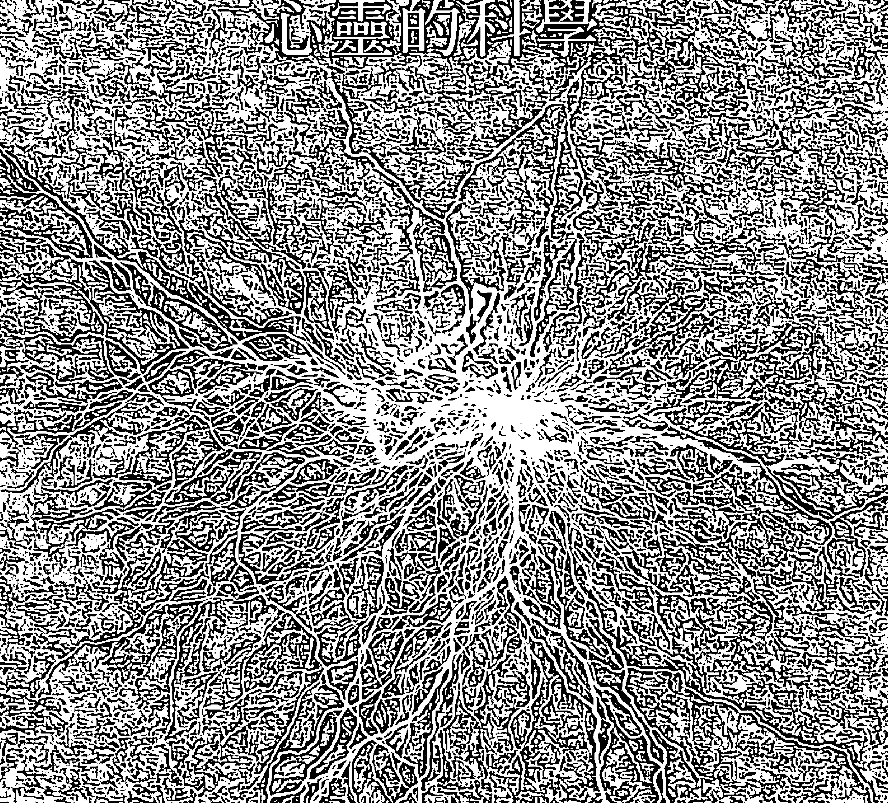

Science of Heart Science of Mind

作者 楊定一

編者 陳夢怡

## St. Royal College
天使神秘学院

- ※ 专业占卜预测机构
- ※ 神秘学培训机构
- ※ 水晶能量研究中心
- ※ 神秘学资料库
- ※ 官方微信：strcdts
- ※ 微信公众平台：strc2011
- ※ 读书交流QQ群：
  占星塔罗占卜师交流群：814594478（加入密码：PDF）
  神秘学其他综合群：659338717（加入密码：PDF）

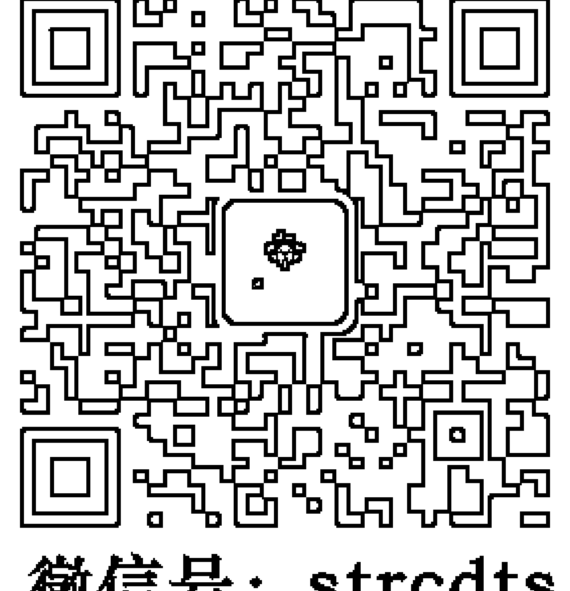

天使神秘学院　院长QQ：715104687

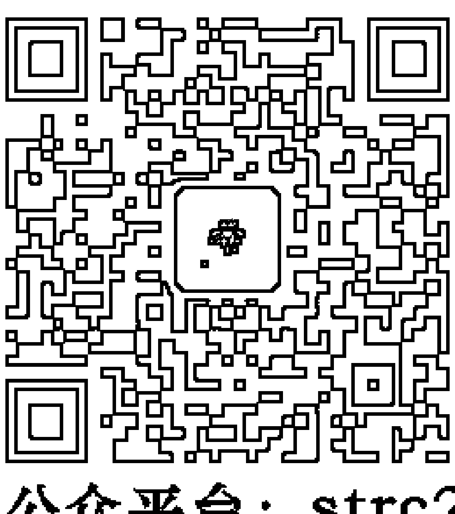

微信公众平台：strc2011

## 制作说明：

本书由《天使神秘学院》出重金从台湾购入的原版书籍扫描制作完成。为达到最好阅读效果，特地把原版书全部切开后，再经由专业扫描设备高精度扫描完成，并经过一张张的PS后期处理最终成书，其间花费大量的人力、物力以及时间，只为能给大家提供经济并优质的神秘学学习资料而努力。

本学院强力谴责某些机构和个人，把本学院花心血制作完成的电子书籍，包装后直接放在自家淘宝网上低价倾销的行为，以谋取不劳而获的经济利益。如果长此以往最终将无人愿意再为大家花心思制作电子书，那以后可能大家再无新书可读。

为让大家以后能够读到更多的好书，也为了本学院的良性发展。本学院恳请大家尽量做到如下几点：

- 一、尽量在本学院的网站购买电子书籍。
- 二、请勿用技术手段把电子书内的水印及加密去掉。
- 三、在收到电子书后小范围传阅即可，千万不要公开传播，更别挂到淘宝网上低价销售。

同时为答谢广大支持者，学院电子书将做如下调整：

- 一、学院会把一些早已收回制作成本的电子书折价销售。
- 二、最新制作的电子书籍会开放打印功能，大家购买后有条件的可自行打印成书。

天使神秘学院
2019年1月

## 短路：心靈的科學

### Shorted : A Science of Spirituality

作者 楊定一 編者 陳夢怡

## 目 錄 C O N T E N T S

- 序 004
- 01 什麼是短路？ 007
- 02 生命的梯度 015
- 03 意識——生命螺旋場的根源 027
- 04 「我」是最大的電阻，也是生命流最大的阻礙 034
- 05 物質為主的世界 042
- 06 打開頭腦 052
- 07 生命場的作用 060
- 08 五個感官的轉變 071
- 09 嗅覺和味覺 077
- 10 觸覺 087
- 11 生理機能的變化 093
- 12 神經的變化 101
- 13 脈輪 110
- 14 短路，在經典留下來的紀錄 129
- 15 心流，跟短路的關係 134
- 16 水晶小孩、走火入魔等種種現象——都是螺旋場的作用 140
- 17 絕對延伸的生命場 148
- 18 內心的力量，遠遠更大 157
- 19 觀念脫落，徹底的短路 172
- 20 短路到無我 177
- 21 大短路 Short-Out or Bliss-Out 183
- 22 業力的轉變 191
- 23 每一個瞬間，都可以當作一個反復的修行 203

## 練習

- 一 睡眠的練習 212
- 二 「面對一天」的練習 216
- 三 Netti Netti 不是這個，不是這個 221
- 四 「一切都好」的練習 224
- 五 「我一我」的練習 229
- 六 平等心 236

## 結語

- 241

## 序

假如你跟我一起走到這裡，除了讀「全部生命系列」的書籍，也接觸了許多影音的素材，包括讀書會和音聲作品，而同時還願意繼續走下去……我相信，你已經有了一個相當穩固的基礎。甚至，可能已經踏上一條沒有回頭路的路，希望這一生能在這方面告一個段落。

在哪一方面，告一個段落？

我指的是——把自己找回來，徹底了解「我到底是誰？」「我怎麼來的？」「生命怎麼來的？」「一切怎麼來的？」「一切，又可能往哪裡去？」

我也相信，你已經認同，這個主題比在人間要面對的問題，甚至任何可以想像的問題都更為重大，而且是遙遙大得不成比例。只是，你偶爾還是會被人間帶走，被頭腦帶走。但是，只要冷靜下來，還是會想回到這個主題。最多，是需要有人不斷為你做個提醒，幫你扎根。

也許，如果我這一生來，還有一個目的或任務好談，最多也只是扮演這個角色——就像拿著榔頭不停地敲打，不斷地提醒你，提醒我，甚或刺激你，刺激我，讓我們共同做個反省。

這本書的書名「短路」很有意思。有一天，我在解釋為什麼會寫《插對頭》這本書，突然體會到「插對頭」還不足以表達我真正想說的。

說「插對頭」，好像還在很溫和地為我們自己做一個準備，好跟生命的全部或一體接軌。所以，「插對頭」也含著「接對頭」的意思，帶著「對準」、「接軌」的味道。也在表達，一體最多是等著我們接受祂，讓祂自然可以浮出來。

雖然這種表達是正確的，但是，我也自然發現，這種表達方式最多是在強調過程的機制，而沒有反映「結果」——在人間，會有什麼變化可談？我們的身體或感受，在插對頭之後有沒有什麼大的變化？
再進一步講得更透明一些，如果隨時讓一體浮出來，對我們的身心可能產生什麼作用？

用這個角度來看，我自然會選擇更強烈的用詞，才能準確而妥當地描述這個足以翻天覆地甚或天崩地裂的過程。因為這樣的轉變，會比人類演化億萬年來所累積的變化還大。

然而，你可能還不相信，我在這本書也必須從抽象轉回具體的層次，而可能還要借用科學的框架來表達得更清晰。

對一般人來說，「短路」指的是一個設備被很大的電流流過而燒壞了。沒錯，我選擇「短路」這個書名，也就是希望表達這種強烈的生命流，流過我們有限身心的過程，而這過程是不可逆的作用——讓一體流過，我們自然也就脫胎換骨，讓這一生全面而徹底的變更。

然而，和一般短路不同的是，一體所帶來的短路，完全是正向的。

其實，我本來也可以用「恩典」(Grace) 來表達這本書要談的「短路」。畢竟這些變化不是我們刻意追求得來的，而是一個人準備得剛剛好，跟宇宙插對頭或接對頭。只是，我擔心對一般的朋友，用這個詞反而把它的力道淡化，而反映不出來它所帶來的作用可以大到什麼程度。這麼說，連用「短路」的比喻，其實還是太低估這一作用。

## 01 什麼是短路？

我們每一個人都知道，要讓電流通到設備開始工作，一定要有一個電位的差異，才可以從外面的電力網充電，得到電流而運作。

外面的電力網和設備之間的電位差，我們一般稱電壓，經過線路而得到電流，可以用來驅動設備。不同的設備，驅動所需要的電流量是不同的。舉例來說，手機運作所需要的電流，和電視運作的電流相比，可能小得多。然而，

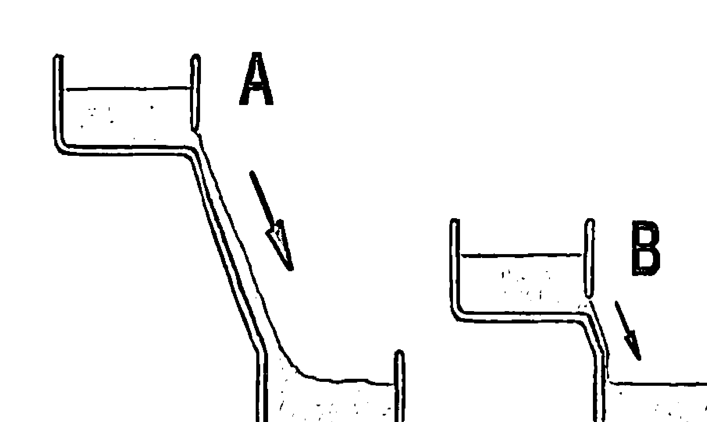

電子從壓力高向低處流動，依照所經過的物質的特性不同，會有不同程度的阻礙。這個阻礙，也就是電阻，限制了電的流動。電流、電壓和電阻，各自用 I、V 和 R 來表示，它們之間的關係可以寫成 I = V/R 這樣的式子。這個公式，無論設備大小都適用，到細胞那麼小還是適用。

細胞，一樣有電壓、電阻和電流。電壓產生需要一個隔離，才有電位的差異可談。以細胞來說，分隔細胞內外的細胞膜就是這個隔離。細胞膜產生電阻，讓細胞內外有一個電位差。電流則是透過帶正負電的電解質（例如帶電的鈉、鉀、氯離子）的流動而產生。從物理的角度，自然最多只想回復電性的平衡，把電位差散掉。所以，無論鈉、鉀或氯離子，本來就會從高電位往低電位移動。

不過，就像右頁這張圖所畫的，細胞膜上有一些分子，可以幫助鈉離子從胞外往胞內移動，也可以幫助胞內的鉀離子往外流。透過各種方法，繼續維持胞內和胞外有一定的電位差。神經細胞，就是靠這樣的原理來維持它傳遞訊息所需要的特性，不像一般的電子設備只有單一方向的流動。可以說，細胞比任何人造的電子設備都更「聰明」。

回到 I = V/R，還可以再進一步往下推。假如 R 很小，甚至小到幾乎接近零，就會產生一個很有趣的現象——我們在中學就學過，在實數的計算裡，1/0 或是任何數字除以零，是無意義。但是，當除數趨近於零而不等於零，$\frac{1}{\lim_{R \to 0} R}$ 自然變成無限大。無限大，沒辦法用數字表達，就用符號 ∞ 來代表。

假如電阻 R 非常趨近於零，那麼，電壓除以電阻所得到的電流 I，也就變成無限大。只是，任何一個設備，不可能允許電流量大到無限大。到最後所產生的熱，甚至會把設備燒掉。這個現象，我們稱短路。短路時，過量的電流有時會竄到大氣中，我們也就會看到原本不導電的氣體，瞬間放電所產生的火花。

短路，每個人在生活中幾乎都遇過，不是手機，就是電視，或是電腦不小心被燒掉了。會有短路，也就是突然爆量的電流，超過了設備的負荷。

短路的情況，不外乎是電壓太大，或電阻太小。有時候，是電壓突然升高，使得電流突然大增。但是，更多時候是因為出現了一個更短的小迴路，讓本來要經過整個設備去消解的電壓，直接經過這個短的迴路，而跳過了整個設備。這一來，等於電阻很小甚至沒有。於是，也就短路了。

颱風天，外頭的電線也會因為樹倒或風速過大，讓兩條本來分開的電線接了起來，也就造成短路。嚴重時，甚至會造成整個地區大停電。講到這裡，也許你小時候也不小心觸電過。觸電，也就是遇到很大的電壓，讓電流通過了身體。我們的身體有電阻，電流通過會讓組織發熱，會感覺到刺痛。很大的電流，會讓我們全身發麻甚至嚴重灼傷，也會干擾身體神經控制的功能。

那麼，站在電線上的小鳥為什麼活得好好的？還能快樂地歌唱？難道電流不會經過牠嗎？懂了電的運作原理後，會知道因為鳥是兩隻腳都站在同一條電線上。如果一隻鳥將兩腳分開站在兩條不同的電線上，而電線絕緣層的效果也不夠，那麼，大的電壓，對一隻很小的鳥，會造成很大的電流在瞬間通過，造出很大的熱，鳥也就被烤焦了。

再舉一個例子，雨天開車時，如果車子被雷打中，可能還可以繼續前進，而人在裡頭不見得有事。這是因為大部分的電流沿著金屬的車殼表面流走了。但是，如果雷打到車時，人站在車旁，既碰觸到了車子，而且腳還濕濕的，這麼一來，造成了一個迴路讓電通過去，如果電流很大，也就被電死了。

當然，我們平時更容易遇到的是靜電。像是在乾燥的冬天，我們穿著容易蓄積電荷材質的毛衣，手碰到金屬的門把，甚至碰觸到別人，會突然「啪！」的一下被電到。有時，甚至可以看到一星小小的火花。這種情況，其實只要加大接觸面積，像是用整個手臂去推門或碰觸，就可以避免這種局部的放電帶來的刺激。

這些原理，做設備的人都懂。所以在工作的過程中，除了想辦法消除靜電，減少火災爆炸的可能，也不要產生過大的電流，而造出危險。

我在這本書要探討的，不是電的現象。而是借用這裡所談的「電壓」來表達一體或生命最原始的潛能。用「電流」來比喻意識的流或生命的力量。這股力量，落在身體的層面也可以稱為「氣」。在意識的角度，「電阻」是我們的頭腦。站在氣的層面，代表的是身體。頭腦本身是阻礙，而我們有這個身體的架構，雖然可以讓氣透過經絡流過去，本身還是頭腦的產物，也還是阻礙。

所以，在這本書，「短路」是用來比喻，無限大的一體或全部的潛能，透過一個巨大的流或生命的力量，突然通過我們的架構——我們局限的頭腦和身心。也就好像這張我在《神聖的你》所用過的圖，生命的流比什麼都大，我們怎麼擋也擋不住。

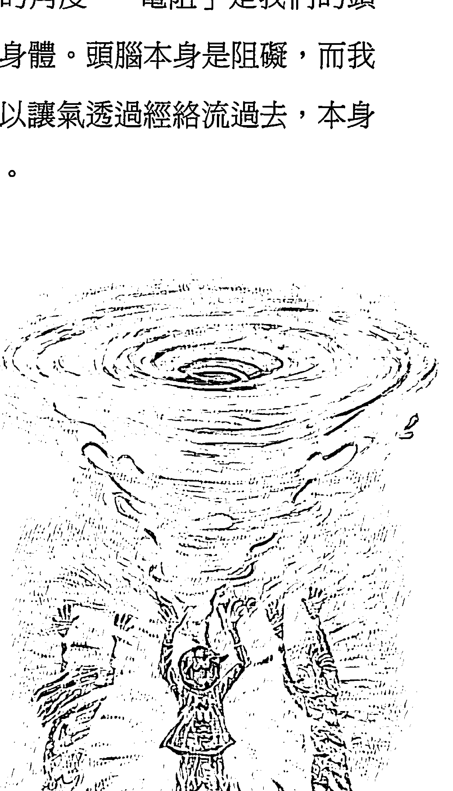

然而，這裡談「短路」，其实并不是真的有什么一体想经过我们。全部的潜能，本来没有要通到哪里。只是头脑好像投射出了一个阻碍在那里，也才好像有一个流需要通过，去消散它自己。

我在这里借用的电路原理，最多也只是做为比喻。不过，你自然会发现，很多观念其实是相通的。

可以说，头脑和身心带来一个表面上的阻碍。然而，这个阻碍早晚会被吞没。也就是说，生命的流早晚要流通，而且是没有阻碍的流通。短路到最后，是这个一体来流通它自己。流到哪里？最多，也只是打通。一切本来都是平等，没有差异，也没有从哪里流到哪里。到最后，只是融入了一体，再也没有什么阻碍，自然会发现一切本来就是平等。

这种平等，本身就是我们的本性，也就是我过去所谈的大平等心。

## 02 生命的梯度

前面講到電壓、電流、電阻，以及短路的概念。但是，還少了一個更基礎的觀念，叫做梯度（gradient），也就是差異。這種差異，科學家通常稱為位能差（potential，也就是累積出來的潛能）。或許，換個說法會比較容易想像。也就是能量的高低分布，就像顏色由深到淺的漸層變化一樣。然而，從物理的角度，任何東西在一個空間累積下來，都會朝向均勻分布去發展，不希望累積出一個差異。無論這個東西是電、水、風、熱、壓力、任何其他的力量，都一樣。包括潛能，也是一樣的。

無限大的潛能，也就是「空」。我們可以說「空」或一體——永恆、絕對、無限——含著最大的位能差。祂才可以流出一切，也就是全部的可能，包括意識，包括物質。

将差异摊平，也就是热力学第二定律。能量，会从高往低移动，最后达到一个平衡。一个有秩序的结构，早晚也会散掉，也就是乱度达到最大。

生命体这种有组织的结构，表面看来是一个「反热力学」的存在。其实，就像下面这张图的左边所画的，生命体是透过一个个独立的隔间（compartmentalization）守住能量。直到老化，甚至死亡，这种能量和秩序局部集中的现象才会解散，重新跟周边恢复平衡。

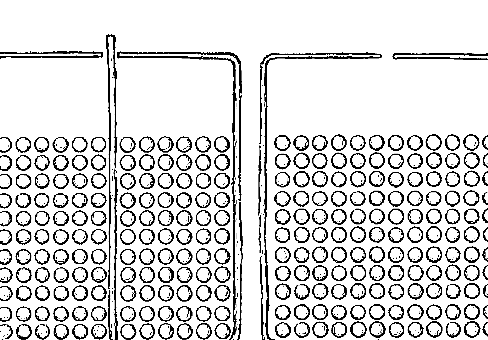

或者我们也可以换一种比喻，把生命当作一个「流」(current)。要指出这个流的方向，时间是最好的指针。我们从出生起，不断累积生命能的梯度，直到差异达到了巅峰。接下来，经过成年和老化，所累积的位能差慢慢衰退。到死亡，又重新和环境达到平衡。

这些观念，还比较容易理解。站在物质的层面，只要我们观察眼前的任何物质，无论是一堆沙，或是任何的架构，自然可以理解梯度摊平的观念。也就是说，透过时间，会从差异回到均衡。沙丘，如果没有特别去维持，会变得平坦。一个架构，也会慢慢崩解，而回到背景，不再突出来。

梯度，离不开力量。力量，是透过动来表达的。梯度，可以说是引导力量，让我们建立分散的方向。

回来谈生命，我们一般会认为基因是生命最原始的蓝图，以为是基因在引导生命，带出生命演变发育的方向。然而，我透过「全部生命系列」不断提醒，光是在物质的层面，无论DNA或遗传都无法完全解释生命，尤其是意识。

这个谜，其实是相当容易解開的。也就是说，意识有两个不同的层面，我过去曾分别用相对和绝对来描述。我们一般認識的意識，最多只是相對的意識。

站在數學的角度，「相對」這個詞含著一個比較、分別、區別的意思。然而，就連相對的意識，都不只是神經細胞作用的總和，而是在所有物質層面還沒出現之前就有的一個力量。用「力量」來描述，其實也不對。我們最多只能說它是一個位能或潛能，是一個意識的流，透過神經的作用，自然產生念頭。而念頭，自然產生動作或其他的表現。也就是說，連意識，都帶著一個梯度的觀念。

我時常提醒，光從物質的層面，沒辦法解釋我們的生命。有這個生命，表面看來是違反熱力學第二定律的。前面提到亂度的觀念，也就是能量自然由比較多的點，往比較少的地方擴散分布。然而，生命反而是負熵（反亂度）的現象。也就是能量從比較稀薄的環境，要濃縮到一個局部，才有生命的組織。這點矛盾，只有透過意識的潛能（再加上它帶來的流）所產生的作用，才能讓生命的過程得到一個熱力學合理的解釋。

再進一步說，只有把意識層面納入考量，生命才不會違反熱力學第二定律。

其實，從一體來說，本來什麼都沒有違反，全部都是平等，只是從一個能量狀態轉到另一個能量狀態。然而，我們看不到這些狀態，所以注意力過去都集中在物質的層面，而歸納出生命自然會生會老會病會死，而認為人生是無常的。但是，站在整體，生命當然是永恆。最多，只是從一個微細的層面轉到粗糙的物質層面，而有表面上看來的變化。

我們一般人，就算承認有一個像意識這樣更高的藍圖，通常也不會去追究意識是怎麼來的，不會去想這個藍圖是怎麼產生的。我才透過「全部生命系列」，用那麼多篇幅來表達意識有兩個軌道。一個是前面提到的，我們人間——相對、局限、比較、分別、邏輯、理性化——的軌道，這個軌道一定要有一個觀察的點，也需要一個觀察的過程。被觀察的兩個點，其實是透過第三個角色（觀察者），才讓我們可以得到一個意義。

我們再仔細觀察，人間可以觀察到的全部，其實都離不開力量和動。比較難觀察到的，是意識（我指的是人間用到的意識）——念頭加上語言——和「動」的關係。也就是說，假如沒有動，沒有這個力量，其實，沒有人間的意識好談。假如沒有這個意識的梯度，人生也沒有什麼意義可以取得。這就是動物和人共同採用的邏輯。

人類的不同，在於可以有更完整的記憶，以及接下來更完整的讀取和連結的功能。也就是說，人類可以建立相當完整的時－空觀念，而動物的時－空觀念還很淺，很原始。

小我，也就是這麼來的。神經系統不斷建立一個觀察的中心，也就是觀察的出發點，而這個出發點是任何觀察結果的源頭。我們自然得到一個印象，好像有一個小我在觀察、在活這個生命。也就這樣子，小我不光成形，還好像有一個獨立的生命。而我們所謂的生命或人生，其實是小我在體驗意識的流。

意識，除了有這個相對的軌道，同時還有一個絕對的軌道。這個絕對的軌道——在、心、一體、永恆、無限、上帝、佛性，是相對意識的因地。沒有絕對，就沒有相對。

絕對本來就存在，不需要透過任何「動」或過程來成立，更不需要透過任何參考點來取得。我們最多只能說祂是自足的一個觀念，本來就有，接下來還是會有，永遠都會有。有什麼，講不下去。只要一講，就變成了一個人間相對的觀念，也就這麼把整體，化成了小小的個體。

站在相對或小我，永遠沒辦法體會到絕對的軌道。它所採用的觀察工具（五官再加上「想」的連結），自然需要切割一個整體或觀察的對象，才能觀察到資訊。這一來，絕對就不成立了。

表面看來，好像兩個意識軌道是相斥，有個矛盾。前面提過，相對永遠跳不到、理解不了絕對。透過相對的工具，永遠覺察不到絕對。這一點，是頭腦最難懂的。

因為難懂，人類自然產生一個觀念叫修行，非要刻意用頭腦去理解絕對，而一般人會稱之為領悟。我過去才不斷表達，在相對的身心（我們的肉體加上心理），這一生或任何一生，永遠不可能領悟到絕對或一體。

透過肉體開悟，本身是個大妄想。

雖然如此，我們每個人千萬年來還是誤導自己，以為只要尋，只要找，只要求，只要修，我們心中有個東西——絕對的軌道、「在」、心、一體、永恆、無限、上帝、佛性——是可以找到的。

我寫「全部生命系列」最多也只是要強調——雖然相對不可能理解絕對，但只要把相對挪開，絕對就自然浮出來，甚至可以佔領相對。在絕對的角度來看，相對其實並不存在。最多只是換個方法表達，相對所佔的比例，連一眨眼都不到。

我們就算活上一百年，在絕對來看，也不成比例，最多只是一個暫時的現象。人的生命，就像草叢深處忽明忽暗的螢火蟲。只是，生命亮起來的時間，遠遠短於不亮的時間。

反過來，假如相對是真實的存在，也就是它可以自足、可以包括一切，我也不敢寫「全部生命系列」，還進一步提出是由一體來活出相對的「反復工程」，甚至認為對人類而言，還有個東西叫醒覺，而醒覺是全部的一體來活出相對，倒不是從相對的身心去找一體。

所以，一切是顛倒的。一體本來就存在，只是相對不知道，才會讓我們浪費那麼多的精力和時間，不只這一生，而是一次再一次……

從我個人的體驗，小我其實不存在，最多只是神經建立的作用。只是這個作用讓人感覺相當堅實，也就建立一個堅實的「我」。然而，正因它不存在，我才敢講，其實沒有一個「我」可以去根除。甚至，也不需要根除。不光不需要根除，甚至不需要去克服。我才說醒覺是個「在」的觀念，倒不是從「做」或「動」而來。

不過，人間一切的語言或表達，都離不開「做」和「動」。我才會順便提到莎士比亞所說的 much ado about nothing 無事生非——也就好像，我們不斷地動，想找回一個本來就有的（哪怕不需要找，也找不來）。

包括「全部生命系列」這麼多字句，到最後也一樣的，還是 much ado about nothing。寫了好多，想表達一個本來不需要，也表達不來的。我才會用這兩句話來彙總——醒覺，是讓你我回到本來就在的家，最多只是需要移開原本不存在的阻礙。

這個雙重悖論，用腦很難懂，但是在心的層面，完全可以理解。

我會這麼說，因為人類隨時有兩個意識軌道。頭腦（包括身體）代表相對的意識，而心，是代表絕對的部分。所以，頭腦聽不懂的，心可以完全理解。但心懂什麼？接下來講不下去。可以講出來的，又落回頭腦的層面。接下來，也就產生悖論。

回到意識流的觀念，其實是心帶著我們走，只是我們不知道，或忘記了。從心所產生的生命的位能，可以稱為心流或生命流。這個流，不斷流出來，從身心流到人間。

倘若不是如此，沒有生命，更沒有意識好談。

所以，用前面電流的比喻，我在這裡想談的是——假如這個肉體（我們所謂的身心）的阻礙愈來愈小，又同時受到心或生命流的短路，會產生什麼現象？

## 03 意識——生命螺旋場的根源

站在「全部生命系列」，我想表達的是——事實，跟我們人間所看到、體會到的，完全是顛倒的。包括生命流的方向，跟一般人想的，也都相反。是從心內流到外，從絕對流到相對，倒不是從外流到內。

這一點，我相信很少人觀察到。

還有另外一個現象，我認為相當有趣，也就是說，假如我們承認，一切是從心流出來，包括生命，包括意識，那麼，這個流可能長什麼樣子？

它其實是個螺旋。最有意思的是，螺旋是一種阻力最小的運動路徑（path of the least resistance）。如果不是螺旋，而是走圓的路徑，必須不斷地克服向內的慣性，才能維持正圓的軌跡。

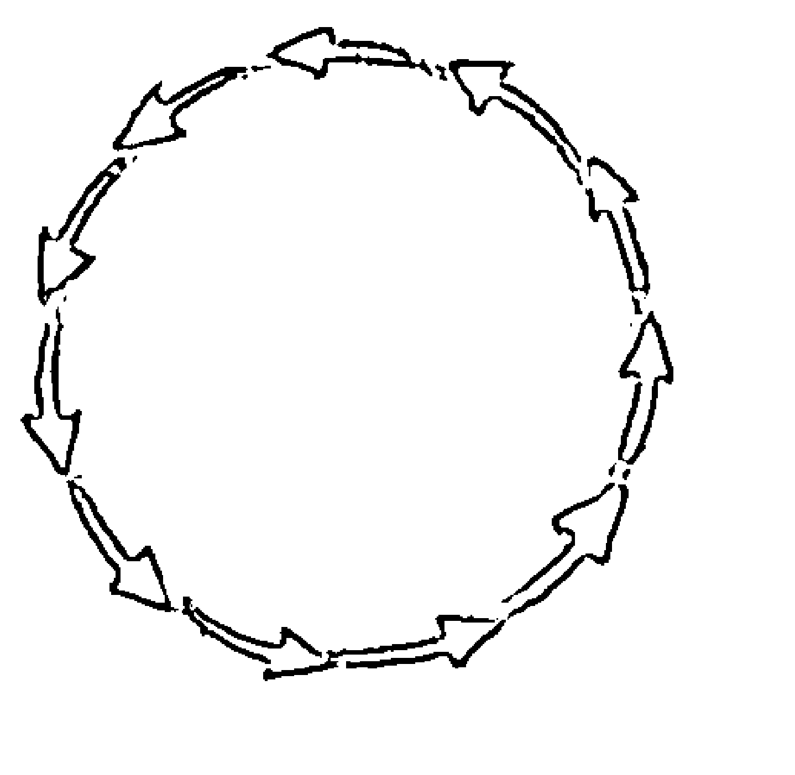

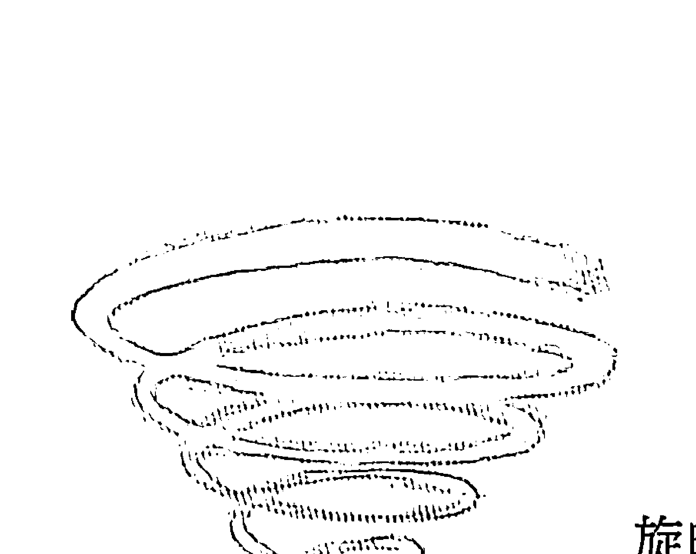

然而，向內的螺旋運動，不需要克服這個慣性，所帶的角度可以完全轉化成動能和速度。循著螺旋的軌跡向中心移動，會愈來愈向內集中，速度愈來愈快，這是螺旋運動最重要的特質之一。

我一般也用螺旋的軌跡來談演化，來形容人類不斷重複同樣的機制，但抵達不同的點。這個不同的點，也許更高，也許更低。假如不是如此，而是圓形的路徑，人類最多只可能一再回到同一個點，不可能有什麼進步或退步好談。

換個方式來說，人類的演化從「沒有」到「有」，就像一個顛倒的螺旋，是透過速度慢下來，才有物質。我們仔細觀察，自然的物質和現象都是透過螺旋的軌跡成立的。遙遠銀河系的大星雲、超新星的爆發、颶風、漩渦、礦石的沉積紋理、咖啡泡沫上的花樣、螺貝、羊角、蝸牛、生物體內的 DNA 和蛋白質分子……樣樣都離不開螺旋。

再說清楚一點，從心往外流出來的生命流或意識流，和向內集中的螺旋剛好相反——是從中心最快的速度（其實是超越速度的速度）一點點慢下來，慢到一個幾乎快要停滯的速度，才會從意識凝結到物質。

然而，走到最後，從物質要回到靈性，回到一體，方向只可能是顛倒的。有意思的是，人類認為的愈來愈發達，從一體的角度來說，反而是愈來愈慢——愈來愈落到一個物質、分別的層面。也就是說，透過人類到目前的演化，等於是把全部的潛能，落在物質面去呈現出一小部分，而這一小部分是不成比例的小，但我們在人間還非要把這一小部分稱為「全部」的潛能。

一般人用「頻率高低」來描述意識和物質的分別，這種表達其實並不精確。我會提到這一點，因為有很多朋友在分享時會談頻率，好像意識的頻率更高，而物質頻率比較低。但是，這種說法，在物理方面沒有根據。

我們最多只能說，意識是個場，而這個場充其量只能用螺旋的扭力和速度來表達。速度快到一個地步，會造出一個意外的奇點，而超過人間的範圍。反過來，速度慢，會逐漸凝結下來。

可以這麼來形容——從物質層面到意識層面，螺旋的速度要提高。或者，換句話說：絕對，當然是無限大的螺旋場，包括無限速度的自旋。這種高速度，甚至是用數字無法描述的，我們最多只能用無限的觀念來表達。透過無限的觀念，讓我們可以去投射、去逼近絕對。

接下來，我用一個很簡單的實例，做另一種說明。

以前，我喜歡帶小孩做實驗，來解釋生命的過程和意外的奇點，去推敲為什麼自然界會突然湧現各種神秘的力量。

最簡單的實驗，只要拔開水槽的塞子，就可以觀察水順著螺旋方向不斷流掉。而且水順著螺旋打轉，阻力減少，速度不斷增快。甚至，在螺旋運動的中心，水的速度接近無限大。

很有趣，從一開始有限的速度，怎麼一路達到無限大？

我們可以這麼推算下去，水體螺旋運動的轉速是中心半徑的反函數，只要螺旋運動繼續向中心推進，半徑就不斷變小，轉速也不斷增加，當半徑接近無限小的時候，轉速也接近無限大。更重要的是，因此而帶有高度的能量。

前面提過，在有限的空間中，不可能達到無限。然而，螺旋會產生一種奇點（singularity），就好像透過這個奇點，眼前這個封閉的系統（水）接觸到了時－空的邊緣，幾乎要跳到無限！

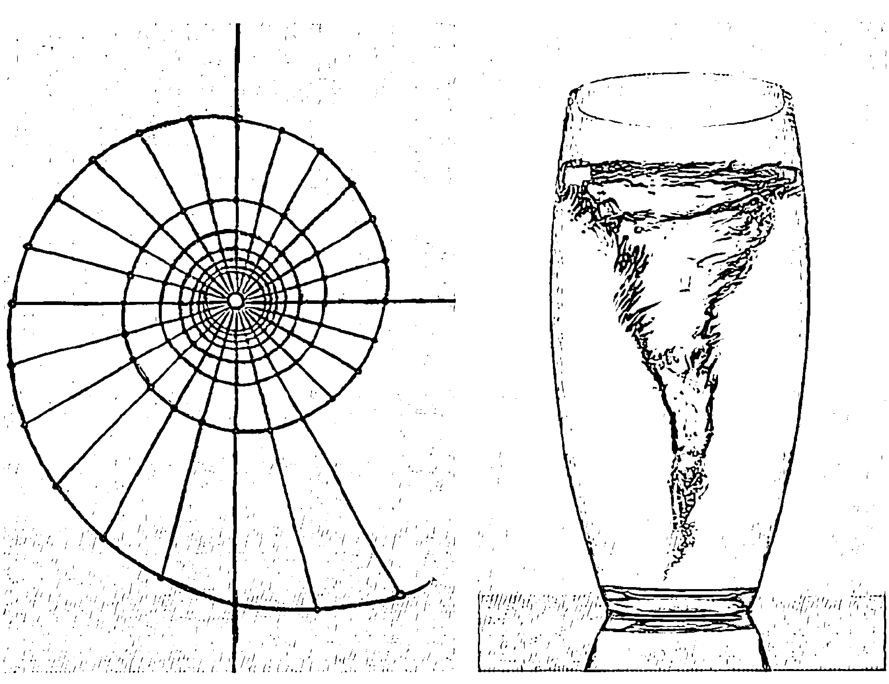

同時，極速螺旋運動的水分子，會將分子內的氫及氧原子各自往相反方向拉開，正負電分離而產生高的電位差，就像是冷漿的離子化狀態一樣。

我曾經帶著孩子，用類似離心機的設備，模擬大自然的螺旋運動，發現水體螺旋運動核心的電位差可以高達兩萬五千伏特。在很特殊的狀況下，氣體螺旋運動核心的電位差則高達二十萬伏特。假如一個封閉系統，就可以產生這麼大的電位差，那麼，跳出這個時一空，位能差會有多大，而能夠產生多不可思議的能量？

談到這裡，其實還含著另一個顛倒的觀念。前面提過，只要觀察，在人間處處都可以體會到螺旋的軌跡，就好像「絕對」想留下自己的腳印。也就是說，要產生物質，自然要透過螺旋的形狀帶出來。

所有物質都離不開意識，我指的是意識場。而意識場在人間可以被感知的，也就是螺旋場。我才會不斷地說，絕對和相對假如有一個共同的連結，最多，只是個螺旋場。既然物質本身是螺旋場組合的，所以，從心，很容易去帶動、甚至影響物質界的每一個角落。它從來沒有離開過，只是我們平常體會不到。

然而，並不是說心需要去發揮什麼作用或力量，甚至不需要我過去稱為「定」的功力。心，從來沒有和物質分開過，本來就是兩面一體。最多，我們只是把「我」的阻礙降低。「我」愈強烈，就像前面提到的電阻愈強烈，通過的電流（在這裡是生命流）也就愈小。如果「我」的阻力愈低，甚至低到幾乎沒有，那麼，從絕對帶出的心流，或說螺旋場的扭力，自然大到一個地步，而造出「短路」。

其實，連「短路」這種表達都不正確。它不是一種特殊狀態，而是我們的根本狀態。

## 04 「我」是最大的電阻，也是生命流最大的阻礙

這個觀念太重要，我在這裡，再用另一個角度來切入。用「短路」來描述我們人接觸一體或是心的過渡狀態，其實是相當容易理解的。

在這個人間，無論是具體的東西或抽象的觀念，都離不開相對和局限的架構。只要用話可以表達，或用念頭可以想出來，也還是落在相對和局限的範圍。我在「全部生命系列」提到主、神、一體、全部、心、佛性、在、道、醒覺……全都是在試著表達一個絕對或永恆的觀念。

當然，既然可以用語言來表達，所談的絕對，也還只是一個由相對延伸出來的觀念。基於語言的限制，我們不可能描述絕對。畢竟，只要可以描述出來的東西，都不是。最多只是逼近祂，但不是祂。

這，就是頭腦最難理解的。

我們被自己溝通表達的工具——語言和念頭——限制了，透過這些工具而得到的任何產物，一樣離不開工具本身的限制，是在一個封閉的系統裡運作。

然而，絕對，是在這個封閉系統外。甚至，是在任何系統之外。祂本身是開放，沒有邊界的。假如相對需要有座標或指標來做比較和對照，那麼，絕對剛好相反，祂不允許任何座標來標定。其實，沒有任何座標或指標，可以做為絕對的比較或參考。

座標或指標，在絕對的範圍裡沒有意義，只要在絕對的範圍內得到一個意義，就已經把祂圈入相對的範圍，也就不成為絕對。所以，祂不允許用語言、用話甚或念頭來描述。我們所能談的絕對，最多是逼近，就像數學的表達$\lim_{R \to 0} R$或$\lim_{R \to \infty} R$，描述小到趨近於零，或大到幾乎無限大，讓我們頭腦去投射、去延伸本來沒辦法表達的觀念。

我們看人間，都是從「我」投射出來。想要解開，最多著手在「我」。

「我」可以說是最大的阻礙，或前面所談的電阻。在這裡，或許你還記得我在《全部的你》用過的這張圖，一個人的「我」愈來愈小，生命的力量反而透過他整個亮出來。

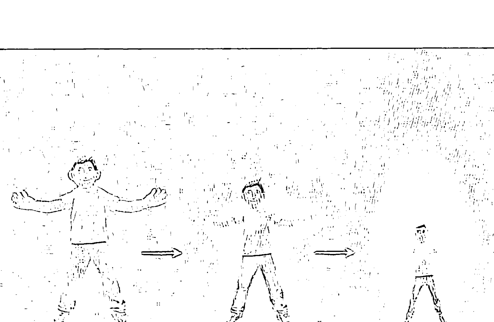

一個人接對頭或插對頭，最多也只是把個人的阻礙（全部的觀念、全部的價值、全部的制約、全部的束縛——「我」）挪開、降到最低或讓它消失。相對所造出的阻礙（當作電阻）假如降到最低，而絕對的力量（或電流）還存在，可以想像會造出多大的作用。

讓祂流過去一次，一個人就已經脫胎換骨而「見道」——發現人生有一種美，是過去從來沒有想過的。最多只能把祂稱為真實。接下來，自然會不斷想回到祂。

一個人隨時可以把這個阻礙降到最小，絕對的一體自然在這個小的體造出徹底的短路，甚至把它「燒掉」。也就這樣子，可以徹底把「我」取消。古人才會用涅槃、寂滅、滅盡來表達，也有人講 sat-chit-ānanda 在·覺·樂，或者說大歡喜、大愛、大平靜。

然而，要提醒的是——醒覺，沒有階段可言。沒有比較醒，或比較不醒。一個人要不是醒的，要不就是沒有醒。這一點，和絕大多數修行者的看法都剛好相反。但是，我為什麼還再三強調？

因為，這個理解反映了相對跟絕對，局限跟無限，無常和永恆的根本差異——本來就在兩個不同的意識軌道。真正懂了，自然會明白不是透過時間甚或時一空這個相對的領域，這個相對的身心可以慢慢進入絕對。

時一空是頭腦投射出來的產物，和身心一樣，都是相對的架構，和絕對，是站在兩個不同的軌道。所以，這個轉變，只能是突然的轉變。

然而，就連「突然」都是誤導的形容。畢竟「突然」還是帶著時間的觀念。

如果要表達，我最多只能說——比突然更突然。最有意思的是，絕對從來沒有離開過，或可以說，在每一個角落都在。所以，從相對到絕對，沒有演變或進展可談。甚至，沒有一條路可以走到，沒有一條路可以依循。

光是這一點理解，我觀察了幾十年，跟所有遇到的修行者的想法都完全顛倒。大家還停留在辯論有沒有一體，有沒有絕對。聽到這種辯論，只能說相當遺憾。畢竟，沒有一體，沒有相對。就是這麼簡單。重點不是檢討祂存不存在，而是我們可不可以活出祂，隨時體會到祂。

用這個理解來看，就會發現一體、絕對、真實跟任何修行、練習都不相關。我才會透過那麼多作品，包括這本書，用各式各樣的語言和方法，試著描述一個本來不需要描述出來的，但願能讓我們把祂活出來。

然而，為什麼所有修行者都認為有階段可言？這也是難免的。還有階段可言，是因為有肉體。肉體還沒有完全「燒」掉，才有這些感受體驗，也才有一個練習，還有從「有」到「空」的層次，也才有菩薩道，去表達行為上的次第。

但是，站在一體，這些層次不存在。只有祂自己存在，沒有其他。我指的是真正的存在，也就是永恆，沒有生，也沒有死，沒有變動的存在。再怎麼去演變，最後還是只剩下祂自己。講得更透明，還沒有任何演變前，只有祂。接下來，演變後，還是只剩下祂。可以說，任何動、任何轉變都跟祂不相關，最多是在祂上面重疊。假如還要把其他東西當作真實，最多只能說是祂小得不成比例的一部分。層次、分段、任何東西，對一體來說，都小得不成比例，可以說是沒有意義。

仔細觀察，涅槃、寂滅、滅盡、sat-chit-ānanda 在·覺·樂、大歡喜、大愛、大平靜，這些屬性其實就是絕對或一體的本質。只有透過這個身體和人間，祂才可以反映這些屬性出來。只有在相對的範圍，這些屬性才有意義。站在絕對，這些觀念、這些話根本不存在，本身沒有意義。

絕對，本來就圓滿，接下來還是圓滿。祂沒有必要動，也不想動，也沒有什麼動的動機。一切只有祂，祂是一切，而一切都是祂。我們最多也只能講祂是圓滿，祂是寧靜。有沒有插對頭、有沒有短路，祂還是圓滿，還是寧靜。而這一切，跟絕對還是不相關。

一體外，什麼都沒有。只是我們還認為有一個世界，有一個身體，也就還有件事「比較重要」——這些觀念，對這個身體、對這個世界，有沒有什麼作用？

我相信，讀到這裡，你會發現一切又是顛倒的。我前面提到在·覺·樂、涅槃，最多也只在反映一體透過我們的身體，活出在人間還可以描述的特質。「我」短路了，全部燒掉了。一體唯一留在我們身體的痕跡，也就是涅槃、寂滅、滅盡、在·覺·樂、大歡喜、大愛、大平靜……因為有這個體，我指的是身體或身心，所以還可以用這種語言表達。

但是，一個人假如透過短路，隨時停留在一體，那麼，也沒有「誰」受到短路，或可以短路到哪裡。甚至，也沒有涅槃、寂滅、滅盡、在·覺·樂、大歡喜、大愛、大平靜好談。沒有什麼特質好談、好感受的。甚至沒有「動」，沒有「做」，沒有「去感受」。最有意思的是，連「誰」在做、「誰」在動都跟著消失了。

「我」已經燒掉了，所以，也沒有一個人在體驗這些特質。我們最多只能說是這些特質在活出它自己。或是，一體透過我們在反射。反射什麼？反射祂自己。突然間，我們只是變成一面鏡子。就像是一體透過這些喜樂的特質，在體會祂自己。

透過我們這個身心，祂隨時可以完全體會到自己。透過我們的身心，可以照明一切。透過我們的身心，一體從絕對可以落回人間的相對，而讓我們反映祂、照亮祂。

絕對，什麼都不用做，也不在意「做」或「不做」。但是，即使我們完全醒覺了，這個肉體還存在，它畢竟是過去種種阻礙或業力的組合。最多是，我們現在懂了，而可以把這些阻礙降到最低。

絕對，最多只是透過這個身心流過去，把一個無限大的能量或潛能，透過我們的身心，集中在一個角落，也就是人間。

這個觀念，跟一般人所想的，又是完全顛倒。

## 05 物質為主的世界

我相信，如果你一步步跟著「全部生命系列」做臣服和參，那麼，走到這裡，你對這些話或許已經不會驚訝。但是，你可能還是會想知道，在這個過程，有沒有具體的變化，無論在身心哪一個層面，可以當作一個路標。

其實，這也是這本書的用意——成為一座橋梁：絕對和相對，一體和人體，無色無形和有色有形，靈性和物質，「在」和「有」，「空」和「做」之間的橋梁。

過去，無論在「全部生命系列」或任何場合，我都不喜歡談這個主題。最主要是擔心誤導，讓你我走偏，而把一些物質的變化當作真實。但是，我偶爾會分享一些實例，主要有雙重的目的——

首先，我認為還是有必要為大家帶來一種鼓勵，讓你我可以不斷地往前走。我們活在這個世界，從出生到老死，都不斷地被洗腦。以至於任何事，都需要摸到、看到、體會到，才會認為是真的。所以，有一個具體的變化可談，當然可以幫助我們建立這個信心。

此外，身為科學家，我要很誠懇地強調這一點——我們所知道的科學，無論哪一個領域，都還是在一個很窄的範圍內運作，對整體沒有任何全面的代表性。然而，我也同時認為，真正的科學精神是——打開心胸，拿自己做一個體驗者，而可能會發現，還有一個完整的科學，在等著我們隨時找到它。不過，這一套科學，和人間目前已經有的科學，一點都不相關。

在這之前，我們必須承認自己過去所學的都是——物質為主（matter-only）的觀念。然而，只用這樣的觀念來解釋世界，是不完整的。透過這種物質為主的觀念，我們會認為要先有這個「體」，才有神經、腦，才延伸出來意識。也就是把意識當作物質的產物，而完全忽略絕對、一體的存在。

這是難免的。畢竟我們用來認識這個世界的意識，都是相對的意識。所以，我們自然會覺得只有物質，沒有別的東西。不光如此，我們自然認為只有相對的意識存在，沒有什麼絕對，而還認為絕對跟我們一點都不相關。

在相對的意識下，我們觀察人的生老病死，在這之間活出來的生命，自然都離不開這個物質的身體。就連我們講身心合一，本身也還是在強調——是物質的身，和物質延伸出來的心，要做合一。

有這種看法是相當合理的，因為我們透過各種科學的領域，發現身體有許多不可思議的機制。人體，可以先區分成一個個不同的系統。每個系統之下，有不同的器官。器官又是由不同的組織所組成。每一種組織有它特殊的細胞。細胞裡，又有各式各樣的成分。每個成分，都有它的功能和角色。透過這些化學的分子，包括荷爾蒙、神經傳導物質，可以在細胞之間做溝通。甚至，把神經和其他組織的作用連起來。所以，這個世界自然會認為現在是物質的時代、化學的時代、分子的時代。而且，認為透過物質的科學，樣樣都可以得到解釋。

同類療法的興衰，也就反映了這種思想的變化。其實，在西方，同類療法才是主導了幾千年的主流醫學。反而現代西醫熟知的對症療法，只是近百年的產物。同類療法，強調療癒的過程，要讓症狀出來，也就是好轉反應。而症狀的浮現順序，在時空有一個方向。例如在空間上，是由體內往外，由上向下；在時間上，由最近，往過去發生。

我也常說，好轉反應將疾病過程回轉，就像讓錄影帶倒帶，一個人才會徹底療癒。然而，對症療法則是強調將疾病的症狀去除，認為這就代表去除了病因。不用我多說，對症療法已經成為現代醫學的主流。醫學近百年來的發展，都在支持對症療法的效益。無論面對的是細菌、病毒還是腫瘤，現代抗生素、化學藥物或種種分子醫學的發展，都是認為症狀消失就代表從根處理掉病因。

有趣的是，全部身心的醫學——也有人（包括我所談的真原醫）稱為整體或整合醫學——反而希望將這兩大領域合併。合併的意思，最多也只是承認人是多層面的組合，雖然致病的因子很重要，但不能忽略我們本來就有的結構或體質。健康，一定要從這兩個層面去著手。

畢竟，光是把疾病消失，不等於一個人得到健康。倒是一個人培養健康的結構和體質，反而自然可以削弱疾病的影響。不光如此，我們還有一個心靈的層面，也可以說是念頭、思考或意識的層面。這個心靈的層面要健康，肉體才會跟著健康。

這麼說，這兩大領域其實也沒有什麼矛盾。有矛盾的是我們，是我們非要坚持哪一個道理不可，才會創造出這些不需要的矛盾。

我之前在《四大的瑜伽》提過這些道理，在這裡，會再次特別強調，是要表達——沒有任何一套偏頗的說法，可以長期存續下去。宇宙本來是圓滿，不管怎麼解釋，它都是圓滿。只是我們的解釋向某一個角落偏倚，而自己失去了圓滿。所以，物質為主的觀念，並不完全正確。整體當然還有意識的層面，而且是在物質之前就存在。這些道理是根本的常識，即使再過幾千年，還是會存在。

可惜的是，物質為主的觀念，就像一面鏡子，反映出西方這一、兩百年的發展方向，跟人類過去上千萬年的理解，不光是不一樣，甚至是開倒車。透過種種的發展，從粗糙到精細，甚至發展出分子和原子、粒子的科學，我們也自然認為分子或物質的作用可以解釋一切。也不知不覺就認為意識或靈性的層面，是含在物質裡，或是從物質衍生出來的。很自然地，現代人幾乎全部成了無神論者，也就是主張物質為主的觀點，同時把科學變成了個人的宗教。

不過，這裡也要提醒，我所談的物質和意識，和一般人的定義並不一樣。這一點，在接下來的例子，會更清楚。過去幾千年來，各種宗教或靈性的門派，都在強調生命還有另外一個層面，是同時存在的。而這個層面，最多只能稱為靈性，不像物質那麼沉重，是在一個別的境界，不是我們人可以看到或體會到的。然而，我在「全部生命系列」（包括這本書）想表達的是，從我個人的體驗，這些說法其實也不完全正確。尤其新時代（New Age）等等領域所稱的靈性，還是一樣離不開物質，離不開我所說的——頭腦的產物（mind-stuff）。

只要我們可以體會到，可以用語言或念頭描述的，其實都還是物質，都還是外在。包括我們所稱為的意識——無論多麼微細，多麼高超，或我們認為多麼真實，都還只是頭腦的產物，一樣離不開物質。而物質本身，還是頭腦的產物。

我在這裡所表達的，跟你過去讀到的靈性論述，最大的不同在於——對這個世界，我更徹底採用物質為主的觀念。在這裡，可以更大膽地進一步往前推——包括宇宙、包括世界、包括人間所看、所體驗的，都離不開我們的頭腦，都還只是頭腦的產物。從這個角度來看，最多也只是物質。

這麼說，任何人類可以談的領域，無論是練習、修行、瑜伽、新時代熱衷的脈輪轉變，還包括接下來這張圖所畫的天使、地獄、天堂……全部都是人製造的。離不開五官加上念頭的組合，一樣離不開頭腦的投射。

我在「全部生命系列」的主張，跟過去主流的說法最大差別在於——將全部這些，都劃入相對的層面——相對的比較，相對的觀念，相對的分別。

我們一般人通常不知道，還有另外一個層面，不能用任何相對的工具來衡量或描述，這本身就是絕對、一體、心、在、空、佛性、神、上帝、永恆、無限。我在作品中，簡單稱為一體意識（One Consciousness）。這一部分，隨時都存在。沒有祂，沒有相對的層面，也沒有我們可以稱為的生命。但是，因為我們的邏輯本身是相對的架構，也就隨時忽略祂，把祂忘記。

這個意識本身是無所不在，無所不能，無所不知。是從來沒有生過，沒有死過，沒有變過的真實。雖然我們隨時忽略祂，但在內心某一個層面，知道祂存在。更有意思的是，還會隨時想把祂找回來。人類的文明，無論怎麼發展，怎麼演變，最終的目標，始終是想把這個絕對的部分找回來。

假如你讀到這裡，不那麼感覺矛盾了，自然會發現你意識的焦點已經在移動，從一個局限的範圍，不費力地可以體會到什麼是絕對，甚至停留在絕對。停留多久，都不重要。比較重要的是，你已經知道這個層面確實存在。而這一生最大的任務，是隨時把祂找回來。

這樣子，我才可以接著進入「短路」，透過這本書，建立絕對和相對的橋樑。這本書才對你有意義，也才對你會有幫助。

## 06 打開頭腦

一個人只要體會到什麼叫做絕對，知道生命有更深的層面在等著自己，就是這麼簡單的肯定，已經帶來不可思議大的作用。從身體的角度來說，轉變最明顯的部位，也就是頭腦或神經的系統。

一般人都知道，在大多數的情況下，大部分的腦可以說都在休眠。我們日常的運作是透過腦的迴路進行，只要建立了規律的習慣，也就日復一日運作下去。

舉例來說，大多數人會固定在早上幾點醒來，朝左邊或右邊翻身起床，先穿上衣，再穿褲子，先刷牙，再洗臉，去哪裡買咖啡或根本不喝咖啡，走哪一個轉角，經過哪一條巷子，從哪一個出口上樓或下樓，到公司先看信件還是先處理別的事，下班時從哪一個捷運站回家，到哪一站下車，路上順便採買，到家了先拿手機去充電，晚餐吃或不吃，飯後散步或不散步，還是打電話給家人，看看手機裡的訊息，睡前是發呆還是非把所有事都處理完了才去睡……每一天，就像依著事先寫好的程式在運作。

因為全透過現有的迴路在運作，我們很少會去思考，這些只是我們透過一再的重複，不斷地強化某幾個迴路而建立起來的習慣。腦會這麼運作，也就讓我們可以把注意力擺在新的體驗，包括環境突然的變化，讓我們可以應對。

不只如此，種種習慣和體驗，通常也透過我們的感受來強化。你也許還記得，在體內引發感受所用的一些分子也就是一座橋樑，銜接神經跟每一個部位的細胞，加快神經轉達的效率。此外，感受本身，也一樣強化現有的迴路。我們對好的經驗，自然特別珍惜，對不好的經驗、失落也會有特別強烈的反應。

我們不知不覺停留在這些特別的感受上，就像固著在同一個神經迴路，有時候甚至到了忽略環境變化的地步。

念頭、感受，再加上全部肌肉的動作，所造出來的習慣，加起來，不過佔用頭腦資源的 10% 不到（就算進行很複雜的任務，也用不到 20%），卻等於固定了我們人生的經過。讓我們隨時感覺人生離不開這些範圍，全落在這些習慣所帶來的框架裡。

不光如此，我們頭腦還可以大致分成左腦和右腦，左腦偏理性、邏輯、語言，而右腦是藝術腦，離不開整體、能量、感受。對於偏重左腦或右腦之一的人來說，可運用的範圍又更小了。一般人的運作還只落在某個特定的人格（特質的組合）。我在《神聖的你》介紹過從榮格理論發展出來的十六種人格，就我的觀察來說，是相當有代表性的。這麼說，我們頭腦運作和行為選擇的範圍真的沒有像我們自己想像的那麼寬廣。

然而，一個人，只要可以接受有一個東西叫做一體，有一個東西叫做絕對，而投入臣服和參，會發現——頭腦各部位的劃分和區隔（compartmentalization）會先打破。左腦的朋友，原本用的是一步一步推演的邏輯，從一點，到下一點，慢慢推出一個結論。右腦的朋友則是發現結論老早在那裡，最多是透過左腦的邏輯事後去佐證。這兩種方式，好像也沒有矛盾。簡單講，也就好像在腦部達到一個均衡，自然化掉裡面比較明顯的區隔。

本來一個人是比較邏輯或理性（也就是比較左腦），會發現突然可以體會到能量，也會發現自己有很多直覺、很多靈感，只是過去用左腦把它壓住了。透過這種意識焦點的轉變，發現在靈感的層面可以成長。反過來，比較右腦化的朋友，會突然發現對數字、語言、種種具體的層面不再帶著恐懼，而發現理性其實變成一個很好用的工具。

就這麼簡單的調整，一個人自然會發現，腦部可用的區域好像擴大了。而這種擴大，不光是因為使用的部位加倍而倍增，甚至可能是提升幾十倍。這個道理是相當容易懂的，如果左腦的朋友讓右腦也活起來，他可以有的選擇，是不成比例的增加。假如我們把頭腦當作工具來看，能選擇的工具倒不只是左腦加上右腦，而是左腦的種種迴路，和右腦的種種迴路可以一一搭配，創出各式各樣的組合。

還有另外一個運作的機制，前面提過，許多腦的部位是處於休眠狀態。即使是慣用左腦的朋友，左腦裡還是有許多部位是不運作的。慣用右腦的朋友，也一樣，不要說沒有用到左腦，就連右腦也是大部分都沒有用過。真正用到的，也只是右腦的很小一部分。

如果這些休眠的部位，都讓它活起來，就像我過去常舉電影《露西（Lucy）》的例子，女主角用 CPH4 這種化學分子，將腦部的潛能打開。然而，我在這裡所講的潛能開發，不是像這樣依賴藥物或外在的刺激，而最多只是意識的轉變。

只是意識的擴大（expansion of consciousness），就會帶來那麼多的作用。意識擴大，本身是「無所不在」的觀念，讓我們注意力不完全集中在一個角落或眼前的某一個點。和一般人想的不一樣的是，是隨時放過眼前任何體驗，我們才不知不覺可以把意識交回到整體——我也稱為一體。透過整體或一體，看著人間。

只有這樣子，我們才會突然體會到，意識其實是個譜。而且，我們竟然有本事掌控整個意識譜，而接下來自然把自己交給生命的全部潛能，倒不會讓一個狹窄的範圍把我們帶走。

有意思的是，意識擴大的這種活躍，我最多只能說是驚人的。當然，從一般人的角度，可能會認為是變得奇怪，或變成某種領域的天才。但是，我這裡所指的，遠遠超過一般人間所認定的奇怪／不奇怪，天才／不天才的範圍。

一個人，會突然發現可以化出、想到、理解任何知識，甚至是書上找不到的知識。他無所不知，然而，這些知識，對他全部都不重要。

他也同時發現，這個頭腦的架構，本身不足以支持他全部的意識。他也就自然擴大出來，哪裡都可以在，無所不在。又同時知道，哪裡都去不了。他同時在各地都在，而沒有一個地方，比這裡、現在更有吸引力。

接下來，也沒有想要完成什麼、想要得到什麼。他已經滿足了。他可以活出來的潛能，也已經老早活出來，因為沒有一個人間的可能對他重要。他無所不能，但是，他還是輕輕鬆鬆選擇什麼能力都不重視，什麼角色都不去扮演，什麼目標都不想追求。

他完全是滿足的，這個世界可以給的，沒有一點一滴，是他認為需要或重要的。甚至，人間所歸納的奇怪不奇怪，開悟不開悟，天才不天才，對他來說一點都不重要，都不相關。

回到腦的運作，會突然發現，過去的迴路全部可以打破。也只有這樣子，他才可以隨時活在瞬間。每個瞬間，都是新鮮，都像第一次活出來。沒有任何腳本可以把他框架起來。假如我們用人間的角色去看，絕對猜不透他的行為，因為他不會，也不需要符合任何別人心理的制約，甚至原則。

## 07 生命场的作用

前面讲的这些头脑的变化，还少了一些机制上的解释，我在这里再做一点补充。

前面提过生命意识所带来的螺旋场。螺旋场，是意识和物质间结合的层面。我们当然也可以说，生命场的扭力或速度，本来是无限大，是一步步落到人间速度慢了下来，扭力变弱，才可以让物质成形。

一个人转变愈大，随时让一体浮出来，本身带来一种能量的状态，是在人间想像不到的大。透过这个扭力，可以改变物质。当然，头脑也会跟着改。我用英文会说“quickened spirit”或“Our spirit gets quickened.”（好像整个体质的速度加快了）。想表达的，其实就是这个现象。也就是说，我们只要可以接受一体，随时肯定祂，也就自然把我们整个生命体的螺旋场加快，而不光是身体。

我们可以用几个物理的现象来做比喻，冷的电浆（cold plasma，或冷浆）就可以当作一个例子。电浆又称为超气态或电离体，是离子化的气体，也就是我们熟悉的固态、液态、气态之外的第四态。透过电磁场的能量，让带电粒子沿着磁力线做螺旋加速，而电子的自由运动超过原子核的束缚，达到一定比例以上，就是电浆。如果只有一小部分离子化，也就是这里所谈的冷浆。然而，冷浆虽然「冷」，里头的电子，还是有摄氏几千度的高温。

要达到电离状态，需要很大的电磁场作用。在某一些状况下，例如天气极端不稳定，天地的电压差异很大，在这个空间里，有些气体的分子，比如氧、氮会带着高量的电荷，跟一般空气的能量状态完全不同。极光，也就是这样的一个例子。

还有一种自然现象，称为电火球或球状闪电（ball lightning），虽然可以在实验室模拟出来，但是科学家到现在还不知道为什么这种高能量的状态会出现，也无法预测。它本身可能小得像花生米一样，也可能大到几公尺，就像球状的闪电，却可以维持得比闪电还久。最有意思的是，它出现时像是有生命一样，轨迹无法预测，会在某个角落甚至室内出现。

不只是西方的文献有不少电火球的描述，早在西元十一世纪，中国北宋的科学家沈括也记录了类似的现像：

> 「内侍李舜举家曾为暴雷所震。其堂之西室，雷火自牖间出，赫然出簷。人以为堂屋已焚，皆出避之。及雷止，其舍宛然。墙壁牕纸皆黔。有一木格，其中杂貯诸器，其漆器银釦者，银悉鎔流在地，漆器曾不焦灼。有一宝刀，极坚钢，就刀室中鎔为汁，而室亦俨然。人必谓火当先焚草木，然后流金石。今乃金石皆烁，而草木无一烬者，非人情所测也。」

沈括所描述的情景，和右页这张1901年的西方版画两相对照，符合的程度是相当有意思。而且，从他的描述来看，这种能量状态会让金属熔化，但是对草木却无伤，这完全颠覆一般人的看法。

其实，这种冷浆的现象，我自己从小随时可以看到，后来也听过相当多朋友跟我反映类似的现象。对我个人，它最多只是代表或反映一个螺旋场的作用，是一个高速的螺旋场在一个限制的空间慢下来，所以，不光可以跟物质接触，而且它可以让我们偶尔看到。这个原理，是整个宇宙都在采用的。不是这样子，星球也无从诞生。

我会提这些，最多也只是表达我们的生命或物质离不开螺旋场，而螺旋场可以改变物质。此外，就像前面提到的「金石皆烁，而草木无一烬者」，这种电离的现象，确实跟碳元素有特别的关系。我过去常说它是来建立生命，而不是毁坏。

我年轻时喜欢做这方面的实验，也自然发现，这种冷浆的能量可以改变物质，和一般的转变方式（例如燃烧 combustion）完全不一样。因为它本身有一个再生的作用（regenerate），而一般的能量转变则是耗损（degenerate）。

就像我在《时间的陷阱》所讲的，一般能量转移的过程，都符合热力学定律，从能量高转到能量低。任何有规律的组织或架构，早晚都会毁灭。但是，这种冷浆的能量却是再生性的，是能帮助生命存在的。如果以后有机会，或许可以进一步谈，为什么碳元素是我们物质生命最主要的组成。当然，这一套科学，跟所有人想的，又是相反。

水，也是我过去特别有兴趣探讨的，也自然发现有很多方法可以活化水的能量状态，带来很多健康上的作用——不只对人，对动物、植物甚至细胞都有明显的效果。最重要的是，水的活化程度并不是一种模糊的概念，而是可以用很具体的方法来测量。包括溶解度、表面张力，都可以反映出水的活化程度。就像冷浆离不开高速度的螺旋场，水也一样。

要转变水的能量状态，同样离不开螺旋场。只是，这个螺旋场，是可以透过材料或机器去产生的。

相对的，我们可以想到，如果脑随时进入一个高速、高能螺旋场的作用，组织当然也会跟着转变，甚至将很多程序重新做个整顿。也就好像，透过这个高能的螺旋场，自然建立很多过去未曾存在的回路。从个人的角度来看，就像是脱胎换骨。影响的，不光是习惯和习气，更是一个人思考的范围、模式。甚至，连生命价值观都会跟着改变。这种变化，不光是当事人主观的体会，是连身边的人也会发现这个人突然变了，好像换了一个人。

无论说「脱胎换骨」，或者「彻底的转变」(radical change)，还是低估了这种变化的程度。我过去喜欢用 transmutation（质变）来表达这个变化。古人也用这个字，来表达身体或生理层面的变化之大，就好像物种产生了突变（mutation），而且是全面的突变，不仅仅是单一基因或分子的变化。

我过去会说，这种变化，比青蛙到人类的那一大步还大，就好像把人变成了另一种众生。当然，你可能还是会认为这只是比喻，但确实是有这种想不到的转变。东方道家的炼丹，或被认为是现代化学前身的西方炼金术（炼金术的英文是alchemy，化学是chemistry，我们可以从共同的-chem体会到它们的渊源），这两个名词既含着化学或物质层面的变化，过去也含着长生不老的观念。

炼丹，或炼金术可以说是古代素人的实验，比后来的化学提前了几百年甚至可能几千年。这就是古人伟大的地方，直觉体会到身体内有一种物质、内分泌或分子层面的变化，也就想实验看看，可不可以把「丹」或「白金」炼出来。

这样的尝试，是过去每一个文化都有的。东方的道教不用说，西方中世纪的瑞士医师、炼金术士帕拉塞尔塞斯（Paracelsus, 1493-1541）也透过身体、物质想对灵的部分做一个转变。后人对物质变化的看重，也是这么来的。炼金术表面看来在追求化学物质的转变，但我们读帕拉塞尔塞斯的作品，就会发现他谈的是内在的转变，而不是外在。

不只炼金术的作品如此，《西游记》表面看来只是单纯的三藏取经的故事，写得热热闹闹，像神话也像武侠小说，但它所谈的许多变化，包括孙悟空、猪八戒的角色，其实也就是在表达《短路》所要讲的「质变」（transmutation）。

有意思的是，我们虽然认为这些作品描述的是幻觉或想像，但是，依然很容易被这些学说或故事所吸引。几百年来，大家都爱看，就连小孩子也喜欢。尽管它用故事来表达，但好像我们内心更深的层面，知道它含着某种真正和我们生命相关的奥秘。

值得探讨的一点是，这些作品所记载的变化，是不是最多只是个比喻，只是在讲内心的层面，还是在物质的层面可以透过短路或质变，也在组织和结构上做一个彻底的变更？答案，当然是肯定的。不过，这其中的原理，对我在这本书所要谈的主题而言，并不重要。最多是和前面所谈的冷浆一样，希望有一天，我有这个机会可以把它带出来。

一般我们从生物医学的角度谈突变，其实是在表达生命的遗传密码（也就是 DNA）产生了化学层面的变化。从一个组成（碱基），变成另外一种组成，就好像密码被抽换掉了（分子生物学家称为点突变 point mutation）。人类的演化是一个个点突变的累积，毕竟如果一次突变的幅度太大，可能也就突然没有生命。

然而，我這裡所談的質變（transmutation），是遠遠超過這種一一抽換密碼的突變，倒不是單純的點突變。

回到 DNA，我們從另外一個角度來看，在生物整個基因體（genome）中，真正可以稱為基因的序列不到 1%（exon，外顯子）。其他的序列，有些只被當成基因和基因的間隔（intron，內含子），有些是休眠不作用的基因，過去甚至被稱為是「垃圾 DNA」（junk DNA）。然而，這也意味著，1% 的基因要改變，需要 99% 的序列來支持它。甚至，像黑猩猩跟人類，在某些基因的差異不到 2%，但如果就整體的 DNA 來看，差異可能大到 10%-20%。所以，我這裡談的「質變」倒不需要去往基因突變的方向去思考。也可能是休眠的DNA突然全部活躍起來，一個人也就產生質變。

我們用螺旋場的道理，其實可以很容易解釋這種變化。我們仔細看，連 DNA、RNA、蛋白質、葉芽、花苞、漩渦、颱風這些大自然的動態，都離不開螺旋的軌跡。這樣，也就很容易理解，生命最根本的力量若是落到不同的層面上，帶來的螺旋場的改變，會將我們的整套程式（programming）都改變。

我指的「程式」，是包括全部身心的作業——我們對世界的看法，對世界的反應，每一個動作，每一個行為，每一個念頭。這整套程式，都會跟著改。

我們通常談的「超越」(transcendence)，從我的角度來看，還是一個小的變化或成就。超越，最多是表達意識焦點的轉變——我們看穿這個世界，知道這個世界不是那麼堅實，甚至可以看出它本身是個幻覺。但是，一個人超越了，還是離不開物質的轉變，而且還隨時可以不超越或回到這個世界。

一個人要經過意識上的轉變，身心才可以跟著轉變。質變，已經是一個後段或可以說是整體的變化。這個變化，落在從最粗糙到最微細的結構層面，倒不只是反映在功能上。我才會說，這裡所談的這一套科學，是不可能在別的地方找到的，而且是現代的醫學沒辦法肯定，也無從推翻。最多說它是一套奧祕科學，或說非傳統科學，要等著後來的人來驗證。有一天，也許就是你。

這種質變，機制上，不是經過線性的程序，不是從一個部位再到另一個部位，或還需要符合什麼先後順序。它是一個高速的螺旋場，直接重疊在物質的架構上，影響整體，而且同時在各部位一起作用。當然，物質的層面比較重，可能晚一點才會起變化，比如說組織或架構上的變更。而比較微細的，例如神經運作的感受，可能會先改變。我才會強調，一個人的習慣或迴路會先更動。但是，到最後，連這個肉體的每一個部位，都會跟著改。

透過這本書，我希望一步步打開，將一些大家認為很玄的現象，變得科學化。但是，我還是要提醒——這些變化，最多只是結果。站在整體，其實沒有什麼重要性。

這種提醒，我需要重複再重複。畢竟，這本書所分享的變化，我相信，是你在別的地方可能找不到的，而可能會覺得特殊，自然想去抓。一不小心，也就不自覺把這個主題當作追求的重點，而會想得到這些變化。甚至，把這些變化當作一種成就的表達。這一來，一個人也就自然把自己困在物質的層面，這一生，可能再也走不出來，甚至看不到邊。

## 08 五個感官的轉變

我們全部的知覺和觀察，都離不開五官。所以，意識的擴大當然會先影響到五官的作用。而所牽動的改變範圍，還不是人間一般所知道的範圍，不是單純的頻率範圍擴大。

舉例來說，我們都知道海豚的聽力範圍，比人耳更廣。我這裡談的轉變，倒不是說我們聽的頻率範圍會突然變得跟海豚一樣，而是站在不同的能量層面，可以體會到更廣的範圍。

這裡談的能量層面，假如我們用螺旋場來表達，也就自然發現，生命的螺旋場變快，我們的知覺會跟著速度的轉變，而跑到其他意識層面，並且突然能體會到過去沒有體會過的。

比如說，我們的眼睛會突然看到一些生命，是過去認為不存在於人間的。有些人體會到各式各樣的異象，也許看到天堂，看到地獄，跟人類相似甚或完全不一樣的生命。這些異象，好像都跟我們的世界在重疊。生命螺旋場的扭力跟速度，決定了我們在人間可以體會到的現實。我們自然會發現，這些異象可以重疊，而且互相不影響。

有另一個相關的現象，相當有意思，也就是自然打破時間的觀念。畢竟，時間最多也只是腦的產物，站在整體，它其實不存在。

一個人，到這個階段，可能常常看到異象或有一個記憶，但不知道這記憶是這一生、前幾輩子、還是未來的。也許是明天、一星期、一年後的事。或是遇見了人，發現過去彼此的關係。所看到的，不光是個人的經過，也可能是站在全人類、地球或星系整體在看，而且相當具體。因為時間的觀念已經愈來愈模糊，他自然會發現，有時看到的，是接下來會發生的。

有些人不重視這些現象的內容，只是隨時活在瞬間，就變成永恆。自然不會在意任何這種異象，會認為都沒有什麼代表性。這時他會發現，每一個瞬間是很長的，甚至可能是永恆，而他隨時停留在每一個瞬間，自然發現時間也跟著消失了。

前面也提過，不去管它，這些現象自然會消失。然而，有些朋友會很好奇，很重視這些異象，甚至去追究裡面的意義和真實性。特別是有些大規模的記憶，比如地球未來的發生，也會想跟別人分享，想去預言，甚至去預防。只是，這些朋友很快就會發現，這種追求本身就帶來阻礙，反而讓質變的過程踩了一個很大的剎車。甚至，可能一生從此忙忙碌碌，被這些現象給綁住。

這些異象或記憶，好像都不是在一個線性先後的軌道，最多只能稱它是一種靈感，或一種重疊。有些人稱為神通，含著一種自認為特殊甚或「不正常」的涵意。卻不知道，這些變化是我們每個人本來就有的，連動物和植物都有，並不值得去分析。當然，也有人想從科學層面研究神通。其實，再怎麼研究，所謂的神通，跟我們個人的轉變一點都不相關。所以，我認為這種追求是多餘的，一樣離不開物質的層面。

我過去也常勸朋友不要在這方面著手，甚至跟他們分享——最高的神通，其实是智慧。一个人把真正的自己找回来，完全投入内心，自然会发现全部人生的体验，包括神通，都不重要。最多只是一种让人分心的现象，带给自己更多障碍。

前面讲到视觉的异象，其实听觉、嗅觉、触觉、味觉也离不开这种类似的变化。有些人会突然听到好像从天上落下来的音乐，或是可以透过听，理解到一些不可思议的讯息，而这些讯息，跟人间其实都不相关。甚至好像听觉、嗅觉、触觉、味觉已经没有什么区隔。透过听，也可以看到，甚至好像可以触碰到。好像原本五官和五感的区隔，都跟着打破，而可以随时互相替代，再没有什么障碍。

这么一来，一个人会发现自己对生命的观察，突然不受这五官的限制。就好像透过每一个细胞，都可以觉察。自然发现我们过去的认知其实相当有限，最多只在几个固定的频率范围内运作。然而，知觉其实可以是不成比例广大，甚至可以是无限大的频谱。只是因为过去不知道，我们从某些层面体会一些讯息，还会认为那是特别的「灵感」或神通。可以想像，「短路」带来的这种整顿相当巨大，也会带来一些身体的症状。比如说，有些人会头痛，而这种痛有时候集中在某一个部位，相当激烈。去检查，又查不出什么异常。过了一段时间，也自然没有了。

针对这类现象，我个人的解释是——和任何物质都一样，人的结构最多只是生命螺旋场慢下来，从无限大的意识凝结成的物质。本来是自由流通，在这过程中堵塞了。假如没有这种堵塞，我们老早解脱，自然能够体会到什么叫做一体。

堵塞，也许在头脑某一个部位，透过这个高速度的螺旋场，自然得到打通。在疏通的过程，气穿过去，造出摩擦，碰到神经，转成痛。但是，痛，不是唯一的症状。也有人突然失掉记忆力，甚至连自己的名字都会忘记。也有些人，在各式各样的层面都不对劲，比如说，有些人突然看到一切都是颠倒的，甚至连房子、人，全部都是颠倒的。一样的，这些现象是短期的，不去管它，也就自然会消失。

也有人突然之间，包括平常的兴趣、跟人打交道的劲头、喜欢热闹的习性，甚至任何欲望包括性欲、食欲都会受到影响。饮食的层面可能自然转变，比如说突然体会到自己需要哪一类的营养。口味可能变得清淡，或者食量大减。体质也自然有大的转变，就像换了个人，连代谢都突然改变。这些变化，可能是长期，也可能是短期。

我们可以想象的是，只要任何部位有堵塞，透过螺旋场而打开，都会带来局部的症状。从医学角度可能会认为不对劲，有异常。但是，假如我们真正了解生命螺旋场是生命的根源，而力量又有多大，我们自然也可以接受这些变化，甚至可以不去管它，不去理它，让它自己完成它的作用。

这个过程，可能需要几年，坦白讲，甚至可能需要好几辈子。但是，一个人只要有信心，只是不断地肯定一体，都可以度过。可以把这些变化当作自然的转变，而不会将注意力集中在上面，反倒把这些变化变成阻碍。这样，不知不觉，也就过去了。

## 09 嗅覺和味覺

前一章集中在視覺和聽覺的變化，因為對我們現代人而言，這兩個感官佔了最大的知覺的比例。有意思的是，《楞嚴經》提到，在佛陀的年代，有二十五位菩薩，各自講自己的修法。這些修法，大致可以依五官和頭腦的本身、對象和作用來區分。每一個感官，比如眼睛，把注意力鎖在上頭，就是一個方法，將注意力放在所看的對象，或放下每一個眼前所看的，或內觀，可以逐一擴充為成二十五種法門。

在其中，觀世音菩薩的耳根圓通法門，也就是聽的法門。耳朵可以接收前後上下左右幾乎360度的範圍，在空間上的阻礙很少，也被認為是最有效的法門。最有趣的是，代表這個大法門的觀世音菩薩，也代表慈悲。不光在東方有一個主要的地位，也有人認為祂化身成西方各式各樣的象徵，比如聖母瑪麗亞。

不過，現代人經過這兩千多年的演變，自然發現眼根「看」的作用愈來愈強烈，甚至成為我們最主要的感知體驗。而且，在感官的範圍內，視覺遇上了幾千年來科技上最大的突破。仔細想想，是透過眼睛，我們才可以看到電視、電腦、手機的螢幕，而看懂這個世界。一個人假如失去了視覺，所受到的衝擊和障礙，可能遠遠大於失去聽覺或嗅覺。

我們都會說「眼見為憑」，也就是在表達，各種數據，都要轉成眼睛可以看的，才算數。可以說現代科學的進展，全都依賴著要先把各種現象轉成眼根可以領略的。很有意思的是，就連古人留下來的脈輪科學，也用「第三眼」來描述眉心輪。一般談到「神通」或「超感官知覺」(extrasensory perception, ESP) 時，即使許多這類的現象其實是從耳根來，我們也會用「開天眼」來表達，這也反映了眼根在我們觀念中的重要性。

就我個人的看法，透過眼睛看的練習方法，對現代人特別重要。正因如此，我在各個場合，都喜歡用觀想的方法帶著大家練習。也就是知道，如果透過「眼睛的看」（無論對外或對內）讓注意力可以專注，對雜念踩個剎車，頭腦也就安靜了下來。有機會，我還會針對這兩個感官的變化再多談一些。但是，其他的感官，也一樣會受到影響。

比如說嗅覺，在「短路」的經過，一個人可能突然聞到過去未曾聞過的味道。有些人突然聞到香氣，和過去在人間體會的香味都不一樣。這些香氣，和記憶是相連的。透過香氣的刺激，自然會有一些畫面浮出來。不只是自己過去和家人或其他人互動的畫面，還有些畫面，從個人的角度難以解釋，甚至，可能是整個文明的記憶。

也有些人會聞到難聞的氣味，甚至是屍體腐敗的臭味。雖然一般人長期吃素，也會對人的味道特別敏感，但是，在短路的經過中，嗅覺的敏感度是放大到不知多少倍。透過這樣的體驗，他不斷體會到無常，徹底看到世界是妄想，隨時知道是妄想，而不會被它帶走。

一般人不知道，飲食所體會到的滋味，很大一部分是靠嗅覺而來。所以，一個人在短路的經過中，透過氣味，馬上可以體會到飲食健不健康，而自然不想接觸某些飲食。光是從味道，可能體會到眼前的肉食是怎麼來的，甚至體會到動物死前肉體的痛苦。所以，自然會想吃清淡，也許就吃素。味覺，也可能有類似的變化。一個人對每個味道突然都特別敏感，而且敏感一個地步，一般的調味，他會覺得太重，自然會想吃清淡的飲食。然而，這樣的經過可能是暫時的，甚至接下來可能反而變得遲鈍，好像每個味道都差不了多少。對他來說，最珍貴的美食和粗茶淡飯，好像都一樣。他最多只是當作延續生命的工具，不會在這方面著手，也不會在上面集中注意力。對他，都不重要。

透過嗅覺和味覺的體會，也可能突然之間，對飲食能量的層面，有了完整而貫通的體會。自然會知道飲食的滋養，不是只有化學的層面。每一個活的飲食，活的生命，無論動物、植物、礦物，本來就有它的能量場或生命的螺旋場。然而，在加工過程中，生命力都被破壞掉了，變成了「死的食物」，原本的螺旋場自然被破壞或慢下來。我們吃了這樣的飲食，也會覺得被拖慢下來。有意思的是，一般人其實也有這種直覺，只是敏感度不那麼高，而會被調味料給帶走。

除了對飲食的來源和處理過程是不是健康，有一個很直接的靈感，也會自然體會到所吃的食物，和健康的對應。因為體質比較敏感，知道每個飲食的化學物走到哪個部位，都可以標定出來。甚至，也不知道為什麼，就知道了對健康的作用。

回頭想，華人傳說中的神農氏，遍嚐百草，而建立了最早的藥典《神農本草經》，其實靠的也就是嗅覺和味覺。因為達到某一個修行的程度，對每個物質的藥性都很清楚，自然將所嚐到的食物分成上、中、下三類（君、臣、佐使）。會發現有少部分的飲食可以調整體質，而稱為「可治百病」的「上藥」。

對我而言，這些上藥，可以稱為「調理素」（adaptogen或bio-modulator），也可以說是天然的荷爾蒙。這些上藥的作用，並不在於引發某個很具體的生理或化學反應，最多只是調整體質，所以沒有任何副作用。

從這個角度來看，現代化學藥物的觀念，反而是在更下游著手。作用雖然比較具體，也許可以針對哪一個酵素代謝的路徑，或是對某一個組成調整或補充，但同時也避免不了副作用。我會忍不住想開玩笑，從西藥開發的角度來看，難免會認為一個藥如果沒有副作用，也可能就沒有效。因為已經習慣了作用和副作用的存在，就像照鏡子，沒有一個，也就沒有另一個。到最後，只好在藥學上評估利弊得失，來衡量該不該用。

回到感官帶來的變化，一個人味覺慢慢打開，飲食自然會減少，可能常常斷食，甚至會用水或一些特別的飲食來淨化身心。因為身體已經在轉變，能量的消耗大幅度降低，就好像消化或代謝能量的機制，都跟過去不同。這種斷食，跟我們想的不見得一樣，可能維持幾天，甚至幾個星期。

我過去親眼見過有人斷食近兩個月，最多是喝水，加一點檸檬。但是，從體重來看，完全看不出來他在斷食。一接觸到這樣的人，自然發現他都在一種專注或定的狀態，完全脫離世界的吸引。

我過去也常在各場合提到《美國心臟期刊（American Heart Journal）》的研究，將一名接近七十歲的瑜伽士 Satyamurti，埋在地底下一個完全用水泥磚塊密封的小空間，時間長達八天。這八天，他沒有進食，沒有新鮮空氣，只有最少量的水。他在第二天之後，心跳慢到心電圖測不到的地步，可以說是代謝都停了。八天後，Satyamurti 從地底出來，大約再兩小時，心跳又恢復了正常。到現在，科學仍然無法解釋這種現象。

過去，也有一位德國修女紐曼（Therese Neumann）四十年沒有吃東西，甚至她時常出現天主教所稱的「聖痕」現象，也就是像右邊這張歷史照片所拍到的，從身體不同的部位流出血來。從生理的角度，既不進食，還在不斷地流血，居然能活下來，是無法解釋的。當然，這些朋友處在很深的信仰狀態，會說自己是靠聖靈而活。這些經過，都有客觀的紀錄。

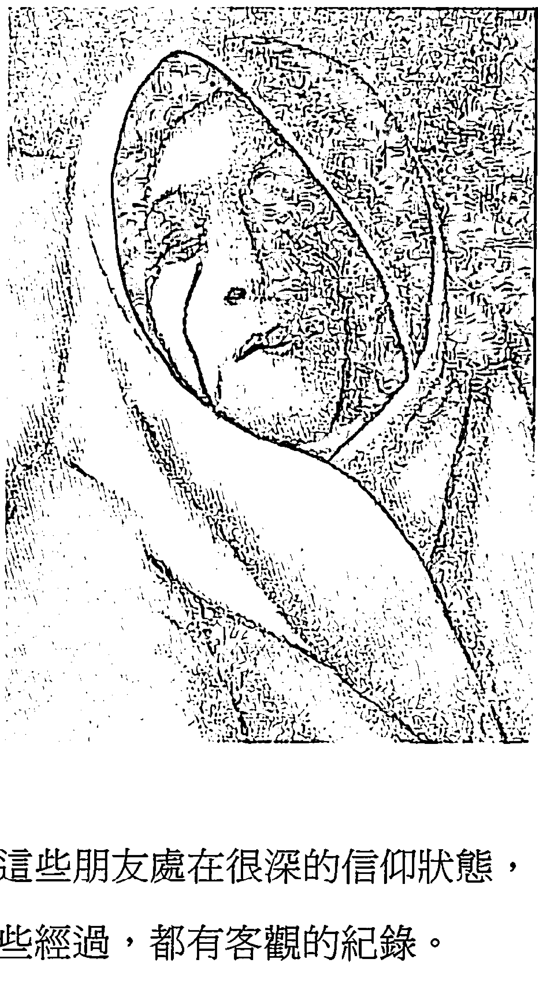

我過去只會談這位瑜伽士的實例，因為發表在有公信力的學術期刊，又有醫師在一旁做專業的記錄。但是，其他像紐曼修女和我個人的實例，過去很少分享。即使這些實例有建立信心的作用，我還是擔心有些朋友可能會把因一果顛倒，認為這些成就是可以追求的，而去斷食或守戒。或是透過功夫，刻意去修煉某些狀態。卻沒想過，這些轉變本身沒有什麼意義，也沒有什麼代表性。

比較有代表性的是，佛陀開悟前，一個月左右坐著不起身，突然醒覺過來。重點不在於他斷食或靜坐不動多久，最可貴的，是他把世界看穿的決心。認為沒有什麼比醒覺更重要，而願意犧牲肉體的生命來達到解脫。一個月後，醒覺過來，弟子們很好奇中間的過程，想知道他有沒有得到什麼特殊的能力，或到了哪個空間，得到了什麼領悟，而佛陀最多只是回答 Buddhoti ma.——I am awake. 我是醒的（而這個我，不是小我）。

再回到味覺的變化，其實也離不開消化系統和腸道，有數不清的紀錄。我們最多是可以參考。比如說，一個人在很專注的狀況下，會突然發現舌頭往上翹，頂住上顎，而從舌頭滴下甘露。這些現象，古人都知道，道家叫瓊漿玉液，梵文叫 soma，古代的波斯人稱為 haoma，被認為是長生不老的神藥。

我過去當然也想知道這個液體是什麼，但是並沒有得到結論。我个人的看法，它跟断食一样，与代谢、内脏的变化都有密切的关系。所以，后来也自然教大家舌顶上颚。也就发现，就这么简单的一个动作，马上活化副交感神经，让全身放松，呼吸变得深长。甚至，比专注而达成舌顶上颚的效果更快。也就是说，光是舌顶上颚这样的一个动作，就是直接调节自律神经系统的桥梁。只要做，就有效果。当然，只有少数人会有甘露。这一点，不需要去追求。它最多还只是个现象。

讲到肠道，一个人会发现消化和排便的功能自然也改了。有一个现象，我过去很少跟别人分享，但它完全是可以重复的自然现象——也就是解出来的粪便会变得很长，甚至半米到一米长，几乎是将肠道里的粪便一次排空。而且气味会不同，完全没有很重的发酵味或臭味。这些变化，当然跟肠道的蠕动与代谢的转变可能都有关系。但从我个人的看法，跟甘露其实直接相关，只是我们现在没办法在科学上做个解释。

连尿液和身体的汗也是如此，好像因为身体的整体结构都在改，身体排出的废物也跟着变。产生的味道，不是我们可以形容出来，没有一个东西可以做个比喻。一般人所知道的尿疗法或粪疗法，其实是这么来的。古人都知道，在肠道或尿道可能有一些代谢的产物，对身体可能有种种的作用。但值得注意的是，这些现象，我们最多也只能当一个「果」来看，倒不需要去追求。

## 10 觸覺

觸覺的變化，一般很少在修行的層面談。但從我個人的角度來看，觸覺的相關改變，其實也很明顯，完全是可以觀察到的。

在短路的過程，一個人的皮膚會改變，觸感變得光滑，甚至連皮膚的味道都會變。當然，從簡單的層面解釋，是因為代謝或生命場不同，自然就好像活化了細胞，讓再生的速度變快。這多少是對的，就像頭髮和指甲也會長得更快。甚至頭髮顏色會改變，也許變黑，也許變白，並不受到一般認定順序的限制。就連眼睛的顏色，也慢慢會改變。有時變淡，甚至變成彩色。有些人在虹膜邊上會有一圈藍色或紫色。這些現象，我認為還算是小變化。

人間的感情，其實離不開觸覺，離不開觸碰和撫摸。我們在人間建立的任何感情——男女、朋友、夫妻、親子，都是在表達對合一的追求。透過撫摸，就好像想跟眼前的人，無論大人、小孩、同性、異性，都跟自己連結起來。也就自然會想去擁抱，好像透過擁抱而可以合一。

我們不要小看皮膚，它其實是神經分布最豐富的感官，也是人體最大的免疫系統。透過觸摸，我們自然會感到興奮、滿足，甚至短暫的合一。性，也離不開這個機制。性愛，是透過皮膚的觸覺，再經由神經的轉達，帶來一種身體全部神經的短路。男人會射精，而女人會感受到性的高潮。這種短路，不只是單一神經的作用，而是透過神經大量、同步的放電，帶來一個大的放鬆。就好像全部神經完全同步，同時在放下。這時候，我們得到身心的合一，自然會興奮。這種合一的生命場不光可以浮出來，還佔領了我們。

但是這種身心合一的場，跟一體所帶來的短路還是不同。因為皮膚或神經所帶來的感觸，本身還是離不開物質，還是有一個流動的方向。無論男性或女性體會到的高潮，還是離不開神經的管道。而神經的管道，就決定了能量流動的方向。

一體所帶來的短路，是同步的，不光沒有能量的流失，也不符合人間可以鎖定的任何規律。甚至，也不允許我們用人間的任何感受來描述或定義。因為沒辦法用任何比喻來表達，所以，最後只能用大歡喜、大寧靜、大愛，來和人間的任何感受、感情做一個區隔。

透過這本書所談的短路，一個人自然會發現，性高潮帶來的放鬆，還算小的放鬆，只是肉體暫時的作用。過去了，也就沒有了。如果只知道這種經驗，自然會讓人希望重複，而自然產生一種「欲」。這種欲，對很多人來說，是最難過的關。有些人修行了很多年，始終放不下欲念。

但是，也有人因為隨時都在短路帶來的大喜樂，而且，這種樂，比性帶來的快樂太多了，反過來自然不會重視。同時發現他從世界可以得到的歡喜，包括性，不可能帶來一種永久的喜樂。永久的歡喜，是本來就有的。自然不會重視肉體的欲望，倒不是刻意去禁欲。

一般人不知道的是，愈是去禁欲，包括性或是飲食或其他的欲望，反而最多是在強化這方面的迴路。讓本來不是一件事的事，突然變成一件重要的事，不僅停留在潛意識，而還隨時可以浮出來。

我才會說，從我的角度，一切都是顛倒的，包括修行，都是顛倒的。對性不感興趣，其實是自然的現象。但是，因為有這個肉體，還是有飲食或其他習慣。一樣的，有或沒有，本身也沒有什麼矛盾。

我認為最可惜的是，有一種譚崔瑜伽（tantra yoga）被現代人誤解成男女雙修，而讓人誤以為透過性可以打開脈輪，讓拙火浮出來到頭頂，讓人超越。這種詮釋，讓我感覺相當誤導。

你跟著「全部生命系列」讀到這裡，自然會發現是不可能的。這種超越，本身還是神經的作用，是頭腦的產物。一體，隨時在等著我們。跟有或沒有這樣的結合，一點都不相關。你做或不做，一點都沒有作用。勉強去做，反而把自己帶到一個角落，完全是對一體的誤解。不光是男女雙修，包括任何身體的功夫，連一些透過呼吸練出來的功夫，嚴格講，也是一樣的。

一個人自然會發現，任何從外面得到的合一或轉變，都還是在物質的層面。反過來，只有投入一體，自然會融化在一體。到最後，知道這些現象全部都不重要，是神經上的轉變，感受上的轉變。最後，都要放掉。不知不覺，最後進入一的狀態。

這樣，把全部的感受和境界都丟掉，而且可以不重視。只有這樣子，一個人不知不覺和一體完全結合，接下來，也沒有什麼境界或狀態好談的。

梵文的sādhana（現代人翻譯成「修行（spiritual cultivation）」、我之前翻譯成「練習（practice）」或「靈性的練習」）本身其實含著臣服的意思。對古人來說，sādhana是接受、接納、包容、臣服一切，也就是——

任何眼前的現象，都可以放下，都把它看穿。更不用講，自己身心的轉變，都要放下。

這一來，我們自然會發現sādhana帶我們進入一種瑜伽，或說融為一體的狀態。這個融為一體，是代表一切，祂是圓滿的，除了祂（我們也可以說是自己），接下來什麼都沒有。只要還可以說有一個什麼東西，自然落到二元對立。

所以，用這個角度看前面談的雙修或各種現象，都不重要。我們最多只能參考，把它當作一個身心可能經過的變化。畢竟任何轉變，尤其是身心的轉變，本來就相當精彩，也就自然抓住我們的注意力，更因為我們會隨時想重複再重複，也就自然變成我們的阻礙。

皮膚的觸覺，一樣會帶來另一個層面的現象。有些人透過觸覺，突然帶出很多過去、現代、未來的記憶。不只如此，還體會到別的法界，別的層面。不光在這個時空，還有時空之外。當然，過去古人就描述過天人、阿修羅、龍、餓鬼或其他靈體，自然發現每種生命都有它自己的週轉，採用的能量、代謝、需求和人類完全不同。

但是，我要表達的是，全部這些還是頭腦的產物。

我們人既然有本事化出一個世界、一個人身，自然有本事化出種種眾生，種種現象。不去管它，自然發現它會改變，也許會消失。即使短期可能更強烈，但到最後，跟幻覺一樣，早晚會消失。

過不了這關，也就可能耽誤一輩子，不光是耽誤自己，甚至可能耽誤別人。

獲取更多好書，請加微信號：strcdts

店鋪：http://strc.cr.cx

## 11 生理機能的變化

前幾章，都是站在五官來談。但其實，一個人在短路的過程，可以有數不完的變化。而且，這些變化在每一個部位，包括每一個內臟都可以體會到。比如說，呼吸，自然會慢下來，會拉長。甚至可以突然體會到，什麼是身心合一或天地合一。

有些人會發現，呼吸和心跳不知不覺停了下來。甚至，連腦波都跟著停止。腦波從平常清醒忙碌的 $\beta$ 波，下降到平靜的 $\alpha$ 波，再進一步下降到深度放鬆、甚至深度睡眠的 $\theta$ 和 $\delta$ 波，跟深睡無夢的狀態非常類似。腦部的變化其實是相當顯著的，接下來，我會再回到這個主題。

回到呼吸，也就好像呼吸沒有阻礙，從頭頂，一路到腳底，甚至通過去。這種呼吸，帶來一種舒暢和安定的感覺，可能是一生沒有體驗過的。在這種呼吸中，通常沒有念頭。一個人不光活在當下，對樣樣的看法更是不同。眼前的事，可能對別人是煩惱甚至災難，對他，好像都不相關。因為接下來，沒有一個「誰」在煩惱。最多，只剩下一個觀察者，輕鬆看著呼吸，面對周邊的挑戰和變化，看著眼前的身體需要去處理。

當然，代謝也會跟著降下來，心臟的脈搏也跟著慢下來，全身的血管都是放鬆的——就好像身體自然選擇了最高效率、最不費力的方式來運作。

也有人突然體會到，身體的每一個部位都可以呼吸。不是只有肺部在運作，甚至，肚子下方的丹田，都好像有個馬達可以動起來帶動呼吸。這種呼吸，是由丹田，帶動肺部呼吸。它本身有個運行，古人稱為小周天。無論道家或瑜伽都提過。我在《重生》也對 *kriya yoga* 淨化呼吸法做過詳細的說明，還帶著大家練習。

當然，這些現象都是有的，而且每個人都可以體驗到。從我個人的角度，它可以是轉變身心相當大的工具，將注意力集中，而讓人穩重。雖然如此，就像前面所說的，並不是透過它或任何呼吸的練習，把我們帶回到一體，而是最多透過這些練習把身心挪開，讓一體浮出來。

講到同步，其實心臟也會跟著一起同步。就好像心臟每一個細胞都相通，而波動完全一致。這樣的同步和諧振，自然產生最大的能量，也自然帶動身體一起放鬆，而得到一種舒暢的狀態。我在《真原醫》也花了相當多篇幅來描述這種現象，並且強調由心帶動的波動或聰明（heart intelligence）遠遠大於腦產生的磁場或聰明。

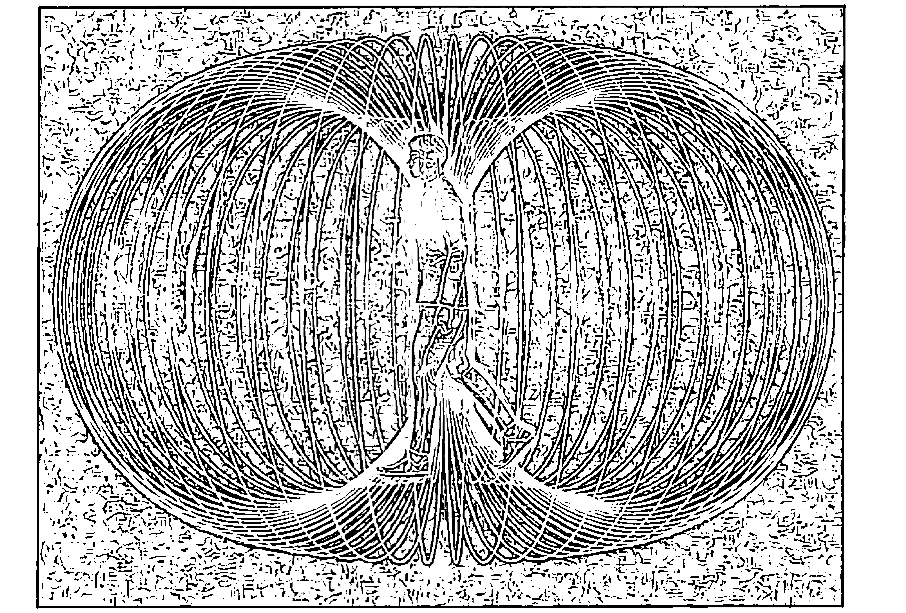

一個人，只要放鬆，帶著感恩、友善的念頭，自然就帶給心臟諧振（coherence）。諧振，最多也只是同步或是合一。不光是心臟在同步、合一，也自然透過血管、肌肉、筋膜擴散到身體每一個部位，包括腦。所以，一個人融為一體，不可能不體會到什麼叫作諧振。而我過去發現，無論是古人記錄下來的變化，或很多朋友所分享的各式各樣的身體狀態，其實都離不開諧振的觀念。最多只是他們分享的部位、所用的語言不同。

心臟的諧振，透過血管可以擴散出來。而血管放鬆，自然回到一個最穩定、最根本的波動。這個波動的頻率是每分鐘6～7次，我們過去稱為梅爾頻率（Mayer's rhythm）。血管的波動不光是慢下來，最難理解的是，全身各部位也跟著同步。就好像全身的組織透過血管變成一個整體，而這個整體的波動，在每一個部位都一樣，都是同時的諧振。

我常用打鼓來說明。鼓的波動，首先跟地球達到共振。梅爾頻率跟地球的頻率很接近。透過打鼓，放出來的波動，可以和周邊一層一層地達到共振，而帶動周邊的振動，包括我們的人體。所以，歷史上每一個文化都喜歡用鼓聲來慶祝，來放鬆，讓我們跟大地一起脈動，一起共振。

我們人體除了神經和血管可以把身體連通起來，其實，還有一個組織叫筋膜，只是過去常常被忽略，我在《結構調整》特別把它帶出來。筋膜不只是將肌肉包起來，而且，筋膜組織是貫通全身的。不光如此，它還有一個螺旋的走向，從各角度將我們的身體連起來。一個人放鬆，自然把過去在筋膜組織上累積的傷疤和沾黏打開。

筋膜組織，除了有保護和潤滑動作的作用，其實還有一個訊息轉達的層面。一個人，不知不覺融入一體，最多只是從一體延伸出無思無想的狀態。這個狀態，在我們的組織上，自然是最放鬆、最根本、最穩定、最舒暢的。

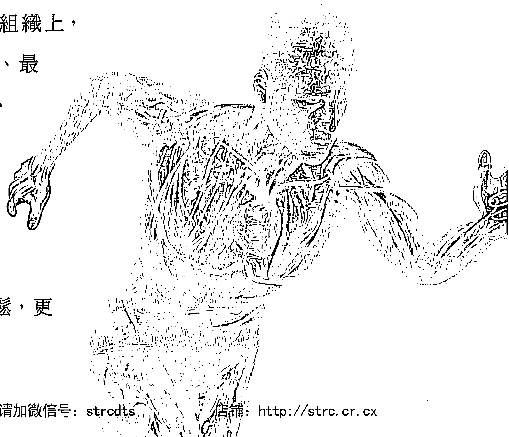

一個人，進入這個狀態，不光是主要的內臟放鬆，更是全身每一個細胞都放鬆。

有意思的是，我在《結構調整》也提到，筋膜組織可以解釋中醫的穴道和針灸。一個人在這種狀態下，不光是被針灸時可以體會到氣的流動，甚至在身體每一個部位都可以體會到。這種敏感度，也可以解釋靈氣（reflexology）的運作原理——手腳穴道可以影響內臟。也可以解釋為什麼，在一個部位做結構調整，影響的範圍遠遠超過局部，或是局部的障礙。

其他的生理機能，例如內分泌，也跟著落在一個均衡點（homeostasis），一樣選擇休息在一個最均衡、不費力的狀態。這是預防壓力最好的狀態，也是最沒有壓力的狀態。就像隨時在休息，在再生。因為全身血管的阻力降低，自然會發現膚色也不同，比較紅潤。不光如此，過去曾經堵塞或受傷而血液供應不足的部位，自然可以再生。

當然，這些現象也多少可以解釋之前提到的例子，包括瑜伽士埋在地裡八天、修女長期斷食還可以存活下去。前面也提過，我過去會提出這些現象，最主要是希望鼓勵大家建立信心，投入靜坐。我認為，在我們忙碌而盲目的生活中，這種信心，也是我們都需要建立的。專注或觀，可以帶來一些身體的變化。這些具體的實例，對一般人建立信心，確實是必須經歷的過程。

但是，坦白講，這些其實都不重要，最多還只是一個經過，只是一種休息的狀態。就像是身體想用各式各樣方法，去配合意識的轉變。意識融入一體，自然沒有念頭，沒有頭腦的運作，所以，全身都跟著休息。

我自己年輕的時候，也喜歡做這方面的示範，在各種情況下，用不同的設備來測量這些變化。但很早就發現，一般人只要有一點知識或科學的背景，就自然會想用各種方法去解釋或否證這些現象。沒有這些科學知識的朋友，則是把它當作很玄，甚至當作修行的目的。無論有沒有科學的背景，接下來，都只是停留在身體的層面追求。

我在這裡，要再次提醒——修行最後的目的，最多只是醒覺。

醒覺了，一個人自然會徹底理解——真正的自己是誰，跟這個肉體（還不用講肉體的變化）一點都不相關。不需要把我們的意識限制在那麼小的範圍。

我會在這裡提出來，因為這些變化，在人間是可以重複的。我們不需要立即將它否定，最多是謙虛地面對它，知道自己理解的範圍其實是相當有限。我們的潛能，帶來數不完的可能。其實，是我們自己把它限制到不可能。

## 12 神經的變化

前面談到神經的變化，最明顯的，當然是腦波慢下來，而念頭跟著消失。

一般清醒忙碌的狀態，我們稱為 $\beta$ 波（14～30赫茲，也就是每秒波動 14～30 次）。透過靜坐的練習，一個人自然可以慢下來到 $\alpha$ 波（9～14赫茲），而且還是同步的 $\alpha$ 波。我們想不到的是，甚至連 9～14赫茲的 $\alpha$ 波還可以進一步慢下來。我在《靜坐》也提到，可以進入 4～8 赫茲的 $\theta$ 波，甚至更深的 1～3 赫茲的 $\delta$ 波。

當然，我們會想問，一個人是不是只有在靜坐、專注、練習中，才可以進入這種腦波變慢的狀態？

其實，不只有靜坐才能達到。一個人假如隨時完全停留在一體，他的腦波不但慢下來，甚至可能沒有。重點是，在這種狀態下，他還能不能運作？能不能面對這個現實？答案當然是可以，但是會出現一個現象是一般沒有的，也就是——同步。

腦波為什麼可以同步？其實，也就是神經同時放電。講到同步或諧振，意思是不光是腦部受刺激的部位在放電，而是很大的區域，甚至整體一同放電，而且是同步的放電。

一個人隨時在一體，腦波可以慢下來到 $\alpha$ 波，也可以是快的 $\beta$ 波，甚至到更快的 $\gamma$ 波（30-100 赫茲）。重點不是在腦波的快慢，而是在同步。同步的腦波頻率，只是依所處理的事情種類而定。

事情處理完，又回到休息狀態，也就慢下來了。所以，一個人處理事，等於同時採用各部門、多方面的功能，自然是全面性的專注，同時而且全面處理。既不費力，成果又好。處理完了，又可以達到一個很大的休息。

這種腦波同步的放電，而達到的全面性專注，我在這裡，借用雷射的特質再多做一點比喻。首先，雷射光的組成很純，不像一般光線是混合光。每一道光，都朝同一方向前進，步調一致。光的波動無論上或下，都是同步而重疊的。

透過這樣單一、集中和同步的特質，可以讓雷射成為能量很強的光源，而可以集中穿透很小的一個點。

任何靜坐的方法，都離不開專注跟觀。我在《靜坐》也帶出各式各樣的方法，無論什麼方法，最後都是希望將我們的注意力集中在一個點上。讓注意力變得很純，讓所集中的這個點，小到或擴大到超過時空的範圍，也就是我之前所談過的「奇點（singularity）」，或者「意外的點（point of anomaly）」。

在這種狀態下，腦波自然達到諧振。透過注意力高度的同步而集中，我們才可以得到一個超越的感受。也就是說，頭腦全部集中在一個點，甚至到了沒有一個點的地步。腦突然失掉作用，而有一個更大的力量，從內心浮出來，佔據了所有的注意。可以這麼說，靜坐，最多是透過感官守住一個客體，一個對象。透過這個意外的奇點，可以意識到一個沒辦法解釋的層面。

我在「全部生命系列」帶出來的「反覆的工程」，和一般靜坐的不同就在於，不是把注意力放在一個點，而是把注意力集中在我們本來就有、本來就在的一體。是透過一體，在參，在臣服。可以說，不是透過這個有限的身心在練習，而是反過來從絕對、一體在看這個身心。就像透過臣服和參，不是把注意力擺到一個客體，反過來，最多也只是回到主體。

透過參。我們不斷提醒自己——誰有這個念頭？誰，有這個感受？有這個念頭或感受的人，是誰？誰，有這個傷痛，有這個情緒？透過這樣的提醒，原本所專注的對象（客體，念頭，情緒，感受）已經沒有什麼重要性，甚至沒有角色可談。我們不斷集中在可以分別、有客體、有一切的源頭。也就是不斷地透過念頭，把我們的根源一再地找回來。

臣服，也是如此。不管眼前有什麼，把它接受、容納、擁抱起來，我們其實不是在臣服於眼前的客體或對象，而是臣服於真正的自己——肯定除了真正的自己，沒有其他的體。

不要小看這兩個方法，就是那麼簡單做了一個反復。將本來向外發散的注意力，收斂向內，也就這麼省下數不完的功夫。無論脈搏怎麼變化、注意力集不集中、有沒有諧振，都不再重要，我們都已經輕輕鬆鬆跨過去。沒有做任何追求，我們的注意力自然集中，自然諧振。一個人，隨時停留在這個狀態，會帶來一個徹底而脫胎換骨的轉變。

這可以解釋，一個人隨時融在一體，為什麼做事、講話、休息都是合一的。也可以解釋為什麼我一直說深睡無夢比較接近短路或醒覺的狀態。當然，嚴格講，這樣的表達也不盡然正確。因為我們一般人深睡無夢時，體會不到最原始的覺，通常是在醒過來的那個交會，才有機會稍微體會到。

這裡講，在無夢深睡的時候，我們是醒覺的，只是因為自己不知道，而自然完全否定有這個狀態。然而，不只如此，我們白天從夜裡的夢醒過來，一樣有醒覺所帶來的覺。只是，跟無夢深睡一樣的，我們就連白天，也同樣不知道自己有這個狀態。

相信你已經發現，我在這本書同時使用了「短路」和「醒覺」兩個詞，有時是交替使用。如果還想將兩者做一點區隔，最多是我在這本書比較常用「短路」來表達我們的身心與一體合一所帶來的一些現象或反應。

但是，嚴格講，這些反應最多也只是站在別人的角色在看這個身體。一個已經醒覺的人，對這些變化，一點都不會重視。

因為這個醒覺過來的人充分知道，沒有一個變化可以描述醒覺。也不是真有一個人，可以宣稱什麼叫做短路。最多，只是知道這個肉體還是符合業力在運作，所以也只是輕鬆放過這個身體。

前面講到同步和慢下來，這種變化，是相應於高速螺旋場的狀態。高速螺旋場的狀態，也自然可以「打通」頭腦的每一個部位，讓許多過去沒有使用的神經細胞，也跟著活躍起來。之前提過的很多異象、直覺、甚至所謂的超感官知覺ESP，最多也只是很多神經細胞和其他細胞一同活化的結果。因為我們全部相對的意識，都是從頭腦延伸出來，所以，在這過程會有各式各樣的現象，讓我們體會或感觸到。

除了前面講到的頭痛、異象，有些人會突然發現這個世界消失了。或是看著一切，突然就像無限大，無邊無際。也可能自然落在世界與世界之間（in-between world），有時候，眼前的東西好像有，又好像沒有，像一個影子。也有人經過好長一段時間，在發呆，完全失掉時間的觀念。還有人認為自己的身體在膨脹，從脊椎，一直膨脹。在這過程中，也可能有局部的痛或歡喜。然而這種歡喜，是一生可能沒有體會過的，會讓人希望停留在那個歡喜的狀態。

這種現象的變化，是數不完的。不只從一個感官延伸出來，而可能是多重感官的經驗——有聽覺，有視覺，又有嗅覺……有無窮的排列組合。不光是生理機能數不完的變化，念頭和情緒的變化，也是數不完的。

我指的不光是情緒豐富的變化，甚至包括在觀念上，突然體會到很多層面的知識，而這些知識跟過去所學的都不相關，遠超過過去所學的範圍。有時候，生命的氣場通到頭腦哪一個部位，會突然浮出一些奇怪、看起來不相關的念頭。從最粗糙到最細微，從地獄到天堂，好像都可以體會。

這些經驗，有些會再三重複。有些就一次，來了，走了，也就沒有了。有時候，人心情的浮動會很大，有些人會憂鬱或感到孤單，性格可能發生徹底的轉變。然而，這些轉變，最多也是一時的。只要繼續走下去，自然會發現，融在一體，什麼特質都沒辦法描述，猜不透，說不清，也預測不了。最多，也只是把它都放下。

我還記得，好多年前，有朋友提到西藏密宗近千年前一位祖師密勒日巴，他有一位弟子，是醫學世家出身，自己也是醫師，名叫岡波巴，後來也成為密宗重要的上師。密勒日巴大師帶著岡波巴苦修，每過一段時間，岡波巴就會到上師面前，請教各種疑難。這些疑難，主要都集中在身體的層面。無論面對什麼現象，密勒日巴大師最多是跟他解釋，是氣正在從哪個部位通到哪個部位，要岡波巴不要管它，只是繼續靜坐。

因為岡波巴自己有醫學的基礎，對這些身體的變化自然特別感興趣。然而，密勒日巴大師很清楚，岡波巴很容易被這些變化綁住。如果沒有幫他踩剎車，那麼，這一生最多也就是停留在身體數不完的變化。

到這裡，我相信你已經知道。身心，和這裡所講的一體或絕對（我們也可以稱醒覺）是完全在兩個層面。身心再有什麼變化，跟醒覺還是沒有直接的關係。

醒覺，是完全在意識的層面。我們把相對的部分（包括身心）挪開，才有一個一體叫做醒覺可以浮出來。然而，就是我們還沒有挪開，還落在身心當中，這個一體和醒覺其實也已經老早存在，只是我們不知道。

我會提這些現象，用意還是一樣，只是讓你做為參考，倒不是認為這些現象有什麼代表性。要不然，你可能就像沒有見到密勒日巴大師的岡波巴一樣，被這些現象綁住。

知道可能有這些變化，而且，這些變化都是一時的——自然為我們建立一個基礎，一旦遇到了，知道要全面地看開、放下，不要重視。

## 13 脈輪

談到神經的變化，我也要再接著談脈輪。

在短路的過程中，這種身心的變化，是在每一個層面，甚至在我們看不到的層面，跟著生命的能量場一起變更。脈輪，就是一個例子。

大家可能比較熟悉的表達，是七個主要的脈輪。脈輪和穴道並不是同一件事。穴道，跟肉體的組織還有重疊，可以定位在身體的某個部位。但是，脈輪好像落在另一個介面上，跟一個比身體更深的層面接軌。將筋膜、神經叢（plexus）、更深的情緒和靈性層面都連起來。所以，才難以將它鎖定在身體的組織上。

有時候，我們會借用脊椎來表達脈輪的相對位置。但是，脈輪其實不是沿著結構上的脊椎排列，而是沿著身體的中軸，也就是我在《靜坐》、《螺旋舞》和《光之瑜伽》談過的中脈。我在演講也常常提到，左脈、右脈和中脈交會的地方，就是脈輪。這些交會點，雖然不是落在肉體的結構上，但是，它們的相對位置也並不是沒有規律的，而是每個人都會落在差不多的位置。其實，這句話也不那麼正確。我們五官體會不到生命的螺旋場，同樣的，也沒辦法體會脈輪。但有意思的是，雖然脈輪跟肉體不在同一個軌道，從古人到現在，透過修行，透過定，都可以把它描述出來。

用螺旋場的語言來表達，我們可以說，生命的螺旋場跟身體最直接的接觸點，也就是透過脈輪。可以說，螺旋場凝固變成物質的過程，是先讓場的速度慢下來，集中在脈輪，然後再從脈輪，轉成物質。

可以說，脈輪和腦一樣，是一個指揮中心，可以調動我們身體的每一個部位。在短路的過程中，當然也少不了脈輪的變化。

這些脈輪，我們一般會描述成七個中心。但是，其實還有許多脈輪。如果把七個脈輪當作中央，那麼，也還有地方性的其他脈輪。有些人列出九個、十五個甚至二十三個脈輪。這些數字，其實沒有什麼代表性，只是看我們把注意力擺到哪個部位。有些可能體會到，也可能體會不了。

但是，有個很有趣的現象，這些脈輪也會「打開」或是「打通」。脈輪「打開」和「打通」所要表達的，最多是我們透過這個肉體和身心，跟生命的內在，包括生命的螺旋場接軌，把阻礙或對立降到最低，讓生命的螺旋場透過脈輪自由地流出來。

比如，我們說一個人像天使一樣友善。這樣的人，其實可能是這些小的脈輪打開。我們雖然肉眼看不到，但有時候又好像可以體會到一種光從身體照明出來，甚至有翅膀的形狀，也就很自然用天使的翅膀來形容。有些天使有兩隻翅膀，有些有五隻甚至七隻翅膀。這些，最多也只是表達他在某一個層面的脈輪打開，在更微細的層面，他的螺旋場比較大（一般人會稱為頻率比較高）。但是，從我的角度來看，一樣沒有什麼代表性。

反過來，有些人比較粗重，在行為或情緒的層面很粗暴，我們一般人也會形容像野獸或餓鬼。相對的，也是在某些脈輪堵塞。然而，人是多個層面的組合。這些現象，其實也不用去多分析或強調。因為任何我們可以形容的，包括行為的好、壞，都還是我們頭腦的產物。站在一體，其實也沒有什麼是好，什麼是壞。一切，都是圓滿，一切都是平靜。回到短路，值得分享的是，我們從多體回到一體回的過程，所體驗到的變化。古人會用不同的象徵、顏色、形態、數字甚至聲音來表達每一個脈輪，常用的一個象徵就是有著不同數目花瓣的蓮花。這些象徵表面看來很抽象，甚至不相干，但其實都是在脈輪打開的過程中，透過氣或光所帶出來的路徑，才會描述出這樣的結構。

舉一個例子來說，在太陽神經叢輪打開的過程，一個人可以體會到好像跟每一樣東西、每一個人、整個世界的每一個角落都是相連的。就好像，樣樣萬物，都從自己的胸腔延伸出去，甚至中間好像還有連結。

在打開太陽神經叢輪的過程，一個人可以看到它和每一個現象、每一個人的連結，自然就會發現，這個連結確實是真的，確實是由我們自己出發的。也就體會到「一切都是頭腦的投射」這句話一點都不是比喻，而是千真萬確。因為有這個小我，可以投射出這個世界，而且之間完全是相連的。

太陽神經叢輪完全打開，也就跟這世界、跟一切都沒有分手。甚至，會看穿樣樣的存有和現象，知道沒有任何的實質。最多，只剩下空。空，空到底。樣樣都是空，而這個空，跟自己的空，完全沒有區隔。

所以，這些脈輪的結構或形態，對我個人其實沒有什麼代表性。因為那些路線只是脈輪打通的過程，可以說是結果，不值得把注意力落在這些路徑上去刻意追求，也沒有什麼追求的必要。

再比如說，喉輪不光是掌控聲音、溝通的能力，還跟很多內分泌分不開。在短路的過程中，一個人的喉輪會突然膨大，就好像圍著脖子有一圈突然擴大出來。表達能力會突然非常流利，沒有念頭，可以演講，可以開示。帶來的震動，不光在人間可以體會到，就連不同的層面和法界，都可以有互動。也就好像，透過喉輪擴大，我們想跟宇宙的物質、非物質都達到共振。一般人所謂的「溝通」，最多也只是反映這種融為一體的觀念。

頂輪也是如此，好像透過頭頂，可以看到所有的法界，都可以接軌。接軌了，發現沒有任何知識重要，全部都只是透過「動」或追求所得來的。一個人隨時跟宇宙接軌，自然發現到處都是恩典，而這個恩典隨時跟自己結合，非要讓這個肉體做個全面的轉變，甚至質變。

古代的大聖人，都有一樣的體會。無論哪個傳承，都自然畫出頭頂帶著光球的圖，只是後來才畫成一個光圈。這種畫法其實相當貼切，任何脈輪，包括頂輪打開的過程，都會膨脹，而讓人感覺到就像一個球或光體在那裡。前面提到，喉輪會擴大成一圈。在頭頂，是更明顯，連周邊的人都體會到好像在放光。也是因為這樣子，後來的人才會用 enlightenment（光啟）來描述開悟。

在頂輪打開的過程，當然有各式各樣的現象或症狀。有些人會頭痛，有些人會不斷有一種膨脹的感覺，注意力沒辦法集中在眼前的事情，所看到的東西。也有些人，肉眼所看到的世界是上下顛倒的。也有人，突然體會到整個世界就像一個沒有雲的藍天。空，空到底。藍，藍到底。沒有一個念頭可以留下。還有人可以體會到每一個腦細胞活躍起來，就像腦的全部迴路在重新整頓。從聖人的角度，這些現象，都不重要。甚至，假如不小心集中在上面，或期待它們重複發生，這本身又變成一個阻礙。

眉心輪，後來的人稱為天眼（spiritual eye）或第三眼。也有人從科學和醫學角度來分析，認為是松果體。成人的松果體很小，就像是一個演化的遺跡。其實，眉心輪和其他脈輪一樣，不等同於具體的肉體層面，也不見得等同於松果體。

天眼活躍起來，一個人自然進入一個無所不知的現象。首先，透過五官看到、聽到、體會到別人不可能知道的知識。很多人會稱為是神通。我在前幾章也對這些現象做了相當多的描述。假如一個人不去管這些現象，不去理它，不被帶走，自然會發現，人間可以知道的東西，在整體中不光沒有任何重要性，本身還是一個相當大的分心。所以，自然會發現從知識，轉成更深的認知或分別智——可以不斷分辨什麼在一體比較重要或不重要，而隨時把注意力擺回一體。不知不覺，從知識、動的層面，轉到智慧、在的層面。

應該這麼說，一個人天眼打開，倒不是得到大神通，反而是大智慧。

相對的，海底輪打開，是促進生命。不光對身體的能量帶來大的更新和再生，好像造出一個新的循環，同時帶動古人所說的拙火。沿著脊椎一路上到頭頂，不斷有拙火的作用。拙火，有人翻譯作「靈蛇」，雖然是個比喻，但如果一個人有這種現象，會知道這種比喻一點都不誇大。因為中脈完全打通，拙火透過左右脈不斷地回到中脈，感覺就像兩條蛇不斷往上爬，跟腦連起來。而「爬」的方法，最多也只是符合螺旋的軌跡。這時候，一個人是非定不可。假如上面的頂輪也打開了，會突然發現一個天地合一的現象。就好像透過中脈，意識擴大，不光和天地連起來，自然讓我們體會到無所不在。繼續停留在這上面，身體的觀念也就自然消失。接下來，只剩下定。

從海底輪到頂輪都是通的，才會突然體會到什麼是空。這個空，假如可以一直空，空到底，會突然轉成圓滿。「空」和圓滿，「在」和「做」、「動」，也不再有區隔了。一個人到最後，完全知道自己的狀態和眾生的全部狀態都一樣，都分不開，最多只能用圓滿或寧靜來表達。

因為這種現象是難忘的，而且帶來大歡喜，後人也就自然衍生出對譚崔瑜伽的誤解，認為透過性的接觸可以得到。這其實是很大的誤導。

眉心輪與生殖輪，兩者都和創造甚至繁殖有關。一個人如果這兩個脈輪是通的，甚至通到頭頂，自然體會到什麼是化身，突然明白這個人生所見到的一切，都是顛倒的。是一體落在這個肉體，而產生這個具體的意識來操作它，而倒不是身體產生意識。這個意識可以來，也可以走，並不需要停留在任何地方，包括這個肉體。

一個人懂了這些，他的小我自然化解，可以徹底體會到無所不在，但同時也知道哪裡都不用去，哪裡都去不了，因為哪裡都在。這時候，突然之間，「這裡·現在」、「當下」再也不是理論。他隨時，都在當下。

在這些脈輪打開的過程，會有各式各樣的現象，有些人會在自己的領域得到不可思議的突破，當然，也有人選擇什麼都不做，避開人間。

前面談到眉心輪，其實眉心輪和人間的創造力有關。這個脈輪活起來，我們一個人自然可以整合很多領域，而透過這些整合，在藝術、文學、甚至科學的角落來發揮。這樣的創意，因為是無思無想而來，幾乎可以說是顛倒的，自然帶出各種人間沒有的作品。但是，假如不被這些創作帶走，一個人這時候可以不斷地把心收回，自然發現最大的創造力倒不是在人間可以創造什麼東西、有什麼本事或留下紀錄，最大的創造力其實是「在」、不動，而透過「在」，一切都好像可以完成它自己。一切好像沒有開始，沒有做，沒有動，都可以完成它自己。

眉心輪打開時，我們發現意識可以延伸到各角落，是一種無所不在。創意不光只是延伸它自己，更是一種智慧，可以擴大到每一個角落，也就是無所不知。一個人也自然從人間的創造力轉成智慧，知道沒有一個成就可以吸引他，或有絕對的重要性，而自然會捨棄一切。這才是真正的出離。倒不是在人間培養什麼德行，或放棄什麼習性。

心輪也是一樣的，智慧突然可以照明整個宇宙。心輪的光，本身就是愛，不是透過「動」可以照出來。我們也會突然發現，這種愛，跟人間的感情完全不同。這種愛，沒有要求，沒有得到，沒有期待，甚至，連「付出」都不是。它什麼都不是，不是用人間語言可以描述。如果要講，最多是愛自己——這個自己不是小我，而是一體。最高的慈悲，最高的愛，是把每個東西看成自己，全部離不開一體。

心輪打開的歡喜，會讓人一生難忘，就像千百萬倍的高潮，自然擴散到每一個細胞，讓每個細胞跟心一起同步波動，一同歡喜。

在心輪下的太陽神經叢打開，也就結合了智慧和慈悲。一個人自然可以照明整個世界。或再表達的貼切一點，是一體透過這個身體照明一切，帶給周邊的環境，包括眾生無數的希望、加持和恩典。一個人，也就突然跟過去全部的大聖人連結，建立一個「生命網」或「意識網」（life grid 或 consciousness grid）而大幅度提升全人類的演化。也就是它照明出來的場（假如可以用這種比喻）本身是帶來一個往前進的螺旋，可以影響到人類各領域，包括宗教。

我相信你可能會發現，我這裡談脈輪的切入點，跟你過去所知道的可能不一樣，甚至是顛倒的。一般的說法，可能把重點放在怎麼開啟脈輪，強調每個脈輪對人生的作用，而鼓勵人把它變成一種追求。而我的角度，剛好相反。脈輪打開是一個結果。一個人回到一體，透過短路，脈輪自然會打開，倒不需要去刻意追求。

也因為如此，我談的時候沒有依照什麼順序，或排列任何重要性。此外，脈輪相關的種種變化和現象，如果真的一一描述，會相當豐富，遠遠超過一本書的篇幅。以後如果有機會，我再慢慢切入。正因為這些知識和現象，對我個人也不重要。所以，我會用這種隨意的方式來表達，也是因為擔心你可能賦予它不必要的重要性，正因如此，過去我也很少公開談。因為我知道這可能誤導無數的修行者，讓人不斷投入這個不必要的框架，甚至走不出來。前頭提到密勒日巴大師一再提醒岡波巴的，也是這樣子。

假如我們還記得融為一體的觀念，自然會發現，這些脈輪擴大的場，到最後也會集中。也就好像，每個打開的脈輪，可以描繪成光球。一個個光球，跟鄰近的光球融合。不斷地打開，不斷地融合。最後，也就變成一個沒有分別的大光球。

然而，到這裡，連光球最多也只是比喻。全部脈輪打通，這個身體再也不會帶來任何阻礙，一個人也老早已經融化到全宇宙，沒有什麼光球把他包起來，而好像還有一個隔離需要再去化掉。這時候，一個人最多也只能用圓滿來表達這種狀態。

全部打通了，其實沒有一個現象對他重要，而會把他帶走，或還需要他做一個區隔。每一個現象，跟他自己都從來沒有分手過。一個人會發現，本來都是一體，一切都是平等。有創意和沒有創意，潛能跟沒有潛能，可能跟沒有可能——狀態之間，完全沒有區隔。

到這裡，最多只能用「平安」、「寧靜」來表達。假如還有歡喜，已經不是肉體的歡喜，而是一種全面的歡喜，是身心合一的歡喜，是空靈的歡喜，沒有重量的歡喜，是自由的歡喜。一切——在跟不在、有跟沒有——都一樣。任何差異矛盾，都化解了。

這種體會，也就自然發現祂不是用「狀態」可以描述的，而是我們最根本的本性。所以，祂再也不會消失。這時候，假如還有個狀態可以提，最多只會說活出「在・覺・樂」。但是，這其實也不是什麼可以分享或值得分享的狀態。我們就是祂，跟我們自己分不開。只要用語言去表達，祂又變成兩個體，好像真有「誰」在觀察到「什麼」。

站在這種領悟，一個人最多也只能說是圓滿。他的生命場，是無限大。然而，嚴格講，他發現沒有一個東西叫生命場，更不用講有個東西叫脈輪，這本身還是在二元對立的範圍，最多只是個大幻覺。到最後，全部都要丟掉。

前面講到螺旋場的作用，也可以解釋無所不在、無所不能、無所不知的現象。因為無限大、無限快的螺旋場，本身就是「空」。

空，當然是無所不在，無所不能，無所不知。也就是到處都含著空，沒有一個地方沒有空。所以，自然會帶著我們頭腦的意識，帶著它擴大。擴大到最後，只剩下祂。我指的「祂」，也就是真正的自己（Self），也就是全部。

也就是透過這生命場，我們的意識自然會從相對擴大到絕對，而在這過程自然進入非時間的永恆，無所不在，無所不知，無所不能。

最後，無所不在，無所不知，無所不能，不是在人間的範圍。比如說，意識無所不知，不是在知識的層面，不是在哪一個領域知道多少，達到什麼地位，倒不是這個意思。其實，任何知識，都是相對局限的，本身是有限的，嚴格講，也不值得去追求。假如連人間的生命都是局限，還有什麼知識是放不下或值得追求的？所以，無所不知，是心或智慧的層面。一個人要把全部知識放下，才是智慧的起步。

無所不在，無所不能，也是含著這個意思，最多也只是從相對走到絕對的層面。一個人要把所有相對的局部、或「可能成為什麼」放掉，才能進入無所不在，無所不能。

## 14 短路，經典留下來的紀錄

前面談到的，五官打開的作用，其實也離不開脈輪的開啟。不光如此，每一部經典都描述過這些現象，例如《楞嚴經》就談過五十種境界或特殊的能力（siddhi）。但值得注意的是，這些境界或特殊的能力，在漢譯的經典裡翻譯成「五十陰魔」。乍看之下會讓人愣住，怎麼把五十種能力說成「陰魔」？然而，這樣的翻譯其實是相當正確的。提醒我們，這些變化還是離不開肉體或身心的轉變，都不需要去重視。只要重視，或讓注意力被帶走，也就陷入了一個角落。雖然確實可以重複某一個境界，但是，從裡頭，也跳不出來。經典裡對五十陰魔的描述，已經完整表達這裡想談的「短路」過程。其實，還有許多其他的變化，只是我不敢在這裡隨便提出來。因為一般人可能認為很玄，很不科學。但是，從我個人這一生所體會到的，不光是可能，而且都是可以重複的。

所以，重點不是去分析、探討這些狀況，而是直接透過佛陀在《楞嚴經》讓弟子分享的二十五種圓通法門，用每個感官的不同角度來看。從每一個知覺，每一個認知，每一個瞬間，我們都可以找到一個出口，為自己帶來解答的鑰匙。這樣的鑰匙一直都在，最多，只是看我們想不想用。

講到佛經，自然會發現佛經能出現在世間，本身就是最大的奇蹟。不要說北傳大乘的大藏經就收集了兩萬三千多卷，浩瀚到一生都講不完、讀不完的地步。就連南傳小乘，早期是口傳，到十五世紀才全部寫下來的巴利文大藏經，也有好幾十卷。大乘再加上小乘的經典，不是任何人可以在一生中完成的。即使有兩百年的壽命，也講不完。這本身，也就是佛陀的大成就。

其實，這麼多佛經，也不可能是透過講來完成的。而是透過佛陀自己無限大的生命場，跟一體從來沒有分手過的生命場，帶出一種共振，自然在每個角落都化出來一種人間最高的法。祂不光是在人間每一個角落共振，更是超過人間有時間先後的方式來運作。舉例來說，《華嚴經》最初有十萬頌，由龍樹菩薩從龍宮帶下來。當然，我們可以把它當作神話，甚至坦白講，一般人根本認為不可能。但是，從我的角度來看，完全不是比喻。佛經本身和它們傳下來的經過，全部都表達了佛陀的成就。

《聖經》也談到很多奇蹟，像耶穌能把水變成酒，甚至只用五塊餅和兩條魚，就把幾千人餵飽，還施展了很多治病的奇蹟，把已經死了四天的拉撒路從墳裡救回來。這些，本身也是一個人脈輪打開，自然會得到的能力。因為螺旋場的速度和扭力是不可思議的大，當然可以轉變這個肉體，也就好像可以帶給任何生命一個相對的短路。我們人間認為的奇蹟，最多也只是反映這個現象。

但是，如果我們仔細讀《聖經》，耶穌從來沒有強調這些奇蹟，也不去分析，最多把祂當作是再自然不過。驚訝的是門徒，也是門徒把這些現象記錄下來，認為可以建立大眾的信心，而把它變成傳道的工具。

道家也是如此，談煉丹、小周天煉精化氣、大周天煉氣化神，都是在表達脈輪打開的現象。但走到最後，不是透過這些轉變來傳承。主張煉氣的道家，最後說的也是「煉神還虛、煉虛合道」。而最源頭的《道德經》，也只是強調「道可道，非常道」，認為如果還有可以描述、可以表達的，都不是永恆、不變的「道」。也就是說，雖然承認有這些現象和變化，但也充分知道，全部的現象和人間的變化都要去掉。一個人，才可以輕輕鬆鬆停留在道，活在道，活出道。

我們仔細再找下去，各地的大聖人，過去也用他們自己的表達方式，留下類似的法。例如前面提到的，岡波巴在苦修當中，和密勒日巴大師對話，講的每一個狀態，每一個境界，都是在表達某一個脈輪的打開。每一次，密勒日巴大師都會慈悲地認可他。接下來，再做一個否定。

也就是表達——這些現象確實是修行者都會經過的，但是，都不重要。

他不斷鼓勵岡波巴往前走，將一切化解，不需要肯定或否定任何東西。讓樣樣來，樣樣走，完成它自己的周轉。密勒日巴大師的教法，最多是在表達——不是這個，不是這個。也就是《秘傳奧義書》 *Upanishads* 裡頭提到，而佛陀和其他大聖人也都採用的 *neti netti*——任何可以表達、可以分享的，都不是。

否定了一切，假如還有一個東西剩下來，還是繼續否定。否定到最後……可以留下來的，最多只是醒覺。

全部這些，我們都可以體驗到。但是，我在這裡要再次提醒，重點是——不值得追求，因為，是追求不完的。

## 15 心流，跟短路的關係

我們讀到這些變化，可能還是會認為很遙遠，覺得跟自己一點都不相關，大概要費很大的功夫才能得到。然而，事實又是剛好相反。

短路的種種現象，無論怎麼用「功夫」去「做」、去追求，一樣是「功夫」不來、「做」不來的。是剛剛好相反，一個人完全把「做」或「追求」放下，才可能讓氣脈打通，而接下來脈輪打開。

脈輪打開，最多也只是跟生命最源頭的螺旋場，也就是最大的資訊場、能量場接軌。沒有阻礙，生命的能量才能流出來。假如有任何思考、念頭、「想」、「做」、「得」、「到」，反而好像把它捏緊了，帶來一層阻礙。甚至，還要額外去克服這個阻礙，才能再度讓它不費力地通流。

我透過「全部生命系列」不斷強調無思無想的狀態，也稱為「在」、非時間的永恆、根本、一體。最多，也只是這樣子。是把念頭挪開，我們主要的「在」的部分，才會浮出來。所以，脈輪開啟或不開啟，其實不是重點。但是，確實有脈輪打開這回事。甚至可以說，脈輪不開啟，我們沒有生命。如果我們隨時放鬆，頭腦沒有念頭，很爽快，脈輪本來就是打開的，是通的。不可能不是通的。

我之前在《神聖的你》跟《不合理的快樂》談了許多心流的現象。然而，心流，最多也只是脈輪打開。我才會說，無論在哪一個領域，任何人要有創意，是透過脈輪開啟，創意才能流出來。

更有意思的是，就連男性和女性，脈輪打開的作用都不一樣。女士的脈輪打開，比較容易用感受、感覺來表達她的靈感和領悟。男士則相當不同，有些男士認為自己一點都不敏感，其實只是因為左腦作用太強，把感受的層面蓋住。對男士而言，靈感呈現的方式，往往不是感受，而是一個念頭——好像看見一個最後的結果，聽見一個聲音，或是很單純的就是知道。就像還是循著理性可以理解的路徑，來表達靈感。其實，從靈感來說，兩性都是一樣的，只是表達方式不同。許多男士誤以為自己不敏感，但認真來看，男士其實和女士一樣敏銳。

這些靈感或訊息，不是透過神經系統先後轉達而得來的，而是好像可以同步捕捉。大家聽了，會覺得很玄。別忘了，生命場也就是資訊場。脈輪打開，和生命場一同共振，也就可以解釋這種同步的現象，包括心流。

心流最多是無思無想，運作的時候，可能偏重某一個脈輪，並不一定是心輪。每個脈輪影響的物質領域不同，比如說，歌星或溝通能力很強的人，只要放鬆，通常是從喉輪開始產生明顯的作用。然而，對畫家來說，則可能是眉心輪或頂輪等等。依每個人的體質、興趣、受過的訓練、背景不同，都會產生不一樣的作用。

心的脈輪要真正打開，相當不容易。〈脈輪〉這一章提到，一個人心輪真正打開，他看這個世界已經完全是合一，全部跟他自己合一。只有一體，沒有第二個、第三個體。愛，完全是大愛——倒不是愛什麼，而是清楚知道自己只是愛。沒有被愛的對象，沒有自己去愛，更沒有愛的過程。

我們人間的創意，還是離不開物質的轉變。或者說，一樣沒有離開頭腦的境界。我們一般最多是部分的脈輪打開，或是在某一個符合自己過去的性向、熟練度或興趣的領域有所成就。這樣的成就，倒還不是全面的。

當然，光是在一個方面有成就，就已經是相當傑出的表現。我在《不合理的快樂》舉了許多實例，無論在體育、藝術、科學領域，都可以看到許多公認的天才，甚或超級明星。我過去也常常跟家長分享，每一個孩子本來都可以有這方面的成就。我們仔細觀察，每個人都是在最輕鬆、最有趣的狀態下，才會在某一個領域有最大的發揮。只是現在的教育體系帶來太多門檻和阻礙，讓孩子和家長認為要有某方面的成就，必須經過多少培訓和艱苦的鍛鍊才能得到。這種觀念，對我來說，和事實又是剛好顛倒的。

我們也可以想見，假如開啟的不光是一個脈輪，也不只是多幾個脈輪，而是整體，就像第十三章用整體的光球所表達的。那麼，這方面的成就，會比我們任何人的想像都更大，不是人間的範圍能夠框架起來的。

一個人全部脈輪徹底打開，最多是活出 sat-chit-ānanda 大喜樂、大寧靜（涅槃）、大愛、大智慧。接下來，他也沒必要在人間的任何領域有所表現。對他來說，這個世界、人間、這一生，全部都是大幻覺。當然沒有這個必要，在人間的領域去特別發揮，甚至還要求突出的表現或突破。他可以輕鬆放過這個世界，知道沒有任何東西需要期待，或需要修正。這個世界本來的樣子，就已經是完美，是完整。不可能更完美、更完整。這種本來的完美，跟人間的狀況一點都不相關。所以，在他眼中，沒有人好救。當然，更沒有一個世界需要被拯救。然而，遇到狀況，他自然會幫忙，自然活出最高的善意。

反過來，從另一個角度來談，即使認為這個世界不完美，認為周邊的東西、事情或人物還有地方需要修正，但嚴格講，也是修正不來的。首先，完美不完美，還是個人的判斷。而且，再怎麼修正，一切還是會變動。即使世界符合了頭腦對完美的想像，從不完美變成完美，也還可能又變得不完美。也就這樣子，反而讓我們耽誤了一生。

在這種理解下，其他人對他的期待，人間的財富、名譽、地位，對他一點都不重要。但是，最難理解的是，他並不會去刻意沒有財富，刻意要壓制名譽，或要刻意降低地位。有時候，機緣巧合，他得到財富、名譽或地位，他也不在意。

此外，一般人看重的戒律，對他一點都不重要。對他而言，刻意去戒什麼或斷什麼，本身也是個大妄想，甚至反而還造出矛盾，好像能夠戒、斷或出離什麼，就比較崇高。但事實是，戒或不戒、斷或不斷、出離或不出離，跟一個人的圓滿一點都不相關，也不需要去刻意追求。如果真的要談戒律，那麼，放過全部的世界，才是最高的戒律。跟人間講的禁欲、斷食、捨棄世間的因緣、專修或任何狀態，一點都不相關。

從脈輪的大圓滿，一個人自然活出寧靜。全部觀念上的矛盾，跟著一起消失。

## 16 水晶小孩、走火入魔等種種現象——都是螺旋場的作用

談到心流，談到下一代的未來，自然會讓我談到我們的全部潛能。我在「全部生命系列」不斷提醒——我們的全部潛能無所不在、無所不知，是我們的本性，倒不需要去找。而且，也不可能找到。最多，我們只是好像把它蓋住，好像可以把它忽略一陣子。

假如讀到這裡，你還是認為有個東西可以「找」。我最多也只能說，不去把它蓋住，是唯一可以找到的機制或方法。然而，更正確的說法應該是——「讓它自己浮出來」，這彙總了全部法門的表達。

透過練習，假如沒有一個完整的基礎，反而會愈走愈遠，會認為它是透過努力才能得到的。但是，就連這麼講，你也會發現這是不一致的表達。即使我們再怎麼迷路，從真實來說，也迷不了。因為祂從來沒有離開，沒有更近，也沒有更遠過。再講透明一點，你就是祂，中間沒有路好迷的。任何可以描述出來的「路」，反而最多是帶來一種不需要的距離，不存在的區隔。

我在這裡想用兩個簡單的實例，表達這些變化本來是很自然的現象。你可能聽過靛藍小孩和水晶小孩。首先，這幾十年的小孩和未來的小孩，體質已經不同。地球頻率的改變，透過這本書，我們稱為螺旋場的加速，在人間產生的不見得是好變化，更多是環境、社會、政治、民族的對立一再高升。這些孩子生在此刻，自然活出前面談到的多功能的五官。我親眼看過，不知多少孩子有所謂的神通或天眼。這種說法，最多只是在表達有某一個方面的靈感，而這些靈感不是透過五官所帶來的。所以，我們也會說是超感官知覺（ESP）。

仔細想，無論是神通、天眼或 ESP，也就是突然跳出五官的界線，而隨時可以領悟或體會五官以外的頻率範圍。以眼根為例，我們肉眼所見的黑白、顏色甚或光譜，在物理上有一個相當明確的界定。然而，透過天眼，雖然一樣還是眼根的看（觀想，也是在看，在腦海裡面看），卻能夠體會到肉眼所看不見的範圍。

一般人會覺得很怪，因為從現代人所謂的科學，最多只能試著驗證這些現象，但無法解釋。再加上這些孩子多半內向，有些是自閉或過動，我們自然會排斥。

從我個人的角度來看，即使是目前這方面最友善的科學研究，也只是請這些孩子一再地來示範，希望透過不斷重複而得到驗證。然而，這完全是一個初期的研究角度，是站在一個質疑的立場，才需要一再重複本來最自然、最明顯的現象，好像完全不承認這些現象是我們每個人都有的。更可惜的是，我們每個人都透過洗腦把它蓋住，認定不可能、不理性，甚至還要先把它當作幻覺。

用這種角度來審查這些超越五官的現象，表面看起來客觀，倒是沒有想過我們整個人生其實就是個大妄想。這些現象，比起人生其他種種的幻覺，並沒有更為虛幻。我常常開玩笑，我們自己就像一個精神病院的患者，看著其他的患者，非要認為別的患者比自己更瘋狂或更不瘋狂。

換另一個方式來表達，也就好像我們在頭腦投射的一個封閉系統裡想得出證據，來證明這些從五官跳出來、超過這個封閉系統的現象是存在的。這種探討的方式，本身就充滿矛盾。

當然，從另外的角度，年輕一代的這種轉變，也帶給我個人和許多朋友對未來的希望。因為這些孩子比較敏感，知道樣樣都不那麼堅固，他的人生觀自然會選擇和諧、共生存，而不會重複戰亂、虐待、爭鬥等等人類歷史過去的殘忍。也因為如此，我過去花很多時間，透過讀經等等項目，喜歡多接觸小孩子，知道他們還沒有受到我們大人所遇到的社會洗腦，意識的轉變會比較快而直接。

還有一個現象相當普遍，人在靜坐的過程，無論是修止（samāpatti, śamatha）或是觀（vipassanā），是專注還是放下（我過去在《靜坐》都談過），都會有氣動或氣感。有些人，身體會突然開始動，也許是局部的抖動、擺動、前後搖或旋轉。有些人，是有氣感，有異象。會看到、聽到或聞到東西，口腔冒出甘露。種種現象，最多也只是螺旋場的作用。螺旋場是生命能或氣（prāna）的根源，而氣透過螺旋的軌跡穿過我們的身體，也就帶來了我們所體會的氣感。

這種氣感或氣流，最多也只是在反映我們的身體哪一個部位或哪一個層面有氣結、有阻礙，而氣在經過的時候，確實可能帶來一些動的現象。這種「動」，我過去也稱為好轉反應。嚴格講，其實連念頭，最多也只是反映氣流。也就是說頭腦要有一個差異，有一個分別，才會有念頭。而一個人腦的氣脈通了，也自然就沒有念頭。

可以說，假如沒有這個氣場，其實沒有人間的生命，更不要說沒有念頭，沒有這個身體的觀念，也沒有小我的觀念。

一體，本來什麼都沒有。也可以說，祂延伸出來的螺旋場是無限大，是無限快。是這個場慢下來，我們才有一個體，有物質。有了物質，比如身體，還不需要到堵塞或阻礙的地步，本身就已經是慢下來的螺旋場。所以，我們也不需要去分析是哪個部位在動、在打通。這些變化，最多只是代表一種不均衡——也許是上下、內外、左右，或不同層面、不同體、不同場的不均衡。去分析，本身也沒有什麼意義。隨著時間，也會改變。都是一時的現象。

這樣的解釋既科學，對我而言，也是理所當然，再自然不過。但是，我也發現，無論再怎麼解釋，一般人還是會把注意力鎖在這方面，甚至認為有「走火入魔」這件事。面對這些朋友，我過去也提過，所謂的「火」或「魔」，一樣是念頭，是頭腦的產物。沒有火可以走，也沒有魔可以入。一切，都是幻覺。甚至，連人生也是幻覺。

但最遺憾的是，我講我的，聽的人，還是想他自己的。

我相信就在現在或未來，有許多孩子不光可以完全理解這本書所談的，而且已經透過他們自己的生命活出來。不光是五官知覺的範圍會變廣，像是用眼睛可以聽，用耳朵可以看，這種跨感官的現象會變得普遍。對這些孩子而言，跨越左右腦理性和感性的分別，體會到無思無想的平安，從心流帶出最高的創意，身體不費力地處於諧振的狀態，隨時身心合一，體會到脈輪的轉變和擴大，也是很自然的事。對他們而言，自己的身體就像是一個神聖的殿堂，神聖的會所，隨時從自己體會到豐盛和神聖，也就不會去計較別人有什麼多的好或不好的。這些孩子，其實已經從自己的生命推翻了人類競爭至上的價值觀，甚至自然放下所有的價值觀念。

對他們而言，活著，並不需要成為一個出名的人，有財富、有地位的人。活這一生，最多也只是讓心流帶動著自己，依著各自的興趣和特質，不管在哪一個角落，都可以發揮他的潛能，而能一生快樂。他們也自然明白人間沒有什麼知識需要去重視，或還有哪些觀念有什麼絕對的重要性。一般人認為靈性和物質是兩個世界，對他們而言，並沒有這樣的分別。跟這些孩子談善意的行為，是多餘的，他本身就是善意，只可能做善意的事。

從很多角度來看，「全部生命系列」，包括這本書，都是為了這樣的一代而寫。希望可以留下一個指南針，讓他們做一個參考與對照。畢竟，他們成長過程所經歷的這些變化，完全可能被成年人貼上異常的標籤，而被徹底忽視。這個社會，會不斷地透過價值觀的洗腦，想把這些孩子帶回人間認為的「正常」，活出我們大人所認為的可能。

其實，我們不知道，這些孩子，包括一般被診斷為自閉症的孩子，都含著某一方面的天才。只是我們不能理解，非要把他們當作異常不可。最可惜的是，是我們這些自認為正常的大人，才是最嚴重的受限，嚴重的不正常。不僅自己從生到死都被洗腦，還希望把小孩子也完全洗腦，希望他們和我們一樣，把受限的不正常當作全部的可能。

有一天，到了以未來的小孩為主的世代，他們不再那麼執迷知識，而進入這本書所談的智慧，人類才可能有大規模的覺醒。這本書所談的種種超常現象，也就變成全新的正常。我用英文會這麼說 “Living our utmost potential becomes our new norm.” 接下來，活出全部的潛能，也就成為我們新的常態。人類的整體，也就隨之轉變。

## 17 絕對延伸的生命場

之前談到心流、生命的螺旋場和短路的觀念，來描述絕對跟相對之間的互動。

這樣的互動，所帶來身心短路的轉變，是相當大，而且是不可思議的大。我在這本書裡，已經提過「質變（transmutation）」，現在可以用古人談過的三個類似的詞——transformation, transfiguration, transmutation——將轉變的觀念做一個整理。

第一個 transformation，我過去翻譯做「轉化」，是表達行為或價值觀念上的轉變，也可以說是「法身（dharmakāya）」的成就。一個人好像突然變成不同的人，他對事情的反應完全不一樣。從聰明，走到了一個智慧的軌道。從「做」的範圍，突然滑到「在」。

Transfiguration，我在這裡先翻譯做「形變」，指的是整個身心跟著改，是每一個身體，每一個組織，每一個部位都跟著改。而我在這本書提過的「質變（transmutation）」則是更徹底、更大的層面，是甚至連整個化學、物質、分子的結構都跟著變，就好像變成另外一種物質的體。一般佛教談的「報身（sambhogakāya）」的成就，就含著這裡所談的「形變」和「質變」的觀念。

佛教還有一個「化身（nirmānakāya）」的成就——不光是無所不在，也含著無所不能，無所不知。意識，不光是可以從我們的肉體跟一體融合。反過來，從這個一體，也可以延伸或化生到任何局限的範圍（我們一般講法界），希望可以幫助或渡化每一個眾生。

化身的成就，其實含著最高的慈悲。雖然知道樣樣都是幻覺——小我、世界都是幻覺，雖然是幻覺的眾生，一樣捨不得留下他們。還是每一個都想渡，都想帶著回到一體。是透過化身，佛陀才在天界、龍宮和人間留下那麼多的經。耶穌，也是如此。祂化出一個統一的體（universal body）——基督。透過基督的化身，來為我們講課。

其實進一步講，化身最多也只是肯定我們每一個人就是祂，而這個「祂」，指的是完美、圓滿、一切、一體。也因為這樣子，才有一個未來的彌勒佛，也有一個未來的基督，會在我們人間為帶來唯識和大愛的完整說明，而延伸古代無數的大聖人，包括釋迦牟尼佛、耶穌、摩西、老子等等所留下來的神聖的法。

這些觀念，最多又還只是一種比喻，是為著我們二元對立的頭腦所講的。還是從二元對立的邏輯在看一切，才會有一個法身、報身甚至化身可談的。也才有一個佛陀、基督、神聖的法可以談。反過來，站在一體或是站在佛陀或基督的角色，這也本來就是我們真正的自己的角色，是我們每一個人都有的。

其實，什麼都沒有，一切老早都已經是完整、完美、涅槃。除了自己，其他什麼都沒有。任何東西，只要我們可以稱為「有」，其實是不存在的。真正存在的，是不允許用「有」來稱的。所以，講到最後，沒有一個人扮演佛陀或基督的角色，也沒有一個對象可以教，更沒有一個過程。甚至，也沒有一個世界可救，或眾生好渡。一切，老早都是平安的。

修行，到最後，也只是體會到這一點。

但我相信，你會發現，連這句話都不正確。不正確在哪裡，我相信也不需要再多談了。

假如你可以接受這些觀念，可以體會生命場所帶來的作用，也就自然會發現一個人在這一生要徹底地短路或醒覺，他最多只需要停留在絕對所產生的生命場，倒不需要各地去參訪，也不是哪一個法門或練習可以帶來什麼突破。

因為這些，還是從外在想取得內心的成就，是不可能的。也就好像在局限不斷地想跳到無限，或從相對想滑到絕對。我不光是在這裡，在之前的作品，也一再強調這是不可能的。

是這個肉體、身心完全臣服到無限和絕對，讓無限和絕對不光浮出來，佔領一切，短路，再短路，我們才可以活出這個狀態。而活出來的，不是「我」。只要還有一個「我」，一個個性，一個客體好談的，還是在相對的領域作業，還是透過頭腦在看一切。包括，這方面的領悟。

其實，一個人要徹底短路，這條路比想像的更簡單，因為它不能用一條路來形容，所以走到最後，是沒有法的法，沒有為的為，沒有路的路。

一個人，最多只是停留在一個絕對所帶出來的生命場，而絕對所帶出來生命場最大的能量，也就是一個老師徹底領悟到絕對。絕對，就像一個高電壓、高位能、高能量的照明，透過這個老師，照亮這個世界。也就好像他不光本身是個擴大器，也是個吸引器，從無限大的層面，讓生命能量集中、濃縮到一個局限的體，也就是他自己，而透過這個體，轉出來。轉出來的，也剛好是周邊生命需要的安慰、愛、心、平靜……這本身就是最大的恩典。

這樣的，不一定是人，也可能是任何形式，甚至可能是一朵花、一隻鳥、一塊礦物，剛剛好是我們那個瞬間需要的。

但是，只有人，可以發揮一個永續的轉達的作用。因為其他的生命或非生命，沒有一個領悟或意識轉變的觀念，對我們人類的作用比較有限。也因為如此，從古人到今天，都傳下來一個說法——這個短路的傳承，是透過生命的親傳（live transmission），而且是從來沒有斷過，不可能斷的。

因為道、心，到處都有，不可能沒有。只是偶爾有一個人身做了一個更新或反射，讓一體或絕對可以完全照出來，沒有一層阻礙，而讓它可以像短路一般，瞬間而大量地流出來。

所以，最快的方法是想不到的簡單，也只是跟生命場接觸。這其實是古人留下最珍貴的法，只是透過我們現代人頭腦的聰明，自然會質疑，認為不可能。所以，一般人講究的反而是法、內容，像是某句話有什麼意義、力道、作用。所注意的，都集中在二元對立的內容，卻沒想到是要跳出二元對立或說內容的範圍，一個人才突然可以接受老師帶來的生命場。

舉例來說，表面上，每個人都懂「覺」，但一做或一分享，都在談覺察——覺察到什麼內容，倒不是理解什麼是輕鬆、不費力、最純的覺。其實，覺什麼，不重要，只有覺本身重要。只是因為大家認為不可能，還要不斷把自己帶回一個局限的範圍。卻沒想到只要覺察到「某個東西」，這個「東西」已經把我們帶回人間，而讓我們投入這個東西的因—果，自然讓我們離不開這世界因—果的運作和流動。

講到這裡，我要再進一步做個提醒——其實，最好的老師……师是你自己。我们心中有一位上师在等着你我，而这位上师就是一体、绝对、在、心、佛性、上帝、道……假如一个人懂得什么是沉默，而进一步懂了什么是觉，这位上师自然比任何一位人间的老师更直接、更有效率把你拉回到心。

我才会常常分享，“全部生命系列”的作品，最多只是在准备你找到一位好的老师——无论是人类的老师，或是其他形式的老师，或是每个人都有的内心的上师。最多，也只是这样子。但愿，你在这个过程已经得到了意识的转变。筹备你，把个人的阻碍降低。接下来，接受生命不可思议大的恩典。透过这种恩典，体会到什么是短路，而活出短路。

但是，即使我说了这么多，可能你还是不相信，还要继续走冤枉路，认为这不可能。甚至，因为它简单到一个地步，而认为不是如此。我们都没有仔细想过，其实一切都是颠倒的。毕竟，假如一个东西很难懂，要有很多动作，还分成很多层次，反而才是靠不住的。因为这要透过条件、透过制约才能取得。会出现，接下来，也会消失。

## 18 内心的力量，远远更大

我透过“全部生命系列”的作品，用了相当多的比喻，来表达本来表达不出来的观念。包括这本书的书名“短路”所想表达的，既是没办法表达，不需要表达，也是不可能描述的。

我们的脑，是透过局限才可以成立语言和思考。所以，任何比喻的作用，最多也是让我们可以想像，在脑海里可以成形，而可以做一个理解。这本书前面提到的螺旋场，甚至我在《神圣的你》提过的圆满场，一样还是比喻。不过，因为这个观念太重要，我在这里，想再用另一个比喻，来贯通这本书想表达的。

我用《时间的陷阱》这本书插图出现过的龙，来表达我们生命最原始的力量，也代表我们的生命场，或说生命的螺旋场。

我们每个人，只要往内投入，自然会发现内心有一个力量，远远大于我们从外在的人间可以找到的。这股力量，就像一条龙，比我们肉体可以产生的力量更大，随时都在等着我们找到祂。

但是，我们非要往外看，在人间追求，也就一直看不到祂。甚至，不知道我们其实就是祂，就是一切。

我们的潜能，是无限大，只是自己始终不相信。因为你我都停留在头脑念相的世界，自然样样都带来一种对立，不断用头脑思考的逻辑来衡量一切，而把一个整体给限制了。

偶尔，透过“全部生命系列”带出来的练习，或你个人的练习，我们偶尔可以看到内心的这条龙，而稍微体会到什么是人生的无常。也知道这条龙或我们的内心，是永恒，随时在等着我们。

这种突然的看到，带给我们一个几乎是脱胎换骨的转变，会让我们不断想追求祂。这时候，龙就浮出来了。希望我们臣服到祂，等着我们跟祂合一。但是，这样的转变太彻底、太大，要让我们把这一生所累积的知识和价值都丢掉，而我们不可能就此彻底断绝小我，自然会提出抵抗。最彻底的抵抗也只是——我们随时回到人间，就把它忘记了。表面好像都懂，但是，一回到人间，处理事，也就忘记领悟，回到无明。

然而，我们同时又知道，这个内心的力量是无限大，好像随时想把我们吞掉、销融掉。所以，在人生不断的失落和伤痛中，又可以体会到祂想把我们拉回去。但是，在这时候，我们不可能把自己完全交出来，不可能臣服，不可能跟祂合一。就像上一页那张图，人，还是会选择抵抗，抵抗这条龙喷出来的火，不可思议大的能量。

有趣的是，我们认为自己可以抵抗他，挡住他。就像我们认为在人间需要去坚持自己的看法，追求自己的理想，看看能不能改变、拯救这个世界。相信只有这样子，才可以把人生的意义找回来。不知道的是，这么做，首先是挡不住业力，甚至，应该说挡不住我们内心的拉力。我们连手都烫焦了，自己还不知道。也就这样，可能再继续活一辈子，错过人生宝贵的转变机会。

但是，也可能透过种种状况，也许是人生的不顺、挫折、失落、绝望，更明确的体会到无常。我们不断想起祂，想起内心的力量，想起这条龙，而想跟祂接触，想臣服于祂。也就发现，祂其实就变成我们最宝贵的一个工具。

我们也可以运用祂，想跟着祂走，自然想跟祂合一，就像本章第二至第四张图画的，想爬上龙的脖子。但是，一开始还是不顺。我们很容易从祂上头再跌下来。只是，这时候自己已经清楚了，所以会想抓着龙不放，想要一再回到祂。知道祂比什么都重要，甚至，比人间任何事都重要。就算我们还是反弹，还是昏迷，还是期待，还是追求，还是不满，但是，反弹的频率愈来愈少。所以，还是可以随时回到内心的龙。也自然发现，很多事，不光不用管，也管不了。接下来，也就比较可以放下，放过这个世界。

不知不觉，我们发现放过世界，变成自己最普遍的状态，也就随时活出这条内心的龙。我们发现，自己就是祂。跟着内心的力量走，碰到再怎么困难的事，也自然发现都可以克服。内心的力量，远远大于头脑任何刻意的规划，我们突然变得什么都不怕。不光是天不怕，地不怕，而且不怕生命，不怕生死。甚至，不怕自己。

生死，还是一个相对的运作。是一体、全部、绝对，透过我们的头脑局限到一个很小的范围，透过比较，才可以得到一个“生”、“死”或是“改变”的印象。假如我们把这个小小的相对，交给全部，交给绝对，也就只是肯定一个再明白不过的事实。这个事实，最多也只是承认——绝对的力量，远远大于相对的小小力量。

即使我们不承认，其实也没有用，它本来也就是如此。相对、生死的生命，早晚也只能回到、融化到绝对。所以，什么叫作生，什么叫作死，透过这个内心的力量，都不需要再去区隔。反而，不费力地，可以度过过去认为的难关，甚至大大小小的灾难。

过去可能认为是危机，甚至本来是走不出来的失落，现在，透过内心的力量，透过这条龙，一样发现可以轻松地度过。甚至，懒得用“度过”这两个字，来形容这个过程。

一个人也自然发现，不光没有什么叫做度过，连之前的难关或危机，本身都是自己投射出来的，也不需要刻意去转变。生命最大的力量自然会安排，带着我们走下去。走的路，表面看来没有什么规律，却反而刚刚好是我们需要的。

这时候，即使头脑还会质疑，但心里明白这每一个瞬间，刚刚好是我们需要活过的。我们也就臣服到这条龙，臣服到内心的力量。

生死、这个肉体，跟真正的自己不相关。它来，它走，都不相关。它要做，就让它做。它不做，也就让它不做。这一来，一个人自然可以放过小我，不需要责备它，不需要批评它，不需要刻意转变，不需要培养它，甚至，也不需要否定它。它存在或不存在，跟我们真正的自己一点都不相关。

我们最多稳稳地坐在龙的脖子上，顺势跟着祂走。每个动作，愈来愈流暢。就像熟练的舞者在跳舞，或像画家在画布上挥洒，自然发现，连“谁”在骑也不重要了。甚至，连骑的动作，都已经没有了。只是顺着走。走到哪里，也不重要。这时候自然发现轻松进入“在”或 turiya 的状态。

我在这里用龙的比喻，来形容内心的力量，其实还是不足以充分表达。无论用多大的力量，多大的物体来形容，本身都受到局限，一样离不开相对的范围。其实，比较贴近的表达是——“空”。只有“空”不可能被任何东西限制，而它含着全部的潜能，而“空”就是我们的本性。但是，讲到“空”，我们头脑很难想像。所以，我还是用“龙”来表达内心的力量或是生命的全部潜能。

接下来，不知不觉，我们自然会发现连过去所认定的一切，包括这个小我，这条龙，这个宇宙、世界，全部不存在，都是大幻觉。其实，什么都没有。连这些图画的天空，都没有。没有一个现象存在。

过去存在，最多只是对头脑存在。假如没有头脑，当然也没有一个东西可能存在。

这时候，一个人自然活出全部的自由，连一个影子都不想留下来。连一个足迹，别人也找不到。他跟这个人间已经完全不相关。

但是，因为在人间还有一个过去带来的身体，透过这个身体，有时候舍不得看到周边的无明。所以，还是会透过这个体，自然做一点善事，希望大家都可以体会到真实。做完了，也就可以摆到旁边。倒不会想留下一个法，或一套法门，因为“法”本身还是离不开相对的范围，也离不开头脑的运作，所以，最多也只是一个妄想。

最后，只有平安，而且是平安到底。甚至，连涅槃这两个字都变成多余。沉默，也是多余。欢喜，大爱……更是多余。在、一体……一切还是多余。

这么说，接下来还有什么可谈的？

## 19 观念脱落，彻底的短路

我相信，读到这里，你大概已经猜到，我真正要谈的，其实是内心的短路。倒不是在谈肉体、神经或其他系统的短路。那些，对我来说，还是比较小的短路。

真正彻底的短路，还是要从情绪和思考的范围得到转变。短路，其实含着一种放下的观念，我指的放下，是全部观念的放下。全部的价值观，都要消失或转变。这种短路，才是彻底的转化。

过去全部的观念，都认清还是头脑的产物，是我们受到制约，通过洗脑所累积下来的。包括人与人之间的看法，我们对环境、一切的观感，自然要作个修正。包括什么是真实，什么是不真实，什么是人间，什么不是人间，什么是意义，是什么没有意义……全部观念，都要解开。

想不到的是，一个人只要不断否定眼前所看到、所体验的一切，自然会发现自己过去全部的观念，无论是文化、知识、家庭，甚至做人的观念，都还只是个制约。也自然会进入我之前在《集体的失忆》和《落在地球》所表达的，就连我们一般人所含的人类的特质，透过短路，都要丢掉。

彻底进入短路的状态，会发现随时停留在一体，融入一体，自然会消除全部观念，而且没有任何观念可以起伏。这种短路，是从内心一层一层，把观念、模式、习气、制约打破。这种净化，其实比我们可以体会到的肉体层面的变化更大，我才会称为是一种脱胎换骨的转变。

所以，讲到最后，短路指的是在更深层面彻底的转变。不用担心，我们的肉体会自然流出一些现象，让我们好像有一个指标可以体会。这些指标，最多只是为我们建立一点信心，体会到最内和外在的层面是相连的——是通过内在彻底的转变，外在才跟着转。

这个观念，又是跟一般人想的颠倒。

还是有很多朋友认为，他只要下功夫，在身体的层面修炼，也许是静坐、瑜伽、气功或其他练习，就可以转变身体，而接下来让心也跟着转。然而，事实，是刚好相反。是内在先转，外在才跟着转。甚至，内在转了，外面转不转，也都不重要了。

在這種不追求、不期待的狀態下，一個人會發現，其實外在轉化的速度反而特別快。但是，轉化什麼，也不重視了。這是一個短路的觀念。

就像《全部的你》這張圖所指出，人是多層面、各種體的組合，是要一層一層的讓身體、家庭體、文化體、社會體、民族體、地球體、人類體的制約脫落，我們才有資格談「短路」。

也像《不合理的快樂》的這張圖，修行的過程，是把洋蔥一層層剝開。到最後，我們最難理解的是，就連最基本的認知，其實都已經帶著一層過濾網。在這個層面，其實沒有單純的認知，而都是頭腦的投射，已經落在一個二元對立的狀態。

所以，無論體會到什麼，都可以放下。

其實，是短路自然來短路我們，短路——每一個念頭，每一個境界。

最終，一個人發現，真正要醒覺，最多也只是下這個決心——不費力地醒過來，跟做什麼都不相關。跟數不完的多年的苦修、多少輩子的追求更不相關。

醒覺，或是徹底的短路，是完全不費力。而只要我們加上一個觀念，不管任何認知、體驗或體悟，本身已經加了一層不需要的膜。接下來，好像又需要把它剝開。也就好像前面用洋蔥或一層層的比喻，再加上數不完的層次和步驟。雖然這些話也可以說是最簡單懂的，連一個小孩都可以聽懂，可以做到，但是，就是我們人類不可能把這一生從生到現在到走累積的所有觀念放掉，也就自然把它變得複雜。而給自己和別人帶來數不完的壓力、痛苦和失落。

我很有把握，有一天成熟了，未來的人，也許百年、千年甚至萬年以後，讀到這幾句話，就會有很深的領悟，而會發現「全部生命系列」講的每一句話其實都沒有誇大，都可以拿自己的生命來驗證。

假如沒有這種篤定，我今天也不會透過那麼多不同的作品，來表達這再明白不過的真實，只怕你我還聽不懂。但是，只要懂了，在這個瞬間會突然發現我全部所說的，跟古人與經典留下來的，都完全一致。也自然透過「沒有做」不費力，而自然將人生告一個段落。

當然，連這些話最多也是個比喻。

## 20 短路到无我

假如我们可以让短路的经过，从外在彻底渗透到每一个观念，让每一个观念没办法起来，自然会发现“我”也没办法起来。一个人，自然不知不觉进入“无我”。

也就体会到，过去所讲的将“我”断根，最多只是一种比喻，一种表达。一个人只要随时让短路出来，其实就在断“我”的状态。因为本来就没有一个“我”——“我”不存在，没有一个独立的存有。

因为“我”根本就不存在，我们也不需要去刻意解除它，更不需要去在意偶尔有个念头或还是有个“动”的观念就会把短路稍微挡住。小我即使偶尔浮出来，也完全没有矛盾，本来就一点代表性都没有。

这时候，不需要再刻意去忏悔或认为自己少了什么，甚至还去检讨。其实，什么都不用。懂了这些，看穿这个小我，自然一体也就浮出来，又回到短路的状态。接下来，自然发现什么都没有发生。

短路浮出来，或不浮出来，一切都还是一样。小我在这个人间运作，运作完之后，也没有损失什么。什么也没有，也没有失掉。知道了，自然让一体、让全面浮出来，又回到短路的状态。

这样子，一个人不知不觉懂了，每一个瞬间都可以自然领悟到这些，样样的矛盾也就自然消失了。他没有离开过短路的状态，也没有必要再刻意去找它。最多只是一个清楚的领悟。领悟到什么？领悟到——什么都刚刚好，一切都是完美，一切都是空。短路，自然就浮出来。

所以，我才会说不需要断根，因为它本来就没有根，是不存在的。最多，只是让短路浮出来，让一体、“在”随时浮出来。在每个瞬间浮出来，一个人自然就没有“我”可以起伏。它本来就是消失的，不需要做一个消失的动作。一个东西本来没有，根本没有必要去消失，也无法消失。这么一来，一个人每个瞬间都清清楚楚活出短路。发现不光是没有“我”，每个瞬间也就连起来了，变成永恒。

没有一个“人”在活这个瞬间，也没有一个瞬间被观察到。因为每一个瞬间跟每一个瞬间断掉了，反过来，好像也就从另一个层面连起来了，变成永恒。

这个表面上的悖论，是我们这一生或许可以解答的一个最大的矛盾，而每一个人都可以活出来。这种短路，才是我这本书想谈的。

我们要问的是，假如一个人彻底没有“我”，在这个人间还可能生存吗？可以做事？还可以服务？还可以有所贡献吗？还是就这么发呆，什么事都不去做，也不去管，变得一点用都没有了？

我过去几乎没有人问这个问题，我知道，一般人，首先不可能相信有个“无我”的境界。他既然认为这种现象不可能，根本就不会有什么问题好问。

但是，确实有个“无我”的状态——一个人样样都可以做，而还样样做得最好。甚至发现，既然任何观念都离不开小我，也就都可以把它清清楚楚放开。走到最后，连这个生命，想透过呼吸或想透过心跳去守住，都是多余的。

这么一来，发现这个身体完全可以自己运作，跟“你”完全不相关。这个身体该呼吸，就呼吸。该放下，就放下。该做事，该吃饭，该上洗手间，都可以做，而跟你真正的自己，已经一点都不相关。呼吸，不呼吸，生，或死，一点都不重要。这时候，还有什么“我”可以谈的？

这是比较不可思议的。

在一个无我的状态，最多是把“我”不断地臣服，不断交给生命，交给真正的自己。让这个生命的螺旋场，透过短路，带着我们走下去。所以，碰到任何事，其实都可以处理，而处理得更稳重，更妥当，更周到，更完整。这一点，我认为才值得大家反省。

其实，它是追求不到的。所以，刻意去达到无我，也没有用。最多只是把小我放过，不要去在意我们过去有没有做过什么好事、坏事，甚至有罪或没有罪。这些，都不重要，都已经过去了。

最多只是把握每一个瞬间，知道一切跟我们真正的自己，都不相关。也就这么简单，就一个观念的转变，一个人不知不觉进入生命的螺旋场，让这个螺旋场不断短路我们。

如果我们用剧本来比喻人生，也就不再是演出之前那个由业力、制约所带来的剧本。而是突然把自己完全交给生命，让这个生命场不断来短路我们。也就好像过去的人生剧本全部都可以摆开，而甚至过去所活出来的一切，我们都可以接受，都认为是刚刚好。那么接下来要走的这一生，如果还有剧本，也就好像一个人在人生中一边走，一边写的。

假如可以做到这样子，是相当有意思。会发现样样都新鲜，样样都不重要，样样都好。任何可能，好像老早就已经活过了。

接下来，每一个瞬间，一边走，一边写下这个剧本。而“无我”也就是来表达——没有念头，没有思考，其实还是可以写一个人生的剧本，人生的故事。只是这个剧本，这个故事，跟自己过去期待的，别人期待的，一点都不相关了。

自然会发现，眼前的美、不美、好、坏，各种分别，全都是自己头脑过去投射出来的。这么一来，没有一样东西重要或可能跟真实的生命相关，全部都可以放开，全部都可以让它自己消失。

甚至，写不写这个剧本，也就不重要了。

进入这种短路，身体再有什么变化，身心再有什么转变，好像都不成比例，而我们会感觉到好像在一个幻觉里面。幻觉里，有了一些变更，也好像都不重要。眼前所活的，好像完全都不相关。

这样子，一个人突然透过短路，知道什么叫做沉默，甚至大沉默。

就好像我之前用的比喻，在暴风雨中，突然发现有一种宁静。但是，这个宁静不是“没有”，也不是“静止”，而是有相当大的潜能。这个潜能的扭力是无限大，从这里面，样样可以延伸出来，样样都可以消化。但是，从另外一个角度，样样都不在动。这本身，也是我们每一个人都可以活出来的。

## 21 大短路 Short-Out or Bliss-Out

前面提到心流，提到脉轮，在其中用“圆满”或“圆满场”来表达我们的本性，我认为这一点太重要了。若不是本来圆满，我们可能还想在每个部位去一一追求转变。还不如直接承认我们本来就是圆满，最多，只是忘记了，所以，还要一次一次来，到人间来体验。

体验什么？最多只是体验二元对立，再延伸一个人生的故事，而透过这个故事，最多只是学到一些我们认为有意义、或是有重要性的念相。但是站在整体，其实一点都不相关。这一趟，最多只是在延伸自己的无明。

也许你还记得，我在《神圣的你》曾经用下一页的图，来表达生命的螺旋场，跟我们个人的关系。生命的螺旋场其实到处都有，没有地方没有。反过来，也可以说它根本不在哪里存在。

这种表达，表面看来好像很矛盾。毕竟，怎么可能有，又没有？

其实，这个矛盾，是头脑自己带来的。因为我们有这个头脑，认为这个身体是坚实的，才有一个东西叫生命的螺旋场。但是，只要可以诚恳面对这一切，自然会发现我们可以表达或想出来的，没有一样东西，是能够真正独立存在。

任何东西，我们可以想到、看到、体会到，还是透过制约、二元对立的脑化出来的。所以，对我们的脑，当然有东西叫作螺旋场。但是，只要我们诚恳，臣服，把自己交出来，交给一体——真正的自己，无限大的自己，我们会突然发现自己不光完全活在生命的螺旋场，而且这个生命的螺旋场是这一生最大的力量，可以带我们度过任何难关，最后带来最好的结果。所带来的结

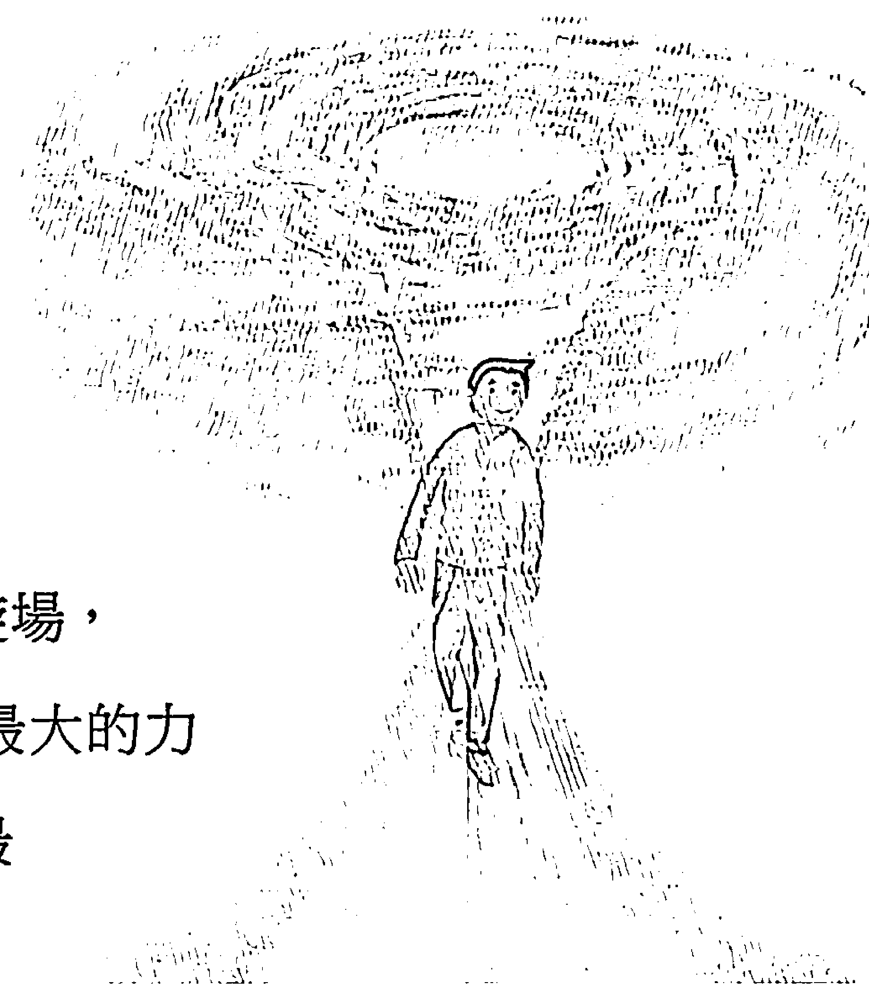

果，虽然可能不是头脑想要的，但是，站在整体的规划，是必须而且最自然的。

我过去提到参，参什么？也是参自己，真正的自己。参，本身最多只是提醒——自己本来就圆满，没有缺少任何一样东西。提醒我们——本来就是祂，就是一切。我用螺旋场的比喻，让它穿透一个人的身体，表达——接下来也没有“谁”可以做为主体。此外，不光没有任何动作的对象，最后，连一个“做”的动作都没有。这么一来，一个人就大解脱。

不过，只要还有这个肉体，自然会发现化不掉这个肉体。这个肉体是过去业力的组合，承认有它，本身也是承认有力。这时候，一个人最多只能不反弹，对样样都可以放过。对眼前的业力、人、事、物，都不去肯定，也不去否定。更不用讲，没有期待，也没有什么想转变，或得到。

透过这种不断的领悟，所产生的“短路”，是这人间不可能理解的，我们也不可能跟任何人分享。因为，分享不光是落在一个理论的层面，还要假设对方有同样的经验。所以，一个人最多只会投入宁静，投入沉默。

每个瞬间停留在沉默，他活出大欢喜，大爱，大平静。我之前在《不合理的快乐》也用这张图来表达——一个人懂了这些，活出这些，最多只是轻轻松松存在。

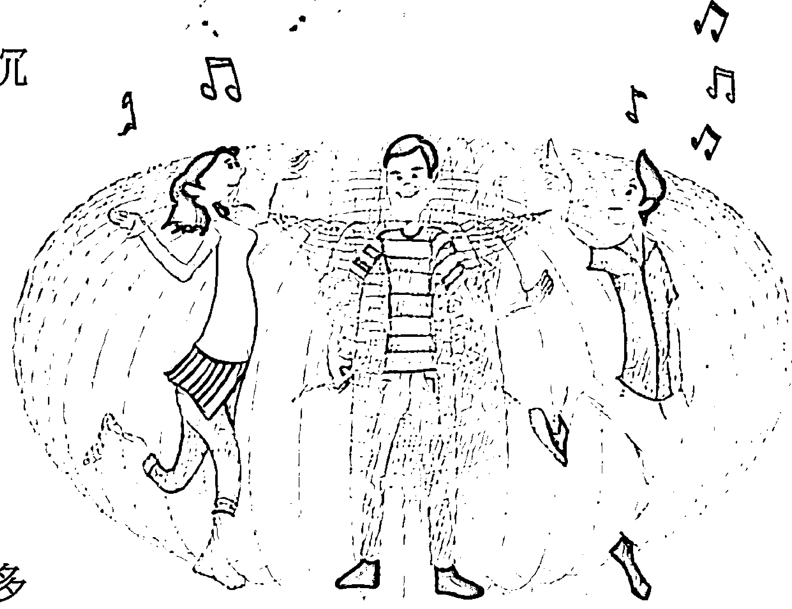

他接下来已经没有一个短路的观念，也就是没有产生一个梯度，一个差异。因为透过他，一体已经短路到底，把每个细胞都贯通，没有一点阻碍。从身体、乙太、星光体、情绪体、思考体（理智体）、宇宙愿心体、宇宙觉知体、灵性体、任何体都完全达到平等，没有什么压力差还可以让意识或生命的力量流过去。这才是大的短路，是我们这一生要来体会的。这种体会，是人生唯一可以说比较重要的目的（假如还有一个目的好谈）。

也就好像，一体，用我们做一个反射，反射什么？反射自己。

我们最多只是一面镜子，不光是一体的镜子——可以轻松反射祂的美，祂最原初的智慧和聪明；也自然变成别人的镜子——每一个人跟我们接触，最多只是反射自己。但是，这自己是真正的自己。

当然，周边的人可能免不了有对立——其实，这也就是我们大家一般的情况。所以，他看到的，可能最多只是反射他的小自己，倒不见得可以了解这种不可思议大的能量状态。但很妙的是，好像心更深的层面反而会领悟到。虽然头脑不断地有矛盾，认为不理性、不存在，跟自己的生活一点不相关，不符合自己认定的常识。但是，在心更深的层面已经受到感染，而会不断地想追求。

我大胆说，这种感染，是永久的感染。很多朋友受到感动，虽然在种种的影响下，可能一忙碌，或遇到人间的喜事或坏事，也就被带走。但是，从我个人的体验，他总有一天还是会回来追求这个真实。也许要到最后一口气，也可能是下一生。这是无可避免的。

因为，我透过“全部生命系列”所表达的，其实是我们的本性。我们不用做什么，不费力。我们就是祂，只是固执

地不承认，非要把全部的注意力投入人间狭窄的范围。拿生命的全部，交换这么一点点人生。

我才会说，“全部生命系列”包括这本书所带来的，就像一枝箭，在你心上刺穿了一个伤口，而这个伤口，永远不可能愈合。心，就打开了一个洞。透过这个洞，你可能会找到解开全部人生的钥匙。

活出短路。一个人倒不需要再去顾虑这一生还有什么好事、成就可以追求或留下来的。他清清楚楚知道，一切都是为了方便往前走，倒没有什么目的，更不用讲有什么短期的目标。一切，顺其自然。

一个人这时自然发现，样样都变成他可以用的工具。这些工具，最多只是拿来帮助别人达到同样的转变。用完了，也就把这些工具丢掉，不会在意有没有留下一点痕迹，一点影子。因为他彻底知道，真正的短路，不可能可以用身体哪一个部位的感受或变化来表达。

连这个肉体、小我都不存在，还有什么必要特别从哪个部位去得到短路？他彻底知道，就是因为小我不存在，我们才有机会解脱，才可以醒觉。假如还认为小我存在，那么，

要解脱或醒觉是不可能的。
这么讲。我相信你已经发现，这里讲的“短路”，和“定”是完全一样的。前面谈身心短路带来的转变，全部跟小定一样，还在一个专注或合一的层面——我们身心合一，进入无思无想，自然把每一个部位彻底净化，而有许多现象可谈。但是，这些都还不是真正的定或真正的短路。大的短路和大定一样，是不费力，不断肯定一体，彻底知道自己本来没有跟一体分手过。最多需要“做”的，是每一个瞬间不做，只是轻轻松松存在，让这个生命圆满自己。
最多让我们发现，本来就是圆满。
只有这样子，一个人自然进入大短路。透过大短路，跨过前面所讲的全部现象，不会重视它们。但是，也同时知道，只要还有身心肉体的观念存在，小短路还是会不断地打开来。
最后，我还是要提醒，前面提到，一体用我们反射祂自己。这句话，认真讲，最多也只是一种比喻。因为一体其实，不用想，也不会看着自己，也不需要反射自己。一体外，什么都没有。连这个“一体”，最多是代表一切都是圆

满。只要我们提到一个东西，或提到反射、看、不看，这本身又回到二元对立。站在一体，什么都没有，只有自己。所以，祂不需要，也不可能可以反射到自己。这也是我们头脑最难懂的。

## 22 业力的转变

全部这些变化，对我，其实最多只是代表业力的转变。

我曾经一再提到，只要认为世界是坚实的，对我们，业力其实存在，而且样样都是注定。

我也提过身体疾病在疗愈过程的好转反应。疾病要彻底疗愈，自然会产生好转反应。在好转的过程中，症状就像录影带回放，有一个浮现的顺序。这个观念，其实可以帮助我们了解业力的转变。

我们本来是一体，但是，透过头脑化出来一个具体的生命，一个世界。人生在二元对立的范围内运作，不断延伸它自己。就像我过去用光来比喻一体，本来到处都是光，却像下页的图一样，从一个角落延伸出一个分别的世界，而且愈陷入角落，分别愈大，境界也愈具体。仔细看，知识愈来愈

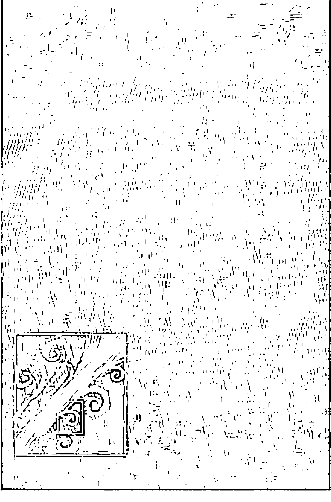

细，愈来愈精确，这就是人类文明（尤其科学和科技）发展的方向。

一个人，假如受到短路，不断地回到一体，自然发现要走的其实是回头路，或说回转的路。我们从来没有离开过一体，是透过头脑把祂忘记，盖住了，才会冒出来一个修行的观念，好像还要透过各种努力、追求，才可以把祂找回来。

如果生命场带来的人生，我们用螺旋来表达，那么，修行，最多是一个和人生反方向的螺旋。一般的修行，表面上都在练习，或苦修。但是，真实，是练习不来，苦修不到的，最多是回到我们本来就有的部分。我才会说是反复或反转的工程。

反转什么？其实最多也只是业力。这么讲，其实是没有什

么可以做的。我才会说“全部生命系列”是没有路的路，没有修行的修行，没有解答的解答，没有解脱的解脱。

过去，我在《神圣的你》用一个个画框来表达瞬间和瞬间之间的关系，后来也不断提到一个人透过参，加上臣服，自然会把瞬间拉长，甚至变成永恒。瞬间拉长，变成永恒的意思是——瞬间和瞬间当中，再也没有区隔，也就是我过去谈过的 eternal now 永恒的现在。这本身就打断了二元对立所带来的连结。

我们平时在讲话、在沟通，都在强调一个意思，才能带来一个意义。假如瞬间变成永恒，随时落在一个绝对的层面，祂产生不了意思，也没有意义，也就是二元对立起伏不来。只要二元对立起伏不来，随之而来的意思、意义、业力已经打断了，我们也就跳出它的作用。

我们透过头脑的投射，本来不断地强化这一生所带来的相对的知识，相对的认知，相对的肯定，相对的限制。回头路，指的是让业力回转。一个人，只要懂了这些，随时把意识落在一体，过去累积的很多想法、习气，自然会想做个回转，想解散自己、消失自己。也就是下页这张图想表达的，

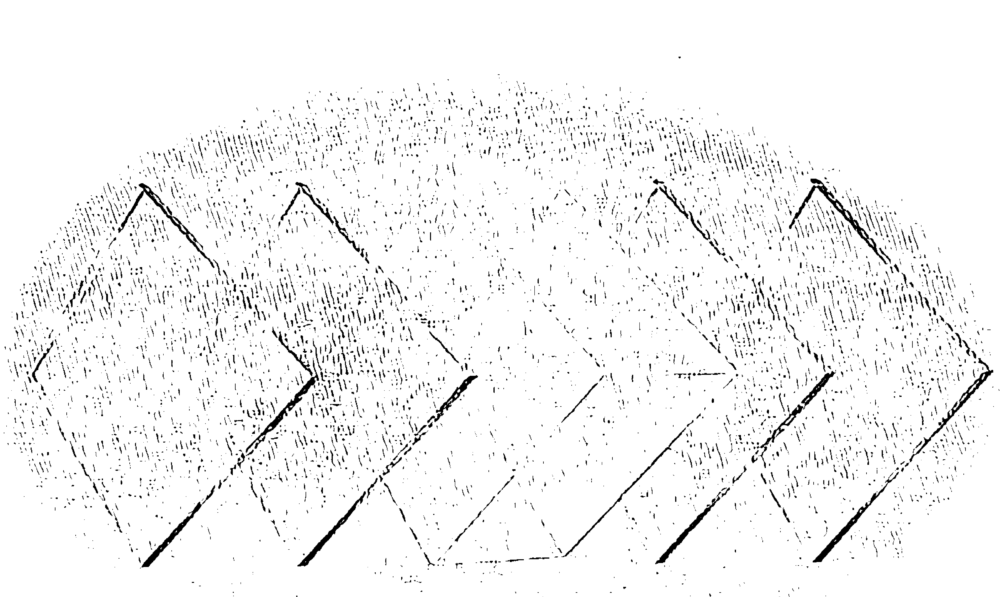

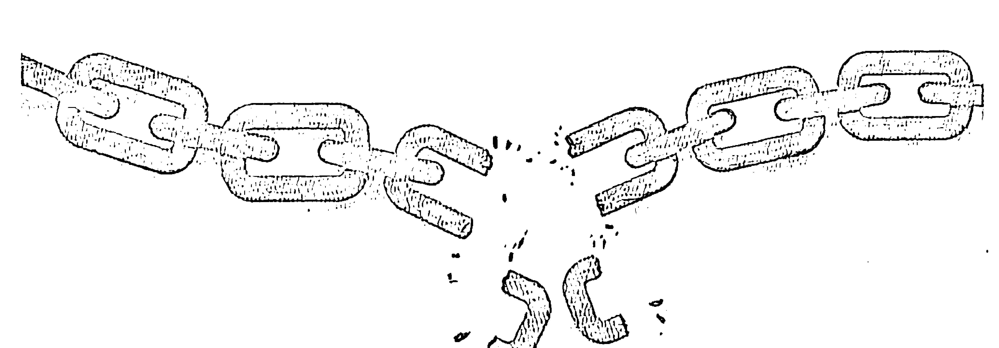

透过瞬间拉长、扩大，业力的锁链也就自然打断了。

在这个短路的过程，会发现各式各样累积的业障，都自然会浮出来。也许是透过记忆，透过感受，不断地从潜意识浮到现在。有趣的是，这些记忆或感受不见得是这一生的，而可能是多生多世的累积，或别的时—空带来的。

一切的现象，都可以把它当作业力转变的经过。比如说，过去可能有一个创伤或恐惧，带来萎缩。这个萎缩，凝固在气脉或身体，造成堵塞，而在心情或身体造出一个伤疤。透过短路，这个部位自然会回转而浮出来，想疗愈它自己。就像鞋带的结，久了，自然会松开。但是，有松开的现象，也就是生命的气或流想通过，自然会产生摩擦，而带来症状或现象。

症状，也许是念头、观念、感受、情绪上的转变。懂了这些，我们最多是面对业力，很轻松做一个见证者，让它扫描过去，不去理它。它怎么来，就让它来。怎么走，就让它走。不去干涉它。如果我们不懂这个道理，而专注在现象的变化，甚至产生反弹，最多只是强化同一个业障。也就好像在火上不断加燃料，反而让它烧得更旺。

即使这些现象一次又一次地转出来，我们继续反弹，也只是永远打不开，永远留下一个结。当然，严格讲，这个结，站在一体的角度，对我们也没有什么损失，最多只是又增加一个层面的幻觉，或在一體上多了一个影子，让我们认为再真实不过，而还会想去抵抗它。然而，站在整体，也没

有什么损失。最多只是耽误了一些时间，让一个宝贵的机会，就这么错过了。

但是，一个人假如真懂了这些，自然知道其实没有损失，也没有什么好后悔或期待。说不定，下一个瞬间又来一个现象，也就自然可以放下，让它消失自己。自然发现什么损失都没有，还可以继续轻松往下走。走到哪里，也不重要，也不需要去干涉。这样子，一个人就轻松放过一切，包括这本书所讲的全部的现象。只有这样子，才不会带给自己无穷无尽的阻碍。

我过去常常讲，不反弹，是我们这一生唯一的选择。

任何其他的动作，人间所看到的一切，其实都是注定的。也就是说，业力本身就是注定的现实。做任何反弹，最多还只是在肯定业力所带来的注定。

很多人听到这些话，可能会相当失望，甚至会认为不可能——“怎么可能？”“我这一生唯一自由的选择，竟然是不去反弹？”“最多只是让业力来，业力走？”“还要肯定一切看到的都是注定？”——好像不反弹的话，我们全部的选择就窄化到一个“不反弹”的范围，而认为这不是自由，反

而更像局限。

针对这一点，以后我有机会再多谈一些。但是，我在这里要表达的是，事实，跟大家的想法，又是刚刚好相反。

也就是说，认为眼前的业力是唯一的现实，这本身才是局限，才是限制，才是制约。也好像我们非要从无限大的整体——一体、内心、在——把自己落在一个小小的角落，而且是一个小到不到兆分之一的可能。而我们非要肯定一个这么小的可能，非要把它当作我们全部的可能，同时，反而还把不可思议大的可能认为是不可能。

所以，选择不去反弹，才是这一生最重要的一把钥匙。选择不反弹，自然让我们进入一个更大的范围。透过不反弹，否定眼前这一个小的可能，知道这个小的可能，完全不足以代表整体——这自然是比我们想像的远远更大的自由。

我过去常说，一体之外，没有其他的体。所以，我们透过这个肉体或身心想转变或开悟，是绝对不可能的。这个身心，本身既然是一个不存在的现象，从它，既不可能去刻意衍生出一个永恒，也不可能有什么开悟。我们本来就有一个

绝对的部分，是无所不在，最多只需要把这个身心挪开，祂自然就浮出来，倒不是我们从身心可以找到或延伸到祂。

我过去谈心流可以在人间带来什么成就，甚至用了相当多篇幅来表达，其实最多只是为了比喻。最主要是因为知道我们放不下人间的变化，所以透过心流，想带来另一个更深层面的希望和鼓励——我们内心有一个比外在更大的力量，不光可以带我们走这一生，而且还会走得特别好，比我们头脑不断刻意规划或安排更好。

我也大胆提出来，只有透过心流，我指的是——头脑彻底交给心，也就是让相对完全臣服到绝对——一个人才可以完成别人没有办法完成的任务，甚至可以超越人间所认为的突破，得到一件不朽的作品。

对于还在人间忙忙碌碌的朋友，或许透过心流的介绍，可以知道人生还有机会做一个彻底的变更。对于从人生的痛苦走出来的朋友，但愿这些话可以带来希望，让他在心中知道——永远会有一条路，可以走出来。

如果有这种信心，自然也不会去重视有没有心流或脉轮打开、不打开。毕竟，站在整体，这些变化，本身也没有什

么代表性。包括一个人的命好到哪里，这本身还是一个头脑的区别，讲到最终，我们也没有一个好命或坏命，因为“命”还是一个头脑的产物。

我是希望表达，这本书所谈的跟我们的生活其实关系密切，而且比我们想像的更直接、更贴近。甚至，一个人假如可以拥抱“全部生命系列”所转达的一切，也就是大圣人留下来的方法，可以影响的，不只是这一生的点点滴滴、每一个瞬间，而甚至是生生世世。

也只有这个方法，过去生生世世所带来的业力，可以彻底一次烧过去，让它告一个段落。我用“短路”来表达的这种转变，才是我们这一生来所要体会的。

然而，就连谈这一生来体会什么，也只是个比喻，最多也只是个幻想。因为真实，跟我们体不体会，一点关系都没有。体会，还是头脑可以运作的。然而，头脑可运作、可体会、可表达的，没有任何一丁点会跟一体有任何关系。

到这里，你看会不会带来另一个层面的悖论？

我会谈这么多，就是因为这几十年来接触了无数的修行者，其中，面对这些表面上的门槛，真正可以理解，甚至度

过的人是相当少。

许多朋友，即使有几十年修行的基础，到最后，还是被这些现象绑住，过不了这一关。也有朋友会认为，非要有这些身心变化，才感觉有进步，而不免对自己失望，甚至对这条路产生质疑。还有些朋友，认为这些现象会让人长生不老或全面的健康，以为只要有这些现象，就不可能生病，更不用说还受到病毒、肿瘤或其他退化的影响。

我也常常听到，有老师教导弟子，把气脉打通或圆满，等同于静坐的成就。甚至会强调一个人气脉要完全打通，才可以解脱。

当然，气脉打通本身是一个放松的成就，而一个人融入一体自然是完全放松，自然清楚地知道，不要说肉体，连意识不存在，自然化回到空。所以，这些放松、舒畅、意识扩大的体验，当然都会有。

但是，真正懂的人，他一点都不在意，也不觉得这些现象或体验有什么代表性。他清楚知道自己还有个肉体，是透过因果来的。即使大彻大悟，知道一切只有一体，但是，这个身体还是要活过它自己。这也就是我过去提到的，古人

所说的“随伴业”(prarabdha karma)。

人的身体，它这一生来，哪个部位要退化，哪个年纪要结束，都是早晚的事。临终前，也可能发生很大的退化或疾病。然而，这跟他个人的领悟一点都不相关。他不会去在意，也不会去管自己身体健不健康，衰退不衰退，也不会在这方面着手。

但是，周边的人包括弟子，看法可能不同。也许看到证道的人身体退化，或行为达不到自己的期待，就用这个角度来衡量他的成就。这本身是错的观念。只是局限的脑去投射圣人或老师应该长什么样子、有什么行为或有什么可以看到的功夫。

我觉得更可惜的是，很多修行者不光对老师有期待，对自己也一样地自然设定一个框架。比如讲话速度会慢下来，要带着一种空或不在意、看开的味道。非要坐，甚至可能是闭起眼睛，一动也不动地坐，非要双盘不可，甚至追求一坐就要几个小时，或可以坚持多久，认为这样，就代表个人的成就。

我相信你我读到这里，已经知道，这些境界或行为，其

实跟一体一点关系都没有，假如我们还可以用“成就”两个字来表达醒觉或短路，那么，这些行为，其实跟任何成就也不相关，本身还是头脑的产物，是我们人投射出来的一个境界。但是也就这样子耽误了自己，甚至可能还要耽误别人。

不光如此，我们还可能用这种标准来衡量其他的人有没有成就。

这几十年来，我个人就像在荒漠里孤独地走，发现这些种种的误解和迷思在人间是相当普遍的，我这次才大胆跳出来，带出一个完全不同甚至颠倒的观点。带出这样的观点，最多，也只是当作一个新的指南针。

但是，假如你我都懂了，最后也可以把这个指南针丢掉。它本身也没有什么代表性。

## 23 每一个瞬间，都可以当作一个反复的修行

从古到今，每一个生命都想追求快乐。最原始的阿米巴原虫已经自然会向养分靠近，避开危险或不舒服。后来比较“高等”的生物，例如人类，来到这个世界都也一样想追求快乐，包括爱和平静。甚至认为这是人类最深的渴望，最高的追求。

然而，颠倒的是，我们从来没有想过，就连这些让我们自然想去追求的特质，最多也只是一体跟我们接触所自然产生的。所以，我们会去追求这些特质，这本身已经是颠倒。明明是我们本来就有的部分，却因为头脑透过烦恼和顾虑把它盖住了，所以还要“找”，还要追求，甚至还有一个小我要去根除。

其实，我们每一个人每天晚上在睡眠中，在无梦的深睡中，都在活出这些特质，只是自己不知道。

快要睡着之前，或醒来刚睁开眼，这时候，念头还没有起伏，但隐约有一个觉。觉察到什么，还不清楚，最多只是觉。

其实，我们那个时候都是醒觉的。这样的片刻，对有些人可能是一秒、两秒或是更长。在这样的片刻，我们自然停留在爱、平静这些特质中。但是，只要我们起了一个念头，就把自己带回人间，带到一个既相对又局限、样样都不可能的世界。

也因为我们随时（至少每一天晚上）都会体验到一体和我们交流而短路的特质，所以，我们的脑虽然不断地排斥祂，但在心的层面却又不断地肯定。就好像心可以听懂，尽管对头脑而言，是想不通的。

这可以解释，为什么你我会一次次想接触“全部生命系列”和古代圣人带来的讯息，而且认为在某一个层面可以带来平静、喜乐和爱。

但是，接下来只要用头脑去解释或表达，也就自然把这

种平静、喜乐和爱消失掉，自然又回到你我自己的小世界。我才敢说，这次带出“全部生命系列”，完全是在做反复的工程。

反复，也只是回到本来的状态或家，甚至就是你我每一天晚上、早上都有的状态。只是，我们透过头脑的遮盖，不知道——把祂忘记了。

假如懂了这些，其实，每个瞬间都可以变成练习。而练习，最多也只是观察，轻松做个见证。假如投入了，从见证者，进入了见证的画面，最多也只是轻轻松松臣服或参来提醒自己——本来从来没有离开过一体，没有离开过绝对。这种提醒，自然把自己带回心或一体。

所以，我才会说一切是反复的。连修行，最多也只是一个反复的提醒，提醒自己本来就在的部分。

这么一来，全部矛盾也就消失。一个人也就自然进入短路的状态。

## 【練習】

我接下來會帶出幾個練習的方法，幫助你我從腦落到心。雖然，這些練習，在過去的「全部生命系列」作品其實都談過。但是，我很有把握，你讀到這裡，而且過去也練習過的話，到現在，你的切入點、熟練度和體會，將會完全不一樣。

首先，要提醒的是，這裡所談的「練習」，這兩個字是我從梵文的 sādhana 翻譯過來的，當然也有人把它翻譯作「修行」。然而，無論翻譯成「練習」或「修行」其實還不足以表達它的意義。甚至，連譯作「靈性的練習」都還不正確。這些譯法，都沒有譯出它所含的臣服、放過這個世界的意思，我才會在書裡直接使用梵文。

真正的 sādhana，最多只是放過這個世界，只是在臣服。也就是說，透過練習，我們最多是在做臣服。臣服給誰？臣服到哪裡？其實只是臣服給自己，真正的自己。一個人徹底可以臣服，生命的短路才會出現，才會徹底把我們短路過去。讓我們消失一切的觀念，包括「我」。

臣服，還含著另外一個領悟——不斷地承認、肯定我們在這個世界可以體會到的，比如眼前的東西、跟誰的互動，一切我們可以體驗到的，都是從相對延伸出來的。而相對，本身是透過比較，有個對立，有個摩擦，才可能產生一個世界。假如沒有對立或摩擦，其實這個世界也不會存在，最多只有絕對的層面。

臣服，最多只是完全領悟到這些。

所以，對這個相對不要產生任何對立或摩擦。就好像相對怎麼來，就讓它怎麼來。怎麼走，就讓它怎麼走。不要在上面再做一個肯定，再把它擴大，而再次肯定它本來不存在的存有。

這麼一來，一個人跟相對隨時不再造出任何摩擦或對立，也就自然發現相對對我們這個人間，不可能再產生什麼作用。一個人也就不知道不覺落在絕對的範圍、一體、無限大的層面。

什麼都沒有做，最多是不讓相對再產生作用。一個人也就回到一體。

也就是說——練習什麼？沒有什麼可以練習的。真實，也是練習不來的，跟練習、動不相關。最多，是把自己交出來，放過這個世界，放過自己。真實，或真正的自己也就自然浮出來。

我在這裡，想進一步提醒的是，透過任何練習，一個人不可能醒覺。

真實，是練習不來的。醒覺，其實也不靠任何練習。任何 sādhana 最多是把我們帶到醒覺的門口，讓我們下定決心——非醒覺不可。但是，最難懂的是，最後，透過練習，透過臣服，我們反而連這個醒覺的決心也都可以放過。一個人，也才不知不覺醒過來。

任何 sādhana 最多是讓我們知道，在人間所看到的一切，充其量是一個集體的、很堅實的幻覺。不光是一切的事情、現象，就連物質的世界，所有讓我們覺得有一個很客觀的存在的，都是幻覺。

這是我們一般人最難懂的。

練習，最多是讓我們得到意識的專一。專一，自然帶給我們淨化——讓頭腦的念頭減少，甚至消失。專一，自然可以體會到，一切都不重要，只有醒覺才重要。

唯一的一條路，是醒覺。因為醒覺就是你的本性，倒不需要去找，不需要去追求，甚至沒辦法練習。最多，只是逼自己發現，沒有第二條路可走，只有醒覺這條路，是非要發生不可的。

到時候，醒覺過來，發現什麼都沒有發生，甚至還會發現所有的練習都是多餘的。只是因為自己不成熟，還認為有一個體、有一個「我」，而有一個醒覺的練習的必要。

但是，坦白講，假如前面這些話，雖然可能理解，但沒辦法徹底領悟到，那麼，我建議，我們還是很謙虛，老老實實去面對每一個練習，每一個 sādhana。從早到晚，把它活出來。

真正的 sādhana 不是透過靜坐，也不是把注意力集中得到專一。真正的 sādhana 最多只是提醒，提醒你老早就知道，老早就有，本來就是你的部分，只是你我都忘記了。

這些練習，隨時可以做，甚至連睡覺都可以做。假如有個練習只有少數時間或情況才可以做，例如非雙盤不可，那麼，我不認為這是 sādhana 。

這一點，可能跟你過去所聽聞的，又是相反。你會發現，我這裡指的 sādhana 又是一個領悟的成就，是把你當作老早已經醒覺過來的人，最多只是透過練習，輕輕鬆鬆再一次，再再一次，在每一個瞬間，給自己做一個輕輕的提醒。

醒覺，是不費力的，而且不是靠「我」，不是靠我們任何努力的成就。反而是生命來醒覺我們，是神聖的恩典來醒覺我們，短路我們。

我認為，這才是看待任何練習的正確觀念。

接下來，我希望我們透過這裡每一個練習，都在重複這些理解。自己做個對照，看可不可以完全投入。我相信，假如你有這種領悟，那麼，這些練習的角色和作用，會完全不一樣。

最後，輕輕鬆鬆，把全部觀念都挪開。包括這本書所講的，全部的觀念都挪開來，再加上練習，輕輕鬆鬆下一個決定——我這一生，非要醒覺不可。

### 一 睡眠的練習

睡眠，其實是練習最好的工具。
在沒有夢的深睡，反而跟我們的本質比較接近。但是，因為我們通常不知道，覺察不到，所以也自然好像變成一個昏迷的狀態，而忽略了它本身其實含著一把重要的鑰匙。
假如一個人可以覺察到無夢深睡，自然會發現過去所追求的重點，完全是不正確的。我們透過靜坐或其他的練習，通常是想「體會」到什麼、「領悟」到什麼、「認知」到什麼——這些，全都是錯的觀念。我們不知道的是，全部這一切都離不開頭腦的作業，離不開二元對立。
我們想要追求的，其實是一個最原始，最純的覺。而這個覺，是不分別的覺。這個覺，可以覺察到一切，甚至可以覺察到自己。但是，祂跟我們一切頭腦的作業不相關。
講不相關，其實也相關。因為在每一個瞬間，在每一個頭腦投射出來的現象，祂都含在裡面，只是我們不知道。

我們在無夢的深睡中，一個人其實自然是醒覺的。但是我們覺察不到，也就錯過了。知道了，那麼，睡前和剛睡醒的時候，是很重要的一個門戶，是我們每個人都值得投入的，可以把它變成一個最輕鬆也最有效的練習方法。

我們自然會發現，在睡前和剛睡醒的時候，用這些方法，也是最好的克服失眠的功課。不光可以讓睡眠的品質有很大的提升，而且自然會消失失眠的困擾。因為失眠本身反而帶來最好的練習機會，最主要，讓我們體會到什麼是「在」。而睡醒後，會發現可以讓我們輕鬆而正向地面對一天的事情，讓我們比較容易（甚至隨時）體會到一體——我們自己的本質。

晚上睡覺前，透過參，來守住自己每一個動念。

任何念頭來，任何感受，無論是好是壞，美不美，正向還是帶來恐懼，心中有憂鬱、窩囊、煩惱、不安、失落，即使踩不了剎車，但是，事後體會到的時候，就可以參：為誰，有這些念頭？誰心裡不安？誰不舒服？誰有失落？誰認為沒有一個人可以理解？誰失望，甚至絕望？誰在煩惱？誰顧慮到明天？誰放不下過去？誰受傷了？

答案，當然是——我。

那，我又是誰？

用這種方式，任何念頭來，任何感受來，不斷地問自己——誰有這個念頭？誰有這個感受？自然發現——是我。

那，我又是誰？

只要有念頭，甚至睡到一半，想喝水、上洗手間，醒來了，過去可能擔心這是一種失眠的現象。現在，你什麼都不用做，可以選擇輕鬆延續這種參的方法。問：誰心里不安？誰知道自己醒來？誰在擔心？

答案，當然是——我。

那，我又是誰？

透過「我又是誰？」會發現停留在一個沒有答案的空間，輕輕鬆鬆看著這個空檔，看著有沒有任何念頭在這個空檔起伏。起伏了，馬上用參去面對它。重複再重複。

這個空檔會慢慢擴大。這時候，好像可以體會到什麼是覺。但是，接下來覺察什麼，不重要。只要還有一個東西好覺察，就用參不斷地回來。

假如在睡前做參的練習有困難的朋友，可以輕輕鬆鬆地用之前提過的 I-Am「我－在」、「我－是」、「我－我」的練習。不斷觀察呼吸，輕輕鬆鬆把「我」擺到吸氣，「在」擺到吐氣，不斷地重複。

或是也可以不斷地，把任何念頭交給上帝，或自己最尊重的形象——佛性、一體。用最誠懇的心，不斷把一切交出來，交給一體。

### 二 「面對一天」的練習

早上一睜眼，知道自己醒來了。那時候，不要急著起身，剛好可以做一個參的功課。

只是輕鬆地注意到，醒過來之前，有一個空檔——沒有念頭，最多只知道醒了，但沒有任何多餘的想法。

這種空檔，可能是一秒，兩秒，甚至十秒。但是，接下來，也就自然開始會注意到——這是我的床。我還躺在床上。我可以看到天花板。牆上有一個圖案。昨天某某人講話，讓我很不舒服。我之前被人欺負，很委屈，我很倒楣。我今天還要完成一個很重要的工作，但還沒有準備好。早上，要趕到哪裡。我還要準備吃早餐，晚上還有應酬。我好像還沒有休息夠……一連串的，念頭就出來了，也就再一次建立這個世界。這個世界，又重新變得真實不過了。

這時候，雖然踩不了剎車，但是可以見證到這些念頭，是很重要的，問自己——為誰，有這些念頭？誰有這麼多豐富的感受？知道自己失落憂鬱、受傷？誰，為今天、明天、未來煩惱不放心？

是誰啊？

這時候，誰知道自己醒來了？答案又是我。

那，我又是誰？

一樣地，不斷地用參，讓自己停留在一個空檔。這個空檔，是覺的空檔——是輕輕鬆鬆在覺，但是，不知道覺察到什麼，也不重視覺察到什麼。只要知道覺察到什麼，最多是一個念頭，也就用參帶回來。

這時候，一個人可能停留在清楚的覺，一秒，兩秒，不知不覺，就把時間拉長了。但是，念頭早晚還是會浮出來。這時，再重複參。可以多重複幾次，不要急著起床。

起床後，要刷牙、上洗手間、吃早餐、上學或上班，都不斷重複在參。比如誰在刷牙？誰知道自己在穿衣服？誰知道自己在看鏡子？誰知道自己在吃早餐？一個人自然發現自己進入一種沉默的空檔，而且最珍惜這種寧靜的狀態。

這樣的練習，對接下來的一天，面對事情、世界是最好的準備方法。同時讓你我徹底體會，什麼是醒覺的覺，而這個覺本身就是定——大定。一天下來，我們還是難免會被帶走，會投入眼前的人或事情。但是，有了早上所建立的基礎，也就發現很容易回到參的練習。甚至，參的練習，變成我們一天下來最常停留的動態。而且，透過這個動，自然進入不動。這裡講的動或不動，最多只是在講念頭，跟身體的動一點關係都沒有。

用另一種語言來表達，也就是身心在動，但是沒有誰，在負責這個動。

試試看，一整天下來，可不可以每個瞬間都自然變成 sādhana，都變成練習。隨時可以把瞬間當作門戶，清清楚楚知道，這一切都是幻覺。透過參，不斷提醒自己本來就在家，就在一體，從來沒有離開過。只是因為種種原因，被這瞬間帶走了。只要知道了，也就又回到了一體。也就這樣，每個瞬間自然變成最後的 sādhana 或者練習。

跟前面的練習一樣，假如進入參的練習有困難，也隨時可以用「我－在」或臣服來著手。

一醒過來，只要自己知道有一口深的呼吸，輕輕鬆鬆把注意力集中在呼吸。一進，一出，都清楚知道。

吸氣，也觀察到。吐氣，也觀察到。一進，一出，都清清楚楚可以觀察到。自然發現不管它，呼吸不光慢下來，還會比較深。吸氣深，吐氣也拉長。

但是，只是觀察到，都不要去影響。

這時候，輕輕在吸氣時，在心裡，加上一個「我」。吐氣時，在心裡說「在」。這就是「我-在」的練習。

一樣的，也可以做臣服。透過臣服，最多只是把任何前面產生的念頭交出來，交給上帝，交給佛，交給一體，交給宇宙。知道，一切都是完美。

有沒有雜念，有沒有任何感受，跟完美其實一點都沒有關係。因為我們老早完美，人生也是完美。最多，是透過「我-在」或臣服，來肯定一切本來是完美，我們本來就是完美。

我們本來就沒有跟神分開過。這個事實，跟眼前所有的念頭和感受一點都不相關，也不會受它們影響。所以，一個人最多是把種種感受，種種念頭全部交出來。

「我-在」或臣服，跟參一樣的，最多是一個肯定、提醒。也只是讓我們不斷回到——本來就從來沒有離開過我們的完美本質。

### 三 Netti Netti 不是這個，不是這個

我們練習到這裡，也就自然會開始採用一個咒語：
Netti netti（不是這個，不是這個），或是之前說的——不是這個，不是那個人。

一個人從早到晚，都不斷提醒自己這兩句話，也就自然進入了最高的真實。

這兩句話，最多也只是表達，在這個人間所可以看到、體會到、表達出來的一切，無論多美、多深刻、多崇高……都跟真實沒有什麼關係。一樣離不開我們的頭腦，離不開對立，離不開相對、限制、制約。

所以，透過這個世界，想找到真實，是不可能的。我們最多只能否定一切。我指的一切，是包括我們這一生全部學到、看到、可以表達出來的。甚至，就是不能表達出來，但可以領悟到的。
只有否定一切，否定相對、局限、制約的世界，我們真正的自己，也就是我們這一生想找的一體，才可以自然浮出來。祂其實跟我們一點都不相關，然而也從來沒有離開過我們。但是，就是因為我們聽不懂這些話，還不斷產生質疑，所以，表面上我們還要做一點東西，也就是——否定它，否定一切。

假如我們選擇輕鬆的存在，最多只是停留在「在」，不斷的「在」，每個瞬間都「在」，自然發現——我們想找的，已經在眼前。連一個否定的練習，也自然是多餘的。是一個人完全不找，不期待，不反彈，從「做」輕輕鬆鬆挪到「在」，祂才會浮出來。

浮出來後，我們自然發現自己其實從來沒有離開過祂。

假如你把這個練習——不是這個，不是這個——當作你最親密的朋友，你自然會發現，這一生想找的所有答案，會從你心裡自然流出來。你也就輕鬆地進入短路。至於誰短路誰，已經都不重要了。

或是，更精確一點的表達，已經根本不存在了。

因為沒有一個東西叫一體、心，更沒有一個東西叫「我」、「我們」、「你」、世界。更不用說，還有什麼東西叫做「短路」。

但是，正因為你可能還是很難相信，甚至還可能質疑，我最多只能勸你——還是繼續練習下去吧。

### 四「一切都好」的練習

一個人，假如之前很認真練習，甚至把「全部生命系列」的練習都做過，也自然會發現——其實什麼都不用做，一切都好。老早、本來都好。只是我們認為自己或世界還有什麼地方不好或不完美，還需要我們去克服、去改善、去變更、去抗議或需要有意見。

懂了這些，本身就是最好的練習。我指的是——

一切都好的練習——

It's OK. It's all OK.

There's nothing that's not OK.

OK，一切都OK，一切都剛剛好。沒有一樣東西不是OK。

從早到晚，面對任何煩惱、失落、心裡受傷、受到委屈，面對不喜歡的人、不好的事，最多只是提醒自己——

一切都好，一切都剛剛好，都是我剛剛好需要的。是我需要學習的。全部都在準備我，讓我走到這裡。所以，一切都剛剛好。

或是單純用 “Thank you.”「謝謝」來表達一切——表達對生命感恩，知道一切都是自己業力組合造出來的，沒有什麼東西可以計較。雖然眼前的事或接觸的人叫我心裡不舒服，但因為有更深的理解，所以，最多只能在心中浮出「謝謝」。是對這樣的領悟——謝謝。

你可以選擇自己熟悉或可以接受的語言，把這句話當作自己的咒語，從早到晚都重複它。

假如習慣了，自然會發現，遇到大的損失或煩惱，念頭和情緒自然會踩個剎車，而讓我們心裡得到療癒。接下來，遇到任何事，甚至好事，一樣會發現有它的作用，會讓我們體會到無常，而同時讓我們消失念頭，就連好事，都可以放下。

好、壞分別的觀念消失了。自然發現，全部看到、體會到、可以用語言或念頭表達的，都離不開頭腦。所以，沒有一件事有絕對的重要性，甚至還有真正的存在。任何事，來了，也就走了。是透過我們的念頭，才讓它變得有生命可以延續，而帶給我們數不完的煩惱。

肯定或感謝一切，本身已經含著臣服、奉愛和參。最多，也是在肯定或感謝我們老早就有的層面，而這個層面，從來沒有離開過神。也要記得，這種肯定，完全不是投降。並不是對眼前的狀況投降，並不是認為一切也就只是如此。

肯定和臣服的意思是——雖然眼前不順，但其實，一個人徹底可以看穿，可以領悟到有一個一體在運作，而眼前最多是一個業力的轉變。不斷肯定這個真實——任何狀況蓋不住的真實，也就是我們這裡所說的肯定。

進一步說，不是肯定或感謝眼前的經過、接觸到的人事物。肯定和感謝的對象，不是別人或別的事，反而是自己——真正的自己。也就是神、一體、全部。

這種肯定和感謝的練習，其實，是對眼前所經過的人事物反而帶來一個否定，否定一切所體驗的還可能有絕對的重要性。到最後，沒辦法否定的一切，這本身才是我們真正所肯定、感謝的一切。

也就是說這個練習包括全部其他的練習，到最後都含著臣服和參，甚至都含著 netti netti——不是這個，不是這個。

其實，我們接不接受，對真實一點關係都沒有。我們接受，也是如此。不接受，還只是如此。對真實，沒有帶來任何不同。但是，因為我們不理解真實，所以，肯定或不肯定每一個瞬間，對我們自己影響很大。如果我們不接受每一個瞬間，繼續反彈，最多也只是在肯定業力，甚至是讓眼前的業力不斷地延伸，不斷地擴大。反過來，只要我們可以接受、可以肯定每一個瞬間，讓一切順其自然，我們反而最多是讓眼前的業力完成它自己。

肯定每一個瞬間，也是代表不去干涉業力本來的運作，它自然就順勢消失自己，而把過去累積的能量消散。懂了這些，這種接受，是一種很平靜的接受。同時，也帶來一種否定，否定業力有任何重要性。於是，眼前任何狀況，都可以變成一個門戶，都可以看穿。

一個人假如從早到晚，甚至在睡前，剛睡醒，都可以不斷做這個練習，自然會走到一個最高的真實的門口。我過去會用英文這麼表達：

> No-thing in this world is real.
>
> In this life, no-thing is real.

That which is real is nothing.

在人間，在這個世界，沒有一樣東西，一件事，是真實的。

真正真實的，什麼都不是。

一個人也就自然體會到，莎士比亞所說的 much ado about nothing 無事生非，或用我的白話來表達——可以做，可以講，可以描述，可以想出來的，都是多餘的。

包括這個練習，和「全部生命系列」所帶來的觀念，都是多餘的。

### 五「我－我」的練習

一個人走到這裡，自然會發現，每一個修行的法門，甚至每一個練習，都是相通的。臣服或是奉愛，自然也含著參。而參，自然也回到臣服。在這個相對的世界，樣樣都是幾面一體，而這個一體，離不開任何層面。所以，從每一個角落，都自然可以回到一體。

一體，什麼都不用做，本來一切都圓滿。圓滿的意思是——最多只有一體，除了一體之外，沒有其他體。所以，再怎麼練習或修行，也都是做不來的。不光做不來，而且，沒有任何做的必要。

懂了這些，我們也自然發現，「全部生命系列」所談的 I-Am「我－在」或「我－我」也就是一個很好的提醒。
我過去都會提到，「我－在」或「我－我」的練習，對一般人比較容易。也會說，假如一個人沒辦法參，沒辦法臣服，透過「我－在」或「我－我」，配合呼吸，加上見證，是一般人比較容易投入的練習，而可以帶來一種專注。專注了，念頭自然減少，甚至消失。這樣子，比較容易再回到參的練習。

但是，你熟練了「我－在」或「我－我」的練習，也自然會發現，它既適合初學，又同時含著最高的真實，本身也可以說是一個最高階的法門。絕大多數人都認為「我－我」是最容易做的練習，這本身就已經指出了這個最大的秘密。

講個透明，「全部生命系列」想帶來的，都是反覆的。一個人要醒覺，最多只是下一個決心，也就醒過來了。跟任何做、練習、法門都不相關。醒過來後，自然發現什麼都沒有發生，而醒覺本身就是我們的本質。最多，只是醒過來後，我們徹底地知道而再也不會有什麼質疑。跟一般人的差別，最多是在這裡。

「醒覺就是我們的本質」也同時是大膽地承認，我們其實跟神、跟一體、跟佛性一點都沒有差別。我們其實就是祂。「我－在」或「我－我」的練習，最多也是在肯定這個領悟。透過每一個呼吸，我們不光是在肯定，而且是在心中坦蕩蕩地聲明——我就是祂，我就是神，神就是我。

除了我——大我，宇宙的我，整体的我（是一体，也是空）——没有「其他」。

一切，都是祂。只有祂。没有东西不是祂。

你我都是祂。

这种声明，在初学的时候，是带来一种安定、专注。就像咒语的作用一样，透过重复「洗脑」，落到潜意识，让这个观念变成我们的真实。不知不觉，让「我」和大我合并，跟真正的我完全结合。

走到最后，自然会发现——这本身也含着我们最高的领悟，透过最平常的动作，也就是呼吸，我们最多只是再带来一个轻轻松松的提醒。透过我们的内心，做一个清楚的声明。

「我－在」或「我－我」的练习也是在表达，只有本体，而除了本体之外，什么体，包括客体，都不存在。其实，这还只是一个比喻。比较正确的表达是，连本体都没有，都不存在。

「我－在」或「我－我」的练习最多只是含着本体或是空的意思。本体或空，什么都不需要做。甚至连「领悟到自己」都是多余的。一切老早都圆满。不可能不圆满。所以，「我—我」最多只是声明我们的本性，也就是圆满。

一个人，只要诚恳去做「我—我」的练习，这力量是比天翻地覆还大。其实，我们每一个人（我指的是真正的自己）的潜能，不只能翻天覆地，力量是远远更大，只是自己不知道。知道后，我们最多只是轻轻松松选择用「我—我」两个字来做一个不费力的提醒，再一次在心中做个声明。

有时候，事情把我们带走——带走，最多也是让我们把注意力投入二元对立的人间。但是，透过「我—我」两个字，也就自然踩了一个刹车，做了一个反复，把注意力带回到我们本来就是的整体。一个人，也自然发现什么都没有损失，而什么都没有发生。最多，只是我们又接回轨道——跟一体插对头。

也就那么简单。

接下来，我们就一起来做这个练习，活出大圣人带来的最珍贵的礼物。

每一个呼吸，我们都知道。

呼吸长，呼吸短，我们都可以观察到。

一进，一出，我们都可以见证到。
我们选择不去干涉呼吸，最多只是看着它，放过它。
看着它，再继续放过它。
再看着它，再继续放过它。
这时候，轻松的在心中，配合每一个呼吸，我们在心里说「我」。
吸气，在心里说「我」。
吐气，还是在心里说「我」。
透过每一口呼吸，最多只是贴着「我」。
也只是透过「我」来肯定——吸气，吐气。
接下来，吸气，吐气。
不断重复。
「我」以外，什么都没有。
假如有杂念，还是带回到「我」——从心中流出来的「我」。
做下去，自然发现吸气和吐气已经没有差别。
「我一我一我一我」也就自然把一切连起来了。
再继续练习，自然会发现是透过这个我，也就是大我，在观察一切。

眼前再怎么不顺的事、再大的灾难、多痛的失落、痛心的刺激，我都清清楚楚知道。我最多，也只是透过这个我，在看一切。清清楚楚知道，人间可以体会到的，跟真正的我，跟真正的本质一点都不相关。

样样，我都可以放过。最多只是不断回到呼吸，回到我，回到心中的我。

连遇到最好的喜事、得奖、别人赞美、中大奖，我都可以放过。我都知道，全部，都跟一体分不开，而我就是祂。

「我－我」可能带我到哪里，我也不再追求，对我已经不重要。最多，我只是透过每一口呼吸，透过每一个「我－我」，面对每一个瞬间。

透过「我－我」，我自然可以活出欢喜、宁静、爱、在・觉・乐。

全部的念头，也就跟着消失。

其实，还没有起伏，老早已经消失了，因为本来就不存在。

甚至连我这一生所带来的的小我，也都不存在。

只是因为我过去不懂，所以还认为需要去克服它，甚至消失它。现在懂了，我最多只需要透过「我—我」，透过每一口呼吸，把我真正的自己想起来。

也就那么简单，自然发现我老早已经「短路」了。

### 六 平等心

一个人假如不断地参，从早到晚，甚至睡觉都在参，知道全部可以体验的，都还是幻觉，最多只是在一个很窄、很有限的范围，透过头脑延伸出来的；知道任何眼前的东西——不是这个，不是这个，都不是，跟真实都不相关；知道一体其实 in 另一个轨道，自然会进入一个状态，认为一切都好，最多只剩下我们的本性。

再透过「我一我」不断地提醒，一切都没有离开我们的本性。除了我们的本性外，没有一个东西是永恒的。其实没有一样东西或一件事情比其他的东西更重要或更不重要。这么一来，一个人样样都看成平等。

虽然简单，其实也可以说这是最难的。

在这个人间，我们从早到晚可以见到的人、事、物，随时都在把我们带走，让我们陷入一个局限的范围。

到这里，最好的一个练习，也就是把这最究竟的真实活出来。从早上起来，到晚上，见到每一个人、每一样东西，都提醒自己——其实，一切都是平等的。

本来，有些人是我们不会打招呼、不会感兴趣、也不会想多问的。现在，遇到了，也就可以当作练习。当作一个全新的经验，试着多接触、多问。在每一个相遇中，不断体会——一切，都是平等。

也许是现在站在旁边的陌生人，或一个不起眼的服务的人、打扫的同事、送货的朋友，平常虽然见到，但不会打招呼，不会好奇他的生活的。现在，遇到了，我们可以主动多问几句，就好像第一次见到、想多认识这个人一样。这带给我们一个最好的练习机会，在每一个全新的认识中，不断提醒自己——一切，都是平等。

到了中午，搭电梯遇到的人，吃饭时刚好同桌的人，买东西时结帐收银的人，都一样的。我们不只是带给他一个友善的笑容，还多问几句。也许是好奇想知道对方这一刻的心情，想知道他工作会遇到怎样的人、怎样的事。我们就像第一次认识一个朋友，自然会想知道更多，想体会更多。透过这样的相会，不断地提醒自己——一切，都是平等。

下午开会，也许是从来不敢跟他说话的主管，也许是别的部门不怎么熟悉的同事，也许是去拜访客户时遇到的接待人员，也许是搭计程车遇到的司机，也是一样的。全部当作一样的，就是我们在这一天、这一刻第一次遇到的一位朋友，让我们透过眼前的这个人——他所过的生活，所重视的事，所关心的人，这一刻的心情，不断地提醒自己——一切，都是平等。

下班了，刚好一起走出捷运出口，一同在路口等红绿灯的人，在信箱前遇到的不熟悉的邻居，散步时遇到的遛狗的人，也都一样的。都可以试着多接触，就当作这一天的练习，不断地提醒自己——一切，都是平等。

这么一来，可能会发现，无论在哪一个角落，没有谁是真正的陌生人，也没有什么是熟人。无论谁，都是一样的，都是人。我们都可以当作平等。每一个瞬间，我们都可以投入，没有谁比较重要或不重要。这样每个人对别人比较没有区隔，不会把谁分成比较重要，而又把谁分成比较不重要。

到了周末，或早晚散步，看着眼前每一棵树、每一朵花、每一块石头，自然都发现是平等的。而知道，差异完全是头脑投射出来的。

既然是平等，没有一个东西比其他东西更重要或更不重要。我们自然可以把注意力停留在一块石头、一朵花、一棵树，就好像是第一次见到。试试看，可不可以多注意它，看到它长的样子，它有什么特色，都在心中描述出来。

随时回到这个练习，一个人自然发现，不光是事和事平等，人和人平等，东西和东西平等，好事和坏事平等，连我们一般不会拿来谈平不平等的——比如人跟东西、东西跟事情，其实都是平等的。

每一个瞬间，瞬间和瞬间中间是平等的。这么一来，没有一个瞬间，比别的瞬间更重要。

这种体会，看看可不可以透过练习活出来。

一个人也就不知不觉，进入大平等心。知道活这一生，没有一个命，比现在这个命更好，也没有一个命比现在这个命更不好。来到这里，其实哪里都不用去，甚至没有别的地方可以去。没有一个命需要改，没有什么事情需要修正，更没有这个世界需要改变。

一个人，也就轻轻松松跳出这个人间，而同时还活在人间。这也就是有基督信仰的朋友常会说的"Being in this world, but not of this world."活在这个世界，但又不属于这个世界。

甚至，到头来，连醒觉、不醒觉其实都一样。两个状态，甚或没有状态、各种状态都是平等的。每一个瞬间完全可以放下，可以让这个瞬间活出它自己。

一个人，也就这样子不知不觉就醒过来了。在醒的过程，也知道没有什么差异。

在每一个瞬间都没有差异，一个人，自然就是醒的。

### 结语

我在前面所讲的，都是「短路」的现象。会有那么多现象可谈，是因为我们认为这个世界很坚实，放不过它，而认为有一个体叫做小我，或是小的自己。认为这个小我的体，有一个独立的生存（self-standing）。同时，也认为自己这一生全部的可能，都要从小我来活出来，来观察。所以，前面所讲的身心的变化，最多也只是从我看着一切可能。

这也是我们一般修行的观念，认为一个人要透过很诚恳、很投入地修行，才可以得到这些变化。

我在这里，要再一次提醒，这些观念，其实并不正确。

是的，确实有这些变化，而且，还有其他数不完的变化。这些变化，我们每一个人都可以亲自去体验，去验证。去验证了，你自然会发现，这本书所讲的，不仅全部都可以重复验证，而且跟古人留下来的纪录，都没有不一致。

但是，我提出这些变化，主要的目的，最多还只是希望你我建立自信，对「全部生命」的观念抱着信心，同时知道，科技再怎么发达，人能够懂的，都还是有限。所以，我最多是希望我们每一个人可以投入全部的生命，而这种投入不是往外去寻，是向内去沉淀。这些变化，自然会活出它们自己，倒不需要我们去追求。

这些现象，最多也只是生命场带给我们的礼物，是你我每一个人都有的。但是，假如锁定在它们身上，想要追求，希望重复，一个人自然又把这个人间当作很坚实，还是一样不断地在局限自己。

一个人要有勇气，不断往内心投入，身心带来的任何变化，都把它放掉。这些变化和现象再怎么精彩，其实还是离不开二元对立。一个人到最后，活出全部生命的可能，其实连一个境界、一个现象都讲不出来。更可能是懒得去讲，因为跟整体不光是感觉不成比例，其实根本不相关。

这才是正确的态度，去面对生命。

我等了那么多年，才跟大家做一点分享，也是因为舍不得看大家走冤枉路，投入这个人间，投入这些身体的变化，想要得到另一个更完美的状态，一个更圆满的境界。这些，其实还是妄想。但是，完全否定这本书所谈的现象，本身也一样是妄想。最多，只是表达一个人的无明。

讲这些话，不是在批评。严格讲，只要有这个肉体，站在这个肉体的角度，每个人都一样，不可能不无明。

最完整、最彻底的短路，其实倒不是身体的转变，而是意识的转变。这一点，刚刚好又跟一般的想法颠倒。颠倒的是出发点，是——意识为主，只有意识是永恒的，一切其他（包括任何物质，或任何体）都是一时的，最多只是无常。

短路或是领悟，最多只是生命的一体，透过意识场和生命的螺旋场来短路我们，而在这个过程，产生了那么多可谈的变化。继续短路到最后，我们也会发现，其实也没有一个体，无论是肉体或身心，可以受到短路。因为它本身不存在，是幻觉。

最后，讲到短路，是短路自己短路自己。而最多我们也只能讲，是透过短路，体会到真正的自己（Self）。一个人，也就不知不觉醒过来了。

## 杨定一博士文字作品

| 作品 | 描述 |
| :--- | :--- |
| **真原医** (平装316页／附螺旋拉伸 DVD) | 以转变的心念重新去理解世界或帮助他人，已踏出了自我疗愈的第一步。真原医（Primordia Medicine）是身、心、灵全面且完整的健康生活体悟，是最古老却也最经得起时间考验的预防医学。 |
| **静坐** (平装291页／附静坐导引 CD) | 静坐等同开发一个大脑神经新回路，放松心智，让身心重回和谐、完整。深一层是对生命全新的领悟，完全沉浸于慈悲、智慧、与喜悦之中。 |
| **全部的你** (平装381页) | 全部的你，是古人留下来的最完整的哲学系统。是包括智慧，又包括慈悲的大法门。这个传承自古以来，到现在没有断过。因为宇宙本来就是醒觉的，而我们就是宇宙的一部分。透过这本书，希望可以把读者一起带回到自己的心。 |
| **神圣的你** (平装397页) | 本书的「神圣」，反映的是内在生命和外在世界的接轨，达到最和谐、最完美、最平安的境界。如何去整合内在生命和外在世界，是本书想探讨的主题，带来另外一个层面的理解，完成转变的旅程。 |
| **不合理的快乐** (平装375页) | 真正的「全人快乐科学」，由哲学、灵性层面着手，透过「臣服」与「参」，运用现代人最丰富的头脑与感受，彻底翻转生命，和读者一起进入「不合理的快乐」。 |
| **我是谁** (平装187页) | 透过现代的语言，运用无时无刻的念头与感受，让注意力从「脑」落回「心」，体会「在」，甚至古人所谈的「空」。十七章解说、十四个与生活紧密结合的练习，解开古人「悟」的奥秘，陪伴你我重新探访华人的智慧宝藏——「参」，活出生命最简单、最根本的宁静与喜悦。 |

## 全部生命系列

| 作品 | 描述 |
| :--- | :--- |
| ### 集体的失忆 (平装 158 页) | 醒觉，其实是简单再简单，只是把原本属于你我的一体找回来。这本随身指南，站在「一体」或「在」的层面，帮助读者对照自己对真实、对领悟的理解。每一章内容精简，值得用心来「读」与「参」。 |
| ### 落在地球 (平装 179 页) | 解脱，其实是打破「人」的制约，跳出「人」的处境和特质。醒觉过来，从地球的束缚解脱，我们才真正爱护地球，而真正成为地球的住民。 |
| ### 定 (软精装 228 页) | 贯通全部意识的连结，我们称为「定」。可以追求的定，是人间的定，短暂的定，在这本书会称之为「小定」。然而，这里想带出来的，是永恒、无限大、大喜乐当中的定，或说「大定」。最有意思的是，这里所称的大定，比小定更不费力。活出大定，比我们每个人想的都更简单。 |
| ### 十字路口 (套装三本，共 589 页，附音频卡片) | 对每一位提问的读者，他的问题是最重要的。 对每一个诚恳的提问，我也只能诚恳的回答。 无论什么切入点，我还是希望把它带回到心。 |
| ### 插对头……还是接对头？ (软精装 199 页) | 杨定一博士实验创作第一现场，文字语音全纪录 (书附 278 分钟随身音频)。本书用问答的形式直接切入，希望落在更深的层面，让大家走出来。真正重要的，除了醒觉，也只有醒觉。 |
| ### 时间的陷阱 (平装 305 页) | 全书以科学和哲学切入时间的本质，透过生活每一个角落的点点滴滴，搭配十九个随身练习，陪伴你我一步步走出时间的陷阱，带你找到时间的出口，再怎么「没时间」都要把握这本书！ |

## 影音作品

| 作品 | 描述 |
| :--- | :--- |
| **螺旋舞** (DVD + 书 123 页) | 螺旋是宇宙最原始、最强大的力量。源自最古老养生修炼的螺旋舞，将人体的两侧对称作为工具，以中脉为轴心，轻松画一个∞，可以说是动态的静坐。透过最少最简单的「动」，达到最大的身心合一的效果。 |
| **结构调整** (3 DVD + 书 215 页) | 重复的动作习性，本身就带来因一果的制约，累积因一果的作用。要彻底的逆转，需要一个回转的动作，解开落在身体和结构上的因一果的结。通过简单的螺旋拉伸运动和疗效姿势，跟着影片的速度慢慢进行，每个人都可以自我调整。 |
| **蜕变・重生** (一日共修实录) (4 DVD + 小册) | 2016.06.25 杨定一博士在台首场六小时共修全纪录，全部生命系列书籍、音声作品精华浓缩，六个小时亲自引导实录，理论与实修循序渐进，交会贯通，带领一起融入更广大的一体意识。需要你亲自用「心」来品尝与体验。 |
| **这里・现在** (一日共修实录) (4 DVD + 小册) | 2017.03.25 国父纪念馆「这里！现在！」一日共修影音全纪录，完整细致呈现。从臣服到参，一步一步引导，超越头脑制约，回到生命真实。结合光与声音的观想、呼吸练习，一场心对心的交流，无可取代的神圣现场。 |
| **杨定一博士最新线上影音课程《不费力的自我结构调整》** | 2019/01/21 正式开课   http://21days.windmusic.com.tw |
| **康健杂志 杨定一博士作品介绍** | |
| **康健杂志 杨定一博士影音专访** | |

【限时优惠：《好心》《真原医》《短路》《静定》《神圣》《快乐》《水仙》《奇迹》《唯识》《必要的观念》《呼吸》《丰收》《转捩点》《落花生》《定在》《清醒地睡》】

| 作品 | 描述 |
| :--- | :--- |
| **等着你**（导聆手册 + 4 CD） | 等着你，放放下，超超越，超原谅四个超越的主题，破除对修行的迷思，为生命带来新希望与期待。 |
| **重生・蜕变于呼吸间**（导聆手册 + 2 CD） | 这是启蒙的时代，也是疏离寻觅的年代。跟不上变化的人，容易陷入深渊，感到孤独。这套专辑正是为你而来。 |
| **你・在吗？**（导聆手册 + 2 CD） | 你早就完整，早就圆满。并不是「谁」「做」点什么，就能带你更靠近真实的生命——你早就是。而且，永远都是。 |
| **光之瑜伽**（导聆手册 + 4 CD） | 透过声音的导引，结合最有效率的「专注」和「观」，身心合一，让身心的能量开始流动，充满希望、充满活力，面对人生。 |
| **真实瑜伽**（导聆手册 + 2 CD） | 跟着音声导引，把全部的自己交出来，臣服、参、臣服、参……沿着每一个念头与情绪，发现最高的真实。 |
| **呼吸瑜伽**（导聆手册 + 2 CD） | 跟着引导，从数息、观息到随息，一路走到臣服与参，一步一步带到更深的层面。念头停止，自然回到宁静、一体，体会到「在」的无限。 |
| **四大的瑜伽**（导聆手册 + 3 CD） | 从东方到西方的哲学、医学、实修，都谈到四大元素（地水火风）组合。身心合一是欢喜、活泼而专注的过程。轻轻松松落在不费力、最单纯的觉。 |

## 短路：心靈的科學

作者／楊定一
編者／陳夢怡
插畫／施智騰（Simon）
特約主編／陳秋華
封面設計／盧嶔璘
版型設計／李詩雅
內文編排／中原造像 魯帆育

| 國家圖書館出版品預行編目（CIP）資料 |
| :--- |
| 短路：心靈的科學／楊定一作.-- 第一版.-- 臺北市：天下生活, 2018.12 面； 公分.--（楊定一書房.全部生命系列；15） ISBN 978-986-96705-4-8（平裝） 1. 靈修 | 192.1 107020355 |

發行人／殷允芃
總經理／梁曉華
總編輯／林芝安
出版者／天下生活出版股份有限公司
地址／台北市 104 南京東路二段 139 號 11 樓
讀者服務／（02）2662-0332 傳真／（02）2662-6048
劃撥帳號／19239621 天下生活出版股份有限公司
法律顧問／台英國際商務法律事務所·羅明通律師
總經銷／大和圖書有限公司 電話／（02）8990-2588
出版日期／2018 年 12 月第一版第一次印行
出版日期／2018 年 12 月第一版第二次印行
定價／300 元

ISBN : 978-986-96705-4-8（平裝）
書號 : BHHY0015P

ALL RIGHTS RESERVED

- 天下網路書店 www.cwbook.com.tw
- 康健雜誌網站 www.commonhealth.com.tw
- 康健出版臉書 www.facebook.com/chbooks.tw

本書如有缺頁、破損、裝訂錯誤，請寄回本公司調換

「全部生命系列」之前的作品，透過臣服和參的解說，著重於一個人醒覺的機制和理論基礎。然而，如果隨時讓一體浮出來，讓全部生命無限的潛能通過，對我們的身心可能產生什麼作用？脫胎換骨的轉變，又是什麼？

楊定一博士在《短路：心靈的科學》中，借用各種電學、物理學、生物學與醫學的比喻，來解釋傳統所認知的由意識轉變所帶來的身心變化：包括五官的作用、神經覺受的波動、生理機能的調整、脈輪與氣脈的通流，以及身心徹底的大樂與解脫。身心的反應可以變化萬千，唯一不變的，也只是面對任何現象，都臣服、都放過、都可以參，倒不需要刻意去追求。

本書橫跨從「有」到「在」的完整意識光譜，為讀者架起絕對和相對、氣體和人體、無色無形和有色有形、靈性和物質，以及「在」和「有」、「空」和「做」之間的橋梁。書末附六個練習，陪伴你我度過人生與身心浮光掠影的經歷，而一用再用地回到一體、回到心、找回真正的自己。

ISBN 978-986-96705-4-8 (192.1)

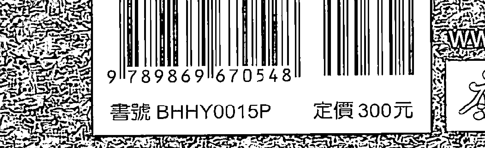

書號 BHHY0015P 定價 300元

www.cwbook.com.tw

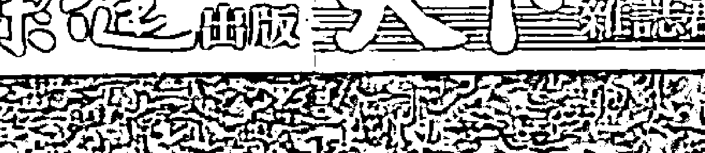