# 杨定一：落在地球

## 天使神秘学院

- ※ 神秘学资料库
- ※ 神秘学培训机构
- ※ 水晶能量研究中心
- ※ 专业占卜预测机构
- ※ 官方微信：strcdts
- ※ 微信公众平台：strc2011
- ※ 官方店铺网址：http://strc.cr.cx
- ※ 读书交流QQ群：
  - 占星塔罗占卜师交流群：814594478（加入密码：PDF）
  - 神秘学其他综合群：659338717（加入密码：PDF）

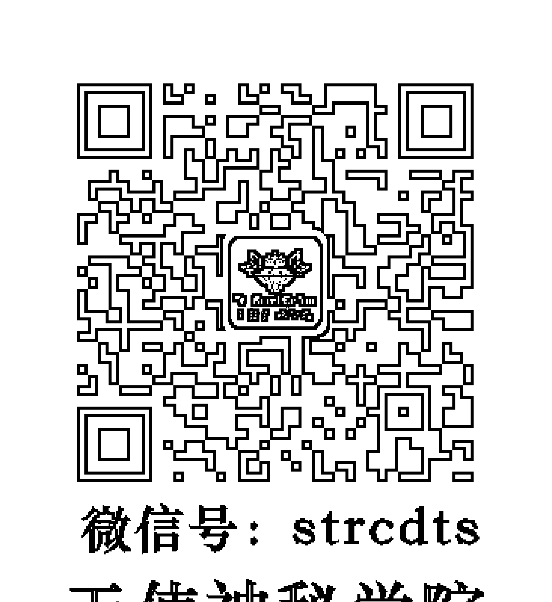

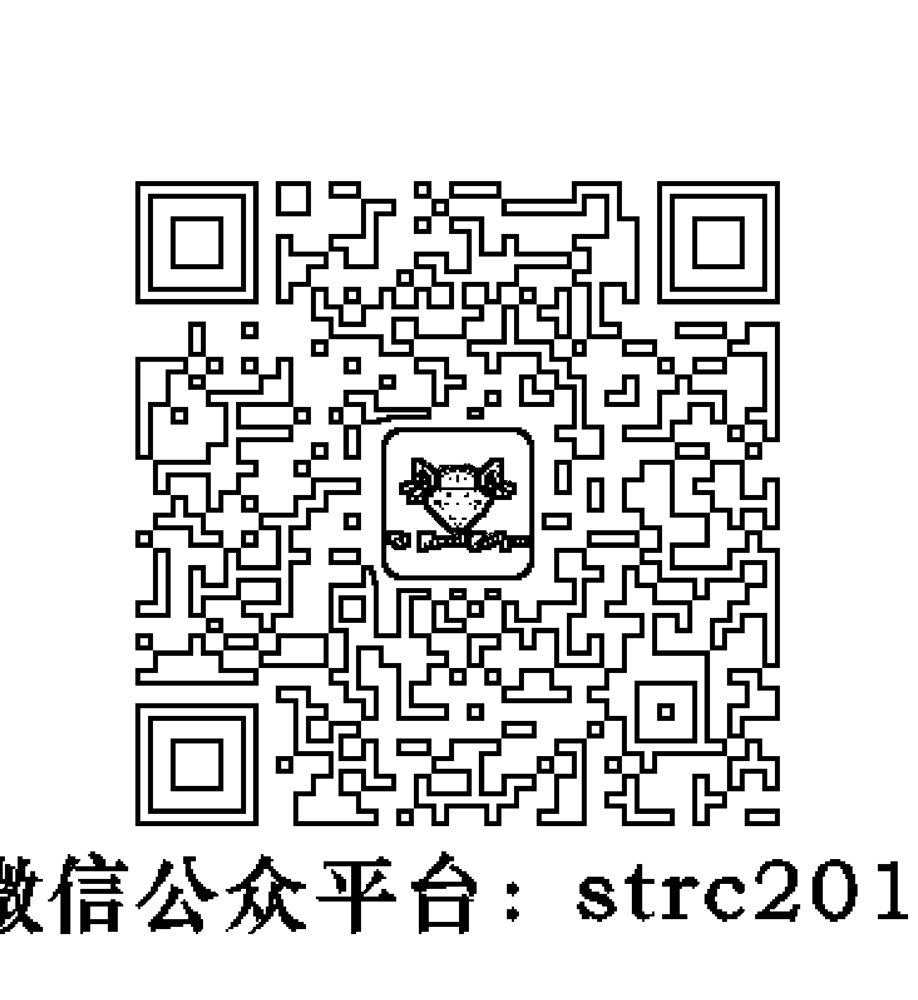

## 制作说明：

本书由《天使神秘学院》出重金从台湾购入的原版书籍扫描制作完成。为达到最好阅读效果，特地把书全部切开后，再经由专业扫描设备高精度扫描完成，并经过一张张的PS后期处理最终成书，其间花费大量的人力、物力以及时间，只为能给大家提供经济并优质的神秘学学习资料而努力。

本学院强力谴责某些机构和个人，把本学院花心血制作完成的电子书籍，包装后直接放在自家淘宝网上低价倾销的行为，以谋取不劳而获的经济利益。如果长此以往最终将无人愿意再为大家花心思制作电子书，那以后可能大家再无新书可读。

为让大家以后能够读到更多的好书，也为了本学院的良性发展。本学院恳请大家尽量做到如下几点：

- 一、尽量在天使神秘学院的官方网站购买电子书籍。
  官网电脑访问地址：http://strc.cr.cx
  手机微信购买请扫以下二维码
  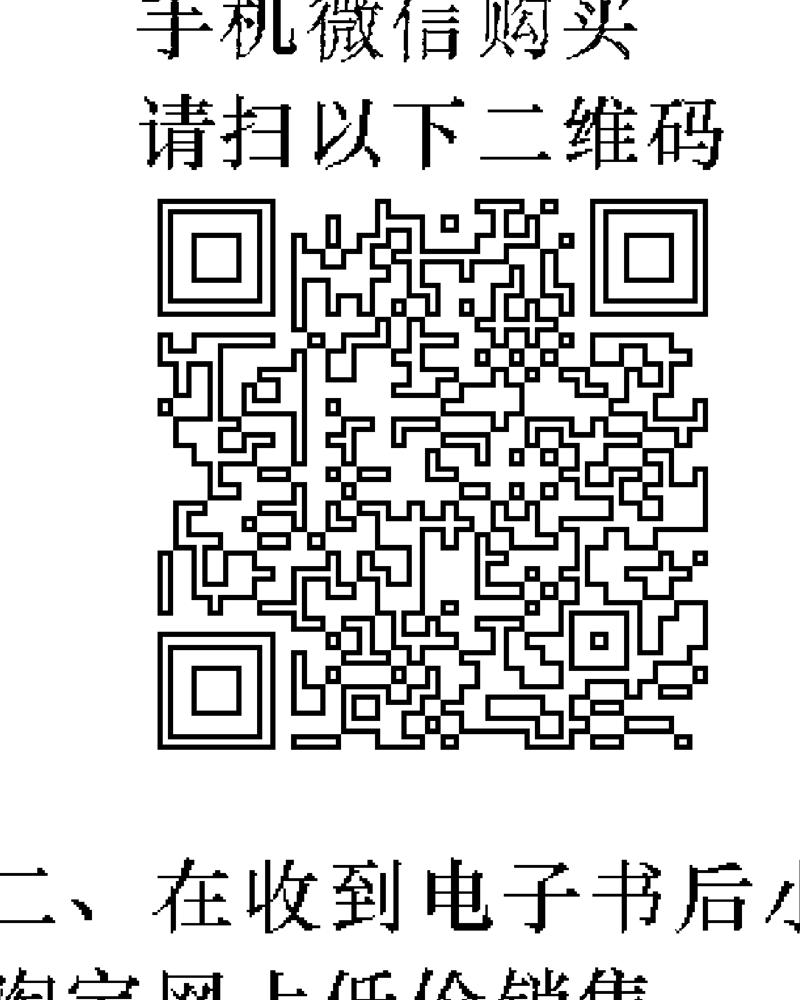
  手机淘宝等购买请扫以下二维码
  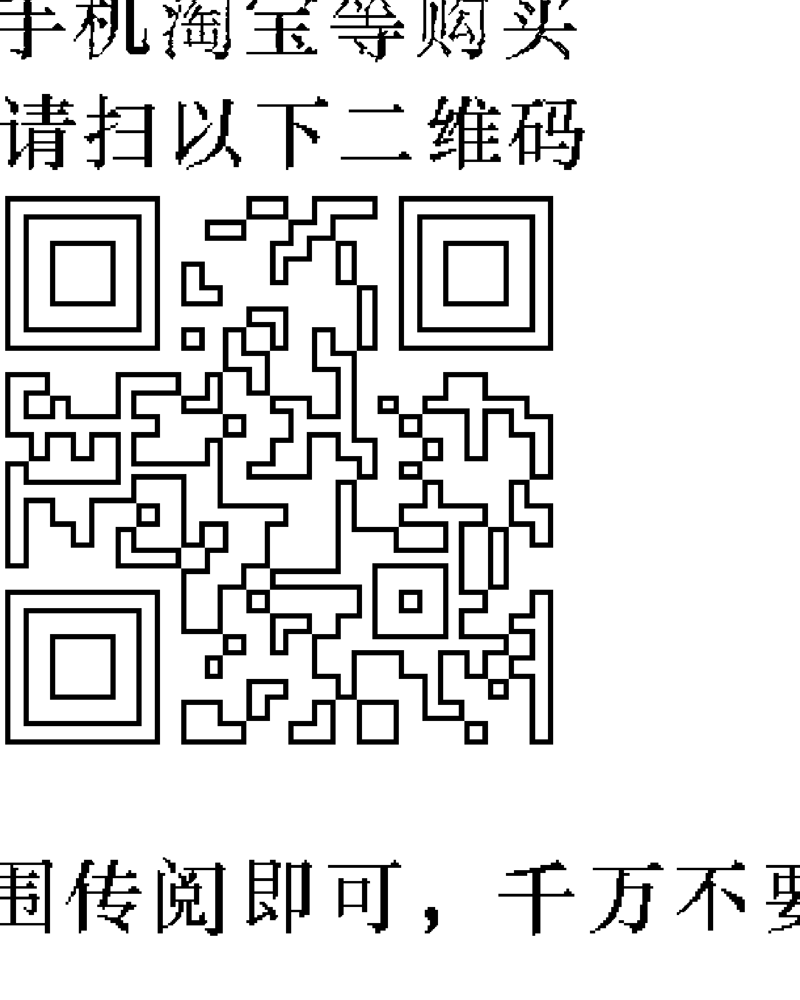
  加店长微信号请扫以下二维码
  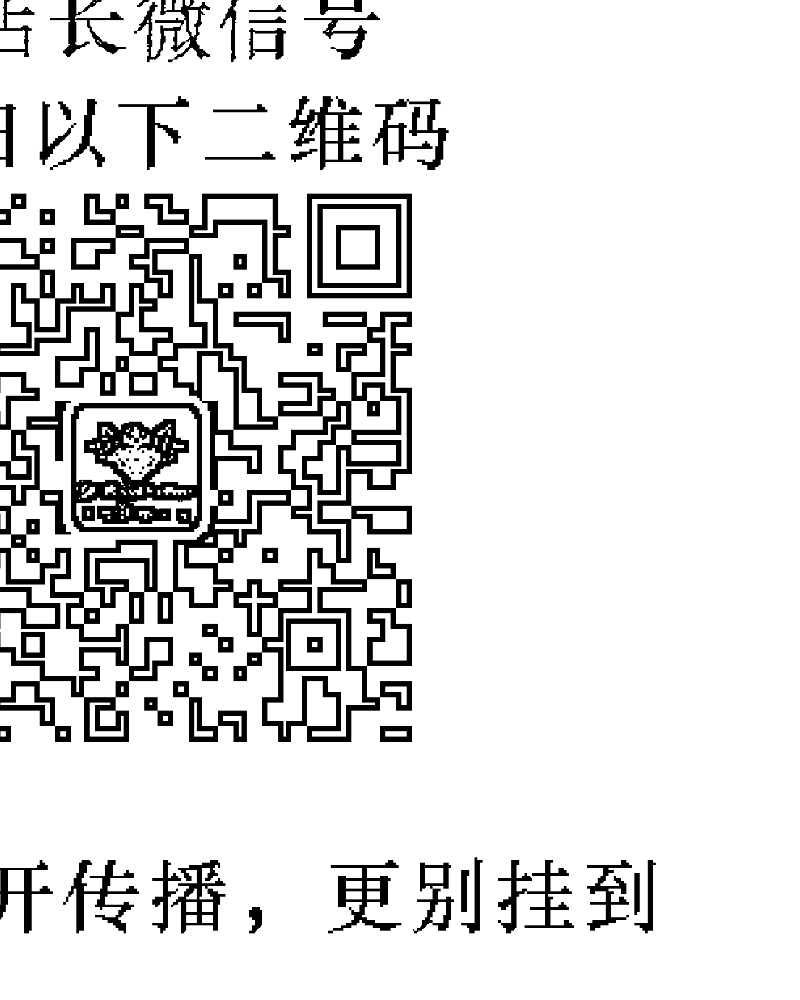

- 二、在收到电子书后小范围传阅即可，千万不要公开传播，更别挂到淘宝网上低价销售。

同时为答谢广大支持者，学院电子书将做如下调整：

- 一、学院会把一些早已收回制作成本的电子书折价销售。
- 二、最新制作的电子书籍会开放打印功能，大家购买后有条件的可自行打印成书。

天使神秘学院
2020年5月

# 落在地球
Earthbound

楊定一 著

# 目錄
CONTENTS

- 序 ............................................................. 4
- 01/ Earthbound ............................................................. 9
- 02/ 醒覺，有多重要？ ............................................................. 16
- 03/ 沒有什麼叫作醒覺 ............................................................. 22
- 04/ 醒覺，是一個「在」的成就 ............................................................. 30
- 05/ 人生，下一個決心 ............................................................. 35
- 06/ 一定要清醒的受苦才能醒覺嗎？ ............................................................. 43
- 07/ 人的聰明 ............................................................. 48
- 08/ 華人的包袱 ............................................................. 53
- 09/ 華人的轉捩點 ............................................................. 59
- 10/ 人類的未來，走出生存，走出競爭 ............................................................. 65
- 11/ 究竟的真實 ............................................................. 74
- 12/ 身心的層次 ............................................................. 78
- 13/ 最根本的平等心 ............................................................. 90
- 14/ 意識擴大，作為一個路標 ............................................................. 97
- 15/ 能量的轉變 ............................................................. 103
- 16/ 微細的能量，跟你不相關........................................... 109
- 17/ 真心明白自己是誰................................................. 114
- 18/ 人生，沒有目的，也沒有目標......................................... 118
- 19/ 捨離............................................................. 126
- 20/ 醒覺，只可能是突然的............................................... 131
- 21/ 老師來找你......................................................... 136
- 22/ 醒覺，是註定的嗎？................................................. 141
- 23/ 沒有什麼、沒有誰會害你............................................. 148
- 24/ 什麼都沒有發生..................................................... 154
- 25/ 一切都要否定....................................................... 159
- 26/ 喜樂，也只有喜樂，再加上喜樂....................................... 167
- 27/ 我什麼都不是 I’m no-body........................................... 172

获取更多好书，请加微信号：strcdts
店铺：http://strc.cr.cx

# 序

這本書，和前兩本《我是誰》、《集體的失憶》一樣，主要的目的是作為「全部生命系列」的補充。我希望直接切入重點——解脫——也可以稱為「全部生命的潛能」。

一步步地，你我從《真原醫》、《靜坐》、《等著你》、《重生》、《全部的你》、《你·在嗎？》、《神聖的你》、《我是誰》、《集體的失憶》一路走到這裡，也就是讓我們一起做好準備，走入生命更深的層面，共同接受生命帶來的恩典——意識徹底的轉變。

道。只是，內心總有一個渴望。

或許，在邏輯的層面上，你我不見得可以完全聽懂或讀懂這一系列作品所要表達的。但是，同時會發現——在心的層面，覺得很有道理。我們對這一個系列的作品，才會一直感興趣。

彷彿百年來，一次再一次地來，就是為了想找到一把鑰匙，解開這一系列作品所談的人生的謎題，為人生找到全面的解答。

但是，這把鑰匙，最多也只是意識的徹底轉變。只是，這個轉變，一般人會認為不可思議。

正因如此，我才會不斷地表達——這些作品所帶來的，也就是古人的法，加上我個人的體驗，不是一般的意識可以懂的。一個人要成熟再成熟，才可以不僅是聽懂這些話，還從中找到一把解開人生的鑰匙。

按理來說，我不應該這麼一本接著一本寫下去。畢竟，我也只是一名醫師、科學家、教育家，有什麼資格，用那麼多篇幅來分享人生最重要的問題——真實？

但是，一次一次地，我感覺到時機已經成熟，甚至認為這一次，會是你我百千萬年來最大的解脫機會。所以，才從各式各樣的角度，希望把你我帶到一體。

在這個過程，有些讀者會以為我一再地重複同一些觀念。其實，仔細觀察，會發現我只是借用不同的切入點，帶我們回到一體。表面看來的重複，其實是因為一體是我們這一旅程的終點，而這個終點，始終沒有變過。

我最多也只是把人生最重要的這一堂課——回到一體——落實到生活中，希望能與你我的生命結合。

我透過這一系列的作品，也希望你我可以一起徹底反思生命的基本價值觀念，甚至去檢討我們人生全部的價值觀。

一個人要解脫，早晚都要放下這些觀念。

你也可能注意到，我在業力方面特別去闡述與分享。這一點，很可能和你過去所讀到的靈性作品相當不一樣。

一般人會避開因果業力這個人生的大課題。然而，假如不去碰觸因一果這個主題，嚴格講，我們也不可能完全理解真實。所以，儘管後來這幾本書相當精簡，我仍然透過不同的角度切入，不斷地回到因一果這個主題。

我認為，只有直接面對因果業力的課題，透徹地了解，才能真正理解人間和時一空的來源，而可以徹底從中走出來。

此外，這本書，是站在與《我是誰》和《集體的失憶》同樣的立足點，也就是——從「空」看著「有」，從「一體」看到「多體」，從內心看著外在，從未創生的看到已創生出來的，從「在」看著「做」，從「心」看著「人」。

接下來的話，是從我最寧靜、最誠懇的心流露出來。唯一的用意是——幫助你我再進一步落入「心」的層面，甚至試試看可不可以一步把你我完全帶回到「心」。

這裡所談的「心」，本身是反映人類最高的真理，是我們每個人都有的，但通常都被頭腦和思考遮蓋住了。

對現代忙碌的人而言，要從頭腦的世界解脫，這一系列作品所帶出來的「臣服」與「參」可說是最直接、最有效率可以得到真實領悟的方法。不僅如此，就我多年的觀察，對一個充滿煩惱的人，甚至，對於遭遇人生重大失落的人，是最有效的心理療癒。

然而，這些作品是以我個人的語言來表達個人的理解，所以，我最多也只能再三提醒——不用相信這裡所說的任何話，大可拿自己來做實驗，推翻或證實我在這裡所說的一切。

我相信，只要繼續走下去，你我的人生再也沒有回頭路。

# 01 Earthbound

我用 Earthbound 這個字，當作《落在地球》這本書的英文書名。由於 -bound 這個詞，在中文沒有現成的貼切翻譯，就先用「落在」這兩個字。

會用 Earthbound，一方面是因為這個字帶著「我們和大地合一」的正向觀念。人類很紮實地活在這個地球，從來沒有和它分手過，也這麼活出我們人類最高的境界，創出最高的文明。

然而，在本書 Earthbound 則有另外一個負面的意涵，也就是陷落（trapped）、束縛（bondage）的觀念。

我之前的作品，已經以許多篇幅來表達——人間的妄想是透過因－果所組合的，而且是集體加上個體的因一果，才可以建立我們的人間。

集體的因一果是包括整個地球、人類共同的知覺（五官）再加上念頭的組合，讓我們得到一個看起來很客觀的現實。這個客觀的現實既堅固，又帶來絕對的感受，隨時塑造出獨立的存在感。

我們不光是這一生身陷其中，人類的整個文明從來沒有離開過這個幻覺。

解脫，而不看穿這個幻覺，是不可能的。我們只要認為任何現象是真的，也就不斷地強化我們的人類特質，而不斷加強我們所受到地球的吸引力。正因如此，我才會用 Earthbound 這個字作為書名。

只要我們還認為眼前的現象是真的，自然就延續這因一果，並且不斷地透過我們的動作、行為和反應延續這因一果所帶來的世界。也就這樣子，不斷地帶來痛苦，延續這個人間的夢。

我之前也再三提過——透過身體，乃至身心，一個人是不可能開悟的。

這個身心本身不存在，只是因一果所帶來的念相的組合。它本身是局限（finite），從局限永遠不可能跳到無限（infinite）。

The finite can never understand the infinite. 局限永遠無法理解無限。

假如能夠理解、甚至跳得過去，它本身違反物理、數學、哲學最根本的道理。

然而，有意思的是，我們每個人都透過有限的肉體和身心，在追求生命的無限。

有些人拼命地練習瑜伽、氣功等等身體的功夫；也有人不斷地透過新時代（New Age）引入的法門，去追求微細的能量或微妙的境界變化，包括開啟脈輪、連結天使或天人的境界、追求神通，或是特殊的加持。

無論怎樣的追求，都是在期待這一生的追尋能有所突破，能告一段落，甚至可以跳出嚟，得到解脫或開悟。

我這一系列的作品，其實也在大膽地說——這是不可能的。

解脫和開悟是不費力的，跟我們任何的練習或作業不相關。因為我們每一個人早就是解脫，早就是開悟的，只是自己不知道。非但用頭腦和念頭遮住這個事實，還包裝出一個解脫和開悟的觀念。所以都在往外追求，甚至往內心去找——也還在找一個東西叫解脫，找一個東西叫開悟。

正因為我們不斷尋找自己從未失落的解脫，才會從人類有史以來就建立一個個系統、一連串的方法，包括這一系列作品所表達的方法，隨時讓我們真正以為有一個東西叫解脫或開悟。

只是，我們愈想解脫，愈想開悟，愈沒辦法解脫或開悟。

到最後，一個人難免失望，認為這一生都是白費力氣。

接下來，自然產生一個更大的萎縮，認為解脫或開悟是不可能的，從人間是絕對解脫不了的。最後，也就只好接受這個人間的現實，承認自己就是那麼渺小，只能延續人類過去以來的制約。

這種演變，我認為相當可惜，也不忍心。

正因如此，我才鼓起勇氣用我個人的語言和體驗，希望修正人類文明所帶來的錯覺。

我這些作品想表達的是——沒有系統的系統、沒有原則的原則、沒有一切的一切、沒有體的整體、不費力的全部。

這是我們每個人人都有的。

最多只是一個心境的轉變，這裡所談的，就變成了我們的真實。

所以，我過去才會不斷地提這個問題——你我到底想不想醒覺過來？
又有多想醒覺？

是不是還要一次次回來，再延續這個夢，不斷地痛心，不斷地失望，不斷地昏迷？

還是認為已經差不多了，累了，受夠了，不想再加入這人間的遊戲？

假如你屬於最後這一群，就讓我講下去吧。

# 02 醒覺，有多重要？

你讀到我再三地問「到底想不想醒過來？」可能認為這麼問是多餘的，而你的回答很可能就是「我當然想醒過來！」

假如有一個第四意識可以追求，而這個意識又是永恆、愛、喜樂、全部，怎麼可能不想要？

確實，這也是我個人的看法。

但是我們沒有一個人想到，這和人間的一切剛好顛倒。

人類從過去到現在的表現，和醒覺完全相反，是非「不醒覺」不可——是要把自己綁住，活出狹窄的因一果所帶來的人間，而且還要一次次地重複。

這完全是錯誤的身分認知。

我們徹徹底底認為眼前一切所見、所發生、所體會、所遇到的都是真的。只要認為人間是真的，自然已經被它帶走。既然人間是因一果的組合，所以，當然也就被因一果帶走，延續這一扭力，而不斷地製造更多業力。

一個人痛心或失落——這是每個人早晚都會遇到的——比較容易想追求「全部生命系列」的作品所帶來的意識轉化，甚至是愈痛苦、失落愈大，醒覺的機會也跟著愈大。

然而，很諷刺的是，只要遇到一點好的消息，有一點好的體驗，在人間嘗到一點舒服的甜頭，這幾本書所談的醒覺與轉化，或大聖人留下來的智慧，一轉頭也就自然忘記了。

我過去遇到的所有人，都是如此。

在生命最痛苦最困難的時候，都往內心去找、去尋，希望能有所轉變。但是只要人間物質層面上略有好轉，就會把醒覺、解脫丟在一邊，不可能去重視。

一個人外在的層面一切都好，要財富、要名利、要什麼都有，卻可以完全投入內心，而不認為物質層面的成就或現象有什麼絕對的重要，甚至不當作一回事，這可以說是相當大的福報。

一個人堅定到這個地步，等於在不斷地表達——我這一生非醒覺不可，沒有什麼可以阻礙，連「命好」都無法阻礙。

能有這種決心，不是這一生才修來的，而是一個人不知多少生在練習，一世又一世地進行 sādhanā，也就是靈性修練的結果。

我會講這些，也只是希望你我在念頭和情緒上踩個剎車，不要跟著人生的任何境遇、任何感受起舞。

反過來，外在的痛苦本身也可以當作一個轉變的工具。所以，我過去才會談「清醒的受苦」或「失落是最大的恩典」。

我敢這麼說，今生沒有任何目標，比醒覺更重要。沒有什麼物質可能取代永恆、喜樂、大愛——我過去稱為「在・覺・樂」。

你我今生如果錯過，要什麼時候再來一次？而且種種條件的組合還剛好匹配這個追求？

也許要到下一生，甚至再來千百次都遇不到。

儘管這個全部的生命關懷著、愛著我們，但站在整體來看，坦白說，你我醒不醒過來根本無所謂，它一點都不計較，和它也一點都不相關。

你我醒或不醒，在整體而言，什麼都沒有發生。一切本來就是完美、完整、滿足。也沒有什麼狀態，比你我現在更完美、完整、滿足。

只怕我們不知道這個事實，反而把人生活成一個問題，還要在這個人間繼續不斷孤獨地奔走，就為了去找到你我早就有的一切。

我們讀到這裡，或許能完全理解這些話，也可能還抱著質疑心或反彈，認為這些話不理性。我也只能勸你，不要把這裡所談的當作人生的標準答案，而是自己回到內心去親自體驗、去參這些話正不正確。

有時候，周邊各行各業、理性、有才華的朋友，好意而不斷地表達「看不懂」這一系列的作品，還認為自己很有道理，以其專業指出作品的問題，我也很感謝他們為我著想的善意。然而，這正是專業的局限，擋住一個人不去思考——這些聖人留下的智慧明明已經流傳了幾千年，為什麼卻離自己的心愈來愈遠……

聽著這些評價和激烈的反彈的同時，還要說明為什麼這些作品對一個人的生命會有幫助。這種情形，也還是反映人類的制約有多深。

貿然批評的朋友，是我認為最需要這幾句話的人。人在制約中，其實更需要這些觀點。但是，要怎麼讓他們聽進去？有時不免覺得自己像是陪著一群孩子玩這個人間的遊戲。

最多我只能說，一個人時間到了，自然會成熟，而可以接受這裡所表達的。

但是，一個人要可以稱為「成熟」是太難得的一件事。在人間，只有少數人，可以稱之為成熟。

這麼說，或許這本書寫的時機還太早了些。

然而，一個人表達的只要是真實，就不用擔心。

我敢大膽地這麼說，即使你我不在這人間，這些話還是會存在。

真實會比人間的任何知識存在更久，流傳更永恆。

它本身是消失不了的。

# 03 沒有什麼叫作醒覺

你讀到這一章的標題，一定覺得很錯愕，感覺相當矛盾。前一章還在談醒覺的重要性，到這裡竟然談沒有什麼叫做醒覺？其實，表面看來的矛盾，也只是在意識層面探討同一件事。

我過去曾談到醒覺是人生最大的目的，而且沒有第二個目的比這個更重要，最主要是希望鼓勵你——把注意力翻轉到內心，為念頭踩個剎車，看穿眼前的念相。充分了解這一生所見到的一切，跟真實相較，都沒有絕對的重要性。

只有真實，是絕對的重要，絕對的光明，絕對的「在」。

都一樣，早晚都會消失，早晚都靠不住。

但是，這些觀念，還是頭腦造出來的。

站在整體，不可能有什麼東西叫做重要、不重要，有意義、沒有意義。

一切老早就寧靜，而且，只有寧靜。

任何不寧靜的現象，只是從永恆的寧靜衍生出來的。生了，自然會消失。也就像烏龜，把頭從殼露出來，也早晚要縮回去。

有限，早晚要回到無限，因為無限包括有限。同樣地，整體或一體存在於人生的每一個角落。

人間沒有生出之前，它已經在了。

人間過去了，它還在。

我們透過二元對立的邏輯，創出一個世界。這個世界有個框架，而我們全部的人間都離不開這個框架，甚至連這個宇宙都離不開頭腦投射的架構。

我們最難懂的是，框架內、中、外，都含著一體。

所以我們用頭腦的語言沒辦法把它描述出來。因為一體到處都存在，沒辦法透過任何時-空的比喻來形容。

講個透明，表達的人、聽的人、和表達的東西，都離不開一個局限的框框。所以，再怎麼解釋和說明，不可能描述一個同時存在於框架內、框架中、框架外的一體。

因為我們局限的語言和思考，不可能包容無限。但是，反過來，無限隨時包括有限。所以，要從有限回到無限，最多也只是把有限挪開，無限就自然透了出來。回到人間的比喻，只要把頭腦挪開，一體就自然浮出來。

會說醒覺、解脫、開悟，是專屬於人類頭腦才有的觀念，是因為只有人類先把它遮住，接下來才有解脫、開悟可談。我們一般人想不到的是，連一顆石頭、一朵花、一隻動物都含著無限的一體，只是沒有所謂「發達」的頭腦可以蓋住一體，也無需解開。

只有人類，非要透過頭腦的發展和分別去遮蔽，為自己造出那麼大的困境，才需要由醒覺帶來一個翻轉。

醒過來了，最多也只是懂這個道理。

所以，才會說一個人在醒覺的過程可能大哭，也可能大笑。因為突然發現——連醒覺都是個大妄想。

它和人間一樣的，都不存在。

最多就像在一個夢中突然醒來，看著任何時-空所帶來的現象都不存在。甚至，連因-果都不存在，都還只是在時-空裡運作。

醒覺過來了，發現因-果是虛的，而這個虛構的因-果，建立虛的時-空，虛的時-空又建立我們虛構的人間，再建立一個虛構的「我」。

醒過來，「我」消失了。而一切，也跟著「我」一起消失。

最後，只剩下在·覺·樂。
再接下來，什麼都沒有。
一切寧靜。

這時候，只要把注意力落回到一個角落，我們又走上了回頭路——又建立一個因-果，再建立一個時-空，再建立一個人間，再加上「我」。接下來，又跟著因果法打轉。

然而，懂了這些，因-果或因-果的作用再也不會為我們帶來任何矛盾。

我們突然理解，有了「我」才有因-果。也只是有了「我」，才受因果法的作用。

活在這個人間，而不把自己跟這個「我」綁在一起，一個人才真正自由起來。這個「我」再也不可能把我們騙走了。

醒過來了，其實也沒有一個人可以宣稱醒覺，也沒有一個東西可以稱為醒覺，更不可能醒覺到哪裡。最多只會發現，一體意識在每一個角落，從來沒有離開過我們。

它到處存在。

而這個「無所不在」，或著說「全在」的意識 (omnipresence)，本身就是我們最自然、最輕鬆的狀態。我們最多也只是臣服於它，臣服於這無所不在的一體意識。

突然，意識再也不落在一個叫做「你」、「我」的肉體。

醒覺過來，不會再計較，也沒有什麼東西好計較。眼前所看到的任何東西，包括這個世界、宇宙、人生，清清楚楚地，都是過去因-果的組合。

世界、宇宙、人生之所以存在，是因為我們認為它是真的，而把「我」投射到它們身上。

「我」一消失，世界、宇宙、人間、「我」、「你」全部一起消失了。

消失了，這肉體還存在。最少在人間認為存在——我們還是要吃喝、拉撒、睡覺……因為肉體本身存在與否，是因-果的產物，和真實不相關。

在這個人間存在與否，也只是反映能量的轉變。

它本身有一個週轉，要演變下去，才可以不斷消逝它的扭力。

不要小看這個扭力，它的力量大得不得了，是數不清的條件或變數的組合，透過每一個瞬間露出頭來。

我們絕對看不到後面的力量有多大。

所以，一個醒覺的人，輕輕鬆鬆讓眼前的業力完成它自己。但是完成什麼，眼前的肉體有什麼轉變，再也跟它不相關。

這是一般人最難懂的。

一般的看法總是認為醒覺的人需要改變人間所帶來的命，或是肉體的命運。

這種期待本身含著一個大矛盾，認為肉體是真實的，還站在肉體看這一切，包括醒覺。

根本沒想過，事實剛好相反。一個醒過來的人，只是輕輕鬆鬆在人生看著業力轉變。

肉體生病，他也不在意。或許吃點藥，也就過去了。有什麼好轉，也跟他無關。轉壞，也不是不可以。

他可以在人間做事或不做事，也許在別人眼中是重要的事，或一點都不重要的事。最多是輕輕鬆鬆地讓它展開。

也只是知道這身體是透過因-果才存在，才有的，而它有本身帶來的習氣要展開。所以，也不需要干涉它。

對任何人間帶來的因-果都不反彈，他也就輕輕鬆鬆看因-果穿過自己，這扭力也就自然與自己不相關，最多是看著它消失或轉到別的地方。

這才是醒覺真正的定義。

# 04 醒覺，是一個「在」的成就

假如有一個練習或方法可以讓我們醒覺，那就好辦了。我相信你我也早就徹底轉變了。

就是因為沒有，頭腦才會認為是困難，甚至不可能。我們也才會忙碌一生，找各式各樣的方法追求永恆的快樂，尋求解答，想要醒覺。

然而，醒覺是永遠不可能追求來的。所以我們一生一生的來，連個邊都摸不到，最多只是不斷重複人生的經驗。

其實，醒覺只是一個徹底的決定。也只是聽了這些話，一點疑惑都沒有，認為本來就應該如此。

知道眼前在人間可能體驗的一切，都是條件和制約的組合。沒有一件事、一樣東西、一個念頭、一個價值可能獨立存在。

一切都是相對，最多只是透過之前的「因」所帶來的「果」。

眼前所看到、可以體驗的，全都是因-果的產物。因-果最多又只是這個時-空把我們綁架而創立出來的架構。時-空，也只是我們頭腦所投射的念相。看透這世界，知道它離不開我們的念相，一個人也就自然醒覺。

所以，我才會說——醒覺和任何「做」、任何練習不相關。

只要有一個「做」，反而帶來一層阻礙。就像一層膜，讓我們看不清真實。

任何體驗，只要我們可以想得到，或用語言表達出來，本身離不開因-果，離不開制約。全部都跟你我的真實不相關。

所以，過去才會說——真實，不是這個，也不是那個。任何我們可以想像的，都不是。

任何知識可以帶來的理解，都不是。

任何法門，都不是。

任何講課，都不是。

最多，我們只能稱它是「在」。

醒覺，是輕鬆地「在」。

在每個瞬間。

最多只有「在」。

「在」，念頭自然消失。

其實，不用刻意去壓制念頭。「在」的力量遠遠大於一個虛的念相。

我們只要不去理會念頭，它也自然消失。

念頭消失，剩下來的，也只是「在」。

過去才會說——醒覺，是個「在」的成就。

「在」愈徹底，念頭的力量也就愈薄弱。

「在」的力量大，念頭自然從主宰變成工具。

我們在這個人間，用念頭來完成一些運作。過了，也就擺到一旁。

一點都沒有損失，反而過得更好。即使從自己的眼光來看，也沒有什麼效率不效率好談。從旁人的角度來看，甚至可能是更有效率。

一切順其自然。該做就做，不該做就不做。再也沒有什麼矛盾。

如果你讀到這些話，完全認同，不覺得有任何衝突，其實你已經跟宇宙做了一個聲明——「我這一生要醒覺，而且一定要徹底醒覺。」

其他的一切，也就水到渠成，自然帶來一系列的連鎖反應。

宇宙的生命會帶著你醒覺。

只怕你的決心不夠大。

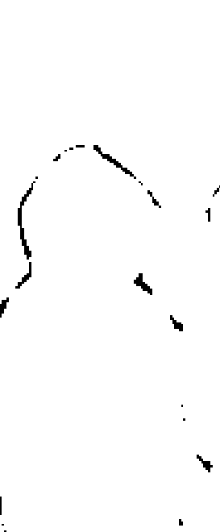

# 05 人生，下一個決心

前面提到醒覺的決心，也就是說——一個人要以最誠懇的心，來探討自己這一生來的目的。

因為，醒覺不靠任何「做」可以得到，最多是一個決心。

這個決心，也可以稱為——醒覺的「願」。

願愈大，而且不斷地從腦海浮出來，本身就成為我們意識轉變的燃料，讓我們愈來愈成熟。

我指的成熟最多也只是——不斷地肯定這一生是我們最大的一次醒覺的機會，而絕對不會讓它錯過。

有這樣的自信，它本身會擴大，培養出對生命最大的信仰——完全肯定生命，知道一點一滴都是剛剛好。無論喜事、壞事甚至災難，都剛好是我們需要經過的。你我最多只能臣服於生命。

這種信仰，自然讓我們謙虛。

我指的謙虛是站在兩個層面——首先，謙虛是放過這個世界，同時放過自己和別人；原諒別人，同時原諒自己；不挑別人的錯，同時也不挑自己的錯；包容別人，也同時包容自己。

另一個層面的謙虛，是突然對大聖人所留下來的話再也沒有質疑，知道這一生得以遇到大聖人的智慧是太難得，也自然會珍惜、重視，透過這些話對照自己的理解和領悟。知道這些智慧是最有價值的人生操作手冊，只怕自己不用心，生怕體會不到，而不是貿然批評、反彈。面對智慧，這種批評不光表明自己的不明白，還充滿了傲慢。

一個人只要謙虛，自然就會誠懇。

誠懇的意思是他輕輕鬆鬆活「在」，活出真實的自己。最多只能說是 be Oneself 或「在」。不會再用一層念頭來遮蓋自己的用意。而每一個用意，只可能是善意。

有了這善意，一個人自然變得天真，和小孩子一樣。

這個不可思議大的決心、成熟、願、自信、信仰，再加上謙虛，自然成為我們這一生最大的恩典。透過這個恩典，我們非醒覺不可。

我會提到這些，是因為即使有了這樣的堅定，你我可能想不到——人間的命不見得會更好。從我過去的觀察，包括從大聖人的經歷所讀到的，甚至反而可能變得更糟。

佛陀從王子變成苦行僧，六年苦修，連續七日七夜不飲不食，寧死，也要醒覺。

耶穌也經歷數不完的折磨，四十日夜在沙漠面對魔考，最後被釘死在十字架上。

拉瑪那·馬哈希 (Ramana Maharshi) 十六歲離開家，坐到一個山洞裡，就是準備——即使失去生命，也要把真實找回來。他幾十年不說一句話，最後得腫瘤過世。

虛雲老和尚，活到一百二十歲，卻在一百一十三歲的時候遭遇嚴刑拷打，全身骨折，才下定決心把自傳留下來。

每個人在醒覺的過程，都會經過考驗。大的考驗，帶來種種小的考驗。只看我們的決心有多大。

從更高的角度來看，就好像一體生命非要把我們從人生拖出來，哪怕我們又喊又叫又哭又鬧，都要徹底地把我們從局限帶到永恆。

我很誠懇地跟你分享這些話。因為我所見到的絕大多數的修行者，包括你我，都還認為修行最後的結果是要改善人間的命、人間的生活條件，而忘記了醒覺本身就是要從人類的狀況、人類的特質跳出不來。

耶穌在沙漠的考驗和孤獨，是每一個人都要經過的。每一個人都有他自己的考驗。所謂的考驗，也就是我們不斷地認為世界很堅實。

「我」會用各式各樣的方法把我們帶回人間，不斷地建立這個好像很堅實的世界。

在醒覺的過程會覺得很痛苦，其實最多也只是一個意識和身心分離的過程。

我指的分離，是說雖然意識層面的「願」可能大，但也許在因-果層面還不成熟。也就是說，我們可能還和肉體與身心綁在一起，認為這個身心是真實的。而「願」所帶來的因-果轉變，讓我們承受不了，也就還有一個痛苦的經過可談。

走到最後，一個人會發現連在沙漠行走的人都是個大妄想，就連在沙漠留下的腳印，也會消失。甚至，孤獨的感受和情緒也一樣。到最後，沒有人人在沙漠在走或被考驗，也沒有腳印，甚至，連走的動作都沒有。

從更高的角度來說，最多是生命想幫我們從人間拉出來。最後，「我」和時-空都會消失。也就沒有什麼痛苦或喜樂好談。這是必需的經過。

我前幾章才會問你我——醒覺的決心有多大？這一章再提醒一次，希望你我的決心大到一個程度，任何人間表面的困難，都可以克服。

這才是大信仰。

最後要記得，醒覺是讓我們和任何東西、任何體都脫鉤。

不只是脫鉤，而是成為no-thing、no-body。

沒有東西、沒有「體」，這才是我們的真實。

我們的真實不可能落到一個點、一個體。所以我們想要一個東西，想要成為或得到某個體或某種人，反而是限制了自己，放棄整體而寧願把自己陷入一個小角落。

只要有個東西、有個體好談，我們還是在時-空所建立的人間打轉。本身還在因-果的框架下延續這個大妄想。

變成一個徹底的 no-thing、no-body。<sup>1</sup>

你可以接受嗎？

1 我在這裡用 no-thing、no-body 的拼法（而非一般通用的 nothing、nobody），是來強調我們其實不是任何「體」、任何「東西」。換句話說，任何「東西」、任何「體」，只要我們可以想出來、講出來的，都還是頭腦的限制，是落在二元對立才存在。

# 06 一定要清醒的受苦才能醒覺嗎？

我相信，我們可能馬上開始擔心——生命轉壞，是一定必需的經過嗎？為了醒覺，一個人一定要清醒地受苦嗎？

我過去只要分享這些觀念，這是幾乎每個人都會問的一個問題。

其實，醒覺倒不靠任何過程，也跟時間不相關。我們可能想不到，一個人最多只需要決定醒覺，也就醒過來了。

但是，要做這個人生最大的決定，一個人要有智慧——對這裡所談的全部生命與一體，不光是不質疑，還認為是最理所當然的。甚至，理所當然到一個地步，會把這一系列的作品當作一個提醒，而把自己的記憶找回來。

有了這樣的決心與智慧，自然認為人生沒有第二條路可走。我指的是，站在意識的層面，沒有第二個選擇。

沒有選擇，般若智慧也自然就爆發出來，人自然從片面的理解落到一個全部的領悟。透過每一個身體的細胞、每一個體（身體、情緒體、思考體……），都把同一些領悟貫通，變成全部生命的體驗，也就是變成一個人唯一的真實。

這麼一來，一個人輕輕鬆鬆就醒覺過來了。

醒覺過來，他自然發現什麼都沒有發生，什麼也沒有得到，什麼也沒有突破。最多只能表達——是醒覺，來醒覺他。

其實，也只是一個心境的轉變，就轉過來了。

但是，只要還有這個身體，只要我們還把自己等同於這個世界和時-空，只要我們還認為這時-空是真的，就需要練習。

如果我們徹底地知道這時-空是假的，而這個領悟透徹到底，也就沒有什麼好練習。什麼都沒有，哪來的練習？連這個宇宙都不存在，還有什麼練習好談？

寧靜，只有寧靜。

我們稱為有階段的醒覺，最多只是一個比喻，含著分段進步的意思，是來鼓勵你我每一個人不斷地往前修行。至於修行什麼？或進步到哪裡？最多也只是把頭腦安定、休息，讓念頭自然消失。念頭消失了，頭腦自然落到「心」。

只要念頭一出發，輕輕鬆鬆觀察或「參」，也就把頭腦帶回到心。

成熟了，頭腦和心連動的鉤子也就突然消失。一個人再也不和身心綁在一起，也就突然發現他的意識完全站在一體，而不會再想和身心有任何牽連。有時需要透過身心來動，最多也是透過意識暫時落在身心。用完了，也自然回到一體。

我才會說，醒覺和時間沒有關係。因為，它不是透過任何經過可以得到的。最多只是意識的落點，從身心，輕輕鬆鬆落在一體——本來就在的一體。

也因為如此，我才會不斷地強調——醒覺，是回到 the least of all things。也是我們最根本、最輕鬆、最自然、最微不足道的狀態。用上下樓梯來做比喻，甚至比沿著樓梯往下滑還更輕鬆。

假如我們把人生看做一個不斷費力往上游划船的旅程，醒覺，最多是順著水流，一路流到意識的大海。流到大海，發現什麼都沒有做。它本來就「在」。

回到大海，還是只有「在」。

一切，最多只是平靜。

因為醒覺就是那麼簡單，所以我這一系列的作品不斷回到兩個核心觀念——「臣服」與「參」。

然而，連臣服和參，最多也是輕輕鬆鬆帶回同一個領悟。

臣服，最多也是知道自己是醒覺的。

生命帶來的任何挑戰，或任何瞬間所帶來的變化，我們自然都可以接受。接受一切，自然消除任何隔閡。最多只是承認本來就是圓滿，最多只能回到圓滿。

參，最多也只是在念頭起伏的狀況下，輕輕鬆鬆提醒自己——念頭或「我」的根源，只是圓滿。它們也就自然消失，我們也從「有」自然滑回到「在」。

醒覺，最多只是這樣子。和清醒的受苦、或痛苦，一點關係都沒有。

# 07 人的聰明

這些觀念，其實簡單明瞭。既然如此，你我該問的是——為什麼用一整個系列的作品來表達那麼簡單的事。

可惜的是，我們頭腦有了「我」，絕對不會放過我們，會跟我們作對到底。會想各式各樣的理由來抗議，來爭辯，最後就是說服我們——一體，不存在。

透過質疑，頭腦自然把你我帶回人間，延續這個制約。

所以，我才會需要用各式各樣方法，從各個角度來表達一體，表達最究竟的真實。然而，最多也只能把個人的體驗，在這裡和大家分享，希望讓你體會到我的誠懇，而共同完成這個旅程。

我再用另一個層面來表達——

其實，人可以想像的最高的聰明，不在這個人間。

任何知識，頭腦可以想到的，都還是局限。

我們可以想像，從生命無限大的層面轉達出來的聰明，當然遠遠大於我們頭腦可以設想。因為這聰明大到我們人無法衡量、無法想像，我們才會用另一個詞，改稱它為智慧。

智慧的聰明和人間一點都不相關。只要可以落到人間，用人間的概念來說它，就已經落到了一個普通聰明的範圍，這是我們大多數人都沒想過的。

假如你接受這個觀點，自然會發現任何人為的創意或作品，不可能有任何永久的價值，早晚都會消失。

有些可能持續的時間稍微長一點，但早晚都會不存在。

所有科學與科技的結晶，都離不開這一命運。

任何人間可以追求到的東西，也都離不開同一個結局。

我們每一個人，無一例外，忙了一輩子都在追求這些生命有限的東西或價值。站在整體來看，假如整體可以說話，會說這才是不可思議。它就算是想幫人類加持，也加持不上。

讓我個人這幾十年來最覺得遺憾的是，即使不談智慧，有時候我們甚至沒有從一般的聰明來通盤考量，就對任何事都有意見，樣樣都看不順眼，樣樣都要批評，要指指點點。這一來，要怎麼從這些觀點得到幫助？

不過，儘管如此，從一體的角度來看，我這些感慨也一樣不存在。站在一體，其實也沒有知識、聰明、智慧好談，連智慧都是人類創出來的一個妄想、一個念相。連做這些區隔，都是不需要的費力，帶來不需要的分別。

假如充分了解這些，一個人自然寧靜，而選擇沉默。

# 08 華人的包袱

過去有人問過我——為什麼像我這樣一個醫師、科學家，在國外長大，看起來就像外國人，中文也不夠流暢，卻會選擇用中文來闡述這些領域，而這些領域本身還離不開東方古代大聖人的各種法？

我每次聽到這個問題，都自然想笑，覺得很有意思。這一點，本身其實已經在表達生命的奧妙。

從《全部的你》開始，我才以口述的方式寫作。之前的作品，如《真原醫》、《靜坐》這兩本書，以及《等著你》、《重生》、《你・在嗎？》專輯的小冊，本來是以英文寫成，譯成中文之後，原稿也就一直擱置一旁，沒有想過在美國出版。彷彿這些作品本來就是為了華文讀者而寫，而我從來沒有把重點放在西方文化的讀者群。就連後來口述的作品，我也沒有動念要譯回英文。

回頭想，真是不可思議。

嚴格來說，最沒有資格扮演這個角色的，就是我。

我從來沒有受過正式的中文教育，從言行舉止的點點滴滴都可以看得出來是外國人，中文書面的寫作和口語的表達也有局限。但有意思的是，生命自然來帶我走出一條路，扮演這個——我沒想過扮演的角色。

我們仔細觀察華人的歷史，全世界大概沒有第二個民族比我們有更多聖人和偉大的文化，可以影響到人類的意識發展；最多也只有印度可以相提並論。但是不可諱言的是，我們的社會也更傳統、更制約。

華人的文化和歷史，是透過帝王朝代一路傳承下來，全都是以武力完成統治。而我們華人受到儒家文化的影響，反而相當接受上下尊卑的觀念——對長輩要孝順，對上級要服從，對主管要尊敬，而寧願壓制個人的自由與權利。

從華人文化所衍生的日韓文明，也是如此。人和人的同質性很高，對地位和階級非常順從。

雖然華人有許多傳統的智慧流傳下來，然而，整個社會偏向選擇保守和安全。最好每個人都和別人一樣，而不強調創意或個人的發展。華人的教育，強調一致性的學習，著重抄寫與背誦。我們觀察經濟、社會、政治、科學、藝術、醫學……種種人為的架構，自然發現我們模仿的能力相當強，但創意非常缺乏。許多優秀的人才困在一個固定的系統內努力，而無法跳出一個既定的框架，達到真正的創新與啟發。

西方人，則剛好相反。

有意思的是，連修行都是如此。

沒有錯，過去最偉大的聖人，都是出自東方或中東。在智慧的領域，東方人可說是站在人類的巔峰，成就比西方文化早了上千年。西方在靈性或修行的層面，遠遠落在東方的成就之後。

但很不幸的是，東方文化的子民，因為社會互動模式的約束，無形之中逐漸把大聖人的智慧當作一個比喻，認為和現代人的生活不相關。

許多人遇到生活的狀況，會引用大聖人的話來安慰自己、告誡別人，卻完全只站在頭腦的層面，而不是個人領悟的流露。不知不覺，古人智慧的寶庫反而變成我們最大的阻礙，為我們帶來更大的制約。

讓我們無法從裡頭發現自己的聲音，更不用談自己的領悟、自己的體會。

這幾十年來，東方在靈性層面的成就也自然慢下來，幾乎停滯，甚至消失。

這一次，有機會讓我用我不標準的語言，來表達個人的體驗，是相當不可思議的。

因為我沒有任何語言或文化的包袱，所講的話不是老套的表達，也不是只引用幾句聖人的話，反而會讓一般人愣住，在情緒和念頭上踩一個剎車，帶來反省的作用。我這一次才會相當有信心，透過一個新鮮的語言來傳達，可以帶動整體的潮流，而再次把古人的大智慧帶回來。

最重要的是，我們取得、擁有再多的知識和學問，站在解脫的角度來看，一點用也沒有，甚至反而帶來數不完的阻礙。

透過任何書，包括這一系列作品的資訊，人是不可能解脫的。

解脫、領悟，完全要透過自己的追察、個人的體驗——全身心的體驗，包括每一個細胞的體驗，才可以把它落到生活當中。

所以，你我最多只能把這些作品所表達的當作路標。但願透過這些路標，我們能把古人、大聖人的智慧找回來，而能一路安心走下去。

# 09 華人的轉捩點

我前面分享的，其實還有另一個層面，在這裡要坦白做個說明——

中國 Middle Kingdom 這兩個字，自古以來就是在表達華人在全世界所站的「中心」地位。

稱華人是龍的傳人，其實一點都不過分。自古以來，華人在政治、軍事、文化、經濟、科技、科學都是不斷地領先，一直都是世界的中心。所以，才會受到異邦的注意，而到後來被侵略、被佔領。

我們想不到的是，直到一八八〇年代之前，中國是全世界最大的經濟體，GDP 是全球最高。也正是因為富庶，而讓西方國家想要割據，用各式各樣方法包括戰爭、鴉片、殖民，想摧毀這個民族。

然而，全世界都想不到，儘管經歷了侵略、戰敗、割據，就在短短一兩代內，華人世界包括台灣、香港、新加坡、中國，很快恢復經濟上的優勢。

相信我們每個人很可能在自己的有生之年，就會看到華人再次成為全世界最大的經濟體，重新取回領先的地位。

只是，權力有多大，責任就有多大。

可能就是因為過去物質資源的匱乏，近百年來，華人以及亞洲國家的人民把注意力完全放在物質層面的追求。無論社會、家庭、個人都重視財富、名譽和權力的積累，成為人一生追求最高的理想，而且以此分別人與人之間的差異，造出一個社會階級的現象。到今天，我很少見到例外。

我們只要觀察，會發現世界各地的華人都相當勤快，生存能力比其他民族更強，都是為了未來可以累積更多的物質。無不希望個人或家庭得到最好的教育、最好的名聲、最大的利益，一切努力全都集中在物質層面。

這是我認為最可惜的，因為我們已經把大聖人留下的觀念拋開了，還認為物質追求是唯一值得談、值得投入的重點。正因如此，我才在這個時點把生命與真實的觀念重新帶出來，希望你我都可以為物質方面的追求踩個剎車。不然的話，即使整個地球的資源供我們消耗，也遠遠不夠。

其實，真正的成就，包括喜樂、愛、寧靜和滿足感，是從生命更深的層面才可以找來的。但是，這也要我們親自去體驗。

我個人也只能期待，華人的文化可以再回到過去的巔峰，包括唐朝的盛世。唐朝的文化後來流入日本和韓國，也就影響這兩個國家上千年的歷史。甚至到了現在，日本文化還帶著唐朝的遺風。

文化的巔峰，離不開智慧。一個民族，只要讓智慧流通，自然會達到高峰。原本可能被認為是威脅，也自然轉變成恩惠，而可以促進全球的和諧。

要做到这一点，无论政治、经济、文学、科学或任何领域，倒不需要全盘采用西方的模式。东方世界可以不断地回到最高的巅峰，就代表东方的文化有自己独特的一套，任何地方都不会输给西方人。

东方人本来就不会完全投入物质的层面，不需要把未来落在一个物质的世界。我才会透过个人的体验，进一步探讨集体的意识状态。也就是希望大家自然能够采用东方最高的意识状态，当作我们的核心目标或价值。

这个最高的意识状态，本来就是东方专属的遗产，所以，要达到最高的意识状态，最多是回到我们本来就是我们本来就有的。

不是这样子的话，我们充其量只是模仿西方物质追求的道路，永远满足不了，也只会让人愈来愈不快乐。即使样样物质都丰富而便利，资讯的流通转达和知识的累积都是史无前例的高峰，最后还是难免步上西方极端疏离的后尘。

嚴格來說，其實也沒有東方或西方的分別好談。人，就是人，活在人的制約。東方有東方的制約，西方有西方的制約，就像生理設定男人有男人的制約，女人有女人的制約，一樣離不開人類或地球帶來的制約。

我們最多只能談東方文化或傳統所帶來的比較明顯的制約和限制。然而，這些制約的內容倒不是我們在這裡要探討的。我認為真正要談的是——真實是什麼？我們這一生能否活出真實？而不讓任何民族、文化、傳統所帶來的限制，繼續束縛我們。

拿東方和西方來對比，也只是做一個對照和說明。我很誠懇地希望我們東方人了解自己的屬性，而把文化帶來的束縛轉為解脫的工具。其實，連這些分別都還只是大妄想。

同時，我還是要強調，這一生是我們（不只華人，是整個地球）最大的解脫的機會。就好像我們千萬年的文明，早就為我們準備好，迎接這一大規模的醒覺。

有趣的是，醒覺過來，從地球的束縛解脫，人類才會真正愛護這個地球，才真正成為地球的住民。

# 10 人类的未来，走出生存，走出竞争

人类认为自己和整体是分开的，而要不断地为了生存竞争，追求物质的累积。除了将物质的累积作为目标之外，物质文化的另一个特点就是——将竞争（competition）当作手段。

成功的竞争自然让物质不断地积累、「发达」而不断地转变。个人和个人竞争之外，还有家庭和家庭、团队和团队、社会和社会、国家与国家之间的竞争。最后，都要做到——不输给别人。

这其实是让我们落在地球最大的引力，让我们把人间看得真实无比，自然让我们认为活在这个人生就是要不断地参与物质的革命，而得到物质带来的所有好处。

競爭的觀念，其實也就是物種強調生存、佔領的延伸，是一種勝者生存的思想的延續。只是，這麼下來，一個人永遠不會得到滿足。一個人要去佔別人的地盤，別人再去佔其他人的，而國家自然想要佔領別的國家。假如還有外星球可以佔領，我們的同類一定會馬上出發，爭取殖民。

所以，人類的文明其實是一連串的佔領，離不開一個統治或殖民（colonization）的觀念。這一來，要談地球永續存在，根本是不可能的。因為物質文明領頭發展的文化，完全是排他專屬的觀念，等於是一個以「我」為主的文化。

然而，要徹底改變這文化，倒不是去做什麼以拯救世界。

其實，沒有世界好救。

我們一般人在昏迷中，在失憶中，完全不理解這個世界是頭腦的投射。根本不理解「我」一消失，世界也就跟著消失。

這個地球其實不需要我們來救。我們可以救的，最多是自己。

首先把自己「參」通，這些救不救的問題自然就消失了。

我們可以著手的是回溯自身百年來的文化，尤其是大聖人留下的智慧傳承。親自去探究、去驗證這些話是不是正確，而不是把它當作一個過時的說法，認為和自己的生活不相關。

只要如此徹底的反省，全部的答案都在眼前，都在心中。

在心中的這個答案，比我們任何人所想的都簡單。

我們會突然發現，這解答不落在人間的同一個意識軌道，反而是要我們跳出「人」所建立的文明、系統、價值，以及人心所帶來的期待。

只有跳出人類累積的架構，我們才突然不被「人」帶來的任何制約影響——無論是西方的制約，還是東方過去累積的制約。

我們再也不會被一個架構框住。

不再被「競爭」鎖定，而能自然體會到共存（co-existence）——最多也只是承認只有一體 One Self。我們從每一個角落都和整體連起來，不只是跟其他人類共生存，還包括和動物、植物、整個地球共生存。最多就像森林裡的生態系，每一片樹葉、每一個樹幹、每一朵花，都跟整體從來沒有分手過，都是整體的一部份。

也只有這樣子，可以不斷地和一體連起來。

最後，連共生存的觀念都顯得多餘。

因為我們已經徹底了解這個人間和世界是怎麼成形的，而這個架構的支柱或基礎根本不存在。於是，也突然發現連在觀察的人都是虛構的，最多只是因果的組合。

這可能是我們人生最大的一個發現。

醒覺過來，一個人自然會發現，不光沒有世界好救，甚至沒有別人、沒有動物或植物好救的，全部都是因一果的組合。都是從一體意識蔓生出來的，同樣屬於一個完整而圓滿自足的系統（self-contained）。

過去也談過，不用擔心，一個人醒覺過來，最多是充滿善意，充滿慈悲。最多是幫助周邊的人，幫助這個世界。又同時知道身邊的人和世界，與他個人從來沒有分手過，都一樣是一體的延伸。

所以，站在一體的角度，沒有誰或什麼東西需要被救或可以去救。假如還有一個人可救，或有人可以去拯救，或還有一個過程——拯救，我們最多也只能輕輕鬆鬆參——為了誰，還有這些觀念？

這時答案當然是——我。

是我，還有這些觀念。

是我，還認為有東西好救。

是我，認為還有一個拯救者。

是我，認為還有一個拯救。

那麼，我又是誰？

一路参下去，自然会发现——找不到答案，也没有答案可以找的。

我们自然会发现，人类累积的所有观念都和真实不相关。我们过去也只是把一个整体不断地分成更小体，把这个小又再小的体变成坚实再坚实。

我们才彻底理解，人类所谈的文明，无论是西方、东方，任何方面都是一个大妄想。它本身没有一样东西有任何实质（substantiality）。

没有一样东西有任何实质，这本身才是真实。

这些观念本来是最简单可以理解的，甚至是连一个小孩子没有经过学习就可以懂，是每一个众生、动物、植物、矿物都随时活出来的。

它本身含着「在」的观念。

但是谁想到，只要我们一「懂」事，头脑开始发挥作用，那么简单的观念，我们也就突然「不懂」了。接下来，还会做各种抗议，认为这最明白不过的观念是不存在，甚至不可能的。

儘管一般的看法是如此，還是有少之又少的人可以看穿世界、人間帶來的妄想，而可以完全領悟到這個最明白不過的真實。

很有意思的是，我們把這種理解稱為開悟或醒覺，而把這些少數的領悟者稱為大聖人。

# 11 究竟的真實

究竟的真實是——沒有真實。

沒有任何可以表達出來的東西，可以被稱為究竟的真實。

人間任何可以看到、可以理解的，都不是真實。

我到今天所遇到的修行者，尤其是愈資深的，愈有這個現象——認為「靈性」是一種很微細的體。通常認為——肉體比較濁重，比較物質化，而誤以為能量、脈輪、氣、穴道或種種精微體（如情緒體、乙太體、思考體……），因為比較微細，而跟真實比較接近。

雖然我在很多場合都提醒過，但我發現，要突破這個根深柢固的觀念，是太不容易。

其實任何微細和粗重的區隔，都還是站在「有」的層面在看（而且是狹隘的「有」、透過五官才創出來的「有」）。於是，也隨時在談各種天界，甚至把天國或淨土當做一個特定的時—空。就連談心性、本質、本性、因地，也落成了一個頭腦的產物，被當作修行的終點，還是離不開時—空的觀念。

我們只要還有微細與否、靈性與否的分別，就離不開時—空，更離不開因—果的範疇。接下來，也就衍生出一個修行、修道、成道、成仙、成聖、成佛的觀念。彷彿總是認為自己目前的狀態不夠完整，而認定透過練習、苦修可以達到或完整自己生命的狀態。

你讀到這裡，或許會突然想起來之前好像聽過或讀過，甚至有些人會認為我又在重複了。但是，我們仔細想——一再重複，又如何呢？過去讀到的，結合到你的生命了嗎？這幾句話，是那麼的清楚明白，但對你而言，真的落實了嗎？度過這一關了嗎？真的看穿了時—空嗎？

我還是不忍心看到你我一生停留在這一關，不忍心看到大家還以為醒覺需要功夫、成就，或是透過祝福加持才可以得到。

有時候，我們看似好像懂了，但是，我敢保證——下一個瞬間，只要頭腦開始運作，我們提出的下一個問題或下下一個問題自然表明自己還不懂。所謂的不懂，也就是說——還沒有讓這些重要的觀念通透到底。

所以，我們還抱著一個練習的觀念，而我也非要透過共修、演講和作品帶出那麼多方法、那麼多技巧，用那麼多筆墨和時間帶著你我走下去。

我們或許沒有想過，正是因為自己的理解轉不過來，完全等同於這個肉體，還在地球紮紮實實地生存，認為這個時一空完全是真的，我們才需要這裡提到的那麼多方法，幫助你我度過。

反過來，假如我們完全懂了，大可擱上這本書，大哭或大笑一場，也就自然投入——沒有方法的方法。

法，沒有真實可稱的真實，沒有涅槃的涅槃。

至於人類所稱的人生，也就到這裡為止。

接下來，你我是自由的。

# 12 身心的層次

我們一般會提到心與身要同步，帶來一個和諧的觀念。它本身是透過身體的練習，讓身心合一，瑜伽(yoga)也是這樣來的。

身心同步是相當重要的。一個人只有身心同步，才會帶來生理上的健康。我過去才會在各種作品中談共振、諧振的觀念，並在不同的場合透過聲音和其他能量的工具來示範。

雖然如此，我們想不到，假如有個優先順序好談，其實心是排在前面。

有了心，才有身。

我指的「心」就是意識，更正確的說法是——一體意識。

也就是佛陀所稱的「空」，或是耶穌談的「天國」。

只有一體意識是真的。

這裡稱為「真」，意思是——它是永恆或是無限，而且包括一切。

從一體，本來什麼都沒有。

突然，一體觀察到自己。也就是翻了一個身，觀察到自己，才發現有一個客體好觀察。

也就從自己，一體延伸出個體。

接下來，又從這個一體可以注意到一個局限的部位。

也就這樣子，延伸出來宇宙——各式各樣的體、各式各樣的形態、各式各樣的生命。

一體本身在每個角落都存在，所以，任何客體，最多只是它的延伸，或一個可能，不可能長久存在。

早晚，也自然會回到它。

就好像一體既然包含一切（all inclusive），自然沒有空間讓另外一個一體或永恆體得以存在。

所以才會講，意識在任何體之前。

正因如此，身心的同步或合一，這種說法最多只是比喻。其實，是心帶著身走。

是心承認身，身才存在。

反過來，假如心否定身，身也自然消失。

這一點，我們一般人相當難以理解。我們看著身體和世界，隨時認為它們是再真實不過的存在。而我們的邏輯也是顛倒的，認為是透過生物遺傳的資料，有了 DNA，產生生物的架構，有了細胞，有了腦，才產生意識，而這個意識讓我們得以表達人類的聰明。

也就是說，一般的看法是假如沒有身體，也沒有意識、更沒有心好談的。

我在過去和這個作品想表達的，反而和這個一般的認識剛好顛倒。

我們的頭腦最多只能衍生出二元的對立。我們一般所稱的聰明，最多也只是個比較、分別、二元對立的聰明。

這種聰明本身還是局限、有限，受到制約的調控。

這種聰明的邏輯需要有個開始，有個結束。有個因，接下來要有個果，全是以一種單向線性的方式展開。

就像射箭一樣，要有箭、有射的動力、還要有一個射箭的目標。

一個目標，再接一個目標，就變成下下一個目標的根源。

這麼延續下去。

延伸得有頭有尾，串起來就變成我們人生的故事。

最不可思議的是，到最後，竟然要透過人類的聰明，我們才可以和一體意識接軌。也就好像一體意識透過我們要流出來。所以，我們透過頭腦除了聰明，## 13 最根本的平等心

還可以體會到一體意識。這是人類最了不起的部份。

任何生命，包括動物、植物、礦物，本身就在活出一體意識，從來沒有跟它分手過，只是沒有世間的聰明或智力來做個區隔。它雖然跟著一體意識走，但它不知道什麼是一體意識。

人類的不同之處在於——透過世間的聰明，以為遮蓋了一體意識，平常也就不知道一體意識的存在；還要透過一個額外的轉變（所謂的醒覺或開悟），才突然體會到一體，而能將觀察的立足點跳到一體意識，回頭來觀察一切。

跳過去，站在一體意識，才會突然發現——之前在人間所體驗，而認為真實的一切，都是由一體意識轉出來的。所轉出來的一切，又透過因果法不斷地形成連結。從一個因制約出一個果，這個果再設定下一個因。一連串的關係，讓我們認為這個世界不僅存在，而且還相當堅實。也就這麼把自己騙了一輩子。

我們更想不到的是，假如人生的故事真的存在，它其實沒有一個開始，也沒有一個結束。

也就是說，這個故事沒有一個頭，也沒有一個尾。它全部在同時發生。

只是透過因果法和頭腦的聰明，我們才排出一個優先順序，讓我們產生一個好像有連貫，有頭、有尾的印象，甚至還有一個精彩的過程或快或慢地一點點展開，好像故事一集集分階段地走下去。

一個人徹底醒覺過來，會突然發現——人生故事的連貫性完全是虛構出來的，從來沒有存在過，根本是頭腦的投射。

人生的故事從來沒有存在，更不用講裡面的角色。

沒有角色，也沒有故事，什麼都沒有。

明明什麼都沒有，一般人卻稱為人生。

這時候一個人會大哭，透過他流不完的眼淚，彷彿在洗清這個人間。他不曉得能和誰分享。也就好像一個人突然發現自己生活在一間瘋人院，所有人都是瘋子，沒有一個人正常。

然而，現實的看法剛好相反——每個人都認為他是瘋子。

認為他瘋，是因為他把人間看穿，不讓任何人間的變化騙走。

當然，前面也提過，也有少數人反而是大笑一場，而且怎麼笑都笑不完。

笑，也只是發現——原來自己不只這一生，包括過去多生多世都一直被騙，而且被騙了不知多少次。

笑，也只是突然記得一切。他的意識彌漫在每一個角落。就連其實不真實存在的前世，種種記憶也一個個回到腦海。他完全記得自己怎麼組合出這一生，怎麼遇到某些人，而這些人與自己的關係是怎麼回事，甚至宇宙怎麼來的，所有知識都清清楚楚。只是，他又能跟誰說？

接下來，遇到過去很親近的生命，他最多是微笑一下，心想「喔，認得了，又遇到了。」但是，連跟這個人分享的動機都沒有。

畢竟，這種過去的因緣說是真的，也徹底知道它其實不存在。說它是虛構的，但因為還有這個身體，還受到因果的運作，也不能說是虛的。

人生，最多是濃縮成一個神聖的遊戲，讓它自己展開。因為充分知道——連這個神聖的遊戲也還是虛構的，還是因果業力的組合，本身沒有存在過。

假如很認真和這個遊戲玩下去，也就等於又被因果綁住，又被人生綁住了。

我常常開玩笑，把這裡所談的神聖的遊戲，也稱為神聖的鬧劇（divine comedy），甚至，是神聖的兩難（divine dilemma）。

其實沒有什麼兩難，兩難是頭腦的投射。

這是太有趣的一個題目。

到最後，最多像一個人走在海灘，走到最後，連人都沒有，只留下腳印，甚至有一天，連腳印都消失。

這種孤獨，是一種全宇宙的孤獨（cosmic loneliness），同時也是一種突然的超脫（radical transcendence），無法跟任何人分享，也沒有任何人可以理解。

最多，只能在內心跟古今最偉大的聖人一起共鳴。內心一片寧靜，外在選擇沉默，而度過一生。

這時候，如果一個人還想與人分享。這本身其實是無條件的慈悲，無條件的愛。

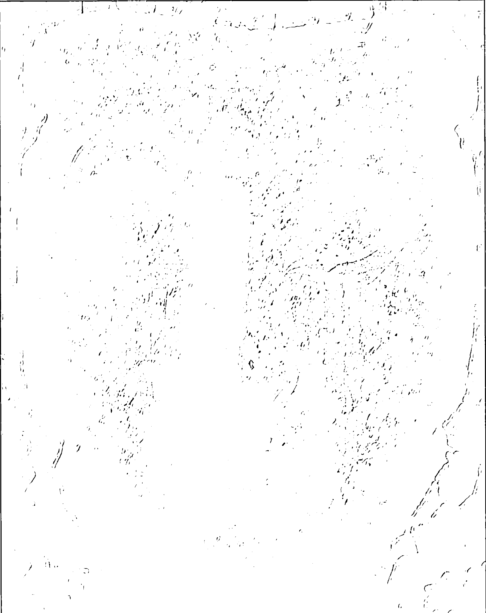

這是我一位德國的朋友 Peter Hesse 從泰國清邁帶回歐洲的畫。我後來稱這幅畫為 Buddha in Tears。可惜的是，事隔多年，已經想不起這位畫家的名字了。

# 14 意識擴大，作為一個路標

讀到這裡，我相信你已經發現一個很有意思的現象——這幾本書帶來的都是悖論。然而，你假如讀到這裡，也就代表很多悖論已經自然消失了。

這些書所帶來的內容，自然讓意識擴大（expansion of consciousness）。

意識擴大，也是一種 omnipresence（無所不在、全在）的表達。是我們從一個局限的意識軌道，突然跳到無限大的軌道，也就是一體。

這種意識的打開或擴大，本身帶給我們一種心理上的解開和快樂，它沒辦法用文字形容。我們最多只能透過這種擴大活出快樂，而活出哪裡，或有什麼特質，也講不清楚。所以，最後才會用喜樂、歡喜、寧靜、愛、滿足來表達。

它最多只是讓我們意識不再受限於一個角落，包括這個肉體，而突然給我們一個寬闊或全面的理解，也突然讓我們把這幾本書的全部重點都做了一個確認，甚至肯定。

比如說，我們多次提到人生沒有任何東西有一個絕對的重要性。突然之間，透過這種意識擴大，這些話是再明白不過了。

還有，本來沒辦法理解的「這世界一切都是頭腦的產物或頭腦的投射」，透過這種意識的擴大，你也自然發現——本來也就是這樣子。

我們跟著意識擴大，世界也就消失了。只要回到肉體，這個世界又成立了。

但是，這時候，我們已經看穿一切都是妄想，也就自然可以選擇放過一切，讓一切都輕輕鬆鬆存在。

因果和人生可能帶來的任何矛盾，也就消失了。

我們也就自然知道——還有一個「放過世界」的觀念，是因為我們回到身體，把身體當一回事，所以還有一個臣服或放過的觀念好談。

更不用說什麼叫做平等心，這個觀念本身也是多餘的。是我們還不理解什麼是真實，才要把任何現象做一個平等的整理。

也就好像，我們還要提醒自己——一個虛的東西，再加上虛的人，再加上虛的經驗、虛的人間、虛的宇宙，不需要做個排列——虛的它們都有一個虛的平等。

這種平等心的觀念，本身就像個笑話——彷彿在這一切的虛構之中，還有一個不平等的順序是比較真實而值得談的。所以，這種觀念最多是在我們還沒有醒覺的過程中，反映「沒有醒」的妄想和誤解。

同樣地，談到「菩薩道」或任何道，也自然知道都是個大妄想。

沒有眾生，也沒有菩薩，也沒有佛陀，也沒有世界，也沒有神。

只有一體。

而一體是一體到底，沒有一個角落沒有一體。

沒有一個東西離開過一體。

一體本身是圓滿。

多不出空間讓我們有一個人生、一個經驗、一個境界甚至「道」可以躲在裡面。

一體本身就是全部的潛能，也就是意識。最多我們也只能稱它 "I Am." 我是，我在。而一體為了體會到自己，自然分出一個個體。

一切，包括宇宙，包括我們的個體，都含在 "I Am."。從中自然分出來個體——我、你、世界，也就這樣子，我們突然忘記了個體的根源也就是意識或一體。

所以，我過去才會說意識是全部物質的根源。忘記了根源，也就讓我們建立一個虛的生命，限制在這個肉體。

這麼一來，不光把我們這一生騙了。還把人類騙走百千萬年。也還需要等到有一天，我們透過這個虛的世界、虛的人生、虛的痛苦、虛的失落、虛的絕望，非逼我們做個反省，做個翻轉不可。

只有把我們個體和一體的關係釐清，我們才走上一個回頭路，回到一體。

修行或醒覺，最多也只是回頭。從虛回到真實，也只有這樣子，才會說——

只有意識。

只有意識是真實。

一切都是意識。

沒有一項人間所看到、體會到的，不是意識。

意識，是解脫的。

它本身就是在·覺·樂。

談「在」，也是多餘。因為它沒有地方可能不在。

談「覺」，也只是個比喻，它最多只能覺察到自己。

更不用提「樂」，沒有體來限制它，怎麼可能不樂。

所以，我才不斷地強調，你我這一生唯一可以作的決定，也就是——轉向內，放過這個肉體，放過個體，回到一體。我們輕輕鬆鬆就可以決定醒覺。

所以，我要問的是——為什麼你我不醒覺？

# 15 能量的轉變

跟意識擴大一樣的，我們會發現——在這個旅程中，我們自然會有很多感知自己會爆發出來。有些人會突然對周邊特別敏感。甚至，可能有所謂的特異功能，比如對接下來發生的事有預感，好像可以讀到別人心裡的念頭，看到一些畫面，聽到一些天音。有各式各樣的心像，甚至可以看到前世的因緣。

這些感知全部都會浮出來。

也有人突然對能量、氣脈或脈輪的運作非常敏感，站在能量的層面，從最粗重到最微細，排序出能量的種類。透過能量，就產生很多體驗和境界，也有人頭腦會投射出很多體——菩薩、天使、神明、守護靈……也有人會突然對輪迴感興趣，甚至會追求這一生和過去生生世世的連結，不斷去追究自己和別人的轉世。

我過去在好多場合都會聽到這些說法，許多人都認為這些和修行有關，常常把這一些更微細的境界當作我們意識轉變的過程，甚至當作解脫的指標。

這裡，我最多只能分享我個人的看法——這一切都不重要。而這一切，和真實都不相關。

只要我們可以用話描述、用頭腦想出來、或可以有經驗好談，都離不開物質或念相，而都還離不開因果的層面。去追求這些現象，本身就把我們束縛在地球，讓我們落在人間。最多只是讓我們一次次來，離不開「人」帶來的制約。

對我們而言，最難想像的是，任何這些境界，還只是頭腦的產物。是我們人站在「有」來看這個世界。然而，我們自然會以為這些境界因為比較微細，脫離身體粗重的「體」的觀念，似乎相對比較抽象，而覺得它們比較真實。

這種誤解，也就可能這麼誤導我們一生。讓我們把虛的相，當作追求的目標。可能投入幾十年，甚至一輩子，都離不開這些念相。

這是我認為最可惜的。

本來不應該輪到我——一位科學家、醫師，來對新時代（New Age）所衍生的種種理論做個剖析。應該只是讓我指回大聖人的智慧，作為修正的指標。

但是，因為這些不同觀念帶來的錯覺太普遍，也太嚴重。我也不忍心不把我的看法做一個更透徹的分享。也才大膽地提出兩個最完整的法門——臣服、參。當作一個練習的工具。幫你我把這個問題解開。

我們徹底臣服，就會自然放過這些微細能量的現象，而隨時回到瞬間。進一步，假如這些「超人」的現象還不斷地浮出來，我們最多也是輕鬆地提醒自己——

對誰，有這些現象？

這位認為還有這些現象的，不管多麼微細，又是誰？

當然你我都知道答案——也最多是我。

那麼，我又是誰？

這麼一來，參再加上臣服，自然可以讓我們看穿全部這些念相，而像一枝箭，直接穿透心。也就這樣子，把全部人生所帶來的錯覺，包括修行跟成就所帶來的錯覺，都可以一步把它挪開。

我在這裡用最誠懇的心來表達這些觀念，也就是希望你我可以聽進去。省掉許多冤枉的路，讓我們一路走回家。

走回家，也就發現——所有大聖人在等著我們，希望擁抱我們。

其實，他們也從來沒有離開過我們。你我也從來沒有離開過他們，甚至沒有離開過真實。

最多，我們也只能選擇醒覺。

這是唯一真正的選擇。

是生生世世來，唯一一再的選擇。

就算這一生不面對，總有一生要去面對。

講得更透徹，就連「選擇」這兩個字都是比喻，因為我們人類老早就是醒過來的。最多只是不知道，被頭腦遮住了。只要把頭腦和念頭挪開，醒覺就在眼前。

這麼說，你還可能等什麼？

還要等什麼時候？等什麼事件發生，來讓我們醒覺？

# 16 微細的能量，跟你不相關

前面提到微細的能量，而這些微細能量，其實最多也就是狀態。一個人還是要從這些狀態解脫出來，才能真正自由。

也就是說，連微細能量也還離不開物質的層面。

反過來，很多人認為微細的能量從人間的角度來看，是個妄想，是個幻覺。

這兩種看法其實都不正確。

微細的能量或任何狀態，本身離不開物質。說它不存在，也好像存在。

我們都看過很多人好像很敏感，能體會到天使也好，或一般人肉眼看不到的其他眾生。你我也往往把他們的體會當作幻覺。然而，我們幾乎不會想到，人類的知覺受到五官的限制，在這五官打轉，不可能對物質的宇宙做一個充分的理解。所以，說看不到的物質不存在，這本身才是個妄想。

就像我們的世界、人間，其實是由五官所組合的。假如有其他的感官，所組合出來的世界可能完全不一樣，甚至可能組合出一個和人間平行存在的生命，同樣是透過感官和知覺帶出來的。

這樣子想下去，可以想見其實有各式各樣的生命同時存在於同一個空間，只是我們人類所體會的層面相當狹窄，無法掌握其他的面向。

我們再仔細探究下去，就連強調地球外的異種生命（外星生命）也是個可笑的說法。其實，光是在這地球同時存在的生命，我們就從來沒有全面理解過。我們根本沒有想到，有各式各樣的眾生。從能量最粗重，比人類還濁重，到能量最微細，比龍、鳳凰、天使、精靈還精細的，多得是。

生命的種種形式，就像彩虹一樣是個連續譜。在能量的層面，從最輕最細到最重的都有。然而，人類看到的人間，只是一個很狹窄的範圍。

儘管如此，這些都不是我們需要追求的。

我們最多是把一切放過，知道人類所知覺、體會的只是太少的一點。從這麼少的一點，沒有資格做一個批評，或把人間當作一個基準。

然而，知覺到多少、體會到多少，對我們都不重要。

談到能量或能量帶來的境界，最多只能說是透過每一個細胞體會到真實，也可以說是透過每一個體，不光是肉體，還有情緒體、思考體、意識體、包括能量體來體會到真實，真實或一體才可以落到我們的生命。要不然，還是落在一個理論或思考的層面。

落到我們的全面，才能說真正懂了。一個人真正懂了，自然透過每一個細胞、每一個體，包括能量體，來祝福這個世界，祝福周邊的人。

因為深知樣樣都是虛妄，也從來沒有離開過一體。所以，祝福本身也是從真實更深層面自然流露的表達。

其實，這些不同的眾生，假如存在，一樣要符合它們自身帶來的因果，而體會它們的因果，建立它們的世界。最後，每一個眾生都還是要解脫，從它們自己的狀況中解開，才可以自由。

任何眾生，最後還是要回到一體。

懂了這些，我們不會希望去追求更微細的能量狀態，也不會去否定它們。

清清楚楚知道，連最高的能量境界、生命，最後，還是要從中解脫，才能自由。

無論最粗重還是 最微細的眾生，都無所謂，一樣沒有掌握最高的真實。然而，最高的真實，最後要從每一個角落、每一個眾生都充分理解——這個也不是，那個也不是，沒有一項是真實。

真實不會受到任何的局限，也不會落到任何眾生。的層面。

一個人只要想通這些道理，其實已經解脫了。就是因為沒辦法解脫，我們才用各式各樣的 sādhanā 把注意力打開，讓念頭消失，而讓一體浮出來。

也因為這樣子，我在這本書和前兩本書才不斷提到業力的作用。

一個人要解脫，首先要把業力或因果看穿，這才是關鍵。

# 17 真心明白自己是誰

讀到這裡，也許你我可能還在質疑，覺得不可能那麼簡單，甚至不認為超過這個身心之外，還有什麼東西好談。所以，總覺得我們所談的這一切，似乎跟生命不相關。

你我的現實、你我的世界、你我的人生、你我的故事、你我的痛苦——我們什麼都堅持，都認為是紮實的存在。所以，談到另外一個真實，好像最多只能勉強接觸，而還不可能接受。

這是最可惜的。

就像一個人在夢中，認為樣樣都紮實，而不可能透過自己的想法而醒過來。

醒過來，通常是我們進入另一個意識的軌道，比如從睡覺的狀態，突然挪到醒著的狀態，我們才突然發現——這場夢不存在。

人生也是一樣的。

從這個人生要醒過來，我們非要跳出來，或挪到另一個意識的軌道，才可能體會到這場夢。假如透過我們的邏輯去分析、去追求，是永遠分析、追求不來的，只會在裡面造出矛盾，強化頭腦的運作，強化「我」。

從另外一個角度來說，人間的聰明，再怎麼聰明還是在一個局限。是比較、分別、二元對立的聰明，跟無限大的聰明或智慧，一點都不成比例。

一樣地，我們的潛能再怎麼高，怎麼偉大，還是局限的身心所帶來、所可以想像的潛能。無限大的生命所帶來的潛能，則是人怎麼想都想不到。

我們再怎麼專注，最多還只是落在一個點，或一個角落，根本沒有辦法體會到什麼叫做無所不在的意識。

更想不到的是，我們過去所稱的上帝或神，最多還是腦海中的一個客體。你我從來沒有想過——上帝或神不光是在我們心中，和我們從來沒有分手過，而我們自身就是這個生命的造物主（Creator）。

> —“If you and I only knew who we are...”

所以，我才不斷地強調——

假如你我真心明白自己是誰，可能這一生所追求的方向或目的，會完全不一樣了。我們會自然放掉一切，再也不會重視任何東西或任何境界，因為深知任何東西或境界和你我真正的自己比較，都不成比例。

我們會自然發現，過去所追求的一切，都是希望改善自身人類的狀態（human conditions）。然而人類的狀態，本身離不開地球的作用。

最不可思議的是，連你我面對修行，都還在期待改善人類的狀態，希望可以提升生命的品質，或扭轉生命的不愉快、痛心的狀況。

我們倘若充分領悟到自己的全部潛能，也就會發現這些物質、狀態甚或身心的追求，本身是虛妄的。就好像我們在一個虛幻的世界，想追求一個虛妄的結果，而這一切都是透過我們虛幻的頭腦去體驗、去改善。

接下來，我們也不可能再談什麼人生的方向、目的或目標，更不會去強調生命要有什麼意義。我們自然發現，所有的這些觀念都是頭腦的投射，離不開二元對立，甚至本身就把我們「綁架」到這個地球。

當然，這些話，你不需要照單全收。最多也只是參，或透過寧靜來體會這些話的正確性。

領悟到了，最多也可能用你自己的話來表達這些再明白不過的真實，也可能決定什麼話都不說。

因為，也沒有誰可以分享的。

這時候，你最多可能同情我——怎麼還要用那麼多的篇幅、文字來表達這些再明白不過的觀念。

# 18 人生，沒有目的，也沒有目標

你我讀到這裡，假如可以接受這一切觀念。也自然就會開始反省，開始質疑——我們人生所帶來的一切的價值觀。甚至會發現我們從出生、在家庭生活、接受教育、進入社會、一直到離開人世，一生活出來的全部觀念，最多只是把我們局限在這個肉體，帶來一層又一層的限制。

你我自然會發現，人類所可以想到的全部觀念或價值，都和真實不相關。

最嚴重的是，連我們從小到大、到老死，可以想到的人生目的或人生目標，最多都只是把我們落在這個地球。讓我們一次次回來，完成一個虛的任務，而還會認為這個任務有絕對的重要性。

我們每一個人，包括你我，不斷地還認為在這個世界有一個任務，而我的任務不光和你的不同，還更大、更好、更有意義。甚至，有時候認為只有自己才能真正理解這個意義，別人不見得能理解，甚至沒辦法體會。

你我同時也會期待自己能成為菩薩，會認為有個救這個世界的任務可談的。也自然會跟著忙碌一生，希望拯救數不完的眾生，完成人生最大的目的。

這可說是人生最高的目的，我當然只能肯定與讚嘆。因為一個人做善事、為大眾服務，它本身是個練習，是個修行。也就是梵文所說的 karma yoga（業瑜伽），是去除煩惱最好的方法，讓人得到平安。

所以，也只能讚賞這種善意。

也只有惋惜——沒有更多人有同樣的善意，帶給人間、地球和諧。

這就是菩薩道最偉大的一個層面。

我這裡最多只是做一個提醒，希望你我注意這個做善事的動機，而仔細觀察自己善意的出發點。再進一步，我還是認為有必要提醒你我對真實的認知，讓我們共同探討人間的起源，希望能直接切入到源頭。

然而，也就是在這個時代，我們必須要把三個大的方法合一——「參」jñāna yoga、「臣服」bhakti yoga、「服務」karma yoga。

一個人如果光懂得「參」，自然容易只落在一個理論的層面，偏重「空」的境界，甚至把「有」當成「空」的對立，卻忘了在任何角落都可以活出「空」，也可以活出「有」；一個人光做「臣服」，難免會把奉愛的對象和大我隔離，好像除了大我、本性、上帝之外，還有另外一個體可以臣服；一個人光是服務、光做善事，難免落入還有一個「作為者」(doer)的觀念，而缺乏一個穩定的基礎。

只有把這三個方法合一，你我才可以活出智慧、愛、慈悲與謙虛。該服務時，自然會服務、關懷、照顧身邊的人，但是沒有一個作為者，也沒有什麼好事、壞事好區隔、好沾上心的。

只有這樣子，一個人才突然自由。「參」、「臣服」、「服務」就好像三個支柱，讓我們的修行穩定，是一個都不能少的。

我相信只要追求下去，透過這一系列的作品帶出來的方法，你我自然會發現——人生倒不需要有任何意義。

任何意義、目標或目的，其實還是我們頭腦的產物。是透過「我」所「理想」出來的。是「我們」認為有意義、有目的、有目標的，才可以達到「我們」所認為人生的圓滿，而被「我們」認為是人生最大的動力，給「我們」設立人生的方向。讓「我們」跟其他生命，甚至無明的眾生做個區隔，表達人類的演變。

最後，還是離不開「我」、「我」、「我」、「我」、「我」、「我」……

全都是站在「有」看「在」、看「一」、看「全部」，還是離不開二元對立。

簡單講，人生不需要有目的，生存更不需要有意義。「在」也不需要有目標可完成。

人生，生存，「在」，本身老早圓滿。

圓滿什麼？

圓滿自己。

自己，圓滿自己。

也就是承認——只有一體。而一體不需要有其他的體來完成它自己。它本身是無所不在。連一個特質，我們都不用再貼上去。它不需要我們幫它解釋，也沒有什麼好解釋。它也不需要去表現、展現它自己。

假如你我徹底領悟到這幾句話，我們會發現自己就活在寧靜之中。而寧靜本身就是我們的一切。

接下來，沒有什麼東西可以再探討、去追求，甚至放不過。

人生自然變成一個神聖的遊戲，讓我們從每一個角落看到它的完美，又看到它的幽默。我們也就快樂起來，發現人間再有什麼考驗，我們最多只是不斷地快樂，不斷地歡喜，不斷地寧靜。

只是你我讀到這些話，還可能馬上反彈，認為這個狀態和你我要面對的人生不同，我們還是必須要回到生活中，面對生活帶來的種種考驗，與物質帶來的現實，這些話卻好像是抽象再抽象，和你我個人的人生經驗不相關。

假如我們讀到這裡，還有這些看法，那實在太可惜。因為我們還以為——人間所看到、體會到的，就等於真實的全部；而這一生來，只是為了讓我們活出眼前的局限，所以，還有一個人生的意義、目的或目標好追求的。

其實，談到這裡，不代表你需要跟人間所過的生活做個隔離。你我該做的，還是可以做，沒有說不做。但是，我們做的心態會完全不同。

是「心」帶著我們做，是把瞬間、一個瞬間、再一個瞬間，拉長成一個永恆。是把念頭當作工具，把身體所想活出來的業力，讓它自然展開，自然完成自己。而我們不去干涉它，不再做再一個層面的反彈。

你我想做什麼，也就去做吧。但是不管怎麼做，都已經離不開你我清楚領悟的真實。最多只是把每一個「做」變成清醒的「做」、醒覺的「做」。是生命帶著你我「做」。

再講透徹一點，我們過去提過情緒是一個念頭的擴大器，同樣地，任何激烈的反應或反彈，本身也是一個業力的擴大器。

懂了這一點，我們可以輕鬆地做一個見證的人，看著自己的念頭和情緒，放過它們，讓它們存在。同時，也看到任何狀況，無論好壞，甚至多麼悲傷，也都放過它們，一樣讓它們存在。

不再繼續反彈，業力本身會找別的出口消失，和我們的命也就達到一個和諧。

這樣一生走下去，其實，一個人不光不需要和人生作個區隔，反而隨時在擁抱這個世界，而不斷地帶出「在」和寧靜的光明。

這些話，是我用最誠懇的心和你分享。最多也只是把我個人的體驗給你做一個參考，是我個人的分享，個人的告解。而你最多也只需要拿自己做一個對照，看可不可能驗證或推翻這裡所談的一切。

# 19 捨離

之前談過捨離（renunciation）這個觀念，談一個人需不需要透過守戒或節制來活出「在」。

我在這裡，要換一個角度來談。

一個人解脫、自由，也自然發現——生命再也不會是一個問題，或是一連串的問題。樣樣最多只跟「我」有關係。讓「我」處理完，也就沒有了事了。

進一步，自然會發現——沒有任何東西，是這個世界可以提供，而讓我們捨不得離開的。

被任何東西綁住，無論多大或多小，也許是一個紀念品、一個美好的回憶、甚至一個高峰經驗，都再也不可能把我們的注意力岔開。最多，我們只是透過「我」、透過業力所帶來的身體——來欣賞、來參與這個世界，來處理人間帶來的事情，辦該辦的事。只是，這些都不再是問題，對我們，也不再有什麼吸引力。

因為我們已經知道，這一生來，就是為了準備我們醒覺。

然而，就是醒過來了，這個肉體還是要完成它這一生的旅程。

這個旅程的目的和目標，都不重要。重要的反而是每一步的心態，或者說每一個瞬間自然帶來的心流。有結果或是沒有結果，和我們的一體完全不相關，既追加不上任何東西，也不會讓一體減少半分。

這是我所談的捨離——一種從內心最深層面流露到外的捨棄和分離。

是在人間的「動」看到「不動」，在人間的波浪活出深海的寧靜。這種捨離，比形式上的離開俗世，或放棄一切物質的守戒、守貧，影響還要更大。

一個人懂了這些，就會明白——即使表面上，把外在的一切全部放棄，全部丟掉，心也不一定能夠安定。

反過來，一個人內心達到寧靜，外在的一切都不用捨棄，因為老早已經捨離。

最多把樣樣當作一個方便或工具，因為這個肉體還是要活下去，還是要有食、衣、住、行，要吃喝、要排泄、要睡眠、要休息。

一個人在內心早已經離開這個人間。

不需要在外在再加一層離開的形式。

這種捨離，不只是從心理層面放下對生活物質的依賴，還包括社會、家庭所帶來的任何價值，甚至，還包括人類和地球所帶來的束縛。

任何吸引力，無論是多美的經驗，多深的體會——我們最後都要看穿，還要知道它們其實還是因果的組合，最多只是頭腦所投射出來的。

是頭腦帶著一個連貫性，讓我們做一個經驗的分別，而讓它好像真實化。


所以，談捨不捨離，一個人懂了，自然知道這問題不存在。

捨離，是一個心理轉變所帶來的成就或結果。我們最多可以稱它為對稱——內心達到平靜，外在自然只能有平安。

內心有了寧靜，外在自然轉成沉默。

內在帶來的平等心，外在最多轉成愛、喜樂和「在」。

所以，需不需要捨離，最多也是符合內外對稱的法則。

接下來，我們最多只能順其自然，走下這個人生。有時候，可以參與社會的種種活動，扮演人間的種種任務。同時，也可以選擇什麼都不做。

做或不做、捨離不捨離，所引發的任何矛盾，還是頭腦投射出來的一個妄想。

而矛盾、妄想，再也跟我真心不相關。

# 20 醒覺，只可能是突然的

最後，人生不光沒有意義，沒有目的，沒有目標，連醒覺，其實都沒有。

因為，假如我們徹底理解，連醒覺都是多餘的，本身也只是一個投射，是頭腦的產物。

反過來，假如有一個東西叫醒覺，也自然會發現，醒覺是突然的。

突然醒覺到什麼？

突然醒覺到我們的本質，也就是一體。

是不靠時間。

不靠練習。

不靠任何東西。

醒覺的狀態，也就是一體，本身是我們的本質。

不光是我們的本質，也是全部眾生和沒有生命之物的共同本質，它本身是自己支持自己，自己證明自己，以及自己圓滿自己（Self-supporting, Self-evident, Self-complete）。也才可以稱之為生命永恆或神聖的部份。

所以才會說，一體體會到自己，一定是一個突然的轉變，倒不可能是分段的。它不會是一個漸進的過程，不可能是看到一點點一體，然後再多一點點。只是看到一點點，也就是看到全部。因為就是這一點點，也包含全部。

進一步，這個本質如果只有我們人有，而其他眾生沒有，它本身也靠不住，一樣也會生，也要死。所以，我才不斷地提醒你我，是因為我們把它遮住了，而我們拿來遮住的東西是頭腦，才可能有一個解開、超脫、跳出、解脫、醒覺好談的。

也才會說，只有人有解脫或醒覺好談。因為，只有人會把它遮住。

一朵花，也遮不來。

一條狗，也沒辦法遮住它。

一顆石頭，活它自己。

只有人，有這個本事產生一個虛的體，更稱之為人生。不光用我們的頭腦，遮住一體，還把全部真實落在頭腦產生的虛構世界。

這本身可以說是最不可思議、最大的「奇蹟」。

醒覺，最多也只是把這層遮住的膜撕開或挪開。你我也就自然發現——什麼都沒有發生。本來就存在的東西還是繼續存在，本來沒有發生的，還繼續沒有發生。

但是，有趣的是，我們頭腦非要認為發生了一件事，有一個發生的過程好談。也就這樣子，創出一個醒覺和解脫的觀念。

我才會說，醒覺，假如有一個東西叫醒覺，它只可能是突然的。是沒有醒覺前就有，醒覺後還是有。是輕輕鬆鬆存在，永恆的存在。從來沒有不存在過。

但是，是配合我們頭腦的運作，所以也就讓我們有個醒覺好談。

講得更透徹，前面所講的人、動物、花、石頭，全部還只是我們頭腦投射出來的，是我們透過因果再加上五官的作業把它凝固下來的，好像真有這回事。

站在一體或整體，什麼都沒有，一切是個大妄想。

這裡，一樣地，最多只是站在一個大妄想在作文章。

## 第一章：示例文檔

本文檔用於演示如何從圖片中提取文本和結構信息，並轉換為結構化格式（如JSON）。內容僅為示例。

## 1.1 章節標題

這是章節標題下的段落內容，包含連續的文本信息。

- 一、項目一
- 二、項目二
- 三、項目三

> “這是一段引用的文字，可能來自其他來源或用於強調。”

以下是一個簡單的表格示例：

| 類別 | 數值 |
|---|---|
| A | 100 |
| B | 200 |

表格用於展示結構化數據。接下來是一個代碼塊示例：

```
python
def hello_world():
    # 這是一個註釋
    print("Hello, World!")
```

# 21 老師來找你

我在這裡，最多只是帶出一些路標，讓我們一路走下去，走到一體（One Self）的門口。

要踏進去，最後的一步，還是要靠自己。

反過來，比較更正確的講法是，只要我們的心地準備好，成熟了，不用擔心，老師自然會出現在眼前。

所以，我最多只能說這一系列的作品是在為我們作準備，讓你我準備好，可以找到一位好的老師帶著自己走下去。

而且，是老師來找你。

這個觀念，和我們一般的想法顛倒，可能對你又是個悖論。

我指的老師，梵文也稱為 guru（上師）。

gu-是黑暗，而 -ru 是照亮。也就是說一位好的上師或老師，最多也只是從黑暗帶著我們醒覺。

這樣子解釋，其實一體是最好的 guru，而 guru 從來沒有離開我們內心。所以，我過去才會說最好的 guru 是內在的老師（inner guru）——「心」，本身就是我們的老師。

是內心，帶著外在走。

一體或「心」，早晚會把小得不成比例的外在、「我」或人間融化掉，吸收回到自己。這是早晚的事，我們內在的老師也不斷在跟我們指路，讓我們能最順地回家。

遺憾的是，我們透過腦的抵抗，幾乎聽不到內心的訊息，自然耽誤這個旅程，還要一次一次重複人生的經驗，才可以累積一點智慧。

更有意思的是，透過之前提過的對稱法則（law of symmetry），內在和外在自然會達到一個相對的平衡。

內心在什麼狀態，外在自然會反應我們的內心。內心也就自然化現一些外在的路標，都可以稱為我們的老師。

所以，一位好的老師，不一定是人類。有時候，可能是一隻鳥、一朵花、流水、大自然、天空，都可以成為我們的老師，不斷地提醒我們。

帶來路標，指向人間的出口。

進一步講，懂了這些，每個瞬間——眼前所看到的每一個人、每一樣東西，都自然成為當下的老師；每一個當下，也自然變成人間的一個出口，或解脫的路徑。

把每一個瞬間，都當作最好的老師，一個人自然進入臣服（bhakti 或 devotion）的狀態，也就是——一個人隨時在禱告，隨時在臣服。

臣服給誰？臣服給神、佛性、本性、全部的大聖人、真實的自己。

每一個瞬間，也就突然活起來，跟我們不斷地在耳語、說悄悄話，帶著我們走下這一生。

一個人也就隨時在禱告，而這禱告是神聖的，無法用語言表達。最多只能說，他創出一個神聖的空間，活出一個神聖的生命，隨時向全部的大聖人在頂禮。

我們通常還是期待一位人類的老師，只是自己質疑心太重、制約太僵化，或者說迷路太久了（還不只這一生），也不見得認得或懂得欣賞眼前的老師。

然而，當你我準備好了，甚至連「人」的老師也會自然出現，幫助這個旅程。

一個人，只要修到或徹底醒覺，他所帶的生命場、能量場是不可思議的大。

他不光自己活出「在」(presence)，而他本身的在會影響到周邊——其他的眾生和任何東西。這個場的作用，不是透過邏輯，也不是透過理性做一個轉達。

最多，我們只能說，他帶來一個恩典，讓學生、弟子或周邊的頻率，和他個人達到一致。也就是說，任何進入這個場的人，都會受到影響，甚至透過這個大的場的影響，也就自然進入一體，省掉數不完的冤枉路。

古人、大聖人都懂這些，所以才會有上師弟子、師徒的傳承，也才有弟子透過服務、服事來達到臣服的觀念，並由此衍生出來奉愛瑜伽等等法門。

理性的朋友讀到這裡，可能會覺得很驚訝，甚至覺得不科學、不夠進步。我最多只能再一次提醒，不要相信這本書所提到的任何話，而是要帶著科學精神，親自去驗證。

但是，不需要為了驗證刻意去找個老師，因為你我只要成熟度夠，自然會碰到一位老師，和自己的成熟度剛剛好可以匹配。

而且，也正是我們在那個時點所需要的。

# 22 醒觉，是注定的吗？

前面提过，只要认定这时空是真实的，我们自然就进入了因果或业力法则的领地，点点滴滴都受这个法则而运作。

然而，透过这个法则，每一个动作，每一个念头不可能不是注定或事先决定的。

好笑的是，一般人听到这个说法，会认为不科学。但是，只要仔细观察，仔细探讨这个道理，自然会发现——不可能不如此。

你我一般很少想到，人生的架构本身，是因果的组合，而因果本身是种种条件的呈现，本来就带来一股扭力，比我们任何人想像得更大，甚至比我们在每一个瞬间所体会到的远远更大。

前面提过一个比喻，透过五官看世界，就像一个人从钥匙孔往外看，最多是看到五官所限定出来小小的范围。五官知觉不到的，当然不可能体会。

也就是说，我们人生所可以体验、发生的一切，最多只是透过瞬间而露出来的不成比例的一个小点。然而，面对所发生的一切，我们却以为自己有选择的余地，以为自己有自由可以决定。

这种观点是个大妄想，与组合这个世界的条件不相符，不符合基本的法则。

这里所说的，总有一天，也许百千年后，科学能够证明如此，而一切的反对声浪也就销声匿迹。就像哥白尼在六百多年前提出地球不是世界的中心，伽利略经过验证来支持，突然之间，千年来认为地球是宇宙中心的说法，也就消失了。

所以，如何注定，倒不是真正需要探讨的问题。最迫切的问题反而是——假如人间所体验得到的一切都是注定的，那么，醒觉也应该是注定的吧？

我过去几乎没有听过任何人这么问。

这个问题相当有意思，因为它含着一个更深的意义——既然醒觉和任何练习或 sādhanā 不相关，甚至一般人会以为跟做好事、做坏事都不相关，那么，追求又有什么用？还不是时机到了，也就醒觉过来了？

我接下来要带出一个悖论——醒觉，是靠一个人的成熟度。

所谓的成熟度，指的是一个人在灵性方面的成熟，是彻底把人间的虚妄看穿。

这种成熟度，确实是靠「在」或领悟，倒不是靠「动」或「做」而得到。

此外，之所以说是悖论，正是在于我们很难判断一个人什么时候成熟。而要靠这个成熟度来醒觉，一个人必须准备好。难的是，谁晓得我们哪一天准备好了？

透过人間表面的好好坏坏、任何行为、任何表现，很难看穿一个人是不是已经准备好了。

最多，也只能当作我们已经准备好了。不要去理这些判断，不要去想成熟了没有。

不断地做*sādhanā*，不断让念头带来的虚妄消失。

透过 *sādhanā* 也就是过去修行累积下来的基础，而彻底把我们的理解活出来。让理解从理论的层面，落在生活或每一个细胞体验的层面。

所以，借用注定与否的比喻，我们最多只能说——是透过过去的准备或 *sādhanā* 决定或不决定这一生觉醒。

我希望你我好好地参这句话。

也因为如此，我过去总是提醒自己和周遭的人——这一生来，无论注定不注定，都要不断地进行*sādhanā*。透过臣服和参，不断地把这一系列作品所表达的真实的道理，落在我们眼前。

你我大概没想过，一个人光是早晚静坐是绝对不够的。尤其是在这个快步调的时代，随时会被生活带走，任由生活麻木过去，带来不断的制约，让我们根本看不到人生或制约的尽头。

从另外一个角度来看，这些制约，不是我们这一生才开始累积。包括全部人类的制约，都落在我们的身心。这种多年累积下来、重复再重复的制约，不可能透过一点打坐让头脑略作沉淀就把它化解。

Sādhanā、臣服和参，最多也只是为我们累积的全部制约，带来一个反向的动力，让它从头脑反向回转到心。

我们对人间的投入所带来的制约，不可能一夕之间或短期消失。这种期待本身就不符合逻辑。

所以，我们可以这么说，这个世界是从心透过头脑投射出来的，从一个「不动」带到「动」，而「动」扩大成世界，扩大成我们的人生。臣服与参，是一个反向的路，从脑的「动」回转到心的「不动」。

这是唯一可以消逝「我」的方法。

一个人确实懂了这些，自然会急迫地二十四小时都在进行 sādhanā。至于 sādhanā 要达成什么目的，根本不去管它。就是为了 sādhanā 本身而 sādhanā。

这样子下来，一个人不断地和古代的大圣人连接。生活当中，不断在祷告，不断地奉爱，不断把自己交托给大圣人，也就是生命最高的领悟，也就是生命的整体——One Self一體、整体。

这就是臣服。

只要念头来，或情绪起伏，自然会提醒自己——这些念头或情绪是为了谁来的？谁还有念头或情绪好谈的？

这样轻轻松松提醒也就够了，我们也就自然回到一体。

站在一体看一切，包括眼前的好事、坏事、人的高矮、胖瘦、东西美丑……，不断地和一体结合，我们就轻轻松松不费力地成为一体。

这一点，本身就是一个基本的法则。

所以，我才会强调把念头当作解脱最有效的工具。透过念头、理性、逻辑、二元对立，我们不断回到一体。
不断回到一体，一体就变成我们的全部。
写到这里，我必须要承认——用了这么多字句，我已经不知道怎么讲得更透明。只怕你对自己还不够有信心，还要继续流浪，让这个世界来制约你。
我劝你，读到这些，也就觉醒过来吧。
把这一生当作——你非觉醒不可，是注定要觉醒的。
觉醒了，也就没有什么好再谈下去的。

# 23 没有什么、没有谁会害你

我们假如可以承认人间所带来的一切现象都是注定，甚至连觉醒都是注定，那么，我们也就可以自然可以理解——在这个世界，没有一样东西或一个人可以影响到我们的真实，或可以对真实带来什么伤害。

也就是说，没有谁、没有什么会来害我们——我谈的是，真实的我们。

表面体验到的失落、受伤、悲惨、不公平，都还只是头脑不断投射出来的境界。不光如此，就是因为我们认为这个时空是绝对的，是真实的，而又把自己和时空分不开，才会认为眼前所体验的打击或伤痛也是真的。

同时，也因为我们跟时空分不开，才会自然投入一个因果法则，受到因果法则的作用。如果只站在因果的层面来看，没有一件事、一个人、一样东西不是因果的组合。我们任何反应和反弹，和其他人的反应与反弹，同样离不开因果。

这个因果不是透过五官和念头可以完全觉察到的。它远远大于逻辑所可以理解。

所以，表面看来被人侮辱或伤害，不是单纯别人来委屈我们、伤害我们、为难我们，也不是别人不理性、充满恶意，或刻意来欺负我们，而比较可能是我们过去的互动（不見得是这一生或头脑所理解的互动）带来的结果。

因果本身是能量的表现或转变，最多是反映过去能量的残留，或能量从一个地方转到别里哪里的过程。

眼前的一切，所发生的事情，最多只是过去、某处一个事件的反作用力。

所以，我才会说业力法则其实就像牛顿第三运动法则。差别只在于，牛顿所谈的是我们现在所体会的时空，而业力法则是包括一个人过去面对的所有时空，不只这一生。

无论如何，一切都是双向的。表面上看来，是我们受到委屈，但相当大的可能是我们在偿还过去的债。只要我们完全理解这一点，也就立即可以接受任何考验、任何委屈、打击，甚至大灾祸和苦难。

因为这个题目太重要，我在这里想讲得再彻底一点。

我想表达的是——面对任何委屈、失落、或是伤害，可以透过两个层面去看穿它。

站在时空或人间的角度来看，我们非要受制于这个业力法则不可。而且，业力扭转带来的力量，比我们任何人想像的都更大，是从很多层面组合起来的，透过瞬间只让我们看到一点，我们透过头脑，绝对没办法全面理解。

它是从多重层面（multi-dimensions）的运作而来，是多重因子（multi-factors）与多重变数（multi-variations）的综合结果。并不是单一的因造成单一的果。就连单一的果，也是多重变因的组合。

也许是过去种种条件的组合，而都是相对成立的。

所以，去抵抗它，或再进一步反弹，最多只是反映了——我们看不见全貌。

委屈、失落、伤害、打击、灾难，其实说不定刚好就是我们需要的一堂课。透过这些事件，我们不光对人生有更深的理解，同时也让我们还债，在能量上达到一个均衡点。

从更深的层面来谈，业力之所以存在，是因为我们认为时空存在，认为时空带来的人间是坚固而实在的。所以，我们才受业力法则的作用。要不然，它是虚構的。

业力本身是个大妄想，是我们把意识落在时空，才要受它宰制。

站在一体来看，没有时空，也没有业力，也没有人间。最多只能说它是一体延伸出万万种可能性之中的一个狭窄的可能。对一体而言，我们会把全部注意力落在不成比例小的这个世界，才是不寻常。

站在生命的外在和内在两个层面来谈，任何事，都不值得我们计较。不光是坏事、危机、打击、厄运不值得计较，就连喜事都要同等看待。

一个人对这些话如果不光是认同，而且从生命的每一个体会、每一个细胞都体会到，也就突然发现全部的恐惧都成了过去，再也没有任何东西或人可以来伤害我们。

表面上再怎么痛苦、再怎么损失，心里是平静的。在更深的层面知道厄运和坏事也正是刚刚好我们需要的，本身就是我们需要的。

也就好像，我们清醒地决定有它，有这个不好的事。

不光我们对坏事没有反弹，还可以完全接受。

完全接受任何事——好事、坏事，我们自然消逝业力，让业力的扭力转到别的地方。

透过这件事带来的业力，也就到此为止。
事和事之间，我们这样子活下去，人生带来的所有问题也就自然消失。
我们才自由起来。

# 24 什么都没有发生

读到这里，假如没有任何质疑，不光是没有质疑，而且可以同时从心把这些话听进去，我们自然会得到另一个启发。

我们自然会发现，其实，没有什么东西可以叫做真实。
甚至，没有什么叫做时间。
最多，我们也只能说，连瞬间都是个妄想。它最多只是代表一个大的扭力，透过因果转出来一个现象，而这个现象透过我们的头脑做一个排序，带来一个时间上连续的观念。
其实，什么都没有发生，什么都没有发生过，什么也不可能发生。

假如有一个东西叫做发生，只能说我们称为发生的一切，是从有史以来到现在、未来，千百万劫都在同时发生。
一切都在同时发生，也就可以说，什么都没有发生。
一切只是个大妄想。
「发生」——任何东西发生——本身还是个头脑的产物，是我们透过头脑投射一个时间的观念，再接下来排列一个过程，让我们得到一个顺序或因果的连结。就是因为我们不断地肯定时空是真的，因果是真的，人间也只能是真的，我们才经过头脑要做一个排序。

前面提过，我们在人间所可以体会到的，都是透过五官把一个整体资讯化、狭窄化、局部化。即使「活在当下」或「臣服到瞬间」，我们在这个瞬间可以体会的，一样离不开五官和念头的组合。

我们头脑透过每一个瞬间可以捕捉的资讯，最多也只在一个有限的范围，逼得我们必须要做一个虚幻的排列，让我们有一个虚幻的因果的观念。这样对头脑才合理，而能有一个境界、人生、故事好谈。要不然，头脑会错乱，无法解释所有的现象，更无法整合所收到的资讯。

站在整体，什么都没有发生，也没办法发生，因为它本身是无所不包，涵容一切。
任何事情发生，要从一个角度切入，要产生一个层次或差异（gradient），甚至意识要集中在一个小部位（locality），才可以有一个发生的观念。
接下来，矛盾自然就产生。
因为整体在每一个角落，都在。
任何隔离或区隔，是不可能的。区隔本身就违反了整体的观念。
我们最多只能说，是头脑投射出来一个虚幻的观念，才会突然有一个「动」（motion），有能量，有生命，有发生。

也就这样子，把我们束缚起来。
接下来，我们才会谈过去－现在－未来，而且不光是个人的，还是一个人类集体文明的过去－现在－未来，也就这样产生一个历史的观念。
这种建立，本身是人为的最大「奇迹」。
从没有任何东西可能发生，变成有那么精彩的人生——集体和个人——好谈。这本身是不可思议的。
所以，解脱，最多只是把人类自己带出来的束缚看穿。连解脱或觉醒，本身也不存在。一样没有什么发生好谈的。
最多只是一体，透过我们的每一个体会，透彻到底，而自然浮出来。把我们的「我」化掉、吞噬。
这是我们一般最难懂，甚至认为不可能的。

我们知道有一个物理的时间观念，可以用手表去测、去追随。然而，爱因斯坦和其他科学家老早解开了，连时间都是相对的，不是一個常项。
只是，我们地球转动的速度很慢，跟光速相比很慢。也就这样子，让我们认为时间是坚实的，是个物理的常项，而无法推翻。

一个人觉醒过来，这些话全部都是多余的。他最多只是微笑，知道这本书和前面所谈的所有观念是再明白不过了。
但是，站在我们头脑的逻辑，这些话都化出悖论，甚至矛盾。接下来，头脑一定会抗议，会认为这些话不理性，不符合常识，和我们的生命不相关。人自然又回到他束缚的状态，再继续活一辈子。
所以，我才会不断地提醒，这几本书所表达的，包括参、臣服，最多只是适合分享给最成熟的人。而我，最多只能诚恳地告解——因为我不忍心，看着你我每一个人不断地昏迷，在浪费这一生；同时，我也认定——你我够聪明来理解这些话，所以，才冒险把这些古人最宝贵、最深刻的理解和领悟作一个分享。

但愿你不要马上排斥，而能够透过自己的生命去探讨、去体会，看看全部所说的这些话对不对。

# 25 一切都要否定

一切都要否决，接下来只有否定。

读到这里，相信我们自然会发现——任何观念，甚至时间的观念，只要我们可以用语言或是念头描述出来的，都跟一体所带来的真实一点都不相关。

站在一体的角度，任何语言和念头都是多余的，最多只是把一个完美的状态给限制，再加上制约，也就这样把它局限了。

所以，我前面才会说——真实，不是这个，不是那个。任何东西，都不是。
「参」和「臣服」，本身也只是表达这个简单的理解。

眼前所认知、体验的任何事物和现象，我都可以接受。因为我知道，都和真实不相关。眼前发生的一切，最多是头脑投射出来的。
所以，就是接受、不接受也不相关。
我接受，或是臣服，最多也只是放过眼前所认知、体验的一切。
放过一切，让一切轻松存在。不值得再加一层反弹，带出一连串虚的业力。
臣服一切，最多也只是臣服给自己——真实的自己（One Self），而不是「我」。这个真实的自己，也只是一体或整体，我们可以称之为上帝或本性。
臣服本身也含着我们对一体、对生命最高的敬重、最高的肯定、最高的信仰，知道——就连加上一个「对」、「错」、「好」、「不好」都是多余的。
我们充分知道——
一体对人间所面对的一切，既不重视，也不在意。反过来，无论解释、归纳、肯定、不肯定、反应、反弹，都还只是人类头脑的产物。不光和整体不相关，也影响不到整体。

参，一路参到底，也只是否决一切，而带给自己最彻底的否定。
任何念头或感受，无论多深、多高、多微细的理解，多美的领悟，数不完的奇迹，都去参，也就是否决这一切。知道——任何「人」带来的观念，无论表面看来是多大的突破，或在更深的层面有多深的意义，最多只值得否定。
所有观念，包括这个观念，都跟一体不相关，最多只是带来额外一层幻想或障碍。
到最后，还是要放下。还是要挪开。

参到底，否定一切，你我才会自然进入一个「无我」、「无法」的状态，也就是承认——在这个世界，no-thing 和真实有一点关系；然而，也没有任何东西和真实没有任何关系。
我才会说，「臣服」和「参」是一体两面。一个人懂得怎么运用，自然可以随时两个都用、轮流用或都不用。

都不用的意思是说，我们其实最多也只是需要决定醒来。
就是因为对这里所说的还有质疑，而对时空还认为放不下，所以才要有那么多 *sādhanā*，包括臣服和参好谈。
反过来，假如真正懂了，不光这些练习完全是多余，最有趣的是，好像一天二十四小时都在这练习中，没有离开练习。不是刻意的，只是很自然地离不开我们。
我这里一讲，可能又带来一个悖论。
你听到这些，假如一点都不惊讶，也就轻轻松松觉醒过来吧。

一个人彻底觉醒过来，也知道人生带来的随伴业，最多只是轻轻松松地让它活过它自己，也不会去干涉它。
任何事来，就让它来。走，也就让它走。跟真实的自己一点都不相关。
无穷无尽的前生，无穷无尽的来世，他都活完了。之前活过的亿万次生命，到此为止，接下来也不会再追根究柢。未来就是还有亿万次生命，他也老早活过。甚至每一个瞬间，还没有来，也就让它走掉。
一切他都老早活过，而再跟他没有一点关系。
这一来，他没有任何动机，也没有什么出发点。一切随时在宁静，安歇在宁静。
这种宁静，也就像是完全的终结，完全的止息。
一切的人生，还没有发生，也就终止。
然而，这种宁静，其他的生命、一朵花、一枝草，都可以感觉到。
在人间，他最多只是活出慈悲、爱、快乐。最多是对眼前的一切充满理解，充满慈悲，充满接受，从他的每一个动作、眼神、表情、行为自然流露出来。

很多人会以为大笑或大哭才是慈悲、才是爱。然而，这种情绪的波动还是一种激动，还落在一种生死的状态。
看到人间有悲伤，他也可以流眼泪，为人間带来同情，同时也带来祝福。但是在内心，一切都没有动过。
慈悲到一个地步，肉体和心已经合一，不是一种带着感情或情绪的波动，而是一种不透过感受反映出来的快乐、喜乐。这种喜乐是一种最深层面的领悟，就好像——眼前的事还没有发生，就已经被消化掉。
生命带来的，没有一样东西可能造成一种刺激或反弹，这种宁静是不动摇的。
因为不可能再反弹，他最多变成一面镜子。
我们看着他，反映出来的是自己的状态，或者像看着一个深邃的通道，看不到尽头，不会有任何回音，最多只反映自己的状态。讲什么，不会有什么阻碍，就让它流过。

我们活在这世界一定有念头。念头进来不是问题，不让念头走过才是问题。
反过来，一个人到了这种状态，什么都让它进来，都流过去。
他自然知道样样离不开一体，离不开真实的自己。假如还有一个别人，那也是一体，和我们没有分手过，之间不可能还有一个别的空间，能让观念插足。
这种理解，本身就是慈悲——知道你、我、世界从来没有分手过，也不可能分隔。所以，任何观念或念头起伏，也就让它自然消失。
在这种领悟当中，念头是留不下来的。

## 26 喜乐，也只有喜乐，再加上喜乐

你读到这里，如果是用心让每一句话沉淀下来，我相信，你自然会有快乐，甚至喜乐的感受浮出来。

这种喜乐，跟我们人间的任何体验不同，是从内心最深沉的部分浮出来的。
这种喜乐和我们肉体的交会，最多只能称为是一种甘露，在每一个身体的角落发出它的作用。
也就自然带给我们一个大的欢欣（ecstasy）、喜乐（bliss），让我们每一个细胞活起来，可以尝到永生。
最多，我们只能称它是「在」的欢欣。
而这个「在」的欢欣，远远大过任何人間可以带来的快乐。

只要彻底尝到内心所带来的全部不合理的快乐，也就是「在」的喜乐，你我不可能会想回到人间，而把这种状态忘掉。
它本身就变成我们人生的意义，我们人生的目的和目标。没有第二个状态比这个更直接，更踏实。
它本身也就是我们这一生来，等着我们完成的。
完成什么？
完成自己。
也就是非要逼我们彻底的转身，反省到自己。让我们透过这种反省，面对神，面对本性，面对我们自己，而让我们彻底——这种彻底是一点一滴的质疑都渗透不进来——
彻底地体会你我就是神，而神就是你我。
我们一切人生的追求和期待，也就到这里让它结束吧。
接下来，什么都没有。
什么都没有剩下来。

全部人生所體驗的，我們都老早已經活過它了。再沒有什麼境界好談，沒有什麼經驗想分享。我們老早圓滿，也就老早解脫。接下來，也就讓我們輕輕鬆鬆定在解脫。活出我們的本質。

活出我們的本質，最多也只是自在（spontaneous, be Oneself）、天真、沒有事。我們沒有問題想問，更沒有什麼答案想尋，想找。

我們突然發現，千千萬萬年，一次又一次來的旅程，最多也只是讓我們領悟到這一點。你我最多也只能遺憾，竟然就是這麼簡單的一點，要讓我們那麼難懂。要走那麼長的冤枉路，才走回到這一點。

最不可思議的發現是，對這一系列作品所傳達的，或許我們本來很反感，認為為什麼要重複再重複同一個訊息。到這裡，你我會發現，這些作品所講的每一句話，都是解脫的出口。我們只要去回顧，會發現從每一句話都可以帶我們回到大歡喜。

你我這一生來，不是單純為了來愛護這個地球，
活成一個有用的人，講有用的話。而是剛好相反，是
把這個地球帶來的束縛打斷。
讓我們第一次真正活出來。
接下來，你我還有問題嗎？

## 27
我什麼都不是 I’m no-body

> Nothing is real. What is real is no-thing.
沒有什麼是真實。真實，最多是——什麼都沒有，什麼都不是。

這兩句話，其實囊括了這一系列作品所要談的。我在這裡，也把這兩句當作本書最後的禮物，送給你我，作為一個基準。

你我這一生，全部的注意力都集中在這具身心，希望能成為一個偉大或有用的人、甚或一個開悟者，或希望在世間累積數不清的物質、財富、名譽與權力。也有時候，我們兩者都想兼得。

針對這一系列的作品，你我還可能有一些問題想問。但是，我可以保證，所想得到的全部問題，都還是站在「有」、「做」和物質的層面發出的。

我們站在二元對立狹窄的領地——頭腦投射出來的境界，包括這個世界——在看這整體。可以想像的、講出來或是可以得到的，本身還是離不開二元對立，離不開虛的因一果。

記得，只要我們認為這身心是真實的，自然離不開因一果，甚至受到因一果的作用。我們才會把「因」當作真的，而把「果」當作再明白不過的結局。

我這裡不斷地想強調——我們不僅僅只是這個身體，不只是這個身心，甚至，沒有一樣我們可以認知的，是真實的。

因為真實——離不開一體，我們也稱為整體——跟任何東西都不相關，而不可能用任何語言表達出來，我們最多只能稱它為 no-thing（什麼都不是）。

所以，要真正了解、領悟真實，首先要看清全部的「非真實」。

是透過放棄或看穿全部的「非真實」(non-Reality)，我們才可以稍微體會到真實 (Reality)。

是放下被我們隨時當作一體的「非一體」(non-Self)，我們才能體會一體 (Self)。離棄一切被我們當作真相的「非真相」(non-Truth)，我們可以對真相 (Truth) 有一些認識。

否定我們在人間或人生直到今天所累積、所知覺的一切，包括一切的知識。這本身，才是智慧的起步。

前面提到大喜樂，是我們本來就有的本質。但是，你我只要去分析這個喜樂，甚至希望重複它，它自然就消失。

因為喜樂、愛、在、寧靜，是醒覺的成就，跟這世界的任何東西或狀態都不相關，所以也追求不來。

只要刻意想追求它，是永遠追求不到的。

你我讀到這裡，可能還想不通——我們每一個人本來就是醒覺。

只是因為我們把自己限制在一個小小的角落——人間、這具身體、我們的人生——才把整體或一體的意識落在二元對立。從無所不在，落在痛苦的人間。

所以，最多，只需要臣服——接受一切，不要再加一個反彈、或是參——否定一切，我們自然就回到「在」、樂、愛、寧靜。

這麼說，連前面所談的大喜樂，也沒有什麼屬性好談的。它不是一個激動的樂，沒有高，也沒有低，反而是一個平等的樂。

這種樂，我們根本不可能想像。但是，一個人只要體驗過，不可能忘記，更不可能回頭，也就自然臣服或參到底。

甚至，臣服或參到哪裡，也都不重要。任何境界，都可以臣服、都可以參。

就是耶穌、佛陀、上帝、天使長、天使落在眼前，跟自己也已經不相關。不是臣服，就是把一切參穿。

## 不斷地回到平等。

我透過那麼多的篇幅所強調的，也不過就是這麼簡單的觀念。帶出那麼多不同的 sādhanā 或練習的方法，也只是帶你我回到本來就有的狀態，而且是最輕鬆的狀態。

我才會說，一個人只要領悟到這一系列作品所帶出來的真實，自然就發現任何 sādhanā 或練習都是多餘的。你我本來就在這醒覺的狀態，透過 sādhanā，我們也不可能比現在更醒覺。

最多只是把不正確的觀念挪開，也就這麼簡單。
這是我們都可以做到的。

最後，就是醒覺了，你我還是要活這個人生，讓這一生所帶來的業力完成它自己。這跟做任何事不相關，也沒有什麼矛盾，甚至沒有非做什麼不可。

但是，你在心中老早把一切臣服出來，交給更大的生命，讓生命帶著你走。

接下來，你自然跟過去、現在、未來所有的大聖人合而為一。深知你我、包括大聖人、所有生命，從來沒有離開過一體。所以，連講一個「多體」，本身就又是個錯覺的起步。

醒覺後，你自然會寧靜，發現不光可以放過自己，還可以放過這個世界，就讓一切存在。沒有什麼好辯論，也沒有什麼好計較，也沒有什麼好值得爭取、去取得。你自然連一個「道」，包括「菩薩道」的觀念都消失。

即使你深知全部的眾生、乃至這個地球、宇宙、生命都是虛妄，都是我們頭腦的投射，但是，你決定在一個虛妄的境界，透過「在」，自然祝福周邊的人、地球、宇宙和生命。

你本身就自然變成一個最大的祝福場 (field of blessing)，活出最高的潛能。

有意思的是，你已經老早活過全部的人生，不只這一生、千百萬個過去的前世，還包括千百萬個尚未到來的來生。但是，你知道看似無窮無盡的生起和消失，都只在這個瞬間發生；過去、現在、未來的區隔，也只是頭腦需要的錯覺。
你最多是輕輕鬆鬆放過一切，也只是輕輕鬆鬆讓一切存在。
你雖然活在這個世界，你已經老早不屬於這個世界。
到了這裡，你我最多也只能決定——醒覺。

我透過這一系列的作品，最多也只能把你我帶到真實的門口。要踏進去，最後還是要靠我們自己。希望我們都可以好好參這本書和其他書的話，親自檢驗正不正確，而同時找到一位好老師，幫助你我一起走進去。
如果可以做到這樣，我相信寫這本書的目的也就達成了。

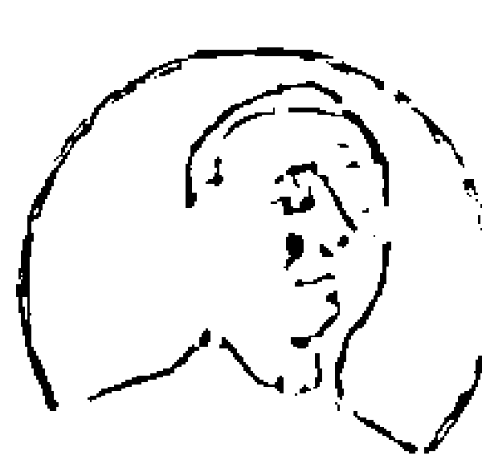

## 楊定一書房
全部生命系列

人的健康，身、心、靈從來沒有分開過。「楊定一書房——全部生命系列」，便是站在全人健康的角度，重新整合從古到今、世界各地的健康法門與哲學系統，用現代的語言重新表達，幫助你我活出全部的生命潛能。

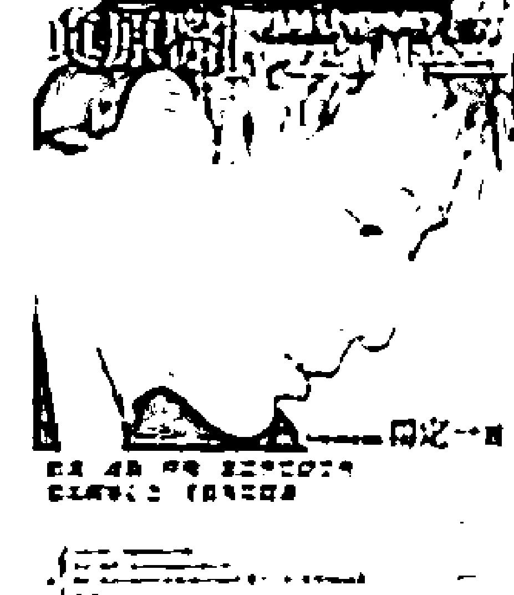

## 真原醫—— 21 世紀最完整的預防醫學

楊定一◎著  定價◎ 350 元

結合古老醫學和先進科學，提出身心靈平衡且健康的秘訣，強調應與大自然和諧共處，從飲食、運動、呼吸、思緒與情緒管理主動追求，並提醒自己，常存感恩、懺悔、希望與回饋的念頭，徹底轉變心念，才能恢復健康！

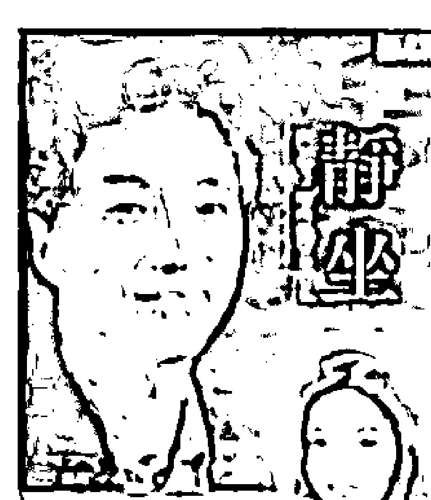

## 靜坐的科學、醫學與心靈之旅—— 21 世紀最實用的身心轉化指南

(隨書附贈 60 分鐘靜坐導引與音樂 CD)

楊定一、楊元寧◎著  定價◎ 380 元

分心年代，靜坐讓我們訓練心靈，開發大腦神經新迴路，放鬆心智，找回身體失去的平衡，重尋健康，安住於當下。這是一趟自我發現的旅程，用開放的心態，就能全然的放下與領悟。

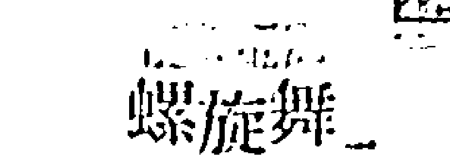

## 螺旋舞——打開身體的結，找回快樂的你

楊定一◎著  吳長泰◎示範  特價◎ 499 元

愈對立的年代，愈需要找回寧靜的自己～讓宇宙最強大的力量，輕鬆幫你打開身體的結！源自最古老養生修煉的螺旋舞，不分男女老少都能學。用這種阻礙最少、扭力最大的螺旋律動，就能打通氣脈、鬆開老化的關節，回復健康的狀態。

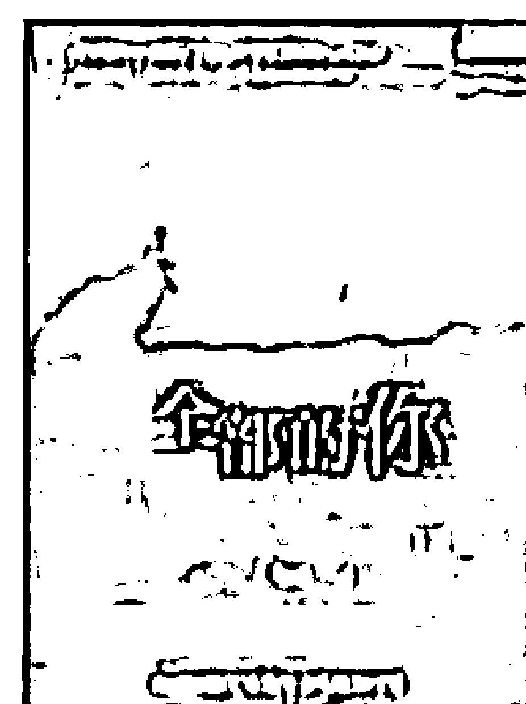

### # 全部的你（增訂版）——跳出局限，擁抱生命無限的可能

楊定一◎著　定價◎450元

「透過當下，我們才能充分活在每一個觀的瞬間。」活在「這裡！現在！」，臣服這個瞬間所帶來的各種變化。把全部的你回來，是這一生最奢侈的一堂功課，讓我們從一個快節奏、忙碌而瘋狂的世界裡，自己走出來。

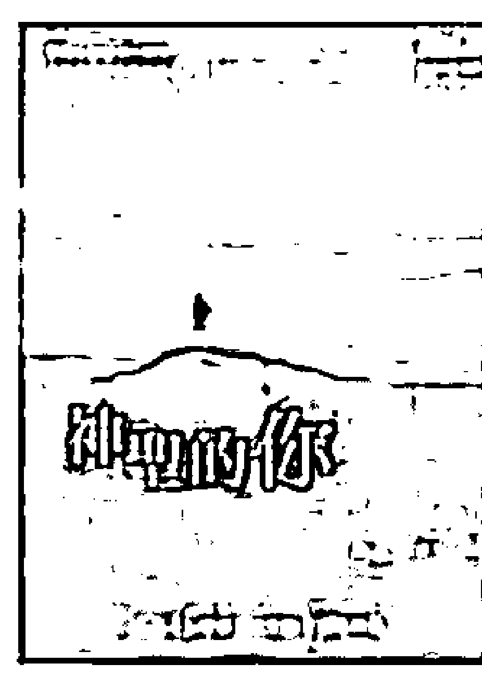

### # 神聖的你——活出身心理健康、快樂和全部的潛能

楊定一◎著　定價◎450元

「人生最高的祭壇，其实在我们每一个人的內心。」在這本21世紀最實用的空性健康書裡，引導你在日常生活裡如何醒覺、內在生命和外在世界更均衡，讓你的人生更好過。

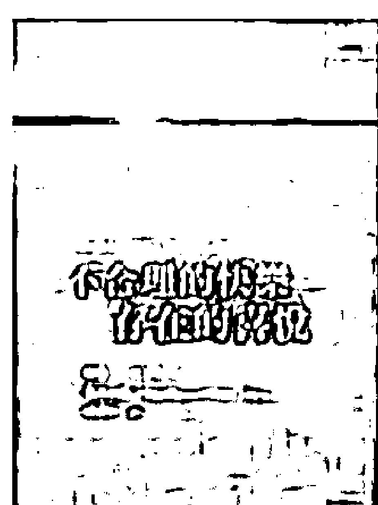

### # 不合理的快樂——存在的喜悅

楊定一◎著　定價◎450元

「你快樂嗎？」財樓名利所帶來的快樂，總是短暫而不永久，快樂，是否有公式可以依循？現代人長期的失衡，過度偏重頭腦，導致身心失衡。本書從哲學、空性層面切入，和你一起練習，把快樂找回來。

# 【新书上市】

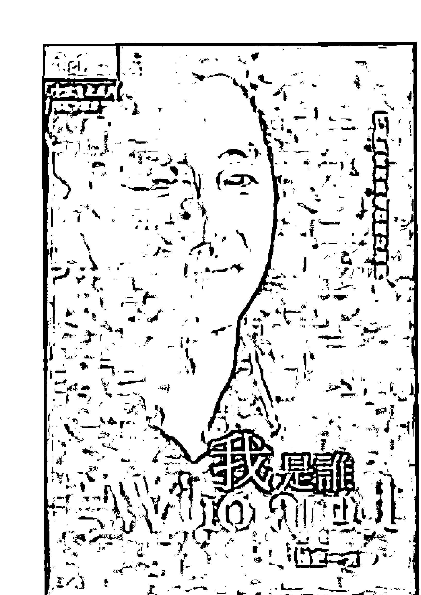

## 我是誰

楊定一◎著 定價◎ 280 元

透過現代的語言，運用無時無刻的念頭與感受，讓注意力從「腦」落回「心」，體會「在」，甚至古人所談的「空」。全書十七章解說，十四個與生活緊密結合的練習，解開古人「悟」的奧秘，活出生命最簡單、最根本的寧靜與喜悅。

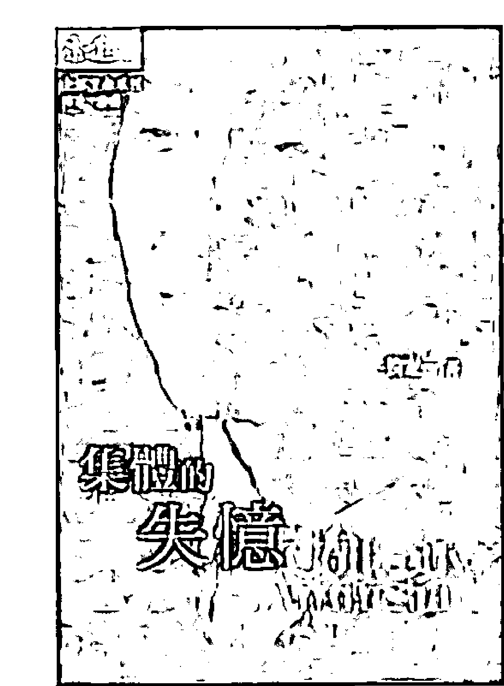

## 集體的失憶

楊定一◎著 定價◎ 280 元

探討「人類的墜落」、「失落的人心」，同時也帶來希望——一起恢復人類最原初的記憶。這本隨身指南，站在「一體」或「在」的層面，幫助你對照自己對真實、對領悟的理解。每一章內容精簡，值得用心來「讀」與「參」。

## 國家圖書館出版品預行編目 (CIP) 資料

落在地球 / 楊定一著. -- 第一版. -- 臺北市 : 天下生活, 2017.08
184面 ; 12.8X18.8公分. -- (楊定一書房. 全部生命系列 ; 8)
ISBN 978-986-94617-9-5(平裝)
1. 願修

## 訂購康健雜誌圖書的四種辦法：

| 方式 | 說明 |
| :--- | :--- |
| 1. 天下網路書店線上訂購 | www.cwbook.com.tw<br>會員獨享：<br>1. 購書優惠價<br>2. 便利購書、配送到府服務<br>3. 定期新書資訊、天下雜誌網路群活動通知 |
| 2. 請至本公司專屬書店「書香花園」選購 | 地址：台北市建國北路二段 6 巷 11 號<br>電話：( 02 ) 2506-1635<br>服務時間：週一至週五 上午 8：30 至晚上 9：00 |
| 3. 到書店選購 | 請到全省各大連鎖書店及數百家書店選購 |
| 4. 函購 | 請以郵政劃撥、匯票、即期支票或現金袋，到郵局函購<br>康健雜誌劃撥帳戶：19239621 天下生活出版股份有限公司<br>優惠辦法：天下雜誌 GROUP 訂戶函購 8 折，一般讀者函購 9 折<br>讀者服務專線：(02)2662-0332 ( 週一至週五上午 9：00 至下午 5：30 ) |

## 插畫家作品列表

施智騰 ( shih.simon@gmail.com )
p.15, 34, 40, 69, 71, 84, 87, 106, 129, 164, 171, 179
《初雪》《霧滿香江》《山魈之悲憫大地》，黃駿豪 ( p. 52, 58, 135 )

臉書專頁：駿攝—黃駿豪的形影角落 https://www.facebook.com/alen0912815lucky/

# 全部生命系列 0008

# 落在地球

**作者** 楊定一博士
**編者** 陳夢怡
**責任編輯** 陳秋華
**插圖** 施智騰 ( Simon )
【《初雪》《霧滿香江》《山影之悲憫大地》為黃駿豪先生作品】
**封面設計** 盧峻燊
**版型設計** 李詩雅

**發行人** 殷允芃
**總經理** 梁曉華
**總編輯** 林芝安
**出版者** 天下生活出版股份有限公司
**地 址** 台北市 104 南京東路二段 139 號 11 樓
**讀者服務** ( 02 ) 2662-0332
**傳真** ( 02 ) 2662-6048
**劃撥帳號** 19239621 天下生活出版股份有限公司
**法律顧問** 台英國際商務法律事務所 · 羅明通律師
**總經銷** 大和圖書有限公司  電話 / ( 02 ) 8990-2588
**出版日期** 2017 年 8 月第一版第一次印行
2019 年 10 月第一版第六次印行
**定 價** 280 元

All rights reserved

ISBN : 978-986-94617-9-5( 平裝 )
書號 : BHHY0008P

- 天下雜誌網路書店 www.cwbook.com.tw
- 康健雜誌官網 www.commonhealth.com.tw
- 康健雜誌出版臉書 www.facebook.com/chbooks.tw

本書如有缺頁、破損、裝訂錯誤，請寄回本公司調換

## # FORMATION

你我有多想醒覺？

是不是還要一次次地延續這個夢，不斷地痛心，不斷地失望，不斷地昏迷？

我們落在地球，一生全活在「人」的自我認同帶來的制約。只要認為任何現象是真的，也就不斷地強化我們的人類特質，加強所受到地球的吸引力。

解脫，其實是打破「人」的制約，跳出「人」的處境和特質。

本書與《我是誰》和《集體的失憶》站在同樣的立足點——從「空」看著「有」，從內心看著外在，從「在」看著「做」，從「心」看著「人」。

楊定一博士深入解析，但願你我把文化帶來的束縛轉為解脫的工具，迎接這一大規模的醒覺。

醒覺過來，從地球的束縛解脫，我們才真正愛護地球，而真正成為地球的佳民。

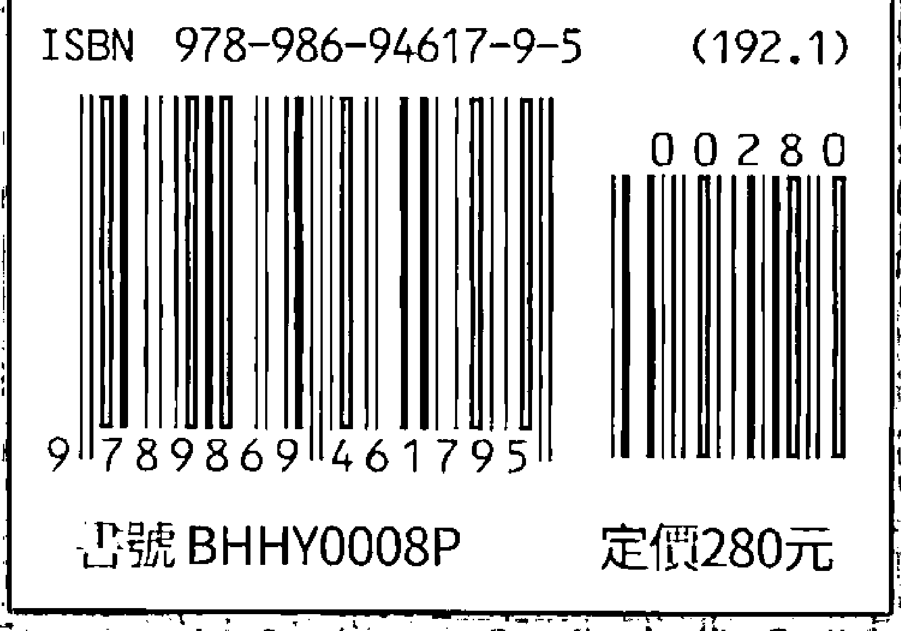

www.cwbook.com.tw

康健 天下 出版 雜誌