# 杨定一：螺旋舞

## DVD選單

- 生命的源頭，離不開螺旋
- 用「8」跟宇宙共振、合一
- 透過螺旋舞，把自己找回來（邊看邊做，更能領略）
- 無思無想，跟身體對話
- 跳出自己的螺旋舞
- 螺旋舞體驗一
- 引導一 從「8」開展身體的律動
- 引導二 跟著領悟跳舞
- 螺旋舞體驗二
- 螺旋舞體驗三
- 把身體當工具，找回全部的你

## DVD影片說明

《螺旋舞》DVD由楊定一博士親自講解、吳長泰老師示範實做。

這本書，以及《螺旋舞》DVD兩個作品的完整結合，讓讀者從理論到實做一氣呵成。

影片裡除了螺旋舞的概念介紹，還會有體驗示範及引導，可以幫助觀眾學習如何以身體中脈為中心，律動出相對相成的「∞」。

請善用片頭出現的選單，選取自己想學習（或想重複觀看）的段落。

請注意，螺旋舞不是體操、也沒有制式的規則，最重要的是每一個個人可以聽聽自己的身體說話，如果某個動作會讓你不舒服、或覺得做不到，就別勉強自己非跟上老師的每一個動作不可。

建議學習的過程，動作可以從小到大，讓自己的身體一步步適應，並且慢慢開展。找到最舒服的姿態，就能跳出專屬自己的螺旋舞。

## 序

楊定一博士

螺旋舞，是最古老的一套運動。我們也可以稱它為最古老的瑜伽、功夫或是動態的靜坐。有人，就有螺旋舞。透過它，我們自然身心合一。透過它，我們自然把內心的「寧靜」、「在」、「定」、「不動」浮出來到外在世界。我們現代人的步調快，極端的飛快。都讓我們活在一個不斷的「動」，加快的「動」，浮躁不安的狀態。很少有機會體驗內心的「寧靜」、「在」、「定」、「不動」。我們幾乎都忘了，正是在這個時點，最需要找到一個「動」和「在」的平衡。也就是說，透過「動」，我們需要活出「不動」。透過「動」，我們要隨時「在」。仔細觀察，你我每一個人現在隨時都「不在」，隨時被念頭、煩惱、焦慮和憂慮帶走。最後的結果，也就是每個人都不快樂。螺旋舞，只是把快樂找回來。

想不到的是，螺旋舞其實是透過最少的「動」，小到不能再小、簡單到不能再簡單的「動」，每一個人都可以學的「動」，就可以把快樂帶回來。最多最多，也只是透過相對相成的對稱——用身體畫一個「∞」。透過這種最少、最簡單的「動」，就可以達到最大的身心合一的效果。透過它，我們其實是讓身體每一個細胞、每一個角落講話。我們身體的每一個細胞，其實跟生命最根本的意識——無限大的一體意識——是相通的。倒不完全受到腦和神經局限、分別的意識所掌控。所以，讓細胞放鬆地「講話」，也就自然把我們帶回到家——跟我們的心或一體意識結合。不要小看它的作用，雖然簡單，它帶來的淨化是不可思議的大。我們可以這麼形容——如果把身體當作橡皮筋，那麼，我們極度快速而忙碌的生活步調把這個橡皮筋扭得好緊，留下了很多結。透過螺旋舞輕輕鬆鬆帶來的放鬆，我們把這橡皮筋反向扭轉，找回生命的空間，自然對許多問題得到一個解答。我提到這些，也是想做一個小小的提醒——透過螺旋舞，我們可能會有很多情緒的釋放。就好像存在細胞裡的記憶，一點一滴透過螺旋翻了出來。這就像我在《真原醫》介紹過的「好轉反應」。跳的時候，你可能大笑，也可能大哭，或只是有一個很深的寧靜。每個人的反應和感觸都不一樣。這，你要親身體驗，才會明白。我們其實不用管那麼多。只要帶著一個輕鬆、開放的心情，享受螺旋舞，享受自己身體的每一個角落，享受生命帶來的每一個禮物——也就是全部的我。

我們就一起跳起來吧。

最後，我這裡要特別感謝我的同事——吳長泰老師多年來的用功和投入，願意在各個場合，透過他親身的示範，與大家分享螺旋舞。此外，除了感謝《天下雜誌》群殷允芃發行人和《康健雜誌》李瑟社長，以及長庚生技的同仁，我還要特別感謝羅儀修、陳秋華、張曉卉、張桂娟、陳靜雯、陳夢怡。有了她們幾位的協助和點點滴滴的規劃，才可能如期完成這個作品，以及今天的「全部生命系列」。

姚今富

## 家庭护理常识

跳舞——任何跳舞，在任何文化都是最古老的修身養生之道。但嚴格講，任何古老的舞蹈，其實沒有那麼多章法，無一「法」可談，甚至不能說有一個「道」。

怎麼說呢？

原初的生命，本來沒有腦、心、身的區分，人是多面一體的組合，從不同的層面表達生命完整而唯一的體意識（One consciousness）。

從這個角度來看，跳舞也是如此，只是透過身體表達我們的喜悅，表達我們對真實的認知，表達我們跟宇宙任何角落從未分離的境界。此外，舞蹈的律動，動到每一個關節、身體每一個部位，也同時讓我們有舒暢的感覺，順帶有養生的效果。

然而，經過幾千年的文化累積，我們將原初合一的體悟忽略了，當舞蹈落入了派典，就和人間的任何知識都一樣了，經過頭腦的研究歸納，愈分割愈細，到最後成了一個個各據一方的系統（subsystem），派別或法門，現在再想辦法整合回來。

### 螺旋，是宇宙最原始、最強的能量

螺旋跳舞，源於古代的養生修煉，與當代的太極導引、氣機導引都是相通的。早在西元前三百年左右，莊子就描述過古代導引之士的樣貌，西漢留下的馬王堆文物也出現了導引圖，同一個時間，印度帕坦伽利大師寫下了《瑜伽經》，可見這是古人不約而同的智慧結晶。我今天將「螺旋跳舞」帶給大家，也只是把螺旋——宇宙間最原始、最有效率、能量最大的力量重新帶出來。

所以，假如真有「法」可談，還原到最單純，就是螺旋，就是這麼簡單。

因為簡單，任何人都可以跳，各種年齡、性別、身體狀況，只要做，就可以把自己——真正的我、真正的你找回來，達到合一的體悟。

### 以中脈為軸心，兩側對稱、相對相成

我們有兩個眼睛、兩隻手、兩隻腿……就連鼻子都有兩個鼻孔，螺旋跳舞採用人體的自然結構，把大自然賦予人類的兩側對稱（bilateral symmetry）作為工具，以中脈為軸心，輕輕鬆鬆畫一個8，很簡單就組合出兩個方向相反的螺旋，一個是順時鐘方向，一個逆時鐘方向，透過中脈或任何一個部位，都可以達到對稱。

螺旋跳舞的原理①以中脈為軸心，從上而下沿②肩膀、③骨盆等身體部位為軸心畫∞，在天生的兩側對稱中，自然而然地跳起舞來。

### 什麼是中脈？

中脈是能量（或說「氣」）通過身體的主要管道，能量由此流入並遍佈全身，是生命的基礎，也是人類在時空限制下能表現出最大潛力的寧靜軸心。中脈的路徑並不等同於脊椎，而是由頭頂至會陰（肛門與生殖器的中間點）的一直線。它大約是拇指食指圈起來這麼大，不會隨著脊椎彎曲，而是下指大地，上貫頭頂，隨著每個人意識開發的程度，從幾吋（一般人）到幾哩（精神力量成熟且進化的人）都有可能。

流入中脈的氣，決定了體內所有臟器和經脈能得到的能量。因為中脈就像能量變壓器，能夠轉換、放大經過的生命力，輸出的氣（生命力）則進一步影響身體、情緒體、心思體這三層體。當氣被打亂或中脈受損，身體得不到足夠的能量，各臟器淤塞難通、心思不清明、精力微弱，情緒也隨之不穩定。

> > （摘錄自《真原醫》第三十七章〈尋找聖心〉，頁二三七～二三九）

### 用身體畫 ∞，任何部位都可套用對稱中軸

身體隨著 ∞ 運動，我們可以由肉體這個小小的我，去體會無限大的我、無限大的宇宙。只要心裡有了相對相成的觀念，選一個音樂，自然就跳起來了。

這個原則可說再簡單不過，身體畫一個 ∞，兩個螺旋自然相對生成，同時不斷地回到中脈。除此之外，沒有什麼系統和規則。

正因為那麼簡單，每個人跳的螺旋舞都不一樣。比如說，有些人身體僵硬一點，可以從小一點的動作或上半身開始畫螺旋，慢慢投入，螺旋的動力會愈開展愈大，身體自然地跟著音樂表達一切。

懂了這些道理，自然會發現，這一對稱的軸也可以套用到身體任何部位。把軸擺橫，肩膀、骨盆也可以是軸心；軸也可以是斜的，於是上下半身斜對角的手和腿也就對稱了。這一來，螺旋對稱的範圍就愈來愈寬廣。

這些原則，相信每一個人只要身體力行，都能自己體會到，甚至開發出更多的可能，完全不違反宇宙最簡單的螺旋運動原理。這個符號 ∞，同時也象徵了無限大。最不可思議的是，透過表面上有限的肉體作為前景（foreground），可以體會到一個無限大的背景（background），也就是我們最純的意識。

### 透過螺旋跳舞，找回真正的我

透過這種領悟，我們可以體會到人間一切無常的人事物，也只是「全部的我」的一小部份，而平常在忙碌中所忽略掉的永恆、無限大的意識，始終在背景沒有動過。

透過螺旋跳舞，我們不斷體會、提醒自己那個意識的「在」。真正的我，就這麼找回來了，更不用說可以鬆脫一切的煩惱、創傷、制約和種種的限制。

把真正的我找回來，一個人就這麼樣輕輕鬆鬆地解脫了。

活在這個瞬間，又不被這個瞬間干擾、限制。我們不再以為這個瞬間就等於一切，而能認出那不過是整體生命的一小部份。

這就是我常常在講的，有脫胎換骨的領悟，讓生命「重生」，走出一條全新的路，通往這一生最大的目的，也就是一直在等著你我體會的真實。

祝福大家可以隨時跳舞，活出全部的你。我接下來還會用各式各樣的工具，將螺旋跳舞帶入實修。但我相信，讀者光是懂了這個原理，就可以動起來了，等於發掘了一個一生取用不盡的寶藏，說會讓人「上癮」，都不為過。

一個很簡單的跳舞，把一生的體悟都同步起來，把一切的知識、對這一生的理解全部統合起來，沒有一點矛盾。

祝福大家可以隨時跳舞，活出全部的你，活出全部的我。

【本篇文章原刊登於《康健雜誌》一〇八期〈真原醫〉專欄，一〇六年三月一日】

劉慈欣

## 跳舞，直到永久閉眼

### 注意力集中在「動」，念頭自然消失

我想應該沒有人會在忙碌中，突然跳起舞來。所以才說寧靜、才說無思無想。螺旋舞，跟靜坐有異曲同工之妙。

我們平常一定有念頭，念頭就像水流，嘩啦啦地停不下來。沒有關係，不要管它，把注意力帶回「動」的部位。這樣子，念頭自然會消失，先減少，然後消失。

我想，這是每一個人都得親自體驗的。

透過「動」，把注意力集中在「動」，欣賞每一個「動」。我們可以一再地把注意力帶回自己身體的每一個部位。跟身體的每一個角落對話，欣賞它。

很簡單，卻不容易。

我們一天下來，沒有多少機會，把注意力帶回自己。有念頭，也不管它。沒有念頭，也不管它。就是用最輕鬆的心情來跳。

這次的作品，我請吳長泰老師示範，用他的方式，將螺旋舞的可能性之一展現出來。

### 放鬆，把自己的中心找回來

首先用拇指與食指圈出中脈，觀想頭頂到會陰之間筆直的中空管道（參見第十四頁）。

放鬆，把自己的中心、中軸找回來。

深呼吸，吐氣。

### 先對身體說謝謝

帶著感恩——對無限大的宇宙、無限大的生命，以及對身體做個感恩的功課。

接下來，從頭頂開始畫一個∞。
守住中脈，也就是自己的中心、中軸，左右對稱地動作。
從頭頂，到下巴，到脖子。就畫一個簡單的∞。
從脖子、進入肩膀。還是畫一個∞。

像吳老師一樣把肩膀抱起來。讓動作守住肩膀，輕鬆地畫∞，可以順時針、逆時針畫∞。

只要不斷地回到中心，回到中脈，畫一個8。再往下，將畫8的位置落到胸腔。一步一步往下走。手扶著腰，用腰畫一個8。所謂的中心，中脈，也可以在心裡想像——一根管子，從頭頂往下延伸。以中脈為核心畫一個8。

同樣的，離不開對稱的原則，從中心很小的8，慢慢地，可以畫出一個比較大的8。也可以換個方向，總之不要離開對稱，也就是不要偏離中脈。一邊做，一邊慢慢體會——每個部位是不是能放鬆、做扭轉。其實，我們每個人小時候都會這樣跳。這可以說是我們的本能。

### 在最放鬆的狀態，讓身體主導你

年紀大的朋友，也要輕鬆鬆地做，才不會受傷。

其實螺旋舞是在一個最放鬆狀態，甚至可以說是身體在跳我們、主導我們，不是我們在主導身體。不必做一個很激烈或極端的動作。

我們慢慢地做，在輕鬆的狀態下，舒舒服服地做。

沿著脊椎、脖子，自然帶出一個扭轉、螺旋的動作。一層一層地往下帶，一層一層地落到骨盆。透過肩膀，延伸到手，範圍愈來愈大，可以畫出一個更大的∞。

手也開始動起來了，也是相對相成，左邊怎麼動，右邊做出一個對稱的動作，畫一個更大的∞。

### 以沒有原則的原則，把自己交給「動」

把意識全部投入「動」，交給身體。輕輕鬆鬆地看著，觀察到「動」的部位。把自己交給「動」，看著「動」。讓身體告訴你——沒有什麼規矩、規律、原則，只有最簡單的對稱關係。輕輕鬆鬆地，讓身體自己的對稱，自然帶出不同的8。從最簡單的，水平的8，到斜的8，甚至上下的8……所有的8，都一樣離不開對稱的概念。

## 引導篇：螺旋舞，其實很簡單

從肩膀到手，慢慢拉大，慢慢地手打開。一樣的，畫一個8。

隨著身體自己的對稱與平衡，稍微有個角度。就連脊椎也在享受。全部動起來，完全投入。看的、想的、注意到的，也是「動」。身體會告訴你怎麼動。不要管動得漂亮不漂亮。不用設想怎麼去動更多部位。身體會告訴我們。其實每一個人只要投入動作，無思無想，每個人的動作都很漂亮。

只要做，也只是這樣子。手，可以打開了。動作可以延伸出來，範圍可以更大。手跟腰可以做對稱。每一個關節，都透過螺旋在放鬆。

### 提高關節的柔軟度，讓許多慢性疾病趨於好轉

人體的肌肉骨骼結構就像一具完美的建築架構。因為有這個架構，體內各器官組織才能獲得適當的支撐，而且能夠因此正常運作。不過隨著年紀漸長，如果長久以來一直姿勢不正，會造成身體加速老化。

日積月累的不良生活習氣，將使肌肉與肌肉之間的筋膜（myofascia）容易黏附在周圍的組織，甚至導致肌肉僵硬與凍結，造成身心疲憊的惡性循環。

螺旋舞是一種可以只靠自己、不需要藉助他人或器械，就能夠達到全面性肢體調整的運動。

它不但能打通人的氣脈穴道，更可以改善肌肉耐力，還能提高關節的柔軟度，讓身體行動更靈活順暢。在全面性肢體（尤其是脊椎骨）獲得重新調整的狀況下，許多慢性疾病和長時間的身心不適都能趨於好轉。

## 透過螺旋的扭力，讓身體每個部位自行修復

螺旋是宇宙帶來的力量，透過最輕鬆、沒有阻礙的「動」，可以達到最強最大的扭力，能夠放鬆每個關節，包括脊椎。
最簡單的動作是宇宙帶給我們的，不是我們自己跳出出來的。這會讓身體的每個關節、每個角落，回到最原初的姿勢。
唯有運用螺旋原理的運動，才能從脖子第一關節（C1）到尾椎（coccyx）全身上下各關節皆可以動到，甚至達到重新調整（realignment）的效果。
日本有醫學研究證明，假如一個人不斷做伸展運動，持續一年下來就可以延長好幾年的壽命。透過螺旋舞的對稱——沒有原則的原則，自然對身體做一個整頓，可以把每個部位找回來、修復回來。我們自然年輕。

## 身體想動，我們跟著動

透過螺旋舞，身體自然而... 輕鬆，不費力。把自己交給動的部位。已經不是念頭在引導身體的「動」，是「動」而「動」。身體想動，我們跟著動。和一般做事靠思考，剛好顛倒。是身體帶動我們。只有這個辦法才可以很輕鬆地透過「動」，找到「不動」，找到無限大的意識。透過外在的「動」，找到內在的「不動」。把生命的全部找回來。

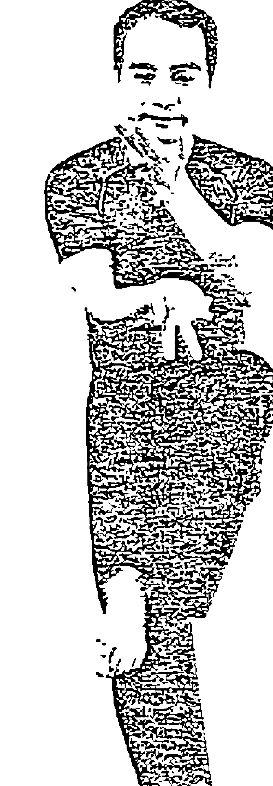

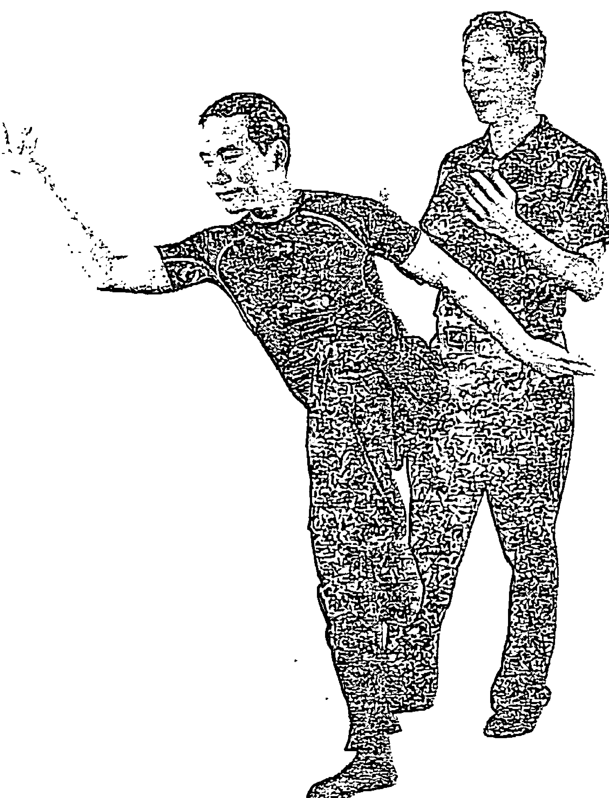

接下來吳老師的動作範圍愈來愈大，把腿和腳納入了對稱的範圍，不光是一個橫式的∞，他已經可以做一個上下對稱的動作，或右邊的肩膀跟左邊的腿，做一個斜的對稱，但還是沒有離開中心，從來都沒有離開過，透過這個中心把對稱找回來。

透過放鬆，範圍有時候會大，有時候會小，身體自然會告訴你怎麼動。

動作會愈來愈大，愈來愈輕鬆。

## 透過螺旋舞，隨時回到「這裡！現在！」

透過身體來表達，對宇宙的認同與尊敬自然會從內心發出來。透過身體告訴宇宙與自己：「我從來沒有跟宇宙分開過，宇宙生命就是我，我也只是生命。」

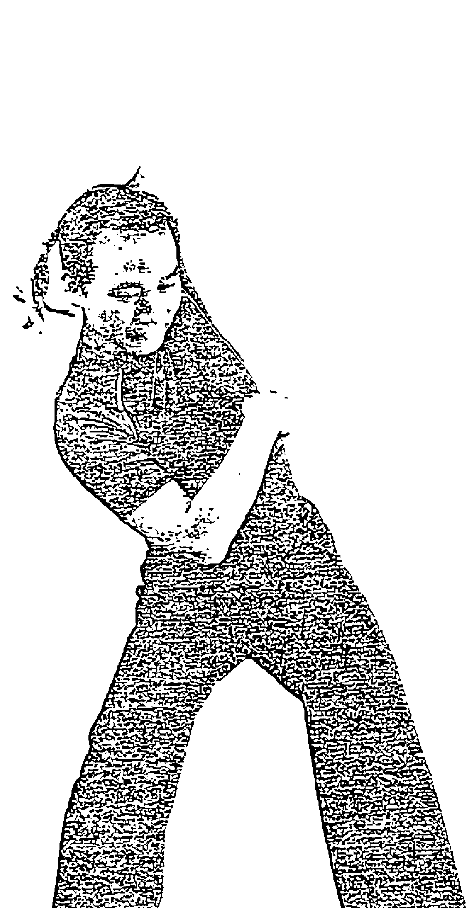

透過運動與螺旋舞，可以把最高的領悟活出來，告訴宇宙：「我跟你從來就沒分手過。我不需要找另外一個家，我的家就在這裡，我本來就在家，這個瞬間就是我的家。」透過螺旋舞隨時回到瞬間，回到「這裡！現在！」。

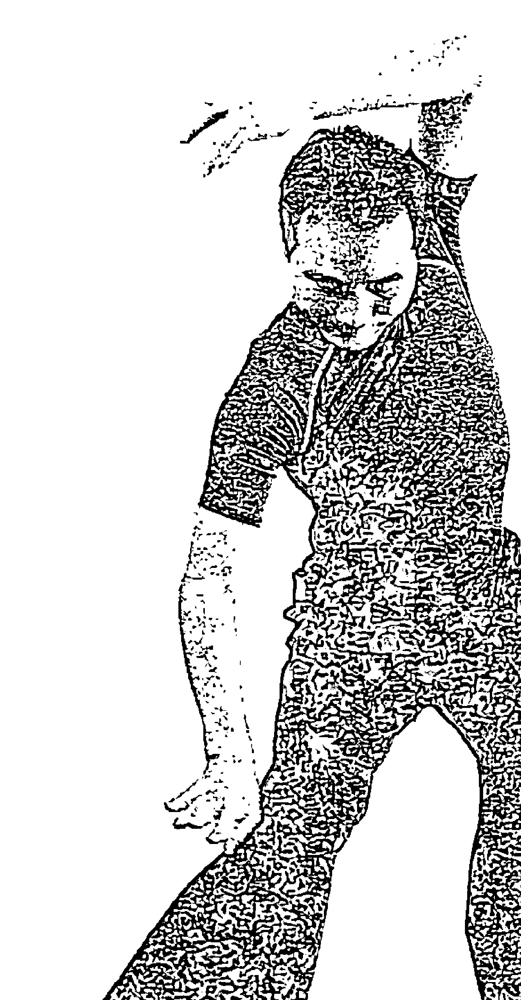

## 從「沒有」帶來「有」，而「有」也只是身體最美的動作

透過螺旋舞能找回真正的我，發現從來沒有離開過我們的心，連找都不用找。螺旋舞已經把一切的理解化現出來，從「沒有」帶來「有」，而這個有，也只是從身體最美的動作與最輕鬆的螺旋所帶出來。

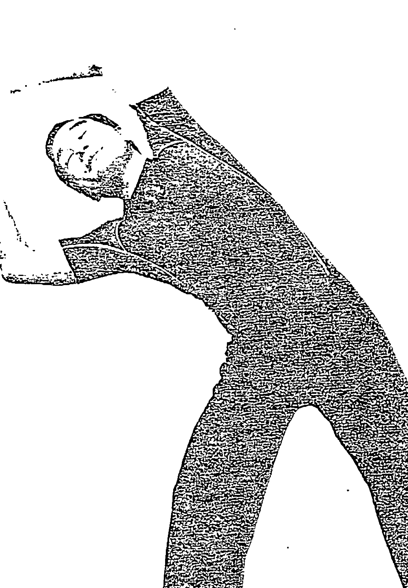

## 【引導篇】螺旋舞，其實很簡單

假如你們問吳老師——「現在，你在想什麼？」，他會回答：「什麼都沒有、什麼都沒有在想。」他只是輕輕鬆鬆地跳，輕輕鬆鬆跟這個瞬間配合與投入這個瞬間。連無思無想都不用去想它，都不用去抓它、追求它。

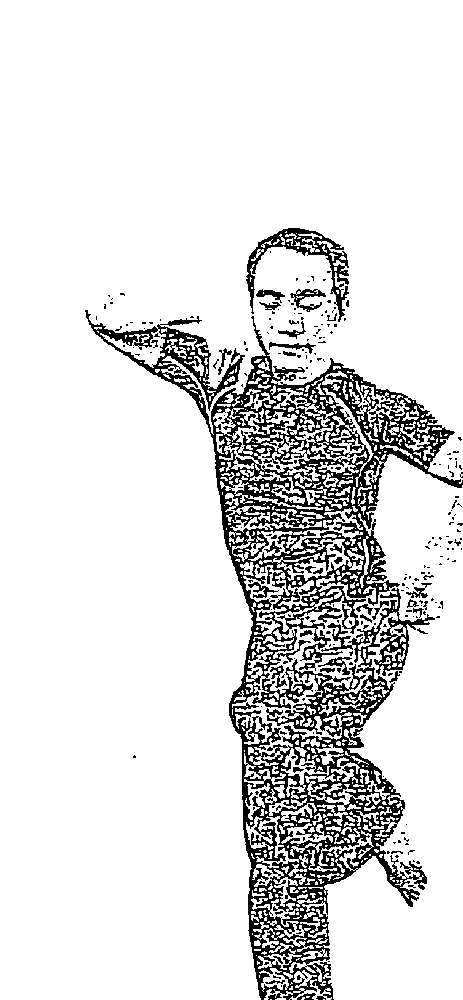

把自己全部交給生命，讓生命跳我們、讓宇宙跳我們、讓宇宙活我們，連小我都消失了，沒有一個「我」在跳。
跳在跳、看在看、觀在觀、活在活。

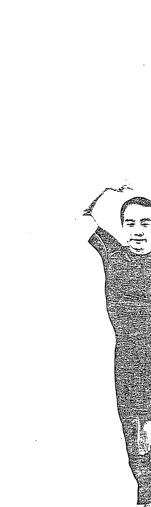

這個境界，我們都不需要追求，本來我們大家都有，只是在忙碌中忽略、忘記了，需要從別的地方和瞬間把自己找回來。我們體會到這一點、領悟到這一點，其實已經把全部的生命找回來了。而全部的生命，現在的生命也是在享受跳舞。父母帶給我們的身體，要珍惜它。透過每個動作要珍惜這個體，表達最高的智慧。

智慧和知識完全不同，跟人間所帶來的一切，一切的理解、觀念、價值觀，都不相同。完全輕輕鬆鬆地存在，本來就存在，從來沒離開過我們。反而是我們透過小我、社會上的角色，而忘了自己。落到這個體、每個動作，自然就活到最高的領悟。這個領悟，把「有」跟「空」，「存在」跟「動」。全部把它合併合一了，把它整合了。回到一體的意識，包括一切、人生所看到的，包括內心我們所體會到的，甚至包括「空」。螺旋舞，就是有那麼大的作用，讓我們從一個方法得到結果，從結果得到方法。慢慢地把「動」收回來，從很大的範圍收到很小的範圍，從「動」回到「不動」，做一個收心的功課。從「不動」，到充滿著喜樂、光、愛，把人生跟我們自己合一了。

## 漫画图解的Excel应用

杨京山 著

人類習慣透過分別的意識，把無限大的生命，局限到一個點，甚至局限到一個念頭。透過比較，才會有念頭。
這個局限、分別的客體意識，會認為有一個「我」，有一個「你」，有一個「這個」，有一個「那個」，才可以把東西組合起來。
螺旋舞剛好是——希望把這個觀念打破。
也就是說，有動作，就讓這個動作自己表現出來，不要去干擾它。
所以，每一個人自然有他自己帶來的動作。而且這動作都很美。
每個人都應該有自己的螺旋舞，不要去比較。
只要是從自己的內心發出來的動作，不管在別人眼中美不美，本來都有生命內在自然帶出來的美。
如此一來，每個人都會找回自己的狀態，自己比較適應的一套動作。有些人的動作集中在上半身，有些人集中在下半身，或者很自然地從腰開始帶動。

在∞的對稱原則中，自己找出最恰當的動作不用特別指導，指導越多，好像又鎖定了一套規矩、一個規律，又回到了客體意識帶來的局限與分別。我們在其中，讓自己去發揮。其實沒有什麼標準不標準。怎麼跳，也是那時候所需要的。我常說——「宇宙不會犯錯」。我們也隨時容納，接受宇宙帶來的變化。從沒有規律，找出人生自己的規律。從「沒有原則」的原則，找出人生自己的一套原則，就是這麼簡單。總之，每個人都可以試試看，就當作是做個實驗，在∞的對稱原則中，自己找出最恰當的動作，享受生命帶來的螺旋舞。

## 你自己的螺旋舞

一個人在很放鬆的狀況下，很舒暢沒有念頭，自然身體要動。
身體維持固定姿勢太久，它自然會想動，稍微放鬆一下，它自然會畫一個∞。
我想，每一個人都有這種體驗，而且離不開對稱的原則。
我們人透過這個對稱的原則，動作自己延伸出來，就發現它延伸出來螺旋的跳舞。
透過觀想，從頭頂到腳底，把呼吸緩和調整下來。
注意力慢慢地集中在身體的感覺。
注意力完全放在身體的感覺上。
完全專注地放鬆，我們才開始來讓身體律動起來。
在跳的過程當中，你是在享受這個動作，享受身體的律動，去感謝你的身體。謝謝身體多年來為了我們所做的努力跟付出。你的心願意跟著身體，甚至感覺全身的細胞都在律動、都在跳舞，透過身體的律動，把祝福傳播出去。
當你體會之後，每個人都可以跳出自己的螺旋舞。

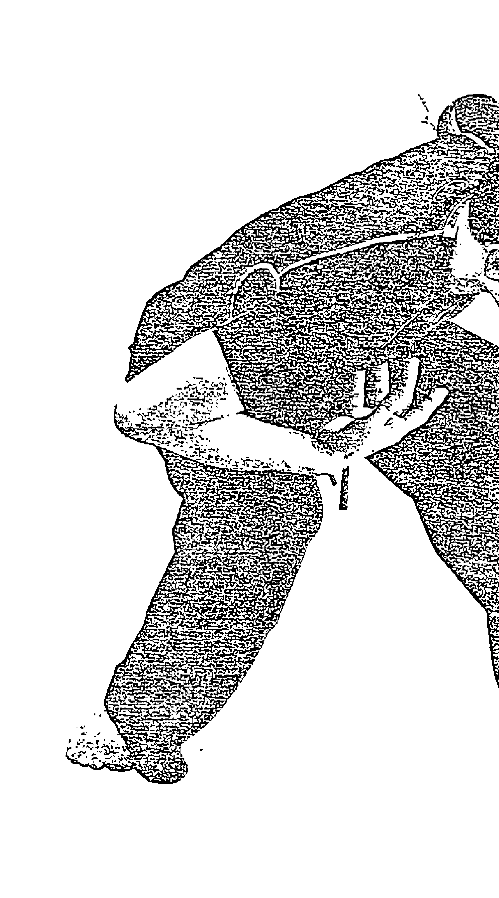

### 小小的提醒

每一個人都可以跳螺旋舞。甚至，有重大疾病的朋友，疾病越重，越需要動。越需要用這種方法，把氣脈打通，讓自己舒暢，感覺舒服。
人一舒服，對身心的健康絕對有助益。
小孩子跳舞，其實更美。連教都不用教，只要放點音樂，根本不需要講原則，只要有人稍微帶動一下，就可以跳起來。
連最小的空間，都可以跳螺旋舞。
就像在臥室，在廚房，或許一邊煮菜、打掃，只要給自己一點空檔，就跳出來了。在很小的空間，都可以跳出來。
甚至，在辦公室也可以跳螺旋舞。
只要給自己一點空檔，畫出一個∞，就是了。

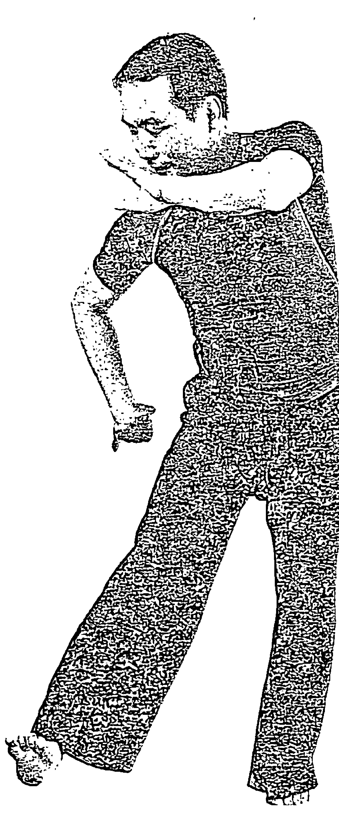

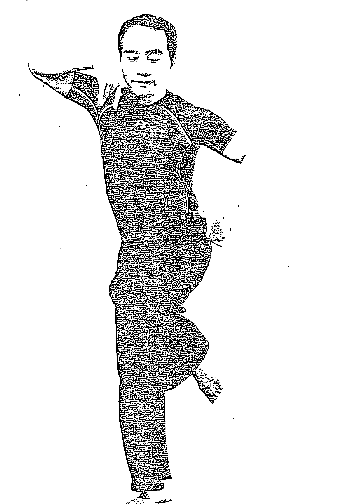

每天坐在辦公室的朋友，常常會覺得肩膀很僵硬，可以從自己的∞開始練習，就從頭頂畫一個∞開始練習。這樣子，脖子也在放鬆。然後，肩膀畫一個∞開始練習……就這樣動起來。
動起來，它自然會帶到別的部位。
有些人腰不舒服，從腰開始著手……只要你放鬆，身體會告訴你怎麼動。
一開始，動作可以小一點。慢慢地，愈開展愈大，動作愈來愈複雜，强度愈來愈强。所谓的强度包括了①動作擺動的角度，②時間的長度，③蹲的姿勢，蹲的位置高低，對身體關節的衝擊也算是一個强度。如果感覺痠痛，强度就可以減小。

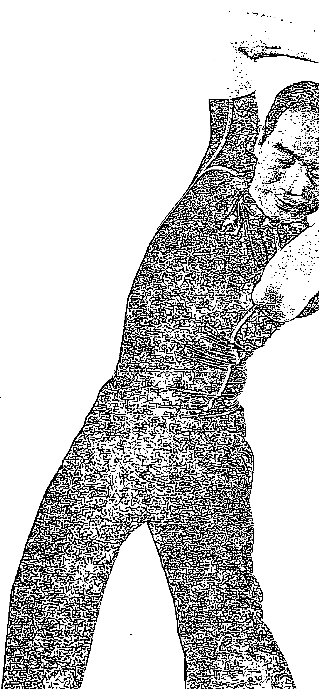

## 醒觉篇
享用手造送来的礼物

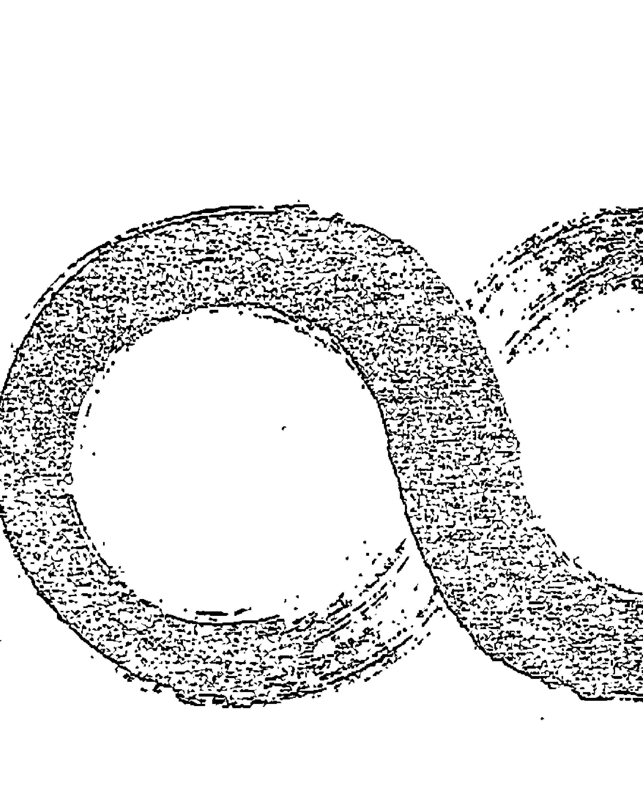

我是从静坐中，开始体会螺旋的运动。盘着腿，身体就自己跳起来了，那时候我还不到二十岁。坐着就是很美的动作，因为它是不经过念头所生出来的。后来观察好多元素才发现，它就是最古老的系统。来到台湾之后，接触气机导引、太极拳、气功，也都是如此。后来，我才用比较科学的语言来描述、归纳、整理。

## 螺旋舞，是宇宙送來的禮物

螺旋舞不能說是我或吳長泰老師的創作，它不可能是由人發明的，只是有些人體會多一點，有些人少一點。例如古人最早的動作，透過音樂所跳的就是螺旋舞。

仔細看，每一個文化原住民的舞蹈，其實都在畫螺旋。

他們的舞蹈本身就是螺旋，有相對相成、左右、有對稱。身體畫出來好美的動作，就是宇宙來成形的。

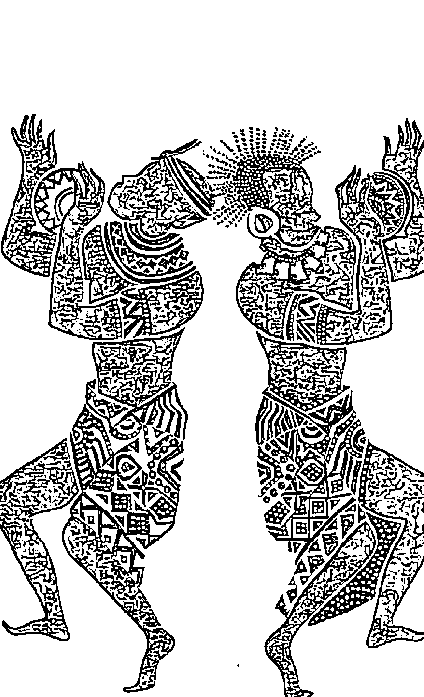

可以說，螺旋舞是華人最早的瑜伽，是華人的寶，比印度的瑜伽還更古老。螺旋舞是宇宙帶來的禮物。有人，就有螺旋舞。螺旋舞，是人對於這個宇宙的恭敬，尊重宇宙而自然發出來的動作。就連動物也會

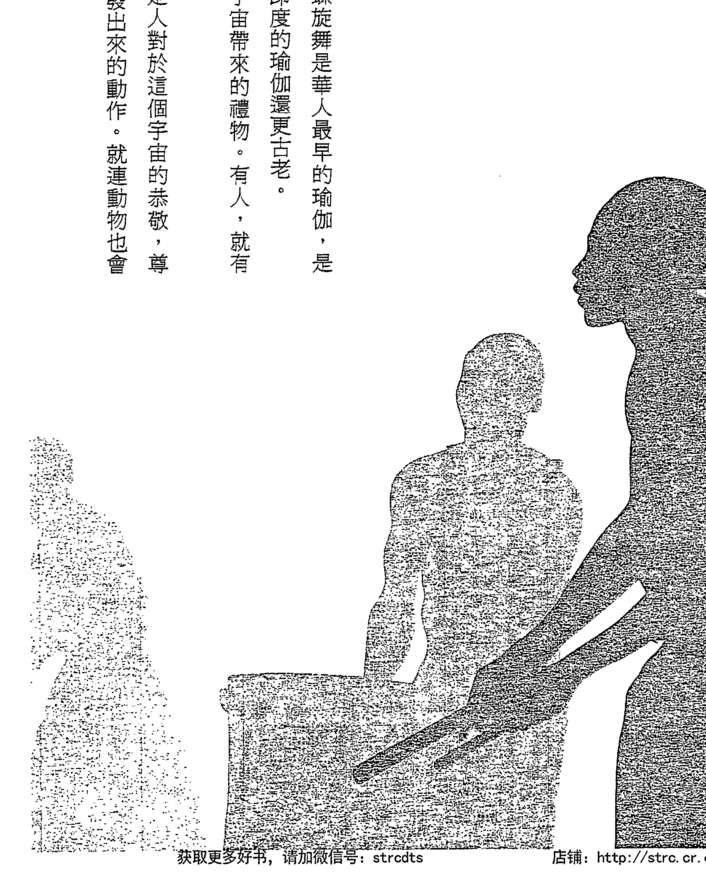

做拉伸動作，來表達牠的滿足感。每一個原住民，以前都是早睡早起、跳舞、打鼓。擊鼓的聲音，跟我們地球的頻率最為接近，而帶動了我們的生命跟地球一起共振。一共振，自然就會跳起舞來，而自然進入螺旋舞。其實，我們透過螺旋舞把自己找回來，把全部的生命找回來，把最原初的生命源頭找回來，把我們無思無想的一體意識（One consciousness，也有人稱佛性、本性、上帝）找回來。找回來，自然發現——它從來沒有離開過我們。透過螺旋舞，我們只是從宇宙延伸出來。透過——我——這個「體」，把宇宙最原始的動作化現出來。其實，就是那麼簡單。

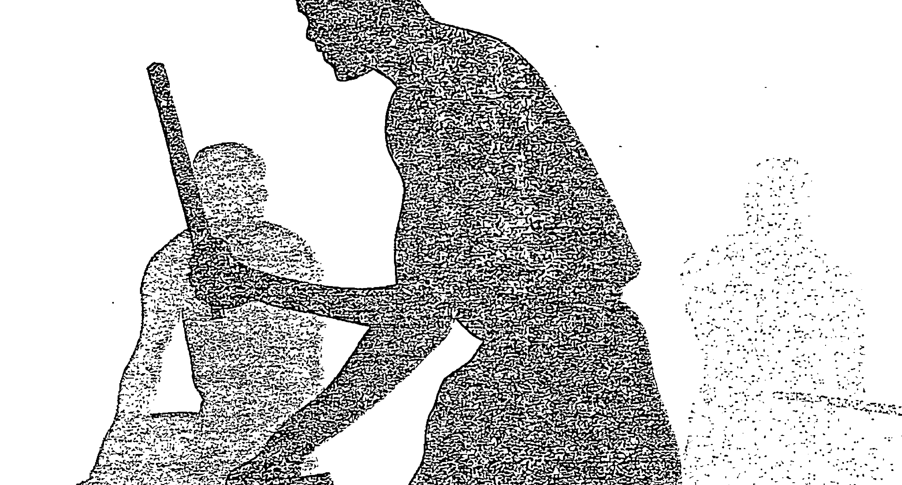

## 用「∞」跟宇宙共振、合一

螺旋舞的動作很柔，自然會畫出∞的形象，相對相成，不離中心。這個中心，就是生命的中心。從身體的角度來看，也就是以腦或是脊椎的部位為中心，來做一個跟宇宙共振、和諧、合一的動作。

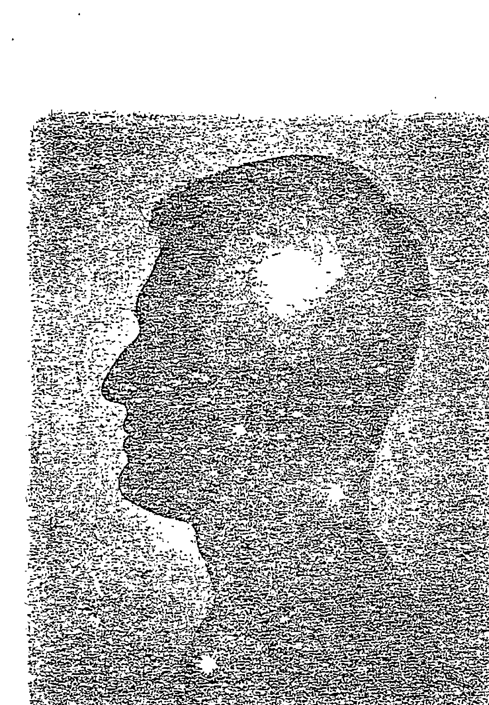

有意思的的是，螺旋舞不是靠動作和動作組合起來的，而是透過理解、領悟所帶出來的展現。所以，螺旋舞也只是——生命透過我們的身體，來表達跟宇宙的和諧、合一。我們每個人都會跳螺旋舞。就像——全部的生命是我們每一個人都有，在每一個角落都可以找到的。螺旋舞，其實只是描述宇宙的動作。它是最原始的規律。透過這個舞，代表宇宙的跳舞。

## 身體在跟你說話，就是螺旋舞

螺旋舞，越放鬆、越沒有規律、甚至沒有任何原則越好。螺旋舞本身就是自然，讓身體說話。

身體在跟你說話，就是螺旋舞。

既然是身體在說話——絕對不會做很多很突然、很奇怪、很對抗的動作，而是讓你很舒服。

這些動作，本身就從內心最深的層面，跟外在的世界接軌——透過一個很完整的動作，從大的結構，到最微小的細胞，都跳起舞來。

跳舞要快樂、要實在、要存在，它本身要一個「存有」的境界（being），而不是只停留在「動」的境界。透過螺旋舞，把「動」與「存有」結合起來，達成了完整而全面的「動」，把最大的層面甚至到最小的細胞都跳起來了。

## 【醒覺篇】享受宇宙送來的禮物

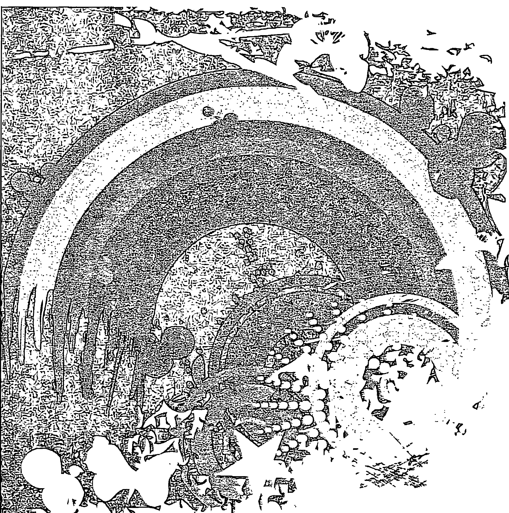

## 透過「動」，達到「不動」

我在《真原醫》裡談了很多運動和養生的資訊，未來還會整理「療效性姿勢」。

這些都是古人透過瑜伽等等方法，透過「不動」，一個靜態的姿勢，把氣脈打開。這些姿勢本身，就有療癒的效果。

螺旋舞則是透過「動」，達到「不動」，差別在這裡。

- 從沒有規則找到人生的規則。
- 從沒有規則找到宇宙的規律。
- 從局限找到無限。

宇宙本來就在動，從局限的部份生出星球，生出太陽、地球……它是在動，但是某個層面也是不動，所以從「動」達到「不動」，完全是兩面一體。

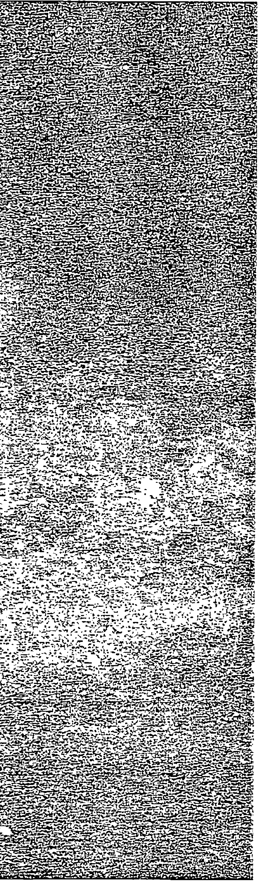

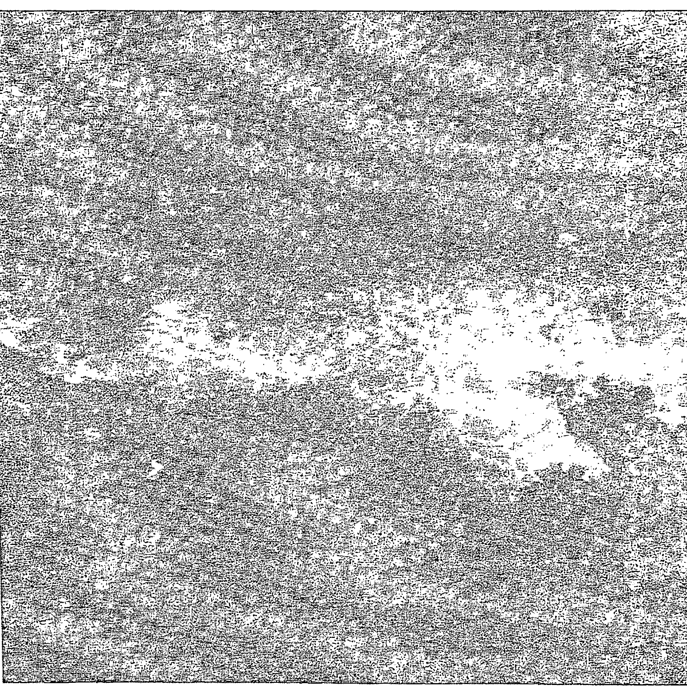

## 跟著領悟跳舞，讓細胞活起來

螺旋舞主要的目的，是把生命找回來。生命本來就存在，怎麼還有找回來的必要？所以講這些話都是多餘的，那既然投入到了生命，只能快樂吧。我可以保證，假如開始跳起來，就會讓你上癮，停不下來。只要你在任何時間，畫一個∞、兩個螺旋，就自己跳起來。

透過螺旋舞，你會跟生命接軌。每一個細胞會活起來，都在跟你跳舞、跟你講 Yes! I am. 我是。我就在。

甚麼好談的？
甚至，連一個『在』都不需要講，只能講一個字——『我』。就跟著跳舞，還有全部氣脈都是通的，全部都是沒有問題的狀態在跳舞。

所以，是領悟帶著你跳舞。倒不是透過跳舞，帶你找到領悟。跳螺旋舞，是跟你的意識相結合的。跳出這個人生，跳出生命。

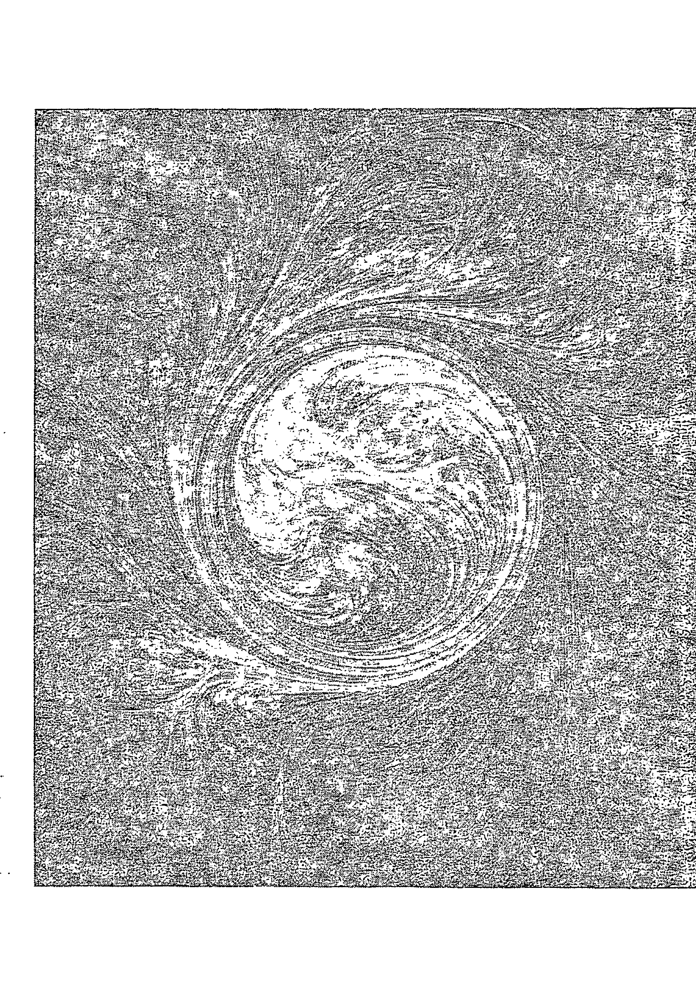

## 我就是生命，生命就是我

這一來，好像跟一般的講法是矛盾的。講到最後，你會明白——「我」在活這個生命——這種說法，其實是矛盾的。生命怎麼會需要你活？「我就是生命」——你最多只能講這句話。生命就是我。因為沒有主體了，沒有客體了，沒有分別的概念了。分別、隔離，只是全部生命的小小的一部份。這小小的一部份，確實不能說它沒有。只要我們看看眼前——「你」看著「我」坐在這裡。「你」聽「我」講話。那個分別，隔離就在眼前。只是，站在一體意識來看，這些分別，隔離，只能說是太小太小的一部份，幾乎等於沒有。當初，佛陀提出了「生命是永恆」的觀念，同時衍生出來生命是完美、寧靜、沒有苦、全部是喜樂的這些全面的整體觀念時，大弟子們全部起身離席。為什麼？因為這個觀念太不可思議了。大弟子們覺得：佛陀原本不是說生命是無常嗎？怎麼突然又變了？生命竟然沒有苦、沒有痛、沒有無常，這，究竟是怎麼回事？

其實，佛陀只是用不同的方式表達而已。他透過一個觀念，讓你體會到人間的限制，又讓你體會到——人間有另外一個層面，是不受任何限制，而你隨時可以找回來的。道理就是那麼簡單。聽懂了，你的人生將會脫胎換骨。什麼都沒有「做」，就連一個念頭都沒有「動」。你用心，投入一切，把自己真正找回來。

## 我跳舞，我就容納一切

然而，全部的生命，是無論我們多用功、追求成就，甚至取得數學、音樂種種世間知識的大突破，也永遠達不到的。

反而是，透過放下，是透過左右腦的合一，甚至，要超越左腦右腦的境界，而進入無色無形的境界。這時，無論做什麼，所做出來的創作，才是真正的創造力。創作者才真正做出一個不是人間思考所帶來的作品，是智慧的作品。

這樣的作品是不得了的，它可以是永恆的。

所以，透過螺旋舞，要表達的是——我跳舞，表達榮耀，表達敬重。我跳舞，全部宇宙所帶來的變化，好像跟我又相關又不相關。我跳舞，我就容納一切。這，是螺旋舞背後的一套完整的哲學。透過螺旋舞，我希望大家體會——全部的你、全部的生命。

## 【醒覺篇】享受宇宙送來的禮物

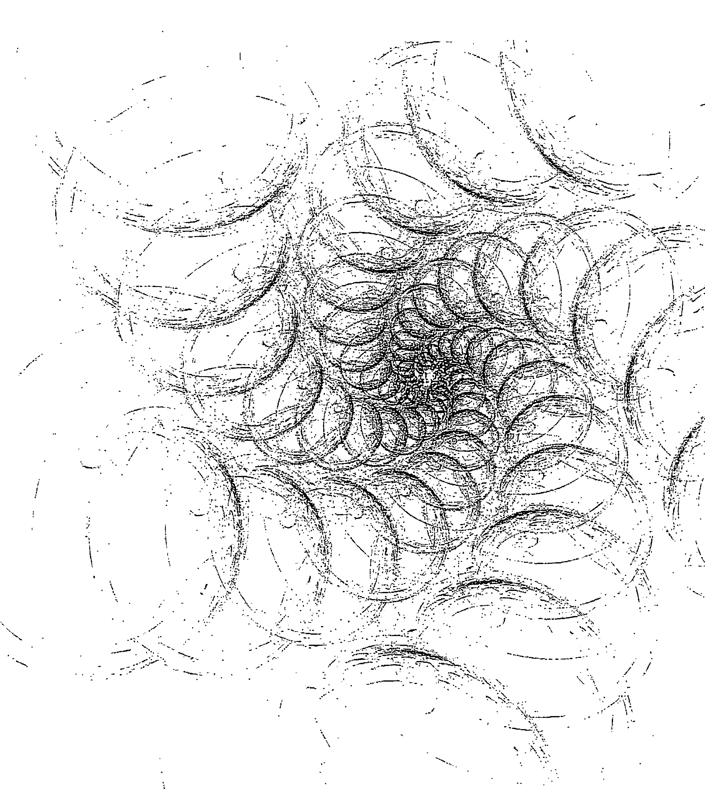

## 沒有好壞、勝負之分，單純地跟生命接軌

只要是運動，不管是足球、籃球等各種球賽，規則都是根據人間的思惟而創立的，本身就離不開競爭，要分勝負、要分數、要進球，都離不開「我」的境界——「我」要比「你」強。

我在巴西長大，小時候認為自己踢足球比任何人都棒，自然就產生了一種「我」、「你」的分別心。更別說球賽本身就有競爭性，隊伍跟隊伍一定要競爭、一定要比較，爭取一個比較有利的位置，得到優勝。

但它同時會造成受傷。

過去，我運動很激烈，受傷的機會也很多。像是膝蓋、脊椎、肌肉等很多地方都曾經受過傷。

當然，它也帶來很多的滿足感。讓人興奮、快樂，還有各方面的成就。總之，離不開「我」的滿足和成就感。

从另一個角度來看，球賽比較容易造成受傷，同時也比較容易把「我」的這個念頭更具體地限制住。所以我到某個年齡之後，開始認為運動不應該有任何的對立、不應該有好壞、比賽、比較，不應該帶來任何受傷的機會。它應該要跟生命接軌，跟我們生命的種種狀況完全合作，甚至合一。

## 看懂了，接下來就是享受

螺旋舞，只要一個小小的空間就可以跳起來，在臥室也可以、看電視也可以。它不過是在「動」中，表達我們對生命的理解。它只需要一個啟發點，看懂了，接下來就是享受。跳螺旋舞一定要帶著——既感恩又享受的心情，所以不能當作一個鍛鍊或功夫來「練」。

人生本來就是輕鬆完美，沒有任何事是絕對重要，都只有相對的重要性。我們平常都會覺得有某件事好重要，以至於根本沒有時間留給「這裡」！現在！這些聽起來很絕對的重要，其實也只是相對的。比如說——我要去煮飯，這件事好重要。但真的那麼重要嗎？其實，在人間，沒有任何東西是絕對的重要。螺旋舞所要表達的，也不過就是這樣的理解。

所以，跳舞的時候，也不用那麼認真，放一點自己想聽的音樂，或是慢的、也可以是快的，找到自己的步調，讓自己可以完全放鬆，讓自己既是在展現、又是在欣賞，也就全面包容這個螺旋舞了。

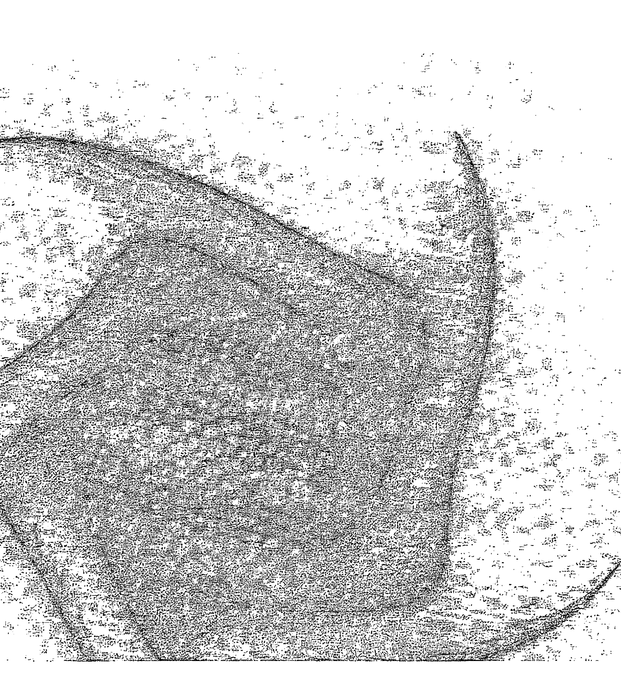

### 沒有小我的念頭，打通全身氣脈

有些人跳起螺旋舞來，自然很像太極的招式或體驗到「氣」，那很好，因為生命的根源就是「氣」。但是，不要去刻意追求哪一個派別，「氣」自然會發揮出來。

最重要的就是——跳的時候無思無想，因為只要你動了個念頭，有個派別、有個系統要去遵守、去符合、去追求，生命的「氣」絕對動不起來，因為，你已經將它局限了。

只要沒有「我」的念頭，生命的氣自然就通暢。而體會到這個氣的流動，是人生的一大享受。

你只能放鬆，只能快樂，只能尊重一切，只能跟生命接軌。

也就這麼簡單。

所以，螺旋舞會帶動、打通全身上下周邊所有的氣，越是放鬆、越沒有思考，你越有可能打通它。

一個人氣脈一旦打通了，是不會有念頭的。念頭是靠「摩擦」，是靠阻抗而生出來的。一個人沒有摩擦，內外沒有任何對抗，也就沒有念頭。所以，「定」（Samādhi）就是這個道理。「定」是在一個無思無想的狀態，輕鬆的存在。

### 「這裡！現在！」——生命場與人間的交會點

我過去常常用螺旋的觀念、螺旋場、螺旋的跳舞、螺旋的一切……來表達生命。螺旋場，其实就是生命場。生命場，當然是最大的能量場。那麼，生命場跟人間的交會點會是什麼樣子？

沒想到，這個交會點很簡單，是透過「瞬間」，透過「這裡！現在！」。

我換一個角度來解釋。我們每一個人，不是惦記過去，就是幻想未來。而這些，都在念頭的世界裡打轉。本來一個狀況來了，是很單純的。發生，就發生了。然而，我們透過念頭做種種的整理。比如說我們記得「昨天誰怎麼對待我，讓我好委屈」、「誰訓了我一頓，讓我沒面子」、「哪一個人虧欠我，我為他做了那麼多」、「啊，我過去傷害了誰」……沒完沒了。

每個人都一樣，都在一個念頭的世界，不停地追求過去。甚至，活在過去。透過過去——我們已經做過的什麼，投射到未來——我們再安排規劃接下來要做什麼。舉例來說，小孩子讀書學習，也是為了未來的就業、未來的機會、未來的學習。我們為未來生涯的種種籌備、安排，都是在點點滴滴累積「過去」，一步一步邁向「未來」。

很可惜，我們都忘了，中間這個橋梁是——「這裡！現在！」。

你不可能不通過「這裡！現在！」。沒有通過「這裡！現在！」，根本不用講「未來」。

「這裡！現在！」這個瞬間，是我們每一個人都有的。

#### 「這個瞬間」才是真的

想想，我們的一天是透過好多瞬間組合而成的，對不對？只有「這個瞬間」是真的。

乍聽這句話，你或許會覺得很奇怪——只有透過這個瞬間，才可以得到一切的真實？只要仔細觀察，是這樣沒錯。

「過去」是過去，而過去是念頭所組合的，只存在腦海的念相世界。
「未來」還沒有來，是念頭投射出來的世界，把我們拋向未來。

「未來」要透過「這裡！現在！」才能成形。
「明天」，要透過明天的「這裡！現在！」才可以化現出來。

「未來」，要在這個人間出現，一定要透過「這裡！現在！」
這個邏輯，本來是這樣子的。

#### 這個瞬間，是通往過去、未來的樓梯

最有意思的是——

我們沒有一個人活在「這裡！現在！現在！」。

我們的心，不在這裡，而是在別的地方，別的瞬間。不是在過去，就是在未來。

我們一般都會這麼認為——本來這個瞬間帶給我種種的痛心、悲哀、不順，我才想去其他的瞬間、其他的地方，或者其他更好的地點、更好的未來。本來就是這樣子。

所以，無形當中就把這個瞬間當作了樓梯，只是透過它，通往未來。循著「過去」，也就是以前的瞬間，把我領到這一步，而透過這一步，也不過是為了抵達未來。

這一步，這個瞬間，變成了一個工具，只是踏一步的一個點，只是一個經過。既然如此，我們不可能全心投入這個瞬間。

就這樣，很可惜的，我們每一個人都把生命最真實的交會點，種種能量交會的關鍵點給錯過了。只要把這個點找回來，全部的點，也就解開了，就那麼簡單。

#### 包容這個瞬間發生的一切

就那麼簡單。但是，怎麼做？

怎麼做，其實比想像中更簡單。

這個世界，我們種種煩惱的世界，既然是念頭所組合的，那麼，我們也不用再計較那麼多。

可以試試看——容納、接受、包容這個瞬間所帶來的一切，不分大小。

也許是——這個瞬間傳到耳裡的音樂，或者是——生活中的種種不順，甚或是——很大的煩惱。

接受了，容納了，不急著去對抗什麼，自然會發現——所謂的一切，也只在那瞬間發生。瞬間過了，也就過了。

活在這個瞬間，我可以試著容納一切。

容納一切，其實就含著這樣的理解——有形世界的一切，再怎麼嚴重，也不過就是如此。那個瞬間過了，也就過了。

再怎麼不順，也就是在那個瞬間不順，可以不在意，不用帶著這個不必要的不順一直走。

含著這樣的理解，面對這個瞬間，面對每一個瞬間。

很自然地，一切都不是那麼嚴肅，那麼嚴重，不需要那麼認真，也沒什麼大的小的目標好去追求。一切的答案，就是這樣子。

### 我，一直是宇宙的一部份

而我，只是這個生命的一小部份，是這個宇宙的小小部份。

我，雖然小，跟宇宙從沒有分手過，一直是這個宇宙的一部份，是全部的生命。

既然，我是宇宙的一部份，是全部生命的一部份——那麼，我可以相信宇宙透過瞬間所帶來的任何變化嗎？

假如答案是——YES！當然如此，也不可能不如此。

不可能不相信的。

這個道理，比最基本的物理邏輯還根本。

那麼，為什麼我們還要抵抗、對抗這個瞬間？成天跟這個瞬間作對？抵抗瞬間所帶來的順或不順，還努力去分析其間的是非對錯？

### 透過「靜」，可以欣賞人間帶來的種種變化

如果我們樣樣都可以接受，帶著這樣的看法和理解去活。有意思的是，自然會發現在種種變化中、在「順」與「不順」中，有一個寧靜。有一個寧靜，存在於這個最不順的時候，存在於背景。這個靜，會讓我們自然投入生命，發現——原來透過靜，我可以看到一切。可以欣賞人間帶來的種種變化。

也發現——透過靜，可以清楚地看，不需要去反應、反彈。不反彈，一切也就這樣了。瞬間過去，也就過去了。最不可思議的是，透過瞬間，再一個瞬間，清楚地看，不去反彈。你會發現——你認為不順的，也就順了。你認為的不滿、不滿意、不滿足、不完整，也就圓滿了，也就完整了。

不用做任何動作，完全只是讓生命存在，讓瞬間存在，讓一切變化存在。讓這個生命存在。

### 就讓生命存在吧！找回自己，好簡單

靜，也就是——放過這生命吧。

就讓生命存在吧。

就那麼簡單。

假如不用邏輯聽，而是用「心」在聽，你會知道——答案也就是這樣子。

這是一個最根本、我們每一個人的狀態？

所以，它不需要我們費神再從邏輯的層面進一步分析歸納，而創出另一個念頭，

另一個領域。

過去的大聖人都懂這一點，而且可以做得到。

然而，到了現代，這反而是我們在人間最需要的一堂功課。

因為我們的分別心已經發展到了極端的地步。

看看人類種種偉大的科學成就，以及各種觀念、物質層面的突破，可以說是人類進化史的大躍進。

然而相對地，卻也是二元對立到了最嚴重、甚至可能毀滅地球的地步。

如果再這樣繼續快速地發展下去，人類繼續完全在分別心、在很局限的腦運作，會把全部的自己忘記了。
如此一來，毀滅掉這個世界的，可能是人類。
然而事情往往是一體兩面，大的危機同時也會帶來大的轉機。
所以，人類發展幾千、幾萬年來，沒有一個時段那麼關鍵、而且是那麼大的機會，可以讓我們整體「醒」過來。
我從《真原醫》、《靜坐的科學、醫學與心靈之旅》、《全部的你》，到《螺旋舞》，以及接下來即將出版的書籍，都是希望大家一起「醒」過來，不要在人間所帶來的昏迷中繼續活下去，而是把我們與生俱來的權利找回來。這個答案，就在自己的心裏。
你什麼都不用做，就可以把它找回來。

如果人人都把自己找回來，這麼大規模的醒覺，世界將不可能會有戰爭、不可能會有族群、民族、人與人之間的撕裂，社會上不可能會有那麼多的不平安，個人不可能那麼不愉快、那麼痛心，不可能還帶著種種傷口留下來的疤……我們什麼都不需要做，就已經把這傷口完全療癒了。同時，人生最大的目的也找到了。就是這麼簡單。

### 大家一起来『醒』过来，活得更快乐

全人類的這一步整體的醒覺，比演化史上，從蚯蚓到人類的這一步還大。如此，我們才可能準備好成為『未來的人』。未來的人，絕對不是像現在的人類這麼煩惱，充滿矛盾與兩難。

兩難，是一種很無奈的生命狀態——無形當中，我們隨時在兩個不好的選擇中，選一個比較沒那麼不好的。

人間就是如此。我們的人生，活成了一個大冤枉，不快樂的冤枉。

而我們是不是可能修正這種情況，活得快樂一點？

把全部生命的潛能活出來，或者說『讓天堂落到地球』。這，其實不需要費力，不需要『動』。

如果真有什麼是值得『追求』，值得『探討』的。說到這裡，我想答案已經很清楚了。

## 螺旋，是最少對抗的「動」

人生是一個大螺旋。生命也是個大螺旋。這個瞬間，就是一個大的螺旋場。

其實我們若仔細觀察宇宙萬物，任何大到星球，小到最小分子，都離不開螺旋對稱的形狀。例如颶風是螺旋成形、水的漩渦是螺旋形態，連植物長出的新芽、花朵的苞蕾，都是透過螺旋的形狀展開來⋯⋯一朵花、一株植物、DNA的結構，遺傳的蛋白質結構⋯⋯都離不開螺旋。

因為，螺旋是最少對抗、最少阻力，也因而最不費力的「動」。

透過「動」，受到周邊最少的阻力，自然會帶出一個螺旋。螺旋完成一個圈子，不會回到原點，它會跑到上面一點，或下面一點。

而生命的源頭，其實就離不開一個螺旋，甚至離不開一個相對相成的螺旋——一個順時鐘、一個逆時鐘，相對對稱的螺旋。

螺旋舞，只是把古人最古老的一套舞，或稱它為運動、養生良方，透過簡單的動，把生命的源頭找回來。

所以我們跳的螺旋舞，也只是宇宙最原始最源頭的動作。這個動作離不開生命，生命本身就是透過螺旋展現出來。

跳螺旋舞可以讓我們把生命的根源找回來、又可以得到最好的養生。

所以用螺旋這個比喻來談，念頭也是螺旋，全部種種的螺旋要落到這個瞬間、這個生命，唯一的交叉、交會就是「這裡！現在！這個瞬間。

#### 回到寧靜，跳出人間的螺旋

我在《靜坐》裡，曾經提過奇點。在物理學上，奇點指的是一個意外的點。對時空的架構來說，它可以說是跳出這個時——空的一個點。所以，想從這個人間的螺旋場跳出出來，一定要透過「這裡！現在！」這個瞬間才可以跳出出來。或者說，透過寧靜，不再讓念頭追著過去或未來跑。那麼，寧靜就是瞬間。而回到瞬間，也就回到寧靜。

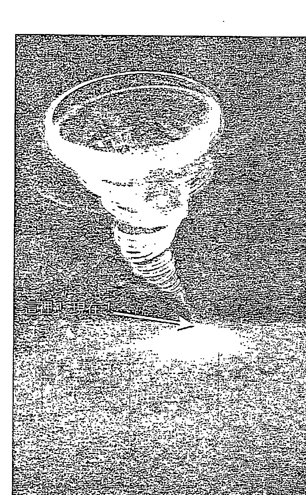

#### 什麼是奇點？

《靜坐》第十二章〈靜坐想達成什麼目的〉裡提到，當人的注意力被貫通、聚焦到一個點上，這個焦點會愈來愈細微，集中到一個程度——低於時空的限制，會讓一個人跳出人間，得到一個解脫。這個點，就是「奇點」，同時也就是「這裡！現在！」。

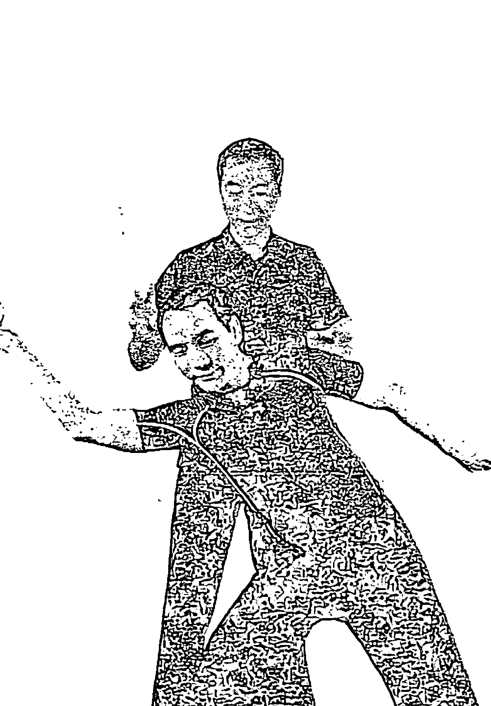

所以，螺旋舞是透過「動」，用身體的動作，可以一邊順時針，另一邊逆時針，透過身體本來就有的對稱，畫出兩個相對相成的螺旋。在各式各樣的螺旋中，也許是平的，也許有角度，甚至立體的，都讓我們體會「空」，體會寧靜，體會生命。

## 第一章 引论 把手里掌握的资源投向全部的你

## 2.12 求证：直角三角形斜边上的高是两直角边在斜边上的射影的比例中项。

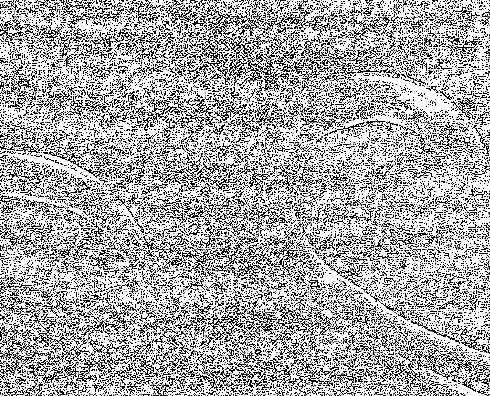

证明如下：

在Rt\(\triangle ADC\)与Rt\(\triangle CDB\)中，\(\angle ADC = \angle CDB = 90^\circ\)。又\(\angle ACD = 90^\circ - \angle BCD = \angle B\)，故\(\triangle ADC \sim \triangle CDB\)。

从而有 \(\frac{CD}{AD} = \frac{DB}{CD}\)，即 \(CD^2 = AD \cdot DB\)。

又由\(\triangle ADC \sim \triangle ACB\)，可得 \(\frac{CD}{BC} = \frac{AC}{AB}\) 及 \(\frac{AC^2}{AB^2} = \frac{AD}{AB}\) 等关系。

由面积公式 \(S_{\triangle ABC} = \frac{1}{2} AC \cdot BC = \frac{1}{2} AB \cdot CD\)，亦可得 \(CD = \frac{AC \cdot BC}{AB}\)。

透過螺旋舞，我們可以把人體的結構當作工具，透過自己的身體，把全面的生命找回來。

我們在一個很慢的「動」，很舒暢的「動」——很舒服、完全是放下的「動」，是一個臣服的「動」。

還沒有動之前，已經把自己交給宇宙。所以，是宇宙來跳我們，而不是我們在跳螺旋舞。

## 螺旋舞。

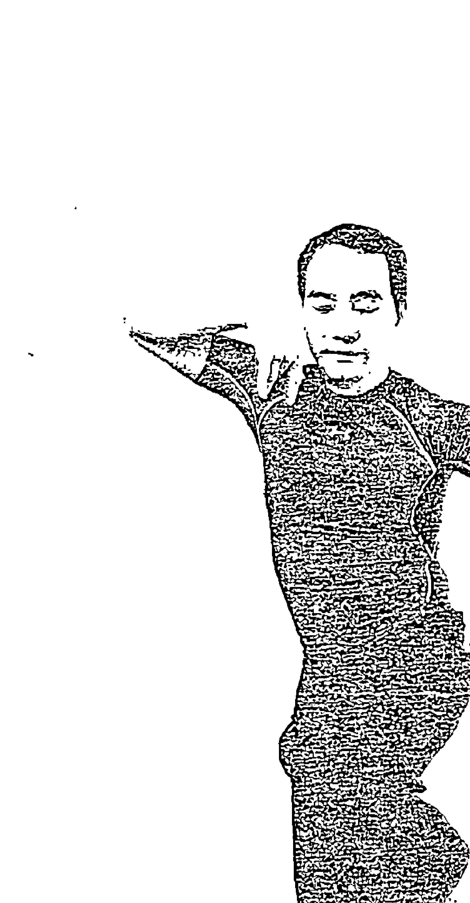

或許，你會感覺這種表達方式很奇怪——螺旋舞來螺旋我們。宇宙透過「我」，跳螺旋舞。

## 無思無想，讓「我」和宇宙接軌

跳的時候，沒有想到任何結果，達到什麼目標，沒有什麼目標好達成的。
它本身沒有什麼目的，只是讓「我」這個肉體成為和宇宙接軌的管道，一個「空」的管道。

在接軌的當中，宇宙想做什麼，我接受，由它去做什麼。
有了這樣的理解，跳螺旋舞的當中，我已經在體會宇宙的奧妙，體會宇宙所帶來的不分別、不生不死、無色無形的意識。而這也就是我們每人都有的一體意識。

所以，螺旋舞是醒覺的舞（conscious dancing）。在跳的時候，清清楚楚看著每一個動作，而不去干涉。也不會帶出一個念頭、一個期待、一個規劃。

所以，螺旋舞是沒有規劃的動作，沒有規劃的規劃，沒有規律的規律，沒有藍圖的藍圖。和人間最大的突破一樣，不管是在藝術層面、文學層面、科學層面等等，都是從無色無形中爆發出來，而不是「想」出來的。
舞蹈本身，自然會跳出很美的動作。

## 99 【实践篇】把身体当工具，找回全部的你

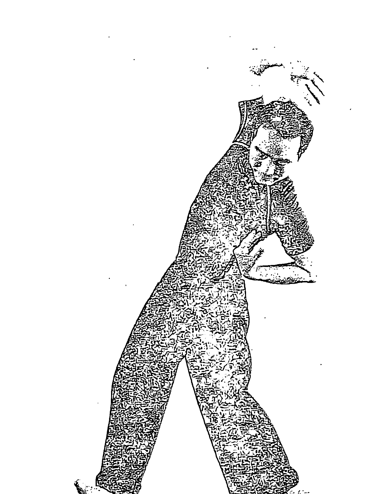

## 放鬆關節，讓人健康又年輕

此外，站到醫學的角度，螺旋舞也是相當有意思的「動」。

螺旋舞，就像馬達軸心轉動的動力，用身體最核心的力量，讓我們每一個關節都可以得到放鬆。它會帶出一個扭力（torque），在身體的動作之中，自然為脊椎帶來完整的解開。

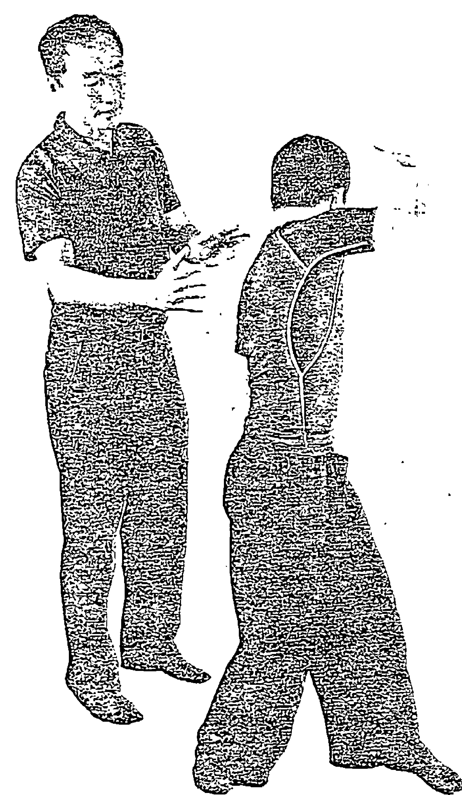

古人都知道——關節一放鬆，人才會年輕，甚至延年益壽。 所以，要保持年輕和活力，一定要打開每一個關節。而打開關節，最有效的方法 是透過螺旋。我們雖然不追求任何結果，但它本身自然會帶來健康的結果。 就是那麼奧妙。

## 身體只要放鬆，你就不會受傷

螺旋舞，其實是最安全的舞，最安全的運動。

它讓身體作主，讓身體跟我們說話——身體告訴我們想怎麼動就怎麼動。

身體只要放鬆，就不會帶來任何傷害，自然會有保護。

我們從最小的範圍，比方說脖子或肩膀跳起舞，不可能讓自己受傷。

螺旋舞不是挑戰極限的體操，也不是為了任何「我」的目的跳舞。只是透過這個舞，輕鬆鬆表達我們內心對宇宙，對全部生命的一點領悟。

如果目的是放鬆，怎麼可能會受傷？它是一種最輕鬆的瑜伽、沒有目標的瑜伽。把它當作「沒有結果」好追求的一種遊戲吧。

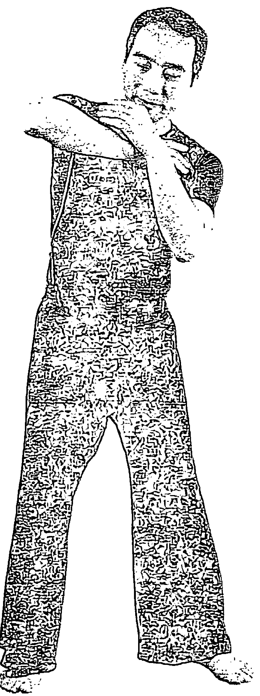

## 没有美，也没有丑，看自己就好

并不是靠一个单纯动作，来表达螺旋舞的境界。是透过一个理解领悟的层面，而不是物质的层面来表达。没有美也没有丑，没有说某某人跳得比我更好，我跳得不如他——这还是脑子在作分别。

其实我们有时候要多听别人的想法，多听家人、周边的人、同事、朋友的表达。

这个道理，我们每个人都懂。假如你把这些分别全部放下，光听身体跟你讲话，听身体来表达这个宇宙，自然跳出局限的意识。身体没有时间的观念，是脑才有。

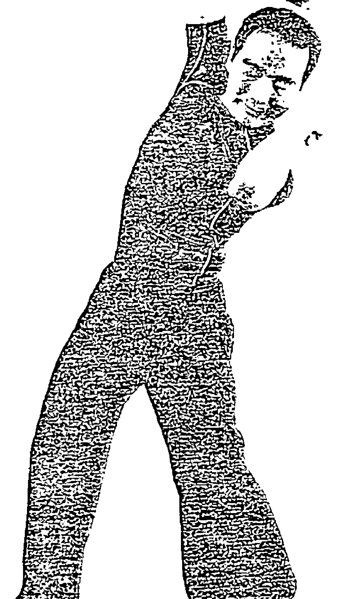

透過身體，把這個無色無形的境界表達出來。怎麼出來，就接受。醜也接受、漂亮也接受。醜跟漂亮的觀念自然就化解掉了。你怎麼跳，就是如此了。螺旋舞是需要用這種角度來看，它不光是動作而已。

看自己就好。看自己，其實就是在看宇宙，看生命。因為生命就在最內層的層面，跟我們完全就是接軌的。從眼睛看，都是隔離的。從內層看，沒有任何的距離。所以，跟生命接軌，樣樣都是漂亮。你會發現自己動作很美。

多年來，任何人只要接觸螺旋舞，都會跟我分享。他們發現竟然自己可以跳多美的動作，而且可以發現別人也很美。為什麼？只要跟生命接軌，樣樣都美。

## 就是現在，一起來跳螺旋舞

現在這個階段，人的分離太大、對立太大，沒有安全感、不愉快，種種不安定的境界太嚴重。所以，為了幫助大家快點醒覺過來，我想用各種媒介，包括書、CD、DVD等來推廣。

因為人離不開用眼睛「看」，眼睛是一個很重要的感官，用耳朵「聽」也是。聽和看是最重要的。所以要透過這兩個局限的意識，帶來無限大的觀念。

全部的生命，不是完全透過文字來表達的。只要你透過這個瞬間，你本身就進入了生命最大的一個能量場，也就是生命場。透過聲音，其實可以帶到一個無色無形的空檔。透過看、動作，也是可以達到這個效果。

很多人也可以透過文字來醒覺過來，用不同層面，把這些古人留下來很好的資訊和觀念帶出來，也許是我們現在最需要的一堂課。所以，我好像每一個角落都在談同一件事，從《真原醫》、《靜坐》開始談，《全部的你》、《重生》（CD 作品）都只是從不同的角落在談同一件事情。

只要一個人真的希望把人生的價值觀念，最源頭的價值觀念，最源頭的生命的意義找回來，不管是透過螺旋舞，透過任何角落，都可以切入進去。因為它從來沒有離開過我、離開過你，離開大家。

我很希望每一位朋友透過螺旋舞，透過不同的方法，把全部的生命找回來。千萬不要認為生命只是外在世界的這些形相而已。

從外在世界只能得到痛苦，早晚一定只有痛苦。
要從這個痛苦、從好多悲傷走出來，一個人一定要透過更深的一層意識，從那裡
著手。

所以我希望透過螺旋舞，你輕輕鬆鬆地不要給自己壓力、不要做任何比較，不要
對自己有什麼追求，有什麼期待。
去享受這個舞，享受這個音樂，享受身體任何部位，跟自己身體對話。
不要用字、不要用念頭，輕輕鬆鬆專注每一個動作，其實就那麼簡單。

【实践篇】把身体当工具，找回全部的你

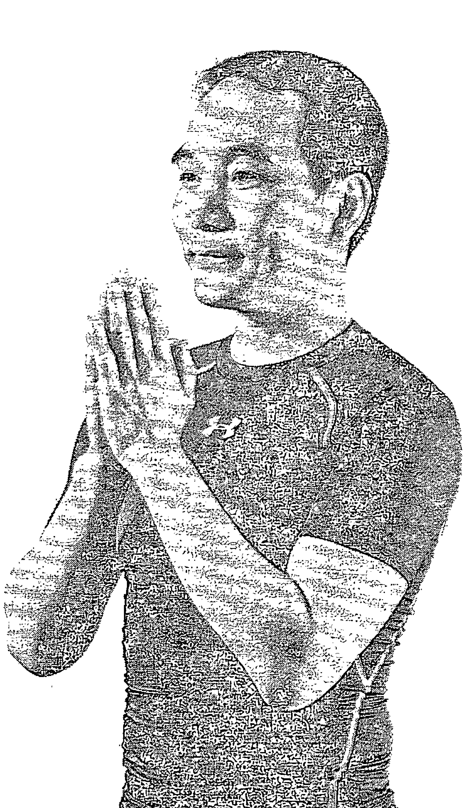

## 问答

Q: 楊博士，請問您為什麼特別想在這個時候推廣螺旋舞？有什麼目的嗎？

A: 因為我認為大家都把注意力集中在念頭、感受、感覺，都著重在一個外在的世界。人啊，每天從早到晚都在忙。每一個人都有紛至沓來的念頭，也接收到源源不絕的電腦網路資訊。雖然科技帶來了各式各樣的方便，在這個步調快、同時多工處理好多事情的時代，這樣的快速、方便性，同時也為我們帶來最大危機。我們每一個人似乎都活得很緊張，都把注意力集中在表相的世界，而忽略掉每一個人內在都有一個更大的世界。而這個世界跟任何條件、局限，任何念頭、感觸、感受……都不相關，它隨時都存在，只是我們把它掩蓋住了。這一來就讓我們不斷地分別、不斷地對立，都認為人生要找種種的意義、找種種的價值。我們不斷地從外在的物質層面尋找價值，追逐財、權、名、利……無形當中都認為自己不圓滿、不完整。

所以，透過關係也好、要找一個對象也好，總是，要找出人生有什麼東西可以幫我們滿足、可以幫我們完整、可以幫我們圓滿……但這種東西是絕對無法向外求的，短期內也許可以得到高興、圓滿的感覺，但絕對不可能因此真正的滿足。

所以，在這種對立最強烈的年代，我認為我們要找出另外一條路。這條路也是古人所帶的一條路，也就是把我們真正的我、真正的宇宙，真正最原始、最一體的意識——你我本來都有，把它找回來。每個人的內心本來就滿足、本來就完整，本來就圓滿。不可能比現在的最圓滿更圓滿了，只是不自知而已。所以總是忙著向外求。如果能把自己找回來，就等於把全部人生的價值觀集中在輕輕鬆鬆的存在——不是透過「動」，是透過存在（being）。不是透過忙碌地「做」（doing），而是輕輕鬆鬆存在，這樣就把自己找回來。

透過螺旋舞，只是表達這個境界，沒有心事、沒有念頭、沒有任何問題。我們每一個人都把人生當作問題在活，若沒有了問題，身體自然想跳就跳，想畫一個∞做對稱，對任何宇宙透過這個瞬間化出來的任何變化，都表達一個最高的尊敬。螺旋舞其實含著這些意思。所以它離不開我們全部的生命，全部的我，全部的你，這些觀念。

Q：所以螺旋舞是一個很好的開始囉？

A：螺旋舞可以說是動態的靜坐，它本身是個方法——假如有方法好談，它本身是個最好的方法，它本身又是結果。你聽到這裡也許有點矛盾——它又是方法、又是結果。透過這個方法，我們已經表達最高的領悟，也就是結果。也就說，人生本來就是這樣輕輕鬆鬆的，透過螺旋舞來提醒我們一切好像沒有絕對的重要性。沒有任何東西是絕對重要，都是相對重要。像我們在人間任何領域也好、專業也好，會忙於追求我們所認為的合理化。追求了半天發現這個「絕對重要」其實還是相對的重要。離開那個時空、離開那件事，沒有什麼絕對的重要好談的。所以，透過螺旋舞，就發現人生倒不需要那麼嚴肅，倒不是需要強調任何形相、念相，好像說它有、它又沒有。說它沒有、它又有。我們人全在念相當中打轉。其實樣樣也不是那麼嚴肅，對人生也不用那麼期待。

> 好像我們人要投射，希望要有什麼結果。怎麼解開也好、怎麼舒服也好，這些都不重要，把這個人生變成一個舞台，在這人生的舞台上跳。要跳甚麼也都不重要。跳本身就是跳，沒有一個結果，或是期待好談的。

螺旋舞它表達這些好重要的觀念。我們現在的人不管是年輕人、年紀大的人，最關鍵最重要的一堂課——就是透過螺旋舞，我們是不是可以做出一些反省。

透過這些反省，看可不可以把自己的寧靜，一種很舒暢很和諧的一些觀念，帶給周邊、帶給社會、帶給家庭，那麼自己比較好過，也讓別人更好過。

Q：請問我們要怎樣邀請周邊的人，像是父母或家人一起來參與呢？

A：我想首先自己先跳，而且很投入，欣賞地跳、輕鬆地跳，周邊的人看了自然會被吸引。他們會發現為什麼你可以這麼投入，而且好像每一個動作都很美。從這樣起步會比較好，比較自然。我們倒不需要把它當作一套功夫，帶著大家去跳起來。越自然越好，我有時候在公園自己在跳，自然周邊的人就跟著跳起來了。他們也會問這是什麼功夫。我說這不是功夫，最多回答幾個重點，就帶動周邊的人一起來跳。但我的目的並不是特別想要帶動周邊，只是自然會吸引周邊的人的目光。

> Q: 您在傳遞這套螺旋舞或是看別人跳的過程中，有沒有什麼特別深刻經驗，或是印象很特別的畫面？
> A: 我總是認為每一個人都跳得好漂亮。因為，只要從內心發出來，我們只能稱它美。我常提醒自己周邊的人一個好重要的觀念——當一個人在無思無想的狀態，該做什麼，就可以做出來，而且做得最好。
>
> 回顧歷史，在文學、藝術、音樂、科學的發明、數學等領域，最大的突破不光是在左、右腦均衡的狀況下產生的，更是在一個無思無想、沒有條件限制的狀況下，從內心更深的層面創造出來的。
>
> 我們仔細看，只要是流傳千古的作品，一定不是在種種的條件制約下創造出來的。只有跳脫制約，不受任何人間條件的局限，才會有突破性的創意。

只要從內心無思無想的這種境界出來，它本身就是一個最高的表達。本身就是最美、最放鬆。我看到周邊朋友在跳舞，都感覺很漂亮，而自然地稱讚。倒不是為了他的外型、衣服整不整齊等外在條件，這些都毫不相干。我們也要懂得超越這些人間所帶來的種種限制，不再任由腦的分別意識去分漂亮不漂亮。其實從更深層來看，這些都不存在。懂了這些，好像就對螺旋舞沒有什麼期待，也沒有什麼要求。自然而然跳出屬於自己、獨一無二的螺旋舞。

祝大家都能跳出這一黑一白的蝴蝶舞，把真正的你找回來。

《神圣的你》即将出版，敬请期待……

## 國家圖書館出版品預行編目(CIP)資料

螺旋舞 / 楊定一著 ; 吳長泰示範. -- 第一版. -- 臺北市 : 天下生活, 2016.09
面 ; 公分. -- (楊定一書房 ; 2)
ISBN 978-957-0388-84-8 (平裝附數位影音光碟)
1. 健身操 2. 運動健康

411.711 105013009

## 訂購康健雜誌圖書的四種辦法：

| 訂購方式 | 詳細說明 |
| :--- | :--- |
| ◎天下網路書店線上訂購 | www.cwbook.com.tw 會員獨享： 1. 購書優惠價 2. 便利購書、配送到府服務 3. 定期新書資訊、天下雜誌網路群活動通知 |
| ◎請至本公司專屬書店「書香花園」選購 | 地址：台北市建國北路二段6巷11號 電話：(02)2506-1635 服務時間：週一至週五 上午8：30至晚上9：00 |
| ◎到書店選購 | 請到全省各大連鎖書店及數百家書店選購 |
| ◎函購 | 請以郵政劃撥、匯票、即期支票或現金袋，到郵局函購 康健雜誌劃撥帳戶：19239621 天下生活出版股份有限公司 *優惠辦法：天下雜誌GROUP訂戶函購8折，一般讀者函購9折 *讀者服務專線：(02)2662-0332（週一至週五上午9：00至下午5：30） |

## 螺旋舞

### 打開身體的結，找回快樂的你（DVD+書）

作者／楊定一博士　示 範／吳長泰老師
採 訪／李瑟、張曉卉、陳秋華、羅儀修

#### 【書】

-   編 者／陳秋華
-   人物攝影／陳德信
-   責任編輯／陳秋華
-   視覺設計／蔡南昇
-   書盒造型設計／郭怡伶（Kit）

#### 【DVD】

-   共同企劃／康健出版・長庚生技
-   策劃・監製／羅儀修
-   製作協力／蘇庭緯

本產品之主視覺「∞」由陳俊良博士設計、《Cheers快樂工作人》雜誌授權提供

-   發行人／殷允芃
-   康健雜誌社長／李瑟
-   總經理／梁曉華
-   總編輯／張曉卉

出版者／天下生活出版股份有限公司

地 址／台北市104南京東路二段139號11樓

讀者服務／（02）2662-0332　傳真／（02）2662-6048

劃撥帳號／19239621天下生活出版股份有限公司

法律顧問／台英國國際商務法律事務所・羅明通律師

印刷製版／中原造像股份有限公司

裝 訂 廠／聿成裝訂股份有限公司

總 經 銷／大和圖書有限公司　電話／（02）8990-2588

出版日期／2016年9月第一版第一次印行

定價／632元　特價／499元

All rights reserved

ISBN：978-957-0388-84-8(平裝附DVD影音光碟)
書號：BHHY0002P

天下雜誌網路書店 www.cwbook.com.tw
康健雜誌官網 www.commonhealth.com.tw
康健雜誌出版臉書 www.facebook.com/chbooks.tw

我們天天活在忙碌與高壓中，
不知不覺，身心逐漸扭曲，日夜積累無數的「結」，
於是，身體用各種疼痛來抗議，
心也隨時被念頭、煩惱、焦慮和憂愁給帶走……
快樂，離我們越來越遠。
螺旋舞，最古老又現代的動態靜坐，
簡單易學，用身體畫出相對相成的 ∞ ，
把脊椎與關節一一鬆開，打通全身氣脈，
鬆開身體的「結」，回復健康體態，
鬆開心裡的「結」，釋放深層情緒，
這時，快樂會像泉水般流向你，盈滿每一天。

### 學螺旋舞的好處

-   從小孩到長者：每一個人都可以跳，把氣脈打通，身心舒暢。
-   從最大到最小：打開最大的動作，活化最小的細胞，都能輕鬆自在地律動。
-   從緊繃到放鬆：隨時隨地可以跳，像是最輕鬆的瑜伽，也像動態的靜坐。
-   從學習到享受：沒有任何目的，不需要挑戰極限，單純找回快樂與健康。
-   從動再到不動：透過動，達到不動；從沒有規則，找到規則；從沒有規律，找到規律；從舞動中，找回內心的寧靜。