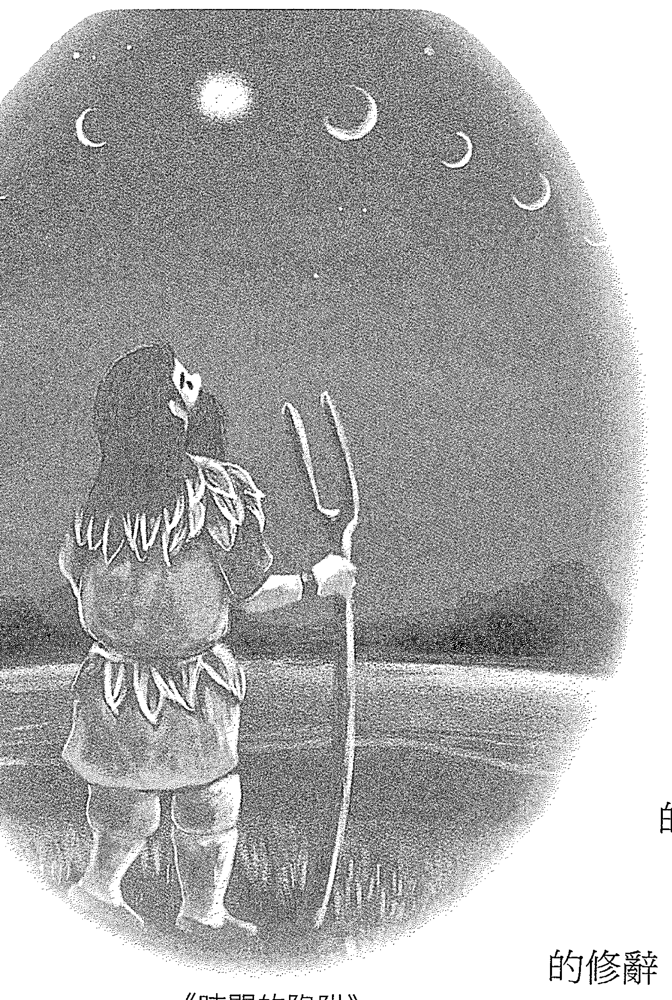
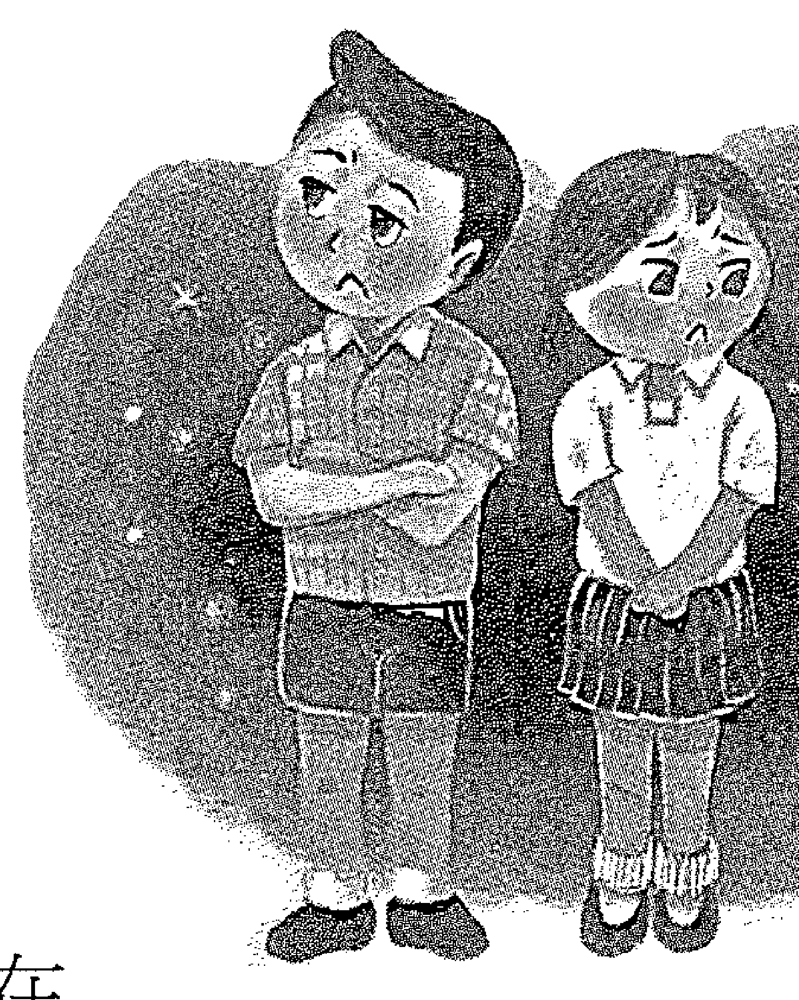
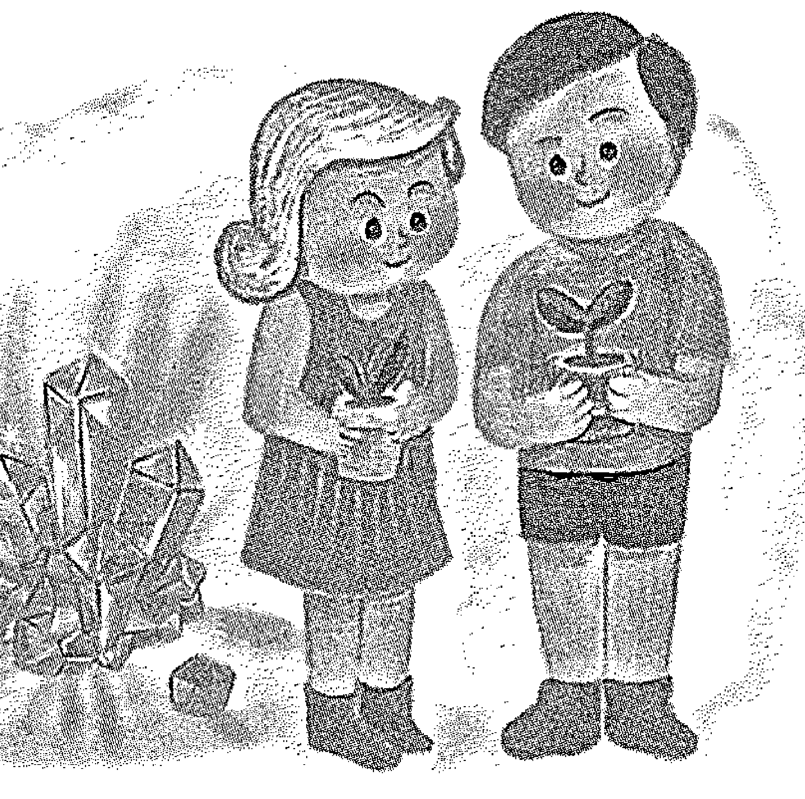
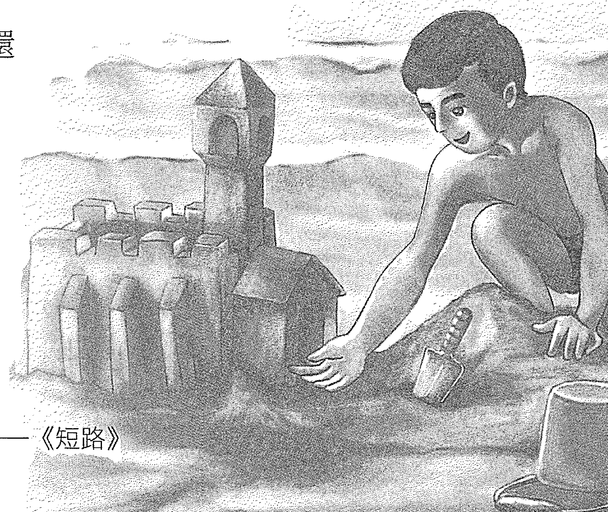
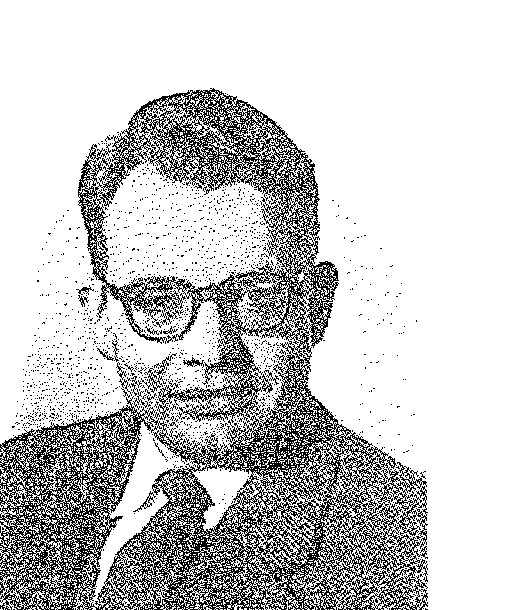
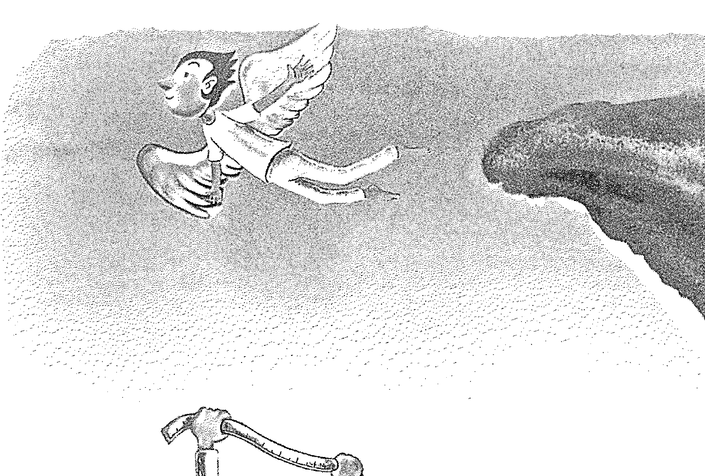
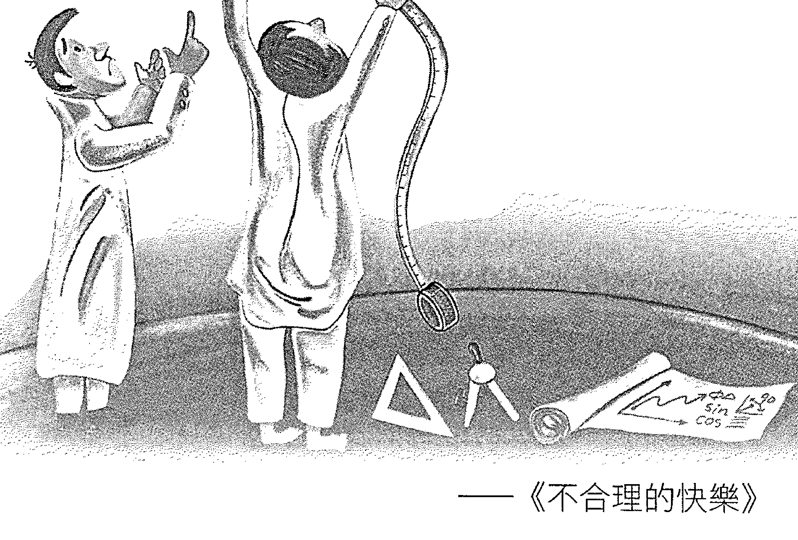
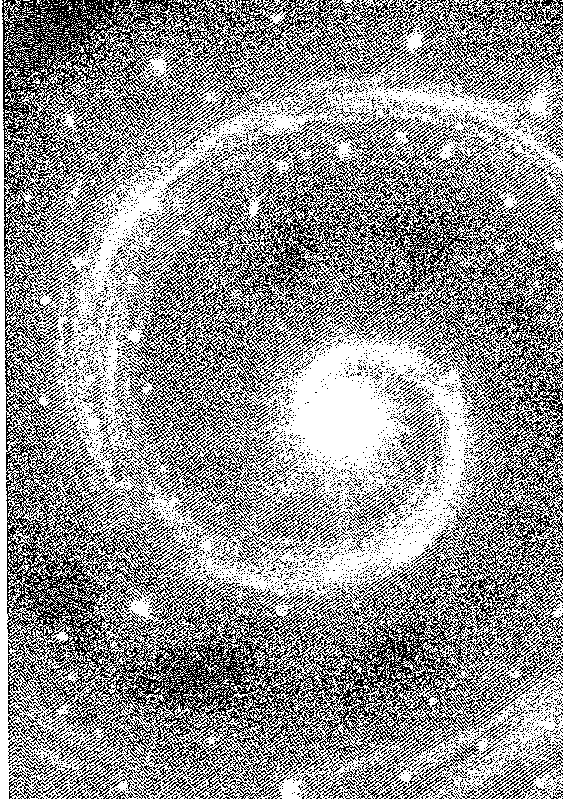

# 杨定一：转折点

# 序

我會在《唯識：新的意識科學》和《必要的創傷》還没出版就緊接著開始這本書，所考慮的也就是除了前兩本書所帶來的整合，其實還有另外一個層面是一樣重要，而讓我認爲需要再用一本書來延續前兩本書「顛倒」的探討。

假如你要完全面對真實，而完全接受是意識為主、意識優先、只有意識是真的，那麼，早晚你要面對人間這個層面的事實——

其實，你對物質和人類所看重的一切的認知，包括文化、文明、價值、歷史、甚至科學，全部都會是顛倒的。

至於你點點滴滴活出來的這一生究竟顛倒到什麼地步，或許你到現在還無法想像。就算我為你一一指出來，你也不見得會相信。

我想指出來的，其實還不到從唯物到唯識這種觀念上全面而徹底的顛倒，而是光站在「有」的角度、就在這人間相對的範圍，你從剛懂事、到上學、到今天所學到的一切，都是顛倒的。

這一點，你可能根本就沒有想過。

然而，這種人間層面的顛倒，可能讓你從觀念、從認知、從思考全面地重新起步。你突然體會到這種顛倒，也可能自然會進一步去追求「全部生命系列」所談的從唯物到唯識的顛倒的關係。

這就是我寫這本書的目的，而它在認知層面的切入跟《唯識：新的意識科學》和《必要的創傷》在邏輯層面和情緒層面的整合，是可以搭配的，而且是三面一體。

我會選擇現在就著手進行這個作品，也是考慮到"quickening of time"（時間正在加速）的現象。這個現象，我相信你也注意到了，也就是人類面對的改變步調正在不斷加快。

舉例來說，你現在可以接觸到的資訊量是不可思議的豐富，管道也是過去難以想像的便利。人類隨時可以跨越時間和地域的局限，共享同一個全球性的資料庫。而且這種共享是雙向的，你不光是可以去取得資訊，而你所產生的資訊也隨時能夠被別人取得。這種方便，自然而然會為你的腦海帶來一種全新的整合，甚至帶來一種重新起步的作用。

除了資訊的便利不斷加快改變的腳步，接下來，我認為還會有一些重大的發生，也許是太陽系或行星層面自然的變化，也許是這個世界免不了的天災和各種人為的傷害。這些發生，也同時在催促人類整體要提升意識、要往統一的意識前進。

就像我在《必要的創傷》提到的，正是透過這種難以避免的對立、摩擦和衝突，你我才可能把樣樣都當作個人轉變的出發點或恩典。

但願到那個時候，「全部生命系列」（其實也就是一系列探討唯識的作品）包括這本書可以作為一個指南針，引導你我度過最艱難、最陰暗的時刻，讓你我可以完成這一生意識轉變的旅程。

至於這本書的書名「轉捩點」，所想表達的也只是——在人間，早晚會有一個時點，人類（當然包括你）會突然得到一種天翻地覆的轉變。你會發現，過去所知道、所體會的全部都是顛倒。這種認知上的轉變，會為你帶來一個瞬間的同步或諧振，而讓你突然明白，過去以為的顛倒，其實才是理所當然。

這種轉變，即使還沒深入到從唯物到唯識的顛倒，但它本身已經帶來一個轉捩點、一個讓你再也無法回頭的點。

到這個時候，你才落到意識的門戶，而接下來只可能進入唯識的真實。

這當然是我個人的期待。是這樣，我才會用那麼多作品走到這裡。

其實，這本書本來也可以稱為「重新起步（Reset）」或是「人類的實驗（The Human Experiment）」。不同的書名，所強調的切入點多少會不同。至於能不能一一深入，也就看個人是不是有足夠的條件和精力可以著手。在這裡，讓我借用這本《轉捩點》先簡單囊括其中幾個相關的觀念。

此外，希望你不會介意我再一次選擇這種對話式的寫法。其實，要談人間層面的轉捩點，是有許多根據和文獻可以引用。但我總覺得這些可以參考的紀錄在時間上的跨度都很短，也只能做有限的引申；至於我想談的主題，不光是時間的跨度很長而不可能有什麼文獻可以參考，我也不認為有任何文獻紀錄是正確的。是這樣，我才會選擇用這種方式，和你直接對話。

用這種對話的方式來寫作，也讓我可以更放鬆地涵蓋多個主題，而不需要守住一個小題目來鑽牛角尖。我想，在這個時點，你會想知道的是整體，而倒不是整體某一個角落表面上很精確的細節。

畢竟，我的出發點最多也只是希望帶來一個觸媒，催化你個人意識層面的轉變，而倒不是再帶出一套完整而詳細的知識去探討某一個小小的層面。過度強調知識層面的完整性，非但跟意識層面的轉變不相關，甚至反而會帶來反效果。是這樣，我也就不採用一般科學或資訊類書籍常用的體例。

儘管不求細節的詳細與完整，但我很有把握，有一天（也許一、兩年，幾十年或幾百年後），這本書所談的都會得到證實。

# 引言

你可能還記得，我過去時常提到——這個時代，從我的角度來看，是人類史光明的黃金時代（Golden Age of Enlightenment）。當然，你過去聽到這種表達，可能會以為我所談的是人類的演化已經完成，而接下來一切都會順利——社會愈來愈發達，文明也不斷地進步，而生活當然會更方便；人類就要進入一種更輝煌、更理想的階段。

然而，我所指的，其實是剛剛好相反。

我指的「光明的黃金時代」，倒不是從你、我（小你、小我）的角度所認為的好或進步，而是從整體意識的層面來看。

確實，隨著科技和科學的前進，社會的制度會愈來愈合理，讓更多人有權利參與，能夠選擇在各種平台上交流、取得資訊、交換意見，而朝向人們所認為的公平去發展。但是，從另外一個層面來說，也就是因為有這些方便所帶來的成就，人心反而要承受各種幻滅的痛苦。

隨著種種訊息的揭露，愈來愈多人會有所覺醒。不過，這種覺醒並不是我在「全部生命系列」所談的醒覺，而是人們會意識到過去所知、所學的一切根本不正確，談不上中立，更別說公正。

舉例來說，即使一般認定很客觀、有憑有據的科學，只要你願意獨立而主動地去探索，就會發現所謂的科學其實含著很明顯的偏誤。各種議題，例如公共衛生領域和各種慢性疾病的研究、科學家對全球氣候的探討、綠色能源和傳統能源的辯論、或是全球化、自由化等等社會倡議和理念，你只要追查下去，就會發現這些討論已經被幾種觀點給主導了。

更別說你每一天從各種管道接收到的新聞，其實都帶著立場。看起來中立客觀的論述，你只要關注它的來龍去脈，也就會發現都有它自己的出發點、有各自的動機。

從這些觀察和探索，你會好像突然看清了事實，哪怕只是很短暫地看到了一眼。

既然現代資訊的流通是如此便利，你也很容易找到過去無數的資料，而自然發現就連一般人所談的歷史，最多也只是某一個角度的說法。所謂的史實非但談不上客觀，離正確可能更是遙遠。

這些觀點，我過去很少公開談，因為我知道會推翻許多朋友的價值觀，而引發相當多的情緒。而且，在物質層面挖掘真相，從我的角度來說並不值得投入。我過去最多把它當作另一個層面的錯覺。這方面的爭論，只會讓我們陷入這個人間更深，反彈得更激烈，而更是看不到終點。

但是，我認為這個趨勢是擋不住的。針對每一個領域的知識和學問，從社會學、醫學、科學、環保、心理學……人對真相的渴望自然會展開，而每一個人也自然會得到自己的結論。只是這個親自得到的結論，很可能和現在一般所講的完全顛倒。

不只如此，未來的危機，尤其天災，很可能跟你我現在所以為的完全不一樣。氣候方面的爭議就是一個最簡單的例子，在國外，這個主題早就是一般人隨時都在談的話題，很容易轉成相當激烈的辯論，也已經成為聯合國會議的議題。

有些朋友當然也會想問我的看法。通常，我不會多說，只是用手比一比天空。他們摸不著頭緒，自然會想再追問。我就告訴他們，其實我指的是太陽。太陽本身有它的週期。這個週期可能是十幾年、上百、上千甚至上萬年。太陽週期帶來的變動跟人類的活動沒有關係，並不是人類的作為可以左右的。

現在回頭想，早在2005年，那時，我剛回台灣沒多久，一位相當有地位的科學家也問我對於氣候變化的看法。我很坦白告訴他，要了解全球的氣候，首先要了解太陽的運作和週期；而且只要研究下去，就會發現歷史上重大的發生、社會的變遷、各種災難都和太陽週期有直接的關係。太陽對人類和地球的影響，可以說是比任何因素都更直接。

從我的角度，這種觀點是常識。但我也非常驚訝，到了這個時代，探究氣候趨勢所採用的模型，竟然主要考慮的是人類的活動，而寧可放過更大的影響，例如太陽和其他行星與地球的關係。

你看，就連談氣候，我也還是著重於整體。就像你如果要了解一個人的健康，不能只看入侵人體的病原，而還要像中醫把脈一般去掌握人的體質。從人體和外界雙方的互動著眼，我們才可能全面理解健康和疾病的變化。

有了這種整體的觀念，你只要願意再進一步探討，光是回顧過去的文獻紀錄就自然會發現：合理的推論，可能跟媒體大篇幅所談的主流觀點是完全相反。只要有能力把這些重大的影響因素考量進去，你甚至會推翻目前大家認為是正確的結果。

關於這個議題，我最多也就說到這裡。至於結論，其實是每個關心這個主題的人要自己去探討的。

我想表達的是，如果有憑有據的具體科學都有這種情況，那麼在更加各自主張的公衛、行政、經濟、社會……領域，你可以想像所謂的主流其實完全沒有代表性。畢竟，很多大家認為理所當然的前提，本身也僅僅只是假設，是帶著個人主觀的臆測，倒不一定足夠周全。

但是，知道這些，對你到底有什麼用？

我還是要坦白講，其實什麼用都沒有。最多是透過這些探討，你明白人類已經進入一個極端的狀態，也就是古人稱的末法時代。這是一個處處都有對立、摩擦和反省的階段。沒有經過這些對立、摩擦和反省，也沒有真相、啟示或啟發可談。

一個人得到了種種的啟發，甚至明白這一生所知道、所學到的都是顛倒，才會想找另外一種解答。他會明白，這個人間是徹徹底底靠不住。依賴各種既有的知識和制度，到頭來只會讓自己充滿了失望，止不住的灰心。

對世界失望，對自己和周邊灰心，對什麼都不抱希望，也不感興趣——這種心情，任何受過創傷的人都能夠理解。人類眼前所面對的，可以說是歷史上從未有過的演化的交會點。身心各層面的創傷也會是最普遍的現象。在這樣的時點，你、我、每一個人要用怎樣的態度來看、來克服、來度過？

這個時候，意識轉變的機會就來了。

其實，「全部生命系列」的作品一直在等著你，等著每一個需要它的人。對於已經接觸到「全部生命」觀念的朋友，如果你一路跟著讀到這裡，也認真投入練習，我相信你自然會想進入下一個階段。下一個階段，也就是一個執行的階段，而不再只是停留在理論基礎的建立或說服。

這個階段最多也只是——怎麼透過唯識、透過全部生命觀念，讓你面對生活、面對生命，不會再讓自己陷入人間的漩渦。

當然，這樣的你，也可以說是最成熟的一群，準備好面對意識的轉變。

最後，我會用「轉捩點」這三個字，其實也想表達以下的觀念：或許你過去也注意過，在一個封閉的系統裡，例如人間，如果某一個資訊的量突然達到一個關鍵值，它會瞬間擴張開來，影響到整體。

舉例來說，本來所有人都認定地球是平的，但就好像一夕之間，所有人都可以接受地球是圓的。接下來，還可以進一步發現地球其實是繞著太陽轉，倒不是宇宙的中心。

原本對大多數人很虛無縹緲的觀念，轉眼間成為新的常態、新的典範。大家突然知道真相，或說集體的意識瞬間能接受真相——這種大規模的、突發的變化，我們也可以稱為是典範的變遷或典範的徹底轉移。

在人類各種學問和領域，未來短短幾年內，典範轉移的現象會是數也數不完的。這些轉變不只在物質的框架，也包括心靈更深的層面。在彈指之間，它成了新的常態。這一點，你可以不用質疑。

只是，這樣的轉移就像我前面提到的，它表面上不見得是讓人安心的。物質層面的轉變，會讓人類的環境和社會動盪到一個地步，讓人覺得樣樣都靠不住、沒有安全感。

然而，正是這劇烈的動盪，會讓人類徹底翻轉過來，投入意識的層面。是這樣，我才會一再地提到，這是人類光明的黃金盛世。

## 01 關鍵的少數

你可能還記得，我很早就提過 critical mass 關鍵量或關鍵數量的概念。這個概念，也就是我在這一章所用的標題「關鍵的少數」。談關鍵的少數，我要談的除了意識狀態的轉變，也包括認知或是體驗層面的轉變。

轉變是怎麼發生的？其實一個缺乏規律（de-organized）的狀態，只要有一小部份產生了某種規律，不知不覺（也可以說是突然間），整體就達到了規律。先達到規律的這一小部份，也就是這裡所談的「關鍵的少數」；而這個整體，可以是人類的知識體、文化、或某種集體的認知。

至於所謂的規律，最多也只是諧振或同步。

### 但，同步什麼呢？

就像我在《引言》最後所表達的，也就是突然之間，大家過去並不認同、甚至想都沒想過的觀念，竟然已經融入了整體的潛意識，而變成每一個人會認為是理所當然的假設。站在這個理所當然的假設，我們也就可以進一步建立其他的觀念，把知識變得更進步、更細緻、更複雜，得到更多比較和分別。知識一步步地前進，不光可以解釋你我的聰明；而知識的累積，還會被我們拿來當作人與動物、與其他生命的比較基準。

我在《真原醫》和《不合理的快樂》都提過曳引作用（entrainment）的概念，用同一個空間的不同鐘擺自然會被其中最大鐘擺的擺盪頻率給帶動，而到後來變成步調一致的例子，來表達一種諧振或同步的過程。當時，在《真原醫》談曳引或帶動的

| 章節 | 頁碼 |
|---|---|
| 注釋 1 | 《神聖的你》5-14〈醒覺，走出整體的失衡〉 |

作用，要談的是心如果達到諧振或同步，自然會帶動腦的同步，而讓身心運作達到最不費力的和諧。

我們可能以為，這種整體的同步，是比較巨觀的人類或物體行為才有的特色。但是，其实在微觀的層面，就連物質最基本的性質都有這種現象。透過突然的同步，物質徹底改變了它的性質。舉例來說，水在過冷的狀態下，只要局部產生幾顆小小的冰晶，就能讓結冰突然變成一個整體的現象。

再一個實例，是地球大氣裡很稀有（只佔百萬分之5.2）的高貴氣體氦。它最普遍的同位素形態（⁴He）在接近絕對零度的低溫下（<2.17 K [-270.98°C]），透過極少量分子的同步，整體的性質會發生突變，而成為一種沒有黏度的特殊液體，稱為超流體。這種超流體有各種反常的物理性質，像是毫無摩擦地流過任何表面，甚至能穿透某些塑膠、橡膠和玻璃。

生物體內有數不完的反應，都是透過這種同步的機制而達成的。少數的原子、分子，透過它們的秩序在更高的層面進行了系統性的組織化，而突然影響整體的規律。細胞內的水就是一個實例，它比純水更有秩序，而能夠支持各種生物分子的構形和反應。你會發現，同步的機制為生命豐富的表現建立了平台；如果沒有同步的原則，也不會有生命豐富而和諧的現象。

無論是身心的同步、或是物質基本性質的變化，和我們在這裡所談的現象是同一個道理——更高的意識、更大的真相、或更多的知識自然會蓋過比較小的角落。這種同步，也只是自然而然地沿著位能或秩序的梯度往真實演變。

如果你還記得，熱力學第二定律指的是在一個封閉系統裡，亂度會趨向最大。但值得注意的是，這個更高、更廣、更深的真相倒不像熱力學第二定律講的會變得更亂或是更沒有秩序。相反地，它是更有規律、更有秩序。

更高的真相就像是含著一種更根本、更完整的秩序、或說一種最簡單明瞭的原則，而可以把其他比較不完整的真相囊括起來。

談了這麼多，我還是要回到這一章的主題：無論新的秩序、整體的秩序是透過什麼機制而來，對你我最重要的其實是——達到轉變，這個關鍵的數量到底是多少？

以前，我和朋友談到這裡，也就會順手在黑板上畫一個簡單的圖，大致表達這個概念。

在這張圖，你可以看到我把多少人 (# People) 採用新的觀念或秩序當作 X 軸，把整體意識轉變的程度 (Consciousness Shift) 當作 Y 軸。

你可能會想：意識轉變可以有固定的衡量標準嗎？你也會發現，我把轉變曲線畫得超過了 Y 軸的最高點。當然，這本來就不是精確的作圖，然而，我也想要藉此表達：其實意識轉變是超過人間相對的尺度所可以衡量的。

回到這個概念本身，你可能會很驚訝，要達到轉變，這個關鍵的數量其實比你所想像的要少很多。過去訊息傳播不那麼發達的年代，或許要到 1/3 甚至 1/2 的人擁有了新觀念，才會引發整體的轉變。但是，隨著現代人溝通的方便不斷提高，訊息擴散的效率愈來愈好，這個引發轉變所需要的數字也不斷地下降。甚至，不到整體的 1/10，就可以引發整體的轉變。在科學與科技的領域，我也聽過有人用 7% 作為達到突破所需要的關鍵值。我認為這個估算相當正確，所以也會採用。

這種轉變就像是在一瞬間發生，而好像大家很有默契地都懂了。至於什麼傳達了這種轉變？坦白說，不見得是透過文字或語言的傳播，而更像是一種集體意識的諧振或同步。透過共振，在那一刻，大家突然懂了、突然明白、突然知道。原本覺得陌生的觀念，一夕之間變成理所當然。

當然，我們要走到唯識的門戶所要跨的那一大步，我過去常說比從青蛙到人類的演化距離還更大。但你可能想不到，人類整體要跨的這一大步，所需要的關鍵少數甚至不需要到 7%，或許不到 1% 就夠了。也就是 1 百個人裡頭，只要不到 1 個人達到這種意識，他其實什麼都不用做，就可能足以影響到其他 99%。

我會強調什麼都不用做，是因為我們過去所學、所體會到、認為是意識的層面，其實還落在「做」「有」的範圍。然而，只有進入「不做」「在」「心」「全部」的層面，我們才可以擴大我們的生命場，讓這個生命場大過個人的生命場，而自然可以提升周邊的生命場。

我在《真原醫》和《靜坐》才說，是像鳳毛麟角一般稀有難得的大聖人影響了後人上千年的文明。是這樣，我才會用反向工程（reverse engineering）來表達人類的演化。也就好像透過這遠遠低於 1% 甚至不到百萬分之一的關鍵少數帶來了一個基準，讓全人類的演化自然要朝向他們的境界和意識的狀態而前進。

再講個更透徹，也就好像人類集體的潛意識裡有一個假設，而讓全人類在某一個層面隱隱約約知道：這些少之又少的人物所反映的意識狀態，雖然是最原初、最簡化，但它才含著全部的可能，而是你我每一個人心裡都知道的終點。

我也只好再強調一次，從我的角度來看，人類歷史幾千、幾萬年來演化的方向其實是顛倒的。發展的方向並不是要往外在去努力，反過來其實是要往內。往外在的發展，全都是次要的，甚至反而還分散了人類寶貴的精力和注意力。

當然，你目前可能還認同不了這個觀念，而會認為根本沒有這回事，還要繼續在人間的物質和科技層面發展。但是，總有一天，你試遍了所有發展的可能，而再也沒有地方可以延伸下去，到時，你也只能徹徹底底回到自己。

回到自己，也只是回到少之又少的大聖人所分享的狀態。

我才會說，在這方面要達到關鍵的少數，並不是靠人間一般重視的推廣、教學、分享或其他的「動」。一落在這個範圍，反而跟現在人間顛倒的方向沒有兩樣，而不可能達到比青蛙到人類更大的跳躍。

相反地，是人的意識可以輕鬆地休息在自己、安頓在本來就有的自己，讓意識自然擴大，而這更大的生命場自然發揮出來，我們才有進入光明的黃金時代的一天。

也許你讀到這裡，還是認為不可能。你會認為不可能那麼簡單，竟然不到 1% 的少數就可以影響到整體。這種事，你會認為你這輩子是看不到的。或許就連你的下一代、下下一代可能都看不到。但是，你或許沒有想到，整個宇宙竟然好像已經說好了，好像已經偷偷地串通起來，非要讓超過 99% 的人接受那不到 1% 的關鍵少數所代表的真相。

然而，來自宇宙各個角落的助力，也不外乎現在人和人、社會和社會、文化與文化、世代與世代、組織與組織、領域和領域、理念和理念之間劇烈的摩擦，再加上從行星層面順著週期所帶來的壓力。

可以說，你我正好趕上了這個時點。

從我的角度來看，這些摩擦和種種的條件與事件（也就是一般人所認為的災難和動盪），自然會讓 99% 以上的人想找到一個更深刻、更強而有力的人生解答，而被這不到 1% 的人吸引過去。

這是可能的。

其實，這也就是稀罕難得的大聖人帶給我們的幫助。過去，透過他們的引導，讓人類現在還有一點表面的規律或秩序，勉強平安生存到今天，而還沒有完全毀滅人類的文明和世界。

所以，這其實不是不可能，而是絕對可能。過去的歷史就是一個很好的實例。只是這一次，轉捩點帶來的扭力會比過去遠遠更大。畢竟現在的條件和當時不同，人口的稠密程度也完全不一樣。然而，只有透過現在的轉捩點，才可能讓人類永續存在，而真正進入太空的世紀。

我在這裡先從「全部生命」的觀點來切入，在這樣的未來，這種全新的意識狀態並不是少之又少的人才能進入，而是每一個人都可以輕輕鬆鬆找回來、可以不費力就採用的。

也許，你就是這關鍵的少數。

## 02

### 文明

浩瀚的宇宙可以有數不清的文明；人類的世界，最多是數不完的可能中的其中一個；而地球也只是眾多可以讓生命棲息的行星之一。

如果佛陀、老子、耶穌知道，過了 2 千多年，人類竟然還在爭辯這件事是真是假，一定會深感不可思議。

也許，你已經知道這個事實；或者，你也可能和大多數人一樣，還在無視、甚至抵制這個可能。畢竟人類過去都是站在五官的角度在探討這個問題，也就是透過自己的眼光和框架來衡量有沒有其他的生命，而很少會去探討五官之外的可能。在這樣的框架下，要接受現在眼前就有無窮無盡的其他聰明或生命，確實是怎麼也難以想像的。

既然如此，對於這些其他的文明、這些很可能落在其他維度、甚至是時一空以外的生命，我們怎麼會不斷地想用五官在眼前的時一空去找根據？

這種堅持，怎麼想都不合理。

坦白說，人類所承認的根據最多也只是落在人類可以懂、可以體會到的範圍，而不可能跨到人類目前的設備量測不到或是人腦想不來的可能。我相信只要你冷靜去想，就會發現這個重點：五官之外的可能，確實遠遠超過目前你我所能體會的範圍。

當然，你可以先把這些話擺在心裡，自己冷靜下來再做一次思想實驗，也自然會明白——究竟是堅持不可能比較正確？還是接受有這種可能，才是比較合理？

當然，緊緊守住一個禁不起挑戰的觀念，對人類其實並不是什麼新奇的錯誤。我在《引言》也提到，人類有一個時期相信地球是平的，而且自認為是宇宙的中心。當時的人不光把這樣的論點當作是真理，還要引經據典、建立各種學問、發動各種力量來守護它。

這種堅持，就好比有人從碗裡刮下一點剩飯剩菜，就把它當作是一顆珍珠。不只如此，還會不斷地向所有人說它有多美、多稀罕、是宇宙獨一無二的珍珠、除了它以外沒有第二顆……我相信，你絕對會認為這太離譜了。這種論點，你連聽都不會去聽，更別說去談。

但是，一談其他生命和文明，人類就是這麼捍衛自己的。這一點經過前面的說明，相信你已經多少可以理解了。

接下來，你或許會想：「既然有這麼大的阻力，為什麼還要從這一個論點開始談起？」

一方面，這是事實。不光在地球之外有其他的文明，其實在這個地球就有數不清的文明，發展程度和人類沒兩樣或更先進，只是我們的五官看不到。另一方面，無論從心理層面或人類的發展和命運來看，假如可以認同這一點，那麼，一切都會大不同，更能夠催化很大的改變。

對你個人來說，只要能接受有其他生命和文明的可能，甚至認為這就是理所當然的事實，那麼，你個人在人間的所見所聞、以及所看重的樣樣價值，可能都會有很大的變化。

你會發自內心地感受到，眼前的問題其實沒有多嚴重；甚至你會明白，其他文明會分享更大的聰明、更有效的選擇，來幫助人類跨過當前種種關鍵的困難。

這些困難也許是充滿矛盾的人際關係、是工作的難關、是社會惡性的競爭、組織和組織的衝突……無論是怎樣的難關，這種全新的觀感自然會幫助每個人放下自己的偏見，而讓全球重新凝聚起來，一起度過眼前的糾紛。

有數不完的文明跟人類一樣或更先進。這種突破性的真相，就是這麼地重要。在很短的時間內，這個事實會變成一個普遍的觀念。你會發現，承認有其他文明和生命的存在——這麼一個直截了當的認知，可以幫助你跨越你現在所遇到的問題，甚至全面推翻你這一生點點滴滴累積下來的價值和觀念。

這一次，假如人類可以認同這一點，那會是最大的一步。打開這個認知的限制，自然會帶來完全不同的視角，讓人類可以重新看待自身的處境。到時你再回頭看看現在樣樣的衝突、窩囊和不滿，會發現這時的自己，根本還在黑暗世紀。

你我會突然發現，過去認為很重要的樣樣，其實只是我們自己賦予了不成比例的重要性。這個新的認知，會帶給人類對未來的希望，而能夠勇敢跨出下一步。我們會真正團結起來，心裡明白種種的分別、爭鬥、戰爭不光是不需要，更是多餘的，根本不是解決問題的方法。

這，可能是人類演化到現在，最需要的一個轉捩點。

再用一個比喻來說，就像人類從堅持地球是平的，轉而承認地球是圓的，而接下來又接受地球不是宇宙的中心，而甚至又突然知道連太陽都不是宇宙中心、銀河系也只是宇宙無數星系裡的一個……這一連串的推翻，也就把你我的認知一下子從中古時期帶進了現代。其中每一個認知的顛覆，都為人類帶來很大的震撼，而帶來全面的躍進。

然而，這麼大的躍進，你說究竟改變了什麼？

其實，什麼都沒有變。

所改變的，最多只是理念徹底的轉變。

生命和宇宙有一條很少人知道的規則——表面上，生命是從同一發展出多重性，但是演化到最後，還是要往友善、往合一去發展，倒不是往分別的方向無限制地前進。表面看來是回到同一個原點，但回到這個原點的生命，其實已經和出發時不同了。

就像我常講的一個比喻：一個人醒覺過來，看起來還是同一個人，但和當初在追求醒覺的那個「自己」已經不同了。同樣地，現在還在黑暗中摸索、嘗試各種可能發展的人類，如果進入太空世紀的階段，也自然會煥然一新。

你如果認同了這一點，也自然會發現（當然，不是透過五官）有無數的文明、更高的聰明在等著跟人類接觸。他們是想來提供協助的，不可能像某些人認為的是要來佔領地球、毀滅人類。

你想想，以他們的先進程度，如果有這種動機早就做了，不需要等到現在或未來。這些更先進、更聰明的文明是想來幫助我們的，才會到處留下線索。這些線索不光能為個人帶來一線光明、一絲希望，更是讓我們有機會跟他們接觸。

然而，要找到他們，方法跟絕大多數人的想像完全不同。你大概也想不到，要找到他們，甚至不能說是用什麼方法。說方法都太複雜了，其實也只是給自己一個允許——允許自己讓他們來接觸。就這麼簡單。

要進入這個階段，靠的完全是一種主動的轉變。
只是這個，不是別的。

最多是你很誠懇發一個願——我希望改變，我希望接受宇宙帶來的任何工具。

你發出這個誠懇的念頭，比我各式各樣的說服都更有力。這是從你自己的中心發出來的，而且符合事實。

事實是，你跟這些更高等、更聰明、更先進的文明本來就完全沒有分別。你只是把身分弄錯了，誤以為自己就是這個地球上的某某人，而把全部的可能投入這個錯誤的假設。

假如你把這個假設解開，那麼，其他的文明也只是你。
這樣子，你就貫通了。

這是最大的秘密，而可能是你這一生所解開的最大秘密。

接下來，我不需要再說什麼。你自然會進入一個旅程，而且是沒有回頭路的旅程。你自然會發現，這本書所談的都是真的。而且，你個人會有種種精彩的經過和發生，讓你可以親自驗證。

走到這裡，也只是為了幫你打開這道門。

當然，你或許會想問：如果真的這麼重要，為什麼這些知識還沒有浮出來？

最後，你會發現，這一切最多又只是人類自己的限制，只是我們認為自己不可能。但是，這種事實是擋不住的，而早晚一定會浮出來。

浮出來後，很短時間內，就像前一章〈關鍵的少數〉所講的，這個新的認知自然進入集體的潛意識，而變成每一個人都自然採用的前提。

## 03 人類的錯覺

生命，不是只有你眼前的可能。
量子物理把這個觀點發揮得更透徹：我們生命或物質的世界其實隨時充滿著不確定的可能。舉例來說，對於一個粒子，你如果能知道它的位置，就無法知道它的動量。反過來也是一樣的，你知道它的動量，也就不能得知它的位置。總之，我們無法同時精確得知兩者；總有一個是確定不了的。
這種不確定性也就好像在表達，我們永遠有新的可能可以活出來。再往更大的範圍去推，也就是其實可以同時有多重的宇宙存在。我在《奇蹟》分享過類似的觀點，也借用Scientific American《科學人》某一期的封面報導“Life in the Multiverse: could the strange physics of other worlds breed life?" 〈多重宇宙也有生命嗎？〉來表達。

再講更透徹，這種不確定性也好像在說，是透過我們每一個選擇，把眼前的狀況固定下來，再透過下一個選擇，再活出下一個固定。生命的點點滴滴其實不是註定，而是透過一個又一個可能慢慢化出來的。

然而，當時愛因斯坦認為不可能是如此。這讓他用念頭（思想實驗）怎麼也想不出來。是這樣，也才有了這句名言「上帝不會拿宇宙來擲骰子」"God does not play dice with the universe."」他並不認為我們眼前的生命或世界有數不完的可能，更不認同這些可能還在不斷地分裂、不斷地變多。

> 「上帝不會拿宇宙來擲骰子」"God does not play dice with the universe."」

不到幾十年，透過幾位諾貝爾物理獎得主普朗克、波耳、海森堡、薛丁格、迪拉克和後來更多科學家的努力，量子力學已經變成物理學的「傳統領域」。儘管如此，這門「傳統」所描述的，依然不怎麼像你我眼中的現實世界。

你會想問：為什麼我們無法隨時體驗到量子力學所談的不確定？

對你，眼前這個現實是由線性的事件構成的，樣樣有先有後，而要一件一件依順序發生。人類的歷史，也是沿著時間先後排列而展開的。這一切，倒不像量子物理所講的，點點滴滴原本都只是一種可能性，而這種種可能性竟然要透過念頭（也就是你、我的意志）才固定下來。

這麼說，當然都對，也都不對。

怎麼說？

這個現實所含著的選擇，其實老早已經選定了。在我們還沒來到這個人間、在一個比分子更微細的世界、或說這個人間的源頭就已經選定了。

我在《時間的陷阱》也提到，這個人間最多只是在延伸先前已經選定的條件。我們可以體會的這個現實（也可以稱作牛頓力學的世界——一個有重力、有時一空的世界）是透過業力連貫起來的。一切，老早已經鎖定。

我過去才會說，這一生，你其實並不是自由。你這一生的一切，已經不是一個自由的範圍。你我這個時候可以做的，最多只是觀察和見證。見證什麼？見證「你」還沒來這一生就已經決定的一切，而這一切是包括你這一生可以體驗、可以活出來的點點滴滴。如果你非改變這個已經寫定的劇本不可，這種嘗試就算不是不可能，難度也太高了。

對你，唯一一個改變的可能是，反過來，將注意落回到一切的出發點。這時候，你最多只需要看穿眼前的現象，而徹底地體會到一切現象的來源。這個源頭，也就是我多次重複的——整體、心、全部、一體、絕對、意識、空。

只有這樣子，你才可能突然把意識從一個局部的點轉向整體，而可以充分體會到——這一生的劇本，只是一個狹窄的可能，只是種種可能的其中一個。至於你個人這一生可以活出來的自由，最多也只是不被這個狹窄的劇本騙走。

說你自由或不自由，看的倒不是你能不能改變這個劇本的細節。坦白說，無論是不是去更改這一生的結果（也就是一般人所謂的命），根本不會影響你這一生可以體會到的全部或真實。所以，改不改已經不是重點了。

是這樣，我才會說，把注意力回轉，是你可能有的唯一的自由。

我會重複這些觀念，最多只是想表達，這個人間或地球最多只是代表一個可能的層面，在這個層面，種種可能是被鎖定了。然而，生命或聰明並不只限制在就這麼一個層面。

只是你、我過去被五官和頭腦的聰明限制住了，才可能會以為這個狹窄的層面、地球的層面足以代表全部；最奇妙的是，你是一直在這種限制下，想去探討有沒有「其他」的聰明、「其他」的生命、「其他」的意識狀態，包括會想探討有沒有一種東西叫做「唯識」。

這種限制，不光是阻擋了你對有沒有其他的文明、有沒有其他生命……這類主題的接受度，甚至阻礙了你對一切物質可能性的想像。各種可能的突破，包括星際旅行、能源的利用效率……全部都被我們自己給限制住了。

舉例來說，如果用 E 代表能量、m 是物質的質量，而 c 代表光速，那麼，愛因斯坦有名的質能轉換公式 E=mc² 表達的是——你從物質所能取得的能量，是可以從物質的質量再乘上光速的平方而計算出來的。你會注意到，這個質能轉換公式鎖定了你從物質取得能量的上限，是因為它含著一個邊界條件，也就是光的速度。

光在真空行進的速度是每秒 299,792 公里，這是人類移動速度的上限。你可能會覺得，這樣的速度對你夠快了。但是，你再仔細想想，如果人類想做星際旅行，那麼，從地球到最近的一個星系（2004 年發現的大犬座矮星系，Canis Major dwarf galaxy）的距離是 2.5 萬光年。就算你用光速前進，也要耗費 2.5 萬年才可能完成這個跨星系的旅行，而且還只是單趟！

這樣的框架自然限制你的想像，而讓你認為即使有別的文明，距離也太過遙遠，根本沒有接觸的可能，也自然影響不到人類的生活，跟你一點也不相關。

但是，你可能從來沒有想過人類正要進入一種量子式的跳躍，而這種跳躍的幅度就像我時常用的比喻，比從青蛙到人類之間的演化距離還更大。

然而，要完成這樣的跳躍，其實也只是感知和思考框架的徹底轉變。

如果你知道有更先進、更悠久的文明存在，而這樣的文明正在等著人類發展到他們的程度——光是這樣的觀點就足以影響人類歷史的發展，而為人類帶來脫胎換骨的影響。

這樣的觀點自然帶著你、我、每一個人，用全新的眼光重新檢視過去的歷史和所有的價值觀，而從中得到全新的詮釋和啟發。你所得到的詮釋，甚至會跟人類集體意識過去所認知的完全相反，更別說和歷史教科書截然不同。

你這才可能突然體會到，其實人類並不像自己以為的那麼發達。從個人的層面，你也可能會發現，原來自己過去都把精力投入在一個錯誤的範圍，而要透過不斷地費力和勞苦，才可以換來一點勉強可接受的生活品質。

假如人類能從源頭就採取一個不同的模型，更接近唯識而不是現在的唯物，或許能為你、我省掉數不完的時間和痛苦，而讓太空的兄弟姊妹們不再永無止境地等候。人類也才會發現真有一個東西叫做宇宙統一的意識場（universal consciousness）²。到這裡，你我也才會突然明白，其實人類並不需要那麼辛苦——用這種頭腦的錯覺和限制，註定自己在地球的命運。

到了這個時點，大家就好像突然清醒過來，在一些核心的觀念上，再也不會受人欺騙了。

這種清醒，在人類歷史上是一個轉捩點。

人類如果懂了這些，而透過關鍵少數的意識狀態來帶動地球的發展，那麼，我們也終於有資格說——人類即將從一種原始而落後的文明，進入真正的太空世紀。

這其實才是我認為的人類的命運，也是你、我這一生來所要完成的任務。

再講更徹底，從我的角度，你不見得要努力去醒覺，甚至你不見得要知道什麼是醒覺，而最多只要能夠分辨什麼是真、什麼是假，也就已經不知不覺把自己落在我過去所講的絕對的門戶、人間意識的源頭。

在人類的演化路上，你最多只需要做到這一點。

接下來，下一步，當然比這裡所談的跳躍還要更大，甚至可以說是無限大的跳躍。然而，這樣無限大的跳躍，其實是不費力的。

只有這樣子，人類才可以自稱為是真正開化、得到啟蒙的種族（enlightened race）³。

> 不過，這裡談的「宇宙統一的意識場」還不是我在「全部生命系列」所談的心、意識或絕對，而就是相對範圍裡的一個統一的意識場。

> ³ Enlightenment 一般會翻譯作啟蒙或開悟，而 enlightened 也就是表達一個人悟道了。你會發現，我在和大家交流時很少用這種表達。這種用詞本身造成一種誤會，好像在暗示你要從黑暗走向光明，或是本來沒有一個境界但突然間有了。這些，其實都還是二元對立的觀念。
從「全部生命」的觀點來說，悟是你的本質，是你本來就有的，是理所當然存在的。悟，倒不需要你去找。你最多是把不真實的部份挪開，悟自然會展現出來，而接下來會主導你、主宰你，變成你主要的部份。只有這樣子，它才是真正不費力。它跟你在人間可以「做」的一點都不相關。

## 04 人類的愚蠢

接下來要談的，你現在應該不會記得，畢竟那是幾萬年前的事了。但是，這些經過還在你的潛意識裡。也許我再講下去，你就會明白。

人類，是怎麼來的？

現在的科學，會認為陸地生物的演化是依照這樣的順序來的：先有青蛙這種兩棲類，然後有了正式爬上陸地的爬蟲類、哺乳類、靈長類；接下來是能站立的原始人類，然後才出現了腦容量更大、更接近現代人種的人類。

你可能聽過「露西」。露西是大約 320 萬年前的南方古猿，因為有可以兩腳直立行走的骨架，和一定的腦容量，有很長一段時間被認定是人類的始祖。現在，你可以看看露西「本人」。左邊是當初找到的露西骨骼化石，右邊是在德國某個博物館展示的露西（是組裝的複製品，真正的露西在衣索比亞國家博物館）。科學家真了不起，從這麼一點點化石，竟然可以組合一個露西，而可以推論人類的起源。不過，露西在人類始祖的「寶座」並沒有待太久。後來考古學家發現了更早的化石證據「阿爾迪」。一樣是女性，是大約 440 萬年前的化石。不過，阿爾迪的名氣就沒有露西這麼響亮了。

有了不斷出土的化石，人類學告訴我們，在這地球上至少出現過巧人、匠人、直立人、然後才有早期的智人。再搭配最新的分子生物證據，有些人類學家相信早期的智人在地球上又生存了十幾萬年，才走出非洲而取代了當時存在於歐洲和亞洲的其他原始人。

這樣的推論告訴我們：人類，從非洲走出來，在地球漫步了幾萬年，從沒有文字紀錄的史前時代，一步步走進有文字的歷史；從模糊的上古時代，經過封閉的中古世紀，然後到樣樣都透明、都有效率的現代。這樣的現代人也就是——我們。

用這種角度來寫人類的演化史，顯然含著一個你我認為理所當然的假設——人類愈演化，就會愈「先進」，而擁有更多的選擇與可能。然而，這個版本的人類史可以說完全忽略了另一個面向：儘管擁有更多的可能，你、我還是依然受到物質和頭腦的限制。或者，就像愛因斯坦公式的邊界條件所表達的，人類脫離不了光速的限制。

到這裡，你是不是願意打開心胸，試著想想這樣的可能：那個階段的人類其實並不像現代人自以為的，只是一種像動物一樣的史前狀態。或許，最早期的原始人類還比較接近一體，更接近一個統一的意識場。

如果你可以接受這種可能，也許能讓你解開過去想不通的現象，像是為什麼許多古文明含著不可思議的知識體、充滿感染力的藝術表達，像是為什麼現代社會的生活明明很進步，大家卻好像愈來愈不快樂。

和現代的你、我相比，早期人類或許在物質層面是相當落後，但他可能還記得自己並不受肉體和物質的限制（對愛因斯坦來說，也就是可以不受光速的限制）。他不費力就可以將意識擴大，讓自己的注意輕輕鬆鬆從物質層面的每一個角落「轉回」「擴大」到一種非物質的層面。

如果不受到物質和肉體的限制，早期的人類和動物一樣，隨時可以活出一個統一的意識場的狀態。活在統一的意識場，也代表這樣的早期人類隨時在一種瑜伽⁴的狀態。現代人認為理所當然的隔閡和分離，對他而言是連想都沒想過，更別說聽過了。對活在這種狀態的早期人類，不光是人和其他人沒有隔閡，人和動物沒有隔閡，人和大自然更是沒有隔閡。甚至，人和其他的聰明、宇宙任何角落的文明都沒有隔閡。

透過這種合一，一個人想去哪裡，就可以去哪裡。無論是靈性的境界，還是其他文明的世界，都沒有什麼稀奇。他的意識可以到任何地方，也可以隨時回到眼前的當下。

⁴ 這裡談瑜伽，是採用在梵文裡「合一」的原義，倒不是大家後來強調的瑜伽姿勢或運動。

我知道，現代人聽到這些話，大概會當作是一種迷信或幻覺。但是，活在這種狀態的早期人類可以說就是擁有這種「天眼通」，或現代人會稱為「特異功能」的能力。許多探討原始文化的人類學家，也記錄了類似的現象。對於不受頭腦和五官限制的人，這只是一種理所當然的本能，倒不會認為這比眼前的物質世界更近、更遠、更重要或更不重要。

我想更大膽地提出一個觀點：人類的演化，是走上了一條顛倒的路。活在這種狀態的早期人類，在靈性方面的成就其實遠遠比我們更大。他們的頭腦不像現代人這麼的發達與複雜，也沒有帶來這麼多的阻礙。我前頭會寫《集體的失憶》，也是在表達我們在潛意識裡都記得這種沒有分別的狀態，只是頭腦忘記了。

你會發現，現代人對靈性的追求相當強烈，也只是因為你我好像記得又不記得，自然會不斷想往這個方面去尋找，想要得到合一。我才會一再地提醒許多朋友，靈性的發展是一種反復的工程，是回到我們本來就有的根源。然而，這種顛倒和科技的發展其實並不衝突，最多是科技不需要往分歧的方向發展，而是配合一種統一場的藍圖。

最有意思的是，早期人類也懂得團結，並進一步分工合作。透過這種共同的運作，集體可以達到個體努力所達不到的效果。這自然讓群體發展出各種促進人與人溝通的社會行為。

當時，群體的領袖倒不像後來一樣是男性，反而是以女性為主，而且主要是生養過兒女的女性。我想，你也會同意，只有當過母親、照顧過年幼的孩子，才懂得什麼是無條件的愛，而可以包容群體的種種樣樣。這種以母親為主的群體，也就是後來人類學家稱為的母系社會，是透過非物質層面的聰明和慈悲來引導；而這種包容的愛和智慧，其實才是人和動物最不同的地方。

談到這裡，我突然想起海裡頭最聰明的哺乳類動物虎鯨，也一樣採用母系社會的生活方式。雖然名字裡有個「鯨」字，但虎鯨其實和我們熟知的海豚是同一科的動物，外觀看起來也很像。

虎鯨的群體由最年長的母虎鯨帶領2到9隻同類，就像一個大家庭。牠們生存的技能很特別，不是個別行動，而是靠合作和團結去捕獵。這種合作的能力，是透過母虎鯨傳遞下去的。

回到人類初期的母系社會，如果這種模式能延續到現在，或許我們在科學和技術層面不會像現在這麼發達，也可能享受不到現代社會的種種便利。但是，我可以保證，人類在靈性方面會有更大的進展，或至少比現在平衡得多。人類或許不會重蹈幾萬年來的痛苦，可以避開殘忍的殺戮，而不會失去與環境和諧共存的本能。

遺憾的是，人類的發展後來朝著另一個方向前進，而成為以雄性為主、男性主導的社會。種種野蠻而霸道的競爭、佔領、不公平、殘忍、隔閡……這些，我想你都知道了。這種種破壞性的作為，就是人類整體所承接的「遺產」。

想不到的是，人類還要堅持自己才是宇宙獨一無二的存在，好像相信有別的星球或文明是最危險的事。哪怕更高的文明有可能讓人類減少對物質的依賴、不再受到能源稀缺的威脅、而提高生活的水準、讓生活進步，也最好不要去討論。

這種自以為是的心態，也會包裝成理性務實的態度或保護主義。把這個狹窄的角度當作一切，既衍生了人類所重視的各種價值，也道盡了人類歷史的發展。

## 05 人類的對立

任何觀念，無論多完整、多合情合理，最多只是反映了某一個角度。

類似的話，我相信你大概都聽過。然而，我想提醒你，這句話，其實反映了過去所有大聖人和偉大的思想家最重要的共同點。

我想再追加一點：任何觀念，最多只是反映某一種對立。

追加的這句話，是什麼意思？

我用這句話，是想表達——你我所擁有的任何觀念，都是要透過比較和對照才得來的。當然，這種比較或對照，反映的其實就是一種對立。任何觀念，可以說都只是自由的意識受到了身心的阻礙，在對比的相互摩擦之下才有的。

這種機制，也有人稱為二元對立。然而，無論中文的「二元對立」或英文的 duality 都不容易理解，反而把一個本來很簡單的觀念給複雜化。是這樣，我也就得用「全部生命系列」一本又一本的作品來做解釋。

讓我再用電學的比喻多說一點：電壓透過電路的摩擦和阻礙，帶出種種光和熱的現象，才有一般人認為有用的「功」。如果電路不帶來阻礙和對立，讓電壓自由地流過去，那麼電流自然趨近無限大，反而不會產生任何的功。

就像前面所談的，如果一個人是完全自由，對任何東西都沒有阻礙，自然沒有對比、沒有摩擦，也就產生不了一般人認為「有用」的「觀念」。

有時候，電路的摩擦和阻礙並不是不存在，而是突然變得很小，電流通過時也就衝過電路的阻礙，直接把電路燒過去，這樣的現象被稱為「短路」。我過去也借用「短路」來比喻無限大的意識自由通過個人的身心時，可能有的現象。

最有意思的是，人類或任何眾生、非眾生都是一樣的；所謂的存有，也只是反映了一種暫時的阻礙。

任何人、任何東西、任何眼前好像有的點點滴滴，其實只是無限大的意識在自由流過去的過程中，在很短的時間裡遇到了一點阻礙，而讓祂把注意暫時濃縮在這個帶來阻礙的小角落。也就這樣子，產生一種東西叫做念頭、叫做能量、叫做時一空、叫做動。

對整體，這些暫時的現象，包括所有的觀念，其實沒有一點代表性，更不用講根本沒有絕對的重要性；最多只是在主體和客體的兩點之間，暫時設立起來的關係。

我才會講，你如果要完全自由，首先要拋開或輕鬆地看穿所有的觀念。你只是讓觀念來，讓觀念走，而選擇不要再讓任何觀念帶走。不讓任何觀念帶走，你也可能發現——沒有什麼觀念是真的，或需要特別說它是假的；觀念本身或它的真假，對你再也沒有什麼代表性。

如果你的頭腦還有一點阻礙、一點對立，你才可能有一種東西叫做觀念。就像前面提到的，觀念（和念頭）本身是反映一種摩擦。沒有這種摩擦，你反而自然發現連一個念頭都沒有。而且，你也懶得有。

你可能老早也發現，沒有一個「事實」可以稱為是真實。任何「事實」，無論你認為它有多確定、多麼當然，只要往下探討，到最後就會發現所謂的「事實」不光只是反映某一個角度，而本身還帶來一種阻礙，或是一種枷鎖。

認定某一個「事實」，也就讓你守住某一個邏輯、某一套劇本，而透過這套劇本，你的頭腦才可以從中得到意義。然而，換一個人，有一套不同的邏輯，反而這個意義也就又跟著不同⁵。

你再仔細觀察周邊，也自然發現，人好像還可以分成所謂的「左派」或「右派」（每個群體都有自己的說法）。最有意思的是，就連對同一個「事實」和「發生」，不同傾向的人會得到完全不同的理解。這一來，不同的派別要溝通，可以說是難上加難。就這樣，社會只會愈來愈兩極化，不同理念的群體幾乎無法溝通，甚至還要造出族群的撕裂。

這個趨勢，在全球各個角落都是一樣的。

有了社群媒體的方便，這種兩極化和撕裂幾乎已經到了極端的地步。你仔細觀察，即使只是一個普通人，眼前都有幾百種新聞和資訊來源可以選擇。通訊工具的方便，讓你隨時可以依照自己心裡偏好的價值觀來選擇接受什麼資訊，而社群媒體甚至還透過複雜而不斷改善的演算法，順著你的偏好和習慣，推送給你更多你會想看的消息。

這麼發展下去的結果會是什麼，你也已經知道了。

你本來就已經帶著某種對立和阻礙，透過某種立場在看世界。你的立場，也只是反映了你所受的教育、家庭背景、所屬的社會階層、生存的利益基礎。只不過，你已經相當受限的立場、對世界或對自己的看法，就這樣又透過這種表面好像很豐富的選擇，反而變得更狹窄。

在這個隨時在發生的「選擇→強化而且縮窄選擇」的過程中，即使你平時並不張揚，認為別人都不知道你的屬性和傾向。但光是透過你一再地選擇接收或拒絕某些來源的消息，你其實已經被社群媒體的大數據演算法歸類成左派或右派、自由派或保守派。

如果你被歸到自由派，也可能已經被進一步歸入溫和自由主義、或進步自由主義的類別。重點是，你自己根本不知道。同樣地，如果你被歸類為保守派，也可以再被進一步區隔出不同的保守主義路線，而路線的豐富程度不會亞於對自由主義的分別。

這裡只是用保守或自由的標籤做為例子。但其實在生活的每個角落，你也可能隨時在做類似的排比和區隔，不斷地為自己、為別人做各種歸類。即使你不願意被別人劃入某一類，但是不知不覺中，你的行為其實就在活出那個類別的內涵。

想想，站在這一小段狹窄範圍裡的你，有什麼資格說自己活出了自由？

你不光活成了一道阻礙，還為自己帶來一個跨不過去的門檻。

⁵ 你早晚會明白，任何觀念其實沒有一點重要性。最有意思的，反而是可以產生這些觀念的主體，也就是你自己。這才是主要的關鍵，而值得你去探討——是誰，有這個觀念？
這一點，就是我在「全部生命系列」想表達的。

## 06 多重詮釋的歷史

不光你個人的選擇在不知不覺中，在這個世界造出更強的對立和偏差；你只要仔細觀察也會發現，整個人類的歷史，不過是某一個或某幾個人透過個人的偏見，選擇性地把一些經過當作是事實，來貫通他覺得合理的一套說法、一整個故事。而且，最好這個故事可以對後來的人類傳遞一些訊息和道德的勸告。

光是你或許最熟悉的華人歷史，哪一個不是將勝利者稱為賢能的帝王、而將失敗的一方寫成缺乏道德的角色？當然，這是難免的。畢竟勝利的一方才有機會寫歷史。這一點，無論東西方都是一樣的。

當然，風向也可能會轉變。後來的人可以重新詮釋，新的詮釋有時候反而變成潮流。舉例來說，《三國志》正史的記載原本是以曹魏為正統，但在 1 千年後，明朝的羅貫中融合了在民間流傳的各種故事寫成《三國演義》，反過來把蜀漢成為正統。

這麼說，我相信你也會明白，現在的流行文化（包括你）把曹操當作是一個充滿野心的反派，而把諸葛亮當作是聰明、睿智又忠誠的英雄，更是取決於延續《三國演義》觀點的各種遊戲、漫畫、動畫、電視劇和電影。如果羅貫中同情的是曹操，你現在的認知可能會完全相反。

這方面的例子，其實是說不完的。

只要我們觀察，歷史上所有戰爭的紀錄，也不可能不含著類似的偏見。最不可思議的是，就連每一個戰爭和衝突是怎麼開始的，你只要去考證也可能自然發現和主流歷史所講的或許完全不同，甚至還可能徹底顛倒。

西方的歷史一樣地，也有所謂的主流版本。看起來再客觀不過的成功、失敗、正義、邪惡……的史實，同樣是透過某個或某幾個人武斷地歸納出來的。前面提到的偏誤，在人類歷史的每一個角落都存在。剛產生的權力自然需要一波讚成它、支持它的觀點，來證明自己存在的合理性。這個版本的歷史也就要提到前人的邪惡和腐敗，才值得新的正義來推翻。當然，這些觀點隨時都可以改變，而改換成另一種詮釋。沒多久，大家也自然忘記原先的版本。

現在你回頭想想比較熟悉的一些說法，包括西方歷史談的中古黑暗時期、文藝復興、科學革命、啟蒙運動、工業革命、清教徒怎麼在北美建國樹立了勤奮進取而人人有機會的美國精神、西方世界尤其美國似乎在走下坡……表面上，這似乎是共識。但是，這個共識是怎麼來的？這些描述，當初又是從誰的眼光來判斷的？

我也會建議你，面對一切，隨時問自己同一個問題——這些說法，是從誰的角度來判斷？

我敢大膽地說，只要你選擇一個重大的歷史事件，透過現代資訊流通的便利從多重角度去探討、去衡量，你自然會發現，你過去從正史所得到的印象即使還稱不上是不正確，但至少不足以全面地代表事實。

光是具有標竿性、不應該有爭議的重大歷史事件，你都會發現是如此；你再去探索一些比較小的事件，也就是比較無關緊要而沒有什麼好操弄的發生，都可能會得出完全相反的詮釋。甚至，你再繼續追下去，還可能發現另一方的根據和你過去所認為的事實，似乎一樣有說服力，而還可能更完整、更豐富，讓你不得不認同它的立場。

這個年代，資訊的透明度相當高。只要有合適的工具和判斷能力，沒有一個機密可能不被挖掘出來。你再進一步追下去也自然發現，生活的方方面面都是如此。你過去沒有一點質疑、不覺得有辯論空間的，無論是醫學、法律、教育、社會、文化……沒有哪個領域不會被掀開來。

你可能突然發現，這一生被教育的，全部都只是站在某一個立場而得出的觀念。現在，你才明白，確實好像有另一個不同的現實存在。甚至不只是一個、兩個，而是多重的現實。這一切，都可能。

你只要進一步追查資訊就自然會發現，這種善惡的判斷其實不是絕對正確的。你很快就會反問自己：要你做出判斷的根據是對的嗎？這些根據有全面的可靠性或準確度嗎？

你心裡會愈來愈明白，每件事、每個發生都同時有好幾個面向。包括你曾經聽說過的近代戰爭，你只要回頭去翻找文獻，最後都會發現，事實跟當時宣稱的開戰理由並不符。

合。不光不符合，還可能又是剛好相反。

你再追查下去，就會發現到最後還是各講各的。你也不敢確定究竟什麼是對、什麼是錯，最多只是納悶當初自己怎麼會那麼肯定某個說法。你心裡有數，知道自己是上當了。

其實這種現象並不罕見，就好像人類集體受到催眠。當初身在其中的人，過幾年後，再回頭看也可能會覺得自己很幼稚。但是，同一個人當時確實可能認為非這麼做不可（比如非參戰不可、非出兵不可、非把一個「壞」的勢力拔除不可），而且還可能很得意，認為自己才是正義的一方。

但是，現在不同了。

這種對真相的追求，就是有這麼大的作用，而可能對人類的衝突踩一個大的剎車。人類不會再把一個事情簡化成好壞、善惡的兩個極端。你對家人、身邊的人，也能夠不再用一種簡化的標準來衡量。甚至，你還可能開始反省，過去批判其他人的標準是不是完全不正確。也許到最後，你會發現一切是自己誤導自己，跟別人一樣，還是沒有離開過無明。

我會說，這種真相的挖掘，是現代人才有的特權。

畢竟，假如是幾百年前或幾千年前，你這麼做可能會被貼上精神異常、異教徒、褻瀆神明、巫士或女巫的標籤。不管是什麼標籤，總之都不是好事。你或許會被送上十字架或火堆上處決。當然，如果你有本事，也許可以躲起來，甚至透過一個秘密的社團，把這些知識用很隱密的方式傳遞下去。

不過，現在的情況不同了。這些另類、非主流的、少數的觀點都可以浮出來，而竟然可以讓你找到，讓你參考。

一般都說人類比動物聰明，但你也會發現這不見得是事實。動物如果吃飽了，至少不會再虐待自己的肚子。然而，人連這一點都不懂。吃飽了，還想著要吃更多。有得穿，會想要有更多的變化。明明已經用不完，還會想追加。欲望和貪婪，是永遠不會停止的。

這些真相的追求，不光是可能讓你個人對欲望無止盡的索取踩一個剎車，你也可能會發現，人間沒有哪一個理念是絕對的正確、絕對的權威。最多，只是一個相對的觀念，只有短暫的意義。

講到這裡，其實我寫「全部生命系列」也一直是從一個顛倒的角度，希望顛覆你我過去對意識層面的認知。

然而，我在這本《轉捩點》所談的還不是意識層面的顛覆，而就是這個現實層面的推翻。你我眼前的現實，它的基礎已經不再穩固，而被突然撼動了。你會發現，不光歷史的觀點是浮動的，根本靠不住；甚至，你這一生能得到的觀念，沒有一個可以說有一點可靠性。

這種發現，從我的角度，可能會是你這一生可以得到的最大的恩典。

## 07 生存的失衡

你再繼續追查，也就會發現，過去所謂的「機密」，也不再是機密了。

就拿生活中不可或缺的飲食當作實例，你自然會發現，現在的蔬菜和糧食嚐起來好像總是味道不太夠。我過去在許多場合分享「空的食物」的概念，說的也就是目前大部分的食物，雖然看起來像是食物，但讓感官比較敏銳或體質敏感的人一吃，也就會馬上察覺到好像缺了什麼。不光農作物是如此，包括肉類，無論是雞肉、豬肉、牛肉，也自然會讓人感覺好像少了什麼。

這一點，你可能也體會到了。

當然，你再進一步研究也就會發現，光是農耕的方法就已經限制了農作物的營養成分，尤其礦物質更是嚴重缺乏。

主流的農耕方式只守住氮、鉀、磷三大元素，最多是再補充一些硫、鎂、鈣。這些普遍的做法，不光忽略了微量元素的重要性，也綁住了土壤中其他的元素。作物無法利用土壤裡的養分，也讓人類的營養跟著不均衡。

現代的畜牧業為了講究效率、降低成本、要在最短時間和最小的空間提高家禽和家畜的產肉量，也會在飼料裡添加可以快速增重的成分。至於動物能不能在健康的環境下成長，不會是產業關心的重點。你如果去研究飼料的成分，會很驚訝竟然有那麼多的荷爾蒙和化學物質。這種飼養方式不光是對環境造出衝擊，更是對人類健康帶來很大的影響。

我之前會帶著年輕的孩子親手去種植食物。一方面是透過親手種植，可以照顧環境的健康，而帶來飲食的健康；另一方面也是在照顧作物的過程中，可以培養孩子的愛心、耐心、有始有終的精神，也讓孩子有成就感。當然，我也從這些年輕的孩子身上觀察到一些變化。首先，他們更能夠體會農耕的辛勞，自然會珍惜食物，而不輕易浪費。另外，用餐時會有感恩的心情。這種感恩的心情其实就是一種對食物、對自己的祝福。

許多朋友接觸過飼養動物的現場，體會到動物的痛苦，也自然會改變自己的飲食習慣和對飲食的觀感。很有意思的是，只要親手種過地，你也自然能體會到人需要的其實不多。要填飽一個人的肚子，並不需要多少食物，更不需要佔用多大的土地。只是一小塊園圃，用愛心和耐心照顧，大地自然會回報你、餵養你。

更有意思的是，大地所回報的，不光是讓你吃飽，而更像是用自然的生命能量為你充電。你和土地、和陽光、和空氣、和水、和生命直接互動，自然帶給你一種支持、滿足和快樂。

你不只從飲食能體會到一種能量的滿足和圓滿，更會發現你好像離不開地球所支持、所包住的一種統一的意識。後來我也注意到，有些生態學家開始提倡永續農業，也就是從照顧地球、照顧人類、分享多餘的角度出發，運用自己多出來的時間、金錢和物資，建立和食物相關的一個小生態。這麼做，一方面可以得到食物，另一方面也和環境建立和諧、友善的關係。

這種以整體為主的農業，除了反映整體的意識狀態，更是真正能夠再生的。不光是物質層面可以永續運作，環境的和諧與意識的友善自然彼此相互增長，而帶來喜悅和滿足。喜悅與滿足，也自然鼓勵更多和諧與友善的作為。整體的生命本來就是平衡的。可惜的是，人類的習慣和貪欲正好和這種平衡是相反，而會讓地球不健康。是這樣，你我也只可能跟著一樣地不健康、不均衡。不光是在飲食的層面，你再仔細觀察人類只知道索取的習慣，以及對環境造成的衝擊，自然會發現人類一樣要跟著失衡。舉例來說，為了經濟效益在大面積土地上長期種植單一種作物，不光會因為單一作物偏重採用某種肥料、吸收某些養分而讓地力失衡，而單一作物的根系抓地能力有限，還會影響土壤的結構。從水土保持的角度來看，我的看法和奧地利博物學家紹伯格（Viktor Schauberger, 1885-1958）所強調的是一樣的，也就是耕作應該要儘量多元化，甚至最好能模擬自然森林的組成來運作。長期耕作單一作物的土地，一下雨，土壤就流失了；而從土壤的肥力來看，不同作物消耗的養分不同，根系與土壤架構的微環境反而有助於更多元的微生物生態，是更有利於地力恢復的。

當然，這一點，和現在慣行的耕作方式相比，似乎不夠有效率」。畢竟作物不整齊，投入同樣的努力所能收成的作物就少得多。然而，從作物和人和土地的關係來看，多元耕作有扎根比較深的果樹、有抓地淺一點的禾本作物和蔬果，不同作物的根系抓地有深有淺，反而構成一個無論從微生物、化學組成、物理架構都更穩定的土壤結構。

很可惜的是，我們為了追求效率，不光是讓自己得不到完整的營養，更讓原本豐富的植物和土壤生態失去均衡。面對豐富的大自然，我們用過度簡化、單一、大規模密集操作的方式來使用它的每一種資源，而沒有考慮到生態系統是多層面的組合。我們其實要照顧多層面的因素、關注對各層面的影響。

你看看近代歷史的發展，就會明白人類在任何領域的發展軌跡都很相似：人類一般認定的成功，也就是緊緊守住一個小範圍，將這個單一的小範圍發揚光大，成為主流。農業和畜牧業的單一種植和養殖是如此，所謂高科技的發展也是一樣。

舉例來說，大規模而單一地採用某種電磁波的技術或利用某種頻寬，自然會突顯它的影響，特別是對環境和健康的衝擊。假如你體質敏感，你或許會驚訝別人怎麼感覺不到這些電磁波的作用。然而，你只要去查，就會找到早就有數不完的文獻談到電磁波對身體的影響。你也會納悶，為什麼平常看不到這方面的報導？

是啊，這方面的真相是追求不完的。面對過去你曾經接受的「正統」說法，你自然會開始想：這些話是站在誰的角色在講？是不是完整？有沒有別的聲音？難道真的沒有不同的說法嗎？

你只要開始觀察，不知不覺，你認知的基礎也就開始動搖了。

就算不談飲食、環境和其他層面的失衡，就連可以代表現代社會最大突破的資訊便利，從某個角度也是帶來威脅。快速的步調，讓人好像隨時都能接收、也能回應，同時也讓網路成為人類有史以來最大規模的知識庫，無論什麼領域、什麼學問、什麼知識，只要有心去找，都可以找到。

但是，假如一不小心，這種追尋是追尋不完的，也自然會成為一個陷阱，讓你好像落入一個無底洞。大量的資訊，在某一個層面也可能給你帶來負擔。假如你講究學習，自然會發現總是學不完。甚至，你愈鑽研，還讓視野變得更窄。如果你不想把自己限制在一個角落、想成為樣樣的專家，你會發現這根本是達不到的理想。現代的知識太豐富，你永遠會覺得自己還少了什麼，反而隨時對自己感到不滿。

這大概就是你的現況，也可能是大多數人的狀態。

所以，很重要的是，你的心裡要很清楚，不要把一個本來是帶來方便的資訊的工具，變成唯一的終點、唯一的目標。如果你不夠清楚，那麼，這種本來可以帶你找到解答的便利，反過來也能夠成為你的束縛。

## 08 自以為有的解答

這方面的探索，就像前面說的是談不完的。我在這裡，還可以再給你一、兩個例子，讓你有一個切入點。

想一想，人類目前的發電方式，採用的不是燃燒就是爆炸的原理。和用火去燒東西是類似的，是將既有的架構解散，帶來相當大的摩擦，並產生極高的熱能。釋放出來的熱能其實大多浪費掉了，而過程中所產生的副產物（包括硫酸、硝酸、一氧化碳、放射性廢料等等）也對周邊和環境帶來許多衝擊。

以燃燒為基礎的方式，效益是很有限的。一般人在家裡直接拿柴燒，能源轉換效率大概是 10%。大家心目中效能最高的核能發電廠的轉換效率大約 33-37%，和火力發電相當，比較現代的機組或許可以達到 45%。然而，這些方式都避不開對環境的影響。我們從空氣、水質、土壤和生態的變化，都可以體會到人類活動不只是耗用能源，而是還要付出其他的代價。

持平來看，現在全世界從沙漠到極地都能容納人類的活動，讓大多數人能享有一定的生活條件、進一步做各種理念的交流，其實也是靠能源所帶來的方便和各種技術的普及而達到的。如果不是在這過程中不斷地提升能源使用的效率，人類社會的貧富差距可能更大，還要談什麼階層的平等？

當然，你可能會想，為什麼不採用太陽能或風力發電？這些能源是免費、沒有污染、理論上也可以達到高轉換效率。不過，你只要再多探討一些，也就會發現採用這種方式一方面要承受發電效率不穩定的風險，另一方面如果將製造設備所耗用的資源和對環境造成的衝擊納入考慮，也並不像表面看來的那麼「乾淨」。

連大家所讚揚的綠色可再生能源都不見得環保，仔細探究也不能算是真正的再生。採用生質能源，需要大量培養單一作物來燃燒或做發酵等後續處理。雖然只要繼續種植，就有源源不斷的來源，但免不了會排擠糧食的種植空間，也可能造出新的生態失衡。

前面也提到，將草葉或木柴直接拿來燃燒的能源效率相當低，而且產生的二氧化碳排放更是遠遠超過煤炭和其他石化能源。然而，歐洲和北美有些地區和企業為了搏取綠能經濟的好名聲，透過政策補貼讓電廠採用生長期比較短的林木或雜木來燃燒發電。這種不可思議的浪費在各種理念的鼓吹下，在所謂的先進國家反而愈來愈普遍。你可以想像，廣泛而長期採用這類低轉換率的能源，人類所面臨的能源問題早晚只會更嚴重。

你由各種角度去探討，從各層面的文獻去看，所得出的結論可能會和你目前從大眾傳播得到的印象不見得符合。舉例來說，儘管有各種政策補貼、許多單位也以自己是綠能企業自豪，但目前太陽能、風能和生質能源的發電量其實不到全球能源消耗的 3%。

坦白說，愛惜生命和環境當然是正確的。人類要在地球永續生存，不光會想採用「綠色能源」或「綠色經濟」，也有人主張開發「藍色能源」，也就是運用大海潮汐或海浪的動能。然而，這些技術都還有許多瓶頸要去克服。

如果是單純為了理念正確而大量採用低效率的能源，不光效率和產能替代不了目前的傳統能源，甚至在糧食、生態和其他層面會傷害更深的平衡。有些技術不見得已經足夠成熟而可以作為一種全球性的替代方案。這一點，其實是值得多加考慮的。

你也許已經逐漸體會到，人類目前想得到的解決方案不見得是唯一的解答。也許，就連問題的本質都不見得是原本大家所認為的樣子。

其實，這種釐清也就是我認為全人類都要經過的轉捩點。假如就連這些基本的事實、你所知道、學到的說法都不完全正確，你自然會想，那麼，這個世界還有什麼靠得住的？

到這裡，也就是一個最好的機會，讓你去想是不是有別的可能，而或許就這麼讓你進入生命更深層面的探討。

## 09 大一點的層面

當然，追求綠色或藍色能源的趨勢，也反映了人類正在反省——認為人類已經造出太大的破壞，而現在我們必須為地球和人類的永續生存尋找一個替代的方案。

這方面的理念，一般都把重點集中在人類的活動，透過各種數據主張人類的活動和氣候環境有很大的關係，而希望降低人類排放的各種污染物的量。任何人聽了他們生動而充滿善意的宣導，也自然會覺得這方面的努力是相當合理。

不過，你只要再進一步去探討，可能會發現自己竟然進入了另一個和宣傳完全不同的世界。你會看到許多出色的科學家抱著不一樣的主張。他們從天文物理和地球物理的角度指出，這些環境的變化確實是有的，但這些變化還有一個更大的影響因子可以解釋。對他們而言，地球所經歷的自然週期更重要，光是人類的作為倒不見得能解釋氣候的變化。

我在前面也提過，太陽的活動是有週期性的。太陽有幾年的週期，例如 11 年、22 年，也有百年等級的週期，甚至還有上千、上萬年的週期。這些週期都是很客觀⁶的，有些反映太陽本身的活動，像是亮度、輻射、電磁風暴、黑子數量、磁場轉換；有些反映的則是太陽和其他星球相對位置的變化。

太陽的活動對人類當然有影響。你想想，我們每天有晴、有陰、有雨，有季節的變化，反映的正是太陽和地球的互動。日蝕發生時（從地球來看，月亮擋住了太陽），如果你在戶外也會有很明顯的感受。天或許還算亮，但陽光好像變得稀薄，就連氣溫都在瞬間下降了幾度。即使只從五官可以體會的有限範圍來看，你也會同意不應該忽略太陽和其他星球週期對人類的影響力；至少不應該把它當作不存在，而只去強調人類的活動。

⁶ 在學問的領域裡，和人的詮釋相比，數據好像比較客觀。但是，我相信你應該現在已經知道了，從唯識的角度來看，沒有什麼東西是真正的客觀。所有的客觀，都是來自主觀的意識。

太陽是人類最明亮的熱源，是難以忽視的存在。以前的人沒有先進的設備來直接觀察太陽，但是偶爾可以在有濃霧的條件下觀察到太陽表面的黑點。華人早在戰國時期就有過這樣的觀測紀錄。

太陽表面的黑點，也就是現在大家知道的太陽黑子。你可能會和早期的科學家一樣，以為黑點是太陽比較「安靜」的地方。但其實剛好相反，太陽黑子反映的是很劇烈的太陽電磁活動，是磁性強到影響太陽表面的熱對流才讓局部溫度（3,000-4,500 K）比周邊低一些，而從視覺上來看是個黑點。

太陽黑子的出現並不是偶然，而是有週期性的，連位置的變化都有軌跡可循。科學家到很近代才明白，太陽黑子活躍的期間，同時會有各種規模的太陽閃焰（sun flare）發生，如果這樣的太陽閃焰剛好正對著地球衝擊過來，甚至會影響到地球的磁場。

1859年在天文史上有一個「卡林頓事件」，一位很嚴謹的天文學家卡林頓（Richard Carrington, 1826-1875）在自己家裡進行每天固定的觀察太陽黑子工作時，突然看到一個又快、又大的閃光，是他從來沒有看過、文獻紀錄也沒有過的。他連忙向附近的天文台確認，發現就在他觀察到大閃光的現象的同時，也有磁暴的現象。地磁紀錄突然出現很大的變化。

他所觀察到的大閃光，也就是後來科學家所稱的太陽閃焰，和太陽黑子一樣，都反映了太陽正在劇烈的作用。這一次的太陽閃陷，不光引發了磁暴，更讓地球很大範圍的大氣層充滿了帶電粒子和磁性而產生了極光。歐洲和美洲（包括古巴這樣的低緯度地區）的人都注意到了壯觀的極光。

不過，閃焰和磁暴不只帶來美麗的極光。當時的科學家開始注意到電磁的奧妙，而一般人也開始用電報交流。19世紀的世界靠電報進行商業交易、取得資訊，一般人也用電報和遠方的親人連繫，就像我們現在完全依賴網路一樣。

卡林頓觀察到的太陽閃焰，只是其中「光」的部份。日冕物質拋射（coronal mass ejections），也就是隨著太陽閃焰一起噴發出來的高能量粒子在大約一天後才抵達地球，影響全世界的電波，所產生的電流更讓電報系統短路。當時有些電報設備採用特殊材質的紙張來接收電流訊號，這些易燃的紙甚至因為電流過高而引起火災。

這種現象其實並不罕見。最近日本京都大學天文學系的科學家，觀測到一個距離地球只有 16 光年的紅矮星發出 12 個閃焰。閃焰是恆星常見的現象，而且強度可以非常大。舉例來說，這次觀察到的紅矮星閃焰，最大的一個就比一般的太陽閃焰高出 20 倍。和各種恆星閃焰相比，卡林頓事件只是剛好在太陽上發生、而又剛好是衝著地球的方向來的一個。但在人類剛踏進電氣的時代、通訊正開始發達時，就帶來了好大的震撼。

當然，太陽不是到卡林頓記錄時才開始有劇烈的活動。只是在那之前地球沒有那麼多電氣的設備，人類根本不會意識到這方面的影響。

接下來的 1 百多年，和 1859 年相比，太陽相對「安靜」許多，地球的磁場也愈來愈弱。地球的磁場，也受到太陽磁場的感應。可以說，太陽的活動隨時在影響地球的磁場。

> ——《神聖的你》

地球的磁場有一種保護的作用，可以減輕太陽閃焰、日冕物質拋射和宇宙輻射對地球的衝擊。想想，如果是今天再發生一次卡林頓事件等級的太陽閃焰，布滿了電磁設備的地球可能就要「燒焦」而引發大規模的斷電和斷訊。既然在19世紀就帶來那麼強烈的效果，更何況是現在。

如果你還記得，就在2003年萬聖節前後，又一次強烈太陽閃焰引發的磁暴。後來估計，這個磁暴的威力大約只有1859年卡林頓事件的1/5。然而，那一次，美國航太總署超過1/3的人造衛星受到損害。有些發電廠也受到影響，導致大規模的停電。航空公司為了避開受影響最嚴重的北極圈航線，修改飛行的路線和高度，光是額外消耗的燃料就非常可觀。

不只如此，所有天體和地球的互動、包括月亮和其他行星的相對位置對地球帶來的影響，當然也有大小不等的週期。這些排列和相對位置影響到的社會和人類現象，一樣有模式可循。

舉例來說，因為距離地球夠近，月亮帶來的重力就可以引發每天的漲潮和退潮。月亮在農曆初一和十五的位置，更是帶來最大的潮差，也就是一般人所說的大潮。潮差帶來的海洋流動，對海中的生命有關鍵的影響。對沿海的居民，這方面的資訊更是相當重要。

此外，從民間的傳說和文學的修辭，你可以知道西方文化相當重視月亮週期的影響，也認為月相會影響人類的行為。除了月圓會誘發狼人現身的傳說之外，英文也用 lunatic 或 moony 這兩個和月亮相關的字來形容一個人相當情緒化，或甚至到瘋癲的地步。

中國人雖然沒有特別談到月相和行為的關係，但是看看有那麼多古詩詞是藉著月亮來抒發感情，像是「舉杯邀明月，對影成三人」「人有悲歡離合，月有陰晴圓缺，此事古難全」，多少也反映了月亮是怎麼引發詩人心情和靈感的波動，而這是許多人都有所感應的。到這裡，你還會覺得人類的活動是唯一重要的影響嗎？

> ——《時間的陷阱》

## 10 都是相通的

到這裡，我相信你可以明白太陽活動對地球、尤其是地球的上空所造成的影響。然而，你大概不會想到天上的變化要怎麼和大地連結起來。

其實大地和天空的互動有一個機制，是你本來就知道的，只是你沒有聯想到一起。你一定看過雷電，但你可能以為這個雷是從天上打下來，而沒想到雷其實是被大地給「抓」下來的。你也知道電氣設備需要接地，借用大地收納電子的能力，讓電荷不會累積在設備或線路而帶來危險。同樣的道理，雷電的現象，其實是大地捕捉電荷，而把雲裡的電荷給吸引下來而有的。我們平時看到的極光，也是類似的放電過程。

更有意思的是，大地震前也常有類似極光的現象，科學家稱為「地震光」。你如果知道有這種現象，也自然會好奇：這樣的光是怎麼來的？又和地震有什麼關係？

你怎麼也沒想到，這和大氣層有關。當然，你知道有大氣層，但你可能覺得那只是被地球重力「困住」的一層空氣，和你平時呼吸的空氣沒有兩樣。然而，大氣層其實有趣多了。隨著高度愈來愈高、離地球愈來愈遠，地球重力快要「綁不住」這些物質，大氣層會變得稀薄。到了離地球表面5萬公尺左右，外來的輻射、包括太陽光中高能量的射線都可以將氣體游離成帶電的粒子，也就是所謂的電漿。這種被「電漿化」的大氣，又叫做大氣電離層。

大氣電離層就像一層充滿帶電粒子的霧把地球包起來。這些帶電粒子對電場和磁場的變化很敏感。在大地震發生前幾天，電離層的電子濃度會大量減少。而這些現象，和地震光常常會一起出現。

對於這個現象，專家有各種解釋的角度。其中之一是從物理的壓電效應（piezoelectric effect）切入。壓電效應指的是：對固體（例如一塊水晶）施加壓力竟然可以讓這塊固體產生電荷，而進一步引發周邊電磁的變化。

在這個實例是可以這樣解釋的：地震前，地殼的擠壓或微小振動，造出的壓力引發地電場及地磁場的變化。這個電磁場變化，又會進一步感應大氣及電離層中之帶電粒子而引起異常。不過，這好像沒有解釋地殼的擠壓和振動的能量是從哪裡來的。

當然，你會想：地心本來就很熱，就是這些熱在加熱地函，讓岩漿隨時可能會噴發出來，造出火山爆發和地震。是啊，這就是大多數人從小學到的。不過，地心的熱是哪裡來的？這個問題卻很少人去探討。

地心的性質，對人類其實是一個謎。畢竟，誰到過那麼深的地方？有少數科學家透過地震波的數據猜測：不光大氣的電離層是電漿，地心也可能充滿了電漿。他們認為可能是密度很高的電漿。當然，是不是如此，也沒有人知道。但如果地心是電漿組成的，那麼它透過電磁場可以和太陽相互感應，而得到能量。甚至，這種連結還可能轉成一種機械力，而造出地震。

前面提到壓電效應，反過來說，也有一種反壓電效應 (reverse piezoelectric effect)。反壓電效應和壓電效應剛好相反，是對一個固體（例如水晶、石英）施加電荷，可以讓它膨脹而產生壓力。如果你用這個來解釋地震，似乎也說得通，只是順序和前面顛倒：環境先產生了電荷的變化，而地心的電漿接收到暴增的電荷，轉移到地殼而產生壓力，造出形變，再透過地殼運動來釋放能量，而帶來了地震和火山的活動。

有科學家從全球性的資料庫去分析地震和大氣電離層變化的關係，發現地震和由太陽風帶給電離層的質子濃度有很強的正相關。對他們而言，這個正相關，可能就代表了是太陽的活動引發了地震。

把太陽的作用考慮進來，你可以這麼解釋：從太陽閃焰對著地球拋射出來的能量和質子，讓正對著太陽的大氣電離層充滿了能量。電離層受到太陽影響而產生的電荷變化，透過地心電漿場的反壓電效應轉成地殼板塊運動的能量，沿著斷層線從地球的另一端釋放出壓力。壓力沿著斷層線釋放出來，產生地殼錯動，也就造成了地震。如果斷層線沒有辦法從別的地方釋放壓力，可能會在壓力累積的局部用火山爆發的方式釋放出來。

當然，這些都是一種解釋、一種說法，而且是很難用實驗去驗證的說法。但我相信你只要願意去思考，也就發現有些解釋很有意思，好像把許多現象都串起來了，都通了。甚至，你從這個新的角度去想，會發現很多你認為理所當然的知識，像是地心的組成、極光的現象、地球的演化、歷史，或許會有完全不同的解釋。

前面提到太陽的活動隨時在影響地球的磁場，而太陽和地球就像是共生存的整體。也可以說，地球的生態早已適應了太陽的活動，只要太陽的活動穩定，足夠的太陽風（從太陽發散出來的輻射）反而可以保護地球免於更高能量的宇宙輻射。

從這裡，你可以想到，如果太陽活動太強會對地球造出影響，那麼當太陽活動變弱時，在地球的我們也不可能毫無感應。過去只是因為人類觀測太陽的時間不長，累積的數據有限，所以科學界還沒有注意到這個效應，是最近才開始體會。

太陽作用弱化，可以帶給地球的保護層也就變弱，而讓更強烈的宇宙輻射大量地衝擊地球。來自太陽系之外的宇宙輻射含著高能量的粒子，一樣足以引發大氣層離子化的作用，讓大氣電離層活躍起來。它的作用甚至比太陽閃焰或日冕物質拋射還更大。

如果你去查太陽週期的數據，大概會發現我們可能正在一個太陽作用的低點。透過前面的討論，或許你會突然發現不光是火山和地震的發生得到了一種解釋，就連近期天氣極端的不穩定，包括雷電特別多的現象也得到了一個說明。你可能已經也留意到天上的閃電不太一樣，並不是指向地面的藍白色電光，而是帶著各種顏色的橫向閃電，像是橘色、紫紅色。就好像大氣層充滿了帶能量的離子，它本身隨時產生摩擦、隨時在放電。

確實，太陽和地球的關係，比我們原本所知道的要緊密得多。

不光是太陽的活動在影響地球，我們不要忘記，地球本身的磁場也在轉變。這種磁場的變化，並不是所謂的磁極反轉。磁極反轉是更大的事件，是百萬年等級的變化。一直有人認為地磁的反轉（也就是極端的地磁偏移）和地球幾次物種的大滅絕有關。這一點至少能算是大多數科學家的共識。

不過，這樣的事件會多久來一次？什麼時候發生？這是大家還不清楚的。也有人提出地球正要經歷大規模的磁極反轉，也許就在我們這一生。你可以想像，這種規模的反轉，可能會和前面提到的磁暴有類似的現象。到時候我們或許會經歷大規模的「斷電磁」，即使電廠還能運作，所有的電磁訊號都失效，許多種交通和航班都無法進行。

我在這裡談的磁場變化，則是比較小的範圍，大概是萬年等級的週期變化。一般會稱為磁極偏移，也就是磁極正在移動。地磁的北極本來在加拿大北部，一直向西北方移動，不到 20 年，已經偏移到接近西伯利亞。偏移速度之所以加快，多少也是因為地球磁場正在變弱的緣故。

這些現象，我相信你只要去留意，都知道這一點都不是「另類」的知識，而就是正統的科學在探討的主題。或許你應該驚訝的是，為什麼我們平時都不會去想這麼明顯的事實，而要把一些很片段的說法當作是流行、是真相去追求？

## 11 不是只有一個角度

談太陽的週期，最主要是想提醒我們在面對人類共同的問題時，不要忽略這麼明顯又重要的影響。

我們要知道太陽的活動，可以參考太陽黑子的紀錄。如果一段時間都沒有觀察到太陽黑子，也就代表了太陽內部的電磁活動比較弱。前面提到太陽活動劇烈時會帶來磁暴，那麼，如果太陽的活動減弱呢？

就像我在前一章提到的，如果太陽活性減弱或地球磁場衰退，來自太空強烈的宇宙輻射也就更容易進入地球，而可能在我們所生活的地球引發一連串的事件。我在前面已經提到了地震、火山和閃電。在這裡，我想就大家都關切的氣候再多談一些。

被宇宙輻射激發的地球大氣層，處處都有離子化的微細粒子在凝結水氣。雲層會變厚，也充滿了過載的能量。這種條件下，整個地球的大氣層變得很「熱鬧」。頻繁的閃電、雷雨，異常的低氣壓、氣旋、冰雹、暴雨自然在世界各地造出百年甚至千年沒有過的雨量，而變成水災，但某些區域又會異常的乾燥。龍捲風也可能開始得比較早，而頻率和嚴重性都是大家過去想像不到的。

很有意思的是，在人類近代的紀錄中，太陽黑子數量最少的時段，跟已知的小冰河期最冷的一段時間是吻合的。太陽的活動雖然降了下來，但地震、火山活動都會因為宇宙輻射增強而增加，所排放出來的火山灰還可能阻擋陽光的照射，而進一步強化冷卻的效應。

這段時間有多冷，我接下來會再說明。

這種不安定還不只在地球物理的層面，其實宇宙輻射也會衝擊人類的健康和情緒。最明顯的例子，就是離開了地球磁場保護的太空人。你可以看看有多少科學報告談到宇宙輻射對太空人的影響，尤其對中樞神經系統和免疫系統的傷害。

常有朋友問我，《聖經》談的大洪水和連年的旱災是不是真的發生過。對我而言，這一點並不需要去懷疑。地球隨時都是洪水和乾旱交替，每一個文化都有類似的紀錄，這不是少數人可以捏造的。

前面提過的火山活動、地震、大範圍的水災或旱災、不正常的冰雹和霜害，再加上日照可能縮短，也就把適合耕作的面積變小、時間變短，這不可能不影響到農作物的收成，而進一步影響畜牧業的運作。這種時候，不光肉類會供給不足，連最基本的糧食需求可能也應付不了。

你從這個角度來看，也就發現透過宇宙的轉變，一個接一個的大大小小的發生好像構成了一個完美的超級風暴，要來橫掃人類的文明，來驗收人類的意識狀態是不是足夠成熟、社會架構是不是足夠健全而可以通過週期變化的考驗。

假如你能夠體會到這一點，和這種星球等級的變化相較之下，你自然會發現人與人之間的衝突和煩惱真是渺小得不成比例。或許，你也會同意，是可以將眼前的困難和煩惱擺到一邊，試著從更高的層面、用框架之外的角度去解決。

幾十年來，你從學校、從大眾傳播得到的印象應該都是地球正在往暖化的方向走。但是，年長一些的朋友或許還記得，人類在70年代所擔心的反而是地球正在冷卻。主要的科學期刊都在預測小冰河期什麼時候會發生。

這些同樣有科學證據來支持的顧慮，竟然不知不覺從大家的注意消失；到現在可以說只剩下單一的觀點。最奇特的是，一直有文獻提出不同的結論，然而這些證據和說法幾乎不會出現在主流媒體上，當然也就不會引起你的注意。

這一次，無論從11年週期或更長的幾百年週期來看，人類可能遇上了一個太陽活動的低點。當然，我們現在是不是正在進入這種變化，可能還值得去探討。綜合各種影響力，結果究竟是暖化還是冷卻、這些變化是幾年內還是幾百年內發生，到現在沒有人可以確定。

西方歷史的專家，都知道3千多年前地中海青銅時期古文明消失的例子。西元前15～13世紀還很繁榮的文明，不到2、3百年只剩下破敗的宮殿和荒廢的城市。那時發生了什麼事？

根據各種紀錄，歷史學家發現當時氣溫升高、降雨減少，已經進入農業生活的地中海人受到歉收和飢荒的影響，再加上地震和瘟疫，群體容易動亂，也成為外來入侵的目標。後來歷史學家稱這段時間是希臘的黑暗時期。接下來的地中海，有人煙的地點變得更少，聚落規模也變小。可以說，這是一次人類歷史上文明的大滅絕。

3千多年前的地球，那時候人類能耗用的資源和現在完全不成比例。即使如此，也不能免於氣候異常帶來的考驗。從這一點，我相信你會明白，要探討氣候的變化、我們即將面對的生存挑戰，如果只強調人類活動的影響，反而可能會讓我們錯過重點。

當然，這麼說，並不是是否認人類活動造成的衝擊，也不是否定地球暖化可能造成的危機。但是，我總是認為，比起暖化，人類可能更需要擔心冷卻的後果。也就這樣，我會建議你多了解、多看，而不是立即接受目前主流的觀點。

畢竟地球如果變冷，對我們的生存帶來的傷害可能更大。你只要查一下因為氣溫過低而死亡的人數、和因為氣溫過高的死亡人數，或許就會明白人類對低溫的適應能力是相對有限的。你再去回顧人類近幾千年的歷史，也就會發現，一些大的動盪，也剛好都趕上地球冷卻的時間。而就像前面提過的，地球偏冷或者出現極端氣候的時期，好像都遇上了太陽活動偏低的時刻。

前面提到小冰河期，是在 17 世紀的後半。當時無論是歐洲或亞洲，從一般人的紀錄到官方的文書都在談下雪太久、河水結冰期很長。一個實例，就是倫敦泰晤士河的冰上市集，倫敦市民在結成厚冰的河面上聚集、看雜耍、欣賞表演。

但這只是歡樂的一面；另一方面，夏天太涼，即使農民努力耕種也得不到好的收成。收成下降，自然讓人家去擴展可以耕種的範圍，而受到擠壓的群體也自然要反抗，長時間的動亂是難以避免的。如果你去看 17 世紀的人類歷史，那是充滿了戰亂的時代。歐洲戰爭不斷，東方也有長期的動亂，而無論東西方都有瘟疫大流行的紀錄。

你看看人類歷史的軌跡，也就會發現地球變冷和變暖是交替發生的，新的變化經過一段時間就會浮出來。你再進一步去查資料，也會找到太陽活動低點都有火山活動、地震、過度降雨、異常的水災或冰雹。

人類遇到氣候冷化不只一次。1814年，倫敦泰晤士河的冰上市集再度開幕了。和1百多年前相比，市集更豐富也更熱鬧，怕冷的市民還可以買熱巧克力和其他熱食來禦寒。

接下來的 1816 年更冷，是歷史上有名的「沒有夏天的一年」。當時剛好也在太陽活動的低點，主要是前2、3年東南亞和中美洲的火山爆發，過量的火山灰在大氣層大規模地擴散，而阻擋了日照，導致全球溫度下降。從加拿大、北美、歐洲到中國，都有極度低溫、夏天大風雪、河水結冰的紀錄。歐洲那時還沒從拿破崙戰爭恢復過來，緊接著就陷入歉收和糧荒的困境。有些地區還出現傷寒的流行。

無論是東方或西方，氣候異常都會導致作物歉收、糧食不足，如果同時又出現瘟疫，也就容易讓人心不安、社會動亂。資源變少，許多原本可以運作的制度失靈，而可能造出社會架構很大的變更。說這是大自然為人類帶來的考驗和挑戰，並不為過。

至於工業革命後人類活動的影響在整體究竟佔多少比重，其實很難評估。全球的都市化程度愈來愈高，人口密集的都市充滿了人工建物、沒有足夠的植物和水的緩衝，確實愈來愈熱，就好像是地球上的「熱島」。但是，只要從常識出發，至少你不會再忽略星球層面的影響。

如果你願意把各種證據擺在一起看，也自然心裡有數：氣候的變化到底是往暖化或冷卻走，不見得像有些朋友所認為的已經有了明確的結論。

我並不是要強調哪一種說法才對，畢竟，沒有看到結果之前，誰知道？但是我希望用這個實例提醒——想要解決問題，要先跳出現有的框架，不要只是對主流的說法和解答照單全收。一個乍看很公正的論點、一套多數人認同的科學，你只要追查下去，就會發現到處都有疏漏，甚至連結論都可能不是正確的。

當然，你可能還是會質疑，而從你的經驗指出你住的地方正在乾旱或正有破紀錄的高溫，不見得像我所謂的需要去擔心冷卻。但是，也有人會指出，他所住的地方夏天過去從沒有下過雪，而最近竟然下雪了，還落下拳頭大的冰雹。對他而言，談地球暖化才是不可思議。

針對於這樣的爭辯，我最多也只能提醒，要談全球暖化或冷卻不能只拿一個局部的現象來判斷。區域性的氣候也許會因為海水的洋流或大氣層的氣流變化而有極端的冷或熱，但是要判斷全球性的氣候變遷，還是應該採用全面的平均數字才對。不應該只集中在破紀錄的熱，而不關切破紀錄的冷。反過來，也是一樣的。

當採用的證據不夠全面時，主張暖化和冷卻的一方都會認為自己有很具體的證據可以談。暖化的一方，只要有哪個地方出現沒有過的高溫，包括靠近南美的南極洲半島的冰在融化，表面海水溫度提高，都會拿來證明地球正在暖化。但是，主張冷卻的人也有他的證據，像是某些地方的海水溫度突然降低；南極融冰的區域只是很小的一部份；南極內陸本來幾乎是沙漠，只是因為溫度很低，冰雪根本不會融化，但近年的雪量是更多倒不是更少。然而，不管是哪一邊所認為的證據，多納入幾個因素來解釋之後，也可以拿來支持另一邊的主張。

一直到 18 世紀末，人類才有足夠多的太陽黑子觀察紀錄，而開始可以歸納太陽活動的週期變化。整個 20 世紀，算是太陽活動的高峰期。到現在我們在第 24、25 個太陽週期之間，有愈來愈多日子觀察不到太陽黑子。太陽似乎要再一次進入活動極小期。從過去的紀錄來看，在這個時期常有極端的冷和極端的熱，氣候的變異程度是最大的。

在太陽活動的極小期，太陽風偏弱，對地球的保護會降低。地球的磁場本身也在衰退時，外來的宇宙輻射影響也就更大。一些異常的氣候現象，像是大範圍、長時間的暴雨，對於支持氣候暖化的人，那就是地球因為人類的活動而在暖化的證據，倒不會想到這些異常氣候可能和人類的活動無關，而更可能是地球磁場變弱，讓過量的宇宙輻射進來，而激發了大氣層的結果。

很可惜的是，氣候方面的討論，在許多區域已經變成情緒化而不理性的爭論。任何一方都強硬地堅持自己的立場，不願意張開眼睛和耳朵去看、去聽另一種觀點。甚至，從同一套數據，可以得出完全不同的詮釋。

比如說，這幾年歐洲和北美的冬天特別長，雪季長、雪量也多，好些地方到春夏之交還在下雪或甚至雨量多到淹水。這一點，對於主張地球冷卻的人，也就說明了地球正在冷卻。但是，對主張地球氣候正在暖化的人來說，這只是地球暖化過程中的極端震盪。

你沒看錯，確實是同一組數據，但兩派各自用自己的預設觀點來看，還是可以得出完全相反的結論，而繼續堅守自己的觀點。當然，你現在已經知道了，想要判斷地球究竟是暖化還是冷卻，應該要用更大規模的平均數字來評估，例如海水或陸地的平均溫度。我相信，你只要自己去查，也會得出你自己的結論。

## 12 「客觀」的說法

前幾章，我相信和你過去所知道的主流觀點很不一樣。我也希望，這些探討能多少刺激你去打破既有的觀念。

當然，可能你還抱著一種樂觀的想法，而或許覺得：「不至於吧，現在媒體那麼發達、教育那麼普及、又有那麼多受過專業訓練的人自然會主動去挖掘事實；到最後，總會找出最客觀的真相的。」

但願如此。

其實，你只要仔細觀察各種消息和資訊是怎麼浮出來、怎麼得到你和大多數人的注意、而又是怎麼從大家的注意慢慢淡出，也就會發現其實沒有什麼叫做「客觀」或「真相」。可以說，從訊息的產生和傳播，任何媒介（無論是傳統的傳播方式或現在逐漸興起的新媒介），其實沒有一個不可能不帶著偏差。

對這方面，當然，我沒有一點批評的資格，批評不批評也不是我的原意。我要談的是一種更基本的機制：任何資訊被我們觀察到時，不可能不帶有偏差。

就連你會認為再客觀不過的科學或醫學研究，也是一樣的。任何科學家或醫師在做實驗前其實都要有一個假設，也就是先推測可能得到怎樣的結果。當然，這種預測不會脫離他原本預設的理論。

你看，連實驗都還沒有開始做，偏差就已經存在了。

通常，大部份的實驗可以說是一種反向工程，也就是要透過實驗來證明或推翻理論。假如實驗不符合科學家心中的假設，也就該依照實驗結果去修正或改善理論。

但是，假如科學家自身的主觀太強，認定他所提出的理論不可能有錯，那麼各種意外的實驗結果反而可能會被他排除。就算萬一怎麼重複實驗都符合不了他頭腦預設的理論，他或許寧可重新設計實驗或改變詮釋的方式，怎樣也不想承認自己的理論可能出錯。

這種現象，其實比你以為的普遍多了。

然而，這是難免的。一方面，想要證明自己對，這是人性；另一方面，如果不是先有一個主觀的預期，也不會想透過實驗去測試。

你並不需要去翻找科學史，來驗證這個說法是不是正確。其實，你只要看看這個地球的文明，是怎麼面對眼前種種生命、健康和公衛的挑戰。從他們的應對方式，你馬上會發現確實是如此。

只要你開始意識到這種偏差，觀察到所謂的專家其實在各說各的，甚至他選擇的說法竟然是在為一個和專業無關的立場辯護，很自然地，你會不知道該相信誰。

因為同一個事件，表面上只是一個「客觀」而「單純」的議題，你可能會從同一個領域的「專家」得到兩種完全相反的解釋。

當然，你可能還沒有絕望。畢竟科學家本來就需要針對理論去做實驗，而難免落入自己的限制；所謂的「專家」也離不開利益的糾葛，或需要為自己的雇主說話。但是，應該只是客觀記錄事實、傳播訊息的記者和新聞媒體，又有什麼好選邊站的？很可惜的是，無論你在世界的哪一個角落，只要你願意持平地去看，自然會看到不同的媒體可以把同一個事件報導成兩種樣子。然而，這現象也只是反映目前社會的兩極化已經強烈到一個地步，讓媒體不知不覺失去了中立的原則。

現在資訊傳播非常便利，也會讓你隨時體會到這一點。當然，這種便利和你個人的判斷能力自然會促使你去找其他的、更多的資訊來源。只是，不要忘記了，在這過程中，你也可能不知不覺反而更強力地守住了自己的立場，一樣在強化你本來就有的偏差。

但是，從正向的角度來看，你可能也自然發現，好像自己再也不那麼容易上當了。你不再像以前一樣連想都不去想、就全盤接受某個觀點或說法。你曾經以為不可能動搖的真相，它的地基已經開始晃動了。

很有趣的是，你和朋友交流的時候，所談的很可能已經自然偏向你逐漸發現的這些另類的解釋和不同的結論。這種談話焦點的移動，也就好像這個觀察和思考的經過，已經成為你日常生活的一部份。

甚至，你可能也留意到，透過各種智慧型裝置和社群媒體帶來的方便，你好像早就建立起一個自己的世界。在這個世界，你被經過你過濾的各種說法和真相給團團包圍起來，讓你覺得相當舒適，不會隨時被矛盾和衝突給影響心情。

更有意思的是，其實不只你一個人是如此。這世界，可以說幾乎所有人都是一樣。表面上，我們還生活在同一個地球。但是，這同一個地球就好像擠滿了彼此不互通的平行宇宙。地球上70多億人不再是分享同一個世界、作同一個夢、有同樣的標準和期待；而是各有各的意見、各有各的說法、各採用各的消息來源。

這種分別與隔閡接下來只會變得更激烈，而不可能緩和下來。甚至，各種觀點和看法的差異會大到一個沒有回頭路的極端，會讓你發現沒有一個價值是可靠的，而讓你面對各種消息和現象時自然會想多做一點研究，或至少多聽、多看，而不要馬上照單全收。

你過去還可以擁有一種天真的信仰，認為這個世界有一種東西叫做客觀。現在你已經知道，就連一般認為最純正、最沒有立場的客觀其實一點都不客觀。

接下來，任何觀點、任何說法、任何別人口中的事實、甚至你自己認為的事實，都要接受同樣的挑戰。

經歷了這樣的過程，你當然會變成一個非常不快樂的人。你大概很難有一個瞬間對所見、所聽、所聞、所接觸到的一切，感到發自內心的滿足。你已經變得對樣樣都質疑，隨時覺得自己被人間的各種說法、觀點甚至歷史給騙了，而可能隨時感到憤怒。

對你，人間樣樣都靠不住。你也會想建立你的同溫層，只和觀點相同的同伴交流，來強化自己的看法。

這種現象已經相當普遍，其實也正是你我的現況。

當然，你可能繼續在這上頭投入，更小心翼翼地區隔和分別，而認為這就是人生最重要的事。但是，你也可能已經是現在還相當少的少數，會發現繼續做這方面的區隔並沒有多大的意義，只是讓自己更不快樂、更恐懼、更不滿足、而只會沒有安全感。是這樣，你也可能從資訊的追求跳出來，而選擇將注意投入生命更深的層面。

早晚，這樣的少數人會愈來愈多。

從我的角度，你如果能體會到人間的靠不住，發現沒有什麼是客觀，能選擇不在這個層面較真、不再把注意落在這一生的現實的層面，那麼，可以說你已經讓這一生重新起步，而且有機會全面地重新開始。

## 13 追求真相

我到目前所舉的實例，嚴格講，對整體並沒有足夠的代表性。會談這些，也只是希望有一些具體的主題可以切入，讓你可以體會到其中所含的認知層面的顛倒。

從一開始，我就不斷地表達，人類的可能其實是無窮無盡。只是你、我、每一個人都被唯物的觀念守住了，才會把無限大的潛能限制成眼前這一點點現實。

人類如果要真正跨入太空世紀，其實也並不複雜，最多是不要那麼重視唯物的觀點，不要以為物質的存在是唯一，而能隨時接受唯識的觀念。

當然，接受唯識，需要靈性的成熟度，或至少願意在靈性的層面給自己一些成長的空間。畢竟，你所謂物質或科技的發展，其實離靈性方面的成熟還很遙遠。

你大概沒想到，如果只著重物質層面的發展，而沒有道德和倫理作為基礎，來節制每一個人貪、嗔、痴的習氣，克制人性自然想獨佔一切、想要建立階級分別的傾向，其實人類很容易就傷害環境、甚至消滅這個地球。

這一點，在任何文明都是如此。就在這地球的歷史上，也不是沒有發生過。

物質層面的發展，本來可以幫助人類的成長，至少帶來種種方便，讓每一個人都能從眼前物質和生存的需求喘口氣，而轉向心的層面。其實，只要你心胸打開，也就會明白有數不完的文明想幫助人類跨越各種技術上的困難，解開生存層面的限制。關鍵最多也只是看你、我、人類是不是已經足夠成熟。

是這樣，這本書所談到的探討，也就是這麼關鍵。

無論如何，這些探討反映了一個主要的趨勢，也就是對真相的追求。

你仔細看看，對真相的追求和挖掘，已經是全球每個角落共同的需要。過去或許還沒有足夠的工具和透明度，但在這個時代已經有了網路、社群、各種幫助思辨和評估的工具，只要你願意全面地去探討，自然會打開過去認知的限制。

最讓人感到有希望的，是現在的年輕人。我在《奇蹟》特別提到靛藍小孩和水晶小孩的世代，他們的到來好像就是為了重新設定人類和地球的意識。這些年輕的孩子，正是在社群媒體帶來的便利中長大的。我這個世代在成長過程中接觸不到或根本想不到的各種可能，對他們而言完全不是如此，而一個個真相與可能都會被他們挖掘出來。

我也在《唯識：新的意識科學》談到人類要經歷思考框架和典範徹底的轉移或變更。但最讓我感到安慰的是，就在這一代已經可以看到這樣的轉變。過去很少人知道的真相，已經一個接著一個被揭露出來，而竟然可能變成主流的觀念，成為整體理所當然的思考典範。

人類整體的意識，也就這樣和下一代一起跟著提升了。《轉捩點》這本書，其實也可以稱為是「真相的追求」。雖然這裡所談的真相，還是這個相對世界所講究的真相，而嚴格講還在物質的層面。無論多麼細微，還是離不開物質。但是，你我對真相的這種追求，其實就像箭一樣地，早晚會穿透人間。

我會選擇在這個時候來談論唯識的真相，其實也和人心追求真相的需求是有關的。畢竟我不希望年輕的一代浪費他們的聰明，把注意力集中在從一個境界到另一個境界的改變，而就這麼把人生最寶貴的幾十年耽誤過去。

在我看來，任何發展，不管多偉大或多神秘，帶來的最多只是生活或物質層面的便利和突破，對整體其實是沒有代表性的。這些發展，也還是要和你我靈性的成長同步。如果物質層面的發展不均衡，讓靈性的腳步配合不上，那麼，遲早還是會透過破壞或毀滅，讓我們又要從零開始，再一次重新恢復平衡。

其實我在《真原醫》早就想把這些觀念帶出來，但覺得時候還不到，也就把其中一部份刪掉了。後來雖然也透過演講或其他方式陸續轉達出來，但並不算是真正公開。現在，我想時機是成熟了。

假如你我靈性的成長可以跟得上，甚至可以接受意識為主，也就是意識優先的觀點，而可以接受物質本身就是意識的展現，那麼，我們在地球的發展才可能達到真正的均衡。意識自然會讓物質跟上祂的腳步。而我們所需要的，自然會到來。

就在我們現在有的宇宙，已經有數不完的文明是在這種平衡的狀態。這些文明，一直在等著地球的人類加入他們的行列，而不再帶來破壞。

不光在太空是如此，就是在地球，假如你可以接受現在其實有數不完的眾生或聰明正在和人類共生存，相信你也就可以體會到人類整體的憤怒、不快樂、煩惱、霸道、佔有欲已經對這些生命帶來威脅和各種負面的影響。

坦白說，人類老早已經忘記了什麼是平衡，而還需要一個大規模的整頓，才可以重新開始。

對真相的追求，也就是我所談地球重新起步的第一步。這一步，也就是這次資訊的自由流通所可以促進的。對任何議題，你只要想得到最終的答案，也自然發現都可以找到。但，這其實並不是最終的目的。

這種「找到」或「發現」，最多是動搖你的信念，而讓你自然明白這一生所累積的知識、所學到的觀念，全部最多只是一套信念。你所擁有的這套信念，別說在整體沒有意義，就是只看人間這點狹窄的範圍，其實也沒有什麼代表性，而且甚至可能完全被你所發掘的真相給推翻。

但是，透過這種搖動所引發信念系統的崩潰，你也許就突然覺醒了。

當然，前面也提過，這種覺醒，還不是我在「全部生命系列」所談的醒覺。這種覺醒，指的是你過去認為靠得住的架構受到了撼動。然而，這樣的經過，自然會引導你繼續尋、繼續找，早晚會讓你投入「唯識」這一條沒有回頭路的路。

## 14 有生質

人類，就像前面提到的，是站在一段很狹窄、很有限的範圍裡，想建立對自己、對世界、對宇宙、對一切的認識。

對生命的觀念，也是如此。所謂的生命不生命，也只是從人類、從你我的角度看。

舉例來說，一般會認為材料、石頭、灰塵是死的，是完全沒有生命、沒有反應的物質。但是，你只要仔細觀察，也就會發現這種有沒有生命、有沒有意識、有沒有聰明的分別，又只是透過人類很狹窄的定義而來的。

假如一個東西沒有人類這種不斷比較的二元對立的聰明，不像人類還可以把這種比較透過記憶存檔、接下來再調出來跟現狀繼續比較，你自然會認為這個東西是沒有意識、沒有聰明甚至沒有生命的。

是這樣，一塊石頭不符合這個條件，你會稱它是死的，覺得它沒有生命。如果一個東西會長、會不斷生出來，像是一枝草、一棵樹、一朵花，你也會自然認為它有生命。但是你會判定它的聰明不夠，不如動物。動物除了吃、喝、睡覺、排泄，還會動、會更激烈地反應、會跑、會躲、會咬、會打架。從你我的角度，這些反應比植物複雜多了。你也自然會認為這種生命更高等。

當然在這一群比較高等的範圍中，最高等的是人類。你我自然會認定，人類是地球最高的生命。

我相信，你現在只要想，也已經發現，這種定義其實很武斷。是誰說愈是往分別的路前進，就代表愈聰明呢？這是誰決定的呢？

對我（或古人），是剛好相反。人類現在的聰明不光是過於狹窄，還鎖住了自己，根本不會打開我們的潛能。

舉例來說，人類現在的聰明，完全要透過形相才能表達，就連資訊的0和1也還是形相，一樣是在物質的層面。雖然光是守住這種物質的層面，就可以延伸出各種變化和選擇。但是，這些選擇就是像樹枝的分岔，愈分愈細；你跟著走，其實根本回不到生命的根源。要走回根源，你要停止這樣的一再分歧，才有機會回轉。

你也可能沒想到，生命（或說意識）和物質其實是有互動的。你一般可能體會到的是物質在意識。然而，這種體會，一樣地，也只是站在一段很窄的範圍在看。坦白講，這種會受物質影響的意識，也只是你平常的注意。我們會以為這種注意就是全部，但它其實連全部意識的一小點都算不上。

很少人會想到，意識是一個高速的螺旋場。意識場（也可以說是一個無限大的資訊場）要將轉速慢下來，才會凝聚出物質。在某一種狀態、或說很接近物質但還沒有成形的狀態，你還可以透過一些互動、用意識影響到它。其實，我們人的聰明或意識也離不開這種生物的材料。

很多年前，我把這樣的物質稱為「有生質（sentient matter）」。這些物質是處在一種不同的頻率或螺旋場的範圍；在原子的層面，也和週期表現有元素的電子軌域或原子核的形狀不同（至少電子組態是不同的），而是人類目前的知識體系還框架不了的。

有生質帶著一種沒有阻礙的形狀，從最小（甚至比量子更小）到最大的維度都沒有受到阻礙，而自然變成一個量子諧振子（quantum harmonic oscillator）。這樣的物質也可以跟人類的意識互動。我在多年前，就把這樣的材料當作一種生物性的超導體，而這方面的知識也可以稱為是未來的材料科學。

我過去也跟少數的朋友分享過，佛陀的舍利子可以說是一個物質含著高速螺旋場的實例。在許多年前，我發現它對生命觸媒的作用有關鍵的影響，後來將這個原理轉到微量元素的開發，也確實對生理反應和人的健康有關鍵的作用。

舍利子是佛教非常重視的聖物，是佛陀涅槃之後，肉身火化留下一粒粒芝麻大小的固體。是肉身的每一個角落都成道、都和全部的意識完全接軌，才能得出舍利子。由於舍利子是經過火化的高溫而產生，也可以說是一種含著氧的生物陶瓷材料。我過去時常跟同事說，「真原醫」其實是舍利子的科學，也在《奇蹟》分享過舍利子帶給我的啟發。

這些物質其實一直在等著人類發現，在未來也會變成一個主要的研究題目，而接下來會成為人類離不開的工具。現代所謂的機能性材料（functional material），其實已經往這個方向前進，只是這方面的發展還只能算是在嬰兒期。

坦白說，未來的材料倒還不是現代人可以想像的，畢竟它不在現有的封閉架構裡。

## 15 封閉的系統

我過去曾經和你一起探討唯識與唯物的差別。兩者的差異，遠遠大於我在這本書所談的真相和真相之間的不同。那是邏輯、思考、感知框架徹底的轉移。

你可以想像，倘若有一天，整個地球突然轉成唯識，也就是完全接受意識為主、只有意識的觀念，那麼，可能每一種科技和作業都會受到影響，而這種影響會遠遠超越目前人類的想像。所影響的，不光是遠距傳送這類技術上的突破，而甚至是點點滴滴滲透到更基本的科學原理，例如最基本的物理和化學。

你可能還記得熱力學第一定律，也就是一個封閉系統所擁有的能量就這麼多，不會變多、也不會減少；如果借用教科書的語言來表達，也就是「能量守恆」的原則。

對我而言，這個定律可以進一步詮釋成——整個系統或體的「能量」再加上「質量」的總和，永遠都是守恆的。透過愛因斯坦的質能轉換公式 E=mc²，在熱力學的世界裡，這兩種量是等價的。質能轉換公式就像質量和能量之間的匯率，是一種轉換的規則。透過這個規則，就把整個系統的能量與質量的總和固定下來了。

至於熱力學第二定律，也就是教科書上所說的「系統亂度趨向最大」。這幾個字，最多也只是在表達，一個系統的亂度（或沒有秩序的程度）會不斷增加，直到不能再更亂、無法更沒有秩序為止。

你可能還記得《短路》有一個在沙灘上堆城堡的比喻。無論你花多少時間去堆砌、有多精巧的技術、表達多麼豐富的創意和美感，這個城堡到最後還是會崩塌，不再有任何結構，而變得和其他沙子沒有兩樣。

你也可以換一個實例，例如把一滴墨汁滴到一杯水裡，即使你不去攪拌，透過液體布朗運動的自然擴散，墨汁和水分子之間的落差會降到最小，也就是達到均勻。如果把這個實例變成熱量的交換，例如把一顆比體溫略高的小鐵球放到一杯冷水。也只需要一小段時間，鐵球的熱會散失到周邊，到最後，鐵球的溫度和周邊的水溫沒有分別。

沒錯，這確實是你日復一日觀察到的事實。對你而言，很難推翻。

有些人提出 negentropy（反亂度、負熵）的觀念，也就是能夠讓散亂的能量反過來集中，構成一種穩定而不散亂的秩序。這其實並不是稀奇的現象，而是你我隨時都在體會的。想想，你和我在這一生中，並沒有隨著時間變成一團分不出內外的分子糊，而還有細胞、組織、器官、系統的架構。這樣的生命其實就含著反亂度的觀念；就好像有結構的組織反而更穩定，並不遵守「亂度趨向最大」的原則。

熱力學第二定律，本來是說有規律的任何東西經過時間都會解散。但反亂度的觀念竟然會把秩序集中起來，而不讓系統往散亂的方向走，就好像秩序反而才是最穩定的狀態。

如果你站在和熱力學第二定律同樣的前提，也就是把生物的生命當作一個封閉的系統，自然會覺得反亂度的觀念說不通、很不合理。然而，如果你從開放系統的角度切入，把生命看作是一個螺旋場（或意識場），而螺旋正是一個開放系統自己組織自己而產生秩序的方式，那麼，你自然會發現反亂度的觀念不光合理，而還是違反不了的。可以說，如果沒有反亂度，就沒有生命。

熱力學的原理是在一個封閉系統內成立，也就是在人類現在所在的時—空可以建立的。一般人如果只從狹窄的唯物層面出發，自然會忽略反亂度的原則，更不可能注意到反亂度才可以解釋超導體的機制。在這裡，或許你也想到了，其實生物的生命也可以說就是一種超導體。只是這種生物性的超導體表面看來不像一般物理學談的超導體。

從唯識的角度去想，你就會發現目前的這個空間其實只是數不清的可能的其中一個。不過你、我、每一個人都透過頭腦的運作，把這個之一的可能當作是全部。也就這樣，你、我自然會認為有「你」有「我」有「地球」有「太陽系」有「銀河系」有「宇宙」，而全部都在一個封閉的系統運作。但是，從唯識的思路出發，你會發現，你所看不到、體會不到的可能，其實是無窮無盡的，而甚至是遠遠超過這個時一空。

這個時一空之外的可能，是頭腦連想都想不出來的。畢竟念頭和念頭造出的物質（thought-form，念相），還是受到這個「封閉系統」的限制，也自然無法想像超過這個範圍的一切。

當然，科學家不會就這麼限制自己，而自然想探討這個想不到但存有的部份。你或許還不知道，根據量子力學，即使把空間裡的所有物質都移除了，真空並不是真正的什麼都沒有，而還會有電磁波和虛粒子在瞬間突然出現或消失。

在量子物理，真空一點都不空，只是各種性質會彼此抵銷而得到零。也就這樣，能夠維持我們體會到的真空的「空」。量子物理把這樣的真空當作是最基本的物質狀態，而這種基本狀態具有「真空能量」或「零點能量」。

當然，你會好奇，這種最基本的能量真的存在嗎？從量子物理的理論來說，是有的。1948 年荷蘭的物理學家卡西米爾（Hendrik Casimir, 1909-2000）提出一個想法，認為沒有物質存在的真空還有殘餘的能量起伏，而如果把兩片不帶電、很薄的金屬板擺在真空中、兩者的距離又很近，應該可以觀察到能量。

當然，這個從量子物理出發的理解，再一次地又和我們一般的理解剛好相反。兩片不帶電的薄金屬間怎麼會有吸引力或排斥力？它們之間，應該什麼都沒有。

要去驗證卡西米爾的推測，有很多細節需要克服，其中之一是：「真空」是一個概念，既然如此，要怎麼把「沒有物質的真空」製造出來？科學家在實驗室最多只能不斷改進實驗條件、排除各種誤差來逼近這個狀態。

沒多久就有人在實驗室逼近的真空下觀察到他所預測的現象了。不過，只有在很近很近、比微米還短的距離，這個能量才能突顯出來。舉例來說，在 10 奈米（也就是大概 100 顆原子）的距離，可以量測到這兩片金屬間有大約一大氣壓的吸引力。這個現象，也被稱為卡西米爾效應（Casimir effect）。卡西米爾效應所表達的也就是——真空是

空不掉的，再怎樣都還有一些殘餘的能量。

科學家這類的嘗試相當多，天文學家在探討宇宙裡奇特的重力現象時，也提出了「暗物質（dark matter）」的觀念。這種用電磁波觀察不到的存在，既可以解釋宇宙的 4 種基本作用力（強作用力、弱作用力、電磁力和重力），也適用愛因斯坦的質能轉換公式。

最有意思的是，一位物理學家只要往這個方向去思考，馬上就會得出結論：暗物質的存在遠遠超過我們可見的物質，甚至可以說宇宙有 95% 以上是由看不見的暗物質所構成的。

你想想，光是從愛因斯坦帶著光速限制的質能轉換公式，人類就有可能從看得見的物質取得相當巨大的能量。像是一滴水可能產生高達 4.49x10⁹ 千焦耳（超過 124 萬千瓦小時，也就是 124 萬度電）的能量，足以提供至少 2,500 個家庭夏天一個月的用電。何況所謂的「真空」其實一點都不空，從它可以產生的能量更是遠超過人類的估算或想像。當然，人類不知道要到什麼時候才有技術可以去取得。

但是，讓我在這裡再往前推一步，就算把範圍擴大到量子真空、暗物質，這些觀念都還是「錯」的。所謂「錯」，其實也就是這些觀念的前提是錯的。它們還是站在一個封閉的系統在估算、在預測。

當然，也可以說這些觀念並沒有錯。畢竟，就像許多科學家已經發現的，我們所談、所化現的這個宇宙可以推回到150億年前，是從比一個點還小、根本量不到的點突然爆發出來的。這個點，我們也稱為奇點，而它不受這個時－空物理定律的限制。

數學和物理的領域都有「奇點」的觀念，也就是在所討論的範圍內突然出現了一個令人意外的點。例如一個光滑的曲線或平面上出現一個尖點，在這個點上，我們無法像對其他點一樣得到斜率或彎度。再一個例子，就像1除以某數會得到一個數字，但是在1除以0的點得不到數字，而是會趨向於無限。

在宇宙學裡，一個無法適用已知的物理定律的點，也稱為奇點，像是黑洞奇點、重力奇點、時－空奇點。這樣的點在理論上，是一個體積無限小、密度無限大、重力無限大、時空彎度無限大的點。然而，從這個點不斷膨脹開來的宇宙，再怎麼擴大、有多少兆的天體和星系，到最後還是有限的而可以數得盡的。也就是說，再大的宇宙其實還是一個封閉的系統。

> 你可能在《頭腦的東西》看過這個比喻：假如有一支火箭從地球往外發射，將路徑設定成直線，而且這路徑上沒有任何阻礙，只要給它無限長的時間旅行，雖然它明明是沿著一條直線往外走，但它最後還是會回到地球。因為宇宙本身有一個彎度，而且是封閉的系統。當然，這最多是一個舉例。至於是不是會回到原點，沒有人可以驗證。但道理大致是正確的。

宇宙不光是一個封閉的系統，別忘了，從唯識的角度來看，這個宇宙也只是無限可能的其中一個。而我在這裡所談的「無限的可能」，其實跟物質不物質、你我覺察或不覺察……一點關係都沒有。只能說，那是完全超過人類可以想像的機制和範圍。是你、我自己把這些可能縮窄了，窄化到一個不可思議小的範圍，而會稱這個小範圍是宇宙或地球，也就讓自己得到一個封閉系統的印象，再得到這些可以在封閉系統著手的物理原則。

雖然我在這一章談的主要是熱力學，但其實所有的物理法則都是從一樣的前提（封閉系統）延伸出來的。人類透過聰明會承認有 3 度的空間，再加上時間，也就有了 4 度的時一空。同樣的聰明，也可以想像更多的維度。舉例來說，物理學的弦論就用 11 度來解釋一般無法解釋的現象。但是，無論多少度，還是離不開一個中心假設，也就是一個有限而封閉的系統。至於這裡所談的「其他」「無限」的可能，根本是用任何維度都框架不起來的，而跟現代人的邏輯一點關係都沒有。

你可能完全沒想到，只要把心胸打開，光是透過這些觀念所得到的技術，就可以解答人類目前所遇到的許多問題。或許這些技術可能老早在宇宙的哪個角落或其他的文明在等著人類，而相關的資訊都已經慢慢釋出了。人類的聰明走到這裡，也老早準備好，可以把它解開。

## 16 開放的可能

我想，你從一本談轉捩點的書突然讀到這麼多物理學，或許會很驚訝。不過，你並不孤單。電磁學之父法拉第（Michael Faraday, 1791-1867）（左圖）第一次讀到馬克士威（James Clerk Maxwell, 1831-1879）（右圖）用數學來談他所發現的電力線和磁力線時，也半開玩笑地提到「我看到這篇論文用了那麼多數學討論這個題材，幾乎被嚇到了。」前面已經提到，從真空取得能量，從整體的角度來說，沒有違反任何法則。而且，這種能源完全是免費的。

只是人類目前科技的前提把这个方向给挡住了，而会让你认为是不可能。

能源問題一直是人類關切的主题，也有很大的争议。有時候你也會想去追蹤技術方面的新突破。只是你一查就會發現，從主流的媒體完全找不到這方面的資料。基本上，目前公開的說法和大家既有的認知完全符合，你從裡頭是找不到新資訊的。

關於這個主題，有些人認為在1百多年前，物理學家如馬克士威和發明家如特斯拉（Nikola Tesla, 1856-1943）已經點出了能源新藍圖的關鍵。

我在《奇蹟》和《時間的陷阱》都分享過，我父親是電機工程的專家，家裡自然有很多電子學和物理學的書籍，而只要我想讀，就會去找來看。我父親當時也很好奇，每個人都知道愛迪生（Thomas Edison, 1847-1931）是建立直流電力系統的偉大發明家，但我為什麼從他書架上只挑馬克士威、特斯拉和各種量子物理的書來讀？

那時，我應該不到10歲。我看到電力公司會在每戶人家或設備安裝電表來測量電的用量，方便寄帳單去收費。我就跟父親說，電力應該是免費的，怎麼可以變成某些機構的資產而還拿來跟大家收費？我父親當時一定覺得這只是小孩子天真的想法。不過，他聽到我很具體一一舉出物理和數學的根據來支持我的觀點後，也就不再說什麼了。

其實，我那時候年紀很小，所謂選書也只是憑著不曉得哪裡來的直覺。如果真要有一個理由，最多是我認為人類不至於傻到只靠直流電來運作，而特斯拉投入的交流電的應用似乎更有意思。

當然，交流電和直流電各有各的特性和用途。後來全世界的電力輸送網路大多採用高壓交流電網，我們也到處都可以看到電線桿和架在半空的電線。我後來到了美國，才知道有些大城市會把電線埋到地底下。高壓交流電網把電送到用電的地方後，大多數的設備還是需要用直流電來運作，也就要再設置一個整流器將交流電轉成直流電。不過，近來交流馬達已經變得很普遍，可以直接將交流電轉換成機械能，而且轉速、電壓、電流、容量都可以達到更高的標準。

回到馬克士威和特斯拉，其實，電磁學近代的應用，要從法拉第說起。法拉第用他的直覺和領悟觀察到許多重要的現象，也建立了電磁場的觀念，為現代電磁學的應用建立了基礎。馬克士威將電、磁、光統整成電磁場的不同表現，綜合了法拉第與其他人的研究，寫下了馬克士威方程式，將這些電磁現象變成可以進一步延伸的理論。

現在電磁學的專家都知道馬克士威方程組，也知道這 4 個方程式是用數學的方式描述高斯定律、高斯磁定律、法拉第定律（磁場的轉變如何產生電場）、安培—馬克士威定律（反過來，電場轉變怎麼產生磁場）。

不過，馬克士威方程組一開始並不是現在的樣子。現在常見的馬克士威方程組，是英國一位自學成家的電子工程師黑維塞（Oliver Heaviside, 1850-1925）用新發明的向量微積分符號，將馬克士威方程組精簡成現在的 4 個方程式。精簡後的馬克士威方程組，是更容易掌握，也促進了後來的人開啟了許多現代的電力科技與電子技術。但是，有些人認為原始的方程式蘊含了更深遠的物理意義。

特斯拉對於從馬克士威早期方程組延伸出來的純量波（scalar wave）特別感興趣。純量波是一種沒有頻率的能量，跟一般的電磁波完全不相像。純量波是一種縱波，縱波（又稱壓縮波）的特色也就是波動雖然會經過物質而傳遞，但這些物質最多是沿著波前進的路徑來回擺動，不會被波帶走。用另一種方式來表達，可以說純量波能夠穿透物質，而且所攜帶的訊號不會隨著時間或距離而衰退。對特斯拉而言，純量波可以是一種取得能量、傳播能量的方式，而這個觀念含著能源的革命。

特斯拉生於歐洲巴爾幹半島的塞爾維亞，年輕時差一點就必須放棄自己的興趣去當牧師，是在一場大病之後，才得到他父親的同意，而可以進大學讀工程。聽說特斯拉只要醒著的時間都在思考，他有許多靈感都是在腦海中透過觀想而完成的。這一點應該是他和大多數發明家的不同。

早期的電磁學教科書提到特斯拉，都會用他有 800 個專利的實例來說明他驚人的發明能力，而這個數字確實讓人印象深刻，就連我也記得這個數字。後來，我知道有一群對特斯拉特別感興趣的專家很嚴謹地去考證各國的專利資料，他們找出特斯拉在 26 個國家（主要是美國）共有大約 300 項專利。以個人來說，這個數字也相當有份量。

特斯拉的創意不光遠超過當時的人的想像，甚至也超過現代人的想像。舉一個例子來說，他老早就提出用高電壓、高頻的交流電，透過不同方向的螺旋場達到共振，而將更多能量轉出來。許多人認為，特斯拉當時已經知道怎麼取得免費的能源。後來也有人傳說，特斯拉早就有了電動車的概念，而設計中所採用的就是這種透過共振而取得的能量。

當然，如果這是真的，你自然會好奇這樣的能量是從哪裡來的，竟然可以從一點點東西輸出更多的能量，看起來不符合熱力學。然而，特斯拉會說，只要採用開放系統的觀念，就沒有違反各種原理。他也用馬克士威的方程式來解釋，這些能量來自一個無限大的能量海。

這個無限大的能量海，或許會讓你想到前面量子物理提過的真空。前面也說過，在沒有物質的真空中，還是有一些殘餘的能量，而被稱為「零點能量」。或許你會好奇，是什麼「零點」值得去宣稱還有一點能量？這要從「絕對溫度」或「絕對零度」的觀念說起。

有一段時間，物理學家對溫度特別感興趣。畢竟「熱」是人最容易體會到的能量，而溫度正是衡量有多熱或說含著多少動能的一個指標。我們也都知道，加熱會讓氣體膨脹，這時候氣體分子獲得很多動能（你大概不知道，一般室溫下，氧分子 1 秒鐘就可以移動半公里，也就是 1 分鐘 30 公里，1 小時 1,800 公里，比我們快得多了）；而把溫度降下來，其實是把動能移走，理論上會讓氣體分子移動變慢，甚至讓它靜止。科學家在實驗室的特殊條件下，可以製造出 10 億分之 1K 的低溫，而讓氣體分子的移動速度減慢到 1 分鐘 10 公分左右。

這個理論上可以讓分子完全停下來的溫度，科學家將它稱為「絕對零度」。絕對溫度用 K 來表示，而絕對零度寫作 0 K，等於 -273℃ 或 -460 ℉。很有意思的是，絕對零度和真空一樣，也被認為是達不到的。但是，在接近絕對零度時，物體的性質會有很奇妙的變化。有些合金降至接近絕對零度時，會完全失去電阻而成為超導體。前面我們提過氦變成超流體也是在這種低溫下才會發生。

即使什麼都沒有的真空，從量子物理的理論來看還是有殘餘的能量。與薛丁格一起得到諾貝爾物理獎的迪拉克（Paul Dirac, 1902-1984），也有一個和量子真空相通的觀念「迪拉克之海（Dirac Sea）」。當初迪拉克是想要用電子方程式來結合量子力學和相對論，但是他所提出的方程式的數學解卻包含了某些奇怪的量子狀態。為了解釋這個狀態，迪拉克提出了「迪拉克之海」的觀念。

對迪拉克而言，真空其實不是什麼都沒有，而是充滿了無限多的電子反物質粒子的海。這個觀念就是迪拉克之海。這些粒子雖然一般觀察不到，但就像暗物質一樣並不是不存在，而是有它的作用。當然，後來透過量子力學的發展，科學家已經知道，不只是電子有反粒子，所有粒子都有它的反粒子。或者再換句話說，哪裡有物質，哪裡就有迪拉克之海。這個無限大的存在隨時都在，而且是不可能不存在的。

無限大的能量海就在那裡，但是，要怎麼取得顯然有關鍵的門檻。前面提到許多人認為特斯拉已經知道如何著手，但是，怎麼產生不同方向的螺旋場、怎麼和能量場共振……這些技術的關鍵，特斯拉並沒有公開。

你會發現特斯拉有很多類似的傳聞，就像他似乎掌握了各種不可思議科學的奧秘。例如有人說他發明「反重力 (antigravity)」的裝置，讓物質進入一個快速的螺旋場，在共振下得到一個反向的力量，可以讓這個物質自由地隨時往任何方向移動，而靈活度和一般動力推進系統完全不同。甚至可能讓這個物質的質量減少到零，對我們變得就像透明一樣。

這一點如果是真的，其實我們不見得要用反重力來解釋，更合理的推想可能是這個快速的螺旋場，也同時造出一個獨立的空間或時一空。而這個空間跟我們這個時一空重疊，再進一步透過和真空的共振，也就讓我們得到物質好像突然消失或出現的印象。這種效果，就像我在《短路》談到的冷漿的作用。從我們的角度，它好像不見了。但它其實只是質量和能量做了一個轉換，而讓我們覺得它突然無影無蹤。

表面上，這好像違反了質量守恆的定律，也不是愛因斯坦的質能轉換公式可以描述的。其實，如果我們跨過眼前這個時一空的假設，質量和能量的關係不見得只靠光速的平方來連結。在不同的層面，或許還有人類目前不知道的其他橋樑，而這橋樑不是光速。

如果這些構想可以落實，那麼特斯拉不光是找到了取之不盡、用之不竭的能源，甚至透過這種跨層面的可能，也為原本動輒要幾萬年的星際旅行找到了解決方案。如果成真，人類就可以克服光速的限制完成星際旅行，接觸到其他的文明。

以前，只要有機會，我就會提出一個和燃燒與爆炸原理完全相反的「內爆（implosion）」的觀念，後來也寫在《自然界的螺旋》小冊裡。這本小冊的內容除了內爆的部份之外，大多都已經收錄到《真原醫》了。

內爆不光是可以更有效地轉化能量，而從人間的角度它是乾淨的，帶來的是再生性的能源，倒不是破壞性的。透過內爆，摩擦生熱的浪費達到最小，內爆所產生的能量可以稱為「冷的能源」，甚至能降低周遭環境的溫度。

但坦白講，連內爆都還只是一個暫時性的技術。其實更大的能量來源，是前面提到的沒有物質的真空。很有意思的是，雖然有這些可能，但人類到現在還在用早該淘汰的燃燒原理來發電。看起來，人類的想像和技術的成熟度，還遠遠不足以運用真空的能量。

不過，對我而言，最大的能量來源或加速器，其實還是我們的頭腦。早晚人類會體認到這一點，而自然會找到一些管道把這種沒有成本的能源轉換出來。

我談這些，有一部份當然是期待人類未來會有一個不同的能源和動力系統。畢竟現代社會對能源有極大的需求，也隨時為能源的危機產生恐慌。這方面的突破，會完全改變人類每一天的生活。

但是，跨層面或跨維度其實才是真正的重點。我在《不合理的快樂》談過心理學從重視個人的層面，轉向「超個人（trans-personal）心理學」。這種轉向，也是含著「跨維度（trans-dimensional）」或「跨層面」的觀念。

談跨維度，也就是承認目前的時空只是一部份的真實，而其他的部份其實遠遠超過這個由三度空間和時間構成的四度時空。傳統心理學，無論是所探討的問題或是整個心理學的架構，都是從個人的自我出發。然而，大家也愈來愈能體會到，從個人或小我出發的視角沒有多大的代表性。是這樣，也就透過超個人心理學開始探討超出或跨出個人層面的部份。

儘管這種超出或跨出個人層面的幅度，還不到唯識的體認，但已經為我們打開了一扇窗。心理學的專家逐漸意識到許多現象並不是從小我的角度就可以解釋，尤其在靈性的方面更是如此。也就這樣，有些專家也自然開始講究靜坐、祈禱，會想從靈性的發展來解開個人心理的障礙。

一樣地，未來的物理和動力的科技，也自然會轉成跨維度的取向。目前的科技和物理學的發展可以說都還是從這個時—空出發，只在這個時—空運作，所運作的、想解釋的最後還是回到這個時—空，沒有離開過這個時—空的限制，本身始終是一個封閉的系統。

然而，未來的科學會從一個層面跨到另一個層面。

總有一天人類會發現，就在這個時—空之外有著無窮無盡的維度，有著數不盡的可能，有無數的生命。人類自然會體會到，即使在這個時—空看起來沒有動靜，但隨時可以跨到別的維度。這種探索甚至可以超過一般所談的星際旅行。

> ——《時間的陷阱》

過去，我用人臉的皺紋來形容時－空其實是有彎度的⁷。

會談時－空的彎度，其實是為了解釋為什麼有時候好像可以違反時－空的限制。然而，人類早晚會明白，之所以需要用這種彆扭的方式來談，也只是因為還認為這個時－空是唯一的可能。遲早，人類會知道這完全只是一種限制，體會到——眼前的時－空只是人間的一種架構，在它之外當然有許多其他的可能。

未來的人都會明白這一點。有了跨層面的理解，不光是不需要再用時－空的彎度來解釋各種異常的現象，而且到這時才可能產生瞬間傳送的技術。讓你不需要「動」卻能隨時抵達其他的空間，包括完成星際旅行。

有人把特斯拉當作天才，也有人認為他只是不切實際的空想家。1百多年前是如此，現在還是一樣的。這裡所談的，或許也只是傳說。然而，種種跨層面的理解，早晚會愈來愈普遍。只要你打開心胸，就會發現更多類似的資料，也會有人開始用很科學的方法去理解、去驗證。我才會再一次用「轉捩點」「重新開始」或「徹底的典範變遷」來表達這種大步的轉變。

人類的轉捩點所蘊含的不只是技術的轉變；其實，光是這些認知的轉變，就已經會帶來意想不到的發展。從我的角度，這種轉變的幅度就像從黑暗到光明一樣，一方面確實會搖動人類全部的認知，另一方面則帶给人類生活更多的便利，而自然會讓你我更有條件投入唯識的這條路。

當然，這些突破本身就是採用了意識為主、也就是唯識的典範，才可能得到的。也許特斯拉老早知道一切是從沒有、從空、到有，是個顛倒的步驟。但最重要的是，首先要承認有这样的可能，這樣的技術才會浮現出來。

你讀到這裡，如果沒有物理學的興趣和背景，或許會想問：談量子物理、談真空，跟你有什麼關係？

是的，前面其實提過，假如隨時都可以取得能源、就連真空都有用不完的免費能源，人類的生活條件和一切都會改變。

但是，我認為談這些對你還有另一個更直接的影響。也許你下一次看著天空，尤其在晚上看著月亮、看著星星，你可能突然能體會到星球和星球之間其實不是空的。你在天空所看到的空並不是真的空無一物，而是剛好相反，你所看到的天空不光不是空的，而且還是充滿的。你所體會到的點點滴滴都是滿的，倒不是你過去所認為的空。

就這麼簡單，只要你每天有這個體會，這個世界對你已經完全不一樣了。你會發現，我們過去所講的「空」其實遠遠比「有」更大，而且這個我們認為的「空」才含著全部的潛能，不光是能量的來源，更是含著我們所有的可能、意識轉變的全部可能。

我們過去所認為的空，現在我們能體會到是圓滿，而是這個才含著我們無限的潛能。是它經過了物質化，而化出一顆星球、一個地球、一枝草、一朵花、一個人，才把這潛能限制在一個角落或一個層面，而這種限制本身是把數不完的自由度給去掉，才變成我們在人間可以體會的。所以，物質本身是種限制、是一種瓶頸、是一重濾鏡，它是把我們的可能和視角窄化，從無限縮窄到物質。

這種領悟，本身就會改變你的生命，而且已經含著唯識的觀念。也就是說，我們其實是意識組合的。而這種觀點的改變，本身已經讓我們可以和其他的文明接軌。這一點，可能和你想像中的未來發展的方向，或現在科技的切入點是不同的。

## 17 念頭的速度

我們現代人有很多限制，而這些限制是隨著唯物的基礎而有的。

其實，唯物的觀點也只是在強調：這個世界和我們所見的一切不光是存在，而且還是主要的。至於不屬於物質層面的存在，在這種觀點下會被說成比較微細的存在，就好像說的人會覺得很可惜它竟然不是物質似的。相信唯物的頭腦，會認為要先有物質才意識，而會把這樣的因果關係視為理所當然。

然而，唯識是剛剛好顛倒，是意識優先，而且是以意識為主。

你聽到這些話，或許會認為不可能。我最多也只能勸你，這種不理解其實還落在一個很狹窄的層面——認定這裡所謂的意識就是人類頭腦會分別、會比較的相對意識。但是從唯識的角度，這種分別比較的意識只是意識中不可思議小的一個層面。

人類或眾生的意識，只是意識眾多可能的其中一種，而沒有任何代表性。不只如此，人類認定的現實和任何觀念，對整體都一樣沒有代表性，最多只能算是其中的一個選擇。

誤解是在這裡。因為你已經把這兩個層面分不開了。你會認為全部的意識就是人類落在一段狹窄範圍裡的意識，但我講的是整體——是沒有分別的加上有分別的，是全部的可能——才是這裡所講的意識。

但值得注意的是，唯識所表達的倒不是從意識生出物質，而是——物質，也離不開意識；物質本身，就是意識。或再說得清楚一點，物質只是意識的一種暫時狀態，會出現，也會消失。

假如你能將這一點想通，而讓全部的矛盾消失，也就自然會發現，物質本身並不能算是具體的東西，只是一種觀念或一種觀察現實的角度。然而，人類竟然會將這樣的視角稱為是物質，而把這樣的角度當作生命的一切。

我會重複這個關鍵，是為了想表達你過去可能沒有想到的一個觀點。之前，你可能跟其他人一樣，理所當然地認為是物質為主。站在這個範圍，你自然也會接受愛因斯坦的結論，認為光速是沒辦法超越的上限。

你大概也注意到了，光是在這本書，愛因斯坦的質能轉換公式 E=mc² 已經出現在 4 個章節裡，而這是第 4 次出現。不過，這次我想談的是代表光速的 c。你可能聽過這樣的推論：如果達到光速，物體的能量會擴大，而時間竟然會變慢。我們的 1 百萬年，對一個光速中的人可能只是幾秒。同理，一個正以光速移動的人，相較於我們應該會老得比較慢。

代表光速的這個 c 同時也是 constant（常數）的縮寫。在公式中採用 c，也就是在表達這個數字是不會變的。所以，愛因斯坦的質能轉換公式用 c 來代表光速，也就是在表達：在這個物質世界，任何速度都不可能超過光速。這也就是前面談的，光速成為阻礙人類進行星際旅行的門檻。

然而，站在唯識、也就是意識為主的角度來看，你自然發現，比較微細的存在（例如我之前提過的高速意識場或高速螺旋場）其實是在物質之前就有的。也就這樣，進入一個高速的螺旋場，不光是無從違反光速的限制，而且還是跨越光速這個限制最簡單的方法。甚至，可以說就是你我都有的本能。

這個最簡單的方法，其實也就是念頭。你想想，念頭的速度是不是不受光速的限制？而且，念頭本身是一個最簡單的工具。這個工具非但是你我都有，而且隨時可以超越光速的局限。

你大概想都沒想過，這個最簡單的方法竟然可能讓人類可以做星際旅行，而不受光速、物質和這個時一空的限制。當然，你也可以不用念頭這種簡單的說法，而是用複雜一點的學問來談，像是 ESP、特異功能、遙視、遙聽。這些能力，以前的人可能還會稱為是天眼通、天耳通或其他的神通。

許多人把腦部的松果體當作是「天眼」。對我而言，真正的天眼並不是一個肉體的構造，而是在表達無所不在、無所不知、無所不能的意識層面。松果體最多還是一個內分泌的腺體，和睡眠與很多生命現象有關^8。或許古人當初所談的就是意識擴大的作用，只是後來誤傳為天眼。

也有人談到松果體會分泌一些類似迷幻藥的分子而帶來意識擴大的效果。其實好多地方的文化早就懂得從蘑菇或藥草得出類似的成分，來擴大頭腦的邊界。你想想，散落在各地的文化都會找到同一個物質，這本身才是奇蹟，也才表達了古人對靈性科學的充分掌握。

只是，再不可思議，這些能力還是離不開念頭。比起談特異功能或神通，我更寧願用念頭來表達。畢竟念頭是每個人都會承認自己有的，而特異功能反而會讓人覺得只是少數人才有的能力。

這種你我都有的功能，其實古人都懂。他們在定中，自然進入出神或靈魂出體的狀態，不光可以到別的星球，還可以到別的法界，進入不屬於我們的時一空。當然，這裡所講的定，並不是我在《定》所談的大定，而最多只是和一個對象合一的觀念。這種定，只要透過工夫，是每個人都可以練出來的。

最有意思的是，在出神的狀態中，不同人的體會竟然有相通之處，而甚至可以重複。是這樣，你才會在各種文獻和紀錄看到許多類似的星際或古文明的傳說^9，或是針對地球上各種沒辦法解釋的金字塔、巨石陣的來源可以得到答案。

當然，你可以把這些都當作只是幻想。你這麼想也沒有錯，畢竟「幻想」和「想」一樣都只是念頭的作用。但是，你只要去比對這些資料，自然會發現不同人的體會都有相通之處。正是因為如此，這些說法和描述才會讓人注意到，而更進一步產生好奇。

許多奧秘的知識，其實是古人很單純地進入一種寧靜的狀態而自然知道的。透過這種靈感得到的知識，遠比後來的人透過頭腦的理性、用比較粗糙的觀察方法或後來更精細的衡量工具所得到的都更清晰。

你大概怎麼都沒想過，印度幾千年前的奧義書 (Upanishads) 就用 bhugol (意思是圓形的大地) 和 jagat (會動的) 來描述地球；也用 suryamalika (戴在太陽上的花圈) 來表達太陽是被行星繞著轉的。你想，幾千年前的印度人要怎麼知道地球是圓的而且會動？他們怎麼會想得出來太陽系的組成？這方面的例子相當多，而會讓你一再地感慨：「那麼早的古人，怎麼可能知道？」

你仔細留意人類知識的發展，就會發現許多數學、生物、化學、冶金、煉金術、天文學不可思議的靈感其實是這麼來的。舉例來說，古人很早就有很奇特的金屬工具，而不是現代的合金技術可以模擬的。而且，很早就有人提出了地球繞著太陽轉的觀點，只是後來被人類自以為重要的地球中心說給蓋住了。又過了快2千年才被哥白尼再次提出來，而還受到許多人的質疑。你想想，在比哥白尼早了快2千年的時代，根本沒有足夠的天文觀測資料和數學工具，古人是怎麼知道的？

光是古人透過這種定所體會到的數學奧秘，我用幾本書可能都寫不完。你不光會感慨古人當初怎麼會知道，更會感嘆人類究竟經過了怎樣的失憶，才會失去這樣的本能。

人類現在覺得自己的成就是歷史上從未有過的輝煌，但其實古人早就知道這些。到現在，我們對一切的知識還要透過外在的儀器和檢測才可以得到答案。然而，古人什麼工具都沒有，光是透過定進入另一個狀態，就可以得到。

> ——《不合理的快樂》

許多人會想去接觸古代的經典，因為裡頭含著許多寶藏。就好像古人的頭腦是開放的，並不受時一空的限制，而可以直覺地取得很多資訊。相較之下，我們現代人要花很多時間才能跟上他們不費力的靈感。

說到這裡，其實你只要心胸夠開闊，就會明白並不需要急著下一個結論去接受或拒絕這些奧秘的知識。畢竟，再微妙的現象，還是沒有離開物質的層面。在現象和物質的層面，無論做什麼，和你靈性的發展其實無關，反而一不小心就讓你空過了這一生。

談這些，我最多是想重複一個提醒——人類發展下去，未來是可能接觸到數不完的文明的。

地球和其他的星球一樣隨時滋養著無窮無盡的生命，而豐富的生命或說意識就像多重的宇宙重疊在這個時一空，只是它們各自採用不同的溝通和覺察機制，不見得隨時體會到彼此。最多是演化比較成熟的意識有能力體會到我們，而希望能為我們加油。如果你也能夠體會，自然會明白這些更高等的意識或生命最多是想鼓勵人類，希望我們早點成為足夠成熟的生命。

透過這樣善意的接觸和發展，或許還有機會幫助人類解決目前的難題，像是棲地、食物、能源。目前人類還在採用的以燃燒為主的能源技術，和其他原本鎖定在唯物的發展，也可能在突然間就被淘汰了。是到了這裡，人類也就真正進入宇宙早已準備好、等著我們的豐盛。

你自然能體會到我過去所說的——這一生來，其實不是為了求一個溫飽、不是為了卑微地養活自己和家庭、更不是為了確保競爭的優勢而要在社會達到多高的地位、掌握多大的權力。

你這一生來，其實是要在意識轉變告一個段落。這才是你我來這一生真正的目的。可惜的是，我們都被自己的聰明、邏輯、文化、歷史給限制住了。

## 18 人類最初的起源

前面談過人是怎麼來的，當然，只要你去探索，也會發現從各個角落慢慢有不同的證據和理論開始浮出來。

你在學校裡學到的，不外乎是前面也談過的——多久前有了水裡的魚、沼澤的青蛙、陸上的爬蟲、和下一代關係更緊密的哺乳類、靈長類……而經過幾億年終於出現了人類。這個先後順序，已經得到了各種化石證據的支持。生物學家再把現在還存活在地球的生物基因序列拿來比對，也可以推算出哪些物種「距離」比較近，而哪些又比較遠。這些遠近關係，反過來也能夠支持從化石估計出來的先後順序。

另一方面，人類和其他的動物從基因序列來看是有一些共同點。從這一點推理出來的結論，也就是所有生物應該要有一個共同的起源。

整個推論聽起來相當合理，但你再仔細想，也會覺得好像還有點奇怪。舉例來說，你到動物園或許會看到黑猩猩。你也可能聽說過黑猩猩和人類之間某些基因的差距最多不到2%，整體基因最多也只有 20% 不同。看看眼前可愛的動物、看看自己，再看看身邊的其他遊客，你也許也會忍不住懷疑，我們和身邊的人、和可愛的動物，真有那麼多共同或不同嗎？光靠基因就能夠解釋一切嗎？

不只是你，很多人和你一樣會想知道更多，也想找更多根據。當然，只要想找到，也一定會找到。

你和其他人都會發現，有許多地方的古人明明處在連文字都沒有的史前時代，卻已經懂得很先進的數學，而透過圖形與幾何的方式留下一些訊息。這些訊息，即使是現代人最聰明的頭腦也還沒辦法完全解讀。

你只要體會到這些古文明的特點，也難免會感嘆——怎麼回事？人類是不是經歷過集體的失憶，竟然好像完全不記得自己最初的源頭？你也可能會猜測，地球上的文明是不是因為全球性的冰河期而曾經中斷？現在所謂的歷史，會不會只是整個地球、人類、生命一小段不完整的紀錄？

光是人類怎麼建立埃及的金字塔，就夠難想像了。那不可思議的完美結構是怎麼有的？金字塔結構的完成度非常高，是在幾萬平方公尺的大地上落實光學精密等級的技術才能達到。如果不是結構上完美的平衡，金字塔早就因為侵蝕等等作用而倒塌了。你只要看過，也自然會想問構成金字塔的巨大石塊是怎麼來的？那不可能是憑人力一一挖掘、一一搬運的。

這些問題和金字塔帶來的訊息，是好幾本書都寫不完的。舉例來說，光是為了解開巨大石塊的謎題，就讓我在年輕時花了一段時間去研究埃及金字塔的水泥技術。更精確一點，應該說是陶瓷技術。但是，這種陶瓷和現代人類所理解的陶瓷不同，不是高溫燒製，而是用化學方法成形的。後來，我也稱這種材料是綠色水泥。

不光如此，金字塔的結構，對某些人而言就像是一張地球的名片，在對宇宙的生命介紹這顆美麗的藍色星球。

有些專家精密地量測金字塔，發現裡頭有些構造指向當時的北極星。他們也從古夫金字塔的數據做了一些推論，而認為金字塔的架構就像是一張微縮的座標圖。舉例來說，金字塔底座的周長代表地球赤道的圓周長，金字塔的高度代表北極到赤道的半徑，甚至連微縮的比例都反映了地球的歲差運動。地球每天都在自轉，就連自轉軸本身也在轉。歲差運動反映的就是地球自轉軸每年的變化。對他們而言，如果宇宙有其他生命看到了金字塔所表達的藍圖，又知道每個項目的意義和換算的規則，自然可以推算出地球的大小、方位和位置。

從這個角度來看，古人對天空的關切，早就超過了最明顯的太陽和月亮的起落。不只埃及，華人的 28 宿把天空的遙遠恆星當作座標、而中南美的馬雅曆含著金星的週期。這些成就，一點都不像是一個還在發展初期的文明就可以達成的。

古人除了定出天上的座標，也觀察到更隱微的模式，剛剛提到的歲差就是一個例子。他們很早就歸納出黃道，也就是從地球上所看到的太陽移動的軌跡。你可以想像，要歸納出這樣的軌道，古人要有相當透徹的理解能力，才能跨越天氣、晝夜變化等等觀測的限制。

一般人都知道的 12 星座，也就是在黃道上的星星。這些星座也是太空的一個座標，古人從這些星座可以知道太陽移動到哪一站了。當然，誰在動，這是相對的。後來的天文學家知道這是地球自己在動。

好，讓我們回到歲差。前面講到地球的自轉軸本身也在轉，繞一圈要 25,800 年左右。人類從地球看天空，會覺得太陽沿著黃道運行。黃道每年會和赤道面有兩個交會點。3 月的交會點，又稱為春分點（equinox）。歲差指的也就是春分點的位置年年不同，會有一個很微小的度數差異。這個微小的度數有多少呢？其實需要 72 年才會移動 1 度。72 年才移動 1 度，你想想，這絕對不是憑個人的觀察力在一生中就能體會而得到確認的結論。

一些大家公認最古老的文明，像是古埃及、巴比倫、古希臘和印度，都有文獻指出一個接近 26,000 年的週期。這其实就是歲差累積到 360 度、回到原點所需要的時間。後來的天文學家把它稱為大年（great year），也就是「太陽年的年」，而更精確地定出 25,772 年的週期。

這個接近 26,000 年的大週期，還可以依照黃道上的 12 星座再區分出比較小的週期。每個小週期也就是歲差累積到可以跨過一個星座（30 度）的時間，大約是 2,150 年左右。你可能聽說過寶瓶時代的說法，也就是這麼來的。

讀到這裡，你可能也開始推算了，金字塔距離現在大概有 4 千年到 1 萬年的歷史。而歐洲人到了中世紀初期還在辯論地球是平的還是圓的，現在還有少數人在堅持地球是平的。古埃及人不是應該更原始嗎？怎麼可能有這樣的學問？

而且，這些曆法和週期不光是比現代人的陽曆更細致，甚至還像指南針一樣，點出歷史文明的興起與消滅。如果你去比對人類歷史的興衰，也會發現和各種宇宙的週期是吻合的。

舉例來說，前面提到的接近 26,000 年的週期，在古文明中也代表了萬物循環回到原點的週期。這個原點，也有人認為是人類文明興起的原點。

既然要談人類的起源，你可能會好奇那麼這個原點離我們有多遠？有科學家透過金字塔和獵戶星座對齊的時間，回推出這個起點是大約西元前 10,500 年。當然，也有人用不同的方式重建金字塔上方的天空，又定出一個在大約西元前 36,420 年的起點，整整往前挪了一個週期。無論哪種算法，在這個週期中人類已經差不多走了一半，就好像穿過了最黑暗的時刻，又往上走了接近1/3。

我也常講，透過共振和對稱的法則，配合地球和其他星球的週期，可以說「現在」對我們意識的提升正是最有利的一段。當然，目前還沒有達到顛峰。但是，宇宙會透過行星層面的變化來幫助我們。

談到意識的提升，你或許會以為這些變化是「好」的、「舒服」的。然而，我必須再一次提醒：不見得是如此。對人類意識轉變真正帶來幫助的，更可能是各種痛苦的發生或大範圍的天然災害。在這裡，雖然我們還在討論「好」或「壞」，但你也知道，在意識的層面其實沒有好壞。這只是在物質層面要經歷轉變所必需的週期。

你再看看小範圍的週期，現在似乎也是很有意思的時刻。2千年前耶穌來到人間，正是雙魚時代的開始；而我們現在正要進入寶瓶時代。

寶瓶時代所象徵的，是一種開放、追求真實的精神。對很多人而言，寶瓶代表了一個由愛與和平帶領人類的時代。從這些角度來看，這個時點剛剛好是人類意識提升、達到啟蒙最好的機會。你我來到這個時點，也應該有一樣的期待。就剛好搭上轉變的纜車。

說了這麼多，其實只要保持心胸開放，你自然會意識到人類的起源很可能不是目前教科書所說的版本。現在流行的說法是，人類是從東非出發的一支，而經過子子孫孫一次又一次地走出非洲，才在世界各地安頓下來。分子生物學家也比對現在世界各地的人的 DNA（用粒線體 DNA 代表來自母親的遺傳，而用 Y 染色體 DNA 代表來自父親的遺傳），希望往前追溯、重建人類的歷史。

不過，儘管用了最新的技術、大規模的資料比對，科學家還是沒有達成你想像中的共識。就像早期一個笑話所說的，只要讓兩位人類學家在同一個房間待 15 分鐘，他們出來時就會產生三套新的人類起源理論。堅持人類只是從非洲的一個小支系開始的科學家，並沒有真正說服主張在各地各自演化的同行。

不光是人類學家有他們的版本，其實，每一個民族都會講自己起源的故事。你或許聽過，許多文明會流傳小矮人的故事，而世界主要大陸和文明的古老神話都有巨人的傳說，而會認為巨人是人類的祖先。更有意思的是，各個文化裡關於這些人類起源的傳說，都會提到這些古人其實是住在地底下。不光如此，這些傳說還會提到地下其實有大大小小的孔洞，而都是相通的。

你大概也知道，像金字塔底下就是空的，而裡頭的物品也含著一些很特別的石英、陶瓷和金屬材料。最奇妙的是這些材料都是經過處理的，而所含的處理技術，是我們用現代的方式怎麼也模仿不來的。

從這些僅存的文物來看，顯然過去的人並不不像我們現代以為的很落後，而當初可能是為了躲避彗星、太陽週期變化的天災或其他原因，而選擇生活在地底下。

這些共同的元素在世界各地都有，彷彿落在人類集體的潛意識裡。這一點，你應該也覺得不會只是巧合。

此外，你也可能聽過有人找到一些古地圖，而推測傳說中的亞特蘭提斯文明就在現在的南極大陸。當然，現在的南極大陸完全覆蓋在幾公里厚的冰層下，地面時常颳起時速破百公里的狂風、溫度可以低於攝氏零下50度，探勘難度相當高。誰會想住在那裡？更別說還要鑽進厚厚的冰層裡。

但是，現在科學家用各種方法冒險探勘，也發現冰層下有幾億年前熱帶雨林生態的遺跡，除了岩石、冰川之外，還有地熱、沒有結凍的湖，以及各種適應超極低溫、超高壓力環境的奇妙生物。

說到這裡，我相信你也明白，光是憑著人類當下所擁有的知識，就要去接受或排斥任何一種說法，目前都還太早。或者說，無論採用什麼方法，已經註定了只能在預設的假設裡來來回回打轉，得不到真正的突破。

如果真有哪一個課題那麼重要，你可能也體會到或許更應該試著從框架以外來思考。無論談的是社會和文化的歷史或人類的來源，現在一般人認為是另類的、例外的說法，未來都可能推翻現有的說法。換句話說，也就是重新改寫人類的歷史。

這一點，我相當有把握。從觀念的變遷來看，如果本來少之又少的關鍵少數變得夠多，那麼原本可能被視為另類的看法也就突然會變成主流。到時候，也許就連太陽系的人類是怎麼來的，都會有新的說法出現。

人類如果懂得自己的起源不只是眼前的可能，或許也可以接受其實還有許多類似於人的生命或意識（humanoid）

^8 《好睡》3-7〈頭腦的清醒機制〉有比較多的說明。

^9 這方面的說法相當豐富，不只一個人體會到昴宿星文明（Pleiades）、仙女座文明（Andromeda）、天狼星文明（Sirius）、亞特蘭提斯文明（Atlantes）、列穆里亞文明（Lemurian）。

我們比他們更笨，而他們比我們更聰明，而這種聰明或更成熟的意識在宇宙是數不完的。我有時會稱這樣的生命或意識是人類的兄弟姊妹，或也可以說好像是外星的兄弟會或姊妹會（star brotherhood / sisterhood）。這種表達雖然聽起來像是一個組織，但其實是一種沒有組織的組織，或者更應該說是一種意識。這樣的意識是透過支持生命的聰明而自然結合起來，他們唯一的共同語言是慈悲。最重要的是，這種友善的意識都在等著跟我們接觸、想為我們加油，希望我們成功度過。

當然，怎樣算成功呢？會有愈來愈多的人逐漸明白，所謂的成功最多也只是人類終於徹底找到自己的自由，可以和所有生命和平共存，而倒不是繼續惡性地競爭，非要霸道地毀滅地球不可。

談到這裡，也許你會覺得這些說法超出你的想像或者說太過另類，而想要抱著保留的態度。當然，這是合理的。我最多是在這裡提醒一點：如果這些另類的解釋反而最符合常識，能答覆最多疑問，倒不是再帶來更多問題，為什麼要排斥它？

西方哲學有一個「奧坎的剃刀（Ockham's Razor）」原則。這個原則是在表達，如果有一個解釋可以包括一切的現象，那麼，這個解釋在人間可能就是比較正確的。反過來，如果一個看似合理的解釋處處都有解釋不了的例外，那麼這個表面合理的解釋反而是最靠不住，早晚會被推翻。

這一點，我相信數學家都會同意的。數學家在提出一個定理時，都要先設定邊界條件。在這條件的範圍內，一個好的定理應該要可以包括樣樣的觀察結果。假如沒有的話，當然它不能稱為是一個定理。對物理學家而言，要提出一個理論或法則時，也是一樣的。

面對一個新的說法，在排斥它之前，不妨讓我們先檢視它能解釋多少現象、答覆多少問題。這應該會是更合乎理性的做法。

然而，我談這些主題，並不是為了讓你往這方面投入。畢竟，你再怎麼找，也不會找到真正的根源。只要你找到了一個源頭，也自然會想問：「那麼，這個源頭的源頭又是什麼？」也就這樣，人類的起源或更之前的起源，是永遠探討不完的。而且你一定會找到更精彩、更完整的說明。

我之所以談這個題目，最多也只是希望你經過自己的驗證，體會到——原來，你一直以來所學、所知的最多只是一套信念。重點是，和你一樣，70 多億人會漸漸認識到這一點，而在認知上達到一種共振。
這樣的共振，會促使全人類整體往內轉，或說提升。

## 19 神聖幾何

前面談到金字塔所蘊含的訊息，也談到它帶著豐富的形式。這些形式，後來也有人稱為「神聖幾何」，自然界也有許多類似的形態。我想，對這些資訊和它的用意，或許你也會好奇。在這裡，讓我多做一點補充。

第一次接觸的人，自然會想問：「什麼是神聖幾何？」確實，後來的人把這個主題變得很豐富，從另一個角度來說也是很複雜。不過，我不會在這裡談太多。畢竟真正重要的也只是最基礎的神聖幾何，也就是數學上的黃金比例。

在數學上，如果有兩個數一大一小，而彼此之間呈現這樣的關係：小數（b）與大數（a）之間的比值，等於大數（a）與兩數總和（a+b）之間的比值，你就可以將這兩個數的比例稱為是黃金比例。這個數字大約是 0.618。如果計算的方式是大小數相反的，就採用倒數 1.618。在數學上，這個黃金比例會用希臘字母 φ 來代表，或稱為 φ 比例。

最初人類是怎麼發現黃金比例的？其實沒有人知道。有人說是畢達哥拉斯（西元前 570 年～西元前 495 年）發現的，傳說畢達哥拉斯經過鐵匠工作的地方，被叮叮噹噹的打鐵聲給吸引住了。他走進去觀察，發現鐵塊和鐵鎚敲打位置的尺寸比例正好是 1：0.618 時，會帶來最和諧的聲音。用前一頁的圖來想像，也就是如果鐵塊是 a+b 那麼長，鐵鎚正好敲打在 a、b 線段間的那點上，所發出的聲音會是最順耳的。你不妨也自己試試看是不是如此。

然而，比較正式的紀錄，是歐幾里得（西元前 325 年～西元前 265 年）開始探討黃金比例的特質。他發現在各種幾何形狀和大自然常見的葉芽的螺旋，都含著黃金比例。黃金比例不光是衍生出很多形態，而且從數學、審美、音樂、建築、科學技術、天文物理都可以看到黃金比例的蹤影。

很有意思的是，歐洲人到了中世紀，也喜歡稱黃金比例為神聖比例或幾何學的神聖分割。當然，你可以說是因為中世紀的知識都是由教會來主導，所以喜歡談神聖。不過，或許也可以這麼說，就好像當時的人從某一個層面明白黃金比例反映了萬事萬物的形態，而可能是解開宇宙神聖奧秘的一把鑰匙。是這樣，也就自然會想用神聖來稱它。

著迷於神聖幾何的，不只古代的希臘人和歐洲人。前幾章提到的特斯拉，也有許多故事指出他對特定的數字和形態特別著迷，像是房間裡的生活用品一定要是 3 的倍數；他也特別關注帶著黃金比例的螺旋。

對，金字塔或許是一張留給其他生命的地圖。這是後人無從得知的。但是，看起來對特斯拉最重要的是，金字塔的地點似乎可以傳遞能量，而可能成為一個讓無限大的能量海比較容易轉出來的地方。

特斯拉參考金字塔地點所蘊含的法則，來選擇他建立實驗站的地點。他把地球看作一個蘊含無限能量的超大發電機，從埃及吉薩金字塔群所反映的和赤道與地球軌道的關係，來尋找最適合取用地球能量場的實驗站。從他的角度，符合神聖幾何的地點會是駕馭無限大的能量最好的地方。

很有趣的是，只要你去查，自然會在地球上找到許多類似作用的地點。像我在《神聖的你》提過地球上至少有8萬4千個能量特殊的地點，是符合神聖幾何，而且是能量網格的交會點。用氣脈來比喻的話，就像是地球能量場氣脈的交會點或穴道，或說地球能量場的脈輪。

從這樣的角度去觀察，你自然會發現地球就像是活的、會呼吸、有氣和能量的流動。很有意思的是，過去古人的醫學都懂得氣和脈輪的觀念，現代人反而認為這些觀念很玄，認為不存在。對，從堅實的物質層面來看，你看不出經脈和脈輪在哪裡。但它們其實是生命不同層面的交會點，或者說是意識和物質層面的交會。

你在每個文化也都會看到類似於 DNA 螺旋的圖形，也會看到相近的氣脈或脈輪的描述，包括在地球各大陸都有這樣能量特別的地點。不可思議的是，這些地點，好像早就被古人發現了。而且仔細觀察，彼此在形狀上都有一些深層的連結，例如中美洲前哥倫布時期的古城、柬埔寨的吳哥窟、英格蘭的巨石陣。

很有意思的是，這些地方好像更容易發生一些例外的事件。當然，說例外，是從人的角度來看。站在整體，最多只是一個反趨點。無論如何，人類自然會把這些地方當作神聖的地點，就像在這裡比較容易接近神或天。用「全部生命」的語言來表達，也就是比較容易讓注意集中，進入提升的狀態。或許也可以說這些地方好像都帶著一個不同方向的螺旋場，而有一種反重力的作用，甚至和地下、和四面八方都是通的，就像是一個傳送的門戶。

過去的人，雖然沒有辦法用科學的語言來描述這些能量的意外點，但自然懂得運用它，也早就發現許多不可思議的文物。就像前面講的，這些文物含著一些符號、代碼或象徵，好像在反映一種先進的文明，或說含著一種線索，想把我們從集體的失憶喚醒。當然，從人類的角度，自然會認為這些物品是「人」留下來的。但坦白說，誰知道是從哪一種文明留下来的？

這方面的研究，我過去會稱是神聖的考古學。這些發現套不進一般線性歷史的框架，有些人因此也就不想去探索，寧可當這些證據不存在。然而，這方面的資訊已經愈來愈普遍，只要你願意花時間，都可以找到。過去的傳說或神話，你只要去研究，也自然會發現其實都有它的根據。你會愈來愈意識到，古人並不像我們以為的那麼幼稚或迷信。甚至，他們觀察的能力可能比現代的人類更透徹，可以超越眼前的時一空。

我應該也分享過，早在 2,600 年前，當時還沒有顯微鏡，但佛陀就知道水裡有數不完的微小的生命。你再看看，中文裡的「水」也很巧合的正是冰晶的形狀。這方面的種種線索，我相信你也知道是數不完的。

既然如此，與其用迷信來稱這些現象，或許你我可以打開心胸，再一次地接受前面提過的可能：古人跟另外一個層面的存在（也可以說是大自然或一體）比較接近。是這樣，他們觀察的能力比現代人更為深邃，甚至有些能力對我們現代人根本是遙視等等的特異功能。

但是，早晚人類會發現這其實是最普遍的能力，隨時都有。只是現代人就好像有過集體的失憶，只想守住左腦的層面，而不去正視它。也就這樣，人類把最正常的本能變成不正常，甚至成了例外。

你或許會想，這些能力或現象真有那麼普遍嗎？

別忘了，前面才提過，這些神聖的比例或狀態其實有一種最單純的原則，甚至可以說是最普遍的，是隨時都可以觀察到的現象。這樣的現象，你並不需要特地去哪個神聖的地點朝聖，才能親眼目睹。

看看身邊，從颶風、海螺，到樹、花、人體、動物的發育，你自然會發現神聖的幾何、黃金的比例其實是到處都有，就好像生命是遵循神聖幾何的規則才發育出現在的形態。包括分子層面的DNA、蛋白質，一樣離不開神聖的螺旋。

這種體會，對你會是非常重要。

意識場，本身是螺旋場。現代物理學最高速的超導體，一樣離不開高速的螺旋。螺旋是阻礙最小的一種力量。你可以說它是最微細的力量，在物質沒有被凝固下來前就有；也可以說它的力量最大，而可以到處都留下自己的足跡，好像只怕我們找不到它。就像金字塔也是一樣的，處處都是線索，等著我們去面對或承認。

找到神聖的螺旋，也就像是讓我們把自己找回來。我們是從神聖幾何的螺旋凝聚下來，而生命的各種現象都帶著螺旋場的痕跡。我們從生活的方方面面，包括生活習慣、建築、設計、語言、態度、服飾、音樂、講話、動作、採用的技術、任何有色有形進入螺旋所蘊含的神聖幾何，自然會和自己生命的源頭達到一種共振。

說到這裡，或許你就明白了，為什麼我們會在某種氣氛、狀態、環境下感覺比較舒服。像是聽到古典音樂，我們自然會感到沉澱，而比較能夠集中。如果我們離這種神聖幾何愈遠，就好像要中斷和生命源頭的均衡與和諧的關係，自然會感到很大的隔閡、失落和無力感。

在這方面，我又要再談一個顛倒的觀念：人類的發達當然是好事，但如果這種發達會違反一些基本的原理，像是破壞神聖幾何的原則，那麼，到頭來受傷害的還只是我們自己。

同時，你這時候也可能已經發現，數學才是真正在宇宙每一個角落都相通的語言。它可以表達很微細的觀念，甚至已經接近唯識的層面。數學中的幾何，無論從最粗淺到最難的層面都講究一些最原始的重複形態。無論是點、線、面、圓、球、立方體都離不開幾何。

後來科學家也發現，就連在次原子的範圍，粒子的互動也離不開這種幾何的形式。有些元素原子組態的形式和現在週期表裡的元素完全不同。這種形式，就好像金字塔的形態可以當作一個共振器或加速器，不光可以轉達能量，而可以自然與量子真空達到一種共振。當然，這方面的探討是怎麼也講不完的。

從這些例子，你或許也體會到就好像這些幾何形狀本身就是我們的原型（archetype）。從這些原型，可以衍生出我們看到的所有形態，包括世界，包括動物，包括人。

這一點，本身也給我們一個暗示，提醒我們在大自然可以體會到的樣樣是怎麼化現出來的。再進一步，我們如果想和其他意識或文明溝通，或許可以透過形狀和符號而得到共同的語言。畢竟，只要從最純的意識進入物質的層面，絕對離不開螺旋。可以說，是在這個最原始的形狀的對照之下，人類才有神聖幾何的觀念。

我很年輕時就投入這個領域，而從中發現相當多不可思議的現象。但是，當時知道這些現象的人，我想可能一隻手都數不滿。每一次，我只要跟物理學家或數學家談，他們的表情都好像是這輩子第一次聽到似的。

但想不到，還不到幾十年，這方面的知識已經非常普遍。甚至，只要你感興趣，隨時都可以找到。後來也有些專家投入這個領域，我回到亞洲也認識其中幾位。

雖然這些知識相當有啟發性，然而我總是覺得如果一輩子就這麼一股腦地投入物質層面的領域，無論是神聖幾何、特異功能、其他神秘學派和物質層面的知識，反而可能會錯過真正的重點。

從我的角度，任何領域都是一樣的，對真實並不真有多大的代表性，不應該是我們這一生要用全部力氣去追求的。畢竟這方面的追求，包括種種知識的追求，無論是具體還是微細，最多只會把人帶進一條沒有出口的小巷。特別是許多領域的秘密知識太豐富，一不小心可能幾十年都走不來。

儘管從整體的角度，我在這裡必須做一些善意的提醒。但我還是要點出一個眼前的事實：這些投入非傳統領域的科學家都是菁英。他們會決定未來科學的方向。

我對大家的建議是：最多只把它當作一個觸媒或切入點，讓你對一些傳統的領域有徹底不同的看法，也就這樣子穿透腦海的局限，或者說把腦的邊界打開來，而讓我們可以接受比這些領域更廣、更大的層面。

當然，從我的角度，更廣、更大的層面，其實最多也只能說是唯識。

從意識海，一個人不可能再退到哪裡。它可以包括一切，甚至包括這本書所談的人類的起源、能源的運用和其他的領域。只要你很誠懇，可以接受這些新的可能，也就自然跟宇宙好像接通了軌道，而讓自己更沉穩、更成熟。接下來，一切的發展會跟著來，你倒不需要去擔憂。

但是，如果心沒有打開，沒有這種起步，沒有把這些當作只是人類發展的工具，一個人反而很容易就落在唯物的層面。坦白說，寶貴的一生、可以跳出限制的難得機會，也就這麼錯過了。

## 20 動物，不只是動物

你可能記得，我在《神聖的你》和《奇蹟》都提過，如果不是動物來為我打氣、給我祝福，大概就沒有現在的「全部生命系列」。

這些經過，你可能會覺得很神秘，但是，如果你真正懂了神聖幾何的道理，就在這個地球，你隨時可以和動物與植物溝通。

神聖幾何的螺旋是一種全宇宙共通的語言，是意識要凝聚出生命時最根本、最基本的痕跡。動物和動物之間，是這樣子溝通；動物跟我們也是這樣溝通。只要你進入這個層面，其實隨時可以跟動物溝通。

你讀到這裡可能會很驚訝，但確實是如此。如果你進入了這種很安定的舒暢、圓滿和「在」，你會發現動物和你會自然達到共振，你自然懂得什麼是和動物交流。透過「在」或圓滿，它本身會製造一些狀態，而這些狀態是完美，是圓滿，也是神聖的。就好像你和動物進入了同一個空間，而透過這些同一個空間，你和小動物可以溝通。

其實最原始的人類都懂，到今天還是有很多原住民也是這麼做。但是他們不會去解釋，畢竟這不是透過你認為的邏輯或二元對立可以說明的。如果真的要說，也只是進入一個統一的意識場或神聖的空間，在這種空間，任何生命都可以互動。

這種互動，不是透過一種語言，而是透過一種能量的共振。

只是現代人都偏重用左腦來運作，所以都需要用語言、透過眼睛可以具體化的方式來表達。但是，這裡談的溝通和互動，也只是用右腦去感應、去共振。而這種感應和共振，是你、我、每一個人都有的。

前面提到人類可以和其他的文明溝通，談到這裡，我猜你和大多數人一樣，想到的大概是外星人或和人類類似的其他文明，而通常不會想到地球現在就有數不完的文明和你我一起生存。甚至，你不會想到動物就是一種聰明的眾生或文明。如果我們先入為主地認為動物沒有這種聰明和人類溝通，當然也就不可能去體會。

你可能還記得，我在《奇蹟》談過海豚、狗與蝴蝶的互動。坦白講，這種交流本身是最自然的，是每個人都有、都懂的。並不是少數人才有這種體驗，而這種交流根本也不能稱為是一種本事。一般人會把這種互動看作是「超自然」，也只是因為人類把自己的生命活成了一種單一的、麻木的層面，才把這種本能都忘記了。
——《奇蹟》

既然我們已經談到這裡，其實，只要你願意，是可以隨時試著實驗看看的。

首先，你讓自己安靜下來，讓心很安靜，而帶著一種相互的善意。你允許這隻動物進入你的空間，你也請牠允許你進入牠的空間。接下來，你不需要講話，也不需要用頭腦的念頭去想，只是用你身體的直覺和牠溝通。你會發現，這遠遠比你想像的都更簡單、更不費力，比講一句話、提一個念頭都更輕鬆。

這種直覺，其實你隨時都有。你會發現，意識海是大家共享的，只是過去你透過二元對立的邏輯會認為不可能，也就忽略掉了。

這一來，很有趣，你可以跟1隻動物溝通。然後，就有第2隻、第3隻。接下來，你會發現自己和植物也可以交流。甚至你會發現，未來有許多小孩子，類似我之前提過的水晶小孩或靛藍小孩都可以和動植物溝通。這樣的人本來只是少數，接下來會愈來愈普遍。

其實，和其他文明溝通，和我在這裡談的與動物溝通完全是一樣的。

你只是把自己的成見或主觀放空，擺到旁邊，你如果能體會到動物的聰明或牠的特徵，也許是頻率、螺旋場的速度、扭力，也就把注意力集中在牠的特徵上。不需要設定什麼目的，你最多只是接受——允許牠來，允許牠跟你互動，而把自己的主觀性和抵抗降到最低。

在這種情況下，你自然會有一種像是動物「歸巢（homing in）」的本能，把自己的注意力重新定位，就像回到了生命的家，而和眼前的動物或聰明重新連結。

你可能知道，有些人光是看著動物的腳印，就可以追蹤動物，還能從動物的腳印體會到動物的狀態或是他在哪個方向。這是每個文化的原住民都懂的。

然而，這種追蹤的本事並沒有什麼稀奇。其實每一種動物都懂。無論是海龜、海鷗、企鵝或鳥，只要去過一個地方一次，他就有能力回到同一個地方，而且是準確地回到同一個點。這種能力，就和這裡講的歸巢的機制、重新定位是完全一樣的。

這一點，我也只是等著你事後去體會。只是你大概怎麼也想不到，這和星際旅行竟然是完全相關。

我相信你也聽過或者看過這樣的例子，也就是動物對地震、海嘯、水災等種種危險有一種預感，甚至會有特殊的行為。每個文化都有這方面的傳說，也有它事實的根據。舉例來說，在日本文化的傳說裡，大鯰魚是龍王的使者，而和天災就有很深的連結。在福島地震發生前一年，當地居民發現許多大鯰魚從很深的海水游出來，隔年就發生了超級大地震，而且導致核電廠發生嚴重意外。

我在《奇蹟》也提過，2003 年的年底，我在泰國普吉島剛好遇到了南亞大海嘯。那時候，我親眼看到有人被海嘯的大浪帶走。後來，所有人爬到山上比較安全的地方，發現猴子、鳥、滿滿的動物老早在山上等著，牠們一點事都沒有。反而被人飼養的家畜因為被困住，而失去了生命。那次大海嘯的範圍很廣，印尼跟印度也有一樣的現象。動物都老早有預感，往高處找地方躲避了。

你想想，這些動物怎麼會知道？

當然，用科學的角度來說，動物的生命場和地球的場是很親近的，也就自然有一種直覺，倒不是去「想」而決定自己要去哪裡。反而是人類完全只靠念頭、思考的意識在運作，而竟然還想用這種思考的意識去衡量哪些動物聰明或不聰明。（當然，從這種角度，才能確保人類是「最聰明」。）

從我的角度，其實我們老早失掉了靈感，而不見得像動物能和生命直接共振。面對地球的變化，最近很多動物的表現值得我們去參考。

無論如何，如果你知道動物可以和你溝通，而你可以體會到動物的聰明，那麼我接下來要講的可能就不会那麼意外。我們先從一些比较具体的例子講起……會體會到牠們的聰明，那麼，你這一生打算做什麼？

這裡，我敢大膽講，你會脫胎換骨，這一生會完全不一樣。不光你的飲食習慣會改變，你不會想吃這些小動物，而且跟這些動物自然有一種同理、一種感情，你會覺得要保護牠們都來不及，而你也會珍惜這個地球。

你知道地球和生命是太寶貴的存在，而你和這些生物是共生存、一起有這個地球的。既然如此，你還會想破壞它嗎？你還可能去虐待其他生命嗎？

這些反應，會是自然而然的，而我相信這種溝通能力早晚會在現代人之間隨時浮出來。這其實就是早期的原始人類和原住民本來都有的本能，是每一個民族都懂，只是我們好像經過了集體的失憶，都忘記了，而讓我們現在還需要談這個主題。

很多人會以為這種溝通是腦和腦在溝通、是透過頭腦和念頭的心電感應，而再進一步延伸成神通或特異功能。然而，我認為這種說法其實不正確。這種溝通其實並不是腦跟腦對話，比較是心對心。

也就是說，這種交流不是用腦的語言去溝通，是一個沒有腦的語言，是心跟心在共振，是「在」和「在」的場在共存。就好像在溝通前，已經得到了溝通，得到了共識。

這種溝通，在未來會是數不完的人，尤其小孩子，都會有的本能。突然之間，整個地球會完全不同。你會發現，只是我們過去人類以為的聰明是要透過語言做區隔和分別，然而，放開這種人類自以為的標準，你會發現動物其實夠聰明，甚至比我們更成熟，牠隨時停留在一個「在」的意識場。

這麼說，是誰應該主導這個世界？而又是誰有資格主導這個世界？就算是成為了世界的主宰，你還會想虐待其他的生命？你會怎麼看待這麼多在靈性方面比人類更成熟的生命？

這一點，我認為可能對你會是最大的一個發現。

人類體會不到這一點，對我而言，才是最不可思議的。這種交流和溝通本來就是我們的本能，是我們天生就懂的，但我們選擇把它忘掉，現在還要繞一大圈，用科學去驗證，才能得到一樣的答案。（然而，其實從科學驗證也得不到答案的。畢竟，它不是透過頭腦可以觀察到的。）

進入這種溝通，自然為你帶來一種喜悅、一種圓滿，而這樣的喜悅和圓滿在眼前的生命就有。我們還不用往外去尋找別的文明，眼前這些寶貴的生命就在等著我們，都想跟我們共振。

我常跟小孩子說，這種跟動物、跟植物的溝通，只要你體會到一次，進入牠的在，進入牠圓滿的場，而知道牠的痛苦、對人類的不信任、對大自然的尊重，你的眼淚會流不完，而自然對這一生會有完全不同的看法。

我們還不需要去接觸在外星等著人類的種種的文明，光是親身去經歷動物的世界、植物的世界，我們也就脫胎換骨，而完全徹底地改變。這一生所有預設的價值觀、個人的成見，也會得到一個重新的整頓。

我常說在這個人間，這樣的體會就像是讓一個人頓悟一樣的，可以把整個腦海推翻。光是突然知道有種種的生命，而且就在身邊，而隨時可以跟我們不費力、心對心溝通，這種體會的威力，就像地震一樣會搖動我們認識自己、認識世界、認識生命的基礎。而且，這是你、我隨時可以接觸到的，並不是遙遠的追尋。只是我們大概很難相信，一方面會認為這是不可能，另一方面還會自以為人類的聰明比較高，不需要去接觸動物很低的聰明。

當然，說不定你讀到這裡，就已經對這個題目有不同的看法，而可能自己會好奇，願意讓他們為你點出一個方向。

你也可能突然體會到，只要你對動物的生命有尊重，而這尊重是從心裡自然發出來的，沒有目的，沒有任何預期，你會發現動物好容易就高興起來，而幾乎是沒有條件的高興。只要人類不虐待牠，牠也就高興起來了。

這一點，很值得我們人類學習。你只要看看自己也就知道，人類的心理複雜多了，不可能那麼容易就高興。從這個角度，只要和動物接觸，就好像隨時在教我們一堂生命的功課。你看看，那麼單純的生命，牠可以簡單、不費力就高興起來，而我們隨時都好複雜，好像根本高興不來。

有那麼多人，尤其小孩子喜歡接觸動物，這不是單純的巧合。即使還沒有辦法直接溝通，但光是和動物接觸，好像就自然讓人可以體會到一般在人間體會不到的部份。無論是小孩子，還是大人，自然懂得什麼是仁慈、有愛心，而看到生命的希望，知道生命本來可以很單純，而不需要我們把它變得複雜。

其實，我們要活這一生，所需要的很簡單，不會比動物多多少。你會發現人類所產生的文化、自己認為的需要、以為要有的生活風格，和進入這種狀態的圓滿與舒暢相比，是一點都不成比例。

你也許還記得我在《真原醫》也提過要做感恩的功課，對食物做祝福。其實，你只要有過這裡所談和生命共振的經驗，接下來，你自然會這麼做的。在每一次飲食時，你會停留幾秒鐘，給自己一點空間做最高的頂禮。

這種停留和頂禮，當然也就是對食物、對自己的祝福。無論你取用的是肉類還是植物，你都會對食物的來處帶著肯定和感謝，自然會想在心裡表達：「請允許我，為了我的生存而需要取用你。」

帶著這種從內心流出來的感謝和肯定，你自然會發現自己吃飽了就不想再多吃、不會嘴饞、也不會像以往覺得非要再吃點什麼才滿足。你會自然對自己的欲望踩一個剎車。

這種親身的體會，我認為比我再叮嚀一百萬次都還更重要、更有力量。很有意思的是，過去只要讓小孩子有機會和動物這樣互動，我知道他這一生會完全不同。他的價值觀、行為會徹底改變。

這些和動物、植物溝通、和生命共振的經過，我本來沒有想寫，也根本不會想到要寫。一直到這本書在2020年6月底完成初稿，我都沒有想要補充這部份的內容。

但是，在這段時間，我常到小溪旁，感覺到不同的能量場，也就自己做一個實驗，在戶外和大家分享《唯識的每日靜心》。每次在錄製的時候，都有好多小動物圍著我，甚至也有大的動物。牠們都好乖在周遭到齊，有些趴在地上，有些靠著腿上，就好像大家進入一個共同的生命場。沒有什麼目的，只是大家互相享受，分享自己的生命，一起停留在這個比較擴大的生命場。

對我，本來是不應該在美國疫情最緊張的時候還在做這些事。畢竟，在工作上因應疫情帶來的考驗，都讓人忙不完了。但是，每天開完會、工作告一個段落，我自然會想去錄音，就好像是為了跟這些動物小朋友相聚。

不知不覺，我得到一個很清楚的訊息，他們也希望我把這一章的內容轉出來。這樣的生命場，就好像在為我加持，知道這不會造出爭議。

我後來想想，就是為了未來的小孩子，也值得把這些話轉達出來。當然，對於偏理性的朋友，也說不定這些話就是為你才會講的。畢竟理性是好事，因為你樣樣會追根究柢，樣樣都要有根據。然而，我非常有把握，只要你在這一生有機會體驗到一次這裡所講的生命的共鳴，你會對自己、對生命有完全不同的看法。

其實，你不需要做什麼，只是很輕鬆跟大自然互動，無論遇到小動物或大動物，可以很輕鬆地跟牠說：「我愛你，我允許你跟我一起存在，我也希望你允許我。」

就是這種相互的許可，最多只是這樣子，沒有什麼目的。

試試看，如果你有一次這樣的經驗，那麼，對於你本來理性分析的腦帶來的轉變作用，會比我這裡談的理論都更直接。

你一旦有了這些經驗，淚可能會流不完。你可能才突然發現自己過去的限制，而明白大自然就像我過去所說的，是你最好的老師，在隨時等著教你。

而且，你對於地球的轉捩點這種說法，也可能完全可以接受了。

### 21 什麼是輪迴

前面提到超個人心理學，這個學門的用意其實是：生命有很多的層面，沒辦法單純用物質來解釋。人一般認為有這個肉體，有頭腦，然後有心和其他更微細和思考的層面。這些都是物質的層面，也就是理性的頭腦認為可以「有」的。從這一點出發，自然會認為任何的健康、不健康、人生的問題，都應該從這些層面找解答，也只能從這些層面找到解答。

然而，心理療癒的專家在實務上發現，許多症狀只用物質層面是無法解釋的。佛洛依德跨出了當時醫學理性的限制，從催眠得到靈感，而採用回溯生命早期經驗的手法，也的確發現有些障礙是和個人生命早期與父母的關係有關，不只是當下事件的後果。榮格則進一步提出，不只是這一生早期的經驗會影響個人，其實還有一些超過個人經驗的集體或文化的原型在影響人的心理。這些突破，讓幾個世代的心理療癒專家可以繼續往前走。

不過，我相信實務的專家都知道，光是從心理的詮釋著手，還是不足以解開一些病人的心理障礙。

前面提到佛洛依德從催眠得到靈感，而在當時的心理治療工作有一些突破。這個方法後來還是有醫師在採用，但為的通常不是回溯過去，而是希望透過一些暗示的技巧幫助病人止住長年的不明疼痛，或改變一些帶來生活不便的習慣。

你可能接觸過魏斯醫師（Brian Weiss, 1944-）探索前世記憶的作品。他在 90 年代意外發現了透過催眠會讓病人突然進入一種不同的空間，而病人可以說出很清楚的記憶。病人從催眠醒過來之後，一方面有很大的情緒釋放、激動流淚，而原本的心理障礙也就解開，對他的心理症狀有很明顯的緩解作用。

魏斯醫師是耶魯大學醫學院畢業，所受的是相當保守的正統的醫學訓練。面對這些奇怪的現象，他不斷地自我檢查，一直到他再也沒辦法反駁這些就是病人體會到的前世記憶，才把這些紀錄公開。

其實，只要你查，至少 70 年代就有許多科學界的文獻和紀錄，記載輪迴和前世的印象，而且各地、各文化都有記得前世記憶的案例。英國的 BBC 頻道曾經製作紀錄片，去拍攝許多有前世記憶的小孩子，而這些孩子的前世記憶都經過科學性的調查和考證。

許多孩子記得前世，可以從陌生人裡一一認出自己前世的家人，所說的前世生活的細節和事實都對得上。有一個小孩子和家人去參加喪禮，一到現場就告訴家人：「這是殺我的人，他僱了三個人把我推到水裡。」家人一聽就發現這是孩子的叔叔的經過。後來，這個小孩子十幾歲時「再一次」落到河裡死亡。你可能以為故事就到這裡為止，然而，它還有後續。幾年後，這個家族生出了另一個小孩子。這個孩子說得出自己前世是落水死亡，而還能認出前世的家人和用過的車子。

這樣的記憶不見得能一直持續下去，有些孩子年紀再大一些，也就什麼印象都沒有了。也有些帶著前世記憶的小孩子，出生就帶著胎記或一些特徵，後來發現和他所記得的前世身上的特徵是一樣的。像是一個女孩子前世是修女，她的左額角上有一塊胎記，就是前世的修女死亡時頭部受傷的位置。

這些紀錄，本身就在提醒我們不要那麼理所當然地認為只有眼前的現實存在。跨生命的理解，自然變成超個人心理學的一部份，後來也延伸出情緒回溯、情緒治療，用同樣的方式來解釋情緒的結是怎麼產生的。有些情緒的困擾不光是這一生或遺傳的影響，而是用輪迴更可以解釋。

對親身經歷的人而言，這種前世的回溯可能在細節和印象上會清晰到一個地步，甚至讓當事人知道自己這一生的許多習慣、各種不順遂從更深的層面都可以和前世的經驗連結。

我現在回想，年輕的時候當然有數不完的過去的記憶，而當時我也不知道這些記憶是從哪裡來的。但是，對我都完全是真的，甚至讓我知道這一生很多特性和個人的習氣又是怎麼組合的。點點滴滴，對我都非常清楚。

無論在南美、在亞洲或其他地方，我也見過無數個案例。一個人可能有很重的心理障礙，經過催眠或他進入很深的寧靜，讓他突然想起來某個經過，也就瞬間明白了自己的障礙和過去的關係。

舉例來說，他也許總覺得自己受到委屈、特別倒楣，有某個人讓他特別難受，總是饒不了他。但是，透過這種回溯，他突然體會到對方原來就是前世被他欺負的某個人，而對方這一生來就是要報復、才會怎麼都不放過他。其實這一生的發生，最多也只是一種能量的交換。這種直接的體會，對這個人會是很大的震撼。

我通常會跟這個人說，這時候，可以在心裡面做一個原諒的功課——對自己、對心裡過不去的那個人說：“It’s OK.”「我原諒你。」「我愛你。」「我原諒你，也請你原諒我。」「我愛你，願你也愛我。」

這種功課表面聽起來不合理、不理性，但是，當事人心裡會懂。而且，只要去做，會有不可思議大的作用，就好像將這個痛苦做一個結案，讓破裂的傷口癒合，而帶來很深的療癒。

確實，對頭腦而言，這種療癒的架構不符合邏輯。畢竟現代人採用以物質為主的框架，自然認定只有這一輩子，而不相信有什麼輪迴。而且，當事人體會到的印象甚至不是上輩子的記憶。從時間來看，不見得能清楚地指出是過去的哪個時代，而這些印象和畫面也不知道是哪裡來的。定不出時間先後的因－果關係，對頭腦而言是太過複雜了。頭腦馬上會否定這種經驗，將心裡的感受打折後，把這個經驗挪到旁邊，不想從這裡延伸出輪迴這個主題。

然而，從這幾十年來的發展來看，人類意識的轉變是可能的。現在的人所接受不了的，不見得未來的人就接受不了。

這裡談的超個人心理學、輪迴、前世回溯，早晚也可能會成為主流。無論現在的人認定的主流是什麼，你會發現有太多人有心理的障礙、創傷、有過不去的門檻。對許多人而言，只有這樣的切入方法可以幫助他從更深的層面得到一些療癒。

然而，我也要坦白說，你要用很中立的態度自己多聽、多看、多研究，不需要馬上認定有輪迴或沒有輪迴。這種辯論是不需要的，對任何人都沒有幫助。你唯一能做的，也只是自己去體會。

更何況，你其實不需要去追究是不是有輪迴這回事，光是從超個人心理學和前世回溯的療法，確實可以看到相當清楚的療癒效果，這就夠了。

一般人會認為 DNA 是生命的起始，但是，在 DNA 之前的，是什麼？這一點，從超個人心理學的角度會愈來愈清楚，而有一天會成為一個完整的科學。當然，這種探討還是在相對的層面。不過，只要再追根究柢下去，早晚要進入唯識的層面來談。

我們在這個人間的生命其實是多個層面、多重元素、多種力量的組合，有時候，生命受到很大的衝擊，確實讓人感到自己的生命好像有一個東西破裂、堵塞、被框架起來，而反映在心理上就是總覺得這一生好像少了什麼、萎縮或有什麼創傷。無論這種創傷或障礙是怎麼來的——是不是輪迴、是不是前世的作用，但許多心理療癒的專家已經意識到，跨層面的回溯好像是整個療癒很重要的一環。無論是透過什麼機制，它確實可以幫助人從創傷走出來。

如果你願意打開心胸來驗證，在你很安靜的時候也可能突然能夠親自體會到。這些記憶和畫面，就算別人不重視、不相信，但對你是很熟悉的。這一點是最重要的。

有時候，也許你去朝聖、或是到外地，你會突然體會到一種不知道怎麼解釋的親近感。甚至，可能在腦海中浮出一個畫面，而你不知道自己怎麼會有這些畫面。其實，這樣的片刻也只是你突然有了一個跨維度的記憶或經驗，而都是好事。

從這些經驗，你會發現沒有什麼是偶然的，而這一生沒有任何事是隨機的發生。在人間，樣樣全部都有安排。

是，在這個人間的層面，確實有因－果，而因－果確實不完全在眼前這個肉體的作為，而還在更深的層面，也不是遺傳可以解釋的。

這個更深的層面，你要稱它是輪迴還是別的名稱，從我的角度來說也無所謂。畢竟，站在唯識，這個層面還只是人間的一種運作。但是，話說回來，在人間的軌道，假如你認為真的有「人」、認為這個人間是真的、而且認為有必要去追查這些資訊，那麼，當然也就有輪迴，而且是值得去追究的。

當然，站在唯識，無論是輪迴或不是輪迴，全部都是一個夢在延伸下一個夢。對作夢的人，當然還是真的。但從整體來看，哪一個夢都靠不住。一個人如果是輕輕鬆鬆站在唯識的狀態，也就把這裡的辯論全部推翻了。

但是，在沒有把這個世界的重要性推翻前，我認為輪迴的觀念還是相當重要。畢竟一個人只要有過很清晰的這種印象或畫面，對他是會帶來脫胎換骨的轉變。就好像突然把他從人生這個封閉的系統拉出來，而從一個更高的層面看著過去、看著自己這一生的痛苦、看著種種的經過。他會明白，在更深的層面有一個藍圖、有一個更全面的解釋，是他過去沒有也想不到的。

這樣的經過，我都會稱為是「轉捩點」，而從我的角度來看，都是好事，都是把人間的堅實性搖動、看穿，而都值得讓我們做一點探討，至少不要排斥。

和前面談動物的溝通一樣地，我本來也不想碰觸輪迴這個主題。畢竟，我透過《轉捩點》原本要探討的是一般人眼中理所當然的現實，而可以透過左腦理性的追查去推翻的，倒是沒想談超個人心理學和輪迴的主題。

但是，我也認為，現在地球的轉變力量是如此巨大，我不可能到了這個關鍵還要對你保留，這時候，也只能實話實說。

這段時間，我在戶外，和動物朋友們交流，停留在牠們的空間。在錄製《唯識的每日靜心》前後，我都跟牠們在一起，而這對我是一天下來最享受的時刻。牠們的「在」，是我的「在」。我的「在」，是牠們的「在」。是生命場在互相支持，不需要語言，也沒有語言去理解。正是牠們的鼓勵和打氣，我才有勇氣把這些關於輪迴的話描述出來。

只要你有一次這樣的經驗，不管在哪裡發生，也就會明白它完全不是你用頭腦去思考、去追求的。它是一種很放鬆、停留在「在」的意識前的狀態，而是自然會來到的。

只要你有一次這樣的體驗，我非常有把握，你也就突然會知道：全部生命系列，包括這本書，所講的都是真的。

然而，我也希望你不要認真去追求這方面的資訊，畢竟它也可能變成頭腦和邏輯上的一種陷阱，而讓你在裡頭又轉不出來。

最後，要記得，站在唯識的角度，全部這些最多都還是幻想。

這些幻想對我們存在，因為我們認為這個身體和這個世界是真的，最多只是這樣子。但無論如何，我相信，只要你有過這種體會，你對這個世界的看法就突然不一樣了。

就好像你已經落到一個更深的軌道，隨時等著跟這個地球一起轉變、一起翻身。

### 22 文化的跨界

讀到這裡，你可能還是會認為不可思議。有時候你也難免質疑，認為這一切跟你平常透過新聞所建立的現實不太符合。對你，有些事是理所當然，是大家都會有的共識，就像《聖經》一樣沒有質疑的空間。

當然，我過去透過《真原醫》和相關的演講，其實也就在挑戰這種所謂的共識。我當時不斷指出，人類幾千年來的醫學，其實強調的都是人體健康的重要性。一直到一次世界大戰時，同類療法還是西方醫學幾千年來的主流。同類療法的醫學，關注的是人的體質，病原體的致病力倒不是唯一的重點。

但很可惜的，在盤尼西林發現後，醫學的注意力完全轉向病原體，而忽略了病原體和人體的互動，更別說關鍵其實是人體本身的狀況。我在《奇蹟》提過一位得到兩次普立茲獎、很早就發現抗生素的老師杜博斯（René Dubos）就認為，雖然抗生素能有效殺死病菌，但一個人的體質就好比土壤，假如土壤很肥沃很健康，那麼，就算有病原體入侵也不見得會生病。

然而，近百年來，透過抗生素的成功，西方醫學的焦點確實是落在病原體上。包括現在人類遇到 COVID-19 的疫情，也自然把注意力擺到病毒的致病力，而不會去重視人本來的健康。

幾十年來，我在國內外不斷推廣預防醫學。早期，這個領域就像是沙漠。最多是各家的理論自說自話。當時，我最多是透過《真原醫》做一個完整的整合，包括進一步從念頭和情緒的層面來看疾病。

一開始，無論是醫學專家或一般人，都會認為「真原醫」所談的全人健康是另類的醫學，甚至會認為是根本不存在的一門觀念。沒想到，還不到幾十年，你或許也發現了，全球的醫學已經往這方面發展，除了最先進的「體學-omics」，包括基因體學、蛋白質體學、代謝體學所希望呈現的。

The request was rejected because it was considered high risk對世界的認識，而是為了取得分數，達到某種成績，最好是滿分，壓倒所有人。

華人在背誦和重複既有的知識方面，大概沒有別人能贏得過。你當然也知道自己和同儕在學校裡花了多少時間背誦和抄寫，而樣樣都要求有個目標、有個目的。一般人都要求動作要快、要一致化，要符合「大家」的標準。就連一般人所談的培養興趣，也還是帶著功利的目的。喜歡音樂，必須成為有名能養活自己和別人的音樂家；對視覺的美有感受，就要往成為名畫家的路前進。這種僵化的過程，也就把我們的創意都鎖住了。

其實，放過所有的目的，包括把這一生要抵達哪裡的觀念都丟掉，為興趣而培養興趣，才可能把人心中的創意解放開來，讓每一個人發揮真正的潛能。這麼做，或許反而才能夠在某一個領域得到更大的成就，甚至超越人類的極限。

我等著有一天，亞洲的民族尤其華人可以懂得這些話。倘若如此，那麼人類的天分會得到很大的解放，在各個領域都可以發揮，而不一定只鎖定在經濟的一點成就。想通了這一點，你我也不見得要求自己的孩子進最好的學校、要比別人的考試成績更好，而是反過來寧願孩子在創意和人文方面能更深入，成為一個穩重、有自信而快樂的人，倒不是隨時緊緊張張、擔心犯錯。

到時候，華人才真正能發揮自己的能力，而甚至可能恢復唐朝文化達到世界巔峰時的信心和成就。

## 26 人生的轉捩點

前面在談能源的問題時，我提到跨層面或跨維度才是真正的重點。我也提到小時候在巴西家裡的藏書讀到特斯拉和馬克士威的作品。其實，當時我還注意到另一位專家，也就是玻姆（David Bohm, 1917-1992）。他是少數能夠真正跨領域的科學家之一，從物理到宗教那麼大的跨度都相當有成就。玻姆帶給我很大的衝擊，影響甚至比特斯拉還大。這一點，反而是我後來很少提起的。

玻姆投入物理研究的年代，是量子力學和相對論這兩個物理學新興領域才剛誕生沒多久的時候。諾貝爾物理獎得主費曼（Richard Feynman, 1918-1988）提過，玻姆是他心目中

最聰明的人。他們後來在巴西也一起待了一段時間。

玻姆是歐本海默（Robert Oppenheimer, 1904-1967）的學生。歐本海默是那個年代的奇才，雖然是物理學的專家，卻是相當博學多聞，對文學和哲學都有涉獵。他的學生有許多人會效法他的作風，用原文朗讀自己正在讀的文學作品，表示自己接觸的是第一手文獻，而不是只能讀經過翻譯的資料。

美國在二次世界大戰期間，深怕德國更早做出可能有絕對傷害力的原子彈，就想組織專家來研發原子彈的製造。當時，美國政府請玻姆的老師歐本海默來主持這個計畫，而為了保持絕對的機密，也把研發基地設立在荒涼的新墨西哥州洛斯阿拉莫斯。

當時，在愛國心的驅使下，包括費曼在內的許多優秀物理學家都願意放下一切，幾乎是在半失去自由的狀態，到洛斯阿拉莫斯專心研究原子彈。但玻姆因為先前的政治紀錄，即使他是歐本海默的學生，在電漿物理也有很好的成果，是公認相當優秀的物理學家，他還是沒有被邀請加入洛斯阿拉莫斯的團隊。當時他還很年輕，到普林斯頓大學，也自然讓在高等研究院的愛因斯坦注意到，兩人物理學上有很密切的討論和互動。

那個年代，困擾整個物理學界的一個問題是：從物理學家波耳、薛丁格手中誕生的量子力學，和愛因斯坦的相對論一直不符合。量子力學主要奠基於從「雙狹縫實驗」得出的「波粒二元性」，也就是物質的行為在某個尺度下顯得非常不確定，好像既是粒子又同時是波動。

雙狹縫實驗，是20世紀唯一一個可以推翻牛頓力學的單一實驗，而奠定了量子力學的基礎。科學家透過這個實驗發現，一個粒子快要接近一個小縫時，突然會變得像波一樣。為什麼會知道它變得像波一樣？如果只打開單狹縫，呈現出來的是一個主光帶和兩邊比較暗的邊光帶。在打開兩條縫時，在底片上卻出現了許多小干涉條紋，而干涉是波才有的行為。

但是，雙狹縫實驗也很有趣，只要我們在小縫前擺一個小金屬或一個偵測器，光是這麼做，也就好像觀察者希望它還是個粒子，那麼，它就不會展現出波的干涉性質，而看起來還是一條光帶。

前面提過，愛因斯坦說：「上帝不會拿宇宙來擲骰子」，也就是對他而言，沒有什麼不確定好討論的。然而，玻姆則認為可以將量子力學和相對論結合起來。哥本哈根詮釋是一般認為量子物理的正統說法。玻姆在普林斯頓的時候想進一步說明波耳的哥本哈根詮釋，但沒想到怎麼都解釋不通，也就乾脆自己寫了《量子論（Quantum Theory）》。我在巴西還不到10歲時，讀到的就是這一本。

我發現玻姆的這本書和其他物理的作品完全不同，一般讀數學或物理的作品，都會在腦海帶來一種壓力，就好像要緊緊守住一個範圍才能往下讀。然而，玻姆的作品卻讓我的腦海完全打開，進入一種不曉得怎麼表達的狀態。他的《量子論》對當時的我而言，是對量子力學最清楚的一個詮釋。

玻姆的思想相當有深度，不只反映物理學的思考，而還有一種生命和靈性的味道，也就這樣子和愛因斯坦有共同的語言。愛因斯坦也說，玻姆就像他靈性上的兒子（spiritual son）。但儘管如此，愛因斯坦并不是很重視玻姆在物理學的研究成果。

接下來，美國麥卡錫主義抬頭，政府開始調查學者的政治立場。在這段期間，玻姆甚至被逮捕，還被要求指證哪些科學家可能危害國家的安全。後來在美國憲法第五修正案「不自證己罪」的原則下，玻姆得到釋放。但他沒想到他的老師歐本海默反而指證了他。

歐本海默的做法讓人很難理解，一方面指證了玻姆，另一方面又建議玻姆最好離開美國才安全。那段期間，玻姆沒辦法得到任何大學的教職，即使有愛因斯坦的推薦，仍然沒有機構願意聘用他。玻姆只好離開美國，到巴西聖保羅大學教書。

他到了巴西後，在1952年發表了一篇論文刊登在《物理學回顧》，用「隱藏的變數」來重新詮釋量子理論¹⁰。我大概12、3歲時，有一個夜晚在圖書館讀到這篇論文，當下感覺腦海完全是打開的，是通的。但我再進一步去查，完全出乎我的意料，這篇論文竟然沒有引起任何物理學界的注意。既沒有好評，連壞的評論都沒有。

¹⁰ 雖然我在〈序〉提到這本書並不打算採用一般科學或資訊書籍的體例來引用參考文獻，畢竟這本書是希望催化意識層面的轉變，倒不是再帶出一套完整而詳細的知識。然而，玻姆這篇作品的重要性是超過一般人的想像，是這樣的作品，讓當時的我腦海完全打開。為了向他致敬，在這裡我希望特別將這一篇論文列出來。Bohm, David. "A suggested interpretation of the quantum theory in terms of "hidden" variables, I and II." Physical review 85.2 (1952): 166.

後來，我才讀到當時的經過。玻姆日後發現是歐本海默召集了物理界的同儕，一一詢問大家能不能找出他這篇論文的缺點。然而，沒有一個人能舉得出缺點。於是歐本海默說：「好，那我們就忽略他。」要大家冷處理這篇論文。

在這篇論文中，玻姆用「隱藏的變數」提出另一種量子理論的詮釋，也提到這個宇宙其實含著很多變數，然而這些變數是隱藏起來的，我們站在三度空間意識不到。雖然看不到，但還要「隱藏」來描述，也就是表明這些變數還是存在，而可以決定量子或電子的位置。只是，這個機制是我們不知道也永遠知道不了的。

說到底，真空不是空的，即使表面看來的空，也只是它不透露自己。就像我們說暗物質，雖然看不到，但並不是沒有。

玻姆一生相當不順。他原本認為科學是個單純的領域，當一個科學家應該是為了幫助世界、為大家做一點服務和貢獻。但他發現現實並不是如此。他的老師歐本海默不光去製造原子彈，而對他這個學生的排擠，也遠遠超過了科學的範圍。

雖然有這樣的經過，從另一個角度來看，玻姆這一生其實是充分地利用了這些打擊和困難，自然進入更深的領域，也就是用哲學來談物理。這種心情，我是完全可以理解的。生命本來很單純，但這個大家所認為的現實卻是相當複雜。也因為如此，讓我更感覺到一種急迫感，要和世界分享我認為顛倒的種種看法。

對我而言，這些困難是波姆生命的轉捩點。也因為這些轉捩點，波姆的成就和一般的物理學家完全不同。

## 27 非局部性

人生接二連三被出賣的感受，自然讓玻姆想從更大的範圍來看這個世界。也就這樣子，他一方面從物理的封閉系統跳出來，另一方面也從美國移民到巴西，接下來到以色列，再到英國，後來和來自印度的克里希那穆提（Jiddu Krishnamurti, 1895-1986）¹¹來往很密切。

早在他們認識之前，克里希那穆提在作品中反覆強調觀察者和被觀察者的架構，對玻姆已經有很深的影響。對玻姆而言，也就是沒有一個發現能獨立於觀察者而單獨存在。他和克里希那穆提的對話後來也被集結成書籍，可能你也曾經接觸過。玻姆在這個經過打開了許多觀念，也得出許多物理學的不同見解，而是大多數人怎麼也想不到的。

玻姆在英國過完了一生，你可能會很驚訝他竟然不是待在牛津、劍橋等等知名的大學，而是待在一間以夜間部為主的大學。在那裡，他和一位英國量子物理學家希利（Basil Hiley, 1935-）長期合作，不斷推進他的理論。

希利的團隊透過電腦的運算，完全可以模擬出一個小粒子快要接近一個狹縫的條件，而重新對雙狹縫實驗的結果做了解釋。他們發現用粒子的性質就可以解釋光通過雙狹縫的行為，而倒不需要用「又是波又是粒子」的不確定來表達。他們的研究，讓許多物理學家重新注意到玻姆的理論。

一般的看法會認為科學應該是客觀的，只是表達真實。但是，雙狹縫實驗帶來的啟發，讓我們不得不去面對一個事實：再客觀的科學，不可能沒有目的。畢竟做實驗的人，本身就在參與他所觀察的現實。他完全不是一個被動的觀察者，而他的觀察就在影響結果、影響這個現實。

那麼，是透過什麼來影響？對玻姆而言是透過資訊（我則稱為意識）來做這個連結。玻姆進一步提出，沒有哪一個局部的現象和整體是分開的，而都含著「非局部性（non-locality）」。

非局部性的觀念也就是說：一個粒子雖然是局部，但它可以取得整體的資訊。就像全相圖一樣，從局部可以看到整體，而整體也可以取得一個局部、一個粒子、一個小點，因為局部從來沒有離開過整體。

後來他把這種詮釋稱為本體論量子力學（ontological interpretation of quantum mechanics）。對玻姆，整體隨時有全部的潛能，不斷化現出我們可以看到的一切。這個過程，他稱之為「顯秩序（explicate order）」，也就是將本來好像不可見、無限大的整體具體化到一個角落，而讓我們可以看到。但是，從局部的角落，也可以隨時放鬆回來，回到整體。這個整體不是用我們的感官可以體會得到的。也就是說，對我們就好像是隱藏起來的。玻姆就用「隱秩序（implicate order）」這個詞來表達。

這個整體是我們用二元對立的腦（局部性）沒辦法體會的。從局部，最多只能做出這樣的結論：「對，觀察者可以影響到被觀察的東西。」但話說回來，就算被觀察的對象受到觀察者的影響，兩者和整體仍然沒有分離過。

他提出的「非局部性」、「隱秩序」和「顯秩序」的觀念，也就解開了量子力學和相對論表面上的矛盾。兩個理論都站得住腳，而兩個都不能被排除。畢竟，量子力學和相對論都一樣，探討的都是局部的現象，也就是落在某一個觀察的觀點——你看的，對你就是真的。

玻姆進一步提出「量子位能」的觀點，也就是量子所含的潛能（potential）。一個粒子從「沒有」到「有」，從本來我們看不到而對我們好像不存在的領域進入量子的範圍。在這個過程中，是有一個力量在帶著它走，帶著它成形。這就是量子位能。說是位能，其實也就是資訊，或從我的角度來說是意識。

換個方法來說，也就是從一個沒有東西存在的量子波，突然化出一個很小的量子粒子。這個量子粒子在成形的時候，這個資訊也同時生出來，也就把一個本來是被動、不存在的潛能，突然變成一個有作用的量子位能。

量子誕生了，同時也含著量子位能的資訊。這個資訊本來好像不存在，現在突然存在，而就像一個導航訊息一樣，給這個粒子方向，讓這個粒子知道要往哪個方向演變，比如說經過狹縫要怎麼走。

然而，這種導航的資訊是怎麼來的？是從整體撥出來的，所以跟整體還是相連的。任何點，透過它的動作可以看出它的潛能，而它的潛能本身就象是一個資訊可以引導、可以決定粒子的行為——在每一刻，都隨時要回到整體。當然，它回到整體，還是帶著資訊。或者說量子位能其實就是一個資訊場，從最大（無限大的潛能）到最小（量子位能）都含著資訊，而把全部都連起來了。

量子位能，就這麼建立起「真空」和我們這個世界的一個橋樑。我以前會用手掌手心翻來翻去的動作來跟小孩子解釋量子是怎麼一下子回到整體，一下子回到局部，不斷地交換。不斷地回去，不斷地出來。這種特質，在量子的尺度，可以解釋雙狹縫實驗所觀察到的現象，也就答覆了「為什麼粒子會展現像波的性質」的問題。

其實，這就是一個非局部性的現象，也就是站在整體，局部和整體突然連起來了。

但這只是一小部份的解釋。對局部的你，整體是要靠一個局部的現象來化現出來。但是在這個範圍外，你沒辦法預測、甚至不可能解開這些隱藏的變數。

你透過一個局部的小點，用你衡量的尺度和五官，不可能理解整體。雖然這一切的局部都含著整體的理解，但你沒辦法把整體完全透明化。你可以用的觀察工具，本身是限制性的工具，而不是打開的工具。只要你還透過限制去看任何東西，已經將它做了一種限制，而框架出它的結果了。這結果一定是具體、是有限的。

你永遠是站在一個局部的角度在看整體，但是這個局部和整體，從來沒有離開過。所以這個關係是瞬間性的（instantaneous），快到一個地步，根本沒有一個東西可以限制它，倒不是一個常數（像光速）可以限制的。

從這裡，我們可以推測，未來的科學再怎麼發展，也不可能把整體框架起來。你最多還是在局部著手，而你的詮釋永遠包不住整體。這個宇宙是非局部的，是你沒辦法用解析的做法來一步步解開的。它背後並沒有一個機制，可以解釋一切。任何機制，都還是局部的解釋。

所以，並不像愛因斯坦或許多科學家想的有一個最終的真實，而可以有一個統一場論來解釋它。對玻姆，並沒有這回事。你最多是在局部的一個角落找你想找的。再怎麼找還只是局部的一部份，你永遠沒辦法解釋整體。談到這裡，你大概也想到了，哥德爾用封閉和開放系統所講的也是這個道理。

玻姆提出的理論，不光帶著非局部性的觀念，同時又是瞬間、又是整體，這是相當深刻的領悟。這一點，跟愛因斯坦所講的完全不同。對愛因斯坦而言，一切都是局部的，有光速的限制，是沒可能突破這個局部的限制的。

但從波姆的角度，其實沒有任何限制。限制本身就是一個局部性的現象，也就是整體要具體化降到一個角落而有的。然而，整體並不受到局部性的限制。他就這麼打破了愛因斯坦把光速當作限制的觀念。

當然，站在唯識的角度，這些觀點還在物質的層面（有時候是比較微細的物質）。不過從這個角度，量子位能或量子海已含著全部我們要的答案。所謂的「空」，其實含著所有的潛能，只是我們用自己局部的觀察機制看不到。

我是在很小的年紀讀到玻姆的作品，成年後，我覺得我這方面的數學基礎不夠深，在洛克菲勒時才會去接觸柯恩博士（Dr. Edward Cohen）¹²。但是，我接觸了才發現，柯恩博士其實比較傳統，他是典型的物理學家，並沒有進入哲學的層面。我以前沒有意識到玻姆是在更高的層面在談同一件事，這讓我在洛克菲勒也很驚訝，竟然還需要跟這些一輩子鑽研物理的同事來解釋玻姆的理論。

玻姆的理論，我在很小的年紀時自然能夠接受，也覺得好多答案都很清楚，沒想到受到專業訓練的科學家，腦袋反而很頑固、很單一。後來我也漸漸體會到，專家多半是在自己鎖定好的藍圖裡打轉。這是難免的。無論在哪一個領域，科學也好，醫學也好，都有一樣的限制。

很有意思的是，這幾年，許多物種的基因組都解開了。科學家發現，能轉譯出蛋白質的基因外顯子（exon）其實只佔基因組的1.5%左右。他們也自然發現絕大多數的DNA序列看似沒有編碼能力，但並不是毫無用處。甚至，基因裡不編碼蛋白質的「內隱子（intron）」和其他序列是可以調控外顯子的。你看，就連談生物學，裡頭也含著玻姆所說的「隱藏的變數」的觀念。

從我的角度，以後歷史提到歐本海默，最多會說他是促使原子彈成形的人，而沒有多少代表性。玻姆雖然處處受到排斥，稍有一點成果就被忽略掉，但是他所描述的真實最接近靈性的領域。相信幾百年後，大家反而還會記得他的名字。

當然，站在唯識的角度，我的解釋又不同，但我覺得玻姆的成就已經相當了不起。即使你還沒有進入唯識的層面，光是能把玻姆所談的完全想通，你這一生的行為和表現就可能截然不同，會有很大的變更。

假如你可以接受玻姆所談的「非局部性」，也就是體會到一切都是相連的，那麼，你所活的生命、你的作為、你的一言一行會煥然一新。你知道任何動作都離不開整體，你自然會考慮到整體。而這種整體不是光在世界物質和規定的層面，還包括意識和情緒的層面。

反過來，你或許還能體會到，這個世界其實樣樣早已經是註定。站在整體，從隱秩序具體化到顯秩序，再放鬆回到隱秩序，其中不知道反映了多少的力量。從量子位能、到各種物理和化學的原則，每一個都含著因－果。你自然會明白，任何一個動作都影響到整體，就連念頭都在影響整體。

## 28 客觀現實的悖論

> “Consciousness is never static or complete but is an unending process of movement and unfoldment.”
> – David Bohm, from *Wholeness and the Implicate Order*

「意識從來不是靜止也不是完成的狀態，而是無止盡的運動和展開的過程。」
——玻姆《整體性和隱秩序》

有些朋友可能知道，玻姆不只是從哲學談物理，他也進入了意識的探討，而試著建立一套意識的科學。以上兩句話，也就是玻姆關於意識的觀點。

他的觀點和我所談的唯識其實並不相同。這一點，我稍後會再進一步說明。在這裡，我想先用唯識的角度對物理學做一點延伸。

一般的物理學研究，當然是採用唯物、物質為主的視角。一切的發生好像有一個先後順序——從「沒有」到「有」。從一個什麼都不是的點（奇點），一百多億年來，從什麼都沒有，化出大大小小的星球，構成一整個宇宙。透過這種有先有後的思惟，物理學家自然也會好奇——在奇點前，又是什麼？

對黑洞研究最透徹的霍金（Stephen Hawking, 1942-2018）認為宇宙從沒有到有，一直在膨脹中，而又透過黑洞在吸收自己。宇宙的擴張結束後，早晚也要回到原點。當然，他對這一點也忍不住要感慨：

> 「為什麼宇宙要這麼麻煩地存在呢？（Why does the universe go to all the bother of existing?）」

這種探討本身含著「起點」和「先後」的觀念，好像想把一切的發生擠進一條線，把哪件事先、哪件事後標得清清楚楚，也自然會想標出這條線的起點和終點，畢竟這條線應該要有頭有尾。

¹¹ 克里希那穆提生於印度，從小被通神學會當作是未來的救世主（彌賽亞）來培養。他後來拒絕了彌賽亞的身分，也結束了通神學會。克里希那穆提主張真理純粹是個人的了悟，作品以演講集和談話錄為主，世界各地都有推動他的思想的基金會和學校。

¹² 此處原文未提供柯恩博士的詳細背景信息。

這種有先有後的觀念，也就是所有現代物理學家的前提。不光在時間的層面有先有後、有起點、有終點，在空間的層面也有起源的觀念。科學家想用標準模型（standard model）來解釋一切，而不斷想定出物質最小的組成單位，認為只要找出了最基本的小單位，自然能夠一一組合出更大的物質。

這種找源頭、定先後的概念，是每一個科學研究的領域（無論化學、生物……）都採用的研究典範。這樣的研究典範，也就是想採用化約或簡化的方式（reductionism）來解開一切的現象。然而，我相信你可能也想到了，透過時—空的線性架構，再怎麼探索還是離不開時—空的框架。而且，也離不開唯物、物質為主的框架。

用這樣的框架來探究物質的起源，也自然會帶來一個矛盾：雖然我們想追求的是一種物質發生前的機制或解釋，但還是認定這個物質前的解釋必須屬於物質。因為不是物質的，我們看不到。

這種矛盾，我覺得相當有意思。如果這個源頭必須是物質性的，那麼，你就算找到了它，也自然會追問「這個源頭的源頭是什麼？對任何人，這都會是一個無窮無盡而不可能有結果的追尋。這種矛盾，不是過去、現在、未來的任何一位物理學家能夠解開的。他們手中的工具就是這個矛盾，又要怎麼破解這一重矛盾？

我在《唯識》談過，一般人的看法是：先有物質，才有意識。這也是科學界主流的觀點。然而，對我而言，量子位能可以影響一個在成形的東西，也就反映了唯識顛倒的觀念——是意識優先，是意識為主。

在物質的層面，這種延伸有它的順序——從小到大、從微細到粗重，但首先還是有一個東西在引導往哪個方向成形、要有怎樣的表現。透過意識，可以決定什麼時候化現，什麼時候不化現。

這一切，也只是透過一個我們稱為量子位能的資訊場而連結起來。這個位能或說資訊場本身是從「沒有」到「有」的橋梁，完全可以解釋物質的發生。是從最小的範圍浮出一個潛能叫做量子位能，從隱秩序露出來化為顯秩序，而化出一個世界。

我感覺最有意思的是，雖然當時玻姆沒有將量子位能的觀念繼續延伸，但我借用它來解釋唯識，也自然可以進一步答覆有些朋友的困惑。

許多人知道是意識為主、意識優先，而不是物質為主時，他們會問：「假如是以意識為主，那麼為什麼你、我、每一個人看到的物質好像大同小異？看起來物質才是真的存在，不是嗎？」

這個困惑，可能你也會有。比如說，對眼前的一朵花，雖然每個人看到的印象可能略有不同，但還是可以有「一朵花」的共識。物理學家從各種角度也都同意有太陽、月亮、星球……的存在，而用不同的方法都可以量出宇宙正在擴張。假如不是物質為主，我們又怎麼會有同樣的物質的印象？

我每次聽到這個質疑，都覺得很有意思。你大概沒想到，這些你認為可以支持物質為主的證據，反而完全能夠支持唯識、意識為主的觀點。

我們一般會認為從沒有東西裡生出一個量子，而從最小的單位一點一點組合出最大的存在，而我們所看到的樣樣都是會生出也會消失。從最小的量子，到最大的無限，量子位能都存在。量子位能是隨時存在，而非局部性也隨時存在。
既然如此，我們是同一個資訊場、意識場凝聚出來的，我們當然會有共同點，而不可能沒有共同點。我們從同一個意識延伸出來，採用同樣二元對立的資訊捕捉機制，比如看、聽、聞、嚐、觸、念頭……所體會到的自然會重疊，不可能沒有重疊。

你想想，觀察的主體有共同點，觀察的機制也是共同的，如果所觀察到的現象沒有重疊，才令人意外。

跟上這個思路，你可能整個腦海都會被推翻。你所認為可以推翻唯識的論點，竟然全部可以拿來支持唯識。接下來，你會怎麼想？

你自然會發現，其實是我們把自己限制了。不光在前面所提到的能源、傳送的問題，我們都把自己限制了。其實，我們把自己的所有可能都限制住了。

我常這麼比喻，如果有一個外星人，他有1百個感官、甚至1千個感官、或者沒有感官，他所體會到的現實會跟你、我完全不同。這種不同，不光是感官數目帶來的更敏銳或更遲鈍的差異，而甚至可能連感官所捕捉的訊息種類和層面都完全不同。

也就這樣，不同的生命、不同的文明所體會到的現實，可能徹底超過你、我的想像。要是他們看見了我們在忙著解釋、忙著理解的，大概會搖搖頭、認為不可思議，不知道為什麼我們要被一種線性先後的邏輯給困住。

其實，困住我們的，還不光是感官和邏輯的限制，而就是這種「人類為主」的觀念。非要去爭論是不是有其他的文明、是不是比人類先進，這完全是人類才需要有的辯論。好像有其他可能，就折損了人類存在的價值似的。

這些，正是我認為你可以親自去體會的。

你想通了，體會到物質為主的思考必然有的矛盾，也會發現你不可能拿現有的衡量標準來判定什麼是真實。現在你可以有的衡量標準，也只是把它所認得的全部可能做一種排列，而不可能證明它之外的可能。透過這些衡量，你所能體會到的再微妙，也只能是限制。

你想想，這些話，我能跟哪些物理學家分享？

回到這一章開頭，玻姆所談的兩句話，也就反映他對意識的理解和我在《唯識》所談的是兩回事。

玻姆還是從人間的角度在看意識，認為要有「動」才可以體會到意識的作用，從他的角度，也就預設了必然有一個觀察者在觀察，才有他所說的運動或展開的過程。然而，從唯識、意識為主的角度來講，他所講的展開或運動，這還是站在一個相對而局限的主體而有的。

從意識為主的角度來看，局限的腦、局限的意識本身只是一種作用，用「運動」或「展開」來描述的，最多也只是這個。雖然我在《唯識》也說，就是把主體和客體都挪開，還是有一股動力在。但這還是一個比喻。站在整體，其實意識根本不需要動，也不需要打開到哪裡。而是相反地，是一切不斷回到意識。因為只有意識是真的有、真的存在。

只有這樣子，你才可能調和所有的理論，而讓一切都對得起來。

人會想追求一個可以解釋一切的「有」、一切的現象、一切的物質的理論，過去的物理學家也把這樣的理論稱為是「萬有理論（theories of everything）」或「統一場理論」。但從我的角度來講，這樣的一個理論反而只會變成一個「不懂萬有的理論」。畢竟，沒有一樣東西的本質是我們看到的樣子。我們只要換個角度去看，就完全不一樣。而在這方面的追求，是追求不完的。

我們一般認為可以知道的，其實永遠是知道不了的。現代人早晚會發現，古人並不是那麼傻。古人只是將知覺安靜下來，所能體會到的就遠比現代人用盡各種聰明去挖掘的還要深、還要廣。

儘管玻姆對意識的理解最多還在相對意識的範圍，但他在物理學進入的深度，從唯識的角度來看，是相當有啟發性的。

用玻姆的理論來解釋物質的發生、解釋我們對世界的認知，還不是最不可思議的。最奇妙的是，在這個理論中，可以說資訊就是意識，也就是一切都是意識主導，而在每一刻，都隨時要回到整體。

這個量子位能（或說資訊）和整體是相連的，就好像

> ——《時間的陷阱》

是整體在告訴一個粒子要怎麼變成粒子。換一個方法來說，局部是整體透過局部化而來的，而這個局部其實是和整體連起來的，所以才有「非局部性」可談。

我們和整體從來沒有分開過。因為我們有共通的整體，才有非局部性。也就是我們其實隨時可以活出整體，隨時在體驗非局部性。然而頭腦只能選擇在線性的時－空運作，而我們還以為頭腦所呈現出來的就是全部。

這些觀念，只要你仔細去思索，可能也自然得到我年輕時一樣的體會，而突然之間，就像把頭腦劈開了，而一切都想通了。

你會發現——無論你怎麼想、你在哪一個角落，自然都會回到整體，不可能不是如此。

其實，我們隨時體會到的就是唯識。是意識為主，倒不是別的。但是腦的過濾機制非要把整體的體會落到一個角落不可。我們借用頭腦做了一個不正確的解釋，還想用這個解釋來做一個不正確的說明。

你大概沒想到，唯識、意識為主的觀念完全符合我們每個人的經驗，只是和頭腦的解釋不同。是這樣的顛倒，我才會用我自己的體驗將唯識的觀念帶出來。

然而，我也明白理論和觀念的澄清，如果沒有個人親自的體會，很快就會落成頭腦的迴路，而讓人一樣在裡頭打轉，並沒有真正走出來。

接下來，我還是希望你能將這些觀念落到個人的層面，親自去活出生命更深的層面，而不只是繼續談。畢竟，再怎麼談，也談不完的，而跟真正的你、跟真實沒有一點關係。再聰明的討論也沾不上邊。

## 29 靈性的投入

我透過各式各樣轉捩點的實例，其實也只是希望你能看清種種變化的表象，而投入生命更深的層面。當然，你可能也早已經投入了。或許就是這樣子，你才能一起走到這裡。

然而，你也可能是現在才開始投入。但無論如何，只要你開始投入這個層面，也自然會發現——怎麼有那麼多門派？

在這個領域，不光有不同的宗教，而每個宗教還有數不完的派別，近代興起的各種靈性法門更是有多樣的變化。更重要的是，每一個門派好像都不認輸，好像都認為自己找到了一條最好的路或是可以帶來最好、最究竟的方法。

你也許已經投入了幾十年，在各種機緣下在這裡向某位老師學習，到那裡又向另一位老師請教。但是，你也不免開始有一種感覺，好像這個旅程是走不完的。

你或許也開始質疑自己，投入了這麼久，真有什麼成就嗎？為什麼煩惱和念頭還是像水流也流不完？一遇到事，情緒總是踩不了剎車。對，你也知道自己理論都懂，也隨時可以引用一些很高深的道理，還可以勸別人、好像還能給別人一點啟發。但你還是認為身體是真的，而你離不開它的作用。

走到最後，你還是離不開對生活條件的各種要求。你會想生活在某些特別安靜或有人氣的環境、為了滿足口感而選擇美食或只吃某一類清淨或經過祝福的食物、堅持某種風格的穿著打扮或不打扮來配合你的境界。你也可能講話特別快、特別慢、特別清楚或特別不清楚，認為這樣才能表達你的領悟。你當然也可能選擇採用某些姿勢、動作、舉止和作派，認為這麼做才接近你內心的理想。

總之，你還是有一套自己定出來的框架和模式，而你離不開這個框架。

但早晚有一天，你可能突然發現自己最多只是把過去的習氣換成了另一套新的習氣。一開始你或許意識不到，而會認為這就是反映你的領悟。但是，經過一段時間，你會看出來這還是習氣，最多是比較微細、比較友善或比較符合你個人對修行的理解。

甚至，你也可能透過這些新的習氣，讓你好像更容不下周邊、看不慣別人。你對樣樣不光有意見，而且隨時帶著一種高高在上、不認同、批評的態度。這個情況，其實就是我在許多走上靈性這條路的人所見到的。當然，這也可能促使你再去追尋，也許換一個老師或門派，接下來繼續做比較。

無論過程如何，靈性的追求都算是好事。畢竟現在資訊十分發達，自然讓你有多方的選擇，可能讓你學會從不同的角度看待同一個現實。而且，這起碼也讓你有更豐富的語言，能夠更精準地表達、歸納眼前的困難。

嚴格講，這些也沒有什麼好或不好可談的，最多是展現了這個年代多元的選擇。到頭來，還是反映了你對真理的追尋，而且是一個好的起步。早晚，都會讓你走上你所需要的路，而讓你找到配合你程度的老師。

到最後，你還是會得到自己的結論——修行，是你對自己的交代，是你自己來教你，是你自己來主導你；這一切，倒不是某个法或某位老师可以做到的。然而，你一样需要一个起步，一个切入点。

这个时点，全球都在追求真相，而地球的频率也是极端的状态。这股趋势，就好像地球、世界、其他人都要跟着一起翻身。这也就是带动这波追求真相风潮的力量。

可以说，这个时点是最好的时点。没有第二个时点，比这时候翻身的力量更大。

## 30 換了一個人

你一路讀到這裡，如果可以認同、也可以用你自己的觀察去驗證這裡所講的一切，你自然會發現：人間還有什麼可以靠得住？有什麼是黑白分明的？

你也可能會得到一個既清楚又悲傷的結論：其實，沒有一項是靠得住。你所聽到、讀到的，沒有一項是正確而是可以依賴的。充其量，只是一個角度、一個觀念。無論是過去在你眼中很客觀的科學、或各自主張的歷史、還是其他的學問，其實每一項都是如此。

你進入對真相的挖掘和追求，一開始還可能很好奇。無論是能源、物質、材料、飲食、農業、環境、靈性……的領域，你對不同的說法、種種不同的真相都會很感興趣。你也會驚訝，沒想到自己過去竟然完全沒有接觸過這些可能。

但是，就在不知不覺中，即使這些另類的真相已經成為你心中的主流，你大概也已經發現這些所謂的真相最多還只是一種說法、一種觀點。從更高的層面來看，這些新的真相倒也不見得比你暫時擱到一邊的「傳統」更有代表性。你可能開始懂得退後一步，明白種種觀點，無論新舊，也只是從不同的認知在做表達和體會。

這麼一來，你自然發現，在人間再怎麼繼續追求，是追求不完的。就好像你透過網路可以找到的資訊，是讀不完的。就是你可以一個字、一個字讀完，坦白講，你也消化不了。

既然如此，你可能會選擇進入一種沉默，對媒體帶來的資訊自然會失掉興趣。一開始，可能只是對傳統媒體冷感。漸漸地，就連最時興的網路新聞和資訊也不再引起你注意。對你來說，都一樣地，只是反映一個角度。

不曉得從什麼時候開始，就連國家和國際的大事，或會讓一般人跳腳、覺得不公平、不合理的現象，好像對你也自然失去了一些份量。這些消息，不再那麼挑動你的神經。樣樣，你好像都可以放過。

有意思的是，你本來過去和所有人一樣，對每件大小事都有自己的看法，而還非要表達不可，只怕別人不知道。但突然之間，連你自己都驚訝，怎麼突然對樣樣都沒有想法了。你好像變遲鈍了，對什麼都沒有意見，也沒有自己的主張或什麼深入的看法可以分享。

別人可能會開始感覺你很無趣，覺得跟你在一起沒有意思。但是，你反而是更清楚地知道，大家感興趣的，比如一場戲劇、電影、音樂、熱鬧、美食、話題……對你只是一個經過。沒有一個經過比其他的經過更重大，會讓你更有興趣，或讓你感受到什麼危機或威脅而值得去反應。

你也只是輕輕鬆鬆地選擇了——不在這個劇本繼續投入。甚至，就連做個見證者、觀察一切流過去，你都會感覺到是多餘的。

這樣的過程，對你就是一個轉捩點，而且是早晚會經過的。你的注意，過去都是對外，現在好像突然做了一個迴轉，而回到自己。別人可能會以為你換了一個人，感覺到你好像連個性都變了——從外向，可能突然變得很內向，讓人感覺很孤獨，甚至很孤僻。

但是，這些描述，完全框架不了你。你已經知道，那最多就像路上的一個臨時站。對整體，沒有什麼代表性，更別說不需要再特地解釋或分享什麼。說或不說、改變或不改變，本身沒有什麼價值，也沒有什麼意義。

## 31 活著的負擔

前面談了各種的真相，你也可能追求過，但你發現根本追求不完。再怎麼追求，也只是從一個領域到另一個領域，從這個資訊到那個資訊，從一個瞬間到另一個瞬間，從一個方法再到另一個方法，從一個現實轉到另一個現實。結果最多也只是在人間活出另一種可能。

這種成果，對你並沒有什麼代表性。從中，你也找不到快樂和滿足。早晚，你會發現在人間可以得到的這些，跟你一點關係都沒有。

這種心境，本身可能就為你帶來一個最大的轉換點。而只要你夠誠懇，同時下一個決心，你可能會發現，不知不覺，你已經走上一個跟一般人不相關的軌道。

別人的興趣，倒不是你的興趣。

你有興趣的，跟別人也沾不上邊。
很自然地，你不會想跟別人分享什麼。
說你孤獨，也對。但你並不覺得自己少了什麼。
最多是你不忍心讓每個瞬間就這麼溜走，不想讓這一生白白過去。

這時候，從我的角度，你轉變的機會就在眼前。

「全部生命系列」或「唯識」帶來的完整系統，可能對你正是最適合的。我很有把握，只要你投入「全部生命」或「唯識」的理念和練習，而在失望、孤獨、走不下去時，稍微再有一點耐心、堅持下去，你自然會發現——生命，會為你打開。

這種打開，跟一般人所講的打開或轉變，是完全不一樣的。你的真心愈真、愈強烈，它打開的會愈廣、愈深，甚至讓你沒有路可以回頭。

坦白說，這時，你也不可能會想回頭。如果還有回頭路，或你還會被人間的喜事、包括這本書談的各種知識給綁住，那麼你還可能再回頭走上原本的老路。

也有可能你還不夠成熟，也或許你的孤獨、痛苦還沒到不能忍受的地步。是這樣，你還是會選擇用外在來刺激自己，讓注意落回到人間的某一個層面。真正的孤獨、真正的痛苦、真正的失落就像一把刀，會讓你把過去切得乾乾淨淨。你會成為自己的英雄，而接下來，進入捨離。

這種捨離，不是一般人認為的放下家庭、東西、衣服、享受、生活習慣。這還是外在或表面的捨離。這種捨離做不做其實也無所謂，甚至也不需要、不重要。我講的捨離，是你在業力的運轉上徹底踩個剎車，把它停下來，不再抵抗它，或說不再讓它抵抗你。

真正的捨離，是輕鬆放過它——放過一切、放過生命帶來的阻礙、放過可以吸引你注意的，放過讓你會想要解釋、說明或整合的劇本。把人生所有的劇本、包括修行的劇本粉碎。或更正確的說法是放過，讓它該怎麼來，就怎麼來。

是這種徹底的讓步，也可以說是臣服，你才突然懂了什麼叫做捨離，而也才突然明白我在這本書談的各種好像有的真相，最多就像是哄著小孩子玩家家酒，希望你能把注意從外在轉到內在。

也就是因為這種徹底的回轉不容易，我知道，而你現在也知道，我才會用人間一些比較不常聽到、不常接觸到、甚至有人認為是例外的現象，來吸引你的注意。讓你先把這些例外當作真相，而從這裡踏進去探討，想去找到一個答案。

但是，不知不覺，你會發現這些例外的現象、物質層面的真相，也代表不了你想要找的答案。你真正想找的真實不在現象的層面，更不在人間的層面，甚至可以說不在任何「動」、任何發生、任何「有」的層面。

不過，進入這種探討或追查，確實可以讓你對人間的種種觀感踩一個剎車；讓你徹底體會到，這一生到目前所活的現實最多是一套信念、是一連串人為的觀念、是一種武斷的錯覺。

你也常常聽我提起一個觀點，也就是你如果要找一個答案，那麼，你所能找到的，其實完全受到你採用的方法和工具的影響。

這一點，其實已經是量子物理近百年來的常識。你只是可能沒想到，這個原則談的不只是遙遠的科學。其實，就連此時此刻、每一個瞬間，你點點滴滴感受、體會到的世界，一樣離不開這個偏誤。你所認為是真的的，也只是透過一個捕捉周邊訊號的工具所得到的印象。然而，你這一生所有的觀感和看法，都被它扭曲或綁住了。

最不可思議的是，這一點偏誤，你我隨時體會不到；你會完全忽略這個前提，而認為真有一個共同的現實，覺得眼前有個東西，認定有一件很重要的事，相信自己有各式各樣的問題要去克服、要去了解。

把眼前得到的一小部份資訊，當作是你唯一的真實，不光會讓你完全投入這個人間，而且自然把樣樣都活成問題。問題大，可能要動用訴訟甚至戰爭來解決；問題小的，也就讓你勉強湊和著，處在一種隨時有的緊張，度過這短短的一生。

一不小心……

對。你、我、每一個人其實隨時都不小心，而活出這樣的生命。

這一點，就是人類共同的處境。

我用這本《轉捩點》所談的，也就是希望能陪你將把這樣的處境看穿，讓你脫離這種錯覺，而活出人類本來就有的可能。

你看，這些話會不會到現在還帶給你矛盾？還是你順著這些作品，已經跟著在轉變了？

在轉變的當中，我相信你可能也已經發現，或許，這一生、這場夢可以稱為是「人類的實驗」。好像意識或生命要透過每一個瞬間、每一個點點滴滴都留下來一點痕跡或甚至腳印，等著你去發現這個理所當然的層面。

你如果發現了，也就不會再被各種短暫的現象給騙了。

然而，就算你發現了，不再被「騙」了，也不見得會有什麼看法要跟別人分享。你心裡明白自己根本不需要分享什麼，也不需要做什麼。

同時，你可能也意識到，你已經成為這地球、宇宙關鍵的少數。你倒不需要和其他人強烈聲明自己的主張，反而，透過你的平靜，你自然已經成為真實的守護者。或像這本書所講的，你已經成為人類進入太空時代的意識的種子。

如果人類沒有達到這樣的成熟度，那麼，這個年代各種技術或武器快速的發展不光對大家都危險，甚至還會反客為主決定了地球的命運。

我之所以會談「轉捩點」，就是有這麼大的急迫性。

## 32 跟著業力一起轉

當然，你可能還記得，我談過業力，也談過其實你這一生的點點滴滴都是早就註定的，是你還沒有來這一生，就已經自己註定自己。

在這裡，我也要大膽提出來：這個觀點，同樣符合唯識最基本的道理。

這個道理，最多也只是「意識是真實」。不是意識的，也就不是真實、不是永恆，最多是從真實、永恆延伸出來的，而只有暫時的存在。這種存在，從我的看法，其實是不真實的。

當然，這種存在雖然不真實，但還是有它自己的動力。用人生來說，也就是它自己的動力決定了什麼該發生、什麼不該發生，哪些是你該得而哪些又是你不該得的；同樣的動力，決定了地球點點滴滴的轉變。包括你跟這個世界的發生、一切外在事件的關係，也已經是老早註定。

人間的一切，是透過一種建立在二元對立上的互動，而在互相支持、互相證明。舉例來說，因果其實是你觀察一切的唯一的管道，它本身反過來也可以解釋你聰明的機制、邏輯以及你所觀察到的一切。是這樣，在人間，樣樣都是註定。

我跟你分享這些，最多也只是想表達——你這一生有它自己存續的機制。這個機制，講究的是透過因果得到一個線性的排列。有一個因（C），也就接著要有一個果（E）。這個果，會成為下一個瞬間的因。一切，是這麼延伸下來的。

當然，這種線性的因果的延伸，是合理的。我們透過這一套線性的邏輯，而在每一個瞬間只能觀察到一個現象，也就當然會這麼延伸下去。因果最多是在我們理解的範圍、在我們五官的運作範圍下而有的，但它其實不能說是一個真正普世、真正全面的現象。

假如我們現在同時可以體會到非線性的現實（這種非線性的現實，也就是同時有多重的變數，而這些變數都可以影響到同一個結果），而且可以進一步觀察到全部的變數，那麼，我們對因果的定義會完全不同。在這種全面的視角下，我們自然發現所謂的果，其實也在影響因，它們互相調節。

說什麼是因、什麼是果，也只是一種基於理解和感知的限制所帶來的武斷的結論。可以說，線性的因果是反映人間存在的機制。如果沒有因果，也就沒有世界，更不用講沒有「你」「我」可談的了。

對，你透過念頭和行為的「動」，會產生後果；甚至，這整個人間就是一個因果交錯的矩陣。我之前在《時間的陷阱》用果凍來形容，也就是說，你在人間，就像是果凍裡一個小小的點。這個點的動態，自然會透過果凍的震動傳遞到果凍的每個角落；而這個點再怎麼動、再怎麼想掙脫，也免不了要承受整個果凍的作用。

透過這個比喻，你或許可以想像得到，宇宙整體的力量，其實遠遠大於你這個身體可以產生的作用。是這樣，我過去也講，活在這個身體的範圍，沒有什麼東西叫做自由。

這個人間不是自由、活在這個身體的生命不是自由，是這樣，才會化現出物質，而物質和物質間還有種種的關係。假如是自由，我們老早不會談這些了。我們的注意早就從眼前的現象收回來，舒舒服服落在整體、落在意識的層面。

就是因為我們認為不自由，才會投入眼前物質的世界。

我過去常稱讚你我竟然有這個勇氣，在這時候來這個世界，而我也會說你我來這個世界，就是來解脫、來徹底醒覺的。早晚，你會深深體會到，你每天認為自己清醒的這幾個小時，只是另一場夢。

這場清醒的夢和另外幾個小時的作夢、深睡、無夢的深睡，是一樣的真實，也一樣的不真實。你可以想想，你投入睡眠所體會到的，如果感覺上和清醒一樣真實，你會稱它為夢；如果一個念頭都沒有，就連身體的觀念都沒有，即使你在其中並不知道，但你事後可能會稱它為深睡。

無論是夢或深睡，你其實一直存在。只是你透過身心的聰明，會認為白天的清醒比較真，而把夜裡的睡眠當作一個比較暫時的狀態。但無論是清醒、是作夢、是深睡，你都沒有不在過。

從這個角度，你可能已經老早發現：說「你有勇氣來這一生，是徹底來醒覺」這種話，主要還是一種鼓勵，是想給你打氣。

選擇來或不來這一生的，並不是真正的你。真正的你，其實對於「來」「不來」無所謂，祂不會干涉。來或不來，最多只是一種過去的習氣、能量、沒有完成的心願的組合，跟整體其實沒有什麼關係，也沒有什麼影響力。

就連這一生，最多也只是暫時的一場夢。而真正可以作夢的體或聰明，或可以知道在作夢的聰明，其實跟你夢見的故事一點都不相關。真正的你，甚至可以說是懶得投入你的故事，也不會想知道細節。祂沒有動過，也不想動。祂沒來過，也不想來。如果非要在說祂在做什麼，那麼，最多可以說祂是很耐心地，在等著你醒過來，讓你徹底知道——你就是祂，祂就是你。

這麼說，也沒有什麼叫醒覺，也沒有一個誰可以醒或可以不醒。這些比喻，全部都是我們人類透過頭腦製造出的一種幻想、一種線性因果的關係。最多是在你我現在還很幼稚的理解中可以說是「醒過來」的少數人，他們還捨不得不拿這些幻想去鼓勵、去哄大家，希望作為一種觸媒，引發、加快這個不存在的醒覺。

- 你會認為這個世界是真的，因為你覺得你看到的世界和其他人看的都一樣，好像有共同性。然而，夢是個人的，你的夢和他的夢不一樣，所以你會承認夢是幻覺。當然，在《唯識》也提到，所謂的共同性，也只是因為一切都是從同一個意識場凝聚而生的，不可能沒有重疊。然而，你只要再追究下去，也就會發現你所認為的共同性其實沒有本質。最有意思的是，你過去認為不存在的，其實反而有一個體讓你和其他眾生重疊，而讓你還有一個夢可以得到。這個主體，才是真正重要，而是被一般人忽略掉的。
- 我會用哄或鼓勵來表達這樣的經過，也是含著另外一層用意。這樣的用意，我過去常用英文這麼表達：That which is real will always be. That which is not real will never be. Try as you may. (是真實的，隨時都在。不是真實的，怎麼也再不了。跟你或任何人一點關係都沒有。)

然而，無論如何，種種對真相的追求都是好事。時候到了，或者也可以說這個時代的種種條件已經為你準備得剛剛好，讓你在人間相對的層面，可以對樣樣都追求合理和真實。這樣的追求，只要你堅持下去，也自然會延伸到全面。而這個全面，你會發現它遠大於人間的全部。所以，我只能說這是好事。

接下來，我可能需要再一次重複：其實，你這一生來是剛剛好；你選擇在這個時間點，跟我一起探討這個問題，也都是剛剛好。

最多，只是看你還會不會再一次地繼續錯過。

## 33 也只是一個允許

寫了這麼多，或許你還是有那麼一絲絲疑惑：「那麼，前面談到的健康、能源、經濟……各個層面的另一個真相、以及可能有的發展，又要怎麼看待呢？」

坦白說，我會勸你不用擔心。

只要你打從心裡明白，而且是誠懇地體會到，這個世界可能跟你過去想像的不一樣，你自然已經成為一位宇宙的公民、一個宇宙的生命（cosmic being or universal being）。這廣大的宇宙沒有一個角落、沒有一個點點滴滴是跟你分開的或不是你。

這麼說，你也明白，就連談你是不是宇宙的生命，都是多餘的形容。一切都是你，最多是你延伸出來的一個可能。其實你可以隨時活出數不完的可能，甚至可以同時活出來。

只是你過去被這個宇宙、被這個地球、被人的圈子綁住了，才會竟然以為不可能。

你也自然發現，你倒不需要這裡所談的另類的真相或技術與物質層面的突破。你早就可以活出這些可能。你真正的身分，跟這些科技的發展也沒有一點關係。這些突破，最多只是符合真實而帶來另一個不同、顛倒的認知，本身並沒有什麼了不起，也不用去特別追求。

你只要進入這種狀態，成為一個宇宙的生命，也自然會發現自己過去所認定的成功、失敗、種種判斷已經老早被你拋開、忘得乾乾淨淨了。

就是在這個人間，就像我過去在《豐盛》所講的，你不光可以在肉體的層面活出圓滿，也可以在其他層面都活出來。即使別人給你貼標籤，認為你沒有達到社會的期待，而把你當作一個失敗者，你心裡也清楚地知道，這些觀感根本不重要。畢竟你一當真，反而又落到別人認為你該活出來的劇本或榜樣，而還會自願把這套上你的生命。坦白說，你到現在為止，都還可能在活出別人眼中的劇本，而用別人的眼光來衡量自己活得是成功或失敗、有意義或沒有意義。但你現在或許明白了，這一切最多還是反映無明。而你選擇走出自己的一條路。

這一條路，你也會再一次地體會到，是為了自己，倒不是為了別人。你不再擔心這條路走下去會不會孤獨。你知道宇宙有無數的兄弟姊妹正在等著迎接你，而你真正的生命透過這個轉變才正要起步。這時候，人間一切的價值跟你早就已經不相關了。你已經親自活出所謂的捨離。

接下來，引導你走下去的，不是這個人間的某一個層面。你完全可以把自己交給更深的直覺。任何關於該不該接受哪一個方法、該不該投入哪一個點、做或不做什麼的認知，透過你自然而然增加的敏感度，你會完全用另外一套邏輯在歸納、在選擇。這種選擇的機制，已經完全脫離你過去用頭腦不斷對照、比較的聰明。你最多只能承認，你是透過全部的你——點點滴滴、每一個角落的你——輕鬆而不費力地走下去。

有意思的是，你最多是踏出第一步，而這第一步也只是在你心中發一個友善的願，出自真心發出對宇宙的慈悲和關懷，同時在心中發出一個允許，讓你可以接收更高的聰明。

當然，這種願和允許是從心裏自然而然流出來的，只是反映你的誠懇、真心和勇氣。

有了真心和勇氣，只是誠懇地跟整個宇宙同步，你也就已經接上了軌道。

接下來，你不用擔心，沒有什麼追查的功課需要去做。你只是輕輕鬆鬆把自己的注意擴大到整體。

這樣的整體，我指的只是太空或星際的整體，還不需要到絕對的層面。你讓注意擴大，也自然會發現，接下來你會加快地接收到這方面的訊息，或者說得到轉變。

> 我會在這裡再做一層區隔，也是希望作為一種提醒：我們用相對局限的頭腦，其實到不了絕對，最多只能把自己帶到意識的門戶。然而，這樣子也就夠了。接下來，只要我們有耐心、不斷回到相對意識的出發點，早晚就連這個出發點也會被絕對的無限給吸收掉。這種超越，是遠遠超過進入太空時代的跨度。

透過多個層面的轉變，你終於比較成熟。這些未來的突破，本身既然反映均衡、也只會和均衡相應，也就自然而然會來到你眼前。你可以輕輕鬆鬆把它們當作必然要發生的作用，當作必然的結果。

然而，這些都不需要特地去追求。你還是選擇投入自己，透過參，透過臣服，透過前面所講的提醒，你還是先把自己、真正的你找回來，透過每一個瞬間活出來。

其他，也就讓它成為其他。再怎麼精彩的文明、甚至比地球先進幾十億年的突破，也跟你沒有什麼關係，而都可以放過。

你也可能到最黑暗的境界，也許就像地獄一樣黑暗，讓你看不到一點光明。一樣地，你都可以放過，都知道它最多是符合某一個業力的劇本，跟這個人間其實沒有什麼太大的不同。

最重要的是，你這時已經可以選擇不投入任何劇本。任何故事，無論多精彩、多悲傷、多豐富、多麼動人，你都可以選擇不投入。

你會發現，也就這麼簡單，你隨時可以不費力地踩剎車，而輕輕鬆鬆打斷頭腦帶來的連結、看穿任何劇本。任何頭腦帶來的意義，不管是淺是深，都讓它自己消失。

最有意思的是，把這一切打斷、看穿、消失，其實你完全是不費力的，你什麼都沒有做。

你最多是清醒地選擇不跳到人間所謂的「做」或「不做」，也就這麼跳出業力的滾輪。

你只是輕鬆地活在瞬間。

最奇妙的是，你所活在的瞬間（或我過去講的這裡現在）倒不是某一個時間點或某一個空間。這個這裡現在，跟一般對時空的定義其實沾不上邊。而且，你並不需要等到某一個歲數、還要透過某些成就、多少練習或是多少輩子的行善才可以投入瞬間。

就在這裡現在，你就可以完全投入它。

然而，既然「這裡現在」不屬於時空的範圍，那麼，你還要投入什麼？還有什麼投入不投入可談的？

你自然會發現，最多，你就是你。你就是一切。你就是心。你從來沒有來過，也不可能離開。你隨時就可以安頓在你、定住在你。這種定住、這種安頓不光不費力，本身就是你的本質。

你還沒有起步，已經老早活出神聖，而且是你這一生意想不到的神聖。你已經帶給人類最高的恩典，而跟全部的聖人沒有分別。過去，你竟然會去限制這個身心最多只能活出它的極限。這一點，對你反而已經是最不可思議的。

你知道，你就是豐盛，而這種豐盛跟物質一點關係都沒有。但是，你又不需要去否定它、不需要去否定任何東西。你看，這些話，是不是已經老早成為你了。

## 34 轉捩點的力量

到這裡，我相信你已經明白，這本書的重點並不是想談念頭的速度有多快，更不是要談人類的起源、不同的文明、特異功能、量子物理或星際旅行。

談這些，最多也只是當作一個實例，來強調——這一生你只要投入任何一個題目，並且親自去驗證，你自然會發現，過去的認知竟然都跟你的親身體驗不同，甚至可能是根本顛倒的。

無論是農業、建築、能源、經濟、金融、材料的開發、歷史的發展、社會的關係……全部，你會發現新的真相可能都跟你過去所學的不同，甚至是完全相反。

早晚，你會發現，自己這一生竟然有辦法被洗腦洗得那麼透徹。不光是讓你錯過了唯識的重要，而採取了唯物的觀點；就是在人間和物質的層面，你都會發現，真相和你過去所以為的都不一樣。

這種認知的全面轉變，也就是我在這裡所想表達的「轉捩點」，才是你這一生可能有的最大的恩典，而讓你無處閃躲，再也沒有任何理由不去面對自己、面對真實。

我才會說，這或許能為你做好準備，讓你剛剛好可以接受「唯識」的科學——你會進入一個成熟的軌道，而可以接受物質之外的層面。到最後，終於打開生命全部的可能。

但是，你也要謹慎。這些探討，並不是為了強調另一種現實、另一個真相比較正確或比較有代表性。否則在探索真相的過程中，你可能一不小心又落入另一個同樣狹窄的層面，而一樣地轉不出來了。

我過去見過許多人落入這樣的情況，雖然一樣在人間活著，但寧願投入另一個不同的現實，總是感覺被現代社會的文明所蒙蔽，而隨時落到一種偏頗的窠臼。

從我的角度，完全沒有必要如此。

我知道，你在進入這個真相追求的旅程前，對你本來好像樣樣都合理，但你現在確實覺得樣樣都不合理。但坦白講，站在唯識的角度，就連你現在覺得的不合理都不合理。

這些另類的現實，最多也只是一種認知的角度或觀點，對整體並不比眼前這個現實更有代表性。它的價值，最多是為我們點出了人類未來的發展，而讓我們得到一點線索，可以永續生存、進入太空時代。但是，從永恆來看，並沒有比較真實、比較永恆。

對我，談這些最多就像是提供一點誘餌，想吸引你的注意，而讓你不要往外在再去尋找解答。畢竟你可以追尋得到的任何答案，不光沒有代表性，還可能反而浪費你更多時間。而且，不只是從唯識的角度沒有一點代表性，就連在這本書所談的現象和物質的層面可能都沒有全面的代表性。

用人間這些另類的現實作為主題，最多也只是希望讓你體會到：光是在地球這麼短暫的歷史，人類共同累積的知識就有大半不是正確的。既然如此，你我也不需要賦予這些知識多大、多絕對的重要性。這不值得。

你目前透過唯物的觀點在找，這方向是錯的。然而，這是你自己早晚會得到的結論。最多是看你願不願意早些體會到這一點，而明白真正靠得住、正確的層面並不在物質的維度。接下來，也就把自己的時間投入在一個更深的層面。這麼做，說不定比較有意義。

是為了這一點，我才會說資訊的透明和便利，讓每個人對樣樣現象都可以找到一個不同的詮釋、得出不同的真相，而是人類整體擋不住的轉捩點。透過這個轉捩點，人類才會跨出相當於從青蛙到人類那麼大的一步，而和其他星球的文明接觸。當然，我相信你現在應該明白了，所謂的「接觸」，最多也只是透過心態和感知的徹底轉變，而達到共振、進入一種共鳴。

說了這麼多，也只是但願你能搭上這個轉變的纜車，跟著整體一起轉化。接下來，無論地球怎麼轉變——是好、是壞、是進、是退、是大、是小、是重生、是毀滅，你都已經老早踏上沒有路的路。

這一生，透過那麼簡單的一種決心，你也就定住了你的方向，而成為這本書一開始所談的關鍵的少數、地球未來的種子。你再也不受到任何物質變化的影響。

只要你願意演化，而所謂的演化也只是隨時定住在心，你反而不用擔心別的。就連地球也會跟著轉變。它的命運和你的命運會跟著一起轉。當然，到這裡，它轉不轉、你變不變，你也老早知道根本不是重點。這一切，跟你未來「做」或「不做」什麼也沒有關係。

對，地球會有很多精彩的發生，而且是在短時間內密集而迅速地發生。一樣地，這些別人眼中的大災難，對你會是大好的機會。這種大機會或說大的磨練、大的恩典，會為你帶來最好的學習空間。這樣的學習空間，你也可以稱為是道場。

> ——《神聖的你》

周邊帶來恐慌的事件，對你可能正是磨練的機會——考驗自己的定力會不會動搖。但是，這時你可能也已經老早明白——既然真正的你沒有生過，那麼，又有什麼毀滅、死亡、消失可怕的？

只有這時候，你才達到了真正的長生、真正的不朽。你自然體會到，這一生，真真切切地只有古人所談的 lila（宇宙的喜劇）可以形容。無論轉捩點、重新起步還是人類的實驗，嚴格講其實都已經老早發生了。這一生，最多只是在完成它自己。而這些發生，全部都沒有離開過你自己。

透過它們，你最多還只是看到自己、延伸自己、支持自己、體會到自己。

這個急迫感（假如你現在還會想這麼說），其實也就是我帶出「全部生命系列」的出發點。

為你把危機轉成機會，是我最終的用意。

你一生又一生地來，也一次又一次地迷失。這一次，讓我將古人留下來的指南針，當作一個小小的禮物送給你。

當然，接不接受它，是你的選擇。但你也知道，嚴格講也不是你的選擇，最多是反映你的福報或成熟度，而這也早已經是註定了。這種註定，是包括個人、行星層面種種因果組合出來的安排，你干涉不了，也不用特別去在意。

早晚，有一天，你會接受這個禮物的。

說早晚，我相信你現在也知道了，「早晚」最多還是頭腦的認知。站在整體，你就是祂，你是醒覺，而不可能比醒覺更醒覺。

那麼，到底有什麼差別呢？

差別最多只是你站在什麼角度在體會——是站在小我看一切？還是站在整體看這理所當然的一切？

差別就在這裡，而只是看你是不是讓注意自然從一個小角落，轉向整體。

其實，沒有誰可以改變誰，也沒有誰可以帶來禮物，更沒有誰可以接受或不接受。這些分別，在整體而言都沒有道理，最多只是帶來一層無謂的幻覺。

假如你懂了這些，接下來，我還有什麼話可以說的？

## 後記

這段時間，現代人所承受的衝擊和摩擦力實在太大，幾乎到了沒辦法忍受的地步。然而，正是經過這種難以忍受的摩擦，也就可能帶來你生命最好的轉捩點。這才是我寫《轉捩點》最主要的目的——但願你不要錯過這個機會。

也許你讀到最後，會認為你個人所面對的挑戰、困難和轉捩點遠遠比這裡所談的更嚴重。大環境的變化早已經撕裂你個人的生活，你覺得沒有平安，更不敢奢望幸福。

坦白講，人類可以造出的困難，你我都知道是講也講不完的。只要有人，困難都是一樣的。在這個層面要一一去解決或改善，也是做不完的。

確實，我在這本書談得再多，也只是現實很窄的一部份。只要看新聞，點點滴滴都是負面的消息。世界非但不安寧，而且愈來愈緊繃，到處都是衝突和困難。

但是，我還是希望你把心胸打開，知道這裡所談的其實完全可以應用在一切，而樣樣的危機都可以是你人生的轉捩點。無論世界再怎麼動盪不安，我都希望你能夠真正將人生看穿，從更高、更廣的層面，用更大的格局來衡量。

一個人可以做到的是管自己、管自己的念頭、自己的意識狀態。這其實才是這一生來最主要的功課。

談這些可以查證的事實，也只是希望你能用不同的角度看事情，甚至能打開心胸去看完全相反的觀念。透過這種思考方式，也就是蘇格拉底的辯證法，首先守住兩個極端，也就是守住問題的範圍，透過點點滴滴反覆的思考，你自然會發現無論是從兩端或中間都得不到問題的解答，而你早晚會得出龍樹菩薩所談的更深層面的中道。

我們的智慧或心可以體會到兩個極端，體會得到辯證法的不落兩邊，也體會得到中道。這個能夠看到樣樣現象的主體，其實本身完全不受任何的限制，有無限大的潛能、無限多的可能。

我在這本書所談的，還只是在一個不成比例小的相對的層面作文章。對我來說，能投入唯識的體會才比較重要。

在唯識的層面，你會驚訝的——怎麼可能，你會想從無限多的選擇裡投入這一生，把自己活成這些限制，而還要在各種極端之間打轉，轉不出來，而還要忿忿不平、感到失望、覺得不公平……

確實，這種顛倒對我才是最不可思議的。而我希望透過這本書，能讓你體會到這一點。

我在這本書，也想將這個觀念再往前推進一步：從唯識的層面來看，真正正確的既不在中間，也不在對立的任何一端；蘇格拉底透過辯證法和龍樹菩薩真正想談的其實也是一樣，並不是在對立或中間，而是在更深或更廣的層面，才含著我們需要的解答。我透過《轉捩點》和前面的《唯識：新的意識科學》，但願能讓你意識到這一點。

這種更深的層面並不在你認為問題所在的同一個範圍。解答不在同一個封閉系統，更不是在這個時－空介於兩端的某一個中間，而是在一個更大的層面。是跳脫這個框架的限制，你才可能回頭看清問題。你會自然明白，在這個人間找得到的任何解答，包括你小心翼翼在兩邊中間找出的解答，都還不是真正的答案。真正的答案，是在更深的層面，不在人間。

透過這本書的討論，我最多只是想引發你用這個角度來看一切，包括你現在認為忍受不了的痛苦、難以解決的問題、這個世界和其他人帶給你的困難。這種徹底的回轉或說突然的發現，對你才算是最好的轉捩點。

你會發現，其實你在人間根本找不到解答。無論你選擇哪一邊的立場，想把自己安身在哪一個角落，把希望寄託在怎樣的系統、制度或理想，你都會發現你找不到解答。問題本身可能並不是你所看到的樣子，更可能完全不是你所能想像。

這些動盪和困難最多是在「逼」著你進入意識更深的層面，讓你不得不徹底回轉、不得不回到心。

在環境的動盪中，將一切看穿，其實含著臣服的觀念。我們面對生命最大的危機、似乎不可能忍受的困難、超過歷史上任何人可以想像的衝擊都可以臣服，都可以把自己的命運交給主、交給神，或交給自己心中的佛性或心。這種轉變，其實就帶來一種最高的安慰——讓我們從原本怎麼也想不開、想不通的狀況，隨時可以進入一種平靜。而這種平靜，是我們從來沒有過的。

透過這種平靜、很穩重的狀態，也就是從心看著一切，我們其實不光對樣樣都能看穿，也自然會知道該怎麼進行，才能幫助自己、幫助周邊、幫助地球。你充滿著勇氣，內心沒有恐懼，什麼都不怕。即使該離開一個環境，你也自然會做的。而且，不會有任何顧慮。

無論如何，首先，重點還是要回到自己，把樣樣當作恩典——將環境帶來的衝擊和困難，當作是你修行或意識提升、轉變最好的機會。

有了這種態度的轉變，我才會放心，知道你繼續走下去不會再落到人間的陷阱，不會在其中迷路，而不會把這一生白白耽誤過去。

## 附錄：從每個層面重新起步、重新出發

到這裡，讓我再回到這本書一開始就談的：為什麼才剛完成《唯識：新的意識科學》和《必要的創傷》，我就緊接著想用這個方法再度切入這個題目？

明明站在唯識，樣樣都是顛倒的，是以意識為主，而任何物質的層面，包括這裡所談的另類的真相，都是次要的，不是嗎？

對，都沒有錯。

然而，你只要仔細觀察，也自然會發現，生命的重新整頓其實要從多層面著手。是這樣，「全部生命系列」一路寫下來，我不光帶出來一些觀念（比如說唯識），同時也分享各式各樣的練習，希望能讓你點點滴滴去進行、去採用。

只有這樣，才可以幫助你、我、每一位將這些觀念帶到生活中。也只有這樣，你我才可能真正活出唯識的理念。

這一點，對一般人其實並不容易。

首先，你應該已經知道自己還是會被情緒、或創傷留下來的心結或傷疤所綁住，而且這種創傷帶來的萎縮隨時會浮出來。

情緒或感受，可以說是一種經過擴大的念頭，或說是透過身體每一組神經迴路、每一條肌肉、每個細胞在各角落所擴大的念頭。相較於擴散到身體每一個細胞的情緒，一般所謂的「懂」或單純念頭的作用，其實還是相當蒼白無力的。

你再進一步觀察，也就會發現情緒本身也是一個「念相」，就好像是念頭進一步化出一個東西或形相。不要說情緒，就連最普通的感受，都有這樣的本事。假如不是如此，你我也根本不會有身體的觀念。身體的意識，其實就是透過感受定出來的。

如果說理性、邏輯是念頭的組合，那麽情緒和感受也就是理性和邏輯再加上一層更深層面的知覺。就這麼多管齊下，一個觀念也就透過感受落到身體。而且，只要落到身體，你自然會發現，好像留下一個疤或結。光是用理性和邏輯去開解，是非常難的。

不光如此，再透過身體的「動」，這個疤和結也就又落入迴路或習氣的層面。某個念頭、情緒或感受，透過身體一些不由自主的反應，也許是習慣的姿勢、心跳加快、頭痛、手或腳慣性地抖了一下，那麽，這個疤和結會落得更深，而更難解開。

我們談小你、小我，本身就在描述感受和習氣的範圍。是這樣，我才緊接著在《唯識》之後就用《必要的創傷》來切入這個主題，希望透過一套簡單的方法，讓你我可以從情緒、創傷和習氣的世界走出來。

畢竟，倘若掙脫不了情緒、創傷和習氣的影響，你我就是「懂」了唯識的道理，也不見得可以活出唯識的精神。

至於我在這本書所談的對世界的認知，其實也是一樣的。你、我、每一個人一生出來沒多久，就已經被五官的知覺給綁住了。可以說，透過點點滴滴的看、聽、聞、嚐、觸，你不斷為自己建立這個世界，不斷強化「你」的這個認知。

最可惜的是，你的認知，最多只是一組又一組的數位訊號，再經過你的頭腦將它們翻譯成形相、物質和東西。這些從你腦海得到的形相，其實一點都不客觀，也並不真的那麼具體，完全還在頭腦的範圍。

但是，也就是經歷了這種多年的洗腦，你、我完全不會認為它們不客觀，也忘了它們是虛的，甚至還能從這些訊號得出一種實體性。不只如此，你我還可以更進一步區分實體的程度，而認為有些比較堅實、有些比較不堅實、比較虛。

在這個數位的時代，就連比較不堅實的東西，比如一個抽象的觀念或一組資訊帶來的畫面，其實已經跟一匹馬、一個人、一顆石頭是一樣的堅實。

這些豐富的觀點和知識，可以說和情緒已經有一樣的地位，隨時讓我們為世界塗上不同的色彩，而變成你我對自己、對世界認知很重要的一部份。只是，這種認知通常都更帶來限制，好像隨時在表達這個不可能、那個也不可能。

是這樣，我才有動機來寫這本書，希望透過這裡的探討，最起碼描述一個很有意思的現象。也就是說，只要你對這個世界的認知徹底改觀，無論是透過直接的觀察或是更深入的思考，這種搖動其實已經在你所認知的世界打開了一個縫隙。你會發現自己到今天學到的，沒有任何一丁點有絕對的重要性，也不是唯一的真實。

既然如此，接下來，你可能會做什麼？

或比較正確的問法是，你還會想做什麼？

假如你明白了這本書的用意，我很誠懇地建議你，從生活習慣徹底重新起步、重新出發。其實，你的生活習慣，就和你眼中的世界一樣，最多只是一種觀念；是你過去對世界有某一種認知，而有的某一種反應。透過習慣，你強化的，最多也只是「你」的自我形相。

反過來說，從習慣著手，其實你也就同時在鬆動你的認知、情緒、創傷、習氣和小我。當然，我在《真原醫》和《靜坐》也不斷提醒，要改變習慣、去掉習氣是有訣竅的。重點在於：習氣最多只是一種習慣或迴路，要解除它的作用，並不是反向地去壓抑或對抗，而是正向地透過新的習慣重新建立新的迴路。只有透過徹底的正向，你我才能從習氣的困擾走出來。

包括修行，其實也可以這麼來面對。是這樣，我在「全部生命系列」採用的完全是正向的手法，不是讓你去檢討自己、壓抑自己、折磨自己，而是輕輕鬆鬆透過興趣，讓你自然投入一個沒有念頭、沒有思考的範圍。這個範圍，也就是所謂的大我、大你或是相對意識的門戶。

我在〈序〉提過，這本書也可以用「重新起步（reset）」當作書名。當然，如果採用「重新起步」，我會更強調目前大環境的轉變對個人帶來的衝擊，或者將重點擺在個人習氣的轉化，也可能更強調實務的方法或訣竅，讓你進入當前的轉捩點。

這些轉化的方法或訣竅，我在《豐盛》已經提出了一些，而這些方法確實足以轉變一個人的命運。特別是現在地球整體有如此劇烈的轉變，我會勸你不要錯過這個最好的機會，但願你能點點滴滴從生活習慣來著手。只要生活習慣轉變，人也就跟著改了。

是的，光是從生活習慣、語言表達、念頭、行為的習氣去改變，就能帶動這麼大的力量，而可以配合當前地球的變化。希望你不至於把這些話當作只是理論，而是願意現在就給自己一個機會，立即可以開始。

只要你有勇氣，願意從一個習慣開始。是的，一次一個就好。無論是多小的習慣或多大的習氣，都沒有關係。你會發現，光是從生活習慣開始，還不用去談你對自己、對世界的認知，就已經會為你帶動一個很有趣的轉變。

看完這一頁，你馬上就可以試試看。

## 附錄：轉變的練習

- 想想，你有什么习惯？
- 对，你习惯往前走。那么，也就先试一次吧。在公园或其他宽敞平坦安全的地方，你可以试试往后走或往旁边走。
- 走走看，你会觉得很有趣，原来要面对不熟悉的方向，自己竟然是这么笨手笨脚。当然，你也可能同时发现——啊，原来面对新事物就是这种感觉！好像全身的神经都活起来了！
- 你可能早就养成上下楼都搭电梯的习惯，那么，就一次，走上楼吧。试试看。也许你会发现，原来你在搭电梯时常在想烦恼的事，也总是会避开别人的视线。这些习惯，在你改成走楼梯时，都不知道到哪里去了！
- 一天三餐，也是一种习惯。一样地，只要你清醒地去关注自己，你会发现吃几餐、吃多少、饮食的种类都是可以变更的。你可能先選一個週末，跳過一餐或兩餐不吃，發現自己更放鬆、更舒服了。你也可能找一個晚上，跟自己說好，這一餐的每一口都要嚼 20 下、30 下甚至 50 下再嚥下去。我相信，你只要嘗試，也就會在這一餐發現更多關於自己、關於吃飯的新鮮事。
- 做家事，也有慣性。浴室或廚房邊上的水漬，你平時可能不會注意到，也可能順手就抹掉了。下一次，也許是洗澡後，你可以留意牆壁或門上有多少水痕，而你可以很有意識地移動你的身體，從上到下，把水痕刮掉。只要你試過，也就會發現做家事是最好的身體瑜伽或結構調整的機會。甚至如果忘了做，還會覺得似乎少了些什麼，好像不夠過癮。
- 你可能早就忘記了屋裡養的小盆栽，試試看，在為它澆水的時候，調整你的呼吸和心情，用一種正向的眼光和它互動。你只要做，也就可能發現，這不起眼的短短半分鐘或一分鐘，可能是帶動你的情緒最好的片刻。
- 不只你跟小花小草的互動可以改變，你跟朋友互動的習慣當然也可以調整。以前，你可能有些習慣的口頭禪或口氣特別氣人，但你知道了，也可以改。你可以指定自己，今天，也就今天，练习称赞一个人。就这么简单，已经开始了。
- 当然，你也可能反过来总是泄自己的气，这一点，只要你愿意还是可以改。而且很简单，你只要开始为自己打气，给自己鼓励，也就已经开始改了。
- 你可能本来很重视打扮，那么，你可以试着简化衣服的样式和数量。有些衣服或配件已经不适合你了，你可以转送给更合适的朋友。
- 或许你的卧室或书桌总是乱糟糟，椅子或沙发上全是顺手挂着的衣服，桌上散着账单、杂物、2个、3个甚至4个用过的杯子。就从这里开始吧。一开始，只是整理一个角落。不知不觉，可能就整理起第2个、第3个。环境变得清爽，你自然会发现，这么做不是为了别人，而是为了自己。
- 你也可以把头脑当作是你改变的范围。举例来说，你观察自己，本来会跟着念头跑的，但是，这一次，你突然发现可以踩一个刹车。踩了刹车，也自然发现反而更轻松、更省事。你观察到念头，观察到情绪，也可以做个改变，不再急着判定哪件事比较重要，而是把念头、情绪当作平等、当作每一个都一样、都没有重要性。这么一来，你发现自己反而什么都可以接受，都可以肯定，都可以不用跟着后面走。
- 这种习惯的改变是做不完的，而你随时都可以找到适合自己的练习。我在《丰盛》也谈了很多改变习惯的练习，你也可以配合着一起做。不知不觉，你会发现，过去所有的模式，包括讲话的语气、音量、措辞、口头禅、语助词、你怎麽看别人、怎麽听别人、怎麽体会别人……点点滴滴都可以改变。
- 还有一个层面，是大家都会认同，也反而容易忽略的。我们只要偶尔还看看新闻，都会亲眼看到社会的冲突和摩擦愈来愈激烈。甚至，我们自己就随时活在冲突中，就好像每个人在集体业力转动的潮流中，随时看不清自己。
- 在这个关键的时候，你其实可以随时做一点小的善事，用善意带动善意，融化人和人之间强烈的分别与隔阂。也许只是简单的一句话、一个心情、一个及时的帮忙、一个肯定、一点安慰，可能刚刚好就是眼前人最需要的。这种功课，我会建议每个人都能做，在善意和分享中，帮助彼此平安度过人间的无常和变化，也是对这个星球上的生命最好的保护。
- 这种从小地方着手的改变，作用就是这么大。你只是采用了一个新的习惯，其他，你什么都没有改变，但竟然好像连个性都变了一个人。甚至，你会逐渐发现：你改了，周边改了，就连地球都跟着改了。这种改变，并不只是你的眼光变了，而是情况确实变了。
- 这样的变化，会是踩不了刹车、没有回头路的进展。
- 我唯一可以提醒的也只是：不要急，一次一个或一天一个练习就好。甚至，你随时可以换另一个习惯来改变。这样做，你自然会发现，没有哪一件事非怎样不可，更不需要把自己固定在某一个模式而不走出来。
- 你去改变，并不是因为这个习惯有什么问题，最多只是你随时在跟自己示范：「改变，是因为我可以。」
- 这种回转或自由的声明，可能对你这一生的转变是最大的作用。

## 附錄：只是為了自己

這一切，其實不需要任何人來監督或給你打分數，你自然會做一個調整。這些調整，最多也只是反映你對自己的尊重。也就是說，假如你見到自己，而對自己有最高的尊重，那麼你會用什麼行為來表達這份尊重？

你還會用不好的飲食習慣或睡眠作息去虐待這個自己嗎？還是你會很優雅地表達，而從生活的點點滴滴都可以看到你的從容和對生命的尊重。這，已經跟別人的眼光一點關係都沒有了。

這種尊重，並不是要你隨時活出一種「標準」或「正確」的樣子，更不是讓你要求自己只能講別人可以接受的話、採用別人覺得正確的行為。坦白說，這些表達或行為即使正確，如果不是真心、不是從心自然流出來，而是隨時帶著一種顧慮、甚至讓你覺得要小心翼翼，那麼，這種「正確」也只是從頭腦帶來的又一層束縛，而跟你對自己、對生命的尊重一點關係都沒有。

這種從心流出來的尊重、從容和莊嚴，自然會反映在你的每一句話、每一個動作中，而都是神聖的。這一點，你也知道，是騙不了別人，更騙不了自己。如果你真正明白這一點，也自然不會覺得自己一定得要做什麼、講什麼或不做什麼、不講什麼。那是很自然的。你對人間的一切不會有什麼強烈的意見，也不會有什麼強烈的傾向。這些，對你都不重要了。

這時候，你也會發現，所有另類的真相、另類的解釋都已經完成了它們的任務，已經打破了你這一生的信念和認知，而促使你走上一個沒有回頭路的轉變。既然如此，也沒有必要再繼續追求了。

你不光是體會到不需要再追求，而同時也意識到，繼續在人間的表面追求這些另類的真相，本身也只是消耗生命的能量，而只會把你帶到一個虛的軌道，好像你還隨時在聲明另一個軌道比現在這個軌道更重要。

這一切，對你已經都沒有必要。你不會再被騙了。你知

道沒有哪個「真相」更重要，或有絕對的重要性。無論哪一種真相和解釋，最多是一樣的重要，也一樣的不重要。

唯一你可能會保留的，也只是對生命的尊重。

只要你打開心胸，開放你的眼界，你自然會發現，你的世界已經老早改變了。你倒不需要再去追求各種另類的資訊。這些不同的真相自然會找到你，而你也只是坦然地讓它們來，也可以讓它們走。

我會寫一本書來談這些另類的真相，是因為我體會到，這些理念本身有很直接、很實在的作用。如果你對自己、對世界的看法得到一個改觀，而你沒有讓自己被過去的觀念綁住，這種轉變跟唯識的領悟其實是完全符合的。也就這麼簡單，自然會加快你的轉變或提升。

假如你把「神聖」這種狀態隨時帶回你的瞬間，那麼，對你，這種重新出發的作用，其實是不可思議的大。

假如，你又能把自己、真正的自己當作是你的上師，而你自然不會再去反覆思索任何一個看法或判斷，那麼，你所聽到、所看到的樣樣，也就老早失去它的重要性。

你想想，這一步跳躍有多大，而你是不是老早已經和生命的真實接軌了。

但無論如何，你首先要自己踏出第一步。這第一步可以很輕鬆、很不費力。比如說，只是從這一章所談的生活習慣隨手選一個，也就開始了。當然，也許從一個比較小的習慣開始，會更簡單一些。只是從常講的一句話、常冒出的一個念頭、常有的一個重複的行為模式開始，只要你敢踏出改變的第一步，而隨時讓「全部生命系列」陪著你、給你方向，你自然會發現，有了第一步，早晚會有第二步、第三步……接下來，轉變會愈來愈簡單，愈來愈不費力。

你的生命，從最踏實的行為開始轉變。其實跟你領不領悟沒有關係，你已經改變了。這種踏實的轉變，也自然回頭影響你領悟的成就。這才是真正全面的重新起步、全面的轉變。

同時，你自然而然會採用參和臣服來強化你的領悟。其實，參和臣服已經點點滴滴反映在你一天的每一個動作、每一個反應。然而，再一次地，你心裡很清楚，這種反映完全不是為了別人，而只是為了自己。

熟練了，甚至，就連這個「自己」也好像消失了。因為那個可以觀察自己的「體」，本身還只是你自己。也就這樣子，你自然又把注意帶回到參，回到臣服。

這才是真正全面的轉變，而是你這一生來，一直在等著你完成的。

當然，我相信你已經發現，就連說「等著你」也只是一種比喻。其實，是你自己在等著你自己。除了自己，沒有其他。

到這裡，話又說回來了，就算你沒有體會到祂，或好像讓祂等不到，其實還是沒有關係。對祂，沒有誰、沒有體會、沒有等到、更沒有等不到，什麼都沒有發生。

你讀到這裡，我相信已經不會再覺得這些話是抽象的清談了。甚至，你可能已經發現事實就是如此，而只能是如此。

我最多是透過這些額外的說明，希望協助你透過你的每一個細胞、每一個層面，從身體、情緒、頭腦、你全部的一切來投入真實。

試試看。這麼做下去，你還有什麼地方可以躲避？可以躲避你自己？只怕你沒有勇氣或真心，來老老實實面對你自己。也只怕你雖然表面上好像懂了，但沒有勇氣問為什麼活不出來。

如果你這麼做下去，那麼，還有什麼可以把你帶走？又可能有什麼會比真實、比你自己更有意思？

這麼一來，不光是你，就連這個世界都跟著轉變了。

哪怕你不出聲，一句話都沒有說，你的存在已經隨時在聲明自己。這種寧靜的聲明就像獅子的吼聲一樣響亮，而自然從每一個角落呼應它自己。

## 國家圖書館出版品預行編目（CIP）資料

> 轉捩點 = Turning point／楊定一作．-- 第一版．-- 臺北市：
天下生活，2020.10
320面；17×23公分．--（全部生命系列；25）
ISBN 978-986-99506-1-9（平裝）

1. 靈修

192.1					109014573

## 訂購康健雜誌圖書的三種辦法：

- ◎ 天下網路書店線上訂購：shop.cwbook.com.tw
    會員獨享：
    1. 購書優惠價
    2. 便利購書、配送到府服務
    3. 定期新書資訊、天下雜誌網路群活動通知
- ◎ 請至本公司專屬書店「書香花園」選購
    地址：台北市建國北路二段6巷11號
    電話：(02) 2506 - 1635
    服務時間：週一至週五 上午8：30至晚上9：00
- ◎ 到書店選購：
    請到全省各大連鎖書店及數百家書店選購

* 讀者服務專線：(02) 2662-0332（週一至週五上午9：00至下午5：30）

全部生命系列 0025

## 轉捩點

## Turning Point

- 作者／楊定一
- 編者／陳夢怡
- 特約資深责编／陳秋華
- 封面設計／盧峻嚕
- 內頁編排／中原造像 魯帆育

- 發行人／殷允芃
- 總經理／梁曉華
- 總編輯／林芝安
- 出版者／天下生活出版股份有限公司
- 地 址／台北市 104 南京東路二段 139 號 11 樓
- 讀者服務／（02）2662-0332 傳真／（02）2662-6048
- 劃撥帳號／19239621 天下生活出版股份有限公司
- 法律顧問／台英國際商務法律事務所·羅明通律師
- 總經銷／大和圖書有限公司 電話／（02）8990-2588
- 印刷製版／中原造像股份有限公司
- 出版日期／2020 年 10 月第一版第一次印行
- 定 價／440 元

ISBN：978-986-99506-1-9 (平裝)

書號：BHHY0025P

ALL RIGHTS RESERVED

天下網路書店 shop.cwbook.com.tw

康健雜誌網站 www.commonhealth.com.tw

康健出版臉書 www.facebook.com/chbooks.tw

本書如有缺頁、破損、裝訂錯誤，請寄回本公司調換