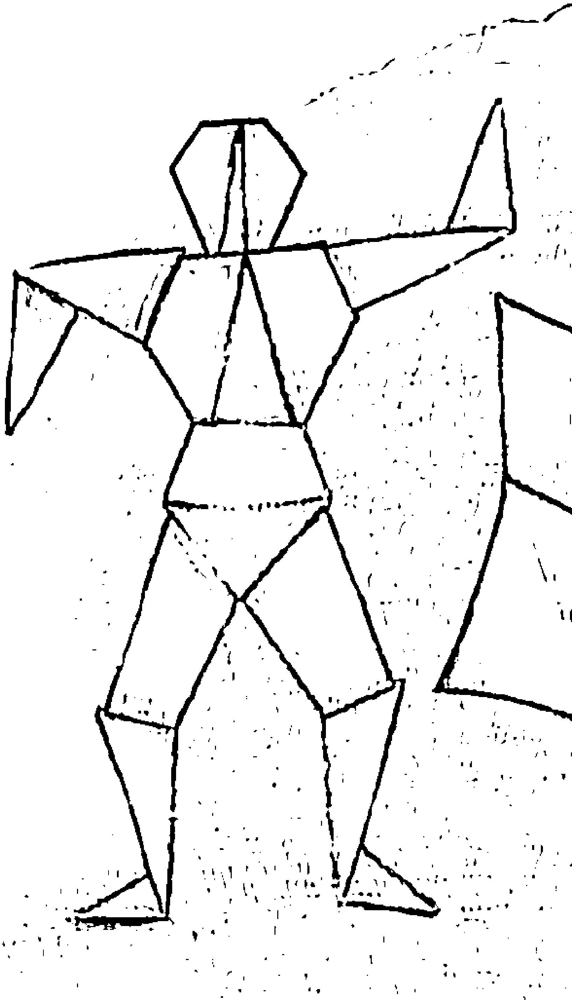
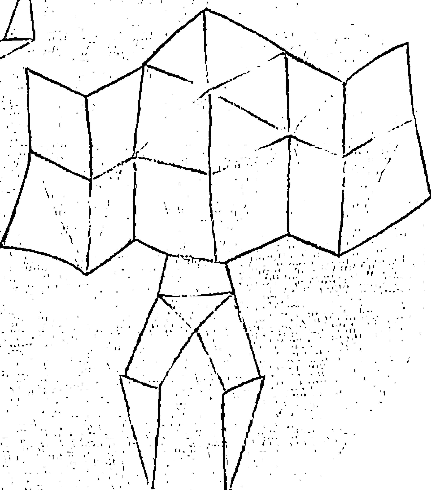
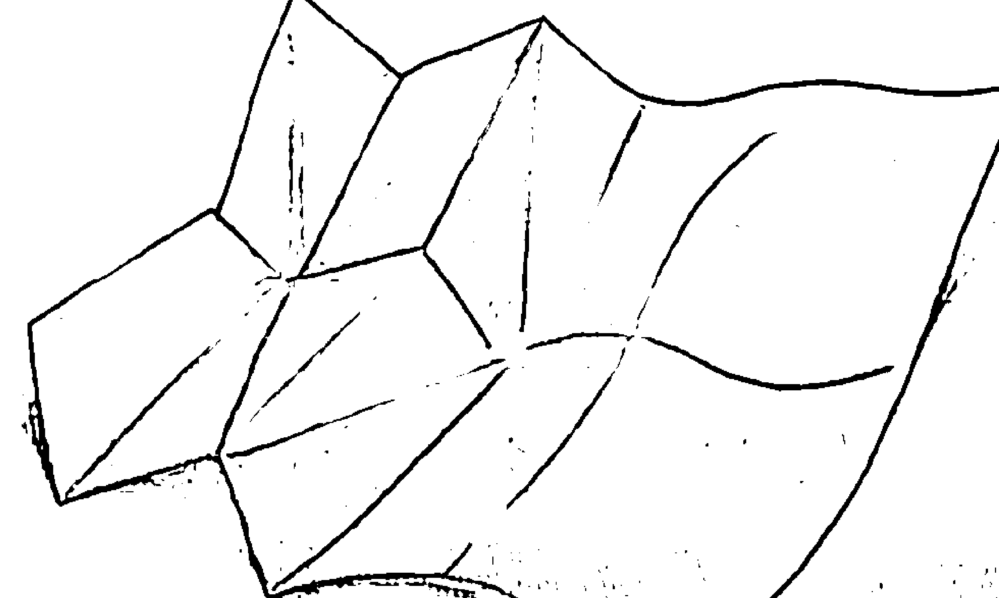
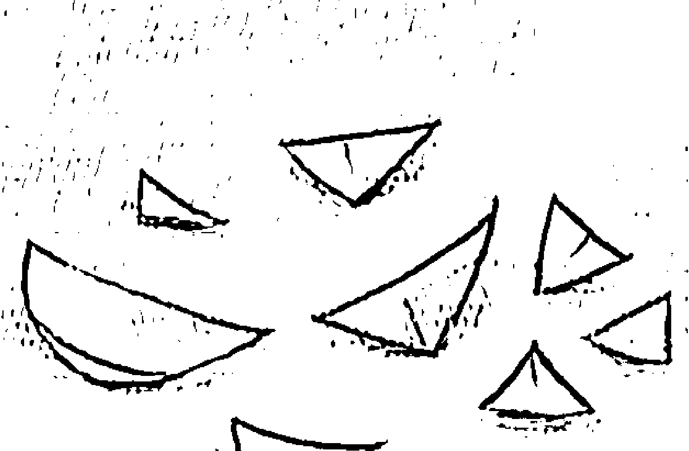
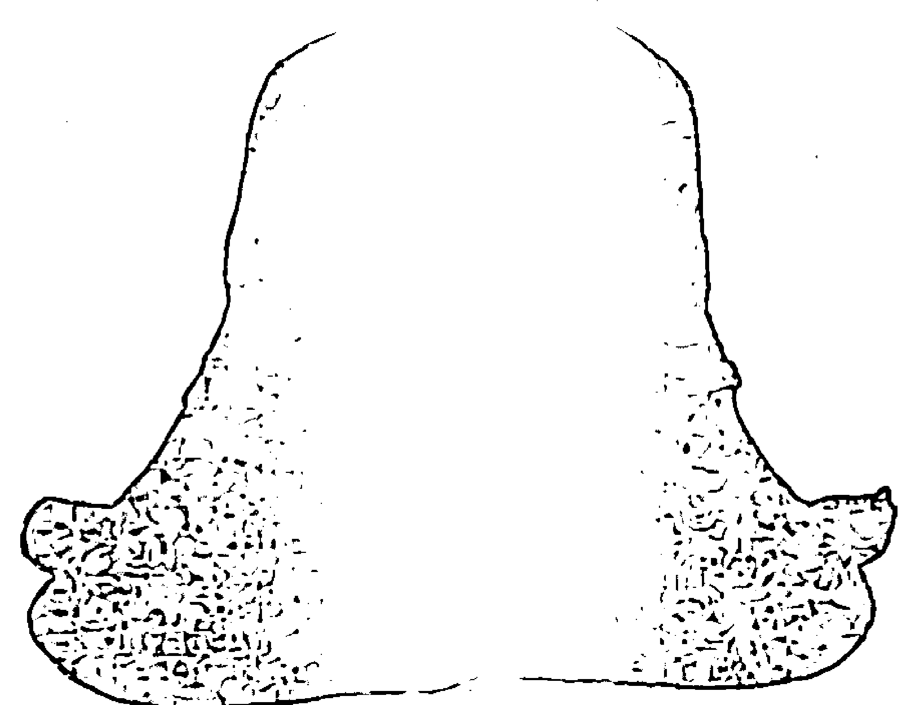

杨定一 著

### 杨定一：集体的失忆
### Collective Amnesia

## St. Royal College
## 天使神秘学院

-   ※ 神秘学资料库
- ※ 神秘学培训机构
- ※ 水晶能量研究中心
- ※ 专业占卜预测机构
- ※ 官方微信：strcdts
- ※ 微信公众平台：strc2011
- ※ 官方店铺网址：http://strc.cr.cx
- ※ 读书交流QQ群：
    - 占星塔罗占卜师交流群：814594478（加入密码：PDF）
    - 神秘学其他综合群：659338717（加入密码：PDF）

## 制作说明：

本书由《天使神秘学院》出重金从台湾购入的原版书籍扫描制作完成。为达到最好阅读效果，特地把书全部切开后，再经由专业扫描设备高精度扫描完成，并经过一张张的PS后期处理最终成书，其间花费大量的人力、物力以及时间，只为能给大家提供经济并优质的神秘学学习资料而努力。

本学院强力谴责某些机构和个人，把本学院花心血制作完成的电子书籍，包装后直接放在自家淘宝网上低价倾销的行为，以谋取不劳而获的经济利益。如果长此以往最终将无人愿意再为大家花心思制作电子书，那以后可能大家再无新书可读。

为让大家以后能够读到更多的好书，也为了本学院的良性发展。本学院恳请大家尽量做到如下几点：

一、尽量在天使神秘学院的官方网站购买电子书籍。
官网电脑访问地址：http://strc.cr.cx

二、在收到电子书后小范围传阅即可，千万不要公开传播，更别挂到淘宝网上低价销售。

同时为答谢广大支持者，学院电子书将做如下调整：

一、学院会把一些早已收回制作成本的电子书折价销售。
二、最新制作的电子书籍会开放打印功能，大家购买后有条件的可自行打印成书。

天使神秘学院
2020年5月

### 集体的失忆

杨定一 著

这本书和《我是谁》一样，是在宁静中透过口述转达出来的，等于是对之前的作品和练习带来另一个层面的补充，也就是一体的层面。因此，你可能会觉得和之前的作品有所冲突。

可能有这样的冲突，是因为我透过多重的意识层面在谈同一件事。可以这么说，我相信这本书的读者是比较成熟的。所以，我在这本书会从一体的角度来谈，以表达究竟的真实。

然而，我同时也知道，许多人不光是看不懂，甚至内心会感到冲突和矛盾。对这样的朋友，我建议回到《全部的你》，依序一本本读、体会下来，这个矛盾才会解开。

此外，我要强调的是，这本书写作的目的，就像《我是谁》一样，很简短，适合作为随身的指南，帮助你对照自己对真实、对领悟的理解。不仅如此，我相信对任何遭遇创伤、失落、绝望、忧郁、沮丧的朋友，都会带来很大的帮助。只要你用「心」去参、去体会这本书的字句，会发现这本书和前面的书所带来的观念是最好的心理治疗。

我的建议是：其实你不用相信这里的任何一句话。因为头脑读到一体的观念，一定会反弹、抵抗，只有心才可以接受。

我最多是鼓励你——既然每一章都很短，可以用心来读。

读完后，静下来自己探讨、参这些话，用个人的体会来验证或推翻。这样子，这些讯息才能真正落到心中，与个人的生命和体验结合。

比起相信，这是更重要的。

## 目录
CONTENTS

- 序——把一体带回人间 ———————— 6
- 01/ 念头和语言怎么来的？ —————————— 15
- 02/ 因-果离不开时-空，而时-空是头脑的产物 — 22
- 03/ 人类失衡的发展 ———————————— 31
- 04/ 个体化的世界 —————————————— 37
- 05/ 只有一体 —————————————— 45
- 06/ 这个身体，不可能开悟 ———— ———— 53
- 07/ 醒觉，其实是跳出人类的特质 ———————— 57
- 08/ 你不是罪人 —————————————— 62
- 09/ 面对一波波浮出来的业力 ———————— ———— 66
- 10/ 在人间活出的一切，都是注定 ——————————— 70
- 11/ 在世，不属世 ————————————————— 77
- 12/ 信仰是最大的恩典 —————————————————— 83
- 13/ 回到真实 —————————————————— 91
- 14/ 「有」是怎么来的？ 98
- 15/ 睡觉，作为醒觉的练习工具 105
- 16/ 越过身体，越过脉轮，越过能量 112
- 17/ 为什么那么真实？ 121
- 18/ 从世界醒觉 127
- 19/ 命会变好吗？ 134
- 20/ 有没有一个醒觉的状态？ 142
- 21/ 时间的终结 149
- 结语 154

## 序
### 把一体带回人间

我们集体失去记忆的，其实是一一体。

一体是我们生命的本质，你我从来没有离开过，也不可能离开。应该这么说，没有一体，其实没有生命。最不可思议的是，我们竟然把一体、本家忘记了，反而透过局限的脑陷入一个角落。

把一体找回来，是我们这一生要做的。

人类经历的一切历史，包括个人的人生，在整体其实只是一个不可思议小、不成比例小的可能。

我过去从事科学研究，常用老鼠来做比喻。小白鼠住在封闭的笼子里，认为笼子就是它的全世界。而笼子外，是它完全看不到的。它不知道外面的可能，也不知道还有什么东西存在。它所谈的自由的世界，本身也只是在笼子范围内所活出的自由。

我们的人生，其实也是如此。

反过来要问的是：我们本来是活在每个生命都有，一只动物、一朵花、一颗石头都有的一体，怎么可能就这样陷入一个局限的小角落？还称它为「人生」、「人类的文明」？这才真的不可思议。

所以，把我们失掉的记忆找回来，最多只是把一体带回人间。

与我目前为止的其他作品相较，《集体的失忆》有很明显的不同。

我从《真原医》开始谈身心的平衡与健康，在《静坐》介绍静坐的方法，希望大家得到意识的转化，从身心走到意识的层面。接下来，透过「全部生命系列」的作品，我特别强调生命的整体，进入无色无形与「在」，希望从狭窄的现实世界，一起体会生命的永恒。

《全部的你》详细解释了时-空的观念，特别强调时间其实是头脑的产物，也透过许多实例，说明头脑的运作如何建立时-空的观念。一个人要体会生命的永恒，一定要活在当下。而且，活在当下，并不需要头脑的作用。

《神圣的你》进一步将这些理解与人生做一个整合，希望每一个人都能活出生命的全部潜能，自然找回生命的神圣，并透过每一个瞬间，体会到神跟自己从来没有分手过。

在《不合理的快乐》，我以科学的语言进一步探讨「快乐」这个主题。在建立一套快乐科学的同时，我特别想强调的是——再先进的科技与知识，都不可能带来快乐。我们只有完全跳出人间的限制，才可能突然体会到无条件而永恒的快乐，也自然发现它本身就是我们生命的本质。唯有契入生命本质的快乐，你我才可能发挥全部的潜能，而这潜能远大于我们任何人的想像。

至于如何落实？如何练习？我在《全部的你》与《神圣的你》以很多篇幅来介绍「臣服」，并在《不合理的快乐》开始强调「参」。还大胆地提出「参」与「臣服」，是两个最直接的法门，让我们可以活出一体。

由于深怕不够清楚，也为了解答练习可能的疑惑，我又进一步透过《我是谁》将前面提出的观念再做一个整合，从不同的角度切入，希望能作为一个练习的随身指南。

《集体的失忆》则是想探讨生命的源头，是被我们在文明发展中逐渐遗忘的。也许你听到这个书名，会以为我要追溯一连串最古老、不为人知而被史书给遗忘的史实，来解释人类最早期的发展，甚至以为我要谈宇宙的纪录（也就是俗称的阿卡西纪录）。

其实，都不是的。

在这本书，我会把前面作品提出的观念，再进一步推展开来，带着你我回到一体，站在一体来看人类的生命。

一体意识，我们每一个人都有，只是人类透过文明与文化的重重建构，把它遗失了。所以，谈集体的失忆，其实是想谈人类最原初的心理状态，希望建立一个理解的基础。这一理解是我们本来就有的，最多也只是需要有人提醒，让我们想起来。

就像我用《真原医》的书名描述最原始的身心健康观念，表达我们每个人本来就知道、都有过的状态。《集体的失忆》一方面可说是恢复「真原记忆」，也就是人类最原初的记忆；另一方面，则是谈「人类的堕落」、「失落的人心」(The Descent of Mankind 或 Lost Humanity)。

到了现代，人类可以上太空，也透过资讯的革命，可以即时取得从古到今的所有知识。人类文明的发展，可说是不容忽视的壮观。然而，这么伟大的发展却反而遮蔽了生命最根本的本质，让人类的生命从本来最圆满的状态，变成严重的疾病。每一个人都那么地不快乐，把生命活成一个问题。

人类任由文明的发展，把生命从完整的境界，扭曲压缩成一个狭窄的绝望，甚至成为每个人随时的心理状态，这是相当不可思议的。

可以想像得到，一个人要解脱，要跳出人类的状态 (human condition)，而超越人类的特质 (human quality)。这是我希望透过这本书直接切入的重点。

然而，想不到的是，人类可以借用头脑，来跳出头脑——运用头脑带来的危机，将这一困境本身转成人类解脱、超越、提升最大的机会。让人类发达和聪明的头脑成为一个解脱的工具，帮助你我共同找到——回家的路。

回到生命的本质，回到存在的家。

人类发展至今，没有第二个时点比现在更成熟。我相当有把握，每个人都可以透过头脑最强烈、甚至是极端的分别与比较 (也有人称为「二元对立」) 找到生命的一体。如果不是抱着这种信心，我不会写下一本又一本的书，不断地以现代的语言和个人的体会，把过去大圣人的智慧带回来。

我过去的作品还是站在「有」的层面来看生命，虽然将生命的范围从「有」扩大到「在」，也就是从物质和形相扩展到生命的存在，但还是站在一个狭窄的「有」在看一切。

这本书与接下来的作品，则是要从「在」看着「有」。

一体或全部，其实是一个「在」的观念。它不是头脑可以想像，也不是头脑可以追求到的。最多是把头脑挪开，它自然浮出来。

所以，谈到人类头脑分别的能力是解脱最大的机会，要谈的其实是——我们头脑的理性与分析能力发展到这么先进的地步，自然会发现人类所追求的目标——无条件的快乐、无条件的爱、无条件的光明与永恒，是永远追求不来的。

最多透过我们发达的头脑，做一个反转，让它自己停下来，而自然落到「心」。

透过这种反转，才有醒觉好谈。

这一点，除了人类，其他生命都做不到的。我最多只能鼓励大家要好好把握生命，把握这一次从父母、家庭、社会带来的种种业力所组合的人生。

虽然一切是个大妄想，但我们确实可以从这个大妄想醒过来。

正因如此，我才鼓起勇气，再次带着你我进入这个旅程。

## 01 念头和语言怎么来的？

他受伤了，身上全是血，勉强爬上山壁，力气几乎耗尽。喘口气，回头看，老虎没跟来。往下看，柔弱的同伴和自己一样全身是伤，已经倒在地上，爬不起来。

老虎本来已经追着他到山边，转过身，对着他伤重无力的同伴，缓缓走过去。

他直起身大叫，想把老虎吓走。老虎没理会，继续慢慢前进。他坐起来，搬了石头往下扔，老虎也不在意。

他知道接下来要发生什么。

她最后一口气消失时，他好像也跟着一起死了。

一种没办法忍受的感觉，变成声音，从身体最深的地方冒出来。像是痛，好像也是更深的什么。

他不知道。

他不敢动，在山壁上待着。老虎吃掉了同伴半个身子，叼起剩下的一半走开。他只能看着老虎和剩半截的同伴从视线里消失。

他觉得身上有个地方不对劲，不知道是什么。低头往不舒服的地方看过去，有伤口。用手去碰，又是一次无法忍受的感觉。

是痛，痛变成声音，变成喊叫。喊出来，痛的感觉轻了一点。

身子还是很重。

他望着天空，不知道又过了多久。

危险过去了，他慢慢爬下来，半蹲半爬半走，偶尔抬起头来看看、闻闻、听听周边，折腾好久才回到山洞。

非常疲倦，也就睡去。几天，也就过去了。

醒来，很饿，胸口也很闷，不知道闷的是什么。

饿，比任何感受都直接。他起身去外面找点东西吃。
他走出山洞，看见天空，看见土地、树，觉得和自己都一样。
看到、感觉到的一切，又回到原本没事的状态，和眼前的一切都是一样的。前几天的痛，痛过了，喊过了，结束了。
为什么那么痛，不清楚。
他没想过那么多，也不知道自己的存在是什么，和大自然的一切都一样。饿了，还是要吃。渴了，喝。累了，睡。有异性吸引，就交配。
要说和大自然一样，一样什么，也不清楚。
整个大自然，他都可以去，都可以是家。
只是，他没想过那么多。

几万、或几十万年前，最原始的人类，大概就是这样子。
最初，人和动物没什么差别，最多只是手很灵巧，比别的野兽聪明一点，甚至还可以主动去想，自然发现单独生存不如结群生活。毕竟，求生存还是生命最大的动力。每一个动物，就连植物都会想生存。

生存，就是「我」最初的起步。

群居，自然需要和其他人沟通。拿什么沟通？也只是没有意义的喊叫，最多再加上手和身体直接的表达。多做几次，发现可以用不同的动作表达不同的意思。再成功几次，这一套身体的动作也就教会了别人，成为群体共同的沟通工具。

在沟通的过程，一个人用手指着自己、指着对方，「我」的念头甚至「神」的观念，也就逐渐成形。

突然间，发现每个动作可以再配合一个声音。原本声音只是没有意义的喊叫，然而动作加上一个不同的声音，在群体间自然更容易区隔。

语言，就这么生出来了。

进一步，自然发现，语言（单纯声音的表达）可以取代动作、代替物质。更大的突破是——连感受，比如看见同伴被老虎吃掉，从身体最深处发出的痛，都找到了语言可以表达。

再进一步，透过语言还可以为感受区分出不同的层面，比如身体受伤的痛和心里的痛不同。同时发现，语言可以表达地愈来愈细微、愈来愈抽象。

在生活中，也自然发现很多状况，也许是野兽的攻击，也许是天气的变化、生病、好吃不好吃的食物……是会重复发生的。

这一来，时间的观念也就生出来了。

人为这些事件区隔先后顺序，透过语言把过去的状况调动出来，这就是学习。透过学习，人学会了预防或筹备未来类似的状况。

跟着时间，跟着念头，人也就生出了烦恼。

所有的概念都可以同时用语言和手指作为指标，指出「我」，指出「你」，指出别的。而「我」是烦恼最直接的来源。「我」的感受、「我」的生命、「我」的身体、「我」的状况、「我」的烦恼……全部的概念，无论是眼前的物质或心里抽象的念头，都可以再加「我」作为区隔，这又带来了一层意义。

人生的价值或意义，也就是这么衍生出来的。

「我」本来是一个抽象概念，只是一个知觉的过滤网，却就此有了单独的生命。

「我」就这么活起来了。

突然，念头也因此成为我们最立即的知觉。头脑的念头变得凝固，就像真的一样。人类透过念头和语言，塑造出自己的存在。

只是，他不知道这个存在是透过念头所组合的。

## 02 因-果离不开时-空，而时-空是头脑的产物

发达的头脑，是人类专属的架构。

前面稍微点到，动物、植物、甚至最原始的人类，时-空的观念还没有那么强化，反而最接近一体。

也就是说这些生命随时都存在，或「在」。但并没有一个「在」或「存在」的观念。同时，也没有隔离的「你」、「我」的观念。随时，活在当下，但是连当下的观念也没有。

对这些最原始的生命，当下是生存的延续。至于透过什么来延续，他没办法观察到，也没办法体会。

拿前面的老虎来谈，它全部的生活、「在」最多只在支持生存。而生存最多只是吃饱、维护这个身体。吃饱了，也就是休息、排泄。累了，自然就会睡觉。决定它的行为的，也只是身体的需要。

但是，连谈这些，都还是我们透过人类的眼光在分析。老虎不需要想那么多，甚至想不了那么多。

它每一个动作，最多只是延续它的生命。连整个物种的生存，也和它不相关，它也不在意。它会交配，母的老虎会照顾子代。在群体生存的角度来看，这些行为似乎很重要。但就这个个体来说，根本不相关。对老虎，生命根本不是问题，最多是满足身体的需求。

甚至，遇到危险、死亡，也就是那个刹那，那个瞬间，做一些反应。接下来，走了，也没有事。

最原始的人，本来也是这样子，单纯为存在而存在，没有为什么而存在，或其他的顾虑。死亡，最多也只是一个事实——「不存在」。

生命是单纯的、简化的。

接下来是头脑来延续，产生一连串的问题。

人类发展到后来，自然把生存单纯的延续，透过念头和记忆连贯成一个个片段的组合，也就变成人生的故事，而且人人不同。但是，他没有发现，只有一个瞬间（当下）是实在的，瞬间与瞬间的所有连接都是念头虚构的。可以说，现代人是活在一种虚构的现实里。

人和动物相同的地方在于——都有空间和距离的观念。然而，只有人类后来比较发达的脑可以产生时间的分别。

一般的动物只能在空间里定位，人类则增加了一个坐标轴，可以在时间的先后顺序上表达得更精确。无论空间或时间，透过点与点之间的比较，顺着二元对立的逻辑，才能够将某一个点从所有的点中突显出来。

此外，我们人透过观察，认为你我都有共同的体验。比如说，我们眼前可以看到椅子、桌子、人，自然让我们认为有一个客观的现实存在，而且还以为这个客观的现实与头脑的作用不相关，光靠自己本身就能存在。

不光人与人之间有共同的体验，人和其他生命也有共同的知觉范围。例如我们看到野兽存在，而野兽也看到我们存在，甚至会来吃我们。人类在演化中求生存的过程，自然会加强客观现实的重要性，让我们认为任何事物都是一个个的个别存在。也自然会认为人生可以体验的一切、所有的物质和现象都是独自就可以成立的。

我们很少会进一步观察到——所谓个别的存在，甚至看起来独立的生命，其实也不过是从局限五官接收的片段讯息所延伸出来的。

不只如此，头脑二元对立的架构，带来相对的观念，把整体局限成一个小部分，在空间的维度上造出一个虚拟的分别现实。

显然这对人类还不够，我们还要再透过时间这样一個虛擬的架構，疊加在這個虛擬現實的上頭。

時間再加上空間，自然讓我們產生一個變化的觀念。比如說，從家裡到公司，假如沒有時間的先後，根本沒有一個路程好談，最多只是單純的距離。

再把路程的觀念擴大，變成人生來看，我們同樣可以把人生的故事描述出來。透過時間，生一死的分別，也就自然衍生出來。有出現、有消失。有生、有死，也就自然把樣樣定為無常——無常的現象、無常的狀況、無常的人生。

人生唯一的常態，是變化。而變化，本身是離不開時間的觀念的。

時間自然變成我們理解這個世界很重要的一部分，沒有時間的軸，我們看的世界不完整。有了時間的軸，我們人類的體驗也就突然和動物區隔開來了。

我們根本不會想到，任何體，任何看似獨立的存在，都是頭腦所投射出來的，一樣離不開時間的觀念。粗重如身體、人體、群體，或微細如情緒體、念頭體、知識體、甚至包括一體，只要頭腦可以想出來的一個「體」，有生，一定會死，早晚會消失。人類所建構的一切，再輝煌燦爛的成就，也註定會消亡。

任何體要存在，自然要有一個「因」，也自然有一個「果」。本身離不開一因果。一因果本身也離不開時一空。如果沒有一時一空，其實沒有一因果。

會這麼說，是因為時間的觀念自然產生一個先後的順序。發生在前的自然變成因，而後面的自然變成果。再用從家裡到公司的例子來談，正因為有「離家出門」的因，才有「到公司」的果。這麼一來，人和人、事情和事情、人和物的前後或因果順序，也就定出來了，而可以把這些現象連貫起來，當作我們人生的故事。

但是，我們通常沒有注意到，連這個連結，都是頭腦的產物。

我們往往體會不到只有「現在」存在。可能發生的一切，都出現在「現在」。只有「現在」，涵著可能發生的一切。「現在」雖然涵著一切，也只有「現在」存在。但透過時間來安排先後，讓我們能更精確地指定、描述某件事、某個人、某個經驗，甚至產生「學習」，而更能區隔好的經驗與不好的經驗。好的經驗希望能夠重複，而壞的經驗無論如何要預防。無形當中，過去和未來雖然是虛構的，但就這麼和現在分不開來。

也就這樣子，不光產生經驗，還透過這些經驗再進一步延伸、強化「我」。

「我」本身也是所有的痛苦與煩惱的根源。不光時一空、經驗、因一果都是虛構的，都是頭腦的產物。甚至，連「我」還只是頭腦的產物，一樣是虛構的存在。

雖然這麼說，人間所有的一切離不開虛構的「我」——「我」的經驗、「我」的本領、「我」的故事、「我」的世界……

時間，這樣一個由頭腦所建立的先後順序，本來是一個虛構的現實。但是這個作為對照比較的程序反而自己活了起來，變成「真實」。

我們哪一個人不是隨時活在過去，或隨時活在未來？

站在一體，時一空只是無限可能性的其中一個可能，從比例上來說，小得完全沒有代表性，我們甚至可以稱之為幻覺。

但是，從人間的角度來看，時一空卻成了我們的唯一——唯一的可能、唯一的現實，讓我們排除了其他所有的可能性，還放大成人生的一切。

這才是最不可思議的。

## 03 人類失衡的發展

前面提過，時一空是頭腦的產物。

沒有頭腦，不可能有時一空。沒有時一空，最多只有當下。

頭腦最立即的產物就是過去和未來。透過頭腦的運作，我們每個人不斷地活在過去，也不斷地為未來規劃。

我們把頭腦當作人類最偉大、最寶貴的資源，視為人之所以為人的主要特質，也自然讓頭腦的發展和演化作為人類文明的指針，而在科學、科技和其他領域不斷地追求。無非是希望透過這些追求，可以找到身為人的全部潛能。

誰能想到——人類愈是往外追求，愈走到前面提過的極端不均衡。

反過來，沒有頭腦的分別，人類其實還是可以生存，甚至可以生存得更好。動物、植物、乃至礦物沒有人類的頭腦，隨時都存於「在」的狀態，與一體意識完全分不開，不可能會被這個世界、周邊、別人或自己所困擾。

我們首先要認識到——頭腦本身就是在一種不均衡的狀態下運作。

百千萬年來，我們不斷地發展、抬高左腦帶來的理性、分別與分析。這些作用從來沒有離開過比較的邏輯，凡事包括樣樣東西、事情、念頭、理念都要相互對照一番，也就是前面所講的二元對立。

然而，左腦的邏輯其實是萎縮的邏輯，是把整體分割成一個個愈來愈小的體，小到人可以理解為止。右腦則剛好相反，是擴張的邏輯，就像一張全息圖，從每個角落都看到整體。透過右腦，我們隨時回到一體，回到整體。

假如我們說左腦體會的是部份與相對，那麼，右腦體會到的其實是整體和絕對。左腦把世界局限成一個個角落，右腦是從一個個角落打開到整體。

左腦講究生存、累積、競爭、佔領——把物質當作一切，自然會重視對物質的追求；而右腦反而知道——從一體的角度來看，物質所帶來的生存、累積、競爭、佔領根本無關緊要；生命最多只是彼此分享、整合與合一。

其實，是透過左右腦的共同作用，我們才可以在人間活得完整。但是，很不幸的是，人類百千萬年來自然偏重左腦的境界，把物質所帶來的生存、累積、競爭、佔領當作我們的目標與核心價值，而決定了人生的重點。

同時，因為環境不斷地變化，而人不斷感受到危機，也就一直刺激左腦的理性和邏輯來克服生存的問題，而使左腦極端地發展，自然不給右腦任何發展的空間，而壓制了右腦的潛能。

最後的結果是，我們每個人都活在不均衡的頭腦的狀態，也就是幾乎全以左腦為立足點來面對這個世界。談人類的文明是不均衡的發展，非但一點也不為過，甚至，這種不均衡已經嚴重到讓每個人都活在一個疾病的狀態，忘記了什麼是健康，失去了本來的均衡與圓滿。

或許你讀到這裡，已經覺得自己明白了著重物質的危險。然而，我要談的不只如此。這裡所謂的「物質」，其實延伸到任何現象、形相，甚至包括由念頭所構建的念相（thought-form）。

頭腦的注意力離不開物質，仔細觀察，念頭的根源和我們人的五官所產生的資訊分不開，非但資訊或知識離不開物質，就連情緒和感受也都和物質緊密相連。所以頭腦所得到的任何產物，包括念頭、思考，甚至理念、理想一樣離不開物質的層面。

站在這個基礎上，我們對這世界的所有認識，包括在人間可以看到、聽到、聞到、觸摸到、嚐到、體會到、想得到的一切，都離不開物質的作用。甚至心理的萎縮，也自然固化成人類生存的常態。從古到今，人類都離不開這個困境。

## 04 個體化的世界

在所有的生命中，只有人類不快樂。

少數動物的不快樂，也是人類製造出來的。也只有有人，把生命活成一個問題，甚至是一連串的大問題、小問題，解決問題還衍生出更多的問題。不只為個人製造問題，也給周邊帶來更多問題。

對你我而言，解答種種的問題，自然變成我們人生最大的目的。

這本書要探討集體的失憶，也是來找回我們的記憶——

- 從哪裡開始不快樂的？
- 為什麼人類集體發展到最後，會變成那麼不快樂？

可不可能在最早期，我們本來是快樂的，跟其他生命都是一樣的？

針對這個問題，答案相當清晰——我們人不快樂，是從個體化（individuation）開始。我們從整體化分出一個個體，而個體自然產生「我」、「你」、「他」隔離的觀念。接下來，也就這樣子確立了人類的文明。幾十萬年來，人類的所有發展都是憑著個體化的過程而來。人類不斷追求個體的力量、發揮個體的潛能、實現個體的理想、強化個體的興趣、得到個體的享受、延伸個體的優勢、達到個體的快樂。沒有個體的觀念，其實也沒有人類的文化、創新、發展好談。我們談的所有價值觀念，即使是創新、聰明、審美、身心滿足的層面，一樣都離不開個體化。也就是說，人類累積的全部價值觀念，同時離不開「我」的創新、「我」的聰明、「我」的美感、「我」的滿足。個體的價值觀念，成為家庭、社會、國家、全人類價值觀念的基礎。

可以想見，個體化怎麼成為人類演化的方向與動力，百千萬年來，更成為人類集體的動機。人類的發展，始終不離如何把個體化發揮得淋漓盡致。

談人類的演化，同時也是在反映頭腦的演化。頭腦的演化離不開個體的延伸，不斷地評估衡量個體的勢力範圍。仔細觀察，我們人類所創的一套邏輯，無論是比較、分別、分析，最多也只是讓個體化落實得更徹底。

從歷史的角度來說，個體化其實比較是西方文化的產物，無論科學、科技、藝術、政治、文化……任何角度都一樣。我們大可用「個體化」一語概括西方文化的發展。西方的自由觀念，也一樣離不開個體化的理想。

所談的自由，當然是個體的自由。

然而，因為人類歷史就是一種極端個體化的過程，也自然強化人與人之間、甚至人與世界的隔離，讓這種隔離變成人類理所當然的特質。

我們一生出來，從家庭教育，一路到學校、進入社會，也會發現任何追求或成就都離不開這種隔離或個體化。它當然成為人類最基本的特徵。

同時，透過不斷地加強個體化，自然加快我們的生活步調。因為現代生活步調極端地快（科技發展也只是讓它更快），我們也自然把時一空從頭腦的產物變成堅固的架構——樣樣都要符合效率或順序，都有一個運作的步調。日益加快的步調讓你我喘不了氣，讓我們隨時累積壓力，而自然把樣樣看成問題。

而且，全都是要快速解決的問題。

由於要達到個體化——個體的理想或完美，要有一個前後的順序，不能混亂，我們也自然不斷地認為要有許多預備作業，才會有一個良好的結果。這麼一來，自然強化我們的制約或因一果的觀念——認為樣樣都有個因，而樣樣都會帶來一個後果。因一果都具體得不能再具體、再堅固了。

有了因一果的觀念，也自然讓頭腦將「過去」透過記憶在腦海中隨時調出來，而透過重複的比較和分析，達到學習的效果——倘若過去所調出來的資料，在我們的認知中是問題，自然就希望未來不要重複、下一次可以改善、不要再成為問題，甚至最好得到一個更理想的果。

透過頭腦對「過去」種種的整理，我們也自然會顧慮到未來，而投射各式各樣可能的情境。於是，我們不光是期待，還可以預防不好的結局。

倘若我們和其他生命一樣，頭腦的運作不那麼強烈，其實也就沒有過去，更不用談未來。

所以，時一空的觀念，本身就是人類主要的特質，才讓我們有所學習，有一個人生好談。

不光如此，人也自然懂得把過去透過語言和文字留下紀錄，並稱之為人類的歷史與文化。認為透過它們，可以把人類的記憶找回來。這一來，當然認為人生的所有知識，都可以透過歷史累積而不可能有所遺漏。再加上科技的發展、網際網路的方便，我們還可以在最短時間把它調出來，彷彿人類的全部歷史就在手指的撥動裡。

未來，我們還可以期待個體化帶來更多生活上的方便，效率更為提升——知識可以不斷地追加，儲存知識所需的空間可以不斷地縮小。精益求精地個體化，讓我們不光物質愈來愈準確，語言的表達也愈來愈精準，可以充分表達個人的所有感受與體會。

畢竟，我們進入太空時代了。

前面所描述的經過，我們會當作是人類自然的發展，也覺得這就是進步。

我們幾乎不會想到，人類在這個過程中其實產生了一個相當不均衡的狀態，而這個不均衡是極端的。更想不到的是，這個表面合理的人類發展，就是我們全部煩惱的根源。只會讓我們人愈來愈不快樂，甚至造成極端的不快樂、極端的疏離——你我、人與人、人與世界、人與生命之間不斷地疏離。不快樂，就是這一類發展的副產品。

從古到今，所有大聖人所強調的解脫，談的都是合一。個人與生命、與宇宙合一。也就是和個體化完全相反的方向。最後，頭腦不光要與心合一，甚至要落在心，是讓心把腦吞掉，人類才可以完全解脫或醒覺。

所以，我們應該問的是——

沒有頭腦所帶來的個體化，還有人生好談嗎？
我們在世間可能生存嗎？
人透過文明的發展，最後的目的是什麼？
沒有個體化，可能完成人類最終的目的嗎？

這些問題，就是我想在這裡和你一起探討的。

## 05 只有一體

牛頓第三運動定律（作用力－反作用力），本身就可以拿來解釋因一果。因果律的不同在於，它是主觀而非客觀的法則。因為可以觀察到因果律的觀察者，本身還是因一果組合的，還是虛的，沒有實質，是頭腦的投射。

這一點，我們任何人平常都想不到。也就是說，被觀察的東西和觀察者，再加上觀察的動作（觀察的經過）都是因一果所組合的。它建立了一個獨立而由自己來證明自己存在的現實。也就這樣，因一果的組合不光騙了我們一生，還騙了人類整體千千萬萬年。

我們假如去分解每一個人、每一樣東西、任何物質、任何念相，會發現什麼？

最多是——都是空的。原子和原子之間的「空」，遠遠大於原子本身的「有」。甚至，原子之間的距離，比例上，就像星系中，星球與星球之間那麼遙遠。

往大的尺度來看，星系的組合是「空」。往最微小的尺度來看，原子、粒子的組合，也是「空」。

想不到的是，「空」雖然好像是「沒有」，但「空」其實包括了一切，甚至存在於「有」中。其實，「空」不等於「沒有」，我們最多只能用一體、整體或一體意識來表達。

一體意識和我們日常觀察的意識不同。觀察是把整體落到一個角落，透過頭腦二元對立的架構，限制成一個頭腦和五官可以理解、體會、解釋、比較的小範圍。一體意識則是一個最純粹的覺知，在我們觀察前就存在，最多只能用「在」、「醒覺」、「全部」來描述。

當然，古人稱之為「空」。但是，用「一體意識」來表達，對現代人比較容易掌握。

也正因如此，過去會用銀幕或背景來比喻。我們透過時一空造出的世界和人生，就像投射在銀幕上而不斷躍動的電影或前景，而電影的背景或銀幕才真正蘊涵了足以展現生命的全部潛能。沒有背景、沒有銀幕，也沒有前景。

其實，背景、銀幕、前景都不是貼切的比喻，難免額外帶出空間上的前後分別。要表達一體，比較正確的字句或許是「全部」，而不是「沒有」。它存在於每一個角落、每一個部份，最多用「一」(One Self) 來表達。

除了「一」，其實什麼都沒有。

最多是說，二、三……都含著「一」。任何從「一」延伸出來的一個小得不能再小的小部份，早晚也只可能回到整體，或是「一」。

再進一步，其實除了「一」，其他的一切都沒有獨立的存在，都要依賴頭腦和五官才看起來好像存在。所以，过去醒觉的大圣人才说人间的一切都是幻相、妄想或幻觉，都是头脑的产物。

一个人忙碌一生，在动、在找、在寻，想从人间得到永恒的成就，其实是不可能的。无论多大的成就，也只像是海面的一个波浪，牵动不了整体。

用同样的道理来谈因果，其实因也是空，果也是空，都没有实质的存在。我们最多是用螺旋的比喻来描述物质怎么来的。假如我们把空或一体用一个无限大的场来比喻，而用一个无限大的螺旋来代表这个场，螺旋的速度慢下来，过程中自然产生凝结的作用，而延伸出五官可以知觉到的物质。

其实星球、星系也是这样来的，也就这样建立了我们所认知的宇宙。

宇宙的形状和存在，是透过五官才有的。也可以说，是透过五官而得到定义的。假如没有我们的五官，也没有什么宇宙好谈。就算还有宇宙好谈，宇宙甚至会演变成完全不同的形态。

用同樣的解釋，倘若沒有五官再加上頭腦，不會有先後順序，不會有時間，不會有「動」，更沒有「創造」好談。

「創造」的觀念，是頭腦賦予的。

我們認定的過去、現在、未來的事件，倘若沒有五官來區別，其實是同時發生。甚至，連「發生」都不存在。

沒有東西可以真實或獨立存在的理由是——只有一體是真實，而一體本身是圓滿，投射在每一個角落。

所以，只要能指出一個東西，本身就和一體做了一個區隔，透過二元對立才可以成立。從整體來看，只是虛構的存在。

這幾句話，我們透過頭腦絕對不可能理解，最多是透過寧靜、領悟才能體會。

我們才會說，在人間體驗的一切，可以說都是在虛構的局限裡，成立的一個虛構的境界、虛構的過程。其實，我們從來沒有跟一體分開過。

前面也提過，一體本身在每一個角落，從來沒有不在過。

我、你、其他，其實全都是頭腦投射出來的。樣樣現象與存在，無論石頭、植物、動物、人，都同時在活出一體。都同時存在。

然而，是我們頭腦帶來一個局限，把一體局限到一個角落——我們的人生。讓頭腦以為把一體蓋住了，於是認為一體不存在，也與自己不相關。

只有人有這個現象，透過思考的過濾網，把一體和自己隔離，同時創出一個虛的現實——我們的人生。

也只有人，會把輕鬆的存在活成問題。

其實，沒有什麼叫做存在。存在本身是頭腦的投射。

更不用講解脫，沒有什麼東西叫解脫。

其實，一切都是意識，是一體意識。在一體中，你要解脫到哪裡？

它完全是自己包括自己，沒有別的地方可以躲藏，不可能從它本身跳出來。因為可以去跳出、去躲藏的地方，只要我們可以想像得到，都還是一體的一部份。

這樣子，能有什麼叫做解脫？

真要談解脫，最多只是把頭腦的過濾網（念頭）挪開，讓一體意識浮出來。

其實，連「浮出來」都只是個說法。一體從來沒有離開過，也從來沒有生過，甚至從來沒有被蓋住過。我們也許只能說——

透過頭腦，體會或不體會到它。

談解脫，我們本來就是解脫的。一切本來都是解脫的。所要脫出的束縛，最多也只是頭腦的投射。因為人不知道自己是解脫，才有一個解脫好談。否則，哪有什麼東西叫解脫。

談醒覺，也是一樣的。我們本來都是醒覺，只是不知道。我們最多只能把——念頭一挪開，意識觀察到意識自己——當作醒覺。

突然明白這一點，也就自然解開了人生最大的悖論。

## 06 這個身體，不可能開悟

從局限，也不可能跳到無限。

我們每個人都期待透過身體、透過頭腦可以領悟、開悟、解脫、醒覺。

這其實是不可能的。

不可能，不光是因為——局限本來就走不到無限。局限的頭腦可以產生的一切觀念，都離不開局限，離不開制約，本身也就是因一果的來源。任何可以想到、語言可以表達出來的，都還是在一個局限的範圍。

最多，局限只可能完全被無限吸收回去。這一來，所有矛盾也就消失。即使這一生沒有解開，早晚也會被吸收回去。因為我們局限的生命和無限相較，根本不成比例。

說到底，局限的生命是從無限延伸出來，當然早晚會被吸收回去。

無奈的是，局限雖然從來沒有離開過無限，但是我們永遠沒辦法理解或表達什麼是無限。

我們生命永恆的部份——一體意識，是不可能用語言表達的。因為我們頭腦本身是透過局限才可以得出意義。

這麼一講，不光沒有什麼叫做開悟——這個觀念本身不存在，甚至，人生沒有什麼東西叫做意義。

生命要有一個意義、有個價值好談，完全是我們頭腦的投射。

站在一體，沒有什麼東西叫意義。

我們最多只能講生命存在，至於為什麼存在？

沒有答案。也不重要。

但是，我們這些可憐的人類非要找出一個意義不可，為自己虛構的世界找一個解釋，找出一個存在的理由。一連串下來，又創出一個人生的故事，再加上一個人生的理想，而到最後希望得到一個人生最終的解答，或解脫。

有些人會認為，人生最深的意義是幫助別人，或拯救世界。也有人認為人生最深的意義是累積物質、財富、名譽、地位、影響力。也有人認為生命最深的意義是拯救自己，得到解脫，再來幫助人類。

這一切，都還是人類頭腦所投射出來的。

我們人只要把自己和局限的時一空綁在一起，認為真有時一空這回事，自然和因一果分不開。因為時一空和因一果是一體兩面。沒有時一空，沒有因一果。沒有因一果，沒有時一空。

懂了這些，甚至可以看穿，而不再和時一空綁在一起。這本身，我們可以稱為醒覺。

然而，其實沒有過程可以稱為醒覺。你要不醒著，要不沒有醒。連醒覺這兩個字都只是一種說法，

這是最難懂的。

因為難懂，所以一個人還可以繼續昏迷。

## 07 醒覺，其實是跳出人類的特質

我接觸過許多人，都希望透過修行得到改善。也許是從生病變得健康，生活的條件可以好轉，家庭關係變得和諧，可以找到陪伴一生的伴侶，工作可以順利，不用為物質煩惱，可以找到人生的目的——讓命變得更順。

這本身就反映了對真實的不理解，才會有這種期待。

就好像一個人在作夢，夢到自己快溺死了，在夢中希望有艘船來救他。卻不知道淹他的水、救他的船、快被淹死的自己都只是夢的一部份。

對人生，無論期待修行得到什麼結果，還是夢。修行是夢。可以得到的結果，也是夢。

這種期待，既不了解真實，也根本不了解——這個身體，本身就是業力的組合，就是要符合業力的運作。然而，業力有它自己的週轉，非要完成它自己不可。任何時候，我們最多只能體會到週轉的一小部份。

我們有限的感官以及念頭，透過每個瞬間所能體會到的，是不成比例的小。我曾經比喻過，就像從鑰匙孔往外看，只能看到一小部份。或像舞廳裡投射燈打出來的光，也只是照亮一小個角落。或像絞碎機的強力馬達在轉，我們看到的，最多是絞出來的一點碎屑。

有這個身體、這個命，是數不完的條件所組合的。是因為我們承認時空，局限到時空，而有業力。時空和業力才更分不開。

其實，如果我們不把自己等同於時空、肉體、身心，也就沒有業力好談的。一個人即使解脫，只要落在身心，也就自然有業力。

假如我們知道這扭轉的力量（業力）多大，就會知道——抵抗業力，一點用都沒有。

我們落入這個時空，最多只能順著它走。所以，我才會談臣服——面對瞬間的一切，讓它輾過去、壓過去、扭過去，不去反彈，不去抵抗它，反而這個力量會消散。

我們反彈，雖然是想抵銷它的作用力，卻反而承認了它是真的，而不斷地增加它的扭力。於是，這業力還會再來，讓我們一次次地痛心。

修行，其實不是要成為一個好人、偉大的人、有用的人、有名望的人。

剛好相反，要成為一個什麼都不是的人。

甚至，連什麼都不是的人都不是。

過去人類的價值觀念，想像得到的，都是制約，都是限制，都是業力的組合。

所以，要解脫，要從人類的特質走出來。

要從人類的特質走出來，要看穿——任何人類的特質，都是我們透過過去的制約所累積下來的，跟一體根本不相關。

所謂人類的特質，反而是我們的束縛。

對任何人類的特質再也不在意，不再追求，不再把自己等同於種種人類的價值，一個人反而自然會感恩、自然會包容。對眼前樣樣的發生，知道都是剛剛好，剛好是自己需要面對的。

不需要再額外去加一個好壞的標籤。表面上再怎麼困難或不好，心裡也知道是剛剛好。表面上再怎麼好，也是如此。對好、壞再也不用反彈。

有意思的是，一個人醒覺過來，生命確實會徹底轉變。只是轉變的內容和方向和我們一般人想的完全不一樣。因為他接下來對物質和人間的轉變再也不重視了。所以，這個外在的世界（人生）最多是充分反映他內心的平靜。周邊的人看他，也就感覺到有一個徹底的變化。

但是，對這個修行者，沒有變化好談，沒有承受變化的人好主張，更不會認為自己有什麼轉變。

他已經老早與生命合一了。

他不再是一個要有作為的人，最多只是活出他自己。這時候，他這一生所帶來的業力其實沒有消失，但再也跟他不相關。

他只是放鬆地讓業力完成它自己。

這與人類或動物最原始的狀態的不同在於，他完全可以自己作主。隨時可以拿頭腦當作工具，用完了也就挪開。同時，可以把生命簡化到最原始、最單純的狀態。

## 08 你不是罪人

人類一個很獨特的特質，就是道德，也可以稱為真善美，本來是內心自然流出來的解脫的成就。

一個人解脫，自然就可以活出真善美。

對人類的發展，道德觀念等於是一套指引，影響到數不清的後人，也自然讓我們跟其他的眾生區隔，而同時成為我們行為的指南。

一個人活出真善美，自然為我們帶來寧靜和平安，讓這個社會更和諧。從真善美衍生出來的道德觀念或基礎，無論在東方或西方，都讓社會可以永續存在。

不幸的是，從這些基本的道理，後來的人衍生出一連串的規則，把內心自然流露的特質化為一種規矩、一種框架，來鎖定一般人的行為，甚至不斷地判斷對錯。

不光如此，還劃分出一套上下尊卑的社會階級或種姓制度，定下更多的行為規則讓人遵守，甚至隨時評斷一個人的品行。

「人」的存在，就因著能不能被民族和社會所接受，而更進一步地被壓縮，造出一個所謂的「正常」。

違反這個「正常」，就會被社會排斥；違反得再嚴重一點，就會受到處分。

罪的觀念，也是這麼產生的。

沒有一個人逃得過這個情況，我們一出生，就受制於百千萬年的道德判斷，讓我們自然承受「罪人」的重擔。

在這社會活得愈久，這觀念也就更凝固，而讓我們活得更為沉重。於是，談到解脫，每個人都認為不可能。即使可能，也要先洗清過去種種的罪。遺憾的是，就連宗教都在鼓勵行為的制約、強化罪的觀念。只是，這都不符合生命更深的道理。

坦白講，無論多嚴重的罪，還是人為的判斷，是頭腦的產物，而且是相對的，因時空背景而不同，沒有什麼絕對的標準。

一個人解脫，其實跟自己或別人認為有罪、沒有罪一點關係都沒有。

只要一個人真心把罪的觀念或任何制約挪開，人自然進入一個無思無想的狀態，也就是心更深的層面。

有時候和一般人想的剛好相反，一個人心中有罪，覺得自己過去做過錯事，只要很誠懇地懺悔，自然會發現自己其實更迫切地想要得到解脫。

這種急迫感本身就是一個人最好的恩典，讓人可以完全投入靈性的旅程，而帶給自己一個重生的機會。

過去業力很重的人，透過解脫，往往會加倍的慈悲，而更能包容、容納、原諒別人，不會用同一套標準去判斷別人。反過來，很多認為自己清清白白，而可以去定別人的罪的人，無論修行多久，最後還要做一個大的反省。

這種道德上的評斷，不光是制約別人，最可惜的是還不斷地制約自己。

我發現，我們修行愈久，道德的是非判斷也更是堅固，反而愈難跳脫這些觀念的限制。

我才會說，不要在意別人說什麼，對你有什麼判斷。重要的是，先把自己的真實找回來。最多只是活出真實的你、活出誠懇的你，一切也就消失了。你認為的罪，也就全部都洗清了。

更不用說，什麼是罪人？什麼是罪？定罪的人，又在哪裡？

## 09 面對一波波浮出來的業力

在醒覺的旅程中，有時候命不光是沒有好轉，甚至業力還會加快地浮出來。

這其實也是符合一個根本的法——修行本身帶來淨化，把過去種種的陰暗浮出來，而讓我們看穿。看穿，最多也只是不反彈，讓過去的業力完成它自己。

只要反彈，我們也就等於提供了一個相反的力量，產生一個阻力。然而，這個阻力反而像把油澆到火上，加強業力的運作，而一次次地重複。

沒有反彈，業力也就自然完成它自己。

接下來，同一個道理，不光是一個個業力浮出來，甚至好像不只是這一生的業力。周邊的人看著，會覺得這個人怎麼這麼不幸、這麼悲慘？好像隨時都在走霉運？要承受那麼大的失落？

對這些朋友，我常常會安慰，表面上看來的損失，其實是我們這一生最大的恩典。

有時候，只有透過損失或失落，我們才可以徹底了解生命的無常，而更會下決心要走上靈性的旅程。

人生負面的經驗，會強化我們這方面的決心，加強我們的信仰。

要信仰的是——無論眼前有什麼困難，我們還可以在內心不斷對自己肯定、提醒，完全知道在那個時點，這剛剛好就是我們需要的。一點都沒有差錯。最多是完成我們過去無明所帶來的業力。

進一步，不需要再把自己當作罪人或受害者，而是把眼前的任何損失當作機會——轉變的機會。

這種認定，本身就是臣服。

信仰，假如徹底，人也就自然醒過來了。

所以，才會說，信仰本身也是最大的恩典。只怕信仰不夠。

用這種比喻，修行就像在大火上添柴，加速我們的淨化，加快我們的轉變。

會用火的比喻或淨化的說法，是因為頭腦是我們轉變最大的阻礙。經過百千萬年，才累積那麼多觀念，把我們局限到人間的一個小角落。於是，要修行，要解開這些阻礙，一個人最多也只能有耐心，給自己機會，讓過去的業力一波波翻出來，而不是以為它可以一夜消失。

臣服，本身就帶來這種認同，所以人間帶來的一切經驗，我們都可以接受，都可以包容。

我們可以想到，「我」愈強化、愈堅固，要轉變的過程也會更長，甚至會更痛苦。因為「我」絕對不會放過世界或自己，它一定會抵抗到底。

但是，「我」再怎麼強勢，跟一體相較還是不成比例，早晚還是會被一體吸進去，回到一體。這一點我們不用擔心，這一生不消逝，百千萬年後也會消失，只是早晚的結果。

我們急也急不來。

這也是想表達任何因－果造成的時－空或現象，早晚都會消失。

早晚，回到一體。因為時－空、因－果和現象本來就是虛擬的架構。

知道了因－果與時－空分不開，一個人自然會選擇更輕鬆的一條路，也就是——

當下，就醒覺過來吧。

## 10 在人間活出的一切，都是註定

你我從來沒有自由過。

我相信，任何人在這裡或我之前的作品讀到這句話，包括這一章的標題，都會驚訝，甚至不以為然。

我們怎麼可能連一口呼吸、抬起手、轉個頭、任何動作都是註定的？是誰來註定誰？

這種說法根本不符合我們一般的常識。

然而，一個人只有完全寧靜或醒覺過來，才可以體會到這幾話是再明白不過的。

我們人間所體會到、活出來的一切，都離不開時空背後的因果、業力。這因果是種種條件的組合，包括更多我們看不到、甚至意識不到的條件，經過一個遠遠更大的扭力轉出來，我們擋也擋不住。

我們最多只能承認——觀察到這些業力的人，所觀察的業力的作用，乃至於觀察本身，都還是因果的組合。甚至連念頭，都離不開因果。

只要活在人間，把自己等同於這個身體，把身體當作真的，沒有人能夠違反這個法。

我們可以選擇的最多是——在意識的層面，我們不跟因果綁在一起。不跟因果綁在一起，最多也只是不把自己等同於眼前的事情、東西、形相、人、角色。

不等同，或說不把自己投入，本身其實是一個臣服的觀念。

也就是說，無條件地接受或放過眼前的一切——一切的現象、一切的人、一切的東西，不做任何反彈，讓一切存在。我們自然就會發現——事情來，事情走，好像和我們都不相關。本來認定的問題，不費力，它也自然扭轉了。

我過去才用那麼多篇幅來表達臣服的重要性。

選擇不反彈，不把自己和時空、業力綁在一起，不把自己等同於眼前的形相，是可以做到的。

我們要問的其實是：既然一切都是因果的產物，為什麼可以作到這種意識上的選擇，決定要不要和因果、時空綁在一起？

答案非常簡單。

因果、時空、眼前的任何變化，都還是一體意識的副產品。

就連念頭，也還是從一體意識產生的。

每一個瞬間，其實都離不開一體意識。離不開最純粹的覺知。

這個最純粹的覺知，前面提過，就像電影的銀幕。人生或瞬間的一切，也就像投影到銀幕上的電影內容。電影在投射的時候，任何時候，銀幕一直存在，沒有動過。

借用這個比喻，唯一的選擇是，讓注意力的焦點跳到業力層面的後面，也就是這個背景或銀幕。我們最多是把注意力挪到這個銀幕上，放鬆地讓這部電影播放下去，同時清楚地知道，這部電影或人生不是真實的自己。

或許更貼切的表達是，我們自然變成一面鏡子，反映著眼前的人事物，不用再做任何反彈。輕鬆地讓任何事情來，也放鬆地讓任何事情走。輕鬆地放過一切。讓一切自己存在。

轉變注意力的焦點，才是我們唯一可以有的自由的選擇。

因為再微小的存在都是業力。不光所見的是業力，看的人、看，都是因果的組合。所以，怎麼「動」都還在因果的範圍。

唯一的自由、唯一的選擇是——我不再去肯定，我不再去抵抗，我不再去反彈。

業力扭轉的動力之巨大，我們怎麼也擋不住。我們如果認為在業力層面展開的就是一切，也就會跟它一起轉。

不再透過反彈與業力連結。即使業力的運轉是要「我」死亡，也就如此。

抱著這樣的勇氣，一個人才會醒過來。只要投入人間、投入人類的存在、承認業力是真實，也就被它帶走了。

再換一個方式來表達，唯一的自由是，業力在展開，而我們落回另一個意識的軌道（我們最多稱它為一體）。業力還是展開，但跟我們不相關。即使業力在展開，一切也都是完美。

這是人類處境的唯一出路。

說到底，我們這一生唯一的責任，也只是——透過不反彈，徹底醒覺。

假如，一個瞬間、下一個瞬間、再下一個瞬間，都可以隨時把注意力移到生命不動的銀幕、不動的背景，我們也就成為一個自由的人。

其實，這些話最多也還是一種比喻，一種表達，我們最終還是要問：

是誰來註定？

被註定的人，又是誰？

我嗎？

我，又是誰？

只要一參下去，就發現一切都還是個大妄想。時空是妄想，因果是妄想，頭腦是妄想，人生也是妄想。

假如人生都是虛構的因果、時空、頭腦的產物，人生哪來的註定或自由好談？

因為我們還有個肉體或人的觀念，才有這個主題好談。站在整體，我們早就解脫，老早已經自由，只是自己不知道。

之所以不知道，是因為我們把自己等同於這個身心，所以把自己給註定了。

## 11 在世，不屬世

假如我們確實可以體會到這一切——有這個身體，有時空，才有業力；有了業力，我們人間所活出來的一切，都是註定的。我相信，你我個人的重擔會突然大大地減輕。也不會再有任何東西可以計較，可以期待。

不光不會再責備自己，或認為自己是罪人、加害者，也不會把自己落在一個失敗、不夠格甚至受害者的身分，更不會刻意要做什麼善事或偉大的事，更不可能特別想去拯救這個世界。

我們突然體會——這個世界本身存在，是因為我們投射出來這個時空。世界跟「我」從來沒有分開過。世界本身因為也受到業力的運作，它的存在、好壞、結果，一樣是註定的。

我們也只能放過這個世界，同時也放過自己、放過身邊的人，知道真實的自己和這個世界其實不相關。

不放過世界，世界也不會放過我們。所以，我們也就要跟著時空、跟著世界打轉，無窮無盡地把這齣戲延續下去。

我們想不到，這世界已經毀滅過不知多少次，就像宇宙不知生死過多少次。宇宙有宇宙的業力，地球有地球的業力，你我有個人的業力。

我們只要醒過來——跳出這個時空，就突然發現，宇宙消失了，世界消失了，你我也消失了。

突然發現，我們想救的人、世界、宇宙，其實根本就不存在。全是我們頭腦的產物。

醒過來了，不用擔心沒有好事可做。

醒過來了，每個動作，都是臣服的動作，沒有一個「我」在做事。沒有做事的作為者，也沒有事好做。

作為，沒有對誰好作為，也沒有誰在承受作為。反而，一個人自然表達最大的善意，最友善的行為，自然帶出在・覺・樂給周邊。

不光別人受到影響，就連大自然、動物、任何眾生都直接受到影響。

一個人醒過來，他的頻率或生命場，比任何都大。因為他本身和一體意識連起來，沒有一個「我」去擋住或阻礙。

一體意識的場本身就是生命最大的場，會直接透過醒覺的生命流出來。

很多人聽到這些，會誤以為我不主張做善事。倘若你讀到這裡也這麼想，那就太可惜了。我建議還是要好好參前面所談的這幾句話，看是不是有道理。

一個人在醒覺過程，或醒覺過來，他的慈悲是無限大，但是沒有一個善事的觀念留在頭腦。

因為他知道頭腦不存在，最多只是一個虛的架構。

所以我才會不斷地強調，我們來這個世界，唯一的責任最多是——醒覺。

這個責任與我們工作、生活、上班、上學、下班、搭公車、買東西、帶孩子、準備三餐、打掃環境、應酬……種種活動一點都不相關，也沒有衝突。任何活動中，其實都可以練習，都可以把自己找回來。

只是，醒覺，和這世界的一切沒有一點關係。並不是做或不做才可以醒覺，懂了這一點，一切矛盾也就消失了。

醒覺過來，全部這些問題都消失。一個人自然回到寧靜。沒有話需要分享，沒有好事、壞事想做。

最多知道表面上有這個肉體，還是要符合業力法，自然讓這一生帶來的業力循環完成它自己，不再去干涉它。

有些人會當作家、服務員、學生、技術人員、歌星、清潔工、司機、水電工人、會計、出納、快遞、企業家……，跟著他這一生帶來的業力（我過去稱隨伴業），讓它完成自己。

不去干涉它，讓業力完成它的循環，我們自然可以透過每一個角色活出真善美，帶給周遭最大的恩典，而自然影響周遭的一切。

也有人選擇什麼都不做，進入寧靜或沉默。

同時，一個人就是生病，也無所謂，不會再以為透過修行可以延長生命。

甚至，連對死亡都不在意。因為他再也不和這個身體綁在一起，不把自己等同於這個肉體的生命。

他知道就是肉體死了，一體意識其實從來沒有生過，也沒有死過，在每一個角落都存在。它本身含著一切，包括我們所稱為的宇宙或生命。

既然一體意識沒有地方可以去，沒有地方可以來，有什麼好怕的？還有什麼輪迴好談？還有什麼可能傷害我們？還有什麼東西放不過？

其實，身體的任何特質——健康不健康、聰明不聰明、有沒有什麼成就，跟真正的自己都不相關。只要重視人間的現象，反而又被人間綁架了。又不斷地產生更多業力，還在耽誤徹底的解脫、完整的解脫。

最後，連這幾句話最多只是個比喻。醒覺，其實不靠時間，更沒有什麼東西可以耽誤或不耽誤。有人可以醒過來、有什麼可以加快或耽誤，都還是頭腦的想像。

聽到這些話，如果你一點也不詫異，一點也沒有困惑，其實你也老早醒過來了。

## 12 信仰是最大的恩典

可以肯定「在這個時－空，一切都是註定」，這種信仰本身才是最大的恩典。信仰到了，一個人也就成熟，準備醒覺。

最大的信仰，也就是無條件的信任——生命絕對不會陷害或冤枉我們。它有最好的用意，一切的發生都是剛剛好，剛好是我們需要的。

就連說剛剛好，其實也是多餘的表達。前面提過，一切的發生早就是註定的，是周邊以及過去數不清條件的組合。

靜下來仔細觀察，我們會發現身心和業力有自己的生命，不斷地展開它自己。去阻擋一切的發生，又有什麼用？反過來，抵抗一切的發生，還會加速它轉變到別的地方，反而增添一層新的複雜性，帶來更多煩惱。

不去抵抗，一切的發生自然展開，活出它自己。

這就是無條件的信任。

信任一切的發生都是剛剛好——這個念頭可以帶我們活這一生，面對各種合理或不合理的失落、糾紛、侮辱、損失、刺激、打擊、任何人間的煩惱，都可以克服。

無條件的信任，沒有一絲一毫懷疑——這本身既是信仰，也是最有效的心理治療。它在最深的層面帶來療癒，承接我們負荷不了的重擔，拭去流不完的淚，帶來最大的安慰。

最高、最全面、最完整的信仰，也就是——

無論眼前出現多大的打擊、多大的糾紛、刺激或失落，依然充滿信心，明白這是生命所帶來的最徹底的恩典。透過眼前的挑戰，我們依然可以完全接受、容納、包容、臣服，也就這樣把眼前的一切看穿，讓它自然消失。我们再也不用对任何的发生反弹或抗议。这本身就是最大的信仰。你我当然都期待欢喜、快乐的经验，但是，不快乐或表面看来负面的经验，才是真正的考验。进一步说，对许多已经成熟的人而言，生命往往是透过失落、透过不可思议大的危机、甚至苦难，让他非醒过来一看穿人间不可。才会说，这是生命最宝贵的恩典。带着这种全面而彻底的信仰，本身就是臣服。臣服，最多也是臣服给自己。就像信仰，也是信仰自己。这个自己，是真实的自己，也就是一体。抱着这种全面的信仰，彻底的臣服，本身也不需要再带一个层面的「参」。一个人不知不觉就醒过来了。醒过来，最多也只是体会——什么都没有发生，本来就是这个样子。前面所谈的信仰，本来就是符合这个道理，没有得到什么，没有增加什么。所以，我过去也常常提到——解脱的过程（透过「参」），最多只是记得圆满、记得一体（remembered Oneness）。我们只要有信仰，完美的圆满就在眼前。我们其实不需要做任何其他的动作，不用静坐，不用练习。进一步说，一个人有无条件的信仰，也就突然变得谦虚、诚恳。谦虚的是，他知道他的领悟和任何知识或任何成就不相关，也没有什么系统好谈。同时，他也知道自己没有发明任何新的东西，最多只是活出大圣人的领悟。也就突然对过去所有的大圣人有尊重，进一步对所有众生都会爱护，变得像天真的小孩子一样，知道从任何角落都可以学习。跟每一个人他都可以互动，都可以得到收获，都可以成为诚挚的朋友。一个人谦虚，也自然诚恳起来。诚恳最多也只是活出真实的自己（be Oneself），不会摆什么架子，也不会多么严肃。他最多只能说实话，把内心随时的「在」带到这个世界。最有意思的是，这些表达，包括信仰、谦虚、诚恳都还在谈人类的特质，也还是头脑在表达，也就带来限制。最大的信仰，其实是突然发现——我们人从来没有跟神分开过。我们其实就是神。而我们最多用——I Am. 我是、我在，来表达这个理解、这个真实。假如要祷告，最多只是对自己祷告——这个「自己」不是「我」，而是真实的自己，也就是一体，也就是神，也就是上帝、佛性，也就是本性。同时，透过意识，哪里都存在。再也不需要和人间绑在一起，也不会让任何东西把注意力带走。也没有什么东西需要知道或不知道。最多也只剩下宁静。可惜你我都不知道，自己与神等同。所以，才会把自己和宇宙做一个隔离，而接下来被人间种种的困难绑住，从完美的生命活成一连串的问题。只要回到一体，也就自然发现全部的疑惑消失了，全部的问题解答了。这里所谈的人与神，两者同时在眼前消失。接下来，再也没有人间的现象可以让我们分心。这才是真正的信仰。一个人假如有真正的信仰，有什么问题值得伤心或伤神？一个人充满信仰，自然会问自己：还有什么问题值得痛心？就是做最坏的打算，又如何？又可能发生什么？有了信仰，自然会发现——没有东西、没有人会想伤害我们，也没有什么东西可以欺负我们。因为这个肉体所带来的任何境界，和我们的真实不相关，它本身都还只是头脑的投射。一个人有这种信仰，自然有勇气走下去，无论眼前有多少困难的状况，遇到多少痛心的事件，心里还是充满信心，对生命没有任何质疑，样样都可以接受。还同时知道，眼前的一切，也就刚刚好是我所需要经过的。这样子，连生存的责任或压力都不存在了，都消失了。我们对生命也没有什么结果好期待。这本身，才是活在人间最大的臣服。

## 13 回到真实

前面谈到，透过肉体或这个身心不可能得到醒觉、开悟、解脱、涅槃。那么，人类，无论古今，怎么都会生出一个开悟的观念？我们只要深入探究，答案是非常明显的。只有人类，才有足够发达的头脑，可以做那么详尽的分别，而从具体延伸到抽象，把科学延伸成为科技，从真实延伸出虚构的现实——让我们建立一个头脑虚构的世界，同时带给自己一连串的痛心与苦难。我们本来也可以像大自然的其他动物，吃饱了休息、累了睡、睡醒了肚子饿去觅食。如果野兽来，赶快跑。跑不及，打。打不过，死也就死了。其实什么都没有发生，全是当下的一个境。然而，当下也只是跟着业力扭转。当下从来离不开真实，从来没有分开过，是一体两面。真要区分，最多是透过当下活出真实。动物、植物、矿物、早期的人类都只是如此。只有人类，在演化过程中，选择了与环境、与生命隔离，而且隔离得愈来愈彻底，愈来愈真实。经过百千万年的制约，到今天，我们已经分不清什么是真实，什么是虚构的念境（thought-world），也才生出一个醒觉的观念。之前提过，只有人类可以醒觉。这句话不是说动物不能醒觉，反而是——其实样样都已经醒觉了，早已完全醒觉，只是没有一个发达的头脑去知道，去反映自己的醒觉，去体验那个过程。不是只有人类才是醒的，所有的一切——全部、世界——都是醒的，没有离开过一体意识。只有一体意识。只是人类做了极端的分别，以为盖住了一体意识。所以，还要翻转过来——看到自己，看到一体，看到全部的生命——而称为「醒觉」。醒觉，最多只是回到本来就有一体，是你我和动物、植物、矿物不分的一体。所以，才会说——醒觉，是得不到的。最多只是把头脑的一个声音挪开，这个声音不断告诉我们——我们就是眼前的「我」，而「我」和世界不同。把这个声音挪开，也只是肯定本来就有的一体。其实，这就是醒觉。醒觉不是让我们回到原始的人、动物、植物、矿物的状态。其实刚好相反，醒觉是透过我们发达的脑做一个回转，就像把它变成一面镜子，让一体体会到一体。没有这个发达的脑，也没有什么叫作醒觉，因为连醒觉都只是人类建构的概念（human construct）。才会说「我」不可能醒觉，身体不可能开悟，甚至身心也不可能醒觉。一个人醒过来了，立即知道没有一个醒觉的「过程」。最多只能表达「我是醒的」。是大我、一体透过「我」体会到它自己，接下来，再也没有一个具体的「我」存在。假如还有一个「我」，我们还只是在承认这个念境是真的，而且还有个东西叫做「我」、有个东西叫做「你」、接下来还有一个东西叫做「世界」。所以，我才不断地說——人生没有意义好谈，也没有价值好抓。一切，只要是人类的概念，都不存在。只要醒觉的时机成熟了，现在听到这些，也就立即醒过来。然而，即使不醒过来，宇宙和生命也不在意。这个人生，本来也只是虚构的，而醒觉是早晚的事。只有真实存在。所以，早一点晚一点又怎样？差别在哪里？除了对「我」有差异，还有什么差别好谈？之所以谈醒觉、谈真实，也只是不忍心看着你我一次次地被念境带走，还要再来重复业力的轮转，把人生活成一连串的苦难。若非如此，我也不会透过这个系列的书和专辑来表达这个真实。其实再进一步说，连这个不忍心都还是个大妄想。就好像一个虚妄的人，为其他虚妄的人做事，希望虚妄的大家得到虚的好处，比如一个虚构的解脱。仔细观察，时空最多也只是人类头脑建构出来的概念。彻底知道它是虚的，一个人也就醒觉，倒不需要从一个虚构的概念跳出来，或是刻意地把它消除。一体意识连在这个虚构中都存在，也没有什么地方好跳。假如要从时空跳出来，等于说从一体跳回一体本身，根本是多余的。我才会说，百千万年带来的所有制约，就到这里为止吧。只要参通了，你我本来就是醒的。醒过来，我们自然会发现原来《圣经》提到「神造人，是照自己的形像造的」这句话一点都不过分。我们人类唯一的角色，假如还有一个角色可以谈，也只是透过分别、极端的痛苦，让我们可以突然体会到神——真正的自己。这一点，没有其他生命可以做到。到这里，体会到每一个人都和一体分不开，怎么可能还有慈悲、善事、责任的观念浮出来？这些概念还是束缚。一个人不跟这些概念绑在一起，最多也只能说「我自由了」。在百千万年中，第一次自由。接下来，最多只能把这个领悟轻松不费力地照亮出来。不用担心，周边的一颗石头、一朵花、一棵树、一只鸟、一条狗、一尾鱼……全世界都可以感受到，最多也只是跟着一起共振。这种醒觉的生命场，是不得了的大，甚至是无限大。所以，其他的生命自然有所感应。其实，这些表达也不那么正确，因为整个世界，包括一颗石头、一朵花、一棵树、一只鸟、一条狗、一尾鱼的分别都是头脑延伸出来的。任何生命从来没有离开过真实的我。「我」消失，回到大我。过去所认为的「生命」，也全部消失。接下来，只剩下一体。而一体，最多只能用——在·觉·乐——来表达。

## 14 「有」是怎么来的？

我们该问的是——假如一切就是一体，而一体是全部的真实，除了一体，其他现实都是相对，也就是虚构的，那它们怎么来的？而「我」又是怎么生出来的？我们这么聪明的生命，竟然让一个虚构的「我」制约上千年，甚至上万年，怎么可能？要回答这些问题，同样地，一个人回到最深的宁静，也就是解脱的状态，答案就在心中。我们跟宇宙的来源是一样的。本来什么都没有，最多只能称一体，或一个全部的潜能（我过去称 true primordial potential 真原潜能）。透过「动」，我们可以把这种「动」想作一个不费力在转动的螺旋，从一个无限大的状态，转速突然慢下来。慢下来的过程，自然形成一些坚实而具体的存在，从一体变成多体。从最原初的意识，走入一个可以对照观察的意识。我们可以借用宇宙星系核心的比喻，把从「空」到「有」的这个临界点，称为生命或灵性的中心。即使说「中心」，也只是借用来表达「空」和「有」的临界。有意思的是，进一步参，会发现这个中心，其实就是「我」的起源。我们每个人说到自己，很本能地会用手指着自己的胸膛，也就是身体的中心。没有人教过，生出来自然就会的。古人也是如此。我们想不到的是，在这个临界点产生的，是大我，最多只能用 “I.” 或 “I Am.”（我在、我是）来表达。也就只有这个大我，就算用 “I.” 来表达，说完 “I.” 也就没有了，没有特质可以描述它。其实 “I.” 也是表达神的身份。意思是——我和主和神其实没有分开过。我就是神，就是主。接下来，这个螺旋场，我们可以称为生命的螺旋场，不断地慢下来，而往各部位延伸出去到每一个身体的部位，自然不断强化「在」的观念。所以，我才会说，原本「在」和动物、植物、矿物都一样的，都是同一个来源。但是，生命的螺旋场也会转到头脑。只要进入头脑，“I.” 就突然体会到这个身体，而会把自己的身份落入身体，也就这样子产生了「我」。接下来，自然会认为「我」醒过来了，还有一个「我」的身体，「我」的手、「我」的脚、「我」的人生、「我」的生活、「我」的家庭、「我」的苦难、「我」的累、「我」的命、「我」的绝望、「我」…、「我」…、「我」……我们人生的故事，也就这样起步。接下来，它成为一个自己包含自己、自给自足的幻想。延伸到每一个角落，一个分支再岔出一个分支，而每个角落都不可能让人跳出来。这个幻想就像一棵虚的树，扎下虚的根，生出虚的枝桠、花果，落下虚的种子，再长出一棵新的虚的树，愈长愈多……接下来，我们再也看不到真实的一点边际。我们才会需要找回生命的根源，也就是回头走，看到种种人生的现象根源是「我」。接下来，追察「我」是怎么来的？——这样子反转人生的扭力，而回到起始点。假如把世界的创造比喻成白洞，修行也就像是透过黑洞，回到一体。要记得的是，我们所拥有的人生，是百千万年累积的产物。一个人不光是从出生就被父母亲友和周边制约，接下来的一生，到最后一口气，都活在重重虚构的制约里。这个一生的制约，反映的其实是人类世世代代百千万年的制约。从时空的层面来看，不可能一夜消失的。我才会说一个人要有耐心，最多也就是透过 sādhanā (灵性修持) 不断地练习「参」和「臣服」，来彻底转化制约。反过来说，假如懂了这些道理，为什么还需要练习？自然会产生这个问题，去「参」——练习的人，是谁？从练习得到好处的是谁？谁在练习？答案当然是——我。我，又是谁？才会说一个人参通了，练习是自然的一个状态，是活在这个人间都随时可以做的。总有一天，这个「我」的来源也就完全落到心，被心完全吸收，不再起伏，也就彻底被根除。接下来，一个人再也不会跟这个身体、世界、头脑绑在一起。这时，就连练习也是多余的。这是古人过去所称的顿悟。其实一个人只要参通，连参都参不起来，他老早已经完成自己。我才会说，醒觉不靠时间，不靠练习，不靠静坐，不靠姿势，跟你我的任何运作都不相关。我们不需要躲开生活，钻进一个小山洞或小角落，或认为一天要守住一个、两个、四个小时去做静坐或各种练习。就算守住了一小时，另外二十三个小时在人间迷路，那又有什么用？难道这样子就会醒过来？假如我们还抱着这个希望，最多是在骗自己，骗别人。最多我们只能问自己：醒来，对我有多么重要？我是不是还想继续玩这虚构的游戏，再来一次，再再再一次，不断来重复人生的痛苦？假如答案是「不，我要用一生的所有力气醒过来。」我们会突然发现，每一天的日子就是我们的道场。无论讲话、处事、和人相处、吃饭、上洗手间、安安静静待在一个角落不讲话，都没离开过这个道场，从每一个角落都可以体会到一体。这才叫修行。

## 15 睡觉，作为醒觉的练习工具

睡觉也自然成为我们最好的道场，让我们透过每一天睡眠的习惯，作为练习。我们每一个人都可以透过睡眠，体会到前面所谈的螺旋场，甚至是找到「我」的来源。我们刚醒过来，还没有睁眼之前，那一个刹那，可以轻轻松松体会——自己是醒的，好像知道，又不知道。虽然知道自己是醒着，却还没有一个世界好谈的。没有身体的感受，没有念头，我们自然停留在一个宁静的空档，那时候，没有念头，不用说会有烦恼，最多是发现放松、欢喜、舒畅。这时候，就知道有身体，有一个「我」的观念浮出来。接下来，轻轻松松像捉迷藏一样，看可不可以立即抓到「我」的起伏。可不可以在这个交会点，也就是睡一醒之间的起步，关注「我」的起伏。只要关注到，自然发现「我」起不来。本来这种轻松的觉知，最多只是一个刹那的瞬间。透过这个轻松的观察，它突然也就自然延长了，从一个瞬间，延续到下一个瞬间。透过练习，它还可以连贯更多瞬间，突然让我们可以体会到永恒的瞬间，永恒的现在。唯一可以描述这种境界的是——欢喜，或放松。欢喜、放松愈大，也代表我们可以守住「我」的根源，让它停留在心中。这种体会，本身就是醒觉的领悟，最多也只是这样子，倒不是带来一个具体的知道。没有境界、没有世界、没有任何「我」的体验好谈。任何体验，只要可以用「我」或任何语言表达，已经落入头脑的范围，我们又被二元对立带走了。这种领悟，就是我多次提到的——最纯粹的觉知。也因为这样，我才会说——一个人清醒地睡着，清醒地在没有梦的深睡中，其实比较接近醒觉带来的状态。因为那时候我们最多只是一个纯粹的觉知，就像银幕的比喻——前面来去的电影（念头、幻想）我都知道，而我站在银幕看电影播放的一切。电影，也就是人生，已经和真正的我不相关。通常一个人会发现，睡觉时反而更容易注意到这个现象。一醒来，不注意，一两个念头又把我们带走。我们又落回人间，进入时空，完成业力。同样地，睡前也可以做这种练习。睡前这个时间点特别重要，入睡前，最后的念头其实可以决定睡眠的品质和睡眠中的意识状态。一样地，只是守住的顺序，和醒来时刚好相反。我们轻轻松松注意任何念头的来去，来了，去了，都不去管它，知道它都不是真实，都没有什么代表性，而会发现念头自然消失。念头偶尔还会起伏，这时候就用参的方法，轻松问——

- 对谁有这个念头？
- 答案当然是——我。
- 那么，我又是谁？

熟悉了，连问题都不需要问。最多是做个见证，观察念头，就可以看着这念头落回到心。落回到心，我们也和前头提到的早上刚醒时一样，把注意力轻轻放到心和脑的交会。只要念头再起伏，我们就再重复这个游戏。会用游戏或捉迷藏来表达这种练习，是因为本来就不需要那么认真。这种练习，无论醒来或睡前，本身是在用脑来消失脑，用一个虚构的真实来消失另一个虚构的真实。其实这一切都不存在，都还是脑的产物。古人会用官兵捉贼来比喻，把「参」当作警察抓小偷。这其实是正确的。只是我担心这个比喻比较严肃，可能让人无形中又把它当一回事，造出一个新的境来，才用新的比喻。所以我过去才会提“the least of all things”的观念。也就是小到不能再小、简单到不能再简单、最根本的状态，也就是「参」的终点。最多，我们只要提醒自己——任何头脑的境界都不是。也只好放过一切。让它们来，让它们走。跟真实的自己不相关。这样，意识自然会达到一个「止」，自然不费力地落到最轻松、最小、小到不可思议的小，到没有、不存在的点。接下来，知道和不知道已经分不清楚。连这一点，都可以放过。都不在意。这一来，是练习「参」还是「臣服」，或是两个都是，这一点，也根本不重要了。懂了这些，我们自然会发现，这一生所练习的，可以决定肉体消失之后的意识状态。过去我常常分享，一个人往生之前，做这种练习非常重要。它可以决定你我未来的状态。不重视意识的状态，等到往生那一刻也就来不及，那时肉体的痛苦会让我们陷在昏迷之中，又跟着过去累积的业力转走了，而一次又一次地重复再重复人生的经验。其实，每一天晚上入睡，都可以当作一个小的死亡来做练习。进一步说，每一个念头，我们也可以当做一个生死的过程来看，而可以随时做练习。严格讲，一个人其实没有来过，也没有走过。最多是这个人所见的身心，透过业力组合、消失，再组合、再消失。我们的一体意识完全是自给自足的，没有从什么地方生出来，也不会从哪里消失。只因你我都被人间的幻相绑住，还会不断地谈到一个身体，还在强调做一个练习，再安排一个解脱，把醒觉好像愈推愈远。

## 16 越过身体，越过脉轮，越过能量

前面提过，醒觉其实不是一个过程。一个人是醒着或昏迷，并没有一个步骤或中间地带。然而，醒觉的状态本身在昏迷的状态也存在，这是头脑最难懂的。对局限的头脑而言，这些话好像不符合逻辑，因为有限永远不会理解无限。进一步强化这个悖论，我们也可以这样表达——醒觉，是回到一个「从来没有离开」你我的状态，最多只是需要挪开「不存在的」种种状况或阻碍。假如你听到这些话一点都不惊讶，还从内心深处生出一种喜乐和领悟，那么，这本书所谈的这种「没有路的路」、「没有学的学」、「没有法的法」，对你是最适合的。

有意思的是，真實落到這個世界，一定會產生悖論。

這是因為真寶在一個無限意識的軌道，而人類的頭腦在一個狹窄而局限的軌道運作，才有表面上的衝突。

所以，假如你聽不懂或覺得有矛盾，也不用擔心。它本來就是悖論，悖論本來就是頭腦聽不懂的，不需要在頭腦再加上一層分析。

> 也許有人會想問：「這些理解和能量或脈輪有什麼關係？」

嚴格講，和意識比較，能量或脈輪的系統還是比較下游，還是生命的末端。只要可以具體指出任何形相，無論脈輪、穴道或能量，已經進入物質的層面，也一樣離不開虛構的念相。

- 有時一空、有因一果，也才有脈輪，才有能量。
- 透過脈輪或能量，一個人永遠不可能解脫。
- 因為它們本身就是頭腦投射的產物，也自然就限制、束縛了我們。

雖然這麼說，內心還是會影響到外境，因為內外是對稱，本來相對相成。

一個人醒過來，不會再在意肉體，更不用講能量或脈輪，但是身心畢竟是意識組合的，也同時會受到意識狀態的影響。

一個人解脫了，脈輪自然也會打開，能量或生命場也會擴大，波動也會加快。

只是，對誰而言，這些能量或波動在增加？

有意思的是，並沒有一個「人」去體會脈輪打開或能量增加。沒有一個主體、客體，更沒有一個動態。這也就是我常常在說的——生命來活自己。

我會說這些話，也是很誠懇地希望你不要浪費時間去追求各種脈輪、能量、玄學的變化與練習。

最多只需要看穿這個世界，把「我」的根源找到。

也就這麼簡單，全部的現象包括這世界、能量、脈輪，也就跟著一起消失了。

消失了，這個肉體還存在，它還是要完成這一生帶來的因果。但是，接下來再也沒有一個作為的人。

我們最多只能說——雖然一體暫時住在這個肉體，但是它本身隨時是醒覺的。透過這個肉體，一體還可以完全體會到一體。

即使這種理解再簡單不過，但是從另外一個角度來說，一個人要相當成熟才會讀懂。我用那麼多篇幅來表達這些觀念，就是因為我知道會有太多人疑惑，甚至質疑。

然而，因為這些觀念就是那麼簡單，而我個人從小喜歡樣樣簡單明瞭，自然在很年輕時就受到古人留下來的法所吸引，拿自己來驗證它是正確的。

此外，我會透過不同的角度和比喻重複再重複同一些觀念，也是希望這些話落入你我的腦海，而讓這些觀念變成你我的真實。

因為我們這一生所看到、學到的一切，都和這裡所談的顛倒。連一般人所認為的常識，也和真實無關。

我最多只能用個人的語言、個人的體會來消除種種矛盾，把真實的悖論變成內心的現實。

這個「沒有法的法」，其實是最直接、最簡潔的方法。它把真實和練習結合，假如可以把真實當作理論來談，也就是理論和方法已經合而為一——我們懂了真實，也懂了全部的方法。反過來，透過任何一個方法，也可以把真實帶回來。

所以我才會說，日常生活中，從每個角落都可以回到真實。而每個練習都可以成為一個沒有方法的方法。

這是古人稱為大智慧的法門，它集中 *jñāna* 和 *bhakti*，把「參」和「臣服」合一。「參」本身帶來「臣服」，「臣服」本身也回到「參」。也就是說，不需要「做」，一個人自然進入「在」。

每個人的成熟度不同，適合的方法也不同。有些人需要練習身體，身心合一，消失念頭。也有人比較適合奉獻、奉愛、臣服，把自己交託出來，跟上帝、佛性或生命合一。還有人比較適合用邏輯來轉變邏輯，用念頭來轉變念頭、用意識來轉變意識。都沒有什麼絕對的重要性，一樣可以讓我們走到底。

前面也提過，我個人喜歡簡單明瞭，樣樣都希望簡化，自然也就重視「參」這樣，簡單而最直接的方法。

但是，因為人類的頭腦比較喜歡複雜，甚至還喜歡在複雜裡定出一個個階段，在頭上不斷地追加更多頭，把很簡單的東西變成一個想不通的矛盾。古人才會說，「參」這個方法，是為最成熟的人而來的。

過去，正是考慮到不適合給一般人聽，很多人聽了反而會混淆，感到困惑，甚至起質疑心，「參」這種教法過去只限於師徒之間口傳。要經過皈依、練習、突破各式各樣的門檻，才可以聽到這些話。

只是我總認為，到今天，透過演化快速的發展，人類其實是極端的聰明。這個時點也剛剛好，透過我們人類的聰明，足以做一個轉變。我才會把這個法重新帶出來。

然而，也因為簡單，一定會遭遇到頭腦的抵抗與反擊，甚至認為這些分享和人間的生命一點都不相關，完全不切實際。有時，我身邊的朋友為我抱不平，來安慰我，我最多也只能這麼說——

其實，什麼事都沒有。這些抵抗和反彈，與我所表達的，兩者一樣都是虛構，都是妄想。一樣是語言表達的，一樣都不存在。

講的人也不存在，講的話也不存在，包括你我每一個人，也不存在。

又有什麼好計較的？

計較的人，又是誰？

我相信，你聽了這些話，在頭腦的層面還會想質疑。然而，如果用心的層面來聽，內心的上師（inner guru）會聽進去，知道我所講的是真的，而自然帶著你走下去。

所以，我才不斷地說——你不需要相信我任何一句話，最多只要拿心來驗證。

其實全部的答案，你我早已經有了。

## 17 為什麼那麼真實？

你我可能還是想問——

既然這個世界是個大妄想，一切都離不開頭腦的投射，為什麼只有那麼少數的人可以看穿？

而我們看的一切，都是那麼堅固？

進一步講，雖然「心」可以聽進這些真實的描述，為什麼這些話不符合我們的常識，和我們體驗的現實不符合？

有意思的是，這個問題本身就帶著很多層面的矛盾。

問的人（我們）本身是頭腦的投射。

問的東西也是。

甚至連回答的人還是。

就像我們在沙漠看到幻相，也就是古人說的海市蜃樓——那裡好像有水，也讓我們真以為有水，這時候，我們不會懷疑水不存在。

雖然前面提過一體意識本身自給自足，然而這個世界是因一果的組合，本身也一樣是自給自足。只是它的自給自足落在一個局限的範圍，是透過因一果再加上頭腦的運作才組合的。所以，去談這個世界存不存在，這問題本身是不成立的。

五官加上念頭，全是資訊的產物。用五官加上念頭去定義存不存在，這個前提本身就是虛構的，沒有站得住腳的基礎。

我們這個堅固的世界，是透過這些資訊的產物所建立，而這些資訊的產物是透過五官加上念頭所組合出來的。再進一步去分析，資訊本身最多是電子的信號。把一個信號當作堅實，本身就會創造一連串的矛盾。

過去，我才會這麼形容——把人類的存在比喻做一個循環論證（circular logic）——在這個循環論證裡，怎麼轉，都是轉不出來的。看起來，每個角落都在支持這個論證，這個論證的每一個角落都在自己證明自己，但是每個角落都站不住腳，經不起檢驗。

梵文把妄想稱為 māyā。對古人來說，妄想就像是活生生的存在，māyā 甚至被賦予了神一般的地位。

會這樣表達，就是描述妄想的力量和因一果一樣，不可思議的大，本身就就像一個漩渦，讓我們從裡頭爬不出來。我們看這世界是凝固的，也就這麼自己騙自己。反正這個印象是如此強烈，讓我們看不到盡頭，在裡頭不斷打轉，而灌注更多動力給這個世界，讓它更大。

透過現代人生活的快步調，我們給念頭和念頭之間的時間更短了，幾乎沒有一個空檔可停留。所以妄想的影響更大，而更讓我們極端的痛苦，極端的沒有安全感。

也是因為透過這種妄想，我們更會一直認為人生只有「動」。透過「動」，我們可以得到一種滿足、一種成就。我們才自然和物質——財產、名譽、地位、形相綁在一起，認為要累積愈多，才會有愈大的成就感。

我敢說，就連修行，一般人也是這種看法——有了一切，還不夠，還要透過修行再得到更高的。而修行最後的目的是為了得到——「解脫」、「開悟」、「超越」。

你我反而想不到，自己的一生就這麼被一個妄想騙走了。

我們所談一切的成就——好的學習、好的工作、好的家庭、好的才華、好的體能、好的健康、好的風度、好的人脈、好的影響力、好的外表、好的名聲、好的修行……都是頭腦的產物。即使這些真的存在，在一體中其實根本不成比例，沒有任何絕對的重要性。

假如我們還要被任何事情綁住，也就沒有什麼解脫好談的。

我們最多只要承認自己還在被一個妄想綁住。
只是，就連這一點，也很難。

人遇到不符合期待的厄運或壞事，可能還會想找一個出路。遇到人間的好事，要看淡或看透，則是非常難，幾乎可以說不可能。

所以，一個人生活安穩，要有什麼有什麼，還可以把人間看穿，這真的是相當深厚的福德。進一步說，一個人徹底領悟到——各種成就和自己的真實都不相關——更是難能可貴。

如果看待任何表現都是同等——好事、壞事，有成就、沒有成就，有錢、沒錢……甚至一個經驗與下一個經驗都是同等的虛妄，一個人也就突然寧靜下來，心也不再動了。

眼前無論來什麼人、事、物、經驗，自然都放過，都讓它存在。不會再做任何反彈、期待、依附、爭取。

古人稱這種狀態為平等心。它本身是醒覺的成就。

因為你我還體會不到平等心，所以「願」才那麼重要。我們最直接的願，最多也只是醒覺。一個人可以很誠懇地向神、佛、自己的真實祈求，用最大的決心求醒覺。

也許你會以為這種「願」是自私的表現，但是，我們仔細「參」，自然會發現一切都是虛的，都是大妄想——其實，沒有誰可以救人，也沒有人被救。最多是一個人醒過來，發現全部都是妄想，而全部都消失。

就像前面提過的，不用擔心，醒覺過來，一個人該做什麼，自然會清楚。無論做什麼，都離不開善意和慈悲。

## 18 從世界醒覺

倘若有這種願、這種決心，決心本身也就成為信仰。

你會發現生命和宇宙突然聯手來幫助你，也好像不斷地跟你悄悄傳遞訊息。有些人會聽到最美的音樂、最不可思議的畫面、見證不可思議的奇蹟，一個個奇蹟與奇蹟之間的間隔會縮短。甚至每一個瞬間就成為奇蹟本身。

有了這樣的決心，就像頭頂著熊熊的烈火，從頭頂開始燃燒，燒下來，非要銷融我們不可。帶著這種決心，會突然發現再美的聲音、再美的畫面、再奇妙的發生，對你都不再有吸引力，與真正的你老早不相關。

最多你可能還要提醒自己——
誰，在見證這些現象？
當然是——我。
還有什麼我好談？

這一生，自然會採用這些方針，一路走到底。
在這個過程，不是你去找好的老師，而是好的老師會來找你。甚至，老師不見得以人類的形式出現。可能是一個靈感、一個畫面，甚至可能是一本書、一個語音、一樣東西、一隻動物。所傳達的，剛剛好就適合你的程度。就像前面提過的，生命和宇宙都會不斷地聯手來幫助你。

一個人如果心是打開的，在一生的每個階段都會出現最適合的老師，剛好就是我們需要的。反過來說，倘若一個老師所說的，我們聽不懂，也就不是我們需要的老師。

雖然這裡談到老師，好像還有老師和學生的分別，其實，走到最後，任何老師跟我們自己都分不開。可以說——我就是老師，老師就是我。

因為最終只有一體。

除了一體，什麼都沒有。

所以，連老師、學生的分別都沒有。一體就成為一個人自己內心唯一的上師。我們就跟著一體，一路走到底。

跟著一體，一路走到底，意思其實也就是保持這個信仰——無論這一生過得好、過得壞，遇到再動心的吸引，遭遇再大的災難，過得多委屈、多潦倒、多落魄，甚至失去了一切，都還可以守住醒覺的決心——也就已經得到一體的恩典。

接下來，你我自然什麼都不怕。人間任何狀態，跟我們都不相關。醒覺，也就變成自然而唯一的結果，誰都擋不住。連我們自己都擋不住。

過去，我總是聽到有些朋友在問：醒覺是超越念頭，是一個無思無想的「心」的狀態，那麼，醒覺了，沒有念頭，怎麼可能生存？怎麼可能學習、做事、面對家庭、面對世界？這不是對人生造成一個很大的矛盾嗎？

可惜的是，提問的這些人，多半只是在理論的層面質疑，而不是透過自己去驗證。有些人還非常得意，覺得自己可以抓到一點理性的層面來抵抗。甚至，有些人會堅持抵抗到底。

有時候我聽到這種反應，會給他一個大擁抱。不說話，一起體會「在」的生命場，希望讓這些質疑心消失。

也有些時候，我會把他提出來的問題和他自己的生命結合——那麼，你快樂嗎？Are you happy? 為什麼會有那麼多問題？這些問題，對你這一生找到快樂有什麼關係？

還有些人充滿了理性，充滿了人間的聰明，頭腦根本不留一點空間，好讓他去發現人生的空檔。這樣的朋友，有些還很年輕，我也只能對他說：

「孩子，這跟你想的，剛剛好顛倒。沒有念頭，一個人不光可以生存，還可以生存得更好。就像你睡著的時候，非自主神經的系統自然來照顧心跳、呼吸、消化和其他重要的身體機能，也就等於把身體交給一個更大的聰明，無限大的智慧，怎麼可能出錯？

一樣地，我們也只是把局限的聰明交給無限大的一體，把自己的阻礙挪開，讓一體來照顧一切，怎麼可能會擔心結果更不好？假如有一個效率好談，它其實是最極致的效率。假如有一個績效好談，無思無想會帶來最高的績效，是人間想不到的績效。」

有些朋友，帶著重重的苦難、失落和創傷而來。對這樣的朋友，超越的無思無想反而是最好的心理療癒——不讓自己停留在過去或未來，人生所遇到的每個問題自然會活出它自己的路，讓我們得到最好的答案。解答不是從「我」來的。不是「我」在主導，是生命帶著我們，主導著我們。

生命的力量和智慧，遠遠超過「我」可以想像。把全部的念頭、苦難、質疑交給生命，一個人才真正踏出第一步，活出全部的潛能。

我雖然用這些話和那麼多篇幅來表達同一個理念，還是擔心你可能過不了這關，還可能繼續質疑、耽誤這一生，繼續從心外去找一個答案。即使如此，我最多也只能安慰——

> 孩子，無所謂，沒關係，總是早晚會有機會讓你反省，回到真實。

回到真實，其實什麼也沒有發生。什麼也沒有得到。

也就繼續往前走吧。

## 19 命會變好嗎？

有些自認修行相當有程度、有資格的人會認為，醒覺和肉體的健康有關，甚至抱著一種觀念，以為要打通每個氣脈，才能真正的醒覺；還認為既然氣脈打通會讓一個人舒暢健康，醒覺的人也應該健康、長壽。

即使在修行上已經相當有成就，有些修行者對華人或西方人、古人和今人的區隔仍然看得很重，非但特別想為自己的民族做點善事，甚至會流露出對其他民族的不認同。

我過去聽到這些話，總覺得相當不可思議。畢竟，有這種觀念，其實是還沒完全參通，以為還有一個氣脈、身體、甚至身心的存在好談，或還含著一個人類和民族的觀念。

我但願能在這裡表達清楚——醒覺，跟這個肉體一點都不相關。

一個人醒過來，還有過去累積的業力在展開。這個身心本身是業力組合的，怎麼可能沒有業力所帶來的阻礙，包括生病？我們只要還有一個身心的觀念，自然也就受到業力法則的運作。

然而，用這個角度談醒覺，這本身就是矛盾。
醒覺，最多也只是充分知道、充分理解、充分體會——這個身心不是真正的我。

真正的我是一體，而其他包括身心都是頭腦的投影，本身是相對，本身是虛構。繼續去計較一個虛構的現實存不存在，包括壽命長短、身體舒不舒服、腫瘤或其他疾病會好或不好，這種計較或期待也只是反映了意識的狀態。

談到這個身心的「命」，也是同一個道理——並不是透過修行或解脫，一個人的命就會改。

認為透過修行可以改命，這種想法之所以不合理，因為前提本身根本不成立。

「命」本身是業力法則的作用。我們有這個身體、這一生，是因為有時一空的觀念才組合的，而時一空本身離不開業力與因一果。只要落在這個身體，就已經脫離不了因果法則。

醒覺唯一帶來的不同是，充分領悟到——這個身心所帶來、在人間的命，跟真實的自己一點都不相關。

一個醒覺過來的人，會放過人生的變化、業力的輪轉，不去干涉它。讓它完成自己，自然消除業力所帶來的能量。

從這種角度來說，命當然也會跟著改。但是改的方向和形式，和一般人想的完全不同。

即使不改，對一個真正的修行者也無所謂。

進一步講，一個人就是死亡，仔細想，他的意識可以到哪裡，又可以去哪裡？還有什麼地方會想去？

一體意識本身是完整的一體，而我們就是它。怎麼可能還想延續這個肉體，非讓這個肉體長壽不可？根本沒有必要。

我相信，這一點是頭腦最難以理解的。但我同時也很有信心——你我已經讓這些話碰觸到心，知道這些話帶來的是更深層面的真實。

雖然頭腦透過邏輯好像不懂，但心又好像已經恢復這個記憶，而成為改變人類集體失憶現況的觸媒。

假如醒覺和練習不相關，這麼說，是不是只有頓悟，不可能有漸悟？

坦白說，我這幾十年來最驚訝的是，竟然很少人問這個問題。

然而，這個問題，對我個人，才是最關鍵的。

因為「沒有這種問題」反映的其實是我們人類百千萬年的制約——肯定人類的束縛和局限，用五官建立的世界把自己釘死，自然不可能相信任何頓悟的觀念。除了產生很深的質疑，更認為一定要透過練習、功課、功夫，才能解脫。

然而，醒覺，最多也只是一體反映到自己。

光要反射回來，一定要有個物體可供反射，比如說鏡子。所以，醒覺最多也只是透過我們的身心（就像鏡子）反射出自己。假如沒有身心作為反射體，也沒有醒覺好談。

反過來，要醒覺的一體，在人間隨時隨地都存在，在「有」、在「空」都存在，也就是說——絕對存在於任何相對。假如它不存在，也不能稱之為絕對。

這個邏輯是再簡單不過了，它本身是最基本的法，我們不可能違反的。

所以才會說，醒覺不靠過程，也沒有一個過程好談。一個人要不是醒過來，要不是在昏迷。透過邏輯最難懂的是——醒過來的狀態，在昏迷的狀態也存在，並不是互斥的。

也因為如此，我們才會這麼表達——每個人都是醒觉的。早已经醒觉，只是自己不知道。

不知道的，是头脑。头脑带出一个阻礙，就像滤镜，让我们看不到自己的醒觉。

再说精确一点——不是透过头脑醒觉，反而是把头脑挪开才可以醒觉。

假如对这几句话充满信心，而且实实在在体验到每个字的用意，你我也就醒过来了，而且是早已经醒过来。

你我也自然会发现醒觉不是分段的，没有步骤，没有阶段，不是还有一个最高的阶叫醒觉，要我们慢慢爬上去。

所以才说，醒觉练习不来。假如一个境界是可以练习、追求来的，它不是永恒，早晚会消失。

任何可以生出的，也就可以消失。

假如人生还有其他的东西比醒觉更重要，我认为这是太遗憾了，可惜了这一生，甚至说是反映了彻底的无明都不为过。

常聽到有些朋友會問：「一個人是不是只有物質層面滿足了，不用顧慮生存，才追求這些主題？這跟一般人的生活、生存有什麼關係？」

面對這樣的質疑，我最多也只能笑一笑，答覆他：

> 「跟生死相關的問題，其實才是我們生命和真實的根源，也遠遠比任何生活的狀況更重要。還有什麼問題比這個更急迫？世間有什麼物質的層面可能解答一生全部的問題？
> 
> 孩子，沒有關係。最多是你下一次再來，再重複人生所有的痛心與苦難，到非逼你面對這一個人生最大的問題不可的地步。
> 
> 這個問題，急也急不來，跑也跑不掉。每個人總有要面對的一天，因為早晚要被一體吸收回去。畢竟，全部都是頭腦的虛構，只有一體是真的。」

我們人類的聰明不斷地發展，已經到一個極端的分別，帶來極端的痛苦、極端不快樂。唯一值得安慰的是——不快樂是我們最大的醒覺的機會，讓我們建立一個基礎——成為未來的人。

未來的人的形態和表現，和現在的人類完全不一樣。

我用「集體的失憶」這個詞，等於在以另一個角度來表達我最強烈的希望——

但願每一個人把自己帶回來，不要在人間再迷失。
也不要再繼續為了要強化「我」，而要建立一個虛構的故事、虛構的生涯，得到虛構的成就、虛構的夥伴、虛構的財物、虛構的名譽、虛構的才華，而為人類創出一個虛構的歷史……

這些全是人類集體的大妄想，不值得讓我們再延續下去。

## 20 有沒有一個醒覺的狀態？

一個人醒過來，突然會發現——自己包含全部的生命。這裡談的自己，是真實的自己、是大我、是一體、是上帝，因為一體和上帝從來沒有分手過。

每一個人、每一個眾生、每一個現象都離不開真正的自己。

真正的自己包含一切。

自然會發現「我是造物主 (I am the creator.)——我造出的一切就在我心中」，而這個心，從來沒有離開過真實。

雖然如此，也同時理解——真正的自己從來沒有作為過，也不是作為的人。

一個人最多像一個沒有動過、沒有生死的銀幕，而全世界、全宇宙只是重疊在這個銀幕上。

醒覺過來，也就像清楚地站在這個銀幕看著人生的電影，清清楚楚知道，它是一個幻覺，沒有任何實質。不斷地生，不斷地死，本身是頭腦的延伸。

看著這場電影，知道沒有一個真的演員，也沒有一個真的故事，更沒有一個真的作者。

或者，就像前面提過的，就像一面鏡子，只是反映來到眼前的一切。

人間的「動」、「不動」都跟自己不相關，一樣可以清清楚楚看到所有的現象，但這些現象就像海市蜃樓一樣，對自己而言根本不存在。

過去所看到、體會到、經過、活出來的，包括人類百千萬年的歷史，一切都是大幻想，沒有一件東西是真實的。

這時候，一個人可能會大哭一場，而這個哭不光是痛心的哭，是領悟的哭，是參透的哭，是為人類祈求的哭，是為世界未來而哭。一生的淚，想哭完它自己。

當然，也有人會大笑，笑得沒完沒了。看到眼前任何東西，都止不住笑，知道自己過去一直受騙，然而接下來再也不會被這些帶走，最多是把它笑走。

但是，要有很大的福德才能如此，這種人確實不多。

我們在人間的束縛太重，人間的鎖鏈捆得太緊，心被世界傷得太深。大多數醒覺的人，醒來時很少是不停地笑的。

一個很成熟，福德大得不得了的人，在很年輕還沒有受到太多束縛的時候就醒覺，能看得很淡，而可以笑過去，什麼事也沒有。

一個人醒過來後，從別人的角度來看，可能是非常孤獨。畢竟，他又能跟誰去分享他的境界？又有什麼境界好談？

一般人不知道的是，一個真心的修行者，其實老早不把自己等同於這個肉體。所以，孤獨、甚至快樂都沾不上他的心。

他最多只能用「在」來成為自己的狀態，也只是自然活出最高的善意。

他本身就成為慈悲，成為愛。

慈悲與愛本身就是醒覺的流露。

喜樂，自然成為他的本質。他的肉體，假如還有肉體好談，最多也只是反映人間想不到的大喜樂。這種喜樂，連男女之間最大的快樂也難以相提並論。即使非比較不可，後者也根本小得不成比例。

最多只能說每個細胞、每個部位、每個體都在歡喜。他所活出的大歡喜，可以燒掉、銷融人間所見的一切。

醒過來了，會發現人間沒有一件事值得投入全部的自己，或值得嚴肅對待。

一切都是頭腦的產物，把任何東西看得有絕對的重要性，也只是把眼前的幻當作真的。

最多只是觀察，觀察到人類的傻氣、說的傻話、做的傻事，而連這些都可以放過。看到人做壞事、欺負人、虐待動物、殺害人、破壞世界，種種人和人的爭鬥、理想和理想的衝突、民族和民族的較勁、國家和國家的糾紛、文化和文化的衝撞……一切人類無明的表現，都可以放過，而同時清楚知道這些跟一體的真實一點都不相關。

把這些現象當作一回事，以為有絕對的重要，需要等著「我」刻意去救，當作「我」的人生目標，最多也只是反映我們個人無明的狀態。只是讓我們又回到業力的流轉，又陷入人間。

但是，徹底有這些領悟，不代表一個人不做善事。

剛好相反，有人需要被救，就救他吧。有人跌倒，就扶他起來。有動物被虐待，就解救牠。有人受到創傷，就安慰他，就幫助他療癒。有人迷路，就為他指路吧。

有些人甚至會發現，在這個醒覺的過程中，自然為人帶來療癒。不光是身體，還在心理的層面，幫人恢復健康。

也有人會發現對樣樣都很敏感，可以看穿別人的念頭、給別人一些勸告。這些幫助不是只為人帶來安慰，還可以帶來很深的啟發。

雖然為人帶來各式各樣的幫助，但他沒有「別人」（被幫的人）的觀念，甚至沒有「我」或「幫助」的觀念。幫完也就放下，沒有「幫助」、也沒有「別人」好談，也不會去想。眼前有人需要幫助，也就去幫助他。

這是自然的運作，也不會特別當一回事。

只是充分理解，既然這個人間一切是個大妄想，那麼，用一個虛構的體，幫另一個虛構的體完成一個虛構的生命，其實也沒有什麼好談。

在這個過程，自然不再留下一個作為者的影子，清清楚楚知道也沒有一個被幫助的人。連幫助本身都不見蹤影，最多只是反映個人的「在」。

而「在」本身就是友善，本身就是慈悲。

一個人只是輕輕鬆鬆活「在」，已經為周邊的生命帶來不可思議大的祝福。

但是，連這一點都不重要。本身還是延續因果，延續妄想。

## 21 時間的終結

談到人類的傻勁，我們自然會發現人類留下來的所有知識體，成千上萬的書籍，有史以來累積的紀錄，都是頭腦投射出來的概念，可以說都是落在因果法則的制約裡。無形中，透過教育、社會的互動，會讓我們以為人類留下來的知識有一套獨立的邏輯，本身就足以證明自己。

但是，只要參下去，自然會發現，相對的邏輯（頭腦）投射出來的任何知識，本身沒有什麼絕對的價值，最多只是在一個相對、局限的範圍內延伸出來的道理。和一體相較，完全是另一個軌道，本身還受到生死的宰制。

任何知識，無論多豐富、多微細、多深刻，可以孕育出來，早晚也會消亡，不斷地和文明一起興起，一起衰落。

知識和文明是命運的共同體，和過去的文明一樣早晚會消失。

我們可以說，現代全部的知識體，也只是近代文明與亡的一部份。

我們想不到，過去的文明可能多的是比眼前這個週期發達的。然而，就算有其他文明同時存在，我們因為透過五官知覺不到，也會以為不存在。

不同的生命——組合出過去、未來的文明——採用的知覺工具和我們完全不同，可能和我們在知覺上完全沒有重疊。我們看不到他們，他們也看不到我們。

懂了這些，一個人不會想去鑽研任何知識，也自然會發現任何知識都沒有絕對的重要性。無論讀多少書、累積多少知識，和醒覺其實一點關係都沒有，甚至可能帶來更大的包袱，更大的阻礙。

然而，這些話，究竟有沒有道理，要你親自去體驗才能確認或推翻。

我還記得好多年前，一位政治學者，當時擔任美國國務院政策規劃辦公室副主任的福山（Francis Fukuyama）寫了一本《歷史之終結與最後一人》。他當時認為人類文明發達到一個地步，已經走到和諧、統一，不可能再有大的衝突和戰爭，歷史的動盪也就到此為止。當年，這個大和諧的觀念相當受到重視，陸陸續續也有各式各樣談人類階段終結的作品，像是《科學之終結》……

有意思的是，我們只要回顧二十多年來世界局勢的發展，一切的衝突與緊張才剛開始，哪來的終結好談？當初聽到這些學者的觀點，我其實也只能笑一笑，因為知道——唯一好談的終結，是時間的終結。

什麼是時間的終結？我們仔細觀察，人類百千萬年的發展，都被時空綁住。而我們所有的苦難，都離不開時間的觀念。

只是，說到底，時間本身不是痛苦的來源。痛苦的來源是——頭腦把時間切割成過去、現在、未來，讓我們隨時忘記對生命而言，只有現在是真的，過去與未來全是頭腦的投射。然而，我們那一個人不是隨時活在過去和未來？

懂了這本書到此的道理，連我們所稱的「當下」，都還是個大妄想，也是頭腦的產物。就連當下，也是因一果所制約出來的。

一個醒覺的人的當下，和我們的當下完全不一樣。

我最多只能期待，有一天，我們完全可以跳出時空，或是把時空當作人生的工具，讓時空帶來的業力完成它自己。但是，再也不把我們真正的自己和時空綁在一起。
只有這樣子，我們才會集體的醒覺。

## 結語

我用了那麼多篇幅，最多也只是牽著你的手，穿過時空的長廊，讓你找回你自己。

儘管寫了那麼多，我必須承認——每句話還是妄想，本身已經把整體局限到一個小角落，而不足以代表整體。

只是，倘若不這麼建立一套完整的名詞系統，我知道沒有人能夠聽懂。然而，聽懂任何道理，和真實其實還是不相關的。真實本身是透過頭腦理解不來的。假如可以理解得來，每個人老早就醒覺了。

最多，真實只可能帶來一些悖論，讓我們來參透。而我這裡，希望透過這個系統，幫你解開這些悖論。但是，還是希望你親自去領悟。

雖然我用那麼多話來表達那麼簡單的觀念，同時又擔心這些話會誤導你，把一個那麼簡單、自然的狀態複雜化，加給你不需要的誤解。

我只是捨不得看著你我痛心，在人生留下那麼多傷痕，又把生命活得無比絕望，才會鼓起勇氣帶出一條不同的路，讓你我從狹窄的人生走出來。

即使這些話本身沒辦法讓人解脫，我還是相信——只要你我去探討、去參，透過前幾本書的練習方法，自然會發現它們是最好的心理療癒，為我們癒合人間帶來的創傷。

我有信心，因為我知道——不光人間帶來的創傷和問題是人類頭腦的妄想，人間和世界本身也只是頭腦的產物。所以，要去探討每一個情緒、心理、人生的問題，是永遠談不完的，也錯失了重點。

重點反而是把人間看穿，而把自己、把「我」的根源找到。

找到真正的自己，全部人生的問題跟著一起消失，甚至連人間也一起消失。

消失了，你不會不見蹤影，剛剛好相反，你反而一口呼吸自然可以呼吸到底，可以天和地全部合一，把時間停下來，粉碎時空，自然踏出人生的第一步。

也就這樣子，你已經重生了。

這種重生，是我們每一個人的權利，是我們來這個世界唯一的目的。

千萬不要錯過。

說到底，重生也還是一個比喻，最多只是來表達人生徹底的轉變。其實，接下來沒有什麼人生好談，一個人會突然發現一切既沒有生過、也沒有死過。

生生死死的是這個身心。

生死本身，是因一果的產物。

一個人醒過來了，根本不會和生死綁在一起，也沒有什麼重生好談。

懂了這些，一個人其實也不會再計較生、死、重生、輪迴。只是一心往前走，把每個瞬間當成一個練習的機會。或許更貼切一點的說法是，透過每個瞬間，最多只是把一切當作輕輕鬆鬆的遊戲——

-   從個體不斷回到一體。
-   從「做」不斷地回到「在」。
-   從「有」不斷地回到「空」。

我們要珍惜這難得的際遇——有這具身體，可以透過這一次的機會，探討人生最大的問題。誰曉得這種機會，什麼時候還可以重複？假如有一個選擇或決定好談，就讓這個選擇成為——醒覺。

也就輕輕鬆鬆決定——醒覺過來吧。

這一來，這一一生醒不醒得來，也跟我們自己無關。

一路走到底，這個底是什麼，也不在意了。

把人生看穿，也就是讓自己落到一個無底洞。

再也沒有什麼東西可以抓，也沒有什麼經驗好體驗的。

人生最後的結果是什麼，我們也不在意了。
在意也沒有用，因為人間帶來的任何結果，其實跟一體不相關。
最多我們只能說，任何結果離不開人生這場戲，還是反映我們的束縛。
我們唯一的結果，如果還有一個結果好談，最多也是自由。
我們才真正體會到——人生沒有什麼目的，更沒有什麼意義好談。
一切，本來就是涅槃。

## @請問楊博士

### 怎麼從《真原醫》走到「全部生命系列」？

我從《真原醫》開始談身心的平衡與健康，再透過《靜坐》介紹靜坐的方法，與大家一起走向意識的轉化，從身心邁入意識的層面。接下來，透過「全部生命系列」的作品，特別強調生命的整體，進入無色無形與「在」，希望從狹窄的現實世界，一起體會生命的永恆。

對現代忙碌的人而言，要從頭腦的世界解脫，這一系列作品帶出來的「臣服」與「參」可說是最直接、最有效率可以得到真實領悟的方法。不僅如此，就我多年的觀察，對一個充滿煩惱、遭遇人生重大失落的人，是最有效的心理療癒。

我們頭腦的理性與分析能力發展到這麼先進的地步，自然會發現人類所追求的目標——無條件的快樂、無條件的愛、無條件的光明與永恆，是永遠追求不來的。最多透過我們發達的頭腦，做一個反轉，讓它自己停下來，而自然落到「心」。

## @請問楊博士

### 為什麼集中在這麼短的時間，寫下這麼多的作品？

這一系列書籍與音聲作品，都是從寧靜流露出來，也是我幾十年來想要表達的，只是一直沒有機會。人到了一定的年齡，站在生命最深的層面看世界，自然會希望一口氣講個透明，甚至希望一次談完，告一段落。

從這個層面，難免為身邊許多朋友、包括自己惋惜。這一生，我們受到時空、人間、因一果的限制，都認為自己很渺小。面對大大的世界，也多半自認無能為力。在這種制約下，即使一生一生地來，再重複多少次人生，最多也就是如此。

我這次希望把這些限制打開，用自己的一點體驗，加上古人的加持，一起活出生命的全部潛能。

這一點，你我可能不敢相信，但它其實比我們所想的還更簡單。

然而，也正因為人間的制約如此堅固，我才需要重複再重複，透過不同的角度，來談這麼簡單的觀點，希望能落入我們的腦海，而成為意識的一部份。

### 那麼，透過這些作品想達到什麼？要把大家帶到哪裡？

但願透過這一系列的作品、各種隨身練習，以及聲音能量的陪伴，不僅在腦海建立一套全新的生命觀，並突破理性的限制，由聲音，穿入心，帶來意識徹底的轉變，讓你我頓時充滿希望、充滿喜樂、充滿決心，重新開始人生。
我們於是知道——生命是來愛護我們的，沒有什麼可以傷害我們，也沒有誰刻意欺負我們，而整體生命遠遠大於你我這一生所活的各種狀況。
如果我們每一個人都可以做到，甚至只要有一小部份的人可以活出來，那麼，這個地球就已經不一樣了。我們活在這裡，本身也就活出最高的意義，而將生命的希望、喜樂、愛帶到周邊。天堂也就自然落到地球，落到心中。

## 全部生命系列

### 解構你我生命藍圖、提供全套快樂解決方案

快步調的現代社會，每個人都好忙好累。愈忙碌，卻好像離快樂愈來愈遠。為此，楊定一博士帶出一套全面而完整的解決方案，解構你我的生命藍圖，重新活得紮實，找回生命本來就屬於我們的快樂。

繼《全部的你》、《神聖的你》、《不合理的快樂》之後，緊接著推出《我是誰》（書籍），《光之瑜伽》、《真實瑜伽》、《呼吸瑜伽》（音聲作品），《集體的失憶》、《落在地球》（書籍），為讀者建立「全部生命」的理論基礎，以及隨身實修的音聲陪伴，讓我們一起活出一體生命的喜悅與希望。

## 楊定一書房

## 全部生命系列

人的健康，身、心、靈從來沒有分開過。「楊定一書房——全部生命系列」，便是站在全人健康的角度，重新整合從古到今、世界各地的健康法門與哲學系統，用現代的語言重新表達，幫助你我活出全部的生命潛能。

書籍列表：

-   **真原醫——21 世紀最完整的預防醫學**
    -   楊定一◎著
    -   定價◎ 350 元
    -   結合古老醫學和先進科學，提出身心靈平衡且健康的秘訣，強調應與大自然和諧共處，從飲食、運動、呼吸、思緒與情緒管理主動追求，並提醒自己，常存感恩、懺悔、希望與回饋的念頭，徹底轉變心念，才能恢復健康！

-   **靜坐的科學、醫學與心靈之旅——21 世紀最實用的身心轉化指南**
    -   (隨書附贈 60 分鐘靜坐導引與音樂 CD)
    -   楊定一、楊元寧◎著
    -   定價◎ 380 元
    -   分心年代，靜坐讓我們訓練心靈，開發大腦神經新迴路，放鬆心智，找回身體失去的平衡，重尋健康，安住於當下。這是一趟自我發現的旅程，用開放的心態，就能全然的放下與領悟。

-   **螺旋舞——打開身體的結，找回快樂的你**
    -   楊定一◎著   吳長泰◎示範
    -   特價◎ 499 元
    -   愈對立的年代，愈需要找回寧靜的自己～讓宇宙最強大的力量，輕鬆幫你打開身體的結！源自最古老養生修煉的螺旋舞，不分男女老少都能學。用這種阻礙最少、扭力最大的螺旋律動，就能打通氣脈、鬆開老化的關節，回復健康的狀態。

-   **全部的你（增訂版）——跳出局限，擁抱生命無限的可能**
    -   楊定一◎著
    -   定價◎450 元
    -   「透過當下，我們才能充分活在每一個體的瞬間。」活在「這裡！現在！」，臣服這個瞬間所帶來的各種變化。把全部的你回來，是這一生最寶貴的一堂功課，讓我們從一個快節奏、忙碌而瘋狂的世界裡，自己走出來。

-   **神聖的你——活出身心健康、快樂和全部的潛能**
    -   楊定一◎著
    -   定價◎450 元
    -   「人生最高的祭壇，其實在我們每一個人的內心。」在這本 21 世紀最實用的靈性健康書裡，引導你在日常生活裡如何醒覺、內在生命和外在世界更均衡，讓你的人生更好過。

-   **不合理的快樂——存在的喜悅**
    -   楊定一◎著
    -   定價◎450 元
    -   「你快樂嗎？」財權名利所帶來的快樂，總是短暫而不永久，快樂，是否有公式可以依循？現代人長期的失衡，過度偏重頭腦，導致身心失衡。本書從哲學、靈性層面切入，和你一起練習，把快樂找回來。

## 【新書上市】

-   **我是誰**
    -   楊定一◎著
    -   定價◎ 280 元
    -   少數成熟的修行者才可以理解或運用的方法。透過現代的語言，運用無時無刻的念頭與感受，讓注意力從「腦」落回「心」，體會「在」，甚至古人所談的「空」。全書十七章解說，十四個與生活緊密結合的練習，解開古人「悟」的奧祕，陪伴你我重新探訪華人的智慧寶藏——「參」，活出生命最簡單、最根本的寧靜與喜悅。

-   **落在地球**
    -   楊定一◎著
    -   定價◎ 280 元
    -   我們落在地球，一生全活在「人」的自我認同帶來的制約。只要認為任何現象是真的，也就不斷強化我們的人類特質，加強所受到地球的吸引力。解脫，其實是打破「人」的制約，跳出「人」的處境和特質。不再一次次延續這個夢，不斷痛心，不斷失望，不斷昏迷。本書與《我是誰》和《集體的失憶》站在同樣的立足點——從「空」看著「有」，從內心看著外在，從「在」看著「做」，從「心」看著「人」。楊定一博士深入解析，但願你我把文化帶來的束縛轉為解脫的工具，迎接這一大規模的醒覺。醒覺過來，從地球的束縛解脫，我們才真正愛護地球，而真正成為地球的住民。

## 【楊定一博士音聲作品】

## 【風潮發行】

## 國家圖書館出版品預行編目 (CIP) 資料

集體的失憶 / 楊定一著. -- 第一版. -- 臺北市 : 天下生活, 2017.08 168面 ; 12.8X18.8公分 . -- (楊定一書房 . 全部生命系列 ; 7) ISBN 978-986-94617-8-8(平裝) 1. 靈修 192.1

## 插畫家作品列表

- 施智騰 ( shih.simon@gmail.com ) p.17, 29, 36, 44, 76, 89, 120, 133, 153 《佛眼星空》
- 黃駿叡 ( p.13 ) 臉書主頁 : 駿擁—黃駿叡的形影角落 https://www.facebook.com/alen0912815lucky/

獲取更多好书，請加微信號：strcdts 店鋪：http://strc.cr.cx

## 楊定一書房 全部生命系列 0007

## 集體的失憶

作者 楊定一博士
編者 陳夢怡
責任編輯 陳秋華
插畫 施智騰（Simon）
【《佛眼星空》為黃駿發先生作品】
封面攝影 陳德信
封面設計 盧峻滕
版型設計 李詩雅

發行人 殷允芃
總經理 梁曉華
總編輯 林芝安
出版者 天下生活出版股份有限公司
地 址 台北市104南京東路二段139號11樓
讀者服務 (02)2662-0332 傳真(02)2662-6048
劃撥帳號 19239621 天下生活出版股份有限公司
法律顧問 台英國際商務法律事務所・羅明通律師
總經銷 大和圖書有限公司 電話(02)8990-2588
出版日期 2017年8月第一版第一次印行
2019年4月第一版第五次印行
定 價 280元

All rights reserved

ISBN：978-986-94617-8-8（平裝）
書號：BHHY0007P

天下雜誌網路書店 www.cwbook.com.tw
康健雜誌官網 www.commonhealth.com.tw
康健雜誌出版臉書 www.facebook.com/chbooks.tw

本書如有缺頁、破損、裝訂錯誤，請寄回本公司調換

### 集体的失忆

我们集体失去记忆的，其实是——一体，你我生命的本质。

到了现代，人类可以上太空，也透过资讯的革命，即时取得从古到今的所有知识。人类文明的发展可说是不容忽视的壮观。然而，我们从来没想到人类经历的一切历史，包括个人的人生，在整体其实只是一个不成比例小的可能。

杨定一博士在《集体的失忆》谈「人类的堕落」、「失落的人心」，同时也带来希望——和你我一起恢复人类最原初的记忆。

觉醒，其实是简单再简单，只是把原本属于你我的一体找回来。这本随身指南，站在「一体」或是「在」的层面，帮助你对照自己对真实、对领悟的理解。每一章内容精简，值得用心来「读」与「参」。

ISBN 978-986-94617-8-8 (192.1)

书号 BHHY0007P 定价280元

www.cwbook.com.tw