# 标量波理论与科学革命

## 作者中文版序

本书论述的是标量波 (Scalar wave)。对于标量波，现代科学还知之甚少。标量波是与横波的电磁波、赫兹波 (herz wave) 不同的波，是纵波所有的电、磁、重力的矢量要素一体化后形成的。现代科学的仪器测定不出标量波。在时间刻度上，标量波是朝时间前进方向延伸的波。标量波可能就是气的实体。

1890 年，尼古拉·特斯拉 (Nikola·Tesla) 发现了与赫兹波不同的纵波的特斯拉波 (Tesla wave)。1986 年，美国的火箭工程学家托玛斯·潘艾丁 (Thomas·Bearden) 认为特斯拉发现的波可以叫做①特斯拉波，或②标量电磁波，或③标量电气重力波，或④零矢量电磁波。在进行了归纳之后，潘艾丁把它命名为“标量波”。我在本书中阐述的，就是这个标量波。

赫兹波触碰到物质后，一部分被物质吸收，余下的被物质反射，因此它与辐射光一样，是辐射波。因为它是与距离的平方成反比而衰减 (1/r²) 的，所以它不能够透过物体和人体或远距离地对物体和人体产生影响。但是，标量波是潜在·压力的波，并且是不具有正、负电荷的中性的波，所以能穿透物体；并且因为它不会与距离的平方成反比而衰减 (1/r)，所以它甚至能贯通地球，从地球的这一面穿透到那一面，一切的屏蔽都对它不起作用。

标量波是四维空间(五维时空)的波。假如长、宽、高是三维,那么空间第四维的要素就是“潜在”。关于五维时空的认识最早是 1920 年德国的卡洛兹 (kaluza) 和克莱因 (klein) 提出的。从这一认识可以导出一个假说,即光是“高维”在进行纤细的起伏运动过程中产生出的一种极微小的波。但仅凭这一假说,是阐明不了第四维的要素的。所以这种关于五维时空的认识不久就自行消亡了。潘艾丁明确地把空间第四维的要素定义为“(零的)潜在”。

标量波产生的机制是什么呢? 标量波源于原子放射出来的零的纵波。在原子空间,质子、中子、电子在进行激烈的旋转运动,但尽管如此,却不产生能量和热。通常的科学是这样解释这一现象的: 正的质子和负的电子相重叠,结果相互抵消而“消失了”。但是,既然有能量守恒定律存在,就不能贸然下“消失了”这样的断语。它们应该是“被‘变换’为处于零状态的另一种能量了”。这种能量就是标量波,它与被包含在特定原子空间的基本粒子数成正比,无时无刻不从特定的原子空间放射出来。放射出标量波的特定的宇宙空间变得稀薄了,于是,旨在填补那个稀薄的宇宙空间的来自全宇宙的吸引作用便发生了,那就是“重力”。就是说,重力和(作为重力波的)标量波是结对发生的,以此,宇宙得以保持平衡。

原子是按分子、高分子(DNA 之类的生命物质)、细胞、器官、生命体、自然、宇宙这样的顺序,在不断的化合、合成过程中进化下去的。标量波存在于原子的所有进化阶层中,从构成特定物质的原子中,标量波被放射出来。因此,不仅有物质层次、生命层次、精神层次的标量波,进一步还可能有更高维层次的标量波。

生命层次以上的标量波不正是“气”的实体吗？气与标量波具有惊人的相似之处：能透过所有的物体，能贯通地球，任何屏蔽对它不起作用。最近，日本在气的测定方面的最权威人士佐佐木茂美博士在其所著《迄今为止所知的“气”的科学》一书中，有如下阐述：

> “两个磁场的强度是相同的，但磁场的方向却正相反，于是正和负相互抵消为零。按这一原理制造的‘无诱导线圈(Non Inductive Coil)’中的磁场为零。被置于这种零磁场中的水会变成另一种类的水，其性质与气功师向水放气而制成的所谓气功水的性质非常相似。就是说，零磁场会产生某种能量，这种能量可能就是我们称之为‘气’的东西”。

产生于这个零磁场(处于零状态的电、磁、重力一体化后形成的场)的能量正是“标量波”。标量波的发现，不仅有助于阐明气的实质，而且在理论上提示我们：有可能通过一种特殊技术，从宇宙空间源源不断地获取十分清洁的能量，或使废物(包括核废料)消失在空间。

宇宙假如仅具备由重力形成的吸引力，那么宇宙就立刻会坍塌、消亡。只有同时具备与重力结对发生的标量波的排斥力，宇宙才能获得平衡、调和，处于安定状态。对于现代科学取得的成果、发现的规律，我全部承认和接受。在此基础上，我想通过导入标量波的概念，来发展现代科学，来推动一场科学革命。这就是我写作本书的主要动机。

实藤远
1997年初夏

## 序

实藤远先生是日本著名的超能力和气功的理论研究者，他的思维模式是继承和发展相结合的、具有创新意识的突破型思维。他长期从事超常现象的观测、研究，并且尽可能地使用最新的科学理论成就，从而提出大胆的科学假设。这是一种难能可贵的科学精神。在世界上，在我国，有许多科研工作者拘泥于陈旧的科学理论，不愿也不敢作出有悖于现有科学理论框架的假设，看起来是科学的卫道士，实际上却成了科学发展的绊脚石。

任何新的科学成就的创造都和大胆的科学假设分不开。作为21世纪生命科学的时代，对人类本身的潜在力量的探索具有重大而前沿的意义，实藤远先生是这些走在科学前沿的勇士之一。

诚然，实藤远先生这本书对标量波的论述不足以囊括当前的最新科学思潮，但它向人们展示了探索的一种途径。在科学的探索中，要有无私无畏的精神，唯此，才能登上科学成就的巅峰。

愿我国的人体科学工作者和气功工作者能够像实藤远先生一样，不为名利，做一颗前进道路上的铺路石。

柴剑宇
1997年6月

## 译者序

实藤远先生是日本早稻田大学实业学校的教授，又兼任日本新科学学会会长。从 1970 年开始，实藤远先生对人体特异功能现象产生浓厚兴趣，工作之余的绝大部分时间，都被他用来探讨人体特异功能这一自然界的难解之谜了。他博览群书，研究了古今科学家有关自然之谜的种种论证，这些论证成为他提出的独特见解的依据；他遍访各国，考察了许多人体特异功能现象的实例，这些实例作为生动的素材被写入其著作之中。80 年代以来，他多次来中国访问，考察中国人体科学（包括特异功能及气功）的科研及应用的情况，与中国人体科学界的同仁们结下了友情。实藤远先生撰写了不少论文和专著，其侧重点主要是从理论上来阐发人体特异功能现象及“气”现象的机制。译者曾于 1992 年翻译了实藤远先生的代表作《宇宙的生命科学》，由当时的上海中医学院出版社出版。这些论文和专著提出的论点，基本上都带有假说的性质。需要指出的是，假说并不等于“伪科学”，在科学基础上提出的假说，往往成为新的科学理论产生的先导。在人体科学（包括特异功能、气功）领域，由于现有的科学理论（主要指现代的西方科学理论）不能完整全面地阐释其机理，因此以现代科学为指导，结合东方的宇宙观、生命观，提出一些假说，作为创建唯象理论的第一步，更显得十分必要。

这本《标量波理论和科学革命》是实藤远先生的一本新著，是他退休之前写成的最后一本书。照实藤远先生的话说，这本书是他十数年研究工作的总结。这本书的一个突出特点是，把承认和接受现代科学的一系列成果作为其展开论述的前提。从这一点来看，在今天把这本书译介到中国，是很有现实意义的。中国的人体科学、气功事业这些年来总的发展状况是健康有序的，但时时伴有不和谐的杂音，比如，气功界的有些人抵制现代科学，不承认现代科学对人体科学、气功科研和应用的指导作用。对这些人来说，实藤远先生的著作应该是一个警示，或者是一帖清醒剂。

当然，实藤远先生并不是以凝滞僵化的观点来处理现代科学与人体科学的关系的。表现之一是：实藤远先生并不强求以未知的去服从已知的，他是努力从现代科学中发掘出一些新的观点来对人体科学的一些现象来加以阐释的。现代科学在其数百年的发展历史中，是充满着矛盾和斗争的，有新观点的不断提出，也有旧观点的被否定或被更新。有一些新认识、新概念，尽管极富有挑战意义，但由于缺乏论证手段等原因，而未被科学界所重视以致未被深究。实藤远先生正是从这方面着手，努力挖掘被埋藏在现代科学宝库中未被人们所重视的一些真知灼见，加以阐发，或者说，是站在现代科学的延长线上，提出有科学根据的假说，来作为人体特异现象的理论基石的。实藤远先生在本书中论述的“标量波”就是这么一种概念。（实际上，在实藤远先生之前，国际上一些有远见卓识的科学家，已对标量波现象加以注目了。）表现之二是，实藤远先生在以现代科学的观点阐述人体特异功能的过程中，十分灵活地引进了东方的宇宙观、生命观。在本书中，《易经》的阴阳五行理论就多次被引用。这种思想方法无疑是正确的，是今后科学发展应遵循的原则。钱学森教授就曾经说过：“西方和东方科学思想的结合是奥妙无穷的。”当然，由于时代与社会的局限，作者的某些观点带有唯心色彩，对此，中国的气功、人体科学工作者是难以苟同的。相信读者在阅读过程中，是会加以鉴别的。

还有一点要说明的是，本书论述的“标量波”，并不只是一个纯理论的问题，它实际上是一个极富应用价值的重大课题，它表述的是：如何激发潜在于真空中的标量波，从而获得取之不尽的清洁的能量。著名华裔物理学家、诺贝尔奖金获得者李政道博士在去年的一次讲话中谈到：“真空并非一无所有，而是充满虚物质。为什么世界上有许多东西是不守恒的、不对称的？很可能真空在里面起作用。真空是一种物质媒介。真空是可以激发的。美国将于今年建成的相对论重离子对撞机的实验目标之一，就是激发真空。”（见1996年3月27日《世界科技译报》）因此，译者认为，标量波理论的提出，应该是一件激动人心的事，它不仅有助于“气”现象、特异功能现象的阐明，还可能会给现代科学以及人们的社会生活带来重大影响。

本书在叙述上，力求平易明了。但由于译者是数理学科的外行，因此在翻译过程中，仍深感力不从心。有时为了弄懂一个专用词，或为了使一段语句通畅，又不失原意，往往要斟酌再三。现在书总算译成了，但错误肯定在所难免，还望读者们不吝赐教，多加指正。上海市气功研究所所长柴剑宇先生为本书作序，上海中医药大学出版社的同志们为本书的出版出力甚多，在此一并表示感谢。

李小青

1997年5月于上海市气功研究所

## 引子 人工地震百年前就发生了

1995年3月20日，从这一天开始，对于“奥姆”的议论，似乎成了日本人生活中不可缺少的一部分。4月15日的中午时分，突然有两名负责“东京地铁毒气杀人案调查工作”的警察来拜访我，我接待了他们。寒暄一阵之后，他们问我：

> “先生，您能说明一下自由能量是什么吗？”

> “那是存在于真空中的能无限涌出的洁净的能量。假如我们能获取这种能量的话，则就可以不再使用由化石燃料产生的能量了。这样一来，地球面临的污染问题能得到解决。旨在获得资源的地区之间的战争和纠纷也不再会继续发生。因此获取这种能量，是一件划时代的大事，21世纪将因此而增辉。这是我正在研究的一项课题。”

> “奥姆真理教似乎对自由能量的学说挺感兴趣……”

警察的话，使我联想起以下的一些事实：奥姆真理教与俄国之间存在的密切关系、原苏联开发的所谓标量波电磁武器、美国的火箭技术专家托马斯·潘艾丁（Thomasu E·Bearden）提出的标量电气重力学（标量波理论）、30年前赫鲁晓夫、20年前勃烈日涅夫以及最近日里诺夫斯基分别说过的意思相仿的惊人之语：“俄国拥有一种能在一瞬间毁灭整个西欧的秘密武器，其威力远远超出核武器，其破坏力是人们无法想象的。”以及1991年5月4日《读卖新闻》刊载的一则消息——原苏联地震武器的研制已接近完成。

另外，我还想起我获取的一个确实情报：去年秋天，一种超能量的发生装置从俄国被贩运到日本。但买方是否就是奥姆真理教，我还不得而知。

“奥姆真理教成立了一个秘密的协会，专门研究尼古拉·特斯拉的学说。这在逮捕早川嫌疑犯的电视新闻中报道过，您一定是知道的。那么，尼古拉·特斯拉真的发明过人工地震吗？”

经警察这么一问，我回想起那则电视新闻的内容来。奥姆真理教的信徒为了收集尼古拉·特拉斯的遗稿和有关资料，专程赶赴原南斯拉夫联邦共和国（现塞尔维亚）的首都贝尔格莱德，拜访设立在那儿的尼古拉·特斯拉博物馆。此外，我还想起奥姆真理教头领的一个说法，1995年1月的阪神大地震的起因是进行了一次地震武器的实验。当时在大阪正巧有个国际地震学家的聚会，地震武器的实验是为了给这次聚会以冲击。也可能是自然的地震和人工的地震以一秒之差相继发生。当然，这些说法的真实程度是值得怀疑的……我是这样回答警察的：“是的，人工地震早在一百多年前即1896年已在美国纽约的曼哈顿发生了。根据记录，当时曼哈顿警察署的大楼剧烈地摇晃起来，玻璃窗被震碎。好容易才清醒过来的警察们立即奔赴震源地——位于曼哈顿的特斯拉的研究所。对百年前的这则新闻，奥姆真理教头目麻原彰晃在电视上也说过。那场地震的起因是这样的：特斯拉为了进行一次小规模的机械共振实验，在贯穿研究所中央空地的铁柱上拧进了一个很小的机械振动子。实验开始后装置的固有震动随着倍音的提高不断地增幅，结果引发了一场地震，损坏了不少建筑物。尽管震源地的地震烈度不强，但特斯拉已觉察到实验进入了危险阶段，因此迅速地用铁锤砸碎了振动子，于是，地震平息了下来。现在的技术更加进步了，能够远距离地（不管是在地下还是在水中）使两条未知的波（纵波的重力波即标量波）产生干涉，从而引发地震。”

我说：“这种理论和技术是一把双刃宝剑，假如掌握它的人的精神层次不高，则其被付诸实施之时，就是人类灭亡之日。假如掌握它的人是明智的，将其应用于从无限的空间取得洁净的能量或使无用的物质如核废料归于消灭，则人类就能迎来无限光明的未来。我进行这项研究与奥姆真理教正相反，是为了实现世界和平，是为了人类的持久幸福。”说完后，我向来访的警察赠送了我的几本新作。

特斯拉在 1891 年发明了“特斯拉线圈”，后来发现这种线圈能产生出能透过一切事物的不可思议的波，这种波被命名为“特斯拉波”。特斯拉波是通过空间伸缩而产生的疏密波，是振动方向与传播方向一致的纵波。现在的科学只研究电波和磁波结对而产生的电磁波，电磁波是横波（赫兹波），横波的振动方向与传播方向垂直。纵波是没有振动成分的。电磁波（赫兹波）触碰到物质后，一部分被物质吸收，余下的被物质反射，就是说，它不能透过物质。因此，即使从高耸的东京塔顶端发射电磁波，因有高大建筑物的阻挡，接收机也还是会产生电波障碍。此外电磁波不能穿透水面和地表。

这个特斯拉波实际上就是我所指的（四维的）纵波的重力波，是地震、气、Psi 能量、生命能量等表现于物理层次的实体。这个波不会被任何物质吸收或反射，它能透过一切物质，任何屏蔽对它不起作用。对这个波来说，任何物体都是完全透明的。这个波就是这本书主要论述的对象。

## 第一章 地震武器是可能存在的

### 1. 天才尼古拉·特斯拉的苦恼

尼古拉·特斯拉（Tesla·Nikola）1856年生于原南斯拉夫的克罗地亚即现在的克罗地亚共和国，1943年病逝于美国纽约。他是与爱迪生同时代的天才科学家。现在磁性密度的国际单位就是以特斯拉的名字命名的。特斯拉还作为特斯拉波的发现者而闻名于世。

特斯拉于1884年来到美国，先在爱迪生手下工作。他认为爱迪生发明的直流发电技术，在应用中会产生火花，造成较大能耗。他主张把直流发电改为交流发电。这引起爱迪生的反感。两雄不能并立，不久特斯拉便与爱迪生分手了。现在的发电技术大都是交流发电，在这方面特斯拉确有先见之明。由直流发电产生的电流，最多只能在三公里范围内传输。如果要把电流传输到更远的地方，则必须建造新的发电所。因此，在直流发电的时代，大都市不可能获取遥远山区发电所发出的电能。因此，交流发电方式是一个划时期的创举。

如前言中所介绍的那样，特斯拉在纽约曾无意中造成人工地震，闯下一场大祸。但事后，特斯拉要转祸为福，他考虑起共振原理的应用来。他想起1850年在法国发生的一大惨事：约500名士兵迈着整齐的步伐通过一座吊桥，当行进到桥面一半的时候，吊桥断裂了，有近半数士兵落入河中淹死。惨事发生的原因是士兵行军步伐的节律与吊桥的固有振动合一了，于是产生了导致吊桥断裂的危险共振。

混沌理论中提及洛伦兹的“蝶翅效果”，即蝶翅小小的振动，不久会产生出很大的变化。这同样基于共振原理。再举一个例子来说明一下。在正午12点，一个移动的物体产生一个微小的错位，与平均值极其接近，在空间上几乎看不出。但在12点零1分，那个错位就产生一米的距离，随着物体的前移，距离迅速拉大，眼看着就变为十米，最后与地球的直径相当了。

据特斯拉的说法，地球在不停地轮番地进行膨胀和收缩的运动（周期约1小时49分），可以在地球开始收缩的瞬间，使一定当量的炸药爆炸，并反复进行下去（从数月到1～2年），这样，最终就能把地球均等地分为两半了。如果使地壳产生激烈的波动，引发地震的话，则可以在数周间使地球文明毁灭。

他同时也在探索消除地震的方法。可以在地震的多发地带，把多个船用大型陀螺仪（罗盘）等距离地插入地表，并使其旋转。这样，就产生了向地层深处的强大推力，由这种推力形成的振动传至地壳，一点点地减轻板块之间相互挤压产生的力。这样地震就不会再发生了。

特斯拉还想发明一种以地球为媒体的发送和接收机械振动的技术。一旦有了这个技术，被传送的信息，其力度不会因距离的远近而发生变化，其传输也不会受到大气条件的妨碍。通过这个由机械振动形成的“纵波（特斯拉波）”的载体，信息可以被送往世界任何地方。接收装置可制造得十分小巧，能随身携带，并且也不需要电源，其寿命是半永久性的。但可惜的是，这个技术还未公诸于世，特斯拉便去世了。

因为特斯拉波能透过物体，因此，可利用它来搜索水中的潜艇（即使潜艇关上引擎也无法隐蔽），以及探查地下的矿床如油田之类。此外，特斯拉对于科学事业的贡献还有许多，如发明无线通信（先于马尔高尼，这一点，在特斯拉死后得到承认），设计出智能机器人，人工形成火球（球电），最先研究了诱导导弹的技术等等。

在特斯拉晚年，其技术被用于军事目的，在二次大战中发挥效用。在介绍蒙道克（Montok，美国的地名 —— 译注）实验的《谜一般的时间弯曲》（学研社出版）这本书中，提到，1936年，特斯拉担任了雷达波隐形化实验的总指挥，利用一台巨型的特斯拉线圈，取得了实验的成功。在1940年，利用一艘无人船进行了一次小规模的隐形化实验。但是，在1943年8月11日进行的以人体为对象的弗拉迪尔弗阿（Philadelphia，美国地名 —— 译注）实验时候，因特斯拉对人体实验抱有反感，故意怠工，因而被美国军事当局取消了参加实验的资格。

特斯拉已经察觉，安装有自己发明的特斯拉线圈的巨型高电压装置，在操作中，会出现无法控制的超出计算范围的爆发运行现象。事实上，这种爆发运行现象，已经造成了参与实验的许多水兵死亡的大事故，还使驱逐舰埃尔多利吉号在弗拉迪尔弗阿和诺福克之间发生瞬间移动。

以上情况，在平时所见的特斯拉的传记中未被记载，所以其真伪难辨。但是，特斯拉在晚年，致力于杀人光线的研究，阐述标量电磁武器制造的可行性，总之与他的初衷相反，走上了把自己的技术用于军事目的道路，却是无法否定的事实。

特斯拉于1943年1月7日在纽约病逝。他的天才业绩直到现在才刚刚受到人们的重视。我想，如果他晚生一百年该有多好！

在战后很长的一段时间，特斯拉的学说一直与在冷战阴影笼罩下的各种谍报活动和阴谋相关连。美国的联邦调查局（FBI）和空军大量收集特斯拉公开发表的论文，还到美国的民间防卫产业和大学的研究所，甚至潜入原苏联的秘密军事研究机构去搜寻特斯拉未发表过的论文。这些都是真实的。就是说，美国联邦调查局等意识到特斯拉的论文对国家安全至关重要。一些情报表明，原苏联根据特斯拉的学说制造了标量电磁武器、地震武器、气象控制武器等危险性极大的武器。

披露这种秘密武器存在的是原苏联的首脑赫鲁晓夫、勃列日涅夫，还有现在俄罗斯自民党领袖日里诺夫斯基。接下来，我要稍费一点笔墨介绍一下原苏联研究的秘密武器和超能量发生装置。特斯拉决不会想到，他提出的标量波理论，会在今天被人利用来制造出骇人听闻的杀人武器。

特斯拉看到微小的雪球在滚动的过程中，逐渐增大，最后膨胀到房屋般大小。他从中获得启示。他联想到机械的或电气的共鸣、共振也是会产生倍增效应的，特别是在使用特斯拉线圈产生高频振动的时候，因为不受惯性的妨碍，所以会像变魔术一样发生难以想象的能量倍增现象。

他从该原理出发，设想构筑一个“世界系统”，即利用地球的驻波（非赫兹波，是特斯拉波），向世界上的每个家庭供给能量；还梦想完成一个全球的电信电话网络，使世界性的信息快速沟通成为可能。

所谓驻波，就是局限于某一区域而不向外传播的波动现象，一般是两列传播方向相反的相干波叠加的结果。特斯拉在实验中，使从科罗拉多州科罗拉多斯普林斯（Colorado Springs，美国地名——译注）的雷击放电发出的波动，沿地球的表面曲线伸展，然后集中于与斯普林斯相对的地球正反面的一点，这一点成为与放电共振的电极，它把反射波送回到科罗拉多斯普林斯。这样，入射波和反射波相互叠加，驻波就产生了。

只要持续供给能量，驻波就持续存在，并反过来产生更强的能量。假如能用倍增发送机的放电来代替雷击放电，就可以把信息传送到地球上的任何一个角落，并且几乎无任何能量的损耗。

所谓地球的驻波，是1950年德国的舒曼发现的舒曼共振。极低频率的电磁波散布在地球和电离层之间的空洞中，其频率为8赫兹、12赫兹、20赫兹，其中的8赫兹（严密地说是7.8赫兹）是光环绕地球一圈的周期，也与人的脑电波中的α波的频率相一致。这就是说，当人与光和地球共振的时候，与宇宙也一体化了，意识出现变性状态，从而获得绝妙的体验。听说特斯拉也曾密切关注过这个8赫兹。

特斯拉进一步用强大的振荡器制造出往来于地球表面的驻波，并设想使其成为电能量的载体，从而无损耗地把电能量传送到整个世界（通常，能量传输时，其强度与距离的自乘成反比而衰减，如距离增加2倍，则能量的强度衰减到原来的四分之一）。假如用装备有天线的简单同步装置导入这种能量的话，则能用它来点灯，或在医疗和其他产业中利用其热效应。

但是，由于资金问题以及特斯拉的观点未被人们所接受，所以他的设想终究没有成为现实。现在既然我们已经看到他的天才思想中的闪光点，那么为什么就不应该为了实现世界和平和人类幸福而重新审视特斯拉的观点呢？

### 2. 原苏联的标量电磁武器

不是把尼古拉·特斯拉的技术用于促进世界和平，而是使之军事化，其极端的表现便是“标量电磁武器”。海湾战争的战场，成为最新式武器的实验场。在一次战争中，一支人数众多的伊拉克军队突然受到一个超高温热球的袭击，军队在数分钟之内化为灰烬。此后，当外国记者到现场采访时，只看到烧焦的战车，没有发现一具伊拉克士兵的尸体。这么多尸体决不可能在短时间内被埋葬。外国记者们大惑不解了。

飞鸟昭雄在其著作《UFO和外星人 —— 令人战栗的真相》中，提出这么一个观点：从两个或三个不同的方向射出功率强大的微波，并使其交合，在那交合点上，会产生由高热产生的发光的等离子体。那就是“等离子体武器”。

上述的爆发是可能在空中发生的。但它不是电磁波促成的。电磁波遇到屏蔽物、水面或地面，一部分被吸收，其余的被反射。能透过一切物体的，只有重力波。一切的原子都产生重力波，重力波的波长、波形与电磁波完全相同。

美国的火箭工程学家托马斯·潘艾丁（Thomas Bearden）在其著作《扎枪之刃（Fer de lance）》（1986版）中解释说，原苏联开发的标量电磁武器“不是西方多数科学家一般所认识的那种发出粒子束、激光之类指向能量的装置”，不是通常的把能量和物质通过空间输送出去的东西。

“标量波自身，通过时空自体，能到达地球上任何一点，不管那一点是在地底或在水下。标量波可在两个或两个以上与标量波发出处相距甚远的场所交叠重合。其结果是，在交叠重合处，秘藏在看似一无所有的真空中的能量被开发出来，于是就发生了爆炸或能量涌出的现象。”

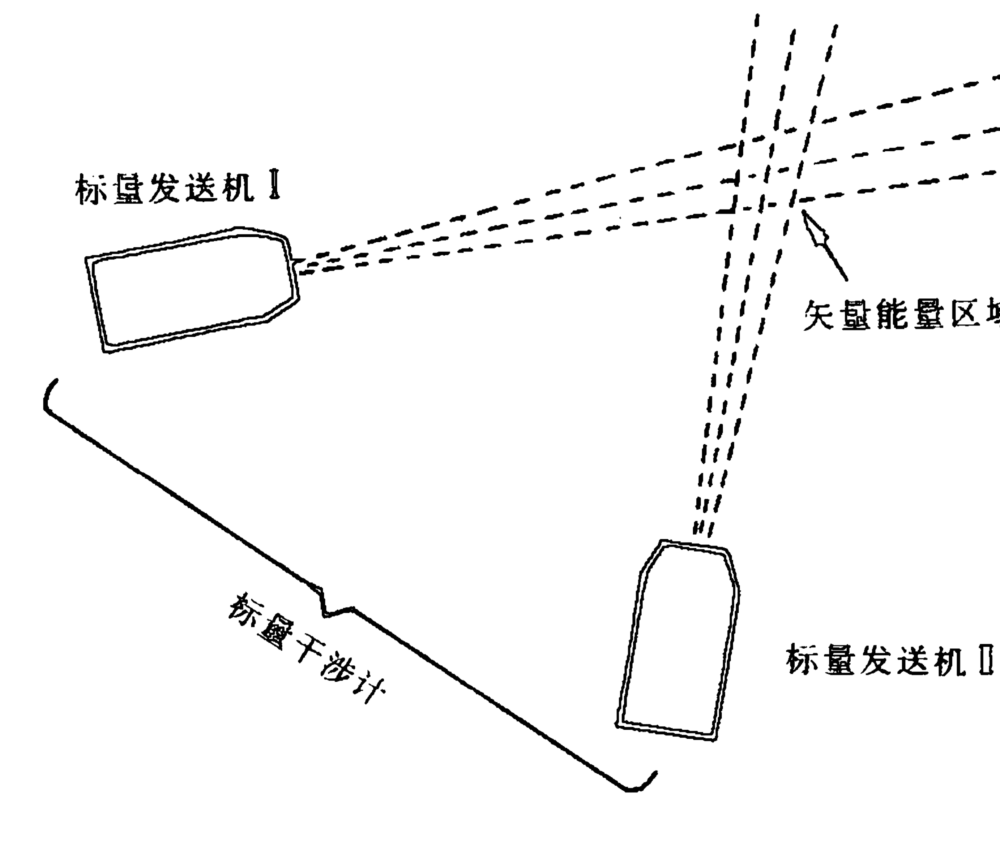

相距甚远之处的能量发生
引自托马斯·潘艾丁的《Fer de Lance》
（图1）

这种技术，不是以通常的电磁力线的形式通过空间传送能量，而是以潜在电气重力的形式，通过时空来传送能量。最关键的问题是特斯拉当年指出的“干涉”和“共振”。这里所说的时空中的空间，不是三维空间，而是四维空间（五维时空）。空间的第四维要素是“潜在重力”。标量波不是现代物理学所说的电磁波（赫兹波，横波），而是百年以前尼古拉·特斯拉发现的特斯拉波（纵波）。这种波是正与负中和以后产生的中性的电波，是能够透过任何屏蔽物的波。人或物即使隐藏在金属物当中或地下，这种波也能对其起作用。关于标量波的机理将在后面的章节详细论述，在这里先介绍一下潘艾丁所说的原苏联开发的标量电磁武器确实存在的证据。

1960年1月，赫鲁晓夫公开宣称，苏联正在开发一种新式的超武器。

1960年5月，安装有这种新式武器的原苏联防空雷达，在原苏联上空发现了美国的高空U-2侦察飞机，并将其击落。正在举行的美苏首脑会谈由此破裂。

1963年4月10日，这种超武器被用于实战，在离美国领海较远的大西洋的深海处击中航行中的美国长尾鲨号潜水舰。第二天即4月11日，这个超武器在波多黎各以北100英里的利根海沟，造成了威力巨大的水下爆炸。

在此后的数年间，对这种新武器进行了多次实验，导致飞机在航行中出现障碍或坠毁。例如，在越南战争中，美军F111飞机的神秘消失。据战后通过战俘交换返回美国的飞机驾驶员称，出事之时，机舱中的所有仪表的指示灯一起明灭闪亮。这大约是苏联的一个特别专家组把数架北越的萨姆2导弹系统的雷达改装成标量电磁方式，使其对美空军飞机进行标量波束的干涉所造成的吧。

1975年，勃列日涅夫公开宣称，苏联正在开发人类难以想象的破坏力极大的新武器。最近俄国自由民主党首领日里诺夫斯基也在公开场合说：“俄国拥有比核武器威力更大的能立刻毁灭整个西欧的秘密武器。”从苏俄首脑人物的这些言论以及后面将要介绍的现实存在的超能量发生装置来看，可以推定原苏联以及现在的俄国是确实拥有标量波的生成技术的。

#### 特斯拉盾（屏蔽）

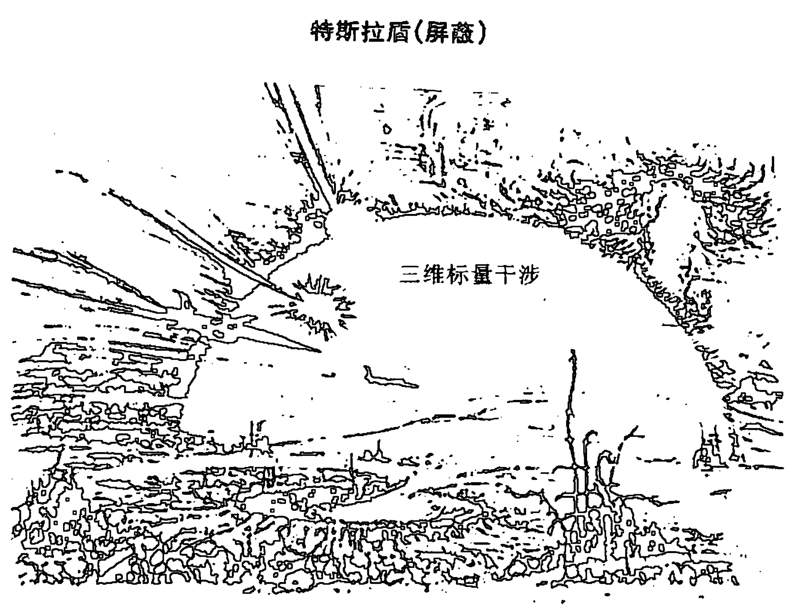

引自托马斯·潘艾丁的《Fer de Lance》
（图2）

两束标量波干涉交叠重合之后，三维的壳状物，即半球状的或其他有规则形状的电磁能量集聚块在空中形成。潘艾丁说，这不就是“特斯拉之盾”吗？这一技术早在1960年已研制成功。

两束标量波干涉后产生的能量是巨大的，它表现为发出通常电磁能量辉光的等离子体，它一般呈半球状。因能量从真空中源源不断涌出，故其中的能量密度呈饱和状。潘艾丁说，这种能量半球的底部直径约有数百英里长。

1976年6月17日，两架伊朗飞机飞往首都德黑兰，当接近与原苏联相邻的国境线上空时，机上驾驶员见到如下情景：在原苏联境内，一个发光的球体出现了，那光球的体积逐渐增大，4～5分钟后消失。

1976年6月22日，途经北大西洋的多艘船舶都报告说，从21时13分到21时40分，在海面上一个巨大的光球一边发出橘黄色的辉光一边急剧膨胀，最终消失。

1976年9月10日，往来于莫斯科和伦敦之间的英国航空公司831航班在飞经立陶宛上空时，驾驶员观测到在飞机下的云层中出现一个巨大的光球。

#### 1977年的半球和球

1977年3月24日北纬23°05′西经17°25′“M.V.KINPURNIE CASTLE”报告

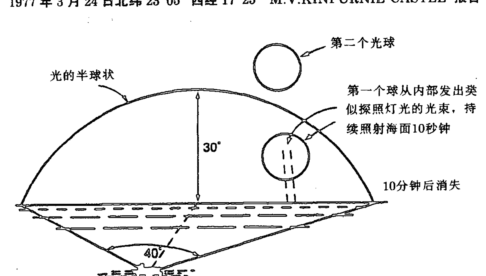

引自“MARINE OBSERVER”48: 21-22, 1978
（图3）

1976年9月，美国的警戒卫星维拉（Vela）观测到在远离非洲海岸的南大西洋的洋面上有一个神秘的“核的闪光”。对此，有关人士推测说，这可能是核爆炸或由其他的某种机制引发的闪光。

1979年9月，从阿富汗境内所见到的原苏联境内的特斯拉球

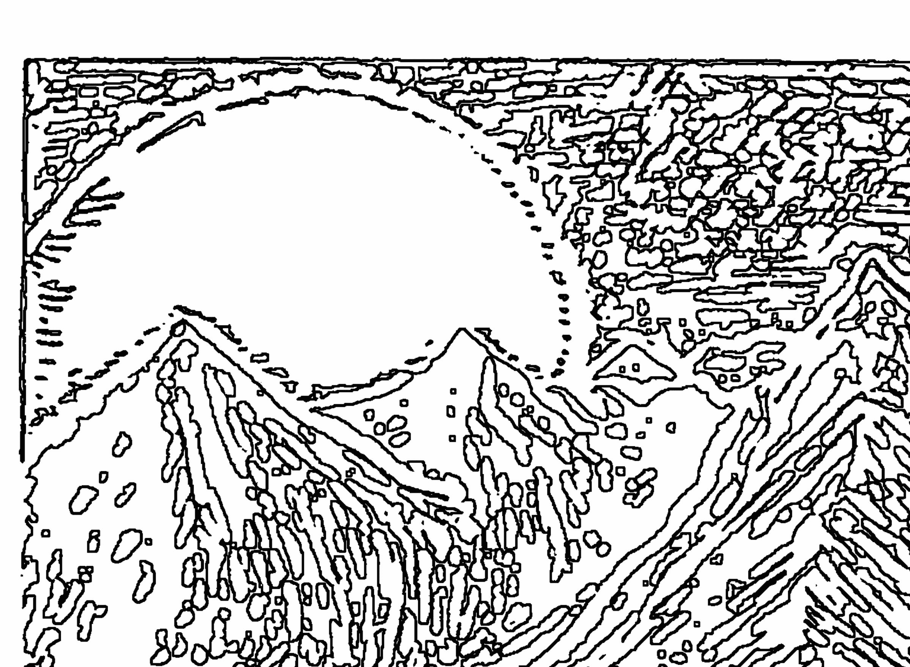

巨大的光球无声地发出光辉覆盖住印度山脉，伴随着膨胀逐渐消失。引自 The SUNDAY TIMES, 17 August 1980
引自托马斯·潘艾丁的《Fer de Lance》
（图4）

1980年，维拉观测到第二次闪光。那被形容为是与核爆炸性质不同的物理现象，是红外线领域中之物。

1980年8月17日，驻阿富汗的英国战地记者尼克·托尼报告说：在阿苏边境地区看到在原苏联领土纵深处，一个巨大的光球发着辉光无声地覆盖了印度山脉，体积持续膨胀，当画出20度左右的弧之后便消失了。

1982年6月22日，日本航空公司的403航班和421航班的驾驶员，在离钏路约700英里的东北太平洋上看到一个在膨胀扩展的光球。

这些光球实际上都是特斯拉之盾，其内部的能量密度是极高的。光球通过等离子体的高温加热，能熔化金属体，甚至使其蒸发。遭遇这种光球的飞机等运输工具上的任何电子装置，不论是否能屏蔽通常的电磁干涉，都立即失去效用。

在1984年4月9日，日本航空公司36航班，在离东京下町仅200英里的太平洋面上观测到一次“冷爆炸”。

在接近俄国实验领域的日本近海上产生的蘑菇云

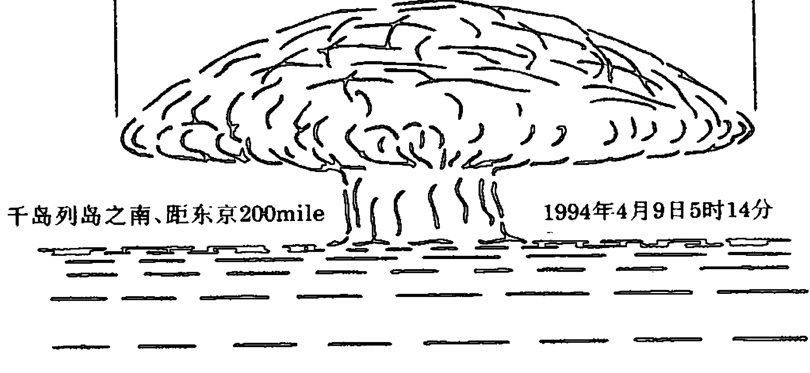

引自托马斯·潘艾丁的《Fer de Lance》
（图5）

事后，当原苏联方面得知日本飞行员发现这一情况时，忙发表声明说：“在该地区进行了一次导弹发射试验。”该声明既是旨在隐蔽事实真相，也是为了试探一下西方国家是否已认识到这次爆炸是一次标量电磁武器的试验。

这一天早上5点14分，在千岛群岛以南的太平洋洋面上，升起一个巨大的蘑菇云，蘑菇云急速上升，并伴随体积的膨胀。在短短的2分钟内升到了2万米的高空，直径扩展到约200英里。

见到此情景的波音747驾驶员中的一人，过去曾是B52轰炸机的驾驶员。他说这个蘑菇云与核爆炸产生的蘑菇云极其相似，但缺少光辐射。波音747驾驶员采取紧急规避措施，离开爆炸区域。但他们没有奢望能逃脱冲击波带来的狂风袭击，可出人意外的是最终没有出现狂风。

#### 北太平洋上的不可思议的光

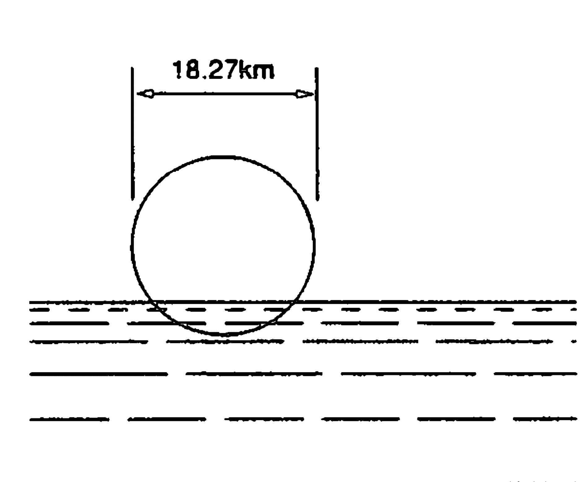

1982年6月18日，在北纬42°、东经153°附近，日本航空403和421航班观察到在钏路以东700英里的洋面上，一个巨大的膨胀着的光球在发着辉光。

> 引自“ASAHI EVENING NEWS TOKYO” JUNE 22, 1982
引自托马斯·潘艾丁的《Fer de Lance》
（图6）

这实际上是一次冷爆炸。这种冷爆炸发生的时候，海面上出现罕见的极低的低压区域。于是海水被吸上空中，尔后粉碎成为细粒状，形成浓云，同时释放出巨大的向上的能量。

周围高压的空气，一边推动水蒸气升腾，一边突入低压的领域。这个压力的混合引起上升浓云的快速膨胀。这个上升、膨胀的浓云，最终成为与积乱云极其相似的云朵。与后者不同的是，它是在极短时间内形成的。

前面已经说到，这种冷爆炸与核爆炸不同之处在于，缺少后者应有的光辐射和冲击波。这大约是俄国科学家独有的发现。

世界上有好几个国家都曾对这种“富丽堂皇而又充满刺激性的光球”进行过报道。但是，没有任何一个国家揭示出这种标量电磁干涉或冷爆炸的本质。因此，前苏联越发肆无忌惮地进行实验了。

发现上述的那次发生在千岛群岛以南洋面上的冷爆炸，还有日航的另四架飞机，它们穿过了那蘑菇云，或飞经蘑菇云的近旁。其中有两架飞机在阿拉斯加的昂卡莱季机场降落并接受了放射性污染检查，结果是一切正常。这进一步证明那威力巨大的爆炸，是非核性质的。

该区域的海深约有7千米。这表明这次爆炸不可能是海底火山的喷发造成的。夏威夷大学的乌奥卡博士等根据爆炸时发生的种种情形分析说：这是一种未知的能量造成的现象，人为痕迹很明显。

潘艾丁说，1985年，前苏联已经完成了用于军事目的的标量电磁武器系统。

### 3. 啄木鸟栅极和美国航天飞机的爆炸

1985年12月12日，从加拿大纽芬兰的根达空军基地起飞的美国航天航空局的一架箭式DC-8飞机，刚升空不久，便尾部落地失事坠毁，机上美国士兵和机组人员共25人全部死亡。一名在现场的加拿大人作证说，在飞机坠毁时，未见到有火焰和烟雾，只见到机身发出黄色的辉光。那可能是前苏联使用了连续电磁发生形式的标量波曲射炮所致。

在1985年8月28日，美国空军的一枚大力神34-D导弹，在发射升空后立刻爆炸。此后在1986年4月18日，另一枚同型号导弹在发射升空5秒后爆炸。据说在后一枚导弹爆炸之前，啄木鸟（Woodpecker）栅极的活动极为活跃。

关于啄木鸟栅极，在此简单介绍一下。1976年7月的某一天，美国以及大部分西方国家的通讯系统，在3-30兆赫带突然遭到前苏联的通讯发射系统发出的强大电波的干扰。这种状况持续了一整天。

这个强大的干扰，在通讯系统中表现为“啾啾”那样的啄木鸟般的叫声，因此被起了“啄木鸟”的绰号。啄木鸟雷达束，横跨了整个美国。不仅如此，通过两条啄木鸟雷达束的波形干涉叠合，能够形成一个十重、二十重覆盖整个美国的“网罩”。

啄木鸟栅极在北美上空交叉

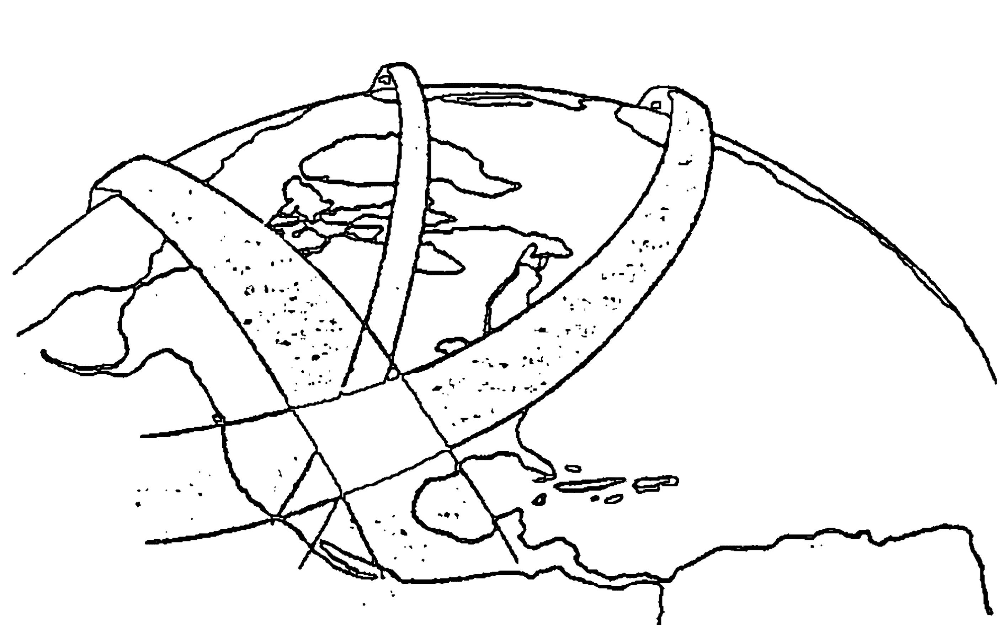

引自托马斯·潘艾丁的《Fer de Lance》
（图7）

这种啄木鸟雷达束能顺着地球表面的曲度延伸，所以能以通常的超视距（OTH）雷达方式，检测出发射后的导弹的运

## 应用于引发地震

用连续的外热形式，有可能使遥远地域内的地面下积蓄起能量。

> 引自托马斯·潘艾丁的《Fer de Lance》

（图8）

在这个电磁啄木鸟栅极的内部，形成一些标量的频道。标量波束、信号以及干涉脉冲可以像直接经过导线那样通过这些频道被发射。相位一致、脉冲形成等，是出现在设置在啄木鸟栅极内部的标量频道上的标量干涉计中的。

一方面，在那里，以外热连续形式，通过选择一个或一个以上的栅极和标量干涉计，产生局部加热、空气膨胀以及形成高压区，从而使气候变得炎热异常。

另一方面，在那里，以内热连续形式，通过使用一个或一个以上的栅极和标量干涉计，能使空气收缩，产生局部冷却，形成低气压区，从而促成寒冷的气候形成。通过电磁干涉的标量波束的旋转，能按操作者所希望的那样，使热点或冷点出现，还能控制其出现的速度。

## 摧毁发射阶段的导弹

- ①扫描干涉计扫描网络，检测出上升中的导弹的轨迹。
- ②受计算机控制的标量EM干涉计，通过EM啄木鸟搬运波中的标量EM频道点火。
- ③二条同步的标量脉冲与上升中的导弹会合并点火。
- ④所有的导弹及其电子系统，在瞬间被破坏。

用这个方法，能控制横跨美国的喷射气流的整体，当然也能按一定的角度使其弯曲。据说1985年2月1日，美国南部出现的一场特大暴风雪就是这样发生的。当时，从加拿大南下的一股极冷空气，异乎寻常地跨越了美国，直达南方地区，引发了一场灾难。用这个方法，还能人为地制造干旱、多雨、洪水等自然现象。

关于啄木鸟栅极组成的标量电磁系统的作用，潘艾丁作了这样的归纳：

(1) 能影响气候。

引自托马斯·潘艾丁的《Fer de Lance》
（图10）

(2) 能使大气圈上层的巨大的喷射气流发生偏移。

(3) 能探测出敌方升空后的导弹轨迹并扰乱之。

(4) 能探测到敌方战略轰炸机和其他飞机的航线并将其击落。

(5) 通过大面积的电磁爆炸，对地上和海上的目标实施攻击。电磁爆炸能产生火球（热效应）、中子放射以及不带有放射性污染落尘的冲击波。此外，通过逆反的方式，能使一切事物冷却到冻结起来。

(6) 通过强烈的内部电磁振荡，能使所有的电子仪器失灵。

(7) 能使远方特定的断层地带产生摩擦振动，使板块的受压面增大，从而诱发地震。

(8) 使一个特定的区域蓄积或释放能量，从而使巨大的岩石板块发生弯曲，诱导板块的整体或部分发生地震。

(9) 能形成水面下的干涉网络，探测并追踪潜水艇，必要时将其摧毁。

(10) 其干涉波能穿越地球，直接攻击敌方的位于地下储藏库中的导弹和核武器。

(11) 标量波（特斯拉波或重力波）能透过陆上、海上、地下、空间的一切事物，任何的屏蔽对它都不起作用。

潘艾丁说，1986年1月28日美国挑战者号航天飞机爆炸的罪魁祸首就是标量电磁武器。

美国的科学工作者弗兰克·高尔丁说，在1986年1月1日确实测定到在原苏联的标量电磁波上载有“金属软化信号”。很明显，这个信号是针对即将发射的美国挑战者号航天飞机的。

在此之前，原苏联已完成了覆盖美国本土的标量波气候控制系统。高空的喷射气流被人为地向南方大幅度弯曲，因此来自加拿大的寒冷气流长驱直入，到达位于佛罗里达的航天飞机发射基地。正是在这一气候状况下，航天飞机被发射升空了。

与此同时，标量电磁波中的“金属软化信号”持续作用于点火后的助推器。助推器喷出的火焰起着与作为标量信号的同步增幅器的“等离子体”同样的作用。等离子体的特性为，能把横波改变为纵波的标量波，或把输入的纵波改变为横波。这样，火焰的电荷集结被改变为标量共振信号。

于是，挑战者号遭遇了悲惨的命运。在点火之后，其助推器喷出的火焰，使啄木鸟栅极发出的标量信号增幅。助推器上的金属物，渐渐地弱化、软化。这种软化作用使金属带电。

挑战者号的一个或多个被弱化的金属夹具终于脱落，于是助推器发生振动，击碎了液体燃料罐，溢出的液体燃料导致了挑战者号起火爆炸。

数天之后，啄木鸟栅极还不时发出强大的“高频局部软化信号”。阿拉巴马州的伯明翰是标量波束的一个交汇处。飞经该区域的很多鸟类在那期间都原因不明地突然坠地死亡。

以上就是潘艾丁所介绍的原苏联的标量电磁武器实验和应用的一些情况。但当戈尔巴乔夫的自由化政策实施以后，标量电磁武器的实验和应用中止了。

这个标量电磁技术，实际上是当年尼古拉·特斯拉发明的技术的翻版。但是，当初特斯拉发明这一技术的意图，是建立一个覆盖全球的无污染的通讯信息网络，进一步还想通过这个技术，建设一个没有旨在争夺有限资源的战争的和平社会。

但后来这一技术成了“潘朵拉魔盒（希腊神话中的典故，宙斯神在潘多拉下凡时给她的盒子。将盒子打开时，一切灾难都跑出来，只有希望留在里面。——译注）”，它给在精神上未成熟的现代人类带来的是悲剧。人类应该觉悟到，假如把这一技术用于军事战争，则人类乃至地球的灭亡就指日可待了；应当把这一技术用来为人类和社会造福，这样人类的未来才会是无限光明的。

因使用这一技术的人们的精神层次的不同，在以何目的使用该技术的问题上，早就有了分歧，可以说是“正”“负”这样两条截然相反的道路吧。“负”路的目的是“掠夺他人，让他人臣服自己”，是一种企图支配整个世界的妄念。“正”路的目的是“援助他人，为他人服务”。

## 4. 先人的业绩 —— 动物磁场和奥多之力

特斯拉波（纵波的重力波）与东洋古代所说的气、普拉纳（生命能量）从性质上看，是相同之物，它们处于相同的物理层次上。然而这些实际存在的能量，在现代科学的体系中还未获得其应有的位置。

迄今为止，几乎还没有人能明确揭示特斯拉波的本质。大桥正雄曾把它看作物质波、原子波，潘艾丁把它视为标量电磁重力波，木下清宣认为它是重力波。但这些认识尚未揭示其本质。现代人尚且如此，不要说科学技术水平相当低下的百年前的人们了。为了探知实际存在但又本质不明的能量，我们的先驱者不懈地努力，但所获甚少。不仅如此，他们还遭受到正统科学的打击。为此，他们付出了血与泪，或在失意中了却一生。

在这些先驱者中值得一提的，是奥地利的医师安东·梅斯梅尔（Anton Mesmer），他于18世纪后半叶即法国革命的前夜，提出“动物磁气”学说并用于医疗实践，在当时的巴黎引起了轰动。

梅斯梅尔在1773～1774年间，为一名29岁的女性患者治病。那位女性同时患有头胀、齿痛、耳痛、呕吐、谵狂、昏厥等15种以上的重病。梅斯梅尔把三块磁铁分别放在她的胃部和两腿，然后朝患者脚的方向活动磁铁，结果患者的症状消失了。

但梅斯梅尔认为：“这不是磁铁产生的效果。从本源上说，效果产生于与磁场在本质上不同的能动的作用体。就是说，通过蓄积在我体内的未知的流体的作用，使患者体内产生了磁气流。”他在《动物磁气发现之备忘录》（1779年）中，就动物磁气阐述了如下的基本原理：

- (1) 精妙的物理的流体，充满了整个宇宙，成为连接人类、地球及其他天体的媒体，也成为人与人之间相联络的媒体。
- (2) 疾病产生的原因，是人体内这种流体的分布变得不均等了。
- (3) 借助于某种技术，能使这种流体的流动变得通畅，或使其在体内贮存，或把它移送到其他人的体内。对这种流体即动物磁气能进行远距离操作。

这不正是与气和普拉纳同种的能量吗？梅斯梅尔曾尝试把仅以某种姿势站立在患者面前作为治疗法，结果疗效同样显著。据说1776年以后，梅斯梅尔在治疗活动中不再使用磁气和其他任何东西，他只是用手抚摸患者的身体。

当时的法国国王路易十六根本不相信梅斯梅尔的“动物磁气”学说，他召集了皇家科学院、医学院中一流的科学家，美国驻法大使本杰明·富兰克林（Franklin Benjamin 1706～1790年）也在内，组成专门委员会对梅斯梅尔的学说进行审查，作出了“磁气流体的存在根本没有物理学根据”的结论。于是梅斯梅尔作为一种独特治疗法专家的生命中止了，不久他就在失意和绝望中离开了人世。

在梅斯梅尔去世的50年之后，即1830年，德国的科学家拉伊汗巴赫（Reichenbach）男爵发现了“奥多之力”。

1844年5月的某夜，拉伊汗巴赫腾出两间毗邻的房间，当中不点灯，保持黑暗。然后把一名感受力很强的少女带进其中的一间房。在另一间房里，放置一块矿物结晶体。等少女适应黑暗的环境后，就把她带入后一间房，让她近距离地看那结晶体。结果少女看到结晶体的整体发出蓝光。接着把结晶体翻了个个，少女又看到结晶体上升起发出淡红色和黄色的烟雾状的东西。拉伊汗巴赫把这种未知的放射物叫做“奥多”。

在同样的黑暗环境中，假如把一根磁棒放在桌子的对角线上，则感受力强的人能看到磁棒的 N 极发出蓝色火焰似的东西，还能感觉到那儿有冷空气散出；而从磁棒的 S 极则感觉到有微温的风吹出，并能看出那儿发出橘黄色火焰似的东西。假如使施术者和受术者左手和左手接触、右手和右手接触，则受术者一方就会出现奥多的类似对比，产生一种不适的感觉。假如使施术者和受术者左手和右手交替接触，则出现奥多的非类似对比，产生了凉凉的舒适感。

动物的身体，左侧（从头到脚）属阳性，右侧（从头到脚）属阴性。阴的特征是发出冷气，使人快乐；阳的特征是给人带来不充分的感觉，使人不快。关于动物磁气，拉伊汗巴赫是这样说的：“应用动物磁气进行的治疗活动，实际上是根据非类似对比的法则进行的，即用右手擦患者身体的左侧，用左手擦患者的右侧，这样，奥多之力产生，患者便获得凉凉的舒适感觉。”

拉伊汗巴赫还说：“即使闭上眼睛，也能看到奥多的火焰。”这表明奥多能透过一切事物，屏蔽对它不起作用。

1869年1月，拉伊汗巴赫告别了人世。范希纳（Fechner）评价他说：“到生命的最后，其学说也未得到世人的承认，这真是人生的一大憾事。他要另辟蹊径，对生命现象作出阐释。拉伊汗巴赫为探索奥多，辛苦了一生，但命运却对他进行了嘲弄。”

## 5. 拉依希的奥尔孔能量

从不同的角度发现了拉伊汗巴赫所谓的奥多能量的，是1897年诞生的奥地利人维尔海尔姆·拉依希（Wilhelm Reich）。

拉依希最初是弗洛伊德的弟子（后来与弗洛伊德分道扬镳），他认为神经系统疾病产生的原因是性能量的自然释放受到了压抑，从而对生命体的研究贯注了心血。

1934年，为了免遭纳粹的迫害，他迁居挪威。在那里，继续其研究工作。他从物理学中的放电现象联想到生命体的放电现象。他进一步感到生命体释放的强大能量，仅用微弱的生命体放电原理是难以解释的。生命体的能量究竟源于何处呢？其本质是什么呢？他不得其解。

有一次，他把分解后的食物进行灭菌处理，然后与空气严密隔离，放在200～300倍率的显微镜下进行观察。结果发现了一种一边发出黄绿色光一边蠕动的小胞。他把这种小胞起名为“巴依翁（bion）”。这是他于1936年在挪威发现的。

拉依希尝试封存巴依翁发出的能量。他用胶合板制成一个盒子，盒子内侧垫上薄铁板，然后把巴依翁放了进去。此后他发现盒子中产生了与熵增大法则（热力学的法则，即压力总是由大变小，事物总是从有序到无序发展的法则）正相反的负熵现象。这是气和生命能量法则的本质。

在盒子的内壁，不仅辐射增强（通常情况是不输入能量就会变弱），而且即使去除了巴依翁，发光现象依然残留。此外，盒子上部空气的温度，总是比其下部和周围的空气温度要高。（通常，温度差一旦产生，就会因空气的流通而消失，这是热力学的法则。）

拉依希认为，巴依翁发出的这种能量实际上是遍布于宇宙中的。巴依翁集中了这种能量，于是人类就能用肉眼见到其剧烈的活动了。拉依希后来搞清楚巴依翁不仅存在于生物体中，连沙土、煤炭等能膨胀分解的事物中，都能发现其踪迹。拉依希认为巴依翁是介于有生命物质和无生命物质之间的一种物质，原生动物或癌细胞是其进一步进化的结果。

1939年，拉依希到了美国，发现了在大气中存在有一种名为奥尔孔的能量，并于1940年研制出“奥尔孔集聚器”。这种器械以外侧敷设的有机物吸取能量，尔后以内侧的金属物反射能量，使能量集聚起来。把患癌肿的老鼠放入这器械中，则老鼠的癌肿会消失。用这种器械能治疗人类的烧伤、癌肿和神经系统疾病。拉依希据此确立了“奥尔孔治疗法”。

但是，这种独树一帜的治疗法遭到了来自正统科学阵营的猛烈抨击。1954年，FDA（美国食品医药品管理局）颁布禁止销售奥尔孔治疗器的命令。尔后于1955年，以违反该命令为由，对拉依希提出起诉。法庭审判结果，起诉成立，拉依希被判两年徒刑。1957年11月3日，拉依希在监狱中病逝，走完了其坎坷的人生之路。

美国的A·考林滋在其著作《奥尔孔生命体之谜》中，是这样对奥尔孔能量进行定义的：

奥尔孔是一种微妙的放射线，是巴依翁这种小胞产生的带有信息的放射线。巴依翁产生于生物的化学反应——类似植物的光合作用，是活细胞和日光相互作用的结果。

生物体吸收太阳能量（我认为是一种被搬运来的气和普拉纳那样的生命能量 —— 作者注）以后，生物体内的神经系统便受到刺激，产生以某种频率振动的冲击力，那个冲击力通过运动神经系统被传送到全身。

地球上所有的生物都内含巴依翁。只要生物依然存活，巴依翁便持续地放出肉眼看不见的低层次的放射线。巴依翁也蓄积在无生物特别是无生物中的有机物中。巴依翁与活组织相协调，赋予物质以生命，维系意识、思考、记忆等神经功能。东洋医学中的经络、穴位是巴依翁能量的通道和出入口。瑜伽中提及的伽克拉也是其出入口之一。

通过显微镜看到的巴依翁，就像一个个在微观世界中跳动的光球。巴依翁产生的有机放射线，以一定的比例从皮肤的表面散发出来。它实际上就是人们早已发现的奥拉（生物体发光现象 —— 译注）的实体。一般的科学家是否定奥拉的存在的，仅简单地断定那是单纯的考罗纳（Corona）放电。但是考罗纳放电与奥拉，在颜色和光的强度方面是不同的。

罗马尼亚的化学工业部劳动防灾卫生研究所所长杜米多列斯库发明了一种新颖的电记录器械。这是对能观察奥拉的基里安（辐射场）摄影机进行改良后的产品。它装有高倍显微镜和计算机，不仅能探查到生命体能量作用的轨迹，而且能捕捉到身体各器官发出的脉冲信号。利用这个器械，可从分析细胞发出的辉光着手，在肿瘤表现于肉体的几个月甚至几年之前，确定其确切的位置。

气的测定实验结果表明，气能量越是强的人，其身体的微光和磁气变化越明显。这证明了奥尔孔能量与气和普拉纳是同类性质的能量。

奥尔孔大多集中于大气圈的上层。但其中的一部分，受更强大的地表奥尔孔的吸引，自天而降。于是就产生了风水中所说的有龙脉的地方，日本的《相似象》中提及的“伊雅希洛契”就是这一类场所，据说那儿气场很强。

如前所述，奥尔孔产生负熵现象，其内则总是按顺时针方向旋转。奥尔孔能量产生按纵方向行进的风（未知的能量，具有纵波的性质）。从大气圈降下的能量漩涡是呈离子化态（向原子输入强大的能量后出现的原子外侧的电子剥离的状态）的空气漩涡，该空气漩涡进一步进入低密度低温的等离子态（向电子被剥离的原子输入比离子更强的能量后出现的原子核的质子和中子四分五裂的状态），形成高能量的电磁场。

等离子体现象，不过是通过向原子输入能量，原子外侧的电子被剥离，进一步，构成原子核的基本粒子也四分五裂，尔后产生的结果而已。气能量也好，奥尔孔能量也好，地震能量也好，其实体都是电气的中性的四维纵波的重力波。

在地震发生前，动物往往会有感应，出现异常的活动。这是因为地震能量与生命体能量具有同类性质，感觉器官敏锐的生命体（动物），能首先捕捉到地震即将活动的征兆。此外，地震前后出现的怪光，是由于原本不在可视光领域中的空间粒子，受到从地底释放出的强大地震波的冲击被激起，旋转数增多，从而进入可视光领域而形成的。

## 附录

译者按：拉依希发明的奥尔孔集聚器的技术，在他去世以后，流传到世界上不少国家，在有的国家里被应用于临床，取得较好效果。以下一篇转摘自《国际气功报》第120期（1996,4,10）上的文章就是一个佐证。

## 莫斯科的“气功箱”

（作者 张忠军）

1991年7月在莫斯科市高校大街第5门诊医院的诊室里，安放着两个金属包皮的大木箱，我们称它为“气功箱”。患者排着队等候治疗，有时要等一二个小时才能轮上。治疗并不复杂，患者在箱子里坐上20分钟，要求心平气和，放松身体各个部位，如果会打坐入静沉思更好。据制造这气功箱的人说，本箱能吸收集聚太阳能和称为“奥尔孔”的能量。人坐在里面就能接受能量，加速机体代谢。一个疗程两周，几乎能治各种疾病。

负责治疗的医生安得罗索夫解释说，我坚信东方医学的概念，人的健康情况与中国称之为“气”、印度称之为“普拉纳”的物质有关。这种称之为贮能器的箱子能聚集气或普拉纳，推动人体内气的运行。这样就能消除应急紧张反应，消除疾病。

半年以后，记者又专访了安得罗索夫医生，了解治疗效果。医生说，好多新奇的效果是原来没有料到的，每天都有新的奇迹。我作为医生、学者，进行了两年多的实验统计。对一些病，如和神经中枢有关的一些慢性病、神经衰弱、神经系统末梢疾病、神经根炎、肌炎，治疗效果比较好，特别是对甲状腺肿块效果更好，不用动手术，肿块自行消失，经超声波检查证明确实是消失了。

这个称之为气功箱的东西是奥地利医生、生物学家维尔海尔姆·拉依希发明的。拉依希是弗洛伊德的学生，他用一生的主要精力研制“奥尔孔能量发生器”。所谓“奥尔孔”就是宇宙能量。他制造出这种能量贮存器，用它治好了一些慢性病，包括癌。他于1957年11月3日去世。前苏联一位工程师谢尔盖·科洛克里茨夫获得了拉依希的著作，包括能量贮存器的设计图纸。科洛克里茨夫根据拉依希的著作和设计图纸，与一位志趣相投的工程师尤里·巴雷克夫经过多年的研究改进，找到了最有效的材料和吸收生物能的合理方式，制成了上述的气功箱，直到1991年才公开问世。

## 6. 科学的新进展有赖于中性能量的阐明

阿久津淳在其著作《魔术师般的科学家》中，介绍了仅有高中学历但却极有天赋的科学研究者伽利摩阿（Garimore）的学说。伽利摩阿在其1970年所著的一系列的作品中，阐述了“亚能量统一场理论”，其要点如次：

- (1) 要说明涉及生命和宇宙的问题，光利用现有的物理学理论是不够的。
- (2) 拉依希的理论、拉依汗巴赫的学说、金字塔理论、波动治疗原理、炼金术、占星术，在这些被现代物理学视为异端的学说中，都有涉及亚能量（物质层次之上的能量）的内容。
- (3) 由这种能量产生的奇异现象，表现为定常波，是电气的中性之物。
- (4) 这种中性的能量，与已知的所有的能量不同，它能通过任何屏蔽物。这已经得到科学实验的证明。为使一个耗尽电力的蓄电池重新产生并贮存能量，只要把一块重900克的水晶，成直角与蓄电池相接触就可以了。
- (5) 这种能量又可叫作气、普拉纳、奥尔孔等等，别名达108个之多。
- (6) 中性能量碰上固体物质后，便进入其媒质，或通透而去。经中性能量通透过的物质，产生弱磁场，该弱磁场使物质表面产生静电。
- (7) 在某种条件下，有可能利用中性能量进行通讯。中性能量不具备电磁性质，因此通常的电磁信号接收机无法接收其信号（那是重力波）。
- (8) 通过适当的能量控制，能对特定的人物（病人）进行治疗，或加害于特定的人物。
- (9) 中性能量的信息是由人体射出的光（实际上是原子放射出来的相当于光速的重力波）传送的。

(10) 假如有人与中性能发生装置产生共振，则他(她)的身体立即会受到影响，或受益，或受害。

(11) 能够利用该装置从空间如地球的大气圈吸取自由能量，用于人类社会的动力运转。

(12) 超心理学中的所谓意识信息能通过重力被送达地球的任何地方。

(13) 那个信息被贮存在四维世界，在那儿它能循环出现。因此人们能够获知十分久远的过去的信息。

(14) 思维相同的人们，不论相距多远，相互间也会产生感应。

(15) 所有的物质，都释放出作为重力而为人们所知的放射线(这不过就是我所说的原子放射出来的四维的纵波的重力波)。

伽利摩阿认为有三种基本能量，它们分别为①磁气，②静电，③中性电荷能量。伽利摩阿把它们叫作 Z 矢量，其属性有抵抗、强力、偏极。Z 矢量作为潜在力、媒质(声音的场合，媒质就是空气)内的应力、媒质内的电流、静水压而表现出来并起作用。

伽利摩阿指出，发现电磁方程式、确立电磁场学的英国著名物理学家 J·C·麦克斯韦(1831～1879 年)曾认为存在有两种电气能量，一种是作为通常的带电物体的电荷而表现的东西；另一种是“充满整个宇宙，在电作用产生的同时发生位移的东西”。现代物理学竭力排斥后者，对其理论的展开故意视而不见。关于这一点，瓦尔塔马尔·瓦莱里安在《矩阵 Ⅲ》一书中是这样说的：

> “麦克斯韦独创的方程式是由两个部分组成的，一部分包含了可能测定的成分，另一部分包含了相对的成分。相对（以太）的成分，存在于高维空间，是‘虚数’，是‘复数共轭’，该成分的信息作用于精神，与脑和意识相互关连。

> 麦克斯韦独创的方程式，向我们提供了有关重力推进和精神作用的必要知识。但是，海皮萨依多、基夫斯、赫兹在归纳整理有名的四个方程式的时候，把其中的四维的标量成分给排除掉了。这四维的标量成分不表现为（三维的）场，而表现为（四维的）潜在压力。假如承认这个潜在压力是存在的话，则就必须承认物质是由无产生的。所谓潜在压力，不过是能量的贮存库。

> 在现有的方程式中，原本相互依存的电磁场和重力被视为相互排斥之物，电磁场学的基础最初是五维（长、宽、高、时间和潜在），而现在被除去了潜在，只有四维了。”

我的想法是，恢复作为时空第五维的“潜在”的应有地位，通过把它结合进潘艾丁的“标量电气重力学（标量波理论）”（在四维空间电磁力和重力数值相同），来建立一个不仅能阐释物质原理，也能阐释生命和精神原理的新的理论体系。

## 7. 不使用物质燃料（石油、煤、核原料等），能取得能量吗？

中性能量的发生装置，一旦研制出来，则以下的事都是可能做到的。

- (1) 不使用石油、天然气、核原料等，也能获取人类所需要的能量。
- (2) 不凭借电话电信系统和通讯卫星，也能进行通讯活动。而且这种通讯不论距离多远，不论是在地表还是在水中、地下，都能顺利进行，并且无被人窃听之虞。
- (3) 可把这种装置微型化，使其呈晶体状，其寿命是永久的。无需与电源相连，便能用它来启动电视机、电冰箱等所有的电器产品。
- (4) 程序化的结果，是能使接受装置照射的金属片的重量减轻。这样，反重力的产生成为可能。于是，新式的飞行物体即 UFO 就有可能研制出来。
- (5) 在这个装置的照射下，具有放射能的核废料，会消失在空间。根据这个原理，用该装置来消灭物质和转送物质也并非不可能。据说俄国已用它来诱发地震了。
- (6) 在医学领域中，可用该装置治疗癌等疑难病症。宇宙间最小的微粒子(10⁻³³厘米，为普朗克长度)，蕴含着所有的宇宙信息。这些微粒子相互关连，人类的思维与其有密切的关系。

原苏联早已在应用这样的装置，把存在于宇宙空间的无限能量变换为电能量和机械能量。原苏联解体后，俄罗斯政府由于缺乏经费，关闭了从事该项研究的机构，研究人员流离失所，其中有人将该项研究的技术出售到了国外。据可靠消息，1994年秋，通过日本的某商社和与政府有关的某外围民间团体，该研究技术已被销到日本。听说澳大利亚政府也已获得该项技术，并打算利用这个技术制造无需电线的发电装置。这些都成为原苏联确实拥有标量电磁武器的旁证。

最近，我得知，半个多世纪以前的纳粹德国，已经制造出 UFO，UFO 使用的是一种叫“布利尔”的能量。这种能量还未能被现代科学所阐明。这种能量具有以下的性质：

- (1) 能穿透任何物体。
- (2) 能注入生物和无生物。它能转换为强光，从而产生破坏作用；另一方面它又能被弱化，从而被用于治愈疾病或保持健康，向生命体输入活力和生机。
- (3) 布利尔能量能击碎任何坚固之物，因而能用它在地底的岩石中挖掘通道，也能用它来诱发地震。
- (4) 纳粹德国的科学家研制出一种能产生布利尔能量的棒。它当中是空的，在下端的把手处，安装有系紧用具、按钮和弹簧。假如按规定的程序操作，这棒便能产生布利尔能量，并能自由地变换能量的质、强度和射出方向。这棒既能用来破坏，也能用来建设。用它能粉碎岩石，或使蒸气发散。这棒产生的能量不仅能影响肉体，也能影响精神。
- (5) 布利尔棒产生出的能量性质是因操作者而异的。某人使用它时，产生的能量作用强；某人使用它时，治疗疾病的作用显著。有个女性在使用布利尔棒过程中，能随意控制远处大而重的物体，或使其垂直上扬，或使其平行移动，就像那物体具有智能、理解她发出的指令并完全按其要求活动一样。
- (6) 当拥有布利尔能量的人们充分了解了布利尔的效果，了解它能被自由控制之后，在他们之间就不再会发生任何纷争了。因为假如大家都利用布利尔能量去攻击对方的话，则除了双方同归于尽外，别无选择。想想看，一个孩子也能操作布利尔棒发出能量，转眼间把坚固无比的要塞捣个稀巴烂。以上这些情况均记载在布尔瓦·利顿写的一本叫《应该到来的民族》的书中。

使用布利尔能量的超航空机（一种 UFO）具有以下功能：

（据说纳粹在一家喇嘛教寺院内发现了一本用古梵语写成的文书，并根据文书中的提示研制出了这种超航空机。）

- (1) 能解析出太阳光线中的暗黑部分，以此来遮蔽机体，使机体从敌方的视线中消失。
- (2) 能通过发射洛依奈光线，清楚地观察航空机前方的物体。
- (3) 能使用布利尔能量集音装置，探知飞行中敌机内的任何声响（包括说话声）；还能向敌机内发去干扰声。
- (4) 能把敌机内的情况以画像形式映现出来。
- (5) 能使敌机的机组人员丧失意识。

对以上这些情况，用现代科学的原理是难以解释的。本书的以下章节将应用“四维的纵波的重力波”、“标量波”之类的概念，来阐明这些与超常现象和生命精神有关的宇宙间的难解之谜。

并不是要全盘否定现代科学的原理，而是在承认现代科学原理合理性的基础上，郑重地审视、探索现代科学说明不了的现象，从而扩充现代科学的内容，提高现代科学的层次。只要未被阐明的现象是确实存在的，就要正视它，设计出种种假说来阐明它，进一步导出全新的科学原理。

# 第二章 完整的科学体系必须包含标量波理论

## 1. 被现代科学忽视的纵波的重力波

第一，现代科学所说的能量，是指由电磁波形成的电磁能量。电磁能量碰上物质后，一部分被物质吸收，余下的被反射，就是说它不能透过物质。为了输送电磁能量，电线是必要的。在无线输送的场合，例如电视台发送电磁信号时，假如电磁信号遇上障碍物（例如山脉和高楼），就会被阻隔。即使是穿透力较强的 X 线也不能例外。在进行 X 线检查时，被检查者需要脱去有钮扣的衣服，就是为了让 X 线顺畅透过人体。

第二，在现代科学中，没有“反重力”这样的概念。电磁力具有吸引和反抗（排斥力）这两种作用，但是，重力只有对于物体的吸引力，而没有排斥力。重力的排斥力是应该有的。那么作为重力排斥力的反重力究竟是什么呢？物理学应该搞清这个问题。

非电磁能量的可透过一切物体的未知波是什么呢？具有反重力作用的未知力的真面目是什么？回答这些问题，就是作者写作本书的目的。

假如我们说“不用石油等化石燃料和核燃料便能获得能量”的话，则就会产生一个问题，即那个能量源于何处？其回答是，“那个能量是从真空中涌出的。”还有，通过一种未知能量的照射，能把核废料妥善地处理掉，这又是为什么呢？回答是，“核废料被消灭在真空的空间中了。”

原苏联研制的标量发生装置产生的未知能量和布利尔能量是同种性质的能量。实验显示，布利尔能量运用得是否有效与使用者的精神和意识活动有密切关系。原苏联的标量发生装置，在应用时也与信息、思考、意识有关连。这启示我们，这种未知的能量，与现在我们所说的气、普拉纳、生命体能量、Psi 能量以及人类的精神能量是同种性质的。

对这种未知能量（力或者波）的本质的阐明，不会导致全盘否定现代科学。假如抓住以下的两个关键，便能扩展现代科学的三维观念，使只被用来测定质量的数值得以延伸。这样一来，现代科学也能参与对未知能量的阐明了。

第一个关键是“维”的扩张，即发现空间的第四维要素。这即是发现“标量潜在压力”。这个“标量潜在压力”是创造时间，并使之与空间一体化，最终形成“五维时空”的根源。

第二个关键，是打破对现代科学的一个常识的迷信，那个常识是“假如正负能量相互否定，则两败俱伤，全部消失”。能量不会消失，它应该转化为其他东西。这就是“能量守恒定律”。看上去相互否定消灭的能量，应该是变换为某种其他的东西（未知的能量）的。

现代科学用于实验和检测的仪器，只能观察电子和电磁波的变化，即正和负的变化（场的混乱），通过使电子和电磁波增幅而对其进行观察。这可以说是“看得见的世界”的测定吧。

但是，“被否定的能量”，是正和负中和后形成的东西，其性质是电气的中性。中和后的东西没有质量，是零，所以在现代科学的测定仪器中，它表现不出数值。因此从三维的角度看，它处于零的状态。

于是，该起用“标量”这一个概念了。我想先用一点篇幅，来叙述一下现代科学的基本概念和我的发现之间的异同。这是必要的，否则就很难揭开未知现象的真面目。

首先来介绍一下标量和矢量（向量）这些数学和物理学上的概念吧。

- (1) 矢量，是有大小、方向性、角度（即长、宽、高）的量，是三维的物体，具有质量。
- (2) 标量，是只有大小，而没有方向性、角度的量。与它对应的状态有气体和真空的空间。对它界定的词有中和、中性。实际上，这便是四维（真空的空间），其物理的实体是“潜在压力”。在现代科学的测定中，它处于零状态。正负相抵被否定的能量，作为“零矢量”，在真空的空间变换为压力而存在。从“能量守恒定律”来看，这是应当如此的。

那么，接下来就产生了一个问题，那个零矢量的标量的潜在压力的本来状态是怎样的呢？先看下面一张图，它显示了电磁波状态。

电磁波作为振动电流，其电源的强弱和方向在不停地变化。因此而产生的电场和磁场在时间轴上（X、波的振动方向）发生变化。电磁波被放射到空间，电场的变化导致磁场发生变化，磁场的变化又导致电场发生变化，电磁波在空间内不断扩展，到达远方。

如图所示，在电磁波中，在电场 E 传播的波叫做电波，在磁场 H 传播的波叫做磁波。电场 E 和磁场 H 的传播方向，都与波的振动方向 X 成直角（垂直）。振动方向与传播方向一致的波叫“纵波”，振动方向与传播方向垂直的波叫做“横波”。因此，由 E 和 H 构成的电磁波是横波，电波和磁波必然是相互依赖而存在，是不能分别单独存在的。此外，在电磁波中没有纵波的振动成分。

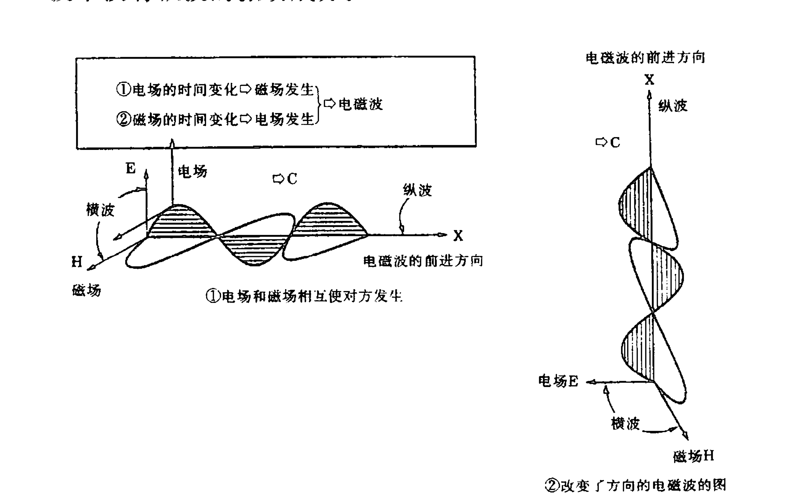

引自小川庆太《光子的现代物理学》
（图 11）

但再请仔细看一下图 11①，可以看出，在振动方向（X 方向）上，电波和磁波以相同的数值，在交互地反复进行伸缩（膨胀、收缩）。所谓 X 方向，是时间的方向。因此，同一时刻的 E 和 H，①在空间上处于同相位（所谓相位，是决定随时间或空间位置作正弦变化时的某一物理量在任一时刻或位置的状态的一个数值）。因此，它们成为零矢量，成为标量，从三维的角度观测，它们只能处于零状态；②但是，在时间上，E 和 H 呈 180° 相位错移，因而成为潜在的伸缩压力，形成封闭的空间。

但是，再请看一下图 11②（把图 11①竖过来看的图）。我们看到什么了呢？我们看到了古代传说中海尔梅斯（希腊神话中的神使——译注）和摩西（《圣经》中记载的领导希伯来人摆脱埃及人奴役的领袖——译注）的手杖以及法老手中的法器昂克、DNA 的二重螺旋等的形态。

二重螺旋、阴阳等，假如仔细观察的话，则可看出在其中，有一条数值为零的纵波的另一条中心轴线。宇宙的所有构造全都显示同一种模式：大小、长度、幅度、数值完全相同的二重螺旋，如同梅比乌斯（mebious）卷一样，围绕三位一体的零中心线，形成盘成一团的蛇的形态。

这种构造和形态在昆达利尼（瑜伽概念之一——译注）的变化中也得到充分体现。瑜伽的理论认为，人一般是被分解为两极的，这两极分别是，位在头顶部萨哈斯拉拉伽克拉的希瓦神和眠于脊髓底部的姆拉达拉伽克拉的昆达利尼的潜在能量。

昆达利尼是一种潜在形态，它不仅包含能量，也包括记忆，那记忆不仅是个人的记忆，也是人类总体的记忆。现在人们一般把这个潜在力叫做无意识。能把这个潜在力转换为现实力的人，就是活跃于各个时代的伟大天才。我们把这种转换叫做昆达利尼的觉醒。

昆达利尼盘成三圈半潜伏于脊髓底部的姆拉达拉伽克拉。为了使昆达利尼苏醒并上升，必须提高普拉纳（是一种光，但与太阳光中的普通反射光不同，它是原子的生命力、活力）的压力，并使之与阿帕纳（普拉纳释放的力）相结合。普拉纳和阿帕纳分属阴和阳，在体内它们分别受宾卡拉管和依达管（呈非物质状的半物质状），即右侧和左侧的气脉支配。这两种力结合起来之后，便会经由身体正中的斯修姆纳管上升，一直到头顶的伽克拉。这样一来，修炼者的灵能力便得到激化，他（她）便能了解自己周围环境的一切情况了。

几乎所有人的普拉纳，都因为与精神和感觉相连接而白白向外流失了。但是昆达利尼不同，它一旦苏醒，便一边贯通各个伽克拉，一边作为反重力现象而开始向上升起。与此同时，伴随着深沉的冥想状态的形成，精神与感觉、肉体分离，进入内在的深不见底的无我境地。

然后，两条气脉（依达和宾卡拉）中的能量，流入位于脊髓正中的第三条气脉斯修姆纳管中。于是，原本向下流动的普拉纳开始向上流动了，而原本向上流动的普拉纳开始向下流动了。依达和宾卡拉的普拉纳在斯修姆纳当中结合，产生强烈的热。实际上，所谓人体浮起现象，就是浮起者本人能有意识地控制普拉纳时所产生的现象。还想说明一点的是，昆达利尼的运行方向，与重力的运行方向相反，不是朝下，而是朝上的，所以它是一种反重力。

由朝振动方向伸缩的疏密波形成的纵波，与沿斯修姆纳管上升的昆达利尼和音波相同，在三维的空间中进行中和，所以它没有振动成分，在数值上为零；但从电特性上来看，它却是一种中性的、具有潜在压力的非电磁波的未知波。上面阐述的，就是这种未知波的真实状态。这个波正是“四维的纵波的重力波”。

爱因斯坦于 1915 年发表了广义相对论。根据广义相对论，他认为，在真空中有物质存在，因此，空间产生弯曲；这个弯曲就是重力场，弯曲在空间传播，因此重力也得到传播。

那么，空间为什么会产生弯曲呢？这是因为当小物体 B 在运行中通过大物体 A 附近时，B 因万有引力的作用而受到 A 吸引，偏离原轨道而后又复归的缘故，即小物体 B 因受到推拉而晃动起来了。由这种晃动产生的微小波就是重力波。

在现代科学中，提起重力波，就是“横波的重力波”。电磁波也是横波。人们想观测因遥远的星球大爆炸等而产生的空间的微小波（这种微小波的强度与距离的自乘成反比而减弱，因此，当它到达地球时便成了微弱的横波），但至今尚未获得成功。

在给“四维的纵波的重力波”下定义之前，先要介绍一下纵波和横波的不同。所谓波，是这样形成的，当媒质（水是水波的媒质，空气是声音的媒质。媒质是指把一种物理变化从一处传送到另一处的起居间作用的物质和空间）的一部分，从原来的平衡位置错位，进入不平衡状态时，一种要将其恢复平衡的力活跃起来；于是平衡的错位，即媒质的紊乱便在媒质内传播。这样便形成了波。

在三维空间，媒质平衡的错位，具有三个矢量成分，每个成分，都与时间一起移动。

三个矢量成分中，一个成分是按波的振动方向传播的，它是纵波，另两个成分，与波的振动方向成直角传播，它们是横波。

纵波是作为压缩波或疏密波（空间的伸缩波）而传播的波，声波是其代表。此外，流体（液体和气体）只传播纵波，而固体不仅传播纵波，也传播横波。

流体，其相邻的部分能互相施压，但不能互相拖拉。即流体具有体积的弹性，但不具有错位的弹性（横波的发生原因）。因此流体只能产生纵波。

与此不同，固体，其相邻的部分不仅能互相施压也能互相拖拉，此外，还具有朝横向互相推移的“错位波动”。即固体除了具有伸缩的弹性外，还具有错位的弹性，所以固体既能发生纵波也能发生横波。此外，纵波作为无质量的波朝振动方向传播，而横波作为质量波，是在与振动方向垂直的情况下向四周传播的。

流体只传播纵波，固体传播纵波和横波，但电磁波只传播横波。假如是这样，则电磁波就成了既非流体也非固体的东西了。但是，假如我们仔细看一下电磁波图，则可知，如果只从三维空间来看，则电磁波只是横波；但如果看一下其振动方向，则很清楚，在电磁波中作为四维的零矢量的中性疏密波的纵波是存在着的。并且，所谓时间，也是由这个纵波的振动时刻所决定的。它是由振动过程中的各瞬间的局部时间（可以想象把纵波横切成薄片时的状态）构成的时间波。这就是与被放射到空间的电磁波以外的非物质的局部时间的发生源（E和H）完全相同的四维的未知波。

因此，电磁波作出块状，构成被封闭的空间，形成固体状、粒子状的存在。此外，在三维中，重力的强度是电磁力的 $10^{-40}$，但在四维中，两者的强度是相同的。只是在三维中，两者才形成巨大的差。

## 2. 被现代科学忽视的伸与缩同时发生的现象

从其他的角度，以原子为背景来阐述横波（物质化的表现，特征为收缩）和纵波（能量化的表现，物质消失，特征为伸展），即，看得见的世界（收缩）和看不见的世界（伸展）的关系的，有东晃史的理论。该理论在东晃史的著作《由“万能量子论”形成的“天堂和地狱”的结构》中得到充分的表述。现在参照这本书来介绍一下东晃史的理论吧。

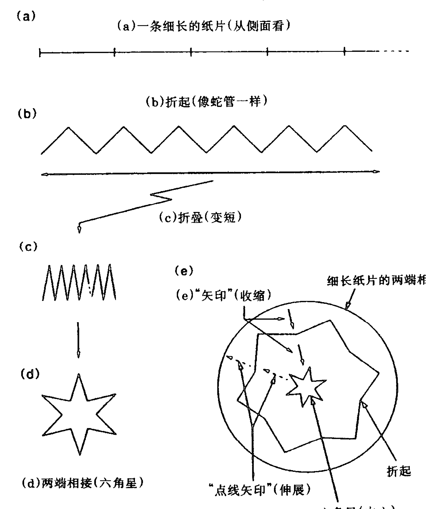

由“圆形蛇管”形成的“量子反应”的图形
引自东晃史《由“万能量子论”形成的“天国和地狱”的“结构”》
（图 12）

所谓天，是能量化的体现，其运行的方向为伸；所谓地，是质量化的体现，其运行的方向为缩。如图所示，把一条细长的纸片折叠起来，两头相接之后，就形成了一个状如海胆的圆圈模样。从这个圆圈，我们可以推想整个看得见的世界（三维的物质世界）的产生经过。最外侧圆为能量，当它收缩时，“具有质量的形态”便产生了。外侧圆包含真空空间的潜在压力，因而当它收缩以后，便形成能量，并从空间涌出，产生形态。

爱因斯坦提出 E=mc²，认为能量也好，质量（物质）也好都是相同之物的不同表现状态。E（能量）相当于上述的“伸展”，m（质量）相当于“收缩”。

现代科学坚持认为“从无不可能产生有”。但实际情况是：有是从无产生的。否则，就很难设想能不依赖化石燃料、核燃料便能获取能量。现代科学的量子力学认为，在微观世界的真空空间中不断有假想粒子显现而后又消失，反复进行能量的舞蹈。

> “电子不断地进行释放光子而后又吸收光子的运动。这些光子刚被观测到，又立刻消失了。这就是作为假想粒子的假想光子。……换言之，上述的现象就是，一个电子变成一个电子和一个光子，而后又复归为一个电子。这个现象违背了能量守恒定律。因为根据能量守恒定律，从无的状态中是不会产生任何东西的。但是，假如根据场的量子论，则从无的状态中是会产生出某物的……在基本粒子的层次上，从真空中是会产生出基本粒子的。”（摘自兹卡夫《活跃的物理学家们》）

在原子核的核子的中心附近也有这样的现象——π中子在反复进行突然产生又突然消失的运动。对此，量子力学认为，根据不确定性原理（后述），粒子运动有一个不能被精密测定到的上限，对这上限以上的状态，允许进行假想。基本粒子的产生即使没有来自外部的能量供给也能进行，这实际上并不违背能量守恒定律，——假如以原有的基本粒子的消失为代价的话。

但是，能量的发生源，是看上去一无所有的真空，真空中的潜在压力即能量的根源收缩之后，能量便涌出，并形成块——物质。假如明白了这一点，则一切难以说明的问题便可迎刃而解了。

东晃史的理论明确揭示了与现代宇宙观完全不同的宇宙图像。现代宇宙观只考虑单一的方向，即从过去向现在的时间流动。而东晃史的理论认为，时间的流动有两个相反的状态，即从过去到现在的觉醒状态和从未来到现在的逆方向的睡眠状态；这两个相反的时间流动，在现在干涉重合，从而形成意识、信息、生命。

接下来介绍一下美国的火箭工程学家、标量波理论创立者托马斯·潘艾丁对于标量潜在的论述。

> “纵波的重力波的标量潜在，是相互逆向流动的前方时间波（传统科学所考察的从过去向现在流动的波，即横波的电磁波、重力波）和时间反转波（与横波的电磁波流向相反的波，即纵波的标量电磁波、重力波）合二为一之物。它在空间上是同相位（是零，测定不到），在时间上，是 180° 相位错移。因此，作为疏密波的纵波是具有压力的。内藏着流向截然相反的波动、反波动秩序的（静电）标量潜在，贯通整个宇宙。在这种标量的中和电荷的集合体和宇宙所有的点之间，存在着隐蔽着的方向逆反的能量流。”

东晃史在论述圆的伸缩问题时，提到下位层次的圆是位于其上位层次的圆的圆周上的。这点十分重要。例如，原子的圆周上存在电子，原子核的圆周上存在质子。假如把原子作为一个圆，则其上位层次上的圆就是细胞。以此类推，于是在宇宙中，以 10⁵（10 万倍，或者是 10 万分之 1）为间隔，形成一个井然有序的大结构（详细内容后述）。这符合弗拉克塔尔原理即“无论大小事物其基本形状是相同的”。由从小到大的一系列漩涡形成了一个持续不断的螺旋，该螺旋的内部各层次的结构是相似的，这就是宇宙的本质。这个螺旋的内部层次和外部层次都是无限的，因此其边缘是无始无终的。

整个系统中相似的各个层次，反复进行类似被施以压力的蛇腹（旧式照相机上用以调节焦距的可自由伸缩的部分）的伸缩运动（伸与缩同时进行）。人类、地球以及万事万物就是这样在瞬间反复进行消失（伸展膨胀的方向），尔后又作为个体表现出来（收缩的方向）的运动。伸与缩是同时（等时）进行的。因此，在大多数人看来，只有物体存在而没有物体消失。

上页一张图中的（A），朝 Y 方向把人体、地球和宇宙的能量的伸和缩作为一个周期来表现，a 和 b 这两个周期表现在 X 方向上。在 X 的方向上，“t₁(+)、t₁(-)”和“t₂(+)、t₂(-)”对应地进行伸和缩。这里的 t₁(-)的时间带是“虚的时间”，我们只能认识“(+)即实的时间”。

再看图中的（B）。在常人的认识中，在 X 方向上，经过时间只是 t₁(+)和 t₂(+)的总和。在这里，（A）图中的 Y 方向的运动，即伸和缩的瞬间经过时间消失了。这就是现代科学的概念中不存在朝振动方向传播的纵波（见前面的电磁波图）的根本原因。因此，现代科学不能认识时间的本质。

再看（C）图。t₂(+)重叠在 t₁(+)上，因此只剩下地上的太郎的运动了，即只存在太郎的地上位置移动（距离）和太郎从 t₁ 到 t₂ 的经过时间的关系了。常人所感觉到的时间，就是这里所指的经过时间。

现代科学只观测到了“收缩”，但这“收缩”不过是东晃史理论中所论述的各个阶层瞬间（同时）进行的伸与缩当中的“缩”那一半。这就是现代科学只把三维的物质的“能见到的世界”作为研究对象的原因。那么，另外一半，即“伸”或者是“看不见的世界”存在的物理学上的根据是什么呢？其根据就是有四维（空间）构成要素的潜在压力，那是电气中性的标量的世界。

距今约 100 年前，天才的科学家尼古拉·特斯拉发现了从圆筒形的高压线圈即特斯拉线圈发出的能透过一切事物的不可思议的标量波即“特斯拉波”。特斯拉认为它是非物质的纵波的电磁波，是“存在于真空（以太）中的如音波那样的波”。而通常的具有长、宽、高矢量的矢量波是横波的“赫兹波”。

## 3. 作为全息摄影的宇宙图像

我认为大卫·包姆（David·Bohm）是 20 世纪最伟大的科学哲学家。包姆坚决反对作为现代科学巅峰的量子力学的如下观点：“微观世界的物质，其位置和运动量是不确定的（不确定性原理），现象只是概率的表现，是通过统计学的处理产生出来的。”他说：“在量子下（蕴含着三维的原型或铸型的四维空间即五维时空），有隐藏的变数。现象的产生是受决定论支配的（假如考察到量子下的层次，则一切现象的因果关系都变得明确了）。”

宇宙现象的铸型（即原型或雏型）以及希尔多莱克（Seh-ldrake）所说的生命体形成之场所是位于三维以上的层次的。三维现象（显前秩序）的表现顺序如下：

(1) 整体运动系统。它在每一瞬间影响时空整体。它是具有无限速度的塔基翁（超光速的基本粒子——译注）的世界。

(2) 潜在系统。其秩序不外露。它波及全空间，具有互相折叠浸透、互相包容的构造。这就是本书所说的“看不见的世界”，它位于四维空间，是具有超光速的纵波重力波、标量波的世界。

(3) 明在系统。显示之前的秩序。这就是现代科学所研究的世界，是三维的电磁波的世界，是以光速作为最高速度的世界。

整体运动系统和潜在系统都测定不到，是零的世界。但这并不意味着它什么也没有。相反，一切的东西都被它折叠包容。在那里，零表现为无限大。从性质上来看，它是“中性”的世界。只有深入考察“中性”和“零”，才能解开特异现象之谜。

还有一个解开特异现象之谜的钥匙。它是加拿大大脑神经科医生卡尔·普里布拉姆和物理学家大卫·包姆提出的全息摄影理论。1947年，迪尼斯·卡波阿发现了全息图。通过从一束相干性极好的激光束分离出来的一束参考光速和一束被摄物体上的反射光束，在感光胶片上叠加而产生的干涉现象，不但能记录被摄物体的反射光波强度（振幅），而且还能记录反射光波的位相。感光胶片上记录的干涉图样极为错综复杂，这种图样称为全息图。当再用一束激光（或单色光）照射全息图时，可以透过全息图看到原物体的具有立体感的形象（三维映像或虚像）。并且，通过全息图上的任何一个小的断片，也能够看出原物体的整体的映像。参考光射上二维的全息图的表面后，三维的虚像映现出来，这表明四维世界的内藏秩序显现了。

任何一个部分都包含着整体的信息，这与原苏联的科学家提出的一个观点完全一致，即“微观世界任何一个粒子，都蕴含着宇宙整体的信息。”并且，“与人类的思维相连接”的提法，也启发我们，从气、生命到精神，是在按顺序提高层次（维）的过程中，不间断地与四维的标量波相沟通（详细说明见后述）的。

美国的克里斯多弗·海尔兹说：“可见光深处的根源能量是宇宙意识。光和意识是同一事物的两个侧面，在根源上是一体的。光表现的作用是创造活动，意识表现的作用是以其意志力规定创造活动的方向。两者在根源上是一个东西，它们相互关连而又表现各自的作用。”

包姆认为，被记录在一张全息图表面的干涉图像，从肉眼看，是杂乱而无秩序的，但是其中却隐藏包容着井井有条的秩序。深处实体的存在有待科学的新发现来证实。可以说，“量子下（三维量子力学层次以上的层次）”的现实是存在着的。

包姆于 1952 年又提出了名为“量子潜在”的场的概念。量子潜在浸透所有的空间，它不像重力场和电磁场那样，在传播中与距离的自乘成反比而衰减，它不论在何处，都具有相同的强度。在量子潜力起作用的层次上，所谓“特定场所”这一个实体已经不存在了。空间的所有点联为一体，“某个东西和另一个东西分别存在”这样的思考方式已经没有任何意义了。就是说，它具有“非局部性”的特点。量子潜在反映的就是四维空间以上的、中性的、看不见的世界的状态。

三维世界的现象，全部是 A 和非 A 这样互相独立或互相对立的存在，物质不能共有一点，所以三维世界的现象都是“局部性”的现象。而“非局部性”现象是四维以上的无质量（非物质）层次的现象。现代科学的量子论因分不清“局部性”和“非局部性”的区别而导致一系列的混乱和矛盾。现代科学无视维或层次的差别，只注意三维并以此为前提来开展工作。

可能有人认为，只有用电磁波才能制出全息图。但实际上用纵波的重力波也能够制出全息图。重力波不像电磁波那样，遇到物体后被吸收和反射，而是能透过一切物体，所以一切屏蔽对它都不起作用。铅板也好，厚的水泥壁也好，甚至海水、地壳，它都能顺畅地贯通，不会导致自身强度的衰减。并且，如爱因斯坦观测水星近日点的移动而得出的结论那样，电磁波和重力波的速度都与光速相同。在前一章介绍布利尔能量时我曾写道：利用布利尔能量能听到敌机中敌方人员的谈话，也能使敌方人员听到我方发出的声音，还能探知敌机内部的景象。这实际上是可能做到的。从两个位置分别射出一条重力波，一条透过物体（由此，发生弯曲），另外一条作为参考波直接射向物体，这样，两条重力波的叠加干涉便使重力波全息图形成了。于是，上述的情况便能发生了。

## 4. 能量从真空涌出

瓦鲁达玛尔·瓦莱里安在其著作《矩阵 Ⅲ》（广域科学研究所编）中介绍说“电磁气学有三个层次”。

(1) 第一层次的电磁气学，是关于“现实”的电磁场和赫兹波的学说。该学说中的电磁波以光速 C 前进，属域内（in domain）波（封闭系统的波）。被认为是现代科学中的电磁场的唯一性质。关数为 1/r²（强度与距离的平方成反比而衰减）。

(2) 第二层次的电磁气学，是关于“虚数”乃至高维空间的电磁场的学说。该学说中的电磁波为域外（out domain）波（开放系统的波）。它是潜在波，故不表现于三维世界（测定不到，是零的状态）。它没有电压、电力、波长，它是以超光速前进的非赫兹波（特斯拉波），是纵波乃至标量波。关数为 1/r（与距离成正比而衰减），是包姆所说的“量子潜在”。

(3) 第三层次的电磁气学，是关于高维空间的潜在电磁波总和的学说。该学说中的电磁波在每一瞬间同时影响时空连续体的整体。它是相对的时间——应力波，其速度是无限的，没有波长。它被叫做波粒子、中微子波、塔基翁波、塔基翁·坦骚尔场等等。

(1) 就是现代科学中的电磁气学，其研究的范围在四维时空（三维空间加一维时间）或显在系统；(2) 就是此后要详细论述的标量波理论，其研究的范围在五维时空，即三维空间加上潜在压力和一维时间，这就是具有包姆所论述的潜在系统、内藏秩序的电磁气学。(3) 可以说是六维或更高维时空的电磁气学，但这样说还不够，它应该是具有包姆所说的整体运动和无限速度的塔基翁世界的电磁气学。

在本书中，我主要想论述一下(2)，即标量波理论，并以此来阐明特异现象产生的机制。标量波理论，是美国著名的火箭工程学家、美国尼古拉·特斯拉协会的理论权威托马斯·潘艾丁倡导的理论。我初次接触这个理论，是在 1986 年。我读了那年出版的一本介绍该理论的书《Fer de Lance》。“Fer de Lance”是法语，其意思是“扎枪之刃”，它是生长在南美的一种体型巨大而动作敏捷又具有致命毒性的蛇的别名。这种蛇平时总是潜伏着，一旦有猎物出现，便出其不意地窜出，将猎物击倒。潘艾丁说，原苏联研制的标量电磁武器，其出击的方式与这种蛇捕获猎物的方式十分相似。

对“标量波”这一个提法，有的科学家有不同的意见，他们认为，“凡是波都是应该有速度和方向性的，所以波是矢量；而标量是无矢量，所以‘标量波’的提法不妥，应该叫‘标量场’。”对此，我的看法如下：

- (1) 所谓标量波，是三维电磁波的矢量要素全部中和后形成的状态，是零的状态，它是作为零矢量波而被包容在四维空间（五维时空）的潜在系统中的重力潜在压力。它内含静电标量潜在和磁气矢量潜在，它是存在于真空空间的压力。就是说“标量波”可以叫做“标量压”吧！

- (2) 潘艾丁把“标量波”叫做特斯拉·标量电磁波、标量电气重力波、零矢量电磁波、特斯拉波。包姆把“标量波”叫做量子潜在。这些说法在字面上不同，但其含义都是同一的。

- (3) 这个波，根本不是通过发射机器和目标之间的空间，来输送物质和能量的；而是使时空自体构造中的图案和图形，在遥远目标所在的局部时空会合、干涉、共振，以此使物质和能量产生。

- (4) 所谓标量波，是一种无方向性的纯粹的应力波，它是在用人工的手段，使两条标量波在遥远的地方交合（干涉），产生非线形效果（即混沌，后述），并使其各自的电场和磁场的活动实现同步的情况下产生的。

- (5) 这不是以通常的电磁力线的形式通过空间输送能量的现象，而是以电气重力潜在的形式，使时空自体传送、干扰、共振的现象。这里说的时空不是四维时空（三维时空），而是五维时空。空间第四维的要素是重力潜在。

图 14①表示的是通常的电磁波形成的横波的干涉。在这里，频率相同的两条波垂直相交，互相干涉，以此产生零矢量。这些波，被认为是传统科学所指的真空中的横波。潘艾丁说，这个认识只对了一半，因为它忽略了从零矢量产生的纵波的重力波。

图 14②与图 14①相反，它表示的是纵波的标量波的干涉。这些波是在干涉领域内，垂直相交进行干涉的单一频率的标量波。这些波是零矢量电磁场中的能量，所以没有任何力场和振幅。它们是纯粹的潜在压力的波。

被折入标量中的矢量的各个要素被中和，标量波因零矢量的同一构造性而形成。通过标量波的干涉，可直接在遥远的场所，再生产出非零状态的通常的三维电磁能量。

标量波内含着四维的重力潜在，三维的长、宽、高等矢量要素成为零，变为压力而存在。假如通过标量波的干涉，改变零和当中的诸要素，使其产生非线形的话（假如晃动空间，使其失去原有的平衡的话），则内含的压力就被释放出来，能量便从真空的空间涌出了。

力和能量不是现象产生的根本原因，相反，它们不过是现象产生的结果。为了使能量涌出，有必要使四维空间的潜在发生倾斜（高低不平）。这种现象不是物质之间的作用、反作用造成的，而是空间之间，或者是空间与物质之间的作用和联系造成的。

两束标量波的干涉，能使看上去一无所有的真空的空间涌出能量，这正是一种“无中生有”的现象。这也是由“从潜在大向潜在小的倾斜”造成的。因此，假如把倾斜的方向颠倒一下的话，即变为“从潜在小向潜在大”的话，则“把能量消灭在空间”也是能够办到的。倘若通过人工的手段能够做到使能量从真空涌出和使能量消失在真空的话，则我们就能随意地获取来自空间的自由能量，也能随意地使各种垃圾及核废料消失在真空。本书一开始介绍的标量波发生装置，就是原苏联为此目的而研制的。

力（能量）如牛顿第二运动规律所表述的那样，其定义为，是反抗因“质量×速度”而产生的力，它能够活动物体。把一个球向上抛出，因重力的作用，球的加速度逐渐变慢，不久停止在一点，随即向下坠落。对此，现代科学认识为，球向下坠落，是“因为重力的作用，球的定位能量进行了工作。”但是，我认为可以这样来考虑：被抛往空中的球停止，是因为能量在空间消失；当它向下坠落时，能量又从空间产生了。

这种来自空间的能量发生和消灭的现象违背了现代科学的“能量守恒定律”。传统的科学常识认为，既不能从空间取出能量，也不能使能量消失在空间。但是，量子力学认为，在微观的世界中，假想粒子会突然从“无”的状态中发生而后又归于“无”。这种能量的舞蹈是在反复进行中的。这也是与能量守恒定律相违背的。

关于这一点，潘艾丁提出统一能量（anenergy）的守恒定律。他认为该定律不仅适用三维的物质世界，也适用四维的看不见的世界。爱因斯坦提出 E=mc²，认为能量和质量能相互转换。潘艾丁进一步认为不仅能把质量转换为能量，而且还能把质量转换为统一能量（四维空间的无质量的标量电荷），还可把能量转换为质量和统一能量，把统一能量转换为质量和能量。

因此，可以把所有的东西转换为纯粹的真空，也可以把真空的一部分转换为能量和质量。在不考虑发生源（真空）的时候，三维的能量和电荷的守恒定律是可以成立的。但是，假如把发生源即四维的空间（五维时空）也考虑进来的话，则三维的能量守恒定律就站不住脚了。这时就需要确立统一能量的守恒定律了。

这表明，不是“物质具有能量”，而是力和能量从空间涌出，在空间消失。能量和力在四维空间（虚的世界）形成的漩涡，通过维的转换点即零点，作为其自身的反作用，表现于三维。一切现象的根源在四维空间。

## 5. 原子放射的反重力、标量波

下面来探讨一下纵波的重力波、标量波产生的机制吧。其产生的源泉在原子当中。只要有原子存在的地方就有重力，并且重力是同原子核的粒子数成正比而产生的。在物质世界当中，能量产生于作用于物体的力“物质×加速度”，即原子及其运动。在原子的空间，原子核的质子在一秒之间，自转 $10^{23}$ 次，公转 $10^{15}$ 次，电子在一秒之间自转 $10^{20}$ 次，公转 $10^{15}$ 次（计算方法后述）。即都以无法想象的高速在进行旋转（螺旋）运动和热运动。但是，从原子当中，不会产生能量和热。对此，通常科学的解释为：“正的质子和负的电子中和，能量被抵消。”下面介绍一下我对此现象的看法。只要能量守恒定律是存在的，只要能量是不灭的，通过中和被抵消的能量就应该是去了某处的。那么去了哪里了呢？我认为，能量在三维世界消失了，但它实际上是去到四维世界，被“变换”为四维的标量电磁波（纵波的重力波或标量波），然后又以某种契机，被放射到原子空间。本章第二节介绍的东晃史理论中所指的与“收缩”同时进行的“膨胀的伸展”就是能量进入四维世界的状态。

放射出重力波的那一部分的原子空间变得稀薄了，于是，“宇宙的平衡法则”起作用了，旨在填补那稀薄部分的来自宇宙整体的作用（吸引力）产生了，这就是重力。因此，假如把原子空间作为背景来考虑问题的话，则可以这样说，通过质子（+）和电子（-）的中和，作为被变换为四维的中性的潜在的排斥力（反重力）产生并放射，于是，旨在填补因排斥力被放射而变得稀薄的原子空间的吸引力产生了，这就是重力的本质。其物理学的根据是，从本章开头所附的那张电磁波图（图 11）当中，我们能清楚地看到，无三维振动成分的波的振动方向上存在着标量的纵波。

作为物理现象的纵波重力波的存在证据，潘艾丁认为是1959年披露的“阿哈拉诺夫·包姆效果（AB 效果）”。这种效果表现为：从空间的弯曲和歪斜中能产生力场。据认为，在量子力学中，这种效果与作为真正实体的“潜在”发生关系。

传统的科学认为，“在没有电气力线和磁力线的空间，不存在电磁气现象。”但是，阿哈拉诺夫和包姆却认为，“在接近有磁力线之处的空间，即使那里没有磁力线，也具有某种物理的特性。”对此，日立中央研究所的外村彰进行了严密的观测实验，结果证明这个现象是确实存在的。

把电子枪发出的电子一分为二，其中一束通过内径为3微米的环圈，另一束被阻隔。在实验中，干扰波纹错位的现象发生了。在环圈当中不存在电气力线和磁力线。这表明有未知的力在起作用。

世界上不少的学者都认为：“磁气的矢量潜在的存在得到了证明”。潘艾丁说：“假如存在零矢量的电磁场的话，则潜在就能在静止的状态下存在，实际的物理效果就会（在荷电粒子系统）发生。”

木下清宣氏认为，在 AB 效果中，电子线的干涉波纹产生错位，其根本原因是存在重力潜在。我也持同样的观点。就是说，干涉条纹产生错位，是环圈空间中的电子的速度发生变化的结果。改变电子速度的力，既不是静电力（因为没有电场），也不是静磁力（因为没有磁场）。在宇宙中，余下的能对电子的质量起作用的力，只有重力了。

有一个使电子加速的场。我认为这个场产生的原因是：环状磁铁空穴中的重力潜在发生变化，压力明显降低，于是，当电子通过时，重力潜在发生倾斜，产生重力场，使电子加速。当电子通过那一段空穴之后，速度复原。因此，只是在通过那段空穴的时刻，电子的速度加快了，产生了前述的干涉条纹错位的现象。

具有质量、由原子构成、在其原子中质子和电子（或中性子）进行热振动（螺旋运动）的物体，放射出在三维的测定中观测不到的标量电磁波、纵波的重力波。只要原子存在，这种放射就瞬时地不休止地持续进行。其原因如次：在放射的同时，只要那个物质（原子）存在，则来自宇宙整体的旨在填补放射后变得稀薄的原子空间的重力（吸引力），就源源不断而来。

假如从物质之间的相互作用来看的话，则来自物体 A 的原子空间的放射，从物体 B 的角度来看，实际上是一种吸引作用。这一点，不管是纵波的场合，还是横波的场合，在接受放射的一侧来看，放射都是吸引作用。因此，假如不把发生源考虑进来的话，则重力和重力波只能被视为吸引作用。只有把发生源也考虑进来，才能真正搞清重力和重力波的本质。

推，拉，摇晃，于是，质量被振动了，由此重力场产生，并与电磁波一样，以光速传播。这种在振动中传播的波就是重力波。

吸引（收缩，重力）和与吸引同时发生的排斥（膨胀，反重力）只是在维的层次上存在差别，而作为以原子为背景的存在，几乎是一模一样的。波长和波形完全相同的电磁波中和之后，被变换为中性的标量的电磁波（零矢量的标量波），这种中性的标量的电磁波作为潜在·压力存在于四维空间。

这就是从物理的角度来看的阿卡希克记录的实体。它恐怕是作为全息图的干涉图像而被折叠包容在四维空间吧。当它再次被开发，显现在三维空间时，则呈现出与被包容前丝毫不差的物质现象。人类的分身确实是存在的。

我们经常说有粒子必有反粒子，有正宇宙必有反宇宙，有实必有虚。但如果仅从三维的角度对此探索，则将一事无成。在谈论重力的时候，假如只考虑吸引作用即收缩作用的话，则宇宙（宏观世界）、原子（微观世界）都将不复存在。因为假如只有吸引作用的话，则宇宙的一切就会在瞬时崩溃，整个宇宙成为一个大黑洞。

伸展和收缩的接触点是零点。三维的正物质之所以能存在，与其说是因为受到位于四维的旋转方向与正物质相反的反物质的支撑，不如说是因为受到潜在·压力的支撑。

## 6. 不靠石油、核燃料等便能获取能量的理论

现代科学认为是不可能发生的一些现象实际上是可能存在的，我想从理论的高度对这些现象作一些说明，顺便对迄今为止我所介绍的观点作一归纳。首先看一下俄国方面对于未知能量发生装置的见解吧。

- (1) 该系统控制物理真空的信息。能量结构，使其产生共振。
- (2) 该系统的理论基础是包姆和普里布拉姆的全息摄影理论。在宇宙中，能给他物以影响的物质、意识（魂）都具有全息图那样的结构。在宇宙中，存在着由无数单个的魂（作为人类的脑和单个主体的存在）的干涉波形成的场。
- (3) 通常的量子力学的法则所适用的微观世界的范围，是到 10^23 厘米为止。普朗克长为 10^33 厘米。有关宇宙的所有信息都被包含在每 1 立方厘米密度为 10^94 克的超微小的场（涡卷）中。
- (4) 宇宙的（超）星座是沿正六面体分布的，这是以黄金比为基础的。从星座到原子、基本粒子都是以黄金比的形态存在的，所以构造都是相同的，这就叫弗拉克塔尔原理，即大东西小东西形态都是相同的。

超能力发生装置就是根据弗拉克塔尔原理研制的。

- (5) 该装置的基本构造如次：把 12 个激光发生器等距离地按一个圆形排列放置，圆形中央安放一个传感器，12 个激光发生器同时向中心发射激光，于是，真空被激起，产生出相关的（相位、方向性一致）的纵波的重力波。

图 15 所示的是弗朗克·阿鲁巴所著《阿特兰提斯》（相传是远古时大西洋上的一块乐土，公元前 9500 年受到神罚而沉于大西洋底 —— 译注）中介绍的阿特兰提斯人使用的最有效的治病装置。12 块水晶排成一个圆形，上面写有数字的代表男性，上面写有字母的代表女性。据说由这个装置产生的能量非常强大，对治疗各种疾病都有效。俄国超能力发生装置与此装置形态相同。

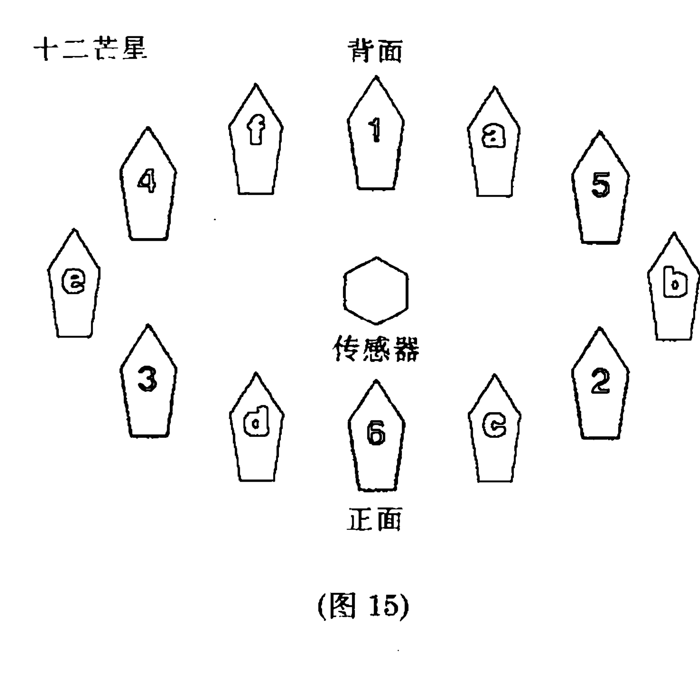

- (6) 具有放射能的相位一致的共振场被组织起来后，电磁波流便形成了。假如使用激光来激起空间的话，则因光的频率，电子活动起来，往复电流形成了，结果产生了频率相当于光的两倍的重力波。

据说，从激光发生器一端发出的光是紫色的，从另一端发出的光是绿色的。这与在弗拉迪尔弗阿实验过程中出现的遮蔽移动着的军舰的烟雾的颜色是一样的。还有，它与 UFO 的颜色变化也十分酷似。

- (7) 这样，在根据几何学原理配置的装置的空间中出现扰乱（摇动），其结果是装置所在空间中的重力发生变化，放射出不可将其屏蔽的能量。
- (8) 通过超强力的能量和信息的相互干涉，信息、能量、质量产生了变化。人类有可能制造出由相位一致的格子状系统形成的收发报的通讯系统。该通讯系统可在现今的地球广播通信带的界限以外发生作用，距离的远近对它不产生影响，其保密性和防干扰能力很强，它实际上是通过异维的空间（五维时空）起作用的。
- (9) 这个通讯系统，是通过与具有电子物理特性的硅及其他物质的单结晶的联系而起作用的。
- (10) 以上所述的系统，不需要来自外界的一切的能量供给，原因是它始终被接续在“标准发电机”上。

上述的事实，假如没有标量波理论，则是难以说明的。这些事实实际上就是标量波理论的外在表现。有人可能会怀疑这些事实的真实性，这并不奇怪；但我要说这些事实是确实存在的。下面，重申几个基本观点：

- (1) 不需石油、核燃料等便能获取能量。这是因为可以人工制造出几何学的系统，用它来晃动真空，从而使能量从真空涌出。
- (2) 不经由电话网络和卫星可以进行通信，而且这种通讯不受任何屏蔽的影响。这是因为该通讯是通过重力波进行的。普通的电波不能通过水层、地层等物质的屏蔽，因为后者会对它进行吸收或反射。电视电波，如果光靠各个频道的弱电源，是不能被送达到远方的；所以电视台必须发出高频的搬送波，以便把各频道的信息作为变调波送出去。假如把来自电源的重力波作为搬送波来利用，就可进行不受任何屏蔽影响的通讯了。
- (3) 假如把水晶状的重力波微电源代替家庭的电源插座，就可不用普通电源而启动家用电器了。
- (4) 反重力的作用，实际上就是标量波、纵波的重力波的作用。反重力起作用时，无规则可言，与重力互相抵消，不成为力了。但是，假如相位一致，连贯运行的话，则可能产生种种不可思议的现象。气、超能力的机制可从反重力着手来加以探讨。
- (5) 能妥善地处理掉核废料和其他垃圾。这是因为通过“使潜在·压力发生倾斜（高低）”，便能使能量从真空涌出。既然如此，那么，假如使潜在·压力的倾斜方向反一下的话，则物质的消失是可能出现的。
- (6) 应用于医疗领域的生命层次的气和 Psi 能量，进一步还有精神层次的能量，实际上是与物理层次的标量波能量相联系的，或者说是处于后者的延长线上的。这些能量具有与电磁能量不同的属性，即能透过一切事物，屏蔽对它不起作用；属电气的中性，能进行远距离操作（通过共振）；能用意识进行控制（这不如说是其产生的必要条件）等等。这些将在后面的章节里详加论述。

如果能人为地制造出重力波和重力波全息图的话，则布利尔能量的生成是完全可能的。重力波能透过一切事物，所以能利用重力波把敌机内的物体、声音制成全息图，通过计算机的处理，使之映现在我方的电视屏幕上。一切东西都在进行振动，都具有频率。只要有频率，重力波就能够起作用。

潘艾丁警告说，原苏联已经研制出标量波电磁武器，该武器射出两束标量波，两束标量波相互干涉，在特定的空间造成大爆炸。对此，西方不少科学家不屑一顾，认为这是不可信的。但是原苏联的首脑赫鲁晓夫、勃烈日涅夫，还有俄国现在的自民党领袖日里诺夫斯基都曾言之凿凿地说过：“俄国拥有比核武器威力更大的、能在一瞬间毁灭整个西欧的秘密武器。”

这个秘密武器的制造原理是以标量波理论为基础的。据说，这种秘密武器（未知能量发生装置）是从 1981 年开始进行研制的。但是实际上，在赫鲁晓夫时代的 1960 年 5 月苏联空军已经配备了这种武器，并用它击落了美国的高空 U-2 侦察机。这是潘艾丁的说法。

标量波电磁技术是一把双刃之剑，既可以应用它来制造兵器，使整个人类面临绝灭的灾难；也可用它来谋求人类的幸福和世界的和平。

潘艾丁说，在美国，标量波检测器已在实验室里被研制出来。其构造如次：

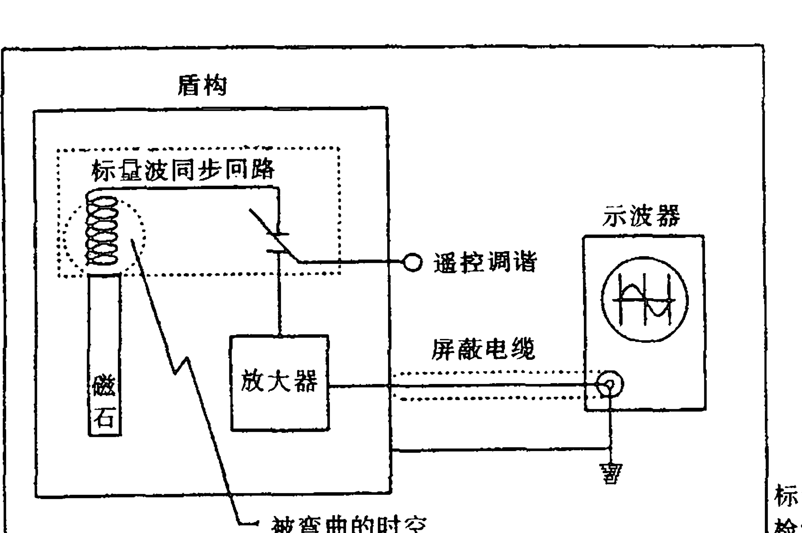

引自托马斯·潘艾丁的《Fer de Lance（扎枪之刃）》（图 16）

把一根磁力极强的磁棒竖着安装在电磁波被屏蔽的法拉第压力计箱中。然后，把一个一端开放的线圈竖着安装在磁棒的上端，使磁棒的纵轴线与线圈的纵轴线对齐。不要使线圈的开放一端与磁棒相接触。

线圈的另一端与一个可变同步电容器相接。这样一来，线圈和电容器就构成了一个可能同步的串联 LC 共振线路。其产生的波形能通过示波器观测到。

电磁波被完全屏蔽在外，因此，被观测到的，就是纵波的重力波。在磁棒的极上，局部的空间产生弯曲，所以被观测到的，是纵波中边旋转边进退振动着笔直前行的成分。

## 7. 宇宙是一个按黄金分割比形成的螺旋构造

在大千世界中，万物纷呈，姿态各异。但异中有同，有贯通于万物的朴素而简单的构造。例如，我们可以这样问，龟类的甲壳和蜂巢为什么都呈六角形状？原苏联的科学家为什么提出大至宇宙，小至基本粒子都具六面体构造？拉依希制作的奥尔孔收集器为什么是一个六面体的箱子？下面参照高桥励所著《探讨“形状”中蕴含着的惊异能量》（刊载于《能量天地》第 12 期）一文的观点，考察一下形状、能量和力之间的关系。

力产生出形状，但形状本身并不产生力。所谓“蕴含能量的形状”，是指具有能吸取空间中能量之功能的形状，以及可作为帮助人们取得能量的媒体的形状。

根据高桥的观点，三维的物理世界是依照以正六角形为中心的“六芒星原理”形成的，四维以上的多维空间（例如包姆所谓的潜在系统、看不见的世界）是依照以五角形为中心的“五芒星原理”形成的。六芒星原理产生出三维的结晶构造；五芒星原理产生出螺旋状地进行弯曲起伏的构造，宇宙中的所有事物，无论大小都具有这种构造，并通过这种构造相互关联，进行无限的进化发展。当“五芒星原理”和“六芒星原理”相接触，并相互发生作用的时候，事物的形状便表现出来。

就是说，当在三维的无（实际上是一切东西溶化、一体化那样的饱满的状态）的状态中成长起来的“意识”开始运作，“螺旋状弯曲起伏的形体产生的场所”形成的时候，“形状”便显现了。

先来探讨一下产生喝和螺旋构造的五芒星原理吧。支配这个正五角形的法则是“黄金分割比”。“黄金分割比”能显示生物个体中细胞分裂增殖的比率。“黄金分割比”的这个作用是 13 世纪意大利比萨的数学家 L·菲薄纳奇（Fibonacci, Leonardo 1170～1250）发现的。这个数 ∅ 是 x²－x－1＝0 的正数解 1＋√5/2 ≒ 1.618，“黄金分割比”就是 1 比 1.618。宽和长的比率分别为 1 和 1.618 的长方形叫做“黄金矩形”。在这个矩形当中，像套匣似的，显现出一大一小两个正方形和一个 1 比 0.618 的小的黄金矩形。这就叫做“黄金分割”，它可以持续到无限小，形状始终是相同的。

假如沿着黄金矩形中的正方形的对角线画出曲线的话，则状似鹦鹉螺的对数螺旋便显现出来了。这个黄金分割比的形态可以从欧洲不少的建筑物以及绘画、雕刻中看出。自然界台风的旋涡以及动植物成长中的一些状态，都与黄金分割比的形态相契合。反复进行扩张、收缩的勃勃有生气的能量现象全都呈现黄金分割比的形态——螺旋构造。

在五芒星正中有一个正五角形，若连接其对角线，则又会有一小的五芒星显现。毕达哥拉斯派和共济会把五芒星作为“神圣形态”的象征。柏拉图把由正五角形的面构成的正十二面体命名为“神的立体”。开普勒（kepler）认为地球的运行轨道是内接一个正十二面体的。

受黄金分割比支配的正多面体是正二十面体（这是无间隙地完全填没三维空间的立体）。假如从侧面来看它的话，它呈正六角形，但假如从上方来看它的话，则它呈正十角形，但在正十角形中显现出一个正五角形。这表明，表现于三维空间的彼此孤立存在的各个个体，实际上是在整体上相互关连的多维空间的要素。

这就是说在三维空间看似没有联系的各个形态，实际上是相互紧密（内在地）关连着的，将它们联系起来的高维的时空场是确实存在的。这也就是物质的粒子性和波动性为何能互补地同时存在的根本原因。

为了使水、石和其他物体吸收四维能量，必须激起它们之中的基于五芒星原理形成的涡和螺旋。五芒星本身就是一个涡。在宇宙之中，形状相同的涡，大大小小，无限相连。这意味着上升的能量与下降的能量是同时存在着的。通过五芒星原理，能控制这个上升、下降（东晃史理论中所提到的伸展和收缩，即伸展的重力波和收缩的重力与此对应）的能量。还有，根据六芒星原理，左转上升的能量的出发点，同时又是右转下降的能量的接受器。在万物中，这两个方向的能量流，经常是同时存在着的。

离心的（伸展）运动和求心的（收缩）运动，都是呈放射状的，它们使扩展膨胀的螺旋和缩小收敛的螺旋重叠。于是，森罗万象（密宗所谓的大日如来）表现出来。

世界上的所有事物和现象都被包含在这个无限小的终极的一点（实际上是作为零点的超无限小）中。这个点活动之后，就像一捆卷轴书画不断展开一样，万事万物一个接一个表现出来。这就是全息图的每个部分为何包含整体的真正原因。图中大圆原理的球显示了从中心的一点表现出来的全部宇宙现象。使结晶构造那样的三维空间得以纯化的形态（六芒星原理）和表现与此对应并重叠的黄金分割比的作用（五芒星原理）就是宇宙的全部。

密宗也称万物是大日如来的表现，一切都与一相联系；认为黄金分割比使万事万物不论大小都呈相同的形态。意识也好，物质也好，全部都是从潜在系统展开并出现的。

真言（曼陀罗）形成声音的形态，手印（特定的手指摆放法）形成身体的形态，意识形成被形象化的形态。假如把这三种形态结合起来，便可使看不见的世界产生由黄金分割比构成的涡漩。这个终极的形态在深层意识上结晶化，不久就显现于现象界。这就是萨依巴巴（印度的特异功能者 —— 译注）之所以能创造种种奇迹的真正的根本原因。

六芒星原理，基本上是“横向展开的”。它与本章开始所载的电磁波图中的作为横波的电波、磁波相对应。而朝波的振动方向（现代的科学认为这是不存在的）展开的纵波，是一边反复进行伸缩一边描出两重螺旋而前行的。很明显，它与四维的五芒星原理相对应。

由五芒星形成的涡和螺旋，上下无限延伸，一直与终极的一点（零点）相连。所谓终极的一点是指：小到超无限小的如原子核中心那样的零点，大到超无限大的大宇宙（这还不如说是宇宙的根源）。表现这终极的一点的是大圆原理中的球形和点。

关于上升和下降的能量的产生机制，还想补充一点。我曾在重力假说中指出过，在原子空间，正（质子）和负（电子）中和，变换为中性的能量后被放射（上升）；与此同时，作为旨在填补那因放射而变得稀薄的原子空间的来自全宇宙的吸引力（下降）的重力产生了。

原苏联科学家曾利用标量波发生装置使花瓶消失。具体过程如次：启动装置以后，花瓶开始上下颠动并开始扭曲，变小（与从三维转化到四维的漩涡同步），成为一点以后消失。这是物质消失于空间。物质也能从空间涌出。万物无不是从空间产生或消失的。

圆的中心的终极一点、零点，在易学中早已被提及。在中国古代的老庄宇宙论中，具有如下朴素的思想：“从无生气，从气生形态，从形态生生命。”这里的无就是零（无极）或一（太极），气是二（两仪、阴阳），形态是四（四象）、生命的范围是从八（八卦）到六十四（六十四卦）。

我把它换一种说法，是这样：无即一、大圆原理，气即二、五芒星原理，形态即四、六芒星原理，形态进一步发展、进化，渐趋复杂化，最终产生生命。在这里，应该引起注意的是，气的世界是“看不见的世界”，在那儿不会产生物质现象。在那儿即使有形态（实体是波粒子）和大小相同而旋转方向相反的正、负因子，也不会形成作为物质最小构成物的原子的。这是因为缺乏一个中心点。即使真有什么发生了，也是要归为死灭，如同阴阳电子对的结对消失。

对于物质现象的产生，四象是必要的。阴（==）阳（=）学说中的所谓四象是=、=、==、==。除了第一个全阳和第四个全阴以外，当中的两个是阴阳交叉结合，互换重叠，形成麦比乌斯（mebious）圈（立体的两重螺旋体）。在原子的场合它是原子核，其中心成为终极的一点，是比中性芯更进一步的中心零点。阳电子被中性芯所吸附，成为原子核、质子，电子在其周围旋转。这就是原子的构造。

中性芯这一点正是基于五芒星原理形成的漩涡的出入口，是三维与四维、五维……以及更高维的交汇之处。这个交汇全都是纵波的交汇。在台风的中心有台风眼（无风的状态），它是中性的。所有的涡状构造，即从基本粒子、原子到宇宙万物，全都具有中性芯，通过这个中心的终极一点，三维之物与四维以上的高维得以沟通交汇。

具有六芒星原理特征的横波，在扩展时，与距离的自乘成反比而衰减，起熵增大（从有序变为无序）的作用。与此相反，具有五芒星原理特征的纵波，依据黄金分割比运作，与大小无关，永远地记忆原型，起熵减少的作用，即从无序（不如说是潜在状态）产生有序。

原子既是下降能量的接收器，又是上升能量的发生源。在其内部，基本粒子数完全一样、质量、波长、波形完全一致的重力和重力波（标量波）结对发生。这意味着与三维世界一模一样的四维以上的高维世界（它实际上是现象世界的铸型、原型）存在于“看不见的宇宙”中。这确实是自古相传的阿卡希克记录的物理学上的根据。在宇宙中，所有曾经发生过的现象和事变，其信息全被保存在高维空间。当然，在高维空间也存在有我们人类的“分身”。

水晶、金字塔和水也是依据黄金分割比而形成其构造的。例如金字塔，其斜面的倾斜角为 51 度 50 分。假如把从金字塔的中心到外周的长度作为 1 的话，则其斜边的长度就是 Ø（1.618），高度为 √φ（1.272），形成完全受制于黄金分割比的直角三角形。

水分子的间角是 104 度 30 分。这是以 O（氧）为顶点，以两个 H（氢）的约 52 度 × 2 的 104 度为间角的三角形。从 O到各个 H 是 Ø，两个 H 间的距离是 1+1=2。人体三分之二以上是水。具有黄金分割比的水分子，通过螺旋从高维吸取能量。水晶的结晶构造也是依据黄金分割比形成。这表明宇宙万物的产生都与弗拉克塔尔原理（宇宙万物，无论大小均呈相同形态）相符。此外，水的分子间角比 51 度 50 分 ×2=103 度 40 分大 50 分，由此可以推定在原子核的中子 β 崩溃的时候，有很少一点质量因崩溃而缺损了；相反，在结合的时候，会出现若干能量增加的现象。

水之类的分子是通过化合形成的。化合现象是数值仅存极小差异的波干涉，产生“念波”后出现的。化合现象蕴含着更为复杂的万物构成的原理。这种若干角度的不同启示了此事。

万物增殖的比例，据说是由菲薄纳奇（意大利数学家）数列决定的。所谓菲薄纳奇数列，就是如零、一、一、二、三、五、八、十三、二十一、三十四那样，一个数加上紧随其后的一个数（连续进行）所形成的数字排列（0+1=1，1+1=2，1+2=3，……）。并且，假如把相邻的两个数相除，则数字愈是大，则商愈是接近黄金分割比 1.618（如 34÷21=1.618，21÷13=1.616）。

从上文可知，这个数列的出发点是零，因此我们可以说，零是万物创造的关键。万物从最初的零涌出、展现。这表明，依据黄金分割比形成的螺旋从四维出发，通过零点，在六芒星原理的控制下涌出，显现在三维空间。

泰勒斯（Thales，公元前 640～546，古希腊自然哲学的创始人 —— 译注）说过：“万物是水。”确实如此。例如人体三分之二以上是水。当水处于自然状态时，其构成是严格体现黄金分割比的。所以，当一个人处于自然、健康状态的时候，即使自己没有有意识地想要获取能量，宇宙能量也会通过严格体现黄金分割比的涡和螺旋，不断地流入体内。

所谓疾病，就是在体内的水的构造不再体现黄金比时出现的状态。在这种状态下，螺旋不能沟通宇宙能量。这种状态的产生多数与人工的、机械的做法有关。自然原本是厌恶机械的东西的。通过微妙的千分之一的晃动，我们能感受到美妙的音乐、心跳、微风等等的韵律。我们应当了解，人工的机械的做法，大都背离自然的规律，所以多少会使螺旋原有状态发生扭曲。

当一个人透彻地了解了这一点之后，他（她）的意识的方向性就变得一致了，意识力也增强了，有时能做出令人惊诧不已的事。水（即万物）是依据黄金分割比构成的。当一个人处于自然、调和的状态时，宇宙能量就源源不断地流入其体内，其健康水平得以提高。明白了这一点，便是掌握了宇宙的智慧。

下面，归纳一下对于现代科学常识的再认识：

- (1)“性质相反的能量相互抵消，消失了。”不是这么回事。作为在原子内被变换并从原子被放射到空间的四维的纵波的重力波，作为重力潜在，被保存在四维空间。重力潜在发生压力倾斜（高低）时，便向三维靠拢，一旦穿过作为维的边界的零点，便显现为现实的力和能量。
- (2)“物质具有能量。”不是这样。能量从空间涌出，又复归于空间。位于四维的潜在。压力的倾斜，产生漩涡，该漩涡穿过零点，在物质世界显现其反作用。假如来自四维的能量和力的供给中断了，则物质的运动就停止了。
- (3)“物质收缩到 10⁻³³厘米的普朗克长度，此后的因果关系不明。”在这里没有提及零点，因此，只是三维范围的认识。依据黄金分割比构成的四维的漩涡，作为纵波通过零点显现于三维，于是三维的现象便产生了。零是超无限大，所有的东西都融入其中而呈一体化。零是从三维通向四维，乃至更高维的唯一的点。在万物的中心，都有这个零点存在。

其现代科学的证明是，在所有的粒子中都有反粒子存在。正反粒子存在的证明是，在原子这一个系统形成时有电子和阳电子（把这叫做质子，详细后述）。

光在分极之后，电子和阳电子结对出现。但假如没有作为中心的原子核（这是中性的、旨在统一电子和阳电子的芯），则电子和阳电子会进行瞬间的乱舞，并由此而消失，复归为原来的光。假如仅有正和负，或阴和阳的话，则原子即物质现象是不会发生的。只有在阴、阳、中性零结合为三位一体的状态时，物质化的现象才会产生。

## 8. 从横波文明到纵波文明

这里所谓的“纵波文明”，并不是“只有纵波”的文明，它指的是一种新文明。这种新文明使人们重新认识被近代文明舍弃的“纵波”（古代人类睿智的结晶），觉悟到通达高级精神境界的道路是“继波”。这种文明可以说是“包含纵、横波”的文明吧。

托马斯·潘艾丁是这样阐述有关标量波（纵波的重力波）的应用问题的：

- (1) 是自然的潜在。无规则可言，所以立刻相互抵消后消失，所以不能转化为力。
- (2) 是人工的潜在。通过有意识的人为的设计，使相位、方向性一致的二条标量波产生干涉，形成非线型关系（是这么一种关系：例如波，相同的波假如成比例放射的话就不继续存在）；假如进一步晃动真空的空间（通过受制于黄金分割比的五芒星原理），则能使遥远场所的空间涌出能量（这就是自由能量产生的原理）。

纵波就是这样的波。当它的相位、方向性一致（具有意志）以后，被包容在真空的零矢量的秩序就显现，涌出创造万物的波。这种波能使无序产生有序，即是熵减少的波。从有序向无序演变这样的熵增大的法则，被认为是物质层次的重要法则，但这不过是受制于横波的三维世界的法则。

实际上，人类通过自己的意识作用，也能使纵波具有方向性一致的特点（具有意志），从而形成依据黄金分割比产生的漩涡。已经有人能做到这一点，他们就是萨依巴巴那样的圣者以及水平高超的特异功能者和气功师。但大多数人还只是潜在地具有这种能力，还未将它发掘出来。

超能力者和气的治疗家，能用意识控制并使用相位、方向性一致的、作为生命层次的标量波的零矢量电磁波（静电波）的重力波。当他们施术时，就像电视台播放电波（高频的强电波）那样，把标量波作为搬送波，把从自身的意识发出的信号和信息作为（弱的低频的）调制波，使受术者的脑电波和身体的失调部分与健康的波动产生共振。同性质的能量和波最容易产生共振。有的能力特强的施术者，能在瞬间治愈受术者所患的疑难病症。

冥想者和宇宙意识之间的交流是否顺畅，关键在于人体与依据黄金分割比产生的漩涡是否形成共振，从而打开标量波、纵波运行的通道。现在很多人的纵波的运行通道还未开启。昆达利尼的苏醒和气功的大周天、小周天等等，就是旨在打开这个通道的修炼方法。

眼下，现代科学只确认横波的存在，所以，现在的时代可以说是“横波文明”的时代吧。自称为宗教家和超能力者的很多人，使用自己具有的强大的横波，以自己超凡的魅力去影响他人，支配欲和好胜心使他们异常活跃。实际上，纵波才是他们所具有的能力的根源。但因为他们的意识还停留在三维的层次，所以在他们之中，人欲横流，他们成为本能的发泄者，等而下之者更是陷入了邪道之中。

在所有的主导权之争中，争斗的双方都用横波在攻击对方。横波的矢量的世界，是宇宙空间的个别部分，并且受到欲望、感情的摆布，晃动不已，往往失去平衡。

纵波的运行通道被打开的人，能根本不受横波世界晃动的影响，直接观察到万物一体化的形状，即并不把 A 和非 A 的对立看成绝对的；他们认为，异己之物与自己，实际上是同一事物不同侧面。他们不是苛求他人，掠夺他人；而是宽容他人，给予他人。他们认为通达超越物质层次的高级精神境界的道路，只有在对纵波进行探索的过程中才能找到。

> “因此，物质宇宙的种种能量是从真空产生出来，这一过程是与纵方向（或者说是通向内部中心的方向）紧密相连的。就是说，真空状态本身并不是根源能量存在的场所。能量是从更深的内部（即更高的维的层次），作为纵的频谱而被‘创造’出来。假如对这个纵的频谱不断探索下去的话，则我们就能最终发现时空皆无的包容一切的无限的‘根源’。万物从这‘根源’产生出来。我们人类的生命、意识也是孕育在这‘根源’之中的。”（引自迪比多松《精神能量》）

这个纵的频谱，假如改用物理学的名词来称呼，则就是零，或中性，或纵波，或标量波。物质层次的标量波是作为四维的纵波而存在的。在其上，还有生命层次的标量波（例如气）、精神层次的标量波（例如通过人类的意识作用而产生的超常现象），在进一步高深之处，有包容一切的作为根源的“宇宙意识”。

现在的文明，是无视纵波的横波文明。发现纵波，就是发现万物的创造原理。在对气进行科学测定中作出卓越成绩的日本东海大学的佐佐木茂美教授说过这样的话：

> “气是一种潜在状态，其发展是从弱到强的，因此具有负熵的性质。一般来说，热量只能从温度较高的物体转移到温度较低的物体，而不能沿相反方向转移。这就是熵增大的法则。举一个简单例子来说明一下，在水中倒进墨水，则墨水便化散溶开，颜色变淡。但在气（Psi）的世界中，温度高的物体吸附温度低的物体的热量，温度变得更高，就像墨水滴入水中，化散开的墨水的颜色不仅不变淡，反而变得更深一样。”

传统的科学，只承认“由天朝地的收缩”和“右转下降的能量”即作为吸引力而存在的重力。这是为什么呢？因为只有这些才能用科学的手段观测到。但是，如果只有吸引力，只有收缩，并且宇宙是因吸引力和收缩而形成的话，则不久的将来，所有的东西（从原子到宇宙）都将因极度收缩而崩塌。看不见的能量状态（实际上是潜在）收缩，变为看得见的物质状态，于是有质量的物质就显现了。现代科学认为固体（物质）能传播纵波和横波。地震波的存在证明了这一点。

另一方面，流体（液体、气体）只传播纵波。电气波与磁气波结对发生，作为粒（固体）状的波（波粒子状）而形成电磁波。电磁波不传播纵波，只传播横波。如本章开头所载的电磁波图所示，纵波作为振动方向与传播方向一致的波是确实存在的。但是在同一时刻传播的电气波和磁气波，数值相同，在空间的相位相同，所以没有振动成分，就是说，纵波变得不存在了，即使对它进行测定，数值也是零。

这是只从结晶构造的三维的六芒星原理出发来探讨问题的必然结果。但是，在三维上为零的、作为零矢量时间成分的四维的纵波（标量波、重力波）是肯定存在的。

下面再次参照高桥励《探讨“形状”中蕴含的惊异能量》一书中的观点来回顾一下文明的历史吧。六芒星的代表是大卫的星（两条网眼纹）。从平面的角度来看它，则它表现的是无论哪里都有的大地和水；从立体的角度来看它，则它表现的是来自天、地两方的能量的交叉。正三角形 △ 象征上升的火和空气，它表现月之柱包阿兹。倒三角形 ▽ 象征下降的水和土，它表现的意义与基督教的十字架相同。大卫的儿子所罗门王的印章呈五芒星状。一个六芒星和一个五芒星组成的图形具有强大的能量，它就是此后旨在打开保存古代秘法卡巴拉（犹太的神秘思想 —— 译注）的“契约之箱”的“所罗门的钥匙”吧。

作为基督教象征的十字，表现两层意思，一是朝东西南北的水平方向进行无限扩展，二是犹如矗立在古代大地上的石柱，与天进行垂直方向的交流。但是，对于信奉唯一绝对之神的基督教来说，石柱在这个世界上只有一根。在古代多神教的不少遗迹中，可以看到如同海尔梅斯（希腊神话中的人物，神使 —— 译注）的手杖形状（两条蛇盘卷在一起向上）的巨大石柱。就是说，石柱的文明是承认无数的存在的。

古代的漩涡文明认为，在能量场的中心点上，竖立着巨石，在其周围，呈螺旋状从大地向上升的能量和呈螺旋状从天往下降的能量进行相互的交流和感应。今天，人们只意识到以巨大的石柱为中心的朝水平方向的能量扩展，而忘却了垂直方向的能“引导魂上升”的能量交流。

与信奉另外石柱的伊斯兰教之间进行的始于十字军东征的圣战今天仍在继续。人们看到，要伸展到世界尽头的十字的尖端终于会合了，但那不是在水平的世界上，而是在浑圆的地球上。

失去水平方向的十字的能量，偏向了五芒星原理的极端，产生了呈垂直方向的纵棒的形象。美国国防部的五角大楼的造型以及五芒星外加圆圈的美国军用飞机的符号，均象征了控制世界的五芒星原理的极端。这虽说是五芒星，但位置却是逆反的。

五芒星原理看重体现右旋法则的螺旋，反映了熵减少的生命原则。与此相反，逆五芒星原理看重体现左旋法则的螺旋，反映了熵增大的物质原则。

在 17 世纪，由笛卡尔创立的近代科学，阐述了宇宙构成的原理。在“物质、生命、精神”当中，只有“物质及其运动法则”才被定为科学研究的对象；而生命、精神因为不能被量化因而被排除在近代科学的研究范围之外（所谓搁置起来，暂不处理）。

只有那些“无论何时何地，不论是谁，做了以后，都会得到相同的结果的实验”，即只有那些具有重复性并能量化、数值化的实验才会得到科学的承认。当然，近代科学由此取得了飞跃的发展，创造了今天高度的文明，其功绩是不容抹杀的。但是由于贪得无厌的物质追求和毫无节制的能量消耗，地球被严重污染，人们工作、生活的环境日趋恶化。这似乎是在向人们证明：“不能做到废物再生利用的文明，不久就将遭到毁灭。”

纵波是根源性的波。从研究纵波着手，我们能发现这样的结构：万物从一见皆无的四维以上的高维涌出，表现于三维空间。假如运行的方向逆反，则万物会从三维空间消失，复归于高维。今天的文明，只具有一个方向（熵增大的方向），所以它不能包容全部的宇宙现象。必定存在与现实的能量流结对发生的另一个能量流（这个能量流的数值是零，用现代科学仪器观测不到）。人们已经开始注意到这个横和纵、收缩和伸展相互补充交流的极端重要性了。

## 9. 关于布利尔能量和哈契松(Hutchison)效果

在本章的最后一节，我想用标量波理论来阐述一下前面提到的布利尔能量。

1871 年布尔沃·利顿(Bulwer, Lytton、1803～1873，英国小说家、政治家 —— 译注)出版了一本奇书 ——《即将复兴的民族》。这本书写道，逃避诺亚洪水的阿特兰提斯人进入了地球内部，并在那儿创造了高度的文明。希特勒派人寻求并开发了阿特兰提斯人所具有的“布利尔能量”。后来，阿列克·麦克莱伦在其所著的《谜一般的地底王国阿伽尔塔》(高桥良典译)一书中介绍了布利尔能量。布利尔能量可以说正是本书重点论述的标量波能量的一种表现。

德国战败后，有关开发布利尔能量的秘密技术连同掌握这个技术的科学家，被美国、前苏联以及隐藏在地球某处（据说是南极、南美）的纳粹余党搜罗而去，在极端保密的情况下，被继续研究。这个技术好像是属于与现代科学体系不同的另外体系的。前苏联的未知能量发生装置的曝光，反映了该技术仍在被研究和开发。

- (1) 被叫做布利尔的流体，能进入任何的物质 —— 不论生物还是无生物 —— 当中（标量波也能透过所有的物质，能进入水、石、木材等之中。在生命层次上，它表现为奥尔孔能量）。
- (2) 布利尔能量能转化为毁坏物体的强光（这相当于潘艾丁所指的二条标量波干涉所产生的强大能量，也相当于后述的哈契松效果）。
- (3) 把弱化后的布利尔能量输入人体，能防治疾病，保持健康，使生命体获得活力和生机。（生命层次的标量波，就是生命体能量。标量波与气、普拉纳、生命体能量是同种性质的。拉依希发明的奥尔孔治疗箱也是利用了这一类能量）。
- (4) 布利尔能量可以贯通任何坚硬之物，所以被用于在地底的岩石中挖掘隧道等。只要理解了能量和物质能从真空中螺旋状地涌出，在方向相反时也能消失于真空的原理，便会承认这种现象是能够存在的。通过两条标量波的干涉，造成潜在。压力的高低倾斜，从而使能量从空间涌出。
- (5) 布利尔能量能产生光，可用这种光来照明。这种光与火焰形成的光不同，它如同北极星发出的光，十分柔和，呈银白色。这种光对人的健康有益。（通常的光主要是指作为光的频率带的一部分的可视光和红外线光。我们见到的太阳光是太阳发出的光在地球大气层中被吸收后残存的反射光。布利尔产生的光是包含光的所有频率带的宇宙根源之光吧)。
- (6) 布利尔棒是一种能发出布利尔能量的安装有系紧用具、按钮、弹簧的小棒。通过操作布利尔棒能自由地改变布利尔能量的性质、大小、方向。既能用它来破坏人体器官，也能用它来治疗人体疾病。能用它破碎岩石、消散蒸气。用它不仅能影响人的肉体，也能影响人的精神。(用布利尔能量影响物体的方法如次：使相位呈 180 度不同的、即方向相反的两条重力波束相互平行并投射到物体，于是在同光束成直角的方向上，重力发生了，进一步旋转运动产生了，物体被提升、按压、摇晃。重力波束如果是在物体的中央起作用，则物体就会立刻断裂为二；假如是在物体的特定部位起作用，则物体就会弯曲软化；假如对物体起托起作用，则物体就会上升。这恐怕就是 UFO 的运行原理。加拿大的哈契松发现的哈契松效果实际上也是这种原理的体现。布利尔能量即标量波能量与生命和精神能量属同种性质，所以它能影响人的精神。)
- (7) 使用布利尔能量的超航空机维玛纳能把太阳光线中的暗黑部分引出并笼罩机体，从而使机体消失在敌方的视线中。(太阳光线中的暗黑部分，就是不可视的四维的根源的标量之光吧！为了把它引出，有必要使四维的潜在发生倾斜。在飞机的周围使旋转的磁场产生，而后利用前述的 AB 效果，使潜在发生倾斜。于是，从机身就放射出重力波了。为了填补变得稀薄的那一部分空间，重力开始遮蔽机身，使那里形成了与通常空间不同的呈波粒子态的空间。由此，与通常的空间不同的“局部时”产生，并造成时间的错位。具有时间错位的空间一旦形成，飞机便从三维的世界消失了。)
- (8) 通过投射洛依乃光线，超航空机维玛纳中的乘员能够看到位于前方的原本不可视的物体。（这是因为洛依乃光线能使物体产生可视光线的波长，或者红外线波长的缘故吧。）
- (9) 维玛纳使用特殊的集音装置，能听到飞行中敌机内的包括乘员谈话在内的各种声音。（其实质是利用重力波检测装置来制作全息图。发射二束重力波，一束直接射向敌机，解析重力波的强度和相位的分布，一束随意射出，然后使这二束重力波干涉，于是全息图便产生。对全息图进行图像处理，便可获得全部信息。假如采用特殊的计算机来进行处理的话，则所有的屏蔽都不起作用了，能透过地表、厚壁进行摄影。因为声音具有频率，故也能被截获；反过来，也能使自己的声音直接传至远方的人。有的人能听见宇宙人的说话，其原理就在于此吧！根据这个原理，能够建成可贯通地球的通讯线路。通讯卫星等现代通讯工具变得不需要了。宇宙中的一切都变得透明了，无任何隐蔽的场所了。）
- (10) 把大气中的七种力吸引出来，经太阳光的照射后，送达维玛纳动力中心，使断续器运行起来。于是，维玛纳就像蛇屈曲前行那样进行锯齿形的飞行了。（所谓大气中的七种力，除了固体、液体、气体的力之外，不就是为神智学所认定而不为现代科学所承认的幽体、超幽体、亚原子体、原子体的力吗？这里所说的太阳光是不可视的标量波，经过其照射，潜在的倾斜产生了，它作用于断续器，使开关轮番进行开和关的动作，于是飞机的飞行轨迹就呈锯齿形了。）

加拿大的哈契松 (Hutchison) 发现了哈契松效果。美国和加拿大的政府机关和有关研究所曾对此进行过郑重调查。产生哈契松效果的机械的结构如次：一大一小两个特斯拉线圈和一个能产生静电的范德格拉夫 (Vandegraaff) 发电机配置在一起。小的特斯拉线圈的中心频率为 760 千赫左右，大的特斯拉线圈的中心频率为 350 千赫左右。大小特斯拉线圈之间的距离约为 12 英尺。

据认为，哈契松效果是二个线圈的频率成为高调波时，即作为一比二的整数倍表现时出现的现象。所谓高调波，是这么一种现象，如同把某基本振动数作为一，则其整数倍为二、三、四……那样，整体成为一而振动，或者几个长度相等的部分分别振动。参照木下清宣的观点来解释一下吧。二束波被放射以后，同步的重力波的相位便成为一个点，那个点的运行轨迹，成为把两个点作为焦点的旋转双曲面（两个圆），在每个相位 180 度不同的双曲面间的领域，推力的方向都是相反的。

- (1) 具有相同方向推力的领域扩展。假如在那空间有物体的话，则物体就会受到推力的作用而移动。如果那推力方向是朝上的，则不论那物体是金属还是非金属的，都会浮起在空中。
- (2) 假如物体是细长的，则在其中央部分，会产生方向相反的两股拉力；假如拉力十分强大，则物体就会断裂。
- (3) 假如物体中央的应力的方向变化的点发生振动，推力和拉力交互起作用的话，则物体就会产生疲劳损伤。当力进一步加强时，物体就会发热。
- (4) 如果在物体当中，产生如同剪刀剪物那样的力的话，则物体就会像被剪断那样断裂了吧。
- (5) 当金属物体中的应力按一定的方向以高速（光速或接近光速）变化的时候，只要对金属物体稍微加上一点外力，则金属物体就会因失去其弹性界限而软化了。
- (6) 当物体内部产生高速振动的时候，物体就会像受到搓

## 传统科学的理论和标量波理论的不同点

| 传统科学的理论 | 标量波理论 |
|---|---|
| ① 看得见的世界（实的世界）。 | ① 看不见的世界（虚的世界）。 |
| ② 物质的世界（有以粒子为基础的质量）。 | ② 非物质的世界（无质量）。 |
| ③ 三维，实维。 | ③ 四维或四维以上，虚维。 |
| ④ 电磁波（横波、赫兹波）（重力波也被解释为横波）。 | ④ 重力潜在（纵波的重力波、标量波、特斯拉波），四维的光·真空、电磁波的媒质。 |
| ⑤ 矢量（具有大小、角度、方向）。 | ⑤ 标量（只有大小、无角度、是零矢量）。 |
| ⑥ 在电性质上有正和负。 | ⑥ 在电性质上是中性。 |
| ⑦ 明在系统（是能对其进行科学测定的世界）。 | ⑦ 暗在系统（包容着内藏秩序）。 |
| ⑧ 是不确定性原理、概率论的世界。 | ⑧ 是现实世界的根源的世界，是决定论的（现实世界的铸型、原型）。 |
| ⑨ 电磁力（A）和重力（B）不可能相互变换（B 的力是 A 的力的约 1040）。 | ⑨ 电磁力和重力是同一物，可以相互变换。 |
| ⑩ 不能透过屏蔽物（物质）。 | ⑩ 能透过所有的东西。 |
| ⑪ 与物质相遇后，被吸收或反射，即不能透过物质。 | ⑪ 与物质相遇后，贯通物质并不会衰减，即使贯通地球也不会衰减。 |
| ⑫ 只能用来阐明现实世界的事物。 | ⑫ 能够用来阐明生命、精神、气、Psi能量等，因为与后者是同一性质的。 |
| ⑬ 移动需要时间。 | ⑬ 是定在波、共振波，所以有可能进行瞬间移动。 |
| ⑭ 不可能远距离地操作事物。为使物质发生变化，需要有很强的能量。 | ⑭ 通过使两束标量波产生干涉，能轻而易举地使远处的事物发生变化。 |

## 通常的电磁波和标量波的不同点

### 通常的电磁波

- ① 电磁波是矢量波。
- ② 包含电场和磁场。
- ③ 作为标量波的静电潜在发生倾斜后，其中的旋转孔和旋转的电子结合，电磁波由此产生。
- ④ 是力的波，或是力场的变形。
- ⑤ 赫兹波。
- ⑥ 横波振动。
- ⑦ 是物质波，其速度不能超过光速。

### 标量波

- ① 是真空中的假想粒子束反复交替进行压缩、膨胀（伸展收缩）的标量的纵波。是静电潜在的波。
- ② 在电性质上，是中性的零矢量波。
- ③ 相互对立的正负电子的旋转孔形成后，两者便相互抵消并消失。
- ④ 是潜在的，当其倾斜时便产生现实的力。具有内部构造，能表现为图像。
- ⑤ 特斯拉波。
- ⑥ 纵波振动。
- ⑦ 是超空间波，是作为其自身假想状态的波。是纯粹的静电波，所以其速度不受光速的制约（可超过光速）。

## 第三章 应用标量波理论阐释特异现象

### 1. 电磁波和气、Psi 能量的不同

现代科学是“看得见的世界即现代科学仪器能测定到的世界”的科学，它只承认仅有电磁波才是物质的能量根源。宇宙是由物质和空间这两部分构成的。空间是“看不见的世界”，在科学的测定中，它是“零”的存在。然而这个“零”，是一切物质现象的根源，所有的东西融入其中，成为一体。在这个“零”中，包容有一切有形物质的铸型。这个“零”的存在即“看不见的世界”的实体是标量波。但现代科学是不承认标量波的存在的，更谈不上承认其功能的显示了。

生命层次的标量波，是气能量、Psi 能量以及生命能量的实体。因为现代科学不承认标量波的存在，所以它是解答不了下述一些问题的。例如，气功师从手心发出外气，用它为患者治病。那么外气能量的实质是什么呢？此外，有的高明的超能力者能把信息送达远处的病人（那病人甚至可能是住在地球另一面的），治疗其疾患，这其中的机制又是什么呢？不采纳标量波的理论，是无法阐明生命、意识、精神的实质的。

那么，气能量、Psi 能量以及生命能量即生命层次的标量波与作为现代科学中的物理能量的电磁波有哪些方面的不同呢？

(1) 标量波能透过所有的物体，不会被物体吸收、反射，任何屏蔽对它不起作用；在电性质上，它是中性的。而电磁波遇到物体时，只能被吸收或反射。

(2) 标量波能治疗伤痛和疾病，在性质上，它与生命能量相同，所以在效果上与物质层次的能量有显著差异。

(3) 标量波能与光和电磁波相乘。两束标量波的干涉能使真空中的能量涌出，表现为三维的现象。标量波也可通过电视和无线电通信的原理使真空中的能量涌出。可把如东京电视塔发出的高频波那样的电磁波作为载波（通常是电视频道发出的特定电波），把标量波作为变调波，然后使两者相乘，这样一来，则能在全球范围内形成一个不需卫星等现代化通讯工具的具有划时代意义的通讯网络。在把气送达远处对象的时候，可把受意识控制的连贯的（方向性一致）标量（电磁）波作为载波，用以传送气的信息。电磁波和标量波，其根源都是光，所以能够相乘。

(4) 标量波能从人类的身体发散，特别容易从指尖和眼发散。最近，利用现代科学仪器也观测到了人的身体放出的超微弱光和磁。

(5) 标量波能通过金属和绢丝那样的媒体进行传导。

(6) 标量波能贮存于水、木材、石头那样的无生物体的内部。能透过物体，但由于是波，因此，假如与物体产生干涉共振的话，就能与物体成为一体。

(7) 标量波能受到精神（意念）的控制。只有在精神的控制下，标量波才能成为力。例如，作为生命层次标量波之一的气，其运行通常是不规则的，所以立刻就消散了。而通过意识的控制，气的运行的相位、方向性变得一致了，于是就像激光那样，具有强大的力了。

(8) 标量波能作用于远处的事物，能透过任何阻隔，且不会衰减，所以能对全球任何一个角落施加影响。

(9) 标量波既能使用于善的目的，也能使用于恶的目的。这是标量波能量的特异之处。这种能量与生命、意识是同一性质的，所以，使用它的人的精神层次决定其应用的方向。比如有的人可用它来杀死细菌，也有的人可用它来使细菌增殖。不过当用标量波来做危害他人、自然那样的违背宇宙法则的行为时，会出现“反跳现象”，即标量波反过来伤害使用者。

(10) 标量波能产生负熵现象。所有的事物都从有序发展为无序，这是三维世界的一大法则。但是，气和生命现象的运行规律是与这一法则相违背的，即是从无序发展为有序的。因为气和生命现象位于“看不见的世界”，而“看不见的世界”中的事物的流向与“看得见的世界”中的事物的流向是截然相反的。

在气的实验研究方面做出许多成绩的佐佐木茂美教授是这样来论述气 (Psi) 的物理性质的：

(1) 气存在于大气、人体以及植物等所有的物体之中，不过其存在状态的浓度是因物而异的。气类似于以太，不可能对它进行直接测定。

（气像拉依希发现的奥尔孔能量一样，是生命层次的标量波，它是“看不见的世界”中的事物，但与“看得见的世界”中的事物共存。真空的空间中当然有气的存在，物质中也浸透了作为活力而表现的气。）

(2) 气受负熵法则的支配。一般来说，热量只能从温度较高的物体转移到温度较低的物体而不能沿相反方向转移（这就是熵增大法则）。就像在水中倒进几滴墨水后，墨水便化散溶开，颜色变淡。但在气 (Psi) 的世界中，温度高的物体吸附温度低的物体的热量，温度变得更高，就像墨水滴入水中，颜色不仅不会变淡，反而变得更浓。这就是负熵的性质。

（气作为反重力的标量波、重力波表现出来。原子中的质子和电子中和，形成中性的能量即反重力。反重力从原子空间被反射出来。气就是这种化合、合成之物，是生命层次的标量波。旨在填补因放射而变得稀薄的原子空间的来自宇宙整体的吸引作用就是重力。原子空间变稀薄，是指那一部分空间中的潜在压力变弱了。通常，潜在压力是从强到弱的，这是重力在起作用。但在上述场合，潜在压力是从弱变强的，这是反重力在起作用。因此，无序能变为有序。）

(3) 气容易被水吸收。（据称水是气的最好的导体。在由土石构成的史前的文化遗址中，往往留存有地下输水道。几乎所有的生命体，其构成的一半以上是水，比如人体的三分之二以上是水。）

(4) 气同有角度之物关系密切，因此容易受到金字塔、水晶等的控制。（宇宙能量基本上是源于依据黄金分割比而形成的漩涡的。大千世界的各种物体也是依据黄金分割比而呈现其各自的形态的。高桥励认为，水晶和金字塔锥体面的倾斜角为 51 度 50 分。假如把金字塔的底边作为 1，则其高度为 φ1/2<黄金分割比的平方根 1.272……>，其斜边为 φ<黄金分割比 1.618……>。金字塔完全是根据黄金分割比构筑起来的。水的分子间角为 104 度 30 分，一个氧原子和二个氢原子之间的角度为 52 度×2＝104 度，水是受黄金分割比支配的化合物）。

(5) 气与物质重叠、融合而表现出来。（能与光和电磁波相乘，据称这是气的性质之一。电磁波聚合起来形成物质。还有，气具有负熵的性质，即从无序变为有序。）

(6) 气进行螺旋形的前进运动，与重力线的前进方向一致。（所有从高维进入三维的能量都进行螺旋形的前进运动。物质世界的反方向的螺旋运动即反重力的重力波的螺旋运动产生时，反重力的重力波所在的原子空间变稀薄了，于是旨在填补该原子空间的吸引力产生了，这就是重力。）

(7) 气前进的方向决定于磁场。（一般认为，磁场是随电场的发生而发生的，电场是主，磁场是从。但是，俄国的塞尔盖依埃夫博士说：“用残存的极微小的痕迹，可以把宇宙间的各种信息记录在磁带上。”关英男博士说：“重力波被认为是遍布于宇宙空间的磁媒质中的音波即纵波。”大桥正雄氏说：“虚质活动之后，作为其反作用，磁场被诱发出来，磁场又使电场与其结对发生。”韩国的李相明说：“宇宙的本质是磁场，磁场动摇之后，磁场波产生，作为其合成体场，电磁波表现出来。”在没有物质<质量>的空间，磁场似乎比电场更具有根源性。）

(8) 气的出现具有阶段性、间歇性。（如果与脉冲波相乘，则标量波的干涉就会是有效的。超过某个境界的值之后，气会突发地表现为三维的现象。）

(9) 气兼具光（横波）和音波（纵波）的性质。（当与物质相乘时，气只表现为没有质量的纵波；但当与物质相重叠时，气便兼具横波和纵波的性质<物质的性质>了吧。在对气进行测定时，能发现静电、磁场，音波、微弱光等的变化现象。这不过是由气形成的物质表现出的数值变化的现象而已。）

(10) 气不受特别的加法法则的约束，它朝正或负的方向运行。（气是零矢量的中性存在，因此，能够不受三维的加法法则的约束而运行。）

(11) 在动态的安静状态下，气容易出现。（这种状态会激发出三维和四维的共振以及四维空间的摇动。这不就是气功的状态吗？）

气的实体确实是标量波，是四维的纵波的重力波通过不断的合成、进化后上升到生命层次的标量波。

但是，就像音波依靠空气传播，波浪依靠水传播一样，气也必须依靠某种“媒质”来传播。关于光和电磁波的媒质，近代科学认为是亚里士多德所假定的“第五物质”即“以太”。以太的实体是什么？目前还不得而知，只被认为是由某种未知的物质所构成。

但是，1887 年进行的迈克尔逊和莫雷的实验否定了以太的存在。该实验是基于这样的考虑进行的：假如地球是以每秒 29.8 千米的速度绕太阳运行的话，则以太也应以相同速度流经地球表面。因此，朝地球的旋转方向射出的光的速度，和朝与地球旋转方向垂直的方向射出的光的速度，应当有一个差。但观测的结果并非如此，不管朝哪个方向射出的光，其速度都是相同的。

这个实验否定了作为物质的光、电磁波的传播媒质的以太的存在。现在的物理学转而认为，电磁波是通过场的能量变化而传播的。

我的观点是，电磁波传播的媒质不是三维的物质体，而是四维或四维以上的非物质体。既然有作为实（三）维存在的物质，那就应该有作为虚（四）维存在的“虚质”（系大桥正雄在《波动性科学》一书中的用语），“虚质”即真空。

保利的排他原理认为：在一个电子轨道上运转的两个电子是不能同时处于相同的量子状态的。据此可得出这么一个结论，无论怎样对物质进行压缩，也不能使其成为“无”，物质总是占据着一定的空间的。处于同一维的两个物质不可能共有一点。但是，如同复索数中出现的情况一样，分别处于不同维的两个物体，是能够共有一点的。在三维物质的一点上，同时存在（重叠、共有）着四维、五维以及更高维的因子，三维物质由此而成立。

物质能在真空中自由地运行。这是因为真空是作为四维以及四维以上存在的非物质的虚质。波的产生是因为媒质（虚质的真空）的一部分失去平衡，发生了错位（摇晃）。作为物质运行媒质的真空本来是处于完全平衡的状态的，其间潜存在着既是零（超无限小），又是超无限大的质量。在一般情况下，它是不动体，物质是从它的当中涌出的。物质现象的产生全都是因为真空发生了歪斜、摇晃、不平衡以及错位。

光的媒质也好，电磁波的媒质也好，作为中性的零矢量波的纵波的重力波的媒质也好，都是虚质。因此，物质（粒子）经常在放射电磁波或重力波。这些波动能量是疏密波（纵波），其运行是通过虚质的纵波实现的。

### 2. 三维与四维的不同

在阐述这个题目之前，先来探讨一下假定有二维生物存在的话，那它们是怎样来感觉三维世界的。

- (1) 假如把二维世界的物体提升到三维世界，而后又放回二维世界的话，则在二维生物看来，就是物体突然消失，又突然出现。
- (2) 假如把二维世界弯曲（想象把一张纸弯曲的样子），则能使二维世界中相距遥远的两点接近，甚至相合。这样一来，在二维生物的观念中，“距离”这一个概念就不存在了。
- (3) 假如二维生物上升到三维，俯视二维的物体，则物体的所有方面都能被观察到，不存在由远近造成的倾斜。

在二维生物看来，上述现象都应该是奇迹吧。与此相似，当三维生物体验到四维现象时，也会感到那是不可思议的。下面列举一些表现于三维世界的四维现象。

- (1) 各种各样的灵（不可思议的存在）和事物突然出现，又突然消失。
- (2) 远方的物品通过不明途径移来近前。
- (3) 物品从全封闭的盒、瓶、罐中穿出。
- (4) 时间、空间在事实上成为无，物体能移向空间的任何地方。没有了“同时”，只有“等时”。
- (5) 物体能随意地变换为他物，例如右手变为左手之类。
- (6) 物体的所有部分变得一览无余，由远近的距离造成的倾斜完全消失。例如，一册合拢书籍中的全部文字能毫无遗漏地呈现出来。

四维的现象能通过超能力被激发出来。三维世界的所有事物是紧密联为一体的。例如，孤立运行的太阳系各大行星实际上是连接在一起的。打个比方来说，宇宙间的任何一个天体不过是一棵巨大植物的一片叶子那样的存在而已。

把标量波理论导入现代科学，便能够阐明用现代科学难以解释的下述的种种现象。

(1) 动物能预知到地震的发生，并因此进行异常的活动。这是因为当地下岩浆的活动变得频繁后，与普通电磁波不同的强大的标量波（纵波的重力波）放射出来；标量波与生命能量同质，所以动物能感知到它。而人类的这种感知标量波的能力，因额叶的发达而退化了。

(2) 在高压线附近，电视机的图像常会产生障碍，人们认为这是电磁波的干扰造成的。不可否认，电磁波的影响是有一些，但这种障碍主要是由标量波造成的。由于表层效果，高压电流只通过电线的表层。于是电线的正中与表层之间出现一个潜在的差（倾斜）。由于这个潜在的差，重力场发生，强大的重力波被放射出来。另一方面，高压线下的植物生长得很繁茂，这样的报道也时有所闻。这是因为重力波与生命能量是同种性质的。

(3) 在美国，有几处与通常的地域不同的异常地带，它们被称作“神秘点”。这些“神秘点”地底的岩石大约不是地球本身的物质，而是能量极强的陨石或小行星碎片之类的东西吧。这些天外物质发出的重力波可能是这些地域重力发生异常的原因。有学者推测它们可能是原来在火星和木星之间运行的小行星的碎片。

(4) UFO 与火箭的不同在于 UFO 不是像火箭那样在宇宙空间处于无重力（失重）状态。要说明这一点，必须联系后文将要提及的波粒子的概念。标量波遮蔽了 UFO，使其从人们的视线中消失，不过同时也形成了与通常的空间不同的空间（定在波）。这就使得 UFO 即使在宇宙空间，也能处于与地球状态相同的状态。

(5) 超能力者与气功师所处的空间状态也是特殊的。超能力者周围的空间与普通人周围的空间不同。普通人的身体发出的标量波，是无规则性的，即无一定的方向，因而互相抵消，形成不了力。但是，超能力者的身体发出的标量波，能受到意识的控制，相位（方向性）一致，因而能造成一个特殊的空间。这就是我们在进入超能力者所在场所时，会感到气氛异样的原因。

(6) 标量波是四维真空的波，它位于电磁波层次以上的一个层次。标量波是铸型，它自内向外（三维）形成物质，它的波长波形与物质原子的波长波形完全相同；因此，外来的印象被镂刻在了四维真空的内部。迪比多松在其著作《精神能量》中提出以下观点：

> “就是说，世间的每一个事变的过程，与观察它的人心中产生的想法和心绪一起，被镂刻在物质的真空中，并一直残存在那儿。”

(7) 例如，达乌近克（振动子产生的波动 —— 译注）现象，就是被镂刻在真空的波动和达乌萨（了解振动子波动的人 —— 译注）的意识进行共振时产生的。某个特定时代的社会潮流、风俗习惯，往往具有一致性，人们认为这是一种偶然的共时性。但实际上这是在深层次上，把每个人的意识连接在一起的、作为宇宙意识的伟大精神的作为。

有一种用于驱除害虫的名叫埃阿洛希姆斯的装置。只要把发生虫害地域的照片放在这装置上，输入电流，那地域的虫害便能得到消除。不过，即使忘记接上电源，也会获得同样的效果。有时甚至只要得到装置的设计图纸，或者只要在脑海中想起这个装置，尔后进行操作，也能收到同样的效果。

总之，精神（五维）、感情（四维）比物质（三维）的层次要高，所以一旦产生了相位、方向性一致的精神活动，就能轻而易举地使以前难以想象到的超能力喷涌而出。这才是真正的人类的进化。

达尔文观察到的“突然变异”，实际上是宇宙的伟大精神在创造物质现实的过程中，从真空引出新的图形，并成功地将其现实化的结果。

动物实际上具有各种超能力。据说隼的视力极强，可以称得上是千里眼，即使在 2500 米的高空，隼也能发现贴地飞行的小鸟。有一条新闻说，有一只猫横穿美国大陆，行程 4000 公里，回到原来的主人身边。某种鱼具有很强的归巢本能。

在有质量（物质）的地方，标量波必定以与物质一模一样的波长、波形辐射出来。因为标量波是四维的存在，所以能穿透任何的蔽屏物。并且，四维的存在，不是像三维的存在那样按部就班地在空间移动，而是通过共振，以比光速还快的速度在时空中移动。

超能力是四维（或四维以上）的现象。有学者认为，人类因额叶过于发达，超能力不容易表现出来。而动物则不同，额叶不太发达，因而感觉敏锐，在标量波的作用下，超能力很容易被激发出来。

宇宙万物都是由光（眼睛看不见的根源性的标量的光）形成的。光被分为电子和阳电子，在组合成叫做原子的构造时（关于其机制，在后文详述），三维的物质现象便表现出来了。

三维是在封闭系统构造的“制约”下形成的。所谓封闭系统，就是指一个光子一分为二（电子和阳电子）后形成的被称作原子的光能量的集合体。这个集合体与其周围的其他集合体是分别独立存在的。其特征是，受到制约、有硬度（粒子性）、有密度、有质量（重量）及相互分离。三维是分裂的世界，是二元的世界。自我和他人、A 和非 A 都是分离的。其结果，是产生恐惧、痛苦和无知，进一步导致与真理的相背离。

在三维世界中，真正的自我受到身外之物的蛊惑而产生变态。三维只突出事物之间的不同点，事物因而处于相互分裂的状态。

包勃·菲克斯在其著作《耶稣升天》中，提出以下观点：现在我们已迎来三维的形状开始发生变化的时代。在这一过程中，人们发现自己的身体不是有形的，而是无形的。通过内在的感觉和直观力，人们察觉到肉体能超越物理性的制约而不断地扩展。了解到自己自身是光，是神圣的存在，又是无限的存在。

三维，是物质的世界，不是神（宇宙的根源）的世界。在三维世界中，人们尊崇物质，并受到种种条件和责任的束缚。而在四维世界中，人们从各种制约中摆脱出来，变得自由了，了解到一切都是从无限的根源产生的。

原始的人类在减缓自己的生命波动的过程中，顺着时间这一个螺旋楼梯下降，来到三维的现实世界。然后，人类凝固成物质的形态，人类的本质受到了制约。人类用叫做契约的衣装包裹自己的身体，把魂永远地监禁在这衣装之中。这衣装实际上是自己的祖先在遥远的旅程中产生的记忆所形成的。人类身穿这套衣装，完全忘却了自己的本质和仅属于自己的履历。

人类居住的行星——地球是三维的存在。人类在地球上过着自由受到限制的生活并逐步走向死亡。人类通过有限的科学手段，能对高密度凝缩的物质世界进行测定。但是，人类现在已开始察觉到自己是永远的存在，具有无限的睿智，为了把无限的睿智开发出来，必须在自己的体内构筑一条光即高频波动螺旋得以自由穿行的纵波的通道。

光的容量是无限的，能不受任何限制地到达任何地方。不存在任何能限制光的物质。一个人的意识力越是柔和，他（她）就越是能超越界限，接近浩瀚无穷的光。当一个人的真我闪射出光辉时，根源的光便能与他（她）融合在一起，他（她）也就成为构成无限存在的一个微小的细胞了，从而能跳出三维的框架，进入四维以上的自由的世界。

## 3. 气的本质是生命层次的标量波

“无产生气，气产生形态，形态产生生命。”这是中国古代的老庄宇宙论所提及的宇宙各个层次的进化模式。在这里，气（阴阳）位于无（太极）和形态（物质化、四象）之间，它是形态得以产生的根源，是还未成为形态的非物质或半物质的东西。

与气同质的东西，还可举出印度瑜伽所强调的普拉纳（活力）。气和普拉纳，既是如神智学所认为的，是现代科学的物理层次上的光即通常的光；也是现代科学所未知的不可视的光，即普拉纳（从天向地流动的能量）和昆达利尼（据认为，它存在于人的脊椎底部的中枢，它是从地向天流动的能量）。应当把这些观点联系起来对气加以考察。

我们现在所见到的光全都是反射光。反射之前的光（根源的光）是不可视的，它赋予万物以生命。这种光位于比物质层次高一层次的四维，作为一种具有黄金分割比形态的漩涡，这种光具有与通常的七色光对应的振动。这种光在人体内的通道是经络，是与伽克拉（瑜伽专用语，相当于中医学中的穴位——译注）相连接的依达管、宾卡拉管。在物理的性质上，它处于一种半（非）物质状态。气和普拉纳的流动有两个方向，即从天向地和从地向天，两个方向的流动是同时进行的。

当这两个流动结合起来之后，昆达利尼便苏醒了。

气分广义的气和狭义的气。

- (1) 所谓广义的气，是指产生矿物、植物、动物、人类等所有一切的气。可以说宇宙就是由气和物质构成的吧。
- (2) 狭义的气，是指人类所具有的气。例如气功师发出的气等。促使这种气产生并对其加以控制的必要条件是意识、精神作用的参与。在这方面，可以说生命和精神层次的共同作用是不可缺的。

现在，科学家发现，在气的发放过程中，人体出现红外线、静电、磁、超声波、脑波的变化。与此相关的研究正在进行当中。不可否认，这种研究本身是很有价值的，但它仅能测定到气与电磁波、声波、脑波进行相互作用后所发生的变化，并不能把握气的本质。

物理层次的光和生命层次的光，换言之，电磁波和气即生命能量，是性质不同的能量。后者具有以下的特征：

- (1) 能穿透一切事物。从物理学的角度来看，这也就是电气中性的纵波的重力波（标量波）所具有的特点。所以气能顺畅地穿透物体，甚至地球。穿透后，其强度不会衰减。
- (2) 因此，有可能远距离地对气进行操作。气与光和电磁波相乘后，会出现于物质世界。气和普拉纳是四维之光，所以具有灵眼的人能看出它从原子当中涌出。朝鲜金风汉博士的一项研究表明，在妊娠后15小时，胎儿的经络就形成了，但在那时，其他组织还未形成。其他组织是从经络生发出来的。在顺经络向胚胎中心流动的能量（名为萨纳尔）的作用下，肉体沿着经络，渐渐地产生并开始具有形态。这就是前述的位于原子中心的中性芯起作用的结果。通过中性芯的作用，不但能与四维相接，还能与宇宙更高维的能量和意识相接。
- (3) 气能受到精神、意念的控制。精神是五维的存在，人之所以能存活，就是因为有精神。真正的我，既不是三维的肉体，也不是四维的气，而是五维的精神层次中最上位的魂、高我（考萨尔体、因体）。控制气，就是五维的真正的自我，率领四维的充满活力的气和三维的肉体朝着一个规定的方向去运作。

气能够比物质的药品更快地治愈伤痛和疾病，这是不言而喻的，因为气是生命层次的能量。另一方面，像伟大的艺术、科学和哲学创作那样的精神活动，假如没有朝规定方向运作的精神以及充满活力的肉体的参与，也是不能实现的。一部小说、一幅绘画、一首乐曲，在完成之前，在创作者的精神世界中，雏型、蓝图已经浮现出来，借用科学的语言来说，就是波粒子已经涌出。把这叫做想象形态。

四维的生命层次的气实际上就是物理学上的“标量波”。同是四维的标量波，其现实表现是千差万别的。标量波是原子中基本粒子中和的状态，是作为与物质基本粒子在质量，即波长和波形上完全相同的电气中性的波而放射的。

在物质世界中，存在着复杂的、由低级向高级合成进化的过程，如基本粒子进化为原子，又进化为分子、高分子、细胞、器官，乃至生命体。在四维空间，存在着与物质世界这种过程相同的过程。（不过，它是像全息图那样，是作为干涉图形而存在着的）。这就是阿卡希克记录存在的物理学上的根据。一个人的分身的存在是确定无疑的。

那么，从原子到生命体，产生如此复杂合成进化的过程的机制是什么呢？参照大桥正雄所著《波动性科学》一书的观点来作一些阐述。

原子是怎样化合为分子的呢？先来探讨一下作为气体而存在的氢和氧是怎样化合为与其性质、功能完全不同的水的情况吧。

在这个情况下，不是波长（频率）相同的原子进行协同共鸣，而是由在频率上存在极小差别的原子相互结合成合成波即“念波”。新形成的念波的频率就是两者频率上的差。结果是，作为气体的氧和氢出乎意外地进化为具有高级性质、功能的水。当这种结合进一步反复进行下去之后，就出现了分子，然后是高分子、细胞、器官，乃至生命体。

一旦进化到高分子，便出现 DNA 那样的复杂的生命物质（遗传因子）。病毒的 DNA 含量为 20 万个，人的 DNA 含量为 50 亿个。相当于 1 000 册百科辞典所包容的巨量信息，被收纳在位于细胞核中的总长为 1.5 米的螺旋状的旋管中。仅仅是化合的这一个阶段，进化形态的表现便足以令人惊诧不已了。

只是，生命并不是突然出现在这一个阶段上的。宇宙整体就是一个大的生命体。尽管在人类看来是潜在的，但基本粒子和原子确实具有生命。宇宙间的一切都是光的运动所创造的成果。

生命体中的细胞和器官分别具备其固有的功能和波动，作为这些功能和波动的综合体的念波具有将生命体统一起来的固有波动。这种波动也就是生命体本身的波动。

A · N · 奥帕林（原苏联生物化学家，1894～1980，——译注）曾就生命的本质等提出三个疑问，在此，以我的观点尝试作一回答。

(1) “无机物通过反复化合，为什么会产生生命的功能？”
假如不从“在高维空间有铸型”的观点出发，则无法回答这个问题。即使把炭等十数种组成生命体的元素混合，也无法使生命产生；只有在高维铸型的影响下，多种元素以一定的顺序进行多次化合，才能产生生命。生命不是突然产生于无生物的，它是潜在生命表现的结果。

(2) “决定物质和生命体形态的是什么？”
表现物质形态的是粒子性，但决定物质形态的是波动性。例如，水的分子间角为 104 度 30 分，这就是由波动性所决定的。

(3) “在生命体中，整体决定部分，其机制是什么？”
即使分别地做出人体的器官，也不能将它们拼装成一个生命体。两个原子化合之后，原来它们分别具有的波动仍残存着。整体是在几个部分相互干涉，形成念波后形成的。这个整体表现出与各个部分原来状态不同的性质和功能，并以此把各个部分统一起来。

DNA 相当于旨在制造部分的硬件，而整体形态的设计图相当于软件，它位于波动的四维生命体的一方。脑并不只是物质脑，它同时也是四维的脑，后者不仅能感知意识，也能感知无意识乃至宇宙意识。

如前所述，有了气，人才能存活。有的气功师能发放外气，那么，外气是什么呢？外气的根源是以进行过复杂的合成进化的标量波即生命能量。标量波能①穿透屏蔽物，②能远距离发生作用，③能用意念控制。外气不仅与电气中性的四维的生命层次的标量波相关，也与五维的精神层次的标量波相关。

但据说外气的运行速度很慢，一秒只有数十厘米。这是外气在近距离起作用时的速度。从人体发出的气在意念的控制下，一边进行合成进化，一边移动，速度必定是慢的。实际上，气作为搬运波运行时，其速度是光速，或光速以上；所以气能瞬时地到达地球的任何一个角落。

中国的气功师严新能从2000公里以外控制位于北京研究室中的叫做镭的放射性物质的衰变速度（使其快或慢）。假如严新是利用了作为纵波重力波的标量波的特性，则此事是可能做到的。重力波在传递过程中不会衰减，并能穿透途中所遇到的全部障碍（物质）。气功施术者把气送达与自己相距遥远的对象，从上述的理论来看，是可以做到的。

特异功能（超能力）者也是这样来发挥功能的。为什么普通的人没有这种功能呢？实际上任何人都具有这种功能，不过大多数人的这种功能是潜在的。此外，普通人散发到体外的气，是不规则的，是无一定方向的，因此，立刻就消散，形成不了力。而气功师和超能力者发放的气，能用意念控制，因此能像激光一样，射向一个规定的方向。通过刻苦认真的气功锻炼，人们会逐渐掌握这种发放外气的能力。

对意念进行控制，不可能在生命层次实行，而只能在精神层次实行，它是高维的标量波起作用的结果。不仅在气功修炼中，而且在冥想、修业、求道的训练中，精神层次的作用是不可或缺的。在这些场合，最重要的一点是，必须朝一个规定的方向进行集中统一的意念训练。当能把握这一点时，练功者的身心都会发出光辉。

暗示、催眠可以说是施术者通过精神层次用自己的脑的状态去支配受术者的脑的状态。在向远距离目标施加影响的场合，不是完全没有能量的作用。尽管难以用科学的仪器对这种能量的作用加以测定，但精神层次的标量波的微弱作用是肯定存在的。在向他人施加影响时，即使能量的强度十分微弱，也能使共振充分产生。

在人类的体外，有三层（分别与三、四、五维相对应）发自体内的标量波能量形成的光圈（奥拉）。其幅度的大小是因人而异的，但一般都有一米以上的直径，超能力者有数米的直径。所以这也可成为一个人是否有超能力的判断标准。可以说一个人的空间位置不仅仅是肉体，也应包括那个能量辐射所形成的光圈。

因此，气功师和超能力者身体周围的场，与普通人身体周围的场是不同的。据说患者在请耶稣治疗时，不用接触耶稣的手或身体，只要进入耶稣所在的场地，病便能自然痊愈。这看来是完全有可能的。

这种特殊的场，如果借用物理学上的术语来说，则是“作为非线型波的光粒子”发生的场。据说，超能力者发出的相位一致的振动，先出现在微观的分子和细胞层次，然后扩展到宏观的人体，最后散发到人体的周围。即使这种状态分崩离析了，相位一致的振动消失了，在高维空间也仍留有有关这种状态的记忆（据多布洛夫等所著《超心理与现代自然科学》一书的观点）。崩溃后依然存在于高维的波不正是“光粒子”本身吗？因此，在超能力者的周围，作为光粒子而形成的超常的场是一直存在着的。人类，特别是人类中的超能力者的身体，不仅只是肉身，还应包括其周围的场。

## 4. Psi 能量是高维的标量波

下面介绍一下 Psi 能量以及由 Psi 能量造成的种种超常现象。

与气、生命能量一样，Psi 能量既是四维的标量波，又是五维以上的高维的标量波和塔基翁波。日本 Psi 科学学会关英男会长、大桥正雄和潘艾丁都认为，Psi 能量的基础是原子中的中子的能量。

这种能量的性质与现代科学所指的能量即电磁波的性质是不同的，即与标量波一样，①能穿透屏蔽物；②能用来治疗伤痛和疾病；③能与光和电磁波相乘；④能从人的身体发散，能通过金属和绢丝等传导；⑤能贮存在水、木材、石头等当中；⑥能用精神控制；⑦能作用于远距离的事物；⑧具有负熵的性质等等。

跳不出现代科学框架束缚的人们，对 Psi 和超能力持批判态度，他们特别要否定 Psi 能量的①穿透屏蔽物和⑦能作用于远距离这两种性质。现代科学体系若不引入纵波的重力波、标量波、尼古拉·特斯拉发现的特斯拉波等概念，则不可能将宇宙现象统一起来加以说明。

当然，正如反对者所指出的那样，有的自称 Psi 能量极强的人实际上是在搞魔法和骗术，造成人们的错觉。但是我们不能因此而否定真正的 Psi 现象是确实存在的。在一种以标量波理论为基础的崭新宇宙观的指导下，人们是能够对 Psi 现象加以阐明的。

不过，在阐明以心灵形式表现出的 Psi 现象时，需要有心灵科学和神智学的知识；而且，作为阐释者，必须有多次转生的体验。在本书中，我努力尝试用科学的观念对这种现象加以阐述。

先根据俄国的化学家多布洛夫和普西金所著《超心理和现代自然科学》一书的观点，对 Psi 现象进行新的分类。Psi 现象大致可分为 I. 时空现象，II. 场～力现象，III. 物质～能量现象（见下表）。至于 Psi 现象与神智学的关系，今后有机会再进行归纳和介绍。

### Psi 现象的传统分类和最新分类的比较

| 传统的分类 | 最新的分类 |
|---|---|
| I. ESP 领域 | I. ST(时空现象) |
| —— 心灵感应 | 过去领域: |
| —— 透视 | —— 转生 |
| —— 预知 | —— 逆行认知 |
| —— 逆行认知 | —— 既视观 |
| | 现在领域: |
| II. 意念力领域 | —— 透视 |
| —— 意念移物 | —— 意念移物 |
| —— 物质化现象 | —— 幽体离体 |
| —— 非物质化现象 | 未来领域: |
| —— 空中浮起 | —— 预知 |
| —— 心灵治疗 | |
| —— 意念摄影 | II. FV(场－力)现象 |
| —— 幽体离体 | —— 意念力 |
| —— 远距离意念作用 | —— 远距离意念作用 |
| | —— 空中浮起 |
| III. θ 现象的领域 | —— 幽灵骚动 |
| —— 灵媒现象 | |
| —— 幻视 | |
| —— 死去人的灵 | |
| —— 幽灵骚动 | |
| —— 显灵照片 | |
| —— 幽灵附身 | |
| —— 转生 | |
| —— 心灵治疗 | |
| —— 意念摄影 | |
| —— 心灵感应 | III. ME(物质 — 能量)现象 |
| | 物质的转换 |
| | —— 物质化现象 — 非物质(现象) |
| | —— θ 现象 |
| | —— 外层灵质(ectoplasm) |

在最新分类中，有几个内容需说明一下。

A. 在 ST(时空现象)的过去领域中有:

(1) 逆行认知。这又叫做退行催眠，电视台曾有过这方面的报道。通过退行催眠，一个 30 岁的人，可以回忆起自己 10 岁、5 岁、1 岁，乃至出生前受胎时，甚至前世的情景。这些情景平时深藏在潜意识中，现在退行催眠使它显现出来了。在美国，从 1958 年起，就把这种催眠术应用于医疗临床，正式承认它是有效的。据说，如果一个人进入了这种催眠状态，体验到了精神上负重伤的感受，那么其身心的素质会有显著的提高。不少人在通过这种催眠了解了自己的前世之后，改变了生活方式。

曾有个女性在电视上说: 在自己受胎之时，曾祈愿让现在的双亲成为自己的父母，结果如愿以偿了。最近常有人发牢骚说: 双亲随随便便地把我生下了。但事实上并不是那么回事。关于真实的情况，请参看华依斯医师在其《前世疗法》一书（PHP 研究所出版）中以及渥依顿医师在其《轮回转生》一书（人文书院出版）中的生动描写。

(2) 既视感 (dejavu、似曾相识感)。这是指这么一种感觉，即一个人明明是第一次到一个地方，或明明是第一次经验到一桩事件，却感到曾经来过这儿，或曾经经验过这事件。心理学认为这是一种记忆错觉。但对于有离体体验和再生体验的人来说，这种感觉并不是记忆错觉，而是真实的。

B. 在 ST（时空）的现在领域中，有：

(1) 透视。现在在中国成为热门话题的特异功能研究就是从透视的研究开始的。1978 年，中国四川省出了一名能用耳朵认字的名叫唐雨的少年。唐雨曾说：自己不是用眼睛认字，而是用脑认字的。把写有文字的纸片团起来，放在耳朵上以后，纸片上的文字就映现在脑中了。假如进一步集中意念去想，则那字就很快变得清晰起来。也有的孩子把纸放在腋下或脚底，也能认出上面的字来；还有的孩子把纸放入口中嚼碎，仍能认出原来写在那纸上的字。

能用脚认字的赵红说，“把写有字的纸踩在脚下，集中意念去想，过不了多久，脑中就好像出现了一张电视屏幕，文字在上面一笔一画地映现出来，连字的颜色也十分鲜明。”

人的视觉的产生，分三个阶段：第一，光子撞上视网膜，视网膜产生神经电脉冲；第二，神经电脉冲经过神经细胞的电化学反应链，传输到大脑；第三，大脑的枕叶接收神经电脉冲，并将其转化为形象。实际上这个形象，早已潜藏在意识中，并不是光刺激所促成的。电磁波是光的浅层表现，光的深层表现是标量波、纵波的重力波，它能穿透一切事物；所以，假如利用它去观察事物的话，则一切事物都变得透明，变得一览无余了。

具有标量波性质的视力叫做以太视力，这种视力能通透一切物体。因此，用它能阅读信封中的信件和合拢的书本中的文章，还能用它探寻地下资源，诊断疾病。据说，为了获得这种视力，关键是改变意识的焦点，方法有多种，例如，凝视无限远。

耳朵、腋下和脚底等，是人体中感觉最敏锐的部位。在土壤中生活的蚯蚓等生物没有眼睛，但照样能了解周围的状况。人类也残存着一些低等生物（人类经历过这一进化阶段）所具有的敏锐的感觉器官。

有一种超能力叫“萨依考梅多利”，是指看到某样物品后，能了解那物品产生后的经历，以及物品与其持有者之间的关系等信息。这些信息作为振动（波动）保存在那物品之中。有的超能力者能通过一根毛发，说出毛发主人的性格；如果那人还活着，则还能说出其现在的住所和现在的生活状态，进一步还能卜算出那人的今后的命运。

“达乌津克”也是一种通过物品来感知人和事物的波动的能力。参照高尾明的《放射探测工程学·中级班》来介绍一下有关这种能力的西欧方面的理论吧。

能量通过形态发生作用，形态集中能量后将其放射出去。金字塔的形状和水晶的形状，具有以黄金分割比形成的构造和角度，因而能吸收和放射强大的能量。

不同的形状（物体）具有不同的波动，但相同的形状之间具有共振值，因而相同的形状容易产生同步共振。意识也是具有波动的。当一个人对一特定事物进行形象思维时，那事物的形态便清楚地显现在脑海中，这意味着被包容在四维中的信息被解开了。的隐蔽的波动起了作用，使那事物的形态显现在三维。

阿贝·梅尔梅发现所有的物质元素都放射其特有的基础光线，并且所有的物质元素的基础光线都具有其特定的角度，利用振动子是能够对它们进行探测的。路易·多兰纳设计出叫做“多兰纳规范”的标准，并发明了磁铁振动子，用以测定基础光线的波长和能量放射的场。多兰纳还发现不仅基础光线具有角度，光的颜色也是有角度的。多兰纳设计出的探测基础光线的仪器呈盘状，沿盘的边缘，画有钟面上的那种刻度，每个刻度都代表一种元素及其特有的基础光线。在盘中央放上样品，其上悬吊振动子后，振动子便会指向某个刻度，由此便得知那个样品是由何种元素组成的以及那个元素具有怎样的基础光线。

放射探测的研究专家马尔考姆·雷伊发现了物质是以几何学的图形来表现其波动的，并据此发明了几何能量图形。这是一种画在平面上的图形，有多种类型，分别代表了特定物质所具有的波动能量。向图形照射光能量以后，图形便会放射出它所代表的那种物质所具有的能量。如果真是如此的话，则我们可以把矿物营养素和微生物的几何图形画在纸上，把纸浸在水中，然后朝纸上的图形照射光能量。于是，那图形所代表的矿物营养素和微生物的波动能量便源源不断地涌出，进入水中，我们便能获得矿物营养素水了。

如果能对人类的肉体、以太（幽）体、阿斯多拉尔（感情）体、曼多尔（精神）体等各个层次的几何学的图形加以探测的话，便能够了解自己或他人的各层次图形所存在的错位和不足，从而可以有目的地去纠正精神生活和肉体状态。实际上这种对人类身心的几何学图形加以探测的仪器已经发明出来了，它叫做频谱监测器，欧美各国已在广泛应用。发明者是美国的克里斯托弗·赫尔兹博士。

以前，日本的超能力者堤裕司曾在电视上亮相，他凭一张地图，便能利用“达乌津克”准确地指明某个物品隐藏的场所。这其中的机制是什么呢？从三维的角度看，地图不过是把地球上的某个地域缩小后加以表现的一张纸片而已。但是，当人的意识超越三维的框架，与四维的图形共振之后，地图就变得不仅仅是一个平面的图形了。实际地域的山川和事物的波动，从包容一切的潜在系统（凡在宇宙中发生过的现象，全都以四维的波动形式被包容在潜在系统中。古代人已发现这个潜在系统的存在，把它叫做阿卡希克记录）的秩序中被开发出来，与地图上的图形相共振，超能力者以及特制的振动子能感知这种振动。

人的精神世界实际上是在五维。精神假如处于一种纯洁天真幼稚的状态，就能从三维的物质层次解放出来；倘若进一步与包容一切的高维空间的全息图的波动相共振的话，则就变得无所不知了。从四维的角度来看地图，则潜在于地图各个部分的实际波动全都会凸现出来。

当我们把宇宙看成一个大的波动场的时候，一个个独立存在的物质体便消失了，一切都表现为韵律。在韵律的共鸣、共振之中，万物产生了。所有的物质体不过是这个波动场起作用的结果。

(2) 意念移物 (teleportation)。也被译为物体跨距离移动、物体瞬间移动，是指超能力者应用意识使自身或他人，或使动物、物品等，超越一切障碍，瞬间移至遥远之处的现象。据说，早在 19 世纪已有灵媒用意念使人体移动。历史记载中，这类报道是很少有的。下面介绍一下近几年进行的意念移物的实验。

在中国，有的特异功能者能用意念把香烟和时钟等瞬间移到很远之外。这是在研究人员严格监控的情况下进行的。这种现象应与③幽体离体现象结合起来思考。那么，所谓幽体（以太体）是什么呢？假如不能对这个问题作出解答，就阐明不了意念移物现象的本质。现代科学未触及这个问题，所以现在只有利用神智学来加以阐释。

我看过上海复旦大学科研工作者制作的反映有关特异功能现象的幻灯片，其中三个现象引起我的兴趣：(a) 把一张纸放入一个空箱中封闭起来。一名超能力者站在远处，要在那纸上写字，箱中没有放笔。但事毕后把箱打开一看，纸上真的被写了字。超能力者说，“笔是我回家去取来的。”(b) 在一个盒中放入一块四方形的粘土，超能力者站在远处，要用意念把那四方形的粘土揉成圆形。实验真的成功了，粘土上还沾有超能力者的指纹。(c) 让超能力者戴上手套，通过意念去揉盒中的粘土，结果粘土块上留下手套的花纹。有人曾报告这样的事例：医院里的一名患者在濒临死亡的一瞬间，其“幽体”乘上出租车回到了自己家中。以上均是幽体离体现象，是另一个自己在意识的控制下，做自己想要做的事。

神智学认为，在物质层次，除了有固体、液体、气体之外，还有浓度不同的被进一步细分的四态。按照顺序，它们是幽体、超幽体、亚原子体、原子体。人类的身体是由肉体、幽体和以太体（上述四态中的幽复体）组成。

幽体，(a) 对于肉体的生命和意识是十分重要的；(b) 它接受普拉纳和气，分配给肉体的各部分；(c) 具有伽克拉（经络实际上也就是这个幽复体层次的存在）；(d) 当人处于睡眠状态时，它游离出人体，去进行灵界体验；(e) 起着连接高我(魂)和肉体的作用；(f) 磁力疗法、普拉纳疗法、催眠术都与它有关；(g) 通灵室里的物体的特异移动、不明叩音及其他物质化现象也与它有关；(h) 具有产生外层灵质 (ectoplasm) 的材料的功能。

幽体应叫做半物质。构成物质体的固体、液体、气体全都与它相重叠。在形态上，它与物质体完全相同，只是在体积上稍大，因此包容了物质体。一个人的分身不是幽体，而是位于四维或四维以上的存在，这个存在是由从原子放射出的标量波形成的。幽体是把高维的魂(分身)与肉体连接起来的“普拉纳的器具”。有了幽体，生命才得以延续，健康才得以维持。

一个人被切断手脚后，会感到原来有手脚的地方产生疼痛。这是因为尽管肉体被切去了，但幽体的手脚还没有被切去。还有，一片切碎的树叶，在用辐射场摄影(基里安摄影)技术拍出的照片中，其生命能量仍呈整体状态。这叫做幻像(Phantom)效果。从这些事例可知，不是肉体产生力场，而是力场产生了肉体。有的动物，在失去了一部分肢体后，能使其再生。这并没有什么奇怪，它是在力场活化的条件下出现的情况。

标量波和幽体的关系如何呢？肉体是由电磁能量形成的物质层次的存在。幽体是气和普拉纳的器具，它虽然位于物质层次，但不具有粒子性，而是具有波动性，是位于半物质层次的物质。普拉纳是四维之物，是无质量的生命层次的标量波的一种。

三维物质不能共有一点，因此平时我们所见到的物体是不能重叠相合的。三维物质的根源是电磁波，电磁波与普拉纳分属不同的光。由与肉体重叠的幽体形成的普拉纳的通道就是经络，其中的伽克拉是人体上的普拉纳的出入口。

组成幽体的东西非常之小，甚至比原子还要小。因为是呈流动状态的半物质，所以能与有极多空隙的三维物质相重合。半物质层次的范围极宽，存在于从 $10^{-13}$ 厘米的基本粒子到 $10^{-43}$ 厘米的普朗克常数 h 之内，大与小之差可达 $10^{30}$ 即千兆×千兆倍（或千兆分之一）。半物质阶层是存在的，但现代科学对它还一无所知，这是因为幽体的存在及其作用还未被了解的缘故。

古人常说，既然有肉体的脑，那就应该有幽体的脑。在肉体脑中，有记忆部位，有感情部位，现代科学对此已有结论。但即使切除了脑的一部分，记忆等脑的功能也几乎不会受到影响。这也是前述的幻像效果的表现。本来，起相当于储存生命信息的软件作用的就是幽体脑，肉体脑不过是硬件，它起的作用是把软件的信息传输给肉体。

卡尔·普里克拉姆 (karl · Prigram) 的“全息摄影理论”指出：脑也可以解释为振动数（一切是光，光是振动），如同全息图原理表述的一样，记忆的储存库并不局限在脑的某处，而是遍布于脑的整体。

全息图的任何一个局部都包容整体的信息。这意味着，即使部分（肉体）没有了，整体（幽体）的信息依然残存。例如，即使肉体的脚被切除了，但因为幽体的脚依然残存，所以在那一部分仍会产生针扎似的痛感。

在以科学的角度来阐述特异现象的过程中，我们开始接触到不为现代科学所承认的以太体、幽体了。但是气、普拉纳、Psi 的能量，全都是与作为现代科学根基的电磁波不同的能量。因此，假如不去突破传统科学的框架，不去引进一些新的概念，则就永远也揭不开罩在特异现象上的神秘面纱。

## 5. 对 PK・ESP 的探讨

最难阐明的现象，是“使物体产生或消失”。比如①印度的萨依・巴巴能随意地使空间现出物体 (apport)；②中国的超能力者能使一只活蹦乱跳的兔子连同它脖颈上挂着的微型无线电发报机一起消失（在消失期间，无线电发报机发出的电波中断），然后又使其现出（在现出的一瞬间，电波的发送也恢复了）。本书第一章曾介绍过美国的弗拉迪尔弗阿的实验，在那次实验中，在强磁场的作用下，军舰消失，并在瞬间移至距实验现场甚远的诺福克 (Norfolk)，然后又再次回到实验现场。

探讨一下“使物体消失”的机制吧。前文介绍过的 AB 效果是这么一种现象：磁力即使被屏蔽了，但同时产生的重力波（标量波）却能穿透一切屏蔽；所以当电子线连续通过被环状永久磁铁环绕的空间和普通的空间时，因两个空间相位不同，因而产生错位现象。这种因相位不同而形成的错位，实际上是不同空间的局部时造成的时间错位。爱因斯坦提出的固有时概念启示我们，在空间中有在时间的流逝速度上存在着差异的场所。

假如超能力者发出的强大的气（重力波、标量波），使原子的运动加快了，则原子的局部时（固有时）流逝的速度就会变慢，并终于与通常的物理世界的时间的流逝速度产生差异即错位，当超过了某个境界的值之后，原子便从这个世界上消失了。但实际上它只是移到了时间流逝速度慢的另一世界，所以能够再次返回到原来的世界。

这可能就是 UFO 忽而消失又忽而出现的缘由吧。这个原理还能说明这样的现象：人和物体变得半透明（尚未消失），能够穿透墙壁和物体。

萨依·巴巴把手掌握成拳，在空中旋转一周，再打开时，手掌上出现了圣灰、硬币或戒指等。很多人认为不可能真是如此，是萨依·巴巴在耍弄魔术。但是，万物都是从空间现出，而后又消失于空间的。空间中存在着一切物体的铸型。神智学认为，宇宙进化有着固有的顺序，在矿物之类出现的阶段之前，有本质的要素即物质的素材出现的阶段。

据说，一旦传输的通道形成，超能力便能自动地发生作用。对此，从物理学的角度可以这样来解释：一旦波粒子形成，则以后即使其崩溃了，记忆其形象的因子依然保存，由此，相同的波粒子还会再次形成。上述现象与此相同。大约是位于高维的有机的精神层次的强大标量波（意念波），与位于空间的物质的铸型产生共振，并作用于物质的素材，从而使奇迹发生的吧。

人类在将来的进化阶段上，不是在魂之中以心像创造物体，而是在外部空间，以自己的魂来创造物体（例如 UFO）。那就是我们现在所说的超人吧。

弗兰克·阿鲁巴在其所著《阿特兰提斯》一书中认为，在生物的能量体中，有能量中枢即伽克拉；这些中枢结晶化之后，在以太（幽）体中，形成磁性的波动图案。人类倘若能完全控制这个波动图案的话，就能主动地使结晶状态的能量体产生出来。假如根据自己所思考的图形，来进行这一程序的话，则分子构造就会被变换为纯粹的能量形态，并根据人的意愿，到达指定的场所，重新组合转换为分子构造。

此外，还能把能量转换为物质，使“幻像”产生。先用意识想象所希望的形态，然后把能量转换为那种形态。这个，利用能量细胞的磁场构造（它是被包容在四维空间中的三维物质的铸型）而后加上意识的控制，是能够做到的。

假如没有接触媒体的话，是不可能做到物质转换的。这个接触媒体就是完全的高维意念和意识控制。具有复杂感情和强烈自我意识的人类要拥有接触媒体是极其困难的。

下面来探讨一下 ST（时空）现象未来领域中的预知现象。这种现象的存在表明，三维现象的雏型，必然是存在于四维以上的高维世界。据说在睡眠过程中，人的魂和幽体脱离肉体去遨游高维世界，在那里可以看到三维现象的雏型。

后面将要介绍的东晃史的时钟理论认为，通过从过去流向现在的觉醒的顺时间和从未来流向现在的睡眠的逆时间的干涉、重合，生命、意识产生了，等时的观测也能够进行了。时钟理论的要点为：在一个大时钟上，在分针的时间中，潜在着作为小时钟的秒针（下一层次的时钟）的时间。分针每移动一个刻度，秒针便旋转一圈，这样，秒针便收纳了分针的全部信息（当然也包括未来的信息）。这可能就是预知现象存在的理论依据吧。

接下来，探讨一下 FV（场 — 力）现象中最具代表性的 PK（意念力作用）。意念力作用可以说是“不受通常物理法则支配的现象，是精神向物质施加影响时产生的现象。”用意念力能弯曲羹匙，其原理为，高度集中的气和普拉纳即幽体（以太）的能量，突然地使物质的振动数增加，从而使其弯曲。为集中幽体能量，超能力者必须使意识处于所谓的变性状态中，从而使能量的相位（方向性）一致。

> “心灵感应和意念力作用有共同的基础，它就是一种独特的生命体场（能产生反重力作用的生物场）。其机制与普通的重力场不同，它与大质量物体的运动学没有关系。但是，它的一部分作用，与重力场的作用惊人地相似……

弗瓦尔多博士得出这样一个结论：施加于作为实验用骰子质材的原子核的意念力的作用力，可产生相当于地球重力约 15% 的重力。但是，他没有言及更本质的一点，即人类不是用意念力使物体产生重力，而是利用了自己自身具有的一种特殊的生物场使物体产生重力的。”（引自《超心理和现代自然科学》一书）。

确切地说，这种生命体场是由呈波粒子状的相位一致的标量波构成。作为这种生命体场的作用表现，有①思考信息贯通任何屏蔽，到达遥远之处；②各种材料的物体发生不明移动和变形；③物体浮起在空中；④光线改变射出的方向；⑤在不施加任何外力的情况下物体的重量发生变化；⑥悬吊的金属制的旋转翼或木制的板发生旋转；⑦各种物体静止在空中，等等。

不少 Psi 研究专家都认为：“特异现象的产生，很清楚，是精神能量变换（为物质能量）的结果。”超能力者，能用自己的意志控制生命体场，有意识地改变生命体场作用的方向。

总之，超能力者，利用零矢量晃动标量的真空，使按黄金分割比形成的假想粒子涌出，然后使其在实的世界表现出来。萨依·巴巴创造的奇迹，也可用此观点来阐释。因此，可以说，Psi 现象兼备了宏观宇宙的性质和微观量子的性质。尽管说真空状态是所有现象的根源，我们还是有必要从与整个宇宙的关系来把握 Psi 现象。瑜伽和气功修炼者在进入安定的境界时，其意识状态是与包容全宇宙的真空状态类似的。

心灵感应，又叫精神感应，接受远方意念，是指不凭借通常的感觉传输途径，去了解他人或其他生物的思想、情感，或将自己的思想、情感传送给他人的现象。

爱因斯坦认为，根据量子力学，从某个中心点朝四周散布的粒子，具有波动的构造。因为属于同一个波，所以假如某个粒子接受了一个作用力，则其他的粒子 —— 不论其距离多远，也应该接受相同的作用力。根据贝尔定理等，相距甚远的粒子伙伴必然是在瞬间相互起作用的。这样的现象已被实际证明是存在的。

具有相同波的特性的粒子，是作为一个系统而运作的，这与它们之间的距离无关。这表明，以系统与系统之间的波动的相互作用为基础的信息交换在原理上是可能实现的。现在，通过对在气功态或催眠态下的脑波研究，我们已经知道，在安静的状态下，两个不同的人的脑电波变化会产生同步。就是说，生物不只是通过专门化的感觉器官来进行相互间的信息交流的，还通过像心灵感应那样的特殊形式来进行瞬间的远距离的信息交流。

维尔纳基认为，所有的生物，通过自身发出的信息，形成一个系统；这个系统的全部要素（每一个细胞或每一种生物）是在相互进行感应的。有专家说地球的生态圈就是一个单一的有机体，所有动植物的细胞，通过自身发出的信息，相互地施加作用。信息的根源是光，万物是光形成的。光的信息量的振幅是信息交流的根本推动力。据认为，心灵感应能力分以下三个阶段(根据《超心理与现代自然科学》一书的观点)：

- (1) 生物和宇宙普遍地进行信息交换的阶段。在此阶段上，主体不存在，个体被一个自成系统的生物圈所吸附。这是植物的层次。
- (2) 作为具有运动能力的个体的动物、人类出现的阶段。在该阶段上，随着动物、人类的进化，宇宙与地球的密切关系被否定了，人从作为主体的大生物圈分离出来，三维世界和多维世界发生了对立。
- (3) 人类的精神高度发达的阶段。这是未来的阶段。“自我和其他的所有一切，不过是同一事物的不同侧面而已”，这种悟性，使个体间的相互分离消失了，心灵感应能力遍地开花。这是高维发展的结果。

心灵感应能力在发挥时，能不受任何屏蔽和距离的影响，以光速以上的速度传输信息。心灵感应能力正是标量波的表现形态之一。

宇宙间的一切物体，都具有波动性和全息摄影的性质(任何部分都蕴含整体的信息)。所以通过同步和共振，所有的物体都能同时在宇宙中的两个以上的点上显现。之所以会产生这种现象，就是因为有遍布全宇宙的、能以超光速贯通物质的“标量波”。

关英男博士说过，人类的脑有三重构造：①谋求物种保存延续的爬虫类脑的构造、②与感情发生有关的大脑边缘系统的构造、③负责组合语言的、作为人类证明的大脑新皮质部分的构造。

然而，这些构造并不只是由眼睛看得见的物质脑所构成的，还有眼睛看不见的深层意识的组合。那就是以太体(幽体)、阿斯多拉尔体(四维的感情体)、曼塔尔体(在五维之下一位的精神体)、考查尔体(在五维之上一位的真正的自我、因体)。任何人都具有这些体，但大多数人的这些体是潜伏不动的。假如人类的精神层次得到极大的提高，则这些体就能与昂塔斯卡拉纳(潜在神经，深层组织)结合起来而开始启动。那时，人类就会站在极高的层次上，居高临下地自由地应用现在被称为超能力的那些能力了。

## 6. 超能力现象的机制

下面，归纳一下前几小节的内容。

- (1) “物体消失”实际上是，在强大的标量波(重力波)的作用下，原子的固有时(局部时)的流逝速度变慢，导致原子移动到时间流逝速度不同的另一个世界。就是说“物体消失”的原因是“时间的错位”。UFO 忽而消失，忽而出现的原因也在于此。

  有时物体不是完全消失，而是变为半透明，能通过墙壁和其他物体。

- (2) “透视”和幽体离体有关。有必要确认以太体(幽体)的存在。以太体基本上与肉体重合，比肉体的体积稍大一些，它是气(普拉纳)的器具，并通过经络，把气送达肉体，使肉体和高维的我(魂)结合起来。透视是在幽体脑的作用下进行的。透视又叫以太视力。

- (3) “幽体离体”实际上是在人的睡眠中经常发生的现象。超能力者在实验现场能使自己的幽体离开肉体回家去取物，或使幽体在相距甚远的物体上留下自己的痕迹。听说美国的超能力者门罗，能使常人在觉醒的状态下做到幽体离体。

  站在现代科学的立场上，即用电磁波等物质层次的理论，是阐明不了幽体离体的现象的。必须超越物质的三态，用高维的理论来加以考察。

- (4) “意念移物”的前提是，在超能力者的周围必须产生由特异波粒子组成的生命体场。这一点对于①～③现象的考察，也是很重要的。这是一切超能力现象产生的基本条件。所谓超能力现象，就是超能力者以比常人强的生命体能量（非电磁能量，是标量波、重力波；而且其相位、方向性是一致的；意念力与其同步），使其周围空间发生特异变化的现象。

  如前所述，脑波中的 α 波（8 赫兹）正好是与地球直径一样（光一秒钟绕地球 8 圈所以也是 8 赫兹）的波（叫做舒曼共振）。这个相位一致的波形成了与地球直径一样的驻在波。如前所述，因为有波的性质，所以通过共振，所有的物体都能同时在宇宙中的两个以上的点显现。这种现象中最典型的是美国曾进行过的弗拉迪尔弗阿实验。现在看来，物体所具的波性质、驻在波、共振等概念可能是解释这种现象的关键。此外，不能忘却，它又是四维空间的标量波现象。

- (5) “物体空中浮起”和“心灵感应”等，都是在上述那种特异生命体场中产生的现象。特异生命体场的能量，是标量波，是波粒子，它存在于超能力者周围的空间（场）。标量波本身就是从物体放射出的重力波，其射出的方向与地球的重力射出的方向是相反的。从常人的身体射出的标量波，是无规则的，所以立刻消失，形成不了力。但是，相位一致的标量波成为重力波束，超能力者用自己的意念力，能够规定其射出的方向。UFO 的周围，也有这样的波粒子场，这可能就是其中的乘员能不受到地球的重力和宇宙空间的失重状态影响的原因。

总之，物理超能力现象的发生原因，可以说是在超能力者身体周围有一个由相位一致的波粒子组成的生命体场。并且，构成那波粒子的能量，不是电磁波，而是标量波或纵波的重力波。

明白了这一点，就可理解，几枚重叠起来置于眉间的铝质硬币不会落下，是反重力在起作用。假如使反重力作用于物体，则物体就会弯曲，或断裂吧。假如自下而上地作用于物体，则物体就会浮起；假如使物体前后左右晃动，则物体就会发光或燃烧（这在中国已被观测到）。

气能远距离起作用的机制如次：物质的驻在波只局限在物质本身或其周围；但意识的驻在波却能进行普遍的共振，小与基本粒子相连，大与宇宙相连。这实际上是标量波以超光速在一瞬间贯通一切的表现。

有报道说，在心灵治疗过程中，施术者用手指代替手术刀切开患者身体的病变部位，取出病变组织，然后用手轻抚一下伤口，伤口便愈合了。这是因为施术者的手发出的强大的标量波降低了施术空间的潜在磁场的力度，所以一个与该磁力场成直角方向的重力场形成了；于是在手指周围，聚集起强大重力，在该重力的作用下，患者的病变部位便开裂了。

日本九州大学的上野照刚教授领导的研究小组曾进行过这样一项实验：“在 8 特斯拉的磁场内，放置一个宽 10 厘米、长 1 米、深 5 厘米的水槽，然后向水槽中灌水。灌入的水在还未到达水槽底部之前，便自动地向两侧分开了。”（据 1993 年 9 月 5 日《读卖新闻》）其原理与心灵治疗的原理相同。

多布洛夫·普西金在《超心理和现代自然科学》一书中，介绍了菲律宾的心灵治疗，并对其原理进行了阐述。

心灵治疗师首先以正或负的电荷（我认为该电荷是由中性的标量波形成的）使患者的皮肤带电，于是，电能贯通皮肤的细胞之间或分子之间的空隙，同一性质的电荷（正或负）集聚起来排列成一直线。

这些电荷，因为是同一性质，所以是相互排斥的，细胞和分子受到这排斥力的影响，开始相互分离。电荷排列成一直线，因此沿着这条直线，皮肤上形成一个间隙。心灵治疗师把手指插入这间隙，向患者的内脏器官照射（标量波的）放射线。放射线的力度很强，使皮肤的间隙进一步扩大。该放射线还具有很强的杀菌作用。

心灵治疗师在心灵治疗结束后，又使用生命体放射线，使皮肤切口两侧的电荷的性质变得正相反对。于是，切口两侧的电荷互相吸引，在这一作用下，分离的细胞和分子重新接合起来。皮肤看上去似乎没有受到任何损伤，甚至连一点儿痕迹也没留下。

意念摄影是用意念把在心中想象的字或景象映现在完全密封的照片底片上的现象。一般情况下的照片底片的感光原理是，光（电磁波）照到底片上，使底片上的卤化银还原为银原子、分子。意念摄影中的感光原理与此不同。

佐佐木茂美在《超能力的能量是“气”》一书中是这样对意念摄影加以说明的：

当原子被活化，处于不安定状态时，原子核中的中子、质子进入“动的准安定状态”。当它们受到 Psi 能量的作用后，便产生出“混合能量”。意识状态变性的超能力者能控制这种混合能量，使其作用于原子核中的中子。于是，中子移至原子核外侧，同时产生能量。这个能量立刻与超能力能量合一，成为另一种“混合能量”，并作用于沿原子核近旁轨道旋转的电子，将其逐赶到原子核外侧的轨道上。当电子从外侧轨道返回内侧轨道时，放出能量并发光，这便是在意念摄影中起作用的光。

大桥正雄是这样来阐释意念摄影的：意念力是具有生命体的人的精神力的一种形态。生命体是由原子构成的，原子产生原子波（标量波）。标量波为何会诱发电磁波的呢？这是因为标量波的媒质是虚空间的虚质，电磁波的媒质也是相同的虚质。假如在标量波的作用下，虚质开始活动起来的话，则电磁波就同时产生了，密封的照相底片便感光了。

如果理解了凯尔布朗所论述的生命体内的原子变换，则就不难明白只要使用生命体内生命能量的极少部分，便能使原子核产生变化。总之，生命和精神层次的标量波的力度，远远地超过通常的物理能量的力度。

在意念摄影的场合，超能力者往往能定向地使一叠底片中的某一张感光。这说明，意识控制能产生作为四维以上空间性质的“非局部性”的效果。意念摄影中的感光，从现象来看，仍在现代物理学的范畴之中；但其产生的机制，却难以用现代物理学的法则来阐释，只能依靠将来发现的更高层次物理世界的法则来说明。

在塔波特所著《全息摄影·宇宙》一书中，有一节写到催眠术。托姆被施加催眠术后，女儿罗拉明明站在自己眼前，他却看不见；他只看见也站在他跟前的催眠术师手中握着的一只时钟，他甚至能准确地辨认出时钟上的细小数字。

后来，托姆说：“我绝对没有看见女儿。映现在我眼前的，只有催眠术师手上握着的那只时钟。”

对这个现象，塔波特解释说，托姆只接受了发自催眠术师的特定的心灵感应。但是，还有一点很重要，这就是，在托姆看来，除了催眠术师手中的时钟以外，一切都变得透明了。尽管催眠术的受术者的意识处于被动地位（超能力者意识处于主动地位），但一旦进入了变性状态，依然会产生“标量视力”（是幽体形成的视力），受术者用这“标量视力”能看到平时看不到的另一个世界的模样。

标量视力的存在表明，这个世界是一个非局部性的世界。当一个人的意识和波动合一共振时，他（她）就能超越空间和时间，看见平时看不见的东西。远距离视力、心灵感应、预言预知，其原理不都在于此吗？中国的超能力者能观察到置放在细胞记录板上的白细胞和灰尘，确定其数量、位置。

当标量视力产生时，大与小（空间）、过去、现在与未来（时间）全都不存在区别了。这是因为意识浸透了一切，一切都变得完全透明了。

所谓变性意识状态，是日常的三维意识向四维的非物质移行时形成的状态，是一种标量状态。在这种状态中，物质消失了，表里不存在了，一切都变得透明了，四维的信息开始映现在人的两眉间深处的精神屏幕上，或通过非局部性的作用，与远处之物发生共振。由此，种种不可思议的现象发生了。

意念力是精神层次的标量波，它能诱发电磁波，能把能量集中在一处，使其表现为形态。这同用凸镜片能把太阳光集中在一点，电视电波能作为画像映现在屏幕上是相似的。

人的生命波，是脑的功能显现，其根源是发自原子的标量波。这种标量波在进行了无数次的化合之后，具有了最初预想不到的复杂的波长和波形。这个复杂的波长、波形蕴含着复杂的性质、功能、形态，它能促成奇迹出现。电视只是对人类脑的作用的一种模仿。人类的脑，是极其复杂、极其高级之物，其奥秘还远远未被揭示。

人类发明（或者说是发现）的电视、录像等尖端技术，不过是全部自然具有的性质和作用的极小的一部分。自然和宇宙无限深奥，充满了未知数。

自然和宇宙不只是造就了物质文明，还造就了具有生命和精神的人类——天之骄子。

现在人类只开发了自己脑的百分之十到百分之二十。当人类的脑的功能的绝大多数被开发出来之时，就是宇宙的隐藏着的宝库向我们洞开大门之日。

## 第四章 新科学的发端——普朗克常数 h、标量波、混沌

### 1. 宇宙的最小单位是普朗克常数 h

宇宙的所有事物都根据黄金分割比，呈现为形态相同（即弗拉克塔尔）的漩涡。小到基本粒子，大到宇宙，因为都是漩涡状，所以相互连接起来。那么，最小的漩涡是基本粒子的漩涡吧？不，最小的漩涡是基本粒子的 $10^{-30}$ 大小，即千兆×千兆分之一的普朗克常数 h 的漩涡。

普朗克常数 h 是 1900 年，由诺贝尔奖金获得者 M. 普朗克（1859～1947）发现的。物质世界的能量呈分散的粒子状，比这还小的东西，就是非物质化的穷极的粒子，即 h。据说光也是由一种以 1 米为 1 个单位的不连贯的存在组成的。

就是说，在三维世界中，所有的存在都是不连贯的，形成块状后便表现出粒子性（例如光子之类）。当粒子之间相互连接并产生共鸣时，便表现出波动性。

普朗克常数 h 意味着什么呢？对此，想根据大桥正雄所著《波动性科学》一书的观点来解释一下。这样，有关基本粒子的质量如何判定、宇宙的漩涡如何形成，为什么大漩涡和小漩涡都呈相同形态并相互连接等问题，便可以得到解答了。

质量有三个单位：eV（电子伏特，基本粒子使用的单位），amU（原子使用的单位），克（比分子大的物质使用的单位）。三者相互间没有联系。

前段时期被发现的顶夸克的质量约为 175 亿 eV，原子核的质子约为 9.38 亿 eV，电子约为 51 万 eV，氢原子（最内侧的 K 壳）是 13.6 eV。在体积方面，原子最大，但其质量最小；而体积最小的夸克质量却最大。这是为什么呢？解答这个问题的关键是 h。基本粒子使用的质量单位是 eV，据说这是因为在原子物理学中，经常提及将带电粒子加速的事例。所谓 eV，是真空中的一个电子在电位差为 1V（伏特）的两点间被搬运时所产生的运动能量的工作量。这时的能量（电压值）是伏特。参阅一下《理科年表》（丸善出版社）中所载的有关数据：

$$h = 6.6260755 \times 10^{-34} \text{J} \cdot \text{S} = 6.626\cdots \times 10^{-27} \text{erg.s}$$
$$1\text{Hz} = 6.62608 \times 10^{-27} \text{erg}$$

所谓 1erg（尔格）是工作的单位，1dyne（达因，使质量为 1 克的物体获得 1 厘米 / 秒$^2$ 加速度所需的力，该力能使那物体进行 $10^7$ 焦耳的工作）的力就是朝一定的方向使物体活动 1 厘米的工作的量。h 和 1Hz（赫兹）的数值是相同的，试把它们改换为 eV：

$$1\text{Hz} = h = 4.13567 \times 10^{-15} \text{eV}$$
$$1\text{eV} = 1\text{V}' \quad \therefore 1\text{Hz} = h = 4.13567 \times 10^{-15} \text{V}$$

eV 是工作量，而伏特是能量（电压值），但两者的数值是相同的。在工作量中，含有作为时间单位的秒，但在能量值中，却不包含时间单位。在这个场合，1 赫兹就是指 $10^{-15}$ 伏特的能量旋转一次。因此，1Hz = 约 $10^{-15}$V 以及 h 是不变的普适常数的意思就是，“宇宙万物，大到宇宙，小到基本粒子，旋转一次的能量值约为 $10^{-15}$ 伏特。”

假如用平均旋转一次所需的电压值(Hz=h)来除某个数值的话,则其代表的那个基本粒子的频率就产生出来了。

电子为 $(5.11 \times 10^5 \text{V}) \div (4.1357 \times 10^{-15} \text{V}) = 1.2356 \times 10^{20} \text{Hz}$,质子约为 $10^{23}$ 赫兹,氢原子约为 $10^{15}$ 赫兹。这即是,在原子的空间,原子核的质子在一秒间约自转 $10^{23}$ 次;电子约自转 $10^{20}$ 次,同时沿原子最内侧的轨道(K壳)旋转约 $10^{15}$ 次。

这表明,①频率越大的粒子,其旋转半径越小(如质子);②频率越小的粒子,其旋转半径越大(如电子、氢原子)。通常的物体是,旋转半径越大(物体大),能量值(相当于频率)就越大。其原因,不在于单个粒子的能量强,而在于粒子和原子集聚的量大。

其次,来证明一下,把旋转半径小(频率大)的粒子移至旋转半径大(频率小)的粒子的位置之后,频率仍保持相同的数值。质子的质量是 9.38 亿 eV,氢原子的质量是 13.6eV(K壳)。根据汤姆森所著《原子和电子的世界》一书所载的数值来看,原子整体和原子核之比如次:

原子整体$(2 \times 10^{-8} \text{cm}) \div$ 原子核$(5 \times 10^{-13} \text{cm}) = 4 \times 10^4 =$ 约 40 000

即原子整体的半径比原子核的半径约大四万倍。能量是与距离的自乘成反比而衰减的,所以假如用四万的自乘即十六亿来除质子的 9.38 亿 eV 的话,则产生的数值就是 0.71eV。原子最内侧的壳是 K 壳,其数值是 13.6eV。按序分布在外的壳是 L 壳、M 壳、N 壳、O 壳,其数值分别为 3.39 eV、1.51eV、0.85eV、0.54eV。它们与 K 壳之比分别为 1、$2^2$ 分之 1、$3^2$ 分之 1、$4^2$ 分之 1(只是,玻尔认为,在这里面有负的数值,实际上负的数值是不存在的)。这表明质子(在我的假说中,是阳电子,后述)在扩展到原子整体(电子旋转的位置)大小时,其数值要比第四壳即 N 壳小 0.71eV。这显示了宇宙的相似规律,即宇宙万物在同一位置上扩展或缩小的时候,其数值是不变的;也证明了,万物是处于由黄金分割比形成的大小小的螺旋的联系之中的。

h 是约 $10^{-15}$伏特旋转一次的电压值。但同时,h 也是分散能量的穷极(最小)粒子。根据《理科年表》来计算一下其大小(旋转半径):

- ①普朗克常数 h = 6.626 × 10^{-34}J/Sec
- ②h = 6.626 × 10^{-34}J/S = 6.626 × 10^{-27}erg/s
- ③1Hz = 6.626 × 10^{-27}erg ∴ h = 1Hz
- ④1Hz = 4.13567 × 10^{-15}eV
- ⑤1eV = 1V ∴ 1Hz = h = 4.13567 × 10^{-15}V
- ⑥1erg 的波长为 1.98645 × 10^{-16}cm
- ⑦h = 6.626 × 10^{-27}erg, 波长是 (1.98645 × 10^{-16}cm) × (6.626 × 10^{-27}erg) × 约 1.2 × 10^{-42}cm
- ⑧h 的旋转半径为 1.2 × 10^{-42}cm ÷ 2π = 约 2 × 10^{-43}cm

即 h 的旋转半径为 $10^{-43}$厘米,这是基本粒子的大小即 $10^{-31}$厘米的 $10^{-30}$(千兆×千兆)分之一,是非同寻常的极微小粒子。现在的量子力学认为,普朗克长 $\sqrt{\frac{Gh}{C^3}} = 10^{33}$厘米,是宇宙中最短的长度,据说是宇宙发生大爆炸后的 $10^{-43}$秒时的宇宙的大小。对于 h 和 G(重力)的本质,现代科学还未能明确阐释,因而使用这个常数而得出的结论不能说是正确的吧。

但是,光速是一定的。(把电子的自转速度 $10^{20}$ 赫兹作为搬送波,其上载有进行从 K 壳到 O 壳的轨道迁移的 $10^{15}$赫兹的变调波。)然而这里的光速是指到 X 线(从电子发生)为止的电磁波的速度。伽玛线是从原子核产生出来的光，有时能观测到其速度超过光速。所以我们不能说光速是绝对一定的。因此可以考虑根据《理科年表》计算出来的数值即 $10^{-43}$ 厘米就是 h 的旋转半径。

### 2. 标量波在原子当中发生

普朗克常数 h 既是 $10^{-43}$ 厘米大小的最小的粒子，又是“作为 $10^{-15}$ 伏特的电压值而发生在宇宙中的极微小的能量”。此外，$10^{-15}$ 伏特的能量，既相当于宇宙之大，又相当于基本粒子之大，也相当于 h 之大，是这些东西“在旋转一周时发出的能量值”(这是最重要的！)。这是因为，粒子是光凝缩后形成的，假如粒子不进行旋转运动，则能量是不会发生的。光是根本的原因，能量和力不过是结果。

在这当中，可以发现相似规律，即在宇宙中，旋转半径的数值和旋转所需要时间(每秒所转圈数)的数值，互成反比例。基本粒子中的质子的半径约为 $10^{-13}$ 厘米，银河系的半径约为 $10^{27}$ 厘米。因此，h 的 $10^{-15}$ 伏特旋转一圈所需的时间，在质子的场合是约 $10^{-23}$ 秒(即 1 秒旋转 $10^{23}$ 次)，在银河系的场合是 $10^{16}$ 秒(即旋转一圈需 $10^{16}$ 秒，约 5 亿年)。

标量波从原子空间被放射(成为反重力)后，旨在填补放射后变得稀薄的原子空间的吸引力即重力形成了。这表明，重力是面向原子空间的封闭系统的力，而标量波是面向全宇宙的，是与全宇宙发生关系的开放系统的力。

大桥正雄在其所著《波动性科学》一书中，阐述了原子波。物质波(是标量波的同义语)是从原子当中发生的。下面，介绍一下他的观点。

(1) 在原子内，电子在进行旋转运动，但原子没有因此而带电，也不放射电磁波。电子在进行旋转运动时，必定放射电磁波，但是没有发生。这启示我们，电磁能量是否转化为某种其他的能量了？

(2) 在原子不存在的地方，万有引力和重力也是不存在的。此外，重力的质量与原子的质量（粒子数）是成正比而存在的。这就不能不让人考虑，在原子中是有能量在发生的。

(3) 并且，重力不是电磁波，但虽然不是电磁波，却确实是能量。在一个电子轨道上，存在着两个电子。于是，从一个轨道射出的两束电磁波就因某种原因而变化为重力了。

(4) 重力的能量和生命现象的能量在性质上不是同一的吗？人类的肉体也是由原子构成的。但是，生命现象的根源不是电磁波。

因此，假如按照大桥制作的原子模型来加以思考的话，则可以得出以下的结论。

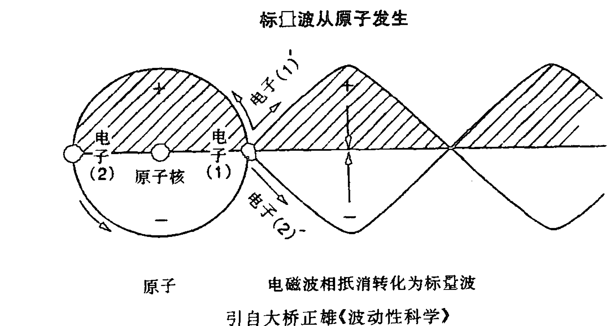

## 原子的电子轨道图

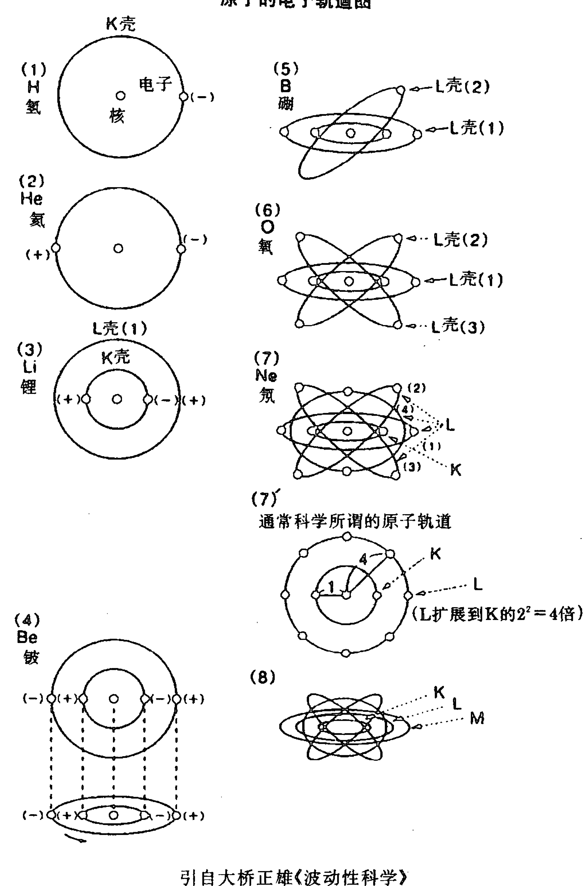

引自大桥正雄《波动性科学》

(图 21)

如包利的禁止法则(在最低能量状态的轨道上,只能有两个电子存在)所示,在一个电子轨道上,只能收容两个电子,并且两个电子的运行方向应是同一的。两个电子都带负电荷,由此相互对抗,位于轨道的正相反侧。所以从两个电子放射出的电磁波,如图所示,其相位相错 180 度。在相互吸引或对抗过程中,电磁能量的作用消失了,因此,电磁波就不能从原子中放射出来了。

即便如此,既然有能量守恒的法则,那么电磁能量是不应该消灭的,它一定是转化为某种其他种类的能量了。那就是大桥所说的物质波、我所说的标量波。

最近,在对自由能量(其实体就是标量波)感兴趣的研究者之间,一种能使标量波发生的线圈 ——“无诱导线圈”受到注目。这种线圈与一般线圈不同的是,从线圈轴的中点朝轴的两个方向,各以相同圈数缠上导线。把交流电接上线圈后,在线圈两侧发生的磁力线的方向就成为相反的了,于是磁力线相互抵消,电磁现象不表现出来。这与原子中的一条电子轨道上两个电子发出的电磁波相互抵消,原子不表现电磁性质的现象类似。

其结果是,从原子发出的电磁波被消除了,而重力波通过放射产生了。当小质量 B 通过大质量 A 的附近时,B 受到 A 的吸引,向 A 靠近;而当 B 与 A 拉开距离后,B 又回到原来的位置。这意味着,在所有的质量中都存在着重力场,通过重力波的放射,潜在大吸引潜在小的作用(重力)发生了。当这个重力波与三维物质进行相互作用之后,便以与光速同样的速度前进。

这样，重力的秘密也就被揭开了。在原子空间，原子波（标量波）作为电性质的中性的合成波，在与电子数和粒子数发生比例关系后，放射出去。于是，原子波放射出去后的那部分原子空间变得稀薄了。宇宙空间的整体必须保持平衡，于是那部分原子空间产生了吸引力即重力。

此外，电子在1秒间公转 $10^{15}$ 次；与此同时，还在1秒间进行 $10^{20}$ 次的自转。构成原子核的质子、中子在1秒间进行 $10^{23}$ 次的自转。所谓自转，就是能量在进行激烈的旋转运动。标量波作为电中性的能量，从所有运动着的物体产生并放射出去。还须指出的是，标量波是在波长波形方面作为与构成实（实像）世界的物质完全相同的虚（虚像）世界的东西而存在的。

因此，被变换为质子和中子（其他的基本粒子，例如介子等等）的中性的能量也应从原子空间放射出去。这样一来，可能会产生这样一个问题：带正电荷的质子的能量变得怎样了呢？对此，现代科学认为：“原子整体在电的特性方面是中性的。电子之所以能够存在于电子轨道上，就是因为有原子整体与带电的核进行相互作用后产生的库伦力（电的引力）。”就是说，只注意到中和，而标量波的概念不被考虑。我认为，在原子内，质子和电子在中和的过程中，放射出现代科学尚未认识到的标量波。

大桥认为：“Psi能量可以假定为是一种能量，这种能量形成于电中性的粒子产生的波动和由那个波动中的念波（合成波）共同构成的波粒。这些粒子除了原子以外，还有基本粒子中的中子、中性 $\pi^0$、k介子、中微子等。这些粒子产生的波动就是Psi能量。”

我认为，在原子空间，质子和电子作为整体进行中和，成为中性；部分的由其自转形成的能量，与中性的基本粒子同样，也进行中和，并被变换为中性的能量。质子的正的成分（阳电子）与负的电子原来都曾是光本身。这就是重力与粒子数发生比例关系的真正意思。

## 3. 以10的5次方相间隔的宇宙的各个阶层

基本粒子（这里指质子、中子）的半径约为 $10^{-13}$（10兆分之1）厘米，原子（氢原子）的半径约为 $10^{-8}$（10亿分之1）厘米，其大小之差为 $10^5$（10万）倍或10万分之1。

1975年，美国数学家曼戴尔布洛创立了弗拉克塔尔几何学，该学说有这样的认识：“自然和万物，具有相同的构造，把一个东西无论细分到怎样的程度，各个层次的构造也都是相似的。”就是说，宇宙万物，与大小无关，具有同样的形态和构造。因此，再小的部分和再大的部分，在形态上是相同的。

银河系的涡卷、台风眼、鸣门海峡中的漩涡，乃至手掌上指纹的漩涡，都具有弗拉克塔尔的性质。海岸线、树木、山川、天上的云、高分子以及河流、天气变化，乃至人体的脑、肺、血管，无不同样如此。再如，英国不列颠岛的海岸线长度以及美国曼哈顿岛的海岸线长度，都具有弗拉克塔尔的性质，把海岸岩石上的凹凸以及小石子、砂子，乃至分子层次上的凹凸全都加在一起的话，则事实上就是变得无限大了。

我认为宇宙具有如下的弗拉克塔尔构造。基本粒子和原子分属不同的阶层。两个阶层间的大小之差为 $10^5$（10万）。实际上，宇宙的各个阶层，都以同样的 $10^5$ 的大小（半径）相间隔。以下就是实际分类的结果。这就是宇宙的弗拉克塔尔构造。

展示以10的5次方相间隔的宇宙的各个阶层的表

| 阶层 | 半径 | 层次 |
| :--- | :--- | :--- |
| 半物质大层次 | 1 | $10^{-43}$cm | 普朗克常数 h |
| | 2 | $10^{-38}$cm | |
| | 3 | $10^{-33}$cm | |
| | 4 | $10^{-28}$cm | |
| | 5 | $10^{-23}$cm | |
| | 6 | $10^{-18}$cm | 夸克($10^{-16}$cm 以下)? |
| | 7 | $10^{-13}$cm | 基本粒子 |
| 物质、星体大层次 | 8 | $10^{-8}$cm | 原子、分子 |
| | 9 | $10^{-3}$cm | 10 微米 细胞 人类细胞平均为 17 微米 |
| | 10 | $10^{2}$cm | 1 米 人类 宏观的物体 |
| | 11 | $10^{7}$cm | 100 公里 地球的地域(地球层次) |
| | 12 | $10^{12}$cm | 1 000 万公里 地球和内行星间(行星层次) |
| | 13 | $10^{17}$cm | $9 \times 10^{12}$ 公里 1 光年(恒星层次) |
| | 14 | $10^{22}$cm | $9 \times 10^{22}$cm = 10 万光年 银河系(5 万光年) |
| 大宇宙层次 | 15 | $10^{27}$cm | $9 \times 10^{27}$cm = 100 亿光年 大爆炸宇宙 |
| | 16 | $10^{32}$cm | |
| | 17 | $10^{37}$cm | |
| | 18 | $10^{42}$cm | |
| | 19 | $10^{47}$cm | |
| | 20 | $10^{52}$cm | |
| | 21 | $10^{57}$cm | 大宇宙的极限? |

下面，就以上面这张表来做一些具体的说明。

① $10^{-43}$ 厘米大小的东西是普朗克常数 h 的粒子，现代科学推测它是“宇宙的最小单位的能量值”。这是作为物质现象根基的虚的世界（虚质）在产生漩涡的时候，作为其反作用，最初发生在宇宙的电磁波能量。该漩涡的半径和速度成反比例，这个漩涡每旋转一圈，便产生 $4.1357 \times 10^{-15}$ V 的电磁波。这就是 h。

从② $10^{-38}$ 厘米到⑥ $10^{-18}$ 厘米大小的东西，因为太小了，所以不知其为何物。只是，据说夸克的大小在 $10^{-16}$ 厘米以下，因此可以推测⑥为夸克。最近科学家在考虑底夸克的存在，底夸克可能是⑤。

⑦ $10^{-13}$ 厘米是基本粒子，⑧ $10^{-8}$ 厘米是原子、分子。⑨ $10^{-3}$ 厘米为10微米，人体细胞的平均大小是17微米，所以大体与此相当。⑩ $10^{2}$ 厘米是从1米到9米，人类和宏观的物体与此相当。⑪ $10^{7}$ 厘米为100～900公里（$10^{7}$ 是一个范围，包含 $1 \times 10^{7}$ 至 $9 \times 10^{7}$），这正好相当于地球的地域范围。⑫ $10^{12}$ 厘米是1 000万公里至9 000万公里，地球与太阳系内行星间的距离与此相当。从地球到太阳的距离约为 $1.5 \times 10^{13}$ 厘米（约1亿5 000万公里）。⑬ $10^{17}$ 厘米是 $9 \times 10^{17}$ 厘米，为1光年，这属于恒星层次的大小。⑭ $10^{22}$ 厘米是 $5 \times 10^{22}$ 厘米，为5万光年，这恰好是银河系的大小。⑮ $10^{27}$ 厘米是 $9 \times 10^{27}$ 厘米，为100亿光年，相当于大爆炸宇宙的大小。

宇宙的各个阶层就这样，以 $10^5$（10万倍或10万分之一）的间隔，有条不紊地并存着。这正是所谓“事物无论大小，形状均为相同”的弗拉克塔尔原则的体现。各个阶层，“过大也好，过小也好，过快也好，过慢也好”，人类都不能用普通的感觉确认其存在。在量子力学中所指的观测的不确定性的问题，有必要从这样的观点出发来进一步加以确认。

下面我想回答这样一个问题，即为什么要把宇宙分为二十一阶层呢？

因为二十一阶层，可进一步分为三个大的层次，每个层次由七个阶层组成。

第一大层次包括从①到⑦的阶层。其理由为，这七个阶层的东西都处于以光速流动的电磁波的状态。只有到了氢原子的层次，才形成以原子能量表现的块状物和系统。粒子的能量不再进行直线前进运动，而开始进行旋转运动。因此，从①到⑦，应该说是半物质的流动状态的大阶层。

从⑧原子到⑭银河系是物质・星体的大层次。对于这个大层次，现代科学正在广泛深入地加以研究。

从⑮的大爆炸宇宙的阶层到㉑阶层，是未知的大宇宙・星云团的大层次。假如宇宙的各层次是根据弗拉克塔尔的原则而呈相似态的话，则我们可以认为这个大层次是存在着的。

第一，从①普朗克常数到⑦基本粒子的半物质的大阶层是存在着的。据此，我们可以确认，与⑮大爆炸宇宙大小相仿的星云团已经存在。所以与从①到⑦相似的从⑮到㉑的大层次存在的可能性是极大的。

第二，在1980年以后的天文观测中，发现了，在宇宙中，以数亿光年的间隔，银河的巨大集合体（超群复合体）以正六角形的六芒星的形态，有条不紊地并列着。这正是弗拉克塔尔的构造。据称，形成这样规模的银河团，需要1500亿年。

但假如从大宇宙整体来看，则这个银河团也不过是极小一隅的现象。宇宙如果是根据弗拉克塔尔原则构成的话，则比大爆炸宇宙大 $10^{30}$ 倍（千兆×千兆倍）的包括从⑮到㉑阶层的大宇宙大层次就一定是存在着的。

揭示了从 $10^{-43}$ 厘米到 $10^{57}$ 厘米（比现代科学得出的数值大 $10^{30}$ 倍）的宇宙图像的先辈，是出版过《波动性科学入门》（魂出版）等著作的大桥正雄先生。上面刊载的是大桥先生制作的“宇宙阶层构成图”，这张图与我的以10的5次方相间隔的宇宙各阶层的表在数值上几乎是完全一致的。

在这张“宇宙的阶层构成图”上，不同的粒子和不同的星体的旋转半径和旋转周期（频率）以反比例的关系巧妙地形成一条直线。它表明了，旋转半径大的东西，频率小，需要较长时间才能旋转一圈；而旋转半径小的东西，频率大，在1秒之间便能旋转数圈。

银河系的半径为 $10^{27}$ 厘米（千兆×一兆厘米），所以旋转一圈需要 $10^{16}$ 秒（千兆的10倍的1京秒）。基本粒子的半径为 $10^{-13}$ 厘米（10兆分之1厘米），旋转周期为 $10^{-23}$ 秒，即1秒间旋转 $10^{23}$ 圈（千兆×10兆圈）。

宇宙从普朗克常数 h 的漩涡（极限的黄金分割比的漩涡）开始，经过基本粒子、原子、人类，一直扩大到 $10^{30}$（千兆×千兆），即大爆炸宇宙的层次，始终是连为一条直线的。

## 4. 脑的实质是光和意识

宇宙的各个阶层具有各自的半径，并由此形成具有弗拉克塔尔性质的特定大小的涡，涡像时钟那样进行旋转运动。银河系的大时钟旋转一圈需 $10^{16}$ 秒（1京秒）。基本粒子的小时钟是1秒间旋转 $10^{23}$ 圈（千兆×10兆圈）。这些时钟旋转的速度是光速，即1秒30万公里（$3 \times 10^{10}$ 厘米）。

国立生理学研究所的东晃史博士在其著作《脑的实质》中，发展了诺贝尔奖获得者理查德·菲利普斯·范曼（Feynman, Richard, Phillips 1918——美国物理学家）的理论即“时间只是在质量和能量之间作功之物”，阐述了生命、意识、信息的本质：

光速以上的时钟的旋转移=拉普拉斯的怪物

所有的 DNA 都是由相同的 DNA 的遗传信息形成的。人类和病毒的 DNA 遗传信息完全一样，只是数量不同，前者为50亿个，后者为20万个。假如根据信息量（比特、bit）来划分从阿米巴到人类为止的生命体等级的话，则人类位于百兆等级，猿位于亿的等级，蛙类和阿米巴分别位于万和千的等级。

所谓信息量，是与时钟的大小相对应的。因为各个阶层的时钟旋转一圈所需的时间不同，因而显示固有时间的固有波就成为基本的了。我们的脑接受种种的印象，这些印象在中枢神经的作用下，被动地从脑内涌出。假如能主动地使印象从脑内涌出的话，则种种的固有波就能自然地发出信号了。这就是所谓的超能力之所以能表现的根本原因。

在具有这种信息量的宇宙中，最大的时钟是前一节所介绍的21阶层中最大的 $10^{57}$ 厘米的超大时钟，它是具有宇宙所有信息的全智全能的宇宙意识的时钟。在大小上，我们人类应该位于第10阶层上。但假如观察一下人类的脑电波，则能意外地发现人类的意识位于更高的阶层上（$10^{9}$ 厘米，后述）。最小的时钟是第1阶层的 $10^{-43}$ 厘米的 h。

个体的生命和意识只有一个。胎儿在出生以前经历了以下系列的发生过程：一个精子和一个卵子结合、鱼类形态、两栖类形态、爬虫类形态，最终是哺乳类的人体形态。但个体始终是一个人类。同样地，一个人的时钟，是位于这个人所属阶层的上位阶层中的。而位于比一个人所属阶层低的阶层中的全部时钟是潜在于该人所属的阶层中的，并作为能量的量子而存在着。当两个阶层的能量的量子发生干涉、结合的时候，必定有新的阶层产生，并且时间发生。假如没有分属两个阶层的量子的干涉、结合，时间就不会发生。

层的时钟的结合，信息和意识就不会发生。当一个人死亡的时候，属于这个人的最大的一个意识的时钟消失了，阶层也消灭了，时间不再存在了。

由此可知，只有上一阶层的时钟存在。上一阶层的时钟，能通过潜在的途径，接受到下阶层时钟所具有的全部信息。我想从时钟上秒针和分针的关系来具体阐述一下这个问题。

作为大时钟的分针在一分钟间只前进一个刻度。而作为小时钟的秒针，在一分钟间便旋转一圈。即在分针的一分钟内，秒针以60倍于分针的速度绕时钟一圈，从而全部把握了分针的圆的信息。在这里，假如秒针把分针作为光速的话，则光速就不是最高速度了，秒针的速度应是分针光速的60倍了。

科学的反论认为，只有所谓“拉普拉斯的怪物”才承认有光速以上的速度。“拉普拉斯的怪物”能够认识极细部，它是全智全能的，它假如了解了宇宙的某个时点的位置和速度的话，便能预言在那以后及在那以前的宇宙的全部状态。现代科学认为“拉普拉斯的怪物”是根本不存在的。

通过光子（伽玛线）的作用，在空间，正粒子（电子）和反粒子（阳电子）结对产生。经过一定的时间以后，正反粒子又结对消灭，变回为光子。在这个场合，作为正粒子的电子从过去向未来前进，而作为反粒子的阳电子却是从未来向现在前进的。

能观测到正反粒子结对产生过程的仪器，虽然能观测到电子和阳电子，但不能同时确认存在于未来和过去的光子。为了能“同时”地确认一切，过去、现在、未来有必要都处于“等时”的状态。“同时”转化为“等时”的条件是要使“那一世界”，即具有光速以上速度的未来空间，与现在的“这一世界”等同。

为此，要使两个潜在的“概率的振幅”即从过去向未来流动的顺时间的“觉醒化”（日常的信息）和从未来向现在流动的逆时间的“睡眠化”（DNA信息）（其大小就是各自时钟的直径），在脑中结对发生（与光子的结对发生一样）。这样一来，拉普拉斯的怪物便把脑作为舞台创造出意识和信息。即，某种程度大小的时钟（与宇宙的阶层性的大小成正比）如果在脑内涌出，则与此大小对应的印象，便应表现于脑内。

从整个宇宙的角度看，在具有大的旋转半径的意识（时钟）之下，具有很多层次更小的时钟。小的意识（时钟）与大的意识（时钟）的关系，相当于分针与秒针的关系。就是说，当分针移动一个刻度的时候，秒针已转了一圈，把握了分针的包括未来的全部信息。这可以说就是预言、预知的机制吧。

一般认为，体积小速度快的东西，即频率大的东西，信息量多，层次高。但是，假如它没有与体积大速度慢然而容量大的时钟产生相互作用的话，则“速度快”这个能力是发挥不出来的。那时候，必然会形成阶层，小的东西安于下位，时间产生。

这时，只有上位的时钟显在，扮演着主角。它把下位的潜在的时钟的所有信息作为自己的信息来使用。就是说，宇宙的大的阶层，接受比它小的阶层的全部信息（小的阶层旋转快，所以从上位来看，则小的阶层是以光速以上的速度把握了大的阶层的全部信息）。上位和下位的阶层的干涉、相互作用是绝对必要的。大的上位的阶层，因小的下位的阶层的潜在和牺牲而具有了大的信息和意识。

作为一个例子，可举出处于物质层次、生命层次上位的精神层次的波动来说明一下。慢的阿尔法(α)波在8赫兹附近。所谓8赫兹，是指光在一秒间旋转8次，这正好是地球（7圈半）的旋转半径。这个数值与物质、生命的频率相比，显然要低得多。

但是，它在此之前，曾进行了多次的合成进化。所谓合成波，是频率（一秒间的旋转数）稍有差别的两个波动通过相互干涉而形成的波动（其内核是由原来两个波长的差组成的波动）。它被叫做念波。其波长变短了，但却呈现出干涉之前的波动与之不可比拟的极其复杂的高层次现象。化合、合成为进化的原动力，即，在每次化合的过程中，接受了很多的小时钟的信息，终于形成了极其复杂的精妙的脑波。因此，尽管小的时钟能很快地把握信息，但假如它没有与大的上位阶层的时钟产生相互作用，则其信息就无法表现出来。

在这里，作为时钟的直径的“概率的振幅”就是意识。把脑作为舞台，这个具有光速以上速度的拉普拉斯的怪物制造出信息。其大时钟的时间是以光速前进的，但因为在其内部的固有波中隐藏着数个小时钟，所以它以比光速快的速度前进。

个体的生命是一个整体。生命的状态是时时刻刻在变化之中的。生命体的部分与整体相连接。拉普拉斯的怪物即意识在脑中进行工作，信息由此而产生。作为时间的意识，像时钟的指针那样，在头脑的空间中动作，意识的本身同时也是光，因此，我们能够对外界进行认识。

在所有的粒子中，都有正粒子和反粒子。正粒子、正人类与觉醒状态相当，反粒子、反人类与睡眠状态对应。就像正反电子结对发生，或结对消灭后成为光那样，通过觉醒和睡眠这两个潜在状态的干涉和中和，意识活动表现出来。这与光使正反电子结对发生，又使其结对消灭，返回为光的程序对应。意识是正反粒子结对消灭后形成的光，通过光的作用，外界的现象被认知。

信息也是光和意识作用的结果，它位于看不见的世界，是看得见的世界的现象产生的“铸型”。其中的遗传因子信息是生物的生命根源细胞的铸型。在这里，重要的一点是，不是遗传因子制造出细胞，而是作为铸型的、眼睛看不见的遗传信息把生命物质集中起来，于是，作为物质的生命体便形成了。

东晃史的理论证明了生命和意识能以比光速快的速度传递信息。这便违背了现在科学中爱因斯坦提出的光速不可逾越、光速一定的法则。但是，爱因斯坦的光速法则中提到的光速是物质层次中的速度；从时钟理论引伸出的生命层次的意识、信息论中的速度，应该是无限快的。这可能就是佛教中“一念三千”这个提法的科学的根据吧。

此外，这也解决了 W·K·海森堡的不确定性原理带来的一个难题，即对于微观世界的粒子，不能同时测定其位置和运动速度。根据时钟理论，可以这样说：“在自然中有很多阶层，假如只是从一个大的阶层（大时钟）即以现代物理学的角度来观测电子的话，则测定的结果必定是无法确定的（不能同时测定电子的位置和运动速度）。但假如从比电子更小的阶层，例如从夸克层次（极小时钟）来测定的话，则观测的结果就应该是确定的（能同时测定电子的位置和速度）。总之，宇宙之深奥程度是令人无法想象的。

假如从时钟理论出发，则应该认为在原子和基本粒子中也是有意识的。在基本粒子阶层以下，直至普朗克常数 h，还有六个阶层。因此，假如把基本粒子阶层作为最上位的时钟的话，则其以下的阶层就是下位的时钟。两者的关系就像分针和秒针的关系，后者潜在着，并把信息传送给前者（基本粒子）。

意识和信息不是物质世界的现象，它们是在两个（或两个以上）时钟即两个（或两个以上）阶层相互发生关系时产生的看不见的世界的现象。

在印度的古代文献中，有这样的记载：“布拉哈玛（Brahmā、梵天印度最古老的神之一 —— 译注）所度过的 1 天相当于世间的 43 亿 2 千万年（4.32×10⁹ 年 = 1.5×10¹² 天）。”假如把这个时间换算为秒的话，则约为 10¹⁷ 秒。以 10¹⁷ 秒旋转一圈（即一天）之物，位于宇宙阶层中的 10¹⁷ 秒的阶层，是比银河系（约 10⁻²⁰赫兹）稍小的阶层，赫兹为 10⁻¹⁷。要而言之，布拉哈玛，其大小远远超过太阳系，它具有与银河系相差无几的大意识，因此它所过的一天才会如此之长。

原子的半径比普朗克常数 h 的半径大 10³⁵（千兆×千兆×10 万分之一）。就是说，假如把原子与 h 相比，则对于 h 来说，原子就如同大爆炸宇宙那么大。大宇宙的极限即 10⁵⁷ 厘米是银河系（10²² 厘米）的 10³⁵ 倍，是大爆炸宇宙（10²⁷ 厘米）的 10³⁰ 倍（千兆×千兆倍）。各个阶层都有与之相对应的意识，宇宙的最小阶层和最大阶层分别具有极微和超巨大的意识。

据说当一个人登山时失足坠入深渊，在即将落地死亡前的一刹那，会在一瞬间像观察到一张人生鸟瞰图那样，看到自己整个一生的所有经历。用时钟理论可以这样来解释：当大时钟（作为一个生命体的人）在濒临危机，功能衰弱的时候，下一阶层的潜在的时钟便剧烈地活动起来，在一瞬间绕大时钟旋转一圈，由此，上述的现象便发生了。第六感中的预知是在大时钟从小的潜在着的时钟那里接受细微的信息时产生的，而所谓“悟”，是自己的时钟在与大时钟（上一阶层的时钟）进行共振时产生的。

## 5. 混沌。弗拉克塔尔是创造之源

迄今所介绍的宇宙的各个阶层全都具有弗拉克塔尔性质（互通性、相似性）。关于宇宙各个阶层的关系，传统的世界观的认识如次：“某个阶层，为其下位的一个阶层所支配。”因此，以宇宙最小阶层即基本粒子为研究对象的物理学是应该拥有至高无上的特权的。

但是，宇宙自然并不是从最下位的阶层开始，由各个阶层层层相叠而形成的。实际上，各个阶层是极其复杂地相互纠缠在一起的；并且，无论大东西，还是小东西，都呈相同的形态（弗拉克塔尔性质）。由黄金比形成黄金分割，由黄金分割产生大小同形的漩涡，由漩涡形成螺旋，由螺旋产生万物。弗拉克塔尔产生的根据是黄金分割。宇宙的整体和部分是相似的。

从这个观点出发，海岸线等等，假如按分子、原子、基本粒子这样的顺序细分下去的话，则其长度就会变得几乎是无限的了。在一片树叶中，也能找出类似人类的脏器、血管那样的形态。

这种新的自然观和科学观叫做“混沌(Khaos)”。据说，在西洋，“混沌”这个词包含有“创造之源”的意思。

有规则的东西，呈现出的形态是无规则的、混乱不堪的。

传统的科学无法解释“混沌”。天气的变化和大海汹涌的波涛、野生动物某群体的迁移、心脏的跳动和脑波的变化，表现于这些现象之中的混乱，让人感觉到它是某种世间不存在的怪物造成的。

到了 1970 年，终于有少数欧美科学家开始探索这个“无序之物”了。数学家、物理学家、生物学家、化学家等各个领域的科学家们探讨各种不规则现象之间的关系。最终，发现了万物都具有弗拉克塔尔性质。在这一过程中，计算机技术的发展、通过计算机图解进行的对于自然的临摹观察起到了很大作用。

混沌理论又被称作“非线形理论”，它与相对论和量子论一起组成了第三代科学。历来的所谓“线形理论”的观念是这样的：因为线形是能在图表上用直线表示的；因此，只要有了最初的值，则其未来的所有走向就能被确定了。

与此相反，非线形的走向，并无严密的比例关系。在最初，它显示出有序的线形形态，但突然有波动的变化（类似杂音）进入其中，于是，与初期值相悖的、完全料想不到的那样的现象发生了。一般来说，有序现象和混沌现象，即线形现象和非线形现象，是交替出现的。

以下，以水流在座标的某一点上的变化来说明一下：

- (1) 水流安静的时候，层流笔直地流动，就像水分子排为一根直线。这时，座标的点上的活动是成为一点的。
- (2) 水流加速之后，便成为乱流，以一定的周期，产生漩涡。座标的点上的活动发生变化，从一维的点成为二维的圆。
- (3) 此后，圆形变为环状，乱流变得更为复杂。但此后，二维的点必然会变为三维的点吗？
- (4) 不，这并非易事。环状的表面形成许多皱褶，成为位于二维和三维之间的“座标的奇异点上的活动”，即呈奇妙形态的混沌出现了。

根据普里高京的耗散结构理论，混沌有两种：①热平衡的混沌。这是通常所谓的熵增大（有序变为无序）即被动的混沌。但这实际上不是真正的混沌。②动态的、热性的、充满活力的、远离热平衡的混沌。这种混沌的最初的热量的差不会消失，而是继续存在，并从中产生出新的构造。

在化学反应过程中，有序和无序是交替出现的。远离热平衡体系的混沌，能促使即将产生的新秩序进行自我组合。下面举例说明。从下方加热一只盛水的锅子，不久，锅中水的状态便按以下顺序发生变化：①水没有流动，保持热平衡的状态（有序化）；②水中出现温差，上层水和下层水发生对流，从而形成乱流（无序化）；③进一步加热之后，呈蜂窝状的贝纳尔对流（有序化）产生；④贝纳尔对流消失，再一次出现乱流（无序化）。

这表明，混沌为了维持某种形态，必定要消耗能量；它是开放系统，外部能量能自由地出入其中。传统的线形理论，只注重一个系统内部的能量的吸收和消耗，它是封闭系统的理论。

迄今为止，人们所认识的整体，仅是分散的部分的个体聚合在一起的东西。但是，要使分散的部分的个体完全孤立，在原理上是办不到的。来自整体的晃动，必然进入个体，使个体的未来走向变得不可预测。总之，在非线形的世界中，部分和整体在原理上是不可分离的。

并且，一个相对稳定的构造，在其变化超出了某个境界的值之后，就转化为混沌；此后，又突然变为另外一个稳定的构造。这个过程的存在，有其深奥的原因，那就是宇宙间的所有事物都具有曼戴尔布洛所发现的弗拉克塔尔性质（相通性、相似性）。所谓弗拉克塔尔，就是“任何个体（无论它如何小）都具有与整体相同的构造。”大的东西也好，小的东西也好，其形态都是相同的。自然界看上去十分复杂，但无论将其扩大还是缩小，形态始终如一。

在潘多夫所著《超意识的物理学入门》一书中，有以下一段论述：现在，能观察到原子内部状况的超显微镜已经研制出来了。当用它观察不规则的毛细血管的网络和结缔组织的断片以及肌肉和骨组织时，这些东西表现的状况是粘粘糊糊的，沾满了鲜血，整体的轮廓是无规则的。但是假如仔细观察一下其形态的话，则无一例外都具有弗拉克塔尔的性质。

提高显微镜的倍率之后，被观察物便脱离模糊不清（混沌）的状态，一变而为高度组织化、整齐划一、方向一致的肌肉纤维。再提高显微镜的倍率之后，长长的肌肉纤维又进入混沌状态，然后表现为按照一定规律排列的螺旋状的长分子。进一步提高显微镜的倍率后，螺旋状的长分子表现为结晶。再进一步提高倍率后，可观察到小小的原子在螺旋状长分子中，以一定间隔，组成群落，并以超高速振动。总之，在各个层次之间，必定有一段混沌状态。

原子位于分子当中的规定的位置上，看上去像振动的小黑球。当再提高显微镜的倍率之后，就什么也看不见了。连电子的壳也消失了，存在的只有真空。再进一步提高显微镜的倍率以后，能看到某种微小的东西在蠕动，那好像是原子核。

当进一步提高显微镜的倍率时，那振动的原子核本该扩大的，但它却消失了，只能隐约观察到某种能量在搏动，好像是以极快速度在振动的场。这个极微的实体充满了广阔的空间。在空间中，各种各样的场在相互发生作用，某一个场的极微小的变化，会传播到其他所有的场，进而影响到整个宇宙。

所谓疾病，是生命体内的一个或一个以上的器官的功能出现异常后表现出的状态。心灵治疗的原理就在于：心灵治疗师发出很强的具有和谐节律的场，这个场作用于异常的器官，使器官的波动干涉图形恢复正常。以上是潘多夫著作中的论述。

这样，宇宙作为一个巨大的弗拉克塔尔的构造，以我发现的 10 万倍·10 万分之一（10⁵）的间隔（每个间隔中夹有混沌），井然有序地存在着。

混沌发生后，一切都变得杂乱无章，无任何秩序可言。但不久混沌中会形成新的秩序，这是因为混沌尽管看上去乱七八糟的，但实际上在此之前的有序图形（这就是在下一节将要阐述的波粒子）还保留在混沌的深处。然而这还不如说是，尽管现象千变万化，但作为现象产生的根源世界，却是固定不变的。

据说以光速朝相反方向射出的两个原来在同一位置上的原子，即使相互分离了，其活动状态也与处于原来位置时一样。

把两个细胞分别置于用水晶玻璃隔开的两间房里。假如用毒药杀死其中的一个细胞的话，则另一个会出现同样反应——死亡。

据说，在原苏联，曾进行过这样一个实验：把一只母兔和它养育的几只幼兔强制分开，把幼兔放在一艘潜水艇中。潜水艇潜入深海，在那儿幼兔被杀死。在每只幼兔死亡的瞬间，母兔都会产生激烈的反应。

这就是说，原子之间也好，细胞之间也好，生物之间也好，无论相距多远，在深层次上也是连接在一起的。将它们连接在一起的能量是四维的标量波。

下面一张图，显示了在滑雪练习场上，竞技雪撬留下的轨迹。因为途中有不少弯道，所以雪撬的前进方向是不可预测的，是混沌。但是从雪撬行进的轨迹来看，则雪撬的前进路线基本是相同的（弗拉克塔尔性质）。即使提高这张图的析像度，其结果也是相同的。

因此我们可以这样说，即使三维现象表现为混沌（无秩序），在现象的根源的层次上，具有弗拉克塔尔性质的极有秩序的构造也是存在着的。这即是说，在三维世界我们所能看到的不确定的概率现象的背后，潜在着包姆所说的（四维世界的）“隐蔽的变数”，正如爱因斯坦所说，“神不会去掷骰子”。

全息摄影的形成也是同样道理。把一束光一分为二，①使其中的一束光射到其他物体上，而后反射到胶片的面上；②使另一束光直接射到胶片的面上（称作参照光）。①和②在胶片的面上相互干涉之后，就形成了作为（混沌的）干涉图形的全息图了。当②的参照光射到这个二维的混沌的干涉图形上以后，在立体的①中，物体的三维的虚像就形成了，这就是全息摄影。从全息图的任何一个小的断片（部分）中，都会产生反映整体的图像。

由此可知，表现于三维的杂乱无章的、混沌的事物，在其深层次（四维）上，是构造性极完整、极有秩序的。在三维世界中，事物是按“秩序 → 混沌 → 新的秩序 → 混沌”这样的顺序发展的。在新的构造形成之前，必定有这样的程序，即旧的构造被废弃，进入混沌的状态。宇宙自然为了进化发展，必然要经过这样的非线形和混沌的状态。不，这样说还不够，应该说，从线形是不会产生任何现象的，混沌、非线形才是万物产生之源。

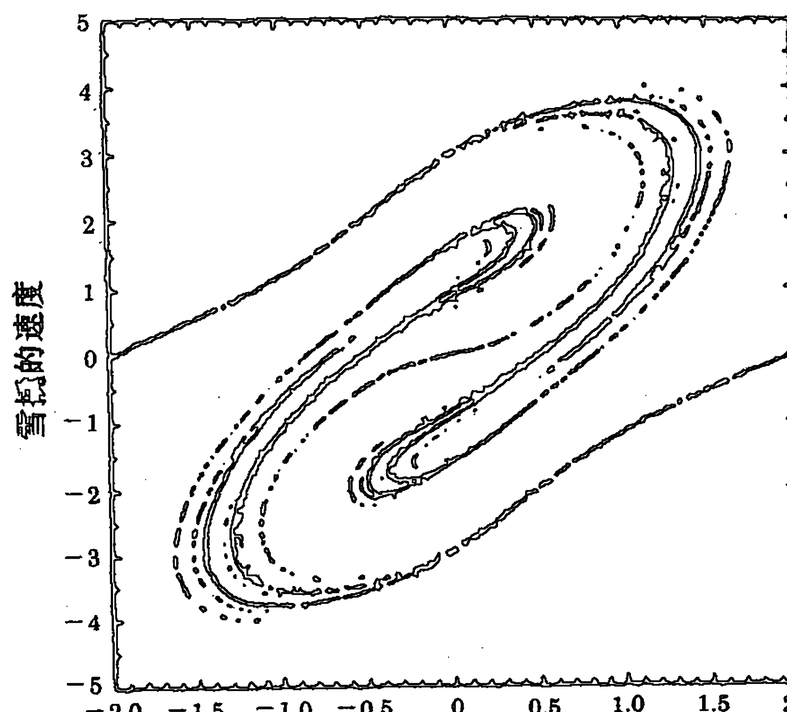

引自竹内薰《宇宙弗拉克塔尔构造之谜》
（图25）

最近，人们逐渐了解了，在一切的现象中，都有混沌，都有弗拉克塔尔的影子在晃动。

- (1) 假如脉搏的跳动过于规则，就会发生心肌梗塞。还有，假如超出了弗拉克塔尔的正常的晃动范围，就会发生严重的心脏病。
- (2) 假如精密地来观测一下地球的运动，则可发现，地球以5天以上的较长周期在晃动。宇宙空间是一个混沌，其中的秩序是时断时续地存在着的，它不就是天体和星际物质吗？
- (3) 基本粒子以光速进行锯齿形的运动。这是因为电荷本身和电荷的重心不在同一位置上，而电荷又以重心为中心振动的缘故。事实上，质子的中心是由性质为电中性的克尔翁形成的，阳电荷是与其中心相分离而存在着的。

在四维层次上，宇宙经常表现为弗拉克塔尔（受黄金比中的五芒星原理支配）；在三维层次上（受六芒星原理支配），宇宙的表现是，混沌和秩序交替出现。这就是实际的状况。

## 6. 孤立波（波粒子）、耗散结构是现象之母

在三个电磁气学的第三（最高）层次的表现中，有波粒子（孤立波）这一个概念。下面，参照布里格斯《镜子的传说》一书的观点，来说明一下这个概念。孤立波，是英国的约翰·斯考特·拉塞尔在1843年发现的。岸上的两匹马牵引着一艘船，在狭窄的河道中前行。当船突然停止行进的时候，船首的水波的起伏变得强烈，形成一个宽10米、高30～40厘米、时速14～15公里的波浪，这个波浪可持续延伸2～3公里。

当几个波（正弦波）重合之后，会产生各种各样复杂的波。通过这样的波（音波）的重合，电子合成器能奏出任何乐器的音色。一般，几个波重合后形成的波，随着时间的推移，是逐步溃散乃至消失的。

但是，孤立波不会溃散消失，它是有序的波。以孤立波中的水波为例来说明一下。这种波的振动尽管会被更细微的振动所破坏，但它也会产生某种共鸣、共振现象，在某种条件下，还能自发地进行自我组织，以致不会被轻易地破坏。假如要对孤立波下一个定义的话，那就是：“它是一种在非线形的相互作用和分散的效果之间保持平衡，同时维持自身安定的波。”即，孤立波的动作类似粒子的动作，它是“波的粒子”。

孤立波能在不改变形态的情况下移动，即使外来的冲击也不会使其发生变化。“为什么加热铁棒的一端后，另一端也会感觉到热？”回答是：能量从一个波传播到其他的波了。在这里非线形的相互作用是必要的。假如没有非线形性（指这样一种性质：同一形态的波还在延续，而其他的波又突然产生了）的话，则波长不同的波，就分别独立地运行了。在加热铁棒过程中传播的波，不是像水和空气那样的线形的波，而是作为能量的非线形的波，是孤立波。

用力地叩击金属棒的一端后，力学的能量就产生了，它形成孤立波，传达到棒的另一端。这应该是很清楚的。此外，金属的温度急剧上升（例如把一根铁棒插入温度很高的炉膛中），会导致弹性的脉冲热以孤立波的形态在金属中传播。

非线形的世界中的一切东西在整体上是连接在一起的，在这连为一体的体系当中，经常存在某种秩序。即使从表面看上去是无序的，在内部也潜藏着高维的秩序。有时，这个潜藏的秩序会显现于表面，产生孤立波的现象。

在生命体内部，能量是怎样以块的状态长距离地传播的呢？这是个谜。痛的信号被照原样（不改变形态）送达到脑。这实际上是生命体中的孤立波作用的结果。在神经中传播的电信号（我认为它是由中性的标量波形成的），与在电话线中传播的信号，是不同的东西。这是很清楚的。局部的脉冲状的信号，在转变为某个境界的值以上的能量时，就形成不改变形态的孤立波。这叫做神经孤立波（思考的基本粒子）。

孤立波是孤立于其周围空间的波的粒子。它表现为漩涡，它是非线形的混沌的产物。波长、波形相同的、可延续到任何地方的线形，是不产生也不会产生任何现象的。只有在真空的空间的晃动中，才会诞生出万物。基本粒子也好，原子也好，星球也好，宇宙也好，其根源全都是孤立波。因此，假如能找到使漩涡与空间产生同步作用的技术，就能够从空间提取出无限的能量。

伴随大洋中的地震而发生的海啸也是孤立波。海啸开始时的波高仅为 10 厘米左右。但当它横穿大洋，到达大陆架的时候，因为海水变浅，非线形效果发生作用，所以它的波长变短，波高增高，形成数十米高的巨浪，扑向海岸和港口。

1976 年，加利福尼亚大学的两名科学家提出一个观点认为木星上的红斑是一个巨大的孤立波。1950 年的天文观测发现，靠近红斑的一个小的低压漩涡被红斑吸入，看上去完全消失了；但不久，与原来几乎一模一样的一个漩涡从红斑的另一侧像挤出来那样显现出来。非线形的世界中的孤立波是波的粒子，所以穿过一个物体是轻而易举的。孤立波的这一特性，似乎可以用来阐明特异功能中“一物体穿透另一物体”现象的机制。

普里高京的耗散构造论认为，在混沌中有：①现代科学经常提及的熵增大那样的被动的混沌即热平衡状态；②熵减少所形成的远离热平衡的、动态的、火热的、充满生机的混沌。这个系统的最终趋势不是消灭和死亡，而是产生出新的构造。

宇宙也好，我们人类也好，都是从这种作为非线形的自我组织构造的耗散结构中诞生的。

耗散结构是“开放系统”，外部（真空）的能量能自由地出入其中。这个系统不断吸收新的能量，同时把熵（垃圾和作废的能量）向外排出。

混沌实际上是新的事物产生的原动力。混沌是自古以来所称的光和黑暗中的黑暗。但是，假如没有黑暗，我们就意识不到光。同时，假如现象的根源本质不是连最微小的振动也没有的绝对永久不变的完全均质的存在的话，则下面列举的现象是不可能发生的。

- (1) 牛顿第一法则中的等速运动在宇宙的任何地方都是同一的，它是普遍存在的；所以宇宙最终必须具有划一的绝对空间和绝对时间。但我们不是单纯地回归到牛顿的学说，因为各个现象作为位于不同阶层的时钟，还具有与绝对时间相反的爱因斯坦提出的固有时间。
- (2) 相当于宇宙通用数字的“一”是普朗克常数 h。宇宙的能量只有一个（因此，牛顿所说的等速运动是可能存在的），h 的数值是当 10⁻¹⁵ 伏特的能量使各阶层的漩涡（时钟）旋转一周时产生的能量值。这就是等速运动能够形成的根据。
- (3) 宇宙的所有粒子和物质都是形成于与实像（正物质）相对的虚像（反物质）的。并且，任何部分不论其如何小，例如基本粒子，也是同整体发生联动关系的。电磁波遇到物质时，或被其吸收，或被其反射，是不能透过物质的；但标量波（纵波的重力波）能透过一切物体；并且，它能像“三层次的电磁气学”中所提及的三维层次的塔基翁波那样，瞬时地与宇宙的整体发生共振。
- (4) 俄国的丢波洛进行过这方面的实验。他用能屏蔽放射线的水晶(结晶体)玻璃把一间房一分为二,在两边各放一个容器,里面放入细胞。向一边的容器中投入毒物(病毒、化学物质、放射线)杀死当中的细胞。结果是,与此同时,另一边容器中的细胞也死去了。这说明,两边的细胞通过某种能量形态(我认为那是标量波或塔基翁波)在进行不断的信息交流。这叫做“镜像效果”。
- (5) 根据贝尔定理,假如使非局部性的(非规定场所或宇宙整体的)一部分变数(状态)中的一个产生变化,则瞬时地,在宇宙的某处就会产生某种现象。

> “一个测定装置的测定结果的产生,会影响与该装置相距甚远的其他装置的测定结果的产生。导致这种情况发生的结构是必然存在的。并且,前者产生的信号必然是在瞬间传递的。”(摘自沃尔夫《解开量子之谜》)。

粒子、细胞、人类,分别具有与各自的阶层相适合的时钟(意识、生命)。在各阶层的下面,都隐藏着下位时钟。下位时钟的运转速度比上位时钟要快。通过上位时钟(例如分针)和下位时钟(例如秒针)的时钟的相互作用,“当初为一张白纸的刻度盘上,时刻被写上”,这时(下位时钟已经转了一圈,把握了上位时钟的全部信息)信息产生。

动物的时钟比人类的时钟远远要小(这就是动物和人类存在智能差别的原因),但其速度比人类的时钟远远要快。动物以下还有多个阶层的时钟,最下阶层的时钟是病毒的时钟吧。人类包含其以下阶层的全部时钟。

人类一般只能获得由自身的时钟与下一阶层的时钟相互作用而产生的信息(通常的意识状态)。但是,当突然与下一阶层的时钟发生强烈的共振时,就会产生超意识的现象。

阶层的以下阶层的时钟，或者比自身上一阶层的时钟（意识）产生共振的时候，人类就会获得第六感或心灵感应那样的能力（变性意识状态）了。

动物和动物以下阶层的时钟（意识）其运转速度，比人类的时钟远远要快。因此在我们来看，动物及其以下的阶层是具有超能力的阶层。

## 第五章 由光和标量波组成的宇宙图像

### 1. 光形成于光子和宇宙意识

光是不可见的能量。发自太阳的光原本是用肉眼看不到的，但其中的物理层次的成分因受到大气中的物质粒子的反射而扩散开来，照亮了空气中细小的水珠和灰尘而使人们能看到它了。构成空气中分子的原子使一体化的不可视的光扩散、分光，形成由红到紫七种颜色的眼睛能看到的光，这就是物理层次的光。

晴朗的天空看上去是蔚蓝色的，这是因为大气使物理层次光中的红、黄、绿等部分扩散了。大气中的 80% 是氮，余下的是氧。在原子当中振动的电子，与频率高于可视光线的紫外光发生共振，使紫外光扩散。频率高于可视光线的光，有紫外线，X线、伽玛线等。但是这些高频的光几乎都被电离层中的氧和氮滤过了，因此当它们到达地面时，已成为低频的可视光线。红、黄色中几乎所有的可视光以及一些紫外线通过大气中的过滤器，到达地面。由于这种可视光线的作用，我们能够看到物体。这种光的根源是反射光。但是，并非地上所有的光都是反射光。可视光中的七色是由太阳光线这个棱镜造成的分光，是物理层次的光的凝缩。根源之光是与可视光线一起被送达地面的。以广播的电波作比，根源之光和七色的反射光，可分别比作广播电台发射的电波中的搬送波和变调波。来自遥远星体的宇宙光线，是连贯的光（相位、方向性一致的凝聚光），所以，它像激光那样，不会扩散。因为它在宇宙空间已经变为由扩散后残存的放射线造成的频率不变的光。

这种宇宙光线，在途中不论遇到什么障碍都能顺畅地穿透之。当这个光在浸透了人类身体中的原子、分子之后，就同细胞分子产生共振，尔后在体内扩散。就像大气中的水蒸气扩散后使七色的彩虹产生一样，光子在身体的水分子的作用下扩散后，便使固有的磁场在细胞内产生。当水的液体受到宇宙光线的照射后，其结晶内的电子的振动被激起，原子的生命力增强，会放射出类似生命体能量那样的光。据说，作为超常现象根源的 Psi 能量，是产生于原子空间中的中子的共振。

人的个性和内层的意识世界具有外在的内容和内在的内容。外在的内容是，在规定时刻来自宇宙的极具个性的以不同色彩混合而成的宇宙光线；内在的内容是，与自己特定的肉体、精神层次及其潜在能量对应的意识。由于吸收后的色彩的作用，每个人都在意识的内部，与那色彩进行共振，于是，每个人都形成了自己独特的外形、个性、指纹以及波动。

光分为两种类型。

- (1) 眼睛看不见的光。这就是产生宇宙的力，是根源性的创造能量，是宇宙光线(Cosmic · ray)，是宇宙意识。有形之物就是作为这种光的一部分的物理层次之光的凝缩。
- (2) 眼睛看得见的光。物质通过其能量的形态，吸收特定的色彩，反射与其不相合的色彩。我们肉眼能见到的七色光就是这种被反射的光。

作为根源光的创造能量，被分成各种类型，即被进行分光，通过无数的组合，产生各种形态。这就是它所进行的创造活动。其结果是，其中的一部分从虚的世界进入实的物质世界，并在那里凝缩，形成包含生命体（由生命层次的能量组成）在内的宇宙万物。

万物由于光的组合形式不同，因此形态各异，分别具有各自固有的波动（波长和波形），放射出与固有波动完全同一的电中性的或物质世界或生命世界或精神世界的标量波。作为看得见的世界的实的世界和作为看不见的世界的虚的世界，不论从能量的角度看，还是从形态的角度看，是完全一样的，这就是阿卡希克记录的物质基础。

万物具有由特有的形态形成的构造和基础光线。人也好，物也好，都是在更高层次的与各自的铸型相当的能量形态的作用下形成的。

能通过复杂的组合来创造万物的这个根源的光的能量，具有既是光子又是宇宙意识这样的两面性。①从事创造活动的这一面是物理学中所指的具有粒子性的光子。②规定创造活动方向的具有生命、意志的一面是宇宙意识。宇宙意识秘藏着大到宇宙、小到基本粒子这些有生命力之物的蓝图和铸型。宇宙意识又表现为光的波动性的一面。

爱因斯坦用 $E=mc^2$ 这一个公式，把宇宙中的所有东西，都归结为能量和光。下面，参照美国的克里斯托弗·希尔兹博士的超感觉探知学来介绍一下本章提及的光和宇宙意识一体化的宇宙图像。超感觉探知学认为，宇宙的一切都是光能量的产物。这门学问是用近代物理学的用语和方法来阐明东洋的瑜伽和西洋的神智学的科学，又是把不为近代科学所承认的属于意识精神领域的异维世界的现象和现实的物理世界的现象，都作为能量现象来细致把握的精神工程学。

希尔兹博士把眼睛看不见的根源光叫做光的色，把眼睛看得见的反射光叫做色素的色。他还认为，根据光的实体及其作用，光可分为三种类型。

- (1) 鲁曼。这是使宇宙空间面向地球的根源能量（意识之光），是等同于意识的肉眼看不见的光，是来自太阳和其他星球的通过宇宙空间后波动性质不变的光。它进入大气层之后，使大气发光，于是，天空看上去便呈蔚蓝的颜色了。
- (2) 勒克斯。这是意识和脑的光。鲁曼从眼睛进入人体，神经和细胞为此呈活性化，脑由此发光。其实体是灵魂之光，是自身的意识接受外来的鲁曼的干涉后产生的光。
- (3) 纳库斯。这是人类得以存在的核心，是生命冲动的源泉。它位于思考、印象和感情的深层的无意识底部的黑暗中。它绝对寂静，如波平如镜的大海；但当外来的干涉波动进入它当中之后，它便产生自体波动，自体波动逐渐扩展，创造活动由此开始。它是知觉的源泉，而不是知觉的效果。来自太阳和其他星球的能量进入纳库斯，但我们感觉不到它，那是因为鲁曼即根源之光与纳库斯的性质是同一的。

宇宙的万物都是鲁曼凝缩后形成的东西。使鲁曼集中并凝缩的力来自质子。鲁曼的能量会像水结成冰那样，结晶为勒克斯。相反，勒克斯在吸收了天体的放射之后，又会变回为鲁曼的能量，就如同对冰加热之后，冰又变回为水那样。

天体也具有同样的机制，比如太阳从别的恒星吸收能量，使原子活性化，然后放射出能量。原子内部也同样，电子在不断地进行吸收和放射。假如鲁曼的吸收力减弱，则勒克斯内部的功能活动会变得低下，由气体变为液体，进而变为固体（结晶化）。

在我们的意识和其他所有的东西当中都存在着纳库斯或原子核所具有的那种要吸收宇宙之光的吸引力(意志)。当它十分强大的时候,被吸收进来的鲁曼,在我们的意识内或其他的东西中,产生出热的光(勒克斯)。这也就是昆达利尼的能量。当纳库斯向外部放射鲁曼的时候,我们就可以知道来自星球的鲁曼和纳库斯内的自我意识之光是相同的东西了。这也就是昆达利尼的觉醒。

人类的纳库斯和物质的原子核,吸收鲁曼,并使之产生勒克斯的光而后放射之,于是勒克斯的光又变回为鲁曼。

纳库斯和鲁曼的不同点,仅仅在于: 纳库斯是被封闭在自意识之中的东西;而鲁曼则是自由的,是作为放射能量而充满于整个宇宙空间的宇宙意识。

切勿忘记,不论是物理的波动还是精神的波动,能对它们加以控制并利用的是意识。意识是一切的物体和系统产生的根源,所有的能量及其构造的存在与否都在于意识是否发动。意识和能量(光)是一体的,它显示的是宇宙的精神的一面。

意识不存在的话,物质也不会存在,光和色彩也得不到确认。昆达利尼,是光通过人类身体时表现出来的东西,因此,它来自宇宙空间,在性质上与照亮世界的光、意识是同一的。

来自宇宙空间的作为创造能量的光、意识的外部构造,与我们的意识或昆达利尼的内部构造是相同的。但一般人却认为这两者是不同的。原因在于昆达利尼的活动和作为生命能量出入口的伽克拉的活动在一般情况下是不活跃的。

宇宙的智慧、信号和信息,作为色彩的频率、声音的频率被传递给我们。声音色彩和与其对应的频率有倍音关系,例如,红色和紫色中间的红的层次、乐声 1、2、3、4、5、6、7 中的 1 的层次,都同样地与其上和其下的层次对应。当昆达利尼取得完全的平衡时，人体的生命能量就移行到上一个倍音的层次。宇宙就是以这样的倍音（oktave）的频率来分出阶层，各个阶层都具有弗拉克塔尔的性质。以上就是参照希尔兹理论来阐述的光一元论的学说。

觉悟到宇宙的根源之光、宇宙意识与自己内部的光在性质上是同一的，这在过去叫做“与神相逢”。这是古希腊哲学家柏拉图（Platōn 公元前 427～347）的说法。

- (1) 自己身外的向上的道路，是寻求位于辽远苍穹彼方的神的道路。这个神与人类相距无限遥远，它是与一切相隔绝的绝对超越者。
- (2) 当人停止向外寻求神的时候，他（她）便进入自己的内部，关闭与外界沟通的一切通道，把精神集中于内部，探寻位于近似于无底的深处的魂。当人达到魂的所在的无底的深部时，魂的奥秘便显现出来，于是人意外地与作为魂的内核的绝对存在者 —— 神相逢。人类的魂是从一开始就把神留宿在自己之中的。

神隐藏在魂的深层。魂的深层是一个神圣的领域，人和神在那儿幽会、相恋。

### 2. 根源之光是气和普拉纳的媒体

太阳放射出无数的不可视的能量，其中有不少到达地球。西洋密教（神智学）的学者认为，在这些到达地球的能量当中，至少有三种在现象上是不同的，相互无法沟通。

- (1) 夫奥哈多。它包括一般科学所指的物理的力，即电、磁、光、热、声音、化学的亲和力、运动等等。它们之间是可以互相转换的。但是，它们与下面的②③是不能转换的。
- (2) 普拉纳。即活力、生命力、创造力。它在性质上与中国气功的气相同。
- (3) 昆达利尼。据说这是由下而上运行的能量，它通过人类表现出来。昆达利尼苏醒之时，就是人从四维向五维飞跃之日。

普拉纳的原义是“前进，进行呼吸以便生存”。在瑜伽训练中，它是指“生命呼吸”或“生命能量”。宇宙只有一个生命，只有一个意识，那就是作为万物根源的唯一者的生命。这个巨大的生命渗透于宇宙的各个阶层，表现为各个阶层的普拉纳，即所有生物的生命呼吸。

位于物质阶层的普拉纳，是使活力、细胞等调和并运动，并使它们作为一个整体的有机体维持下去的能量。如果没有这种普拉纳，则一个整体的有机体即肉体就不复存在，存在的只是四分五裂的物质碎块。呼吸开始进行之后，这个普拉纳能量便在所有的细胞中运行。它是生命能量之火，是根源能量，是位于全部有形之物内部的能量。真正的太阳，是隐藏在肉眼看得见的太阳之后的不可视的存在，据说生命之流就是从那儿涌出的。

普拉纳充满宇宙，它是创造包括太阳在内的一切事物的不可视的能量。它表现为太阳光中的七种波动，它使万物成形。在物质阶层，它是一切矿物形成的基础。它导致原形质内发生生理化学变化，它促使植物、动物、人类身体的各种组织形成。

迪比多松在《精神能量》（达玛出版社出版）一书中，是这样来阐述普拉纳和生命的：

- (1) 它使一切的生物具备现有的形态，是万物的蓝图。它不在物质层次，而是位于更高层次的精妙的能量场中。当它的内部的振动和形态表现在外的时候，便产生 DNA 的作用。DNA 不是形态形成的场，不过是形态再生的场。
- (2) 这个精妙的能量场（以太体），与生物的意识内层相连接。它不仅仅是生物形态的蓝图，它还向生命形态供给内在生命力，使其在物质世界表现其形象。
- (3) 在生命力形象的作用的影响下，能量可以很容易地从一种形态转换为另一种形态，例如从精妙的转换为粗糙的，或者相反。法国的生理学家凯尔布朗所提出的“生命体内的原子转换”是可能存在的。比原子小的构造，在生命力的作用下，可能更容易转换。
- (4) 所有的心灵现象不过是，比真空和物质更精妙的状态的活动（包含我们人类的精神意念活动）表现于物质维时所产生的现象。

通常，通过特定的瑜伽和冥想的训练，一个人能够意识到平时所不知的事物和精神运行的通道。于是，包含于元素和自然之中的种种的力，就会在粗糙的物质层面上表现出来。能利用精神力对它们随意加以控制，但这是不被允许的。因为一旦这样做了，内部神秘的向上的灵力就会消失。

- (5) 生物体是从真空和更精妙的能量场获得自己的形态和功能的，所以其波动就依然影响生存着的生物体的组织。真空实际上保存有自身外在的物质化的形态的内在记忆。
- (6) 来自真空内部的能量的纵向波谱是能量的蓝图，物质据此被创造出来。所有的基本粒子作为能量形态而表现的状态就是真空状态。真空状态其实是与我们精妙的精神能量的构造结合在一起的。即，物质世界也好，高维的精神世界也好，全都是由“普遍的精神”即宇宙根源之一的精神创造出来的。

从物质的角度来看真空的时候，真空不过是空无一物的单纯的空间。但是当用天目（精神的眼）去看真空的时候，真空就成为万物产生的素材，是活跃着生气勃勃创造活动的场。

作为根源光的“光的色”，进入地球的大气层后，不论遇到什么障碍，都能顺畅地通过，这是因为这种光是标量波的缘故。

现代科学所观测到的光，是夫奥哈多，这种光假如不与物质进行相互作用，其存在就无法被确认。在宇宙空间传播的，只有标量波、纵波的重力波。进一步，作为标量波的背景，即支持标量波存在的，是具有无限速度的塔基翁波。夫奥哈多和普拉纳（生命层次的标量波）结合在一起，相互补充，在宇宙空间传播，同时又分别进行各自的创造活动。

作为标量波或根源之光的“光的色”是与宇宙共存的。在有物质的地方，标量波和矢量波（这就是物理学中所指的电磁波）必定表现为波长波形完全相同的表里一体的形态，但这样说还不够，应该说它们处于一种“共存（占据同一场所）”的状态。这正是映现在镜中的图像与原物的形象呈左右非对称的镜像关系那样的关系，如实像和虚像的关系、正粒子和反粒子的关系、实数和虚数的关系、正负和中性的关系、三维和四维的关系，得以成立的根本原因。

自古以来，对于未知能量的称呼，除了普拉纳和气以外，还有多种。有的主要是指物质层次的能量，有的主要是指生命和精神层次的能量。但无论如何，基本上可以说是同义语。以下，列举其中的一部分：

印度的普拉纳、中国的气、帕拉凯尔斯的姆埃阿、梅斯梅尔的动物磁场、拉依汗巴哈的奥多之力、拉依希的奥尔孔、布隆拉的生物。宇宙能量、希埃洛尼姆斯的埃罗普迪克能量、伊曼的 X 力、迪拉克的中微子之海、莫雷的放射能量、法国贝尔克的费米之海；除此之外还有一次能量、塔基翁场、重力场能量、零点能量、空间能量、磁场波合成体场（超磁场）。还有我在后面的章节将要介绍的托马斯。潘艾丁的标量电气重力波、零矢量电磁波、标量（电磁波）、特斯拉波、纵波的重力波、包姆的量子潜在等。以上都是用不同的词汇来对现代科学中未知现象和能量进行的称呼。

### 3. 万物形成于光或电子、阳电子

宇宙由空间和物质组成。空间是由无任何质量的标量波即根源之光构成的。物质是由具有电的正、负的矢量波即电磁波构成的。

光（伽玛线）在通过原子核附近的时候，受到具有强大引力的核力的吸引，由此，电子、阳电子结对发生。此后结果有两种：

- (1) 远离原子核之后，核力的引力不再起作用，因此，电子、阳电子结对消失，回归为原来的光（伽玛线）。
- (2) 电子、阳电子没有结对消失，而是形成一个原子系统。阳电子被原子核捕获，成为质子，电子绕其周围旋转，这就成为一个原子系统。

提出这种简单的原子构造学说的，是儿井英义先生，他曾是被陆军派遣到京都大学工学系学习的技术军官，现在在主持宇宙精神振兴会。儿井在其著作《“易”所论及的六维之谜》中，把作为东洋最高智慧结晶之一的易学同现代自然科学结合起来，阐释原子构造。其观点如次：

光子通过原子核附近时，因核力的吸引作用，电子、阳电子结对发生，但那持续时间非常之短，是“死之舞蹈”（结对消失）。这是因为，两者只是符号相反，即一阴一阳、一正一负，以及旋转方向相反，但内容却是同一的，所以任何一方都不能成为中心。

因此，上天为一对阴和阳找来“靠山”，创造出了由阴和阳结合而成的两个“中性芯”。

易学中也是这样论述的。当一（太极）只是被分为二（阴阳）的时候，因为没有中心，所以只能归结为“死之舞蹈”，而不能形成物质。为了形成物质（原子），太极必须分裂到阴阳其次的一个阶段即四（四象）。

引自儿井英义《易所论及的六维之谜》（图26）

四象当中的第二的合和第三的分，相互输送能量，并且相互倾斜着进行交叉结合，互换重叠，成为梅比乌斯卷（这是从星云到牵牛花的蔓藤乃至DNA二重螺旋形成的基础），它构成原子核的芯，第一和第四结对在其周围旋转。这样，一个原子系统便形成了。

质子是作为原子核而存在的一个多重构造，它把阴阳合而为一的中性核作为芯，阳电子被其捕获后附在芯的表面，电子围绕其周围旋转。这就是一个原子。

这在科学上是有证明的，即：质子即使历经了 $10^{30}$ 年(千兆×千兆年)以上也不会发生衰变;但被包含在其内部的夸克在接近 10⁻²⁷厘米时便发生衰变了。质子发生衰变时的反应,现代科学已经判明,就是“阳电子和中性的 π 介子不多久就转换为光了”。这不就是说,质子是由阳电子和中性的存在(中性芯)组成的吗?

引自儿井英义《易所论及的六维之谜》(图 27)

| 项目 | 说明 |
| :--- | :--- |
| ○质子质量 | 1800电子质量 |
| ○氢原子＋中子 | 重氢(同位素) |
| ○质子和中子的对与外侧 | 电子同样数量 |

中子是电子加在质子上而形成的粒子。这个过程的存在，已被 β 衰变的现象所证明了。中子是被包含在质子中的带正电荷的阳电子和带负电荷的电子结合起来形成的复合粒子。作为这一点的现代科学的证明是，“正电荷（阳电子）分布在中子的中心附近，而负电荷（电子）则分布在其周围。”

现在的量子力学已经证明，在中子中有反中子，在质子中有反质子，在电子中有作为反粒子的阳电子；还证明，在所有的粒子中有反粒子，在夸克中有反夸克。

这表明在所有的粒子（以及整个宇宙）中，存在有与我们已了解的实像相反的虚像。实像和虚像的关系叫做镜像关系，它们产生的效果叫做镜像效果。自我和映现在镜中的另一个自我（位置左右相反）必定是同时存在的。

由以上论述可得出这样一个结论：在原子构造（以及由此而形成的宇宙）中，有潜藏在作为正三位一体的质子、中子、电子之后并与其相重叠的反三位一体的世界。在“亮”之后，有操纵这个“亮”的“暗”的世界。反粒子的一方是作为正粒子的铸型而起作用的。

但是，可能有人会对这个结论产生这样的疑问：“阳电子和电子的质量应该是一样的。而质子的质量是电子的 1 836 倍，那为什么质子把阳电子作为构成要素呢？”

对于这个疑问的解答如次：原子核的大小（半径）是原子整体大小的四万分之一左右。当原子核的质量扩大到四万倍时，其大小便与原子整体的大小一样，其能量值也提高到与原子整体的能量值大体一样了。据认为，原子核中的中性芯是没有质量的，所以当阳电子从原子核解脱出来，扩大到电子和原子整体大小的时候，就成为相同的数值了吧。这就是根据。

可以得出这样的结论：质子中的非中性的正的构成要素是阳电子。质子衰变的科学公式（衰变为阳电子和光）也证明这个结论是可以成立的。

宇宙是以 $10^5$（10万）倍的10万分之1的间隔分为若干阶层的，无论大阶层还是小阶层都呈相同的形态，即具有弗拉克塔尔（层层相似）的性质。宇宙总共分为21个阶层，但现代科学只了解其中的第7到第15阶层。

第7阶层是基本粒子，其大小为 $10^{-13}$ 厘米。第1阶层的普朗克常数 h 的粒子大小是 $10^{-43}$ 厘米。从第7阶层到最下位的第1阶层，以 $10^5$ 的间隔，尚有6个阶层存在。

对这个事实的证明，是夸克存在的科学验证。美国加利福尼亚的斯坦福大学的科研人员通过加速器的实验发现，高能量的电子因质子内夸克的存在而呈散乱状态。假如不存在夸克的话，则高能量电子的运行就不会受到阻碍，从而不会呈散乱状态。这是对于夸克实际存在的最初的直接证明。

就是说，在质子中，存在有作为更小系统的夸克。就是说，存在着比基本粒子还要小的、并且是与其相似（弗拉克塔尔性质）的系统。在宇宙中，粒子化（物质化）的最小能量单位是普朗克常数 h，其能量的数值是确定了的。所以说比基本粒子还要小的6个系统，已不是粒子，而是半物质的构造。

此外，欧洲科学家在进行 CERN 的加速器实验时发现，在中子进行 β 衰变（衰变为质子和电子）时，作为质量亏损的结果而产生的中微子因质子的存在而呈散乱状态。这表明在质子内部，除了夸克，还存在着具有电中性的某物。人们把这某物叫做古鲁翁。据说古鲁翁的作用是把粒子（质子、中子）粘到原子核上。

古鲁翁的存在表明在基本粒子的中心有中性物，换言之，中性芯的存在被科学所证明了。

## 4. 中性芯是宇宙得以存在的基础

中性芯这一个概念是从东方的易学和宇宙论产生出来的。因此，我们先简单介绍一下东方最朴素的老庄的宇宙论。
“无生出气；气生出形态；形态生出生命。”
这个无就是易中所说的太极（据说在太极之前还有无极，在这里暂且不论）。气是两仪，阴阳、形态是四象，生命相当于从四象到八卦乃至六十四卦这样更复杂展开的森罗万象的宇宙现象。

老子说过：“一生二，二生三，三生万物。”一（太极）被分为二（阴阳），这是可以理解的。但此后的三表示什么呢？这实际上就是四象。假如把四象中的第一作为阳，把第四作为阴的话，则第二和第三就处于阴阳交错、交叉、互换重合的状态中（这就是从 DNA 到星云的螺旋构造形成的根源），它们形成中性芯（在螺旋中，是中性的轴）。阴、阳、中性芯便成为三位一体的“三”，这个“三”在三维的实的世界中延伸铺展，以万物的形态表现出来。

下面参照儿井英义的《易所论及的六维之谜》一书的观点，来进一步探讨一下易的宇宙论吧。即使现代科学，也不否认宇宙最初是从一种能量中诞生的。儿井英义认为宇宙的最初根源具有以下的特性：

- (1) 是能使阴和阳同时映现在现实世界的一个调和体。
- (2) 是零维，是充满在看不见的天空的、发出根源之光的、一切事物融于其中的存在，是既是零（超无限小）又是超无限大的存在。
- (3) 是无始无终永远持续存在的东西，它不是直线地前进，而是超无限大地扩展，进行封闭调和的圆运动。
- (4) 它具有使阴阳在现实世界相互交叉、无限扩展、不断综合的能力。它就是宇宙意识。

零维即太极变为一维即两仪（阴阳）。这表明，宇宙的根源只有一个，所有的东西都是由“一”变化而来，这正是所谓的“万法归一”。两仪表现的是基本粒子的根源。

二维的世界就是四象。在零中，有十字的世界。十字的中心就是中性芯，它与天、空、虚的世界相通。是阴和阳自乘的面的世界。它表现为基本粒子的构成。

三维的世界是八卦，表现我们今生今世的立体现象。立体的八个卦中，四个是从阳分出的，四个是从阴分出的。八个卦相互关连重合，形成了万事万物。天道与人道相通。它表现为原子的世界。六十四卦表现的是八卦进一步复杂地合成进化（化合）后形成的分子和细胞（即生命）的世界。

万有引力以“自己”为中心并作用于球面。在球的中心有“自己”，在接受来自四周的影响的同时，也向四周施加影响。这里所谓的“自己”，是能量集合体。

六十四卦（重卦）表现六维的现实世界。所谓六维，是指眼睛能看到的形而下的三维和潜藏于形而下三维深处的眼睛看不见的形而上的三位一体（这就是现象世界的铸型）。在一切事物的深处，都有支配该事物的某物。万物都是有精神和意识的。

从天体的运行到原子和基本粒子的运转，都呈现纵横交错的螺旋状。这是因为宇宙的根源就是作为旋转能量的“神之一念”；还因为，在相互对抗的“分”和相互吸引的“合”之中，存在着调和的旋转现象。对此，以电动机为例来说明一下。

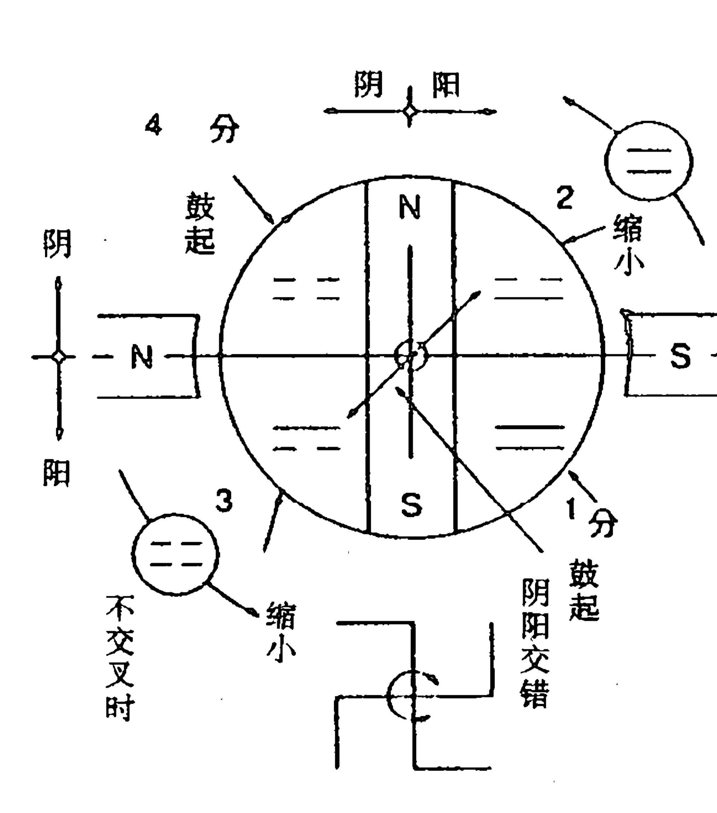

引自儿井英义《易所论及的六维之谜》
（图 28）

在电动机的外侧，设置磁铁的 N 和 S 极，把交叉为十字的 N 极和 S 极置于电动机的旋转体上。这样一来，电动机中便有了阴阳交叉，由力的四象组成的电动机便形成了。

第一象是 S 极和 S 极，这是相互对抗的“分”；第二象是 N 极和 S 极，这是相互吸引的“合”；第三象是 N 极和 S 极，是相互吸引的“合”；第四象是 N 极和 N 极，是相互对抗的“分”。四象分别产生四大原动力，于是“纵横交错”的旋转开始了。

四象的循环运行假如出现故障的话，则旋转立刻就会停止。在阴阳交叉、分合的基础上，调和的旋转作为天道（自然之规律）而成立。原子也是一个调和旋转的系统，这个系统产生于由电子和阳电子的分和合而组成的中性芯。所有的运动着的物体，都是由中心相合的中性芯和阴阳相分的调和组成的。

在第二象和第三象中，假如没有阴阳的相乘，即交叉成为一体的话，则该象的“合”便成为“分”，旋转立刻就停止了。

还有，如第一象、第四象所显示的那样，在相反的东西(SS、NN)当中，都存在有助于膨胀旋转的活动。由此可知，尽管相反一定是互相排斥，但这并不是互相斗争，它实际上是相乘，是互换重合，是谋求进展所必需的条件。从这里，我们可以充分了解到阴阳调和的精髓所在。

相乘、交叉是螺旋运动的出发点。细胞分裂是被包含在所有的生命体细胞染色体中的 DNA 的自我增殖的过程。在细胞核分裂的时候，是线状的纺锤体把染色体一分为二。但是，在内层(高维世界)有其铸型，它操纵着这一过程。据说在这个线状的纺锤体的作用下形成的有线核分裂的运动，用现代科学中已知的任何一种力如电力、磁力、反动力、热力学的力等等都不能对它加以说明。可以认为，在这当中，是生命体的重力在起作用。

下面的一张图，很完美地展示了正、分、合的状态。一分裂开来，成为二，分裂后的二变为两个合，分裂结束。首先，二重结构中的两条螺旋从扭曲缠绕中摆脱出来，分裂为二，然后又各自不出任何差错地认出分裂前与之结合的对方，并再次与其结合。于是分裂最终以合而告结束。

这说明：“在分裂发生的同时，反粒子作为铸型开始起作用，它产生出实像。”这个观点向我们提供了解开一系列生命和宇宙之谜的钥匙。

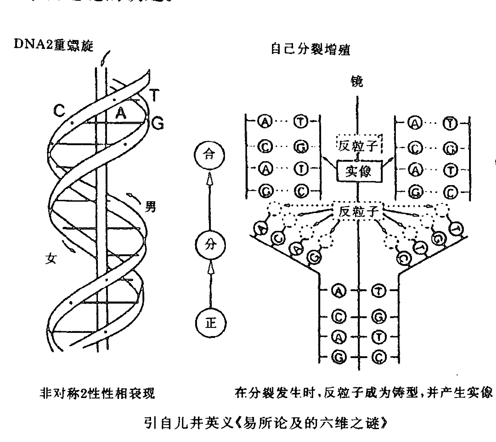

- (1) 所有的三维世界的粒子，是和与其大小、形状完全一致的、只是旋转方向相反的反粒子虚像结对存在的。
- (2) 所有现象世界的粒子，其铸型、原型、蓝图，不在现象世界，而是在作为形而上三维的虚的世界中。
- (3) 阴阳即使从太极分出了，物质现象也不会因此而产生。假如光是阴阳，即光有正、负的话，则光中不过如前述的电动机的例子说明的那样，只有相互吸引的相成现象，而不会形成一个系统。当阴阳电子从光中结对产生的时候，因为缺乏得以依靠的中心，所以只能是结对湮灭，返还为原来的光。
- (4) 交叉后形成交点。于是作为阴阳得以依靠的中性芯产生了，于是能够发展到四象了，由此，宇宙中的能量开始凝聚成块了，作为具有质量的物质——原子便诞生了。

基本粒子因为有了中性芯所以能形成原子。原子通过化合，按序进化为分子、高分子、细胞、器官、生命体，包括生命现象在内的森罗万象表现出来了。

对上述论点的证明是，所有生命体的 DNA 的形态和功能，都是完全一样的，差异只是在于 DNA 的数量。例如病毒的 DNA 为 20 万个左右，人类为 50 亿个。这意味着，在这个世界的生物圈中，存在着共同的宇宙生命的活动，一切都依照一个根本的原理在生存发展。不能说只是人类和生物才有意识和生命，实际上，整个宇宙就是一个具有不寻常的意识和生命的大的有机体。

西洋的哲人是怎样看待宇宙的呢？普洛提诺斯 (Plotinos, 205～270) 是希腊哲学的集大成者，是希腊时代具有最高智性的学者，他的思想曾给予文艺复兴以极大的影响。他把亚里士多德提出的“能动的理性”和柏拉图提出的“观念理念”统一起来，用下面的五个概念来表现从太一（光本身）到实质（黑暗本身）的五个阶层。

太一 → 理性 → 灵魂 → 自然 → 实质

这是一个宇宙存在的系列，太一以下的各个阶层，越是位于下方的，其实质性即物质性越强。

亚里士多德认为，理性观察自我，就是在观察全宇宙。在浑然不可分的统一物（光本身）之上来思考全宇宙就是直接思考自身。可以说“太一拥有一切”，是“思维的思维”。

普洛提诺斯超越了亚里斯多德的“思维的思维”，在彼方设置了“太一”。“太一”进一步深化了柏拉图的“观念理念”。他是这样来作比喻的：整个系列的顶点太一是光源，此后的理性、灵魂、自然一个比一个远离光源，光渐渐地暗淡下去，最后在最下层的实质，光完全消失，成为“一片黑暗”。

但是，这“一片黑暗”决不是在太一之外，不是与太一对立的东西，不如说是在太一下降过程中，进行自我活动的结果，也可以说是太一自身的立脚点。归根到底，它是太一自身的消极面。

太一是全宇宙最终的中心，是一切存在者存在的根源。当太一自我发动时，就像一个巨大的光源向四面八方放射强光，无限的宇宙显现出来。当太一收缩时（宇宙终了），一切存在还原为太一，一切归于无。

> “太一超越有，超越无，超越有无，超越一切。但这样说，太一还是受到了限定。所以应该说，太一不是实体，不具任何性质，无质、无量、无理性、无灵魂；既不是活动的，也不是静止的；不在任何地点，不与时间相关，它与一切都毫无关系，它是独立的存在；它是位于形相之前的无相者，表现于动、静之前。”

从太一到实质的系列，假如从上往下看，则是创造的系列；假如从下往上看，则是爱（或憧憬）的系列。正因为太一不是任何东西，所以一切东西才从太一中产生。因为是绝对无一物，所以确实是绝对无尽藏。不是任何事物的事物，才能产生出所有的事物。任何一个存在，都不过是同其他存在者并列的一个相对的东西，不能说它是其他存在的根源。

普洛提诺斯所说的无一物，不是空无一物，而是在“有”充实到极限后产生的“无”，是不能说有也不能说无那样的“无”。“有”过于有了，过于充实了，超过极限了，所以其中的东西自然地溢出来了。太一停留在太一的状态，连微动也没有，但与其这样说，不如说太一过于是太一了，因此，自然而然地产生出其他的东西。与此同时，太一表现出对系列中其他阶段的爱。宇宙的一切事物都与太一的状态相似。

上述的普诺提诺斯的太一说，生动地描绘了宇宙现象发生之前即根源状态时的模样。该用怎样的数字来对太一进行量化呢？可以说太一既是“超无限大”，又是“超无限小”。

大宇宙的外侧是怎样一种状态呢？对于这个问题，有人可能会这样回答：“无限的场在扩展。”

但是，“无限”实际上是一个必须与“有限”相联系后才能够成立的相对的概念。在“大宇宙”中不存在任何叫做“零”的存在（只是，从三维来看，四维什么也没有，似乎是零。然而四维的存在远远要比三维的存在复杂丰富）。我们的宇宙的本身作为能量现象表现出来，形成一个封闭的世界，它的状态与其外侧的超宇宙的状态是不同的。

把一条一厘米的线段无限地分割下去，最后也不会是零，而是无限接近零的无限小（微积分学从这里产生）。有人说：“所谓直线，就是无限小的点的连续。”但是，无限小的点与点之间，无论如何也是有空隙的。然而，假如真是这样的话，则宇宙也好，人类也好，基本粒子也好，都应该在瞬时崩溃。福原肇在《勾玉与宝珠的世界序章》中指出：“实际上，超越无限小的超无限小（这就是所谓的零）是与超无限大紧密相连的，直线由此得以成立。正是因为在无限小和无限大的深层次存在有根源之数——‘超无限小·零（1÷∞）’和‘超无限大（1÷0）’，现象世界才得以成立。”

超过无限小的零即超无限小和超过无限大的超无限大才是现象宇宙的根源。自古以来，称作空，称作无，或称作太一等等的东西，就是指的这个。那种状态，没有任何现象（零），却拥有所有的东西（超无限大）。宇宙也好，人类也好，基本粒子也好，最终都将归于这种状态。

使宇宙产生活动的是太极。但实际上，还有先于太极、使宇宙意识产生萌动的“根源的东西”，它叫做“无极”。无极才是宇宙的真正根源。当作为无极的最终态的“皇极”活动时，太极的阳产生；安静时，太极的阴产生。太极内含阴阳两仪，在阴阳（气）的作用下，万物产生。无极不是无限大或无限小的存在，说它是超无限大或超无限小（真正意义上的零）也不完全正确，它是作为一切事物根源的宇宙超意识。

即使无极也是有根源的，其根源就是连微动也没有的太一。在太一的作用下，无极作为宇宙现象，作为能量现象产生了。

世界上的一切事物，都是被作为根源的光创造出来的。被创造出来的东西，形成无数的“纵横交错的漩涡”。这些漩涡相互促进，相互影响。在关系调和的时候，它们保持安定状态。但是，漩涡的本性是运动变化，因此安定调和是暂时的，最后是要失去的。但是安定调和失去之后，漩涡又会为恢复安定调和而进行努力。漩涡就这样在进行无止境的移动变化。

这种无止境的移动变化反映了宇宙的历史进程。那么，它将持续到何时为止呢？漩涡是“流体的低压开始消失时产生”的现象。举台风的漩涡为例来说明一下。台风是低纬度的热带低气压发达后产生的，与此同时，在高纬度，一个高气压与台风结对产生。宇宙的漩涡也是这样，低压部的漩涡位于正宇宙，而高压部的漩涡位于反宇宙，它与低压部的漩涡结对产生。

就像台风的漩涡用不了多久就变为温带低气压，然后消失一样，我们宇宙的漩涡在耗尽能量之后，便消失，返还为无极、太一。在维持了一段调和的安定状态之后，又在宇宙本源的作用下开始萌动，然后作为宇宙现象的一部分表现出来。

宇宙现象形成于阴阳。这表明，低压的正宇宙和高压的反宇宙，“看得见的世界”即实的世界的正物质和“看不见的世界”即虚的世界的反物质，是结对存在的。两者的漩涡的旋转方向是相反的。假如问两者之中哪一方更具有根源性，则回答为，是“虚的世界”。实的世界因虚的世界的存在而存在。实和虚的交接点是“零”。不论实还是虚都因“零”的存在而存在。在宇宙中，只有“零”这一点才能够通达不同的维和阶层。今后的科学，在考察零（中性）、反、虚及其关系的过程中，一定会有新的展开吧。

## 结束语 —— 宇宙意识和标量的生活方式

先于生命存在的混沌的轰鸣声，是宇宙诞生时的最初音乐，是“涌出的光”的产物。在混沌作用的催动下，在宇宙中，纵横交错、不断流动变化的漩涡形成了。这些漩涡组成了大到宇宙、小到普朗克常数的万物。万物和谐共存，就像构成了一组美妙的交响音诗。

宇宙是由无数规模各不相同的漩涡组成的。这些漩涡都具有“弗拉克塔尔”的性质，即其形状都符合黄金分割比，再怎样微小的漩涡也具有这样的比例关系。漩涡的成因，是阴和阳、正和负的结对。任何一个结对的存在，都不能仅仅视之为如同磁铁的 NS。结对也使时间和空间发生。

结对的双方，形状、大小、性质都是完全相同的，但其（漩涡）运转的方向是相反的。并且，结对的双方分属于“看得见的世界”和“看不见的世界”。

迄今为止的科学，只注意到结对中“看得见的世界”的那一半。一切物质都由原子组成，而原子实际上是阴阳结对后产生的。但现代科学，只从正、负电磁波的方面来观察组成原子结对中的阳的一方。人们确信，宇宙仅仅只是一个“看得见的世界”。对于结对中的另一方即“看不见的世界”的一方，人们只是以观测不到为由而无视？或加以否定。这也并非没有道理，因为现代科学只是以正负电磁波的眼光来观察一切的。

但是古代东方的哲人，没有忽视结对中的另一方，他们提出阴阳、气和普拉纳的概念，探索作为人体普拉纳出入口的伽克拉和作为人体中气的通道的经络；他们已经感觉到目不可视的光（这种光与现代科学观察到的光即电磁波是不同的），那就是气，是普拉纳，是昆达利尼。因此，我们说，光实际上分为两种，一种是电磁波，另一种是与电磁波完全不同的不可视的光。

美国的希尔兹博士认为，光分为反射光和根源光，根源光是宇宙意识。潘艾丁提出“标量波”理论，该理论的要点是：三维空间的电磁波与四维空间的电磁中和，形成零矢量，成为纵波的重力潜在。标量波与尚未被现代科学所承认的、位于看不见的世界中的气、普拉纳、根源光是性质同一的存在实体。

标量波有以下几种类型：秘藏着三维的物质阶层铸型的四维标量波、作为四维阿斯多拉尔阶层的气和普拉纳原型的五维标量波和塔基翁波、作为五维的曼塔尔阶层根源的六维标量波。诸位请注意，任何一种标量波都有其所属的现象世界，并且在维的阶层上，它总是比其现象世界高出一个阶层。

这样，任何一种现象都有与其结成对子、并高出其一维以上的标量波和塔基翁波。还有一点请大家千万注意，在“看得见的世界”的任何现象中，必定有“看不见的世界”的存在，两者结对，共同占有一点。

还有，假如不从大到 $10^{30}$（千兆×千兆）、小到 $10^{-30}$（普朗克常数 h）的范围来观察宇宙的话，就无法把握宇宙的真正状态。

标量波自体是四维空间即无物质（质量）层次的存在，所以是“宇宙意识”。

当一个人与宇宙意识结合的时候，便意味着他（她）已脱离了浅层次，进入了深层次，觉悟到了一切事物都产生于一个很强大的根源。

我认为，与宇宙意识结合的关键在于理解标量波，并把标量波的理论引入到现实的生活方式中来。迄今为止的科学、世界观以及个人的生活方式，大多是趋向于正方向的。这构成推动经济高速增长的近代社会的基础。其结果是地球环境遭到严重破坏。假如没有与传统完全背离的构想，则地球、人类就很有可能灭绝。

标量的方向是中性、中道、中庸、调和、零。正与负的中和、调和，能使宇宙万物包括人类，相安无事地生存下去。标量的生存方式正是今后世界和人类存在的应有状态。

并且，标量波是纵波，它不仅存在于三维的物质世界，并且通达生命宇宙、精神宇宙乃至内在的万物根源，它能贯通唯一的纵波谱。即将到来的时代，向我们提出这样一个课题：我们应如何通过纵波谱，来达到身心的觉醒呢？“我”降生于这个世界的根本目的，就是为了认识这个纵波谱，并顺利地贯通它。

当把视点投向位于意识中心的零的时候，我们就能直观到自我和他人在深层次上是不分彼此的。这是同宇宙意识相沟通的第一步。当我们与通过零点的纵波谱相接触的时候，就能够接受到来自空间的无限能量了。

到了那时，我们就会自觉地抛弃迄今为止指导自己行为的“向他人索取”的观念，而代之于“为他人服务”的观念了。这正是宇宙之道，是为人之道。

“潘多拉盒（希腊神话传说：宇宙神在潘多拉下凡时给她的盒子，打开时，一切灾难都跑出来，只有希望留在里面。——译注）”已被打开。绝对不能把标量波用于破坏地球，不能用它来支配世界，不能用它来强使他人沦为奴隶。这是宇宙的法律。否则的话，地球会毁灭，而敢于以身试法的人也将与地球同归于尽。

应把标量波用来维护世界和平，创造人类幸福。标量波在这方面的用途是无限量的。当人们意识到这一点的时候，旨在争夺能源的战争便不复存在了。宇宙自然的根本原理开始发挥作用，清洁的能量，从空间源源不断地涌出，无偿地提供给人类。

于是，人类的生活圈令人难以置信地扩大了，人类不仅能上天，还能入地。人人都拥有小型的能量发生装置，生活变得无限便利。城市和乡村已没有任何区别，沙漠改造等难题，不费吹灰之力便能得到解决。

到了那时，所有的人都了解了自己的天资，知晓了自己应享的天年，并在有生之年中尽力发挥自己的天资为人类造福，一切人都将成为天才。

## 跋

前年年底塔玛出版社的瓜谷社长要我把20年来的研究成果归纳一下，写一本书出来。于是，去年年初，我花了一个月左右的时间完成了共计三百几十页的书稿，交给了韭泽总编辑。

但交稿以后，才意识到书稿中存在不少错误及不完善之处，并且也有一些新的想法和思路从脑海中涌现。我感到焦灼不安。于是，我数次从总编辑那儿索回书稿，进行修改和增补。为此，给总编辑添了许多麻烦，在此，我对他表示歉意。

在我一生中最让我感到惊异的体验是，世界上许多看似没有关连的现象，实际上是紧密联系在一起的，因为世界的本质是一个，那就是按黄金分割比形成的一个漩涡。可能明天我还会有新的发现。但是，本书是我迄今为止的研究工作的总结，当然，也可以说是中间报告。

我对特异功能进行研究探索，是始于21年前。那一年，著名的超能力者优里·盖勒访日，在日本掀起了一股超能力热。当时，电视台几乎每天都举办辩论会，讨论“超能力有还是没有”，还请超能力少年进行能力演示。但到末了，因一些超能力少年弄虚作假，导致了超能力热的消退。

但是弄虚作假的存在并不意味着所有超能力现象都是虚妄的。现代科学未了解其底蕴的现象实在是太多了。在现有人类的知识层次中，根本不可能有完美无缺的东西。我感到，探索未知现象和未知能量，是我这一生的使命。在我尽力阐明一个个难解之谜的过程中，我经常品尝到好奇心得到满足后的愉悦，同时为一些新的发现而产生一种心灵的震撼。

在本书写作的过程中，有两个理论给我带来重大的启示：一个是大桥正雄在《波动性科学》一书中阐述的重力和重力波（大桥称之为物质波）以原子为舞台结对发生的理论；另一个是托玛斯·潘艾丁的标量电气重力学理论（标量波理论）。特别是后者，清晰地论述了纵波的重力波·标量波，对于我的理论体系的构筑，帮助很大。在此，我要向大桥正雄先生、潘艾丁先生以及本书引用的其他理论的提出者表示深切的谢意。最后我要对为本书的出版作出极大努力的塔玛出版社的瓜谷侑广社长和韭泽润一郎总编辑表示衷心的感谢。