# 中国易学文化传承解读丛书

# 梅花新易

贾双萍 著

中国商业出版社

# 梅花新易

《梅花新易》是在传统的梅花易数基础上，借鉴了其他门派的知识融会贯通，悟创的一种最为简单易学，准确率很高的数术预测模型。它把古老繁杂的占卜术，渗透到现实生活的各个角落，变为当今大家一看就懂，一学就会，一用就灵的简单预测方法。书中毫无保留地把自己的经验方法写了出来，并配以大量的实例加以演示，揭开了易经神秘的面纱。真正做到了“还易于民道济天下”。

封面设计：实线创作工作室 流野

# 中国易学文化传承解读丛书

# 梅花新易

贾双萍 著

中国商业出版社

# 图书在版编目(CIP)数据

| 项目 | 内容 |
| :--- | :--- |
| 梅花新易 / | 贾双萍著. — 北京：中国商业出版社， 2009.5 |
| ISBN 978-7-5044-6491-0 | |
| Ⅰ. 梅… | Ⅱ. 贾… |
| Ⅲ. 周易—研究 | Ⅳ. B221. 5 |
| 中国版本图书馆CIP数据核字(2009)第073056号 | |

责任编辑 孙启泰

中国商业出版社出版发行
010-63180647 www.c-cbook.com
(100053 北京广安门内报国寺1号)
新华书店总店北京发行所经销
北京龙跃印务有限公司印刷
2009年7月第1版 2009年7月第1次印刷
710×1000毫米 16开 25印张 360千字
定价：48.00元
(如有印装质量问题可更换)

# 《中国易学文化传承解读丛书》

# 出版前言

中国传统文化以诗、书、易、礼、春秋为源头经典。《三字经》上曾讲“诗、书、易，礼、春秋，号六经，当讲求”，又说“有连山，有归藏，有周易，三易详”。在这六种（其中礼，有周礼、礼记二种）经典中，又以易经为最重要的经典。儒家将其列为群经之首，道家将其列为三玄之冠。因此，武汉大学哲学学院博士生导师唐明邦教授将易经称之为“中华文化的源头活水”。

易经文化的传承，一向分为两大部分，一部分是义理的传承，主要从哲学、政治学、社会学、伦理学等人文科学的方面进行阐释、发挥，以指导现实社会发展的方方面面；另一部分就是数术的传承，主要从未来学、预测学、咨询文化的角度进行阐释、发挥，乃至创新、改造，以适应现实社会生活和各色人等的心理咨询需求。

该套丛书，虽然也有部分文章着重从义理方面进行阐发解读，但大部分著作主要是从数术角度进行传承，进行解读。这十几部书涉及到数术中的绝大部分种类，既有古代称之为“三式”的太乙、奇门、六壬，又有八卦、六爻、梅花易数以及四柱命理等，都是作者近几年最新的研究和实践成果。

数术文化，源远流长。中华传统文化从本质上讲是一种没有宗教的文化（所谓本土宗教道教，也是在佛教等外来宗教传播的形势下，才以道家老子为鼻祖而新创的一种宗教），而易经数术文化在中国历史上在一定意义上发挥着“准宗教”的作用，起着抚慰广大人民心灵的作用，换言之，发挥着社会心理学的作用。这就是它“野火烧不尽，春风吹又生”，能够顽强生存下来，得到持久传承的原因。即使到现代科学如此昌明的今天，有人称之为电子时代，信息化社会，但它不仅未能消亡，反而仍然在生生不息地传承着。

当今社会上人们对数术文化有着不同见解和看法。有人将它斥为“封建迷信”，有人将其视为“预测学”或“民俗学”，也有少数人盲目痴迷它，但大多数人处于不了解的状况。

为了使广大读者能够深层次地了解传统文化中的数术文化，以便独立地确定自己的意见和见解，我们出版了这部“中国易学文化传承解读丛书”，参与解读的作者都是个人研究的心得和实验的成果，正确与否，只是一家之言，一得之见。广大读者可以从中辨别真伪，或赞同，或批判，或质疑，或否定。

本丛书的很多内容讲的是预测及占筮技术。对此，我们比较赞同著名作家柯云路先生的观点，他在给本丛书之一的《梅花新易》一书的序中写到：“占筮技术在当今的实际应用则是该谨慎的。一个，是因为这种占筮技术本身的作用还是有其限度的，现代人该更多依靠科学决策。另一个，这一行良莠不齐，很容易给各种江湖骗子可乘之机。所以，对于一般大众来讲，我的告诫常常是：命一般不算，起码要少算。算错了，被误导，就真不如不算，那很有损害。而要真正使自己活得好，倒是该从大处掌握《易经》中的道理，那就是乾卦讲的‘天行健，君子以自强不息’，还有坤卦讲的‘地势坤，君子以厚德载物’。大的道理是十分简易的，再加上做事中正，为人诚信，与时偕行，知道进退，《易经》的大道理就都有了”。

# 序 一

张志春

《周易》既是中国传统的哲学，又是传统的预测学。作为预测学，它在历史发展和人们的实践中也在不断地演化和进步。最初是用蓍草起卦，以卦辞爻辞为主断吉凶。到汉代京房创制了纳甲法，一是用摇铜钱起卦，简化了起卦方法，二是纳入天干地支，配上世应、六亲、六兽，以空间卦象结合时间旺衰，以五行生克为主来判断吉凶。这种方法增强了断卦的规范性、可操作性，提高了准确率，但也从此由简入繁，增加了学习、掌握的难度。到宋代，邵康节又化繁为简，创制了梅花易数预测法，以年、月、日、时或其他数字起卦，只用主、互、变卦卦象和体用生克来断吉凶，使八卦预测成为一种更加快速、简捷、实用的预测方法。

之所以叫梅花易数，一是因为相传由邵康节弟子辑录的《梅花易数》书中第一个测例是“观梅占”，说是辰年十二月十七日申时，邵康节先生偶然观赏盛开的梅花，见两只麻雀争占一枝，结果双双坠地。先生说：“不动不占，不因事不占。今二雀争枝坠地，怪也。”于是按年、月、日、时起得泽火革卦，初爻动，变为泽山咸，互卦为上乾下巽。据此，判断说，明天傍晚时候会有一少女来折花，园丁不知原因，追赶她，女子受惊失足摔倒在地，扭伤大腿，但不至于有什么凶险。结果完全应验。二是该书创制了以年、月、日、时等数字、声音，颜色各种起卦的新方法，和以体用生克断卦的新方法。故称之为梅花易数。

梅花易数这种大道至简的预测方法，在改革开放30多年以来的中国大地上，更得到普及和发展。学习、运用，进而创新此法的大有人在。仅在我狭隘的视听范围内，就知道有张延生、张兴全、赫英凡、黄鉴等人。近几年北京的贾双萍女士在学习、运用、创新梅花易数方面的成绩和进展，更令人刮目相看。她先后出版和印制了《六爻梅花易卦例精解》和《梅花易数预测学讲义》，今天又在此二书基础上，加工整理提高成一部正规出版的图书《梅花新易》。

1. 更加强调学习、运用它的人，特别要用心去体验它，用心去理解它，用心去解读它。
2. 在梅花易数的基础上，借鉴了很多其他门派的经验，更注重心易的应用，它不再像梅花易数那样一事一断，而是发展成一个更加完整的数理预测模型，它不仅能一事一断，而且通过这简单的八卦符号，还能推断出求测人的婚姻状况、工作官职、父母子女、爷爷奶奶、姥姥姥爷，健康疾病、出生环境、流年运程、吉凶祸福等全方位的信息。
3. 将梅花易数与六爻纳甲法融合变通互补同断，避免两种方法的短处，发扬两种方法的长处，进一步提高了判断的准确率。

最后，这部《梅花新易》更令我赏识和赞许的是，作者摈弃了传统文化过去在传承方面的因袭、保守、封闭、不外传的恶习、陋习，作者以天道亲德、以德习易、以德传易的博大胸怀，将自己学习、研究、悟创、悟得的方法、思路、诀窍等不仅和盘托出，而且处处以大量真实详尽的实例解析，来教会读者如何运用这种方法去为人趋吉避凶，指点迷津。我想只有这样，传统文化才能得到继承、发扬，进而成为全国人民乃至全人类的精神财富。是为序。

2008年11月17日于石家庄

# 序二

柯云路

《易经》是中国传统文化的重要组成部分，它博大精深，源远流长，几乎可以说首屈一指。《易经》的最初缘起该追溯到什么年代，至今众说纷纭很难定论。但曾经有《连山》易，后又有过《归藏》易，大约相应的年代是夏朝（可能更早）、商朝，这似乎可以确定。随后到周朝，就叫《周易》了。我们现在讲《易经》，大多是指《周易》。

关于《易经》，几千年来的著作学说多如牛毛，从各种角度来研究、注释《易经》的都有，真正是“诸子百家”。其中所谓“象数派”与“义理派”的划分与对立是特别值得重视的。象数派着重从卦的象与数解释《易经》，它带有更多的自然科学成份，思考世界万物和卦象之间的形与数的对应关系。而义理派则更多地从政治哲学、政治伦理学、政治策略学等“圣人之治”的“人文”角度，观察卦象与天地社会的联系。

这两派自汉以来彼此对立、彼此融合有多种演变。它们在原则上都承认《易经》最早产生于占筮，但象数派显然更看重占筮的意义，有很多象数派代表人物就是占筮大家。而义理派则比较忽略甚至鄙视占筮，他们更多运用的是《易经》中的“上层建筑”部分，在这部分中，我们看到的是堂皇的“齐家、治国、平天下”的学说、理论与策略。

这两派学说中都各有它们的真理。

如果撇开象数派与义理派划分的概念，我们还可以将占筮本身当做《易经》中“技术”层面的内容，而将《易经》中各种对天地人事与阴阳八卦的解释与概括当做“理论”层面的东西。

这两个层面的《易经》内容都有值得我们今天研究之处。

## 二

关于《易经》的占筮“技术”，自古以来主要有三个体系，或者说三种方法。

- 第一种是“古筮法”。这主要是依据六十四卦卦象与卦、爻辞来断卦。当然后来又包括运用《彖》、《象》等易传之“辞”。这种占筮法，春秋战国以来古籍留下了一些案例，读起来饶有趣味。这种占筮法依靠对《易经》的熟悉与透彻把握，它与《易经》本来内容的联系最直接。
- 第二种方法是“纳甲法”，现在民间也多称之为“六爻法”，汉时就有，据说它的成形与西汉京房有很大关系。这种占筮法将天干地支装入六十四卦中，结合年、月、日的天干地支，运用五行生克等一系列法则，进行了一套更为繁复的占筮运算。它有时几乎完全离开《易经》六十四卦的卦、爻辞，另成体系。这种占筮法预测事物十分细化，在民间常常成为占筮主流。
- 第三种是“梅花易法”，基本可以确定源于宋朝邵康节的《梅花易数》一书。创始人大概就是邵康节。这种占筮法起卦简便，外应敏感，将六十四卦的上下卦按动爻所处的位置分为“体卦”、“用卦”，然后在时令五行背景下，对体卦、用卦之间的五行生克进行计算，最后得出预测结果。

这三种占筮技术各有长短，在古往今来的占筮历史中，常常有人将它们综合运用。

将第一种“古筮法”与第二种“纳甲法”结合起来的典范是近代易学大家尚秉和先生。他通常是先以“古筮法”做象断、辞断，在不足以解决问题时便加上“纳甲法”来断卦。

另外要提到的是当代易学大家刘大钧先生。他对《易经》理论层面做出的巨大贡献众所周知，对《易经》技术层面的贡献也令人注意。他著有专门讲授纳甲占筮法的书籍，显示出他对此的熟谙，而以他对《易经》经与传的精通，“古筮法”在他一定是信手拈来的，因此，他将此二法结合起来运用是可想而知的。

而将第一种“古筮法”与第三种“梅花易法”结合起来运用的也大有人在。

邵康节本人就是第一例。

他在《梅花易数》一书中讲到了这种结合。

再值得提出的是当代另一位易学大家张延生先生。他无疑对《易经》象数理论做出了巨大贡献。他的众多著述将《易经》与现代自然科学结合起来，许多见解颇有新意。未来的中国易学史一定会留下他重要的一页。他对占筮技术也有发挥发展。他主要是运用“梅花易法”占筮，同时结合运用卦、爻辞“古筮法”。

三种占筮法中，惟有将第二种“纳甲法”与第三种“梅花易法”结合起来的成功案例少一些。

看到一些名家有过这样的尝试。

现在又有贾双萍。

## 三

贾双萍虽然并不年轻，师承张志春先生等名家学习摸索占筮也有多年。但比起上述那些大家来，绝对该算是易学晚辈。然而晚辈勇于探索，也便有了自己的发现。

贾双萍的占筮最主要的是运用“梅花易法”，且用得较活，在此基础上又将“纳甲法”结合起来，便有了可供易学界关注的特色。

“梅花易法”与“纳甲法”最难相互兼容的一点是“比和卦”和“六冲卦”的关系问题。八个八纯卦在“梅花易法”中都是比和卦，卦逢比和大多都以吉断。而这八个八纯卦在“纳甲法”中却是六冲卦，除了突灾新病有时需冲之外，大多情况下都以凶吝断。两种占筮体系只要一遇到八纯卦就矛盾冲突，因此，历来行家多讲究二种方法不同断，同断徒生混乱。而不同断，无论是“纳甲法”，还是“梅花易法”，都能在本体系中自圆其说，断出准确结果。

贾双萍却在实践中做出了将二者结合的尝试。这些尝试的记录有些很有趣，读者一看自明。她的占筮个案或许还不能说服所有易学行家和爱好者，但足以给人提供一种新思路。从原理上讲，“纳甲法”和“梅花易法”该是能统一的。

## 四

贾双萍对《易经》占筮技术的又一点值得称道的探索是在“梅花易法”的运用中。“梅花易法”主要凭体卦、用卦、时令的五行生克关系断吉凶。自邵康节以来，就强调一个原则：体卦旺则吉，愈旺愈吉，反之则凶吝。但是贾双萍根据她的占筮实践，发现情况并非绝对如此：常常体卦过旺就走向反面，本该断吉的事变得凶吝。她从实践出发，大胆提出了“过旺则反而凶吝”的看法。应该说这是相当有新意的。她在这方面的案例是否丰富确凿到足以向世人立论，还可以斟酌。但是，从大千世界的一般规律来讲，她的见解大概是有道理的。

就好像一个小孩，爷爷奶奶对他好，姥爷姥姥对他好，父母更是百般爱护他，阿姨保姆则里外呵护他，方方面面都“生扶”之，他的人气不但“旺”，而且“过旺”，结果一定会特别好吗？很可能溺爱过度反而害了孩子。这种生活中的道理也是《易经》中的道理。《易经》经文中充满了“物极必反”的告诫，那么具体到“梅花易法”的占筮技术中，似乎也不该有体卦愈旺愈吉没有边界的道理。贾双萍的这一点提议值得易学界关注。

## 五

贾双萍在占筮技术方面的探索还有许多值得称道的地方，对这些，读者特别是行家们自能作出判断。我对占筮技术完全是外行，只是出于对中国传统文化的关注，多年来一直在宏观上研读一些古今的易学著作，还结交了一些奇人。在此过程中，意识到占筮技术是《易经》文化的一部分，今人不可将其弃而不顾。这里也有些奥秘，需人类长久探索。

贾双萍过去写过两本讲义式的小册子，送我看过，我觉得很有意思。

这次看到她经过一年多努力，作出这本准备正式出版的书来，自然也为她高兴。

贾双萍的占筮技术到底如何，还要请读者行家们来评定。勿庸讳言的是本书虽然汇集了很多成功的占筮案例，但肯定还有一些失败的案例作它们的背景而未收入书中。如同天下任何一个技术活儿，失败是成功之母。我这样讲，一个是想说，贾双萍摸索占筮技术一定有其艰辛的过程；还一个想说，希望非行家的普通读者不要把占筮太神化。

好在贾双萍文如其人，朴素实在。她在书中没有故弄玄虚，也没有隐而不宣留一手。有啥说啥，如实道来。这就使得全书增加了真实感和亲和力。对于准备学习和研究《易经》占筮的读者，这本书相当有价值。其中有些个案令人惊叹。应该说朴素实在的个性使得贾双萍更直通《易经》的本质，使得她处在断卦的灵性状态中。

当然，占筮技术在当今的实际应用则是该谨慎的。一个，是因为这种占筮技术本身的作用还是有其限度的，现代人该更多依靠科学决策。另一个，这一行良莠不齐，很容易给各种江湖骗子可乘之机。所以，对于一般大众来讲，我的告诫常常是：命一般不算，起码要少算。算错了，被误导，就真不如不算，那很有损害。而要真正使自己活得好，倒是该从大处掌握《易经》中的道理，那就是乾卦讲的“天行健，君子以自强不息”，还有坤卦讲的“地势坤，君子以厚德载物”。大的道理是十分简易的，再加上做事中正，为人诚信，与时偕行，知道进退，《易经》的大道理就都有了。

在此之余，如果你偶遇难题，想请真正的高手占筮一下作为自己断疑的某种参考，或许还是可以试试的。

2008年12月于北京

# 目录

- 序 一 …………………………………………………………… 张志春（1）
- 序 二 …………………………………………………………… 柯云路（3）
- 第一章 周易预测学 ……………………………………………………………… （1）
- 第一节 周易预测学是超时空的高层次理论 ……………… （1）
- 第二节 周易预测学神奇而不神秘 ……………………………… （4）
- 一、八卦对应自然 …………………………………………………… （6）
- 二、八卦对应人物 …………………………………………………… （6）
- 三、八卦对应身体 …………………………………………………… （7）
- 四、八卦对应数字 …………………………………………………… （7）
- 五、八卦对应动物 …………………………………………………… （8）
- 第三节 周易预测学在现实中的应用价值 ……………… （10）
- 一、什么叫预测学 …………………………………………………… （10）
- 二、周易预测学的各种门派 …………………………………… （11）
- 三、周易预测学在当今社会发展中的积极作用 …… （12）
- 第二章 神奇的梅花新易 …………………………………………………… （14）
- 第一节 起卦方法简单快捷 (17)
- 第二节 梅花新易万物皆可占 (17)
- 一、梅花新易预测天 (17)
- 二、梅花新易预测人事 (19)
- 三、梅花新易预测地 (21)
- 第三节 梅花新易可以用外应直接断事 (23)
- 第四节 梅花新易可以用比拟的方法断事 (24)
- 第五节 梅花新易可以直接读出事情的结果 (26)
- 第六节 梅花新易可以同时预测多人 (28)
- 第七节 梅花新易推陈出新 (30)
- 第八节 梅花新易也可以飞宫寻六亲 (31)
- 第九节 梅花新易直读卦法 (32)
- 第十节 法无定法我心为法 (34)
- 第三章 走出断卦的误区 (39)
- 第一节 学习的诀窍在简单的理论基础当中 (39)
- 第二节 入门不要贪多 (44)
- 第三节 德高才能功高 (45)
- 第四节 每一个卦都可以一卦多断一卦多用 (46)
- 第五节 每一件事情都可以多卦一断 (51)
- 第六节 六爻与梅花新易可以同断 (59)
- 一、大家认为六爻与梅花易数不能同断的理由 (60)
- 二、我认为六爻与梅花新易能够同断的理由 (60)
- 三、六爻与梅花新易同断的好处
- 四、六爻如何与梅花新易同断
- 第七节 梅花新易断卦必须看日月断旺衰
- 一、必须以日月为提纲分析卦的旺衰
- 二、以卦的同一种五行多少定旺衰
- 三、体卦过衰的现象
- 四、梅花新易也有入墓之说
- 第八节 断卦要合情合理
- 第九节 断卦时不要受外界干扰
- 第四章 周易预测基础知识
- 第一节 阴阳学说
- 一、阴阳学说的起源
- 二、阴阳对立统一
- 三、阴阳消长
- 四、阴阳转化
- 第二节 五行学说
- 一、五行起源
- 二、五行特性
- 三、五行生克
- 第三节 天干地支
- 一、天干
- 二、地支

## 第四节 论年月日时
- 一、论太岁
- 二、论月建
- 三、论日辰
- 四、论时辰
## 第五节 八卦
- 一、八卦是世界上最简捷的语言
- 二、八卦符号
- 三、先天八卦图与先天八卦数
- 四、后天八卦图与后天八卦数
## 第六节 梅花新易八卦万物类象新解
- 一、梅花新易八卦万物类象新解来源于生活实践
- 二、梅花新易八卦万物类象新解
## 第七节 六十四卦
- 一、六十四卦名称
- 二、梅花新易的六十四卦万物类象来自生活实践的总结
- 三、梅花新易六十四卦万物类象新解
  - 乾宫八卦象意
  - 兑宫八卦象意
  - 离宫八卦象意
  - 震宫八卦象意
  - 巽宫八卦象意
  - 坎宫八卦象意
  - 艮宫八卦象意
  - 坤宫八卦象意
# 第五章 梅花新易预测法
## 第一节 主卦、互卦、变卦及动爻的表示方法
- 一、卦的组成
- 二、主卦、互卦、变卦（也称之卦）
## 第二节 梅花新易的起卦方法
- 一、时间起卦法
- 二、来人报数起卦
- 三、按随意翻书的页数起卦
- 四、按字的笔画起卦
- 五、按电话号码起卦
- 六、用车牌号起卦
- 七、按人象起卦
- 八、按物起卦
- 九、按动物起卦
- 十、按诸物动态起卦
- 十一、按人手中所持物起卦
- 十二、按人穿衣服颜色起卦
- 十三、按人问话的字数起卦
- 十四、按颜色起卦
- 十五、按味道起卦
- 十六、按物体形状起卦
- 十七、按声音起卦
- 十八、按方位起卦
- 十九、按姓名起卦
- 二十、按任意号码起卦
- 二十一、按斤、两起卦
- 二十二、按尺寸起卦
## 第三节 梅花新易的体用学说
- 一、梅花新易的“体”“用”分辨
- 二、梅花新易的互卦之说
- 三、梅花新易的体用相生
- 四、梅花新易的体用帮扶
- 五、梅花新易的体用相克
- 六、梅花新易的体用比和
## 第四节 梅花新易的体用互变的内在关系
- 一、梅花新易的体用生克定吉凶
- 二、梅花新易诸卦论六亲
## 第五节 梅花新易直读法
- 一、梅花新易的数字直读法
- 二、梅花新易的卦象直读法
- 三、从梅花新易的卦中虚拟找出数字
# 第六章 梅花新易预测学实例与分析
- 第一节 梅花新易预测升学
- 第二节 梅花新易预测比赛
- 第三节 梅花新易预测求官求职
- 第四节 梅花新易预测求财
- 第五节 梅花新易预测自然界信息
- 第六节 梅花新易预测婚姻
- 第七节 梅花新易预测疾病死亡
- 第八节 梅花新易预测官司
- 第九节 梅花新易预测出行及行人走失
- 第十节 梅花新易预测失物
- 第十一节 梅花新易预测饮食
- 第十二节 梅花新易预测车牌号码
- 第十三节 梅花新易预测电话号码
- 第十四节 梅花新易预测生产
- 第十五节 梅花新易断外应
- 第十六节 梅花新易一卦多断
- 第十七节 梅花新易如何解灾
- 第十八节 梅花新易与六爻同断
- 第十九节 梅花新易测来意
- 第二十节 梅花新易定应期
- 第二十一节 梅花新易预测人的一生
- 第二十二节 梅花新易“错卦错断”
- 第二十三节 梅花新易预测姓名
- 第二十四节 八卦以象告
- 第二十五节 名片上的学问
- 后记
# 第一章 周易预测学
## 第一节 周易预测学是超时空的高层次理论
《周易》是中国历史上最重要的典籍之一，被儒家誉为群经之首，是中华民族传统文化宝库中一颗璀璨的明珠。中华民族的传统文化博大精深，《周易》则无愧为中华文化之根源。它不仅仅是一门阐述自然、社会和人类思想一般规律的哲学著作，更是一部囊括了大千世界各个门类的百科全书。周易的思想和见解，在中国几千年的历史上发挥了不可估量的作用。在科技快速发展的现代社会，周易理论在各行各业也有极大的应用价值。

从伏羲八卦算起，易学的起源最少有七八千年的历史，《周易》的诞生也有三千年的时间。几千年过去了，我们的祖先经历了奴隶社会，封建社会，直到如今的社会主义社会，社会形态几经变更，无数次的改朝换代，几千年经久不衰的唯有《周易》。它有着超乎寻常的顽强的生命力。

《易经》的理论几千年来经久不衰，放之四海而皆准，就在于它的“一阴一阳之谓道”的宇宙原理和奇特的思维模式，以及在实际中广泛的应用价值。《周易》内容恢宏，博大精深，包括哲学、史学、科学、卜筮等多种复杂成分。具有多层结构，多种性质。它用一阴一阳揭示了宇宙万事万物的发生、发展乃至灭亡的全部过程。《四库全书提要》指出：“易道广大，无所不包，旁及天文、地理、乐律、兵法、韵学、算术，皆可援引以为说”。中国古代哲学、史学、历法、医学、气功等各种理论思想、各种学术流派，都同周易有着密切的联系。《周易》的“天人合一”，“人法地，地法天，天法道，道法自然”，万法归宗。“天行健，君子以自强不息”，“地势坤，君子以厚德载物”，乃中国文化之活水源头，是我们的祖先对待天文、地理、历史和生活环境的经验写照。因“易”而成道、儒、释，道学崇尚自然，儒家崇尚伦理，释佛崇尚觉悟。系辞云：“乾知大始，坤作成物。乾以易知，坤以简能。易则易知，简则易从。易知则有亲，易从则有功。有亲则可久，有功则可大。可久则贤人之德，可大则贤人之业”。因易而奠定了中国传统文化的结构，使上下五千年的文明一脉相传，造就了博大精深的中国文化，形成了稳定的社会结构，使华夏儿女得以休养生息、安居乐业，薪火相传，《易经》塑造了富于创造和顽强的民族精神，哺育了一代代英雄儿女。

几千年来，上至帝王将相，下至平民百姓，不管是文人墨客还是征战沙场的赳赳武夫，都有着浓厚的兴趣研究它、应用它。有的想从中求得安邦定国之谋略，有的为求克敌制胜之策，有的为断疑解难、趋吉避凶。更多的科学家、哲学家、史学家是想从中觅求认识自然、认识人类社会的规律。仁者见仁、智者见智，各取所需。《周易》思想渗透到社会的各个方面，奠定了中华民族传统文化的基础。

周易是中华民族智慧的结晶，是老祖宗为我们留下的宝贵财富，是取之不尽，用之不竭的信息库。周易在中华民族的历史上起到了不可估量的作用，它推动我国社会、经济、文化、科学技术向前发展，历代明君、贤相，有作为的思想家、政治家、军事家无不受到它的影响，现代科学家也在《周易》中得到很多启发，包括外国的专家、学者。

毛泽东熟谙易理，在讲话中经常引用周易的理论，如：“穷则变、变则通、通则久”，也就是后来经常提的口号：“穷则思变”。这一理论曾经激励我们这一代人去努力改变我们国家一穷二白的面貌，为我国发展经济起到过鼓舞人心的作用。毛泽东主席在中国共产党第八届中央委员会第二次会议上的讲话时说：“中国古人讲：‘一阴一阳谓之道’，不能只有阴没有阳，也不能只有阳没有阴，这就是古代的两点论”。毛泽东主席引用了易经上的话：“无平不陂，无往不复”说明事物总是在一定条件下向着他们的反面转化。

1995年12月武汉出版社出版的罗炽著《中华易文化传统导论》引用了江泽民在1997年访问美国，在哈佛大学讲演“大力弘扬中华民族优秀的历史文化”，在讲演时多处提到过《周易》：“早在公元前2500年，中国人就开始了仰观天文，俯察地理的活动，逐渐形成了‘天人合一’的宇宙观。中国历史上产生了许多的哲学家、思想家、政治家、军事家、科学家和文学艺术家，留下了浩如烟海的文化典籍。春秋战国时期出现的‘百家争鸣’局面和老子、孔子、诸子百家的学说在世界思想史上占有重要的地位。古代中国在天文历法、地学、数学、农学、医学和人文科学等领域都做出过独特的贡献。”

周易不仅是我国一部重要的经典，而且对世界产生了巨大的影响，世界上很多著名的哲学家、科学家，都对周易做出过很高的评价，如黑格尔、莱布尼兹、爱因斯坦等。瑞士心理学家、当代欧洲权威荣格说：“谈到世界人类惟一宝典，首推中国的《易经》。在科学方面，我们所得的定律常常是短命的，或被后来的事实所推翻，唯独中国的《易经》，亘古常新，相延四千年之久，依然是具有价值，而与最新的原子物理学颇多相同地方”。很多科学家认为《周易》中的某些哲学范畴、思维模式，似乎更符合现代科学所揭示的宇宙图象。世界上越来越多的人认识了周易，研究周易并利用周易的理论指导他们的科学试验。我们作为中国人，以此为荣耀，以此为自豪，但是更多的是一种责任！如何把老祖宗给我们留下的宝贵财富变成我们的生产力，指导我们走向成功，是我们炎黄子孙义不容辞的责任！

《周易》还是一部占卜的书。有人只承认周易的理论，一提应用就谈虎色变，认为是封建迷信，他们狭隘地把周易应用理解成“算命”。其实它的应用价值远远不止这一点点。它上可以治国安邦平天下，下可以帮助我们趋吉避凶，指导我们走向成功。自古就有不懂易不能为宰相之说，可见我们的祖先对易经的应用价值是非常认可的。不管你信不信，周易无时无刻不在我们身边。“一阴一阳之谓道，百姓日用而不知”。它其大无外，其小无内。它以世界上最简单的形式，描述出最生动的图画，破译了它的内涵，用易经的理论去理解万事万物，去预测过去和未来，去指导我们的言行，无不准确无误。它是望远镜与显微镜都无法比拟的。

象、数、理、占是《周易》的四大要素，象、数、理是占的理论基础，“占”是象、数、理的综合应用。我们天天生活在阴阳五行当中，而我们自己却不知道。我们不理解不认识的东西不能一概否定甚至说成是迷信。宇宙当中我们未知的东西太多太多，很多现象无法解释，但是它又明明白白的存在，需要我们不断地研究探索，要想揭开宇宙的奥秘，学习研究应用《易经》是揭开宇宙奥秘的途径之一。

理论是用来指导实践的，实践的过程是认识理解和检验理论的过程，只有通过实践，才能对理论理解得更透彻，实践是检验真理的唯一标准。周易预测学是一个学习研究应用易经的实践过程，它有庞大而复杂的象数理论体系，它是一个巨大的信息库，它的信息是取之不尽用之不竭的。提取出它的信息既可以追索过去，也可以展示现在，又可以预测将来。很多未知的理论有待我们去研究去探索去开发。伏羲画八卦，周文王演周易，诸葛亮用周易排兵布阵呼风唤雨流传至今，成了千古佳话，他们是周易的创造者，应用者与传播者。当今学术界愈来愈重视对易经的研究，把易经营誉为“宇宙代数学”、“中华文化的源头活水”。它的科学性与实用价值越来越被人们所认可，从古至今，有无数周易的爱好者通过自己的实践，证实了它的实用价值。事实让我们认识到周易预测学不是封建迷信而是超时空的高层次理论。

## 第二节 周易预测学神奇而不神秘
周易预测学是神奇的，它既能演绎过去，又能预测未来。其大无外，其小无内。学懂周易可以上知天文下知地理，中知人事。可以知道什么时间刮风，什么时间下雨，什么时间晴天。可以知道什么时间地震。地下有什么矿藏。地下磁场对人是吉是凶。可以知道一个人一生的命运。可以知道一件事情的发展过程及结果。远在千里之外甚至远在国外的人随便报个数或者报出他的手机号码、车牌号码、身份证号码、考试证号码甚至是他的一张机票号码、火车票号码，马上就可以说出他的出生环境，长相性格，婚姻状况，父母子女，健康疾病，官运财运，流年大运等等。还能根据他的车牌号码说出此车有什么毛病，有没有撞车信息，会发生在什么时间，什么方向，以及如何化解。这听起来好像是天方夜谭，其实它是实实在在的事实。为什么随意的一个信息都能揭示人的命运、身体、婚姻、子女等等？就是因为信息是同步的，什么事情看似无意，其实偶然中存在着必然。也可以借用佛教的理论来说：“一切都是因果”。这就是天人合一吧。我的书中很多例题都可以证明这是不争的事实。

我去别人的家里，看到他家的周围环境，室内布局，马上能说出主人身体有什么毛病，什么流年会发生什么事情。甚至只要看到他家的户型图，或者他将要买的房子的户型图，都能说出他几条信息。买房人问我：“我还没有买这所房子，你怎么就根据这个房子来说我呢？”我告诉她：“你命里注定就是要住这样的房子”。这不但让外行人感到神奇，就是我们自己在预测时，当把一件事情的结局及整个过程说得一点不差，甚至数字一分不差时，自己也感到周易的神奇无比，会令人兴奋不已。

2006年我在石家庄面授学习班上，为一位学易多年的老同志测他儿子的命运。当时是根据他大儿子的出生年、月、日、时起的卦。从卦上我断出他二儿子的头上要有手术，他大儿子的老婆原来是自己朋友的媳妇，还没与丈夫离婚就与他好上了，后来才与他结婚。断他儿子自己2008年要有不顺。老先生当堂证实了我所有的判断：“他弟弟30多岁脑血管堵塞做了手术，他的媳妇就像你说的一样。而且从儿子的四柱上和奇门局上也证明2008年他有不顺。”

2008年10月我在北京办面授班，他又来听课。课堂上他拿出我在石家庄讲课时给他儿子起的卦说：“贾老师，你说我儿子2008年有事，还真应验了，他媳妇卖了3张奥运会门票，被抓了，儿子承认自己是主犯，被判一年徒刑”。从他出生的时候就预示着他这么多信息，而且该发生的事情都如期发生了，这是不是可以证实人是存在命运的呢？

周易预测虽然神奇但是并不神秘，它是按照一定的规律来展示事情的结果的。我们的祖先不但发明了周易，还教给我们很多运算的方法。只要掌握了其中的一种方法，又掌握周易的基本理论，预测并不是难事。我家乡有一个民间术士，用火柴摆图形来测事准确率还很高。

说到周易预测学就要说到八卦，因为六爻、梅花新易是用八卦预测事情吉凶的。八卦是我们祖先发明的举世无双的国宝。那么什么叫八卦呢？《系辞》中有：“是故易有太极，是生两仪，两仪生四象，四象生八卦。”

太极是阴阳未分，天地浑沌时期。太极中本身就包含着阴阳。阴阳分离，开成了天地，阴阳分，两仪成。两仪就是天和地。它以阳代表天，以阴代表地。这一阴爻，一阳爻，就是组成八卦的最基本的符号。

两仪生四象，是阴阳相重、阴阳交合而致。四象生八卦，实际上还是阴阳相重、阴阳相合而成。乾、兑、离、震、巽、坎、艮、坤，此为“四象生八卦”。八卦只是八个符号，是一个无字天书，就是这八个符号却包罗万象！

### 一、八卦对应自然
乾对应天，坤对应地。有了天地，就有了日月星辰，有了山川河流，有了树木花草。艮对应山、对应石头。震对应树、对应雷。巽对应风、对应花草。坎对应水、对应月亮，对应河流。离对应火、对应太阳。兑对应沼泽。

### 二、八卦对应人物
有了天地就有了人。乾对应老父，坤对应老母。父母的结合产生了子女。震对应长男，巽对应长女，坎对应中男，离对应中女，艮对应少男，兑对应少女。这与现实生活有着密切的关系。震巽为木、为动，木主心慈善良，动主勤快。震巽之木对应长男长女，一个家庭，长男长女是为家庭付出的人，他（她）要帮助父母照看弟弟妹妹，要帮助父母分担家庭的重担，他们要勤快多动。老大是父母的帮手，可以代替父母行使权力管住弟妹，所以老大相对脾气大，符合了震木的特征。长男是家族的希望，他对应东方，是太阳初生的地方。中男中女相对就不那么关心家里的事了，他她们既不像老大那么操心，也没有老小那么受宠，他（她）们怕着大的，让着小的，还得不到父母的重视。他（她）们要千方百计想办法改变自己的处境思考自己的前途。老二用坎水表示，坎水主聪明智慧，也主艰难困苦。离火为中女，离中虚，她们心里可以不装家里的事情，离火也主苦。老百姓流传着这样的话：“宠老大惯老小，受气的二夹笆”。（指中间的孩子）老小被人俗称为“老嘎嗒”，是最受宠的。他（她）们可以随意在父母面前任性，她们在父母面前随心所欲的说话，哥哥姐姐要让着他（她）们。这是他们的代表符号“艮土”“兑金”的特性所赋予的权力。现在的独生子女是艮土为代表符号，所以现在的孩子任性不服管。老百姓流传这样的顺口溜：“老大傻老二滑又尖又滑是老三”。（当然这是一般规律，什么也没有百分之百。现在大多数是独生子女就不存在这种现象了。）由此可见是周易对应了生活，还是生活遵循了周易的法则？还是叫“天人合一”更确切。

### 三、八卦对应身体
乾为头、为左腿、为大肠。兑为口、为肺。中医的理论是肺与大肠相表里。周易的理论是：乾、兑同属金，乾为阳金，兑为阴金，它们五行相同，阴阳互补。离为心、为眼，大家经常说眼睛是心灵的窗户。震为头、为足、为肝，巽为神经、为胆，老百姓经常形容人与人之间的相互信任相互帮助，叫肝胆相照！其实就是震木与巽木互为阴阳，木主直率主善良，这样的人在一起是互相帮助的。坎为肾、为耳、为泌尿系统，中医说肾开窍于耳。艮为手足、为胃，坤为腹、脾，艮坤同属土，艮为阳土，坤为阴土，他们一旦失衡也为病，中医称作脾胃不和。由此可以证明大家所说易医同源的理论是有道理的。所不同的是中医是靠望、闻、问、切来诊断身体的阴阳五行是否平衡，从而诊断人身体的疾病，再通过药的五行特性来调节人的身体。周易是靠八卦的五行生克诊病，再通过卦的五行调和来调节身体，同样可以达到治病救人的效果，因为五行是一种能量，它们之间存在着自然的相生相克的关系。

### 四、八卦对应数字
现实生活的数字从0开始，大到千百万亿无限，小到0下无限。而周易仅用八个符号代表了所有的数字。乾金为1，兑金为2，离火为3，震木为4，巽木为5，坎水为6，艮土为7，坤土为8。例如乾金为一，它既可以是一，又可以是十一、百、千、万、亿、一百个亿、一万个亿……它又可以是十分之一、百分之一、千分之一、万分之一……。其他仿此。

### 五、八卦对应动物

乾金为马、天鹅、狮子、象。坤土为牛为百兽。震木为龙为百虫。巽木为蛇为猫。坎水为猪为水中之物。离火为龟为蚌。兑金为羊为鸡。艮土为狗为狼。

八卦的内容远远不止这些，它其大无外，其小无内，无所不包。大家从后面的八卦万物类象中能看个究竟。八卦生成在远古的年代，没有文字，只是用八个符号来代替文字和语言。所以大家觉得它神秘，一旦大家了解它，认识了它，它就只有神奇而不神秘了。就像我们看到聋哑人聊天，他们用手比比划划，双方都能理解对方的真实意图，而我们不懂哑语的人却像在闷葫芦罐里什么也不知道。

用八卦预测，当你还不了解它的时候，说它既可以知道事情的过去、现在还可以知道将来。也可以知道一个人一生的运势。听起来确实让人感到神奇，甚至让人产生疑惑。当你看到了周易八个卦所代表的万事万物时，你就明白了很多。因为每一个卦象代表了不同的物象，不同的颜色，不同的味道，不同的方向，不同的人物，那么只要卦一出来，就再也不是简单的八卦符号了，万物类象赋予了它无限的内容。我们可以遵照卦象读出我们所需要的内容。例如一个《泽风大过》卦，当你测数字时，它可以读作2、5，25，52，20，50，200、500、2500、5200……。兑为说为泽，巽为风为虚，直读讲风水，说空话。兑为吃，巽为长为白为柔软为酸，断吃饭可以看作面条、蒜苗、白菜、醋。直读吃面条，吃白菜，吃蒜苗，吃醋。《泽风大过》在断食品时，可以看成虾，它上面两个点可以看作虾须，中间四个直道看作虾身上的纹路，或者看成是实在的肉身，下面的两点看做是虾的两个尾。可以看成芝麻烧饼，外面的阴爻可以看成星星点点的芝麻粒，中间的阳爻可以看成一层一层的面饼。舞台上的京剧武生头上有两个雉鸡翎，底下两条腿，人不停地在说唱，是不是也很像这个卦象？问吃饭一般农村家庭可以断吃面条，吃白菜，吃豆角，吃蒜苗等等，请客吃饭可以断虾。南方还可以断吃蛇肉。问身体，可以说腰腿有毛病，成年妇女可以断妇科有毛病。神经衰弱，胆有手术，妇科手术，人工流产。总之一句话，问什么答什么，周易无所不包，什么事情都可以套到卦里面去。要根据求测人问的问题来确定取舍，确定用什么方法来分析判断。如果问事情的成败，要根据体卦用卦的生克制化来判断。

八卦各自代表了不同的五行。五行是一种能量，它们之间存在着生克比和的关系。正是由于五行的生克比和的作用，使得某一方得到了另一方的帮助或者制约甚至伤害。改变了它原来的运行轨迹甚至改变了它的本来面貌。其实我认为断卦就是一种规律的总结，不管是风水还是各种预测方法都是如此。每一种方式都找到了自己的规律性，它都是事先规定了自己的游戏规则，然后总结出规律性的东西变成一个固定的模式。再把起出的卦对照固定的模式中进行比较对照找出所测事情的结果。就像因为……所以……一样。大家遵循各自的规律去对应自己要得到的结果。用哪种方法就按那种游戏规则分析判断。周易是个活的理论，像个魔方，不管你怎么转最后都能转回来。

社会上有些人对周易有偏见，主要是对周易不了解，特别是遇到把事情测错了的人，他们好像更找到了攻击周易的依据。殊不知任何事情都没有百分之百，何况每个人的水平不同。一两个医生治死了人，总不会说医学理论有问题吧。作为易学工作者，应该给周易正名，不要只是强调别人不理解我们，而是我们要努力提高自己的预测水平，提高自己预测的准确度，用事实去征服别人的心。我们首先从我做起，修德悟道，实事求是的面对求测者，不要蒙骗别人。只有站得正才能走的直，德高才能功高。我们要通过自己的努力，证实周易预测只有神奇，而并不神秘！

## 第三节 周易预测学在现实中的应用价值

周易的成书年代距今已经几千年的时间了，几千年的时间，社会发生了翻天覆地的变化，那么周易预测学对于我们有没有应用价值了呢？回答是毫无疑问的，已经有无数的事实证明了这一点。

### 一、什么叫预测学

预测学的直接含义就是当事情还没有发生的时候我们就通过某种方法知道了它的发生、发展过程以致必然结果。它绝不只是某些人狭隘地理解成算命，通过某种预测方法知道人生的轨迹，这只是预测学中的微小部分。它的实用价值与作用远远不止这一点点。它其大无外，其小无内，远观宇宙近看身边。它可以远观上下五千年的流年大事，也可以断出当天当时会有什么事情发生，远隔万里，它可以断出人的长相性格，身体疾病，出生环境，婚姻状况，父母子女等等。它是望远镜与显微镜都无法比拟的。它可以测天气，知道什么时间刮风什么时间下雨，什么时候晴天。它可以测地，知道地底下含有什么物质，什么时间会有地震，震级有多大。正像预测学家张志春老师在为我的书《六爻梅花易卦例精解》一书中作的序言中写道：“我在主编《中国古代哲学研究文萃》（2004年6月新疆人民出版社出版）这套丛书的导言中曾提出一个观点，这就是作为中国古代哲学主干的易学思维科学，不仅作为指导思想、世界观和方法论，曾在中国历史上大的政治实践、经济实践、军事实践乃至科技文化实践中发挥过重要作用，而且我们的祖先还依据象、数、理、用的独特思维方式，构建了许多预测思维模型，用于老百姓的日常生活，以检验这种思维科学的正确程度和准确率。这是中国古代哲学文化区别于其他哲学文化的一个重要特点。换句话说，中国古代哲学的主干，同时又是一种预测学。中国古代哲学中这种预测学，与现代西方所谓的预测学，无论从思维方式上、理论构架上、还是具体方法上，都具有本质的区别。西方所谓现代预测学，是在对某一事物进行大量的调查研究之后，根据该事物的过去和现在的情况及其发展变化规律，依靠逻辑推理的思维方式，对其未来做出预测。而中国古代这种预测学，是根据阴阳五行哲学原则，构建的一个个时空象、数、理的思维模型，而且这种模型是一种普遍适用的模型。也就是说，以一种数理模型来模拟万事万物。所以它不需要对某一具体事物进行调查研究，而是采取比类取象的象数思维方式，直接找出与某事物对应的哲学符号，纳入这个固定的、普适的模型中进行模拟，然后依据阴阳五行生克制化的哲学原理作出预测判断。因此，我认为，它实质上是一种哲学预测。这种预测不仅要运用逻辑思维，同时还要运用形象思维和灵感思维。这就是它不被习惯于现代单一逻辑思维的许多人所理解的症结所在。今天的人们，只有首先从哲学、思维科学的角度去认识和把握中国古代预测学的特点和本质，才能正确地对待它、了解它、学习它和应用它。

### 二、周易预测学的各种门派

自古至今预测学的门派之多无法细举。现在流传的有奇门遁甲、紫微斗数、大六壬、小六壬、四柱预测学、风水学、六爻纳甲预测法、梅花易数，姓名学等等。各种门派都是祖先根据判断事物的规律建立起来的预测模型。有的预测模型用“天干”的生克比和来演示事情的发生发展过程，以及最后的结果，例如奇门遁甲，有人称它为天干学。有的是用“地支”的五行生克变化来演示事情的发生发展过程及结果的，例如六爻与梅花易，有人又称它为地支学。六爻纳甲与梅花易数预测法都是把八卦分别排列组合成六十四卦。他们的区别是：六爻纳甲是把每一个卦的每一个爻都按照一定的规矩装上十二地支，配上六亲六神，通过爻的发动变化或日月的作用产生的不同变化，通过十二地支的生克比和来判断事情的成败。所有的预测方法，都是老祖宗通过实践检验的准确有效的预测模型。它经过了几代人的检验、应用、总结、发展，形成了完整的预测理论体系，并配有大量的实践经验供我们参考。所以哪一种方法都有很高的应用价值。

梅花新易是用八卦符号来进行语言交流的，即乾、坎、艮、震、巽、离、坤、兑。八个卦分别组合成六十四个卦。因为它没有文字，所以有人称它为无字天书。它的符号只有八个，却涵盖了世间万事万物，它的显著特点就是要用心去体验它，用心去理解它，用心去解读它。我们又称它为世界上最简捷的语言。有人说英语最简单，只有 26 个字母组成语言文字，我说比起我们祖先的八卦，它多了 3 倍还拐弯！更别说我们祖先最基本的语言“一阴一阳”之谓道，只有两个符号，宇宙万事万物都包括在其中！

周易预测学的预测方法，就是我们把需求的事情用不同的方法放到各种预测模型中去，以得出求知的结果。这些模型有的简单有的复杂。有的粗略，有的细致。它们各具特色。但是不管用什么方法其结果最终是一致的，因为事情发展的必然结果只有一个。模型只是一种方法、一个框架，只要你掌握得好而且运用自如，用哪种方法都可以准确的得出事物的结果。正如张志春老师在我写的《六爻梅花易卦例精解》中所作的序的标题《大道至简妙在灵通》。关键不是你用哪种方法，而是你对这种方法掌握的程度和运用的经验，以及对卦的理解能力和社会知识的积累。

### 三、周易预测学在当今社会发展中的积极作用

周易的创立至今已经有几千年了。在历史上，周易曾经为各路诸侯治国安邦平天下起到过重要作用。如刘伯温，诸葛亮。最典型的就是三国的诸葛亮，诸葛亮几乎成了智慧的代名词，形容人聪明过人时，往往有人称“赛诸葛”。虽然小说中把诸葛亮其人神化了，说他能呼风唤雨、料事如神。其实就是他运用周易预测学的原理，预测了哪天有雨，哪天有风，哪天有雾，并且不失时机地利用了这些天气，使敌人中了自己的计谋，取得了胜利。很多人不懂周易。不明白其中的奥妙，就当神话来理解。

这部几千年传承下来的周易经典有没有现实意义呢？回答是肯定的。如 20 世纪发展起来的“计算机”，采用二进制为基本计算法则，这与易经阴阳之道可谓异曲同工。具有人统计，世界获诺贝尔奖金的人当中很多是精通易经的高手。他们把易经的理论应用在高科技的学术研究当中，取得了令人瞩目的科研成果。

改革开放以来，我们的国人越来越重视易经的研究与应用。各个领域学习易经的人如雨后春笋一般，学成者应用易经分析问题解决问题，他们不但解决了自己的问题，还帮助很多企业走出困境，取得了事半功倍的效果。这样的事例多如牛毛。例如张志春老师，用奇门遁甲的预测方法，成功地帮助公安机关破获了一起银行抢劫案，为国家挽回了重大经济损失。他为企业出谋划策，使很多企业获得了很大效益。邵伟华老师成功地预测出前苏联领导人的死亡时间……。这样的例子举不胜举！

我在近 20 年的应用实践中，也预测出过各种大大小小的事情的结果。比如：2001 年我预测中国申办 2008 年奥运会能够成功。2002 年我预测中国足球冲出亚洲。2004 年台湾进行大选，很多人担心会引发战争，我起卦后断台湾大陆暂时不会有战争，还有可能讲和，4 年来的事实证明了这一点。2003 年“非典”刚刚开始，我就预测它要流行 60~80 天，结果如我所测。多年来，我为很多企业作过指导，帮助他们赢得效益。我为身边的朋友解决很多实际困难。有因为孩子离家出走的家长，急得痛不欲生，我应用周易的预测方法，告诉他们孩子在什么方向，孩子是否平安，与什么人在一起，在干什么，什么时间能回来。使得家长不但对我越来越信任，而且对周易深信不疑。有朋友反目成仇要走极端，找对方进行报复，听了我的劝告和好或者放弃寻仇的。一个好的预测师，本身就是一个心理医生。

随着周易越来越被人们认可，越来越多的人学习周易预测学，越来越多的人把周易预测学应用到各个学科，我相信更多的奇迹会如雨后春笋一般的出现在各个领域。我期待着有更多的科学家也能研究周易，把我们老祖宗的宝贵财富应用在高科技领域，创造出人类更大的辉煌！

预测大师邵伟华在谈到周易预测学应用成果时这样写道：“一门学问的理论和方法，只有用于实践并为人类创造出物质财富和精神财富，这种理论和方法才称得上是科学的。在易学应用的百花园中用周易预测信息的方法，越来越广泛地应用于现代科学，并为祖国的四化建设作出了巨大贡献。其功绩是不可否认的。”

# 第二章 神奇的梅花新易

我们的先辈在周易的应用方面给我们留下了很多宝贵经验，创造了很多种象、数、理预测模型，例如《奇门遁甲》《紫微斗数》《六爻纳甲》《大六壬》《铁板神数》《梅花易数》《风水学》《四柱预测学》《姓名学》等等。通过不同的预测模型我们可以追索过去，展示现在，预测将来，达到趋吉避凶的目的。不管历朝历代如何修改，大家始终都把预测方法归纳到这几种模型当中流传至今。

大家把以“体”“用”两卦的生、克、比和断事情的成败的预测模型统称为《梅花易数》。《梅花新易》是在《梅花易数》的基础上，借鉴了很多其他门派的经验，总结发展的一种新的预测方法。与《梅花易数》相比，《梅花新易》更注重心易的应用。它不像《梅花易数》简单的一事一断，而是发展成了一个完整的预测数理模型。它万物都可以占。一个简单的八卦，没有文字，但是却可以通过这简单的八卦符号，推断出求测人的婚姻状况，工作官职、父母子女、爷爷奶奶，姥姥姥爷、健康疾病、出生环境、流年运程、吉凶祸福……。《梅花新易》赋予了八卦很多新的万物类象，把八个符号变成我们现代的语言，使它更接近我们的现实生活，它用简单的语言揭开了周易神秘的面纱。

梅花新易可以直接用卦象断事，或者以物象断事，或者以类物比象断事，或者以直读卦的方法断事，或者以“体卦”“用卦”的五行生、克、比和判断事情的成败。它利用易学原理，建立了一整套严密、完整的宇宙、历史及社会人生的象数大结构。是一个以心法为基础的预测理论体系。卦由心起，象由心生，随心所欲，想测什么就测什么，想怎么测就怎么测。完全打破了很多条条框框，给人一个耳目一新的预测理论。《梅花新易》充分体现了周易的“不易、简易、变易”的原则。所以《梅花新易》又可以称为《梅花心易》。心是新的前提，新是心的结果。说它是新易，是说它有了很多的创新，包括万物类象的创新，包括起卦断卦方法的创新，包括预测范围的创新，包括八卦与现实生活结合的创新，它有着太多的创新。说它是心易，是说它所有这些新易，完全是靠用心去揣摩，用心去感悟，用心去体会，用心去沟通，用心去弘扬。还包括我们做事情要凭良心！人在做天在看，人心摆正了天地才可以垂青于你。

《梅花新易》是在易学实用预测模型之中最为简捷、最为方便而且最容易见效的一种预测模型。它是一个典型的注重用心法预测的数理模型。《梅花新易》也是一个适应时代生活方式的产物。现在网络的发达，人们远距离的交往，快节奏的生活方式，都迫切地要求我们跟上时代的步伐。《梅花新易》做到了与时俱进。不管你在天涯海角，还是在异地他乡，只要你想问事情，你给预测师任意的一个信息，或者让预测师随便采集一个你的信息，很快就可以把你想知道的信息预测得清清楚楚。包括你的出生环境，住宅风水，身体疾病，婚姻状况，父母子女，工作官职，学历财运等等。

中医的理论最早来自周易的巫术。中医靠望闻问切诊断人的疾病，中医的理论是人体的五行出现了不平衡，导致了疾病。要想根治，就要用药物调节，靠中草药来调节人体的五行，以达到身体五行的平衡。或者用针灸刺激经络，或者用按摩的手法达到治愈的目的。西医靠化验血象，检验人体的化学成分是否符合人的基本生理指标，透视身体哪个地方有溃疡，哪个地方有肿瘤，用心电图检查心脏的跳动是否规则等手段判断人的疾病。西医把人的基本生理指标用数据显示出来，人生病以后，抽取病人的血象指标对照，只要不合格就可以诊断疾病的所在。然后用化学成分的药物进行治疗，或者通过手术的方法进行根除。因为西医有了透视的功能，有了化验的指标，大家都承认它是科学的。而中医的诊病方式只是大夫摸摸手，看看舌头就能知道什么病，有人就持怀疑的态度。甚至有一次在电视上有一位小伙子公开说中医是伪科学。看来他小的时候就吃错药了，忘记了中国人几千年都是靠中医的方法给人治病，没有中医发挥作用，历史上多次瘟疫的流行，人类恐怕已经灭绝踪迹。即使是他家老祖宗，几辈子不知道吃了多少中药，才使他家得以一脉相传。中华文明已经几千年，西医刚刚兴起了多少年？我们承认西医有很多先进的仪器，有治疗的特色，但是我们绝不能厚此薄彼，中医的优势和很多治疗方法是西医无法代替的。毛主席提出了走中西医结合的道路。两者互相取长补短，成了医疗史上的一大特色。

我们的梅花新易，就像是一个中西医结合的模式。它是通过六十四卦，把六爻与梅花易数两套方法融合变通，用两种理论，两种方法来分析判断卦的吉凶成败。它弥补了两种方法各自的不足，采纳了它们各自的长处，真正做到了取长补短，同时扩大了信息量。梅花易数简单快捷，准确度高，操作简单入门快，但是不够细腻。六爻细腻但是复杂，基础理论相对难一些。原来六爻起卦的方法单一，只能用铜钱摇动得卦，当求测人与预测师不同地的时候就无法进行沟通。它与我们现代生活的快节奏不相匹配，它阻碍了我们远距离的预测交流。我经过了十几年的研究应用，找到了两者的结合点，把两者统一起来。首先是统一了起卦方法，我把梅花易数的方法起的卦，按照六爻的理论装上六亲六神。我用六爻的方法起的卦，兼看梅花易数的大象，用各自的方法理论分析判断，大大提高了断卦的准确度。这种方法的好处还在于可以繁简兼用，一些只需要简单结果的事情，可以用梅花易数直接判断结果，一些重要的事情可以用六爻装卦分析。这种方法我们称它为《梅花新易》。这种方法的得来，是我多少年来用心琢磨，大胆实践得出来的，它经历了分析、发现、研究、应用、总结、推广的全过程，是一个比较成熟的预测方法。两种方法既可以同看，又可以各自独立。与原来的方法比较，它有更多的优势。它为我们现在快节奏的生活方式，远距离的相互交流提供了很好的预测工具。

## 第一节 起卦方法简单快捷

梅花新易起卦方法非常简单快捷，一个人问事，按他问话的时间起卦，或让对方报数起卦，或根据问话人穿的衣服颜色起卦，或用外应起卦等等，一分钟之内卦可以起好，如果只是问简单的事情结果马上就能回答。其他起卦方法还有很多，只要有象、有数字、有颜色、有味道、有动作、有声音、有人物，万事万物都可以起卦。总之什么都是象，什么都是卦。可以说是信手拈来。因为一切都包含在八卦当中。我起卦快断卦快已经是被所有的求测者包括同行公认的。有时求测者刚说完要问的事情，我就回答了他的结果。一个外地的同行，遇到难题，打电话问我事情成败，他刚说完他起的卦，我马上说不成。后来得到他的信息反馈，他说：“老师，您不知道我是谁，上次我给您打过电话，问您一件事情的成败，您只用了半分钟就回答了我的结果，告诉我不成。在问您之前我问过上海比较有名的某大师，也问过一个贵州有名的某大师，他们都说能成，只有你说不成，结果证明你是对的。”后来他专门到北京参加了我的面授学习班。很多时候，就是他们在问话的同时，我看了表，已经按当时的时间起了卦，或者按当时的物象起了卦，或按外应推断了事情的结果。因为我断卦快，经常被人误会我有特异功能。这不是我有什么特异功能，而是直接得益于梅花新易起卦方法非常简单快捷。

## 第二节 梅花新易万物可占

- 一、梅花新易预测天

用梅花新易可以预测任意地方的天气情况，无论是本地还是外地，是国内还是国外，都可以根据卦来预测未来的天气情况，包括阴天、晴天、下雨、刮风。后面有专门论述预测自然界信息的章节。

### 例 1 重庆要下雨

今年在延吉召开的国际易经大会上，四川的丁老师给大家出了一道题，说重庆持续多日三十八、九度的高温，让人难以承受，请大家预测一下重庆明天有没有雨，可以用天气预报验证。我当时正作为大会发言代表坐在主席台上，就按当时的时间 8:55 起卦《地山谦》之《坤为地》䷎ ䷁ ，一片土看不到坎卦、兑卦，无雨。但是肯定是阴晦的天气，气温也肯定要下降，（从卦上看是降 7、8 度）我又看了互卦《雷水解》中有坎水，但是坎水又被震木所泄，又被土包围，很难有大雨。我不知明天的天干地支是什么，坐在主席台上无法看到万年历，也无法问别人，只得就卦对台下说：“重庆明天多云转阴有小雷阵雨，气温下降。”第三天我问丁老师，他告诉我今天早上六点多下起雷阵雨，气温下降了 7、8 度。

### 例 2 河南要下六天雨

2006 年 8 月 21 日 丙申月 壬午日。

我应河南安阳周易专修学院段院长之邀，去学院讲课，早晨 6 点多下楼赶火车，忘了带雨伞，这几天会不会有雨呢？我看表 6:34 分起卦《水泽节》之《坎为水》䷻ ䷜ ，心想坏事了，自始至终都有雨，可能有 4 天或者 6 天下雨，第 4 天和第 8 天还有两场大雨。但是我已经出来了，不愿意再回去取雨伞，心想实在不行就在半路上买一把雨伞吧。而且现在北京天空晴朗，可能不会很快就下雨。到了安阳果然天有些阴，但是没有下雨。段院长的老伴到车站接我，我对她说：“我出门的时候预测天气有雨，我没有带雨伞，还直担心，老天爷还挺照顾我。”我俩边说边去超市买了点东西，总共没有十几分钟，出来的时候天上正下着小雨。在学习班上我把这个卦写在黑板上，并且把下雨的大小及日期告诉大家，有待大家验证。我说：“可能有 4 天或者 6 天下雨，肯定第 4 天第 8 天还有一两场大雨。卦上虽然显示了有可能下 6 天雨，我不敢打保票，但是 4 场雨是肯定的”。第 4 天 25 日这一天下的小到中雨。28 号天下起瓢泼大雨，而且一直持续到 29 号下午。同学们非常兴奋，纷纷说：“老师你算得太准了，今天正好第 8 天，天下这么大雨”。30 号下了一小阵雨。31 号早晨我离开安阳时刚起床一看天又在下雨。自始至终都有雨。前前后后下了六天雨。

### 二、梅花新易预测人事

从每一个梅花新易起的卦都可以判断求测人的长相、性格、运势、身体状况、吉凶祸福、寿命长短、妻子儿女、父母兄弟、官运事业、家宅风水等等，甚至包括你当天吃的什么饭，你当天出门第一个遇到的是什么人，你去了什么方向等等。这已经不是什么天方夜谭的神话故事，而是实实在在地摆在大家面前的事实。在我著的《六爻梅花易卦例精解》及《梅花易数预测学讲义》两本书中比比皆是。本资料也有很多实例。

#### 例3 神舟7号准时发射成功！

2008年9月24日 辛酉月 丁卯日 7:04分

早晨电视新闻节目播报神舟7号火箭上天的消息，但是没说什么时间发射。我顺便看了一眼表，7点04分，起卦《山雷颐》之《风雷益》☰ ☷ ☴，艮为7为止，震为4为动，直读7号火箭要发动，但是现在还没有动，主卦体卦克用卦，变卦体卦用卦比和，发射肯定成功！

艮卦变巽卦，艮为止，巽为动，很快就会发动。

9月25日晚9点10分，神舟7号准时发射成功！这正是亥时水生木，是个非常有利的时间。结果一切正常，神舟7号发射成功，圆了我们遨游太空的梦想。

#### 例4 你女儿会生一个小眼睛的男孩

2003年我去延吉参加学习班，结识了朝鲜族的文大姐，并且成了好朋友。文大姐是延吉周易协会的财务部长。她把我请到她家热情招待，我也为她家调整了风水，因为是现场操作，使她一下子领悟了风水原理及化解的方法。她问我：“贾大姐，我家老二姑娘今年都 32 岁了还没有对象，你看看什么时候能结婚？”我让她数起卦《离为火》之《火山旅》☰ ☱ ☲ ，数刚报出来我就说：“你家姑娘 33 岁结婚”。她家老二长得双眼皮大眼睛非常漂亮。可是从卦上反映她女儿的小孩儿是个小眼睛的男孩儿，我就顺便多说了一句：“你女儿将来会生一个小眼睛的男孩儿。”

2004 年去安阳开会，文大姐路过北京倒车，我们就一起结伴同行。到了安阳，文大姐被聘为朝语翻译，是免费参会的，但是文大姐坚持与我住一个房间。她告诉我：“贾大姐，你的卦太准了，去年你去延吉，我问你我的二女儿什么时候能搞上对象，你告诉我 33 岁会搞好，而且会生一个小眼睛的男孩儿。你还说我 2004 年会到处走。今年我女儿 33 岁，‘十一’就要结婚了，她第一次领男朋友回来我一看，男孩子各方面条件都很好，是做中韩贸易的，就是眼睛小”。文大姐一边说，还一边用两个食指把自己的眼角压住了一块，逗得我们在场的人笑个前仰后合。笑了一阵后，文大姐又说：“我今年夏天去了九华山，现在又来安阳，真是到处走。好多事都让你说对了，还通过实例打开了我的思路，协会的其他人说我的断卦思路与某位老师的书上不符合，我告诉他们，是我北京的老师教给我的，断卦又快又好使。”

2005 年在北京我又见到了文大姐，她说：“贾大姐，又让你说对了，我女儿真的生了一个男孩，我们都记住你的话，孩子刚从产房抱出来我们先看眼睛，孩子哪儿都很好，就是眼睛太小了，不是一般的小。”我开玩笑说：“我真不怎么样，你的女儿又聪明又漂亮，我怎么不给说一个大眼睛的孩子呢？将来你们全家都会怪我”。我的话音刚落，大家又都哄堂大笑。

2006 年我去延吉开会，又见到了文大姐的女儿，亲眼目睹了她这个小眼睛的外孙子，孩子白白的挺漂亮，就是眼睛太小。

#### 例5 嫦娥1号火箭发射成功

2007 年 10 月 24 日  庚戌月  辛卯日（午未空）

我从外面回来打开电视机，电视里正在讲我国嫦娥一号卫星的发射话题。节目主持人问卫星专家：“你信不信运气？”专家说：“有时也还是想这个问题……”谈了几句，节目连接到发射现场，现场的记者说：“我们离发射地很近，大家对此事都非常紧张……”我想我要是在现场起个卦看看，早知道结局就不会让大家这么担心了。我一看电视屏幕倒计时显示 17:59 分，按时间起卦《天火同人》之《风火家人》☰ ☲ ☴，主卦体卦克用卦，变卦用卦生体卦，发射肯定能够成功！5 分 30 秒以后能够成功发射。(变卦直读 5 分 30 秒，另外发射时间也是已知的，可能我看表的时候已经是 59 分 30 秒了，我没有注意秒针) 看到卦我非常兴奋。在兴奋之余，我更感谢老祖宗创造的周易太神奇了！它不但告诉了我们事情的发生发展和结局，还把事情的内容用卦展现得淋漓尽致！主卦《天火同人》直接显示火箭上天，风风火火，前途光明！离为火直读火箭，乾为天直读天，连起来直读火箭上天，离为火又为漂亮的女人，乾金为天，天上漂亮的女人不就是嫦娥吗？乾为天数字为“一”，连起来就是“嫦娥 1 号火箭上天”！起出的卦不但告诉了我们结果，还与实际结合得这么具体！变卦《风火家人》，直读 5 分 30 秒以后成功发射，火箭风风火火地飞出去。“巽”为图像、为信息、为仙女，数字为 5，“离”为火箭，数字为 3，35 天以后会有消息或者图像传回来。为什么断 35 天？一方面是卦上显示 35，另一方面是下个月是亥子月，火不旺，35 天后正是丙寅日，可以通关水克火的压力。互卦《天风姤》用互乾金克体互巽木，卦显示 15 天时会有点小小的不顺，但是没有大碍，因为第 15 天正好是立冬，节令到了亥月，水起到了金克木的通关作用。兴奋之余，我想假如我当时在现场，把结果告诉大家多好呀！让大家都来分享这一快乐！可惜我没有办法告诉大家。过了两三分钟，我想把这一消息发给我非常崇拜的老师，著名作家柯云路先生，于是我拿起手机写道：“柯老师你好，我刚起了一卦，嫦娥一号卫星发射肯定成功。”我发完短信一看表，时间是 18：04 分 36 秒，比嫦娥一号卫星发射时间提前了半分钟。

## 三、梅花新易预测地

用梅花新易起卦，下可知地，它不但可以测出地下的磁场好坏，地气对人体的作用好坏，地下水的情况，地下含有何等矿藏，储存在地下什么位置，地下物质的含量等等。可以预测出地震的情况，地下土壤的优劣等等。

#### 例6 北京没有地震

2008年5月12日四川汶川发生了7.8级地震，全国很多城市都有余震，据说北京也有，刘女士打电话问我北京近几天有没有地震，我看了一下表，18:35分，起卦《泽火革》变《雷火丰》☰ ☴ ☲，我告诉她：“北京没有地震。”从主卦看，离火为消息，又为空，兑金为说，表示大家传北京地震这个消息是虚的。互卦《天风姤》，巽木为胆，被乾金所克，表示大家有点胆小害怕。变卦《雷火丰》。震木为地震，被离火所泄，一方面表示震不起来，又直读成地震的消息是虚的，我赶紧把这个卦写了出来，让儿子打出来放在我的网上，主要是让大家不用担心害怕，也是对我预测水平的考验。

#### 例7 地下240米有铁矿石

有一位易学同行，也是学梅花易的，他听张志春老师说北京有个贾双萍50多岁了，正在写书，很惊奇，向张老师要了我的电话地址，找到我家，简单地交谈几句，他就单刀直入地问我：“贾老师您能断准数吗？”我说：“那就试试吧”。他问我；“您看我在北京工作了多少年？我挣了多少钱？”我忘了当时按什么方法起的卦，只记得有《山天大畜》卦。我问他：“你是给别人打工还是自己单干？”他说：“我是给别人打工”。我说：“你在北京工作了六年，挣了10万块钱”。他当时问我：“10万块钱好理解，因为乾金为一为十。你为什么不断7年，不断一年十年？八年？为什么不用7+1=8，而用7-1=6？为什么断钱数你又用直读的方法？”我笑了笑说：“艮土为7，泄掉乾金数1，不是剩下6吗？我当时这么想的就这么说了，可能这就叫灵感思维吧。”另外打工六年的时间挣十万块钱也差不多。这就是卦理结合生活之理。他又问我：“那您看看我给别人断的一个卦，看看多少米能出铁矿石？”是他带来的卦《兑为泽》之《泽雷随》☱ ☱ ☳卦。我说：“要到220米~240米才能有矿石”。他一听非常兴奋连连说：“贾老师真了不起，采矿图上标的是 220 米处有矿石”。我说：“到时候看吧，也可能是 220 米见到矿石，到 240 米含量更丰富。”他当时就要买我写的草稿，我还没修改完，让他等一等买书。只可惜我一没留他的电话，也没问他的姓名，也不知道他现在是否买到了我的书。我有很多这样的例子只能记住结果，却记不住卦了，主要是我起卦很随意，又不作记录，断完卦就完事，想想非常遗憾。我有很多成功的实例，为什么写这么一个没记清的例题呢？就是提醒大家要随时做卦例的记录，以免留下很多遗憾。

#### 例8 你的矿山是铁矿

甲申月一位外地的男同志被熟人领到我家，刚坐下他就说：“您给我看看矿山的事。”我按 15 点 10 分起卦《山泽损》之《山水蒙》☰ ☱ ☶，我马上说：“你的矿含的是铁矿石”。他说：“是”。我接下来说：“你这个矿有麻烦了或者想卖掉”。他一听赶紧说：“我就是要卖掉矿山有麻烦才来找您的”。艮为矿山，兑金为铁，金临月令，所以断矿山含铁量高。《损》卦有损失、失掉之意，变卦坎水是艮土的财，整个卦显示了卖掉矿山变成财之相。坎卦又为病，矿山为了财的事出毛病，就是有官司。生活之理就是含量丰富的矿能挣钱，他大老远的跑到北京找我干吗？一个简单的时间卦把千里之外的地下显示了出来，比什么方法不简单呢？我又用这个卦装上六亲六神，详细地分析了他的麻烦来自何方，解决起来难度在哪，如何去应对等等。最近听领他来的人说他的矿已经卖出去了，而且一切与我分析的相吻合，他照我说的去做才避免了很多麻烦。

### 第三节 梅花新易可以用外应直接断事

来人问事，恰巧眼前有些现象或对方有些动作直接就把结果揭示出来，无需我们再去起卦，断出的结果还与事实相当吻合。求测者的问话刚出口，我的结果就回答完毕，使对方非常惊奇，常常误认为我开了天目。其实我哪有什么天目，只是学好了《梅花新易》就能达到这么神奇的效果。

#### 例9 手拿苹果钱能到手

一个朋友到我家串门，保姆给她洗了一个苹果递到她手里，她边接苹果边问我：“大姐帮我看看我这次能不能挣钱？”我说：“能”。她很奇怪，为什么我一不让她摇卦二不让她报数三不看时间起卦，张口就说，以为我是在开玩笑。我看她半信半疑，就把奥秘告诉她：“你手里的苹果是圆的，圆也代表钱，这不是表示钱到手了吗？这次挣钱是靠别人帮忙。”她一听笑得前仰后合，眼泪都快出来了。笑过之后说：“大姐您真行，看来您天天有新花样”。说着咬了一口苹果，我又加了一句：“看来这钱不能你自己全拿走，要给别人一部分”。她着急地问：“为什么？”我说：“你自己看圆上是不是有缺了？”她一听乐了：“您不是说了我这次挣钱是靠别人帮忙吗？我能不给人点儿吗？”后来她打电话告诉我事情成功了。

### 第四节 梅花新易可以用比拟的方法断事

有时别人问事时，正好眼前出现了与问事人相同的景象，就可以用这个象对应问事人的事情结果。对方不在现场，打电话问事，我用我自己身边的情景联系起来比拟对照，结果也非常准确。

#### 例10 我家电视正演你的事

有一次一个外地的慕名者打电话问婚姻，我正在看电视，电视节目正好是关于婚姻的，我就照着电视节目的大致情况说了说她的婚姻状况，令她连连称奇，非要问我是怎么知道的，我说是我们家电视正演你的事呢，逗得她哈哈大笑。

#### 例11 你的孩子爱玩棍棒

一个山东的学员打电话问孩子的事情，正在我刚要起卦回答他的时候，我的孙子手里拿着一根棍子走到我面前，我索性不起卦了，直接照我孙子说吧。我马上对那个学员说：“你家孩子是个男孩，长得很漂亮，而且非常聪明，就是不爱学习，就爱玩棍子。”这一席话把山东的学员笑得够戗。她说：“老师你也太神了，我什么都没说，你也什么都不问，就把我儿子说得这么准。我儿子长的是很漂亮，也很聪明，就是不爱学习，整天拿个棍子耍着玩，我家院子里一大堆的棍子”。

#### 例12 手机是一个女人打过来的

2008年10月15日，我参加安阳周易专修学院的十五周年校庆，在会场一位南方的学员坐在我旁边，突然他的手机响了，他只对着手机说了一句；“我正在开会。”就关掉手机。他问我：“老师您看打电话来的是个男的还是女的？”我不假思索地说：“是个女的。”他有些不解地问；“您根据什么说是女的来电话，是不是您也是特异功能呀？”我说：“我没有什么特异功能，你现在与我说话，我是女的，比拟对方就是女的，就这么简单。”他也是一个学易多年的人，但是他对我的断卦方法感到很新奇。他接着又报出他的车牌号，我按号起卦《兑为泽》之《泽雷随》☰ ☱ ☴，对他说：“你的车子撞过，车头有伤，而且是你撞的别人，撞车发生在申酉年。”他很惊奇，因为他的车确实是2004年申年撞了别人。我又问他：“你的头部或者腿上是不是有伤？”他指着头说：“头上现在还留着伤疤。您为什么这样断？”我说：“你的车牌号告诉我的，这叫信息同步”。我刚说完他立即问我：“老师那可不可以说我的头上有伤，我的车头一定有伤呢？”我说：“从理论上可以这么讲，但是我没有这么实践过，暂时还没有发言权。你将来可以做这方面的验证”。

晚上他又到我的房间，屋子里坐着很多易学爱好者，大家互相探讨学习的心得，交流着经验。这个年轻人拿出一个人的四柱问：“大家看这个人第一胎生的男孩还是女孩?”我抬眼一看，他周围坐的都是男同志，我说：“他第一胎生的男孩。”大家用四柱分析，都说第一胎生女孩。最后他亮出底牌，这个人第一胎生的男孩。后来他买了我的函授教材，成了我的函授学员。

### 第五节 梅花新易可以直接读出事情的结果

卦一出来，除了看它的卦意之外，也要看它的象意。梅花新易断卦的主要依据是以象断事。象意包括卦的形象、卦的意象等等，它像什么，找到对应物。还有就是有了物品找它的形象或味道或颜色等等属于哪个卦，只有断卦与现实生活结合在一起，才真实感人。它只用符号来表达卦意。周易的核心理论就是“不易、简易和变易”。周易成型的年代是无字的年代，人们用一些简单的符号记录事情，把万物分类归在八个符号当中。我们搞预测就相当于翻译。根据数和象起成卦，再根据卦去解释事物的来龙去脉。想提高预测水平，就要把万物类象搞清楚。我常对学员们说“我们对万物类象的理解要像聋哑人对哑语的手势理解的一样，见到一个手势，马上明白什么意思。有了八个卦相，我们就可以反推万事万物。八卦起卦有时不需要过多的分析过程，起出卦来一目了然，这就是直读的方法。

#### 例13 你弟弟在家看书

2001年在张志春老师的学习班上，一位铁岭的学员听说我断卦又快又准，就问我：“你看我弟弟在家干什么？”我马上按时间起卦《火风鼎》≡≡卦，我说：“你弟弟在家看书呢”。他当时打电话问他弟弟，他弟弟说在家看书。我的思路是离火为眼睛，巽木是书，两者联系起来就直读看书。为什么不说看花草庄稼呢？这里有个生活之理，就是他问话的时间是晚上，晚上不可能跑到庄稼地里去，看书的可能性大一些。

#### 例14 你家坟地有两处

2006年 辛卯 戊申（寅卯空）

某女报数：5、6、7。起卦 ䷺ ䷼ ䷼《风水涣》之《风泽中孚》卦。

我开口就讲：

- “你出生在有水有草的地方。”她说：“对”。（《风水涣》直读）
- “你家坟地不是一处。”她马上问：“您看有几处？”我说：“最少有两处，一处在你家东南边，一处在北边，两边的风水都有毛病。”她证实说：“坟地是有两处，也是在这两个方向。”（巽可以看作坟地，兑为两处，坎水为病，为什么不说6处？不符合生活之理）
- “你腰腿有疼的地方。”她说：“我腿疼”。（《风水涣》直读）
- “你有异性朋友。”她毫不避讳地说：“有”。（互卦与体卦互为阴阳）
- “你与爱人找对象是他主动，平时也是他让着你。”她点点头说“对，他让着我。”（用生体）
- “你家孩子不怕你，她很有主意，是个女儿”。她很自豪地说：“对，我女儿主意大着呢。”（兑金为她女儿克体）
- “你女儿爱说，长得白、漂亮。”她说：“对，我女儿非常白，也非常漂亮，可会说话了。”（兑金的特性）
- “你爱人长得黑。”她说：“没错，他黑着呢”。（坎水的特性）

#### 例15 我们吃芝麻烧饼夹羊肉

有一次，在石家庄我与爱人去朋友家玩，朋友不在家，从卦上看她要一个小时才能回来。我们想先去她家小区饭馆吃饭，不知道能吃什么，按时间起《兑为泽》卦变《水泽节》䷹ ䷼ ䷼卦。我马上说：“我们可能要吃羊肉，兑为羊，为水，有汤有酒，还有可能要吃烧饼”。《兑为泽》卦，形象得看成是烧饼一层一层的面，上边有星星点点的芝麻粒。而且是摞着放的，结果我们找遍了小区的饭馆，只有两家，一个是烧饼羊杂汤，一个是羊杂汤烧饼。因为烧饼小，我们每人吃了两个。

### 第六节 梅花新易可以同时预测多人

梅花新易的神奇还在于多个人同时求测，直接用每个人坐的方位与他（她）的年龄身份直接断卦，快捷准确。有时经常遇到很多人在一起吃饭，大家都想知道自己的事情，如果你一个一个地起卦，人家吃完了饭你还没断完。这就可以根据每个人座的方位和他的身份年龄、性别分别判断，即准确又快捷，大家边吃边聊，什么都不耽误。

#### 例16 你们坐的方位告诉了一切

2008 年元月，我去山西太原，几个朋友请我吃饭。说是朋友，有的只是一面之交，有的还是未曾谋面。朋友为尽地主之谊，特意请我们到当地的特色饭庄吃饭。大家寒暄两句就随意坐了下来。大家边吃边聊，其中有一位是某市市话剧团老团长。他坐在桌子的西北角。我说：“老团长，你从 2006 年开始走红对不对？”大家一听纷纷回忆，说：“没错！老团长当了 25 年话剧团团长，但是没出大名，退下来以后才开始拍电视连续剧。”我又说了一句：“他最少要演三次山西老汉，而且很成功。”我边说边朝后一指。原来在老团长身后写着饭店的一个横幅“大师演绎三晋一绝”。人家是说他们饭店的地方特色三晋一绝。我正好借过来比喻老团长，因为他也是搞演艺的。大家听完我的话拍手称绝，他们说老团长在《五月槐花香》中扮演一名山西老汉，又在《喜耕田的故事》中扮演一位老汉。还有一个什么电视连续剧中扮演一个山西老汉。（我没记住名字）。

孔老师坐在了东北角，我说：“孔老师，你是从 1985 年开始步入这一行的，到了 1997 年上了一个很高的层次，2009 年你还会上一个台阶。”孔大姐一听忙说：“你说得很对，一年都不差！”

老团长的爱人坐在东面，她问我：“贾老师，你看我呢？”我说：“你这个人心地善良、正直、不会拐弯抹角，但是你的脾气不好，爱着急上火。”大家一听哈哈大笑，他们说我把她形容得太形象了。简直分毫不差。

李某坐在了东南角，我说：“你家一直供奉神佛。”他马上说：“对！我们家一直供佛。”孔大姐接过来说：“他母亲从30多岁天天烧香供佛。每天跪五炷香的时间，80多岁无病而终。”

这种无意的行为，同样给我们提供了无限的信息量。“象”是高层次的断事依据。每一种象，它都有一种信息的揭示，只是看你能不能抓住，能不能根据象发挥自己的想象力，透过现象看本质。

#### 例17 初次见面可以知道每个人的水平

2003年安阳国际易经大会召开，某老师带领弟子组团参会，因为我也曾参加过他一个学习班，也就随他们一起吃住。在饭桌上，老师的弟子们争着要上大会发言，当场演示老师方法的优越性。有三个人想发言，老师也不点名让谁上，他们三个争来抢去。我一看，小A坐在离位，小B坐在坎位，小C坐在兑位，就说了一句：“只有小C上合适。”大家没人理睬我的提醒，仍在争论，后来我又说了两次大家仍没重视。到了大会发言时，小A第一个上台，大会当场起卦，一男子报数起卦《火山旅》之《艮为山》卦，小A说该人没学历，可人家是大学本科毕业，后边几条断的也不理想，小B上去也没断明白。本想为老师扬扬名，结果却砸了锅。小C连上台的机会都没捞着。我为什么这样断的呢？上台讲话以兑金为体，大家坐在那儿吃饭是无意行为，坐坎位泄兑金不利说，坐离位克金有话说不出，只有坐兑位的最能说。后来才知道小C是专职开门市搞预测的，第二年开始出书办班讲课了。

及时捕捉外界的一些特定的信息断卦既简单又准确，但是不能刻意地去追求外应，道法自然才是周易的根本法则。梅花新易看起来很神奇，但是它不神秘，只是很多人不了解它，没有掌握它的规律，不理解它的内涵，现在随着国学热的大好形势，梅花新易会越来越被大家认可，它的神秘面纱已经被揭开，大家将看到的是它神奇的本来面目！

## 第七节 梅花新易推陈出新

周易成书的年代离我们很遥远，现实生活中的问题是无法在书中找到现成的答案的，只有我们自己不断地创新才能找到确切的答案。只要符合卦的象、意、形、色、味，可以大胆地发挥自己的想象力，无限地拓展每一个卦的万物类象。

古人创易，有着它当时的社会现状和思维模式。如今，社会发展了，变化了，我们如果一味地按照古书的断语断事，有很多事就断不明白了。这就需要我们结合社会的现状，大胆推陈出新，把卦的内容、物象与当今的社会结合，重新归类。这除了要遵循古训的爻词卦意，还要大胆创新。把物象形象化归类，如把电视归为离火，把飞机归为巽木……“法无定法，我心为法”，看到一件物体，有时想到什么就定个什么，不要刻意追寻古训，生搬硬套。除了推陈出新还要有创造性思维，创造性思维包括卦的弦外之音。

特别是某一组卦，五行太偏时，就要仔细分析它的弦外之音。有一次，我测一个小伙子的卦，主卦《坤为地》，互卦《坤为地》，变卦《雷地豫》，一片比和。我就想了坤土太多，必然生乾金，克坎水，耗泄震巽木。乾金为领导，受坤土之生，我断他很会与领导搞关系，特别是对一把手好。坎水为泌尿系统，受坤土所克，泌尿系统有病。震木为二把手，去克坤土，一虎难敌五牛，受伤的反而是震木，震木为肝。相应来说他的肝功能比较弱，他证实有一个二把手想治他没治成，反而自己倒霉了。其他五行过偏的断法也是如此。大家从我写的八卦万物类象和六十四卦万物类象中会找到很多新的答案。

## 第八节 梅花新易也可以飞宫寻六亲

梅花新易的六亲一般是以固定位置来判定的。既主卦的体卦代表自己，用卦代表配偶，变卦的用卦代表子女，无论主卦、变卦，都以用卦的阳卦代表父亲，用卦的阴卦代表母亲。有时测卦的人还问一些爷爷、奶奶，姥姥、姥爷的事。我不想重新起卦，就用这一卦一同断。方法是借鉴六爻的方法：生我者为父母；我生者为子孙；克我者为官鬼；我克者为妻财；比肩者为兄弟。这样一来，不但扩大了梅花新易断六亲的范围，而且丰富了卦的其他内容。把这几个简单的八卦符号，扩大了更多的信息量，使得一个简单的八卦蕴含了无限的信息。只要是对应卦的符号的事情，大胆地说，肯定会准确。

有的人可能会问：主卦的用卦一个符号既代表他的父亲或者母亲，又代表他的配偶，又代表他的出生环境，又代表他的身体。变卦的用卦既代表他的父亲或母亲，又代表他的子女，又代表他的晚年运势，那不是等于配偶和父亲或者母亲成了一个人，子女和父亲或母亲都成了一个人了吗？那怎么区分呢？虽然是同一个符号，由于他们的身份地位不同、年龄不同，还是可以分别来叙述的。比如一个《火水未济》之《火风鼎》☰ ☴ ☲卦，是一个女同志测卦，假如是在木火旺的月份来测卦，这属于中女配中男，女占阴卦，男占阳卦，阴阳得位。女人测卦，克我者为官鬼，对于男方来说我克者为妻财。那么我们可以说女主人有官职，男人想当家，但是做不了女人的主，或者说表面看起来是男人当家，但实际还是女主人说了算。为什么？因为在木火年月体卦离火旺，用卦坎水弱，坎水应该克离火，但是无能为力，或是心有余力不足。

女主人还有可能有官职，或出生在官宦之家。那么论述她的父亲，只能说父亲对她严格要求，或者说父女关系不协调；或者说她对父亲反感，或者说父亲想管管不了她，也可以说他父亲财运不错或不缺女人等等。依照卦理，可以扩大自己的想象空间，说到她的出生环境可以说她的出生地附近有水，金水旺的月份还可以断水大。火土旺的月份断水小或原来有水，现已干枯或填平。木火旺的年份成卦可以断水给她带来官运或者家长是做官之人。金水旺的年份可以断水给她带来困难压力或是病痛。

变卦《火风鼎》可以说她母亲比较偏疼自己，母亲心细、额头宽或瓜子脸。说到子女，第一胎应该是个女儿，或者第一胎流产掉了，或者有个女儿不在了。如果现在是个男孩很可能是个女孩的性格或是长得像女孩，孩子对母亲很孝顺……。

假如是个男人测这一组卦，断法就不同了。特别是婚姻，肯定不协调。因为这是一个阴阳反背的婚姻。男人占了阴卦，女人占了阳卦，结合月令的旺衰来评判。婚姻出现阴阳反背多数不幸福。如果男人心甘情愿拱手让权，可能会相安无事，女人在家独揽大权。如果不是，很可能家里夫妻吵架甚至分手。这种卦一般夫妻一方或双方容易有外遇。

那么要测她爷爷那就找卦中生坎水的经卦，可能爷爷奶奶已不在人世或不在身边。如果测他姥姥姥爷，用生巽木的坎水看做是他的姥爷，那么对应坎水的离火就是她的姥姥。这样根据他（她）们生活的年代状况就可以去评判他（她）们的大概情况了。

## 第九节 梅花新易直读卦法

这只是一个顺带的简单信息概况，要详细的求测爷爷奶奶、姥姥姥爷，最好还是单起卦，测的又详细又准确。梅花新易的起卦方法很简单快捷，可能比找来找去更容易更准确。只是在别人顺带问一下的时候简单地说上几句。

《地火明夷》卦，一般不很顺利。测合作得八纯卦，也就是每个宫的首卦，合作都不容易长久。得《火泽睽》卦有吵翻了大眼瞪小眼，哑巴吃黄连的事。

再如在汉字中“好”为多音字，多义词，用在什么场合就取什么意义，什么读音，它们在“爱好”，“好人”中有不同的读法，不同的释义，一看就知道，马上就反应过来，并不用多费脑筋去想去琢磨。我们读卦，也要像对这些多音字一样非常熟练，一看就知道它代表的什么意思，就是看到卦，马上把卦的意思直接用语言表达出来，而不用过多的五行来分析。例如得《泽风大过》直读过渡时期，割草、理发、吃醋、人流、妇科手术、神经衰弱、肩周炎、腊八蒜、二百五、犯错误、说瞎话、吹牛皮、瘸子、酸辣粉、辣白菜、吃面条。《雷山小过》直读开山放炮、手脚有伤、房子拆迁、肝硬化、山林、东北、伤脾、少男有灾。具体取什么意要看测什么事。事物是通过八卦的内涵来表示。“八卦玄象以明”，是通过卦象的显示以达到“明”的境地，因此断卦只凭眼睛去看，去读。就像读书一样，看见了字句就知道它所表达的意思。断卦也是用直读的方法简单准确。八卦以象示事，简单明白，一目了然。我们读卦时要注意的是有时读的是卦的意，有时读的是卦的象，有时读的是卦的形，有时读的是卦的味，有时读的是卦的色，有时读的是卦的组合。

在断卦时要特别注意卦象中出现的几个很有特点的卦的示意，“艮”卦为止，为界限，艮在上卦为最多，艮在下卦为最少。“兑”卦为缺为损，有伤，而“大壮”卦为大兑之象；“坎”卦为险为灾病，而“小过”卦为大坎大险之象，“风泽中孚”为大“离”之象。

有一次，一个朋友领来一个小伙子，测牢狱之灾。我让他写一个字，他写了一个“国”字，我一看，心中一惊，“国”字不是一块宝玉被装在四框当中了吗？引申的含义是一个人困在四面高墙之内，就是监狱。庆幸的是他写到最后一横时，他没写到头儿，“国”字没封口，象征人能出来，我马上告诉他没事。最后果然没事。这也是一种象。象无处不在，看你能不能抓住。

以上各法，既是独立的，又是相关联的，不可以完全分开，是一个统一的机体。应用时随其自然，不能刻意追求，易学的内涵是不易、变易、简易。古人的创易，简单易用，我们就要本着这样的原则，越简单直观地分析问题，越容易准确。

六十四卦，每个卦的卦名，是由它的上卦和下卦的名称组合而成，读卦从上往下读。有些卦的卦名，直接就把卦意表达出来，无需我们再去细推敲。如：测求财，得《山天大畜》《风天小畜》《火天大有》《雷火丰》《风雷益》，如果体卦旺直接可以断有财可求。而得《山泽损》《水山蹇》《山风蛊》等多半无财可求或者求财艰难。

### 1. 依据卦象读卦

《泽风大过》在断食品时，可以看成虾，它上面两个点可以看作虾须，中间四个直道看作虾身上的纹路，或者看成是实在的肉身，下面的两点看做是虾的两个尾。舞台上的京剧武生头上有两个雉鸡翎，底下两条腿，人不停地在说唱，是不是也很像这个卦象？

### 2. 依据卦名直读

《泽风大过》直读过渡，偷渡，犯错误，记过处分，得过且过。我们把卦与现实生活结合起来，才能令求测人感到惊奇、神奇。好像我们对他的事了如指掌，你自己也感到像身临其境一般。这样断卦其中的乐趣妙不可言，真像玩游戏一样快乐。

## 第十节 法无定法我心为法

梅花新易强调的就是一个“心”字，“法无定法，我心为法”。无论从它的起卦方法上，还是从它的断卦过程，都充分地体现了这一法则。梅花新易起卦，没有什么特意的规定，随心所欲，当时想用什么方法起卦，就用什么方法起卦。卦由心起，数由心生。几十种起卦方法都可以准确地推断事情的结果。还有就是断卦方法灵活，它可以用象断卦，可以用五行生克断卦，还可以用卦名断卦，还可以用卦意断卦。这些方法想怎么用，就怎么用，心想事成，无论用什么方法，只要把求测人的事情断明白就可以了。

我在面授班讲课时，都是现场起卦现场断卦。一方面是提高大家的听课兴趣，帮助学员加强记忆加深理解，同时也解决了学员们带来的实际问题。同时满足了学员想让老师给断卦的心理要求。我自己也不愿意老拿过去的例题反复讲，感觉没啥意思。

在课堂上讲到用时间起卦，有的学员问我：“老师，按时间起卦要换算成北京时间吗？” 我说：“不用。有人从美国打来电话，我让他看他的表，按他报的时间起卦断事一样准确。一个美国人在北京找到我，通过翻译报出他的出生时间，我按他出生的时间起卦，分析判断他的事情，通过翻译告诉他，我听他一个劲地说ok！2000年在泰国旅游，我按导游的手表显示的时间起卦，断导游的命运同样被对方认可，他说非常准确。” 还有的学员说：“老师，我的表不准怎么办？” 我告诉他：“不准就按不准的报，心动就可以起卦”。结果按他报的时间起的卦，测他的事情都准确无误。

有时候我在课堂讲时间起卦法时，一问几点了，几个学员同时报出几个不同的时间，我就用他们各自报出的时间分别给他们起卦，然后按他们各自的卦来分析他们的情况，结果都准确无误。

有的学员问我：“老师，按时间起卦，下午一点是按13点起卦还是按一点起卦？” 我告诉他们：“你当时想到的是13点就按13点起卦，你当时想到的是1点就按1点起卦。或者你看到的是1点就按1点起卦，你看到电子表显示的是13点，就按13点起卦。” 还有的学员问：“老师，假如是12点整，我们是用1加2等于3起卦呢还是按12除以8余4起卦呢？后面的整点按什么起卦呢？” 我说：“我的原则是按哪个方法都可以，你习惯用什么方法就用什么方法，你当时想用什么方法起的卦，这个卦一定会告诉你要问的事情的结果。整点的分针数是0，可以按8数计算”。

在课堂上，有的学员说：“老师，按名字起卦，是按简体的笔画还是按繁体的笔画？有的书上说必须按繁体的笔画计算。” 我说：“你平常写什么体就按什么体的笔画算，有时别人把字写连笔了，我就按他写的是几笔就按几笔算，结果也非常准确。比如王字应该是4笔，他连起来写了一笔，我就按一笔算的，他回馈的信息说全对。有一个人的外号叫‘老黑’，我就用这两个字的笔画起卦，推断他人生命运，婚姻家庭，健康疾病，父母子女，结果也都对。梅花新易强调的是个‘心’字，卦由心生法由我定”！

讲到翻书起卦的时候，有的学员问：“老师，那您说我是看左面的页数还是看右面的页数呢？” 我的回答是：“你的心当时想看哪一面就看哪一面，你看哪一面起的卦，这个就是你的卦”。

“法无定法我心为法”体现在断卦上更是如此。卦只有六十四个，你不能说人的命运只有六十四种吧，你也不能说事情的结果只有六十四个吧？如何利用这六十四个卦，把每一个人的命运断得栩栩如生？把每一件事情的来龙去脉说得大致相符？如果只是照搬断语，解决不了问题。实际我们要用“心”来断卦。有句话叫“心领神会”，它形容一些事情不用说明白，或者一个人的心理意图不用直接表白，只是一个动作，一个眼神，而别人就明白了其中的奥妙。断卦也是一样，要做到心领神会。每一个卦除了按正规的顺序解读，还可以颠过来倒过去分析。卦可以上下看，也可以左右看。可以用它的名字直接解读卦的含义，可以用卦的五行生克分析事情的结果。“数由心生法由我定！”不拘泥于死的条条框框。这是梅花新易的独到之处，也是它简单灵活的一面。

六十四个卦如何对应万事万物？一组卦，只有几个简单的符号，如何确定千奇百怪的问题？这就要用我们的“心”去解读它。这个心，不是指我们的心脏，而是指我们的灵魂，我们的思维，我们的精气神！佛家讲“心诚则灵”，易经讲；“卦由心起，数由心生。”“心灵感应”“万化在于心”。老百姓说：“心领神会”“心想事成”，“随心所欲”，“心心相通”。我们的方法一开始又叫《梅花心易》。看来这个“心”字有领路的功能。大家都在说这个“心”字，那么我们怎样在断卦的时候用这个“心”呢？我的经验是当时你看到卦，第一时间想到什么就定个什么，不要犹豫，一犹豫反而容易出错。这一闪念就是你的“心”动了。

怎么才能让这个“心”动呢？这也是初学者最难把握和最难进入的话题。甚至学易多年的人仍然难免有这种困惑。就像前面找我的同行小伙子问我的一样：“《山天大蓄》卦断我挣10万块钱好理解，因为乾金为一为十。你为什么不断我工作7年，不断一年十年？八年？为什么不用7+1=8，而用7-1=6？为什么断钱数你又用直读的方法？”这个问题只能归纳到对现实生活的了解，对周易基础知识的掌握程度的深浅，以及实际应用的经验，还有就是当时的灵感情维。当时“心”这么想也就这么说了，还被求测人点头认可了。所以断卦要抓住第一思维，也可以叫心灵感应。周易是一个集哲学，自然科学，生命科学，自然环境学，人际关系学，心理学，天文学，地理学，医学，历史学，玄学于一身的伟大著作，它无所不包。我们断卦要想准确，要多掌握各个学科的知识，有了各种知识的积累，掌握了断卦的基础知识，经常坚持练习应用，你看到卦以后就会“心”动，你及时捕捉到这一动的闪念，断卦就是个很轻松的事情了。

有的学员听完面授课开玩笑说：“老师，你的方法最大的特点是随心所欲，不受任何条条框框所限制，不易简易变易在你的应用上是体现得淋漓尽致！八卦让你玩活了。”

### 例 18 课堂断卦趣事

2006年我去河南安阳讲学。6月份安阳的天气还很热，我买了一个西瓜拿到课堂大家吃。学院的王主任问：“你们说这个西瓜好吃不好吃？”小段说：“好吃”。我用好吃两个字起卦写到黑板上，《水山蹇》之《水火即济》䷦ ䷾ ䷿ 。我当场就用卦给大家分析：“这个瓜水多红瓤很甜，坎为水，艮土味甜，离火为红色”。一个学员突然问：“老师您看这个西瓜是不是有籽？”我说：“肯定有籽，艮土为石头，在西瓜里的石头不就是瓜籽吗？但是瓜子不是黑色的，是黄褐色的。坎水为黑色，被艮土克制艮土主褐色。”说完以后，一个学员把西瓜切开了，水多味甜红瓤，黄褐色的瓜子。一个卦让大家着实乐了一阵子，这种快乐远远大于吃西瓜的乐趣。这个吃字有人说应该是六画，当时我按7画数的就按7画断的，结果对了。

当讲到车牌号码预测吉凶时，小段报出学院的车牌号码26573，起卦《地山谦》之《水山蹇》䷎ ䷦，我说：“车的水箱或油箱有毛病，此车有撞车信息，但是不管车撞车撞墙还是撞树，都是你们自己撞别人”。我刚说完，在座的几个学院的工作人员哈哈大笑，原来此车的前车盖子撞烂了刚刚换好，而且是他们自己开车撞到了墙上。车的水箱有毛病，一到夏天就开锅。

有的学员问我为什么没有用名字断卦的实例？其实我用名字的实例很多，只是为了保护别人的隐私不愿意把真名写到书上。如果不用真名对大家没有什么帮助。其实用什么方法起卦并不重要，重要的是根据卦把事情断清楚就行了。

# 第三章 走出断卦的误区

社会上周易的书多如牛毛，鱼龙混杂，看得初学者眼花缭乱，不知何去何从。而且有些理论本身就存在错误，大家以讹传讹走到误区里出不来，影响了断卦的准确性。有人学了十几年了还不敢开口断卦。我的很多经验理论是从无数次失败中悟出来的，我今天写出来，无意批评谁或者否定谁，也无意自己标新立异，而是想让大家走出误区少走弯路，提高断卦水平。

## 第一节 学习的诀窍在简单的理论基础当中

很多人学习周易，一开始热情很高，见书就买；见师就拜，学了一阵子，还是没学会，算了吧！周易太难学了，不是每个人都能学的，不费这劲儿了。其实这是一大群人的弊病。还有人一味地找高人、学新法、学高招，钱没少花，学习长进不大。有人最后选择了放弃，有人还在徘徊。

周易是个博大精深的学问，它同时是一个简单的学问，它还是一个变化的学问。这就是易经上说的“不易、简易和变易”。我经常把周易比作一个魔方，魔方的变化规律看似无章可循，其实它是有规律的，找寻这个规律的过程是艰苦的。这个规律大家在没有掌握之前，很难顺利地把打乱了的六个面重新对齐。前两天在电视上，我看到一个小伙子，在蒙住眼睛的情况下，很快地把打乱的魔方六个面对齐了。而我们很多人睁着眼睛去还原对齐还做不到，这是为什么？对于我们而言，魔方太难了。而对于这个小伙子来说，这是一件轻而易举的事情：“我闭着眼睛都能完成，这有何难？”对同一件事物产生了不同的看法。很多人由于找不到还原魔方的规律而放弃了，而这个小伙子成功了。虽然这只是一个小游戏而已，他却因此而上了中央电视台，成了亿万人瞩目的人物。那么我们可以想象的出来，在他成功之前付出了多少努力？他从无数的失败中找到规律，走向成功。找规律的过程，就像我们学易的过程是一样的。

周易八卦，只有八个简单的符号。组合起来只有六十四个卦。对着卦不知道怎么说，这是初学者的普遍现象。为什么？就是学易者本身对断卦急于求成者多。总想一下子就能断卦，想走捷径，想通过高人指点马上就进入高层次。其实这是一个错误的理念。千里之行始于足下。学周易的奥妙不在什么高招，而是在于你对它的基础知识的理解与应用。学习周易，最简捷的办法是打好周易的基础知识。只要基础打牢了，再知道各种预测方法的运算规律，预测就不是什么难事了。比如学习梅花新易，你首先掌握五行的生克旺衰，掌握八卦的万物类象，知道它的演算规则，就可以断卦了。

传统的梅花易数产生在古代，当今社会发展了，很多古代没有的东西如何对应八卦是大家的一个难题。我在预测中也会经常遇到。一个梅花易数的卦，主卦变卦互卦也就最多有五个不同的经卦，在这五个经卦当中，既要测出要问的事情的结果，又要测出他的出生环境、夫妻关系、个人性格、流年大运、官运、财运、疾病、寿命、配偶长相、配偶性格、父母、子女及他们各自的情况，听起来很玄，甚至有人怀疑这不可能，吹呢？其实不是吹，你只要掌握了八卦的万物类象，卦一出来，所有的信息都跃然纸上，很轻松地就能说上十几条二十几条，我用一个卦最多的断过四十六条，而且每条都被对方认可。

很多人学周易，总喜欢学最难的，认为只有最难的才是最高层次的。或者总想学什么高招窍门。认为学了窍门可以走捷径。其实方法不管是难还是容易，每一种预测方法都可以把事情测明白。如果简单的方法等于没有用，它还能流传千年吗？我相信我们的祖先没那么傻，仅这一条理由就够说明问题的了。我学习周易20年了，我可以问心无愧地告诉大家，学习的诀窍在简单的理论基础当中！

某位先生，在周易圈子里混了十几年了，而且在风水学方面有了不错的成绩，被某个大会评为周易应用 50 个新秀之一，风水论文还曾经获过奖。有一次他为一件事情摇了一个六爻卦，自己拿不准主意，打电话问我事情的结果。我也不认识他，没有与他多聊，我只是在电话里直接回答了他：“卦显示的事情结果是不能成功。”我说事情不能成，他不放心，又咨询了他上海和贵州的两个易经高手的朋友。（据他自己说，这两位朋友是奇门、六爻，梅花易数都不错，是给很多企业做顾问的人。）还是这个卦，对方回答他的结果是能成。出现了两种不同的结果。他对我不了解，当然还是相信他朋友的判断结果。事实证明最后的结果是事情没有成功。所以他后来给我打电话说：“贾老师，你是六爻梅花易里的第一人，你只用了半分钟的时间就回答了我的六爻卦，而且结果非常准确，我得跟你学习。”我一听马上说：“你可不要这样说，我不是什么第一人，实际上也没有第一人。周易圈子里谁也没跟谁比过，人外有人天外有天，世间的高人有的是。一件事情测对了也不能证明什么，一件事情测错了也不奇怪”。后来他真的参加了我的面授学习班，我才得以见到其人。课堂上他说：“六爻越来越不准了。”一边说着一边拿出了自己的一个六爻卦。我让他说是什么卦，什么时间摇的？他一边说，我把卦写到黑板上，一是帮助他解决问题，二是给大家讲解如何分析。教学断卦两不误。结果他说的变卦的六亲没有以主卦来变，而是把变卦的六亲原封的抄在旁边。我纠正了他的错误，他说某某老师就是这么写的，后来我还真查看了这位老师的著作，老师没有写错，是他自己没看明白。不过据我所知，犯他这样错误的人在周易界不只是他一个。所以我把这个问题写出来，引起大家的注意。一个学易十几年的人，还犯这么一个低级的错误，不是周易界的悲哀吗？他说卦不准，实际上是他自己没有把基础知识搞明白。由此可见基础知识是多么得重要。

周易界还有人总在标榜自己是什么门派的传人，或者是什么门派的创始人。甚至互相攻击，以此来显示自己的实力。其实我认为，只有求测者对你所下的断语的认知度，才是检验你真实水平的唯一标准。大家用你的方法去给别人预测也能准确，就证明你是真正的传人。俗话说得好：“不管黑猫还梅花心易

是白猫，抓住老鼠才是好猫”。大家互相争来抢去，不就是争谁是白猫谁是黑猫吗？或者是想证明黑猫和白猫哪个是正宗的猫的血统。想一想大家不觉得好笑吗？我们要用做学问的态度，脚踏实地地学习周易，研究周易，运用周易，真正做到学懂会用，还易于民，道济天下。做学问来不得半点虚假。电视剧《喜来乐》的歌词里有一句话：“不求名来名自扬”。这种名，不是靠自己扬出来的，是通过自己的所作所为印到百姓的心里的。当你把别人的事情测得很准的时候，他就会为你扬名，这是发自内心的行为。你自己吹嘘的很神，给人家一断事情，错了，别人会背地里骂你，甚至当面让你难堪。搞预测，千万不要图虚名，因为天天你都在经历考试，天天都有人检验你的预测水平，每一个求测者都是你的监考老师。要想站住脚，就要学好过硬的本事，虽然达不到百战百胜，起码也要八九不离十。这种本事不是你学哪个门派能做到，而是把哪个门派学精通会应用才能做到的。

经常有学员问我怎样才能入门。我的回答是首先掌握基础理论知识，基础知识记住了，理解了，就会断卦了。梅花心易要求记住八卦图的方位，八卦的数字，八卦的万物类象以及梅花心易的基本运算规则就可以入门了。推断卦要想准确，必须仔细阅读和领悟卦象所示，密切注意卦的阴阳转换，体卦用卦的卦气衰旺，体用五行的生克比和，分辨体卦用卦及卦名的寓意。若要熟练掌握断卦，提高断卦预测水平，除了应该学好八卦的基础理论及基本知识外，平时还应该多读卦，多实践，多预测自己的事情，只有自己的事自己最清楚，记得最牢固，检验起来最方便。另外多看别人的卦例，探索别人断卦的思维方法，看别人遇到卦怎样读、怎样解，时间长了也会有收获。只要掌握了基础知识，又勤于实践，断卦不是什么难事。

熟悉八卦的万物类象，知道各个卦的卦名所代表的寓意，代表的人物，代表的性格，代表的状态，代表的时间等等是必不可少的，这一点没有捷径可走，必须记牢还要理解它。这些基础知识只有烂熟于心，用的时候才能做到“随心所欲”。我经常对学员说，我们掌握的八卦万物类象，就像一个修理工的工具箱，只有工具全，用的时候才能得心应手。不要求会背，重要的是理解八卦的象意，你才能在八卦万物类象中找到你要测的事情的对应点。

除此之外还应该努力积累社会生活知识和自然科学知识，丰富自己的经验，了解各种人的内心世界。清楚历史时期的各种特点。若无这方面的知识，是无法拓宽对八卦象意的理解、类比的，不认识卦怎么可能准确地断卦？又怎么增强悟性？不了解各种人物的心态，也不可能断的卦栩栩如生。不了解历史，断过去的事情就会出偏差。你对卦象所示的事物不认识，就像你分析一个你从来不认识的人，你怎么能说出他的生活习惯、人物性格、长相特征呢？通常大家所说的悟性，即理解能力、联想的能力，理解的层次、理解的速度、理解的深度。悟性的高低来源于自然知识的积累与社会经验的总结。

一心想学周易，就要扎扎实实学好理论基础，大胆实践，熟能生巧。学周易不是难事。书中的理论，老师的方法只有经过自己的实践理解了才能变成自己的东西。单纯照搬书中的理论，断卦的准确度不会很高。各种书只是给了你一种理论，一种方法。实际生活当中的事情是千变万化的，你不可能每次遇到的情况都与书上的情况相符。这也是我在实践中有了无数次教训才得出的经验。比如你花钱买了一个馒头，或者别人送给了你一个馒头，只能说这个馒头属于你了，它摆在那里，解决不了你的饥饱问题，只有经过自己慢慢咀嚼咽到胃里才能解决你的饥饱问题，再经过胃的消化吸收变成各种营养，供应你的身体需求，才能维持你的生命。

实践出真知，实践是检验真理的唯一标准。要想学会预测就必须多起卦多练习，最简单最容易的是测自己和周围的人和事，起卦后先预测推断过去已发生了的事，然后再测即将发生的事，以此验证自己所学的知识，提高观察思维能力。当一个卦成了后，应该大胆地说，相信卦不乱成交不乱动的真理。只要卦上有的信息，一定会有。有一次一位易友找我预测他自己卖房之事，按时间起卦《离为火》之《火天大有》☲ ☰ ☲，离火克乾金，分析完卖房后我问他有没有头痛或者有没有肠炎，他说没有，但是我相信卦不乱成交不乱动的道理，离火为眼睛，乾金为大肠，大肠的眼睛是肛门，我马上说：“你有痔疮”。他点头笑了，边笑边说“大姐您真有高的”。逗的在场的人笑得前仰后合。没入门的时候，感觉断卦太难了，一旦学懂了，断卦就变成很简单的事情了。熟能生巧，卦只有 64 个，天天见月月见年年见总会找到它的特点与共性。

## 第二节 入门不要贪多

有人什么门派都想学，却什么也学不精。我认为一个人的精力是有限的，最好先学通一门，能实际操作会解决问题了再学习其他门派。俗话说得好：“不求千招会，只求一招先。”周易预测的方法都是老祖宗经过多年的经验总结出的经典，学会哪一门都可以解决问题，关键是你适合学哪一门或者你喜欢哪一门。

初学周易预测，单学一科，独进一门，只尊一家，虽然难免带片面性，但是对刚入门的人有好处。我指的一家一门不是指片面地只学哪一个人，而是学一种预测模式。有的人什么都想学什么也学不精，倒不如你先学懂一门的基础，大胆实践，领悟了其中的奥秘，能运用自如了，再逐步拓展到其他学科。一阴一阳看似简单，它把宇宙间的万事万物都包含在内。真正能悟透者就是高人！至于用哪种预测模式并不重要。比如我们现在的医学状况，有西医，有中医，有针灸，有按摩。还有民间偏方。你可能把每一科都学了，你可以把它作为炫耀自己的资本，但是你不可能把每一个学科都学得精通。病人找你看病，第一次可能看重你的名气，看中你的招牌，但是经过你给他诊病，治好了他的病，他会继续相信你。如果你名头标得很大，却治不好人家的病，人家还会回来再找你吗？所以你学哪一种学科并不重要，重要的是能把病人的病诊断明白，彻底治愈。学习周易也是如此。集历史及现实的预测学家，每个门派都有高人，但是能门门精通的也不多见。所以说不管用哪种方法，哪个门派，把求测者要问的事情的来龙去脉说明白，把结果说对了，就会被求测者信任，就会被同行认可，就能帮助别人解决问题。方法没有高低贵贱，只有个人掌握水平的高低。学哪一门好，要看自己的兴趣爱好，还要看自己的思维方式适合哪种预测模式。每一种预测模式都有它的长处，都有它的不足。只要能学精一个门派，把事情预测明白了你就是高人。

因为这些模式都是几千年来，经过无数个易学前辈实践的结晶。当你学通一门，能断卦了，再学其他门派，学起来会容易。易学的道理是相通的，你还可以融会贯通相互验证，就像中西医结合，互相取长补短。

梅花心易预测法关键是学懂周易基础知识，看懂八卦图，记住八卦万物类象，以及六十四卦万物类象，知道它的运算法则，断卦就能运用自如了。很多卦都可以直接读出事情的结果。我用的直读方法，解决了困扰我多年看着卦不敢开口的问题。结果十分准确。既简单又直观。我总结的六十四卦万物类象就是我断卦中用直读的方法总结出来的，结果被求测者认可，被同行称赞。

断卦的诀窍就在简单的理论当中，而不是在什么绝招之内。学员们听了我的面授课，都深有感触地说：“真是听师一堂课胜读十年书，看您断卦那么神奇，原来就是只用了这么简单的易学原理，真是相见恨晚呀，我们原来总想能学点绝招，结果白白走了那么多年的弯路。”

## 第三节 德高才能功高

我们学习周易，是为了认识自然，顺应天意，是为了帮助别人，是为了更好的认识事物的客观规律。不要逆天而行，违背天意和民心。千万不要盲目地攻击哪门哪派，我的理由是一个门派能延续几千年，一定有它的道理，哪个门派都有自己的独到之处，哪一个门派都出过高人。我们更不要攻击哪一个人，每一个人都有他自己的独到之处。每一个人的优点都有自己的可学之处。再坏的人也有他的优点，再好的人也有他的不足，这不是周易的阴阳之说吗？能集别人的智慧于一身，能集别人的优点于自身，何愁不能成功呢？学者需清心寡欲，不要搞武林称霸，山外有山，天外有天。我们是人不是神。把事情测对是搞周易人的基本功，没有什么可值得吹嘘的，要说神奇，是老祖宗神奇，几千年的理论经久不衰，放之四海而皆准。

我们教化于人，也要积德行善，修为自己，约束自己。学易之人先看明白自己，再教化别人。“尚清虚，守恬淡”，德高才能功高。得道多助，失道寡助，作为易学工作者，应该实事求是地帮助别人断卦，不要利用自己的知识吓唬别人，借以达到蒙骗别人钱财的目的。做到这一点，天会助你成功的。要想学好周易，首先要先会做人，相信一条：“人在做天在看，德高才能功高”。

## 第四节 每一个卦都可以一卦多断一卦多用

我经常看到有的书写着或者听到有人说：“一卦只能一断”。梅花心易经过不断的创新，再也不是一卦一断的简单预测模型，而是以任意方法起的卦不但可以预测一件事情的成败结果，还可以用此卦断出求测人的出生环境，婚姻状况，父母子女，流年大运等等。这已经是个不争的事实，我的预测实例中比比皆是。

梅花心易的卦还可以无限展开，每一个小经卦可以反复使用，也就是一卦多用。一个卦除了测求测人自己的无限信息以外，还可以针对不同的人或事找出不同的万物类象去分析。经常有求测者问完自己的事情，还要问孩子、父母、妻子、丈夫的详细情况，我就用他的卦分析，情况十分准确。方法是：用他们各自在卦中是什么五行及所处的生克比和状态，还有年、月、日、时对他们的作用关系来分析判断。要断他们的六亲状况，就要用飞宫寻六亲的方法了。即以体卦为中心，生我者父母，克我者官鬼，我克者妻财，我生者子孙，比肩者兄弟。我在很多卦里都顺便断了求测人的六亲情况，依据的就是这种方法。大家在读卦例时细心琢磨很快就能明白。还有一种方法是从卦上已经确定的六亲为中心来找此人的各种信息。

一个卦，只有体卦、用卦两个符号，加上变卦、互卦最多也就是五个不同的卦，要从这有限的卦中，找出无限的信息，就要反复挖掘卦中的信息，把每一个符号代表的人或事反复论证。既看事之初与事情的结局，又看它的中间过程的吉凶。只有这样全面的衡量，才能把事情发生、发展的全过程分析明白。例如测人的一生卦，主卦中的用卦，既代表他的出生环境，又代表他的配偶，是阴卦又代表他母亲，是阳卦代表他父亲，每一个经卦又代表了他身体的不同部位，我们可以根据它们在日月中各自处的旺衰程度以及与它对应的生克关系论证各自的情况。其实我的预测实例大多数是一卦多断一卦多用，为什么还要单列项目来呢，就是提醒大家注意。

### 例 19 你不是头上有磕破的地方就是戴眼镜

2006年 乙未月 癸丑日（寅卯空）

外地的一位女孩打电话问自己的情况，我让她报3个数，她报完数又改了一次，报成3、5、8，起卦《火风鼎》之《火山旅》☰ ☴ ☲，因为是电话预测我问她：“我们没见过面，我先说几条如果对了你就相信我好不好？”她说：“好好”。

- “你出生时家周围花草树木多”。“对”。
- “你有较高的学历，起码大学本科，学历是连续取得的。”她说：“对，我是本科毕业。”
- “你爱人谦让他，他性格柔和。”她回答：“老师你分析得很正确，我爱人对我非常好，他性格也好。”
- “你有腰腿疼的毛病”。她说：“我以前腰疼，现在好一些了。”
- “你出生的家庭比较富裕。”她说：“对，我家条件不错。”
- “你母亲对你好，但是你对父亲更孝顺。”她听了以后笑了半天说：“对对对！您说的一点都不错，我对我父母都很好，但是我更惦念我的父亲多一些。”
- “你是一个热心肠的人，爱帮助别人”。她说：“是”。
- “你不是头上有磕破的地方就是戴眼镜”。说到这里她很惊奇的对我说：“老师您连这些都能看出来，太神奇了，我头上没有磕破过，我戴眼镜”。
- “你家三年之内有老人走了。”她说：“我婆婆前年走了，您能看看我的父母吗？”
- “你母亲长的长脸形，她是一个贤妻良母，为大家做奉献的人”。她说：“您说得对，我母亲很贤惠，长的是长脸形。”
- “你父亲学历高，文化素质高，是个脾气倔强的人。”她说：“对对，我父亲是老名牌大学毕业生，脾气倔，一辈子不服输。”
- “你父亲的出生家庭比你母亲的家庭富裕。”她说：“对，我爸爸家富裕，我妈妈家是农村的，生活困难。”
- “你有一个男孩，你很宠他，孩子脾气有点拧。”她说：“贾老师没错，我是有一个儿子，脾气拧。”
- “你的出生家庭比你爱人家庭富裕”。她又连连说：“是是是，您说得怎么这么准呀。我只报了三个数，你连我的四柱都不知道，您就给我说了这么多。还条条准，足见您的易学功底了。”我问她：“你还想知道什么信息？”她说：“我因为不知道我的四柱，别人给我算不了命，我的名字又不好，我想看看寿命”。我问她：“你今年多大了？”她回答：“我今年 34 岁”。我说：“你的寿命长着呢，人积德行善还可以增寿，作恶还可以减寿，不要瞎想。刚这么小年纪考虑这个问题太早了。”从卦上可以看出她是一个胆小的人。

这个卦就是一个符号反复用来断不同的人不同的事。我的例题大多数都是一卦多用的。大家可以细细体会。

### 例 20 你是一个当官的

2008 年 4 月 10 日 丙辰 戊辰 (申酉空)

一位想参加我函授学习班的东北学员，他与我是同龄人。他到北京开会，顺便来到我家。他要求我给他解答他学习的难题。我给他讲了一天课，讲完课，他还想让我给他起卦看看。我让他报数，他报 9，8，8 起卦《天地否》之《天水讼》≡ ⚊ ⚋ 卦。我依照卦给他一边分析判断，一边给他讲判断的依据是什么？如何在这几个符号中找出你想要知道的事情。等于是一次演习。在断卦之前，我对他说，我有一个要求，我断出的结果，对就是对，错就是错，不能顾及老师的面子，不然既害了你又害了我。他说：“老师放心吧，我肯定会实事求是地回答问题”。乾金为体卦，在月令日辰中旺。我问他：

- **你是不是原来是当官的，而且是正职。** 他说：“我是党委副书记，是组织部部长。”
- **你有头脑，思维缜密。** 其实我这句话有点多余，党委副书记，组织部长能没头脑吗？他的思维能不缜密吗？只是有时断卦习惯了，随口就说出来了。另一方面是给他一个分析卦的思路。
- **你出生在北京西南方的农村。** 他说：“对，我出生在河北省的农村，后来闯关东去了东北”。
- **你肠胃不好**。他说：“老师你说的对，我的肠胃不好”。
- **你母亲偏疼你，你父亲有病，你为你父亲花了 6000 元钱**。他说：“母亲对我好，我父亲有病，我父亲死的时候全部是我一个人花的钱，一共 6000 元”。
- **你有过官司**。他不隐讳地说：“我有过官司。”当官人的事情我不愿意多问，以免对方尴尬，点到为止。
- **你手脚有过伤**。他说：“我的脚有过伤。”
- **你老伴人很厚道，人缘好，对你很好，你结婚以后运势越来越好**。他说：“结婚以前我只是一名普通工人，结婚以后才一步步提上来的”。
- **你上学的时候就当班干部。** 他说：“我上学的时候是学习委员”。
- **你小的时候家里日子比一般人强，你爱人家里条件不富裕。** 他说：“对，我家比我爱人家里强多了。”
- **你有胆结石。** 他说：“我是肾结石”。
- **你去年或者是今年有花钱的事情**。他说：“去年给儿媳妇十万元钱炒股票，被套住了”。
- **你儿子花你的钱，你女儿给你钱**。他说：“太对了，就是这么回事。”
- **你在房地产方面有得财之事**。他说：“是父母留下一个平房，卖掉了。”我追问了一句：“那是不是卖了一万八千块钱？”他说：“就是卖了一万八。”我边断边给他讲解，他说：“真没想到我报了几个数就这么大信息量，老师你不但水平高，人品也是最好的，既不保守，又不贪财，真难得。别说你这么大名气，就是普通学易之人也做不到你这样。”我说：“要想改变这种状况，我们就都从我做起吧。”

### 例 21 一个数字卦断清全家人

在北京的学习班上，一位鲜族大姐报数 2、6、8 起卦《泽水困》之《泽地萃》☰ ☷ ，卦中兑金为她自己，坎水为她父亲，坤土为她母亲，这是按正常的断卦方法从八卦定位和阴阳五行的规定中找到的。我为了给大家演示断卦方法，一并把她的爷爷奶奶，姥姥姥爷全断了个遍，而且被大姐全部点头认可。
“你出生家庭附近有水”。她回答：“我家附近有河。”（坎水示）
“你小的时候家中应该是富裕人家，但是 2 岁的时候家里发生了困难，”她说；“对，我们家原来很有势力，新中国成立前被土改了，正是我 2 岁的时候。”（困卦有困难之意，主卦体生用兑为 2，坎水代表她父亲，受兑卦所生，不是表示她父亲家里很富裕吗？）
“你很早就为家庭付出”。她回答：“对”。（主卦体生用）
“你 26 岁结婚”。她说：“对”。（困卦直读）
“你家老公长得不白，但是人很聪明。”她笑着说：“对，老师你不用客气，他长得黑着呢”。（坎水示）
“你的大女儿很厚道，比较顾家”。她高兴地说：“对，我家老大可帮我了，什么都替我想到了。”（坤土是大女儿生体）
“你家老二很聪明能干，是男孩子或者是男孩子的性格”。她说：“我家老二是个女孩子，但是非常聪明，是男孩子的性格，现在在国外事业有成”。（坎水为次男也可以是老二）
“你对你家老公照顾周到，你爱说，小事你说了算，关键时候老公拿主意”。她认可说：“对，平常事我做主，大事他的决定比我英明”。（兑为爱说坎水为智，大事能不慎重考虑吗？兑生坎关键时候她就会让步）
“你的父亲很聪明，但是会经历坎坷或者有病”。她回答：“对，我父亲他很早就是当地的名人了，土改以后跑到韩国再没有音讯，现在他死活我们都不知道”。
“你的母亲长得很漂亮”。她说：“对，我母亲长得非常漂亮。”（坎水为她父亲，与他对应的兑金就是他的配偶。这里就抛弃了坤土而用兑金。用神是可以变换的，就像一个卦既代表父母又代表子女一样）
“你母亲家出身比较贫困”。她说：“对，我母亲的娘家很穷。”（这里又把坤土看成她母亲，生兑金）
“你姥姥长得漂亮脾气急热心肠”。她说“对”（这里因为坤土是她母亲，互卦中的离火是她的印，生我者父母离火与坤土同为阴性所以说是她姥姥）
“你母亲偏疼你”。她说；“对，我是家里的老大，我母亲跟我在一起。”（坤土生体卦）
“你会在房地产方面有财进”。说到这里，她高兴地说：“老师你说得太对了，我买的房子升值了，而且要被拆迁。”我接下来说了一句：“应该有两处”。她兴奋得说：“就是两处。”（坤土生体卦）我给她断了一共有20几条，只是课堂随意断的没做详细记录。

## 第五节 每一件事情都可以多卦一断

我还看到有的书写着或者听到有人说：“一卦只能一断，一件事情只能起一次卦，多起卦就不准了”……一卦多断我们已经有太多的实例可以说明了，是毋庸置疑的事实。一件事情可不可以多次起卦预测呢？回答同样是肯定的，这也是经过我多年实践检验过的。不论你是用同一种方法还是用不同的方法起卦，尽管每次得的卦不同，只要认真分析，结果是一样的。因为事情的结果只有一个。

#### 例22 不同的卦揭示了相同的结果

2007年12月12日 壬子月 庚辰日（申酉空）

一位老太太要买大房子，手里资金不足。她只能卖掉原来的住房。现在由于深圳、广州房价回落，北京的房价也不稳，很多人在观望等待，买房的人很少。她新买的房子又要马上交款，只得向亲戚朋友先借钱，等卖完原来的住房再把钱还给人家。她问我：“我多少天把房子卖出去？”按问话10个字数加时辰数，起梅花心易卦《巽为风》之《山风蛊》。

> 我多少天把房子卖出去？

| 爻位 | 巽为风 | 山风蛊 | 六神 |
| :--- | :--- | :--- | :--- |
| 六爻 | 兄弟卯木 、 世 | 兄弟寅木 、 | 螣蛇 |
| 五爻 | 子孙巳火 ○ | 父母子水 、、 | 勾陈 |
| 四爻 | 妻才未土 、、 | 妻才戌土 、、 | 朱雀 |
| 三爻 | 官鬼酉金 、 应 | 官鬼酉金 、 | 青龙 |
| 二爻 | 父母亥水 、 | 父母亥水 、 | 玄武 |
| 初爻 | 妻才丑土 、、 | 妻才丑土 、、 | 白虎 |

主卦体用比和，巽卦为消息又主快，一开始很快就有消息。互卦《火泽睽》用卦克体卦，中间有难度。变卦体卦克用卦，事情虽然能成，但是不会太快。巽为5也为15，25，50。究竟是5天还是50天呢？卖房的钱数从卦上体现得很清楚，巽为5，从卦上显示能卖50万元钱。（这一方面是卦数显示，另一方面是北京的房价基本符合这种情况）为了分析得更细一些，我还是装上六爻给她分析：

问房子以父母爻为用神。卦中父母爻亥水旺，但是不利于入日辰土之墓出不来。应爻为买房人，旬空，买房人还没出现。第5天是酉日应爻出空，会有人看房，但是成交不了。因为房子（父母爻亥水）的墓库辰土还没冲开。要经过戌日冲开辰土墓库房子才能卖出去。卦中财爻是土，六爻卦中土数也代表5。看来卖50万元没有问题。因为心急，她当天又用铜钱摇一卦《山风蛊》之《山地剥》：## 第三章 走出断卦的误区

| 山风蛊       | 山地剥       |
|--------------|--------------|
| 兄弟寅木、世 | 兄弟寅木、螣蛇 |
| 父母子水、、 | 父母子水、、勾陈 |
| 妻财戌土、、 | 妻财戌土、、朱雀 |
| 官鬼酉金○应 | 兄弟卯木、、青龙 |
| 父母亥水○   | 子孙巳火、、玄武 |
| 妻财丑土、、 | 妻财未土、、白虎 |

父母爻亥水发动，又有世爻官鬼原神酉金发动来生，房子肯定能卖出去。发动之爻临值逢合为应期。应该在酉日（第5天是酉日）有人看房，但是用神亥水入日辰辰土之墓，要经过戌日冲破辰土墓库，亥日能卖出去。与前一卦信息同步。此卦中财爻是申金，金主4、9。49万元与50万元也很接近应该没问题。结果到了戌亥日房子没卖出去，她有点着急。

12月23日她告诉我：“你说对了一半，你说第五天有人看房，但是卖不出去。果然第5天有人看房但是没相中。但是你说戌亥日房子能卖出去，结果过了戌亥日还是没卖出去。”我想应期不会错，卦中显示戌亥日为应期，会不会是下一个戌亥日呢？我又让她又摇了一卦《天火同人》变《天地否》。

| 天火同人       | 天地否       |
|----------------|--------------|
| 子孙戌土、应   | 子孙戌土、   |
| 妻财申金、     | 妻财申金、   |
| 兄弟午火、     | 兄弟午火、   |
| 官鬼亥水○世   | 父母卯木、、 |
| 子孙丑土、、   | 兄弟巳火、、 |
| 父母卯木○     | 子孙未土、、 |

卦中父母爻卯木发动又有世爻官鬼亥水发动生助，房子肯定能卖出去了。两个卦的官鬼爻都是世爻发动生父母爻，看来得摇卦人亲自出马才能解决问题。我问她：“每次看房谁带着去？”她说：“我儿子和中介的一起带着去”。我说：“你必须亲自带着去看房才行”。她点点头。发动之爻临值、逢合为应期，卯与戌合，看来还是戌亥日解决问题。到了12月30号戌日中介给她打电话，说有人看房。有了我的提示，她自己亲自陪同看房。到了中介一看，买房人也是个老太太，人很老实没有文化，丈夫又很早死于车祸，自己带着儿子过日子。自己已经退休没有多少钱，孩子还没有结婚。买房者一看卖房人也是个老太太还很实在，很相信她，知道不会上当受骗，当天就与中介签订了协议，还给中介交了4000块钱的押金。如果反悔这笔钱是不退的。当时她在中介挂的卖房价是51万，买房人交了订金就证明她接受了这个价格。第二天亥日办手续的时候，买房的老太太提出能不能给降点价，真是个老实人，订金都交了谁还给你降价呢？但是卖房人看老太太可怜就对她说：“按说定好的事不应该变，我也有过艰难的日子，我少收你两万，一万算是给你降价优惠，一万算是我送给你的吧”。老太太听了非常高兴，马上与她签订了买卖合同。由于买房的老太太忘记了存折密码，重新挂失要等一个星期的时间。等到所有的手续办完了正好50天。虽然在不同的时间用不同的方法起的不同的卦，但是事实证明了结果是一样的。这样的实例很多，所以我说同一件事情用多个预测模式检验，结果是一致的，哪个都没有错。

#### 例23 从课堂教学看信息的同步性

为了学员能够记忆深刻理解的透彻，我在课堂都是采取课堂现场起卦现场断卦，讲到哪个章节就让学员起卦在课堂分析，除了个人隐私以外，都给他分析讲解。特别是基础差的学员，可能我会多次给他起卦，帮助他从多角度多方面理解如何分析卦。有一个西北来的学员，30多岁刚刚接触周易，没有基础，连天干地支还不知道。讲到起卦方法，我让他报三个十以内的数字，3、2、7，庚申月甲辰日起卦《火泽睽》之《火水未济》☰ ☵ ☲，我断他婚姻不顺，有哑巴吃黄连的事情，这两年压力大，不顺。运势要到2010年2011年寅卯年好转。为人热情，家庭出生时不富裕，爱人长得漂亮能说，你老想管着她，但是管不住。你有一个男孩非常聪明。你自己有异性朋友。（实际从卦上看他爱人也有，只是课堂上我要给他留面子没有明说。）你心脏有毛病。他当堂给我验证，他说：“老师你说的都对，我有时心脏也不舒服。……”讲到六爻，我让他摇了一个卦，他是针对一件事情摇的卦，卦中出现两个财爻，也是注定一生不是一个女人。讲到车牌号码，又用他家的车牌号码起卦，仍然体现的是这些信息。讲到手机号码，用他的手机号码起出的卦，还是这些信息。最后我让他报出自己的四柱，土年土月生人，甲木的日干，明显身弱。四柱中两财明透，财有强根，典型的财旺身弱的四柱。身弱喜生扶。也是要到寅卯年运势好，财多女人多，身弱不胜才，管不住女人。他说爱人与别的男人发生了关系，有了小孩还要他来养，一气之下离了婚，自己带着儿子过。

2008年11月15日课堂上一位学员拿出自己的名片，我看他的名片左上角有一条很重的红线，我问他：“你是不是经常睡不好觉？”他说：“是”我继续问：“你有一个女儿对不对？”他说：“我是有一个女孩”。我又说：“你们单位出了工伤事故，有人伤了腰腿，你们单位赔了钱对不对？”他回答：“我们单位前几天刚出了工伤事故，死了人，还有伤胳膊伤腿的。”我补充一句：“你的肝胆不太好”。他说：“我们经常喝酒，我有脂肪肝。”

当讲到起卦方法的时候，我让他报3个数字，他随口报出3、6、9。我起卦《火水未济》之《火风鼎》☲ ☵ ☲。我说：“你出生附近有水坑。”他说：“我家南面20米有一个水坑。”我说：“你小的时候家里生活比较困难。”他说：“对，我家不富裕。”我说：“你有学历，但是你不是直接取得的文凭，中间上学间断过。”他说：“我是直接上的，只是上高中时复读了2年。”

我接着说：“你爱人的家庭出身比你家里生活富裕。”他说：“对，她们家一直在矿上，有钱。”我说：“从卦上看，也显示你有一个女儿，对你很孝顺。也看出你的胆不好，容易有炎症，睡觉不好。卦上还显示你35岁有好事情。”他说：“我35岁提的科级。”

讲到手机号码起卦，我又让他报出手机后四位号7766，按号起卦《水雷屯》之《水泽节》☲ ☵ ☲。又显示了他小时候家附近有水，肝胆有毛病。显示他家出生时家里不富裕，爱人家富裕。又显示他有一个长的白又漂亮的

#### 例24 两组卦揭示相同的结果

2008年4月12日 丙辰月 庚午日（申酉空）
一位朋友准备在郊区农村盖个农家院，当地都是盖的木结构的砖瓦房。有人建议她用塑钢合金材料做上顶，这样可以省很多麻烦，只要垒上上墙，厂家来一扣顶就可以了。可以省去很多麻烦。但是究竟用哪个好，她还是拿不定主意。她问我：“房顶用铝合金好还是木头好？一共12个字。时间是中午11点多起卦 《坎为水》之《水泽节》☲ ☵ ☶，卦显示铝合金顶用不成，用木头顶的好。从卦上看坎水为体卦，变卦是兑金用卦生体卦，究竟代表用后者木头好呢？还是用铝合金的取金生水好呢？她在农村的亲戚一听她要用合金顶都反对，他们说那不叫农房，叫工棚。后来她实地考察了一下铝合金的房子，隔音、隔热效果差，第二天她又起了一次卦，问：“xx地的房用合金好还是木头好”。共14个字，早上7点多，《艮为山》之《山火贲》这次还是体现用后者好，两组卦，主卦都是六冲卦，六冲也主事情不成，变卦都是六合卦，主事情顺利。两次起卦同一个结果，用铝合金不成还是用木头的好。结果还是用的木头顶。

#### 例25 预测赵某疾病1

2007年 己酉月 壬戌日（子丑空）
我的同事赵某生病住院了，她的身体一向很好，我们在一起已经40年了，她一生没有什么病，7月份检查身体发现肺上有肿瘤，并在309医院做了切除手术，手术以后她精神很好，我们去医院看她，我让她报3个数，看她多长时间能恢复。她随口报出6，2，8三个数，起卦《水泽节》之《水雷屯》☲ ☵ ☶，主卦直读肺病，主卦用卦生体卦，变卦体卦生用卦，当时正是酉月体卦有月令生扶旺，应该没有什么大问题，但是她是最近查出的病，近病逢合必死的理论在我脑中一闪，我心中一惊。难道她过不了这一关？她才61岁呀！《水泽节》直读62岁，节、结、截同音，难道她的生命62岁就截止了吗？她在我们几个朋友中身体是最好的。怎么会这样呢？《水泽节》之《水雷屯》卦显示很有可能最初病在肺部，后来转移到头部或者肝部。时间也就是6-8个月的时间，特别是明年农历3月，体卦坎水入月令之墓人就危险了。我又把卦装上六爻分析，结果也是一样的。

| 水泽节 | 水雷屯 |
|--------|--------|
| 兄弟子水、、 | 兄弟子水、、 |
| 官鬼戌土、、 | 官鬼戌土、、 |
| 父母申金、、应 | 父母申金、、 |
| 官鬼丑土、、 | 官鬼辰土、、 |
| 子孙卯木〇 | 子孙寅木、、 |
| 妻财巳火、、世 | 兄弟子水、、 |

卦中财爻巳火持世，入日辰戌土之墓，二爻卯木发动化出寅木，卯木子孙为医生为药物，逢月破，发动虽然不破，有日辰合住也为不破，证明现在大夫还能勉强治疗，治疗的结果从今天开始会越来越差，大夫会越来越束手无策。因为卯木发动化出寅木退神。看来农历2月就要恶化。结果农历二月以后，大夫实在是束手无策了，宣布不予治疗。官鬼戌土临日辰，主她身体病重，卦中官鬼丑土被子孙卯木发动，带动化出辰土，既是化进神又是化墓库。既可以看成是她丈夫已经死亡，也可以说她的病还会进一步恶化发展。两者都对。

手术后她果然去301作头部化疗，农历10月我们又去她家看她，她妹妹说在云南找算命的人看过了，人家说春节之后也就能好了，我对另外的几个朋友说：“按我的观点她春节以后就应该厉害了，农历3月会有生命之危。”农历正月十五之后我们大家又去看她，果然她连自己站起来的力气都快没有了，浑身关节疼痛。到了农历3月她走了，一个身强力壮的人，一个一生不生病的人，仅几个月的时间就离我们而去了，心里无论如何也不愿相信这是真的，心痛的我几天都在流泪。

### 例 26 预测赵某疾病 2

2008年3月16日 乙卯月 乙卯日 (辰巳空)

我的同事刘女士打电话，向我诉说另一个同事赵某的情况。我们几个人是从1968年我刚上班就在一起工作的同事，一直这么多年都是好姐妹，只是这几年我太忙，没有时间与她们经常聚会，但是心中都是互相牵挂的。从去年赵某作了肺瘤的手术，病情不见好转。我与刘某边通电话，边看了一眼表。起卦《地泽临》之《山泽损》☰ ☷ ☴。

| 地泽临 | 山泽损 | 六神 |
| :--- | :--- | :--- |
| 子孙酉金 × | 官鬼寅木 、 | 玄武 |
| 妻财亥水 、、应 | 妻财子水 、、 | 白虎 |
| 兄弟丑土 、、 | 兄弟戌土 、、 | 螣蛇 |
| 兄弟丑土 、、 | 兄弟丑土 、、 | 勾陈 |
| 官鬼卯木 、 世 | 官鬼卯木 、 | 朱雀 |
| 父母巳火 、 | 父母巳火 、 | 青龙 |

这一组卦虽然都是用卦生体卦，但是现在是卯月卯日，土金都无一点力量。《山泽损》又有损失之意，还有归山入土之相。显示人已经是土埋半截了。所以我对她说：“赵也就是还有20天到28天的时间。她清明节以后很危险，肯定过不了农历3月。”我们俩聊了将近一个小时的时间。聊完之后我想把卦写在本子上，但是怎么也想不起是8:34分起的卦还是8:36分起的卦，只记得她也就是活20天到28天，（《山泽损》是27天，《地泽临》是28天。）我想干脆把两个卦都写出来仔细看看还有没有什么转机，按8:34分起卦是《地泽临》之《山泽损》。卦中官鬼卯木持世，临日、月，证明她的病很重，子孙酉金日破月破，又发动化出寅木，化入绝地，表示病已经无医无药可治了。

按8:36分起卦《地雷复》之《地泽临》☰ ☷ ☴，主卦用卦克体卦，变卦体卦生用卦，现在木月木日，坤土无一点生机，又被用卦泄克，肯定没希望了。《地泽临》卦也表示只有28天的寿命。主卦《地雷复》有复发反复之意。《地泽临》卦有临近来临之意，《地泽临》卦直读28天，用六爻看官鬼为病，在卯月卯日寅木官鬼发动化进神，也是病情恶化无治的意思，子孙酉金临月破，日破，无力制住官鬼寅木，世爻子水受日月卯木之刑，又被寅木发动耗泄，化出父母爻临玄武，是花钱买坟地之相。虽然是不同时间起的卦，又是都是按时间起的卦，用六爻断的结果是一样的这就是不同的卦断同一件事，尽管卦不同，结果是一样的。2008年4月11日接到刘某的电话，说赵已经不行了。从3月16日到4月11日正好26天。

#### 例27 预测赵某疾病3

2008年4月10日 丙辰月 庚辰日（申酉空）

昨天偶得一梦，梦见我多年的老同事赵某，她已病了半年多，我梦见她与我们一起有说有笑，醒来后我就感觉不好，久病之人梦见人突然好，是不祥之兆。我早晨起床马上给我另外一个同事贾某打电话，询问赵的病情。因为我很忙，离她们又远，顾不上经常去看她，其他朋友们去的多一些。结果一问，另一位朋友贾也是两三个星期没去了。没办法，我想还是看表起卦吧。我看表，9:40分 起卦《天地否》之《天雷无妄》☰ ☱。按梅花新易断，辰月辰日主卦用卦生体卦，变卦体卦克用卦，都是按吉来断，但是我考虑变卦逢六冲，她已经病了很长时间，卦逢六冲，正应了六爻久病逢冲则死的理论。乾金为一，我想一天以后可能会有不祥之事发生。11日早晨8点多，我就接到另外一个同事刘某打来的电话，说赵某已经不行了，家里人已经全到齐了。

## 第六节 六爻与梅花新易可以同断

自古至今，周易界就有六爻与梅花易数不能同断的说法。但是我经过了十几年的实践过程，证明了它们不但可以同断，而且断出的结果比单一的任何一种方法准确度要高很多。我喜欢把断卦当作一种游戏，像上学时解析数学难题一样，苦中求乐。当我把求测者的事情说的丝毫不差甚至把过程都说对了的时候，是一种快乐的享受，是一种老有所为老所乐的自我陶醉。二十年的时间我就是这样不断的学习不断的应用。因为我把它看做一种游戏，没有任何压力，断卦就随心所欲，从不受条条框框所限制，我的很多理论和经验方法都来自于断卦的实践过程。很多学员听了我的课或买了我的函授教材都说：“老师，按您说的方法真好使，特别是六爻与梅花新易可以同断，大大提高了断卦的准确度，还简化了六爻的起卦方法，增加了很多信息量，用您的方法我们征服了无数人，准确得令对方瞠目结舌”。

### 一、大家认为六爻与梅花易数不能同断的理由

- 1. 六爻卦与梅花易数起卦的方法不同。梅花易数起卦方法很随意，按时间起卦，按来人方位起卦，按报数起卦，按人穿衣服的颜色起卦……，而六爻卦是用铜钱摇出来的。
- 2. 六爻卦与梅花易数对八纯卦的断法有分歧。六爻卦把八纯卦规定叫六冲卦，断事以凶断，梅花易数则把八纯卦叫做比和卦，以吉来论。
- 3. 同一个卦有时按两种方法分析，结果会不一样。不知究竟用哪个结果来下结论。
- 4. 六爻卦有时有多个爻发动无法确定哪个是体卦哪个是用卦，无法下结论。
- 5. 六爻卦与梅花新易它们是两套完全不同的预测模型，理论体系与预测模式不同。

### 二、我认为六爻与梅花新易能够同断的理由

#### 1. 断卦的名称相同：

无论六爻卦还是梅花易数的卦，它们都是用六十四卦来断事情的吉凶的，尽管它们起卦的方法不同，断卦的理论依据不同，卦名是相同的。周易的断卦原则是法无定法，我心为法。（现在我把起卦方法统一了）同是六十四卦的名称，本身就有共同语言。

#### 2. 每一个卦都蕴含着求测者无限的信息：

你用梅花易数起的卦，不管你装不装六亲，它的信息都隐藏在卦中。你用六爻摇出的卦，不管有多少个爻发动，不管你看不看梅花易数的大象，它的大象体现的信息也是明摆在那里。你去医院看病，你有腿疼的毛病，又有胃肠消化不好的毛病，医院西医看病是分科挂号。你挂外科号，大夫只负责你外科的病，不给你检查内科，或者他根本不会检查内科，但是不能证明你内科就没有病。你挂内科的号，大夫只给你检查胃肠，他不负责外科的病，或者他根本不会检查外科。但病是在你身上存在的，不管是查出来还是没查出来，它都是存在你的身上的。能不能查出来是大夫的水平问题，或者是大夫的责任心的问题。另外就是体制问题，西医它的医疗机制本身就是内科外科分开的，它是两种学科。大夫学习的时候就是分开学的，所以你也不能完全怪大夫。如果是中医，就可以根据你的脉象诊断出你身上的各种疾病，并用中药的五行特性来调节人的身体。它的医疗方法就是如此。

我们把六爻与梅花新易结合起来，就像是中西医结合起来给人诊病一样，大夫按照中西医各自的理论诊断病人，集体找出最适合病人的治疗方案。如果这个大夫精通中西医的理论于一身，他可以直接根据病人的情况选择最佳治疗方案，西医的效果好就用西医的方法治，中医的方法效果好，就用中医的方法治，省去了中西医会诊的繁琐过程。

#### 3. 八纯卦上分吉凶：

梅花易数中规定八纯卦按比和卦，以吉断。六爻卦中规定八纯卦以六冲卦论，以凶断。梅花新易规定的是比和卦不一定都吉，六爻卦中的六冲卦不一定都凶。实践证明梅花易数中的比和卦（也就是六爻卦中的八纯卦）一律按吉断是有误差的，特别是断婚姻和疾病。一般来说预测婚姻得八纯卦，结果都不很理想，未婚者得此卦，婚姻有可能成，但是后果不美满或者将来会离异。如果是已婚的人测婚姻，多半会离异或是一生夫妻难和谐。因为它毕竟是六冲卦，有六冲的因素。另外从梅花新易的理论分析，八纯卦是纯阴或是纯阳，同样是不和谐的婚姻。预测疾病也是如此。用梅花新易的方法起的卦测病，得八纯卦也不能一律按吉来断。如果是近病，得八纯卦可以按吉来断，这既符合梅花新易的比和为吉，又符合六爻卦的近病逢冲则愈的理论。如果是久病得八纯卦，结果就不吉，它就要用六爻的理论久病逢冲则死。如果测合伙做生意得八纯卦，虽然用梅花新易可以断吉，但是合作不会长久，因为它是六冲卦，将来会产生矛盾分歧。六爻中把八纯卦叫六冲卦，测事以凶断。但是如果本身这件事是凶事，得六冲卦为散，为吉，这就与梅花新易比和为吉统一了起来。

#### 4. 实践是检验真理的唯一标准：

我们学习古人的东西，要不断地学习，不断地应用总结，有所发现，有所突破，有所创新。社会在不断的向前发展，人类在不断的进步，我们研究周易，也要与时俱进，不能墨守成规。要闯出一条新路。周文王演习周易的时候，是用50根蓍草分多少次演练才得出卦。到了汉朝，京房创造了六爻纳甲，用铜钱摇卦。到了北宋邵康节发明了梅花易数的起卦方法；它们都是在周易的理论基础上衍生出来的。这些方法，都有一个发现，实践，总结，使用、推广的过程。某一个人，或者某一群人，发现了某一个方法，他们通过不断的实践，把实践的经验加以总结，成为一种成熟的预测模型，再把这种模型推广，以便大家使用。大家在使用的过程中，不断地再修改和完善，使得每一种预测模型更加完美无缺。世间本无路，走的人多了就成为路。我也是无意间走进了这个预测模式中来的，最早应该追溯到1998年，我开始把六爻与梅花易数同断，把两种起卦方法统一使用。只是我没有系统地去总结，自己就这么用，在应用的过程中我发现了两种方法同用，准确率比单一的方法断卦提高了很多，加大了卦的信息量。俗话说：“十年磨一剑”“事物的结论是在调查研究的结尾，而不是它的开头”。十年来的实践过程，让我坚定了六爻可以与梅花易同断的信念。我的预测实例几千个，都是用两种方法同断的。我自从2005年开始教学，我的学生也用两种方法同断，大家也认为非常好用。实践是检验真理的唯一标准！没有调查研究就没有发言权。我调查了，研究了，使用了，总结了，推广了，所以我有发言权。

### 三、六爻与梅花新易同断的好处

你用单一的方法可能只获得某一方面的信息，而且每一种方法都有它不足的一面。比如梅花易数对待八个纯卦所下的断语是吉，其实我在实际应用当中发现不完全对，可能很多人也同样遇到这个问题，一开始用这种理论断事情，结果断错了，总是认为自己的预测水平低，或者是用“周易预测没有百分之百”来找说辞。其实是理论的根本上存在着缺陷。同是八个纯卦，六爻的理论是不吉。同一个卦，出现了相反的结论。究竟以哪个断语为理论依据？我在实际预测中做了大量的对比，发现了其中的奥秘。找到了什么时候用六冲的理论下结论，什么时候用比和的结论判断事情的理论依据。这样一来，断卦的准确率大大地提高了。另外用多个方法分析判断，就会获得更多的信息，还互相弥补了对方的不足。无论你用什么方法，卦中的信息都属于求测者。从任意一个简单的卦中，有人只能分析一件事情的结果，有人能分析出几十条信息，这是为什么？就是人们对卦的理解层次不同，用心的程度不同。

在一个卦中用两种不同的理论，不同的方法分析，就可以多断很多信息。它们之间还可以相互验证相互补充。从 1998 年开始我就一卦两用起到了事半功倍的效果。梅花新易与六爻各有长短。梅花新易起卦随意，简单方便，准确率极高，特别是断数字是其他预测方法无法相比的，经常是卦与实际丝毫不差，令求测者惊叹不已。梅花新易只用“体”“用”的生克比和分析事情的成败，只要掌握五行旺衰及日月的作用，五行生克制化，八卦方位八卦数字，八卦万物类相，基本上就可以断卦了。学起来简单，可以快速入门。学员听我三天面授课，基本就可以开口断卦了。但是它有时候不能细致地分析过程，尤其是卦的范围很广，不容易一下切中主题。特别是求测人不说实话时，容易把你引入歧途。六爻卦相对细致一些，它有了六亲六神，又有动爻，不管对方说不说实话，你都能了然于胸。但是六爻的理论复杂，除了掌握梅花新易的基础知识外，还要掌握六亲六神的含义，旬空月破月建，日破日建，刑、冲、克、害，用神、原神、仇神、忌神等等。从多方位多角度平衡判断，准确度高，也细致。但是入门没有梅花新易快。基础知识哪一条掌握不好也容易出问题。它们各有利弊。

多年来的实践经验证明用两种方法同断，可以大大的提高断卦地准确度，减少失误，二是可以扩大信息量，给求测者一个满意的答复。两者可以互补，梅花新易起卦方法简单快捷，无论人在眼前还是在千万里之外，可以随意报数或按时间起卦，均可以马上回答给你事情的结果。包括你的出生环境身体状况，夫妻子女的长相性格，父母的情况，官运、财运，流年大运等。但是与六爻相比，它没有六爻细致，一个六爻卦除了梅花新易的断卦内容以外，还可以分析整件事情的全过程，以及参与这件事情的人物各自扮演的什么角色，起到什么作用等等。它的不足就是人不在跟前无法摇卦，满足不了求测人与预测师不在同一个地方的预测难题。还有一条就是六爻断数字有时没有梅花新易准确直观。实践中我发现有时六爻摇的卦，用梅花新易的方法断更准确，有时用梅花新易的方法起的卦，装上六爻卦来分析，比用梅花新易的方法分析结果更准确。同一个卦，用两种断卦原则来进行多方位的分析判断，以求得断卦人更多的信息，一方面为了增强断卦的准确度，另一方面满足了求测者的心理需求，增强了对方对你的信任度。比如在电话里有人求测，远隔千万里又见不到人，我仅根据他打电话的时间起卦，说出他的长相、性格、婚姻、子女、出生环境等等，就这几句话，马上就让他对你的预测水平刮目相看，在后来的预测过程中他会与你积极配合。

### 四、六爻如何与梅花新易同断

不管用六爻，还是用梅花新易起卦，尽管起的卦不同，但结果应该是一样。我把六爻、梅花新易及四柱预测的知识结合起来用感觉非常好。所谓同看，就是起一个卦，用两种不同的理论体系，从不同的角度揭示求测者的多个信息。“卦不乱成，爻不乱动”。只要是卦中的信息都可以大胆地说。我在《六爻梅花易卦例精解》一书中写的三十多个六爻例题，基本都是结合起来断的。从1998年开始我的几千个例题都是以梅花新易的方法起卦，兼用六爻及飞宫寻六亲的方法与直读卦象法断的。有时用铜钱摇的卦我也用梅花新易的卦象分析。通过实践我认为一卦多断时，六爻可以与梅花新易同断。尤其是用梅花新易方法起的卦，再装上六亲六神可以多看很多信息。六爻卦兼用梅花新易看，同样可以多很多信息。六爻卦内卦或外卦只有一个动爻时，也可以按梅花新易的体、用分析。但是一卦一断求测一件事的吉凶，最好是习惯用哪种方法起卦就用哪种方法断，不要混用，特别是六爻卦有多个动爻时，不好分清体用更不能两法兼用。

两者同断的具体方法是：一个六爻卦，根据六爻的断事原则取用神断旺衰，判断事情的吉凶。当一卦多断的时候，你可以用卦的大象分析他的其他信息，这就要遵循梅花新易的断卦规则来判断。一个梅花新易的卦，可以装上六亲六神找出世应，用六爻的理论来分析判断事情发生发展的全过程。可以细致到什么人在这件事情中充当什么角色，他们之间关系如何，这件事情的结局如何。无论你用的六爻还是用梅花新易的方法起的卦，你都可以用两种不同的方法验证几条它已知的信息，看哪种方法更准确就用哪种方法下结论。结果不会错。大的原则就是同一个卦，用两种方法两种理论来分析判断，以求得更多的信息，相互验证卦的结果，互相弥补两种方法的不足，以求最大化的挖掘信息，最准确地判断出事情的结果，服务好社会，真正让周易预测发挥它神奇无比的巨大作用。

#### 例28 你的孩子有毛病

2007年9月26日 己酉月 癸亥日 (子丑空)

晚上8点多，一位慕名而来的女子坐在了我家的沙发上，坐定后，我让她报3个10以内的自然数，她随口报出6、8、9，得卦《水地比》之《水山蹇》≡ ═ ≡。

我第一句话问她：

- 1. “你出生地附近有水，对不对？”她说：“您指的水是什么？离我家多远？”我说：“应该是河或者湖，离你家600至800米远。”她点头说：“是有一个湖，离我家800米远。（坎水为体，坤土数为8）。”
- 2. “你人很聪明，是个男人的性格，你有过艰难困苦的创业经历。”她又问：“什么是男人的性格？”我说：“你是个干事业的人，不是在家甘当家庭主妇的人，而且你有一份很好的事业。”她说：“对，我不愿在家待着。”（坎水为体，坤土克）
- 3. “你的婚姻有不如意之处，你家先生人善良，人缘好，但是小心眼，他老想管着你，但是又管不住，你平时好像听他的，到关键时刻你一急，他就得听你的。”她高兴地说：“您说得太对了，我们家的大事全是我决定的。”（坎水为体，坤土为她丈夫，土本克水，但是现在水旺反冲土）
- 4. “你一生贵人很多，而且贵人都是上边有权力的人。”她说：“没错，我有很多当高官的朋友。”（坎水为体，月令酉金生体卦坎水，日辰亥水帮扶体卦坎水）
- 5. “你爱人与你相遇以后财运就起来了。你是给他带财的，从面相看你也是旺夫的。”她说：“没错，我当初与他交朋友的时候，他还是给人家打工的，我建议他自己注册公司，从此我们有了自己的公司，到现在我们自己开公司已经有15年了，（坤土为她的丈夫，坎水是坤土的财）
- 6. “你肩背疼痛。”她说：“我背肿疼，颈椎也有病”。（艮为肩背，坎为病）
- 7. “你腿疼过”。（艮为腿，坎为病，直读腿有毛病）“对”。
- 8. “你父母有血压高的毛病”。“对”。（坎为血压，艮为高，直读）
- 9. 我一边用梅花易给她断，一边又把卦装上六爻。

| 水地比 | 水山蹇 | |
|--------|--------|---|
| 妻财子水、、应 | 妻财子水、、 | 白虎 |
| 兄弟戌土、、 | 兄弟戌土、、 | 螣蛇 |
| 子孙申金、、 | 子孙申金、、 | 勾陈 |
| 官鬼卯木×世 | 子孙申金、、 | 朱雀 |
| 父母巳火、、 | 父母午火、、 | 青龙 |
| 兄弟未土、、 | 兄弟辰土、、 | 玄武 |

卦中官鬼卯木持世发动，化出子孙申金回头克，官鬼卯木持世主忧患之象，动而化回头克，说明以下问题。（1）原来有男朋友吹了，（2）孩子给你带来压力和烦恼。（3）员工给你带来压力和烦恼。上个月是申月，这个月是酉月，对世爻不利，所以除了以上这三条外我还问她：“你这两个月以来心情不好，压力大，对不对？”她说：“是的，这两个月我烦着呢，公司有个业务员和一个会计捣乱，这个业务员已经让我开了，其他几条也对。”

（这两个月是申酉月，冲克世爻卯木）

- 10. “你的学历不高，达不到大专，但是你后来又学了专业知识。”她说：“我是中专毕业，后来又学了两年英语。”（父母爻巳火在月日不旺，学历不高，但是被世爻发动带动化进神午火）这时她主动问我：“你看我孩子怎么样？”我看到子孙申金在月令临旺地，就说：“你孩子挺好的呀。”她说“不好”。我马上反应过来这是按梅花易数起的卦，要用梅花易大象看。艮为她的孩子，在日、月都不旺，又与坎水组合，直读孩子有病。所以我马上说：“你的孩子有病”。她问我：“你能看出是什么病吗？”我说：“是腿有毛病”。她说：“是脑瘫，现在四岁了，什么都不懂，连饭也不能吃，只能喂一些牛奶，腿不会走路已经变了形。”她说到这儿，我又看了一眼本子上的卦 ，正好前面一个人刚走，她得了一个《山泽损》卦，我错以为这是她的卦了，马上问她：“你是不是想把这个孩子处理掉呀？”她说：“我就是有这个想法才来问您的。我想一次性给别人点钱，再不去理会这个孩子了”。我一听马上反对说：“孩子投到你家是你的缘分，你这样做无疑是借刀杀人，一笔钱要了孩子的命，人家钱到手，以后再没有人给钱了，谁还养这个傻孩子呀”？她一听，说：“您说得有道理，我听您的。”从卦上看《水地比》《山水蒙》，直读阴阳宅有毛病，有可能是房基地是坟地的底子，直接造成人身体有病，她听到此又问我：“你看我爱人身体怎样？”我说：“你爱人有病，是泌尿系统的病。”她又问：“您看他是现在得的病，还是以前得的病？”我说：“你爱人身体一直不好”她承认：“他身体一直不好，现在前列腺有炎症，精子质量不好。”我告诉她：“阴阳宅的问题用药物很难解决”。她请我过去给她看看房子，房子是一座高楼，她家是西北角、东南角突出，利财利名，东南方还有一座高楼，按传统方法看也是好。我问她：

“你不但挣了大钱，你的公司还小有名气呢。”她说：“没错，我们公司在本行业中很有名气。”她说她在北京有五套房产，开的车是奔驰、别克。

她家北面有两座楼，两座楼之间有一道缝隙，正好对着她家的房子，这是一个凶象，这条缝隙叫劈斩煞，不利人的健康，另外在她家的楼下有两个圆球形建筑，从上面看就像两座坟包，这种象直接告诉我，此处有坟地，我一问，她说东边是坟地，她们楼的基础是沥青厂，从卦上看，财爻子水临日、月旺地生世爻卯木，财很旺。从她的住房看也是财旺。按梅花易大象看，坎水为体，坎为病，直读人有病，直读房子风水有毛病。用六爻看，官鬼卯木持世有病。父母爻被日辰冲破也是房子的风水有毛病。为什么说是风水有毛病而不说是房子有毛病。因为她财爻旺，不可能住的是破房子，实地看她家的房子也很豪华。这就是卦理与生活之理要结合起来同看，准确率才高。

### 例 29 你明天能找到工作

1998年农历7月18日 辛酉月 戊午日 辛亥时

（当天正好是交节的日子，所以月令按辛酉算）有人问我他什么时候找到工作，我按年月日时相加的起卦方法起得《风天小蓄》之《山天大蓄》

| 风天小畜 | 山天大畜 | 神煞 |
| --- | --- | --- |
| 兄弟卯木、 | 兄弟 寅木、 | 朱雀 |
| 子孙巳火 ○ | 父母 子水、、 | 青龙 |
| 妻财未土、、 应 | 妻财 戌土、、 | 玄武 |
| 妻财辰土、 | 妻财 辰土、 | 白虎 |
| 兄弟寅木、 | 兄弟 寅木、 | 螣蛇 |
| 父母子水、 世 | 父母 子水、 | 勾陈 |

主卦体卦克用卦，变卦用卦生体卦，应该很快找到工作，乾金为一，我说你可能明天就能找到工作，他有点半信半疑地说：“今天都这么晚了，我还没去找工作，明天怎么可能就有工作了呢？" 他一说我也有点犹豫，索性装上六爻看看。问工作以官鬼为用神，卦中官鬼不上卦，伏在财爻辰土之下，飞生伏吉，而且官鬼酉金临月令生世爻，今天日辰午火冲动世爻子水为暗动，今天他应该去找了工作。看到这里我肯定地说："你今天应该去找了工作，可能别人都不知道，明天一定能通知你上班。" 他笑了笑说："您太厉害了，我今天去了招聘会，往几家公司投了简历，不知道能不能通过，这件事谁也不知道，您一下就看出来了。您能看出是哪家公司录取我吗？" 我又用梅花新易分析，变卦艮土生体卦乾金，艮为东北方。我说："你可能被东北方的一个公司录取，你还可能在那里遇到一个高个子，宽额头的女孩"。第二天接到他的电话，说他被东北方向的一个公司录取了，通知他第二天就上班。

后来得知他真的在那个公司遇到一个 1 米 75 宽额头的漂亮女孩，这个女孩是东北的，是他的初恋，也是他现在的妻子。

### 例 30 你的房地产是在坟地上开发的

癸巳月 丁酉日 （辰巳空）

一位外地人托他朋友找到我的学生林大姐，说让我给他看看。我也没多问，就答应了。一方面是找我的林大姐也不知道对方是什么人、什么事，二是我喜欢从卦上找答案，避免别人的信息干扰我。我每次从卦上找到的答案与实际情况一样的时候，心中的喜悦无法用语言表达。我把断卦当成了快乐的游戏。

我们两个当天坐飞机过去。见面后一看求测人是一位 50 多岁的朝鲜族男子。我也没问他是干什么的，要测什么事情，而是直接让他报三个十以内的自然数。他报：6、8、9，起卦《水地比》之《水山蹇》☰☴☵。我说：“你是搞房地产开发的吧？”他说：“是”（坤艮土为房地产）我接下来问他：“你现在遇到了困难或者大的麻烦，你最少开发了六片房地产。”（坎水为六为病，被坤艮土克）他说：“不止六片”。我说：“最少是六片，多了也就是八片。而且有六片房地产有毛病，毛病出在有的房子建在坟地上”。（艮为坟包，克体卦坎水）他说：“对，几处房子是建在坟地上”。为了验证我的判断，我又问了他一句：“你从高处摔下来过”。他说：“有”。确定了断卦思路，我直接了当地说：“你现在处境非常艰难，多个部门找你的麻烦，政府，百姓都在找你的麻烦（艮土为执法部门，为政府机关，坤土为百姓，同来克体卦坎水）。他说：“政府部门今天把我围住，120户房主要求政府解决问题，电台、电视台都在录像，一天我都不安宁，明天新闻媒体就要给我曝光”。现在是巳火月，火旺土相、水衰，主卦变卦都是用卦克体卦，已经是凶相毕露。只有日辰酉金可以通关，为凶中有救。这么严重的事情，为了慎重起见，我又把卦装上六亲六神。

| 水地比 | 水山蹇 | |
| :--- | :--- | :--- |
| 妻财子水 、、 应 | 妻财子水 、、 | 青龙 |
| 兄弟戌土 、 | 兄弟戌土 、 | 玄武 |
| 子孙申金 、、 | 子孙申金 、、 | 白虎 |
| 官鬼卯木 × 世 | 子孙申金 、 | 螣蛇 |
| 父母巳火 、、 | 父母午火 、、 | 勾陈 |
| 兄弟未土 、、 | 兄弟辰土 、、 | 朱雀 |

因为身边是我的学生，我边给老板分析边教学：“官鬼卯木持世，主忧患，世爻卯木被日辰酉金冲破，你自己处境艰难。日辰代表政府机关，为政府部门在找你的麻烦。世爻发动化出子孙回头克，子孙代表执法部门，也要收拾你，子孙还代表百姓或你公司内部的员工也给他带来压力或麻烦。四面楚歌的局面昭然若揭。日辰酉金为子孙，为公安执法机关，申金也为公安执法机关，临螣蛇有捆绑之象，很可能执法部门找你或被逮进去。发动之爻逢合为应期，明天是戌日，正是应期很危险。”他说：“明天政府百姓要我去见面，新闻媒体也全部出席”。问题出来了，人家请我去是为了解决问题的，用什么方法化解呢？六爻卦是卯木持世，应该用水化解日辰酉金的压力。梅花易数是坎水为体，坤艮土为用，应该用金化解土的压力。这就出现了矛盾，究竟用哪种方法更有效？我给学员分析：如果是按梅花易判断，今天正是酉金日，他不应该处境困难，另外我验证了 2004、2005 年申酉金年他处境艰难，也证明用六爻判断更准确。按六爻卯木持世以水为用神更合理。那么我们就要用水化解金对木的伤害。水在卦中是妻财。给学员分析完我对老板说：“你明天一是要用钱通关，二要穿一身黑色衣服，戴一个米老鼠的玩具去参加会议”。（从卦上看也是子水是唯一可帮他的，我正好属鼠，一问他的生日，我恰巧是他的天乙贵人。）一切嘱咐完毕，第二天静候消息。

事已至此并没有完，他又开车把我们接到他家里，快到他家时，马路出现了一个很大的下坡，我马上问他：“你是不是搬到这理日子就开始不好过？”他略一思考说：“是”。到了他家，门外有几颗死掉的花和树还扔在一个旧桌子上，他家的门开在西北乾金位。我对学员说：“这种象告诉我们他有不少的钱死在外面回不来了。西北为乾金为财位，有死树可以直接这样说。另外死树放在乾金位，金克木为财，直接读象也可以。（也说明他的钱里有外人的钱，恐怕很难要回去，死在他手里了）

一进他家门，吓了我们一大跳，屋子的进门过道处。一个破被子下边盖着一个人，蒙头盖脚只露着蓬乱的白发，俨然一付死尸。那个被子破的让人难以想象，放到北京的马路上都不会有人捡。他解释这是他爱人家的亲戚，已经八、九十岁了，是她自己坚持睡在这里的。从实际情况看，不论躺着的是什么人，他是一个大的房地产开发商，让她盖那么破的被子，直接睡在地上，他做人不够厚道。

这是一座装修豪华的住宅，屋子南边的屋顶处有九根木桩从墙向里伸出，外粗内细，像一把把利剑直刺他的心脏（客厅），我简单的看了一下，大家就坐下了。同来的有我的学生林大姐，有中间人，有老板的同学和他新的合作伙伴。有意思的是他的合作伙伴坐在南面的炕上，面前有一个小的饭桌，我、中间人和林大姐坐在西面的凳子上，老板和他的同学坐在北面的地板上。这本是一个无意的行为，但他是一个象，我启发林大姐：”您看这个象说明什么？像不像一个法庭？上面坐着法官，旁边坐着书记官，下面坐着受审的犯人？从这个象进一步证实我的卦，他很可能进去。“林大姐一听恍然大悟。

到我们走的时候地上的老人索性斜躺着，把过道堵死，我们只得从她身上迈过去才能出门。出门后我对学员说：”你们看这种象说明了什么？说明他占了别人家的坟地，而又不好好安顿他们，这些找到他家赖着不走，找他算账。晚上10点多看完房子我就回林大姐家休息了。

第二天他早上5点接我去看他的几处开发地。他的厂房与办公室建在马路西面的高坡上，而且地下就是无数个坟地，南面是公墓，北面也是坟地。其他项目也有几处在坟地上开发的。还有一片盖的一半的楼群的西北角有一个不大的废弃的锅炉房，还有一个废弃的烟筒，废弃的锅炉房上长满了杂草。这种象很像是个坟头。我根据这种象，对该老总说：“你这片房地产建设过程中死了人”。老总一听很惊讶，他说：“这片小区建设过程中，电死了一个，有两个民工打架死了一个，平白无故的就死了一个，还是个年轻小伙子”。我又问他：“这片小区是不是很难批到正式手续？”老总无可奈何地说：“到现在还批不到水、电的供应指标，周围群众也老闹，没办法”。

还有一座小楼，建在一个丁字路的顶头，从传统风水学上是受路冲，从象学观点看三角关系或三足鼎立必有争执。我说：“这座楼有麻烦或有官司”。老板回答“有”。我看了他八片房地产，只有两处说得过去，他说：“就这两个小区卖出去了”。其余全有大毛病。

7点多钟看完所有的房子，他按我的要求穿了一身黑色衣服，带了一个米老鼠匆忙去了市政府，9点多他打来一个电话，非常高兴地说：“问题全解决了，我的新合作伙伴把自己的饭店抵押贷款500万给了我，我向政府交了这500万的税款，与市民作了一个承诺，问题解决了。”我们大家也为他高兴。我告诉他：“你既然把我找来了，我先给你解决眼前的难关。”从卦上看，他有不守信用的一面，我没办法再帮他。后来听说农历六月份果然他被检察院拘留了被关了一个月。告他的人是他的新合作伙伴，就是那天晚上坐在类似审判桌上的那个人，检察院查出他的会计贪污100多万，后来的事情我就没再打听。

## 例 31 孩子能考 520 分

2005年壬午月癸亥日（子丑空）

一位易友的孩子考学，面临报考志愿，他让孩子用铜钱摇卦《雷风恒》之《泽风大过》，他自己看着卦拿不准主意，让我帮助分析。

| 雷风恒 | 泽风大过 | |
| :--- | :--- | :--- |
| 妻财戌土、、应 | 妻财未土、、 | 白虎 |
| 官鬼申金 × | 官鬼酉金 、 | 螣蛇 |
| 子孙午火 、 | 父母亥水 、 | 勾陈 |
| 官鬼酉金 、 世 | 官鬼酉金 、 | 朱雀 |
| 父母亥水 、 | 父母亥水 、 | 青龙 |
| 妻财丑土、、 | 妻财丑土、、 | 玄武 |

##### 用六爻分析：

官鬼爻酉金持世在月日都不旺，幸有动爻官鬼申金发动化进神官鬼酉金帮身，能有名次。父母爻临日辰分数不低，能考上比较有名的学校。用六爻看父母爻亥水为分数，水主一六。但是我知道他达不到600分的水平，高考填志愿是个很技巧的事，既不要报高了落榜，也不要报低了浪费分数。我就用梅花新易分析，《雷风恒》直读540分，《泽风大过》直读520分，可能他是540分的水平，考试时发挥得不好，丢掉20分。变卦用卦克体卦应该不吉，但是幸喜今天日辰是亥水，通关了金克木的矛盾，不以凶断。只是看作他没有发挥出自己的水平。分析完卦我下的结论是他的考试成绩是520分，你们可以根据学校的情况以及他自己的爱好填报志愿，他可能考上他喜欢的学校，是第一个志愿的第二个专业，学习的地方有可能在村镇。他听了我的分析结果，填报了他想去的学校北京邮电学院。考试分数下来519分，录取工作接近尾声了，他们还没接到通知。打电话咨询，北邮的录取分数线是520分，母子俩抱头痛哭，因为一分之差而落榜太冤枉了。正在他们痛苦之际，手机响了，报告他们的孩子被《北京邮电学院》的第二个专业录取了，开始读书在昌平郊区。母子俩看着手机短信破涕为笑了。最后报纸登的《北京邮电学院》的录取分数线是519分。

注：假如这个卦单纯按六爻断，只能以父母爻看分数，父母爻是亥水，按600分断，高考一分之差能差出万名以外，何况几十分。我们用了两者同断的方法，帮助他准确的判断了考试分数，他根据我们提供的信息，选择了理想的学校，既没有浪费宝贵的分数，也恰如其分地找到了自己的位置。

## 例 32 老人难过打春

2006正月初四 巳丑月 辛酉日

过年了，我们全家开车去看望姑父，一进门保姆说他住院了，但是已经脱离了危险，从重病监护室出来了。我们去医院一看，老人确实很明白，神智很清醒。当时我看表是3点33分，我按时间起卦《火天大有》之《雷天大壮》，主卦用卦克体卦，变卦体卦克用卦，用梅花新易的理论分析无事。但是我考虑他是久病，六爻的理论久病逢冲则死。体卦乾金现在旺，还有三天就打春了，金不旺，木旺火旺，综合分析，我断他3天之内必死，不会过打春。我打电话给他儿女，告诉了他们这一消息，让他们做好各种准备工作。结果老人初六早晨死亡（初七打春）。如果不是六爻与梅花易同断，单纯按梅花易数断，肯定就会出现失误。

## 例 33 一个卦断清了学校也断清了你个人

2007年9月21日 己酉 戊午（子丑空）

我的一个学生是某大学的老师，昨天他给我打电话，说他们学校连续出问题，先是两个学生在马路边等车，被车撞伤，最近几天两个女孩打架，用水果刀把一个刚入学一个月的学生扎伤致死，（死者家属到学校大吵大闹）又有一个学生用刀子扎伤自己，非说是别人扎伤的，有的同学亲眼看见他自己扎伤的，现在还没调查出结果，伤者在医院抢救伤势很严重。他们学校是一所与国外合资的私立外语大学，教职员工400多人，学生几千名，连续的几件事让学生和老师人心惶惶，严重影响了正常的教学秩序。我听他说完情况马上说：“一定是你们学校的风水有问题。”他今天领着他们学校的领导来家接我，一进门我马上说：“你们学校不是北面有问题就是西面有问题，因为今年流年在北面，这个月流月在正西，这两个方位出了问题就会现在应凶事。”他们两面面相觑说：“西北面什么都没有。”我说那就现场看吧。你们看问题与我看问题不一样。我们刚一下车一眼看到了气派豪华的教学楼，教学楼的中间是一个很高大的门洞，有四层楼高十来米宽，门洞的北面正对的是学生宿舍与2层的综合楼，就有两个不利因素，一是：南高北低，二是这个门洞像个血盆大口。（教学楼是深橘红色）。直接吞噬着学生宿舍。东面是操场和矮房子，也形成了西高东低的格局。白虎抬头也主凶，我又与我的学生转到了校园的西墙面。两面是一道矮矮的院墙，还有一个小土坡。我蹬上土坡一看，墙外面有一个臭水潭。还有一个工业用的烟囱，校内西面是一个洗浴中心，又是锅炉房。西面是酉金的位置，这个月月令正是酉月火克水泄必然出问题。大格局西高东低白虎也是酉金。多方面因素造成了这样的格局，所以出现了这么多凶事。转了一圈以后我到了他们的会议室，让他们领导摇了一卦，摇得《坎为水》之《火水未济》。

己酉月 戊午日（子丑空）

| 坎为水 | 火水未济 | 六神 |
|---|---|---|
| 兄弟子水 × 世 | 妻财巳火 、 | 朱雀 |
| 官鬼戌土 O | 官鬼未土 、、 | 青龙 |
| 父母申金 × | 父母酉金 、 | 玄武 |
| 妻财午火 、、 应 | 妻财午火 、、 | 白虎 |
| 官鬼辰土 、 | 官鬼辰土 、 | 螣蛇 |
| 子孙寅木 、、 | 子孙寅木 、、 | 勾陈 |

学生出了问题先看子孙爻，卦中子孙爻寅木在月令中不旺，被月令酉金克，日辰午火耗泄，本句子水又旬空，无力生助子孙寅木，所以对学生极为不利。子孙寅木临勾陈，学生有做手术的，还有被手铐铐走的，这两件事卦中已体现。可以判定此卦是完全对应他们学校的风水情况的。也正对应了他们学校的风水格局。西面，西南面（酉金申金对学生不利）南面午火对学生不利。北面（子水空）没有能力制住南面的午火对子孙寅木的耗泄，对学生也不利。日辰午火把子水充空填实，问题可以得到很大的调整。可能有人会有疑问，西面有火有水不是正好泄掉了酉金制寅木的力量了吗？你怎么还说是西边的问题呢？其实这是两个不同的概念，实地考查风水我们是按照传统的风水方法结合象卦学风水，以它地上物与地下方位的五行属性相生相克的理论断吉凶的。而卦我们是以用神的旺衰及日、月、动爻对用神的作用找问题，这是两个不同的观念，大家不要混淆。解决问题也要分门别类。卦中房子南面很高，北面矮。实际风水与卦反映的情况完全一致。我问：“你们伤人的事情应该发生在申日”。他们说：“对”。（申动而化进神。申金又为旺。动而克子孙寅木。申金可以看成是刀子，冲破子孙爻寅木连冲带克，伤了性命。当时子水逢空不能化解金木的矛盾，今日午火冲子水，子水填实泄掉了申酉金的力量。还有一层含义就是属鼠的人能帮他们化解这一矛盾。我正是属鼠的，我可以帮助他们。） 我给他们想了一整套解决问题的方案。卦是这位领导摇的，我顺便就这一卦分析了她自己的问题：

- 兄弟持世，对人大方。
- 官鬼戌土动而化退，你是退休之人。
- 父母爻申金动而化进，一生辛苦。
- 兄弟子水持世生助子孙爻，你对学生负责，对底下的员工好。
- 你的儿女处境不十分美满。
- 父母申金发动，2004年你有房屋或单位有变动。（学校搬家），搬家以后你与当时领导关系不好。（五爻为当官的人酉戌相刑）
- 五爻官鬼又可以看做是他的丈夫；临戌土化未土，他是一个退休的，当官的，在位时有实权（五爻为君位）。
- 他人很仗义，临戌土为狗，狗的特性仗义，临龙为正直善良。
- 你的腿脚有伤，子孙寅被动爻冲破，初爻为腿脚；（腿骨裂）
- 你颈椎不好。（五爻为颈椎，动而化退，未戌相刑）
- 你一生财运很旺。（财爻临日辰）
- 你靠自己的口才挣钱。（世爻临兄弟爻，本身有空手套白狼的象，动而化出财爻，又临朱雀为说）
- 大象离火被坎水克，心脏有毛病。
- 坎卦的互卦《山雷颐》，艮土受震木克，手脚必有伤。

以上这14条信息她都是一一点头认可的。本来她是问学校的事，用这个卦分析她个人的情况一一准确。

再从梅花易数的大象分析学校。结果是一样的。《坎》卦为难、为险，互卦《山雷颐》。艮土受震木克，艮为小孩子，为学生受到伤害。离火为房子。《火水未济》直读房子有毛病，或房子南面北面都有问题。水火不相容，相斗必有伤害。提醒大家这一卦用的方法有三：

- 六爻与梅花易数同断。
- 一卦多用，一卦多断。
- 象卦风水学的判断应用。

## 第七节 梅花新易断卦必须看日月断旺衰

自古梅花易数的理论，就是测卦不看日月，不看旺衰，只要用卦生体卦就以吉断，体卦克用卦就以凶断。而且体卦越旺越好。这种理论致使很多人断卦出现误差却找不出原因。周易的理论是物极必反，旺极必然走向反面。我在大量的实践中验证了梅花新易断卦必须看日月定旺衰。过旺者泄之事情也可以成功。什么叫过旺？就是体卦受用卦生，再受月、日的五行所生。什么叫过衰？就是体卦受日月的克泄，又受用卦的克泄，这样的卦叫过衰。梅花新易在体卦与用卦的生克比和关系中，断卦时必须要充分注意到卦气的衰旺，衰旺以卦气是否得时当令，或者得卦组中同一卦气的卦的比助多少来确定。

### 一、必须以日月为提纲分析卦的旺衰

梅花新易在体卦与用卦的生克比和关系中，断卦时必须要充分注意到卦气的衰旺，衰旺以卦气是否得时当令，或者得卦组中同一种五行的卦的比助多少来确定。成卦之后，首先要分辨体卦用卦旺衰。断旺衰的依据是体卦用卦在日月当中所处的状态。卦的五行与日月相同为旺，卦受日月生为相，卦受日月克为死，卦生日月为休，卦克日月为囚。如果体卦旺相，用卦衰弱，即使体卦受用卦之克，也无妨。如乾卦五行属金在秋季七、八月金当令而旺的月份，卦气旺遇离火克，而离火秋季处休囚衰弱之时，克金之力弱，乾金虽然受克，只是稍微受一点影响，而无大碍，还有可能因火炼金而得官。若处在夏日四、五月离火当令得势而旺，金则处死地又受克，除非卦中还有艮、坤土化火生金，或者另有乾兑帮衬，否则有凶灾。这是逢月上之说，若测久远之事则取逢年上，近在眉睫之事则取日上、时上。又如乾金被离火所克，若在地支逢巳、午的火旺之年、月或一天的9—3点巳、午时辰中火旺之时，乾金处死地，离火当旺，乾金此年、此月、此时最弱，而离火最旺。这个年、月、时以乾金为体卦的事物肯定不利。若在申酉之年、月、日、时辰或逢辰丑戌未之年、月、日、时辰，金当令，土当令，金受土生时，乾卦旺，离卦休囚衰弱，乾金为体卦的事物必吉利，事情可以成功。在断卦时，更多的是看卦的卦气衰旺生克来断。因此在推断卦时，尤其是断应期，必须注意卦五行属什么，卦气当令强旺则吉，暂时不当令，到了当令之年、月、日、时就吉，就可成。如果正值当令，此年、此月、此日、此时，此事吉。失令则变为不吉。

互卦既看成是中间过程，又看作是不为人知之事，为隐蔽之事，为事物的内因，它是与主、变卦一样，以体卦、用卦的生克比和关系来断事物的中间过程。除了看体用的生克制化关系外，卦气的旺衰也是断卦的依据，旺衰是以月令的五行来定的，还要注意到体卦的比助多少来定。如己午月火旺，土旺，木囚金死，遇《火地晋》卦，火为体，耗泄点无伤大体，遇《水火既济》卦，离火为体，受水克，可以看做是某事给人带来压力或工作担子重。

如在亥子月得《水火既济》卦，离火为体坎为用，那人一定有灾或者有病。假如在亥子月，得《水火既济》变《风火家人》，既是火处死地，但是用卦坎水变巽木，巽木起到了通关的作用，事情也可以成功，可能有人从中帮忙，对方转变态度或者对方情况发生了变化，变敌为友。只是应事的时间迟一些，要到木、火旺的年、月、日、时应事。

### 二、以卦的同一种五行多少定旺衰

从一个卦的整体，也就是全面看问题，先看卦名的含义，它是否与所测事物吻合，再看体用的作用关系。卦中体卦同一种五行多，那么也可以看做体卦旺。用卦克体卦，或者体卦生用卦，本应该不吉，但是，如果卦中卦出现了多个与体卦的同一种五行，那么体卦不会受到伤害。

## 例 34 车号都是用生体为何撞车？

庚申月 己酉日

有一个学生找到我，说自己儿子的车刚买的，老撞车，车刚买回来没等上保险就撞坏了，自己刚修好没开两天又撞了两次，吓得都不敢让儿子开了。当时我正在办学习班，为了不影响讲课进度，我让她把车牌号写到黑板上，边给她分析边给学员讲解。

按车牌号起卦《山天大蓄》之《地天泰》，卦一出来我问她：“你儿子的车是不是车头和车胎撞坏了？而且是自己撞的？”她忙说：“车刚买来还没上保险自己开着就撞在马路牙子上，车胎撞一个大口子，都没法修，只好自己花了一千块钱换了新的。刚换好轮胎，车头又撞了一个坑”。我给学员分析：看起来这是一个非常好的牌号，为什么连连发生撞车事件呢？这个卦是乾金为体卦，主卦用卦生体卦，变卦也是用卦生体卦，现在是申月，体卦乾金旺又受用卦坤、艮土生，体卦旺而无制，到处乱撞。互卦《雷泽归妹》，兑金克震木，震木处处被克，没有一点生机，震木代表车头车胎，所以我断他一定是车胎车头被撞坏。我在多年的实践中认为体卦越旺越好的提法是错误的，它本身就违背了周易的法则规律，周易讲求的是五行平衡。

## 例 35 体卦太旺出了问题

2005年 戊子月 丁丑日（申酉空）

今天易友聚会，大家聚在一起，谈论对易学的认识，交流各自的实践经验。我们经常有这样的活动，大家都说每次聚会收获都很大。有一个外地赶来的易友说：“贾老师您给我看看。”随口报数：7、8、9，起卦《山地剥》之《艮为山》，卦中一片土，只有一种五行，今天又是丑日，申酉空。土无处泄。我问他：“你是不是栽过大跟头？”他回答：“是”。我继续问：“你1995、1996年财旺，1998、1999年官运或工作也可以，2001、2002年栽了？”他说“对呀！那几年挣了一百多万元，2001年一下全部赔空，我曾经自杀四次未死。”有位易友接过来说：“xx老师说体卦越旺越好呀，您怎么还断他2001、2002年栽了呢？”我说：“越旺越好，这本身就违背了易的法则。物极必反，五行过旺，必然走向反面，再遇生扶必有灾！”今年六月份接到该易友的电话：“贾老师，您的观点是对的，今年农历四月我爸爸死了，农历五月我病了一个月。看来遇到受生的年月我就不顺”。

> “贾老师您给我看看。”

> “你是不是栽过大跟头？”

> “是”。

> “你1995、1996年财旺，1998、1999年官运或工作也可以，2001、2002年栽了？”

> “对呀！那几年挣了一百多万元，2001年一下全部赔空，我曾经自杀四次未死。”

> “xx老师说体卦越旺越好呀，您怎么还断他2001、2002年栽了呢？”

> “越旺越好，这本身就违背了易的法则。物极必反，五行过旺，必然走向反面，再遇生扶必有灾！”

> “贾老师，您的观点是对的，今年农历四月我爸爸死了，农历五月我病了一个月。看来遇到受生的年月我就不顺”。

我问他：“从卦上看你不是赔了一百多万元，而是87万元或78万元”？

他说：“是87万元”。

> 注：《山地剥》之《艮为山》卦中一片土，只有一种五行，今天又是丑日，申酉空。土旺无处泄有灾。一种五行可以看成是兄弟一帮，兄弟多了必劫财，《剥》卦有腐蚀堕落之象，有跌跤之象，故而断他破财跌跤。旺者喜克泄，1995、1996年为亥、子水年，断他财旺。1998、1999年木年，克我者为官，断他事业好。2001、2002年巳午火年生体，为物极必反，灾至。87万元78万元是卦直接读出来的。

## 例 36 别看女儿个子矮文艺圈里照样收

2005年己卯月乙卯日，（子丑空）

文校长晚上9点到我家问孩子能不能找到接收单位，孩子学习了9年音乐舞蹈，就是个子矮。找不到接收单位。孩子已失掉信心了，想去考空姐。

我一听觉得太可惜。我让她报三个十以内的自然数，她报了3、8、9。按数起卦《火地晋》之《火山旅》，主卦变卦都是用泄体，不成之象。但我考虑离火在月日临旺地，用卦泄体卦无妨，能找到接收单位。离为三，艮在下卦为最少，我告诉她：“你女儿三天后找到工作，是通过长辈帮忙解决的，领导非常喜欢她”。第四天接到她的电话：“一切如您所料，今天都解决了。孩子她大爷帮助找的接收单位，好长时间一直没给回话，今天通知面试，还是全国最有名的文艺单位。孩子虽然个子矮了3公分，领导十分看中她的技术水平，当场拍板接收，真得好 好谢谢您”！我又问了她一句；“从卦上看你为孩子的事花了三万块钱”？她爽快地说；“是，咱能让别人白帮忙吗？”体卦受月生日生为旺，不怕泄，这里的用泄体看成是花钱。为什么说是长辈帮忙呢，离火为体，日月为卯木，可以生助体卦，还可以克制用卦。生我者父母长辈也。

## 例 37 五行过偏无中有一虎难敌五头牛

有的人问终身，起出的主、变、互卦，只有一种五行或两种五行，属于过偏的五行卦例，让刚学会断卦的人无从说起，这就要从它隐藏的东西下手来分析，才能使得断卦准确。2004年7月17日，辛未月、丁酉日，我去表妹家治肩周炎。扎上针后我们聊起前两天摇的卦。突然有人敲门，进来一个二十五六岁的年轻人。表妹介绍说：“他是解放军报社的”。边说边给客人倒了一杯水，就又继续我们的话题。表妹说：“你说我这月底有财，我就等着了。”刚进来的小伙子一听奇怪地问：“怎么能知道的，是用什么方法？”表妹听他一问，忙说：“忘 了给你介绍了，她是我二嫂，研究周易的。”那个小伙子赶快说：“那给我看看好不好？是看手相，还是看面相？”我抬头看了一下墙上的挂钟，8点56分，心中起得：《坤为地》之《雷地豫》卦。卦中一片坤土，主卦比和，出生家庭不错，上下均为阴土，婚姻必不顺，其他方面很顺，坤为农村，为西南，震木虽然能克土，但是坤土众多，一虎难敌五牛，受伤的是震木，土多必生金，克水，想到这儿，我对他说：

1. “你是出生在西南方的农村是不是?” 他惊奇地瞪大眼睛问我：“你是怎么知道的，我还什么都没说呢? 我是四川农村出生的。”我说：“我不要你说什么，我只要你的回答是，还是不是，给我一个准确的答复就可以了。”（坤土所示）

2. “你的家庭比上不足，比下有余，是个小康家庭”。他回答：“对”。（主卦体用比和）

3. “你从小到现在都非常顺利。”他说：“对”。（主卦体用比和，坤为顺）

4. “你很会和领导搞关系，特别是一把手”。表妹与在座的赵大夫都笑了。赵大夫介绍说：“他没有任何后台靠山，从外地当兵混到北京，与领导关系不好能成吗?”

5. “但是你与二把手关系不好，有一个二把手想整你，没有伤到你，反而伤了他自己”。他一听这话更奇怪了，连忙说：“你怎么知道的这么清楚? 有一个二把手，为了他自己的利益，整我，结果自己最后收不了场，被调走了，因为我没错。”（震木为二把手克众坤土，木反受伤）

6. “你的头或脚有小伤。”他说：“都有。”（震木为头、脚克众坤土，木反受伤）

7. “你1992、1993年有不顺之事要花钱，不过那时你还小，花钱也是家里花。”他说：“我住院做手术。”（太岁泻体）

8. “1998年、1999年压力大，工作辛苦。”（太岁克体）他说：“那时我在东北当兵，面临着何去何从的选择，心理压力能不大吗?”

9. “2000年~2003年你是春风得意，很顺呀。”他非常兴奋地说：“我经过托人、努力，2000年进了北京解放军报社。进了报社以后很顺利，我现在正在学习大学课程”。

10. “你是有技术之人，你的技术应是不错的，你是不是也是大夫呀?”（这是坤卦子孙酉金持世想到的，）表妹插话说：“他是搞按摩的，现在正在自学大学课程。”

11. “报社与大夫的职业要不是从卦上看是联系不到一起的。你2004年或2005年要有花钱之事。”他说：“前两天我刚花了4000块钱。”
我们大家都哈哈大笑起来，笑过之后他问我：“您光说好的，哪点不好您给我说说。”

- 12. “你泌尿系统容易出毛病，肝胆功能差。你母亲和你人缘好，过日子节俭。”（坤土太旺，坎水受制，坤主小气。主人缘好。）

他听我给他分析完，很激动，一再强调：“太准了”。最后表示：“等我把该干的事情干完，也就两年吧，我一定请您吃饭。”好家伙，一顿便饭把我支到了2006年，足以证明我最后一条判断没有错。

#### 例38 体卦过旺事难成

2005年 乙酉月 丁酉日（辰巳空）

一位老总让我给看一笔生意能不能成，并报数2、7、9。起卦《泽山咸》之《泽地萃》☰ ☷ ☶，主卦变卦都是“用卦”生“体卦”，生意能成。为了验证我的判断我对他说：“这是不是一笔房地产方面的买卖？”（坤为地，艮为房）他说“是”。我一听他回答，我心中有底了，我继续问：“对方是不是有270~280亩地要你策划？”（《泽山咸》直读270《泽地萃》直读280）他说：“对，是270亩地”。我继续问：“对方是不是答应给你7、8万的利润？”（艮土直读7、坤土直读8）他回答“对，事成之后应该是这么多报酬。”我胸有成竹地说：“既然一切都对，这件事情能成”。结果最后这件事情没有成。这一次卦断错了，对方是朋友，没有责备我。虽然我不收人家一分钱，但是我心里还是非常别扭，天天想为什么错？如果卦起错了，前面的信息怎么能那么吻合？如果卦起对了，我断卦都准确到这个程度了，怎么会结局不对呢？琢磨了好长时间，也郁闷了好长时间。十几天过去了，有一天我又拿出这个卦看，我突然一下子想到卦过旺的问题。以前也总结过很多过旺的例题，知道过旺不一定成功，这一次怎么忽略了呢？酉年酉月辰日，金旺再受用卦之生，旺极必反。也就是通过这次失败，我更加坚定了我的信念，梅花新易断卦体卦过旺事情不一定成功！而且把它作为一个断卦理论依据。多年来的实践，让我总结了很多经验，我的成功有一部分来自于失败，通过学习周易预测，我更深刻地理解了“失败是成功之母”的含义。

实践出真知。书本的知识，别人的经验，是我们到达彼岸的船和桥梁，是我们上天的云梯，他给我们提供了必要的过江河越大海的条件，给我们提供了上天的云梯。但是真正要过河，要渡江渡海要飞向蓝天，还要自己亲历风浪，躲避暗礁，才能到达彼岸。你才知道什么是风平浪静，什么是暗礁险滩，什么是狂风巨浪，什么是风和日丽。所有的过程或者是快乐的，或者是艰苦的，或者是漫长的。经历了一切，你才能找到最适合自己的东西。

## 例 39 体卦过旺出了灾

乙未月 甲辰日（寅卯空）

7月14号中国风水文化研究院的司机小满说：“我们宁夏老家发生了泥石流，我姐夫出门两天没回来了，不知道是吉是凶？”我嘱咐他报三个数，他随口说出1、4、7，我按数字起卦《天雷无妄》之《天地否》☰ ☷ ☴，主卦体卦克用卦，变卦用卦生体卦，从卦上看应该没有事情。

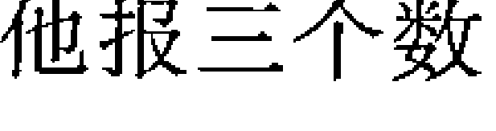

| 天雷无妄 | 天地否 |
| :--- | :--- |
| 妻才戌土 、 | 妻才戌土 、 |
| 官鬼申金 、 | 官鬼申金 、 |
| 子孙午火 、 世 | 子孙午火 、 |
| 妻才辰土 、、 | 兄弟卯木 、、 |
| 兄弟寅木 、、 | 子孙巳火 、、 |
| 父母子水 ○ 应 | 妻才未土 、、 |

但是《天雷无妄》有无妄之灾的含义，《天地否》有虎落陷坑的含义，我沉思了一下，想起今天是土月土日，体卦受日月生又受用卦生为太旺有灾。再结合卦名就一致了。人肯定有灾。

即使这样我还是不放心，毕竟人命关天。我又装上六爻看：问姐夫以兄弟爻为用神，卦中兄弟爻寅木，旬空被父母爻子水带动化出子孙爻巳火，化泄气。这里就不论相生，而是论水动是用神化退的原因。兄弟爻寅木在月令处入墓状态，不吉。测别人的事情也可以以应爻为用神，卦中应爻父母子水发动化妻财爻未土回头克，又入辰土日墓，是在水坑里或被土埋住之象，人肯定死了。经过多方位分析我告诉他可能已经死了。他马上回老家，8月2号他从老家回来打电话给我说：“我姐夫的尸体在水坑里找到了”。

## 例 40 你今天挣不到钱

戊子 壬午（申酉空）

我晚饭后散步遇到某女问我：“您看我今天能挣到钱吗？”我根据她问话十个字加上时辰序数 11，起卦《巽为风》之《风水涣》☰ ☴，体卦巽木在月令临旺地，有用卦比和帮扶，又受变卦的用卦相生，为过旺，《涣》卦又有散的含义，另外今天剩下的时间只有亥时、子时，水木太旺了物极必反，所以我说：“你今天没有钱挣，说不定还有花钱的事情，另外我问你现在是不是腰腿疼？”她说“我腰腿不疼”。我又问：“那你的肩膀疼不疼？”她一听高兴地说“大姐你神了，我正闹肩周炎呢。我就是要去棋牌室做按摩。”第二天我接到她的电话：“大姐我服了你了，我昨天真输了钱，怪不得他们都那么佩服您，不服不行啊”。原来她想去老年活动站揉肩膀，没打算玩牌，有点想故意考考我的意思。结果她刚到棋牌室一站，棋牌室的一位牌友临时家里有事情要走，牌桌上面临着三缺一的尴尬局面，刚8点钟散了局大家感觉有点冤。因为活动站从7点到12点是收费服务，刚打一圈牌也要交钱。大家就都求她顶缺，有牌瘾的人不撵让，坐到那两锅牌不开和，输了120元。

### 三、体卦过衰的现象

衰极之卦的实例我遇到的不少，如果按某些提法，体卦越旺越好，越衰越不好的理论是无法得出正确结论的。而且错了还不知为什么。衰极的理论应该如何下定义，我还在进一步探索，因为断错一个卦，影响的是一个人一件事情，一个错误的理论就要影响一批人走入误区，所以要慎重。我发现了问题，大家共同探讨，以得出正确的结论来。通过大家的努力来不断地完善周易预测学的理论。

## 例 41 月克日泄用卦泄他是个高官

2008年3月21日 乙卯 庚申（子丑空）

在面授学习班上，我讲到起卦方法，按时间起卦法，我问学员：“你们看现在几点了？”一个中年男子报：“9点15。”我告诉大家：“9点15，用9除以8余1作上卦，起得《天山遁》之《泽山咸》卦，互卦《天风姤》

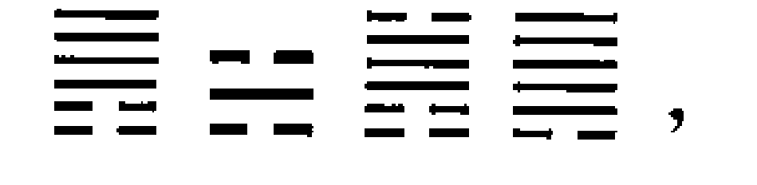

，我讲课有个习惯，就是按照讲课内容的安排，用各种不同的方法给每一个听课的人起一个卦，这样既活跃了课堂的气氛，又解决了学员心中的疑问，还增强了学员的记忆力与对老师水平的信任度，经验证明这是一个行之有效的教学方法。当讲到如何断卦的时候，我就把这个卦写到黑板上给大家边讲解边让当事人验证。

艮为体卦，主卦变卦都是体卦生用卦，互卦里又是用卦克体卦，今天又是卯月申日，对体卦除了克就是泄，看似不好，实际不然。这就是我对大家讲的旺极与衰极的卦的断法，要慎重对待。我先从他父亲分析开始找答案。今天是庚申日，金旺，又有艮土来生，乾金又代表官代表财，直读他是一个高官。所以第一条我问：“你父亲是不是一个当官之人？”他回答说：“对”我继续说：“他应该是一个高官对不对？”他点头说：“对”。既然确定他父亲是一个高官。他的主卦又是体卦生用卦，变卦是用卦克体卦，按传统断法这就是一个一事无成显然是不对的。我从不同的测面来分析泄体与克体的关系。我边分析卦边给大家讲解我的断卦思路我问他：“你对父母非常孝顺，对朋友与妻儿都是付出对不对？”还没等他回答，旁边坐着的一位女同志证明说：“老师您说得对，我就是他的妻子。”原来是夫妻俩同来听我的课。我继续问：“你的母亲长的白，很漂亮能说或是干与说有关的工作。”他说：“对，我母亲长得漂亮，当过10年校长，后来搞电影配音翻译。”我继续问：“你很小的时候就应该离开家了。”他说：“对，我一两岁就离开家去外地我姥姥家了。”我继续讲：“你爱人是男人的性格，她是不是做官的或者是做与财务有关之人。”他回答：“她不是当官的，她是会计。”我接着问：“你的肩背部经常有酸痛的感觉。”他忙说：“对，我后背经常难受”。我说：“你的后背难受是脾虚引起的，你的脾胃不好。”他回答：“对，中医大夫说我脾虚。”我继续问：“你是否有流产过一个男孩?”他答：“流产过一个，但是不知是男是女。”我继续讲：“你干的工作与房地产有关系，你有卖房之事。”他说：“我们公司现在正面临卖掉一块房产，不知能不能成?”我没有当时就回答他卖房的问题，而是继续按卦给大家讲解：“你的家曾被破坏过。”他说：“我们家文化大革命被抄过两次。”我问：“你2001~2003年好，2004年、2005年有花钱之事。”他答：“对”。我问：“你有佛缘，你曾经在庙里许过愿”他说：“对，我经常去庙里”，我说：“你不但经常去庙里，你还曾经为大的佛教头付出过。”他说：“我原来在国务院佛教办工作过，为很多大的活佛服务过，包括班禅。”最后我问他：“你应该有赔过大钱的经历”他说：“有，数目还真不小”。我问：“你的手脚有过伤没有?”他说：“有过”。我问他：“你有没有腰腿疼的毛病?”他说：“我腰痛得挺厉害。”我们在课堂上这样一问一答，既引起了学员的学习兴趣，又教会了大家如何直读卦，如何分析卦。因为都是初次见面，能给他说出这么多，使大家也充分信任老师。
讲课的最后一天大家一起吃饭。他主动结了账（本来另一个人说好中午请大家吃饭）。我开玩笑说：“我就知道你肯定有吃饭花钱的事《泽山咸》不是为吃付出吗？你今天应该花掉170或者200元，当时我讲课没说这一条，是怕你误会老师强迫你花钱，看来还是应验了。咱们看看今天你们点的菜能不能对应那天课堂上我给你起的卦？主卦《天山遁》有肉，有块状物，互卦《天风姤》有肉，有长条的青菜或白菜，有圆形物，变卦《泽山咸》有羊肉，有鸡，有汤酒水或饮料。”大家一看桌子上的菜都乐了，他们点的菜有猪肉、羊肉、鸡、有白菜，有茄子。有茶水、有青菜、有丸子、有土豆……总之一切都在卦之中。他说结账花了182块钱。本来是无意点菜，却神奇的与他前两天的卦相符合，看来什么都是定数。
学员们经过这种实地教学，加深了对卦的理解，也掌握了断卦的思路。

一位刚刚第一次接触周易的学员，听完了第一天的课程，晚上回家让她母亲报三个数，断她母亲晚上吃的什么饭。我忘记她起的什么卦了，她断她母亲吃的粥而且是很多种杂粮的那一种，她母亲说她说对了。她很兴奋，第二天课堂上就向我汇报。我鼓励她说：“就要这样大胆地练，统共六十四个卦见面多了就会断了，不要怕错，你们掌握了我教给大家的方法，断卦不是什么难事”。在课堂上，我是每断一条就给大家讲一条为什么这样断的。这种现场教学的方法对学员的启发最大，记忆最深，这也是所有参加我面授班的学员听三天课回家的路上就敢给别人断卦的诀窍之一。

> 注：《天山遁》有走的意思，又是在主卦。主卦主动年时期，所以断他小时离开出生地，断他流产过一个男孩也是这一层意思。断他父亲是高官是直读的方法，乾金为官，艮土为高，直读高官。断他家被毁过是艮土为家宅，兑金为拆毁。另外根据他的年龄在40岁左右，应该是文化大革命中生人，当官的家有几个不受冲击的？

## 例 42 · 月克日泄用卦泄孩子马上就回来

2008 年 2 月 26 日 甲寅 丙申 (辰巳空)

邻居的孙子刚 10 岁。自己上下学坐地铁，今天到了下午 4 点多他还没到家。学校老师说两点就放学了，全家人很着急，他奶奶过来问我，我看了一眼表 16:17 分。起卦《地天泰》之《地泽临》☰ ☱ ☷ ，主卦六合，人平安，六合也有合绊住的意思，他可能去什么地方玩，没有及时回家。《地泽临》卦有兵临城下的意思。我对邻居说：“你别着急，他很快就会回来。也就一两分钟就应该到家。最多超不过 20 分钟。”在这一组卦中，看起来都是用卦泄体卦，我没有单纯按梅花新易的体用原则分析，而是从两个卦的卦名来判断事情的吉凶，结果我刚说完话，她家门铃就响了，从进大门到坐电梯上来，也就两分钟的时间孩子进家门了。另外，这个卦坤土在寅月申日，身弱，又受用卦泻，可以说没有一点生机，如果不是物极必反的话，不是就凶了吗？所以有人说体卦越旺越好，越衰越不好的理论是错误的，事实胜于雄辩，实践才是检验真理的唯一标准。

### 四、梅花新易也有入墓之说

还有一个理论就是卦入墓，这虽然是六爻的理论，我在实践中把它应用到梅花新易里很有道理。主要是断人的流年大运，当体卦入墓于太岁时，人有憋屈之事。（木墓在未，金墓在丑，水土墓在辰，火墓在戌）。入墓的理论我还在进一步研究实践，也希望大家都能来参与，以便得出一个理论依据。

#### 例43 你已经离婚

2006年 癸巳 壬戌（子丑空）

新疆的一个女同志慕名找到我，让我给她测一测，我让她报3个数，她报5、6、7起卦《风水涣》之《风泽中孚》☰ ☴ ☵卦，我第一句问她：“你出生的地方有水、河或者湖。”她一听非常高兴地说：“你神了，我是出生在xx河边（可惜我年岁大了，记不住河的名字），那条河又有名又清亮。”主卦“涣”有散之意。我问她：“你是不是已经离婚了？”他说；“对呀，你怎么知道的？”

我说：“你不要管我，只要你回答错还是对就可以了，你是虚岁25岁结的婚！”她回答：“对”（《风泽中孚》直读25岁）

我又问：“你自己有外遇，但是你却经常吃你老公的醋。”她不好意思地说“是吧”（《风泽中孚》直读吃醋）

我继续说：“你有两个女儿，长的非常漂亮，能说会道，白白静静。”她自豪地说：“我女儿可漂亮了。”（兑为她女儿）

我接着说：“你这个人心肠软、善良，但是性格多变。”她说：“对着呢。”（巽木的特性）

我问她；“你2001、2002年有什么花大钱的事？”她说：“2001年我买的房子。”（太岁泄体）

我继续说：“你2003年有不痛快的事情，心里挺憋屈。”她点点头说：“对，那年难过透了。”（太岁是体卦的墓库之年）

我说：“你丈夫如果是个小白脸会经常与你吵架，你必须找一个黑脸的人对你才会好。”她说：“我32岁就与小白脸离婚了，我已经50多岁了，身边是有一个黑脸的男人，他经常帮助我，但是他没有与我成家的意思。”（兑金为小白脸，克体卦，坎水为黑脸人生体）

#### 例44 周易大会走进了人民大会堂

2006年4月17日 壬辰 丙子（申酉空）

4月15日，我们怀着十分激动的心情走进了庄严的人民大会堂，这是多少年来易学工作者梦寐以求的时刻。我们研究周易应用的人，不再被别人说成是难登大雅之堂的封建迷信。参会的有国家各部委的领导，特别是毛主席的卫队长李银桥，身坐轮椅年已八旬，仍然想坚持参会。遗憾的是开会当天他身体不适未能如愿，他的夫人韩素欣参加了大会并且给我题了字。宣传部、公安部、环保总局等领导出席了开幕式并讲了话。大会在群情激昂的气氛中召开，与会代表个个热情洋溢。

下午回到科技会堂研讨，代表们个个争先恐后地发言，我也在大会上宣讲了我的论文：“象卦学上论风水”，受到与会代表的热烈欢迎，会后很多代表还希望听我多讲一些。他们说：“你的水平很高，最难能可贵的是你不保守，我们能从你的讲演中学到新东西，它不但与众不同，学起来容易，用起来简单”。但是时间有限，为了照顾远道而来的朋友，我作为主人，把机会让给了他们。因此令很多易友有些失望。我说我会尽快把自己的东西整理出来，以满足大家的心愿。

17号各地代表都返程回家，我送走了他们。作为风水文化研究院的副院长，我代表院里去看望唐明邦老师。唐老师不顾80多岁高龄，亲自参会并讲了话，可见老人对周易事业的爱戴与支持。在宾馆唐老亲笔为我题字一幅。正巧有一小伙子也在唐老师那儿。小伙子说：“贾老师你给我看看吧。”我说：“你报三个十以内的数吧。”小伙子报数：1、3、5起卦《天火同人》之《离为火》

- 1. “你头上有伤”他说：“有”（乾金被火克）
- 2. “你今年有住医院之事或者心中有憋屈之事。”他说：“我刚刚出院。”（今年太岁戌土是火的墓库之年）
- 3. “你腰腿有疼痛之处”。他说：“我就是为腰腿的毛病住院输液”。（互卦巽木被离火泄）
- 4. “你家中房子明亮、宽敞、装修在当地当时比较时尚”。他说：“我家房子很大，明亮宽敞，装修还可以吧。”（离火为房子，乾金为大为贵，离主美丽明亮）
- 5. “你爱人长得白，是男人性格”。他说：“对”。（乾金为他爱人）
- 6. “你为人热心肠”。他说：“还行”。（离火特性）
- 7. “你一生不缺钱。”他说：“对，我还没有为挣钱发过愁。”（乾金位钱，我克者为财）
- 8. “你 1998、1999、2001、2002 年不错”。他肯定地说：“那几年不错。”（太岁生扶体卦离火）
- 9. “你 2003 年有花钱的事。”他说：“有”。（太岁耗泄体卦离火）
- 10. “你的婚姻不顺”。他爽快地说：“我已经离婚了”。

因为当时没作记录，今天写卦例想不起当时还有什么，只记住这几条。我总共可能给他断了十几条，他反映条条准确，原来他是一个在北京搞专职预测的。他带人到中国风水文化研究院办事，见到我，还向别人介绍我断事如何准确。后来他组织了几次大型的周易研讨会，成了周易界的知名人士。

## 第八节 断卦要合情合理

合情合理是指合乎卦理与生活之理。我们断卦是以周易的理论为依据，根据卦的万物类象来分析事物的来龙去脉的，卦只有六十四个，它包含了世间的万事万物，如何对应准确，就要求你所推断的事情要符合卦理、卦意，又要符合生活之理。一个人测求财，得《山天大畜》☰卦，可直读他有大财可求，也可以说他本身就有一定的积蓄。如果预测疾病，也得《山天大畜》卦，就应断他有肿瘤、包块或者脾胃有病，或者手脚有伤。总之，断卦要既符合易理，又符合情理，单纯的照搬理论，有时会闹出笑话。如：一个老妇人得《地水师》䷆卦，我可能直读她有糖尿病或者有胃病。一个小伙子得《地水师》卦，我可能直读他胃有病，或者泌尿系统有疾病。一个婴儿得《地水师》卦，我说他吃得多了，脾胃不合，或者有尿床的毛病。总之，同样的卦，对不同的人，在不同的场合，会有不同的结果，不可以死搬硬套。一个梅花新易的卦，最多只有五个不同的经卦，却要测出全家人的情况，这就要求我们反复应用每一个经卦，从不同的角度去论证。比如用卦代表他的出生环境，又代表他的配偶，还代表他的父母，我们在论述时就要针对不同的人事用不同的语言来描述。

#### 例45 虽是同卦不同果皆因理不同

2003年10月份，我们在安阳开国际易经大会期间，我们住的旅店的老板娘让我们给她断卦，调理风水，事情作完后东北的一个易友开玩笑说：“我们帮了你的大忙了，你还不请我们大伙儿吃一顿？”老板娘也很大方，晚上真请我们十来个人去吃火锅。回来的路上，我问大家：“这顿饭花了多少钱？”有的说一千，有的说不知道，我根据问话字数是8个字，上下各为四，起得：《震为雷》之《雷地豫》䷲ ䷏ ䷏卦，互卦《水山蹇》。主卦直读440；变卦直读480或者840。这么多人，840差不多。回到旅馆以后我又一想，我还没有看互卦，《水山蹇》卦艮有止的意思，坎水为6，可以看作最少是600元，所以我告诉同屋的朋友，这顿饭老板娘最少要破费600元，超不过840，易友小问出于好奇，真的跑去找老板娘核实，老板娘说：“吃饭花了570元，白酒两瓶是单花60元钱买的，共花掉630元。”小问回来高兴地对我说：“大姐，梅花易真神，我一定跟你学学”。

离开了安阳，我与小郝一同去湖南刘老师那里学习，第二天刘老师的弟子小唐请我们吃饭，饭后我又问小郝：“这顿饭花了多少钱？”小郝说：“我不知道，起卦看吧”。又是8个字，时间又是晚上8点多，同样得：《震为雷》之《雷地豫》䷲ ䷏ ䷏卦，与前两天的卦一模一样，这次吃饭一共5个人，当地的饭菜也不贵，根据饭菜的大致情况，变卦《雷地豫》卦上下相加是 12，我断这顿饭花了 120 元，刘老师的爱人正巧在此饭店工作，一问，还真是 120 元。同样的卦，不同的场合，不同的情况断出不同的结果，这就是断卦要合情合理的地方。

有的学员问我：“老师，你让求测者报三个十以内的数，不是很容易重复吗？” 我说你没有想一想，卦只有六十四个，却要测无数人无数件事，那么世间的事难道只有六十四种结局吗？人世间难道只有六十四种人吗？他们的年龄不同性别不同，问卦的年月日时不同，要问的事情不同，这就给卦增添了无数的内容。下面是三个相同的卦，因为问卦人的性别不同，年龄不同，问卦时间不同，我给他们分析的结果，均被对方一一认可。

## 例 46 《火水未济》证明你有官职

2005年 庚辰月 乙酉日（午未空）

一位 50 多岁的中医大夫报数 3、6、9，起卦《火水未济》之《火风鼎》

☰ ☷ ☲，我给他说了几条：

-   1. “你出生家庭贫寒。”他回答：“对，我出生在农村，小的时候家里特别苦。”
-   2. “你出生的地方有水。” 他点头说：“有，我们村里就有水坑。”
-   3. “你三岁以前身体差”。他说：“我小时候经常有病。”
-   4. “你 6 岁有水灾”。说到这里他感觉到很惊奇，忙说：“六岁那年我差点淹死。”
-   5. “你父亲管得严你经常挨打。”他无可奈何地说：“家里孩子多管不过来，小时候挨的打多了去了。”
-   6. “你为人热情但是心脏有毛病。”（他是心脏方面的专家，又当着他的上级领导机关的人，他有点不好回答，我也不问，只管一口气说下去，我相信我不会错）同来的人开玩笑说：“怪不得你是心血管病专家，原来有这方面的原因”。
-   7. “你 24 岁事业起步。”他说：“对，那时我大学毕业参加工作。”
-   8. “你36岁事业有成”。他说：“是，那年我提的职。”
-   9. “你爱人长得黑，人聪明，在家说了算，是个男人性格”。他说：“差不多”
-   10. “你35岁有好事，提职或分房长工资。”他点头说“35岁分的房子。”
-   11. “你30、33岁有好事”。他说“那几年经常受表扬得奖励，各方面都很顺。”
-   12. “你2003年有花钱的事。1998年至2002年好。”他说：“对，1998年至2002年正是我事业蒸蒸日上的时候，2003年买房花了一大笔钱。”
-   13. “你53岁还有好事。”他高兴地说：“真的？那敢情好，到时候我一定谢谢你。”
-   14. “你有二次学历，有官职。”他说：“有”。
-   15. “你有一个儿子很乖，性格像女孩。”他说：“对，我儿子很听话，老实。”
-   16. “你人很好但是胆子小。”他笑了。

我说完这几条他特别激动地说：“贾老师你太了不起了，太准了！我以后一定跟你学习。”原来他还是一个周易爱好者。（2006年我写讲义时他正好53岁刚被提拔为副院长）

## 例 47 《火水未济》证明你男朋友多

2005年 戊子月 戊寅日

一个30来岁北京的女孩儿报数3、6、9，起卦《火水未济》之《火风鼎》☰ ☵ ☲，我给她说了几条：

-   1. “你出生家庭贫寒，学历不高”。她回答：“对，我们家不富裕，我就是初中毕业。”（用卦克体卦）
-   2. “你出生的地方有水”。她说：“有”。（用卦为坎水）
-   3. “你让水烫着过还是让水淹着过？”她说：“我灌暖壶的时候烫着过，现在腿上还有大疤瘌。”（坎水克离火）
-   4. “你小时淘气挨过打。” 她满不在乎地说：“挨过打，我都上中学了还挨我爸爸的打呢。” （用克体）
-   5. “你已经有过六个男朋友了”。她屈指数了一下说：“还真差不多有六个”。 （互卦坎水为6）
-   6. “你的财运特别好，总有人主动帮助你”。她自豪地说：“帮助我的朋友特别多，我挣钱还真不难，前两天刚挣了五万元”。 （互卦为中年，坎水克离火，我克者为财，变卦用生体为有人帮扶，也为有进益之喜）
-   7. “你的婚姻有问题” 她沮丧地说；“我们已经离婚了” （双方都有异性朋友）
-   8. “你心脏不好” 她点头说：“对” （坎水克离火）
-   9. “你腰腿疼，你做过人工流产。”她连忙说：“没错，我做过流产，我现在腰腿就疼。” （巽木为腰腿受离火所泄）
-   10. “你爱人总想管着你又管不了，有人给你撑腰”。她满不在乎地说；“我哥们儿多，谁都帮我，他管的了吗？” （坎水克离火但是有巽木泄坎水生离火）
-   11. “你离了婚，你与你爱人是不是还有来往？”她自豪地说：“我们还住在一起，他舍不得离开我。” （坎水克离火但是有巽木泄坎水生离火）
-   12. “你有时胆大包天，有时又胆小如鼠，你是一个男人的性格”。还没等她回答，她同来的人马上抢着说“太对了，别看她岁数小，黑白两道都吃的开” （巽木为胆受月生日帮胆大，遇不旺之年月又受离火克时胆又小了）
-   13. “你的脾气很坏，看起来像男人，但是这是假象，实际你心很细，特别是对男人，你对他们的心思了如指掌”。她毫不否认地说；“对，他们一撅屁股我就知道他们拉什么屎，谁也别想蒙我。” （离火为火气受日辰寅木之生，另外她说话声音也像男人。）
-   14. “你有一个女儿既漂亮又孝顺。”她非常自豪地说“太对啦！我女儿长得很漂亮，特别听我的话，还特别向着我。” （巽木为阴卦，为女儿生体卦为孝顺 ）

#### 例48 《火水未济》证明你是一个女强人

甲午月 己巳日 （戌亥空）

做足底保健遇到一位女同志，她的朋友吴大夫要求我给她测测。我让她报3个数，她随口报出3、6、9起卦《火水未济》之《火风鼎》卦☰ ☱ ☲，我随口问：

-   1. “你是不是腰腿疼呀？”她连忙说：“对呀！你是怎么知道的？”
-   2. “我还知道你在家排行不是老大，上学时得过奖励，你有文凭，但是文凭不是一次直接得来的，上学中间有过间断，后又补上的。”她更惊奇了，忙说：“是是是，能看出为什么间断的吗？”我说“你是因为身体有病间断了学业。”她说：“对，我是因为有病休学一年，后来又接着上的。”
-   3. “你出生地附近有水。”她说：“我家不远就有河。”我继续问：“你小时不是被水淹着过就是被开水烫着过。”她激动地说：“我小时候差点淹死在河里，是我姐姐把我拉上来的。”
-   4. “你心脏有毛病，你的婚姻不美满，原因是你们双方都有异性朋友。你现在有一个心病，是为婚姻之事。”她说：“我离婚了，他在外面有了女人。我也不能一个人过一辈子呀。有合适的还得找。”
-   5. “你35岁会有一次好事，36岁事业成功”她说；“那敢情好，借您的吉言。”
-   6. “你一生贵人多”她说“还可以吧，我的朋友不少。”
-   7. “你脾气急，胆子小，做事风风火火”她十分高兴地说：“您说的太对了，我要不是脾气急，能跟他离婚吗？我发现他有外遇马上就办了离婚手续。”
-   8. “你爱人总想管你，又管不了，导致分手。”她气愤地说：“他自己都管不好自己，凭什么管我？”我看她有些激动，就收了话题，安慰她说：“你将来会有一个听话的丈夫，听话的孩子，会有一番好的事业和前途。”

她听我说完，非常激动地说：“贾老师，你太神奇了，我老听别人夸贾老师，贾大姐！今日一见，果然名不虚传，怎么不早点认识您呢？”我笑了笑说：“现在认识也不晚。”

##### 分析

这是一个女强人的婚姻卦，离火遇坎水，中男配中女，男占坎水女占离火，婚姻应该正配，但是离火临日月太旺，坎水无力克火导致两败俱伤。所以我在断卦步骤中讲过，任何一个断语或方法都不能盲目地拿过来就用，要综合各方面的旺衰关系分析才可以下结论。

以上是几个相同的卦，断卦有它的相同之处，因为问卦的时间不同，人物不同，断卦会有不同的内容。我还是那句老话，卦只有六十四个，要针对万事万物，就要根据月日的不同，各自的旺衰及阴阳是否得位来分析。

## 第九节 断卦时不要受外界干扰

在断卦时，我们有时会根据求测人提供的部分信息来分析卦。但我们又不能被他提供的信息所迷惑，要敢于走出对方绘画的框子，依据卦象分析。敢于相信“卦不乱成，爻不乱动”的理论，敢于挑战权威。我遇到过很多例子，由于我不被对方提供的信息干扰，而把事情断对。相反，我被一些已知条件迷惑，而不敢直读卦例，反而断卦出现了误差。

### 例 49 你不说实话难不倒我

丁亥 乙巳（寅卯）11月17日

一位外地的小伙子，专程跑到北京找我预测，在电话预约时他说：“我找了几个有名的大师，都没有把我的事情测对，我看了你的书，听别人说起你的水平很高，想过去找你，不知道你需要我提供什么条件？”我说：“什么条件都不用提供，你人只要过来就行了。”

他如约赴至，进门后坐定我说对他说：“你这么远来的，用铜钱摇一个卦吧。”他按我教的方法摇得一个静卦《天地否》䷋。

##### 天地否

-   - 父母戌土、应 玄武
-   - 兄弟申金、 白虎
-   - 官鬼午火、 螣蛇
-   - 妻财卯木、、世 勾陈
-   - 官鬼巳火、、 朱雀
-   - 父母未土、、 青龙

我对着卦给他分析说：

-   1. “你现在为婚姻之事心中无底”（才爻旬空）他不作声。我也不去理会，继续说下去。（财爻持世旬空）
-   2. “你过去有一个工作现在不干了，要重新找工作。”他说：“没有”。我说：“没有也没关系，我先写在这里，错了就是错了，我不怕错。”（官鬼爻本被月令冲破，但是今天又临日辰）
-   3. “你的婚姻出现危机或者已经离婚了。”（才爻旬空，是假空）他又说：“没有”。问了几条他都说没有，我心里很纳闷，我相信我自己的水平。这么明显的问题我还能看错？不可能，肯定他没说实话。先不去理会他，我继续给他分析。
-   4. “你腰部容易有手术。”这一下他惊奇了，说：“我腰上长了一个小粉瘤，前几天正准备到医院做手术”。（世爻临勾陈）
-   5. “你是坐办公室之人，现在不是了。”他说：“对，我以前坐过办公室”。
-   6. “你过去的工作应该是文书。”他说：“对，我以前是做文书的。”（朱雀临之）
-   7. “你有两处住房。”他说：“对，我是有两套住房”。（卦两个父爻）
-   8. “你有后考的学历，原来学历不高。”他开始配合我的提问，认真地回答：“老师你说得很对，我原来学历不高，后来又学了成人教育，取得了大学文凭。”（同上）
-   9. “你有一部分钱在别人手里要不回来。”他说：“你说的没错，我确实有一笔钱要不回来。”（财爻旬空）
-   10. “2005 年你有工作变动或者搬家。”他说：“对，2005 年我搬家了。”（酉金太岁冲世爻）
-   11. “你 1999 年财运很好。”他如实地说：“对，那年真是不错。”（卯年才填实）
-   12. “你手脚有过伤。”他承认说：“有”。（否卦的互卦是《风山渐》艮土受木克）这是用梅花新易的方法断的。
-   13. “兄弟姐妹有受伤的。”他说：“我哥哥伤了手，而且很严重。”（兄临白虎）
-   14. “你父母都健在，别看你长的方脸型，你父母长的是长脸型。”他说：“对”。
-   15. “你现在有相好的女人。”他老老实实地承认说：“的确是有一个我特别喜欢的女孩。”（否卦互卦是《风山渐》巽木与乾互为阴阳，坤卦与艮卦互为阴阳，是根据梅花新易大象说的）。
-   16. “2004 年破大财。”他说：“就是因为哥哥的手受伤花了不少钱。”
-   17. “你爱人也有点毛病。”（卦上看她也有外遇，但是为了一个家庭的和谐稳定我不便明说）他赶紧问“什么问题？但说无妨，我承受得住。”我为了考虑夫妻间的关系不愿说明，但是又看小伙子有考验我的心态，就说：“你有相好的，关系已经不一般了，不要去责怪你的女人，和为贵”。这时他才和我说了实话：“我与爱人没有感情基础，我们订婚之后、结婚之前，她说被别人强暴了，是我诈出来的，她已经承认，我们现在已办了离婚手续，但是还住在一起，我要与另外一个女孩结婚，为了老婆的生活，给她买了一套房，但是她娘家哥哥把我的 4 万块钱拿走了死活不给我。一听说我要结婚，我老婆闹着要寻死。”
我插了一句：“在离婚的问题上你有做手脚的地方。”（父母爻临玄武）（我不好意思说人家用欺骗的手法取得的离婚证书。）他没意思正面回答我的问题，而是问我：“老师，我太爱这个女孩了，我想与她结婚。但是我不知道我与这个女孩结婚，我老婆会不会出事？我与这个女孩关系太好了，情投意合，我已经离不开她了。只是她父母要求我结婚必须买房，否则不同意。他们都还不知道我结过婚。”我语重心长地对他说：“从卦上我已经看出你们两个关系不一般了，但是我劝你不要走这一步。我问你，你的妻子有生活来源吗？孩子怎么办？你挣多少钱能养两个家？”他说：“我每月工资1500元钱，妻子没工作，孩子还上学”。

我说：“你简直在开玩笑，1500元养一个三口之家已经是很困难的了，如何能养两个家？如果你走了这一步，后患无穷，我劝你，如果你与老婆真的没感情了，你先安排好你老婆一个工作，她有了独立的生活来源，或者她又有了情投意合的人以后（从卦上看会是这样），她可能主动就离开你了，你也不要与这个女孩结婚，你命中桃花很旺，说不定又遇到谁，你还能再分手？你暂时也满足不了女方父母的要求，还是暂时什么证也不要领，也不结婚也不复婚，因为你怎么做都会伤害两个无辜的女人，让时间来冲淡这一切”。

他坚定地说：“我不会再爱第二个人了，我是个很重感情的人”。我说：“我看得出来，如果无情无义你就不管你老婆的死活了。正因为你重感情，才容易惹这种事，过几年以后，你再回忆我说过的话对不对。”小伙子诚恳地说：“阿姨，我听你的”。我一看他服气了，就问他：“你是不是原来有一份工作，现在没有了，面临新的选择？”他不好意思地说：“我原来在部队是做文书的，现在志愿兵转业到铁路，还没有安排工作”。

我说：“那你可能还要坐办公室搞文书一类的工作”。

看来一开始他在考查我，故意不说实话迷惑我。难怪他说别人给他测不对。幸亏我坚信一条，卦不乱成，爻不乱动。不然就被他拐到胡同里去了。小伙子非常满意地走了。后来他又介绍过几个部队的朋友来测过事。

### 例 50 受干扰奥运金牌数测对读错

2004年8月18日

我在看书，正翻到黄老师测亚特兰大奥运会金牌是十六块。我想这次雅典奥运会能得几块金牌呢？一看墙上的表9:03分，起得：《天火同人》之《泽火革》卦☰ ☲ ☴ ，如果按平时测卦，我可能直读结果是23或32块。因为变卦是事之终，我以前很少看体育比赛，看看老师断的16块，心想这次也不可能超出一倍呀！我也不知道奥运会开几天，现在已经开了三天了，仔细一看刚有两三块，要是开10天8天的，也就应该按互卦的数断15块吧。过了7天，当知道要开十五天的时候我才敢肯定地说是32块。卦测对了，自己受外界的影响，不敢去直读，反而出了错。通过这件事，给我很大教训，断卦不要受外界干扰，实事求是地按卦象所示直接读出结果。只有忠实于卦象，才能百战百胜。

#### 例51 你用假象蒙骗我不怕出难题
2004年6月20日 庚午月 庚午日

孙女士经人介绍找到我，用车把我接到她家看看房子。一进她家的门，她婆婆就热情地把我让到她家客厅的沙发上，又是让茶又是拿水果，被我谢绝了。我问她：“您是不是想看看啊？想看您就报10以内的三个自然数吧。”老人一听非常高兴，一边想一边报出5、6、7三个数，依数起得：《风水涣》之《风泽中孚》卦☴ ☵ ☱ ，巽为体，受用卦坎水之生，主卦是指少年之事，又主夫妻，巽为胆、为腰，坎为病，我说：“你的老伴很谦让你，他身体不太好，你的出生家庭条件不错，比一般人家过的要殷实，附近有湖河之水，你的腰疼，胆不好，睡不好觉。”她赶紧接过来说：“我出生地叫清河湾，有水。老头儿让着我，家里外边都是我说了算，我的腰是腰椎间盘突出症，挺厉害，胆也不好，睡不好觉。老伴有病，您能看出什么病吗”。巽主神经、主腰腿、主胆，坎又主病。想到这儿，我说：“你老伴儿是经络有毛病或心脑血管有病，腰腿也不好。”她听了忙说：“老头子患心脑血管疾病，已瘫痪多年了，您能看出我的老头儿有多高吗？”这样的问话，明显地带有考问的意思，我没理会她，心想：坎水为她丈夫，受巽木之泄，个子肯定不高。想到这儿，我问她：“您有多高呀？”她说：“我一米六七。”她两个身高马大的儿子看着我在笑，看看他俩有一米八左右的个头，我稍有些迟疑，但还是随口说：“你爱人的身高是一米六五”。在场的人全笑了。她证实说：“老头的个子就是一米六五”。（坎为六，巽为五，人不可能是65公分，应读作一米六五。断卦既要符合卦理，又要符合情理。）

笑过之后，我继续给她分析：互卦艮土受震木之克，艮为腿，为关节、为止、为七，震又为腿脚、为动、为四，我接着说：“你47岁时腿疼行动困难。”她点点头说：“我47岁因为腿疼走不了路，提前办了退休手续。”变卦风泽中孚巽木受兑金之克，巽为腰腿，又为女人的下身，用卦克体卦为婚姻之事，巽数为5，兑金为2。想到这儿我又对她说：“你25岁结婚，52岁胆或腰不好、有伤。”她听了，很高兴地说：“我真是25岁结婚，52岁腰伤了，做了手术。”最后我问她：“说了半天我还没问您多大岁数呢？”她说：“我今年65岁了。”听完了我的分析，她很满意地说：“谢谢您，都挺准的”。我说：“不用谢”。说完，我就又给其他人起卦了。

### 例 52 周易挑战权威老人不是胃癌

壬子月 丁巳日（子丑空）

侄女春霞找到我说：“我70多岁的婆婆病了，北京某大权威医院经过专家会诊，确定为胃癌！还有可能是晚期了，我们要求做手术，大夫说手术后也不能保证她的生命。”我看了一眼手表8:30分起得：《地水师》之《坤为地》卦 ▅▅ ▅▅ ▅▅ ▅▅ ▅▅ ▅▅ ▅▅ ▅▅《地水师》直读老母胃有病，互卦地雷复直读老母腹部要有手术；变卦坤为地，体、用比和，结局安全。看了卦 我马上说：“老太太不是胃癌，是胃病！是良性瘤。手术后能好！”春霞对我的话半信半疑地说：“明天就要做手术，一家子都很着急，万一不好可怎么办呢？”我说：“你放心吧，姑姑给你测事也不是一回两回了，每次不都准了吗。你回去告诉家里人，没事！老太太8天没准就能出院”。第二天，他们怀着忐忑不安的心情，把老人送进手术室，开刀后一查是良性瘤，7天拆线后一切良好，办了出院手续，前后正好8天。至今老人健康地活着，还能为儿女们看家、做饭。坤为止、为八、为顺。所以断她八天出院。专家的结论也曾给我很大压力，但我坚信卦不乱成，爻不乱动的道理，所以敢用易学向专家挑战。

#### 例53 坚信自己的判断不被对方迷惑

乙未月 戊午日（子丑空）

今天来了一位慕名预测者，进门以后我让她报数，她想了一会儿报出4、5、6起卦《雷风恒》之《火风鼎》，我没问她测什么事情，就直接先问她：

-   1. “你出生的地方是不是花草树木或者庄稼多”。她说：“是，我出生在农村”。
-   2. 我继续说：“你的婚姻不顺，你身边还有别的男人。”她马上反对说：“不对”。我一看她不肯说实话，也不去争辩，就说：“没关系我们把这一条写在这里，我向来是错对都写上，错了我好找原因。”互卦明显告诉我他们双方都有异性朋友，变卦《火风鼎》也主有三角关系，她说不对怎么回事？肯定是没说实话。我一般不说来人的爱人有异性朋友的事，为了人家的家庭和睦，也为了不给自己找麻烦。
-   3. 我继续说：“你与爱人欠沟通”。她说：“我有话跟他说，他有话不跟我说”。
-   4. “你爱人脾气不好。”她说：“不是”。我继续说：“没关系，这一条也写上，注明我判断错了，要不然一会我就忘了。错对我也得总结经验呀。”
-   5. “你爱人在家是老大”。她说：“对”。
-   6. “你的孩子长的漂亮眼睛比你大”。她说：“对”。
-   7. “你胆子小”。她回答：“对”。
-   8. “你对孩子宠爱有加，要星星不给月亮”。她回答：“我特别疼我们家孩子。”
-   9. “你1991、1992、1993年有不顺之事”。她说：“我1991年出了车祸。”
-   10. “2003、2004、2005年呢？”她说：“这几年没什么事。”

我一看她不说实话就直接问她：“你究竟想问什么问题？”她说：“我想看看婚姻”。看来让我猜中了。我反问她：“我说你婚姻不顺，你说没有，我说你们双方有异性朋友，你也说不对，还看什么？”她一味地说：“您就给我好好看看吧”。
我看她是巽木为体的人，知道她生性多疑多变，必须装上六爻细分析，不然她可能不说实话。

| 风雷恒 | 火风鼎 |  |
| :--- | :--- | :--- |
| 妻才戌土× 应 | 子孙巳火、 | 朱雀 |
| 官鬼申金、、 | 妻才未土、、 | 青龙 |
| 子孙午火、 | 官鬼酉金、 | 玄武 |
| 官鬼酉金、 世 | 官鬼酉金、 | 白虎 |
| 父母亥水、 | 父母亥水、 | 螣蛇 |
| 妻才丑土、、 | 妻才丑土、、 | 勾陈 |

装上六爻一看，果然是白虎酉金持世，说：“我父亲驼背”。她说：“对”。我继续分析：“你的腿有伤”她说“没有”。我还是老方法：“好，这一条不对也写在这儿。你爱人贪玩，身边有女人，你身边有男人。”她还是不承认：“他有我没有，那个女人为他离了婚。他还不承认，两三年了老跟我打架，下手狠着呢。他还老怀疑我有问题。”说着撩起裤子让我看腿上到处是用烟头烫的伤疤，她自己还说腿上没有伤。胳臂上也到处是烟头烫的伤，据她说胳臂还被她爱人打骨折了，这能说她丈夫脾气好吗？从卦上看她的情人还不止一个，人家不承认也没有办法。从常理讲如果只是男方自己有外遇，不可能这么霸道，女方也不可能忍受这么长时间非人的折磨。我不去计较继续说：“他的女人是2003年认识的”她说：“对，这几年我们净打架了，您给我想想办法吧。我要离婚他不离。”2003年到现在究竟是有事还是没事呢？她不对你讲实话，还让你给她想办法，怎么想？我只能说“你命中注定婚姻不顺，一是多做好事修善因，二是寻求法律保护。”

# 第四章 周易预测基础知识

## 第一节 阴阳学说

阴阳五行学说是我国古代劳动人民，通过对各种事物和现象的观察，把宇宙间的万物万象，分为阴阳两大类，而建立起来的一种朴素的唯物论和辩证法的思想。阴阳学说认为，一切事物的形成、变化和发展，全在于阴阳二气的运动。它总结出来的自然界阴阳变化的规律，与对立统一哲学思想是一致的。阴阳学说，不仅应用到各学科领域，而且成为我国自然科学的唯物主义世界观的理论基础。

### 一、阴阳学说的起源

古人有开天辟地之说，也就是自从有了天地，就有了阴阳。因为天就是阳，地就是阴。也就是说自古阴阳就存在于天地之间。但是作为阴阳学说理论的产生，是在夏朝开始形成。这可以从《易经》中的八卦阴阳爻的出现而得证实。八卦中阴爻--和阳爻-出现在我国夏朝的古书《连山》中，这就是说，在夏朝就有《连山》这样的八卦书，而八卦又是由阴和阳这两个最基本的爻组成的。所以阴阳学说，至少起源于夏朝是无疑的。《系辞》中说：“一阴一阳之谓道。”阴阳是事物变化的基本要素，乾坤为阴阳的总根源和代表。《周易·系辞》又说：“易有太极，是生两仪，两仪生四象，四象生八卦，八卦定吉凶，吉凶成大业。”意谓在阴阳的交互作用下，乾坤定位，万物化生，宇宙间变化万千错综复杂，都是基于乾坤开合，阴阳运化的结果。孔子在《系辞》中提出“太极生两仪，两仪生四象，四象生八卦”。这种宇宙万物的生化模式，与胚胎的细胞分裂过程十分相像，它揭示了万物由简单到复杂的演变过程。这与老子的“道生一，一生二，二生三，三生万物，万物负阴而抱阳，充气以为和”的宇宙化生过程十分相似。老子的一，相当于太极，二就是两仪（阴阳），三者，为阴阳之和。孔子和老子的宇宙生化模式是一致的，均认为太极生两仪（即一生二）是事物发生和发展的基本过程（即承认事物的矛盾性），只是表达的事物变化的角度不同而已。孔子强调的是八卦、六十四卦的形成，即万物由简单到复杂的多层次变化过程；老子则强调了万物阴阳的相互作用，即阴阳相生、相和而不断化生万物的过程。乾坤、阴阳才是万物发展变化的根源和动因。《周易》以乾坤等阴阳的相互作用概括了世界上的一切矛盾对应范畴，揭示了事物变化的普遍规律。

### 二、阴阳对立统一

阴阳对立，是指自然的万物万象，其内部都同时存在着相反的两种属性，即存在着的阴、阳两个方面。一个男人，属阳性，他所对应的女人属阴性。他们是阴阳对立的，又是统一的，统一称为人。男人即是阳性，他身体里也包含着阴性的一面。他的五脏六腑本身就是阴阳两种属性。他的手背是阳，手心是阴。所以他是一个阴阳的对立统一体。女人属阴性，但是她也有同样的五脏六腑，她也有手心手背，她也是一个阴阳对立的统一体。人是如此，动物也是如此。植物也不例外。我们把大树归为震木，属阳性，把花草归为巽木，属阴性。树木的叶子向阳的一面是阳性，朝阴的一面就是阴性。花草的叶子也是如此。自然界的事物都是如此，好与坏，冷与热，高与矮，胖与瘦、它们是对立的，又是统一的，没有一方的存在，就没有另一方的存在，它们又是相辅相成的。阴阳这种相互依存，相互为用，乃“一阴一阳之谓道”。它们互为其根，阳根于阴，阴根于阳，体现在八卦图上阴鱼上面有阳眼，阳鱼上面有阴眼。生活当中你中有我，我中有你。
世间任意一个事物都是一个阴阳对立的统一体。只要有一方的存在，必然有另一方的存在。阴阳不但统摄了万物万象对立的两个方面，而且具有两种相反的不同属性。阴阳是互为根的，它们是事物或现象中对立着的两个方面，具有互相依存、互相为用的联系。阴与阳的每一个侧面都以另一侧面作为自己存在的前提，即没有阴，阳不能存在；没有阳，阴也不存在。正如没有乾，就没有坤，没有天，也就没有地。《素问阴阳应象大论》说：“阴在内，阳守之，阳在外，阴之使也。”因此阴阳是互相依存，互相作用的。然而，事物和现象中对立着的双方所具有的阴阳属性，既不能任意指定，也不能颠倒，而是按照一定规律归类的。那么用什么标准来划分事物和现象的阴阳属性呢？《系辞》有：“乾道成男，坤道成女。”乾为父，坤为母，生震、艮、坎、巽、离、兑六子，六子分男女，即天地生万物，万物无不分为两性。《系辞》有：“天尊地卑”，“乾阳物也，坤阴物也”和“阳卦奇，阴卦偶”。凡是类似男、高和奇的性质的都属于阳的范畴，凡是类似女、低和柔的性质都属于阴的范畴。如：

- 阳：凡是积极向上的事物都属阳，如天、太阳、日、上、进、健、男、君、夫、昼、刚、大、多等；
- 阴：凡是消极后退的事物都属阴，如地、月亮、夜、女、臣、妻、小、柔、顺、少、下、退等。

### 三、阴阳消长

阴阳消长，是指事物和现象中对立着的两个方面，是运动变化的，其运动是以彼此消长的形式进行的。由于阴阳两个对立的矛盾，始终处在彼消此长、此进彼退的动态平衡之中，才能保持事物的正常发展变化。《系辞》有云：“日往月是来，月往日则来，日月相推则明生焉。寒往暑来，暑往则寒来，寒暑相推而成岁月焉。”所谓往来就是阴阳消长，由白天变黑夜，由黑夜变白天，天气由热变冷，由冷变热。用日月、寒暑的变化的规律，反映事物发展变化的规律。如果这种变化出现了反常，也就是阴阳消长的异常反应。

阴阳都起源于太极。事物和现象中对立着的两个方面，它们相互依存，又相互转化。处在彼此消长的运动和变化中，我们最直接能观察到的是一年四季天气的变化。从立春开始，冷空气慢慢退去，天气一天天变暖。立冬开始，暖空气慢慢减弱，冷空气慢慢加强，天气变冷。从冬至那一天开始，白天开始一天天变短，夜晚开始一天天变长。一直到夏至终止，并开始转换，白天一天天变短，夜晚一天天变长。这样周而复始的完成此消彼长的阴阳互相转换过程。正是由于它的相互作用，相互转化生成万事万物。正如老子曰：“道生一，一生二，二生三，三生万物”，阴阳是宇宙最基本的特征。

### 四、阴阳转化

阴阳转化，它是事物的阴与阳两种不同的属性，在一定条件下向其对立面转化。《系辞》说“阴阳合德，则刚柔有体”。阴与阳是对立的，但又互相依存的，只有阴阳统一起来，才能推动事物的变化和发展，这样阴阳才能长期共存。

阴与阳虽然具有两种不同的属性，但是它又可以互相转化。“生生之谓易”、“道有变动，故曰爻”。易，即阴阳相易，也就是阴极生阳，阳极生阴，所以就阴变阳、阳变阴，乾初九的阳在下，坤初六的阴始凝，说明乾坤两卦代表着阴阳矛盾的统一体。两卦初爻是阴阳结合、阴阳转化的开始。就是阴阳互相转化，是事物发展的必然规律，事物只要顺着阴阳变化的规律发展下去，最终就能达到事物互相转化的目的。

我们祖先从实际生活当中认识了宇宙，找到了它的生存与发展的规律。即宇宙间的万事万物是由阴阳两种物质组成的。他们从整体观念出发，建立起阴阳二气对立转化的思想，以此来说明宇宙的生成之本。“阴阳者天地之道也，万物之刚纪，变化之父母，生杀之本始。”

古代哲学家们在长期的社会实践和对自然现象的观察中，逐渐发现了事物之间存在着的某种固定的联系，某一事物的出现往往导致另一事物的变化；一把火把树木烧成了灰，一堆小火被一堆大木头砸灭。一把斧头把一棵大树砍死，一把斧头把一棵大树雕刻成一件完美的工艺品。树木经过水的浇灌活了下来，而发了大水树木又被水淹死。化学反映当中两种不同的物质合到一起，就变成另外一种物质。例如酸碱合在一起，生成的是盐。现实当中我们天天生活在这种阴阳的转换里，而大家习以为常，不去理会。天气从冷到暖，从暖到冷经历了阴阳的转换过程。每天从白天到夜晚也是经历了一个阴阳的转换过程。阴阳消长中量的变化可以转化成质的变化，树木由于火的作用，变成了灰，酸碱合在一起，生成的是盐。就是发生了质的变化。从量变到质变是宇宙中万物发展变化的根本法则。我们的祖先就是以阴阳两个符号开始，创造出了一个庞大的易学理论体系。它仅仅通过两个符号的阴阳转换，就可以预测未来，了解过去，知道现在。上可知天、下可知地、中可知人事。它堪称为一把“开启未知之门的万能钥匙”。

## 第二节 五行学说

### 一、五行起源

五行学说是我国古代哲学思想的重要组成部分，它论述了世界的本质构成问题，世界上的万事万物都是由金、木、水、火、土这五种物质构成，它们相互生成又相互制约。它们有着自然的生存法则，衰者补之，旺者克之。自然界中各种事物的运动和发生、发展都是这五种物质相互作用的结果。正是由于五行的相互制约，推动宇宙从平衡到不平衡，又从不平衡到平衡的向前发展。

### 二、五行特性

五行是金，木，水，火，土。它们循环相生、相克，互相帮助又相互制约，推动整个宇宙向前发展。它们各自有自己的特性：

- 水曰润下，味咸色黑。
- 火曰炎上，味苦色红。
- 木曰曲直，味酸色绿。
- 金曰从革，味辛色白。
- 土曰稼穑，味甘色黄。

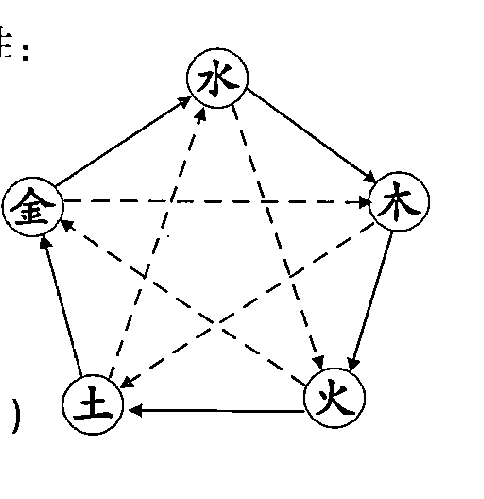

### 三、五行生克

#### 1. 五行相生

五行相生表示生方对被生方有促进增长的作用；相反生方遭被生方耗泄，这就是此消彼长。

五行相生的法则是：木生火，火生土，土生金，金生水，水生木。（见图一实线部分）

#### 2. 五行相克

五行相克表示一事物对另一事物的制约和克制作用。

五行相克的法则是：木克土，土克水，水克火，火克金，金克木。（见图一虚线部分）

#### 3. 五行反侮

在五行相克中，有一种现象叫反侮，这是由于五行的衰旺太过而导致的逆克现象，如土旺木衰，木受土侮；木旺金衰，金受木侮；水衰火旺，水受火侮；土衰水旺，土受水侮；金旺火衰，火受金侮。在梅花新易断卦当中也会遇到反侮之象，只是很少有人这么叫。体用的旺衰以月令来定，如火月日测卦，体卦为离火，用卦为坎水，用卦不但不能克体卦，体卦还能反克用卦。但是到了坎水当令之时，水还是要克火的，这就看是断短期的事还是断长期的事。要区别对待。风水轮流转，人也应该居安思危，不要得志便猖狂。还有一种组合就是卦中某一种五行太偏时，比助多的五行受用卦所克，受伤害的是用卦。如例题中的一虎难敌五牛》。（我把同一卦中同一种五行的卦称为“比助”相辅相成）。

万事万物都是在五行相生相克中达到相对平衡的，没有生就没有事物的发生和发展，没有克就不能协调事物发展过程中的不平衡。没有水庄稼不能生长，水大了就要用土来制，不然水就淹死了庄稼。所以说生与克是同一事物的两个方面，生中有克，克中有生，相辅相成，互为体用。同时在生与克到极点时，都会向相反的方向转化。五行之间的相互作用关系《三命通会》中有非常精辟的论述，它是论述四柱学的，对我们梅花新易断卦有很高的参考价值。我们引用如下：

> 木多火炽，木赖水生，水多木漂，水赖金生，金多水浊。
金能生水，水多金沉，水能生木，木盛水缩，木能生火，火多木焚，火能生土，土多火晦，土能生金，金多土变。
金能克木，木坚金缺，木能克土，土重木折，土能克水，水多土流，水能克火，火炎水热，火能克金，金多火熄。
金衰遇火，必见销熔，火弱逢木，必为熄灭，水弱逢土，必为淤塞，土衰遇木，必遭倾陷，木弱逢金，必为砍折。
强金得水，方锉其锋，强水得木，方泄其势，强木得火，方化其顽，强火得土，方止其焰，强土得金，方制其重。

以上这段话同样是预测的基础，大家一定要体会其中的辩证关系。梅花新易预测法虽然只以体用生克比和论成败，但是如果不懂此理，断卦的准确率是要打折扣的。

#### 4. 五行的旺衰

在今后的断卦过程中，还需要掌握一个重要的概念，那就是五行的旺相休囚死，它既是判断事情成败的依据，又是断应期的关键所在。要想断卦神奇，必须掌握五行在各个时期的状态来判断卦的结果。传统的梅花易数断卦不看日月的旺衰，我在多年的预测实践中体会到如果不看日月的作用，断卦的准确率会大打折扣。

- 旺：处于旺盛的状态。当令、临值的年月日时的五行。
- 相：处于次旺的状态。受当令、临值的年月日时生的五行。
- 休：处于休然无事的状态。生当令、临值的年月日时的五行。
- 囚：处于衰落被囚的状态。克当令、临值的年月日时的五行。
- 死：处于全无生气而死亡的状态。被当令、临值的年月日时克的五行。

在每一个季节中都有一个五行处于旺，一个五行处于相，一个五行处于休，一个五行处于囚，一个五行处于死的状态。亦即是当令的旺，以当令者为中心，即我生者相，生我者休，克我者囚，我克者死。以金为例，秋天金正当令，故金处于旺的状态，旺金生出的水自然是相的状态，土是生金的，现在金已成旺盛之势当家做主，作为生金的土便可退居一旁，所以是休的状态，而秋金旺盛，衰火难以克伐旺金，故火处于囚的状态，金气势强旺，被金所克的木必死无疑，自然木处于死的状态。其他五行仿此。如下表。

断事时远看年月近看日时。

##### 表一：五行四季旺衰

| 季节 | 旺 | 相 | 休 | 囚 | 死 |
| :--- | :--- | :--- | :--- | :--- | :--- |
| 春 | 木旺 | 火相 | 水休 | 金囚 | 土死 |
| 夏 | 火旺 | 土相 | 木休 | 水囚 | 金死 |
| 秋 | 金旺 | 水相 | 土休 | 火囚 | 木死 |
| 冬 | 水旺 | 木相 | 金休 | 土囚 | 火死 |
| 四季 | 土旺 | 金相 | 火休 | 木囚 | 水死 |

这里的四季指的是阴历三、六、九、十二这四个土月，这是指的四时生旺，具体断卦时我们要看月令、日辰甚至时辰的旺衰来断事。后面会专门论述。

#### 5. 论十二长生

- 金长生在巳，旺在酉，墓在丑，绝在寅，死在子。
- 木长生在亥，旺在卯，墓在未，绝在申，死在午。
- 火长生在寅，旺在午，墓在戌，绝在亥，死在酉。
- 水土长生在申，旺在子，墓在辰，绝在巳，死在卯。

十二长生我在梅花新易断卦中，特别是断流年当中，经常考虑，例如一个人测卦，木为体卦，自身不旺，到了水木生扶之年应吉，到了未年入墓之年有不顺之事。

#### 6. 五行特性与方位

- 木具有生发、条达的特性，属东方。
- 火具有炎热向上的特性，属南方。
- 金的特性是清凉萧条，属西方。
- 水的特性寒冷向下，属北方。
- 土的特性长养化育，居中央。

## 第三节 天干地支

天干地支也是中国古代文化思想的一个重要组成部分，它同五行学说一样，是整个术数理论的基础。“天干”、“地支”，又简称干支，干支也是我们祖先计算历法的符号。有人说“天干”是天上计算时间的，地支是计算地上时间的，天上的时间慢，地下的时间快，所以天干是十个，地支是十二个。民间有“天上放一日，地下已千年”之说。十天干与十二地支，它们按照固定的顺序排列组合，阳干与阳支相配，阴干与阴支相配。它们的公倍数是六十，所以每六十年一个轮回，称为六十花甲子。年的干支称为年干年支，每一个年的干支组合都有它不同的含义，因此不同年份出生的人就有不同的命运。每一个月的干支称为月干月支，每一个月干配上月支周而复始，同年一样，不同的月令的干支组合同样有不同的含义，不同月份出生的人就有不同的命运。每一天的干支称为日干日支，同样如此，天干配上地支，无限的循环。每天24小时也是由不同的干支组合的，从凌晨11点开始计算，每两个小时为一个时辰，它的干支称作时干时支。同样是周而复始，无限循环。每一个干支组合都有它不同的含义，正是这些组合不同，造就了不同时间生的人有不同的命运。这就是四柱预测学的理论基础。梅花新易在断卦时只论地支的旺衰，而不用天干。地支的旺衰、方位、属性、五行、万物类像是梅花新易断卦的基础。

### 一、天干

1. **天干的阴阳属性**
   天干有十位，即甲、乙、丙、丁、戊、己、庚、辛、壬、癸。天干也分阴阳。甲丙戊庚壬五干称为阳干，乙丁己辛癸五干称为阴干。

2. **天干的五行属性、方位与四时生旺**
   甲乙同属木，其中甲为阳木，为森林之木，乙为阴木，为花草之木。甲乙木属东方，旺在春天。
   丙丁同属火，其中丙为阳火，为太阳之火，丁为阴火，为灯盏之火，丙丁火属南方，旺在夏天。
   戊己同属土，其中戊为阳土，为大地之土，己为阴土，为田园之土。戊己土属中央，旺在四季 (农历三六九十二月)。
   庚辛同属金，其中庚为阳金，为斧钺之金，辛为阴金，为首饰之金。庚辛金属西方，旺在秋天。
   壬癸同属水，其中壬为阳水，为大海之水，癸为阴水，为雨露之水。壬癸水属北方。旺在冬天。

#### 3. 天干与身体脏腑

甲为头，乙为肩，丙为额，丁为齿舌，戊己为鼻面，庚为筋，辛为胸，壬为胫，癸为足。甲为胆，乙为肝，丙为小肠，丁为心，戊为胃，己为脾，庚为大肠，辛为肺，壬为膀胱，癸为肾。

### 二、地支

#### 1. 十二地支：

子、丑、寅、卯、辰、巳、午、未、申、酉、戌、亥。地支也分阴阳，阳支有六：子、寅、辰、午、申、戌。阴支有六：丑、卯、巳、未、酉、亥

#### 2. 地支与五行

- 寅卯同属木，其中寅为阳木，卯为阴木。
- 巳午同属火，其中午为阳火，巳为阴火。
- 申酉同属金，其中申为阳金，酉为阴金。
- 亥子同属水，其中子为阳水，亥为阴水。

#### 3. 地支与方位

- 寅卯属木，为东方。
- 巳午属火，为南方。
- 申酉属金，为西方。
- 亥子属水，为北方。
- 辰戌丑未属土，为中央。

#### 4. 地支与四季

寅卯辰为春季，巳午未为夏季，申酉戌为秋季、亥子丑为冬季。

#### 5. 地支与脏腑

- 寅木为胆，头、四肢；
- 卯木为肝，毛发、趾头、男阴；
- 巳火为心，心包络、肛门、面、直肠。
- 午火为小肠、齿、舌、心包络、心脏
- 未戌为脾、胃、命门
- 丑辰为脾、胃
- 申为大肠、骨头、肠道、脊椎
- 酉为肺
- 子为肾
- 亥为三焦

#### 6. 地支每月的旺衰状态

- 亥子之年、月、日、时，水旺，木相，火死、金休、土囚。
- 申酉之年、月、日、时金旺，水相，木死、土休、火囚。
- 寅卯之年、月、日、时，木旺，火相，土死、水休、金囚。
- 巳午之年、月、日、时，火旺，土相，金死、木休、水囚。
- 辰戌丑未之年、月、日、时，土旺、金相、水死、火休、木囚。

## 第四节 论年月日时

### 一、论太岁

太岁乃每年的地支属相，即：子、丑、寅、卯、辰、巳、午、未、申、酉、戌、亥，十二年轮回一次，也叫十二生肖，即：子鼠、丑牛、寅虎、卯兔、辰龙、巳蛇、午马、未羊、申猴、酉鸡、戌狗、亥猪。

### 二、论月建

月建乃每月的地支属相，它主宰一个月的生杀大权。月建以二十四节气中的十二个节为转换日。如正月建寅，是指从立春这一天开始，一直到交惊蛰的时刻之前，寅木当家，掌握一个月的生杀大权。卦的旺衰是以月令来定的。以正月为例：正月木旺，我生的火相，生我的水休，克我的金囚，我克的土死。其他以此类推。

- 正月建寅，以立春至惊蛰为界。
- 二月建卯，以惊蛰至清明为界。
- 三月建辰，以清明至立夏为界。
- 四月建巳，以立夏至芒种为界。
- 五月建午，以芒种至小暑为界。
- 六月建未，以小暑至立秋为界。
- 七月建申，以立秋至白露为界。
- 八月建酉，以白露至寒露为界。
- 九月建戌，以寒露至立冬为界。
- 十月建亥，以立冬至大雪为界。
- 十一月建子，以大雪至小寒为界。
- 十二月建丑，以小寒至立春为界。

### 三、论日辰

日辰是每一天的地支属相，即：子、丑、寅、卯、辰、巳、午、未、申、酉、戌、亥，十二天轮回一次。它可以掌握一天的生杀大权。它可以与月令同功同德。

### 四、论时辰

时辰是每天二十四小时地支属相，从夜里 11 点开始为一天的子时，每两个小时为一个时辰。（详见表）它掌握每个时辰的生杀大权，测当天或当时的事情要考虑时辰。一般断卦不考虑。

##### 表二：地支与十二时辰

| 时辰 | 子 | 丑 | 寅 | 卯 | 辰 | 巳 | 午 | 未 | 申 | 酉 | 戌 | 亥 |
| :--- | :--- | :--- | :--- | :--- | :--- | :--- | :--- | :--- | :--- | :--- | :--- | :--- |
| 时间 | 23-1 | 1-3 | 3-5 | 5-7 | 7-9 | 9-11 | 11-13 | 13-15 | 15-17 | 17-19 | 19-21 | 21-23 |

## 第五节 八卦

### 一、八卦是世界上最简捷的语言

各国有各国的语言，各地有各地的语言，人有人言、兽有兽语，甚至现在科学家研究发现植物也有语言、有感应。但是任何一种语言都无法与八卦相比。八卦看起来简单，只有八个简单的字，只用八个简单的符号来表示，但是它却包含了世间的万事万物，其大无外、其小无内，无所不包。它是世界上最简单的语言，因为它只有八个符号。它又是世界上最难掌握的语言，因为它包罗万象。很多人认为英文简单，只有 26 个字母，中国的语言复杂，其实 26 个字母也是通过变化组合来产生语言的。中国的方块字是点、横、撇、捺、叉、方块几种图形组成的文字，只是意思表达得过于详细，区分过于具体，反而使人难以学习，同一个音就有几个字，显得过于繁琐。但是它有它的特点，就是表达的意思很确切具体，让人一目了然。你比如：他、她、它。三个字都是第三人称，用在不同的人与物上就很具体。大家一看到“她”，马上知道这是一个女人。看到“他”，马上会想到是一位男人。看到“它”，马上想到是一件物品或一个动物。学起来显得有些复杂，但是在使用时少了很多描绘的语言，反而让人一目了然。任何事情都存在着正反两方面的意义。有一利必有一弊。就像阴阳永远互相依存一样。

八卦理论的由来是孔子的“易有太极生两仪，两仪生四象，四象生八卦”。它的排列组合与老子道德经的“道生一，一生二，二生三，三生万物”的法则相通。它用阴阳二爻分别排列组合成八种符号即是八卦。

八卦是用八个简单的符号来表示万事万物的。最原始的是一个长杠儿（—）和两个短杠儿（--），即一阴一阳。长杠代表阳；短杠代表阴。阳代表天，阴代表地，阳代表男人，阴代表女人，阳代表白天，阴代表夜晚，阳代表太阳，阴代表月亮，……。自然界单纯用一阴一阳不能更具体地体现世间万物的区分，单纯用男人和女人区分不具体，那就有长男长女、中男中女、少男少女、老男老女。自然界除了天地还有：风、雨、高山、平地、河流。人有五官、五脏六腑、有四肢。方向也分东南西北中，自然界存在着五颜六色，这些如何用简单的符号来表示？在没有文字语言的年代，我认为八卦最初是老祖宗用来结绳记事的。他们用八卦记录事情或者传达信息的，所以八卦无所不包。因为我们的祖先在发明八卦的时候就赋予它这样的功能。

- 用三个同等长的杠表示：天、老男、头、大肠……
- 用三组短杠表示：地、老妇、腹、月亮……
- 用两组短杠一个长杠表示：长男、雷、树木、肝……
- 用一组短杠和两组长杠表示：泽地、少女、口、肺……
- 用两组长杠中间夹一组短杠表示：太阳、中女、心、火、文化……
- 用两组短杠中间夹一组长杠表示：水、中男、人的肾脏膀胱……
- 用上面两阴下面一阳表示：山、石、少男、人的脾胃……
- 用下面一阴上面两阳表示：风、长女、胆……

随着社会的不断发展进步，人们有了语言、文字，有了卦辞、爻辞，有了易经。

### 二、八卦符号

乾 ☰ 兑 ☱ 离 ☲ 震 ☳ 巽 ☴ 坎 ☵ 艮 ☶ 坤 ☷

它们分别读做乾、兑、离、震、巽、坎、艮、坤。为了记忆方便，古人把它的形象编成了顺口溜“乾三连，坤六断，震仰盂，艮覆碗，离中虚，坎中满，兑上缺，巽下断”。它们各自代表不同的方位，不同的五行，不同的数字，不同的人物，不同的事物，不同的时间，不同的地点，不同的六亲，不同的万事万物。

有了八卦，又有了八卦图，八卦图把八卦的位置进行了排列组合。八卦图分先天和后天两种，它们各自代表的方位与数字都不相同。最早是伏羲氏的先天八卦图。到了周朝，周文王又把八卦的排列组合进行了改动。究竟改动的原因是什么无从考究。不过我觉得后天八卦图更接近文王生活的中原地势，也更接近我们的现实生活。他当年被困在河南安阳，属中原气候，他所在的南方天气热，离火代表热，所以他把离火放在了南方。他所在的北方天气冷，所以他把坎水放在了北方。冬天的寒流多来自西北方，乾金代表凉，所以乾金放在西北方。夏天炎热，人们需要凉风，夏天多刮东南风，所以代表风的巽木放在东南方。震木代表东方巨龙，自古就有东为青龙之说。龙是带给人吉祥幸福的象征。震木又代表雷，雷的第一声震天响是在春天。震又代表树，万物复苏在春天。所以震木放在东方，是一年的开始，象征着一年的吉祥。坎水为冷，为险，冬天的寒风是从北方刮来的，所以坎在北方。兑金代表农历 8 月，是收获的季节，作为以农业为主的中国，只有收获了才有丰富的食物。西方的兑金代表了口，代表了吃。西方又是白虎的位置，白虎代表凶神，它是要伤人的。所以把它放在西方。本来东方是一条巨龙，是能呼风唤雨的庞然大物，但是它受西方兑金所克。历朝历代当中有多少英雄豪杰倒在女人的石榴裙下。所以人们就有了红颜祸水之说。东北有长白山，地势高，所以艮土放在东北方，东北人相对个子高。西南相对低凹一些，坤土放在西南，四川人相对个子矮一些。我信服周易，就是因为它的理论都能对应现实生活，现实生活又都能从周易当中找到理论依据。

### 三、先天八卦图与先天八卦数

先天八卦图传说是伏羲所创，它以天地定南北，火水定东西，先天八卦图的方位：天在南方，地在北方，山在西北，泽在东南，雷在东北，风在西南，火在东，水在西。即：天地定位，雷风相搏，山泽通气，水火不相射。先天八卦数：乾一兑二离三震四巽五坎六艮七坤八。

### 四、后天八卦图与后天八卦数

后天八卦图传说是周文王所创，它与先天八卦图的方位与各自代表的数字完全不同。后天八卦图方位：离南坎北，震东兑西，乾西北巽东南，艮东北坤西南。后天八卦数： 乾六兑七离九震三巽四坎一艮八坤二中五。

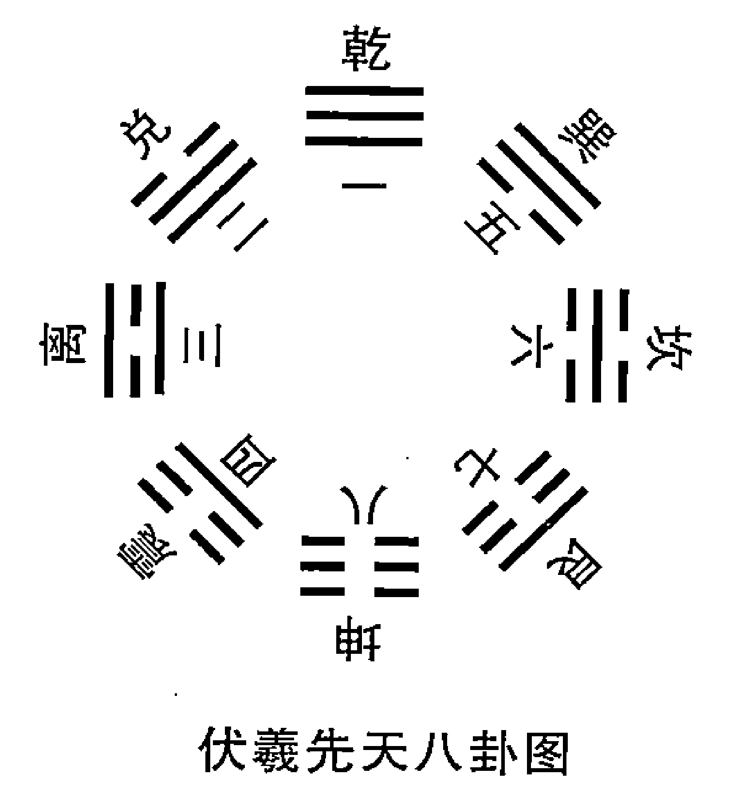

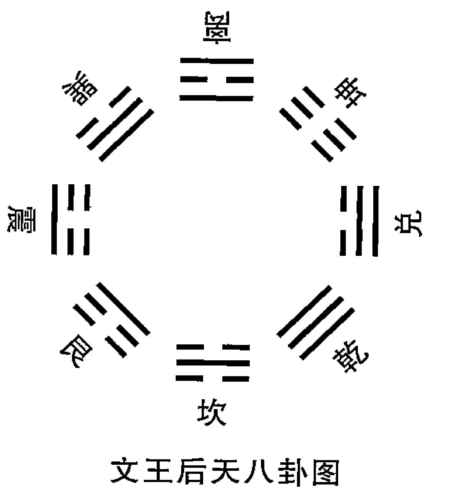

梅花新易的预测方法是用先天八卦与后天八卦相结合的方法，卦的方位采用后天八卦方位，卦的数用的是先天八卦数。八卦方位与数字即：乾金为西北方，数目为一，坎水为北方，数目为六。离火为南方，数目为三。艮土为东北方，数目为七。震木为东方，数目为四。巽木为东南方，数目为五。坤土为西南方，数目为八。兑金为正西方，数目为二。这些看似简单的基础一定记牢。

## 第六节 梅花新易八卦万物类象新解

### 一、梅花新易八卦万物类象新解来源于生活实践

八卦万物类象古书有之，但是很笼统，很多学易之人看着卦象不知道如何解释。一方面是社会发展了，现在很多东西在易经原文中找不到对应的符号，另一方面是易经的原文类象比较模糊，大家不知道如何把现实遇到的现象归类到八卦中去。以至于看着卦不知如何开口。这不单是新学易之人的困惑，而且对学易多年的人仍然是个难题。我在多年的实践中，也经常遇到这种困惑。有时别人问的问题千奇百怪，你无法在易经的提示中找到现成的答案，这就要自己根据易经的原理找到相应的答案。经过了十几年的经验总结，我把易经与现实生活结合起来，找到了很多新的万物类象。这些万物类象，不但经过我的实践检验，还经过我的学员们实践检验。他们都说：“老师，你的新八卦万物类象真好使，我们用了，有时让对方感到非常惊讶。你的万物归类给我们很大启发，我们也敢大胆发挥了”。一个山东的学员说：“老师，就你这一个《火泽睽》卦的万物类象‘哑巴吃黄连’我就征服了无数人，令对方心悦诚服”。

大家都说我断卦神奇，其实我就是把八卦与现实生活结合起来，赋予了它更多新的内容，使得断卦更容易，更直接，更贴近生活。我总结的八卦万物类象，很多都是在实际预测中憋出来的。因为问卦的人的问题五花八门，没法从书上找到现成的答案，还有一方面就是社会发展了，人类进步了，很多现代的东西古时候是没有的。如何把现代的东西对应到八卦当中去，就是我们一个很大的难题。例如我要预测汽车的吉凶，那么古代没有汽车，没有可以借鉴的经验。我怎么区分呢？想来想去，我把车与人作对比。乾金代表人的头部，那么车的头部就是乾金，方向盘是圆的，也符合乾金的定义，乾金也代表方向盘。兑金为说，汽车说话的是汽车喇叭和音响，那么喇叭和音响就用兑金表示。兑还为缺，汽车的机械部分有齿轮，齿轮是像牙齿一样的东西，就用兑金代表齿轮。震木代表人的脚，代表动，代表头。车的脚是轮胎，发动机是动力部分，我就用震木代表轮胎、发动机、车头。巽木代表人的神经，人的肩膀，人的血管。巽木为长形物。车的门子相当于人的肩膀位置，线路、管路是长形的，空调是吹风的，排气管是排气的。所以我就把这些部位归结到巽卦当中。离火代表心脏代表眼睛，那么车的心脏就是发电机发动机。眼睛就是车灯。坎水代表人的泌尿系统，汽车的油箱水箱是装液体的地方，那么坎水就代表车的油箱水箱。坤土为人的腹部，车的腹部是车厢，坤土又为方形物，车的底盘是方形的，我就把车厢和底盘规定为坤土。艮为止，在车上代表止的东西是刹车系统。我就用艮土代表刹车系统。找到了八卦的对应符号，我就用八卦来判断车的毛病，结果准确得令求测人惊讶不已。我的学生也用这种方法预测，都说非常准确。

我在预测的过程中，遇到无法回答的问题时，就是这样用心去想，用心去捉摸，尽量把卦与现实生活相联系。多年来的实践中，我总结了很多八卦万物类象和六十四卦万物类象。正是这些万物类象与现实生活结合紧密，预测才更准确，大家才觉得神奇。

### 二、梅花新易八卦万物类象新解

#### 1. 乾卦

纯阳，五行属金，方位西北，数为一，色白，味辣。“乾为天、为圆、为君、为父、为金、为玉、为冰、为寒、为良马、为木果……”进一步引申，乾为纯阳刚健刚强坚固之象，为领导人、一把手、统帅，管理者，财务管理人员、有权人、富有者，大城市、古城、男性长辈、执法者、名人专家、圆形物、坚硬易碎之物、贵重之物、带骨肉、冰棍、冰激凌、人行横道、斑马、刀剑、方向盘、斧头、政府、军队、丈夫、思想意识、自然法则、计算机、机器人。

人物：老父，男性长辈，宁折不弯之人，思维敏捷之人，死板之人，畏寒之人，领袖，领导人，一把手，老师，教练，方丈，教主，司机，会计，军人，执法者，党员。

- **性格**：刚健勇猛，头脑睿智，直率自尊，威严，宁折不弯，死板少变通。果决、重义气、动而少静、威严、豁达、正直、勤勉、骄傲、霸道。恒、仁德、老成、主观、威严、道德、有创造性、所向披靡、决断、任性、惩罚、愤怒、侵略、制裁、冷酷、过分、轻视、压抑、专横。
- **形态**：完美无缺的、高档的、精致的、古老的、坚硬的、老实的、圆的、转圈的、大的、高的、旧的、苛刻的、寒冰的、光泽的、趾高气扬的、大赤色的。
- **人体**：头、胸部、大肠、肺、左腿、左下腹、精液、男性生殖器、健壮之人或体寒骨瘦之人。骨、脑、胸、体质寒凉。
- **疾病**：头面之疾、筋骨疾、肺疾、腿疾、肠疾、老病、硬性疾病。
- **天象**：天、冰、雹、霰、寒冷、太阳、宇宙、大自然、晴天、寒、凉。
- **物象**：金玉、珠宝、高档用品、古董文物、金钱、钟表、圆形物、坚硬物、辛辣之物。木果、冠、帽子、镜子、高档用品、神物、高级轿车、火车、飞机、圆形金属、玛瑙、机器、实心金属制品、刚硬物、高大物。
- **动物**：马、狮、龙、象，天鹅、虎。
- **食物**：排骨、丸子，圆茄子、各种动物的头肉、圆白菜、辣椒、腊肉、橘子、苹果、李子、栗子、梨、榛子、核桃、柿子，西瓜。
- **场所**：“西北方、京都、大郡、形胜之地（险要、名胜）、高亢之所（高而干燥）、公厕、楼台、高堂、驿馆（旅店、饭店）。”开阔地、宫殿、高大圆形建筑、省城、博物馆、体育馆、寺院、机关大院、大学、高级住宅、大厦、办公室、会议室、招待所、金属加工厂、五金商店、大的场所、皇宫、学校、大城市、大会堂、广场、车站等。
- **有利时间**：庚、辛、申、酉、辰、戌、丑、未之年、月、日时。
- **不利时间**：丙、丁、巳、午年月日时，次壬、癸、亥、子年、月、日、时。
- **方位喜忌**：喜西方、西北方、东北方、西南方。忌南方、北方。
- **颜色喜忌**：喜黄色、白色，忌红色、黑色。

#### 2. 兑卦

一阴爻在上，两阳爻在下，其数为二，五行属金，居西方，色白，味辛辣。“兑为泽，为少女，为巫，为口舌，为折毁，为喜乐，为妾，为雄辩，”引为：演讲，告示，论文，笑骂，吵闹，信仰，破损，左边的，外软内实之物，上面开口之物、潮湿之所、沟、河、井。

形态：喜笑颜开的，口若悬河的，剑拔弩张的，阴暗潮湿的，毁坏破落的。

人物：少女、与说唱有关的职业之人，破坏性职业者、巫师、老师、教授、解说员、记者、翻译、外科牙科医生、饭店人员、金器加工者、秘书、娼妓、小人、二奶，二把手、勤杂工、传销者、推销员。

人体：口、舌、喉、牙齿、肺、气管、口角、颊骨、左肋、肛门、左肩臂。

疾病：口、舌、喉、牙之疾，肺、气管疾病，外伤，咽炎、性病、贫血疾病，手术、金属之伤，头部疾病，破相。

动物：羊、豹、猿猴、兔子、沼泽之物。

天象：小雨、潮湿天气、低气压、露水。

物象：饮食用具、食品、盛水器具、刀剑玩具、开口瓶罐、破损物、修理品、无头之物、头有破损之物、眼镜、废物，乐器，金属饰品，金属钱币、表，玻璃制品，裂口之果类，垃圾箱。

场所：沼泽地、水井、湖河、冰场、公园、音乐厅、歌舞厅、饭店、门口、山洞、信访办、公关部、接待办、首饰店、钟表店、垃圾站、破旧房屋。

有利时间：庚、辛、申、酉金，戊、己、辰、丑、戌、未土之年、月、日、时。

不利时间：丙、丁、巳、午火年、月、日、时，次忌壬、癸、亥、子水年、月、日、时。

方位喜忌：西方、西北方、东北方、西南方，忌南方，次忌北方。

#### 3. 离卦

两阳爻居外，内包一阴爻居中，其数为三，五行属火，居南方，色红，味苦。“离为火，为日、为电、为中女、为房、为文化场所、文凭、为甲胄、为干燥、为鳖、为蟹、为蚌、为外刚内柔”、为漂亮、为礼仪、为外强中干、为焦躁不安、热烈、煽动、花言巧语、为枯燥空虚等。

- 形态：热烈的，干燥的，充满文化色彩。
- 人物：中女、文人、漂亮人、卖报人，外强中干之人，目疾人、兵。
- 性格：重礼、好美、聪明好学、知书达理、性急、易冲动、内心空虚。
- 人体：眼目、心脏、血液、乳房、头面、小肠
- 疾病：眼病、心脏病、烫烧之伤、发烧、炎症、血液病、妇科疾病。
- 天象：光、晴天、热天、干旱、彩虹、云霞、闪电。
- 动物：雉、孔雀、凤凰、美丽的羽毛类。金鱼、热带鱼、虾蟹、贝类、龟、萤火虫、硬壳虫。
- 物象：文学艺术、美术字画、文科、医科、文件文章、文凭、房子、书报杂志、证券、合同、信、旗帜广告、奖状、电话、电报、火柴、打火机、火炉、锅炉、药材、火箭、发动机、火车厢，干肉、煎炒、烤箱、微波炉、液化气灶、红绿灯、花衣服。
- 食物：龟、甲鱼、螃蟹、苦瓜、毒药、辣椒、烧烤食品、田螺。
- 场所：名胜古迹、教堂、学校、博物馆、展览馆、影剧院、证券交易所、银行、电厂、医院、派出所、电视台、向阳之处，窑炉、锅炉房、冶炼厂。
- 有利时间：丙、丁、己、午火，甲、乙、寅、卯木年、月、日、时。
- 不利时间：壬、癸、亥、子水年、月、日、时。
- 方位喜忌：喜东方、东南方、南方，忌北方，次忌东北方、西南方。
- 颜色喜忌：喜红色、绿色，忌黑色、次忌黄色、灰色、咖啡色。

#### 4. 震卦

数为四，五行属木，居东方，色碧青，味酸。“震为雷，为龙、为长男、为苍竹、其于马也，为善鸣、”为当头儿的、副职、鱼、蘑菇、大树、歌舞厅、森林、大炮、鞭炮、乐队、运动场。

形态：运动的，变换的，发怒的，慈善的。
人物：长男、二把手，训练员，勤劳之人，慈善之人，蛮横之人。
性格：多动少静、仁慈、直率、性急易怒、脾气大、暴躁、倔强。
人体：头、足、腿部、肝脏、神经、筋、胳膊。
疾病：足疾、头疾、肝经之疾、肝病、精神病、狂躁病、多动症、神经衰弱、羊痫风、咳嗽、声带咽喉病症。
天象：雷鸣、雷雨、地震。
动物：龙、蛇、鹰、善鸣之马、鸟、蜂、百虫，鱼。
场所：山林野地、向东屋舍、茶地、菜地、广播电台、广播站、邮电局、影剧院、飞机场、部队营房、车站、运动场，打靶场。
物象：树木、竹子、鲜花、蔬菜、多节物、嫩芽、青绿色物，茶货，鞭炮，音响乐器，大车、飞机、飞船、火箭、大炮，裙裤，闹钟。
食物：动物蹄，动物头肉，肘子、鱼、蔬菜、竹笋。
有利时间：甲、乙、寅、卯、壬、癸、亥、子年、月、日、时。
不利时间：庚、辛、申、酉年、月、日、时，次忌丙、丁、己、午年月、日、时。
方位喜忌：喜北方、东方、东南方，忌西方、西北方，次忌南方。
颜色喜忌：喜青色、碧色、绿色、黑色，忌白色，次忌红色。

#### 5. 巽卦

其数为五，五行属木，居东南方，色白，味酸。“巽为木、为风，为长女，为强直，为白，为长，为高，为进退，为木果，其于人也，为寡发，为额宽，为眼白多，为利市三倍，为人，为基础不稳”，引申为书信，票据，风车，奔波，床，桌椅、草药，花草、风景、飞机、宇宙飞船、木材，蔬菜、庄稼、股票、股市、木制品。
形态：飘浮不定的，虚假多变的，多疑猜忌的。
人物：长女、处女、寡妇，僧尼、仙道之人，气功师、商人、教师、医生、技术人员、手艺人、科技工作者、作家、宗教人员、设计师、公关交际人员、造谣者，优柔寡断之人、产妇。

性格：柔和细心，反复无常，心志不定，仁慈直率，奸诈，薄情，爱清洁，爱吃醋，疑惑，隐伏，说谎，悭吝、轻浮、烦躁、多欲等。

人体：头发、神经、气管、肱骨、呼吸器官、食道、肠道、右肩、淋巴系统、血管、胆、腰腿、妇科器官。

疾病：胆疾、肱骨之疾、中风、伤风感冒、妇科病、风寒风湿、传染病、神经病、抽筋、支气管炎、肩痛、淋巴疾病、忧郁症、经络不通、血管疾病。

天象：刮风、高空带长条的云。

动物：鸡、鸭、鹅，羽禽，蛇，长形虫，蝴蝶、蜻蜓，带鱼、鳗鱼、鳝鱼等细长鱼类，猫、虎、斑马等条纹之兽。

物象：木材、床、桌、绳子、邮件、通讯器材、标枪、管形物、皮带、气球、汽艇、帆船、飞机，草药，救生圈、索道、传送带。

食物：蒜苗、白菜、面条、蔬菜、青菜、酸菜、带鱼、鸡、鸭、鹅，羽禽，蛇、鳗鱼、鳝鱼等细长鱼类。

场所：公园，草地，庄稼地，尼姑庵，自由市场，菜市场，证券交易所，电影院，网吧，气象局，佛学院，电信局，中药店。

有利时间：甲、乙、寅、卯、壬、癸、亥、子之年、月、日、时。

不利时间：庚、辛、申、酉之年月日时，次忌丙、丁、己、午之年、月、日、时。

方位喜忌：东方、东南方、北方，忌西方、西北方，次忌南方。

颜色喜忌：喜黑色、绿色，忌白色，次忌红色。

## 6. 坎卦：外柔而内刚，五行属水，居北方，色黑，味咸。数六“坎为水、为沟渎、为中男、为隐忧、为娇柔、为弓轮，其于人也为耳痛、为血卦、为心痛、为床、为月亮、为盗贼、为外柔内刚、为车、为智”。引申为：聪明智慧、善谋、狡猾之人，曲折坎坷，灾难、哭泣、疾病、淫欲、狠毒、讼狱、酒、陷阱、阴谋，江湖之人，盐商，旅游公司，酱菜加工厂，船上工作人员、数学家、发明家、书法家、心理学家、自来水公司工人、劳务者、水产商人、流亡者、娟妇、受灾者、道路……。

形态：流动的, 多变的, 阴暗的, 狡诈的, 黑色的, 聪明的。

人物：中男, 商人, 黑人, 盗贼, 劳改犯, 走私犯, 病人, 医生, 聪明人, 毒犯, 教唆犯, 海员, 海军, 河道管理员。

性格：外柔内刚、足智多谋、多心计、城府深、奸诈、功于心计、多欲、多逢迎。

人体：肾脏、膀胱、泌尿系统、性器官、血液、尿、耳、背、腰、免疫系统。

疾病：肾炎、膀胱疾病、泌尿系统疾病、血液病、出血症、肾寒、水泄、消渴症、免疫系统疾病、性病、病毒性疾病、遗精、阳痿、浮肿、耳痛、中毒、男性生殖器官疾病、尿毒症。

天象：雨、雪、霜、寒冷、水灾、阴天。

动物：猪、鼠、鱼、水中之物、黑色物品、流动物品。

物象：带核之物，液体物质、染料、涂料、车、水、排水供水设备、潜水艇、黑色物、变形之物。

食物：油、盐、酒、酱油、醋、饮料、汤、矿泉水、汤药、咸菜。

场所：瀑布、大川、湖海、河流、水道、冷饮店、酒吧、浴池、鱼市、鱼塘，水厂、水库，自来水公司，海洋馆，车站、酒池、酒厂、酒窖、酱醋厂、车库，地下室、黑市交易场所、牢房。妓院、江、轮船、码头。

有利时间：庚、辛、壬、癸、申、酉、亥、子年、月、日、时。

不利时间：辰、戌、丑、未年、月、日、时，次忌甲、乙、寅、卯年、月、日、时。

方位喜忌：喜西方、西北方、正北方、忌西南方、东北方，次忌正东方、东南方。

颜色喜忌：喜黑色、白色，忌黄色，次忌绿色。

## 7. 艮卦：五行属土，居东北方，色黄，味甘，数为七。“艮为山，为经路、为门、为小石、为狗、为寺庙、为坟地、为指、为节之木”。引申为上实下虚之物、为保安人员、公安局、公检法人员、和尚、道士、房、石碑。艮又为止卦，在上卦为最多，在下卦为最少。

形态：实在的，高高在上的，坚不可摧的，静止的，固执不变的。

人物：少男，独生子，出家之人，宁折不弯之人，顽固不化之人。

性格：憨厚、诚实、坚忍不拔、固执、守信用、迟滞、死心眼儿。

人体：鼻、背、脾胃、手背、关节、趾、皮、手脚、右足、乳房、右下腹。

疾病：脾胃病、鼻炎、手脚背之疾、麻木病、肿瘤、结石、肿瘤、消化系统疾病、气血不通症、癌症、便秘。

天象：有云无雨，多云间阴，气候转折点。

动物：有牙有角的动物，狗、熊、狼、百兽等。

物象：场所，岩石、门、凳子、床、柜子、假山、坟墓、公墓、交叉点、最高点、矿山、采石厂、储藏室、土包、大楼、仓库、停车场、监狱、房子、医院、学校、山路。

食物：蘑菇、土豆、马铃薯、野山菌、猪蹄、熊掌、凤爪、羊蹄。

有利时间：戊、己、辰、戌、丑、未，丙、丁、己、午年、月、日、时。

不利时间：甲、乙、寅、卯年、月、日、时。次忌庚、辛、申、酉年、月、日、时。

方位喜忌：喜正南方、西南方、东北方、忌东方、东南方。次忌西方、西北方。

颜色喜忌：喜红色、黄色、灰色，忌绿色。次忌白色。

#### 8. 坤卦

三个阴爻，其数为八，五行属土，居西南方，色黄、黑，味甘。“坤为地、为母、为方、为布、为吝啬、为子牛、为大车、为文、为众。”引申为阴虚能容之物、为方形之物、为锅、为布、软弱无力的、勤劳忍耐、优柔寡断、穷困、逆来顺受、教奉神佛、思想狭小、死丧过错、谨慎正直、懦弱迟缓、依赖衰微、恭敬抚养、伏藏疑惑、厚德载物、滋育、包容、谦让、本分、消极、沉默、寡断、卑贱、丑陋、昏暗、富裕、平安、宽阔、贞节、欲望、混乱、故乡、仓库、能容之物、粗笨之物。

形态：平和静止的，伏藏疑惑的，厚德载物的，沉闷的，心甘情愿的。

人物：皇妃、臣民、老母、后母、女主人、大腹之人、小气者、泥瓦匠、种田人、房地产经营者、吝色鬼、老百姓、小人。农夫、乡人、众人、老板娘、女首领、劳动者、群众、同乡、土匪、建筑工、乡村干部、祖母、忠厚之人、胆怯者、纺织工、老好人、阴气重者、寡妇。

性格：温厚柔顺、贞节勤俭、诚实、吝啬、懦弱、小气、固执迟钝。柔顺、众多、多重性格、恭敬谦让、贞节、节约、守信诚实、卑贱狭小、感情暧昧、邪恶。

人体：腹部、胃、左肩、脾、消化器官、女性生殖器、肌肉。

疾病：腹部、肠胃、消化道之疾、湿疹、劳累之病、慢性病、肿瘤。脾胃之疾、谷食不化、浮肿、皮肤病、疲乏、疣、妇科病。

天象：云、阴天、雾气、露水、潮湿气候气压低。

动物：牛、羊、地下虫类、黄色之物、夜行动物。母马、雌性百善百禽，猫类、爬行动物。

物象：方物、柔物、布帛、丝绵、瓦器、衣服、瓷器、粉状物、妇女用品、日用品、容器、纸张、箱包、轿子、大车、车轮、土中之物、石灰、水泥、砂土、五谷杂粮、牛肉、野味、甘美之物、米、面粉、肉类、饴糖。被褥，书报文章，包装袋子，火锅。

饮食：牛肉、豆腐，羊肉，马铃薯、芋头、小麦、黄酱、芝麻酱、甘味、野味、五谷之味、竿笋之物、动物腹脏之物。

场所：城市居民区，乡村平原，牧场，老家，农舍楼房，农贸市场，肉类加工厂，家禽之屋舍，场院、售楼处、停车场。

地理：田野、西南方、平原、矮屋、土阶、城邑、角落、大地、旷野牧场、郊外、故乡、草坪、广场空地、粮库、平房、旧房。

有利时间：戊、己、辰、戌、丑、未，丙、丁、巳、午之年、月、日、时。

不利时间：甲、乙、寅、卯、庚、辛、申、酉之年、月、日、时。

方位喜忌：喜西南方、东北方、南方。忌东方、东南方、西方、西北方。

颜色喜忌：喜红色、黄色，忌绿色，次忌白色。

## 第七节 六十四卦

### 一、六十四卦名称

八个经卦通过上下相互组合共有六十四组，称为六十四卦，六十四卦分别排列在八个宫中，即乾、兑、离、震、巽、坎、艮、坤。每一个卦根据它的上下卦的名称组合冠以新的名称。

- 乾宫八卦：乾为天、天风姤、天山遁、天地否、风地观、山地剥、火地晋、火天大有。
- 坎宫八卦：坎为水、水泽节、水雷屯、水火既济、泽火革、雷火丰、地火明夷、地水师。
- 艮宫八卦：艮为山、山火贲、山天大畜、山泽损、火泽睽、天泽履、风泽中孚、风山渐。
- 震宫八卦：震为雷、雷地豫、雷水解、雷风恒、地风升、水风井、泽风大过、泽雷随。
- 巽宫八卦：巽为风、风天小畜、风火家人、风雷益、天雷无妄、火雷噬嗑、山雷颐、山风蛊。
- 离宫八卦：离为火、火山旅、火风鼎、火水未济、山水蒙、风水涣、天水讼、天火同人。
- 坤宫八卦：坤为地、地雷复、地泽临、地天泰、雷天大壮、泽天夬、水天需、水地比。
- 兑宫八卦：兑为泽、泽水困、泽地萃、泽山咸、水山蹇、地山谦、雷山小过、雷泽归妹。

### 二、梅花新易的六十四卦万物类象来自生活实践的总结

梅花新易预测法把六十四卦的含义做了很多补充，这些含义是经过我十 几年的发现、总结、应用、推广、验证的结果。它不是凭空想象的，它的理 论基础来自于易经的象意。我把易经八卦的象、色、味、形、意延伸开来， 总结了很多六十四卦的象意，使得它与我们的现实生活结合得更紧密更直 观。几乎每一个六十四卦的象意的背后都有一个故事，它会告诉你这个卦的 象意是怎么来的。

例 54 《山水蒙》为大夫

2001 年在石家庄一位同行的老师问婚姻，得《山水蒙》☰卦，他问我；“贾老师你看对方是干什么工作的？”我想艮为止坎为病，能把病止住的是大夫，结果对方确实是大夫。

例 55 《水山蹇》为医院

2003 年测人失踪得《水山蹇》☵卦我说人在医院里，（艮为房为止，坎为病，能把病止住的房子不就是医院吗？）果然如此。

例 56 《火风鼎》为看书

2001 一位易友在石家庄的学习班上，他问我：“你看我弟弟在东北老家正在干什么？”我当时起卦《火风鼎》☲，我想离为眼睛，巽为书，我说：“你弟弟在家看书”。他当时给弟弟打电话问，他弟弟说正在家看书。

例 57 《天风姤》为理发

2003 年我与小郝在刘老师处学习，晚上找不到老师，起卦《天风姤》☰，我俩按卦意分析半天，一会儿老师回来一问是理发去了。“天风姤”不是直读理发吗？

例 58 《地风升》为炸酱面

2004 年底有一次在火车上聊天说起周易，其中一位男同志不以为然地说：“那都是骗人的，如果你能说出我今天中午吃的什么饭我就信你”。我无心与他争论，心平气和地问他：“你是在家吃的还是在外边吃的？”他说：“我在家吃的”。我看了一眼表 16:05 分，起卦《地风升》☰，我把凡是符合坤土与巽木的东西都想了一遍，最后说：“你吃的是炸酱面，白菜面码，还有腊八蒜”。他很吃惊地问别人：“你们有人告诉她了？”大家七嘴八舌地说道“谁看见你吃饭了？你不是在这里看着吗？谁说话了？”我为什么问他在哪儿吃的饭？一般在家吃饭比较简单，用主卦分析即可。如果在外边聚餐就要把变卦一起分析。在饭店吃饭，很少只要一种饭。 巽为长、软、白色之物，坤为黄色泥土状、甜味、方物，形象的肉丁炸酱面。巽又为白菜，又为有酸味物，有白菜有醋。互卦《雷泽归妹》☷，震为绿、为酸，兑为辣、为白，那么又绿又白又酸又辣的就是腊八蒜。还有一个因素就是考虑北京人的生活习惯。

例 59 《风泽中孚》为风箱

我把《风泽中孚》☰ 看成是农村烧火用的风箱，中间是空的两头都可以进风，“中孚”卦上下卦都可以看成风。结果一位易友的爱人有了婚外情被自己发现，他爱人舍那边那边不答应，舍这边是他的结发妻子和孩子，真是两头为难两头受气。她起卦测事情的结果时得一“风泽中孚”卦，她想起我的卦象笑了。她告诉我“大姐，你的万物类象神了，我爱人属鼠，我得了一个《风泽中孚》卦，你说他现在可不是就像老鼠进了风箱两头受气吗？”

例 60 《火泽睽》直读哑巴吃黄连

兑为说，被离火所克，说不出话的是哑巴，离火为心为苦最苦莫过黄连。连起来直读哑巴吃黄连。济南的一个学员说：“贾老师，就你这一个哑巴吃黄连我用来征服了很多人，遇到这个卦我这么一说都被对方认可，还觉得我断的非常神奇。谢谢老师为我们造了这么多直读的卦象名词。”

2005年5月7日庚辰月辛卯日

给我做足疗的小伙子听说我懂《易经》，问我能不能给他看看。我看表6:49分。起卦得《水天需》之《水风井》☰ ☵ ☴。断：

1.  你出生地附近有水。他回答：“有”。（坎水）
2.  你23岁结婚。他点头说：“对，我23岁结的婚。”（互卦火泽睽直读23他家是农村的，考虑结婚年龄在小数上找，三组卦也只有这个数符合结婚年龄。）
3.  你腰腿有伤或痛。他忙说：“我的腿摔断过。”（《水风井》直读，坎为病，巽为腰腿。）
4.  你16岁时有女孩追过你。他不好意思地说：“有，只是当时很小。”（《水天需》直读16岁，那个时候正是青春期）。
5.  你32岁有哑巴吃黄连之事，或者你的心里有难言之隐。他犹豫了一会儿说：“我不能说啊，心里太苦了”。（互卦火泽睽直读32岁，兑为说，被离火克说不出来，说不出话的是哑巴。离火为心为苦，世界上老百姓把黄连堪称最苦，不是哑巴吃黄连有苦说不出了吗？另外互卦也是代表隐私）
6.  你为孩子的事花了大钱。他说：“老二是花钱要的，因为超生被罚了大钱。”（巽木为他的孩子，泄体卦，为孩子花钱，巽木为利市三倍，日辰卯木，巽木旺按大数断）
7.  你1991、1992、1995、1996年不错。他点点头说：“那几年做买卖挣了钱”。（1991、1992申酉之年太岁生体卦，1995、1996年太岁帮体卦）
8.  你1997、1998、1999年不顺。他伤心地说：“我的腿就是1997年摔断的，我在炕上躺了两年”。（1997年丑土克体卦，1998、1999年太岁泄体卦）
9.  你今年农历1~3月份不顺。他无可奈何地说：“今年从春节到现在已经干了3个月还没赚到一分钱”。（1、2月寅卯木泄体卦坎水，3月辰土是水的墓库之月，土又克水）

说到这儿，他很有感触地说：“阿姨，我犹豫了几天才敢问您，因为我知道你们北京搞这一行的给孩子起个名都要200元钱，不知道不给钱您能不能给我看，没想到我什么都没说，您就给我看的这么准。我心里的话不得不对您说。我母亲死的早，有一天我父亲喝醉了，把我媳妇强奸了。我心里再苦也没地方说啊，在当地一说，全家都无法出门了，苦了6年了，正是32岁那年我摔断了腿在家躺着的时候，可不就是哑巴吃黄连了吗。”

例 61 《水地比》《水山蹇》可以是糖尿病

一位老人预测身体疾病，按招数6、8、9起得一卦《水地比》之《水山蹇》䷇ ䷦，从两个卦分析，都是坎水被土克，坎水为泌尿系统，为血液系统，她有泌尿系统的疾病或者是血液系统的疾病是毫无疑问的。我又想更细致地判断她究竟是哪方面的病呢？是尿道结石还是血液病？坎水为尿为血液，与土结合在一起，我突然想到土的味道是甜的，那么尿里血里都有了甜味的东西，不是糖尿病吗？我问老人：“您是不是得了糖尿病了”？老人说：“我不知道，只是最近老感觉浑身没劲。”后来她的孩子带她去医院检查，她的血糖已经17个，尿糖已经4个加号，典型的糖尿病。

例 62 《山地剥》为摔跟头

大家经常会在我的书里看到说“你从高处摔下来过”这样的断语，而且每次都应验无比。我为什么这样断呢？我把这个卦看成一个陷阱，底下全部掏空，只是上面盖了一层东西，人上去就会掉下来。也可以引申为在生意场上或者政治生涯中栽了跟头。

例 63 《山地剥》为火车

一个朋友说到北京找我，我忘了问她是坐飞机来还是坐火车来。我就用“她今天是坐飞机来还是坐火车来？”一共14个字，时间是中午12点多。14个字加上时辰序数7，起卦《艮为山》之《山地剥》䷳ ䷖，卦当中没有出现飞机的符号，互卦里有一个《雷水解》的符号，坎水可以看成是用车解决问题。我再一看变卦《山地剥》不是形象的表示一个火车头拉着很多节车厢在跑吗？我打电话一问，她果然是坐火车来。

例 64 《山地剥》为堵车

一位女同志下午打电话说要找我预测，我答应在家里等她，她说她5点多下班就来我家。到了晚上快8点了还不见人影，她究竟还来不来呢？我按时间7:56起卦《山地剥》之《艮为山》䷖ ䷳ ䷳，卦中体卦用卦比和，应该能来，但是究竟什么原因她现在还没有到呢？艮为止，我想一定是因为堵车被堵在路上走不了。艮卦形象地看，好像很多小汽车排成两行，前面有一个大的车或者什么东西横在它们前面，它们无法逾越这个障碍。那么什么时间能到呢？艮为止，为最少或者最多，数字为7、8。我想既然堵车，按数字的最大化看吧，7+7=14我断她14分钟能到，果然她9点按响了我家的门铃。

通过无数次这样的实践，打开了我的思路，直接读卦象、卦意、卦形，可以使卦更直接地体现现实的生活现象。很多人包括同行都说我断卦神奇，其实就是多用心去想。有时在预测时别人提的问题稀奇古怪，有很多问题无法在卦中直接找到答案，只有用象、意、形、色、味来对照。对照的次数多了，就找出一些规律。我把自己在实践中用过的和想到的万物类象写出来，供大家参考。其中多数是我在实践中用过的，只有少数是举一反三写的。当然这些并没有超出易经的万物类象范围，只是细化了一下，把卦的形、象、意、性、色、味、名综合起来，使之更接近生活。世间有万物，物象有万种，卦只有64个。大家想学好周易，最主要的还是记住八卦万物类象，遇事大胆用心去发挥，把事说细了具体了别人就会感到神奇。

### 三、梅花新易六十四卦万物类象新解

#### 乾宫八卦象意

乾为天：上下卦都为乾金纯阳卦，楼梯，台阶，人行横道，排骨，领导集会，司机，司法机关，军队，国家，政府、斑马，刀剑……比和卦预测事情能够成功，但是预测婚姻容易不顺。

天风姤：上卦乾金下卦巽木，理发，砍草，收庄稼，性生活，酸辣粉，人工流产，神经官能症，肩周炎，妇科手术，胆切除，腰椎间盘突出，股骨头坏死，腰腿疼或者腰腿有伤，君臣相遇，乾金为体卦事情容易成功，巽木为体卦事情不成。

天山遁：上卦乾金下卦艮土，手脚有伤，法院，营房，逃跑，逃犯，躲藏，隐居，方丈，住持，方丈室，出家，搬家，搬家公司，领导办公室，脑血栓，脑瘤，直肠癌，太平间，乾金为体卦事情容易成功，艮土为体卦事情难成，或者花钱可以成。

天地否：上卦乾金下卦坤土，虎落陷坑，否极泰来，巴结领导，乡村领导，行贿受贿，交粮纳税，脾胃之疾，腹部有伤或者有病。乾卦为体卦事情容易成功，坤土为体卦事情难以成功，或者花钱可成功。

风地观：上卦巽木下卦坤土，观望等待，观察室，风车，东风汽车，庄稼地，草坪，花园，脾胃疾病，停留，留党察看，停薪留职，拘留，拘留所。巽木为体卦事情容易成功，坤卦为体卦事情难以成功。

山地剥：艮土为上卦坤土为下卦，摔伤，停止，腐败堕落，拿下，牢房，土堆，旅馆，寺庙，堵车，母亲的卧室，归山入土。比和卦，事情容易成功。

火地晋：离火为上卦坤土为下卦，眼疾，心脏病，升职，升级，孝女，救火车，黄眼睛，红车，红土，空地。坤土为体卦事情容易成功，离卦为体卦事情难成功，或者花钱可以成。

火天大有：离火为上卦乾金为下卦，电脑，头痛，脑炎，触犯法律，得罪领导，头部手术，盲肠手术，肠炎，痔疮，丢官罢职，大有希望，克夫，寡妇，朝霞，火腿肠，父女干仗，烟道。乾金为体卦事情不容易成功，离卦为体卦事情能成功。

#### 兑宫八卦象意

兑为泽：上卦为兑下卦为兑八纯卦，对讲机，麦克风，手机，歌舞厅，沼泽地，少女，口舌，头上有伤，拔牙，小白脸，研讨会，批斗会，辩论会，记者招待会，会餐，冰激凌、羊肺、芝麻烧饼，白酒。比和卦事情容易成功，但是测婚姻容易不顺。

泽水困：兑上坎下，困难，贫困，困住，拘留，白酒，喝酒，喝汤，饮料，卤煮火烧，羊肉泡馍，羊杂汤。坎水为体卦事情容易成功，兑卦为体卦事情难以成功，如果金旺或者花钱费力可以成。

泽地萃：兑上坤下，沼泽地，处女地，腹部有伤口，广播车，半导体，辣豆腐，白布，黄板牙，黄酱，辣酱，甜面酱。兑为体事情易成，坤为体难成，或花钱费力可成。

泽山咸：兑上艮下，矿山，尼姑庵，预测馆，无房户，在庙中许愿，中小学校，歌厅，侃大山，餐馆，狗肉馆，驯犬员，解说员，导购员，保安，传达室，嘴甜。兑卦为体事情容易成功，艮卦为体卦事情难成功，或者花钱费力可以成。

水山蹇：坎上艮下，艰难，医院，大夫，泌尿系统结石，糖尿病，山水画，果汁，饮料。艮卦为体卦事情容易成功，坎为体难成，

地山谦：坤上艮下，山包，让贤。谦虚，谦让，售楼处，房管所，土地局，山神庙，黄山。比和卦，事情易成功。

雷山小过：震上艮下，过失，过度，兄弟不和，手脚有伤，脂肪肝，山蘑菇，山林，鱼，开山放炮，房倒屋塌，房屋拆迁，房改办公室，批评，记过处分，酸甜味果脯。艮为体事情难成，震为体事可成。

雷泽归妹：震上兑下，雷雨交加，归别人了，兄妹不和、干仗，批评领导，纪律监察部门，伐树，肝部手术，头脚有伤，酸辣酱，腊八蒜，芥沐。震为体事情难成，兑为体事可成。

#### 离宫八卦象意

离为火：离上离下，离开，分心，分手，离婚，离家，分家，热心肠，红眼病，眼疾，着急上火，双眼皮，苦心，文化，文凭，教育局，文化部，眼科，婚姻不顺。比和卦事易成。

火山旅：火上艮下，旅行，调走，火山，多走动，心律不齐，心肌梗，白内障，盲人，房产证，购房合同，购房协议，文凭高，心气高，红塔山，红房子，火葬场，锅炉房，空房子，买卖房子，日落西山。艮为体事情易成，离为体难成，或花钱费力可成。

火水未济：火上坎下，红酒，肾炎，心病，心脏病，烫伤，烧水，血水，黑心，水灾，车祸，眼病，盲人，盲目，红颜祸水。坎为体事情易成，离为体难成。

火风鼎：离上巽下，风风火火，煽风点火，吹风机，看书，火锅，苦胆，胆囊炎，肩周炎，股骨头坏死，妇科炎症，夺冠，顶牛，三足鼎立，竞争，折足，三角关系，第三者，苦菜，心酸。离为体事情易成，巽为体难成，或花钱费力可成。

山水蒙：艮上坎下，启蒙，教育，医院，大夫，药房，戒毒所，黑山，脾胃有病，泌尿系统结石，手脚有伤，手脚痛，学校，山水画，手黑，甜水，蒙人。艮为体事情易成，坎为体难成。

风水涣：巽上坎下，风水，浇花草，灌溉，醋，咸菜，黑风，离婚，散伙，解体，解散，妇科病，神经病，肩周炎，中风，半身不遂，腰腿病，股骨头坏死，公园，风景区。巽为体事情易成。坎为体难成，或花钱费力可成。

天水讼：乾上坎下，贪官，打官司，法院，检察院，头痛，白血病，白癜风，肠炎，痔疮，脑积水，头破血流，骨头汤，花钱治病，洗黑钱，大雨倾盆，洪水，水利部门，水产部门，自来水公司，天河，江河湖海，事与愿违。坎为体事情易成，乾为体难成，或花钱费力可成。

天火同人：乾上离下，辣椒炒苦瓜，火腿肠，火烧云，圆眼睛，翻白眼，电脑，头痛，头部手术，盲肠手术，肠炎，脑炎，痔疮，丢官罢职，朝霞，父女干仗，烟道，同伙。离为体事情易成，乾为体难成。

#### 震宫八卦象意

震为雷：震上震下八纯卦，测婚不顺，发脾气，暴跳如雷，干打雷不下雨，东方巨龙，鱼群，森林，直率。比和卦事易成。

雷地豫：震上坤下，脾胃病，脾胃切除，耕地，树地，绿地，黄龙，黄花鱼，甜甘蔗，有威信的领导，打击压迫老百姓。震为体事情易成，坤为体难成。

雷水解：震上坎下，解决，解放，解散，头痛，肝病，脚气，雷雨交加，灌溉，黑龙潭，黑龙江（地名）墨绿色，黑鱼，咸鱼，贪官。震为体事情易成，坎为体难成，或花钱可成。

雷风恒：震上巽下，久远，持之以恒，背道而驰，森林，公园，放风筝，酸菜，酸黄瓜，酸豆角，腰腿酸软。比和卦事易成。

地风升：坤上巽下，开快车，腹部手术，胃病，升学升官，升起，庄稼地，甜菜，面条，草坪绿地。巽为体事情易成，坤为体难成。

水风井：坎上巽下，醋，酸味饮料，咸菜，浇花草，灌溉，妇科病，神经病，腰腿病，肩周炎，黑发，陷阱，黑旋风。巽为体事情易成，坎为体难成，或花钱可成。

泽风大过：兑上巽下，手机，吃醋，过去，过失，过渡，记过，欠沟通，人流，性生活，伤腰腿，理发，妇科手术，股骨头坏死，肩周炎，秃头，和尚，尼姑，吹牛皮，说瞎话，酸辣粉，酸辣汤，辣白菜，虾。兑为体事情易成，巽为体难成。

泽雷随：兑上震下，随大流，随便，酸辣汤（酱），吃青菜，批评领导，直言相告，头、脚有伤，瘸腿人，肝病（包括疼或手术），伤长子，劈柴砍树，雷雨交加。兑为体事情易成，震为体难成。

#### 巽宫八卦象意

巽为风：巽上巽下，八纯卦。测婚不顺，一风吹，受风，中风，尼姑，上下床，草垛，菜园子，庄稼地，蛇，绳，黄白猫，酸菜。比和卦事易成。

- 风天小畜：巽上乾下，脑中风，肩周炎，腰腿疼（伤），胆手术，神经病，妇科手术，胆小，储蓄所，积蓄，停滞不前，停食，毛细血管，酸辣粉，辣白菜，蒜苗。割草收庄稼，理发，乾为体事情易成，巽为体难成。
- 风火家人：巽上离下，风风火火，煽风点火，同伙，一家人，胆囊炎，肩周炎，神经病，妇科炎症，吹风机，苦胆，苦菜，心里像长草，心酸。离为体事情易成，巽为体难成，或花钱可成。
- 风雷益：巽上震下，大离卦，酸菜，森林、公园，受益，花草树木，公益事业。比和卦事易成。
- 天雷无妄：乾上震下，领导班子不团结，胆大妄为，无妄之灾，不利长子，灾祸，头脚有伤，肝病（手术），瘸腿人，头蹄肉，鱼排，酸豆角，排酸肉，辣菜，砍树。乾为体事情易成，震为体难成。
- 火雷噬嗑：离上震下。不成功之象，肝炎，头痛，脚气，脑炎，动心，红绿灯，发动机，发电机，心动过速，红鱼。离为体事情易成，震为体难成，或花钱费力可成。
- 山雷颐：艮上震下，大离卦，半身不遂，瘸腿人，脂肪肝，肝硬化，肝癌，脑瘤，脾胃之疾，练气功，方丈，主持，盘腿打坐，少管所，拘留所，开山放炮，房屋拆迁，迁坟，拆庙。兑为体事情易成，巽为体难成。震为体事情易成，艮为体难成。
- 山风蛊：艮上巽下，癌、子宫肌瘤，胆结石，风湿性关节炎，腰腿病，经络不通，肩背痛，一肚子坏水，鼓动，唆使，甜菜，尼姑庵。巽为体事情易成，艮为体难成。

#### 坎宫八卦象意

- 坎为水：坎上坎下，石油，黑车，险恶，江河湖海，聪明，肾病，病上加病，聪明反被聪明误，黑河，盐水，墨水，黑龙江，湖北，河北。比和卦事易成。
- 水泽节：坎上兑下，截止，祸从口出，病从口入，辣椒水，黑芝麻糊，白酒，矿泉水，水泥，白涂料。坎为体事情易成，兑为体难成，或花钱可成。

### 水雷屯：

坎上震下，乱丝无头，囤积，水雷，墨绿色，黑龙江，黑鱼，咸鱼，咸菜，酸豆汁儿，山楂汁。震为体事情易成，坎为体难成，或花钱费力可成。

### 水火既济：

坎上离下，成功之象，心脏病，烫伤，车灾，水灾，黑心，红墨水，烧酒，电路故障，废电器，消防车，灭火器。坎为体事情易成，离为体难成。

### 泽火革：

兑上离下，改革开放，改变现状，工作调动，语文老师，不讲理，没礼貌，缺心眼，缺心少肺，小心眼，白眼狼，小眼睛，口苦心辣，哑巴吃黄连，口疮，肺炎，牙痛，牙周炎，拔牙，白里透红，辣椒酱。离为体事情易成，兑为体难成。

### 雷火丰：

震上离下，丰收，电闪雷鸣，动中求财，电脑，火腿肠，火腿，肝炎，肝火旺，头痛，腿脚有病，森林火灾，广播电台，彩虹，红烧鱼，心酸，暴跳如雷，红绿灯。离为体事情易成，震为体难成，或花钱可成。

### 地火明夷：

坤上离下，伤灾，伤心，红车，心电图室，空房子，地下室，防空洞，墓穴，日落西山，火埋地下，红土。坤为体事情易成，离为体难成，或花钱可成。

### 地水师：

坤上坎下，兴师动众，打仗，马到成功，糖尿病，甜味饮料，脾胃病，肾炎，妇科病，泌尿系统疾病，腹水，浇地，涝灾，黑车，堵车，地下道，地铁，地下水，暗河。坤为体事情易成，坎为体难成。

#### 艮宫八卦象意

### 艮为山：

艮上艮下，八纯卦，测婚不顺，骨质增生，停滞不前，山神庙，少管所，高楼大厦，高山，前后院，复试楼，狗圈，手拉手。比和卦事易成。

### 山火贲：

艮上离下，火山，心高，实心眼，白内障，高血脂，心肌梗，心律不齐，乳腺炎，坟头烧纸，空坟，心血管堵塞，胃炎。艮为体事情易成，离为体难成，或花钱费力可成。

山天大畜：艮上乾下，保安，门卫，警察，公安局，拘留所，检察院，房管局，军队院校，集训队，银行，储蓄所，党校，皇宫，大殿，大的积蓄，富翁，停止不前，脑瘤，肠癌，乳腺癌，骨质增生，肠梗阻，狗肉，狗肉馆。乾为体事情易成，艮为体难成，或花钱可成。

山泽损：艮上兑下，损失，投资，破产，剧院，歌厅，色情场所，少年合唱队，幼儿园，儿童游乐场，庙中许愿，矿山，房屋介绍所，中小学校，广播电台，鸡舍，拍卖行，山葱野蒜。兑为体事情易成，艮为体难成，或花钱可成。

火泽睽：离上兑下，哑巴吃黄连有苦说不出，大眼瞪小眼，无房户，没文化，没文凭，戴眼镜，心肌缺血，牙痛，牙周炎，盲人，缺心眼，心辣嘴苦，白眼狼，没礼貌，不讲理，文科老师，文化部，宣传部，广播电台，心理医生，缺心少肺，小心眼。离为体事情易成，兑为体难成。

天泽履：乾上兑下，走，缺钱，头上有破损或戴眼镜，包二奶，养小秘，寡妇，私生子，父亲不在了，下岗，离退休，大会堂，腊肉，脑白金，羊排骨，羊头肉，羊杂汤。比和卦事易成。

风泽中孚：巽上兑下，手机，胆切除，胆病，吓破胆，腰腿病（手术）肩周炎，妇科手术，神经病，酸奶，腊八醋，泡菜，剃头理发，割草收庄稼，头发少，和尚，尼姑，秃头，小心眼，辣菜，酸辣汤，争风吃醋，辩论，吹风机，风箱。兑为体事情易成，巽为体难成。

风山渐：巽上艮下。杏脯，山野菜，道观，山神庙，妇科肿瘤，手脚有伤，房屋拆迁，开山修路，房屋装修，土木工程，建筑队，刻碑，修庙。巽为体事情易成，艮为体难成。

#### 坤宫八卦象意

坤为地：坤上坤下，土地，场地，人缘好，宽容，节俭，任劳任怨，小气，吝啬，刀切馒头，排房，方糖，豆腐。比和卦事易成。

地雷复：坤上震下，生闷气，反复，夫妻反目，地震，天翻地覆，刚开始，有威信的领导，欺压百姓，大发雷霆，房屋拆迁，地皮改造，舞场戏院，运动场，黄鱼，甜甘蔗，绿色车，火车，停车场。震为体事情易成，坤为体难成。

**地泽临：** 坤上兑下，发政施仁，沼泽地，稻田，甜汤，辣腐乳，白山药，黄酱，甜面酱，胃切除，群众大会，传销，孤儿院，母爱。兑为体事情易成，坤为体难成，或花钱可成。

**地天泰：** 坤上乾下，风水宝地，贤妻良母，百姓拥护的领导，国泰民安，万众一心，夫妻恩爱，人民大会堂，苹果，梨，桃，肉夹馍，母校，车场，胃癌，妇科肌瘤，脾肿大。乾为体事情易成，坤为体难成，或花钱可成。

**雷天大壮：** 震上乾下，发展壮大，结实，长子有灾，钓鱼，叉鱼，白杨树、砍树。乾为体事情易成，震为体难成。

**泽天夬：** 兑上乾下，应事快，缺钱，头上有破损或戴眼镜，包二奶，养小秘，私生子，寡妇，父亲不在了，群龙无首，喜悦，讲课，讲演，念经，破损之物，芝麻烧饼，文艺演出，春节晚会，法制宣传，能说，没头脑，腊肉，吃肉，羊排骨，羊头肉，羊杂汤。比和卦事易成。

**水天需：** 坎上乾下，头痛，肠炎，花钱治病，需要，求雨，洪涝灾害，天河，排骨汤，白水，矿泉水，黑车，洗黑钱，辣椒水。坎为体事情易成，乾为体难成，或花钱费力可成。

**水地比：** 坎上坤下，胃病，糖尿病，传染病，涝灾，黑车，黑土地，堤坝，田埂，油田，稻田，晒盐场，黑面包，船行顺风，甜味饮料。坤为体事情易成，坎为体难成。

象只是给大家一个思路和提示，大家可以拓展自己的思路，举一反三，这样断卦生动活泼，让大家看到周易无所不包，无处不在。

# 第五章 梅花新易预测法

## 第一节 主卦、互卦、变卦及动爻的表示方法

### 一、卦的组成

一个卦是由上下两个经卦（也叫单卦）组成，读卦时自上而下。

- 上卦（外卦）：在卦的上边的经卦叫做上卦，也叫做外卦。
- 下卦（内卦）：在下边的经卦叫下卦也叫内卦。
- 动爻：卦中的任意一个发生变化的爻称作动爻。
- 体卦：卦中没有动爻的经卦，体卦代表求测人，代表事物的主体。
- 用卦：卦中有动爻的经卦，用卦代表对方，代表事物的外在条件。

### 二、主卦、互卦、变卦（也称之卦）

- 主卦：用任意方法起的卦，没发生动变之前的卦。
- 互卦：互卦是由主卦的二、三、四爻组成下卦，三、四、五、爻组成上卦。写卦时自下而上。读卦时自上而下。
- 变卦（之卦）：由于主卦中的任意一个爻发生变化而组成的卦。

例如：12:08 分起卦《雷地豫》之《雷水解》，互卦《水山蹇》，二爻动。其表示方法：䷏ ䷧ ䷦ ䷧。《雷地豫》卦被称主卦，二爻发动（用 ☲ 表示），变出《雷水解》卦，被称为之卦或变卦。《水山蹇》卦称为互卦，（注：本书的例题大都不写互卦）。卦中的震木为体卦，为上卦（也叫外卦）。坤土与坎水为下卦（也叫内卦）为用卦。

特别一提的是动爻的表示方式。它不用数字表示，而是用卦表示，一爻动用“☰”表示；二爻动用“☱”表示；三爻动用“☲”表示；四爻动用“☳”表示；五爻动用“☴”表示；六爻动用“☵”表示。动爻是表示事物发生了变化，几爻动，就把原来的爻阴阳进行转换，阴变阳，阳变阴，如下卦二爻阴爻发动，变卦的二爻则记为阳爻。（如果下卦二爻为阳爻发动，变卦的二爻则记为阴爻。）其余的爻不变。其他爻发动变化仿此。

## 第二节 梅花新易的起卦方法

### 一、时间起卦法

这种方法是最方便，也是最快捷的一种方法，也是准确度很高的一种方法。它有两种计算方法：

#### 1. 按年、月、日、时数来计算

月、日一定用阴历计算。月支数要以交节时计算。年序数是：子年数为1，丑年为2，寅年为3，卯年为4，辰年记作5，巳年记作6，午年记作7，未年记作8，申年记作9，酉年记作10，戌年记作11，亥年记作12。月数：一月记作1，二月记作2，三月记作3，四月记作4，五月记作5，六月记作6……十二月记作12。日数按实际数计算，即1号按1计算，2号按2数计算，3号按3数计算……30号按30数计算。时辰数按子1，丑2，寅3……亥12计算。详细见表 “地支与十二时辰”。

方法是用年支数加月加日之和除以八，余数作上卦，余一记作“☰”；余二记作“☱”；余三记作“☲”；余四记作“☳”；余五记做“☴”；余六记作“☵”；余七记作“☶”；余零记作“☷”。再用年、月、日、时四数之和除以八，余数记作下卦，方法同上。再用年、月、日、时四数之和除以六，余数记作动爻，余一为初爻动，余二为二爻动、余三为三爻动、余四为四爻动、余五为五爻动，除尽为六爻动。几爻动就在主卦右边用数的卦爻来表示。读卦的时候自上而下读。（后面所有的起卦方法的上下卦及动爻的表示方法都与之相同，不再赘述。）

2004年8月28日下午4点，应先查出今天的阴历是7月13日。甲申年支，序数是9，下午4点为申时，时序是9，计算卦：
(9+7+13) /8=3余5， 5为上卦，用“☰”表示。
(9+7+13+9) /8=4余6， 6为下卦，用“☷”表示。
(9+7+13+9) /6=6余2， 2为动爻，用“⚊”表示。
得卦：☴☵ ☴☷ 《风水涣》之《风地观》互卦《山雷颐》

用这种方法，计算起来虽然准确但是略显烦琐，特别是换月不交节的情况下，还要搞清节令在何日，才能正确计算。如2004年正月初五起卦，因为还没打春，起卦时的年序数就要按2003年的地支数未土8数计算，正月要按去年的丑月记作十二，所以我很少用。除非在断事情应期牵扯到月令时我才去翻《万年历》。

#### 2. 按当时的时间起卦

以时针数为上卦，以分针数为下卦。方法是一点钟上卦就记作乾，用“☰”记作上卦，二点钟上卦就记作兑，用“☱”记作上卦，八点钟上卦就记作坤，用“☷”记作上卦等等。超过8就用8除，余数是几就用几来表示。分针数小于8直接用数起卦，大于8用分针数除以8余数为下卦。求动爻的方法是：用时针数与分针数之和除以6，余数为动爻，如果两数之和小于6，直接按和数作动爻。

12点25分，12/8=1余4，上卦“☳”。
25/8=3余1，下卦“☰”。
(12+25) /6=6余1，一爻动，用“⚊”表示。
组成的卦是：☳☰ ☳☴ 《雷天大壮》之《雷风恒》，互卦《泽天夬》，

12点25分起卦还可以用时针数1+2=3作上卦，数小于8，直接用三作上卦，用“☳”表示。用分针2+5=7作下卦，数小于8直接用7作下卦，用“☶”表示用 (1+2+2+5) /6=1余4作动爻，用“⚊”表示。组成的卦是：《火山旅》之《艮为山》，互卦《泽风大过》。
这种方法既简便，又准确。如果是超过中午一点钟，既可看作 13 点，又可以按 1 点计算，这是个人习惯问题，不千篇一律。因为这两种方法我都经常用，都准确无误。有人问时间是不是必须按北京时间计算，大可不必。有人从国外打来电话，我按他报的当地时间起卦一样准确。还有人说我的表不准怎么办？那就按你不准的表起卦就是了。一切都是天意。

### 二、来人报数起卦

有时我不戴表，别人问事，我就让他（她）随意报三个十以内的自然数。以第一个数为上卦，第二个数为下卦，第三个数为动爻。如果第一、第二个数小于 8，就直接用她报的数起卦。如果大于 8，就除以 8 用余数作卦，第三个数如果小于 6，就直接用她报的数做动爻，如果大于 6，就用 6 除，余数作动爻。

如来人报数‘3、9、8’，用 3 直接作上卦，9/8=1 余 1，余数 1 作下卦，8/6=1 余 2，用 2 作动爻。起卦： 《火天大有》之《离为火》，互卦《泽天夬》☰ ☱ ☲ ☳。

如果二人同时报同样的数，求动爻时加上求测人的姓氏笔画，或者加上各自的方位序数均可。同样，来人报一个数、两个数甚至十个数都可以。

他报一个数，就把这个数分成两个数，如果这个数是偶数，就用此数的 1/2 为上卦，其余的 1/2 为下卦。如果是奇数，就用数的 1/2 为上卦，以数的 1/2 加 1 为下卦。如果他报‘7’，那就是用 3 作上卦，用 4 作下卦，用 7/6=1 余 1，一爻动。

如果报两个数，用前一个数为上卦，后一个数为下卦，两个数之和除以 6 余数作动爻。多个数也是一样，如果他报的数字个数是奇数，就用整体数字个数的二分之一之和除以 8 余数作上卦，其余数之和除以 8 余数作下卦，所有总数之和除以 6，余数作动爻。如果报的数字个数是偶数，就用前一半数字之和除以 8 余数作上卦，用后一半数字之和除以 8 余数作下卦，总数之和除以 6 余数作动爻。

### 三、按随意翻书的页数起卦

随意翻开书本，书的页数是多少就用它来起卦。起卦方法与数字起卦方法相同。有人问：“老师，我翻开书是看左面的页数还是看右面的页数啊”？其实还是那句话“法无定法，我心为法”当时想看哪页就看哪页，不用犹豫。翻开书是31页，3作上卦，1作下卦，（3+1）=4小于6，直接用4作动爻。（如果大于6，用总数之和除以6余数作动爻。）《火天大有》之《山天大蓄》。如果页数大于8就除以8，余数作卦。两数之和除以六，余数做卦。

### 四、按字的笔画起卦

如果是一、两个字，还可以，字数多了太麻烦，就按字的个数起即可。总之，以方便快捷为原则。如果是一个字，能分左右的字，以左边笔画为上卦，右边笔画为下卦，笔画超过8，用8除，余数作卦。左右笔画总数之和除以6，余数作动爻。能上、下分的字，就用上半部笔画作上卦，下半部笔画作下卦，笔画总数除以6，余数作动爻。如果一个字，笔画分不出上下左右，就用这个字的总笔画数的二分之一作上卦，其余数作下卦，大于8用8除，余数作卦，字数笔画总和除以6，余数作动爻。

如果是两个字，前一个字的笔画数除以8，余数作上卦，后一个字的笔画数除以8，余数作下卦，两数之和除以6，余数作动爻。

“帮助”‘帮’为9画，9/8=1余1，上卦为一，用☰表示，‘助’为7画，小于8，直接作下卦，下卦为7，用☷表示，两数之和为16，（9+7）/6=2余4，4爻动，用☳表示。排卦为《天山遁》之《风山渐》，互卦《天风姤》☰☰☰。

有学员打电话问字的笔画用简体还是用繁体，我的经验是用什么体都可以，“法无定法，我心为法，”“象由心起卦由心生”。有的时候求测人写名字把字写连了，我就按他写成几笔就按几笔起卦，结果一样准确。

### 五、按电话号码起卦

我用电话号码起卦，不管是手机号还是座机号，就取后四位数，因为前边的号多数是统一的，而且计算起来太麻烦。前两位数之和除以8，余数为上卦，后两位数之和除以8，余数为下卦，四个数之和除以6，余数为动爻。

“130****6869”后四位数是“6869”。（6+8）÷8=1余6，6为上卦，（6+9）÷8=1余7，7为下卦，（6+8+6+9）÷6=4余5，即5爻动，得卦䷦䷎《水山蹇》之《地山谦》，互卦䷾䷿《火水未济》。

电话号码中的0可以不计在内，但是如果求上下卦余数是0时，按8为卦，用坤表示，求动爻余数为0时，按六爻动。座机号“6***3172”。取后四位“3172”：3+1=4，小于8，直接用4为上卦，（7+2）÷8=1余1，1为下卦，（3+1+7+2）÷6=2余1，1为动爻。起卦：䷡䷀䷊䷪《雷天大壮》之《雷风恒》，互卦䷪䷄《泽天夬》。

### 六、用车牌号起卦

车牌号起卦方法是去掉英文字母部分和地区标志部分，而只用数字部分，0可以不计算在内，0也可以按8来计算，你个人习惯怎么算就怎么算。方法与数字的计算方法相同。

如京FJ7031用前两位数字之和做上卦，用后两位数字之和做下卦，数大于8用8除余数做卦。总数之和除以6余数做动爻。得卦《山雷颐》之《风雷益》，0没有计算在内。如果把0计算在内，得卦《山雷颐》之《山地剥》卦。两个不同的卦以哪个为准呢？其实哪个卦都蕴含着此车与主人的信息。哪个更确切，你可以用他的基本信息检验一下，哪个更准确就用哪个。各人的习惯不同，不求千篇一律。

### 七、按人象起卦

见老头儿起乾卦；见少女起兑卦；见中女起离卦；见长女起巽卦；见老妇起坤卦；见中男起坎卦；见少男起艮卦；见长男起震卦等等。

### 八、按物起卦

见楼房、高山起艮卦；见河湖起坎卦；见细长物起巽卦；见铁器起乾卦；见电器起离卦；见方形物起坤卦等等。

### 九、按动物起卦

见猫起巽卦；见狗起艮卦；见鸡起兑卦或起巽卦等等。

### 十、按诸物动态起卦

看见飞机在飞，得《风雷益》卦；看见人看书得《火风鼎》卦；看见砍柴、收庄稼起《泽风大过》卦等等。

### 十一、按人手中所持物起卦

老头儿提水得《天水讼》卦；儿童手拿皮球得《山天大畜》卦等等。

### 十二、按人穿衣服颜色起卦

某女穿一件花连衣裙，得《离为火》卦；某男穿白上衣、黑裤子得《天水讼》卦等等。

### 十三、按人问话的字数起卦

一个人问：“我今年财运如何”？问话一共7个字，前边三个字为上卦，后四个字为下卦。7除以6余1，一爻动，得《火雷噬嗑》之《火地晋》卦。

### 十四、按颜色起卦

见红色起离卦；见白色起乾、兑卦；见绿色起震、巽卦；见黄色起坤卦；见黑色起坎卦；见灰色起艮卦。

### 十五、按味道起卦

苦味起离卦，甜味起坤艮卦，酸味起震巽卦，辣味起乾兑卦，咸味起坎卦。震与巽、艮与坤的取法随心所欲，不用刻意区分。

### 十六、按物体形状起卦

见圆形物起乾卦；见方形物起坤卦；见长形物起巽卦；见有缺损形物起兑卦；见外柔内坚形物起坎卦；见外坚内空形物起离卦；见上实下虚物起艮卦。

### 十七、按声音起卦

听到鞭炮声、广播声起震卦；狗叫起艮卦。或叫一声起乾卦，叫两声起兑卦，叫三声起离卦……。

### 十八、按方位起卦

东方起震卦；南方起离卦；北方起坎卦；西方起兑卦；东北方起艮卦；东南方起巽卦；西南方起坤卦；西北方起乾卦。

### 十九、按姓名起卦

姓氏笔画数作上卦，小于8直接用笔画起卦，大于8用8除余数作卦。名字笔画之和作下卦，小于8直接用笔画起卦，大于8用8除余数作卦。余一记作“☰”；余二记作“☷”；余三记作“☳”；余四记作“☴”；余五记作“☵”；余六记作“☲”；余七记作“☶”；余零记作“☱”。求动爻的方法是用姓名的笔画数之和除以六，余数作动爻。小于6直接用笔画作动爻，笔画数大于6，用6除余数作动爻。有人问名字按简体还是按繁体？什么体都可以。有一个人写自己的名字把王字一笔写下来，我就按一数起的卦，结果完全正确。还有一个人外号叫老黑，我就用这两个字的笔画起的卦判断，结果被对方一一认可。有一次在安阳讲课，一位学员说：“老师，看来您的方法是随心所欲，想怎样就怎样，您把周易玩活了”。我说：“周易本来就是活的，谁把周易看死了，谁就钻到死胡同里出不来了。”

### 二十、按任意号码起卦

房间号、门牌号、工牌号、出租车运营号、发票号、电影票号、甚至偶然的一张火车票号，任意号码都可以起卦。方法与数字起卦方法相同。为什么这么多的方法都能起卦？大家会很疑惑，认为这是很偶然的一件事情，怎么能与人的命连在一起呢？其实每一个偶然中都存在着必然。

### 二十一、按斤、两起卦

以斤数为上卦，以两数为下卦，如果数字大于8，就除以8，用余数作卦，如果小于8，就用数字直接作卦。斤数与两数之和除以6，余数作动爻。

### 二十二、按尺寸起卦

以丈数为上卦，以尺数为下卦，数字大于8，就除以8，余数作卦。用寸数作动爻，如果数字大于6，就用6除，余数作动爻。如果只有丈和尺，或者只有尺和寸，就用前一个数作上卦，后一个数作下卦，数字大于8，用8除，余数作卦，两数之和除以6，余数作动爻。

凡此种种，卦、象、数无处不在，有象就有卦，有卦就有数，有数就有卦。它们之间既可以独立存在，又可以互相转换。有了象、数可以起卦。有了卦，我们就可根据卦去破译卦中的象、数，把一个卦，像一幅图画展现在大家面前，也就是把万事万物的发生、发展及结果展现出来。“其大无外，其小无内，远取诸物，近取诸身”。究竟用哪种方法，没有一个特定的规定，要做到“法无定法，不拘一法，我心为法”。想怎样就怎样，习惯用什么方法就用什么方法。“数由心起，卦由心生”。不能生搬硬套，只要结论正确，就可以了。

注：关于数字中0的计算方法是：0可以不计算数字，也可以按8数计算，两种方法都准确，个人习惯怎么用就怎么用，或者当时想怎么用就怎么用。这是我在大量的实践中用过的方法，经得起实践的检验。

有的学生问我：“老师，您说了这么多起卦方法，哪一种最准确？”其实我给大家标明的二十多种起卦方法都是一样的。起出的卦都同样可以把事情断准，只是个人习惯不同。有人问我：“你只让人报三个数为什么？那不是重复的机会很多吗？那你能说他们的命运完全相同吗？”我让他们报三个十以内的数是为了解放我自己。全国那么多学员和易友，他们经常给我打电话问事，十以内的数加减乘除方便，不是减少了费脑子的计算过程吗？如果他报一个数也可以，两个数也可以，十个数也可以，一百个数也可以。但是终归是求得最后的余数起卦，计算起来工作量就大了，其实结果还是一个。至于重复的问题，大家想一想，卦只有八个，组成卦以后也就六十四个，难道说只有六十四种命吗？我们说它包罗万象，可以测无数事无数人，其大无外其小无内。关键的东西就是要配上年月日时。有了年月日时，就确定了卦的旺衰，就赋予了卦很多不同的内容。比如三年自然灾害时期你断他（她）发了财，数是五，那可能是五块钱、五十块钱、五百块钱，要说五千块钱那就得仗着胆子说。改革开放的今天你断他（她）发了财，数同样是五，那你说人家得了五块钱、五十块钱、五百块钱，你会被人笑掉大牙，人家会不屑一顾地说：“这还叫发财呀？”你断卦时起步最少五千块钱，甚至五十万、五百万、五千万都有可能。

周易是可变的，就在于它是随着自然环境的变化而变化的。它的道理是不变的，它的内容却是千变万化。我们生活当中的事情何尝不是如此呢？举一个简单的例子，我们进了公共浴池，大家都赤身裸体，大家觉得理所当然。如果在大街上你也不穿衣服，不是被送进派出所就是被送进精神病医院。同一种现象，为什么就有这么大的区别呢？就是环境变了，事情的性质就发生了变化。

还有一个我经常按时间起卦，那是为了方便。有时我经常在外地，朋友学员打电话问事，他电话打过来我看好表，在心中已经起好卦。待他说完求测的事情时，我马上告诉他事情的结果。这样既解决了他们的问题；又节省了我自己的话费负担。在实践中我经常用这两种方法，主要是因为它简单，准确率也很高。我前面举的20多种起卦方法也一样准确。只是个人习惯问题，不存在哪种方法比哪种方法更准确的问题。

## 第三节 梅花新易的体用学说

### 一、梅花新易的“体”“用”分辨

梅花新易断卦，是以“体”“用”为主来分析吉凶的。“体”“用”之说，指的是一个卦的体卦和用卦的简称，是指事物或人物之间的关系。由于用卦的变化对体卦产生了生、克、比和的关系，以此来分析人事的成败。主、互、变卦反映运动变化的全过程。“体”为事物的主体，为自己，为测卦人，为所测之事的主流。“用”为他人，为对方，为事物外因对体的作用关系。何为体卦，就是主卦中没有动爻的那个小经卦。如上卦《雷地豫》之《雷水解》卦所示，震木中没有动爻，它就是体卦，坤土中有二爻发动，它就是用卦。变卦中的震木仍然为体卦，坎水为用卦。作为体卦来说，宜旺象有气，不宜休囚死绝。如果用卦生体卦时，用卦旺象有力，事情容易成功。体用学说是辩证的，不能一见用克体就按凶断，用生体就按吉断。

### 二、梅花新易的互卦之说

互卦是根据主卦而来，它有“体互”与“用互”之分。如上卦《雷地豫》的互卦《水山蹇》中，上卦中的坎水就称为“体互”又称为“外互”或“上互”。下卦中的艮土就称为“用互”，又称为“内互”或“下互”。互卦表示事物的中间过程与不为人知之隐秘之事。如果主卦在四、五、六爻发动，则互卦的上卦为“用互”，下卦为“体互”。一句话：主卦的上卦发动，互卦的上卦就是用互，下卦就是体互。主卦的下卦发动，互卦的下卦就是用互，上卦为体互。

### 三、梅花新易的体用相生

是指体用是五行相生的关系。如体卦为坎水，用卦为乾、兑之金，金能生水，为体卦得用卦之生，利体卦不利用卦，反之，利用卦不利体卦。如果体卦为震、巽之木，用卦为离火，木能生火，为用卦得体卦之生，利用卦不利体卦，反之，利体卦不利用卦。其他五行以此类推。

### 四、梅花新易的体用帮扶

是指体用是相同的五行关系，又互为阴阳。如：体、用为震巽之木，体用为乾、兑之金，体用为坤、艮土，统称体用帮扶。

### 五、梅花新易的体用相克

是指体用的五行相克，如体卦为金，用卦为火，为用卦克体卦。对体卦不利，如用卦为金，体卦为火，为体卦克用卦。对用卦不利。其他五行以此类推。

### 六、梅花新易的体用比和

是指体卦与用卦为同一种五行重叠的卦，也叫八纯卦。即体用同是乾、坎、艮、震、巽、离、坤、兑。比和有相帮相助之意。但值得一提的是八纯卦，它们虽然都为同一种五行，有相帮之意，（也叫比和）但是它们毕竟是六冲卦，断事时要格外慎重，特别是测婚姻，得八纯卦不吉。测疾病也要考虑六冲的因素，久病逢冲易死。我的侄女刚学了梅花新易预测，一个同事的父亲病了，她说人家出月就好了，但是人家出月就死了，她问我是怎么回事。我马上想到她一定得了八纯卦，按比和卦为吉断的，我问她：“人家是不是久病？”她说：“是”。我告诉她“久病逢冲必死。六爻的理论也要考虑。”但如果是震木与巽木比和，坤土与艮土比和，乾金与兑金比和，均应按相帮相助断，事情吉利。测婚姻得《泽天夬》为老父配少女，不顺。正如现在包二奶，养小秘。得《山地剥》卦也是如此。老母配少男同样不顺。这是我在实践应用中的体会。

## 第四节 梅花新易的体用互变的内在关系

### 一、梅花新易的体用生克定吉凶

测事体卦代表求测人、代表所测事物。用卦代表对方、代表事物的外在因素。用卦生体卦，吉利，事易成，有进益之喜。体卦生用卦，有耗泄之患，诸事难成。一般来说体卦克用卦，诸事次吉，而且要费力才可以成功。但是一定要考虑体卦用卦的旺衰。用卦克体卦，凶，诸事不顺。体卦用卦比和，诸事顺利。但是有时八纯卦要格外仔细分析，我在实践中有时遇八纯卦成败不等，因为八纯卦毕竟是六冲卦。

成卦之后，首先要分辨体用，定出旺衰。体卦为自己，为事物之主体，用卦为对方，为事物的对体卦的作用关系。卦组中的用卦，互卦，变卦统统称为用卦。在断卦中以体卦为主，主卦为事物的初始阶段，互卦为中间过程，是内因，变卦为最终的结果。分析了体卦用卦之间的五行生克比和关系，从而得出所占事物的吉凶的结果。

梅花新易占求财，求名，求婚姻，求谋人事，出行等等各类事物都是看“体卦”“用卦”的关系来断卦，一般情况下预测只要记住“用卦”生“体卦”，为不用操心费力就可以成功，有进益之喜，而且成事快；“体卦”克“用卦”，则要付出一定努力，一定代价，费力可以成功。“体卦”克“用卦”自己占主动地位，但是成事迟缓，事情吉利。但是特殊的旺极衰极的卦要区别对待。在六爻纳甲预测法中八纯卦为六冲卦，事情容易冲散。而在梅花新易中，“体卦”“用卦”比和表示得帮助，事情称心顺利，能获得成功。（其实我在实践中遇到比和卦也不是一定成功，遇到六冲卦也不是一事无成，具体事情具体分析，才能提高断卦的准确度。周易只有理论体系没有死的公式与固定的断语，每一个断语和公式都有它的前提条件，盲目的死套公式或者死用断语会出偏差。）“体卦”生“用卦”则为付出，破耗，不容易成功，达不到目的，劳而无获。“用卦”克“体卦”不但不成功，无所收获，反而因此遭受灾难。“体卦”“用卦”之说是梅花新易中断卦的主要依据。这是基本原则，具体卦还要具体分析，要看体卦用卦的旺衰，脱离了旺衰而单纯用“体卦”“用卦”断事情准确率会大打折扣。

### 二、梅花新易诸卦论六亲

梅花新易经过数千年的发展，有了很多创新。预测人生，卦中体用有一定的特定关系，它既是死规定，又要灵活运用。主卦的体卦代表自己。用卦代表配偶，又代表自己所处的环境或者自己的出生环境。变卦的用卦代表子女。互卦代表不为人知之事或者事情的中间过程。婚外恋之事多从互卦中断出，主卦的体卦与互卦的体卦互为阴阳，表示求测人容易有婚外情，主卦的用卦与互卦的用卦互为阴阳，表示配偶容易有婚外情。用卦的阳性经卦，不论他在主卦或是在变卦，都看做是父亲，用卦的阴性经卦都看做是母亲。变卦的用卦看作子女。每一个经卦可以一卦多用，主卦的用卦代表配偶，如果是阳卦又代表父亲，如果是阴卦又代表母亲，变卦的用卦代表子女，如果是阳卦又代表父亲，如果是阴卦又代表母亲。断谁以谁为中心论五行生克断事。虽然同一个经卦断不同的人，因为他们的年龄不同，经历不同，断卦时语言上要有区别。

一个人的卦是《火风鼎》之《火山旅》☰ ☴ ☶。离火为体卦，为她自己，用卦巽木为她的配偶。因为巽木是阴卦就代表她母亲。变卦艮土代表她的孩子，因为艮土是阳卦又代表她父亲。互卦《泽天夬》，互卦的用卦乾金与主卦的用卦巽木互为阴阳，表示她的配偶容易有异性朋友。

## 第五节 梅花新易直读法

梅花新易直读法包括象、卦的直读与数字的直读。象、卦的直读方法我们在八卦万物类象与六十四卦万物类象中有很多详细的论述，这一章我们专门讲一下如何读数字。“八卦成象，数在其中”。梅花新易断卦，数字显示的直观准确，可以用先天八卦数直读出来，有时看互卦，有时看主卦，有时看变卦，有时用加法，有时用减法。究竟用卦中那个数，这就需要断卦者要合情合理地分析，有时又要靠当时的灵感或思维，“卦由心起，数由心生，万化在乎心”。多少年来，我用梅花新易断准很多次数字，令很多同行及朋友赞赏。这不完全归功于我的水平，主要还是归功于周易的神奇。我的体会是只要卦起的对，他所需要的数往往会体现在卦里，只是初学者有时不知道用哪一个数。这需要熟能生巧，又需要社会知识的积累。要让我说出一个固定的公式我还真的说不出来。因为它本身就没有固定的公式。只有一些规律供大家参考。

### 一、梅花新易的数字直读法

#### 1. 只测单一数主卦直接读

有时别人问单一的数字，我就直接起卦读数，往往更准确直观。方法是根据卦数直接自上而下或自下而上读出。数字后面的单位或是加几个0要根据求测事情的情况来定。这种方法我经常用，很准确。就是别人问数，按某种起卦方法起出卦来，不再求动爻和变卦，而是直接依卦读数。例如《火风鼎》可以直读53、35。530、350。5300、3500……

#### 2. 带有艮土的卦在上卦读最多，在下卦读最少

例如《山水蒙》可以读最多是6，后面的单位或几个0就根据求测者要问的事来判断。《水山蹇》可以读最少是6，后面的单位或几个0就根据求测者要问的事来判断。

#### 3. 根据所问事的情况找相对应的卦数，直接起卦读

主卦、互卦、变卦都可以读。也可以用上下卦相加或相减之后再直读所得的数。如：《雷地豫》之《雷水解》卦☰ ☴ ☵，可以读主卦的48、84，可以读变卦的46、64，可以用4+8=12，8-4=4，可以要变卦的4+6=10，6-4=2。

有时卦中的数只代表所问数的一部分，其他的数要根据生活之理或实际情况加上相应的数字才准确。

**例65 学习班会有18个学员**

2006年五一节，我应广大学员的要求办面授学习班，第一天刚报到，来了2、3个人。山东的学员上官如开玩笑说：“贾老师您测一下有多少个学员？别说可能来多少个，要一口说准数”。我忘了按什么方法起的卦，只记下《雷山小过》之《地山谦》卦，我看艮为止，坤为8，我说17个或18个人。结果第一天开课来了17个人，第二天又来了一个。总共来了18个学员。

**例66 你的画是38元买的**

2005年4月，王女士买了一张装裱精美的牡丹图，号称原价500多，让我猜花多少钱买的。我看一眼表11:56分，起卦《火地晋》，我说：“你花了38元买的”。她惊奇地说：“还真是38元买的”。

**例67 女孩22岁结婚**

在石家庄张老师的奇门学习班上，大家讨论北京一个女孩的结婚年龄。有的易友用奇门，有的易友用六壬，还有的用四柱推、有的装六爻，我当时一看表，10点50分，起得：《兑为泽》卦，兑为喜悦，上下都为二，当时我就回答：“22岁”。前后不到一分钟回答完毕，而且被肯定回答正确。其他易友通过各种方法也得出了同样的结论，但要多费很多时间。所以用梅花易断数是比较准确快捷。卦一出来就直读卦数，准确无误的时候很多，既省事又方便。

**例68 装修要你一万六千元**

2004年12月9点30分，小梅子装修房子，装修队是熟人，没谈价钱，她心里没有底，不知花多少钱？她打电话问我。我用时间起卦《天水讼》之《天风姤》☰ ☰ ☰，我说“可能要你一万六千元”。实际花了16500元。

**例69 三分钟后有人来**

2004年刘老师来北京办学习班，通知学员到我家来，不知能不能来，看表11:03，按时间起卦《离为火》☰，我说能来，3~6分钟到，11点06分学员按响我家的门铃，11点09分三个学员进门。

### 二、梅花新易的卦象直读法

卦象直读在我前面六十四卦的卦意中给大家总结了近千种直读卦象。遇到卦，可以依照卦的象意名色味直接读出结果。例如遇到《泽风大过》，可以直读：手机，吃醋，过去，过失，过渡，记过，欠沟通，人流，性生活，伤腰腿，理发，妇科手术，股骨头坏死，肩周炎，秃头，和尚，尼姑，吹牛皮，说瞎话，酸辣粉，酸辣汤，辣白菜，虾。

**例70 摇出山泽损卦坟地有两处**

2006年清明节，有人让我看坟地风水，摇卦《山泽损》☰，我直接说你家坟地有两片，他说：“对”。艮为坟地兑为2。

**例71 你母亲有神经病六天能回来**

2006年9月17日，我买了一台液晶电视，已经过了7天了，服务员还没给我送发票。我找到商店一问，服务员直哭，说自己的母亲找不到了，我让他报三个十以内的数，他报6、5、3起卦《水风井》之《坎为水》☰ ☰ ☰，我问他：“你母亲有病对不对？”他说：“对”。我接下来问：“她神经有毛病对不对？”他边点头边说：“对，我母亲有神经病。”我安慰他说：“你别哭了，你母亲六天以后就回来了”。坎水为病，巽木主神经，直读神经病。后来他告诉我。他母亲第六天回来了。

#### 例72 学习只能21天有了准备心不慌
2003年壬戌月戊辰日（戌亥空）

我与北京的易友小郝结伴去湖南刘老师那儿学习。在路上小郝对我说：“大姐，咱们这次去，踏踏实实多学些天，你可别急着回北京，最少咱得学一个月，我上次来就没学透。”我看了一眼表，2点05分，心中起卦☰☴☱《泽风大过》之《泽天夬》，互卦乾为天。变卦数读21天。我对小郝说：“只要没有特殊情况，我一定奉陪到底，不过从我起的卦，我们可能只呆21天。有可能你们家或我们家谁说点什么事，咱们必须回北京。”她说：“那就看情况吧。”到了刘老师处，我建议老师把主要内容安排在20天以内，以防情况有变，措手不及。到了第19天，我接到二儿子的电话，说他爱人身体有情况，需要我马上返京。第二天到车站一问，只有明天中午一趟车。不得已，我和小郝第三天登上了返京的列车。从来到走正好21天。幸运的是我们早就有思想准备，刘老师把主要课程给我全部讲完了。

析：主卦《泽风大过》兑为说，巽为兑的才，正应了老二说他爱人之事。只是当时在车上没写卦，只是在心里想，不是她家女儿就是我们家有人说事。

### 三、从梅花新易的卦中虚拟出数字

有时卦成之后，我们无法在卦上直接读出相应的数字，就要根据实际情况来分析。这其中要灵活掌握，既要参照卦象又要结合生活现实，这样断出的卦才能既准确又神奇。相信大家从以下卦例中悟出点道理。

#### 例73 测出几个人来做客用车解围
乙丑月乙未日（寅卯空）

正月初六，早上刚起床，朋友老王打来电话，问我今天出不出门，我开玩笑说：“不出去，专门等人来家看我”。因为很熟，说话也就不讲方式，说完我就挂上电话。从初一到初五天天来人，一天没断过。保姆回家过年了，附近的饭店又人满为患，腊月26去订年饭都没戏，幸亏儿子、儿媳今年像是突然长大了很多，天天在厨房忙活，才不至于冷落了客人。看来今天又不能幸免了，我赶紧告诉他们准备午饭。儿子问：“几个人来呀？”我傻眼了，忘了问了。又不好意思再打电话问，只有起卦自己看吧。我心里想着，看了一下表，8时48分，起得：《坤为地》之《地水师》卦☷ ☵，卦一出来，我心想惨喽，《坤为地》卦为多、为众，《地水师》卦为兴师动众。坤为止，坎为六，最多来六个人。我们自己家就5个人，这么多人的饭两个孩子也应付不了呀。我正在对着卦发愁，突然我眼睛一亮，坤为车，坎水为困难，用车就把困难解决了，正巧今天两个儿子的车都在家，老王的儿子也会开车，我们可以到远一点的地方去吃，又清净说话又方便，还省事。从卦上看，老王他们也可能开车过来。11点半，老王一家三口和他姐姐家两口都来了，因为有思想准备，我们开着车到远处美美地吃了一顿“花江狗肉火锅”。大家开怀痛饮，畅谈一番，吃完一抹嘴，回家休息，好不惬意。要是早想出这个招儿，何苦累5天呀！

析：坤为多、为止，坎为六，断最多六个，坤为车，从卦上看他们也会开车来，一般车也就装5个人，故不按八断，断最多六个，断卦时既要看卦又要合情合理，断的卦才准确无误。

## 例 74 你的对象是大夫，身高 1 米 65
己酉月 甲辰日

2002年十一长假期间，我在石家庄遇到两个讲周易的老师。我们在一起吃饭。吃完自助餐往招待所走，走着走着，某老师突然问我：“贾大姐，你看别人给我介绍一个对象，还未见面，介绍人只大概讲了一下，不知道结果怎么样”？我看了一眼表7：14，起得：《山水蒙》之《山风蛊》卦☶ ☴，他又问我：“你说他是干什么工作的？”我说：“坎为病，艮为止，能把病止住的人就是大夫”。他又紧接着问了一句：“你说她身体有多高？”主卦止在六，变卦止在五。我直接说：“一米六五。”他说：“对了，她是个大夫，身高的确是一米六五。”我又根据卦相说：“你的婚姻本身就不很顺利。”他说：“是，我的四柱纯阳。”因为主卦是阳配阳，上下同一属性的人婚姻多数不美满。我又分析他这次婚姻：“对方长得不白，她人非常聪明，（坎水所示）你这个人很实在，也很要强，执着。（艮土所示）你们交往过程中会有反复。（互卦《地雷复》有反复之意）”他又接着问我：“中间介绍人向着谁，他是干什么的？”（问介绍人看互卦的用卦，用卦震木与主卦的用卦坎水相生，与变卦的用卦巽木比和，与体卦的艮土相克。所以说介绍人向着女方。震木直读是当官的。）我告诉他：“中间人偏向女方，介绍人是个当官的或者是执法部门的人”。他说：“对，介绍人在奇门局上也是在乾宫，是个当官的。您看这次婚姻能不能成”？变卦《山风蛊》，体卦受用卦所克，不成之相。即使成了也长不了。但人家还没见面我先给下这样的定义，未免太残忍了吧，而且他本身已经有过一次失败的婚姻。鼓励他努力争取吧。

注：对方的身高就是虚拟出来的，因为人不可能是 65 公分。1 米是根据生活的常识加上的。

#### 例75 齐心抗非典看你还能闹几天
丙辰月 甲子日（戌亥空）

2003年的春天，一场天灾降临人世，全国人民心中一片白色恐怖，北京是个重灾区，非典这个恶魔，在不断地吞噬着人们的生命，人人自危，防不胜防，大家真不知怎样才能躲过这场灾难。党中央和国家领导人尽管做了很大的努力控制这场灾难的蔓延，但毕竟需要时间。

我们居住的小区也发现了一例非典病人，而且已经死亡，这更加重了人们的恐慌心理。今天，我和邻居二荣去公园散步，她突然问我：“贾大姐，您看非典得闹多少天？”我看了一下手表：8点30分，起得：《地水师》之《坤为地》卦 ☷ ☵ ☷，坤为多，为众，坎为病，得病的人数很多，也为此事兴师动众。互卦地雷复，有反复之意；变卦坤为地体卦、用卦比和，病情会得到控制。80天以后，是丁未月，体卦坤土临旺地，兑金处相地。非典病在肺，肺为兑金。综合以上信息，我马上说：“得闹60天以上，最多超不过80天。”她一听，大吃一惊：“得闹那么多天，可怎么办呀？”我安慰她说：“别着急，你肯定没事，只要处处小心就行了”。我们两个人边走边聊，不知不觉已走到了家门口。

经过党中央和全国人民同心同德的努力，特别是白衣天使无私的奉献，治服了这一恶魔，7月份电视台宣布最后一例非典病人解除，从预测到结束，整整经历了近80天的灾难日子。

8月份，刚刚脱离危险的人们仍心有余悸，他们看我第一次测对了，就又问我：“非典还能不能反复”？第一次测的卦互卦为地雷复，有反复之意。所以我告诉他们：“肯定有反复”。这次我没起卦，而是根据五行旺衰的理论想了想：非典是肺病，兑金代表肺，在农历四五月是火临旺地，金被火克，所以病情严重。如果再闹那就是农历十月、十一月、十二月，因为农历十、十一月都是水临旺地，泄兑金不利肺，十二月是兑金的墓库之月，也不利，但毕竟不像受火克那么危险。再加上党中央和各级政府的重视，全国人民的严加防范，所以我说这三个月可能出现少数病例，但是再也不会像原来那么大面积的扩散了。果然农历10~12月出现少数非典病例。

#### 例76 先生莫心急一个小时能见面
丁卯月 丙申日（辰巳空）

我和爱人在石家庄调理身体，前天走在街上，碰到一位易友赵大姐，她热情地邀请我去她家玩。身在异乡，碰到熟人，更觉格外亲切，便欣然应允。

今天我和爱人早晨作完调理找到了赵大姐的家。一打电话没人接，不知道能不能见面，一看表10时50分起得：《兑为泽》之《天泽履》卦，从卦上看兑为喜悦，为说，又是比合，应该能见面。天泽履卦表示她出门了。多长时间能回来呢？10分钟还是一个小时？过了十几分钟打电话，还是没有人接。我对爱人说：“要一个小时才能见面，咱们找地方吃饭去”。爱人问：“咱们吃什么呀？”我一想刚才的卦说：“一定有酒有肉，还可能是羊肉，有烧饼。”我们俩一边说，一边到处找饭店。结果她们家楼下就有两家小饭馆，一个是大碗羊杂汤加驴肉烧饼，一个是驴肉烧饼加大碗羊杂汤。我们要了四个烧饼，两碗羊杂汤，要了半斤驴肉，爱人要了一个小口杯白酒。连吃带喝的好不惬意。吃完饭，一看表11:45，再打个电话，通了！赵大姐说：“我刚进门，鞋还没换呢，10点半还不见你们来电话，以为你们不来了，我去股市看看我的股票，刚回来，我马上下楼接你们。”一见面正好11:50，应了一个小时见面的卦。

#### 例77 你的朋友走3天断他7天回
王女士问朋友走失得《火山旅》之《艮为山》卦☲ ☶ ☶。艮土为体卦，离火为用卦，用卦生体卦，变卦体卦用卦比合，是人能回来之相，《火山旅》卦本有出走之意，离火为三，艮土为止，我说：“你的朋友已走了3天了对不对？”对方回答：“他是已经走了3天了”变卦下卦艮土为止，上卦艮土为7。想到这里我说：“我断你的朋友7天回来”她说：“谢谢贾老师”。后来果然七天人回来了。

# 第六章 梅花新易预测学实例与分析

## 第一节 梅花新易预测升学

梅花新易预测升学以体卦为自己，用卦为成绩为分数，为所考取的学校。用卦生体卦，分数理想，要去的学校对自己有利。如果体卦生用卦考试成绩不理想，或者可能要花钱上学。用卦克体卦，考试成绩不理想或者没有学上，或者要去的学校对自己不利。体卦克用卦，能考上学校，成绩不是很理想，或者发挥得不理想。体卦用卦比和有学上。论分数，要从卦里找，有时分数在主卦里显示，有时在变卦里显示，有时在互卦里显示。有时是在倒卦或者错卦里显示，有时还要用虚拟的方法。但是最根本的方法是要靠近实际，就是卦的理论要结合实际生活的理论。

### 例 78 预测考试分数1
2008年 丁巳月 辛亥日

小王朋友的孩子明年该考大学了，她的学习成绩只有420分左右，父母很着急，来我家摇卦。从卦上看她家房子的东北角风水有毛病，她母亲一听，忙说：“我们家东北角有一个大坟包样的建筑物。还有大的纪念碑和灵堂。”2007年10月她把我接到家里给她调理了风水。我说：“你放心吧，明年肯定能见到效果。”今年她的学习成绩果然有了提高。马上要面临填报志愿了，她不知道自己能考多少分？能不能考上大学本科？今天她父亲带着孩子找到我，我让她用铜钱摇卦得 ☷☶ 《地山谦》之《泽地萃》。我用六爻的方法分析的结果，用梅花新易的大象断的分数。我告诉他，孩子的分数是 480 分，能考上本科。结果实际考试成绩是 482 分，果然考上了体育大学的新闻系。

分析：从卦当中没有合适的卦表示分数，考大学我知道她的分数在 400 分以上，所以我就虚拟了一个 4 百分。《泽地萃》可以直读 82 分，但是变卦被用卦泄掉了 2，我断她考试成绩 480 分。结果考试成绩下来，她考了 482 分，我如果直读就一分都不差，想多了反而画蛇添足。

### 例 79 预测考试分数 2
2005 年小张经别人介绍，找我测他儿子考试成绩，自报数 5、4、2 起卦《风雷益》之《风泽中孚》☴☳ ☰ ☷☱，我告诉她儿子的成绩是 520 分。有学上，但是考学有难度。她不信，因为她儿子的成绩平常是 540 至 560 分，儿子也下了保证拿下 540 分。考完试成绩一公布，她儿子的成绩 523 分。可能他们太相信自己了，没有把我的话当回事，填报的志愿不合适，最后是他父亲通过关系送到香港读书去了。

### 例 80 预测考试分数 3
2007 年，一位母亲带着孩子来预测自己的婚姻。我给她分析完婚姻以后，她又问自己的孩子今年的高考分数，我让孩子报三个数，她报出 4、2、5。我马上说：“你的孩子今年应该考 425 分，最多能到 452 分。” 2008 年她又来到我家，她说：“您给我们孩子说的分数真准，您说她能考 425 分，结果她就是考了 425 分。

分析：为什么说她孩子考 425 分？这参用了外应的方法。4、2、5 本身就与 425 分相同，等于她都告诉你了还起什么卦？

### 例81 预测考试分数 4
2007年11月4日 庚戌 壬寅 (辰巳空)

一个曾经找我测事的女同志带着自己的女儿来问问学习情况，我让她报三个十以内的数，她报了3、7、9起卦《火山旅》之《火地晋》䷷䷢，主卦、变卦都是体生用，学习成绩一般，好在有日辰寅木生体卦，还算说得过去，女孩子问：“您看看我期中考试怎么样？”我问：“你考几门呀？”她回答“考5门”从卦上看数只有3、7、8？我分析她不至于考370~380分，就用主卦的倒卦看，我说：“你的成绩应该是430分左右”她点了点头说：“我是这个水平”我又给卦装上六爻看，父母爻不上卦，日辰是父母爻，我问她：“你的学校是名牌学校。”她说：“对，是区重点”。我说：“但是你的成绩一般。”（世爻临空破）她点点头。

### 例 82 预测考试分数 5
2006年 甲午月 癸酉日

有一位朋友的孩子考大学，她问孩子的考试分数多少？按时间14:19分起卦：《水火即济》之《水雷屯》䷾䷂卦中只有3、6、4三个数，我知道她的孩子的成绩到不了600分，也不至于是300多分400多分。我用600分泄去震木40分剩560分。我告诉她孩子的成绩是560分。成绩一公布572分。我找出卦来一看，主卦600分耗掉离火30分不正是570分吗，应该直读主卦就对了，这就是《梅花新易》中用的直读方法。为什么坎当600，而离火当30震木当40，这是生活之理。我们断卦既要符合易理又要考虑生活之理。

### 例 83 预测考试分数 6
丁巳月 乙丑日

一个新认识的邻居的女儿要考大学，她父亲问我孩子能不能考上。我让他代替女儿报数，他报出3、7、9三个数。起卦《火山旅》之《火地晋》卦 ☰ ☱ ☲。我问他：“你女儿要考什么大学呀？她是不是要考外地的学校？学校的录取分数线是多少？是不是要自费上学？”他说：“他要考美术专业，属于大专，还是在外地。她的专业考试已经过了，就不知道文化考试能不能过？听说文化最低 330 分就能录取，考上也是得自己花钱上学”。我告诉他：“你女儿肯定能考上！她的分数应该是 370 到 380 分之间。”后来分数下来她考了 372 分。如愿以偿地考上了外地的美术院校。

我为什么一开始问了他那么多问题？一个是从卦上看，主卦变卦都是体卦生用卦，分数不会高，卦显示 370、380 分之间。不成之象。我知道大学的录取分数线在 400 多分。但是现在是巳月火旺，体卦有月令支持，把体卦生用卦看成是花钱，一般自费生的分数低一些。《火山旅》有走之意，所以断她去外地上学。

### 例 84 孩子能上重点
癸巳甲寅（子丑空）

今天接到老家的一个乡亲的电话，问孩子能不能考上县重点一中。当时是 9:57 分，按时间起卦，《乾为天》之《泽天夬》卦☰ ☱ ☰，这是一个单一五行的卦，一片金，在火月金不旺，成绩不好，幸喜卦中一片比劫帮身。我在电话里对她说：“孩子能上一中，但是可能要花点钱上学，有人帮忙，帮忙的有老师，是个女的。还有当官的。”她说：“上初中时你说能上，我还不敢相信，后来真是有人帮忙，帮忙的就是一个女老师。没准儿这次她还能帮上忙吧”。

### 例 85 不用愁女儿能考上第二志愿
2003 年 己未月 壬午日

股市刚刚收市，我推车往家走，朋友小王追上我：“大姐，您着急回家吗？”“不着急，你有什么事？”“您给我看看我们家孩子能不能考上高中呀？非典这两月不上学，她天天在家看电视，一点都不知道着急，我都快急死了。”我说：“那你报三个数吧。”“2、5、8”她随口说了三个数，我在心里运算，起卦：《泽风大过》之《泽山咸》☰ ☱ ☴，我问她：“你打算让她考哪儿啊？”她说：“当然是她现在的学校最好，她们学校是市重点。”我又问：“那第二志愿呢？”她说：“第二志愿是铁道附中，也是重点。”我说：“我看你女儿能考上第二志愿。”她高兴地说：“第二志愿也行啊，要能考上我得省多少钱呀！光赞助费就能省好几万呢！”我们边说边走，不知不觉已经到了我们家小区门口，我们就分手了。

2004年我搬了家，她又带朋友找我问事，提起她女儿考学的事，她非常兴奋地说：“大姐，您太神了，我们家孩子真考上了第二志愿，而且分数刚刚超过分数线，再低一点儿就完了，真得好好谢谢您，今天请您吃饭。”我笑了笑就忙着给她带来的人测事了。

析：大过卦，有能过之意，体卦克用卦，也主吃力，变卦用卦生体卦，最终能成功，兑为二、艮为止，断她能考上第二志愿。

#### 例86 孩子去东南方向的学校好
2008年 丁巳月 辛亥日

一位小学的教导主任，自己的孩子今年考初中，不知道上哪个学校对孩子更好？中学与她们都属于教育系统，互相有点照应，所以她拿不准主意。找到我以后，我让她报数，她报3、7、8起卦《火山旅》之《火风鼎》☰ ☱ ☴，我问她：“你给孩子选择的学校是不是一个在你家的东北边，一个在你家的东南边？”她说：“对，就是不知道哪个学校更好？”我说：“东北方向的那个学校水平高，教学质量好，有名气，东南面的学校水平相对差一些，但是你的孩子去东南方向的学校更好。因为你的孩子水平不是很高，上了学压力太大。”她说：“东北方向的学校是北京市重点，当然水平高。东南方向的学校是区重点，只有初中。”我说：“这就对了，北京市重点学校，主要抓的是大学升学率，对于初中的重视程度远远不如高中。而这个区重点只有初中，她的全部精力都放在初中的教学上，效果不一定比市重点的差。这是从现实生活考虑，从卦上看也是如此。”她最后听取了我的意见，让孩子上了东南方向的学校，听说还不错。

分析：艮为东北，为高，但是泻体卦。巽为东南生体卦。

### 例 87 多亏朋友帮忙女儿能考上军校
2001年6月25日 丙申 己酉

某乡长是我楼下的邻居，今天她在楼下碰到我，老远就跟我打招呼，待走到我跟前笑着说：“嗨！姐们儿，快给我看看，我女儿能不能考上军校？”因为我们俩是同年生人，彼此互相这样称呼。我说：“你自己报三个数。”她报的数是1、7、5，起卦：《天山遁》之《火山旅》䷠ ☴ ☶ ，我心里想着卦对她说：“我给你说几条看对不对？你为女儿升学之事托了当官之人或托了部队的人。”（主卦的体生用）她说：“托了部队的人”。

我继续问：“你为女儿升学之事给当官的花了钱，数额应该是一”（千或万）。（乾数为一）她说：“花了一千”。我接着问：“这件事情中间运作过程比较困难，你的压力很大。”（互卦用克体）她说：“你说的太对了，我压力能不大吗，她爸爸长年有病，我就这么一个孩子还是女孩，能随便撒手吗？”

我安慰她说：“你别着急，你能遇到一个当官的人帮你的忙。”（姤卦有君臣相遇之意）她说：“是有人帮忙，他帮忙给我找了一个部队的领导”分析的实际情况与卦象相符合，我最后给她吃了一颗定心丸，我告诉她，你别着急，这件事情能成。（变卦用卦生体卦）她高兴地说：“那太好了，能成最好！”

我看到她高兴的样子，让我联想到真是可怜天下父母心呀！我说：“你别高兴太早了，上学录取之日应在农历九月，也就是阳历十月八号以后。”（现在虽然为六月，但是已经交过了立秋节，月令应该看做是七月。体卦艮土处休囚状态，艮土太弱，必须待土旺之月才能成功。10月8号以后交节进入戌月）她有些不解。

十月中旬，她专门到我家来，一进门就高兴地对我说：“告诉你姐们儿，我闺女真考上了，你当时说十月中旬才能上学，我心里真有点含糊，学生都九月一号开学，她怎么能十月中旬去呢？阴错阳差，就赶在这会儿了，刚刚接到通知，明天就去报到。周易真神！我得请你吃饭！”我笑着说：“省着你的饭吧，我还想减肥呢。”说完我们俩哈哈大笑起来。

## 第二节 梅花新易预测比赛

梅花新易预测比赛，起卦之前规定好以哪一方为体卦哪一方为用卦。或者以先出场的为体卦以后出场的为用卦，或者以东道主为体卦客队为用卦。或者以你想知道胜负的一方为体卦，以对方为用卦。还可以根据双方的衣服颜色起卦，从卦上定出体卦用卦。起出卦以后分析体卦用卦各自在月日的旺衰，旺的一方实力强或状态好，赢的可能性大。双方都旺，实力相当，双方都弱半斤八两。最后的结局还要按体卦用卦生克比和的规则分析。体卦生用卦，用卦克体卦，用卦一方赢。用卦生体卦，体卦克用卦，体卦一方赢。体卦用卦比和双方打成平局。有时直接按主卦体卦用卦生克断输赢，而不再看动变。这两种方法我都用过，都准确。你习惯用哪种方法就用哪种方法。要提醒大家注意的是旺衰的问题一定认真对待。

### 例 88 中国健儿拼搏足球冲出亚洲
2002年 己酉月 戊子日

我刚从安阳开完国际易经大会回来，和爱人坐出租车去大哥家串门。这一天正好是侄媳妇的生日，在路上顺便想买一个生日蛋糕。蛋糕是现场制作，我们在车上耐心地等待。我与爱人聊起开大会的情况，因为他也学易，我讲大会的内容就详细一些，还讲了自己的收获和体会。出租司机听着听着突然问我：“阿姨，听您说话好像会看点什么，那您说说今晚足球赛谁能胜”？我说：“谁和谁赛呀”？他说：“中国和xx国”。因为外国名字难听又难记，我也没记住，我看了看表：3点35分，起卦：《离为火》之《火天## 第六章 梅花新易预测学实例与分析

#### 例89 国人扬眉吐气奥运申办成功

2001年 乙未月 丁丑日

在中国举办奥运会，是中国人民多年的愿望。2008 年的申奥令人瞩目，举国上下大有势在必得之势。今天是决定奥运花落谁家的关键时刻，大家翘首以待。盼望这个激动人心的时刻。

我今天去表妹家办事，事情办完天色已晚，表妹留我在她家吃饭。吃完晚饭，我们守在电视机旁，等待着申办奥运那激动人心的时刻。突然，表妹家的电视没影了，打电话一问物业，说是有线电视出了问题，真急人，关键时刻掉链子。我站起身来，抬腿就要往外走，想赶回家接着看。走到门口，我说：“干脆我先起一卦，看能不能成功，省得你们在家看不见着急。”我正要看表，侄女说话了：“对了，看能不能成功？”表妹也说：“告诉我们结果再走不迟。”我按侄女说的话，前两个字为上卦，后六个字为下卦，起卦：《泽水困》之《泽地萃》☰ ☱ ☴ ，主卦《兑为泽》体生用，表示我们为申办奥运付出了很大努力，也表示一开始表决不会一次通过，起码要第二次才能通过。互卦《风火家人》也是体生用，表示为申办奥运花了钱，付出的很多。变卦为用生体，表示事情的结局很好，申办一定能成功，而且最少要超过半数2票到6票夺标。（兑为2，坤为8，坤生兑，8-2=6）。卦一排出，我马上告诉他们：“你们别着急，申办奥运这次一定能成功，超过2~6票成功！我马上打车回家，看完电视我给你们打电话，省得你们闹心。”

边说，我一边出门打车回家，还没等我到家，就听到大街小巷一片鞭炮声，还时不时夹杂着学生们的欢呼声。

一下车我赶紧问一男同志：“超过几票呀”？他含糊不清地说：“大概是三票吧！” “是几次投票通过的”？ “第二次吧”。我兴奋极了，一是为申办奥运成功，中国人民终于如愿以偿了；二是为自己断卦准确，情不自禁地喊了一句：“太棒了！”一边走，一边掏手机给表妹打电话，把这一好消息告诉她。她在电话中笑着对我说：“我们已经听到了欢呼声和鞭炮声了，终于可以在中国举办奥运了，大家梦寐以求的愿望实现啦”！

#### 例90 令人遗憾女排要输掉这场球

2004年8月19日 壬申月 庚午日（戌亥空）

早晨睡得正香，被电视机的嘈杂声吵醒。一睁眼，是爱人正看奥运会女子排球赛，中国队对古巴队，电视显示前两局2比2平，第五局是一个关键的时刻，打到了8比8平，真是扣人心弦，大家心情格外紧张。我对爱人说：“我看一下表测测谁胜吧，真让人着急”。时间5:49分，起卦：《风天小畜》之《水天需》☰ ☴ ☵，起完卦我说：“主卦体卦克用卦，互卦用卦克体卦，说明前几局打得十分激烈和艰难，互不相让，比分相当，关键看最后一局，变成体卦生用卦泄气，最后会输掉这场球”。说完后我们继续看球。当打比分10比10时，我国队员由于紧张，发球竟失误送给对方一分，11比12时，又有一个队员发球失误送给对方一分，最后古巴队以15比13的微弱优势取胜，真令人遗憾，但天意如此，无可奈何。

#### 例91 大快人心事女排再次夺冠

2004年8月28日 壬申月 己卯日（申酉空）

中午吃完饭，我想休息一会儿。爱人正躺在床上看新闻，播音员正在介绍奥运健儿的辉煌业绩。最后提到中国女排将迎战俄罗斯队。我想看看中国队能不能赢，墙上的表指到12点14分，随按时间起卦：《雷水解》之《雷地豫》☰ ☵ ☷，哈！冠军十拿九稳了！主卦用卦生体卦，前两局能赢。互卦体卦克用卦，打的会比较艰苦，因为今天是卯日，火有日辰相助不弱。坎水在月令处旺地。中间两局可能俄罗斯险胜。因为上卦震木为四，坤土为止，显示最少要打四局。变卦体克用，今天又是卯日，木旺克土，结局赢定了。中国女排在本届奥运会上又可以为中国增添一枚金牌了。兴奋之下，睡意全无。从床上爬起来记下这个卦例，待日后检验。第二天，电视果然报出中国女排为中国又争夺了一块金牌。我非常高兴，心想既然结果测对了，过程也应该像我说的一样准确。打开电视一看，傻了眼，前两局中国队 2:0 输给了俄罗斯队。中间两局艰苦奋战，扳回 2 局，打成 2:2 平，第五局轻松拿下，夺得了冠军。虽然结果测对了，过程为什么不对，我想究竟错在哪儿呢？原来我犯了经验主义的错误，这个卦只能从后往前看，昨天起卦是卯日，比赛是辰日，又是在申月，木已不旺，无力克土，所以前两局输。互卦水克火能胜。主卦用卦生体卦，能轻松拿下。这个卦再一次证明了断卦不能死搬硬套，它把过程倒过来演示，你再按老规矩看，也难免出错，真是法无定法，断卦要灵活。

### 例 92 奥运会的一天

2008 年 8 月 18 日

早晨 7 点多，电视中央一套“朝闻天下”栏目播出今天奥运会比赛将有 18 块金牌产生。

我想知道“中国能得几块金牌”。共八个字。加上时辰序数，起卦《震为雷》之《雷地豫》☰ ☵ ☷，我的结果是中国能得 4 块金牌。

还有一则新闻就是刘翔今天出赛 110 米栏。我问“刘翔今天能拿金牌吗？”共九个字，加上时间序数，起卦《雷风恒》之《雷山小过》☰ ☴ ☵ 。从卦上看他取得不了第一名。但是我还是希望奇迹能够出现。我一直守在电视机旁等待这一刻。当前面刘翔的竞争对手，第二跑道的美国选手起跑时，出现腿伤退出跑道，有人为此庆幸时，解说员说刘翔也是在第二跑道，

### 例 93 2008年北京奥运会中国金牌总数

2008年7月31日

奥运会在北京召开，全国人民翘首已待，盼望这一天早日到来。我去居委会办理医疗卡，管理员听说我懂周易，就问我：“你能看出这次奥运会中国拿几块金牌吗？”我说：“那你报三个数吧。”他报出3、6、9三个数。我按数起卦《火水未济》之《火风鼎》☰ ☴ ☲，鼎卦有夺冠的含义，数字代表35或者53。所以我说：“这次奥运会金牌中国第一，能拿到53块金牌。”

后来我没有再起卦，一直坚信自己的预测结果。

到了闭幕式的前一天，我的朋友说：“中国金牌数看来是48块了，明天就是闭幕式了，已经没有中国的项目了。”我一听有点着急，心想《火风鼎》卦不读53块也得读50块呀，怎么可能是48块呢？心里挺别扭。到了夜里我睡醒一觉，想起昨天的事情，怎么也睡不着了。我用手掰着指头数：“中国到底能拿几块金牌？”一共10个字，时间是凌晨4点多，起卦《巽为风》之《风天小畜》卦。卦还是显示最少50块，还有可能51块。为了验证我的卦，白天我一天没有离开电视机，看看究竟还有没有中国拿金牌的项目，结果中国的拳击选手争了气，拿到了金牌。这是大家没有想到的，最后中国的金牌总数51块，名列世界第一。

#### 例94 张小平能拿拳击冠军

2008年8月24日

今天是奥运会闭幕的日子，我格外关注。因为我在奥运会召开之前，我曾经起卦《火水未济》之《火风鼎》 ☰ ☴ ☲ 。预测出今年中国奥运会金牌总数是53块，昨天有人说中国只有48块金牌，已经没有拿奖项目了，甚至说连比赛项目都没有了。我心想《火风鼎》卦不读53块也得读50块呀，怎么可能是48块呢？心里挺别扭。到了夜里我睡醒一觉，想起昨天的事情，怎么也睡不着了。我用手掰着指头数：“中国到底能拿几块金牌？”一共10个字，时间是凌晨4点多，起卦《巽为风》之《风天小畜》卦 ☰ ☴ ☲ 。卦还是显示最少50块，还有可能51块。为了验证我的卦，白天我一天没有离开电视机，看看究竟还有没有中国拿金牌的项目。当广播员说：“中国的拳击选手81公斤级选手张小平对阵爱尔兰选手”的时候，我兴奋的赶快起卦，我心里问：“张小平能胜吗？”时间是下午3点多。起卦《离为火》之《火雷噬嗑》，主卦体用比和，变卦用卦生体卦，肯定能赢。结果一出来，我非常兴奋。整场比赛我的眼睛没有离开电视机，直到比赛结束。人们都说拳击中国没戏，结果我们的运动员创造了奇迹。这是多么关键的一块金牌呀！

#### 例95 91公斤级拳击拿不到金牌

2008年8月24日

中国的拳击选手81公斤级选手张小平对阵爱尔兰选手拿到冠军以后，电视上又出现91公斤级拳击比赛，中国对外国，我多么盼望中国能再多拿两块金牌呀！我心里赶快又起卦。“91公斤级能不能拿金牌”？共十个字，起卦《巽为风》之《风天小畜》䷀ ䷀ ䷀，主卦体用比和，变卦用卦克体卦，结局肯定输，我在本子上只写了一个91公斤拳击输几个字，连运动员的名字都没写，我也记不住。结果中国选手真的输给了外国选手。

#### 例96 今天女排胜古巴

2008年8月23日

电视今天报道中国女排与古巴比赛，下午我按“中国女排今天能胜古巴吗？”一共十个字，加上时间序数，起卦《巽为风》之《水风井》卦䷀ ䷁ ䷀。卦显示要比赛五局，主卦体用比和，变卦用卦生体卦，肯定中国队胜，最后结局与卦的显示一样。

#### 例97 预测球赛

甲午月 甲申日晚6：24分

孩子们让我测德国与瑞典足球赛谁赢。我以德国队为体卦以瑞典队为用卦，按时间起卦《水地比》䷇，我说：“德国队赢，起码赢两个球”。到23:14分时我听说德国进了两个球，后来又进没进我不知道，只知道德国队赢了。这是一个单看主卦断输赢的实例。

#### 例98 学员为什么断错了卦

今年一位外地的易友打电话给我，说他断比赛，起卦《天风姤》之《泽风大过》䷫ ䷛ ䷬，主卦、变卦都是用卦克体卦，结果却是体卦队赢了，为什么？我问他是什么时间的事？他说是子月子日的事。水月水日金本无力，木旺又得水生，正应了木坚金缺之理。通过这个卦再一次证明了断卦必须以日月为提纲，分析出旺衰才能立于不败之地！

## 第三节 梅花新易预测求官求职

现实社会当中，有官职的人千方百计保住自己的官职，甚至还想往上升，普通老百姓不愿意下岗或者是想找一个好的工作，这都是人之常情，无可厚非。我们搞预测的人及时帮他们把握时机，能起到事半功倍的效果。梅花新易预测求官求职以体卦为中心，体卦用卦比和能成。用卦生体卦事情容易成，还有人帮忙。体卦克用卦要付出努力能成，时间要拖的长一些，或者要到体卦旺的年、月、日时成。用卦克体卦不成。体卦生用卦难成。

### 例 99 两处工作任你挑

2005 年 5 月 27 日 辛巳月 辛亥日 (寅卯空)

黄鉴老师的一位学员打电话给我问自己的工作。我按时间起卦 18:55 得卦《泽山咸》之《泽火革》☰ ☴ ☵。我说：“你有两处工作：一在东北，一在南边”。对方回答：“一处在北京，一在东北大连”。我告诉他：“东北方的工作对你有利，老总性格执着，人实在，脾气拧，但是对你好。”他说：“你说他的性格很对”。我接着说：“北京是个女老板，人长得漂亮，但是她脾气急，你如果在她那里干的话，就要改变你原来的工种或者原来的专业”。他一听，十分高兴地说：“对，一切如您所说，我原是做销售的，现在北京这个老板让我过去做管理工作”。后来我又接过他的电话，他告诉我他去了大连。（艮为他要问的工作单位，兑为2，直读两处工作单位，艮为东北生体卦工作轻松。《泽火革》卦有改变的意思，不是改变工作性质吗？离火为女老板，性急，克体卦关系不好处。）

#### 例100 他要是下岗职工我从此不再断卦了

辛丑月戊午日我的一个学员带来一个朋友，他的穿着很普通，说想买我的书，顺便报数起卦 ䷀ ䷁ ䷙《地天泰》之《山天大畜》，我说他：“你不是做官的就是做生意挣大钱的。”带他来的学员说：“贾老师你断错了，他是下岗职工”。我斩钉截铁地说：“他要是下岗职工我从此不再断卦了！”断完卦他拿出自己的名片，原来是美国一个大公司的总裁。

#### 例101 此次升职无望

2005年 丁亥月 丁未日（寅卯空）

李先生问自己能不能升职，我问他：“你的表几点了？”他说：“10点40分”。按时间起卦 ䷬ ䷁ ䷏《泽地萃》之《雷地豫》卦，主卦用卦泄体卦，变卦用卦克体卦，不成之象。结果真的没升成。（体卦受用卦克泄）

#### 例102 这次选副院长可能没希望

2007年5月28日 乙巳月 壬戌日（子丑空）

一个学生打来电话，让我看看她侄女升副院长有没有希望，我让她报3个十以内的数，她报3、8、9，起卦《火地晋》之《火山旅》。我先说几条简单的断语，验证一下卦是否对应准确。我说：“你侄女长的漂亮大眼睛，人热情有能力人缘好肯为群众说话，”她说：“您说得很对，但是为什么这样断呢？”我告诉她，这是因为体卦是离火，在月令又临旺地，所以用离火的正面信息断她的长相与性格，卦中的用卦是坤土，坤土为百姓，体卦生用卦是为百姓办事。另外她的能力超过一把手，她有时有点抗上，对一把手不服，上边有领导压制她（太岁亥水克离火，乾金为一把手，在月令中不旺，而且离火本身是 克制乾金的），底下群众也有不领情的，她有点费力不讨好（用卦泄体卦离火），这次选副院长可能没戏，她家的房子或坟地有对她不利的因素，坤艮为房为坟，泄体卦离火。因为是学员，我连断卦带帮她分析。

### 例 103 老同学你退不了休

2006 年 辛卯月 丙午日 (寅卯空)

今天是我的母校北京一零一中学 60 周年纪念日。来自世界各地的同学，满怀对母校的感激与怀念的心情，聚集到坐落在北京圆明园的一零一中学，庆祝母校 60 岁的生日。多少年来，学校为社会输送了大批的优秀人才。每次校庆大家都踊跃参加，今年更不例外。上至 70 多岁的老人，下至十几岁刚毕业的学生，一万多人欢聚一堂，大家不曾相识，即使是同年也有些已经不敢贸然相认，但是大家聚在一起倍感亲切。岁月的变迁使我们这些十几岁的孩子变成了 60 来岁的老人。尽管我们赶上了文化大革命，失去了上清华北大的机会，很多人都上山下乡。但是我的很多同学经过自己的努力恢复高考以后读了大学，读了研究生，最后成了北大清华的教授或者导师，有的成为国内外著名的科学家或学者，有的身居要职。

今天同学们欢聚一堂，各自抒发对母校的怀念之情。大家各自描述自己的生活经历。同学 A 已经是我国著名的科学家了，作为有成就的科学家，她享受国家的津贴补助，她现在兼任某学院的主任。

今年她们单位面临改革，她们这个年龄段要一刀切，不知后果如何？我按时间 1:16 分起卦 ☰ ☴ ☵ 《天地否》之《火地晋》，主卦体卦生用卦不利，否有不通之意，表示一开始连她一起走，但是我考虑《天地否》是六爻卦，变卦又是用卦生体卦，走不了，就告诉她：“一开始定的你走，但是有人拦着不放你，最后走不了”。她又问：“你看小 B 婚姻不顺，大家帮忙介绍个男朋友能结婚吗？” 我又看了一眼表 1:27 分起卦《天火同人》之《风火家人》 ☰ ☵ ☵，我说：“这个老头比她年龄大，最后能结婚。” 7 月份接到 A 的电话：“老同学你太了不起了，我们单位一开始确实让我走，另外一个条件还不如我的人留下，我心里挺窝火，找了领导谈话，后来还是真有人给拦下了。咱们班同学小 B 也结了婚，你是怎么算出来的呢？” 我开玩笑说：“你退下来吧，我教你，不是只有一棵树上能吊死人。我们是同龄人，我已经退休 13 年了，你还在辛苦上班，有什么舍不得？” 说归说，其实我知道他们这些搞科学研究的人，把事业看的比什么都重，就像我对周易的追求 18 年锲而不舍一样。

母校的优良传统给我们打下了良好思想基础和扎实的文化基础，让我们成为社会有用的人才。我们感激和怀念母校，感谢教育我们成长的老师！这也是每次校庆大家都想回去的原因之一。

### 例 104 这次工作成不了

2008年 己未月 辛亥日

一位女同志给我打电话，问她这次招聘工作的事情能不能成？我让她报数，她报出3、5、8，起卦《火风鼎》之《火山旅》☰ ☴ ☵，我说：“你这件事情一开始挺好，结果不一定能成。”她说：“我已经面试过一次了，这是通知我第二次面试”。后来接到她的电话，果然没有被录取。

### 例 105 你爱人要有工作变动

2002年12月

扬子是浙江山区的人，嫁给了我们小区的梁子。梁子人很老实，从不多言少语，扬子却性格外向，爱说爱笑，他们还生了个儿子，孩子已经七岁开始上学，一家人仅靠梁子600多元的工资生活。梁子是煤气公司的工人，日子过得很艰难。我有些于心不忍，就主动帮忙调理了她家的风水。没过多少天，有一次扬子找我给她预测事情，从卦中我看出她爱人工作要有变动，而且变动完之后财运也好，工作也好。我把这一个好消息告诉了她，她高兴地说：“真有那么一天就好了。”

事情过去了一个多月，我早已经把此事忘了。今天她兴冲冲地跑到楼上找我，进门就说：“快给我看看，梁子能不能考上？”我一时没想起来，有点丈二的和尚摸不着头脑，我急忙问她：“考什么呀？你这么风风火火的？”她一边喘气一边说：“您不是说他工作有变动吗。真的有机会了，他们单位要竞聘上岗，只要能考上，工资一下就涨到2000多。”我一听明白了，抬手看了一下手表，9点32分，起得：☰ ☴ ☵《天地否》之《火地晋》卦，主卦用卦泄体卦，变卦用卦生体卦，开始不利，结局理想。我马上告诉她：

“能考中，这回你可以心满意足了。但是他的考试不是一次通过的。”她马上抢着回答：“是分两次考试，第一次是实际操作，第二次是理论答题”。我接着说：“领导花了钱。第二次考的很理想，最后他能竞聘成功”。扬子一听有点纳闷儿，喃喃地说：“他的技术不错，怎么会考不好呢？不可能。”我很能理解她的心情，就安慰她：“反正最后能考取，你就放心吧。”

考试那天，她爱人早早地到了单位。上午考实际操作，因为是模拟考试，他的心情又过于紧张，一开始就把先后顺序颠倒了，最后忘了切断汽源，这两条在煤气操作上是犯了大忌，成绩自然受到影响。他没有能发挥出自己的最高水平。下午考理论，由于准备很充分，他本身是大专毕业，考理论对于他是如鱼得水，理论考试成绩第一名。综合两科成绩，他如愿以偿地被录取了，不但工资由600多一下子升到了2000多，每月还有几百元的奖金。望着一家大小喜笑颜开的样子，我心里由衷地为他们感到高兴。

析：主卦天地否，体卦被用卦所泄，初试不利。乾金又为一、为领导，所以我断他第一次考试不理想，也可以断他为了这次竞岗，给领导花了钱，只是不好细问。变卦用生体，肯定能考上，晋也可以直读晋升之意。

### 例 106 你今年不挣钱还要有花钱事

戊辰月 己未日 (子丑空)

我刚从外地回来，就接到原来工厂的一个同事打来的电话，她迫不及待地说：“你可回来了，我打了几次电话，你们家的人都说你在外地没有回来。”我一听她这么急急火火的非要找到我不可的口气，忙问：“你有什么事吗?”她说：“我们十几年不见了，我想你着呢。”我一听肯定有事找我，我就对着电话说：“你过来吧，我在家等你。”

午饭以后，她和她爱人一同到了我家。她和我虽为同事，但是我们厂三千多人，只要不在一个组，互相也不十分了解。他们坐定以后，我们聊了几句，她马上就直插主题：“你给我看看还有没有财运，我够倒霉的，做买卖赔了13万，你看我还有没有机会再干点什么？”我看了一眼墙上的表：14点8分，得：《水地比》之《泽地萃》☰ ☷ ☵，起完卦我说：“我说几## 例 107 都说非他莫属我说工作调不成

### 2003年壬戌月戊申日

今年10月份，我去外地看一个朋友，他把我领到他们副院长家里。副院长正好是我的老乡，一见面感到很亲切，我们随便地聊了起来，副院长问我：“贾老师，您看我今年工作调动有戏么？”我看了一眼表8:49，起得：䷀ ䷊ ䷒《地天泰》之《地泽临》卦，主卦变卦都是用卦泄体卦，互卦又是用卦克体卦，不成之相。起完卦我说：“这件事情成不了。”我又给他断了一生的大致情况，就起身告辞了。我的朋友出来以后对我说：“贾老师你不该说不成，我们全院都嚷嚷动了，此职非他莫属，你这样一说他泄了气，就不再努力争取了。”我说：“该是什么就是什么，我只能按照卦而说，不能顺着人情说，因为结果是要经过实践验证的。”春节我又去了他那儿，朋友告诉我，他们副院长真的没调成，我笑了笑没说什么。

## 第四节 梅花新易预测求财

财是人生存的基本保证，是养命之源。自古至今流传一句话：“君子爱财取之有道”。我们搞预测，一方面是帮助别人及时把握挣钱的机会，找出他的挣钱范围、有利时间、有利方向。二是提醒为财铤而走险的人，如果为财送了命财有何用？三是指导求测者无财可求之事不要枉费心机，免得因财致祸。我指导过很多人求财，有人的投资项目不挣钱，听了我的劝告，及时停止投资，减少了损失。有人不以为然结果血本无归，后悔没听我的话。有人有多个投资机会不知选哪个好，我及时帮他选择最佳方案，结果获利颇丰。

梅花新易预测求财用卦生体卦求财容易，体卦生用卦无财可求。用卦克体卦无财可求还要防止有灾祸发生。体卦克用卦有财求但是难度大。体卦用卦比和，可以挣到钱。

## 例 108 烟台打头阵

### 2001年乙未月

我与黄鉴老师去烟台，一位易友的朋友请我们吃饭。饭桌上该人只说：“请老师帮我看看”。当时是 7 点 02 分，起卦《山泽损》之《山天大畜》，他不说问什么事，卦又都是体生用，究竟是破财了还是失物了？一时间大家陷入僵局。我看老师还在沉思，我想我是学生，错对都不要紧，为了打破僵局，我说：“你是要搞一项投资，数额是二，可以是两万二十万或二百万。”对方一听说才开口说：“我要投资一个 200 万的项目，不知前景如何？”僵局已打破，后边就等老师分析了。

## 例 109 刘老师来北京不虚此行

### 2004年乙亥月癸巳（午未空）

刘老师与朋友来北京办事，他要求我帮他办一个学习班，搞点预测，一方面可以给他补充些经济收入，另一方面可以让易学朋友能有机会学习。但究竟能不能如愿以偿呢？我又不开预测公司，心中没底。按时间7点58分起卦《山泽损》之《风泽中孚》☰ ☱ ☴ ，主卦用生体，互变卦都是体克用，应该不错。我对刘老师说：“这个卦对应的是你的事，《损》卦直读来东北方讲易说道，是在高楼里讲课，有一个在家排行最小的易经同行帮你，北京是你家东北方，我家正是12层，我在家最小。我就用此卦断你这次出来的全过程”。

1.  “你这次出来收入不错，可能挣到1万5千块钱。”（主卦《损》体卦兑为2受艮土生，直读得财2万，但是变卦兑金又克掉巽木为少5000，所以我断你有一万五千块钱挣）刘老师笑着说：“我没有那么高的期望，路费不亏本就好。”
2.  “中间有点小的反复，或生闷气的情况，脾胃不好”。（互卦复卦直读反复，坤土受克）
3.  “你可能腰痛，会有点小口角。”（兑金克巽木）
4.  “你可能25天或52天返回”刘老师补充说：“也可能是40天，《复》卦倒看像火车震为4”（《中孚》直读25、52，因为他来时非年非节，有上班的学员只能礼拜六日听课，平常日子他上网或搞预测。）
5.  “有两个说来的学员又不来了”。（《损》直读损失，兑为2）
6.  “你有两次收到500元一次收到800元的机会。”（《复》卦坤土为震木的财，坤为8数。《中孚》卦兑为2次，巽为兑金的财，巽为5。为什么不断4次800的，是根据我的朋友一般收费2、3百元的情况。）
7.  “你讲课可能是七个学员”。
8.  “你可能要损失2000元。我也可能为此事花掉2000元”。（《损》直读损失，兑为 2) 刘老师笑着说：“看情况吧，你怎么老用这一个卦来回说”。我说：“这一个卦，不但显示了你问的挣钱的数目，一定也是这件事情的全过程”。刘老师说：“我没这么断过”。

结果到开课的前一天，原先我给找的 5 个学员有 2 个临时说不来了，刘老师一气之下决定取消办班，让我通知原有的学员不要来了。结果第二天有没有通知到的学员还是来了，又重新通知没来的学员继续过来，生气和反复的事也发生了。通过我的宣传与刘老师在网上交流共有七个学员参加面授学习。

我及我的家人给他找来客户预测，因为这些客户都是找过我预测过的朋友，我是不收费的。老师来了，我就鼓动他们都来，而且要求他们给 200 元钱。他们一方面是不好薄我的面子，另一方面他们看我预测这么准，心想老师可能水平更高，所以也想来看看。一般的都给 200 元。有两次各给了 500 元，一次给了 800 元。特别有意思的是这 800 元钱，本来是我侄女的同事早就说好让我给她看风水，并说给我 500 元钱，我想刘老师来一次也不容易，钱让他拿吧，我又不缺钱花。（刘老师的家乡很贫穷，在老家预测一次才能挣到 10 块钱。还有要求打折的，给 5 块钱。）看风水我和刘老师一起去的。去之前刘老师给她断了一卦，讲好断卦收 200 元，总共应该给 700 元钱。等她把我们用车送回家时，拿出 800 元说：“图个吉利吧”。我想人家可能以为我们俩要分钱，给个双数吧。

刘老师最后总收入 15200 元，其中有他给小杨卖的药费收入 1000 元，在我家又办班，又吃住，给了我 1000 元生活费。所有的学员都是在我家免费吃饭 10 来天，由我家保姆做饭，他给了我家小保姆 200 元劳务费。应了损失 2000 元的数。

到第 35 天，他的课讲完了回家了，在北京的这些天他有时拉肚子，讲课站的时间长一点腰腿、背痛得吃不消。一切如我所测，只是走的天数没断对。

#### 例110 刘老师二次进北京

### 癸巳 丙申 (辰巳空)

我办完学习班，顺便给刘老师组织了一个小型的学习班。有五个人留下来学习刘老师的六爻。刘老师急忙从湖南赶过来，第二天刘老师问我：“你没给我看看这次挣多少钱？”我一看表，时间是6:01分，起卦《水天需》之《水风井》☰ ☱ ☴ 。我马上说：“你这次能挣一万六千元。”他说：“我的朋友他们用奇门局给我预测的也是这个数”。我接下来说：“互卦里有一个《火泽睽》，也可能是挣2万。”变卦用卦泄体卦，是表示什么呢？我想了一下说：“你可能要花出5、6百元或者5、6千块钱”。
结果：5、6个学员学了他两期班，加上我帮助他找的业务收入，他一共挣了19700元。他自己买了一个手提电脑花掉6300元钱。

#### 例111 预测收账

### 癸巳 戊戌 (辰巳空)

我被外地朋友邀请处理业务，一位女士报数3、5、9，起卦《火风鼎》之《火水未济》☲ ☴ ☵ ，我问她：“你想测什么事”？她说：“有一笔账看什么时候能要回来”。我问她：“你是不是有5、6百万的债务收不回来，现在心理压力很大？”“对对对”。她激动地连说几个对。我说：“既然对，我告诉你，这笔钱要起来很难，三年之内没有指望，2010年以后再说吧。”看得出来她很着急。（为什么断5、6百万，卦中之理巽5坎6，生活之理是钱数小了她不可能这么远把我接去。为什么要到2010年呢？第一数额巨大，第二变卦用克体不容易要回，第三今年丙戌是体卦的墓库之年，体卦又入日辰之墓。第四明后年是亥子水年，对用卦有利，克体卦。后年是丑土之年，对双方都不利。只有到了寅卯木年，太岁泄用卦坎水生体卦离火才有希望。）我依就卦象所示给她说了几条。

1.  你家出生家庭富裕，你现在有外财，丈夫也给你带财。她回答：“对”（主卦用生体）
2.  你有本科以上的文凭。她说：“对，我是研究生毕业。”（离火为文凭受用卦生）
3.  上学时得过最少5次奖励。她说：“不止5次。”（鼎有夺冠之意，巽为5）
4.  你有心病，还有心脏病，你现在心理压力很大。她点点头说：“都有，我心脏不好，这么多钱要不回来能没有压力吗？”（离为火，坎水位病）
5.  你腿疼。她说：“对我腿疼好几年了，贾老师你太了不起了，我就说了三个数就给我把情况说得这么清楚，谢谢你”。我简单地说了几条就给她丈夫测事情去了。（巽为腰腿被火泄）

## 例 112 最终结果是一样的

### 2008年11月5日

今天上午我正在外边办事，一位函授学员打电话，问我他的一位朋友开矿借钱能不能成，我让他报三个数2、5、9得卦《泽风大过》之《泽水困》☰ ☱ ☴，主卦表示说的事，体卦克用卦，可是不利于变卦体卦生用卦，泄体事情不成。我告诉他“今年是水年，明年也是水年，旺水泄体，事情不成，而且会赔钱。”他不死心，一会儿又喊来他的朋友让他自己给我报了三个数，报数3、5、8得卦《火风鼎》之《火地晋》☲ ☴ ☲ 我对学生说：“你看你们俩报了三个不同的数，事情显示的结局是一样的，主卦用卦生体卦，都是表示一开始有人帮忙，变卦体卦生用卦，结局不理想，虽然体卦变成了离火，还是一样不利，今明两年是水年克火，后年是土年仍然泻火还是不利，不管用什么方法起卦，也不管是什么卦，它的结果是一样的，因为它反映的是同一件事情的最终结果。”

## 例 113 我与哪家合作好

### 丁亥 乙卯 (子丑空)

易友聚会时，王女士提出一个问题让我帮她参谋一下，有两家要与她合作，哪一家更好，我看表3:5分，起卦《火风鼎》之《火山旅》☲ ☴ ☲。

“你与第一家合作或是你家东南方的那家合作有利，与第二家或者是你家东北方的那家合作很累，还挣不到钱。”我刚说完，她马上说：“大姐，您再给我好好看看别的吧。”我就这一卦分析她：“你出生家庭在当地不错”。她说：“对！我家比别人家强”。

1.  “你家附近花草树木或庄稼较多。” 对，我家是农村的，庄稼地很多。（用卦是巽木）
2.  “你住的房子大，会不会是三居室或130㎡。”她说：“全对！既是三居室，也是130多米。”（离火为房子受用卦生为大，她在北京不可能住300米的房子，按生活之理130比较合理）
3.  “你为人热情好客，贵人多，你对别人也大方。” “对，我朋友多，全靠朋友帮忙。”（离火为热情，体受用卦生为得贵人帮助）
4.  “你妇科有毛病。”她肯定地回答：“有。”（巽为妇科被泄，离火为炎症）
5.  “你为儿子操心，但女儿非常孝顺。儿子懒，脾气拧，女儿随和。”“太对了！女儿上大学在班里是前几名，儿子这几年待在家里不干事”。（巽木为长女，生体。艮土为少儿泄体）
6.  “但是你偏疼儿子。”她无奈地说：“婆家是单传呀！就这一个孙子，我们农村重男轻女的习惯不好改。”（体卦生用卦艮土）真是应了那句老话：“偏疼的果子不上色”。
7.  “你头、脸有过整形手术。”她毫不忌讳地说：“没错，有过！”（泽天夬卦）
8.  “1994~1996年辛苦，压力大。”她感慨地说：“大姐，太对了，那几年我正与爱人闹离婚，压力能不大吗？”（1994年是体卦的墓库之年，1995，1996年是水年太岁克体卦）
9.  “21岁有异性追求。”（泽天夬卦）
10. “你人勤快，爱走动好旅游。”她笑了“您说我不勤快行吗？上有老，下有小，他又不争气。（指她爱人）”（火山旅卦）
11. “你喜红色、绿色。”她说：“您说的对，从四柱看火是我的用神。我的名字已改叫红×了，信息真是同步的。”（离火为体喜木火）

后来再见面的时候，她证实了我判断的合作情况是对的，已经得到了事实的验证。

## 例 114 合同只能拿一部分

### 甲午月 戊午日

一个中年男子问签合同能不能成功，按时间 11:21 分起卦《火风鼎》之《火山旅》䷱ ䷴ ䷷，主卦用卦生体卦，我说这事一开始有人帮忙，后来对方有点打退堂鼓或有为难之事。有可能要把工程分一部分给别人，或者你要花出一部分钱能成功。他说：“一开始对方满应满许，现在有点改变态度不冷不热”。我告诉他穿红色或绿色衣服在寅卯日去找有希望成功。他照我说的办了，结果合同签订了，只是给了另外一家一半的工程。（体卦旺，主卦用卦生体卦，变卦体卦生用卦 无妨，只是要被别人得一部分。）

## 例 115 项目能挣 450 万钱要四个人分

### 2004 年 10 月 12 日 10 点 35 分 甲戌 甲子日

刘总到我家问我她运作的一个项目能不能成，我看表 10 点 35 分，起卦《泽火革》之《泽雷随》䷰ ䷲ ䷐，互卦天风姤，为了看得清楚，我把卦写在纸上说：“主卦用卦克体卦、互卦、变卦都是体卦克用卦，证明此事一开始困难很大，也看出你现在心理压力很大，像哑巴吃黄连有苦说不出。这件事有可能两三年前巳午火年提出的，对方一开始不同意。后来你找了当官的帮忙或给了他钱，他才同意。这件事有四个人参与，他们都是被你说动的。（随卦兑为说，震为动）这个事的利润有 420 万到 450 万之间，你能得到 150 万。但前期运作你得花 20 万元，兑又为吃，离火为文化娱乐。官方是通过吃喝玩乐把钱花掉的。（兑为离的才，克兑直读花掉 20 万）互卦天风姤，乾金为领导，巽木为他的才，他要从中得到 50 万元，巽木又看成是他的妻子，受乾金之克，今年是申金之年，他的妻子胆或妇科应有开刀之事。这个当官的是帮你忙的人。《泽火革》有大眼瞪小眼之相，离为三，为火、兑金是离火的财，他们三个人可能为钱吵嘴。变卦《随》最后他们都被你摆平。明年秋后有希望”。刘总听完我的分析，高兴地说：“一切情况如您所说，你好像亲自参与了一样。我们是四个人合伙做，钱分配情况也像您说的，当官的夫人刚做了胆切除。后边的事还没发生，看结果吧。”

## 例 116 只要肯走动你干保险能挣

### 2004 年 戊辰月 癸未日（申酉空）

李女士来我家，求测干保险能否挣钱？我看一下我家的表，2点3分，起得：《泽火革》之《雷火丰》卦 ☲ ☵ ☲，我给她分析：

1.  “你干这项工作时间不长”她说：“今年刚干。”（《革》卦有弃旧从新之意）
2.  “那你正二月就挣钱了”。她兴奋地说：“您真说对了，正月我刚干就挣了 3000 块钱，2 月挣了 2000 多。”（兑金是离火的财，正二月火旺能胜财）
3.  “农历3月没挣钱还花了钱。”她沮丧的说：“我3月不但没挣钱，还花了几百块钱学费”。（三月辰土泄体卦离火）
4.  “你农历4、5月就好了，明天就交节，你肯定有挣钱的机会了。”她高兴地说：“那太好了，挣了钱我一定来看您”。（4、5月离火当令）
5.  “你干这份工作会越干越好，会得到丰厚的回报，将来还有可能被当官的提拔重用”她说：“您说的这话我信，我刚干俩月领导就挺重视我的，我参加的培训班就是主任级的”。（《雷火丰》卦所示，用卦震木生体卦离火）。
6.  “从卦上看你的婚姻不顺。”她说：“我是二次婚姻，我的前夫出车祸死了。”我们又聊了她的其他情况，她就走了。

《泽火革》卦体卦用卦都是阴卦，主婚姻不顺，体卦离火克用卦兑金，对她丈夫不利。

过了没几天，她打电话过来：“贾老师，真让您说对了，我从您那儿回来第三天就签了一张业务单，谢谢您。”
到现在已经4年了，她仍然做这项工作，已经升为经理了，据她自己说，现在一个月她最高时能拿到2万多块钱。不但有丰厚的经济回报，还因为业绩突出，单位奖励公费出国旅游2次了。

#### 例117 你要有大财只缘房屋要拆迁

### 2004年 戊辰月 癸未日（申酉空）

李女士的姐姐是陪她一起来的，一看给妹妹说得挺好，随口问了一句：“您看我还有财吗？”我一看表：3点1分。起得：《火天大有》之《山天大畜》卦☰☰☰，不用分析我直接就说：“你肯定有大钱。”她疑惑地看着我问：“您看一下表就敢说我能挣大钱？我是郊区的农民，已经办了内部退休手续了，还有什么挣钱的机会？我每月才300块钱退休费，等到50岁办正式退休手续，拿退休工资也就一千块钱左右。我又不会做买卖，哪儿来的大钱呀？”我坚定地说：“就这两个卦名，我就敢说你今年或明年有大钱挣。你的钱是在房产上得的。”她一听忙说：“我们家那儿是几年前就说拆，但到现在也没信儿。”我毫不犹豫地说：“你等着吧，超不过两年，你们家肯定拆，你能拿到一百万，最多一百七十万。”她听后很高兴地说：“那太好了，如果拆，差不多真能给100多万，我们是自己的一个大院子。”我又给她分析了她的基本情况和流年，都被她一一认可。

分析：问财得《火天大有》《山天大畜》，卦都是有财之相。乾金为体，今年明年为金旺之年，正是有利时机，用卦艮土为房地产，生体卦乾金，所以断她要在拆迁房上有钱挣，艮为止，乾为一，在年、月、日旺，所以断100万。后来果然房子被拆迁，得财130万。主卦《火天大有》直读130万。主卦用卦克体卦，也说明她前半生家道艰难，女人测卦，乾金为体卦，离火为用卦，是阴阳反背的婚姻，主婚姻不顺。她说她曾经有过一次离异的婚姻。

# 例 118 你只能拿到七万，多想没希望

戊辰月 庚午日 （戌亥空）

股市里的朋友小王打来电话，说她有一间住房要拆迁，因没有房本，属违章建筑，不知给不给补偿，我看一下表：3点7分，起得：《火山旅》之《艮为山》卦 ☷ ☵ ☶，主卦用卦生体卦，变卦体卦用卦比和，是必得之象，互卦体卦克用卦也是必得之象。想到这儿，我对她说：“你放心吧，保证最低给你七万块钱。”她说：“那太谢谢您了，只要有希望我就知道该怎么做了。”说完就挂断电话。过几天她又给我打电话：“大姐，人家别人的房跟我的差不多大，就是有房本，拆迁办已经签协议了，给他15万，我能争取到这个数吗？我花点钱也行。”我坚定地对她说：“你怎么努力，也到不了这个数，还是七万的可能性最大。你努力争取吧，最多能要十四万，但我觉得希望不大。”5月12号晚，我又接到她打来的电话：“大姐，您真神，人家还就是只给七万，拆迁办把话都封死了，怎么努力也没戏，我哪天接您过来玩。”我安慰她说：“七万也是白捡的，你连房本都没有，人家要按违章建筑处理，一分钱你也拿不到，知足吧。”说完我挂断了电话。

析：主卦离火生艮土，变卦比和，是必得之相，变卦为事之终，体艮为止，变卦艮为七，根据北京的拆迁情况，断她能得到七万。

## 第五节 梅花新易预测自然界信息

自然界每天都会有很多信息，小到阴天下雨刮风，大到地震山洪泥石流，它给人类造福也给人类带来灾难。我们及时预测出自然界的吉凶信息，可以做到有备无患。凡是预测天气，不论体卦用卦之分，以卦中的五行生克关系论证，离为火，离多主晴；坎为水，坎多主雨；坤为地气，坤多主阴晦；乾为天，乾多主晴明；震为雷，震多主有雷；巽为风，巽多主风；艮为多云天气，艮多久雨必晴；兑为泽，兑多则不雨亦阴。夏天预测天气，离多而无兑坎，主干旱，冬天预测天气坎兑多而无离火，主有雨雪，理论上是这样，但是卦中很少是一气成卦，往往是一组卦中几种五行，怎样来界定是什么天气呢？这就要看哪一种卦的五行占主导地位，这分两方面看，一看各自在日月中的旺衰，二要看在卦中占的比助多少。

## 例 119 预测天气 1

2005年 甲申月 辛未日 癸巳时

中国风水文化研究院开完筹备会以后，组织专家成员游十三陵皇家陵园。天气很闷热。张志春老师的爱人问我：“贾老师，你看今天能下雨吗？”我没戴手表，只得按年月日时起卦《震为雷》之《雷泽归妹》☳ ☳ ☵。起完卦我说：“今天肯定能下雨，还有雷。”她又问了一句：“你看什么时候下呀？”我说：“最快4个小时，最晚8个小时。”下午5点雷雨交加，因为边走边说没写卦，其实互卦《水山蹇》里清楚地标明6个小时。（震为雷，泽为水）

## 例 120 预测天气 2

2008年11月16日 癸亥月 辛酉日

面授班课堂上我讲到预测天气的时候，学员小李问：“贾老师测测明天的天气”。他说话的同时看了一眼手机16:53分。起卦《地风升》之《地水师》卦。我说明天可能大风降温。有5级风，可能有雨或者阴天。小李说：“要是大风降温我可就惨了。”（因为他是天天骑摩托车来上课）第二天，早晨有一点阴天后来转晴。5、6级风刮了一天，气温下降了5、6度。

## 例 121 预测天气 3

2005 甲申月 辛酉日（子丑空）

易友小王打电话说让我帮助他的朋友看看公司的风水，其他什么也没说，我也没问。我还以为是在北京，当时电话里就答应了。因为我经常为他的朋友搞预测。过了两天他打电话问我的身份证号号码，说给我买飞机票。我告诉了他我的身份证号码，结果又忘了问他去哪儿。我真是个马大哈。放下电话，我想不知道出去情况如何？因为是坐飞机出去，我想看看天气如何？我看表起一卦《天泽履》之《天水讼》卦 ☰ ☴ ☵，“天水讼”“天泽履”都有下雨的信息。第二天在北京出发时，天气很好。结果到了山东，天降瓢泼大雨，地下积水过了脚面。

## 例 122 预测天气4

2006年8月21日 丙申 壬午

我应河南“安阳周易专修学院”段院长之邀，去学院讲课，早晨6点多下楼赶火车，忘了带雨伞，这几天会不会有雨呢？我看表6:34分起卦《水泽节》之《坎为水》☰ ☴ ☵，心想坏事了，自始至终都有雨，可能有四天或者六天下雨，第4天第8天还有两场大雨。但是我已经出来了，不愿再回去，心想实在不行半路上买雨伞吧。而且现在北京天空晴朗。到了安阳果然天空有些阴云，段院长的老伴到车站接我，我对她说：“大姐，我出门时预测天气有雨，我没带雨伞，还直担心，老天爷还挺照顾我。一路上还真没下雨。”说完我俩去超市买了点东西，总共没有十几分钟，出来天正下着小雨。在学习班上我把这个卦写在黑板上，并且把下雨的大小及日期告诉了大家，有待大家验证。我说：“可能有4天或者6天下雨，肯定第4天第8天还有一两场大雨。卦上虽然显示了有可能下6天雨，我不敢打保票，但是4场雨是肯定的”。第4天25号下的小到中雨，28号天下起瓢泼大雨，而且持续到29号下午。同学们非常兴奋，纷纷说：“老师你算得太准了，今天正好第8天，天下这么大雨”。到了30号又下了一小阵雨。31号早晨我离开安阳的时候，刚起床一看天又在下雨。自始至终都有雨。前前后后下了六天雨。

## 例 123 预测地震 1

丁亥 己亥 (寅卯空)

我刚进风水文化研究院的大门，小李就问我：“贾老师电视台播放了东北有地震，震中就是大庆，那边已经断水了，您看怎么样？”我按时间起卦，3:35，起☲ ☴ ☲《离为火》之《火天大有》卦，主卦体卦用卦比和，变卦体卦克用卦，应该没有地震。体卦离火在亥月亥日不旺，但是比助多，应该无灾。离火又为空，又为消息，会不会消息不实呢？我对小李说：“我看不会有地震。”他连忙说：“电台、电视台都报了，那边的人都买矿泉水喝，矿泉水已经脱销。”我又重新审视卦，离火为消息为空，有消息不实之象，日月都是水克制离火。肯定问题出在水上。日月为官方，水大为患，亥亥自刑，官方自己没有及时发布准确消息，造成人心恐慌。寅卯木空，水无泄无制，造成灾害。官方可能很快发布消息制止这种谣言。一天或两天会有消息出台。说完我就把卦写到本上没在意，后来听说是东北的油船把油漏到江河里了，使河水里造成污染引起的。

## 例 124 预测地震 2

2006年 乙未月 甲午日 (辰巳空)

今天儿子休息，孙子也已经考完试了，全家去紫竹院划船。在回来的路上接到学员小张的电话，他说北京中午发生了地震，（我们在船上没有感觉）他问以后北京还有没有地震，我按时间起卦《火风鼎》之《雷风恒》☲ ☴ ☳，主卦体卦生用卦，变卦体卦用卦比和，没有灾。我告诉他北京最近没有地震。他说自己起了卦有地震《泽天夬》之《雷天大壮》☱ ☰ ☳，他可能把震木看成是地震了。我告诉他：“按你起的卦，北京也没有地震。主卦体卦用卦比和，变卦体卦克用卦，这是第一条没有地震的理由，如果把震木看成是地震，震木被乾金所克也震不起来了。”他一听恍然大悟。后来北京果然没有地震。另外变卦六冲，也主灾散。

## 第六节 梅花新易预测婚姻

预测婚姻分两种情况，一种是已婚，一种是未婚。未婚之人预测婚姻，用卦生体卦，体卦克用卦，体卦用卦比和，婚姻容易成功。用卦克体卦不成，还容易有不顺的事情发生。体卦生用卦婚姻也难成。体卦代表求测人。用卦代表对方，体卦旺则求测方家旺门户兴旺，或者有权有势，或者经济富余，或者自身条件优越。用卦旺则对方如此，用卦生体卦，对方主动，体卦生用卦自己主动。体卦用卦比和则吉，但是如果是八纯卦婚姻可以成，但是将来不美满。另外所有上下同为阴卦或同为阳卦的，可以按照体用生克的理论断吉凶，婚姻可以成，但是将来婚姻也不很美满。已婚之人预测婚姻卦，用卦生体卦吉，是对方主动谦让自己，或自己得夫（妻）之助，体卦生用卦则相反，已婚之人得八纯卦有不顺。因为体卦用卦同为阴或者同为阳，婚姻容易有不顺。所有上下同为阴卦或同为阳卦的可以按照体用生克的理论断吉凶，但是将来婚姻不很美满，容易有婚变。因为婚姻应该是异性相吸的一种结合，而同性是相斥的。还有一种阴阳反背的婚姻，那就是在测卦时，男人预测婚姻体卦是阴卦，用卦为阳卦。女人预测婚姻体卦是阳卦，用为阴卦，这叫做阴阳反背的婚姻。为女方阳刚之气太足，而男方测多半有女人化性格的特点。婚姻也会有不稳定因素。有一些特定的卦，只要一看卦名，就可以看到婚姻不顺。

如：“风天小畜”、“山天大畜”、“火泽睽”、“天水讼”、“山地剥”“天山遁”、“离为火”。还有一点就是老少配的也属不正常婚姻。如老父配少女《泽天夬》《天泽履》；老母配少年《地山谦》《山地剥》。这叫父女婚姻，或母子婚姻，当今包二奶养情夫的人容易有这种卦象。以上这些卦象极容易出现二次婚姻。但是不能千篇一律，我遇到很多农村的人，出现以上的卦象，只不过有些不顺，都坚持过完一生，心里的苦被人的伦理道德观念压服了，为了孩子，为了脸面，为了父母，为了……这既是中国人的一种传统美德，又是一种悲哀，而城市中有的人卦象不错却分道扬镳了。正常美满的婚姻应该是阴阳正配，中男配中女“坎”配“离”，少男配少女“兑”配“艮”，老男配老女“乾”配“坤”。这样的卦象在测婚当中不是很多。即使完全正配，男占阴女占阳叫阴阳反背，仍然有不顺的信息。也就是说婚姻想求得完美无缺，太少了，想要维持婚姻的稳定，需要双方求大同存小异，互相有些迁就与自我牺牲精神。我在预测中，也经常碰到这样的卦，如女人测卦，得“火水未济”卦，阴阳正配，她也走到分手的这一步，因为互卦“水火即济”与主卦的体卦用卦互为阴阳，是双方都有异性朋友导致的离婚。前两天我在电视上看到一个新闻，78岁的老头儿被妻子怀疑有婚外恋，被妻子和儿子痛打得遍体鳞伤，还被告上法庭起诉离婚。假如他77岁时你说他婚姻不顺，他肯定不承认，别人也会说你断的不准，人家结婚已经几十年了，而且夫妻还都健在，儿女成群，你凭什么说人家婚姻不顺？但是该发生的事情还是发生了。当今的社会人们对婚姻的观念越来越淡薄，为了个人的一时之快，抛妻（夫）弃子者大有人在，所以在断卦时不可死认卦理，要结合你的求测人所处的环境来分析，这样准确度会更高一些。

## 例 125 你与男朋友闹矛盾

2007年9月14日 己酉月 辛亥日（寅卯空）

一个慕名而来的女孩儿，进门以后说让我给她看看。我让她报 3 个 10 以内的数字，她报了 9、8、6、我起卦《天地否》之《泽地萃》☰ ☴ ☰。

| 天地否 | 泽地萃 | 六神 |
|--------|--------|------|
| 父母戌土 ○ 应 | 父母未土 、、 | 螣蛇 |
| 兄弟申金 、 | 兄弟酉金 、 | 勾陈 |
| 官鬼午火 、 | 子孙亥水 、 | 朱雀 |
| 妻财卯木 、、 世 | 妻财卯木 、、 | 青龙 |
| 官鬼巳火 、、 | 官鬼巳火 、、 | 玄武 |
| 父母未土 、、 | 父母未土 、、 | 白虎 |

因为她一开始没具体问什么事，我就依卦说了几条。

1.  你心地善良，爱操心，爱帮助别人，（坤土为体卦的特性，体卦生用卦为付出）。
2.  你性格随和，人缘好，但是现在处境有不顺心的地方。（坤土为体卦，现在是酉月，泄体，否卦有不通之相）我说到这儿她接过来说：“我心里的确有不痛快的事。”我马上说：“你是与男朋友或者是爱人有沟通不了的事。我还没问你有多大年龄，结婚了没有？”她说：“我今年25岁，还没有结婚。”我说：“那你是与男朋友闹矛盾了，这件事情已经有十来天了吧？”她说：“我们俩是闹矛盾了，已经是10天了，（否有不通之相，又是婚恋的年龄，主卦也主夫妻之事，乾金为10），她一边说一边流眼泪，我继续给她分析：“你很爱他，处处迁就他，让着他，他遇到了你是他的福分，处处都是在你帮助他，他却帮不了你，他这个人就是死板，有点儿一根筋。”（体卦生用卦为我帮他，用乾金的特性为死板）。

说到这她激动地说：“贾老师，你说得太准了，我处处都为他想到了，我父亲是承包工程的，给我买了房子，买了车。他们家什么都没有，就是他父母的房子还是贷款买的，现在还在还贷款，我们要结婚，他不愿意在我们家的房子里办事，想在离他父母近一些的地方买房子，我父亲答应给我出这几十万块钱的购房款。我们都要结婚了，双方家长讨论定饭局的地方，他妈说我们家的人事儿多，唠叨了几句我不爱听，我跟他一说，他说他妈不是那个意思，我一气之下说了一句：‘不行咱们俩就吹。’他一点安慰挽留的话都没有，还说：‘吹就吹’。结果我们现在谁也不理谁。我们两人是同一个单位的，现在天天见面，我心里很别扭，想调调工作。”我安慰她说：“你只是一时之气，其实你根本放不下他，离开他对你是一种痛苦。（否卦毕竟是六合卦，又是体卦生用卦，六爻卦也是世爻妻财卯木生官鬼爻。）将来这个男孩子还是很有出息的，过一段时间你们还能合好。”她担心地问：“能吗？”我说“肯定能。”从卦上看她的婚姻不止是一次，但是人家还没有结婚你先说将来人家要离婚太不道德了。而且她还流露出她想自杀的念头，现在最好的办法是先稳定她的情绪，让时间缓解她的痛苦。从六爻卦看也是10天前的事情，而且是因为父母的问题造成的。父母爻戌土发动化出父母爻未土，10天前是丑土日，正好形成丑未戌三刑的格局，双方父母发生冲突。戌土把官鬼爻午火收入了墓库之中，正是表示她的男朋友因为对父母孝顺离她而去。官鬼爻巳火代表她原来的男朋友，被日辰亥水冲破表示已经分手。还可以理解成今年她的婚姻不顺利，因为今年太岁是亥水，冲破官鬼爻。

为了缓解她痛苦的情绪，我与她多聊了一会儿，又问了她一些别的事。

3.  “你母亲身体是不是不太好？”她说“是，我母亲身体不好”。（坤土为母亲受乾金兑金泄）
4.  “你18岁时交了一个男朋友但是没有成”。她说：“那年是交了一个朋友，没有多长时间我们就吹了”。（主卦天地否直读18岁），
5.  “你的手脚有伤”。她痛苦地说：“我的手脚都有伤，我曾经割腕自杀过”。（互卦中艮土为手脚受巽木之克）
6.  “你的脾胃不好”。（艮土为脾受巽木之克，坤土为胃受乾金泄，）她说：“我的胃一直不好。”

从卦上看，她的房子坤位存在很大的问题，有金属或者是玻璃状物体。结果我到她家一看，她家的坤位方向有两座很高的楼房，两座楼房的表面全是玻璃材质，而且有几个很锋利的尖角正冲她家的房子的坤位，我给她做了化解。最后她说：“阿姨我真愿意跟您聊天，在您面前没有秘密，我听您的话，以后我能经常跟您聊天吗？”我说：“当然可以，我正好没有女儿，就拿你当我女儿吧。”她破涕为笑着走了。

## 例 126 朋友吹了7、8个

2006年 癸巳月 丁未日

电视台的一个小伙子，经朋友介绍找到我，预测婚姻。我让他报3个数，他报出7、6、8。起卦《山水蒙》之《山地剥》☰ ☷ ☶，我说：“你的婚姻不顺，你找的女朋友都很聪明，你是不是已经找过六个女朋友了？”他点了点头说：“我真是吹了6个女朋友，我就想问问现在这一个能不能成？”主卦体卦用卦均为阳卦，婚姻不顺无疑。互卦有个地雷复，有反复之相，变卦《山地剥》卦有腐败之相，所以我说：“你交交看吧，结局可能不理想。你们不一定能成为夫妻，从卦上看你父亲有病……”他说：“我父亲身体很好，现在还开饭馆，他没有病，我母亲有病。”说完聊了一会儿他就走了。过了没有一个月的时间，6月3号他又来到我家，非让我给他摇卦，他说他父亲查出了肝癌。我没有给他摇卦，而是找出了原来的卦，因为上次的卦直接就显示他父亲有病，而且显示是肿瘤，只是他不知道他爸爸有病，我就没有给他往下说。（坎水为他父亲，坎水为病，艮为肿瘤）变卦《山地剥》有归山入土之象，我嘱咐他回去抓紧时间给他爸爸治疗，但是要有思想准备，可能你父亲最多活8个月，你可以再问问大夫。他说：“大夫说我爸爸已经是肝癌晚期了。”边说边偷偷地擦着眼睛。

## 例 127 矛盾的原因在你这里

2007 年 1 月 14 日

今天接到一个陌生电话，电话里传来一个女同志的声音：“您是贾双萍大姐吗？我是某某老师的女儿，我从我妈那看到您写的书，真是太好了，我非常佩服您，也非常想见您。”原来她是我四十多年前的 101 中学老师的女儿。（今年我们学校过 60 周年校庆，大家得知某老师住在敬老院里，十一放假同学们自发组织去看望 80 岁高龄的老师。老人看到我们非常高兴，还能说出我们每个人的名字。我们与老师共进的午餐，分手时我把我的书送给老师和同学们每人一本。）我手拿电话，抬眼看了一下表 11:02 分，起卦《火泽睽》之《火水未济》䷥ ䷿ ，我马上对她说：“你现在是不是遇到了窝心的事，心里有苦没地方说，很委屈？”这一句话刚出口，对方呜呜地哭了起来。我赶紧安慰她：“别哭，别哭，你的婚姻有不如意之处，你们俩经常吵架对不对？”她边哭边说：“对，我们俩这两天刚吵完，谁也不理谁，我就想见见您。”我说：“那好吧，我下午有事，你 5 点钟以后来吧。”说完放下电话，我把她的卦分析写在本子上。吃完饭我就办事去了。下午 5 点多我还没到家就接到老伴的电话，说有人在家等我。我急急忙忙赶到家，寒暄几句就进入正题。她刚一开口又哭了起来。我一边拿出本子一边安慰她：“你别哭，你看我事先给你写了几条，你给我一条一条的验证，看对不对？”她边哭边点头。我这样做是想让她从惊奇中缓解一下痛苦的情绪。

1.  你是一个大眼睛，丈夫比你眼睛小。她不哭了。说：“没错他眼睛没我眼睛大”。（离火为眼睛，兑为小，直读。）
2.  你有两个学历或是两次取得的学历。她惊奇地说：“我真有两个学历，我大学毕业以后又上了一个电大”。（离火为文凭，兑为2，直读。）
3.  你是23岁时遇到的男朋友。她情绪稳定了，平静地说：“对，我23岁考的大学，我们俩是大学同学，一上学我们俩就交朋友了。”（《火泽睽》直读23岁）
4.  你爱人是个小白脸对不对？她笑着说：“别人都说他是小白脸。”（兑卦为白为小）
5.  你脾气急，热心肠，你爱人心眼比较小对不对？她又有些激动地说：“他就是小心眼。”我一看又触及敏感话题，就又开始说别的。（《火泽睽》直读小心眼，离火的性格脾气急，热心肠）
6.  你看从卦上看出你母亲是教语文的老师，你说周易神奇不神奇？她笑着点了点头。（离火为文，兑为说，直读语文老师）
7.  你父亲身体不好，你父亲有心脏病对不对？她说：“我父亲是死于心脏病。”我又追问了一句：“他是不是63岁死的？”她说：“死的那年是60岁，可是我妈说户口本上的岁数不准，应该是那个年龄”。我给她指着卦说：“60岁也对，坎水为六可以说60岁，《火水未济》可以直读63岁”。她似懂非懂的点点头。（坎水为她父亲，离火为心脏坎水为病）
8.  你是被水淹着过还是被开水烫着过？她一听本来就大大的眼睛睁得更圆了说：“我被开水烫着过，烫得可惨了。”（离火为体，被坎水克）
9.  你小的时候家里条件比较好，你爱人人家条件不如你家。她说：“是，我爸爸那时候就挣105元的工资，他们家困难，孩子多。”（她出生在50年代）（主卦体克用，兑金为离火的财，兑金为她爱人，受离火克）
10. 你在家里比较拔尖，什么事情都是你说了算。她说：“这是对的，我们家的事都是我说了算”。（主卦体克用）
11. 你的爱人很本分，没有异性朋友。说到这里她显得有些自豪地说：“他这一辈子没有这方面的事情”。我笑了笑说：“你容易有异性朋友的交往”。她有些不置可否，没说什么，我也不去追问。（互卦的体卦与主卦的体卦互为阴阳，容易有异性朋友，互卦的用卦与主卦的用卦同为阴卦，一般没有异性朋友）
12. 你爱人是当官的命。她说：“他现在是部队的xx长了，属师职。”说到这里我才开始劝她：“现在的男人，别说那么高的官职，就是普通老百姓有多少人拈花惹草，一个女人能找到这么忠实于自己的丈夫是前世修来的福气，你令多少人羡慕啊！50多岁了还有一个老妈活着。有一个聪明的女儿陪着。你这样想一想心里多高兴啊。不管你看丈夫还是看别人都要多看别人的优点和长处，这样你的心情好，与别人也好相处，别人也舒服。依我看你家的问题都是些鸡毛蒜皮的事，而且都是你脾气太急造成的。”她接过来说：“我们俩每次吵架一开始都是为小事，越说越火，几天谁都不理谁，不过最后还是他先主动说话。”我看她心情好了一些就笑着说：“毛病都出在你身上，你想想假如你老这样下去，把他惹烦了，人家提出与你分手，你有什么招儿啊？人家有权利有地位，多少漂亮姑娘巴不得你给人家腾地方呢。”她听了我的话，情绪稳定了很多，看来我的话对她触动很大。最后她说：“大家每次都说我爱人不对，今天你还是第一次这么说，我回去是要好好想想了”。其实每个婚姻家庭都是一样，每个人都多看多想对方的优点和长处，想想自己有什么不足，不但自己心情好，与对方的相处会融洽很多。与朋友与同事与家人都是这个理，多一点付出少一点索取，多一点宽容少一点挑剔。和谐社会需要这样，我们自己的家庭更需要这样。俗语说：“生别人的气，是用别人的缺点惩罚自己。”那我们可以不可以说：“想别人的好处是用别人的优点给自己找来快乐和幸福呢？”这是我几十年来的处事原则，经常想到周围人的优点，想到人家对自己的好处，总有一种感恩的心情，即使他有什么不足，也不去计较了。

# 例 128 你离婚的原因是发现他有别的女人

2007年10月17日 戊戌 甲申（午未空）

一位女同志打电话，问她自己的情况，我让她报数，她报 5，8，5，起卦《风地观》之《山地剥》䷓ ䷖。

> ䷓ ䷖

- 1. 我说：“你婚姻不顺。”她说：“我们是包办婚姻，已经离婚。”
- 2. 我说：“离婚的原因是你发现他有别的女人，而且不只是一个，可能有七、八个。”她说：“七、八个只多不少。30多岁的时候他就与别的女人在外边混，一夜之间我急白了头发，只是因为孩子小，我没有与他离婚。”
- 3. “你出生时家庭比较困难。”她说：“是。”
- 4. “你出生地有树木庄稼，会不会是农村？”她说：“是。”
- 5. “你的胃不好。”她说：“对，我经常吐酸水。”
- 6. “你的胆不好或神经衰弱睡不好觉。”她说：“我现在天天靠吃安眠药才能睡觉。”
- 7. “你从高处上摔下来过。”她说：“我从树上掉下来摔了。”
- 8. “你家先生是从娶了你以后日子才好过的。”她说：“他们家穷着呢，我们结婚只有三间破房。后来才一点一点地好起来。”
- 9. “你爱人做过房地产的生意吗？”他说：“他就是做房地产生意的。”
- 10. “你不要不高兴，我说你也有异性朋友，他年龄比你小，在家排行也偏小。”她承认说：“是有这么一个人，他还有一个姐姐，在家是小的，他比我小四岁。”
- 11. “他也是有家室的人。”她说：“对，你看我们俩能成吗？他说他肯定与他爱人离婚，他也有两个孩子。”我说：“你既然重新组织家庭，何必要拆别人的家呢？”她解释说：“他离婚与我没关系，他与妻子感情不和，已经分居四年了。”
- 12. “另外你的很多不顺是因为你家房子的东南角有问题造成的，是不是你家东南边有一个厕所？”她说：“我家东南角有个厕所，但是中间隔着一户人家。”我说：“那这户人家也会有问题。”她说：“她们家人一直有病。”

# 例 129 你们还能走到一起

2007年7月17日 丁未 壬子（寅卯空）

一位女孩找我问婚姻，我让她报三个数，她随口报出3、6、9得《火水未济》之《火风鼎》䷿ ䷱。

- 1. 我说：“你最少吹了3个男朋友没成，对不对？”她一听非常惊奇地说：“我就是吹了3个男朋友。”
- 2. “你现在交的这个男朋友非常聪明，但是长得黑对不对？”她更感到惊奇了连连点头。
- 3. “你最近发现他有别的女朋友出现了三角关系对不对？”她瞪大眼睛张着嘴不知道说什么好，我又补充了一句：“这件事你发现了还不到两个星期（交暑节9天）”她赶忙回答：“正好10天”。
- 4. “一开始他伤害了你，后来你跟他闹又伤害了他，但是你们最后可能还是走到一起，他会让你步，会对你很好”。她说：“还能吗？”
- 5. “你现在心痛，心理压力大”。她反问我：“您说能不大吗？”
- 6. 我肯定地说：“现在时令对你不利，50天以后会有转机”。她没有搭腔。
- 7. “你今年是不是35岁？”她说“您连这个都算的准啊”我笑笑说：“卦上显示着呢，你必然35岁或者36岁有婚姻”。她说：“您也忒神了点吧。”
- 8. “我问你一个题外话，你愿意答就答不答我不问。”她说：“您问吧”。我说：“对方是不是结过婚”？她说：“对”。
- 9. “对方不但有权还有钱。”她点头说：“是”。（坎水为对方有时辰帮，月令未土是他的官，体卦离火是他的财）
- 10. “你的第一学历不高，后来又学了第二次学历”。她回答：“对”。
- 11. “你有心律不齐的毛病”。她说：“有”。
- 12. “你出生地附近有水”。她说：“对”。
- 13. “你有淹着过还是烫着过的经历”。她更惊奇地说：“您简直快成仙了吧，我真的烫着过”。

# 例 130 儿子的婚姻不用你操心

2006年 癸巳月 壬戌日（子丑空）

一个湖南常德地区的女人经过别人的介绍找到我。一见面我就让她报3个数，她报3、6、9。我起卦《火水未济》之《火风鼎》卦☰ ☵ ☲。我刚要说话，她说：“我是想看看儿子。”我说：“就用这个卦说你儿子吧。”她点点头。

- 1. “你儿子长得很漂亮，有很高的文凭，热心肠，他是干与文化或者与电与火类有关的工作。但是他现在事业还未成功对不对？”她连忙说：“对对，他28岁，大学本科毕业又去国外读的研究生，学电影导演的。”（离火为体旺又受生）
- 2. “你儿子出生地附近有水。”她说：“有鱼塘”。（坎水示）
- 3. “你儿子上学时得过不少奖励。”她高兴地点头说：“是，我儿子很棒，经常得到老师的奖励”（鼎卦所示）
- 4. “你儿子30岁以后才能走上人生的辉煌阶段，你放心吧，他会有30年的好运气，不要你操心。”（离火为体，旺又受生，30岁走离火运帮身，40岁至59岁走木运生体）她说：“还说不要我操心，他现在交了一个女朋友，不知道成不成？其实我家乡有一女教师，人很好，我儿子就是不同意。”

我继续分析：“你儿子交的这个朋友不一定成，女孩聪明，但是总想管着你儿子，你儿子不一定服管。再说了，你的儿子将来即使有了婚姻，也是异性朋友成群，三角关系会经常出现，你不是瞎操心吗？现在文艺界这种事太普遍了。也难怪，桃花主漂亮，但是桃花也主谣乱，事情都是难以两全的，用北京的土话说：甘蔗没有两头甜！”听完我的话，她可能也想通了点什么，高高兴兴地走了。

# 例 131 到了急救站婚姻成不了

2006年 庚寅 己巳 (戊亥空)

一位留着长头发的小伙子问我：“贾老师，您给我看看我和我的对象能不能结婚？”我说：“那你报 3 个 10 以内的自然数吧”。他随口报出：“9、9、9” 我也随口就说：“没戏了，9、9、9 都要急救了，还有什么戏？”另外：9、9、9 起卦《乾为天》之《天泽履》☰ ☴ ☰，测婚姻得六冲卦本身就不吉，卦中全是一片金，比劫多有劫财之相。我问他：“你的婚姻不顺，你应该有过离婚的经历吧？”他点点头。我继续说：“你原来的妻子是男人的性格，或者是一个当官之人，你有一个女儿长得又白又漂亮。从你报的数还可以看出你爱帮助别人。”他高兴地说：“您说得太准了，我原来的爱人她就是一个男人的性格，是个公务员，也是个当官的。我女儿长得又白又漂亮”。事后证明他的这次婚姻没有成，他又与别的女人好上了。

# 例 132 孤命人一见钟情婚姻不长久

庚辰年 壬午月 乙未日

我的邻居老刘，今年 67 岁，已死过两个老伴，儿女又不在身边，显得孤独可怜。我就和另外一个邻居赵姐商量着给他找个老伴。老赵想了想，说正有一个合适的人选，是她的同事汪院长 (64 岁)，年龄也般配，俩人都是当兵的出身，而且她也死了两个老伴。都命硬该不会有事吧？约第一次见面，我们在外边吃的饭，在饭桌上老赵突然冒出一句：“老贾你看看他们能不能成？”我一看表 5 点 33 分，起得：☰ ☴ ☲ 《风天小畜》之《风火家人》卦，一看卦我晕菜了，明显的不利之相，但当着当事人的面，又是第一次见面就宣布人家不成，或者成了也得散，这叫什么介绍人呀。心里直埋怨老赵为什么不早问问，也不至于今天这种尴尬的局面，我不知该怎么回答她，嘴上含糊地说：“接触看看吧”。
送走老刘和老汪，我对老赵说：“你真是讨厌，早不问晚不问，偏偏今天问，卦上显示不顺，即使成了，也长不了，你让我说！卦里显示为钱的事或为房子的事有麻烦，他们家老三，或中年妇女会来捣乱。即使成了最多也就两年的时间。”老赵一听傻了眼，我们俩最后商量定，等过两天侧面和老刘说说这事儿，放弃也就算了。哪知人家俩人一见钟情，第三天老汪就搬着行李住到老刘家，我和老赵哑巴吃黄连，什么也别说了。（互卦所示）

没过一个月，老刘又把房子装修了一遍。两个月后正式请朋友吃饭结婚了。没过半年，老汪的三儿子找上门来，原来老汪有三个儿子，老大老二每个人都有一套房子，原定自己住的房子死后留给老三。可能是孩子们不孝顺吧，一气之下，老汪瞒着儿子把房子卖了。老三急了找上门来，闹来闹去，没办法，老刘把自己住的房子卖掉，又把老汪的房子买回，但房主是老刘的名字，这才免了一场风波。新婚的幸福生活刚过去两年，老汪撒手而去，剩下老刘孤零零地又过起了光棍的生活。

析：《风天小畜》本身就是婚姻不顺的卦，巽木受乾金之克，对女方不利。互卦离火克兑金，为口舌。离为老三，又为中女，为女方的三儿子或儿媳要找碴儿。离又为房，兑金又为离火之财，不是为房就是为钱犯口舌。家人卦表示是家里人，又表示能成为一家人。互卦离火克兑金，兑为2，变卦巽木被离火泻，5-3=2，2002年壬午年又是火旺之年对巽木不利，纵观全卦，他们的婚姻也最多能维持两年。事实证明如此。

# 第六章 梅花新易预测学实例与分析

#### 例133 脚踏两只船她让我给选对象

2004年9月12日

我应邀出席了在安阳召开的第七届世界易经大会，暨第十五届周易与现代化国际研讨会。会议期间，大会的工作人员曾三次找到我给她们的朋友及省领导预测。其中一个女孩找到我，她不说问什么事，只说让我给看看。我让她报三个数，她顺口报出5、8、6。我依数起得：《风地观》之《水地比》卦䷓ ䷇，从主卦看，用克体，用为体的官，又是年轻女孩儿，多一半是问婚姻之事。体卦、用卦均为阴性，婚姻不顺的信息已显露。坤土又为胃，本人胃不好。互卦山地剥卦有从高处摔下来的信息。变卦坤土克坎水泌尿系统有毛病。主卦巽木克坤土，坤土体党众多，巽木反而受伤，她的腰腿应有伤或痛处。

分析完卦后我对她说：“你今天应该是来问婚姻的，你的婚姻不顺利，你的胃不好，腰疼，应该从高处摔下来过，泌尿系统有毛病”。她听我说完后问我：“我从房上摔下来过，算不算从高处摔下来过”？我与工作人员全笑了，工作人员说：“从房上摔下来还不算，从哪摔下来才算”？该女士一听自己也笑了。笑完后她接着说：“我的胃不好，腰也疼。主要是问问婚姻，我有两个男朋友，你看我选哪一个”？我说：“选对象这要你自己拿主意，怎能让我给你拿主意呢”？她听了我的话，又问我：“您能看出他们俩长得什么样吗”？我看了看卦，《巽》卦可以看出是一个，但另一个没有出现，变卦坤土克坎水，暂且把坤土看成是另一个官鬼。想清楚后我对她说：“有一个是长脸形，长的白，心细，你更喜欢他。他个子比另一个高，会做生意，长得瘦，他可能是你的丈夫。（《巽》卦的特征）另一个是方脸型，个子不高，胖，但人厚道，你从心里嫌人家窝囊，他过日子比较节俭”。（《坤》卦的特征）她点点头肯定了我的判断。话都说到这份上了，她还不死心，非让我拿四柱给她从属相上合一合哪一个合适。我说：“那你说一下他们属什么”？她说：“一个属羊，一个属马”。我又对着卦想了一下，把坤土看做是属羊的，巽木看做是属马的，因此我对她说：“按道理你属马，应该与属羊的合，但你偏偏不喜欢属羊的，你心里喜欢的是属马的男孩。不过你与属马的男孩午午自刑，两个人经常抬杠拌嘴。搞对象除了要看命相外，还要找自己的感觉，你肯定不喜欢属羊的那个人”。她听后点了点头说：“我确实不喜欢属羊的那一个，他们的性格及长相，您都说对了”。“你1998、1999年压力大，那两年是寅卯木年克体卦坤土”。她忙说：“那两年正是为男朋友之事烦心”。“你2000年到2003年较顺，因为这几年是火土旺之年”。她点了点头说：“是”。“你今年、明年要有花钱的事”。她说：“那可能吧”。因为还有人在宿舍等我，给她说了几条，我就急急忙忙上楼去了。

## 第七节 梅花新易预测疾病死亡

预测疾病，以体卦为病人，用卦为疾病，体卦宜旺不宜衰，用卦生体卦病则愈，体卦克用卦病容易康复，用卦克体卦病难以愈合。体卦生用卦，病难愈。这里要特别注意的是旺衰问题。如果体卦在月、日临旺地，即使克泄也无妨，为凶中有救。如果体卦在月、日临衰败之地，再受旺相之用卦克或者泄。就难以治愈，甚至难保性命了。《梅花新易》断卦，一般以体卦用卦比和为吉。但是我在实际应用中，测疾病有不同的解释。一般的体卦与用卦的五行比和，为吉。但是八纯卦虽然也是比和卦，不能一概以吉论，因为它毕竟是六冲卦。近病遇八纯卦（比和卦）则愈，（即：《乾为天》《坎为水》《艮为山》《震为雷》《巽为风》《离为火》《坤为地》《兑为泽》）久病得八纯卦易死。这虽然是六爻卦的理论，但是在《梅花新易》测卦中仍然适用。

# 例 134 你母亲情况很危险

- 2005年 戊子 丙寅 (戌亥空) 晚上7:11分

我正在老年活动站玩，王女士打来电话，电话一通，就听她十分着急地说：“贾阿姨，我婆婆做完手术以后情况不好，您给看看有事没有”？我按时间起卦 ☶☲ 《山火贲》之《地火明夷》卦。主卦变卦都是用卦泄体卦，不吉。“山火贲”卦有坟前烧纸之相，“地火明夷”卦也是火埋地下之象。现在是水旺之时，火无生助，必死无疑，唯一是日辰寅木生助体卦离火，凶中有救。人命关天，我的一句话会给别人全家带来晴天霹雳，所以我先不忙着下结论。我想尽量找一些有利的信息，找到解决问题的办法。我问她：“你婆婆病了很多年了对不对？”她回答“对，已经十几年了。”我又说：“你婆婆做的是心脏手术对不对？”她说：“是，做的心脏搭桥手术。”我继续问：“这次手术以后情况不是很好，手术之前你们家是不是有三个人上坟地了？或者是一个女人在家排行老三的上坟地了？”她说：“临上北京之前我大姐、二姐带一个孩子三个人上我爸爸的坟地了。”（“贲”卦有坟前烧纸之相，离火为3）

“你二姐是不是从坟地直接回你妈家的？”她说：“是，我二姐带着孩子直接从坟地回我婆婆家的”。（离为中女，艮为家）我说：“她回家带回了不好的信息……” 虽然从《梅花新易》看，主卦变卦全是体卦生用卦，不吉。但是有日辰相生为凶中有救。另外《山火贲》卦为六合卦，六爻的理论久病逢合则愈。综合考虑，我告诉她：“你婆婆的病很危险，要赶紧想办法救治。我年龄大了，不愿意碰这些东西，我给你找一个人帮助你把事情解决了吧。”第二天一大早，他们夫妻二人就开车来到我家。她向我描述说：“我婆婆当天手术以后，不知道刀口疼，不但下地到处走，还把所有输液管子全部拔掉，胡言乱语，四个小伙子按不住她，打不了针……我们都吓坏了，不知道该怎么办？您快给想想办法吧！”60多岁的人，又刚做了心脏手术，这种现象正常吗？如果不是亲身经历，谁又敢相信呢？我不知道医学上如何解释这种现象，民间称作附体。分析卦不能单纯用体卦用卦的生克断吉凶，社会现象五花八门，卦也要综合各种信息来分析。经过我与张老师用符咒给她调理，第二天老人神志恢复如初，只是由于手术以后身体虚弱，躺在床上不能起来。这才是正常现象。手术恢复得很快，拆了线就回家休养去了。几年过去了，听说现在老人身体很好。

# 例 135 孩子的病让我难开口

今年一个朋友问孩子的病有没有生命危险，我按他打电话的时间起卦，主卦是什么我忘了，变卦是坎为水我记得很清楚，我当时也没问人家孩子病了多长时间，以为是刚病，用梅花新易的方法断体用比和吉，用六爻的方法断近病逢冲则愈，所以我说没事。后来孩子老不好，他又说出原来孩子已经在北京做过手术，回家感染了又回来做手术的，我一听感觉不妙，我记的很清楚他孩子的变卦是坎为水，久病逢冲必死。我心里难过又不敢直说，毕竟是一条人命，而且还是个孩子，不能因为我判断孩子活不了而影响孩子的抢救与治疗，总想万一有希望呢？万一卦不准呢？总之不愿意相信这是事实。到了己亥月甲子日，这个朋友又发短信问孩子的病，孩子已经住了好长时间医院，我按时间 19:44 分起卦《火雷噬嗑》之《离为火》☰ ☲ ☳，主卦用生体，变卦体用比和，不应该有事，但是我知道他是久病，就按久病逢冲必死的理论判断的，委婉地告诉他孩子没希望了，我按离火为 3，断三天走。理由是离火为 3，用六爻看 3 天是寅日刑子孙爻巳火，看来这种生中逢刑的情况还是要先看生为主。实际按梅花新易卦上应该显示 6 天或 7 天。因为三天以后是寅、卯、辰、巳、午日，体卦离火受日辰帮扶旺暂时无事。《火雷噬嗑》上下卦相加数是 7，第 7 天未日泄体卦离火，人就危险了。从六爻看子孙爻巳火被月令冲破，被日辰克，等于无医无药可治。很危险，但是寅、卯、辰、巳、午日这几天用神子孙旺，会有好转，但是这只是回光返照而已。我又用六爻的方法细分析也是必死无疑。结果第七天孩子死了。

火雷噬嗑 离为火
子孙巳火、 子孙巳火、 玄武
妻才未土 、、 世 妻才未土 、、 白虎
官鬼酉金 、 官鬼酉金 、 螣蛇
妻才辰土 × 父母亥水 、 勾陈
兄弟寅木 、、 应 妻才丑土 、、 朱雀
父母子水 、 兄弟卯木 、 青龙

析：子孙巳火临月破日克，被动爻妻财辰土泄，元神寅木被月令和住，贪和忘生，起不了作用，无救。子孙又为医生、医药，子孙巳火临月破日克，动爻泄，无药可医，大夫也无能为力。财爻发动化出父母爻，临勾陈，是花钱买坟地买衣服之象，孩子重病时不可能有心情去买新衣服，应该买死时穿的衣服。

# 例 136 你的病是有原因的

乙卯月 己巳（戊亥）
2008年3月31日某先生（六十多岁）说自己腿疼的厉害，说让我给看看。我让他报三个十以内的数字。他报出 3, 7, 9起卦《火山旅》之《火地晋》卦 ☴ ☰ ☴，主卦变卦都反映体卦离火被泄。我说：“你心脏不好呀！你有心病或者心脏病”。他说：“我心脏有病，还有过两次突然倒地不省人事的经历。”我说：“那是心律不齐，心脏停搏问题引起的”。从主变卦上没有我找到腿疼的信息。我想看互卦吧。互卦《泽风大过》，巽木受兑金之克。正是腰腿疼的信息。还可能要有手术的信息。他一听，马上对我说：“医生说我只能做手术，我是股骨头坏死”。我想他会不会有什么别的因果呢？巽为蛇，为仙，他是不是伤过这些东西呢？想到这里我问他：“你是不是伤过蛇刺猬之类的东西”？他说：“我小时候是在农村，割豆子时地里经常有蛇，还见过两个脑袋的蛇。我把它们打死了，我们家后院里经常有刺猬，我们用泥把它包住，放在灶里烧了吃。”看来我分析的有道理。他的腿与伤害这些东西是有一定的因果关系。他走的时候我送给他一本《地藏经》。告诉他念经的方法以求得因果的解脱。

《泽风大过》兑为吃，可以说是吃了蛇刺猬之类的东西。兑金克巽木，也可以说伤过这类的东西。《大过》也有做错事的意思。看来不是什么东西都能吃，什么东西都能伤呀！

# 例 137 你母亲有心脏病明年要手术

2005年 丙戌月 甲午日

一位 20 多岁外地的小伙子问母亲的病，自报数 1、5、9 起卦《天风姤》之《天水讼》☰ ☴ ☴，我问他：“从卦上看你母亲腿脚有伤或者腿疼？”他说：“我母亲腿疼”。我继续问：“另外你母亲心血管有问题吗？”（乾金可以当血管看，巽木也可以当血管看，被克被泄都是病）他说：“我母亲有心脏病，已经很多年了。”我告诉他：“你母亲明年可能要有手术，手术以后没有问题。”（为什么说她能好，因为月令生体卦乾金。为什么要说她明年做手术？从生活的角度讲，一个外地人，不可能很快在北京约上心脏手术，医院的床位太紧张。从卦理上讲，往后的年头只有戌年对体卦乾金有利，土可以克水生金）

果然 2006 年 4 月他母亲做了心血管搭桥手术，至今很好。

## 例 138 老人三天之内一定走

2002年 丁未月 壬辰日（午未空）

我们全家在云南旅游，突然接到表妹的电话，说她母亲病重，我看表3点35分我按时间起卦《离为火》之《火天大有》卦☲☴☲，主卦用卦体卦比和，变卦体卦克用卦。用《梅花新易》的理论分析无事。但她是久病，六爻的理论久病逢冲则死。我马上告诉表妹：“看来老人这次是难过这一关了。你们做好准备吧，慢了三天，快了一天，肯定要走。我立即赶回去。”结果第二天老人走了。（月日泄体不利，火空是不是也表示没了？我当时没这么看，现在想到了提供给大家共同验证）

## 例 139 不要急着挣钱父母明年有灾

2002年 12月 10日 壬子月 壬子日（寅卯空）

我的邻居杨子是浙江山区的姑娘，十年前嫁到北京，以做服装为生。近几年服装加工不景气，生意干不下去了，年轻轻的在家待着又不甘心，整天磨着我：“婶，您给我看看明年干什么买卖能挣钱？”我说：“你明年什么也别干，不到挣钱的时候，你父母明年还可能有灾”。她不屑一顾地说：“怎么可能，我父母今年夏天来北京，70多岁的人游天安门、颐和园，还登了长城。他们的身体好着呢。”我看她不信没说什么，只是说：“这是我个人的意见，仅供参考。”2003年大年初二，我接到她从河南打来的电话：“婶，您快给我看看吧，我弟弟从老家打来电话，说我爸爸早晨起来突然不会动了，也不会说话了，我现在在我姐姐家，不知该怎么办”。我对着电话说：“那你报三个十以内的自然数。”她迅速地说出7、4、2三个数。我在心中起得：☷☳☶ 《山雷颐》之《山泽损》卦，主卦用克体，变卦用泄体，两卦均为大离卦，山雷颐卦艮为止，震为动，直读不能动。变卦损者失也。想到这儿我立即告诉她：“你赶快买车票回家，你爸爸难逃此劫，最快4天，最慢20天。”她半信半疑地说：“怎么会呢？前两天还好好的。”她说着说着哇哇地大哭起来。我安慰她说：“你回去看看，没事更好，有事见个面也不后悔，70多岁的人了，很正常。”她和她姐姐听了我的话，马上买票回浙江老家去了。

第二天，我又接到她从老家打来的电话：“婶儿，我怎么这么倒霉，我爸爸正在抢救，我妈昨天晚上来医院看我爸爸，在医院上厕所不小心，被医院的120急救车倒车时撞倒，压断了腿，您前些天说我父母有灾我还不信，这下可好，全不能动了，一个躺在一楼，一个躺在三楼，我们几个孩子两头跑。您看我妈有事吗？”我说：“你还报数吧。”她随口报出6、8、6。我拿着电话在心中起得：《水地比》之《风地观》䷇ ䷓ ䷖，坎为病，坤为甜、为母，直读母亲有糖尿病，《山地剥》有伤灾的信息，《风地观》卦的体卦坤土受巽木之克，不利母亲，风地观又有观察、不能动之相。纵观卦象，我在电话里对她说：“你妈妈病也不轻，这一关也难过。”电话里又传来她呜呜的哭声。我安慰了她几句就挂断了电话。

十四天后，她打来电话说：“我爸爸死了。母亲成了植物人，屁股上长了两个大褥疮，脚后跟也烂了两大块，人也不会吃东西了。医院为了逃避责任，怕人死在医院，强行把人从医院抬出来送回家，还出了诊断证明说病人原来就患老年痴呆症，让回家调养。七八个大男人把人扔下扬长而去。我们一家气愤之极，准备和医院打官司，您看我应该怎么办？”我说：“你先把老人转到别的医院住下，自己花钱都认了，不要错过治疗的时间，免得将来后悔。人好了，或者人死了再打官司也不迟。医院看不了，找找当地会解灾之人帮帮忙，没准儿会有希望。因为你妈妈天天念经，已经几十年了，说不定能逢凶化吉。”

她听了我的话，与姐弟商量同意，把母亲送到另一家医院，医院全力抢救，同意为其母做褥疮手术。大夫粗心，不知道病人有糖尿病，做手术当中才发现老人患有严重的糖尿病，这种病做手术更加重了死亡的危险。大夫当即要停止手术，全家人哀求大夫：“人死了也不关你的事，我们知道危险，死马当作活马医吧。”大夫也骑虎难下，不得已，坚持把手术做完。

手术后人仍然昏迷，不认亲人，也不会吃东西，只靠点滴维持生命。又过了十几天，看着生命垂危的妈妈，杨子千方百计找到了一个民间术士……说来也怪，她母亲从此慢慢好了起来。被医院证明是老年痴呆的老人智力恢复了，碗口大的褥疮慢慢长出了新肉。能吃东西，也认人说话了。非典开始，她们把老人接到家中精心护理。现在老人又能看家做饭了。

非典过后，杨子回到北京，马上上楼找我：“婶儿，您又救了我一回，假如不是您劝我，去年年底我干上门市，这回不光赔惨了，急也把我急死了。”我安慰她说：“你明年才有钱挣，今年不着急。”

分析：杨子是庚戌年生人，2003 年太岁是癸未，未戌相刑，刑的是父母宫，主父母有不顺之事或有灾。她父母又是 70 多岁的高龄，所以我断她父母有灾。

测其父的主卦《山雷颐》卦主不动。颐又是大离卦，有离开之意。艮为止，震为4，为动，大离卦又看做是人的心脏，直读心脏停止跳动。兑为二，兑金泄体卦艮土，损者，失也，所以，断他最快4天死，最晚20天死。其母：《水地比》，坎为病，坤为老母，又为甜，直读母亲有糖尿病。风地观，有观察之意，又有棺材停在坑边之意。互卦山地剥，有摔伤或归山入土之相。统观全卦，她母亲也难逃此劫。现在木旺土死，喜的是坤土比助多，待到火、土旺之月，泄木生土，能救。互卦《山地剥》艮土为佛教或寺庙与体卦坤土比和，会有佛中人相救。

## 例 140 放宽心北京不会出现禽流感

2003 年正月初九 乙丑月 戊申日 (寅卯空)

这几天电视天天播放国外发现禽流感，还死了人。中央电视台今天又播出湖北 1600 多只鸭子被销毁，我突然想起北京会不会也闹起来呢？一个非典已经让人触目惊心。别再有什么灾难发生吧。随后看表起卦，8 点 04 分，起得：䷗ ䷂ ䷚ 《地雷复》之《山雷颐》卦，主卦体卦克用卦，互卦体卦、用卦比和，变卦又是体卦克用卦。但是当时还没打春，木是旬空休囚之地，我还是有些担心，但是又一想，今天是正月初九，再过一周就打春了，木当旺地，不会有事。所以当朋友问我：“北京会不会闹禽流感？”我就大胆地说：“北京不会出现禽流感！”到了农历二月二十八日，从电视上看到中国禽流感解除的报道，北京一直没有发生禽流感的疫情。

## 例 141 因你善心待别人伤 20 天准好

2004年 戊辰月 丙子日 （申酉空）

我今天回原来住的小区办事，顺便看一下好朋友小曹，她正在自家门口坐着，一见我来了，很吃力地站起来，手还扶着腰，脸上露出痛苦的表情，吓了我一跳：“你怎么啦？”“别提了，我让汽车门子撞了”。她边说边喘着粗气，很艰难的样子。“你干脆也别说了，报三个数吧，我看有没有事？”她说：“那我就报 6、2、5，6 月 25 日是我的生日”。按数起得《水泽节》之《地泽临》卦 ☷ ☵ ☰，一看卦我马上高兴地说：“没问题，你 20 天准好，不用担心，骨头没伤着，有可能软骨有点伤，你是不是还伤了手？”她一听我说得这么肯定，心里踏实了很多，说话也比刚才的气力足了一些：“我骑车往家走，出租车司机开门，我的车把碰到他的车门，我被摔出去好远，司机把我送到医院，拍了片子，大夫说骨头没问题，但是手肿的像小馒头一样。司机把我送回家，我听医生说没什么大问题，就让他走了，哪知道过了两天疼的连气都不敢喘了”。他爱人坐在旁边憋不住了，埋怨她说：“就不应该让他走，现在这么厉害，还不知道伤到哪儿了，都一个星期了，还疼的这么厉害”。小曹一听，马上反驳：“就是真骨折了，还不得慢慢养，也没什么高招，顶多让他多给点钱，或让他多拉着看两趟，我有医疗保险，难为人家干什么，都挺不容易的”。我一看俩人要抬杠，马上接过来说：“没伤着骨头，我敢给你打保票，就冲小曹心眼这么好，保你 20 天准好”。她爱人是老实厚道之人，一听我这话也不再说什么了。小曹说话也比原来的底气足了一些：“您 1998 年说我 55 岁有灾，我今年正好 55 岁，我从过了年就很小心，清明节我们全家上坟回来在饭店吃饭，我把衣服脱了挂在椅子背上，往下一坐，椅子突然往后滑去，我一屁股坐在地上，万幸没摔坏，刚过这么几天又让车撞着了”。我埋怨她说：“你既然知道有灾，还不提醒我年初给你化解一下，我因为人太多了，记不住你们这么多事情，你们自己要记着提醒我”。她没说什么，也可能是她是对原来说的话将信将疑，也许她是想看看今年到底有没有灾祸发生，也许是因为我搬家离得太远了不好意思麻烦我。不过对周易不了解的人心存疑虑是正常的。

四月初四，我又回小区专门去看看她，一见面她就高兴地对我说：“我好了，什么事也没有了，哪儿也不疼了，还真让你说对了，二十来天就彻底好了，不信还真不成。”

析：主卦的用卦坎水泄体卦兑金，直读软骨有轻伤，辰月兑金不弱，受坎水泄，只能看成是小伤，变卦用卦生体卦，肯定能恢复健康之相。兑为二，为二十，一般软骨受伤，根据常识，断她20天能好。后来果然20天好了，没留下任何毛病。

## 例 142 别看不吃不喝生命也没危险

戊辰月 丁丑日 （申酉空）

我正在家里看书，电话铃响了，是原单位的老武打来的。他迫不及待地说：“你快给看看吧，你大姐让车撞了，现在什么也不能吃，吃了就吐，几天了也没有大便，你看看她有没有危险？”我看了一眼表：21点24分，起得：䷓ ䷞ ䷴ 《风地观》之《风山渐》卦，《风地观》有不能动之意，《风山渐》卦有车快之相，《山地剥》卦又有摔倒之相，坤为车，受巽木之克，撞车的信息明显。但是土在月日临旺地，木反受伤，巽木为腰腿所以腰腿有伤。临木旺的日子，木克坤、艮土，土为脾胃受木克，他又说一吃东西就吐，断她是脾胃不合引起。纵观全卦，不应该有大的危险，但是也不会很快能好。想到这儿我对他说：“我大姐是不是腰腿摔伤了？是小车或自行车撞的，这事已经五天了吧？”他说：“是五天了，腰椎压缩性骨折，是自行车撞的”。卦经过了初步的验证，我心里有了底，我肯定地对他说：“她就是脾胃不合引起的不能吃饭或者吐。不吃不喝能有大便吗？你多给她喝蜂蜜，喝菜水。要注意多给她翻身，不要长上褥疮。她肯定慢慢能好，不会有生命危险，5天后吃饭的问题能解决。但是你做好思想准备，她不会很快就好，在床上要躺很长时间，有可能躺五个月。你最好找一个小保姆帮你照顾，不然把你累垮了就麻烦了”。他听了我的话，心里踏实了很多。

后来我又接到他女儿给我打来的电话：“阿姨，我妈现在好多了，真像您说的，5天后她就能吃饭了，现在能吃着呢，就是躺着还不能起床，我爸爸也找了一个人帮忙。真得好好谢谢您，当时看我妈几天不能吃饭，也没大便，真怕她过不了这一关啊。她本来就有半身不遂的底儿”。我说：“没问题，只是你要做好持久战的准备，你妈肯定能好”。我又嘱咐了她几句应注意的问题，挂断了电话。

到了农历八月，我接到了老武的电话，说他爱人已能下地走路了，整整躺了五个多月。

析：主卦，变卦均是体克用，生命不会有危险，但从辰月开始，巳、午、未、申、酉月均不利巽木。亥月木有利，能克土病能好。风地观卦也主躺着，不能动之相，渐卦有循序渐进之意，断她要长时间卧床。坤艮土受巽木之克，脾胃不好，四、五天后到巳、午日，火通关，泄巽木生坤艮土，必然吃饭就没问题了。

## 例 143 别担心你爸爸能康复

2007年3月10日

今天是 101 的同学集体去看望中学的班主任陆老师，她老人家已经是 80 岁高龄的老人，她曾经在 1963 年 1964 年做过我们的班主任，现在住在四季青敬老院的老年公寓。十一节我们大家去看了她老人家一回，见面以后她居然还能叫出我们的名字。春节我们约好去看她，大家见了面都很高兴，老师更是兴奋。老同学王涛突然问我：“你看我爸爸身体如何？”我让她看表 11:13 分起卦《火风鼎》之《雷风恒》☰ ☱ ☴，我说：“你爸爸是不是腰腿出了毛病？”她说：“是腰椎压缩性骨折”。我说：“不要紧，他的病能好，将来老人还能自己走路呢。”我的判断一是从卦象上说，变卦体用比和吉。另一方面是从外应上说，因为她问话的时候，正好老同学尹文亮从厕所走出来，他已经快 60 岁了，也算是老年人了，我把这个外应用上了。王涛听了很高兴，因为她爸爸已经是 92 岁高龄的人了。后来听她说她爸爸真的自己又能自己走路了。到了 2008 年 12 月她妹妹告诉我，老人仍然可以自己出去买东西。

## 第八节 梅花新易预测官司

现在老百姓的法律意识越来越强烈，知道拿起法律的武器维护自己的权利。现在打官司的人越来越多，有想借着与名人打官司的机会出名的。有想利用法律讨回自己正当权利的。有老子告儿子不赡养老人的。有兄弟争夺老人遗产的。有父母虐待子女的。有夫妻离异的。有出了工伤没人管，申请法律仲裁的。有医疗事故纠纷的。有抢男霸女的歹徒受审判的。有图财害命的。有误伤人命的等等，简直是五花八门让你眼花缭乱。最让人同情的是有人出于好心帮助别人，把自己多年的积蓄借给朋友、同事、同学，结果肉包子打狗，别说钱回不来，连人都找不到了。给人家打电话开始还接，后来连电话都不接了，要不就是永远接电话时都在外地。你急、你哭、你死他都不管了。没办法，告上法院吧。幸运的人法院受理了，帮助你把钱追回来了，你对法官感激涕零。不幸的，手续全、过了追缴期、找不到人的、法院判还对方却无能为力的，真是惨不忍睹。

测官司体卦为自己，用卦为对方，体卦旺用卦衰，我强他弱，体卦衰用卦旺，他旺我衰。日、月生体卦，官方帮助我，日月生用卦，官方帮助他，体卦克用卦我胜他败，用卦克体卦，他胜我败。用卦生体卦，可能对方求和或者让步，我定能胜。体卦生用卦，我让步或求和，或者自己有损失，或者输掉官司。体卦用卦比和，可能和平解决，或者庭外调解。

## 例 144 你们被骗了

甲寅 庚子（辰巳空）

2008 年 2 月 29 日我接到一个求测电话，她说问孩子上学的事。我让她报 3 个十以内的数，她报 6、6、8 得卦《坎为水》之《水地比》䷜ ䷇ ䷇。从梅花新易大象看：主卦体用比和。变卦用卦克体卦。肯定是遇到了难事，结果是不成之相。她问事还吞吞吐吐，不向你说清情况，我只能根据卦来分析。变卦坤土克体卦坎水，坤土为小人，坎水是坤土的财，直接看成自己被骗子骗了钱。光看大象我还不放心，又装上六爻看：问上学以父母爻为用神，卦中申金父母爻被月令冲破。被日辰耗泄，又临朱雀，肯定学上不成。而且通知书是违法的，为此还会有口舌官司。卦中官鬼发动化出妻财临玄武，来克世爻，把世爻收入墓库中，是明显的被骗钱的信息。现在骗子还找不到。这件事应该是发生在 2007 年，因为现在财爻旬空。2007 年财爻被太岁冲空填实。兄弟爻临日辰。破财信息明显。钱数应该是 20 万。我把卦分析完，把结果告诉她以后，她才对我说：“我们孩子考大学分数不够，有人说能帮忙交 20 万块钱，结果拿着他给办的入学通知书报到，学校说是假的。现在孩子在广州，不知如何是好，您看她这个学还能上吗？”我说：“你们被骗了，这个学校肯定上不成了，这件事情受骗上当的不只你们一个，公安局会介入调查。你们家孩子将来可能上一个自费学校。”后来听说孩子找了别的自费学校上学了。

## 例 145 你丈夫已经进去了

2008 年 8 月 5 日 己未 丁丑（申酉空）

三位年轻的女子来到我家，其中一位说有事要问。我问她们怎么知道我的。她们说有人提到我，她们又在网上查的。当时薄总正在我这里问事，我让她们稍坐，待薄总的事情处理完后我让她报 3 个数。她报 9，6，18 起卦䷀ ䷅ ䷮《天水讼》之《泽水困》。我说：“你们是不是贪上官司了？”她说：“对。”我继续说：“你现在处境是为财的事艰难，摆脱不了困境。”她

天水讼 | 泽水困
---|---
子孙戌土 ○ | 子孙未土 、、 | 青龙
妻才申金 、 | 妻才酉金 、 | 玄武
兄弟午火 、 世 | 官鬼亥水 、 | 白虎
兄弟午火 、、 | 兄弟午火 、、 | 螣蛇
子孙辰土、 | 子孙辰土、 | 勾陈
父母寅木 、、 应 | 父母寅木 、、 | 朱雀

“兄弟爻持世被动爻戌土发动收入墓库，你丈夫已经进去了，是为财的事情进去的，钱数是 4 或 9。”她说：“是 4 万，可是我丈夫也没拿”。我说：“不对，你丈夫拿了 2 万”。她一听很吃惊地说：“我丈夫帮别人一个忙，第三者要好处费 4 万。我丈夫留下一万 5 千作为来人在北京的吃住费用。贾老师您太厉害了。”我继续给她分析：“子孙为执法部门，戌为警察，你丈夫是栽倒在警察手里了。”她说：“真是一言难尽，我们白养了那个警察两年，他却借奥运会期间害了我们，真是心慈生祸害呀！”我继续说：“你现在托了人，这个人长的长行脸型”。她说：“是托了这样一个人，不过有点不如意之处”。我说：“因为他马上退下来了对不对？”她说：“是呀！什么事也瞒不了您！”我说：“子孙戌土为警察发动把世爻收入墓库，又临青龙。这个人贪财好色。”她说：“这个警察贪吃喝好酒色。想要的很多……”我告诉她：“你丈夫的官司很麻烦，不会很快有结果。”

## 例 146 你的官司能赢

2002 年 癸卯月 辛巳日

某女找到我问事情，自报数 2、7、9，起卦《泽山咸》之《泽地萃》卦 ䷞ ䷬ 。我看着卦对她说：“你是不是来问房子的事情的？”她说：“是，我家的房子要拆迁，我的哥哥姐姐们捣乱，他们联名还把我们告了，您看结果是怎么样？”卯月火日，体卦不旺但是受用卦生，结果能赢，我告诉她：“放心吧，你肯定能赢”。后来果然法院判她赢。

## 例 147 丈夫要被判刑

2005 年 丙戌月 壬辰日（午未空）

某女问丈夫的官司，自报数2、7、9，起卦《泽山咸》之《泽地萃》卦 ䷞ ䷬ ䷬ 。土月土日，体卦旺又受用卦生，为过旺，物极必反，我告诉她：“你家先生肯定要被判刑，最少两年，但是他在里边不会受罪。”后来果然如此。丈夫被判两年，后取保候审。

## 例 148 我真不知道应该谴责他还是应该同情他

2005 年 丁亥月 己丑日

水地比 | 水山蹇
---|---
妻才子水 、、 应 | 妻才子水 、、 勾陈
兄弟戌土 、 | 兄弟戌土 、 朱雀
子孙申金 、、 | 子孙申金 、、 青龙
官鬼卯木 × 世 | 子孙申金 、 玄武
父母巳火 、、 | 父母午火 、、 白虎
兄弟未土 、、 | 兄弟辰土 、、 螣蛇

一名男子慕名找到我问婚姻，自报数6、8、9，起卦《水地比》之《水山蹇》䷇ ䷦ ䷦，因为是远道而来，我先说他的一般情况再说正题，要不然人家凭什么相信你这一句话的结局呢？

-   1. “你出生的地方有水，但是有可能已经干了”他说：“贾老师你说得很对，我家东边有一条大河，我出生的时候水很大，现在已经干了。”（坎为河被土克）
-   2. “你出生家庭困难，很早就参加劳动。”他说：“对”。（主卦用克体）
-   3. “你父母身体不好，你父亲是不是有血压高的毛病？或者父母有不在的了。”他伤心的回答：“我父亲是血压高，我3岁的时候他就死了”（艮为父亲，为高，坎为血压）
-   4. “你1995、1996年运势不错”他说：“我那年从老家出来与我现在的老婆结婚”（1995、1996年水年帮身）
-   5. “这桩婚事你内心很不满意，但是又很无奈，你们俩性格差异很大，你太聪明，而她比较实在或不太聪明。”说到这里，他显得很无奈地说：“她有点缺心眼儿，是个残疾人，那个年代只有残疾人可以找外地的人，派出所才给上户口。我为了落户在北京，做了倒插门的女婿，可是我总觉得在村里抬不起头来！”
-   6. “你1998、1999年有破财或者投资的事”他说：“1998年我投资开了饭馆，还出了车祸伤了头和脚”。（1998、1999年木年泄体）
-   7. “你是不是已经打官司起诉离婚了？”他说：“我是已经起诉离婚了”（用克体，克我者为官也为官司）
-   8. “现在官方不支持你，大家都说你忘恩负义，你的官司暂时赢不了。”（日辰为土克体卦，日辰为现在的官，也为当地政府的官）他说：“官司打了快两年了，她们家就是不同意离。我怎么才能赢，希望您能帮我想想办法，我总不能跟一个傻子过一辈子吧？”他这一说还真给我出了一道难题，他这样做违反道德规范，与陈世美区别不大。但是一个正常人与一个傻子生活一辈子也够残酷的，我真不知道应该谴责他还是应该同情他。为了慎重起见我把卦装上六爻，让卦给一个答案。

我边装六爻边对他说：“从六爻卦上看2003年你遇到一个漂亮的红颜知己，此人对你有帮助，你想娶她。但是你今年既拿不到结婚证也拿不到离婚证。明年或者后年有希望。但是我劝你做事要有良心，过河拆桥终归不好。即使你一定要离婚也要把她安排好才是”。他很坦白地说：“我2003年认识的现在帮我开店的女孩，她对我帮助特大”。我又说：“没有原来的女人你连北京都来不了你就忘了，还谈什么生意？所以我还是劝你三思。”他点了点头。2006年四月他打电话说还没有离婚。

# 第六章 梅花新易预测学实例与分析

## 例 149 你的官司先输后赢

2002 年 癸卯月 戊戌日

某女找到我问事情，她报 3、7、2，起卦《火山旅》之《火风鼎》

“你是不是来问房子的事情的？”她说：“是，我家的房子要拆迁，因为历史遗留的问题，我爱人的两个哥哥捣乱，他二哥还把我们告了，我婆婆还向着他们，您看结果是怎么样？”

卯月土日，体卦不旺，主卦体卦生用卦，但是变卦的体卦受用卦生，结果能赢，我告诉她：“你的官司是先输后赢”。后来果然法院一审判她输，让她分给她哥哥 27 万的拆迁补偿款，她也同意了法院的判决，签了字。结果她哥哥还不满足，他还上诉，二审法院驳回了他的上诉请求，改判拆迁补偿款与她哥哥没有关系。贪心不死反害了自己，到头来竹篮打水一场空。2006 年她的房子拆迁，自己拿到了一百多万的全部的补偿款。

## 例 150 官司的结果是两败俱伤

2002 年 壬子月 辛酉日

在一个易友集会的时候，一位农村的老师问自己家的官司，自己与女婿因为宅基地打官司。让大家帮助分析结果如何？摇的六爻卦《火雷噬嗑》之《火地晋》卦。好几个人用六爻分析都说他能赢，只有我一个人说：“你们俩谁也赢不了，闹个两败俱伤，白给人家法院送钱玩儿。”结果后来得到信息反馈，四年了官司也没有结果，双方都花了不少冤枉钱。

分析：为什么大家都说他能赢，依据就是简单的应爻克世爻变成了应爻生世爻。结果是应该是世爻自己赢，对方输。但是他们忽视了一个重要的问题是原被告之间的关系。他们是翁婿呀！从卦当中看法官克着应爻泻着世爻，不是两头吃吗？再说了，多少大案等着断，怎么有时间断这清官都难断的家务事？我们断卦，既要有卦的理论，又要有生活之理。另外我主要是通过梅花新易的大象上看的，主卦用卦生体卦，一开始你有理能赢，变卦体卦生用卦，他能赢。月令日辰既克你又耗你，没人给你评理。

# 第六章 梅花新易预测学实例与分析

理。月令生对方，又被体卦耗泻，被日辰克泄，双方势均力敌。所以我说两败俱伤。

## 例 151 你的钱打官司能要回来

2005年 丙戌月

一个老年人问别人欠她的钱能不能要回来。按问话时间12：21分起卦《雷风恒》之《雷水解》卦 ☳☴ ☳☵，我说：“这笔钱已经很长时间了对不对？数额应该是4或者5数。应该是个女人借的，她是做生意的或者在家排行老大。”她说：“你说得对，钱已经借了三年多了，一共4万块钱。是个30多岁的外地人借的。她在家既是排行老大又是做生意的。她当时说自己困难，借钱周转一个月，我好心帮了她，结果她赖账不还，一开始说有困难，后来开始编瞎话骗我，最后连面都不肯露，电话都不接了”。一听对方就是不打算还钱，我对老人说：“看来只有依靠法律了。最后你肯定能赢，不过已经三年是不是过了追缴期了？”。老人说：“中间我找到过她一回，让她又签了一回字，到现在又快两年了，人影都找不到，不知打官司能不能赢，可别要不回来钱又搭上诉讼费。”我告诉她：“放心吧，连本带利她都得还你，最后你能拿到4万5或者4万6。老人听了我的话，通过法院诉讼，对方还了她4万5千块钱。（分析：恒主久远，也主背靠背说不上话。主卦比和，变卦用卦生体卦，主能要回来或者有人帮助。最大的帮助莫过于法律！）

## 第九节 梅花新易预测出行及行人走失

### 测出行

出行，以体卦为自己，用卦为所去之所，宜用卦生体卦，出行顺利甚至有意外之财，或者多得别人的帮助。体卦用卦比和，出行顺利，用卦克体卦，出行不顺。还容易有灾祸或者不顺心的事情发生，体卦生用卦，出门耗费大花钱多，或者想办的事情办不成。

### 测行人

以体卦为主，用卦生体卦，人容易回来，而且应期快，体卦克用卦，行人能回，但是归期迟。用卦克体卦，行人被绊住不归或者有灾。体卦生用卦行人难回，如果体卦在日月旺相，人仍然可以回，只是应期慢。

## 例 152 你的婆婆在外面很安全

癸卯月乙丑日，一个怀孕妇女找到我问她婆婆的吉凶，她婆婆离家二十多天，音信皆无，家里人非常着急，我让她报数，她报3、7、2，起卦《火山旅》之《火风鼎》[卦象：离☴震]，我问她：“你婆婆是不是七十多岁了，而且信奉佛教？”“她说：“是，我婆婆信基督教。”我说：“她是出去旅游去了，是跟几个教友一起走的，五天之后就会回来，或者五天之后有消息传来。”她听了以后放心了很多。后来听说她婆婆确实是与一些教友去南方佛教圣地旅游，五天之后安全回来。

## 例 153 三十天后人能回来

2003年 乙卯月 己卯日

我在邻居家玩牌，突然手机响了，是孟校长打来的，我们曾有过一面之缘，她今天打电话，是因为她们学校一位老师的爱人失踪七、八天了，杳无音信。我拿着电话，看了一眼手表：12点24分，在心中起得：《雷地豫》之《火地晋》卦[卦象：震☷离☷]，主卦用克体，又是六合卦，被合绊住，变卦用生体，人能安全回来。想到这儿，我对着电话说：“别着急了，30天准能回来。”她因为找我测过事，对我有一定的信任，但是我简单的连电话也没放，直接告诉她能回来，她有些不放心，又问我：“您能看他是往哪个方向去了吗？”我说：“他先往东，又从东往南去了。”因为玩牌，我也没多说就挂断了电话。

二十多天以后，又接到孟校长的电话：“贾老师，30天到了，人还是没有音信，他们家把所有的亲戚朋友都找遍了，连派出所都报案了，家里人绝望了。”我一听赶紧说：“别急，我说的30天是指从我测事的那一天开始，怪我当时没说清楚，放心吧，30天准能回来。”她只得又把我的话告诉了她的同事。

过了几天，我又接到她的电话，她告诉我失踪的人真的找到了，正好是30天。原来那个人早晨从家里出来往东走，遛弯儿的路上突然晕倒，路人把他送到了南面的中日友好医院，由于他一直昏迷不醒，医院无法通知他的家人，只得例行抢救，直到如今他醒了过来，医院才通知家里，这家医院正是在他家东南边。

分析：主卦震木克土，木在旺地，体卦坤土处死地，有灾。互体艮土克用卦坎水，虽然危险但是死不了。“水山蹇”卦可以看作医院。变卦用卦离火生体卦坤土，结局安全。离为三，坤为止，在下卦为最少是30天，为什么不断三天，因为当时木太旺，体卦坤土太弱又被克，应该考虑时间长。另外30天后为辰月，也是土旺之时，故当时断他30天回来。如果当时不是忙于玩牌，多看一眼互卦有住院的信息，让她去各大医院找找，会少着很多急。可能也是天意吧。更有意思的是患者的妻妹就是该医院的一个护士长，每天来回四次路过她姐夫呆的急诊室楼道，愣没看见她姐夫，是医院太大还是天意如此不得而知。直到30天病人苏醒，医院给派出所打电话，家里才见到人。

## 例 154 老人回家心放宽儿子能回来

丁未月 巽巳日 午未空

2002年7月份，我和爱人正在云南旅游，外地的朋友小李打来电话，说她在山东老家的堂弟离家出走了，她叔叔和婶婶都快急死了，我没挂断电话，只看了一下手表3:31起得：《火山旅》之《艮为山》卦☶ ☷ ☶。主卦用生体，变卦体用比和，人肯定安全。我在电话里对小李说：“人肯定安全，他去了东北方有山或有楼房的地方。互卦泽风大过，用互克体互，兑为说，他是不愿意听你们的批评，离家出走的。”她说：“是”。我说：“你们等着吧，三天之后人就会回来。”说完我就挂断电话。因为我们是随旅游团，也没有时间给他细分析卦。

三天后她又打电话说：“贾老师，我弟弟人还没回来，给家里打了一个电话，一听是他爸爸接的，没吱声就把电话挂断了。家长很着急，根据您说的东北方是烟台，老两口冒着酷暑到烟台去找，还是没找到，您再给看看，家里人快急死了。”真是可怜天下父母心呀！我想了一下那天起的卦，应该是三天有电话，七天能回来，卦没有错，我告诉小李：“赶紧让你叔叔和婶婶回家，这么热的天，再着急上火，病倒了就更雪上加霜了，7天肯定孩子能安全回来。”他们信了我的话，回到家里等着，第七天孩子终于回来了。一问情况，他果真是去了东北方的烟台，躲在一个同学家的楼房里，第三天往家打了一个电话，一听是他爸接的，就没吱声挂了电话。一个24岁的大小伙子，因为与爸爸意见不一致，就连工作都放弃，离家出走了，真让人不可思议，我想不是家里风水有问题，就是对孩子从小太溺爱了，以至大人的一句话都接受不了，后来他们还把我请到家里调理风水，我一看是孩子的床放的位置不对造成的，调理后孩子和他爸和好了，全家高兴地对我说：“贾老师，你真救了我们一家了。”

主卦用生体变卦体用比和，首先断人安全，《火山旅》有走之相，离火为三，为电话，为主动打电话。艮为山、为楼、为东北方、为止，在下卦为最少，所以断他走了最少三天了。变卦的上卦又出现了一个艮卦，艮在上为最多，下卦艮为七所以断他最多七天回来。变卦的上卦出现的艮卦，也可以看作七，下卦艮也可以看作止，为最少，所以断他七天回来。人去了东北方有山或有高楼的地方。互卦是不为人知之事，也可以看事情发生的原因。兑为金、为说，克体互巽木，从互卦可以看出他是挨批评后出走的。

其他还有很多，在我们的应用实践当中不断总结，关键是多练，熟能生巧。能让我们断卦少走弯途，卦一出来，结果马上就出来，既快又准。有些数字或应期也可根据卦直读出来，当然做到这一步，不是一朝一夕可以做到的，但只要我们掌握了方法，经常实践，并非高不可攀。我的六十四卦象意很多就是直读出来的。

## 例 155 去天津开会回来不顺

2007年6月15日 丙午 庚辰（申酉空）

高总问我去天津开会如何，按时间起卦7:09，《山天大畜》之《火天大有》☳ ☷ ☰，我说：“去了以后会有收获，但是回来的时后会很累或者不顺”。6月17日他回来第一句话问我：“你猜这次开会有多少人？”我说：“130人”。她说：“126个人，别人给他们预测6、7百人，租了一个很大的会堂，真是坑死人了，他们赔了。回来的时候我们还真累死了，司机迷路了，天津到北京我们开了6小时的车，难怪你说回来不顺，又累。”

## 例 156 出去结果不理想

2008年3月27日 乙卯月丙寅日（戌亥空）晚上7点多钟，我家来了一位慕名而来的小伙子。他是在网上看到我的名字与电话，找到我的。来到我家，我问他要测什么事，他看到我家人多，马上对我说：“不太方便吧？”我理解他可能有什么隐私，不愿让别人知道，所以让我家人都回避了，我让他用三个铜钱摇一卦《山水蒙》之《巽为风》

| 山水蒙 | 巽为风 | |
| :--- | :--- | :--- |
| 父母寅木 、 | 父母卯木 、 | 青龙 |
| 官鬼子水 × | 兄弟巳火 、 | 玄武 |
| 子孙戌土 、、 世 | 子孙未土 、、 | 白虎 |
| 兄弟午火 × | 妻才酉金 、 | 螣蛇 |
| 子孙辰土 、 | 官鬼亥水 、 | 勾陈 |
| 父母寅木 、、 应 | 子孙丑土 、、 | 朱雀 |

还没等我问他就主动对我说：“我就是想问问我出国的事，您看成不成？”我说：“你现在对这件事心中无底而且压力很大对不对？”他说：“对呀！”我继续说：“你的压力来自于父母对不对？”他说：“是，我曾经在国外上学，没拿到学历我想继续出去读书。”我对他说：“你这次出去可能还是无功而返，白浪费钱。”他说：“为什么？”我看他明白，就说：“我说说你的事你看对不对？如果我说的你的事情对那就请你相信我的话。钱不管是谁挣的，都来之不易。应该花在有用的地方。”

- 1. “你上次出去没少花钱，应该花了有20万对不对？”他说：“应该是这个数。”
- 2. “你在路上有没有因为什么事被官方罚过款？数额是2万？”他说：“对，在国外因为超速被罚了很多钱，差不多这个数吧，一大堆罚单，那时候真倒霉。”（官鬼爻发动变兄弟爻，又是在五爻）
- 3. “你有脚气”。他说：“有”。
- 4. “你泌尿系统有过毛病。”他说：“我泌尿系统有过手术。”
- 5. “你颈椎或肩膀有不舒服的地方”他说：“有，有。”
- 6. “你的父母能干，能说，或者干的与说有关的工作，人很正直善良。”他说：“对”。
- 7. “你在国外学习的时候贪玩，没有用功，你现在去信心也不足”。他说：“是呀！”
- 8. “你自身的能力不足，不如脚踏实地的干点事，锻炼自己的能力，人不是只有出国一条路也不是只有上学一条路，可以边干边学，找出自己的不足，对症下药更好。你现在对父母有逆反心理，你不愿听他们唠叨。父母对你管得太多，束缚了你的手脚和你的聪明才智，使你有些放不开手脚，但是当你做事不成功时他们又抱怨你无能。”他说：“对，对，就是这样，母亲开的公司经营的不好，全怪我把钱糟蹋了。”
- 9. “你2001年或2002年挺好，2004年2005年不顺，对不对？”他说：“太对了，2001、2002年好，那些倒霉事全是2004、2005年发生的。”
- 10. “你为漂亮、长头发的女孩花过钱，但是双方反目了。”他说：“那是在国内我为她花过钱，对方有企图，后来就分手了。”

说到这里我对他说：“既然我说的你前边的事情全对。包括学习，包括身体等等。那就应该相信我说的结果。”他说：“看来我应该重新考虑我的问题了。”

> 注：山水蒙是有受教育的含义，但是变卦巽为风是六冲卦。六冲有两个含义，一是冲散，二是冲动，究竟断是冲动还是冲散？他为了取得学业，看父母爻。卦中父母爻寅卯木临月令日辰，很旺。但是世爻子孙爻旬空，在月令不旺，子孙为技术，为能力，自身能力不足，学校的名头大。文凭高，自己承担不起，兄弟午火发动可以化解日月寅卯的压力。但是官鬼发动即助了寅卯木，又冲克了兄弟午火的力量，子水今年毕竟临太岁，还是有一定力量的。

## 例 157 儿有靓女陪伴走四天能回来

我爱人单位的吴姐来到我家，进门就哭，我忙让她坐下，给她倒了一杯水，安慰她道：“你别哭，有话慢慢说，别着急。”她抽抽搭搭地说：“儿子丢了。”我忙问：“今年多大了？”她说：“今年上初三了。”我说：“那你报三个数吧，十以内的。”4、7、9她一边哭一边说。我起得：《雷山小过》之《雷地豫》卦☰☷☳，主卦、互卦、变卦都是体卦克用卦，人安全无事。卦一列出来，我赶紧说：“别急，你儿子4天就能回来。”她一听我说儿子能回来，马上止住哭说：“真的，他要真能回来，大姐我得好好谢谢您。我就这么一个孩子呀！现在这么冷的天，他们在哪里过夜呀？会不会冻死了呀？”我安慰她说：“你不用着急，也不用谢我。你儿子是和一个女孩子一块儿走的，还拿了家里400块钱，这个女孩子长得白白净净，挺漂亮，他们去了西南方向，4天就回来了。”她说：“他是拿了家里400块钱，我也知道有那么一个女孩子和他在一起。”我劝了她一阵，她就回家了。四天的时间她简直是度日如年，恨不能天天给我打电话，我也能理解一个当母亲的心情。每次都给她说一些安慰的话，让她把心放到肚子里，我非常自信地说：“你放心吧，人家千里之外的孩子丢了，给我打个电话我都帮助找到了，何况你离我这么近，你与我爱人还是同事关系，我肯定是尽心尽力。你就不要折磨自己了，你现在找也找不到。”第四天晚上，她又打来电话，我刚拿起听筒，就听见她激动地大声说：“大姐，谢谢您，孩子回来了，还把那个女孩子也带回来了，他们往西南去了，钱也花光了，晚上在水泥管子里过夜，冻得直发烧，那个女孩1米65的个儿，又白又漂亮，只是父母离异，她跟着父亲，她爸爸又娶了后妈，她不敢回家，就和儿子一起回来了。”“回来了就好，不用谢。”

> 析：主卦“小过”体克用，变卦“豫”也是体克用，人能回来之相，艮为止，震为4，所以说4天回。艮土又是震木之财，断他拿家里400元钱，互卦是不为人知之事，兑为少女、为白，巽为高，兑与震又互为阴阳，是有男女关系之人，断有一漂亮女孩与他在一起。坤为西南。

## 例 158 朋友已经走了三天

癸巳月 乙丑日

我的一位外地朋友说回家，我不知道他走没走，按时间起卦19:44分《火雷噬嗑》之《离为火》☲ ☳ ☲，离为离开、为三，断他已经离开三天了。后来给他打电话一问果然如此。

## 例 159 三天之后能出国

己丑月 己亥日

李校长要出国去日本旅游，临走前几天旅游局通知要求教育局出批文，她不知能不能批，出行是否顺利。按时间19:13分起卦《火风鼎》之《火山旅》☲ ☴ ☲，主卦用卦生体卦，互卦体卦用卦比和，变卦体卦生用卦，看似结局不成，当时我家正好有几个易友，看了卦他们都说不成。我看主卦用卦生体卦，有人能帮忙。变卦《火山旅》卦有旅行之意，体卦生用卦当作花钱看，所以我对李校长说：“有人帮助你，三天你就走了，能不能走你都给我回个电话。”为了验证特殊卦的结果，我让一个易友把卦写在我的本子上。她后来给我打电话说教育局批准了，正好是三天走的。今天写书正好翻到了这个例题。（梅花新易的卦例我很少往本上写，还是易友们帮了大忙。这正是灵活断卦的例题，虽然我们断卦的主要依据是五行生克制化，但是它不是唯一的依据，卦名卦象卦意都是断卦的依据。还是那句老话，要用“心”去体会，不易简易变易。）

## 例 160 你这次出门安全有钱挣

2005年 癸未月 己未日

易友小刘出门不知道是吉是凶，打电话问我。我按时间11：35分起卦《离为火》之《火天大有》☲ ☲ ☰，主卦体卦用卦比和，变卦体卦克用卦，出行安全。我问他：“你是不是去南方？”他说：“我不是去南方，是去济南。”我说：“你踏踏实实去吧，不但安全还有钱挣，数额是一。”他不解地问我：“什么是一呀？”我解释说：“我不知道你去有多大的业务，一的概念是一千、一万、一十万、一百万……”他一听乐了说：“要有一千万才好呢”。后来他给我打打电话说：“大姐，我这次去一切顺利，对方还给了一万块钱。真得谢谢你，哪天我请你吃饭”。

## 第十节 梅花新易预测失物

测失物，以体卦为主，用卦为失物，体卦克用卦，用卦生体卦失物可以找回。用卦克体卦，失物难找回。体卦用卦比和，失物容易找回。用卦也可以代表失物的性质，失物的方向，失物的场所，失物的形状及颜色。还要根据对体卦的生克比和关系确定失物能否找回。

## 例 161 你别哭文件能找回

2007年 09月 29日 己酉 丙寅（戊亥）

今天我让儿子开车送我出去办事，刚要出门，手机响了，是我中学同学的妹妹打来的，她在珠海开公司。手机刚刚接通就听那边大喊：“贾大姐，我是xx的妹妹，我这边出大事了，我们公司一份重要的文件丢失了。”她边说边哭，我站在门口看了一眼墙上的挂钟，11点56分，我拿着手机在心中起卦，《火地晋》之《火雷噬嗑》 ☰ ☴ ☰ ，我对她说：“你别哭了，你这东西是不是丢了三天了？”她说：“是送文件的送错了地方，可是对方不承认收过这份文件。现在找不到了，已经三天了。”我接着说：“你别着急，文件肯定能找到，你们是把文件掉在地上了，马上就能找到。”我边说边进了电梯。

下午四点多钟我又接到她的电话，我刚拿起电话听她激动地说：“大姐，我的文件真的找到了，您一说掉到地上了，我马上到他们交接文件的地方去找，果真掉到桌子缝的地上了。奇怪的是这个地方我们几个人都去找过，就是没找到。你不知道这份文件有多么重要，我爱人说如果找不到这份文件，他也就没法活了，真得谢谢您。”我为什么在一分钟之内就能给她一个结果，解了她的燃眉之急呢？这就是梅花新易最大的优势，起卦快捷，断卦简单，而且准确率相当高，《火地晋》之《火雷噬嗑》卦，离火为体卦，在月令不旺，但是今天是寅日，有日辰生体卦主吉，主卦的用卦泄体卦为失去，离火为文件生坤土，坤土为地，变卦《火雷噬嗑》变成用卦生体卦，震木为动，为长男，为东方。为木器，这个文件会在主动中找到，或者一个长男送回来，或在木器边上找到，结果一切都符合了卦意，我的帮助使她尽快找到了文件，少着了很多急。

## 例 162 别惊慌一个亿的资金能补上

2003年 甲寅月 乙卯日 癸未时

在银行工作的儿媳妇打我的手机电话，第一句话就说：“妈，我们出大错了。”我当时正在股市里，手机信号不是很好，也不便多问她为什么，就让她报了三个数，她报‘2、5、7’，起得：☰ ☴ ☰ 《泽风大过》之《泽天夬》卦，我马上就说：“你们在资金上出了大错，缺了一个亿的资金对不对？而且是由于你们自己的疏忽造成的。”她说：“是，给客户转账时少给人家写了一个零，少转了一个亿，如果明天影响客户使用，我们就得赔人家的损失，这是大事故，我们也逃不掉责任。”我说：“你赶快通知你们单位的一把手，在下午5点之前找到总行、分行、支行的三个一把手，问题一定能解决，不会造成大的损失。”说完我就挂断电话，股市里很安静，我也不便多说。5点多了，她们把电话打到家里。儿媳妇说：“我把您的话说了，我们主任立即打车去了总行，现在还不见人影回来，大家也不敢回家。”这会儿说话方便了，我帮她细分析卦意：“你们的担心不是没有道理的，在北京这么大的地方，两个小时内找到三个单位的一把手，别说人上没上班，单这堵车一项俩小时就不够用，但是卦上显示的可能，奇迹就会出现。你们放心回家吧。”“那我们能有事吗？”她担心地问。我说：“肯定要扣你们的奖金。”她问：“扣的多吗？”我把刚才在股市里起的卦写在一张纸上，反复看着：兑金为缺，乾金数为一。我对着电话说：“既然是能解决，造不成大的损失，也就扣你们一百元吧。不过这只是扣你们两个后台主办的，当事人要扣480元或460元。你们赶紧回家吧，你们头儿准能把事情办好。”她们仍不敢相信，因为我的说法令她们难以置信。到了晚上九点，她们的另一个后台主办又把电话打到我家：“阿姨，到现在我也没接到我们主任的电话，您说事情能办成吗？”我安慰她说：“事情能办成，人家领导帮了你们主任那么大忙，主任还不请人家吃饭呀，哪儿顾得上回家给你们打电话呀！明天上班你就知道啦，放心睡觉，别又把血压高急犯了。”

第二天一上班，主任召集全体员工开会，宣布昨天的事故处理意见：“工作不认真，险些造成大的损失，为了引以为戒，后台主办各扣奖金100元，当事人扣460元。原来昨天她们主任打算先去总行，找正行长签字，然后再去两个支行。说来也巧，昨天下午正赶上正行长开一把手会议，她刚到总行，就把三个一把手全找到了，他们各司其职，签字盖章，动用银行的储备金给客户转了帐，没有影响客户使用，自己单位也避免了损失。

分析：《泽风大过》，卦意就有过错之意，兑卦为体卦，巽卦为用卦，巽卦又为兑卦的财，他们本身又是银行，所以我断他们是为财的事犯了错。变卦泽天，兑为缺，乾为钱财，数为一，她们又是分理处，业务量比较大。所以我断她们缺了一个亿的资金。互卦乾为天、为钱，又为一把手领导，与体卦比和，变卦的用卦又变为乾金，卦中出现了三个乾金，所以断要有三个一把手帮忙，变卦《泽天夬》，体卦用卦比和，卦显示问题能解决。《泽风大过》兑卦为二，巽卦为五，兑卦又为缺，5看作500元克掉20为四百八，所以断当事人（大过之人）会扣除480元奖金，《泽风大过》又可以直读250，《泽天夬》，卦又可以直读210，两数相加正是460，所以我说也可能扣掉460元。《泽天夬》卦兑卦在上为缺、为二，乾卦在下为钱、数额为一、为领导。连贯起来就读成两个领导要各自缺100元钱。所以两个后台主办每个人被扣了100元奖金，这个卦是断得比较细致准确的卦之一，也正是因为这次断卦数字及过程如此精确，在她们银行引起不小的轰动，以至后来她们银行有什么大事，主任先问我儿媳妇：“你婆婆怎么说的？”

# 例 163 票据找不到了

2008年9月8日 11：33

有一位外地学员，打电话测她女儿遗失的票据能不能找回。我按她说的女儿11:33分回家的时间起卦《火天大有》之《离为火》☰ ☲ ☲。虽然是主卦体卦克用卦，变卦体卦用卦比和但是变卦离有离开的意思。（离火也代表票据，账目）。

我为了验证再次让她女儿报数。她报3，5，5。起卦《火风鼎》之《天风姤》☴ ☲ ☰。卦中巽木为体，主卦用卦泄体卦，离火为帐目票据也为女人。变卦用卦克体卦，乾金为钱财为领导。直读下来就是丢了单据受到领导的批评，损失了钱财。

# 例 164 利用有利因素印鉴方能找到

2002年 丙午月 丁巳日 乙巳时

银行刘女士打电话说她们把客户的印签丢了，大家非常着急。我按时间起得：《泽水困》之《泽风大过》卦☰ ☵ ☴，主卦体卦生用卦，互卦还是体卦生用卦，变卦虽然是体卦克用卦，但是在火年、火月、火日、火时，金的力量弱不抗敌，自身难保，哪来的力量克别人，而且这件事情还必须马上解决，当时找不到就耽误事。想来想去，只有找对兑金有利的因素。我对她讲：“你现在不要找了，踏踏实实吃饭，下午一点到五点金旺的时间仔细找，在你们单位房间的西边或东南边找，实在找不到就让你们单位在家排行最小的女孩儿找。”她们照我的话做了，下午找还是没找到，最后没办法，只得找到在家排行是最小的女孩儿，她一找就找到了，原来正是她前一天用完以后放错了地方，所以大家今天谁也找不到。

# 例 165 老师的信丢不了

2006年 乙未月 丁卯日

一位老师给我的信是帮助我如何修佛的，今天想重读一遍发现少了一页，不知丢了没有，按时间 11:28 分起卦《火雷噬嗑》之《离为火》☰ ☴ ☲，主卦用卦生体卦，变卦体卦用卦比和，信肯定没丢，应该是在书纸堆里或者抽屉里。我翻遍了我所有的抽屉都没有找到，后来在我的手稿中找到了。

# 例 166 你别着急现金能找到

一个外地的银行职员打来电话，说账上少了一万元钱，不知能否找到，如果找不到就有可能直接影响到她的工作去留问题，边说边哭，我一边安慰她一边让她报三个数，她报数为 3、7、8，按数起卦《火山旅》之《火风鼎》☲ ☴ ☲，我告诉她：“你别着急，钱五天之后能找到，在账上查”。第五天她打来电话，果真这一万元钱被追了回来，是通过录像查到的（巽木生离火，巽可以看成是账本，也可以看成录像，风可以看成是虚幻的东西）她对我表示非常感谢。

# 例 167 你的房本能找回

2005年 丁亥月 丁巳日
易友小周打电话说：“大姐，我的房本丢了，您给看看能不能找到？”我拿着电话，按时间11:39分迅速在脑子里起卦《火山旅》之《火风鼎》卦象：䷷（火山旅）之䷱（火风鼎），主卦体卦生用卦，变卦用卦生体卦，房本能找到。艮为东北方，为楼房，离火为3，为房本。我问他：“你的房本丢了三天了还是三个月了？”他说：“我也不知道，应该有三个月了。”我安慰他说：“你别着急，去你家东北方向或者高柜子里找，两天之内能找到。”从他打电话问事情，到我给他判断出结果，总共用了没有两分钟，却解决了他的大问题。《梅花新易》与现实生活的快节奏真是与时共进。
当天他就打回电话说：“大姐谢谢您，服务员从东北方向的地下室找到了房本，不是两天是两个小时”。（巽木生离火，5-3=2 我说两天找到，我装上六爻后看也是未日能找到，没想到是未时。巳日到未日是两天，午时到未时是两个小时。断卦的应期近应日时要说全，准确度更高一些。）

# 例 168 你的钱包找不到了

2006年 乙未月 戊辰日
小刘打电话问我：“贾老师，我的钱包丢了看能不能找到？”按时间11:21分起卦《火风鼎》之《火山旅》卦象：䷱（火风鼎）之䷷（火山旅），离火在月日不旺，变卦体生用，《火山旅》卦也有走之意，综合三方面的信息，我告诉她：“恐怕你的钱包找不到了”。后来果然没找到。

# 例 169 汽车能找回来

2008年11月2日晚上，一位老家的亲戚打来电话，说自己家的汽车丢了，问还能不能找到，我让她报三个数，她随口报出2、3、5，我在心里按数起卦《泽火革》之《雷火丰》卦象：䷰（泽火革）之䷶（雷火丰），主卦体卦克用卦，变卦用卦生体卦，汽车肯定能找回来。所以我在电话里直接对她说：“放心吧，你的汽车三天之内肯定能找回来，如果快了，也可能一天就找回来了，最慢30天也找回来了”。她问我：“车被开到什么方向？怎么找？”我说：“车朝东开了，通过向公安局报案找。”
第二天上午，我正在和湖南来的学员谈话，这个亲戚来电话说自己的汽车找到了。

# 例 170 银行现金账丢六本我帮你找回

2005年4月6日北京银行要大检查，某分理处发现2004年的现金帐少了几本，主任急得团团转，让刘女士打电话给我，我看一眼表8:09分，按时间起卦 ☷ ☰ ☵ 《地天泰》之《水天需》我马上问：“是不是丢了6本账？”刘女士说：“主任说丢了四本”。我说：“别管是几本，变卦用泄体，找起来很困难，幸好乾金在月、日临旺地有希望。老太太能帮助你们头头”。刘女士说：“我们单位哪有老太太呀？”我说“我不就是老太太吗？明天我过去让你们主任摇卦看看。”（坤土克坎水生乾金）因为分理处那么多帐，找起来实在是不容易，上边马上又要来检查。究竟为什么丢的也不清楚。如果牵涉到案子，不及时上报贻误破案时机谁也担当不起。如果是工作疏忽大意，盲目上报，不是等于把屎盆子扣在自己头上了吗？真是左右为难。为了慎重起见第二天我到了分理处，主任摇卦《雷水解》之《风水涣》庚辰月辛酉日（子丑空）。

| 雷水解 | 风水涣 | |
| --- | --- | --- |
| 妻才戌土× | 兄弟卯木、 | 螣蛇 |
| 官鬼申金 × 应 | 子孙巳火、 | 勾陈 |
| 子孙午火 ○ | 妻才未土、、 | 朱雀 |
| 子孙午火、、 | 子孙午火、、 | 青龙 |
| 妻才辰土 、 世 | 妻才辰土 、 | 玄武 |
| 兄弟寅木、、 | 兄弟寅木、、 | 白虎 |

找帐本以父母爻为用神，卦中用神子水不现，伏在初爻兄弟寅木之下，临白虎。子水旬空又伏生飞泄气。在月令处入墓状态，究竟能不能找到我心里直打鼓。我试探着问他们主任：“你们的帐是不是放在东北角一个高柜子的下层，这个柜子里很乱，管账的人可能属虎？另外今年是不是有领导提拔你”？主任说：“你说的地方对，情况也一模一样，可是我们找了半天没找着。他属什么我不知道。我今年刚升为正科级，职务也升了，只是还没有对外宣布”。为了验证我对卦的推断，我继续问：“管账的人是不是人缘特好，尤其对员工很好？他1998、1999年挺火，原来有官职，2001年把官职丢了”？她忙说：“对对对，这些情况我都知道，一切都是这样。”（后来一问，他不但属虎还叫某寅寅）她即使验证我说的全对，我也不敢确定丢账本是否有其他方面的问题，毕竟事关重大。我又分析：上边三个爻发动形成循环相生的格局来生用神。又有日辰生用神，有希望找到。但是不利动爻动而逢合，贪合忘生。父母爻子水又入月墓。明日戌日冲破墓库辰土，后日亥水冲破巳火合神，申金能生子水，到了子日子水才有希望出现。但是子日是星期天银行休息。怎么办？我建议他们星期天加班找，如果再找不到就上报。银行那么大，账本不计其数，到哪儿去找呢？如果全翻动，恐怕工程太大了，时间不等人呀。我又全面地看了一遍卦，子水在初爻入墓，幸有日辰及动爻申酉金生，会不会在地下室的库房里的申、酉位呢？想到这儿我说：“星期天你们到地下室的西边或西南边找吧”。他们虽然很相信我的断卦水平，但是这么严重的问题也不敢等闲视之，天天都在找还是找不到。星期日加班继续到地下室西边找。他们突然想起去翻2003年的帐本，结果在2003年账里找到了2004年的六本钉在一起的现金账，封皮却写的是2003年现金账。如果不是特意到这儿找是万难发现的。当天晚上主任就打电话告诉我这一好消息。而且非常激动地说：“太准了，简直是神奇”。放下电话我又重新看象数卦《泰》卦体为乾金，在坤土之下，直接可以看成在地下室里的坤位至乾位的地方，自己经验还是不足。也是事关重大，多用几种方法验证更踏实，谨慎些更好。从此卦中还可以分析出很多事情，留给大家思考吧。另外我从他们刚搬家就看出他们分理处风水有问题，特别对一把手不利。结果这几年他们先后倒了三个领导，底下还经常出问题。只是人家不提我也没必要多事。

## 第十一节 梅花新易预测饮食

占饮食：占饮食用卦生体卦饮食丰盛。一般来说是不分体卦用卦的。只根据卦的八卦万物类象分析对照就可以了。具体饭食有什么东西，是要具体情况具体对待。比如在家里吃饭，考虑饮食比较简单。如果是在外面会餐，就要多考虑品种，卦上所有的东西都可以考虑进去。

#### 例171 学员得巽卦测出对方吃面条

2006年 乙未月 壬子日

今天接到江苏的一个学员的电话，他问我除了《六爻梅花易卦例精解》以外还有没有其他著作，我告诉他我正在整理。他说

> > “您的直读法很好用，六爻的直读法我试过了，既好用又简单。梅花新易也好用，一次一个朋友让我测他吃的什么饭，得一《巽为风》卦，我说他吃的面条，他果真吃的是面条。贾老师谢谢您毫无保留地把知识传给我们。”

#### 例172 丰盛的午餐

庚午月 庚寅日 （午未空）

老伴的生日快到了，今天是星期六，儿子提议去怀柔红螺寺玩，算是为父亲庆祝生日。老伴、两个儿子、儿媳、孙子、保姆、及朋友小扬带着她的儿子一行十人，在红螺寺烧香游玩半日，大家心情愉悦。中午去农家小院吃饭。小院规定我们吃的鱼可以在鱼塘里自己钓，钓到哪条就做哪条，如果钓不到老板给捞，价格一样。出于好奇，大家都希望自己能钓到。清澈的鱼池内，成群的虹鳟鱼，自由自在地游来游去，就是没有一个咬钩的。大家谴责老板是自己把鱼都喂饱了，鱼都不吃食了。老板委屈地说：

> > “每次从星期五就不喂食了，由于经常捞、钓，鱼都变精了”

大家听他说的也有道理，就只有耐心地等鱼上钩吧。大儿媳妇说；“妈，您看咱们谁能先钓上鱼？”我抬腕看了一下表12:45分，起得：《雷风恒》之《雷水解》卦 ，主卦体卦用卦比和，互卦体卦用卦比和，变卦用卦生体卦，鱼肯定能钓到，那么谁能钓到呢？体卦为震木，为长子，肯定是大儿子能钓到。十几分钟过去了，老板已经把凉菜上桌了，大家都有些灰心，本来也有些饿，都想去吃饭。大儿子索性把鱼食去掉，只用空钩在养鱼池里比划，就在大家都要放弃的一刹那，一条鱼咬到了他的空钩，被钩上来了，大家一看我的卦很准，也来了兴趣，他们问我：“妈您看今天的饭要花多少钱？我们都点了什么菜？”原来我光顾了看钓鱼，没注意他们都把菜点完了。我根据当地大概的价格，我想互卦是泽天，直读210元，互卦又是不为人知之事，大家都还不知道。我说：“今天要花210块钱。”我心里想着卦，对他们说：“震为鱼，为脚，为头。首先，有鱼是必然的，还应该有猪蹄或肘子。乾为头，为带骨之肉，为圆，我们家人不会点猪头肉，应该有排骨或圆形物。兑为羊，有羊肉。巽为长，应该有面条，巽为竹林之物及蔬菜，应有豆角或白菜。坎为水，有酒、饮料、汤或汤状菜”。菜端上来一看：有羊肉串，排骨、豆角、茄子乱炖。圆形物是菜团子。肘子肉、花椒芽、姜丝肉、木须肉、鱼、花生米、酒、可乐。孩子们看着满桌的饭菜，冲我伸出了大拇指。吃完饭一结账，215元。孩子们对老板娘说：“我妈都算好了210元，你就成全她吧”。老板娘一听我会算，非让我给她看看，我依时间给她说了几条，她说非常准，还想多问，我推辞了。因为从卦上看，回家的路上会有雷雨，我们还想多玩几处。几点下雨呢？震为4，受水生，最少要四个小时。吃完饭，我们踏踏实实去农民的果园里采摘桃和李子。还吃了人家一条刚摘的黄瓜。尽管自己摘的桃和李子比买的贵好多。但是看到满树的桃和李子任你挑选，从心里有一种满足。也有一种劳动的喜悦，一切活动进行完毕，孩子们开车往家走。离家只差4公里时，天上开始雷声大作，雨点也开始掉了下来，我们刚刚到家，一进家门，外面大雨瓢泼而下。望着窗外的大雨，我内心感慨万千。第二天，从电视上得知，今天这场雨是北京十年来最大的一次降雨。

# 例 173 课堂纪实

2008 年 1 月 17 癸丑 丙辰（子丑空）

学习班开课的第一天，我讲了一个小时的基础课，当讲到起方法时，我问了一句：“大家看现在几点了。”一个女孩首先报出 10 点 45 分，按时间起卦：☷ ☱ ☴ 《泽风大过》之《泽天夬》。起好卦我就按这个卦断这个女孩，“兑金为体，你长得白，爱说爱笑，非常乐观，又很有能力，贵人多，你爱人是给你带来财运的人，虽然钱是他挣的，但是钱得归你管。归你花。你在家说了算。”她说：“老师你说的全都对，太神了。”我给大家解释：“兑金为体的人长得白，漂亮，能说，爱笑，还有一个理由就是月令日辰生体卦，有贵人帮，体卦旺巽为利市三倍为生意人，兑金旺克巽木，巽木在月日不旺，只有太岁亥水生，所以她在家说了算，她掌管财权还掌管丈夫。”我继续给大家读卦，这时有一位我的函授学员问：“你是不是腰腿疼？”她说：“我经常腰疼。”我对大家说：“巽为腰腿，又主妇科，巽为胆，受克你的胆子不大。受兑金之克，必有毛病。”这时有一位学员顺着我的思路说：“老师，能说她 25 岁结婚吗？”我说：“可以，或者在 25 岁时有男女同床之事。”大家一看我读卦这么简单直观都来了兴趣，这期的学员有的学了几年周易，跟着我的思路断了起来，还有的本身就是我的函授学员。互卦为隐私，互卦中的乾金与兑金互为阴阳，又比和，她应该有比她年龄大的异姓知己。但是因为是在课堂上，人家年龄不大，所以我说了一句：“你的隐私问题我底下跟你说。”讲到这儿，我又补充一句，《泽天夬》乾金为头，兑金为缺损，直读头上有磕破的地方。她说：“我头上小时磕破过。”中午下课，外面下着雪，天上地下全是白色，我们边往饭店走我边对她说：“你看互卦乾为天，不是上下都是白色吗？天地看来都助你呀！”吃饭时有两个学员分别点的菜，菜上桌以后我对大家说：“你们看看桌上的菜是不是对应今天的卦呀？《泽风大过》。我在八卦类象中有虾有白菜，有长形菜，有辣味菜。互卦乾金有圆形物，有白色物，有鸡，有酒水可乐。”（坎为水主黑）大家一听，对着桌上的菜七嘴八舌地说开了。桌上还真有虾，有白菜，有芹菜，有小鸡炖蘑菇，有清水马蹄，有烙饼，有肉，有柴鸡蛋。我又说：“变卦《泽天夬》应该是12个菜？今天的菜应该是210元钱。”结果一数，桌上正好是12个菜，本来点了13个，有一个卤水拼盘，端上来大家一分就吃光了，服务员把盘子撤了下去。学员们边吃着菜边高兴地说：“贾老师，您真神了，一个无意的卦把今天的饭菜都说明白了。您真是一点都不保守，刚半天我们就知道怎么断卦了。您的直读法又好学又准确。” 报数的学员说：“今天我来结账。”《泽天夬》直读缺钱，又是大兑卦，不是花了钱还高兴吗？最后结帐是281元，我不忍心让她花那么多钱，送给他一套函授教材。

# 例 174 她来自地震灾区

2008年5月20

四川成都的吴大姐72岁了，来北京学习风水，顺便让我给她讲讲梅花易数。她有梅花易数的功底，只是说自己断卦时只会断一些直观的结果。她打电话说：“贾老师，我非常佩服你能把一个卦断得那么丰富精彩，你就给我讲一讲绝活，我不要听基础，能不能学费上给我点优惠。”我一听这位来自四川地震灾区的老人，72岁还这么好学，很受感动。我马上答应：“你来吧，就凭你这么大年纪，不收学费我都给你讲。”

她到我家来的时候，我刚给海南的一位女士测完卦，我就这个卦，讲给吴大姐听，教她如何分析卦，听得吴大姐哈哈大笑。连连对我说：“贾老师，我太受启发了，原来是这样断的呀，好精彩呦！”讲了半天课以后，她又问我交多少钱，我说：“你随便吧，这么大年纪量力而行，无所谓，不给钱我也该怎么讲就怎么讲。”她主动交了1500元钱。

下午讲课时我对她说：“你看看表几点了？”她看了一下手机15:02起卦《山泽损》之《风泽中孚》☰ ☱ ☶ ☴ ☴ ☱，我就用这个卦分析她：“吴大姐，你看到这个卦既可以分析你的一生，又可以对应你现在的事情，你现在来到东北方的二层楼房里，你家在四川，相对应北京在你家东北方向，有一个在家排行最小的老师（生我者为印，为父母为老师）这个人很实在，会在周易教学中使你受益，她是一个男人的性格，教的知识也很实在。”我继续给她分析：“损卦指的是你听课要损失2000元的学费，这里虽然是用卦生体卦应该是用方损失，但是这不符合常理，不能说老师讲课还要倒找钱，所以断卦不能死扣条文，要灵活，但是你说了软话，老师是个心善之人，同意你少交500元钱，《风泽中孚》巽木为风为柔为软，兑为说，巽又为通讯，为电话里说你少交钱，《风泽中孚》又为面对面说，兑金克巽木为兑金得财。数是5这里读500，你在电话里提出少交学费，我马上答应。正对应卦说软话少交500元钱吗？体卦兑金又受用卦之生，你人长得非常漂亮，你是医生，又是主刀医生，（她原来是一位眼科副主任医师，直至现在还为别人开刀做手术，退休后自己开的美容院，老人非常白也非常漂亮，口才也好，别人看上去都说他50多岁。）《山泽损》直读72岁。你属鼠，今年本命年，周岁正好72岁。你的老公人厚道，但性格执著，你们夫妻很好。变卦《风泽中孚》的用卦巽为用，你的第一个孩子是女孩。你看互卦《地雷复》正对应你家在西南方，正在发生地震。坤主西南，坤又为大地，地的下面发生震动，直读地震。你的胆不好，有结石或手术，腰腿有疼的地方。”她说：“胆切除，腿疼。”我说：“你的手脚有伤。”她说：“我手脚都有伤。”我继续说：“你现在讲周易断卦还欠火候，因为现在是巳月，火旺兑金受克，你能通过这次我给你上课，回去消化一下，立秋之后你会靠断卦挣到钱，最少有两次挣到500元钱的机会。”她一听非常高兴地说：“我要挣到钱我一定给你打电话。”我说：“我肯定能听到这个电话，你还可能打两次电话。（《风泽中孚》为打电话）我又按常规断了她的事情。

今天整理卦的时候，突然想起她在我家吃饭的事情也完全在卦里显示，只是当时还没有发生，我也没往那里想，今天想起来写出来，希望能对吴大姐有更大的启发，对其他学员也有所提示。兑为吃，艮为土中块状物。我家先生不知道她爱吃什么，第一天给她做的地三鲜，有土豆，茄子，柿子椒，三种菜合成，大姐说非常好吃，而且吃了不少，还有青菜，有鸡翅。我家先生看她爱吃这个菜，第二天又给她加了地三鲜这道菜。

# 例 175 我们知道今天吃什么

2006年辛卯月，我与一个易友去给人家看风水。吃饭之前我们开玩笑，他让我猜今天吃什么？他报数4、7、6，起卦《雷山小过》之《火山旅》卦☳☶。我说：“有鱼，有虾，有蒜苗，有蘑菇，或青菜，有汤有酒。有红色的空心的东西，会不会是螃蟹？”

一会儿饭菜端上来了，果然有鱼，有虾，有蒜苗，有蘑菇，有青菜，有汤有红酒。没有螃蟹，菜里有红辣椒，也是红色空心的。我们俩笑了起来，搞得本家莫名其妙。

## 第十二节 梅花新易预测车牌号码

近年来，人民生活水平不断提高，生活节奏不断加快，汽车不再是高不可攀的消费品，正逐步进入寻常百姓家，成为人们快捷的交通工具。汽车给大家带来出行便利的同时，也加剧了交通的拥堵，引发交通事故直线上升。据有关部门统计，每年死于车祸的人数在8万人。

交通事故给国家造成严重经济损失，也给很多家庭带来悲痛与烦恼。曾经有过报道，一位很有成就的科学家死于车祸意外，由于他的死，使得国家某项科研项目被迫暂时停止，给国家造成了无法弥补的经济损失和政治影响。最近刚刚崭露头角的藏族青年洛桑，多么受人欢迎和爱戴的青年艺术家，他给大家带来无比的欢乐，刚刚起步，前途无量。却死于车祸，令大家心痛。

别说是名人，即使是普通百姓，车祸使多少个年迈的父母失去唯一的儿女，使多少个哇哇待哺的婴儿失去父母，使多少个妻子失去支撑家庭的丈夫，又有多少个丈夫失去恩爱的妻子。想一想都让人心痛。

难道车祸真的是无法避免的吗？能不能想想办法避免呢？

有人通过研究四柱的方法可以断出人的灾祸年龄，我能不能通过车牌号码透视一下车本身的撞车信息，并且通过周易化解的方法避免车祸的发生呢？我相信一定能！

我经过多年的观察和总结，初步验证了通过车牌号能大致预测此车“一生”的信息。还可以用此车的号码起的卦断车的主人的一生的信息。而且有些车牌号还带有严重的撞车信息，用周易可以断出车祸的发生时间、方向，同样也能用周易的解灾方法化解掉车灾的发生。笔者期盼广大易学工作者都来做这方面的研究，从而减少交通事故的发生，利国利民。

笔者用车牌号测吉凶的方法是：不看英文字母部分，只把车牌号的数字分成前后两部分，前一组数相加除以8余数为上卦；后一组数相加除以8余数为下卦；两组数相加除以6余数为动爻。数字的个数为偶数，前后各一半；数字的个数是奇数，前边比后边的字数少一个即可。

遇到0时，只计算它的位置，不计算数字，或者把0按8数来计算，两种方法我都用过，都准确无误。

例如：京f3035，前两位数是30，0不计数，上卦是离火，下卦是3+5=8记作坤土。组成《火地晋》卦。互卦《水山蹇》，总数是（3+3+5）=11，用11除以6余数5作动爻。变出的卦叫《天地否》。此车主卦变卦都是相生，无撞车信息，但是互卦土克水，容易有撞车信息。

如果用0按8计算，3+8=11上卦不变，仍记作离卦，下卦仍是坤卦，变卦则用3+8+3+5=19，用19除以6余数是1，初爻动记作《火雷噬嗑》卦。究竟以哪个方法为准，还是那句老话“法无定法，我心为法”，你当时怎么想的就怎么起卦，你习惯用哪种方法起卦就用哪种方法。

卦排出以后，用《梅花新易》的体卦、用卦的生克比和方法断吉凶。不同的一点是，无论是体卦、用卦，只要有相克的五行，就有撞车信息，包括互卦在内。

为了分析得更清楚，我把八卦的万物类象对应到车的各个部位，然后再分析生、克、制、化的关系，这样更准确。乾为车头、为方向盘、为车顶；坎为水箱、油箱；艮为制动系统、刹车系统；震为车头、轮胎，也可看做发动机、音响；巽为各类管路、同时还代表车门、排气系统、车内空调；离为发动机、发电机、车灯、电路系统；坤为车身、底盘、车厢内部；兑为齿轮及机械部分、也可看成排气系统。这只是大概的类象归属，不能完全照搬。

如果体卦、用卦比和者吉；生者之处容易出故障；被生之处无事。相克者就容易出交通事故。当然还是要综合看旺、衰来定。

既然能测出车的撞车信息，能不能解呢？回答是肯定的。我这几年化解过很多车灾，效果还是很明显的。只是很多例题没有做笔记，实在可惜。

# 例 176 此车车门有毛病

2004年冬天，易友集会。新认识的易友王某报出他的车牌号是0788，他让我帮他看看。按号起卦☰☷☷《山地剥》之《风地观》卦，中土旺，木无力克土，受伤的是巽木。

我断他的车门有毛病，他听了很惊奇地说：“贾大姐您说的没错，我的车就是车门有毛病。您这种断卦方法还是头一次听说，还是挺新鲜又挺准确。”

我接着说：“你人随和朴实，人缘好，财多胆小，或家里有人胆不好。老婆是男人性格。你的车有小的剐蹭，都是别人碰你，都无大碍”。

在旁边的刘女士插话：“对，他人非常好，他爱人自己开公司非常能干，是个男人的性格。”

他接着说：“我岳母胆切除了”。

后来我们成了好朋友，他和他爱人的性格一切如此。后来他爱人也做了胆切除手术。

# 例 177 他的车牌号存在着撞车信息

2003年我在刘老师处学习，他的学生小汤报一个摩托车牌号“3090”，依数起卦：《火天大有》之《雷天大壮》☰☲☰。

癸未年 壬戌月 辛巳日（申酉）

| 官鬼巳火 ○ 应 | 父母戌土、、 | 螣蛇 |
| :--- | :--- | :--- |
| 父母未土 、、 | 兄弟申金、 | 勾陈 |
| 兄弟酉金 、 | 兄弟午火、 | 朱雀 |
| 父母辰土 、 世 | 父母辰土、 | 青龙 |
| 妻财寅木 、 | 妻财寅木、 | 玄武 |
| 子孙子水 、 | 子孙子水、 | 白虎 |

我用梅花易数的方法分析看：

1.  此车有严重的撞车信息。（体用相克）
2.  车主人头上、腿上有伤破的信息。（震木、乾金受克）
3.  此人是当官的，或是管钱的。（乾金为体）
4.  车主人一生比较辛苦。（体受克）
5.  此人父亲身体不好或是不在了……（震木为父受乾金克）
6.  你有两处房子。（卦中两重父母）。
7.  房子建在路边上。（父在五爻）。
8.  一处是新建的，建得好，高、干燥（未土为干土五爻为高临太岁为新）。
9.  一处是旧房潮湿、低矮（辰临月破为旧辰为水库潮湿在二爻为低）。
10. 旧房有破损之处，漏风。（辰临月破临青龙）。
11. 房子东南方有水库（辰为东南为水库）。
12. 家的西南边有一条上坡的路（五爻为路未化申）。
13. 左前方有一条拐弯的路（五爻临勾陈）。
14. 兄弟中有夭折的人，应在午年或未年（兄弟酉金化鬼）。
15. 本人管过账，原来的账上有漏洞，后来修补齐了（父母爻月破为过去有漏洞，得日生为补齐）。
16. 防妻子申年有灾或防止你明年破财。（寅申冲）。

用梅花易数还可以断很多条。我想刚学完六爻卦，不知自己掌握的知识如何，装好六亲六神，用六爻断试试。我把结果写在黑板上，以上几条用六爻也可以断出，还多了很多其他信息。

我分析完，小汤说：“我是村长，骑着这辆摩托车出了车祸，头伤得不轻，我弟弟今年死于癌症，我家风水说的情况也都对”。

有一天，我和小郝去小汤家玩，到他家一看，风水环境与我说的一条不差。

虽然他只说了一个他的车牌号码，我就根据这个车牌号码起卦，根据这个卦，把他的命运说的一点不差，还把他家的住宅风水说得如亲临其境一般，这难道不是信息同步吗？也叫“天人合一”吧。

# 例 178 此车管路有毛病

2004年冬天，易友集会，我给王某测了他的车牌号0788，他说很准。他又报出他爱人的车牌号90123，起卦《天水讼》之《天风姤》卦☰☴。

我边给易友讲解，边说：“从这两个车牌号可以看信息的同步性，乾金为他爱人，是男人的性格，是公司老总能挣钱，对别人大方，爱帮助别人。她腰腿疼或者胆不好，车的管路或线路有问题，有小的撞车信息，但是没有大事”。

他说我测的全对。他爱人2005年底做了胆切除手术。

# 例 179 他报车牌号我用来断主人

癸未年 壬戌月 辛巳日 (申酉)

2008年，我的学生小杨在课堂上报了一个车牌号“1209”，依数起卦：《火天大有》《雷天大壮》。

我给大家分析：

1.  “此车有严重的撞车信息（体用相克）。”他说：“对，此车撞过。”
2.  “车主人头上、腿上有伤破的信息（震木、乾金受克）。”他说：“伤的是腿。”
3.  “此人是当官的，或是管钱的（乾金为体）。”他说：“这是我们厂长的车。”
4.  “车主人一生比较辛苦（体受克）。”
5.  “此人父亲身体不好或是不在了……（震木为父受乾金克）。”他说：“他父母都不在了。”

因为很多详细的问题他回答不了，我就没有细分析。

# 例 180 运营证号测人生

2005年 癸未月 乙未日

下午我打出租车回家，司机聊天说自己太背，今天一天没拉到200元钱，完不成上交任务。我一听，同情心油然而生。我抬眼看了一下他的运营证号，按号码起卦，《火山旅》之《火风鼎》。

我给他说了几条：

1.  “你这个人热心肠，在家排行不是老大”。他一听很惊奇，连问我是怎么知道的。我没理会他，我继续说：
2.  “你出生家庭困难，30岁以后转的运”。他更奇怪了，忙说：“对对。”
3.  “你父亲性格执著倔强。”他说：“没错，我爸爸倔着呢。”
4.  “你爱人个子高，眼睛小”。他有些兴奋地说：“您说得太对了，她个子比我都高，小眼睛。您是不是有特异功能呀?”我说：“我没有什么特异功能，我是研究周易的，你看我给你说得对不对?”他连说了几个对字。
5.  “你孩子胆子小”。他说：“是”。
6.  “你20岁遇到女朋友，22岁结的婚”。他说：“都没错，我就是20岁订的婚，22岁结的婚。”
7.  “你曾经得过单位的奖励”。他回答：“是”。
8.  “你家三年之内有老人去世”。他说：“有”。
9.  “你35岁有好事”。他说：“我35岁开始开出租”。
10. “你现在经济状况比较好”。他说：“现在比原来强太多了，原来我们家是农民，跟现在没法比。”
11. “你1995年、1996年压力大，辛苦不顺”。他无奈地说：“那几年在农村正不行呢”。
12. “你1998年~2002年顺”。他高兴地说：“对，就是1998年开始开出租车。”
13. “你腰腿疼”。他说：“对，我就是腰腿疼。”

我一口气说了这么多，惊得他连说遇到了神仙。我告诉他我不是什么神仙，是学习周易的。他说：“周易也太神了，怎么像看见我们家一样，对我的过去还了如指掌，真不可思议。”下车后他非不收我的车费。我开玩笑说：“我这十几块钱你再挣不着不是更完不成任务了吗?我还是给你吧。”

我只记住了卦和卦的结果，没记住一大串的运营证号码。

# 例 181 你家的车有严重的撞车信息

2001年夏日里的一天，我带着孙子在楼下玩。邻居小王问我：“大婶儿，听说您能用车牌号看吉凶，您看看我家这辆车，车牌号是‘83046’。”

我心算起得：《火泽睽》之《火天大有》卦☲☱☲，主卦、变卦、互卦都是体卦用卦相克，火克金明显存在严重的撞车信息！火旺为红色，在火年、火月，容易发生撞车事故。

想到这里，我对她讲：“从你报的号码看，你家的车是红色的。此车存在着严重的撞车信息，特别是巳午年的巳午月、日，千万不要往正东、东南和正南方向去！”

她一听非常着急，赶忙问我：“您看看有没有办法化解呀？我们家的车的确是红色的夏利。”

我问：“你是属什么的？”她回答：“我属羊。”

我说：“那你在车上的时候，你家的车从来没出过事故，对不对？”她回答：“对！”

我告诉她：“那你就买一个玩具羊放在车上就行了。另外从车牌号上看，你们两口子的婚姻不美满，可是我从来没有听说过你们俩吵过架呀。”

他一听连忙小声对我讲：“我们俩已经离婚了！我们俩从来没有当着别人的面闹过，所以谁都不知道。我婆婆家仨儿子，就我们两口子生了一个男孩。奶奶疼孙子，我就经常带着孩子回来，还像原来一样，任何人都不知我们已经离婚。”

我也没往下问，只是觉得已经离婚了还这么关心丈夫，这个人心眼儿不错。从此我再也没见到过她。

2002年6月24日（壬午年 丙午月 癸亥日）悲剧发生了。她爱人开车去通县的路上（正是北京正东方、她家的东南方），对面一辆农用机车逆行，从前面撞上他开的出租车，在他车后还紧追一辆大公共汽车，因为距离太近来不及刹车撞在他的车尾部，两车前后夹击，他的夏利车被当场夹成了‘馅饼’。车报废，人也血肉模糊地昏了过去。

闻讯赶来的急救队员见此惨状都认为他必死无疑，放弃对他进行抢救，忙着抢救别人去了，农用车司机也趁乱弃车逃跑了。过了好长时间他自己慢慢苏醒过来，大家见状连忙从挤烂的车里把他拉了出来。送到医院一检查，胳膊粉碎性骨折！手术后用钢板固定，缝了二十多针，肋骨也撞断三根。命算是保住了。

由于农用车司机的逃走，至今案子尚未了结。他两年多了无法上班，药费都无处报销。

我听到他撞车的消息百思不得其解：这么多年来我虽然不搞专职预测，但是找我的人也不少，通过我给化解的车都很安全，还没有一例出事的。他的车是怎么了？是没按我的要求做，还是根本没做？

后来，我见到小王就问她：“你按我告诉的方法做了吗？”她说：“我从雍和宫买了一个属羊的护身符，放在了我爱人的钱包里了。”

我一听真是又气又急，埋怨她说：“你买了东西怎么也不问我一声呢！你应该买一个实体的玩具羊放在车上！还算不幸中的万幸，护身符救了他一条命。”

主卦是离火克乾金，变卦是离火克兑金，互卦坎水克离火。

对于一个没有接触过易经的人来说，对我们说的话不一定百分之百的相信，或者不是十分理解。加上我与她本来就不熟，她离婚以后又很少回来，阴差阳错，悲剧发生了。

假如她按我说的方法，买一个玩具羊放在车的挡风玻璃下边；假如他火年火月不往正东或东南走；假如……应该能避免了这次车祸。

不过，真是那样没有这次车祸的发生，别人也许还会对我说的话打上问号呢。易盲的悲剧不是比比皆是吗？

## 例 182 你的本田车排气系统有问题

经朋友介绍，某银行的王总到我家预测事情。事情测完以后，她让我给她看看车牌号为5599的汽车如何？

我依数起得：《兑为泽》之《水泽节》卦☰☱☵，我对她说：“纵观整个卦，我给你说几条”：

1.  这个小毛病经常有，大事故没有。（主卦比和；互、变卦都是相生）
2.  你的车是白色的。（兑为白）
3.  你的车排气系统有问题。（巽木生离火，巽为排气系统）
4.  车门子被划伤过。（巽为车门被火泄）
5.  车前边撞过，但是不厉害。（兑为缺被火克）

她听完我的分析，笑着说：“我的车的确是白色的广州本田，车门在上牌子那天被划了一大道儿。车买了以后因为排气管不合格，被本田厂紧急‘召回’更换排气管。前边还被别的车‘顶’了一下儿，不太厉害，也没去修理。”

## 例 183 此车本有灾，化解以后很安全

2001年，我的朋友马总买了一辆广州本田车。他打电话问我车牌号是3505的吉凶。

我依号起得：䷎ ䷊ ䷊ 《地风升》之《地天泰》卦。主卦巽木克坤土；互卦兑金克震木；变卦乾金泄坤土。

综合而断，只有离火能化解木与土的矛盾；火又能加强土的力量，火对兑金也有制约作用，使它无力去克震木。

分析完我问他：“你们买的车是绿色的吗？”他回答：“对！是绿色的。”

我说：“那你买一个蛇的玩具放在车的挡风玻璃下边。”

他照办了，三年以来此车一直安全！

## 例 184 新买大奔驰刹车系统有毛病

2003年7月，某集团公司老总新买了一辆奔驰350，上完牌子以后打电话给我，问车况如何，牌号为“15086”。

上卦为坎水，下卦也为坎水，起得：《坎为水》之《水地比》䷜䷇䷁。坎水为病、为黑，此车应该为黑色。

互卦艮土受震木所克，为刹车系统有毛病；坤土克坎水，水箱容易有小毛病。互卦、变卦有克，所以容易有小的碰撞事故发生。

分析以后我告诉他：“你的车是黑色的，刹车系统容易出毛病，小的碰撞会有，不会有大的问题。”

他说：“车是黑色的，其他问题只有以后验证了”。

3个月以后，信息反馈：刹车系统已经换了一个零件儿；车被别的车剐了一下，责任在对方，没出大问题。

## 例 185 车牌号储存了车主主人的信息

1999年农历六月初四 辛未 （己巳空）

用车牌号可以断主人的信息，这就是天人合一吧。这样的例子很多，无一不准。

我今天回原单位办事，大家知道我从89年离开单位就一直学习周易。一见面问这问那，我也不厌其烦地为她们一一解答。

“贾师傅，您看看我的车吧，”我回头一看，是一个二十五六岁的女孩子。她长得白白净净的瓜子脸上，有一双水灵灵的大眼睛。还没等我张嘴，她又赶紧自我介绍说：“贾师傅，您应该不认识我，我是在您退休以后进咱们工厂的，但是您的本事我早就听说了，大家都很佩服您，我早就想见见您了。您给我说说，您说什么也不碍事，不就是玩儿嘛。”

好乖巧的嘴，简直令人无法拒绝。

我说：“那你就报一下你家的车牌号码吧，”她随口说出“0503”。

她迫不及待地眼巴巴地望着我，好像我脸上给她写着答案一样。

我根据她报出的车牌号起得：《风火家人》之《风天小畜》卦☰☴☰。

我对她说：“我给你说几条：你的车是红色的，新车就经常花钱修，毛病出在发动机上，车门或者空调有毛病”。

她一听立即说：“车门被金属东西划过，发动机修了好几次，我的车是红色夏利，空调也不是很理想。”

我想信息是同步的，既然测她的车全对了，我索性用这个卦断断这个女孩儿的情况如何？这也是一次大胆的尝试。

看着卦，我对该女孩儿说：“你这个人心很细，很在乎你的爱人和你的孩子，你处处让着他们，唯一不放心的是怕你爱人接触别的女人，你爱吃醋。”

围坐的人哄堂大笑，连说：“你说得对，她就是这样。”

我接着说：“你的小孩很聪明，是个男孩，他很有头脑，他怕他爸爸但是不怕你，你拿他整个一个没脾气。”

她点了点头，算是对我断卦的肯定。

我又接下来继续说：“你爱人很热心，人长得帅气，就是脾气有点急躁，办事有分寸。他的家庭环境比你家富裕，你们两个现在也有一些积蓄。”

还没等他回答，在座的同事七嘴八舌地说开了：“她爱人要是长得不帅她能老不放心吗？”另一个同事插嘴说：“她爱人真是又漂亮又能挣钱，可不是得看紧点吗”。原来她的爱人也是我们单位的。（从卦的互卦看，他爱人确实有外遇，难怪她吃醋，只是我不能说呀。）

她看我说着说着有点支吾，马上警觉地问我：“是不是他有什么隐私您不好说呀？”

好聪明的女人！

我笑着说：“你也得让我看明白了再说呀。你做过人工流产，你腰腿有疼的地方，将来注意胆的保养。”

她一听这话，马上说：“我是做过人工流产，腰现在也疼，您给我说的都对。”

看来任何一个号码都储存了主人的信息。因为着急办事，简单地说了几句我就赶紧走了。今天找出这卦一看，这辆车也储存着撞车的信息，特别是申、酉年的农历七、八月，千万不要往正西方或西北方向走。可惜我们单位是有毒、有害生产单位，政策性破产了。再也没有法遇到她，看她的造化吧。

离火为红色，所以断她的车为红色。巽卦为体，被离火所泄，泄体看作花钱。互卦离火受坎水所克，离火为车的心脏、为发动机，坎水为病，直读卦发动机有毛病。小畜卦乾金克巽木，巽看做是断车门被金属东西划碰过。巽木为体，申酉金的年、月，如果再去申酉的方位不是更危险么？

用这个卦断她本人，主卦体生用，断她家庭出生困难；离火代表爱人，巽木生离火，表示她爱人出生家庭富裕；变卦乾金代表她孩子，与体卦异性，是个男孩。小孩得乾金卦，可看作小大人儿或懂事早。乾金克巽木，所以断他不怕妈妈。乾金又被离火所克，离火为父，所以断他怕爸爸。巽木主酸味，断女主人爱吃醋。巽又为女人的子宫，被乾金所克，断她有人流或腰痛，将来胆也不会太好。我没说的道理是她才20多岁，有些病还没有到发作的时候，何必让人家提心吊胆很多年呢！

## 例 186 车牌号揭示了你的身份

2005年4月4日

我与爱人在火车上，我拿着一本六爻卦例在看。对面的一位中年男子对我说：“周易太博大精深了，不容易学会。”

我笑着说：“其实就是入门难，一旦入了门，就很简单了。”

他进一步问：“那您用什么方法看呀？”我说：“用什么方法都可以。”接着我把起卦的方法向他介绍了几种。

他说：“我有一辆车，车牌号是289，您能帮我看一下吗？”

我按此号起卦《泽天夬》之《泽风大过》☰☱☵☴。根据此卦，我给他说出了16条：

1.  你的车门有毛病。他连忙说：“对”。（兑金克巽木）
2.  你的车与别人的车顶了一下，前边有损坏之处，但是问题不大。他说：“对，是顶了一下，没有大问题，就是碰掉了点漆”。（兑金克巽木）
3.  你是在政府机关工作，或者是与说有关的工作。他模棱两可地说：“差不多吧”。（乾、兑所示）
4.  你的胆不好，有炎症。他说：“我有胆囊炎。”（兑金克巽木）
5.  你的腰腿不是痛就是有伤。他说：“我有腰间盘突出的毛病。”（兑金克巽木）

# 第六章 梅花新易预测学实例与分析

- 6. 你本人胆子小。（兑金克巽木）他承认：“对，我就是胆子小。”
- 7. 你21岁遇到一个女孩追你。他忙说：“对”。（《泽天夬》直读21，阴阳相配）
- 8. 你25岁结婚，爱人是个男人的性格，长得白，圆脸。他说：“你说的这几条全对”。（《泽风大过》直读25，乾金的特性）
- 9. 你头碰伤过，应该是在7岁或者12岁。（《泽天夬》直读12或头上有缺）他说12岁我的头碰破过。
- 10. 你父亲比你母亲的身体好，母亲身体不好。他说：“对，我母亲身体不好，但是我父亲死了”。（巽木为母亲受克，乾金比和，《泽天夬》可以直读缺了父亲。）
- 11. 你有一个情人，也是个男人的性格。他没有反驳，而只是“嗯”了一声。（互卦的体卦乾金的特性，与体卦互为阴阳）
- 12. 你们两口子对孩子管得太严。他说：“对，孩子不管严点也不行呀。”（乾兑金克孩子巽木）
- 13. 你的孩子是个男孩，长得白，长脸，胆子小，头发少，女孩儿性格。他说“头发少这一条不对，其他几条全对。”（巽木的特性）
- 14. 你父亲活着的时候对你很好，他很有头脑。他说：“对，我和父亲的关系很好。”（乾金特性，与兑比和）
- 15. 你的孩子现在压力大，2007年就好了。他说：“你说的这一条我很相信，孩子2006年考大学，现在压力能不大吗？考完试他可不是就没有压力了吗。”（亥水通关生巽木）
- 16. 你结婚那年你爱人有流产之事。他说：“对”。（《泽风大过》直读25，兑金克巽木）

对我说的这些条，他都做了肯定。而且说：“就凭一个车牌号就能测这么准，简直太神奇了，您的功夫够深的，我是南方人，现在在北方，面临回南方还是留在北方的十字路口，您能猜出我是干什么的吗？”我想兑是与说有关系的单位，乾金不是政府机关就是警察或者部队，他又说自己面临着南方北方的选择，不是转业复原吗？两者结合起来分析，只有部队的院校符合这两种卦象。所以我说：“你是部队院校的”。他说：“没错，我是某陆军学院的。”后边我也没再说什么，他也没再问什么。直到后来下车，我也没问他姓氏名谁。

### 例 187 丢掉解灾物车灾照发生

武总的帕萨特车是2002年买的，车买完以后她找到我问车号8573的吉凶。我按车号起卦：☰ ☴ ☷ 《风泽中孚》之《山泽损》，我看此车有撞车信息，兑金克巽木，互卦震木克艮土，今年午火之年土旺木衰，明年未年土金旺，还是木弱无防。到了申酉年，金旺，肯定不利，纵观整个卦象及近几年的流年，只有化解金之力量，加强木的力量，我让她买一个米老鼠的玩具放在车前挡风玻璃下边。过了一年多，她看自己的车一直很安全，玩具是个毛绒的，已经脏了，也没问我就给扔了。2004年农历3月，她开车从外地回来走到邯郸，车在高速路上，方向盘突然不听使唤，用她自己的话说，就好像有人跟她抢方向盘一样，怎么也把握不住，车直接撞到了路边的路肩上，车在马路上横了过来，幸亏是在夜里，马路上没有其他车辆通过，不然后果不堪设想。她的车几乎报废，被拖到修理厂，修车花费了10万元，已经修了4个月刚刚修好，可能是天意吧。假如她不把化解物扔掉，我想应该不会有这次灾难发生吧？

## 第十三节 梅花新易预测电话号码

一个人的手机号、车牌号、工号、房间号，甚至你偶尔坐火车的一个座位号等等，一切号码都储存了主人的部分信息。这些号码，看似偶然的，但是都有它必然的信息揭示。我在实践中大量应用，无一不准。

用任何号码断该号主人的一生，与其他按数字起卦方法一样，体卦为该人，以用卦、互卦、变卦对体卦的作用关系来论证他（她）的状况。推断流年，以流年太岁与体卦的作用关系来论断。用电话号码断卦，不论是手机号还是座机号，我都一律用后四位起卦，前两位之和为上卦，后两位之和为下卦，大于8者，用8除，余数作卦，四数之和除以6，余数作动爻。

### 例 188 手机号告诉我水坑被填你升官

2006年6月8日 甲午 戊辰（戊亥空）

一位女士打电话求测手机号码吉凶，手机号尾数6828起卦《水泽节》之《风泽中孚》〓〓 〓〓，我给她断了几条：

- 1. 你出生时家里不富裕。她说：“我小时候家在农村，祖祖辈辈的庄稼人。父母当时都是农民。”（主卦用泄体）
- 2. 你爱帮助别人。她说“还行吧。”（主卦用泄体）
- 3. 你的腰腿有伤。她说“对，我的腿伤过。”（巽木被克）
- 4. 你的手脚也有伤。她说：“对，我的手小时候在农村砍草砍伤了手。”（互卦震木克艮土）
- 5. 你22岁结的婚。她说：“对，我是22岁结的婚。”（《风泽中孚》兑金克巽木我克者为妻财，克我者为官鬼，应该直读25岁，但是我考虑农村普遍结婚早的情况，把巽卦倒过来看作2）
- 6. 你25岁有人工流产。她说：“没错，我们孩子下边我做了一次人工流产。”（《风泽中孚》直读25岁，直读人工流产）
- 7. 你现作副职是个二把手。她惊奇地说：“这个手机号是单位发的，怎么还能看出我是副职呢？别人也发了手机号，是不是也会一样呢？我们单位是为了工作方便，给大家统一发了电话号码。”（兑为2）我说：“你别看手机号是发的，每个人有每个人的信息，大家不会一样的。”说完我继续帮助她分析。
- 8. 你有四处房地产对不对？她说：“对”。（互卦艮为房产，震为4处）。
- 9. 你父亲聪明，你母亲辛苦、心细、胆小。她说：“我父亲也是从农村出来的，现在是当地政府的领导。我母亲原来一直在农村劳动，照顾我爷爷奶奶，我父亲是独生子。爷爷奶奶死了以后我母亲才搬到城里，照顾我爸爸，帮助我们带孩子，确实辛苦。她胆子小心细没错，一辈子老实巴交，没什么文化，也没有参加过工作。”（坎水为父亲，巽木为母亲）
- 10. 你异性朋友有4个。她没肯定也没否定，我也不追问。（互卦震与巽互为阴阳，震为4）
- 11. 你1998年开始起步。她说：“我那年提的正科级”。（互卦震木克我者为官，1998年木旺）
- 12. 你家出生地附近有水坑，这个坑对你不利。她说：“我家前面有一个大水坑，我们小的时候还经常到里面游泳，后来水干了，有人在上面盖了房”。（坎水示）
- 13. 从那个水坑盖房以后，你的财运官运就好了。她回忆说：“自从盖了房我就提了干”。（坎水是泄体卦的，对主人不利，填实以后变成土生体卦兑金克制坎水。）
- 14. 你2000年上了一个新台阶。她说：“对，那一年我到了xx局”。（2000年辰年属土生金）
- 15. 你2001、2002年工作担子重，压力大。她说：“对”（太岁克体卦）
- 16. 你2003、2004、2005年挺好。她说：“对，那几年很顺，家里外边都得心应手。”（太岁帮扶体卦）
- 17. 你明年后年有花钱的事。她问：“我干什么花钱呢？”（明年后年太岁属水泄体卦）我说：现在还看不出你为什么花钱，应该是有什么投资的事情或者家里人的事情。（2007年我接到她的电话，问我她们几个人合着买的一块地的风水如何，看来花的钱还少不了）。
- 18. 你40岁后财运旺。她说：“还行吧，比一般老百姓能强点。”（40岁50岁走木运）

### 例 189 手机号告诉我你36岁升官

2006年6月8日 甲午 戊辰（戌亥空）

一个外地的人慕名给我打电话预测手机号码的吉凶。男性，手机号后四位：4170，我起卦：☴☴ ☶☶ 《风山渐》之《水山蹇》　在电话里我对他说：

- 1. 你的出生地花草多或有庄稼地。（巽木所示）他说：“我出生在农村”。
- 2. 你本人性格执著脾气拧。他说：“对，我脾气拧。”（艮土特性）
- 3. 你人很实在。他不好意思地说：“人家都这么说我。还行吧。”（艮土特性）
- 4. 你有胆结石或者是胆囊炎的毛病。他说：“我没查过，但是我不能吃油腻的东西，应该与胆有关系。”（渐卦直读）
- 5. 你有泌尿系统结石或者炎症。他说：“我有前列腺肥大的毛病。”（渐卦直读）
- 6. 你有一个男孩聪明长得黑。他说：“对，我是有一个男孩子，倒是挺聪明，长得挺黑。”（艮为男孩，坎为黑）
- 7. 你没有高文凭。他说：“对，我初中毕业。”（互卦离卦被坎水克）
- 8. 你脾胃不好。他说：“对，我的胃经常疼”。（《水山蹇》直读）。
- 9. 你儿时家里贫穷。他说：“我们家小时候在农村，饭都吃不饱。”（主卦用克体）
- 10. 你36岁事业成功。他说：“也不算什么成功，就是那年开始当领导”。（互卦《未济》直读36岁，体卦克用卦，《水山蹇》也止在6，我克者为财）。
- 11. 你老年财运好。“借您的吉言吧，谢谢您”。（变卦体卦克用卦）

### 例 190 手机号告诉我卦要从后往前看才对

乙酉月 壬寅日

2005年我出席在安阳召开的周易与现代化国际讨论会，一位领导告诉了一个电话号码后四位3545，起卦《地天泰》之《水天需》☷☰ ☵☰，这个卦很有意思，从后往前断才对，直接断不对。卦一出来，我用主卦断少年家境贫寒出生地有水或地名带水字边。他说：“对我出生在河北，地名带三点水，坎也为北。对着呢。”（《水天需》）

- 1. 你婚姻不顺。他说“我有过一次离异。”（《水天需》体用均是阳爻）
- 2. 你头上有伤。他说：“有”。（互卦《雷泽归妹》震木为头受兑金克）
- 3. 你胃有毛病他说：“我有胃溃疡”。（坤土受乾金泄）
- 4. 你应该有官职而且是正职。他说：“我退休之前是xx局的局长”。
- 5. 你老年幸福和顺。他说：“是，我现在退休了家庭很幸福。”（泰卦示）

### 例 191 手机号告诉我你明年能挣钱

**壬戌月 壬申日 （戌亥空）**

去年在安阳会上认识的朋友小王，今天又见面了。她知道我梅花易用得较灵活。就说：“大姐，你帮助我看看手机号好不好？”我说：“你六爻学的那么好，还用得着我给你看”？她笑着说：“我不是也想学学梅花易吗”。我说：“那好吧，你只报你手机的后四位数就行了。”她说：“我的手机号后四位是1109”。起得：《泽天夬》之《雷天大壮》卦☰ ☱ ☰，我们边走边说：“你出生地附近有水，小的时候家里比较穷。不是头上有破损，就是缺牙。爱人是个小白脸，爱说，有点女人气，你倒是个男人的性格，你很有头脑，会挣钱，一生不缺钱花。你本人也爱说爱笑，腿脚有过伤。”她插了一句：“您说的都对，就是伤在胳膊，断过，不是腿脚。”我继续说：“你爱人有不错的异性朋友”。没等我说完，她马上说：“你不用拐弯抹角的说，都让我给抓住过。”我继续说：“你的婚姻因此不圆满，是一个阴阳反背的婚姻。你也不要太恨你爱人，你如果不是与他结婚，与别人结婚也是这样的结局，是你自己命中注定的，1992年、1993年各方面顺利，1995年1996年你有花钱的事，1997年、1998年、1999年、2000年进大财”。她说：“是这个样，1992、1993年很顺。1996年给爱人买车花了钱。1997年~2000年自己承包工程挣了钱。”我继续说：“你2001、2002年辛苦，压力大挣钱还难”。她抢着说：“这两年不但不挣钱，净到处学习花钱了。”我笑着说：“你要不到处学习我们还不认识呢，你马上就好了，学了这么多年。2004年、2005年2006年你会好事接连而来，钱也该来了”。她高兴地说；“但愿如此吧。挣了钱我请你吃鲍鱼。你不能光给我说结果，你还得告诉我你是根据什么断的”。(2004年她与别人合开了一家公司)。

我们边走边说：“主卦代表你出生家庭的状况，也代表你的少年运势。主卦的体卦代表你自己，用卦代表你的爱人。主卦兑为缺，乾为钱，直读小时候家里缺钱。兑又代表沼泽，所以出生地附近应该有水。体卦乾金为阳性、为老父，兑卦为阴性，为白、为少女、为说，所以你的婚姻是老父配少女，又是阴阳反背的婚姻，你占阳爻，你爱人占阴爻。婚姻不顺。又因为卦逢比和，还不至于分手，只是有些不顺。你为乾金，是一个男人的性格，有头脑，有思想，阳刚气太胜。你爱人为兑金，是个小白脸，爱说、爱笑，有点女人气。互卦代表中年，互卦上下都是乾金，看成是钱，互卦又是不为人知之事，可看作一部分钱是用业余时间挣的，乾金又为大，中年挣了大钱。主卦的用卦兑金与互卦的用卦乾金又是互为阴阳，又是不为人知的暧昧之事，所以断你爱人有异性缘。变卦震为头、为脚、为肝，被乾金所克，断你头、脚有伤。因在变卦，应该在晚年应事。震木为乾金的财，也可以看做是你在动中求财。乾金为体卦，断流年运势，就要看流年与体卦的作用关系。1992年、1993年是申、酉之年，太岁与体卦比和，主顺利。1995年、1996年亥子之年，泄体卦之年，必有花钱之事。1998年、1999年寅、卯之年，太岁为体卦之财，应该有进财之事。1997年丑土之年，2000年辰土之年，生体卦之年，必有进益之喜。2001年、2002年、巳、午、火之年，太岁克体之年，压力大，辛苦，挣钱困难。2004年、2005年又是申、酉之年，太岁与体卦比和，运势顺利，2006年又是太岁生体卦之年，应该有进益之喜”。听了我给她的分析，她连连点头说：“以前的事你给我分析得都很对，后边的那得将来再看。一部手机的四位数，你就把我的一生断得很准。梅花易数真是又快又准，通过你给我分析，我也知道怎么用梅花易数断卦了”。只要稍有易学知识的人，都会和她一样一学就会。但是，要做到断卦准确无误，需要经常不断地实践，积累经验，熟能生巧。

### 例 192 任意什么号同样准确断人生

2004年10月12日

在国际易经大会上，有一女同志找我测事，她听说我用任意号都能测卦，她报出来时火车座位号是67号。起得：《水山蹇》之《水火既济》卦 ䷦ ䷾，卦一排出，我对她说：

- 1. “你小时出生家庭条件不好”。她马上说：“我几岁时父亲就被打成右派，母亲被打成现行反革命，我就像是野孩子一样满街跑”。（主卦用克体）
- 2. “坎水为体，你是一个男人的性格，你人很聪明，少运艰难”。（坎水为智、为险、为难。受艮土所克，险上加难。）
- 3. “你的手脚有伤或有毛病”。她说：“有，脚骨折过”。（艮为手，坎为病）
- 4. “你婚姻不顺，爱人给你带来压力或麻烦”。她说：“是”。（用克体又同为阳性）
- 5. “你的心脏不好，或你有心病”。她说：“我心脏一直不好”。（互卦离火受坎水所克）
- 6. “你们俩谁有外遇”。她忙说：“他有”。我笑着说：“你别光说人家，你也有”。她解释说：“他在外边胡来，我为什么不能”。
- 7. “你36岁事业有成”。她掐指一算，正好36岁开公司（《水火既济》为成功之意直读36岁）
- 8. “坎水为体，1992年申金，1993年酉金，1995年亥水，1996年子水，对体有力，你这几年很顺”。
- 9. “1998年寅木，1999年卯木之年，泄体卦坎水，这两年有花钱之事”。她说：“有，那两年正与爱人闹”。
- 10. “2000年~2003年火土之年，对体卦不利，也不顺”。她证实的点点头。
- 11. “今年到2008年，是金水之年，对体有利，你的运气该好啦”。因为是易友，我连断事带帮她分析原因，让她知道断卦原理，她很聪明，应该听懂了吧。

### 例 193 手机号告诉我你婚姻不顺利

2004年9月12日 癸酉 甲午

在国际易经大会上，我在大会上发言，并且当场演示，给几个到会的人断了手机号码的吉凶。会后有一个小伙子找到我，拿出了自己的手机号，我取他的手机号后四位“4342”。给他排卦：《山水蒙》之《山泽损》卦

我对他说：“大家都是易友，我给你说几条，并且告诉你断卦的理由”。他说：“谢谢您”

- 1. “你在家不是老大，因为艮土为少男，你在家排行偏小”。他说：“我们家四个小孩，我是老三”。
- 2. “主卦体用都是阳爻婚姻不顺”。他说：“我就知道这个手机号不好，用了刚一个月我跟爱人就闹离婚”。
- 3. “主卦艮为手，又为脾，用卦坎为病，直读你手有过伤或者脾胃不好”。他说：“我的手有过伤，胃有病”。
- 4. “艮土为体，你的脾气拧，做事执著”。他说：“您说得对，我脾气拧”。
- 5. “变卦山泽损，泄体之卦，又有损失之意，这个手机号用长了容易破财。”
- 6. “兑又为少女、为二，你是不是有一个小女孩2岁了，长的白，爱说爱笑，你很喜欢她”。他高兴地说：“我的女儿两岁了，长的白，可会说话了。”。
- 7. “1992、1993年申酉之年太岁泄体卦艮土，你必有花钱之事”。他稍一沉思说：“那年毕业后我找工作托人花了钱”。
- 8. “2000年~2003年是火土之年，对体卦有利，你工作顺利，财源也好”。

他肯定了我的分析，又拿出另一个手机号让我给他看。

## 第十四节 梅花新易预测生产

测生产，以体卦为母亲，用卦为婴儿，体卦用卦在日月临旺相，体卦用卦相生，母子平安。体卦克用卦，不利于子；体卦克用卦，如果体卦旺用卦衰，婴儿容易难产或者体弱；体卦衰用卦旺体卦克用卦无妨。用卦克体卦不利于母亲。用卦旺体卦衰用卦克体卦，母亲有难或剖腹产；体卦旺用卦衰，用卦克体卦无妨。辨别孩子的性别，按古书说是阳爻阳卦多则生男，阴爻阴卦，多则生女。我是用变卦的用卦来判断生男生女。希望大家不要用此法为怀孕的人预测生男生女，一是此法本身有误差，二是如果别人按你预测的方法，得出了不满意的属性堕了胎，既不符合国法又不符合佛法，你会造孽深重甚至引发官司口舌。

### 例 194 你有两次流产的经历

2008年 戊午月 癸卯日

来了一位30多岁的女同志问事情。坐下后我让她报三个十以内的数字，她略一思索报出1、2、3。起卦《天泽履》之《乾为天》☰ ☱ ☴，我一开始也没问她有什么事，就依卦说了几条：

- 1. “你在单位是个领导”。她说：“也算不上什么领导，我是大医院的妇产科大夫只是科室负责人”。
- 2. “你有两个文凭”她说：“对，我是本科读完又读的博士。”
- 3. “你爱人长得漂亮，有名气”。她说：“您说的没错”。
- 4. “你妇科有问题，你流产过两个孩子。”她一听连忙说：“我妇科是有问题，也是流产了2个孩子，我就是想问您我还能不能有孩子？”妇科专家遇到了生孩子的难题。我说：“你爱人的精子有毛病，质量不好，你的妇科也有毛病，因为你们家房子东南角有红色的东西，或者有大的电器。”她说：“我爱人是搞放射的，精子质量是不好。我家东南面我不知道有没有红色的东西，没有电器。”我又问她：“你是不是怕冷”？她说：“我是比一般人怕冷，我现在怀孕了，不知道能不能保住？我是做的试管。现在又见红了，我担心保不住。”从互卦看《风火家人》直接读35天子宫出血，要到53天还会有子宫出血。还是房子东南面有毛病。我说：“你家房子的问题解决不了，很难说能保住。”她没说什么就回家了。回去以后，子宫出血更厉害了，从医学的角度看是很难保住了。她又给我打电话，叫我去她家看看房子。我到她家一看，她家东南方向有一座大楼全部刷成了红色，她家凉台也在东南方向。凉台上有红色的装饰物，还有铁制的晾衣架。我告诉了她化解的办法。调理完以后，她的孩子真的保住了，出血的问题没有了。后来顺利地产下一个女婴。

### 例 195 她要生一个女孩儿

丙辰月 辛丑日

2008年5月1日我正在办面授学习班，我原单位的几个朋友来看我。中午吃完饭临走的时候，巩大姐问我：“小贾，你看看我侄女她要生了，是男孩儿还是女孩儿？”我说：“那您报三个十以内的数吧。”她随口报出4、5、6三个数。起卦《雷风恒》之《火风鼎》☰ ☴ ☲，我马上说：“生个女孩，可能要剖腹产。”她特别惊奇地问我：“你也不问我侄女的生日时辰，也不问她多大年龄，张嘴就说？”我们分开15年了，她是第一次问我事情。一个是出于好奇，另一个是怕我太随意了是不是有把握，毕竟对方是她的亲人，心情可以理解。一同来的刘女士对她说：“她就是这样，我经常找她问事，每次都是这么简单的报三个数她就告诉我结果，每次还都特准，我可信服她了”。他们边说边往外走。我送走他们就到了上课的时间了。5月21日接到她的电话：“小贾，你算得真准，我侄女真生了一个女孩儿。由于孩子的头大，她又是高龄产妇，大夫说必须剖腹，谢谢你。”

# 例 196 你还能再怀孕

2007 年 10 月 23 日 庚戌月 庚寅日 （午未）

某校长是我多年的朋友，她的侄女听她经常说起我预测非常准确、神奇，就想见见我，事不凑巧，前赶后错，没找到机会，结果她怀孕两个月流产了，而且是葡萄胎。她实在等不及，给我打电话，我按她报数起卦，简单地说了几句，她感觉非常准确，很想见我，第二天晚上，校长亲自开车把我带到她家里，天已经很黑了，我还有点转向，也没法看外边环境，我们直接就上楼了。我教她摇卦，她摇得《天山遁》之《水山蹇》，我依卦说了几条。（《水山蹇卦》直读房子有毛病。）

+   天山遁
父母戌土 ○
兄弟申金 、 应
官鬼午火 ○
兄弟申金 、
官鬼午火 、 世
父母辰土 、

+   水山蹇
子孙子水 、、  螣蛇
父母戌土 、  勾陈
兄弟申金 、、  朱雀
兄弟申金 、  青龙
官鬼午火 、、  玄武
父母辰土 、、  白虎

+   1.  “你的脚有过伤”。她说：“有。”（月令冲破初爻辰土，又临白虎）
2.  “你是独生子女，没有兄弟姐妹。”她说：“对。”（用梅花易看艮为最小，也可是独生子女，用六爻看兄弟爻申酉旬空）
3.  “你母亲有过人流”。她说：“有。”（兄弟爻被动爻克，被日辰冲，证明曾经有过，现在又是独生子女，可以证明是被流产掉了）
4.  “你的颈椎痛”。她说：“对”。（五爻申金为颈椎，被日辰寅木冲）
5.  “你的工作要有变动”。她说：“对，我已经向单位提出了调动，您看调动以后怎么样？”我说：“调动以后财不如原来好，已经落实调动了。”（实际这一条应该断她为工作调动花了点钱，官鬼午火发动化出兄弟。她说：“对，这个月有的消息。”（父母爻为消息临月令）
6.  “你们家先生口才好，人长得漂亮。”她说：“对。”（午火为桃花，人主漂亮，临朱雀为能说。用梅花易看，乾金为她丈夫，有月令生，为旺，乾金主白，主大，所以她丈夫长得帅，个子高，乾金也主做大生意或当官，她先生应该是个公司的领导。）

+   7.  “你们双方有时有口舌或闹点小脾气”。（午午自刑）

+   8.  “你家西南到西北有条弯路。”（五爻为道路，申为西南，戌为西北，勾陈为弯，）她说：“对，那边不但有条弯路还有条河。”

+   9.  “你家房子西北面有问题，天黑了我有点转向，你们家哪是西北，哪是东南，你们得领着我过去看看”。（戌土冲破初爻父母爻辰土，戌土为西北，辰为东南）“你父母亲有生病的。”她说：“我父亲刚做完肺癌手术。”

说完卦，她母亲领着我们一起走到她家房子的西北面凉台上，借着马路的灯光，透过玻璃，我看到西北面有一条反弓路，还有一个修成三角形的游泳池，很尖的角直冲她家，有45度角向上，而且她家西北方位设计的是厨房，火水克泄乾金，乾金为老父，不是对老父不利吗？去年、今年太岁正运行到西北方，所以她父亲身体出了问题。

东南方是巽方，主人的妇科，她家东南方楼下修了一条路，还是有造型的，晚上看不太清楚，但是轮廓很清楚，形状就像党旗上的镰刀，而且刀的刀口正对她家楼房的方向，镰刀为金，巽为木，为人的妇科，为人的腰腿，所以人容易妇科有手术，腰腿容易出毛病，胆子小。卦与实际情况非常一致，她做了妇科手术，她母亲腰腿疼得很厉害，腰上带着护腰。我答应帮她化解。

回来的路上，校长问我：“您说风水有问题，那是不是这个门家家有毛病？”我说：“对，只不过程度不同。因为室内的装饰不同，有人命好，可能装饰得合理，自然地化解了一些矛盾，就不出大问题。人的命如果这一年不好，又有这样的风水格局，布置又不合理，问题出的就大了。”

另外一个问题就是这个房子她刚买了两年，她母亲的病已经好多年了，为什么在现在的房子上仍然体现这个信息？难道她家原来的房子与现在一样吗？我做过调查，很多人新买的房子与她本人信息同步，就是她要买的房子的图纸都与她本人的信息是同步的。她们原来的房子尽管与现在不同，但是用风水的眼光看信息还是同步的。一切都是因果。她们只有做了善事，才能找到人帮助他们化解。

2008年7月我又接到她的电话说自己怀孕了，到现在母子平安，2009年3月她顺利地产下一个女婴。

# 例 197 你明年能生一个男孩
壬寅月 乙丑日

金女士结婚十几年了，一直没有孩子，公公婆婆心里急得够呛。他爱人是家里的独生子，今年已经快40岁了。她自己今年也已经37岁了，能不着急吗？2006年我去给她家调理了风水。2007年春节刚过，她和她的同事一起到我们家问事情，我按时间也给她起了一个卦，我想看看我给她调理的风水有没有作用？看看她什么时间能怀孕？16:01 起卦 ䷊ ䷀ ䷄ 《地天泰》之《水天需》。我告诉她：“你今年就能怀孕，明年能生一个男孩。”她听了非常激动，其他同事也都为她高兴。果然没多长时间，她真的怀孕了，是明年春节后的预产期。到了临产的时候，她害怕赶上春节放假大夫少，临打春的前两天做了剖腹产手术，生的是个男孩。全家人喜出望外。

# 例 198 你今年戌月能怀孕
己未月 己酉日

王先生的爱人问我：“贾老师，您给我看看我还能不能怀孕？”我让她报3个数，她报9、6、4 按数起卦《天水讼》之《风水涣》䷅ ䷺ ䷄。我看她也就20多岁，以为她刚结婚，看看什么时间能怀孕。结果卦一出来，我看她妇科有毛病。我问她：“你的妇科有毛病吧？”她说：“我妇科是有毛病，怀孕老流产，您能看我流了几个吗？”乾金为1数，坎水为6数，巽木为5数。她说老流产，肯定不是一个，所以我说：“我看你这么年轻，不会是流产了5、6个吧？”她说：“你看着我年轻，我实际已经35岁了，我家是外地农村的，我们结婚早。刚结婚我连续流产了六个孩子。后来这几年干脆就怀不了孕了，我婆婆挺着急的，我爱人家3个姐姐，就他一个男孩，不怪人家着急。我告诉她：“你今年农历9月份就能怀孕。”她听了非常高兴，她说：“太好了，我以为这辈子没有希望了呢”。
农历9月底，接到她的电话，她在电话里激动地说：“贾老师，谢谢您，我真的怀孕了，您看这次能保住吗？”我说：“能保住”。她听了十分高兴。
为什么断她戌月怀孕，因为乾金生体卦坎水，今年是水年，体卦旺。乾金数可以看做是100天，巽为50，坎为60相加是110天。两者同验证了这个数，100天正是戌月。戌月以后是亥子月，体卦旺了孩子就不会流产了。另外卦显示流产六个，第7个就不会流产了，看来天意如此。

# 例 199 你将来要得一个小眼睛的外孙子

延吉的文大姐的女儿是一个双眼皮大眼睛的漂亮姑娘，三十一岁还没搞好对象，母亲着急问我：“我女儿啥时结婚”。报数起卦《离为火》之《火山旅》卦☰ ☲ ☶。我说：“你女儿33岁结婚，她会生一个小眼睛的男孩”。结果她女儿真的33岁结婚，第二年生了一个眼睛非常小的男孩。如果说她33岁结婚是受我的影响，孩子的性别与长相是任何人无法控制的。

# 例 200 你将来要生一个黑丫头

2005年 庚辰月 庚申日（子丑空）
清明节我回家扫墓，一个老家的亲戚说准备要一个孩子，问我她能怀一个男孩儿还是女孩儿，我按时间起卦《雷水解》之《地水师》卦☳ ☵ ☷，我告诉她：“别看你长得这么白，你要生一个黑丫头”。2006年清明节我回家扫墓，她全家非请我吃饭不可，她说让我看看她们的女儿，我一看还真是一个黑丫头。

# 例 201 你要生一个又白又漂亮的女孩

2006 年 乙未月 壬戌日 （子丑空）

| 地泽临 | 兑为泽 | 六兽 |
|--------|--------|------|
| 子孙酉金、、 | 兄弟未土、、 | 白虎 |
| 妻才亥水 × 应 | 子孙酉金、 | 螣蛇 |
| 兄弟丑土 × | 妻才亥水、 | 勾陈 |
| 兄弟丑土、、 | 兄弟丑土、、 | 朱雀 |
| 官鬼卯木 、世 | 官鬼卯木、 | 青龙 |
| 父母巳火 、 | 父母巳火、 | 玄武 |

潘女士问生产，摇一个《地泽临》之《兑为泽》卦，虽然是六爻卦，我用六爻的方法分析完结果，又用梅花新易的方法判断：“因为马上到预产期了我可以告诉你，你可能生的是女孩，孩子长得很白，非常漂亮，国字脸型，将来爱说爱笑，但是脾气大，性格厉害”。从六爻上判断是未日生，从梅花新易的方法判断是8~10天生。结果8月10号辛未日潘女士生了一个女孩，小国字脸非常白，刚3个多月就老笑，但是一哭起来简直像个大孩子。（兑为少女，为白，为喜悦，为肃杀，兑金可以看成酉金，为国字脸。《地泽临》有临产之意，《兑为泽》为喜悦。主卦8+2=10，与六爻判断的未日生9天也接近，六爻卦子孙酉金受月生日生为旺，临白虎，孩子长得很白，非常漂亮，国字脸型，将来爱说爱笑，但是脾气大，性格厉害。喜的是财爻亥水发动泄掉一部分酉金之气，又有兄弟丑土发动收藏，避免了过旺之嫌。从六爻上判断是未日生，是因为丑土发动把用神子孙收到墓库里，也就是孩子还在母亲的肚子里。未日冲破丑土，孩子降生。）结果生下来一看四柱，孩子身旺，性格也如我所料。

# 例 202 你生个女孩有点小毛病

2004 年 乙亥月 己亥日

一位 30 多岁的妇科大夫求测，她当时已经怀孕 4 个月了。 按她自己报数6、9、8起卦《水天需》之《水火既济》☰☵☲从卦上看孩子是个女孩，乙亥月己亥日体卦坎水太旺容易有灾，用卦离火受日月水克，对孩子不利，孩子容易有危险或者有毛病。从卦上看她的房子有问题，如果不调整我怕孩子保不住。考虑她是大龄产妇，我只告诉她：“你好好注意保养，可能是个女孩儿，生孩子的时候你可能有手术”。并主动给她调理了她家的风水，但是当时我没说孩子有危险或者有毛病的事。因为她本身是妇科大夫，现在科学这么发达，有了问题一定会发现。我也相信我给她调理完风水也会有很大的改变。反正还有5个月的时间。我如果现在告诉她，这后几个月会令她不得安生，没毛病也得闹点毛病，不利母子健康。还有一个原因就是她以前找我测过事，我说的每一条都应验了。她对我的话非常相信，如果我现在把实话说出去，会令她心里不安甚至终止妊娠。我只能把话存到肚子里。
一直等到8个多月我才把实话告诉她：“你最好有个思想准备，生孩子除了有手术外，孩子可能有点儿毛病。以前没告诉你是怕你把孩子做掉或者心情不好，影响孩子发育或影响你的身体健康。你不会怪我吧？”她说：“我谢您还来不及呢”。结果没过多少天B超查出羊水少，必须马上手术，不然孩子有生命危险。我帮她就近选了一个寅日，泄水生火的吉日剖腹产得一女孩。孩子生出来先天斜颈，老百姓俗称歪脖。后来经儿童医院矫正好长时间才痊愈。

## 第十五节 梅花新易断外应

在断卦过程中，有时别人刚问完话，马上看到外界一些特定的物象或别人的某一动作等等，能够与所测人的问话相吻合，如能及时抓住这些信息，不用起卦，而是依象而断，直接说出事情的来龙去脉或事情的结果，往往奇准无比，令人称奇。这就叫外应。要做到这一点，需要有深厚的易学功底，有大量的实践经验的积淀，又有灵活的大脑思维，熟能生巧。

# 例 203 大会圆满召开

4月14日晚9点多，在《中国首届现代文明与地产园林文化国际论坛》大会的报道处，高总问我，你看这次大会能不能有人捣乱？话音刚落，咚咚有人敲门，我们着实一惊，这是一个不好的外应，但是开门一看是张老师笑着回来了。我马上告诉高总：“没有外人捣乱，有可能内部人有点小麻烦”。大会胜利召开，圆满结束，没有人捣乱，只是内部工作人员某些事协调不够有点小误会。

# 例 204 双手托住下巴你要主持工作

某日，在饭桌上，刘女士问工作能否调成，说话间她将椅子往前挪动了一下，两肘拄在桌子上，双手托住下巴，我说这次肯定能调成，你马上就要主持工作，她接着又问是第一志愿还是第二志愿，说话间她向一侧摆了一下头，又向前点了一下头，我马上断：“第二志愿”。
后来经证实，她被第二批安排在了厂长办公室。此卦说明外应与事物之象是同步的。

# 例 205 你身边已有男朋友

甲午月 癸未日

一位50岁左右的女同志找我测投资生意的事，测完以后她问我：“大姐您看我还有婚姻吗？”我说：“你现在身边就有男人，他在你面前已经很随便了，他长得黑，胖。”她惊奇地问：“您也没起卦怎么就敢说呢？”我说：“我坐在你身边这么近，我穿着睡衣不是很随便吗？我长得黑、胖。”她一听笑个不停，笑够了她告诉我，那个人也是搞梅花易数的。我一听也笑了。

# 例 206 见到一车菜你能挣到钱

2006年5月12日

我们陪刘老师去市里参观，坐在车里，易友李先生问：“大姐：我想开门市你给我看看”。他说话的同时，正赶上我们走着的马路前面有一个坑，我们的车刚要绕过去，后面一辆拉着满满一车蔬菜的三轮车超了过去，他说话与车过去几乎是同时，我根据这个外应说：“你这个门市能开成，而且能挣到钱，你看那车菜，就是你的收获，菜就是财，你能挣到钱”。后来他果然开了一个门市，生意还不错。

# 例 207 一张全家福揭示全家人的信息

2006 年 5 月 7 日

我去外地的一位易友的家里，我看见她的一张全家福照片，放在坤位与兑位之间，老头儿坐在沙发中间，手放在前面的桌子上，双手交叉在一起，依然是一副作报告的样子，后边一个清晰的椭圆形的光环紧随他的身后，这位易友也坐在沙发上，依偎在他的右边，用手扶着他。大女儿坐在沙发左边，也用手扶着老爸的胳膊。只有二女儿坐在了沙发扶手上，比别人高出一头。我根据这张相片，开始描述他家的情况：“你家小女儿最有出息，而且她现在不在家，她做什么事情都处处争强好胜，她能出人头地”。这位易友一听笑个不停。她说：“我家二女儿最有出息，她可要强了，她正在美国读博士。” 我继续说：“你家老头在单位是个领导干部，而且曾经有过辉煌的历程。” （光环在身后代表过去，作报告代表领导与权力）她说：“老头儿是单位的领导，他是参加过朝鲜战争的，立了不少战功。” 我说：“你家大女儿很顾家，大女儿经常回家帮助你们干活，这是一个女人当家的家庭，（四女一男）但是关键的事情还是老头儿当家做主”。这位易友说：“我家大女儿可顾家了，经常回家帮助我们干活。” 这时候沉默了半天的老头儿说话了：“我在家没有地位，什么也不是。但是关键的时候，包括她长工资都是我帮助她出的主意才成功的。” 说话中即带着几分怨气又带着几分自豪。这位易友也承认：“我们家我说了算，但是关键的时候还是他的主意更重要。”

# 例 208 是后面的相片告诉了我

2006年6月17日 甲午 丁丑（申酉空）

在风水文化研究院的办公室，司机小买坐在办公室的西边，穿了件黑色的T恤衫，身后边的墙上挂着一张我们在人民大会堂开会的集体照片，我问他：“小买，你2005、2006年是不是有花大钱的事情？”他说：“是呀！我的孩子掉到了水坑里了，去大医院检查治疗，花了一万八千块钱，去年我结婚，花了四万。”我又问他：“你一生当中会遇到很多贵人呀。”他说：“贾老师你的话太对了，我是农村的孩子，来到北京打工，遇到了很多人帮我。有的人职位还很高。”（他的前妻死了）

# 例 209 女孩能回来

一位学员打电话问有一个女孩出走能不能回，正好在我处学习的女学员从厕所走了回来，我马上告诉对方“能回来”。他也说：“我起的卦看也是能回来，但是我怕断错喽，给您打电话问问”

# 例 210 票据已拿走合同签不成

高总问我一单业务能不能成，话音刚落，员工小周手拿单据进来，我一看这个外应很好，刚要说有戏，小周手拿单据又出去了，我告诉高总可能要吹，结果最后真的没成。

# 例 211 贲卦见哭声医院要死人

2003年5月 丙辰月 乙丑日

非典的日子里，人人如惊弓之鸟，不知如何躲过这场病魔的浩劫，人们感觉不到哪里是净土，哪里是安全地带。只要发现哪个小区有非典病例，全小区就被隔离。不被隔离的人群，也不敢上街了。孩子们停了课，娱乐场所关了门。能躲的都躲在家里不敢出门了。然而我们的白衣战士，为了抢救他人的生命，冒着自己的生命危险迎刃而上。很多医护工作者也因此感染上非典，有人甚至献出了宝贵的生命！活着的人仍要勇敢地冲上去。这场战斗，与战场上一样令人触目惊心。我侄女是人民医院的护士，马上面临着上一线的考验，她给我打电话：“姑姑，我们要上一线了，您给我看看有没有危险”？我一看表七点零一分，起得：《山天大畜》之《山火贲》☰ ☶ ☲ ☴，主卦体生用，为付出，也为头脑中压力大。互卦体克用，辛苦，也可看成心里很牵挂自己的儿子。变卦用生体，结局安全。看完卦，我马上鼓励她说：“你大胆去吧，我保你平安无事，但是不可大意，安全第一”！我刚说完，她哇的一声哭了，边哭边说：“光我自己倒没什么，只是我的孩子才一岁呀，我要有事孩子可怎么活呀”？我的卦刚起完，她就大哭，我根据这一外应，马上说：“你们医院要死人”。她说：“现在还没有”。我说：“你等着吧，肯定要死人，在三十天或三个月之内，死亡人数最多超不过三个，可能死的是中年妇女”。她很着急地说：“但愿我们医院谁也别死”。我没说什么，只是又嘱咐了她几句：“你上一线多穿红色的内衣或者在兜里带一小马的玩具”。说完就挂断了电话。

因为她们上班与外界隔离，以后没有再接到她的电话。后来从电视上看到她们医院有两名女医护工作者在非典当中以身殉职的消息。非典快结束时，我接到了侄女在疗养的宾馆打来的电话，她的第一句话就说：“姑姑你真神，我们医院的人感染上不少，真的死了两个中年妇女，一个老头儿一直报病危，拖的时间最长，却奇迹般的活过来了。我也平安无事，圆满地完成了任务，只是这么多天没见到我儿子，很想他，我们连个电话也不让打，不知道他还认识不认识我？”说的我鼻子有些发酸，像她这种情况的医护工作者何止千万呢？我们由衷地感谢他们，心里默默地祝他们平安吧。（后来听我侄女告诉我说：“我回到家后，儿子见了我都不认识了，管我叫阿姨”。）

山天大畜有坟包下一僵尸之相，山火贲有坟头烧纸之相，加上哭声，所以我断她们医院要死人，艮为止，为最多，离火为三，为中女，离火去生艮土，所以断死的是中年妇女，数最多为三个。为什么一个老头儿死不了，就是因为受艮土之生的缘故吧。（但是听说直到2005年他还只能扶着床站着。）

# 例 212 车往哪方走你往哪方行
2001 年 10 月

2001 年安阳召开国际易经研讨会，我也应邀参加了，开会的最后一天，大会组织我们参观岳飞墓，我早早上了车，等了半天还不开车，就回过头去与易理派的丁老师聊天，因为是初次见面，互相不了解，丁老师问我：“你是学什么的”？我告诉他：“我是学习相数的”。他说：“那你看看我吧”？我根据他问话的时间起一卦，大概断了断他的情况，丁老师笑着说：“差不多”。我还没来得及得意一下，丁老师马上又问我：‘你看我开完会会往哪个方向走”？我当时一愣，正想起卦，车开动了，我灵机一动，马上指着车开的方向说“你往东北方向走”。话音未落，有一男同志在下边拍打车门叫停车，我又赶紧补充一句：“你中间要停留一下，会见一个男朋友”。丁老师笑著说；“我这么大年纪，肯定是会见男朋友，不会会见女朋友了”。我们俩哈哈大笑。笑过之后他又继续问我；“我会见完朋友还往哪个方向走”？这时车出了宾馆大门，往南拐去，有刚才的经验，我毫不犹豫地说：“你还往南走”。丁老师笑着说：“我要回四川当然是往南走了，我开完会先去天津，正是河南安阳的东北方向，然后去北京会见一个老朋友，从北京回四川正是往南方走”。我真感谢司机师傅车开的是时候，也更进一步坚定了我用外应断事的信心。

# 例 213 她用一个手指指向兑位学员来 21 个
庚子月 癸巳日

从 2005 年我的书刚出来，河北省周易协会的同行一百多人集体购买了我的书，还分小组讨论学习，我很受感动。我为了酬谢河北省周易协会的同行，就答应在石家庄给他们讲课，一直由于各种原因没能实现。最后我都有点不好意思了。今天在河北周易协会理事吕大姐的帮助下，给我组织了学习班。因为不是长假期间，有些上班的人请不了假。即使这样，也还有 37 个学员报名听课。结果开课的前一天晚上天降大雪，我早晨起来一看，雪足有四寸多深。学习的地点离市区较远，有的学员就来不了了。马上就到讲课的时间了，吕大姐用手指着兑位（西方）问我：“你看今天能来多少学员？”她刚问完，我就看见一位学员从门口急匆匆地走进来。我根据这个外应说：“今天学员能来21个。”她一听就乐了，说：“您看我组织了37个学员报名，下这么大的雪，能来一半就不错了。您看21个这个数，就是来一半多一点。”我说：“就来21个。”结果开课时，点名正好来了21个学员。吕大姐说：“您真是神了。”我说：“这是外应，你用一个手指指向兑位，兑为2，你问学员来多少，正好一个学员走进来，这就是1，合起来就是21。”

# 第六章 梅花新易预测学实例与分析

前段时间，学员来的不多。学员杨某问我：“贾老师你看能来多少人？”说话的同时她伸出一个手指头指向我，我站在教室的兑位，兑为2，伸出一个手指为一，我马上说：“今天能来21个学员”。过了一会儿开始讲课。大家数了一下，连我在内，共21个人。大家看我不起卦，在2-3秒之内把结果说了出来，非常兴奋，热烈鼓掌。整个课堂我基本是现场起卦现场断，大家的学习热情非常高涨。后来又来了一个学员，共计今天来了21名学员。

#### 例214 你们俩都有收获

2007年2月

我们四个中学校友聚会，王某问我：“你看我现在怎么样？”她说话的同时，我看见她手里提一袋小金橘，我说：“你现在有一笔收入”。她说：“我退休了还有什么收入？”后来她又想了一下说：“我前两天做基金挣了几千块钱。”郭问我“你看我呢？”我看她手拿一个银灰色相机，我说你也有收入，她说我今年是收入最好的一年，做股票挣了钱，翻了一倍。

## 第十六节 梅花新易一卦多断

现在在易学界仍然有人纠缠什么卦可不可以一卦多断，我可以肯定地说，任何卦都可以一卦多断。不但断一个人的卦可以一卦多断，即使用一个家庭的电话号码起的卦，就用这一个卦断他全家人，包括每个人的身体状况、流年大运、婚姻等等都很准确。周易是个非常灵活的东西，谁把周易用活了谁就能断卦神奇。

古人用易，有着当时的简单社会背景和人事关系。现在社会飞速发展，是一个快捷的年代。我们搞周易，也要与时俱进。周易经过几千年的发展，再也不是单纯的一事一占，而是通过任意方法起的卦，都可以分析求测人的出生环境，婚姻家庭，父母、子女性别、官运财运、个人隐私、流年大运等很多信息。人一生的曲线图在一个卦当中基本可以描述出来。虽然他不像四柱那样是一个先天的固定的人生曲线图，因为梅花新易问事有很大的随机性。但是卦不乱成，爻不乱动，只要成卦必然在卦上显示求测人无限的信息量，能不能多断是测卦的人对周易知识掌握的多少而已。

梅花新易的卦也可以像四柱一样用飞宫寻六亲，以体卦为中心，即我生者为子孙，生我者为父母，克我者为官鬼，我克者为妻财，比肩者为兄弟。

#### 例215 我断你今年42岁

2006年 庚子月 辛卯日 （午未空）

两位男士到我家买函授教材，其中一位男子想当场验证一下我的断卦能力，他自报数8、1、6起卦《地天泰》之《山天大蓄》☰☷乾、☷☰坤、☰☰乾，因为是同行，我断卦时就把断卦依据一起说了出来。他也很配合地验证我的判断。

- “乾金为体，受用卦之生，你应该是做官之人，应该是个一把手”。他说：“是”。
- “主卦用卦生体卦你小的时候家庭出身富裕。乾金为你父亲，家长应该是做官之人”。他说：“对”。
- “主卦乾金为体，受用卦之生你上学的时候就是班干部。”与他同来的人证实：“他上学的时候就是班长”。
- “你18岁的时候有过女孩子追求你。”他说：“没有，或者人家喜欢我我不知道”。
- “主卦、用卦都是用卦生体卦，你父母身体不太好。”他说：“父母身体都不是很好。”
- “同样是以上原因，你的脾胃不好，是虚症，无大碍。”他说：“你说得对，因为中医大夫也这么说。”
- “还是因为主卦用卦生体卦你爱人的家庭条件不如你家。”他说：“你说的没错，他们家不如我们家”。
- “乾金为大城市，坤土为西南，你出生在大城市，应该是在西南边。”他与来人小声说了几句，又冲我点了点头说：“我出生在北京，确实是北京的西南角”。
- “互卦兑金克震木你的头或者脚有伤”。他说：“我的头脚没有伤，我的胳膊断过”。我对他说：“你是我遇到的第四个金克震木反映到伤胳膊的人，以后看来震木也可以代表四肢”。
- “你们家是不是伤过孩子?” 他说：“听我母亲说过伤了一个。”其实应该问他自己第一个孩子流产掉了或者是流产掉一个男孩，结果一打岔忘了问，后来我给他打电话他证实了这一条是对的，他爱人做过人工流产。
- “变卦的用卦为艮土，你有一个独生子，是个男孩”。他说：“是个女孩”。我说：“那她一定是个男孩子的性格，脾气有点拧”。他说：“是”。
- “同上的原因，你的父亲有比较高的官职，性格耿直，人也实在，就是一般人很难改变他的观点和做法。”他说：“对对，我父亲的官职比较高，是部队大院的。他脾气很倔强。”
- “卦中坤土是你母亲，她性格善良，脾气随和。”他说：“对，我母亲性格好。”断到这里他突然问我：“你看看我今年多大年岁？我的女朋友个子有多高？”因为他有同来的朋友，也不知道人家是什么关系，一开始我没敢贸然说他的婚姻问题，他既然问，我就没有什么顾虑了。互卦《雷泽归妹》直读42岁，《雷泽归妹》中的兑卦代表他的女朋友，但是从这个卦中体现不出身高的合适数字。个子的高度只有《山天大蓄》卦中有个1.70米或读成1.67米接近身高。我想好以后说：“你今年42岁，已经有过一次离异的婚姻。”他马上说：“我今年确实是42岁，我已经离婚了”。我说：“是吗？就算我又蒙对了吧。你的女朋友身高1.67米或者1.70米”。他说：“不对”。我看互卦《雷泽归妹》4+2=6就说：“那就应该是1.60米”他说：“对了，是1.60米”我继续根据互卦说：“你的女朋友长得白，很会说话，是个能说会道的女孩，她家在你的西边，她比你年龄小很多”。他马上说：“这些都对，都对，您能看出女孩的年龄吗？”我说：“24岁？”他说不对。我说：“那卦上就没有合适的数字了。”他表示很理解。今天整理卦我想验证一下我能不能从卦中找到她的年龄，变卦《山天大蓄》的错卦是《泽地萃》可以直读28岁，为了验证对错，我给他打了一个电话。他说：“是29岁”。我说：“那就是用主卦数8+1=9了。所以断数字时没有一个死的规定从哪个卦里找，只能是自己灵活掌握。”这是一个阴阳正配的卦，按道理不应该有婚姻的离异，今天是午未空，未土可以看成是坤土，坤土为他的妻子，空了就是眼下没有了，所以断他离异了。这应该是一个预测婚姻比较有代表意义的卦例。

#### 例216 为女测卦不好说用来测母亲

2004年9月13日

参加完易经大会临走时，我去看了一下去年见过一面的老板娘。她一见我，非常高兴，问这问那，最后提到她女儿的婚事，我让她报了三个数。她报8、5、5，起得：《地风升》之《水风井》卦䷭ ䷾ ䷯，心里想着卦就与她聊开了。

- “你女儿应该长的瓜子脸，皮肤白，心细，想事多”。老板娘说：“我女儿可漂亮了，小瓜子脸，白白净净的，心细”。（巽卦为体）
- “与那个男孩子在一起你女儿说了算”。“男孩子一说话先看我女儿的脸色”。（主卦体克用）。
- “那个男孩老实、人缘好，方脸盘，人也厚道”。（坤土的特性）“对”。
- “你女儿头上有磕破的地方”。“有过”。（互卦震木为头受兑金克）。
- 从卦上的信息看主卦体用均为阴性，她女儿的婚姻不顺利，但毕竟人家才18岁，我给人家定个框框，多让她母亲扫兴呀！索性我就用这个卦断断老板娘本人吧。
- “你婚姻不顺”。“我是二婚，第一个男人分手了”。（主卦体用均为阴性）。
- “你胃有病”。她说：“我胃有病”。（坤土为胃受巽木克）
- “腹部容易有刀口”。她说：“我肚子上有伤疤”。（坤土为腹受巽木克）
- “第一个男人是你嫌人家窝囊才与他分手的”。她点点头。（坤土为软弱受体卦巽木克）
- “你的头上或脚上有伤”。她回答：“我脚被钉子扎破过，头也有磕破的地方”。（互卦兑金克震木，震为头、为脚）
- “你的孩子非常聪明，对你很孝顺”。提起她的孩子，她很自豪地说：“我的孩子很好，聪明、孝顺”。（变卦《水风井》坎水为孩子，用生体）
- “1992、1993年申酉之年压力大不顺”。她说：“那两年闹离婚压力能不大吗”？（太岁克体）
- “1995、1996、1998、1999年有进益之喜”。（太岁生体帮身）她说：“我那几年开饭店挣了钱”。
- “2001、2002年你必有花钱之事”。她说：“这两年投资现在这个旅馆，肯定花钱”。（太岁泄体）
- “今年、明年你还会有新的压力”。（申酉之年太岁克体）。
- “2007、2008年以后就好了”。（太岁生体）她听后非常高兴，一再表示感谢。

为女儿起的卦用来测母亲同样准确，这叫信息同步还是叫母女同命？还是叫同病相怜？

#### 例217 先当官后挣钱还有异性朋友

2004年9月12日

我应邀出席了国际易经大会。晚上我正与易友在宿舍讨论，会务组的同志带来一男一女夫妻俩。坐定后，我让男同志报数，他报1、2、3，起得：☰ ☱ ☰《天泽履》之《乾为天》卦，我起出卦马上说：

- “你是一个当官的或挣大钱的” “我以前是当官的，现在是做生意的”。（乾金为体，旺）
- “你腰、腿应有毛病。”（《家人》卦，巽木为腰腿为肩，被离火耗泄）他说：“没有”。
- “那你肩膀有毛病，因为卦里既然出现了这样的卦象，你就不可能没毛病”。他忙说：“我有肩周炎，是今年喝醉酒，躺在空调下边睡着了，受了风，得了肩周炎，现在还疼呢”。
- “你1992~1994年申、酉、戌年你很顺。”他说：“1992~1994年很顺”。（太岁生扶体卦）。
- “1995、1996年亥子水之年泄体，你有花钱的事”。他说“1995、1996年没少花钱”。（太岁泄体）。
- “2001年、2002年你不顺，压力很大”。他与爱人同时证明了我的判断（太岁克体）。
- “你这两年走动较多”。“这两年到处走，在家几乎呆不住”。（《履》卦有走动之意，兑为二）。
- “你与爱人关系不错，家里外边都得顾，还安排得很好，能待的住吗”？（主卦体用比和夫妻关系好。互体卦与主体卦互为阴阳为有异性朋友）他人很聪明，马上听出了我的弦外之音。当时表示与他爱人很好，过后忙打电话问我，我把卦意告诉了他：“你有不错的异性朋友”。他笑了笑没说什么，只是表示将来要到北京找我测事。

#### 例218 摔三个拔火罐吹三个男朋友

2004年5月

我的肩周发炎去做治疗，大夫给我拔罐，她不小心连续打碎了三个火罐，心里直犯嘀咕。我一看表：9点15分，起得：《天山遁》之《泽山咸》卦☰ ☷ ☴，心里想着卦，我马上说：“没什么大事，你要花点儿钱”。她一听觉得非常奇怪，忙问我：“你是怎么知道的？今天刚来电话通知我们交400元的听课费。”我笑着说：“我不但知道你要破财，还知道你伤过腿脚。”她说：“对呀，我从楼梯往下走，还差四个台阶就往下蹦，当时就倒下起不来了，骨折住了院。”（泄体为付出断她花钱，艮为腿脚被乾金泄腿脚有伤）

大夫一边给我扎针，一边又追问我还能看出什么信息。我躺在床上与她聊了起来。

- “你以前有一个男朋友分手了，这个人长得高大魁梧，有钱有官，比你年龄大 5~6 岁。是你主动追的他，你很喜欢他”。她说：“是有一个 1 米 8 的男朋友分手了，不过那是几年前的事啦，比我大 5 岁，人家现在有官有钱有车，光房子就两套，可当时他什么也没有，我父母不同意，硬是拆散了我们俩。”（《遁》有走之意，她又正是婚恋的年龄，断她与男朋友分手。乾金为她的男朋友，所以断她的第一个男朋友比她年龄大。乾金为官、为财、为大，艮为高）
- “六年前的事对不对？”她说：“正好六年。”（艮为 7 乾为 1 相减得 6）
- “你第二次交的朋友是个小白脸，或是在此之后又交了两个男朋友，这一个比上一个个头矮小，长得白白净净，爱说爱笑。”她说：“是，那个人是南方人，长得白，个子也比第一个矮，1 米 7 多，是班里的文艺委员”。（变卦《泽山咸》，兑为白为说为二，又为有两个）
- “这个人与你分手两年了”。她回答：“我们分手两年多了。我又谈了一个现在又分手了。”（同上条）
- “你 2001 年~2003 年财好，工作顺”。她说：“这几年我特别顺，2001 年我参加工作，在私人医院负责外国病人，工资比老大夫高出几倍。因为离家太远，才调到了现在的医院，刚一来，院长就任命我做院长助理”。（太岁生扶体卦）
- “你父亲很有头脑，办事周到圆满，有职务，你母亲长的漂亮，爱说，你对他们很孝顺。”
她说：“是的，我每月都给他们寄 500 元钱，比别的兄弟姐妹都给的多，我特别喜欢爸爸，母亲太爱唠叨，您说的都很准，您再看看还有什么？”（乾为父兑为母受体卦生）
- “你们有一个老领导调走六个月了，你跟老领导、新领导的关系都很好，或者你要请新领导吃饭，新领导年轻。”她说：“我们有个老领导年岁大了，刚刚调走 6 个月。新领导才 30 岁。我准备考试不够条件，没准儿还得请他吃饭。”（《遁》有走意，乾为老领导，兑为新领导，均受体卦生）
- “你一生是为别人奉献的人，将来会有好报。只是婚姻有点不顺。”（主卦体用均为阳性婚不顺）她高兴地说：“我摔了火罐，您就给我断这么多事，还都挺准的，谢谢您”。

#### 例219 你老公是给你带财的人

某女与爱人慕名找我预测，她报数：2、5、7起卦《泽风大过》之《泽天夬》☰ ☱ ☰，我列好卦象后对她说：

- “你们25岁结的婚对不对”。她惊奇地看着我说：“对呀，周易真这么神呀？” （《泽风大过》直读）我笑着说：“你听我慢慢给你道来。这算不得什么，神奇的事情还在后边。”
- “你出生的家庭富裕”。她说：“对，我们家还算可以吧”。（主卦体用比和）
- “你头上有伤”。她更惊奇了，指着头顶对我说：“你太厉害了，我的头顶原来磕破过，现在还留着疤”。她爱人接过来说：“什么时候的事情？我怎么不知道？”她说：“是我小时候磕的，你怎么会知道。”（《泽天夬》直读）
- “你的腰腿疼或有伤”。她说：“我生孩子落下腰腿疼的毛病”。（《泽风大过》直读）
- “你老公是给你带财的人。”她说：“原来是这样啊，我还以为是我给他带来财运呢。我们家的钱是他挣的没错，没有我他也挣不成。”（我克者为财，巽为利市三倍）
- “你老公出生的家庭不如你富裕。”她自豪地说：“那当然，我们家比他们家强多了”。（巽受兑克）
- “你的朋友很多”她说：“对，我的朋友非常多”。（卦中比助多）
- “你有一个男孩，你的儿子长的是圆脸，像个小大人儿，很会讲话，有出息。”一提她儿子，她更来神了，马上掏出儿子的相片，真是个圆圆的脸，很机灵的样子。妈妈爸爸轮流讲述儿子如何聪明，如何会讲话：“我儿子一岁8个月，说话很有分寸，简直不可思议，我们俩都不是这么会讲话”。一边说一边形容她儿子如何说话到位。（乾金为他儿子）
- “你在家说了算，有些霸道”。他爱人好像找到了知音，对她不满地说：“你看不是我说你吧，连贾老师都说你霸道，你还有什么说的。”（体卦克用卦）她不好意思地笑了。

#### 例220 你别想不开

2008年5月 丙辰 辛丑（辰巳空）

今天是面授学习班的第一天，我先讲基础知识，当讲到起卦方法的时候，我让学员随意报三数，一个东北来的学员，迫不及待地报出5、1、7看得出来他有问题希望我帮助他解决。我把他的卦《风天小蓄》之《巽为风》䷈☰䷸写到黑板上，因为他从来没有接触过周易，第一次来参加周易学习班，我在班上一边是教给学员如何起卦，如何分析，顺便也解决了他带来的问题，每次面授学习班我都是采取现场起卦，现场教学的方法，因为这样既可能活跃课堂气氛，又能解决学员的困难，而且学员记的牢固。因为他一回忆自己的事，再对照自己的卦很快就能理解我讲的内容。主卦巽卦为体，乾金为用，用卦克体卦，乾金受日月之生，旺相，体卦不旺还受用卦之克，处境艰难，我给他分析，一边让大家学习。
“你小时候家庭生活困难因为是主卦用卦克体卦”他说：“对，我家孩子8个。”
“你父亲对你要求严格，经常打你，你怕你父亲，你母亲对你好”。他说：“对，父亲打的厉害，母亲好，我想问问别人借我钱的事。”
“你在钱的问题上遇到了困难，对方要赖不还钱，你还要不回来，数额在15万。为这件事你压力很大。”他说：“别提了，人家欠我15万不还。他还没钱还，我曾经为这件事想跳河，已经站在桥边上了，犹豫半天没跳，这不是到你这里来了吗。”我说：“互卦《火泽睽》你办了一件缺心眼的事，而且是哑巴吃黄连，有苦说不出”。他说：“可不是哑巴吃黄连吗，是别人还不起账，我向另一个老板给他借的钱，我当了担保人，帮助他度过了难关，最后我变成了债主，他不还我钱，我也还不了老板的钱，愁死我了。” 我为了打消他轻生的念头，给他讲了一下因果关系。

“你爷爷或是你父亲打死过蛇，还不止一条”。他说：“那种事情肯定有，我们家那地方蛇多，连我也打死过。”我说：“这就对了，很多事情都是因果，你不用太难过，看开了，从卦上看你身弱，不胜财，但是到你身旺的时候能挣到钱，今年下半年你会有钱挣。巽卦主利市三倍，用飞宫看，日月辰丑都是你的财，只是你身弱担不住财，到你身旺的时候肯定有大钱挣，何必为这点小钱连命都搭上了，太不值了。对方发动乾金化巽木，他有了钱会还给你的，但不是一次还，可能分5次还，你别急。

- “你32岁开始出来挣钱”。他回答：“对”。（互卦）
- “你的腰腿有伤”。他说：“腿有伤”。
- “你爱人做过流产”。他回答：“对”。
- “你的婚姻有不如意的地方”他说：“我正准备离婚呢。”我说：“别怪你媳妇，你遇到别的女人也还是这种状况，这是你的命，怪不得别人。”他说：“孩子都这么大了，那就听老师的不离了。”

“你曾经有一位异性朋友，这是一位有夫之妇，她的爱人与你是朋友，还曾经帮助过你”。说到这里他腼腆的低下头说：“贾老师你怎么啥都知道呀！”别的学员说：“在老师面前没有秘密可言”因为他刚接触周易，又是第一次出来学习，为了鼓励他学习，当讲到六爻与梅花易数同断的时候我又把他的卦例写在黑板上。我说：“从卦上看是你想挣钱反而让钱害了。（世爻发动化回头克）你现在身弱财旺，到了子月你会得财，而且你的房子会变钱或拆或卖得财，你是让对方花言巧语骗了你，你颈椎不好，头晕，脚有伤，兄弟有夭折的。你是多处来财。”他一一回答：“有”。

## 例221 口报 888 想发发不成

2006年 辛卯 戊申 （寅卯空）

我去做保健，某女听说我会预测，问我怎么测。我让她报数，她想了半天报出8、8、8，起卦:☷ ☷ ☵《坤为地》之《地水师》。我推断：

- “你出生在农村，家境贫寒”。她说：“对”。（卦中比劫多主劫财，受月克日泄）
- “你的婚姻不如意。”她没有正面回答我的问题。
- “你生活节俭，老想发财，但是很难。（坤土特性）她说：“谁不想发财呀？就是发不了，你不节俭行吗？没钱拿什么花呀？”
- “你老公缺乏阳刚之气，过日子也不太大方”。她鄙夷的撇撇嘴说：“他抠门儿着呢。”（坤土特性）
- “你想做生意挣钱不容易，今年还是老老实实打工吧。”她说：“我相信您，他们都说您算得准，我听您的。”
- “你心脏不好”。她说；“有时心里难受”。（卦中土太旺耗泄离火）
- “你要注意你的肾功能”。她说；“中医大夫说我肾虚”。（土多克水）

## 第十七节 梅花新易如何解灾

解灾大家众说纷纭，甚至有人持怀疑态度，我在实践中大量应用，认为解灾的方法是有效的。正像《增删卜易》中所云：“圣人作易，原令人趋吉避凶。若使吉不可趋，凶不可避，圣人作之何用？”我们如果只给别人测出灾难，而束手无策，即使水平再高测的再准又有何益？自古就有易医不分之说，中医是靠望闻问切诊病，我们是用卦的阴阳五行是否平衡来断吉凶。我们解灾就像医生开药方一样，都是平衡阴阳五行之理。达到阴阳五行的平衡就起到解灾的目的。我解灾一般习惯用通关的手法化解忌神与用神的矛盾，而不用克制忌神的手法。下面几个例题是我实践中的一部分，为什么只写了解病灾的，我认为它比较有说服力，人在没用任何药物的情况下，通过解灾解除了他们的病痛，谁能说不是周易起的作用？其他解官灾的不方便写，解婚灾的不好证明完全是我解灾起的作用，人家还会说我们可能根本就不应该离婚，你面对这样的人你有什么说服力？当然不是所有的灾都能解掉，避免灾难的唯一途径是多种善因，多作善事，解灾最有效的方法是多读、抄、印、发送《地藏菩萨本愿经》。任何灾难都是因果报应，最好还是劝他们通过修佛消灾解难，不然容易自己替别人承担因果。特别是有人做了恶事想逃避法律的制裁更不要助纣为虐。用民间流传的一句话：“积善之家有余庆，积恶之家有余殃。”在解灾的问题上我是有过很惨痛的教训的。因为我给别人解灾效果特别好，别人有了难事找到我，我起出卦，找出问题的所在，很快就解决问题。不但求测人惊奇，就连我自己一开始也有些不可思议。我只能相信周易是神奇的。从2001年到2006年我为别人解灾无数，举手之劳我分文不取，我还以为我在做好事做善事，救人于水火。哪知我实际是阻断了天体与人的因缘关系。人为什么有难，都是因果关系。人做了恶因就要承受恶果的报应，我给他解了，这个怨就可能转化到我的身上。我的身体受到很大伤害，到医院也查不出什么毛病，就是全身无力，还是一位山西的大姐有特异功能帮我查清了问题的来龙去脉，并且帮我解决了问题。解灾的方法我告诉了大家，希望大家在做的时候分清是非，该解的可以解，助纣为虐的事千万不要做。

## 例222  带上一个米老鼠摆脱了困难

癸巳月  丁酉日

一个房地产开发商由于经营不善不能及时交房，引来了政府和群众的不满，电视台第二天要给他曝光，情况十分危急，他托朋友找到我，我让他报数，他报1、4、5，起卦《天雷无妄》之《泽雷随》☰ ☱ ☳ ，主卦变卦都是金克木，情况非常危急，我告诉他第二天穿一身黑色的衣服，身上带一个米老鼠，他一一照办。第二天他到了会场，面对几百个购房群众，电视台的记者以及市里的领导，他如实地说明了自己的困难所在，而且对大家做出了诚恳的承诺，取得了大家的谅解，大家一致决定不再追究他的过错，给他一个改过的机会。

#### 例223 摆上一条龙巧遇将军来帮忙

2002年5月13日 乙巳月 辛巳日

武总的一个朋友，她因为婚姻不顺，与前夫分手又与某企业老总建立了情人关系，2001年下半年，武发现对方另有新欢，一气之下与对方吵翻。对方又是她商业伙伴与供应商。吵翻后对方用各种手段压她，迫使她低头。但是武总别看只有30多岁，性格倔强，默默承受着各种压力。后来对方已经到了不择手段的地步，武总不知道如何是好。她找到我，我按时间给她起了一卦，《泽火革》之《泽雷随》☰ ☱ ☳，兑金为体卦，在午火年、巳火月，又受用卦之克，足以证明她现在的处境的艰难，看出她与双方力量的悬殊。

我让她买了一个龙的属相佩饰物带在身上，泻火生金。过了一周，我的一个河南易友来北京，要带我去认识一位外地来的将军。这位将军是一个武警学院的副院长，他正在北京住院。那天正好小武有事找我，追我到了医院。我们与该院长聊得很投机，因为他也很喜欢易经。说来也巧，该院长是小武原男朋友家乡的人。那天正赶上院长夫人有事，不能到医院陪床，我们出于关心，也就在医院多陪了他一会儿。突然院长的手机响了，是院长家乡的县长与书记来京开会，想顺便请该院长吃饭。我一看这是一个千载难逢的好机会，就把小武的情况向院长说了。该院长满口答应。可能是他们吃饭时院长把情况向当地领导说了一下，后来对方再也没敢难为小武。自古就有无巧不成书之说，这次的巧合不会是无缘无故的吧。

#### 例224 区区玩具兔治好她的腿

甲子月 己巳日 寅卯空

张处长经人介绍打电话给我，在电话里我让她报三个数，她报出3、6、9，起得：《火水未济》之《火风鼎》卦☲ ☵ ☲，我马上告诉她：“你现在心理压力很大，腰腿疼”。她在电话里告诉我说：“贾老师，您说对了。我就是腿疼得厉害，去了不少家医院，也找过一些易学界的人帮我看，都没多大效果，现在天天瘸着腿上班，心里能不烦吗”？我说：“你带一个兔子的装饰物在身上，既化解了你的压力，又解决了你的腿疼问题”。她说：“那我试试吧”。过了些天，她打电话说：“贾老师，太谢谢你了，我的腿真的不疼了。一开始，我还有些半信半疑。我的腿疼了那么长时间，大医院都跑遍了，很多专家都没能治好，戴一个小兔子就能解决问题？事实让我信服了。哪天我得过去谢谢您”。我说：“不用谢，你好了就行了”。

析：主卦离火为体，受坎水克。所以断她心理压力大。变卦的用卦巽木生体卦离火，巽木看作是腰腿部位，必有腰腿疼痛之苦。寅卯旬空无力通关，所以用兔既化解坎水对离火的压力，又加强了腰腿的力量。

### 例 225  小“蛇”带身上孩子再不吐

甲申月  丁酉日

2000年夏天，我带孙子在楼下玩，邻居杨大姐的儿媳妇问我：“大婶，我们家儿子一来奶奶家就喷射性呕吐，甚至只要一提去奶奶家就开始吐，您看能不能给想个办法，奶奶想孙子呀!”我让她报三个数，报：4、8、5，起得：《雷地豫》之《泽地萃》卦䷏ ䷬，坤土代表胃，受木克金泄，明显胃有问题，用火通关。但是她的孩子才四岁，不好让他注意什么，就嘱咐她在孩子的衣服上缝上一个小蛇的玩具，她照办了，过了些日子我碰到她，一见面就高兴地说：“大婶您真棒，我们家儿子现在别说提上奶奶家，就是真来奶奶家也不吐了。”

### 例 226  先生遇到麻烦事小羊一带灾难无

外地的王先生打电话找我，邀请我去一趟。见面后我让他报了三个数，他报5、7、9。起卦䷴ ䷓ 《风山渐》之《风地观》，我对着卦说：

- 1. 巽木为体卦，你这人心细，想问题多。
- 2. 男性测卦，阴为体，阳为用，婚姻是阴阳反背的婚姻不顺。
- 3. 互卦坎水克离火，心脏不好或心理压力太大。
- 4. 变卦风地观，巽木克坤土，胃不好。
- 5. 主卦变卦均是体克用，你一生财运旺。
- 6. 1992，1993 年申酉之年，太岁克体，表示你 1992、1993 年压力大，不顺。
- 7. 1995~1998 年水木之年，运势好；2001、2002 年火旺泄体，有花钱之事。
- 8. 2003 年木入墓之年，不顺。
- 9. 你将来注意胆的保养，不然容易有胆结石。
- 10. 虚岁 40 岁到 70 岁，你还有 30 年好运。

我一口气说了几条。他马上给我验证：“贾老师，我这个人确实想问题多，我已经离过一次婚了。我的胃和心脏都有毛病，财运是不错，1992、1993 年很累；1995~1998 年我确实很顺；2001、2002 年花了大钱；2003 年也不顺。我现在心理压力是大，我都快撑不住了，我光犯小人”。我一听他话里有话，知道他不是只为了看看运气。巽木克艮土，是为财或女人之事。为了看得更清楚，我把六亲六神装上。

### 2004 年 壬申 己卯 (申酉空)

| 风山渐 | 风地观 |
|---|---|
| 官鬼卯木 、 应 | 官鬼卯木 、 勾陈 |
| 父母巳火 、 | 父母巳火 、 朱雀 |
| 兄弟未土 、、 | 兄弟未土 、、 青龙 |
| 子孙申金 ○ 世 | 官鬼卯木 、、 玄武 |
| 父母午火 、、 | 父母巳火 、、 白虎 |
| 兄弟辰土 、、 | 兄弟未土 、、 膝蛇 |

- 1. 子孙申金持世旬空，心里没底。
- 2. 世爻发动化出官鬼卯木，飞宫断卯木是世爻之财，临玄武，为女人的暧昧之事有麻烦。
- 3. 世爻发动是你自己主动求的对方。
- 4. 能给你带来压力的是父母爻午火、巳火。此人是你的长辈或领导。
- 5. 午火、巳火又有日辰卯木相生，此人有靠山，有背景火气十足。
- 6. 父临白虎，此人长得白、厉害。
- 7. 卦中两重父母爻，压力来自两方面。
- 8. 子孙申金持世，临月建你不会有大灾难。
- 9. 这个女孩与你还是分不开，她听你的。
- 10. 你不要让她做她母亲的工作，那样只能越说她妈的火气越大。因为卯木生午火。
- 11. 你只能找朋友，属羊或属龙的人最好，让他对老太太讲：“你……”
- 12. 我现在正好带着一个羊的小玩具，你把它带在身上，能帮你解此灾。

分析：至此他才对我说：“我有一个女朋友，年龄较小，她母亲发现了我们的关系后，怒气冲冲找到我，不依不饶，非要把我搞臭不可，找了我老婆，又找了我的岳父，还要在社会上把我搞臭，我快烦死了，真不知该怎么办”？他刚说到这儿，他的手机响了，正是那个女孩的母亲打来的，扬言要到他家去闹，小王告诉她自己现在有事，就挂断了电话。同时小王又打电话把我的意思告诉了他爱人，让她有心理准备。结果老太太又把电话打到了他家，跟他爱人说了，今天晚上我要到你家去闹。他爱人把我说的意思对她讲了一遍。第二天王先生给我打电话，说：“贾老师，你的办法真灵，她果然不闹了。贾老师，前两天我刚请了一个很有名的大师，他没有把这件事断清楚。像你断卦这么详细清晰的人我还是第一次遇到，真得好好谢谢你”。

#### 例227 小小几盆花化解了病和痛

今年11月，我正在湖南刘老师那儿学习，延吉文大姐的女儿打电话给我：“阿姨，您快给我看看吧，我妈妈拿来四只鸽子，我这几天头痛地厉害，睡不好觉，浑身痛。”我按他打电话的时间3点22起得：《火水未济》之《火泽睽》卦☲☵☲☱，离火为心被水克，心理压力大，心脏不好，我马上告诉她：“不是鸽子的事，它还是给你带财的呢，你在你房间的正北方放上三盆开花的木本花试试。”第二天她又打来电话，高兴地说：“阿姨，谢谢你，我真的不难受了”。晚上文大姐出门回到家听说后又给我打来电话表示感谢，还一再说要跟我学习，我告诉他就是一个卦通关的道理，坎水克离火，用木化解。她听完高兴极了，连说谢谢。

## 第十八节 梅花新易与六爻同断

自古以来，易学界存在很多误区，其中一条就是梅花易数不能与六爻卦同断。理由是梅花易数与六爻对待八纯卦的判断吉凶结果不同，六爻卦把八纯卦叫六冲卦，主凶，梅花易数把八纯卦称作比和主吉。我在多年的实践中认为卦不能这样简单地断。六爻卦是可以与梅花易数同断的。他们的理论各不相同，但是信息是同步的。在一个卦中用两种不同的理论，两种不同的方法分析，就可以多断很多信息。它们之间还可以相互验证，相互补充。从1998年开始我就一个卦用两种方法分析判断，起到了事半功倍的效果。

梅花新易与六爻各有长短。梅花新易起卦随意，简单方便，准确率极高，特别是断数字是其他预测方法无法相比的，经常是卦与实际丝毫不差，令求测者惊叹不已。梅花新易方法简单，入门快。它只用“体卦”“用卦”的生克比和分析事情的成败，比较容易掌握。只要掌握卦的五行旺衰，五行生克制化，知道八卦方位八卦数字，八卦万物类相，基本上就可以断卦了。但是有时它不能细致地分析事情的发生发展过程，卦的范围很广，求测人不说实话时，容易把你引入歧途。六爻相对细致一些，它有了六亲六神，又有动爻和变爻，不管对方说不说实话，你都能说个差不离。但是六爻的理论复杂，除了掌握梅花新易的基础知识以外，还要掌握六亲六神的含义，旬空月破月建日辰，用神原神仇神忌神等等。从多方位多角度平衡判断，准确度高，也细致。但是基础知识哪一条掌握不好也容易出问题。它们各有利弊，自己适合哪种方法就用哪种方法。只有两种方法都很熟练以后，可以两种方法同用。

不管用六爻、用梅花新易起卦，尽管起的卦不同，但结果应该是一样的。我把六爻、梅花新易及四柱预测的知识结合起来用效果非常好。所谓同看，就是不管用什么方法起的一个卦，用两种不同的理论体系分析这个卦，从不同的角度揭示求测者的多个信息。“卦不乱成，爻不乱动”只要是卦中有的信息都可以大胆地说。我在《六爻梅花易卦例精解》一书中写的三十多个六爻例题，基本上都是用两种方法结合起来断的。从1998年我的几千个例题都是以梅花新易的方法起卦，兼用六爻及飞宫寻六亲法与直读卦象法断的。有时用铜钱摇的卦我也用梅花新易的卦象分析。通过实践我认为一卦多断时，六爻可以与梅花新易同断。尤其是用梅花新易方法起的卦，再装上六亲六神可以多看很多信息。六爻卦兼用梅花新易看，同样可以多很多信息。六爻卦内卦或外卦只有一个动爻时，也可以按梅花新易的体卦、用卦分析判断事情的结果。但是一卦一断求测一件事的吉凶，最好是用哪种方法起卦就用哪种方法断，不要混用。特别是六爻卦有多个动爻时，不好分清哪个是体卦哪个是用卦，就不要用两种方法判断事情的结果。但是仍然可以根据卦的大象分析卦的其他信息。

六爻与梅花新易的分歧在于六冲卦与比和卦的断吉凶的结果上，实际我在实践中经常遇到有时比和卦不一定都吉，六冲卦不一定都凶。要兼顾它们的特性准确度更高一些。要想知道梨子的滋味就要亲口尝一尝，世间本无路，走的人多了也就成了路。我们学习古人的东西，不能完全照搬，要不断地创新，不断地发展，做到承前启后，才不辱我们的使命。

### 例 228 你的女朋友回不来了

乙酉年 辛巳月 辛亥日（寅卯空）

小区建立老年活动站，有一位先生听说我懂周易，让我给他测测。我让他报三个数，他随口报了 3、1、5 起卦《火天大有》之《乾为天》☰ ☱ ☰，我问他：“你问什么事？”他说：“帮我看看运气、家庭、财运”我首先问他：

| 火天大有 | 乾为天 |
|----------|----------|
| 官鬼巳火 × 应 | 父母戌土、 螣蛇 |
| 父母未土、 | 兄弟申金、 勾陈 |
| 兄弟酉金、 | 官鬼午火、 朱雀 |
| 父母辰土、 世 | 父母辰土、 青龙 |
| 妻才寅木、 | 妻才寅木、 玄武 |
| 子孙子水、 | 子孙子水、 白虎 |

- 1. “你是不是有一哥哥夭折了”？ “我大哥17、18岁病死”。（乾金为一，被离火克）
- 2. “你头上有伤疤”。他指着头顶说：“有现在还留着疤”。（乾金为头，被离火克）
- 3. “你小时候出生家庭困难”。他说：“对，我出生在农村，家里孩子多”。（乾金为体，被离火克）
- 4. “你现在处境也不佳”。他说：“对，要不就让你给看看嘛。”（乾金为体，月克，日泄）
- 5. “你胆子小”。他说：“对，我从小就胆子小。”（整个卦金多克木胆小）
- 6. “你挣过大钱，也破过大财”。（乾金为大财财，但是比和多劫财多）他说：“你说的太对了，这两样全让我占了。”
- 7. “你朋友圈子里的女人多。”他不说什么。我想还是装上六亲六神看看。“父母持世受月生，一生辛苦”。他说：“没错，我这一辈子很辛苦。”
- 8. “你的婚姻不顺，如果你不介意我就实话实说？”（财空，又与日合）他说：“我就想听真话，有些人光说好的，坏的不说没用”。
- 9. “你爱人已离你而去，与别人好上了”。他无所谓地说：“是，我在北京当兵，她与别人好了，我发现以后我们就离婚了”。
- 10. “你是2002年办的手续吧”。他说：“对，我们2002年离婚的。”（父母爻主证书，动逢合为应期）
- 11. “你现在没什么钱”。他无可奈何地说：“我没有正式工作，在北京这么瞎闯荡，能有什么钱?”（财爻空）
- 12. “你爱人比你大”。他说：“你说的对，她比我大一岁。”
- 13. “你曾经有外遇，有比你大的，还有比你小的”。他毫不隐讳地说：“有”。
- 14. “有一女孩长得白、漂亮，你很喜欢她，你帮助过她”。（辰酉合）说到这儿他笑了，话也多了，他说：“其实我就是想问问我与这个女孩的结局如何？”
- 15. “你与她是2002年认识的”？他说“对，我发现爱人有外遇以后，找了她，当时她才17岁，现在她怀孕了，上个月她父亲把她叫回去至今杳无音信”。
- 16. “她母亲是不是有手术之事”？他说：“对，她爸爸叫她回去的理由就是因为母亲要做手术”。
- 17. “她可能回不来了，农历5月家里可能给她找对象结婚，男孩是她母亲的亲戚或者是亲戚给找的人。”他有点不相信，他说：“她已经怀孕5个多月了。而且她说一定生下这个孩子，非我不嫁。”我心里想，年轻人儿女情长，这么大年纪也还相信这种话，简直是悲哀。看来有人说人遇到感情纠葛的时候人的智商是0不无道理。我耐心地对他说：
- 18. “她家里可能要让她把孩子做掉。”他说：“那不可能，她走的时候说她很快就会回来，她要把这个孩子生下来，她说誓死非我不嫁，她不是那种随便的女孩子”。我看他那执迷不悟的样子，既可怜又可笑，不傻不癫的人怎么就劝不醒呢。我只得耐下心来说：
- 19. “这个女孩现在心理压力很大。”他满不在乎地说：“她有什么压力”？我说：“在农村未婚先孕，你又比她大那么多，闲言少得了吗？（临朱雀）幸亏她母亲救了她。”
- 20. “你现在有一个已经退休原来有工作或者有官职的人帮助你，明年可能就帮不上了”。他问：“什么原因帮不上了？”“可能是房子，执照等原因”（明年戌年六爻巳火入岁墓）（戌年五一以后他的这位朋友搬家走了。）
- 21. “你的腿有毛病”。他说：“弟弟因为家务事砍我腿两刀”。
- 22. “你的技术不错，应会针灸，按摩，你是 1984 年学会的技术”。他说：“对，以前在部队当护士，后来学的技术，是 1984 年”。
- 23. “你家西边有条南北的路，有丁字或拐弯。”他说：“是十字路”。
- 24. “你 1994 年有环境变动”。他回答：“有”。
- 25. “你 1989 年不当兵的”。他说：“对”。
- 26. “你一生要强，有头脑，但个性太强，不灵活死板。（乾金多）”他说：“对”。
- 27. “你 1998、1999 年财运好”。他说：“还行”。
- 28. “1997 年不顺。（金的墓库年）”他说：“对”。
- 29. “明年你还有变动”。（今年他在别的小区开了棋牌室）其实他问我的主要问题是女孩能不能回来，我用梅花新易的报数方法起的卦，变卦是比和卦，应该断能回来，但是它又是六冲卦，所以我断她回不来了。最后女孩儿还是没有回来。听说后来她把孩子做掉，又与别人结婚了。现在已经又生了孩子，成了别人的老婆。

## 例 229 你一生都是做官的

2005 年 甲申 乙亥（申酉空）

某女报 8、9、10 起卦：䷁ ䷀ ䷡《地天泰》之《雷天大壮》，我用梅花新易断了几条：

| 地天泰 | 雷天大壮 | |
| :--- | :--- | :--- |
| 子孙酉金 、、 应 | 兄弟戌土 、、 | 玄武 |
| 妻才亥水 、、 | 子孙申金 、、 | 白虎 |
| 兄弟丑土 × | 父母午火 、 | 螣蛇 |
| 兄弟辰土 、 世 | 兄弟辰土 、 | 勾陈 |
| 官鬼寅木 、 | 官鬼寅木 、 | 朱雀 |
| 妻才子水 、 | 妻才子水 、 | 青龙 |

- 1. “家庭出身富裕。” 她说：“对”。
- 2. “本人要强，是个男人的性格，总想争第一。” 她说：“我上学时学习老是全班第一名”。
- 3. “你在学校是班干部。” 她说：“我上中学的时候是团支部书记，上大学的时候是党支部书记”。
- 4. “你一生都有官职。” 她说：“对我当了一辈子的官。”
- 5. “你腹部有手术。” 她点头说：“有，我做过手术。”
- 6. “你婚姻不如意，爱人小气、嘴碎，让自己很反感。”（阴阳反背）她说：“对，我很烦她。”
- 7. “你母亲人缘好，特别爱帮助别人，过日子细。” 她高兴地说：“我母亲人缘特别好，爱帮助人，过日子细这一条不对，母亲花钱大手大脚”。（坤土即代表她母亲，又代表她爱人。为什么同一个符号论两个人的性格有大的差别。坤土生乾金大方可以理解，坤土本性小气也对。为什么论两个人就不对，因为是得位不得位的问题。坤土为老母得位，是正面信息，而丈夫占坤土体现的就是负面信息了。）

装上六亲六神看：

- 8. “你现在是坐办公室的是副职。” 她说：“我是副院长。” 我继续说：“我觉得你做正职的时间长”。 她说：“你说的没错，我以前当了很长时间的正主任”。
- 9. “你是在子丑年或者子丑月花钱买了房。” 她说：“丑年不对，是丑月对”。
- 10. “寅年有提职的机会。” 她说：“不对是亥年”。（月破之爻逢合临值为应期。应该是亥年或者寅年。有时应期有两个，就要把两个都说出来，以免失误。）
- 11. “你腿过去疼过。” 她说：“对”。
- 12. “你1997年有破财之事，数在5。” 她说：“对，1997年买股票花了5万块钱，股票赔了”。
- 13. “你爱人是大夫” 她说“对”。

原来她是某医院的副院长，也是一个周易爱好者。

## 例 230 你们开了假发票

癸亥 己亥日（寅卯空）

有一个人到中国风水文化研究院找到我测事，他只说：“贾院长，您给看看我们现在有点麻烦事。”我说那你报 3 个 10 以内的数吧！他随口报了 3、6、7。起卦《火水未济》之《火地晋》卦☰☴☵，离火在日月不旺，原神又旬空，卦中体卦受用卦坎水克，坤土泄，倒霉到家之象，离火为文为账目，他既然说是麻烦事。我想肯定是帐上有问题被抓住了，而且要罚款，但为了慎重起见，我还是装上六爻看看，因为我这人有点拧脾气，你既然不告诉我什么事，我也不问你，我问卦，让卦来告诉我事情的缘由。

| 火水未济 | 火地晋 | 六兽 |
|----------|--------|------|
| 兄弟巳火 、 应 | 兄弟巳火 、 | 勾陈 |
| 子孙未土 、、 | 子孙未土 、、 | 朱雀 |
| 妻财酉金 、 | 妻财酉金 、 | 青龙 |
| 兄弟午火 、、 世 | 父母卯木 、、 | 玄武 |
| 子孙辰土 ○ | 兄弟巳火 、、 | 白虎 |
| 父母寅木 、、 | 子孙未土 、、 | 螣蛇 |

世爻临玄武，一定有背地倒鬼的事。兄弟午火持世，月日克，动爻泄，破财倒霉之相。子孙为公安执法部门，日月为上级政府，肯定他的事情小不了。有了离为火为帐的概念，我看六爻父母爻寅木空，被动爻带动化入墓库临螣蛇，我说你们是否做了假账被发现了，他们摇了摇头，我马上说：“那你们一定是开了空头支票或者使了假发票被执法部门查到了，而且此事是朋友或客户举报给执法部门的。”他一听马上说：“对对，我们买了一张假发票，被公安机关查到了。”我说：“公安机关肯定要罚你们的款。”（子孙发动化回头生有力，动而合财爻酉金。）他们问：“那您看有没有办法避免呀？”我说：“没办法，这种事不要做为好。”

## 例 231 东北没有地震是水出了问题

丁亥 己亥（寅卯空）

我刚走进中国风水文化研究院的大门，小李就问我：“贾老师电视台播放了东北有地震，震中就是大庆，那边已经断水了，您看怎么样？”我按时间起卦，3：35，起《离为火》之《火天大有》卦☰ ☲ ☰，主卦体卦用卦比和，变卦体卦克用卦应该没有灾。离火在亥月亥日不旺，但是比助多无妨 ，离又为空，又为消息，会不会消息不实呢？我对小李说：“我看不会有地震。”他忙说：“电台、电视台都报了，那边的人都买矿泉水喝，矿泉水已脱销。”听这话我心里也有点犯嘀咕，随之我把卦装上六爻。

| 离为火 | 火天大有（归魂） | |
| :--- | :--- | :--- |
| 兄弟巳火 、 世 | 兄弟巳火 、 | |
| 子孙未土 、、 | 子孙未土 、、 | |
| 妻财酉金 、 | 妻财酉金 、 | |
| 官鬼亥水 、 应 | 子孙辰土 、 | |
| 子孙丑土 、、 | 父母寅木 、 | |
| 父母卯木 、 | 官鬼子水 、 | |

分析：子孙丑土发动化空，子孙为东北方的老百姓，父母爻为消息，是为东北方百姓造的空假消息，螣蛇也有虚假之意。日月为官方，水大为患，是水出了问题，亥亥自刑，官方自己没有及时发表准确消息（父母爻寅卯旬空），水无泄无制，造成灾害。官方可能很快发表消息制止这种谣言。

子日或丑日（发动之爻临值逢合为应期），寅木冲空或临值的时辰会有消息出台，或辰时收亥水入暮为应期，说完我就把卦写到本上没在意，后来听说是东北的油到了水里造成污染引起的。

## 例 232 孩子考研没希望（阳爻发动即显示过去又表示将来）

外地的朋友邀请我给他看看饭店的风水，晚饭后他的朋友到招待所找我，测测儿子考研能否成功，我让她摇卦，她摇得《风天小蓄》之《巽为风》卦。

2005年2月20日 戊寅月 乙亥日 (申酉空)

| 风天小畜 | 巽为风 | |
| :--- | :--- | :--- |
| 兄弟卯木 、 | 兄弟卯木 、、 | 玄武 |
| 子孙巳火 、 | 子孙巳火 、 | 白虎 |
| 妻财未土 、、 应 | 妻财未土 、、 | 螣蛇 |
| 妻财辰土 、 | 官鬼酉金 、 | 勾陈 |
| 兄弟寅木 、 | 父母亥水 、 | 朱雀 |
| 父母子水 ○ 世 | 妻财丑土 、、 | 青龙 |

测考试，以官鬼为用神，兼看父爻，卦中官爻不上卦，伏在三爻辰土之下，虽是飞生伏，但酉金旬空，考试没有名次之相，父母爻发动化回头克，分数也不理想，或者卷子有问题。卦变六冲，也是不成之相，所以我告诉她，孩子考学的希望不大，因为是初次见面又是朋友介绍来的，我就卦的内容给她说了几条。

- 1. “为了孩子考学你花钱托了一个很有实权的人。”她说“对”我又补充一句：“但是最后他不一定能帮得上忙或者不实心实意地帮或者鞭长莫及。恐怕孩子这次考试没希望。”（才辰化出官酉金为太岁，但现在旬空。卦变六冲）
- 2. “这个人与你有关系或是拐弯的关系”。（3爻勾陈为关系）。她说：“是”。
- 3. “你儿子比较优秀，长得白，现在压力大”。“对”。（子孙巳火在月令临旺地，临白虎长得白，日冲克为现在压力大。
- 4. “你儿子曾考过研究生但没通过”。她说：“对”。（父母爻子水 动化回头克）
- 5. “你的脚有伤。”她说：“对，伤得还不轻”。（初爻为脚 动化回头克）
- 6. “你的婚姻不顺，丈夫是不是不在你身边了。”她回答：“我离婚了”。我补充说：“离婚的原因是你丈夫有外遇”。她点头说：“对”。（官酉空为没有或不在 酉与辰土才爻合）
- 7. “你一生辛苦，但财运好”。（父母持世劳碌辛苦 才克世为才找我）说到这里她很伤感的说：“ 我太辛苦了，简直常人难以想象。”
- 8. “你家的祖坟迁动过”。我说到这里，她非常激动的说：“太神了，这你都看出来了！我家的祖坟确实迁动过”。（初爻父母爻发动）
- 9. “你 1995~1997 年挣了大钱”。“太对了”。（卦中才太旺，身偏弱，只有身旺时才能扛得住才）
- 10. “你的腿不太好，你兄弟有灾”。她说：“我哥哥、弟弟都去世了，我腿痛”。（兄弟在月临旺地，又受日辰之生，动爻之生，太旺 刚而易折）
- 11. “你哥哥应该死于泌尿系统的疾病。”她说：“哥哥得的是肾炎死的。”（2爻兄弟寅木旺又受亥水之生，是水害了他，水为泌尿系统）
- 12. “你 1999 年花了大钱。（1999 年寅木临兄弟）”她说：“对，1999年离婚花钱，我弟弟出车祸，儿子考大学。”
- 13. “你身边有一个比你小一岁的情人，此人很有钱，应该是从 1996年你们就开始好了。”她说：“看来在你眼里没有秘密了，我们是从 1996 年开始的，他是房地产公司老总，比我小一岁”。（世爻动化回头克临青龙）
- 14. “你有头晕的毛病。”她说：“对”。（六爻太旺临玄武）
- 15. “你弟弟出车祸伤到了头和腿”。她说：“对”。（六爻为头，临玄武，兄弟卯木过旺为灾）
- 16. “你 1999 年遇到过知己”。她说：“对”。（1999 年卯木冲实官鬼酉金）

我说：“我们就说这么多吧。”她说：“太谢谢你了贾老师，我可没少找人测，还从来没遇到像您说得这么细致准确的，以后我有事还得找你”。后来接到她的电话，说孩子没希望了，因为英语卷子没写名字没分，谁也帮不上忙。

## 例 233 你的男朋友离你而去

2006 年 乙未月 丙辰日 (子丑空)

今天小王来电话说带人问事，晚上九点多才带着一个女同志来。大家寒暄几句，我看表 21 点 20 分，我起卦《风雷益》之《山雷颐》☰☰☷，我对来的女孩说：”我说说你吧”。

| 风雷益 | 山雷颐 | 六神 |
| --- | --- | --- |
| 兄弟卯木、 应 | 兄弟寅木、 | 青龙 |
| 子孙巳火、 | 父母子水、、 | 玄武 |
| 妻才未土、、 | 妻才戌土、、 | 白虎 |
| 妻才辰土、、 世 | 妻才辰土、、 | 螣蛇 |
| 兄弟寅木、、 | 兄弟寅木、、 | 勾陈 |
| 父母子水、 | 父母子水、 | 朱雀 |

- 1. “你出生的地方花草树木多。”她说：“对”。（主卦为木）
- 2. “你脾气急是男人的性格还很仗义。”还没等她回答，小王插话说：“大姐您说的一点都没错，她这个人可仗义了，就像个大老爷们。”（震木为体）
- 3. “你的婚姻不美满，你吹了4、5个男朋友。”她说：“我是吹了五个男朋友。”（阴阳反背）
- 4. “你在单位负点小责任。”她说：“我在单位是个部门的负责人。”我刚说了几条，小王就插话说：“贾老师您让她摇一个卦吧，我特佩服您的六爻卦”我笑了笑说：“你比她还着急，这个卦我已经装上六亲六神了，后边的都是按六爻断的，你听我慢慢说”。（震木为体）
- 5. “你父母有不在的了。”她说：“我母亲不在了。”（父母爻子水空）
- 6. “你的脚有过伤”。她说：“您连这个都看出来了，我前几天刚崴过脚现在还有点疼”。（初爻为脚被日月克）
- 7. “你虽然脾气急，但是你遇到事情总有点拿不准主意，经常好犹豫”。她非常认可的说：“老师你说的一点都没错，我有时候特别拿不准主意”。（世爻临腾蛇）
- 8. “你颈椎不好还是肩膀不舒服？”她说：“我经常打电脑，现在肩膀疼”。（五爻为肩颈动化空，不空时就要回头克）
- 9. “你去年认识一个男朋友，长的国字脸，他应该有家室或者还有别的女人。”（去年太岁为酉金，与世爻辰土和，酉金又为官鬼爻，日辰也为辰土与酉金和，所以断他有家室或有其他女人）她说：“是有这么一个人，我还什么都没问，您就给我说了这么多，真神了。”我说；“我不说你两条，你凭什么要相信我呀？只有我什么都没问，就把你的事情说对了，你才敢相信我。现在你有什么要问你就问吧”。她说：“我想问问婚姻”。从六爻卦上看官鬼不上卦，伏在五爻子孙巳火之下，临玄武，是偷偷与有妇之夫有情人关系或者对方结过婚。当我问她时她没有回答，但是也没有否定，我也不便细说。索性我用飞宫寻六亲的方法看，以兄弟爻寅卯木为官鬼看。卦中一个寅木紧贴世爻临勾陈，我说：“有一个坐办公室的人与你关系密切，你已经到他家里住过了，他有过婚姻，人长得不漂亮，爱花钱。”她忙说：“对对，问题是现在有两个，我不知道选哪一个。”都到了谈婚论嫁的时候了，还在犹豫跟谁，真让我理解不了现在的年轻人。我说：“你不用犹豫了，另外的一个到了农历8月可能就离你而去了。另外我问你一个问题不知你是否介意？”她说：“您问吧”我问她：“你有过人工流产的经历”。她不好意思地说：“我有过，您太神了，什么事都能看出来”。小王接过来说：“不神我能带你来吗？”我问她：“你还有什么要问的？”她说：“我想问我什么时候结婚？”我告诉她：“你农历10月以前拿不到结婚证”。（父母爻为结婚证，旬空又人日墓，要冲开墓库冲空填实或临值的时候才能拿到）。又聊了一会儿他们走了。后来信息反馈，一切如我所料。

## 例 234 天津到北京某女慕名而来

某女慕名从天津到北京找我测事。见面寒暄几句，我让她摇《雷风恒》之《雷水解》卦 戊寅 辛卯（午未）

| 雷风恒 | 雷水解 | 六神 |
|--------|--------|------|
| 妻财戌土 、、 应 | 妻财戌土 、、 | 螣蛇 |
| 官鬼申金 、、 | 官鬼申金 、、 | 勾陈 |
| 子孙午火 、 | 子孙午火 、、 | 朱雀 |
| 官鬼酉金 ○ 世 | 子孙午火 、、 | 青龙 |
| 父母亥水 、 | 妻财辰土 、 | 玄武 |
| 妻财丑土 、、 | 兄弟寅木 、、 | 白虎 |

边看卦我边对她说：

- 1. “你现在压力够大的，孩子的事给你带来压力和麻烦，其实你的孩子挺好的，你是自寻烦恼。”  
   她说：“贾老师你说的太对了，为孩子考学我都快急死了。”（世爻酉金动化子孙回头克）
- 2. “你的婚姻不顺，应有离婚的经历，现在单身，但身边不缺情人，情人的年岁比你小”。她说：“全对”。（五爻官鬼被月令冲破，为离婚，午火回头克，用飞宫断克我者为官鬼，临子孙看作年龄小）
- 3. “你一生财多财旺”。（卦中财爻包卦，生世爻）
- 4. “你的脚伤过。”她说：“伤的厉害着呢！”（初爻为脚受月、日克）
- 5. “你的腿和妇科有毛病。”她说：“腿痛，有子宫肌瘤”（2爻为腿，妇科，化墓）
- 6. “你腰痛。”她说：“对”（三爻为腰部，动化回头克）
- 7. “你颈椎不好。”她说：“对”（五爻为颈椎，临月破）
- 8. “你头也不好受。”她说：“是”（六爻为头，被月、日克）
- 9. “你住的房子风水不好。”（二爻为宅，五爻为人，二爻泄五爻）
- 10. “你家有一条丁字路。”（五爻为道路，申金为丁字形）“有”。
- 11. “你现在没有正式工作编制。”她说：“对，我自己干”。（官酉动化回头克）
- 12. “你1994年、2000年财运很好。”她说：“对”。（太岁临才生世）
- 13. “你1998、1999年破了大财”。（太岁临兄弟）“是”。
- 14. “你父母都不在了”。“对”。（父亥水化墓）
- 15. “你1993年把原工作辞了”。“是”。（官酉金动化回头克）

基本把她的情况说完了，也被她一一认可。但她还有些意犹未尽，毕竟是老远从外地赶来的可以理解。她问我：“您看我还能有婚姻吗？我的丈夫是岁数大的还是岁数小的？”我从新审卦，官鬼申金为她原来的丈夫比酉金大一岁，想到这儿，我问她：“说了半天我还没问你多大岁数，属什么的？”她说：“我属鸡，48岁”“那你原来的丈夫属猴，比你大一岁，将来的丈夫比你小一岁属狗，这个人早已与你认识，此人有钱，曾经帮过你。”（现在的丈夫我用应爻看的）她听到这儿惊奇的瞪大眼睛对我说：“您也太神了，我原来的丈夫真是属猴的比我大一岁，您说的那个人真属狗，是一个公司老总，帮过我，他现在揪着我不放手，但他是有家的人，我也不想让人家散了，您看我哪年能有婚姻？”（应生世的结果）“去年你应有男朋友，今年也会有。”她点了点了头没再说什么。最后拉着我的手说：“贾老师您真是名不虚传，我没白跑这一趟，以后有事我还来。”“那好，欢迎。”

## 例 235 如今已经戒了毒千万莫走回头路

一个三十多岁的男子，要求我给他测测运气。我让他摇卦，摇得《地天泰》之《地山谦》卦：
2004年8月27日 壬申月 戊寅日（申酉空）

| 地天泰 | 地山谦 | |
| :--- | :--- | :--- |
| 子孙酉金、、应 | 子孙酉金、、 | 朱雀 |
| 妻财亥水、、 | 妻财亥水、、 | 青龙 |
| 兄弟丑土、、 | 兄弟丑土、、 | 玄武 |
| 兄弟辰土、世 | 子孙申金、 | 白虎 |
| 官鬼寅木 ○ | 父母午火、、 | 螣蛇 |
| 妻财子水 ○ | 兄弟辰土、、 | 勾陈 |

卦一出来，我问他：“你想问什么事”？他支支吾吾地说：“我就想让您看看我的运气”。我看他不肯明说，只得从卦上自己找信息了。用象数看外卦不动为体，被乾金所泻，破财，金在月令旺地，数为10万。内卦动，想改变自己的处境。

用六爻断，兄弟持世，在月、日都不临旺地，原神父母爻又不上卦，处境不好这是肯定的。初爻财爻发动化出兄弟爻，化墓，必是破财之事。因是阳爻发动，是过去发生的事。临勾陈，是与他有关系的人劫了他的财。他既然不肯说，我就开门见山给他分析：“你以前破过大财，而且劫你钱的人是与你有关系的朋友，数额应是十万或六万”。他点点头说：“我的钱被朋友骗过，有十万吧”。

二爻官鬼临日辰发动，直接克世爻辰土，又临螣蛇，有被官方捆绑或手铐铐走之相。幸喜发动化出父母爻午火，泄掉寅木的力量，是靠父母长辈托人解了这场官灾。我接着说：“你被官方抓过吧”？他瞪大眼睛望着我，半晌才说；“您都看出来了？我因吸毒被抓了”。

世爻在三爻为门口，二爻为宅。你应该是在家里被抓的对不对”？他忙说：“是”。我继续说：“你的官灾是父母或长辈托人解决的”。他的眼睛瞪得更大了：“您真神，连这都看出来了，我也没什么可瞒您的啦。我因为吸毒被判了刑，是我妈找到我姑姑托人把我保出来的”。我看他思想放松了，就继续给他分析：“这件事应该发生在农历正月或农历十月。解决应该是农历五月”。他略一沉思说：“我是2002年阳历12月4号进去的，2003年6月3号出来的”。我翻了一下《万年历》，2002年12月4号是农历11月初一，因为没交大雪节，月令仍是十月。2003年6月3号是农历5月初4，虽没交节，但四月也是火旺之月，身旺官衰可出来。另外2003年是癸未年，木有入库之相，巳、五月火旺木衰，也代表官方顾不上管他了，可能是非典的原因吧。我接着说：“三爻辰土持世，被月泄日克，倒霉之相，被带动化申金。申金为子孙、为财源。你是想找挣钱的机会或挣钱的出路。子孙申金旬空，肯定此事还没着落或还没落实，心中无底。三爻又为人的腰腿部位，被日克月泄又临白虎，不是有伤就是有疼痛之处。三爻又为门户，申金可看作是玻璃，旬空，门或窗上必有玻璃打破后没安”。他听了我给他的分析后说：“你算是说对了，我现在是想挣点钱，心里没底，想租别人的房干点事。我的腰、肚子都疼。我家窗户上有一块玻璃碎了一直没安”。“你要租的房子没落实，将来租的房子不临大道”。他忙说：“是没定下来呢，别人帮助找了两间房不临马路，还没签合同呢”。

“四爻丑土临兄弟爻，又临玄武，有朋友背后捣鬼，还骗你的钱”。他有些伤感地说：“我这次进去就是朋友给我卖的，我本来是帮他，他却坑了我的钱，还卖了我，但我不怪他，谁让自己不争气呢”。

我接着分析：“五爻妻财与日辰相合，说明你曾与有夫之妇有过暧昧关系，五爻为道路，你们是在路上认识的。又临青龙，此女很贪玩。亥水临旺地，这个女人还很有钱”。小伙子乐了：“是有这么一个女的，在路上认识的，贪玩、有钱，还有丈夫，但我们早就分手了”。

我继续说：“六爻应爻与你相合，是你的合作伙伴，此人长得不难看，酉金代表漂亮。临朱雀，他很能说，但毕竟旬空，有些中看不中用，能力不足。而且，他说的话有一半是空话”。他忙说：“他就是那么一个人，但我看中的不是他，而是他哥哥。因为他哥哥得帮他呀”。我听了他的话，在卦中寻找他朋友哥哥的信息。“申金为你朋友的哥哥，临月令，必是有实权之人。但现在旬空，暂时还顾不上你们。申金又为财源，他哥哥会帮你挣钱，帮忙的同时，他哥哥也想通过你们捞点儿好处”。他连连点头：“你说得很对，他哥哥是当官的”。

“从整体卦来说，你现在不太顺利，你这人一生朋友多，女人多，破财的事多，挣钱的机会也不少，1995、1996年财运也不错，2001、2002年挣了钱。但很多事是你自己自找麻烦。特别是1998~2000年，麻烦事儿更多”。他看我不再对着卦爻跟他分析，就问我：“您是怎么看出来的”？我告诉他：“这是因为1998年是戊寅年，1999年是己卯年，克世爻造成的。2000年虽然你身旺不错，但辰辰又自刑，你还是有自找麻烦的事。1995、1996年是亥子年，是你的财旺之年，你虽身弱，但到了身旺的年月肯定有钱挣。另外我再补充一句，六爻子孙旬空，你爱人或情人有流产之事。或是孩子不在你身边”。他笑了笑说：“情人、爱人都有流产，还不止一次。现在我与爱人分居，孩子跟他妈妈在一起”。“你到了农历8月或明年可能就与别人合作成功了。但不管怎么说，都不要走回头路，那是一条死路。从卦上看你很容易招惹是非，更应该格外小心，严格要求自己，遵纪守法，才能保证自己平安无事”。他点点头说：“您说得对，我已经彻底戒了，孩子今年也该上学了，好好想法儿挣点钱吧”。已经是晚上十一点了，他意犹未尽地站起身来走了。可以看得出来，他还有很多话想说，只是太晚了，不好意思再打扰我罢了。

## 例 236 梅花新易加六爻全家老少断分明

2003年10月我应邀参加安阳国际易经大会，与易友小牛有一面之缘，12月3日他来北京找我，我向他介绍了新的六爻预测法，他很感兴趣，让我给他讲课，我让他摇卦，直接分析他的卦，这样好懂又好记。他的水平不低，一点就通。他摇得卦《风雷益》之《山雷颐》☰ ☳ ☶。

### 癸亥月 己酉日（寅卯空）

| 风雷益 | 山雷颐 | 六神 |
| :--- | :--- | :--- |
| 兄弟卯木 、应 | 兄弟寅木 、 | 勾陈 |
| 子孙巳火 ○ | 父母子水 、、 | 朱雀 |
| 妻财未土 、、 | 妻财戌土 、、 | 青龙 |
| 妻财辰土 、、世 | 妻财辰土 、、 | 玄武 |
| 兄弟寅木 、、 | 兄弟寅木 、、 | 白虎 |
| 父母子水 、 | 父母子水 、 | 螣蛇 |

我说：“财爻辰土持世，你一生不缺钱花，不缺女人。从梅花新易预测法看，体卦为震木，证明你本人是长子，而且是有一定的官职，震木为副职，所以你当官做副职的时间较长。变卦的用卦艮土为你的父亲，你父亲很执著，艮土又受震木之克，他有点儿小官职。主卦的用卦巽木为你的爱人，受月令之生，你爱人能干，与体卦比和，是你的好帮手，你爱人额头较宽，## 用老六爻与飞宫法断六亲实例

> 心细，木又主酸，她有时爱吃你的醋。

用老六爻看，父母爻子水在月令临旺地，又得日辰之生，你父亲能干，与别人的关系处理得好。父母又为房产，你家的房产多。父母爻子水有入世爻辰土之墓的象，是你的父母比较宠爱你。二爻兄弟旬空临白虎，又代表你母亲做过流产。四爻未土代表你的妻子，与世爻比和，也证明你们俩关系不错。五爻子孙爻临月破，又化出父母爻回头克，证明你爱人做过流产。五爻位又可以看成是人的颈椎，你的颈椎有毛病。六爻兄弟卯木，旬空被日辰冲实，又被带动化退，证明你有一个弟弟现在处境不是很好，能力也差。卯木又临勾陈，你这个弟弟比较实在。

用飞宫断五爻巳火是世爻辰土之印，因与世爻是异性，看做是你的母亲，月破又动化回头克，你母亲身体不好或者有过手术。兄弟卯木又是子孙巳火之印，因与巳火同为阴性，看做是你的姥姥，被带动化退，又临勾陈，姥姥不在了。做弟寅木是子孙巳火的印，又与巳火是异性，看作是你的姥爷，临白虎，你姥爷脾气大。寅卯现在旬空，所以姥姥、姥爷都不在了。

用老六爻断，初爻父母子水是阳爻，代表你的父亲，用飞宫断，日辰酉金是他的印，又互为异性，把酉金看做是你的奶奶，酉金为白又为桃花临日辰，所以说你奶奶还在，奶奶长得白、漂亮。酉与世爻辰土相合，证明奶奶和你关系好。

用老六爻断，财爻辰土与日建相合，证明你自己现在有收不回来的资金，或是钱被人借走了没还。辰与酉都是自刑之爻，你们双方都有自找麻烦之意。

初爻父母子水，飞宫断为你的情人。子水有入世爻辰土之墓的相，又临螣蛇，证明有一个女朋友比自己大，她很迷恋你，此人爱打扮。我除了用老六爻的六亲理论，又用了梅花新易的体用关系，以及飞宫寻六亲的方法，三者结合起来，用多个中心论来考察六亲关系，能得到无数的信息量。1994年太岁冲世，冲财，你应该参加工作挣钱。1998、1999年太岁临兄弟，有花钱或者破财的事。2001、2002年与今年太岁生助你财运不错。父母爻子水临旺地，又得日辰之生，你家的房产必多，主、变卦中出现了四个父母爻，可以看作你家有四套房子。

他边听边不停点头说：“你的断法挺新鲜”。我说：“其实不是什么新理论，只是把卦看活不要看死就行了”。这个易友听完我的分析，连连称奇说：“我是一个学校的副校长（30岁，属牛）有一个女友比我大一岁属鼠，我家有四套房子，有一套是新翻修过的，我姥姥、姥爷不在了，奶奶还在，我有两个兄弟，一个能力强，一个能力弱，父亲有点小官职，母亲身体不好，父母很疼爱我们，总之分析的这些条都是对的。用了你这种方法，比单纯的用老六爻多断出了很多信息，将来有机会我一定好好学学。”

## 例 237 别看台湾闹的欢仗打不起来

台湾正在进行大选，很多人担心因此会引发战争。石家庄的易友赵大姐问我：“台湾大选能不能引发战争？”我根据她家墙上卦钟的时间12:05起卦，《雷风恒》之《泽风大过》☰ ☴ ☱ 主卦、互卦都是体用比和，变卦虽是用克体，但现在是农历二月，木旺之时，变卦用克体也无妨。我告诉她仗打不起来。我又把这个卦用六爻装起来检验，主卦世、应相生，仗还是打不起来。我又把这个卦用来分析她的情况，仍然十分准确。2004年丁卯月丙申日（辰巳空）

| 雷风恒 | 泽风大过 | |
| :--- | :--- | :--- |
| 妻财戌土 、、应 | 妻财未土 、、 | 青龙 |
| 官鬼申金 、、 | 官鬼酉金 、 | 玄武 |
| 子孙午火 、 | 父母亥水 、 | 白虎 |
| 官鬼酉金 、世 | 官鬼酉金 、 | 螣蛇 |
| 父母亥水 、 | 父母亥水 、 | 勾陈 |
| 妻财丑土 、、 | 妻财丑土 、、 | 朱雀 |

赵大姐一边看我装卦，一边问我：“我女儿的婚事怎么样，你给看看什么时候解决？”我一边看卦一边说：“就用这个卦断你的事。你女儿今年谈着一个对象但不一定能成，明年谈的能成。世爻临月破，临螣蛇，证明你原来有官职，现在退休了，你现在心里没底，又忧思太重。子孙午火克你，是为孩子的事。亥水用飞宫断可看做是你的女儿，她还在你身边没嫁。你刚说你是在区委上班，你应是管财务之人，你要不说我会断你在银行上班。”大姐笑着说：“我原来就是在银行上班，后调到区委还是管财务，我问你台湾能不能打仗，怎么断起我的事来了？”我说：“这叫信息同步。你爱人是个有实权的干部，现在也内退了，他1992年有一次升职的机会”。她说：“是，1992年爱人被任命外资副总。现在已办了内退手续”。“你现在腰不好，爱人颈椎不好，你有流产的经历，你一生不缺钱花”。她说：“还可以吧，我现在做股票还没赔过，腰是骨质增生，爱人颈椎不好，流产也有”。我们正聊着，她爱人和妹妹也回来了，大姐把我断的结果说给他听，她爱人突然问我：“我女儿的对象应在那个方向？”我说：“在东北方有一个正在交往，还有一个是西北方”。这就是多个中心论找六爻定位法。亥水为大姐的女儿，女儿的官是丑、戌。我说：“西北方有可能是军人或公检法部门的人。”她爱人笑着说：“现在别人介绍一个对象在东北方，但正在读研究生，不一定成，因为还要等几年。在西北方我有一个战友，是部队高等军事学校的领导，已经打了保票了，帮我找个好女婿”。我们大家一听哈哈大笑。

## 第十九节 梅花新易测来意

梅花新易测来意情况比较模糊，它不像其他预测模型表现的那么明显。一般情况可以问对方，但是有时对方有意考你，或者他不说实话，你就要把他的来意说出来，令他信服，他才会好好配合你。测来意一方面是看卦，一方面是根据求测人的年龄、求测时的心态，或流露出的语言来分析。

从卦上看，男人测卦遇到体卦克用卦，一是问婚姻，问妻子，问女人，二是问财，或是问争斗之事。

遇到体卦生用卦，一是问孩子或者员工保姆之事，二是问破财之事，投资之事。

遇到用卦生体卦，有进益之喜，问生意，或者问父母长辈之事，单位之事，房屋、契约文凭证书等等。

遇到用卦克体卦，是问工作之事或者官司之事，问病，问为难之事，问被困之事。

遇到体卦用卦比和，问兄弟姐妹之事，朋友之事，婚姻之事。这只是粗略分析不能完全照搬。

女人测卦与男人的不同点在于遇到用卦克体卦是问婚姻之事，问官司之事，问丈夫之事，问为难之事，问被欺压之事。

除了从五行生克上分析，还要从卦象的万物类象分析，比如艮坤土为房地产，离火为文凭等等。

## 例 238 你心烦的原因是有了婚外情

2006年2月27庚寅丁亥(午未)

外地一位女同志打电话，说自己心烦让我给看看。我看表14:39分起卦：《水山蹇》之《地山谦》䷦ ䷎ ䷦，我说：“你有伤心的事，现在有一个男朋友是婚外情，此男长得黑，人聪明，他在家不是老大”。她没正面回答我的问题，而是问我：“你能说出此人个子高、矮吗？” 。我说：“他个子矮”。她说：“你说的一点不差，结果如何呢？” 我告诉她：“你跟他没有结果，因为他不止一个女人，你们应该都是有家室的人，又都应该有身份地位，不要趁一时之快，将来后悔莫及。” 她说：“他确实已经结婚，还有两个孩子”。我说：“他不但有家，情人还不止一个，即使你离婚嫁给他，他还会找其他女人，最后结果是你的身心受到伤害。另外我看你泌尿系统有炎症”。她沉默了半晌才说：“你分析的一点不差，谢谢你的忠告，我会认真考虑的”。从卦上看她的婚姻必然不顺，不顺包括各种各样的形式，我们是劝和不劝散，因为婚姻的不幸会牵涉很多人的悲欢，甚至影响到社会的安定团结，为此闹出人命的也不在少数。我们搞预测的人应该当一名优秀的心理医生，为求测者医疗心理的伤痕，为创造和谐社会多作贡献。

分析：《水山蹇》主婚姻不顺，互卦《火水未济》直读心烦。互卦中的事一般是不为人知的隐私，心烦的原因是互卦离火被坎水克。是因为一个长得黑的男人克他，克我者官鬼，这里不能当丈夫，只能看作情人。水被土克个子不高。这里把主卦的坎水不看作她的丈夫而是看作她的情人，坎水与互卦的离火互为阴阳，所以断那个男人还有其他的情人。坎卦也可以看作她自己的丈夫，也有情人，在她面前不能说，说了会造成她家庭的矛盾。我们搞预测的人一定要重视易德，不要为了显示自己的水平而给别人造成麻烦。她自己说心烦，就把离火看成是她自己。还是那句话：“法无定法，我心为法。”

## 例 239 你是要预测工作调动

癸巳月戊戌日(辰巳空)

一位外地的男士邀请我过去。见面后他自报数2、3、6起卦《泽火革》之《天火同人》☰ ☱ ☲，因为是慕名找我，又这么远，我也没问他要问什么事，而是直接说：“你是不是要调动工作？”他听后有些吃惊地点点头。我继续说：“你要去的单位比现在大，单位的级别比现在的高。调过去钱比现在挣得多。但是现在你们单位的一把手不放你。你的工作能力很强，但是你的脾气急躁，不太听话，领导既舍不得让你走，心里还有点烦你。你的财运很旺，头上有磕破的地方，你有两处房产，腿疼或者腿有伤，你有大学以上的学历。”说到这儿，他非常激动地说：“您太了不起了，我是搞公安的，要把您这一手绝活用在侦破上就太好了，我什么也没问，您既知道我想要问什么，还对我的情况了如指掌，真是名不虚传。我真的是要调动工作，要调到比现在大的单位。那里的钱肯定比现在多。我们单位的领导确实不放我。我有两套房子，也是大学毕业。我请您来还有一个关于案子的问题。这个罪犯很关键。”听说案情重大，我又让他摇了一个卦，《水雷屯》之《山地剥》我断了几条写在六爻实例里了。（革卦本身有改变现状的意思，这么远请我不可能是为搬家的事，所以我断他要调动工作。体卦旺又克用卦，能力强，领导必须依靠他干事，乾金又代表领导受体卦之克能舒服吗？离火看成房子兑为二，直读两处房子。体卦旺，乾兑都是他的财不是多处来财吗？用卦是

## 例 240 你是来问父母和房子的问题

戊子年戊午月己丑日（午未空）

来了一位在北京打工的外地女孩。进门以后我让她报三个数，她报出6、8、9起卦《水地比》之《水山蹇》䷇ ䷦。卦一写到本子上，我马上问她：“你们家是房子出了问题还是你父母亲出了问题？”她说：“是房子出了问题”。（坤艮土为她的父母，也为房地产，坎水为毛病）

我说：“这件事情已经有六十七八天了对不对？”她说：“就是这么多天了，我父亲被打了”。我说：“是不是耳朵或者泌尿系统被打坏了？”她说：“耳朵被打坏了”。我又问了一句：“你父亲是不是被一个在家排行老小的人打的？”她说：“是被我小叔打的。”（这个卦象坎水被坤艮土克，联系起来读就是因为房地产的事情或者父母的事情出了毛病。坎水为耳朵，为什么不断是一个老太太打坏的呢？这不符合生活之理。一个大男人的耳朵被打坏了，这个人一定比他的身体还要高大或者健壮。）卦中日月生助对方，对方势力强大。体卦受日克月耗，又受用卦之克孤立无援，我问她：“你小叔有点蛮横不讲理，上边还有人给他撑腰。他是想占你们家的房基地，你们家不给，他恼羞成怒打了你爸爸。你爸爸脾气也有点倔强，你母亲脾气好。你们家是不是不如你小叔家势力大呀？”她说：“就是因为房基地的事情打起来的。他要占我爷爷奶奶留下的房基地，我爸爸不给。我叔叔家有两个儿子，都在家里。他在村子里又管点事情。我们家就两个女孩，我在北京打工，家里只有我妈和我妹妹，我父亲又是老师，可不是不如他们家有势力吗？”

我说：“你们家的阴宅和阳宅都有毛病，毛病出在东北方和西南方，你们家的房子是不是有两处？”她说：“我们家有两处房，一个在村庄的西南，一个在老房子的东北。”我问她：“你们家的房子是不是离水太近了？你出生的地方是不是有水？”我看她没有明白我的意思，就进一步说：“你家的老房子地势低或者盖的矮，新房子地势高盖的也高，对不对？”她说：“对，我们家老房子矮，是在一个大水坑上填平以后盖的房子”。我说：“你们家的老房子原来的水坑里是不是淹死过人，是个男孩子，在家排行老二。新房子也建在有水的地方”？她说：“老房子的水坑里原来听说是淹死过人，不知道是什么人。盖房子的时候还没有我呢。”我继续问她：“你们家的新房子是不是也离水太近了？”她说：“新房子地底下原来有个水井，盖房子的时候填上了”。

既然房子的风水有毛病，只有用风水的办法化解。不然还会出别的问题。但是她家在外地，又是一个孩子，我没有强调她要化解风水，而是给她讲了半天道理：“你回去劝劝你的父母，你的叔叔两个儿子，农村没有房子连媳妇都说不上，你父亲是老师，有经济来源，你又在北京打工，将来还不知道嫁到那里。你妹妹还不守着你的爸爸妈妈呀？争这点东西有什么意思？闹的手足情分都没有了，也让别人笑话。你爸爸就是受了窝囊气，你回去做通你父母的工作，不然从卦上看你父母会为这件事情窝囊出病来，到那时候，你们全家后悔就晚了。你们家比他们家富裕，全当扶贫了。”她最后表示听我的话，回家劝劝父母。

今天整理书稿的时候，看到她与前面的例题的卦一样，只是人家测事情的时候，酉月亥日，体卦旺，所以很多事情也不相同，但是有相同的地方就是因为风水的问题导致不幸。

## 例 241 你是来问孩子的事情

癸卯月乙丑日

一个女同志求测，自报数3、8、9，起卦《火地晋》之《火山旅》

，我看主卦变卦全部是用卦生体卦，看她像个农村妇女，不像是做生意赔了钱的人，根据我生者为子孙的理论，我断她是为孩子的事情来的，

“你是不是为孩子的事情来的？”她说：“是，我听别人说您能断生男生女，我已经有两个女儿，看看能不能生个男孩？”我告诉她：“你今年生还是女孩，还要罚你3万块钱，你挣钱多不容易呀，你觉的值吗？”她说：“那就算了吧”。我根据卦给她分析了她的情况，令她非常惊讶，连说：“太准了太准了，我听您的，不要老三了。”

## 例 242 你是来问婚姻的

刘老师在我家办学习班，课堂上，北京有一女士打来电话要找我给她预测，我不知道她几点钟能到，我看表10:19分起卦起《泽火革》之《雷火丰》☰ ☲ ☲，测她4分钟到，我把这个结果写到本上，还给她写了几条：

- 1. 你来找我主要是问婚姻之事。你的婚姻不顺，有两次婚姻。（革卦直读）
- 2. 夫妻经常吵架。（革卦直读）
- 3. 你来找我说说心中的苦闷。（革卦直读）
- 4. 你23岁结婚。（革卦直读）
- 5. 有一个男人追你，他脾气不好，心直。（《雷火丰》卦直读）
- 6. 你头上有伤或头痛的毛病。（《雷火丰》卦直读）

写好后我放在那，10点23分她果然到了，她说上了一次楼找不到又下去了，我们进了里屋，我拿出我写的纸条，把我给她测的结果一条条念给她听，激动的她把我抱起来了还大声说：“我简直遇到活神仙啦”！她说：“我结过两次婚，现在又有一个老头对我特好，我不知道该怎么办，因为我的第二个男人不好，我们经常吵架。”我问她：“假如你现在又离婚了，与这个老头结婚了，时间长了他对你又不好了怎么办？从卦上看他虽然对你好，但是他脾气不好。”她说：“我就是让你给我看看我与他有没有结果。”我告诉她：“你们没有结果，因为他现在本身有老婆。”她说：“连这个你也看出来了？他是有老婆，可是他老婆对他不好”。真是缺心眼，好不好人家是两口子。她听明白了我的意思，说回去考虑考虑。她耳朵有点聋，我只能大声问，她大声答，逗的在外屋听课的学员和老师都大笑不止，刘老师一边笑还一边学我问她的口气：“对不对？对不对？”。因为人还没来我就写好了，每说一条我都问她：“对不对？对不对？”

## 例 243 你是来问投资的事情

2006年辛卯已亥（辰己）

一位曾经找我预测过的客户，带来了一位二、三十岁的年轻人，一进门坐定后那位客户先开口说：“贾老师，您帮我省了8万块钱呀，谢谢您”。他一提，我记起是去年的事情，他的女儿考美术学院附属中学，他心中没有底，托了个人帮忙，中间人让他拿十万块钱。他已经付给了人家两万。我从卦上一看，孩子不但自己能考上，而且托的人根本帮不上他的忙。他听了我的话，又咨询了该校的情况，省下了8万块钱，孩子也如愿以偿地考上了该学校。我开玩笑说：“我的一句话，让你省了8万，你要给我提成哟”。我们三个人哈哈大笑，笑过之后，他带来的小伙子说：“阿姨你得给我看看。”我抬眼看了一眼墙上的表15:42分，起卦《山泽损》之《山天大畜》

，因为是初次来，我问他：“你这次来是问投资的事情”。他说：“对”。我说：“我先说你几条过去的事情，你对我有一个可信度，要不然咱们第一次见面，我说的对不对你心里没有底。”

- 1. “你的出生家庭贫寒”。他说：“对，那个年代本身就困难，我们家比一般人家还惨”。（主卦体卦生用卦）
- 2. “你出生地附近有水。”他说：“我出生在后海附近”。（兑为泽）
- 3. “你家的坟地不是一处，应该有两处。”他证实说：“我家坟地是有两处”。（艮为坟地兑为2）
- 4. “你家有一处坟地犯二婚。”他说：“您说的可能有道理，我爷爷我奶奶、我姥姥我姥爷、我父母都是再婚”。（山天大畜）
- 5. “你有佛缘，信佛、信周易”。他说：“您说得对，我信”。（艮为佛缘）
- 6. “你曾经在庙里许过愿”。他惊讶地说：“这您都知道，太不可思议了。我确实在庙里许过愿”。（艮为庙兑为说）
- 7. “你这个人厚道，乐于付出，对人大方”。他有些腼腆地说：“还可以吧”。（艮为实在生用为付出）
- 8. “你的手脚有过伤”。他说：“我的手脚都有过伤”。（艮为手脚损）
- 9. “你对母亲孝顺”。他说：“母亲是我最亲的人，我能不孝顺她吗”。（兑为他母亲受体卦生）
- 10. “你现在有两个投资项目，有一个投资20万的项目，而且是与2个人合作，其中有一个小白脸，有点小气”。他简直有点惊呆了，半天才问我：“老师您是不是有特异功能呀？人家说你断卦很准，但是也没有这么神的呀，我还什么都没问，你连我要投资合作的事情都看出来了。您说的没错，我的一合作伙伴他老犯小心眼，我都不想和她一起干了”。（损卦直读投资兑为2）
- 11. “此次投资对你不利，别人是借你的势，你挣不到钱，别人得利。”他自己感觉本来就不好，又从我这里找到了不好的依据，放弃了这个项目。后来听说合伙人就是只想利用他。（损为损失体又生用）

## 例 244 你的伤心事一为女人二为房子

丙辰庚午（申酉）

2008年4月12日，一位外地学员找我买函授教材，他随口报了3个数，我给他起卦《地山谦》之《地火明夷》☰☷ ☲☷，我说：“你心里存着伤心事，心里很压抑，你的婚姻不顺利”。他说：“您看看我是为什么事？”我说：“一是为女人，二是为房子。”他说：“太对了，我有一片房地产，不知道能不能拆？是大家合伙的事，现在非常闹心”。我说：“肯定能拆。”他又问：“您看什么时候能拆？”我说：“最快30天最慢3个月吧。”他又说：“我闹心的事是我媳妇，她有没有外遇？”我说：“从卦上看她没有你有。”他说：“我是有过，但是时间很短，也就两年的时间吧，我从xx老师的书上看到只要四柱上有子午冲就有外遇，她的四柱是辰、午、辰、子，这不是有子午冲么？”我说：“月支代表兄弟姐妹，没学明白别瞎猜。”他一听也笑了。

## 例 245 你是想问合作能否长久

己未 戊戌 （寅卯空）

2008年7月9日，山东某女士听我的学生说起我，拨通了我的手机，我让她报了3个10以内的数字，她随口报出4、5、6，起卦《雷风恒》之《火风鼎》☰ ☱ ☲，我说：“你是不是问与人合作能不能长久？”她说：“老师，我是北京人，现在在山东工作，与别人合作，我主要是问问与他们合作能不能干长了。现在我不知何去何从。”我说：“你们的公司是与通讯有关的公司。”她说：“不是，是搞传媒的公司。”我说：“传媒也属通讯方面的。你们公司是因为资金不足，你们是四个人合作，最后会闹散，他们相互意见不沟通各自为政。最后背道而驰，分道扬镳。还会为女人争风吃醋，受伤害的是你，你的运气要过一段时间，要3~8个月以后才好。我说说你的长相与性格你看对不对？你人心地比较善良，心软，但是遇事拿不定主意，人勤快，做事风风火火干净利索，长的额头宽，头发少对不对？”她说：“太神了，全对。”我继续说：“你的腰腿疼。”她说：“对，腰腿都疼。”我继续给她说：“你的胆不好有胆囊炎。”她说：“对。”我继续分析：“你爱人脾气大，你们两各自为政，不能沟通，他有官职是副职。”她说：“对，我们俩离了，因为他脾气太大，动不动就发脾气，什么事也不跟我说，您能看看我的孩子吗？”我问她：“你的孩子是女孩。”她说：“不对，是个男孩。”我继续问：“那你在生这个男孩之前是不是做掉过一个孩子，那个是个女孩。”她说：“对，在此之前我做掉了一个孩子。”我说：“那你现在这个男孩长的是圆脸，皮肤白，对不对？”她说：“对，您能看看他的身体情况吗？”我说：“他的毛病出在头上或腿上。”她说：“就算是头上吧。”我说：“他可能是智力有问题，这个孩子是不是12岁了。”她说：“真是12岁了，他可能自闭”。我说：“你带着这个孩子挺累，给你带来很大压力”。她说：“对呀，我一直带着他又累压力又大，现在我离婚了，孩子跟着他爸”。我说：“你35岁有花钱或赔钱的事情。”她说：“有”。我进一步说：“赔钱花钱数是3或者5。”她说：“花了13万，赔了3万”。“你2001年2002年有花钱的事，是为孩子，房子，车或母亲”。她说：“为孩子看病。”

#### 例246 你是为财或女人来预测的

壬寅月 乙未日

一位慕名而来的男士，进门坐下之后我问他；“你是为求财的事还是为女人的事而来的吧？”他非常惊奇地看着我说：“我是从网上看到您的，今天一见果然名不虚传，这两方面的事情都有。”其实他进门时我看了一下我们家的表9:05分，心里起卦《天风姤》之《天山遁》卦 ☰ ☴ ☶ ，我克者为财为女人。得到了他的认可我继续说：“是不是她把你的钱卷跑了人也不见了，钱数很大，钱数是一或者是五”？他更惊奇了。问我：“老师您是不是有天眼啊，怎么什么都知道，我的女朋友拿了我准备买车的15万元钱，现在到处找不到他，打电话手机永远关机，不知道她是出事了还是有意躲我，您看我能找到她吗？”我说：“你别着急，你肯定能找到她，她可能是躲你，不过要到立秋之后你才能找到她，钱能要回7万”。我又给他断了十几条关于他的信息，他满意地走了。临走的时候他说：“我可没少找人算卦，今天我算找到高人了。”（分析：我克者为财为女人。寅月木旺断数额大，乾为1，巽为5，今天未日是木的墓库之日，入墓有躲藏的含义，《天山遁》也有逃跑躲藏之意，生活之理如果不是大事他也不可能从网上找预测的人，又大老远的跑到北京来找我。为什么断他能找到对方？变卦用生体能回，为什么断他要到立秋之后，现在金不旺木旺，金无法克木，立秋之后金旺木死能克。从天山遁卦看也是要6、7个月的时间。信息同步，为什么断只能要回来7万，艮土生体，艮为7，生活之理是她拿钱的目的是消费或占有，她不可能不花。花了还不了那么多了呗。）

## 第二十节 梅花新易定应期

梅花新易的应期有几种判断方法。一个是从卦显示的数字上直接读出应期。例如《火风鼎》卦，可以直读35天，53天，3天，30天，5天，50天，3个月，5个月，3年、5年等等。究竟取哪个数，要根据事情发生的情况进行分析判断。一个是根据旺衰来判断应期。如果体卦不旺，卦中显示事情能成，那就要到体卦旺的年月日时成功。三是特殊符号的提示。艮土在八卦中代表结束、终止。那么卦中出现了艮卦的时候，本身就给了一个提示的信号。如果艮土出现在上卦，它表示最多，如果艮土出现在下卦，它表示最少。下面我们举几个例题，大家从中体会一下。还是那句老话：“法无定法，我心为法”，不同的场合不同的用法。

#### 例247 你35岁有婚姻

2006年 乙未月 壬子日（寅卯空）

一位男同志打电话问婚姻，报数3、6、9。起卦《火水未济》之《火风鼎》䷃ ䷿ ䷱ ，我对他说：“我先说你几条信息验证一下：

- 你出生地附近有水；（坎水示）
- 你出生家庭贫穷；（主卦用克体）
- 你有两次学历；（主卦离火受克，变卦离火受生）
- 上学时得过不少次奖励。听到这儿他激动地说：“您说的全对了。”（鼎卦所示）

（鼎卦所示）我说；“既然我说的都对，那我告诉你，你的婚姻不会太早，如果早婚容易有两次婚姻。你今年多大了？”他说；“我今年34岁。”我告诉他：“你35岁有婚姻”。他客气地说了一句：“谢谢贾老师”。（鼎卦所示）果然他35岁找到了一个满意的女朋友，还特意给了我一个信息反馈。

分析：为什么断他35岁有婚姻，一个是卦上《火风鼎》数字可以直读35，53，但是生活之理，一个人没有特殊情况是不会等到53岁再结婚的。

为什么不断 35 天 53 天，也同样是生活之理，处对象要有一个交往和了解的过程。到了他这个年龄，即不会拖的时间太长，也不会闪电式的结婚。

## 例 248 包你四个月之内必然有婚姻

2001 年 壬辰月 己亥日

李女士是河北农村的人，前两年丈夫因车祸死了。一个人带着孩子在农村生活十分艰难，托人在北京找了个临时工作。今天来问我：“您看我还能 有婚姻吗?”我看了一眼表5点20分，起得：☴ ☳ ☵ 《风雷益》之《风地观》卦，我告诉她：“快啦，你四五个月就找着男朋友了，最多超不过八个月。你能找到一个在家排行是老大的男人，对你还挺好，年龄40岁左右。”她半信半疑地说：“您是哄我高兴呢，就我现在这条件，一没有工作，二没有户口，还带个孩子。”我坚定地说：“你等着吧，说不定，他还能帮助你把孩子也接出来。”她一听，高兴地说：“那敢情好，要是真有那么一天，我忘不了您。”七月份，她打电话告诉我：“真让你说对了，人家真给我介绍了一个对象，他属虎，今年虚岁40岁。他在家排行是老大，还是初婚，在糕点厂上班。他家在海淀区农村，是接他父亲的班。前些年农村条件差，把婚姻耽误了，人还不错。”李女士属猪，年轻，漂亮，能干，两个人一见钟情，干柴烈火，很快就结了婚。婚后李女士把儿子接到北京上学，男的每月1000多元的工资，家里还有七、八间房子，每月房租也有1000多元，日子过得很和睦，男方对孩子也很好，视如已出，孩子对爸爸也很尊敬，不知底细的人绝看不出这是一个组合的家庭。更有意思的是这个孩子长得非常像他的继父，甚至超过了像他的亲生父亲。

析：《益》卦有枯树开花之象，体卦用卦比和，成功之相。震木为对方，震木又为长子，又为4，断对方为长子，年龄为40岁，也为4、5个月会遇到，互卦艮为止，坤为八，止在八个月结婚。《观》卦有看管之义，坤土为她的孩子，被体卦巽木所克，也是孩子被她照管。为什么断她8个月结婚？一方面她是已婚之人，还带个孩子，家在外地农村，没有北京户口，找到一个北京的有工作的人已实属不易，何况对方还是初婚。男方已经40岁也过了婚娶的年龄，女方漂亮能干，年龄又小。两个人一见面，干柴烈火，还等待何时？

## 例 249 支票定能解决

2002 年底，刘女士打电话说她们银行把客户的支票丢了，怀疑是盖错了章，把给张三行的支票转给李四行了，打电话给李四行，人家又不认账。按时间 3:55 起得：《火山旅》之《艮为山》卦 ☴ ☶ ☶ ，我拿着电话问她；“你们的支票已转走三天了对不对”？（旅为走，离为三，艮为止）她回答“是转走 3 天了”。我安慰她说：“你不要着急，7 天以后能解决”。（主卦用卦生体卦，变卦体卦变卦比和，艮为 7 为止）她把我的预测结果告诉了她们主任，大家一听我预测能解决，心里踏实多了，因为以前很多事我都给她们测对了。第 7 天中午主任高兴地对刘女士说：“7 天，7 天”。刘女士一愣，什么 7 天？后来一想才回过味来，今天支票原单位给补了一张新支票，支票的问题解决了，掐指一算正好是第 7 天。

## 例 250 55 分钟能找到手机

2007 年 11 月 1 日 庚戌 己亥 (辰巳空)

邢先生开车出去购物，逛了一会商场，突然发现手机不在身上，非常着急。因为手机里有很多信息。他打公用电话给我，我看了一下表 9:37，起卦《天风姤》之《巽为风》☰ ☴ ☴ 。主卦用卦克体卦表示找不到手机着急，头脑中压力大，变卦比和，手机没丢，可能在家里的桌子上。巽为桌子，为东南方向，又代表 5 数。因为他去的购物的方向正好是他家的西北方，他家就在东南方向。知道没丢，一小时之内能找到。他心里也就不着急了。又买了点东西才回家，到家一看果然手机在桌子上，时间是 10:32 分。

分析：巽卦直读 55。为什么时间的单位定在分钟上，这就是生活之理，一个男人买东西一般是直去直回，很少有男人成天逛商场的。何况他还惦记他的手机。

#### 例251 这两年你赔了钱

高某在自己的办公室的东南角，放了一个很大的红色的中国结，我说：“你是不是做生意赔了大钱，数额应该是五？”因为第一次见面，我不知道他的生意的大小程度，他说：“我赔了50万”。我进一步说：“应该是在2003年或者是2004年赔的”。他说：“你说的太对了，我就是这两年赔了50万，我卖了一套房子全赔进去了。”因为他的办公室在整个房子的西南角，西南属坤位，是未申之年。因为中国结是红色，放在了巽位，泻了巽木之气，巽木主利市三倍，所以我说他做生意赔了钱，巽木数为五，因此我断他赔的钱数额为五。

## 例 252 身份证与存单在你家床缝里

2002年我的一个易友刘大姐给我打电话，我一接电话，她一反常态，再也没有往日的客套话，也顾不得我在哪里，直截了当地问：“贾大姐，快帮我看看我身份证哪去了？”我看了一下表：2点45分，起得：《泽风大过》之《雷风恒》卦☱☴☳☳☴☴，主卦用卦克体卦，互卦、变卦都是体卦用卦比和，测失物，得比和卦为不丢，想到这儿我马上说：“别着急，没丢，是你自己放错了地方，你去你家屋里东南边有铁器的地方找，应该是在夹缝当中。”她一听，才松了口气。我想光一个身份证不至于急成那样，就开玩笑说：“大姐，不光是身份证吧，是不是还有存单呀？”她惊讶地说：“你怎么知道？”我说：“你忘了我会算呀！”她一听说丢不了，心也放下来了。因为是同门师姐，我就卦意帮她分析了一遍：主卦用卦克体卦，不利，《泽风大过》又有自犯过失之意，变卦体卦用卦比和，东西丢不了。互卦是代表不为人知的事，上下都为乾卦，乾为圆满、为钱，我断你必有存单，主变卦都为大坎卦，形象思维像是夹缝。巽又为东南，兑为金属，所以让你去东南边有铁器或夹缝中找。

听了我的话她立即放下电话去找，5分钟后她又打过电话来说：“贾大姐，真得谢谢你，我的东西在屋里东南方向的床缝里找到了，你说有铁器，我床边有一台缝纫机。”说完我们都哈哈大笑起来。

今天整理卦例一看，巽直接看成床，震为头，直读在床头缝里夹着，只是当时拿着电话，又是心里运算成卦，没有把卦写在纸上看的这么直接。这个卦已经显示了4、5分钟能找到，我当时告诉她具体位置了，就没说时间。

## 例 253 驾驶证没丢不到时候找不到

2004年6月5日 庚午月 乙卯日

明天是星期天，孩子们想开车出去玩，下午大儿子突然发现驾驶证不见了，到处找，就是没有。我看了一眼墙上的电子表：4点47分，起得：《雷山小过》之《雷地豫》卦䷽ ䷏ ䷽，主卦、互卦、变卦都是体卦克用卦，东西没丢，想到这儿，我告诉他们：“驾驶证肯定没丢，是你自己放错了地方，现在是申时，震木处死地，4小时后亥时木旺，才能找到。现在别找了。应该在家里、车里或单位找。（坤为车、为宅，艮为房、为高、为桌子，又在内卦，是单位或家宅，互卦《泽风大过》又为自己错放了地方。）”孩子们听了又去车里找，还是找不到。晚上六点多，二儿子回来了，说去崇文门看自己刚买的新房，老大和我一起乘车前往，还带了一名装修工人前去做估价。到了新房，二儿子与装修工人谈了装修意向，又咨询了装修价格，一切办妥后我们开车回家，中途路过大儿子单位，大儿子到办公室找了半天，才在桌子上找到，因为车证上边盖着一张报纸，找到后一看表差2分九点，孩子们都哈哈大笑起来。

## 例 254 70多岁开颅的植物人还能活两年

2004年 己巳月 庚子日 （戌亥空）

小潘的爷爷是一位70多岁的老干部，5月8号早晨5点多出门遛弯被车撞伤了头，路旁无人，肇事者逃跑了。不知过了多长时间，老人被好心的过路人打的120救护车送到医院做了开颅手术，结果老人成了植物人。医院下了病危通知书，家里的人很着急，问我怎么样？我按时间2:7分起卦《泽山咸》之《泽地萃》䷞ ䷇ ䷬，我说：“老人暂时没有生命危险，大家放心，老人还有可能活两年呢”。大家对我的话半信半疑，也难怪，老人不能吃饭，不会说话不会动，不认识亲人，只靠打点滴和用管子直接往胃里输点流食。最后两个月连输液都输不进去了，全身瘦得只剩下皮包骨头，全身已经没有脂肪了，1米7几的人体重只剩下几十斤。即使这样，老人竟整整的活了两年。两年当中，医院曾经多次下病危通知书，他却每次都奇迹般的活了过来。直到2006年5月6号才离开人间。医院的大夫护士都说这是一个奇迹！

分析：如果从病情上说，70多岁的人了，又开了颅，成了植物人，大夫都无数次下了病危通知书。无论如何我不敢下这样的断语，但是有了卦的支持，我心中有底。体卦兑金受月令克，日辰泻，可以看出他病情的严重。但是体卦有用卦来生，为凶中有救。今年太岁是酉金，明年太岁是戌土，对体卦有利。所以我断他还能活2年。

#### 例255 生活的经历让她相信了周易

我们小区有一个大姐，她住在一层，为了扩大自己的住房面积，1996年在她自己的阳台外面又接出一间住房，她的房子在小区的最南头，她接出的房子门开在了北面，这样她的门就正对着小区的路、也正对着北面两座楼中间的夹缝，这样一来，所有从北往南的车到她家门口拐弯，煞气直冲她家房门，影响家人的健康。1997年我托邻居告诉她，门开在这个方位不好，对家人不利，如果不改，三年以后会有不顺的事情发生。她是多年的优秀共产党员，听了以后不以为然地说：“老贾怎么还信这个，那都是封建迷信，我不信这个”。

到了2000年她的三儿子离了婚，2001年她的二儿子开出租车出了严重的车祸险些丧命，2002年她的二儿子又离了婚。2003年她自己本人得了严重的糖尿病。（她的身体一直很棒）2004年她的大儿子媳妇得了子宫癌，2005年大儿媳妇去世，年仅40多岁。到了2005年这个一生不信“迷信”的共产党员，悄悄地把门改了方向。（她只有三个儿子）

这是一个现象的应期，没有数字可言，我为什么断它三年为应期呢，我就是根据易经的道生一，一生二，二生三，三生万物的原则。还有一个生活的常理就是一个气场不好，它对人的健康危害是循序渐进的，不是突然的，所以我断他三年以后有问题发生。

## 例 256 不信周易吃了亏

1998 年我的一个邻居装修房子，为了扩大住房面积，他把凉台的门窗及隔断墙全部拆掉，把床头摆在了凉台与卧室之间，等于床摆在房子的过梁的下面，我认为这样对主人的健康不利，曾经提醒她。她的爱人是部队转业干部，根本不信周易，他说：“我不信这一套。”我对其他的邻居说：“如果他不把床移开，最多三年的时间，家里的人肯定身体出问题。”到了 2001 年 5 月，大家正在他家玩牌，他的小腿突然失去知觉，马上送到人民医院。经过检查，男主人得的是腿部血栓，当时大夫立即给他进行手术，才没有造成后遗症。三个月以后，他的另一条腿又得了血栓，又及时进行了手术。又过了三个月，他又突发了脑血栓。从此他再也站不起来了。直到这时，离他正式退休的时间还差半年。一个身体强壮的男人，就从此卧床不起，三年以后，他离开了人世，年仅 63 岁。

这是一个现象的应期，没有数字可言，我为什么断它三年为应期呢，我就是根据易经的道生一，一生二，二生三，三生万物的原则。还有一个生活的常理就是一个气场不好，它对人的健康危害是徐徐渐进的，不是突然的，所以我断他三年以后有问题发生。

## 第二十一节 梅花新易预测人的一生

我在给别人断卦的时候，都简单地把人的终身运势断了出来，大家可以从很多例题中看到。《梅花新易》预测人的一生除了依照卦上的信息断以外，就是根据求测人的年龄及他所经历的流年太岁断他的一生，生体卦的流年有进益之喜，克体卦的流年有灾，泄体卦的流年有花钱的事。《梅花新易》预测人的一生也用流年大运的方法，10岁之内每一年的运势的排法是：1岁走乾金运，2岁走兑金运，3岁走离火运，4岁走震木运，5岁走巽木运，6岁走坎水运，7岁走艮土运，8岁走坤土运，9岁走乾金运，10岁走兑金运。每一岁的运与体卦的五行生克比和断运气。10岁~19岁走乾金运，20~29岁走兑金运，30~39岁走离火运，40~49岁走震木运，50~59岁走巽木运，60~69岁走坎水运，70~79岁走艮土运，80~89岁走坤土运，90~99岁走乾金运。每个人都是这样排法。但是由于每个人的体卦不同，他们在每个年龄段就有不同的命运。他们生活在不同的年代，由于社会背景的不同，他们的命运也会有所区别。我们分年龄段排大运，只是在每个十年中大的运势与体卦的对应关系，每年的运势还要看太岁与体卦的作用关系来分析。如果运势好，流年不利时灾祸小，运势不利流年克体时容易有灾。

## 例 257 你爱人有病你的异性朋友多

2003年 戊辰月 丁巳日

我今天到朋友家玩牌，她的弟弟带来一个女同志。朋友对我说：“贾大姐，您给她看看吧，她早就听说您了，就是老没机会，今天听说您回来了，特地来找您的”。我让她报了三个数，她报3、6、8，起得：☰ ☵ ☶《火水未济》之《火地晋》卦，我把卦写在纸上，然后说：“咱们先玩吧，等吃饭时我给你说。”她一听心中有些不安地问：“是不是卦起得不好，你不好意思说呀？”我赶紧解释：“不是怕让大家等着嘛，我向来是有啥说啥的人，你放心吧。”中午我们边吃饭边聊了起来：

- 你的心脏有病，主要是供血不好。（离火被水克、土泻）“我最大的毛病就是心脏病”。
- 你爱着急上火，脾气大。（离火为体）“对”。
- 你和爱人在家都不是老大。（离、坎所示）“我和爱人都不是老大”。
- 出生时家庭较贫困。（主卦用克体）“我们家很穷”。
- 出生地附近有水。（主卦用为坎水）“有河”。
- 你对母亲很孝顺。（体卦生坤土）“我父母都是我一个人养老送终。”
- 你为老人，为孩子花钱从不在乎，对朋友也很大方。（变卦体生用）“让我小气我也不会”。
- 你爱人长得黑，人聪明，他身体有病。（主卦坎水为她爱人）“他长的黑，有严重的糖尿病”。
- 你们夫妻关系不太和谐（体用相克）“经常吵架”。
- 你应该有几个不错的异性朋友（互卦坎水与体卦互为阴阳）“有”。
- 36岁有很大压力，工作负担重。（《未济》直读36岁）“我36岁下岗自己又有病，心理压力很大”。
- 38岁有花钱之事，应该是买房，钱数是30万。（《晋》卦直读38岁，泄体为付出，离为3，坤为房产）。“38岁花了30万买房”。
- 1998~2002年财运不错各方面较顺。（太岁帮身）“1998~2002年各方面都不错，顺心财运好”。
- 1995、1996年应该有职务，工作担子重，心理压力大。（太岁亥、子水。克我者为官为压力）“1995年、1996年当头头很累”。
- 2003年有花钱的事。（太岁泻体）“2003年破了点财”。
- 40~59岁运势不错，遇事有人帮，逢到好的流年运势会更好，运势差的年头也问题不会太大。（40~59岁走震巽木运泻坎水生体卦离火制坤土）
- 60岁后身体差些，特别是66岁。（大运坎水克体）

我边吃边说，把她的家庭、工作、身体断了十几条。我的话音刚落，他的朋友迫不及待地开了腔：“大姐，您断她算是绝了，就像您跟她是老朋友似的，把她看透了。”

## 例 258 你头上有伤

一名女性慕名来访者报数4、5、9，起卦《雷风恒》之《雷水解》卦四六四。我根据卦说：

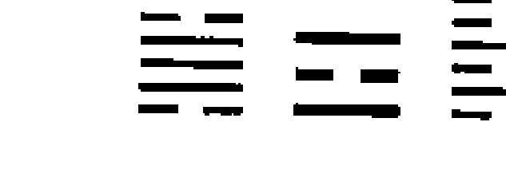- 1. 你出生在有名气或热闹的地方。她爽快地回答：“我生在北京”。(震木为热闹为名气)

- 2. 你出生地树木花草很多。她说：“对”。(主卦上下为木)

- 3. 你是男人的性格，婚姻不如意。还没等她回答，同来的两个人大笑着说：“太对了，她已经离婚了。”(震木为体卦巽木为用卦阴阳反背)

- 4. 你爸爸出生家庭比较富裕或者有名气。她自豪地说：“对，我爸爸是部队的高级将领”。(震木为官巽木为财)

- 5. 你爱人心细，长得白，但是有点女人性格，爱吃你的醋。她不屑一顾地说：“对，他就是那么个人。”(巽木长得白)

- 6. 你20岁或21岁遇到一个男朋友但是没成，他这个人很有头脑。她说“对21岁谈过男朋友。”(互卦泽天夬直读21岁，老父配少女不正配不容易成功)

- 7. 你头上有过伤。她马上说：“没有！”刚说完又问我“头上有手术算不算？”我反问她：“你说呢？”我们在座的都哈哈大笑起来。(互卦泽天夬直读头上有伤)

- 8. 你曾经有过官职，后来把官职丢掉了。她说：“对，是我主动放弃的。”(震木为官职，互卦泽天直读缺官职)

- 9. 你父亲有官职但是不是正职是副职，他头上有伤。她无奈地说：“我爸爸是部队的副职，在文化大革命中被斗，头被手铐打坏了。”(互卦乾金为父为头，兑金为缺损)。

- 10. 你心地善良，人也很正直，但是脾气大。同来的人用非常赞成的语气说：“您太了解她了，说得一点都不错。我们都是她多年的好朋友，有些事情我们都不知道，您都知道，真太神了。”(震木)

- 11. 你27岁结婚，24岁、25认识现在的爱人。“对，我27岁结婚，24岁认识的他”。(卦中之理是主卦震巽为阴阳正配长男配长女，生活之理20多岁才是正常的婚配年龄。卦中没显示结婚的年龄，我用《雷风恒》的倒卦《山泽损》直读27岁判断她的结婚年龄。)

- 12. 你父亲长得不白，但是人很聪明爱帮助人，有泌尿系统的病。说到爸爸，她有些伤感：“我爸爸是个好人，长得黑，但是心眼好，爱帮助别人，他很能干，他有糖尿病。”（坎水为她父亲坎为黑为病）

- 13. 你有一个女儿，但是她是男孩子的性格，很聪明，爱帮助人。谈到女儿他显得很自豪地说：“您说得很对，我女儿非常聪明能干，像个假小子，特别爱帮助别人，从不自私”。（坎水为她女儿坎为聪明坎水为阳卦性格有男人气，生体卦为付出）

- 14. 你经常头疼，肾功能差，脾胃功能弱，肝功能差，全不是大病。说到这她有些激动：“你怎么说得这么准呀！我刚查完身体，大夫说，我肝肾功能有毛病，胃也不常舒服，头经常疼。”（震木为头为肝，坎水为病，木金水在卦上显示，木克土，金泄土，没有火制，脾胃功能必弱）

- 15. 你 1995 年~1999 年运势好。“对，那几年什么都顺，心情也好，事业也顺”。（太岁生助体卦震木）

- 16. 你 2001~2002 年有花钱或破财的事。“对，破大财了”。（太岁耗泄体卦震木）

- 17. 你 2003 年有憋屈的事。她看了同来的人一眼，同来的人会心的一笑。她没说是什么事，我也不问。她只是淡淡地说了一句：“没错”。语气中含着很多难于言表的苦衷。（太岁是木的墓库之年）

- 18. 你 2004 年、2005 年压力大、辛苦。“太辛苦了”。（太岁克体）

- 19. 你腰腿疼。“我得过风湿，腿疼”。（雷水解直读）

- 20. 你摔过跤。“我经常摔跟头”。（同上）

- 21. 你老公很有经营头脑，会赚钱，是做大生意的。她说：“对”。（巽为利市 3 倍）

- 22. 你一生贵人多，遇事有人帮。“对，我有事就有人帮。”（用卦生扶体卦）

- 23. 你马上又有一个人生辉煌的高峰，不顺的低谷过去了。“那太好了，谢谢您给我希望和光明！”（2007 年 2008 年太岁属水生体，2009 年太岁属土是体卦的财年，2010 年 2011 年太岁属木帮扶体卦）

## 例 259 新买的房子同样揭示了老问题

庚寅月 癸酉日(戌寅空)

| 山地剥 | 地山谦 | 六神 |
| --- | --- | --- |
| 妻财寅木 ○ | 兄弟酉金 、、 | 白虎 |
| 子孙子水 、、世 | 子孙亥水 、、 | 螣蛇 |
| 父母戌土 、、 | 父母丑土 、、 | 勾陈 |
| 妻财卯木 × | 兄弟申金 、 | 朱雀 |
| 官鬼巳火 、、应 | 官鬼午火 、、 | 青龙 |
| 父母未土 、、 | 父母辰土 、 | 玄武 |

一位经朋友介绍找到我的大姐，求我给她看看给儿子新买的房子吉凶，我让她摇一卦，得《山地剥》之《地山谦》卦。看卦象的第一眼我马上问她：“您小时候或年轻时是不是摔着过？”她很爽快地回答：“没错，20多岁骑车摔得头破血流，现在头上还有一疤。”我边说边把卦的六亲六神装上。看房宅，二爻为宅，五爻为人，卦中显示人克宅，应该不错。但是二爻临旺地，五爻不旺。二爻又被六爻发动相生，房子很新，品牌与地段好。房子二爻官鬼临旺地又受动爻之生，房子价格昂贵。五爻在月令不旺，只有日辰生，又被两人动爻财耗泄。无力克制二爻，不是很吉。但是谁都知道，北京买一套房，谈何容易，好一点的地段每平方米的建筑面积要上万块钱，你一句话房子风水不好，让别人难以承受，卖吧，要损失几万甚至几十万，住吧，心里疑心病去不掉。我们搞预测的人，一定要换位思考，尽量用化解矛盾的方法去解决问题，不要给别人造成过分的伤害与痛苦。从卦上看，两个财爻发动被化回头克，申酉代表西面或西南边，这两边一定有问题。

因为是初次见面，我就卦的情况与她聊了起来：

> 我说：“大姐，你的肠胃不好，胆有手术”，她高兴地说：“太对了，你是怎么看出来的？”我说：“申金为大肠，被月令冲破，肠不好，卯木为胆，被日辰冲，又动化克，胆应该手术，申酉金为刀。”

我继续问：“你头有磕破的地方”。“你说的对，我不是说了吗，你告诉我你怎么看出来的？” 我说：“剥卦大象证明有摔跤之相，寅木在六爻为头，发动化酉金回头克，临白虎，是破相。”

解释完她的问话我继续给她分析：“你腿脚有疼痛处。” “没错，你怎么看出来的？”我说：“初爻为腿脚，被月克日泄。”她满意地点点头。我继续说：“你颈椎不好。五爻为颈椎、化空”。我不等她问为什么，直接把断卦的依据告诉她。她高兴地说：“全对了，你断卦太神了，你再看看我是干什么的？”世临五爻为有实权，但是现在不旺，临子孙为权利。我说：“您原来是管官的干部，现在退休了。”她大笑起来：“我是区人大常委会主任，很多官我来任免，我也喜欢周易，但是前些年忙于工作，没时间学。”这时我才恍然大悟，知道她为什么刨根问底了。我继续根据卦象分析：“你94年工作很累，压力大。”她说：“没错”。有了初步的认识，我再跟她谈房子。我们到房子里一看，房子的西边果然有很大的煞气。她买的楼房盖的是斜向，与别的楼房距离很近，其他两座楼房的房角直冲她家的卧室窗与阳台玻璃，真像两把利刀直劈过来，我让她用两个化煞镜化解了。我还从卦上看到一条信息，就是她儿子有可能不在身边或者是犯了官司进去了。但是我知道了她的身份以后，我不便当着别人的面问，回到家我给她打了一个电话：“大姐我有一件事情不知道问得合适不合适?因为那天当着外人不好说。”她很爽快地说：“你问吧。”我说：“你是不是有一个儿子不在身边了？”她说：“是”。我进一步问：“他是不是犯了什么事情进去了？”她说：“是”。我又问：“他是因为财的事情进去的，是被两个朋友害的吃了挂落”。她惊奇地说：“你说的怎么那么对呀，孩子刚工作分在银行上班，是他两个同学骗了钱出国跑了，他刚参加工作年龄小，那两个骗子没抓住，他顶罪。”我说：“这件事应发生在1992、1993年。”她说：“对。”我告诉她：“明年有可能孩子能出来。”她说：“借你的吉言吧，他被判了十七年。”

她的级别不低，孩子判刑这么多年出不来，一是说明孩子的罪重，从另一个角度也证明她为官清廉，我顺便又问了一句：“你参加工作以后又去学习拿了文凭对不对”，她说“是”，从卦上看她的房子不止一处。

通过一个测房子风水的卦，把主人那么多信息都跃然纸上，而且这是她为儿子买的房，还没有装修入住，这难道不是天人合一、信息同步吗？我敢肯定她原来的住房这两个方位也有问题。不过反映的情景可能有所不同，性质应该是一样的。

## 例 260 你是一个女强人

张女士经人介绍找到我，求测运势，我嘱其摇卦，摇得《天风姤》之《巽为风》卦。

2004年己巳月 癸巳日（午未空）

| 天风姤 | 巽为风 | |
|--------|--------|---|
| 父母戌土、 | 妻财卯木、 | 白虎 |
| 兄弟申金、 | 官鬼巳火、 | 螣蛇 |
| 官鬼午火 ○ 应 | 父母未土、、 | 勾陈 |
| 兄弟酉金、 | 兄弟酉金、 | 朱雀 |
| 子孙亥水、 | 子孙亥水、 | 青龙 |
| 父母丑土、、世 | 父母丑土、、 | 玄武 |

因为只有一个爻动我先用梅花易数看了一下说：“我给你说几条”。

- 1. “你出生家困难。”（用克体）她说：“对，我是老大，还有几个弟弟妹妹，能不困难吗？”

- 2. “你家西北方对自己不利”。（乾金克体）

- 3. “你的胆有手术”。（乾金克巽木）她说：“我的胆摘除了。”

- 4. “你妇科有手术。”（乾金克巽木）她说：“有”。

- 5. “你人缘好”。（体卦比和多）她说：“还可以吧”。

- 6. “你1992、1993年不顺，2004、2005年也不顺”。（申酉之年克体）她说：“你说的一点都不错”。

- 7. “你1989、1990、2001、2002年有花钱的事。”（巳午年太岁泻体）她说“有”。

再用六爻一看卦我马上说：

- 8. “你好一个女强人，工作能力强，领导赏识你这种老黄牛的精神，但是刚而易折了啊！”她听到这里，好像找到了知音，连忙对我说：“您算得太准了！领导对我都不错，我是一个小学老师，真像牛一样干了一辈子。”（日、月、动爻具生世。）

- 9. “你在兄弟姐妹面前你像妈妈一样为他们操心受累，他们也很依赖你”。她说：“他们都比我小，我能不管吗？”（父持世生兄弟）

- 10. “他们的条件都不如你。”（兄弟受日月动爻之克）她说：“他们的 条件还都不如我”。

- 11. “你有一个弟弟在路上出了车祸”。（兄弟受日月动爻之克化鬼在五爻）

她伤心地说：“别提了，我在家是老大，条件比他们强点，他们的大事小事我都跑在前边，他们有什么事也主动和我商量，让我帮他们拿主意，我大弟弟4月7号在骑车下班的路上被撞死了，事故还没处理完呢”。我看一下就触到了人家的伤心处，不好意思，就马上转了话题。

- 12. “你原先搞过一个对象，吹了，他长得挺漂亮”。（官动化空）她说：“太对了”。

- 13. “你与现在的爱人表面看谁都说谁好，他对你也不错，但是你们俩性格、观点很难一致”。她说：“我们经常抬杠”。（丑午相害）

- 14. “孩子这几年不顺当，特别是去年4月以后到8月以前”。她说：“去年非典，领导让他下岗，半年没发工资”。（巳、午、未年、月不利子孙亥水）

- 15. “孩子今年立秋之后就好了，2004、2005、2007、2008年都会不错，2006年注意就行了”。（申、酉、亥、子之年、月利子孙亥水）她高兴地说：“那好，孩子顺点比什么都强”。

- 16. “你的父亲不在了”。（父母过旺易折）她说：“我父母都不在了”。

- 17. “你家的房基地不好，原来是坟地吧？有时你家应有怪事发生，不知你注意到没有”？（初爻为房基，临丑土玄武，有阴性信息。）她惊讶地说：“连这您都知道，真了不起，我家的房基地是文化大革命当中批给的，最早是一个乱葬岗子，盖完房后家里连续出事……”。她叙述她家发生的怪事，足足讲了一个多小时。听得我浑身直起鸡皮疙瘩，我打断了她的话：“让我一条条的说给你听，你摇的卦信息很多。说得不对你纠正，漏下的你补充”。她说：“好，我听您的”。

- 18. “你家房子对兄弟姐妹不利”。（初爻丑土是申酉之墓地）

- 19. “你妇科有过手术”。（二爻被月、日冲破）

- 20. “你有过人流”。（二爻子孙被月、日冲破）

- 21. “你腰腿疼”。（二爻被月、日冲破）

- 22. “你心脏不好，有可能是心肌缺血”。（四爻午火动而化空临勾陈）

- 23. “你乳房有乳腺增生”。（四爻午火临勾陈）

- 24. “你颈部有过手术”。（五爻受月、日、动爻之克临螣蛇）

- 25. “你头部有过伤”。（六爻临白虎）

我一口气把她的身体说了个遍。她马上给我验证：“我做过胆手术，是胆结石，妇科手术差点死了，大出血，失血2500CC，腰腿疼得厉害，心脏过速或减缓的时候都有，乳房有毛病，我颈部两次甲状腺结节手术，头上做过一个手术，现在鼻子边上还有一个大伤疤”。我又说：“看完你身上的毛病，再给你看看流年，就说近十年的吧”。她说：“好好，您说吧”。

- 26. “你1992~1994年不顺，有破财的事，对你、对老人不利”。1992、1993申、酉年兄弟临太岁克才泻父母爻，1994年6月丑未戌刑，）她说：“1992年我奶奶死了，1993年就是我子宫大出血，连血压都没有了，简直是捡条命，1994年也不顺，我母亲死了”。

- 27. “1995、1996、年你不错，财运不错，人也平安”（1995、1996年福神子孙亥、子水当值）她高兴地说：“对，就那两年还挺好。”

- 28. “1998、1999年又不行了，你的压力大，对父亲不利”。（1998、1999寅木年克父临白虎）她一听更激动了，忙说：“98年我父亲死了，1999年我们老少5口去扫墓，给我爸爸过周年，回来的路上，一重载大货车速度慢，后边的车都超过它往前跑，我们也跟着往前超。别人过去了都没事，我们却出了车祸，差点没命。事，我们刚到它旁边，它的后拖斗车翻在地上打了几个滚儿，大拖斗撞在一棵大树上，把树撞断了才停下，我们的车也被剐倒。开大拖斗车的司机都不知道，还继续往前走呢。我们 5 个人都慢慢地从车里爬了出来，没有大伤，小伤是个个都有”。

- 29. “2000~2002 年也不顺，容易有伤病”。（2000 年辰土为世爻之墓库之年，2001、2002 年火旺，身过旺有灾。）她伤心地说：“2000 年做的甲状腺结节手术，2002 年差点让大夫给我判了死刑，我手术作的甲状腺结节复发，大夫一检查，直言不讳地告诉我是恶性的。我一听犹如五雷轰顶，又不敢和家里人说，默默地去弟弟妹妹家转了转，算是告别吧。一周以后，再一次复查，证实是良性的，做了第二次手术”。

- 30. “你 2003 年也不顺，对你，对孩子都不太顺”。（未土年克子孙，冲世爻）她说：“孩子的事情我不是说了吗，半年没拿到工资，我做的胆切除手术”。

- 31. “2004 年你又有花钱的事，兄弟有灾”。（兄弟临值受月、日动爻克）

她说：“我大弟弟不是刚被车撞死了吗。4 月 7 日下班回家的路上被车撞了，当场死亡”。

- 32. “你弟弟还有过什么怪病或者有过官非口舌”？（兄弟临朱雀、螣蛇）

她说：“我二兄弟有怪病，他有一天夜里……。我小弟弟 1982 年因为和别人打架，被人用刀把头砍伤。他爱人生了一个儿子是脑瘫，1 米 7 的大个子不会动，长年躺在床上”。

- 33. “你家西北边是不是有庙”？（戌为午火官鬼的墓库之地）她说：“我家西边是有一座庙，但是已经拆了。您帮我好好看看吧，我都快活不下去了”。

我说：“你别着急，我一定会尽力，我从多方面给你找原因看怎么解决，你和你爱人都是哪年生的”？

她说：“他是 1949 年，我是 1954 年”。

一个是白马，一个是青牛，两个人犯大相，一个是霹雷火，一个是沙中金，又犯克，但是50多岁的人了，也不能劝人家离婚呀，我答应帮她化解，但是这不是她一人不顺，全家都不顺，只得从她娘家找原因。

- 34. “你家现在的房子西北角是厨房，对不对”？她说：“对”。（戌是火库）

- 35. “你西南边有往东南拐弯的路”。她说：“对”。（五爻为路临螣蛇又申化巳）

我正在看卦，她一拍手说：“您一说我倒想起来了，我父亲原是村干部，受过周总理接见，1958年大跃进，他带头破四旧，把庙里佛像的胳膊腿拆掉扔到大沟里……”。我一看卦，就知道她父亲给他们带来了不幸，但是一开始这样直接说怕人家接受不了。这么大的事情能没有因果吗？我对她说：“我一定帮你化解，但是你要多做善事才能保平安”。她说：“我听您的，您说得太准了，我一定照办”。后来听别的人来说，她真的越来越顺了。这一个卦，我连说带断整整聊了4个小时。

## 例 261 你离家去了东北

今天一位外地来的小伙子，慕名找我预测。进门后我问他有什么事要测，他说没什么事，只想看看运势。我让他报了三数：3、5、8。起卦：

《火风鼎》之《火山旅》，我依卦说：

- 1. “你为人热情，爱帮助人”。他笑了笑。（离火为体）

- 2. “你出生地附近有花草或庄稼”。他说：“我家房子旁边就是庄稼地”。（巽木示）

- 3. “你出生家庭比别人家富裕，是个小康之家。”他说：“对，我家在村子里算是数的着的。”。（主卦用生体）

- 4. “你21岁交了一个女友没成。”他回答：“对，交了一年吹了”。（互卦泽天夬）

- 5. “你现在的爱人心细，对你非常好。” “对”。（巽木示）

- 6. “你有高学历，最低是本科。但是第一学历不是很高，应该是专科”。他说：“我第一学历是大专，后又续的大学本科”。（变卦直读高学历）

- 7. “你现在心理压力大，有心率不齐的毛病”。他说：“对，有”。（旅卦直读）

- 8. “你人胆子小，但是一生贵人较多。”“你说得对，我胆子不大，但是朋友不少。”（巽为胆受火泄）

- 9. “你家三年内有长辈人去世”。他说：“我姑夫前些日子死了”。（旅者走也）

- 10. “你应该离家去了东北方向，而且最少有三年了”。他有些惊奇地说：“我是去了东北，已经四年了”。（艮为东北为最少离为三）

- 11. “你小时上学经常得到奖励。”他说：“对，我得的奖励很多”。（鼎有夺冠之意）

- 12. “你头上有磕过的地方。”他边说边用手扒开头发让我看：“您看，现在还有伤疤”。（互卦《泽天夬》我眼睛花了，也看不清，只看到头顶他扒开的地方有一道白印儿。

- 13. “你1995年、1996年压力大或有病”。他说：“我1996年得过肺病”。（1995、1996年太岁克体）

- 14. “你母亲对你疼爱，但你却经常挂念你父亲”。他说：“您说得很对，我与父母都很好，但是我更惦记我父亲多一些。”。（巽为他母亲生体，体卦却生父亲艮土）。

- 15. “2001、2002年运势好转有收入”。“2002年开始有收入”。（太岁帮扶体卦）

- 16. “你2003年下半年你有花钱的事”。他说：“我那年结婚花钱”。（2003年未土泄体卦离火）

- 17. “你后三年面临很大压力，会不很顺利。但是不要紧，过去就好了，不要灰心，人生都有高潮有低谷。你知道了就会防患于未然，这几年不要搞大的投资，要知难而退，过了这几年你再大干也不迟，你还这么年轻。你这么年轻能够信周易，是你的福气，要不然你盲目的投资干事情就会受到“伤害”。他刚一听有些茫然，听了我后边的话他觉得很有道理。（2006年是体卦的墓库之年2007、2008年太岁克体卦离火）

因为是远道而来的人，我还把卦装上六亲六神断了十几条，他满意地走了。

## 例 262 不怕你不信事实说分明

2004年9月26日  癸酉  戊申  （寅卯空）

今天朋友请我吃饭，在饭桌上有几位是曾经找我测过事的，她们赞扬我测事如何准确。一位第一次见面的女同志突然问我：“那你看看我是干什么工作的”？语气中有些不信任或是将军之意。我没问她什么，而只是看了一眼手表：5点59分，起得：《风火家人》之《天火同人》卦 ☰ ☴ ☲ ，离火为体，我说：“你可能是干与文化教育有关的工作，或是与火有关的工作”。她没有回答我的问题，而是问其他人：“我的工作与教育有关系吗？什么是与火有关的工作”？我爱人插了一句：“电，电话也叫与火有关”。这时她笑了说：“这是对的，我原来是搞电话通讯的”。我心想着卦说：“你的胆不好，腰腿有疼的地方，睡不好觉。你在家排行老三，母亲偏疼你，你有了事情就有贵人帮助你”。她这时没有了刚才的傲气，积极配合说：“女孩排我是老三，你说的这些毛病我都有”。“你这个人脾气急，爱人总谦让你，你办事风风火火，你的出生家庭比较好”。（这都是巽木生体卦所示）旁边坐着她的姐姐和外甥女，听到这儿齐声说：“她就是这样的脾气”。我继续说：“你35岁的时候可能分了一套房子，但是那一年也是你有胆病的年头”。她马上说：“那年是得了一套房子，那年不是胆有病，是胰腺有病，动了大手术”。我不懂医，不知道胆和胰腺有没有关系不去理会。我继续说：“互卦火水未济，坎水克离火，你的心脏有毛病，特别是36岁这一年”。她笑着说：“我心脏不好，一犯病家里人先给我数脉搏”。我继续分析：“你的泌尿系统有过炎症”。她点点头说：“有过”。我说：“变卦天火同人，乾金为老父，为领导，被你所克，你是既不怕领导又不怕你爸爸，甚至他们还有些怕你”。她姐姐在旁边证实说；“我爸爸是老干部，对我们要求都很严，## 梅花心易

一回家就要求我们背党章，念毛选，只有她一回家我爸爸就没话了，我们有时甚至会约她一起回家，免得听爸爸数落”。我接着说：“你头上有伤，而且经常头疼”。她一听马上指着自己的两眉中间说：“我的头在很小的时候摔到炉子上碰破了，现在还有疤，头也经常疼”。我接着说：“你是在三岁时碰破的”。她当时想不起是几岁，大家就帮她回忆，想了半天，突然记起，她碰破头时，还没有底下的弟弟，她比弟弟大4岁，应该是3岁碰的。从卦象分析完她的大致状况外，我又给她分析流年：“离火为体，1995、1996年亥、子之年，压力很大”。她赶忙说：“那两年孩子面临考学，又要买房分房，压力能不大吗”？“1998、1999年是寅、卯木之年，有好事，有进财之事”。她高兴地说：“分了房子，孩子也毕业了”。我接着说：“2001、2002年巳、午火之年，你各方面都不错”。“孩子从东北到北京，找到了工作，还搞好了对象，买了房子，我们俩也不错”。我说：“去年是未土之年，泻火，你有花钱之事”。她说：“我老父亲70岁了，被车撞了，肇事者还逃跑了，老人成了植物人，一直躺在医院里几个月了，还没醒，能不花钱吗？您帮我看看我后几年应该注意什么”？离火为体，后几年的运势不利，连续5年申、酉、戌、亥、子，哪年都对离火不利，最厉害的是亥、子年，太岁直接冲克离火，所以我没直接这么说。而是嘱咐她：“你把床头朝东睡，这几年不要往北方去，到了亥、子年身上佩一虎的饰物”。她女儿还专门找了一支笔记下了。她这时改变了开始的态度，高兴地对大家说：“真是太准了，很多事连我自己都忘了是哪年的事了，大姐都给我说对了”。我又顺便说了两句：“你家房子是朝南向，是三居室，而且是在东南角”。在座的人都拍手称奇：“一切如你所测，太神了”！今天整理这个卦的时候，看到我当年给她下的断语，想起她的情况，今年医生查出她患子宫癌，做了手术。(今年正是子年)

## 例 263 她原来是个牙科医生

2007年 庚戌 壬寅（辰巳空）

一位慕名而来的年轻人，到我家坐定后我让他报3个10以内的数，他随口报出3，6，7。得卦☲☵☲《火水未济》之《火泽睽》。

我也没问他什么随口与他唠起来。

- 1. “你为人热心肠。”（离火为体）
- 2. “出生地附近有水。”她说：“有，我家在松花江附近。”
- 3. “你小时候被水淹或被水烫着过。”她说：“我小时候灌暖壶被开水烫着了，腿的皮烫掉了，现在还有大疤。”
- 4. “你的学历不高。”她说：“多高叫高呀？”我说：“你到不了大学本科，他说：“对，我是大专毕业。”
- 5. “你2006年，有不痛快的事，心里憋屈。”她委屈地说：“对，我去年考试没通过，仅仅差3分，真倒霉。”
- 6. “你头上磕破过。”她说：“有”。
- 7. “你今年，明年压力大。”（这两年太岁是水，克体卦火）
- 8. “你犯小人，心里有哑巴吃黄连的事。”他说：“就因为这样才来找您的嘛，另外看看老人的身体。”

我一听年轻人能处处想到老人，是个孝顺的孩子。我从心里愿为他多看看。就把卦装上六爻分析，卦中父母爻临日辰，身体不错，但是不利的是发动化出兄弟巳火，化泄，在初爻为腿脚，我说：“你家老人有人腿脚有毛病，但是无大碍。”她说：“我奶奶腿脚不好。”

不论从六爻看还是从梅花易数看，他的心脏不好，用六爻看兄弟午火为心脏，在月令入墓，但有日辰生无大碍，用梅花易数看，主卦火水未济，互卦水火济即，变卦火泽睽，都是直读心脏有病，只是有日辰寅木通关化解坎水的力量，所以我说：“你有心肌缺血的毛病，心脏难受，但是心电图查还没事。”他说：“是呀，从心电图查不出毛病，大夫也说是心肌缺血。”

月令临子孙，旺相，子孙为技术，我说：“你是有一技之长的人，技术还不错。”与他同来的人都笑了说：“老师你太厉害了，他是一个牙科医生。”

## 例 264 你家孩子老大灵活老二死板

2006 年 辛卯 戊申（寅卯空）

徐州一女士打电话求测，我让她报数，她随口报出3、6、9。我拿着电话边与她说话，边在脑中起卦《火水未济》之《火风鼎》☰ ☱ ☲，我根据卦象与她在电话里聊了起来：“我给你说几条你看对不对，对你就说对，不对就说不对，没关系，都很正常，什么事情也没有百分之百”。她说：“好吧”。我开始给她照卦分析：

- 1. “你出生家庭不富裕。” 她回答 “对，我小的时候家里很困难”。 （主卦用克体）
- 2. “你出生地附近有水。” 她一听有点吃惊地说：“连这个你也看出来了？你不是有特异功能吧？我家后边有一个水坑”。 （用卦坎水）
- 3. “你没有太高的学历，有可能工作后进修过。” 她说：“太对了，我的第一学历是高中，参加工作以后又上的大学”。 （离火为学历被水克后被巽木生）
- 4. “你腰腿有不舒服之处。” 她说：“我的腿有静脉曲张”。 （巽木受泄）
- 5. “你父亲身体不太好。” “对，父亲现在身体较差，有病”。 （坎水为她父亲为病）
- 6. “你人长得漂亮，为人热情，一生能力强，贵人多。” 她有点不好意思地说：“长相一般吧，我是热心肠，朋友也不少，能力算不上多强，说得过去吧。” （离火为体）
- 7. “你有一个女儿，长得长脸形，额头比较宽，风风火火的急脾气坐不住”。 她说：“对，我是有一个女儿，脾气急躁”。 （巽木为她女儿）
- 8. “你2003年有花钱的事。” “对，那年买的房”。 （太岁泄体）
- 9. “你女儿对你孝顺。” “对”。 （巽木为她女儿生体）
- 10. “你母亲人漂亮，心善良。” “对”。 （巽木为她母亲）
- 11. “你有异性朋友。” 她毫不隐讳的说：“有”。

说到这里她问我：“您看我的老二如何？”我按时间起卦《泽地萃》之《天地否》卦☷ ☰ ☷

- 12. “你 1995、1996 年有压力，不顺。” 她说：“太不顺了”。（太岁克体）
- 13. “你 1998 年~2002 年顺利。” 她回答：“对”。（太岁生扶体卦）
- 14. “你今年会有不顺的事，或心里憋屈要有心里准备，你会有三年的低谷期，2010 年开始会有 5 年好运。” 她听后表示非常感谢，连说我测得准。（今年丙戌年是体卦的墓库之年，2007、2008 年太岁克体）

## 第二十三节 梅花心易“错卦错断”

我用梅花心易断卦，起卦很随意，用得最多的就是时间起卦法，别人问事，我看一眼表，卦就出来了。而且经常是拿着电话心里运算，直接把预测结果告诉对方。或者是让对方报三个数，第一个数为上卦，第二个数为下卦，第三个数为动爻数，如果第一、第二个数大于 8，用 8 除后余数起卦，第三个数除以 6 余数为动爻数。有时心里运算过程中难免算错，自己全然不知，结果却测的很正确，这就是的错卦错断吧。甚至有一次我在公交车上给别人起卦断事，用的是六爻卦，当时没笔没纸，在心里想着主变卦的六亲六神，结果装错了卦，最后结果却断的非常正确。她是问一笔买卖，我断是一个骗局，不但挣不到钱还会被骗，回家后才想起卦起错了，按正确的六亲六神装上有进财的信息，究竟按哪个判断结果呢？我想还是按第一感觉说，我坚决不让她做这笔生意。结果最后证实了我的判断，对方是一个诈骗团伙。她儿子不太相信周易，坚持去做这笔买卖，结果被骗走 4 万多元。如果我按改正的卦为他作指导就错了。这样的例子很多，包括我的书上都可能有起错了的卦，我没有发现，还是按错卦断的，但是结果是对的，不然求测人不会点头认可。

## 例 265 你生孩子要剖腹产

2008 年 3 月 29 日 11：54 乙卯 戊辰 （戊亥空）

我的学生正在我家测事，我家原先的小保姆从外地打来电话，问她生孩子的事，我看了一眼自己家的表 11:54 分。因为拿着电话在脑子里起卦，起了错卦《火雷噬嗑》之《天雷无妄》我马上说：“是不是大夫要让你剖腹产。”她说：“大夫是让剖腹产。”我说：“这事还得听大夫的。我没法给你拿主意。”从卦上看，应该是个男孩，剖腹产容易有无妄之灾。等坐回到沙发上，我想把这个卦写在本上以备后来验证。写完以后我一看，卦起错了，应该是《火水未济》之《天水讼》。如果按正卦断，主卦体用比和，用卦用生体应该没什么事。两组卦体现的共同信息是已经破水三天了还不生，都显示应该是个男孩。结局却不同，错卦断有无妄之灾（主卦用泄体变卦用克体）当时我对我的学生说：“还是错卦错断吧。”后来听说生了个男孩，但是没保住，剖腹产手术当天孩子就死了。正应了无妄之灾。

## 例 266 他的婚姻不美满

2005 年 庚寅 己丑 （午未空）

某男与爱人慕名找到我求测。他报数：3、6、5。我当时听成 3、6、9了。按数起卦《火水未济》之《火风鼎》䷃ ䷄ ䷱，我依卦说：

- 1. “你的出生地附近有水”。他说：“我出生在朝阳公园那边，可能有水，父亲告诉我，生我那天雨下的非常大，水过膝盖”。
- 2. 你的家庭不富裕。“对，很穷”。（主卦用克体）
- 3. 你父亲对你要求严格，没少打你。“我小时候挨打多了去啦”。（主卦用克体）
- 4. 你父母婚姻不顺，是不是分手了？他说：“是，我几岁时父亲就走了。实际是虚岁 6 岁，实岁 5 岁”。我因为从卦上看他的婚姻不顺，他是与爱人一起来的，又是 20 多岁的人，我不便说破，所以把他父母婚姻不顺的信息说了出来。他马上问我：“阿姨，他们分手的原因你能看出来吗？”我说：“是第三者插足引起的”。他又说：“您看是男女哪一方？”我说：“是父亲母亲双方都有异性知己”。他说：“我原来不知道，后来长大听说过，我深受单亲家庭的痛苦，我一定不会与爱人离婚，孩子太痛苦了，我一定不能让我的孩子遭我这样的罪，她将来什么样我都不会与她分手”。他说的这么坚定，我顺便问了一句：“你们结婚几年了？”他说：“我们今年结的婚”。我没说什么。从卦上看婚姻很难白头到老。（婚姻阴阳反背，他家的房子风水有毛病。离火为房子，坎水为病，直读房子有毛病。）
- 5. 你的文凭不是一次取得的，是间断后又续上的，而且不是一个文凭，有第二次学历。他说：“对，我最初是上的体校，后来才考的大学。又在国外读了博士。我有两个文凭”。（变卦用生体，离火为文凭）
- 6. 你得过不止一次的奖励和比赛名次。“对，我得过几次比赛冠军。”（《火风鼎》示）
- 7. 你从30岁到60岁，30年的好运。他一听很高兴地说：“借您的吉言”。体卦为离火，30至39岁走离火运帮身，40岁至49岁走震运生体卦离火，50岁至59岁走巽木运生体卦离火。）
- 8. 你35岁有进财或出名的机会，36岁事业成功。（主变卦直读）他说：“如果真那么多好事我一定来谢您。”

说到这里他问我：“阿姨，您看我今年有灾吗？” 戌年是火的墓库之地，但是现在火在旺地，又有巽木来生，不致于有大灾，我说：“你没有大灾，有可能有憋屈的事，心里有些压抑。”

果然到了2007年，这位男同志自己找到我测事，连带诉说他爱人如何不可理喻，说自己怎么难以忍受，已经到了非离婚不可的地步。我把他要测的事情结果告诉他，又顺便劝了他一番，他听不进去，他说已经无可挽回了。实际是他家房子有毛病，两代人都犯离婚。去年他还信誓旦旦，爱人还是一朵花，刚结婚一年，今年就到了非离不可的地步。妻子成了臭狗屎。能说没有其他原因吗？

## 例 267 断她网上交朋友工作不能成

己巳月 戊戌日 （辰巳空）

晚上我正在整理我的卦例，电话铃响了，电话是残疾青年小静打来的。我刚拿起电话，她就说：“阿姨，有一个单位招聘我，您看能成吗”？我看了一眼墙上的电子表：21点34分，起得：《火泽睽》之《火水未济》卦 ☰ ☴ ☵，今天一写卦例，发现又起错了卦，21 应起巽卦才对，但由于昨天我在外边跑了一天，回来又忙着整理卦例，又是拿着电话在脑子里加减乘除运算，说不定是用 21 除去6余数为3。因当时也不知道，就按睽卦变未济卦在电话里和她聊了起来。我说：“这份工作不一定能成”。“是吗？我挺想去试试的，另外您春节跟我说的事也发生了”。什么事呢？我仔细想了一下，突然记起春节她来我家，我说她今年会遇到男朋友。我问她：“你是不是遇到了男朋友”。

“就算是吧”。

“那你们是不是在网上认识的？你们还经常通电话，有时你还对人家发脾气？你一发火他还挺怕你的？他有点女人的性格，比你还小”？我一连串说了一大堆。

她听着听着大声对我说：“贾阿姨，您真了不起，全被您说对了，是他在网上看到了我的情况，主动与我聊天，可是他比我小六岁，又不在同一地生活，怎么可能走到一起呢？他长什么样我不知道，我倒是爱和他发火”。

“他头上有磕破的地方或是戴眼镜”。

“可能是有磕破的地方吧，昨天打电话他想让我同情一下，说是骑摩托车摔了，可能是摔破了头，结果被我狠狠骂了一顿”。

“你现在心里有很多话没地方说，或是不敢说，而心里的压力却很大，但没到承受不了的程度”。

“您说我有话对谁说去？我对我妈说，有时她还不理解我，我将来的路究竟应该怎么走，我很迷茫”。

“你没找找办事处吗”？

“残联都管不了，办事处就更别提了”。

面对这样一个孩子，我找不到什么有说服力的语言来安慰她。今年她已经29岁，生活不能自理，既没对象，也没工作，心中的苦闷可想而知。她自幼脑瘫，双腿成X型，但人很聪明，很坚强，一直坚持读书，读完了中医大专的全部课程。但当今社会竞争如此激烈，健康人随时都有下岗的可能，何况一个刚出校门的残疾人。

前几年她当工人的爸爸死了，只有一个60多岁的妈妈，靠工厂微薄的退休工资，母女俩艰难度日，我心里真有一种爱莫能助的感觉，只好多和她聊聊天，让她心里的痛苦多宣泄点吧。后来接到她的电话，说那份工作没成。

析：卦起错了，错卦错断，把问题断对了。离看成是电，兑为说，直读在电脑上聊天遇到的，离火又为心，直接克兑金。兑为说，不是心里有话说不出吗？离为火，兑为说，直读在电话里发火。变卦坎水克离火，离为火、为心，坎为病，直读有心病，心理压力太大，现本月为巳火月，体旺，所以说她很坚强，压力还能承受。体卦离火，用卦兑金，同为阴性，因此婚姻不顺。用卦兑金为男朋友，被离火所克，断男朋友比她小。兑上缺，她男朋友头上有磕破的地方。

## 例 268 老二离了婚你也破财二十万

2004年4月8日早7点26分 戊辰月 丁巳日

早晨我去散步，碰到小区一位老人，她知道我懂周易，就主动过来与我聊天。我明白她的意思，是想让我给她看看卦。我看了一下表：7点26分，心中起卦：☰ ☴ ☵《山泽损》之《山水蒙》，实际变卦起错了，7+26=33，求动爻应除以6，结果我除以8，应是3爻动，我按一爻动求的变卦，当时也不知道，就与她边走边聊。（今天整理卦例时才发现）我问她：“您今年多大年岁了”？“我今年76岁”。老人认真地回答。我对她说：“您是不是想让我给您说说，看看怎么样对不对”老人爽快地回答：“是这么回事，我看你挺忙，不好意思麻烦你。”我说：“没关系，咱们都是老邻居了，您还这么客气。我给您说几条您看对不对”？

- 1. “您有血压高或糖尿病吧”。她忙说：“有”。（蒙卦坎为血压、为病，艮为高味甜直读血压高或糖尿病）。
- 2. “您伤过手脚”。老太太边伸出手边对我说：“我的手被刀切过，脚也伤过几次，你看现在还有好几个伤疤。”（良为手脚被兑金泄）。
- 3. “您的胃不好，腹部有刀口”。她说：“我的胃一直也不太好，腹部有刀口”（坤为胃为腹，受震木克）。
- 4. “您是男人的性格，一生不服软，做事执着，脾气大，孩子怕你，您在家是一把手。”她很自豪地说：“家里家外都是我自己管，老头什么都不操心。孩子都听我的话，我是有名的护犊子”。（女人测卦，良土为体卦是女强人。兑金为她爱人，必是性格柔顺快乐之人，良土生兑金，为她主动关心照顾她的丈夫。变卦之用卦坎水为她的儿子，受良土之克为母亲管教很严，也为孩子听母亲的话。护犊子是北京的土话，表示袒护自己的孩子不受别人欺负。）
- 5. “你27岁有花钱的事，妇科有过肿瘤”。老太太说：“我27岁发现子宫有两个肌瘤，做了手术”。（损卦直读27岁损失，艮为包块）
- 6. “72岁有不顺的事，可能是破财，数额应是20万，是为房产之事或是为老二的事破的财。”老人说：“我72岁的时候，二儿子离婚，夫妻的共有房产判给了他，但是他必须付给女方15万块钱”。“不对吧，我看应该是20万”？老太太想了半天，突然一拍大腿，激动地说：“你不说我都忘了，他们原先借给他大舅子5万块钱，（爱人的哥哥）两个人一离婚，5万块钱他也不还了，加起来正好20万。老头儿也是这一年死的”。（损卦，用泄体直读损失，直读72岁，因为27岁时不可能有那么多钱。兑为二，又临旺地，断她损失20万元。良又为房产，兑为老二，所以她破财应该是为房产之事或为老二破的财）
- 7. 变卦《山水蒙》，直读76岁手脚有病，今年她正好76岁，恐怕今年会病重，因为怕老人担心没讲，但是我把这些话告诉了她的儿媳妇。农历3月底，老人中风嘴歪眼斜手不会动。及时抢救才保住了性命。

## 例 269 你的戒指丢不了

2007 年 4 月 7 号早 8:34 分

我家原来的保姆从外地打来电话问我她的戒指丢了，还能不能找到？我拿着电话边跟她聊天边起卦，结果起错了卦，变错了卦。《地雷复》之《坤为地》䷁ ䷁ ䷁，我告诉她，戒指在家的东面地上找，40 分钟以后她在东面地上洗澡的地上找到了，复有失而复得之意，体卦用卦比和为不丢。实际应该起卦《地泽临》之《山泽损》兑为首饰为喜悦，用卦生体卦，《地泽临》的互卦《地雷复》体卦克用卦不失，互卦揭示在东面地上。

## 例 270 你开车出了两次事故

2008 年 戊子年 癸亥月 壬子日

一个朋友问我他能不能买车跑运输，我让他报 3 个数，他随口报出 2、4、6，。我因为是在脑子里起卦，没有拿纸笔写出卦来，也因为当时事情多，脑子不清静，随口起卦《泽水困》之《天水讼》䷮ ䷅ ䷅，我想现在是亥月，体卦旺，又受用卦生，2004 年 2005 年申酉之年太岁生体卦有灾，2007 年水旺也不利。所以我说：“你 2005 年是不是出了车祸？2007 年也有问题”？（从他家的房子看也是 2005 年容易出伤灾）他说：“我 2005 年开车撞了人，花了一万多，2007 年开车又撞了人，花了 3 万多。我都怕了，可是不开车靠什么挣钱呢？”
晚上我回到家，想起他白天问的事情，我隐隐约约感觉他好像报的 2、4、6。我给他起错了卦。随即我给他打了一个电话，他证实报数 2、4、6。按准确的数字起卦应该是《泽雷随》之《天雷无妄》可以看出 2004 或者 2005 年有无妄之灾。（太岁金克体卦木）但是断不出 2007 年的车灾。

## 第二十三节 梅花心易预测姓名

一个人的姓名，对于人的一生有没有作用？我们回答是肯定的。它有一定的吉凶作用。现在社会上流行的各种版本的姓名学，都在极力地验证这一理论的存在。社会上出现了不少起名公司，多数是以五格剖象法来检验名字的吉凶；有的是以名、姓的各个字的五行属性来判断名字的吉凶；有的是以四柱为基础，用字的偏旁部首平衡四柱的五行。以上这些都是用姓名来帮助大家趋吉避凶的方法。事实上证明还是有一定的作用。但是姓名学不是万能的，不是只要起了一个好名字，就一定能带来好的命运。社会上同名同姓的人很多，命运却千差万别，为什么？就是决定一个人命运的因素不只是姓名。就像是双胞胎的命运也不相同的道理一样。有人一听就糊涂了，那用姓名断人生的命运是不是就不准确了呢？它还是准确的。周易的理论高就高在它是活的，是可变的，不是僵死不化的。

有的学员问我按姓名起卦准不准？还有一个学员问：两个相同的名字，一个是领导人，一个命运不好，为什么？我们断事，不管用什么方法，最后终归要回到卦上来分析。因为我们不同于传统的五格剖象法。用名字起卦我用过很多，准确率一样很高，为什么没往书上写？是考虑到保护别人的隐私。如果你不把名字写真实了，对大家起不到帮助的作用。把名字写真了，就侵犯了别人的隐私权。对于我们搞周易的人来说，也是不道德的。作为一个预测学者，无论你的预测水平高低，首先你的道德水平应该是很高的。用名字起卦有一个重要因素大家要注意，就是起卦的时间不同，体用卦的旺衰就不同。同一个名字得到的卦可能相同，却因为起卦时间不同，所以旺衰发生了变化。而且同一个名字出生的年代不同，经历也不同，所以他们的命运也会不同。那可能还有人会问：“我在同一时间，同时问两个名字相同的人的命运怎么办？”那就像其他起卦方法一样，用一些个人的特征加在卦中区别两个人。想办法做一些区别。这也像四柱一样，同年同月同日同时生的人，命运会不会完全一样？其实也会有所差别。因为他们的家庭环境会有所不同，将来的配偶不同，也会在命运的轨迹上产生不同的交叉点。

周易的特点是：“不易、简易和变易”。谁在周易里钻牛角尖，谁就走进了死胡同。因为它是可变的，不是一成不变的死定律，什么都没有绝对的好和坏。就拿“雨”字来讲，多少诗人赞美它，自古就有春雨贵如油的诗句。牛毛细雨、久旱逢甘雨。这些优美的赞叹雨的诗句出自诗人的笔下，却是发自农民的内心。春天播种的季节，老天爷下点儿雨，地里的种子就可以发芽生长。一年的收成就有了最初的希望。如果是连续几天的大雨造成洪涝灾害，冲毁了庄稼，冲倒了房屋，甚至夺走了无数人的性命，谁还赞美这瓢泼大雨呢？所以说单是一个雨字，它没有好坏之说。在不同的时间、不同的地点、量化的大小，就产生了吉凶祸福。

对待喜怒哀乐也是如此，不同的人有不同的理解，不同的人有不同的表现形式。一个农民，他今年赶上风调雨顺的年头，地里的庄稼长得很好，又平安地收到家里，他会很开心，觉得很满足。他们是靠天靠地吃饭的。老天爷对他们的恩赐就至关重要。播种的时候需要雨的时候，天天下了雨，他们非常高兴。然而到了收获的季节，需要太阳的光亮把收获的粮食晒干然后储藏起来。这时候如果整天下雨，庄稼就会全部霉掉，一年的辛苦付之东流。

今年十月份我回老家，就赶上了多少年少有的阴雨天。连续十几天雨不停地下。眼睁睁地看着地里的庄稼收不回来，成熟的玉米长了一寸长的芽子；花生拔出来还在地里没收，也已出了芽；豆子在院子里全都发了霉；棉花还在秸秆上长着，但是已经变黑发霉。一年的辛苦、一年的付出，从播种、锄地、施肥，整整大半年的辛劳，却被老天爷这十几天的雨毁掉了。农民们看着满地的庄稼欲哭无泪。而我们这些生活在城里的人。对这连续十几天的雨，只是感到出行的不方便，或是感到天有些变凉。对待同一个事物，不同的人会有不同的看法。

同一个名字，不同的人也会有不同的命运。因为他们各自生活在不同的年代、不同的环境，仍然会有不同的结果。人的命运不能只以一个名字来定一切。不重视名字的作用是不对的，过分的夸大名字的作用同样是错误的。

为了满足大家的要求，我举一个《中国风水文化研究院》的名字给大家做一个演示。我起名字的思路。

2005年的一天，朋友高某对我说：“我想注册一个公司，你看叫什么名字合适？”随后她又说了几个事先想好的名字问我哪个好。其中有国际、世界……我看了以后想了一下对她说：“不要用国际、世界这些字眼。这些字眼看起来名头很大，但是并不能真实体现中国传统文化的魅力。周易的根在中国，在中国这块有着深厚底蕴的土地上才能更好地发挥和发展。我建议叫“中国风水文化研究院”。我们在中国传统文化被禁锢多年之后，在改革开放的今天，第一个举起中国风水文化的大旗一定会有很大的震撼力。另外我也是从卦的原理考虑的。

《中国风水文化研究院》一共是九个字，起卦《雷风恒》之《雷水解》䷟ ䷧ 卦。体卦震木巽木都是指东方。震为龙、为雷、巽为风，龙飞凤舞，东方的一条巨龙在雷厉风行地动了起来。震又主名气、主正直，是一棵参天大树。互卦《泽天夬》直读刚成立一两年会缺少资金（兑为缺，乾为钱。直读缺钱）从另外层意义上讲乾金为领导，与兑金比和，能得到官方的支持与帮助。变卦《雷水解》用卦坎水生体卦震木，学院有了困难，会得到别人的帮助。能顺利地解决问题。它会得到各种人的帮助。卦中出现了风和水，正吻合了风水的内涵。
主卦震木与巽木体用比和。互卦体卦兑金与互卦乾金比和。乾金为领导、为政府机关、为老男、为官方的人。能得到政府部门或各级领导的支持与帮助。变卦用卦坎水生体卦震木。坎水为中年、为聪明人、为长得黑的人。总之形形色色的人都可能到《中国风水文化研究院》亮一亮相，表演一番，或是匆匆而来又匆匆而去。因为主卦的用卦巽为风、为变幻、为摇摆不定、为一阵风，与体卦虽然是比和的关系，但是它毕竟是一个口朝上开，一个口朝下开。中间形成了一个背道而驰的卦象。所以可能在合作的过程中会出现说不到一起；合作面和心不和的事（卦外象体用比和，内含形成一个坎卦）。这也是正常的事。自古搞易的人都是独来独往的多。各村有各村的高招，很难有一个统一的流派或格式把人们统一起来。即使同一门派的人，在应用上也会各有所长，寸有所长、尺有所短。从名字看，巽为风；坎为水；

震为头、为领导，组合在一起是风水的领头人，也是学院能得到搞风水的人的支持帮助。

定这个名字的另外一层考虑就是从流年大运上考虑。当时成立的年头是酉金之年，太岁克制体卦震木。所以刚成立时压力会很大，幸有变卦的坎水化解太岁金克体卦震木的力量。所以虽然困难，遇到事会有人出面帮助解决，而且是聪明人、长得黑的人或中年男子帮助的居多。到了戌年的下半年会逐步有挣钱的机会。到了亥年，太岁生体卦震木《中国风水文化研究院》就会腾飞。这一飞就是五年，到寅卯木年会发展壮大，收到很可观的经济效益与社会效益，名声大振（震木主名气，巽木主利市三倍，从亥年到卯年，基本都是生助体卦的流年太岁，所以我设想会有五年的好风景）。

起名字的时候我是这样设想的，实际情况如何呢？《中国风水文化研究院》已经走过了三年多的历程。情况与我当初设想的一样。刚成立的时候，学院资金短缺，到处都需要钱，而学院的业务开展不起来，困难相当大。幸亏得到了很多人的帮助，才得以闯过难关。而且困难不单纯来源于经济，还有易学同行的不协调。真的是人员来也匆匆去也匆匆。不管多难《中国风水文化研究院》还是打出了名气，在易学界有了一席之位。不但得到了易学同行的认可，也得到了高层领导的支持与帮助。2005年7月在国宾馆召开了第一届《中国环境保护与地产园林研讨会》、2006年在人民大会堂举办了第二届研讨会。2007年7月在深圳召开第三届研讨会。2008年在四川重庆召开第四届研讨会。每一次会议，都有多个中央领导出席并做了重要讲话。大会的全程由中央电视台录像。

2007年5月《中国风水文化研究院》与中央电视台联合录制了20集大型风水系列访谈节目，主讲嘉宾是《中国风水文化研究院》的专家与领导。有秘书长茹呈志、副院长刘逢然、贾双萍、赵科技、王连革、李茹超。大家用不同的门派解析了中国传统文化的内涵，使百姓能对中国的传统文化有初步的了解。虽然不能全部讲解风水文化的深奥，对于改革开放的春天仍然能够起到一个抛砖引玉的作用。让大家初步认识到风水文化不是封建迷信，而是有着博大精深的内涵，它对于人类起着至关重要的作用。

2007年10月《中国风水文化研究院》与北京大学签订了办学基地的协议。而且《中国风水文化研究院》正在与几个地方的政府部门协商建立风水文化城，已经取得了当地政府的支持与认可，只要在选址和资金落实后就可具体实施。学院从2007年开始也已经有了可观的经济效益，在易学界有了一席之地。学院发展了很多会员，并在全国各省市建立了办事处，形势一片大好。总之，在起名字时所希望的一切都在如愿以偿。应该发生的一切不管愿不愿意也都如期发生。尽管这样我还是要说：“不是名字决定了一切。”同样用这一卦验证学院当家人一生的信息也是十分准确的。信息是同步的。例如：主卦《雷风恒》，她办事雷厉风行、说干就干、脾气急躁、儿子聪明孝顺、能得到各级领导的支持与帮助等等。总之一切如卦象所示。

## 第二十四节 八卦以象告

《易经》云：“八卦以象告”、“在天成象，在地成形，变化见矣”。可见“象”是根本，任何一种象，它都不是无缘无故存在的。任何一种事情，一定有某一种象来揭示它。它们之间存在着千丝万缕的联系。在多年实践中，我学会了以象观吉凶，以象观物，观象知人，观象知事，运用简单的方法，进行直接的感悟，从而得出正确的结论。

我们的老祖宗注重“天人合一”，追求的是“天人和谐”。依照八卦太极思维法，以八卦为基础，紧紧抓住了“象”这个根本，使自心与太极八卦合而为一，密切结合生活常识、社会常识、文化知识、科学知识对应世间的万事万物。就能达到“天人合一”的境界。我们心中的太极八卦就是印在脑子里的太极八卦图，就是对卦理、卦德、卦情、卦性的认知与感悟。以自心的太极八卦与外在的太极八卦相互融合，相互对应，相互感悟，自然能对万事万物了然于心，运用自如。

象是一种事物的表现形式，有了表面的现象，一定有一个理在其中，这样才符合周易的阴阳学说。俗话说得好“表里如一”这虽然被大家用来形容人不要当面一套背后一套。但是当初创造这个名词的时候，就应该来自阴阳的平衡与表里的共存。中医说“肺与大肠相表里”也就是说它们有着连带关系，一个方面有问题必然牵累到另一个方面。这种说法用西医的理论就无法解释，一个是呼吸系统，一个是消化系统，一个在胸腔，一个在腹部。它们俩根本不搭嘎，怎么能互相作用呢？有时候两种医学理论都很难有共同语言，但是它们都能给人治病。

### 例 271 你家东南有大烟囱

有一次一位老太太找到我家，说他十几岁的孙女突然腰腿上长了骨刺，医生要手术，她问医生，这个病生成的原因，医生的回答是：1. 长期劳累，2. 营养不良，3. 生长过快，营养跟不上。老太太说：“我们家生活条件优越，孩子什么活都没让干过，天天上学都是姥爷用汽车接送。我们家的伙食已经很好，但是我们每天还要给他单开小灶，这与医生说的挨不上呀！”我说：“你们家是不是改变了居住环境，这个环境对孩子的腰腿不利。”她说：“我们是刚搬家两年，去年孩子得的病。”我说：“你们家东南方向有没有很高大的铁器形状的东西？或者有烟囱，锅炉房之类的东西？”她说：“我们家东南是小区的锅炉房，有很高大的一个烟囱。”我告诉她：“就是这个环境造成的，你外孙女儿的腰腿出了问题。”她问我：“那么我们这一个楼都是这个环境，都会出现这个问题吗？”我说：“都会出现，只是程度有所不同。你们这一户的一楼应该最厉害。”她说：“一楼住的是一个瘫子。”我继续说：“但是人的命运不同，有的人命好，人家不懂风水，却按照风水化解的格局布置的房子，有些灾煞自然化解了。”她一看我既没到过她家，又是与她初次相识，很相信我的话，就把我领到她家。

到她家一看，她家的房子前边后边各有一排楼房，每一座楼房都有一个很高大的门洞。有两层半高，有七八米宽。是留下来车辆通行的，他家住在二楼，前后都对着大门洞。她孙女的住房里，从床上铺的盖的，包括柜子，一律用的橘红色，这种颜色不利于腰腿，更加重了她发病的因素。她家的东南角放了铁器的东西，也加重了这一病的因素。我给她做了调整。

中国风水文化研究院开院务会议，我问在座的专家：“一个小女孩，腰腿长骨刺，是什么环境造成的原因？”一位专家说：“那要看她身体的情况，还要知道她是不是由于环境的原因造成的？”我说：“她刚搬完家两年，咱们就探讨环境对她的作用，假如就是因为环境造成的，你们用各自的观点证明一下原因。她家哪方面有毛病造成的影响。”这位专家不语。另一位专家说：“她家房子后面有漏风的地方是造成她的腰腿病的原因。”还有一位专家说：“她家厨房可能在西北角，是造成她腿病的原因。”我说：“你们俩说的都对。我是通过判断他家东南边有锅炉房造成的。”这就说明了不管你用哪一个门派，它都是通过了多年来对环境与人的健康进行了大量的对照总结而得出来的实践经验。

西北边是厨房，五行属火，西北角是乾金位，五行属金，火克了金，乾金代表人的右腿。2006年正是太岁运行到西北位，是应灾的年头。

北边是大门洞，车的惯性形成一种无形的煞气，直冲她家，她又住二楼，孩子又住在北面的小屋，正对大门洞，煞气直冲她而来，所以她首当其冲。因为是地上的原因，反映在腰腿下半身上。我从象上看，这个大门洞像一个狮子大开口，简直要把人吞下去的感觉，也是一种凶兆。通过对这个实例的探讨说明，各种门派，他的基础理论还是来源于八卦的基础，不过在应用的过程中又添加了很多神秘的外衣，让人很难一眼就看明白。使得历史上风水这门学术只掌握在帝王将相的手中，老百姓望洋兴叹。要想还易于民道济天下，就要找到一种最简单直观，行之有效的方法。

### 例 272 兑位挂上中国结酉年出车祸

今年2月我去一个人家看风水，用传统的方法看房子不错，刚进门，马上看到她家兑位放一个很大的红色中国结，我马上问她：“你家去年有人有过手术或者车祸伤灾，应该是农历4、5月份”。她惊奇地看着我说：“您太厉害了，刚进门就看到问题了，我去年出车祸差点儿死掉。是去年6月11号。”（正是农历5月）我告诉她把中国结移到适当的位置。进屋后，我看到她家客厅东面墙上供一个很大的佛像，我又说：“你们家有人头疼或者脚有伤。”她说自己头疼的厉害，老公脚被青蛇咬过，差点死掉。

### 例 273 巽位艮位俩凉台一儿一女两支花

前几天有两个人拿着刚买的房屋的图纸给我看，我问他：“你是不是有两个小孩，大的是女孩、小的是男孩？”他听完吃惊地问：“你是怎么知道的？我刚买的房子还没住进去呢！”我说：“这就叫‘信息同步’！你注定要买这样的户型房。”

其实就是他的房子巽位有个突出的大凉台，艮位有个突出的小凉台。巽为长女，艮为少男，巽位的凉台比艮为的凉台大，故而如此说。

### 例 274 你家东南角有厕所

一个 50 岁左右的女人通过朋友的介绍来到我家，她说自己腿疼好长时间了，各大医院跑遍了，寺院庙宇也拜了，就是老不好。我说：“那就应该考虑环境上的毛病，你家房子东南角有毛病。”她说：“我也不懂呀。干脆你过去给我看看吧”。到她家一看，他家楼下门前盖了一个类似传达室一样的平房，形状还有些不规则，看起来像一个棺材，到了楼上，她家房子缺东南角，东南角是别人家的房子，自己家东南方还是厕所，在厕所里又挂了很多红色的东西，这些都是不利腰腿的部位，难怪她腿疼不好。我给她一一做了化解，没过几天，她既没去医院也没打针吃药，腿却奇迹般的不疼了。

### 例 275 你家的东南方向有问题

2004 年一个小伙子来到我家，他既不说他是干什么的，又不说他自己的年龄，只是说让我给他看看，我按时间起卦《风天小蓄》之《风火家人》☰ ☴ ☲ ，看了卦我对他说：“你有很高的学历，但是现在在单位不开心，与单位领导同事关系不好，你有神经衰弱的毛病，睡不好觉”。我把这一切说过之后，他才对我说：“我是大学本科毕业，单位有个领导挤兑我，底下的人都拍马屁，看领导的眼色行事，也都难为我，我整夜整夜睡不了觉，经常是睁着眼睛过夜。你说得很对，我能看出你是真本事，不是那种走江湖的。你能不能去给我家调理一下房子，我怀疑是我的房子有问题，我在那个房子里有时感到害怕。

到他家以后，他家是一个大的小区的楼房，外部环境没有问题，是自己室内格局的东西摆挂不当引起的，我给他做了调整，把他东南角的红色东西取下来，摆放了一支兔子的装饰物。临走的时候他说：“您看看我奶奶的身体怎么样？”我用梅花易数起卦以后说：“你奶奶*月*日该走了。（三个月的时间）”他说：“我奶奶已经快90岁了。您看能不能给想想办法？”我说：“生老病死是人类的自然规律，你奶奶活到90岁也算是长寿之人了，不是什么事情都能化解。风水的化解是要顺应自然。违背了自然规律才出事情。我们调理就是纠正不符合自然规律的现象，以达到天人合一的自然状态。可不能刻意地去违背自然规律。”他听了以后觉得有道理也不说什么了。看得出他是一个孝顺的孩子，处处还能想到老人，在现在的年轻人中间是难能可贵的。几个月以后，我接到他的电话说：“谢谢您，您给我调理以后，我现在天天睡不醒，早上不上闹表都起不来。在单位的处境也有了很大改善。我奶奶死的时间就是您说的那个时间，一点不差，太神了。”

第二年，我又接到他的电话：“贾老师，我告诉你一个好消息。我现在被提为部门经理了。”直到这时我才想起问他在哪里工作。他说在商业银行，我对他表示祝贺。他说：“老师，看来周易真是神奇。我得跟您学习，我先参加您的函授学习吧。”通过看了一年的函授教材，他掌握了断卦技巧。经常给别人测一些事情，还挺准。比如2008年奥运会召开以前，他们单位的同事问他中国金牌能不能拿总数第一，他让对方报数，对方报9、9、9。他起卦《乾为天》之《天泽履》☰ ☱ ☰，断出中国金牌总数第一。从这个卦分析，奥运会的信息全在上边。我们金牌总数不但是第一，而且《天泽履》卦的倒卦可以读出51块，乾金可以说奖牌总数是100块。

今年他单位的同事到我这里来测事，说小李是他们单位为数极少的年轻经理，而且是在重要的信贷部门的一把手。

### 例 276 你盖的房子格局象簸箕

1998 年 易友小吴买了 8 亩三分地，自己用三分地盖起了一栋楼房，前面剩余的 8 亩地想搞一个挣钱的项目。院子的南面，隔着一条马路是一片池塘。她的师兄告诉她：“不要把南面的院墙垒上，这样可以纳南面水的财气”。结果从 1998 年盖上这栋房子，她就搞的非常困难，房子既租不出去，又卖不出去。盖房时欠了别人很多人钱。不但找不到挣钱的项目，欠人家的账也还不了。别人老找她催账，搞得她狼狈不堪。

有一天我到那里一看，她的房子盖的像个沙发，正北面是高房、东西面连着的房子比较矮一些，东西面还有裸露在外面的可以上下楼的楼梯，俨然像一个农村用的簸箕。不但纳不了财气，还把自己的财簸出去了。2001 年，我建议她把前面的院墙垒上，安上大门。我觉得安上门、垒上院墙才能聚财气。但是她一直都没有做，她还是相信她师兄的理论。

到了 2005 年，我又跟她强调这个问题，这一次他采纳了我的意见，她把前面的院墙垒上了，安上了大门。结果当年就有一个民办小学租用了他的院子，民办小学在她的院子里盖了一所学校，解除了这么多年的困境，她还清了所有的欠款。从长远的观点看，这应该是一个永久的项目。如果她早垒上院墙，何必白白着了 7 年的急呢？也许是天意吧。

### 例 277 你家电视墙告诉我你腰疼

高总家在客厅的东南角做了一个很大的电视墙，是用竖条的玻璃材质做的。我进门以后马上问：“你们家有人腰腿有伤，或者腰腿有疼的地方。”他说：“我爱人在部队腰受过伤，落下了腰腿疼的毛病，我自己腰疼得夜里翻身都很困难”。我告诉她：“就是这个电视墙惹的祸”。因为她是刚买的新房，又是刚刚装修好，我不愿意让人家去花很多钱去重新改造，就给他化解了。过了一段时间不知不觉中两个人的腰就不疼了。

### 例 278 这个象告诉我你家有人腿不好

有一个农民的房，门开在了东南角，在他院子的东南方不远处，有三座坟头。我看了以后说：“这家主人，在腰腿、神经方面或者经络方面出问题。”实际上是几年前，这家的男主人，胳膊被车撞断过。去年又因为车祸撞断了腿，险些丧命，这是他第三次车祸。他的母亲前两年也死于车祸。家里唯一的一个男孩，是脑瘫，10岁了，只能常年躺在床上。

### 例 279 你的脸上带着家宅的环境

我在内蒙的一位领导家做客，在饭桌上我遇到一位男同志，他的额头两边有两个突出的像半个核桃大的鼓包，中间平，我顺便问了一句：“你家的东南和西南面是不是有山，正南面是平地或者是山路。”他说：“我们是浙江山区的，东南西南都是山，中间是出山的路。”我没有亮明自己的身份，他也没明白我为什么这么说。我通过一次次这样的观察验证，找到了规律，总结了经验。这些经验我教给了学生，他们在实际应用中又得到了进一步的证实。

### 例 280 这个象告诉我你们单位 2005 年有凶事

北京通县的一个开发区在马路的东面，马路西面的一座楼房整个一面墙都用玻璃材质建的，而且反光。我问这个开发区的一位经理：“你们单位2005年是不是出过大事？”他说：“是，2005年在建楼房的过程当中，从高处摔死了一个人。”他又问我：“你是怎么知道的？”我告诉他：“西面的房子告诉我的，2005年你们单位一定有灾”。他说：“2005年对面的房子还没有盖起来呢”。我告诉他：“这种象一定揭示这种事情的发生，象可以揭示过去的事情，又可以预示将来的事情，这就是偶然当中存在的必然。”

### 例 281 你的脸上的象告诉我的

我们学院的张老师左脸有两条很深的皱纹，而且两条纹有交汇之处。有一天大家在开院务会，休息的时候我问他：“张老师你家的东面是不是有一条河，而且河有交汇之处？”他说：“我家的东面有黄河，可能有交汇之处。”我看我的判断正确，就进一步说：“你家的祖坟动过，应该是在你家排行老大的人动的，动完了之后老大和你家排行最小的男孩都没得好。”他说：“我家的祖坟是我堂兄平的，他在家排行老大，平完坟之后，老大得了半身不遂，我的小弟弟是电工，干活的时候被电电死了。当时学院的其他专家问我：“你从脸上什么部位看他家的坟地？”我说：“人的脸也是一张八卦图，艮为坟地。他的艮位和震位有两条深深的沟，艮主坟地主少男，震主长男，主东面，代表人的头和腿，两条深深的皱纹就像刀砍的一样，不是长男与少男受伤了吗？”大家一听恍然大悟，原来相上看家人的风水就这么简单。

## 例 282 房子的象告诉我你没孩子

一位易友租的房子艮位缺角，我问他们：“你们俩人当中有人没有孩子吧？”小伙子说：“我的合作伙伴36岁了还没有孩子”。因为是同行，我就连理论带结果一齐说：“你们坤位上边装着一个空调，下边放了一棵树，有人胃不好或母亲身体不好”。他连忙说：“两样都有，我的胃不好，我母亲身体不好”。

2008年面授学习班上，我讲风水时，讲到艮位缺角不利男孩，一位杭州的学员说：“我家的房子正好缺艮位，我今年40多岁了真没有小孩”。

## 例 283 挂上竹画招来美女

2006年春节刚过，我去一个朋友处玩，看到他房子的东南角挂着两个竹画，每个上边都是一个站立的美女，我开玩笑说：“你今年农历3、4月要交桃花运了，而且还不止一个。”他说：“不可能，我早就烦这些事了，光开花不结果有什么用？再说这画儿都是别人送的，跟我没关系。”我说“怎么没关系，别人送的画，代表女方主动送上门来，你不接受都不行。”他不以为然地笑笑。他今年40多岁，曾经在北京当兵，老家的媳妇不检点，离婚了。

到了4月份，他主动找我让他测测，说心烦地要命。癸巳月乙丑日，他报数3、5、6起卦：☰ ☱ ☵ 《火风鼎》之《雷风恒》卦，他不说什么事。我只得在卦上找答案。用卦离火为女人，鼎有三角关系，所以我开口说：“你现在遇到三角关系了，或者说遇到了三个女人同时追你，或是有夫之妇追你”。我一语击中要害，他只有和盘托出：“有三个女人追我，其中有一个是离了婚的，还有一个说让我等她离婚以后跟我结婚，我没钱没势我哪敢呀，这不是我自己找着呼到脸上吗？”我看了看卦问他：“是不是有一个 35 岁的女人追你？”他说：“我不知道她多大，只知道她属猪。”我一算属猪的今年正好是 35 岁。我对他说“你们俩都注定有一次婚姻不顺的经历，也许将来你们俩真能成呢。”说到这里，我突然想起他墙上的画，开玩笑说：“我说你农历 3、4月有桃花运，你还不信，让我说中了吧。”他说：“我已经把画扔到厕所里了，烦死我了这种事。”我说“那你就由明的改暗的啦！”说完我俩哈哈大笑，拿出他的四柱一看，身弱财旺，身下坐财库，能不招女人吗？

## 例 284 房前的景象告诉我此地不吉

2001 年我想买一处房基地，近两亩地的面积，还有新盖的五间北房。在北京的海淀区，仅花 20 万元。价格和地理位置都有很强的诱惑力。但是唯一的不满意是新房前面的院子里有几间新盖的房子的底座，地上有将近一米高的房基，房基上面填了一堆土，土上面长了很多杂草。我看着总有一种坟地的感觉，所以好长时间我犹豫不定，一直不愿意交房款。对方一催再催，我一直拖延。2002 年正赶上张志春老师办学习班，我请张老师帮我看看，张老师从奇门局上看到此房有阴性信息存在，有年轻女人为男女之情上吊的事情发生。我回来从侧面了解，果然房主人的母亲在此处上吊了，哥哥跳河死了。

## 例 285 建房过程中死了人

2006 年我去外地，看到一位老总开发的房地产，一片盖着一半的楼群的西北角有一个不大的废弃的锅炉房，还有一个废弃的烟筒，废弃的锅炉房上长满了杂草。这种象很像是个坟头。我根据这种象，对该老总说：“你这片房地产建设过程中死了人”。老总一听很惊讶，他说：“这片小区建设过程中，摔死了一个人，电死了一个，有两个民工打架死了一个”。我又问他：“这片小区是不是很难批到正式手续？”老总无可奈何地说：“到现在还批不到水、电的供应指标，周围群众也老闹，没办法”。

## 例 286 这幅画告诉我你先生招惹女人

今年五一节，我去一个朋友家，看到她客厅的东南角，挂着一个很漂亮的美女图画。同时看到她的眼睛肿得鼓鼓的，一看就是刚哭过的，我说，你挂上这幅画，你家先生很容易招惹女人，她说：“我们俩就是为这件事在打架”。我说：“这件事情是从农历3月或者4月开始的。”（因为东南角是辰巳方）她说：“就是从3、4月份开始的”。我让她赶紧把这幅画去掉，6月份我又去她家，看到一切都烟消云散，夫妻又快快乐乐地过日子了。

## 例 287 相片的位置告诉我的

有一个朋友领我去看他的朋友家的住房，我看到他朋友家北面的墙上，挂着一个故去老人的照片，位置挂的很高。我说：“这个老人在世的时候，应该是个有很高地位的人，而且他应该是死于辰年或者亥子年。”我的朋友告诉我：“老头儿活着的时候是国家某部的部长，确实死在了子年。”

## 例 288 象揭示了一切

我与某总从 1997 年认识，1999 年他的生产规模扩大要重新选厂址。他看中一处房，厂房很新，很漂亮的小白瓷砖楼，租金也很便宜。我看后坚决反对他们承租，理由是：西北位有烟筒有锅炉，火克乾金，厂里的一把手很可能出事，这个厂的经济效益不会好，在钱上容易出乱子或者引发官司。而且，周围都是养鱼的水坑，水为险，坑为陷阱，鱼通常看成是财，又是由于财的事有陷阱或者麻烦。四面是鱼塘，大有四面楚歌之意。东北角为库房，艮为止，这个厂的产品销售不动。大门设在东方，直对大门有一条路，路的两边又是鱼塘，路上有险，厂房设在院子的西南方，门在震方，大门的方位直接克厂房的坤土位。这个厂如一座孤立的坟包，烟筒好似一炷香在燃烧。我隐隐约约感到这个场址原来像是坟地。我建议某总不要承租这个场地，但是他仍然不甘心，因为便宜的租金，崭新的厂房及合适的规模，对他有着太大的吸引力。他找到了看门的老头儿，老人看上去60多岁年纪，朴实少语，某总递给他一支烟，问他：“老大爷，您能不能告诉我这个地方原来是不是坟地呀”？老人听了他的问话，有些吃惊，不知我们为什么刚到这儿就问这个问题，稍有些迟疑，还是如实地对我们说：“这块地方原来是砖厂，这些大坑就是烧砖时起土的坑，但砖厂的前身是坟地”。某总又接着问：“大爷，您知道这个厂为什么不干的吗”？老大爷不像刚才那么紧张，与我们聊了起来：“这是一个台湾老板建的厂，在银行贷款几百万，是村里做的担保，他的工人也多是村里的农民，产品销路本来就不好，老板去西安出差，突发心脏病死在西安，他的情人把现金卷走逃回台湾了。银行催着村里还钱，村里急于把房租出去，厂里欠着工人半年的工资，村民们也等着厂里一旦开工，要回自己的工资”。某总听完老头的一番话，倒吸一口凉气，当场决定放弃这个场地。

他不知道能不能找到合适的地方，又起一卦，我说肯定能找到。但是找了四处都不理想。找到了第五处，是个倒闭的猪厂。从环境看还可以，不利的是前宽后窄，干不长远。为了保险起见，我让他摇了一个卦。从卦上看很好，我告诉他：“你在这个地方能发三年大财。这个猪厂换了三个厂长后倒闭的”。他觉得奇怪，就问猪厂留守的同志：“你们是不是换了三个厂长”？留守的女同志一听很惊奇，问他：“你是怎么知道的”？某经理一指我：“是阿姨说的”。那位女同志说：“我们是换了三个厂长，您还能看出什么”？我说：“有一任厂长是因为女人的事情下去的”。她忙点头说：“第二任厂长是因为女人的事情下去的”。

通过几次接触，某经理对我倍加信任。但是他百思不得其解的是为什么只能干三年？我也无法给他解释，只能是依卦而说。他决定租下这个猪厂改造为厂房。马上就到大队去签协议。到了大队，对方只签三年的合同，因为上边只给了他们签三年的权利。某经理与随来的留守女人见此惊得目瞪口呆。最有意思的是到了2002年，三年合同期满。某经理想续签合同，对方提出了厂租提高30%，而且锅炉坏了，要他自己负责安装，换锅炉要30万元。他们怎么算也不合适。某经理只得想别的办法，另购地盘。我又帮他选了一块旺财的地，他们签了50年的承包合同，盖了厂房，房刚盖完，就有人要与他签十年的租赁合同，租他部分厂房，年租金40万。他考虑到发展，只签了三年。可惜的是我没有把卦例整理保存下来，想想不免有些遗憾！

也就是通过这件事，某经理聘请我做他们的易学顾问。从1999年至今，他很多重大决策都找我商量，并能尊重我的意见。仅在猪场干了三年的时间，一个刚起步的小厂，就成了一个有固定资产几百万的民营企业。

## 第二十五节 名片上的学问

现在是社会飞速发展的年代，人们的交流越来越广泛。名片成了人们自我介绍的专用工具，也是一个可以储存的信息库。它对人们的生活工作起到了媒介的作用。也有一些不法之徒，利用名片进行诈骗，所以有人说它是“明着骗”。看来还是那句老话，什么事情都有正反两个方面。怎么才能知道对方是真是假？我们学会了判断方法，可以把对方看得一目了然。我们随手接到别人的名片，马上就能知道对方的很多信息。用名片断事情，就是把名片看成一张八卦图，对应名片上的字的情况与位置来断，为了保护别人的隐私，不便把名字在此书里公开。

## 例 289 名片虽然小八卦位上分

2004年9月12日，在安阳纪念周文王的大会上，《华人日报》的主编给我一张自己的名片，我看了一眼，对他说：“你现在头脑中压力够大的”。他一听很感兴趣，忙对我说：“没错，我现在压力特别大。您还能看出什么”？我接着说：“你一生最少换过三次工作”。他点了点头说：“我当过兵，到政府机关干过，现在又干这一行”。我说：“你缺少得力的助手，钱也不多，或者有钱不在手上”。他说：“几十万的钱都用于别人的投资了，自己现在没钱”。我又说了一句：“你父亲不在了”。他说“我父母都不在了。”

## 例 290 小小一名片断明陈先生

2004 年 9 月 11 日，我出席了安阳第七届世界易经大会暨第十五届国际易经研讨会。在饭桌上，我收到了一张名片，是广西陈先生的。我拿着名片看了两眼，对陈先生说：“你口才很好，在当地小有名气，一生中最少换了三次工作。现在父亲不在了，母亲还在，你一生中有人帮了你一次，你公司有三个女孩。你有钱，但不是很多，你也不太看中钱，你更注重的是名誉。你头脑中没什么压力。”他又问我：“你看我公司有没有男孩子？”我犹豫了一下说：“应该有两个，是年龄较大的”。

陈先生果然豪爽健谈，他在饭桌上当着满桌子的代表对我说：“你分析的很对，我确实是换了三次工作，在当地不是小有名气，而是大有名气。父亲不在了，母亲还在。我没有任何压力，公司有三个女孩，只是男孩有一个是年龄大的，一个年轻的。也曾经有人帮过我，我给你打 98 分”。在短短的两天会上，我们还经常在一起讨论问题。

## 例 291 名片上揭示了你的信息

2008 年 11 月 15 日，课堂上一位学员拿出了自己的名片，我看他的名片左上角有一条很重的红线，我问他：“你是不是经常睡不好觉？”他说：“是”。我继续问：“你有一个女儿对不对？”他说：“我是有一个女孩”。我又说：“你们单位出了工伤事故，有人伤了腰腿，你们单位赔了钱对不对？”他回答：“我们单位前几天刚出了工伤事故，死了人，还有伤胳膊伤腿的。”我补充一句：“你的肝胆不太好”。他说：“我们经常喝酒，我有脂肪肝。”说到这里，他问我：“老师，您能从名片上断出我的年薪收入吗？”我又看了一眼他的名片，在接近离位的地方有一个类似高铁架子的东西，我马上说：“你的年薪应该在 13 万元左右。”他一听，觉得非常惊奇，因为我们毕竟是初次见面，又是刚上课头一天。他说：“老师你说的对，我的年薪就是 13 万多，不到 14 万。”说到这里我又多说了一句：“你家的祖坟是不是平了？”他说：“不是被平了，而是我爷爷死的早，我其他的叔伯爷爷死了以后又在我爷爷的地方埋的，把我爷爷的坟地压住了，找不着了”。

我又针对他名片的象说了两条：“你这个人热心肠，文凭高，文笔好口才好”。他说：“我是大学毕业，我原来做过团的工作，现在做工会工作，经常写东西”。

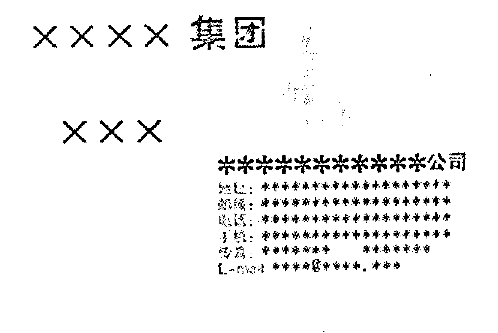

## 例 292 速断名片

2008年中国风水文化研究院在北京大学培训基地办培训班。来自全国各地的易学专家学者在这里切磋技艺，互相交流，互相学习。我在大会发言讲的是关于象卦风水的应用。大家感到新鲜，吃饭的时候，大家都掏出自己的名片让我看。我根据名片上比较显著的特点说了几条。

我拿过第一张名片说：“你家的坟地被平过。你的孩子有伤掉的，你这个人很热心实在。也能挣钱，但是攒不住钱，总有花钱的事情”。他自己说：“我家的祖坟好大一片，被平完了。我的一个儿子没了”。同他一起来的人说：“他这个人非常热心实在。”

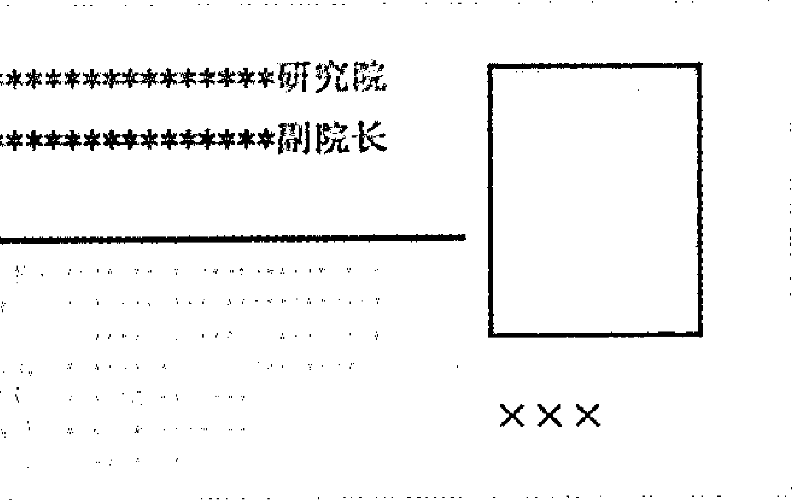

第二个人的名片拿到手我说：“你这个人很爱面子，曾经挣了不少钱，又都给别人花了，或者买房子买地花了。现在钱不多了，房地产可能不少。”他自己说：“我曾经挣了不少钱，给亲戚花了不少，我也买了房子”。

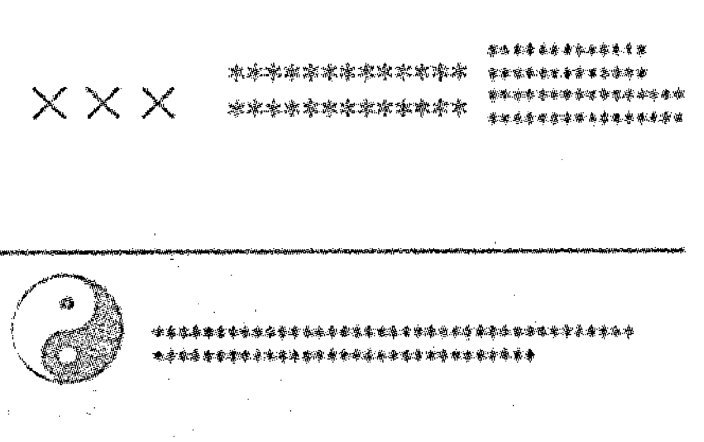

从名片上看他的泌尿系统容易有毛病，为了少给别人增添烦恼我没有直接说。

第三张名片递到我的手里，我说：“你的生意做得很大，也挣了不少钱，但是你有过一次赔大钱的经历。”他说：“有”。他刚说了一个有字，站在旁边的高院长说：“他在深圳投资了一个亿的资金，结果全赔了。”

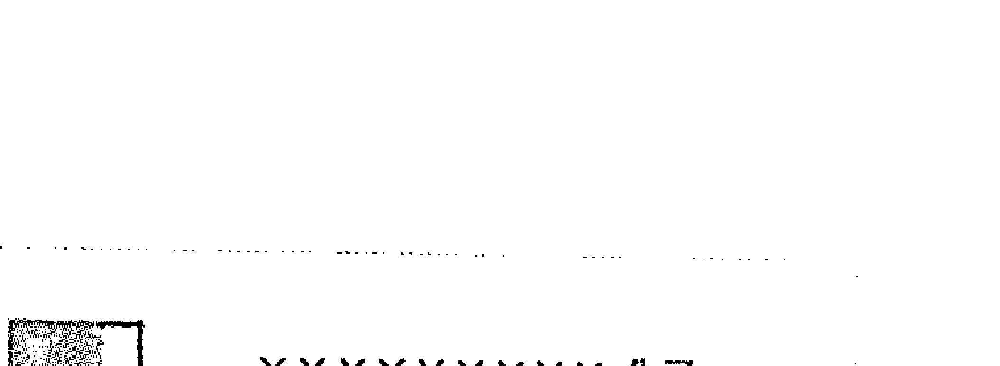

第四张名片递给我，我问他：“你们家东北方向是不是有大树？”他说：“有”。我继续问：“你们家有人手或者脚有伤。”他说：“我原来当过兵，我的手脚都有过伤。”我说：“你挣钱也很难存住”。

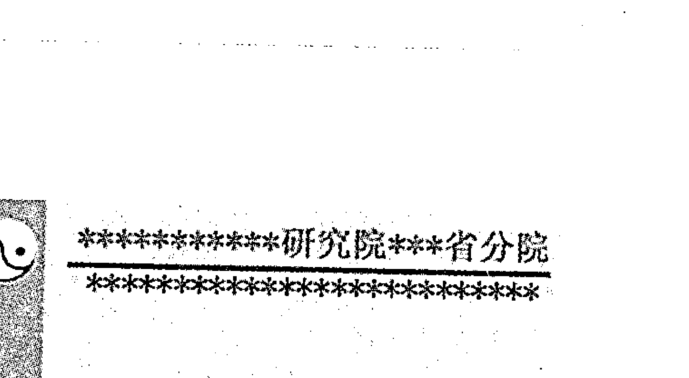

第五张名片递到我手上，名片的左上角有几个红色的八卦符号，我说：“你们家有人胆不好，有人神经或者腿不好。”他说：“我的胆不好，我儿子是多动症，我爱人因为孩子把工作都辞了”。这张名片忘了放在什么地方了。

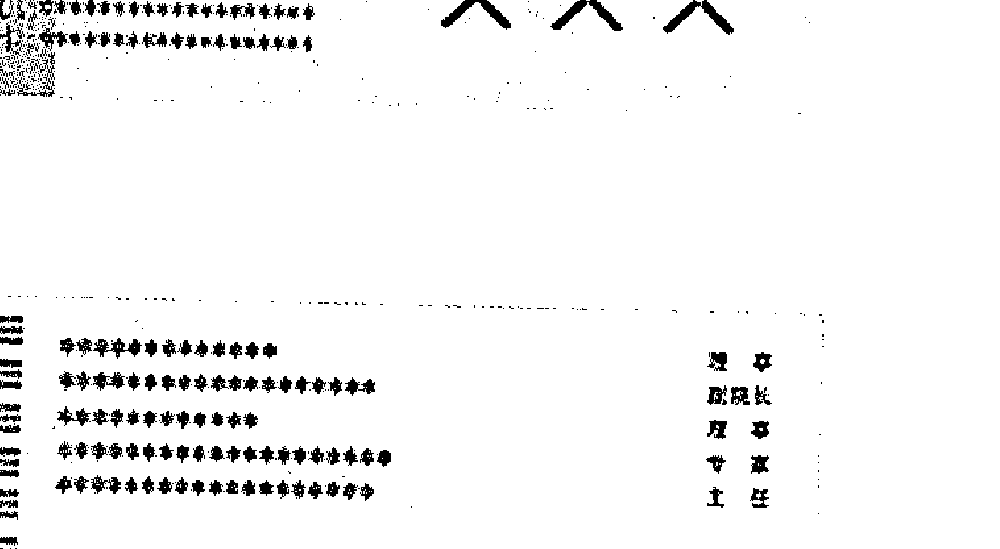

（上述名片之彩色样请参看后面附页）

# 后记

《梅花新易》终于在历时三个月，点灯熬油的写作之后成书了。时间的确十分仓促，舞文弄墨又并非我的强项，所以书中难免诸多疏漏，只好请各位读者多提意见和建议，以便此后完善。

伏案写作对于我虽然是个苦差事，但20余年的实践积累给了我充实的、丰厚的素材，使我能够下笔言之有物，不以虚头虚脑的东西来应付。另外，越是在实践与写作之中思索，越是能够感悟到《周易》这部先贤留下的著作的伟大和神奇。它将每个人命运的来龙去脉隐索在几句概括性的话语里，将人类社会的发生发展涵括在几条简捷的规律里，将整个世界甚至宇宙的奥妙化在阴阴阳阳组成的线条之中。何为真理？经过实践检验的符合客观实际的便是真理，《周易》就是一部自古而今，无超其右的、涵盖最为广泛的真理之著！

然而，由于《周易》之玄奥，也由于对于它的研究与传承没有一个完整的有延续性的体系，所以，这部“真理之著”在今天被许多人误解着，被一些爱好者误读着，也由此被误导着。不得不说，这是一种巨大的损失，无论对于许许多多的个体，还是一个民族的文明的传承。

因而，我愿以自己毕生的微薄之力，将对于《周易》的些许体悟凝聚出来，将这些年实践中的成功与失败记录下来，并且对大家知无不言、言无不尽。一是向世人展示《周易》神奇但是并不神秘，二是为学易之人提供实实在在的帮助。

2007年夏天，我把我的两本书《六爻梅花易卦例精解》、《梅花易数预测学讲义》送给柯云路老师。他不但认真读了，还提出了很具体的意见和建议。他建议我在两本书的基础上，正规的出一本书，并答应帮我写序。只是这一段时间我很忙，没有静下心来整理。

2008年10月，张志春老师告诉我有一个出书的机会，并且亲自为我的书题了书名。我才赶紧把自己原来整理的例题重新校对。为了大家学习方便，我尽量把断卦依据写了出来，而且特意把一些相同的卦组在一起。大家可以分辨相同的卦，求测人不同，求测的时间不同，结果也会不同。例题基本上都是用现场记实的形式写的，只是省去了求测者当时那些惊讶的语言和很多赞扬的话，只是用“对”和“是”这两个字代表了对方的回答。我可以负责的告诉大家，例题中所有的断语都是当时断出来的，没有一条是问出来的。有的学员问我：

“老师这个卦是不是还可以断什么什么？”

我说：

“你们可以根据我的启发举一反三的去发挥。我当时没那么断，就不能那么写。很多测事的当事人会看到我的书，我不如实的写，会被人家笑话。”

三个多月完成这么大的工作量，困难程度可想而之。我每天在电脑桌前坐十几个小时，仍然感觉时间不够用。幸亏在此书的成书过程中，得到了著名周易预测专家张志春老师和著名作家柯云路老师的指导。在修改和录入的过程中得到了许多友人的热情帮助。他们是：王燕民、孙宏洲、崔鹏凯先生和贾舒颖、刘宪生女士等。我对他们表示衷心的感谢！

我也想在此感谢中国商业出版社和编辑同志，正是他们的提携和工作，才使得《梅花新易》得以与广大读者见面，使得我与大家有了更好的交流和互相学习的机会。

尽管笔者在书中已竭尽全力，但由于学识所限，难免管孔之见，纰缪之处，还望易道同仁匡正。并欢迎易学界同仁和读者与本人作学术探讨交流，通讯地址：北京市天通苑北二区15号楼1门101号，邮编：102218，电话：010-61754097或13911555227。

贾双萍
2009年元月于北京天通苑