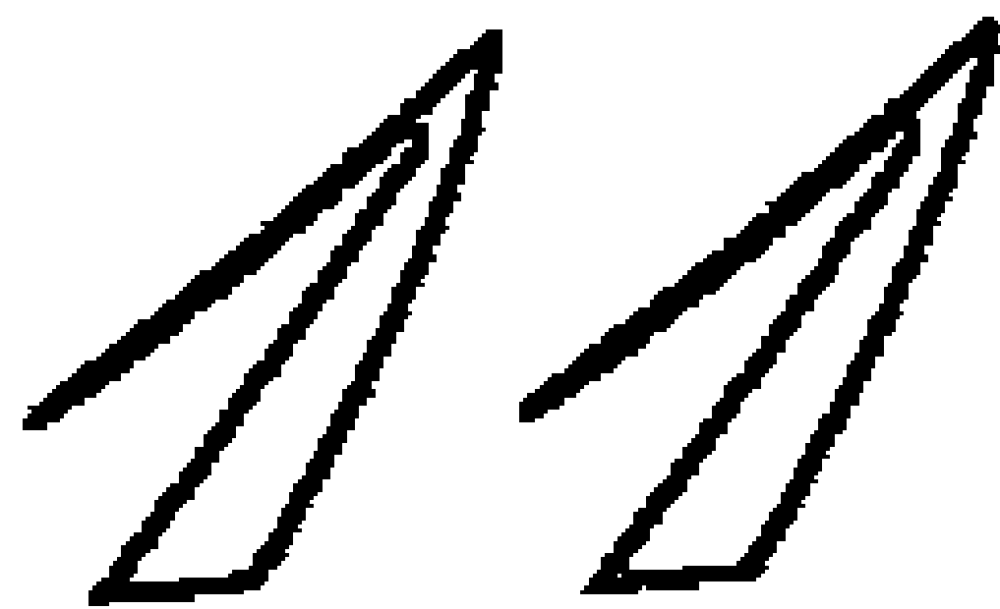

# 比神更快乐

我们先从感恩的话开始。

神，谢谢你。我要感谢你赐给我这本书、这一世的生命和这个美妙的当下。谢谢你赐予我生命中，过去、现在和未来所发生的一切。因为这一切创造了下一刻生命的完美，赋予了我即将成为我是谁的荣耀。

好。现在，请在封面的内页，写下今天的日期。你会想记住这个日子的，因为你即将得到新方法来改变每天的生命体验。除非它无效。

今天会是你作出决定的日子……

神要我告诉你们：
一切都不需要安排
只要庆祝
你到这人间
只要弯下腰来
就能发现脚下许多的奇迹
只要伸开双手
就能发现
你自己天堂的美丽容貌
就在上方

你所想的一切
都必须自己去承担

当请求神跟我说话的时候
我和你们一样
感觉渺小、孤独

但那个时候
完全不知怎的

我开始发光

——摘自克丽儿 (M. Claire)《开始发光》

## 我们先从感恩的话开始。

神，谢谢你。我要感谢你赐给我这本书、这一世的生命和这个美妙的当下。谢谢你赐予我生命中，过去、现在和未来所发生的一切。因为这一切创造了下一刻生命的完美，赋予了我即将成为我是谁的荣耀。

好。现在，请在封面的内页，写下今天的日期。你会想记住这个日子的，因为你即将得到新方法来改变每天的生命体验。

除非它无效。

今天会是你作出决定的日子……

## 1 你正在目睹一场不可思议的运作过程

生命本来就是快乐的。你相信吗？

这是真的。我知道，当你看到周遭的一切，会觉得好像不是这样。但这是真的，**生命本来就是快乐的。**

你本来就是快乐的。如果现在你是快乐的，那表示你本来可以更快乐。甚至现在你已经非常快乐，你还可以更加快乐。

有多快乐？你能有多快乐呢？嗯……**你可以比神更快乐。**

我曾听过一名女士描述一位非常有钱的绅士。她说：“他比神更有钱啊！”我的意思就是这个，我要用最极致的词汇形容。

那也是我所要表达的意思，正如这词汇所说的一样，但这会引发许多疑问。难道说，甚至连神也会体验快乐这种东西？（是的。）难道神也会体验到不快乐？（不会的。）如果我们能够比神更快乐，这是否表示说，我们和神是分开的？（不是。）否则怎么可能会这样呢？

嗯，这件事的发生是有公式的，藉由它你就可以比神更快乐。所有的神秘家都知道它，多数教导神秘智能的导师们以及近代一些灵性讯息的先知们也知道它。但是经过了几个世纪，它已经变成有点像“秘法”一般……因为很少人会去谈论它，真的非常少。

为什么？理由很简单。会去听灵性导师和先知教诲的人，只有极少数会相信“**秘法**”所讲的内容是真的；当你谈的是没人相信的事，你就会变得默默无闻。

因此，在这名为理性与灵性启蒙时代的今天，会去揭露这秘法的灵性导师和先知也不多——纵使他们知道它。或者，就算谈论到它，他们也只讲一半。他们大都会保留一半，把这公式最惊人的地方隐藏起来。因此，我们现在所要谈的是一个惊人的真相，而目前你对它的了解，连一半都还不到。

如果真理无法完全呈现，那有什么好处呢？当然没有好处。事实上，半个真理只会误导人，甚至会非常危险。因此，我们除了谈论真相(整个真相)之外，什么都不谈，只谈真相。我们会先从你手上为何有这本书开始谈起。之后，我们会说明一种不可思议的运作法则。

准备好了吗？好，我们就开始吧。问问自己，为什么你会挑选这本书？没关系，让我告诉你吧。**你选中这本书，是出于某种冲动。**

这冲动打哪儿来的？你。从你那里来。为什么？为何这冲动会从你那里跑出来？是什么原因导致它的出现？它又是从你哪个部分跑出来的？

这些答案占去了本书许多篇幅——而且都相当精彩刺激。但是现在，让我们先转向一个更大的问题：为什么这本书会出现在这里(你目前所在的此时、此地)，因为你根本连什么冲动都没有呀。

啊，对了，那是很关键的问题。一旦知道那个答案，就能改变生命中的一切。答案要揭晓了，准备改变你的生命吧！

这本书之所以会出现在这里(此时、此地)，乃是因为你把它放到这儿的。**是你把它吸引到这儿来的。**

好的，现在，我们将探讨许多会让人起疑的事物，所以你必须紧跟着我。

我曾说过，甚至近代几位灵性的先知们，也不会告诉你们这一点，因为能相信的人非常之少，对吧？所以你现在必须做出决定。你想和那些不相信的人一样吗？还是你想超越那些限制？你想真正去探寻吗？想不想去超越目前我们所理解的观念和思想结构？

如果你的答案是肯定的，请继续翻阅这本书，乖乖地坐在你的位置上。**是你把这本书吸引来这里**(此时、此地)，看起来好像不是这么一回事，但真的正是如此。

怎么办到的？运用量子物理。人们常常在运用量子物理而不自知。也就是说，人们并没有有意识地觉察到它的存在。

量子物理学(万一你觉得这太难以置信，可以去读一下这门科学)中说：一切被观察的事物，都会受到观察者的影响。如果是这样的话(真的正是如此)，那么当下所发生的一切，你都会涉入其中扮演某种角色。唯一的问题只是，你涉入其中的时候，是否有觉知到这个事实？知不知道自己涉入其中？以及你是否有刻意在影响它罢了。但我保证，这一切真的都是你做的！

你把这本书吸引来，让自己觉察到它的存在，并且你现在正读着它——这一切都出于你想要更快乐的深切渴望。

这本书，一路从我的键盘到出版社、到书店，直到你的手上，都并非意外、巧合或是偶然。

**这一切都并非偶然**。所以，开心起来吧。你已看到宇宙最不可思议的运作。你看到的正是整个**彰显**的运作过程。

让我用另一个方式来说。你看到的正是……在运作中的——**神**。(如果连这都无法让你开心，那么天底下也没有其他事能让你开心的了。)

## 2 震撼世界的惊人真相

在我们结束之前，你会得到许多让自己更快乐的线索。我们会谈几个你可以采取的特定步骤，让你的**心智平静、心中有爱、灵魂有喜乐——并且保持下去**。

这些步骤虽然有趣，但我们还没打算要讨论。因为如果能更宏观地明白它们的来龙去脉，就能获得更深入的了解，它们也会变成更有力量的工具。

若不明白这些来龙去脉，这些步骤看起来就会像其他许多“如何生活得更好的技巧”一样，变成只是另外一种励志书籍罢了，这本书当然不属于这一类。**本书乃是针对生命如何运作做出完整的解说，它能够让平庸的生活变成不凡的生命**。

一旦听完这个解说，我刚提到的那些步骤，就会变得活生生而且有意义。所以，我会先说明个人创造法、重要的生命法则，以及未被揭露的真相。

在二十世纪六〇年代，有一种汽车保险杠的贴纸非常流行，上头印着：**上帝死了吗？**

这个质疑背后的概念是：人类的进步太大、太快了，致使神变得无足轻重。近几年来，随着所谓吸引力法则(只要运用正向思考与专注意念就能创造个人的实相)的教导出现，这样的想法就更被强化了。

当然，我知道上帝没有死，而且大多数美国人也会同意这点。根据调查统计，在各国及各个文化里，占有很高百分比的人相信：**有比人自身更高的力量存在。**

但是，如果运用自身的力量就能获取生命中的一切，那何必需要更高力量的存在呢？它的功能会是什么？其目的又为何？

许多人(特别是现在某些圈子里被教导幸福快捷方式的那些人)最终获得的结论是：我们再也不需要神了。

现在我要说一些话，如果你是信神的，你将会很开心。不过，刚开始可能不会。首先，它可能会让你们许多人想把本书搁下。千万别那样，因为这么一来，你将错过你所喜爱的那部分。

如果你完全不信神，至少你会发现，我接下来要说的话会很有趣。所以撑下去吧！

真的。我们再也不需要神。事实上，我们从未需要过神。我们不需要神来求取任何事物。

这就是即将震撼世界的惊人真相，它是没人要去讲的未被揭露的真相。然而，未被揭露的真相不是只有这个而已；其他的真相，则是与为什么我们不需要神来求取任何事物有关。

## 3 难以置信的承诺，难以接受的真理

不需要神与神没有用，两者是不同的。

我要再次强调，因为这太重要了，所以不能被忽视掉。我说：不需要神与神没有用，两者是不同的。

事实上，正是因为神有着非比寻常的用处，所以我们才不需要他。我们怎么会需要自己一直都拥有的东西呢？我们怎么会需要在任何情况下我们都不会失去、我们一直都可以运用、不论怎么否认我们都不可能不使用它的东西呢？

在你的生命中，不可能没有神，他是你生命的一部分，这是许多人所无法相信的。他们无法相信，**神的最大承诺：我永远都和你在一起，直到时间的终点。**

你不可能不使用神，即使你否认，但这也是许多人所无法相信的。他们无法接受一切宗教(各依其不同的方式)所教导的最美妙真理：有求，必应。

由于人们无法接受这个真理，于是完全彻底误解了这个公式——藉由它就可在生命中创造他们想体验的一切。

**这公式我称之为个人创造法，即某些人所说的吸引力法则，它并不会把神淘汰掉。**事实上，正好相反，它让我们对神的体验比以往更加具体、关系密切与真实。

## 4 新好消息

**所有伟大的真相，刚开始都像是亵渎。**萧伯纳的这句话很有名，而且很正确。他的观察正可以说明，为什么许多伟大的真理，必须采用委婉的语言，将真相有所保留地缓缓说出来。

然而，真相不再有所保留的时刻已经到来。它们浮上生命的台面，绽放完整的荣光。这是人类的重大时刻，因为藉由打开伟大的真相，人类才得以进化。

想想看，你能比神更快乐。多不一样的想法！多么不同的观念！这是革命性的！因此很多人一直在抗拒。几年来，他们一直抵制、否认它，甚至使它变成是一种错误。

是的，人们(很讽刺的，还有各种宗教)甚至让“有一点快乐”也变成是错事——它明明已经比神的快乐少很多了(嗯，或许他们并没有把快乐变成是错事；他们只是让大部分能使你快乐的事情变成是错的)。

**许多人相信 “生命本来就有许多苦”，受苦乃是对神的一种献祭，你应该默默地忍受，这样就能在天堂得到积分。**

我们的文化已经完全接受了这种观念，有些人并不想保持常乐。当你谈到如何比神更快乐，他们就感觉烦躁、不舒服。他们会警告你说不切实际，甚至会说你是在和魔鬼打交道。

他们会跟你说：**生命本来就是不快乐的；生命是一种磨练，是一所学校；没有辛苦，就没有收获，等等。**有许多人就这么相信着。如果你对他们说“生命从来不是不快乐的”、“人不必总是不快乐”，他们就会用斗鸡眼看你。他们不知道那有什么用、也不知道结果会怎样。但通常，都是他们在告诉你结果会怎样……

是的，“你可以比神更快乐”这个观念，是一种亵渎。但它是真的。它并非因为过于美好，以至于不可能是真的；正就是因为它这么美好，所以它不可能不是真的。

这好消息就是：要到达天堂，并不需要经过地狱。

你听到了吗？让这句话从每户人家高喊出来！让每座道场、讲堂，都听得到这句话。让这些话从此时此地流传：快乐是你本然的状态，而且你可以一直保持这种状态。你永远不必再感到不快乐。

这意思不是说，你以后再也不会悲伤。悲伤和不快乐是不一样的。在深入保持常乐的方法的同时，我们一起来探讨：我一直都很快乐吗？没有。如果我说有的话，一定是在说谎。我比以往更频繁地体验到快乐吗？是的。开始觉得好像大部分时间都是快乐的？是的。我真的认为在所有的时刻里，我都可以是快乐的？是的。

而你也可以。你可以比神更快乐。

这与功利主义或个人优先主义完全无关。事实上，公式也不是那样运作的，虽然它真的能让你创造任何一切事物。我知道这听起来很功利，但只要明白了整个公式、把未被揭露的真相完整听完，你就会非常清楚。

所以，让我们先从基本的真相开始，然后再进入真相背后的真相……揭露更多未被揭露的真相。

这个基本真相，就是本书开头的那句话。生命本来就是快乐的。

之前已经问过一次，现在我要再问：你相信这句话吗？如果答案是否定的，那么你就只能让生命自生自灭，没有其他选择的余地。生命中不快乐的时光大过你的预期，这也就不足为奇了。然而，如果你相信生命本来就是快乐的，那么它就真的会是这样。

现在，或许你正想着：真的吗？那世上的痛与苦又该作何解释呢？

好问题。在我们结束之前，你会有关答案的。但现在，就眼前这一刻，请把焦点放在本书开头的那句话。让我们看看，是否至少能把它当作一种可能性来看待。

## 5 非『眼见为凭』的时代

我说，相信生命中大多时光都是快乐的想法可以成真。但这是老掉牙的东西，我们早就听过了。这本书是谈你还没听过的事：在这真相背后一个更大的真相。这真相是这么巨大、这么……我该怎么形容呢？这对于我们的经验和所学而言都是陌生的，以至于许多人就算看见它也无法相信，我已经说第二次了。就算生活中这个真相出现在眼前，他们也会归因于其他的理由。

有句老话说眼见为凭，不过，让我来谈谈“麦哲伦船舰”吧。这是从我的好朋友史蒂芬·赛门那儿听来的。他是电影《与神对话》和《靛蓝小孩》的制作人兼导演、电影《美梦成真》的共同制作人，并负责过其他耳熟能详的电影，例如《阿比阿弟的冒险》等。

史蒂芬解释说，麦哲伦和他的手下曾到过许多岛屿探险，但并没有遭到当地住民的反抗——这些当地住民原本可能跳进独木舟，攻击这些长相奇怪的水手，视他们为入侵者才对；相反的，他们却展开双臂来迎接。原因何何在？这些当地住民首次发现麦哲伦船舰的时候，他们并不知道所看到的东西到底是什么。

他们以前从未见过能在水面上载这么多人、这么巨大又雄伟的东西。这艘有着巨大桅杆和张满船帆的大船，对当地岛民来说，远远超过了他们的经验所及，以至于无法想象这些船舰到底是什么。他们将独木舟停泊，带着敬畏放下了矛叉，把麦哲伦和他的手下当作神来迎接。

史蒂芬告诉我，这就是麦哲伦船舰症候群——一种当人看到非经验所及的事物时，就搞不清楚到底发生什么的现象。

在此，我一直提到的未被揭露的真相，与我们多数人所被告知与教导的是如此的大相径庭，以至于它们在我们生活中发挥影响力、在我们面前产生直接的显化，我们也不知道所看到的东西到底是什么。我们会把所看到的，用别的东西称呼它。

我们会把未被揭露的真相的实现，说成是**巧合、意外、偶然或机率**……或者，只是走了傻人运。

事实上，已发生的事情没有什么偶然的。事实刚好相反：它乃是宇宙最高智慧的运作。

## 6

### 有史以来最重要的问题

接下来令人兴奋的心灵之旅，很可能是你生命中最重要的探索。这正是你把自己带到这里来的原因；也正是你会有冲动拿起这本书的理由。这里所发生的一切，事实上你早已知道，你只是不知道你知道。或者你也许知道，只是你很难记得起来。甚至你也许记得起来，但你却很难去运用它。

如果你属于上述的情形之一，那么你将因为对此获得清晰的了解——**透过彰显的运作机制来告诉你自己有关彰显的运作机制——而得到莫大的好处。**

我们要探索的就是这个运作机制。用我自己的话来说，我称之为个人创造的背后力量，是有关事物如何发生及实相是如何变成实相的。

就在稍早之前，我说过你们之中某些人或许正在想：哦，那个呀。是呀，我早就听说过了。那不是有拍成电影吗？

当然有拍成电影，但他们几乎都没提到任何有关未被揭露的真相。虽然谈的都是有关彰显和创造，但这真相背后的真相几乎都流失了，因为它完全没被提到。谁会想要被边缘化，而成为一个亵渎神的人呢？

但现在该是说出这个隐藏的真相的时候了。我是指我们所有人，而不仅是指我们当中的某些人，包括所有要讲述生命是如何运作的灵性作家、导师、演说家和先知们。

去说“我们都可以快乐”、“我们都可经验生命中所选择的一切”，以及“我们都拥有创造自己实相的力量”是一回事，但告诉我们为什么则是另外一回事。

我们已经听过一大堆有关个人创造是如何运作及其运作的方式，但我们几乎没听说过有关这个运作的原理。这便导致许多的问题——特别是产生了一个或许是有史以来最为重要的疑问。

在演讲及举办心灵静修活动时，我常常被问起这个问题。我确信，其他的先知们也听过这个问题。而现在，这个问题在全球的电视上被问着。

如果这个问题被全面、完整地回答出来，你就能知道如何比神更快乐。

在二〇〇七年二月一场有线电视的欧普拉秀里，有位现场观众提出这个问题，几乎中断了整个节目的进行。该节目是在谈论当时引起许多注目的一部有关吸引力法则的影片；这个法则一直在书籍、节目、课程、演讲，以及几个世纪来的导师及先知们的教诲中被提及。在全球性的有线电视节目中，欧普拉用以下的话语来形容这伟大的生命法则：

> **你对这世界所投射出去的能量、思想和感觉（不论好与坏），总会正确无误地回到你身上……因此你所拥有的生命都是你创造的。**几年来，我一直在节目中谈同样的事……

当欧普拉邀请的来宾们正热切地谈论有关正面思考和感觉的运用、谈论有关如何在生命中有意识并自主地带来所期望的结果（诚如影片《秘密》所说）时，欧普拉在观众群中唤起一位女士，说她有一个许多人都想得到解答的疑惑。

然后这位女士站起来说话……

“我的丈夫和我都是基督徒，我们的孩子也是。我们教导孩子把信心放在神的身上，但《秘密》似乎是教导人把信心放在自己的身上。我很纳闷，这样一来，神是否还有他的位置存在？”

欧普拉认为这是很好的提问，而且我能了解为什么。打从孩提时代开始，我们大多数人就被灌输：“当需要帮助或想得到非常重要的东西时，神是我们可以信靠的对象。”

我们几百万人不正是这样被训练出来的吗？不管是什么文化或宗教，只要一个人是完全相信他的神明，这不正该神明所扮演的重要角色之一？难道神不是一切美好事物的提供者吗？

然而在某些教导和文字中，为何会这么强烈地主张：如果我们需要奇迹或希望身体更好、想要更多财富或渴求完美的伴侣，或者寻找适当的谋生方式或只是期望更好的生活，我们只需要运用自己内在的力量，“说出我们的话”，然后我们所渴望的一切就会成真？

我们必须再问一次，在这当中神的位置何在？如果我们早先说的——**我们根本不需要神，因为神永远与我们同在——是真的**，那么神要如何在这当中摆放他的位置？神在个人创造法中又扮演什么角色呢？

## 7

### 是神？是魔？

为了了解个人创造只会加重神在我们生命中所扮演的角色，而不是减轻，我们必须先明白有关彰显的运作机制的一切。我们必须把这个机制，以及支持它运作的生命法则，完全地解释清楚。

个人创造法实际上是三个现象的一体互动。第一个现象**与神有关；第二个与你有关；第三个则是与你和神两者有关。**

用另一种方式来形容的话，可以说：生命秘法的第一部分就是**我是**（I Am）；第二部分就是**你是**（You Are）；第三部分就是**如何**（How To）。

由于大多数人对这三个方面并没有很深的了解，所以吸引力法则才会被称为秘密。

有些人说，他们已经尝试运用这个法则，但是觉得没有什么效果、令人失望和灰心。我认为这是因为一知半解造成的。

另外一些人则是不论知道多少，他们都不想和吸引力及个人创造扯上关系，因为他们觉得那很可能是邪恶的——是魔鬼所为，藉由认为自己的思想是有力量的来迷惑我们的自我，诱使我们离开对神的信赖。

会回避这些的，不仅仅是保守的宗教人士，当中还包括许多以上帝为生活重心、体验个人与神性关系的人（不论是在传统宗教内或外）。这些人并不见得都能对宣称“个人必须单独为自己创造的实相负责”一事感到自在。

再者，也有一些无宗教信仰的理性主义者，他们认为只要无法通过证据、原因和逻辑来解释的都是非理性的，不过是自欺欺人。

事实上，个人创造并不邪恶或非理性。然而，就如同我说的，这只是整个过程尚未被充分说明罢了。

但现在是时候了。

## 8

### 『双手把』工具

随着越来越多的人在探求拥有自主创造自我选择的可能性，我认为在此先休息一下是很有好处的，让我们来看看……

- 1.个人创造为何有效。
- 2.除了带给我们更多财富、更大的房子、新车和更贵重的珠宝外，我们还能用它来做什么。
- 3.个人创造如何与世上的苦与痛和谐共存，又如何有效地解除这些痛苦。

各位，我们现在谈的是力量。我们谈的是非常巨大的力量。但是有关这个力量，讲的、写的实在都已经够多了，以至于一开始想写这本书的时候，我自己都在纳闷：有这个必要吗？这真的对人有帮助吗？

正当我想放弃这个计划时，在一个网络书店的网站上，我突然看到一篇读者的评语，讲的是有关某人教导的正面思考和个人创造。

仅摘录部分，这位特别的读者这么说：

> 多年来，我一直对心的力量感兴趣……（但是）谈到致富方面却让我感到很不舒服……我们好像都只把焦点放在拥有新车、金钱和房子上，然后就能美梦成真。我从感恩里学习到一些最棒的东西，就是了解到当下我所拥有的就已足够。
>
> 我认为我们应该把正面思考，运用到寻找我们当前生活中的意义上，以丰富我们的心灵生活。不存怀疑、正面思考和相信自己是值得被爱与拥有丰盛，就能打开自己接收更多同样美好的事物。这不是一种魔咒，也不是秘密……
>
> 正面思考可以帮助你想象成功、让你对新的机会开放，但它不会神奇到帮你付账单。
>
> 讯息中最令人感到不舒服的，就是暗示说那些生命中遭逢苦痛的人，都是他们的思想吸引来的。苏丹达佛地区遭受强暴的受害者并不想要这样；遭受性侵害的孩子并不想要这样；饥饿的非洲人也不想要这样。
>
> 暗指这些都是因为他们不正确的思考所导致的，这种说法让人厌恶……

当我觉得写这本书似乎不是个好主意而正打算放弃时，很惊讶地竟读到这些话，仿佛宇宙在对我喊道：别放弃这本书！当时我就了解到，如果放弃写这本书的计划，人们将会对人类生活中最重要、最美好的面向，产生极大的误解、错误诠释及错误观念。

有些人说，目前台面上教导有关个人创造，有如把神圣宝库中的东西拿到商品橱窗上去贩卖。**这种把吸引力和彰显当做达成个人富裕、满足个人欲望的方法来兜售，虽然能把人带到物质上的丰盛，但事实上，却反而可能导致他们心灵的贫乏。**

虽然我知道，当前教导这些创造理论的导师们都有相当的灵性基础，但我认为我们都有必要听听这些批评意见，不要认为没什么重要性而忽略它。

我认为在谈论有关个人创造法时，有必要加入更多的内容；如此一来，听到这些内容的人，才能得到更丰富、完整和深层的觉知。

以下是我想增加的一些内容：个人创造（以及对其最重要的吸引力能量）是**神圣之爱**的产物。个人创造是有关产生更多生命的生命力量。它很简单，它就是力量，一种改变你生命的力量。

吸引力是来自一位仁善又慈悲的**神明的恩赐**，它是一个带有双手把的工具——**一边在神的手上，一边在我们的手上**。这工具现在就在你的手上。此时此地，你对这些话语的想法，将会增加或减弱这些话语的力量，也会增加或减弱你自己的力量。

你对这段话的想法，将会产生你对它的体验。如果你认为这些全是胡说八道，那么它将按照你的怀疑来创造你的实相；如果你认为这是真的，那么它将按照你的信任来创造你的实相。就是这么简单。

你对本书其他部分的想法、对吸引力能量的想法，也都同样适用。这原理是个人创造法中的一部分，它是等着你去行使、运用的一股力量——有意识的，而非无意识的（目前大多数人是如此）。跟所有的工具一样，只要使用适得其所，它会是最有效的。

我要你别错过刚刚所讲的话中所蕴藏的庞大弦外之音。我刚刚说，**吸引力是个工具，这工具由神所创造，而这工具是给我们与神一起使用的。**

我还说过，只要使用适得其所，它会是最有效的工具（我们同时也明白，为什么有人运用个人创造，但却认为无效、令人失望和灰心的原因。因为他们没有把吸引力用在这工具原本设计的目的上）。

那么，这工具的目的是什么？它是要**创造一个幸福、平静和喜悦的生命，给你所接触到的人和你自己——顺序是如此的。**

请注意最后这六个字。它会让你对有关个人创造法及生命的运作背后的秘法的理解，产生莫大的改变。

## 9

### 生命的大法则

**你创造实相的能力，是神性的一种展现。**这就是它永远有效的原因，要让它失效是不可能的。这是宇宙的根本原理，也是事物的本性。

之前我曾说过，只要使用适得其所，吸引力会是最有效的工具。也就是说，只要把这工具使用在原本设计的目的上，就能达到你所想要的结果。而它也总是在产生某些结果，因为不论使用它的人是否意识到，它一直都在被使用着。

这是神最大的恩赐，源源不绝的力量，永远启动着。我们现在所谈的是一种永远不会停摆的因果系统运作。

**神就是那个运作；神就是那个系统。**这就是神告诉我们“直到时间的尽头，我都会永远与你同在”的内涵。

有关神的这一点，并没有被普遍了解，也很少被说明清楚。有关个人创造的话题上，这一点几乎从来没被解释过。

我们现在需要弄清楚吸引力的来龙去脉。**吸引力能量是宇宙中一个更大的因果系统里的一部分。**

把吸引力本身当作一个法则来谈论，就有点像在谈论地心引力，却没有把它的物理原因及功能解释出来一样。好吧，只是漏掉一些东西。那又怎样呢？

好，我们来看看，要深入检视这些生命的大法则。生命是藉由这些来展现的：

- 1. **吸引力能量——给你力量**
- 2. **对立法则（Law of Opposites）——给你契机**
- 3. **天赋智慧——给你洞察力**
- 4. **神奇的喜悦之道——给你想象力**
- 5. **循环之道——给你永恒性**

个人创造法被更大的系统管控着。你甚至可以把这个系统或运作称呼为神。

对许多人来说，这是新的概念。就是现在，请你自己也来探索一下这个新概念。我们说了这么多，那么神真的可以是一个运作吗？那个运作过程可以就是我们所谓生命的体验吗？个人创造法是否只是让生命任其发展的自然显现？

我已经了解，**生命就是神，是神成为神，而他所变成的下一个东西也是神**。这是个既复杂又不可思议的系统，它包含产生所谓生命展现的一种运作过程。

这系统是一个循环。在你心中想象这个圆圈。在这个圆圈里，生命的运作产生了生命的展现；生命的展现创造出生命的经验；生命的经验又创造出生命的运作……一个带动一个，再带动另一个，然后再带动另一个……如环无端，没有止尽。它都是一体的。

就生命的创造面来看，它是个运作；就生命的显现面来看，它是个展现；就生命的影响面来看，它是个经验。而它如何影响我们，这是由我们自己决定的——这一点大多数人都不了解。

这个无尽的循环——运作、展现、经验——就是神性的本身，它是神在施展神性。

这就是循环之道的显现，一切万物都响应着这个循环，一切万物都以循环的方式存在。万物的存在都在这系统之内——没有任何事物是在这系统之外的。

**和其他伟大的生命法则一样，吸引力也是这系统的一部分。** 有意识的运用这些原理——它们是个人创造法的基础——能够产生带来神性体验的生命展现。

你有听懂我所说的吗？要紧跟着我，继续理解。如果你想要的话，可以重读我所说的一些话。继续理解。

现在……如同物理学解释并掌握了我们生命中的物质层面，同样，玄学现在也解释并掌握了我们生命中比物质更大的层面。

**吸引力是这些玄学的一部分。它是个能量磁铁，能够把相似的能量拉在一起。它绝对遵循这个法则：同类相吸。**

这个来自神的力量的能量磁铁，在个人创造法中被我们使用着——不论我们承认或有没有意识到，它一直都在被使用。所以现在，当我们谈论自身能产生创造实相的力量时，我们永远不会再问说：“神的位置在哪里？”

现在我们知道了。

## 10

### 有意识与无意识的选择

正因为神给我们的力量永远是启动的状态，这个系统永远不会停摆，所以个人创造法有时候看起来好像没在运作。

让我再多说几句，好让它更清楚些。个人创造永远都在运作着。之前我就注意到，有些试着运用个人创造法的人认为它是无效的。个人创造永远不会无效，虽然它并非总是创造出我们所要的结果，正是因为它这么的有效，所以才会这样。

**你看，吸引力能量不仅仅会回应我们所要的，同时也会回应我们所恐惧的。吸引力能量不仅是回应我们所想拉过来的，也会回应我们所想推开的。吸引力能量不只会回应我们有意识的选择，也会回应我们在无意识下所挑选的。**

要从我朋友迪帕克·乔布拉所说的无限潜能场（Field of Infinite Possibilities）中作选择，是一件非常微妙的事。不论我们想不想要、或是否意识到，都跟我们所聚焦的东西有关。

举例来说，假设你的心思聚焦在明年能够有双倍的收入，但如果你在下一个时刻或是隔天又出现新想法，认为那几乎不可能发生在你身上，比如你对自己说：“噢，拜托，实际一点吧！至少选一个你能够达成的目标。”如此一来，不论你原先是否想要，结果你还是选择了那个最新出现的想法，因为力量的开关永远是启动的状态，个人创造永远都在运作着。

**个人创造法不仅仅与你最新的念头或想法共同运作，也会对你给予最多次数、最大聚焦和最多的情感能量产生回应。**

这说明了为什么有些人寻求这方法来获得他们所想要的，但最后都碰上他们所谓的“失败”的原因。然后他们就会说：“看吧，这招不管用呀！”

实际上，个人创造法的运作完美得很。如果你觉得自己极度的想要某个东西，而且一直对自己说：“我要那个！”你就是在对宇宙宣告你现在并不拥有这个东西。

除非你只是把想要这个词，仅仅当作是修辞的用语。但大多数人不是。当他们说想要某些东西时，他们是很清楚的，因为他们真的觉得现在并不拥有它。

只要你还抱持这样的想法，你就无法拥有。因为你无法体验到一个“一边给予肯定，而另一边又给予否定”的东西。

举个例子来说，像“我要更多钱”这样的陈述，不但无法把金钱吸引过来，反而可能把它推开。因为宇宙所回应的语汇只有一个：好。宇宙会非常仔细地聆听；最重要的是，它聆听你的感觉。

《与神对话》中说：**感受是灵魂的语言**。如果你一直说：我要更多钱！宇宙就会环绕在那句话去感受你的感觉，而那是一种**欠缺感**，于是宇宙就会把它回应给你。

现在我们这里所谈的是有关力量——磁铁的力量。要记住，**感觉是一种能量，而能量是同类相吸的**。于是宇宙会说：好！——就让你继续“想要更多钱”。

如果你想着：我想要生命中有更多的爱！宇宙就会说：好！——你就继续在生命中“想要更多的爱”。

在运用吸引力能量时，**我这个词，是启动创造的钥匙。**我这个词后面所接的语句会转动这把钥匙，并发动彰显的引擎。

**于是，当个人创造“看起来好像”没效，这只是因为吸引力能量把你无意中选择的带到你的面前来——而不是之前你认为你所选择的那个。**

如果这个力量不是永远在启动的状态，如果这个运作并非一直在进行，那么你只要有一个非常正面的想法，就会毫无失误地在你的实相中彰显出来；然而这个运作一直都在进行，而不是只在某段时间运作，它被你最深、持续最久的感受所喂养着。所以在不那么正面的想法旋风中，单单靠一个正面的想法和投射，不大可能会产生你所想要的结果。

诀窍是：要在负面的大海中保持正面。诀窍在于：要知道这个运作一直都在有效进行，即使看起来好像无效。我现在要给你一个工具，一种不可思议而且每次都管用的技巧。

## 改变生命的奇迹

时时处于正面思维，即使被人们所谓的负面环境所包围，甚至被淹没在里头，仍要让自己保持正面，其实比你想象中的还简单。诀窍就是停止评断，不要以表象来评断。

当停止评断，你就终结了全部的生活方式。这可不是一件小事。在态度和行为上，这是能够改变生命的大转变，是一个奇迹。

但要如何展现这个奇迹呢？这是每个人都想知道的答案。那么，请特别注意我现在要告诉你的：想远离评断，就得把感恩带进来。

这结论太重要了，应该在你的屋子里和每个地方都贴上这句话。把这句话贴在浴室的镜子、冰箱门、车子的后照镜和计算机屏幕上方。你甚至可以刺青在左手腕上——或至少，刻在你所戴的手镯上：想远离评断，就得把感恩带进来。

这句话的意思是，对每一个结果都保持感恩之心。每一个结果。也就是说，就算你很确定结果并非出于自己有意识的选择、很清楚自己并不想要它，但你还是会说：神啊，谢谢你。

**某人曾经说过：幸福并非是得到你所想要的，而是去感谢你所得到的。这个人说的极为正确。**

**任何时刻，感恩都能奇迹般的疗愈你的不适。它是解除焦虑、消除沮丧和转负面为正面的最快方法；它是从死胡同里走回正道的最快捷的方式。它就是和神连结的能量。**

找个机会试试吧。

下次当你碰上不想要的结果、结局或体验，那就先停住。在所发生的事件当中停下来。

只要……停下来。

**只要闭上你的眼睛，然后在心里说：神啊，谢谢你！**

好好地深呼吸一口气，然后再说一次。

**谢谢你给我这份礼物，以及装在里头的宝藏！**

请放心，里头真的有宝藏，即使你现在看不到。只要愿意给它机会，生命会证明给你看的。

**当感恩取代了评断**，平安就会散布在你全身，轻轻拥抱着你的灵魂，内心会充满智慧。让感恩取代评断，你的生命体验会在五秒钟内转向更好的地方。

在五秒钟内。这是因为态度决定一切。当你离开正道，**态度就会对生命方向作出修正**。态度就像是心灵的地图，也像是脑的全球卫星定位系统。

负面的态度会把你带向不快乐的路途上，这是一定的。不管什么问题，绝对都是如此。正面的态度则把你带回通往内在平安和幸福的正道上，这也是一定的。不管什么问题，绝对都是如此。

然而，当一个人碰上完全悲惨、凄凉或者是生命受到威胁的境况时，要怎样才能进入感恩呢？

就是藉由：**明白生命中的每分每秒都是个独一无二的机会，好让你去表白、展现并体验你内在的神性。**

单单只是宣称有吸引力能量的存在，还是有某种东西没说明白。那“某种东西”指的正是这个。这个真相不该只是揭露出来而已，而是应该被解释清楚。

## 12 生命为何有对立

目前已知无意中的选择是造成人们认为个人创造无效的一个面向而已。还有更不为人知的对立法则——它和无意中的选择具有同样的影响力，但理由却不相同。

对立法则是五大生命法则中的第二个，与吸引力能量共同完美和谐地运作着。这个法则告诉我们，**在召唤某个事物进入实相的同时，其对立面也会立即出现——而且是最先出现。**

这是什么东西？我是在说什么呢？我说的是，在你选择任何事物（任何结果、东西或经验）的同时，其对立面也会以某种方式出现在你的生命中。也许在遥远的某处或者立刻出现在你面前，但它绝对是存在的。

当使用吸引力能量来创造任何你所选择的事物时，对立面的出现是必要的，因为生命无法在孤立的状态下被体验。为了让你体验你所选择的，它的背景必须先被创造出来。

许多人就是因为不知道这一点，所以当宇宙准备要在他们面前铺陈他们心中的渴望时，他们的思考很容易就变成负面的。

他们并没有把这对立面的出现，看成是走在正确的道路上（朝向他们所选择的目标前进）的一种肯定的征兆，反而看成是一种阻挡、障碍。

他们觉得自己被逼到无路可走；实际上，他们是站在一扇门面前。唯有洞察力才能让他们了解其中的差别，这正是天赋智慧的所在（我们很快就会探讨到）。

对立法则是建立在一切生命的成立及其基本原理上的：**如果那个“你不是的”不存在，那么那个“你是的”也就不存在。**

好啦，我知道这不是个表达得很清楚的句子。让我来说明白一些。为了举例说明，让我们这么说好了，你自己想体验成为光（对了，许多人真的选择它。他们想要成为光——然后带来光——不论他们身在何处或出现在哪里）。

现在让我们一起来想象这个例子，你周遭什么东西都没有，只有光——真的整个存在中只有光，其他什么都没有——这样一来，要体验到自己是光是不可能的。你可能知道自己是光，但你无法体验它。知道与体验二者是有区别的。**灵魂所渴望的，是去体验它所知道的自己。**

只有一个方法能够让你体验到你是光，那就是让自己处在黑暗里。但是千万记住，以这个例子来说，黑暗是不存在的。在这个例子当中，只有光而已。因此，你必须创造出黑暗。你必须召唤它前来。而且，你会让它显现。

这就是带给你契机的对立法则。但是**如果你没把这个对立视为一个契机，你就不会认为它是增加你力量的东西，反而当成是敌对的事物，认为是夺走你的力量。**于是，你就会落入负面的思考，而不会了解到自己已经运用吸引力能量，把黑暗还有光（你所谓的负面及正面结果）都吸引过来，好让你来完全体验你所创造的正面结果。

在对立中有力量的存在。吸引力与生命大原理的运作是错综复杂的。这些法则彼此共同运作，像个彰显运作机制的完美机器，好比和谐又紧密相扣的齿轮。

那么，当对立法则看起来好像在阻碍，而不是支持个人创造时，我们该怎么做呢？去了解实际的真相吧。

要尽力把对立面的出现，视为是个人创造正在完美运作的先兆。要记住，一切的创造，就是要先产生出能够体验它的背景。所以不要去抗拒你所想体验之事的对立面。相反的，要去接纳它。要正视着它，并看清它的真实面目。

**你所抗拒的，会持续存在。**这是因为，你以负面的方式持续关注它，于是你就把它继续放在那儿。你无法去抗拒不存在的东西。当你抗拒某个东西，你就把它放在那儿了。把不满、愤怒和挫折感聚焦在其上，其实是给它更多的生命力。

这就是为什么所有伟大的大师们，都力劝我们不要和邪恶抗争。当你所想要的愿望或结果出现相反情况时，不要抗争。相反的，你要轻松面对它。

我知道这听起来有点怪，但我向你保证，这很有效。别太固执、紧张，好像要去打仗似的。永远不要去反对和你对立的。不要反对，要创造。

你了解了吗？永远要记得这个小律则：**不要反对，要创造**。

去构思怎样才能让你原先的生命构想实现；在这样做的同时，也让自己从容平静。以轻松的自信面对一切，生命就能完美地运作。但是可别把轻松面对和接受混为一谈。

不要和邪恶抗争的意思，并不是说你不应该尝试去改变非你所选择的情况；改变事情和抗争无关，改变只是一种重新选择。**改变不是抗拒，而是另一种选择**。作出修正并不是抗拒；相反的，它是个人创造的延续。

**修正就是创造。抗拒则是创造的终止**——因为它把先前的创造紧紧抓住，留在原地停滞不前。你明白了吗？

不论何时，生命中碰上了困难和挑战，你都可以选择：**反对或创造。**再重复一次：要不你就去反对你所经验到的，否则就去创造你所选择的。

创造你所选择的。现在，感谢对立法则让你拥有可以去体验的背景，它是宇宙给你最大的礼物。这是生命秘法中很少被阐明的一个重要面向。还有更多呢。

## 13 逃离负面陷阱的方法

当吸引力能量响应对立法则时，天赋智慧就可以被用来增加对经验的洞察力。

这个法则是说：**所有的智慧都俱足在你之内**。你从来没被一个残酷无情的神带到这个世界，而且他选择不让你知道如何在这环境下生活的智慧。事实恰好相反，你是被带到这里来利用这个环境的，好让你完成来到这世界的目的（这正是生命本身的目的），并且你被赐予了解这个目的及如何达成的智慧。

不论何时何地，当你觉得需要这智慧的指引时，就召唤它吧！它会出现的。

**智能是赐给你及一切有情众生的一种工具**。智慧天赋给予你洞察力，让你能看清楚一件事——你所遇到的一切负面经验，都是由你带给自己的；而这些负面经验是你在选择所想要体验你自己和你的世界时，所构建出来的一种背景场（Contextual Field）。

通常，这个工作都是在潜意识或超意识的层次运作，因此你可能无法有意识地觉察到。但天赋智慧能使你在这无知的云雾中产生有意识的觉察，让你能够看透这一切在背景场（亦即你生命周遭所发生的一切）中前进，然后在这背景场之内，藉由持续把焦点放在当下的选择来启动吸引力能量，并认知到：**所有的对立状况也是你创造出来的——它们是来创造契机，而不是来与你作对的。**

大师们这么告诉我们：不要以表象来评断。他们所指的意思就是这个。

洞察力让你直接看透事物的真实面目，而不落入撒旦（以负面来看待一切事物）的陷阱里。天赋智慧让你知道，人生旅程的路上，会发生所谓的失败是可预料的事。

“做事越是急促，就越会碰上意想不到的困难。”布拉瓦茨基（Helena Petrova Blavatsky）夫人这么告诉我们，“前进的道路，是由内心燃烧的无惧的火光所点亮的。一个人越是无惧，他就得到越多；越是恐惧，那火光就越暗淡。”诀窍在于看到失败的真面目不是失败，而是一种契机。

有关这一点，我很喜欢舒格曼（Joseph Sugarman）所说的：

> 很少人愿意给失败第二次机会。他们失败一次，然后就玩完了。对大多数人来说，失败是他们很难接受的事。如果你愿意接受失败并从中学习、把失败视为一个隐藏的祝福，并且再振作起来，你就拥有驾驭最强大成功力量之一的潜在能力。
>
> 每个困难当中都隐藏着契机，而这契机的力量强大到足以让困难变得微不足道。最伟大的成功故事，都是那些认清困难、接着把困难变成机会的人所创造的。

这就是我所说的真正去运用天赋智慧使自己的洞察力敞开，让自己看见表相与真相的差别，发现在**负面的表相下，其实原来是正面的**。

只有藉由真实的智慧，我们才能对生命的物质相有超凡的了解：**所有的物质性都是幻觉**。《与神对话》不断重复声明这一点。如果这是真的，我们就必须知道如何面对这个事实。

神说，我们就像忘掉了手法伎俩的魔术师。我们住在艾丽斯梦游仙境里，把真当假，把假当真。然而，我们现在正活在幻觉里的这个事实，却正是我们生命会这么有趣又具无穷可能性的原因。因为只有在梦幻里，我们才可能拥有想要的一切、做我们喜欢的事及创造我们所渴望的。

路易斯·卡罗（Lewis Carroll）写道：

> “不用试了，”艾丽斯说，“人不会相信不可能的事。”
> “我敢说，你一定没怎么练习过，”女王说道，“噢，早餐前我才刚相信过六个不可能的事呢！”

当然，整个诀窍就在于：明白如何与幻觉一起生活，而不是活在幻觉里。或者，如同圣经上说的，**活在这世间，但不属于它**。

有一个方法可以做到。与神对话系列《与神合一》里的实相创造三法中，教了我们这个方法。

《与神合一》中说：大师及迈向大师之途的学生，知道这些幻觉都是幻觉，并且完全明白它们为什么在那儿；然后有意识地通过幻觉，在自身之内创造下一个体验。

当面对一切生命的体验，每个人都可藉由一个公式或方法，让自己朝着大师之途前进。只要作出以下的声明：

1. **在这世间，没有什么事真实的。**
2. **每一件事物的意义，都是我所赋予的。**
3. **我说我是什么，我就会是什么；我说我的体验是什么，就会是什么。**

这就是如何与人生幻觉共同相处的方法。对许多人来说，三法中的第一步是最为困难的。它宣称：**我们所看到和经验到的一切，都不是真实的**。没有一件事物真的是我们所想象的样子。

这可不代表说它存在。它真正的意思是说：它不是真实的。也就是说，它并不真的是它看起来的样子。它不是我们想当然的样貌。

要做更深入的探究，我建议去阅读麦可·泰波（Michael Talbot）的《全像宇宙》。这本超凡的书以科学的观点，针对我们所生活的虚幻世界，带给我们深入的洞见。

“在这世间，没有什么是真的”是以量子物理学为基础的——但不仅仅是一个科学的观察而已，同时也是心理及灵性上的事实（在《奇迹课程》中可发现更深层的灵性观点：**我所看到的，无一真实**）。觉察到这个真相，就能有很大的疗愈效果——特别是在碰上巨大困难或压力的时候。

如果在困难的时刻，你认为你所经验的事是真的，那么你就会使它成真，成为你生命中的结果。反之，如果你知道它不是真实的、明白它只是你捏造出来，根本没有任何实质的存在，那么你就能在瞬间让那个结果消失。

《与神对话》中说：**你所抵抗的会持续存在；你所静观的东西会消失**。也就是说，它终止了它的幻觉形式。

如果你现在正想着，这跟科幻电影《黑客帝国》中的剧情非常接近，那么你就说对了。你记得电影里的那些人，被描绘成生活在由他们思想所创造出来的虚幻世界里，而主角尼欧只是训练他的心智来抵抗事物的表相（例如射向他的子弹）及否定它们的真实性，于是他就在这些人当中成了某种神。

藉由否定“你不希望它发生，但当下它正在发生的事物”的真实性，至少你也会减轻该事物的负面结果。五十年前，皮尔博士（Dr. Norman Vincent Peale，二十世纪四十至五十年代一位家喻户晓的传教士）在其杰作《人生的光明面》中就指出了这点。詹姆士·艾伦（James Allen）在其经典作品《我的人生思考——意念的力量》中，同样也有类似的说法。

因此，三法中的第一步，就是否定任何你内在结果的真实性——包括所谓好的跟坏的结果。现在，你可能会问：为什么要否定掉所谓好的结果呢？

答案是，藉由直接观照你最大喜悦的真实面目，并且视它为“幻觉”，你就不会对它有深切的执著。你可以继续享受它，但你是没有地狱的享受。也就是说，你以某种特殊的形式，把地狱（变得沉迷在生活中的享乐）给去除了。

是因为对人、地和物的沉迷，致使曾经的平静产生动荡、曾经的喜悦变成不幸、曾经的欢乐化为痛苦、曾经的幸福转为哀伤。有关这一点，没有比肯恩·凯耶斯（Ken Keyes, Jr.）那本深具洞见的《高等意识手册》描述得更为清楚的了。这本由一位靠轮椅度日的作者所写成的书，将我的生命永远地改变了。书中说，**如果某个人、某个地方或某种体验的消失就使你失去了幸福，那么，你就知道你已沉迷在某个人、某个地方或某种体验了。**

《高等意识手册》于数年前出版，现今还买得到。该书教导如何把沉迷提升为偏好。我认为这本书是有关于人类幸福的主题中，最具洞见的书籍之一。

请注意很重要的一点：我们对自己的所思、所言和所见的一切，对其究竟真实性的否定，并不意味着我们就非得把它推开不可。我们只是重新解读经验，好让自己注意到：现在所看到的，都只是一种幻觉。唯有到达这个境境，我们才有去选择让幻觉继续，或让幻觉结束的能力。

长久以来，我们都认为自己所经验的一切真实不虚，所以就想象自己根本没有改变它的能力。我们这样看自己：对生命本身我们是无能为力的，只能不断在体验中流转——永远只能处在“因果”中“果”的那一端。

因此，对我们所看到的一切其真实性的否定，是个人创造法中一个极为强大又重要的工具。

现在可以谈谈步骤二了。如果我所看到的一切都不具真实性，那么它们的意义是什么？这是另一个相当不错的好问题。答案是：每一件事物的意义，都是你赋予的。

这第二步骤巩固了你对自己经验的决定权。或许你并没有对外在实相作出任何改变，但要记住，正是因为对这外在实相的体验，才促使我们开始去改变它。

你——唯独只有你自己——决定了一切事物的意义。你——唯独只有你自己——选择了什么是重要的、什么是不重要的；选择了什么是好、什么是坏；什么事情可以、什么事情不可以。你——唯独只有你自己——决定要对某事采取正面反应或负面反应；或者，很有趣的，完全没有反应。你的情绪完全在自己的掌握之中，你的感受完全是你自己所想要的样子。

才不是这样呢！你或许会反驳。我并不想要不好的感觉，但我的感觉就是这样啊。但事实并非如此——越早明白这一点，你就能越早在日常生活中达到自主。是你真的想要这不好的感觉；否则你根本不会的。诀窍就在于，当下深入观照为什么你想要这个不好的感觉。有了这个问题的答案，就能够打开一切。

我再重申一次：你决定——唯独只有你自己决定——事物的意义及如何与之回应。但大多数人的决定基础，都是出自于过去的感觉、经验、理解和欲望，或者是对未来的忧虑、期盼和愿望。

但这些都与当下此时、此地所发生的一切无关。如同托利（Eckhart Tolle）在其著作《当下的力量》中所清楚阐述的，这个观念就是保持**活在当下，不要过去化，也不要未来化**，我在自己的生命中，已见证到它的真实力量。

当我来自昨天时，常常就会把当下正在发生的事镀上一层意义——而这意义并非当下正发生的事所原本具有的。我把过去先前对这些事物（或与之相似的事物）的想法结果置于其上（看牙医就是一个很好的例子）。

当我来自于明天时，就会把今天发生的事镀上一个想象的未来（而且通常是想象着恐惧）。这些对未来的想象可能永远不会发生（事实上，我的生命显示它们很少发生），但它们却常会毁掉原本我可以从当下的体验中获得最大利益的机会。

**唯有跳出过去并远离未来，我才能在这个背景（当下正在真实发生的事）之内，真实体验此时此地发生的事物，并可以针对这些发生给予任何我想要的诠释——完全没有过去和未来的诠释介入。**

这是我生命中最大的解放。当明白这一点时，我终于了解：**眼前我所体验的正在发生的一切，全都正在我的心中发生。**我可以直视事情的面貌；关于它们，我可以选择成为任何我想要成为的样子——我可以是没问题的或选择成为有问题的；我可以是快乐的或选择不快乐。我可以是乐观或恐惧、有力量或无力、完美或不完美、一蹶不振或东山再起。

一切的决定都操之在我。每一件事物的意义，都是我所赋予的。

个人创造三法的第三个步骤，决定了“我说我是什么，我就会是什么；我说我的体验是什么，它就会是什么”。这样子的讲法好像很不干脆，不过有办法来解释。

在我们基金会一场自我改造的静修活动中，有位女士的发言让我至今想起来还历历在目。当她还是小女孩的时候，曾遭受到叔父的性侵害，但她说出这件事的语气却相当的平静。她也谈及某个固定参加的女性支持团体，而她还记得当自己对该团体说出小时候的遭遇时，那些团体成员们都拉高了嗓门对她表示关切。“你应该对此感到愤慨！”他们对她说，“你怎么还能这么平静地说话？”

“喔，”她回答说，“那是很早以前的事了。我了解为什么他会做出那样的事，而且也已经原谅他了，所以我不再为这件事情生气。”

“不再为这件事情生气？”他们抗议，“你怎么可以不再生气？难道你不知道你发生什么事了吗？”然后他们告诉这位女士，说她显然只是把自己的感受升华了，将愤怒埋藏起来了；事实上，她是比自己所知道的更为愤怒。一个会走路的定时炸弹，他们这么称呼她。唯一的问题只是，她自己并不这么觉得。她的感受就是她所说的样子，而且她不愿完全相信团体中其他成员所说的她应有的感受。

我永远忘不了这个个人创造的例子。这位女士的外在经验，与其他许多年幼时遭受性侵害的女性们的经验并无不同。但她的内在体验却非常的不一样。她只是坚持选择掌握自己的体验。

在我自己的生命中，每当令人抓狂或不愿出现的事情发生时，我从不问自己：现在，为什么会发生这种事……？反而，我会问自己：如果我可以给予这个发生的事情一个理由，那么它会是什么？

对每件事，我**都选派**一个理由给它们，而**不是寻找**一个理由；是我决定要怎么感受它们，而不是等着看我对它们会有什么感受。对每件事情的回应，都是经过我深思熟虑的选择，而不是在旁观看自己的反应，仿佛自己是生命的局外人似的。

个人创造三法就是我所说的逆转的方法。也就是说，它是能够逆转（只要经过内化与运用）一个人生命的教导之一。

## 14

## 生命是一趟非凡的探险

当运用天赋智慧,来看看与你作对的事物(没有这种东西)、看到迎合你的事物(所有的一切都是)之后,你就可以运用那神奇的喜悦之道了。

这方法是:**一切万物都充满了神奇;因为神奇就是神的本质、神性的本体和你存在的本然状态。**进入你的神奇之中,从那神奇的地方,去想象你的未来、你的生活,以及下一个你对自己是谁所抱持的最好的梦想中最伟大版本的全体实相。这样,你就能在整个世界里传播神奇,并达成你来到这世界的目的。

神奇的喜悦之道给你想象力,让你通过吸引力能量及对立法则来得到所有你牵引来的一切,并且让你用最有创意的方式,创造出唯有丰富想象力才能彰显出来的体验。

当你能够运用吸引力能量、对立法则、天赋智慧和神奇的喜悦之道来建构吸引磁场、创造背景、洞察一切，并选择当下此时此地你所希望去体验的，生命就变成一趟非凡的探险。

你在地球上的生活（如同你现在正在创造的），就是这趟探险的结果。如果对你的创造（个人的或全体的）有任何不喜欢的部分，你都可以重新再创造它……在下一个你对自己是谁所抱持的最好的梦想中最伟大的版本里。

越大型的创造，就需要越多的力量来改变。如果你只是肚子饿，相对的你就很容易去改变这个创造。如果我们谈的是世界的饥荒，那就需要更多的力量（也就是说，更多的你）来改变、重新再创造它。

这是人类迄今为止都还不愿意去做的事。全球各地的饥荒及其他种种无助的惨状（全都是人类创造出来的）之所以会存在，并不是因为它们无法被改变，而是没有足够的全体意愿来做这件事。

有志者，事竟成。不论是人类全体或是你个人的生命出现负面的状况，你都不必一直气馁。

## 15

## 别担心，你永远都拥有

当唤起神奇的喜悦之道并让你展现自己的生命样貌之后，你就会发现,遵从并且敬重循环之道是很有帮助的。

伟大生命法则中的第五个是：**一切生命皆以循环的方式运行着。宇宙中没有直线存在。**从根本上来看，一切万物都以曲线的形式回到它自身。这条线或许长达数百万兆英里（或更长到无法测量），但一切万物终究会回到它自身。环绕在这圆体的质能运作，创造出你所谓的无限。也就是说，你拥有永恒来进行你所希望自己是谁的体验——不论是个人的或全体的。

生命中的一切都是回旋前进的。生命本身就是一个圆圈;没有起点,也没有终点。一切万物的存在如同过去、现在和未来的无尽世界。**永恒是循环之道给你的恩赐。**

这样一来,我们是否就没有对此时此地所发生的状况作出任何改变的理由了？也对,也不对。如果你很满意目前自己和周遭的生活,如果它很完整地展现出你自己及你的最高理想,那就完全没有理由去改变它。

另一方面,如果你并不满意、如果你希望利用这一生的时间来完成此生的目的,那么你就可以选择改变当前你生命中个人或全体所呈现出来的现状。

这一切都取决于你。你正在在此进行你在地球上的有生之年中一件非常神圣、非常勇敢的事。**你正在定义自己,全然一新的重新创造自己,在当下的每一个黄金时刻。**

一切的行动,都是一种自我定义。这当中包括不做任何事……先前我提出过一些声明,我要趁还没完整解释就被遗忘之前,再次回过头来谈谈。

**我说,当有人运用个人创造法却认为无效、失望和灰心时,这是因为他们没有把吸引力这个工具(推动创造过程的燃料),用在原本设计的目的上。**

我说过,它的目的就是要创造一个幸福、平静和喜悦的生命,给你所接触到的人和你自己——顺序是如此的。

最后我说,最后面的这六个字,将永远地改变你对个人创造的理解。这是个人创造最重要的面向,但也是最少被讨论的面向。

正是因为很少被讨论,于是针对个人创造及运用吸引力的批评就有机会说,这是在鼓励自私、自我导向、自我利益和自吹自捧的行为,所以与美善及神圣没什么关联。

然而吸引力(以及其他伟大的生命法则)的目的不在于提升自己,而是在于**提升他人**;不是在于扩大自己,而是在于**扩大他人**;不是在于丰富自己,而是在于**丰富他人——因为如此做,自己才能提升、扩大、丰富,并且获得最圆满的体验。**

灵魂所渴望的,正是自己这个最圆满的体验。事实上,它就是所有生命的目的。

现今许多个人创造的导师们,并没有强调把焦点放在利于他人上,然而所有古代的灵性大师们都把焦点放于此——这也就是为什么对某些人来说,个人创造和吸引力能量看起来好像与传统宗教所教导的不一致。

生命中,真的只要问两个基本问题:

- 1. **我能给别人什么?**
- 2. **我能给自己什么?**

这些问题的顺序绝对不可以颠倒,这很重要。

问问你能给自己什么是可以的。事实上,它非常没问题。个人的野心、个人的快乐、个人的成就和个人的灵性发展,点燃了愿望、向往和达成目标的火焰。它们是进化的基础。在个人的层面寻求特定的成果或想要拥有某种特殊的经验(包括财富、名声和权力的体验)都非常的自然,在灵性上也完全没有不适当的地方。这些都属于生命中的礼物、都属于身为而为人的一种乐趣,这当中没有什么不对,然而我们要去达成它的过程却很重要。

很明显的,以牺牲他人来达成这些体验,不是灵性上的进化。但有一件事就不那么明显,那就是:以忽视他人、无视别人的需要来达成这些体验,其实是最难达成目标的一条路。它是最为艰巨的途径,是最慢又最困难的路线。

如果我们以原来的顺序提问生命的两个基本问题,吸引力能量永远会运作得最快速。若保持那样的问题顺序,第一个问题永远会对第二个问题做出回应。

个人创造这一面向在《与神对话》系列丛书中,采用另一种或许是更为直接的方式来说明。这里所谈的讯息都是以那些书为基础的。如你们某些人知道的,我就是这些书的作者,这些书改变了我对整个生命及其运作方式的理解,包括那个秘法和未被揭露的真相。

在我开始《与神对话》之初,我曾经非常渴望地想知道:**人生要怎么做才能行得通？为何我的生命非得这样不断地挣扎？**我在脑海中呐喊:*告诉我这个规则吧！谁啊,告诉我这个规则吧！我会照做的,我发誓。*只要给我那些规则的手册！

在这一系列九本超凡的对话书中,神真的告诉了我了。而对于上述的两个问题,神回答说（为了简洁扼要,我这里做了改进）：**你的生命不必如此无止尽的挣扎**。这个问题很简单。你只是认为你的生命是有关于你,而你的生命并不是有关于你。

不是吗?我问。不是。神回答。
好,那么是关于这世界上哪一个人呢?
世上的每一个人。

.

## 16

## 未被揭露的真相

那个小小声明“你的生命不是有关于你”,改变了我的生命。它把一切都颠覆过来。或者,更正确地说,把一切都摆正了。我被告知,我不是来这里服务自己的,而是来这里服务他人。唯有失去自己,我才能找到自己;唯有透过给予,我才能有所获得。

我与神之间的对话,使我弄清楚了这一切。这个方法很管用,而且是一个人要达成任何事最快的方法,神告诉我:因为你是这空间里唯一的人。

那时候我并不懂,我以“呃?”之类的话回应。神就解释说:一切即一。只有一存在。一切事物都是这个一自身的某部分。

因此,为别人所做的事,就是在为自己做;你不能为别人做的事,你也无法为自己做。

反之亦然。你为自己做的事,也是在为别人做;你无法为自己做的事,你也无法为别人做。这也就是为何我们常会听到这么一句话:如果你无法爱自己,你也就无法爱他人。

现在就要来谈谈秘法中,有关生命如何运作的庞大内容的部分了。现在来谈……加乘效应。

如果焦点只是放在自己身上,你就限制了你输出的能量,因为这只是众多的你之中的一个你。但是如果你把焦点放在他人身上,如此一来,你输出的能量就会成倍地增加。

这是以前从来没有人跟我说过的事。现在我明白了,对我来说非常有道理。假设一切万物都是能量(它真的是),并且能量会创造(它真的会),那么你若运用越多的能量,你就能够创造得越快越伟大!

你所创造的一切,你都在体验。这是因为,从根本上来说,从你那里出来的一切,都会回归于你。这是因为这个空间里没有别人。只有你(以多元的形式),没有别人。在《与神对话》中所揭露最为优先的灵性原则就是:**我们都是一体的。**

之前,我自己本身的疗愈情况非常缓慢——因为如果部分的我没被疗愈好，**我如何能完全地被疗愈呢?——直到我了解这点,并开始疗愈其他人。** 之前,我自己被爱的情况非常缓慢——因为如果部分的我没有被爱，**我如何能完全地被爱呢?——直到我了解这点,并选择真正地去爱其他人。** 之前,我自己本身很难记起我自己真正是谁——因为如果部分的我也没被记起,我如何能完全记得自己是谁呢?——直到我了解这一点,并热切地想以他们真正是谁来记得其他人。

要让我们的每一部分都成为完整的,就必须先认识到我们的整体。我们是全像式的存在。

因此,以你希望别人怎么待你的方式来对待他人。因为**你怎么对待他人,就是在怎么对待自己**——理由很简单,只因**没有别人存在。** 除了你,没有别的东西。

你是神性本身个别化的一个面向。这一点很少被谈及或没有被大声地说出来,因为这是最终极的亵渎。

如果这一点常常被谈到或太大声地说出来,恐怕有些人就会失去对个人创造的接受性。因为人类发现一个事实:最难令人接受的,就是永远解放人类的真相。

那未被揭露的真相就是:**神和我们是一体的**。

## 17

## 不必担心你自己

这个未被揭露的真相，直接挑战许多人对于他们自己(更不用说对于神)所抱持的所有想法。对事物如何出现这个问题来说,它也是很重要的,比其他任何关于“实相如何成为实相”的关系都更加重要。

要了解(更不用说去教导)个人创造法,我们就需要谈许多有关神的事。跟神谈许多话可能也有很大的帮助。

在我跟神的对话当中,我就是这么做的。这一章我接下来要谈的,某些部分可能在我之前的书中已有很详尽的描述。如果你读过我一本或多本书,接下来的内容你会很熟悉。我要替那些尚未读过我之前著作的朋友们请求,就请迁就我一下吧(注意,再度造访这些洞见并无害处)。

如同我好几次谈到的，许多告诉他人有关吸引力法则的先知们，都很少提到神这个字眼。我相信这是因为这些作家和电影制作人，可能觉得把神当作吸引力能量的源头，会偏离掉他们所想表达的重点——这力量就在你之内。

似乎很明显的，某些先知们做过一些评估，他们知道对普遍的大众来说，把个人创造法交付在人们自己手上会是最有意思的。它可以让人们觉得（有些人是第一次这么觉得）自己是有力量的。你给了他们一个很棒的礼物。

我完全同意。但是我认为，如果没有把神带入个人创造法里，人们就会被诱惑认为自己是这创造过程背后唯一的力量——而不会认为你和神的合作才是这创造过程背后的灵魂力量。如果你掉入这个诱惑，我很确定，你在彰显自己想要创造的事物时，将会非常没有效果。

个人创造是神告诉我们“你的意愿”就是我的命令的方式。对许多人来说，这是很难接受的事。对许多人来说，这是非常具有挑战性的方式去思考神。大多数全然信仰神的人，认为是神来命令我们。他们看不到我们在命令神。然而神确实对所有的人类说：**你的意愿就是我的命令。**

这是真的。但不是因为神的宽宏大量,而是神普遍存在于万物;不是因为神的爱很广大,而是神自身的广大。

神实在是太大了,以至于没有一个地方没有神的存在。这是另一个许多人所不完全了解的有关生命的惊人真相——而且许多宗教也不帮助人们完全了解它。

许多人认为,神在某些方面是有限的。他们相信有某些地方,神是不存在的。他们还相信,有些事物是神无法掌控的。这两个观念都是不正确的。

我们先来看看掌控这件事。如果神不想要的话,你连举起你的小指头都没办法。因此,你所做的一切事(包括这地球上所发生的一切事),都在神的意志之内,而不是之外。

有些人说,某某事并非神的意志。但如果说某事并非神的意志,那它怎么可能发生呢?

有些人说,是神允许它发生。但如果说是神允许,难道那不是神的意志吗? 一个神所准许的东西,可以被叫做“神不太希望准许”的东西吗? 还有,神希望去做的事,神的意志会不想做吗? 神的希望和神的意志差别何在?

一切都是神的意志;眼前它正在发生就是证明。这一定是真的……除非我们真的是较差劲的神的子女。

正如神的力量是没有限制的,神的大小也没有限制。如先前谈到的,神是普遍存在于一切地方的。神到处都在。意思就是说,没有一个地方神不存在。

没有这种地方。这个观念具有神学上的革命性。这显示了神的永恒实相存在于一切事物之中,包括你。

许多人相信神无所不在,但却不相信**神就在他们自己里头**。或许他们会说这是出于谦逊,然而实际上这是极度的傲慢自大——认为神存在于宇宙的每个地方,但是你里头除外。

这会让你的身体、心智和灵魂，成为你专有独占的不动产。

另一方面，如果我们接受传统宗教所告诉我们的：神就是那最初的与最终的、就是开始与结束、就是“存在于一切之内的总体”；那么，我们就必然知道神存在于我们的里头。

这是一个重大的结论，因为如果它正确无误（它真的是），我们就会面对一个最重要又有趣的问题：神存在于我们里头的哪个地方呢？在我们的手指头里？在大脚趾里？在脑袋里？在心里？在灵魂里？（我们甚至有灵魂？）（是的。）

答案是：如果神真的就是“存在于一切之内的总体”、就是那最初的与最终的，那么我们里头就没有一处是神不存在的。事实上，在任何事物中，都没有一处是神不存在的。**神存在于每一个地方，神在一切事物中显化。**

这又把我们带回到未被揭露的真相。如果神存在于你的每一处、如果你里头没有一处是神不存在的，那么**神就是你**。而且是其他的一切。

了解了这一点,你就永远不再会认为生命是有关于你。你就不会再需要得成为、去做或拥有某个特定的事物才能快乐;不会再认为你需要或需求某个东西才能生存。

照这样的真理去生活,你就很难会被日常生活中的小“戏码”给“卡住”了,如同这世上许多人的生活现状,并且能够对我们人类最主要的灾难和混乱给予全新的希望。

我以错误的身份活了五十年,我以前以为神和我是分开的,现在我知道并不是这样,神和我是一体的。这不是以傲慢自负的感觉来诠释“我就是神”的意思;而是说“我就是神所是的,神就是我所是的”。它的意思是,我真的已经是以神的形象和模样而造的!

你也是。严格地从个人层面来说,这意味着你不再需要任何东西,因此你现在就可以丢弃掉所有你个人天天上演的戏码。既然你就是自己梦想中所需要的和想要的东西,那还有什么好焦虑的?

你渴望爱?**你就是爱**。你渴望丰盛?**你就是丰盛**。你渴望慈悲、宽恕和理解?**你就是慈悲、宽恕和理解。**

如果你一直活在错误的身份里,你就无法体验到这些。要体验到这些最快的方法,就是去成为它们;而要成为它们最快的方法,就是给出它们。因为只有在给予当中,你才能实现并且增加你所拥有的;而在拥有当中,你体验并且扩大了你的存在;而在存在当中,你感受并表达了你对自己是谁的认识——这正是整个生命的目的。

所以别四处去说:我们要吃什么?我们要喝什么?我们哪儿来的钱买衣服穿?**要先找到神的王国,所有的一切就会加诸于你。**

别担心自己,你的生活会受照顾的。去担心那些你所接触到还不知道这些道理的人吧。

《与神对话》中说得很清楚,你的生存永远不会是问题。与神对话系列的最后一本《回归神乡》(Home With God in a Life That Never Ends)中加强了这个讯息,更进一步具体地解说灵魂的永恒旅程是怎么一回事。

该对话中告诉我们:**生命本身是个无尽的回路;生命的能量存在于每一个地方,并且“个别化”地成为你、我及其他的一切。**神性个别化后的面向(我们称之为灵魂)沿着一条无尽的回路旅行:从绝对界到相对界，然后再度循环；从精神体到物质体，然后再度循环。在永恒的时间里——其实只有一个时间：唯一的当下（亦即我们所说的现在）——一次又一次的循环。

这个连续不断的旅程的目的，是要创造出无穷的机会及无限的背景，让我们得以体验和表达、成为及达到、明白并重造我们自己是谁。

我们在神性本身的每一个面向里，寻求了解我们自身的神圣性；永恒与无限正是我们所使用的工具。**永恒与无限是神最大的恩赐。**

这旅程怎么可能永恒呢？很简单。当我们抵达终点（完全究竟明白并体验了我们自己真正是谁）时，我们（身为完整的总体）只是做神性个别化的面向所一直在做的事：**在下一个我们对自己是谁所抱持的最好的梦想中最伟大的版本里，重新创造我们自己。**于是我们就再度个别化，再次利用生命的过程来体验下一个最伟大的版本，一个接一个的。

我和神最后一次的对话，让我们瞥见了这个过程及伟大的生命法则的运作。《回归神乡》一书的内容摘要于此：在这神圣的三位一体——神的三个部分——你的心智是你意识地活动发生的地方。因此，只想你所选择去体验的、只说你所选择去实现的；并运用你的心智，有意识地引领你的身体，只做你选择要去展现的最高实相。这就是你在意识层面创造的方式。

仔细看清楚。这不正是每一位大师所做的吗？有任何大师做过别的吗？没有。简单一句话，没有。

## 18

## 我们会遗忘的原因及过程

我们越是变化,我们就越能变化;我们越能变化,我们就越会变化。如果不是这样的话,生命最后必然会走到终点。当成长停止,生命也就停止了;因为**生命的过程就是成长本身**。

**生命永远是朝向比它自身更大的版本变化着**。当它自身最大的版本被实现、被明白和被体验了,生命甚至会再发明出更大的版本。因为生命没有终止的意图。神没有不成为神的意图。就算它想要,也不可能。神唯一无法做的事,就是无法不是。

这也是你无法做的事。但你却可以做一些相当不寻常的事。你会忘记你是谁。而且,真的,你将会这么做的,好让你可以再次体验自己是谁、让你体验到自己是神圣的。

为何遗忘是必须的?道理真的很简单。神是创造者。这意味着你就是创造者。然而你为了体验自己就是创造者,就必须创造一些东西;而所有要去创造的东西,早就已经造好了。过去、现在和未来的一切,即是当下。**时间是神的一项发明,好让你看到这些早已造好的一切时,一次只能看见一件。**

因为要去体验自己创造某个东西,*你就不能一次同时看到全部*,这正是时间被发明的原因。因为只要在时间里任何特定的点上,你就无法一次同时看到一切,也就不知道原来一切早已被造好。

当然,除非你记得它就是如此,这正是遗忘进入之处,时间创造记忆的可能性。在无时间的地方,记忆是不可能而且毫无意义的,因为如此一来,此时此地就同时知道全部了。

记忆如同时间一样,是有限制的。永恒就没有,它是无时间性的。由于记忆和时间两者都是有限的,而且无限的无法被有限的所掌握。因此,人的记忆就无法掌握永恒的时空中已经被造好的一切。

**记忆受限于彼时彼地。此时此地则完全没有限制,而且能通过永恒与无限永远地延伸。**甚至你自己在地球上的经验,都注意到永远只有“此时此地”。完全没有其他时间是你所能体验的！

你听懂我所说的吗？跟紧我，跟紧。

结果，神性的体验原来是一种“唯一时的经验”。神永远希望体验到神自己。真的，永远永远，甚至更永远。

**你、时间和生命中的一切都是神的工具，让神能永无止尽地体验他自己。**通过时间和记忆(它们产生遗忘的可能性)，你才能体验再次的创造。这个再创造的行为是神最大的快乐。这正是为什么它会被称为“娱乐”(recreation)的原因〔译注：英文中的娱乐(recreation)一词，恰好与再创造(re-creation)一词类同〕。

当身为人的你，从空无——一切皆由此创造，因为一切事物创造之初也都只是人心里头的一个概念——之中创造了某个东西，事实上你所做的只是记得那个东西已经存在罢了。

**一切都早已存在。**所有的结果、环境条件和结局——所有你想象得到的生命经验和展现——现在就已发生、存在于无时间的空间里。套句海莱因(Robert Heinlein)的名句：**它们平静地在永恒的时空中歇息着。**

运用吸引力能量就是在建立磁场，并从无限潜能场中召唤你在此时此地所选择的生命经验和展现。如此一来，你再次体验自己是创造者。你几乎可以创造（召唤）任何你所选择的，你只需要知道如何做选择。

## 19
### 关于负面思维

有人说，个人创造法不允许人去想、观看或说任何负面的事物。我能理解为何有些人会有这样的结论；然而这个结论的本身却是错误的。

传授通过正面思考来达成个人创造的导师之中，不会有人说，不可以对当前违背了你感觉自己是谁，以及你选择去成为的现状有任何丝毫的想法。

是的，正面思考的支持者的确会劝阻负面的思考，但他们并不阻止任何的思考。**因为观察并不是在反对，它就只是观察**。“看起来今天好像会下雨”、“我听到火车来了”、“这世界每小时就有四名孩童死于饥饿”，这些并不是负面的话语，不是在周遭丢出负面的能量，它只是在描述事实的情况。

如果你连描述这个事实都不可以，那么你还能对这个事实做什么？当然，你什么就都不能做了。所以正面思考的教导，并不是要你闭上眼睛和耳朵，对这个世界不见不闻；它并不是要你成为盲目的乐观主义者，不论情况多么可怕却还在说“一切都很美好”。

说一切都很“完美”，是不同于“美好”的，称呼一个情况很完美，只是指认知到这情况是与你灵魂当下的进程(它非常可能去改变这情况以作为明白、展现及体验你自己真正是谁的方法)完全一致的。

因此，对之前已创造出来让你不满意的状况、情境和可能性给予观察，是完全没问题的。要负起你是共同创造者的责任、对它们的出现说些感恩的话，然后重新选择，不带论断和责难的创造另一个状况或情境。不要论断，也不要定罪。

正面思考的支持者针对你所谓生命的负向层面或许会说：别再去想它了。但他们绝对不会说：你一开始就不能想它。

当然你必须觉察到周遭的世界——这个由你和其他人在这特别的时空中的集体共同创造。整个劝诫只是在告诉你，别停留在不是你所选择的事物上，并没有人说不要去观察它们。

时时刻刻都对自己说“你现在就活在你最高选择的世界上”，这并不是正面思考者的建议。**明白“如果你真的愿意，你就可以带来一个更高的选择”，这才是正面思考所要谈的。**

认知到你和其他人创造的这世界是完美的(很理想地符合你个人及全体人类的进程)，并认知到你可以随时重拟完美的新定义；若你能这样的生活，你就是大师级的生活家。

你有能力在任何你想要的时刻，随时拟定出新的定义、创造出新的实相。就个人来说，在你内心改变对任何事情想法的当下，同时就有可能；就群体来说，则需要集体意识转变才有可能。但是就如同个人的意识一样，集体意识是可能在任何一个瞬间转变的。每个人类成员都有机会成为促成这件事的原因。

**你真的是自己实相的创造者；我们正在一起创造许多人当下正在体验的实相。**使用我们内在的神的力量，我们责无旁贷。这就是“完全被揭露”的未被揭露的真相。

## 20
### 神的真实本质

先前我有说过，个人创造法实际上是三个现象的一体互动。第一个现象与神有关；第二个与你有关；第三个则是与你和神两者有关。

我说，用另一种方式来形容的话，生命秘法的第一部分就是我是；第二部分就是你是；第三部分就是如何。

许多人都倾向于把神(那个我是)以一种“看低”神的力量，而不是以“认可”的方式来想象他。如果我们不小心，还会发现自己更有兴趣把神当成一个形象，而不是把他看做一种力量。现在我们要来学习更多有关“我是”的力量。

我们最后得到一个结论：神并不是更大版本的人——带有情绪上的混乱、心理的情结和凡人的需求（爱的需要、报复的欲望等）——然后我们知道整个未被揭露的真相：**神不是更大版本的人，但人是更小版本的神。**

这是通往完全理解生命最大奥秘之道的起点——因为它就是这奥秘本身的一部分。

当然，几个世纪以来，神的身份一直是最大的奥秘。之所以如此，并不是因为神要保持神秘；而是人要神保持神秘。或者，至少，某部分的人。

我们人类一直不断投注某种特别的样子或形象来想象神。大多数人真的把神想象成某种比我们更有力量、更无比聪明的巨人。许多民族及其宗教，甚至给予神性别（近几千年来多是男性）及种族。也就是说，有些人这么做。其他人则给予神不同的个性。

有种说法是，其实并没有那么多人真的相信这些想法，但是这些想法总是比没有的好。人的心智需要某种可以掌握及概念化和可视化的东西。然而，如果人们不相信这些东西的话，那么，他们要相信什么呢？

如果他们是诚实的，当谈到有关神真正的本质、相貌和个性问题时，我想大部分人会说他们不知道该相信什么。

我很喜欢讲一个六岁小女孩的故事：她坐在厨房的餐桌前，忙着在图画纸上用蜡笔画画，正在洗碗的母亲被这一幕打动了，在厨房高声唱道：“你在画什么呀，小鬼头？”

“神。”女孩煞有其事地回答。“噢，宝贝，那真是太好了，”她妈妈笑着说，“但是你知道，没有人知道神真正长什么样子的。”“噢，”小女孩叽咕地说，“只要你让我画完……”

二〇〇七年三月，我在东京一场“真理聚会”(satsang)中发表谈话，讨论有关神的真正身份。在节目的起头，我这么形容神：神并不是一个住在天上的超级存在，并像人类一样有着癖好与情感的需求——包括爱及报复的需求。**神就是生命的本体能量，你可以把这能量称为纯净的智慧。**

这个智慧不在乎你相不相信它，也不在乎你是否有意地在使用它。纵使你有意地使用它，它也不在乎你如何去使用。它对这些完全没有评断。事实上，它对所有的一切都没有评断。

**纯净的智慧不想要任何东西、不需要任何东西，也不寻求任何事物，它只是存在。**它以它本身可以被使用的方式存在，它就是如此，是它使之如此。藉由将它自己放进一切万物之内，它使这成为可能。

放眼望去，到处都可发现纯净的智慧，它是一切事物存在的基础。雪花映现出纯净的智慧；最微小的原子映现出纯净的智慧；最广袤的夜空映现出纯净的智慧；生命的过程本身——从每一个层面来看——也映现出纯净的智慧。

现在这里我所说的纯净的智慧，是可以在生命的每个层面里被生命本身所使用——现在就在被使用中。眼前你就在使用这个能量、聚集这个能量，在每一天的每一小时的每一分的每一秒……日用而不自知。

这能量确实存在的事实及如何聚集它的方法，并藉此来达到个人的好处就是所谓的“秘密”。去年以此为片名的电影被拍摄完成，现在正横扫全世界。

现在我所谓的纯净的智慧——我也说它是神的另一个称呼——对一切事物都没有任何意见，因为它不需要任何东西。唯独它没有任何需求。理由很简单，因为它就是以各种形式存在的一切。不只是物质，也包括抽象的东西，包括所有精神界的事物和以任何形式存在的一切……包括思想、情感、感觉、观念，是的，还有太空中的黑洞。

想想这个：如果神真的就是以任何形式存在的一切，那在这世上神还会想要、需要或要求什么吗？为什么没有给神我们想象他所想要、需要或要求的东西时，神就会惩罚我们？

这些问题的答案不言自明，不用大费周章地讨论。因为用简单的逻辑就可以清楚知道，我们如何被自己的文化和过去的神话所控制。

目前出现在我们及一切有情众生眼前的机会，就是按照纯净的智慧的本体能量原本被设计的使用方式去运用它。在宇宙中，并不是所有的存在都可以有意识地运用这个本体能量——亦即带着完全的自我觉察及意图来使用它。只有生命本身中那些已有自我觉知，也就是觉察到他们自己的那群人可以做到。

最后一句话我应该修正。甚至不是所有已有自我觉知的人都可以有意识地运用本体能量。它不只是有没有觉知的问题，还是一个存在体或物种所达到的觉知层次的问题。举例来说，狗虽然智能高，但还不足以自我觉知(就目前我们所知)，因此也就无法带着意图来运用本体能量。

人类不仅仅觉知到自己，还觉知到自己在觉知，于是人类就至少提升到意识的第二层次。在这个层次里，它让有情众生察觉到他们自己，甚至让他们察觉到他们正在察觉自己。也就是说，我们可以站在我们自己之外，观察我们自己正在做什么、想什么和说什么。

我们甚至可以观察我们正在观察自己。我们可以后退走进觉知的玄关里，望穿往前和往后的门道——并且，根据有些人说的，最终照见及体验到我们的神性和圣我。

当我用以上的话作结论时，我想我对神所下的定义已经相当安全了(当时我把有关身为我们的神的部分，留在稍后的讨论中)，因此在那时候，我还没想到或许某个听众会对我的描述感到失望。但我现在知道，我早就该猜想到这情形有可能发生。

## 21
### 神的最大礼物，就是给你完全的自由

当我在东京那一场真理聚会结束谈话时，在场后座一位男士起身问了一个他觉得很迫切的问题。

“当我第一次读到《与神对话》时，非常感动，因为它让我相信个人的神、一位爱我的神。现在我困惑了。刚才你描述了一个甚至不是一个人或存在体的神，而且他不在乎我做什么或我的生命变成怎样。”

“听完你这些描述之后，我感到很茫然。这些不是我原本想听到的。非常让人失望。你可以帮助我吗？”

这是个了不起的问题。这个问题来自一位专心跟着我的每一个字、斟酌思考每个细微差别和含义的人。其他的听众也点头表示赞同，并以他们高抬的热切脸庞，增加了这问题的迫切性。我把脚的重心往另一边摆，清了清喉咙，开始以一种缓慢而沉稳的语气说话。这些话是从我意识之外的某处出现的。

神即是纯净的智慧这个事实，并不排除神以有情存在体形式出现的可能性。事实上，如果纯净的智慧是一切存在的本体能量，想必就可以采取一切存在中的任何部分之形式出现。换句话说，神能以任何所想要的形式出现在我们生活中。

所以，我们所说的神，可以继续把它自己形塑成一个看起来非常像人类的存在体——假如在任何时刻，它感觉如此一来，最可以被任何一个“它自身的个别化面向”所了解和接受的话。

真的，我终于了解能量——亦即神——所采取的出现形式了，正好是与神要展现给谁或什么看的形式一样。所以要展现给人类看，神就采取人类的形式。

然而，神不受限于那个形式。真的，神能以我们所想要的任何形式出现(包括纯净、尚未变化的能量)，而我们可以把这尚未变化的能量，显化成任何我们所选择的事物。

怎么做呢？运用个人创造法！这时，那位听众又振作起来。突然间，一切开始明朗化。

在继续讨论之前，我们先来谈谈有关“神不在乎”这件事，以及以为神就不爱我们的想法。

不在乎我们做什么，并不代表不爱我们。我要你们想象一下，当你把自己的孩子打发到后院去玩耍，你会在乎他们选择什么游戏吗？他们玩捉人或玩捉迷藏或踢罐子游戏，你会在意吗？当然不会。事实上，你甚至连做梦都不会想去规定他们该如何使用游戏的时间、打断他们创造游戏的才能呢。

你只会跟他们说：“去吧，现在出去玩！玩得开心些！小心一点，别把自己弄伤了！如果你需要我，我随时都在。”

这就是神告诉我们的话。“神不在乎我们做什么”这件事，其实是神有多爱我们的表现，而不止是一点点！**因为能自由地去成为、去做和去拥有自己所选择的，就是最大的喜悦。**它是神赐给我们最大的宝藏和最伟大的礼物。甚至连传统宗教也教导说，神赐给了我们这份礼物，它就叫做自由意志。

再次的，听众席上又频频点头称是。你可以知道他们“明白”了。在他们内心中，一切都明朗化了。

现在回到神的究竟本质……我说过，神能以我们所想要的任何形式出现，包括白胡子的老人、一道金光或纯净尚未变化的能量，就如同我们也能显化成任何我们所选择的一样。

你知道，我们能的。只是我们得一次一个细胞的转变，而我们所谓的神一次就能全部转变。近来的医疗科学越来越了解所谓的“干细胞”。你知道干细胞是什么吗？它们是人体中没有固定特性的细胞，但可以通过细胞分裂及分化成各种特别的细胞种类来承继特性。

《与神对话》中说，生命的目的就是在下一个我们对自己是谁所抱持的最好的梦想中最佳版本里，重新再创造自己。这正是你身体内当下正在发生的。

医疗科学现在已经知道，干细胞可以被“善诱”，变成身体内任何部分的细胞……包括心脏或脑细胞！

如果神有能力创造出那些不可思议的、在多元细胞组织中能变成人体任何部分的未变化细胞，那么你想神以它本身能做出什么？

听众变得鸦雀无声。我们可不可以就把神称为尚未变化的生命呢——所有个别化的生命都是从中出现？把神想象成一切干细胞之母会不会太牵强呢？

## 22
### 彰显的运作机制

个人创造法的第一部分(我是的部分)，我们谈了许多。**神是无形之相；神是生命——最基础、最基本和最实质的能量，也是最原始及唯一存在的元素——尚未变化的形式。**

现在来谈第二部分：所谓你是的部分，也就是有关创造的方法中未被揭露的真相的部分。这就是真相背后的真相：**你是未变化形——亦即神——的一个变化形。**

让我再说一次，以免当中有精彩的意义被错过了。你是未变化形——亦即神——的一个变化形。神某部分的存在已经变化成我们，神无限能量的某部分则尚未变化——正等待我们去变化！现在事情变得有点复杂，所以……是的，你已经知道……继续跟着我。

如同我们多次提到的，神已经在“无时界”里，把自己变成过去、现在和未来所有的变化形式。生命的工作已经做好了，任务已经完成。已经个别化成为一切。这意味着一切都已经存在于无限潜能场里头了。或者，以别的方式来说，全部都已经准备好在那儿了！

我们所需要做的，只是把它召唤出来带进我们的实相。这是个人创造法的第三部分——如何的部分！一本接着一本书都在谈论这个，但没有一本书是真正在说明彰显的运作机制。

我们现在知道，就如同医疗科学能够善诱干细胞变成体内的任何细胞——用以制造出心脏组织、骨骼，甚至脑组织来更换身体受损的部位——的情况一样，神也可以善诱自己的未变化形，来变成任何物质形体或非物质形——而他已经这么做了！这众多的物质形体和非物质形就叫做生命！

感觉就是非物质形的一个例子。举例来说，神可以在人的生命中以爱的形式出现；或是一种宽恕的感觉；或是——如同人在临终时常会发生的——一种全然的平安、被接受和欢迎回家的感觉。这些感觉正是神的非物质形。

彰显的运作机制是一种方法，而这方法是从记得我们自己真正是谁(我们是这形体转变的神的许多形式之一)，以及我们已经做好的一切(我们已经创造出存在的一切)开始，然后去记得这已被创造出的一切中某个特定的面向。

当我们为了要产生个别化的体验，而把我们的神我从神那里分离出来时，就是藉由从我们的创造物中去分割我们的神我。

现在，当我们选择要在实相中彰显我们的神我中的某个面向时，我们需要做的就只是去记得那个创造物。我们是通过所谓的思想、言语、行动和感觉等生命的表现来进行的。

生命是如何运作的呢？哦，这真的很简单。**生命中的一切都是能量**，所有的一切。生命中的一切都是振动，所有的一切。**振动是能量的流动**，是本体透过精细的流动过程以不同形式展现。

**所有的一切都连结着其他所有的一切。**所有的一切。没有一个事物是不被连结或被分割的。我们只是以为它们是分离的。不被连结和被分割是不可能的。

一切总体真的是一个非常巨大的母体——比所能预知的还要更大。这母体在不同的地方会有不同的振动频率。这些差异可以看作是能量场中的局部扰动——就像把小石子扔进水池里一样。

**你就是一个局部扰动**。你的思想、言语和行动也是。言语会振动；思想会振动；行动会振动。当然，言语不过就是声音罢了，而声音也不过就是以某种频率振动的能量。思想的密度较小，因此会以不同的频率振动。行动的密度较大，因此也会以其他不同的频率振动。

创造只是一个调整的动作，把频率调整到与已存在于一切总体中的那个创造物一致，藉由彼此频率的调和一致，就能使该创造物被你吸引过来。**你其实并没有创造任何东西；你只是注意到它已经被创造好，并且磁化它——或吸引它**。

**吸引力的方法**只不过是将你自身的能量，**调整到符合你所想要去体验的能量**。同样的，你并没有创造任何东西；你不过是体验到那个已经被创造好的。你是藉由能量的“**同化**”，把它从无限潜能场中拉向你、将它**召唤**出来的。

《与神对话》一直在告诉我们，思想、言语和行动是三个创造的工具。你所思、所言和所行的一切，都是在创造能量——接着就是实相。因为你的实相只不过是你的能量和它们所吸引来的能量之总和。

彰显的运作机制不是只有能量配对而已，还包括调整振动频率来与全体能量的那个面向(一个个体所想去经验的)起共鸣。

实相这个词的意义是指此时此地所体验到的。记住，唯一可以被体验的只有此时此地。你无法体验昨天，只能回忆；你无法体验明天，只能期望。在宇宙中唯一你可以体验的，只有这里和现在。

没有什么真正真实的，它的真实只不过是你正在体验它罢了。换句话说，是因为你体验它，才使它成为真实的。

体验完全与共鸣有关。透过此时此地你所**牵引**过来的**本体能量**，你与你之外的事物有了**新的关联**，你把它称为创造。**创造就是共鸣。**

当你的脑袋对某件事有了一个想法或看见某样东西(如同许多发明家常有的那样)，实际上你所在做的，只是在当它早已存在似的记起它。若它不是早已存在的话，你根本就无法想象到它。

想其实是一种取出，是进入永恒的集体意识中取出数据的一种方法。这是此处的个别体神性，带着全体神性的某个面向所自发的共鸣，是一切的某部分与一切总体的配对。

这就是为何精神和意图的焦点会如此有力量，并在创造(取出)的方法中如此重要的原因。**藉由有意图的思考及深刻的感受，我们找回(REcover)而不是发现(DIScover)我们所一直在期望的。** (甚至在你提问之前，我就已经回答了。)

这种“实现”的发生常常是突如其来，出其不意的。我们当下就已经“实现”(或使之成真)某种早已一直在那儿的东西。

我把这突然间回想起来的过程，称之为灵性的回归，与科学上的发现非常相似，只不过它是在形而上的层次。就如同科学的发现只是彰显已经隐藏在自然次序中的事物，灵界的回复也只是彰显已经隐藏在超越自然(或某些人所谓的超自然——或者，如果你喜欢的话……神)次序中的事物。

有意识地了解这些方法，有助于我们专注在方法本身上。当我们知道我们在做什么，以及为什么要做时，通常会更得心应手。

生命的本体能量可以被形容为纤细、飘逸和精致，当下就遍布在每一个地方。**创造的功用就是去磁化、扩大这个能量，把它牵引向你，在你的体验中变得更大。**

要进行这项工作，感觉会是个很有力量的方法。它把能量聚焦成为共鸣的波形。当你希望去彰显一件事的时候，不要只是去想，而是要去感觉。去感受当你拥有它时会是什么感觉；去感受当你体验它时会是什么感觉。**感觉会对围绕在你四周的、当你发出能量时会增强的“形态场域”进行微调——你每个时刻都在这样做。感觉**就是藉由与之**共鸣**来同化、扩大我们所最想去体验的**能量**的方法。

随着我们越来越明白彰显的运作机制是如何进行的，我们也会发觉自己有能力在生活中更加轻松地彰显许多事物。不仅仅是物质的物体或经验，还包括非物质的感觉和觉知。

因此，我们能够彰显的不只是金钱，还包括正确的生活体验；不只是伴侣，还包括所谓爱的体验；不只是问题的具体解决方法，还包括所谓智慧的体验。这样一来，我们可以显化出宽恕、慈悲、谅解、喜悦、幸福……还有和平。

最后是，地球上的和平，对所有人的善意。

## 23 创造的方法被隐藏的原因

让我们来弄清楚，为什么许多信仰神（一个可以祈求的对象）的人，会对每一个人内在都拥有创造自己实相的力量的想法感到不舒服。

当我们在需要时必须去到神那儿（也就是说，一位存在于我们之外、与我们分离、远离我们的神）来寻求帮助或求取生活中很想得到的东西时，它的基本假设就是说，我们必须遵守神的律法以便获得神的首肯；我们必须对神表现良好来让神保佑我们。我们必须对神好，神才会善待我们。这是一项条件交易。

我们被教导说，神不会祝福那些不听他的话、无视他的存在及没有以正确的方式来走近他的人。真的，神对这些人不仅不祝福，而且还会做出更多。神会对他们判以永恒的诅咒，把他们放进永恒的地狱之火中焚烧。

但是，如果说我们内在就拥有创造自己所想要事物的力量，那就代表说，我们不必成为好人来获取它。简单说就是，如果我们可能运用吸引力能量和个人创造，我们就不必遵守神的律法。这就会从那些告诉我们神的律法是什么的人手中夺走他们的权力。

刚才最后一句话所说的内容是错误的。因为这些当权者在人类有史以来一直都存在。这就是为什么整个人类的历史，那些告诉我们神的律法是什么的人，会去逮捕那些告诉我们“天堂就在内心里”的人——而且通常把他们都杀害掉。

你可以想到，世上大多数的宗教都会同意的一点。它们或许不会同意每一件事，但我向你保证大多数都会同意这点：掌控你自己实相的力量；比神更快乐的力量；在生命中创造财富、名声、爱和喜悦的力量（更不用说地球上的和平）并不在你之内。你如果这样想的话是狂傲自大的，而且在灵性上是很危险的。

神依其意志来掌控你的生命，你的工作就是去遵守神的意志、臣服在神的意志下，按照神的命令去做；还有，如果你自己想要什么的话，那么就去盼望、祈求和祈祷，因为是神的意志来让你得到它。

这里还有另外的威胁，如同宗教所看到的。当我们去向神求助或请求他创造我们所渴望的东西时，神并不会保证如我们所愿——甚至我们是遵守神的律法的人。甚至好人及更完善的人，他们的祈祷也没有得到响应。而当他们想要问这个原因，当他们跑去问他们的神职人员、信仰导师或宗教领导，想知道：为什么神没有同意我的请求？难道我不是个善良又忠实的仆人吗？他们得到的回复是：上帝所行的方式是神秘的。你该做的部分不是去质疑，而是去接受。

然而，据说个人创造是不会出差错的。神或许会说不；但个人创造只会说好，它总是创造出结果。它只是一个“你把专注力放在哪里”，以及“你最强的感受是什么”的问题。这就是个人创造最大的威胁——也是一直被隐藏起来的原因。

只要我们认为说，神可能会对我们的任何请求说不，我们就会去做任何我们认为（或我们被告知的）能够让神说好的事。宗教就在这个地方控制着；因为告诉我们必须怎么做才能让神说好的，正是宗教！

而另一方面，个人创造则是对每一个请求都是以好来响应——每个思想都是一个请求；每个言语都是一个请求；每个行动都是一个请求。

如果这个方法真的有效，那么不可思议的创造力量就在我们手中。某些组织化的宗教，觉得谈创造的力量实在是太过头了，会影响到其教条、教义、教令和裁决的正当性。

因此，如果你试着要用自己的意志去创造某些东西，你就可能会被指控为叛教，是跟撒旦一样的反动行为；还有（宗教笃信者告诉我们的），如果有人傲慢地自称拥有神的力量、跟神平等、跟神一样荣耀——那么，他会被赶出天堂、被诅咒去和那些到地狱里去的可怜人在一起，承受从神性中分离的永恒折磨。

**个人创造真正的危险，在于它牵涉到以新的方式来思考你自己……还有以新的方式来思考神。**

很难相信拿撒勒的耶稣会对我们做出这样的惩罚，他自己就是这样才被钉在十字架上的，他说，以新的方式思考你自己、以新的方式思考神。虽然他不是用这些语词，但意义完全一样。他还说了其他的，非常直接地披露伟大的真理。

耶稣分享给他同时代的人的观念，像雷电一样撼动了当时的社会。他到处去说一些像这样的话：**你们祈求，就给你们；寻找，就寻见；叩门，就给你们开门。**因为凡祈求的，就得到；寻找的，就寻见；叩门的，就给他开门。

无疑的，这正是有关个人创造。这正是埃米勒·古埃（Émile Coué）、诺尔曼·皮尔（Rev. Dr. Norman Vincent Peale）及海洛·薛曼（Harold Sherman）等诸位导师在多年前要告诉我们的；这正是希克斯夫妇（Esther and Jerry Hicks）目前在讲的（而且已经讲了许多年）；这正是韦恩·戴尔（Wayne Dyer）所跟我们分享的；并且正是《与神对话》采用易于理解及有趣方式所清楚表达的、许多导师和先知们几百年来所要我们去接受的。

这些年来在谈论个人创造的先知们当中，并不是每一位都很明白地说出我们所运用的正是神的力量。但以前耶稣说得很明白，他说：“你们中间，谁有儿子求饼，反给他石头呢？求鱼，反给他蛇呢？你们虽然不好，尚且知道拿好东西给儿女，何况你们在天上的父，岂不更把好东西给予求他的人么？”所以，有个环节不见了。

如我们一直提到的，某些人听到有关个人创造就给予批评，认为是在鼓励人们去仰赖自己，而把神排除在外。事实上，大师级的先知们会鼓励人们信赖自己，并把神包括在内。

但这些批评有一个要点，因为许多人还没有被告知某些非常重要的事。他们没有被告知……吸引力能量是伟大的生命法则之一，而这些法则正是神的方法。

**他们没有被告知……运用吸引力能量，只是运用神的另一种方式。**当你了解这个方法及其运作方式，你就不用担心任何事。耶稣说得很明白。我们要再重复他的话吗？

“所以不要忧虑说，吃什么，喝什么，穿什么……你们要先求他的国和他的义，这些东西都要加给你们了。”

啊哈！宗教笃信者会惊叫说：抓到把柄了！耶稣说得很直截了：当然要去到神那里才行，还说什么往你自己里头去！因为耶稣说过：“要先找到神的王国！”

然后，你可以想象他们会多么烦闷，当他们发现耶稣许多次也讲到：“**神的王国就在你里头。**”

## 24 达成个人目标的最佳方法

虽然几个世纪以来，所有的灵性大师们都建议我们不要担忧自己。但我我要再重申一次，在生命中拥有个人的目标是没问题的。

我也希望再次提醒，当我们了解了能帮助我们达成一切目标、能让我们过着梦想中的生活最好又最快的方法，就是去协助其他人达成他们的目标、协助他们过着梦想中的生活时，我们就会找到延续幸福的钥匙。

我向你保证，这不是我自己编造出来的。这并不只是我的美妙思想。这是许多在生命里获得大成功的人的经验。看看以下摘句，阅读并且吸收，这些话来自于那些有资格被认为已经知道生命如何运作的人。

> 在帮助他人当中，我们就帮助了自己；因为我们给出去的任何美好事物，都会完成这个圆而回到我们自己身上。
> ——福罗拉·艾德华兹（Flora Edwards）

> 帮助他人达成他们的梦想，你就会达成你自己。
> ——布朗（Les Brown）

> 这确实是真的——帮助他人成功，是让你自己成功最好又最快的方法。
> ——拿破仑·希尔（Napoleon Hill）

> 如果你帮助其他人获得他们想要的事物够多的话，你就可以拥有世上你所想要的。
> ——金克拉（Zig Ziglar）

我发现很有趣的是，有这么多高度成功的人都获致相同的公式、相同的理解、相同的洞见、相同的方法；对许久以前所传承给我们的一种生活方式有着相同的描述……

以你希望别人怎么待你的方式来对待他人。当我们视他人如神一般、对待他人如神一般，就能运用吸引力能量，最后，如同它原先被设计使用的目的——带给我们属于我们的实效。

这不是只有给我们某些人而已，而是给我们所有人；不是只有给我们一些人而已，而是给我们每一个人。

## 25 个人创造法与世间的苦痛

到目前为止，你可能会对达到更大快乐的十七个步骤感到好奇，我想让你知道，我们很快就会谈到了。但在我们极度深入个人如何能比神更快乐之前，必须先来看看我们在这本书开头所谈过的一件事，但我保证在本章结束之前，我会给予探索和解说。

那么，现在正遭逢苦难的人、痛苦的人、受压迫而活在悲惨中的人，他们又是怎么一回事呢？对大多数个人创造方面的正面思考者及支持者来说，稍早前我所转载的这种尖酸批评，他们似乎无法给予回答。

为了重唤你的记忆……讯息中最令人感到不舒服的，就是暗示说那些生命中遭逢苦难的人，都是他们的思想吸引来的。苏丹达佛地区遭受强暴的受害者并不想要这样；遭受性侵害的孩子并不想要这样；饥饿的非洲人也不想要这样。

暗指这都是因为他们“不正确的思考”所导致的说法让人厌恶……如果“不正确的思考”不是导致所有这些苦难的原因，那么会是什么？是命运吗？

答案是：人类大苦难的根本原因，当然是人类的思考方式，但不像说的那么简单。因为它不只是与正在遭逢痛苦的人的想法有关，它与每一个人的想法都有关。

确实如此，许多持续在动乱或贫苦中受苦的人，会把眼前的现状想成是“命”。他们已经让步、放弃了。他们已经放弃和平、非暴力的反抗，视之为无意义或不可能的事。由于他们的默许，无意中（当然不会是有意的）延续扩大他们在文化或社会中承袭前人的状况。

所以，从某种程度来说，是这些受苦的人的思想、是他们在潜意识或无意识中的持续性想法，在他们所忍受的实相中扮演了一个创造的角色。当然，他们并不想要这般的情况与体验。我们现在也不是在说这个。但是否认一个文化中许多人不间断、持续性的心态会与体验该文化无关的话，那就否定了摆在我们眼前的事实。

但是现在应该指出（真的，必须被提到），在很大程度上，整个文化和人们的苦难，也是被这些在其他地方没受到苦难的人的集体意识所创造。因为正是这些没受到苦难的人，他们允许了他人的苦难继续下去、对求助的请求充耳不闻，并且总是表示从某个层面来说，那是他们自己的过错或至少是他们自己的责任。

这种让他们自食其果的意识，再加上这些正在受苦的人的绝望，创造了一个让任何团体或个人都难以克服、穿越或自由走动的思想墙。

我们必须了解，个人创造不论是针对个人或是群体，都同样有效；这正是我们现在所讨论的。集体意识的确存在，而且力量非常强大。多数人的综合想法真的会对少数人的集体经验产生影响。

事实上，只要我们把命运想成是来自各处思想的综合（From All Thoughts Everywhere）的缩写，就能了解命运（fate）为何正是这么多人在遭受苦难而其他人却没有的原因。

**命运是所有人对某件事的综合想法而创造出来的。**在任何封闭的群体或社会中的个人，很难（虽然并非完全不可能）克服该社会里头所有人的综合想法，更遑论处于该社群之外的人。

某些人则克服了巨大的能量障碍，并且在社群中提升到相当的高度（尽管困难重重），而该社群中的大多数人却无法如此。这些人我们常常称之为英雄，并且会为他们树立雕像、以他们的名字来为建筑物和桥梁命名，还把他们的肖像放在我们的钱币上。在别人受苦的时候，他们却成功了。然而是什么造成了其间的差别？这些又是如何发生的呢？

答案，不可避免的，与这些人在想什么有关。这与他们对自己相较于整体所抱持的想法有关；与他们如何能战胜他们周遭的意识，以及（真的）想要反对他们的庞大人群的集体意识有关；与运用个人的决心、承诺及他们内在最深处对他们是谁的想法（关于周遭的人与事）的力量有关。

真的，当你与这些成功人士谈话，他们大部分人会告诉你的正是这些，这几乎毫无疑问。这正是他们在高中或大专院校的毕业班演讲中所说的话。他们在那里免不了会要求发表演说，每个人都想要知道他们是如何做到的？他们成功的秘密是什么？

他们很少人（百分比非常低）会告诉你：喔，我什么也没做。跟我没什么关系。那不过是运气。他们大部分人会对这些毕业班说：千万要弄清楚，是你创造了自己的运气。

这也适用于非洲饥饿的孩童及苏丹达佛地区被强暴的女人吗？不，当然不。它本来的意义就不是如此。人不是坐着想象自己处在那样的情况中（或有意识地使用不正确的思考将自己置于其境），来制造出他们自己的运气。

这是真的，如前面提到的，在所有社会和文化中的某些人，都在惧怕着某种东西，并且无意识地停留让恐惧到达一个程度，致使他们为自己吸引来他们所惧怕的事物。而且，是的，苦难的文化是会增长的，但可不是其他人所说的（他们对这种说法已经够厌烦了），是人们用了不正确的思考才为他们自己带来了麻烦。

我内心也无法认同这种说法。但是我知道，可能（并且真的会）发生的是：集体意识的强大能量（可能是所有一切当中最强大的创造力量），在我们所有的生命中放置了不愉快的经验和悲剧性的结果……让个人成为牺牲品的结果——纵使他们并非有意识地去选择它。

那么，集体意识能够压过个人意识的选择吗？是的。而它对每一个人来说，都是这样的吗？不会的。

耶稣他自己大声地呼喊：Eli, Eli, lama sabachthani? 很少人记得他在受苦时所喊出的这些话，是出自于他很熟悉的《旧约圣经》……**我的神，我的神，你为什么离弃我？**（诗篇第二十二章一至三节）

其原因正是大众的集体意识能够胜过个人的意识和觉知，所以集体意识非常重要——这正是提升人类集体意识如此迫切的原因。

当然，提升人类集体意识的方法，就是去提升人类个别的意识。这就是为什么告诉人们个人创造是件好事，而不是坏事；是正面的，而不是负面的；是一件应该被鼓励的事，而不是因为某人没有真正完全了解这些话的缘故，因而就被奚落、嘲笑和冤枉。

所以我们知道，甚至连最高层的灵性大师们，也会发觉自己受到大众意识的影响。然后我们就明白，达佛地区受苦的人们、非洲的饥民和受侵害的孩童，以及在我们地球上其他深深受到伤害的人（个人或全体的），当然不是因为他们在这件事情上做错了什么。

然而问题不是在于他们有没有做错什么（对了，在教导个人创造或吸引力能量时，是从来没有人会这样说的。它不过是个幌子，是那些不正确诠释他们讯息的人所粗制滥造出来的结论）。问题是在于，赐给所有人类个人创造的这份神圣礼物，是否可以被用来消弭这样的苦难。

答案当然是肯定的。耶稣就是一个惊人的例子。很明显的，耶稣不是那环境的牺牲品，而是那环境的创造者的牺牲品。他对神的呼喊，是一时的遗忘。我非常高兴它被记录在《圣经》里头；因为它向我们所有人显示，纵使最伟大的大师也会有遗忘的短暂片刻。当我们也处在这种记忆脆弱的时刻，想象我们自己是环境的牺牲品，而不是在该事件中扮演“因”的角色。

但是耶稣在下一个时刻，就提升到他自己更高的理解层次，运用了个人创造继续他的旅程，而我们也可以。那也是让我们跟随的榜样。整个人类的历史，甚至他们处在最艰难的时候，也一直都有人成为这样的榜样，我想到一个现代的例子就是曼德拉。

我相信在文中和耶稣相提并论，曼德拉先生可能会觉得不舒服。但是他对于反对者的响应，不是跟耶稣很相像吗？不仅是为他自己的人民，他不也正为全世界树立了一个榜样吗？

然而，现在有一个问题。如果所有的人甚至在他们遗忘了神时都有能力做到这样，那为什么我们不去做呢？我们是把自己视为自身能力不足的牺牲者吗？我们认为生活和世界之所以这样，是因为（就某个层面来说）这就是神想要的？

如果是这样的话，我们就错得既糟糕又悲哀了。今天这世界之所以会这样，并不是神想要如此，而是我们。是我们想要这样。

如果不是我们想要这样的话，一夜之间我们就可以改变这个世界。我们能在眨眼间，消除掉这些痛苦、伤害、悲伤和苦难。我们可以终止压迫、压抑和沮丧，速度快到足以让你昏头转向。我们能够一举消除贫穷、饥饿和绝望。

假如我们想要的话，这些我们全都可以做到；如果我们真的想做。事实的真相是，我们并不想去做。就个人来说，我们或许会（在某些情况）。但就全体人类来说，很明显的我们并不想或者认为事情迟早能搞定。

没有一件人所加诸于人的事物是人所不能扭转的。我鼓励所有人永远都要记住这一点，并当作慈悲与爱心者的旗号来宣传。

**没有一件人所加诸于人的事物是人所不能扭转的。** 我相信，我们有一天会扭转贫穷、压迫和无力感的情况，以及所有人为因素所引发的人类苦难。而且我相信这一天会更快的到来——而不是更晚。我相信，各地的人会因为对于我们是谁及我们所要的地球生活样貌有了新的感受，而很快的起身要求实现。而且我相信许多个人，会以身作则来展现比神更快乐是可能的，而在这中心灵革命中成为带头的先锋。

我会更进一步地说明。我认为像你这样的人——你，眼前正在读这本书的这位——应该会愿意协助这个过程的开始，如果你认为有办法去做的话。

嗯，是有办法。

## 26 如何运用个人创造帮助全世界

生命的目的和个人创造的目的是一样的。这不是大多数人脑袋里所清楚的事，也绝不是很多教导吸引力能量的老师们能够说得明白的事。

生命的目的和个人创造是要带给你，以及这世上的每一个人，对于你自己是谁的最大体验，来让你比神更快乐，藉此来增进灵魂的进化，包括个人的灵魂及总体灵魂。

**我们走的是一趟灵魂的旅程，与人的肉体无关。**你与身体的关系，不过是像制造一个书架时，所使用的铁锤和锯子。如同铁锤和锯子，你的身体只是你的工具。没有别的了，就是这样。

你可以使用这个工具来满足你个人的奇想或帮助整个世界。这是你的选择。

如果你认为你就是你的身体，你或许会对第一个选择有兴趣。如果你认为你的身体只是你拥有的东西而不是你，你或许就会直接选择第二个。

正因为如此，永远去记得你是谁就很重要。每天说三次，早上、中午和晚上：**我不是我的身体。我的身体是我所拥有的东西，它不是我所是的东西。**

这将有助于你保持聚焦在你的真实身份、你身在此地的真正目的、你生存的真正理由以及个人创造本身的目的。

这是真的，这方法可以带给我生命中一切美好的事物、任何你想要的东西。同样真实的是，你也是藉由说出你想要什么来定义你自己。同样也真实的是，当你渴望别人也体验到你自己所想体验的，这方法就会以最好又最快的方式运作。如同前面所说明的，这是因为加乘效应的缘故。

我们现在就是以能量在运作着。当事情被说出并完成时，我们必须了解,我们只是以原始的能量在运作。**思想是能量;事物是能量;情绪、感觉和体验是能量;神是能量。生命即是能量的展现。**

**一切都是能量。当你想要让全世界拥有你所想要的——和平、喜悦、智慧、幸福和爱,你所发出的能量就会加倍。**

当你这么做,而在同一时间,其他许多人也在这么做时,你能量的加倍就更倍增。你已经以指数的方式增加了你的影响力的潜能,你已经驾驭了神的力量。(不论何处,有两人以上聚集,我就会在那里。)

这很重要,因为面对世界挑战的定理是:创造出解决方法的能量,必须与创造出问题的能量等同。

爱因斯坦观察到,你无法用创造出问题的同一个能量来解决问题。这是真的。它必须是不一样的能量,但必须是相同的强度。

不论你把这工具(被你用来创造这个能量强度)称做祷告、静心、正面思考、个人创造、彰显的运作机制、秘法、玄义或秘密,都是指同样的东西,都只是带给我们更大幸福的方法中的一部分,都是对生命本身的过程及宇宙之道的一种有意义的运用。这是神的方法,这是神的运行之道。

埃米勒·古埃称呼这方法为乐观的自我暗示。他众所周知地有意识地自我暗示：**“每天,在每一天中,我都越来越好。”**就是常被称为“自我暗示”(Couism)或“古埃术”(the Coué method)中显著的例子。根据维基百科的作者们说:古埃在一九一三年成立了罗海娜应用心理学会(Lorraine Society of Applied Psychology)。一九二○年他那本《自我掌握术》(Self Mastery Through Conscious Autosuggestion)的出版,在英国引起了很大的轰动,两年后也红到美国。

像这样的真相揭露永远都会引起轰动——就如同当今秘密的揭露所引起的轰动一样。但一时的轰动总是会过去,然后这世界又回到老样子。

从历史的角度看来, 人类只是暂时用一线的希望点亮自己,然后就又回到悲伤与苦恼、混乱与冲突、痛苦与苦难。因为几个世纪以来(是的,甚至是在这开明的时代),反对新启示的势力都在打击增长内在个人力量的讯息,以利于持续让人依赖外在的资源——即宗教、政府和责任者。

历史一直都是如此。但这一切都可以改变,只要我们愿意把我们自己列入责任者的范畴中。

人类会去做吗? 我相信答案是肯定的。当人的力量和神的力量互相调和、人与人不再彼此轻视和互不尊重时,就会发生。

很多人问我:我可以做什么来帮助这个世界? 一个人能够做什么呢?

一个人能够做的事非常多, 而任何一个人所能够做的第一件事,就是把个人的意图利用杠杆原理,扩展到影响全球的规模。只要运用加乘效应就能够做到。

以下是如何利用个人创造和加乘效应,来让你为这世界创造喜悦、幸福、和平及繁荣的一些建议:

- 组一个全球念力创造团体。每星期通过电话聚会一次(这团体可以是全球性的),并且花三分钟将集体的专注力,以清晰的意念聚焦于你们在这世界所希望看到的特定结果上。这是利他的念力创造,一个非常神奇有力的工具,而不单单是为了自己。藉由加乘效应,能够以惊人的速度产生惊人的结果。

- 记住:关键在于具有清晰意念的集体专注力。不要只是去想这世界的问题;去想想你所想要创造的结果。我称之为意念的专注。我可以依个人的经验告诉你,这效果非常强。

- 你所想要创造的结果不要过于笼统,例如像世界和平或所有人都更繁荣昌盛之类的,而是要召唤一个详细的结果。用你的意念描述特定的体验。看着这些结果。就像影片一样,在你心中的电影屏幕上播放这些画面。也邀请团体的成员如此做。或许可以做一个有趣的实验,去真正描绘未来的图像。这些图像可以是简单的形象、卡通的造形。想要在纸张上画上你所希望在实相中彰显的愿景,你并不须要是一位艺术大师。另外一个技巧是,把你希望彰显出来的结果图像,从任何你可以找来的报纸、杂志等剪下来,用真实的图片来制作一个愿景板。剪下一张家庭聚餐的图片,在其下方写上:这世上饥饿的人们。这些及其他的技巧会(而且真的)有效。他们都只是让你用来高度集中你的思想并唤起你的感觉(亦即你的精神能量)的工具。

- 你所想召唤的结果不要每星期更换,而是要继续聚焦在单一的结果上,至少持续几段时间。

- 如果在世界发生重大危机的特别时刻,你想增加能量聚集的力量,可以选择一星期多举办几次念力创造。身为发起人,你可以和他们约定在任何你想要的时间;时间上许可的人就会加入你;而那些无法加入的人,也将会在下一次加入。信任它吧。

- 每个月在自己家里举办两次念力创造班或研究会。和他人分享你现在手头上有关秘密整个三部分的信息。(生命秘法的第三部分“如何”,在希克斯夫妇不凡的著作《吸引力法则》中有很棒的叙述,可能你会想当成教材来使用。你可能也会想取得《秘密》的影片播放给大家看,然后再扩展到其他讨论这个美妙工具的书籍——包括现在你手上的这本,以及我在文中所提到的其他书籍。)

- 加入一个全球性社群——该社群的成员选择用比个人的丰盛与个人的欲望满足更大的目标来运用吸引力能量。(在本书末提供了一个你可以进行的方式。)

- 订阅《全球念力创造》电子新闻月刊(网址:www.nealedonaldwalsch.com),并踊跃投稿。告诉全世界你对自己及世界所运用个人创造的经验,并邀请全球各地的人加入念力创造的方法。因此通过个人创造,每个人都会体验到与神合一的美妙、喜悦和幸福而快乐得不得了。

- 收听每月的念力创造远距离会谈 (信息查询:www.neale-donaldwalsch.com)。这是每月来自全球各地的人聚集在一起收听新的小讲课,然后提出问题并分享他们的经验,诸如带来平静与和谐、喜悦与丰盛,以及他们为全球人类与自己的生命所完成自我实现的奇迹!

这只是你可做的一些事,用来扩大你个人创造规模,并延伸其运作的水平,然后使吸引力成为世界上最伟大的工具,在人类的集体心灵中,创造出地球的和平与喜悦。

最后,不要将你自己排除在外。记住这里所说的。把你自己包含在你所想召唤给全球这些人和平、丰盛以及爱的名单中是没有问题的。让你自己运用吸引力能量,来召唤生命所能带给你的一切喜悦与美好——以你乐于选择的任何形式!

## 27 比神更快乐的十七个步骤

好的,我们已经创造出一个深层的背景场,在里头我们会仔细思考一开始我所概括描述过的步骤。现在就让我们来看看,这些可以使你的生命更加喜悦、更加平静、更加满意、更令人振奋、更有回馈和更有乐趣的强效步骤。

我相信,所有的人都可以比神更快乐。这将会在人类第二次的宗教大改革后实现。

不要沮丧。它已经在路上了。它的发生只会更早,不会更晚。我在《明日之神》的对话中被告知,它会在二十五至三十年内发生——或者更早,视这世界的状况而定。

这世界本身已经失去耐性了。它的子民们可以看到我们所走的路、我们在地球上所共同创造的生活已无法再继续下去。他们也看到这是因为许多(但当然不是全部)我们对神、对生命的最根本信念,导致了我们失常的行为。所以你可以在不久的将来,藉由把它转化为我所谓的新灵性(New Spirituality),而在我们的宗教经验里寻求关键性的转变。

而在其间,你可以在个人层次上,比你之前(不论你以往有多么快乐)都更加的快乐!

以下是达到比神更快乐的十七个步骤:

### 一、去除与神分离的思想

在你自己的生命及个人的信仰系统中,努力消除任何与神分离的思想,远离那种神学。

分离论的神学坚称:我们在此,而神在彼。它的教义告诉我们:神把我们从神那里分开,以作为我们罪的惩罚;而我们现在的任务就是回到神那里去——但这也得获得神的许可才行;我们必须遵照神的命令、遵守神的律法和臣服在神的意志下,神才会准许我们。简单说,我们必须按照神所想要的去做。（有关我对这主题的探索,详见《生命的空白页》。)

分离论的神学制造了一种分离的宇宙论(亦即看待这世上所有生命的一种方式,并把生命各自分离包含在它的基本论点里);然后,接着产生一种分离的社会学(亦即我们人类被社会化的一种方式;要求我们以分离的个体来行动,只为着我们自己最好的与个人的利益);于是产生出分离的病理学(亦即从我们自己手中,做出造成苦难、冲突、暴力和死亡的病态行为)。

唯有当我们用一体论的神学来取代分离论的神学,分离的病理学才得以疗愈。我们必须了解到,所有的生命都是一体的。这是你的第一步,也是我的。它就是起跑点;它就是终止现状的开端;它就是新创造的起点;它就是下一个你对自己是谁所抱持的最好的梦想中最伟大版本的开始。

未被揭露的真相告知我们,一体不是生命的特性……………生命才是一体的特性。生命是一体本身的展现。生命和神是一体的。一体就是神和生命。它是一个圆。

当了解到这点,我们就会在每个人、每件事物里看见神——包括我们的神我。我们会很清楚地明白,我们是正在施展神行的神;也就是说,神在重新创造神自己。神以及生命,都在进化。神永远不会保持原样,而是会在每个时刻变得比当下的神更大、更多。

神现在的一切,就比十亿分之一秒前的神更多。当解决了我们自己错误身份的问题、当我们以神的本来面目来认出自己,我们就会像神一样的快乐。

现在接着:如果我们把集体的神性用神这个词来指称,而把神性的个别体用你这个词来称呼,那么等到有一天,你把意识提升到比其他的个别体都更加快乐的层次时……那么,你就比神更快乐了!

个别体——也就是你——将会比我们称之为神的其他广大数量的神性个别体们意识更高,就如以前的先知、化身和大师们(佛陀、摩西、耶稣、穆罕默德及其他更多人)所体验到的,他们的个别意识被提升到超过集体意识的水平之上。然后提升人类的集体意识就成为他们的使命,好让神的全体能够向前进化,继续在意识及完全的自我觉知中扩展。

这就是他们以前在这世界所做的事。

**所有的生命都是神圣的，当我们以神圣来对待所有的生命,我们将会改变一切。** 因为只要还有任何其他的个别体是完全不快乐的,神性的单一一个个别体(或面向)如何能够完全的快乐呢?答案是,它做不到。所以,我们将要彼此提升,让我们可以全部体验我们自己,一个接一个的,比神更快乐。

某位大师说过:我来,你有了生命,而且是更加丰盛的。终有一天,你内在里头的大师也会说出同样的话。当世界被这样改变,一个人接着一个人,就不会再有孩童死于饥饿,不会再有上百万人遭受压迫之苦,不会再有国与国之间的争斗。当我们以神圣来对待每一个人,就再也不会有战争了。

### 二、和你是谁保持连接

**要记住,你不是你的身体;而是在通往喜悦的旅程中,一个用身体来旅行的灵魂。要记得,你和神是一体的。** 然后弄清楚,对显化变成你的这个神性的个别体来说,此时此地什么才是最重要的? 对待一切的人和事,要有如万物完美的协调、完美的符合你灵魂进程的时间表。你要了解,由于你本来面目的缘故,所以没有任何东西可以伤害你;在这个永恒存在的时空里,你根本不需要任何事物来让自己达到绝对的快乐。

我所要说的是,要把你自己看成是一个带着肉身执行自我实现和自我创造之神圣任务的灵性存有。首先,去了解你的真实面目,然后在下一个你对自己是谁所抱持的最好的梦想中、最伟大版本里重新创造自己。你每天的工作(不会是像刚开始看起来那么难)就是去记得你的身份、保持住你的身份、重新创造你的身份。

**在面对一切相反的现实时,要记得你的身份。在面对一切否认真实身份的情况时,要保持住你的身份。在面对一切来自生命中想要把你滞留在原地的情况时,要重新创造你的身份。**

### 三、你带给别人什么,你就带给自己什么

保持住你的身份最快又最简单的方法,就是让其他人也能接触到他们自己的真实身份。想要拥有任何体验最快的方法,就是让其他人也能拥有相同的经验。如果你希望体验到自己的神我和真实身份，那么就让其他人也能体验到他们的神我和真实身份吧。

让人们回归到他们自己。你可以用上百种方式，在一千辈子里的百万个时刻中这样做。

不论你希望在这一生体验到什么，就让其他人也能在他们的生命中体验到这些。如果你希望体验到爱，就让其他人能够被爱。如果你希望体验富足，就让其他人成为富足的人。如果你希望体验成功，就让其他人也能够成功。如果你希望体验到力量，就让其他人成为有力量的。如果你希望体验智慧，就让其他人成为有智慧的人。如果你希望体验爱情，就让其他人也能拥有爱情。如果你希望体验宽恕，就让其他人能够被宽恕。如果你希望体验平安及安全感，就让其他人也能感受到平安及安全感。如果你希望体验到完美的伙伴关系，就让其他人能够拥有完美的伙伴。如果你希望体验和平，就让其他人处在和平之中。

我所要说的是，个人创造以他人作为出发点是最好的。**首先要聚焦在他人、他人、永远的他人——永远不要聚焦在自己**——那么自己所想要体验的，将会以七倍的效果实现。不论你想要为自己创造什么，就为别人创造它吧。这能让吸引力能量发挥到它最大的力量。

为什么这会有效:你带给别人什么,你就带给自己什么。**因为在究竟的实相里,并没有其他人的存在,只有自己。**当你明白这一点,你就会明白有关如何比神更快乐的所有一切。

### 四、你所看到的一切都非真实

我们活在幻觉的世界(详见《与神合一》有关人的十种幻觉)。当你看待自己有如一位魔术师看着自己变的把戏,你就会了解你与周遭一切的真实关系。好好地享受当一位好魔术师的乐趣;但一刻也别忘记,那都是幻觉。更重要的是,别忘记你就是创造那幻觉的人。因此,要努力别迷失在里头。

我要说的是,要藉由觉知这一切的体验都是自己创造的,来保持你的不“粘锅”。**外在的情境或许会以种种不同的样貌出现,但你要怎么反应和响应,则完全在自己的掌控之中。**在选择响应的那一刻,你就是在重新创造自己。它就是威力之点;它就是神奇的时刻;它就是你所选择的事物,变成了你体验实相的意念点。这就是你决定了自己,并且“因果同时的”看到你决定之后的结果(这是事情的发生连带其后续结果也同时发生的体验)。

永远要知道：当下发生什么就是什么。但是你对它的体验如何，则由你自己来创造。

### 五、你不是你的故事

**为了保持快乐的方式体验当下，你很可能必须丢掉你的故事。**你的故事就是：你所收集有关你生命中所发生的一切，以及你创造的实相（有关你和别人是什么样的人以及该如何成为那样）的所有数据。

举例来说，我在大约八岁的时候，曾经溺水，当时我还不知道怎么游泳，所以我用车子的内胎漂浮着四处玩水。突然几个恶霸把我踢进深度比我高的水里头去，他们不知道我不会游泳——但是我知道！我永远忘不了当我试图挣扎而手忙脚乱时，内心的冰冷恐惧。直到长大成人，许多年来我都没靠近水边。顶多，我只待在水中脚踩得到底的地方，不会再往前。

我们所有人都有这样的故事，有上百万个故事。我们的故事都是由一生中所发生的大大小小的事件组成；我们成为这些遭遇的总和——除非我们没有成为那样。在某些情形下,我们会放掉对自己和对他人抱持的某种想法;因为我们知道,如果希望生命继续走下去的话,就不得不如此。

在你们的故事里是找不到快乐的;只有在你对自己和对他人的最新、最大的决定之中才找得到。这可能意味着你必须告诉自己(有关所发生的许多事):那是以前,这是现在。那些事情,没有一件与当下所发生的事有任何关系。

有一个男孩,被专横、苛求又爱批评的母亲养育长大;对母亲来说,他永远都不够好。十八岁那年,他离开母亲,继续他的生活,而且似乎调适得还不错。二十三岁的时候,他恋爱并且结了婚。几个月后,妻子发现他有个习惯让她有点不悦(或许不是什么大事。事实上,可能只是非常小的事情——他每次都忘记把牙膏帽盖回去)。她跟他讲这件事,他就气炸了。“你闭嘴! 你……给我——闭——嘴。”她看着他,吓呆了。这是怎么一回事?

这是出自他反应式的心。然而你要转变,就必须出于创造式的心。创造出全新的自己。要创造出你所想要的样子,而不是你的老样子——纵使你有很好的理由维持老样子。

有一件很重要的事必须了解，你的潜意识心智并不知道以前和现在的差别。它把所有的数据都储藏在一个没有时间存在的地方。这就是为什么梦见二十年前发生的事，你还是会全身冒冷汗的原因。你的潜意识心智（对了，你身体大部分的系统都受它控制着），并不明白你现在所回想的事情当下并没有实际发生。

**反应**（如同字面上的意思）**就是再次反复地依你过去的样子作出同样的响应。**这是通往不幸的不归路。因为最大的幸福乃是创造，不是反应。

我要说的是，生命要你去做的，就是以你希望的样子（而不是你过去习惯的样子）去体验你自己、去体验你在任何时空中所活着的当下。

生命要你抛开先前的身份，放掉之前对自己的想法，想象当下你又开始全新的生命——至少在有关你是谁及感觉如何的相关重要决定上。在某些圈子里，这就叫做重生。

### 六、把沉迷变成喜好

许多人让自己不快乐,只是因为发觉自己无法接受当下此时此地生命所呈现的事实。永远没有什么事会让人觉得够好、让人觉得对味儿。就像豌豆公主一样,人们对自己的情况或环境、周遭的事物或身边的伴侣,永远都不会满意。什么东西都没用,什么东西都不够好、不够快、不够大。只要还有天气这东西存在,这些人就能够找到让自己不开心的理由。他们无法庆祝当下是什么;反之,他们需要痛骂当下不是什么。

要庆祝还是痛骂?是每一个当下的选择。选择前者而非后者,你的生命就能永远充满笑容。你知道,有一个方法可以让你比神更快乐,那就是别去要求任何事情要与它当下的样子有所不同。

这可不是说永远别去改变任何事。真正的意思是,不要把你的快乐建立在改变是否发生上头,而要把你生活中的沉迷变成喜好。

假如人家给你一杯香草冰淇淋,而事实上你比较喜欢巧克力口味,那么指出你的喜好(谢谢你,你人真好。但请问这里有巧克力冰淇淋吗? 老实说,那是我最喜欢的口味! )是完全没有问题的(事实上,非常的健康)。

在这种真诚的交流下,结果可能是你得到你最喜欢的! 而最差的状况是你最后得到的是香草口味——那也没问题,因为你对巧克的品味只是一种喜好,而不是沉迷。

你永远可以分辨得出,你对某件事物是沉迷还是喜好——只要看看它如果消失了,你是否就因此放弃快乐即可得知。

以前面的例子来说,如果没有得到巧克力冰淇淋并不会使你不快乐,而且你可以很开心地享用香草冰淇淋;那么,巧克力就只是一种喜好,不是一种沉迷。

生命中的理想,就是把你的沉迷转变成为喜好。在凯耶斯不凡的著作《高等意识手册》一书中,我首次接触到这个概念。我推荐每个人去阅读这本深具洞见的书。

将沉迷转变成喜好的方法很简单,只要真正去看:就算当下此时此地,你没有得到你认为你想要或你需要的东西,实际上你有失去什么吗？通常，你所失去的会远比你想象中的少。

我所要说的是，只要活着，永远都有可庆祝的事。把半杯水看成是半满还是半空，不只是一句老掉牙的格言而已；它是延续幸福的钥匙。

只要愿意用足够的时间走出你自己的故事，并且真正地去看、给生命一个好机会，你就会发现：**几乎所有的情况中，当下生命的展现都伴随着让你满足、平静所需要的一切。**想要体验这一点，你只需要改变对当下的条件要求。

改变条件要求其实非常简单，只是你对当下这一刻需要什么的一种心思上的转变。真相是，**你根本不特别需要什么。需要是人的十种幻觉之一。**它并不是真的。把这观念当做生活中的事实来接受，对你来说或许是项挑战；但你也不难看出，大部分你觉得生活中非如此不可的东西，事实上根本一点也不需要。你不仅找到了生存的方式，你也找到了不需要它们也能开心、欢笑及快乐的方法。

条件要求是人的十种幻觉中的另一个（欲知完整的内容及解释，请详见附录）。这个幻觉暗示说：你绝对肯定非得需要某个东西你才能生活。然而，除了你现在所拥有的（亦即真实的神我）之外，你并不需要其他任何东西。你不可能死，你的生命也不可能结束，因为你就是生命本身的显化。当了解了这一点，你就不会再害怕死亡，也不会再恐惧生命。你也不会再对某个特定的事物感觉到急迫的需要。这，改变了一切。

### 七、看见当下的完美

以事物的真实面目来看待一切：**完美的事件在完美的时间中，提供了你完美的契机，让你以完美的方式来表达完美本身。**完美（如同它与你个人之间的关系）就是你所选择去成为的神我、就是你当下正在选择去展现和体验的。

大多数人无法承认并拒绝去认识这一点，然而这正是你的真相——而且神知道它。从与神直接的互动中，我学习到的结果是：**我当下的样子就是完整、完美和圆满的，而你也是。**

这适用于圣人和罪人、天使与坏蛋。在神的世界中，没有罪人与坏蛋；只有神性的个别体存在，只是他们当中有些人忘记了他们自己真正是谁。

在每个当下的黄金时刻，我们所拥有的机会就是去使用那个当下，以及它所持有和提供的一切，来让我们记起我们真正是谁，然后将之展现出来。生命给予我们永恒与无限这两样礼物，好让我们在自身的体验中认识自己……然后在下一个我们对我们是谁所抱持的最好的梦想中最伟大版本里重新再创造自己。

这个过程，就是我们所谓的进化。这是神在施展神性。

我所要说的是，不要论断、也不要责难生命所带到你眼前的人和事；而是要安住在你自己所吸引来的觉知里，好让你成就生命的潜力、承诺和目的。

莎士比亚写道：没有什么是邪恶的，别让想法使它成真。他告诉我们的是，你怎么称呼一件事，它就会成为什么样子。透过这个洞见，他给了我们通往神国的钥匙。

### 八、略过戏码

要记住，除了你所赋予的意义之外，一切事物不具有任何意义。

在紧张或烦恼的时候，在心里静静地重复这句话：除了我所赋予的意义之外，一切事物不具有任何意义。

这是改自莎士比亚的说法，我在《奇迹课程》里第一次听到。这几个字能改变你整个的生命经验。能够改变正在上演的戏码；能够把混乱与情感的痛苦劈成两半。真的，它们能够将负面全部消除殆尽。

把这几个字背下来。当你的日子似乎快要瓦解的时候（工作、关系或任何你曾用心建立起来的一切），让它们成为你的咒语。**要记住，当生命看起来好像在瓦解时，事实上，常常是生命在开始重新组合。**

当我还是个孩子的时候，我会对一些事感到心烦意乱。我的母亲会对我说：当你九十岁的时候，这件事还会有多重要呢？这会让我稍微缓和下来，停止增长对任何人（尤其是我自己）都没好处的情绪放纵。

如果你认为，到了九十岁的时候，你还会坐在门前走廊的安乐椅上担忧这件事，那么你现在就去担忧吧！如果那时候你还会为这件事情烦恼，那么现在就去烦恼吧！否则，就放下它。这是母亲跟我说的话。

我喜欢这些字眼。放……下……它。

放……

下……

它……

吸口气吧，放轻松。

我所要说的是，当负面能量开始出现的时候，千万不要跳进反应的模式里；要尽力让自己保持在创造的空间中。要了解，现在你所看到的，或许只是对立法则正在个人创造过程中发挥效用。尽可能让自己时常处在感恩的境界……别害怕把幽默当做到达那境界的方法。我发现，自我解嘲的幽默正是到达那里的车票。它绝对是最棒的途径。要平息烦恼与不必要的戏码，只需自我解嘲即可。它是最佳的良药。

### 九、了解悲伤

悲伤与不快乐是不一样的。在撰写本书期间，我的爱犬蕾蒂死了，它陪伴了我十四年。过去十二个月以来，它越来越受痛苦的折磨，出现各种病痛和状况。到后来，它完全失去听力，而且几乎无法走路。最后几天，它甚至无法自己站起来。

它死的时候，我很悲伤；但我并没有不快乐。你能分辨其中的差别吗？这可不是一个无关紧要的差别；这可不是一种琐碎的区分。

我很悲伤蕾蒂无法继续陪伴我，但我很快乐它再也不会受苦了。我很快乐（非常的快乐）它继续它的旅程，庆祝它的续生之日。

我甚至对我的悲伤感到快乐，因为我的悲伤对我诉说着关于我自己的事。它说我很在乎，它说我有爱。它说我是人，虽然这世界在我周遭呈现的是人人麻木不仁，而我却始终保持着我的人性。

是的，对于我的悲伤及有关它所诉说我是谁的一切，我感到很快乐。悲伤的感觉很好。

你的悲伤不必非得让你不快乐。它被用来标示你在进化的道路上目前所在的位置，你的悲伤可以成为你内在肯定的一种来源——肯定你感觉的深度、肯定你是一个人及一个灵性的存有。

因此，当某人过世了，就哀痛吧；当某人伤害你，就伤心吧。特别是，当你伤害了其他人，就让伤心难过陪伴着你的忏悔。给自己悲伤这份礼物，你就能够从一切会让你忘记自己真实身份的经验中，更快速地获得疗愈。

我所要说的是，你对任何事物的悲伤，并不需要中断你比神更快乐或比你之前更快乐。快乐是一种累积；你越去感觉快乐，快乐就变得越大。我现在比蕾蒂的身子最后倒下之前的那段日子，感觉更快乐。我现在比五十岁、三十岁的时候，感觉更快乐。事实上，我现在比之前的人生都更加的快乐。

我学会了如何与悲伤相处，在快乐之中拥抱悲伤，使它成为一种美好。真的，我了解到，只要通过这简单的方法（以生命当下真实的面貌去拥抱生命中的一切）就能得到快乐幸福。

### 十、停止与生命争辩

我们生命中许多的不快乐，是来自于我们的评断。我们习惯于评断每一件事——我们身边的人、周遭环境、当下发生的事件……还有，当然，包括我们自己。

有些人从不错过任何机会让自己陷入评断之中，好像生命本身是一个持续不断的控诉似的。

特别有趣的是，大部分人的评断并不是采用客观的尺度。他们大多都是采用先前的经验、自己的想法和自己的故事，来作为评断决定的基础。

当然，他们从未想到：他们的经验、他们的想法和他们的故事，很可能是有点扭曲的。我从中跳出来观察，获得了一个结论：或许我自己也是这样吧。所以我真的很努力，以自我反省来取代对他人的评断。

**当要评断他人的时候，我就往内在观察，看看我的生命中哪个时候我也曾有过这样的行为？我的生命中哪个地方，也曾造成这样的结果？我怎么会在我的生命中犯下这样的错误？突然间，慈悲心就会生起，把评断推到一边去——变成不可能去责难他人。**

我所要说的是，一颗充满爱的心是不可能有评断的。然而要记住：评断不是洞察力；观察也不是评断。去洞察事物是完全健康的，对事物做观察也是完全自然的。观察是在说一件事是怎么样；而评断是在说然后怎样。

特别是，千万不要评断自己。因为神不曾评断你。不，现在或永远都不会。这就是真相背后的真相。这是不能说出来的话；这是亵渎中的亵渎。审判和定罪都属于人的十个幻觉之一。它们根本不是真的。

### 十一、放下所有的期待

没有什么更大的阻碍，会比期待更加妨碍长期的快乐（或短时间的快乐）。现在就立刻放下它们，不要再对任何人或任何事心存期待。

**别去想你认为事情应该如何。宇宙中，没有应该这回事。**应该是人类虚构出来的，与究竟的实相没有任何关系。要知道，我们认为生命中峰回路转的变化，让我们远离了该走的道路，其实是错误的；它不但没有让我们绕弯路，反而是我们走向目标的最快途径——否则的话，我们就不会走上这条路。

要信任，神知道自己在做什么。要知道，**生命永远都是以你的利益而做策划**。要了解，期待只是你对某件事的想法，而无法在复杂交织的生命旅程中（这是通过众生所展现的总体灵魂在其共同创造及集体经验中，大家一起因果同时的走上的旅程）占有任何的重要性。

换句话说，当下还有更多事的发生是我们双眼看不到的。生命的进程不只一个。目标只有一个，但是达成的方法是多元的。要持续对这一点保持觉知，然后你就会发现：对期待的执著，只会妨碍完美的计划及所有的演员在生命舞台上的展现。

我所要说的是，期待会限制你对完美的定义方式，继而限制了你完美创造的本身。因此，**不要期待任何事，接受你所得的一切。不论生命出现什么，拥抱它，爱当下的一切。**

拜伦·凯蒂（Byron Katie）几年前写过一本不凡的书，叫做《一念之转》（Loving What Is），我非常喜欢。

### 十二、对自己慈悲

不要让你现在或许已经面临到的负面经验（纵使你觉得是自己活该或自作自受——事实上，特别是当你这么觉得的时候）变成是一种过错，反而要对自己有慈悲心，并且了解：神已经在这下一个时刻，赐给你改变你自己、你的动机、你的行为、你的外在情况，以及改变你生命本身的内在力量了。

永远都要记住：**你不是你的过去，你不是昨天的你，甚至也不是片刻之前的你**。让每一个新的一天、新的钟点和新的片刻，都标示着新的开始。甚至在你生命结束的最后一刻，才宣布你最新最伟大的身份并取回你的权利，也都不会太迟。

我所要说的是，转变是刹那之间的事，任何的每一秒都为我们开放着、我们都可以转变。只要你说生命重新开始，它就重新开始了。因此，对于你自己、关于你自己，都要温柔一点。跟你的（想象的）错误、缺点和失败吻别吧！并且永远要记住这一点：如果你能像神看你一样的看自己，你就会常葆笑容。

### 十三、知道真理就说出来

我生命中最大的学习，都环绕在真理上。并没有所谓客观的绝对真理存在，只有主观的真理；只有什么对你来说是真实的，以及什么在你的生命中是最重要的。

要真实地活着，要全然地成为你自己。因为只出现半个你、只认识半个你、只表现半个你，这样的生活是不快乐的基础。

不要对他人隐藏你个人的真理、你真实的情感和你当下的感受——特别是不要对你最亲爱的人或最敬爱的人隐瞒。

很有趣的是，这些人却是我们最常隐瞒的对象。通常我们这么做，是因为不想伤害他们的情感。或者也许，是我们不想失去他们。

所以我们继续把他们蒙在怀疑里、蒙在黑暗中，不告诉他们所有对我们来说是真实的事情。我们在生活中从不表达最真实的感觉、希望、恐惧和愿望。这完全不是生活，而是在垂死。这与我们最有益的做法刚好相反。

死亡的到来虽然缓慢，但肯定会发生。一天早上醒来，就不再感觉我们是活着的了。

所以，知道真理就说出来吧！不要认为有所保留是在保护别人的情感。一位很棒的大师曾经这么教导我：说出你的真理，但是要用平静来舒缓你的言语。你可以很温柔地分享最困难的真理。就这么做吧。不要认为保留你的真相，是为了保护别人免于伤害。你根本不是。你不过是用你的歌声温柔地把他们干掉。你这么做是既虚伪又不诚实的。

我要说的是，比神更快乐的道路是真理的道路。对每个人说出关于每件事的真相，然后在每个时刻用每种方式活出你的真理；在你的内心，你将会永远的快乐。**因为真理让灵魂攀升；真理让心智自由；真理打开心灵；真理点燃热情并释放出灵魂的爱。**

### 十四、留意能量，感受氛围

注意周遭的能量，倾听那个能量，感受那个氛围，这是接收能量的三种层次。你可以藉由看见它们、听到它们及感受它们来接收能量。

你所看到的能量叫做光，你所听到的能量叫做声音，你所感受到的能量叫做感觉。感受是灵魂的语言。

**要留意生命的能量。不论何时，你都在接收和发出能量。**你所发出的能量是否与你接收的能量共鸣呢？

快乐是共鸣的最高状态。这是令人兴奋的消息；因为这代表着快乐不是从天上掉下来的礼物，而是某种我们可以自己创造的东西。

想创造快乐，只需要在你的内在和外在之间创造出共鸣即可。例如，你可以以今天的心情状况，来搭配你要穿的衣服的能量。事实上，你自己会自动如此做。你会依照身体在任何时刻的能量状态，来搭配你要吃的食物能量。

这只是一些简单的例子。**学会倾听自己，去感受一下你自己的氛围，如果没有相匹配的氛围出现，就不要做任何事或与人过从甚密。**

如果无法与之共鸣，我就不会去看那场电影、听那个音乐、吃那种东西或穿那件衣服，甚至说出那样的话或抱持那样的想法。

这些你都可以感受得到。你可以在食物的上方轻挥你的手，并且真的感受到现在这个食物是否对你有益。只要你专注，就能感受到人、空间、颜色……及所有的一切。**注意你外在和内在的体验，确认一下那些人、地点和周遭的事物是否与你起共鸣。**

倾听。专心倾听。倾听是一种伟大的艺术。你可知道，光是倾听别人说话就能让他们快乐？你可知道，倾听别人说话就能让你快乐？倾听是创造爱最丰富的方式之一。它的回馈和喜悦是非常丰盛的。

**试着去感受当下空间里所发生的一切，然后看看是否能起共鸣，如果氛围有所不符，就赶快离开那个地方。**

我要说的是，如果你照着这样做，就更有可能快乐。你并不需要持续现状才能处理事情。去注意能量、感受氛围，如果你感觉到它与你是谁及你所选择成为谁起共鸣，那么就与它融为一体，一起创造。但是如果那能量和氛围并没有与你是谁及你所选择成为谁同步，那么就从中抽身吧。但是不要唐突的、粗鲁的或带着评断抽身；而是要轻轻的、甜蜜的、温柔的、体贴的……并且坚定地离开。不要改变主意说：我可以忍受它……改变一下你的体验吧。

留意生活中的能量和氛围，可能会导致你改变饮食、阅读习惯、在电视或电影上看的东西、穿着、说话的方式……甚至你的伴侣。

迎接这些改变吧。它们是开始迈向喜悦之旅的台阶。

### 十五、笑能改变振动频率

听起来或许有点可笑，但笑是我所见过最有效的方法之一。每天，完全不用理由地笑五次。不过当然啦，如果你真的有理由可以笑的话，那么就马上笑吧，并且笑得大声一点。

有些人从来不会笑；或者，很少笑。甚至连整间屋子的人都在笑，他们也笑不出来。这些人或许只是害羞，或者是内在有深层的伤痛。然而，最重要的是要知道：这两种情况，笑都能够疗愈。笑，并不必然只是个反应；笑也可以是一种蓄意的、有意图的行为。这样一来，笑就是一种创造的行为。也因此，笑成了一个很强大的工具。

赶快笑吧，并且赶快把你的笑容分享给他人。你将会点亮你的心，并照亮整个空间。

几年前，我读到一本非常好的书，简顾斯基（Lee L. Jampolsky）的《欢笑不需理由》（Smile for No Good Reason），你会发觉这本书真棒。

我要说的是，多笑一点！笑，确实能够改变你身体的振动频率，能够在生理上改变你的化学物质，释放出有益健康的脑内啡。你知道吗？试试看吧。这是医疗科学，这是真的。

### 十六、天天唱歌

如果你认为前面的说法听起来好像在骗人，那么听听这个：唱歌。

我要你答应我，你每天至少唱一次歌。答应我。它将会改变一切。你无法带着令人讨厌的性情唱歌；而且当你唱歌的时候，你就无法继续保持你那令人讨厌的性情。

在每天早上淋浴的时候唱歌吧！在车子里头唱歌！在你爱人的耳边，轻轻地吟唱。在公园大声地唱。注意看，整个地方都亮起来了！注意看，人们的笑容出现了！你想，有谁能够抵挡得了一个唱歌的人呢？你以为这世界有人能够抵挡它吗？

歌唱将心智与心灵连结起来；将心灵与灵魂连结起来。所以，唱歌吧。我求求你！

我要说的是，创造快乐的工具和方法是多么单纯、多么简单明了。它们就在我们眼前。我们说的是什么？给予、观察、倾听、感受、笑容、唱歌。我的天啊，这都不用花费我们任何东西！

### 十七、当事情真的很糟时，知道该怎么做

当然，事情也会有真的很糟的时候。没有任何正面思考可以改变它。事情就是那样，你无法掩饰，你无法假装，你无法使它变成别的样子。

该怎么办，该怎么办……

首先，不要抗拒当下发生的事实。你所抗拒的，会持续存在。祝福它吧。祝福所有那些让你失望、苦恼和攻击你（有如远方射来许多利箭）的人与事。

**接受并且接收那个能量，因为唯有如此，你才能够疗愈它。**永远要记住这点：你无法疗愈你手中没有的东西。你必须先拥有这个体验，拥抱它，然后以充满爱的仁慈与之交锋，祝福它，然后送它上路。

再者，要记得：外在的条件永远无法创造内在的条件。因此，除非是你自己决定要如此，否则不论事情有多么糟，你外在的一切都没有任何办法能够影响你的内在（你的心灵、心智和灵魂）。你仍然**要对你自己所体验的感受负责。**

这可不是个异想天开或遥不可及的理想，而是已经有许多人证明：它是所有人都可以做得到的事。这些在生命中忍受庞大艰苦与巨大困难的人，仍然抱持着不责难、不抨击和平静的态度。这些传奇人物的名单实在太长了，所以无法列举在这里。

他们都是和你我一样的普通人。然而，在经历肉体上的苦楚、情感上的伤害以及个人或事业上的失败等时，他们却仍然保持着心情的平静。在本书前面我提到过曼德拉，但他只是我谈到的其中一个例子而已；演员克里斯多福·利瓦伊（Christopher Reeve）则是另一个例子——他在事业如日中天的时候，在一个骑马的表演中从马背摔下来受伤，脖子以下全部瘫痪。其他还有许多例子。他们这些人怎么办到的？

他们总是以某种方式回到自身，找到内在的勇气，让自己能够穿越当前发生的事件而继续走下去，在心中以新的方式建构，重新改变、转化他们的经验，将之变成能够从中成长的事物——而且能够真正受益。

我自己的人生经验（就在我成为社会福利制度下的漏网之鱼，而且真的穷到只剩最后一毛钱时，我曾经当过一年风餐露宿的游民）教导了我：宇宙是个友善的地方，神永远都站在我这边，在面对生命的试炼与混乱的时候，我从来就不是孤单的。

我对生命本身，变得非常达观。我告诉自己，所有的发生都是为了至高的美善，而且我相信它。我会念两则我所喜爱的祷告词。

第一个是：亲爱的神，今天我要为发生在我的世界和生命中的一切而感谢。因为我将再次看到痛苦变成喜悦；悲伤变成快乐；甚至死亡变成永生。我的心安住在这样的了解中。

第二个是：神啊，谢谢帮助我了解到，这问题已经为我解决了。

听起来好像我是个很冷静的人。我可以向你保证，我不是。但我真的知道，我是走在一个旅途上——它是一个到后来与我的身体没有关系，但却与我的灵魂关系重大的旅程。所以我继续往回家的方向前进，了解沿途上的每一步，都将把我带向最终的、究竟的和最美妙的与神合一的境界，在那里有着平安、喜悦与无止尽的爱。

我所要说的是，神与你同在，甚至直到时间的尽头。**当你感受到当下你里头的神那份永远都在的爱，你将会比你之前都更加的快乐。**

## 28

### 你在打造一场革命

我们快要接近最不可思议和令人兴奋的明天了。那是一个想象不到的未来，因为在此之前从来没被梦想过。梦想它（在我们心中真正看见它的景象）才能创造出它。在此之前，拥有这个愿景的人数还达不到足以创造实现它。现在，这些全都改观了。

全球都在发生巨大的转变。这是关于我们身为有情的生命体，我们看待自己的方式、体验自己的方式及表现自己的方式的一种转变。这是从我们必须按照责任者所告知的去做的老思想，转移到我们就是责任者的新思想的一种转变。

这就是被许多人讨论的新思想运动。多年来，这运动一直被嘲弄、揶揄、取笑及边缘化。现在它正以人类大进化的下一步之姿出现。

新思想运动是我们对于自己和他人、对于生命和神的一种新的思考方式。它是一个新的思想运用方式，请把它当成我们创造实相的工具。

就整体来说，人类以前从未思考过它。当然，人类中的个体们曾经思考过它，整个历史里就有一堆人。甚至有些精英团体已经想到他们的思想会是未来的钥匙。但是如何运用思想力量的信息，却被具有影响力的人紧紧地掌握、保护和控制，以免信息流向大众而破坏了平衡，致使权力从少数人的手中转移到多数人的手上。

现在，过去这一百多年来（就我们在地球上的历史来说不过是一眨眼），一切都在改变——而这改变如滚雪球般，越滚越大。

我之前说过，人类有史以来，个人创造法从来没有这么广泛地为人所知。现在我要再说，它的扩展尚未完成。我们集体对它的了解、我们人类对它的认识都还在增长当中，而且是呈指数的增加。它不是一—二—三—四—五的成长，而是二—四—八—十六—三十二的增加。当急速的信息传递速度出现，进化就变成革命。

这正是当下正在发生的，就在我们眼前。活在这个非凡时代的我们，正在目睹一场人类的意识及其经验本身的革命。事实上，我们正在创造它。

如同我提过的，这些教导及运用个人创造的人所推广的和去做的，有些时候会被批评为好像是在为自己谋利。但这些批评只是缺乏耐性罢了。所有被人类发现及释放的力量，刚开始都只是被用在更小的用途——从火到核分裂到思想的力量都一样。直到它扩展到进化本身的过程里，事情才会由更小变成更大。

个人会把玩这个新工具一阵子，而当中有些人也真的会把它用在谋取个人的利益上。但是，给人类一个机会吧！个人对这力量的把玩，很快就会变成集体的应用，而这力量很快就会被认为是有情生命所曾发现的最强大的力量。

真的，这正是身为有情生命的意义——这一点将会越来越清楚。到最后就会了解到：有情不只是理解外在世界的工具，而且可以通过它来创造这个世界。

人类将会了解，个人创造最令人振奋的，就是它可以为全人类**做的事。像《我们懂个 X》和《秘密》之类的电影，以及《吸引力法则》和你现在手上捧着的这类书籍，都在带给我们有关我们是谁及我们的世界如何运作的讯息——**以前从没被这么清楚地明确表达或广泛宣传过。

很快的，世上每个人将会知道所有伟大的生命法则、它们如何运作、它们被创造出来的目的，及它们所具有的改变世界的潜力。

而这些日子将会发生的是，我们的神性会由我们揭露给我们——并且会通过我们来让我们体验。未被揭露的真相将不会再被封口。

那一天将真正受到祝福。因为在那一天，我们将都会……比神更快乐。

## 后记

如果你想加入运用个人创造法的全球社群，为我们的地球带来和平、宣传并分享和平最终必定带来的一切文化及群体的丰盛，那么邀请你来以下的网站共同探索这些可能性：www.nealedonald-walsch.com

欲了解更多美国新青年诗人之声克丽儿（m. Claire）的作品，可以参访：www.mclairepoet.com

**祝福你及所有的人。**

## 附录

以下是摘录自《与神合一》一书中，有关人的十个幻觉及其对我们生活所造成的影响。

在你的内在及你的周遭，都可以找到体验到造物主，但是你必须看透人的幻觉。你必须不理会它们。

以下就是十个幻觉。好好地了解，以便遇见的时候能够认出来。

- 1. 需要的存在
- 2. 失败的存在
- 3. 分离的存在
- 4. 不足的存在
- 5. 条件要求的存在
- 6. 审判的存在
- 7. 定罪的存在
- 8. 条件性的存在
- 9. 优越的存在
- 10. 无知的存在

前面五个是物质的幻觉，与你肉体的生活有关；后面五个是形而上的幻觉，与非物质的实相有关。

这些是你们在地球最早的经验期间，所创造出来十个非常具有影响力的幻觉。你们现在每天还在创造无数较小的幻觉。因为相信它们，所以你们创造了一个让你进入这些幻觉并使之成真的文化故事。

事实上，你们这样做已经非常久了。文化故事就是这样一直代代相传，横跨几世纪和几千年的故事。它就是你们告诉自己有关你们自己的故事。

由于你们的文化故事建立在幻觉的基础上，所以产生出虚构的东西，而不是对实相的了解。

这些人类的文化故事是……

- 1. **神有一个进程**。（需要的存在）
- 2. **生命的结果无法确定**。（失败的存在）
- 3. **你与神是分离的**。（分离的存在）
- 4. **永远都不够**。（不足的存在）
- 5. **你必须做某些事**。（条件要求的存在）
- 6. **如果没去做某事，你就会被惩罚**。（审判的存在）
- 7. **那惩罚是永远的诅咒**。（定罪的存在）
- 8. **因此，爱是有条件的**。（条件性的存在）
- 9. **知道并且符合那些条件，让你变得优越**。（优越的存在）
- 10. **你不知道这些都是幻觉**。（无知的存在）

这个文化故事一直都深植在你们里头，以至于你们现在完全生活在其中。你们互相告诉彼此“事情本来就是这样”。

现在，你们已经这样告诉彼此好几个世纪了。真的，一千年又一千年地过去了。这么长久以来，事实上，这些虚构的东西环绕着这些幻觉和故事益发增长起来。其中有些最主要的迷思已被简化成观念，比如说……

- 你的旨意被奉行。
- 适者生存。
- 战利品归于胜利者。
- 你们生于原罪中。
- 罪的代价是死亡。
- 上主说，复仇在我。
- 无知是福。你不知道的东西不会伤害你。
- 只有神知道。

还有许多其他同样具有破坏性和没益处的观念。

这些观念都是建立在这些幻觉、故事和迷思上——当中没有一个与究竟实相有任何关系。于是许多人对生命变成如是想：我们出生在一个充满敌意的世界。它是由一位神所掌管，而他会要我们做一些事和不要做一些事；如果这两者没做好的话，他就会以永恒的折磨来惩罚我们。

我们生命的第一个经验就是与我们的母亲（我们的生命之源）分离。它为我们的整个实相设定了基调并创造出背景，让我们体验到我们是与一切生命之源分离的。

我们不止与一切的生命分离，并且还与生命里头的每样东西分离。每样存在的东西，都与我们分开存在；而我们也是与其他存在的每样东西分开。我们并不想要这样，但事实就是如此。我们希望它不是如此，而且的确，我们很努力想要让它不是如此。

所以，我们想寻求再次与万物一体的体验，特别是彼此之间。我们或许并不明白真正的原因是什么，但它仿佛就像是本能一样。感觉像在做一件很自然的事。唯一的问题是，好像没有足够的其他能够满足我们。不论我们想要的其他东西是什么，我们似乎都无法得到满足。

我们无法得到足够的爱、足够的时间、足够的金钱。我们无法得到足够的任何我们认为成为快乐和满足所需要的东西。在我们认为足够了的那一瞬间，我们又会决定想要更多。

既然不管我们认为快乐所需的东西是什么都是不足够的，所以我们就必须去做一些事以尽可能的得到更多。要得到一切就必须符合一些要求，从神的爱到生命的自然富饶。只是活着是不够的。所以我们（就像人生的一切）也是不够的。

由于只是存在是不够的，于是我们就必须做点事情。做对事情的人，就能拥有成为快乐所需要的一切。如果你没有以正确的方式做对事情，你就无法赢得什么。于是，竞争就开始了。因为外面的东西是不足够的，所以我们就必须去竞争。

我们必须为一切竞争，包括神。

死亡据说是神创造出来的，因为我们的祖先做错了选择。亚当和夏娃原本在伊甸园里是永生的；但是后来夏娃吃了分辨善恶之树的果实，所以她和亚当就被一位愤怒的神逐出了乐园。神判了他们以及他们所有的后代子孙死刑，当做第一次的惩罚。从此以后，在身体中的生命就是有限的，不再是永恒的，包括生命的材质。

神的爱是无条件的，只是神的奖赏并不是无条件的。神是爱我们的，纵使惩罚我们永远下地狱；这伤害其实他比我们伤得还深，因为他真的希望我们回家。但如果我们行为不检，他也没办法。选择都在我们。

所以，要点在于不要行为不检。我们必须过美好的生活。我们必须努力这样做。为了要这样做，我们就必须先明白，神要我们的是什么和不要我们的又是什么这个真相。如果我们不能分辨对错，我们就无法取悦神、我们就无法避免触犯神。所以，我们必须知道有关那一点的真相。

这真相是简单又易懂的。我们只需去聆听先知、老师、圣者及我们宗教的源头和创始者的话即可。如果宗教不只一个，因此源头和创始者也就不只一个，那么我们就必须挑出正确的那一个。挑到错的那一个，我们就会成为输家。

如果我们挑到正确的那一个，我们就是优越的，我们就比同辈人更好，因为真理在我们这一方。因为我们是更好的，于是我们就可以不必实际参加竞赛，便拥有竞赛中大多数的奖品。我们在竞争开始之前，就宣布我们自己是赢家了。因为知道这一点，我们给予自己所有的好处，并且以这样的方式写出生命的守则，以至于其他某些人发现，他们几乎是不可能赢得真正的大奖的。

我们这样做并不是出于恶意，只是要保证胜利非我莫属——如它本该有的样子。既然那些了解真相的是属于我们的宗教、我们的国家、我们的种族、我们的性别、我们政治派别的那些人，因此我们本来就该是赢家。

因为我们该赢，我们就有威胁别人的权力，跟他们争斗，甚至如果必要的话还可以杀死他们，以便获得我们是赢家的结果。

或许有其他的生活方式，神的心中有其他的想法，或者有另外更大的真理存在——但就算有的话，我们也不会知道。事实上，甚至我们是否应该知道也不清楚。甚至有可能我们不该试图去知道，更别说真的认识和了解神了。去尝试就是冒昧，而宣称你真的已经知道和了解则是亵渎。

神是不被知的知者、不被移动的移动者、不被看见的伟大者。所以，我们无法得知为了要符合条件我们所必须知道的真理，那真理是我们为了得到爱所必须具备的条件，那爱是我们为了避免被定罪所必须得到的，那定罪是我们寻求的永生所该避免的，而那永生是在这一切开始前我们就曾拥有的。

我们的无知是不幸的，但这不该是个问题。我们只需靠信心接受我们所认为我们真的知道的（我们的文化故事），然后照之行事。

这是我们每个人按照自己的信仰已经在做的事，因此产生了我们现在过的生活，以及我们现在创造的人间实相。

这是大部分人建构实相的方式。你们每个人有你们自己的小差异。但基本上，这就是你们如何过生活、为你们的选择辩论并合理化其结果的样子。

你们有一部分人并不全盘接受这些，然而你们全都接受了它的一部分。而你们会把这些声明当成正在运作的实相来接受；并不是因为它们反映了你内在最深处的智慧，而是因为别人告诉你它们是真的。

在某个层面上，你必须让自己相信这些。
这就叫做假装。
**这当中没有一个是真实的。**