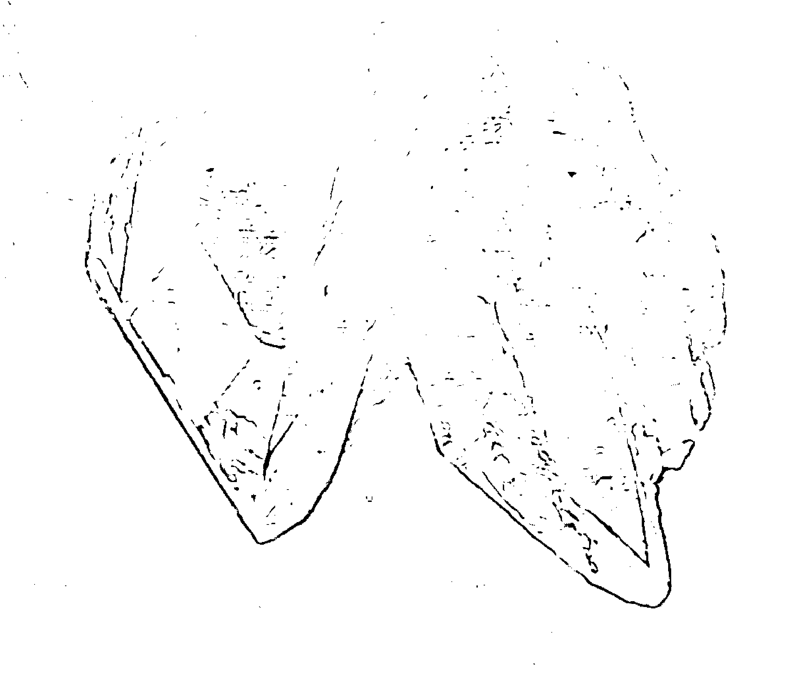
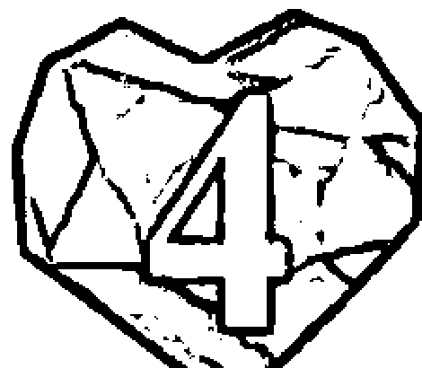
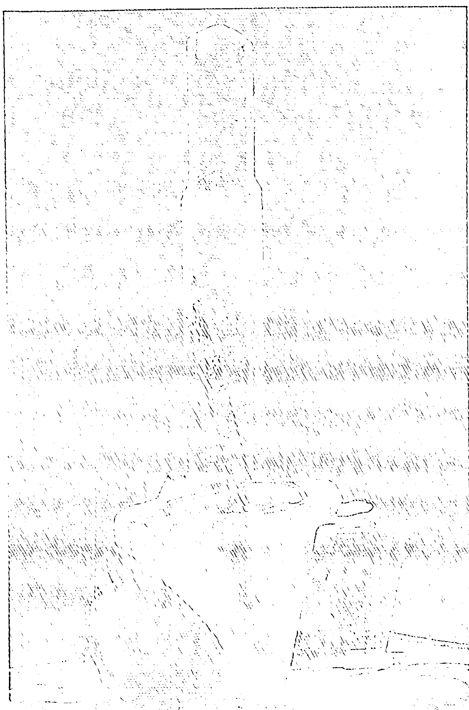
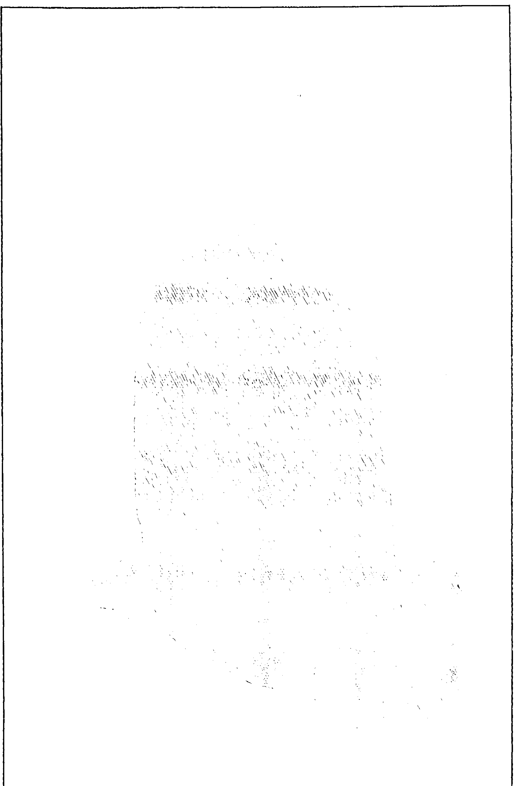
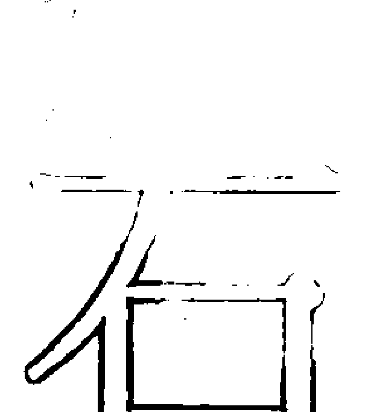
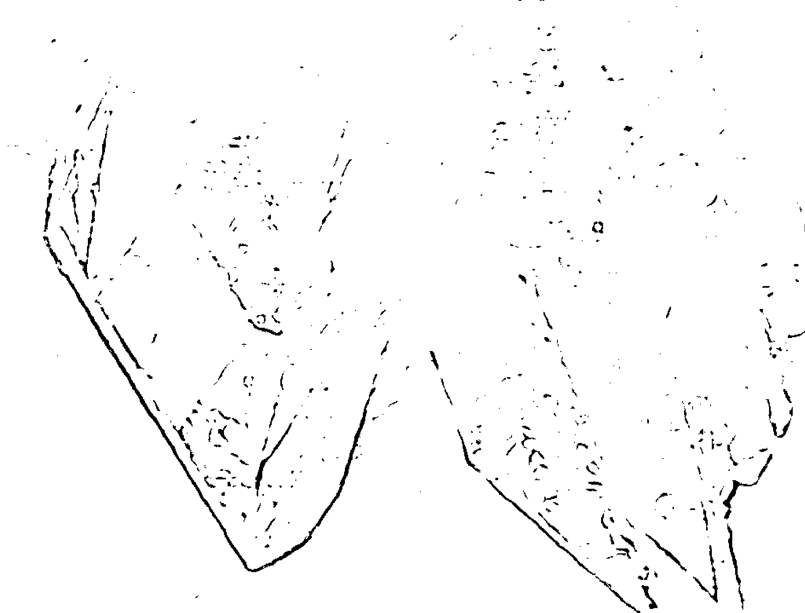
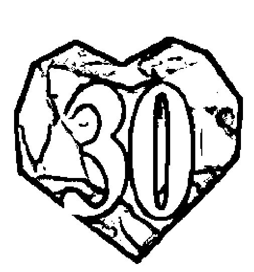

# 水晶光能传导

## 前言——展現內在光能的療癒力量

改變的風潮正橫掃過我們的時代。所有人都正面臨著對自身靈性膽識的挑戰，而若對自己不夠了解，這甚至有可能危及我們的存在。我們至今所知的所有結構，都正因應這世紀的結束之際所帶來的考驗而有所改變。一切彷彿不再穩定不變了——親密關係、婚姻、育兒、宗教、政治、經濟、商業以及其他信仰系統，也就是我們社會制度中的一部分，都受到了較高頻率以及覺知與存有之新標準的試煉。如果現存結構所承繼的靈性，其既有的整合性尚稱足夠，則還能留存；如果不夠，則該結構勢必要改變，才能與原生自黃金時代之真理的試金石趨於一致。如果改變勢不可得，那麼過時的形式就會崩壞，而鳳凰則會在其廢墟中重生。

活在這個時代，儘管充滿挑戰性，卻也提供我們唯有當下這個環境才能給與的成長機會。如果我們的地球想要繼續生存下去，就要了解一件事：整個星球已採用了數千年的許多概念，已經不見容於當下了。我們與自己及他人之間相互連結的方式必須要有所轉化，才能為我們所渴求的內在及外在平靜找出一條路來。作為一個種族，我們正被迫進一步深入自己的力量；這不僅僅是為了力量本身，而是為了要有力地表達出每個人的存有之中所具備的平靜與愛，並分享出來。有些現實必須要去面對，而且不能再避而不談；其中最明顯的，就是我們的星球正在步向滅亡，如果我們想要成功地跨越水瓶座黃金時代的門檻，就需要同舟共濟、一起努力。

我們每個人都有潛力進行的水晶光能傳導，就快要圓滿實現了；也就是認同我們存有之中那不變的、不滅的上帝臨在，並將神聖本質整合到我們物理現實的每一個面向之中。在此之後，也唯有在此之後，我們才有能力榮耀存在於所有其他存有中的相同臨在，不論這些存有是否可見、有沒有轉世投胎為肉身，更無關乎看似對立的種族、性別、信仰教義、膚色或任何差異。在此刻，水晶光能傳導的願景與目標，便是讓光體適應我們的肉身，並整合進肉身之中；當我們在日常生活中的每分每秒，都能持續地將靈性本質表現出來時，這樣的願景便能成真。接下來，我們認定是奇蹟的事情，便會成為我們學著實現的法則。

本書作為水晶三部曲的完成之作，它提供了可被種在我們心底、各種可能性的種子，以引領我們進入全新的開始。發想、孕育與生下此一訊息的整個過程，讓我自己的存有也獲得了轉化；比起第一部《水晶光能啟蒙》及第二部《水晶高頻治療》，這本書帶給我更多快樂，也帶來更大的挑戰。為了轉達此一訊息，我的覺知程度更為提升，我需要有第一手的直接經驗，才能將此一傳導的本質透過書寫表達出來，而不只是傳遞訊息本身而已。如果你曾納悶為什麼我花了這麼久的時間才完成這本書，請了解：接納可能性及透過個人過程經驗各種實相不僅需要時間，更需要研究與實驗。

在我完成了第三部《水晶光能傳導》並獻給你之後，我現在也更意識到水晶在我們的演化歷程中所扮演的角色。它們是靈性與物質結合的不可思議象徵，也是我們想要成為的榜樣。它們是純粹的水晶光能能量及彩色光輝，能提供我們的生活更多希望、療癒、美與光，並藉由這些方式來影響我們的存有。在我們邁向身心健全的道路上，水晶與礦石一直都是絕佳的老師及療癒媒介。在我們最需要它們的時候，它們盡全力抵達了現場；這一切，再加上現在，正是認識它們在我們生命中的位置的時候，並敞開我們的胸懷，去接納它們所象徵的一切以及對我們的意義，這些都在在佐證了我們的潛能。我們賦予任何外在物體（或人）的力量，若是大於賦予內在本源中之神聖本質的力量，都不再合時宜了。只有全然地認同於力量的內在本源，我們才能冀望個人和平的安全性到來，好為整個星球的轉化打下基礎。

為了因應下一個十年帶來的所有驚人挑戰，我們必須與大宇宙整體緊密連結。在我們將自身的認同，穩固地建立在餵養著地球兩極的上帝臨在之後，我們將能面對、適應並再造這個世界，我們每一個人都在其中扮演著重要角色。

接下來的頁面所呈現的技巧與資訊，將能對此一過程有所幫助。在我所撰寫的每一本著作中，所有資訊都會隨著我持續學習與經驗累積而有所修正。我虛心地將自己撰寫的每一本著作交到神聖意志的手中，交給那些準備好接收並應用它的人，以及那些在某些程度上可受到幫助的人。藉此機會，我也想感謝所有願意透過水晶三部曲開放接納我靈魂本質的人，更要感謝你們帶給我生命更多目的與意義，這些都是遠遠超越我所能想像的。請了解：我愛你們，而且我知道，只要齊心協力，我們可以一起在這星球上實現偉大的療癒。

彩虹水晶

## 1 水晶光能傳導

人類的進化正處於何去何從的緊要關頭，而我們擁有再清楚不過的選擇。一方面來說，很明顯地，地球的生態系統已嚴重崩壞，我們的自然資源也受到了污染或幾乎消耗殆盡。而在國際間戰禍持續綿延及核能滅絕的威脅下，我們這個物種還沒有學會和平共存之道；單單這兩個因素，便能看出全球性大屠殺的潛在危機。然而另一方面，我們仍有機會讓靈性之光整合進生活的每一個微小的面向之中。這不僅能真正地改變在這個星球上生活的原始狀態，更能將地球的榮光回歸於她。在我看來，人類若想避免未來可預見的全球性毀滅，這是唯一途徑。本書便是致力於此一希望，以及人類與自身和其他生物處於覺醒與和諧共存的願景。

「水晶光能傳導」一詞與「精神與物質的結合」及「在大地上活出天堂」同義。這個存有的狀態（state of being）是人類成長過程的最終成果，而我們每一個人都有機會親身體驗。歷史記載了許多偉人，如阿肯那頓、耶穌基督、釋迦牟尼、穆罕默德及甘地，都是依照著神聖意志（divine will）生活，並成為我們的榜樣。但如今因時間關係，需要更多人藉由與他們靈魂的本質站在同一陣線，並將此真理努力落實在生命的一切面向，以接收他們的神聖傳承（divine inheritance）。唯有如此，靈性力量才能被傳導進入地球本體的存有（the essence of the earth's substance）中，進而影響所有生物，讓整個星球的轉化成真。

在這個章節（以及「主力能量石」的部分）所呈現的資訊，都是集結此生及過去許多世的經驗而來，說明了我們該如何啟動光體（light bodies）並整合進肉體之中，將兩個世界的實體（realities）結合，在地球上創造一個全新的存有方式及秩序。運用水晶的終極目標，就是成為水晶光能實體（crystalline reality），也就是擁有形體的光，存在於物質中的靈性。使用水晶與能量石確實能有效促進此一進程。某方面來說，它們不只是這個物質世界的象徵，更是幫助我們達成目標的工具與老師。然而，在這裡必須清楚說明一件非常重要的事：水晶並不是目標本身；它們並不能直接授權，讓我們直接連結靈魂的本源。重點在於，我們真正需要的是了解在存有的最原始本質的層次上，自己到底是誰，並渴求在生活中顯化這神聖的存在（divine presence）。

向所有人類揭露這古老秘密的時刻來臨了。宇宙之鐘已經走到了約定的時刻，過去唯有全職的高階祭司、女祭司及少數受信賴的新成員才能觸及的秘密，如今只要是能從中獲益的人，都能接觸到。一個時間的大循環已接近尾聲，隨之而來的是，每個現在轉生在此星球上的人，都能擁有的絕佳機會與可能性。在人類歷史上，從未有過這麼多可能性——不論是要圓滿完成或毀滅這個星球。揭露這曾被封藏的真相是一段神聖的旅程，每個人都有機會參與。這牽涉到有意識的選擇、確定的方向，以及堅定的行動，從各種可能中清楚定義並創造全新的真實。

在這個時刻，每一個人都要真誠檢視自己心中的內在聖殿，區辨何者為真——即使肉身毀壞為塵土、自我人格結構消失在虛無中，仍然真實不變。我們的太陽系正在完成一個偉大的銀河系循環，地球及其所有相關者都牽連其中。隨著這個大革命進入尾聲，接踵而至的是這個世界所能見到的最重要機會：一股龐大而強烈的靈性力量之流將射入地球，進入我們存有的每一分鐘。在這個時刻，我們必須願意迎接這股洪流，並準備好通道，讓這「永恆的真理」能在我們心中及地球上找到居所。當我們確立了對「萬物的不死本質」（undying essence of all things）的認同，通往靈性能量的通道就會開啟，時時刻刻顯化在人類的意識中，及這星球的實體之上。

水晶光能傳導是一個過程，透過它，個體可以將自己的靈性光體（spiritual light body）建立在肉體之上並加以整合；如此一來，就能讓神聖存在有意識地整合在日常生活的每個面向中。隨著愈來愈多人將光能具體化，他們也會不斷將此一頻率傳向世界，協助並影響他人經歷同樣的過程。對我們來說，水晶是非常有力的媒介，能協助我們準備好迎向全然的精神化（spiritualization）。透過這個形體，我們可以親眼見證此一實體的顯化。在水晶中，每個分子、原子及組成元素，都在創造它的神聖力量中和諧地振動著。它們是精神與物質結合的真實展現。如果正確使用且心懷正念，水晶及能量石可以大幅協助我們取得自己內在的水晶光能本質，並將這靈性之光傳導至人類本性的各面向之中。只要我們願意向內探尋並致力於斯，就能讓水晶內在固有的調諧及校準能力為我們所用。在這過程中最重要的關鍵之一，便是來自我們「有意識地認同」（consciously identify）的力量與能力。

> 注釋①：阿肯那頓（Akhenaton）原名阿蒙霍特普四世，後改名阿肯那頓（意思為「阿頓的僕人」），為古埃及第十八王朝法老。他在位共十七年，期間推動了相當激進的宗教改革，獨尊太陽神阿頓（Aten）。阿頓字面之意為「太陽的光輪」，據說是宇宙的創造者，與其他古埃及眾神不同的是，祂沒有人類的形象。部分學者認為這是一神教思想的先驅。

> 注釋②：本書寫作時間為二十世紀80年代末期，此處所指應為二〇一二年12月21日之馬雅曆循環結束一事。

### 認同的力量

身處於這個時代，當務之急便是認同自己生而為人的核心本質，也就是永恆真實且無條件的愛。這是唾手可得的絕佳機會。我們有多少次不這麼認同自己？有多少次，我們受困於自己的痛苦、情感、想法、角色、性別、身體及有限的自我知覺，並認同於它？如此一來，我們大部分時間與精力都被用在體驗道路與途徑，包括塵世的、感情的、心靈的以及「我」的個人知覺。而這些全都注定了終將消逝。我們已然太過耽溺於這一「專屬個人」的狀態，使得我們大部分時間都在這終究錯誤的認同中畫地自限。僅與「我」的個人知覺相聯繫，統御著這世界瞬息萬變的俗世法則，便會劇烈地影響我們。與其如此，何不敞開我們的心胸，遵照統御這些俗世法則的靈性法則而活？

我們正進入成長歷程的新時代中，在這個時刻，我們將有機會親身體驗：我們所呼求敬拜高高在上的上帝，其實就存在於自己心中。但是，我們是否時常深入探查內心，找到那能與造物力量本身真正合而為一的地方？我們是否時常親近自身存有的超然本質（impersonal nature）？這是生命每個脈動的靈感來源，不僅只在這個星球上，更遍及所有顯化及未顯化的造物界中。我們是否時常讓心靈沉靜，而得以與推動著太陽系太陽（solar sun）運作的大太陽系中心（Great Central Sun）相應，並從中獲得滋養？我們的心是否能從內在獲得滿足，並相信廣闊的銀河系只是浩瀚宇宙的一部分，而無邊無際的宇宙塑造了所有造物？現在，不僅有可能隨時與這本源連結，更可以衷心地認同它，從中汲取智慧為我們的心智所用，讓我們的心靈獲得無條件的慈悲。是的，這樣的可能性是存在的，但若要使之成真，仍須採取一些相當實際的步驟。

唯有時時回想自己的神性，才能獲取這一股創造我們的力量；唯有認同我們的根源，才能足以堅強而能為地球帶來用愛來滋養、和平能獲勝的環境。唯有這神聖的連結能讓我們集中注意力在即將誕生的事情上，不致因那些注定消逝的事物而被恐懼所吞噬。當我們的心智與心靈堅定地聚焦在生活的真正精華時，我們將會理解，那些強迫我們「放手」的改變，其實正是破曉前的陣痛；在我們靈魂的地平線上，全新的開始即將降臨。當我們拋棄了不再與靈性和諧共振的每一件事物後，因誤用而衰落的通道將再次開啟。一旦這些新路徑重新建立起來，靈性的質地（quality）將會注入我們的血管之中，並滋養每一個細胞；而對神聖意志的記憶及清楚的神聖身分認同，也會隨之而來。

有意識的認同是將靈性力量在地球上具體化的關鍵。每當你說「我是……」的時候，要知道，你的認同與你所說的（甚至是所想的）息息相關。舉例來說，當我說「我好挫折」的時候，我便是將我的存有與挫折同化，變成了那個情緒狀態；於是我將我的認同局限在狹隘且不舒服的狀況，並且維持這個狀態，直到某件（通常不在我個人控制之內的）事發生，或是我選擇重新定義自己為止。

從物種的觀點來看，我們有太多潛意識的預設身分認同，須經過一番努力才能將我們自己從當中抽離，並有意識地重新定義我們自己。當我們這樣做的時候，就能自行選擇要認同的事物，以及我們的存有之所繫。我們確實可以在社會上與這個世界中成為偉大的，只要這真的是我們的選擇，我們確實可以變得既成功又富有；只要這是我們選擇的方向，我們真的可以用自己選擇的任何方式重新定義並再造自己。但是，在我們每個人之中，那個需要被了解的純然本質，能將和平、愛及真理帶入我們的存有之中的「純粹」（absolute）究竟是什麼？一旦我們認同於內在的上帝臨在（God Presence），就能重新調整與心智、情緒及物理現實有關的一切事物，向這新的規則看齊。現在正是重新評估、重做決定，並將我們的生命動能重新聚焦在這注定為優先順序的時刻。希望這能催生嶄新的全觀式自我感受（all encompassing sense of self），並讓大地孕育出足以與她的長久努力相稱的超凡奇蹟。

我們已經在無意間讓自己依附在多種潛意識的程式設定上，必須要誠實面對及處理。其中一個力量最強大的，就是攻擊—防禦—保護（attack-defend-protect）模式。這個程式設定是大地上所有戰事的禍源，且已存在於人類基因中數千年了；它是如此強大，不僅能自動執行，更因為在我們個人生活與人際關係中不斷受到強化，現在已經擴展到全世界的所有族群。這是因為我們並沒有完全認同自己的真我，因此我們遇事往往對號入座，彷彿自己受到攻擊；但即使其他人真的在言語上冒犯或攻擊我們，我們還是可以選擇是否要接受。然而，如果我們的認同沒有校準在真我的本質上，就有可能不由自主地以攻擊模式做出反應。因此，為了試著保護脆弱的自我（ego），我們若不是心懷恐懼地退到不安全感中，便是以憤怒及暴力反擊。

水晶光能傳導之路是自我控制的方法之一。我們必須有意識地重新認同自己，並使我們的愛傳布到其他地方——尤其是帶著恐懼與害怕的潛意識認同之中。我們太容易試圖證明自己才是對的，而非創造和平；對充耳不聞的人們據理力爭，而非向內在探求更大的理解；或是一頭跳進戰爭與衝突，而非致力於和諧。現在，我們必須改變這久遠以來便按照恐懼的法則及規矩操作的基因程式。這樣一來，我們所知的生命基礎將需要被重組，並且以一種相諧於賦予萬物生命之超然本質的方式再造。這存有的新方式並非奠基於對真實的有限定義，如同我們一直以來所被教導的一般，而是奠基於能與人性和諧並進的靈性法則。

這攻擊—防禦—保護的基因程式一定要從我們的內在破除。如果我們不能在內心維持平靜，又怎麼能夠在與自己最親近的人際關係——親子、夫妻、朋友、鄰居、同鄉——中創造平靜？如果我們想要讓整個物種延續下去，就必須在此時刻改變這個模式，並有意識地以在神聖中更深層的內在安全感來重新設定它。當下最重要的，便是鞏固我們的能量（不論是個體或群體），並專注在與無限靈性（infinite spirit）相繫的存有層面上。現在正是有意識地認同這神聖內在本源的時刻，並要從這真實存在於我們水晶光能本質中的獨有之處，將真正的安全感與療癒能量抽取出來，每分每秒持續不斷。

當一個人能清楚而有意識地認同自己內在所有的「萬有本然之自性」，並奮力地活出這真實，便會種下必將開花結果的全新種子，滿足並滋養人類自我的所有層面。當你確信「我就是那自性」時，巨大的轉變便會啟動；這不僅僅發生在於你個人存有的內在殿堂，更會向外擴及至所有的人際關係及俗務之中。

### 向神聖超然（Divine Impersonal）臣服

連結我們的神聖自性（divine nature）並認同它，從任何面向來說，都不意謂著我們將會失去對日常生活固有的關心；那些對我們來說很重要的所有人事物，並不會因此不再處理。我們不會對這物質世界變得冷漠，因為這裡是心靈最具挑戰性的訓練場，而身在其中的我們顯然只是學徒。然而，這卻可能意謂著，我們會選擇讓至高自性滲入物質界的現實之中，讓我們得以接上不可思議及奇蹟。身為進化中的人類光之存有（human-light beings），這對現在的我們至關重要——打破有限的人類水平上僅僅身而為人的一面，讓神聖超然浸潤到我們的存有中，並協助我們管理好所有人之需求。這個精微要素（神聖超然）正是驅動著我們的力量來源——它讓我們的心臟跳動，讓身體發揮不可思議的功能，並給予心靈創造意識思考的動力。宏觀來看，這股能量同時引發地球自轉及公轉，更指揮著整個銀河系已臻完美的運作。如果這潛藏的存有充盈在萬有之中，賜予動能及生命，我們怎能不信任它的指揮，並將看似重要的俗務重定順序？

此一神能（God-force）存在於萬有之中，而身為人類光之存有，我們得以接受它作為我們的真實身分——在我們此生（或任何人世）之前即是，即使在地球及太陽毀滅之後也依然如是。但如何才能將這終極神性帶入人類個體之中？有哪些方法能讓我們將靈性引入我們的存有、我們的神經系統，甚至每一個細胞之中？當然，唯有透過這樣的神聖介入，我們那一代傳過一代，植基於匱乏、不安全感、痛苦及戰爭的基因密碼，才能被轉化並重新設定。

以水晶為榜樣、以水晶為師，我們便能知道：以有形之體來顯化光是可能的；讓每個分子都以完美的順序對齊排列是可能的；讓每個原子都以同樣的頻率振動是可能的。而對我們來說，讓自己的真實內在與身體結合也是可能的，而讓腦海中每個念頭、心中每個感覺，都與這共同本源（common source）結合，更是不無可能。你所需耍的，只有真誠的努力、決心，還有最重要的——開放的心胸。

用我們的心智去設想俗世事務中的神聖存有會是什麼樣子，是不切實際的。我們的心靈並不是這樣設定的。這樣的結合所產生的結果看起來像什麼、感覺像什麼，或在被納入個人經驗領域之前會變成什麼樣，都是我們難以想像的。再奔放的想像都不足以理解這樣的真實。在這個時刻，我們至多只能敞開自己的心智、心靈與身體，讓這樣的存在具體化。在這個階段，我們所能盡力去做的，便是為自己的心智、心靈與身體創造一個開始，讓這樣的存在能夠獲得實現。這開放的狀態能在我們的存有中創造一個清明、自由的空間，讓純淨的原質力（essential force）得以湧入。這有意識的邀請必將獲得回音。這開放空間與先前的身分認同毫無關係，且擁有無窮潛力及可能性。

當內在進入安靜祥和的神聖狀態，這樣的存在會「成為」你的一部分。為了讓你的邀請收到回覆，你需要一段安靜的冥想時間。你必須訓練自己靜下心來，並對心靈本身的概念敞開心胸。但這回應必會到來。當這嶄新身分認同的基礎形成後，生命將會依據神聖存在中滿盈的平和而改變。別試著界定顯化的方式與途徑——只要敞開心胸，允許「它」加諸於舊有模式及痛苦之上，其餘的將會自然而然地隨之而來，結出神聖的果實。這是水晶光能傳導的第一階段，就像光體與肉身結婚前的訂婚階段一樣。

### 實際步驟與先決條件

將光體落實到肉身中的藝術、科學與科技，牽涉到幾個先決條件及實際步驟。首先，如前文所述，藉由謙卑地臣服於神聖超然之前，將會產生意識的開端；接下來，通常還需要一定程度的淨化、釐清，並放下對生命本質及所處世界的既定看法。心智必須有意識地運作並重新設定。以集中精神的冥想作為基礎，神聖的「我是」（I am）自性將得以獲得證實、確認及肯定，光體也能在此基礎上進入心智領域之中。

我們脆弱的人類心靈也需要療癒及恢復青春。為此，第二部《水晶高頻治療》寫下了可行的方法與途徑，讓我們得以從情緒上恢復並重新定義自我。當我們的心靈了解了潛藏在人類痛苦之下的意圖時，新的信仰與希望將會活化我們愛的力量，甚至比我們現在所能想像得到的還要更深刻、更完整。

我們也必須努力鍛鍊肉身，才能因應光體進入物質中時大量湧入的靈性能量。天運動鍛鍊肌肉與器官、深度呼吸運動以增加含氧量、增加水分的攝取、適當的營養及愉快的休閒活動，在這物質層次上都是必要的。

需要了解的是，在初始階段，淨化、放下、療癒及鍛鍊，對整個過程而言都非常重要；在進入實際操作及光啟排列（initiation layouts）之前，需要投入大量的時間與精力來準備，才能真正將光體引領入肉身之中。個人可能需要數星期、數月到數年不等的時間來準備，接著才能進行太陽冥想、使用主力能量石排列，或啟動非物質脈輪（non-physical chakras）。**如果沒有妥善準備，所造成的傷害將比獲益更大。** 慢慢來，等接收清楚的指引後，再正式進行後續步驟。一旦萬事俱備了，水晶光能傳導的資格就是你的了！

當準備工作都完成，光體開始降臨時，會出現幾個相當明顯的改變。首先，對這世界的虛幻運作及方式，將自然地產生一定程度的超脫感。你並非不再關心，而是你開始以更宏觀的觀點看待生命，也對萬難終將圓滿克服更具信心。光明與喜悅俱增、真誠而不干涉的關心、有更強的幽默感、同理心的明顯提升等，都是水晶光能傳導的朕兆。你將擁有足以對抗任何恐懼的內在安全感，有能力發掘生命中各式各樣的美好，並懂得珍惜它們。最重要的是，你將對創造你的存在的宇宙力量由衷產生無比的信任，這份信任將成為你的力量，並讓你看見自己的生命藍圖。注意觀察這些出現在你身上的變化。第一個朕兆將會是更強大的內在寧靜，以及對於這被稱為「人生」的經驗，真心地懷抱感謝。

## 2 十二脈輪系統

最近數千年以來，我們人類這個物種中的絕大部分成員，多半將全副精力用在體驗這物質世界中的塵世俗務。在這段期間，我們已經使用了八個主要脈輪中心。但如今我們的銀河系完成了圍繞大太陽系中心的進化，新的黃金時代開始了。對人類光之存有來說，大好機會唾手可得；汲取來自於大太陽系中心祝福我們星球的宇宙光中藏有的豐盛，將不再是夢想。如果運用得當，這些太陽光可以穿透遮蓋我們心智的黑暗，讓恐懼不再盤踞我們的意識。為了達成這個目標，並與萬物自性合而為一，必須啟動存在於頂輪之上的三個超個人脈輪（transpersonal chakra）。若要讓這股能量真實成為我們在這物質星球上的一部分，就必須啟動約在我們腳掌下六英吋處的脈輪——地球之星（Earth Star Chakra）。如此一來，我們尚有四個能量中心要認識、運用並重新喚醒。

### 先進顱骨結構

我在埃及與秘魯親身經驗、研究亞特蘭提斯（Atlantis）與列木里亞（Lemuria）古文明遺跡時，事實愈來愈明顯：當高等存有（advanced beings）剛開始定居在這個星球時，其身體結構與現在我們可從人類身上所見者頗有不同（相關資訊請見《水晶高頻治療》第152至159頁，地球守護者部分）。當我族中這些進化的長者（evolved Elders）投身為人時，他們也帶來了這些能力，以便與母銀河系核心中散發出來的光能力量保持聯繫。當時，靈性法則顯化在地球上，而這些存有在地上與天堂都和諧地生活著。他們發展出的頭形能讓另外兩個能量中心都包覆在他們的大腦結構中，因此能將較高等意識的化身融入肉體之中。時至今日，這樣的先進顱骨仍可見於開羅博物館、秘魯及馬雅遺跡中。近年來，心地善良的外星存有們也被聰明有創意的人描繪成擁有拉長頭形的樣貌，例如電影《E.T.外星人》與《第三類接觸》中均可見。透過大眾媒體向大家介紹這些擁有成熟大腦結構的先進存有，便是神聖智慧重新激起我們的覺醒，並將我們意識的面紗掀起的另一種方法。

我想盡可能地將一個與我們遠古祖先命運有關的常見問題說清楚。隨著時間過去，我們的長老們逐漸與地球上演化出來的原生物種雜交、繁殖，這樣的基因混合淡化了他們與神聖自性維持連結的能力，也改變了他們的頭部結構及其所具有的意識。這些存有是在這次大週期（great time cycle）的開端降生為人，也就是大太陽系中心放射出的宇宙光達到頂點之際。在這數千年之間，學習過程始終與大量靈性力量進入緩慢前進的時間與空間中有關。這逐漸肉體化的過程不僅使得記憶的障蔽更加厚重，歲久年深的遺忘也隨之而來。如今，隨著週期結束，地球將能再次從銀河中心接收到宇宙光的豐盛。儘管我們的頭部結構不大可能真的出現改變，但在這個時刻，什麼事都有可能发生。更重要的是，要重新活化這些較高等的脈輪中心，以及再次喚醒這些脈輪中心所放射出來的意識狀態，現在也都成為可能了。

在古老的日子裡，十二脈輪都處於活躍的狀態，整個意識的彩虹光芒也是充分顯化的。在那個時候，先進長老們與創造的力量同歸於一，更運用這股他們可以汲取的宇宙能量，能在這星球上繁衍出令人驚嘆的生命形式。而當退化週期自然而然地發生時，意識便集中在個體的自我意識上，而上層三脈輪也陷入了休眠狀態。神聖自性再也不被認同為「自我」。無限的存在（infinite presence）被遺忘了，人則與和他們自己分離的神及女神連結。真正的靈性彷彿變成了模糊的回音，只存在於個人經驗或表達之外。

這個自我模式（或個人認同）創造了重生、痛苦及寂寞疏離的循環，成為生活在地球上的現況。面對真實時，若人們僅有單調乏味的鏡像反射，而沒有完整的知識與使用權限，自然便會產生恐懼。如果生命的能量被個人意圖與名聲全然佔據，神聖自性就只能被蒙蔽，變成人們生活反映出的灰暗陰影。僅僅連結於他／她個人有限的權力觀念，而非神聖的全能統御力量，便注定要面對個人死亡及滅絕的終極恐懼。然而事實上，除了超然存有之外，一切事物都將消逝在時間與空間之手中。

不過，這個與蒙蔽所致的遺忘有關的週期其實是一個必要過程，為了能演化出新品種的存有，他們將能真正了解權力的正確使用方法，及其合一性（Oneness）的榮光。這並不是要我們輕視或自責在這星球上所經歷的一切；現在更應該歡呼收穫、重新引燃力量，將我們的靈魂再次結合，讓我們的光體活化起來。現在正是歡慶的時刻，也是實現與完成各種可能性的時刻，更是與引導我們安全穿越黑暗時刻的力量，重新對齊、校準的時刻。

在這即將來臨的日子裡，大銀河太陽的光芒將會帶著更強大的宇宙能量，再次灑落在地球的所有生物之上。藉著這個從天而來的助力，我們將有機會再次統合上層脈輪的光能，並將之整合到這地球週期帶給我們所有經驗所擴展的意識狀態中。是的，我們的意識已經與數千年前不同了，那是這些脈輪最後一次運作的時候。現在，我們有了許多可以貢獻之處，針對如何在人類的形體中活出靈性，我們更有許多知識可以補充。我們的靈魂是為了非常特別的理由而進入物質世界，如果有夠多人能鼓起勇氣，重新適應這來自天上的影響力，並欣然迎向這些最終將揭露真相的改變，我們就能理解這些理由，並將之完成。

### 超個人三脈輪

這三個位於上層的超個人脈輪，分別稱為靈魂之星（The Soul Star）、業力輪（The Causal Chakra）及星際之門（The Stella Gateway）（詳見第28頁插圖）。這些脈輪都有特定用途，好讓神聖超然自性能實體化，並為人體內現有的八個脈輪所吸收。在進一步說明這三個脈輪之前，先複習一下這些我們最熟悉的能量中心。在水晶光能療癒中，吠陀系統的臍輪（navel chakra）與太陽神經叢脈輪（solar plexus chakra）被整合為一個脈輪，這些脈輪也各有其能量及用途。我們假設這八個脈輪是在開啟的、平衡的、和諧於其他脈輪的、完全發揮功能的狀況下來進行說明。

頂輪（crown chakra）位於頭部中央上方，是意識封存在我們大腦結構中的最高位置。它有雙重功能：首先，它是個人意識可「投射出」與超個人三脈輪相連結的通道；再者，在頂輪中，超然神聖能量得以被認定為個體性與個人藍圖的一部分。透過頂輪，「合一性」的狀態才能被同化並引導進入肉體內其他脈輪之中。這個脈輪擁有雙螺旋渦輪的功能，可將能量以螺旋狀送出，並與更崇高的整體性（greater wholeness）連結，同時將這能量引導進入肉身之中。

眉心輪（third eye chakra）位於雙眉之間，又被稱為「靈魂的眼睛」；透過這裡，能夠在所有俗世事物中見證神聖的完美。這個脈輪可以將心靈錨定於內在覺知（inner knowing）、直覺與智慧之中。我們可以有意識地在眉心輪與頂輪之間以乙太體橋接，一旦這樣的橋樑建立起來，即使在日常生活中，眉心輪依然能隨時見證到個人的神聖藍圖，及其與無限靈性的連結。

喉輪（throat chakra）位於頭部與心臟之間的鎖骨相接處，這個能量中心可用於清楚的語言表達及思考感受；文字、聲音及語言的力量，都是透過這個脈輪的具體化而得以顯化。

心輪（heart chakra）位於胸部中央，與無條件之愛的力量有關。在這裡，神聖超然最能極致地表現祂的同理心。

太陽神經叢（solar plexus）位於胸骨末端肋骨分岔處、腹腔的頂端。在理想的情況下，太陽神經叢應與它的上一階——心輪和諧地運作，如此一來，便能感受到對地球萬物的愛。

臍輪（navel chakra）位於肚臍的位置，在這個能量中心裡，神聖自性能透過物質性的顯化而表達出來；在這裡，個人對力量的感知能吸收宇宙頻率，並將這些能量運用在有形的創造與達成目標上。

性輪（sexual chakra）或第二脈輪（second chakra）位於恥骨與肚臍中間，製造生命的創造性能量於此發生，不僅可用於有形生命的創造，也可用於其他集中或聯繫的出口。刺激這個能量中心，可以讓肉體顯著地回春、重生或活化。

海底輪（base chakra）位於肛門及性器官的中間，擁有位於恥骨及會陰中間的連接點。透過這個基點，神聖自性能在人體內找到永久的居所，疊加在頂輪的意識以及心輪無條件的愛之上，凌駕於戰或逃的動物生存本能。

在雙手掌心、雙肩、雙眉、雙膝及雙腳腳底，也有次級脈輪（secondary chakras）存在，我們可以透過有意識地運用它們來集中靈性能量。但是，必須先啟動超個人三脈輪與地球之星，這些能源中心才能發揮最大效用；然後，有意識的存有才能完全地浮現、顯化四周所有完美，包括神聖超然及私密本我（intimately personal）。

在往下說明有關超個人三脈輪的訊息之前，我必須先強調，儘管我已經深入研究這些能量中心多年，我仍然不覺得自己所知已足稱完整。我很高興能分享自己至今所學，但也必須在此聲明，我對這些上層脈輪的全然覺知，僅僅來自於個人經驗，這是我們都正在經歷的過程。當我們每一個人都能有意識地啟動這些脈輪時，完整的知識就會顯現，每分每秒、持續不斷地傳送到我們的生活中。此外，由於每個人的頭顱結構的大小、形狀與比例都不太一樣，這些脈輪的實際位置也會有一些不同。在釐清了上述幾點之後，我很樂意繼續與大家分享，至今對三個超個人能量中心的經驗研究所得到。

### 星際之門

星際之門位於頭頂上方約十二英吋（三十公分）處，據我所知，這是目前能整合進人類系統中的最高脈輪。這個脈輪需要兩個基本要素才能被啟動：其一是從大太陽系中心放射出來、能賦予生命的宇宙光，我們的星球及我們的存有都正沐浴在這光線之下；而另一個能重新點燃星際之門的要素，則是人類意志聚焦在意識意圖（conscious intention）所產生的力量。這兩個要素都齊備後，人類光之存有才能夠維持與神聖超然的直接連結，並得以藉此讓自我的每個層面都獲得靈性上的滋養。

當這個脈輪仍處於休眠狀態時，是無法讓一個人將自己的存有完全認同於所謂的「上帝」的。但是，在星際之門開啟之後，個人就能感受到統合一致的合一性。這是所有宗教經驗的極致；在其中，個人能親密地認同存在於萬物中無可否認的真實臨在，即使無法觸及、無形無體，也無以名狀。這不僅是一種知覺的狀態，更是一種合一（at-one-ment）的經驗，讓人能無小我地大膽肯定：「我是自有永有的」（I am THAT, I am）。

溝通是解開這宇宙星際空間的秘密、啟動此一脈輪的關鍵。溝通是一種能量的雙向轉移，雙邊都能傳遞與接收。這靈性的交換是個人靈魂與無盡靈性的交流，也是星際之門得以整合進入人類系統的方法。靈魂必須認可且願意接收合一性的經驗。心智與心靈必須能連結著人格及自我結構的低等認同分離。在它成為有形真實的時候，個人必須優先為此準備好一段安靜的時間。當接收通道暢通時，宇宙將會有所回應——藉由提升有限個人領域內的意識，以及進入創造性力量與萬物和諧共存的星際空間等方式。

一旦獲得此一經驗後，星際臨在（stellar presence）便能重新置入較低脈輪中心之中（如果它們都和諧校準且平衡的話）。透過每天冥想，星際之門能將宇宙光傳輸進意識之中，讓神經纖維傳導速度加快，並且確實提升肉體的原子振動頻率。而在堅定的努力之下，星際之門將維持開啟，而這與整個宇宙創造合一的狀態，也能落實在俗世的運行之中，例如：真實不虛的智慧、無盡的同理心，及穩定而永久地在人類俗務中擁有神聖的指引。

即使在老人類的先進顱骨結構中，星際之門脈輪也並非包藏於大腦中，而是存在於身體之外。它從來都不是能與個人認同連結的脈輪。星際之門維持著至高超然性，其中蘊含著運作無懈可擊而完美的宇宙。它傳達的意識狀態無法僅僅從屬於單一事物，因為它即是一切萬有的力量。透過啟動這個脈輪，人類光之存有便能體驗到終極意識。然而，為了在下一個階段將宇宙頻率整合到人類靈魂的領域之中，必須由星際之門啟動靈魂之星，並且與之校準。

### 靈魂之星

靈魂之星位於頭頂上方大約六英吋（十五公分）的位置，它是星際之門與八個人類脈輪之間的內部連結，也是超然自性與個人實體、靈性與肉體、天堂與人間的橋樑。靈魂之星存在於星際之門、業力輪與頂輪之間（詳見第28頁插圖）。

儘管如今它位於頭頂上方，但在遠古時代，這個脈輪中心處於成熟的大腦結構之中，是宇宙合一意識的居所。如今，在太陽系中心日漸增加的放射線照射下，也僅能稍微啟動靈魂之星；必須使用強大的水晶光能本體——透石膏，才能進一步刺激並喚醒它（關於透石膏的詳細資訊，將在第61頁主力能量石的部分說明）。

我們在三度空間中能感受到的最高、最強大的能量，就是光。光精微的頻率是超然宇宙射線得以進入物質世界的媒介。靈魂之星可翻譯星際之門所能取用的無盡能量，並將之逐漸滲入人類光之存有中。將宇宙中解離的自性集中起來，並內化至個人靈魂的領域中，便是這個脈輪的獨特能力與藍圖。將無邊無際的宇宙能量濃縮之後，靈魂之星便開始運作，從光之中織成一個靈性體（spiritual body）。由此，工具便創造出來了，透過它，人類個體得以統合這廣大無垠的全能唯一創造力量。

數字11是主要數字之一，象徵著更高音程的嶄新開始。與這強大的第11能量中心恢復校準，意謂著生命中嶄新的內在力量——與宇宙力量精密地交織著——將能被織進人性的靈魂自性中。除非這個脈輪被啟動了，否則對合一性的內在認知將無法顯化在俗世活動中。一旦復甦，靈魂之星便能維持通道開放，讓靈性啟發能經此流入個人的表達能力之中。水晶光能傳導的整個概念與數字11密切相關。目前它展現出的可能性是，我們都將要在更高的層次上，以嶄新的方式過生活。藉由從星際頻率間創造出光體，並將該力量輕柔地引入人類脈輪系統，我們將能倍頻活化（在更高的八度階上活化）有形的真實世界。當宇宙能量被有意識的生命形式（例如我們）傳輸之後，巨大的療癒將會發生，其他人的心也會被我們的存有中放射出來的神聖臨在給照亮。

由於擁有吸收光能的獨特能力，靈魂之星非常容易受到太陽光的影響。因此，進行太陽冥想（詳見第51頁）可進一步啟動這個生命能量中心。在吸收了太陽—星際光線之後，個人將能開始感受到自己與創造生命的無盡能量本源之間的連結。但是，若要讓神聖超然的愛與智慧被整合到大地各式各樣的生命之中，就必須啟動位於我們腳底下的地球之星脈輪（我們稍後將會討論到）。靈魂之星與地球之星是一體的兩面，均能讓彼此充分發揮力量。如果靈魂之星被啟動但地球之星沒有，光能將無法在物質的靈性化中完美實現。

對於那些內在已經感受到合一性，卻沒有勇氣將其顯化在自己人生的人，靈魂之星可作為一種逃避的路線。個人可以將意識傳送進靈魂之星的較低層次，而僅與光能連結。但這樣一來，將產生失去平衡與迷失方向等結果，最終將更難接受在這世界完整運作的挑戰。即使如此，只要在物質世界中還有功課需要學習，僅與星際空間結合就不大可能。大地的幻相將如同磁鐵一樣，你一旦抗拒就會被緊緊抓住；也就是說，靈魂之星這條逃逸路線，最後其實會讓人與大地產生更強的連結。

為什麼先進而敏感的靈魂寧願在光中遊蕩，也不願意選擇完全進入大地的痛苦狀態，這是是可以理解的。或許在某個時候，僅能認同於光是必要的；但如今，我們可以用嶄新的方式與大地連結了；我們可以擁抱這所有的一切了。靈魂的自性與無所不在的合一性親密連結，而這合一性在靈魂之星中變得個人化；當這個脈輪被活化以後，我們與一切萬有連結的感受，將創造與大地之間的新關係。當我們能夠得知一切萬有均享有同樣的靈性自性時，便能感受到對萬物的無條件的愛：好與「壞」，光明與黑暗，悲傷與痛苦，以及所有巨大或渺小的生物。在我們之內，這彼此互補的陰與陽之間的統一，將會反映在這個世界中，並將人與人間被分離感加深的鴻溝給拉近。如此一來，光就能被交織進入大地，全面性的轉變也會發生。

心靈的淨化是啟動靈魂之星的重要因素之一。在星際—太陽光能被傳導進來之前，必須先將心靈污染都清除乾淨。夢境所產生的較低層次星界（astral）旅程、抑鬱的心智狀態、對迷幻藥的沉迷以及不健康的想法，包括自我導向的幻想、投射或想像，都可能在頭頂上方留下一片陰影。若要清理這些靈魂心智的較低層次，可以想像在頂輪上方，有一個發著金光的白色能量球體，正在放射能量。除了專注於清理頭頂的靈魂污染，在腳底放置黑色電氣石，將能量落實於大地也很重要。將玷污靈魂之星的思考方式清理乾淨後，神聖自性就更容易進入氣場（auric field），並將靈性頻率與高道德標準一起帶進來。

當肉身死去時，靈魂會進入靈魂之星的光之中，並在此獲知自己的演化歷程。在經歷死亡經驗時，終極的開始是維持意識與本源的連結；換句話說，便是堅定地認同於那不死的自性。只有在過度認同於這物質世界時，這連結才會斷裂，對死亡的極度恐懼才會存在。這樣的恐懼深植在基因的層次，代代相傳已久；當能量從靈魂之星有意識地傳輸到這些細胞中的程序密碼時，才會有所轉變。而太陽冥想（詳見第51頁）則提供了絕佳練習，透過它，便能達成細胞轉化的目標。

當靈魂之星全面啟動之後，就會變成雙向螺旋，一方面把星際空間的能量帶進物質世界，另一方面則能將個人認同投射出去，與一切萬有之源維持穩定的連結（如前所述，頂輪具有同樣的能力）。與水晶光能傳導有關的這整個過程，並不只是喚起亢達里尼（kundalini），或將肉身的動物本能提升至較高的意識中心；它還包括透過星際之門，將無所不在的靈性力量往下導入靈魂之星中，以賦予個體性。一旦能量建立之後，就能轉進頂輪並滲入整個彩虹光脈輪系統（rainbow ray chakra system），最後到達目的地地球之星，將靈性力量落實到人性的根底深處。

靈性下降成為完美型態的下一步，則由業力輪來執行。該如何駕馭心靈的力量，將之運用在水晶光能傳導上？這純粹的本源能量又是如何為了實體化的目的而創造出心靈藍圖？繼續讀下去，關於第三個超個人脈輪的訊息將解答所有問題。

### 業力輪

在古老的日子裡，這個脈輪是存放在先進大腦結構之中的。時至今日，這個脈輪則位於頭部中後方，在頂輪後方大約三到四英吋處（請見第28頁插圖）。這個位置也是一個重要的針灸穴位，可在生死存亡之際進行刺激，以及／或是需要在大腦內創造平均的能量流之時。當業力輪被重新喚醒時，更多與針灸相關的恰當用法就會被發現。

心靈創造意識思考形式的力量十分偉大，僅有心輪所產生的愛能與之相提並論。如果心靈訓練有素，能接收精微的頻率，就能作為將靈性能量化為好主意的絕佳工具。另一方面，未經過訓練與控制的心靈將四處蔓延成災，成為發展較高意識的最大阻礙。業力輪是第三個超個人脈輪，透過這個能量中心，神聖超然能以精微的思考模式顯化。

這個能量中心能引導靈魂力量進入心智體內，作為未來肉體運作之用。但在這個脈輪被啟動並與星際之門及靈魂之星校準之前，必須要對心智建立起一定程度的統御力。數星期、數週或數年的冥想練習，及對心智較低層活動的自我統一（self mastery），都是全面啟動業力輪的前置作業，而要讓靈魂力量完全進入心靈領域，從設定好的信仰系統、線性概念及意識的改編設定中解放出來，都是必要的前導步驟。

在靈魂之星能將宇宙頻率傳導進入這個能量中心，以接收純粹的思想之前，心智必須進入開放而易感、穩定而寧靜的狀態。心智的平靜與心靈的靜默，是啟動業力輪、並將星際力量傳導播種在我們的思考模式中的關鍵。

當靈魂能量進一步濃縮之後，從靈魂之星傳導進來的光便會刺激這重要的脈輪，並催生出充滿了靈性啟發的原創思想。這業力中心（causal nucleus）與心智最高、最精微的層次有關，在這裡，思想從靈性中迸發出來，不受先前連結的阻礙。思想在這脈輪之中形成，並與創造它的力量真實地整合在一起。當靈性元素匯聚而創造出心靈實體（mental substance）時，顯現出來的則是從內在明瞭了掌握奇蹟的法則。

我們的思想成為藍圖，因為它能在物質層面及我們的人生中顯化。心智的驚人活動需要大量的能量，但其中許多想法幾乎沒有價值，甚至不曾阿卡莎（Akasha）或靈魂層次中留下紀錄。一旦業力輪被啟動並與靈魂之星校準，心智無意義的妄動與自我中心的妄想便會被自發性的純然創造所取代。藉由將靈性意義帶入較低層次的心智模式與程序，這樣的思考品質能改變知覺，並拓展意識的水平線。當這個脈輪被啟動，靈魂之光便會疊加上來，並透過意識與潛意識的每一道細縫滲入其中。當這些銘記在物質層面上顯現時，其結果會是驚奇而具轉化力的。

靈魂之星是上部脈輪之巔，將人類意識延伸並拓展到神聖的領域，將其射入全知的、廣闊的無盡之中。靈魂之星可以雙向傳導，在旋轉向上接觸宇宙能量的同時，還能將靈魂之光與心智橋接在一起。業力輪則是向內旋轉的渦輪，也是兩個上部脈輪的基點。它就像是靈性能量的接墊，能將之落實於大地，並成就意識的感知。

業力輪的本質是寧靜安詳的，就像是冬天的土地裡，圍繞著種子的寧靜一般。它就像是永遠開放的孕育空間，沉睡著無盡的可能，等著宇宙啟動萌芽。在這裡，在這寧靜的核心，來自星際的銘記經由靈魂之星找到肥沃的土地，以人類思考最精微的層次，與超然連結並校準。其餘八個脈輪則進一步將能量以完整的彩虹光譜形式，成為人類質地的關鍵與核心。

針對業力輪的冥想能促進靈魂內在領域的和諧，並讓心靈獲致甜美的寧靜祥和。在冥想中使用藍晶石（Kyanite）協助，持續專注在這個能量中心上，能逐漸在心中建構出一個避風港。在這裡，神聖自性能反省、更新並修復個人對靈性的認同，並使人生的驚濤駭浪緩和下來。在業力輪威力強大的土壤中，宇宙意識的種子需要一段時間才能萌生為想法或概念，萌芽或孕育的發生都是需要時間的。在此同時，平靜安詳也能被吸收進入人類心靈的極深處（關於如何啟動此一重要脈輪中心的詳細資訊，請參閱「主力能量石」的藍晶石段落，第74～82頁）。

一旦啟動，業力輪就像是沙漠中的綠洲一般，不論外界發生什麼事，都能維持清澄與平靜。在與人世考驗和苦難有關的驚人心智活動中，業力輪是恆常平靜與安適的來源。在它建立起來之後，即便身處在生活的吵雜混亂中，業力輪仍得以讓人與靈魂的存在保持連結。而一旦業力輪被啟動且頻率穩定之後，心靈就會對神聖存在維持穩固的託付，也會確保其與靈魂之星中的光達成適當的整合。不論心靈正處於什麼樣的活動中，有了對宇宙本源的完全醒覺，便能在空間維度內不斷變遷的時間通道中，獲致靈性的意義。

然而，播種在心靈的偶發層面的星際能量，又如何能成為存在於地球上的自然力量固有的一部分？而宇宙能量如何能藉此落實於大地，讓全然整體性維持物質性的顯化？其方法、途徑與關鍵，都有賴於地球之星的同時啟動。

### 地球之星

腳掌以下約六吋（十五公分）深處，就是地球之星的所在位置。在業力輪與地球之星之間，共存有八個脈輪，我們在前面都已經談過了。與地球之星那一點相對應的能量中心可在雙腳腳掌找到。這兩個脈輪與地球之星形成倒三角形，可連結到神聖本質（Divine Essence），不僅能透過肉體與之相連，更能深入人類光之存有與地球間關係的根源。這物質的再創造（re-creation of matter）則有賴於那些滲入大地構成本體的星際光線。

啟動地球之星，能讓肉體性的真實本質得以對齊、校準於創造自身的生命繁衍力量。當個體能行走在大地之上，並依照著大地的頻率來振動，水晶光能傳導便將成為真實，成為完美化的自我主宰（perfected self-mastery）活生生的證明。在完全啟動並與上層超個人三脈輪校準之後，地球之星便將超然神聖（Impersonal Divine）的金白色絲縷織進並穿透人類的個人領域，創造出世俗存有的全新結構。我們都可以扮演這樣的角色，以對我們地球的靈性化做出貢獻。

這物質星球是由極性法則（law of polarity）所主宰。地球之星則是重要的極點（polarity point），透過它，星際之門、靈魂之星與業力輪的神聖意識便能完全展現出來。在以意識啟動上層三脈輪時，同時啟動地球之星是必要的。無庸置疑地，只有發源自超個人脈輪的宇宙光線才能激起地球之星。同樣地，與較高能量中心有關的意識，也渴望在收割植基於物質要素的太陽種子時，能找到終極的滿足。在頭頂上方的超個人脈輪以及腳底下的地球之星之間，所共同創造出來的平衡與和諧，能建立起適當的極性；透過它，永恆力量的聖潔存在便能興起，並使地球煥然一新。

請容我以金字塔為例，進一步說明。埃及的金字塔是由（我們前面所提過的）古老人類所建造的建築物，這些人所具備的大腦—顱骨結構中即包含了超個人意識。金字塔是完美的幾何形狀，透過它，宇宙射線便能確實地通入地球的物質本體。在金字塔完工以後，地軸曾稍為傾斜，使其軸心不再對齊於原本完美校準的星系。儘管如此，時至今日，它們仍是宇宙能量傳輸進地球之潛藏物理形式的顯化。

在針對埃及金字塔進行經驗研究時，最有趣的事情是，每座金字塔都有在地面層或在地下的內室；彷彿其建造者清楚知道，為了將宇宙頻率導入大地，他們必須在地面或地下打造出隔間，好接收星際傳導並使之實體化。大家往往誤以為金字塔是一座埋葬用的墳墓，但其內室事實上是舉行入會儀式的聖殿，能讓新加入者的靈魂力量得以有意識地傳導至星球本體，若在地面下的內室舉行，則可讓他們的自性接入大地的根源之中。

階梯金字塔（Step Pyramid，又稱左塞爾金字塔）與位於薩卡拉（Saqqara）的烏納斯金字塔（Pyramid of Unas）都可見到地下內室，位於待赫舒爾（Dahshur）的紅金字塔（Red Pyramid）則有兩間位於地面層的內室，至於斯尼夫魯（Snefru）的曲折金字塔（Bent Pyramid）中，則是地面以下有兩間內室，地面層也發現有一間內室。已坍塌的美杜姆金字塔（Pyramid of Medium）則只有一間位於地面層的內室。在所有金字塔中，最知名的莫過於位在吉薩（Giza）的古夫金字塔（Great Pyramid of Cheops），這是埃及唯一一個地面以上的房間都已被探勘完畢的金字塔。它因國王及王后的墓室而聲名大噪，但位於其尖頂正下方六百呎深處的地下內室（Subterranean Chamber）就不是那麼為人所知。就在古夫金字塔旁邊，則是宏偉的卡夫拉金字塔（Pyramid of Chephren），這裡也發現了一間地下內室。有趣的是，這裡同樣有一間位於金字塔尖頂正下方的地面內室。在吉薩金字塔中，較小的門卡拉金字塔（Pyramid of Mycerinus，或稱Pyramid of Menkaure）則有三間地下內室。時至今日，考古學家及埃及專家都還沒有辦法清楚解釋，為什麼每一座金字塔（只有古夫金字塔例外）都只有地面層與地下隔間。這使我在解釋自己對這件事的想法與理論時，深深沉迷於其中。

古老智慧先民顯然曾透過金字塔的完美幾何形狀，將靈性物質導引而來，以強化地球。他們知道，為了使宇宙能量具體化地進入地球根源，必須在地球表面或地面下建造內室。為了透過金字塔接通星際頻率，使用了比現今世界所知還要先進的科技，將宇宙網格（cosmic grid）連結到這個星球的物質本體之中。當地球進入其自然成長循環後，這樣的科技便已然失傳，而超個人脈輪也進入休眠期。

令人興奮的是，到了現在，人類光之存有可以應用他們的物質載具，達到同樣的目的！同時啟動超個人三脈輪與地球之星便是關鍵，可讓宇宙力量藉此與地球的意識存有統一。透過地球之星，我們得以將自身與星際射線校準，並將自性落實於大地，就像金字塔內的地面及地下內室一樣。如果連無生命的物體都能實現這樣的功績，我們一定也可以！我們有工具、有方法、能夠選擇、更有意願，可以造就這個世界至今所知最偉大的成就。

靈性與物質的整合有賴於地球之星的完全運作。當所有脈輪都和諧地對齊並彼此整合時，就能真正地創造新的物質。當宇宙射線穿透我們進入地球根源時，構成地球本體的原子便將以更高的音程來振動。這個工具到底是什麼，又將如何在地球上顯化，我們只能開始想像。重點是，這是有可能的！我們每一個人都有機會，不僅是重新創造自己的存有，更能藉此重新創造地球的物質本體。這是水晶光能傳導的真正要義！

而在這當中阻礙一切的則是恐懼。過度認同地球上有限的線性法則及方法，已經將對未知、黑暗及肉體難逃一死的恐懼根深柢固地深植在人類心中。如果神聖本質能牢牢地深植在地球根源之中，這些恐懼便將被強制清除。為什麼古代人類要在最偉大的金字塔旁邊創造斯芬克斯（Sphinx）的符號象徵？或許是為了讓後世的我們了解，只有透過提升我們較低等的情感與動物本能，才能獲致神聖意識。斯芬克斯象徵獅子的動物本能受到神人（God-man，在此例中，神女God-woman更適切）的較高意識所主宰。如果這在幾千年前便是可能的，現在當然也是可能的。

要準備好在地球之星啟動後，經歷一場原始恐懼的演變。要準備好將上層脈輪的意識疊加在這些動物本能之上，並穿越它。堅定地站在大地上，出於自願地將恐懼轉化為較高的知能，並拋棄終極真理以外的任何事物吧！讓這些領會使自己更堅強：物質世界的一切終將改變、消逝，在時間與空間的考驗下，唯有神聖本質是真實的；要知道，事實上你就是這本質。要不斷地確認再確認，你已經準備好要依據統御著神聖之道的和諧及無條件之愛的原則而活。讓一切都臣服於此吧！要準備好為了那些你從骨子裡就知道是真實的靈性價值及道德標準而活（或者一死，如果有必要的話）。如此一來，原始恐懼就會消散，地球之星便能啟動，而全新真實便會開始。

為了強化人類光之存有，好為完全啟動地球之星脈輪做準備，針對太陽冥想的特定練習（第51～54頁）並使用赤鐵礦進行頻率調整（請見「主力能量石」第106～114頁）都會非常有幫助。

## 3 整合水晶光能本質

在每一個存有的中央核心，都有著無以名狀的神聖臨在。這股力量賦予了創造物形形色色的樣貌與種類，數也數不盡。人類所能達到最偉大的狀態，就是有意識地認同所有會呼吸的生命體中那奧祕的水晶光能本質（Crystalline Essence），認同它，並想要「成為」它。想在這演化上跨出重大的一步，這十二個脈輪的完全啟動與和諧整合便至關重要。當然，這需要時間與努力。但是，還有什麼能比為自己找到心靈的平靜與快樂的心情更重要？每天花一點時間在這個修練過程上，未來必然能歡呼收穫。

我們是如此幸運，每天都能接觸到一個絕佳光源：太陽。這些放射線可以被有意識地吸收，並用來啟動我們內在的水晶光能本質。超個人三脈輪的覺醒有賴於星際光線被轉化為太陽能量，並整合到人類機轉之中。我們的太陽能將宇宙能量自動轉化為光，更能在我們學習自己進行轉化光能的過程時擔任我們的導師。當我們學習結合光能，水晶光能傳導就會成為真實；而又有什麼光源能比我們的父母星更好呢？

### 太陽的榮光

在歷史上，人類對太陽的敬拜始終不斷。早在有組織化的宗教建立起來的數千年以前，男人與女人就崇敬並禮拜太陽所放射的生命繁衍能量了。埃及至今可考最古老的首都都是神聖的昂城（city of On）⑤，阿頓（Aton，也就是日輪盤）在這裡被視為太陽神——拉（Ra）而受到敬拜。這個都市後來被古希臘人稱為「赫里奧波里斯」（Heliopolis），意思即為「太陽之城」。昂城的祭司與女祭司均精通於（前面提過的）古人類的智慧，並為太陽星體奉獻一生。而在印度，《梨俱吠陀》（Rigveda）⑥中的部分頌歌也直接指涉到名為蘇利耶（Surya）的太陽之神。印度教中的某一教義，亦是奠基於太陽系統繞著太陽系中心的運行，並依據這樣的大週期，將時間分為四個「紀元」（yugas）。秘魯人則一度使用黃金製作偉大的日輪，以榮耀「永遠活在天上」的印加之神。古老文化對天文學及星相學的研究與應用都十分精確而熟練；直到今日，英國巨石陣（Stonehenge）、馬雅及印加對天文的觀察，都能見證太陽光射線的移動對我們祖先的重大影響。二分二至⑦的儀式與慶典就和歷史一樣古老。在上古時代，每個地方都有太陽之神，而不同文化與民族也都各自建造了精美的寺廟，歌詠、讚嘆這能賦予生命的太陽之光。

為什麼太陽如此受到崇敬？為什麼古代大師們都知道的事，我們卻早已遺忘？為什麼他們都向太陽看齊，又從中獲得了哪些力量？當然，只需要一點理性邏輯，我們很容易就能了解，若是沒有了太陽的光與熱，地球就會變成毫無生氣的冰凍星球。然而，到了二十世紀的今天，工業化、資本主義與電腦化科技取得了主宰權，而在傳統宗教中，對太陽的崇拜已經不復存在。這星球上的人們，大部分都居住在環境受到污染的大都市中，往往連完整的太陽光芒都難以得見。我們往往傾向於將生活中天天見到的事物視為理所當然。我們知道太陽下山明早依舊會爬上來，提供地球及所有生物充滿生氣的光輝，所以我們何必要舉起雙臂、張開雙掌來榮耀太陽？這能帶來什麼好處，又有什麼意義呢？

> 注釋⑤：為聖經時代希伯來人對此古埃及最古老首都之一的稱呼。
>
> 注釋⑥：全名《梨俱吠陀本集》，是由rig（歌頌）與veda（知識）兩個詞根所構成的複合詞，漢譯名稱為《歌詠明論》，是吠陀經中最早出現的一部。書中共分十卷，收錄1028首詩，為雅利安人來到印度河畔，對神的讚歌。
>
> 注釋⑦：即夏至、冬至（solstice）與春分、秋分（equinox）。

我們還有好多好多東西要學。在西方世界，這引發壓力、步調飛快、物質成就導向的社會，往往使我們難以與簡單的事實連結。我們使自己的心靈變得如此複雜而支離破碎，因而時常忽略了生命中純粹而自然的事物。太陽是我們最偉大的導師。它不只是這個星球光與熱的來源，透過對其自然性質的觀察，我們可以學習到靈性的本質。

太陽是地球上所有生物的滋養來源。它沒有任何預設立場或偏見，它的能量、光與熱所有生物都能共享，不論大或小。這一視同仁、雨露均霑的無條件的愛，正象徵眾生之間的整體性與手足之情。人類並沒有比會隨著太陽轉動葉片的植物、沐浴在溫暖陽光下取暖的青蛙，或是游到水面一探光線世界奧妙的魚兒更偉大。這地球上所有生物都共享這生命永續的共同來源。唯一的差別僅僅在於，人類的意識能認同於一個超然的神、一切存有的本質、我們地球上所有生命的擬人化創造者——太陽。

再者，太陽同時是靈性之光、物質形體，也是合一性最純粹的顯化：可見與不可見、物質與能量並存。太陽是被奉若神明的宇宙能量，水晶也是；而我們，有可能也是。對太陽的真實崇拜不僅是來自光的共振，更是來自一切存有之終極本質的共振調和；那是力量背後的力量，宇宙中的超然能量。太陽是地球的光體，就像存在於我們頭頂上方靈魂之星處的光體一樣。宇宙中有幾十億個太陽，就像這世界上有幾十億個人類一樣。而在這生氣蓬勃的力量背後，便是神聖臨在。藉由實行古時普遍的太陽崇拜，我們可以與此一本質共振調和，並將其整合到十二脈輪之中。

### 太陽冥想

太陽冥想原本只有祭司、女祭司及少數獲選的入會者才有資格進行，由於力量強大，只有那些有意識地參與水晶光能傳導的人才能實行。這是因為這些冥想會啟動上層三脈輪，並將此一能量落實於地球之星，而在這過程之中，必須運用到極致的覺知。建議你每七天就開始進行一個冥想，並在一周內透過對這些能量的整合，來逐漸建立你的耐受度。練習太陽冥想兩年多以來，我一周內最多只能進行三到四次。在不同的練習之間，你可以依據自己的需要慢慢進行，直到你能感覺到自己的心中渴望再次與太陽的靈魂直接連結為止，再依據你透過自己的脈輪系統能和諧地統合光的程度，逐漸提升冥想的頻率。

太陽冥想只能依據下列的方式進行。在日出或日落的十五分鐘前，將你的雙腳牢牢地植入地面之中，面對太陽（最好是赤腳站在地面上）。當太陽光在折射下產生許多能被人體氣場吸收的絢爛色彩時，無疑是個神奇的時刻。做個又深又長的呼吸，一開始先將你的眼睛閉起來。將你所有的注意力集中在地球之星，也就是你腳掌下大約六英吋（十五公分）的地方（你也可以選擇將赤鐵礦放在腳掌下，以協助你啟動地球之星）。當你深深吸氣時，將能量從你腳下的大地中吸上來，經由腿部背面接到脊椎底部。繼續吸氣，感覺能量從脊椎上升，通過頭頂並抵達星際之門。到了星際之門後，屏住呼吸一分鐘，然後緩緩吐氣，讓能量接回頭部，從身體中央前方經腿與腳重新匯聚到地球之星。想像能量流就像金色的光束流經整個脈輪系統，而太陽系中心的金色光輝則滲入了你存有的內在之中。持續循環呼吸約八到十分鐘，直到地球之星的頻率與超個人脈輪完全和諧合一為止。

呼吸時，舉高雙臂呈六十度角，手掌朝向太陽。儘量讓手臂維持在伸直狀態，讓太陽的能量進入你的手掌，並經由手臂向下流通到你的心輪。如此一來，位於手掌的能量中心便會被啟動，可經由手傳導的療癒能量也會提升。在這呼吸軌道完全建立好以前，不要進行冥想的下一步。閉上眼睛，維持雙臂向天空伸展的姿勢並繼續呼吸，直到太陽即將升起或已然落下。然後張開眼睛、將手臂放下，一邊欣賞晨昏美景，一邊讓你的氣場吸收這光線吧！

當這呼吸軌道建立好之後，你可以睜開雙眼，直接盯著太陽的中心看。在太陽落下前或升起後，**千萬不要盯著太陽看三到五分鐘**，這有可能使你的眼睛嚴重受損。在太陽真正落下或從地平線升起之前的幾分鐘，你可以直接看著太陽，並接收星際—太陽能量傳輸。如果太陽是從山巒間升起或落下，它在空中的角度可能還是太高，直接觀看恐有危險。如果你發現眼睛產生緊繃或瞇眼過度的現象，閉上眼睛一兩分鐘後再試試看。剛開始，你或許只能在太陽剛升起或落下前看著它一分鐘。你可以逐漸提升自己的耐受度，但以不超過五分鐘為宜。

在這與太陽的強力奧密（tantric）連結建立起來後，繼續呼吸循環，讓地球之星與星際之門形成兩極。這兩個能量中心彼此校準之後，其餘脈輪便會進行必要的調整，在這兩個端點間取得協調。藉由將視線集中在炙熱的日輪上，便可預期在意識中將產生幾種調整：其一，將可感覺到地球的自轉及其與太陽的緊密關連；再者，若能維持專心聚焦，便可與我們太陽背後的太陽取得連線，並與大太陽系中心建立個人關係。只要能維持內在的寧靜，就有可能讓意識超越太陽、進入大太陽系中心，並與萬有本然之自性合而為一。

太陽沒入地平線下之後，將你的覺知收回到肉體之中，這時落實於地球之星的能量仍會持續循環流通。在整個冥想過程中，尤其是進行太陽之旅時，務必維持呼吸的軌道循環；若有必要，在結束時將注意力重新聚焦在地球之星，以確保接地完成。要結束冥想時，將雙掌帶回胸部中央，一邊見證著創造的榮光，一邊讓自己沐浴在天空斑斕彩光的絢爛之美中。

太陽冥想每天都可以進行，除非星際—太陽能量的完全整合已然發生，而你也覺得你的靈性本質已經落實於大地，也在你日常生活每一個層面中表現出來了。在此同時，可以定期單獨進行循環呼吸練習，以維持脈輪系統的潔淨與一致性。

太陽是光的閘門，是宇宙中通往其他次元的開端，也就是更偉大的銀河天體。太陽冥想是將神聖本質整合到我們存有中的一個方法。當人類意識與太陽的靈魂、地球的光體相連，與大太陽系中心對我們渺小行星的滋養相連，及與超越萬物的宇宙力量相連結時，水晶光能傳導便會引發並遍照一切。

在確認並吸收太陽之精魂後，有兩件事會同時發生：其一，我們的上層脈輪會被啟動。但是在啟動後，我們便能真正地接通這些宇宙射線，並透過我們的身體連接到地面。正如我們的光體與肉體是整合在一起的，地球的光體，也就是太陽，與這世界的物質本體密不可分。關鍵在於：這是經由我們——這大地上能體會合一性的生命形式——而發生的。發生在我們地球上的所有顯化，正是我們集體意識的結果。如果透過自身存有來傳導神聖臨在的人數夠多，全球性的質變與形變便將發生。這完全操之於可能連結到那些層次的我們，對此一真實的承諾與優先性的認定。當我們這麼做了，其他人便會察覺到改變，並或隱約或明顯地受到水晶光能傳導的影響。

我們啟動的水晶光能傳導，將創造能傳導和平與和諧的氣場。這樣的頻率會從我們自身散發出來，不論我們身在何處；而不論我們身處於生命的何種情況或處境，這頻率都會進入其中，改變我們與其他所有人相連結的本質；在互動中，氣場會混合，而宇宙頻率也會在不知不覺中進行交換，不論我們自己或周遭其他人有沒有感受到都一樣——說不定這會發生在加油站加油或購買日用品的當下呢。重點是，能量交換會發生，而光會從我們身 上傳輸給其他人。或者我們也可以為了其他人的利益著想，有意識地將愛傳遞出去。在有意識地將能量投射出去時，要記住一件很重要的事：不要對它在他人生命中的用途或結果妄下判斷；只要把它傳出去，讓這神聖的智慧順其自然地做工。換句話說，這神奇的力量將如何在他人生命中運作，不是我們能控制的，我們也無從置喙。我們能做的，就是將它傳出去、放手、交給神。

在神聖本質獲得傳導後，真正的療癒便會產生。儘管人際關係是這一切交換的開始，但不僅限於此。你會發現它開始改變商業與政治等領域；態勢將會轉變，並與滲入的力量達成和諧狀態。在這過程中，要準備好面對重大的改變，並堅持你心中所知為真的事物。不要在靈性價值及原則上讓步。在你存有最深處的神聖殿堂，你知道什麼才是真實的，信靠它。是的，可能還要等上幾百年，才能看到水晶光能傳導在所有塵世俗務中萌芽，而且時間可能會拖得更久。這確實是人類至今所知最龐大的轉變，而你正是其中不可或缺的一份子。現在就將種子種下，未來子孫們將得以收成。能活在這個時代是多麼令人興奮的一件事啊！讓我們盡己所能吧！說不定你會在不久的將來再次來到人世，為今日種下的水晶光能所結成的豐碩果實歡呼收割！

皇家圣学院 http://strc.taobao.com

### 介紹主力能量石

主力能量石包括透石膏、藍晶石、方解石與赤鐵礦，在水晶光能傳導中，每一種石頭都具有重要的功能。這些石頭在我們這個種族進入進化過程中，最令人興奮且深感充實的時刻被啟動，這絕非偶然。主力能量石正是協助我們將光體落實到肉體之中，並將和平與和諧的可能性轉化為活生生現實的工具。在它們的協助之下，光能滲入地球的過程將會加速，而靈性向物質的傳輸也會更進一步。透過這些石頭進行能量傳導時，蒙住我們意識的罩紗將被揭開，原子頻率將被提升，基因編碼將被改變，而意識與我們本源的連結也將穩定下來。

在這個部分所要討論的水晶礦石，本身都已具備充分的能力，並準備好要將相關知識與能量傳達給我們。這些礦石一起使用時，力量也相當強大，可將無窮盡的靈性能量完全整合到我們心智、心靈、肉體與靈魂的每一個層面。透石膏是舵手，能透過頭頂的靈魂之星啟動光體；之後接手的藍晶石則將這些能量帶向心靈的最高層次，作為意識創造思考之用。方解石則能將全新本質與生命歷練相連，同時將透石膏清澈的白光整合、調和至自我的其他層面中。而以其來自大地的卓越才能，赤鐵礦能優雅而有力地將光之力落實到我們的腳底，而從這實體化身中萌發的祝福，將讓我們不禁心悅臣服、滿懷感激。如此一來，在我們腳掌下的地球之星便會被啟動，而在靈性領域中的所有可能，也將得以在大地上被看見、被經驗。

為了協助上述過程的進行，當每一種礦石都介紹完畢後，在這一部的尾聲，我將分享一個特別設計的進階排列法。然而要請大家注意的是，您可能需要數年時間來準備，才能成功地運用這些主力能量石來進行進階光啟排列（Advanced Initiation Layout）。這個排列法不可等閒視之，也不能在未經妥善準備及／或沒有受過訓練的水晶光能治療師的指導下貿然進行。此外，使用這些礦石進行點化、冥想與應用都將開啟並清理通道，使水晶光能傳導在你生命裡茁壯成真。

我很榮幸能向大家介紹這些從九○年代就開始為我們的轉化服務的主力能量石。我們所生活的這個當下是多麼精采而特別的時刻！我們在地球向她應得的完整與和諧之路邁進時能躬逢其盛，是我們的福氣與光榮。

你是這場轉變中至關重要的一環，也會在未來十年間⑧將發生的變化中發揮相當特別的作用。千萬別小看了你將發揮的力量。當你從紛紜眾心之中找到更多平靜，並將靈魂之星中的光整合到地球之星中之後，這個星球將接收到你的傳導，並從中獲得療癒。除了倚靠自己的力量獲得平靜之外，我們還能有什麼更好的方法呢？在此，主力能量石便是要協助我們進行啟動、整合、平衡與落實等過程。願您的體驗能如我的一樣，充滿轉變的力量！

> 注釋⑧：本書書寫時間在一九九○年間，所以合理推算作者大概是在說二○○○年，也就是千禧年。

### 透石膏

在撰寫關於透石膏的本章之前，我搜尋了自己所有與左腦資源相關的書籍，試著找到一些知識方面的資料，以幫助我了解它的性質。我只能找到極少數資料——如果算得上是的話——是與透石膏直接相關，其餘則是與石膏相關，也就是透石膏所屬的礦物類別。很顯然地，至今我們對透石膏所知仍然相當少，遑論是以文字記錄所流傳下來的。這倒不令人意外，畢竟透石膏是最近才被啟動的水晶光能礦石，正要開始展現它自己的能耐呢。在此，我很樂意與大家分享透石膏教導我的一切，這比任何文字資料還要來得豐富。

好一陣子之前，我收到了兩箱透石膏晶體，在正常情況下，這些礦石會被我的同事們收走，帶到水晶學院去（Crystal Academy）；反之，它們卻被我的伴侶帶回了我家的辦公室，也就是我撰寫這本書的地方。看到這些美麗的透石膏晶體時，我非常開心，而且我立刻就注意到其中有兩個晶體受到彎折而形成弧形。

當時我正要開始寫透石膏的部分，我知道這些礦石被帶到我家絕非偶然，而是為我帶來關於它們的新資訊。隔天，在我清理好寫字檯，準備與透石膏共振以接收它的知識時，我感到很興奮，彷彿有什麼特別的事情就要發生了一樣。我認為這是因為「透石膏大師」準備要開口說話了。當我去拿昨天收到的透石膏，準備使用其中部分礦石來排成透石膏格陣，好讓自己置身其中時，我非常驚訝地發現，在19個透石膏晶體中，竟然有11個變了弧形（昨天只有兩個）；有一些甚至就在我的眼前彎折起來。很清楚地，透石膏正試著要傳遞一些非常重要的訊息給我。

當我坐在那兒睜眼看著透石膏晶體持續改變形狀時，對我來說，有一件事再清楚也不過了：這種礦石具有特別的能力，可以改變物質實體的本質。我知道懷疑論者這時一定會說：「證明給我看啊！」但還有什麼證據比我親眼所見，並以我們存有的本性自行確認更充分呢？或許這就是透石膏想要表達的：這物質與形體的世界是可被調整的，而我們所接收的關於物質真實的一切，事實上也都是可以改變甚至修正自身的。掌管著物質層面的法則則是可更動的。我們一直認定它們就是絕對的、可被定義且非常理性的，因為這些都可以用線性思考模式來證明呀！但是，如果我們所見、所了解及所知的這些定律，事實上都受到更高的法則所統御呢？如果我們服膺於那個理解架構，並決定轉而與此更高法則共事，又會發生什麼事呢？

俗話說「心誠則靈」，不是這樣的嗎？我們再也不必被靈魂不能離開物質世界自由活動的信念給綁住，也不需認定人死後靈魂才能上天堂；我們再也不必抗拒那些尚未在我們所知範圍內證明為真的事情。這是透石膏所做的宣示，也是它展示給世人的。在地球上，一切都是可能的。透石膏不僅證明了這件事，它更將教導我們如何將這些存有的神聖法則併入地球上的現況。

在我們將要抵達的黃金時代，光將會與物質世界結合。透石膏就像是這啟蒙時代的先驅，預示了靈性與物質的緊密結合即將到來。目前，我們的世界仍受限於物理法則的單一統御，因而被困在對時間與空間的虛妄本質中；然而當即將來臨的時代漸露曙光，我們將開始了解透石膏所傳達的教誨。基本上來說，我們將準備好讓我們的物質結構整合到靈性象徵的光之中。接下來，光的法則便會統御這個世界，而真實世界儘管仍保有物質形體，卻會隨之轉變，而包含無窮無盡的可能性。

能親眼見證並體驗透石膏如此改變自己的型態，是我的榮幸。我將這訊息傳達給你，這樣你在閱讀的時候，你也能接收到透石膏的驚人能量。如果你手邊就有透石膏，不妨在閱讀這段文字時將它放在身邊，如此一來你將更能與其能量校準，並分享其能量。當你這樣做的時候，如果透石膏自行彎曲了，可別太驚訝！它可是比你想像的還要更有活力、更為敏銳呢！

#### 透石膏的本質

最近有個新的透石膏礦在美國的四角落（Four Corners）被發現了。其西南角是新時代覺醒的地點之一，未來的社群將在這裡誕生。藉由在地球上意識的新種子被種下的地方建立光的頻率，透石膏為將要來臨的時代鋪好道路。

如上所述，透石膏是石膏的一種，在沉積岩中相當常見。在封閉的內陸湖或內陸海中，從水分逐漸蒸發的鹼水中首批出現的礦物，往往就包括了透石膏。打個比方來說，透石膏確實是罕見而美好的「世上的鹽」（the salt of the earth）。身為人類，我們體內也含有大量的鹽水溶液；既然我們與透石膏誕生在同一片生命之海中，那麼在某些基本層次上，我們可與透石膏的本質產生共振也是相當合理的事。

透石膏是一種清澈透明、有條紋、纖細美麗的礦石。它若非以V字形的「魚尾」結構出現（一般稱為雙胞胎），不然便是單點延伸的形狀。透石膏是非常軟且相當脆弱的礦石，摩氏硬度指數只有 2。因為它非常軟，所以可用指甲刮出花紋來，這是區別透石膏的一個特徵。取用透石膏時，動作要儘量輕柔，並記得將負面思考屏除在外，否則敏感的透石膏可能會因此破損碎裂。大部分透石膏都有條紋，也就是說，這些貫通整個礦石全長的平行條紋能強化、提升能量，並讓高頻能量貫通整個礦石。透石膏就像是液態的光；而它的條紋就像是通道一般，能讓發光的靈性物質流通。

透石膏介於純粹的白光與有形物質之間，其靈性層面的振動較物質層面更強。這是透石膏之所以能在你眼前凹折、彎曲、變得火紅滾燙再恢復原狀的原因之一。它的本質即是夢及願景的構成要素，具有展現出全然透明的能力。它與在物質性上可用於各層面的透明白水晶不同，透石膏所建立的橋樑，是讓最高頻的光得以與最纖細的型態整合。使純粹白光顯化在地球上，是透石膏的強項；之後便是由藍晶石、方解石、赤鐵礦及其他水晶光能礦石接手，進一步接續能量並使之密實化，進入人類情感表達的其他層面之中。

> 注釋 ⑨：四角落位於美國西南方，以科羅拉多高原為中心的四個州邊界交接處。這四州從上方左側順時針方向數來，分別是猶他州、科羅拉多州、新墨西哥州和亞利桑那州。這是美國地理上唯一有四個州邊界相會的地點，設有四角落州紀念處。

> 注釋 ⑩：用來形容一個人是社會的中流砥柱、棟樑之才。源自聖經馬太福音第 5 章第 13 節，耶穌對門徒說：「你們是世上的鹽。鹽若失了味，怎能叫它再鹹呢？以後無用，不過丟在外面，被人踐踏了。」

化學上來說，透石膏屬於二水硫酸鈣，其中「二水」（hydrous）意思為「含水的」，也就是說，水是透石膏中的基本組成成分。透石膏與水的緊密關係，提供了我們對其本質與用途的珍貴洞見。若我們以水元素與情緒產生關連，也就暗示著透石膏對情緒體有直接影響。但與其他能安撫或穩定情緒的礦石（如菱鋅礦，請見第239頁；或綠色東菱石，請見《水晶高頻治療》第189～190頁）不同的是，透石膏具有獨特的功用，能啟動我們本能中真正的「靈性感受」。在透石膏棒中，我們常可見到水泡。這些礦石針對穩定情緒體，並特別能讓不穩定的情緒能量獲得平靜的控制。透石膏可溶於水，若將之放在液體中，它最終將會溶解。這樣的特質也賦予了透石膏將過度誇大的情緒能量，溶化於真實感受的穩定光能中的能力。

#### 從本源到感受

我們對人類情緒能量的兩極劇變都相當熟悉：從難過到快樂，從悲傷到放下，從憤怒到滿足，以及從鬱鬱寡歡到洋洋得意。一般說來，當我們對這物質世界展現的生活情況做出反應時，基本上天天都會在某種程度上感受到這些情緒能量。不過，我們的感受本能還存在著更高的層次，是絕大多數人都尚未能完全熟習的；當我們的靈魂將其本質散發到心靈中時，這相當細微的感受才會發生。這種振動會伴隨所有靈性經驗、自我揭露、直覺、無條件的愛及心靈平靜的狀態而來。但這些經驗存在的時間往往太過短暫，一旦情緒的鐘擺在這旋轉木馬般變動不停的世界中，不斷將我們掃離平衡的中心，便只能在我們記憶中留下模糊的回音。透石膏現在的出現也帶來了新的法則，在實際應用後，便有可能將我們對情緒能量的過度認同，轉而認同於靈性感受本質更高層次的特性。由於具有條紋的緣故，透石膏具有特殊的能力，可將高層次靈性感受的本質傳送到人類情緒能量的領域。如此一來，在每個存有均與基督之心（Christed heart）校準的情況下，看似不受控制的情緒能量便能獲得煉金術般的轉化。

下一次當你感覺自己要被情緒能量牽著鼻子走的時候，試著握住一支有條紋的透石膏棒（最好是裡面有水泡的），輕輕撫摸它。吸一口又深又長的氣，將透石膏的能量吸入身體，並將控制著情緒能量的任何東西吐出；持續進行，直到你感覺與透石膏的力量同頻後，穩定感與靈性感受就會開始傳送。為了再確認你與自己真實感受的結合，並避免過度感情用事，這樣的冥想每天都可以進行，即使情緒能量並未一發不可收拾也一樣。如此一來，透石膏便能幫助我們發展「靈性感受」的脆弱的陰性本質，讓我們得以持續對內心的呼喚做出回應，而非汲汲於這稍縱即逝的世間。

#### 啟動靈魂之星

透石膏是可以用來啟動靈魂之星（請見第二章，第 33 ～ 37 頁）的礦石。靈魂之星是位於頭頂上方約六英吋處的能量中心，透過它，人便得以汲取存在於星際之門的奧妙無盡能量之源。靈魂之星位於肉體之外，因此不受到主宰著物質領域之法則的約束。以透石膏啟動靈魂之星後，光體就得以穿透氣場，使靈性本質得以被頂輪吸收。對水晶光能傳導來說，這是相當重要且必要的一個步驟，因為它能讓整個脈輪系統準備好，將光流散發為完整的彩虹光譜。

光體可比太陽，其光芒能供養這星球上的生物；同理，靈性之光也滋養著你的存有，提供你靈感以滿足你的信念，並給與你在生命道路上堅持前進的力量。給自己一分鐘，想想如果你再也不會看不見你的靈性認同，如果你永遠都能與你的無盡之源合而為一，那將會是什麼樣子？在透石膏揭露了它的秘密，而如何彎折光線、調整物質形式的奧秘也被解開後，現在這一切都成為可能了。透石膏會傳達光的教誨，讓你的靈性在身體裡找到舒適的居所。

在適當使用與個人準備下，透石膏能協助地球上的人類創造其存有的全新內在。藉由提升物理實體的頻率並同時降低光的頻率，透石膏知道該如何細緻地設計一個新的物質，好讓靈性能夠透過它而落實到物體之中。在這發生後，就會產生新的神經突觸與迴路。路，讓光體能在較密實的存有層次上安住下來。在透石膏的光傳導之下，強化並改變神經與內分泌系統，只是時間上的問題；最終，血液會將「新生活」的訊息，帶給身體中每一個活生生的細胞。在這革命性的人類進化傳開後，靈性領域的祝福便會降臨，為大地上的你的生命實現奇蹟。

### 注意事項

在啟用主力能量石（請見第115頁）時，對透石膏的使用萬萬不可輕率。進行這種光能啟用的每個存有，其內部各層面都將發生許多微妙而深刻的變化。個人必須致力於靈性之路，並準備面對透石膏所注入之光能的影響。每個感受到召喚的人，內心深處都很清楚，與其所有潛能合而為一的真正時刻到了，這樣的機會是不容拒絕的。主力能量石排列（即將介紹）將提供參與者完全發揮透石膏力量的方法與途徑。在進行這樣革命性的轉變之前，請務必事先做好準備，包括透過個人冥想來熟悉透石膏的頻率、進行水晶療癒，以及練習循環呼吸運動等等。

在靈魂之星受到過度刺激之前，啟動腳掌下方約六英吋深處的地球之星（請見第40頁）非常重要。靈魂之星與地球之星就像是靈魂伴侶一樣，不僅緊密地結合在一起，更需要彼此才能完整、圓滿。如果在兩極基礎的地球之星尚未建立好之前，就貿然用透石膏啟動了頭頂上的靈魂之星，將會造成重大的傷害。

我知道許多人較傾向於與靈魂之星中的光合而為一，而不願與地球的痛苦或我們的物理現實連結或認同。從我自己的經驗看來，我能理解。我也知道，只有透過我們療癒地球的承諾——對我們來說，這是學習與成長的大好機會——這個星球才能成為更大銀河天體的一部分。也只有透過我們與地球的本體建立連結，並啟動我們腳下的地球之星，才能將靈魂之星的光帶入這個星球的根源。這樣做不僅能讓我們滋養自己，更能讓我們的地球母親恢復健康。

當我們的雙腳牢牢地扎根於地時，這個基礎便能承載靈魂之星向無盡本源承接而來的光能灌注。然而，當光能傾注並傳播到人體各能量系統時，若沒有扎根於地、個人沒有釐清目的、心靈與情緒體也沒有癒合，便將造成肉體與乙太體的重大傷害。神經系統將會相當緊繃，可能產生嚴重的方向感喪失與解離感，以及頭痛、下背痛與視覺問題。簡單地說，這可能會是個挫敗。每個人都有責任運用透石膏，不管是對自己或是他人，記得同時啟動地球之星，並使用黑色電氣石、煙水晶，以及最重要的——赤鐵礦，將透石膏的高頻光能落實於地。

### 透石膏的任務

除了接通靈性感受與啟動靈魂之星外，透石膏還可以被應用在幾個地方。在之前出版的第一部曲《水晶光能啟蒙》中（第202～203頁），透石膏精純的透度可以被應用在清澄心智，並將高頻光能帶入任何環境之中。透石膏可以記錄寫在白光中的奧秘；而銘記在透石膏內部密室的光之法則，只有那些能夠穩定並沉澱心智的人才能取得。爾後，未受蒙蔽的心智便能進入礦石的內在聖殿中進行一趟神奇的旅程，並接收記錄在裡面的智慧與知識。

透石膏也可以被用在思想傳導之中。首先，清空你的心，將你想要傳達給另一個人或集體心理的想法仔細列出。然後將透石膏放在第三眼處，將你的想法投射出去。在透石膏與生俱來的力量幫助之下，你的想法會傳送得比光速還快。這是個將積極正面想法傳達給集體心理的好方法，能讓正在追求一己圓滿的數百萬人有意識或下意識地接收到你的訊息。

與其他可接地的礦石搭配使用時，透石膏也能被用在水晶療癒上。黑色電氣石與透明的透石膏是完美的搭配組合，因為兩者都具有條紋，可讓白色光能與電氣石的接地本質輕鬆串接，獲得平衡。赤鐵礦也是很好的互補礦石，適合在水晶療癒時置放在肚臍、恥骨、會陰或腳部，與放在頭頂的透石膏取得平衡。在使用透石膏之前，務必先確認接受療癒者已經準備好，要將更多光能帶入生活之中。如果答案是肯定的，就請對方吸入光能，透過中軸線將之傳送到脊椎底部，並透過雙腳腳掌與大地連接，再將之呼出（詳見第二部曲《水晶高頻治療》第27～31頁）。大部分接受水晶療癒的人都經歷了放下、清理，並與其本源建立有意識的連接。這些狀況通常不會使用到透石膏；只有當一個人有意識地準備好要接收並整合大量光能時，才能在水晶療癒中使用透石膏。

透石膏能將個人與光體連結，因此若在正確情況下使用，它也能用來協助死亡過程。當然，由於責任重大，使用時必須有非常清楚的指示，並且只有在瀕死之人有意識的參與下才能進行。在這過程中，要將自然形成尖頭的透石膏棒放在頭部，並將尖端指向靈魂之星。呼吸時，從腳部吸入，並從頭頂呼出；專注在靈魂之星時，屏住呼吸一分鐘。當注意力與意識認同都集中在體外的靈魂之星的光中時，比較容易讓人放下使死亡轉換更為困難的物質及情感依附。執行時應有水晶治療師在場，且一天不宜超過三次，每次不可超過11分鐘。

透石膏也能被放置在眉心輪處，作為靈魂投射之用，不過除非個人已經有意識地為了正面目的而在心中發展更高的力量，否則不建議使用。即便如此，擁有確定的目的地仍然非常重要，漫無目標地進入靈界空間尋找自我並不是好方法。將透石膏晶體放在眉心輪處，尖端向外。吸氣時，想像能量從你的脊椎處升起，從眉心輪處呼出，讓意識經透石膏晶體向你所選擇的目的地前進。我建議在這些情況下要極度謹慎小心，且要有合格水晶治療師在旁協助，並準備大量的接地性礦石在旁備用。

在完成了這一章之後，我凝視著身邊的透石膏晶體，不禁發現它們不僅呈現彎曲狀，而且正在搖擺。我知道，這些純淨的光之使者一定還有更多訊息有待被發現。但目前來說，透石膏要告訴我們的似乎是，如果我們能與統御著物質層面的靈性法則一起工作，無限的可能性便會被開啟。當光受到彎折時，就像日出與日落時一樣，絢爛色彩與神奇能量就會出現。透過我個人使用透石膏的經驗，我知道它也有彎折靈性之光的能力，好讓光能整合到物質層面並進入我們的存有之中。時光荏苒，當我們更認同於自己的靈性，而我們的光體也與肉體整合得更好時，透石膏將會繼續教導我們通往全新真實的方法。

## 5 藍晶石

宣告藍晶石地位的時間已然來臨：在未來十年，它將是主力能量石的一份子。在宇宙時鐘走到了正確時刻之前，它一直沉沉睡著。現在，藍晶石已然覺醒，它的力量也完全恢復了。藍晶石的獨特來自於它的因緣，沒有任何水晶光能礦石能夠取代它的特殊目的的，或代為發揮它獨有的功能。由於它在人類於九○年代的拓展中扮演著特定角色，注定將名留青史。

我們的進化與目前已活化的藍晶石是平行並進的。幾千年以來，我們在黑暗與遺忘之中掙扎，看起來就像是迷失了一般。從原始遺棄（primal abandonment）的觀點來看，生而為人，是承受了許多考驗與試煉的。為了贏得對身體感知（physical sense）、心靈、情緒體，以及這瞬息萬變的世界的主控權，我們已經奮鬥得太久、太辛苦了。現在，我們有機會將俗世的經驗採收下來，向我們存有的神聖本質校準了。就像藍晶石一樣，我們也正因為另一層次合一性的點化而覺醒；就像藍晶石一樣，我們也能為我們的星球及生活在其上的人類一族，發揮十分特定的作用。

### 藍晶石的特徵

藍晶石是一種藍色的礦物，呈長片狀，色彩分布並不規律，偶有白色、綠色、黃色或粉紅色斑紋。就像透石膏一樣，這種長片狀的礦石都具有條紋。這些平行且貫穿整個晶體的長條紋，可強化並傳導高頻率的電能（請見《水晶高頻治療》〈具力量特徵的帶條紋礦石〉，第176～177頁）。藍晶石透過其條紋傳導的特別能量，便是思想微妙的乙太本質。

藍晶石的硬度不一，從摩氏硬度指數4到7.5都有，這樣極端的密度差距，給了我們另一個破解藍晶石目的與使用秘密的方向。在翻譯水晶礦石的符號語言時，這顯示了藍晶石可以改變擴展意識（expanded consciousness）的乙太狀態所散發出來的頻率波動，使之得以進入心智較密實的層次，也就是直覺、理解、理智化及了解發生之處。由於具有纖維狀的適應性，藍晶石可引導神聖本質，並將之與心智的乙太體接通，以創造可維持靈性力量之原始整合性的想法。這個主力能量石更能讓心智觸及非正式想法的領域，後者終將決定何者會顯化在物質層面之中。

由於藍晶石硬度不一，其質地往往較脆而容易斷裂破損，但偶爾也有硬度高得難以切磨的狀況。珠寶等級的藍晶石看起來不僅令人驚豔，做為療癒石的一份子也非常合適。由於呈現長片狀，藍晶石還有另一種相當強大的用途，我們稍後就會介紹。

藍晶石另一個有趣的地方在於，它屬於三斜晶系的一份子，也是所有幾何晶系中最不對稱的一支，其晶體中沒有任何一個軸與其他軸呈現直角。在解析藍晶石的符號學時，這暗示著它對物質層面的連結比許多水晶礦石都來得少。如果我們將三度空間的物質實體對應為立方體，就會發現它完全是由直角所構成，不論是長、寬還是高。但面對藍晶石，我們必須與另一套法則合作；儘管這套法則與立方體的現況相符，卻不受其約束或統御。對稱上的適應性，使得藍晶石擁有將高頻率引入心靈的立方盒子之中的力量，如此一來便能改變人類的心理狀態。

### 從起源到認知

在我們所定義的「心智」中，業力層次（causal level）是最高階也最微妙的一面。這個領域是所有滲入的靈性力量頻率一開始化為思想形式的地方。藍晶石的目的與用途，就是將光體的能量線連接到乙太體心智的業力領域中；完成後，業力輪就會被啟動，而可創造無限可能的光之法則，也就能被接收並整合到我們所有的思考模式裡。接下來，靈性本質將獲得力量並能調整思考模式，以適應思考形式校準於靈魂之星與星際之門後的較高頻率。維持這兩個最高脈輪的校準，便能維持這新形成想法中的靈性完整性，並於未來萌發成進一步的概念、信念與意識型態。

心智是那些被顯化為實體之事物的藍圖。在以藍晶石建立光體並將之整合到心智層面之後，便會產生新的神經突觸，讓靈魂之光得以透過它們永久地居留在心中。有了從靈魂之星與星際之門滲入的靈性能量所決定的思想之後，夢與願景便能在我們日常生活中實際成形。藍晶石能開啟新力量的顯化，並使已沉睡數千年的較高心智力量回復。好好使用藍晶石，能憶起並復甦靈魂記憶中的「花園」美景。我們的思想將獲得力量，能將我們的存有傳送到任何想去的地方，而無需穿越時間或空間。在古時候的一切可能都將被證實，並在新社會中獲得實行。更重要的是，每一個靈魂都將能有意識地汲取所有創造物之源；有了這樣的基礎，不可思議的和諧與和平便會廣傳於世，隱於內或顯於外者皆然。

藍晶石能搭起非常重要的橋樑，將光體與肉體透過心智統一起來。若能與透石膏同時使用，藍晶石啟動光體的功用將能獲得最大發揮；再搭配綠色或黑色電氣石，則能將此一能量傳遞到肉體的神經系統中。有了這三種有條紋的強大礦石，便能建立起必要的連結，將靈性光能（透石膏）導入心智（藍晶石），然後進入肉體之中（電氣石）。如果我們想要真正地活出我們的潛能，並在我們的想法與物質創造中善用靈性的奧妙的話，這三種神經突觸都是必要的。

### 藍晶石的使用

除了主力能量石排列及藍晶石灌注（請見第81頁）之外，主力能量石還有好幾種使用方式。而在使用任何能量石為自己或他人進行進階應用之前，都建議先花點時間，獨自安靜地與礦石一起冥想，讓個人能與礦石能量校準。在進行冥想時，將礦石放在你的心輪、眉心輪與業力輪中央。請對你從礦石接收到的任何印象或指引維持開放的態度，這些都將對你未來的使用產生幫助。這也可能與你所知尚不能使用的其他方法有關，好讓你逐漸做好準備，能在未來進行完整的藍晶石灌注或主力能量石排列。

在剛開始進行地球守護者（Earthkeeper）的啟動時（請見《水晶高頻治療》第152～159頁），藍晶石也具有相當獨特的功用。最近一次參與此事時，我在考艾島（Kauai）的聖道堂（Church of San Marga），有一個地球守護者被供奉在此。我受到指引，使用了藍晶石。我手持一支銳利的藍晶石片，站在離巨大水晶三英吋的地方，追蹤著地球守護者氣場中所有的線跟角度。很明顯地，藍晶石催化了啟動的初始進程——藉由拓展地球守護者附近的能量，礦石的內在力量得以被釋放。藍晶石片增強了地球守護者的力場（forcefield），好為其周遭人們帶來進一步的轉化。這個啟動的初始過程，能轉而為地球守護者的啟動中期進程做好準備。這一種藍晶石的勾繪（outline）步驟，也能使用其他水晶礦石。但在這樣做之前，務必先與該水晶礦石校準，確定它願意開放自己的能量線，並拓展其力場。

就像雷射棒一樣，如果藍晶石片夠銳利且在尾端呈尖頭狀，便擁有在氣場中造成切口的力量。它們具有切穿層層錯誤認知的潛力，並能創造新的能量線，好讓原初想法能夠流過。如果使用者有意識且有意圖地賦予力量，藍晶石片便能建立乙太藍圖，同時以靈性物質穩定住肉體的心—腦。

在進階水晶光能治療的實作中，銳利的藍晶石片能被用來定義、勾繪並開啟新的乙太空間。在進行如此精細的步驟時，務必確認接收者已經準備好要放掉不需要且不必要的思想形式，而接受更寬廣的觀點。這樣的排列方式也可被用來釐清並說明所見事物或預知夢。若要進行操作，請依照《水晶高頻治療》第一部的治療步驟，將礦石放在身體上的相應位置。接下來，將透石膏棒放在頭頂上方八英吋（二十公分）處，讓尖端朝向頂輪，然後將黑色電氣石置於雙腳中間，將其尖端指向三個大赤鐵礦在腳掌下方六英吋處所排成的三角形。在這個排列中，如果能使用數個綠色、深綠色或黑色電氣石，從會陰處沿雙腿往下置放，也頗有助益。赤鐵礦也可放在雙手、肚臍及恥骨中央。完成深呼吸並建立好內在焦點之後，在透石膏及頂輪中間放置一個藍晶石片，並將藍晶石片的尖端與業力輪之點相交。當藍晶石就位之後，與接收者一起接收、釐清並判讀他/她接收到的微妙印象為何。當然，在這樣的進階水晶療癒工作完成後，最好後續能安排一個有效的維護計畫，以協助整合能量並穩定腦波模式（請見《水晶高頻治療》，〈療效維護計畫〉，第94～100頁）。

在開啟、清理微妙的身體能量通道的過程中，藍晶石是效果最佳的水晶礦石之一。若具備豐富的穴位按摩或針灸方面的知識，則可將其直接使用在經絡穴位上，刺激身體的能量流。有經驗的水晶治療師可以使用藍晶石來清理脈輪中心或中軸線上任何一處的能量阻塞。若與其他同類型的水晶礦石一起使用——透石膏、赤鐵礦與方解石，藍晶石可以發揮最大效果；而搭配專注的循環呼吸運動及適當的指導，藍晶石可以成為絕佳助手，在進行水晶光能傳導的準備工作時，協助劃定並開啟新的能量迴路。

對現正轉世到地球上來的新種族存有，以及正努力整合物質實體與目前遍布這星球的較高頻能量的人來說，藍晶石也是他們的好朋友。這些團體中的成員可以攜帶或配戴藍晶石，以促進日常生活中宇宙射線的吸收，或將其放在新生兒旁邊，以協助他們的接地過程。它也可以與捷克隕石一起使用（請見第 231 ～ 235 頁），以協助處理新轉世的靈魂在試著降低腦波頻率以進入物質世界時，腦中可能出現的不平衡問題。而與骨幹水晶、綠色電氣石與捷克隕石一起使用時，藍晶石則能協助那些正苦於癲癇、自閉症、中風症狀及其他腦—心不平衡的人們，創造新的能量線，並與光之源連結。

最後，這個多功能的礦石也可以縱向地用在氣場上，在加速成長及轉變發生時，讓電磁場舒緩下來。在進行水晶療癒之後或需要平靜下來時，可手持一支藍晶石片，以縱向方式從身體上方六英吋處，由上而下緩慢地劃到腳趾處，直到有效涵蓋整個氣場空間為止。接受者可以躺下，但以站姿為佳，如此一來除了身體前方，身體後方及側面都可以劃到。劃完後，請接受者進行幾次深長的循環呼吸，好整合並穩定其效果。

### 藍晶石灌注

藍晶石灌注技術是在主力能量石排列中（在程序結束時）使用。在初始階段，藍晶石的作用是將存在於靈魂之星內的純粹白光，引導至心智的業力輪層次之中。透過它的藍色條紋狀乙太通道，藍晶石能開啟業力輪的入口，並以純粹靈性力量開啟心智。如此啟動業力輪之後，受到神聖本質賦予力量的新思想形式就會被創造出來。就像物質世界的一切萬物，這些新思想波動要顯化為新觀點，同樣需要時間。在進行此一排列之後，藍晶石也可被進一步用於強力護持計畫（strong maintenance plan）中，好讓心智對神聖印記維持開放狀態。在冥想時，將其放在眉心輪或掌心中，可穩定住將以不可思議之形式顯化的心智藍圖。

在藍晶石灌注的過程中，必須做好準備並維持有意識的覺察。這強而有力的過程將對身體的細微能量通道產生直接影響，包括經絡、脈輪系統以及心智。在這進階水晶作業完成前，對接受者與治療師來說，做好準備並淨化身心及情感等層面都是至關重要的。讓心智、細微能量通道及神經系統都做好準備之所以如此重要，是因為一旦業力輪被啟動後，加速後的能量就會流入（詳細準備須知請見第八章）。當接收者與執行者都準備妥當，便可進行藍晶石灌注進階排列了；而當靈性注入心智中，你思考的本質便將轉變，足以影響你的一生。

## 6 方解石

與之前在第二部曲《水晶高頻治療》中所提到的部分（請見第 178 頁及第 190 ～ 193 頁）相比，在此方解石需要更多的著墨與關注。作為主力能量石的一員，方解石可說是這瞬息萬變的時代中，你最親密的好朋友。方解石所傳達的最重要課題之一，就是「存在的藝術」（the art of being）。如果只用心智去了解方解石的秘密，你將無法領略真正的奧義；其訓練更接近於，讓你的「存有」接收方解石的銘記，同時吸收其教誨的要義。方解石所提供的「知」識（‘know’-ledge）遠遠超越了線性的心智聯想，而將之拓展至真正的「知道」（‘knowing’）領域。在使用並與這個礦石校準時，我的建議是：就與之「同在」吧。只要讓自己清明、開放地接收光的多面向傳導及「知」識，你感知現實的方式將不得不因而改變。

就像電氣石與水晶一樣，方解石的外觀亦顯化為彩虹光譜一般多彩。只要礦石能反射多種色彩頻率，就明確顯示該礦石具有多種功能，因為它能使自身的頻率與不同脈輪的色彩振動協調一致。方解石以粉紅色、桃色、橘色、綠色、透明、（柑橘）黃色與（蜂蜜）金色最為常見，但也不乏藍色、黑色、灰色與紅色（通常在與其他礦物共生時產生）者；其透明度及光澤的顯化也有程度上的不同，從完全透明到不透明都有。

與透石膏相同，方解石也是在水中形成的。方解石晶體具有超過七百種形狀，顯示出它驚人的多用途性。其中最常見的兩種形式，分別為平行四邊形與一般稱為「狗牙」的尖錐形。方解石是一種碳酸鈣，其質地非常軟而易受外力影響，必須格外小心呵護；它對熱、水、太陽相當敏感，如果粗暴對待，則相當容易裂開、斷裂或造成缺損。從許多方面來看，方解石就像是初生的星星小孩一樣，才剛剛適應地球的環境，如果沒有細心呵護，便很容易四分五裂；但在適當照顧及相處下，許多不可思議的驚奇就會顯現！

### 和諧完美之鏡

如果你意外將一片平行四邊形的方解石掉在地上，所有碎片都會是平行四邊形，也就是說，所有碎片的每個平面均彼此平行。你真的可以相信我的話，把自己的方解石留著。

中央：透石膏與藍晶石
下方由左至右：星光方解石、菱形方解石與赤鐵礦

給更偉大的用途，而不是做類似的實驗喔！或者，你也可以轉而觀察破損的方解石上掉下來的碎片，你將會發現，破損處與碎片都是平行四邊形的，如果碎片進一步碎裂了，新形成的碎片也會是完美的平行四邊形。這清楚顯示出，方解石是由完全相同的小基本元素整齊地堆疊在一起，而組成我們感官可以經驗到的水晶實體。換句話說，從原子的層次來看，方解石的原子便是以極微小的平行四邊形組合在一起的。這原始的幾何形狀持續堆疊，最終才顯化為你手中握著的美麗方解石。在整個方解石晶體中不斷重複的原子組合形式，教導了我們一個宇宙的自然定律：在「完整之中還有完整存在於一，「見微」不僅可以「知著」，這微小的基本單元更是構成宏偉結構的基礎。

方解石清楚揭示了原子的同步性（synchronicity），這是所有高度進化的水晶光能結構都具備的。方解石的作用之一，似乎就是向我們證明，這宇宙中存在著深奧的秩序。由於方解石顯而易見地維持著原始結構與幾何性，便讓我們有機會能理解神聖真相（divine truth）。當純然的宇宙力量進入物質形式時——在這裡，則是進入方解石的完美幾何形式——它便可能在各種不同層次與顯化領域之中，維持著平衡、統一與和諧的整體性。

方解石與生俱來的柔軟度與脆弱易裂，則是另一個象徵性的課題；這在說明了它自身與任何一種物質形式之間，有多麼不受影響；幾乎就像是它清楚知道，不管發生了什麼事，或它變得有多麼渺小，都不會失去什麼，因為它始終保有靈性力量的原初整體性。方解石清楚地展現出「完整之中還有完整存在」，以及宇宙中完美的多種樣貌。

### 連結平行實相

長斜方形的方解石具有六個平行的平面，各面均彼此相連。每一個平行四邊形中，都存在著自身獨有的一面實相（reality），但藉由共享其中一角，它亦與其他平行邊緊密相連。在一個晶體內，方解石將完全相同的幾何結構和諧地整合在一起，展現出罕有的秩序感。

若個別檢視組成方解石的平行四邊形，我們可以看到上下各有兩條平行的水平線，由兩條垂直的水平線連接在一起。讓自己與之「同在」，來自平行實相的清楚訊息就能銘記在意識之上，而嶄新的認知也將萌芽。每一條線都代表著個別存在的線性實相，但我們所面對的卻是一個完整的幾何形體，其中每一條線都與下一個交錯相連。因此，長斜方形的方解石晶體是協助我們與平行實相世界連接起來的最佳工具。

「平行實相」（parallel reality）一詞具有多種意義，平行四邊形方解石則能教導我們三種主要的方法，與看似完全分開的實相連結。

### 將靈性帶入物質中

對於連結平行實相而言，方解石最普遍的用途，便是創造一座意識的橋樑，讓靈性的理解得以進入正挑戰著地球的環境或情況之中。方解石可有效地協助我們獲得洞見，以理解生命中的某些情況為什麼引發，又具有何種靈性意義與靈魂層次的功課。當你無法在某個循環或模式中找到出路，或過度陷入物質世界實相，你的理性意識因而看不見神聖意義，就使用方解石晶體吧！它們將會幫助你整合靈性真實到任何情況之中。有了這個洞見後，就要接下責任，從生命經驗相關的真實功課中學習，一切都會變得簡單得多。

這樣運用方解石，能讓心智感知到可能被意識排除在外的其他選擇、可能性與解決方式。方解石與生俱來的和諧橋接能力，有助於理解靈性真實如何與物質世界中的所有顯化錯綜交織在一起。除了將物質與靈性橋接在一起，事實上它因能驅散分離的假象，更有助於將兩種實相融合在一起。

為此目的，在特定冥想中使用方解石，已被證明是有所助益的。拿起一片透明的方解石，將它放在你的面前，讓你的視線對焦在晶體的正中央。想像上方的平行線就是所有俗事背後的神聖靈性意圖，而下方的平行線則象徵著所有挑戰著你生命的物質實相，並了解到，平行四邊形的水晶光能概念將能在你的存有之中連結這兩種真實。當你專注看著水晶中央時，讓純然「同在」的和平擁抱你。留心你的心靈或心智之眼所感知到的任何印象，這些都可能對你身處的困境帶來洞見。將晶體穩穩握住，在方解石將平行的美善導入你的氣場中時，讓心智維持專注至少11分鐘（讓知覺進入新層次的完美數字）。結束時，閉上你的眼睛，安靜地坐著，好讓自己整合並吸收方解石的傳導。

如果每天都認真進行這樣的冥想，可以對你的理解產生深刻的影響。它也能相當有效地為你所用，對你的態度、行為與生活型態產生必要的改變，以涵蓋更大的實相。進行冥想時，不預設自己在第一次就完成啟蒙與轉化是很重要的；在透石膏將其本質銘印到你的存有中時，剛開始，這些轉變可能相當微妙而難以察覺，但勢必會帶來更大的秩序與統合。你可能會發現，在冥想過程中，你不會感受到任何轉變；但在結束後當天稍晚，你可能就會閃過一個靈感、發現自己的覺察提升，或變得更為平靜。因為方解石可將靈性與物質連結，而每個人的靈性發展階段各有不同，冥想對每個人的作用也將有所不同；但可以確定的是，效果一定看得見。

### 過去之窗

方解石也可以在能量渦輪及古老能量點上使用，將平行實相世界連結起來。若適當運用、意圖正當，就有可能覺察到在人類進入完全物質化過程之前便已存在的真實。與這種平行實相世界調頻的用意，在於可更宏觀地了解如何運用先進科技、尊重生命力與其本質，及與靈性本質一同創造等層面。用方解石作為過去的鏡子，也有可能讓你覺察到古時在聖潔之地所經歷的過去世。只要握住方解石，在埃及、猶加敦（Yucatan）、秘魯、西藏，或美國境內的雪士達山（Mount Shasta）、查科峽谷（Chaco Canyon）等能量點進行冥想，就能揭開時間的記憶之紗，並產生人類智慧所不及的經驗。

在使用方解石作為與同時發生在過去（甚至未來）的平行實相世界調頻的工具時，最重要的要素之一，便是「心理解離」（mental disassociation）；意思是，所有先入為主的見解、觀念及思考模式，凡是現存於二十世紀的心靈狀態，都必須被暫時放掉。在古代，亞特蘭提斯、列木里亞或埃及人的意識狀態均與今日的我們大為不同。我們的覺知在很大程度上受制於二十世紀以降，來自於家庭、社會、宗教及整個世界的制約。為了能順利進入另一個時代的真實意識，必須先達成純然的「存在」（而非思考）狀態。

歷史上，存在於古老聖地的能量渦旋一直都有氣場記錄可考。在這些能量場，有許多實相同時存在著。舉例來說，造訪埃及古老的療癒廟宇時，儘管身處於現代，你卻很容易就能與古羅馬時期、古希臘時期、上古時期或亞特蘭提斯的原有居民校準。在使用方解石與過去的時空連結時，在心中先清楚劃定你想校準的時空範圍是非常重要的；實際上，你要做的是將自己與所選擇的實相校準，並讓你的存有與該時代的頻率共振。在開始進行這樣的時空之旅前，釐清你的意圖，並想像自己置身於一個光線形成的泡泡中，是非常重要的（請參考《水晶高頻治療》，〈保護光泡〉，第43～46頁）。接下來，握住一片完全透明的方解石，將其置於眉心輪前，並持另一片置於心臟位置，讓自己去感知即將發生的印象畫面。你必須維持清明而開放的心胸，不對自己所接收到的訊息做任何價值判斷；它可能不是任何你記憶中曾親眼所見的事情，但你所感知到的，卻可能以某種方式正面地植入在當下的時空。

在能量點進行時空之旅時，若能隨身攜帶方解石，或與方解石一起冥想，將能獲得幾種好處：其一，為了與另一個時空調頻，必須先與當下存在的實相解離。當時間的線性觀念消解，便有可能透過你的直接經驗，「知道」同時存在於永恆時間中的所有實相。這需要一定的熟練程度，才能挑戰自我，追求更偉大的真理。再者，讓我們能深入探索另一個時空與種族的經驗，可以同時增加我們深埋在過去的自身根源的「知道」，或未來的潛能。最後，過去的人、事、地，可以教導我們許多寶貴的課程。舉例來說，許多古老種族均與大自然緊密校準，並使用太陽、水、風及大地所產生的生命能量來創造並維繫生命。在我們環境受到嚴重污染的紛亂世界，像這樣接受於自然法則，便能保護我們的自然資源，並使資源永續發展。

方解石也可被應用在水晶療癒上，將過去世與未來世帶入現世經驗中。將完全透明的方解石放置於眉心輪處，可將自我的破碎片段整合到當下的永恆之中；若能輔以適當的治療，同時存在於平行實相的經驗教訓才有機會被應用在其他時空之中。進一步的操作方式，請參考《水晶高頻治療》的第一部。

### 新方式的整合

作為心智三位一體（Mental Trinity）的一份子（請見《水晶高頻治療》第 178 ～ 179 頁），方解石早已被安排來協助進行心智變遷、調整與修正，而且放置在眉心輪處時，將可對較高腦波的頻率產生刺激。與其他心智三位一體的同儕——螢石及黃鐵礦相比，方解石的振動頻率是最高的。螢石基本上會產生心智秩序，並在活化狀態下維持直覺與思維能力之間的連結；黃鐵礦能強化思維能力，使其得以吸收較高意識；方解石則具有消解不再符合靈性目的之舊有態度及觀念的潛在能力，並能提升覺知，讓「存有的新方式」（new way of being）得以產生。

螢石與黃鐵礦都具有立方體結構，也都屬於同一個幾何晶系。如果我們以立方體（具備長、寬、高）的方式與心智及三維空間相連結，便容易理解螢石與黃鐵礦如何強化並拓展我們的三維心—物質相。然而，方解石卻是屬於另一個晶系——六方晶系。相對於立方體，平行四邊形的方解石看起來就像是以各種角度被扭曲、延展的三維實相一樣，將立方體結構拓展到了能將靈性頻率包含的程度。方解石無畏地站在維度的臨界點上，在主力能量石中，它能最有效地將上層三脈輪的能量轉換到下層能量中心。

對我們的星球來說，這顯然是壓力高漲的年代，人類正努力要讓靈性的慈悲接合心智的科技。在九○年代這個關鍵年頭，所有不適用於「存有的新方式」的舊有架構，都會受到屏棄；它們必須崩解，才能為即將展開的新秩序讓出路來。在這段時間，方解石將會發揮極大效用，以一切終將成形的新系統整合靈性本質。科學與宗教、物理與形上學、全人健康（holistic health）與傳統醫學、心智與心靈、肉體與靈魂之間的結合，將成為新秩序賴以存在的基礎。

**全新能量就在這裡！**我們再也不需要等待或祈禱它出現了。只有觀念狹隘的心智及閉鎖的心靈，才無法了解、接受它。方解石是最有效的工具，可幫助我們連結平行實相，讓活在恐懼中的陳腐方式，連結到與光、愛、萬物和諧共存的新方式。我們對舊有方式的聯繫將會消解，而存有的新觀念將會從中誕生。

在有意識地重建你自身實相時，使用平行四邊形方解石（不同顏色方解石的特定效果請見下文所述）。你可以握著它、放在口袋或包包裡隨身攜帶、放在你的眉心輪及心口處，或在冥想時專心注視它們完美的平行形狀。方解石的本質便是擴展立方體，將這給與我們心智錯誤安全感的小小盒子擴展出去；在延展中，我們可以獲得更多選擇、機會與解決方案。當你想要增加物質實相的面向，好涵蓋到靈性之心時，不妨使用平行四邊形方解石，它將能告訴你，如何將你的 3-D 盒子完全轉化為「存有的新方式」！

### 方解石的長斜方形彩虹光輝

一旦以透石膏啟動了光體，業力輪也接受了藍晶石灌注，之後便可由方解石接手了。如其所願，方解石擁有彩虹光輝般的色彩表現，因此能充分地將「新方式」訊息轉入脈輪系統，以促進靈性化過程。方解石的本質對水晶光能傳導是不可或缺的，因為它能建構起橋樑，讓無盡的靈性潛能可經此成為物理實相的一部分。

### 全透明方解石晶體

全透明方解石不僅完全透明，更擁有燦爛的光澤。這些清澈的水晶光能實體可以開啟並清除頂輪及靈魂之星之間的空間。放在頂輪點或置於頭頂上方六英吋處時，它們可以建立通道，讓來自超然神聖的能量可經此進入個人認同之中。全透明方解石往往能反射出驚人的彩虹螢光，這顯示純淨的白光可藉由靈魂之星，被傳送到色彩頻率各異的整個能量系統中，並受到吸收。若當中確實有彩虹，便可將其放置在任何脈輪中心，好讓光線能被人體吸收。

全透明方解石晶體對改善視力頗有良效——如果你已經準備好，並且有意願看清真相的話。它們可以幫助一個人「看清事情」，並以「新方式」感知真實。由於方解石擁有特殊光線傳導能力，這些晶體被應用在視覺裝置上，就不是太讓人驚訝的事情了。若要利用它們與生俱來的天然形式來獲得更廣大更清楚的感知，可以在水晶治療排列中使用四個小型透明方解石：在雙眼皮上各放置一個（請閉上眼睛）、第三個放在眉心輪處，並將第四個直接放在頂輪點上。接下來，進行必要的治療流程，並搭配使用《水晶高頻治療》中所述的其他能量石。

與全透明方解石相較，晶體內含有其他物質的透明方解石就容易被指認出來。這些方解石晶體也有透明的部分，但並不隸屬於完全透明的等級。透明方解石同樣也可被應用在視覺方面，但力量與效果都稍遜一些；它仍然具有連結靈魂之星與頂輪的能力，也是很有價值的冥想工具。如果想要獲得清明的願景、夢、靈通（channeling）或靈感，也可以將透明方解石放在眉心輪處。

### 綠色方解石

在《水晶高頻治療》中，已經介紹過綠色方解石（請見第190～193頁）。在這裡，我想再額外補充一些資訊。

儘管確實有平行四邊形綠色方解石存在，但大部分都是粗糙而不規則的形狀。綠色方解石對心智的改變最為有效，尤其是在重新設定你的心智時，成效最佳。它可幫助心智放下以恐懼為基礎的舊有觀念，並幫助你有意識地形塑含有無限可能的全新意識型態。當你勇敢地說出「好！這才是我真正想要的！」一時，綠色方解石便是能提供你安全感的忠實盟友。它能夠在放下舊實相與抓住所選之新方向中間的模糊地帶，發揮穩定的效果。身為心理治療師之一，綠色方解石能夠在過去世、基因編碼、胎中經驗及童年便開始的模式與循環被釋放、中和時，避免認同危機發生。

綠色方解石的作用在於帶入綠色療癒之光，在放下的過程中安撫並舒緩精神。它同時能將心靈的立方體盒子擴展到更廣闊的認知領域。作為過去與將來之間的過渡石，當一個人準備好要放下、更新並重建預設形象及心理模式時，便可將之應用在任何水晶療癒的排列之中。綠色方解石往往被放置在眉心輪處，或是在使用過藍銅礦清理潛意識之後（請見《水晶光能啟蒙》第185～186頁），放置在眉毛上方。

### 粉紅色方解石

粉紅色方解石很顯然與心輪對應。方解石是在水中形成，也可以溶於水中；而水的能量即與情緒體有關。進行水晶療癒或個人冥想時，可以將粉紅色方解石用在心輪上。這充滿關愛的水晶光能實體有助於消解舊有的情緒模式，例如恐懼、心痛、傷心與哀慟，且能同時導入無條件之愛的本質。如此一來，心靈就會癒合，從情緒性痛苦的束縛中解脫，而「愛的新方式」也會進入存有之中。

粉紅色方解石的色調介於粉晶與粉紅電氣石之間，也結合了兩者的特性。粉晶是自愛（self-love）與自我滋養（self-nurturing）等內在本質的典範，而粉紅電氣石則能將愛有力地向整個世界表達出來。粉紅色方解石則是兩者兼備！它能在我們對自己的愛與對世界自然流露的愛之間搭起橋樑。一愛的新方式一的基礎在於自尊自愛的安全感。有了自愛作為前提，心靈的通道便會開啟，將感受與其他人、大地、眾生及萬有分享。在水晶療癒中，粉紅色方解石可以用於任何脈輪，將愛的力量整合到能量中心之中。而在拓展愛的能力時，也可以將之用在冥想中，或是隨身攜帶、配戴。當粉紅色方解石將自身的頻率導入人類氣場中之後，就會自然地產生表達喜悅、自由給與並接受愛，以及接受生命滋養等能力。

### 桃色方解石

桃色方解石的功效與粉紅色方解石相同，但它還多了一絲頂輪的燦爛金色能量，能將之整合到心輪的領域之中。這桃色的色調是一種細緻的新色光，以金色與粉紅色調和而成。作為新時代（New Age）色彩的未來趨勢之一，當我們學著調和心智與心靈的能量時，這種色彩也將會日益盛行。桃色方解石是較高層次心靈（金色）與開放的心靈（粉紅色）之間的完美結合，能讓意識與愛的行動均衡地統合在一起。在水晶療癒排列中，可將桃色方解石使用在頂輪、心輪或臍輪上，讓心智、心靈與身體之間和諧一致。在進行個人冥想時，桃色方解石能產生神經突觸，使心靈與心智、思想與感受、有意識的感知與愛的行動相連結，因此它也可以成為很寶貴的老師。桃色方解石傳送的是純淨的新能量，象徵著結合與美好未來的存在。

### 金色方解石

金色方解石與臍輪對應，又被稱為「蜂蜜」，因為它通常呈現圓潤的塊狀，而非斜長方形。金色方解石可被用在臍輪，好將「新方向」整合到物質界的實相之中，例如感情、家庭生活、事業及生活方式。與綠色方解石相同，金色方解石有助於舒緩改變之中的短暫過程。藉由水晶光能傳導的過程來進行物質界的必要改變時，相當適合隨身攜帶、配戴金色方解石，用來冥想或一同入眠也很合適。這種礦石可以讓吸收新頻率時容易大受影響的消化系統平靜下來。蜂蜜方解石對於與膽囊相關的問題特別有效。由於臍輪與個人力量的顯化及表達有關，蜂蜜方解石有助於確保該力量受到適當使用。在水晶療癒排列中，它非常適合被用在臍輪，可舒緩劇烈的改變，並為光的物理性吸收提供額外的能量（請參見《水晶高頻治療》第193頁）。

### 柑橘色方解石

柑橘色方解石呈現完美的平行四邊形，可將較高層心智所感知的部分，連結到頻率較密集的物質性中。由於頂輪的金色光輝亦與臍輪的黃—橘色相關，故可將此晶體運用在這兩個能量中心。用於頂輪時，它可刺激松果體，以拓展意識可以感知的範圍。柑橘色方解石可將意識的意圖傳送到物質的細胞結構；將它放在身上任何一個部位，即可將健康及身心安樂的新概念傳達到該處。因此，方解石可以藉由意念與想像，重新設定已染病的組織或器官，使之健康、強壯。只要將設定好的晶體放在染病的身體部位上，它就能將設定好的意念直接傳入該器官或組織中。

### 星狀光芒

方解石在本質上不僅有多重面向，且涵括了相當多功能，更可形成數種完美的端點結構。在此，我想介紹的第二種型態，就是狗牙狀方解石（Dogtooth Calcite）；為了符合我們的需求，我重新命名為「星狀光芒」（Stellar Beams）。它們長得就像是能以超越光速的速度移動的先進火箭或太空船一般。這些擁有銳利端點的晶體被歸類為偏三角面體（scalenohedron），通常具備一定程度的透明性。柑橘金色是星狀光芒最常反射出來的色彩，其晶體往往呈現雙尖錐狀。這些晶體投射的光芒也會顯化為紅色，此種便比較不易指認。但就像所有水晶礦石一樣，如果你需要其中一種，而且也準備好了，它必將出現。只要適當校準、目的正確，這些強而有力的水晶礦石，就能教導我們超越目前所知的奇觀異事。

### 存有的新實相

星狀光芒與平行四邊形方解石晶體的外觀看來截然不同，然而，星狀光芒方解石的尖銳端點，卻是由長斜方形的基本單位所組成。一旦星狀光芒晶體破損或斷裂，你會發現許多平行四邊形，就像長斜方形方解石一樣。這些原始結構正是組成星狀光芒最終形狀的必備基本要件。因此，這些相連的平行線是透過了演化，才形成了全新的水晶端點。

如前所述，長斜方形方解石可將靈性與物質的平行實相連接起來。讓我們花一點時間，想像一下靈性與物質世界結合時，會是什麼樣子吧：當整合完成時，我們將會成為活生生的人形水晶，持續不斷地將光的力量顯化在我們的物質生活中。然後，水晶光能傳導便將成真。星狀光芒象徵著新的實相，舊有與更新生命的完成，會在它尖銳的端點中結束，並指向新的開始。星狀光芒挑戰我們的心智，使我們勇於設想存在於我們有限覺知之外的可能性。它們的本質，呼喚著那些相信自己看法並實踐夢想的人們內在所固有的勇氣與力量。這些高度進化的水晶光能結構，是未來潛在可能性的有力表達。它們將長斜方形的原始要件組合為無庸置疑的新實體，其本質、表達方式及用途，均與靈性及物質的統合有關。

任何有意願也準備好接受及整合新實相的人，都可以使用星狀光芒來進行冥想；它只留下維持靈性整合的部分，並與新方式的英勇展望揉合。當這過程完成後，正如星狀光芒的尖端所象徵的，水晶光能本質將會被全面啟動，並顯化在生活的所有層面中。使用在這一類的轉化過程時，星狀光芒方解石是非常強大的水晶礦石。它們會啟動較大程度的生命動能，而這些動能可被接通，使物質世界的原子結構以較高頻率振動。若能適當吸收所增加的生命能量，靈性的洞察力便能與物質真實以統合的方式共存。

### 金色與紅色光芒

如前所述，在目前這個時間點，星狀光芒最常顯化的顏色就是柑橘金色與紅色。這是我們將其與脈輪系統連結時，最明顯的顏色。柑橘金與臍輪相對應，與力量在物質界的顯化及平衡有關；而紅色則對應於第二脈輪，以及我們賴以顯化自身力量的創造性生命動能。對於將新動能最為合適地吸收至物質界的能量中心，這兩種顏色都有直接的效果。

柑橘金色星狀光芒所傳達的訊息是：「鼓起改變的勇氣，進行必要的意識轉移，盡你所能踏出演化上巨大的一步——就是現在！」利用堅強與無所畏懼的黃光，大膽地將這強大的新實相投射到你的生命中。在冥想中使用它們，便能接收新方式的願景。在改變及放掉舊有模式的錯誤安全感的過程中，你可以隨身攜帶它們。將它們放在你的眉心輪上，當和平戰勝了、平衡恢復了，就能看見未來的希望。在水晶療癒排列中，若對方已經真正準備好，將意識轉移到人類光之存有的可能性之中，便可將柑橘金星狀光芒使用在臍輪，或其他適合的位置上。將它們放在你的生活環境四周，便可將其本質與能量適當地吸收到你的存有中。星狀光芒應有意識地、滿懷敬意地使用。它們是我們目前所能接觸到最強而有力的工具，可協助我們超越有限的預設觀念，進入靈性的無限可能性之中。

紅色星狀光芒通常成簇出現，其色彩來自於赤鐵礦層。由於紅色可以活化創造性能量，而赤鐵礦能將白光動能接地，因此在發展這星球上與服務有直接相關的新計畫時，這些水晶礦石便是絕佳工具。這些非常強大的水晶礦石也能夠大幅度地開啟生命動能與創造性能量，這正是喚起這星球的正向改變時所必須的。紅色星狀光芒通常以簇狀方式顯化，象徵和諧地生活在一起的訊息。這些水晶礦石中含有將演化而生的新社群所需的配方，將可為未來幾個世紀所用。它們攜帶著未來萬物所需的願景與能量，當夢與現實合而為一時便會出現。

這些也是非常強而有力的水晶光能體，不可以過度使用。若無法將過多的紅色能量疏導至創造性活動上使之顯化，就會在第二脈輪造成過度反應，可能使肉體產生過度發熱現象，導致發燒、起疹子、熱潮紅等等。剛開始使用這些水晶礦石時，應循序漸進為宜；放在第二脈輪進行冥想時，一次使用幾分鐘即可，然後將所獲得的能量直接用在創造性的活動上。

紅色星狀光芒可以使用在眉心輪上，以了解人生在世的創造性目的為何。但是，在使用這些強大而奇妙的水晶礦石時，必須先擔起實現願景的個人責任；貢獻己力的承諾是不可或缺的先行條件。它們的水晶光能傳導要告訴我們的訊息就是：「現在不做，更待何時！」

### 方解石排列

當一個人有意願也準備好有意識地整合「新方式」的本質時，便可進行方解石排列。一開始，請先依照《水晶高頻治療》第18～34頁所述之預備療程來進行。接下來，將一片全透明方解石晶體放在頂輪點上，並將另一個柑橘色長斜方形方解石放在髮際中央。將綠色方解石放在眉心輪及雙眉上方，並將粉紅色或桃色方解石放在心輪處，金色方解石則放在臍輪。將一個紅色星狀光芒方解石簇放在恥骨中央，雙尖柑橘星狀光芒則放在兩腳中央。在雙手上各放一個黑色電氣石，以確保這些能量可妥善地整合及接地。其他可能適用於個別療癒的石頭亦可放置，並繼續進行第二部曲中所述的療程。務必要為接受療癒者準備好強而有力的後續計畫，以確保這些能量可以被吸收進日常生活之中。

方解石的訊息實在是說也說不完，但長話只能短說，我就在此先打住了。作為主力能量石，方解石是讓靈魂之星能量得以被吸收到整個脈輪系統中的關鍵。就讓自己與方解石「同在」吧，它將會與你分享「存有的新方式」！在現實中它並不新，它是永恆的——只要我們準備好，而能與之同化。

## 7 赤鐵礦

赤鐵礦是一種變質礦物（metamorphic mineral）。當鐵暴露在氧氣之中，不論是透過空氣或接觸到水，都會產生氧化作用，赤鐵礦也由此誕生。從鐵與氧承繼而來的特性，使赤鐵礦同時具備了鐵的力量與氧的飄渺本質。從地球上最堅硬的金屬之一轉變而來，這一創造過程使赤鐵礦被賦予了質變的力量。從大地與蒼天中而生，這種主力能量石既奉獻給光體的本質，也獻給了肉身。利用質變的魔力，赤鐵礦得以在可觸知的型態中，包含靈性的本質。

赤鐵礦反射的黑、灰與褐色光輝來自於大地，而拋光打磨後所展現的燦爛銀光，則展現出它氣態的那一面。它並不透明，質量也較大部分其他石頭為重。赤鐵礦的自然結晶多為扁平或長斜方形，有時亦呈現曲線或條紋狀之長斜方形表面；然而滾石、戒面或切面等型態則更為常見。如果你遇上了擁有自然尖端的赤鐵礦晶體，可千萬不要錯過了。與其他水晶光能體相比，天然赤鐵礦晶體可更有效地將靈性本質，直接導入地球較密實的頻率中。

### 大地的血液

刻痕測試（streak test）是鑑定礦物的方法之一。將礦物在未上釉的陶瓷盤上劃過，若礦物的硬度不及陶瓷盤（5.5），便會在盤面上留下粉末狀的刻痕。大部分的粉末均與接受測試的礦物顏色一致，但以灰黑色的赤鐵礦劃過陶瓷盤表面時，卻會留下血紅色的刻痕。切開或打磨赤鐵礦時，所產生的粉塵也是赤紅色的。這對於理解赤鐵礦的真正本質非常重要。這顯示出，赤鐵礦內部遠比肉眼所見來得複雜。

如前所述，赤鐵礦是鐵接觸到水時氧化而成的。這清楚指出了這種礦石與水的親密關係。水就像是大地的血液，滋養著這星球上一切萬物，就像血管裡的血液餵養著身體中每一個活生生的細胞一樣。而這大地之石的本質是紅色而非銀黑色，則點出了好幾件事。這象徵著赤鐵礦能刺激內在不可見的創造性能量（紅色）的力量，且能同時將其影響力延伸到外觀的顯化（黑色）之中。

赤鐵礦的紅色本質，對人體的血液與循環系統有直接的回春作用。長久以來，鐵的作用早已為人所知：它可增加血量，也是人體必要的礦物質，對每個月均因生理期流失血液的女性來說尤其重要。為了獲得鐵的強化力量，可以配戴、隨身攜帶赤鐵礦，使用赤鐵礦製作寶石精華液，或將其用於水晶療癒或冥想中。對任何血液疾患來說，它都是絕佳療癒石。赤鐵礦可以幫助血流不止者的血液凝固，控制傷口或侵入性手術的失血量，並有助於最佳健康狀態的維持。赤鐵礦不僅對血液有直接的效果，也能放置在不同能量中心上，強化情緒、心智或靈性體。

今日許多疾病均肇因於血流的污染；食用有毒的食物、呼吸不乾淨的空氣、飲用化學污染的水，或身體系統受到各種形式的藥物或毒物的毒害。很少有人了解到血液對身心健康的重要性與關鍵性。若能搭配良好的飲食習慣，赤鐵礦對於重建身體的生命之液可發揮驚人的功效。強化血液是它能預防並治療癌症及愛滋病的關鍵因素之一。透過循環系統使生命動能恢復青春，是治療目前這星球上致命疾病所不可或缺的。因此在面對任何生理疾病時，不論是癌症、愛滋病、肝臟及腎臟（淨化血液的器官）疾病，或任何中毒狀況，請使用赤鐵礦吧！

將靈性連接到身體是赤鐵礦的任務。當血流攜帶著靈性化物質的訊息，進入每個細胞的基因編碼中時，肉體便將獲得滋養，而水晶光能傳導的藍圖也將被種下。在啟動較高音程的創造動能後，請與赤鐵礦一同冥想。在將光體接地至你的腳掌，引導你在大地上的活動時，可將赤鐵礦放到鞋子裡，協助你行動。

### 從靈魂之星到大地之星

在這個星球上，赤鐵礦是目前擁有啟動地球之星力量（見第40頁）的主要礦石。為了讓光體能在這星球上佔有永久的一席之地，必須先有意識地認同於此一脈輪中心。這樣的認同並不會產生任何對塵世俗務的依戀，而將提供一種神聖的觀點，並對地球本體不斷變動的本質產生更深入的了解。這個機會實在是太棒了。當靈性本質融入這物質世界的根源時，便會產生無窮無盡的可能性。藉由將鐵與氧以罕見而絕妙的形式合而為一，赤鐵礦能使堅硬的物體實體的本質產生質變。這正是它想要教導我們的。

赤鐵礦在水晶光能傳導中具有重大貢獻，並在主力能量石排列中具有關鍵性的作用。將赤鐵礦放在會陰處、大腿中央、雙膝及腳踝處，便能將靈魂之星的光芒橋接到人性的根源。若將三個赤鐵礦以三角形放在腳底之下，並搭配使用透石膏，便能啟動地球之星。直到現在，在艱鉅的世界週期告一段落之際，這至關重要的地球脈輪才能整合上層脈輪的能量，創造出一種全新的存有，以及獨特的存在領域。

在進行主力能量石排列之前，建議先使用赤鐵礦進行個人冥想及校準，這是為了光的注入而先行淨化並強化血液。赤鐵礦具有將靈性能量直接引入血液中的力量，讓生命動能刺激體內所有細胞。此時，豐富但細微的改變將在基因編碼中發生，那是久遠以來已被遺忘的遺傳。當肉體型態中每一個生命的基礎單位都獲得光之實體的滋養時，便會開始加速改變。新的模式將會滲入並取代舊有的編碼程式，而後者已經主宰我們的意識好幾千年了。

當此一過程發生時，「新方式」的真實便將開始，創造全新的身體化學，而赤鐵礦則仍將是堅定的伴侶。在進階排列過後，攜帶或配戴、與赤鐵礦一同冥想或入眠數日、數週到數個月，你將發現這極為有用。擁有靈性經驗最困難的一部分，似乎便在於這些經驗消逝了，只有回憶獨留，使我們急著想要加入下一次的啟示。花時間與赤鐵礦相處，你將發現：最有效益之處，便在於日日、時時、刻刻之間，改變都成了真實。

在進行一般水晶療癒排列時，可將三枚赤鐵礦呈三角形放在雙腳下方，將能量導引至地球之星。以此方式使用赤鐵礦時，好處是可以讓受治者從靈魂之星吸入氣息，並經由中軸線傳送到脊椎底部（請見《水晶高頻治療》第27～31頁）；而吐氣時，並非由脊椎循原路吐出，而是經由腿部往下，從腳掌與身體下方六英吋（十五公分）深處的地球之星相連接。當然，這樣的呼吸方式對任何需要與身體及／或大地連結的人來說，都頗有益處。

### 建立反射防護罩

當內在產生轉變時，必須持續一再地認同於正在誕生者，而非崩解的部分。在未來十年間，將有許多改變發生在這個星球上。在地上所有結構均受到真正整合的靈性考驗之際，既有的系統與生活方式將會改變、轉移或徹底消失。地球正在經歷一段貨真價實的陣痛期，畢竟她正在生下新的種族、新的世界。然而，這也是很容易和那些給予我們錯誤安全感的人、事、物、事件與存有模式產生依戀的時刻。擁有力量與質變能力的赤鐵礦此時便能派上用場，增強正在我們之中及地球上誕生的願景與希望。

赤鐵礦也可以被用來建造反射防護罩。這個防護罩可幫助我們在這轉變的時刻維持專注，並避免靈界負能量或較低頻率環境之侵害。赤鐵礦反射防護罩也有助於界定個人範圍，保護你不受他人的感受或能量影響。建立這道防護罩並不表示你就不會感受、覺察到你周遭的一切，或停止互動了。相反地，生活在這持續轉變的時刻，你將更能保持自身的認同、能量，以及對你自身來源的意識連結。赤鐵礦可協助你創造鐵的意志，從而做出能達成個人目標的意識選擇。

赤鐵礦的光澤及反射率都相當好，事實上，在古代它一度被用來當成鏡子。這樣的反射性，正是赤鐵礦在提供內在力量之餘，又能驅逐來自外在的負面意念的原因。如此運用赤鐵礦，將可幫助你看清什麼是你的而什麼不是，哪裡需要自我成長、需要改變，哪裡又是他人強加於我們身上的期待與要求。

建立反射防護罩時，先請接受者躺下，在每一個脈輪中心上各放置一個赤鐵礦，並在雙手、雙腳腳踝及腳掌下方六英吋（十五公分）處也各放置一個赤鐵礦，以啟動地球之星。取一個天然黃鐵礦（pyrite）方塊或晶簇放在頂輪，與頭頂接觸；另取十二個赤鐵礦放在全身四周的氣場上，距離身體至少六英吋：兩個對齊於雙眼，兩個與雙肩對齊，兩個放在太陽神經叢外側，兩個在臀部兩側，兩個與膝蓋平行，最後兩個則放在腳踝關節外六英吋處。維持深而長的呼吸，吸氣時集中注意力，將能量從頂輪納入，一路往下直達腳掌部位；吐氣時，將能量從身體的每一個毛細孔中釋放出來，與氣場中放置的每一個赤鐵礦石相連。維持這樣的呼吸方式十一分鐘。每一次呼吸時，都要將氣力與力量先帶入身體裡，再釋放到氣場之中，好讓正增強能維持下去。

每天進行此一練習，可幫助那些在生活中，時常為了忠於自我而遭受挑戰的人。若能隨身攜帶或配戴赤鐵礦，提醒自己赤鐵礦力場已被啟動，則將更為有益。在此之後，只要你有需要，無論是走進一個陰暗的地鐵站，或是置身於針鋒相對的激烈辯論，只要在心裡將防護罩視覺化，便能發揮其保護作用。必須與緊繃的人互動，或置身於劍拔弩張的情境時，你也可以將一枚赤鐵礦貼在太陽神經叢或心輪處。赤鐵礦防護罩可以盡其所能地將靈性能能量投射到氣場之中，幫助你在與外界積極互動時，維持專注與愛。如此一來，要辨別什麼是真正需要被處理的，而哪些外在影響又是可以被忽略的，就會變得愈來愈容易了。

### 其他用途

與其他主力能量石一樣，赤鐵礦也具有許多功能。它也是非常有力量的第三眼之石；將赤鐵礦放在前額上，它便會依據使用者及其需要而發揮不同的用途。對某些人來說，赤鐵礦可能會建立與外太空的連結，並促進彼此間的溝通；對其他人來說，赤鐵礦則可能成為其潛意識心靈的鏡子，好讓他們能更清楚認識自我；而對其他某些人，赤鐵礦則會強化其正向思考投射的力量。

由於赤鐵礦可將所有精微體（subtle bodies）連結到肉身，因此被視為對付時差的首選礦石。在搭機前，你可以配戴赤鐵礦、隨身攜帶於口袋中，或將之黏貼在雙腳腳掌上。在長途飛行之後，你也可以在下飛機後盡快放一缸的溫水，與至少三個赤鐵礦一起泡個舒舒服服的澡，效果也非常好。赤鐵礦不僅能避免肉體受損，在手術或麻醉前後使用的功效也已獲得證實，其他還包括中風或壓力極大的狀態、經歷瀕死經驗之後，或是接受剖腹產的母子等等。除此之外，它對於容易發呆、頭暈、低血壓或感覺與物質世界解離的人來說也很有幫助。

最後，赤鐵礦也是對抗失眠的好夥伴。由於它可以將自身的接地力量重新導入身體中，故有助於舒緩過度活躍的心智所產生的緊張感，讓身體得以休息。如果在睡夢中（或清醒時）遇到來自星光界層次的恐怖惡魔，也可以將赤鐵礦放在枕頭底下。赤鐵礦就像是盔甲之盾，具有防禦、保護的作用，能從內在本源引出力量來。將它放在夜裡容易驚醒的兒童或受夢魘所苦之人的枕頭下，能使流經全身的能量流接地並穩定下來，故能讓人安穩地睡個好覺。

## 8 進階主力能量石光啟儀式

水晶光能傳導的整體概念，就是將靈性之光帶入肉體之中，為大地上的生命本質帶來提升與轉變。要讓這一切發生，就要以主力能量石排列作為工具。藉由透石膏啟動靈魂之星的光體，並在藍晶石的幫助下將光體本質導引至業力輪後，心智藍圖就得以依循靈性法則獲得再造。方解石的多維本質可以整合整個脈輪系統的光，使其能在赤鐵礦的作用下落實到大地的根源。

這不僅僅是水晶排列，更是強而有力的光啟儀式（initiation），可同時啟動上層三脈輪，讓靈性能量貫通整個肉體，並接到地球之星。為他人施行光啟儀式及接收此儀式的人，都必須接受教導、做好準備，並且承擔起水晶光能傳導過程的責任。個人的研究可能就要花上好幾年的時間，並終生持續使用水晶練習，才能喚醒此一先進科技。依據我至今所得，我在這提供此一訊息給你；我期望也相信，這些知識將只會在神聖意志下，為了讓一切存有更美好而為人所用。

### 準備工作

此一光啟儀式並不適合正在進行放下、清理、釋放與重新設定等療癒階段的人使用。然而在進行此一進階排列之前，高度建議接受者先進行數個水晶療程，以協助你在進行此種光啟儀式前先完成心智、情緒與身體的淨化工作。而在吸收較高頻率水晶能量以前，熟習水晶礦石的力量並進行個人練習，對引導者與接受者來說是同樣必要的。唯有感覺清明、獲得引導、能從心中「知道」自己是否準備好、心胸開放且準備好接受極為強大能量流湧入的人，才能施行這種光啟排列。這些人必須有意識地認同自己在地球上作為人類光之存有的身分，並且願意將靈魂之星內的能量，落實到大地母親的根源之中。在任何情況下，這個排列（或任何變化型）都不應該在意欲使人與地球實相分離的情況下使用，這在當下顯然正經歷革命性的成長中。

以下列出主力能量石光啟排列的幾個準備方法：

- 1. 透過個人經驗，與四個主力能量石充分熟悉。個別使用這些能量石，與它們一起冥想，在適當情況下使用它們，並讓自己與它們的頻率同在。
- 2. 在校準於靈魂之星與地球之星時，同時練習循環呼吸運動（請見第 51 ～ 54 頁）。如果情況允許，可培養日出及日落冥想（請見第 51 ～ 54 頁）的習慣。在冥想中與大太陽系中心調頻時，務必確認你的雙腳均牢牢地站穩在地面上，而地球之星也正閃閃發亮。在進行進階排列之前，最好在至少十天前先進行呼吸運動與太陽冥想等練習；如果無法進行太陽冥想，可在走路時與就寢前練習呼吸運動，時間至少十一分鐘。
- 3. 藉由攝取健康的食物、每天至少飲用八杯白開水及規律運動來強化肉體，為自己做好準備。在光啟儀式前，進行三天果汁斷食法可能頗有幫助，但在排列開始至少兩天前恢復進食是非常重要的，這樣才能確保你的身體能恢復力量及元氣。除了醫囑用藥以外，在光啟儀式前至少四十天之內不應使用任何藥物。
- 4. 如果情況允許，與合格的水晶治療師一同進行此一排列。如果情況不允許，則應找到一位你能信任、了解水晶礦石、熟悉水晶三部曲的訊息，並且了解也願意為此一努力承擔責任的人。這個人也必須願意花時間讓自己與主力能量石校準，並對自己所扮演的引導者角色感到自在。
- 5. 當然，你的個人指引才是最重要的因素。你將會知道自己何時準備好接受此一初始儀式。你可能需要花數個月或好幾年的時間來準備，也有可能現在就準備好了，只是需要知道排列的詳細資訊就可以著手進行。不管是哪一種情況，你的存有都必然會讓你知道這個光啟儀式是否適合你。這可能不適合你，也可能再適合不過，當然你也可能會以其他更具變化和有效的方式，來運用主力能量石。
- 6. 在進行主力能量石光啟排列後，必須下定決心，每日進行強效後續計畫至少四十天。不論其意識效果為何，水晶光能傳導都將會在每個人的經驗中，引發微妙而深入的改變。為了讓較高頻率能找到顯化的路徑，必須透過個人化的訓練活動，清理出一條路來。在後續計畫中，可納入循環呼吸運動與太陽冥想，並與任何個人採用的方式搭配應用。

此一排列的結果可能是微妙而豐富的，或是戲劇化而明顯的，這因每個人的修為程度而異。當能量流穩定建立在靈魂之星與地球之星之間時，效果可能最為明顯；抑或業力輪中的藍晶石灌注能量會改變你思考的本質，將其帶往一個新的方向。完全的充能（empowerment）也可能發生，但其效果更有可能在每天持續進行的後續計畫中日益累積。如果你覺得受到指引，要再次進行此一光啟儀式，請至少等上四十天，直到你的首次經驗獲得充分整合之後，再進行下一次排列。

希望你能從主力能量石光啟儀式中獲得最棒的經驗。請記得我為你祈禱，我的心也為了水晶光能傳導將可能在你的生命中成為真實，而充滿興奮與喜悅！

### 排列方式

以下是你在進行此一排列時，需要用到的水晶礦石詳細條目。

- 透石膏棒兩支，一支大的（至少六英吋長、一英吋寬）放在頭頂上方九英吋處，尖端指向頭部中後方；第二支小一些，由引導者手持，使用在接受者的氣場中。
- 藍晶石棒一支，置於頭頂上方、透石膏棒下方，其一端與業力輪相觸。
- 全透明平行四邊形方解石一枚，置於頂輪或前額上方之髮際處。
- 綠色平行四邊形方解石三枚，分別置於眉心輪及雙眉中央上方，呈三角形。
- 透明平行四邊形方解石三枚，一枚置於喉輪，其他兩枚放在雙手手心上。
- 粉紅／桃色平行四邊形方解石三枚，一枚置於心輪點上，將另兩枚各自放在第一枚方解石兩端上方，形成三角形。
- 柑橘色雙尖星狀光芒方解石一枚，置於太陽神經叢，一端直指心輪，另一端直指臍輪。
- 蜂蜜色方解石晶體三枚（最好為平行四邊形），一枚置於臍輪上，將另兩枚各自放在第一枚方解石兩端下方，形成三角形。
- 紅色星狀光芒方解石一枚（單尖、雙尖或晶簇狀皆可），置於第二脈輪上。
- 赤鐵礦十二枚（可使用滾石）。一枚置於恥骨上，另兩枚各自與第一枚兩端相輪。

### 治療流程

交，形成三角形。在大腿的中央部位各放一枚，雙膝下方各放一枚，兩腳腳後跟各放一枚，最後一個放在腳掌下方六英吋處，與腳後跟的兩枚形成三角形。

如果情況合適，你也可以選擇在每個脈輪之間，放置一個天然雙尖白水晶，以促進能量循環。

施作環境應以有助於冥想的方式來布置。在光啟儀式中，不受任何打擾是非常重要的。因此，建議你在門外掛上「請勿打擾」的告示牌，如有需要，可將電話插頭拔下。主力能量石排列的接受者與引導者最好能在儀式開始前先坐在一起，祈請保護及指引（參見《水晶高頻治療》第34頁）。一旦建立起良好關係，雙方也都感到放鬆下來，接受者即應躺下，開始進行深長而悠遠的腹式呼吸。

當呼吸穩定下來之後，當引導者將水晶礦石放在適當位置時，接受者應開始將注意力同時放在靈魂之星與地球之星上。在礦石都放好之後，接受者應深深吸一口氣，屏住呼吸約十五秒鐘，並專注地將能量從靈魂之星帶往業力輪。當光經由透石膏進入藍晶石棒時，屏住氣，讓能量在頭部中央後方合為一體。吐氣時，光會被導引回靈魂之星去。接受者應持續進行此一呼吸及視覺想像三分鐘，讓靈魂之星與業力輪的連結能夠建立起來。

在此同時，引導者應以右手拿著第二支透石膏棒，在接受者吸氣時，追蹤來自於靈魂之星、第一支透石膏棒及藍晶石棒上方的能量線；當對方屏住氣時，引導者以手上的透石膏棒指向業力輪點。接受者吐氣時，接受者便將透石膏棒移回靈魂之星的位置，並在接下來的呼吸中反覆進行此一步驟。

在三分鐘的業力輪充能完成時，接受者應深深吸入一口氣，屏住呼吸十五秒鐘，並於吐氣時，想像能量從身體中央經由腿部往下走，連接至雙腳以下的地球之星。在接下來的吸氣中，地球之星的能量會被帶回腿部，經由脊椎與頭部，與靈魂之星再次相連。接著持續進行，在吐氣時，讓能量由靈魂之星經由身體正面往下循環，直到進入地球之星；在吸氣時，讓大地能量經由腿部後方進入脊椎，並經由頭部與靈魂之星再次相連。依此方式，持續呼吸十一至二十一分鐘，並完全專注在呼吸與能量的循環，以及端點兩星的結合。

進行此療程所需的時間，完全依據個人及其能量溝通、整合能力而定。如果你的心受到想法所蒙蔽，或因情緒顯露而難以專注在呼吸上，就輕輕地將主力能量石移開，讓光啟儀式在此先暫告一個段落。這可能意謂著你需要進行更多水晶療程，或是花更多時間在準備階段上。

在接受者專注於循環呼吸上時，引導者應再次以右手持透石膏棒，配合接受者的呼吸，將透石膏棒置於接受者身體上方六英吋處，自靈魂之星移至地球之星，並來回移動。換句話說，當接受者吸氣時，引導者應追蹤腿部的能量線，經由中軸線並越過臉部，與頭頂上方的靈魂之星相接；而當接受者吐氣時，引導者則應以透石膏棒橫越氣場，從頭部、中軸線經腿部與雙腳，回到位於地球之星的赤鐵礦底部。這個動作應持續至靈魂之星與地球之星間的能量線清楚建立為止（約需五～十分鐘）。然後，在最後的追蹤階段，透石膏棒應放置在由雙腳後跟與地球之星間的赤鐵礦所形成的三角形之中，並讓石膏棒體尖端與最末端之赤鐵礦相觸。

接下來，引導者應觀察接受者的呼吸情況，確認是否仍穩定、深長而完整；不應出現任何呼吸淺短之情形。一旦此一情況發生，立即提醒接受者恢復深長而完整的呼吸。如有必要，可以口頭詢問接受者內在的情況如何。如果對方沒有反應，或在恢復專注呼吸時感到不適，應將能量石移開，並按摩接受者的雙腳，直到他／她睜開雙眼為止。然而在絕大多數情況下，引導者應掌握好時間，避免接受者超過二十一分鐘的時間限制。

光啟儀式的接受者會直覺地知道何時已達到最大效果。如果在二十一分鐘前便發生，接受者會告知引導者，開始進行終止式。在循環呼吸運動的尾聲，接受者應同時專注在靈魂之星與地球之星上至少一分鐘，並維持深長的呼吸。在這端點兩星彼此校準並和諧一致後，恢復正常、放鬆而無須專注心神的呼吸。

由引導者將能量石移開，請接受者慢慢睜開眼睛；同時輕輕按壓接受者的雙臂與雙腿，最後按摩雙腳。接下來，引導者將一隻手放在接受者頭部，另一隻手則放在恥骨上，持續三分鐘。讓接受者慢慢坐起，快速地由上往下按摩他／她的脊椎。給接受者一杯白開水或花草茶，互相討論一下這次的經驗，並討論出適合在之後四十天內進行的後續計畫。

在光啟儀式之後，接受者應安排充裕的時間，出去散散步或戶外活動。補充蛋白質非常重要：豆腐、穀物或堅果是最好的選擇。而當天（或當晚）剩下的時間最好也能保留下來，靜靜地消化當天的經驗。

在進行主力能量石排列之後的數天乃至於數週內，留心將發生的細微或明顯改變。花點時間整合這些改變。花愈多時間安靜地進行個人冥想愈好。在這段時間內也很適合寫日記，將發生在心智、心靈與身體上的改變記錄下來。

最重要的是，要謹記：執行此一進階流程，是你正努力在自己的生命中創造必要的環境，好讓你的存有中進入平和而完整的狀態。而首先，你需要專注在自我上。然後，會有愈來愈多人與創造形成喜悅的和諧關係，集體意識將會出現，將新頻率向外傳導到世界之中，無可避免地創造正面的全球性改變。

我們都正身處於個人的光啟儀式過程之中，雖不見得以主力能量石排列的形式發生，但並不意謂著這不重要。在這當下，關鍵在於光體受邀永久定居在肉身之中；而每一個人，不論採取何種方式，都必須將個人身心健康放在第一位，然後採取實際行動，以能顯化和平、愛及喜悅的方式再創造生命。僅僅是坐著、禱告、想像與信心喊話不但不夠，也與其重要性並不相襯。正面的意圖一定要被轉化為外顯的行動。然後，所有你打從心底深知的一切，便有可能在你的力量中顯化。彌補臭氧層的破洞、餵飽飢餓的人、終止核子戰爭的威脅、療癒環境，都是有可能做到的。如果你能思考它、感受它、想像它，最重要的是，了解它並成為它，一切都將成為可能。

## 介紹導師水晶

在第二部曲《水晶高頻治療》中，已經介紹過前六個導師水晶。而在該書完成之後，我又發現了另外六個，並深入研究、撰寫其相關資料，因此總共有十二個導師水晶。這些都是石英水晶，能將白光與此一物質界相連。每一個導師水晶都展現出特定原則，轉達強而有力的觀念，並傳遞神聖真理的本質。幾種導師水晶尖端形成的多面角度具備特定的幾何結構，可以用符號學及數字學的方式來轉譯；其中某些則傾向依其特徵來定義。這些水晶的共同特色就是，它們在自己的領域都是「導師」，是來為我們進化中的意識提供教導的。而如何辨認並使用它們的知識則指出，我們已經準備好，要去學習它們提供給人類的教誨。

我很高興能在此向大家介紹最後六個導師水晶。儘管它們的用途與訊息各有不同，但都為我們指向同一個目標，直指人心與真理。道水晶（Dow Crystals）能傳遞基督意識（Christ Consciousness）的純粹本質；譚崔雙映水晶（Tantric Twins Crystals）教導我們如何與自己及他人的較高自我和諧共處；艾希斯女神水晶（Isis Crystals）轉達自我療癒的秘密，以及身為女性的奧秘。大教堂水晶（Cathedral Libraries Crystals）是一個開放資料庫，透過它，神聖知識得以被設定並轉達到我們的意識之中；寺廟水晶（Devic Temple Crystals）則是一種載具，無形體的天人（devas）可以間接地給予我們在靈性道路上前進的指引。最後但與其他水晶同樣重要的是時光隧道水晶（Time Link Crystals），它可以協助我們消除時間的線性幻覺，因此可讓我們的多面向自我認同（alter-identities）貢獻給我們的一切，得以在現世中使用。使用這些水晶時，請懷抱著最崇高的敬意與覺知；對那些受到指引去學習它們神聖教導的人來說，這些水晶是一種贈禮與祝福。

> 注釋①：天人（Deva）又稱天眾、提婆，指住於欲界及色界諸天界之有情。有時亦指天界與欲界人間的有情，因此也稱作「人天」，因為人間與天界同屬於善處，須無犯重罪戒者方能生於此間。持守五戒能於後世保有人身，不墜惡道之中；若再加行十善業，死後將生欲界天，成為欲界天人。若再修禪定，則可往生色界天，成為色界天人。

### 道水晶

在第二部曲《水晶高頻治療》第122頁中，我們曾經簡短介紹過道水晶。這種特殊的水晶尖端具有六個菱面，由三角形與七邊形所組成，顯化了完美的幾何形狀。道水晶結合了通靈水晶（Channeling Crystal）與傳訊水晶（Transmitter Crystal）的特徵（請見《水晶高頻治療》第106～122頁）：三角形標誌著通靈水晶的背面，也與傳訊水晶中央的三角形相同。同時具備通靈水晶與傳訊水晶的特質，使得道水晶可以用來表達最深刻的內在真實，也能用來接收、控制並投射設定好的訊息。在過去，當道水晶的初步任務結束之後，它們曾變得相當罕見；但現在這些導師水晶似乎卻挺容易取得。這可是理所當然的，畢竟它們在水晶光能傳導中，扮演著相當重要的角色。

在繼續分享更多與道水晶有關的訊息之前，我想在此先感謝我的老朋友——珍安·道（Jane Ann Dow），謝謝她長久以來不間斷的支持，並協助我蒐集與這些擁有完美幾何形狀的水晶有關的資訊。幸虧珍安對這些道水晶（以她的姓氏為名）如此熟悉，我才能將它們的用途及使用方式的智慧完整地帶給大家。

### 數字與幾何意義

道水晶的用途可不僅僅是結合通靈水晶及傳訊水晶的功效而已，如果從數字學與幾何學等層面深入解讀，可以發現更重要的訊息。組成道水晶尖端的菱面中，若非三角形就是七邊形，而數字七正象徵著個人向內在聖殿探索時，所能獲得的無盡內在真理；數字三則代表著三位一體，以及內在真理的表現與顯化。當我們將三個七邊形與三個三角形相加，所得總和即為三十（7 × 3 與 3 × 3 相加）。三十為數字三後面加上一個圈／循環，在數字學上，可進一步縮減為一個三。三十象徵著三位一體如同一個圈／循環一般，持續行動著。在這個圈之中，涵蓋了成為創造循環的一切：從開始到結束、從生到死乃至於重生的表現整體性。三十這個總數的所有不同層面，均直接從屬於生命之輪；而在使用道水晶時，這表示每個存有及其生命的所有面相，都將受到正面的影響。而將三十這個數字縮減為三時，所有從屬於「一個三位一體」的關係，就受到了道（Dow）的影響；不論是身體、心靈及心智，或意識、潛意識與超意識，抑或是下層、上層與超個人脈輪等等。

在所有石英水晶之中，道水晶展現出最完美的幾何形狀。而就所有水晶光能型態而言，道水晶的對稱模式也是獨一無二的。它將靈性完美的真實，轉化為其構面組成角度的物質型態。透過道水晶認識礦物王國的完美，可幫助我們謹記，自己也有機會能顯化整合性、合一性、平衡與秩序等狀態。道水晶也做了另一項宣示，傳遞了此一訊息：在我們的存有中，有一個根深柢固、畫地自限的基本觀念必須先被打破；這個觀念可以上溯到羅馬天主教會第一次進行聖經正典化的時期。與耶穌基督生平相關的原始文件經過抽取後，只有符合教會意旨的斷簡殘編被保留下來；而那些被排除在外的教誨是如此珍貴，不僅涵蓋了轉世再生的訊息，也說明我們都具有基督的神性（Christhood）。

### 重新定義基督意識

毫無疑問的，耶穌基督是個完美的存有（與曾生活在地球上的數位導師及聖人一樣）。耶穌基督的一生是無條件之愛的典範。在我心中，祂的十二脈輪無疑都被啟動了，並且在完美無瑕的秩序之下運作。否則，祂怎能顯化神蹟、施行療癒？祂不僅活出了水晶光能傳導的真實，更致力於教導其他人實行的方法。看看耶穌最有名的宣告，我們就能進一步連結起來：「我與父原為一」，祂如是說。很明顯地，祂與祂的本源原為一體，在此一脈絡中則被定義為「父親」。透過上層三脈輪的啟動，我們每一個人都能與同樣的本源合而為一；而同時啟動地球之星以後，就能達成充分授命的基督神性，奇蹟與療癒的顯化也將大規模出現。

基督意識與光體及靈魂之星的關連極深。星際之門那無所不及、無所不在而全能的本質，在這個脈輪中才能個人化，成為發光的「基督自我」（Christ Self）。靈魂之星將宇宙能量轉譯為基督意識，才能直接轉達到人性的心靈中。就像基督化的耶穌成為這個星球各存有型態的傳訊者，我們也可以起而效尤。活在雙魚時代開端的耶穌，是水晶光能傳導實相的唯一典範；而兩千年之後的現在，對進入水瓶黃金時代的我們來說，水晶光能實相已是眾人皆有可能實現之事。這是一「耶穌再臨」的真正意義。就在我們心中的內在聖殿裡，基督意識在靈魂之星中實現，並在愛的奇蹟般力量中找到完整的表達方式。當基督意識在我們內在復活，完全的靈性覺知便會在眉心輪內重生，而上帝的完美計畫也將顯現。當光體整合到肉體之中，復活的基督便會以光輝的創造物之姿，顯化在我們生活中。

以完美的型態存在的道水晶，是在地球上實現基督意識之最有價值的工具。我們已經認識了透石膏，它能啟動靈魂之星脈輪中的光體。然而，透石膏只有在初始啟動過程中才能發揮作用，而且主要是針對光的領域做工；道水晶的完美幾何圖形則符合純粹基督化意識的高振動頻率，但是，道水晶屬於石英水晶，並且完全從屬於大地及其元素。由於道水晶是由大地中的二氧化矽及純淨的白光所組成，因此具有獨特力量，可將基督意識的超然性質轉化到我們心智、心靈與肉體的三位一體中。由於道水晶與生俱來便有循環能量存在（即數字30），與每個脈輪渦旋的螺旋狀旋轉能量相符合，因此能將基督意識導入所有能量中心之中。作為能以基督頻率振動的大地之光，道水晶也能相當有效地協助地球整合、吸收能量。

基督意識的顯化是人間天堂的終極展現，也是水晶光能傳導的最後階段。在嚴格的傳統基督教條受到修正，以及重新制訂得以涵括所有人類之際，基督意識的真實也能展現在我們的生活中、我們的地球上。上帝之子並非獨子；我們都是我們來源之父的子女。我們都有能力依照無條件之愛的靈性法則過生活，就像我們的靈魂兄長耶穌一樣；而道水晶就是藉由將靈性真實傳導至地球的實相中，來協助我們活在看得見、摸得到、感覺得到且可以理解的完美之中。

### 道水晶的運用

儘管道水晶的菱面可由七邊形到三角形不等，但其中若有一個較大的七邊形，則其性質以通靈水晶為主：若有一個大三角形搭配兩個較大七邊形，其餘菱面均較小，則以傳訊水晶的特性為主。在進行下列練習及冥想時，若能使用菱面大小相等的道水晶，效果最佳；換句話說，最好能使用七邊形與三角形大小比例相同者。

道水晶是冥想的絕佳良伴，在獨處的安靜時刻，可將其用左手握住，傳導基督意識的意象到意識之中。如果是躺著，則可將道水晶放在頭頂上方的靈魂之星處，將尖端指向身體部位，讓基督之光整合到意識之中。在無瑕的幾何形狀之下，道水晶得以維持完美型態，因此在有意識地重新設定我們的心智時，這個導師水晶是極為有用的工具。道水晶可與藍晶石一起用在業力輪，以確保剛形成的思想與概念，能與基督般的純淨維持整合性；它也可被放在從頂輪到海底輪的任何脈輪中心上，將卓越的標準傳導至每個能量中心的個別特徵之中。

這完美無瑕的光之型態對療癒心輪也極有幫助。在我們的心輪及太陽神經叢中儲存了太多痛苦，只要能經驗一次神聖之愛，就能將之轉化。而當我們這樣做的時候，將在心中種下深刻的內在理解，並發展成對神聖計畫的接受與理解。即使只是在我們心中短暫地經驗到神聖本質，也能奠定讓無條件的愛足以生根的基礎。道水晶就像是一面鏡子，能反射出完美。進行水晶治療時，將它用在心口及太陽神經叢等區域，可以為心輪的感受本能帶來它其後可自行打造的新典範。

許多時候，我們感受到的諸多痛苦源於自身以外的環境——當我們過度認同於他人所承受的苦痛，及這個世界的悲傷時。若想要有意識地將自己與他人的苦痛分離開來，道水晶是非常強大的盟友。這並表示我們會因此失去關心，而是讓我們不再將他人的痛苦當成是自己的。這是水晶光能傳導過程的必經步驟。如果我們真正認清了自己的完美，並依據愛的法則生活，恐懼、憤怒與痛苦便沒有生存的空間。儘管痛苦確實是偉大的老師，但當我們學到了教訓之後，便是向更高的理解層次前進的時候了；痛苦所教導我們的最後一課，就是沒有它，我們其實也能活下去。藉由專心致志地運用道水晶，便能讓領悟進化，讓我們明白事實上一切萬物都存在於完美的狀態中。這樣的領悟能改變痛苦的實相，並在覺知中引發改變，而能改變我們與苦難的關係。道水晶能協助我們認同完美、成為完美，而非活在痛苦之中。

在此一過程中，孔雀石是強大的幫手，可與道水晶一同使用（請見《水晶光能啟蒙》第191～196頁）。孔雀石能使壓抑的感覺從太陽神經叢浮出表面，因此，它可說是行動之石。為了改變並校準於永恆真理，必須有所行動。在將你的痛苦與他人的分開時，孔雀石會「翻攪鍋子」，讓你得以區分自己的與不屬於自己的。一起應用在水晶治療時，孔雀石翻攪出的莫名情緒，便能被道水晶帶入完美秩序之中。在太陽神經叢上，可用四個小型道水晶環繞著一個孔雀石，或在情緒浮出表面之後，將孔雀石移開，置換成道水晶。在水晶療癒結束後，接受者可以站起來，讓療癒者用道水晶劃過全身氣場，從靈魂之星到腳部。如此一來，便能在其能量場中印下完美的榜樣。這個練習並不限於水晶療癒中才能進行；對和諧與秩序需要更清楚的覺知時，就可以在他人幫忙下進行。

### 水晶金字塔冥想

以某個角度握住水晶，透過其中一個七邊形去看晶體背面的三角形，就會看到這個現象發生：在晶體之中，存在著一個三維立體的光之金字塔。

在古文明中，金字塔是先進種族在這個星球上所建立的完美幾何形建築，用來將宇宙能量導引到地球上（請見〈地球之星〉部分，第43～46頁）。看著金字塔，就能見證建築上的完美：我們可以觀察到，它的四個角深入地面，而尖頂直入天際；而活在這水晶之中的光之金字塔，不僅將光的完美典範轉入我們的意識中，更轉入了光以三維形式顯化的可能性。

人類是具有知覺的生物，我們透過經驗及感官的感受來學習。既然如此，我們該如何學習活出良好狀態，並維持這光的完美模式化？那就得藉由感受去經驗了。水晶金字塔冥想的設計，便是要讓我們得以透過統合的光與形的完美，具體感受到平衡、和諧與秩序。一旦有過經驗，我們就有了參考值，要再創造那樣的真實也較為容易。如果我們感受的時間夠長，很快地我們就能認同於它；而在不久之後，它就能成為我們的本能反應，以及存有的方式。

在這個冥想中，你的意識實際上會進入道水晶內部的光之金字塔中。盤腿而坐，將雙眼閉上、脊椎挺直。想像你身處於一個金字塔中，你的頭頂便是塔尖，而交疊的雙腿及臀部就是地基，直到整個冥想過程結束為止。以左手朝下握住道水晶，透過某一個七邊形，注視它後方的三角形（請注意：後方的三角形愈大，金字塔也愈大）。在完全專注的情況下，讓你的覺知透過道水晶，進入光之金字塔中；在金字塔中維持安靜不動的狀態，敞開心胸，讓道水晶的本質銘印在你的氣場之中。別用你的心智去判斷自己所經驗到的，或用你的感覺去控制它；只要「在」這發光金字塔中，讓這已臻完美的模式創造自己的型態。感受一下完美的狀態是什麼樣子，並讓此一真實被傳導到你存有的每一個面相之中。

冥想結束時，將你的意識帶回自己的身體裡，做幾個深呼吸。輕輕閉上你的眼睛，感受你剛剛在光之金字塔裡經驗到的一切。將光之金字塔的影像重疊到仍在冥想的身體中，並同時連結到你的頂輪尖端及在大地上海底輪的根源處。在手邊準備好一個煙水晶或黑色電氣石與道水晶替換，握在手中，讓深色石頭幫助你落實能量。

進行光之金字塔冥想可促進水晶光能傳導。當光的完美典型經由道水晶的使用被整合到我們的存有之中，基督般的能量便開始透過我們傳導。然後，當其他人與我們自身的「道」（Dows）（我們已臻完美的模式化）接觸時，他們便會受到正面的影響——不論是下意識的或潛意識的，還是相當直接的或明顯的。

## 10 譚崔雙映水晶

親密關係的本質在當代發生了翻天覆地的變化。與「傳統方式」相關的一切，都不再為大眾所接受。離婚率、單親家庭、同志關係、開放性關係及各式各樣的伴侶關係的現象日益增加，都顯示出雙魚時代的習俗模式正在改變，以符合嶄新未來的需求。我們正身處於轉變之中，彷彿濕婆神（Shiva）、卡莉（Kali）或牧神潘（Pan）的能量都加入戰局挑起一切，在混亂中讓親密關係的新秩序融合而生。

在改變的過程中，另一個導師水晶來到我們身邊，它擁有解開「合宜親密關係」及與他人真正結合之秘密的之秘密的鑰匙。譚崔雙映水晶的天然構造設計，能傳達我們目前亟需的「新方向」，以創造我們與自己及他人共享的關係。當譚崔雙映水晶中的水晶光能進入我們的氣場中之後，我們便有能力依據水瓶黃金時代的神聖秩序，創造出聯繫關係的新形式。

### 譚崔雙映水晶的有形特徵

在第一部曲《水晶光能啟蒙》中，我們認識了單尖水晶（single generator），也就是只有一個尖端的水晶，而一個晶簇（cluster）則是由許多共享同一個基座的單尖水晶所構成。單尖水晶象徵著個體性（individuality），晶簇則是先進共同體的典範。每個譚崔雙映水晶自身都是獨一無二的。它們牽涉到個人關係，也與兩個親密依附但彼此獨立之個體間的和諧結合有關。譚崔雙映水晶儘管共享一個基座，但尖端部分卻是由兩個獨立個體所組成。儘管這兩個尖端不見得一樣高，擁有一對端點才是重點。

譚崔雙映水晶往往還有另一個極為美麗的特徵（但不一定會出現）：在兩個單尖晶體交會處，往往會有極為美麗的彩虹光芒出現。還有什麼比燦爛的光與色彩顯化而成的閃閃虹光，更適合作為和諧結合的象徵呢？比起那些沒有彩虹的水晶，這些晶體在傳達情感關係的多彩樣貌之外，也傳遞喜悅的感受。

> 注釋⑫：濕婆神與卡莉，均為印度教三大主神之一，與梵天、毗濕奴齊名。既是毀滅之神，也具有創造（轉化）的功能，是印度民眾最敬畏的神。

> 注釋⑬：為古希臘神話中的牧神，是傳訊者荷米斯（Hermes）的兒子，其名字原意為「一切」。生性善飲好色，掌管樹林、田地與羊群，擁有人面、人身，卻有山羊的腿、角及耳朵，其外表後來成為中世紀歐洲惡魔的原型，其能量與情愛性慾相關。

### 解釋譚崔的真義

譚崔（Tantra）的意思是「結合」，或能量的和諧融合。使用譚崔雙映水晶時，這可能有好幾種意義。其一，最重要的關係就是我們與自己的關係。我們對自身存有的感受是什麼、關係如何，都會反映在我們遇到的每一種關係上，尤其是與異性之間的關係。男性與女性是能量的兩端，反映出彼此的不安全感以及不足之處。如果我們自身內在是處於平衡狀態，就有可能在另一個人身上找到一致性；否則我們將不斷地在他人身上投射自己的存有狀態。

譚崔雙映水晶是由個別單尖水晶結合在一起，這象徵一個重要的教誨：如果譚崔雙映水晶真的蘊含著與他人神聖結合的奧秘，那麼很明顯地，每個個體都必須先與自己的本源校準。這些雙生水晶提醒我們每個單尖晶體各自追求自身最高之完整的必要性，因此，在追求與他人之間的真正合作關係時，個人必須先與自己的內在本質和諧共處。

當靈魂與無限靈性合而為一時，便是最棒的譚崔式結合。而譚崔雙映水晶的首要任務，就是協助個人建立起結合的初步基礎；就這個角度來看，它那一對單尖晶體便代表著融入了神聖本質的靈魂。此一初步關係仍是完整的，決定了我們如何與他人相連結。一旦我們從自身的本源獲得了真正的譚崔，我們就不得不認清，儘管每個人看來大異其趣，卻都來自於相同的神聖本質之源。任何譚崔雙映水晶都能傳遞必要的能量，以協助個人在靈魂及本源間的重大關係上形成初步整合。

譚崔結合的第二步則在於超個人領域。當個人與本源的結合達成以後，便有可能吸引到其他亦與自身本質校準的人。在這樣的關係中所吸引到的人，就可以被視為靈魂伴侶。不論這樣的關係是異性戀、同性戀或無關情愛的，彼此間的相似之處都會自然展現。當兩個靈魂都與自身和諧共存後，在兩者之間便可能出現譚崔結合；意思是，透過交換能量，彼此都能協助對方與神聖本質產生更大的結合。而這兩個人將成為彼此間無限靈性的鏡子，而神聖的浪漫之愛也將油然而生。

當你不僅與自身的神性調頻，也能辨認出其他人內在的內在的神性時，譚崔之心（the heart of Tantra）便發生了；這個時候，一種超越思考或話語的直接理解便會產生。當你與內在的無限靈性完全同在，且同時調頻於另一個人的神聖本質時，就能超越時間與空間的維度，而兩人也都會被傳送到造物者的心中。與另一個人的靈魂消融在永恆之中，會是讓你此生無憾的經驗。

最適合與另一個人一起使用的譚崔雙映水晶，是共生的晶體尖端高度相同者：如果兩個晶體至少有一面的角度相同則更佳。舉例來說，如果兩個晶體上都有三邊形或七邊形結構，效果會更好。擁有彩虹光芒的譚崔雙映水晶，也很適合用來建立與他人之間更強大的靈魂依附連結。

譚崔的下一步，則是找出所有人類與萬物之間的統合狀態。這並不意味其他人或物的意識與你處於相同的狀態底下。然而這隱含的是，透過與神聖本質的純粹連結，就能從源於同一個初始本源的所有型態中找到合一；這就像音樂之於音樂家、藝術之於藝術家、大自然之於戶外愛好者、學生之於教師、小孩之於母親、生意夥伴，或其他在生活中數也數不盡的各種關係一樣。一旦與本源的基礎關係獲得建立，那麼在生活中發生譚崔經驗就是遲早的事情了。

在一般統合的關係中所應用的譚崔雙映水晶，就不需要是尖端等高的晶體；如果能使用兩個尖端用途不同的晶體則效果更佳，例如一個傳訊水晶與扁平水晶的組合（請見《水晶高頻治療》第115～122頁，及《水晶光能啟蒙》第102～104頁）。

### 重新定義正確的親密關係

如果我們希望能在地球上享有和平，重新打造彼此間的親密關係顯然是必要的。從全球的觀點來看，我們顯然尚未能「愛我們的鄰國猶如自己」。或許這是因為我們還不了解該如何全然地愛自己，那又怎麼可能真正地愛自身以外的任何事物？這世界上所建立的系統都鼓勵競爭，因此不論是有意識還是無意識地，每個人都努力證明自己比別人優越。這樣的競爭模式不僅加深了分裂的鴻溝，更反映出我們靈魂中存在的疏離。事實便是，我們與自己的本源疏遠了，這樣的情況自然會顯化在我們所有關係上，從最私密的情感關係到國際政治皆然。

而不斷地向自身之外（例如從其他人身上）索求安全感，也是與我們的本源疏離的另一種表現。若是涉及親密關係，則時常要仰賴另一個人，才能有被愛與值得愛的感受。存在我們內心的深層空虛往往將我們的注意力轉而向外，指向我們的伴侶，要求對方填滿內在的空白。這樣的空虛寂寥之所以存在，是因為我們與自身的本源疏遠之故；這也是性濫交主導了西方世界的主要原因之一。我們或許能從肉體上獲得短暫的結合，但除非個人的內在領域能夠交融，否則交媾之後往往只會讓我們感到更孤單，而渴求更強烈的融合。

對每一個人來說，深入自己孤寂感的黑洞之中，以斷開根植於錯誤安全感之幻象的連結，都是必要的。我們必須願意正視靈魂的鏡子，找出個人安全感與穩定性真正安居之處。這可能是一趟令人驚懼的旅程。這表示，過去我們在角色扮演及親密關係中用來暫時獲得安全感的老方法，都會受到來自本源的試驗。不只是正視靈魂的鏡子，改變自己需要勇氣，面對我們的親密關係時也是一樣；如此一來，才能得到更大的自我安全感及情感上的自我滿足。唯有深入探察孤寂感的核心，才有可能與生命的本質校準。而這也是永遠不再感到孤單或寂寞的唯一方法。

與本源合而為一，能帶領我們超越對身體、心智、情緒、人格、自我、地球、銀河或時間與空間的單一認同，甚至能超越對我們靈魂的認同，進而與無可名狀、無影無形的生命本質緊緊相繫。唯有在此能讓我們找到真正的安全感，因為在我們之中的神聖本質，才是我們在互古永恆中真正能倚靠的唯一。只要不是與神聖本質間的調頻關係，都注定將產生孤寂感；而在現實中，這樣的事物終將熄滅、消失。

建立「正確關係」的首要步驟，便是鼓起勇氣探索我們內在的疏離感，並以來自本源的安全感填補空虛。至於第二階段，自然便是讓空虛被從本質中綻放那不可思議的無條件之愛所填補與滋養。擁有安全感及自愛（self-love）的堅定內在基礎以後，我們就再也不需向自身以外探求那些根本找不到的東西；在此之後，也唯有在此之後，我們才有機會與他人建立「合宜關係」。

在這個時候，我們對於所建立的「正確關係」基礎將如何演變，仍然只能揣測；然而我們可以確定的是，它們將具備成功的短期或長期邂逅所需的某些特徵。在個人安全感與自愛將自然產生的眾多可能性之中，更容易受傷無疑是其中之一。如果害怕受傷或被拒絕，我們會隱藏自己真正的情感、戴上虛偽的面具、架起保護罩並升起情感藩籬。而有了內在自我安全感之後，我們自然而然便想要誠實、開放且全心全意地分享自己。誠實的表達將產生一種不帶價值判斷的氛圍，並使信任得以存在。信任導向更大的溝通與結合。當這些美德出現在親密關係時，就能共享一種罕有而美好的愛。這樣細膩的愛能激發、推崇並支持在此一關係中所需的任何改變，好讓雙方都能更完整地表達他們的神聖本質。對這種無條件之愛的承諾將成為未來婚姻的基礎，而新的共和群體也將從中誕生。

### 譚崔雙映水晶的使用

譚崔雙映水晶是可以傳遞合一實相的水晶光能實體。握著它、與它一同冥想或共眠，或只是帶在身邊，都能讓更大的統合發生。這可能意謂著個體自身與本源的融合更深，或將其用在與他人建立更親密的關係之上。譚崔雙映水晶是絕佳的婚姻諮商師，很適合在開誠布公地討論親密關係議題或爭執時，由伴侶雙方各自持有。在恢復了兩人間的平衡後，譚崔雙映水晶便導入靈魂伴侶的秘密，並教導我們如何在不失去自我認同或主控權的情況下，與他人結合。在此種情況下使用譚崔雙映水晶，可用食指撫摸晶體其中一面。由於食指與木星的能量相連，因此能為溝通帶來更廣大的智慧。

需要撫平人際關係中的衝突時，不論是否與親密關係有關，譚崔雙映水晶都是絕佳工具：雇主—員工、藝術家—經理人、兄弟—姊妹、父母—子女、朋友—朋友，或其他人際之間的相處形式皆可。一旦發生摩擦或衝突，可試著在對該情境做出反應前先使用譚崔雙映水晶，並讓自己暫時遠離其他人。凡事都有解決之道，而譚崔雙映水晶將有效幫助你找出解決衝突的方法。想著該情境及牽涉其中的人，首先將譚崔雙映水晶放在左手上，接納解決的共識。接下來，將水晶放在你的心上，感受自己對相關人等的真誠之愛。最後，將水晶放在眉心輪處，開放地接收能讓你以「合宜關係」回應對方及此一情境的智慧。

在你開放坦誠、充滿愛意且誠實地與他人溝通，表達自己心中所感、腦中所想時，也可以將譚崔雙映水晶放在特別的地方，或隨身攜帶。如果對方不在溝通現場（或已經過世），可將水晶設定為讓正確關係發展之用，並放在你為此一目的的特別擺設的祭壇上（關於如何設定水晶，請見《水晶光能啟蒙》第44～45頁）。讓譚崔雙映水晶留在此處，好讓能量發揮作用，帶來平衡與和諧，直到你獲得想要的結果為止。在設定水晶時，將對方及該情境放在「合宜關係」之光下是非常重要的。不要將你認為對方該如何改變以符合你期待的想法注入水晶中，而是要設立一個情境，讓光與愛能夠進入情境之中、創造雙贏，並讓譚崔雙映水晶的能量完成剩下的工作。

### 譚崔光啟儀式

使用譚崔雙映水晶推動各種結合階段時，有一種非常強大的光啟儀式可以進行。你可以在靈魂渴求與本源結合時私底下進行此一儀式，或者與所愛的人一起進行，尋求靈魂層次的結合。有數種水晶光能量可用在此一儀式中：每個參與儀式的人都需要一個黑曜岩晶球、至少四個粉晶晶體、一個窗子水晶及一個譚崔雙映水晶（關於其他水晶礦石的個別效果，請見《水晶光能啟蒙》及《水晶高頻治療》）。由於黑曜岩對潛意識心智有強大的效果，在進行此一光啟儀式前，務必先詳讀《水晶光能啟蒙》第136～143頁，充分了解使用黑曜岩的相關知識。

準備一個乾淨的場地，點上蠟燭及香，為了確保隱私不受打擾，可將電話線拔下，並在門外掛上「請勿打擾」的牌子。盤腿坐下、背脊挺直，在面前放一個架子或桌子，將黑曜岩放在架上或桌上，與視線同高為佳。在黑曜岩旁擺上至少四個粉晶晶體（八個尤佳），左手握住窗子水晶，將鑽石菱面放在眉心輪中心處，並以右手握住譚崔雙映水晶，放在心輪中心位置。如果是兩個人一起進行，可以面對面坐好，各自以正確的手握住適當的水晶，黑曜岩與其四周的粉晶則可放在兩人中央。

儀式一開始，請安靜地坐著，閉上眼睛，並呼請指引及保護（詳細資訊及執行方式參見《水晶高頻治療》第34頁）。然後睜開眼睛，直視黑曜岩，並鼓起勇氣深入你內在的孤寂感中。請記住，在此粉晶的作用便是在你面對未知、死亡、拋棄、背叛、拒絕或失去等恐懼時，能讓過程和緩一些。粉晶也能夠將來自愛的內在安全感及個人對本源的認同，種在原始恐懼根植之處。置於眉心輪的窗子水晶，能在清理潛意識及意識中以恐懼為基礎的模式時，得以觸及靈魂的智慧。在心輪中心位置的譚崔雙映水晶，能讓和平統合的新能量導入心靈所知深處，而黑曜岩晶球將帶你通過寂寞的「黑洞」，進入和諧統合的光明之中。直視著黑曜岩晶球約七到十分鐘（切勿超過此一時間），恐懼表面的黑暗會漸漸消失。

即使是兩人一起進行，在進行下一階段之前，兩人都一起進行光啟儀式的初始階段是相當重要的。光啟儀式一週可進行一次，直到兩人都感覺到與自身的連結夠穩固了，便可嘗試與對方結合。譚崔光啟儀式可能會喚醒深植的恐懼，需要時間來處理。在這種情況下，請保持耐心，在表層恐懼的陰影消失以前，避免進行此一啟始儀式。這樣的過程是完全正常的。在釋放恐懼及重新植入自愛與靈魂智慧的內在安全感時，不妨全天隨身攜帶粉晶，或窗子及譚崔雙映水晶。

當兩人都準備好了，也感覺到自己與其神聖本質的深層內在連結時，就可以進行光啟儀式的第二部分。準備好場地，並將黑曜岩晶球及粉晶依前文所述位置擺設。同樣將窗子水晶放在自己的眉心輪處，但將譚崔雙映水晶放在對方的心輪位置，並直視著彼此的眼睛，而非黑曜岩。眼睛是靈魂之窗，透過它，你可以看到對方的真正本質。維持這樣的姿勢七到十分鐘，同時持續注視對方的眼睛，盡量不要眨眼。放在對方心輪處的譚崔雙映水晶能將「合宜關係」、無條件之愛及支持的本質，傳導到你所愛的人心裡。

要結束譚崔啟始儀式時，請放下手臂、閉上眼睛，回到你心中的內在聖殿裡。感受一下你給自己的愛，以及對方給你的私密情感與溫暖，並從中獲得滋養。這樣使用譚崔雙映水晶時，可以創造無與倫比的親密感，以及靈魂層次的依附連結；對彼此本質的了解及支持將會增長，而無條件的愛也將在這段關係中長居久安。

## 11 艾希斯女神水晶

如果我們遍閱這星球上的歷史，尋找我們靈魂的真正遺產，就無法不注意到古埃及祖先帶給我們的智慧。對於深埋在過去的人類起源，偉大的埃及遺贈提供了珍貴且命中要點的洞見。

埃及與地球上其他至今仍可見的古文明同樣久遠，儘管其起源尚未獲得考古學家及埃及學者確認，但對那些已將自己意識中對時間之記憶的帷幕掀起的人來說，他們已經從經驗中確知，埃及是由亞特蘭提斯文明的生還者奠定基礎的。

埃及王國通過了時間的重重考驗。希臘與羅馬均從埃及帝國吸收了豐富的文化遺產，並改變了男神與女神的基本架構及名字，以符合自己的喜好。即使到了今天，我們仍能滿懷敬意地見證從古時保留到現在的世界奇觀——古夫金字塔。

在此一聖地的數次旅程中，我曾親身見證這偉大帝國及種族的浩瀚豐富，並與之調頻。我曾花了許多時間在個人學習、冥想，並向世界上最古老的療癒神廟致意，包括位於丹德拉（Dendera）的哈托爾女神（Hathor）神殿，及菲萊島（Island of Philae）上的艾希斯女神（Isis）神殿。在此，我很樂意與大家分享我在這些聖殿所獲得的個人經驗及蒐集到的知識。但在繼續介紹艾希斯女神水晶之前，先認識古埃及傳說中的這位艾希斯女神，是相當重要的。

偉大的艾希斯女神是一位母親，現今則定義為「女神」（Goddess）。艾希斯女神被比擬為孕育生化萬物的陰性創造力量，在我們的可信歷史中，沒有任何傳說能超越她的偉大。艾希斯女神的療癒神廟至今仍展現她的榮耀，她從那些神聖的牆壁中向我展現了她存在的秘密，這也是眾生的療癒靈藥，不論你目前是轉生為女身或是男身。當情緒獲得了平衡，每個人身上的男性與女性特質才能統合；而學習毅力與同理心，才能再造生命的奇蹟。心靈透過陰性的力量獲得滋養與滿足，而這些艾希斯女神體現的特質，現在得以透過艾希斯女神水晶傳導到我們身上。

現在請大家再次放鬆心情，好好享受我要與你分享的艾希斯傳說吧。請像我一樣，讓艾希斯女神出現在你的身邊，給與你撫慰。請對她的本質敞開心扉，讓她轉達如何啟動並整合內在女神力量，及使脆弱的陰性情緒體獲得平靜的秘密。

### 艾希斯女神的古老傳說

在埃及傳說中，與創造萬物相關的故事有好幾則，但這些故事均一致同意，拉（Ra）是萬有之源，太陽後來成為他的象徵。他的第一個創造是大氣之神——蘇（Shu），其次是潮濕女神泰芙努特（Tefnut）。蘇與泰芙努特深深相愛，很快地泰芙努特就生下了一對雙胞胎——妹妹是天空女神努特（Nut），哥哥則是大地之神蓋布（Geb）。蓋布與他美麗的妹妹也深愛彼此，當大地與天空結合之後，努特先生下了歐西里斯（Osiris），經過劇烈疼痛之後，又生下了賽特（Set）；過沒多久，努特接連生下艾希斯與奈芙蒂斯（Nephthys），作為歐西里斯與賽特的陰性對應。

歐西里斯一生下來頭上就戴著王冠，雍容大度，注定為王；賽特生來就有野獸的頭，生性貪婪、善妒且殘酷。他嫉妒早一步出生的歐西里斯，因為長子將繼承拉在地球上的王位。艾希斯生性勇敢且具有強大法力，奈芙蒂斯則擁有忠誠及溫柔等美德。

拉與他的孩子——蘇及泰芙努特、孫子——蓋布與努特、曾孫——歐西里斯、賽特、艾希斯與奈芙蒂斯等九位偉大男神及女神，被尊為九柱神（Ennead）。拉後來又創造了許多男神及女神。他用神靈妝點了大地之上的天空，大地之下的空間則有少數神靈及惡魔。然後他創造了男人與女人、埃及的土地、尼羅河、四季、動物與植物。

歐西里斯與艾希斯深深愛著彼此，並結為連理；奈芙蒂斯則與賽特婚配。但儘管奈芙蒂斯具有溫柔善良的心性，也無法改變賽特自私的動物本能。一段時間之後，拉要求歐西里斯與艾希斯一同統治埃及。歐西里斯既慈善又聰明，他教導埃及人敬拜神祇、生活有序，以及耕作的方法。賽特的妒火卻與日俱增，計畫搶奪埃及的統治權。從不信任賽特的艾希斯則想盡辦法要保護她的丈夫。

賽特表面上看來順從，暗地裡卻開始密謀對付他的哥哥。他找來一群貪婪的人作為幫手，並耐心地等待時機來臨。終於，他受邀到兄長的宮殿中參加一場晚會，而且他知道艾希斯那晚不在宮中。

在晚會中，賽特開始吹噓一口為他製作的上好木箱有多麼精美。當大家都讚嘆這口箱子的做工時，賽特表示，只要有誰可以完全躺進這口箱子裡，就能擁有它。當然，沒有人能夠分毫不差地進入箱子裡，因為這口箱子是賽特依據歐西里斯的身材比例特別打造的。輪到歐西里斯時，他半開玩笑地進入了箱子，這時箱蓋立刻蓋上並鎖住了。不知情的群眾被這場陰謀的同夥給支開，賽特則用融化的鉛封住了箱子，將歐西里斯活活悶死。

這口箱子成了歐西里斯的棺材。它被連夜帶往尼羅河的眾多支流之一，並被扔下水裡，只要連箱帶人流到大海，就永遠找不回來了。接著，賽特宣布了他兄長猝死的消息，並自立為埃及的新領導者。

艾希斯回來並得知愛人的噩耗以後，她因悲傷而瀕臨瘋狂，更不敢相信這麼可怕的

The request was rejected because it was considered high risk

動的頻率。

目前現身在地表的大教堂水晶中，某些已經在古老的列木里亞時代，被應用於同一目的中了。在那時，列木里亞長老們與無形的戰友們合作無間，一起創造了一種在當時可將宇宙心智與其文明校準的思考模式。現在，又到了重新設定這些水晶，以符合未來需求的時刻。願意貢獻己力的人們將一群又一群地受到大教堂水晶的吸引，以接收意識的新波動，並依據更美好未來的預設藍圖，將這些特殊的水晶設定完成。

### 力量的召集

「大教堂水晶」（Cathedral Lightbrary）一名，既代表認識上帝之所在——教堂（cathedral），又象徵著知識與學習的場所——圖書館（library）。我們通常是在心靈或直覺中經驗上帝，而在心智與頭腦中進行學習。對擁有心智的人們來說，大教堂水晶就像是內在覺知的直覺與純粹的智能得以取得平衡的地方。當心智均衡以此發生時，就能啟動業力輪，而靈魂的智慧也能以思想的可觸及形式現身，而得以被心智理解。

教堂就像圖書館一樣，它們的存在是為了服務任何走進其中的人，因此某方面來說也是超然於個人之上的。但是，所有走進類似場所的人，都具有相同的目的或目標，就是學習及／或親近上帝。大教堂水晶不僅結合了上述兩種場所的特色，並且能將所有具備相同目的或目標的人們召集起來。所有有意識地與這些水晶們一起共事的人們之間共有的公分母，將讓他們與光、上帝之愛、對更高真理的追求及「知」識合拍。

某一方面來說，大教堂水晶就像是學有專精的教授或知識淵博的導師，能讓許多想要學習的人圍繞在它們身邊。這個導師水晶能建立秩序、設定教學方向，並決定宣導詳細訊息的方式。而對那些前來學習的人們來說，其責任就是決定自己想要上什麼課。當參與者清楚設定自己的目標後，他們就可以敞開心胸，接收水晶所要傳達的訊息。

### 認識大教堂水晶

乍看之下，大教堂水晶就像是由許多部件所組成的石英水晶。事實上，每個部件都是一個獨立晶體，但與其他部分十分相似或完全一樣。這些個別部分就像是聚集在一起，甚至是穿透彼此一般。它們都被一個較大的「母」水晶結合在一起，形成一個單尖狀。由於許多可區辨的單晶體會融合成多種形狀，因此大教堂水晶的形狀有時相當複雜；儘管外觀有時難以用筆墨形容，但親眼見到大教堂水晶時，還是蠻容易辨認出來的。

在礦物學名詞上，一個大晶體上有許多較小晶體連接且彼此交錯者，是由一種名為「雙晶」（twinning）的現象所導致。就大教堂水晶的情況而言，在水晶形成時，其內部結構產生一種雙螺旋形旋轉現象，從各邊到頂端皆然。發生在大教堂水晶內部的雙螺旋運動，使它不僅能接收宇宙頻率，也能接納人類的思想形式。

由於其外觀均呈現為眾多小晶體緊密連結在一個大型水晶光體結構上，大教堂水晶有時會被誤認為骨幹水晶（Elestial）（請見《水晶高頻治療》第130～141頁）。然而，大教堂水晶具備下列特徵可供辨識：首先，大教堂水晶最終合而為同一個單尖晶體，但一個骨幹水晶上卻可能同時擁有好幾個或單獨一個尖端，甚至沒有任何特別突出的尖端。骨幹水晶具有蝕刻與層層相疊的痕跡，因此能顯露出其內部一層又一層的維度；而大教堂水晶儘管也可能出現部分蝕刻的狀況，其晶體內部卻沒有根深柢固的層狀結構。骨幹水晶的能量是向內集中的，因為它們是來協助人們向自身存有的內部核心深處探索，以發掘個人真相；而大教堂水晶的能量則是向外投射，因為它們可同時接收宇宙心智的想法，以及人類集體思想形式。骨幹水晶往往只有四分之一英吋大小，長寬最大也只有三呎；但大教堂水晶通常至少會有六英吋長、二至三英吋寬。骨幹水晶通常呈現無色或茶色，光澤度不一，而大教堂水晶則具有無色、茶色或柑橘黃等色彩，而且通常極為透明。

### 宇宙水晶光能電腦

在某方面來說，大教堂水晶與資料庫水晶（Record Keeper）與地球守護者水晶（Earth Keeper）也十分相似，因為這些水晶都能被設定並傳遞訊息。但是，大教堂水晶在設定方式及接收、投射的能量形式上都與眾不同，亦與此兩者大異其趣。資料庫水晶（請見《水晶光能啟蒙》第104～108頁）屬於個人導向，亦即個人可接收在其內部安全儲存了數千年之久的訊息。它們也可能蘊含給個人的特定訊息，如果該個體本身，正是水晶晶體內蘊含資料的具體顯化的話。而巨大的地球守護者（請見《水晶高頻治療》第152～159頁）則屬於行星導向，其中所蘊含的特定資料訊息，係與地球及人類種族演化的歷史有關。大教堂水晶則是宇宙導向，具有可將宇宙頻率同步化的驚奇能力。一旦設定完成，它們不僅能體現這些振動，還能將之轉譯為我們的思考模式。

簡而言之，大教堂水晶若經過正確設定，便可能儲存以光之語言書寫的神聖知識；此一宇宙知識便是所謂的「阿卡莎」（akasha）。一切思想、文字與從古至今所有生靈之行為，均登錄於此一「阿卡莎紀錄」之上。大教堂水晶與生俱來便有區辨並積聚那些與高等智慧或上帝心智校準之思考形式的能力，因此注定要蒐集聚原初本質中的精煉要素，並將之轉化為人類心智可以讀取的語言。

只要用一點想像力稍加延伸，便能看出，大教堂水晶事實上也可被視為水晶光能資料庫——這正是它們的本質。「母體」上形成的每一個晶體，都是積聚了宇宙知識之全知力量的資料庫。在有意識的思想與意圖被投射進這些資料庫之前，它們都是開放、透明且未經設定的，與現今電腦的運作方式十分相似；在以事證、數字、文件、表格等詳細設定以前，電腦與資料庫中都是空無一物的。

大教堂水晶的設定需要至少兩位（兩位以上尤佳）願意奉獻己力的人，將彼此的心靈、心智與意圖合而為一。大教堂水晶與宇宙頻率始終維持著絕對的校準與整合，它不會將其振動頻率降低到個人精神性的層次，而會刺激一群人的意識，使其拓展，並將他們的心智融合到集體凝聚力之中，以便與宇宙心智校準。有了統一的群體意識為前提，其參與者便能清明而和諧一致地進入「光之教堂」中。而當群體心智投射進水晶之中時，參與者便能與阿卡莎的精微能量和諧共振，並接收淵博深厚的「知」識。

### 大教堂水晶的使用

大教堂水晶具有三重功能：其一，作為尚未定義之純粹想法的接收器；其二，在重新闡述、定義一群人投射進來的意識思想時，仍能維持對宇宙心智的校準；最後，重新詮釋集體意圖，並將之投射回該群體所有參與者的心智中，讓他們得以依據宇宙心智的純粹來重新塑造自己的想法。如此一來，具體思想即得以形成，而想法及概念則從神聖意識的層次，被轉譯為該群體所接收的感知。接下來，責任便落到了群體成員身上，他們不僅要穩住自己，還要請求實踐，才能跟上自己的內在洞見，並將自己的目標落在物質界之中。

任何目標一致、意圖將神聖本質及宇宙真理之光帶入人類發展中的群體，都可以使用大教堂水晶，在彼此認同的任何創新中建立更高的秩序，不論其目標是創立治療中心或新時代企業、塑造和諧的人際或家庭關係，或發展從來沒想過的全新架構。

舉例來說，如果一群想法相近的人打算以精神整合性為基礎，創立一個新事業，可以先圍繞著大教堂水晶四周坐下，將水晶朝上立於圓圈中心；接下來，他們可以釐清想要著手進行什麼樣的創業，並認可此一共同目標。然後，在不帶任何預設立場或成見的情況下，大家牽起彼此的手，齊心協力地將意念投射到水晶之中，以獲得進一步的靈感與指示。進入晶體後，每個水晶光能資料庫都會示現為巨大教堂內的不同光室，讓群體中每個人能各自進入不同房間之中，接收神聖感知與指引。這段時間內，心智活動通常會變得非常少，因為業力輪所接收的印象將會創造出心智藍圖，以利於實質顯化此一事業。整個群體將意念投射進水晶中所需的時間，將依據個人集中精神及其實質等綜合能力而有所不同，通常落在十一至十三分鐘左右，最長不應該超過一小時。當每個人都回到自己的肉體中之後，靈感不僅會進現，前途也會變得清晰，更能進行充滿創意的討論。

以上述方法使用大教堂水晶時，相當重要的是，整個群體應該在投射到晶體內在聖殿的過程中，維持手牽手的姿勢。這個動作能讓大家維持團結一致、腳踏實地，並專注在共同目標與意圖上。為了活化水晶傳導至業力輪的概念，其後的討論階段也是必要的。在這段重要的溝通時間裡，想法將會成形，並促成後續實際步驟的推行。

完成設定後，大教堂水晶將持續對致力於顯化其目標的人傳遞「知」識及資訊。之後，可以將這些水晶放在工作場所（或任何相關參與者聚集之處），當作團體聚會或互動的焦點。設定好的大教堂水晶將會持續對相關參與者的心智傳遞靈感與想法，好協助大家達成共同目標。晶體可以長時間維持同樣設定，也可以使用純水與陽光淨化（請見《水晶光能啟蒙》第50頁），並集體地重新設定為其他用途。

在不遠的將來，大教堂水晶將吸引成群做好準備也有意願的人，加入高等智力的行列，一起改造現行的多種行星架構。當宇宙能量以這個方式導入俗世系統之後，一種基於真理、誠實、整體性與互惠的新秩序，便能在地球上建立起來。

### 檔案廳的使用

神聖的記錄大廳（Hall of Records）起源於古埃及，是由偉大的光之柱所構建而成。它位於人面獅身像腳下延伸至古夫金字塔地下密室的地下長廊中。唯有能與光之振動頻率校準的長老們，才能獲准進入這神聖的廳堂，並轉譯記錄在此的阿卡莎。這檔案廳是最崇高的光之圖書館（lightbraries），這裡閃耀著光芒的巨大圓柱，記載著在永恆宇宙中，從過去到未來曾發生或可能發生的一切。鞠躬盡瘁的長老們與大祭司、女祭司等會聚集於此處，與光的頻率調頻，確認其意圖並解讀阿卡莎紀錄的片段。在這裡，他們能學習人類的歷史、觀看其他時空中發生的事件，還能從不同維度來觀察現實。

當古埃及帝國傾頹之後，檔案廳便湮沒在歷史中守密至今，只有地下神秘學校保留著與其存在及用途相關資訊的斷簡殘編；但在亞歷山大圖書館（Alexandria Library）焚毀以後，與這古老光之圖書館相關的所有知識也都付之一炬，佚失在歷史中。

大教堂水晶可以發揮與記錄大廳中光之圓柱相同的用途，如果正確使用，便能將空白的資料庫，設定來盛裝過去或未來所有被記錄下來的資訊。在一群人誠心誠意的齊心努力下，除此之外永無他法可以獲取的「知」識與智慧，才得以為人類意識所取用。

將大教堂水晶用於此一用途時，請依照前述相同步驟，但此時這一群人必須清楚決定要校準於哪些特定資訊。接下來，每個人都必須手牽著手，並且同時投射到光之教堂中，接收想要的知識。完成後，群體內每個成員要開放地彼此分享自己接收到的任何訊息，並將所有版本綜合起來，以集體知識與經驗為基礎，將從阿卡莎記錄中所學到的篇章細繪成精彩的圖畫。

> 注釋⑭：位於埃及亞歷山卓（Alexandria），由托勒密（Ptolemy）王朝的創建者托勒密一世於西元前三世紀所建，曾經是世界上最大的圖書館，也是古希臘最著名的圖書館，對希臘羅馬的學術發展具有重要影響。

### 寺廟水晶

依我所見，寺廟水晶才是所有導師水晶中最特別的一個。它們體現了純粹魔法的一個元素，若經適當使用，便能提供一個通道，讓天人得以經此進入物質界中。「天人」通常被定義為內在次元境界（inner plane）的存有，居於星界及／或天界。居於星界（astral plane）中的天人可能正處於輪迴轉世之間，而居於在較高天界（heaven worlds）中的天人則已經超越輪迴，或是從未進入肉身之中的天使存有。所有的天人都是光之存有。由於長居於較高的意識領域，祂們並未受制於心智或情感束縛之重，或為五感知覺的限制所迷。某些致力於協助人類存有的天人正投生於這個物質界中，祂們的目標是促進靈性開展、自我了解，並指引我們向自我統一的道路前進。若能用於正途，寺廟水晶可成為內在次元天人得以發聲的暫時載具，並藉此為我們的生命提供洞見、智慧與祝福。

### 辨認天人的居所

寺廟水晶是相當專門化的石英水晶，但與其他導師水晶相比，它們的特性卻尚未被清楚辨明。這些水晶通常都是單一發電機（generator），若要將寺廟水晶從其他水晶區分開來，就必須觀察其晶體內部世界中的內含物，以及晶體表面上的刻痕。這些水晶可被用在作為寺廟的場地之中，讓較高領域的存有得以藉此展現其他世界或寺廟的意念，最重要的是，將晶體內部之存有的面相與輪廓示現出來。寺廟水晶的晶體可能會清楚展示進入的門戶或通道，透過內部或尖端任何菱面有上升階梯（ascending steps）及／或線條的晶體，也可以向天人祈請庇護。

由於透明石英水晶原本便具有將靈性領域的白光整合到大地本體中的能力，因此對高等存有來說，寺廟水晶是完美的居所。寺廟水晶可提供不同維度間的接觸點，並讓高等星際及／或天界天人得以易於進入物質界。唯有能與純淨白光融合的天人，才能跨越不同世界之間的藩籬，暫時寄居於水晶寺廟之中；如此一來，內在與外在領域之間的溝通橋樑便能被搭起。而當天人經由這些晶體被引介到你的生活時，魔法的存在力量就會勝出。這些水晶宮殿所在處的和諧振動，能揭起不同世界之間的簾幕，讓靈性能量得以穿透進來。而寺廟水晶就成為真實存在的祭壇，內在世界的導師們則可透過它，看進任何使用該水晶進行冥想的人的眼、心與靈魂。

### 真正寺廟水晶的本質

在二十世紀西方世界所有偉大的活動中，只有極少數時間獻給了內在反省之用。然而，置身於自我的內在聖殿之中，才能讓人覓得自身渴慕已久的和平，而這也是整個世界迫切需要的。基本上真正的寺廟是每日舉行虔誠儀式的地方，能創造能量渦旋，在地上建立起靈性能量。在這些寺廟中，最容易產生的便是與自我之間的內在反省與溝通；而類似的聖地能促進與神聖本質之間的結合。天人往往居住在真正的寺廟之中，並為開放接收的人們提供指引與祝福。在古老的時代，許多寺廟乃是為了榮耀生命的神聖性而立；時至今日，在西方世界中，類似這樣的真正寺廟已經相當罕見。然而，當新世紀在地平線上綻放更燦爛的光明之始，愈來愈多這樣的神聖殿堂將在地上升起。它們將成為光之燈塔，讓靈性與物質界得以經此和諧地合而為一。

內在次元存在於物質世界之中。星界與天界就在當下，只是它們依循較高的振動頻率來運作。在真正的寺廟中，存在於不同世界之間的簾幕將變得非常薄，使得物質界與內在次元能被同時看見。在這樣的場所中，不僅內在次元的較高存有比較容易與物質世界聯繫，人類存有也較易接觸到天使。而當一個真正寺廟中的敬拜實質體現了高等振動頻率時，便有可能感應、看見或感覺到居住在此的天人們；而寄於真正寺廟之中的天人們，也將對前來敬拜祂們神性自我（God-self）的人們提供協助。

寺廟水晶可作為個人神殿之用，讓同樣的現象得以透過它而發生。在忙亂紛擾的現代生活中，可藉由個人聖殿的建立來召請天人降臨。在新時代寺廟建立起來之前，這些真實存在聖壇（living altar）可作為奉祀天人之寺廟的迷你版，並發揮其功能。

### 真實存在聖壇的設置

祭壇是向神聖本質的全知獻上謙卑與敬畏的處所。創建祭壇相當容易，可以簡單地在桌子上鋪上一條白布，也可以依照個人喜好設置，或以金銀珠寶裝飾。聖像、水晶及具有靈性意義的私密小物等個人收藏也可以放在祭壇上，作為你與神聖之間個人關係的提示。至於要用來放置寺廟水晶的祭壇，則需要特別照顧，以及使用幾樣特定物件，好創造讓天人得以進入晶體的開口。

在聖壇前坐下之前，你必須先創造一個對內在反省有助益的寧靜氛圍。用煙燻法（smudging）淨化你的四周環境（請見《水晶高頻治療》第19頁），並讓新鮮空氣流通；接下來，將一個寺廟水晶晶體放置在一個專為此目的所設置的乾淨祭壇正中央。由於天人往往受到大地的精妙本質所吸引，因此可在寺廟水晶附近，布置上好燃香的香味、鮮花令人陶醉的美麗，以及白蠟燭熊熊燃燒的火焰，作為發送給天人的邀請。每一次召請天人之前，在祭壇前放置一些個人貢品是很重要的；貢品可以是你為此特地準備的食物、個人療癒石，或任何你心中所愛、所喜的東西。這個行為可以開啟你的身心，讓你得以接受來自天人回報給你的任何祝福。你也可以選擇使用藍晶石勾勒出寺廟水晶的氣場輪廓，以開啟水晶光能寺廟的力場（詳細步驟請見藍晶石部分，第79頁）。

以燃煙的香氣、鮮花的美麗與蠟燭的火焰喚醒聖壇之後，請坐在祭壇之前，以你的聲音作為獻禮；親口歌唱、吟誦、朗誦或彈奏樂器是最有效的方法，如果你無法進行或對此感到不自在，也可以播放能量音樂作為背景。接下來，閉上你的眼睛，走入自己的內心。在你內在存有的神聖性之中，向最能與你調頻的天人呼求，請祂進入水晶寺廟精緻微妙的能量之中。打開眼睛，注視著寺廟水晶晶體內部。讓你的心智維持澄澈、心靈保持開放而全然悅納。如果你有疑問或需要指引，可以將你自己及情境以意念投射到寺廟水晶之中。解決之道可能當下便會顯現出來，也可能不會；但你可以確定的是，你的祈禱已經獲得了垂聽，而且依循神聖意志的回應將會來臨。

在聖壇設置好之後，必須維持該祭壇的啟用，才能持續接收到天人的能量。若沒有在聖壇前持續每日祭拜，天人將只能在寺廟水晶中暫時寄居一段時間。每天都應該燃香點燭、更換枯萎的鮮花、獻上新鮮的貢品，並固定在聖壇前冥想。如果能將聖壇維持在活化的狀態，天人便較容易進入水晶之中，並時常出現在你的生命中；而在個人聖壇前進行冥想，也可作為健康的每日練習，若要與任何後續計畫結合也很容易。

### 間接的協助

以這個方式透過寺廟水晶來做工的天人，是完全為了幫助你取用自己存有中的內在聖殿而來。有意識地設置一個聖壇，並請求天人給與指引的動作，正是讓他們能夠協助你的必要同意書。然而，你並不會因此親自認識他們，雖然這是有可能的；更有可能發生的狀況是，你們將維持超然的關係，而他們的指引也會是間接的。不論是對大師、水晶、宇宙存有或內在次元存有等外力來說，直接給與個人力量都已是不合時宜的作為了；使用寺廟水晶的目標，並不是將你個人肩負的責任交給另一個存有。天人的目的和意圖，是給與你更高的指引與方向，以協助你向內探求，讓你更了解自己真正的身分認同，並得以與自己的本源更深入地連結。天人是透過導師水晶來教導我們自我控制的導師，他們並無意建立可能在精神上導致分心的關係。

走在生命的道路上，我們確實有可能迷失方向、忘卻真正的目標、失去指引，跌進物質的幻象之中，而走向正確道路的最佳途徑也不總是那麼顯而易見。在這樣的時刻，就可以透過這些水晶作為媒介，呼求天人前來協助，提供洞見、方向及指引。天人的協助是間接的，透過環境、人與情境來提升你的了悟，讓你更有機會能對自己的生命道路做出最佳判斷。祂們可能會透過夢境來引發有助於創新的靈感、導引療癒能量，或重新調整你的能量場，以利自我揭露。透過這些水晶，天人能強化自身的能量並傳送出來，協助你清理整個情況；而如果沒有祂們的幫助，你可能要花上一輩子的努力與經驗才能完成。

懷抱著向內探求、尋找真正身分認同的意圖後，就能透過寺廟水晶晶體來呼求天人協助，讓你的生命變得更輕鬆、快樂與穩定；有了這些導師水晶作為媒介，神聖本質就能藉由真心誠意的光之使者來到地界，帶來整合、智慧與愛。唯有致力於為人類進化奉獻己力的內在次元存有，才能為寺廟水晶所接收；祂們將指引方向，就像一枝直直射出的箭，指入上帝之心。

### 地球內部存有的興起

在偉大的列木里亞文明衰頹之際，許多該種族的成員轉化了自己的物理結構，並進入地球內部深處。仍然維持著「地球人」身分認同的他們，已在地球內部的地核深處，為這個星球辛勤工作了好幾千年之久。正是這些存有們，創造了過去十年間地表上發現並挖掘出的眾多水晶與礦石。現在，他們之中已有部分轉生為水晶晶體的型態，在地球表面現身。

與可被召喚進入寺廟水晶的天人不同的是，這些存有是古老的列木里亞人，屬於另一個種族，但他們的振動頻率仍然夠高，因此能以水晶光能型態的樣貌現身。因此，不同種類及數量的水晶礦石，都可能成為地球內部的列木里亞人寄居之所在。這些高度精煉化的存有可將自己顯化為水晶或礦石，因此他們是否在這裡可說是毫無疑問的了。有時候，我們可以在水晶裡面發現具有清楚特徵及彩虹眼睛的臉孔，或者四肢清楚可辨的身體及精緻美麗的服飾，由此便可知道，這些水晶或礦石中無疑是住有居民的。

這些古老的列木里亞人選擇在這個時間，以純粹的水晶光能型態現身在地表，正是為了傳達特定訊息與資訊，以幫助這星球上正處於救亡圖存階段的我們。他們早已看盡自身文明的興起與衰落，也從中學會了如何避免毀滅，不論是一個種族或整個星球的毀滅。這些水晶光能存有，大多以從巴西開採出來的水晶及礦石之姿現身。既然我們知道南美洲是能夠找到列木里亞帝國遺民的地方，便可得知，巴西出產的水晶及電氣石往往提供了這些來自地心深處的列木里亞人轉生的載具。

這些水晶光能體將吸引那些可與他們一同合作的人們，尤其是那些曾經投生在列木里亞，甚至與居於水晶中之存有彼此熟識的人們。與水晶一同冥想時，列木里亞人便會將自己擁有的知識轉達給一起工作的人類，以協助整個星球平安度過這不同時代間的脆弱轉變期，包括可直接應用來保護環境、修復臭氧層，或有助於人類努力的先進科技與科學知識。

如果你生來便注定要與地球內部存有一起工作，有一天你一定會知道的。你的職業或生活方式，很有可能便是列木里亞人的知識可資應用的完美媒介。如果將這種水晶放在枕頭底下，或在睡前置於床邊，靈感便有可能在夜間迸現，資訊也可能在夢境中萌芽。如果你發現身邊就有這樣的水晶，請先與它一同冥想，與它內部的存有建立起關係，然後讓水晶以它該被使用的方式與你溝通吧！

## 14 時光隧道水晶

時光隧道水晶時常被誤認為窗子水晶（請見《水晶高頻治療》第123～129頁）。由於兩者外表十分相似，所以也是情有可原；差別在於，窗子水晶的晶體會有一個完美的鑽石菱面，而時光隧道水晶中央則呈現平行四邊形。除非仔細近看，否則很容易將平行四邊形誤認為菱形，便將之誤認為窗子水晶。

時光隧道水晶盛產之地，往往難以發現真正窗子水晶的蹤跡。不論水晶尖端所形成的菱面中含有一個窗子或平行四邊形，都會形成第七個菱面，賦予該水晶額外的特色與能力。在一個時光隧道水晶之中，有時可以發現多達三至四個平行四邊形，顯示該晶體具有接收多維實相的能力。

從時光隧道水晶與平行四邊形方解石均具有大量平行四邊形，可以看出在目前這個時代，平行四邊形似乎是主要的幾何老師之一。平行四邊形可連結平行實相的能力，已經在第六章介紹方解石時詳細討論過了。在用途上，時光隧道水晶與平行四邊形方解石有許多相通之處，但在連結同時並存的存在時，時光隧道水晶更具有獨特且令人興奮的專長：它就像是一座靈魂可以穿行的橋樑，讓人能有意識地連接存在於其他時間與空間中的自我層面。

我們也可以用符號學的方式，來解讀這個導師水晶中同時有兩組平行四邊形被連結在一起的現象。一條線象徵著目前存在的自我，而在它正下方的另一條線，則與存在於另一個時空中的自我面向有關；而在這兩條線兩端與之相接的另外兩條平行線，則形成了一道橋樑，讓目前存在的自我得以與過去或未來的自我神交。

在時光隧道水晶中所見的平行四邊形，乃是水晶內部結構形成時，受到某種螺旋形生長模式的影響所導致。這些晶體的內部分子結構，可以類比為螺旋狀的階梯，可能向左旋也可能向右旋。當你面對晶體時，如果平行四邊形是在右邊，就表示其內部螺旋是以順時針方向旋轉，可以帶你航向過去；如果平行四邊形是在左邊，螺旋則是以逆時針方向旋轉，可以帶你航向未來；如果左右兩邊都各有一個平行四邊形，則其內部具有雙螺旋現象，可同時朝兩個方向連接時間。

時光隧道水晶

### 解開錯誤的線性時間觀念

我們當下的人生，其實只是真正自我的一個面向而已；然而，生在受五感支配的肉身之中，我們已經習慣於用線性的觀點來看待時間，視之為有始、有續、有終的事件。從出生以來，我們就被這樣的知覺給制約住，而遺忘了自己是擁有多重維度的存有，長存在永恆的時間之中。在時光隧道水晶的幫助下，我們可以見證線性規則之外的生命；之後，與時間及空間緊緊相繫的三維幻象就能被打破，而時光旅行也將成為可能。穿越時空的關鍵，就是認同於生活在每一世之中的靈魂本質。有了靈魂作為可信賴的嚮導，就能見證過去以及未來的身份認同，而歷史久遠的心傷也能獲得療癒。而當每一世的生命經驗都充分整合以後，我們所有不同的自我認同就能合而為一，成為統合的自我感受。

直到當前此時，整合吸收我們存有各面向的片段仍屬不可能的任務；但就在這個大週期結束之際，在時光隧道水晶的幫助之下，我們因創傷、痛苦及誤解而被凍結在時間之中的部分，將可獲得解放。當我們學著以靈魂不朽的觀念去看待時間時，就有可能將散布在其他轉世之中的各層面，整合為永恆之中的整體；這就是時光隧道水晶前來幫助我們的目的。

### 乘著光的彩帶

時光隧道水晶中的平行四邊形，會以相當獨特的方式反射光線——以水晶光能呈現的光之彩帶。這個密碼早已被植入這些晶體中，以備時間旅行之用。深深注視著這些平行四邊形時，你將看見其中有波浪般上下移動的動作。一旦你發現這樣的動作，請閉上你的眼睛，隨著波浪頻率進行深而長的呼吸，在波形升起時吸氣，下降時吐氣；同時，將注意力放在靈魂之星上，讓你的光體搭乘白光的彩帶，航向你選擇的目的地。

在使用時光隧道水晶進行個人冥想的過程中，你可能會發現某一段需要療癒的時光。而進行水晶治療時，你也可以將這些具備特殊專長的水晶放在眉心輪處，讓它們協助你掀起遮蔽記憶的簾幕，顯現出對你此刻人生有直接影響的過去經驗。如果過去世的回憶清楚浮現，並且發現有痛苦模式需要被解開，或有過去未能了解的功課需要再次學習時，也可將這些水晶用在此處。不論是退回過去或前進到未來世，都是為了要中和在其他轉世中，將我們的意識與行動綁在三維空間中的吸引力。

請注意，若將這些水晶用於「時空之旅」，只是為了看未來會是什麼樣而看，這是不安全的做法。當靈體搭乘光之彩帶旅行時，必須要有意識地選擇一個明確的目的地，並先想清楚你要前往哪一段生命旅程中。而你選擇重新連結的轉世，很自然地會是可以給予療癒能量、並成為當下生命中的洞見者。如果使用這些水晶前往不需要你協助的生命旅程，不僅有潛在的危險性，更有可能造成精神上的脫軌現象。而若將這些水晶用於個人自我（ego）的意圖上，更將對靈性成長造成反效果。

使用時光隧道水晶時，對你過去或未來轉世的其他自我面向來說，你就是自己的靈魂嚮導或守護天使。因此，在搭乘光之彩帶之前，你必須先花點時間做好準備工作，才能在破解時間的疆界之際，仍能與自身本源維持清楚的連結。不論這個經驗是發生在個人冥想之際，或者有水晶治療師從旁協助，你都必須將焦點放在自己身上，向神聖本質呼求，並與此生的個人認同維持強而有力的連結（與專注自我及過去世療程的更多資訊，參見《水晶高頻治療》第一部）。若能在進行時光旅行時，於雙手各握持一枚黑色電氣石來接地並穩定自身能量，也會頗有幫助。

### 療癒過去的傷口

在時光隧道水晶中可見的平行四邊形旁邊，往往能找到艾希斯女神菱面（請見〈艾希斯女神水晶〉，本書第160頁）。由於艾希斯女神水晶的用途就是促進自我療癒，因此這些水晶最適合使用在與過去經驗中的痛苦印象連結之時，或許是你這一世的內在小孩（inner child）某一面需要照護，也可能是存在於平行實相的另一個時空中你需要表達自己。不論如何，時光隧道水晶都會先將你的意識與光體連結在一起。接下來，在你的靈魂搭乘光之彩帶抵達所選擇的目的地之後，你就能與過去世的自己結合，進行溝通與療癒能量的傳導。

我想在此分享一個個人經驗，作為時光隧道水晶的使用範例。在埃及旅行時，我造訪了好幾個古老療癒寺廟，也進一步發現我在寺廟中擔任女祭司的幾個前世。而當我想到羅馬人侵略埃及時所摧毀的那些廟宇，心頭就浮現深刻的傷痛；在過去世中的我，以為光明已經被摧毀，而保存在這些廟宇中的知識也將不復存在，永遠失傳。而在使用具有艾希斯女神菱面的時光隧道水晶回到過去後，我將自己所知道的一切轉告給那位悲傷的女祭司：沒有任何事物能夠摧毀光，而那些知識也會在大眾準備好接收時，於未來重新現身。以我現在擁有的洞見，我得以療癒數千年前便深植在存有之中的傷口，而在我接受了光明將在眾多陰影中持續存在、色彩在任何時間元素中都能倖存的真實之後，這樣的經驗也使我目前的人生變得更為豐富了。

在使用這些水晶時，會發生一種不可思議的現象：在經歷了這麼多世的學習之後，如果你能回到過去，將你目前所知告訴當時的自己，便可以真正地改變歷史，療癒過去的自我面向。而這不僅能讓現在的自我受惠，更能讓過去世的每個自己，都有機會從你所累積的經驗中受惠。

你對過去世的其他自我面向所能造成的影響可能是很微妙的。你的過去自我可能沒有意願，或尚未準備好讓你以完整的型態進入那一世，並與你來個促膝長談；因此，你可能需要以池水中的倒影、天上的雲朵、一抹光線，或其他微妙而不具威脅的形式，現在身在你的過去自我前。你或許只能傳達一個想法，或在潛意識中種下種子，甚至可能需要回到過去好幾次，再次傳達訊息或照顧你種下的種子。每一次結束後，請將時光隧道水晶設定在你上一次回去的地方，好維持你與另一自我的連結。而使用在連結每一世生命的水晶，則應該放置在祭壇或專門收藏的地方，以避免他人接觸。你也應該持續使用它來冥想，直到共時實相能充分融合，而過去自我也受到療癒為止。

### 來自未來的收穫

時光隧道水晶也可用作與未來世的自我面向校準之用。這是一個非常特別的機會；如果你有機會透過兩三百年後生活在地球上的自己來觀看，就能了解這個星球是如何挺過這些試驗的時刻。你甚至有可能得以深入了解為了拯救地球免於毀滅而發展出來的科技。一旦發生，請將這些知識帶回現在世中，以找出保護環境、修復臭氧層及促進和平所需要的解決之道。在你來自我的幫助下，創新與發明可以在這需求若渴的年代往前推進，否則我們可能還要多花上數百年的時間才能想到。

這是時光隧道水晶所能推動的另一現象。與未來的自我面向接觸，讓我們有機會能催生出新的未來實相，而現在亦如是。藉由有意識地穿越時間之橋，我們就有機會顯化目前看來只是個可能性的未來。這是以智取勝的行動，也是最偉大的幻想故事；但誰又能說，未來的你是不是正以某種微妙的形式出現在你目前的生命中，以造福自己在西元二三○○年的人生呢？

這些水晶將吸引聰明的科學家、技師與知識份子，為這個星球執行保護生命的任務。一開始他們可能不了解其來龍去脈，但如果他們的心智願意接受有意識的時光旅行的可能性，那麼他們不僅能對這星球產生極大的貢獻，他們自身的演化也會因此加速。這些勇敢的人們將能把可以轉化地球的未來知識帶入現代。如此一來，他們便成為未來歷史中即將被記上一筆的傳說。

### 舒緩肉體死亡之苦

擁有艾希斯女神菱面的時光隧道水晶，也可在瀕死之人身上發揮極大效果，或設定好為他們所用。從時光隧道水晶中的平行四邊形所反射出來的光，可連接到其他維度的光之中；有了這樣的光束，靈魂就能在死亡的時刻啟程旅行。當你所愛的人之肉體生命逐漸走到盡頭之際，讓他／她握住一個有艾希斯女神菱面的時光隧道水晶，用它來冥想並注視它。當光束獲得接觸之後，它就會協助正在經歷轉變中的人們逐漸熟悉自己的光體。爾後，在離世的時刻來臨之際，靈魂會比較容易認同於神聖本質，並放下對肉體的眷戀。

在瀕死之人過世之後，可以將曾用來協助他／她的時光隧道水晶，放在專為逝者準備的祭壇上，尖端朝上放置，並以意念將之設定為：希望離世摯愛能順利找到通往彼岸之光的道路。實際上，時光隧道水晶將創造一道光束，讓處於無肉體延伸階段的靈魂容易找到，並在轉變過程中使用它作為嚮導。

依循這個方法來使用時光隧道水晶，對瀕死之人與其身後留下的家屬來說，都會是極大的撫慰。雙方都能有意識地達成共識，協助即將啟程的靈魂在轉換過程中，與靈性世界之光相連結。對留在世上的生者來說，由於知道自己已為瀕死之人的靈魂盡最大努力做好了安排，就能夠紓解他們的悲傷；而藉由了解靈魂的需求，而非肉體或個性，也能減輕生者的悲痛與巨大的失落感。當生者使用這個水晶進行冥想時，也有可能得以一窺非物質世界，說不定還能見到逝者的靈魂以光體的樣貌跳著舞呢！

當死亡的時刻來臨之際，若能對人格、自我、所愛之人及物質財產的眷戀愈少，則轉變的過程便會更加容易。若意識能認同於光體，對靈魂來說，進行有意識的轉換、放下這世間的虛妄幻象、認同神聖本質，就會較為容易。如果靈魂能夠做到這一點，那麼所有重大挑戰與生命創傷都會被撫平，而獲致靈性的自由。

## 其他重要療癒石的介紹

在這個部分所介紹的療癒石，都是我個人在與之合作的過程中喜愛且敬重的對象。與之前在第一、第二部曲中曾提過的眾多療癒石一樣，這些療癒石都是受到吸引而來到我身邊，使它們的療癒力量得以公開為人所知、所接受；除此之外，還有許許多多其他療癒石，值得我們加以關注與認識。沒有收錄在水晶三部曲中的石頭，並不意謂著它不重要；你可以藉由回應其振動頻率，來傾聽它所要傳達的訊息。

在這個部分所要討論的重要療癒石，不論在色彩、目的與用途上都大異其趣。有些可能是最近才顯化在地表上並為人所發現，好在我們進入一個新時代、結束舊有週期之際，將它們獨特的療癒能量借給我們使用；有些帶來柔和的藍光，可協助我們在自身存有中建立內在平靜的基礎。其他療癒石則能平衡心靈與心智、將愛的力量落實到身體之中、使情緒的痛苦轉化，並恢復心靈放手去愛的勇氣。不論使用目的為何，在水晶光能傳導的過程中，這些療癒石都是相當有用的媒介。我確信你會跟我一樣愛上它們的。

### 15 藍紋瑪瑙

藍紋瑪瑙讓人聯想起飄著絲絲白雲的柔和藍天，它的外表暗示著平靜與和平。作為明亮藍光的顯化，這個石英家族的成員最主要作用於喉輪，並具有可促進語言表達的特殊力量。由於喉輪的顏色就是藍色，因此另有許多療癒石可供配戴或放置，例如砂孔雀石、綠松石（又名土耳其石）、拉利瑪、天河石、天青石、砂寶石、海水藍寶與藍色電氣石；然而，沒有任何一個能量石像柔和的藍紋瑪瑙一樣，能帶來無與倫比的祥和支持。

廣義來說，我們是被設定為壓抑自己的；許多想法與感受，都因出於對嚴厲批判或拒絕的恐懼，而遭到了扼殺。當我們無法自由表達心中所感、腦中所想時，喉輪就會受損（胸部及頭部也會受到波及）。既然喉輪位於頭部與胸部之間，其用途便是作為思想與感受的表達媒介。但是，當我們無法自由地表達時，喉輪便可能受到壓制，導致頭痛、肩頸緊繃、扁桃腺與淋巴感染、喉嚨痛及甲狀腺問題等疾病；其中最嚴重的問題在於，若此一壓抑模式內化，心裡便會愈來愈難認清自己真正感受及／或思考了什麼。在我們的社會中，男性更是被要求忽略自己敏感的感受天性。對有願意也準備好表達心中所思所感的男性來說（對女性亦然），藍紋瑪瑙是相當理想的療癒石。在水晶排列治療中，可以將它放在喉輪位置，將對想法及情感表達大有助益——不論是已知還是未知的感想。

藍紋瑪瑙輕輕柔柔的藍色背景上，映襯著一條條白色細紋，可說是平靜祥和地表達的具體典範；當你想要維持平靜而真誠的語言表達時，便可隨身攜帶或配戴藍紋瑪瑙。由於其本質流淌著藍色光的平靜祥和，這種石英瑪瑙可被放置在任何需要舒緩、冷靜、溫柔能量的身體部位之上；對於憤怒、感染、發炎或發燒等紅色能量，它也能發揮良好的中和效果。

藍紋瑪瑙可以清理並造出一條路來，讓頻率更高的喉輪療癒石能與靈魂領域中潛藏的真實接通。以藍紋瑪瑙開啟了喉輪對想法及感受的基本表達能力之後，便可以使用海藍寶、藍色電氣石、天青石及矽寶石，透過話語的力量來表達更高的智慧。基於此一目的使用療癒石時，通靈水晶（請見《水晶高頻治療》第106～114頁）也是相當有效的工具。

喉輪是相當強大的能量中心，能夠集中並導引音流，將創作顯化出來。看似祥和卻具有落實、活化特性的藍紋瑪瑙，不僅可讓個人觸及自己的想法與感受，更能將之帶入生活之中，為實現更偉大的創造而奠定基礎。

### 16 天青石

天青石充滿了天界（celestial realms）的本質，這種清澈的淺藍色天然尖晶體，通常是以晶簇或晶洞的型態出現。與任何藍色光療癒石相比，天青石都更能促進平靜的力量與心智的澄淨。儘管看來就像天空藍石英水晶一樣堅硬，但實際上，天青石卻是十分柔軟、脆弱且對溫度相當敏感的礦石；如果長期曝曬在陽光底下，其顏色可能褪為相當淺的色調，甚至失去色彩。

你是否曾經凝望著天空，讓自己的心智在廣袤無垠的空中遨遊？如果有，那麼你已經對天青石的本質有了些概念。這美麗的水晶光能體具有護送人類意識進入天界的潛能，讓思想得以擺脫物質實體存在的憂慮與擔心。天青石所反射出來的藍光，是一種深厚廣博之平靜的純然展現；當心智超越了較低層次的思想、建立起對純粹存有的認同時，便能發現這股平靜。而當意識進入更廣大維度之中時，天青石更能協助個體維持個人安全感。它能邀請心智進入無窮無盡的開闊與全然覺知的狀態中，不受思想、靈感的片段或概念性想法的影響。若把它放在業力輪上，這清淡的天空藍石頭，可將意識提升到警醒的寧靜狀態，讓平靜的思考形式得以被植入到心智的業力層次中。

當我們接觸到這樣的平靜時，強大的力量便將得以具體實現；在全然開放的意識及沒有任何預設的狀態下，將會出現一種全新型態的力量。在過去，「力量」一般都被定義為「強權即是公理」；在人類歷史的許多章節中，便記錄著部落、王國及國家僅憑物質力所產生的力量贏得統治權的事蹟。而今，天青石則帶來一種全新定義的力量，將戰爭的利刃轉化為遍野鮮花。花朵無與倫比的美儘管極為簡單，卻能為我們上一堂重要的課：花所仰賴的，只是它的種子在地上被種下，而造物主將提供它一切所需的內在信任。

天青石傳達給我們的訊息同樣是信任，並可讓人了解：如果我們能敞開心胸，進入浩瀚的靈性之海，就能找到真正的安全感，這必將看顧我們穿越俗世生命的層層試煉與苦難。如果將天青石放在眉心輪處，它能將一種與所有萬物和平共存、和諧互動的觀點傳遞給我們；當這心智藍圖被銘印在我們心中之後，這觀點就有可能以可觸及的物質型態出現。

由於天空藍色與喉輪相關，將天青石配戴或放置於此處都相當有效。它可協助將平靜的業力影響轉譯為精確的文辭，並進一步透過語音作為媒介，使寧靜祥和獲得落實。在有意識地試著緩和壓力環境或關係中的緊張氣氛時，天青石是效果相當好的療癒石；應用於此一情況時，搭配通靈水晶來協助天青石清楚傳達訊息（請見《水晶高頻治療》第106～114頁），也將頗有幫助。而將之用於冥想、共眠或隨身攜帶時，天青石的冰藍色頻率可以讓過度活躍的心智冷靜下來，撫平躁動的情緒、放鬆緊繃的肌肉，同時傳達不反抗（passivity）的真正意義。它的強大、慈愛與平和，使天青石在二十世紀末的短暫瞬間，成為可倚靠的好夥伴及值得信賴的朋友。

### 紫龍晶

又有一種療癒石帶著紫色光的優雅出現在這個世間了。與舒俱徠石（請見《水晶光能啟蒙》第165～170頁）一樣，直到最近，我們才在偏遠的西伯利亞恰拉河（Chara River）發現了紫龍晶的蹤跡；到目前為止，這仍然是它唯一可知的產地。紫龍晶與舒俱徠石一樣，都是因應我們人類極端渴求其能量與本質，而在這個時代應運顯化的。與紫水晶、螢石及舒俱徠石等紫色光夥伴一同並肩作戰的這位新進生力軍，將進一步帶領我們向自己的靈魂靠得更近，也就是紫色顯現之處。

紫水晶是可讓人與眉心輪中的內在智慧連結的主要冥想用石（請見《水晶光能啟蒙》第121～125頁），螢石則是擁有多重維度的療癒石，能組織內在智慧，使其得以為心智所接收，並用於建設性的用途（請見《水晶光能啟蒙》第148～157頁）。舒俱徠石則能將來自乙太的尊貴紫色本質落實到思想領域之中，以供領悟、理解與肉體療癒之用。現在，請容我向大家介紹，在顯化「人間天堂」時扮演著關鍵性重要角色的另一個療癒石：紫龍晶。

紫龍晶是一種圖案石（picture stone），這意謂著在它混雜著黑、白及各種紫色調的石脈之中，可以看出形狀、輪廓，或具有意識或潛意識意義的影像。在紫龍晶層層相疊的深處，往往會有類似乙太層的各種形狀，以及幾縷能量之舞出現。

在與靈魂校準的過程中，意識或潛意識的恐懼往往會出現，阻止我們全然接納自己的本來面貌。我們太常因太深的不值得、不可能、內疚與恐懼等感覺所困擾。從出生以來，我們便受到社會、宗教及現世的制約，這些往往強化了我們生來就有原罪的信念，如此一來，也就不可能在生時與造物主合而為一。我們一直都或多或少受到這些有限的現實觀念所影響；如果我們接受了這些心智設定，並將其內化到心態之中，那麼我們最大的盼望，就是在死後才能與神性交流；而這一切還唯有在生時嚴格遵守規則與教條才能實現。紫龍晶的到來就是要跟我們分享，還有其他的可能存在。為此，它將使我們用自己的魔法，來幫助我們清理掉這些將意識綁在罪惡、內疚與恐懼中的心智設定、態度與壓迫性的思考形式。

紫龍晶的石脈中具有黑色的現象，指出兩件很重要的事情：其一，表示這種靈魂之石具有將紫色光的本質，落實到思想與物質等較厚而密的頻率之中；這裡也是限制性的制約效果從中顯化為心智及身體不適的地方。其二，紫龍晶具有消弭恐懼模式的力量，這種恐懼正是在心中製造黑暗與陰影，以致於靈魂之光受到遮蔽的原因。

第一個需要被消弭的障蔽就是「對恐懼的恐懼」本身。紫龍晶具有進入低層次星光界（lower astral realm）的能力；在那裡，在恐懼的阻礙下，我們無法處理對自身本源的不信任；這出自於不當設定及有限思考的不信任，已經深植於基因之中，代代相傳至今。而能將力量及勇氣注入我們心中的紫龍晶，則能鼓勵我們跨越一開始的界限。

我們每一個人都必須進行的真正戰役，就是面對自己的恐懼。我們都已經被恐懼的惡魔控制了太久，也因此衰弱了太久；他侵占了我們的力量，更僭越了我們對自身命運的控制。面對惡魔時，紫龍晶不僅一無所懼，更將以光明照亮牠猙獰的面目，以靈魂之光消滅這頭野獸。

恐懼的樣貌可能非常難以察覺，你甚至不知道自己已經受到了它的掌控。「恐懼？我才不會呢！」如果你這樣想，就該檢視內心，看看自己是否確實處於全然平靜之中。你是否完全顯化了作為人類光之存有的一切潛能？在生活所有面向中，你是否都活出了和諧、愛與歡樂的境界？你的靈性、心智、情緒與肉體是否都健全無缺？如果並非如此，那麼像恐懼這樣的情緒，極有可能已在不知不覺中，織進了你的思想及感受中，而紫龍晶可以為你的人生效勞。

要注意的是，不論潛藏的恐懼是已知或未知的，紫龍晶都會讓它們浮上檯面。在這一方面，紫龍晶與孔雀石或黑曜岩相同，你必須完全了解其作用，再開始使用它。在使用紫龍晶進行冥想之後，你可能需要花點時間與力氣，來處理被掀出來的赤裸的恐懼。如果你已了解也做好準備，徹底的清理與療癒就會發生。

除了讓恐懼浮上檯面之外，紫龍晶也能藉由賦予你思想勇氣及意志的力量，協助你消弭存在於心中的恐懼模式。在對抗恐懼的惡魔時，紫龍晶是最強大的療癒石之一，不論這惡魔是來自於你自己的不或是依附在你氣場中的外來體（關於此一主題的詳細資訊，請見《水晶高頻治療》第81～85頁）。當這些模式獲得釋放，靈魂的真正目標也就能獲得滿足。

在水晶治療中，當個案有意識地準備好放掉恐懼，並進而覺知自己的靈魂目標時，可以將紫龍晶使用在眉心輪上。進行此種治療時，首先請依據《水晶高頻治療》中的流程來進行，並協助受治者釋放恐懼。接下來，與對方一起再次確認他／她是依循哪一個靈魂的智慧，而其真正的生命目標又是什麼。最後，一起找出有力的後續計畫，好讓靈魂之光在日常生活中得以顯化。

進行驅逐儀式時，紫龍晶也可以用來釋放外來靈體。在這種情況下，一樣要請您依照《水晶高頻治療》第五章所寫的步驟來進行，並熟習之。在眉心輪上，放置至少一個紫龍晶，其他的則放在外來靈體黏附的身體部位上；該部位（或脈輪）可能已經弱化或產生不適。幫助受治者強化其意志，並堅持外來靈體必須永久離開。如果該靈體願意服從，便將之送回其本源或進入光中；如果不順從，務必要堅持對方離開，用光圍繞住它，並讓受治者確認該靈體永不得重返其氣場。將紫龍晶持續放在眉心輪及外來靈體黏附處，並在受治者四周布滿白水晶晶簇，以封閉其氣場，並協助受治者覺察自己的靈魂目標。將紫龍晶用於此一用途時，制定一個有力的後續計畫是很重要的，如此一來，才能確保受治者持續強化其意志，穩住新的心智模式，並創造個人獨立性與安全感（詳見《水晶高頻治療》第六章）。

當你需要與靈魂本質校準，並覺察在地球上的真正目標時，便可以隨身攜帶、配戴紫龍晶，或使用它進行冥想。它可以協助你消除任何形式的恐懼，尤其是限制你表達內在光輝及其顯化的那些恐懼。紫龍晶也很適合用來共眠，它可與紫水晶一起使用，當你在睡眠中受到較低星界的戰爭或恐懼的侵擾時，便會在潛意識的夢中浮現出來。

簡而言之，紫龍晶是主宰恐懼的靈魂之石，而我們擁有同樣的主宰權；在此之後，也唯有在此之後，靈魂力量才能與肉體合而為一，通往我們心靈的大門才能完全敞開，而我們的心智才能徹底自由。現在，紫龍晶所代表的勇氣正獲得傳導中，使我們得以與靈魂的紫色光校準，並成就我們在地球上的命運。

## 18 赤銅礦

就像赤鐵礦，赤銅礦也是乙太氣體在地球金屬上施展魔力下的產物。赤鐵礦是鐵暴露在氧氣中所產生的結果，赤銅礦則是銅暴露在氧氣下的產物。作為銅晶體的一種，赤銅礦通常被稱為「紅寶石銅」（Ruby Copper），以其無與倫比的醇美寶石紅著稱；即使是最紅豔的紅玉髓，其色深度與彩度也難與高等級的赤銅礦匹敵。

在對血流的直接影響上，赤銅礦與其同儕——赤鐵礦勢均力敵，並列三大療癒石之中：紅玉髓具有淨化血液的能力，赤鐵礦則能強化血液，讓我們得以擁有淨化、療癒及維持體內生命之流正常運作的工具；現在，就讓我們把赤銅礦加入強力紅色能量血之石的行列吧！

對我們的肉體來說，氧氣是維繫生命之必須。透過呼吸，我們得以吸收氧氣來餵養肉體中所有器官、組織及細胞；透過呼吸，我們得以攝入東方瑜伽導師所說的「氣」（prana），也就是生命力。即使沒有食物的滋養，我們的肉體仍然能夠存活長達數星期之久；而即使沒有水，也能夠存活數天。但是如果缺乏氧氣及氣，我們連十分鐘都活不了。許多既有的治療方法，都是利用呼吸的力量，使肉體、心智與情緒體恢復元氣。透過血流，我們攝入身體系統內的氧與氣愈多，肉體癒合、再活化、活力提升與創意萌發的希望就更大。

「氣」是可橫掃一切的靈性力量，對微妙體（subtle bodies）有直接影響，並以氧氣作為媒介，將該力量導引到肉體之中。因此，提升血液溶氧量並為身體補充「氣」的生命力量，便是療癒並重建身體結構的兩大關鍵。赤銅礦優雅但強大地整合了微妙體與肉體，將生命力與真正紅色能量的燦爛物質化身揉合在一起。放置在身體上或隨身配戴時，赤銅礦生氣勃勃的顏色會被反射到氣場之中。這能讓更多「氣」的力量進入個人能量場，並經由呼吸的利用，被傳送到身體細胞中。

由於赤銅礦是因紅色金屬（銅）暴露在氧氣之下所產生，故可作為觸媒，讓肉體內產生更多活氧作用（oxygenation）。赤銅礦可以直接放置在身上感覺不適、缺乏生氣或需要增強活力之處；若要搭配呼吸練習使用及增加有氧運動，亦可隨身配戴赤銅礦，或用它來冥想，以增進整體活力與身心健康。赤銅礦非常適合使用在胸部區域，以重建因吸入受污染空氣或抽菸而遭到破壞的肺部組織。對愛滋或癌症病患來說，赤銅礦也是最有效的療癒石之一。它可以让更丰沛的活力进入肉体中，藉由提升紅血球及白血球中的「氣」與氧來重建循環及免疫系統（請見愛滋一章，本書第248～254頁）。

赤銅礦是目前已知的最佳能量導體之一。傳說在古代埃及的偉大金字塔中，便有以銅礦及水晶製作的頂石；這些經過特別設計的頂石均可傳導高頻率能量，以便與其他星系進行瞬間移動（teleportation）及心靈感應溝通（telepathic communication）。銅礦相當軟、可塑性高，又受到愛之星——金星守護；從其母星繼承了相同特質的赤銅礦因此能調整自己，充滿關愛地將生命力量頻率導入人體系統之中。若直接放在心臟位置，動脈及／或靜脈將會傳導能量的生命之流進入循環系統中，流遍全身。

赤銅礦常與矽孔雀石共生（請見《水晶光能啟蒙》第143～148、198～199頁），後者屬於陰性能量石的一種。這兩者——生氣勃勃的紅色與舒緩平靜的藍色——的結合，讓我們對於赤銅礦在應用上的多重用途，有了更深一層的認識。矽孔雀石為赤銅礦本身放射出的猛烈紅色能量增添了柔和的元素，而在光譜兩端達成平衡；將之放置在子宮及卵巢部位上方時，這樣的色彩光線組合可被用來活化女性的生殖器官。對正在經歷生命改變，從自然生產、剖腹生產、子宮切除術中恢復，以及因不孕或生理不順所苦的女性來說，它都是最佳伴侶。

對於有意識地想要軟化過度侵略傾向、增加心中感受的男性來說，赤銅礦—矽孔雀石也是好朋友。矽孔雀石展現了陰性的力量，而赤銅礦則象徵著陽性的果斷；這兩者間的結合展現了平衡的夥伴關係，向我們顯示：讓男性與女性的面向和諧一致是有可能的。除了與矽孔雀石調和其能量，赤銅礦偶爾也會與深藍色的藍銅礦，以及深綠色的孔雀石結合。

作為如此強大的紅色存在，赤銅礦為自己贏得了「戰士之石」的別稱。就像薔薇輝石及某些型態的拉利瑪，赤銅礦可協助強化意志，幫助人接受更重大的個人責任，以創造自己的人生；如此一來，不僅能發揮更大的潛能，也能獲得個人成長及自由。使用此一能量石進行冥想時，它可以賦予人力量，在態度、感受及生活型態上做出必要改變，以促進身心健康與健康。而在賦予意志力量之後，將內疚、毫無價值等致命的感覺，替換為自我覺恕及自愛，也就成為了可能。

對於被診斷為「走到人生終點」，決心要療癒自己並徹底改變生活和觀點的人而言，赤銅礦是相當好的夥伴。赤銅礦可以重建因不當的生活系統而被破壞的結構（不論是微妙體或肉體），同時將更大的生命力注入個人所有面向之中。這個具體展現了強大的力量、具有創造力的能量、再生的特性及勇氣的能量石，可輕鬆有效地將上述特質傳遞到敞開的心智、心靈與肉體之中。

在美國，赤銅礦產於四角落一帶，這是美國西南方的開放性能量渦旋之一。這裡出產的礦石通常是不透明的，而且具有純正的深血紅色。與某些療癒石比起來，赤銅礦並不是那麼普遍，但對那些真正需要它傳輸能量的人來說，赤銅礦是愈來愈容易取得了。而對於正在協助癌症及愛滋病患的水晶治療師，以及那些正有意識地選擇自己要成為什麼樣的人、往哪裡去、如何重建並再造自己人生的人來說，添置赤銅礦都是相當有價值的。

## 19 翠銅礦

清澈如一泓碧綠池水、力量強大如祖母綠的翠銅礦，就像一座燈塔降臨人間，為心輪內在領域的療癒帶來希望。對深深種在心中、不復記憶的心殤，以及在被遺忘的感覺密室中潰爛生膿的古老傷痕，翠銅礦都具有無出其右的能力，可將強大的深綠色光芒帶入心底深處，讓感情上受到他人傷害的心靈，在任何層面都能獲得充沛的療癒能量。

作為心的治療師，我們已經了解綠色東菱石的舒緩特質，以及綠色電氣石的強大力量；現在，就讓我們好好關注另一個表現不凡的水晶光能結構體吧！翠銅礦充滿了療癒的力量，對於因生命中無可避免的心碎而在情感上感覺被拋棄的自我，也可因此被重新滋潤。放在胸膛中央時，翠銅礦可大膽跨越心靈天然防護罩的藩籬，消弭將脆弱部分藏起的重重防衛；一旦翠銅礦進入了內在聖殿，也就是方便我們壓抑著苦難之處，它便會將自身的療癒光輝送進背叛、拋棄、悲傷及哀慟等被遺忘了的感覺之中。這療癒性的綠色能量將會啟動心靈的天然療癒能力，並從愛的功課中得到收穫。與艾希斯女神水晶一同使用時（請見本書第151～169頁），翠銅礦會為心靈添上大量的安慰與滿足，讓人在經歷了失落、恐懼之後，能再次去愛。用在眉心輪的位置時，翠銅礦則可為那些出於自責及錯誤的責任感，而試圖控制他人命運重擔的人們，帶來洞見與理解。

翠銅礦可修復愛的力量，療癒任何傷口，不論有多深或已經結疤。它也能夠恢復心靈中的勇氣，不僅能讓人愛得更深刻，對愛的承諾、付出也將更甚以往。翠銅礦放出的獨特能量，可以將人與心靈的核心連結，也就是愛的本源；在這個層次所經驗、接受的愛的純粹本質，將可療癒情感的傷口，並開啟轉化情緒痛楚、使內在基督臨在重生的道路。它能傳導愛的力量本身，並有助於對內在平靜及同理心產生認同，而非瞬息萬變的現實、人或情境。

一段親密關係逝去時，我們所經驗的愛的痛苦，會深深地根植在與個人自我分離的潛意識之中。由於渴求與自身靈魂重聚，我們會向自身以外的親密關係形式中尋覓；但不論從外在來源中得到多少愛，這都不可能真正滿足內在的空虛。在療癒失去愛的傷口時，翠銅礦是最強大的水晶光能體，能讓心靈找回其內在之中的真正滿足。

首先，翠銅礦將清理掉我們與愛相關的既有認知，然後它強大的綠色本質，將協助重建新的基礎，也就是宇宙中最強大的力量——同理心的本質所倚賴之基石。透過持續使用並與翠銅礦一同冥想，我們得以將自身的認同，重新聚焦在上帝的本心中，並學習無條件之愛的真正意義。與粉紅色方解石一同使用時，翠銅礦將協助人們置身於可將愛的新意義轉譯到每個感情關係、情境，及每個想法、感受及行動的存有狀態之中。

能夠接受這絕美能量石的祝福，我們實在是無比幸運。愛的舊有定義與方式只會導致失落與痛苦，我們不是已經準備好要放棄它了嗎？以如此局限的方式所經歷的愛，已在我們心中各處留下了種種傷害，現在不正是著手療癒的時候嗎？我們不是準備好進入自身存有的核心，並成為尋找了一輩子的自己嗎？就是現在，翠銅礦在這裡幫助我們轉化感情上的痛苦，並轉化我們的存有狀態。

由於具有同樣蔥鬱的珠寶級柱狀晶體，翠銅礦時常與祖母綠晶體混淆；其色彩從深綠色到藍綠色都有，令人目眩神迷。儘管大多產於俄羅斯及非洲西南部等地的翠銅礦相當昂貴且難尋，但我高度推薦你付出時間與金錢去尋找它，我保證，你不會感到失望的。

## 20 拉利瑪

拉利瑪是一種能傳導藍色光天人平靜放射能量的療癒石。它產於加勒比海中的一座小島上，與舒俱徠石十分相似的是，這種礦石目前僅現身於此一地區，並對當前的人類提供非常特殊的用途。起源於湛藍美麗的加勒比海之濱，這種礦石同時捕捉了水與空氣的元素。水與情緒有關，而空氣則與思想相連；因此，對於心靈的情緒與心智的思想，拉利瑪均有相當特殊的關係，彷彿這種礦石在思想與感受之間，創造了需要且必要的神經突觸，建立起能讓心智與心靈在寧靜的藍色光輝下結合的平靜連結。

負面思想往往會產生紊亂的感受，同樣地，不平衡的情緒也會遮蔽心智的認知。拉利瑪就像是天使的絲線，能將寧靜和諧的概念織入心靈與心智之間。它也有助於中和、消弭使人遠離特定部分自我的舊有衝突模式。在水晶治療排列中，拉利瑪可與鋰雲母、海藍寶石、藍銅礦、藍晶石、藍玉髓、藍方解石、藍磷灰石、藍碧璽、藍寶石、藍鋅礦、天青石、藍紋瑪瑙、藍托帕石、藍黃玉、藍鋯石、海紋石、藍柱石、藍針水晶、藍磷礦、藍方鈉石、藍鐵礦等礦物一同使用。

### 拉利瑪

母一起放在心輪及眉心輪上，可對思覺失調症（Schizophrenic Disorder）⑮或任何因心智尚未與心靈校準所引發的身體疾病，產生顯著的進展。

拉利瑪的本質為火山岩，儘管生於如此炙熱暴烈的源頭，它卻擁有你所能想像最清涼、最柔和的藍色。從這種礦石身上，我們可以學習到如何從自身內部的火之能量中冷靜下來，以及如何平復憤怒、挫折感、性慾及貪婪等熊熊燃燒的情緒。拉利瑪使太陽神經叢內燃燒的憤怒之火冷卻下來的能力，可說是無能出其右者，在水晶治療或冥想時，將之用在太陽神經叢、肝及胃部，拉利瑪可以發揮奇效，將洶湧的憤怒紅河轉化為個人平靜的藍色蓄水池。這是寄居於拉利瑪中的藍色天人，所帶給我們的種種祝福之一。

拉利瑪也可被放置在任何能量過剩的身體部位，使其平靜下來，並將生命力重新導入能量不足的部位。進行時，請將一個拉利瑪放在能量過剩的部位，並將另一個拉利瑪放在需要能量導入的位置；接著，用一個單尖發電機水晶朝所需方向移動，以重新分配能量。對針灸師來說，拉利瑪是很適合使用的療癒石，可使經絡上的生命力恢復平衡；但即使是門外漢，也可以使用拉利瑪輕鬆地重建脈輪之間的能量流，並使之平衡。

> 注釋⑮：即Schizophrenia，原譯為「精神分裂症」，二○一四年後由台灣精神醫學會改譯為思覺失調症。

除了白色的網狀物之外，拉利瑪柔和的藍色底色上，有時也會出現綠色或紅色的樹枝狀圖案；這類礦石特別適合那些生來柔軟、溫和而不夠果決，因此容易被欺負或受指使的人。紅—綠色的拉利瑪可以為這些需要學著說「不，你不可以再占我便宜了」的溫柔靈魂建立起個人投射性力量，這說「不」的能力將可增強個人力量，並協助這些愛好和平者在保有自身的柔軟之餘，還能將他們過於消極的天性，與在深思熟慮過的果決行動之間取得平衡。這些療癒石特別適合進入充滿霸凌問題的學校教育系統的孩子們；紅色拉利瑪可與薔薇輝石一起使用，強化兒童內在的平靜與愛，同時也能協助他們發展出在其世界中堅守這些靈性力量的毅力。

拉利瑪所體現的景象，就像是藝術家結合了海與天空元素的演繹一樣；它描繪出美麗柔和的藍色風景，以柔和的絲絲雲彩調和了海洋的律動。海洋與雲朵一樣，永遠維持著變動不拘的狀態，從未有一刻止息。這樣的瞬息萬變之美總是牢牢擄獲了藝術家、音樂家及作家的靈魂。對擁有這方面天分的人們來說，拉利瑪可以用來激發創造力、活化想像力，並啟發靈性。

為物質性的無常所困擾，或因生命稍縱即逝的本質而感到不安時，可隨身攜帶、配戴或與拉利瑪一同冥想。對青少年來說，這種強大的療癒石是具有安撫、安定效果的朋友。在人生的某些階段中，年輕人往往會在試著於外在世界建立其認同時，因了解到物質界中沒有任何事物能永恆不變而感到挫折、灰心。這事實上是通往啟蒙之路的靈性開端，更是探求更大真理及生命意義的觸媒。在這些考驗的時刻，都是使用拉利瑪的絕佳時機，既能表達生命的無常本質，同時又能將永恆的平靜傳達到問題的核心之中。

基於乙太本質，這平和的礦石能將純粹的靈性物質，傳導至頭部的較高脈輪中，因此，它也能被用在新思想形式的創造上。進行水晶治療時，若使用在眉心輪、髮際、頂輪或業力輪之點，拉利瑪都有助於在靈魂之星、心智及肉體間建立起新的乙太突觸。當這些新的能量線穩定下來之後，心智就能以較高腦波頻率進行運作，在思想與靈性之間形成新的連結迴路。這能讓人處於活躍的思考狀態，同時又能有意識地與深層冥想中的平靜安寧維持連結。用於此一目的時，拉利瑪的完美伴侶便是矽寶石（請見《水晶光能啟蒙》第143～148頁）。將兩者一同放置在眉心輪時，矽寶石能開啟乙太視力（etheric vision），讓拉利瑪得以與之連通，並將乙太物質接人心智之中，作為靈感及智能之用。而由於天空藍正是喉輪的天然色彩，當你需要以口語表達剛剛形成的想法時，也可以將拉利瑪放在喉輪的位置，或在喉嚨痛及扁桃腺發炎時，在喉輪處配戴或放置拉利瑪，以減輕不適。

如你所見，拉利瑪就像矽寶石一般，不僅是多功能的礦石，而用途更是廣泛，還可以應用在許多情況中，為許多人所用。寄居在拉利瑪中的天使存在懷抱著無條件的愛，更願意接納任何人；因此，所有選擇使用拉利瑪的人，也都能獲得它所發射的平靜能量的庇佑。當你想要喚醒內在既有的空性平和時，便可使用此一療癒石，或在水晶治療療中與其他人一起使用，以促進身心的平靜。向藍色光的天人呼求吧，祈請她的力量進入你的生命中；要知道，當你認同於天人，你便與之合一，而得以在這瞬息萬變的世界中承接寧靜祥和的品質。

### 鋰雲母

鋰雲母與紫鋰輝石十分類似，都具體顯化了粉紅色—紫色光。不論這新光芒在何時顯現，都意謂著我們將與對心靈（粉紅色）與心智（紫色）有助益的一種新能量一起共事。鋰雲母的色彩，從柔和的淺粉紅色到深濃的暗紫色都有，但絕大部分的時候，這兩種色彩都優雅地結合著，與彼此完美調和。然而，如果是粉紅色調較多的鋰雲母，將對撫平不安的心靈較有幫助；若是紫色調居多，則較有助於幫助過度活躍的心智冷靜下來，恢復平衡。

時至今日，平衡兩個極端的需求日益增加，不論是我們內在的陰性與陽性面、肉體與靈性，或是心靈與心智。如果我們想要在自身之中進入平靜狀態，並創造個人身心健康的感受，那麼了解並接受每一個面向就是必須的。以雌雄同體傳訊者之姿，在這個融合的時代降臨人間的鋰雲母，能協助我們面對這樣的問題：我們該如何在心靈的靈魂感受與較高心智的意識印象中搭起橋樑？我們怎樣藉由調和心智的知識與心靈的了解，創造全新的存有方式？我們該如何認識並認可自身內在看似對立的兩個面向，在某方面實為一體，最終並將為彼此帶來更多信任及力量？具有完美調和粉紅—紫光之能力的鋰雲母，就是這些課題的好老師；它為如何搭起促進心靈與心智結合的橋樑，做了良好的示範。

鋰雲母不僅具有統合心智與心靈的能力，在此一融合過程中，對任何可能受到抑制的事物來說，它也都是強大的療癒者。人們往往過度認同於自己的思考歷程及思想形式（以男性居多），或情緒模式及反應（以女性居多）。調和了粉晶的柔和粉色與紫水晶的溫柔紫色的鋰雲母，能將其內在能量用於鎮靜與自我療癒上；當它的影響力深深沉入內在領域後，就能讓對心智或心靈程序過度認同的模式緩解下來。在水晶療癒中，這個能量石也可被使用在前額到太陽神經叢之間的任何部位上，能夠發揮極為平靜而舒緩的效果；放在心輪附近的任何位置時，它能重新喚起「靈性感受」，而放在眉心輪附近時，則能重新點燃直覺的知能。

鋰雲母內部的礦物為鋰（lithium）及雲母（mica）。鋰是一種柔軟的銀白色金屬，是世界上最輕的固態元素，其鹽類化合物被廣泛使用在思覺失調症及雙極性情感疾患（俗稱躁鬱症）的治療上。許多思覺失調傾向是以人格解離為主，而這往往發展於感覺與思想無法校準之時。作為一種藥物的天然礦物來源，竟然是能用來平衡心智與心靈的療癒石，這不是很有趣嗎？鋰雲母可以配戴、製成寶石精華液（請見《水晶光能啟蒙》第40～41頁）、放在浴缸中一起泡澡、用來冥想，或放在身體部位上，以舒緩、平衡及使心智及情緒體和諧。

在某些狀況下，鋰雲母能帶給我們附加的吸引力喔！粉紅色電氣石往往會與鋰雲母一同共生；除了平衡的心靈與心智，還有什麼比能夠歡愉地表達愛意更好的呢？而這兩種相互結合的礦石用途竟然如此一致，這不也是一件很有趣的事嗎？當鋰雲母完成了它既有的目標——為心靈與心智搭起一座共通的橋樑時，粉紅色電氣石就能將愛充滿活力的力量表達出來，向外擴散到這個世界。這些礦石對於內向、害羞，或無法將愛意表現出來的人們來說，特別有用。當活力四射的粉紅色電氣石與本質柔和溫婉的鋰雲母緊密結合在一起時，就能將更多統合的思想與感受傳輸過心輪。感謝鋰雲母與粉紅色電氣石，為了人類的需要而如此有效地結合在一起。

## 22 捷克隕石

似曜石（tektite）通常被定義成以矽為主體的玻璃隕石，大部分的似曜石都具有坑坑疤疤的表面，其色彩從墨黑到帶黑的褐色都有，寬度很少有大於兩吋以上者。身為似曜石家族的一員，捷克隕石是其中相當罕見的一個變種，從珠寶級的酒瓶綠到棕綠色都有。

關於捷克隕石的來歷，有兩種理論：一種認為，它衍生於遙遠的外太空之中，是真正的隕石；另一種目前接受度較廣的學派則認定，捷克隕石來自於隕石撞擊點下融化的岩石——這意謂著，捷克隕石是外星起源與地球子宮所孕育之罕有的奇妙結合。不論是哪一種情況，這些先進的水晶光能結構以隕石、小行星或彗星的型態進入地球大氣層，為目前定居在地球上的人類提供一種非常特別的用途。以「外星珠寶」而聞名的捷克隕石，不僅是最罕見的寶石之一，顯然也是真正來自天堂的禮物；它顯化的超凡脫俗綠色光芒，將能以其外星的傳導力量，大幅影響那些選擇與其頻率調頻者的意識。

基本上，捷克隕石具有兩種相當重要的功能。其一，它是目前地球上現存唯一一種能協助星星小孩（Star Children）適應地球環境的礦石。捷克隕石來自於昴宿星團（Pleiades）、天狼星（Sirius）、獵戶座（Orion）及其他星系的存有，具有諸多共通之處：它同樣是穿越了漫漫星海、歷經長途跋涉，才來到這個名為「地球」的星球；它同樣源自於一個直到最近才為我們所了解的地區與領域；它同樣與能使人類療癒、覺醒的知識與能量之源緊密相繫著。由於具有這麼多重要的相似之處，捷克隕石特別能理解與同情那些正在這個兩極差異劇烈的世界中苦苦掙扎、力求適應的存有；它所傳導的嶄新綠色光芒是綠色與褐色的結合，也就是地球（褐色）上的療癒（綠色）。

許多現居於肉身之中的靈魂，似乎還沒完全準備好面對人類的苦難與感情用事，及這個星球上的萬有所承繼的物質現實，就來到了這個世界上。這些高度敏感的存有所來之處，與地球上的自然及靈性環境都有極大的不同。我們的地球確實是非常強大、情緒化而美麗的創造物，不可小覷也無法精確預測，而她王國中的子民彼此間更是大異其趣；在我們的宇宙中，她的豐饒與創造生命的能力，可以說是無能出其右者。然而，她不僅喜怒無常，且轉眼便能勃然大怒、反應劇烈。現在，地球對她自身的存亡感到害怕，也已經向浩瀚宇宙送出了求救訊息，希望能獲得協助，將她從地表上想要破壞她的生命型態中解救出來。

在遙遠的彼方，她的呼救已經被聽見了。現在，除了那些選擇留下來，並已經為地球勤奮努力了數千年之久的人們（請見「那些選擇留下來的人」相關說明，《水晶高頻治療》第153～157頁）之外，其他有靈物種也正轉生到地球上，好為地球重新種下新的存有。唯一的問題在於，這些剛剛降生的靈魂中，許多可是第一次擁有肉體，他們連如何在大氣層中吸氣、吐氣都毫無概念，遑論是處理身體感覺、情緒，以及分離感和罪惡感等心智設定了。這些星星靈魂中，許多都無法將自身的延伸意識整合到物理性的腦部結構之中，因此正受到癲癇症、腦部不平衡與功能失常，以及自閉症之苦。將捷克隕石放置在頭部任何（或所有）脈輪上，可以治療上述各種不適，也可以成功地使用在伴隨這些適應不良的人類光之存有而來的心理—情緒困擾上。捷克隕石充滿療癒性的大地綠色，不僅能極為有效地幫助這些靈魂活化他們亟需的療癒能量，對這些地球上的新品種的接地過程及演化進展，同樣頗有裨益。

捷克隕石的第二個用途，則在於與新品種由來的源頭進行有意識的溝通。對許多人（被選擇的人）來說，「回家」是他們最深切的渴望，而這樣的溝通則是靈丹良藥。對這些清楚記得自己是誰、又是從何而來的人而言，這樣的心殤是相當普遍的病症；若能將捷克隕石放在眉心輪處，便能協助他們與自己認定是「家」的源頭處，進行有意識的溝通。它也能轉告那些使用這種礦石的人們：「轉化地球是第一要務，地球已經成為你所選擇的家。」這個訊息對許多正等待機會被傳送回去的靈魂來說，無疑是嚴重的衝擊，但無論聽起來有多麼嚴苛，訊息仍然是一樣的。

一旦星星靈魂進入地球領域，經驗過也能掌握五種感官知覺以後，他們就展開了一場非同小可的演化過程，這是他們在「老家」的同胞們無法理解及想像的。他們獲得的經驗逐漸轉變了他們存有的本質，也永遠改變了他們的身分認同。於是，回到原本視為是「家」的星系，就像是在你進入社會自立四十年之後，搬回你父母的老家，卻期待每一件事都跟你離家時完全相同一樣。

那些初次來到的存有，就跟那些已經經歷過整個物質世界循環的存有一樣，都正處於一個歡呼收割的豐收時刻。獨一無二的絕佳機會即將到來，讓他們得以用一種能將「老家」的靈性法則納入這物質世界的方法，名符其實地再造地球。這就是目的；這就是這些靈魂在這裡的原因。這就是希望，以及整個神聖經驗的光輝所在。捷克隕石能舒緩對「家」的深深渴望，並有助於產生留在這裡、待下來的意願，以創造比久遠過去所知來得更多更豐富的現實。它能協助星星靈魂為了全面性轉化的目的，歡喜接受地球上現有的機會。

配戴捷克隕石或將之放在心輪上，將能療癒對「家」的渴望，讓家能真正成為心之所在的地方。若放在眉心輪及／或與之一同冥想，它將能傳導原創的法則及革命性的新點子，並將之轉譯到意識之中，好在地球上顯化出來。如果能持續使用它，捷克隕石將能活化腦部的較高中心，並重新喚醒潛藏的記憶、知識及資訊。捷克隕石也能幫助我們與外太空「老家」中的朋友們以心電感應進行直接溝通，這樣一來，可以讓革命性的資訊雙向來回傳遞，這對身處於地球及留在原本星系、目前尚未轉生到物質世界中的雙方，都頗有裨益。若要強化捷克隕石在跨維度溝通上的效率，可搭配傳訊水晶一同使用（請見《水晶高頻治療》第115～122頁）。

就像透石膏一樣，在使用捷克隕石時，若能搭配其他礦石，以協助接地及吸收經由較高頻水晶光能之形式所傳導的能量，將會有很大的幫助；黑色電氣石、赤鐵礦、煙水晶、黑瑪瑙、深色薔薇輝石及鷹眼石，與捷克隕石一起使用時都頗有助益，它們能促使捷克隕石傳導而來的星際能量獲得適當整合。若沒有妥善接地，捷克隕石會把你帶到「太遠的地方」，讓你漂流在外而失去與物質世界的聯繫，進而造成更大的混亂。這個礦石應該使用在需要接受物理現實，並與地球元素取得平衡的存有身上。請不要僅僅將這股強大的能量用於對乙太的認同，而應將之用於把其他世界的實相整合到地球上。捷克隕石回應了地球對療癒的呼喚；它來到這裡，將大地綠色的光芒傳導至地球星星種族的心與靈魂之中。

### 薔薇輝石

薔薇輝石是不透明的粉紅色礦石，具有深黑色或白色的內含物。若內含物為深色（二氧化錳），礦石中的粉紅色往往也會較深；如果內含物為白色（鋅薔薇輝石），該礦石的粉紅色澤也會淡一些。薔薇輝石的顏色與菱錳礦十分相近，但更粉紅一些，且具有樹枝狀的斑紋。儘管有時其晶體呈現柱狀，但通常是切割為戒面或滾石狀。

薔薇輝石是一種重要的心輪療癒石，它可以協助將愛的力量注入物質界中。由於其不透明的性質，使薔薇輝石得以將粉紅色愛的光輝落實接地；而粉紅色方解石或紫鋰輝石等透明心輪療癒石的功用，則是激發愛的能量。在療癒的過程中，粉晶與粉紅色菱鋅礦可用來滋養心靈的內在領域，接下來，柔和、粉紅色條紋狀的紫鋰輝石便能將愛活化，並使愛準備好，能夠向外表達。將這條路打開之後，粉紅色電氣石及薔薇輝石就開始運作，讓愛在物質世界中誕生。粉紅色電氣石能將心靈的歡愉，大幅轉化為外顯表達形式，而薔薇輝石的接地性能量頻率，則能讓愛進入各式各樣的日常活動中，例如刷牙、洗碗、採買日用品或開車上班。

當你想要在每一天的日常生活中維持關愛的狀態，那麼配戴或隨身攜帶薔薇輝石是最有效益的。如果你在要求加薪、掙扎於一段混亂的親密關係，或想在感覺堅強且慈愛之餘，需要一位強大而穩定可信赖的朋友支持你，就隨身帶著薔薇輝石吧！它能夠協助你堅守自己的心及立場。這對傾向於認為在愛之中唯有讓步才能維持和平的女性尤佳；在讓步中，個人整合性往往被犧牲了，也很少採取最適當的行動。而對於正在重新建構孩子的教養方式，或打破過度依賴的伴侶關係時，薔薇輝石也是很好的冥想用石。當你想要堅守自己的立場、維持你的愛，並將你心中的力量付諸行動時，就使用薔薇輝石吧！

在水晶治療排列中，薔薇輝石也是非常好的療癒石。用在心輪及太陽神經叢時，它可以協助將混亂無常的情緒置換為被愛的安全感；若放置在會陰處或恥骨中央，薔薇輝石則能作為強大的引信，讓愛的力量進入物質界現實的根源中，尤以具有黑色斑紋的礦石為佳。它也可被放置在身體任何一個感到不適的內臟器官或組織等部位，將愛的振動轉送到細胞之中；若能同時將呼吸專注在特定區域，並運用視覺化方式將意識連結到該區域，效果會特別好。

只要給與足夠的愛，許多事都是可以被療癒的。薔薇輝石做出了這樣有力的宣示：愛是所有塵世活動中不可被分割的一部分，如果你持續與它合作，它就會證明給你看。它能把心靈中的堅定與愛的力量，傳導到日常生活的所有層面之中。向薔薇輝石學習，並體現這股力量吧！

### 菱鋅礦

菱鋅礦具有格外溫柔平和的天性，它的天然狀態看起來，就像是一層層的絲狀泡泡一般；其色彩從粉藍色、淺綠色到柔和的粉紅色都有，而具有修復力的珍珠光澤，則是菱鋅礦能夠安定感官知覺的獨特能力所在。

這種天性柔和又充滿愛護之情的礦石，與粉晶的用途有諸多相似之處——它能舒緩、安撫，也時常能夠療癒生命所帶來的狂風驟雨。大致上來說，菱鋅礦能夠將其纖細的本質注入自我的內在聖殿之中，以滋養其中的內在小孩。不安全的成人行為模式往往根源於創傷性的童年經驗，例如感覺不受關愛、不被接納或缺乏照顧。菱鋅礦會深入事件的核心，並主動將平靜的療癒性質導入其中。有時候，它的效果是如此的深入而微妙，你甚至不會感覺到有任何效果存在；但是，接下來你會發現自己感覺好多了，就像是有人留下了一束花給你，或是把你的內在空間收拾整齊了一樣。將菱鋅礦使用在這麼深的內在層次時，可能也需要搭配其他能量石，例如用在眉心輪處的矽質石及藍銅礦，以及用於太陽神經叢處的孔雀石（請見《水晶高頻治療》第68、73頁）；這些療癒石能協助將被釋放出來且獲得療癒的部分，帶入意識的覺知之中。

菱鋅礦所具有的軟化性的能量，就像是能鬆開被拉到緊繃的極限、隨時都要彈開的橡皮筋，而以優雅有彈性的動作來替代一樣。因此，這種礦石極適合用在壓力持續累積，已經到了爆發臨界點的情況。在高度焦慮的環境或生活方式中，配戴或隨身攜帶菱鋅礦是最完美的選擇，因為它可以紓解最終將損耗神經系統、造成心理壓力，並且帶走生活中一切歡樂的緊張不安。在經歷了精神、情感或心理崩潰之後，也可以將菱鋅礦使用在水晶治療排列中；它的柔軟性將有助於消除存有中過度緊繃且具侵略性的狀態。菱鋅礦也可以搭配使用在按摩療程中，紓解與心理—情緒問題相關的焦慮所引發的肌肉緊繃及拉傷。在按摩療程中，及／或療程之後，都可以將它放置在任何脈輪中心上，或直接放在脊椎上方，讓它舒緩肌肉的緊繃狀態，並重建新的能量線，好讓寧靜的能量振動可以更順利地被傳送到神經系統之中。

對於生產中的婦女來說，菱鋅礦不僅是絕佳的新生禮物，也是很棒的夥伴，因為它能將自身柔和的魔力導入生產過程中。每個助產士都應該在手邊準備菱鋅礦；在陣痛及推送的過程中，如果能讓產婦握著藍綠色的菱鋅礦，將可軟化並舒緩生產時的緊張強度。

## 25 日長石與星彩石

日長石是一種閃亮的橘色或紅棕色礦石，並反射出一種紅色的金屬燦爛光澤；星彩石則是以黑色為背景主體，映射出透明的藍色光暈，就像是晴朗無雲、繁星點點的夜空一般。今日長石與星彩石著稱於世的亮晶晶反射物，事實上正是光線在微小赤鐵礦斑點中舞動的結果。既然我們已經知道，在主力能量石中，赤鐵礦是最能將靈性能量注入物質實相中的推手，那麼便可以推測，赤鐵礦的存在必然在這兩種礦石中發揮了不少魔力。而日長石與星彩石確實已經歷了調和天與地之間的過程，並貢獻了神奇的煉金術轉化力量。

真正的日長石與星彩石相當罕見，難以找尋也相當昂貴。但是，這兩種礦石都有模仿其天然礦石型態及本質所創造出來的人造物——所謂的「金砂石」（Goldstone，亦翻為金星石）及「黑色金砂石」（Black Goldstone），就是這兩種魔法水晶光能體的人造仿製品名稱。這是我曾獲得指引，將人造石用在水晶治療上的唯二案例。當然，如果你找得到這兩種天然礦石，預算又負擔得起，請務必使用天然礦石；但如果無法使用天然礦石，金砂石與黑色金砂石也能以十分近似的效果代替日長石與星彩石。

日長石與星彩石分占光譜的兩端，就像日正當中的太陽光輝與夜半時分的點點星光一樣。兩種礦石都各自具有其功能，也有相同的用途，但其神奇功效是其他能量石都無法比擬的。

日長石能將太陽光輝燦爛的本質，注入其所放置的任何部位。若沒有了太陽的光線，地球上將沒有任何生命可以存活，這是大家都知道的常識；也因此，太陽是絕大部分古代宗教及生活型態中的主要焦點及崇拜的對象。然而時至今日，我們似乎已經忘記了太陽對我們的生存來說是多麼的重要；它不僅僅是我們生命的唯一光線來源，也唯有通過這個星體，我們才能接觸到更高的維度（請見「太陽冥想」，第51～54頁）。進行太陽冥想時，搭配使用日長石是完美選擇，你可以將它貼在眉心輪處，或以向外伸出的手持握。

進行其他形式的冥想時，日長石也是能協助我們與內在光之源頭連結的得力助手。當你想要在參與日常生活中的各種活動之餘，還能有意識地維持著與光的連結時，日長石就是你的絕佳良伴，不論隨身攜帶或是配戴都相當合適。在水晶治療中，日長石可以依照你的需要，放在身體上的任何一個位置，它可以為該部位激發更多光的動能，並從太陽處獲取回春再生的力量，尤其適合用在太陽神經叢部位，可以減輕被壓抑的重擔或沉重的情緒。由於具有煉金術般的轉化本質，日長石將能協助我們，使任何與光之運作法則不合的事物產生質變與轉化。

星彩石則處於太陽的另外一面，也就是存在於太陽沉入地平線以下、看不見了的時候。依照存在於這個星球上的兩極法則運作時，我們必須要先了解一件事情：即使在伸手不見五指的時候，光仍然是存在的。能夠認識太陽運行的天然週期，以及確知太陽總會再次升起，確實是很有幫助。同樣地，能夠知道我們一路上每一步都能獲得靈性指引，即使身處於個人黑暗的時刻中，或面對渾然不可解的人生課題時也不例外，這也是相當令人欣慰的。星彩石正是為了這種時刻而生：與之一同冥想、配戴、隨身攜帶或於水晶治療中放在身體上時，星彩石便能將最深刻的絕望轉化為信念，明白每一件事情其實都在正確的神聖秩序之中。

放在眉心輪時，星彩石將能協助你度過「闇夜最黑暗的時刻」。它能夠將這樣的領悟傳達給你：在夜裡最黑暗的時刻，便是星辰最為閃亮的時分，而你無時無刻都不會被光遺棄。星彩石在深沉中展現的燦爛光輝，有助於消除黯淡無光的幻覺——即使看不見光。能夠擁有像星彩石這樣的工具兼老師，是多大的祝福呀！它提醒著我們：一切都是完美的，即使被人類的掙扎苦難所吞噬也依然如此。在看不見也感覺不到光的時刻，星彩石將會展現出光的存在。

在水晶治療中，星彩石很適合與赤鐵礦一同使用在第一脈輪點上，將星際光輝落實到身體之中。由於具有煉金術般的轉化本質，星彩石將會開啟蛻變的驚奇之門，以轉化地球上之存在的本質。它可以被使用在身體上任何一個需要接地的部位，而且還能增添一點額外的魔法成分。在水晶治療中，若使用在眉心輪上，星彩石也可以協助人有意識地連結到其他星系或不在地球上的存有，並建立溝通的管道。

日長石、星彩石，以及它們的人造擬態物——金砂石與黑色金砂石，都能為我們增添歡愉、驚奇及快樂的感受，就像是將數千道光線集中在一起，創造出光照的具體展現一般；而有了赤鐵礦的存在，我們就能期待它們展現出點亮、照明前方道路的奧妙靈性能力！

### 水晶治療在愛滋防治及治療上的應用

在治療任何不適症狀時，探討其根本原因是很重要的，這在愛滋病的治療上尤為關鍵，因為這種病症正從根本上影響目前在這星球上的每一個人，並且正在全球引起關注。基於此一病症已經涵蓋了如此龐大的人口比例，我們可以從中學習到的功課必然也是同樣重大的。為了了解愛滋病的根本原因，我們首先必須檢視其心理—情緒上的相關性。雖然目前有愈來愈多的異性戀男性、婦女及小孩都正受到愛滋病的威脅，我們仍將先把注意力，放在現今受到愛滋病影響最鉅的人類族群：同性戀男性身上。儘管接下來將呈現的資訊還遠遠不及完備的程度，但我仍然選擇在此時，將我所發現的一切公諸於世，希望我的努力有可能讓世人更了解此一疾病。藉此，我也盼望我們能向療癒更邁進一步，並理解伴隨此一顯化而來的功課。

### 根本原因

在人類這個種族演化的過程中，兩極的力量將變得愈來愈統一而互補，而非對立；而每個人身上男性與女性的一面也都會展現出來，使得人類的雌雄同體性達到更加平衡的狀態。看看最近十年來在婦女運動與同志運動上所發生的一切，我們很容易就可以了解，這樣的轉變已經開始了。許多男性生來就具有明顯的雌雄同體本質，同樣地，許多女性也正在學習變得更果斷，進入更平衡的狀態；而這一切，彷彿就像是我們細胞中的基因密碼現在正被啟動，為了創造雌雄同體的新途徑，而吸引所需要的環境一般。

在這革命性的過程中，許多生來便具有雌雄同體本質的男性承受了最多痛苦。根據傳統的行星程序設定，男人一直被訓練為壓抑自己的感受，其生存法則也猶如戰士一般。但如果轉生到男性軀體中的靈魂，並不認同這樣的傳統男性設定，將會發生什麼事呢？答案便是：在社會的譴責下，這些男人的內在本質變得受到壓抑；他們因此而感覺到，自己的基本特質一定是有問題的。

具有這種特質的男性在這世上逐漸長大時，往往被迫自幼年早期就必須屈服，並壓抑自己與生俱來的本能，否則，他就無法見容於自己的家庭、朋友，甚至整個社會。隨著時間增長，他的真正本性會逐漸被扼殺，感覺自己格格不入、自責、羞愧及恐懼等深層感受則由此而生。由於竭盡所能要融入這個在觀念上限制重重的社會，最後卻無法做到，不安全及格格不入感的根源便會沉入他的心中，愈來愈深；對於這個他身處的世界，他覺得自己毫無價值，這樣的內在混亂，便使得他容易顯化出身體上的不適。

### 治療與防治

治療愛滋病的療癒靈藥便是自愛與自我接受。同性戀男性通常沒有被教導如何去愛自己的本來面目，更別提接納自己的本性；而對於罹患愛滋病的男性來說，他更必須有意識做出選擇，決定是否要深深探進自己心靈內裡的隱蔽處，療癒裡面的傷口。若能如此，那便有了和平、理解與療癒的希望。愛滋病可以是自我充能（self-empowerment）的終極途徑——如果他能夠真正接納自己的本來面目，與自己的本源校準，進而了解自己為什麼選擇了這樣的一條路。

以下資訊對任何正在承受愛滋病毒之苦的人都十分受用，不論是同性戀或是異性戀、男性或女性。在幫助罹患愛滋病的人時，最有效的導師水晶就是艾希斯女神水晶、時光隧道水晶、窗子水晶及通靈水晶。由於透明石英水晶通常能增強能量，這些水晶應該有意識地使用於治療此一不適的根本原因上，並僅止於此。艾希斯女神水晶能提升自我療癒的能力，並帶來神聖陰性的滋養力量；時光隧道水晶可在被療癒的未來自我面向，與目前的自我面向中搭起一座橋樑，同時連結到置身於過去而需要真正療癒的內在小孩；它們也可用來連結與今世顯化的不適有重大關連的過去世，以利深入了解。窗子水晶可以用來冥想，反映出靈魂的真正面目，而通靈水晶則能將靈魂的訊息以話語的方式來表達（關於這些導師水晶的詳細資訊，請見《水晶高頻治療》相關篇章）。

對於身染愛滋病的人來說，最艱難的困境在於，他們的脈輪往往因為強烈的恐懼與痛苦而無法校準。接下來要介紹的脈輪平衡排列，便是專為此一問題所設計；它一天可以進行二到三次，每次大約二十分鐘左右，可以獨自進行，也可以請他人從旁協助。這個排列能有效地維持脈輪平衡，好讓人對本源的認同能夠獲得建立，也能更有意識地處理當下的處境。

排列方式如下：將鷹眼石放置於雙腳腳掌位置，讓平靜的療癒能量導入身體之中；將舒俱徠石放在會陰處，以強化該部位的淋巴腺體。將一個薔薇輝石放在第一脈輪點上，好讓來自心輪的愛能夠注入海底輪；血石、紅玉髓或紅色碧玉可以放在第二脈輪，以淨化血液；如果可行，在第二脈輪上的療癒石兩側各放置一個赤銅礦，可以促進氧合作用。在肚臍位置，放置一個柑橘黃或金色方解石，以促進吸收、強化意志力，並活化脾臟；在太陽神經叢上方放置一個綠色東菱石，可紓解混亂的情緒。在心輪位置，可以依照喜好使用數量不拘的粉晶，以鼓勵自愛的力量；在喉輪上，則可放置藍紋瑪瑙或天河石，促進對真正感受的表達。紫水晶可以用在眉心輪處，以喚醒直覺並協助靈魂校準，黃鐵礦與透明或金色方解石則可用在頂輪處，好將光帶入身體，並支持心靈秩序。

關於療癒步驟，請依照第二部曲《水晶高頻治療》中所明列者來進行，並在與個人本源建立認同的同時，進行深而長的呼吸，使能量通過身體中軸線。上述療癒石均放置在身體上相應的位置後，將注意力依序集中在每個脈輪上，並在吸氣時將該脈輪的色彩深深吸入。完成之後，確認剛才產生的校準，並以視覺化想像來結束治療。

若要在這一排列中使用更多療癒石，由經過訓練且熟悉愛滋病治療的水晶治療師在旁協助是十分重要的，以協助發現及釋放受到壓抑的內在情感。進行完整的水晶治療排列之後，許多事都有可能被釋放出來，因此，有了解情況且曾受過良好訓練、可以幫助釋放及重新設定過程的協助者是非常重要的。

### 人類的課題

愛滋病並不只是一種發生在同性戀的病症，它對我們所有人都有廣泛的影響。作為一個種族，我們可以從對愛滋病的見證中，學到好幾個課題。其一，在這個星球上的每一個人，都該對性更為謹慎。作為一個整體，我們被迫要更清楚自己是如何使用性能量，以及其原因。許多人在性行為之中尋找愛，在自身以外尋求滿足。當我們在自己的內在本源中找到了安全感時，或許我們就能學習如何更愛自己及其他人，與自己及他人更為緊密、親近，而不僅僅是尋求性的滿足。

現在看起來，同性戀男性幾乎已經是新雌雄同體之路的殉道者了。由於他們與生俱來的敏感性，這些纖細的靈魂已經接下了改變父權家長制社會的重擔。現在，正是異性戀社會正視每個人內在男性—女性能量的天然平衡的時候，並且應不帶批判地接納這些自然的傾向，不論其對象是異性戀或同性戀、黑人或白人、男人或女人。愛滋病對整個人類族群反映出來的，是我們根深柢固的問題：缺乏無條件的愛，以及自我毀滅的傾向。如果我們能學著去愛、去接受人們本來的面目，理解他們的感受，並允許他們做自己，便能讓新的男性、女性與雌雄同體之路由此而生。

當我們與我們的本源失去校準，而試著從自身以外之處尋求認可與愛時，我們便注定要面對苦難；而當我們學著認同自身的神聖本質，並據此顯化出我們與生俱來的能力時，平靜便會降臨，不論我們的肉身是否仍然存在。對於那些正因愛滋病而受苦受難的人們來說，尋求解答並不容易，但只要能鼓起勇氣，向內探求並面對所有課題，便會有希望；儘管看似是個黑洞，但在另一端，就有光。信任那道光吧，不論它將領你走向療癒或從肉身中解脫；它不會讓人失望。它將看顧我們度過難關。

## 27 去物質化的運作

在水晶的世界裡工作，往往會發生奇異的事情；一般理性思維無法解釋的現象時常發生。而當事件發生在個人經驗的領域時，同樣是無法反駁的。在此，我想與大家分享這些十分驚人的經驗的其中之一，如果你曾經讀過或甚至看過《水晶高頻治療》原版的封面照片，你可能已經多多少少對這故事有些了解了。

在構思第二部曲的封面照片時，我正與我的出版商——芭芭拉．莎曼菲德（Barbara Somerfield）一起努力著。我們想要找到一張照片，可以同時呈現出大地、水晶世界，以及將水晶及礦石放上身體時所能產生的療癒，目標是讓這封面能視覺化地說明「水晶治療」（也就是該書書名）。在與數位藝術家及攝影師合作卻徒勞無功後，我透過介紹，找到一位本地的攝影師，她以纖細敏銳的靜物拍攝而聞名。

我們選擇拍攝的水晶，是我多年前在一個珠寶展上看到的。我一眼就愛上了它，但因為實在太昂貴而沒有當場買下。在看到那個水晶的當天晚上，我就夢到了它，於是隔天早上我又回到了展場，並將它買回來。很久之後，我才發現這個水晶不僅是通靈水晶，同時也是傳訊水晶、道水晶及窗子水晶。從此之後，它就成為我的個人導師，自然不在話下。在撰寫《水晶光能啟蒙》與《水晶高頻治療》的過程中，我都與它密切合作，而在撰寫本書《水晶光能傳導》時，它當然也是常伴我左右。

我們為這個水晶拍了許多獨照，以天空及大地為背景者皆有。從這些照片中，我們挑了一些做了合成，讓芭芭拉帶回紐約市做最後定奪。看了所有照片的幻燈片之後，哪一張最符合我們的目標，顯然無庸置疑了。那一張照片立刻就被送到了封面設計師那裡，準備進行印刷。

現在我必須承認，我拖了很久才將第二部曲完成，大多是因為我需要全然了解所有訊息之後，才能公諸於世。不論是出於什麼原因，儘管之前我們向經銷商及書店都承諾會在一九八七年十月上市，但草稿完成時仍已經遲了好幾個月。結果，這本書證明了自已的最佳上市時間是一九八八年一月；雖然「完美時機」並不總是能與商機劃上等號，而為了能準備好儘早上市，也為出版社帶來不少壓力。

過了幾天，芭芭拉打電話給我，氣急敗壞地說道：「那張幻燈片不見了！」我說：「什麼意思，你是說那張幻燈片不見了嗎？」她針對我的話回答道：「本來在封面設計師那裡，她也工作了好一陣子，然後它就不見了。她已經請了好幾個人把她辦公室徹頭徹尾翻過來找，什麼地方都找遍了，就是找不到。你覺得是發生什麼事了？」

由於芭芭拉跟我，都曾經歷過數次讓我們直覺是某些力量不想讓這次成果問世的經驗，我的第一個念頭就是：「一定是被黑暗勢力拿走了！」但是，既然這本即將發行的書中，有一個題目就是「去物質化」（請見《水晶高頻治療》第165頁），我決定對這個狀況再了解一下。一手握著（那個被拍攝的）導師水晶，另一手握著我力量最強大的窗子水晶，我在導師水晶上放置了一個完美的菱形窗戶，並感受到一股強烈的能量流在傳遞著。接著，我將窗子水晶放在眉心輪上，接收到下列訊息：

「不，你所認為的那種黑暗勢力與這件事並沒有關連。那張幻燈片是名副其實地去物質化了，進入了純粹的水晶光能狀態中，而且將會回來。當它回來的時候，上面的光線會產生明顯的變化，**千萬別改變它**，因為裡面將藏有一位為了完成本書而來的水晶天使。它會及時回來的。」

我說：「及時？什麼意思呀？是你的時間還是我的時間？是聖誕節的時間？還是印刷廠的時間啊？」——但是接下來就沒有任何回應了，訊息到此為止。

我回電給出版社，告訴她我剛剛收到的訊息。既然這就是目前所能掌握的一切，我們就接受了現況。而在此時，封面設計師則接受了催眠的個案；在對話中，她表示幻燈片原本就在她手邊，但一轉眼就不見了。我明白她並不是個超自然導向的人，而她對這件事的挫折與焦慮我也能感同身受，於是我再次向我的導師水晶尋求指引。這一次我接收到的是：

> 「既然有一位水晶天人將要透過這張照片作為媒介，降生在地球上，那麼何不協助她誕生呢？」

於是，身在新墨西哥州的我，和人在紐約市的出版商，就擔負起了助產士的工作。我們同時設置好了水晶祭壇，並各自花了些時間協助那張幻燈片重生。在我的祭壇上，我將我的導師水晶擺在正中央，並以多種礦石環繞在它的四周：黑色電氣石可協助天人接地；透石膏有助於將能量注入其光體之中；粉晶帶來關愛，紫水晶創造心智上的平靜，矽寶石則提供具支持性的陰性力量。那一整天剩下的時間，我將注意力放在幻燈片的再物質化，以及水晶天人的誕生上。

如果幻燈片的再次出現是在我的祭壇上，我還不至於太驚訝。但幾個小時過後，我接到芭芭拉打來的電話，她興奮地告訴我幻燈片已經找到了，就在封面設計師的辦公室之前曾經找過的地方。我問她幻燈片上有沒有任何肉眼可見的變化，但她說由於幻燈片髒兮兮的，他們實在看不出來，必須要等幻燈片清理乾淨，並轉印為實際封面照片時才能知道。第一版封面在一九八七年十二月二十三日印製完成。

接下來的那一週，我接到的電話真的令人驚異不已；每一天，我都聽到那張照片裡發生了轉變。既然信奉超自然的力量，也信任我們所接收到的訊息，我們本來預期的，就是能找到水晶天人的模糊顯影；但我們兩人都沒有料到，在幻燈片的黃金中軸線中，竟出現了數十個物質化的存有。黃金中軸線這個現象，是《水晶高頻治療》中所談到的治療技巧（請參閱「中軸線聚焦」一部分），是用來協助水晶治療的受治者聚焦在自己的黃金光照中心（golden lighted center）上。在這張照片光輝燦爛的中央，出現的是一位端坐在蓮花上的瑜伽師、一個太空存有、一位埃及法老及許許多多其他實體。若將照片上下顛倒來看，還能看到一位中國智者、神聖母親的象徵、一隻貓頭鷹，以及許多肉眼可見的其他存有。

好吧，這到底是怎麼回事？為了要在這本書正式上市前弄清楚，芭芭拉在我動身去埃及前飛到了新墨西哥，進行第三部曲的個人研究。她隨身帶來了這驚人封面照片的一堆副本，我們便坐在成堆照片之中，將導師水晶放在我們前方，另外還放了許多通靈水晶、傳訊水晶及大型發電機水晶。接下來，我們便敞開自己，希望能了解發生了什麼事。這是我們接收到的訊息：

> 「對許多你們定義為『導師』的象徵來說，這張照片成了跨維度的通道。無論有沒有閱讀這本書裡面的內容，只要掃過這封面一眼，就有機會接觸到這些存有——如果這個人選擇要對療癒過程有所幫助的話。而對那些研讀並使用本書內容的人，不論是為了自己或專業用途，都能受到這些存有的保護與指引。以這張照片作為媒介，跨維度旅行與去物質化的藝術也是相當明顯的課題。」

我就知道！這張幻燈片消失又再度出現的那一週，我個人就發生了好幾次東西去物質化的經驗。舉例來說，我為某雜誌寫了一篇文章，而且一週前就把完稿連文帶圖交出去了。大約在幻燈片消失的同一時間點，我接到雜誌編輯打來的電話，告訴我那篇文章及照片都不見了。

「你說不見了是什麼意思？」我不可置信地問。
「就是不見了，我們完全不知道它們上哪去了。你手邊有副本可以寄給我們嗎？」
我把副本寄出，一切繼續順利進行。那一週稍晚，我在城裡四處辦事，最後一站是銀行。我開著車到了免下車窗口，拿出皮夾轉完帳，從頭到尾都沒有下車。等我回到家時，我的皮夾不見了。一步步仔細回想後，我知道它大概也是去物質化了。我開始覺得這整件事是針對我而來，而且我必須坦白招認，我告訴宇宙我對這件事實在不怎麼開心。由於需要皮夾裡的東西，我打電話給銀行，接電話的人卻告訴我，我的皮夾在銀行裡被找到了，安全無虞。我要求宇宙一定要告訴我這到底是怎麼一回事。

我花了好幾個星期，還去了一趟埃及才了解整件事的全貌。現在，我知道這是我的主要功課及挑戰之一，也是水晶要展現並教導我們的課題的一部分。作為靈性與物質的純然表現，水晶既存在於光的領域，又顯化在物質層次之中；它們可以輕易地在物質與靈性、地界與光之領域間往來穿梭。我見證了這件事是可能的，而且也確實發生了。

我那一週的去物質化實際體驗，只是我們大家正在學習的課題中的一小部分。沒有

### 不可能的事！

我們認為物質世界受到某些線性法則統御的信念，使我們變得畫地自限；我們預設的思考方式則認可了這個實相。在那一週裡，我學到的是：讓東西在一個維度到另一個維度間快速穿梭是可能的。如果這對水晶（以及其他無生命的物體）是可能的，對我們人類來說為什麼就不可能呢？我們為什麼不可以在自由意志的幫助之下，有意識地前往心中任何想去的地方？為什麼不去思考、相信、了解，我們所處的這個世界，是建立在和平與歡樂的基礎上？為什麼要把自己限制在我們所聽聞的，以及被設定去信以為真的事情上？何不敞開我們的心胸，創造這樣的想法：我們是可以被真正療癒、校準、調諧的，並能與神聖本質合而為一。這樣的實相同樣存在於我們生活的每一分每一秒，等著我們去取用，並名副其實地創造我們在傳統上，始終認定為是奇蹟的一切。

在與你分享這驚人的故事之餘，我也想請你自己觀察一下第二部曲的原版封面照片。當你開始懷疑的時候，請對著它冥想，讓它成為物質界的證據，證明導師及實體們正與你一起努力，而他們正是你自己的某些部分。要知道，這些存有正在指引並保護水晶療癒在這星球上的出現。這張照片就活在其臨在之中；它具有來自所有主要靈性道路的代表。既然有一個非常兼容並蓄的群體，正使用這張照片作為降落墊，那麼便有某位每個人都能與之連結的存有居於其中。

當這本書在英格蘭接受一部精密儀器的能量場分析時，數據顯示這張多維度照片擁有與一個人類一樣強大的氣場。這個答案與其解釋，遠遠超越了我們被設定好的實相領域。然而它就在這裡，不容否認地現身在這物質界之中，每個人都看得見。它本身就是一個宣示：在這有限信念系統所能解釋的部分之外，還有太多太多正在進行著。在此刻，這張照片對我來說，是一個強而有力的希望的象徵，我們可以——也將會——擁抱我們的潛能，活出我們作為人類光之存有最崇高的命運。

## 28 核辐射的吸收

在我们的地球上，能量正在快速地增长中。对我们每一个人来说，学着吸收并整合这些频率，已变得愈来愈重要了。在下一个十年间，许多大周期将会进入尾声。由于正努力与大太阳系中心进行完全校准，我们的地球正在经历剧烈的转变；而在许多方面来说，我们作为地球表面上有意识的生命型态，同样也正奋力让我们的存有，与存在于星际之门脉轮中的神圣本质进行校准。我们要面对的不只是一个世纪的结束，更是两千年甚至两万六千年大周期的结束，这使我们暴露在大量的较高频率中；如果我们能学会将其吸纳到自身存有中的方法，这股能量便可以用来将我们推入新的开端。

核辐射能放射出相当庞大的能量频率，其中大部分无法为人体系统所吸收。由于核能意外及无防护的核能废弃物之故，人类时常暴露在这些能量之下。尽管我们的眼睛看不见核辐射所放射出的射线的完整电磁场，它们的存在却是货真价实的。某些波长短于可见光者（紫外线）及波长长于可见光者（红外线）可轻易穿越物质界的实体；当它们穿过人体时，往往导致各系统失去校准，而有机结构也会开始毁坏。因此，一切众生都承受着核辐射的毁灭效果之苦。

但是，如果我们的肉体能够吸收这些较高频率能量，又将发生什么事呢？居于我们肉体之中的光体，是否有可能提高物质的振动频率？那一来，核辐射的影响是否就会是正面的，而非负面的？我想应该是的。在我开始构思《水晶光能传导》的时候，这一直是我个人的理论；当然，这唯有时间与环境才能解答了。在这个时候，就让我们天马行空一番吧！这是有可能的。

### 天然放射形成水晶的救援效果

在其天然的形成过程中，有好几种水晶便曾暴露在电磁辐射下，它们不仅撑了过来，而且还因此更显珍贵。其中对我们的应用来说，最重要的有以下几种：烟水晶、紫锂辉石、海水蓝宝及祖母绿。这些水晶矿石可以被使用在水晶治疗排列、配戴、携带、冥想，或制作成宝石精华液。它们能强化气场并稳定物理系统，以提供保护作用，对抗目前核辐射的破坏性影响。

烟水晶的深黑色彩是因地球内部的核辐射所引起，而另一方面，人造烟水晶则是将透明石英水晶暴露在X光线下的产物。由于其人工制造途径之故，这种人造物并不能像天然辐射形成的烟水晶一样为我们所用。在真正的天然状态之下，烟水晶有助于将光体的本质扎根到第一脉轮中。由于它具备了黑暗色彩之最大量的光动能，烟能打好基础，让较高频率能量得以安全地显化在肉体之中。烟水晶也能协助消弭让肉体容易受到外在负面影响侵扰的消极想法及情绪。

在吸收较高频率能量的作用上，紫锂辉石的重要用途，便是以其无与伦比的力量强化心轮。在心灵敞开且活化之后，就能产生强大的力场，可作为天然防护罩之用。紫锂辉石柔和的紫—粉红色光，对思想及情绪都具有特殊的平静效果，而心智—情绪的平衡，则将进一步产生外来能量无法轻易攻击的气场。此外，紫锂辉石的条纹状则有助于强化肉体，并让心轮得以吸收较高能量流。

海水蓝宝可让喉轮表达最极致的真实。当光体下降到肉体中时，其光辉必须被带进完整的表达形式之中，而海水蓝宝便有助于为灵性开启语言显化之道。由于蓝色是平静的彩光，海水蓝宝能以其柔和宁静的色彩，使辐射的效果平静、冷却下来。

由于曾受到辐射的影响，祖母绿是释放痛苦的最佳疗愈石。它深浓的绿色能穿透到身体、心灵及心智的所有层面中，并借此让绿色光协助疗愈受损的细胞及组织，使之恢复青春。在穿越曾遭受核电厂或有毒废弃物影响的地区时，祖母绿也是相当强大的随身伴侣。配戴在心轮上时，祖母绿能强化胸腺，故能增强免疫力，提升保护及疗愈的力量。

人类正在经历对许多力量的适应过程。我们必须学会如何适应自己时常置身其中的较高能量场。如果能学会，我们就有可能进化，甚至出于自愿地变异，以因应全新未来不断增长的需求。如果我们能将水晶光能传导应用到生活之中，我们将能确保未来充满着希望。当我们学会整合并吸收光的力量，包含了红外线与紫外线的新光谱，便会在我们的眼前展开。

## 29 地球守护者的启动

在第二部曲《水晶高频治疗》写过与地球守护者有关的资料之后，在启动这些不平凡的水晶巨人的过程中，其中有一个为我们带来了惊人的进展。简单地说，地球守护者是相当庞大的石英水晶晶体，高度通常在三点五到七英尺左右，重量可达八千五百磅。这些晶体是在数千年之前，由我们种族的无形长老们，将自身光动能射入大地的二氧化硅中所形成。地球守护者能使地球力场磁化，好为有意识之生命型态的诞生做好准备。而当人类的进化开始自然地落入理性的虚幻世界之后，地球守护者们便埋藏到了地底深处，并被设定为记录人类演化的整体周期之用。现在，它们再次现身在地表上，需要特殊的校准与关注，才能被再次启动。一旦启动之后，地球守护者将肩负起两种重要的功能：其一，它们会将整个地球周期的集体知识传导回星际领域中，作为其他次元世界的意识发展之用。其二，地球守护者会将长老的意识传导到地球上，让所有继承了其临在的人们能受到鼓舞及启发（关于地球守护者的完整资讯，请详阅《水晶高频治疗》第152～159页）。

地球守护者的启动有赖于人类思考形式的整合，以及诚心的虔敬奉献。因此，第一个有意识地被启动的地球守护者是在考艾岛的印度教寺庙中现身，也就毫不令人意外了。它目前暂时被奉祀在印度教寺庙中，献给湿婆神（这个地球守护者最终将被移置到邻近地产上的一座新庙宇中，并对大众开放）。这个地球守护者不仅选择了全世界最美丽的一座岛屿作为落脚处，印度教庙宇本身也具有一道光芒般的作用，能让灵性与物质世界结合在一起。在这地球守护者四周，每一天都要进行八次吟唱、礼拜与奉祀，日复一日从未间断；人们以最高的敬意维护它，为它缀以鲜花，并尽心尽力照顾着。在地球守护者的尖端还放置了一颗红宝石，并有一道红色雷射光束从顶部射入其中，以进一步启动它的能量。

僧院里的僧侣，以及提供灵性指引的灵性大师（Gurudeva，古鲁德娃）——Sivaya Subramuniyaswami，每天都与这个水晶一同工作。为了这个自己选择实践的工作，他们尽心尽力付出，毫无保留。印度教既然是全世界最古老的宗教之一，其中自然包含了古代长老们的智慧，也就是今日被认定为“形上学”的一切精髓所在。它确实是长远以来依然幸存的真理之源之一。有了古老梵文教诲的帮助，地球守护者的侍卫们得以为行星

### 启动的阶段

升华（planetary unfoldment）的过程做好准备，全力奉献。他们有意识地与这水晶建立起沟通管道，也与守卫着此一启动的无形导师齐心协力。

由于地球守护者选在和谐汇聚（Harmonic Convergence）这一日来到僧院，于是我长途跋涉前去，与它一起工作好几次。在这水晶的本尊前冥想，让我对地球守护者正在进行的不同启动阶段，有了一些认识。每一年中，有两天会出现星象吉兆——满月与昴宿星团校准，此时地球守护者便会充满能量。接下来，它会投射出强大的放射线，任何出现在它四周的人都能接收得到。随着满月与昴宿星团的校准次数增加，这样的传输也会增强。由于愈来愈多人受到吸引而聚集于此，它目前也正进入启动的中间阶段。在地球守护者的振动受到人类心灵与心智的吸收之后，它便能成为灵性成长的催化剂，所有前往它位于夏威夷的圣坛参观的人，都能在这个水晶的点化之下，引发出疗愈、回忆与觉醒。

这一个地球守护者是十二个当中，将要开始启动的第一个。说起来，它是这个群体中的小婴儿，只有三十九英寸高、七百磅重，仅有一个尖端，而它尚待传输的讯息也仍混沌不明。要等到第一个地球守护者开始依照预先设定的频率振动之后，第二个地球守护者才会找到它的新家。为了着手进行启动，这个守护者也会吸引具备古老知识的先进灵魂。这十二个地球守护者都会被放置在具有策略性的位置，最有可能出现在我们星球上最近觉醒的能量涡旋处。到最后，每一个地球守护者都会依序找到自己在这星球上的位置，并与已经受到奉祀的其他守护者们一起共振。当十二个地球守护者都被启动之后，就会为地球建立起一道新的能量网栅。

每一个地球守护者都各自拥有一种振动频率，也就是专属于自己的歌曲。随着启动的增加，音调也会随之提高，并且愈来愈强烈。当第二个地球守护者被启动后，它将与第一个守护者和谐地共振。而当十二个地球守护者都被启动之后，它们所共同组成的和谐交响乐，将会使其频率增强到足以与宇宙声流一起共振的程度。而当这件事发生时，便可当作新时代（New Age）真正开始的预兆。这要花上多少时间呢？没人能确切得知。但我们可以确信的是，这件事一定会在完美的时间点发生，而整个计划也会受到神圣的指引。

### 觉醒中的疗愈寺庙

自从第一个被启动的地球守护者，在一群与世隔绝、遁世修行的虔诚僧侣中找到自己的家之后，一种全新视野就浮上了台面。一座用来放置地球守护者的寺庙，正在其发展的初始创建阶段。这座庙宇已被命名为伊莱凡神庙（Iraivan Temple）⑯，其意为“受敬拜者”（The ONE who is worshipped），将被视为神圣本质的献礼而屹立于世。这座神庙的建筑设计乃是基于吠陀阿含（vedic-agamic）经典，将以白色花岗岩雕刻而成，兴建在神圣的怀卢阿河（Wailua River）畔古老夏威夷庙宇的位址上。在通往伊莱凡神庙的道路两旁，你的感官将被神圣的金刚树（Rudraksha）及美丽的冥想花园唤醒。这里将有奉献给每一种宗教的圣坛，来强调“真理或为唯一，通往真理的道路却为数众多”。然而，这座庙宇本身却会超越单一宗教的定义；伊莱凡神庙将成为宇宙真理的纪念碑，也将成为开放给各族裔的所有人的冥想圣殿，选择前来礼拜的任何人都能够使用。而被供奉在神庙中心的地球守护者，就是神圣创造的真实显化。

当然，这座正在兴建中、用来安置地球守护者的新神庙，仍需投入大量努力以及无可计量的奉献，才足以完成其愿景。这一片土地的产权已经取得，也已经准备好了，而远在印度的花岗岩也已经开始切割。在神庙预定地上，每天都举行着仪式，环绕着此一

> 注释⑯：这座印度教神庙位于夏威夷考艾岛，供奉之主神为湿婆神。其名Iraivan为泰米尔（Tamil）语中代表神的最古老语汇之一，意为“受敬拜者”。这是全美境内第一座完全石造的庙宇，于八○年代晚期完成设计后，一九九○年起于印度班加罗尔（Bangalore）开始雕刻作业，二○○一年起开始将完成的组件送至考艾岛进行组装，预计于二○一七年落成。

地区的能量也平和且令人振奋。唯有在那些共享此一愿景的有意识个体的共同努力之下，才能使这座神庙显化；而心智的统一、心灵的合一与灵魂的同步性，也确实是地球守护者带给我们最重要的教诲之一。

在下一个世纪，将会有许多新庙宇落成。它们将会为了我们的子子孙孙，在未来屹立好几个世代。为了建造每一座庙宇所集合起来的力量，正是其兴建的关键。当身为人类的我们能付出时间、精力与金钱来显化这些真正的庙宇时，灵性便能在地球上找到完美的居所。

## 结语

撰写水晶三部曲的过程，已经成为我最值得大书特书的经验之一，我对此衷心地感到感激。从一开始，这项工作便受到我始终完全信任的力量所引领与指导。早在开始撰写《水晶光能启蒙》以前，我便被告知水晶三部曲将会显化，透过它，古老知识将可被带给一般大众。而在许多年过去之后，我知道这三本书尽管是经由我的手撰写而成，但其中的所有知识并不是我的，而是属于每一个认同它的人。现在，第三部曲即将完成，而我可以清楚地想见，每一部曲将如何发挥其特定的作用。

在第一部曲《水晶光能启蒙》中，不仅包含了许多水晶与矿石的相关资讯，更传达了每个矿石所展现的特定概念。举例来说，当想到粉晶时，我们自然而然便会联想到自爱；当我们看到硅宝石，心中便会链接到阴性的滋养力量，以及向外开展的不同观点；握着蓝铜矿放在眉心轮处，我们便不由得在其鼓励下，将潜意识心智中的恐惧之网清除干净。如此一来，水晶与矿石便均享有关键性的新概念，让我们能将其使用在疗愈及重新设定的个人历程上。

第二部曲《水晶高频治疗》，则是关于如何使用矿石排列的古老艺术来疗愈我们自己。书中更列出了详细的治疗步骤，好让水晶治疗能充分发挥其用途。藉由协助每个接受治疗的人先与神圣本质达成调频，不仅能让人获得洞见，也能引发疗愈。第二部曲中也提到了六个导师水晶，可被使用在许多不同用途上，以加速我们的演化过程。

最后的第三部曲《水晶光能传导》，则带领我们回头了解水晶与矿石所要教导我们的课题：如何与我们自身内在的水晶光能力量校准。有了能启动十二脉轮系统的方法之后，水晶光能传导便得以成为活生生的真实，让我们能真正地将光体整合到肉身之中。主力能量石及最后六个导师水晶，则额外提供了我们更多工具，让我们能进一步为自己赋予力量。

在水晶三部曲完成之际，我个人的重要生命周期也正告一段落；现在是我不再与水晶如此紧密地绑在一起的时候了。当然，它们依旧会在我的身边，也仍会是我生命中相当重要的部分；但是，现在是我在行住坐卧之间，用自己的力量将水晶光能传导发挥到极致的时刻了。接下来会是什么样子呢？我不确定。但我清楚知道，它将依循神圣秩序而行，还有更多将会发生。

## 致谢

感谢下列人士对于本书的协助与支持：

莎南达·拉（Sananda Ra）——支持、鼓励、启发并协助撰写大教堂水晶。

西姆兰·拉斐尔（Simran Raphael）——与这世界分享他的母亲。

安德里亚·凯甘（Andrea Cagan）——支持、鼓励、理解并协助取得时光隧道水晶相关资讯。

史戴芬妮·尼莫特（Stephanie Nemet）——编辑、个人支持并协助搜集爱滋病相关资讯。

古鲁德娃（Gurudeva）及西瓦·赛扬·史瓦米（Siva Ceyon Swami）——协助搜集寺庙水晶及启动地球守护者相关资讯。

艾瑞克·史塔沃克（Eric Starwalker）——协助搜集道水晶相关资讯。

珍安·道（Jane Ann Dow）——协助搜集道水晶相关资讯。

玛莎·史密斯（Martha Smith）——个人支持与鼓励。

潘（Pam）与温妮·帕克（Winnie Parker）、赖瑞·奥德特（Larry Audette）——协助搜集各种资讯。

珊卓·奥盖尔 (Sandra Orgel) ——在图表绘制上的敏锐细心。

诺拉·史都华 (Nora Stewart) ——水晶照片的拍摄。

盖尔·罗素 (Gail Russell) ——卡崔娜照片的拍摄。

伊莎贝·鲁戈 (Isabel Lugo) ——个人支持与协助。

麦特森一家 (The Mattson Family) ——无条件的爱与支持。

德伦瓦洛·迈尔奇泽德克 (Drunvalo Melchizedek) ——咨询与资讯提供。

※感谢陶世惠提供新增水晶图片：彩虹水晶（第8页）、紫水晶（第21页）、烟水晶（第73页）、黑色电气石（第73页）、烟水晶的数据库水晶（第177页）、舒俱徕石（第212页）、红玉髓（第216页）。

## 整合水晶光能本質，以有形之體來顯化光

第三部曲全新內容，完整揭露：

- 十二脈輪系統
- 如何校準內在的水晶光能本質
- 多種主力能量石介紹
- 新發現的六種導師水晶
- 專為愛滋病設計的排列陣法

國際知名的水晶教母卡崔娜，在此揭露了水晶全新的覺知面向，並整合水晶三部曲前兩部所探討的各種概念，為我們呈現水晶知識與治療體系最完整的第三部曲。本書出自卡崔娜親身經驗的資訊，詳細介紹十二脈輪系統，教導我們如何與自身的內在水晶光能本源校準。卡崔娜也在本書深入探討多種主力能量石，以及最後六種導師水晶，使我們在物質身體的層面獲得療癒，發揮強大的靈性力量。

本書雖於一九九○年寫就，內容卻為走過二○一二、正歷經地球能量大幅轉化的人類，提供意識提升、顯化美好國度的寶貴線索。作為劃時代的水晶三部曲完成之作，本書提供我們轉化的各種可能性，引領我們進入全新的開始。當我們透過水晶光能傳導，啟動光體並整合進肉體之中，我們便能成為擁有形體的光，在地球上活出天堂。
