# 水晶开运鉴定团

# 序言

當我們聽到別人談起水晶或能量石的特性，或是它們所蘊含的神奇能量時，心中總是不自覺地浮起一個問號：一顆小小的水晶裡，究竟蘊含著何種奧祕？事實上，水晶能夠改變你的人生，提高生命的靈能層次；它也能在你窮途末路的時候，幫助你理清思緒、走出逆境；水晶能量可以為你的事業指引一條正確的道路，讓你在職場的表現盡善盡美；同時它能增進家庭的和樂及促進良好的人際關係；它能為你開啟一條靈修大道；水晶的正面磁場能夠使屋內充滿祥和喜樂，讓你能在家中獲得充分的休息；它甚至也可以為你治癒身體或心靈的疾病。

當然，你心中或許會質疑一顆小小的水晶，怎麼可能擁有這麼強大的能量？一顆不起眼的石頭，如何能夠有如此大的影響力來改變你的一生？本書接下來的內容，不但將為你介紹各種水晶及能量石所賦有的獨特能量。而且，將逐一為你解說如何使用水晶與能量石的震動頻率，來改善你的生活品質，讓讀者能夠親身體驗到它們不可思議的神奇能量。

古老文獻記載著人類自遠古時代就已經注意到水晶所蘊含的能量。因此，過去人們常常使用水晶來治療病人、驅逐惡靈、甚至將它當成陪葬品，陪伴亡靈進入死後的世界。

從古至今，所有的人類文明都十分推崇水晶，並視水晶為聖物。從雷姆利亞（Lemuria）及亞特蘭提斯（Atlantis）等消失的古老文明，到充斥著先進科技的現代社會，人類社會從不曾間斷使用水晶的習慣。直到現今，水晶的用法更朝向多元化發展。事實上，水晶中所蘊含的能量來自於大地，它不但伴隨著人類經歷了地球數萬年的變遷。同時，它也為人類提供了一條和宇宙能量互相结合的管道。

本書中，將為讀者提供一系列水晶治療的相關知識，並引導你如何利用水晶的震動頻率來改善健康狀況，讓你的身、心、靈達到最佳狀態。現在，請你不妨拿起一塊水晶，深吸一口氣後，將水晶慢慢地移到心臟或額頭。然後，試著觀想水晶完美的外觀、色彩及光芒。你將發現潛伏在你體內的水晶正在緩緩甦醒……

# 奥妙的水晶能量開運法

# 何謂水晶？

水晶外觀為規則狀的幾何形固體。經由離子、分子及原子的結合，形成了完美的結晶網。水晶由特定的原子結構及化學成分組成，是礦物界中最大的固體形態。一顆完美的水晶能夠幫助你改善你的生命。

人類在地球表面生存，發展出獨一無二的文明社會。地球是人類的依靠，也是人類文明的地基。我們腳下的世界，則是由無數的水晶組成（也就是礦物）。這些水晶不但支撐著人類，而水晶的結構成分也同時吸引著人類的目光。因為，人體體內大部分的礦物元素與水晶所蘊含的礦物元素相同。

水晶能夠輕易地吸引我們的注意，是因為人類渴望重新回到大地母體的懷抱。藉由接觸水晶，我們可以誘發自體潛能，感受身、心、靈的提升。水晶絢爛的光線色彩、晶瑩剔透的外觀及所散發出的祥和炁（注1）場，皆能引起人體的共鳴。水晶完美的外觀，甚至可以激發人類提升自我，追求完美的渴望。

地球是一個在宇宙中旋轉運行的生命體。地球上百分之九十的物質都蘊含著能量。每當你觀望水晶，將意識傳送至水晶內部時，你將感受到自己好像飄浮在虛空之中，如同一顆在宇宙中運行的行星一般。

宇宙是一塊巨大的水晶，在無垠的世界中不斷地延展。自然界裡所有的物質都不過是母體水晶體的縮影。

注1音同「氣」，在道教與宗教經書中，以先天和後天分辨。先天者為「炁」，後天則為「氣」。

因此，透過接觸水晶或是自然界的物質

這件事情的嚴重性，人類的瘋狂總有一天會導致更可怕的災難與痛苦降臨在我們身上。因此，我們試圖與讀者分享我們所知道的一切，以及我們如何與水晶進行交流的心得。希望讀者能藉由本書，獲得與自然界再次進行交流的契機。

時，人類將可以回到神聖母體的懷抱。也就是說，接觸水晶就等於是與靈魂進行交流。地球是一個生命體。他與地球上所有生命形成一個共生體系。礦物是他的身體、植物是他的肺、大氣層是他的炁場，而人類則是他的意識。如今，在我們周圍會充斥著這麼多疾病的主因，是因為人類與自然界的關係已漸行漸遠。因此，人類急需修復與自然界的關係，才能恢復健康。如果，我們繼續漠視

# 人類從塵土之身昇華為水晶之身

「上帝拾起了一把塵土，依照祂的形象捏造出人的模樣。然後，將生氣吹到他的鼻孔裡。」在聖經《創世記》上帝造人的章節中，暗喻著人類與地球的構成元素是相同元素。因此，由塵土所捏造而成的人類絕對擁有水晶化的潛能。也就是說，人類擁有昇華為活體水晶的可能性。泥土中含有二氧化矽的礦物成分，與水晶的礦物成分相同。而泥土與水晶之間的差別，在於水晶是經過時間淬鍊而昇華的泥土。水晶（crystal）的字源源頭與基督（Cristo）的字源相似。因此，當人類提及如何成就自體昇華或進化為完美的活體水晶時，其中的一條途徑就是與水晶進行能量交流。

本書所強調的重點，就是指引讀者一條邁向健康人生及自我成長的康莊大道。讀者心中所醞釀渴望成就完美的嚮往及潛能，能夠改造我們的世界，讓地球再次成為人類的伊甸園。

# 晶體的對稱性

水晶為地球上產量最豐富的礦物之一，其晶體形態之多，可說為晶體礦物之冠。大致而言，每個晶系都有其對稱性及晶形。本書依照晶體的對稱性及形態分為下列七大晶系：

1. 立方晶系：又稱為等軸晶系。立方晶系為三個軸直角相交且軸長長度相同的立方體。為水晶晶系中對稱度最高的晶系。立方晶系的代表礦物為黃鐵礦（愚人金）、螢石與鑽石等。
2. 六方晶系：六方晶系的外觀為對稱的金字塔形或稜柱體。六方晶系的代表礦物為：翡翠、海藍寶和磷灰石。
3. 四方晶系：四方晶系為正金字塔形的柱體。鋯石就是屬於四方晶系的晶體礦物。
4. 三方晶系：三方晶系的外觀為菱體或稜柱體。三方晶系的代表礦物為藍寶石等。
5. 三斜晶系：三斜晶系的晶體為不等長的三晶軸，彼此互成斜角相交。三斜晶系的代表礦物為天行石和正長石。
6. 斜方晶系：斜方晶系為不等長的三晶軸，互成直角相交。晶體為斜方形或金字塔形的柱體。十字石和橄欖石就是屬於斜方晶系的礦石。
7. 單斜晶系：單斜晶系為不等長的三晶軸所組成的稜柱體。其代表礦物為綠簾石和輝石。

# 水晶的形成起源

數百萬年來，地殼板塊間不停地聚合、張裂及斷層運動，使得地球的面貌不斷地產生變化。火山爆發後所留下來的岩漿經過冷卻後，便形成了地球的岩石圈。
總體而言，我們將這些岩石圈分為以下三大類：

- 火成岩：又稱岩漿岩。一般而言，火成岩

為地殼裡的岩漿和瓦斯氣體在噴出地殼冷卻後所形成的岩石。在岩漿岩中最常見的礦物為方解石。我們常常可以在冷卻後的岩漿岩中找到方解石。而方解石在硬化的過程中，它的原子將再次聚集排列，最後形成水晶。

- 沉積岩：又稱為水層岩。地表上的風化顆粒、火山噴發物及其他有機物質，藉由風、河流或冰川的搬運，到一定的地點沉積下來，受到高壓的成岩作用而形成岩石。石灰石、礦鹽和褐鐵礦皆是沉積岩內常見的礦物。
- 變質岩：變質岩為地底較深層的礦物，經由高溫或壓力的變化而逐漸形成新型岩石。固態的岩石在壓力和高溫作用下，導致礦物分子重新排列和重新結晶，形成新的礦物組合。鑽石和石榴石則是在這種質變的狀態下，所產生出來的礦物。

地球表面上大部分的水晶來自於從地底噴出的岩漿，或被岩漿熔化的現存岩石。當高溫的岩漿熔化地表的岩石時，會產生微粒泡沫來降低地表的溫度。而當岩石經過冷卻後，它的原子結構便會重新排列成為規則狀的結構。事實上，形成的地表深度、岩漿的密度、壓力、水和瓦斯的濃度等因素，都會影響水晶的分子成分及晶體的外觀結構。

# 水晶骷髏頭的傳說

西元1927年時，一位英國的探險家在拉丁美洲叢林裡，發現了幾座神秘的洞穴。他在洞穴裡找到了一顆與真人頭顱大小一樣的水晶骷髏頭。為了紀念找到水晶骷髏頭的冒險家，便將它取名為「赫吉斯的水晶骷髏頭」。這具充滿著神秘色彩的水晶骷髏頭，它的外形十分完美，讓人無法想像這是幾千年前，以簡單的工具所製成的藝術品。一位名叫F. N. 杜蘭的研究學者堅稱，當水晶骷髏頭待在特定溫度的環境下時，水晶骷髏頭會發出宗教儀式中出現的讚美歌，並且散發出某種香味。而在西元1970年時，一位加州的學者指出，這具水晶骷髏頭是由一塊完整、高純度的透明水晶所製成。以目前的科技水準，我們依然無法複製出一具如此完美的藝術品。對於水晶骷髏頭的來源，目前已發展出許多的推論：有人認為這具骷髏頭是馬雅文明的祭司所製成；也有人猜測是來自其他高度發展星球的外星人所製作。然而，最普遍的說法是，這具水晶骷髏頭來自已經消失的亞特蘭提斯文明。在許多巫師的古籍中都能找到相關的證據。雖然有許多的研究學者試圖解開水晶骷髏頭的秘密，但是直到現在依然沒有人可以找到真正的答案。而在70年代末，布朗博士又在百慕達三角洲中，一座已沉沒的金字塔裡發現一顆六角形的水晶球。這顆水晶球讓以使用水晶聞名的亞特蘭提斯文明，更增添了一抹神秘的色彩。

當岩漿噴出地表，經過成岩作用後，便會形成不規則的水晶。

就是說，當岩漿噴出地表後，它冷卻的速度及成岩作用越快時，水晶的結構也就越簡單。如黑曜石便是其中一個例子。換句話說，當岩漿冷卻速度的時間拖越長和岩石間的壓力越大時，水晶的結構也就會越複雜。

當岩漿流出地表時，它會快速地冷卻下來，產生如橄欖石等非結晶質的水晶。然而，這些礦物的內部依然含有一些微量結晶。而當岩漿流入地表較深層的位置時，它冷卻的速度則會拉的比較久。於是，容易產生像石英般較大顆且結構複雜的水晶。水晶的原子排列方式不但影響了晶體的結構，同時它也決定了結晶體的硬度、色彩及對稱排列的形態。當產生水晶的地點越深層，而岩石間的壓力也越大時，所形成的水晶也會越純淨完美。通常在形成水晶的過程中，如果混入其他的礦物質，水晶便會改變它的外觀及色彩。

# 地球的守護水晶

地球的守護水晶是指在西元1980年左右，探險家們在拉丁美洲叢林裡的洞穴中所發現的巨型水晶。這些巨型水晶被埋藏在地底深處，它們的長度幾乎超過1.5公尺長。起先，僅有少數的水晶出土。然而，在持續的挖掘工作下，人們找到越來越多的守護水晶。於是，人們開始研究這些被埋藏多年的能量水晶，並且找尋這些神秘水晶的來源。傳說中，在數百萬年前一群來自外太空，擁有高度智慧的外星人拜訪了地球。當這些外太空的訪客看到地球蔚藍的海洋、翠綠的樹木和蘊含著豐富礦物的大地時，他們便決定定居在地球上。他們認為這個年輕的星球，擁有發展高度文明的條件。這些首批定居在地球的外來生物，他們將地球上大量的二氧化矽轉化成水晶。然後，再以這些水晶所散發的光芒射線為糧食，維持他們的生命機能。這些水晶也就是後來的守護水晶。當這些外星生物完成了他們的工作後，他們就化身為人類的模樣。而這些定居在地球上的外星人，後來創造了充滿神秘色彩的雷姆利亞及亞特蘭提斯等古老文明。而如今，地球現存的古老宗教與傳說中，也可以常常見到雷姆利亞及亞特蘭提斯的文明色彩。這些巨型水晶是維持地球磁場的重要關鍵。它可以使地球的磁場保持平衡狀態，使人類可以在這座星球上發展高度文明。這些化身為人類的高智慧生物，運用守護水晶所散發的射線來繼續與他們的族人聯絡，他們也利用這些巨型水晶與宇宙意識進行交流。因此，藉由水晶，他們也擁有介入生物演化的神奇力量。他們賦予靈長類自我意識，甚至創造出新的物種。漸漸地，這些外星生物也進入了生物演化的過程，忘記了自己的根源，也忘記自己定居地球的任務。他們開始利用水晶的能量來達成個人利益。於是，生物演化又開啟了一篇新的章節，進入人類時代。這些高度智慧的生物，則因為濫用宇宙能量而導致了亞特蘭提斯文明的全面性滅絕。而那些因自大而滅絕大半的外星人後代，為了完成他們的任務，則決定離開地球，前往浩瀚宇宙尋找新的星球，重新建立一個高度文明的世界。在他們離開地球前，便將這些守護水晶埋到地底深處。期待數千年後，這些守護水晶可以為人類指引一條知識之路，讓他們找回自己的根源。並且教導人類如何與宇宙能量意識合而為一的途徑。有些已出土的守護水晶目前被安置在靈修的聖所裡。靈修團體會圍繞在水晶的四周進行冥想，將這些守護水晶當成擴展群聚能量的媒介。

## 宇宙能量與脈輪的微妙關係

方文明花了四千年的時間才願意接受在宇宙中存在著一股不知名的力量，並牽動著萬事萬物間和諧的概念。然而，這個宇宙能量的概念卻根植在許多古老文明中。這股神秘的宇宙能量在不同的文化和時期裡，都有著不同的名稱：在古印度文化裡，他們稱這股能量為「普拉那」（Prana）的生命之源；在中國稱它為「炁」，是經脈流動的能量；日本神道教的追隨者則稱它為「Ka」。而西方世界在近幾十年來承認這股宇宙能量的存在，並稱它為「純粹意識」（Pure Conscience）、「原始能量」（Primordial Energy）或「宇宙能量」（Cosmic Energy）。

總而言之，它就是指一股可以流經宇宙萬物的生命能量。以人體的例子來說，在人體體內存在著一股在不斷流動的能量，它從身體各個不同的能量炁旋或脈輪（chakras）進入人體，而後流經身體的各個部位。而在人體的周圍有一圈如蘭狀不斷振動的光環，這圈光環會依據身體的能量而反射出不同的顏色。而我們稱這圈光環為炁場（aura）或靈炁。

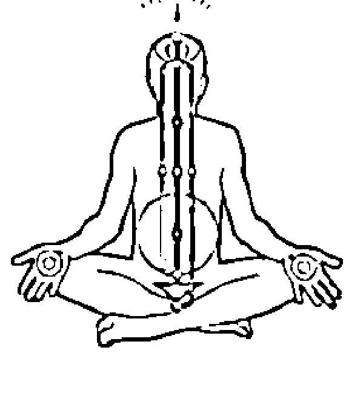

量的存在是天經地義的真理。然而，對於西方人而言，宇宙能量的存在卻是一個全新的概念。只有少數的神秘學家或是被認定為異教徒的先知，如十六世紀的帕拉賽爾斯（Paracelsus，注1）和十八世紀的史威登柏格（Swedenborg，注2），曾提出人體體內的能量其實有如一顆靈魂球體或是火球的觀念。然而，科學家們在數世紀以來，一直堅稱他們肉眼所見的事物才是真正存在的事物。凡是看不到的事物，便失去存在的可能性。所幸，經由愛因斯坦、心理學家卡爾·榮格（Carl Gustav Jung）、科學家克里安（Kirlian）及其他量子力學學者的研究證實，我們肉眼所見的物質世界，事實上超過百分之九十是一個充滿能量的虛無空間。如今，我們衷心期盼，宇宙能量的觀念能夠儘早被所有人接受。

> 注1為中古世紀的一位醫生，同時也是一位知名的煉金術師。
> 注2為十八世紀的一位宗教學者。

## 什麼是查克拉？

「查克拉」（Chakras）這個名詞源自梵文，意思是指輪子或圓盤。中文常翻譯為脈輪（或譯「氣輪」）。人體中有七個主要的脈輪。印度哲學認為每一個脈輪都有其相對應的色彩、音符及真言。當體內的脈輪保持著平衡和諧的狀態時，體內的能量就可以在身體內自由地流動，給予身心安適平衡的感覺。這七個主要的脈輪，沿著脊椎從尾骨連接到頭頂。每個脈輪都是一個能量中樞，連接著某個特定的神經叢。透過水晶的光線可以保護及反照這些脈輪，進而影響體內器官的運作。

這些擁有炫麗色彩的水晶就像天然電池一樣，不僅供給也安定我們體內的能量，同時更提供平衡周遭環境的能量。每個人的體內都存在著七個能量中樞，也就是七個脈輪。而這七個脈輪各自都有其對應的色彩：紅色、橘色、黃色、綠色、藍色、靛青色及紫色。水晶的光線具有抑制、保護及反照脈輪的作用。因此，經由這些光線的能量可以幫助我們改變體內的磁場，影響器官的運作。雖然，這些水晶光線的共振頻率是由外而內。但是，這些光線的能量卻十分強大，可以與我們體內的細胞產生共鳴，改善我們的健康狀況。

## 水晶與七色脈輪的關係

1. 第一脈輪：海底輪（Root Chakra）
   位於脊椎底部。
   色彩：紅色。
   心靈意義：代表性能力、生命力，勇氣及求生意志。海底輪通常與地球、外在事物的意義及自衛本能有所關連。
   脈輪作用：血管、骨頭、腎臟及腎上腺。對於情緒低落、貧血和身體缺乏活力有極大的幫助。
   代表水晶：石榴石及紅寶石。

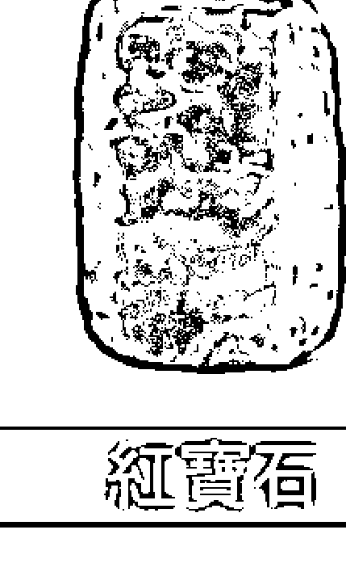

2. 第二脈輪：臍輪（Sacral Chakra）
   位於性器官的部位，又稱性輪。
   色彩：橘色。
   心靈意義：創造力、生產力及活動力。
   脈輪作用：腎臟、腸道系統與性生活相關。對於改善害羞的問題、打開懷胸有極大的幫助。
   代表水晶：玉髓、石榴石、赤鐵礦、玫瑰石、菱錳礦和軟錳礦。

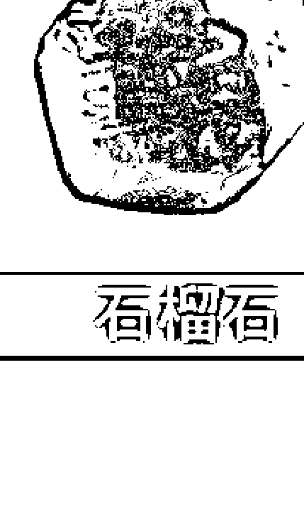

3. 第三脈輪：太陽神經叢（Solar Plexus Chakra）
   位於橫膈膜部位。
   色彩：黃色。
   心靈意義：天賦及自我實現的能力。
   脈輪作用：胃、脾、肝和胰臟，以及消化系統和消化機能。能夠安撫精神緊張、緩和情緒。
   代表水晶：黃水晶、黃玉、硫磺及黃色方解石。

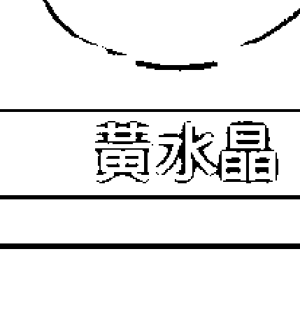

4. 第四脈輪：心輪（Heart Chakra）
   位於心臟部位。
   色彩：綠色及粉紅色。
   心靈意義：同情心與愛情。
   脈輪作用：心臟、循環系統和肺。能幫助人體吸入較多的氧氣，增加血液中的含氧量。
   代表水晶：祖母綠、玉石、綠色幻影水晶、粉紅水晶和菱錳礦。

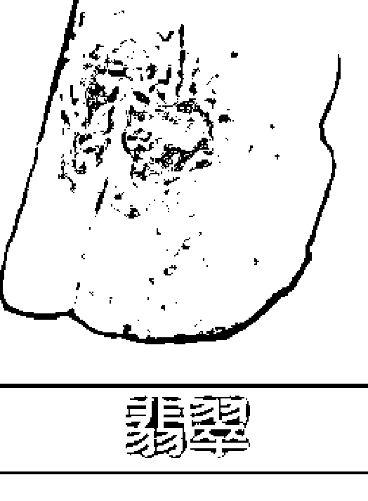

5. 第五脈輪：喉輪（Throat Chakra）
   位於喉嚨底部。
   色彩：藍色。
   心靈意義：自我表達及言談的能力。
   脈輪作用：喉嚨、氣管、食道及甲狀腺。對於改善氣管及聽力的毛病有極大的幫助。也能夠提升自我表達及溝通的能力。
   代表水晶：海藍寶、綠玉髓和綠松石……等。

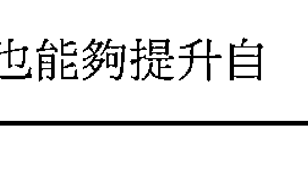

6. 第六脈輪：眉心輪（Brow Chakra）
   又稱為第三眼，位於前額的眉心部位。
   色彩：靛青色。
   心靈意義：直覺、智慧、視覺及洞察力。
   脈輪作用：腦下垂體。有助於進入冥想。
   代表水晶：方鈉石（Sodalite）和藍銅礦。

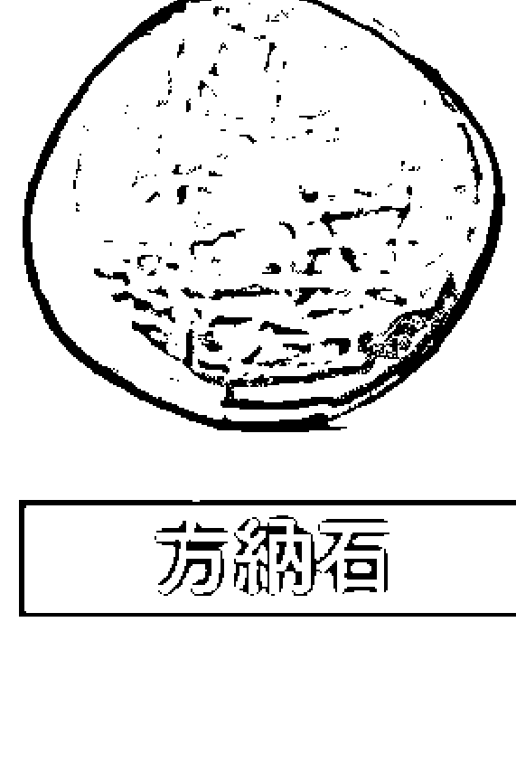

7. 第七脈輪：頂輪（Crown Chakra）
   位於頭部頂端部分。也稱為「千瓣白色蓮花」。
   色彩：紫色和白色。
   心靈意義：心靈成長。
   脈輪作用：松果腺。對於心靈提升及超越自我有極大的幫助。人類能夠透過頂輪連接宇宙的神祕能量。
   代表水晶：舒俱徠石（Sugilite）、紫龍晶、藍寶石、紫水晶及紫色螢石……等。

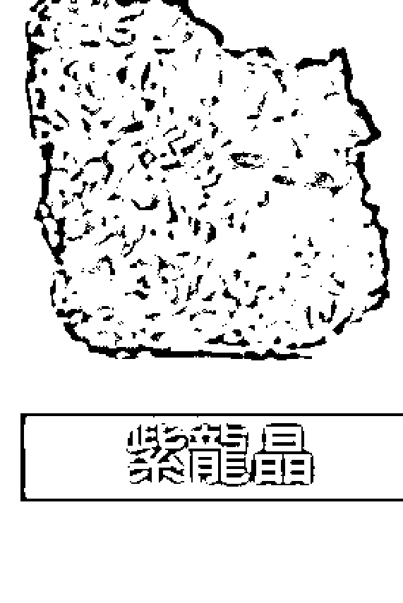

## 柏拉圖的神聖幾何學

古希臘哲學家認為世界上存在著五種完美的幾何形體，也就是五種正多面體。神聖幾何學的論點為：柏拉圖試圖以象徵性的方式來闡釋，世界正是這五種正多面體所構成。對於柏拉圖而言，正四面體、正八面體、正二十面體、立方體和正十二面體，它們就是像建築物的各個平面，是組成三度空間的五種能量元素。這五種神聖的幾何圖形提供給人類，接觸宇宙神祕能量的可能途徑。他指出每一個幾何形體都有對應的能量元素。如，正四面體代表火微粒、正八面體則是氣微粒、正二十面體為水微粒、立方體則為土微粒。至於，由正五邊形形成的十二面體，則被稱做以太或是虛空。透過這些完美的幾何圖形所散發出來的能量，可以幫助我們調節並且修復體內失衡的部分能量。

- 正十二面體：代表的能量元素為以太（Ether）。象徵宇宙間的陰性創造力、母親、愛情及靈魂。與第四脈輪——心輪，緊密結合，與心臟和呼吸系統相關。對於調和體內能量、幫助建立自我認知及整合自身能量有極大的作用。色彩為紫色。
- 正二十面體：代表的能量元素為水微粒。象徵宇宙間的父性面向（也就是陽）、權力、陽性能量、意志力及精神。支配第三脈輪——太陽神經叢，與感官系統及神經系統相關。色彩為淡藍色。正十二面體及正二十面體為互補的幾何圖形。
- 正八面體：代表的能量元素為風微粒。屬於陽性能量，負責支配第二脈輪——臍輪，與第五脈輪——喉輪。色彩為黃色。
- 六面體或立方體：代表的能量元素為土微粒。屬於陰性能量。象徵外在物質。支配第一脈輪——海底輪。色彩為綠色。立方體與正八面體為互補的幾何圖形。
- 正四面體：代表的能量元素為火微粒。它代表活力，也是心智的火苗。支配第六脈輪——眉心輪，與精神思維相關。色彩為紅色。

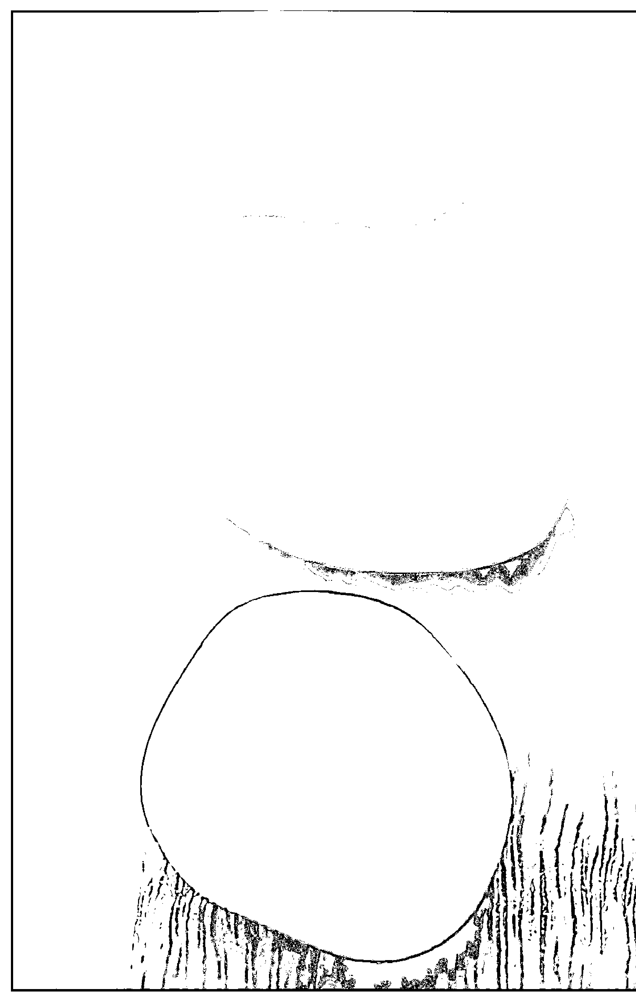

## 脈輪與色彩的治療密碼

先前我們談到，每個人身上都有七個主要的脈輪。而這七個脈輪都有其對應的色彩。早在千年前，人們就發現這七彩脈輪具有與對應色彩的水晶發生共鳴、共振的能力。也就是說，只要能正確運用水晶的色彩能量，來對身體及心靈進行自然療法，便可使身、心、靈感到安適，並且改善我們的健康狀態。

- 紅色晶系能量：可以改善血液循環系統、肌肉及脊髓等相關器官。例如：陰莖及陰道。有助於提高感受力。與火、水和陰陽元素相關。可以使用紅色或粉紅色的礦石來提高能量。例如：紅碧玉。
- 綠色晶系能量：對於中國人而言，綠色能量屬於五行中的水。人體可經由腎臟排出不需要的水分及毒素。掌管泌尿系統、神經系統、聽力及部分的免疫系統。具有提升體內器官自我修復的能力。有助於增加活動力，並提升感知能力。綠色及藍色的寶石都可以強化綠色能量。例如：綠松石、天行石及閃玉。
- 黃色晶系能量：屬於五行中的土，掌管消化系統。同時也屬於五行中的木，掌管肝臟和肝囊功能。負責處理吸收我們吃進體內的食物，和提供給我們所需要的養分。黃色礦石可以幫助我們提升黃色能量，改善消化系統、節制飲食。相關的礦石為黃鐵礦、琥珀及黃晶。
- 白色晶系能量：負責骨頭與牙齒（屬於五行中的水）、肺、支氣管及皮膚（屬於五行中的金）等器官。所有白色礦石都能夠影響人體內的體液，白色礦石的能量可以幫助我們驅除心中恐懼的情緒。大部分白色礦物的成都含有大量的鈣（如方解石及珍珠等），使用有機體形狀的白色礦石能使白色能量發揮最大的功效。白珊瑚的外形就與支氣管的形狀極為神似。方解石、珍珠、月光石及白水晶等白色礦石，都能夠強化白色能量。
- 藍色晶系能量：藍色系水晶能夠改善甲狀腺系統的問題、舒緩眼睛的不適，以及消除壓力和焦慮的情緒，使太陽神經叢的能量恢復平衡，進而改善消化系統。藍色能量同時也能降低慾望，趕走負面情緒，帶來更新的活力。綠松石和青金石等藍色水晶，皆能提升藍色能量。
- 橘色晶系能量：橘色能量與第六脈輪——眉輪，息息相關。橘色系水晶（如橘色紅玉髓和橘色方解石）能夠提升理性思考的能力並增長智慧。
- 紫色晶系能量：紫水晶、紫龍晶和舒俱徠石等紫色寶石，能夠調節下丘腦及松果腺，免於噩夢及失眠的情形，並改善飲食紊亂等問題。

## 黑色電氣石的守護能量

將黑色電氣石（Tourmaline）垂掛於心臟或太陽神經叢的位置，它會在我們氣場四周形成一道無形盾牌，為我們帶來安全感，使我們不會輕易受到外在事物的影響。當我們在左手腕上配戴煙水晶所製成的手鐲時，能夠有效地阻擋外在負面能量的入侵。為了讓黑色電氣石的磁場能夠維持一定的震動頻率，必須要經常使用並且淨化黑色電氣石。黑色電氣石的神奇之處在於，它不僅能有效地阻擋外在負面能量流入我們體內，甚至可以避免我們成為別人負面情緒的垃圾桶。也就是說，黑色電氣石能夠阻擋、對抗及消滅所有負面衝突的能量。

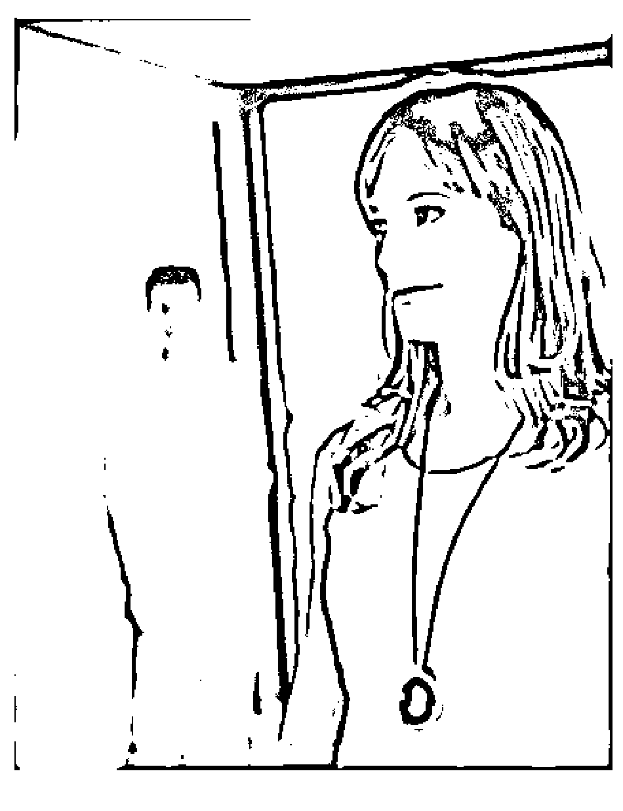

## 炁場與水晶的互動

炁場是一股強力的振動能量場，它存在於大自然的每一個角落。所有的事物，如人類、動物及植物，甚至連礦物都擁有各自獨特的炁場。當脈輪中流動的能量運作流暢時，人體會散發出一股柔和穩定的光環，代表我們的身、心、靈都處於和諧的狀態。換言之，如果我們的思想、情緒或健康處於混亂的狀態時，炁場光環的色彩則會變成暗淡無光、產生裂痕或出現汙點。

因此，人類身、心、靈的狀態與炁場的色彩及形狀息息相關。當一個人的炁場越強大時，它就越能保護我們不受負面能量的侵害。然而，環境汙染、壓力、吸食毒品、負面的思考模式和不正常的生活作息，都會導致炁場的受損和消耗。所以，我們必須知道哪種礦石能夠幫助我們強化炁場；了解如何藉由炁場來提升我們的生命能量，並且形成一道無形盾牌，保護我們不受負面能量的傷害。本書中，我們將介紹各式各樣的礦石，以及如何正確地運用這些水晶礦石來保護和淨化人體的炁場。而我們接下來將詳細介紹赤鐵礦、黑曜石、黑色電氣石、縞瑪瑙、粉紅水晶、帶髮水晶和藍晶石等珍貴礦石，如何幫助我們提升能量、強化炁場。

## 水晶曼陀羅：宇宙與自我合而為一

「曼陀羅」（Mandala）一詞源自梵語，又稱為「曼達拉」。意思為「神聖的圓圈」、「萬象森列，圓融有序的布置」。在許多古老文明中，常常以曼陀羅用來象徵大宇宙（指宇宙本身）與小宇宙（指人類個體）的關係。人們通常以不同的材質、圖案和色彩來製作曼陀羅。當然，也有人使用水晶來製作曼陀羅。水晶曼陀羅的形狀為圓形，在曼陀羅中央需安置一顆珍貴的礦石，用來象徵生命能量的光芒。通常人們會放置鑽石或是透明的水晶等珍貴礦石。而在寶石四周再放上七顆顏色各異的礦石。每個人可依據自己的喜好及需要，來決定這七顆礦石的顏色及位置。如果讀者親自體驗製作曼陀羅的過程，你不但可以享受創作曼陀羅美好的靈性體驗，更能感受到這些礦石的巨大能量。製作水晶曼陀羅的體驗是全面性的。你能感覺到這些水晶無與倫比的能量源源不絕地流入你的體內。當這股能量調和你體內能量的同時，它更加強你自身的生命能量，使你能夠與宇宙的神秘力量合而為一。

## 能量管道系統：經絡與能量脈

根據中醫與古印度阿育吠陀醫療法（Ayurveda，注1）的論點，認為一個人的健康與身、心、靈是否處於和諧狀態，都需要依據生命能量的流動和流暢與否來判定。這股生命能量從脈輪（能量中樞）出發，流經遍布體內大大小小的能量管道。它就如同身體其他的循環系統一樣，有著明確獨特的運作路徑和流動方向。

> 注1：印度的傳統醫學。

中醫將這些長短不一的能量管道稱為經絡（Meridian）；而古印度阿育吠陀醫療則稱這些能量管道為能量脈（Nadis）。如同強調能量循環的現代醫學般，中醫和阿育吠陀醫療法採取的治療方式為疏通人體內的能量管道，讓具有修復功能的生命能量能夠順利流經全身的經絡（或能量脈），幫助身體達到自我修復的功能。

人體主要的經絡沿著脊椎柱分布。生命能量自脊椎尾骨的脈輪流入頭頂的脈輪，連結氣場及宇宙的神秘能量。

除了這些主要的經絡之外，還有數以百計的能量管道，交叉連接由腳底到頭頂的其他器官及內分泌腺體。然而，體內外的能量失衡卻常常使這些能量管道（經絡或能量脈）的交叉點（也就是穴點）產生阻塞的現象。為了疏通這些阻塞的穴點，中國人研發出針灸技術來打通穴道；日本人使用指壓療法（Shiatsu），以拇指和手指直接按壓穴點來疏通經絡阻塞；而運用水晶的震動頻率也可以達到相同的效果。

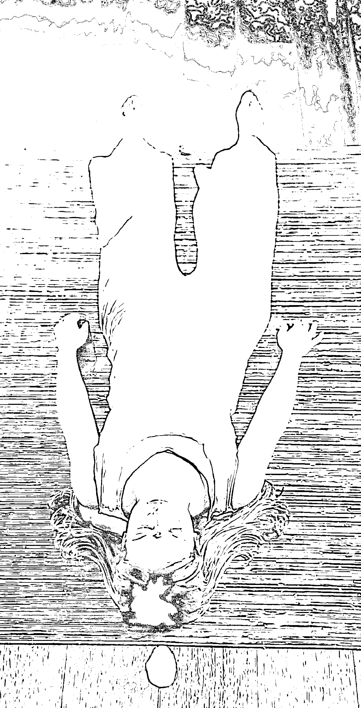

## 水晶與黃道十二宮

書先前已經提過，宇宙中存在著一股神秘的能量。這股能量不但創造了宇宙萬物，同時也創造出了人類。因此，我們與這股神秘能量之間有密不可分的關係。人類並非是獨立存在的生物。相反的，人類的命運與宇宙萬物的運行息息相關。所以，認識黃道十二宮與水晶之間的關係，能夠幫助我們維持生命能量的平衡。相信讀者都知道，人們根據天體運行的規律來演算出黃道十二宮；而天體的運行則與人類的生活息息相關。由此可知，如果我們能夠根據黃道十二宮的規則來運用水晶的能量，也就可以連接與我們屬性相同的行星能量。

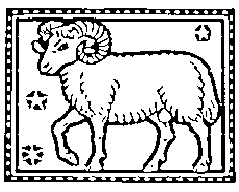

白羊座的人個性開朗樂觀、做事十分積極主動。他們常常是活動的發起人，具有感染其他人的活力。

**對應水晶**：紅色水晶，如赤鐵礦與紅碧玉。

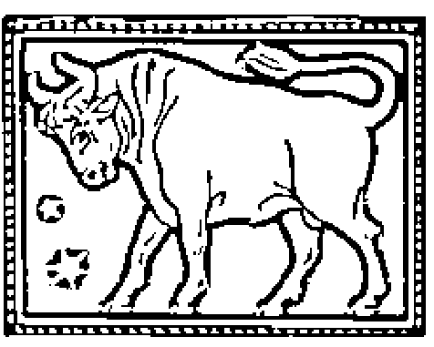

金牛座是一個充滿智慧與愛的星座。金牛座的人愛情觀偏向實際面。

**對應水晶**：黃色水晶，如黃色方解石、琥珀及黃鐵礦。粉紅色水晶，如玫瑰水晶或粉紅色電氣石。

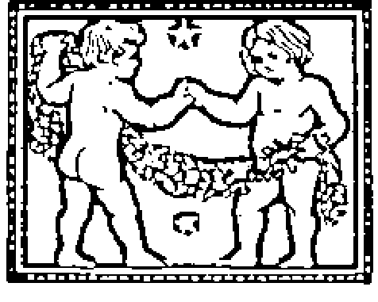

雙子座特色為一體兩面，快樂與痛苦、健康與病痛。雙子座的一生都在追求自我超越。

**對應水晶**：紫色水晶，如紫色螢石、紫龍晶和紫水晶。

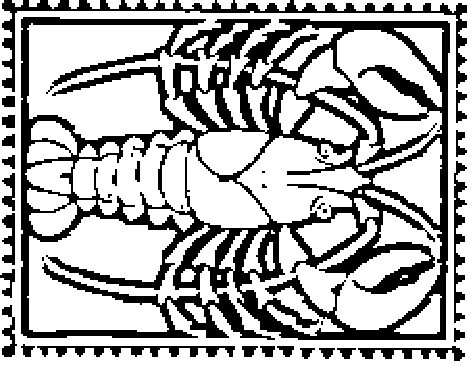

巨蟹座的人活動力旺盛、十分好動。他們希望自己就像大自然一樣，時時充滿生氣與活力。因此，巨蟹座的專屬色彩為綠色，象徵大自然的創造力及能量。

**對應水晶**：綠色水晶，如綠色幻影水晶和綠色電氣石；白色水晶，如月光石。

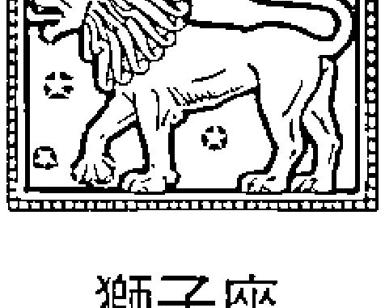

獅子座最主要的課題便是消除「獅子的驕傲自大」。太陽光能幫助他們降低自大驕傲的人格特質。

**對應水晶**：黃色水晶，如黃色方解石、琥珀和黃鐵礦；橘色水晶，如玉髓和淡黃色的透明石膏。

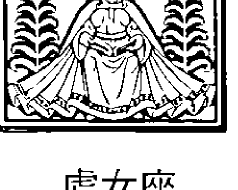

處女座的人擁有強烈的求知欲。他們是理智的象徵，崇尚智慧與知識。他們不僅只追求世俗的知識，同時也努力提升心靈智慧。

**對應水晶**：橘色水晶，如橘色方解石；多彩水晶，例如拓長石等。

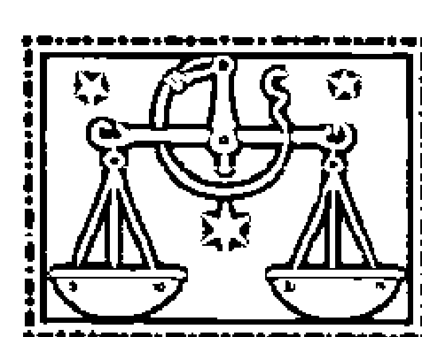

天秤座一生都在追求真實。然而，他們也同時在尋找一種可以與別人，甚至與宇宙接軌，近乎靈性、超越世俗的愛。

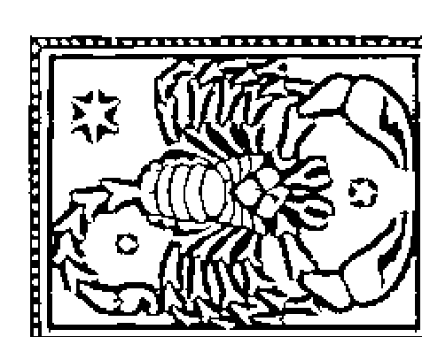

天蠍座為所有星座中能量最強大的星座。天蠍座的第六感相當強，他們能看清人類心靈最陰暗的一面，同時也看見他們善良崇高的一面。

### 天秤座
LIBRA
(24/9~23/10)

**對應水晶**：黃色水晶，例如黃色方解石、琥珀和黃鐵礦。

### 天蠍座
SCORPIO
(24/10~22/11)

**對應水晶**：暗紅色的水晶，如貴榴石和紅寶石；透明水晶，例如白水晶或海藍寶。

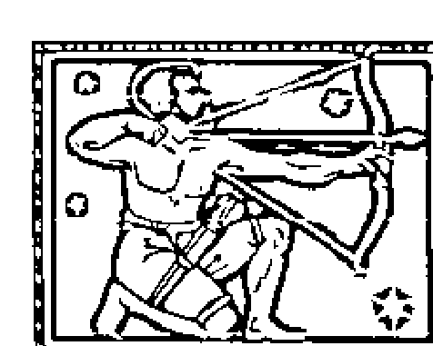

射手座的人對人生的看法富含哲學性，天生便是個理想主義者。他們的一生中都在追求自我實現的目標。

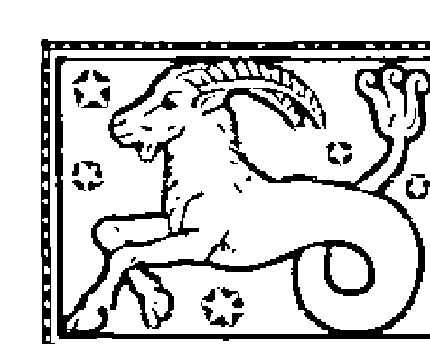

摩羯座具有黑夜的神祕及白晝的榮耀。摩羯座被視為是人類的靈魂進入天堂前，那一道矗立在暗黑混沌的大門。戰勝獸性與慾望是摩羯座最主要的功課。

### 射手座
SAGITARIO
(23/11~21/12)

**對應水晶**：深藍色水晶。如藍銅礦和方納石。

### 摩羯座
CAPRICORN
(22/12~20/1)

**對應水晶**：白色系水晶，如月光石和白水晶。黑色系水晶，如縞瑪瑙與黑色電氣石。

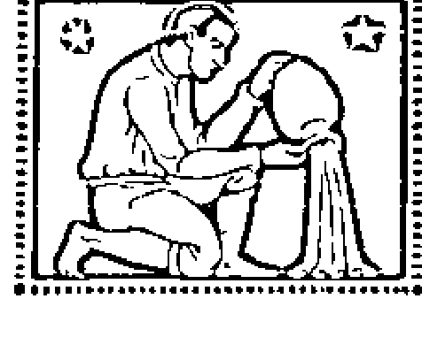

寶瓶座代表不受束縛的智慧，是被蒙蔽真理的領航者。他們十分善長溝通、適合團體工作。他們喜好團結統一。

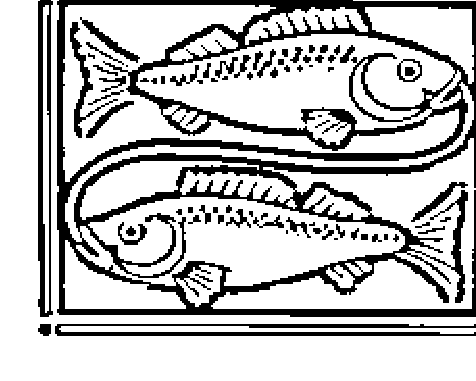

雙魚座具有自我犧牲的精神。憎惡不公平的事物及自私自利的人。

### 寶瓶座
AQUARIUS
(21/1~19/2)

**對應水晶**：藍色水晶，如藍色瑪瑙和藍玉髓。

### 雙魚座
PISCES
(20/2~20/3)

**對應水晶**：方納石及青金石。

## 星球與水晶

事實上，所有的星體與人類都是由相同的礦物元素所組成的物體。因此，只要找到適當的水晶，人類便可以藉由這些水晶來獲得不同星體中所蘊含的神秘能量。

- 月球：月球為環繞著地球運行的衛星。與人類的潛意識有極大的關聯，它可以同時釋放善與惡的能量。月球能解放人類內在感性和非理性的能量。月球的靈動水晶為月光石、綠松石和珍珠。
- 太陽：太陽為一顆充滿能量及活力的恆星。它能夠將它源源不絕的能量傳遞給太陽系中所有的生物及植物。太陽的靈動水晶為鑽石、石榴石、紅寶石及粉紅色電氣石。
- 水星：水星為太陽系中最接近太陽的星體。水星為智慧的行星；它能激發理性思考的能力、強化解決抽象問題的直覺。水星的靈動水晶為玉髓、黃水晶和藍寶石。
- 金星：金星為地球的姊妹星，距離地球相當近。金星能夠增加愛的能量並且撫平傷痛。金星的靈動水晶為海藍寶、綠玉髓、珍珠、月光石和綠松石等。
- 火星：火星為一顆紅色的星體，代表戰鬥力及競爭力。火星能夠加強一個人的活動力及活力。火星的靈動水晶為紫水晶、紅玉髓、石榴石及紅寶石。
- 木星：這個星體代表一個人向外發展的能力。木星的能量能夠幫助我們增長心智；賜予我們智慧，讓我們在慘痛的經驗中獲得成長學習的機會。木星的靈動水晶為粉紅色電氣石、西瓜電氣石和紫水晶。
- 土星：這個星體象徵限制和不可逾越的秩序。土星的能量能夠幫助我們追求真正的智慧、建立責任感和紀律。土星的靈動水晶為琥珀、玉和煙水晶。
- 天王星：這顆遙遠的星體能夠加強個人的直覺能力。天王星代表改革的力量及追求創新的獨立精神。天王星的靈動水晶為青金石、蛋白石和黃玉。
- 海王星：海王星象徵自我犧牲的精神；它的能量能夠加強為他人奉獻的意願及為了理想而奮鬥的力量。海王星的靈動水晶為月光石、珊瑚和矽孔雀石。
- 冥王星：冥王星距離地球相當遠。這個星體能夠為我們注入重生的力量。冥王星代表人性內在最深層的全面性蛻變；它的能量增強人類心靈重生的渴望。冥王星的靈動水晶為孔雀石、火瑪瑙以及紫水晶。

## 如何選出適合你的水晶？

世界上存在各式各樣的水晶，每一顆水晶都有它獨特的屬性及特性。因此，當我們在為自己選擇水晶時，往往隱藏著一些危險性（與自己磁場不合的水晶，反而對身體有害）。當我們第一眼看到琳瑯滿目的水晶時，實在不容易立即找出真正適合自己的水晶。所以，購買水晶前，最好先確定水晶的震動頻率與你磁場的頻率相同；能夠與你的磁場產生共鳴的水晶，才是真正適合你的水晶。

首先，當你拿到水晶時，一定要先確認這是不是天然水晶。人工合成的水晶往往有著令人炫目的外表。然而，這些人工水晶卻不具有任何天然水晶才有的能量。也就是說，天然水晶在形成的過程中所聚集的能量，是人工水晶無法仿照的。

當你在選擇水晶時，請注意下列三點：

- 水到渠成。如果你真心誠意想要找到一顆對你有益的水晶，它自然會出現在你面前。放鬆心情，自然而然就可以找到最吸引你的那一顆水晶。如果你依然沒有任何頭緒，讓你的直覺帶領你，它會為你找到你最需要的那一顆水晶。
- 用左手拿起水晶後，再握緊水晶。就好比向陌生人伸出你的手一樣，仔細地感受你們之間是否有任何的感覺或化學變化。你是否覺得很舒服？你是否有感到能量流入你體內？在你體內是否有能量在流動？這樣，便完成了你與水晶首次接觸的體驗。
- 當你在選擇水晶時，一定要注意水晶的色彩。例如：藍瑪瑙的藍色可以幫助你提升表達能力。

## 認識水晶的功效

早在現代科技證實植物對人體的功效之前，人類就懂得使用植物來增加人體的自我調節與防禦能力。但是，人類如何在幾千年就了解植物的各種功效？植物與人類之間究竟存在著什麼樣的聯繫？我們的老祖先發現人體與植物的外形有許多相似之處。例如：他們認為洋蔥的形狀與人體的膀胱外形十分相似。因此，他們就將洋蔥當成利尿劑來使用。而後來也證實洋蔥裡的成分，的確有利尿的功能。世界上同時也有許多類似的例子：人們使用外形與肝臟十分相似的歐龍牙草（hepatics）來醫治肝臟的疾病；利用與肺的形狀神似的療肺草（pulmonaria）來治療肺部的毛病……等。

像這種「以形補形」順勢療法（Homeopathy）的法則，也可以運用在水晶療法上，例如：赤鐵礦有如氣泡般的紋理，使我們聯想到它具有高氧化作用；赤鐵礦它有如鮮血般暗紅的顏色，也使人聯想到鮮血；它沉重的重量則暗示我們它能夠調控人體血紅素的數量，刺激造血功能來幫助傷口癒合。每一個人都可以喚醒體內沉睡的能量來與水晶能量進行交流。只要你願意開放你的心靈，你將會探索到水晶許多不為人知的面貌，並且發覺它所蘊藏的神秘能量。

為了幫助讀者在將來能夠選出真正適合你的水晶，本書將為你詳細介紹數十種不同水晶的屬性與特色，讓你更進一步地了解各種水晶的功能。

- 如果你要運用水晶來平衡脈輪的能量，一定要特別注意水晶的顏色。每個色彩都具有不同的震動頻率和波長，而每個脈輪也都有其相應的色彩。因此，要謹慎地選擇適合色彩的水晶，才能真正平衡脈輪的能量，達到水晶最大的效果。

## 如何養護水晶？

天然水晶是一種非常敏感的礦石。它就像一塊磁碟片一樣，會記錄與它曾經接觸過的人或生物的磁場能量。因此，在使用天然水晶前，一定要先經過一道淨化消磁的手續。天然水晶在經過消磁過程後，它就會釋放所有累積的負面能量，回到最初的狀態。

不論你要使用水晶來治療慢性疾病、改善居住環境或是拿來用任何的用途，一定要先將水晶淨化消磁。然而，我們所說的淨化消磁並非只是外在的清潔而已。所謂的淨化消磁，其實是指一系列具有靈性象徵意義的儀式。這個儀式總共有三個階段的意義：淨化消磁、重新充電及與水晶的振動頻率產生共鳴。

## 天然水晶的消磁法

- **活水消磁法**：活水消磁法非常適合用來淨化水晶。最好將水晶放入活水（流動的水）中來進行消磁；如果安置在死水（不流動的水）中，效果便會降低許多。我們建議將水晶放置在溪流或是瀑布等靈性較強的地點。當你將天然水晶放入水中時，一定要全神貫注地觀察水晶如何釋放出所有的負面能量。
- **海鹽消磁法**：將陶磁或木頭做的容器裡裝滿海鹽（切記不可使用金屬材質的容器），然後，將天然水晶埋入海鹽裡數小時即可。
- **海鹽水消磁法**：將一個拳頭多寡的海鹽放入裝滿水的容器裡，之後再將水晶放入鹽水裡進行消磁。如果能夠使用海水來淨化水晶，效果則會更好。但是，有許多的水晶並不適合鹽水消磁法，例如：黃鐵礦、方解石、孔雀石、透明石膏和藍銅礦。
- **聲波消磁法**：將水晶放在西藏唱缽（Singing Bowl）後，然後持續地敲打唱缽。此時會產生一種穩定且迴繞不已的泛音，而當泛音的聲波與水晶產生共振後，便會釋放水晶的負面能量。
- **薰香消磁法**：指使用薰香或薰香來淨化天然水晶。世界上許多的文明都懂得燃燒某些特定的植物或樹脂，來供奉神明、或淨化人事物，例如：基督教徒會在大教堂裡燃燒樹脂、佛教徒和印度教徒會在寺廟裡點燃薰香，甚至北美洲的印第安部落中，巫醫們也會在發汗帳篷（sweat lodge）裡燃燒菸草，進行除魔治療儀式。在淨化消磁水晶前，先選出你喜歡的香料味道，最好是使用天然植物產生的香氣，或者你也可以混合數種不同的植物和樹脂，然後再用煤炭燃燒產生香味。墨西哥原住民（這裡特別指說那瓦語的原住民）通常使用鼠尾草、迷迭香或雪松木等植物；基督教徒則使用天然的樹脂，如乳香來淨化環境或人心。而在亞洲最重要的香料則非檀香莫屬。你只需點燃薰香，讓薰香產生的煙包圍水晶，便可以淨化水晶。當你在使用薰香消磁法時，其香料所產生的煙也會同時淨化你和周遭的能量磁場。薰香消磁法不但可以讓你的能量與水晶的震動頻率產生共鳴，同時對人體的能量磁場也有相當大的助益。
- **草地消磁法**：將受到汙染的水晶放置在草地上，可以達到淨化充電、恢復光澤的效果。天然水晶是十分敏感的礦石。因此，將水晶放在太陽下曝曬的時間要有所節制。水晶只要在自然的環境下，吸收一些光線就可以恢復它原有的狀態。颱風、雨水以及月光等自然能量，也有助於水晶能量的恢復。

## 如何讓天然水晶重新充電？

當天然水晶釋放所有的負面能量還原為最初狀態後，便可以進行下一個步驟：充電。天然水晶在充電過後，才能夠發揮它最大的潛能。因此，當你下次使用天然水晶來靈療慢性病、改善健康狀況或是用來做任何用途時，水晶就能充分釋放出能量，幫助你達成你的目的。目前有許多不同的水晶充電法，請根據你的直覺本能選出最適合你的充電法：

> **莫氏硬度計**
> 並非所有礦石的硬度都相同。因此，淨化礦石的時間，也因礦石的硬度而有所區別。硬度最軟的礦石，可能會被水溶解掉或是造成損傷。莫氏硬度計為目前公認用來測量固體硬度的標準。十九世紀初的德國地質學家腓特力·莫斯（Friedrich Mohs）所設計出來的。他衡量礦物硬度的原理為：一個固體能夠在另一個硬度較軟的固體上刮出刮痕，卻不能在另一個硬度比它更硬的固體上刮出刮痕。因此，他選出了十種礦物做為衡量礦物硬度的基準：
> 1. 滑石 Talc（可輕易用指甲刮出痕跡）。
> 2. 石膏 Gypsum（可用力用指甲刮出痕跡）。
> 3. 方解石 Calcite（可用硬幣刮出痕跡）。
> 4. 螢石 Fluorite（可用小刀刮出痕跡）。
> 5. 磷灰石 Apatite（可用銳利的小刀刮出痕跡）。
> 6. 正長石 Orthoclase（可用鋼製的砂紙刮出痕跡）。
> 7. 石英 Quartz（可用石英在玻璃上刮出痕跡）。
> 8. 黃玉 Topaz（很難在黃玉上刮出痕跡，但卻可以打碎黃玉）。
> 9. 剛玉 Corundum（如紅寶石、藍寶石等，幾乎是不太可能刮出痕跡）。
> 10. 鑽石 Diamond（需要攝氏幾百度的高溫，才能損壞鑽石）。

- **埋土充電法**：水晶為大地的產物；它們在大地裡孕育成形。土壤具有旺盛的生育能力，因此能夠幫助水晶進行充電。埋土充電法的程序為將天然水晶埋在乾淨沒有汙染的土裡一段時間。埋土充電法為最耗時的充電法，需要至少七天的時間來形成磁場。
- **日光充電法**：太陽光為所有能量的來源。將天然水晶放置在太陽光下大約一個小時左右，就可以強化水晶的磁場能量。如果你希望水晶能夠吸收更多能量，可以將照太陽光的時間拉長。但是，要十分注意不要讓太陽光的高溫破壞水晶的結構。日光充電法對於暖色系的水晶成效最為彰顯。
- **月光充電法**：使用月光來為水晶充電，也具有相當良好的效果。比起太陽光，月光的能量比較平和溫柔，但同時也較為微弱。因此，水晶讓月光照射的時間則需要拉的更長。我們建議新月或滿月時，使用月光充電法的效果會更好。月光充電法適合磁場較溫和的水晶來使用。然而，當氣候條件不佳時，幾乎所有的水晶也都可以使用月光來進行充電的動作。月光充電法使用於冷色系的水晶效果最佳。
- **觀想充電法**：對於注意力集中和能夠放鬆身、心、靈的人，觀想充電法能夠發揮極大的效果。在進行觀想充電法時，首先要進入到一個身、心、靈全然放鬆的狀態。然後，雙目微閉，將天然水晶置於雙手之間。接下來，盡力觀想有一道白光從頭頂進入到你的身體，通過心臟後再流過手臂，直達你的雙手，點亮手中的水晶。或者，你也可以用雙手高舉水晶，想像有一道白光從你的眉心射出，照射著水晶。並仔細感受這道白光正在為手中的水晶進行充電。

## 水晶的共振能量與作用

當水晶完成了淨化消磁及充電的步驟後，就可以進行最後的一個階段：啟動天然水晶，與自身產生共鳴振盪，以及向水晶輸入你的需求及願望。一般而言，天然水晶具有多種特定的性質，可以幫助我們同時達成不同的需求。然而，當我們向水晶輸入單一的訊息時，效果則最為顯著。在第三階段中，首先要與水晶產生共鳴振盪。天然水晶的磁場十分的敏感，它的震動頻率會立即與使用它的人產生共鳴。只要將氣息吹到水晶、或是經由觸摸的動作，就可以輕易地與水晶的能量產生共鳴振盪。一開始，讓自己先進入到一個全然放鬆的狀態，再輕輕地向水晶吹一口氣；接下來，用左手輕捧著水晶，再用右手輕撫水晶，時間約為數分鐘即可。當你做完這二個動作時，你會感覺到一股能量滲入體內，與你自身的能量交融，最後完全地結合在一起。

當你成功地與水晶能量共鳴振盪後，就可以進行輸入訊息的階段。如果你手中為體積較小的水晶，便可利用眉心輪來進行輸入訊息的動作。先將水晶放在眉心，也就是第三眼的位置。接下來，專注地觀想你想要輸入到水晶的訊息。想像這道訊息被一股白光包圍注入水晶。此時，你要摒除所有雜念，試著在腦海中將訊息表達的越清楚越好。然後，在口中默念：「我將此水晶設定為治療用途、帶來愛情、事業成功或帶來財富……」或者其他的需求願望。切記，當你向水晶輸入單一的訊息時，水晶才能發揮它最大的能量來幫助你達成願望。

如果你手中為體積最大的水晶，也須重覆上述的動作。不過，你可以將水晶放置在你面前的矮桌上，在水晶底部鋪上絲質或天鵝絨材質的黑布。當你想暫時將水晶收起來，或是想使用水晶來治療慢性病時，可以用絲質或天鵝絨材質的黑布將水晶包起來：一來可以防止水晶刮傷或破損，二來可以使水晶不會沾染到可能與你能量場不相容的外來能量。

## 水晶祭壇

許多人的家中都有布置祭壇或神桌，做為與靈性世界溝通的媒介。依照每個人不同的宗教信仰和喜好，祭壇的形式也大不相同。有人喜好單純的擺飾，在家中只擺上簡單的桌子和神像；也有人偏好較為複雜的裝飾，他們會在桌上點燃蠟燭、薰香、及擺上鮮花素果來供奉神明。如果你願意也可以將水晶供奉在家中的祭壇，甚至，專門在家中布置一個供奉水晶的祭壇。供奉水晶會讓你獲得意想不到的收穫。如果能在水晶祭壇上，點燃蠟燭和焚燒薰香，你會發現水晶能量場會因此增強，使得周遭環境變得更加安祥和諧。每當你準備進入冥想來到祭壇前，或是專心地觀想水晶時，你便會清楚感覺到源源不絕的水晶能量，正與你的能量場產生共鳴振盪。

## 運用水晶創造優質的居家環境

## 水晶與風水的關係

和一切的事物都是天地相交後的產物；而天地間所有的事物也都有其生命。就整體論的觀念而言，一個人生活的舒適、快樂，或是他的健康狀況，不僅與他自身的能量是否平衡有關，甚至與他的生活環境是否良好，以及他能否與周遭環境和平共存有密切的關係。

世界上的所有文明或多或少都有認知到人類與其生活環境和諧的重要性。並且，也依據人類身、心、靈多方位的需求，來創造出最適合居住的環境。然而，卻沒有任何一個文化能像中國一樣，發展出一套如此完整及精確的空間理論。為人類的居住環境創造出一個最和諧舒適的空間，甚至還兼具能量流動的概念。

天然水晶在創造和諧舒適的居住環境上，也扮演相當重要的角色。天然水晶的能量、色彩及震動頻率不但能夠平衡人類的能量磁場，也可以使人類與宇宙的神秘能量合而為一。水晶能量具有淨化、保護及調節環境等功能。因此，水晶能夠創造出一個氣流（指流動的能量）運行、有益於人類開發自身潛能的居住空間。

家中所有的房間都具有不同的功用。所以，每個房間所需要的能量屬性都不盡相同。當我們在每個房間放置適合的水晶時，水晶的振動頻率就可以幫助每個房間產生最有益的氣流。

事實上，家中所有擺設的位置和色彩，以及家中能量的流動皆會反應在我們生活中不同的層面。根據風水來改變家中的擺設，能夠達到許多令人意想不到的效果。例如在臥室擺置特定的水晶，能夠改善兩性關係、增進性生活的情趣；在遊戲間放置水晶，能夠刺激孩子的想像力和創造力；而在工作室擺放水晶，則可以提升專注力和工作效率。

## 五行學說

五行為古代中國的一種物質觀。中國人認為宇宙萬物皆由五種元素所構成，而這五種元素分別代表五種不同的能量。五行的興盛不但影響了人類的命運，更使得自然界也產生變化。五行指：金、木、水、火、土。中國人發現每一種元素都有不同的特性；它象徵特定的方位、數字、色彩及幾何圖形。五行同時也代表五種不同的氣流。這五種能量相生相剋，形成了一股生生不息的循環；也就是說，五行之氣只有盛衰之分，並沒有氣絕的問題。當五行的能量處於平衡的狀態時，五行之氣便能在天地間流動暢通。然而，缺少任何一個元素都會導致失衡的問題。因此，如果能夠正確地使用水晶的能量，就能夠代替房間內所缺少的五行能量，使房間內的氣場流通更順暢。

### 木

這個元素代表的方位為東方，如剛剛升起的春日。木象徵新生命的誕生、成長及欣欣向榮的活力。它的能量如同一棵從種子成長為大樹，代表著持續向上成長的力量。它的對應色彩為綠色。它的對應水晶為綠色水晶，如玉、翡翠或孔雀石等。

### 火

火指正午時的太陽顏色。這個元素的代表方位為南方，象徵茂盛及活動力。它的對應色彩為紅色，同時也包含橘色和紫色。火最具代表性的對應水晶為紅寶石。不過，紅玉髓、紫色螢石和紫水晶等，也被歸為火的對應水晶。

### 土

土的代表方位為西南方及東北方，象徵如同中心般穩固可靠及嚴肅莊重。土的對應色彩為黃色。它最具代表性的對應水晶為黃鐵礦、琥珀、黃水晶、黃玉，以及所有表面沒有光澤、質地粗糙的礦石。

### 金

這個元素的代表方位為東北及北方，如日漸西落的黃昏一般。金象徵秋天、成熟以及知識。它的對應色彩為白色、銀色和灰色。金的對應水晶為灰色赤鐵礦、月長石、魚眼石和白水晶。這些水晶能夠平衡金的能量。

### 水

水的代表方位為北方，如嚴冬中低掛在地平線上，幾乎看不見的冬日般。它的形狀為波浪或蜿蜒曲折的圖形，就像藍紋瑪瑙的紋路一樣。這個元素的對應色彩為藍色，其次為黑色，以及所有讓人聯想到河川和海洋的顏色。水的對應水晶為黑色縞瑪瑙和青金石等。

## 如何創造出優質的居家環境

一間氣流能夠循環流動的房子，能夠使居住者享受到居住的快樂。一般而言，改變居家環境的氣場最快、最有效率的方法為：只需要將適合的水晶，正確地擺放在房子屋內或屋外的四個方位（使用指南針就可以輕易地找出東、南、西、北四個方位）即可。

如果你家中設有花園，可將水晶埋在土裡；如果你住在公寓大樓裡，你則可以把水晶放在桌子或架子上。不過，千萬要注意水晶擺放的方位：

- 北方：黑色縞瑪瑙和青金石。
- 南方：紅寶石、紅玉髓、紫色螢石、紫水晶、石榴石和紅玉。
- 東方：綠玉髓、翡翠、孔雀石及玉。
- 西方：方解石、白水晶和灰色赤鐵礦。
- 東北方：質地粗糙沒有光澤的礦石，如砂孔雀石、綠松石和藍銅礦；灰色赤鐵礦、月光石、魚眼石和白水晶。
- 西南方：金色及黃色的礦石；或是菱錳礦等其他象徵大地的礦石。
- 東南方：綠色水晶。

> 水晶與風水

風水堪輿之術，為一門歷史悠久的藝術。中國人早在千年前就懂得利用這個概念來為空間做出最妥善的配置安排。風水最主要的目的在於，為人們帶來正面的改變及舒適合諧的生活。以玄學觀點來看，世上萬物皆由身體、心智、情感、靈魂以及環境所組成。而身體、心智、情感、靈魂與環境間的關係，絕非靜止不動。而是一種不斷交互作用，相互影響的狀態。風水這二字象徵二種不停移動、變化、相互作用的元素。如同透過氣的流動，而不斷改變和影響我們的生活。

風水最重要概念是使氣能夠順暢地流動。因此，人們會利用改變事物的方位和顏色來達到此種效果。天然水晶的能量也能夠幫助氣順暢地流動。水晶完美及對稱的晶體，象徵宇宙和諧及完美的狀態。將水晶擺放在家中特定的位置，能夠使氣場流動順暢，不但能為我們帶來健康和諧的生活，更能有益提升靈性境界的修行。

風水中常利用八卦圖來測量家中隔局的方位是否正確。主要的目的在於讓屋內的能量能夠自由地流動。最理想的狀態就是家中的所有房間，都能夠依照八卦圖的方位來設置。然而，大部分人的家中都沒有辦法做到這一點。因此，我們只能讓家中的格局盡量符合八卦圖的方位。

## 八卦圖的方位及水晶的關係

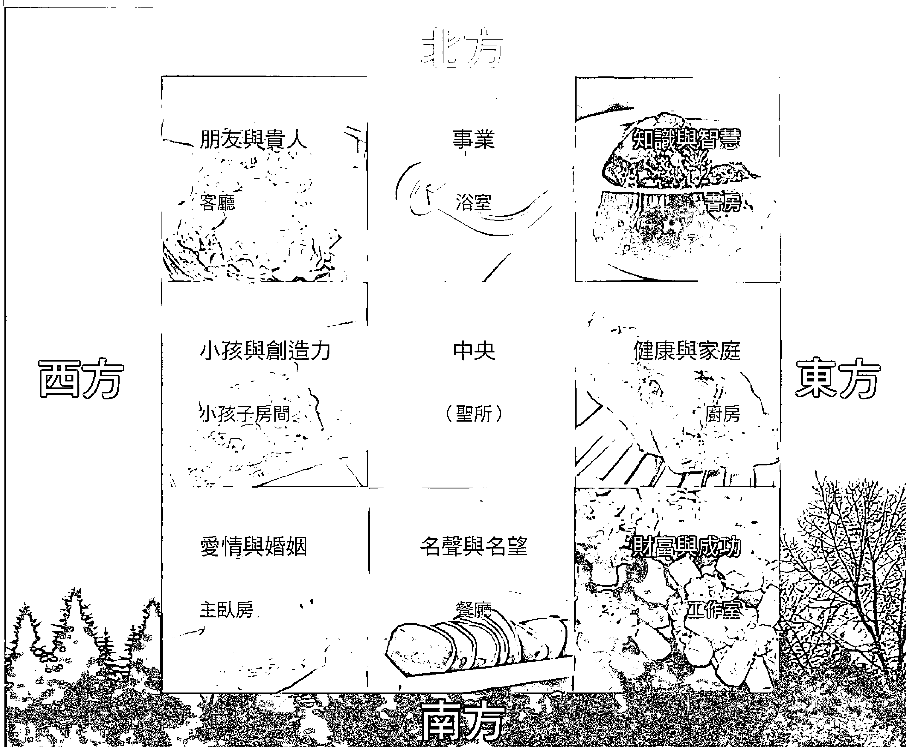

## 客廳：連結世界的大門

一間房屋的客廳屬於五行中的金。
客廳是家裡最重要的房間；首先，我們迎接客人的場所都是在客廳。更重要的是，所有的能量都是從客廳進入到屋內的。不管客廳的空間是大是小，或者客廳是否為一個獨立出來的房間，我們都應該在這個能量進入的房間放置水晶。
客廳必須讓人感覺明亮輕快。在屋頂上掛上一顆淡色的、銀色的、透明的或是白色系的水晶，都能夠散布愉快明亮的氣氛，並且讓客廳的每一個角落都充滿能量。紫水晶、透明石膏、石英和魚眼石這些水晶能夠使客廳充滿令人愉悅的光線，甚至能夠將這股能量擴展到整個屋子。而這些水晶也能在物質世界與靈性世界之間搭起一道橋樑。

## 大門的守護者：赤鐵礦與石英

大門是一間房屋裡最重要的地方。它讓家中與外在世界做出區隔，使家真正成為一個私人的隱密空間。大門的目的，在於阻擋不速之客和負面能量進入家裡，同時，迎接正面能量來強化保護家中的氣場。因此，在家裡大門的附近擺設合適的水晶，便能夠強化大門的作用。
一般而言，赤鐵礦被視為能夠阻隔外在負面能量的能量石。因此，在家中的大門旁擺上赤鐵礦，能夠形成一道防護牆，讓房屋不受到負面能量的侵擾。在鋪滿粗鹽的碗裡擺上赤鐵礦，即具有吸收負面能量的功能。當赤鐵礦吸入過多的負面能量時，你的直覺就會告訴你應該更換碗中的粗鹽。
大門不但具有隔絕負面能量的功能，同時也具有吸引對家中有利的正面能量，以及招來貴人的作用。因此，為了平衡赤鐵礦的能量，最好在大門的兩端擺設如石英這種透明水晶。當黑色赤鐵礦與透明石英的能量能夠達成平衡的狀態時，便可以聚集家人以及貴人的能量，使屋內充滿正面的能量。

## 社群歸屬感的建立

個人屬於社群的一部分，而客廳象徵著個人與社群連結的重要空間。所有的人都是社群的一分子，我們都互相影響著彼此的生活。因此，在屋子的入口裡擺放象徵社群與個人關係的水晶，是最理想的方位。在客廳中擺放水晶晶洞或是紫晶晶簇都可以達到這個目的。晶洞和晶簇是由許許多多的小水晶所組成的，而晶洞和晶簇中的小水晶就是象徵著個人與社群緊密地結合在一起。
擺放此種水晶，可以提醒我們沒有人可以獨自生存下去。從出生到死亡，我們便不停地接受各種人的幫助。我們的父母親、師長、朋友、同事、上司……等，數也數不清的人。
紫水晶家中的客廳和所有的通道之間，應該隨時保持能量的流動。如果能量停滯不動，會帶給住戶不良的影響。

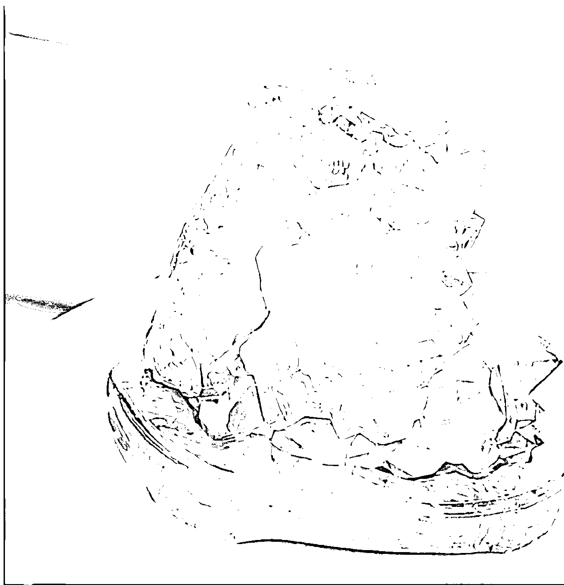

家中的客廳象徵著所有在現在和未來，以各種不同方式來保護、引導、治療和幫助過我們的朋友。因此，在客廳中擺放小型的玉佛像、玉製神像和上師的玉製雕像，甚至未經琢磨的拓長石，都有助於敞開你家的大門和你的心胸，為你招來貴人及所有正面的守護能量。

## 廚房：健康、家族與傳統的延續

家中的廚房屬於五行中的木。因此，廚房的位置最好在東方。廚房被視為一幢房屋的心臟，它負責供給家人食物，並且為家人的健康把關。以更深的層次而言，廚房不但是一個維繫家人情感的場所，更是一條連結過去傳統與現代生活的途徑。

在某些傳統的家族或以務農為主的農家裡，家人們習慣圍在火爐旁一起度過夜晚的時光。當家人聚集在一起時，人們常常會提起祖先們的故事、日常生活的奇聞軼事或是一些有趣的傳說等。因此，廚房這個供應家人食物的家庭之火，才會常常被認為是房屋的心臟。

東方與木元素的對應色彩都是綠色。所以，綠色水晶最適合用來平衡廚房的能量。雖然，廚房這個空間屬於五行中的木。但是，廚房內部卻同時存在火和水這二個元素。火和水這二個元素彼此相生相剋。因此，在廚房內擺放適合的水晶，能夠幫助這二個元素的能量達到平衡和諧的狀態。將綠玉髓、雞血石、玉或綠瑪瑙等擺設在廚房的爐灶及水龍頭之間，能夠有效地恢復廚房能量場的和諧氣氛。

綠瑪瑙（如右頁照片）和雞血石（如右頁照片——小）最適合用來擺在廚房。

## 浴室：放鬆與淨化的場所

浴室一向都被視為清潔淨化的場所。這個場所本身具有自我尊重及珍惜自己的象徵意義。如果我們將房屋想像成人體的器官，那麼浴室所扮演的角色便是腎臟的功能；它就像是一個淨化系統一樣，過濾所有對人體有害的物質及毒素，確保身體的能量可以流動順暢。

藍色、黑色、以及所有讓人聯想到溪流、海洋和泉水的顏色，都是浴室的對應色彩。每一個人都應該好好把握洗澡的時光。讓自己能夠在這個難得的獨處空間裡好好地放鬆身體，得到身、心、靈全面性的淨化。

馬桶是浴室裡最不吸引人的設備。因此，最好馬桶、淋浴間和浴缸都能夠設置在不同的位置。或許你也可以利用浴簾或是分隔牆來隔開這些空間。然而，在大樓或公寓的房子都很難做到這一點。

因此，在浴室門和馬桶之間的掛勾或架子上（如圖上），或是在天花板上放置一顆透明的白水晶也能夠達到類似的效用。

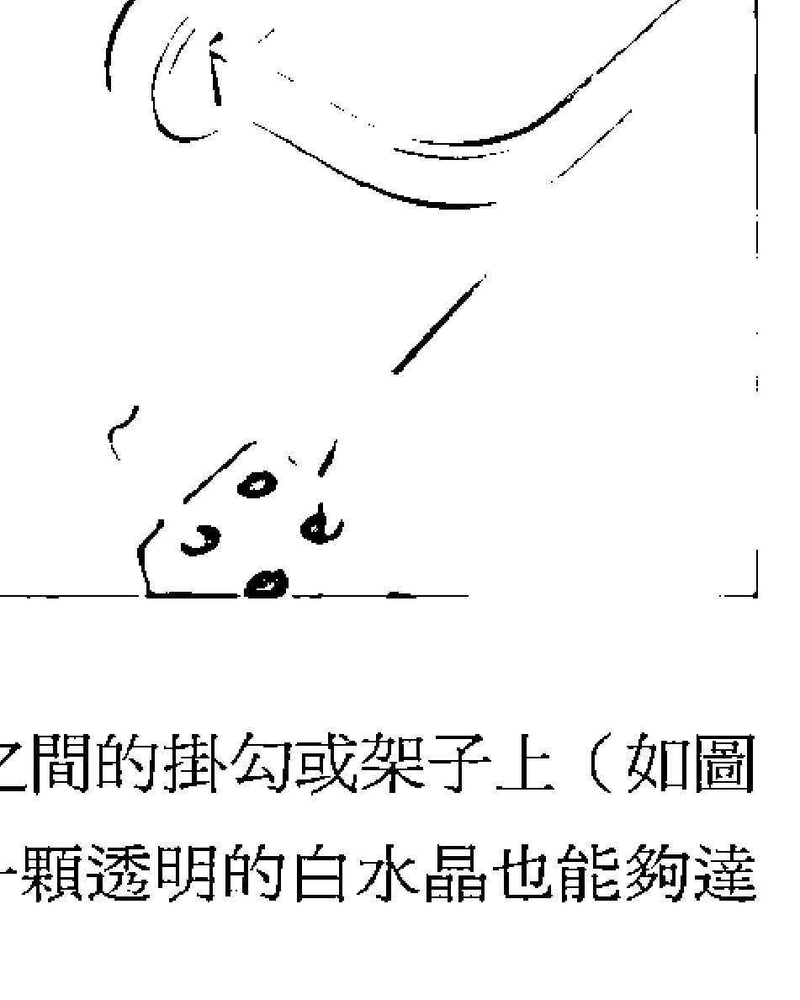

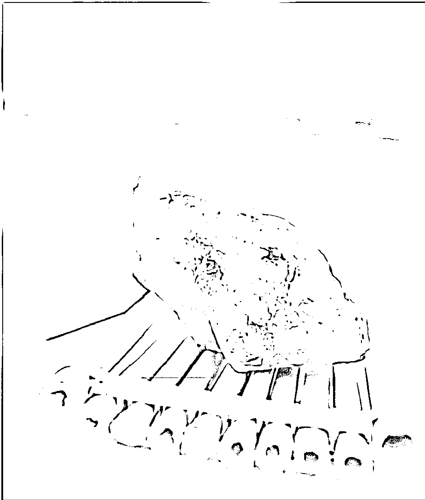

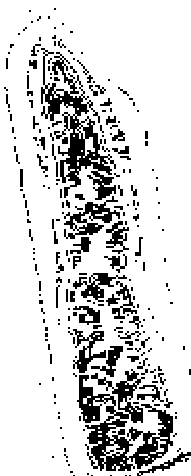

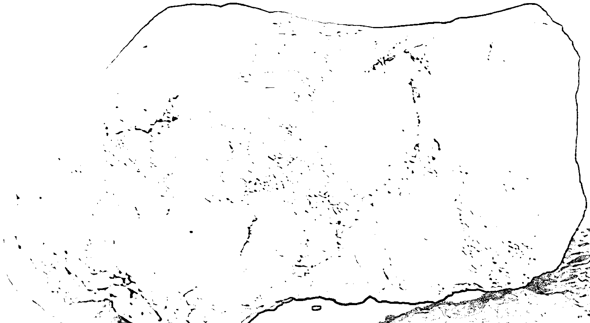

## 主臥房：愛情與幸福的搖籃

家中的主臥房屬於五行中的土，它的對應色彩為粉紅色和黃色。主臥房是屋內最私人、最隱密的空間，主要關係著夫婦間的相處是否良好以及床第之間的關係是否順利。主臥房的能量場，基本上是偏向陰陽中象徵接納包容的陰性能量。因此，如果想讓夫妻間的關係良好和提高睡眠品質，臥室就必須有足夠的陰性能量，來營造出適合放鬆休息的空間。所以，在主臥房中要盡量避免出現屬於陽性能量的元素，例如：尖銳的牆角或家具、強烈的色彩或是過於明亮的光線等。

臥室風水之中床的方位最為重要：床頭的位置最好設置在北方，與北迴歸線平行。床位的安置有二大禁忌：首先，要避免床安置在地磁能量場的位置上。地磁能場所產生的環境病理壓力能量線（Geopathic stress），會對人體有負面的影響。再者，床位不宜直接安置在房間的進出口或對房，這樣容易導致房裡的正面能量流失。

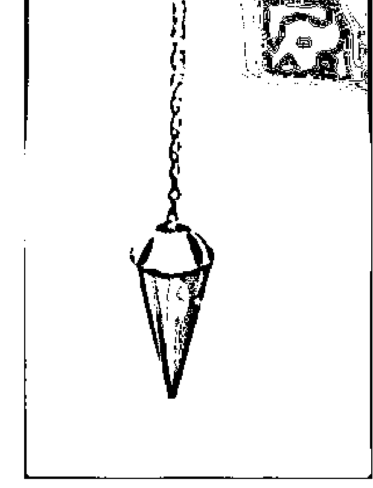

在主臥房中懸掛白水晶，能避免地磁能量場對人體產生負面影響。如果因為房間格局的問題，導致床位必須對著門。在臥室的天花板上掛上一顆或數顆的透明水晶，能夠在房間內形成一道防護網，使房內的正面能量不至於流失。

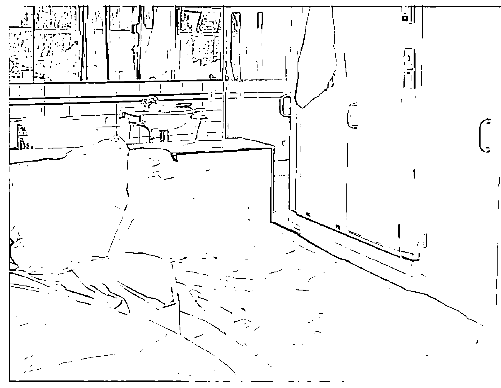

如果你想增進主臥房的隱密性，加強它的接納與包容的能量，則在房內明顯的位置上擺設粉紅色或橘色系的水晶。這二種色彩的水晶能量，能夠讓彼此在床第間更加主動大膽，並且還可以刺激性慾，讓雙方更有活力。菱錳礦不但能夠讓夫妻兩人對對方更加體貼溫柔，同時還能保有熱情。它的能量也可以使夫婦之間能夠打開心懷，真正的貼近彼此的感覺。不要忘了，粉紅水晶（如右圖）則能夠讓雙方一直保有戀愛的心情。

## 如何增進床第間的情趣

一對相愛的人沉浸在情慾的喜樂時，他們曼妙的一舉一動，便是陰陽水乳交融最好的詮譯。性喜樂是一個人所能給予他（她）的伴侶最好的禮物。情慾是愛情最自然的表現；男人與女人共同追求一個終極的圓滿。藉由兩性之間的結合，男人成為了女人；而女人成為了男人，如同一個永無止盡的圓環。坐落在臍輪的性能量被視為宇宙大爆炸（The big bang）——宇宙之火的延續。在這場大爆炸中，不但誕生了宇宙，也開啟了生命密碼。透過一場身、心、靈全面滿足的性愛，能夠驅使粗糙意識的退卻、昇華心識，在宇宙與人類之間搭起一道橋樑。透過完美的情慾過程，也能引起一連串的轉化狀態，讓我們得以全新且超脫的方式去觀看這個世界。

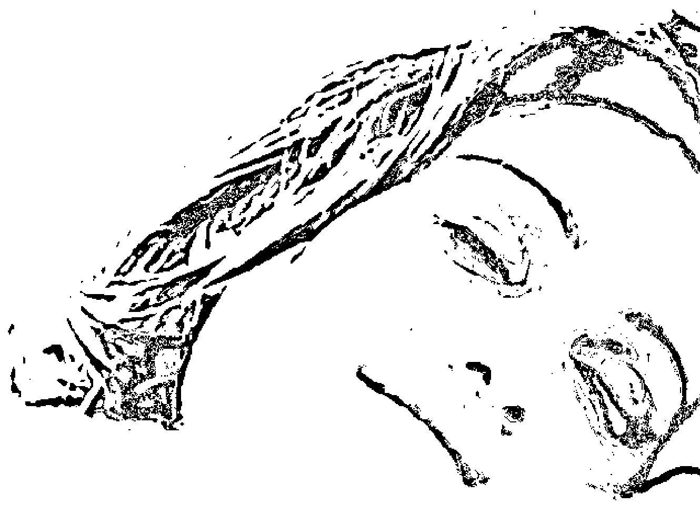

臥室是孕育情慾的場所。因此，在臥室裡擺放適當的水晶，能夠幫助我們維持並且加強與伴侶的性關係。使雙方在床第間都能獲得身、心、靈全方位的滿足。菱錳礦能夠幫助你在性愛過程中更加投入，使你在過程中能夠獲得性歡愉。粉紅色電氣石能為你招來愛情、增加對性的渴望，以及使性愛過程更加持久。它的能量能夠幫助你退去膽怯，使你可以更加自在地表達內心的情感。而火蛋白石則具有增進兩性間的熱情及解放壓抑情感的作用。只需在臥室的床邊擺放一顆至數顆上述的水晶，都能有效改善夫婦或情人之間的性關係。或者，只要在床頭櫃旁的抽屜裡，簡單地擺上紅色電氣石或是粉晶，這些水晶的能量也都夠為你改善你和伴侶之間的關係。

穆拉達脈輪（Muladhara Chakra），又稱海底輪，為掌管性能量的脈輪。例如：紅寶石、赤鐵礦、石榴石、透明水晶、黑色電氣石、黑曜石及火蛋白石等水晶能量石，都能夠加強及平衡穆拉達脈輪的能量。

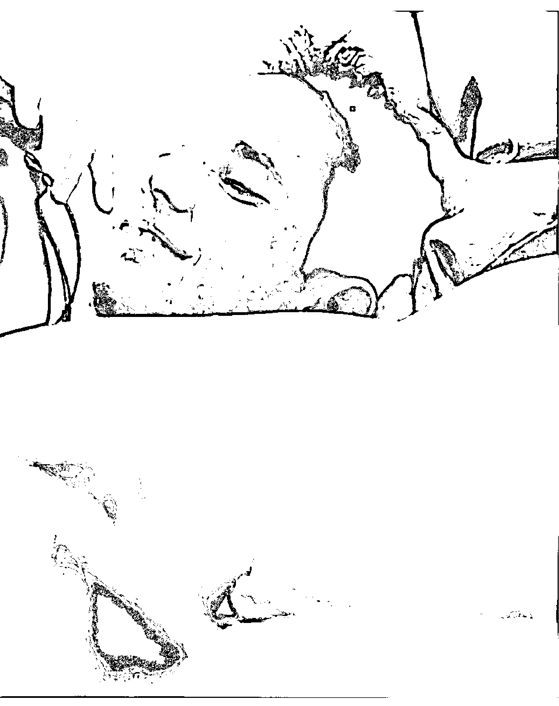

不過，當一個人的心靈狀態還沒有準備好時，千萬不要輕易地運用水晶的能量來刺激體內的脈輪。因為，這樣一來不但對個人的心智與健康沒有任何幫助，反而會對身體造成危害，並且更加重先前的病症。

## 如何透過睡眠來獲得休息及預知未來？

一般人在經過一整天漫長的工作或活動後，我們的身體都亟需要睡眠來幫助我們休息放鬆，並且補充隔天所需要的能量。不過，當我們的身體在夜晚休息時，我們的心智卻在從事另一個活動，也就是做夢。每個人都需要做夢。雖然，一般人都不記得大部分的夢境，但是我們幾乎每天晚上都會做夢。假使，我們禁止一個人做夢，不到幾個星期後，這個人精神狀態便會出現問題，甚至失去理智。在某些情況下，夢境會為我們揭示未來的方向。當我們面臨某些問題時，這些夢境能夠警告我們，並且提供我們有用的建議。靜觀體內世界細微的能量變化，不但可以引導我們走向正確的道路，甚至還能夠預知未來的種種事物。

臥室一向被視為休息與做夢的場所。因此，在臥室內不但要發展夢境的能量來加強警示及預知未來的作用，同時還需兼顧夫婦或情侶間良好的親密關係。有許多不同質地和色彩的水晶，都可以讓你在夜裡獲得真正的休息，並且為你招來預知未來的好夢。妥善地運用你的直覺，即能選出最適合你的水晶。例如：從黑色系的黑玉及玻璃隕石到粉紅色系的粉晶（如下圖），甚至蔚藍電氣石、方納石、紫龍晶、螢石及紫水晶等紫色寶石都具有相似的作用。只需在床邊擺上一個碗，然後在碗中放入適合的水晶，便可以改善你的睡眠品質。這樣不但能使你擺脫噩夢和失眠的困擾，還能讓你夜夜好眠，甚至還能透過夢境而預知未來。

## 工作室：財運的盛衰及富裕的生活

家中的工作室之所以重要的原因，在於這個場所的氣關係到整個家庭財運的盛衰。由於工作室的性質屬於五行中的木。因此，工作室的方位為家中的東南方最為適當。工作室的色彩最好以綠色和紅色為主。此外，可以搭配褐色或棕色等大地色系作為點綴。

工作室的能量場基本上以偏向陽性能量為佳。陽性能量可以幫助我們加強行動力及判斷力。換句話說，工作室內應盡量避免出現太多陰性能量。一個人必須隨時都充滿活動力及具有規劃能力才能獲得事業上的成功。因此，在家中（辦公室或工廠等）擺放凝聚陽性能量的水晶，能對事業帶來極大的助益。例如：有助於激發思考、規劃未來和實踐願景的黃鐵礦等。如果你是一個對未來有許多願景的人，在工作室的桌上擺設黃鐵礦，可以幫助你真正地實踐計畫。

綠色電氣石具有將計畫付諸實行的特質，它的能量也能增強解決財務問題的能力。以辰砂而言，它的能量可以帶來富裕的生活。同時，也有某些水晶具有降低電磁波對人體影響的功能。例如：在工作室的桌上擺放黑色電氣石，能夠減輕由電腦或其他電氣用品所產生的電磁波。

> ### 水晶及電磁波的汙染

身為一個現代人，我們無時無刻都曝露在電磁波的汙染下。家中或是工作場所的電腦或其他的電器用品，隨時都發出各種不同的電波，危害到我們的健康。許多種類的天然水晶都具有保護我們不受電磁波的汙染。它們可以吸收或者改變電磁波的方向。例如：縞瑪瑙能夠吸收有害的電磁波，而黑色電氣石則具有改變電磁波方向的作用。此外，還有其他的水晶也具有類似的功能。我們平常可以依照工作的性質來決定擺放水晶的地方。例如：可以擺在公司的桌上或是放在包包裡。你可以參考本書水晶與能量石的種類特性後，再決定何種水晶最符合你的需求。

### 帶來富裕的能量石

自古以來，富裕的物質生活、數也數不盡的財富或盡情的奢華享受等，都是人類最原始的慾望。然而，一顆水晶並無法讓你獲得下一期的樂透彩大獎。如果我們想要擁有富裕的物質生活，就必須凝聚我們自身的能量，同時我們的一舉一動、思想及情感都不能阻礙這股生命能量的流動。

不單單只有物質的層面而已。富裕生活具有許多不同的面向，它包含了健康、愛情、歡樂及心靈的充實等層面。因此，當我們提到帶來富裕的能量石時，並非單純指招來財富的礦石。它同時也兼具著帶來心靈導師、愛情、友誼、智慧、及心靈解放的作用。

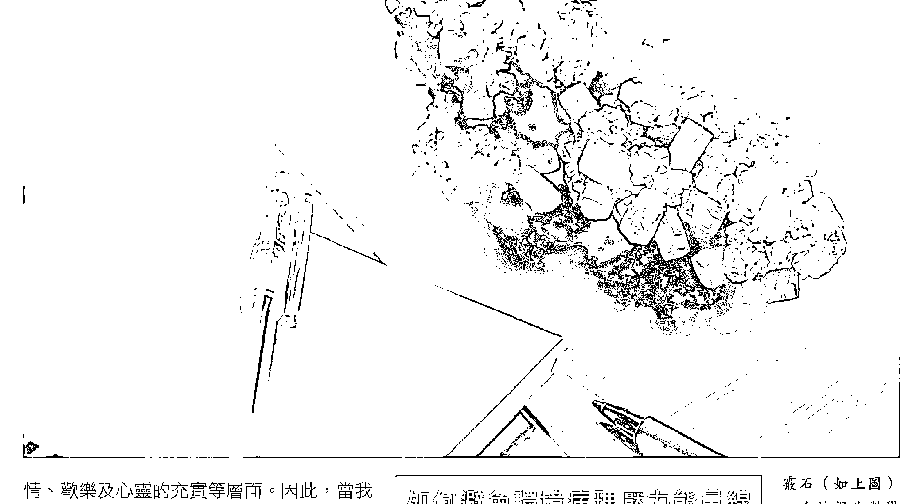

辰砂、紅寶石、黃玉、鋯石、玉、鑽石和藍寶石等珍貴礦石，在不同的時代裡都象徵著「帶來富裕的能量石」。因此，在工作室中擺設上述的能量石，都不失為一個明智的選擇。這些珍貴的礦石都能夠幫助你將正面的能量引導到工作室中，使你的事業蒸蒸日上。

## 如何避免環境病理壓力能量線的危害？

我們所指的「環境病理壓力能量線」是指在地下水脈、地殼斷層、大型礦脈或地球能量線等，以直線形運作所產生的地磁能量場。這些負面能量對人體有害，容易引起許多疾病。因此，床和客廳沙發擺放的方位必須避免與環境病理壓力能量線同一方向。在臥室或客廳的天花板掛上白水晶能夠減輕負面能量的影響。另一方面，只需在地磁能量場的軌道上，選擇任何一個位置。然後，再掛上白水晶。例如：將白水晶掛在牆邊的位置，以免妨礙生活動線，就能有效降低負面能量對人體的傷害。

霰石（如上圖）一向被視為對學生最有益的能量石。

黑色電氣石的能量可以保護人們免於由電腦或其他電器用品所產生的電磁波汙染。因此，試著在辦公桌上擺放黑色電氣石，能夠有令人意想不到的效果！

## 小孩子房間：純真與想像力的發展

一般而言，小孩子房間是家中空間最小的房間。這個空間的能量關係到創造力、純真、想像力及藝術的發展，同時也影響到情緒、情感的表達。小孩子房間的方位最好是在家中的西方。外在環境對於一個剛剛發展的新生命、一個賦有創造力的心靈有非常大的影響。他們就像一塊海綿一樣，吸收所有出現在他們身邊好的或不好的影響。同時，這個場域的能量也能夠帶給我們新的想法，來解決一些膠著已久的難題。

為了能夠使小孩子房間成為一個刺激想像力及創造力的場所，並且同時保持純真的心智及開放的心靈，來體驗各式各樣的事物和發展不同的感官經驗。小孩子房間的形狀最好是圓形或橢圓形，而房間內的色彩最好避免如紅色或黑色這些強烈的顏色，改使用最為柔和的色彩。因此，最好在小孩子房間內擺設色彩柔和的能量石來平衡空間的能量場。例如：方解石、螢石或拓長石等水晶，都有助於刺激兒童的創造力和發展藝術方面的能力。

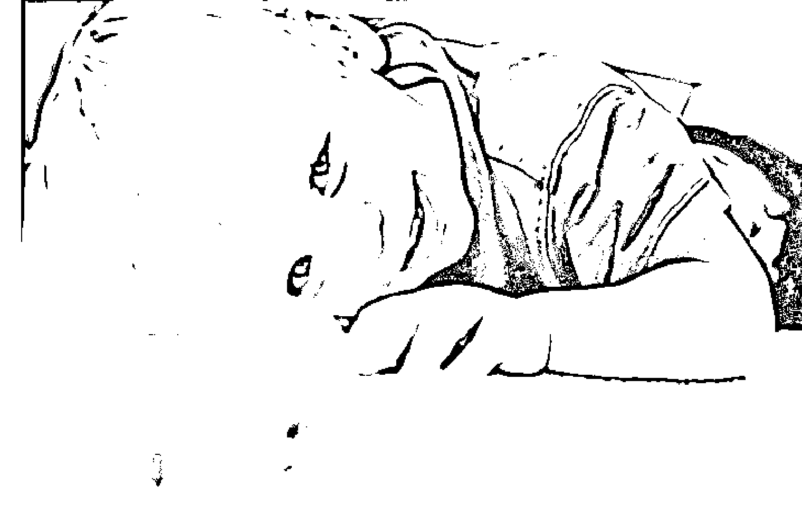

### 神祕事物對兒童的吸引力

對兒童而言，似乎周遭的一切事物都對他們充滿著吸引力；所有的事物對他們來說都是神祕的、未知的。周遭的一切就像磁鐵一樣吸引他們所有的注意力。這個時期兒童最主要的工作，便是探索所有未知的領域。

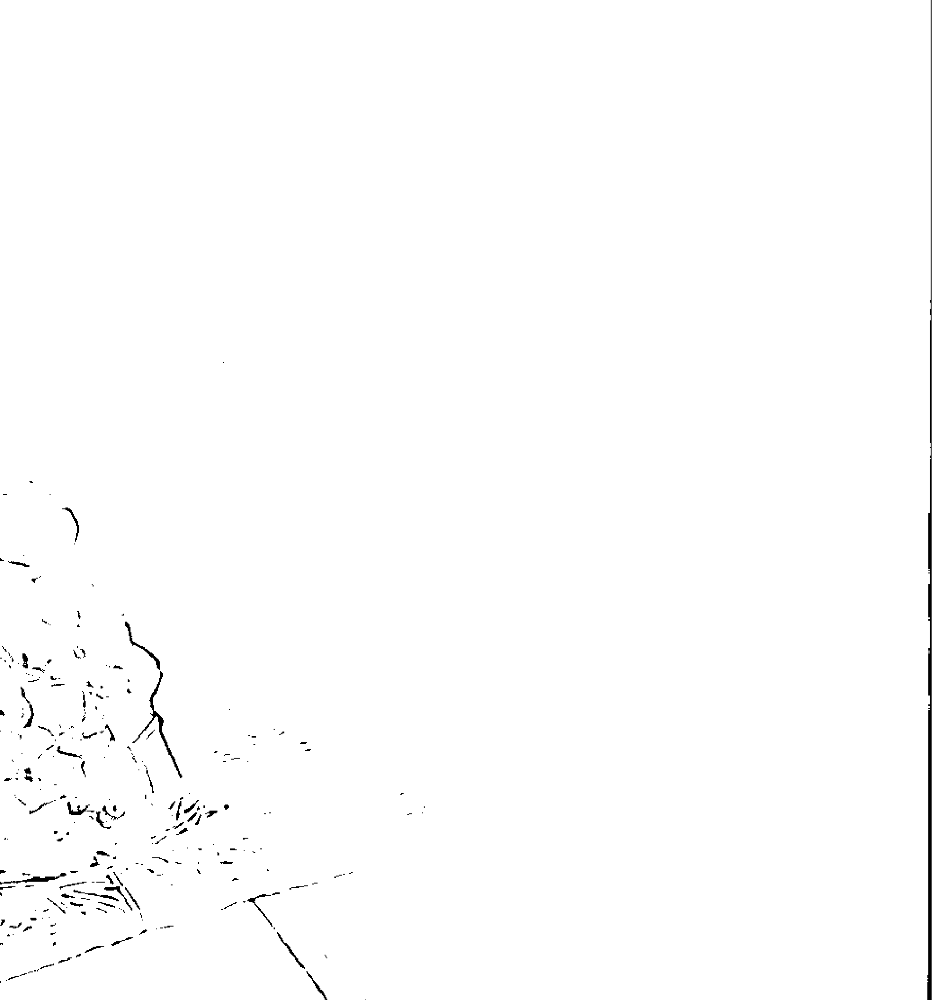

孩子以充滿想像力的心靈，去認識那些令人他們既害怕，卻又充滿吸引力的事物。當我們放下身段與孩子們共同進行這些探險遊戲時，我們也可以藉此再次找回我們早已遺忘的赤子之心，感到它所帶給你清新、純真及無邪的感受。石英、魚眼石或磷灰石等能量石，都能夠幫助你找回內在孩童。這些能量石的震動頻率能夠打開封閉的心靈，刺激想像力，讓你重拾對所有事物的好奇心。

### 運用方解石來開發創新的視野

在此，我們要提供給讀者運用方解石來開發創新視野的方法。方解石也稱為「伊斯蘭晶石」。方解石的能量能夠幫助我們打破固執的思考邏輯，使我們可以更輕易地接受新的人生觀，活出新的自己。它能夠開拓我們的視野，使我們拋開過去封閉保守的自己。

- 首先，靜坐在家中的小孩子房間或是用來激發想像力和創作力的房間裡，你可以坐在瑜伽墊或你喜歡的軟墊上面。將雙手托住方解石，然後慢慢地放鬆。
- 用心觀看透明的方解石約數分鐘的時間。然後，你會看到方解石內出現了二個或更多個自己的臉部影像。這二個臉部影像的大小幾乎相同。
- 之後，在腦海裡專注地想著這些不斷增加的臉部影像。閉上雙眼，觀想雙手托著的方解石。接著，腦海中的方解石越來越大，最後變成如一臺電視般的大小。然後，跨越現實的框架，盡情探索你內心裡無限的可能性。
- 進入充滿無限可能性的空間後，以現實的自我為基礎，建立一個全新的自我。繼續凝視從方解石內部所散發出來的光芒。放鬆自己去接收光芒，你會感覺到光芒進入了你的身體，為你的身體充電。當你準備好要回到現實世界時，便可以結束靜坐。在起身時，最好扶住赤鐵礦一會兒，能夠讓你站起來時更加順利。

## 書房：知識、文化與智慧的源頭

代表文化與知識的場所屬於五行中的木。一般來說，書房的方位最好能夠在家中的東北方。

因素。許多礦石都可以幫助我們強化這些能力。讓你的直覺帶領你，它會為你選出最適合你的水晶。

書房是家中最主要的房間之一。它象徵人類與知識和學習等相關事物的聯繫。它包含所有層面的知識：如精確科學、自然科學，甚至到人類內心深處的知識探索。一間好的書房不論是對家中的學齡兒童和青少年而言，甚至是家中的每一位成員，都是非常重要的地方。

-   綠松石：綠松石能夠使你在學習或閱讀的過程中靜下心來，並且充分地利用這段時間。綠松石完美的平衡能量可以讓你進入一個放鬆自在的狀態。
-   赤鐵礦：當你在學習時，赤鐵礦的能量能夠加強專注力、紀律心以及條理的能力。因此，如果你想要讀數學或是物理等學科時，可以選擇如赤鐵礦的能量石。當你感到疲累、對任何事情都提不起興趣時，赤鐵礦也可以幫助提高學習的動力。
-   霰石：霰石能為你的學習打下穩固的基礎。如果你對於哲學有興趣的話，霰石與大地（土）強烈的連繫可以加強你現有的領悟力，讓你了解更高深的哲理。
-   紫色螢石：紫色螢石能夠活化大腦的功能。因此，非常適合用來加強理解及統合的能力。它的能量有助於放鬆及打開心智，使我們可以鑽研更專業的知識。
-   煙水晶：煙水晶主要的功能為加強專注力，防止思緒分散。

## 適合書房的水晶

對於有效的學習來說，應該同時具備記憶力、專注力、及新資訊的統合能力等重要

## 飯廳：分享食物與情感的場域

飯廳屬於五行中的火。它的方置最好是在家中的南方。一般而言，飯廳象徵社交的場所。我們的家人和朋友都會聚集在飯廳中一起分享食物。同時，當眾人齊聚在飯廳時，也能看出你在家庭中所扮演的角色及別人對你的觀感。飯廳的對應色彩為紅色。

由於飯廳在家中扮演多重的角色，最好在飯廳的窗戶旁擺上一顆白水晶。這樣一來，便可以加強這個房間的氣流循環。假使，家中飯廳的窗戶非常小，最好能夠將白水晶長期擺放在窗口。否則，這個空間的能量氣流便會略顯不足。從窗戶進來的自然光，則能夠持續地幫白水晶進行充電。

色彩鮮紅的水晶也非常適合擺放在飯廳的空間裡。這些紅色系的水晶代表火的光芒及熱烈。例如：虎眼石和紅玉都具有上述的特質。因此，也很適合作為飯廳的擺設。

如果，飯廳的窗戶太大的話，可以試著擺上紅玉髓。紅玉髓有助於調節進入室內的能量，能讓飯廳的氣氛更為柔和放鬆。使每個人都能自在地談話，同時加深彼此間的情感。

## 待客的藝術

讓來訪的客人有賓至如歸的感覺是一門藝術。別人對我們的印象，其實是來自於我們如何接待他們。當客人來訪時，他們首先進入的地方是家中的飯廳。自然而然地，我們都希望能獲得客人的好感，讓他覺得家中的氣氛十分輕鬆，並且能夠感受到我們的歡迎。

飯廳不僅反映了我們的人格特質，更顯現了我們的內在。一個氣流流動順暢的飯廳，會令人有乾淨和整齊的感覺。因此，我們可以在飯廳擺設能夠代表我們個性或性質的能量石。在飯廳擺放晶洞能夠讓整個空間充滿明亮的感覺。同時，由大大小小的水晶所組成的晶洞，也象徵著人際關係的和諧。

> 屬於自己的聖所
根據八卦圖，聖所的位置應坐落在家裡的中央。聖所屬於五行中的土，它的對應色彩為黃色。事實上，聖所不屬於家中任何的一個房間；也就是說，你可以在家中的任何一個角落建立一個屬於自己的聖所。聖所是一個能夠讓你獲得內心平靜與自在的地方。這個聖所必須是一個獨立於其他作用的地方。在那裡，你可以不受任何影響地沉思冥想。同時，你可以在聖所內擺放對你最有益的水晶或是你最需要的能量石。

## 水晶療法

## 水晶療法的歷史

古以來，人類就懂得運用水晶來治療心理及生理的疾病。西方文獻記載最早有關水晶療法的文獻出現在古埃及。當時，古埃及的祭師使用青光石和綠松石等能量石，製成護身符來保護人類不受病魔的干擾。他們也會使用孔雀石讓死去的人能夠順利進入亡者之國。最廣為人知的水晶用法則出現聖經中：胸甲十二顆寶石。在聖經中，摩西的兄長亞倫（Aaron）在他胸前佩掛的護胸甲上，鑲嵌有十二顆寶石。這十二種寶石則分別代表以色列的十二個部族。這便是佩戴誕生石最早的起源。在古印度文明中，阿育吠陀派系的醫者會以水晶來治療身體及情緒上的不適。同時，阿育吠陀占星學也會使用水晶來推算出生命盤（Natal chart）。而中國在西元前半世紀，也開始出現使用水晶的記錄。古希臘時期學者們開始研究水晶，並且寫出許多有關研究水晶的特性及特質的書籍。其中比較有名的學者包括醫學家蓋倫（Galen）、希羅多德（Herotodus）和亞里斯多德（Aristotle）。而亞里斯多德的學生泰奧弗拉斯托斯（Theophrastus）的著作《西奧佛拉特斯·論石》，在這方面更是具有重大貢獻。大約西元一世紀時，老普林尼（Plinius Secundus）重拾泰奧弗拉斯托斯的研究，更加深入及廣泛研究水晶與礦石的特質，以及它們與天文學的關係。而古羅馬時期約西元前900年，則有《神祕的寶石學》（Lapidario），這本書不但詳細地記錄寶石的特性，更大量記載寶石的神祕能量及它們與天文學的關係。

中古世紀時期，塞維亞的聖伊西多羅（San Isidro de Sevilla，西元560～636年）曾經在碑文中記載有關寶石的使用方法。而賓根的聖赫德嘉（San Hildegard Bon Bingen，西元1098～1179年）在修道院中長期研究礦石的特性及用法。同時，德國的大阿爾伯特神父（Albertus Magnus，西元1193～1280年）也以研究自然界的神秘面向聞名，包括礦物學及植物學等。智者阿方索五世（Alfonso X，the Wise，西元1221～1284年）則寫出了第一本真正的水晶療法百科全書。然而，原來的版本只保存下來二十冊，約全書的四分之一而已。直到西元1500年，費勒（Jaume Ferre de Blanes）才寫出了另一本寶石學的著作。然而，我們不要忘記並非僅有歐洲文明懂得如何運用水晶。事實上，全世界大多數的古老部落都懂得運用水晶神奇的能量。尤其是在美洲、澳洲及中東等地區更是如此。印加（Inca）、馬雅（Maya）、托爾鐵克（Toltec）以及奧爾梅克（Olmec）等古老的美洲文明，都將水晶，如黑曜石，視為他們能量的神聖來源。

人類經過了啟蒙及科學大爆炸的時代後，現在我們又進入了另一個新的世代。透過這個新世紀的能量，喚醒了人類與自然界中的聯繫，也喚醒我們沉寂已久的意識。讓我們再次恢復與世界萬物溝通的能力，以及與宇宙能量交流的可能性。

## 水晶與健康的關係

大致而言，水晶療法是建立在科學的壓電學（Piezoelectricity）基礎上。也就是指，水晶療法是一種與地核磁場能量和諧共振的治療方式。水晶療法除了與大地有著極大的關聯，同時它也關係到地球兩極的磁力作用及太陽光能量的運作。

天然水晶與大地的結構成分幾乎完全相同。因此，水晶蘊含與大地相同的能量。水晶完美的結構及外形，也被視為宇宙萬物中最精確、最完美的準則。此外，水晶的能量能夠溫和地深入你的身體，幫我們吸收、去除或轉化體內的負面能量，使我們體內的氣場恢復和諧的狀態，讓氣流能夠流暢地在細胞間流動。

為了能夠讓我們真正了解並且有效的進行水晶療法，我們就必須從整體主義（Holism）的概念來著手。因為，人類是極為複雜的生命體，我們的身體絕非如一部機器或是一群化學物質的集合體運作這麼簡單。人體的運作十分複雜，而且往往隱藏許多不確定性。西方的傳統醫學往往將人體視為一部功能複雜的機器。他們看待所有的疾病，就如同對待機器故障或出現毛病一樣。

西方醫學不會去探究疾病出現的真正原因，他們普偏傾向單純的治療病症，讓身體恢復為原來的狀態。

事實上，「治療法」（therapy）一詞是指治療與服務病人的藝術。羅馬帝國時期，一群艾賽尼教派（Essenes）的人在巴基斯坦幫助治療一些不被人們接納的病人。艾賽尼教派的人將他們的知識保存在洞穴中。同時，也有人認為耶穌曾受到艾賽尼教派的影響。

現在，治療法這個名詞普遍指為各種不同症狀的治療方法及技巧。天然水晶則被視為用來減輕人類各種問題的工具之一。現代生活的環境和社會形態，往往不知不覺地造成人類在身、心、靈不同層次的紊亂。接下來的篇幅，我們將會介紹幾種有助於讀者舒緩現代人最常見病症的水晶療法。

天然水晶的能量能夠讓你的身體恢復健康。然而，當你在運用水晶的治療能量前，一定要學習傾聽身體及內心的聲音。

首先，我們要將身體視為一個互相牽制影響的系統，身體出現的大部分秩序都源自於體內氣場的失衡。因此，只要正確地使用水晶療法，即能夠使我們身體的氣場恢復原有的平衡狀態。

身、心、靈層面的狀態，你就必須學習如何解讀身體所發出來的所有訊號。整體主義的概念便是人類不該只有考慮到肉體的狀態，應該要加深到心靈、情感及靈魂等不同的層面。事實上，人類只有在身、心、靈多方面達到平衡和諧的狀態時，才能獲得健康的身體和滿足的人生。

## 傾聽身體的聲音

讓身體恢復健康的狀態是一個屬於個人的獨特過程。一旦你學會如何傾聽身體的聲音和理解身體散發出來的訊息，便可以一次比一次更強化身、心、靈三方面的聯繫。

一般人通常都等到身體已經發出疼痛的警訊時，才願意傾聽身體的聲音。如果，你想要享受一個健康的人生和更加了解自己

如果有任何一個層面出現失衡的狀況，都會直接或間接的影響到其他的層面。治療法的作用便是要找出失衡的根本原因。而水晶療法就是以這種論點為基調的治療法。水晶療法能夠激發身體器官與生俱來的自我治療機制，促進生命能量的流動，達到刺激活化脈輪（或能量中樞）、淨化經脈（能量管道）、恢復體內陰陽能量的協調，以及淨化修復氣場等作用。

此外，天然水晶的能量也具有平衡左右腦、放鬆心智與身體、活化身體各部位的器官及系統、消除壓力和執念、釋放情緒及增強生命能量等多種功能。

## 如何使用水晶來改善身體狀況

目前來說，有二種最普遍的水晶療法：將特定的水晶放置在身體的某些部位上，以及利用脈輪或是主要的經脈來進行水晶療法。不管我們使用那一種治療法，最重要的是保持輕鬆開放的心態。當我們使用水晶來進行淨化共振的過程時，一定要懷有堅決的信念。

另一方面，在進行水晶的觀想時，我們都會建議某種具體的觀想模式。然而，有時候卻會因為水晶的性質不同，而出現不同的影像。當發生類似的情況時，最好依照水晶自然而然所產生的影像來進行觀想，不要堅持原來的觀想模式。切記，在治療過程結束後，一定要非常仔細地淨化消磁使用過的水晶，並且將已淨化的水晶包在天鵝絨或絲質的手帕中，小心地保管。

## 陰陽與水晶

陰陽的概念源自於古老的東方哲學，主張宇宙萬物都有陰陽兩個屬性，而且兩者間為相互依靠、相互制約和相互轉化的關係。雖然有許多人都認為這個概念非常艱澀奧妙，然而陰陽卻是二股調節宇宙萬事萬物的能量。「無陽則陰無以生，無陰則陽無以化」，陰陽這二股力量絕不可能單獨存在。陰陽兩股力量持續地相互作用之下，則產生了萬物。

陰為女性的、被動的和接受的；陰的能量促使寒冷及寧靜的產生。陰代表夜晚，與身體的左半部有極大的關聯。陰同時象徵直覺的、創造的及心靈的面向，同時也代表內省的力量。

陽為男性的和主動的；陽的能量促使密度、重力、熱力及活動力的誕生，它象徵白晝與太陽。陽與身體的右半部有極大的關聯。它代表力量、勇氣及堅持。所有人的體內都有這兩股力量。而陰陽的虛盛會顯現在一個人的個性、人格特質，甚至身體的健康上。因此，如果想要維持良好的身體健康，就必須讓體內的陰陽處於和諧的平衡狀態。天然水晶特有的震動頻率有助於維持體內陰陽的平衡。

無光澤感的水晶（如孔雀石、青光石和赤鐵礦）為偏陰性的能量石，具有接收的作用。而透明或半透明的水晶（如水晶、海藍寶、紫水晶和鑽石等）為偏陽性的能量石，具有放射和發射的作用。

## 冥想與觀看

冥想一詞真正的涵義在禪宗解讀為「不做任何事的靜坐」。冥想最主要的目的為轉化生活中的幻象，摧毀我們稱之為「現實」的海市蜃樓。目前而言，有許多方法來幫助我們的身體進入到靜坐的狀態。例如：深呼吸有助於放鬆心智、讓我們沉默安靜下來，並且擺脫腦中的胡思亂想。

我們隨時隨地都在做某些事、想某些東西。因此，我們很難有一刻不在想著過去所發生的事。想著，我們曾經做過什麼或沒有做什麼，讓自己沉浸在後悔和無奈之中。同時，我們也很難不去思考未來的計畫。不停地想著將來要做什麼。因此，我們的腦海中總是會不停地製造那些危害我們生命能量和損害健康、歡樂及生活品質的問題。

對於人類而言，放下手中的一切簡直就是天方夜譚。我們會害怕面對什麼事都不用做的空虛。為了證實自己的存在，我們甚至會抓住讓自己痛苦不已的人、事、物。因此，空出一段時間令自己放下手中的一切顯得格外的重要；讓自己停止思考、擺脫外在世界的雜音。許多研究報導證實，規律地進行冥想對人體有極大的助益。當我們進入冥想的世界時，並非在逃避現實；反之，冥想有助於調整我們的心態，讓我們能夠面對外在的真實世界。每個人都知道壓力是許多問題的來源。因此，心靈的平靜可以創造出一個更美好的人生。每個人的靈魂都背負著許多包袱。所以，我們都需要找到生命的意義。透過冥想，人類可以重建靈魂與自我存在之間的聯繫。當我們進行冥想再加上一些想像力時，這股力量我們稱之為「觀想」。觀想被視為一門創造影像來幫助人類進入潛意識的藝術。不可避免的，當人類在清醒的時候，我們的理智主宰著大腦。所以，我們都會比較著眼在實際的層面上。潛意識對於我們而言，是一塊全然陌生的領域。現在的人們早已經忘記進入潛意識的方法、也遺忘那一股想要逃離理智掌控的渴望。

一般而言，潛意識會透過我們的夢境（因此，好的睡眠品質十分的重要）、冥想或觀想的過程來顯現。當我們在進行觀想時，使用天然水晶可以加強與潛意識間的聯繫，並且喚醒想像力。想像力的作用在於使我們可以在腦海裡描繪出正面的影像來激發改變的力量。透過想像力可以改變腦海裡的硬碟，創造出新的現實。當我們在進行冥想或觀想的過程中，如果能夠妥善地使用天然水晶便能改善我們的健康狀況。我們所要做的，只是學習如何善用天然水晶的能量而已。

## 雙手的感受度

想要開發雙手的感受度需要具有高感知力的心智和持久的耐心。當你雙手的感受度開發的越高時，你也就越容易接收水晶所傳來的訊息。同時，你也能更輕易感知到其他人的氣場能量。具有高感受力的雙手，也有助於進行冥想和靈療的過程。
我們的雙手是心的延伸。想要開發雙手的感受度必須依照下列的幾個步驟：

1.  輕輕地摩擦雙手數秒鐘後，將雙手打開約20公分寬。
2.  現在，感受在雙手間成形的能量氣泡。專注感覺能量氣泡的彈力讓雙手間的距離一下縮小，一下擴大。
3.  專注地感受這股力量。這股力量也許微弱，僅能在皮膚上感到刺癢感。然而，你也可能感到一股強大的能量在你雙手間流動。無論力量大小，都要用心地感受這股能量的存在。
4.  每當你打算進行水晶療法之前，請先練習這些動作。

## 水晶冥想法：初級篇

## 冥想的能量

為了讓讀者能夠盡早熟悉水晶的能量，建議你可以先進行冥想的動作。你所使用的水晶，並非一定是在第一次接觸時就能夠感受到震動頻率的水晶。

-   在一個安靜的房間中，開著柔和的燈光，將水晶放到身體的前方。
-   閉上雙眼，緩緩地深呼吸，不要加快呼吸的速度，然後再慢慢地放鬆你的身體。將所有的擔心煩惱拋出腦海，把思緒專注在呼吸上。專注於鼻子的吐納。每當你吸氣時，在腦海慢慢地重覆：「我召喚水晶的內在之光；我是一條清澈且完美的管道，水晶之光引導我。」這句話。同時，觀想一道綠色透明的柔和光線，隨著空氣吸入你的肺裡。每當你吐氣時，觀想所有的壓力都離開你的身體。
-   維持呼吸的頻率，享受放鬆的感覺。此時，將你的目光轉到水晶上，但不要緊盯著水晶看。保持相同的姿勢，觀看水晶的色彩、形狀和它閃耀的光芒。感覺水晶的振動頻率流遍你的身體。此時，專注地凝視水晶，讓你的意志進入並且流貫到整個水晶內部。
-   當你完成了這個程序後，再輕輕閉上雙眼。觀想水晶的能量，以及它也向你顯現它的能量。觀想水晶的光芒與第三眼連結，水晶完美及和諧的光芒灌注到你的心智，甚至全身。與水晶一同遨遊。

當你準備結束冥想時，請張開雙眼，然後站起來，再用布覆蓋住水晶。做三次深呼吸後，感覺你的雙腳穩穩地站在地上。先不要做任何劇烈的動作，讓你的身體好好地整合這次的經驗。

## 石榴石的能量

請準備一顆石榴石。這個冥想法需要至少半個小時的時間。如果你願意，也可以在冥想的過程中播放柔和的音樂。

-   將全身放鬆並且專注在呼吸上，直到呼吸的頻率相同為止。
-   此時，將你的目光移到石榴石上，但是不要緊盯著石榴石。現在，你只需要好好地觀察你所感受的一切，不需要做任何的動作。
-   每週至少進行一次這個治療法，就能夠驅趕你的恐懼和不安全感。同時，一股全新的安全感和勇氣也會從你的心中慢慢地滋長。

> 水晶冥想法：進階篇

目前，你已經完成二個簡易的冥想法。現在，你可以準備進行更複雜的冥想法。如果你發現自己沒有辦法進行接下來較進階的冥想法，那表示你的練習還不夠。請你繼續練習初級的冥想法，你將會培養足夠的靈能來進行接下來的冥想法。

## 紫水晶冥想法：與超我對話

感受你的身體慢慢地放鬆下來，而心智也漸漸地歸於平靜。凝視紫水晶數分鐘，讓紫水晶美麗的色彩和形狀吸引你所有的注意力。觀想紫水晶的體積越來越大，直到它變成一座山的大小。在紫水晶山的兩側各有一個進入水晶內部的入口。用心感受紫水晶強大莊嚴的能量。當水晶山兩側的門向我們開啟時，我們就可以進入到紫水晶的內部。一旦我們進入了水晶山的內部，我們會感到好像進入一間充滿紫色光彩的宏偉神廟。此時，我們的嚮導（這個嚮導可以以任何的形態出現，例如：天使、神獸或靈體等）會陪伴我們進入一個特別的空間：心靈淨化室。在這間充滿祥和光芒的房間裡，我們將會擺脫所有令我們煩心的人、事、物。

我們靜靜地感受這道光芒如何轉化我們的煩惱，讓我們再次感到自由。這股輕鬆的感覺滲入我們心裡，使我們心中充滿喜悅。現在，我們已經準備好繼續下一個的步驟。

當我們的嚮導見到我們身著一件充滿白光的新衣走出淨化室時，它對我們展開了微笑。接著它帶領我們來到了另一個房間：紀錄室。仔細觀查水晶內部的能量正在大量地活動當中。當我們進入了紀錄室時，發現到這間房間是知識的寶庫。它就像是一間巨大的圖書館，在這裡我們可以找到所有的知識。紫水晶所蘊含的知識現在化成一道紫光射入到我們的腦海裡。這是一股全然寧靜祥和的能量。

現在，我們的嚮導帶領我們來到了位於紫水晶山中央的房間：靜默室。它是於紫水晶中最重要的空間。一旦我們進入了靜默室，就可以召喚出真正的自我，也就是超我。我們接納超我的存在。我們可以感覺到超我越來越靠近我們。如同嚮導一樣，超我也可以以任何的形象現身。現在，我們與超我的頻率一致。感覺到超我的光芒和它的愛穿透了我們的身體，直到我們與超我真正合而為一。

每個人與超我接觸和對話的經歷都是獨一無二的。因此，最重要的是在與超我進行接觸後，都需要整合自己的獨特經驗。過了一陣子的寂靜後，嚮導陪同我們回到入口，它向我們慎重地道別，而我們也要對它表示感激。

慢慢地我們回到現實世界，再次感受到呼吸和身體的存在。如果事後能夠將這次的經驗記錄下來，對我們會有極大的幫助。因為，這次接觸中所得到的任何資訊，都是十分重要且具有關鍵性的訊息。在這次經驗中，我們獲得最大的好處，便是了解我們能夠與超我進行真正的對話，而且我們即是超我的一部分。

## 紫水晶冥想法

紫水晶的能量可以幫助探索最深層的自我，以及提供與超我對話的獨特經驗。

## 愚人金冥想法：思緒整合

將愚人金移到接近太陽神經叢的位置，即可感受到它的金屬光芒所產生的能量。透過愚人金幾何圖形的穩定性，也可以淨化和調節這個區域的能量。

將愚人金接近心臟的位置，深深地吸進它的礦物能量。你可以感覺到愚人金的能量就像一陣螺旋狀的血色旋風，淨化與促進血液的流動。試著觀想它金黃色的能量強化你的防護網。當你把愚人金放到前額的位置時，它外形的穩定能量能夠幫你整理思緒。

### 如何正確地進行冥想？

只要你能夠遵守下例的幾項建議，冥想也可以很簡單。例如：早晨和傍晚是非常適合進行冥想的時間點。如果可以的話，準備一間專門用來進行冥想的房間，你可以依照自己的喜好親手布置它。正確地吐納是非常重要的一點。首先，坐下來，慢慢地深呼吸，觀想氣體如何進出你的肺部。

## 綠色水晶球冥想法：健康與排毒

球體象徵圓滿、完全和沒有任何界限。球形水晶的能量磁場就如同它的外形一樣圓融和諧。使用水晶球來進行冥想時，可將水晶放置胸前的位置。

在所有水晶種類中，綠色水晶具有提升呼吸品質，有助於將更多氧氣吸入體內的功能。綠色水晶的能量能喚醒我們與生俱來樹木的能量，使我們像大樹一樣能夠製造更多氧氣來幫助我們排出毒素、淨化身體，並且有效改善其他屬於金元素的器官，如大腸和皮膚。氧氣具有刺激體內排毒、殺死腸道細菌的功能。因此，能預防結腸炎的發生。同時，也有助皮膚細胞的再生，使皮膚再次呼吸。一旦我們強化免疫系統的功能，我們的身體也就會更健康。而橫膈膜放鬆有益於消化系統的改善。自然而然，脹氣也就會慢慢消失。

當綠色水晶球與愚人金共同使用時，可以提升它的能量來強化我們的呼吸系統，提高腦中的含氧量。

綠色水晶球冥想法：當我們感到壓力的時候，身上就會出現過多的負面能量。使用綠色水晶球來進行冥想，有助於將毒素排出體外。

## 如何製作水晶水？

對於許多人而言，水晶水的用途十分廣泛。製作水晶水首先一定要準備保存妥當的泉水、礦泉水或海水。製作水晶水的步驟如下：

當然我們也可以將不同種類水晶所製成的水晶水混合使用。製作的過程完全相同：分別製作出你所需要的水晶水，再將它們混合使用即可。當這些水晶水混合使用時，它所產生的能量極其微妙。此外，最好不要混合超過三種種類的水晶水，以避免水晶水的能量產生相互抵觸的情況。

1. 要製作水晶水的水晶先淨化好備用。將淨化好的水晶放入玻璃容器或晶洞內。在容器內倒入半杯的泉水。召喚水晶的治療能量，讓水晶的震動頻率感染容器內的水，將它的訊息傳遞到水中。
2. 從早晨到中午的時候把容器放到太陽下。不過，正午的太陽光能量會改變。因此，最好在正午陽光的能量改變之前，先將容器收走。
3. 將泡好的水晶水，用濾網將水晶過濾起來。為了將保存期限拉長，可在水晶水裡加入約一半的酒後，再倒入附有滴管的琥珀色玻璃瓶內。為了加強水晶水的訊息，可以再擺放一個等邊的金字塔。金字塔的四個尖角需分別指向東、南、西、北四個方位。金字塔擺放的時間可以依據你的需求而不同。

此外，質地較脆弱的水晶不適合用來製作水晶水。當它們放入水中時，容易產生有毒物質危害人體健康。

在製作水晶水之前，我們可以先將質地脆弱的水晶先放入玻璃的容器內，讓水晶不會直接接觸到水裡。就好像利用隔水加熱的方法來製作水晶水一樣。

水晶水的用量及使用方式可以根據每個人不同的需求來調整。最普遍的用法是將數滴水晶水含在舌頭下方，或是將水晶水滴入半杯水，攪拌後再小口地喝下。你可以依照你的直覺或使用水晶靈擺來判定水晶水每日的用量。

同時，我們也可以利用水晶水來活化脈輪，只需將數滴水晶水滴入浴缸做泡澡，或是混合精油來按摩身體皆可。

水晶水能夠有效地發揮天然水晶的能量。依據你的直覺或使用水晶靈擺都可以判斷水晶水每天使用的劑量。

## 色彩能量脈輪平衡療法

書在之前已提過，只有當我們體內的能量流動達到一個平衡的狀態時，我們的身體和宇宙能量才能獲得和諧的共存。

因此，我們可以運用天然水晶的能量來活化和平衡七個主要脈輪的能量。首先，根據脈輪的屬性（通常以顏色來做區分，如紅色、橘色、黃色、綠色、粉紅色、藍色、靛藍色和紫色）來挑選適合的能量石。當我們選定要進行治療的脈輪後，依照它的對應色彩來選擇適合的水晶。接下來，我們就可以練習下列的水晶治療技巧：舒服地躺在瑜伽墊或床上。將雙手自然地平放在地上（或床上），雙掌朝上。將水晶擺放在你要治療的脈輪中心點。

### 第一脈輪（海底輪）

**掌管性能量、活力和勇氣**

將石榴石、紅寶石或赤鐵礦等紅色系水晶放在會陰處，有助於靈療生理上的問題。緬瑪瑙、黑色電氣石或其他黑色系水晶，則有益放改善與第一脈輪相關的情緒和靈性問題。如果你不想將能量石放在會陰處，也可以把能量石放在鼠蹊處的位置。

### 第二脈輪（臍輪）

掌管創造力和意志力。功能失常可能導致性功能障礙、腎臟和腸道系統等問題。

將紅玉髓放置臍輪即可。

### 第三脈輪（太陽神經叢）

掌管天賦。功能失常可能導致神經質和消化系統的問題。

將黃晶、黃玉、硫和黃色方解石放在太陽神經叢的位置。

### 第四脈輪（心輪）

掌管同情心和愛情。功能失常可能導致心臟和肺部疾病。

將玉、綠玉髓或綠色電氣石放在心臟的位置，能有效改善生理上的疾病和活化體內自我治療的能量。粉晶和粉紅電氣石則能靈療情緒和靈性的問題。由於西瓜電氣石同時具有綠色和粉紅色二種色彩。因此，它的能量更為強大，能夠強化我們的免疫系統，同時活化體內的能量通道，使能量流動更加順暢。

### 第五脈輪（喉輪）

掌管溝通、情緒表達及口語清晰等能力。功能失常可能導致喉嚨痛和甲狀腺的問題。將海藍寶、綠松石或藍色方解石放在喉嚨的位置。

### 第六脈輪（眉心輪）

掌管直覺、智慧和熱情。功能失常可能導致腦下垂體的問題。將紫水晶或螢石放在眉心的位置。

### 第七脈輪（頂輪）

掌管心靈成長和自我提升。將舒俱徠石、藍寶石或紫龍晶放置距離頭頂約五公分的地板上。將寶石的尖角朝外即可。方納石、青光石和藍銅礦等靛藍色能量石除了可以放在前額的位置，也可以放在頸部。不過，這些能量石放在前額時的效果比放在頸部的效果更好。而紫水晶也同樣適合放在頭頂的位置。

## 遠距離水晶靈療法

我們想要運用天然水晶的能量來靈療他人時，並非一定要透過實體的接觸。在我們體內脈輪間流動的能量不僅只連結宇宙能量，這股能量同時也可以連結到其他人的生命能量。因此，藉由這種能量與能量間微妙的聯繫，我們可以將天然水晶的能量引導到其他人的身上。

當我們在進行遠距離水晶靈療法時，能量的流動方式十分精細微妙。因此，投入的專注力越高，它的效果也就會越好。因此，當我們在實行遠距離靈療法時，最好能夠事先詢問接收者，並且獲得他們的同意。所以，當我們在傳送治療能量給他們時，他們才會放鬆身體和開啟心靈地接收這些正面能量。同時，避免在靈療的時刻開車或從事任何具有危險性的工作。記得只有發自內心的虔誠祈禱所產生的能量，才能真正地開啟將治療能量傳達給他人的通道。

有許多能量石都非常適合用來進行遠距離水晶靈療法。我們現在以透明水晶來作為治療的範例。使用的透明水晶最好在末端的部分為尖角的形狀。形狀尖銳的單尖水晶晶柱的能量較為強大，因此，比較適合用在此種治療法。雙尖水晶的能量輸出效果則為最佳。

1. 以傳送治療能量給他人的意念來活化水晶能量。舒適地坐在椅子上，將全身放鬆。當你在傳送能量的過程中，會出現一些影像。這屬於正常的現象。如果在過程中沒有出現任何影像，也是非常正常的。
2. 感覺到你的雙腳深深地植入大地。之後，觀想有一條明亮的白色光線圍繞你的全身，就好像身處在一個防護網內。召喚你的精神嚮導和靈療天使來幫助支持你完成這個治療法。在治療的過程中，你可以點燃薰香來淨化周遭的環境，或者也可以點上白蠟燭（尤其針對此種治療法）來象徵我們意圖的純正。
3. 手中握住水晶，並且將水晶的尖端向外。放鬆地深呼吸後，觀想你想要傳送能量的對象。如果你並沒有十分認識要接收治療能量的對象，你可以在腦海中默念三次他的名字和試圖在腦中描繪他的長相。
4. 觀想從單尖水晶的尖端發射出一道白色的光線，朝向你要傳送能量的接收者身上。一旦建立起二端的聯繫，要持續相同的動作直到水晶的能量光線深深地滲入到接收者體內。這個步驟可維持20分鐘左右。這段時間內，試圖持續觀想一道光線射入到接收者體內，而這道光線在淨化接收者的氣場時，他的氣場也跟著變得明亮。同時，你的正面思想也隨著這股能量一同傳達到他的身上。此時，你可以在腦海裡默念幾個句子。例如：「你會感覺越來越好」、「水晶的能量正在讓你變得更健康」，或是其他出現在你腦海裡的正面思想。

機會。當我們使用西瓜電氣石或綠色電氣石來進行遠距靈療時，需注意這二種能量石的直線線條會加強能量的流動。而它們的能量具有再生及通暢能量等特質。

## 圓環靈療法

圓環靈療法能夠讓我們在進行遠距靈療法的過程更加順利。而這種方式也能保護我們本身的能量氣場。進行遠距靈療法時，在祭壇上先點燃白蠟燭，或在桌上鋪上白布，藉此來召喚精神力量和表明我們意念的純潔。

當然，你也可以點上線香，或是使用任何可以幫助你在儀式的過程中維持專注力的事物。

5. 當你結束傳達思想後，維持到2到3分鐘放鬆的狀態。結束靜坐，並且切斷與任何人的聯繫。向幫助你的精神力量表達感激。最後，做好水晶淨化消磁的工作。

在遠距離水晶靈療法中，想像力扮演著非常重要的角色。因此，想像力開發是一個關鍵性的環節。許多方法都能夠加強我們的想像力，例如：靜坐的過程中可以利用直覺來選出增進想像力的色彩。如果，我們想將靈療的重點放在心智部分，也可以選用紫水晶柱來進行治療。透過水晶將能量注入接收者的腦中有助於轉化成見，讓接收者獲得放鬆及自我反省的

沿著身體周圍以單尖水晶排列成一個圓環，將水晶的尖端皆朝向中央。在水晶圓環裡，你可以事先放上需要接受靈療的對象相片。接著，觀想水晶的能量正傳達給靈療接收者。你要真正相信這股力量會傳達給靈療接收者。當你認為儀式已經完成時，向幫助你的精神力量表達感激，結束靜坐，並且將水晶收起來以絨布包好。

### 圓環靈療法能保護自身的能量

首先，先挑選出你喜歡的水晶。你可以選擇使用一般的水晶，或是混合粉晶和藍瑪瑙一同使用（如圖）。藍色系水晶的能量具有釋放情感及強化自我表達的作用。它使我們認清自己，不再自我封閉。粉晶的能量可以溫柔地治癒心靈上的傷害。圓環靈療法能夠使我們更加肯定自己，讓我們感到平靜並且擺脫束縛。同時，也助於增強感受和表達的能力。它的能量使我們徹底擺脫長期糾纏我們的煩惱。當我們在進行圓環靈療法時，可以在右手握住一顆水晶，並水晶的尖端向外；而左手則握住另一顆水晶，將水晶的尖端朝向圓環中心。這樣一來，圓環內的能量就能夠不斷地循環。同時，我們也可以將西瓜電氣石或粉紅電氣石放在心臟的放置；或是將藍晶石和海藍寶放在頸部的位置。如果，我們想要追求更深刻的體驗或讓心靈更加放鬆，便將紫水晶安放在前額的位置即可。同時，紫水晶能幫助我們在結束靈療法時，回到現實世界（靈療的過程最好不要超過半個小時）。結束靜坐時，我們可以握住一顆煙水晶、赤鐵礦或鐵質隕石數分鐘，幫助整合這次靈療的經驗。

建議在結束圓環靈療法後，可以握住赤鐵礦數分鐘。

## 改善性功能障礙的水晶

性慾和性衝動的低落、陽萎及性冷感等現象，都是我們的社會中十分常見的性功能障礙。而這些現象造成的原因，往往包含著生理、心理以及情感等多方面的因素。荷爾蒙失調、情緒不穩、抽菸、壓力和疲勞都是十分常見的起因。不要忘了，低潮、焦慮以及與伴侶間的疏遠也是造成性功能障礙的原因。

這些能量石有紅外線光波的震動頻率，能夠提高性慾。同時，當紅外線光波照射在臍輪的位置時，可以調節性器官的功能和通暢鬱結的能量。

凡是患有心臟病及高血壓的患者，或是個性易怒及情感不穩的人，都要小心謹慎地（或最好避免）進行水晶療法。

在眾多水晶之中，紅寶石最能提升性能力。它具有刺激血液循環、激發腎上腺素和強化生殖系統的功能。此外，紅寶石的能量能夠消除膽怯，增加我們的生命能量，使我們生命再度充滿歡樂。根據不同的情況，我們也可以使用紅玉髓、石榴石、赤鐵礦、薔薇輝石、菱錳礦、軟錳礦，甚至辰砂。

## 排毒養生的水晶

世界在人類的統治之下，變成了一個充滿汙染、酒精及香菸的地方。這些汙染物降低我們的生活品質，也同時傷害了我們的健康。生活在這個世界的人類，早在不知不覺中吸入了大量的有毒物質。因此，當我們驚覺到身體所受到的傷害時，便開始進行一些排毒的治療。目前有許多廣為人知的排毒方式，例如喝大量的水和食用大量的蔬菜水果、練習瑜伽和充足良好的睡眠等，都可以幫助我們將體內的毒素排出體外。

> 脈輪間能量的運作
如果想要利用水晶靈擺來探測體內的能量在脈輪間的流動，首先將臉部朝上地躺下來，把靈擺放在距離身體20公分的距離，靈擺便會隨著能量移動的走向而改變方向。因此，透過水晶靈擺，我們就可探測體內所傳達給我們的訊息，例如能量結的位置等。使用水晶靈擺時，一定要心無雜念，誠心謹慎。千萬不要任意地使用靈擺來做不正當的用途。此外，建議在使用靈擺後，喝下大量的礦泉水。

天然水晶同樣也具有排毒的作用，它的能量能讓身體器官的運作恢復良好的狀態。讀者可以參考《水晶與能量石的種類特性》此章節，來判定此時此刻的你，需要哪種水晶來平衡體內的能量場或改善身體機能。

## 檢視脈輪的狀態：靈擺探測法

電磁輻射感應術（Radiesthesia）被視為一項以探測棒、水晶靈擺以及其他工具來探測或解讀人體體內訊息的藝術。靈擺往往用來探測某些科技儀器無法偵測到的水源地，它能夠幫助我們偵測挖掘水井的正確地點及深度。同時，我們也可以透過水晶靈擺來分析人體氣場的狀態。因此，藉由分析氣場的形狀及色彩，我們得以檢視體內脈輪的運作。了解應該加強哪一部分的人格特質，以及選擇哪種能量石來平衡某些失衡的能量場。

這種方式就像人類透過水晶靈擺來接收身體的訊息。水晶靈擺能透露我們的身體，告訴我們身體需要補充吸收哪種色彩能量的震動頻率。

同時，水晶靈擺的能量也可以回答我們某些問題。例如：當靈擺以順時針的方向轉動時，就代表「是」；如靈擺以逆時針的方向轉動，則表示「否定」。在使用靈擺時，需要保持內在的平靜，但同時要開放我們的心靈。只有開放的平靜心靈才能接收到靈擺的訊息，並且避免所有妨礙我們獲得答案的干擾因素。之後，你可以召喚心靈嚮導，例如智慧上師或是超我，向幫助你的精神力量表達謝意。

當我們想透過水晶來進行排毒的療程時，最好能夠使用經太陽光照射過後的水晶能量水。水晶能量水製作的過程與水晶水十分接近。唯一的不同點是水晶能量水一旦製成時，要盡快將水晶能量水全部喝下，不像水晶水能保存較長的期限。我們所喝下的水晶能量水裡含有水晶的震動能量，這些能量會與我們體內的能量場相互作用，將水晶正面和諧的能量導入我們需要治療的器官內。

白水晶、綠水晶、粉晶、綠玉柱、電氣石及大部分的矽酸鹽礦物都能有效地將震動頻率傳達到水中。

首先，將水晶淨化完全，便可以進行水晶能量水的製作。切記，千萬不要使用在水中會溶解出有毒物質（如水銀或砷等）的礦物，以免產生後遺症。

## 解決情緒不穩的水晶

我們都有可能認識某些情緒容易失控的人。通常，他們在情緒強度上或是時間的持續上，都比一般人的情緒起伏極端許多。他們可能一下子感到極端的快樂，然而在下一秒鐘卻感到無比的悲傷，感覺人生失去意義，甚至產生輕生的念頭。也許，你也有可能正在經歷相同的過程。

當這些情緒不穩的人過著平靜的日子，而生活中沒有任何令他們感到焦慮、恐慌或絕望的打擊時，情緒不穩的症狀便會漸漸地好轉，然而，卻會失去安全感或是失去判斷事物的能力。

因此，為了讓這些受到情緒支配的人，早日脫離被情緒控制的人生。首先，要讓他們重新找回內在的平衡。

煙水晶、黑色電氣石和赤鐵礦都具有安定和穩定的能量。利用這些能量石來進行冥想可以驅趕紊亂的情緒，平衡自己的情緒，以及整合其他相關的能量。

找尋症狀的起源是相當複雜的過程。需要十足的耐心及自省的能力，才可以深入表面顯像，進入問題的核心，並且從內在隱藏的面向中找出症狀的起因。

黑色電氣石的能量能夠消除那些經由我們思想所產生的負面能量。這些負面能量的產生通常與我們生活的現實世界沒有太大的關聯。然而，這些負面能量卻往往能夠破壞我們的生活步調。

赤鐵礦的能量能夠讓我們真正落實大地和現實生活。它的能量有助學習和開放。透過赤鐵礦的能量，我們能夠打開心靈，並且看到那些被我們忽視的面向。

> 水晶與情緒
我們的情緒就像水一樣不停流動改變。理想而言，我們的情緒應該像一條清澈透明的溪流，持續地向前流動。如果溪流被阻塞了，就會變成一個汙濁的爛泥池。因此，當我們的生命能量在體內和諧地流動時，這股和諧的能量會帶給我們充滿歡樂活力的人生和樂觀的心態。然而，當這股能量停滯時，它的負面能量往往造成健康和心靈的損傷，使我們陷入生命的低潮。天然水晶能釋放淤塞的能量，同時找出能量停滯的原因。心靈創傷往往為阻礙我們邁入一個嶄新人生的原兇。然而，透過水晶療法，我們便能治療這些創傷，並且重新整合情緒。透明石膏、海藍寶、玉髓和月光石等都是屬於水性水晶，這些能量石皆具有穩定平和情緒的能量，可以平衡你的內在世界。

## 建立安全感：
### 紅玉髓冥想法

紅玉髓能夠幫助你從內而外地建立安全感。它的能量使你不再害怕別人對你的眼光或批判。

紅玉髓同時具有棕色、橘色和白色等多種代表大地的色彩；它象徵大地將無生命的物質體轉化為水晶的能量。紅玉髓為陰性的能量，具有母性的能量及人類的熱力。對於某些容易自我批判、自我拒絕，甚至厭惡自己性別，而導致認為自己不受人喜愛或貶低自我價值的人，它的能量可以幫助他們去更愛自己。

## 幫助面對改變的水晶

我們在面臨改變的時刻，往往選擇抓住眼前的事物不放。我們害怕未來不可知、不可預測的一切。不幸地，往往我們所抓緊的一切通常不是我們真心想要擁有的事物；害怕面對未來的改變及不可知的冒險，讓我們寧願停滯於現在，不肯向前。

然而，當改變已成為不可避免的事實時，我們則需要黑色或深藍色的水晶球能量來幫助我們面對這些改變。球體的形狀象徵宇宙的完美、和諧和創造的動機。藍紋石、青光石、縞瑪瑙、黑色電氣石和煙水晶的能量也都可以幫助面對生命的改變。

首先，將水晶球握在手中，然後專注地觀察它的色彩及表面流動的光影。維持相同的狀態，將你的意志傳達到水晶球內。大聲地說出你生命中即將改變的事物。這樣一來，水晶便會輸入你想傳達的訊息。之後，再將水晶放在第三眼的位置，並且觀想你所希望改變的事物已圓滿完成。

你可以每天進行一次冥想法。每當你將意志灌注到水晶球內時，水晶的能量便會幫助你面對所有的挑戰及改變。

### 綠色方解石靈療法：幫助你面對所有的改變

綠色方解石能夠陪伴我們度過生命改變的時刻；它的能量有助於引導事物朝向對我們有益的方向發展，並且幫助我們適應改變。綠色方解石所產生的能量能放鬆太陽神經叢和活化胸腺。同時，它帶來樂觀的正面能量，使我們可以用樂觀的態度來看待事物：對生命懷抱希望、對生活充滿目標。最後，綠色方解石能夠打開封閉的思維、消除固執的想法，使身心更加柔軟，讓我們做好準備來面對未來的改變。它可以消除根深蒂固的成見，使我們更能接受新的想法及新的自己。將綠色方解石放在眉心輪的位置，仔細感受它的能量將心中所有的固執和成見一一擊破。

黃色方解石能清除氣場的阻塞，且強化氣場。因此，綠色方解石配合黃色方解石使用時所產生的能量，最適合用於當我們面臨改變的時刻。

當我們面臨改變的時刻，使用黑色和深藍色的水晶及水晶球來進行冥想，最能幫助我們坦然地面對生命的改變。

## 戰勝恐懼的水晶

人類被迫去面對解決我們所無法掌控的事物，或是相信會因此而受到傷害時，心中便會產生恐懼和害怕的心情。恐懼是一種主觀的情緒。每個人的情況都不盡相同。例如：某些人在求職面試時能抱持著平靜的態度，但對於某些人面試時的壓力會讓他們喘不過氣來。從現在起，你不必再過著擔心害怕的生活。天然水晶的治療能量能夠幫助你戰勝恐懼，享受自由自在的人生。紫龍晶源自於西伯利亞，它最主要的作用是戰勝恐懼。紫龍晶的能量能夠由內到外地改變我們的思維邏輯，釋放我們因恐懼而產生的負面想法。同時，轉化體內的能量，形成一道堅強的保護網。

## 透過潛意識的溝通來認識自我

心理學上，人們的意識組成就像冰山一樣，露出水面的部分只有一小部分，也就是我們的意識層面。然而，隱藏在水面下的絕大部分卻是潛意識。潛意識影響人類大部分的情緒作用和掌管人體運作的狀態。

紫色螢石能夠幫助我們解析潛意識的運作，了解我們一舉一動背後的意義。紫色螢石的結晶體為光彩奪目的立方體或八面體。它的晶體通常包含透明色、綠色、粉紅色、藍色、黃色以及紫色等顏色。而立方體及八面體這二種幾何圖形恰好對應大地及空氣等自然的元素。

當我們使用紫色螢石進行觀想時，它能重整腦中的思緒，增進我們的判斷推論能力。它具有放鬆重整思緒的作用，並且強化體內的自我檢視功能，幫助我們尋找情緒不安的來源。同時，它能幫助我們窺見夢境的內容，使我們得以整合潛意識的活動，以及分析夢裡出現的抽象影像背後所代表的意義。藉由活化第三眼及附近的腺體能夠平衡左右腦的運作、改善視力及提升專注力。

### 擊退失眠及夢魘的水晶

舒俱徠石能夠解析造成失眠及噩夢的原因。舒俱徠石具有平衡神經系統的作用，幫助我們擊退在脆弱敏感的時刻，因噩夢所產生的恐懼感。紫色螢石則可以讓我們的夢境更加清晰，有助我們分析夢裡隱藏的訊息。紫水晶能鎮靜撫平心情。紫龍晶則保護我們免於噩夢和失眠的糾纏。月光石能撫慰人心，平衡情緒失調，並且幫助我們進入深層及具有修復功能的睡眠狀態。當我們想要利用這些水晶來解決失眠和噩夢的困擾時，最好的辦法就是在睡前的前十五分鐘，將其中一種能量石放在第三眼的位置來進行治療法。或者，將水晶放在枕頭下也有相同的功能。

## 擺脫心靈和情緒束縛的水晶

常生活中常常會遇到某些情況、關係或態度使我們的生命能量降低，然而我們卻渾然不覺。例如：當我們跟某些人見面時，雙方相處的氣氛都非常好。不過，等過了一段時間後，我們卻感覺精疲力盡。在我們不知不覺的情形下，那些人已經減弱，甚至榨取了我們的能量。

此外，某些時刻我們容易讓自己陷入在過去一段不愉快的回憶，或是孩童時期所受到的創傷之中。這些過往的束縛導致能量系統阻塞，使能量無法順暢流動。這些情緒捆綁住我們，讓我們無法繼續向未來邁進。情緒的包袱凍結我們的創造力，同時也減緩生命能量的流動。天然水晶能保護炁場，幫助我們對抗所有外來的侵入物。它也能強化我們本身的能量來阻擋所有的負面能量。

首先，每個人必須先找出這些精神束縛的來源，以免再次陷入到相同的束縛。當你在進行水晶療法時，需與那些會榨取你生命能量的人切斷連絡數日，直到你的生命能量再次恢復平衡的狀態，才能與他們聯絡。同時，你的思緒也要避免回想到那些帶來負面能量的人、事、物。

你必須要徹底切斷過去；我們無法改變過去，但我們卻可以從過去吸取經驗、學習成長。對於那些長年累月受到精神束縛纏身的人，他們的生命能量也會處於疲弱不振的狀態。然而，往往找不到真正的原因。

## 保護我們不受負面能量侵入的水晶

黑色電氣石最常用來阻擋由微波爐、電腦和手機等電氣用品所產生的電磁波。

當我們在清除及釋放體內的負面能量時，我們也必須強化炁場來抵禦外來的負面能量。我們身處在一個思想自由發展的時代。然而，邪惡卻往往透過思想來汙染我們的世界。而現代人過度的脆弱，也常常招引容易損害身體和心靈健康的負面能面。

只要持續使用縞瑪瑙和黑色電氣石等黑色系能量石，便能幫助我們維持炁場、思維及情緒的純淨。縞瑪瑙具有吸納負面能量的功能，黑色電氣石卻能將負面能量轉向，使負面能量不會直接侵入體內。因此，黑色電氣石比縞瑪瑙更能有效地維護炁場的純淨。

當我們在進行任何一種靈療法時，在鼠蹊部放置一顆黑色電氣石，能使靈療法的進行更順利。

首先，在皮包或皮夾內放進一顆黑色電氣石，再將皮包或皮夾放在電腦或其他產生電磁波的電器用品附近。或者，也可以在手中握住電氣石來進行冥想。如果以被動手（指習慣性不握筆的手）來握住電氣石，黑色電氣石便會將負面能量轉向。假使以主動手（指習慣性握筆的手）來握住電氣石，黑色電氣石便會帶走負面能量，使負面能量無法侵入體內。青光石同樣也具有淨化加強氣場的作用。切記，一定要經常幫黑色電氣石進行淨化消磁的工作，以免黑色電氣石受到汙染。

### 白水晶療法：擺脫束縛

當我們決心要切斷那些對我們身心健康產生傷害的精神束縛時，能使用天然的單尖白水晶或者其他具有光澤的水晶。它們就像雷射光一樣，可以幫助我們切斷與負面能量之間的聯繫。當我們在進行治療法時，先點燃蠟燭，再召喚我們的精神嚮導。找出困擾你的精神束縛後，再想像你已經切斷與它之間的關聯。使用單尖水晶之前，將單尖水晶來回地劃過蠟燭的火焰，便可以整合水晶的能量。但千萬注意不要燒到水晶。

觀想水晶的雷射光能量轉化成一把手術刀（一把充滿能量的工具），切斷一切問題的源頭，並且同時癒合治療我們的傷口，讓它再度充滿能量。當我們在進行治療法時，要對這股能量心懷敬意。切勿任意地移動手術刀或用它指向我們的身體。這種靈療法無法立即看出效果。然而，當我們切斷與負面能量聯繫的一段時間後，我們就能發覺在體內產生的細微變化漸漸轉化我們的內在，使我們的人格更加健全。

## 強化善念及保持「無」心的水晶

人類的無知及痛苦產生了無窮的權力慾望和野心。因此，當人類在追求進化及提升生命能量的過程中，便需要藉由超越自我的慾望、物質的追求及自我為主的觀念，來達成生命能量的提升。當然，想要提升自我及生命能量的過程並不輕鬆，但卻確相當值得一試。

粉晶的能量有助於拋開心中的慾望、降低物質的需求及強化無私的善念。藉由粉晶治療法，能淨化我們的氣場，並且和緩人際關係的緊張。

進行粉晶治療法時，先舒適地躺在地上，頭部朝向北方，用左手托住滾磨過的粉晶約半小時左右。接下來，再換成右手托住粉晶半小時。記住，此時需將左手放在右手的下方，以形成一個對流的能量圈。

同時，我們也可以在心輪的位置放上一顆滾磨過的粉晶，雙手各持一顆單尖水晶。將右手的水晶尖端朝外，左手的水晶尖端朝向自己。

此外，如果想要戰勝負面能量及改善低落的情緒時，我們可以坐在地上手持一顆粉晶來進行冥想法，有助於提升低落的心情。

心臟病患者、老人和小孩在進行粉晶治療法時，我們則建議將冥想的時間縮短為正常時的一半。

## 治療過去創傷的水晶

不可否認的，我們過去所受到的心靈創傷及經歷過的事件，往往影響我們人格的形成。藉由回憶過去的經歷，能幫助我們找尋創傷發生的關鍵點，使我們了解並同時治療性格不平衡的區塊。目前有許多的治療法提供我們回到過去的途徑，讓我們能找到創傷的關鍵點，並且治癒過去的創傷。催眠為最常用的治療法。天然水晶也具有幫助我們回到過去的作用，以便我們了解那些隱藏在心中的傷痛，發生的關鍵點。事實上，我們所指的治療法，並非是一般在意識層面的治療法。它無法透過具體的治療技巧或特定的水晶能量來安撫這些創傷後產生的傷害。就算日復一日地進行某些治療方法，可能也無法有任何顯著的效果。然而，紫水晶或白水晶的能量卻能夠深入心靈的各個層面，找出引起人格紊亂的失衡能量，看穿那些隱晦卻又真實的創傷肇因。因此，當我們在疏通脈輪間的能量時，常常能夠發現那些過往被隱藏的傷痛所造成的能量阻塞。此時，我們可以召喚心靈的力量來支持和保護我們順利地打開那些因往日創傷所造成的能量結。

## 強化免疫系統的水晶

免疫系統是身體的防禦機制，主要負責擊退傷寒、流行性感冒及身體其他的病痛。當我們的免疫系統失調時，疾病也會立刻登堂入室。免疫系統的退化是導致免疫系統失調的主要原因，同時也導致我們容易受到病毒和細菌的感染。

藉由活化胸腺（胸腺位於心臟與喉嚨的中間），可以強化免疫系統，提高免疫力。胸腺負責製造刺激早年生長發育的賀爾蒙。因此，小孩的發育黃金時期，胸腺扮演著刺激生長的重要關鍵。然而，當我們承受過大的壓力時，胸腺的功能便會失調，所以需要注入新的能量來恢復胸腺的運作。

綠松石、矽孔雀石、綠玉髓、玉石、天行石及海藍寶等水晶的震動頻率，最適合用來刺激活化胸腺，強化身體的天然防禦系統。這些能量石也能幫助我們表達自我、激發創造力及平衡心輪的能量。

### 治療身體病痛的水晶

世界上有上百萬的人都受到病痛的折磨。不論是長期性或是突發性的病痛，或多或少都限制了我們的生活型態。使用薄片形的黑曜石或是效果較溫和的雪花黑曜石和白水晶來進行治療，都有助於我們對抗身體的病魔。

左手握住一片黑曜石，將黑曜石放在疼痛或是因扭傷或擦撞而發炎的部位。同時，右手握住一顆單尖水晶，將黑曜石所吸收的負面能量，透過單尖水晶導離你的身體。最好在單尖水晶尖端的位置放上一個裝滿粗鹽或鹽水的容器，將負面能量導入容器內，以免汙染了住家的氣場。

左手握住一片黑曜石放在疼痛的位置上，右手再握住白水晶，便能有效地減輕疼痛。

每日治療的時間最好不要超過半個小時。治療六天後就需停止治療一次，每星期需休息三次。

剛剛進行完器官移植或外科手術的人、內部出血的患者、懷孕的婦女，以及未滿八歲的兒童，都不適合進行黑曜石治療法。同時，患有精神疾病的患者也應該避免進行此治療法。

黑曜石治療法適合改善突發性的疼痛或疾病，並不適用於慢性病的病症。此外，此治療法也不適合運用在頭部。然而，如果疼痛的問題來自於頭部，治療的時間最好也不要超過十分鐘。

## 改善心臟疾病的水晶

心臟是體內最完美的器官。隨著它永不停止的跳動，血液循環系統便持續供給全身器官細胞所需要的氧氣及養分。然而，心臟的作用並非僅止於維持身體的機能。在水晶療法中，心臟則被視為體內能量系統的平衡中心，處理愛與人際關係。也就是說，心臟同時扮演維持身體及心靈健康的重要角色，因此，我們必須時時關心我們的心臟及細心照顧它的健康。

不幸地，我們生活在一個為了生存而疲於奔命的社會。忙碌和緊繃的生活導致心臟的問題層出不窮。長期的壓力、疲勞和不良的生活習慣引起許多心臟的疾病。因此，改變不良的生活習慣，例如吸菸、不規律的飲食習慣、長時間的工作及缺少運動等，便能夠提升強化心臟的功能及激發體內自我治療的能力。

除了改進不良的生活習慣以外，天然水晶的能量也有助於靈療心臟的問題。將綠玉髓、玉石、綠色電氣石、綠水晶或翡翠等綠色系水晶放在心輪的位置，有益於刺激能量的流動和平衡能量系統。粉紅色系的水晶則結合了蘊含大地能量的紅色和象徵天空淨化能量的白色，有助於平衡心輪的能量場。

假使，我們感到胸前有不舒服的緊繃感，粉紅色系的水晶能有效地去除緊繃感，並且循序漸進地靈療胸悶的問題。例如：紫鋰輝石能清理因恐懼而阻塞的情緒能量，整合心輪的能量。粉紅電氣石則能夠幫助我們建立良好的人際關係、切斷負面能量，並且清除那些因過去不愉快的記憶而產生的情緒包袱。讓我們能夠拋開過去，走向未來。

綠色螢石和綠色方解石具有消除有害心臟的負面思想的作用。綠銅礦能改善心律不整。至於粉晶則能幫助我們激發出性格中最正面積極的特質。

以粉紅色系的水晶來進行冥想能平衡心輪能量場，同時打開緊閉的心房。

綠水晶具有刺激能量流動和平衡心輪能量場的作用。

## 巴哈花精療法與天然水晶的關係

植物界中，花朵負責產生美好的香氣，帶給人類生命的希望。同時，植物產生氧氣，讓人類得以存活。

美麗的花朵不但體現了植物的進化，同時也向世人展現它的美好，成為美的靈感來源之一。

繼承古老草藥店知識的現代藥理學，結合了昔日的藥草知識，繼續將植物的活化成分廣泛運用在疾病的預防與治療領域上。

巴哈花精療法（The Bach Flower Remedies）最主要的功用不在於治療疾病，而是找出疾病產生的病因。透過長期的觀察，他發覺人類需要健康的身體和維持體內的能量平衡，才能透過生命能量來中和混亂的情緒，避免身心失衡的現象產生。

> 「現代醫學科技失敗最主要的原因在於：面對疾病時，現代醫學只關注於治療疾病，卻忽略找出疾病發生的真正病因。雖然，藥物的治療能夠有效率地解決身體的問題。然而，真正的病因不是在身體上。因此，現代醫學只能短暫地治療疾病，卻無法徹底根治疾病。因為，它並沒有解決真正的病因。心靈與身體分離所產生的衝突，將導致疾病的產生。」

摘錄自rese usted mismo C冊，巴哈博士，1931年

當我們將巴哈花精療法結合天然水晶的能量時，則能更有效率地解決身、心、靈多方面的問題。舉例來說，將猴頭花、岩玫瑰、白揚、櫻桃李和紅栗花等花精，配合黑色電氣石、石榴石、煙水晶、孔雀石和紫水晶等能量石來使用，能夠消除恐懼的情緒。

接下來，我們將介紹多種結合天然水晶與花精的身心療法。

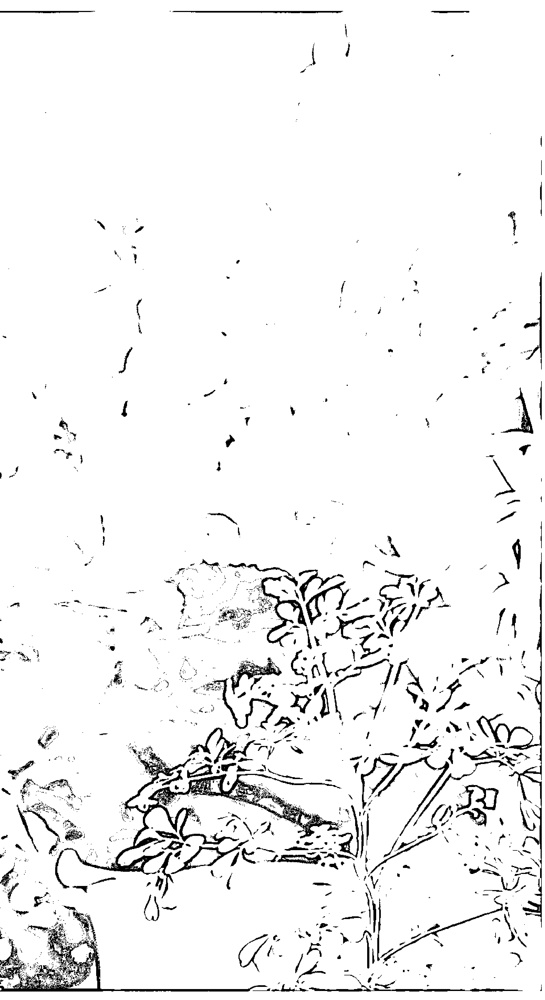

> Andrea Krote：
如何在不傷害植物的前提下，提煉出花精水

將花朵放入裝好水的水晶洞內，然後虔誠地召喚花神，祈求花朵的能量能夠釋放到水裡。當我們認為已經提煉足夠的花精時，再將花朵拿出晶洞。將花精與等量的有機白蘭地混合均勻，再倒入琥珀色的細頸玻璃瓶內，並做上記號。為了妥善保存花精，切記將花精放置陰涼的地點，遠離家電用品、金屬製品、揚聲器、磁鐵、手機、電磁波和輻射源，避免破壞花精水的品質。

## 天然水晶與巴哈花精的身心療法

| 治療恐懼的身心療法 | 猴頭花＝黑色電氣石
有益於加強自信及勇氣，幫助我們面對各種令人感到害怕的場合。例如：第一次的約會、考試及坐飛機，或是降低對某些事物恐懼症的現象，如幽閉恐懼症等。

岩玫瑰＝石榴石
當我們遭受重大的打擊驚嚇後，而導致情緒不安和生命能量降低時，透過這個療法，有助於恢復心中的踏實感及平衡能量。此療法也能夠幫助我們擺脫噩夢的糾纏。

白揚＝煙水晶
對於某些飽受恐懼與擔憂困擾卻找不到原因的人，此治療法能夠幫助他們提高感知度，找到恐懼的來源，並且恢復心靈的平靜。 | 櫻桃李＝孔雀石
當我們身心處在一個緊繃的狀態時，我們會害怕自己失去控制而爆發出來。此治療法能幫助我們恢復冷靜，並且使我們看清楚自己距離爆發的臨界點還有多遠，讓我們釋放壓力，並舒緩緊繃的情緒。

紅栗花＝紫水晶
此治療法可以幫助我們穩定自己的情緒，信賴自己所愛的人，相信他們有能力度過自己的人生。同時，清除負面思想，避免將事情往壞的地方想。它能幫助我們找到不安與恐懼真正的來源，讓我們可以發展正向的思考模式，得到更多安全感。 |
| 治療過於敏感的身心療法 | 龍芽草＝黑曜石
此治療法能夠使我們勇於表達自我，並且接受自己本來的面目。讓我們不再面對痛苦時，仍帶上面具來偽裝自己。使我們不必再隱藏或否認內心的不安。它能幫助我們釋放內心的壓力，並且勇敢地向他人敞開心扉。 | 矢車菊＝黃晶
此治療法能夠讓我們有拒絕別人的勇氣，並且劃清人與人之間的分際。它能幫助我們找回力量與自信，認清自己的價值，而不再一味地尋求他人的認同，懂得為自己而活的可貴。 |

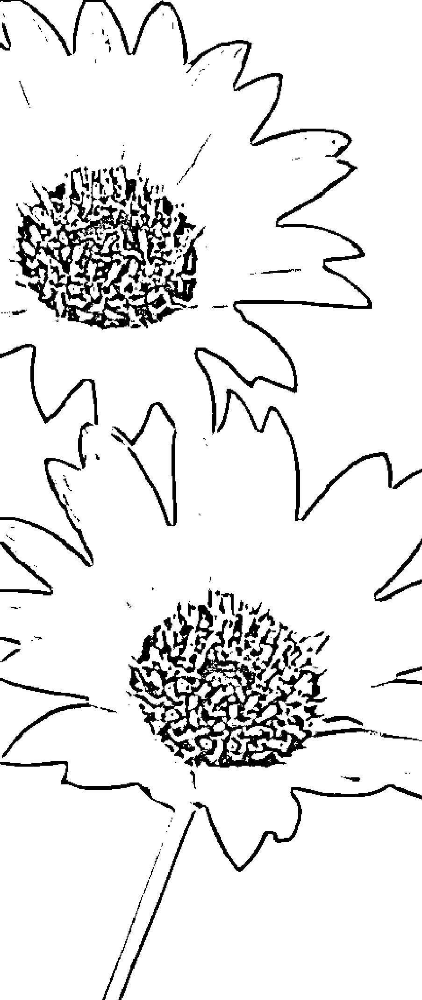

| 治療過度依賴的身心療法 | 菊苣＝粉晶
有助於發展無私的愛並且學習去愛別人，讓我們不再專注在別人的缺點上，不再一味地依賴他人或是要求情感上的回報。 | |
| 擺脫孤獨感的身心療法 | 石南＝砂金石
當我們一直不斷地找人傾訴自己的事情，尋求他人的認同時，其實真正的原因是因為我們對自己沒有自信，自卑感作祟。同時，也代表我們內心感到寂寞空虛，沒有辦法享受獨處。此治療法能夠幫助我們找回內心的平靜，回到深層的內在去反省自己的狀況。讓我們找回自信，並且發現自己其實並不孤獨。 | |
| 擺脫沮喪和失望情緒的身心療法 | 松樹＝藍銅礦
這個治療法能幫助我們擺脫不必要的罪惡感，釋放長久以來被社會刻意建構虛假的道德觀，讓我們重新享受美好的人生。同時，透過這個治療法也能讓我們建立起適當的責任感，對自己負責任，擺脫罪惡感，開創更美好的人生。

甜栗花＝白水晶
當我們面臨人生的低潮，覺得自己已經到達臨界點，幾乎無力承受一切的時刻，這個治療法能為我們帶來希望和繼續走下去的力量，讓我們重拾生命的意義，以積極樂觀的態度來面對人生的挑戰。 | 海棠＝天行石
這個治療法具有強烈的「淨化」效果。當我們覺得被外在負面能量汙染時，它能平衡我們身、心、靈的能量，清除在心理和情緒上不必要的干擾。

落葉松＝紅玉髓
此治療法能幫助我們建立自信心和自我認同感，相信自己的能力去實現自己的想法。讓我們戰勝因害怕失敗而退卻的軟弱情緒。 |
| 擊退不確定感的身心療法 | 線球草＝螢石
這種治療法具有穩定情緒、擺脫不確定感的作用。當我們在猶豫不決的時候，它能幫助我們冷靜思緒，集中精神來做出決定。對於常常無法做出決定或是情緒不穩的人有極大的效用。 | |

## 天然水晶與能量石的種類特性

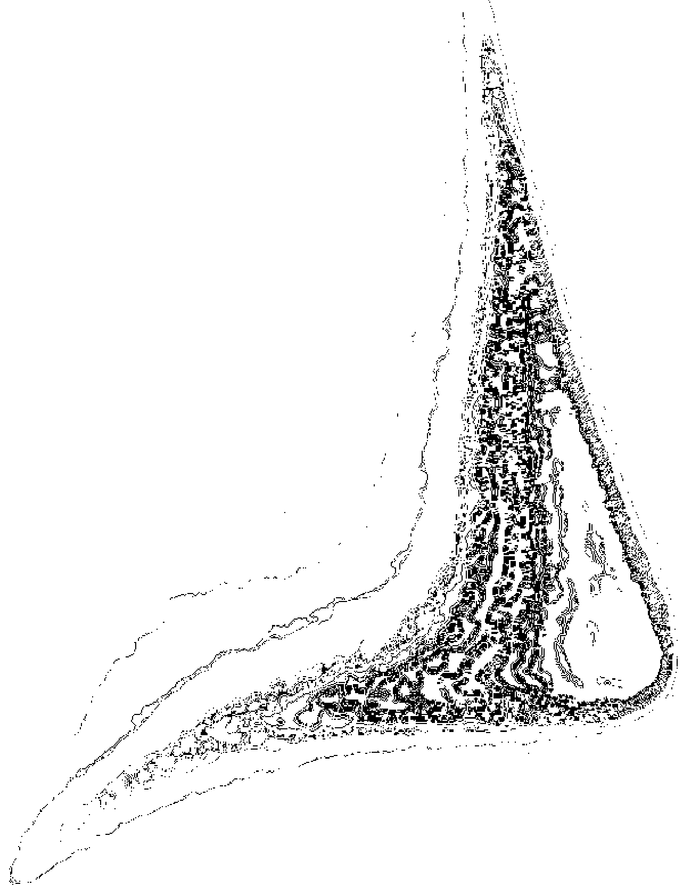

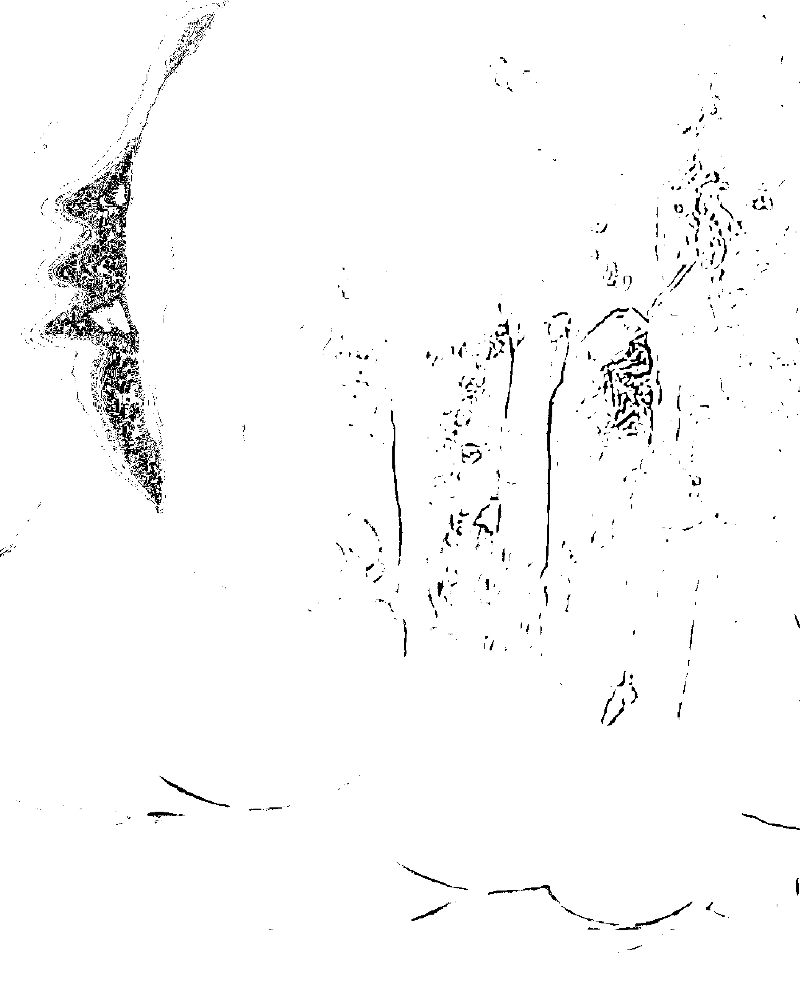

本章中彙集天然水晶與各種能量石的原產地和礦物性質等資料，以及針對身、心、靈等不同層面的特殊療效。書中所介紹的各種水晶療法，作者皆已親身試驗過。

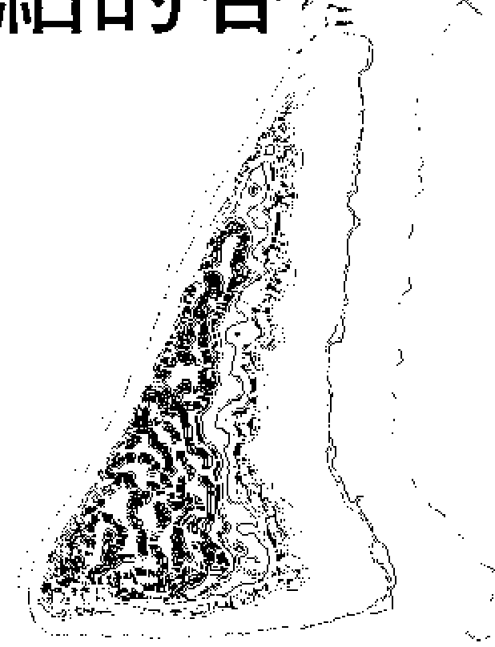

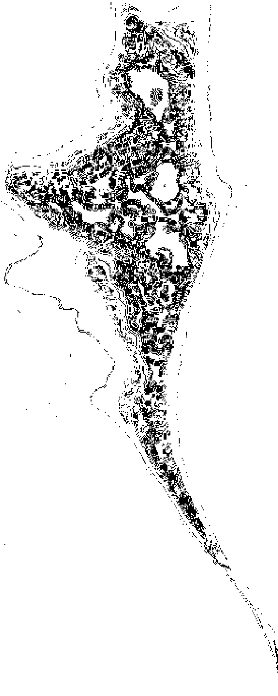

## 瑪瑙 Agate

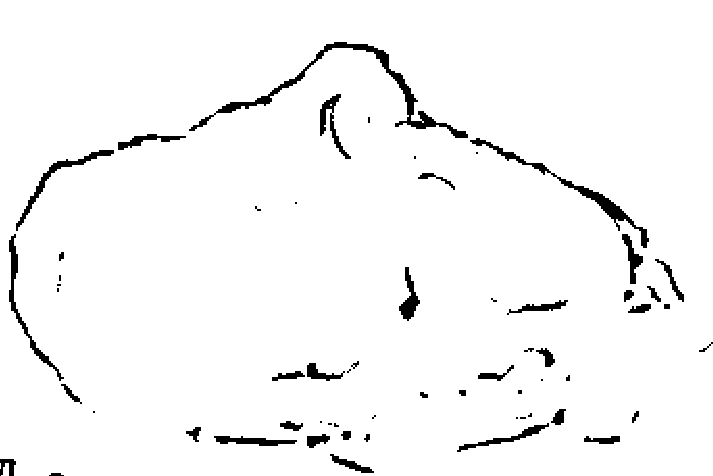

類別：矽酸鹽礦物。
顏色：白色、乳白色、灰色、藍色和棕色……等。有時顏色層次相當豐富，會呈現出許多不同的色調。
原產地：幾乎全世界都有出產瑪瑙，尤其是非洲中部、馬達加斯加和巴西等地區。
硬度：6.5
外觀：瑪瑙為一種膠質礦物，質地較軟，具有蠟狀光澤。顯現彎曲狀的紋路，層次色彩十分豐富。切口成貝殼狀，透明至半透明。需注意某些顏色過度鮮豔的瑪瑙，可能經由人工染色而成。

屬性：瑪瑙由許多微小的石英所組成，由於環境中顯色物質的變化，外形上則形成彎曲狀的紋路。瑪瑙具有穩定的力量，能平衡體內的能量場，維持身、心、靈的和諧，消除緊張及各種壓力。同時，瑪瑙的能量也有助於提高專注力、記憶力及自我反省的能力，並且對於增進自信心也有卓越的效果。再者，瑪瑙能加強安全感及自我認同感，使我們保持樂觀和腳踏實地，對人生採取積極的態度。

瑪瑙的能量能夠有效地改善胃部、子宮和皮膚的問題。首先，將瑪瑙放在需要治療的部位，放鬆心情，讓瑪瑙的能量平衡此處的能量場。如此，就能刺激體內的血液循環及淨化體內的器官。

同時，它的震動頻率對於哺乳期的女性十分有益，能讓她們順利地分泌乳汁，以及改善男性精液的品質。對於腎結石及乾眼症等病症，也有極大的效果。藍玉髓對應喉輪，因此能加強此區域的免疫能力，強化表達的能力。同時，藍玉髓也具有對抗低落及焦慮的情緒，使我們面對歲月的流逝時，不會感到驚慌。

## 藍玉髓 Chalcedony Agate

藍玉髓能夠激發創造力。為陰性的能量石，顏色略帶乳白色，呈透明至半透明狀。硬度為7至10級。藍玉髓具有吸收負面能量，傳導正面能量的功能。它的能量能降低外來的敵意，並且消除憂鬱的情緒，使我們重新獲得快樂。將藍玉髓放在枕頭下，能夠幫我們擺脫對黑暗的恐懼，使我們能夠安心地睡個好夢。

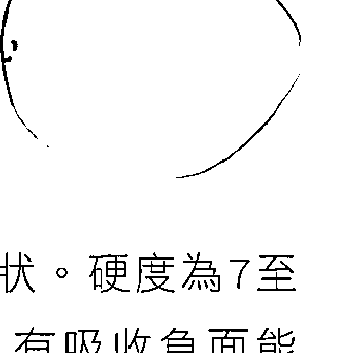

## 紅玉髓 Cornelian Agate

紅玉髓色澤多為橘色或棕色，呈透明或不透明狀。硬度為7至10級。紅玉髓對應第二輪（臍輪），對於生性害羞內向的人，具有強化自我認同和自我接受的作用。同時，也能幫助個性長期壓抑的人，釋放自己的慾望。它的能量能將夢境具體化，將我們從負面的想法和情緒解放出來，重新獲得快樂。同時，紅玉髓也能刺激內在的火，活化胸腔器官的運作，改善消化系統及性功能的問題，以及活化氣血的循環。

紅玉髓象徵熱力及大地的能量。具有穩定及平衡的能量，趕走死氣沉沉的情緒，幫助我們找到人生的目標。紅玉髓的能量可以在氣場週圍形成一道防護網，保護我們不受負面能量的侵害。它能幫助我們加強自信心，使我們不輕易受到他人的負面能量影響。針對改善適應不良、缺乏自我認同及自信心喪失等問題，具有良好的效果。

北美洲的部落普遍將苔蘚瑪瑙做為護身符贈送給重要的人。它的能量可以有效地消除因壓力而大量分泌腎上腺素後所產生的疲勞感，並且改善生殖器官的運作。苔蘚瑪瑙具有平衡五行能量的作用，使我們能與大地連結，將能量像空氣一樣吸入體內，強化體內器官的功能，同時將毒素排出體外。

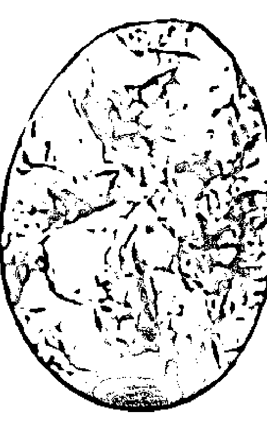

紅玉髓能夠提供給體內的器官組織所需的能量、強化身體細胞吸收維他命及礦物質的功能。同時，加強血液循環，讓足夠的氧氣運送到肌肉組織。紅玉髓能過濾有害物質、強化新陳代謝並且改善腎臟系統的運作。它的淨化能量具有緩和關節炎和風濕痛等病症的效果。同時，它也能減輕因壓力而產生的現代文明病。

## 海藍寶 Aquamarine

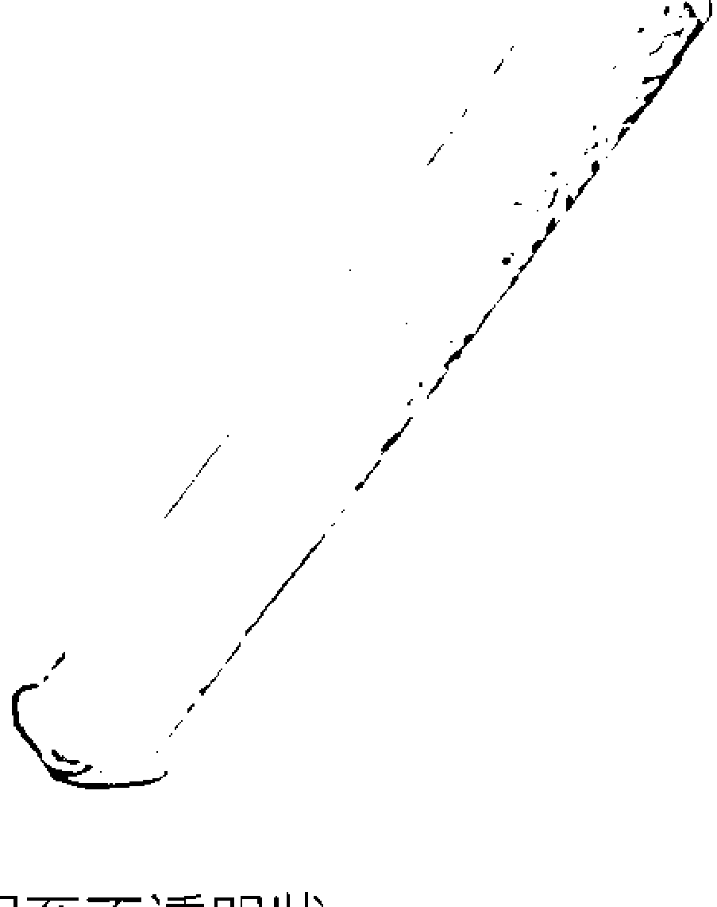

類別：矽酸鹽礦物，為綠柱石的一種。
顏色：介於藍色與藍綠色之間。
原產地：馬達加斯加、巴西、緬甸、奈及利亞、墨西哥及阿富汗。
硬度：7.5～8
外觀：玻璃光澤，晶體為六方柱體。呈透明至不透明狀。

## 苔蘚瑪瑙 Moss Agate

我們常常將苔蘚瑪瑙與大自然，尤其是和植物聯想在一起。

屬性：海藍寶能帶來光明和平靜，開拓我們的視野和心智。當我們感到徬徨煩惱時，它能幫助我們擺脫不必要的恐懼和焦慮。海藍寶為陰性能量石。它的能量能強化溝通與自我表達的能力，同時學習傾聽別人。海藍寶對應喉輪，能平衡脊椎的能量場，尤其是針對頸部位置的氣場。可以有效減輕喉炎、牙床和牙齒的疼痛，並且改善發音不清楚的毛病。鼻竇炎的患者將海藍寶放在呼吸道的位置，則能清除喉痰。對於長期過度使用眼睛的人，海藍寶也可以減低視神經的壓力。海藍寶的能量有益於腎臟和尿道的運作，預防體內積存太多有害的液體，加強體內排毒的功能。同時，海藍寶也具有預防過敏和呼吸道感染等問題。海藍寶也能有效改善因壓力過大而產生的消化系統問題。

## 天行石 Amazonite

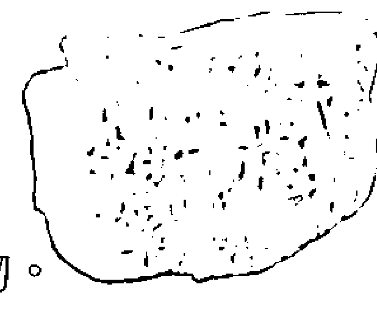

類別：矽酸鹽礦物。
顏色：帶有白點的藍綠色。
原產地：俄國、加拿大、巴西、澳洲、印度和莫三比克共和國。
硬度：6.5～7
外觀：具有珍珠玻璃光澤，呈不透明狀。

屬性：當我們遭受不公平的對待或是被他人誤解時，天行石能幫助我們緩和情緒，保護我們不因此受到傷害。讓我們可以用平常心來看待這件事情，並且以正確的方式來表達自己的想法。
天行石具有吸收有害的思想和電磁波等負面能量的作用。它也能夠活化太陽神經叢和心臟。有益於改善呼吸系統。它的能量能提升免疫力，減輕過敏的現象。同時，天行石的能量能讓我們與自然界的力量接軌，藉由自然界轉換變動的力量，進而獲得自我改造的機會。

## 琥珀 Ambar

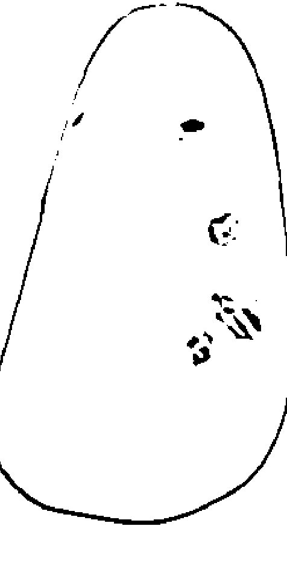

類別：有機類化合物礦物。
顏色：黃色、橘色及深棕色。
原產地：幾乎全世界都有生產琥珀，例如：波羅的海、多明尼加共和國和墨西哥等區域。
硬度：2～3
外觀：天然的植物樹脂化石。琥珀的內部常常含有植物或昆蟲的殘骸。

屬性：當我們面臨抉擇的時刻，琥珀能夠幫助我們作出決定。琥珀平衡太陽神經叢的能量：具有清理思緒及消除壓力的作用。它能活化消化系統，有助於體內養分的吸收。同時，琥珀能淨化體內器官、增加活力，並且減輕身體的疼痛。針對傳染性疾病和發炎也有極大的效用。琥珀的樹脂成分象徵大地和植物的能量；琥珀的光澤則象徵太陽的能量。因此，琥珀也常常被人用來當護身符佩帶在身上。

## 硬石膏（又稱為無水石膏）Anhydrite

類別：硫酸鹽礦物。
顏色：白色、灰色、淺紅色、藍色、粉紅色和棕色等。紫色硬石膏較為罕見。
原產地：義大利、西班牙、墨西哥及印度等。
硬度：3.5
外觀：一般以厚板狀或柱狀為主。

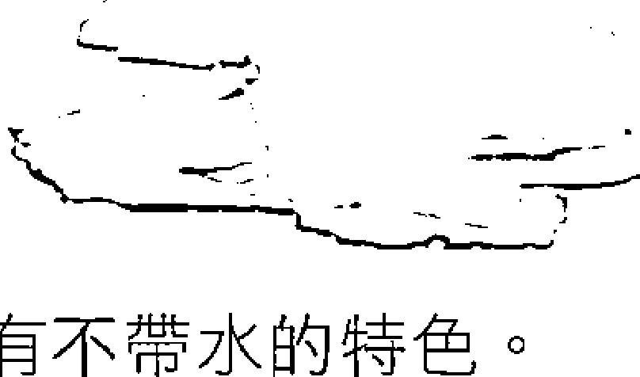

屬性：硬石膏又稱為無水石膏，這種能量石本身便具有不帶水的特色。因此，當我們的負面情緒（情緒屬於水元素）阻塞體內的能量流動，讓我們對自己的身體感到厭惡時，硬石膏能消除體內的負面情緒，讓我們重新喜歡上自己。每當我們感到絕望，覺得生命失去意義時，硬石膏幫助我們重拾活力及勇氣，讓我們可以面對所有的挑戰。同時，它的能量可以使我們懂得以樂觀態度來面對人生。透過硬石膏的能量，我們能夠更喜歡自己的身體，學習更了解和更愛自己。同時，針對喉嚨感染，硬石膏能有效減緩發炎的現象和抑止體液的分泌。

## 磷灰石 Apatite

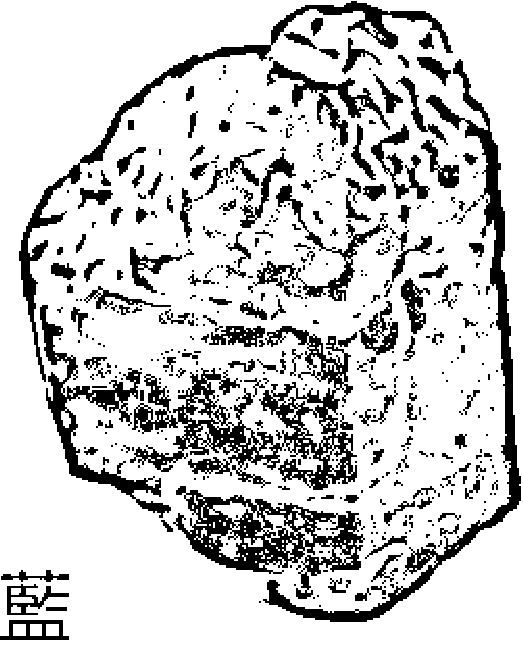

類別：矽酸鹽礦物。
顏色：磷灰石通常為藍色，少部分為綠色。
原產地：馬達加斯加和巴西等。
硬度：5
外觀：呈不透明至透明狀，帶有玻璃光澤。

屬性：藍色磷灰石最適合用來激發觀想的能力，有助於拋開過去的傷痛和不愉快的經驗。它具有整理思緒和提升專注力的作用。一般而言，磷灰石能夠幫助我們撫平心裡的傷痕，緩和悲傷絕望的情緒。當親人或所愛的人往生時，磷灰石能陪伴我們走過這一段痛苦的過程。此外，當我們的情緒因為經歷某些事故，而導致能量阻塞時，磷灰石能幫助我們打開心胸，暢通淤塞的能量。它可以平衡水（骨頭）和金（肺部和皮膚）等元素，刺激自我修復的功能。當我們感到疲倦勞累時，磷灰石也有益於體力的恢復。

## 魚眼石 Apophyllite


類別：矽酸鹽礦物。
顏色：白色、淡黃色和淡綠色。
原產地：印度、澳洲和巴西。
硬度：7
外觀：為透明的金字塔狀。呈四角柱狀或雙錐狀的結晶。

屬性：激發直覺能力。魚眼石能幫助我們在思考模式或是情緒管理上，進行深層的自我反省。它的能量能讓我們更輕易地表達自己的感覺，釋放過去的傷痛及解開心結。
同時，加強自我克制的能力，避免輕易地被慾望或激情沖昏頭。當我們在體驗任何一種靈性層面的經驗時，例如靈魂出竅、回到前世或預測未來時，魚眼石都能夠強化這一方面的體驗。在房間裡放置魚眼石，能強化氣場的循環，並且建立靈性世界和現實生活之間聯繫。它的能量能使身心徹底地放鬆，同時，魚眼石對於改善呼吸道感染的問題也有顯著的效果。

## 霰石 Aragonite


類別：碳酸鹽與碳酸基結合而成的礦物。
顏色：白色、黃色、棕色和紫色等為最常見的顏色。
原產地：西班牙、摩洛哥、奈米比亞、英國、澳洲和法國。
硬度：3.5～4
外觀：呈長條菱柱狀。

屬性：霰石主要聯繫心輪與大地的關係。另一方面，它能幫助個性害羞的人放開自己，讓他們對自己更有自信，並且強化與他人溝通的能力。霰石的能量使我們在面對事情時，能提高專注力及找出解決問題的方式。它具有安撫穩定神經系統的作用。因此，能有效改善痙攣和身體自制能力失調的問題。
由於霰石本身的性質有熱燥性。所以，能改善四肢冰冷的毛病，並強化體內器官能量的流動。霰石有益於鈣質的吸收，可以有效改善因缺乏鈣質而產生的各種病症，例如骨質疏鬆症和蛀牙等，並同時強化骨骼的構造。如同大部分的能量石，霰石也具有消除壓力、放鬆情緒、平靜心靈的能量。

使用霰石做成的水晶水來沐浴，能夠加強自我修復的能量，將霰石放在能量淤結的位置，則有助於解開能量結。

## 砂金石（又稱東菱玉）Aventurine

類別：矽酸鹽礦物，為石英演變的其中一種綠玉髓。
顏色：綠色。也有棕色的晶體。
原產地：巴西、義大利、印度和尼泊爾。
硬度：7
外觀：呈不透明狀。但仍有少數略帶透明的砂金石。

屬性：當腦中負面思想所形成的負面能量在體內流動，容易損害體內的器官組織。因此，砂金石可以將這些不健康的負面能量排出體內，避免造成器官的損害。對於那些受到過去傷痛所束縛的人，砂金石則能治癒心靈的創傷。同時，它的能量可以喚醒我們的內在孩童正面快樂的面向。它也能激發肌肉及皮膚組織的自我修復功能。砂金石能夠調合金和水二大元素，改善肺部、大腸功能及生殖泌尿系統的運作，有效改善小便失調、前列腺肥大和痔瘡等問題。同時，它也有具有調整血壓的作用。砂金石的能量能夠平衡陰陽的能量，使我們的心理和生理維持平衡的狀態。

## 黑玉 Jet

類別：褐煤的一種，為植物碳化後所形成的化石。
顏色：黑色。
原產地：世界大部分的地區都有出產黑玉，西班牙尤其以盛產黑玉出名。
硬度：2.5
外觀：不透明的煤炭。


屬性：黑玉為人類史中最常被用來當成護身符的能量石，主要為對抗負面能量及邪惡之眼。通常人們會將黑玉滾磨成圓形掛在身上當成護身符，祈求旅途順利、遠離惡運和防止負面能量的入侵。它能有效地解決失眠的問題，激發具有治療性質的夢境，並且吸收疼痛（尤其針對關節疼痛）。因此，我們建議最好經常淨化黑玉，以維持能量場的清淨。黑玉能活化眼睛的功能。然而，當我們感到悲傷或情緒低落時，盡量避免使用黑色的能量石，以免情況惡化。配合白水晶一同使用，則可平衡黑色能量石的能量。

## 藍銅礦（又稱石青）Azurite

類別：碳酸鹽和碳酸基結合而成的礦物。
顏色：深藍色。
原產地：大部分盛產煤礦的國家都有出產藍銅礦；常見藍銅礦與孔雀石的混合體。智利、秘魯、美國、奈米比亞和澳洲等均為出產國。
硬度：4
外觀：大部分呈不透明狀。晶體通常為長條菱柱狀或有凹槽的厚板狀。有時會以塊狀、碎石狀或細砂狀的結集體大量出現。


屬性：藍銅礦具有打開心胸的作用。它能減緩因個性過度嚴謹而產生的壓力。使用藍銅礦治療法可以消除不切實際的幻想，淨化潛意識並且活化思緒。藍銅礦能活化第三眼和掌管溝通能力的脈輪（為眉心輪及喉輪），安撫神經系統並改善甲狀腺的功能。它的能量能活化思維能力、直覺力和想像力，被視為自觀和智慧的象徵。如同大部分深藍色系的寶石，藍銅礦能打開心智和淨化潛意識。同時，有助於加強自我情感及想法的表達。並且，消除鬱悶失落的情緒及安撫緊張的心情。有助於提升記憶力。強化脊髓區塊的能量場循環。藍銅礦除了能有效減緩關節的疼痛之外，還能改善腎臟、肝臟、牙齒、胰臟和皮膚等器官的問題。同時減輕因壓力引起的所有症狀。當我們在進行冥想時，將藍銅礦放在第三眼則可以幫助我們更容易進入觀想的狀態。

## 堪薩斯神石 Boji Stone


類別：硫酸鹽礦物。
顏色：棕色。
原產地：美國。
硬度：7
外觀：陽性的堪薩斯神石外表粗糙尖銳；陰性的堪薩斯神石則表面光滑。

屬性：有二種不同的堪薩斯神石，一種外表粗糙為公石；另一種則表面光滑平整為母石。它的外表與成分與黃鐵礦和白鐵礦相同。這個神秘的金屬能量石具有排毒淨化的功能，能有效預防疾病的感染。一般而言，這種能量石都是成雙成對出現，一對堪薩斯神石必定要有一顆較粗糙的公石和一顆較平滑的母石，象徵陰陽的平衡。堪薩斯神石能平衡氣場、改善體內器官的運作，並且保護我們不受負面能量的入侵。我們建議在使用堪薩斯神石時，最好公石母石一同使用，才能維持能量的平衡。

## 方解石 Calcite


類別：碳酸鹽和碳酸基結合而成的礦物。
顏色：白色～無色。有時會出現黃色、淡紅色、綠色、黑色或粉紅色的方解石。每種顏色都有不同的效用。
原產地：美國、墨西哥、巴西、印度、冰島、秘魯、西班牙以及英國。
硬度：3
外觀：呈半透明狀，具蠟狀光澤。晶體多為犬牙狀、鐘乳石狀或菱形六面體。

屬性：方解石的能量能幫助我們解決內在的衝突。當我們感到生活失去目標，成天混沌度日時，能讓我們重拾生活的目標與活力。因此，考試壓力繁重的學子們則能藉由方解石的能量來重新獲得活力和動力。同時，它具有幫助體內器官排除多餘廢物的功能，尤其針對腎臟排毒有顯著的效果。此外，方解石還能強化骨骼和減輕骨刺的問題，並兼具修復肌肉組織的作用。

## 黃銅 Chalcopyrite


類別：硫酸鹽礦物。
顏色：金黃色或彩虹色。
原產地：南美洲、美國及西班牙。
硬度：4
外觀：呈不透明狀，具金屬光澤，通常為集結體。

屬性：平衡體內氣場，並且將正面能量注入體內，提升活力，讓我們能夠面對生命中所有的挑戰。同時，黃銅具有平衡金元素（對應器官為皮膚、肺部和大腸等），以及土元素（對應器官為脾臟、胰臟及胃部）的能量。它的能量能夠放鬆太陽神經叢的壓力，改善消化系統的問題，並且幫助體內養分的吸收。因此，建議消化系統功能較弱的人，可以使用黃銅來改善此區域的毛病。同時，黃銅能有效減輕脹氣的問題。除此之外，黃銅也能增加血液中的含氧量、加速排毒，並且改善血液循環不良的問題。

## 天青石
Celestine

類別：硫酸鹽礦物。
顏色：無色、白色或淡藍色。
原產地：世界上大部分的地區皆有出產天青石，尤其西班牙、馬達加斯加、墨西哥和巴西等……。
硬度：3.5～4
外觀：呈透明狀。晶體多為菱形六面體或厚板狀。常以晶簇的形式出現。

屬性：開啟人類與心靈溝通的道路。天青石象徵內在寧靜和人類獲得形上知識的可能性。天青石的能量不但可以使我們看清楚自己的本質，甚至探察人類未知的另一個世界。它消除內在的衝突，使我們獲得心靈的平靜。同時，激發我們的創造力。天青石的能量有助於發現最真實的自己，並且幫助我們實現心中的願望和夢想。同時，平衡理性（知識及學識）與感性（直覺）之間的角力。它能建立人類與所有層面的生命和能量場溝通的橋樑。同時，喚醒內在的能量，使我們能再次與宇宙的生命能量接軌。

將天青石放置在房間內，能強化體內正面的震動頻率。建議盡量不要將天青石放在陽光下曝晒，以免天青石的顏色會變得過於慘白。

天青石的能量能夠安撫肉體的疼痛與心靈的傷痛。平衡體內器官的能量，尤其針對聽力及視力，效果特別顯著。

## 白鉛礦 Cerussite

類別：碳酸鹽和碳酸基結合而成的礦物。
顏色：白色、灰色、黃色、藍色和棕色。
原產地：西班牙和奈米比亞。
硬度：4
外觀：常見光澤為金剛光澤、玻璃光澤或珍珠光澤。晶體通常為板狀，也有成針狀、塊狀或粒狀不等。

屬性：白鉛礦具有強化個人的自制能力、激發自我認同感，並且加強判斷力的作用。它讓我們面對事情時可以看到實際面，停止做白日夢的習慣。白鉛礦的能量使人類能夠接觸內心最不為人知的面向，使我們能更了解自己，進而接受全部而完整的自己。在重要的時刻，它則能激發責任感及強化我們與他人溝通協調的能力。

白鉛礦可以平衡神經系統、血液循環系統及肝臟的能量。因此，除了能有效改善血液循環不佳所引發的問題之外，在治療肝臟相關疾病的過程中使用白鉛礦，也能得到顯著的改善成效。同時，它也具有修復相關組織的功能。白鉛礦與大地強烈的連結關係，可以安撫神經系統的緊張。所以，它能有效改善神經性痙攣，以及各種自制能力失調而引起的症狀。白鉛礦也具有改善失眠的作用。

## 紫龍晶
Charoite

類別：矽酸鹽礦物。
顏色：紫色。
原產地：俄國。
硬度：7
外觀：呈不透明狀，通常略帶淡黃色或白色。

此外，它能幫助我們接受改變（人類通常對改變現況抱持負面和拒絕的態度），消除所有的固執和成見。同時，紫龍晶也有助於對抗因過度煩惱而產生的壓力，具有將負面能量轉化為正面能量的特質，使我們超越對立衝突。它能淨化血管及淋巴腺等體內管道。因此，對於改善冠狀動脈血栓的症狀有顯著的效果。

坦率地向別人表達自己的意見與看法。它能夠消除壓力、憤怒和困惑等負面情緒。同時，開發邏輯和理性思考的能力，並且開發人類內在的靈性層面、打開封閉的心智，讓我們能與宇宙生命能量接軌，感受真正的靈性經驗。

屬性：紫龍晶具有轉化的能量。它能夠讓我們接觸內心深處最黑暗、最不欲人知的恐懼，將這些恐懼從底部釋放出來，進而把恐懼從心中徹底消除（包括釋放那些因害怕面對恐懼而產生的恐懼）。讓我們能真正地脫離恐懼的陰影，重新開啟封閉的心靈，儲備面對未來的勇氣。同時，紫龍晶有助於心靈的開發，幫助我們超越物質世界，讓我們獲得窺探靈性世界的能力。讓我們學習珍惜現有的一切，將靈性世界與日常生活結合一起。紫龍晶的能量能幫助人類接觸超我，淨化頂輪及其他脈輪的能量場，使我們更能接受和容忍他人的缺點。

## 藍晶石 Kyanite

類別：矽酸鹽礦物。
顏色：天藍色。
原產地：巴西。
硬度：4.5～7
外觀：晶體多為長板狀。呈不透明或透明狀。

藍晶石能夠改善肌肉痙攣、感冒、頭昏及噁心等症狀。有助於減緩因風濕所引起的疼痛和減輕其他部分的疼痛。

## 矽孔雀石（又稱臺灣藍寶或水晶翠）Chrysocolla

類別：矽酸鹽礦物。
顏色：藍綠色、棕色及土耳其綠。
原產地：中國、墨西哥、美國及南非。
硬度：3.5～4
外觀：呈不透明狀。有些表面為光滑狀，有些則較粗糙。晶體為厚板狀。

屬性：藍晶石具有開發直覺力、超感官洞察力及改變思維的作用。它的能量能夠激發心靈的成長。平衡脈輪的能量、淨化能量管道（經絡）及修復氣場。藍晶石對應喉輪，可以提升自我表達的能力，賜予我們勇氣，讓我們可以

屬性：矽孔雀石為相當有名的陰性能量石，與藍銅礦和孔雀石的成分相近。它具有放鬆情緒的作用。長期使用矽孔雀石可以幫助我們了解能量結產生的原因，有助於暢通體內阻塞的能量管道。它能有效改善女性生理期不規律的情形。由於矽孔雀石的成分帶有銅，因此，對於抗發炎也有著相當良好的成效。

腎臟排出毒素。同時，它也能加強血液循環，增加肌肉組織中的含氧量。此外，矽孔雀石可以減緩燒燙傷的症狀和喉嚨感染的毛病，同時平衡甲狀腺等內分泌失調的問題。

矽孔雀石的能量可以幫助我們打開心智。它能連結肉體與情緒體、星光體之間的關係，開發人類的靈感力、加強直覺力，並且激發愛人的能量。同時，對於擺脫因性關係不協調而產生的失落情緒或罪惡感也有良好的效果。它能幫助我們不輕易受到他人偏見的影響，加強我們的理解力、溝通能力及創造力，並且強化人們感性的一面。

除此之外，矽孔雀石能使我們學習尊重自己。當我們面對壓力時，依然能夠保持一顆冷靜的頭腦。針對經期不規律所引發的各種症狀、關節炎、消化器官的疼痛，以及肺部疾病等，都有顯著的療效。矽孔雀石也具有淨化排毒的特質，因此能幫助肝臟和

## 辰砂 Cinnabar

類別：硫化物礦物與硫磺。
顏色：鉛灰、褐、紅褐、朱紅、灰色。
原產地：美國、中國、西班牙、立陶宛、拉脫維亞、愛沙尼亞和德國。
硬度：2.5
外觀：顆粒狀或塊狀集合體，呈顆粒狀或塊片狀。具光澤。片狀的辰砂易破碎，粉末狀者有閃爍的光澤。

屬性：為產量豐富的能量石。西方中古世紀鍊金術中，占有十分重要的地位。根據鍊金術的概念，人們將辰砂視為可以把任何一種礦物轉變為黃金的催化劑。它能加強說服的能力，並且強化個人與生俱來的天賦。幫助我們接受他人本來的面目與性格。辰砂為希臘商業之神，墨丘利（Mercurius）的守護石。從事貿易商業的公司行號，在公司內擺放辰砂可以為公司招來財運。除此之外，辰砂能平衡體內器官的能量場，疏通根基輪，也就是海底輪（為會陰的部位）的能量結。古時候，人們習慣利用辰砂來平衡身、心、靈之間的關係。辰砂的能量可以減輕各種疼痛的症狀、淨化血液，以及增加肌肉與關節的柔軟度。同時，有益於婦女受孕並且改善各種經由性交而傳染的疾病。辰砂對於控制體重及維持身體曲線也有極大的功效。

## 綠玉髓（又稱綠瑪瑙）
Chrysoprase

類別：矽酸鹽礦物。
顏色：蔥綠、蘋果綠或檸檬綠。
原產地：巴西、美國、俄國、東非、波蘭與澳洲。
硬度：7
外觀：呈無光澤的透明狀。大部分的綠玉髓帶有點狀的斑點。當綠玉髓中含有矽孔雀石的成分時，顏色通常偏藍色。

屬性：綠玉髓為玉髓的一種。綠玉髓能為人類帶來希望及自足的正面能量。它獨特的光芒能撫慰治療過去所受到的心靈創傷。提升思維的靈敏度、創造力及口語表達能力。有助於受孕和改善性功能失常等疾病。綠玉髓能平衡內分泌失調，改善皮膚病和眼睛部位的疾病。因此，針對流行性感冒及傷風特別有效。綠玉髓具有吸收熱度和焦慮的作用，所以它能平衡環境的氣場和改善人際關係。讓我們不再只注意自己，而懂得去關心他人。

## 石英
Quartz

類別：矽酸鹽礦物。
顏色：從無色到白色、黃色、粉紅色、紫色、綠色和褐黑色等。
原產地：全世界皆有出產。
硬度：7
外觀：晶體呈菱形六面體。

## 煙水晶 Smoky Quartz

幾乎所有的水晶都具有淨化氣場作用。煙水晶對應海底輪（象徵與大地和當下的連結），但也同時對應臍輪與太陽神經叢輪。如同所有的暗色水晶一般，煙水晶具有深根及穩定的能量。它能夠活化生命能量，激發生存意志並且強化排毒器官的運作。它顏色介於褐色與灰色之間，有時幾乎呈現黑色。煙水晶能有效地對抗低落、焦慮、不確定感及不安等負面情緒。

煙水晶能保護我們不受 X 光曝曬的傷害及感染。減輕腹部的疼痛。它能增加體內礦物質的吸收及強化體內能量的循環。

## 紫水晶 Amethyst

紫水晶的紫色光線象徵轉化的能量和心靈的成長。它能使我們進入到一個深層放鬆的狀態。因此，非常適合使用在進行冥想或觀想的時刻，尤其是進行觀想治療法時，成效更加顯著。它能幫助我們汰除老舊的思想，激發想像力和直覺力。紫水晶的能量有助於對抗失眠的困擾。紫水晶一詞源自於希臘，是豐饒之神——巴克斯（Bacchus）神秘「性活力」的象徵，能消除床第間害羞的情緒。除此之外，它還能淨化心智，幫助我們超越過去，減緩情緒的反彈。紫水晶具有安撫神經，消除壓力、焦慮和煩惱的作用。紫水晶也非常適合用來平衡眉心輪及頂輪的能量場。

## 藍水晶
Blue Quartz

藍水晶能幫助我們提升耐心、容忍度及同理心，同時也能強化信心與信任。它能平衡靈魂與思維之間的關係。同時，藍水晶具有止痛和淨化的能量，能有效減輕疼痛並改善高血壓的症狀。除此之外，它能增強免疫力及血液循環的功能。所以，非常適合用來改善因黏膜充血而產生的疾病，例如：鼻竇炎、胃炎及支氣管炎等。建議考試壓力沉重的學子們可以使用藍水晶，幫助活化思緒及補充消耗的動力。

## 雪水晶
Snow Quartz

雪水晶的顏色為乳白色。以往，人們常常將雪水晶用在祈禱或是治療病人的儀式上。人們也經常將雪水晶做成護身符的大小，佩掛在身上用來抵禦邪惡力量的入侵。雪水晶的能量可以消除恐懼感、罪惡感、悲傷以及絕望等負面情緒。雪水晶能有效改善呼吸系統及泌尿系統的感染，以及加強淋巴腺的循環。它能刺激乳腺分泌乳汁，同時也有助於排尿。當我們在進行冥想的時候使用雪水晶，除了可以幫助我們順利進入放鬆的狀態，還可以戰勝焦慮、思緒渙散和負面能量。

## 天使晶
Celestial Quartz

天使晶的能量能夠幫助我們疏通海底輪、臍輪和太陽神經叢輪的能量結。此能量石具有淨化能量。使用天使晶治療法，可以讓我們增強能量，消滅外在負面能量在我們體內累積而形成的病魔。

## 粉晶（又稱玫瑰水晶或芙蓉晶）
Rose Quartz

粉晶被視為召喚愛情的護身符。它的能量可以幫助我們修復不穩定的男女關係，讓忌妒和其他負面的情感遠離愛情。對於不善表達的人，使用粉晶則能夠加強表達的能力。粉晶的能量可以教導我們如何愛自己。因為，一個不愛惜自己或不接受自己的人，別人也不可能會愛上他。它的能量可以幫助我們建立自信心和自尊心，讓我們能了解到自己真正的價值。針對改善膽固醇過高、心跳過快和靜脈曲張等，循環系統不良的問題有極大的成效。具有提高器官組織及大腦含氧量的作用。此外，針對改善情感表達障礙、個性頑固，情緒過度壓抑或是性格冷漠等問題都有良好的效果。

## 金紅石髮晶
Rutile Quartz

金紅石髮晶為成形的過程中含有二氧化鈦的礦石。此類水晶通常具有更強大的能量。因為，礦石內的二氧化鈦能增加水晶本身的震動頻率，能夠活化體內的能量場和消除恐懼感。金紅石髮晶能為那些尋找生命意義的人指引一條明路，使他們能獲得心靈上的成長。

這些由二氧化鈦而產生針狀礦物，深入到透明水晶石的每個角落，就像是幽暗的靈魂深處，指引我們方向的嚮導。當我們生命停滯不前時，金紅石髮晶能為我們帶來改變的契機，消除心靈的枷鎖、修復氣場，讓我們再度與宇宙的生命能量接軌。金紅石髮晶擁有驚人的修復能量。因此，使用金紅石治療法可以減緩老化的現象，並且幫助傷疤的癒合。同時，它的能量可以賦予我們力量去面對現實的世界、趕走所有的恐懼和焦慮的情緒，並且改善暴躁易怒的性格。除此之外，金紅石髮晶可以使我們找到問題的根源，賜予我們勇氣、讓我們以樂觀的態度勇往直前。

## 白水晶 Crystal Rock

白水晶具有淨化心智的作用。長期使用白水晶則能開發直覺力，以及強化與超我之間的互動。白水晶為最普遍和最常使用的水晶，薩滿教（Shamanism），也常利用白水晶來進行水晶礦石修行，藉此與大自然維持和諧的關係。白水晶獨特的白光及透明質地具有強大的正面能量，可以淨化我們的思緒，並且幫助體內器官排出毒素。它的淨化能量不但能平衡氣場，同時還可以強化我們的氣場能量。將白水晶放在脈輪的位置，則能夠平衡脈輪的能量。白光為宇宙最高的能量，所有能量都由白光演變而來。因此，白水晶可以取代任何顏色的水晶，被視為水晶之王。

## 黃水晶 Citrine

主要掌管太陽神經叢。有助於釋放壓力、活化消化系統，並且幫助身體透過腎臟排出毒素。黃水晶的光芒和炙熱能量等特質，有助於消除低落的情緒。黃水晶具有太陽的能量，能夠為我們帶來活力，使頭腦更加靈活敏捷，以及強化直覺力。此外，黃水晶就像是個保護網，讓我們不受到負面能量的入侵，同時賜予我們樂觀的態度和面對生活的動力。它能增加我們的自尊心與自信心，消除負面能量及自我毀滅的想法。黃水晶可以釋放太陽神經叢的壓力、趕走恐懼和焦慮等情緒、提升專注力，以及活化腦部運動。除此之外，它能有效減輕便秘的症狀、加速新陳代謝，有助於體內養分的吸收。

## 綠水晶 Green Quartz

綠水晶能幫助我們找到生活的目標。活化腺體和平衡內分泌。有助於獲得情緒和心智上的穩定、改善人際關係，例如：增進友好和合作的態度、促進家庭生活的和諧，以及維護良好的同儕關係等。綠水晶的能量有益於耐心、恆心和毅力的養成。它能夠使思想更加成熟。不僅能增加對自己的信心和安全感，同時讓我們也願意去相信他人。以治療法的觀點來看，綠水晶的震動頻率有助於改善因緊張或不安所引起的痙攣現象。

## 赫爾基摩鑽石
Herkimer Diamond

赫爾基摩鑽石具有晶瑩剔透的質地及淨化的能量。主要的功能在於保持思緒清醒、消除能量結並且淨化保護氣場等。

## 賽黃晶 Danburite

類別：矽酸鹽礦物。
顏色：透明或無色，帶有淡黃色、粉紅色或淡綠色的光澤。
原產地：馬達加斯加、日本、緬甸、瑞士和墨西哥。
硬度：7
外觀：為菱形柱狀晶體，與黃晶的晶體結構十分相似。呈現玻璃光澤。

屬性：賽黃晶具有強大的靈性，它的震動頻率擁有極佳的淨化能量。當我們在進行冥想時，能利用賽黃晶來召喚精神嚮導和提升意識力。當我們面臨人生重大的變化時，它的能量不但能幫助我們適應這些改變，還可以陪伴我們走出過去的傷痛。賽黃晶的能量可以激發具有治療效果的夢境。因此，也常常用來當作占卜的能量石。

賽黃晶具有強化肌肉組織的作用。所以特別適用於手術後或骨折後的恢復期，有益於長期欠缺活動的肌肉組織，重新恢復肌耐力。除此之外，針對減輕過敏症狀或是慢性呼吸疾病也有良好的療效。同時，也具有活化肝臟功能的效果。

## 祖母綠 Esmeralda

類別：矽酸鹽礦物，為綠柱石的一種。
顏色：綠色。
原產地：哥倫比亞、巴西、坦尚尼亞、印度、埃及和斯里蘭卡。
硬度：7.5～8
外觀：晶體呈六面體。玻璃光澤，呈半透明狀。

屬性：祖母綠象徵無私的愛和善良，它的能量能夠平衡情緒和放鬆精神。強化內在的能量，消除忌妒和不信任感等負面情緒。祖母綠能使我們學習到享受人生，讓我們不害怕打開心胸，接受他人，並且相信和肯定自己。因此，生性害羞膽怯的人，最適合使用祖母綠。此外，此能量石還具有活化自我治療能量和修復活力人體細胞的功能。祖母綠主要對應心輪，它的能量可以靈療與金元素相關的身體器官，例如肺部、皮膚、大腸以及免疫系統等。同時平衡與水元素相關的體內器官，如腎臟和膀胱。它能強化骨骼結構並且改善眼睛的問題。在印度，人們認為祖母綠則有幫助排便的效用。

## 綠銅礦 Dioptase

類別：矽酸鹽礦物。
顏色：翡翠綠、土耳其藍和深藍綠等色澤。
原產地：薩伊、伊朗、剛果共和國、奈米比亞、秘魯、巴西和智利。
硬度：5～6
外觀：晶體呈細長柱狀，尖端為菱形或菱形薄板狀，柱面常有條紋。通常為塊狀和粒狀的集合體。

屬性：綠銅礦的綠光具有高度靈療效果，它能夠帶來活力、淨化體內的毒素、消除冷漠、缺乏生活目標及其他負面的想法。綠銅礦能讓我們活在當下，對自己感到滿意，並且幫助我們找到脫離困境的方法，提升自信心，讓我們在猶豫不決的時刻做出果斷的決定。綠銅礦主要的功能在於修復與平衡神經系統及循環系統，能消除壓力與緊張，並且提高體內細胞的含氧量。因此，它能平衡身、心、靈的能量，強化自我治療的能力。綠銅礦對於減輕嘔吐、脹氣和腸道發炎都有極佳的效果。

## 鑽石 Diamond

類別：天然元素礦物。
顏色：一般的色澤為無色或亮黃色。不過，偶而也會出現亮藍色、綠色、橘色、粉紅色或棕色等少見色澤的鑽石。
原產地：印度、巴西、南非和澳洲。
硬度：10
外觀：晶體一般為正八面體，不過有晶體為正十二面體或立方體的鑽石。表面有弧度。

屬性：鑽石（Diamond）一詞意指無堅不摧，象徵純淨與透明。它被視為寶石中的不死鳥；這個由碳原子所組成的珍貴寶石所閃耀的光芒，能在我們生命中最黑暗痛苦的時刻賜予我們希望。鑽石的能量能幫助我們淨化思緒、提升觀察力、釋放恐懼。讓我們有足夠的信心來堅持自己所選擇的道路，戰勝自己的極限。在古印度阿育伏陀療法中，鑽石對應金星，影響全身的內分泌系統及精液的品質。它能有效改善精神錯亂的毛病，舒緩因緊張和壓力所產生的病狀。鑽石的能量具有活化乳腺、卵巢、睪丸、脊髓和中央神經系統的功能。鑽石主要對應頂輪，能夠連接超我，消除焦慮、不安全感和自信心低落等人格特質。除此之外，它還有助於淨化經脈及體內能量。鑽石製成的水晶水能打開體內的能量結，並且中和能量結所產生的負面影響。將浸泡過鑽石的精油用來按摩身體，則能達到活化脈輪的目的。

## 螢石（又稱氟石）
Fluorite

類別：鹵化物礦物。
顏色：無色、白色、黃色、綠色、藍色、紫色和粉紅色。
原產地：墨西哥、巴西、美國、挪威、德國和西班牙。
硬度：4
外觀：晶體為立方體、八面體或立方體的穿插雙晶，常呈粒狀或塊狀的集合體。

屬性：螢石能夠整理思緒、提升專注力和創造力。像藝術家或者其他需要創造力的工作者便十分適合使用螢石來提升創造力。此外，螢石的能量能幫助我們在學習的過程中，整合新舊資訊，提升條理整合的能力。因此，對於學習階段的學徒有很大的助益。

螢石對應第六輪——眉心輪。有助於成就內在的平和及寧靜。透過眉心輪接收引導的力量，將意識力傳導至更高的超我，有助於靈魂覺醒。從情感的層面來看，螢石則能改善情緒不穩的問題，以及平衡協調身、心、靈等層面的關係。

螢石的能量可以有效改善任何與大腦相關的病症（包括生理與心理方面），例如：情緒失控、精神官能症、妄想症患者和幽閉恐懼症等。除此之外，還能強化骨骼、修復皮膚和黏膜組織。因此，螢石能減輕消化系統潰瘍，以及改善感冒、咳嗽或發炎等呼吸系統症狀。綠螢石則具有活化胰臟、肝臟和消化系統的功能，同時強化牙齒及改善視力的問題。

## 鉻雲母
Fuchsite

類別：矽酸鹽礦物，為雲母的一種。
顏色：綠色。
原產地：巴西、羅馬尼亞、俄國和美國。
硬度：2~2.5
外觀：晶體為層狀結構，與雲母十分相似。

屬性：有益於了解和解讀人際關係。讓我們擺脫過度依賴他人的習性和自怨自艾的壞毛病。鉻雲母能夠讓我們知道自己的價值，以及懂得在必要時刻拒絕別人。當我們遇到問題時，幫助我們找到解決問題的方法。有助於提升自我表達的能力。改善家人之間的關係及家庭的氣氛。一般而言，鉻雲母十分適合用來進行冥想，它具有提升其他能量石能量的特性，有助於能量之間的傳導。除此之外，鉻雲母還能降低血液的濃度，平衡白血球與紅血球的數量。並且，加強身體的柔軟度及改善鈣化的問題。

## 方鉛礦 Galena

類別：硫化物與砷化物結合的礦物。
顏色：鉛灰色，有時會略帶紫色。
原產地：西班牙、美國和英國。
硬度：3
外觀：晶體為完美的立方體，不過有時也有平頂金字塔狀或骨頭狀的晶體。有時為粒狀的集結體。具金屬光澤。

屬性：方鉛礦最主要的功能在於提供身、心、靈一個平衡穩定的狀態。方鉛礦的能量能夠打開封閉的心靈、放鬆僵硬的身體，並且讓我們保持在一個舒適安樂的狀態。它能使我們身段變得柔軟、思考更為靈活，同時勇於將腦中的想法付諸於行動。
方鉛礦象徵理智和思維的力量。因此，能夠用來傳導知覺，強化心電感應的體驗。有助於提升記憶力、專注力以及吸收訊息的能力。所以，在準備考試或報告時使用方鉛礦，都有良好的效果。同時，它能協助開發求知慾和提升對事物的好奇心，幫助我們在知識領域的探索，使我們有能力來面對各種全新的挑戰。

方鉛礦能活化關節及提升柔軟度。因此，在改善風濕痛和關節炎都有極佳的成效。加強體內對鋅和硒等金屬礦物質的吸收、活化血液循環和強化血管壁。同時，它的能量也能改善髮質不佳的問題。

## 石榴石 Garnet

類別：矽酸鹽礦物。
顏色：通常為紅色，但仍有少數為綠色、黃色或其他色澤的石榴石。
原產地：為十分常見的礦石。
硬度：7～7.5
外觀：晶體為立方體或八方體。呈透明至不透明狀。

屬性：擁有強大的修復能量，可以淨化脈輪及強化體內能量的循環。因此，人們常常將石榴石當成護身符，保護自己不受到危險和傷害。石榴石能激發人類的生存本能，帶給我們勇氣、希望和內在的力量。提升意志力和自信心、加強對事物的觀察和整理混亂的情緒。它能讓我們擺脫偏見，打開封閉的思想。石榴石具有帶來樂觀的想法、對未來的希望和對熱愛生命的能量，能強化對生命的渴望。所以，石榴石則能趕走情緒低落和悲傷難過等負面的情緒，讓我們再次對生命充滿希望。
除此之外，石榴石活化修復體內細胞。主要掌管臍輪，能改善腎臟功能。它具有平衡體內能量流動及改善生殖系統的作用。能有效改善循環系統及生殖器官的相關疾病和調理經期不順。同時，還能預防關節炎、修復皮膚、防止皺紋產生及活化循環系統和淋巴系統。

## 雞血石 Heliotrope

類別：矽酸鹽礦物。
顏色：顏色為綠色，因含鐵量的多寡而有黃色、棕色或鮮紅色等不同色澤。當將雞血石放入水中或陽光下時，顏色會更清晰。
原產地：澳洲、巴西、中國和印度等。
硬度：7
外觀：矽酸鹽微晶體。綠色中帶有大理石花紋的紅色紋路。

屬性：雞血石也就是一般俗稱的血玉。它的震動頻率能夠直接傳導到人體，達到淨化血液和排毒的功能。針對活化淋巴系統和改善與血液相關的疾病，有極大的效果。
具有減輕化膿現象及幫助體內器官排出酸性物質的作用。同時，雞血石還能改善血液含鐵量不足的問題。使用雞血石所製成的按摩油來按摩則能有效減輕肌肉的痠痛。

## 赤鐵礦 Hematite

類別：氧化鐵和氫氧化物礦物。
顏色：從鐵黑色至鋼灰色。帶有彩虹的光澤。集體出產的赤鐵礦顏色則偏淡紅色。
原產地：巴西、瑞典、義大利、西班牙、加拿大和瑞士。
硬度：5～6
外觀：晶體常為板狀或菱形體。

屬性：赤鐵礦能連結大地的力量，使我們的能量深植大地，並且活化第一脈輪——海底輪的能量場。它的能量具有加強自信心、提升精神力及專注力、清除腦中的負面想法及淨化氣場的作用。赤鐵礦能夠破除畫地自限的成見及被灌輸的刻板印象，使我們更容易接收新的資訊。赤鐵礦（Hematite）一詞源自於希臘，象徵《血之石》。由此可推，赤鐵礦在活化血液循環方面有極佳的效果。赤鐵礦能幫助傷口癒合及鐵質吸收。所以，可以有效改善貧血的問題。透過活化血液及提高血液的氧化作用，能夠增進活力。除此之外，赤鐵礦還能幫助我們提升專注力、自信心，以及強化個人的紀律感，有助於自我肯定及認識真正的自己。而赤鐵礦最主要的作用則在於建立身、心、靈的平衡與和諧。

## 符山石 Idocrase

類別：矽酸鹽礦物。
顏色：綠色、黃色和棕色。
原產地：西班牙和美國等。
硬度：7
外觀：晶體為立方體。

屬性：符山石又稱為維蘇威石（Vesuvianite），可消除腦中的負面想法及自我毀滅的傾向，以及幫助我們走出過去的陰影和創傷。符山石能夠驅趕恐懼、不確定感和不安全感，使我們能夠擁有清晰的思路及果決的判斷力。同時，提升對事物的好奇心和創造力。它的能量能有效改善失眠的問題和趕走焦慮的情緒，並且減輕因精神抑鬱而產生的精神疾病。此外，還具有強化牙齒琺瑯質及改善髮質的效果。

## 堇青石
Iolite or Cordierite

類別：矽酸鹽礦物。
顏色：紫色、淡藍色和黃色。
原產地：美國。
硬度：7
外觀：呈半透明狀。依照觀賞的角度不同，會呈現不同的色澤。

屬性：具有平衡連結身、心、靈等不同層面的作用。將堇青石放在第三眼的位置，則能平衡體內能量，同時加強超感知力和直覺力。堇青石的能量也能幫助我們提升每個人與生俱來預知未來的能力及洞察力。堇青石為非常稀少珍貴的能量石。在薩滿教的宗教儀式中，常被用來作為與內在知識溝通的媒介。此外，堇青石能在我們的氣場中產生強烈的電能。它的能量可以做為一個能量傳導的媒介，提供人類與外來星球的生命體溝通的可能性。如同紫水晶一樣，能降低酒精對人體的影響。同時，它也能有效改善因細菌感染而造成的疾病。

## 玉石 Jade

類別：矽酸鹽礦物。
顏色：蘋果綠。
原產地：緬甸、美國、日本、瓜地馬拉、墨西哥和臺灣。
硬度：7
外觀：硬玉（Jadeite）外表呈半透明狀，帶有光澤感；軟玉（Nephrite）晶體顏色略帶乳白色和黑色。

屬性：自古以來，人類便視玉石為自然界中最珍貴稀少的礦石之一。古時候的中國人將玉石做為權力和財富的象徵。對於商人而言，玉石則能帶來財富及運氣。當古代的中國商人在與人談生意時，習慣將玉石放在隨手可得地方。他們認為玉石可以對抗負面能量，同時帶來財富、愛情和友誼。睡前時將玉石放在第三眼或是放在枕頭底下，可以為我們招來預知未來的夢境。玉石的能量能幫助我們看清事情的真相，讓我們知道心中真正的渴望。它被視為「美德之石」，具有提升我們的勇氣，讓我們可以誠實面對自己和面對他人。同時，它能讓我們更加謙卑恭遜，進而養成穩重而有耐心的美德。此外，玉石的能量使我們能保有不屈不撓的恆心和毅力，來獲得真正的大智慧。同時，玉石具有強化自制力、放鬆和維持情緒穩定的作用。玉石的能量可以維繫家庭的和樂及家人間的感情。
除此之外，玉石能活化心臟和胸腺，並且改善腎臟和膀胱的功能。玉石對應掌管性功能的脈輪，具有平衡水元素（指腎臟、骨頭和生殖器）及金元素（指肺部和皮膚）等相關器官的功能。

## 紅碧玉（又稱紅磚石）
Jasper

類別：矽酸鹽礦物。
顏色：紅色、棕色和黃色等。
原產地：全世界皆有出產紅碧玉。
硬度：7
外觀：為隱晶系石英（石髓）的一種。外觀呈不透明狀。

屬性：從古至今，人類一直將紅碧玉做為護身符。他們將紅碧玉掛在頸上，避免邪惡之眼的負面能量入侵體內。紅碧玉的能量不但可以連結大地的能量，也能連結人類最原始的感情。因此，自制力欠佳及無法控制情緒的人，需避免使用紅碧玉。紅碧玉具有淨化心智、疏通下三脈輪（指海底輪、臍輪及太陽神經叢輪）能量結的作用，能夠保持和平衡體內生命能量的流動。

除此之外，紅碧玉也有益於血液循環系統。它能淨化血液中的雜質、改善血液循環，以及增進組織細胞及大腦的含氧量。因此，具有預防心血管疾病和活化體內細胞的功能。

對於性慾疲弱的人，紅碧玉能加強活力、提升性慾。將紅碧玉放在太陽神經叢能夠活化肝臟，平衡膽汁分泌及改善消化系統。患有高血壓的患者及性格暴躁易怒的人，最好避免使用紅碧玉。

紅碧玉的能量能帶來歡樂的情緒、使我們對事物和生命充滿熱愛。同時，也能增進夫婦與情侶間的感情。

## 紫鋰輝石 Kunzite

類別：矽酸鹽礦物。
顏色：粉紅色或紫色。
原產地：巴西、馬達加斯加、阿富汗和美國。
硬度：7
外觀：晶體為稜柱體或厚板狀。表面有凹槽，呈透明狀。

屬性：紫鋰輝石主要對應心輪，它的能量可以使我們學習如何無私地對他人付出關愛。此外，紫鋰輝石能淨化星光體的磁場和氣場過去所受到的傷害，使我們走出過去的創傷和斷絕對未來不切實際的期待。紫鋰輝石的能量使我們能夠真正地活在當下，並且治癒那些將我們束縛在過去的傷痛。它能讓我們保持一顆謙遜的心和為他人服務的精神。紫鋰輝石具有消除負面能量、淨化氣場，以及驅趕恐懼疑慮的作用。將紫鋰輝石隨身戴在接近心臟的地方，能幫助我們探索心靈的真相、強化意志力、自尊心和決定自己命運的能力。紫鋰輝石中內含的鋰有助於減輕抑鬱的情緒。同時，紫鋰輝石的能量能夠強化免疫系統，有效預防各種傳染性疾病。

## 拉長石
Labradorite

類別：矽酸鹽礦物。
顏色：多為棕色、藍色、淺黃色和白色。
原產地：加拿大、法國、烏克蘭、挪威和義大利。
硬度：7
外觀：晶體為密實的集結體。具有彩虹光澤感。

屬性：拉長石具有釋放過去的傷痛或不愉快經驗的能量。同時，激發自尊心、想像力、創造力、觀察力，以及自我反省的能力。拉長石的能量能夠強化觀想和直覺，所以十分適合用於冥想法。拉長石冥想法能消除我們在面對生命的變化時，相對產生的不安和徬徨等情緒。拉長石的能量能夠增進樂觀的態度，使我們對生命充滿熱情。
此外，它具有強化免疫系統及新陳代謝的功能，能有效預防傳染性疾病和改善消化系統的疾病。同時，拉長石也有助於減輕關節僵化的問題。

## 青金石
Lapis Lazuli

類別：青金石礦物或矽酸鹽礦物。
顏色：顏色為藍色，同時因含有少量的黃鐵礦，所以略帶金色的斑點。
原產地：阿富汗、智利、埃及和中東。
硬度：5.5
外觀：呈不透明狀，質感十分厚重。

屬性：具有活化喉輪（為掌管表達溝通的脈輪）的作用，能幫助我們提升表達能力，並且讓性格更加活潑外向。青金石冥想法有助於驅趕腦海中的負面想法，同時，重新建立一套正面的思考邏輯。青金石具有淨化能量結的作用，使體內的生命能量保持暢通。青金石的藍色光芒所蘊含的能量賜予我們勇氣、提升自信心，並且保護我們不受負面能量的侵害。青金石能平衡靈魂體、理性體與精神體之間的關係，進而為肉體灌注新的能量。它的靛藍色光芒對應眉心輪，能有效減緩頭痛及眼睛的疼痛。此外，它的能量能改善頸部及喉嚨的疾病。

## 鋰雲母
Lepidolite

類別：矽酸鹽礦物，為雲母的一種。
顏色：粉紅色和紫紅色。
原產地：巴西、多明尼加共和國和捷克。
硬度：2.5～3
外觀：晶體通常為顆粒狀的集結體或堆疊的薄片狀。

屬性：能夠喚醒宇宙意識、疏通頂輪和眉心輪等上層脈輪的能量結，以及強化超感知的能力。可以有效改善易怒，減緩他人對我們的敵意，以及驅趕恐懼情緒。鋰雲母具有將負面情緒轉換為正面情緒的能量，能帶領我們走出過去創傷。同時，它的能量能強化分析理解能力和提升專注力。使我們能夠具有以客觀的態度來分析事物的能力，進而有益於做出明智的決定。
鋰雲母擁有安撫的能量。因此，可以有效解除身心的壓力、幫助入睡及擺脫固執的意念。同時，還能減緩神經痛和坐骨神經痛所帶來的疼痛感。

## 孔雀石 Malachite

類別：銅和碳酸鹽礦物。
顏色：翠綠色。
原產地：俄國、中東、智利和尚比亞。
硬度：4
外觀：呈絹絲光澤。晶體為葡萄狀或鐘乳石狀的集結塊。銅離子使孔雀石產生或深或淺的綠色。

屬性：孔雀石為最古老的能量石之一。古代的皇帝和埃及的法老王都將孔雀石視為幸運石。由於孔雀石能夠大量地吸納負面能量。因此，最好經常淨化孔雀石，以保持它的震動頻率。它的能量可以驅趕夢魘和帶有負面能量的噩夢。同時，也能增進靈感力。孔雀石能活化心輪，讓我們可以坦率地表達自己的感情和無私地對他人奉獻關愛。它能幫助我們找到問題真正的根源，以便徹底地解決問題。此外，孔雀石可以使我們可以清楚地接收到從潛意識所傳來的訊息。
孔雀石有助於體內排毒和細胞組織修復的工作。它的能量使幫助分娩的過程更加順利，並且減緩肌肉痙攣的問題。孔雀石的能量對應女性的生殖器官，能有效改善生理期不順及其他婦科相關的生理疾病。同時，它具有調整血壓，改善氣喘、關節炎和癲癇等病症的效果。針對減輕頭昏、噁心、反胃等症狀也有極佳的成效。同時，孔雀石的能量能改善視神經、脾臟和胰臟功能。因此，能有效降低血液中的血糖濃度及改善糖尿病的症狀。此外，孔雀石可以緩和因驚嚇、精神耗弱及神經質所產生的後遺症。使用孔雀石時，建議配合矽孔雀石一起使用。矽孔雀石的陰性能夠讓孔雀石的效果更為柔和，降低孔雀石的能量對身體的衝擊。

## 軟玉 Nephrite

類別：矽酸鹽礦物。
顏色：綠色略帶暗色斑紋。
原產地：義大利與中國等。
硬度：6.5～7
外觀：具有油脂光澤或玻璃光澤。

屬性：雖然玉石和軟玉都屬於玉石類，然而它們卻是不同的礦物。玉石和軟玉的外表極為相似，因此經常造成混淆的情況。不過，不論是玉石或軟玉，它們的綠色光芒都擁有相同治療的能量。軟玉具有活化腎臟的作用。它的能量能夠刺激腎上腺，有助於將毒素排出體外及合成體內荷爾蒙。軟玉具有強健骨骼和改善經期不規律的作用。同時，還能消除壓力疲勞和補充活力。此外，它的能量能放鬆肌肉、強化關節及調整心跳頻率。軟玉對應心輪及海底輪，具有平衡水元素（指腎臟、骨頭和生殖器）及金元素（指肺部和皮膚）等相關器官的功能。

## 黑曜石
Obsidian

類別：矽酸鹽礦物。
顏色：通常為黑色，但是也有少量的暗綠色、紅色或帶有白色的斑紋。
原產地：墨西哥和土耳其等。
硬度：7
外觀：呈不透明感，具玻璃甚至彩虹閃光的光澤。

屬性：黑曜石為火山溶岩急速冷卻後形成的一種天然礦物。然而，由於冷卻的速度過快，而來不及形成純晶體。使用黑曜石時，一定要十分小心謹慎。因為，黑曜石會揭露某些讓人感到不愉快，甚至難以接受的事實真相。黑曜石能夠大量吸納負面能量。它能驅使身體與心靈的成長進步。黑曜石能幫助我們義無反顧地面對過去，甚至是前世的記憶，清除任何阻礙我們成長的原因。同時，也能引起我們對神秘學的興趣。黑曜石的效果來得十分迅速，不過往往帶有殺傷力。因此，心靈不夠堅強、無法面對事實真相的人，建議最好不要使用。

從治療法的觀點來看，黑曜石最主要的作用便是讓我們找到疾病的根源。此外，黑曜石具有強化消化系統、活化新陳代謝和加強人體對食物養分吸收的功能。它的能量可以消除身體和精神的鬱悶和壓力、強化血管壁的韌性，以及加強關節的活動力。再次提醒使用黑曜石療法時一定要萬分地注意，並審慎思考自己是否適合此治療法。重大精神疾病的患者，切勿使用黑曜石治療法。

## 虎眼石
Tiger's Eye

類別：矽酸鹽礦物，為石英的一種。
顏色：亮黃色及亮棕色。
原產地：南非、印度、墨西哥和巴西等。
硬度：7
外觀：晶體有因褐鐵礦與氧化鐵礦物所產生的條紋。

屬性：虎眼石亮黃色及亮棕色的光芒代表與大地和太陽能量的連結。許多古老文明都認為虎眼石能為我們帶來幸運，同時保護我們不受邪惡之眼的傷害。虎眼石的能量能幫助我們擺脫創傷的情緒，以及摧毀偏見使我們能看清事物真相。
虎眼石賜予我們面對挑戰的勇氣與力量。它能幫助我們發現隱藏的潛力、激發創造力，並且在我們經歷重大的變動後，重建對自己的信心。
虎眼石具有減輕因焦慮和沮喪所產生的疾病、安撫焦躁及過度神經質的作用。對應太陽神經叢，能夠平衡太陽神經叢的能量場。此外，虎眼石有助於消化器官的運作。它的能量可以淨化肝臟、腎臟和胰臟。因此，對於改善膽固醇過高、關節炎和腰痛等問題都有極佳的成效。

## 火蛋白石
Fire Opal

火蛋白石的顏色為紅色（色澤接近紅鋯石）。它能強化我們與生俱來的才能，喚醒內心沉睡的熱情。

## 乳白或白色蛋白石
White and Milk White Opal

蛋白石為一體二面的能量石，能將吸收進來的能量迴向給持有的人。也就是說，它能強化正面能量，卻也能加劇負面能量。蛋白石能夠激發感知力和創造力。同時，加強對他人的忠誠度、提升自發性和保有真誠的心。不過當我們在使用蛋白石時，需特別謹慎小心，因為它同時也會使不穩定感和情緒反應過大等問題更加嚴重。

蛋白石的能量可以使我們更加開朗樂觀，對生命充滿期待。除此之外，蛋白石能減輕眼睛的疼痛、改善視力，並且強化大腦對於所接收影像的理解能力。同時，它具有調節胰島素、淨化血液和減緩經期前症狀的作用。蛋白石能活化器官組織，將廢物排出體外，尤其針對腎臟的排毒有極佳的效果。蛋白石的白色光芒能活化松果腺，所以有益於提升觀察力。

睡的慾望，帶來熱情浪漫的愛情，以及提高性能量。火蛋白石的能量可以提升思想和情感的力量，經常使用火蛋白石則能夠解除長期被壓抑的情感。火蛋白石象徵浪漫的愛情、情慾和性渴望。它能幫助我們了解自己真正的情感，以及賜予我們表達情感的能力。

## 縞瑪瑙
Onyx


類別：矽酸鹽礦物。
顏色：黑色、灰色和紅棕色。
原產地：墨西哥、美國、義大利、巴西和南非。
硬度：6.5
外觀：晶體為帶狀的大理石狀，每片層次的顏色都不盡相同。

屬性：縞瑪瑙具有守護能量，能吸納負面能量，並且具有將負面能量轉換為正面能量的作用。它能淨化氣場、釋放壓力，以及安撫混亂的情緒。縞瑪瑙有助於加強自制力，使我們能掌控和減輕壓力。對應海底輪。它的能量可以幫助我們戰勝恐懼，帶來寧靜的心靈和穩定的情緒。克制過度的慾望，並且帶來精神上的穩定。除此之外，縞瑪瑙還具有排毒的效果，能將毒素排出體外和消除血液中的毒素。同時，它還具有強健骨骼的功能。

## 蛋白石
Opal

類別：矽酸鹽礦物。
顏色：蛋白石的顏色相當多。單色的蛋白石有白色、乳白色或淡藍色；彩色的蛋白石則有黃色、米黃色、棕色、灰色、綠色，甚至深藍色或黑色。
原產地：墨西哥、澳洲和南美洲。
外觀：晶體為球體或葡萄狀，有時礦石表面呈不規則形。然而有時也有體積較小，表面光滑的蛋白石。蛋白石通常表面覆滿大小不一的凹洞。

## 橄欖石
Peridot
or Olivine


類別：矽酸鹽礦物。
顏色：橄欖綠。
原產地：巴西、埃及、西班牙、愛爾蘭和斯里蘭卡。
硬度：6.5～7
外觀：晶體呈短柱狀或菱形狀，集合體通常為不規則粒狀，也常出現橄欖石晶洞。

屬性：對應太陽輪，能夠減輕壓力，改善消化系統功能。橄欖石的能量可以幫助我們從經驗中學習成長，消除因無法吸收所經歷過的事物後，情緒上產生能量阻塞的問題。同時，幫助我們擺脫煩惱和對事物的過度執著。橄欖石對應木元素（相關器官為消化系統），具有排毒、維持體內能量的流動，以及放鬆情緒等作用。

橄欖石能夠保護氣場及保持體內能量管道（經脈）的暢通。活化太陽神經叢及心臟，維持情緒穩定。它的能量使我們可以以正面的態度看待事物，理解生命中發生的事物背後所隱含的意義。

除此之外，橄欖石能改善消化系統，有助於養分的吸收。刺激新陳代謝、減輕腸道發炎和便秘的問題。同時，具有止血的作用，有益於肌肉組織的修復。

## 月光石（又稱月長石） Moonstone

類別：矽酸鹽礦物，為長石的一種。
顏色：呈半透明狀，顏色通常為無色或白色。有時會呈現淡黃色或藍色的光芒。
原產地：印度、斯里蘭卡、巴西、墨西哥和南非等。
硬度：6.5
外觀：晶體具有乳白的質感，呈半透明狀。

屬性：月光石象徵自然界的陰性能量，具有強化陰性特質的作用。有助於人類與潛意識的交流。它能幫助我們打開心胸、開發直覺力和創造力。月光石的特質能放鬆緊繃的情緒。因此，當我們面臨過大的精神壓力時，使用月光石則能有效地放鬆情緒。如同月光石的字面所指，它與月亮的能量習習相關，象徵自然界中的陰性能量。將月光石放置於太陽神經叢輪上，則能安撫浮躁的情緒和負面的能量，同時也能改善因情緒緊張而產生的消化系統問題。此外，它能活化松果腺和調節內分泌失調，並且有效減輕注意力不足過動症（俗稱過動兒）的症狀。由於月光石的震動頻率與月亮的週期同步，因此可以改善經期不規律的問題。同時能減輕氣喘的毛病和因發燒或其他層面所引起的頭痛。

## 黃鐵礦（又稱愚人金）
Pyrite


類別：硫化物和砷化物礦物。
顏色：淡銅黃色。
原產地：許多國家都有出產黃鐵礦，尤其為西班牙、智利、加拿大和秘魯。
硬度：5.5～6
外觀：晶體為正八面體或立方體的集結體，呈不透明狀。

屬性：將黃鐵礦放置在辦公桌或書桌上，能使刺激思緒的運轉，激發更多的創意，並且獲得將這些想法付諸行動的能力。具有強化意志力和安全感的功效。黃鐵礦的立方晶體能帶來穩定和安穩的狀態。擺脫低落憂鬱的情緒，使我們能以實際的態度，積極地面對人生。黃鐵礦的能量能夠改善任何因身心失序而產生的疾病。對應金元素和土元素，有益於細胞組織的生成。古時候的人懂得運用黃鐵礦來改善胃炎、脹氣，以及其他與消化器官相關的疾病。除此之外，黃鐵礦的能量可以用來排出血液中的毒素，並且能有效改善呼吸系統和循環系統的問題。所以十分適合用來改善高血壓和痛風等疾病。然而，低血壓患者最好避免使用黃鐵礦。將黃鐵礦放置在財位（如辦公室或保險箱），能為我們帶來財富。

## 軟錳礦 Pyrolusite


類別：氧化物礦物。
顏色：接近黑色和深灰色。集結體為藍色。
原產地：巴西、印度和美國。
硬度：結晶體為6～7，粉狀的軟錳礦為2。
外觀：具金屬光澤。晶體呈樹枝般的放射狀，結集體通常呈腎狀、柱狀、塊狀或粉狀。

屬性：軟錳礦的能量可以使我們用樂觀的態度來看待事物，對生命抱持希望。它能提升自信心，讓我們具備判斷事物的能力和勇於堅持自己的想法。甚至，能幫助我們重新修正自己的人生。軟錳礦可以轉化和平衡能量的流動；將軟錳礦放置屋內，則可預防負面能量的侵入。

軟錳礦能幫助我們擺脫負面的思考邏輯，同時提升專注力。它能活化心輪和海底輪的能量場，平衡金元素（相關器官為肺部、皮膚和免疫系統）和水元素的相關器官運作。針對改善腎臟和性器官功能有極大的效果。同時，具有減輕氣喘、支氣管炎及發燒等症狀的功能。此外，軟錳礦也具有刺激性慾、改善視力以及強化血管壁韌性等多種益處。

## 空晶石 Chiastolite

類別：矽酸鹽礦物
為紅柱石的一種。
顏色：棕色和黑色。
原產地：巴西和西班牙等。
硬度：7
外觀：晶體為柱狀，斷面為四方形。空晶石的剖面呈黑色的十字結構。


屬性：人們通常將空晶石做護身符佩帶在身上。空晶石的能量有助於人類在宗教儀式中與自然界的各種元素進行溝通。它能平衡物質與心靈之間的關係，使人類了解事物存在的目的，並且幫助我們擺脫偏激、暴躁和善變等負面情緒。對應太陽神經叢與心臟等區塊，有益於健康人格的養成。
由於空晶石擁有強大的保護能量，具有轉化負面能量的作用。因此，人們常將空晶石視為開發靈性經驗（例如：星空體的漫遊）的輔助水晶。除此之外，空晶石能幫助我們減輕感冒的症狀、改善風濕痛和尿酸等問題。

## 菱錳礦（又稱阿根廷石或印加玫瑰）Rhodochrosite

類別：碳酸鹽礦物。
顏色：粉紅色或深粉紅色不等。少數為紅色。
原產地：阿根廷、南非、俄國及烏拉圭。
硬度：4
外觀：晶體常為葡萄狀或不規則狀的集結體。


屬性：菱錳礦象徵堅強、熱烈的愛情，帶來包容的心使我們更能容忍他人與自己的缺點。對應臍輪、太陽神經叢輪及心輪，能夠平衡肉體、情緒體和精神體的能量。
能夠提升人與人之間的親密感和加強別人對我們的好感。以治療層面而言，將菱錳礦用於太陽神經叢，則能改善情感上的創傷、提升自我認同感，以及激發無私的大愛。
再者，菱錳礦的能量也可以有效改善呼吸道的疾病。同時，還能提升性慾：使我們在性愛的過程中，更能感受到彼此的互動，並且使我們忘記過去不愉快的性經驗。

## 薔薇輝石（又稱玫瑰石）Rhodonite

類別：矽酸鹽礦物。
顏色：粉紅色、紫粉紅和紅色。
原產地：巴西、墨西哥、西班牙、俄國和瑞典。
硬度：6
外觀：晶體為板狀或菱形，晶體上常出現黑色氧化錳斑紋。


屬性：薔薇輝石使我們的能量與大地連結，同時平衡每個人體內男性與女性的人格特質。它的能量有助於打開情感的能量結，使我們能夠勇敢地表達自己的感覺。讓我們遠離情緒惡劣、悲傷和憂鬱等負面能量，並且保護我們不被他人惡意的妒忌中傷。薔薇輝石具有和緩情緒的功能，能夠降低自我毀滅和易怒的傾向。同時，它使我們更有同理心，更加體諒他人，原諒他們的過錯。讓我們以正面的態度來看待所有事物，並且做出具有建設性的決定。再者，薔薇輝石能夠平衡內分泌，防止情緒低落。對應海底輪與心輪，有助於改善聽力及強化骨骼。

## 紅寶石
Ruby


類別：氧化物礦物。
顏色：紅色，也有褐色或紫色。
原產地：印度、緬甸、肯尼亞、墨西哥、泰國、斯里蘭卡和坦尚尼亞。
硬度：9
外觀：紅寶石的晶體特質應呈透明狀，然而大部分的紅寶石呈不透明狀或摻有雜質。

屬性：對應海底輪和心輪。紅寶石能活化人體組織細胞和強化血液循環。紅寶石最主要的作用為喚醒人類對生命的熱愛和強化愛的力量，使我們學習如何愛自己和尊重自己。它能提升自信心，使生活更有目標。同時，還能趕走悲傷和恐懼，強化我們的社群關係和性吸引力。
紅寶石的能量可以強化心臟，並且排出體內的毒素。對於改善體力不濟和精神不振等問題都有極佳的效果。除此之外，它還能活化循環系統和增加組織細胞及大腦的含氧量。同時，紅寶石還具有強化免疫系統、抵抗傳染性疾病、活化淋巴系統和腎臟，以及調整血壓等多種功能。

## 透石膏 Selenite

類別：透石膏。
顏色：一般為白色。不過也有無色的透石膏，一般具有玻璃光澤，呈黃色或橘色等光澤感。
原產地：墨西哥、巴西、美國、希臘和法國。
硬度：2
外觀：晶體表面有凹紋，呈現半透明至透明狀。


屬性：透石膏的能量可以幫助我們打開心靈，有助於強化超感知事物的體驗。對於體質敏感的人，則能增加心靈感應的能力。同時，當我們在進行冥想法時使用透石膏則能帶來心靈的平靜。對於對現狀感到迷惘，或正在面對難題的人，使用透石膏能幫助他們提升判斷力，以及指引未來的道路。透石膏可以增加思維的靈敏度、強化同理心，以及幫助我們進入潛意識系統。對應頂輪，具有活化松果腺的效果。它能有效改善消化系統和循環系統。同時，有助於平衡體內內分泌。透石膏可以改善精神狀態，消除意志低落和憂鬱等負面情緒。此外，它能減輕肌肉痙攣和經期疼痛的問題。有益礦物質的吸收和血液排毒。透石膏的能量則能幫助哺乳期的婦女增加乳汁的分泌和提高乳汁的品質。

## 菱鐵礦
Siderite


類別：碳酸鹽礦物。
顏色：通常為棕色。
原產地：西班牙南部、摩洛哥和瑞士的阿爾卑斯山脈等地區。
硬度：4
外觀：集合體以葡萄狀、球狀和土狀出現。也有內含菱柱體的晶洞。

屬性：菱鐵礦能讓我們與大地的能量連結。增強活力，使生活更有目標。如同所有含鐵成分的能量石，菱鐵礦能增進鐵質的吸收。因此，能夠有效改善貧血的症狀，例如經血過多所引起的貧血。菱鐵礦能加強血液的循環系統，能舒緩靜脈曲張的問題。此外，還具有暢通腸道及增進腎臟排毒的功能。
菱鐵礦可以幫助我們面對恐懼，進而對抗恐懼。所以：對於每天都在處理危機、面對難題的人，菱鐵礦的能量則能帶給他們勇氣和力量。同時，它也能喚醒人類溫柔善良的一面。

## 藍紋石（又稱蘇打石）
Sodalite


類別：矽酸鹽礦物。
顏色：深藍色，近乎黑色。帶有方解石的白色紋路。
原產地：羅馬尼亞、法國、緬甸、俄國和加拿大。
硬度：6
外觀：晶體類似青金石，常被誤認為青金石。晶體通常為集結體。

屬性：藍紋石的能量能使思緒清晰、提升判斷力和理解力。同時，能使我們採取客觀的態度來看待事物。它的能量賦予我們學習的精神、提升直覺力，並幫助我們戰勝對未知事物的恐懼。藍紋石具有淨化思維、平衡活化神經系統、釋放恐懼及擺脫負面思考邏輯的作用。它不但能激發我們的靈感，同時也賜予我們將腦中藍圖具體化的能力。藍紋石的能量可以幫助我們擺脫膽怯的性格，使我們能打開心房、接受他人。
除此之外，藍紋石能提升免疫力，降低罹患傳染病的機率。同時，具有改善呼吸系統、大腸功能和皮膚（為與金元素相關的人體器官組織）、減緩感冒咳嗽的症狀和修復皮膚問題等功能。藍紋石的能量也可以改善消化系統、預防脹氣。它能強化骨頭和牙齒（與水元素相關的人體器官組織），防止骨質流失的問題。再者，藍紋石能調節控制腎上腺。因此，當我們受到驚嚇或過度刺激時，依然能保持冷靜。針對退燒和控制血壓也有極佳的效果。

## 舒俱徠石
Sugilite


類別：矽酸鹽礦物。
顏色：紫色。
原產地：阿爾卑斯中央山脈、南非和日本。
硬度：7
外觀：呈不透明狀，晶體通常為集結體。

屬性：舒俱徠石被視為新世紀（New Age）之石，具有開發思維能力的作用。它能夠平衡靈魂體與各種「體」（如星光體、情緒體、感受體、理性體和乙太星光體）之間的關係。它的能量能夠平衡左右腦、活化松果腺和腦下垂體。所以，舒俱徠石的能量有助於冥想的進行，同時還能激發正面的夢境。此外，它能有效減緩偏頭痛的症狀。舒俱徠石的淨化能量可以幫助血液排毒，提高組織細胞和大腦的含氧量。同時也能強化腎臟、腸道系統及呼吸系統的排毒功能。舒俱徠石具有轉化負面能量的作用，能幫助我們擺脫低落的情緒。

## 黃玉（又稱拓帕石、拓拔石和杜柏斯石）Topaz

類別：矽酸鹽礦物。
顏色：通常為黃色和藍色。
原產地：奈米比亞、斯里蘭卡、南非、美國、巴基斯坦和巴西。
硬度：8
外觀：呈透明狀，晶體多為柱狀。

屬性：黃玉擁有強大的正面能量，具有啟發人類的作用。能提升專注力、幫助我們擺脫情緒包袱和因缺乏信仰而產生的負面思考模式。黃玉可以活化神經系統，產生快樂的情緒，讓我們能以正面的態度來看待事物。同時，也為心靈和身體注入新的活力、提升自我認同感，幫助我們肯定自我的價值。因此，黃玉十分適合用於淨化氣場和提供身、心、靈全面性的放鬆。具有穩定情緒、釋放各種情緒和抵抗負面能量的功能。

再者，黃玉有助於改善各種消化系統的疾病，例如：改善便秘的情況等。它能幫助食物養分的吸收、強化腸胃的消化功能，以及預防厭食症或食慾過盛等病症。平定神經。黃玉如同太陽光般的光芒能為人類帶來對生命的熱愛和身、心、靈的全面滿足。有效改善長期的疲勞，以及低落憂鬱的情緒。同時，黃玉的能量也能淨化平衡肉體、情緒體及理性體的狀態。

## 藍色拓帕石
Blue Topaz


幫助我們提升情感的表達能力。對應喉輪，有益於進行冥想，以及讓我們更清楚生命的意義。同時，也幫助我們找到生活的目標，並且賜予我們朝目標勇往直前的勇氣。藍色拓帕石的能量可以舒緩夢境（指深層而具有治療效果的夢境）所帶來的壓力。它的藍色光芒能夠減輕頭痛、血腫和傷口的腫脹。調節甲狀腺功能，能有效改善喉嚨發炎的情況。

## 電氣石（又稱碧璽）
Tourmaline

類別：矽酸鹽礦物。
顏色：電氣石的顏色分布十分廣泛。常有多彩的電氣石。電氣石的命名通常以晶體的色彩為依據。例如：紅色的電氣石為Rubellite、棕色的電氣石為Dravite-Tourmaline、靛青電氣石為Indicolite-Tourmaline、黑色電氣石為Schorl-Tourmaline、綠色電氣石為Verdelite or Brazilian和雙色的西瓜碧璽（Watermelon Tourmaline）。
原產地：阿富汗、巴西、美國、非洲和義大利。
硬度：7
外觀：晶體為三角柱狀。具玻璃光澤，呈透明至不透明狀。

## 黑色電氣石
（又稱黑色碧璽）Schorl-Tourmaline


黑色電氣石具有消除負面能量的作用，化解手機或電腦等電器用品所產生的輻射傷害。它能有效排除我們所接收或從體內產生的負面能量。平衡穩定體內的能量系統。黑色電氣石具有穩定和保護的特質。因此，能夠改善暴躁的個性，使人心平氣和。它也能消除腦中的負面思想。此外，黑色電氣石的色彩能量可以讓我們與內心深處那一塊混沌又難以捉摸的部分連接，並將它提升到意識層。黑色電氣石能夠將能量注入體內，具有良好的排毒效果。

## 大紅電氣石
（又稱紅色碧璽）Rubellite
和粉紅電氣石（又稱粉紅碧璽）Pink Tourmaline

大紅電氣石和粉紅電氣石能夠打開心胸，開發我們愛人的能力。它們能夠喚醒人們的愛意，並且幫助我們更輕易地表達心中的感覺。對於自信不足或認為自己不夠優秀的人，則能幫助他們戰勝膽怯的性格。它們能夠驅趕負面能量、擺脫低落和失望的鬱悶情緒，讓我們以積極的行動來證實從頭開始的決心。粉紅電氣石則具有活化循環系統、淨化血液，以及強化體內組織的能量。同時，提升氧氣輸送的效率和提高體內器官組織的含氧量。

## 藍色電氣石（又稱藍色碧璽）Blue Tourmaline

藍色電氣石具有安撫神經系統和激發直覺力的功能。此能量石能夠消除太陽神經叢的緊張和壓力，以及打開阻塞的情緒結。同時，幫助我們透過言語來表達我們真正的想法和性格。它的能量可以使思緒清晰，提升專注力，甚至擺脫過度的依賴感。
藍色電氣石能夠激發人們女性化的一面，使感情更加豐富，並懂得如何適當地表達情感。它的能量可以幫助我們將想法與目標具體化。
再者，藍色電氣石能有效改善肌肉緊繃、壓力、失眠、過度煩惱和語言表達困難等問題。有助於情緒排毒及安撫暴躁的情緒。

## 西瓜電氣石（又稱西瓜碧璽）Watermelon Tourmaline

西瓜電氣石為雙色（綠色與粉紅色）的能量石，同時蘊含靈療與修復的能量。長柱狀的晶體則象徵西瓜電氣石具有打開阻塞的能量結、保持能量管道的暢通及強化自體治療的功能。

西瓜電氣石擁有強大的靈療能量，可以消除心裡的負面能量、釋放情感的包袱和激發身體和體內能量的修復與重生。它讓我們能過一個更開朗、更有目標的人生；同時，讓我們對生命充滿熱情。給予我們從新來過的勇氣，以開創新的人生。西瓜電氣石能夠平衡人格，降低人們對性的罪惡感、羞恥感和迷思。它能增強直覺力，讓我們能夠傾聽心裡真正的聲音。西瓜電氣石的能量可以提升免疫力，有助於防止各種病毒的感染。


## 綠松石（又稱土耳其石）Turquoise

類別：磷酸鹽礦物。
顏色：淺藍色、天空藍和淡綠色。
原產地：埃及、美國、中國、秘魯、巴西、阿富汗和西藏。
硬度：5
外觀：晶體通常為顆粒的集結體，少數為菱形狀。


屬性：綠松石的藍色光芒有助於放鬆情感，使我們能夠放開心胸去接納他人。它的能量可以提升包容力和同情心、引發我們對他人的關注，以及幫助我們擺脫各種負面的情緒。綠松石的能量能讓我們從另一個角度來認識自己，使我們更了解自己也更喜歡自己，同時幫助我們挑戰自己的極限和實現自我。

綠松石可以活化喉輪，提升創造力。它的能量能夠淨化和打通阻塞的循環系統，以及修復細胞組織。綠松石所蘊含的銅元素具有靈療的能量，能夠預防病毒入侵體內、舒緩疼痛、改善關節僵硬和抗發炎的功能。綠松石內的水分子再加上特有的藍色光芒，能有效改善風濕痛的症狀。

冥想法的過程中使用綠松石，有助於放鬆精神。當我們將綠松石放在太陽神經叢輪的位置時，則能防止負面能量入侵體內。

## 磷酸鋁石 Variscite


類別：磷酸鹽礦物。
顏色：綠色。
原產地：美國、西班牙及德國。
硬度：4.5
外觀：晶體為圓形呈不透明狀。

屬性：如同其他綠色系的能量石一般，磷酸鋁石象徵友誼、愛情、接納和自信心。透過心臟連接臍輪和太陽神經叢輪，並且打通這二個脈輪的能量結。具有提升表達能力、放鬆肌肉組織，以及舒緩牙床、頸部和神經系統壓力等作用。磷酸鋁石的能量能夠改善男性生殖器官的運作、提升免疫系統和血液循環系統、修復皮膚，以及加強自體治療的能力。當我們感到精疲力盡時，將磷酸鋁石放在左手手心，能幫助我們恢復活力。

## 藍寶石
Sapphire


類別：氧化鋁礦物。
顏色：最純淨的藍寶石顏色為藍色。
原產地：澳洲、緬甸、巴西、斯里蘭卡和泰國。
硬度：9
外觀：藍寶石呈三方晶系，晶體常為六方柱狀。

屬性：藍寶石具有整合身、心、靈的作用，使頭腦清晰，思路明白。它能夠提升專注力、放鬆精神、舒緩壓力，以及驅趕腦中的負面想法。因此，藍寶石冥想法可以有效的改善意志消沉的情形。除此之外，藍寶石還具有排毒、加強養分的吸收、放鬆太陽神經叢、緩和壓力和淨化氣場的作用。對應頂輪，能活化松果腺和腦下垂體。松果腺和腦下垂體掌管體內其他的腺體。因此，藍寶石不僅能活化松果腺和腦下垂體，也能同時改善體內其他組織的運作。佩帶藍寶石可以強化人格中正面的特質。將藍寶石放在第三眼的位置，則具有平衡思想的功能。

## 鋯石（又稱風信子石）Zircon


類別：矽酸鹽礦物。
顏色：棕色，具金屬光澤。
原產地：巴西、柬埔寨、斯里蘭卡、越南、泰國、挪威、俄國、巴基斯坦和美國。
硬度：6.5～7
外觀：晶體為雙錐狀，呈不透明狀。少數的鋯石呈透明狀並帶有玻璃光澤。

屬性：平衡肉體與各種「體」（如星光體、情緒體、感受體、理性體和乙太星光體）之間的關係。同時清除經脈的能量結和注入新的能量。平衡物質與靈魂之間的關係。鋯石能讓我們感到自己的能量同時與大地和超我連結，帶領我們找尋生命的意義。賜予我們力量，使我們能繼續朝目標前進，卻也讓我們時時懷著謹慎的心，不至於粗心大意，以實際的態度來面對事物。鋯石可以幫助我們擺脫刻板的觀念及負面想法，有助於清理腦中雜亂的思緒。它能喚醒同理心和寬容別人的過錯，幫助我們連結深層的情感，學習向他人打開心胸。對應海底輪和心輪，幫助我們活出自己。

再者，鋯石的能量能擺脫失眠和噩夢的困擾。它不僅能平衡土元素和火元素，同時也可以強化由心臟、動脈、血管、毛細血管及體內組織的氧氣供給所組成的循環系統。因此，能夠有效改善大腦及消化系統的運作，以及增加體內養分的吸收。如果能夠配合對應其他脈輪的能量石一起使用，則能加強鋯石的效果。

# 天然水晶與能量石圖鑑


## 玛瑙 Agate


## 苔藓玛瑙 Moss Agate


## 海蓝宝 Aquamarine


## 天行石 Amazonite


## 琥珀 Ambar

## 硬石膏 (又稱為無水石膏) Anhydrite


## 磷灰石 Apatite

## 魚眼石 Apophyllite


## 霰石 Aragonite

## 砂金石 Aventurine


## 黑玉 Jet

## 藍銅礦 Azurite


## 堪薩斯神石 Boji Stone


## 方解石 Calcite


## 黃銅 Chalcopyrite


## 天青石 Celestine

140 · 奧妙的水晶能量開運法


## 白鉛礦 Cerussite


## 紫龍晶 Charoite


## 藍晶石 Kyanite


## 辰砂 Cinnabar


## 矽孔雀石（又稱臺灣藍寶）Chrysocolla


## 綠玉髓 Chrysoprase（又稱綠瑪瑙）


## 白水晶 Crystal Rock


## 石英 Quartz

142 · 奧妙的水晶能量開運法


## 煙水晶 Smoky Quartz


## 雪水晶 Snow Quartz


## 天使晶 Celestial Quartz


## 粉晶（又稱玫瑰水晶或芙蓉晶）Rose Quartz


## 金紅石髮晶 Rutile Quartz


## 綠水晶 Green Quartz


## 寶黃晶 Danburite


## 鑽石 Diamante


## 綠銅礦 Diopside


## 祖母綠 Emerald


## 螢石 Fluorite (又稱氟石)


## 螢石、方鉛礦和方解石的結晶體


## 鉻雲母 Fuchsite


## 方鉛礦 Galena


## 石榴石 Garnet


## 雞血石 Heliotrope

146 · 奧妙的水晶能量開運法


## 赤鐵礦 Hematite


## 符山石 Vesuvianite Idocrase


## 堇青石 Cordierite Lolite


## 玉石 Jade


## 紅碧玉（又稱紅磚石）Jasper


## 紫鋰輝石 Kunzite


## 拉長石 Labradorite


## 青金石 Lapis lazuli


## 鋰雲母 Lepidolite


## 孔雀石 Malachite


## 軟玉 Nephrite


## 黑曜石 Obsidian


## 虎眼石 Tiger's Eye


## 編瑪瑙 Onyx


## 蛋白石 Opal


## 火蛋白石 Fire Opal

150 · 奧妙的水晶能量開運法


## 橄欖石 Peridot or Olivine


## 月光石（又稱月長石）Moonstone


## 黃鐵礦（又稱愚人金）Pyrite


## 軟錳礦 Pyrolusite


## 空晶石 Chiastolite


## 菱錳礦（又稱阿根廷石或印加玫瑰）Rhodochrosite


## 薔薇輝石（又稱玫瑰石）Rhodonite


## 紅寶石 Ruby

152 · 奧妙的水晶能量開運法


## 透石膏 Selenite


## 菱鐵礦 Siderite


## 藍紋石（又稱蘇打石）Sodalite


## 舒俱徠石 Sugilite


## 黃玉（又稱拓帕石、拓拔石和吐柏斯石）Topaz

## 黑色電氣石（又稱黑色碧璽）Schorl-Tourmaline / Black Tourmaline


## 粉紅電氣石（又稱粉紅碧璽）Pink Tourmaline

## 西瓜電氣石（又稱西瓜碧璽）Watermelon Tourmaline


## 綠松石（又稱土耳其石）Turquoise


## 磷酸鋁石 Variscite


## 藍寶石 Sapphire


## 鋯石（又稱風信子石）Zircon
