# THE MODERN GUIDE TO CRYSTAL HEALING

## 水晶療癒指南

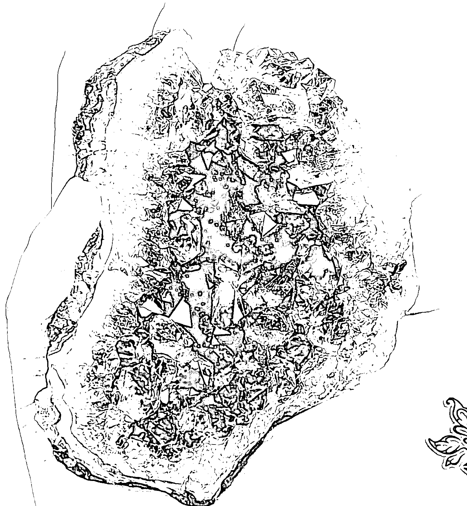

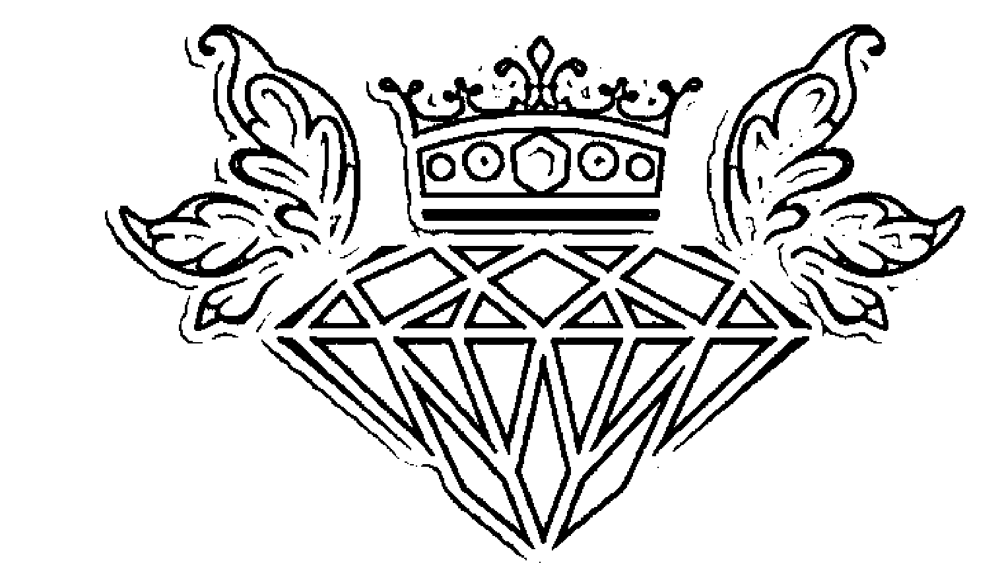

Archangel
OCCULT COLLEGE
天使神秘學院
http://www.ac2011.cn

50 款經典礦石應用，
居家照護 × 能量平衡 × 助眠舒緩 × 靈能充電，全方位平衡身心靈

作者：薇薇安·范·多倫 Vivian Vain

# 導讀

隨著我們正式進入水瓶時代，能量療癒及形而上學以驚人的速度普及，由過往的小眾逐漸走向主流，並從隱學往顯學的路上邁進。在各類水晶療癒相關資訊百家爭鳴的時代，看到如此清新且深入淺出的書籍，令人耳目一新。

本書具體清晰地回答了入門者常有的疑惑，如淨化及照顧方式、水晶能量運作原理、應用方法等之外，更感人的是字裡行間流露出作者對於能量運作及顯化應用開闊寬廣的價值觀，協助讀者獲取豐富且實用的知識，同時預防讀者落入限制性的思維框架中。本書引導讀者如何使用水晶的同時，更鼓勵讀者跟隨自己的直覺探索和水晶獨一無二的合作方式。

希望正在探索晶礦世界與能量宇宙的你，有機會讀到此書，建立更加開闊且放鬆的心態。

安平｜安平水晶創辦人

# CRYSTALS

# THE MODERN GUIDE TO CRYSTAL HEALING

## 水晶療癒指南

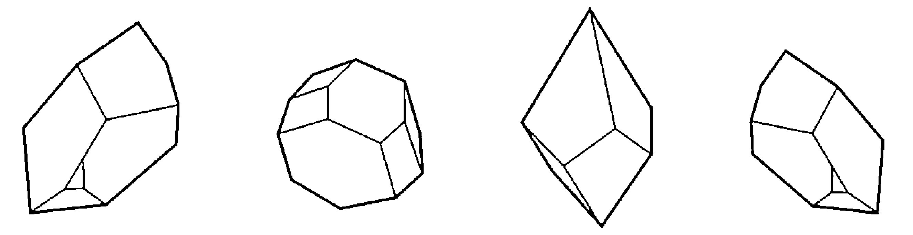

50 款經典礦石應用，
居家照護 × 能量平衡 × 助眠舒緩 × 靈能充電，全方位平衡身心靈

作者 —— 尤利婭·范·多倫 Yulia Van Doren 翻譯 —— 梵妮莎

# 目錄

# 介紹

水晶的魔力

- 08 星塵所生
- 10 水晶的種類
- 13 水晶運作原理
- 16 水晶收藏
- 18 水晶照護＋滋養
- 24 日常魔法
- 31 水晶＋脈輪
- 36 重要明星寶石

## 水晶詳細指南

- 關於作者 141
- 致謝 142
- 水晶指引 143

# 你好！魔法師。

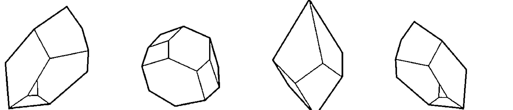

# 介紹

無論你已是一名水晶狂熱者（絕不離手某些摯愛寶石），或最近對水晶感到好奇（而且想知道到底有什麼值得大驚小怪）——歡迎你們！很高興你找到這本指南。

水晶可以讓你的生命充滿魔力，它們擁有獨特的折射，是耀眼的魔法代表。水晶和礦石誕生於古老年代，美麗的地球仍在隆隆作響時；從太初之始星塵就播下了種子，成為充滿魔力的工具，你可以非常輕鬆將其添加到生活中。你不需要特殊知識或訓練，就可以開始體驗水晶的力量，也不需要花大錢購買昂貴的品項。你唯一需要開始的就是培養感受力，並對於礦石和水晶繁複細緻、華麗而強大的創造力，抱持開放的好奇心。

本書分為兩個部分：「**水晶的魔力**」將涵蓋開啟水晶探索所需的一切準備，「**水晶詳細指南**」是對於 50 種我認為現今擁有最多魔力的水晶深度介紹，它們容易取得且價位親人。

如果這本書以適合的方式找到了你，那麼水晶一定也擁有吸引你親自發掘的魔力。請相信你的直覺，相信魔力，讓你的心和靈魂保持開放，迎接水晶賦予你的生命贈禮，這將會充滿魔法、神秘，但如同命中註定。

願你的生活充滿魔力！
尤利婭·范·多倫（Yulia Van Doren）/ Goldirocks

# 星塵所生

> 「我們都是星塵，經歷了數十億年的碳，我們閃耀如金…」
——瓊（Woodstock）妮·密契爾（Joni Mitchell）的歌曲〈胡士托〉

此時此刻，你內在及周遭的一切都是來自星塵。星塵是由浩瀚無垠的宇宙力量所創造，瀰漫天地，在地球播下生命的種子。「星塵」又是什麼做成的？星塵就是礦物，各式各樣、千姿百態的礦物。

開始引起人群共鳴，而且範圍不斷擴張，人們正在探索在日常生活中體驗這些寶石的方法，遠遠超越一般常見的工業用途。縱使現代技術利用科學證明了水晶的「能量」，例如它們的壓電能力（舉例而言：將壓力轉化為電流的能力），仍有一群水晶探索者正在發掘水晶和礦物中所蘊含的新力量，並相信現代科學仍望塵莫及。

就像瑪丹娜唱的那樣，我們真的「活在一個礦石（Material）的世界」。我們腳下的地球有各種晶體和礦物，數量有如恆河沙數，例如：在頭頂上方閃耀的是我們稱之為恆星的礦物簇；建築是由礦石和水晶製成（鋼＝鐵礦物，玻璃＝熔化的水晶）；汽車、電腦和電話之所以能正常運作，是因為它們含有大量提供能源的礦物和晶體。水晶科技不僅僅是新時代的概念，更是現代技術的重要一環。

與人類歷史一樣古老且遍佈全球的水晶及礦物神話，活躍在當今的新時代。與水晶建立連結需要每個人利用自己的直覺來找到見解和療癒方法，所以我們正在一起書寫這個閃閃發光的時刻、以水晶探索者的身分連結社群共同創造水晶的歷史。你會發現什麼呢？

水晶正處於一個耀眼時刻，在我們的集體意識中展露鋒芒。寶石所蘊含的閃耀魔力

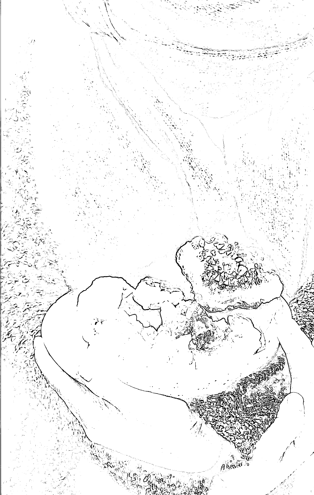

# 水晶的種類

**krystallos**：來自古希臘語，意思是「結晶的光」

我們美麗的星球擁有超過 5,000 種已識別的礦物，每年還會發現數百種新品種——許多水晶療癒師認為，新礦物的出現是因為世界需要它們的特殊能量。雖然我喜歡在談論礦物／水晶／岩石／寶石／石頭時，不拘小節並互換術語，但讓我們花點時間弄清楚它們的特有差異。

# 水晶的魔力

**礦物（Mineral）**通常僅由一種化學成分組成；超過一個就會變成石頭。礦物的定義是：1. 天然存在；2. 固態；3. 無機物（例如：並非由古代植物或動物的化石碎片組成）；4. 具內部晶體結構。然而，並非所有礦物都會形成大到足以被肉眼看到的晶體，這意味著，雖然所有水晶都是礦物，但並非所有礦物都是水晶。不具可見晶體結構的礦物有：孔雀石、赤鐵礦、紅玉髓。

**岩石（Rock）**通常由多種礦物的顆粒融合在一起形成固體。岩石可能含有有機物質，但真正的礦物不會如此（例如：次石墨岩是一種由古老植被產生的岩石）。常見的岩石有：玉、黑曜石、青金石。

**寶石（Gemstone）**是強度足以切割和拋光以製成珠寶的礦物或岩石。在 5000 多種礦物和岩石中，只有大約 200 種可以塑造成寶石。常見的寶石有：月光石、拉長石、綠松石。

**水晶（Crystal）**通常是指具可見結晶形式的礦物，這意味著它們呈現多面、對稱（如：立方體）或不對稱（如：菱形）、立體幾何形狀。種類繁多的水晶實際上僅可分為六類或「水晶系統」，每類都有獨特的幾何形狀，這讓水晶辨識比乍看之下容易許多。常見的水晶有：石英、黃鐵礦、螢石。

**石頭（Stone）**是一個非技術術語，通常用於礦物領域，意指粗糙邊緣已被機械拋光的小樣本，通常也稱為滾磨石／碎石或拋光石。

# 水晶的魔力

## 拋光 VS 原始

許多水晶愛好者發現地球母親所創的「原始」形式的水晶擁有獨特的有機力量，或是與「從真正的食物中獲取營養比從維生素補充錠中獲取營養更有效」的信念相似。然而，有許多礦物只有在拋光後才能展現出隱藏的魅力：彩虹螢石的美麗層次會更加顯眼，拉長石和月光石中的「閃光」也是如此。拋光水晶通常也更容易放在身體上進行水晶療癒，並且可以方便地隨身攜帶在我們喜歡塞進石頭的各個小地方（包、口袋、皮夾等）。只是要注意，拋光有時會不自然地「凍結」水晶的能量流，因此，如果你覺得拋光後的水晶沒有生命力，請務必嘗試將手放在原始樣本上進行比較——能量差異可能相當驚人！

## 採礦的注意事項

採礦是一個複雜的議題，真相並不完美，但對水晶收藏家來說非常重要。簡而言之，許多我們珍藏礦物樣本都是工業採礦的副產品，之所以被保存只是因為收藏家認為以完整形式保存會有其價值。採礦大多是以工業為目的，這意味著礦物開採後會被加工用於各樣工業用途：赤鐵礦等鐵基礎物被熔化用於鋼鐵，鋰雲母等充滿鋰的礦物成為電池和藥物，天然化妝品會使用各種礦物顏料和黏土，有機農民用霰石和硫磺施肥……現代生活中，確實沒有什麼領域未以某種形式利用礦物。許多今日從地下挖出的水晶在我們的第一位祖先來到這個地球之前就已經形成，現在它們被提取出來，需要我們細心呵護，以確保維持美麗和完整。因此，請珍惜你的每一塊石頭；在整個宇宙中它獨一無二！

# 水晶運作原理：振動＋顏色＋護身符

水晶無論放在哪裡都會閃閃發光，是大自然最令人驚嘆、名列前茅的作品之一，歷史悠久，單單作為有機居家飾品就受到重視。然而，它們的改變力量遠超過眼前所見，人們即使純粹出於美觀而購買水晶，水晶也會自然而然地為周圍空間和人群注入振動平衡、色彩療癒和護身符魔法的強力組合。

這個完美的原子對稱性使水晶成為能量和振動的強大載體和傳遞者。人類是一個更為「混亂」的原子排列，我們的原子和氣場可以透過與水晶獨特的對稱性相互作用而協調一致。

## 1. 振動

正如超凡脫俗的發明家尼古拉·特斯拉（Nikola Tesla）所言：「如果你想找到宇宙的秘密，請從能量、頻率和振動的角度思考。」所有的生命都隨著電磁脈衝和振動起舞。我們從科學家得知，宇宙中的每個原子都在不斷運動中，而形上學專家教導我們，每個物體都被它自己振動的能量球體（也就是光環）所包圍。水晶在自然界中是獨一無二的，它們的原子遵循盡可能最對稱的模式形成所謂的晶格，就是

## 2. 顏色

自古以來就一直存在利用顏色促進健康和福祉的傳統，而水晶鮮豔的色彩是其療癒能力最強大的面向之一。科學已經證明，我們在生理和心理都深受周圍顏色的影響（想想你在明亮的紅色房間和柔和的藍色房間裡的感覺有多麼不同）；形上學的觀點中，特定顏色會強烈激發並活躍脈輪系統。水晶提供一種最簡單就可以為家和工作場所增添明亮和有機點綴色彩的方法，並以提振精神的彩虹色調真實改變你的心情和活力。

# 水晶的魔力

## 3. 護身符

護身符（Talisman）的英文源自古希臘語動詞 telein，意為「啟迪神祕」。護身符傳統上被定義為被認為擁有魔法或神奇能力的物體，幸運符可能是我們現代人最熟悉的護身符。當你為了特定的意念或目標而選擇將水晶帶入生活，例如，粉晶是為了尋找愛情、黃鐵礦是為了獲得自信——你的特定意念會將水晶變成屬於你個性化、充滿魔力的護身符。水晶擔任強大的當責夥伴，只要你在附近，水晶的存在就會帶給你的意識和潛意識有益的驅動，孜孜不倦地提醒你成為你想成為的人、你希望擁有的能量、你準備好走進的生活。

葡萄酒和服用維他命的差異。喝了几口酒後，你就會明顯感覺到變化；然而，這個效果是短暫的，而且（幸運的是！）不是長期的。相較之下，你服用維他命時不會立刻感覺有什麼不同，甚至可能開始懷疑服用維他命是否有效。不過，在每天服用維他命後，有一天你會突然發現「哇，我感覺好多了！我過去一直有的狀況在這段時間並沒有困擾我，我最近甚至根本沒注意到它！」就在你幾乎沒有意識到的情況下，變化已經隱微但非常明確地在你身上發生。水晶療癒通常透過這種微妙而深度的長期魔法發揮作用。我也曾經歷令人驚嘆的自發性、無法解釋的水晶療癒和意外發現的時刻，所以關於全人療癒，我能與你分享的最佳建議是：讓你的思想和內心對無限可能性保持開放，你會對四周和內心顯化的一切感到驚訝不已。

## 全人療癒（Holistic Healing）

水晶經常以所謂「隱微」的形式展現魔力，與其他形式的全人療癒類似。為了更理解隱微的療癒概念，你可以想像一下喝一杯

> 「最重要的是，用閃閃發光的眼睛注視你周圍的整個世界，因為最大的秘密總是隱藏在最意想不到之處。那些不相信魔法的人永遠找不到它。」
——羅德·達爾（Roald Dahl）的《敘品斯》（The Minpins）

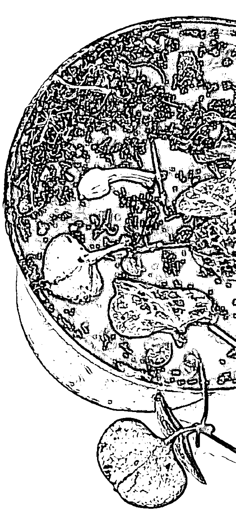

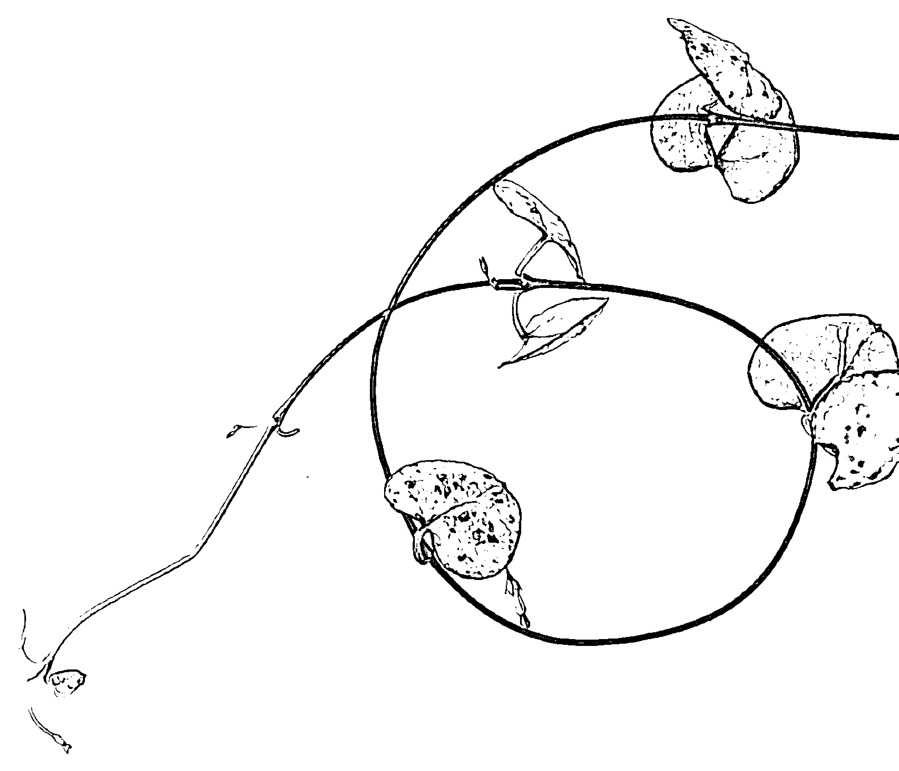

# 水晶收藏

我們正處於水晶鼎盛時期，水晶從大型連鎖店到時髦的咖啡店都隨處可見（這意味著成為一位水晶成癮者從未如此簡單——我已經警告過你囉！）。

## 購買水晶

除了專門的礦物商店外，形上學／新時代（New Age）店家通常會提供最適合親自購買的水晶種類。每年通常都會舉辦一次當地礦石展，參觀起來很有趣，到處都是友好的奇石採集者和優惠商品：在 Google 鍵入你的位置＋「礦石展」然後開始搜尋吧。當然，如果要在網路上購買水晶，選擇也非常多，從 Instagram 到 Etsy、再到 eBay 和精品店網站。我透過網路購物為個人收藏添加了許多神奇的水晶，對於避免後悔的最佳建議是 1. 只向可接受退貨的賣家採購；2. 確保你清楚了解尺寸（公釐和公分是非常不同的！）；3. 從與你產生共鳴的店家訂購，因為水晶已經在那個振動環境中度過一段時間。

## 選擇你的水晶

如果你曾花時間探索水晶世界，相信你已經注意到指南常常會針對同一種水晶給出不同（有時甚至是相互矛盾）的形上學含義和用途。你對於該信任哪個描述感到困惑嗎？運用你神奇的直覺：如果一種描述比另一種更能吸引你，那就選擇更能引起共鳴的描述。所有水晶都具有廣泛和多面的能量，它們都帶著許多贈予。產生共鳴的意思是：在你的人生歷程上這個特定時刻、特別為你所保留的魔法。這意味著，購買個人水晶也應該是一個簡單且直觀的過程：通常第一個吸引你眼球或第一個拿起的水晶，就是對你來說最具魔力的水晶。不要想太多。如果你在做決定時需要幫助，只需閉上眼睛，將水晶舉到心臟或眉心輪

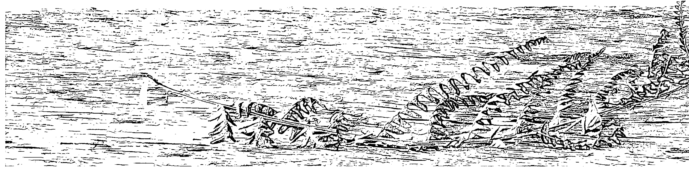

# 水晶的魔力

（眉毛之間），然後呼吸。幾次呼吸後，應該就會清楚知道那顆水晶是否應該跟你一起回家。另一種直觀增加收藏的好方法是在翻閱本書時注意哪些照片和／或關鍵詞吸引你的注意；如果你的直覺被激發了，試著拿到一個真實的樣本，看看它是否就是那個充滿能量的相配之物。

## 你不需要花大錢

有些我最寶貝的水晶看起來其實最不起眼，有凹痕和刮痕、有缺口和混濁，它們不是贏得選美的水晶、也不昂貴，但當我看到它們時，感覺就是——對！強大的魔力常常隱藏於簡陋的外表下。同樣地，在選擇水晶時，即使眼睛不認同，請永遠相信你的直覺。

## 當地岩石

請不要忽視生活在你腳下不起眼的岩石，因為它們包含你居住地的特定土地能量，對於讓你與當前時間和位置接地來說是無價的（這對於心理平靜和穩定非常重要！）。來自對你有意義的地點的岩石：你的出生地、住家、心愛的度假勝地等——是對你的個人故事很重要且寶貴的能量載體，只要它們為你激發的回憶是正面且接地的，就強烈建議將它們囊括在收藏中。

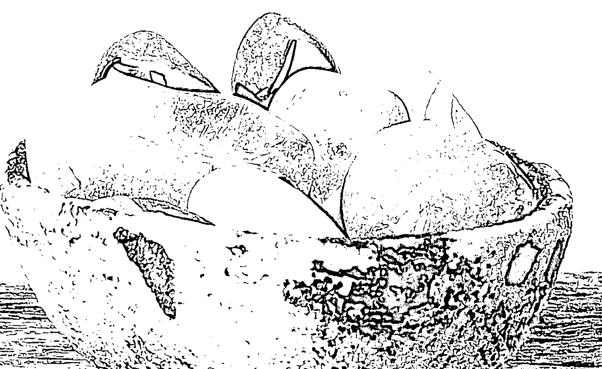

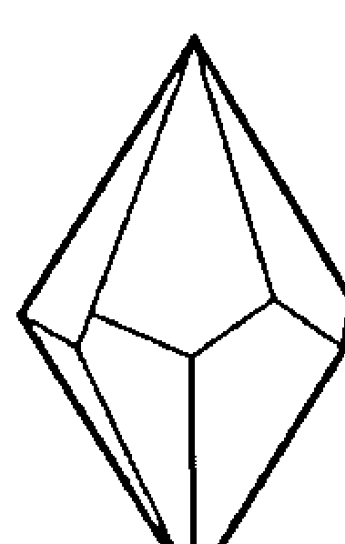

# 水晶照護＋滋養

## 淨化＋充電＋規劃

淨化水晶並為其充電是成為水晶擁有者的重要環節——尤其是當你第一次將它們帶回家時。定期花一點時間給它們愛和關注，這將使你的個人能量和水晶之間的連結保持強大和純粹流動，建立強大的連結並為個性化的魔法開啟空間。

# 水晶的魔力

**能量就是能量，也只是能量……**
在水晶世界的普遍理解是：它們很容易吸收「不好」或「負面」能量，你應該避免他人觸碰自己的水晶，以免水晶被朋友不那麼完美的能量「污染」。然而，能量就是能量，沒有好壞。想要賦予能量特性是人的本性，但事實上，一個人認為「好」的東西可能被另一個人認為「不好」——這是個人偏好。擔心水晶需要不斷地清潔和「保護」不僅會讓你過於專注於負面因素（這不是你希望關注的方向），而且會忽視水晶本身內在的力量和智慧。相信你的水晶是聰明的存在，它們可以自己保持清醒和高振動！如果你使用水晶進行身體療癒，尤其是在悲傷或生病的情況下，那麼確實有必要透過專注的清潔和充電來支持你的水晶。你的直覺會引導你。當然，你可以隨心所欲地呵護你的水晶，它們會喜歡的！只要記得，把你的意念集中在正面的事，而非預防性的面向。

**照護**
每個月進行一次月光浴（請參考第 21 頁）可以幫所有水晶強力充電，特別是滿月或新月期間，而且通常這就是讓水晶保持完全充電和活躍需要做的事。另外，請定期檢查水晶簇的周圍是否覆蓋了一層細灰，灰塵會減少對水晶科技至關重要的靜電荷。可以用水快速沖洗或用小刷子輕鬆祛除灰塵（化妝刷的效果很好）。

> **水晶規劃**為水晶打造一個非常具體的意念，通常是為了你盼能體現的能量或成果。

請用雙手握住你的水晶，想像它被閃閃發光的金色光球包圍。大聲說出你希望水晶為你保留的意念：「我將此水晶規劃用來（療癒我的心／在旅行時保護我／強化我選擇健康食物的意志力）。為了所有人的最高利益，在愛和光之中。」

請記住，如果你的直覺清楚地引導你這樣做，你只需要對水晶進行規劃。如果沒有進行規劃，那麼請相信水晶的魔力已經完美地滿足你的特殊需求和療癒！

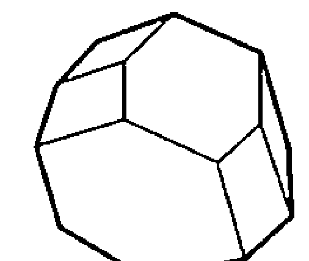

淨化和充電水晶的過程應該像你感覺受到指引的那樣簡單或複雜。我個人傾向讓我的儀式維持非常簡單：我的新水晶通常會進行快速水淨化和／或呼吸+意念淨化。我將它們放在室內窗台上吸收陽光和月光大約一天，就是這樣：清新、活躍和快樂的水晶準備施展魔法。簡單，快速，非常有效！

請嘗試以下淨化和充電儀式，盡情享受樂趣，找出最適合你和水晶的方法。

# 水晶的魔力

### 水

**原因**：水是大自然最有效的清潔和淨化劑
**儀式**：在流動的水龍頭下輕輕沖洗水晶，或將它短暫浸在一碗水中。如果你住在湖泊或河流等淡水水源附近，使用當地的天然水源進行清潔最棒了：把水裝滿瓶子帶回家，或者將你的水晶帶出門，給予它們得以在當地自然環境中清潔的特別贈禮（鹼水可能具有磨蝕性，因此請避開海洋和海水）。雖然水是去除灰塵和殘留土壤最簡單的方法，但有許多水晶會因接觸水而溶解或生鏽，因此在清潔之前先清楚了解水晶非常重要——如果有疑問，請跳過水並使用其他方法。為了讓你更容易操作，每個水晶的介紹資料都清楚列出用水淨化該水晶是否安全。

### 陽光

**原因**：陽光充滿能量地以光線照耀，擺脫陳舊能量，是一種極其活躍的力量
**儀式**：短暫的日光浴可以讓大多數新水晶在你第一次帶它們回家時獲得幫助：將它們放在陽光充足的地方並至少 4 小時。我個人喜歡在窗台上展示紫水晶等非稀有水晶，因為它們在陽光下閃閃發光，但請記住，隨著時間累積，陽光會使許多種類的水晶褪色。如果你選擇在陽光充足的地方展示彩色水晶，就必須坦然接受這個事實——假以時日，它會變成一個更蒼白但更柔和的版本。

### 月光

**原因**：月光對所有水晶來說都能充電而且安全
**儀式**：月光有神祕的魔力，水晶會在定期的月光浴中茁壯成長。將你的水晶放在月光可以接觸它們的地方過夜以進行有效充電，室內窗台和靠窗的桌子是最安全的選擇。許多金屬礦物會因為夜露生鏽，因此在戶外充電時請小心。新月或滿月的月光特別強大、充滿能量，在這些特殊月相下進行月光浴將使水晶更快樂和健康！

### 呼吸＋意念

**原因**：呼吸與意念相結合是最簡單、最即時的淨化選擇
**儀式**：拿起水晶，用鼻子吸氣，想像金色的光芒充滿你的肺。用嘴輕柔但有力地呼氣，就像吹滅生日蛋糕上的蠟燭那樣。重複幾次，直到你的水晶上的灰塵在視覺上被清除和／或直到你感覺所有的能量蜘蛛網都被吹走。

### 薰香

**原因**：燃燒香草產生的淨化煙霧能移除並淨化能量
**儀式**：點燃一小束你最喜歡的香草。將水晶放在煙霧上方，讓煙霧在水晶上方和周圍搖曳片刻。如果需額外強化魔力，請將香草束在水晶旁繞圈 7 次。鼠尾草束和秘魯聖木條是常見的選擇，但它們在野外都是瀕危的原生植物，因此請選擇環境永續的採購方式。另一個很好的選擇是在地的乾香草束（薰衣草、玫瑰和雪松都很棒），香草束既簡單又有效。

### 音樂

**原因**：音樂的振動波會協調它所觸及的一切事物的能量
**儀式**：吟唱、響鈴、擊鼓、撥弦！水晶絕對喜歡被音樂環繞，而現場音樂尤其能讓它們帶來生命力，並為水晶注入特殊的光芒。因此，請盡可能在水晶附近彈奏吉他、吟唱頌詞或敲響鈴鐺和頌缽。別害羞，它們是人們所能祈求獲得最美好、最不帶批評的聽眾！

### 土壤

**原因**：利用土壤接地並充電
**儀式**：將水晶放在室內植物的土壤上或埋在土壤中，或者埋在花園裡幾英寸深的土壤下 —— 不要忘記清楚標記你放置的地方，很多水晶就這樣回歸地球！放置至少一晚，或者感覺合適的時長就可以了。土壤特別適用於具有接地特性的水晶（黑碧璽、煙晶等），以及那些與你一起通過機場掃描儀的水晶。不應對金屬礦物或脆弱的晶簇選擇土壤法，因為土壤中的水會使它們生鏽。

### 鹽

**原因**：鹽是一種淨化劑，但請謹慎使用，它可能會損壞多種水晶
**儀式**：用鹽水浸泡或將水晶埋在鹽中是傳統的清潔方式，但我不建議使用鹽進行例行淨化，因為它會降低水晶的光澤並削弱晶簇，進而損壞水晶。不過，如果你將水晶用於多種療程（尤其是在水療中心或按摩工作室的環境中），鹽可以成為一種快速且有效的淨化劑，讓你的「工作水晶」保持清新。只需在碗或托盤中裝滿喜馬拉雅鹽（最好是粗鹽，因為較小的顆粒會損壞晶簇），然後在兩次療程間將水晶放在鹽上至少 10 分鐘。

## 日常魔法：將你的生活水晶化

從閃亮的家居裝飾到隨身攜帶的療癒工具，水晶可以為日常生活的每個時刻增添魔力。以下建議的目的是激發你的想像力和直覺，請盡情體驗吧！你的水晶將會引導你。

### 水晶＋居家

你的家不僅是一個裝載個人物品的大盒子！無論你是住在夢想中的小窩、還是臨時公寓，每個房間都以非常特定的方式在滋養和支持你。用水晶裝飾可以將家變成一個充滿魔力的聖殿，是讓生活開始水晶化最簡單方法。如果你不確定該在哪裡展示水晶，只需先將它們放在你想放裝飾蠟燭或室內植物的位置——注意，顏色鮮豔的水晶在陽光直射下會褪色。以下是我最喜歡用來讓各個房間充滿活力的石頭：

**臥室**
（針對安穩睡眠＋和平夢鄉）瑪瑙、紫水晶、黑碧璽、天青石、玉髓、賽黃晶、岩鹽、鋰雲母、月光石、粉晶（如果要為閨房增添熱情，請嘗試橘水晶、紅玉髓、石榴石、祖母綠、霰石）。**小提示**：將水晶放在床頭櫃或床墊下，在睡眠時進行療癒和引導；將透石膏放在衣櫃裡，清除滯留的能量

**廚房**
（針對健康選擇＋意志力）紫水晶、磷灰石、雞血石、紅玉髓、白水晶、祖母綠、黃鐵礦、透石膏、次石墨。**小提示**：將水晶放入冰箱和櫥櫃中，為食物注入額外的健康氣息

**客廳＋餐廳**
（針對交流＋放鬆）紫水晶、魚眼石、方解石、白水晶、沙漠玫瑰、冰洲石、透石膏、煙晶、精靈水晶、硫磺。**小提示**：這些放置在繁忙生活空間中的水晶有雙重作用，既可以當做漂亮裝飾品，也可以作為強大的空間淨化劑

**浴室**
（針對自我照護＋健康）瑪瑙、天河石、方解石、天青石、玉髓、鳳凰石、雞血石、祖母綠、螢石、鉻雲母、碧玉。**小提示**：藍色和綠色水晶有助於將浴室變成療癒的聖地

**孩子的房間**
（針對平靜＋天使般的保護）紫水晶、天青石、玉髓、賽黃晶、祖母綠、鋰雲母、月光石、透石膏。**小提示**：嘗試在嬰兒床或床下放置紫水晶或鋰雲母，促進平靜的睡眠。請確保讓水晶遠離小嘴巴！

### 水晶 + 工作

無論你是自雇者還是公司創意人員，將水晶放在工作空間都會增強創造力和生產力。以下一組水晶都是很好的開始：

- **專注+生產力**
瑪瑙、黃水晶、沙漠玫瑰、黃鐵礦、彩虹螢石、透石膏

- **溝通**
天河石、魚眼石、天青石、鳳凰石、藍晶石、粉水晶

- **創意+靈感**
紫水晶、紫黃晶、霰石、白水晶、拉長石、黃鐵礦、煙晶、精靈水晶

- **幸運**
紫水晶、黃水晶、祖母綠、玉、黃鐵礦、鈦晶、硫磺

### 隨身攜帶的水晶

水晶碎石非常適合在外出時維持水晶魔力，大多數水晶愛好者的提包、錢包、口袋和汽車總是至少有一些哐啷作響的東西。從內衣到襪子束帶，你都可以把水晶碎石塞入各個地方，只需按照直覺來決定什麼能為你即將到來的一天提供最好的支援。水晶首飾也是經典且方便攜帶的選擇；請記住，珠寶也需要不定時清潔和充電。

日光、月光和薰香是最安全的方法。
旅行保護：瑪瑙、紫水晶、黑碧璽、雞血石、祖母綠、赤鐵礦、拉長石、月長石、次石墨

**小提示：** 祖母綠和月長石有助於安撫對飛航的恐懼。不要忘記在暴露於機場 X 光後淨化你的旅行水晶

### 水晶 + 健康

**睡眠**
在睡眠時吸收水晶能量非常有效：除了將水晶放在臥室周圍外，還可以將小顆水晶碎石塞進枕頭套、床墊和彈簧床之間，或放在床下進行聚焦療癒。試著在頭下放一顆紫水晶、兩邊各放一顆粉晶、腳邊放一顆黑碧璽，感受我最喜歡的夜晚擺設。注意有些水晶是否對你的臥室來說過於「活躍」；我個人無法在青金石或虎眼石附近睡覺。

黑碧璽、雞血石、紅玉髓、玉髓、黃水晶、祖母綠、螢石、石榴石、赤鐵礦、玉、碧玉、拉長石、鋰雲母、月光石、粉晶、次石墨、煙晶

**洗澡**
在你的浴缸中加入水晶，將洗澡變成一種格外幸福的自我照護儀式：如果你還未體驗過水晶浴，這是一件特別值得你期待的事！水晶碎石最適合泡澡，但要確保不要使用會溶解／生鏽或含鉛／汞的水晶。
安全的選擇包括瑪瑙、紫水晶、磷灰石、

**水晶靈藥**
喝下你的水晶：為「On the rock」（加冰塊）賦予新的含義，可飲用的水晶靈藥是注入了水晶能量的液體（通常是水）。
如要製作簡單的水晶靈藥，請將一塊或多塊水晶碎石放入裝滿過濾水或泉水的玻璃杯、罐或水瓶中，放置在陽光或月光下至少12小時以注入並為其充電。取出水晶並喝下，以獲得水晶療癒很棒的內部加持！
試試用粉晶表達愛、用紫水晶療癒、用黃水晶來補充能量、或用次石墨來接地。使用無毒的石頭作為水晶靈藥非常重要，請在進行任何試驗之前進行研究！

> 注意：本書中列出的所有寶石均不含鉛或汞，但值得一提的是，有一些水晶確實含有鉛或汞，例如：方鉛礦含鉛、硃砂含汞。

### 水晶＋儀式

#### 月亮顯化

水晶和月亮魔法真是天造地設的一對：滿月和新月除了是為水晶充電的最佳時機外，還提供了設定意念的絕佳機會。

聖壇是物理形式的祈禱：水晶自古以來就被用作聖壇物品，所有水晶類型都適合放在你的個人聖壇上，用於維持特定意念、祈禱和願望。

**新月**充滿清新能量，是設定新意念和開始新專案的最佳時機。這裡有一個簡單而充滿力量的新月十水晶儀式：

**水晶陣**
1. 寫下你希望實現的目標和夢想清單
2. 將黃水晶、橘水晶、白水晶、石榴石或月光石（或組合）放在你的清單上方
3. 在新月月光下過夜。期待奇蹟。

對稱能增強魔力：水晶陣是將水晶按照特定意念的佈局方式，通常會依循與神聖幾何學相關的圖案。水晶陣既可以用來增強特定意念，也可以作為一種專注的冥想練習。試著用已有的花樣或根據直覺創造圖案；Pinterest 和 Instagram 是水晶陣的重要靈感來源，試著從搜尋 #crystalgrid 標籤開始。

**滿月**被譽為每個月最神秘、最充滿魔力的夜晚。情緒和直覺被強化，現實之間的區隔很稀薄。感恩儀式非常適合滿月之夜，因為它們可以接地、保護並擴展可能性：

1. 寫下生活中讓你充滿感激的事項清單
2. 將拉長石、紫水晶、黃鐵礦、透石膏、祖母綠或煙晶放在清單頂上方
3. 在滿月月光下過夜。期待奇蹟。

### 水晶＋禮物

水晶是完美的禮物——它們真的永遠不會停止給予！以下是我在各個場合最喜歡的建議：

- **生日**
天河石、紫水晶、魚眼石、天青石、黃水晶、鈷方解石、螢石、粉晶、石英

- **新工作**
天河石、紫黃晶、藍銅礦、黃水晶、祖母綠、玉、黃鐵礦、螢石

- **新生兒派對**
紫水晶、天青石、玉髓、孔雀石、白水晶、鈷方解石、祖母綠、月光石

- **破碎的心**
黑碧璽、賽黃晶、石榴石、岩鹽、鋰雲母、薔薇輝石、粉晶、鈦晶

- **友誼**
瑪瑙、紫水晶、黑碧璽、玉髓、白水晶、鋰雲母、粉晶、金紅石、石英、綠松石

- **新娘婚前派對**
紫水晶、魚眼石、岩鹽、月光石、粉晶、精靈水晶

- **新手媽媽**
琥珀、紫水晶、雞血石、紅玉髓、天青石、鳳凰石、祖母綠、石榴石、赤鐵礦、鋰雲母、月光石、橘石英

- **悲傷**
瑪瑙、阿帕契之淚、玉髓（粉紅色）、岩鹽、鋰雲母、藍銅礦、薔薇輝石、粉晶、煙晶

- **恭賀**
紫水晶、紫黃晶、黃水晶、螢石、黃鐵礦、精靈水晶、硫磺

- **婚禮**
紫水晶、魚眼石、藍銅礦、白水晶、粉晶、透石膏

- **康復**
紫水晶、磷灰石、琥珀、霰石、雞血石、鳳凰石、祖母綠、碧玉、粉晶、硫磺

- **畢業**
天河石、霰石、黃水晶、祖母綠、冰洲石、黃鐵礦、精靈水晶

- **新家**
紫水晶、魚眼石、黑碧璽、岩鹽、透石膏、煙晶

### 水晶與脈輪

| 頂輪 | 眉心輪 | 喉輪 | 心輪 | 太陽輪 | 本我輪 | 海底輪 |
|---|---|---|---|---|---|---|

**真言**

| 我知道 | 我看到 | 我說 | 我愛 | 我分享 | 我創造 | 我是 |
|---|---|---|---|---|---|---|

**傳統代表色**

| 紫色 | 靛藍色 | 藍色 | 綠色 | 黃色 | 橘色 | 紅色 |
|---|---|---|---|---|---|---|

**互補顏色**

| 黃色 | 紅色 | 橘色 | 粉紅色 | 紫色 | 藍色 | 綠色 |
|---|---|---|---|---|---|---|

> 「每個人都有療癒的天賦，它不是只給少數人的禮物。這是你與生俱來的權利，也是我的。每個人都可以得到療癒，每個人都可以學習療癒。每個人都可以療癒自己和他人。
—— 芭芭拉·布倫南（Barbara Brennan），《光之顯現》（Bantam Books，1994）」

### 水晶 + 脈輪：你是一道彩虹

脈輪：來自古梵文，意為「輪子」

**魔法**
將水晶直接放在身體的特定部位，可以激發強大的療癒和充電功能。

你有 7 個主要脈輪，從脊椎底部一直延伸到頭頂，每個脈輪都與特定的顏色和能量焦點相關聯。沿著身體前方的脈輪漩渦是輸送系統，將你的能量轉移到這個世界，同樣重要的（而且經常被遺忘！）是沿著你身體後方的脈輪漩渦，從你的靈魂協助者那裡接收能量並輸入——這是一支直達你個人天使和指導靈的求助熱線。

我們的身體藉由充滿活力的彩虹顏色能量系統提供動力，這稱為脈輪。古印度的聖僧在約 4,000 多年前首次記錄脈輪，這是我們身體內部和周圍特定點振動的能量漩渦。我們不斷地使用脈輪來吸收和消耗能量，一個運作良好的系統對於你在身體和情感上的健康程度、以及如何在日常生活中充滿精力地運作至關重要。如果你手機上的充電孔跟我的很像，就不難想像定期清理脈輪、為它（也就是你身體的充電孔）從日常生活的髒污中充電是多麼必要！瑜伽、冥想、親近大自然都是幫助保持脈輪系統健康的好方法，而水晶是添加到脈輪健康照護中有效且易於使用的工具；我喜歡稱水晶為脈輪維他命！

水晶脈輪療癒會以多種方式體現，你可能會感到電擊般的刺痛、深深的平靜感、自發性的流淚或大笑，或者甚至什麼都感覺不到。你的反應永遠是「正確」的反應；請相信這個過程，相信你的直覺，相信水晶的智慧。

請嘗試以下脈輪淨化，開始使用水晶進行身體療癒，並且不要忘記，使用水晶進行療癒的方法是無止境的：讓你的直覺盡情發揮無限樂趣吧！

**脈輪位置**
- 更高頂輪：水晶在距離頭頂幾吋高度
- 頂輪：水晶觸碰頭頂
- 眉心輪：水晶在眉毛間
- 喉輪：水晶在喉嚨上
- 更高心輪＋心輪：水晶在胸骨上（綠色或粉紅色）
- 太陽輪：水晶在肚臍上方或正上
- 本我輪：水晶在下腹部
- 粉晶：水晶在手中
- 海底輪：水晶在大腿內側間
- 地球之星：讓水晶觸碰腳

### 水晶脈輪療癒

找一個安靜的時刻，在舒服的地方躺下。脫掉鞋子，把手機調成靜音。如果你想，可以播放平靜的背景音樂，不過寧靜也具有同樣的強大力量。請在療癒的前後多喝水。

#### 簡單的單脈輪淨化

單石法是使用水晶進行身體療癒最快、最簡單的方法，非常適合快速充電、對特定區域進行集中療癒、或更深瞭解單個水晶（當你第一次將新水晶帶回家時最好這麼做）。

**儀式**
拿一顆水晶，在你的手掌之間輕輕滾動數次以啟動它。將它放在與其顏色相匹配的脈輪區域——藍色的石頭放在喉嚨上，綠色的石頭放在胸前等等。深呼吸，簡簡單單地想像水晶將它美麗的顏色輻射到它所接觸的區域，隨著你的每一次呼吸，顏色就擴散並變得更鮮明。如果感覺對了，可以在每次呼吸時重複與該脈輪相關的真言。你可以設定一個鬧鐘（5 分鐘是一個很好的通用時長），或者持續進行，直到你的直覺告訴你已經完成了。完成後，別忘了對水晶說聲謝謝；你的感激會讓它知道你已經完成充電，並從脈輪上取下水晶。

> 注意：如果水晶從身體上滾落或從你放置它的位置移動，請花點時間感受一下是否真的需要把它移回本來的地方——它可能在試著告訴你它已經完成作業，或最好使用在稍稍不同的地方。
此外，使用水晶時不要忘記注意後脈輪。傳統的脈輪顏色是基於前脈輪系統，因此可以在身體背面使用互補色水晶進行試驗（請參考前頁圖表）。

#### 完整淨化脈輪＋充電

這對你的整個脈輪系統來說是一個強大的提升，非常適合每周至少一次犒賞自己。現代形上學定義了原始七脈輪之外的其他脈輪，因此這種淨化提供了包括現代脈輪地球之星、更高心輪和更高頂輪的選擇。

**所需水晶**
7 顆水晶，每個主脈輪一顆。如想要增強體驗，請添加：
- 1 個白水晶柱用於更高頂輪
- 2 顆接地水晶（黑碧璽或其他黑色／灰色水晶）用於地球之星
- 1 顆粉晶用於更高心輪
- 2 顆粉晶，用於創造療癒蘭室

**儀式**
一律從放置接地水晶開始，讓它們分別接觸到足部。開始將水晶放在身體上，按照從根脈輪向上或頂輪向下的順序進行。首選是按照傳統順序（照邏輯而言，這是自行脈輪淨化最簡單的方式），但從頂輪開始向下移動是另一個力量強大的方法。兩隻手各拿一顆粉晶，閉上眼睛，平靜地深呼吸。想像水晶開始從內部發光。它們的顏色開始向外輻射，隨著每次呼吸而擴張，整個房間都充滿了閃閃發光的彩虹泡泡。吸入這道彩虹，想像它衝過你的血管，淨化並活化每一個細胞。吐氣，想像從你的鼻子和嘴裡呼出美麗的彩虹雲朵，有著閃亮的顏色。**你就是一道彩虹**。至少花 10 分鐘來體驗完整水晶脈輪療癒的強大魔力。完成後，以先前放置水晶的相反順序取出水晶，透過逐一感謝每一顆水晶來釋放能量。**你被療癒了，你是完整的，你就是光！**

### 冥想

靜靜凝視水晶可以幫助你加深與它們的連結，並獲得自己專屬的水晶洞察。嘗試用非慣用手拿著水晶，把水晶放在心臟或第三隻眼（眉毛之間）上進行冥想。當你與水晶更深入地連結和聯繫時，溫柔地觀察你可能在身體和情緒上的任何感覺和變化。

# 水晶的魔力

雖然書中介紹的所有礦物都很特別，但這 10 種是每個人的水晶工具箱中都應該擁有的水晶。這些明星寶石很容易找到經濟實惠的樣本，非常適合當做收藏開端，並具備囊括一組脈輪組的額外好處。

## Goals 目標

嘘……使用水晶的「目標」並不是為我們自己變出一個完美的生活——完美的愛情、身體、事業、銀行賬戶……雖然這些都是值得擁有的好東西，但專注於這些會錯過真正的幸福源泉，以及整個「身為人的體驗」意義所在。相反地，從使用水晶（以及所有形式的「自助」）中獲得的最大魔力，是它支持你成為最清晰、閃亮、有靈感和腳踏實地的自己。如此一來，你就可以成為一個豐沛的幸福寶庫，從中與你生活中接觸到的每一個人分享你獨特的善良、關懷和愛。少一點自助，多一點共同幫助。因為，我親愛的水晶朋友們，這才是真正的意義。散播仁慈、同情和愛，我保證你想要的「完美」生活將全部屬於你。

## beagoodhuman 成為一個好人

## 水晶詳細指南

- ⊛ 顏色種類
- ⊛ 現今最大產地
- ⊛ 與該水晶共鳴的脈輪
- ♡ 特殊照護建議
- ⊿ 接觸水是否會造成傷害

魔法 = 形上學特質
摘記 = 實用資訊

## Agate 瑪瑙

保護 + 勇氣 + 力量 + 腳踏實地

- ⊙ 顏色 所有彩虹色系
- ⊕ 產地 世界各地
- ☸ 脈輪 因顏色而異
- △ 以水淨化 ☑ Y □ N

真正的魔法創造者，就需要勇敢地踏入兩種情況中——光明和黑暗，並在你身為光行者的旅程中遭遇各種轉折時幫助支持和保護你。

**魔法：** 瑪瑙是擁有許多古老故事的守護礦石。自幾千年前在希臘阿蓋特河畔首次發現以來，這種多色的帶狀寶石就被雕刻成聖物和魔法護身符。傳說早已預言瑪瑙可以賦予隱形和勇氣的力量。隱身性＝超乎肉眼可見，瑪瑙是你（無論是生理上還是情感上）感到脆弱或需要額外保護時可以帶著的寶石。儘管你的人生旅程擁有許多在聚光燈下展現的時刻，但它也將提供同樣重要的機會，讓你勇敢地穿越內在和外在的陰影。瑪瑙混合了明亮的半透明和深色的不透明帶，提醒著我們，如果要成為

**摘記：** 瑪瑙是礦物玉髓的一種帶狀變種，在切割或拋光後最能展現獨特層次。很容易能找到中心帶有閃閃發光晶簇的切片或晶洞（如圖所示覆蓋微小晶體），這也是最經典的樣式。可以在世界各地發現多樣顏色組合，許多瑪瑙品種都以來源地命名。瑪瑙是阿育吠陀的五月誕生石，也是摩羯座和雙子座的黃道誕生石。

## Amazonite 天河石 / 亞馬遜石

說出真相 + 心流 + 靈感

- ⊛ **顏色** 亮藍綠色
- ⊕ **產地** 美國、馬達加斯加、俄羅斯、巴西
- ☸ **脈輪** 喉輪
- ◇ **以水淨化** ☑ Y ☐ N

**魔法：** 說出你的真相。天河石鼓勵你努力成為勇敢無畏、說真話的人。就像是用來命名這款不透明水晶的強大河流一樣，天河石是心流、力量和冒險的寶石，鼓勵你深入挖掘並開採陰暗深處，以尋找閃亮的真相和靈感。這個說真話的護身符是歌手、演員、教師、作家以及任何為生活或熱情而溝通者的寶貴水晶盟友。在大型試鏡或演講之前，將天河石放在你的喉輪上幾分鐘，或者將一小塊塞進衣服裡陪伴，以讓你獲得當下靈感。對於所有感覺要帶領啟發和提升的社群媒體專家來說，天河石是不可或缺的水晶，它會引導你勇敢地發布和分享來自更高自我的訊息，以獲得充滿光的社群媒體熱點。更多靈感、更少嘆氣，因為當我們鼓勵他人飛翔時，我們也能飛得更高——讓天河石幫助你勇敢地分享你的真相，讓我們一同翱翔！

**摘記：** 天河石經常是以大型非結晶塊的形式被發現，但也可能是板狀晶體結構。它通常以原石或拋光狀態出售，兩者同樣美麗和強大。嵌入煙晶和／或黑碧璽（這是常見組合）的天河石能額外提昇接地能量。

## 水晶詳細指南

## Amber 琥珀

增強免疫＋舒緩＋民間魔法

- ⊕ 顏色 蜂蜜橙色＋黃色
- ⊕ 產地 波羅的海地區
- ⊕ 脈輪 本我輪、心輪、太陽輪
- 💧 以水淨化 ☑ Y ☐ N

在你的本我輪上放一顆，以釋放承襲的祖先業力；放在你的太陽輪上以釋放陽光的活力和療癒力；和／或放在你的心輪上，將免疫系統和心臟包裹在一個巨大、溫暖如蜜的擁抱中。

**魔法：** 琥珀是古老森林魔法和舊世界童話的寶石。這些蜂蜜色的寶石誕生於史前松樹的「血液」中，是樹脂的化石滴，歷經數百萬年的鹹水浪潮打磨和拋光。對於那些祖籍在東歐的人來說，這是一個寶貴的水晶朋友，因為東歐是琥珀的傳統故鄉；花點時間與這塊發光的寶石相處，與自己祖先的神話和民間傳說連結，喚醒你內心深處的原始魔法和智慧。與冰天雪地的瞪瞪風景相比，琥珀是擁有深層溫暖的寶石，自史前時代就因其療癒及緩解疼痛的能力而備受重視。如果要用琥珀療癒，請嘗試

**摘記：** 雖然波羅的海地區是琥珀的主要產地，但樣本也可能來自中美洲——西班牙征服者講述了一則阿茲特克皇帝蒙特蘇馬用琥珀勺子攪拌巧克力的故事。請小心容易用來欺瞞的塑膠仿製品；真正的琥珀與仿製品不同，在摩擦時很容易變熱並會釋放出松樹氣味，而且會漂浮在鹽水中。仔細一看，有時會發現被困在琥珀裡的史前昆蟲！

## Amethyst 紫水晶

轉化 + 保護 + 解除成癮 + 睡眠

- ⊙ 顏色 薰衣草＋紫羅蘭色
- ⊕ 產地 巴西、烏拉圭、世界各地
- ☸ 脈輪 頂輪
- △ 以水淨化 ☑ Y □ N

**魔法：** 紫水晶充滿了帝王般的色彩和璀璨的光芒，是一種轉化和啟發的寶石。被無數世代水晶愛好者所珍視的紫水晶之名源於古希臘的一個傳說，關於羅馬神話中的花花公子巴克斯（希臘神話中的戴歐尼修斯）、一位名叫紫水晶的純潔少女和過多的酒……古希臘人和羅馬人把這個傳說銘記在心，用鑲嵌紫水晶的高腳杯飲酒，作為防止過度放縱和上癮的護身符。今日，紫水晶提醒我們要時時將身心視為聖殿。它可以幫助我們擺脫不健康的依戀，並從負面或令人上癮的模式中強力地淨化身體、心思和氣場。紫水晶是一種保護石，在人和空間周圍形成保護泡泡，對失眠和噩夢非常有幫助。紫水晶是一種超越的寶石，可以增加通靈力量，並將強化與所有神秘和神奇事物的連結。紫水晶作為我的重要寶石明星之一，它是真的非常神奇的水晶，可以在其廣闊的能量場中庇護每個人、每件事。

**摘記：** 紫水晶一度與鑽石一樣稀有和昂貴，這種石英的顏色產生原因仍是一個科學謎團，據說紫水晶的紫色調來自鐵和鋁的包裹體。單顆水晶可在世界各地發現，而市場上的大部分水晶簇來自巴西和烏拉圭。紫水晶是傳統和阿育吠陀的二月誕生石，也是水瓶座和雙魚座的黃道誕生石。

## Ametrine 紫黃晶

信心＋直覺＋表現＋目標

- ⊕ 顏色 紫羅蘭色＋橙色混色
- ⊕ 產地 玻利維亞、巴西
- ⊕ 脈輪 太陽輪、頂輪
- ♡ 照護 陽光直射會褪色
- 💧 以水淨化 ☑ Y ☐ N

清除壞習慣和戒斷成癮的好夥伴。嘗試飲用紫黃晶水晶靈藥來幫助你保持健康。睡覺時可以將一顆紫黃晶放在枕頭下，在睡夢時獲得幫助；學習或工作時將紫黃晶放在視線範圍內，可以獲得額外的腦力、注意力和靈感。

**魔法：** 作為紫水晶和黃水晶的愛的結晶，紫黃晶是一種可以隨心所欲揮灑的寶石。這顆紫橙色的寶石將頂輪和太陽輪的能量結合，與掌控自己的生活並忠於直覺有關。紫黃晶幫助你致力依循「你認為必須」清單、而非「他人認定應該」清單中事物的生活；擺脫那些因循守舊的束縛，開始展現你宏大、超凡的夢想和願景！紫黃晶＝追隨你的夢想。

黃水晶的激勵力量與紫水晶的完整性及超越性振動結合，使紫黃晶成為堅持目標、

**摘記：** 紫黃晶樣本大部分呈紫色、帶小部分橙色。玻利維亞是天然紫黃晶的主要產地，雖然來自其他地區的樣本時常會經過熱處理以強化橙色，但你會發現，這些經過強化的寶石仍然具有強大的形而上振動能量。

## 水晶詳細指南

## 藍色

### Apatite 磷灰石

意志力 + 健康選擇 + 排毒

- 顏色 藍綠色
- 產地 巴西、印度
- 脈輪 眉心輪、喉輪
- 以水淨化 ☑ Y ☐ N

溫柔地在你身上運作。記住：維持健康不是一個自私的目標，因為你感覺愈好，就愈能與世界分享你的天賦和熱情。磷灰石＝激發你的意志力，激發你的健康。

**魔法：** 藍色磷灰石是你在任何與意志力相關的事情上需要幫助時可以抓來的水晶：決心、健康飲食、戒掉惡習、善待自我等。在你的廚房中放置這些青藍色的寶石，可以幫助你一直做出健康、營養的選擇。這顆可愛的寶石可以為你排毒、擺脫無益的模式和習慣、排除從前世和交替次元中根深蒂固的因果羈絆，那絕對會是你想要釋放的東西。與磷灰石一起洗澡，為你的水注入排毒、支持健康的氛圍，或者嘗試飲用磷灰石水晶靈藥，從內到外注入健康。這顆寶石非常適合臥室，它會在你就寢時

**摘記：** 磷灰石有多種顏色，其中藍色品種最為常見且價格實惠，有時會以藍綠色磷灰石的名稱販售。藍色磷灰石既有昂貴的透明水晶、也有價格適中的滾石。磷灰石由古希臘人以欺騙女神阿帕忒（Apate）的名字命名，因為它經常被誤認為是其他礦石，最常出現的狀況是螢石和海水藍寶。

## Apophyllite 魚眼石

空間清理 + 能量過濾 + 第三隻眼覺醒

- ⊙ 顏色 透明、薄荷綠
- ⊕ 產地 印度
- ☸ 脈輪 眉心輪、頂輪
- △ 以水淨化 ☑ Y □ N

**魔法：** 魚眼石是水晶王國的「空氣清淨機」，不斷過濾大量能量，保持清新、晶瑩剔透、極度高頻。在客廳、走廊和廚房等來去繁忙的區域放置一個水晶簇，你在 24 小時內肯定會注意到這個空間能量品質的差異。這是療癒從業人員在等候室和治療室進行能量淨化和轉化的必備水晶。魚眼石水晶尖是拓展第三隻眼意識和注意力的熱門選擇；在眉毛之間用其中一顆小金字塔形的水晶中進行冥想，以強化你在所有互動中保持公平、平衡和靈性覺醒的能力。魚眼石因其淨化能量的能力而成為我的必備明星寶石之一，有助於促進有意識的溝通及轉化負面情緒，這讓它成為新居入厝、新婚和新公司的完美水晶禮物。結合桃粉色輝沸石的水晶簇是一種很容易找到的組合，讓空間和人們充滿心曠神怡的快樂振動。

**摘記：** 魚眼石是物超所值的最佳水晶之一，因為驚人的大型水晶簇比大多數其他類似大小和閃耀的礦物簇更實惠。它最常見的形式是透明、無色的礦物，混合了各種不透明的「沸石」礦物，包括輝沸石和片沸石。綠色魚眼石晶體是一種更稀有且更昂貴的品種（請小心染成綠色的仿製品！）。魚眼石水晶尖可能會斷裂，留下平坦（但仍然很漂亮）的表面，因此請小心維持水晶簇的尖端完好無損。

## 水晶詳細指南

## 星型

### Aragonite 霰石

改變 ＋ 擁抱未知 ＋ 接地

- ⊙ 顏色 鐵橙色、白色
- ⊕ 產地 摩洛哥、西班牙、美國
- ❀ 脈輪 本我輪、海底輪
- 💧 以水淨化 □ Y ☑ N

**魔法：** 當上天關閉了一扇門，就會打開另一扇窗。星型霰石的緻密核心向四面八方輻射出星型尖刺，幫助你在變化無常中保持開放的心態和好奇心。毫無疑問，我們無法避免在人生路上會面臨的改變。與其緊緊抓住過去不放，不如讓霰石幫助你擁抱未知及無數的可能、冒險和機遇。當全球新聞和各種事件令人不堪負荷，讓你感覺像爬進一個洞裡、準備在接下來十餘年裡沈沈睡去之時，霰石是一個很好的水晶盟友。我的光行者朋友，此刻是比以往任何時候都更需要你的光之時代，所以請讓

霰石幫助你保持敏銳、投入並專注於大局。躺下時，把一顆水晶放在本我輪上，平靜並深深地呼吸，冥想瑪麗蓮夢露（她是感官本我輪能量至高無上的女神）這些睿智話語：「好事有時候會崩壞，以讓更好的事情可以凝聚。」

**摘記：** 霰石是一種鈣基礦物，一種更硬、密度更高的方解石。它形成各種形狀和顏色，星型晶簇是最引人注目和最受歡迎的形式。這些通常被稱為人造衛星霰石（Sputnik Aragonite），因為它們的尖刺晶體與蘇聯時代的衛星相似。

## Aura Quartz 水光水晶

樂趣 + 魔法 + 好玩 + 創造力

- ⊕ 顏色 霓虹光彩虹色調
- ⊙ 產地 美國、中國
- ☘ 脈輪 因顏色而異
- ◇ 以水淨化 ☑ Y ☐ N

**魔法：** 水光水晶是現代水晶復興的派對之子。這些有趣的水晶非常受歡迎，於 80 年代首次出現，是天然和人造煉金術的結合。它們最初是天然白水晶尖或白水晶簇，經過極高熱能、汽化貴金屬的綜合處理，形成獨特的彩虹閃光塗層和飽和色彩。水光水晶除了看起來像獨角獸的眼淚外，它的主要贈禮在於從視覺上提醒人們「維持童心嬉戲感以及開放的好奇心」所帶來的魔力。將這顆水晶留在視線內，每天提醒你不要把生活（或自己！）看得太重，永遠不要停止相信魔法的可能性。

**摘記：** 因為目前正流行經過處理的水晶，製造商已開始嘗試在各種水晶（包括精靈水晶、紫水晶簇和霰石）上抹上一層虹彩。如果「水光」一詞與水晶相連接，請假設它有人造塗層。優質的水光水晶有一層無法刮去的塗層；請避免廉價的仿製品，它們的塗層是化學物質而非貴金屬，所以很容易劃傷。水光水晶的具體稱呼可能會有點混亂，因為有許多變化和重疊，還有許多新種類正在被創造。經典種類包括白色或透明的天使水光水晶（如圖，也稱為 Opal Aura）、多色的鈦水光（Titanium Aura，如圖）、亮藍色水藍水光（Aqua Aura）和藍紫色的靛青水晶（Indigo Aura，也稱為 Tanzan Aura）。

## Azurite 藍銅礦

啟示 + 寧靜 + 緩解壓力

- ⊗ 顏色 寶藍色
- ⊙ 產地 摩洛哥、墨西哥
- ☘ 脈輪 眉心輪、喉輪
- △ 以水淨化 □ Y ☑ N

**魔法：** 藍銅礦是具有強大的第三隻眼啟示和洞察力的寶石。它是一種有特殊意識和延展探索力的水晶，在感覺不知所措時，請將藍銅礦放在眉間，讓感覺清晰和平靜。深吸一口氣，吐出你的憂慮、優柔寡斷和恐懼的灰色負面雲朵，看著它們輕輕飄過藍銅礦平靜、寶藍色的覺察與清晰之海。溫柔的平靜、深沉的寧靜。它非常適合在一段困難談話或一陣情緒爆發後清理你的能量，簡單地將水晶放在你的喉嚨或第三隻眼上就可以幫助你恢復並重新平衡。只要在你面前放一塊深藍色的藍銅礦，就可以幫助化解舊時恩怨、過時信念，並限制來自你的心靈和氣場的恐懼。藍銅礦要求你起身反抗並維持做最好的自己。它可以協助你在克服困境和界線時保持冷靜並腳踏實地，引導你走向內心真正的平靜。藍銅礦＝保持冷靜並繼續前進。

**摘記：** 藍銅礦有超過 150 種不同的晶體結構，從岩石上的「苔蘚狀」晶簇水晶（如圖）到昂貴的晶體簇，其飽和度極高，以至於只有在光源下才能看到它們藍。拋光樣本通常還含有明亮的綠色孔雀石漩渦，為藍銅礦增添了接地的心之能量。

## Bloodstone 雞血石

勇氣 + 神秘主義 + 排毒 + 保護

- ⊙ 顏色 深綠色帶紅色斑點
- ⊕ 產地 印度、緬甸、加拿大
- ☘ 脈輪 海底輪、本我輪、心輪
- △ 以水淨化 ☑ Y □ N

**魔法：** 中土世界、霍格華茲、維斯特洛——如果你了解並喜愛其中一個國度，那麼神話般的雞血石很可能是你充滿魔力的護身符。雞血石是擁有許多傳說中的石頭，在中世紀被稱為「烈士之石」，是基督教珠寶和雕刻的最愛，被認為代表了綠色苔蘚上的基督之血。現代神秘主義者很重視這顆石頭，因為它具有強化和接地的天賦，以及足以打開通往精靈、侏儒和仙女元素領域門戶的能力。請與這顆石頭交流以接近你內心的魔法師。雞血石擁有增強身體循環和排除毒素的奇妙能力，當你在淨化、排毒或剛從狂歡一夜恢復時，這是很好的選擇。雞血石還會在你周圍營造出一種保護氣場，當你需要額外的勇氣和保護（也就是需要一些甘道夫、鄧不利多魔法）時，請將一顆寶石放入口袋、內衣或包包裡。

**摘記：** 雞血石是一種帶有紅色氧化鐵斑點的玉髓，在古代被稱為太陽石（Heliotrope），現在仍偶爾作為別稱。雞血石是傳統和阿育吠陀的三月誕生石，也是白羊座的黃道誕生石。

## Calcite 方解石

療癒 + 天使指引 + 能量放大器

- ⊙ 顏色 所有彩虹色調
- ⊕ 產地 世界各地
- ☸ 脈輪 因顏色而異
- △ 以水淨化 □ Y ☑ N

**魔法：** 方解石是一種具療癒作用的礦物，藉由輕輕開啟我們的心扉，去迎接光芒四射的幸福感和天使的指引，進而鼓舞溫柔和接受能力。這是一顆用於「遠程療癒」的好選擇，是向他人發送愛和支持的贈禮。如要這麼做，請坐在一個安靜的地方，拿著一顆方解石，把此人的形象帶入腦海中。想像一束金色或粉紅色的光圍繞著對方，將其包裹在一個發光的、充滿愛意的泡泡中。不用投射具體的結果或願望，只要愛著對方，讓對方沐浴在你的關懷和支持中即可。成為療癒者並被療癒。方解石作為

一種能量放大器，通常被發現在其他礦物簇上以白色或透明小晶體的方式成形，為其他礦物的力量增添能量強化。蜜糖方解石（如圖）是一種極其舒緩的類型，特別適合感冒、宿醉、痙攣和胃部不適。把一顆放在肚子上，隨著它溫暖、療癒的感覺傳遍你全身時放鬆一下。試試將它與一杯溫熱的檸檬蜂蜜薑茶搭配使用，以獲得超級滋養的舒適感和療癒效果。另一種受歡迎的品種粉紅方解石（Pink Mangano）是增強靈氣的必備品。

**摘記：** 方解石在世界各地有超多顏色和簇狀形式，從獨特的品種（如鈷方解石和冰洲石，本書會提供各自介紹）、到各種水晶碎石和閃閃發光的晶洞，這是一種儲量豐富且價格普遍親民的礦物。

## Carnelian 紅玉髓

活力 + 自信 + 創造力 + 活力

- ⊕ **顏色** 橙色、紅色、棕色的熾熱色調
- ⊙ **產地** 巴西、印度、烏拉圭
- ☘ **脈輪** 本我輪、海底輪、太陽輪
- ◇ **以水淨化** ☑ Y ☐ N

**魔法：煙霧警報：** 紅玉髓讓內心的火焰燃燒得又熱又亮！火焰色紅玉髓的天賦在於以無數神奇的方式在你的身體中點燃充滿活力的火焰。缺乏將創意白日夢變為現實的精力和注意力？紅玉髓就是你的選擇。身為一個充滿活力、性感的生物會讓你的自信得到很大的提升嗎？選擇紅玉髓吧！閨房需要一些新情趣？紅玉髓！對於準備完成重大生理成就（分娩、手術、馬拉松等）或從中康復的人來說，這種水晶是一份很棒的禮物，也非常有助於激發更適度的生理目標，也就是日常體能鍛煉。將紅玉髓帶到健身房擔任一位袖珍型私人教練，它會一直鼓勵你做到最好！紅玉髓具有增強免疫力的作用，因此在感冒和流感季節將它帶在身邊；廚房櫥櫃和冰箱中存放的小顆紅玉髓非常適合為食物增添額外活力。從古埃及到拿破崙時代，每個人都有充分的理由重視它，在你的生活中添加一些紅玉髓，準備好閃耀吧！

**摘記：** 紅玉髓是玉髓的一種，屬於石英家族。未經處理的紅玉髓通常是不透明的，經過熱處理以產生清透度。紅玉髓是最古老的寶石之一，被拋光作為珠寶和護身符，是八月的歷史誕生石，也是處女座的傳統誕生石。

## 水晶詳細指南

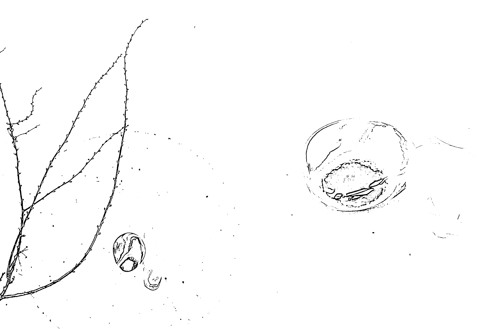

## Celestite 天青石

冷靜 + 直覺 + 機緣巧合 + 天使般的靈感

- ⊗ 顏色 粉藍色
- ⊙ 產地 馬達加斯加
- ☘ 脈輪 喉輪、頂輪
- ♡ 照護 陽光直射會退色
- △ 以水淨化 □ Y ☑ N

辦公桌上的晶簇可以提供工作日靈感和創造性突破。作為我的重要明星寶石之一，天青石的特殊天使印記確實是來自天堂的贈禮。

**魔法：** 天藍色的天青石簇是天使的閃耀贈禮。天青石將你與來自天堂的個人指導靈連結起來，增強你對直覺、靈感和神奇機緣的感知力。在你的床邊放一串這種美麗的水晶，你將在作夢時收到来自天使的進化訊息和指引。天青石是最舒緩、平和的水晶之一，在緩解壓力和焦慮方面具神奇功效。你是那些無法停止過度思考一切的人嗎？擁有天青石將幫助你改變完美主義傾向，並減輕過度分析一切的自我強迫習慣（處女座，這種水晶是你的必備品！）。

**摘記：** 天青石最常見的形式是晶洞，這是一種圓形岩石，中心空心，裡面有晶體。破開後，天青石晶洞會露出大量閃耀的淡藍色板狀水晶。天青石是一種較軟的礦物，晶體很容易損壞，應小心處理。請在陰涼處展示並僅在月光下充電，因為陽光會導致天青石隨著時間而褪色。Celestine 是另一個常見的英文名稱。

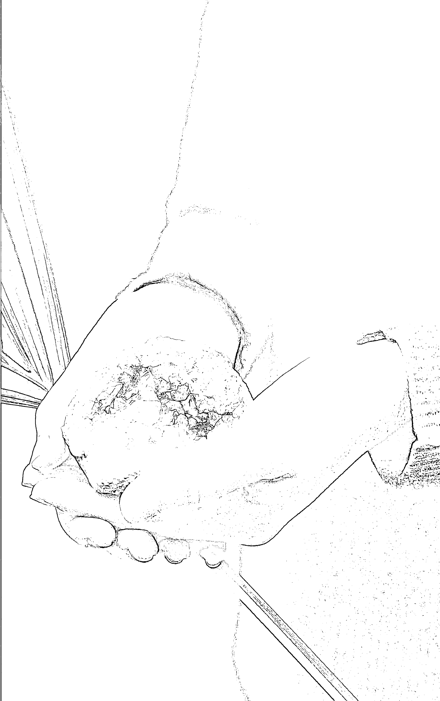

## 藍色 + 粉色
### Chalcedony 玉髓

緩解壓力 + 自我照護 + 療癒 + 舒緩

- 顏色 淡藍色或粉紅色
- 產地 巴西、馬拉威、納米比亞
- 脈輪 喉輪、心輪
- 以水淨化 ☑ Y ☐ N

**魔法：** 玉髓的能量就像封裝在水晶中的舒緩搖籃曲。身為水晶王國中最冷靜的成員之一，這些柔和發光的礦物是內心平靜和宇宙自我照護的寶石。溫柔色系的玉髓幫助你有意識地投入時間和空間來照顧自己，引導療癒之光以取代壓力耗盡的能量。玉髓對思緒和靈魂都有強大的鎮定作用，每當你需要片刻平靜時，請握著一顆拋光的玉髓，用手指輕輕撫摸玉髓絲綢般光滑的表面並深呼吸，想像自己被一個甜美滋養的粉色或藍色光泡包圍。在枕頭下放一顆玉髓可以消除噩夢和協助睡眠，藍色玉髓是兒童房和托兒所特別好的助眠劑（藍色蕾絲瑪瑙同樣具有舒緩作用，這是一種玉髓品種）。藍色和粉紅色品種都會喚醒內心小孩，幫助你以孩子般的好奇心、明亮的眼睛，樂觀且充滿希望的輕鬆心情來生活。

**摘記：** 玉髓是一種微晶石英（由微小晶體組成的石英），在純淨狀態呈雪白色。添加金屬元素可將玉髓轉變為多種礦石，包括瑪瑙和碧玉。玉髓有多種顏色，具備一系列形上學特性。柔和的藍色和粉紅色是最舒緩的品種，通常以小水晶碎石的形式出售，非常適合療癒浴和製作水晶靈藥。玉髓是傳統的五月誕生石，也是摩羯座和雙子座的誕生石。

## Chrysocolla 鳳凰石

賦予女性氣質＋優雅＋直覺＋真相

- ⊗ 顏色 綠松石藍
- ⊕ 產地 美國、墨西哥
- ☘ 脈輪 喉輪
- △ 以水淨化 ☑ Y □ N
  （僅拋光樣本）

**魔法：** 你認識那些僅僅因為她們在場就能讓你覺得受到滋養、啟發的女子嗎？誰用內心的光照亮了整個房間？如果你被吸引，期盼體現一種超然、強大的女性能量形式，或者渴望被強大的女性包圍，鳳凰石就是適合你的寶石。這種明亮的藍色礦物能激發我們所有人，幫助你以優雅、智慧的力量展現自己。從基督教的聖母瑪利亞到溫柔的佛教慈悲觀音，從感性的約魯巴愛神奧孫女神，到兇猛、不妄言的印度教毀滅和終止女神迦梨，在我們的宗教和神話中，女性力量的形式多種多樣，每個人都可以從這些女性面向中受益。鳳凰石傳統上與隱士和僧侶連結在一起，也是一種支持全職父母的贈禮，有助於緩解因孤立感而產生的抑鬱或焦慮。與綠色孔雀石混合晶簇是一種常見的組合，它是強大的寶石，同時具備神聖的男性與女性魔力。

**摘記：** 鳳凰石的藍綠色是由氧化銅產生的，這種軟礦物通常與其他銅基寶石（例如綠色孔雀石或藍色藍銅礦）一起存於礦床中。鳳凰石有多種形狀，從精緻如天鵝絨般的碎片（如圖）到能夠承受拋光、更耐用的樣本。

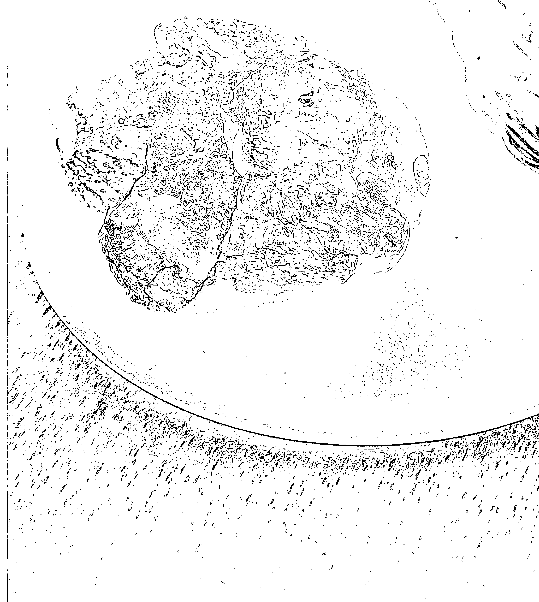

## Citrine 黃水晶

能量 ＋ 目標設定 ＋ 富足 ＋ 好運 ＋ 創造力

- ⊙ 顏色 亮橙色
- ⊕ 產地 巴西、剛果、馬達加斯加
- ☸ 脈輪 太陽輪
- ♡ 照護 陽光直射會退色
- △ 以水淨化 ☑ Y □ N

**魔法：** 黃水晶是封裝在水晶中的陽光，為你的太陽輪提供能量，幫助你將最瘋狂的夢想變為現實。有一堆目標、夢想和待辦事項清單需要征服嗎？試試黃水晶冥想，它對每個人都有用，從頂級成就高手到必須非常努力才能堅持到底的白日夢想家。請將一顆黃水晶拿在手中或放在肚臍上，想像願望清單或待辦事項中的特定目標。把那個目標放在一個透明的泡泡裡，讓它懸在你面前幾英尺的地方。想像一下，充滿活力的火焰開始從黃水晶中冒出來，向上和向外閃爍，慢慢地將泡泡的顏色從透明變為金色、熾熱的橙色。接著吹一口氣，把那個閃閃發光的泡泡吹起來，飛向夢想永遠成真、待辦事項總是按時完成的國度。體現魔力！黃水晶是我的必備明星寶石之一，身為代表繁榮和幸運的經典寶石，這是工作區和辦公室的必備品，可讓創意源源不斷湧現。

**摘記：** 最廣為人知和受歡迎的火橙色黃水晶實際上是紫水晶，經過高溫加熱後，它會從紫色變成橙色。黃水晶確實自然存在於地殼中，但天然樣本並不常見、價格昂貴，而且通常呈暗淡、不透明的黃棕色。經熱處理的黃水晶和天然黃水晶都具有強大魔力——請嘗試將你的手放在兩者上，感受它們之間的能量差異。

## Cobalto Calcite 鈷方解石

快樂 + 愛 + 正能量

- ⊕ 顏色 明亮的粉紅色＋紫紅色
- ⊕ 產地 摩洛哥、剛果
- ⊕ 脈輪 心輪
- ♡ 照護 陽光直射會退色
- 💧 以水淨化 □ Y ☑ N

**魔法：** 這顆水晶呈現情人節心形和玫瑰的顏色絕非偶然，因為這是充滿歡樂、愛意的寶石。粉紅色鈷方解石不如它的淺粉紅色姐妹粉晶常見，但絕對值得一試，為你的家和靈魂增添幸福的火花。鈷方解石能培育開放性和情商，幫助你記得如何以輕鬆愉快的方式去愛。結合圓點和緞帶亮綠色孔雀石的晶簇是兩種心輪顏色的特殊混合，為這種水晶提供的心靈體驗增添了一層額外的同理心。鈷方解石是自信缺乏、精力不足或純粹需要提醒你最好透過粉紅色眼鏡體驗生活的絕佳夥伴。每當你需要一陣快速、充滿活力的愉快氛圍和活力時，請將這顆水晶「放到心上」！

**摘記：** 鈷方解石是一種方解石，顏色來自化學元素鈷，它最常在堅硬的岩石基質上形成表面有許多微小尖端的水晶簇，在深色岩石上形成看起來像閃閃發光的粉紅色苔蘚。這種水晶有許多常見的別稱，包括鈷、鈷酸鈣等。

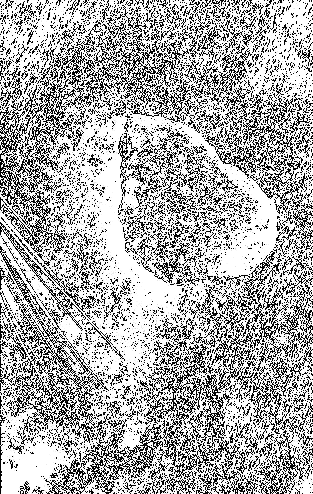

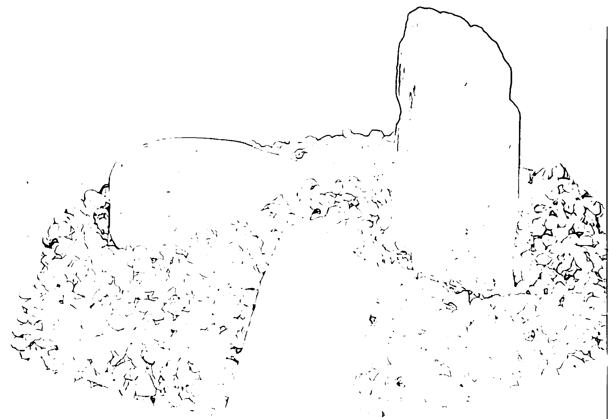

## 水晶詳細指南

### 粉紅色

### Danburite 賽黃晶

天使般的寧靜 + 滋養 + 助眠

- ⊕ 顏色 淡粉虹色
- ⊕ 產地 墨西哥
- ⊕ 脈輪 心輪、頂輪
- ♡ 照護 陽光直射會退色
- 💧 以水淨化 ☑ Y ☐ N

**魔法：** 粉紅色賽黃晶就像一個溫柔的擁抱，將你包裹在一個舒適且滋養的愛的繭中。當日子黯淡無光而你真的需要一個擁抱時，這是一顆美妙的水晶。舒緩內心的賽黃晶具有溫柔的「母親」能量，但沒有附帶任何複雜歷史——還記得那些單純的童年時光嗎？父母的一個擁抱就可以神奇地讓一切都好起來？賽黃晶擁有孩子般天真和信任的特殊能量。如果你從未有過被滋養且支持的養育經歷，賽黃晶也能為你的內心童真提供一個安全的空間。對於那些在童年和成年期間沒有得到足夠關愛的人、以及因失去父母而悲傷的人來說，這是一個重要的水晶盟友。如果你難以入睡，賽黃晶能深度舒緩神經系統，是很好的水晶療法。請在你的床頭櫃上放一顆水晶，賽黃晶將連接你的心輪和頂輪，將你與天使國度連結，輕輕地將你帶到更高意識和寧靜的新高度。

**摘記：** 賽黃晶以不尋常的晶體「葉片」形式形成，可能長達 30 公分，尖端常常是楔形結晶，類似黃玉晶體。除了粉紅色外，還會有白色調和黃色調，但粉紅色的樣本被認為是最具形上學活力的。賽黃晶是一種較軟的礦物，很容易碎裂，因此請小心使用。

## Desert Rose 沙漠玫瑰

冥想 + 接地 + 專注 + 哀悼

- ⊕ 顏色 沙褐色
- ⊕ 產地 墨西哥、摩洛哥
- ⊕ 脈輪 海底輪、頂輪、本我輪
- ⊕ 以水淨化 □ Y ☑ N

**魔法：** 沙漠玫瑰由古老的沙漠沙形成，是透石膏礦物的沙質形式，具有許多相同的清潔特性並增添了接地能量。難以靜坐或集中注意力嗎？沙漠玫瑰為你提供平衡和專注平靜的贈禮，使其成為辦公桌、工作區域以及任何你需要獲得清晰、專注和集中注意力之處的不二選擇。沙漠玫瑰是我最喜歡的冥想和瑜伽空間水晶之一，它以與海底輪及頂輪能量的獨特同步方式振動，產生同時接地／振奮的振動，任何接近它的人都可以輕鬆感受。沙漠玫瑰還有助於溫和支持那些正在處理悲傷的人，尤其是與流產、家庭成員或寵物過世相關的悲傷。請在躺下時將水晶放在小腹上，以幫助你處理、療癒和轉變。沙漠玫瑰在男性能量光譜中維持一股安靜的力量，是許多男性會產生共鳴的水晶，是送給你生命中特別人物非常好的接地和支持贈禮。

**摘記：** 沙漠玫瑰的形狀為玫瑰花狀排列的葉狀晶片簇，呈現深淺不一的棕色和棕褐色。有些樣本在觸摸時會釋放出沙塵，很容易被侵蝕，因此請小心處理。通常也被稱為透石膏玫瑰或石膏玫瑰。

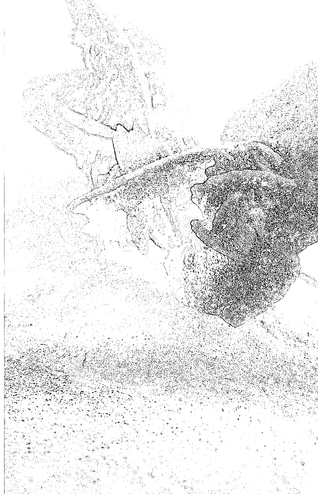

## Emerald 祖母綠

豐盛 + 好運 + 健康 + 保護

- ⊕ 顏色 有黑色＋白色漩渦的翠綠色
- ⊕ 產地 哥倫比亞、尚比亞、巴西
- ⊕ 脈輪 心輪、本我輪
- 💧 以水淨化 ☑ Y ☐ N

**魔法：** 祖母綠有充分的理由能在無數神話和歷史中閃耀不已，從所羅門王到埃及豔后、再到伊麗莎白泰勒，掌權者都以握有這些閃閃發光的綠色珠寶而聞名，他們做了明智的選擇——這是一種可以體現龐大贈禮的寶石，足以吸引好運、富足和健康。祖母綠是春天孕育活力的結晶，古埃及人將祖母綠魔法用於一切事物，從青春永駐、健康生產到來世保護。埃及人有很棒的點子：冥想時，在心輪或海底輪上放祖母綠以觸及無垠的豐富、活力、孕育力和健康，並將其添加到浴缸中，為身體注入療癒能量。祖母綠具備極強的保護和舒緩作用，是一顆值得佩戴、一路相伴的好寶石。作為平安旅行的護身符，它能使害怕飛航的旅客平靜下來。祖母綠是適合家中每個房間的滋養保護水晶。

**摘記：** 雖然寶石級祖母綠價格昂貴，但很容易找到滾石形式的祖母綠且價格低廉。這些經過打磨的祖母綠與寶石不同，呈不透明的綠色，帶有白色和黑色包裹體。祖母綠是傳統五月的誕生石，也是金牛座和巨蟹座的黃道誕生石。

## 彩虹
### Fluorite 螢石

專注＋生產力＋創造力＋抗發炎

- ⊗ **顏色** 綠色、紫色、藍色、白色色帶
- ⊙ **產地** 墨西哥、中國
- ☸ **脈輪** 心輪、喉輪、頂輪
- ♡ **照護** 陽光直射會褪色
- △ **以水淨化** ☑ Y ☐ N

**魔法：** 彩虹螢石被中世紀的煉金術士賦予「天才石」的暱稱，是帶來專注、清晰思維和靈感的水晶。螢石是一種「冷靜」水晶，有助於減少身心發炎：用水晶碎石泡澡可以減輕身體疼痛、緊張和感染（非常適合感冒！），隨身攜帶一顆可以讓你在日常生活中沉著冷靜。如果你難以集中注意力或好動亢奮，這顆多彩寶石有助於清除心思的迷霧和雜亂，讓它成為學習、工作創作的絕佳水晶盟友。螢石非常適合放在辦公桌或工作空間中，幫助減少電腦螢幕和電磁輻射的疲勞效應。與螢石共振的脈輪會依據樣本的主色而變化；綠色水晶大多具有安撫內心和開嗓的能量，而紫色較多的水晶與頂輪同步。螢石能帶來無與倫比的靈感和專注，成為我的重要明星寶石之一。請將一些螢石魔法帶入你的生活，準備好用你的內在天賦讓世界多采多姿！

**摘記：** 螢石涵蓋礦物王國中最廣泛的顏色範圍，從無色到明亮的粉紅色和黃色。市售常見的「彩虹」螢石（綠色、紫色、藍色和白色的混合物）是拋光形式，以突出其美麗的色帶，不過原始樣本也擁有令人喜愛的能量。綠色或紫色的立方螢石簇擁有與彩虹螢石相似的能量。

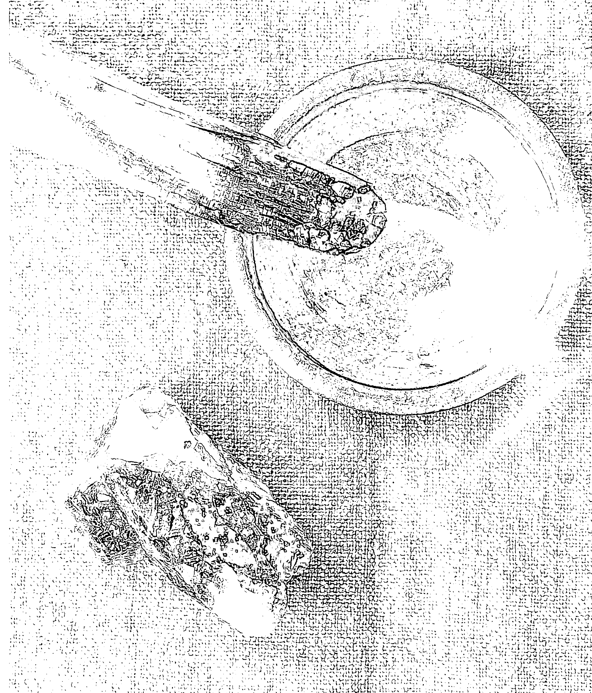

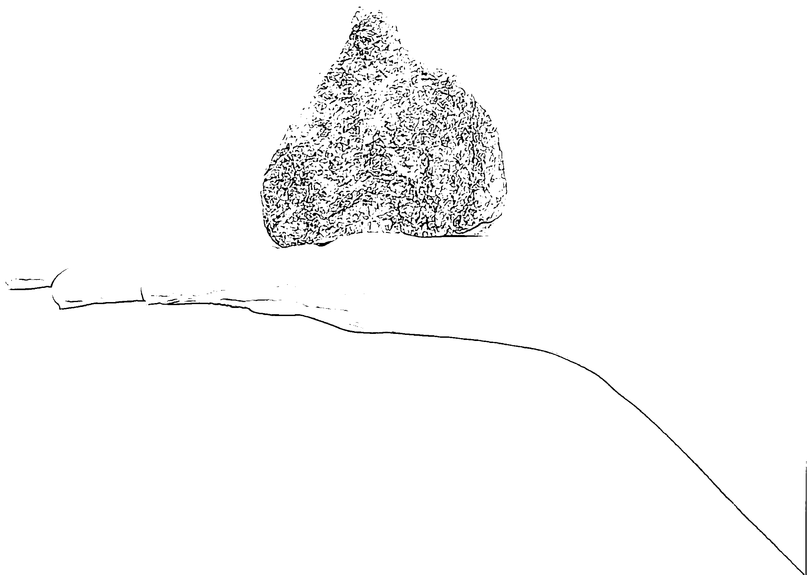

## Fuchsite 鉻雲母

仙子 + 自然 + 草藥學 + 全人健康

- 顏色 閃閃發光的綠色
- 產地 巴西
- 脈輪 心輪
- 照護 陽光直射會褪色
- 以水淨化 □ Y ☑ N

**魔法：** 鉻雲母是一顆與仙子、自然天使和地球精靈的元素王國相連的溫柔心之水晶，有助於引導來自仙境的智慧，尤其是與植物、草藥和全人療癒相關的見解。閃閃發光的鉻雲母是送給你身邊園藝者的完美禮物，也是你個人水晶工具包的美妙加分品，可增加你園藝技能以及與植物和自然的連結。雖然這顆石頭不能直接放入花盆或花園中（會被陽光和水破壞），但鉻雲母為以自然為主題的探險增添了一劑童話魔法，無論你是在野外露營、還是只是在當地花店購買室內植物。鉻雲母有助於連接以植物為基礎的健康和療癒，在你研究全人療癒時將鉻雲母放在附近，以幫助辨識最適合你身體和福祉的獨特方式。如果鉻雲母的能量對你來說感覺有點不踏實或「古怪」，可以試試紅寶鉻雲母作為替代方案，這是它接地的姊妹石。

**摘記：** 鉻雲母的獨特閃光來自於所屬的雲母類別，雲母是一種片狀礦物，可在化妝品中產生細小閃光。鉻雲母最常見的市售形式是小型原石，觸碰到的任何東西都會留下有趣的閃亮細粉。它經常被發現嵌有小型紅寶石，組合形成美麗的紅寶鉻雲母。英文名稱 Fuchsite，發音為 fook-site，英文也稱為 Green Muscovite。

## 鐵鋁
### Garnet 石榴石

熱情 ＋ 感性 ＋ 創造力 ＋ 接地

- ⊕ 顏色 酒紅色至近乎黑色
- ⊕ 產地 中國、美國、墨西哥
- ⊕ 脈輪 海底輪、本我輪
- 💧 以水淨化 ☑ Y ☐ N

**魔法：** 櫻桃色的鐵鋁榴石就像炎熱夏夜釉光閃閃的嘴唇，是性感而質樸的寶石。這種水晶與產生熱情有關：源源熱情的創造力、滿溢熱情的性感、充滿熱情的生活。為了勇敢地探索未知的想法和冒險嘗試的滿腔熱血，擁有一個「安全空間」的基礎非常重要，而石榴石就是理想的探險夥伴，它可以幫助你穩穩地建立界限和尊重，同時消除壓抑和障礙。石榴石是危機時期的重要盟友，延伸飾品在兩次世界大戰後達到流行高峰並非巧合，因為它有助於從創傷和混亂中療癒和重生。鐵鋁榴石還可以激發接地的昆達里尼能量（一種與創造力和精神啟蒙相關的神秘能量），非常適合調節性慾和增強感官探索——試著將一顆石榴石塞在床墊下，為你的愛情生活增添情趣。非常適合顯化，別忘了在新月之夜拿出石榴石來為你的慾望和夢想充電！

**摘記：** 石榴石有多種顏色，其中鐵鋁榴石是數量最多、價格最親民的種類。雖然最常見的是以水晶碎石形式出售，但天然形成的圓形、多面晶體鐵鋁榴石也值得尋覓，因為它們具備獨特的原始效力。石榴石既是一月的傳統誕生石，也是阿育吠陀的一月誕生石。

### 粉紅色
## Halite 岩鹽

清晰 + 排毒 + 能量淨化器

- ⊙ 顏色 淺粉紅色
- ⊕ 產地 美國加州、波蘭
- ☘ 脈輪 心輪
- △ 以水淨化 □ Y ☑ N

**魔法：** 岩鹽是一種鹽晶體，是能量和環境的淨化器。岩鹽由蒸發的古海鹽形成，精緻的粉紅色是來自微小海洋生物——我沒在開玩笑，你自己聞一聞吧！鹹鹹的粉紅色岩鹽努力幫助「蒸發」情緒創傷、心碎和悲傷，可以使內心的境遇煥然一新。你是否直覺感受到自己所處的關係不那麼健康？你有一些朋友或家人總是讓你感到筋疲力盡而非支持？你是否為一名情緒共感者（意味著你會以一種讓自己不穩定的方式受到他人的情感「事物」影響）？岩鹽將協助清除任何需要離開你生活的人和事，用這種方法讓你遠離有毒或沒營養的情況和人，並使你脫離不屬於你的事物。岩鹽是適合臥室的水晶，它會在你打瞌睡時努力淨化和清理。

**摘記：** 岩鹽是一種鈉礦物，普遍為人所知，世界各地都有開採，用於各種工業用途，包括融化冰冷的冬季道路。它有多種顏色，可愛的立方體樣本最常見的顏色是粉紅色、白色和（很少見的）藍色。岩鹽在潮濕的環境中會「融化」，因此請務必保持岩鹽簇極度乾燥，這不是適用於潮濕浴室的水晶。

## 水晶詳細指南

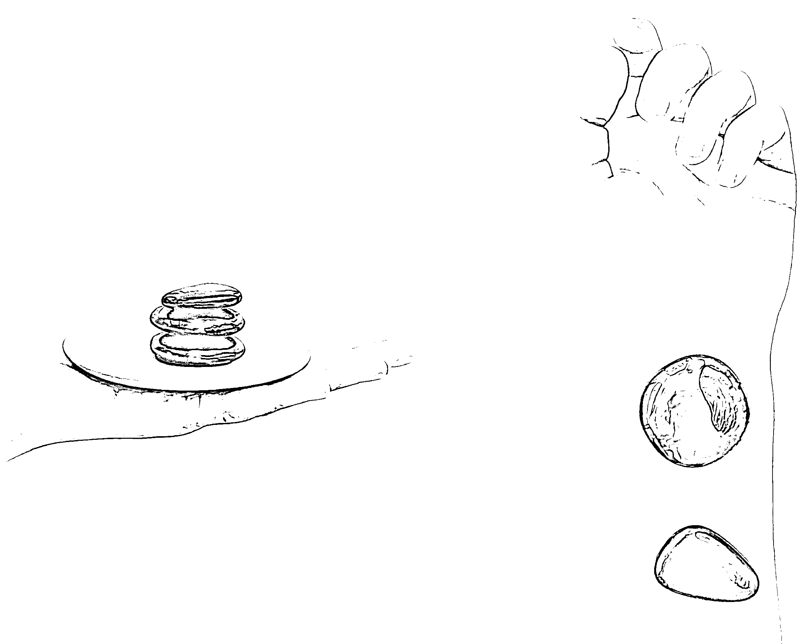

## Hematite 赤鐵礦

平衡 + 充電 + 接地 + 保護

- ⊙ 顏色 帶有金屬光澤的深灰色
- ⊕ 產地 巴西、美國、中國
- ☘ 脈輪 海底輪
- △ 以水淨化 ☑ Y □ N
  (僅拋光樣本)

**魔法：** 我們每個人都被包裹在自己的個人磁場中，類似於環繞地球的磁場。赤鐵礦是一種具磁性的鐵基礦物，是極其強大的水晶工具，可為你的個人布局和能源網絡充電。你是否迷失在沒有生產力的白日夢中？赤鐵礦有助於將你錨定在當下，對於那些容易陷入過去或未來的人來說，它是完美的寶石。赤鐵礦是重新平衡的重要基石，尤其是當生活壓力讓你快要短路的時候。將一顆拋光的小赤鐵礦放入口袋，以便在日常活動中充電和重新平衡，或者塞進椅子中，在工作日持續腳踏實地。放到浴缸中（腳邊）的赤鐵礦可以幫助你在漫長的一天結束時恢復活力並放鬆身心。赤鐵礦還可以幫助你深入挖掘深埋在情感心理、歷史和祖先血統中的問題。這種水晶非常直接，所以如果感覺赤鐵礦太強烈（你會知道的——就是感覺不對），請試試黑碧璽或煙晶，它們會以比赤鐵礦更溫和的方式接地和充電。

**摘記：** 原始赤鐵礦通常呈暗紅色，拋光後會變成容易辨識的灰色金屬光澤。赤鐵礦加熱後會變得有磁性，但大多數水晶療癒師更喜歡使用天然（未經加熱）的樣本。赤鐵礦是一種非常高密度的礦物，它的重量是深色拋光寶石中獨特的辨識特徵。

## Iceland spar 冰洲石

清晰 + 觀點 + 專注 + 靈感

- ⊙ 顏色 晶瑩剔透
- ⊕ 產地 墨西哥、摩洛哥
- ☘ 脈輪 眉心輪、頂輪
- △ 以水淨化 ☑ Y ☐ N

魔法：有時，你真正需要的只是用一種新的方法看待事物。新觀點提供了新的視角與靈感。我們很幸運，有晶瑩剔透的冰洲石可以提供幫助。這種幾何晶體自然形成完美菱形，充滿彩虹的平行四邊形提供了一個新的濾鏡，可以透過它觀看這個世界。當你難以在選項之間做出選擇或重要決定時，請將這顆水晶放在第三隻眼上。將水晶舉到眼前並凝視它，讓你的潛意識改變視角。冰洲石提供了無價贈禮，提醒我們這個世界只不過是（也只是）一種視錯覺。沒有什麼是永恆的，沒有什麼是不可克服的，沒有什麼是不可能的——絕對沒有！

摘記：冰洲石是一種方解石，因清晰度和雙折射能力而獨樹一幟。「解理面」這個詞指的是礦物沿著一條直線斷裂的能力，如果你不巧讓這種水晶掉落，就會看到它的運作，只會沿著一條直線斷裂。冰洲石最初是在冰島發現的，但今日的樣本通常來自墨西哥和摩洛哥。這是一種較軟的礦物，鋒利的邊緣很容易碎裂，請注意使用和存放方式。也被稱為透明方解石或光學方解石。

## Jade 玉

直覺 + 好運 + 繁榮 + 成功

- ⊕ 顏色 深淺綠色
- ⊕ 產地 中國、緬甸、非洲
- ⊕ 脈輪 太陽輪
- 💧 以水淨化 ☑ Y ☐ N

誠實地了解自己是誰、以及為什麼來到這裡時，就會自然而然地將時間和精力集中在與你的天賦和技能自然契合的事物上，帶出物質世界的成功和「好運」（你知道的！），以及一種深刻、充實的榮盛感。

**魔法：** 玉是象徵富足和財富的經典寶石，從阿茲特克人到現代科技大亨都十分珍視。我們稱為「玉」的綠色寶石實際上是歷史背景截然不同的兩種礦物：硬玉和軟玉。「玉」這個名字，來自征服者看到在地阿茲特克人和瑪雅人將綠色硬玉用於醫療目的所賦予的；中國人珍視軟玉已有數千年歷史，視為一種精神純潔和透徹智慧的寶石。對現代水晶愛好者來說，玉仍是富足、財富和好運的經典選擇。玉是認識自己的水晶，這是它承載幸運和成功的重要因素。當你了解自己——真正清楚和

**摘記：** 硬玉和軟玉有許多顏色，亮綠色硬玉是最有價值的品種。大多數經過打磨的「玉」實際上並不是硬玉或軟玉，而是多種被當做「玉」售出的綠色礦物。雖然它不是真正的玉，但這些寶石仍可以提供寶貴的形上學贈禮。

## Jasper 碧玉

身體 / 情緒力量 + 接地 + 穩定

- ⊕ 顏色 彩虹的各種色調
- ⊕ 產地 世界各地
- ⊕ 脈輪 海底輪＋依顏色不同而異
- ⊕ 以水淨化 ☑ Y ☐ N

**魔法：** 堅若磐石。碧玉是極度「堅固」的水晶，一種樸實無華的石頭，具簡單、穩定的能量。它是一種密集石英微晶礦物家族，可以幫助你增強生理和情緒力量。作為一顆非常適合「接地」的水晶，可以擔任與地球能量接地的健康媒介：當你坐在戶外時，請拿著一顆碧玉，赤腳接觸地面以獲得維他命 G 的治療效果，也就是接地。純粹使用碧玉的水晶脈輪陣式就像是去看脊椎按摩師，非常穩定和一致。碧玉涵蓋彩虹的所有顏色，所有碧玉都是以海底輪能量為基礎，根據各自的顏色納入其他脈輪的各面向。紅碧玉是歷來最受歡迎的品種，自古就以有益健康和保護魔法而聞名，圖中的兩個品種是我個人的最愛：康巴巴石（Kambaba Jasper）讓你沉浸在寧靜的自然能量中，而海洋碧玉是多色品種，是一種流動和優雅的美麗寶石。

**摘記：** 這些堅固耐用的寶石是礦物玉髓的不透明品種。碧玉在世界各地以更大型的樣態被發現，分解成更小的碎片並拋光後以水晶碎石和拋光的樣本出售。

## 水晶詳細指南

## 藍色 Kyanite 藍晶石

能量淨化器＋淨化＋溝通

- ⊕ 顏色 珠光藍
- ⊙ 產地 巴西
- ☘ 脈輪 喉輪
- △ 以水淨化 ☑ Y □ N

魔法：藍晶石淨化並開啟喉輪，消除溝通恐懼和障礙，幫助你從沒有小我、誠實的空間勇敢分享真實的自己。藍晶石形成獨特的條紋水晶「葉片」，就像一根能量天線，從你的身體和氣場排出負能量，同時使正能量過濾回你的個人空間。在參與有挑戰的會議或困難的談話時，請將一顆藍晶石放進口袋或塞在衣服裡，獲得支持、釐清和統整助力。我在電腦附近放了一小碗這些美麗的藍色寶石，幫助我高效率處理電子郵件並獲得靈感。藍晶石是一種過濾能量的水晶，可以在爭論或情緒化的談話後幫忙淨化空間。拿起一顆藍晶石靠近喉嚨，重新平衡腎上腺素，並在房間的每個角落揮動水晶以淨化任何揮之不去的沉重氛圍。如果需超強淨化效果，請與儀式薰香淨化結合使用，例如巴西聖木或鼠尾草。根據現代水晶復興的先驅作家美樂蒂（Melody）的說法，藍晶石會自我淨化，不需要對它進行能量清潔或淨化。

摘記：藍晶石有多種顏色，每種顏色都有其獨特的形上學特質。藍色藍晶石是最常見的品種，其次是黑色藍晶石，一種接地水晶。薄的藍晶石葉片很容易斷裂，請小心使用；拋光樣本會更耐用。藍晶石形成時常常會內嵌在白水晶中。

## Labradorite 拉長石

處在當下＋直覺＋智慧＋保護

- ⊕ 顏色 灰綠色，帶有繽紛顏色的虹彩
- ⊕ 產地 芬蘭、馬達加斯加
- ⊕ 脈輪 眉心輪
- 💧 以水淨化 ☑ Y ☐ N

魔法：從拉長石神祕的多色閃光中，可以看到所有人眼可見的色調：綠色、藍色、淡褐色和黑色。拉長石是多眼之石，我稱之為「洞察之石」，因為這是一種用於感知當下真實的水晶。拉長石讓你從已經準備好繼續向前的事物中起身離開，從有毒的友誼、到前世遺留下來的壞習慣。處在當下。直覺是一種視覺，而拉長石是增強與直覺連結的最佳寶石之一；在你的第三隻眼上使用拉長石進行冥想，去看到潛藏在情況、關係和現實表面之下的樣貌。隨身攜帶拉長石以獲得能一眼看穿的洞察力與智慧，幫助你以全新的眼光看待事物。睡覺時於枕頭或床下放一顆拉長石是吸收這種水晶贈禮的好方法。拉長石是一種保護石，可增強你的氣場，移轉並保護你免受任何非光明能量的傷害。

摘記：拉長石最初發現地是加拿大的拉布拉多，但現代樣本主要來自馬達加斯加。光譜石是一種更為稀有的款式，傳統上僅於芬蘭發現，因其明亮的橙色、黃色和紫紅色閃光而獨特。拉長石會形成不透明的塊狀物質，雖然未拋光的樣本確實有野性美，但這種美麗礦物的顏色和虹彩在拋光後最好看。

## Lapis Lazuli 青金石

轉變＋誠實＋自我意識＋神秘主義

- ⊕ 顏色 藍色帶白色斑點＋金色
- ⊕ 產地 阿富汗、巴基斯坦
- ⊕ 脈輪 眉心輪、喉輪
- ♡ 照護 放在臥室可能會太強烈
- 💧 以水淨化 ☑ Y ☐ N

魔法：數千年來，莊嚴的青金石一直受到皇室、牧師和神聖治療者的重視，神秘的藍色調裝飾著無數珍貴物品。古埃及人最喜歡青金石，他們認為青金石蘊藏著不朽之力，這顆石頭充滿了故事、歷史和真實。我們每個人都有自己的「故事」、自我堅持和認同的歷史版本，無論是積極的還是消極的。青金石是迫使你放下自我偏執的安全毛毯，要求你努力轉變，提醒你過去並不存在，並讓你為自己的選擇負責。青金石還可以幫助你整合從過去經驗、前世以及透過祖先傳承所獲得的教訓中學到的智慧。如果這聽起來很龐雜，那就對了。這種寶石需要空間散發震動，因此通常更適合用於祭壇而非臥室，許多人認為它過於強烈，不宜作為日常首飾佩戴。青金石將幫助你變得真實、誠實和真誠。青金石＝停止找藉口。

摘記：真正的青金石有明顯的深藍色飽和度，常常閃爍著金色黃鐵礦斑點。淺藍色的方鈉石和染色的白紋石常被拿來冒充青金石，但它們通常有更多白色紋彩而且不含黃鐵礦。

## 水晶詳細指南

## Lepidolite 鋰雲母

鎮靜 + 穩定 + 解除抑鬱和焦慮

- 顏色 淡銀紫色或玫瑰色
- 產地 巴西
- 脈輪 心輪、頂輪、眉心輪
- 以水淨化 ☑ Y ☐ N（僅拋光樣本）

**魔法：** 平衡是我們都需要的東西，對於要「作為一個健康的人並運作正常」，平衡至關重要，也是我們很容易失去的東西。幸運的是，銀色鋰雲母對我們的情感給出了救援明燈。這種閃閃發光的雲母晶體充滿了鋰，與強力抗精神病藥物中使用的礦物相同。當生活變得難以承受時，這是最好的鎮靜和穩定水晶之一。鋰雲母是一種天然抗鬱助力，當壓力、焦慮或抑鬱佔據上風時，請將它帶在身邊。從啼哭的嬰兒到不知所措的青少年，從睡眠不足的新手媽媽到敏感的藝術靈魂，每個人都絕對可以受益於鋰雲母的舒緩魔力，因為大家都有需要被迫切提醒「一切都好」的時刻，一切都會好起來的，而你，美麗、美妙的你——不僅只是「好」，而是完美的。你正在竭盡自己所能。一位智者曾寫道：「善良點，因為你遇到的每個人都在打一場偉大的戰鬥。」讓鋰雲母幫助你應對每天的戰鬥和挑戰，讓你的生活更加燦爛、充滿喜悅。

**摘記：** 鋰雲母有多種原始型態，包括容易剝落成非常薄層的平板，以及有帶狀白色石英、閃閃發光的鱗片簇。鋰雲母確實會形成淡紫色或玫瑰色之外的顏色，但這樣的樣本更為罕見。混有粉紅色碧璽的水晶簇具有令人喜愛、心曠神怡的能量。

## Malachite 孔雀石

承 諾 ＋ 自 我 價 值 ＋ 意 志 力 ＋ 寬 容

- ⊕ 顏色 漩渦狀翠綠條紋
- ⊕ 產地 剛果、納比亞、墨西哥
- ⊕ 脈輪 心輪、太陽輪
- 💧 以水淨化 ☑ Y ☐ N（僅拋光樣本）

苦掙扎的人來說，孔雀石是強大的盟友，它是每個人都需要的正經夥伴，真的會在你不斷重複負面模式時提點你，幫助你誠實地面對關於自我價值和意志力議題。孔雀石幫助你打破阻礙，讓自己成為最好、最誠實和最真實的人。

魔法：有漩渦狀綠色的孔雀石擁有強大的心臟能量。被激發的陽氣與粉晶柔和的陰氣相映成趣，這顆古老的心之石是送給你生命中特別的人以及任何需要意志力支持者的贈禮（老實說，誰不需要？）。孔雀石擁有心輪和太陽輪能量，在冥想或小睡時將孔雀石放在任一脈輪上，解決與自我價值相關的障礙。這顆寶石強化你信守承諾的能力，包括你對他人做出的承諾以及對自己表現出善意和寬恕的基本承諾。對於那些在不忠、自欺和成癮相關問題中苦

摘記：孔雀石是一種銅基礦物，如果誤食可能會中毒；請遠離孩子的嘴巴，不能做成可飲用的水晶靈藥。孔雀石最常以滾磨、拋光和雕刻的形式出售，也會形成纖維狀樣本，以纖維、天鵝絨或絲狀孔雀石的名稱出售。

## 彩虹 Moonstone 月光石

直覺＋賦予女性氣質＋月亮魔法

- ⊗ 顏色 乳白色，帶藍色閃光
- ⊕ 產地 印度
- ❀ 脈輪 眉心輪、頂輪
- 💧 以水淨化 ☑ Y ☐ N

魔法：彩虹月光石就像夜空中隱約閃耀的月亮，充滿神祕的威嚴，將我們與生命奧祕連結起來，那些位於現實邊界、更深刻的真理。月光石溫和地歡迎你進入潛意識和內在認知——用這顆寶石在第三隻眼上冥想，去獲得宇宙直覺和靈感。月光石是神聖女性的寶石，散發著智慧老嫗、生育母親、空靈女神和神祕美人魚的魔力。就像月亮本身一樣，月光石與女性週期的來回密切相關，是情緒和荷爾蒙浮動時的舒緩夥伴。這顆寶石喚醒了光芒四射和強大的女性氣質，幫助釋放每個人內心深處流動的女神能量（而且月光石肯定不僅適用於女性身體，每個人都可以從它強大的直覺和賦予生命的感受性贈禮中受益！）。這是強大的月亮魔法石，別忘了在新月和滿月之夜攜帶月光石，發揮額外力量。

摘記：彩虹月光石是月光石品種中最閃亮的一類，美麗的藍色光澤被稱為拉長石光暈（彩虹月光石實際上是礦物拉長石的一種類型）。月光石自古以來就是受到喜愛的寶石，以拋光物件和水晶碎石的形式廣泛銷售。它通常與黑色花崗岩一起形成，在一個樣本中形成美麗的黑白組合。月光石是六月的傳統誕生石，也是巨蟹座的黃道誕生石。

## 黑色 Obsidian 黑曜石

保護 + 能量屏障 + 決策 + 悲傷

- 顏色 光澤漆黑
- 產地 美國
- 脈輪 海底輪
- 以水淨化 ☑ Y ☐ N

**魔法：** 由強大的火山噴發形成，光滑的黑曜石是保護和占卜的寶石。黑曜石是一種因快速冷卻的熔岩形成的天然「玻璃」，從技術而言，它並非一種礦物，因為過於快速的誕生過程使它無法形成內部晶體結構。這賦予黑曜石一種不尋常的振動，在礦物王國中獨一無二。黑曜石的第一份贈禮是能量偏轉——它在你周圍覆上一層堅不可摧的盾牌，成為敏感靈魂和情緒共感者的寶貴寶石。手裡拿著一顆黑曜石，想像一張烏黑的盾牌，在你與擔心或恐懼的源頭之間升起。不過，請明智地使用這個魔法。黑曜石盾牌可以在你的神經系統即將被壓垮時提供保護，例如大量人群。但這不適合帶去參加社交聚會，因為它會屏蔽你的能量，使你無法與他人連結，很可能會讓你覺得自己被忽視。黑曜石也是一種占卜水晶（預見未來的神祕藝術），當你需要幫助做出艱難的決定時，它很有用：請將水晶握在手中，靜下心來，觀察內心的想法。你會知道該怎麼做。

**摘記：** 黑曜石是一種堅硬且易碎的材料，通常只能獲得小型原始或拋光款式。從能量的角度來看，粗糙的原始樣本（如圖）是首選。阿帕契之淚（Apache Tears）是在美國西南部發現的一種圓形黑曜石，是處理悲傷和失落的最佳寶石之一。

## Pyrite 黃鐵礦

信心＋好運＋富足＋生產力＋創造力

- ⊕ 顏色 金屬金色
- ⊕ 產地 祕魯、西班牙、中國
- ⊕ 脈輪 太陽輪
- ♡ 照護 放在臥室可能會太強烈
- 💧 以水淨化 □ Y ☑ N

魔法：金色黃鐵礦是超強創造力和生產力的水晶，是自信、行動和富足的動力源泉。古希臘人發現黃鐵礦與鋼鐵碰撞會產生火花（pyr＝臘語中的「火」）後，就賦予它一個火熱的名字。這種金屬礦物持續為現代水晶愛好者帶來巨大的魔法。不要說我沒告訴過你，請時常接近黃鐵礦水晶簇，因為夢想、創意靈感和幸運會藉著勢不可擋的富足體現！黃鐵礦是一種太陽輪水晶，會在你的腹部點燃一把火，幫忙燒掉拖延症和自我懷疑，讓你有勇氣與世界分享你的不凡。用黃鐵礦冥想可以增強自尊、自信和創意靈感。作為我的重要明星寶石之一，黃鐵礦最適合放在你希望感到活躍和受到啟發的空間，是一款理想的工作空間水晶。也可以藏在手提包、錢包和收銀機中，能招財並帶來好運。儘管黃鐵礦因為曾欺騙無數尋寶者，讓他們以為自己挖到了金子而得到了愚人金的別稱，但如果你錯過了將這種水晶的金黃閃亮富足添加到生活中的機會，那就真的太傻了！

摘記：黃鐵礦通常會形成小型金屬幾何水晶簇。西班牙黃鐵礦以其完美的金色方塊而獨樹一幟（如圖）。黃鐵礦暴露在潮濕環境中會變黯淡和生鏽，所以不要在月亮儀式後放在外面過夜。帶有白水晶包裹體的水晶簇是帶有超強能量版本的黃鐵礦。

## 透明 Quartz 石英

轉化 + 清晰 + 修復

- ⊕ 顏色 晶瑩剔透
- ⊕ 產地 世界各地
- ⊕ 脈輪 全
- ⊕ 以水淨化 ☑ Y ☐ N

**魔法：** 透明石英（白水晶）自古以來就被尊為變革魔法的強大工具，透過彩虹般的魔法光芒點亮、提昇亮度，並為生活注入活力。說透明石英確實運行著我們的現代世界一點也不誇大：如果沒有小型石英讓時鐘精確地滴答作響，它們就無法運作；如果沒有石英的導電能力，我們心愛的科技玩具就不會存在……簡而言之，這是每個地方和每個人都必不可少的水晶。透明石英是天然稜鏡，擁有彩虹的完整、閃亮光譜，是療癒小物、能量傳輸器和更高意識連接器。很容易就能將透明石英設計為個人魔法工具，只需專注於你想要的能量、行動、結果或感覺，同時拿著你的水晶，瞧！它是水晶形式現身、孜孜不倦又強大的嚮導及啦啦隊隊長。透明石英可強化所有其他水晶的效果並清除停滯的能量。它是我的重要明星寶石之一，在決定如何以及在何處使用透明石英時，請遵循你的直覺，因為這種水晶絕對會指導你。透明石英＝用於認真提昇的水晶。

**摘記：** 石英是我們星球上含量最豐富的水晶，儘管目前市場上大多數的樣本來自阿肯色州（美國）和巴西，但在世界各地都有發現石英。透過六邊形晶尖的特徵就可以很容易地將石英與其他礦物區別。

## 水晶詳細指南

## Rhodonite 薔薇輝石

放手＋心碎＋穩定＋界限

- ⊕ 顏色 粉色＋黑色＋白色漩渦
- ⊕ 產地 美國、馬達加斯加、澳大利亞
- ⊕ 脈輪 心輪、海底輪
- 💧 以水淨化 ☑ Y ☐ N

情心的石頭，薔薇輝石釋放了與自我價值和自我愛護相關的關卡、恐懼能量，幫助你建立健康的界限。這是一種強大的水晶，可用於自我療癒儀式，包括沐浴、冥想和按摩。

魔法：1700 年代後期，薔薇輝石首次在神秘的俄羅斯烏拉山脈被發現，當地人目睹老鷹將小型薔薇輝石帶回巢穴的現象，因此將其命名為「鷹石」。鷹是勇氣、智慧和力量的動物圖騰，而薔薇輝石也具有類似的強烈保護、強化界限振動。這顆粉紅色的漩渦狀寶石是一種可以深層療癒心靈並釋放悲傷的水晶。它是心碎的穩定劑，是度過各種困難的寶貴水晶盟友，從人際關係或職業變化、到疾病和死亡。在你的心輪上放一顆寶石，然後深呼吸，讓你心中的裂縫充滿療癒和光。作為一種富有同

摘記：薔薇輝石幾乎都是以塊狀形式存在，並以拋光樣式出售。粉紅色薔薇輝石水晶簇確實存在，但既稀有又昂貴。薔薇輝石常與近親菱錳礦混淆，兩者有類似的粉紅色和白色漩渦，但可以透過內含的黑色二氧化錳來識別薔薇輝石。薔薇輝石於 1819 年才被正式命名，是美國馬薩諸塞州的官方州寶石。雖然沒有正式被冠名，但許多人認為它是俄羅斯的國石。雖然俄羅斯是薔薇輝石的歷史產地，但現代樣本都是從其他地方採集。

## Rose Quartz 粉晶

愛 + 同情 + 仁慈 + 溫柔

- ⊙ 顏色 玫瑰粉色
- ⊕ 產地 馬達加斯加
- ☸ 脈輪 心輪
- ♡ 照護 陽光直射會褪色
- △ 以水淨化 ☑ Y □ N

心空間，消除所有沉重感。作為我的重要明星寶石之一，我還沒有遇過無法透過在生活中添加粉晶魔法而得到幫助的人。這是一顆美妙的水晶，可以放在房子的任何和所有房間裡——你生活中的粉晶愈多，就愈美好！

**魔法：** 粉晶是經典愛情水晶，以治癒心碎、吸引新的愛、敞開心扉迎接新的寬恕及同情、以及所有與愛相關的能力而聞名。不要誤以為這種糖果粉紅色水晶很淺見，粉晶是水晶王國中最具滋養作用的水晶之一。生命中所有形式的愛——浪漫、家庭、愛自己、全宇宙——都被強大的粉晶強化。這是愛與美的女神維納斯的水晶，請嘗試在泡澡時加入粉晶碎片，將沐浴變成充滿愛的療癒儀式。情緒低落時，將粉晶放在胸前，想像柔和的粉紅色光芒充滿你的內

**摘記：** 粉晶幾乎總是以沒有晶體稜邊的大樣本形式被發現，這些樣本被分解成各種各樣的原始和拋光形狀。粉晶水晶簇非常稀有、昂貴且體積小，因此如果你看到以相對便宜的價格出售的粉晶，它很可能是染色的白水晶或方解石——漂亮，但實際上不是粉晶！

## 金色 Rutilated Quartz 髮晶

天使指引 + 樂觀 + 能量衝擊

- ⊗ **顏色** 透明，內部有金色纖維
- ⊙ **產地** 巴西
- ☘ **脈輪** 太陽輪、頂輪
- △ **以水淨化** ☑ Y □ N

將幫你連結天使的協助。如果要獲得超強的神聖支援，請用八顆水晶在你的身體圍成一圈，然後靜靜地躺下，深呼吸至少十分鐘。我保證，當你完成冥想時，你會乘著金色翅膀翱翔！

**魔法：** 髮晶充滿閃閃發光的金色鈦鏈，蘊含著懷抱希望的樂觀與積極振動。就像長髮公主的童話寓言中那個處於困境的金髮少女，這種快樂的礦物有助於提醒我們：無論我們當前環境多麼黑暗或困難，永遠不要放棄希望。如果你正在掙扎於抑鬱症或整體缺乏能量，髮晶是很適合的水晶，可以讓你獲得振奮的能量「衝擊」：將水晶放在太陽輪上，讓它發揮抗抑鬱、提神的魔力。它也非常適合製作充滿活力的水晶靈藥。當你感到完全不知所措時，請將髮晶帶在身邊，這種帶有金色斑點的水晶

**摘記：** 當白水晶包裹了已經生成的毛髮狀金紅石水晶鏈時就會形成髮晶。髮晶通常以拋光和天然水晶尖的形式呈現，也有黑色和／或紅色金紅石包裹體，這類型的水晶能量與金色品種不同。天然地下輻射會使樣本變暗，進而產生茶水晶，這是一種不太常見的品種。髮晶也稱為金紅石石英，歷史名稱包括髮紅金石和邱比特的金箭（Flèches d'Amour）。

## Selenite 透石膏

清潔 ＋ 潔淨 ＋ 月亮魔法

- ⊕ 顏色 透明至不透明白色
- ⊕ 產地 墨西哥、摩洛哥、美國
- ⊕ 脈輪 頂輪、眉心輪
- 💧 以水淨化 □ Y ☑ N

**魔法：** 透石膏以神話中的月亮女神塞勒涅命名，是一種腳踏實地的水晶，以其強大且廣泛的清潔能力而聞名。這是輕鬆淨化和清除能量及氣場的終極水晶。請試著在前門附近放一塊透石膏，以便在你結束漫長一天回到家時快速進行能量沖洗：只需在你身體邊緣和周圍揮動透石膏（不要忘記背部！），它就會把可能從任何地方附著在你身上的黏膩氣息或能量抹去。使用透石膏魔法的方法有無數種：在電腦、電視和路由器附近放一顆較大的透石膏，有助於平衡破壞性放電；在你的冰箱和廚房櫥櫃中存放一顆，以保持食物清潔和新鮮；或將其放在臥室中，安撫不安的睡眠並防止惡夢。透石膏是清潔其他水晶的經典選擇；將你的水晶放在透石膏上至少 4 小時以進行潔淨和淨化。最後（但絕對不是最不重要的），一定要將這種月光水晶添加到你的新月和滿月儀式中，進行強大、高振頻的能量清理。

**摘記：** 透石膏是一種柔軟的礦物石膏，容易刮擦和剝落，因此請小心使用。它以經濟實惠的各種形狀和尺寸廣泛販售。用於清潔其他水晶的扁平品項通常以透石膏板或魔杖的形式出售。

## Shungite 次石墨

排毒 + 淨化 + 保護

- ⊙ 顏色 金屬黑
- ⊕ 產地 俄羅斯
- ☘ 脈輪 海底輪
- ♡ 照護 放在臥室可能會太強烈
- △ 以水淨化 ☑ Y □ N

**魔法：** 次石墨是太古時代等級的魔法，是數十億年前由古代藻類形成的碳岩。次石墨享有「萬靈藥」的盛譽，尤其是當它被用於水晶靈藥作為淨化劑用途時。但是，要注意次石墨有兩種不同的品種，應以不同方式使用。黑色次石墨（如圖，也稱為經典次石墨）具漆黑色光澤，是更常見、更便宜的品種。通常會磨碎並重新製成拋光形式，如碎石水晶、珠子和金字塔，這種形式的次石墨僅含 30-35% 的碳，不應用於水淨化和水晶靈藥，因為當中其他的

礦物質可能有毒。請使用黑色次石墨進行水晶保護陣法、儀式和冥想，並放在住家和電子產品周圍以進行能量中和與保護。更稀有、更昂貴的銀次石墨（英文也稱為 Noble Shungite 或 Elite Shungite）具有金屬光澤，因為耐受度較低而無法被拋光，僅有原始樣本。銀次石墨主要成分是純碳，是唯一可用於水淨化的種類，據說可以淨化水中的所有雜質。請放一顆到一壺水中，浸泡至少幾個小時，然後為你的健康喝一杯！

**摘記：** 次石墨嚴格來說是一種岩石而非礦物或水晶，因為它是由有機材料製成。它幾乎只存在於世界上的特定地區——靠近俄羅斯的順加村。

## Smoky Quartz 煙晶

能量淨化 + 減壓 + 接地 + 冥想

- ⊗ 顏色 半透明至不透明的棕色
- ⊙ 產地 世界各地
- ☘ 脈輪 海底輪
- ♡ 照護 陽光直射會褪色
- △ 以水淨化 ☑ Y □ N

**魔法：** 煙晶是最強大的能量轉化水晶工具之一。它擁有與其表親紫水晶類似的淨化魔力，但紫水晶向上升，煙晶往下沈：這種深色水晶可以迅速地將負能量從你的氣場中移出，帶入地球深處進行接地和轉化。煙晶是一個絕佳的冥想夥伴，因為它能同時穩定並擴展意識。當你嘗試在冥想練習中添加煙晶時，請遵循你的直覺；常見的方式包括將水晶放在脊椎底部（大腿內側或尾骨之間），或將水晶放在分別接觸雙腳腳底的地方。如果你沒有在進行冥想練習，只要把這種水晶放在床上、小憩一下，就會產生回春奇蹟。度過了充滿壓力的一天嗎？試試看洗個薰香澡：在浴缸的每個角落放置一個指向自己的水晶尖，重新回到中心並消除壓力；還可以將一些粉晶放入洗澡水中，獲得額外的魔力和暢快感受：即刻放鬆和深層療癒。當你覺得自己需要它的煙霧魔法時，請帶著這顆能量發電廠。

**摘記：** 透明或淺色煙晶有時會因暴露在輻射下變暗，通常可以透過不透明的黑色來辨識這些經過輻照、「處理」的樣本。煙晶一般有多種磨光和拋光形狀，也有天然晶簇和水晶尖。

## Spirit Quartz 精靈水晶

喜 樂 ＋ 靈 感 ＋ 慷 慨 ＋ 社 區

- ⊕ 顏色 淡紫色、黃色、白色
- ⊙ 產地 南非
- ☸ 脈輪 頂輪、眉心輪
- ♡ 照護 陽光直射會褪色
- ◇ 以水淨化 ☑ Y ☐ N

口袋或包包裡，在外出時隨身攜帶。作為我的重要明星寶石，光芒四射的精靈石英是水晶王國中最令人振奮的水晶之一，無論放在何處，都會散播靈感、療癒和喜樂的火花。

**魔法：** 甜美、令人振奮的精靈水晶從眾多水晶尖中個別發出強大的喜樂振動，在其周圍的整個空間產生閃閃發光的能量煙火。精靈水晶是一種超然的水晶，提醒你要一直將宏大的能量向外輻射到世界，淨化任何自我陶醉的傾向。它可以幫助你擺脫小我，增強富同情心和慷慨的能力。精靈水晶非常支持任何從事為他人提供療癒和淨化能量工作的人，是療癒者、教師和創意人員的理想水晶。精靈水晶是水晶療癒中最喜歡在頂輪使用的水晶，適合放在

**摘記：** 精靈水晶是一種紫水晶，很容易透過它會在較大的水晶尖周圍形成的多個小水晶尖的獨特結構來辨識，另一個名稱是仙人掌水晶。覆蓋有微小水晶的單水晶尖有時被稱為南非仙人掌水晶，僅在南非的一小部分地區被發現，因此優質樣本愈來愈稀有且昂貴。

## Sulphur 硫磺

增強免疫力＋幸福＋創造力

- ⊙ 顏色 霓虹黃
- ⊕ 產地 玻利維亞、義大利
- ☸ 脈輪 太陽輪
- ♡ 照護 陽光直射會裂開
- △ 以水淨化 □ Y ☑ N

**魔法：** 有沒有想過聖經中的「地獄之火」指的是什麼？好吧，我的朋友，你很幸運，別再想了：這個華麗的霓虹水晶就是現實生活中的地獄之火。硫磺晶體誕生自古老的火山活動，是排毒、淨化和提神的絕佳幫手。你是「半瓶水」的人嗎？請將一顆這種陽光寶石帶入生活中，讓它發揮太陽的魔力，改變你的心情並支援未來前景。硫磺的霓虹燈散發令人愉悅的活力，有助於提醒你如何以孩子般的好奇心生活。這是一款適合放在創意空間的完美水晶，無論是公司座位還是藝術家工作室。硫磺的能量非常適合強化免疫系統的活力和力量，感覺就像封裝在水晶中的快樂笑聲；每當你需要充滿活力的陽光時，請將它放在太陽輪上。那不是你的幻覺，硫磺晶體確實有一種微弱的、但不會被誤解的——蛋味！

**摘記：** 作為一種純元素（S），硫磺晶體很容易碎裂，因此請小心處理。世界各地開採硫磺用於各種工業用途，歷史上最早是在義大利火山附近發現了這種美麗的結晶樣本。現代樣本主要來自玻利維亞，與白色礦物基質結合形成。雖然硫磺無毒，但樣本可能含有微量礦物質（例如硃砂），因此處理後請洗手並遠離兒童和寵物。英文有另一種拼法為 Sulfur。

## Tangerine Quartz 橘水晶

性治療＋身體議題＋釋放羞恥＋性感

- ⊕ 顏色 淡橙色至深鐵鏽色
- ⊕ 產地 巴西、馬達加斯加
- ⊕ 脈輪 本我輪
- ♡ 照護 陽光直射會褪色
- 💧 以水淨化 ☑ Y ☐ N

鬆並融化你的臀部、下背和性器官。如果你覺得需要額外的接地能量，請在腳底放煙晶或黑色碧璽。由於橘水晶可以激發本我輪中停滯的能量，它也是一種可以在臥室中點燃激情之火的神奇水晶：將一個小水晶尖放在床墊下，讓它發揮魔力！

**魔法：** 性治療。我們都有與性和身體形象相關的事情需要被療癒。即使你是我們當中的幸運兒——擁有過 100% 令人感覺提升、身體肯定且雙方同意的性經驗（真的有人舉手嗎？），也還是有一些關於羞恥和越軌的故事深深貫穿我們每人的血脈、祖先的歷史。橘水晶是一種美麗的寶石，可以消除和轉化被儲存的羞恥、痛苦以及負面的身體聯想和經歷。將其中一顆暗橙色水晶放在下腹部或大腿內側間，深呼吸，想像溫暖的橙色光芒滲透你的下半身，放

**摘記：** 橘水晶是每個表面或內部都有天然赤鐵礦微塗層的白水晶。在許多狀況下，拋光可能會抹除亮橙色的部份，讓這些水晶的暗橙色表面，幾乎都有一些缺邊。最容易找到的是天然小水晶尖；較大的水晶簇不太常見，而且可能很昂貴。

## 金色 Tiger's eye 虎眼石

社會變革＋激發＋勇氣＋保護

- ⊙ 顏色 虹彩棕色＋金色條紋
- ⊕ 產地 南非、澳洲、巴西
- ☸ 脈輪 本我輪、太陽輪、海底輪
- ♡ 照護 放在臥室可能會太強烈
- △ 以水淨化 ☑ Y □ N

**魔法：** 我對我那些喜歡水晶的朋友們進行了調查，大家都同意：虎眼石讓人想起某個特定年代的粗毛地毯、柔和的照片濾鏡和喇叭褲。這顆寶石真正震撼了 70 年代的復古氛圍，不僅僅是因為它是當時流行的寶石。虎眼石擁有強烈的「激發」能量，與那個動盪 10 年、劇烈社會變革的精神雷同。這顆寶石會讓很多人感到不舒服，因為它會戳到潛藏的心靈角落，帶來騷動、不愉快的感覺，並突破設限。我建議將虎眼石與紫水晶等轉移能量的寶石結合使用，以幫助轉換這種水晶所釋放的能量「污泥」。將兩顆水晶一起放在想刺激的脈輪上。虎眼石被當做護身符的歷史悠久。雖然深受兒童和男性的喜愛，但它往往會激發許多女性愛恨交加的關係。如果你對它的振動感到反感，請嘗試尋找未經拋光的樣本，因為原始虎眼石的能量流動方式不同，對許多女性來說感覺更加自然、平易近人。

**摘記：** 虎眼石是一種石英，內含（無害的！）石棉纖維，呈現金棕色微光。這些纖維在特定光線下會產生發光帶，類似於貓眼。顏色多樣，最常見的是金棕色，其次是藍色和紅色。

## 黑色 Tourmaline 碧璽

保護 ＋ 接地 ＋ 充電

- ⊙ 顏色 不透明的墨黑色
- ⊕ 產地 巴西
- ☸ 脈輪 海底輪
- △ 以水淨化 ☑ Y □ N

**魔法：** 黑碧璽＝卓越的水晶保鏢。作為重量級能量水晶，這是必備款，因為它能夠讓你錨定在這個物理現實中。它對於平衡其他水晶產生的興奮氛圍至關重要，請隨身帶著一顆碧璽以持續接地和充電，並在你感到疏離或不安全時將水晶放在腳邊睡覺。黑色碧璽是無與倫比的能量保護者；請把這顆寶石想像成一隻看門狗，忠心耿耿地保護你的個人界限並轉移負能量。在你的家、辦公室、宿舍等地的入口處放一顆水晶，阻擋所有黑暗勢力。將一小顆碧璽放入衣服、口袋或錢包中，以在旅途中得到保護；不要忘記將藏一顆在車內，確保行車安全。黑色碧璽有著被魔術師當做心靈盾牌的古老歷史，如果你是儀式或魔法的執行者，黑色碧璽是至關重要的護身符。作為我的重要明星寶石之一，黑色碧璽應該是你首先要添加到收藏中的水晶之一，讓你在持續閃耀的水晶冒險之路時維持腳踏實地。

**摘記：** 碧璽是一種儲量豐富的寶石，有多種顏色。富含鐵的黑碧璽也稱為黑電氣石（Schorl），是最常見的碧璽品種，也是當前最便宜的。黑碧璽有時會帶有銀色雲母碎片，通常是以拋光樣本和未加工樣本的形式流通。

## Turquoise 綠松石

地球智慧＋整體性＋保護＋正直

- ⊕ 顏色 明亮的藍色＋綠色色調
- ⊕ 產地 美國、中國、西藏、伊朗
- ⊕ 脈輪 喉輪、眉心輪
- 💧 以水淨化 ☑ Y ☐ N

**魔法：** 明亮的綠松石——聖潔、神聖、保護、療癒，作為一種受人尊敬的寶石已有悠久歷史，長期深受土著文化、皇室和嬉皮的喜愛。綠松石是全世界波西米亞風在手指和手腕上的經典裝飾品，被視為神聖珠寶的歷史可以追溯到時光迷霧中，是最早用於人類珠寶的寶石之一。美洲原住民尊崇綠松石，將其視為地球意識的代表，連接天地：藍色綠松石＝天空父親，綠色綠松石＝地球母親。佩戴這顆寶石可以讓你在地球上輕巧而行，對自然保持敬畏與守護之心。綠松石是一種乘載民間傳說智慧和自然魔法的寶石，放大了與原住民歷史的連結。從阿茲特克人和古埃及人、到現代西藏人和美洲原住民，每個人都將綠松石作為護身符佩戴，綠松石會在周圍形成一個保護盔甲，在你以真理和正直勇敢前行時提供保護和強化力量。

**摘記：** 綠松石呈非結晶塊狀。仿綠松石非常常見，尤其是用藍色染色白紋石，有時以染土耳其藍白紋石的名稱出售。綠松石是一種保護性護身符，被認為會透過改變顏色來警告佩戴者危險或疾病。它的色調確實可以經由吸收身體油脂變深，即便 90% 的現代綠松石因為已「穩定化」而無法被滲透（這是一種使樣本硬化以製造成珠寶的化學過程）。綠松石是傳統的 12 月誕生石，也是射手座、天蠍座和雙魚座的黃道誕生石。

## 尤利姬·范·多倫 Yulia Van Doren

> 「幾年前，從繁華的曼哈頓搬到加州淘金熱山麓的一個神祕小鎮後，我的夜間夢境突然充滿了水晶、黃金和寶石閃亮發光的景象。我發現一種用輕盈而現代的方式接近水晶的點子，於是一頭栽進水晶及療癒知識中。這是我從小就開始探索的東西，但從未如此密集。我很快就與許多來自世界各地的人建立聯繫，他們也對以現代、充滿光的方式呈現水晶產生共鳴；儘管我們熱愛傳統，但也很高興能夠將水晶從被束之高閣的昏暗角落中取出，給予它們應有的明亮舞台與聚光燈，讓它們閃閃發光，閃耀並分享它們的魅力，分享療癒的贈禮。」

尤利姬·范·多倫是一位獲格萊美提名的古典歌手和聲音療癒師。她的作品獲廣大國際讚譽，包括《紐約時報》、《金融時報》和美國健康網站 Mindbodygreen 等多家媒體的專題報導。尤利姬對全人健康充滿熱情，在 2015 年透過 Instagram 推出了現代水晶品牌 Goldirocks。Goldirocks 特別專注於以現代、平易近人且相關的風格呈現水晶療法，迅速受到歡迎，成為最引人注目的水晶品牌之一，忠實追隨者包含許多名人和全人健康專家。尤利姬住在北加州，在世界各地帶來表演、研討會和私人療癒課程。

WWW.GOLDIROCKS.CO

@GOLDIROCKS.CO

## 致謝：

地球母親送給我們這些神聖的療癒贈禮。

哈瑞特（Harriet）、凡妮莎（Vanessa）、愛莉卡（Erika）和珍妮（Jenny），感謝你們在我們創作這本書時給予的遠見、耐心和靈感。這是我的榮幸，我很感激！

感謝諾瑪·傑特爾（Norma Gentile）在療癒、支持和靈感無法計量的贈予，以及他們對脈輪的投入。

感謝佛瑞斯特·克瑞頓（Forrest Cureton）為礦產地區提供善意幫助。

感謝哈莉（Hailey）在這個瘋狂專案的每一步中始終在 Skype 的另一端。

我的兄弟姐妹索菲亞（Sophia）、納塔莉亞（Natalia）、丹尼爾（Daniel）、莎拉（Sarah）、蕾亞（Leya）、艾倫（Aaron）、愛莉亞納（Eliyana）、我的父母、我的祖母、普堤爾（Purtill）一家、我的祖先和我親愛的朋友們：我愛你們所有人，無法言喻。能和你一起走過這一生真是一件幸福的事情。謝謝你，謝謝你，謝謝你。

我親愛的賈斯汀以令人鼓舞的熱情和永無休止的愛來表達支持我每一個瘋狂想法。你是我的磐石，謝謝你讓我腳踏實地，同時讓我飛翔。

還有我所有的 Instagram 朋友（「追隨者」太正式了！）：從第一天起，你們就是這場水晶冒險中最善良的支持小隊。本書送給所有神聖的叛逆者、療癒師和魔法製造者：感謝你們讓我們共同的世界變得更加明亮和閃耀。你們太棒了！

## 水晶索引

- Agate 瑪瑙 41
- Amazonite 天河石 42
- Amber 琥珀 44
- Amethyst 紫水晶 47
- Ametine 紫黃晶 48
- Apatite 磷灰石 51
- Apophyllite 水光水晶 53
- Aragonite 魚眼石 55
- Aura Quartz 霧石 56
- Azurite 藍銅礦 58
- Bloodstone 雞血石 61
- Calcite 方解石 63
- Carnelian 紅玉髓 64
- Celestite 天青石 66
- Chalcedony 玉髓 69
- Chrysocolla 鳳凰石 70
- Citrine 黃水晶 73
- Cobalto Calcite 鈷方解石 74
- Danburite 賽黃晶 77
- Desert Rose 沙漠玫瑰 78
- Emerald 祖母綠 81
- Fluorite 螢石 82
- Fuchsite 鉻雲母 85
- Garnet 石榴石 87
- Halite 岩鹽 89
- Hematite 赤鐵礦 91
- Iceland Spar 冰州石 92
- Jade 玉 95
- Jasper 碧玉 96
- Kyanite 藍晶石 98
- Labradorite 拉長石 101
- Lapis Lazuli 青金石 102
- Lepidolite 鋰雲母 105
- Malachite 孔雀石 107
- Moonstone 月光石 108
- Obsidian 黑曜岩 111
- Pyrite 黃鐵礦 113
- Quartz, Clear 透明石英（白水晶） 114
- Rhodonite 薔薇輝石 117
- Rose Quartz 粉晶 118
- Rutilated Quartz 髮晶 120
- Selenite 透石膏 122
- Shungite 次石墨 125
- Smoky Quartz 煙晶 126
- Spirit Quartz 精靈水晶 128
- Sulphur 硫磺 131
- Tangerine Quartz 橘水晶 132
- Tiger's Eye 虎眼石 135
- Tourmaline 碧璽 137
- Turquoise 綠松石 138

## 水晶療癒指南

50 款經典礦石應用，居家照護 × 能量平衡 × 助眠舒緩 × 靈能充電，全方位平衡身心靈

## Crystals: The Modern Guide to Crystal Healing

作者 尤利婭·范·多倫（Yulia Van Doren）
翻譯 梵妮莎
責任編輯 謝惠怡
美術設計 郭家振
行銷企劃 廖巧穎

發行人 何飛鵬
事業群總經理 李淑霞
社長 饒素芬
圖書主編 葉承亨

出版 城邦文化事業股份有限公司 麥浩斯出版
E-mail cs@myhomelife.com.tw
地址 104 台北市中山區民生東路二段 141 號 6 樓
電話 02-2500-7578

發行 英屬蓋曼群島商家庭傳媒股份有限公司城邦分公司
地址 104 台北市中山區民生東路二段 141 號 6 樓
讀者服務專線 0800-020-299（09:30 ～ 12:00; 13:30 ～ 17:00）
讀者服務傳真 02-2517-0999
讀者服務信箱 Email: csc@cite.com.tw
劃撥帳號 1983-3516
劃撥戶名 英屬蓋曼群島商家庭傳媒股份有限公司城邦分公司

香港發行 城邦（香港）出版集團有限公司
地址 香港灣仔駱克道 193 號東超商業中心 1 樓
電話 852-2508-6231
傳真 852-2578-9337

馬新發行 城邦（馬新）出版集團 Cite（M）Sdn. Bhd.
地址 41, Jalan Radin Anum, Bandar Baru Sri Petaling, 57000 Kuala Lumpur, Malaysia.
電話 603-90578822
傳真 603-90576622

總經銷 聯合發行股份有限公司
電話 02-29178022
傳真 02-29156275

製版印刷 凱林印刷傳媒股份有限公司
定價 新台幣 450 元／港幣 150 元
ISBN 978-986-408-958-1
EISBN 978-986-408-977-2(EPUB)

國家圖書館出版品預行編目（CIP）資料

水晶療癒指南：50 款經典礦石應用，居家照護 × 能量平衡 × 助眠舒緩 × 靈能充電，全方位平衡身心靈 / 尤利婭·范·多倫（Yulia Van Doren）作；梵妮莎翻譯. -- 初版. -- 臺北市：城邦文化事業股份有限公司麥浩斯出版：英屬蓋曼群島商家庭傳媒股份有限公司城邦分公司發行，2023.09
面；公分
譯自：Crystals : the modern guide to crystal healing
ISBN 978-986-408-958-1（平裝）

1.CST: 另類療法 2.CST: 水晶 3.CST: 能量

418.99 112011828

2023 年 9 月初版一刷 · Printed In Taiwan
版權所有 · 翻印必究（缺頁或破損請寄回更換）
Crystals: The Modern Guide to Crystal Healing by Yulia Van Doren
First published in the United Kingdom by Quadrille, an imprint of Hardie Grant UK Ltd. in 2017
Text © 2017 Yulia Van Doren
Photography, artwork, design and layout © 2017 Quadrille Publishing Ltd, except author photo page 140 © 2017 Monica Olivia
This Complex Chinese characters edition is published in 2023 by My House Publication, a division of Cité Publishing Ltd.
Through The PaiSha Agency.
All rights reserved.

## 專業推薦 依英中筆畫順序排列

大自然的鬼斧神工，打造了每一個水晶礦寶的獨一無二，從共生的力量中，看見世界與萬物共同依靠及存在的交互輝映，讓我們跟著《水晶療癒指南》一同看見美好，探索自我原始的力量及初心……

> ——————Hangahanga Crystals

探索自我與宇宙自然的連結，感受生活中的額外美好。

> ——————Kai｜式拾而礫 ReEarly 創辦人

發明家尼古拉·特斯拉曾說過：「水晶在創造之初便是有生命的存在。」關於宇宙，我們所知的太少；生命不只始於大氣和海洋，更始於星塵與礦物。作者尤利姬·范·多倫透過此書帶我們進入星塵所生的世界，字裡行間蘊含著極大的溫暖與溫柔—— 如水晶與礦石本身，簡單，卻充滿力量。

> ——————古礦古礦·GuguCrystals

來到身邊的水晶都有不同意義，想了解水晶特質及應用，這本《水晶療癒指南》為初學者開啟了一扇門。

> ——————左扉水晶｜主理人 Zofie

透過水晶療癒，回歸本心，實現身心皆富足的生活。

> ——————黃慶宜｜水晶傳遞者、Chingyihuang_jewelry 品牌主理人

幸福的人被希望幫助，在晶礦的世界找到生活的支撐，替自己療癒，讓好運靠近！從這本書開始吧！

> ——————鬧班｜大氣層水晶