# 水晶神秘改运魔力

將水晶的神秘潛能100%發揮，令你充滿正能量，自主個人命運，享受美滿豐盛的人生！

分辨水晶真偽，選配適合自己的水晶。與水晶互動發揮超級正能量！

助你改善人際關係，遠離小人，在群體中仍受到注目！

令心儀對象對你有好感，快人一步覓得所愛！

與伴侶相處更融洽，感情生活及婚姻更加美滿幸福！

令上司對你刮目相看，晉升有望！做事更有魄力，學業、工作事事順利！

去除病氣及住宅穢氣，令家人出入平安！改善身體健康，天天容光煥發！

水晶占卜助你早著先機，趨吉避凶，化解危機！

> 聲明：本書內容純粹作者之個人意見，並不代表本公司的任何立場。本公司對本書內容的完整、準確及有效性不作任何形式的保證。因使用本書所載的任何資料、或因根據本書任何資料作出行動而引致任何人士之任何損失、毀壞或損害（包括但不限於附帶的或相應而生的損失、毀壞或損害），本公司概不承擔任何法律責任、義務或責任。

## 選配水晶入門知識

想戴水晶改善運氣，但又不知怎樣揀選水晶？立即為你講解最基礎的水晶入門知識，令你搖身一變成為水晶達人！

### <1> 水晶激發正能量
助你心想事成

#### 1. 水晶神奇功能全面睇

今時今日佩戴水晶已經成為不可或缺的潮流。一走到街上，我們便能看見身邊的途人大多都戴上水晶作傍身之用，你數得出的水晶品種應有盡有，包括紅紋、紫晶、綠幽靈、白晶、黑曜石、黃晶等等，琳瑯滿目。如果你對水晶有基本認識，只要一看對方佩戴何種水晶，就能看得出對方正渴求甚麼：

##### 感情受創、渴望愛情的朋友一定會佩戴紅紋，由於紅紋能拉近人與人之間的距離，在感情方面能夠發揮很大的功用。

##### 人緣差或想廣結人緣的人通常會佩戴紫水晶，紫水晶能增強包容力，是令你跟朋友保持良好關係的重要因素。

##### 想在工作上取得成就，又或是野心勃勃的人，最適合佩戴綠幽靈，可以讓你在事業上得到很好的運氣、機會，也能得到朋友和貴人在事業上的相助，能加強你的事業運。

##### 健康較差，或想全面提昇精神層面的人，可以佩戴白水晶，白水晶應用的層面最廣，是所有能量的綜合體，有晶王之稱。

##### 自覺運氣太差、頭頭碰着黑的人，黑曜石是不二之選。黑曜石是一種極度辟邪、能強力化解負能量的水晶礦石，同時亦是供佛修持佈施的最佳寶石。

##### 想發橫財或想多勞多得的人可以佩戴黃水晶，同時黃水晶亦適合從事偏門行業、做生意營商的如小販、自僱人事等多勞多得的工種，因黃水晶有招財的作用。

##### 有人的地方自然會產生無數人際問題，想防小人、防是非口舌可以選配紅髮晶，幫你輕易趕走禍害小人。

##### 現代人生活壓力愈來愈大，壓力爆煲、情緒失控點算好？只要選配瑪瑙來佩戴就可以改善個人情緒，尤其能平伏緊張情緒。此外，又可以助你消除疲勞，即可為你輕鬆減壓。

#### 2. 戴水晶記住左入右出！

不論想改善甚麼運勢，謹記戴水晶時要配合左入右出的原則：如果想引入水晶的能量來加強運勢，可將水晶戴在左手，例如將紅紋等增強愛情運的水晶戴在左手，以引入紅紋的能量，即可為你吸引愛情；如果想借助水晶的作用幫助身體釋放雜氣，則要將水晶戴在右手，例如可將白水晶等加強健康的水晶戴在右手，幫助釋放身體中的雜氣，以增強健康。因此，戴水晶時謹記一定要遵從左入右出的原理，才能針對問題幫助解決。

#### 3. 思想開放的人最適宜戴水晶

雖然水晶有不同功效，但其實不是每個人都適合戴水晶，我們有時會發現，有些人戴了水晶後反而運氣變得更差，這是為甚麼呢？
原來，水晶只適合思想開放而且容易接受新事物的人佩戴，思想頑固的人不建議佩戴！

#### 4. 待水晶如好友，要時常溝通！

佩戴水晶就像是與朋友相處一樣，水晶只作輔助的用途，幫助你在思想上作出轉變，從而達到突破困境的作用。如果你是思想頑固的人，水晶根本沒有辦法指導你作出思想上的改變，長此下去，只會令水晶放棄你，不久便會看見你所佩戴的水晶變得黯淡無光，我們有時又會聽到人家說佩戴的水晶「死」了，就是指這個狀況。
如果你自問是思想開放的人，而又希望水晶能幫你改善現況，又或是想借助水晶的力量突破困境，便要保持跟水晶的良好關係，跟你的水晶多點接觸，而且要定時跟水晶作精神交流（例如向水晶默念你的願望等），不久就會發現你所佩戴的水晶會愈來愈晶瑩剔透，這表示你和水晶的關係非常融洽，水晶亦能發揮最大的功效。

### <2> 水晶成功改運
真人真事分享

筆者(水晶公主)多年來在網上分享自己對水晶的佩戴及選購心得，非常高興得到很多網友的支持及鼓勵！很多時候，筆者都會收到網友的查詢及訴說所遇到的困難。筆者當每位網友都是朋友一樣，每次都會盡最大努力去回答及提供意見，希望利用自己的水晶知識，能夠幫助網友分析問題、解開他們的心結，及渡過難關！以下是部分網友的真實故事，見證了水晶幫人改運的真實事例，當然，水晶最終只是輔助用途，最重要的是事主自己肯主動面對難題，抱著樂觀的心態去解決！

#### 個案一：Kimmy 戴黑曜石擋煞救命

前幾個月我的運氣很差，在健康、事業、家庭、感情、經濟中出現一連串的問題，聽過朋友說水晶可以改運，便四周查探哪間水晶店信譽良好，有朋友說「水晶公主」的水晶很有質素，便特意上網查找「水晶公主」、店主人非常好，由於我對水晶的認識有限，便逐條水晶問她功效和水晶名，她都不厭其煩地回答我，可能她見我對改運、去霉運的水晶比較有興趣，便告訴我可以試戴黑曜石，又為我詳細講解了黑曜石的功能，說黑曜石有驅邪的效用，邪氣、陰靈遇到它也會自動迴避。我一見到它我已經十分喜歡，聽完之後更決心要買來戴。

戴了幾個月，我的運氣逐漸好轉，而且人也愈來愈冷靜，期間出現過幾個人生的抉擇，但之後都安然度過。當我以為我的運氣開始好轉時，竟然有一日在我駕車上班途中，有架大貨車迎面撞過來！我當時真的以為我死定了，但之後大貨車竟然恰恰在我的車前急煞停，真是嚇得我冷汗直流！在現場擾攘了好久，直到救護車送我到醫院時，我才發現我的黑曜石出現了一條巨大的裂紋……

之後問「水晶公主」，才知道黑曜石幫我擋了一煞。媽幫我去城隍廟求籤時，廟祝也說我在 30 歲有一大劫，我險些撞車那次正正是我 30 歲的時候……可能有人會認為這件事是巧合，但我覺得見仁見智，如果你心裡存在住一種偏見，當然凡事也覺得是巧合。

不過自此之後，我對水晶便更加熱愛，最近我又買了一個紫晶洞，可以在家裡幫水晶淨化。

#### 個案 2：琪琪戴粉晶廣結好友

我其實人緣好差，同性緣更差，好多女孩都不喜歡我，更經常排擠我，我記起水晶可以吸引人緣，便在「水晶公主」買了粉晶手鍊，店主也很好人，不斷教我水晶的知識。大概兩星期之後，我開始察覺我的人緣明顯旺了，之前對我惡言相向的女孩也沒有再令我難過，再過兩個月，我逐漸多了女性朋友，才知道我的人緣正在慢慢改變。

#### 個案 3：Ken 戴綠幽靈得公司重用

多謝老師教我用綠幽靈改善事業運！之前我在公司不受老闆重視，而且更常常被誤解，以為我過份自我中心，招致很多無謂話詁。自從戴了綠幽靈之後，我在公司的表現愈來愈好，老闆也開始對我改觀！我下星期正想去老師的店買多個七星陣放在公司，改善自己的工作能力！

#### 個案 4：Rainbow 戴紅紋得桃花

人人都說我男仔頭，所以我自小沒有甚麼異性緣。一日我偶然在網上閒逛，見到一間網上水晶店（店名叫「水晶公主」），好奇之下便點進去看看，看見很多很晶瑩剔透的水晶，忍不住購買的慾望，便問店主有沒有增加異性緣的水晶，店主立即介紹幾條紅紋給我，說紅紋可以增進異性緣，而且偏向實踐和行動，適合已有對象的人配戴。

這時我聽了很不好意思，我都沒親口說過我已有對象，但店主竟然這麼厲害猜中。

我買了紅紋不久之後，竟然心血來潮想改變形象，身邊的朋友皆十分驚訝，有的更說我做回女孩好很多。我用了差不多4個月時間學會穿裙、化妝、穿高跟鞋，很快我跟之前心儀的人在一起了，我們還計劃明年結婚！果然水晶真的幫我很多！

### <3> 水晶選戴擺放五步曲

#### 一：檢查水晶真偽技巧

近年掀起水晶的熱潮，購買水晶的地方琳瑯滿目，而銅鑼灣、旺角等地區最易見到水晶店，但亦因市面上的水晶真假混雜，幾可亂真，如非玩水晶多年或者真行家，的確很容易買到膺品。選購水晶不是看價格，而是應對水晶的真假、等級與行情要具備基本的常識。

要分辨水晶真偽，首要知道什麼是真的水晶，真正的水晶是天然生成的，遠在地球的地質生成時代，地球表殼幾乎都是「無水矽酸」的化學物質，是一種類似膠水黏稠狀的無色物質，經地殼高溫高壓，使「無水矽酸」中的「二氧化矽」含量達到超飽和，在地殼高溫高壓冷卻之後，「二氧化矽」在附近的岩石結晶，形成所謂的「水晶」，這才是真的水晶。目前市面有許多冠上水晶名稱的膺品，這些膺品有些是以玻璃製成，有些則是合成水晶，行內人士為強調真假的分辨，真正的水晶不得已才叫做「天然水晶」。

##### A. 分辨出天然水晶和假水晶 / 合成水晶

- 1. 眼看：天然水晶在形成過程中，往往受環境影響含有一些雜質，對著太陽觀察時，可以看到淡淡的均勻細小的橫紋或柳絮狀物質。而假水晶多採用殘次的水晶碴、玻璃碴熔煉，經過磨光加工、著色仿造而成，沒有均勻的條紋、柳絮狀物質。
- 2. 軟硬度：天然水晶硬度大，用碎石在飾品上輕輕劃一下，不會留痕跡；若留有條痕，則是假水晶。
- 3. 用放大鏡檢查：用 10 倍放大鏡在透射光下檢查，能找到氣泡的基本上可以定義為假水晶。
- 4. 眼觀法：將水晶放在燈光下仔細觀察，如果含有少量或微量雜質、內含物，證明是天然水晶。因為天然水晶或多或少含有一些雜質，而人造水晶比較純，摻入雜質造假很難。另外，天然水晶的柱面有平行橫紋，人造水晶則沒有平行橫紋。
- 5. 手掂法：天然水晶比玻璃重，將水晶放在手中掂量一下，如果有沉重感，則是天然水晶，如果掂起來比較輕飄，則是合成水晶。
- 6. 體貼法：由於水晶的導熱性比人造水晶好，所以將水晶放在腦門，如果有冰涼的感覺，則是天然水晶，而玻璃或合成水晶都會有冰涼感，但只要手握數十秒，它們的冰涼感很快就會消失。而且天然水晶的冰涼感與玻璃或合成水晶最大的分別在於，天然水晶會令人有一種寒意。如果想知道它們之間的差別，可以一隻手握住一條天然水晶，另一隻手握住玻璃或合成水晶，則可知道它們之間的差別。

##### B. 最有效分辨出天然水晶的方法

手掂法和體貼法是水晶新手最有效分辨出天然水晶的方法，但初玩者可能會掌握不到天然水晶的沉重感和冰涼感與假水晶的分別，筆者建議初玩者可以帶同一條假水晶／合成水晶前往水晶店，再拿起店內的水晶作對比，便可知水晶的真假！

#### 二：如何選購適合自己的水晶？

##### 買水晶也講緣份？

檢查過水晶的真偽後，便到了挑選水晶的環節。
一般人買水晶都會依據自己想要的功效來選擇，如改善人緣、愛情、頭腦、事業、財運等，有些人則會以生肖、星座、血型來選擇水晶種類。
但其實無論選擇甚麼水晶，都講一個「緣」字，這樣說可能玄之又玄，但玩開水晶的人都知道，如果有人送了不合眼緣的水晶給自己，往往不能加強自己的運勢，反而愈戴愈差，最後通常會因意外而遺失，這樣便證明水晶跟自己無緣。
其實買水晶最忌受人慫恿購買自己不喜歡的水晶，因為水晶非常小器，你不喜歡它時它亦不會喜歡你，這樣根本不會改善你的運勢，因此選購水晶時最好選擇合眼緣的水晶來購買。

##### 如何得知自己與水晶有緣？

基本上你在水晶店看水晶時，一定會有一兩條水晶深得你所喜愛，這已經證明你跟水晶的緣份，即使你沒有打算買它們回家，但它們的影像仍然會在你的腦海中徘徊不散，直至你把它們買回家。
另外你亦可以手握着想買的水晶，通常氣場強的水晶會令你有種觸電或在你的手心跳動的感覺，但如果這種感覺是令你感到舒服的就表示你和水晶之間並不相沖，可以互補。
可能你會奇怪怎樣才知道水晶給你的感覺是舒服而不相沖，其實你只要手握着你不喜歡的水晶，或逐條逐條感受水晶給你的感覺，即可知道哪條水晶與你相沖，哪條水晶可與你互補。通常手握着與你相沖的水晶時會感覺到水晶刺刺的，而且一握着便渾身不自在，甚至會出現暈厥、眼眉跳等現象。

#### 三：風水位擺水晶助你樣樣順利

善用家居或工作場所的風水位，即可使水晶功效大大提升，事半功倍，要愛情有愛情、要事業有事業、要錢有錢，令你更上一層樓，萬事順心好 Easy！只要用指南針（書局有售，約十元一個）查清楚方位即可知道所有風水位，現在 iPhone、iPad 等等均內置超方便指南針應用程式，自己查出風水位無難度！

- 1. 桃花位：在住宅／公司的桃花位擺放旺桃花的水晶如粉晶七星陣、月亮石、紅紋石，可增加結交異性的機會，並能從中找尋合適的對象。
- 2. 正財位：在住宅／公司的正財位擺放白晶簇、白水晶球、聚寶盆可催旺正財運，招財進寶。
- 3. 橫財位：在住宅／公司的橫財位擺放黃晶七星陣、黃晶柱、紫晶洞、聚寶盆可吸納偏財，使橫財就手。
- 4. 喜慶位：在住宅／公司的喜慶位擺放紫晶球，可令喜事臨門，如婚嫁、懷孕等。
- 5. 文昌位：在住宅／公司的文昌位擺放紫晶洞，有助考試運、晉升、增進智慧及集中力，亦可得貴人相助。
- 6. 大病位：如未能妥善處理大病位，單位內的成員隨時會患上嚴重病症如癌症等。可在住宅／公司的大病位擺放黑曜石水晶球，以化解病氣。
- 7. 小病位：如未能妥善處理小病位，單位內成員較易患上感冒、傷風等。可在住宅／公司的小病位擺放黑曜七星陣或黑曜石水晶球，以化解病氣。
- 8. 吵架位：可在住宅／公司的吵架位擺放紫色水晶如紫水晶球或紫龍晶原石，以化解是非爭吵。
- 9. 破軍（凶）位：可在住宅／公司的破軍位擺放黃晶七星陣、紫晶洞或聚寶盆，以化解破軍破財的惡運。

筆者將 2012 至 2015 年的吉凶方位用圖表展示出來，方便大家參考。

##### 【2012 年龍年流年風水佈局圖】

| 西北 | 北 | 東北 |
|---|---|---|
| 破軍位 | 小病位 | 喜慶位 |
| 正財位 | 橫財位 | 文昌位 |
| 吵架位 | 桃花位 | 大病位 |
| 西南 | 南 | 東南 |

##### 【2013 年蛇年流年風水佈局圖】

| 西北 | 北 | 東北 |
|---|---|---|
| 橫財位 | 桃花位 | 正財位 |
| 破軍位 | 大病位 | 吵架位 |
| 小病位 | 喜慶位 | 文昌位 |
| 西南 | 南 | 東南 |

##### 【2014 年馬年流年風水佈局圖】

| 西北 | 北 | 東北 |
|---|---|---|
| 大病位 | 喜慶位 | 破軍位 |
| 橫財位 | 文昌位 | 小病位 |
| 桃花位 | 正財位 | 吵架位 |
| 西南 | 南 | 東南 |

### 【2015 年羊年流年風水佈局圖】

| 西北 | 北 | 東北 |
|---|---|---|
| 文昌位 | 正財位 | 橫財位 |
| 大病位 | 吵架位 | 桃花位 |
| 喜慶位 | 破軍位 | 小病位 |
| 西南 | 南 | 東南 |

#### 速學：流年家宅、公司擺水晶陣催運化煞

想知道家宅、辦公室的流年風位，請師傅每每動輒幾千元！筆者教你如何分辨流年風水方位，速學即曉無難度！現在馬上準備指南針、白紙和筆吧！

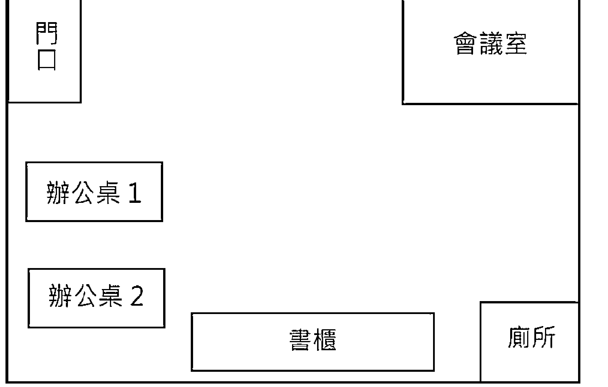

步驟一：可先畫出場地的平面圖（例如公司），上圖是例子場地。

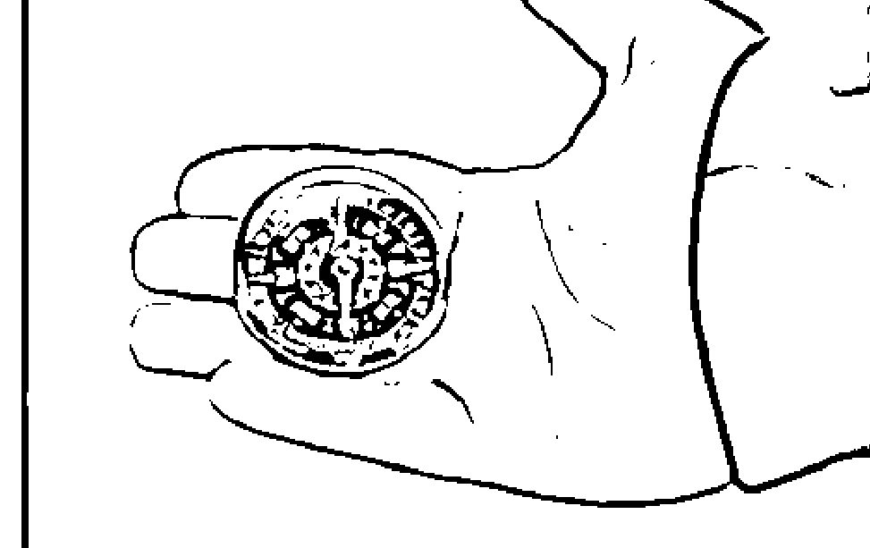

步驟二：然後我們要找出大門的方位。人在屋內，面向大門，手握指南針，查看大門的方位。根據例子，大門的方位在西北方。

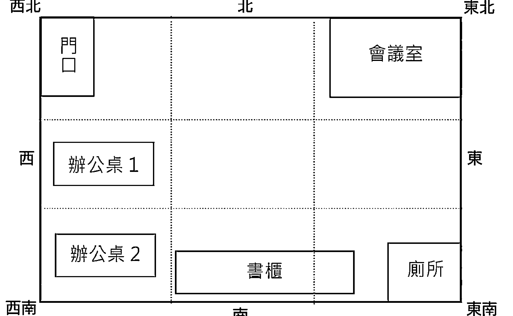

步驟三：我們知道大門的方位後，便可在場地的平面圖，分9格畫下東南西北等方位。例如：我們發現「辦公桌1」是2012年的正財位，立即在該書桌上擺放白水晶球，即可催旺公司的正財運，生意興隆！大家只要根據以上步驟，再參考該年的風水吉凶位，自己便可以輕易擺出水晶陣來催運或化煞了！

#### 四：佩戴水晶前必須淨化

由於水晶有儲存和發放能量的功能，故一般水晶在經過製作或運輸時會儲存了不少人的記憶和負能量，因此水晶一買回來一定要先淨化，以清洗留在裡面的負能量和殘留的記憶。如果你沒有淨化就使用水晶，非但不會令你夢想成真，甚至很大機會令你惹上禍患！

可是水晶的淨化方法眾多，有日光消磁法、月光消磁法、晶洞/晶簇消磁法等等，到底是不是所有水晶都可以用以上方法淨化？

當然不是！要淨化水晶一定要小心為上，不同的水晶有特定的淨化方法，如果一不小心用錯方法，很容易會令水晶受損。

##### A. 水晶淨化法：強而有效淨化水晶

具體方法：

直接購買水晶簇、水晶洞、水晶柱這類比較天然的水晶，由於它們的形態比較原始，而且有令磁場生生不息的作用，將水晶放置其上或其中，可令水晶在磁場加持下自動完成淨化過程，是所有淨化方法中最有效的一種。

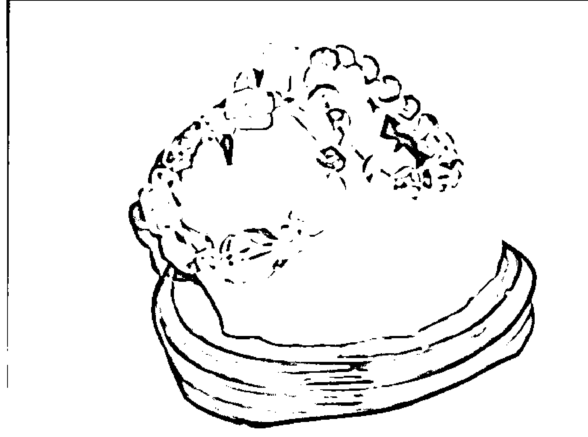

使用範圍：

任何情況下都可以使用此方法淨化水晶，甚至可以每天都把水晶放在水晶簇、水晶柱之上或放在水晶洞之內，使水晶保持最強的功效。

淨化效果：

淨化能力強，而且簡單有效，是所有淨化方法中最強的一種。

缺點：

晶簇的價格比較相宜，但淨化效果最好的水晶洞價格就非常昂貴，而且不容易買到。

注意事項：

在選擇購買水晶簇和水晶洞時，盡可能挑選白水晶或紫水晶，其他水晶雖然也有很好的淨化效果，但在淨化過程中可能會摻雜該水晶的磁場，未必個個人都能夠接受，因為一些水晶對特定的人有負面的影響，例如黃水晶會令人心情煩躁，但白水晶和紫水晶的磁場一般人都能夠接受。

##### B. 月光淨化法：天然淨化水晶

具體方法：

將水晶放在容器內，容器以玻璃碗或玻璃盤子比較理想，然後放在可以照到月亮的地方。在每月農曆十五或前後幾天用月光淨化法最為有效。

使用範圍：

水晶初購買回來的時候、佩帶水晶已經一段時間或水晶變得暗淡時，也可用月光淨化法來淨化水晶。

淨化效果：

淨化能力較強

缺點：

因為天氣變化無常，未能每次配合淨化的時間。

注意事項：

使用月光淨化法要在太陽出來前收回水晶，不然太陽一曬，就失去了淨化的效果。

##### C. 日光消磁法：增強水晶的正能量

具體方法：

把水晶放置於陽光底下數小時，讓自然界裡最強大的力量來淨化水晶，由於日光消磁法會令水晶溫度提高，在淨化完成後，要將水晶放置在陰涼通風的地方，令水晶退溫約兩小時後再沖洗即可。

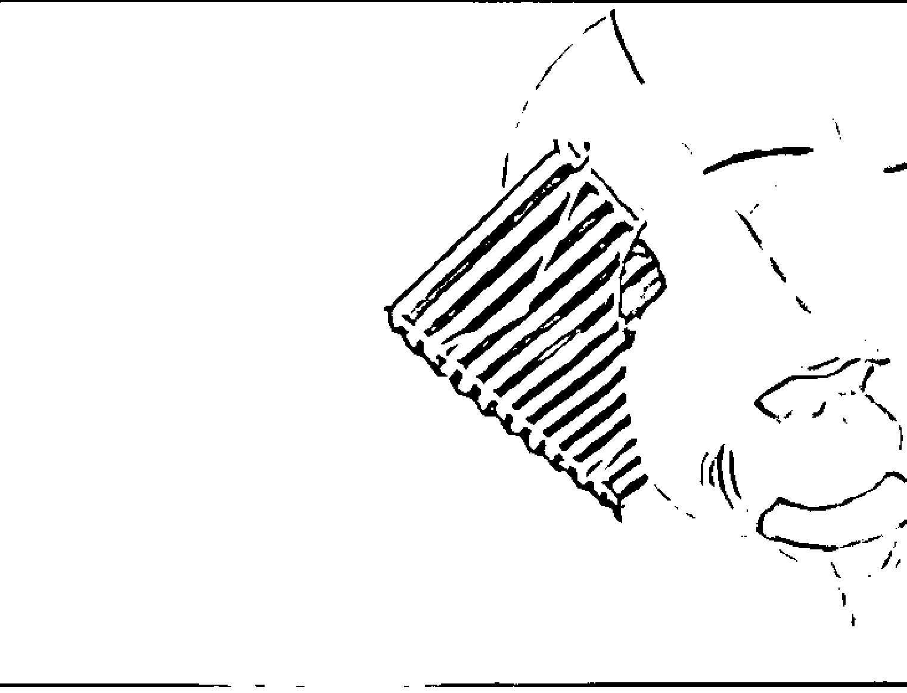

使用範圍：

日光消磁法是非常強力的淨化方法，要使用這種強力的淨化方法主要是針對去過一些負能量高的地方，例如醫院、拜祭場地、夜間陰冷場所，或者是自己經常覺得不安的時候使用。最好在晨曦剛出來或黃昏時間用日光照射法淨化水晶，約1至2小時即可。

淨化效果：

一般

缺點：

日光消磁法不宜在正午或曝曬於太陽底下進行，過猛的日光會令水晶褪色。

注意事項：

水晶曝曬後不要立即用冷水沖洗，這會令水晶脆裂。如果水晶內部含鐵、銅、錳等元素成分便不能使用日光消磁法，因為這些元素經過長時間且持續的高溫照射下，將會改變水晶內的分子結構，導致色澤的改變。例如：紫水晶、黃水晶、粉晶、紅紋等等這些有色水晶，便不能使用日光消磁法。

##### D. 佛經音樂淨化法：振動波淨化水晶

具體方法：

將水晶放在室內的容器中，容器以玻璃碗或玻璃盤子比較理想，然後播放人們在誦經唸咒時所錄下來的音樂帶約1至2小時，由於聲、光、電、熱、磁都是能源的不同形態，所以，以聲音的振動用作淨化水晶是很具效用的。

使用範圍：

任何情況下也可以使用佛經音樂淨化法。

淨化效果：

有效

缺點：

誦經唸咒的音樂比較難找。

注意事項：

留意音樂中誦經唸咒唱的人有沒有修持的基礎，修持的年資愈多，淨化的效果愈大。如果想令水晶淨化得更有效，建議可以去找一些名山大寺所出版的作品，由有修行的師父們、老師父們誦唱，這些有深厚修持基礎的師父們，所發出來的聲波渾厚雄勁，淨化效果奇佳。

眾多水晶淨化方法中，以上述提出的水晶淨化法最為有效，不過坊間亦有不少水晶淨化方法，如海鹽水消磁法、海水消磁法、自來水淨化法、大自然淨化法、極低溫淨化法等等，但這些方法均不建議使用，一來對水晶有太多限制，二來對水晶亦會造成損害。

#### 五：不可不知的水晶禁忌

有些人即使戴了水晶，但水晶仍然不能幫自己轉運，原因可能是用錯方法戴水晶或是不小心犯了水晶的禁忌，其实在坊間流行一套水晶的用法和禁忌：

- 1. 水晶最好不要和手錶以及其他首飾戴在一起，這會令首飾產生碰撞，水晶很容易受傷，而且相互間的磁場會令水晶產生干擾。
- 2. 最好不要把所有顏色的水晶戴在一起，如黑曜石等深色的水晶不要和其他淺色的水晶放在一起，否則會互相干擾。
- 3. 水晶剛買回家佩戴之前要先把水晶淨化，不同水晶有不同的淨化方法。
- 4. 每3個月至半年，便要把戴開的水晶徹底淨化，去除穢氣。
- 5. 最好不要隨便讓別人觸摸你的水晶，如果有些人心懷惡意，會令水晶吸收不好的記憶。
- 6. 千萬不要隨便把佩戴很久的水晶送人，這很容易為自己惹來災難。
- 7. 儘量不要戴著水晶睡覺，因為水晶的磁場太強，容易令人失眠，除非是治療失眠的水晶，如紫水晶等。

#### 水晶強化人體七輪

聽說人體有七輪，很多人都會很好奇，究竟人體七輪是甚麼？人體七輪的作用是甚麼？其實簡單而言，人體七輪就是我們人體的能量中心，而這七輪分別會散發不同色光，只要利用水晶的震動頻率來與身體的七個脈輪做能量的契合與補強，更多生命能量就會透過水晶傳入我們身體，將身體內的負面能量排放出去，有助保持我們人體健康，更能加強我們的個人能力。例如，如果你經常覺得疲倦、身體乏力，即表示頂輪能量不足，這時便要配戴白水晶等加強頂輪能量的水晶以改善身體問題。

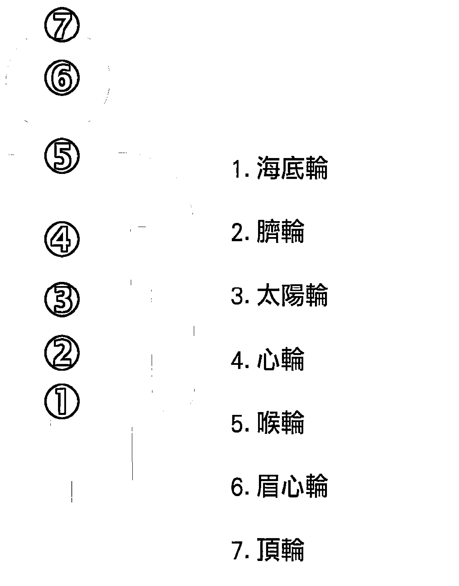

- 1. 海底輪
- 2. 臍輪
- 3. 太陽輪
- 4. 心輪
- 5. 喉輪
- 6. 眉心輪
- 7. 頂輪

以下將會簡單介紹人體七輪，如果想知道更多關於人體七輪與水晶的關係，可以前往後的章節。

#### 1. 頂輪

**頂輪**：位於頭頂部位，在身體方面可控制身體機能平衡、加強免疫力和抵抗力、活化腦部、舒緩頭痛；在個人能力方面：可以協助在思考上達到精神集中、增強記憶力、並提高腦筋的靈活力，能穩定情緒、增強管理才能。

**主宰器官**：主大小腦、腦下腺、中央神經系統、右眼、松果腺（「第三隻眼」）^1

**脈輪色光**：紫色光、白色光

**對應水晶**：紫水晶、紫色舒俱來石、紫龍晶、白水晶、白幽靈

例如，如果發現自己的記性差，而且記憶力有下降的趨勢，即表示頂輪能量不足，這時便要使用對應頂輪的水晶如白水晶來加強頂輪能量。

註 1：
在人類兩眉中心、在頭腦中間偏後一點的地方，有個叫做松果體（也叫松果腺）的器官，多位神秘學家認為，松果體就是人類神秘的「第三眼」所在之處，「第三眼」能捕捉到肉眼所看不見的不可見光，能夠從宇宙獲得超凡的想像力，成為信號隨著神經進入視網膜，視網膜上便出現虛擬的圖像。印度教祖師認為「第三眼」是人體「未卜先知」的器官，印度人習慣在雙眉之間畫上靈輪（Chakras），認為這樣便可獲得與宇宙直接交流的通道，開發「未卜先知」的能力。

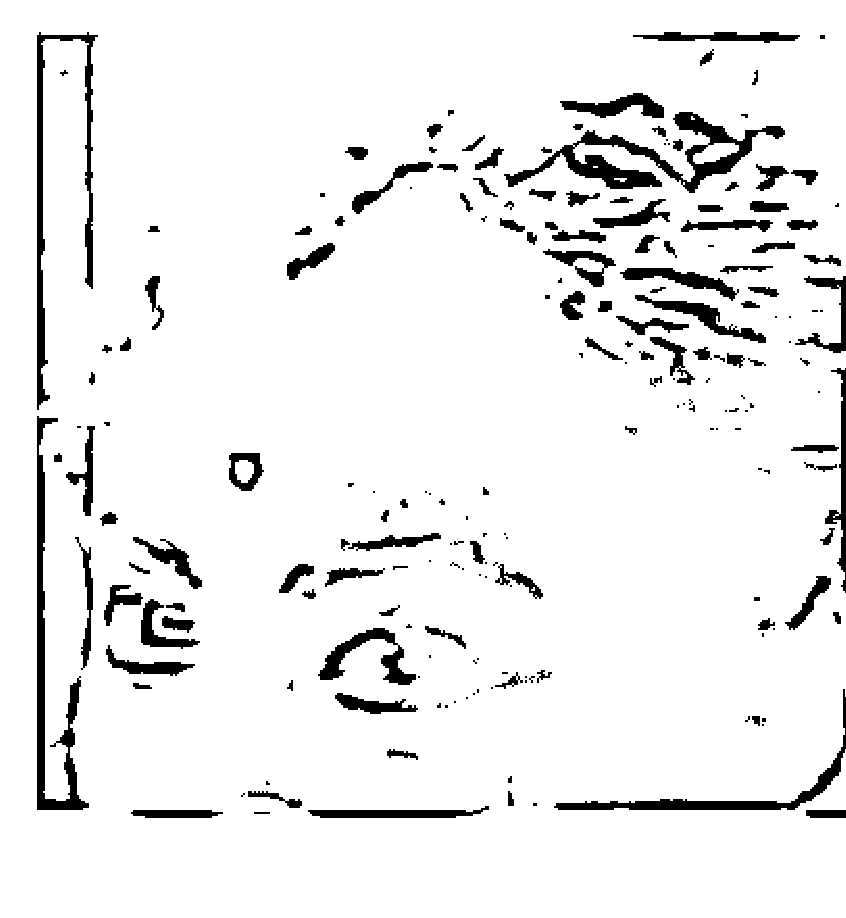

#### 2. 眉心輪

**眉心輪**：在兩眉之間，位於腦的正中，在身體方面可增強眼、鼻、耳及腦部健康，更能提升睡眠質素；在個人能力方面則能客觀思考、具備洞察力、領導力，更能開發預知力及通靈能力。

**主宰器官**：小腦、眼、鼻、耳、腦下垂體

**脈輪色光**：紫色光、靛色光（藍與紫之間的色系）

**對應水晶**：紫水晶、紫龍晶、紫玉髓、紫色舒俱來石、藍玉髓、青金石等。

例如，如果失眠的情況持續，即表示眉心輪的能量不足，這時便要使用對應眉心輪的水晶如紫水晶來加強眉心輪的能量。

##### 3. 喉輪

**喉輪**：位於頸部，喉嚨中心部位，在身體方面能令喉嚨、神經系統健康；在個人能力方面則能令人冷靜、加強分析力，增強邏輯分析及表達能力。

**主宰器官**：喉嚨、神經系統、耳朵、肌肉、甲狀腺

**脈輪色光**：藍色光

**對應水晶**：藍玉髓、海藍寶、青金石等

例如，如果發現自己表達能力差，即表示喉輪能量不足，這時便要使用對應喉輪的水晶如海藍寶等來加強喉輪的能量。

##### 4. 心輪

**心輪**：位於心臟中心部位，在身體方面能改善氣喘以及心肺疾病、呼吸道問題，能使人放鬆鎮定及平衡不安的情緒；在個人能力方面則能使身心平衡、待人友善，增強交際能力。

**主宰器官**：心、肺、免疫系統

**脈輪色光**：綠色光、粉紅色光

**對應水晶**：粉晶、紅紋、綠幽靈、綠髮晶、綠碧璽、西瓜碧璽

例如，如果發現自己在人際關係方面產生問題，即表示心輪能量不足，這時便要佩戴增強心輪能量的水晶如粉晶來加強心輪能量。

#### 5. 太陽輪

**太陽輪**：位於橫膈膜下方肚臍以上的地方，在身體方面能保持消化系統、胃等器官健康；在個人能力方面，能為四周帶來愉悅的氣氛、對自己有強烈的個人使命感，而且更懂得尊重別人。

**主宰器官**：消化器官、胃、十二指腸、肝、膽、胰臟、橫膈膜

**脈輪色光**：黃色

**對應水晶**：黃水晶、黃髮晶、黃玉、黃碧璽、琥珀

例如，如果消化系統出現問題，即表示太陽輪能量不足，這時便要使用對應太陽輪的水晶如黃晶等來加強太陽輪的能量。

#### 6. 臍輪

**臍輪**：位於肚臍以下三英吋，在身體方面有助性功能運作正常；在個人能力方面則會非常友善樂觀、熱愛交朋友、樂於關心他人、有歸屬感、具備創造力與想像力、說話幽默、直覺強烈、感覺敏銳、可以幫人分析事理解決問題。

**主宰器官**：子宮、卵巢等女性生殖器官，男性精囊等部位的生殖器官等。

**脈輪色光**：橙色光

**對應水晶**：虎眼石、紅玉髓、紅髮晶、紅瑪瑙、紅色碧璽

例如，如果發現性功能出現問題，即表示臍輪能量不足，這時便要使用對應臍輪的水晶如紅髮晶來加強臍輪的能量。

#### 7. 海底輪

**海底輪**：位於生殖器官與肛門之間，在身體方面能使身體健康活躍；在個人能力方面則能使注意力集中、信任他人，心思細膩。

**主宰器官**：脊髓、血液、神經系統、小腸、膀胱、肛門、男性生殖器官、女性生殖器官等。

**脈輪色光**：紅色光、黑色光

**對應水晶**：石榴石、茶晶、黑色碧璽、黑曜石、紅碧玉

例如，如果發現自己比較粗心大意、注意力難以集中，即表示海底輪能量不足，這時便要使用對應海底輪的水晶如茶晶來加強海底輪的能量。

## 個案篇［一］：改善愛情運勢

很多人對於愛情、婚姻比較着緊，筆者曾收過不少朋友來信或電郵詢問有關改善愛情的方法，筆者在本書引用幾個案例，為大家的愛情排解疑難。

### [案例 1]
過了35歲都嫁唔出，如何增強姻緣？

**網友問題：**

老師你好，
今次來信是想詢問有關增強感情的方法。我是一個事業心比較強的人，為了份工我可以將所有人置之不理，所以過了35歲別說談婚論嫁，連拍拖的機會都無。即使之前拍過幾次拖，但我每日返工朝十晚十二，根本無時間拍拖。每一次不是對方嫌我無時間陪他，就是我覺得對方無上進心、職級比我低，幾段感情都無疾而終。
雖然起初我都覺得過獨身的生活很好，但眼見跟我同期的同學一個二個結婚生仔，再加上我媽不斷嘮叨我說女人一定要嫁人、結婚是女人最大的幸福等等，我就開始對於單身的自己產生懷疑，於是便想問一下老師有什麼方法可以增強姻緣，在40歲之前嫁得出。

謝謝老師！
讀者 May Sin

**水晶公主答：**

May 你好！謝謝你的來信！
關於你在信中談及的問題，我建議你可以戴粉晶來改善姻緣。
你提及了兩個重點：一個是你事業心強，另一個則是你擇偶要求高，才會在感情方面運勢較差。一般事業心強的人，工作壓力容易過大，容易令心情變得煩燥；而擇偶條件高的人，一般有較少包容力，令人際關係容易產生決裂。
之所以建議你戴粉晶，是因為粉晶主開發心輪，可鬆弛緊張情緒、舒緩煩燥心情，使心胸廣闊，能促進人際關係和諧，而且能增強對異性的吸引力，使戀愛順利，有助改善人際關係，促進良好人緣。

### 粉晶功效小貼士

#### 主要作用為改善人際關係：
粉晶的氣場所散發出來的是溫和而吸引人的粉紅色光芒，因此對於人際關係的和諧以及戀愛的進展有其正面的影響。不管是對客戶、朋友、情人及四周的人緣，粉晶可以帶來絕佳的輔助及改善效果，使人際關係更加融洽暢旺。此外，粉晶亦有助修補破敗的人際關係，雙方能重修舊好。

#### 改善戀愛運勢：
粉晶能增強對異性的吸引力，增進異性緣，增加招來愛情的機會，使戀愛成功。此外，粉晶更可促進情侶間雙方感情及平穩發展感情，使愛情開花結果，促進夫妻感情和睦，恩愛甜蜜。

#### 增強服務業的生意緣：
在公司進出頻繁的地方例如門口擺設粉晶，可建立良好的客戶關係，促進生意緣，並且有助於降低消費者的警覺性、比較心與防備能力，使消費者能夠放心大膽地購買，是開門做生意的最佳利器。

### [案例 2]
花心男友不肯娶我，我卻想盡早拉埋天窗怎麼辦？

**網友問題：**

老師你好，
久聞老師對於水晶非常了解，特冒昧來信打擾，想請老師解答疑難。
其實我和男朋友已經一起兩年多了，兩個都已經到了適婚的年紀，我自己就想盡快可以結婚，想有名有份，但他好像沒有甚麼表示。我已經不止一次跟他暗示想結婚，他都裝聾扮啞，我們更因此吵了好幾次。其實我很怕他不想和我結婚，因為他和我一起之前是一個喜新厭舊的人，朋友都覺得他花心，因此我和他拍拖以來，即使已經同居、見過雙方家長，但是我還是沒甚麼安全感，而且我愈等他求婚，我愈覺得煩燥，因此我和他的感情也愈來愈差。
老師，我想詢問一下有甚麼方法可以促使我和男朋友盡早共諧連理？

讀者 Winnie

**水晶公主答：**

Winnie 你好！謝謝你的來信！
首先你和你男朋友對於結婚的問題上產生分歧，可能是因為你們雙方還是未完全了解對方，才會造成意見不合。你提及你沒有安全感，可能是你對於自己沒有太大的信心，建議你可以戴月亮石，而且可在床邊放置粉晶七星陣。
月亮石可以幫助你平伏煩燥的心情，潤滑感情，增進情侶雙方的了解，可以幫你解決你們雙方的紛爭，使感情更加融洽。此外，又可以提升女性魅力及柔美本質，增加自信、鎮定情緒，對你的態度有積極的作用。建議你在床邊放置粉晶七星陣，是因為你和男朋友現在已經同居，就像夫妻一樣，放在臥房中可促進夫妻感情，可以促使你們的愛情開花結果。

### 月亮石功效小貼士

主要作用為改善愛情運勢：

可幫助平伏煩燥的心情，潤滑感情、增進情侶雙方了解，使感情更加融洽，是解決情侶紛爭的愛情晶石。有助吸引異性、提升女性魅力及柔美本質，是愛情石之一。

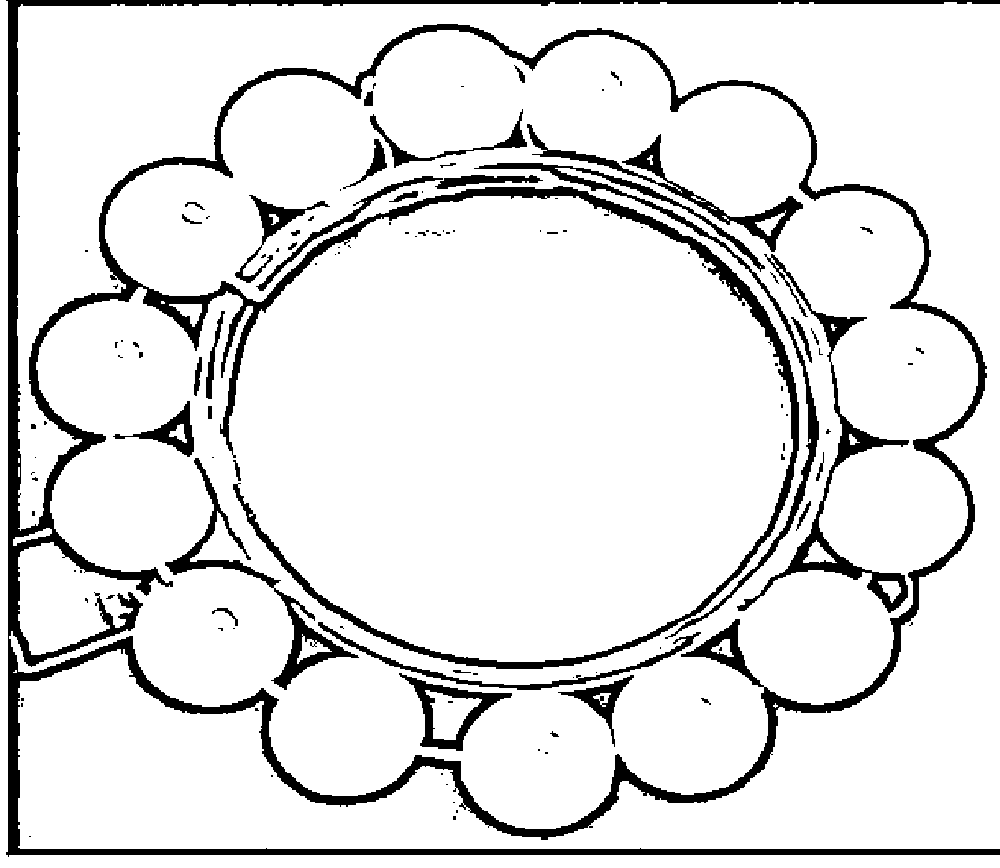

美顏減肥：

可幫助個人舒適地入睡，可調節人的飲食習慣，達到減肥的功效。幫助護膚、明眸、護髮，還有美顏的功效。

改善情緒：

佩戴長身一點的月亮石吊墜，貼在胸前，有助於冷靜思考，改善急躁個性。增加自信、幫助成長、鎮定情緒、吸引愛情、擴大心靈視野、使人心情開朗。抗抑鬱，可治療失眠。

健康：

對女性的內分泌系統有平衡作用，有助安胎、助孕，可提高生育能力，對月經痛有舒緩的作用，但平常戴就好，真正月經來潮時就不要佩戴。

其他：

因可加強預知未來的能力，所以又稱為「預言和透視之石」；又因可保護出外旅行者，又稱為「旅人之石」，加強個人的第六感及開發靈性。

### 粉晶七星陣功效小貼士

與粉晶的功效一樣，但運用七星陣可以讓水晶能量石之間互相激盪，串連頻率，而形成一支肉眼看不見的大氣柱，聯結宇宙中更強大的力量，來達成心願。

七星陣法其實就是「召喚結界」，如果你放置粉晶在七星陣法上就是召喚粉晶本身的磁場能量轉移到人體身上，進而發揮粉晶本身的磁場特性之功能，可以增強人緣、愛情運等。

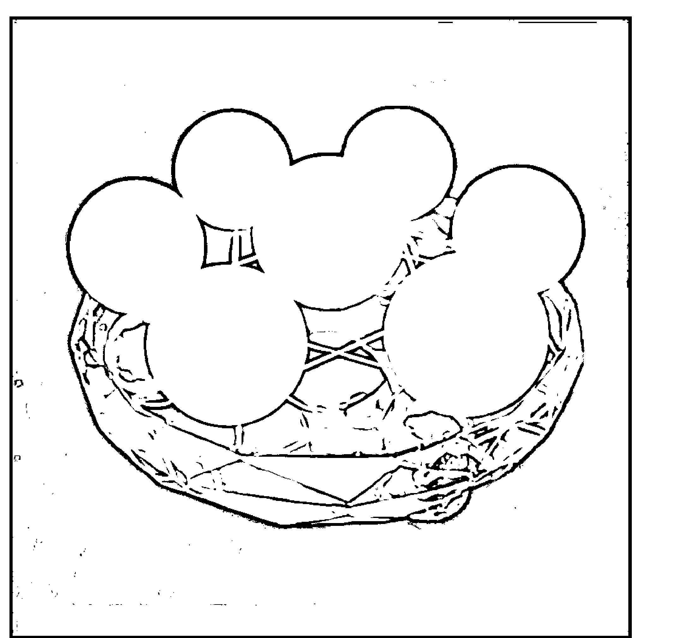

↑ 粉晶七星陣

### [案例 3]
有暗戀對象，點先可以令對方喜歡我？

**網友問題：**

老師你好，
其實我對同班一位男同學十分有好感，已經暗戀他超過3年，直到今年同班，我覺得有機會可以跟他一起，但問題是他身邊一向圍繞很多女同學。
我既沒樣貌又沒身材，根本沒有辦法引起他的注意，究竟有甚麼辦法可以令他注意我，令我們可以一起？

讀者 薇薇

**水晶公主答：**

你好薇薇，謝謝你的來信！
如果你已經有對象，建議你可以戴紅紋。紅紋和粉晶都是招來愛情的水晶，但與粉晶不同的是，紅紋偏向實踐和行動，能增加信心，邁向目標，對有對象的人尤為有效，可以增加撮合的機會率。

### 紅紋功效小貼士

主要改善愛情運：
增加招來愛情的機會，可以增進異性緣，偏向實踐和行動，增加信心邁向目標，適合已有對象的人佩戴。

改善個人情緒：
能使配戴者心情愉快，使人熱情、願意付出，可治療因失戀帶來的痛苦、失落、抑鬱，讓情緒穩定柔和。

改善健康：
由於紅紋石主開發心輪，能幫助改善心、肺、免疫系統、淋巴腺、胸腺功能，亦對呼吸道、血液循環系統、指甲病變，甚至癌症等生理現象有舒緩作用。

其他功能：
能帶來財富、名聲與自信。

## 個案篇［二］：改善人際關係

人緣比較差的人容易招惹小人，小則口角之爭，大則惹上官非或蒙上不白之冤，整體運勢較易處於低潮。

人緣差的人除了戴吸納人緣的水晶之外，亦應對應自己的性格缺點作出修正，因此，先了解清楚自己的性格缺失並加以改善，再戴上對應的水晶輔助，以增加人緣，方為上策。

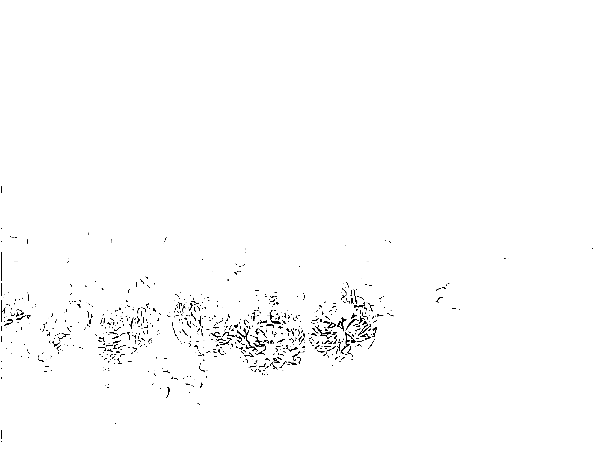

### [CASE 1]
被好友出賣搶走身邊男友

### 網友問題：

老師，你好，
我由小至大人緣都很差，身邊只有一個朋友對我不錯，我也一直以為她是我無可取替的朋友，但直到一日，竟然被我發現她跟我男朋友有私下聯絡，之後我質問她，她也直認不諱，說她跟我男朋友拍拖已經有一段日子，更話我小姐脾氣，任性自大，只有她才頂得順我，又說如果我連她也失去，我根本沒有朋友。她說，我男朋友也覺得我太多男性朋友，覺得我水性楊花才會跟她一起。
我聽完真的很傷心，每日一想起她背叛我就哭，比起男朋友跟我分手，她的背叛我覺得更 Hurt。至今已經半年了，我一直放不下，而且更影響到我日常生活。老師請問有甚麼方法可以改運？

讀者 琪琪

### 水晶公主答：

琪琪你好！首先感謝你的來信！
人緣差一般都是戴粉晶和紫水晶來增進人緣，但如果你身邊已經有太多狂風浪蝶，便不宜再戴粉晶，因為粉晶吸納異性緣為主，我建議你戴紫水晶。紫水晶可以增進人緣運，有助促進人際關係，多遇貴人，比較適合你的情況。
你的朋友提及過你有小姐脾氣、任性自大，紫水晶亦可助穩定情緒去除焦躁，具有放鬆效果，便能與人溝通時保持和氣，協調雙方之間的摩擦。此外，由於紫水晶能夠把較低的能量轉變到較高的震動頻率，能夠淨化我們的靈光，使我們能夠平衡理性、情緒與肉體的能量。

### 紫水晶功效小貼士

#### 主要作用為利人緣：

紫水晶是社交之石，但這邊指的社交並不是像粉晶所帶來的人緣，紫水晶是因為可以幫助我們改善性格上的缺失，因而吸引到貴人相助。紫水晶特別適合性格浮躁的人，因為紫水晶具鎮定安神的作用，可以讓人較易理解和體諒他人，比較有同理心，從而增加人緣。

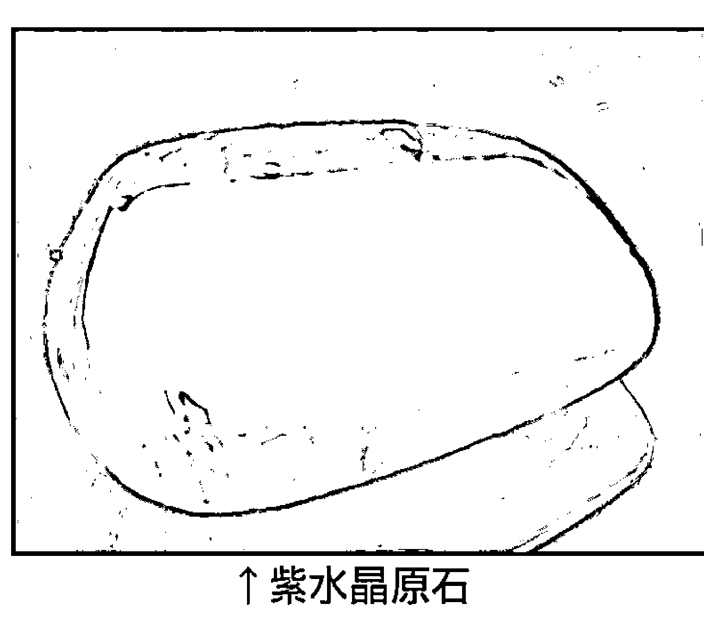

#### 改善愛情運勢：

紫水晶在愛情方面也甚有成效，可使對方對你愛情不渝，婚姻美滿如意，能賦予情侶、夫妻間深厚之愛、誠實及勇氣。紫水晶又能將性愛之活力轉變為精神活力，對於解決性愛問題及尋得適合對象等發揮很大的力量。

#### 開發個人潛能：

紫水晶對應七輪系統中的眉輪，可以開發智慧、幫助思考、集中念力、增加記憶能力，並且可以增加腦細胞的活力及腦袋的運轉，增加機智，提高直覺力與潛意識。對於需要長時間動腦筋的學生及上班族，紫水晶不可或缺。

#### 改善健康：

由於紫水晶亦對應頂輪，能助人鎮定安神，改善失眠、助睡眠迅速恢復健康。同時亦會加強身體各部分的「自癒」能力，全面改善身體健康。

### [CASE 2]
思想太過負面，令人敬而遠之？

### 網友問題：

老師你好，
我有一個同學思想非常負面，而且經常覺得這個世界是欠了他的，常常擺出一副「我見猶憐」的樣子出來，害人見了他都掉頭走，因此他的人緣運非常差。但我跟他識了十幾年，實在不忍心見他這樣下去，而且他身邊沒有甚麼朋友，即使是我也對我非常冷漠，可是他只是性格上不懂表達，對人其實沒甚麼惡意的，不過其他人看他卻不覺得是這麼一回事，覺得他很「寸」，所以很多人都對他十分厭惡。老師，如果想幫他改善人際關係，應該怎樣做才好？

讀者 Franky

### 水晶公主答：

Franky你好，謝謝你的來信！
據你所說，你的朋友人緣運之所以差，是因為他有兩個問題：第一，思想負面；第二，待人冷漠。這兩個問題都可以借由戴紅碧璽來解決，繼而增加人緣。
針對思想負面這個問題，紅碧璽的能量熱情奔放，可使人開朗舒爽。鬱鬱不歡的人，可在右手上佩帶紅碧璽，能使心情好轉，驅走負能量，令身心健康，心境平和，使人掃開心中陰霾，得到海闊天空的快樂與幸福。
而針對待人冷漠這個問題，紅碧璽有助冷漠的人改善人際關係，又能打破代溝，增強人緣運。而不善交際或人緣不好的人，則能改善溝通及自我平衡的能力，又能消除冷漠怪癖，散發個人魅力，增強人緣。
因此，建議你朋友可以戴上紅碧璽，以改善人緣。

### 紅碧璽功效小貼士

#### 主要改善人際關係：
紅碧璽能吸引友情，融化冷漠與疏離感，驅散孤獨寂寞，加強親合力，有助冷漠的人改善人際關係，增強人緣運，打破代溝。

#### 改善個人情緒：
紅碧璽的能量熱情奔放，可使人開朗舒爽。鬱鬱不歡的人，可在右手上佩帶紅碧璽，可使心情好轉，驅走負能量，令身心健康，心境平和。

#### 改善健康：
由於紅碧璽主開發心輪，有助治療心臟毛病、血管和骨痛。

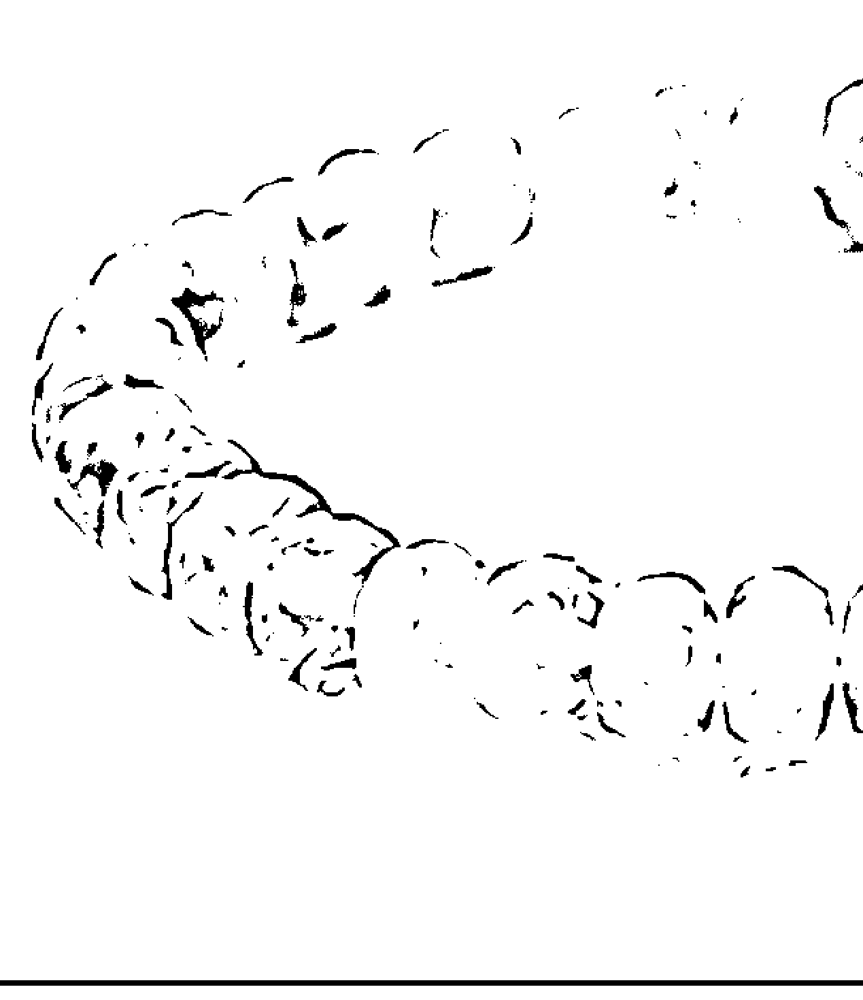

### [CASE 3]
做事太急躁、說話不經大腦，因此得罪很多人？

### 網友問題：

老師你好，
其實我都不太清楚為什麼我的人緣差成這樣，可能成日得罪人多稱呼人少，曾經聽人講過我做事太急躁，而且太過自我中心，才會令人對我反感，但我都不覺得我有這些問題。現在班上的人已經開始排擠我，再這樣下去我可能會選擇轉校……老師，請問有甚麼方法可以改善我的人緣？

讀者 Maymay

### 水晶公主答：

Maymay 你好，謝謝你的來信！
對於你的情況，我建議你可以戴粉晶幫助改善人緣。
雖然人緣差可以借由水晶的力量幫助，但人緣差的話，一定有些問題出現在你身上，當然，每個人對自己的了解總有一個盲點，而粉晶可幫助你克服這個盲點，帶領你去面對自己的缺點，並加以改善。
只要你的缺點有所改善，人緣自然會變得更好，這就是粉晶能幫你做到的。此外，粉晶能讓你更能站在對方的角度思考，而且更有包容心，有助改善急躁率直和欠缺耐心的個性，令你增加親和力，從而改善人際關係。

## 個案篇［三］：改善健康

健康是人最大的財富，每個人都想擁有，但若果時運不濟，往往容易染病，或情緒出現問題，對健康構成影響。要改善健康，可以用水晶作輔助，達至健康人生。

### [CASE 1]
試過很多方法，但都不能減肥？

### 網友問題：

老師你好，
我由小至大都很胖，我亦試過很多方法去減肥，但往往半途而廢，每次減到一定程度，我又會因為「為食」而變胖，請問老師我要戴甚麼水晶才能成功減肥？

讀者　小魚

### 水晶公主答：

小魚你好！謝謝你的問題！
其實減肥主要是注意飲食和加強運動，但水晶亦可以幫你起輔助作用，令你真正達減肥的效果。
在人體的七輪中，下三輪即太陽輪、臍輪及海底輪，這三輪與消化系統息息相關，只要調整此三輪位，就不易發胖，吸收正常，容光煥發。而月亮石、茶晶和金髮晶正好能對應此三輪位，因此建議你可以試戴月亮石、茶晶和金髮晶。
戴上月亮石的吊墜或手鏈（左手），能助控制食量，調節人的飲食習慣，加強消化及排毒功能，達到減肥的功效。
戴上茶晶（右手），有助消除脂肪，達到減肥的目的。由於茶晶能有效地吸收負性能量，可以加強人體免疫系統功能，使人體細胞活躍，從而消除脂肪。
金髮晶的震動力特強，可以促進健康細胞生長。而金髮晶對應太陽輪及臍輪，有助加強減肥的決心及刺激太陽輪及臍輪，調整能量，增強活力，燃燒脂肪。

### 茶晶功效小貼士

#### 主要改善個人能力：

在繁忙的工作中，有助於理清思緒，可以在複雜的狀況中做出最有效率、最直接的反應與處理方式，此外亦可加強人實踐目標的力量和決心，有助事務分析及掌握能力，助品味的提升。

#### 改善健康：

茶晶能強化海底輪，可以促進青春，減緩人的老化，增強生殖系統功能。此外，茶晶更能促進再生能力，使傷口癒合更快，增進免疫力，活化細胞，恢復青春，有返老還童的功效，尤其是排除濁氣，避邪效果最佳，只要將茶晶佩戴在左手，便有助過濾體內的濁氣、病氣。女士們則可以用茶晶來調節婦科病，增強海底輪的能量，也可以增強體力、活力和對性愛的熱望。

#### 改善個人情緒：

茶晶能使人心意平靜，有特殊穩定及平衡作用，能紓解抑鬱。

#### 增加考試運：

有助分析考試題目，令人精神集中、思路清晰，增強考試運。

### [CASE 2]
年紀輕輕周身病痛，如何增強健康運？

### 網友問題：

老師你好，
我只有 20 幾歲，但身體非常虛弱，成日頭暈頭痛，行幾步樓梯又氣虛氣喘，加上天生氣管虛弱，不能做太劇烈的運動，以致健康愈來愈差，最近進出醫院的次數又多了起來，請問老師有甚麼方法可以幫助我改善健康？

讀者 Dicky

### 水晶公主答：

Dicky 你好，感謝你的來信！
想令身體健康，其實最好配戴白晶，這是因為白晶有去除病氣、淨化全身的功效，有助你將病氣排出體外，只要氣管回復強壯，就可以多做運動讓身體變得更健康。

### 白水晶功效小貼士

#### 加強學習能力：

白水晶對應人體的頂輪，可以加強腦部安定及活動，刺激靈感，增加靈通能力、考試運。此外，白水晶在光線中會產生持續、穩定的震盪，可以使頭腦清晰、增強記憶力和理解力，更能加強冷靜力。白水晶的能量可以幫助我們組織所有概念及創作進而實現。

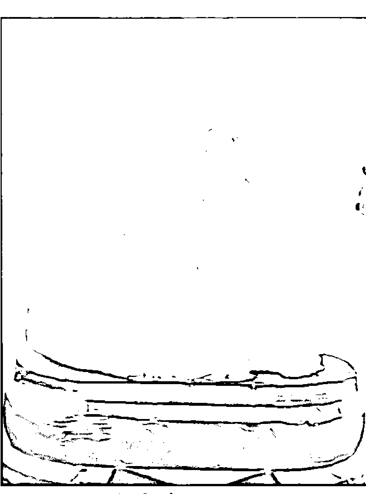

#### 健康：

白水晶可淨化全身，去除病氣。若覺得身體不適，可以戴白水晶在右手，由於左入右出原理，白水晶會將病氣由右手排出，提早恢復健康。

#### 鎮宅保平安：

將白水晶放在屋內可鎮宅避邪，更能聚集福氣，改善家宅風水。將白水晶製成飾物如胸墜等，可以當做護身符隨身攜帶以保平安。

### [CASE 3]
頭痛、失眠，有甚麼水晶有助改善？

### 網友問題：

老師你好，
不知道是不是壓力太大的關係，我經常失眠，而且經常頭痛，用了很多方法也沒有改善，請問老師，有甚麼水晶能改善我的健康？

讀者 Yammy

### 水晶公主答：

Yammy你好，感謝你的來信！
改善失眠、頭痛等症狀最好是戴紫水晶，由於紫水晶對應頂輪，能有效地改善失眠，只要將紫水晶放在床頭附近，即可鎮定安神，有助迅速入眠。此外，紫水晶有「自癒」的功能，會加強身體各部分的功能，對於改善頭痛也有很大的功效。

## 個案篇［四］：提升事業及財運

經常覺得自己懷才不遇，而老闆又對自己有偏見，成日做啱樣錯啱樣，次次被老闆狠狠地當着成班同事面前鬧到你要搲窿捐？要化解職場危機，其實可以借用水晶的力量幫你逢凶化吉，升官發財無難度！

### [CASE 1]
在公司時常被老闆鬧，如何增強事業運？

### 網友問題：

老師你好，
我在公司任職文員，經常被老闆鬧，即使我有幾勤力，每日返足 14 個鐘，老闆都覺得我工作能力差，做錯小小事就起勢地鬧我。雖然我知道我工作能力是有所不足，但我也以勤力來彌補，我也不知道為什麼老闆對我有如此大的偏見，其他同事也不見得比我有工作效率，而且他們通常都「夠鐘放工，熄燈鬆人」，但老闆永遠不會看到他們的缺點，只看到我的缺點。請問老師，有什麼方法可以加強我的事業運？

讀者 強

### 水晶公主答：

強你好，謝謝你的來信！
在事業上有阻礙，通常我們都會選擇綠幽靈來佩戴，而你之所以會被老闆針對，很大可能是因為你工作上的不足而引致他對你存在偏見，所以要令你的工作能力有所進步，同時也要消除老闆對你的偏見，建議你要戴綠幽靈和紫黃晶。
會建議你戴綠幽靈的原因，是因為綠色色光主正財，對於工作上有幫助，而因為綠幽靈的綠色色光是幸運之光，可招好事物走近自己、得貴人相助。此外綠幽靈主開發心輪，能解心中負面情緒，使人忘卻煩惱，開心面對人與事，有助事業發展，令工作順境，大大提升事業運，積聚財富。紫黃晶兼具黃水晶與紫水晶的功能，既可招來偏財運，又可守財、增強運氣、改善人際關係與開發智慧，而由於兩種顏色同時存在於同一顆晶石上，因此也意味著可增加佩戴者的包容度，處於複雜而不友善的人際關係及環境中時，可以從容自在的協調和排解周圍的糾葛，幫助改善你的人際關係，使老闆消除對你的偏見。

### 綠幽靈功效小貼士

**主要作用有利事業：**

綠色色光主正財，對於個人的事業，不論以攻或以守，皆有極大的助力，「財富」自然地會積聚起來，使工作順利平穩。待業中的人也容易找到好工作。

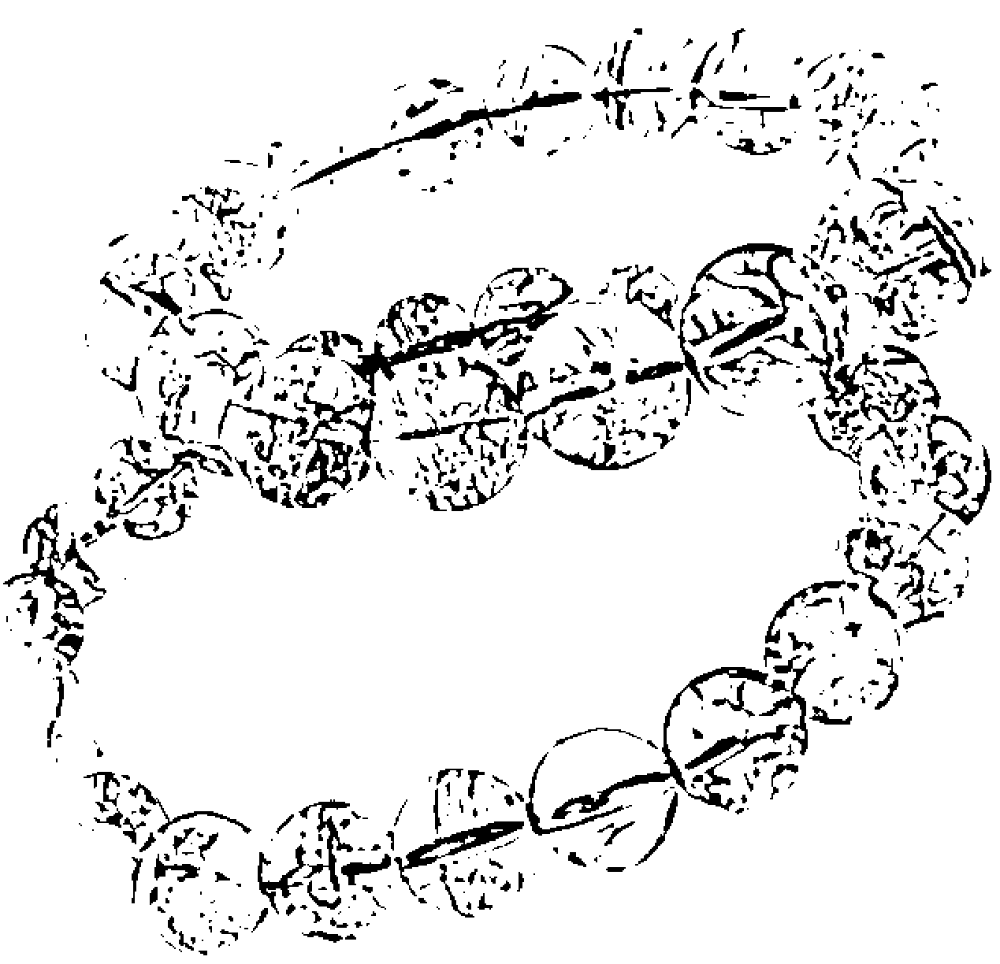

**幸運：**

綠色色光，是幸運之光，可招好事物走近自己、得貴人相助。

**改善情緒：**

綠幽靈主開發心輪，能解心中負面情緒，使人忘卻煩惱，開心面對人與事。能使個人胸懷廣闊，更容易接受新事物，並積極地創造和開發新的途徑。

**健康：**

對心、肺、免疫系統、胸腺、淋巴腺有良好影響。

### 紫黃晶功效小貼士

**偏財：**
紫黃晶的黃色色光，能招偏財，招來財運。

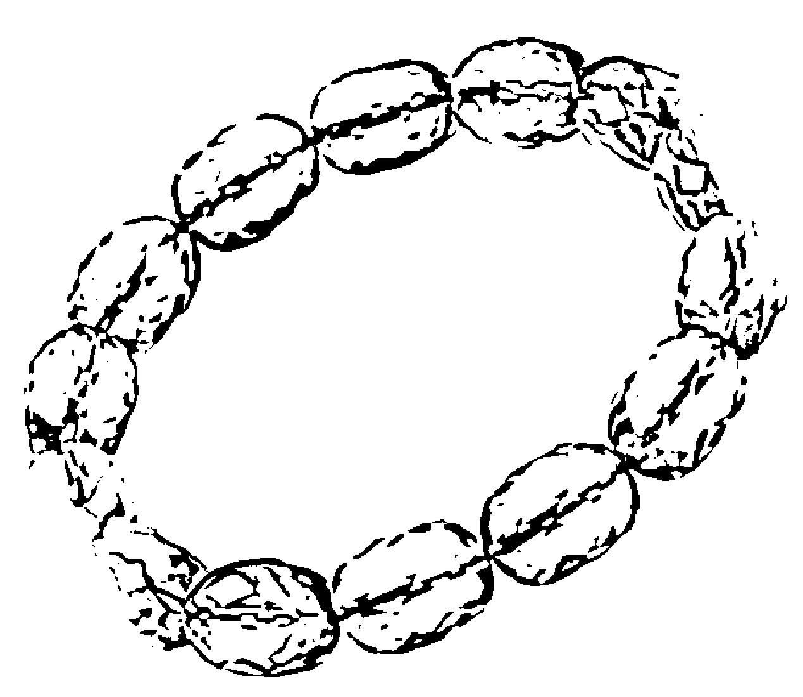

**改善人際關係：**
紫黃晶的紫色色光，能增加包容度，處於複雜的人際關係中，可以從容地協調排解周圍的糾葛，具調合兩種極端能量的功能。

**開發智慧：**
有助增加個人集中力不足，令人腦筋靈活，增強創意。

**改善情緒：**
可平衡、鎮定、情緒上失調的現象，如散漫、緊張、恐懼等。

### [CASE 2]
做地產營業員，業績一直不好，如何增加業績？

### 網友問題：

老師你好，
我任職地產營業員，業績一向不好，經常被上頭召見照肺，無論我如何努力我都不能達標，遲遲入行的營業員也將我的業績拋開幾條街，我上有高堂，一旦被炒就沒有人能負擔家裡開支，請問老師有沒有方法解決？

讀者 Danny

### 水晶公主答：

Danny 你好，感謝你的來信！
地產營業員這份職業由於要經常跑數的緣故，建議可以戴金髮晶。
金髮晶有招財作用，因為黃色色光能吸引財氣、貴氣，象徵地位與財富集於一身，而金髮晶更能吸引正財及偏財。由於以吸財為主，因此對於要跑數的職業非常有幫助，只要吸到財，事業運就愈好，故建議你戴金髮晶。
有人會覺得奇怪，為什麼普通文員、銀行職員等職業我會建議戴綠幽靈來增強事業運，而唯獨地產營業員、保險從業員等我會建議戴金髮晶。地產營業員、保險從業員這些都是需要跑數的職業，這些職業如果配戴綠幽靈便要做生做死才得到財富的回報，因為綠幽靈主正財，每每講求付出一分才有一分收穫，因此並不建議需要跑數的職業配戴綠幽靈。

### [CASE 3]
公司内是非多多，如何才能防小人？

### 網友問題：

老師你好，
電視劇《宮XX》、《金XX孽》天天在我公司上演，同事之間成日鬥來鬥去，又分左派、右派，而我這種中間人，即使有實權在手，但我通常都以公司的利益為大前提，對於他們的小動作我也只眼開只眼閉，但怎知道他們連我也要攻擊，甚至經常在老闆背後講我壞話，令老闆不再信任我！好像每次實行新 Project，明明是我先提出建議，但老闆卻將 Project 的實權移交第二人！小人當道，國之將亡！老師，請問有甚麼方法可以防小人？

讀者 Richard

### 水晶公主答：

Richard你好，首先感謝你的來信！
防小人的話通常都以偏深色系的水晶最為有效，建議你可以戴黑碧璽。黑碧璽能助排出身體上的病氣、濁氣，對於身體及個人運氣上有莫大幫助，黑碧璽更可防小人，將小人趕走！
此外，建議你可以在辦公室放置紫晶洞，由於紫晶洞有聚氣集財、避邪驅凶的作用，你可以將紫晶洞擺放在公司的文昌位，或者放在辦公椅的背後，而辦公椅的背後最好是實牆或角落，即所謂「靠山」。紫晶洞更可強化人際關係，使人與人之間和諧相處，能助你驅走小人！

### 黑碧璽功效小貼士

**主要功效為吸收負能量：**

黑碧璽是黑色晶石中，最快把身體雜氣排出的晶石。它可幫助吸收病氣、防邪術、鎮宅，亦可吸除負能量、消除壓力、疲勞、改善運氣、辟邪、消災。把黑碧璽放在電腦前，更可防止被輻射入侵。

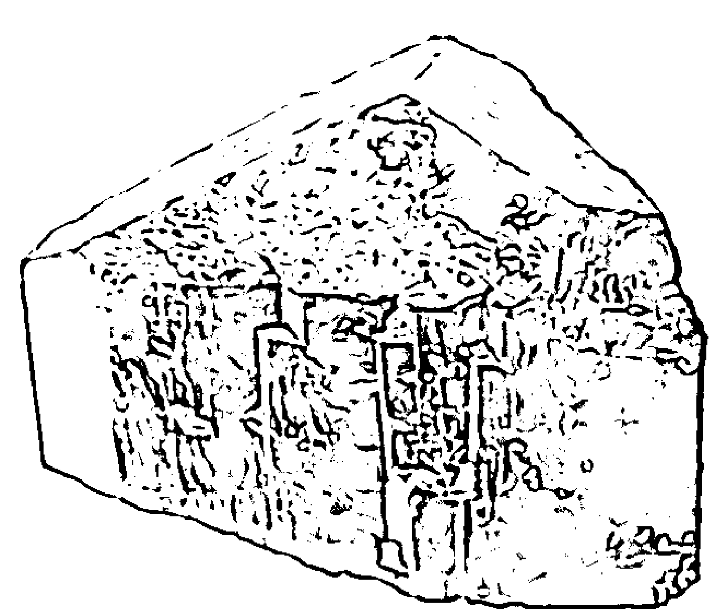

**改善情緒：**

能化解暴躁的性情、使人心平氣和。

**改善健康：**

由於黑碧璽對應海底輪，可將人體的氣導向下三輪，可強健腎臟、吸收病氣、治療不孕、幫助睡眠、據說對肝臟也有治療的效果。夜晚睡覺容易受驚的人，可把黑碧璽綁在腳上，有助將頭部的能量向下拉，平衡全身能量，使身體得到充分休息。

### 紫晶洞功效小貼士

**主要作用為穩定氣場：**

紫晶洞可凝聚家宅、辦公室的風水，而且能驅邪避凶，能量特佳，令四周之氣場穩定。

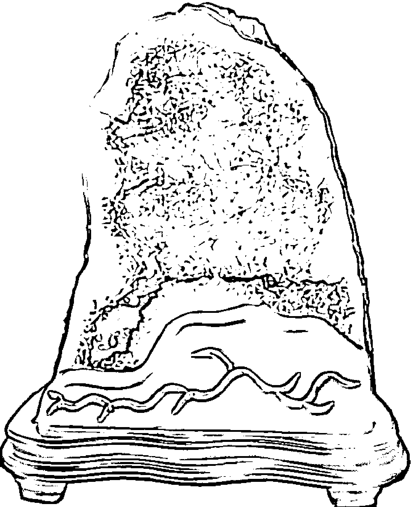

**改善財運：**

將紫晶洞擺在正財位上能集聚財，而且能延續賺錢的時間，更能長期保存所積累的財富，特別適合已經在賺錢，還想繼續賺錢的你。

**改善人際關係：**

職場上可以強化人際關係，使人與人之間和諧相處，另外還能穩定夫妻感情。

**改善學業運：**

對於在學的學生，在文昌位擺放紫晶洞，有助於考試運、升學、增進智慧及集中力，亦能獲貴人相助。

**淨化其他水晶：**

可以作為其他水晶、護身符、幸運符淨

### [CASE 4]
表達能力不好，怕容易得罪老闆、同事、客戶？

### 網友問題：

老師你好，
我由小至大的說話表達能力都不好，常常辭不達意，而且經常在不知不覺間得罪很多人，本來這個問題我一直也不以為意，但到了出來工作，才發現這個問題會引發很多不必要的麻煩，甚至隨時惹禍上身！
我第一、二份工時就是因為說話不好，得罪很多客，以致被老闆炒魷！想請問老師，有沒有能改善說話表達能力的水晶？

讀者 Sam

### 水晶公主答：

Sam 你好，感謝你的來信！
要改善說話表達能力，可以選擇配戴海藍寶。
由於海藍寶對應人體七輪中的喉輪，可提升個人的悟性，來幫助個人的表達能力、語言能力、領悟力。如果你的職業是需要不斷跟老闆、同事、客戶溝通，海藍寶能加強你的表達能力和說服力，有助提升你的事業。

### 海藍寶功效小貼士

#### 主要加強個人能力：

海藍寶對應人體七輪中的喉輪，可提升個人的悟性，來幫助個人的表達能力、語言能力、領悟力，因喉輪是精神力量與肉體力量的轉換站，能令人得到全面的進步。遇事容易退縮的人，常佩戴海藍寶石能堅定信心、增加自信。

#### 改善健康：

能保持喉部健康以及平衡淋巴系統，亦能改善呼吸系統毛病。

#### 改善情緒：

有效消除負能量，使人幸福、愉快。

### [CASE 5]
創業做小生意，如何增加生意額發大財？

### 網友問題：

老師你好，
我剛開了一間茶餐廳，做點小生意，但茶餐廳已經經營了近2個月，客人卻愈來愈少，無論我用盡甚麼方法都不能增加客源，老師，請問有甚麼方法解決？

讀者 李健華

### 水晶公主答：

李先生你好！感謝你的來信！
如果是經營生意，可以在公司或經營場地的財位擺放紫晶洞，幫你吸納財氣。
在茶餐廳的財位擺上一座紫晶洞可以有效改善場內的氣場及磁場環境，不但可以聚集人氣，更能聚集財氣，只要將紫晶洞擺放在財位，就可以延續賺錢的時間，更能長期保存所積累的財富，特別適合已經在賺錢，還想繼續賺錢的你。
同時，紫晶洞亦有利於領導統馭的水晶，可以讓部屬信服地為您賣命效勞，具有中國風水學裡「因貴得財」之意。而愈大的晶洞，其能量倍數增長，效果愈好。

### CASE 6
逢賭必輸，點先可以贏大錢？

### 網友問題：

老師你好，
我人稱黑仔明！
每次賭錢都一定輸到貼地，帶$500去輸足$2000，輸錢還可以接受，我最多不去賭，但我是黑到那種一出街會踩蕉皮、錢包經常不見，總之黑仔到你唔信的事都會發生在我身上，請問老師有沒有辦法解決我黑仔的問題？

讀者　天明

### 水晶公主答：

天明你好，謝謝你的來信！
建議你可以戴金髮晶和黑曜石。
如果要改善財運，可以佩戴金髮晶，因為金髮晶能增強財運、創造財富，能使人夢想成真，令人得享財富、家庭及人緣，使人得到完美的人生。
但依你的情況來看，除了財運外你亦應佩戴黑曜石，因為黑曜石辟邪化煞的靈性功能可以吸收個人的負能量，有助改善運氣。

### 金髮晶功效小貼士

主要功效為增強財運：

金髮晶有招財作用，因為黃色色光能吸引財氣、貴氣，象徵地位與財富集於一身，而金髮晶更能吸引正財及偏財。

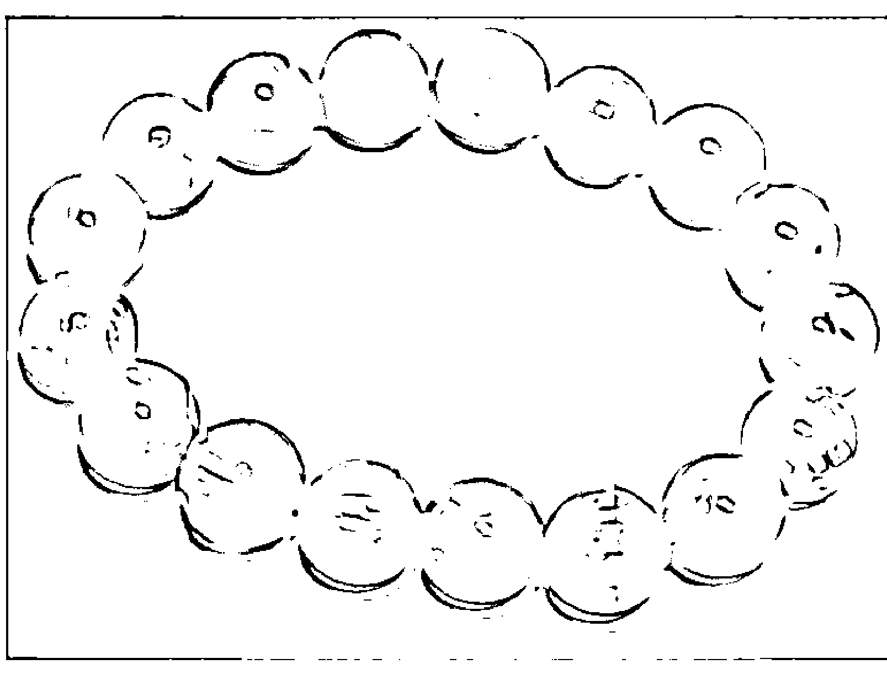

阻擋外來負能量：

有辟邪、化煞及作護身符之用，金髮晶辟邪化煞的靈性功能是為了阻擋外在負能量，能防止邪氣入體。

改善個人情緒：

對應人體七輪中之太陽輪，平衡太陽輪可使個人愉悅、活潑、鬆弛、有安全感、可以發揮天賦、有使命感並樂於接受挑戰。

增加個人能力：

能幫助缺乏行動力或優柔寡斷的人增加決斷力；可以加強個人自信心和勇氣；適合需要決策的領導人物或高層主管配戴，有利展現果斷機敏的領袖魅力；耳根子較軟的人可堅定自己立場。

### 黑曜石功效小貼士

主要功效為吸收負能量：

由於黑曜的精純能量，比較屬於吸納性能量，一般建議佩帶右手，根據古中國氣法是以左進右出為原則，所以左手都是進氣而右手是排氣，右手佩帶黑曜有助於將自身的負性能量給吸納掉，包括邪氣或者病氣，而且黑曜石極度辟邪，能強力化解負能量。

改善健康：

黑曜對應海底輪，能加強海底輪的能量，此外，佩帶黑曜石亦有助改善健康及失眠症。

平衡個人情緒：

可使人冷靜，得到靜心思考的能力，以開發大智慧中的組織力。

## 個案篇［五］：增強學業運

考試、讀書除了勤力之外，有時候也需要一些運氣，如何利用這些運氣達至最高成效，不妨用水晶來幫助。

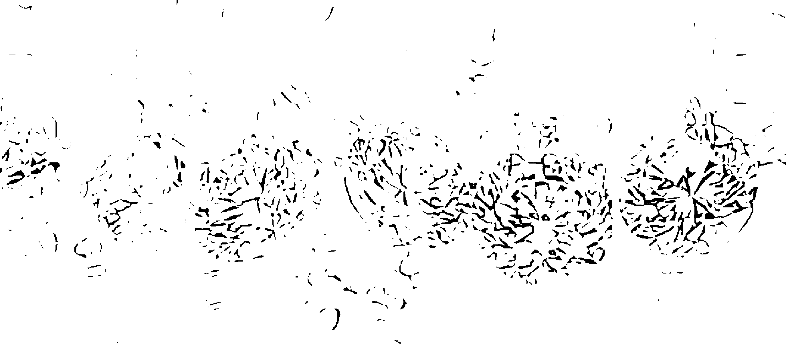

### CASE 1
專注力極差，讀書不入腦

### 網友問題：

老師你好，
我即將考公開考試，但不知道為什麼讀書總讀不入腦，在校內的考試成績也很差，但我次次都有讀書，而且是不分日夜那種，但好像付出和收穫不是成正比。我曾猜想是不是我讀書方法有問題，有人說過我專注力不足，所以即使溫習時間多長，我也不能溫入腦。
此外，我亦覺得我的記憶力不足，常常溫完書翌日就忘記課本內容。
想問一下老師，有什麼方法可以幫助學習？

讀者 Tommy

### 水晶公主答：

Tommy你好！感謝來信！
對於增強學習能力，白水晶是最佳的選擇。由於白水晶會產生持續、穩定的震盪，有貯存記憶的功能，所以在協助人的頭腦清晰、增強記憶力、理解力上，有顯著的幫助，幫助提高工作效率。
白水晶對應人體的頂輪，可以加強腦部安定及活動，刺激靈感，可以增加靈通能力、考試運。此外，能助你加強專注力和考試運。

### CASE 2
未溫晒書但即將考試，如何增強考試運？

### 網友問題：

老師你好，
因為我是高中生的緣故，參與了很多學校活動，既是學生會會長，又是中文學會，而且更兼當社職員，活動多到數唔晒，高中功課多到喊，根本沒有時間溫書，家人對我的成績已經非常不滿，請問老師有甚麼辦法可以增強我的考試運？

讀者 Vicky

### 水晶公主答：

Vicky你好！謝謝你的來信！
根據你的描述，我建議你可以戴茶晶。
茶晶可以幫助你冷靜分析考試題目，令人精神集中、思路清晰，對你的考試運有很大的幫助，尤其適合你這種時間不夠用的大忙人。
既要讀書又要費神舉辦學校活動，的確非常辛苦，而茶晶能助你在繁忙的工作中，理清思緒，在複雜的狀況中做出最有效率、最直接的反應與處理方式，令你在處理活動及讀書方面事半功倍。
因此你可以戴茶晶，幫助你度過一個美好的高中生活！

### CASE 3
記性差，有何方法提高記憶力助讀書？

### 網友問題：

老師你好，
中一入學時好彩入到一間名校，初時以為入讀名校可以全面強化自己的能力，但讀了幾年才知道名校的讀書壓力真是非一般人能忍受，每朝5點幾起床，下午3點放學後又連接住2個補習，直到晚上11點才回到家，做功課更做到凌晨兩點。
為了升讀大學，這些辛苦我都可以忍受，但我的記憶力卻一年比一年差，前一晚讀完的書，翌日就可以忘得一乾二淨，對我的學習造成非常大的影響！請問老師可否建議能提高記憶力的水晶？

讀者 Christy

### 水晶公主答：

Christy你好，謝謝你的來信！
如果是增強讀書能力，可以試戴紫龍晶。
由於紫龍晶對應頂輪，主開發智慧，能增強人的記憶力，對讀書、研究高深學問與知識有很大的幫助。紫龍晶更被公認為是最具有靈性的寶石！
此外，如果因為讀書而造成很大的壓力，紫龍晶亦能消除懼怕的心理，帶來信心和勇氣，使人克服障礙，更可促使心情放鬆，非常合適你！

### 紫龍晶功效小貼士

主要有利開發智慧：
紫龍晶被公認為最具靈性的寶石，由於它對應頂輪，主開發智慧，帶來靈感、創意，能消除思想上的迷思，助人看清事實真象。

改善讀書運：
有助讀書以及研究高深學問，能增強記憶力。由於有紫色光，因此與紫晶有相同功用，放於書桌可刺激腦力，加強專注力，有助讀書及考試。

改善健康：
能消除頭部疾病，可消除因工作過度疲勞及飲酒過度所致的肝臟毛病。

改善個人缺點：
能消除懼怕的心理，帶來勇氣、信心，帶給人一種外柔內剛的個性。對於太過固執、刻板的人們，則有軟化的作用，促使心情放鬆，打開胸懷，接受新的事物、觀念，不再墨守成規，還能豐富人的慈悲心和關懷心。

開發靈性：
由於紫龍晶對應眉輪及頂輪，用來貼近第三眼的額頭部位，可使人開發預知能力。

## 個案篇［六］：改善家宅風水

自入住新屋後，家宅不寧或是家人多病多痛？而且個人運勢更每況愈下，黑過墨斗？這便表示家宅的風水出現問題，運用水晶奇妙功效即可為你化解家宅問題！

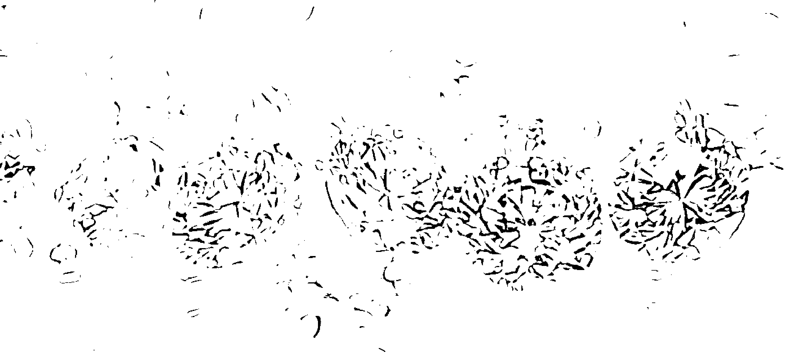

### CASE 1
家裡的人多病多痛，如何化解？

### 網友問題：

老師你好，
我搬了新屋已經接近3個月，自從搬入新屋後我們家的人也屢屢出現問題，先是我們的3歲仔得哮喘，頻頻出入醫院，然後發現我媽患上高血壓！這3個月來，我們一家進出醫院已經不下百次，近日更得悉我丈夫患上糖尿病！
我們也深感是家宅出現問題，我亦曾多次找師傅看風水，連驅鬼也試過！但情況都沒有好轉，我真是甚麼方法都試，從朋友間聽過老師的大名，特冒昧求教，希望老師能指點一下！

讀者 芬姨

### 水晶公主答：

芬姨你好！感謝你的來信！
如果家宅出現健康問題，可以選擇在家裡放置白晶簇，以改善家宅。
一般而言，白晶簇、紫晶洞以及聚寶盆我們通常都稱之為鎮宅三寶，其中白晶簇對家宅健康有很好的效用。
白晶，是白水晶在地底下、岩壁中形成並挖掘出來的最自然形態，成簇狀或片狀，水晶柱向外自然生長，形成一個非常旺盛的、強力的能量體，具有催化和阻絕不良沖煞能量流的作用。由於吸收了天地之精華，白晶簇能夠聚集能量，可避邪擋煞、鎮宅、去除病氣，趨吉開運。對於你們一家的健康有莫大的幫助。建議你可將白晶簇放在相關的大病位、小病位、破軍位等，可使氣流旺盛，保持家運平安。

### 白晶簇功效小貼士

**主要功效為鎮宅：**

白晶簇、紫晶洞以及聚寶盆我們通常都稱之為鎮宅三寶。如果家宅不安，可將白水晶簇放置在相關的衰氣位、死氣位，或是財位、丁位、文昌位等重要方位設計不良給當成廁所、倉庫或堆放雜物時，則可使氣流旺盛，提升家運、文昌運、財運。

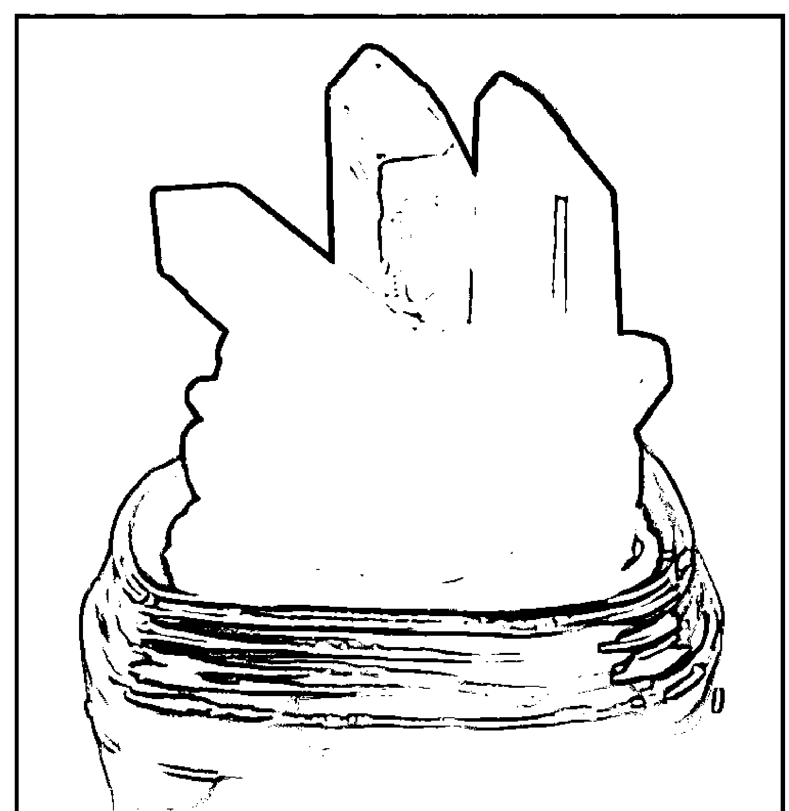

↑白晶簇

**消解負能量：**

擺放在沖煞位或其他適當位置，可以快速補充、增強個人的氣場能量，能對抗因為外在風水產生的負能量，一般只要將其白晶簇對住沖煞的來源方向即可。

**增加財運：**

住家、公司、商店想要增加財運的話，可以將白水晶簇放置在財位上，有催化財運的效果。

**為家電消磁：**

有效降低電器的輻射影響，保障人們的安全、健康。一般可放在電器上面或旁邊。

**淨化水晶：**

可為其他水晶淨化。

### CASE 2
與鄰居不和，如何加強鄰里關係？

### 網友問題：

老師你好，
我和男朋友最近搬了新居，雖然不算得上環境清幽，但勝在租金便宜，300多呎只要4千多，開頭我也是看在租平這一點才租，但想不到這裡的鄰居竟然這麼令人神憎鬼厭，不但每朝早上都在走廊燒元寶蠟燭香，弄得走廊滿是香灰不特止，他們更經常將垃圾堆到我們家面前！
本來我也想是不是我們得罪了他們而不自知，於是有一日便跟我男朋友帶同一些小禮物前往按他們門鈴打算向他們陪罪，但怎知道一開門一個中年婦人便對我們粗口橫飛，「砰」的一聲便關上門，我們雖然生氣，但也沒他們奈何，而之後他們也是依樣在早上燒元寶蠟燭香，依樣把垃圾堆到我們面前，即使之後我們找管理員、警察上來也沒有辦法！
老師，請問有甚麼方法可以令鄰里關係變得和洽？

讀者 Kinki

### 水晶公主答：

Kinki 你好，謝謝你的來信！
面對鄰里紛爭，可在家中客廳的中央位置擺放粉晶球或較大型的粉晶七星陣。粉晶有助改善人際關係，尤甚對於破敗的人際關係更有修補的作用，對你和你鄰居的關係有正面的影響，可以令你們友好相處。
至於為什麼要在客廳放置粉晶球或大型的粉晶七星陣，粉晶球由於體積較大的緣故，能量亦愈強，而粉晶七星陣亦起了引導能量的作用，兩者都能有效地將粉晶的能量擴散至全屋，加強家宅粉紅色光的氣場，有助加強人際關係的修補。因此，要修補和鄰居的關係，建議可用粉晶球及粉晶七星陣。

## 水晶靈擺占卜
助你預測未來吉凶

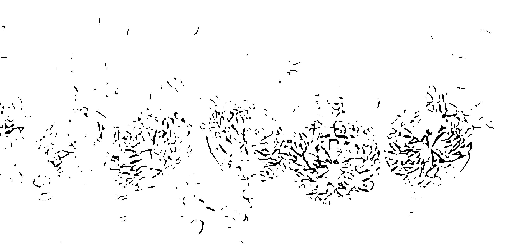

### 啟發自我潛意識
水晶靈擺占卜未來

你是否經常感到迷失方向？
你很迷惘，不知道自己真正的想法？
你經常做錯決定，令自己錯失機會？

靈擺是很古老也很實用的占卜方式，無論是用來找尋失物，問事占卜，了解內心真正想法，祈願祝福，探測人體及動植物健康，靈擺都大派用場。

靈擺測試，就是用手指拿著一條繩，繩子繫著一個水晶墜子，讓它搖擺顯示出一些動作，從中讀取某種訊息，用來解決生命中的問題。靈擺的奧妙，並不用牽涉鬼神，而是讓我們跟潛意識和深層自我溝通，正確使用靈擺有助我們作出適合自己的決定。

#### 1. 靈擺占卜前的準備

步驟一：購買水晶靈擺，一般水晶店即能購買水晶靈擺。

步驟二：新購得的水晶靈擺必須隨身攜帶 7 至 14 天，令水晶習慣自己的氣場，將自己的氣場和靈擺互相融合，才能令占卜準確。

步驟三：在占卜前要尋找一個清靜的環境，並使自己的心境保持平靜。

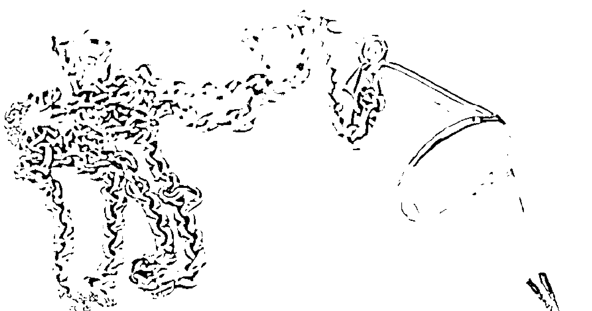

#### 2. 開始水晶靈擺占卜

步驟一
手持水晶靈擺，並將靈擺吊在半空。

步驟二
默念問題，問題需為是非題，例如「他是不是喜歡我？」或「我們會不會在一起？」等。

#### 3. 解讀占卜結果

人及所有生物是一個靈魂的器皿，散發出來的能量會形成一種能量氣流，也類似中國所謂的「氣」，也有人稱之為「磁場」、「能量場」、「以太層面」等等，而靈擺就是循着這能量的流動方向而旋轉，來探測人或事物的真實狀態。
靈擺會以旋轉方向顯示問題答案，以「他是不是喜歡我？」的問題為例，如果靈擺以順時針方向旋轉，則表示「他是喜歡我的。」
如果靈擺以逆時針方向旋轉，則表示「他不是喜歡我。」

靈擺以順時針方向旋轉：表示好的、是的、正面的、積極的
靈擺以逆時針方向旋轉：表示壞的、不是的、負面的、消極的

#### 4. 占卜禁忌

1. 忌質疑靈擺
如果你一開始就質疑靈擺占卜的準確性，靈擺的答案必定會受到影響，大大減低占卜的準確度。

2. 忌問題不夠清晰明顯
靈擺占卜一定要使用是非題作為問題，如「他是不是喜歡我？」。

如果問題太過複雜，例如「他到底不喜歡我甚麼？」或是「她比我好在哪裡？」，水晶靈擺便不能作出回答。

3. 忌情緒過於混亂

使用靈擺占卜一定要保持心境平靜，如果你的心情非常沮喪或激動，則會影響占卜的準確性。

4. 忌環境嘈雜

使用靈擺占卜一定要在清靜的環境進行，人才能啟動念力令靈擺擺動。如果在嘈雜不堪、人多車多的環境下進行靈擺占卜便會影響占卜的準確性。

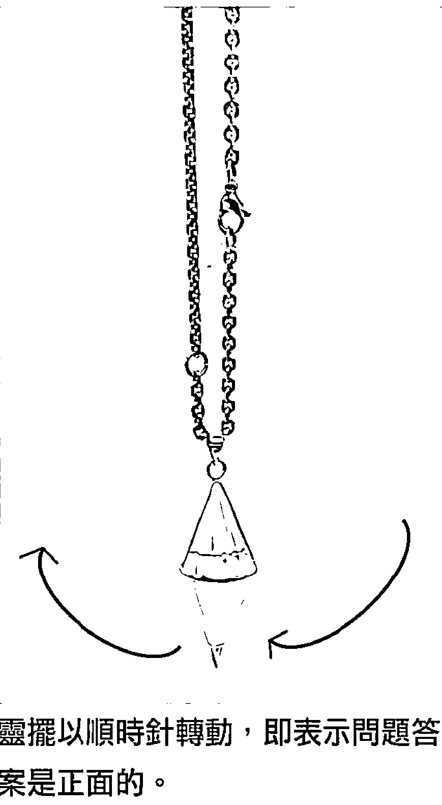

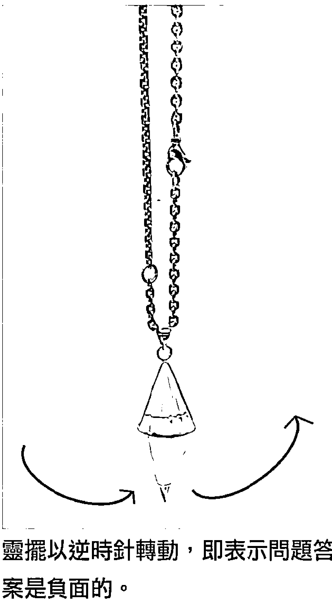

### 靈擺占卜
之神奇力量

靈擺是一種有久遠歷史的占卜方法，在最遠古的記錄可追溯到公元前 6000 年前的南阿爾及尼亞（非洲西北部）及亞特拉斯山脈，即使是在中國大禹的時代也有類似的記錄。

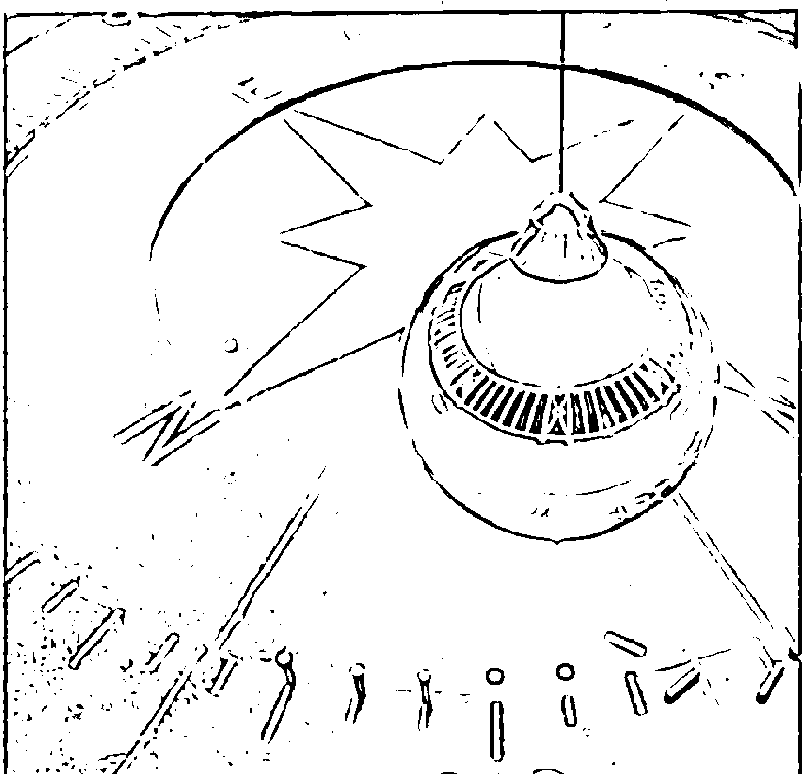

靈擺這種占卜方法曾經因為羅馬帝國的滅亡而埋葬，直到西元十一世紀中又再復活。

古時候，靈擺通常用 L 字形或 Y 字形的占卜杖或吊咀來作占卜或找尋想要的事物，例如尋人、尋物、水源、礦源等等，但由於靈擺的限制只能解答是非題，因此在分析事情上可能比不上塔羅牌及占星術等等，特別是形式上、思想上的事情。

靈擺占卜可以用不同物料來作靈擺，如金屬、木頭、石頭、戒指等，但我們最常使用水晶來作靈擺占卜。水晶靈擺是最常見的，多數切割為椎體，也有橢圓形的水晶靈擺。在西方神秘學上，天然形成的水晶因為在成長過程中吸收天地精華，能夠與人類的氣場互相呼應，再加上不同類型的水晶也有不同的功效，對應不同的問題準確性較高，因此大多數都會使用水晶作為靈擺占卜。

## 為你揭開水晶神秘面紗

很多人會產生疑惑，究理水晶是甚麼呢？水晶為什麼會出現呢？
究竟水晶蘊含了甚麼神秘力量，令人對它愛不釋手呢？以下將會
為你揭開水晶的神秘面紗。

### 遠古已經出現的水晶

#### 水晶＝二氧化矽？

水晶最主要的成份是二氧化矽（Sio2），而矽（Silica）也是組成地球地殼的最主要元素，成份佔整體金屬和礦物約 65% 以上。水晶的成份中還含有各種微量的金屬和礦物，正因為有各種微量的金屬和礦物，所以才會造成各種不同顏色的水晶。

水晶是天然生成的，遠在地球初始形成時代，地球地殼幾乎都是一種無水矽酸的化學物質，它是一種類似膠水黏稠狀的無色物質。在經過地殼高溫高壓下，使無水矽酸中的二氧化矽含量達到超飽和，在地殼冷卻之後，二氧化矽在附近的岩石結晶，便形成所謂「水晶」。

#### 水晶的生長環境

水晶的生長環境，多數位於地底下、岩洞中，而由於地下水多含有飽和的二氧化矽，所以豐富的地下水源成為水晶其中一個生長環境。同時生長環境需要在大氣壓力的 2 至 3 倍左右，溫度則需在 550 至 600℃之間，再給予適當時間，水晶就會依着六角晶系（Hexagonal System）的自然法則，結晶成六角錐柱的水晶。結晶完美的水晶通常會呈六棱柱狀，柱體為一頭尖或兩頭尖，當多條長柱體連結在一塊，通稱晶簇，美麗而壯觀。

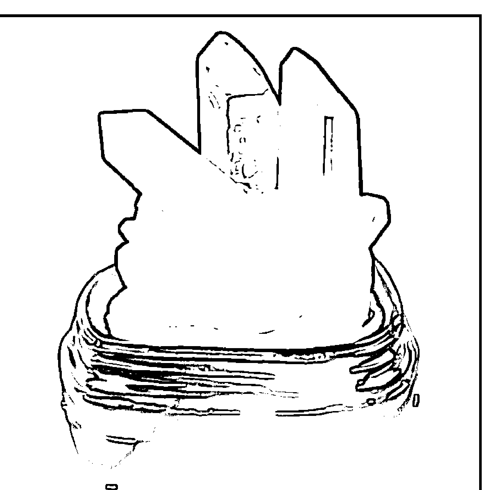

圖為六角錐柱的水晶，仔細一數，會發現水晶一共有六角，而且呈現為柱狀。

### 不同顏色形狀的水晶

大部分的水晶都是由白水晶形成的，但為甚麼水晶的顏色會如此繁多？原來，在水晶成長時如果混入了其他顏色的礦物，水晶的顏色就會隨著礦物的顏色而改變，例如黃水晶、紫水晶、粉晶等。

由於二氧化矽的結晶並不完整，因此水晶的形狀可謂千姿百態。水晶除了有我們常見的長柱狀外，更有寶劍形狀、雙錐狀。因此我們在選購水晶原石時亦可留意水晶的形狀，通常愈不規則的水晶，愈是天然開採而來的水晶原石。

### 令你意想不到的水晶家族

水晶成長時受到不同礦物、熱力或壓力影響，因而衍生了不同種類的水晶，可是水晶究竟有幾多類？立即為你揭曉神秘的水晶家族。

大致上水晶可分為三大類：顯晶族（Crystalline Varieties）、隱晶族（Cryptocrystalline Varieties）以及特別族（Special Varieties）。

顯晶族：明顯可以見到結晶形狀的水晶就是顯晶族，如白水晶、紫水晶、黃水晶、茶晶、粉晶、髮晶等等，這些水晶的原石都可以明顯見到一條條六角形水晶柱體。

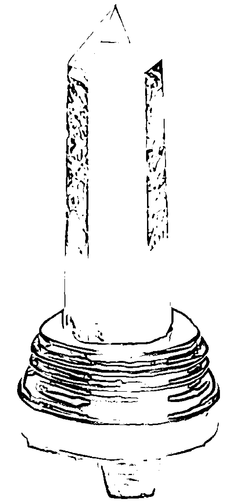

黃水晶柱

隱晶族：從外觀來看隱晶類的水晶原石，可以見到是一塊塊而不是成六角水晶簇狀，但隱晶族的水晶仍然屬於六方晶系的，這是因為它們的結晶體積非常細小，我們需要用顯微鏡的協助才能看到水晶呈現六角形結晶，如瑪瑙、碧玉、蛋白石等就是屬於隱晶族。

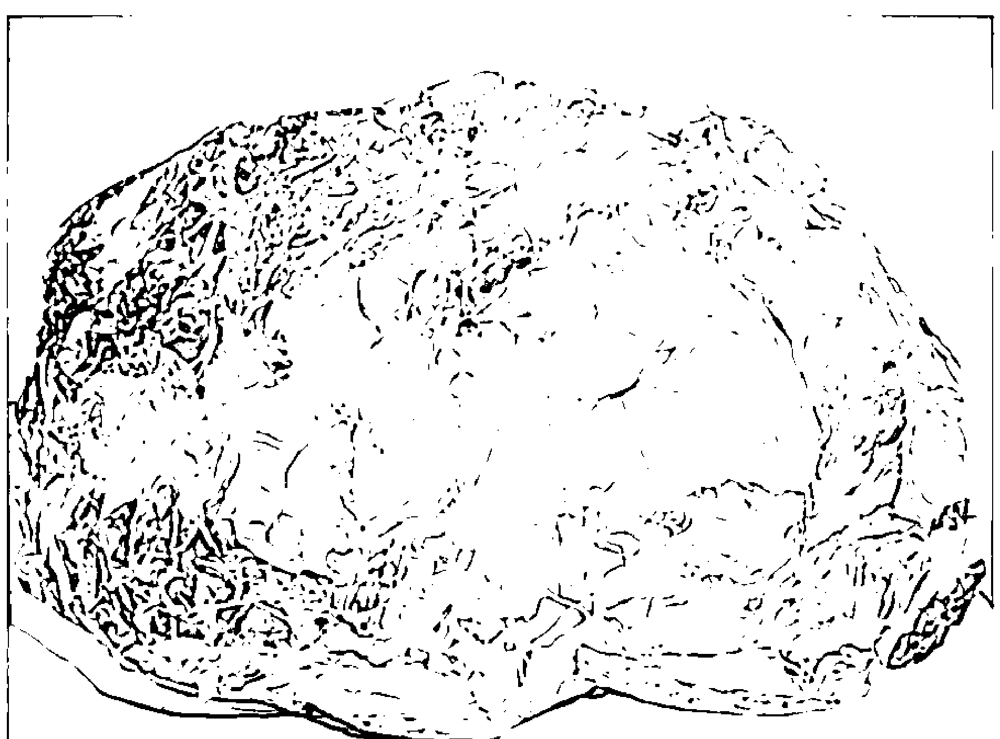

特別族：特別族的水晶和一般水晶分別很大，難以歸為顯晶類或隱晶類，因此結晶古怪的水晶如骨幹水晶（Skeleton Crystal）、水晶裡面有各種迷離幻境、風水、星雲的幻影水晶（Phantom Crystal）等皆歸納為此類，又如有複合顏色的紫黃晶（Ametrine），也是屬於特別族。

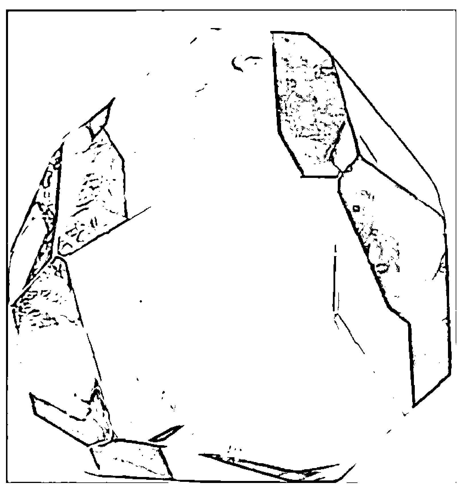

### 如何區分水晶的等級

別以為水晶只不過是不同顏色的石頭，高質量的水晶其實可以媲美價值連城的寶石，在寶石界中，亦有人將水晶判別為半寶石，可見水晶的價值並不是石頭如此簡單！可是要看水晶的質量，到底要以甚麼作標準呢？

#### 1. AA 級水晶：

行家俗稱 3A 級或全美級。這類水晶的裡外皆透明無瑕，完全沒有冰裂或雲霧，表面也沒有人工琢磨時所造成的傷痕。
AA 級的水晶產量非常稀少，水晶的體積愈大，它的價格亦愈貴，例如一顆直徑 7cm 大的水晶球跟 10cm 大的水晶球之間的價格就相差 10 倍之多。

#### 2. A- 級水晶：

行家俗稱 2A 級，比 AA 級水晶低一級。A- 級的水晶會出現細微的瑕疵，所以如有不超過 2 至 3 cm 的雲霧狀或綿絮狀的天然內含物。A- 級的水晶雖然價格比 AA 級便宜得多，但它在一般水晶的市場的價格仍然非常高。

#### 3. A 級水晶：

A 級水晶又比 A- 級的水晶低一級，如果水晶有輕微瑕疵、人為撞擊的表面傷痕、內含較大面積的雲霧狀或棉絮物等其他礦物就是 A 級水晶，我們用肉眼便能看得見瑕疵。A 級水晶在市場有較多的供應，它的價格也相對地便宜。

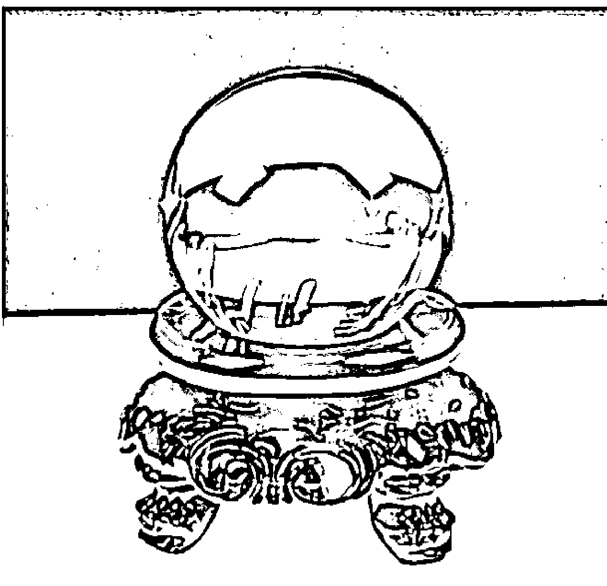

#### 4. AB 級水晶：

AB 級水晶比 A 級水晶低一級，有明顯的內含物，如一大片的雲霧狀、棉絮物，或內部有小面積的冰裂、明顯的人為撞擊傷痕等，如果水晶沒有明顯的大型冰裂痕，價格仍屬中價位。不過市場上一些商人會把 AB 級水晶的價格抬高，魚目混珠當作 A 級售賣，大家選購時應小心留意。

#### 5. B 級水晶：

B 級水晶比 AB 級水晶再要低一級。只要水晶有接近一半以上的面積都呈現雲霧狀、棉絮物，或有明顯的大面積冰裂即為 B 級水晶，由於數量很多，故售價便宜。

#### 6. C 級水晶：

C 級水晶是水晶級別中最低級的水晶，只要水晶整體大部分呈現棉絮狀的半透明或不透明狀，或者有非常大面積的冰裂痕，就是 C 級水晶。行外人很容易會將 C 級水晶與 B 級水晶混淆，兩者在市面上的數量非常多，售價亦非常便宜。

### 水晶神秘力量之謎

有人會很好奇水晶愛好者對於水晶為甚麼會有着異常的偏愛，正正因為他們感受不到水晶強大的神秘力量，才會不理解，他們甚至會認為水晶愛好者只是因為迷信才會信奉水晶的力量。

但其實，水晶的力量已經有套完整的理論衍生出來。我們常會聽見人體七輪，只要利用水晶的震動頻率來與身體的七個脈輪做能量的契合與補強，水晶可以將更多的生命力傳導人身體中，並將負面能量排放出去。要知道水晶如何能協助我們夢想成真，我們首要知道甚麼是「人體七輪」。

### 人體七輪達致和諧就能令夢想成真？

「脈輪」(Chakara) 一詞源自古印度梵文，意思是指能量中心。除印度外，古猶太教、北美印地安人、南美馬雅及印加文化，都有類似說法或文字記載，他們認為人體是一個發光體，這個發光體是由七個脈輪相互串連而發出七彩的光芒，而且人類可以和宇宙的能量相互流動，從而形成一個特殊的能量場，叫做發光能量場。

人體這七個脈輪位於體內的脊柱前方，由下而上依秩序排列，由海底輪、臍輪、太陽輪、心輪、喉輪、眉心輪到達頂輪，七個脈輪相互連接，形成了一條線，稱為「人體中脈」。

每個脈輪都對應不同的顏色²、器官或腺體。這些脈輪如果都能夠運作順暢，而且能和諧一致的話，那麼吸收的能量就能在脊柱裡自由順暢地流動與運轉，並遍及全身的神經系統，使人體得到一種健康、和平與幸福的感受。

註 2：人體七輪分別會發出不同顏色的光芒，如頂輪會發出紫色光及白色光、眉心輪會發出紫色光及靛色光等。有一種叫「氣場分析儀」（aura spectro-photo-meter）的特殊機器，可以真實地捕捉到人體散發出來的色光，只要知道自己所欠缺的色光，再以對應的色光加以配合，就能使七輪互相融和。

### 脈輪順暢流動可平衡人體能量

所謂「脈輪」，人一出生便從擁有從宇宙帶來的能量，就好像流水一樣永不靜止地活動，因此人隨時都有能量，問題在於能量能不能平衡分配至各脈輪。

人體的能量是以脈波來傳送，如果脈波通暢，可以使人體自主神經系統順暢地傳送能量，只要能順暢地傳送能量，內分泌自然平衡，亦可使各器官運作正常；但如果脈輪阻塞不能傳送能量，則會影響自主神經系統的運作，引發身體器官出現毛病及情緒失衡，輕則手腳麻痺、便秘腹瀉，重則引起疾病、癌症或其他免疫系統的問題。

### 治療脈輪能平衡身心

近年來醫學界提出，壓力是造成癌症最重要的原因之一。只要我們理順好脈輪，就可以運用廣大宇宙能量來消除身心壓力，增強身體免疫力。

### 水晶能協助脈輪運作順暢

我們如何才能治療人體脈輪？佩戴水晶是不二法門，它能協助人體七輪運作順暢以及和諧一致。

有些科學家認為水晶有生物的某些特徵，它們能自行形成有機體，可以自行繁殖，同時它們承載並接受著大量資訊，亦能傳送能量，因此依據人體七輪對應的顏色，我們利用各種顏色的水晶可以治療疾病、改善情緒，甚至令人夢想成真。

利用水晶的震動頻率，可與身體的各個脈輪做能量的契合與補強，水晶可以將更多的生命力傳導人身體中，並將負面能量排放出去。震動頻率傳送的速度以及震幅的程度都會依許多因素而定，包括水晶的大小、形狀、顏色，甚至被人對待的方式及使用水晶時的意圖。

因此，如何選擇水晶、對待水晶亦甚為講究，這些都會影響治療脈輪的效用。但只要有效地利用水晶，即能平衡我們人體各個脈輪的能量，要夢想成真不再是難事！

### 對應人體七輪的水晶

#### 1. 頂輪

頂輪在人的最頂部，是集中力的來源，能控制其他六個輪位之能量。平衡頂輪的量，能加強抵抗力，保持身體健康。

**主宰器官**：主大小腦、腦下腺體、中央神經系統、右眼、松果腺體（「第三隻眼」）

**脈輪色光**：紫色光、白色光

**對應水晶**：紫水晶、紫色舒俱來石、紫龍晶、白水晶、白幽靈等

**作用**：

- ◆身體方面：可控制身體機能平衡、身體淋巴系統運作正常、加強免疫力和抵抗力、活化腦部、舒緩頭痛。
- ◆個人能力方面：可以令精神集中、增強記憶力，並提高腦筋的靈活力，能穩定情緒、具主導性、使人處變不驚、臨危不亂、增強管理才能。

##### 頂輪能量過盛的徵狀

- ◆身體方面：出現嚴重的偏頭痛、導致精神疲勞
- ◆個人能力方面：想法過份理想、凡事複雜化、自以為是、一意孤行、自我中心、造成個性極端的沮喪，並因無法面對不斷的挫折感，時而瘋狂時而壓抑，引致嚴重的精神病。
- ◆平衡頂輪能量過盛色光：黃色光
- ◆主治水晶：黃水晶、黃玉、黃碧璽、琥珀等

例如，如果發現自己自以為是，常常一意孤行，即表示頂輪能量過盛，這時便要平衡頂輪的能量，只要使用黃色光的水晶如黃水晶等，便可以平衡頂輪過盛的能量。

##### 頂輪能量不足的徵狀：

- ◆身體方面：偏頭痛、出現黑眼圈、容易禿頭或是有頭皮屑、免疫能力減低、易感染傳染病、出現癲癇與癡呆等問題
- ◆個人能力方面：覺得人生是黑白的、覺得生活毫無樂趣、麻木不仁、容易緊張、面對抉擇時遲遲無法作出決定
- ◆平衡頂輪能量不足色光：紫色光
- ◆主治水晶：紫水晶、紫色舒俱來石、紫龍晶、白水晶、白幽靈

例如，如果覺得自己太過容易緊張，而且難以作出決定，即表示頂輪能量不足，這時便要使用紫色光的水晶如紫水晶等來加強頂輪的能量。

#### 2. 眉心輪

眉心輪在兩眉之間，位於腦的正中，它控制著腦下垂體，掌管洞察力和遠瞻能力，能加強創造和思考能力、記憶力、開放第三眼能力。

**主宰器官**：小腦、眼、鼻、耳、腦下垂體

**脈輪色光**：紫色光、靛色光（藍與紫之間的色系）

**對應水晶**：紫水晶、紫龍晶、紫玉髓、紫色舒俱來石、藍玉髓、青金石等

**作用**：
- ◆身體方面：增強眼、鼻、耳、腦部健康，提高睡眠品質
- ◆個人能力方面：眉心輪暢通時，思考客觀、具備洞察力、領導力、預知力、通靈能力。

**眉心輪能量過盛的徵狀**：
- ◆身體方面：容易便秘、肌肉經常抽筋、沒有活力、女性不易受孕，而男性則有腎虧的現象。即使女性懷孕生子後也會出現乳汁分泌不足的情況。
- ◆個人能力方面：偏執、自私自大、佔有慾強、喜歡掌控一切、任意操縱他人、要求完全的服從。
- ◆平衡眉心輪能量過盛色光：橙色光
- ◆主治水晶：虎眼石、紅玉髓、紅髮晶、橘紅瑪瑙、橘紅色碧璽等

例如，如果發現自己喜歡任意操控他人，即表示眉心輪能量過盛，這時只要使用橙色光的水晶如紅髮晶，即可平衡眉心輪的能量。

##### 眉心輪能量不足的徵狀：

- ◆身體方面：身體常有疼痛甚至麻痺的感覺、容易腹瀉、有腸道功能障礙、容易操勞過度
- ◆個人能力方面：個性懦弱、優柔寡斷、對自己要求不高、毫無紀律、過於在乎別人的眼光而害怕失敗
- ◆平衡眉心輪能量不足色光：紫色光、靛色光
- ◆主治水晶：紫水晶、紫龍晶、紫玉髓、紫色舒俱來石、藍玉髓、青金石等

例如，如果發現自己優柔寡斷，即表示眉心輪的能量不足，這時只要使用紫色光的水晶如紫水晶等，即可增強眉心輪的能量。

#### 3. 喉輪：

喉輪位於頸部，喉嚨中心部位，是人體與頭部的交通要道，所有氧氣、血液的輸送，都是透過喉輪的作用，就連講話、溝通等等，也是由喉輪來掌管。

**主宰器官**：喉嚨、神經系統、耳朵、肌肉、甲狀腺

**脈輪色光**：藍色光

**對應水晶**：藍玉髓、海藍寶、青金石等

**作用**：
- ◆身體方面：令喉嚨、神經系統、甲狀腺等健康
- ◆個人能力方面：令人冷靜、容易集中思考、加強分析力，掌管小腦記憶、學習、模仿、邏輯分析及表達能力。

**喉輪能量過盛的徵狀**：
- ◆身體方面：肌肉繃緊、緊張不安、經常感冒、血液循環不良、手腳冰冷，或經常出現麻痺的情況
- ◆個人能力方面：自我中心、自以為是、有自大的傾向、獨行獨斷、有異常的嗜好、愛發表高論
- ◆平衡喉輪能量過盛色光：紅色光
- ◆主治水晶：石榴石、煙晶、黑色碧璽、黑曜石、紅碧玉等

例如，如果發現自己過於自我中心，即表示喉輪能量過盛，這時便要使用紅色光如煙晶等，以平衡喉輪過盛的能量。

##### 喉輪能量不足的徵狀：

- ◆身體方面：容易罹患甲狀腺機能亢進（俗稱大頸泡）、喉嚨發炎或疼痛、情緒容易激動、過度活躍、有高血壓傾向、面部潮紅。
- ◆個人能力方面：會變得安靜、害羞、腆覥、喜歡躲在角落退縮不前、不愛對人坦白、不愛表達自己的想法、喜好暗中操縱他人、猜疑心重
- ◆平衡喉輪能量不足色光：藍色光
- ◆主治水晶：藍玉髓、海藍寶、青金石等

例如，如果發現自己不愛表達自己的想法或是表達能力差，即表示喉輪能量不足，這時便要使用藍色光的水晶如海藍寶，來增強喉輪的能量。

#### 4. 心輪：

位於心臟中心部位，是最重要的能量中心，掌管著上下各三個脈輪的平衡。心輪能將它的強力能量，傳送至所有的脈輪。

**主宰器官**：心、肺、免疫系統

**脈輪色光**：綠色光、粉紅色光

**對應水晶**：粉晶、紅紋、綠幽靈、綠髮晶、綠碧璽、西瓜碧璽等

**作用**：
- ◆身體方面：能增強身體的能量、改善氣喘、高血壓，以及心肺疾病及呼吸道問題、能夠強化血液循環、調節內分泌系統、使人放鬆鎮定及平衡不安的情緒。
- ◆個人能力方面：能使身心平衡、思想正面積極，能欣賞他人的優點。有善心、愛幫助別人、為人友善且擅交際、不會感情用事，能保持理性，分辨是非。

**心輪能量過盛的徵狀**：
- ◆身體方面：容易造成肩膀及頸部緊繃、胸悶
- ◆個人能力方面：對事情十分挑剔，而且近乎吹毛求疵的地步、個性陰晴不定，讓人難以捉摸、忽而狂妄忽而抑鬱、說話誇大、喜歡用金錢控制他人。
- ◆平衡心輪能量過盛色光：無
- ◆主治水晶：無，只能減少佩帶綠色光或粉紅色光的晶石，如粉晶、紅紋、綠幽靈、綠髮晶、綠碧璽等

例如，如果發現自己對事情近乎吹毛求疵，即表示心輪能量過盛，這時便要減少佩帶綠色光或粉紅色光的晶石及物品，以平衡心輪過盛的能量。

##### 心輪能量不足的徵狀：

- ◆身體方面：心痛、心悸、易患有心臟病、肺部及呼吸系統的疾病，常會感到身體衰弱、有時會有呼吸急促或呼吸困難的現象
- ◆個人能力方面：容易沮喪緊張、覺得嚴重缺乏被愛、自怨自艾、優柔寡斷、害怕別離
- ◆平衡心輪能量不足色光：綠色光、粉紅色光
- ◆主治水晶：粉晶、紅紋、綠幽靈、綠髮晶、綠碧璽

例如，如果發現自己容易沮喪緊張，覺得自己缺乏被愛，即表示心輪能量不足，這時便要使用綠色光或粉紅色光的晶石如粉晶等來加強心輪的能量。

#### 5. 太陽輪

位於橫膈膜下方肚臍以上的地方，掌管自我意識，理性面及意志力。

**主宰器官**：胃、十二指腸、肝、膽、胰臟、橫膈膜

**脈輪色光**：黃色

**對應水晶**：黃水晶、黃髮晶、黃玉、黃碧璽、琥珀等

**作用**：
- ◆身體方面：太陽輪掌管身體大部分器官，包括消化器官的健康。
- ◆個人能力方面：活潑開朗、能為四周帶來愉悅的氣氛、有強烈的使命感、懂得尊重別人、善於發揮自己的天賦、喜歡嘗試新的事物。

**太陽輪能量過盛的徵狀**：
- ◆身體方面：身體燥熱、偏頭痛、有黑眼圈、容易禿頭或是有頭皮屑
- ◆個人能力方面：痛恨權威、拒絕管束、自我要求極高、完美主義者，是一個工作狂。另外常有因自卑而產生的自大、自尊心強、喜歡批判他人
- ◆平衡太陽輪能量過盛色光：紫色光
- ◆主治水晶：紫水晶、紫龍晶、紫玉髓、紫色舒俱來石等

例如，如果發現自己自我要求太高，即表示太陽輪能量過盛，這時便要使用紫色光的水晶如紫水晶等來平衡太陽輪的能量。

##### 太陽輪能量不足的徵狀：

- ◆身體方面：容易消化不良、食物過敏、甲狀腺機能退化、腦力與神經感到疲勞、呼吸不順暢
- ◆個人能力方面：容易沮喪、害怕孤單、對自己沒信心、過份在乎別人對自己的看法
- ◆平衡太陽輪能量不足色光：黃色光
- ◆主治水晶：黃水晶、黃髮晶、黃玉、黃碧璽、琥珀

例如，如果覺得自己十分害怕孤單，而且太過在意別人對自己的看法，即表示太陽輪能量不足，這時便要使用黃色光的水晶如黃水晶等來加強太陽輪的能量。

#### 6. 臍輪

臍輪位於肚臍以下三英吋，掌管身體器官的功能，亦影響我們身體能量的供應。

**對應器官**：子宮、卵巢、男性精囊的生殖器官

**脈輪色光**：橙色光

**對應水晶**：虎眼石、紅玉髓、紅髮晶、紅瑪瑙、紅色碧璽等

**作用**：
- ◆身體方面：有助性功能運作正常
- ◆個人能力方面：非常友善樂觀、熱愛交朋友、樂於關心他人、有歸屬感、具備創造力與想像力、說話幽默、直覺強烈、感覺敏銳、可以幫人分析事理解決問題

**臍輪能量過盛的徵狀**：
- ◆身體方面：容易腹瀉、過度操勞
- ◆個人能力方面：好勇鬥狠、喜歡操控他人、有野心、喜愛幻想、過分放縱慾望
- ◆平衡臍輪能量過盛色光：紫色光、靛色光
- ◆主治水晶：紫水晶、紫龍晶、紫玉髓、紫色舒俱來石、藍玉髓、青金石等

例如，如果發現自己太過好勇鬥狠，即表示臍輪能量過盛，這時便要使用紫色光的水晶如紫水晶來平衡臍輪過盛的能量。

##### 臍輪能量不足的徵狀：

- ◆身體方面：容易便秘、經常抽筋、沒有活力、女性不易受孕、男性有腎虧的現象
- ◆個人能力方面：個性過於敏感、容易疑神疑鬼、個性畏縮不前、不願表達情感、自我否定、多疑、憤世嫉俗、自怨自艾、常覺得有罪惡感
- ◆平衡臍輪能量不足色光：橙色光
- ◆主治水晶：虎眼石、紅玉髓、紅髮晶、紅瑪瑙、紅色碧璽等

例如，如果發現自己容易疑神疑鬼，而且常常自我否定，即表示臍輪能量不足，這時便要使用橙色光的水晶如虎眼石，來加強臍輪的能量。

#### 7. 海底輪

海底輪位於生殖器與肛門之間，是七輪中最下方的輪脈，同時也是最重要的輪脈。它是人體整個能量系統的根，所有的能量都經由海底輪出發。

**主宰器官**：脊髓、血液、神經系統、小腸、膀胱、肛門、男性生殖器官、女性生殖器官

**脈輪色光**：紅色光、黑色光

**對應水晶**：石榴石、茶晶、黑色碧璽、黑曜石、紅碧玉等

**作用**：
- ◆身體方面：能使身體健康有活力，肉體能量充足
- ◆個人能力方面：注意力集中、信任他人，心思細膩

**海底輪能量過盛的徵狀**：
- ◆身體方面：情緒容易激動、有高血壓問題、易患有牙周病
- ◆個人能力方面：自我中心、囂張貪婪、沉溺物慾
- ◆平衡海底輪能量過盛色光：藍色光
- ◆主治水晶：藍玉髓、海藍寶、青金石等

例如，如果發現自己經常沉溺物慾，即表示海底輪能量過盛，這時便要使用藍色光的水晶如海藍寶等來平衡海底輪過盛的能量。

##### 海底輪能量不足的徵狀：

- ◆身體方面：身體虛弱沒有活力、有貧血或低血壓的現象、血液循環不良、手腳冰冷、消化不良、女性生理期時有經痛的現象
- ◆個人能力方面：缺乏自信、容易緊張與恐懼、無法堅定並達成既定的目標，有自殺傾向
- ◆平衡海底輪能量不足色光：紅色光、黑色光
- ◆主治水晶：石榴石、茶晶、黑色碧璽、黑曜石、紅碧玉等

例如，如果發現自己經常無法堅定地達成目標，即表示海底輪能量不足，這時便要使用紅色光的水晶如茶晶來加強海底輪的能量。

### 晶之堡

香港九龍，響達，無華街，金易，一號鋪
電話：2623 6330 專賣
營業時間：星期一至星期日，上午11時至晚上9時

天然水晶、翡翠玉器、足金首飾、純銀飾物
珍珠鑽石、蜜蠟天珠、天鐵隕石、木刻銅器
茶具滾球、不鏽鋼鍊、泰國佛飾、名香佛具

各類手鍊、手鈪、腳鍊、頸鍊、耳環、戒子、吊咀

風水命理、紫微斗數、安神開光、流年八字
和合姻緣、擇日改名、驅邪靈符、玄空飛星
泰國佛牌鑲嵌、玉器首飾鑲嵌、風水用品總匯

### 李居士 (主理)

| 水晶簇可淨化水晶飾物 | 虎眼石可助人儲蓄財富 | 金髮晶助財富及事業 | 綠幽靈水晶加強事業及財運 |
|---|---|---|---|
| 水晶簇可淨化水晶飾物 | 紫水晶手環增強智慧及愛情 | 紅髮晶防是非及口舌 | 碧璽手鍊可全面提升健康 |

憑券到《晶之堡》惠顧任何水晶及風水用品，即可享：

### 85折優惠