# 最實用的圖解水晶治療書

# 水晶療癒

與天然晶石合作，身心靈康癒不求人

海瑟·芮芳 Hazel Raven — 著
鄭婷玫 Roshani — 譯

Ideal Health

# 【皇家圣学院】

※ 塔罗 / 占星 / 八字 / 风水 / 七政 / 茶道 / 芳疗 / 专业培训机构

※ 官方微博：@皇家圣学院（http://weibo.com/strc2011）

※ 官方淘宝：http://strc.taobao.com

※ 官方小站：http://site.douban.com/154927/

※ 官方微信公众平台：皇家圣学院（微信号：strc2011）

# 水晶療癒

與天然晶石合作。身心靈療癒不求人

海瑟·芮芳 Hazel Raven — 著
鄭婷玫 Roshani — 譯

# 敬告讀者

本書並不打算取代個人的醫療建議。

所有健康事宜，讀者應該向專業醫師諮詢，

尤其是任何需要診斷或是醫療檢查的症狀。

# 目錄

# 介紹

- 水晶的形成 8
- 水晶的物質特性 9
- 水晶的形態 10
- 挑選水晶 11
- 水晶的淨化 13
- 寶石精華液 14
- 精微能量體 16
- 內分泌系統 20

# 第一部 水晶療癒你的身體

- 水晶與你的身體 24
- 頭痛 26
- 鼻竇炎 28
- 感冒與流行性感冒 30
- 呼吸問題 31
- 免疫系統退化 32
- 過敏 34
- 心臟疾病 35
- 血液功能失調 36
- 血壓問題 38
- 糖尿病 39
- 排毒功能 40
- 消化不良 42
- 膀胱問題 44
- 背部問題 46
- 神經系統問題 47
- 疼痛 48
- 關節炎 50
- 皮膚困擾 52
- 橘皮組織 54
- 酵母菌感染 55
- 性功能失調 56
- 不孕症 57
- 經前症候群 58
- 更年期 60
- 骨質疏鬆症 62
- 體重問題 63
- 老化 64
- 疲勞 66
- 睡眠障礙（失眠） 68

# 第二部 水晶平衡你的情緒

- 水晶與你的情緒 72
- 憂鬱症 76
- 喪失親友之痛 78
- 害羞膽怯 79
- 驚嚇 80
- 悲觀 82
- 絕望 83
- 冷漠 84
- 被遺棄感 86
- 孤獨寂寞 87
- 虐待 88
- 愛的匱乏 89
- 不確定感 90
- 焦慮 92
- 創傷 94
- 挫折 95
- 罪惡感 96
- 憂慮 98
- 精疲力竭 99
- 深深的無助感 100
- 困惑 102
- 憤怒 103
- 過動症 104
- 占有與控制慾 105
- 傲慢自大 106
- 專制獨斷的態度 108
- 受害者心態 109
- 急躁 110
- 完美主義 112
- 成癮 113

# 第三部 水晶提升你的靈性

- 水晶與你的靈性 116
- 平衡氣場 118
- 脈輪平衡 120
- 脈輪治療 122
- 經絡平衡 124
- 五大元素平衡 126
- 遠距治療 128
- 淨化空間 130
- 去除附著的靈體 132
- 切斷附著與束縛 134
- 內在孩童治療 136
- 痙毒 138
- 恐懼症 140
- 靈魂的失落 142
- 與天使界連結 144
- 宇宙意識的開展 146
- 開發你的直覺 148
- 自我保護 150
- 靈性開發 151
- 靜心 152
- 提升接受性 154
- 調和陰與陽 155

# 介紹

水晶被運用在作為裝飾品、身上的佩戴飾物、治療、保護、魔法與在宗教儀式中，已有數千年之久的歷史。水晶是自然界中最具有組織性與穩定性的物質實體樣本，就其本身而言，它們代表著最低度的亂度（無序性）的可能性狀態。

所有的水晶結晶結構，是由原子以數理上精確及有秩序的三度空間排列而形成的。這即是水晶晶格，賦予了一個高程度的穩定性，也為水晶帶來其獨特的色彩、硬度，及物理、幾何、能量特性。水晶礦石擁有驚人的容量，以其聰慧的穩定能量場形體，去吸收、反射與散放光芒，來增加人類肉體與精微能量場的生命能量流動。藉由同調性與集中的方式，將這穩定的能量或水晶的共振運用在功能失調的能量系統上，即能整體性的恢復穩定與平衡狀態，緩解疾病不適的情形，帶來重建與整合。

## 佩戴水晶

- 在傳統中，寶石被佩戴在手指上，象徵權威、神聖或合一，或運用來傳遞具有特殊益處的能量到身體的特定部位。
- 古文明統治者頭頂鑲嵌寶石的王冠，以顯示他們的重要性。
- 將水晶佩戴在手腕或手臂，能影響與作用在你所佩戴的該側邊身體。
- 將水晶佩戴在沿著脖子周圍及易於展露水晶的位置上，讓太陽光束能貫穿礦石，因而激發礦石，釋放出有益的能量至肉體與精微能量體。
- 傳統的穿耳洞術始於古代的風俗習慣，在當時戴耳環是為保護耳朵免於受到鬼魂的侵擾。有些耳朵的裝飾品經常被用來作為護身符，當你敞開身體時，保護你免於受到危險的惡靈侵襲。耳環也用來平衡左右腦半球體，並作用在耳朵的指壓穴點上。
- 紅寶石被佩戴在肚皮舞者的肚臍上，以挑起熱情。這種習俗風氣正再度復甦中，展現在現今流行的人體穿刺首飾上。

## 古文明智慧

人類永遠追尋著美化自身的方法。隨身攜帶水晶作為保護的護身符，或作為珠寶飾品佩戴，是利用水晶的天賦潛能最簡單的方式。已有證據顯示，使用礦物寶石作為飾品的歷史，如同舊石器時代般久遠。

或許第一部水晶治療的文獻是出自於古埃及人之手，他們詳述使用寶石的細節，例如將孔雀石用來治療與保護，也運用青金石、紅玉髓與利比亞沙漠玻璃（或稱金黃玻隕石，Golden Tektite）。印加人使用祖母綠，阿茲特克人使用黑曜石，中國人使用玉石，西藏人與印第安人皆使用綠松石。居爾特人將煙水晶、孔雀石、琥珀、頁岩、黑玉使用於裝飾上。

我們仍可取得印度次大陸的阿育吠陀（Ayurvedic，印度古醫療法）與密宗學者所撰寫的書面知識，他們認識寶石驚人的潛能。在印度吠陀占星學（吠陀經是印度哲學的主要來源）上記載，寶石如紅寶、祖母綠、鑽石、藍寶與黃寶石，能藉由物理化學及電氣化學的方法運作。它們可作為處方內容，當作首飾佩戴或口服用的膏劑或氧化物，去影響生物磁能的保護場（氣場），同時透過神經、淋巴及經絡系統（詳第19頁）來運作。

## 何謂疾病

- ◆ 主流（正統）醫療：對於疾病的認定，是經由檢測所呈現的症狀，來診斷為某種固定名稱的疾病。通常假設疾病具有可辨識的形成因素，例如感染、傷害與身體化學成分的失衡。
- ◆ 東方醫療：相信疾病是由各種因素而引發的，有內在形成因素（情緒）、外在形成因素（天候），以及許多其他的因素，如細菌、病毒、藥物、污染與飲食。
- ◆ 當代互補與另類醫療：將疾病視為因身體、情緒、心理或靈性的失衡所引起的狀態，與自身某些層面有關的原因所造成的不適。形成因素可包括負面思考、情緒壓抑、成癮性格，或其他行為特徵。

# 水晶的形成

作為水晶治療的主要水晶為礦石類，是五億年前地質發展的成形階段所產生的堅硬物質體。這些水晶被發現的岩層是礦石的聚合（混合）體，其形成方式有火成岩、沉積岩、變質岩等性質。符合稱為水晶的礦石，其所組成的原子通常需以系統性、規律性、有秩序的方式排列，並以三度空間立體結構重複進行。這些排列決定水晶的特性，包括它的硬度、彩度、對稱排列的形態（水晶總是沿著至少一個光軸對稱的排列）。

現在可使用X光來分析水晶的結構，在過去，只能觀察水晶的形狀來分析，因此較難分析而且有時會造成困惑。同質性的水晶，例如石英，以它被發現時的樣態，在大小與形狀上，就有無窮盡的變化。更增添困惑的是，大部分的礦石生長成聚合體形態，或鮮少有生成為完美形體的水晶。

水晶外型的特徵可由它的習性來辨識。例如寶石類礦石，即使是同礦種水晶，因產地不同或屬於不同顏色，就會有不同的習性。例如，藍綠色形體的綠柱石、海藍寶石，通常為長折光率的水晶，而粉紅色的銫綠柱石，則以短扁平水晶的形狀出現。

當一個礦石的化學成分組合，與其他礦石有一處相同，但以不同的排列形態結晶時，稱為同質異形。鑽石與石墨或許是最為人知曉的例子，兩者都是碳成分的水晶結晶體。

## 其他形態的水晶

水晶治療也使用其他天然物質作為水晶使用，即使它們沒有規律的原子結構，也欠缺地質學家定義水晶應具備的特質。

- ◆ 非結晶質的水晶：有些水晶因太過快速成形（通常發生在當火成岩冷卻時），導致沒有機會形成結晶結構。這些水晶被描述為非結晶質的（沒有特定形體），黑曜岩即是一例。
- ◆ 外星礦石：玻隕石是非結晶質物體，可能因一千五百萬年前的隕星撞擊而形成，或是它們自身即屬於隕石的一種。例如捷克隕石（或稱莫爾道玻隕石）。
- ◆ 假象晶體（假的形體）：這些礦石是藉由以其他物質更換替代而形成的，但仍保有它的原始外觀。木蛋白石即是一例，是在以二氧化矽取代樹的木質組織時而形成的。
- ◆ 有機礦：琥珀是樹脂的化石，珍珠是牡蠣與其他貝類所產出的，珊瑚是細小海底生物的骨骼，它們群居而形成珊瑚礁與島嶼。
- ◆ 金屬：純金屬，例如銅礦塊，也可當作水晶來使用。

捷克隕石 (Moldavite)

# 水晶的物質特性

水晶能以許多種方式來辨識與歸類，從水晶治療的角度來看，水晶的顏色、硬度與形態也許是最重要的部分。

## 顏色

水晶提供一種強力、穩定、集中、持續性的色彩頻率，比單純只使用色彩療法更具效力。每一個主要的可見色彩，擁有一個與該色光共振對應的脈輪連結的特有品質。脈輪的本質（詳第18頁）、能量，與所對應的身體生理機能的連結等知識，是為靈性開發或改善特定疾病或情緒狀態，而去挑選一件特定色彩的水晶前，所必須事先了解的。如只是單純的運用水晶進行色彩治療，可依直覺被吸引的顏色來挑選所使用的水晶。

水晶上沒有一單一的色彩因素，有些肉眼可見的色彩來自於化學的組成。水晶結構中的原子排列方式也會影響色彩的呈現，因為它們影響了光束的穿透度。這些光束順著水晶的結構而反射與折射，故依光的偏斜方式而呈現出特定的色彩。

## 硬度

硬度顯示水晶會被刮傷的難易程度。在西元一八一二年，有一位礦物學家弗得理奇·摩哈（Friedrich Mohs，簡稱摩氏），他挑選出十件眾所皆知且易於取得的礦石，按照它們的「刮傷硬度」排列序位，來作為比較及評判礦石硬度的標準，後人稱為「摩氏硬度表」，至今仍為舉世所接受的標準。

摩氏硬度表的數字大小，沒有定量上的意義，僅代表硬度的排序。在摩氏硬度表上歸類為較高數字的礦物，將能磨擦刮傷那些排列於較低數字者。摩氏硬度表排序起始於序位一的滑石，終於序位十的鑽石（或稱金剛石）。在比較水晶時，去了解以下排列是有幫助的：一個指甲的硬度介於硬度表上的序位二與三之間，一片刀片及窗戶玻璃的硬度則介於序位五與六之間，鋼製銼子的硬度介於序位六至七之間。

摩氏硬度表上的硬度七（以石英為代表）很重要，因為任何要當作首飾佩戴的水晶，都至少必須具備此種硬度。硬度少於五的水晶能以吸取負面情緒的方式，去淨化失衡的情緒。琥珀、魚眼石、螢石、孔雀石、透石膏、黑玉、珊瑚、天青石、硅孔雀石與方解石，皆可使用來吸取情緒的廢棄物。

# 水晶的形態

## 天然水晶

天然水晶是指天然生長、本然樣貌的水晶，尚未經任何方式雕琢。天然水晶有許多種形體，塊狀（例如純金屬塊）與片狀（例如生長於螺旋槳葉片狀的細長水晶晶簇上的藍晶石）皆同等的天然。厚實的水晶沒有肉眼可見的水晶結晶構造，只能在顯微鏡底下才能做觀察。

曾經由天然形成的水晶菱面連結起來，這些稱為尖頭水晶。天然的尖頭水晶可能是大型或小型的水晶（有些因太小而無法被看見）。具有尖峰的水晶，在其一端或兩端有天然或經人工切割雕琢的尖頭點。只有一端有尖頭的單尖水晶，能用來導引能量的流動；另一端可保持原樣或雕琢成扁平的底面。有尖頭的一端是正極（陽性），另一端是負極（陰性）。

## 原礦水晶

原礦水晶是由大型天然水晶取下，未經過雕琢或拋光。有些呈現十分鋒利與尖突的形狀。

## 權杖水晶

多菱面的權杖可聚集與引導能量。任何材質的天然寶石或水晶都能加工製作成權杖。經過雕琢的權杖呈細長條狀，有六個平坦工整的菱面，由權杖頂端的小尖頭連結。

## 滾磨過的水晶

滾磨過的礦石是經過連續、漸次精緻的方式滾磨礦石碎石，直到成為平滑、光澤閃亮與持久耐用的水晶。只有硬度七或七以上的水晶能被用來作為首飾而經常性的佩戴。

## 人工雕琢水晶

雕琢（人工切割塑形）的水晶包括權杖、單尖水晶柱、金字塔、球體與蛋形水晶。任何具有足夠硬度的水晶，皆能被加工雕琢外形，繼而拋光賦予高彩度。

## 單尖（雙尖）水晶

當礦石得以自由生長而不受限制時，它們

# 挑選水晶

挑選合適的水晶有時似乎是件令人氣餒的工作，因為有那麼多的水晶足供挑選。因所有水晶都校準至特定的共振頻率上，具有其特殊的性質，因此可針對你的需要查詢本書，找出哪一種水晶最適合使用於某種特定情況。

此外，也可留意哪一件水晶最吸引你，來作為替代的選擇方式。透過跟隨你的本能並信任你的直覺，你會更為信任自己、更有信心。你可使用靈擺占卜、肌力學檢測法（肌力反射狀態），或將你的手擺在水晶上方去感覺是否有能量的連結，來確認你的直覺或本能的選擇。

如果有強烈的能量連結，你會感覺到一股電磁能的充滿，或在皮膚或手上有振顫感，手指或手部的脈衝或刺麻感，冷或熱的感覺，一陣或波浪般的熱流貫穿你的身體，或感覺被水晶能量場包圍著。

如果你仍然不確定該選擇哪一件水晶，則可選擇白水晶——治療大師（詳第12頁）。

## 照顧你的水晶

- 一旦選擇了你的水晶，應給予妥善的照料。允許別人觸碰屬於你個人的水晶或寶石飾品，易使它們沾染可能與你能量場不相容的外來能量。
- 小心的收藏你的水晶，因為如果將不同硬度的礦石放在一起（例如置於小袋子中），硬度較高的將磨損刮傷硬度較軟者，即便是滾磨過的卵形礦石也一樣。請記得有些水晶在強烈的陽光下會失去它們的顏色，例如天青石或紫鋰輝石。
- 作為首飾佩戴的水晶至少必須具有摩氏硬度七以上。勿在沐浴或游泳時佩戴具浸透性質的礦石。夜晚休息時，宜將寶石墜飾或其他首飾取下擺放在身旁的桌上。定期檢查項鍊及其他繫綁物，以防止水晶掉落、破損，並將任何沒有佩戴的首飾收藏在它的原有包裝盒中。

# 白水晶

白水晶（或稱透明石英）素有「治療大師」或「全能治療者」之稱，因蘊含著具有全光譜性質的白光——具有廣泛光譜的療癒能量，能全方位的清理淨化疾病。白水晶的穩定、集中與放大生命力量的特質，將提高自然的療癒力量與療癒潛能，亦能激發個人的成長與靈性發展。

白水晶的共振將迅速傳送至需要重新調整與改造的區域。這股能量是自行調整運作的，能以最理想的效果，將那些嵌植在精微能量體任何層面上的負面模式或痙毒（詳第138頁）釋放掉。

白水晶能與身體內的水晶質液體、細胞鹽、淋巴管絡、肥胖組織、紅白血球及松果腺體共振。在能量層次，白水晶能產生純粹振動能量的輸送波，藉由振動激發經絡與脈輪的能量流動，能改善健康、恢復與活化身體機能，也淨化了能量場與停滯的能量。

白水晶能被使用來聚集、放大與引導靈性能量，及去傳導生命能量，故能釋放壓力及免於精疲力竭與能量的耗損。一件單尖白水晶或菱面切割的白水晶權杖，通常被運用在此類的技巧上，但其他的石英家族成員，例如紫水晶、鈦晶、煙水晶、黃水晶或粉晶也十分適合。

在靜心中使用白水晶，能激發和諧集中的腦部活動狀態，有助於身心的平靜與放鬆。

## 白水晶程式化

通常只有白水晶是可變更或得以程式化輸入訊息的，而其他水晶則已自動存載著它們特有的共振或天然的特徵。

### 適用水晶

一個白水晶

### 使用方法

1. 如要對你的水晶輸入程式訊息，只要將它握在眉心輪處（介於雙眼間上方之中心處），並將意識集中在欲使用的目的上。允許讓水晶注滿這股意念能量，並保持全然與正向。
2. 你也可以大聲陳述出所輸入的意念訊息，例如「我將此水晶設定為治療用途」，或為了愛、豐盛、靜心、解夢，或其他你所選擇的目的而使用設定。

## 水晶的淨化

在使用前去淨化你的水晶是很重要的，如此能確保除去任何殘存於水晶中的不和諧能量，並將其注滿正向積極的能量。選擇一個安全的淨化程序。

有些水晶屬於軟質與水溶性，還有其他易碎脆弱的水晶族群，例如天青石或透石膏，應避免碰觸水。鹽水可能損害或分裂水晶結晶構造，使礦石呈現晦暗、無光澤或改變顏色，而且這種損害無法修復，例如鹽會快速抽取蛋白石中的水分。

### 淨化技巧

- ◆ 水淨化法：針對那些能以水清洗的水晶，利用溪流、瀑布、河流或山泉水去淨化。隨著水穿流過你的水晶時，持誦著「所有負面能量將被洗淨，水晶將再度充滿活力與能量」的意念去淨化它們。

- ◆ 煙薰法：這是一種極佳的古老淨化法，能運用於水晶、自身，及治療或靜心的空間。以煙薰草束環繞著水晶來淨除殘存於水晶中的不和諧能量。如身處於室內，保持窗戶的敞開，讓停滯的能量流散出去。

- ◆ 海鹽淨化法：因鹽可能損害水晶，縱然有矛盾之處，海鹽仍不失為一種廣被接受的淨化法，是一種必要的方法，能去除其他方式所無法淨化的滯留負面能量，只是要注意可能引起的問題。將適用此法的水晶放在一大碗海鹽中淨化，事後應刷除水晶上沾粘的鹽。可將蛋白石與其他易受影響的水晶放在小玻璃盤上隔開鹽，再埋放於一大盤的鹽中淨化。

- ◆ 聲音淨化法：運用聲音法來淨化水晶是非常有效的，特別針對同時淨化許多水晶而使用。可使用一個水晶缽與鈴器、小型的西藏鈴器或音叉來進行。

- ◆ 特殊的淨化產品：這些貯存於噴霧瓶中的水晶、天使能量與精油精華淨化液，能立即清理淨化所有的水晶與環境。

## 寶石精華液

寶石精華液能使水晶精微的振動波與你的精微能量場相互作用，而提供水晶治療。它們是只含有礦石精微能量的水，能與身體和諧運作，而且是自行調整運作，完全天然。

它們適合任何年紀的人使用，能結合任何正統醫療或另類療法來使用，且對寵物、花、樹與植物有幫助。

### 如何準備寶石精華液

當水晶被太陽能量、天然的日光啟動活化時，水晶即快速地將它們的振動特徵傳送到水中。純淨的蒸餾水沒有能量的特徵，是最為理想的傳導物質，不過你也可以使用礦泉水來製作寶石精華液。

### 適用水晶

- 你所挑選的天然或滾磨過的水晶
- 蒸餾水
- 透明的玻璃或白水晶碗
- 酒精（白蘭地很適合）
- 大型黃褐色玻璃瓶用來貯存原液
- 黃褐色玻璃滴管瓶作為服用劑量瓶
- 注：黃褐色玻璃瓶可保護寶石精華液免於受到日光曝曬。

### 使用方法

1. 淨化你的水晶並消毒其他用具，然後將水晶置於一整碗的蒸餾水中。
2. 將碗直接放置於晴朗天氣的早晨陽光下，靜置二至三小時，將水晶的精微能量銘印至水中。永遠在中午太陽能量改變與變得乾燥前，將碗拿進屋內。
3. 計量你所製造的精華液，將它倒入母瓶中，並添加為精華液兩倍量的酒精。
4. 從母瓶中轉倒七滴精華液至服用劑量瓶中。注入三分之一的酒精、三分之二的蒸餾水。

### 運用容器的製作法

如果你使用來製作精華液的水晶，不可放置在水中或含有有毒物質時，應採用下列方法製作。

### 適用水晶

- 你所挑選的天然或滾磨過的水晶
- 小玻璃杯
- 透明的玻璃杯或白水晶碗
- 蒸餾水
- 酒精（白蘭地很適合）
- 大型黃褐色玻璃瓶用來貯存原液
- 黃褐色玻璃滴管瓶作為服用劑量瓶

可依你喜好使用整瓶的水，也可將服用劑量瓶存放於冰箱中，於七天之內用完。

5. 在瓶身上標示水晶的名稱、製造日期，及需要使用的滴量與次數。

### 使用方法

1. 在盛滿水的玻璃杯或白水晶碗中，放入另裝有水晶的小玻璃杯。水將不會碰到水晶，但精微的能量振動頻率仍可傳遞至水中。
2. 依循前述「如何準備寶石精華液」的步驟二至五製作。

### 寶石精華液的使用

- 通常一天使用三次，每次七滴，但亦可在需要時取用。用劑量瓶的滴管直接將精華液滴在你的舌下，或滴在礦泉水中溶解並緩慢的啜飲。
- 可將精華液直接滴在經脈或脈動穴點，或加在沐浴水或按摩油中。可使用注入蒸餾水的噴霧瓶，將精華液滴入並溶解於瓶中的水，並沿著身體周圍噴灑。

## 精微能量體

人體精微能量結構是由氣場、經絡與脈輪所組成的。即便靈視的天賦是可開發的，對大多數的人而言，這些精微的能量系統是肉眼無法看見的。它們包含在肉體之中及環繞在身體周圍，儘管尚未經正統醫學認可，它們依然形而上地與肉體中所有不同的系統連結。

## 氣場

古文明的人類即已認識並了解，在人類肉體之上是一個強力的振動能量場。經由觀察，他們對於這些圍繞及散布於人體的基本精微能量原理，發展了一套知識理論。在梵文中，這個精微能量場被稱為「寇薩斯」（Kosas，身體的保護罩），而在現代輔助及另類醫療上，則稱為生物磁能場或氣場。

氣場（Aura）這個字源自於希臘字Avra，原意為「微風」。氣場像一個散放光芒的卵形及不斷振動、改變的生命能量場，環繞在人體周圍，並與人體互相貫穿作用。氣場是由七個不同層次所組成，與人體七個主要脈輪有密切關連。這些層次起始於可看見的肉體，隨著愈加遠離肉身，而發展出更精微與細緻的振動頻率層次。

所有氣場皆不相同，且會不斷地隨著我們的思想、情緒、環境與身體狀況而改變。一個擁有靈性氣場的人，具有啟發他人喜悅的特質。當人們開發了靈性時，會擁有一個環繞在頂輪周圍的閃耀光暈。

氣場會發生受損與消耗，大多是因為疾病、負面思考模式、環境污染、不良飲食習慣、成癮物質、壓力，或是不良的呼吸習慣所造成。藉由正確的使用與放置水晶礦石，即能夠修復氣場。

## 經絡系統

在中國與古印度阿育吠陀醫療（印度次大陸傳統的整體治療系統）中，健康被視為是精微層次能量的和諧與流暢運作。這股能量有許多不同的名稱，印度瑜伽行者稱之為「普拉那」（Prana），阿育吠陀醫療執行師也如此稱呼。西藏的喇嘛稱作「風息」（lung-gom），同時稱為「薩迦·沌卓」（sakia-tundra），也被日本神道教（Shinto）的追隨者（日本當地的宗教信仰）所認同。中國人則稱之為「氣」。廣義地解釋，所有稱謂皆象徵著「生命能量」或「生命力」的意思。

生命能量被認為有清晰明顯的運作路徑，有明確的流動方向，也具有與其他身體循環系統（例如血液及血管系統）相同的特有活動狀態。在中國傳統醫學上，這些路徑即是「氣」所循環流動通過的經絡（脈）。

經絡（Meridian）理論源自於數千年前的古代中國醫術。Meridian是出自對中國字「經絡」法文譯文的英文轉譯名稱。「經」意謂著「去通過」或「織品上的交織絲紋」；「絡」代表著「連結交錯的事物」或「網絡」。

中國發展出針灸技術，使用針去疏通這些身體通道的阻塞。在日本的指壓療法（Shiatsu）中，以拇指及手指直接按壓經絡針灸穴點，也可達到相似的效果。經由增進對經絡系統的認識，在進行水晶治療上將更有成效，因為經絡能提供對疾病發展脈絡的深度見解，因此是一種最有效用的診斷治療工具。

## 脈輪

脈輪（chakra）是漏斗狀的彩色光的旋轉能量渦流，脈輪一詞出自於梵文，有「輪子」或「圓盤」的意思。脈輪對於身體健康、情緒平衡及靈性成長是極為重要的。每一個主要脈輪是一個連結點，連繫著特定的器官及內分泌腺體。應永遠將它們視為一個全方位運作的完全整合系統。

脈輪可被當成針對較高頻精微能量而使用的降低電壓變壓器，它們處理這些高頻精微能量，並轉換成身體中化學、賀爾蒙與細胞的變化。每一脈輪皆擁有不同的振動頻率與重要性。

### 主要脈輪

- ◆ 海底輪（Root Chakra）位於脊椎的底部，梵文名稱為穆拉達脈輪（Muladhara），象徵符號為一朵四瓣的深紅色蓮花，包圍著一個黃色正方形，正方形內含一個尖端朝下的白色三角形。
- ◆ 臍輪（Sacral Chakra）位於性器官的部位，梵文名稱為史瓦迪斯坦脈輪（Vahisthana），象徵符號為一朵六瓣的橘色蓮花，內含第二朵蓮花及面朝上的白色環形弦月。
- ◆ 太陽神經叢（Solar Plexus Chakra）位於橫膈膜部位，梵文名稱為瑪尼普爾脈輪（Manipura），象徵符號為一朵十瓣黃色蓮花，中央有一個尖端朝下的紅色三角形。
- ◆ 心輪（Heart Chakra）位於心臟部位，梵文名稱為阿那哈特脈輪（Anahata），象徵符號為一朵十二瓣的綠色蓮花，中央有一個綠色的圓圈與兩個交錯貫穿的三角形，形成一個六尖端的星形，代表著平衡。
- ◆ 喉輪（Throat Chakra）位於喉嚨底部，梵文名稱為維蘇迪脈輪（Vishuddha），象徵符號為一朵十六瓣的藍色蓮花，內含有一個尖端朝下的三角形，三角形內部有個代表滿月的圓圈。
- ◆ 眉心輪（Brow Chakra）又稱第三眼，位於兩眼中央的上方部位，梵文名稱為阿格亞脈輪（Ajna），象徵符號為兩片大白色蓮花瓣，各位於中央白色圓圈的兩旁，白色圓圈內含有一個尖端朝下的三角形。
- ◆ 頂輪（Crown Chakra）位於頭部頂端部位，梵文名稱為薩哈拉脈輪（Sahasrara），象徵符號為千瓣白色蓮花。

### 能量管道

對於瑜伽行者與古印度阿育吠陀醫療工作者而言，「普拉那」生命能量或精微能量等同於中國傳統醫學中的「氣」。生命能量經由經脈（Nadis，管道）遍流人體。人體中有數千條經脈，而其中三條為最主要的經脈，分別為中脈（Sushumna）、右脈（Pingala）及左脈（Ida）。

中脈是中央管道，位於脊椎柱的內部。右脈及左脈各別起始於右邊及左邊的鼻孔，向上經過大腦顳葉到達頭部頂端，再向下通達至脊椎底部。右脈及左脈兩者互相貫穿，並與中脈交錯運作。七個主要脈輪沿著中脈分布，同時連結右脈及左脈。

還有數以百計的較小脈輪相互連結影響，在人體上形成一個非常複雜的系統。此外，尚有其他脈輪存在於肉體之外，其中最廣為人知的是位於腳底下方的「大地之星」（Earth Star）脈輪，及位於頭頂上方的「靈魂之星」（Soul Star）脈輪。

在吠陀經（Vedas，印度哲學的主要來源）中，是以聖潔的蓮花圖像來表徵這些主要脈輪——精微能量的調節器。每個脈輪皆有一朵不同花瓣數量的蓮花。這些圖像表徵，皆與梵文符號對於精微神經系統結構外形的描繪，從脈輪所在位置的脊椎柱特定部位散放分布的經脈（視為蓮花的根），及組成脈輪梵文名稱的特定母音與子音有所關連。

## 內分泌系統

內分泌腺體系統負責製造身體的賀爾蒙，而賀爾蒙則影響我們的情緒狀態與能量層次。賀爾蒙是身體的訊息傳導化學物質，透過血液循環運輸至全身，去激發或抑制標的細胞、組織與器官的生理活動。它們調控身體機能的運作，從消化、新陳代謝、生殖的每一件事情，到情緒與整體的健康與安寧上。任何特定賀爾蒙的改變不僅影響身體的運作，也會影響整個系統。

賀爾蒙可被視為生命的補給能量，在身體、心理與情緒上給與活力。在傳統醫學以化學名詞描述我們的身體系統的同時，輔助及另類醫療已了解到，任何化學反應的發生之前，身體的電磁能量會先行產生改變。這股電磁能量是自心識中散放出來的，故解釋了心智體與我們身體、情緒、心理及靈性的健康有所連結。

能量是非物質實體、動態與不斷改變的，所以不受物質定律所約束，它與內分泌系統連結，顯現在意識的表達，或靈性的發展及相關的覺識上。

### 腦下垂體

腦下垂體是腺體之王，控制內分泌系統中其他腺體的活動，同時製造控制生長與性發育的賀爾蒙（激素）。它的能量功能表現在高等智能上：知識、理解與洞察力。如果失調，有可能導致困惑、沮喪、強迫性思想、慢性耗弱與對污染的敏感。

### 主要的內分泌腺體

- 腎上腺是決定去「戰鬥」(fight) 或「飛翔」(flight) 的影響因素，當我們感覺到興奮或面對壓力時，腎上腺素會大量釋出。它們也製造皮質脂酮賀爾蒙，控管身體中血液供應量及血壓、新陳代謝率與發炎反應。它們的能量層面功能顯現在現實的落實、穩定性、自我保護與生存上。此能量的功能若失調，可能會導致精神性昏睡、出神、焦慮與無法達到內在寧靜的狀態。
- 松果腺製造褪黑激素，控制身體的生物節奏、睡眠與清醒。它的能量功能表現在直覺、洞察力、靈感與想像力、看見氣場、感知別人的需求或聽見他們的思想。此功能失調可能導致頭痛、惡夢、幻覺與學習障礙。
- 胰腺製造胰島素，一種控管血糖含量的賀爾蒙。血糖含量的失衡會導致糖尿病。胰腺的能量功能運作在個人力量、啟發想像力、實現夢想以及智性活動上。此能量的功能失調可能導致成癮性人格特徵、憤怒，與對批評過度敏感的情形。當一個人出現此種能量失調時，可能擁有較低的自尊，需要事物皆在其掌控之下，過度在意地位與權力，及為獲取權位而操弄他人的情況出現。
- 甲狀腺及副甲狀腺兩者比鄰而居。甲狀腺製造賀爾蒙，控管著新陳代謝上的許多層面，包括我們的能量層面。副甲狀腺是血液中鈣的形成原因，扮演著重要的角色，即使是輕微的功能減退，也可能對神經系統與肌肉造成損害。伴隨這些腺體的能量層面功能是溝通、創造力與自我表達。此部分腺體的功能失調，可能導致完美主義、無法表達情緒與創造力受阻。
- 卵巢與睪丸女性的卵巢與男性的睪丸是內分泌腺體，也是生殖系統。卵巢製造女性與性賀爾蒙雌激素與黃體激素，睪丸製造男性性賀爾蒙與睪丸素。這兩種腺體的能量層面功能，在於生命活力、吸引力、魅力、情緒穩定能力、欲望、社會責任認知及合作關係。此種能量的失調可能導致情緒不穩定、疏離感，與情緒有關的人格失序，及困擾於持續的性幻想與尋求新的性經驗與性伴侶的欲望中。
- 胸腺也形成免疫系統的一部分，它幫助製造保護我們免於受感染的白血球細胞。它的能量層面功能，表現在我們對愛、與人的互相連繫、關係及發展慈悲的信念。此能量的失調可能導致恐懼背叛、倚賴與憂鬱症。

# 第一部：水晶疗愈你的身体

## 水晶與你的身體

水晶治療如同其他的輔助與另類療法，致力於處理潛藏在肉體病痛下的形成因素，也就是疾病背後的身心不適（Dis-ease）。不舒適是由於身體、情緒、心理或靈性的失衡所引起，會造成自身某些層面上的侷促不安，這種狀態會藉由影響你的身體健康，來讓你知道它的存在。當身體發展出任何形式的疾病時，通常是要引起我們去注意其背後的訊息。

在數千年以前，中國人可能是首先將肉體的疾病與身心不適的相關連結，記載成典籍的民族，但在歷史上，幾乎每一個文明都早已認同身心的關聯性。

在尋求身心健康安樂的過程中，整體性的治療方法占有重要的地位，特別是在相同的疾病持續的循環發生，或身體相同的區域持續患病或感染的情形。

水晶與礦石透過精微能量的共振而整體性的運作著。透過和諧與集中的運用此種精微能量的共振頻率，來處理失常的能量系統，可使它們恢復穩定與平衡。水晶治療會激發你身體與生俱來的療癒機制，促進生命能量的流動，讓你與你的和諧天性連結，釋放不舒適的部分，帶來重建與整合的效果。疾病的發生顯然是有身體層面因素，但並非每個人都是因接觸病毒或細菌而導致疾病。

治療是屬於個人獨特的過程。如果我們能傾聽我們的身體，學習去了解它們的語言與訊息，我們將對身體、心理與靈魂之間的連結有更多的覺察。水晶治療在調和我們心靈的所有層面上工作，故能使我們成為流暢、整合與光芒四射的完整生命存在體。

你可能忽略了身體發出的訊息，你並不是有意要去忽視，而是因為你沒有覺察到這些被壓力與現代生活團團圍住的訊息。大部分人是直接以正統醫學介入，試圖以快速消除症狀的方式，來對疾病作出反應。

試圖減輕不舒服或痛苦的症狀並沒有不對，但你如果想要你的身體真正免於身心不舒適的狀態，你必須了解生病的根本原因。請記得，我們是極為複雜的生命存在體，不僅限於所顯露出來的表徵或醫學名稱而已，身體並非簡單如一部機器，或只是一群化學物質的集合體。

### 健康的環境

要達到整體的健康取決於我們周遭的環境，以及個人的身體、情緒與心靈狀態。居家與工作場所的氣氛，在我們的身心健康與滋養上扮演著舉足輕重的角色。住家與工作環境，對我們的身體有著持續性的影響。我們可運用水晶治療來改善環境，或緩解環境對我們所造成的影響，水晶是一種促進身心健康的有效工具。

環境病理壓力能量線以集中的細長線狀態運作著，它被認為是由地下水脈、地殼斷層或皺褶、大型礦脈，或負極的靈線（地球能量線）所造成的。有時在家中只有某位成員身上，出現與環境病理壓力能量線有關的疾病徵兆，例如偏頭痛、疲倦、憂鬱、惡夢、疼痛或痛苦。因為環境病理壓力能量線的流動路線是狹窄的，有時只要移動床位就能使症狀解除。將水晶靈擺放在建築物的平面圖上占卜探測，可幫助你去發現環境病理壓力線的位置。

### 污染

我們皆承受著環境的污染與有毒物質，我們當中的許多人也受到都市生活中的壓力與不良飲食的影響。每日取用以排毒水晶製作的寶石精華液，例如透石膏或赫基摩爾鑽（Herkimer diamond），是非常有幫助的。

### 風水

- ◆ 風水是佈置我們周圍環境的東方古代藝術，有助於推廣現代觀點的生態學與自然資源保護。破壞自然環境將會混亂氣候的和諧流動，並損害生態環境。風水以統合自然界基本元素能量，著重屋內的「氣」（生命能量）能夠順暢流動、運行，來佈置居住環境，將和諧帶入生活中。
- ◆ 有九種風水治療，全是設計用來防禦、驅散或消除停滯、有害的「氣」，用於此方面的水晶可能是最受歡迎的。任何負面的「氣」一旦與水晶頻率接觸，即能被轉化。
- ◆ 大型的紫水晶洞或白水晶簇是極有效的室內空間淨化者。方尖塔白水晶柱（四面體水晶柱，尖端部分似金字塔狀）是特別有效的能量提升者，能磁化與吸引正向的「氣」。

### 電磁場

由電器製品所產生的電磁場效應，如時間過久，會影響我們的生物磁能保護場（身體的天然磁能，即氣場），繼而對身體產生直接的影響。許多疾病的產生，已被歸咎於長期暴露在電磁籠罩（electromagnetic smog，形容電磁波在周遭環境輻射瀰漫的情形）的環境下。黑色電氣石（或稱黑碧璽）是能達到非常有效的保護與落實的礦石，因為它能快速的將負能量偏轉導回地面。

## 頭痛

緊縮型頭痛，亦被稱為肌肉收縮性頭痛，是最常見的頭痛型態，疼痛感位於兩眼之上的前額與頭部後側，通常在早晨發作，並隨著一天的進行而更加劇烈。一般的引發原因包括壓力、沮喪、不良姿勢、眼部疲勞，及以不合適的姿勢睡覺或工作。

偏頭痛造成緊張、劇烈的疼痛，經常出現在頭的單側，但有時會擴及整個頭部。當支援腦部的血管收縮而又擴張時，會發生此症狀，但形成原因尚不明確。頭痛的發作有時是因吃了特定的食物，或服用特定的藥物如避孕藥而引起。在疼痛開始之前，有些患者會經驗到預警的症狀，例如刺痛感（針刺）、噁心與嘔吐，或看見閃光。相較於男性，偏頭痛發生在女性身上的機率有四倍高，且會在家族中流傳。雖然頭痛會在任何年紀的人身上發作，但發作的高峰期介於二十幾歲至中年階段。

叢發性頭痛是偏頭痛的一種類型，會在頭部的單側造成劇烈疼痛，影響眼睛、太陽穴、臉頰與下巴。三十歲以上的男性最有可能罹患此類罕見頭痛，可能因飲酒而引發。

月經前的頭痛常以偏頭痛或緊縮型頭痛出現，典型地發生於經期即將開始前。

大部分頭痛的發生可獨立於任何疾病之外，然而，頭痛也可能是許多其他疾病的症狀之一，從流行性感冒到較嚴重的神經系統失調，如中風或腦膜炎等不同的病症。如果你有持續不斷或劇烈的頭痛，向醫生諮詢是明智的預防措施。

### 消除頭痛的水晶

- ◆紫水晶的能量可以深入身體去淨化頭痛的根源。身為蛻變轉化的礦石，紫水晶能淨化身體與精微能量體，並增強治療與靈性能量。當你有意識的導引它的能量，將能去除與轉化可能造成疼痛的阻塞與卡住的能量。它也有助於進入寧靜舒適的睡眠，減輕或消除造成頭痛主因的緊張與壓力。
- ◆青金石能鎮靜頭腦的意識，有助於放鬆，可減輕或解除身體的疼痛，並幫助自我的表達。
- ◆煙水晶（或稱茶晶）能吸取不和諧的能量，並將之吸收。

## 消除頭痛療法

這個技巧可將疼痛、散亂的能量自你的頭部引導出去。此種水晶療法也適合那些患有鼻子過敏、眼睛功能或聽覺失常的人使用。

### 適用水晶

- 五個單尖煙水晶
- 一個小的單尖紫水晶
- 一個滾磨過的青金石

### 使用方法

1. 舒適的躺在地板上，可使用瑜伽墊或你喜歡的軟墊。
2. 將五個單尖煙水晶圍繞身體擺放：一個在你的喉嚨，尖端朝下；在每一腳底下各放一個，尖端朝外；在每一隻手中各放一個，尖端朝外。
3. 將一個紫水晶放置在頭底部的顱底下方，尖端朝下。

### 治療秘訣

◆ 在壓力大的情況下隨身攜帶煙水晶，有助於落實及穩定能量，因為它能吸取並吸收不和諧的能量。煙水晶是一種出色的水晶，能將穩定性帶入身體，可在所有療程結束後使用來落實與集中你的能量，避免在治療過渡期間有風險的產生。

4. 將青金石置於前額，兩眼中間的正上方。
5. 專注於你的呼吸上來放鬆身體。當你吐氣時，專注於「放鬆」一詞；你吸氣時，專注於「平靜」一詞。
6. 讓你的身體有二十分鐘的時間來整合水晶與身體的能量。準備好在當直覺告知你水晶能量已快速整合完成時，提早移除水晶。
7. 在使用後淨化你的水晶。

## 鼻竇炎

「竇」是指顏面骨中的氣洞空腔，分布於鼻子或眼睛的周圍，竇內有一層薄膜分泌黏液，有狹窄的管道連接至鼻子背後的空間。如果你曾患有鼻竇炎，也許是在嚴重的感冒之後，你會因為疼痛而知道它們確切的所在之處。

鼻竇炎（鼻竇黏膜發炎）與鼻竇阻塞，通常跟隨著感冒或過敏性鼻炎發生。對許多人而言，鼻竇炎意謂著只有幾天的強烈不舒服，但對有些人來說，它成為一個長期性的問題。急性鼻竇炎與慢性鼻竇炎兩者皆可能造成鼻塞、鼻涕逆流、咳嗽、頭痛與發燒。伴隨著鼻竇毛病的頭痛，會出現在眼睛、前額、兩頰與頭頂部位。鼻涕逆流情形發生在發炎的鼻竇製造了過多的黏液，自鼻後方向下流至喉嚨的頂端。

鼻竇阻塞可連結到我們未表達的情緒，以及等待釋出的積壓淚水。如要釋放這些凝結的淚水，通常需要去檢視我們情緒的健康狀況與態度，並放掉長久緊抓住不放的，以及加諸於自身的限制。

### 幫助釋放的水晶

- ◆阿帕契淚石是玻璃卵形石，中心核心處是實心堅固的不可變玻璃，源自於已分解的美洲西南方黑曜岩。它們能融解情緒的阻塞及消除疼痛。黑曜岩能淨化經絡系統中的負面能量（詳第17頁），黑曜岩權杖可用來替代進行針灸的針頭。
- ◆透明白色方解石能帶來清晰與光彩，因為它能淨化停滯的能量與情緒的壓力。它能當作一種萬靈藥來使用，作為排毒與水晶防腐劑，也能用來製作成一種極佳的寶石精華液，來支持新的開始。
- ◆螢石能淨化與重建能量的模式，也能幫助你清理多年積存的負面思維、情感，以及情緒的垃圾。如此能改善所有負面、退化與慢性持續的症狀。

## 釋放

「哭」是一個最安全的調節機制活門，但不幸地，許多人自孩提時代起，即被教導哭是一種軟弱的象徵。這個釋放的技巧不一定會帶來氾濫的淚水，但對於你不曾允許自己哭泣的那段時期，能給與許多洞見與深刻的領悟。首先，使用黑白兩極化的淨化水晶，去清理淨化與鼻竇阻塞有關連的經絡（詳第17頁），繼而使用紫色或藍色的螢石，重新建構能量模式。

### 適用水晶

- 四個天然的阿帕契淚石
- 四個天然的白色方解石或彩虹方解石
- 四個天然或滾磨過的紫色螢石

注意：你可使用彩虹方解石代替白色方解石，藍色螢石代替紫色螢石。

### 使用方法

1. 舒服地躺在地板上，可使用瑜伽墊或自己偏好的軟墊鋪放於地板上。
2. 將四個阿帕契淚石放在你的臉上，在雙眼下方的眼窩內緣各放一個，其他兩個則放在靠近鼻樑的眉毛開端點（如下圖），讓這些水晶靜置於臉上五分鐘。
3. 以白色方解石取代阿帕契淚石的放置位置，並靜置於臉上五分鐘。
4. 以紫色螢石取代白色方解石的放置位置，並靜置五分鐘。
5. 在使用完成後淨化水晶（詳第13頁）

## 感冒與流行性感冒

有超過兩百種的呼吸道病毒會使人罹患感冒，因此時常感冒並不足為奇。伴隨感冒而來的症狀為——流鼻涕、咳嗽、打噴嚏、鼻塞、喉嚨痛與疲倦，這些症狀並非病毒本身所產生的，而是身體對感染的反應。感冒通常會在七至十天內自行好轉。

流行性感冒也是呼吸道病毒所造成，症狀包括寒冷顫抖、發燒、頭痛、喉嚨痛，以及肌肉痠痛、疼痛。當你罹患了感冒或流行性感冒時，充分的休息是很重要的，同時要飲用大量的流質液體，讓身體保持充足的水分，水分能幫助清理黏液分泌物。

當呼吸道病毒快速變化時，新的變種感冒與流行性感冒頻繁地出現，因此我們容易受感染。你可藉由健康的飲食、充分的休息與適度的每日運動，來增加抵抗力。減低情緒壓力也是一個良好的預防方法，因為太多壓力會削弱你的免疫系統。

## 寶石精華液

每日取用這種寶石精華液來支持你的免疫系統，是一個非常好的方式，可降低你感染感冒與流行性感冒的風險。

### 適用水晶

一個天然單尖的水光水晶

### 使用方法

參照本書方法製作寶石精華液（詳第14頁），並依書中指示取用。

### 水光水晶治療

- ◆水光水晶是將純金的分子與白水晶結合而製成的。這種煉金術水晶能強化胸腺，該處是免疫系統的重要部分，能幫助製造防禦身體免於細菌、病毒與其他類似的入侵者侵害的白血球細胞。
- ◆這些高能量礦石是白水晶——「治療大師」能量的極度擴展，包含了能平衡所有的身體系統的廣泛治療能量光譜。

水光水晶（Aqua Aura）

## 呼吸問題

你身體中的所有細胞，需要持續性的氧氣供應來維持生存。你的呼吸系統負責氧氣的供應，因此任何能影響你呼吸的事物，也會影響你身體的其他部分。

呼吸是自動的機制，為腦底部的呼吸中心所控制，促使你的橫膈膜每分鐘收縮十二至二十次（休息狀態時）。你的橫膈膜是強而有力的肌肉，位於肺部的正下方，幫助製造壓力的改變，讓你能吸氣與吐氣。你吸入空氣（氧）並吐出二氧化碳。

造成呼吸問題的大部分呼吸系統功能失調，是因感染病毒與細菌所致。各種肺炎的嚴重程度不同，取決於是否為病毒、細菌或真菌感染而有不同，但肺炎通常需要立即接受醫療。

感染並不是唯一呼吸功能失調的原因。氣喘是過敏反應所造成，通常會因空氣污染而加劇。暴露於空氣中的有害物質，例如特定的化學物質與灰塵，是某些工作的職業病風險。慢性呼吸功能失調的主要原因，例如肺氣腫與慢性支氣管炎，非吸菸習慣莫屬。

肺控管著呼吸，因此負責了全身的「氣」（生命能量）的產生。悲傷會減損肺部的能量，因為帶著悲傷，身體會感覺空洞。未能解決的悲傷會帶來長期的失落感、痛苦、心痛、哀傷與懊悔。持續停留在被悲傷佔據的過去，會使生命能量元氣大傷；即便談論有關過去的負面經驗，也會在氣場保護罩上出現許多的破洞。

## 寶石精華液

鈦晶擁有完美平衡的宇宙光（古代人認為它是可捕捉的陽光），它支持重要的生命能量，並協助細胞組織的再生。使用此種寶石精華液可修復你的能量振動與活力，改善呼吸問題與慢性病症。

### 適用水晶

一個滾磨過的鈦晶

### 使用方法

參照本書方法製作寶石精華液（詳第14頁），並依書中指示取用。

### 治療秘訣

- ◆ 你可使用透明或茶色的鈦晶，兩者皆含有針柱狀的鈦。
- ◆ 隨身攜帶或佩戴鈦晶，來增加活力與樂觀。

## 免疫系統退化

免疫系統是身體的防禦機制，如果你容易受感染，可能有免疫系統退化的情形。增加你的生命能量，增強你的免疫系統，將有助於你擊退感冒、流行性感冒與其他病痛。

免疫系統也有可能出錯，如果自體免疫系統發生失調，不能辨認出自身的細胞，反倒將它們視為外來細胞，進而產生免疫反應，就會攻擊並毀壞它們。造成這種失調的確切原因仍舊未知，但可能有情緒、環境與身體的因素。

胸腺位於心臟與喉嚨的中間，是免疫系統的重要部分。胸腺負責製造刺激早年生長發育的賀爾蒙，同時在身體中扮演著淨化的角色，藉由激發淋巴球細胞（一種特殊的白血球），在身體遭受入侵時，白血球就能攻擊這些入侵的有機體，提高免疫力。

當胸腺因感染或情緒的悲傷而承受壓力時，它需要能量的躍升。輕敲你的胸腺區域數次，以順時針方向移動敲打，是可喚醒與平衡免疫系統的極佳方式，能增進你的生命能量。你可以每天進行此練習。

也可以運用水晶治療來強化胸腺。將一個綠松石、硅孔雀石或海藍寶石放在胸腺上，可增加你的生命能量並強化身體的天然防禦系統。這些水晶也能幫助你表達自己，建立自信，激發創造力與平衡心輪的能量。

### 綠松石治療

- 綠松石能鎮靜與撫平情緒。它是一個出色的靜心礦石，能幫助你順著自己的生命之流，帶著勇氣與毅力去找到你的完美生命道路，以及對自己慈悲。它能保護你的能量場免於憤怒、憎恨、嫉妒與敵意的侵擾。
- 這種水晶能經由放鬆肩膀與上半身的作用而釋放壓力。當你處於放鬆的狀態時，你能呼吸得更深，將更多的氧氣吸入身體，氧氣能將毒素帶出體外及平衡你的賀爾蒙。
- 它能保護你免於別人的影響。它打開了解人格原型領域的通道，促進身體、心理與情緒的穩定性，幫助你認清可能落入的戲碼。綠松石可幫助你走出自己的情境，覺察底下潛藏的情緒。一旦你瞭解你的個人戲碼，你就可以將它轉變成與你真實渴望的生活更契合的情境。
- 綠松石幫助你接受自己與表達你是誰。壓抑你的獨特性將會使你的生命能量枯竭，會使你更脆弱地暴露於感染、自體免疫疾病與其他負面影響的風險。

綠松石

## 生命能量療法

你可運用綠松石及相關的水晶，去創造一個生命能量療法。這個力量強大的技巧能強化你的免疫系統，並增加你的防禦能力，去免於過敏、感染與不想要的影響。

### 適用水晶

八個滾磨過的綠松石

注意：如果你沒有綠松石，可使用硅孔雀石或海藍寶石；如果你沒有八個單一種的水晶，你可混合使用上述三種水晶。

### 使用方法

1. 舒服地躺在地板上，可使用瑜伽墊或自己偏好的軟墊鋪放於地板上
2. 在你的身體周圍排放著六個水晶，一個在你的頭部上方，一個在你的腳底下，在兩膝與兩肘身體側邊各放置一個。
3. 在你的頭部底下顱骨底部放置第七個水晶，並在喉部放置第八個水晶。
4. 讓你的身體有二十分鐘的時間與水晶能量整合。準備隨時在直覺告訴你水晶能量已整合完成時，提早將水晶移除。

## 過敏

如果你的免疫系統變得對特定物質過度敏感，每次接觸到此物質時就有過敏反應，這就是花粉熱症所發生的情況，亦稱為鼻過敏或鼻炎。

花粉、黴菌孢子、灰塵、屋內塵螨，及許多空氣中的其他傳播物質，例如污染與吸菸，是眾所皆知造成此種與其他過敏反應的元兇。當你吸入過敏原，你鼻管的細胞會變得發炎紅腫，並釋出組織胺與其他化學物質，身體的症狀是流鼻涕、鼻涕逆流、打噴嚏及眼鼻搔癢。

### 淨化作用的水晶

透過水晶治療來淨化，能幫助你免除過敏的壓力與不舒服。在身體層面，這種寶石精華液能幫助釋放過量的毒素、液體與黏液。在情緒上，它能清除因過去的痛苦與沮喪所造成的內在衝突。在心智上，它經由釋放過度的期待而獲得自由，特別是有關操控他人的期待。在靈性上，它幫助光體的活化啟動，允許大量的靈魂共振發生。

- ◆白水晶能喚醒與平衡脈輪或「內在彩虹」。在奧秘學派中，傳說彩虹能帶來喜悅。當你的內在彩虹是平衡的，你的生命能量處於最充滿的狀態，就能立即地覺知到享受生命的能力。
- ◆賽黃晶經由釋放累積的淚水來清理淨化情緒體，這些淚水可能阻塞了真誠溝通的流動。它是一個強力的回春水晶，經有意識的使用，能清除造成過敏反應的毒素。
- ◆鈹綠柱石（或稱粉紅色綠寶石）能打開心輪進行深度的情緒清理，快速地釋放過去因錯誤的觀念與背叛而造成的痛苦，激勵你愛自己與尊重自己。粉紅色綠寶石能鎮靜情緒，因而能為你創造一個空間，去盡情的享受生活。

## 寶石精華液

這種精華液能淨化所有層面，也能促進改變，藉由讓能量狀態發生改變，來預言個人在所有層面上的自由。它照亮生活中許多我們忽視靈魂需求的地方，且能釋放因太多注意力放在細節上而造成的痛苦與固執。

## 適用水晶與使用方法

- 一個天然或滾磨過的白水晶
- 一個天然或滾磨過的賽黃晶
- 一個天然或滾磨過的鈹綠柱石
- 製作一種混合的寶石精華液（詳第14頁如何製作的資訊），並依書中指示取用。

## 心臟疾病

心臟與身體的每一個細胞有著緊密的連結。在輔助與另類醫療上，心臟被視為是身體的平衡中心，處理愛與關係的課題。

心臟疾病的症狀為心絞痛，是伴隨著情緒壓力與筋疲力盡而來的胸腔、手臂或下巴的疼痛或緊繃，可在休息後平息下來。生活方式的改變，例如停止吸菸、減輕體重，及練習靜心來減低生活壓力，將能大為提升你的療癒潛力及增進生活品質。

## 治療要訣

- 如果你沒有綠色東菱玉，則可使用苔蘚瑪瑙或其他綠色水晶。綠色水晶包括：東菱玉、祖母綠、孔雀石、玉石、血石、綠碧璽、翠銅礦、綠龍晶（Seraphinite，或稱斜綠泥石）、苔蘚瑪瑙、捷克隕石、橄欖石等，皆含有能滋發與平衡能量系統的天然能量。

### 平衡與自由

綠色水晶有助於增進自由與空間感，能釋放恐懼及去除胸前的緊繃感，這些感覺可能在你落入不和諧的關係或環境時，而變得衝擊甚大。你可每天使用此技巧來減輕壓力。

### 適用水晶

六個滾磨過的綠色東菱玉

### 使用方法

1. 舒服地躺在地板上，可使用瑜伽墊或自己偏好的軟墊鋪放於地板上。
2. 在你的身體周圍排放三個水晶，在頭部上方，在每一腳底下各放置一個。在心輪上放置一個水晶，並在每一手中各握有一個水晶。
3. 專注於你的呼吸來放鬆身體。
4. 當你準備好時，開始吸入水晶的綠色能量。如果你覺得有困難，僅觀想將綠色吸入身體中。
5. 讓你的身體有二十分鐘的時間與水晶能量整合。準備隨時在直覺告訴你水晶能量已整合完成時，提早將水晶移除。

## 血液功能失調

除了運輸氧氣到組織與除去二氧化碳的功能外，血液也運送營養物質、賀爾蒙、維他命、礦物質及電解質——即所有身體組織與器官賴以為生的物質，並循環至全身。

血液象徵著原始生命能量，遠超過於生存上的作用，它是意識的超高動力導體，包含了你的祖先的精微智慧能量。

有一些功能失調的狀況會影響血液。有些是因其中一種血液細胞的不足或異常所造成的，其他是因為血液無法凝固或太容易凝固而產生的。某些血液功能失調是遺傳性的，某些則是營養不良，有些則原因尚不明。

貧血是一種最普遍的血液功能失調。貧血乃血紅蛋白——能將氧氣運輸供應至全身的紅血球血紅素出現問題。它可能是因維他命或礦物質的不足所造成的，例如飲食中鐵質含量的不足，或嚴重出血。其他造成貧血的原因包括影響紅血球製造的遺傳性疾病。

### 活力元氣水晶

- ◆ 磁鐵礦（Magnetite，磁石Lodestone）是非常重要的鐵質礦石來源，在刺激血液與循環系統上有絕佳的效果。它是一個強力的落實與補充能量的礦石，能調整脊椎柱與脈輪系統。磁鐵礦能使我們的能量系統與地球的磁場校準與調和，帶來安全感、力量與生命力的恢復。
- ◆ 赤鐵礦（Haematite）的名稱源自希臘字「血液」，這是在描述其軟性粉赭石外形的顏色。古代有一迷信，認為赤鐵礦的大型礦床，是形成於戰役發生且鮮血遍流入地面的地方，因此它的古代名稱為「血液石」（勿與「血石」相混淆，它們分屬不同的水晶）。赤鐵礦是落實與補充高能量的水晶，能恢復均衡與穩定性，支持腎臟功能，有利於體液功能運作，並能用來止血。它能淨化與強化血液，促進小腸對鐵質的吸收。
- ◆ 血石（Bloodstone），亦稱為血玉髓（Heliotrope），因它對心臟、血液與循環系統的效益而素有好評。它能用來清除血液中的毒素如汞，並有止血的功能。它的寶石精華液能淨化血液、排除器官中的毒素，同時也支持血液的流動與幫助循環。

## 活力元氣水晶療法

重複這個技巧通常會帶來顯著的改變，因為你們的血液將變得清淨與充滿能量。你天生的平衡與穩定性將會復元，你的自信與自尊將會增加。

這個療法能使你與大地的智慧連結，協助你與地球及所有有情眾生互相連結。它能治療祖先的瘴毒（詳第138-139頁），處理生存的課題，並且改變恐懼的態度。

### 適用水晶

- 四個滾磨過的赤鐵礦
- 一個滾磨過的血石

注意：你可使用磁鐵礦代替赤鐵礦，可選擇天然形狀或厚實原礦形狀的磁石。

## 治療要訣

- ◆磁鐵礦與赤鐵礦是非常具有能量的，因此在睡前或有失眠情形時不要使用。
- ◆在水晶治療療程前先啜飲一點水，並於結束後飲用大量的水，能舒緩毒素與能量阻塞的清除過程。因為在釋放的同時，經常伴隨著新的能量模式與生物訊息的整合。
- ◆所有使用前與使用後的水晶淨化工作，是非常重要的（詳第13頁），這將確保清除礦石中所有殘餘的不協調能量。

### 使用方法

1. 舒服地躺在地板上，可使用瑜珈墊或自己偏好的軟墊鋪放於地板上。
2. 在你的身體周圍，以矩形狀圍繞排放著四個赤鐵礦或磁鐵礦。
3. 在心輪上放置一個血石。
4. 讓你的身體有二十分鐘的時間與水晶能量整合。準備隨時在直覺告訴你水晶能量整合完成時，提早將水晶移除。

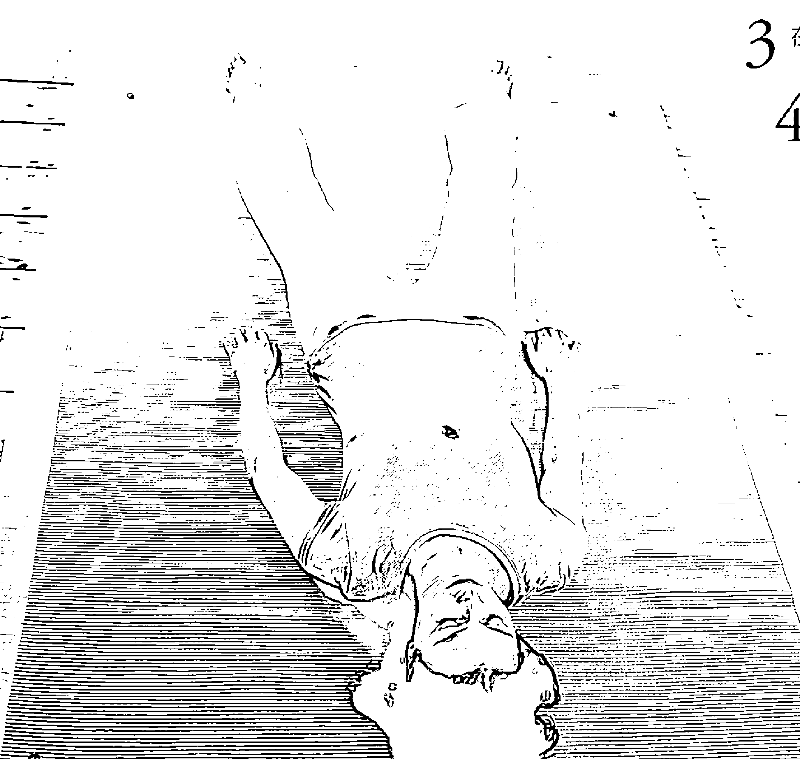

## 血壓問題

血壓確實如同其稱謂，是血液運行時對血管內部所造成的壓力，特別是動脈。這股壓力使血管舒張，促使血液流至循環系統能到達的最遠處。如果血壓持續過高或過低，將產生許多問題。

之不理，可能導致更嚴重的問題，例如中風或心臟疾病。

高血壓是一種常見的慢性疾病，但能藉由生活方式、飲食與行為習慣的改變來改善。太多壓力會造成血管內層的細微損壞，如置

低血壓會引起頭暈與昏厥的症狀。低血壓的形成原因可能是受驚嚇，或因持續性嘔吐、腹瀉、大量流汗所引起的體液含量減少，或是未經治療的糖尿病或出血。姿勢性低血壓可能是快速移動由平躺到坐起，或由坐姿到站立所引起的。

## 緩解高血壓的寶石精華液

## 改善低血壓的寶石精華液

減少你生活中的壓力可幫助你控制血壓。藍紋瑪瑙有鎮定、撫慰、平靜與提升的作用，能運用在任何需要鎮靜作用的地方。佩戴藍紋瑪瑙的墜子是很受推薦的，因為它能釋放卡在身體任何部位的壓力感，但通常以喉嚨部位的效果最為明顯。

低血壓可能伴隨著昏沉感與無精打采。血液與循環是紅寶石振動頻率的對治焦點所在，它的深紅色光束被視為原始的生命能量，在有需要時能促進腎上腺素分泌至血液中，並控制具有行動力的肌肉。它會溫暖寒冷的身體，消除低血壓並改善貧血狀況。

## 適用水晶與使用方法

一個滾磨過的藍紋瑪瑙

一個滾磨過的紅寶石

製作寶石精華液（詳第14頁如何製作的資訊）並依書中指示取用。

製作寶石精華液（詳第14頁如何製作的資訊）並依書中指示取用。

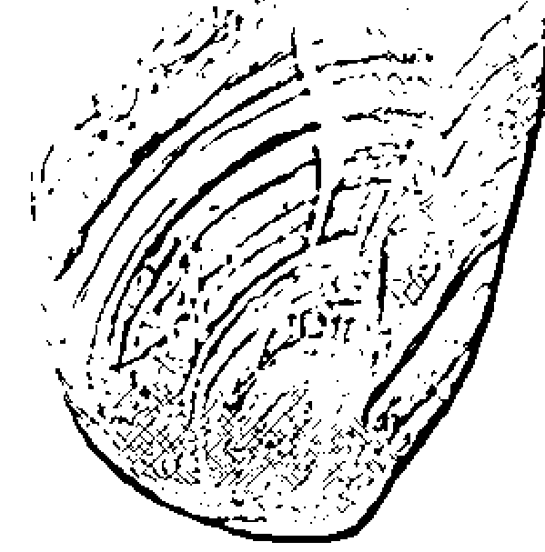

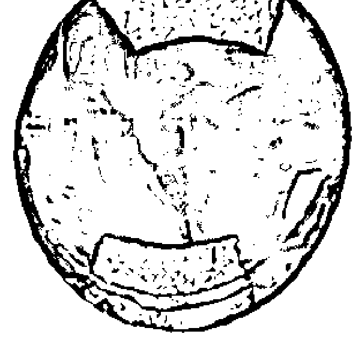

藍紋瑪瑙 (Blue Lace Agate)

紅寶石

## 糖尿病

有兩種主要的糖尿病類型，兩者皆有相似症狀——頻尿、過度口渴、體重減輕、不正常的飢餓感、虛弱無力、疲倦、手腳輕微顫抖，視力模糊、抵抗力降低、易感染及傷口不易癒合等症狀。未經治療的糖尿病可能導致複雜的情況，如視力與循環的問題，甚至有陽萎的情形，因此要永遠記得，依循醫院的指示來照護是非常重要的。

糖尿病發生於人體細胞不能適當的吸收葡萄糖（一種糖的類型）的情形。第一型的糖尿病主要影響兒童與年輕人，是因胰臟未能分泌足夠的胰島素，即控制血糖所必要的賀爾蒙。此種情形需要注射胰島素來控制，又稱為倚賴胰島素的糖尿病。第二型有時稱為成人型的糖尿病，因為它通常影響四十歲以上的人。令人驚訝的是，至少有一半的糖尿病患未察覺到他們已患有糖尿病。此類糖尿病通常可以透過靜心與飲食控制來平衡血糖值，可稱為非倚賴胰島素的糖尿病。

渴望吃糖、甜食或美食，可能會對糖尿病患者或高危險群造成問題。這是一個你處於情緒上營養不良的徵兆，患者經常感覺到如果所有甜食遠離自己的生活，喜悅與熱忱便會隨之消失。當生活感到單調無聊時，你可能更加感覺沮喪、壓力、對自己的身體與外表漠不關心、缺乏性慾。你可能會有頻繁的情緒起伏、易怒，以及經前症候群的情況。患者將受制於升高的甜食渴求，即使知道如此將超過他們的身體所能承受的程度而造成危害。

## 寶石精華液

那些渴望糖或其他甜食的人需要觀想粉紅色，所有粉紅色的水晶將有幫助，特別是粉紅色蛋白石的寶石精華液能帶來撫慰與舒緩。粉紅色蛋白石中不含火元素，它能有效的作用在整個內分泌系統，釋放罪惡感及教導你不要成為受害者。

## 適用水晶與使用方法

一個滾磨過的粉紅色蛋白石

製作寶石精華液（詳第14頁如何製作的資訊）並依書中指示取用。

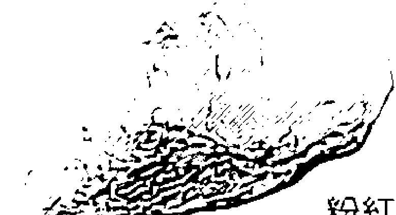

粉紅色蛋白石 (Pink Opal)

## 排毒功能

身體的排毒功能可促進你的健康意識與能量層次。精微能量體的排毒能將你的生活帶領至身體、情緒與靈性健康的全新層次。前述兩種排毒，皆依循著相同的核心準則。

每日飲用兩公升（三又二分之一品脫）的水來沖洗體內毒素，毒素會隨著新能量模式的形成而被釋放掉。

食用有機食品能減少你所攝取的化學物質與毒素的數量，終究有必要將毒素從體內去除的一天，食用簡單的食物，可幫助身體更容易消化。將碳水化合物的攝取量控制到最低需求，並食用大量的水果與蔬菜。

## 賽黃晶治療

在排毒期間需多休息，並避免激烈的運動，而以散步或練習瑜伽來代替。晚上早點上床睡覺是重要的，因為你的身體需要足夠的睡眠來再生與治療。睡眠能修復你的身體與心智，讓你的心智更為敏捷，且能維護內分泌與心血管系統的運作功能，經由強化免疫系統而有助於預防疾病。

- ◆ 當你想為生活帶來主要或次要的改變時，可使用賽黃晶。這種水晶能讓你掃除晦暗不明的部分，並在任何層面上重新開始，無論是在身體、情緒或心靈層面上。純粹的賽黃晶能量能使你邁入新的方向，因為它攜帶著閃耀的超高頻光束的高振動，能清除任何氣場與其他精微能量體上的阻塞。對於那些處於生死邊緣的人而言，是一種能撫慰身心的水晶。
- ◆ 在每日的使用上，佩戴或隨身攜帶賽黃晶，能為你帶來與天使界的喜悅連結，幫助你進入深度寧靜與日常生活的內在智慧中。賽黃晶能增進你以慈悲心與受啟發的心識的處世能力，使受到啟發的心識能與聖靈連結，獲得真實智慧的指引。
- ◆ 在靜心中，賽黃晶是一個強而有力的輔助工具，因為它能與人類全光譜振動的較高頻率形成天然共振，故能幫助到達更高的靜心境界。

## 治療要訣

- ◆ 不要帶有任何壓力來運作，你只要全然的信賴賽黃晶的能量，讓它為你工作。
- ◆ 不要用水晶戳刺你的手，只需溫柔的以水晶頂端觸碰你的手，讓水晶的光的網絡交織圍繞著整個手部。
- ◆ 當你想要加速排毒過程時，賽黃晶寶石精華液（詳第14頁的製作資料）是極佳的選擇。

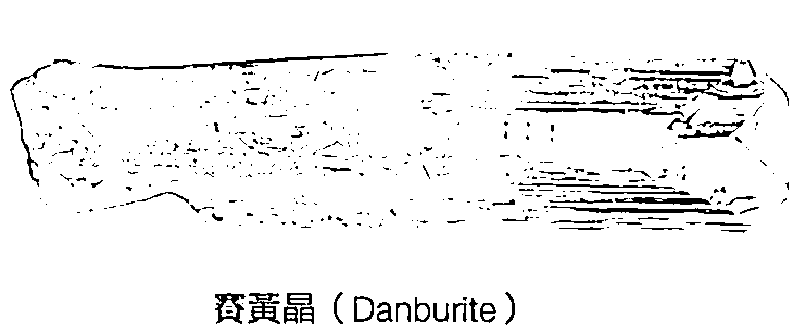

## 排毒療程

這個技巧能刺激你雙手的主要經絡穴點，促進全身性的正向改變。賽黃晶的水晶能量將溫和地透過這些經絡運作，釋放任何阻塞的能量，並協助你的身體排毒。

### 適用水晶

一個天然的賽黃晶

注意：為進行此療程，你需要天然權杖形體的單尖透明賽黃晶，長度約二至三公分，寬度約一公分。

### 使用方法

1. 先在你的左掌上進行療程。
2. 以溫和的韻律讓水晶在整個手掌（從手腕到每一指尖）運作。
3. 以相同的方式運作，進行至你的手背。
4. 使用水晶以順時針方向環繞著你的手七次，去封住與保護能量，來完成療程。
5. 以相同方法在另一手上進行治療。

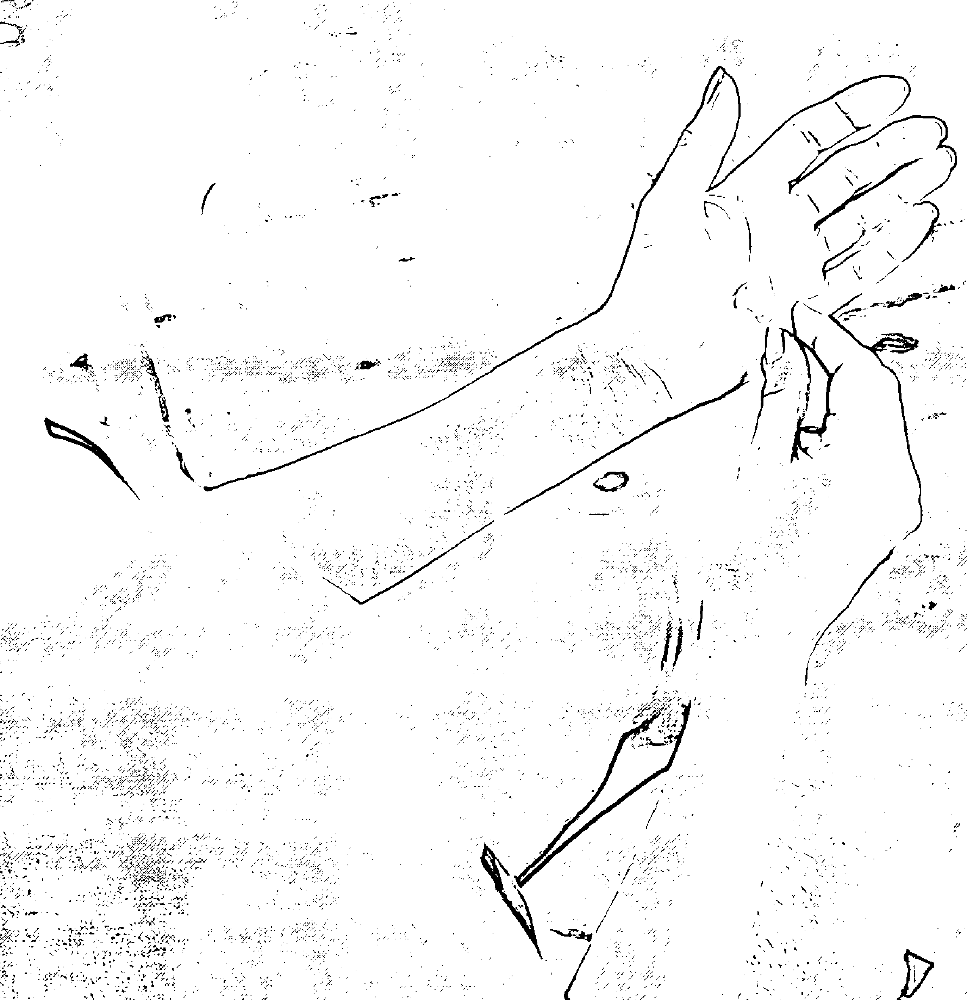

## 消化不良

消化系統能將你吃進的食物轉化成支持身體的燃料。當消化系統能和諧運作且你有攝取足夠的食物時，來自食物的能量與營養，將為你的血液流動所吸收，並運輸至全身，用以維持生命與生長。當它無法和諧運作時，你可能有消化不良的情形。

消化道是消化系統的一部分，負責分解食物，萃取食物的營養及排除未能消化的食物，它由口腔、食道、胃、小腸與大腸所組成，大腸包括結腸、直腸與肛門。肝臟、胰臟與膽囊亦屬消化系統的一部分，這些器官藉由分泌重要的酵素、賀爾蒙與膽汁，及貯存過剩的營養供身體稍後使用，來協助消化過程。

太陽神經叢與太陽、火元素有關，控管消化過程與營養的吸收。關於我們所攝取的食物，火元素與將食物轉化成身體燃料有關的許多化學反應相對應。憤怒、壓力與焦慮將帶給太陽神經叢過多的火元素，造成能量系統失衡，並擾亂消化系統的和諧。

### 火元素能量的水晶

- ◆琥珀能促進消化系統的排毒。它藉由轉變負面能量為正面能量，來清理緊張與焦慮。
- ◆黃水晶（Citrine）能緩和消化系統失調的情形，並幫助食物的吸收。它能增強與淨化消化系統，繼而促進毒素與脂肪的釋放與分解。
- ◆橄欖石能消除儲存於心輪與太陽神經叢的負面情緒。它帶來更新的活力，扮演著一種對整體脈輪大掃除的清淨劑。
- ◆菱錳礦（Rhodochrosite）是一種帶有水蜜桃粉紅色光束的強而有力的水晶。它能藉由將壓抑的情緒帶到表面治療，而迅速的淨化薦骨、太陽神經叢、心輪的創傷或創傷事件。
- ◆綠松石是心輪的情緒治療師。它鼓勵發自真心的溝通，並支持太陽神經叢與免疫系統的能量，增加生命能量。
- ◆青金石（帶有黃鐵礦內包物）能清理、淨化、平衡與整合喉輪、太陽神經叢與頂輪的能量。它能協助從各個層面吸收養分。

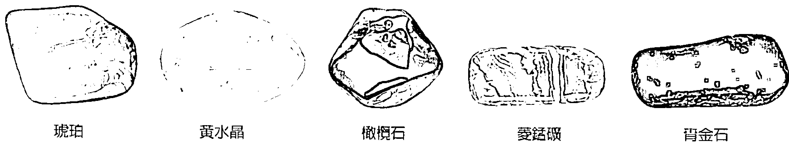

## 平衡火元素能量療法

黃色是與太陽神經叢這個脈輪相關連的顏色，因此為這個療法所挑選使用的每一個水晶都擁有強烈的黃色成分（即使是青金石亦含有黃鐵礦內包物）。太陽神經叢控管消化過程，但我們也需要協調與平衡其他涉及營養吸收的脈輪。

### 適用水晶

- 六個單尖的白水晶
- 一個天然或滾磨過的琥珀
- 一個天然或滾磨過的黃水晶
- 一個天然或滾磨過的橄欖石
- 一個天然或滾磨過的菱錳礦
- 一個天然或滾磨過的綠松石
- 一個天然或滾磨過的青金石

### 使用方法

1. 舒服地躺在地板上，可使用瑜伽墊或自己偏好的軟墊鋪放於地板上。
2. 在你的身體周圍排放著六個白水晶，一個在你的頭部上方，一個在你的腳底下，在身體的兩膝、兩手肘側邊各放置一個白水晶。
3. 以下列方式排列其他礦石：琥珀放在臍輪上，黃水晶放在肚臍下，橄欖石放在胸骨起始頂端，菱錳礦放在心輪上，綠松石在意志點，青金石放在你的喉輪上。「意志點」位在介於你的心與喉嚨之間的胸骨上。
4. 允許你的身體有二十分鐘的時間與水晶能量整合。準備隨時在直覺告訴你水晶能量已整合完成時，提早將水晶移除。

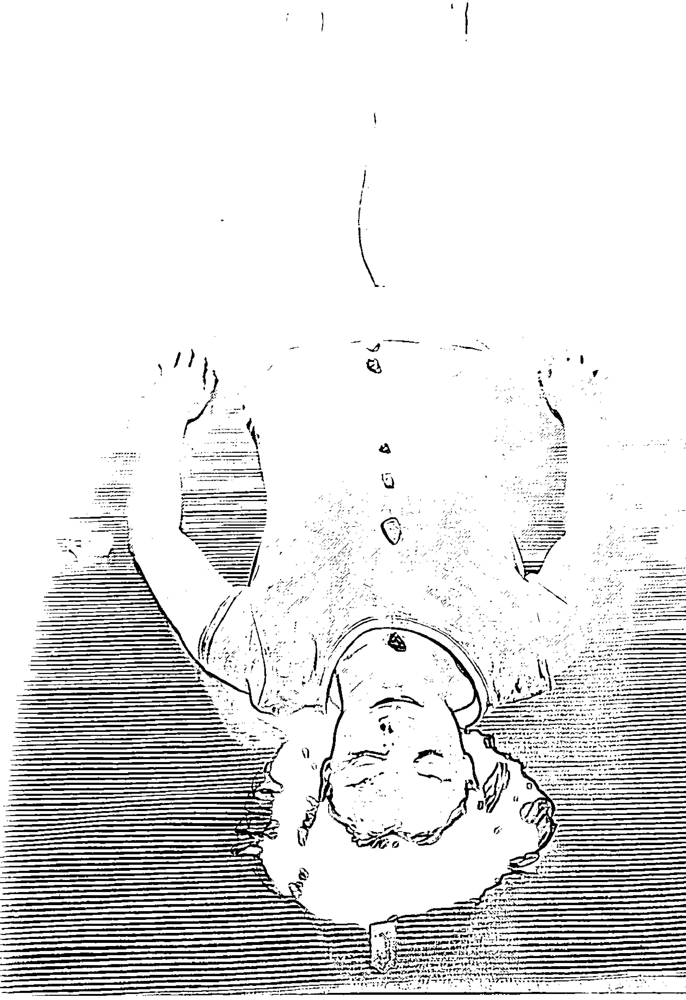

## 膀胱問題

泌尿系統的工作是從血液過濾出廢棄物，然後以尿液排泄至體外，並控管體液層面。泌尿道是由兩個拳頭大小的腎臟、連結腎臟與膀胱的兩條輸尿管，以及讓液體從膀胱排出身體的尿道所組成。在尿道的盡頭是強而有力的括約肌，將尿液控制在體內，直到你令身體將之排出。

膀胱炎通常是因膀胱或泌尿道感染所引起。雖然每個人都有可能感染膀胱炎，但以女性較為常見，因為女性的尿道較男性短許多，致使細菌更快進入膀胱。如置之不理，感染將向上蔓延至腎臟。飲用大量水分或蔓越莓汁可幫助泌尿系統淨化，是安全的預防措施。

膀胱炎亦稱為激躁性膀胱，是最常見的泌尿道功能失調，症狀包括排尿時疼痛、灼熱感、頻尿（通常僅排出少量尿液）。尿液可能呈現混濁或紅色狀，且有異味。可能會伴隨著疼痛，或恥骨區域的不適感，發燒、疲倦，偶爾會出現噁心與嘔吐情形。

膀胱炎的灼熱、燃燒感，與不健康的伴侶關係所引發的情緒有關，指的是那些造成罪惡感、阻礙創造力流動，或造成絕望感與喪失生活喜悅的伴侶關係。背叛與欺騙會阻礙喜悅與新生感覺的流動。

### 再生療法

濕潤的臍輪（詳第18頁）掌管體液的功能，相關顏色是橘色。所有橘色水晶皆能促進創造力、活動力、排毒、行動，以及身體與心智的溝通流動，淨化與治療情緒的傷痕，特別是壓抑的情緒。在此療法中，高強度的藍色青金石能支持橘色紅玉髓的工作。

寶石或西伯利亞藍石英取代青金石。

### 使用方法

1. 舒服地躺在地板上，可使用瑜伽墊或自己偏好的軟墊鋪放於地板上。
2. 放一個青金石在你頭頂處，一個在你的喉嚨底部，一個在你的腳底下放。
3. 放一個紅玉髓在臍輪，其他兩個各別放在兩邊的鼠蹊部位上（臀部的正面）。
4. 允許你的身體有二十分鐘的時間與水晶能量整合。準備隨時在直覺告訴你水晶能量已較快整合完成時，提早將水晶移除。

### 適用水晶

- 三個滾磨過的青金石
- 三個滾磨過的紅玉髓
- 注意：你可使用紅鋅礦取代紅玉髓，以藍

## 再生療法的水晶

- ◆ 紅玉髓的特徵是強壯、激發與保護，可用來修復驚嚇、創傷、失敗或被背叛後的以太體損害。它能調理悲傷情緒，如喪失親友的傷痛，且能提高創造力與樂觀性，並導引至正向的生活觀。它能藉由平衡身體的能量層次，來減緩憂慮與恐懼症的情形。
- ◆ 青金石是一種高強度的以太磁石，能使意識、心智平靜下來，因此有助於放鬆，也能減輕肉體的疼痛，幫助自我表達。
- ◆ 紅鋅礦 (Zincite) 能提高生命力，帶來自信、力量、創造力與勇氣，能讓個人力量、自由、氣力與耐力協力共同運作。如果你感覺悲觀、停留在過往事件上、沮喪或處在驚嚇中，紅鋅礦是一個非常適合的水晶。它能幫助你釋放過去的傷痛記憶，驚嚇、創傷、自我麻痺心態及向前邁進的恐懼。
- ◆ 藍寶石與西伯利亞藍石英可減輕壓力，釋放情緒的束縛，緩解身體疼痛，並幫助你超越自我受限的信仰系統，進入喜悅與再生的能量。

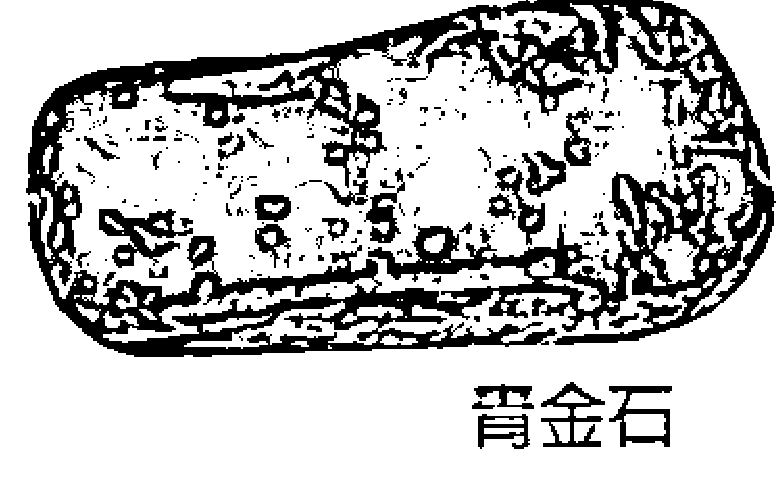

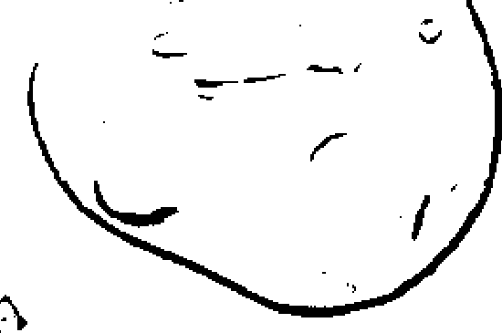

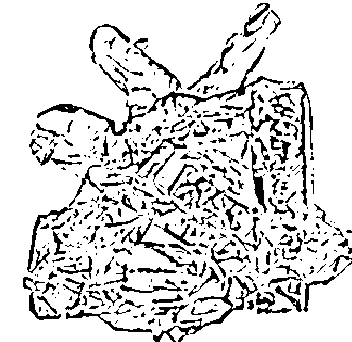

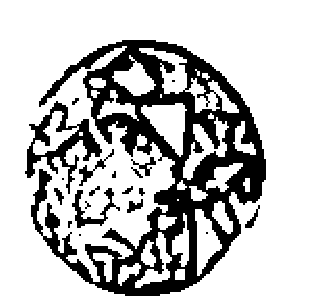

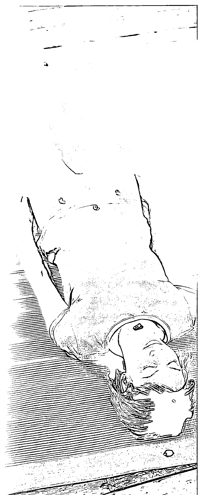

## 背部問題

背部疼痛相當常見，劇烈的背部疼痛可能是肌肉或韌帶拉傷、扭傷，或拉提重物而引起。持續性的背痛通常是姿勢問題，因脊椎未成一直線的站姿、坐姿或睡姿造成。

大部分的嚴重背痛較為少見。脊椎側彎是脊椎兩側成「C」型或「S」型彎曲，可能會影響兒童的發育。椎間盤突出症（椎間盤脫位）造成劇烈的疼痛，可能是因受傷或跌倒所致。它亦與老化過程有關，椎間盤髓核的水分會因年紀增長而減少，而更容易脫位。

脊椎不只支持你的身體，也支持你整個心理系統。背部問題在情緒層面上的影響，可能會使你有感覺不到家庭、朋友或工作上同事支持的情形。

## 治療要訣

- ◆ 你可運用這些水晶與夥伴練習脊椎的調整。使用一個磁鐵礦、百吉神石（Boji Stone，又稱堪薩斯神石），或赤鐵礦，順沿著脊椎上方二至三公分的地方向上移動。允許你的直覺指引你，讓水晶停留在疼痛或阻塞的部位上方。百吉神石能維持兩極的平衡，因此可使用單一個礦石在指壓或針灸穴位上。

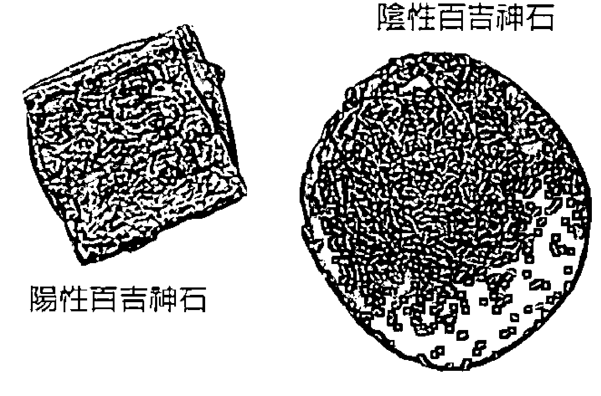

### 脊椎的調整

使用這種技巧調整脊椎時，你可從以下水晶中選一種使用：磁鐵礦能整合脊柱並釋放疼痛；赤鐵礦能藉由迅速移除能量的阻塞而回復平衡與穩定；百吉神石使用在組織再生與疼痛的去除。讓直覺指引你選擇水晶。

### 適用水晶

- 兩個天然的磁鐵礦，或
- 兩個百吉神石，挑選一陰一陽，或
- 兩個滾磨過的赤鐵礦

### 使用方法

1. 舒服地躺在地板上，可使用瑜伽墊或自己偏好的軟墊鋪放於地板上。
2. 放置一個磁鐵礦或赤鐵礦或百吉神石在你的脊椎底部，另一個放在顱骨底部。
3. 允許你的身體有二十分鐘的時間重建與整合能量。準備隨時在直覺告訴你水晶能量整合完成時，提早將水晶移除。

## 神經系統問題

所有自主或非自主行為，我們的思想與感覺，我們的感官與身體的運作過程，皆為神經系統所控制。這個廣大複雜的系統，意味著它會受到各類型疾病的影響。

中樞神經系統（CNS）是由腦與脊髓組成，處理與調節神經訊息。周邊神經系統將這些訊息傳送至中樞神經系統，並由中樞神經系統將訊息傳送出去，而構成自中樞神經系統向外分支擴展至身體所有部分的整體神經系統。這些系統組合在一起，負責傳遞自感官所接收的訊息，及大腦決定採取的反應。自主神經系統負責控制不受意志控制的自動功能，例如呼吸、消化、流汗、心跳等等。

## 治療要訣

- 使用黃水晶與紫水晶來製造紫黃晶寶石精華液（詳第14頁的製作方法）。它將整合太陽神經叢與頂輪，因此能夠強化注意力，而且有助於分析能力。

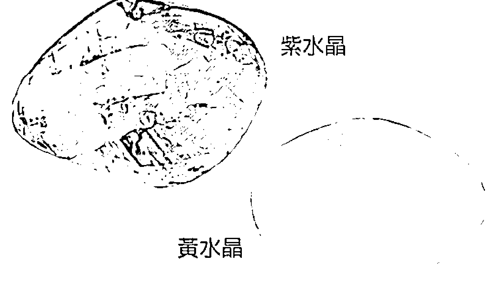

## 回復清晰療法

神經系統的複雜能導致困惑與散亂的思緒。黃水晶能鎮靜神經系統，將清晰帶入你的思維過程；紫水晶能釋放煩亂不安與壓力，有助於條理清楚的思考。

### 適用水晶

- 五個滾磨過的黃水晶
- 三個滾磨過的紫水晶

### 使用方法

1. 舒服地躺在地板上，可使用瑜伽墊或自己偏好的軟墊鋪放於地板上。
2. 以五個黃水晶圍繞著身體排列，一個在你的腳底下，其他分別放在你的膝蓋與手肘的兩側。
3. 放一個紫水晶在你的頭部底下顱骨底部，第二個在頭部上方，第三個在你的眉心輪上（詳第18頁脈輪位置）。
4. 允許你的身體有二十分鐘的時間整合能量。準備隨時在直覺告訴你水晶能量已整合完成時，提早將水晶移除。

## 疼痛

身體任何部位的疼痛是一個不正常的徵兆，一旦你知道原因，就有助於將疼痛降低至可接受的程度，尤其是需長期服用止痛劑的習慣性疼痛的情形。此種持續性的疼痛可能受到心理與情緒因素的影響，原始的身體因素也是影響原因之一。

疼痛是一種濃密的能量，需要將其去除才能恢復身體的平衡。如果你以手檢視疼痛的部位，你可能會覺察到能量的變化。疼痛的濃密能量有著黏膩、刺痛、尖銳或收縮的感覺。當疼痛被除去時，該區域通常有活潑或平靜穩定的觸感。

用來緩解疼痛的水晶治療技巧，可能是在你所學中最重要與有效用的技巧。它能用來吸引出任何不平衡的能量或能量的阻塞，不僅能對治疼痛，還能運用在經絡、脈輪、身體或氣場上的任何區域，並且能視需要而反覆施行。

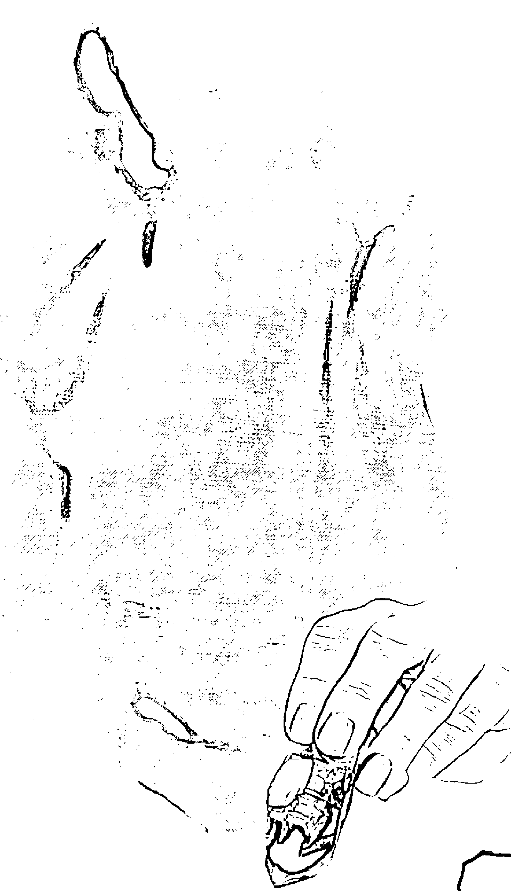

## 釋放疼痛

煙水晶能引出並吸收不舒服的能量。這個技巧運用煙水晶來釋放疼痛的濃密能量，然後以白水晶將治療能量帶入身體。

### 適用水晶

- 一個單尖煙水晶，十至十五公分長
- 一個單尖白水晶，十至十五公分長

注意：你可使用黑曜岩球代替煙水晶。選擇約直徑六公分大小，能舒適地握於手中的黑曜岩球。

### 使用方法

1. 將煙水晶握於左手中，並以尖端點指向疼痛區域。在疼痛區域上方，以逆時針方向移動水晶的方式去除（解開）濃密的能量。繼續進行至直覺告訴你已去除可能清除的濃密疼痛能量，或直到疼痛已減少了大部分或完全消失時。
2. 換另一手並更換水晶進行。將白水晶握在你的右手，以尖端指向疼痛區域，以順時針方向將療癒能量導入（捲入）。以最大可能性將療癒能量導入；你的直覺將告訴你何時該結束治療過程。
3. 以白水晶的側邊刷掃過該區域來結束治療，這能促使能量開始順暢的流動。
4. 以冷水沖洗，來釋放任何不需要的能量。冷水不會令你的毛細孔張開，故能保護你免於吸收你所釋放出去的能量。
5. 在使用後淨化水晶（詳第13頁）。

## 治療要訣

- 為進行這個技巧所使用的水晶大小尺寸是非常重要的，水晶愈大愈好，但勿挑選過大而令你握持的手臂感到疼痛或很快感到疲倦的尺寸。雷射激光柱（詳第10頁）是非常合適的。
- 其他種類的水晶也能用來提升這個技巧的效能。針對受傷而引起的疼痛，將一個單尖白水晶分次放在受傷部位的兩側，兩者尖端相對。鈦晶也能被用來加速組織的修復。
- 為緩解身體的疼痛，例如關節炎或月經期間的不適，你可以紫水晶或煙水晶放置於受影響的部位。
- 百吉神石也能用來將疼痛吸出。

## 關節炎

關節炎是造成關節發炎、疼痛、僵硬、腫脹等症狀的總稱，以侵襲膝蓋、髖部、指關節與脊椎最為典型。最初期的症狀通常只是僵硬的刺痛，但最終可能導致持續性的疼痛、僵硬、喪失彈性或患部關節腫脹。

骨關節炎是最常見的關節炎類型，通常影響四十五歲以上的人，特別是停經後的婦女。它被歸類為退化性的骨頭疾病，因為是軟骨退化所引起。軟骨是柔軟、滑順的軟質物，包覆著人體骨骼末端與關節交會處，它保護骨頭並減少因活動而產生的摩擦。軟骨退化可能是因為磨損、拉扯、飲食、壓力或傷害到患部關節，或來自遺傳的體質傾向。

類風濕性關節炎是一種自體免疫的疾病，對女性的影響為男性的三倍，同樣的，通常發生在四十五歲以上的人身上。它會侵犯身體大部分的關節，引起關節的嚴重變形。在它實質地攻擊關節內層或滑液膜同時，也能以其他方式影響身體，造成虛弱、疲倦、無食慾、貧血、肌肉疼痛與體重減輕。

較不普遍的類風濕性關節炎形態，包括痛風、狼瘡、僵直性脊椎炎。孩童可能會被許多類型的幼年型類風濕性關節炎影響。

銅以減輕發炎與增加彈性來緩解關節炎患者的不適著稱。銅能做成手環、項鍊或戒指佩戴，或使用於能量治療排列上。銅也是飲食中很重要的微量元素，銅集中於你的肝臟、心臟、腦、腎臟與頭髮中，有助於身體吸收與使用鐵質，對於維他命C的代謝是重要的，並幫助平衡膽固醇含量。它形成部分的酵素，因此是支持許多身體功能的基本配備：從攝取的食物製造能量；維持健康的髓磷脂（包覆在神經纖維外的保護物質）；製造麥拉寧（Melanin）黑色素；骨骼的發展；及維持一個健康的生殖系統與免疫系統。

## 富含銅的水晶

- 孔雀石（Malachite）是形成於地底層的銅礦溶解並隨後沈澱於洞穴及岩層礦脈之時。在化學層面上，它根本是一種銅的水合物。在身體層面上，它減緩風濕症並協助降低組織的酸化。它是一個診斷性的水晶，能快速進入問題的核心。帶著專注來使用，它能平衡並為身體帶來和諧。
- 翠銅礦（Dioptase）主要在胸腺與免疫系統上工作，它降低發炎並加速排毒功能。在化學層面上，翠銅礦是一種硅酸銅礦，有些類似硅孔雀石，是一種美麗的深藍綠色水晶，此種礦石並不常見，但能在硅酸銅沉積岩的氧化部分發現它。
- 硅孔雀石（Chrysocolla）能淨化所有身體系統並予以補充能量，且對激發免疫系統特別有效益。它自硅（矽）、水與銅的溶液中形成。
- 綠松石（Turquoise）能強化與支持免疫系統，且用來幫助緩解關節炎的症狀。在化學層面上，它是含水的磷酸鹽鋁銅礦。

## 恢復彈性療法

銅不僅有益於關節炎，也是一位很好的能量指揮者，能為身體的許多能量系統帶來和諧。在此療法中，白水晶用來擴大與導引銅礦能量的流動。

注意：銅礦塊是普遍且容易取得的，但你亦可使用富含銅礦的水晶礦石取代之，例如翠銅礦、孔雀石、硅孔雀石、綠松石。

### 適用水晶

- 一個銅礦塊
- 兩個單尖白水晶

### 使用方法

1. 舒服地躺在地板上，可使用瑜珈墊或自己偏好的軟墊鋪放於地板上。
2. 將銅礦塊放在你的心輪上（詳第18頁的位置）。
3. 每一隻手握著一個單尖白水晶，左手的水晶尖端朝向身體，右手的水晶尖端朝向體外方向擺放。
4. 允許你的身體有二十分鐘的時間整合能量。準備隨時在直覺告訴你水晶能量已整合完成時，提早將水晶移除。

## 皮膚困擾

許多不同的原因會影響你的皮膚健康，消化功能失調、食物過敏、營養不良、肝中毒、化學藥物、氣候影響，甚至是年齡，將在你的臉部及身體上反應出它們的影響。來自陽光或太陽燈的紫外線對皮膚的影響特別強烈。身體的改變例如懷孕或體重減輕，會造成皮膚產生鬆弛紋。

腫形成與留下疤痕。賀爾蒙失調與飲食習慣不良可能是造成這些問題的起因。

隨著年齡增長，因真皮層中的結締組織退化，皮膚會自然失去彈力，而維持皮膚光滑柔嫩與彈性的彈力蛋白與膠原蛋白，也會逐漸地消耗而減少，引起皮膚變薄，產生皺紋、鬆弛下垂，變得乾燥及容易產生淤青。

患濕疹與皮膚炎的皮膚，會因過敏反應而出現搔癢、乾燥、起泡、粗糙狀況。引發的原因可能是食物或藥物過敏。其他因素包括接觸外來的刺激物與過敏原，例如化學藥物、清潔產品、合成纖維、化妝品或首飾中所含的鍍鎳物質。這些症狀通常與偏頭痛、免疫系統功能不良，及其他過敏如氣喘、花粉症及蕁麻疹有關連。

提早老化的皮膚與污染、不良飲食習慣、紫外線照射過量、酒精與抽菸有關聯性。在皮膚上有可能出現小區域的色素斑，以老人斑或肝斑最為人知。

牛皮癬也會產生皮膚搔癢與粗糙變厚的情形，但並非過敏所造成，其確實原因不明，但此症狀是非接觸傳染性的。它通常影響頭皮、手肘、膝蓋與手背，但也可能影響全身。牛皮癬在皮膚上形成的紅色鱗狀色斑，與皮膚搔癢同樣令人痛苦。壓力與超過負荷量的有毒物質會引起更嚴重的症狀。

痤瘡主要影響年輕的皮膚，但有時也發生在成年人身上，為皮膚中分泌油脂的皮脂腺阻塞、感染與發炎所造成。黑頭粉刺、白頭粉刺、斑點與面皰皆與痤瘡有關連。嚴重時，可能造成皮膚較大面積的感染、深層膿瘡。

玫瑰斑是一種發生於臉部皮膚永久性或偶發性的紅疹或潮紅，為皮膚底下的毛細血管擴張所造成，可能因過度飲酒、皮膚感染、消化功能失調或免疫系統的疾病而引起。

## 臉部按摩

我們有特別照顧臉部肌膚的傾向，因為它通常是人們注意到的第一件事。臉部按摩能促進循環，使肌膚看起來氣色更佳與容光煥發，也能放鬆臉部肌肉，釋放造成眉頭緊蹙與皺紋的緊張與壓力。為臉部按摩選擇水晶時，因情緒會對臉部產生影響，因此要將情緒處理的效果列入考量。粉晶是主要的情緒治療水晶，有助於處理因情緒壓力引起的皮膚症狀，而月光石則能舒緩與撫慰情緒。

### 適用水晶

一個滾磨過的月光石或粉晶

### 使用方法

1. 清潔你的臉部，小心不要磨擦皮膚。
2. 在你臉部皮膚抹上依自己喜好所選擇的溫和按摩油，使水晶的移動更為順暢。
3. 水晶以畫小迴圈的方式移動，溫柔地按摩你的臉與頸部。自你的頸部開始向上移動至下巴區域，繼而移往嘴巴、臉頰與鼻子繼續按摩著。以非常溫和的力道按摩眼部的周圍，最後以按摩你的前額區域作為結束。
4. 將雙掌停留於你的臉上，指尖觸碰你的前額，手掌底部置於你的下巴部位。以非常輕的力道按壓，並緩慢地將你雙掌拖移至兩邊的耳部，重複此移動三次。

## 治療要訣

- 製作粉晶精華液（詳第14頁的製作方法），以內服方式或將之稀釋使用於你的皮膚上。這種精華液能添加在水性乳霜或任何質純的皮膚乳霜或乳液中，能舒緩安撫皮膚。它可添加在基底油中用來按摩皮膚，如甜杏仁油、杏桃仁油、葡萄籽油或荷荷芭油。在基底油中添加乳香亦能增進皮膚的年輕與活力。
- 於沐浴時，在浴缸水中加入幾滴乳香精油及一個粉晶或月光石，將能活化你的全身。
- 皮膚的症狀會因壓力而更加嚴重。佩戴月光石墜飾不僅能幫助平衡情緒，也能平衡身體的水分與淋巴系統。

## 橘皮組織

橘皮組織是在小腿、大腿、臀部、上臂等外側部位，集結形成的脂肪組織。賀爾蒙失調與血液循環不良，可能造成皮膚底下的毒素、脂肪與淋巴液的滯留，而鬱積成塊狀物。橘皮組織的典型「橘皮」凹陷如酒窩狀特徵，會隨著年齡增長而益發明顯。按摩、健康的飲食、運動與擦刷身體，將有助於減少皮膚外觀的橘皮組織。

## 水晶按摩

按摩方式適用於每個人，並對許多方面有幫助，除了能增進血液循環，鎮定神經系統，活化肌膚並增添好氣色，改善肌肉張力，消除肌肉與關節的痠痛與疼痛，且能幫助減輕水分滯留的情形。這種技巧也可運用在你的氣場上，有能量上的治療效益，適合跌撞損傷與瘀青的皮膚使用。

## 治療要訣

### 適用水晶

一個白水晶按摩棒

- 在基底油中加入數滴寶石精華液或精油，將使基底油的效果更好。黃水晶或董青石寶石精華液將幫助身體清除毒素與橘皮組織。廣藿香、杜松與甜橙是具有排毒功效的精油。
- 按摩是一種非常安全的技巧，但仍有應避免使用的時間與情況。這通常意謂著避免按摩某些身體部位，但仍應該依你的常識來判斷。不要在下列情形進行按摩：如飽餐之後、體溫升高時、任何感染部位、腫脹或發炎、在曲張的靜脈上面，或是瘀血、受傷的皮膚上。

### 使用方法

注意：如果你沒有按摩棒，你可以使用一個大型球體狀或蛋形滾磨過的白水晶來取代。不要選擇過大的水晶，否則會讓你的手臂容易感到痠痛或很快就感到疲倦。

1. 在你的身體上塗抹你所挑選的基底油，讓水晶容易於皮膚上滑動。甜杏仁油、杏桃仁油、葡萄籽油或荷荷芭油等，是適用的基底油。
2. 以順時針扭小圓圈的方式移動按摩你的身體。你可能希望按摩全身，或只按摩問題部位。去體驗按摩的力道，應確保讓身體維持舒適感。

## 酵母菌感染

有兩公斤（四又二分之一磅）的細菌（益生菌）在我們的消化道中。通常在益菌與害菌之間會達成一種平衡，此平衡是維持我們身體健康的基本要素。好的細菌（通常稱為友善細菌或益生菌）容易被抗生素殺死，一旦此情形發生，害菌、黴菌與酵母菌，例如白色念珠菌就能繁衍旺盛而接管腸道的生態環境，並製造毒素。益生菌能抑制這些病原體（造成疾病的媒介），並幫助刺激腸內膜的生長。

## 煙水晶治療

- 煙水晶能幫助你發展強健的身體與平靜、和平、免於壓力的心智。它能緩解頭痛與腸阻塞的情形。

雖然白色念珠菌（或稱白假絲酵母）是一種身體內部自然產生的酵母菌，但如果繁殖過於快速時會造成問題。服用抗生素與未食用健康均衡的食物，會增加念珠菌（假絲酵母）生長過度的風險，有時稱念珠菌病或鵝口瘡。

鵝口瘡造成搔癢與紅腫，排出乾酪狀的白色黏稠分泌物。如為消化系統遭感染，症狀包括鼓脹、疲勞、嗜甜、頭痛、肛門搔癢、腸漏症狀、敏感、關節疼痛、週期性咽喉痛、口臭、對化學藥物過敏。白色念珠菌感染可能導致情緒不穩定、缺乏心智集中能力，特別是在它能引起許多明顯無關聯性的健康問題時。

有許多種不同樣貌的症狀，取決於身體的哪一部分被感染。念珠菌陰道炎（亦稱陰道炎）造成搔癢與紅腫，排出乾酪狀的白色黏稠分泌物。

## 寶石精華液

如果你想獲得健康、快樂、豐富的生活，一個平衡的生活方式，包括良好的飲食習慣是極其重要的。在身體能量系統失調時，煙水晶特別有幫助，能讓已變得不穩定的內在能量集中與落實，吸收停滯破損的能量，並幫助你找到你所需要的平衡。

## 適用水晶與使用方法

一個滾磨過的煙水晶
製作寶石精華液（詳第14頁如何製作的資訊）並依書中指示取用。

## 性功能失調

性慾低下（性慾減低）是持續的喪失性趣，直到低於你視為正常的標準。性慾會因許多原因而耗盡，包括壓力、疲倦、沮喪、賀爾蒙失調、更年期、甲狀腺功能減退症，或流入性器官的血液不足等。陽痿或勃起功能障礙，是生殖器持續或反覆出現無法勃起或維持勃起的狀態，最常由生理與心理因素混合的原因所造成的。

生理因素包括酗酒、賀爾蒙失衡、前列腺失調、糖尿病、高血壓、接受特定的藥物治療等。壓力、沮喪、焦慮，以及與性伴侶之間的個人問題，是可能的心理因素。

### 紅寶石療法

- 紅寶石能調節血液流動、循環，與幫助腎上腺素釋入血液與生殖系統中。它能溫暖身體、停止寒顫，緩解腳部、大腿、膝蓋與臀部僵硬的肌肉。
- 紅寶石的動力能量可以去除有關生存的恐懼與憂慮，並恢復生存的意志。它以去除怠惰慣性的方式來排毒，增強身體能量，且可在感到疲倦時使用。

### 增進你的性能力

紅寶石象徵與喚起性慾，並掌管生殖器官。你可運用它的原始力量，去釋放內在深層阻塞的能量。紅寶石能活化、賦予活力、增強與增加慾望。它能利用紅外線，一種最緩慢的色彩光譜振動頻率，重新提升已功能不良或停滯的運作過程。

### 適用水晶

八個滾磨過的紅寶石

### 使用方法

1. 舒適的躺在地板上，可使用瑜伽墊或你喜歡的軟墊。
2. 將六個水晶圍繞著身體擺放：一個在你頭頂上方；一個在你的腳底下；其他各別放在你身體膝蓋與手肘的兩側。
3. 將第七個水晶放置在頭底部的顱底下方，第八個水晶在你的心輪上（詳第18頁）。
4. 讓你的身體有二十分鐘的時間來整合水晶與身體的能量。準備好在當直覺告知你水晶能量已快速整合完成時，提早移除水晶。

## 不孕症

不孕症可被定義為：有正常性生活且無任何避孕措施的情況下，長達一年以上，卻仍然沒有懷孕的情形。

生活方式的選擇與環境的條件，可能是可歸責於雙方的不孕原因。不良飲食、體重過重或過輕、抽菸、飲酒、壓力，因職業或環境而暴露於特定的化學藥物與殺蟲劑之下，皆可能影響受孕。性傳染病，例如發生在男性身上的淋病以及女性的衣原體疾病（通常較不易被發現），亦是造成不孕的主要原因。

在男性身上，會影響精子質量與活動力的其他原因，包括穿著太緊的內褲、浸泡過熱的水、接觸在塑膠製品與自來水中所含的環境雌激素等。對婦女而言，可能導致不孕的生理問題，包括賀爾蒙失調、輸卵管閉塞、無法排卵、子宮肌瘤、子宮外孕、子宮內膜組織異位、骨盆腔炎、多囊性卵巢症候群、甲狀腺問題、陰道過度酸性等。極端的節食與過度的運動，也可能造成不孕。

### 紅玉髓

- 紅玉髓對女性生殖系統具有強力的影響，能釋放造成以太體受損的壓力與創傷。紅玉髓能幫助恢復活力、激發創造力，與促進能量在身體中流動順暢。

### 生育之火療法

對不孕症所採行的治療方式，取決於它的形成原因，且可能是昂貴、挫折與高代價的。如果無法找到不孕的原因時，水晶治療能清理疏通可幫助受孕的精微能量通道。

### 適用水晶

- 六個單尖白水晶
- 兩個滾磨過的紅玉髓

### 使用方法

1. 舒適的躺在地板上，可使用瑜伽墊或軟墊。
2. 將六個白水晶圍繞著身體擺放：一個在你頭頂上方；一個在你的腳底下；其他各別放在你身體膝蓋與手肘的兩側，尖端向外擺放。
3. 放一個紅玉髓在你的臍輪上（肚臍底下的位置），一個在你的意志點上。意志點位於心輪與喉嚨之間的胸骨部位。
4. 讓你的身體有二十分鐘的時間來整合水晶與身體的能量。準備好在當直覺告知你水晶能量已快速整合完成時，提早移除水晶。

## 經前症候群

經前症候群會導致某些女人於月經前兩週開始受到影響，會在身體與情緒上出現許多症狀。身體的問題可能包括腫脹、頭痛、體重增加、胸部壓痛、嗜食、疲倦、痠痛、排便習慣改變、失眠、噁心嘔吐與頭暈等。另外，易怒、焦躁、沮喪、情緒不穩定、緊張、憤怒、困惑、難以專注與記憶喪失等為情緒上出現的症狀。賀爾蒙、腸道菌群與血糖值的不平衡為可歸責的原因，可能是營養不良、偏食、壓力、肝功能低下所引起。

在月經前或經期中也可能發生水分（液體）滯留（水腫）情形。賀爾蒙不平衡、壓力與偏食可能為引發原因，這些原因或許為胰島素阻抗性、攝取過度的鹽分、水分吸收能力低下、肥胖、高血壓與心臟問題所造成。

經痛（月經期間的疼痛）會出現間歇或持續的下腹部陣痛，也有可能會有下背部疼痛的情形。某些婦女亦會產生頭痛、噁心與嘔吐的情形。

月經量過多或不規律的月經，會對行經期間的婦女造成困擾與影響，特別是在經歷更年期的過程時。賀爾蒙不平衡與體重增加是導致的原因。

### 月光石治療

這些問題會影響骨盆部位。骨盆為碗狀物形狀，它能容納與保留我們的生命能量（氣），且與水能量（元素）有關係。它為臍輪所掌管（詳第18頁的位置圖示）。

- 月光石顯露出神秘與魔幻的迷人力量，帶有飄浮於水晶結晶體上的閃爍朦朧光澤。從古至今，人們以儀式祭拜女神，來維護平衡與和諧，月光石即為她的守護象徵寶物。
- 由於它與月球能量的密切連結，月光石有助於對生命循環與潮起潮落、生死起落與再生的現象，有深度的體悟與慶祝。
- 月光石以撫慰與幫助回復平靜思緒的方式，來滋養靈魂與治療精微能量系統。

臍輪控管著身體與情緒之間的能量流動，壓力會阻塞這個溝通的管道，使身體失衡。如讓疼痛停留在這個中心而未加以釋放時，將會造成許多層面上的淤滯與僵化，不僅限於身體層面。

弦月狀是臍輪的象徵符號。月亮對於水具有強大的影響力，女性的生殖週期為月亮相位所控制。因為月亮是部分隱藏的，並經描繪成弦月狀，它帶來顯現女性體內似水柔情的情緒能量所需要的陰陽平衡感。

## 呼吸平衡法

女性的創造力量是神秘與強大的，運用水晶呼吸的技巧，能讓女性去探索與開發脈輪中蘊藏的女性創造天賦與平衡。因為鈹綠柱石可作用於女性生殖系統，月光石為女性力量礦石的特徵，故兩者為適合運用在此種呼吸技巧上的礦石。

### 適用水晶

一個滾磨過的鈹綠柱石或月光石

### 使用方法

1. 以舒適的方式坐著，讓你的身體放鬆幾分鐘。
2. 將水晶握在你身體的前方，溫和的凝視它，藉由專注於呼吸上，來放鬆你的身體。
3. 在你準備好時，閉上你的眼睛，並開始吸入握在手中的水晶能量。
4. 你可在感覺舒適的時間長度內，持續進行著此種呼吸技巧。

## 鈹綠柱石治療

鈹綠柱石具有非常特殊的特徵。當開始進入真實的療癒時，我們會發現情緒的反覆不定性，因為治療過程有時會將痛苦的記憶帶出來，所以我們往往容易因陷入困境而放棄，而較難生起隨順生命之流的勇氣。鈹綠柱石能在你釋放痛苦時讓情緒體維持穩定，這是運用它的要訣。

## 更年期

更年期指經期停止的時期，是女性生育年齡的終止，發生在更年期左右的賀爾蒙變化，對不同的女性會產生不同的影響。雖然大部分的女性僅出現少數問題或毫無影響，但其他女性則承受嚴重的不適。熱潮紅是伴隨更年期而來的症狀，臉頰、頸部或身體出現紅熱與多汗、心跳快，偶爾出現噁心及手部刺痛。熱潮紅可發生在白天或夜晚的任何時間，且可能造成睡眠障礙。

與更年期相關的其他症狀，包括陰道乾燥、陰道內壁變薄、性慾減退、頭痛、偏頭痛、甲狀腺功能失調、體重增加、水分減少、睡眠障礙、疲倦、壓力、沮喪、記憶衰退、注意力無法集中、情緒不穩定、缺乏自信與恐慌症。

在停經前，生理期可能出現月經量大或間歇不規則的情形。有些女性在她們的孩子成長離家後，也會出現更年期症狀。對許多女性而言，孩子是她們世界的中心，進入空巢期可能會使她們的情緒非常不穩定。

所有女性皆需要專注於自己的夢想與個人的企圖心上，如此無論處於何種年紀，你皆能增強自信與自尊。請記得你生活中所失去的是與態度有關，而非年齡。在更年期期間，平衡賀爾蒙是必要的，故保持一種健康的態度是特別重要的，去攝取健康的食物，進行規律的運動，開始學習放鬆與瑜珈。

更年期也是一個很好的時機，去發展新的興趣與重新觀察評量你的生活。在更年期之後，許多女性發展出新的身體覺受或身體智慧，使她們能超越身體的限制或制約模式。有愈來愈多的女性視更年期為極佳的個人成長、展現力量與生命蛻變的啟蒙時期。

### 開發身體智慧療法的水晶

- ◆將白水晶圍繞著身體擺放，能整合精微能量場，並吸引積極正向的生命力量，有助於對所有心理層面上發生的改變，有更清晰的了解。
- ◆將煙水晶放置於海底輪，能帶來落實、穩定與固定的品質。這些品質能幫助身體應付所發生的改變，這些改變有時讓人有漂泊在「變化之海」上的感覺。
- ◆紅玉髓能平衡臍輪，帶來喜悅與自發性能量。
- ◆孔雀石能平衡太陽神經叢，並幫助個人意志力的發展。
- ◆絕綠柱石能平衡心輪，並能在改變呈現時幫助情緒體維持穩定。
- ◆青金石能平衡喉輪，幫助自我表達、建立自尊。
- ◆坦桑石（Tanzanite）能平衡眉心輪，帶來洞見與啟示。

## 開發身體智慧的療法

雖然臍輪為主要掌管生殖器官的脈輪，我們仍需要調和與平衡所有的脈輪，因為更年期的效力會影響全身。這個技巧會產生一種可凝聚與放大所有水晶潛能的協同效應。

### 適用水晶

- 六個單尖白水晶
- 一個滾磨過的煙水晶
- 一個滾磨過的紅玉髓
- 一個滾磨過的孔雀石
- 一個滾磨過的鈹綠柱石
- 一個滾磨過的青金石
- 一個滾磨過的坦桑石

### 使用方法

1. 舒適的躺在地板上，可使用瑜伽墊或你喜歡的軟墊。
2. 將六個白水晶圍繞著身體擺放：一個在你頭頂上方；一個在你的腳底下；其他各別放在你身體膝蓋與手肘的兩側，尖端向外擺放。
3. 將煙水晶放在你的海底輪上，紅玉髓放在臍輪上，孔雀石放在太陽神經陽神經叢上，鈹綠柱石放在心輪上，青金石放在喉輪上，坦桑石放在眉心輪上（詳第18頁脈輪位置圖示）。
4. 藉由專注於呼吸上來放鬆你的身體。
5. 讓你的身體有二十分鐘的時間來整合水晶與身體的能量。準備好在當直覺告知你水晶能量已快速整合完成時，提早移除水晶。

## 骨質疏鬆症

骨骼是一個活的組織，持續不斷地進行「汰舊換新」，舊有的骨質毀損流失並為身體吸收，重新生長形成新的骨質。在孩童時期，新的骨質增生形成速度遠快於毀損吸收的速度。這種過程會持續進行直至達到骨質密度的最高點，通常在成年期的早期階段。在這時期後，骨質損壞流失的速度加速，骨質更新的速度減緩。

以採用骨質密度篩檢方法來預測骨質疏鬆情況的發展。

雖然骨質疏鬆是老化的自然過程，它對人們的影響程度與嚴重性大有不同。營養不良、厭食、體重過輕、更年期提前、子宮切除、服用特定的藥物與特定的疾病症狀、飲酒過量、抽菸與賀爾蒙失調（特別在更年期之後），皆會使情況更為嚴重。

骨質疏鬆症是指骨骼布滿了孔隙，發生骨質大量毀損流失，而新生骨質補充不足的情形。隨著年紀增長，人們的骨頭逐漸變得更加細薄與疏鬆，出現中空的孔洞，繼而使骨骼變脆變弱，更容易發生斷裂的情形。骨折通常是骨質疏鬆症的第一個警訊，但醫生可

實際上，應在三十幾歲的時候開始採行骨質疏鬆症的預防性治療。然而開始的時間永遠不嫌晚：攝取高鈣質的食物與高單位的維他命D，進行規律的負重運動，戒菸，限制酒精的攝取，改善賀爾蒙失調的情形等皆有助益。

## 寶石精華液

### 使用方法

天河石經常被建議用來幫助骨質疏鬆、蛀牙、鈣的吸收與抽筋（肌肉痙攣）。天河石帶有藍到綠的顏色，能安撫鎮定神經系統，及整合身體與以太體。它對心輪與喉輪有很好的幫助與影響，通常用來活化與平衡位於這兩個脈輪點之間的胸腺。

製作寶石精華液（詳第14頁如何製作的資訊）並依書中指示取用。

### 適用水晶

一個滾磨過的天河石

天河石 (Amazonite)

## 體重問題

體重過重會帶來形成嚴重疾病的風險，包括高血壓、心臟疾病、中風、糖尿病與關節炎。它也可能造成自尊心低落與憂鬱沮喪的情形。

體重會隨著我們的老化而增加，特別是在更年期左右。稍微的體重增加是可接受的，但體重的過度增加則是不健康的。嗜甜、血糖值不平衡、甲狀腺功能減退症、水分症、水分滯留、賀爾蒙失調、飲食過度與運動量不足皆為可能造成的原因。維持賀爾蒙值的平衡在體重控制上扮演著一個重要的角色，特別在更年期左右的時間。

減輕體重的理論是簡單的，只要減少平日的卡路里攝取量，並增加運動量燃燒掉更多的卡路里即可。不幸的是理論的實行並未如聽起來的容易！較積極的節食會導致體重減輕與增加的終生循環現象，最後使人們體重超重的情形較從未進行節食更為嚴重。

體重過輕亦會造成健康問題。那些過瘦及患有厭食症的女性，更容易在停經後患有骨質疏鬆症。

## 治療要訣

- ◆ 飲用大量的水，它能幫助消化與增加飽足感，亦能協助排毒。

## 寶石精華液

堇青石能協助減少脂肪淤積於體內，並釋放毒素。脂肪的淤積與因舊有信念系統所累積的負面情緒及毒素有關連。堇青石幫助你認清自己的真實潛能，而非社會的期待與既定的成見。它亦能減緩成癮的情形，因為它能幫助我們了解成癮的樣態，及形成對特定食物、物質、情境或人的渴求貪執的原因。

### 適用水晶

一個滾磨過的堇青石

### 使用方法

製作寶石精華液（詳第14頁如何製作的資訊）並依書中指示取用。

## 老化

考量到基因的不同，隨著年齡增長，我們的健康狀態主要取決於照顧自己的程度。健康的飲食習慣與規律的運動，有助於促進我們晚年的健壯與興旺。雖然反應能力、思考與記憶力的輕微遲鈍現象是老化的正常結果，而衰老則非。記憶力或注意力降低的情形可能發生在任何年紀，可能是腦部血液供給不足、營養不良、壓力或賀爾蒙不平衡所引起的症狀。

許多人擔心任何記憶的消失是阿茲海默症（老年癡呆症）疾病的早期徵兆，一種癡呆的形式。雖然困惑、健忘、憂鬱沮喪及易怒是阿茲海默症的早期症狀，但擁有這些症狀之人，十有九成將不會患有這種病症。營養與消化不良、腦部中毒、循環不佳及不良遺傳皆可能造成阿茲海默症。

如果你能覺察到在呼吸、神經系統與頭腦之間的連結，你將擁有全方位提升生活的工具。這將幫助你維持最理想的健康、活力與平衡狀態。因為呼吸是維持生存的一種基本生理過程，故我們永遠將它的力量視為理所當然。我們不需思索有關呼吸的過程，因它為自主神經系統所控管，去做就對了。

事實上，呼吸在身體上的功能遠超過吸氣、吐氣的層面。吸氣可將生命能量（又稱「氣」或「普拉那」）運送至身體中。當你處於壓力、緊張、憤怒或恐懼時，你的呼吸是短暫、快速與淺弱的。當你在平靜與放鬆的狀態時，你的呼吸是深長緩慢的，且充滿了生命能量。當你能完全與深層的呼吸時，你的胸腔將擴展，能協助在吐氣時將內在的緊張與毒素釋放掉。

## 治療要訣

- 這是個可快速完成且能達到深層治療效果的練習，故可隨時隨地進行。
- 這是個效力強大的練習，在剛開始時必須適度地進行。如果持續規律地練習一段時間後，能提升你的活力，幫助減少壓力程度，並增進記憶力。
- 此練習通常能帶來回復活力、減少壓力與放鬆的功效。

白水晶

## 水晶呼吸練習

透過有意識的呼吸來增加活力的練習，能增進全面性的身心健康，不分年齡的人皆可練習。使用白水晶支持整個過程，將可自然地增加你的生命力量。

### 適用水晶

一個大型的白水晶

### 使用方法

1. 坐在椅子上，背部保持挺直而不僵硬，如有必要時，可利用椅背來支持。
2. 上下伸縮肩膀數次來放鬆肩膀，並釋放緊張與滯留的「氣」。大幅地甩手一分鐘，來淨化你的情緒，並促使氣流動至你的手部。
3. 將大型的白水晶握在身體前方。
4. 讓自己開始進行吐氣。經由你的鼻子吐氣，將肺部的正常空氣量釋放出去，繼而再用力將肺部剩餘的空氣強迫完全吐出。
5. 在吐氣後即自然的吸氣。經由你的鼻子緩慢的吸氣，並將吸入的空氣先導入腹部，讓腹部充滿空氣與擴張，再向上充滿至身體的中央，讓氣抬高胸骨，擴展整個胸部。
6. 在下一個吐氣中，於吐氣時先收縮你的腹部，再經由降低胸骨而收縮胸部與身體的中央。
7. 將注意力集中在白水晶上，觀想將水晶能量吸入身體，並閉上眼睛。
8. 觀照你的呼吸，並重複進行七次。

## 疲勞

我們皆可體會在熬夜後的隔日早晨，或在整週努力工作後週休日的疲勞感。對於忙碌生活導向的社會而言，這類型的疲勞是一種正常反應。而當疲勞變得持續與慢性進行時，即成為問題。

亦包括憂鬱沮喪、關節疼痛、睡眠障礙、喉嚨痛、輕微發燒及無能力從事日常生活的工作。慢性疲勞症候群有時以「病毒感染後疲倦症候群」（因通常在病毒感染後出現）或「良性肌痛性腦脊髓炎」的樣態出現。

疲勞可能是情緒或身體問題所反應的症狀，在更年期時也很常見，女性會因夜間的盜汗與失眠而逐漸被剝奪睡眠。

季節性情緒失調的發生，是因缺乏天然的日光所引起的腦部化學活動不平衡，導致疲勞、昏睡與注意力不集中的現象。有時可稱之為「冬季憂鬱」，因為許多患有此症狀的人，會週期性的產生問題，並在日光期間較長的夏季好轉。

慢性疲勞症候群是一種極度的身體與心理疲勞狀態，會干擾正常的生活。除不正常的疲倦、缺乏能量、身心脆弱及昏睡外，症狀

### 花園觀想療法的水晶

- ◆ 黃水晶能激發並將你喚醒，因為黃水晶蘊含著陽光能量、樂觀、溫暖、喜悅、活力、再生、清晰、專注集中的心智覺察力。黃水晶能重新建構心智體，終止能量的枯竭、消耗與燃燒殆盡，對減輕因疾病、更年期或其他外來附著能量所引起的疲勞很有幫助。
- ◆ 黃水晶的特徵是強壯、激發活化與保護，能用來修補受到驚嚇、創傷、失落、疾病或背叛後的以太體。黃水晶能調理悲傷情緒，撫慰喪失親友的悲傷，也可提升創造力與樂觀，誘導出正面的生活觀。它藉由平衡身體的能量層次，來消除害怕與恐懼。
- ◆ 橄欖石能驅散負面情緒，帶來回復青春活力的效果，扮演著一種清潔功能，對整個精微能量體系統進行大掃除。橄欖石能消除昏睡與對未知的恐懼，能清理淨化受限制的感覺，故對於那些足不出戶或患病臥床的人特別有幫助。

黃水晶

紅玉髓

橄欖石

## 花園觀想療法

在我們生命的不同階段中，都有更新活力能量的需求，回復青春與更新活力是生命自然循環的一部分。我們的祖先通常將不同的藥草混合作為春季滋養飲品，這個花園觀想療法有如一種水晶治療滋養液，能促進與支持能量的更新活化。

### 適用水晶

三個滾磨過的黃水晶、橄欖石或紅玉髓

注意：你可使用三個同種或混合三種的水晶，也可以挑選任何色澤透亮的黃色、綠色或橘色水晶來代替。

### 使用方法

1. 舒適的躺在地板上，可使用瑜伽墊或你喜歡的軟墊。
2. 將三個水晶以三角形方式環繞著身體擺放，一個在你頭頂上方；兩個在你的腳底外側。
3. 藉由專注於呼吸上來放鬆你的身體。
4. 觀想自己身處於花園中，可以是真實的地方，或存在於想像中的虛構之處。它是你的內在花園，進去探索它。看看是否有植物或花朵生長於其中？為何種類？花園有多大？是否有圍牆、籬笆或其他的分界？花園上方看起來如何？是陽光普照或下雨？正值什麼時間？在這個觀想練習中，試著投入你所有的感官活動。你是否能感覺到腳下的土地，或聽見風在樹間的沙沙作響或鳥的鳴叫聲？你可否聞到花朵的香氣？
5. 這是屬於你的花園，代表你的能量、活力與更新。請記得，這是你的花園，所以任何事物都是被允許的。在花園中，是否有任何事物需要改變或改善？也許你需要去種植樹木或花朵，或是除草？這裡是否需要一個水的造景，也許是噴泉或其他的供水來源。依你的意願，自由地做任何改變。
6. 是否有任何人進入你的花園？如果是，你想讓他們與你一起待在花園嗎？
7. 讓自己有十五至三十分的時間來進行觀想，並使你的身體與水晶能量整合。

## 睡眠障礙（失眠）

失眠的定義是指難以入睡，持續睡眠，或在清晨過早醒來而無法再行入睡，可能是突發性短暫的或慢性長期的狀況。短暫性失眠通常是因重大的創傷性事件，例如喪失親友所造成。長期性失眠發生在當睡眠的干擾已成為一種模式時。

在判斷是否患有失眠時，應去觀察你的正常睡眠模式為何。有些人需要夜晚八小時的睡眠，某些人只要四或五個小時，因此勿試圖睡超過你所需要的時間。也該注意睡眠模式是可能改變的，例如隨著我們年紀的增長，對長時間睡眠的需求會減少，而以較頻繁短暫的睡眠組合來取代。

在壓力過大到達失眠狀態時，該壓力會成為失眠主要成因之一。為了舒緩這種情形，在入睡前可嘗試進行以瑜伽為基礎的放鬆技巧，或短時間的靜坐。另外，一種簡單的呼吸練習可帶來極大的幫助：經由你的鼻孔深深的吸氣，止息從一數至六，再以嘴巴溫和的吐氣，並同時在你的心中重複默唸「平靜」。重複進行十次。你也可嘗試將一個紫水晶放在枕頭下，促進睡眠的平穩。

惡夢可能發生於任何年齡，且通常是因壓力、焦慮或恐懼而引起。循環性的惡夢是一個警訊，顯示潛意識心智活動出現深度的困難。靛藍色水晶例如堇青石能鎮靜意識層面的心智，並帶入超脫於世俗的平靜，故能促進與深層潛意識心智的內在對話與溝通。在夜晚臨睡前將堇青石置於你的枕頭下，將有助於對惡夢形成情況的洞察與理解。

## 治療要訣

- ◆ 在睡覺前創造一個睡眠儀式來放鬆一下身心。泡個熱水澡，加入數滴薰衣草精油。在你的浴缸周圍環繞擺放紫水晶，並點上幾盞蠟燭，能幫助放鬆且帶來寧靜感。嘗試不要在床上吃東西、閱讀或看電視。
- ◆ 讓你的寢室保持溫暖、光線暗、安靜與良好的通風。以柔和的色調佈置寢室，所有的紫色調或薰衣草能幫助放鬆與釋放壓力。在你的床旁邊擺放紫水晶。
- ◆ 薰衣草是一種芳香藥草，有助於改善失眠情形。可在床邊的床頭櫃上擺放一束乾燥的薰衣草，或在枕頭上滴數滴薰衣草精油。
- ◆ 在白天從事規律的運動，但勿於睡前兩小時內進行。
- ◆ 只在你感到有睡意時才上床睡覺。不要嘗試在白天打瞌睡，或在白天有睡過頭的情形。

## 甜美夢鄉療法

運用你的直覺為自己挑選適合用於此技巧的水晶。如果你感覺到你的失眠原因是壓力所引起的，即選擇紫水晶。如果你是敏感的人且失眠是因恐懼所造成的，則選擇舒俱徠石。如果你有心智困擾且為惡夢所苦，則挑選紫龍晶。

### 適用水晶

- 一個滾磨過的紫水晶，或
- 一個滾磨過的舒俱徠石，或
- 一個滾磨過的紫龍晶，或
- 一個滾磨過的堇青石

### 使用方法

1. 舒適的躺在地板上，可使用瑜伽墊或你喜歡的軟墊。
2. 將你所挑選的水晶放在眉心輪上，位於兩眼間鼻子的頂端。這個區域是主要的指壓穴點，去清理可能造成失眠的停滯能量。在睡眠時間按摩眉心輪也能引發睡意。
3. 在入睡時你可讓水晶留在原來的位置，或在進行十五分鐘後，將它放在枕頭下。

### 甜美夢鄉療法的水晶

- ◆ 紫水晶淨化身體與精微能量體，能深入身體去淨化失眠的來源。紫水晶透過緩解形成失眠主因的緊張與壓力，來協助我們獲得充分休息品質的睡眠。
- ◆ 舒俱徠石能平衡神經系統，可為那些具有敏感特質，且因對人或境遇的恐懼而有惡夢傾向的人解除痛苦。
- ◆ 紫龍晶能使恐懼轉化成覺察與洞見，及舒緩情緒上的混亂。它也能幫助嬰兒有安穩平靜的睡眠，並保護免於惡夢與失眠的侵擾。
- ◆ 堇青石能透過清理淨化與啟動活化眉心輪，使意識層次的心智活動平靜下來。它能喚醒內在知識與智慧。

# 第二部

## 水晶平衡你的情緒

## 水晶與你的情緒

我們的情緒與五行的水元素有關連。水具有特別的意義，因為身體大部分的重量是由水分所組成的，水運送維繫生命的必要養分。

確實地辨識與認清自己的感覺為何，是平衡情緒的一種最困難層面。如同水一般，情緒不斷地在改變，潮起潮落，所帶來的變動與激盪，能幫助我們探索身為人類的潛能。有時情緒會變得凍結，使我們卡在一個限制且通常會破壞快樂與創造力的空間。當水加熱沸騰時，會形成蒸氣與蒸發；這也反映出憤怒、迷失與空虛的情緒狀態。

理想上，我們的情緒應像似一條清新流動的溪流，持續地向前進。如果溪流變得阻塞，它將不再是溪流，而變成一個淤積污濁的爛泥池。同樣地，我們的情緒必須是流動與樂觀的，為我們帶來探索、喜悅、滿足與成就感。人們太常陷入情緒泥沼中，而使他們落入停滯與限制的處境。

水晶有能力深入表面顯像之下進入問題核心，來轉化停滯的能量。受傷的情緒封鎖了使我們全然活出自己的能量，水晶能夠治療這些創傷，回復平衡，並釋放我們的能量而得以自由流動。

水晶治療運用一些非常有效的技巧，無須再次經歷痛苦的事件，即可釋放創傷。它們幫助情緒體重新整合相關的能量，是治療很重要的部分。相反的，如果我們繼續不斷的去經驗舊有創傷，會使理性涉入其中，使我們甚至更倍感壓力與衰弱，可能繼而帶來身體的疾病。

### 水性水晶

- ◆ 月光石與透石膏具有五行中水元素的天然本性，它們能穩定情緒與平衡身體的液體。
- ◆ 海藍寶石亦與情緒的水元素有關，特別針對累積的傷痛經驗已造成恐懼或害怕的情況使用。當胸腺因情緒低落而變得緊繃與壓迫，它需要海藍寶石的能量提振，能幫助身體釋放病痛的成因。
- ◆ 蛋白石喜愛水，這種礦石是一面情緒的鏡子，能使不穩定的情緒平穩下來。

## 色彩與情緒治療

依對色彩的自發性反應來為平衡情緒挑選適合的水晶，是一種很好的直覺性選擇方式。因不同色彩擁有不同的治療特質，你所選的色彩也有助你辨識與確認潛藏的感覺。

## 透明水晶

白色水晶如白水晶、賽黃晶、鑽石、硅鈹石、阿賽斯特萊石、赫基摩爾鑽 (Herkimer Diamond) 或魚眼石，能將光能投射至你的情緒狀況中。只要握著、攜帶或佩戴透明水晶，能立即照亮情緒並帶來平靜與和諧。

## 紅色水晶

紅色水晶能幫助你達成渴望。紅寶石能驅散心中的不平衡，如罪惡感或無價值感，也能釋放淤塞停滯的能量，提供你向前邁進的情緒動力。石榴石與鋯石 (Zircon) 能提振愛鬱沮喪的情緒，幫助你發現你的內在力量與最高潛能，釋放對失敗的恐懼。

## 橘色水晶

橘色紅玉髓治療以太體，能阻止你抽離現實進入幻想世界，幫助落實及集中思緒與情緒，保護你免於憎恨、妒忌與憤怒，提升你的靈性。如果你遭受既存的恐懼、過去的身體虐待、患有致使活力枯竭的疾病，或任何長期的精神極度痛苦，能消除負面能量的紅玉髓則是理想的維持生命力補給品。

琥珀能快速治療因情緒失衡所導致的氣場缺口、漏洞、撕裂處與其他的傷口。佩戴琥珀能給與保護，免於受到他人負面情緒的影響，因負面情緒可能造成氣場上的損害。

蜜桃色水晶例如鈹綠柱石、蜜桃色月光石與方解石能穩定多變的情緒，也能幫助我們去愛自己，特別針對那些受到自我批判或自我拒絕的部分，認定自己令人討厭、醜陋或不討人喜歡的情形。

金黃色藍寶石

祖母綠

孔雀石

橄欖石

## 黃色水晶

具有補充與提升能量的功效，有助於因憂鬱症而受苦的人，也能緩解自殺的傾向。

顯示新觀點的方式，將向前邁進的信心灌輸至你身上。綠松石與硅孔雀石能幫助你自我表達，建立自信，激發創造力與平衡心輪。

## 綠色水晶

綠色水晶如祖母綠、翠銅礦、孔雀石與綠色電氣石，具有診斷的特質，能直達問題核心。橄欖石以綠色光束治療負面能量：嫉妒、憤怒、自私、猜疑、匱乏、憎恨、貪婪與惡念。淡綠色的翠綠鋰輝石釋放對失敗的恐懼。翠綠鋰輝石對於那些外表堅強而內心充滿傷痛的人是很好的礦石，能幫助他們尊重這些感覺並溫和地將其釋放。

## 紫色水晶

靛藍色的堇青石能幫助那些無自我紀律、無法信任、恐懼成功，及設定志向或抱負過低的人。紫龍晶幫助嬰兒進入平靜與安穩的睡眠，保護免於惡夢與失眠的情形，且能釋放隱藏的恐懼。紫水晶能鎮靜、撫平、穩定、快速消除無條理或不連貫的思維模式，及幫助情緒不穩定的人。

## 藍色水晶

青金石能與精神虐待戰鬥，治療犧牲者症候群（假裝自我犧牲而想博得同情），有助於識別情緒的能力。在其他藍色礦石中，方鈉石撫平與鎮靜神經系統，藍晶石帶來平靜與安寧。淡藍色天青石、天使石與藍紋瑪瑙是昂貴的礦石，可帶來對你自己的信任，並以

## 粉紅色水晶

粉紅色水晶中的粉晶帶來情緒治療的效果。粉晶被稱為「愛之石」，是一個極有魅力的水晶，對某些人而言可能過於強烈，因為它具有能力去轉化所有積存在我們身上，有關自我價值、自信心與自我接納的負面問題。它因能給與最多撫慰而最為人所推崇，可溫和地消除去釋放情緒壓力的抗拒。

方鈉石 (Sodalite)

藍色天青石 (Blue Celestine)

紫龍晶 (Violet Charoite)

淡粉紅色紫鋰輝石能平衡與整合心輪與頭部的脈輪。在社會上，心與頭腦、科學與靈性之間，似乎經常交戰著。如果我們要了解情緒病症的微妙之處，則需要全面性的來看待自己，紫鋰輝石能提供協助。

雪晶能帶來很好的撫慰情緒功效，能降低激動急躁、發炎或緊張壓力的感覺與情境。

在某些變種的菱鋅礦上可發現粉紅色薰衣草的顏色，其擁有柔軟、溫和、舒適與撫慰的能量。許多人習慣克制或否認自己的情緒，許多情緒病症皆因孩童時期的壓抑而造成。菱鋅礦天堂般的感覺能治療內在小孩，對腦部的疼痛中心也有很好的效果，故能用來協助與酒精及藥物相關的情緒失衡症狀。

## 黑色水晶

黑色的穩定礦石例如煙水晶，黑色的落寶礦石例如赤鐵礦，黑色電氣石與黑玉則能帶來情緒的安全感。磁鐵礦能用來清除能量的阻塞，以減緩負面的情緒狀態。黑曜石可深入造成情緒不平衡的根源，並將之釋放。縞瑪瑙能釋放恐懼與憂慮，連同深藏於潛意識中的舊有情緒傷痛一併釋放掉。

帶有紅碧璽的鋰雲母能支持自尊的建立，能清除情緒的負面性、恐懼與侵略性。

## 彩色水晶

以複合顏色呈現的寶石可提供一種治療能量的光譜波頻，有平衡情緒的效果。蛋白石能強化個人特質，將它們帶至表層加以治療。鮑貝平衡恐懼、焦慮與神經質的狀況。

## 白色水晶

白色礦石如菱鎂礦、透石膏、乳白石英或

## 憂鬱症

憂慮症的範圍可從悲傷至完全的絕望。沒有人在經歷生命道路時未曾遭遇不平坦的路面，有時我們會因自己、朋友或家人遭受失敗或嚴重的失望，而感到悲傷、灰心沮喪、挫折或意志消沉。我們也可能因此更容易感染疾病，因為憂鬱症亦能影響免疫系統。

輕度（情境性的）的憂鬱症，症狀通常會因時間的經過、休息與放鬆而消退。然而如陷於嚴重（醫學臨床性質）的憂鬱症症狀中，而完全沒有能力控制自己時，應尋求專業人士的幫助。

醫學臨床上的憂鬱症症狀因人而異，但至少包括以下五種典型症狀，持續至少達兩個星期：絕望感、無助感、悲傷、灰心喪志與無價值感；喪失對事物的興趣與喜悅；體重明顯減輕（未進行節食）及食慾劇減；因無法控制的暴食而體重增加；睡眠出現障礙，無法入睡或久睡，或嗜睡且時間超過正常時甚多；感覺緊張與焦躁不安，或行動遲緩與昏沉；缺乏動力；疲勞與喪失能量；注意力不集中，有自殺念頭或自殺計畫。

一般造成憂鬱症的身體原因，包括營養不良、血糖失衡、偏食、貧血、長期身體的疼痛、甲狀腺問題與賀爾蒙失調。

月經期附近、生產後或更年期的賀爾蒙變化，可能會對女性造成憂鬱的症狀。有些人會經驗無法解釋的悲傷，可能帶來週期性的憂鬱症狀。引起這類型憂鬱症的刺激物留存 in 潛意識的心智中，需要藉由治療或諮商來將其釋放。

運用正向的肯定語來消除所有負面情緒狀態，包括憂鬱的症狀，有著不可思議的效用。許多人耗費很多時間與能量，去注意他們生活上所有的負面情境，例如如何討厭他們自己的工作，或不想抽菸、體重過重。一天當中有多少時間回想起傷害性的批評，或感覺不如人或不夠資格？以正向的思維（肯定語）來取代這些負面的思緒，你即能改變感覺自己的方式。

## 治療要訣

- ◆白水晶金字塔或水晶柱是播送肯定語的最佳形狀水晶。
- ◆將水晶與你的肯定語放在能沐浴於月光下的位置。月亮與潛意識心智有很強的親密關係。
- ◆運用水晶是一種去除自身的舊有模式，並清除負面情緒狀態的絕佳方式。
- ◆請記得，你是你所認為的自己。

## 正向肯定語

運用肯定語能將自己設定集中在你生活中真正想要的事物上。如果能盡可能經常的複誦肯定語（正向效果能確實的深植輸入，負面思想生存的空間則所剩無幾），將快速地獲得正向的結果。然而每日花上數小時複誦肯定語是有困難的，且設定這種任務可能不切實際。藉由使用水晶來支持肯定語的運用過程，將可加速釋放潛意識的限制、自我懷疑及負面情緒的狀態。

### 使用方法

1. 為自己寫下正向的肯定語，盡可能創造具有力量且適合你自己與你的處境的肯定語。使用正向的句子（我敞開心去治療所有情緒的不協調），而非負面的語句（我不想要情緒的不協調再出現於我的生活中）。
2. 淨化水晶，並以你所選擇的方式對水晶輸入訊息（詳第13頁如何進行的資訊）。
3. 將寫下的肯定語放在水晶底下，並擺放於不受干擾的地方，直至所需的時間為止。請記得，它們一天二十四小時，一星期七天皆為你不斷的工作著。

### 適用水晶

一個白水晶

## 喪失親友之痛

喪失親友會使我們觸景傷情。面對喪失心愛的人的情境，可能是困難與倍感壓力的經驗，通常會引發憂鬱的症狀。失去伴侶或近親，這份改變會引起高度的生活壓力。

對於過往之事、失去的青春、錯過的機會，我們也會有遭受如同喪失親友般的痛苦感覺。有些人在意並執著於過去的事件、懊悔或悲傷，有些人則想要將過去帶入現在——感覺被流逝的時間背叛，而希望將他們的整個人生固定於一個時空膠囊中。他們可能因變老而遺憾，並試圖以昂貴的保養品與整形美容術追求年輕外表。

我們應尊敬過去，而非繼續活在過去來對現在造成傷害。如果你發現自己常以「我過去一向（曾經）」或「在那時我是」作為說話的開場白時，你可能有依戀及緊抓過去的傾向，而將自己的許多能量捆綁在過去。懷舊之情、思鄉之愁、因錯過機會而自責、無法實現的夢想或抱負，亦將捆綁你的生命能量。在永遠失去人事物的負面情緒狀態中，會過度強調過去，而削弱了你與現實生活情境的連結。

持續不斷的改變是最重要的生活原則之一，任何事物皆在變遷的狀態中。我們都需要培養情緒上的適應力，為了應付環境的變化，我們應活在當下，活在過去只會耗盡你的生命力並阻礙情緒的流動與成長。

## 寶石精華液

此種寶石精華液能去除慣性惰性，幫助你將覺知帶進當下，釋放使你過度美化過去的負面情緒，也緩解思鄉之情與因錯失機會的懊悔。日光石有助釋放對重溫美好昔日的渴望，該渴望使你對現在無任何正向的期盼。

## 治療要訣

- ◆ 正向的肯定語對於去除負面情緒狀態是非常有用的，特別在與水晶治療搭配使用時。在運用日光石時，使用肯定語：「每一天都是新鮮、令人興奮與充滿喜悅的。」
- ◆ 攜帶或佩戴日光石，將能補充寶石精華液的效果。

## 適用水晶與使用方法

一個滾磨過或原礦的日光石
製作寶石精華液（詳第14頁如何製作的資訊）並依指示取用。

## 害蓋膽怯

害蓋的人經常發現世界是一個嚴酷的生存之處。他們的驚慌不安有時被視為膽小懦弱，然而事實遠非如此。他們通常有無止盡的恐懼名單，然而他們可能試圖努力掩藏。他們的膽小羞怯與保守，常使他們看起來冷漠疏離或傲慢。

在大部分害蓋之人的心中，他們實際上不想與現實世界有太多互動，因科技而感到孤獨，偏好自現實抽離而居住於幻想世界中。這種抽離可能使他們脆弱而易患有恐懼症與憂鬱症。與現實世界的無法融合，可能導致對溫度、化學製品、噪音、污染、嚴酷的語言及衝突的極端過敏反應。

害蓋的人通常手腳冰冷，容易臉紅，與陌生人會面或至新環境時會感到焦慮或激動。他們通常是纖細脆弱的，容易感染疾病且復元緩慢，需要較長的恢復期來調養。

害蓋是一個敏感靈魂的記號。那些敏感的人需要了解，他們的敏感害蓋並非應克服的疾病，而是靈魂精煉與精緻化的呈現。不幸地，他們通常對自己與他們獨特的能力缺乏信心，故會輕易地被他人恫嚇。和平及很少顯現生氣或盛怒，是害蓋與膽小的人的警訊，任何的情緒失控永遠會使他們感到能量消耗與情緒脆弱。他們需要創造自己的神聖空間來恢復活力。

對於敏感的靈魂而言，他們是容易進入靜心狀態的，一旦支持的方法俱足時，即有潛力成為很好的治療師與通靈者。事實上，他們通常在藝術天分上優於他人，或能成為優秀的音樂家、演員、作家、詩人與畫家。那些敏感害蓋的人一旦了解他們所擁有的珍貴禮物，並學習去發展自己的能力時，他們立即能釋放害怕、恐懼與壓抑。

## 寶石精華液

此種支持性的寶石精華液，對於那些困難於抗拒別人的負面與敵意而受苦的溫和敏感靈魂，有非常好的幫助。它能提供安全感及保護，免於受到因敵意、爭戰、盛怒、生氣與恐懼所造成的地球負面振動頻率影響，並幫助靈魂體與身體的整合。

## 適用水晶與使用方法

一個滾磨過的舒俱徠石
製作寶石精華液（詳第14頁如何製作的資訊）並依指示取用。

## 驚嚇

每個人在生命中的某些時點，將會遇到令他們無法應付的驚嚇經驗。這些緊急關頭的敏感時刻可能是特殊的情境，例如意外、突發性疾病、心愛的人突然死亡、天然或人為的災難。但身體的經驗並非驚嚇的唯一原因，驚嚇也可能源自情感或靈性層面。

驚嚇最初會造成太陽神經叢的脆弱與易受傷害，超過負荷的刺激會凍結其原有的敞開度。受害者可感覺到精微能量體的損害或能量創傷，有如身體太陽神經叢部位爆裂般的感受。通靈者能看見此種影像。如未加以治療，將對太陽神經叢上下方的脈輪造成強烈壓迫，使這些脈輪失去連結與協調性。

以太體（氣場）的破裂通常呈現撕裂的碎片狀（因累世的威脅情境使氣場變得灰暗與碎裂）。因神經系統無法反應處理，而造成所有的脈輪失去連結與協調性。處於驚嚇中的人會因此無法與他們的較高自我（超意識）連結，並感到與現實脫節。在許多例子中，驚嚇造成精微能量體的破裂，造成身體的僵化感受並處於驚嚇呆滯的狀態。

能量創傷會引發多種情緒，困惑、悲痛、麻木無感覺，或感覺世界已毀滅。未治療的創傷可能發展成恐懼症與創傷後壓力症候群（PTSD）。

敏感的人與尚未完全發展精微能量系統的孩童，比擁有良好發展能量系統的成年人，較容易受到外來影響的驚嚇。每一次的驚嚇與所引起的創傷會削弱我們的生命力，通常因引發腎上腺過度活躍而首先影響腎臟。那些經歷出生或孩童期創傷的人，將發現他們會快速地耗損成年後所貯存的能量。

### 回復平衡的水晶

- ◆ 紅玉髓能釋放創傷，療癒氣場與平衡臍輪。
- ◆ 鈦晶能經由修復所有層面上受損的架構，恢復生命能量的自然流動，也能重新整頓、補充能量的完整性。
- ◆ 綠松石幫助肩膀與上半身的放鬆來釋放壓力。
- ◆ 粉晶能恢復活力與生氣，治療情緒，釋放壓力與促進療癒的發生。它藉由提供保護，使敏感的靈魂不致被外在世界有害的影響淹沒，來維持能量的層次。

## 回復平衡療法

理想上，能量的創傷應可被快速地釋放掉，因為延誤釋放可能會使你陷於脆弱無助，無法應付那些你認知為黑暗與威脅的外來影響。但這並非永遠可行，因為大部分的驚嚇造成迅速的衝擊，所引起的創傷在數週或數月之後才會完全出現。這個治療技巧能被用來回憶與釋放過去的驚嚇，包括出生與孩童時期的創傷。

### 適用水晶

- 七個滾磨過的鈦晶
- 三個滾磨過的紅玉髓
- 三個滾磨過的粉晶
- 一個滾磨過的綠松石

### 使用方法

1. 舒適的躺在地板上，可使用瑜伽墊或你喜歡的軟墊。
2. 將六個鈦晶圍繞著身體擺放，一個在你頭頂上方，一個在你的腳底下，各兩個在你身體膝蓋與手肘的兩側，將最後一個放在太陽神經叢的位置。
3. 將一個紅玉髓放在你的喉輪上，一個放在臍輪上，一個在兩膝之間。（詳第18頁脈輪位置圖示）。
4. 將一個粉晶放在心輪上，其他兩個在太陽穴的壓力釋放點上。
5. 將一個綠松石放在胸腺上（在喉輪與心輪之間，鎖骨交接之處）。
6. 讓自己憶起創傷事件，這將能幫助釋放及進行後續的修復過程。當你感覺到情緒的改變與回復平衡時，這個過程即已完成。
7. 重複進行這個技巧，直至你的直覺告訴你已完全恢復平衡。

## 悲觀

那些因習慣性悲觀而受苦的人，不但不信任自己與自身的能力，而且無法信任這個世界及每一個人。他們似乎無法理解，懷疑的態度將會吸引負面的結果，宇宙永遠為你帶來你所確實期待的事物。故可以將「我相信我親眼所見」的表達，修正轉換為「當你相信時，你即能看見」。

這些受驚的靈魂過度解釋所有的事物。他們有一個僵化的心智體，迫使他們詳細查看，反覆思量，及以記憶細節的方式思量每一件事物，而吞噬存在於所有情境中的喜悅與自發性。他們其實享受於建立壞的事物如何落至他們身上的情境，並在能證明其正確時而得到深度的滿足感。他們因其他悲觀者的陪伴而感到欣喜，因只有與同樣充滿恐懼的人在一起時，他們才會感到真正的舒適。

### 黃色方解石療法

- ◆黃色方解石能淨化清除造成悲觀的心智體阻塞，且能快速的恢復我們對生命的感謝與喜悅。當悲觀的負面能量移除時，健康能量的流動即可修正懷疑的態度。

## 寶石精華液

每個人都有可能陷入短暫性的悲觀，那些自我懷疑的時刻，通常發生在當障礙圍困著生活時。這些存在心智體上的暫時性阻塞，能透過水晶治療加以釋放。如果你平日是樂觀的，但正經歷著輕微的挫折或失敗時，嘗試使用這種寶石精華液，並搭配肯定語一起運用：「我感謝所有來到我生活中的的喜悅與快樂。」

## 適用水晶與使用方法

一個滾磨過的黃色方解石
注意：如果你沒有黃色方解石，可使用黃水晶來代替。

製作寶石精華液（詳第14頁如何製作的資訊）並依指示取用。

## 絕望

絕望發生在當正常的正向心智運作固著於消極負面時，會產生一種冷漠的放棄或厭倦一切的心情，而阻斷喜悅感覺的流動。在對自己的情況感到絕望與不快樂時，你將無法提升你的靈性及看見出現在深長黑暗隧道盡頭的光明。絕望是一種能量妥協的協議，認為你的未來將受到不快樂的終身監禁，而且是無法改變的命運。

絕望是一種人格特質，可能在較早階段的孩童時期，因我們對於溫暖、營養與保護的基本需求未能獲得滿足而形成。在飢餓時被放置任其哭泣數小時而不予理會的嬰兒，將意識到他們的需求從不會被滿足，且對相反結果的出現不抱任何希望。這些感覺可能繼而持續至成年後的生活並造成限制。

## 磷鋁鈉石療法

- 磷鋁鈉石可增強生命力，故能為身體的精微能量系統帶來保護。它藉由減緩過去關係上的痛苦而釋放了限制，並幫助你處理孤單寂寞，克服絕望並獲得滿足感。
- 在身體層面上，磷鋁鈉石能使神經與消化系統恢復生氣與活力。在情緒與心智層面上，它喚醒喜悅的自發性企圖心。

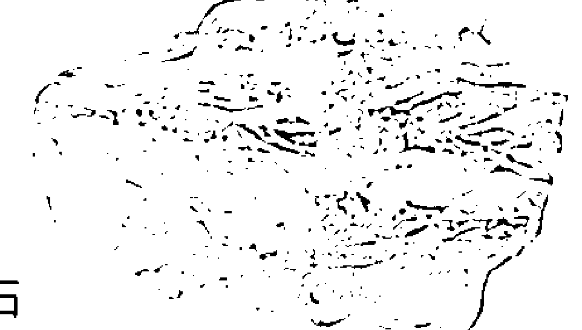

磷鋁鈉石
(Brazilianite)

## 寶石精華液

在能量層面上，太陽神經叢連結我們的心智體與神經系統，它控制著我們看待這個世界的方式，而且是最具力量的工具，用來創造能改變我們個人情境的信念系統。

當太陽神經叢受到扭曲或損壞時，以向下發散能量來取代正常向外發送的形態（在樂觀者的身上呈現稍微的向上發送），像枯萎凋謝的花朵般。

磷鋁鈉石能打開、淨化、再生與平衡太陽神經叢，使它的花朵再度恢復生命與活力，並繼而提升你的靈性。

## 適用水晶與使用方法

- 一個滾磨過的磷鋁鈉石
- 製作寶石精華液（詳第14頁如何製作的資訊）並依指示取用。

## 冷漠

癱瘓性的冷漠發生於當所有情緒與感覺已消失時，使我們對所有外在的情境與刺激完全地呈現消極反應（冷漠字面上的意思為「無感覺」）。這是靈魂層面上的停滯，使我們變得宿命地放棄每一件事物。這種嚴重的情形歸因於頂輪受損，造成與較高自我（超意識）分離的情形。

頂輪的敞開與平衡，使我們能連結宇宙高等能量與訊息來源。當頂輪因不適當的低層次活動而被關閉或受到限制時，會阻礙能量流動至所有較低的脈輪。可能因採用傳統醫學來治療慢性病或嚴重病症，效果未盡理想，或在其他較輕微的情況下，造成這種形態的損害，使你完全關閉頂輪。

昏睡、漠不關心、無聊與冷淡等較輕微的特徵，通常是因為由外在情境所造成的過度悲傷，使我們放棄希望。在這些情形中，是太陽神經叢（掌管心智體）遭受扭曲或受損的現象。

## 寶石精華液

在所有冷漠、昏睡、無聊與冷淡的情形中，太陽神經叢與頂輪同時需要被修復、平衡與整合。這種寶石精華液強調正面性，去為你自己創造一個正向的肯定語（詳第77頁的資訊），將能強化這個水晶治療技巧的治療品質。你也可以攜帶或佩戴全部或部分使用於製作寶石精華液的水晶礦石，來加速治療的過程。創造一個正向的肯定語來強化這個治療技巧，能使治療過程更為加速。

## 適用水晶與使用方法

- 一個天然的磷鋁鋰石
- 一個天然的魚眼石
- 一個天然或滾磨過的綠寶石變石
- 一個天然帶有雙尖的赫基摩爾鑽
- 一個天然的硅鈹石
- 一個天然或滾磨過的黃色藍寶石

注意：如果你無法全部取得以上所有的水晶，以最多可能取得的種類混合使用。

製作寶石精華液（詳第14頁如何製作的資訊）並依指示取用。

## 回復積極正向的水晶

- ◆ 磷鋁鋰石是淡檸檬色，它具有能量上的撫慰與啟發心智體的功效，帶來平靜與和平的優美能量。它能提供神性的鼓舞。隨著有意識的引導，磷鋁鋰石將清除以太體上的損害，且能用來啟動任何脈輪，特別是在頭頂上方的較高能量中心。它能將較高自我（超意識）的意識帶入靈性體中。

- ◆ 魚眼石能清除較高脈輪的阻塞與停滯，使身體與以太層連結，並擴展你對精微能量的覺知。這個透明白色的水晶能釋放情緒體上的焦慮與擔憂，並釋放心智體上負面的思想模式。

- ◆ 綠寶石變石（或稱金色綠寶石、金綠柱石）透過活化與整合頂輪與太陽神經叢，來治療心智體上的緊張與壓力。它打開了解我們人格原型領域的路徑，透過幫助你了解自己在生活戲碼中所扮演的角色，而使你走出幻象，去更清晰的觀察你的真實處境。這能促進更好的心智與情緒穩定性。

- ◆ 赫基摩爾鑽含有明亮的白光能量，能幫助平衡脈輪之間訊息的流動。

- ◆ 硅鈹石有非常高的振動，能淨化、活化與整合所有的脈輪。它對較高脈輪中心特別有幫助，能帶來提升的覺知狀態。這個覺知的狀態能強化共振的宇宙法則——相似者相吸引，故藉由每日專注於正面思想上，即能將正向積極性深植於你的神經通路。

- ◆ 黃色藍寶石能擴展心智體，並增加理解力與智慧。它吸引能促成有益結果的正向能量。

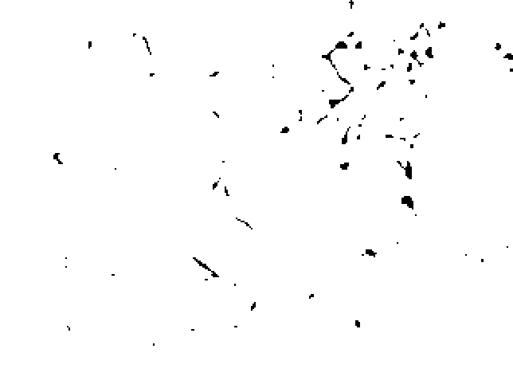

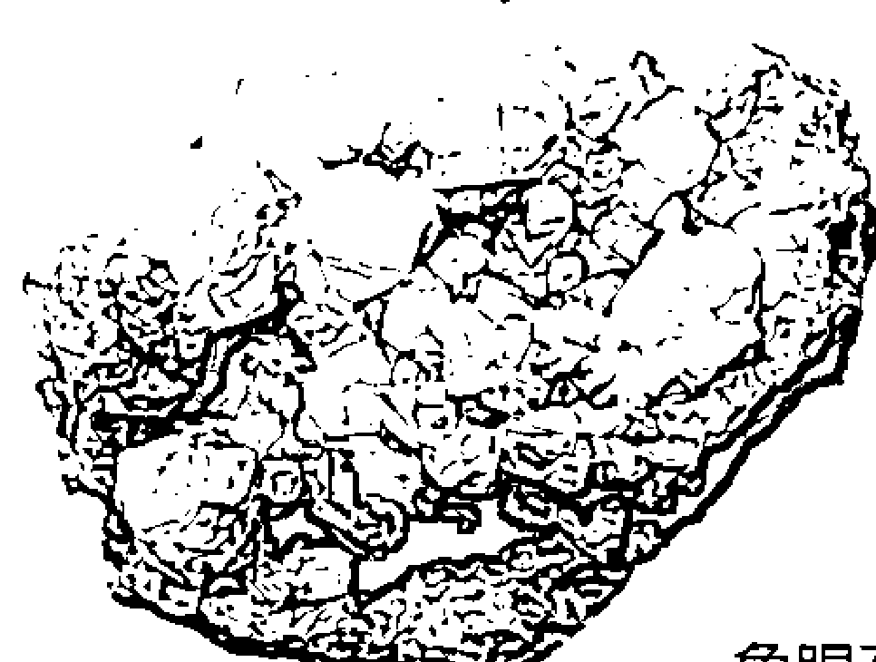

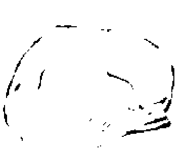

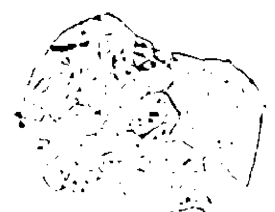

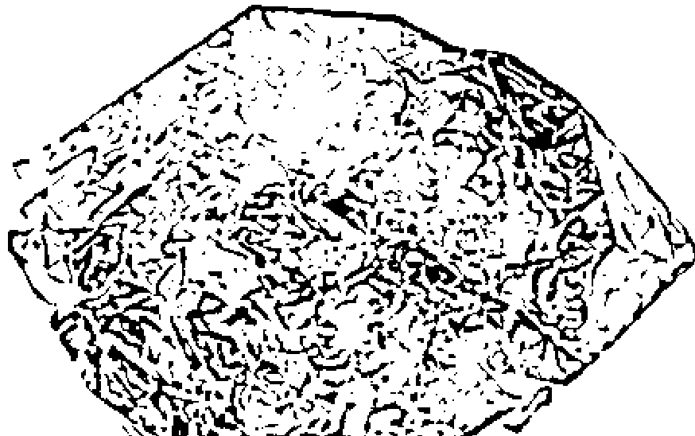

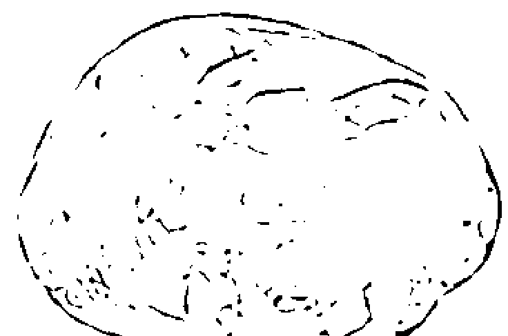

## 被遺棄感

當我們感覺到與希望、快樂、靈感來源失去連結時，我們經常感到被遺棄。這會使我們停止為朝向正向生活而改變的一切努力，我們變得放棄掌握自己的命運，消極地屈服與沉溺於負面的生活情境。因為我們喪失所有改變不愉快情況的動機，而出現昏沈與昏睡的狀態。

最初造成被遺棄感的原因並不重要，無論是不快樂的家庭生活、一份不喜歡的工作、慢性疾病或財務問題等。在某些時點，你會變得失去動機，而且負面模式在你的心智體上會變得更加根深柢固。當心智體被負面鎖鏈附著而變得扭曲時，太陽神經叢因而關閉，只有少量的生命能量流入這個脈輪，連帶的，其上下方位置的脈輪也會因此缺乏生命能量流入。

為了回復能量的平衡，需要來自外在的穩定能量，提供一個正向的能量匯集。這正是帶有穩定分子結構特徵的水晶礦石，可成為非常有效的自我轉化工具的原因。如果我們能管理具有較高振動的正向能量，即可輕易地提升身體能量。附著於心智體上的負面鎖鏈能被釋放，且身體能快速地恢復它的正常頻率。

## 寶石精華液

對於那些感到失去連結、被遺棄、長期性的倦怠與厭煩、冷淡、冷漠與空虛的人，火蛋白石是一種非常適合的礦石。

如果你經常感覺疲倦、沒有能量，冷淡茫然地過日子，感覺完全被宇宙拋棄，或放棄自己的命運、消極屈服於負面生活情境時，可嘗試這種寶石精華液。

## 適用水晶與使用方法

一個天然火蛋白石

製作寶石精華液（詳第14頁如何製作的資訊）並依指示取用。

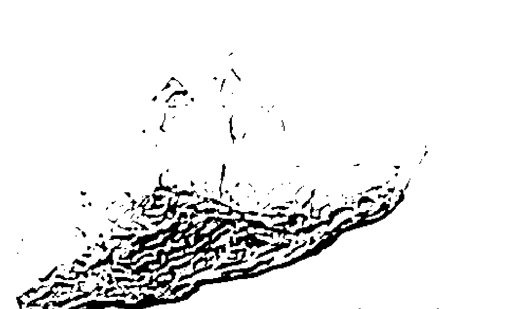

火蛋白石 (Fire Opal)

## 孤獨寂寞

曾有孤獨或孤立感經驗的人會發現，他們的問題實際上起源於孩童期初期遭受情緒剝奪的情況。他們未能得到足以支持成長為平衡的個體所需要的關愛與讚賞。當孩童的情感支持與滋養被否定時，他們日後可能成為經常感覺孤獨的成年人，即便身處於群眾之中，他們仍有單獨與孤立感。

另一種相反的情況亦源起於早年的情緒剝奪經驗，它呈現出來的是自我中心、自戀傾向、情感上的苛求、多話性的憂鬱症。這些人無法忍受單獨，他們必須成為注意力的中心。他們從他人的情感能量得到滿足，並因持續不斷的說話而使自己的力量枯竭，說話的內容永遠圍繞著自己。這些自我專注、自我中心、苛求的個體，經常是不理想的傾聽者，傾向情緒的誇大與小題大作。

## 寶石精華液

用於製作此種寶石精華液的水晶，是粉紅與綠色形體的鋰輝石，兩者都可為情緒體帶來完整與平衡。紫鋰輝石喚醒心輪中對自己與他人無條件的愛，它透過協助與地球頻率整合的方式來支持新生兒與孩童。

翠綠鋰輝石帶來柔軟、溫和的淡綠色光束療癒心輪。它經由釋放舊有的情緒剝奪的心痛，來消除敏感的負面情緒與感覺。將上述兩種水晶搭配使用時，能幫助建立對他人的同理心。

## 適用水晶與使用方法

- 一個天然紫鋰輝石
- 一個天然翠綠鋰輝石

製作寶石精華液（詳第14頁如何製作的資訊）並依指示取用。

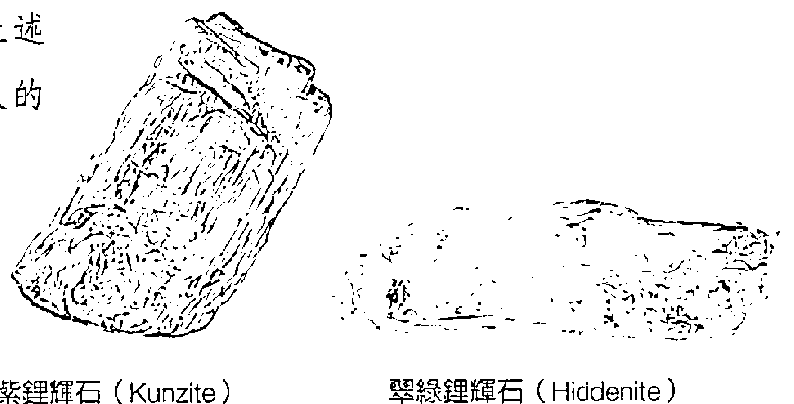

## 虐待

虐待不應被容忍，不論是性、身體、情緒、精神或靈性上的虐待。如果你正遭受或曾經受到虐待，則需要尋求專家的幫助與支持。對於某些人而言，虐待產生的影響是立即且明顯的，對於其他人則可能於虐待停止後數年之久才會出現影響。影響的顯現範圍可從身體瘀青到反社會行為、性變態，到感情上的退縮。

## 恢復平靜的水晶

- 佩戴、攜帶或使用綠色玉石能帶來平靜，逐漸的灌輸智慧，促進平靜感，淨化自我厭惡並穩定性格。這種礦石能促進關係上所有層面的和諧，並療癒外來影響所造成的神經系統壓力。
- 賽黃晶因具有減緩任何症狀的能力，而被視為治療的萬靈丹。它能清除業障，並使你與平靜及來自天使界的智慧連結。
- 海藍寶石帶來免於受他人影響的自由。它釋放疾病背後潛藏的模式，漸次輸入勇氣與堅毅，並去除受害者意識。
- 鉻綠柱石能清除壓力與心輪中無法表達出來的感覺。它能在深度治療發生時，使情緒體保持穩定，同時淨化意識與無意識中的負面模式。

受虐關係（特別在家庭暴力涉入時）經常與施虐者、受虐者或兩者的物質（酒精、藥物或毒品等）濫用有關連。然而認為藥物毒品或酒精的倚賴上癮造成虐待的行為，是一種錯誤的想法，那只能給與施虐者掩飾的藉口，讓他們逃避自己行為的責任。

健康照護的專家了解唯一的對治方案，是去檢驗暴力行為與物質濫用的潛在原因，並同時治療這兩種問題。虐待的關係會毒害所有涉入的人，需要儘速治療。

## 寶石精華液

## 適用水晶與使用方法

此種寶石精華液完全使用有助於將平靜帶入生活的水晶來製造，它能強化健康照護或其他協助的專家所給與的支持與建議。

- 一個滾磨過的綠色玉石
- 一個滾磨過的賽黃晶
- 一個滾磨過的海藍寶石
- 一個滾磨過的鉻綠柱石
- 製作混合的寶石精華液（詳第14頁如何製作的資訊）並依指示取用。

## 愛的匱乏

有些人因非常內向而感到孤寂與不被愛。這些不幸的靈魂除了失敗以外，從未有任何期待，他們是猶豫與被動的，缺乏任何自信。他們因自尊低落而對一切事物皆感到歉意，即便在沒有必要時亦然，他們感覺自己不如別人。

無價值感、無力感與不被愛感通常起始於嬰兒期，因為小孩會從父母親處承接與吸收他們的負面想法與態度。這種父母親的負面模式的輸入，造成太陽神經叢的扭曲與功能失常，對心智體造成不利影響，使你無法達成內心真實的生命目標。

## 心智體的淨化

如每日使用這種水晶治療技巧，將溶解你性格上自我設限的思想觀念，並使你靈魂真實的潛能得以實現。它可用來進行長期的治療，亦能處理有關自信心的暫時性問題。在任何活動進行前或在你需要提振正向能量與自尊的情況時使用，是非常有幫助的。

### 適用水晶

一個單尖白水晶

### 使用方法

1. 將白水晶握於流動的冷水下方，來淨化你的雙手，並將它們擦乾。
2. 甩動你的手兩分鐘來淨化你的情緒，這將能釋放心輪阻塞的能量。
3. 保持敏感度，並以雙手手掌來回滾動白水晶二至五分鐘，來提升手掌氣感。
4. 緩慢的將雙手合掌，感覺能量在雙手中間顫動，隨著雙掌的靠近，開始感覺之間的壓力。把玩這股能量，並讓它來回彈跳於手掌之間。
5. 將這股能量塑造成球體，並觀想為黃色。當直覺告訴你可以時，將這個能量球放進你的太陽神經叢。這將能補充心智體的能量，並加以治療與平衡。

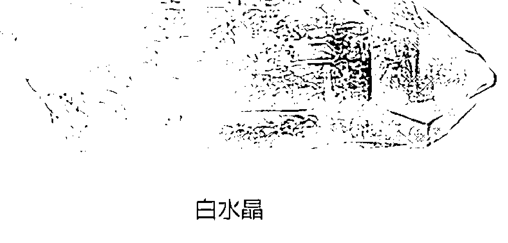

## 不確定感

不確定感會造成情緒不穩定，在極端的情緒中搖擺不定。某日你可能是熱情與充滿活力的，而隔天又變得悲傷與冷淡的，且困惑不知自己怎麼了。這種經常性的搖擺，使你的家人與朋友認為你是令人不愉快與不舒服的。對你而言，漫無目標地翻來覆去改變情緒與主意，並不是一件有趣的事情。

經常性的情緒搖擺與不確定感，將造成持續的迷惑與混亂。你的優柔寡斷會造成煩躁不安，通常以精疲力竭與冷漠收場。你可能在一生中都承受著這種狀況，因為這可能與出生創傷或出生後即面對的混亂環境有關，在該環境中受到太多觀念的影響與集中轟炸。不確定感也會導致焦慮與恐慌症。

## 內在平衡的水晶

- ◆ 白水晶因為具有多光譜的療癒能量，而被稱為治療大師。煙水晶帶來落實與穩定性，能停止極端的情緒變化。同時在你的頭部上方使用白水晶，及在你的腳底下方使用煙水晶，能釋放不安定感。它們一起運作時，能沿著管控經絡與主要脈輪的中央線整合你的身體。

- ◆ 療的功效。它藉由給與保護，使免於受到那些讓許多敏感靈魂無法抵擋的有害外來影響侵害，來維持能量的層次。這種水晶能幫助你發展與較高自我（超意識）的神入（對於他人處境、情感、思想及訊息能同理與同步心領神會的能力），故能增加正向的內在指引。

- ◆ 堇青石能強化你的直覺，協助內在的平衡與歸於中心。它促進專注與決斷的力量，不受外在影響或環境的干擾。堇青石使你對資訊及與較高自我（超意識）的溝通更具有接受性。

- ◆ 月光石能藉由撫慰與協助進入寧靜狀態，滋養靈魂與治療精微能量系統，是在靜心中握持的理想礦石，它釋放情緒的緊張（特別是出生過程或剛出生時所造成的創傷），帶來平衡，停止神經緊張、不穩定的行為及優柔寡斷。

- ◆ 粉晶能恢復活力、治療情緒、釋放壓力與促進治

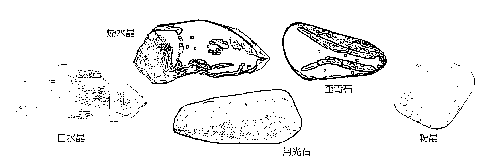

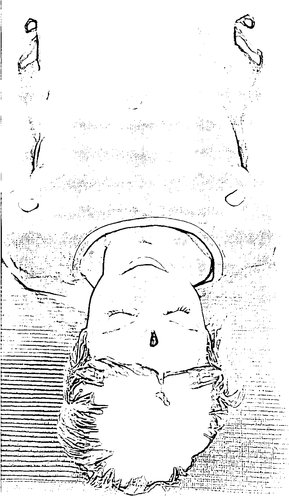

### 適用水晶

- 一個單尖白水晶
- 一個單尖煙水晶
- 一個滾磨過的董青石
- 三個滾磨過的粉晶
- 三個滾磨過的月光石

### 使用方法

1. 舒適的躺在地板上，可使用瑜伽墊或你喜歡的軟墊。
2. 將一個白水晶放在你頭頂上方：煙水晶在你的腳底下：尖端各向外擺放。
3. 將董青石放在眉心輪上（詳第18頁脈輪位置圖示）。
4. 將一個粉晶放在你的心輪，各一個在你肩膀的頂端。
5. 將一個月光石各別放在你的喉輪、太陽神經叢與臍輪上。
6. 專注於呼吸上來放鬆你的身體。在吐氣時，專注於「放鬆」二字，吸氣時，專注於「平衡」二字。
7. 讓你的身體有二十分鐘的時間整合水晶與身體的能量。準備好在當直覺告知你水晶能量已快速整合完成時，提早移除水晶。

## 內在平衡療法

因為念頭與情緒無時不刻地處於改變中，故需要在自己的力量中進行所有的事情，來達到自己的內在中心與自然的平衡，或者選擇消耗一生時間精力敗倒於外境影響之下。運用這個強而有力的水晶治療技巧，來強化你的直覺，並終止使你生活悲慘的二元兩極性的擺盪狀況。

## 焦慮

由壓力造成的焦慮可能導致高血壓等生理問題，且會引起情緒問題，例如不安、恐慌症、睡眠障礙與惡夢等。每天所面對的情境通常是造成壓力的來源。看牙醫、考試、工作面試、難相處的鄰居或工作同事，通常會讓你感到壓力與焦慮。

## 治療要訣

- 確定讓你的身體有足夠的時間與新的能量整合。有些人可以非常快速地整合紫水晶的能量，有些人則可能需要數天或數週，來經歷與完成治療的自然過程。
- 在運用紫水晶治療之後，給自己足夠的時間回歸每日的覺察與正常的呼吸狀態。飲用大量的水來沖洗在療程中釋放的體內毒素。
- 有時你的意志點可能會感到脆弱與痛感，或顫動達數小時之久，這是正常的反應，這種狀態會很快消失。

當你經驗焦慮時，你身體的能量不再以平衡流動的方式運作。如果你無法釋放這種焦慮，你可能會生病或失去面對與應付憂慮的能力。

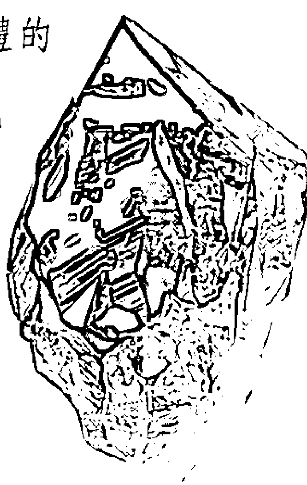

## 清理焦慮

紫水晶能治療情緒，但它們也能深入身體，甚至是細胞組織，去治療焦慮的來源。它們能幫助清理身體中的痛苦或悲傷、紓解恐慌、增進良好的睡眠品質並減緩惡夢。這個簡單的技巧是一種有效且安全的程序，也適合水晶治療的初體驗者。可將此技巧運用在自己與他人身上，可依需要多次使用。

### 使用方法

1. 準備紫水晶並加以淨化（詳第13頁如何進行的資訊）。
2. 盤腿並舒適地坐在地板上，將水晶放在你的左手邊。
3. 把右手置於左手上，疊放於兩腿上方。讓肩膀輕微向後拉抬，使血液容易流動至腦部。
4. 閉上眼睛，開始進行五分鐘的深呼吸，將氧氣帶入你的腦部。繼而使呼吸緩慢下來，並完全將你的注意力轉移至呼吸的進行上。勿試圖控制呼吸，只要感覺呼吸的進出身體。

### 適用水晶

一個單尖紫水晶

5. 以你的右手輕敲意志點三次，意志點位於你心與喉嚨中間的胸骨上。再將右手放回腿上並對意志點保持覺察，當意志點被活化啟動時，你可能感覺到振顫或抽動。
6. 將紫水晶握在左手中並溫和地置於意志點上，尖端朝向頭部。回憶你選擇去釋放的壓力情境，感受所有與焦慮連結的情緒，並將所有的記憶帶到你的意識覺知上，讓痛苦或悲傷完全浮出體外。
7. 你會突然地感覺所有的焦慮正在排出，你的情緒將快速地變得平靜與專注。
8. 繼續將紫水晶握於你的意志點上，隨著水晶光能進入更深層面時，經常會感覺到另一股洶湧的情緒浮現。這股情緒的波濤洶湧感，可能會隨著身體吸收紫水晶的療癒能量而數度發生。在每一次感到情緒洶湧時，請意識到那是身體選擇進行更深層治療的過程。
9. 在使用後淨化水晶。

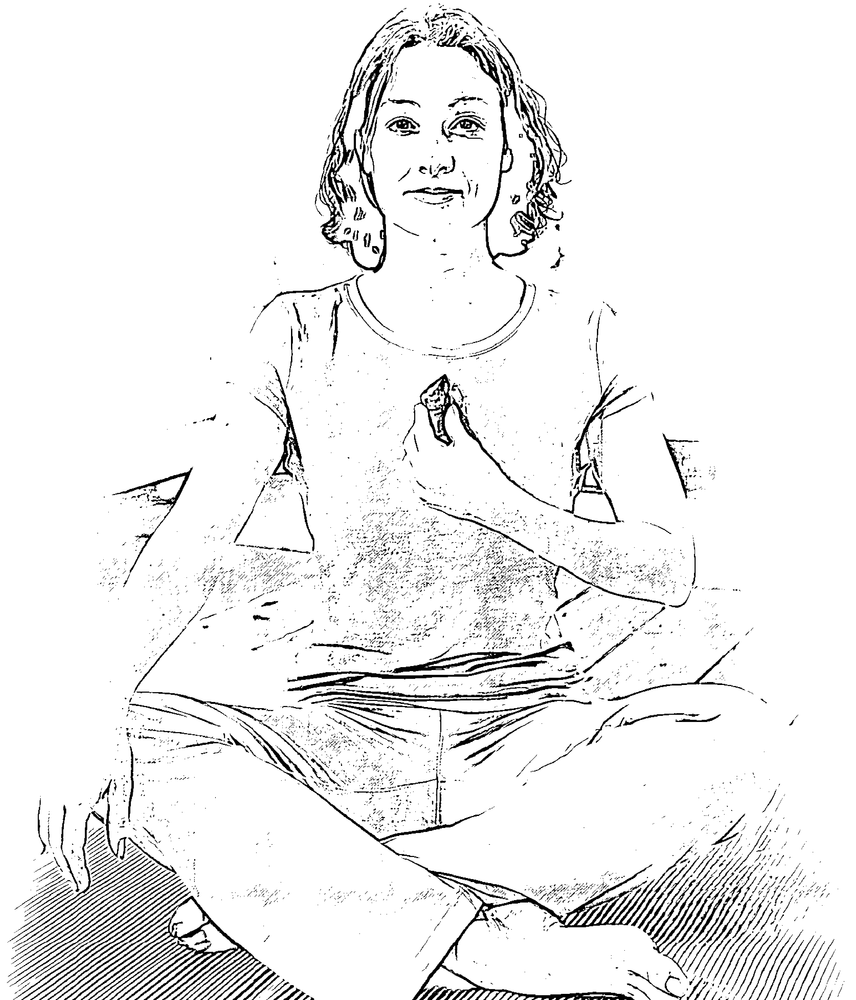

## 創傷

任何突發的害怕或驚嚇經驗，無論是發生在身體、情緒、心智或靈性上，如能量系統未能立即將其釋放，將可能導致能量的創傷。這種能量的創傷之後會貯存在身體與能量體上。

存生命能量的整體流動，故此處通常能感受到創傷所造成的最初衝擊與影響。

創傷可定義為任何直接的能量衝擊，造成我們的能量系統無法應付的狀態。創傷會深植於能量系統中，造成整體能量流動與運作的扭曲。有些驚嚇會立即顯現對身體的影響，其他則會停留在能量系統上，在受影響區域上造成某種程度的麻痺。臍輪掌管並儲

創傷能在許多層面上影響我們，甚至在意識層面上造成恐懼、憂慮、畏懼或惡夢。創傷經驗會撕裂或劃破氣場，而且這些撕裂處或破洞可能導致嚴重的能量耗損。創傷影響我們的感覺與思考的方式，並因造成扭曲而鎖住我們的能量，這將致使我們的能量系統受到壓迫，再度導致能量的耗損與慢性疾病的形成。

## 寶石精華液

## 適用水晶與使用方法

我們應經常覺知，所有事物皆是能量與不同頻率的振動所呈現的樣貌，因此身心要健康、安樂，就需要能量頻率維持平衡。這種混合紅玉髓與鈦晶的寶石精華液，不僅能迅速釋放原來的創傷，也能釋放因扭曲能量系統而引起的壓力。紅玉髓能治療氣場上的創傷與平衡臍輪，而鈦晶可修補所有層面上受損的架構，回復生命能量的自然流動。

- 一個滾磨過的紅玉髓
- 一個滾磨過的鈦晶

製作混合的寶石精華液（詳第14頁如何製作的資訊）並依指示取用。

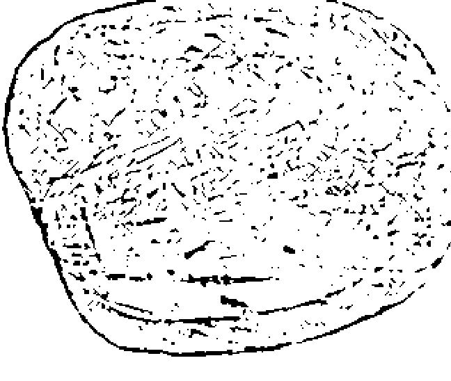

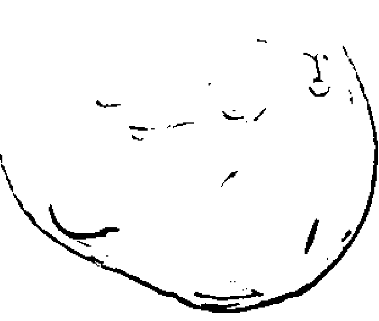

## 挫折

挫折的憤怒情緒是因缺乏耐性，使每個人感覺不足或失敗。經常覺得挫折的人通常具有運作快速的心智，因為他們的思想快速，對於他們而言，其他的人似乎顯得緩慢。

在身體層面上，挫折導致內在緊張、神經衰弱、神經性的消化不良、熱潮紅與皮膚過敏或紅疹。挫折的人也可能較具有遭受意外事故與魯莽的傾向。

在情緒層面上，挫折會導致你相信自己優於他人，並忘記自己的缺點或失敗。對那些挫折的人而言，重要的是去了解自己並沒有比其他人更重要的事實。

在心智層面上，它帶來僵化的態度，特別是針對競爭與取得財富。心智體與太陽神經叢有關，挫折會造成太陽神經叢因承受太多的能量而扭曲。這可能導致渴望擁有權力去支配別人的情形。

在靈性層面上，挫折誘使我們去相信我們是優於別人的，而忘記如何去傾聽別人所呈現的智慧，忽視傾聽較高自我、天使或指導靈的訊息與指引。

## 寶石精華液

綠寶石變石藉由活化與整合你的頂輪與太陽神經叢，帶來心智與情緒的穩定性。這將能治療在你的心智體上造成挫折、壓力與扭曲的缺乏耐性態度。

藉由擴展你的頂輪，帶入更高的指引，而使你的太陽神經叢充滿太陽般的清晰與明亮。這種擴展的覺知，能使你以更寬廣的觀點來看待人事物，因而釋放對自己與他人的錯誤判斷。

## 適用水晶與使用方法

一個天然或滾磨過的綠寶石變石

製作混合的寶石精華液（詳第14頁如何製作的資訊）並依指示取用。

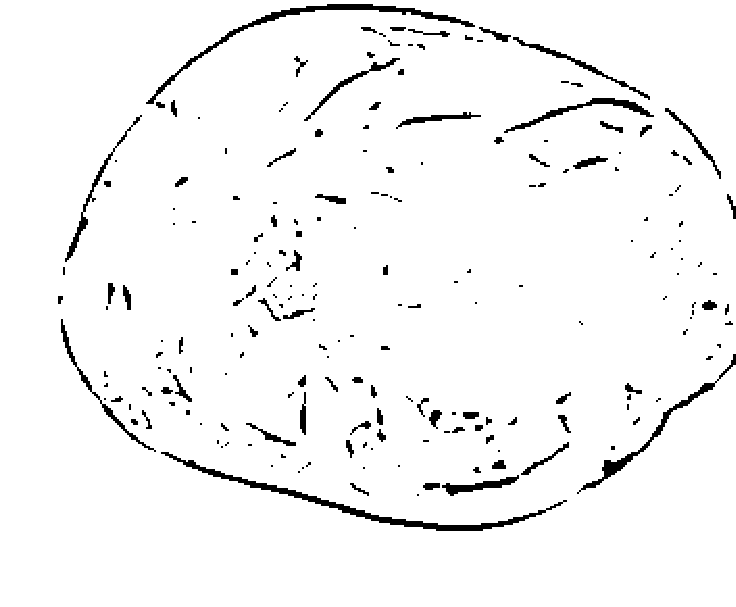

綠寶石變石

## 罪惡感

罪惡感會影響你的整個人生，並破壞你靈魂中的喜悅。如果我們試著了解這種罪惡感源自何處，則會經常發現，罪惡感的種子已在孩童早期階段播下。受罪惡感支配的人通常是家庭的代罪羔羊，或是多餘、不被需要的成員。他們感覺被生下即是個錯誤，不被愛與永遠都不夠好，他們努力去討好父母親但總是未成功。

那些受罪惡感支配的人從未真正的滿意自己。他們是完美主義者，儘管有許多正向經驗存在，而仍在每件事上責怪自己未能更盡心去做。

那些為罪惡感纏繞的人，將在每一次的談話中使用帶有道歉措詞的慣用語，例如「我將永遠不會原諒自己」，「我知道都是我的錯」。他們的自我指責是無止盡的，他們為每件事感到抱歉，且從未寬恕自己。他們甚至為別人的錯誤承擔責任，因為他們受虐的渴望而使他們無止盡地自我犧牲。

他們的罪惡感通常使他們的親密關係中斷，或吸引他們進入不適合的關係與吸引不體諒別人的伴侶。任何緊握著罪惡感的人，是無法去愛自己與原諒自己的，也無法去愛別人與原諒別人。

## 石鹽與海鹽療法

- ◆ 石鹽是一種氯化鈉，亦稱為岩鹽。它有許多不同的顏色——白色、藍色、薰衣草色、紫色、綠色、黃色、棕色或無色，取決於它的產地。
- ◆ 藍色石鹽是淨化以太體上過去的負面訊息與意識型態。它帶來自我認同，使你明白你的罪已被寬恕。每一個人都值得擁有愛的關係，藍色石鹽幫助你去愛自己本然的面貌，且有助於建立實際可行的目標。
- ◆ 粉紅色石鹽特別有助於淨化心輪中過往的負面情緒模式，該模式在孩童期間已輸入。它去除深植於無意識中的善惡觀念，該觀念通常帶有宗教的隱喻。它釋放原罪與性是罪惡的觀念。
- ◆ 海鹽也是氯化鈉的一種，能吸取出身體及所有精微能量體上的負面能量。橄欖油能更新生命力與回復和諧與平衡的狀態。

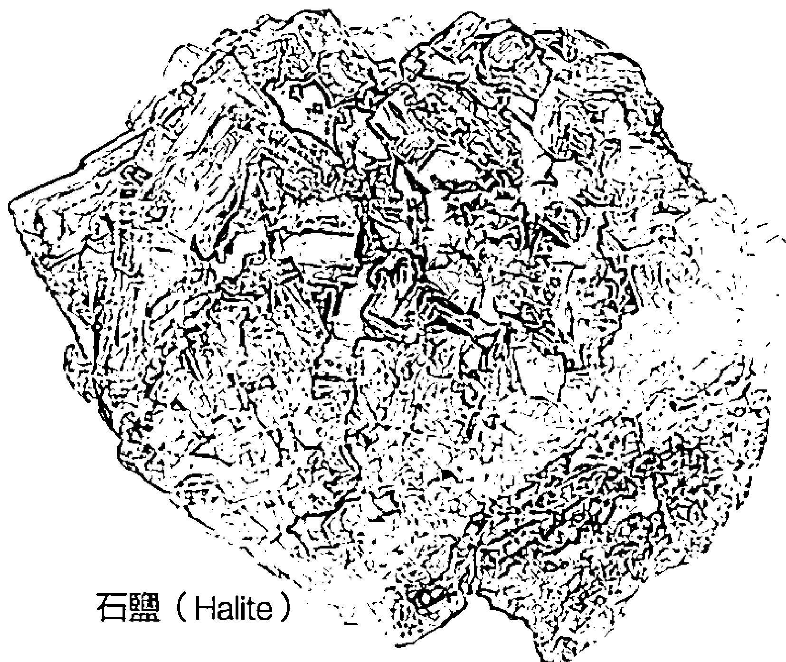

## 淨化與回春

罪惡感會影響你的能量系統，如果你持續的感到疲倦與能量低落，你就需要更新你的生命力。這個簡單的水晶治療技巧，通常被用來淨化罪惡感的能量，與去除自我懲罰的傾向。石鹽浴與磨砂鹽都能有效的去除根深蒂固的負面情緒模式。

### 適用水晶

- 一個天然的石鹽
- 橄欖油
- 海鹽

注意：挑選藍色或粉紅色的石鹽用於此技巧上。

### 使用方法

1. 先洗澡，然後在浴缸中注滿溫度舒適的溫水，將石鹽水晶放入浴缸中，讓身體浸於水中並向後仰靠與放鬆。你的罪惡感將如同石鹽水晶般溶解與消失。
2. 在浸浴後使用磨砂鹽。將一茶匙的橄欖油與一茶匙的海鹽混合於手掌中。以畫小圈的移動方式磨擦全身，永遠以朝向心臟的方向進行。最後以水沖洗並擦乾身體。

## 治療要訣

- ◆ 如果你想要讓你的石鹽水晶持續用於幾次石鹽浴中，在小部分溶解時，即將它移開。
- ◆ 你可在浴缸中添加兩滴精油。松樹是特別理想的精油，因為它能淨化罪惡感與自我譴責，薰衣草精油則能幫助放鬆，玫瑰精油能為自己與他人帶來愛的能量。你也可添加少量的香草或花瓣到浴缸的水中。
- ◆ 你也可在混合的磨砂鹽中添加兩滴松樹、薰衣草或玫瑰精油。

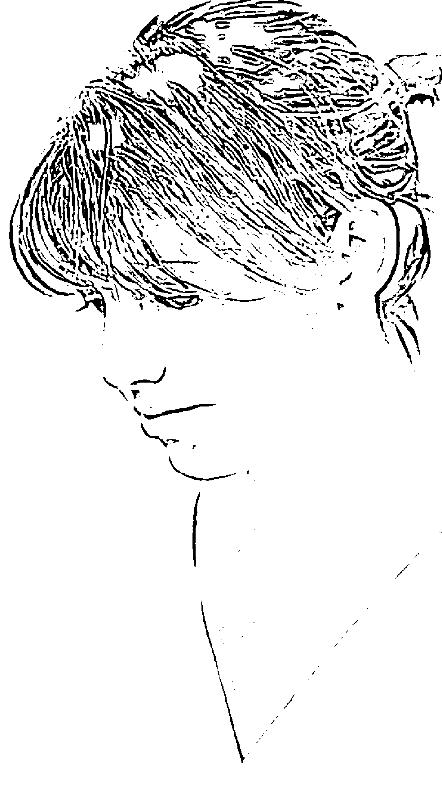

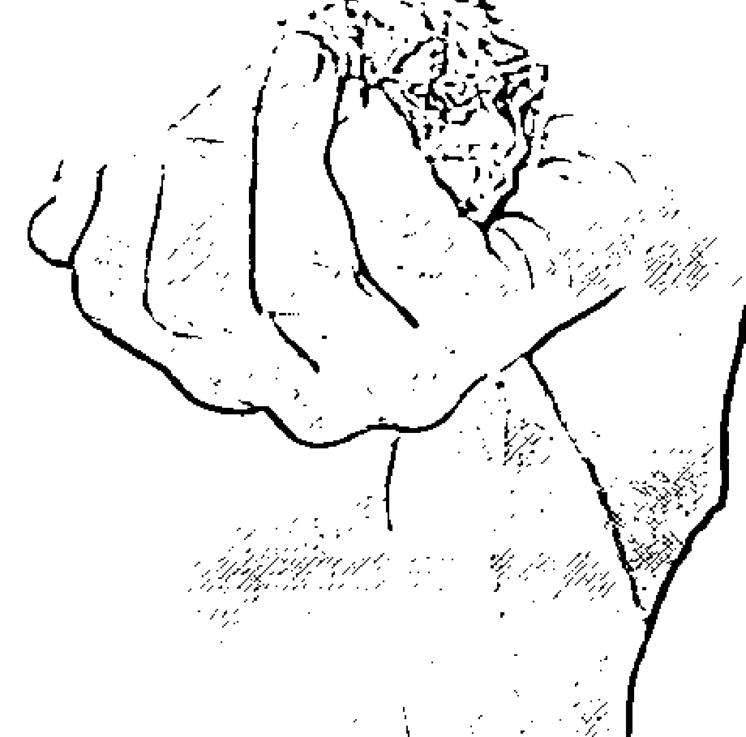

## 憂慮

有時，我們會有無法解決的情緒課題或記憶，我們不願想起，但拒絕回想的念頭持續地在腦海出現且無法停止。我們不斷的憂心，一次又一次的重溫，直到它們成為一種過度充載著心智能量的強迫性思維。

憂慮會演變成心智過度活躍的情形，對心智體將造成嚴重的扭曲，如同我們的思緒陷入無盡的循環中，無法掙脫。我們可能出現睡眠障礙，特別在清晨時分，因而整天都感到疲勞與沮喪。如果我們無法停止這種苦惱思維與心智爭辯所造成的內在對話，我們將會形成心智的緊張與慢性頭痛。

### 驅除憂慮的水晶

- ◆ 紫鋰輝石能清理在強迫性憂慮思維循環中阻塞的情緒能量。
- ◆ 鋰雲母能減緩神經系統的敏感與清理扭曲心智體的情緒廢棄物，可以釋放壓力、憂慮與神經緊張。這種水晶能消除情緒或心智的緊張，特別在爭吵或其他較激烈的情緒衝突時。

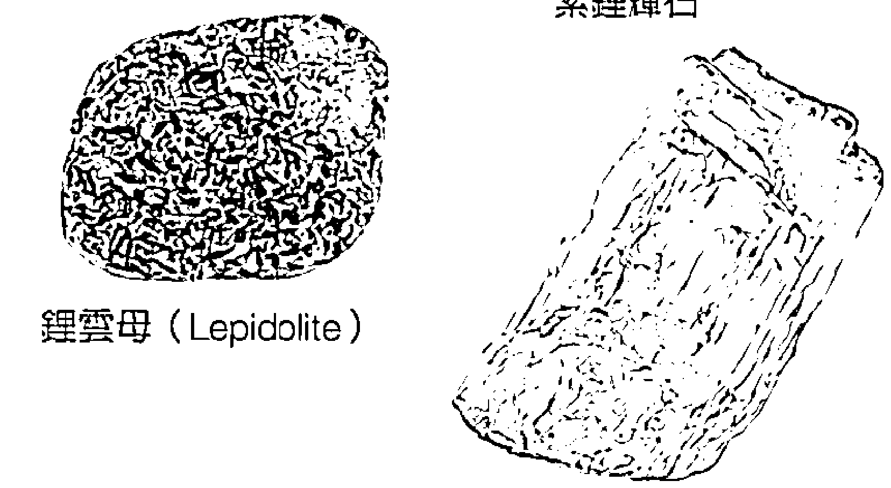

### 驅除憂慮療法

這種水晶排列能藉由釋放阻塞及阻礙解決潛在問題的心智與情緒能量，來打破憂慮的循環。你可佩戴粉晶或紫水晶墜子來支持這個特殊技巧，增加減緩壓力的效果。

### 適用水晶

- 兩個天然的紫鋰輝石
- 五個滾磨過的鋰雲母

### 使用方法

1. 舒適的躺在地板上，可使用瑜珈墊或你喜歡的軟墊。
2. 將一個紫鋰輝石放在你頭頂上方，一個在你的腳底下放的中間處。
3. 將鋰雲母各別放在眉心輪、喉輪、心輪、太陽神經叢與臍輪上（詳第18頁的脈輪位置圖示）。
4. 讓你的身體有二十分鐘的時間來整合水晶與身體的能量。準備好在當直覺告知你水晶能量已快速整合完成時，提早移除水晶。

## 精疲力竭

精疲力竭發生在當你長期處於身心緊張狀態，且未讓你的心靈有時間恢復活力時。你可能曾因生病、工作過度、沒有足夠的睡眠，或花上所有的時間與能量來照顧別人，造成精疲力竭情形。不良的飲食習慣也可能造成精疲力竭，因為你的身體缺乏恢復活力所需要的營養。

### 黃水晶療法

- ◆ 黃水晶含有陽光的能量，能激發與喚醒你，並帶來集中的心智覺知。這種水晶充滿樂觀、熱情、喜悅、活力、再生與清晰。
- ◆ 黃水晶能復甦與提升太陽神經叢，重建心智體與停止能量的流失、消耗與透支。黃水晶能緩解疾病、工作過度、睡眠剝奪或任何導致能量消耗的活動，所造成的精疲力竭與疲勞，也能在你的能量遭受外來攀附的能量吸乾時，再度補充能量。

嚴重的精疲力竭發生在當你的身體、情緒、心智與靈性上過度透支，以及持續地消耗能量時，此時即使是最小的任務也會變成無法克服的障礙。經常發現自己處於此種狀態的人們，通常是具有過度的責任感，且尚未學習經由舒緩心靈的不同層面，來正確地導引與使用他們的能量。

## 寶石精華液

以黃水晶進行水晶治療，能有效地恢復太陽神經叢的活力與幫助穩定。這個脈輪是主要的青春活力回復中心，因為它是許多身體系統的連結界面，包括神經系統、免疫系統、消化系統、腦部與記憶。它也是個人力量與情緒穩定力的中心。

## 適用水晶與使用方法

一個天然單尖或滾磨過的黃水晶

製作混合的寶石精華液（詳第14頁如何製作的資訊）並依指示取用。

你可以隨時攜帶或佩戴黃水晶，或將黃水晶放在你的照片上（也適合運用在需要提振正向能量的朋友或家人身上），來搭配支持寶石精華液的使用。

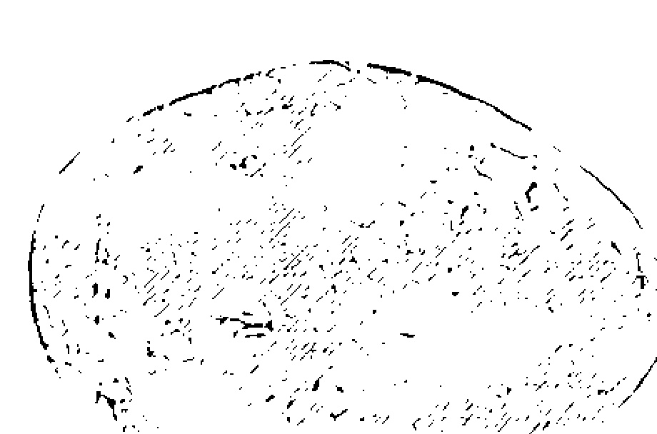

黃水晶

## 深深的無助感

在某些時刻你可能會感覺到被情境淹沒、沮喪，猶如烏雲降臨包圍著你，像被憂鬱症的斗篷覆蓋著。這股陰鬱能量降臨並淹沒吞噬你，並無任何明顯緣由，它剝奪你靈魂的愉悅與內在平靜的品質，且能導致你的能量耗竭、陰鬱沮喪與崩潰。許多人發現這股陰鬱的能量使他們感到徹底地瓦解崩潰，就好像他們是自己生命中的陌生人。

我們不應成為意志力薄弱與不足的人，而吸引這種能量進入生活中。敏感的人通常會撿拾別人或情境的情緒垃圾，負面思想會隨之侵入並影響生命中的每一個層面，這將阻礙我們達成目標、夢想與抱負。

## 治療要訣

- ◆ 如果你想讓光能圈更擴大，可運用白水晶或拉長石。你也可在你的光能圈中，加入白色蠟燭一起使用。
- ◆ 記得在使用前後徹底地淨化所有水晶，特別是在使用之後（詳第13頁如何進行的資訊）。
- ◆ 佩戴或攜帶拉長石或紫鋰輝石，將能保護你心輪能量的完整品質，使你處於宇宙的愛與慈悲之流中。

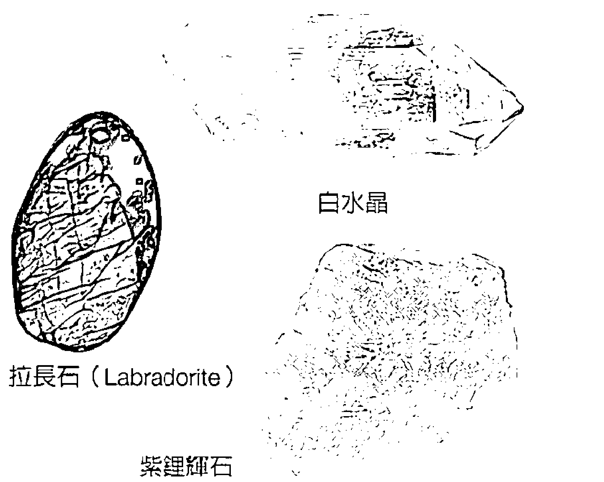

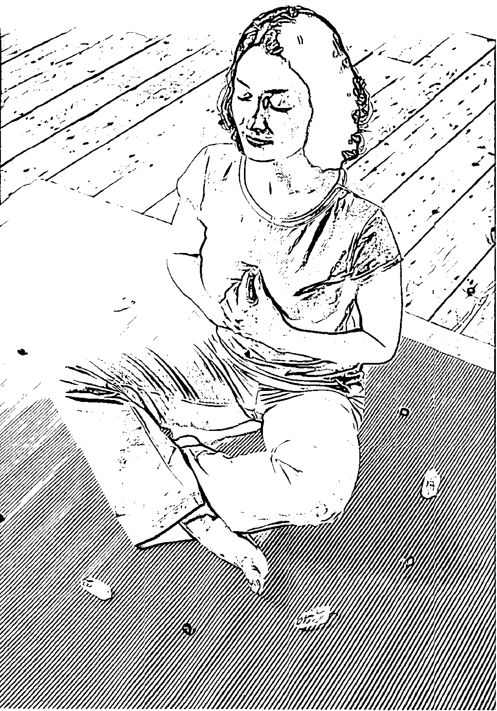

## 光能圈療法

有些人描述被淹沒的感覺，如同遭受到一股外來不明的負面能量侵襲而覆蓋上陰影，使他們與自己的靈魂分離。

這種水晶治療技巧對於釋放這種黑暗能量是非常理想的，可用在任何需要淨化有害能量的地方，或用來設定一個保護的光能圈，環繞自己或你居住的地方。

### 適用水晶

- 六個滾磨過的拉長石
- 六個單尖白水晶
- 一個天然的紫鋰輝石

### 使用方法

1. 將拉長石與白水晶交替地以圓圈方式圍繞自己擺放。盤腿坐於圓圈的中心。
2. 以雙手將紫鋰輝石放置於心輪（詳第18頁）的位置。安靜地觀察你想要自個人能量場中驅逐出去的那股能量。
3. 當你感覺準備好時，將紫鋰輝石向外移開，指向光能圈外的方向。觀想或感覺所有欲驅逐的能量正遠離你，透過紫鋰輝石將該能量排出身體外。
4. 當你感到所有的負面能量已遠離你時，將紫鋰輝放置於以拉長石與白水晶排列的圓圈之外。
5. 觀想或感覺自己正被一個明亮的白色療癒光球包圍。讓光充滿你的全身，感覺你的情緒隨著光能而提升。盡可能地吸收光能（你應可感覺到在體內有一股溫暖的明光升起，或許甚至有輕微的體溫升高情形）。
6. 觀想或感覺你吸引更多的光來到。將這股能量向外發送，以巨大的光能旋風充滿你所在的房間。如果你希望，可將這股能量更向外發送充滿整個房屋。你現在應可感覺到一股洶湧而來的正向能量正貫穿著你。
7. 如欲將這股能量關閉，安靜地坐在圓圈的中心，並數算著你的祝福。回想你生命中所有美好的事物，讓自己充滿感謝。感謝的能量會吸引天使的到來，感覺自己正被正向的愛的天使圈環繞著。
8. 在你準備好時，離開水晶排列的圓圈。

## 光能圈療法的水晶

- ◆ 拉長石是光的提供者，能消除能量場中的黑暗部分。它擁有一個明亮閃爍的彩虹光，能在許多層面上運作，並清理外來附著的能量。
- ◆ 紫鋰輝石能淨化入侵你的能量場的情緒能量。
- ◆ 白水晶能強化與提升其他水晶的能量與效力。

## 困惑

為驅除困惑、達到穩定狀態，就要使我們的能量平衡、歸於中心、整合與和諧運作。當我們感到困惑或不落實時，我們會容易失去方向，而且我們的能量是分散與混亂的。我們看起來像處於一種恆常的迷幻與多變的意識狀態，像似夢幻或疏離的。

## 幫助落實的水晶

- ◆ 煙水晶能將不和諧的能量吸出並吸收，具有非常好的穩定身體效果。這是一種十分理想的落實水晶，適合在所有的療程結束後幫助能量集中。它可以幫助容易適應改變與靈性成長，來避免治療期間過渡的危險情況發生。
- ◆ 磁鐵礦能幫助落實與補充能量，可以整合脊柱與脈輪系統。磁鐵礦透過幫助你的能量系統與地球磁場校準整合，而帶來安全感、力量與生命力的更新。
- ◆ 赤鐵礦也是一種有效的落實與補充能量的礦石，能幫助回復平衡與穩定性。

習慣性感到無法落實的人，通常被描述為注意力渙散、注意力不集中或作白日夢。他們通常是理想主義者，對當下景況沒有興趣，反而長時間待在自己的幻想世界中。這些人容易進入靜心狀態且快速地陷入迷幻的意識狀態。他們的酒量差且容易上癮。

治療的過程可能會造成暫時性的迷惑；有時候當人們開始治療能量阻塞的情形時，他們可能容易失去方向與迷惑，因為快速強烈的能量變動帶來許多層面上的改變。為了使治療效果能完全整合與維持，必須使這些渙散的能量落實與集中。

## 寶石精華液

## 適用水晶與使用方法

為避免在困惑狀態中徘徊的情況，你需要一個能幫助你感到落實的水晶治療技巧。這種寶石精華液是以你所挑選的三種高效能的落實礦石製造而成的。攜帶或佩戴其中一種礦石能帶來輔助的功效。

- 一個天然或滾磨過的煙水晶，或
- 一個天然或滾磨過的赤鐵礦，或
- 一個天然或滾磨過的磁鐵礦

製作混合的寶石精華液（詳第14頁如何製作的資訊）並依指示取用。

## 憤怒

憤怒是一種爆發性的情緒能量，與太陽神經叢中火的品質有關，可能因過度刺激這個脈輪的外在情境或賀爾蒙失衡而引發憤怒。這種太陽之火會流入與活化海底輪，造成侵略性的行為，鬥爭性與敵意。

憤怒其實是恐懼的一種副產品，通常是對權威人物或被剝奪力量的恐懼。我們對權威的態度早已在孩童時代被輸入程式，那就是為什麼憤怒是一種如此不成熟與強而有力的反應。如果在孩童期對我們有掌控權威的人，濫用他們的權力、持續性的批評或逼迫我們，我們也會因未服從而造成羞愧感。羞愧會造成力量剝奪與羞辱的感受，因而阻塞太陽神經叢。

憎恨發生在當太陽之火上升至心輪中心，而造成內在衝突之時。與來自平衡心輪的愛的能量相反，憎恨使心變得冷酷，並阻止我們在無條件的愛中與他人連結。

## 寶石精華液

這種寶石精華液使用嵌紅寶黝簾石，一種紅色紅寶石與綠色黝簾石的共生礦，是一個力量強大的心輪、太陽神經叢、臍輪與海底輪的淨化者與調和者。它能將憤怒與憎恨的負面衝動與毀滅的驅策力，轉化成具有積極建設性、本於靈魂智慧而生的新行為模式，而非過去的幼稚模式。

嵌紅寶黝簾石增加接受性的能量，使我們發展自己的個體性同時，也能普遍維繫與周圍所有事物的關係。它也能用來幫助前世的回溯。

## 適用水晶與使用方法

一個原礦或滾磨過的嵌紅寶黝簾石

製作混合的寶石精華液（詳第14頁如何製作的資訊）並依指示取用。

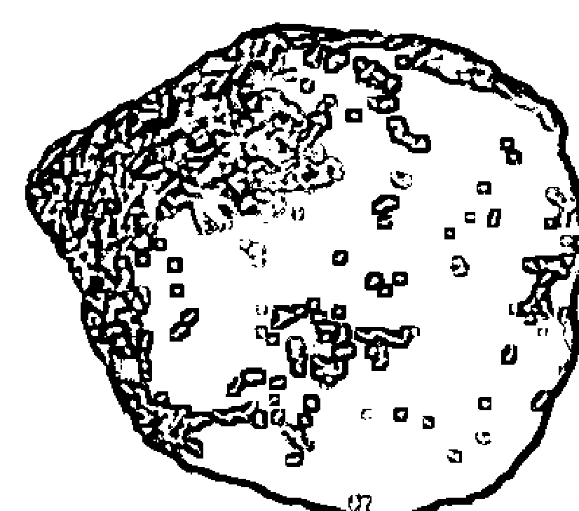

## 過動症

情緒的過動可能導致狂熱的行為模式，宗教或生活方式的狂熱者具有許多此種特質。他們是如此的煽情，完全獨斷性的認為他們的思想形態是唯一值得存在的，他們將盡一切的力量去使其他人轉換成他們思考的方式。即便他們身體的力量已然耗盡，他們也運用龐大的情緒能量持續進行著。

初探索個人靈性道路的人可能會有過動的症狀，過度熱中的態度會支配他們，他們具使命感且強迫別人聽從他們認為好的事物。這種過度熱中可能形成壓迫情緒體的偏見。

靈性的過動症狀也會驅使那些進入神秘學道路的新人，快速更換上師或教師，並同時嘗試許多不同的另類治療。隨後他們疑惑自己為何發展出靈性的消化不良！他們接二連三地遭遇治療的危險過渡期，直到最後在精疲力竭中才學到識別能力。

### 青金石療法

- ◆ 青金石能幫助你重獲接受性、和平、理解。青金石能開啟與平衡眉心輪及喉輪，激發開悟的意識狀態。
- ◆ 這些水晶有助於識別力與智慧的增進，能釋放會導致幻想與幻聽的觀點。青金石能夠帶來客觀性與清晰度，客觀性與清晰度兩者皆是高層意識的運作結果。
- ◆ 青金石也透過整合內在與外在聽覺，教導如何精煉積極傾聽的藝術。他幫助你去傾聽與接收靈魂深處的低語。

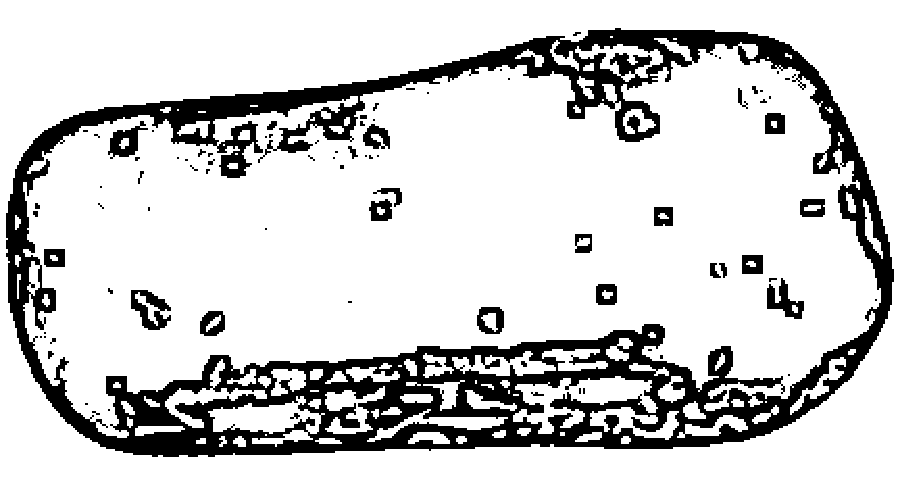

青金石

## 寶石精華液

成為生命的熱愛者或生活的熱心者，別人將為你正向的能量吸引；成為過度熱中或過動的人，將趕走別人並使自己精疲力竭。你需要為別人帶來啟發，而非恫嚇他們。學習使自己的能量和諧，並為最佳的效果而運用能量，這種寶石精華液能協助進行。

## 適用水晶與使用方法

一個滾磨過的青金石

製作混合的寶石精華液（詳第14頁如何製作的資訊）並依指示取用。

## 占有與控制慾

在我們與他人的關係中找到平衡與平等並非易事，特別在我們無法無條件地去愛與接受自己時。

當心輪失去平衡時，我們會變得貧乏、極度地干涉，甚至暗地的操控。愛成為一種我們用來迫使別人聽從或回應我們每個念頭的武器（我們之中的許多人曾在孩童時期經驗此種操控式的愛）。在這種極端的不平衡上，自愛變成自哀自憐與消極的侵略行為。當我們試圖去控制每個人與生活上的每個情境時，會發展形成這種嫉妒的偏執行為。

## 幫助情緒自由的水晶

- 異極礦透過教導你去尊重自己與他人的個體性，來促進靈魂真宵的表達與提升自尊。在做決定時將它佩戴在你的喉輪上，能鼓勵自我詢問，特別是有關於你的動機。它具有平衡的心輪所擁有的高頻天使能量，在你的能量系統中充滿情緒的自由。據說它可用來吸引好運，並能驅除負面能量而帶來保護作用。
- 粉紅色藍寶石是具有吸引的力量，它能將你需要的事物吸引到生活中，故能快速地學習生命課題。它教導你精煉你的情緒與自我接受性。它透過中和負面傾向來釋放情緒的包袱，並幫助誤解冰釋而為關係帶來的平衡與平等。如果你選擇佩戴粉紅色藍寶石，應將它戴在碰觸心輪的位置。

異極礦 (Hemimorphite)

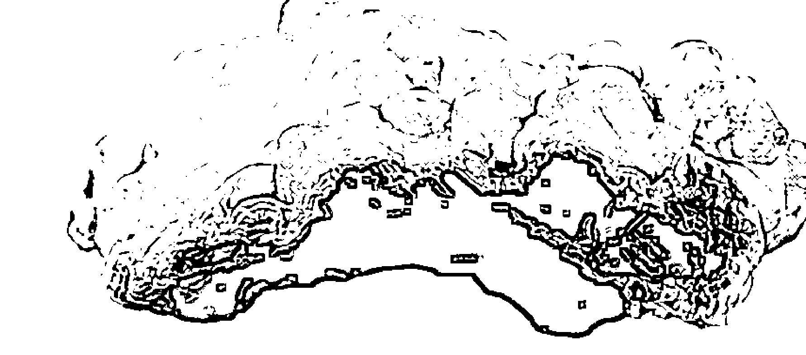

粉紅色藍寶石 (Pink Sapphire)

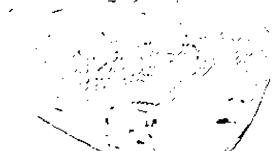

## 寶石精華液

這種水晶治療技巧將幫助心輪回歸平衡狀態。如果你的內心是舒適與具安全感的，則形成占有與控制慾的特徵的可能性會較低。你將視愛為自由給與及接受的品質，而非販售的交易品或依一時興起可撤回的念頭。

## 適用水晶與使用方法

- 一個天然或滾磨過的異極礦
- 一個天然或滾磨過的粉紅色藍寶石

製作混合的寶石精華液（詳第14頁如何製作的資訊）並依指示取用。

## 傲慢自大

我們通常會毫不猶豫的承繼父母的信念系統，也接受來自周遭的人與媒體的社會制約。我們在兒童或青少年期即已接受與認同這些信念系統與制約，並為我們帶來歸屬感及族群意識。

族群意識可能導致傲慢自大。如果我們的家族或社會團體，因他們的地位、健康、國籍或宗教背景而自信優於其他人，我們可能會被養育成偏見、歧視、吹毛求疵、批判，或無法忍受不同背景與信念的人。

「族群意識」存在於你的家族、朋友群、工作同事，及任何在你的控制性行為模式及模式存續上，具有既得利益的自我設限的團體中，這些控制性行為模式可能對團體有幫助，但不一定適合個人本身。

未受到質疑挑戰的族群意識，經常帶來個人的孤立及團體或國家的困境。隨著我們的成長與成熟，我們需要脫離此種團體思想，並形成自己的個體性價值與獨立性。

## 寶石精華液

## 適用水晶與使用方法

與「自我詢問練習」搭配使用，此種混合的寶石精華液將幫助你發展寬容與感激別人個體性的心識。它幫助以自身天賦智慧為基礎來建立穩定的實相，並平衡心輪與較高的脈輪。

- 一個天然或滾磨過的堇青石
- 一個天然或滾磨過的煙水晶

製作混合的寶石精華液（詳第14頁如何製作的資訊）並依指示取用。

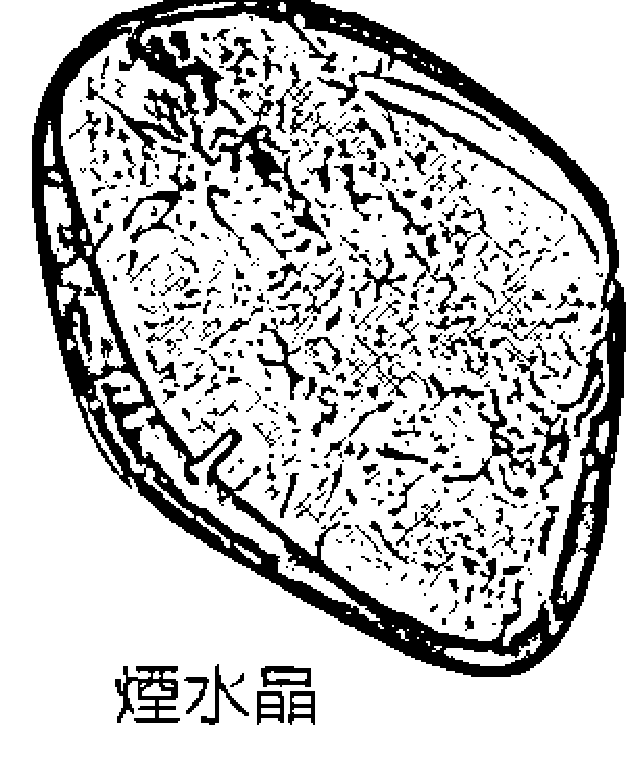

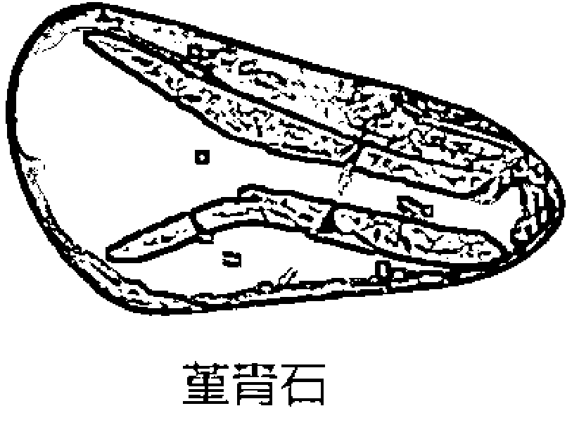

## 自我詢問練習

為了去了解你的信念系統與過去的程式輸入，你需要詢問自己的動機與價值。這是走在自我認識、個體性、獨立性與情緒自由道路上的一個重要步驟。

### 使用方法

1.  寫下並列出你的信念。可緩慢進行，檢視你是否可以辨識每一個信念與價值的根源。它們真的是你本身就具有的，或是來自於你的雙親、教師，或同儕團體？
2.  每一個信念可能被視為一種「能量阻塞」或「思考形式」。這些思考形式中的某部分可能具有負面性質，會障礙你的靈性成長，造成你不快樂。花一些時間去決定哪些信念是屬於此種性質。
3.  製作一個兩欄位的新表格，各別標上「過去的程式輸入」與「新的程式輸入」。
4.  在「過去的程式輸入」欄位列出那些不再符合你最高利益的價值與信念。對於那些你希望釋放的部分，愈特定愈好。
5.  在「新的程式輸入」欄位列出你想要帶入生活的新價值觀。確保使用正向積極的肯定詞彙。嘗試使用字句如「以接受取代批判」；「以愛取代恐懼」；「以自由取代限制」；「以寬容取代偏執」等。

## 堇青石療法

- ◆ 堇青石能喚醒與生俱來的知識與智慧，帶你進入個人內在知識的領域，釋放那些圍繞著你的外來期待。它使你更容易接受來自較高自我（超意識）的訊息，並與其溝通。
- ◆ 堇青石教導你不要過於墨守成規，應運用平衡的眉心輪來追尋自己的道路。這種水晶能強化直覺，幫助內在平衡與歸於中心，且能增進專注與決斷的力量，不在乎外在影響與情境。
- ◆ 堇青石幫助我們能對目前的問題生活處境有更多的理解，而得以減輕困惑。所有的困惑源起於我們沒有能力去主張、運用自己的天賦直覺力，以及按照個人的需求行事，而反依社會的需求或限制性的族群意識來行事。

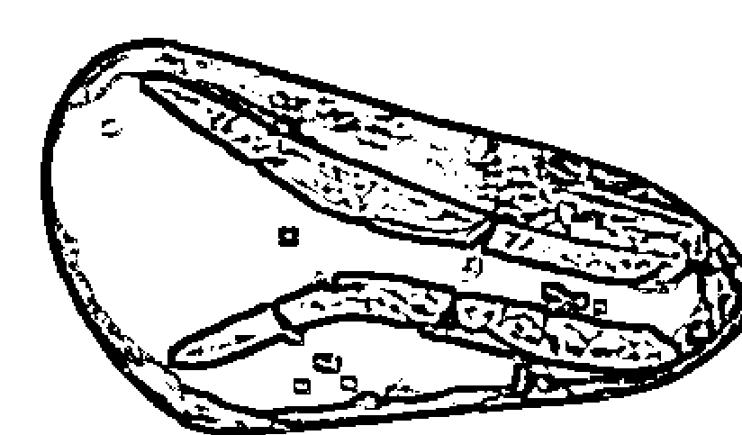

## 專制獨斷的態度

我們住在一個受到冷酷與嗜權力如命的霸權者破壞的世界。這些人有的統治著國家，或奪取學校、工作場所或家中的控制權。這些專制、冷酷無情、殘酷的獨裁者貪戀權力，無視於對他人應有的尊重。他們的冷酷無情要付出相當的代價，容易有身心透支與加速老化的傾向。

專制獨斷的態度會在個人能量場上形成極端的能量需求，恐懼是產生所有現象的潛藏負面情緒。所有獨裁者都具有不平衡、過度活躍的太陽神經叢，及枯萎的心輪。

在傳統上，太陽神經叢與心智的邏輯運作有關，它掌管我們的智性本能、思想過程、意志力，及在所有層面上的能量運用。或許這正是去理解那些變得專制獨斷的人的鑰匙——如果他們未能說服你接受他們的想法，他們將透過極端的強迫力來進行說服。

## 治療要訣

- ◆ 對孔雀石或綠色的反感，顯示出情緒上的侷促不安與不自在，這種情形通常源起於孩童時期的創傷，與不健全的早年家庭背景。為了去診斷與清除身體及能量體中的阻塞，可運用「綠色治療法」，在每一個主要脈輪中心上輪流放置一個孔雀石。從海底輪開始向上進行，並在頂輪處結束。之後讓自己有安靜的時間，去整合孔雀石所促成的能量轉變。
- ◆ 手握著一個天使石或天青石，去平衡革新後的能量，並幫助推整合新的能量模式。

## 寶石精華液

平衡是達到長久健康、快樂與豐饒生活的鑰匙。為了維持平衡，在態度上我們必須柔軟、有彈性。藉由支持與培植個人與社會的成長，我們肯定了所有生命是相互連結與息息相關的。這種寶石精華液對此有所幫助。

## 適用水晶與使用方法

- 一個滾磨過的天使石
- 一個滾磨過的天青石
- 一個滾磨過的孔雀石
- 一個滾磨過的綠龍晶

製作混合的寶石精華液（詳第14頁資訊），使用兩個容器法製作，並依指示取用。

## 受害者心態

長期性的憤怒、怨恨與其他毀滅性的情緒例如痛苦，都是心輪不平衡造成的。吸引負面能量進入心中的人，通常覺得自己是殘酷命運底下的不幸受害者，生命竟是如此對待他們。他們常使用如「生命是如此不公平」的措詞，無止盡地抱怨著。在發表此種意見時，他們似乎不曾思考評量過自己的行為。反之，他們將所有內在的憤怒、怨恨與失望，強烈地投射到外在世界。

這些人對生活有所要求，但從未考量他們投入了什麼。他們強調所有情境中的負面觀點，且似乎享受於破壞別人的正面積極態度。因患有此種「可憐的我」症狀，他們通常喃喃自語，只是為了築起自己負面與消極的牆。他們可能背負著怨恨情緒多年，像個悶燒中的火山。這些不愉快的行為可能常見於遭遇中年危機的人，在意識或潛意識層面上，他們了解只有微小的機會，可以去實現年輕時的希望、抱負與夢想。

那些擁有受害者意識的人，通常透過物質主義的眼睛來觀察世界，他們以財富的累積與持續的青春來評斷成功與否。外表的美麗會逐漸消失，死後也無法帶走金錢與財富，你所能帶走的只有美麗的靈魂，你留給世界的，是在家人、朋友與同事心中留存下來的愛的回憶。

具有長期性憤怒、怨恨傾向的人，終究會使別人疏遠自己，包括那些最親近的人。隨著孤立與疏離的情形增長，他們的受害感更加嚴重，而心中沒有任何愛能倖存下來。

## 寶石精華液

識別出內在不斷湧現的負面思想，是你踏上痊癒之路的第一步。你一旦承認自己的憤怒與怨恨，認知每一個牢騷怨言是你孤立之牆上的一顆石頭，你即可採取行動。你可以開始去了解你並非受害者，而是個創造自己命運的創意建築師。

鉻雲母寶石精華液能幫助你釋放痛苦與怨恨，停止繼續對命運帶給你的事物感到憤怒，並丟棄自己的生命遭受不公平待遇的感覺與想法。

## 適用水晶與使用方法

一個天然的鉻雲母

製作混合的寶石精華液（詳第14頁如何製作的資訊），使用兩個容器法製作並依指示取用。

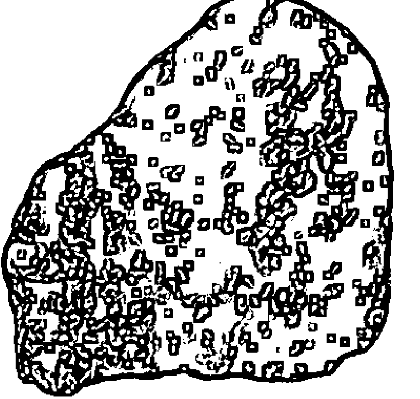

## 急躁

急躁、沒有耐性會造成內在的緊張、胃不舒服與頭痛。發展耐性是不容易的，特別是在今日的社會，快速、喧鬧與專注於速成的滿足感。

隨著社會的形成，我們習慣於迅速的全球通訊方式。我們的感官被新的經驗、新的資訊每日整天的轟炸著。政治家以插播精要的演講片段來進行傳播，因為研究報告顯示我們只有非常短的注意力，且非常容易感到無聊厭煩，這可歸因於現代廣告的快速步調。

我們長時間工作，吃速食，坐於電腦與電視機前，電話不離耳邊，完全陷於電子壓力的汪洋大海中。電磁場、毒素、化學物質、無線電波、地球能量線、雷達與衛星傳播全都包圍著我們，無怪乎會覺得煩躁與急躁。

治療急躁幾乎沒有成功的可能性，除非我們能在今日忙亂的生活方式中，開闢一個小型的平靜療癒空間。我們需要為和平與平靜騰出時間，在向外汲汲營營時，亦需專注於內在的修持。

## 治療技巧

- ◆ 如有必要時，你可更經常的取用這種寶石精華液。如果你感覺到強烈地急躁或煩躁感，可每十至二十分鐘取用四滴，直至狀況改善為止。
- ◆ 這種寶石精華液也可使用在浴缸中，在滿缸的水中滴入五滴。
- ◆ 將用來製作這種精華液的水晶放置於脈輪上，也很有幫助。翠綠鋰輝石、綠色魚眼石或綠色東菱玉放於心輪時，有撫慰、平靜與穩定的功效，特別是與粉晶、紫鋰輝石或粉紅電氣石搭配使用時。將鋰雲母或紫水晶放在眉心輪，能使心智自由，脫離情緒緊張的狀態。將海藍寶石放在胸腺處上方，能減緩壓力與情緒衰弱的情形。
- ◆ 試著縮減外在的刺激事物。不要在工作後返家時，立即將電視機打開，停止看每一個新節目，閱讀較少量的報章雜誌。忽略你的網路郵件幾天，關閉電話及使用答錄機來過濾電話，按照自己的內在韻律回電。停止匆忙的攝取食物，花時間品嚐食物的美味，與你的家人同桌共進晚餐。不要跑來跑去，停止匆促地立即去完成每件事，專注於一次進行一項工作，帶著內在的寧靜與平靜地工作。
- ◆ 在你的家中創造一種平靜感是很重要的。在需要額外幫助的區域放置水晶。策略性地擺放一個大型的紫水晶洞，特別是在進門的入口處，緩和屋內的緊張與焦慮。在靠近電腦、電視或電話處，擺放紫水晶或黑色電氣石。

## 寶石精華液

製作具有撫慰功效的寶石精華液每日服用，將幫助你鬆綁與放鬆。這種精華液使用淡綠色的水晶，帶來和諧與釋放煩躁感、急躁感、偏執或內在極度緊張，並以粉紅色礦石搭配使用，來幫助療癒的過程。此外，月光石與透石膏皆能滋養靈魂與穩定情緒，緩解急躁感、情緒起伏與煩躁感。

1.  製作混合的寶石精華液（詳第14頁如何製作的資訊），使用兩個容器法製作。
2.  每日於早晨、午餐、下午五點、臨睡前空腹時取用（共四次），每次四滴。將其滴於舌下並停留於口中一分鐘，來完全吸收效果。也可滴入一杯水或果汁中啜飲之。

## 適用水晶與使用方法

從下述天然或滾磨過的水晶中任選一個

- 一個翠綠鋰輝石，或
- 一個綠色魚眼石，或
- 一個綠色東菱玉，或
- 一個粉晶，或
- 一個紫鋰輝石，或
- 一個粉紅電氣石，或
- 一個鋰雲母，或
- 一個紫水晶，或
- 一個月光石，或
- 一個透石膏，或
- 一個海藍寶石

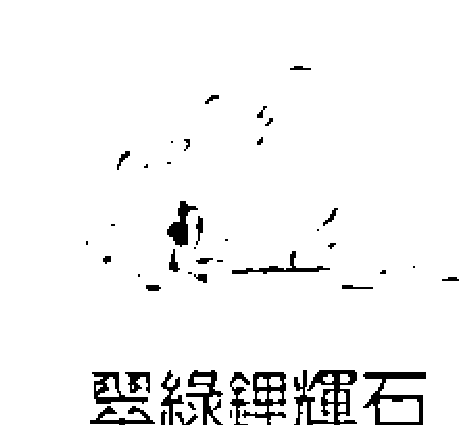

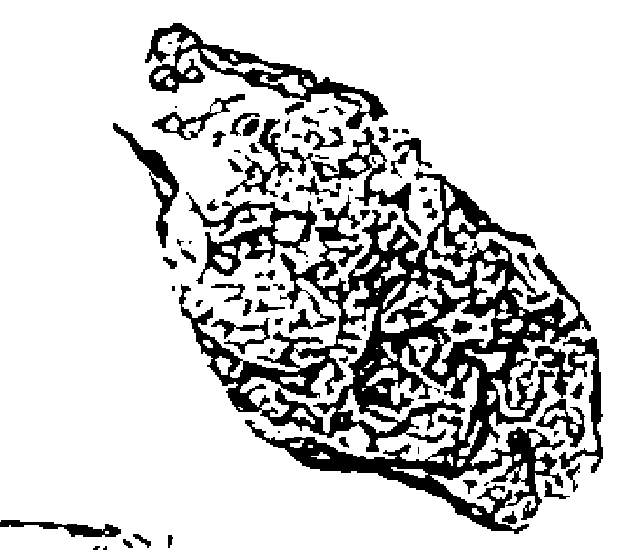

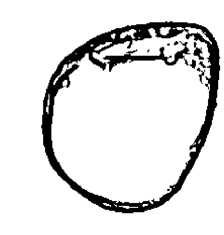

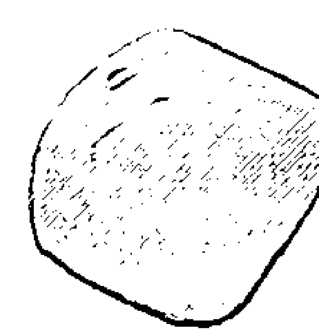

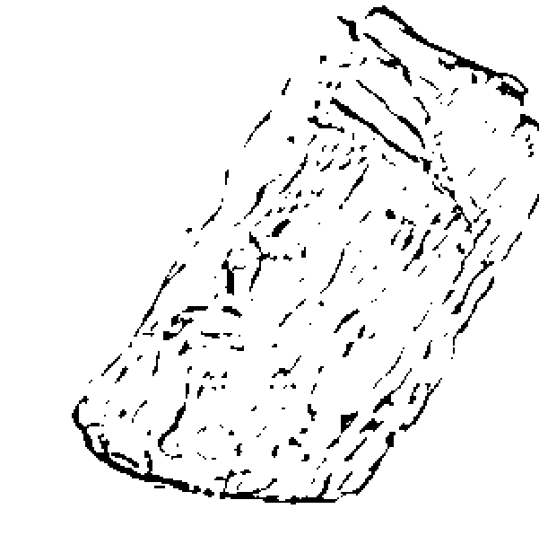

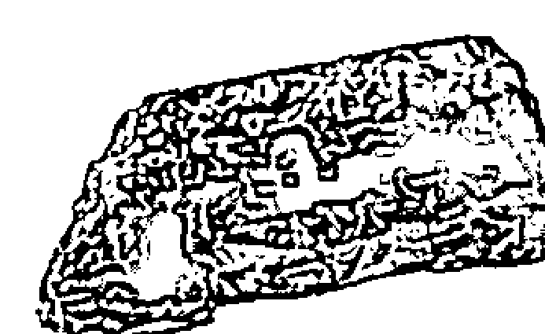

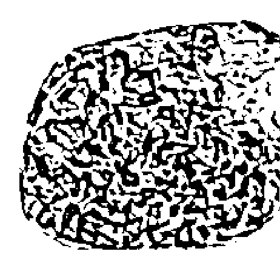

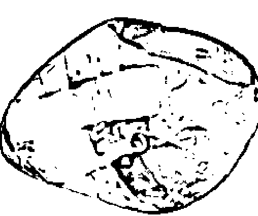

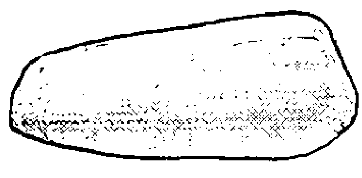

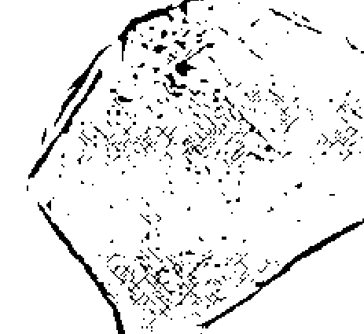

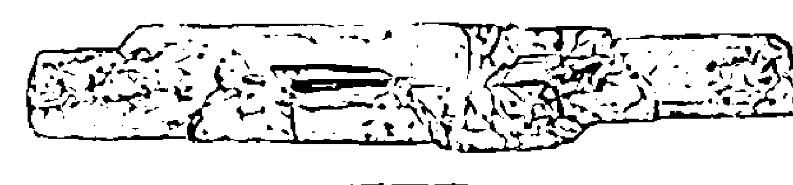

## 完美主義

沒有人是完美的，但許多人仍追求內在與外在兼具的完美。追求所有層面上的卓越是值得稱許的，但如果演變成一種執迷或強迫性行為，可能造成人格上的障礙。失去平衡的完美主義是一種負擔。如果我們必須強迫自己每天需通過身體、靈性或心智上的紀律，來達到我們給自己的標準，追求完美的行為將造成內在的衝突。

憎恨與自我虐待的形式。那些相信他們所選擇的道路是救贖唯一方式的人，可能會從這種自負或自以為是的靈性驕傲中，產生僵化的心智態度。

許多在靈性道路上的人相信，世俗的欲望與追求會限制他們的靈性發展。他們太過努力去試圖發展聖人一般的品質，但完美的禁慾與苦行主義是針對修道士或僧侶與隱居者。許多人對自己太嚴厲，這也是一種自我

服務他人經常被認為是真實的無私，但通常具有隱藏或甚至是自我中心的動機。有些人可能會以服務他人，才能感覺到自己是有用的，或被需要的，或他們只想要贏得別人讚賞的眼光。成為一個完美的犧牲者，也會阻止我們審視自己的錯誤的機會，因為我們經常忙著治療別人，而停止去看自己的身心不協調情形。

## 寶石精華液

## 適用水晶與使用方法

因為虎眼石能協助識別天賦才能與錯誤，這種寶石精華液將幫助你認清你真實的需求，將你從自我施加、理想化、僵化的心智態度與追求完美的欲望中解放出來。生命需要被活出來，去享受生命與活力並非罪惡，真正的開悟、自由的靈魂是喜悅的，甚至是遊戲般的心情。笑是最佳的治療師，對自己太過嚴肅會使我們看起來可笑。

一個滾磨過的虎眼石

製作混合的寶石精華液（詳第14頁如何製作的資訊），並依指示取用。

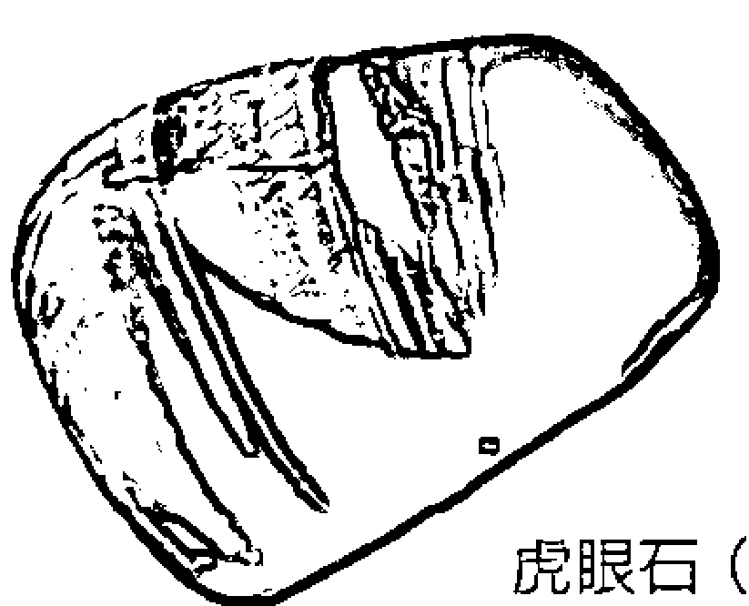

## 成癮

提及成癮，映入腦海的主要問題是——嗑藥、酗酒、嗜賭、菸癮。但輕微程度的成癮也可能是一種強迫行為的警兆，如果我們未能取得個人固定的選擇事物時，例如吃巧克力或在每天同一時段收看某個連續劇，可能會經驗戒毒症狀（如盜汗、虛脫無力、噁心等）。許多成癮行為是由思想形式造成的，可能是自行產生的、遺傳的或自別人取得的，有時甚至會因這些思想形式過度活躍，而可能造成嚴重的人格失序、執迷、強迫症與成癮現象。

## 寶石精華液

所有紫色的水晶具有顯著的效果，它們能為任何情形帶來平衡與治療，因為它們能促成能量層面的整合，去除所有形態的障礙、阻塞或成癮。它們給與啟發及促進想像力，將洞察力與深刻的理解帶進執迷者的觀點中，這些觀點會使你變得脆弱而易接收強迫行為的特徵。

## 適用水晶與使用方法

- 一個天然或滾磨過的紫水晶
- 一個天然或滾磨過的紫色螢石

製作混合的寶石精華液（詳第14頁如何製作的資訊），並依指示取用。

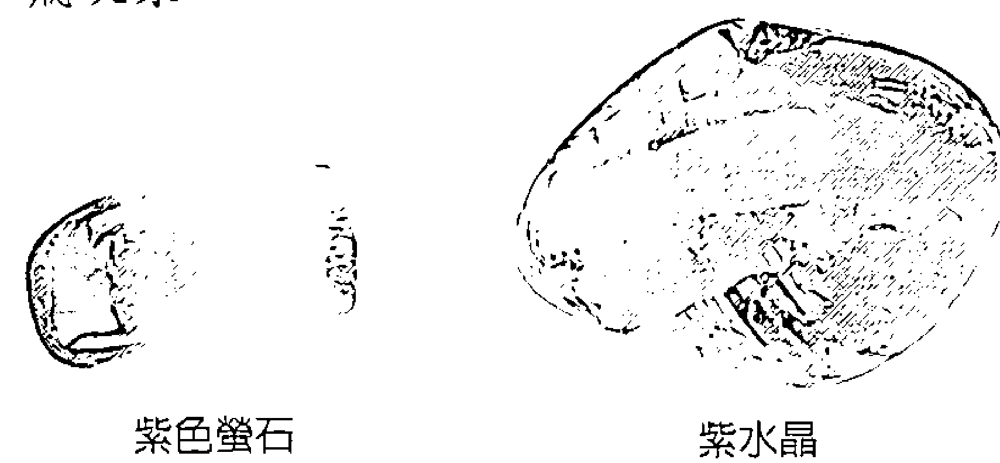

## 紫色水晶

- ◆ 在傳統上可佩戴紫水晶防止宿醉，因為它能支持保持清醒與冷靜的狀態。它能緩和造成放縱與沉溺的身體狂熱，並幫助克服成癮與執迷的強迫行為。紫水晶能幫助兩極能量的融合與整合，提升感應能力與落實的意識。
- ◆ 紫水晶幫助去掉執著，也能去除造成阻塞的負面能量，負面能量的阻塞會引起成癮與強迫行為。它能深入身體的細胞層次，去除阻塞與上癮倚賴。紫水晶能放鬆可能造成上癮的思想形式，並將其轉化成正向積極的能量。
- ◆ 螢石享有許多紫水晶具有的品質，但它功效特別著重在幫助溶解固著的行為模式。它在重新建構混亂的能量上，也具有極佳的效果，使較高的靈性能能量能被身體快速地整合與吸收。它增進洞察力、公平與客觀性，並阻止外來影響力操控你的能量場。

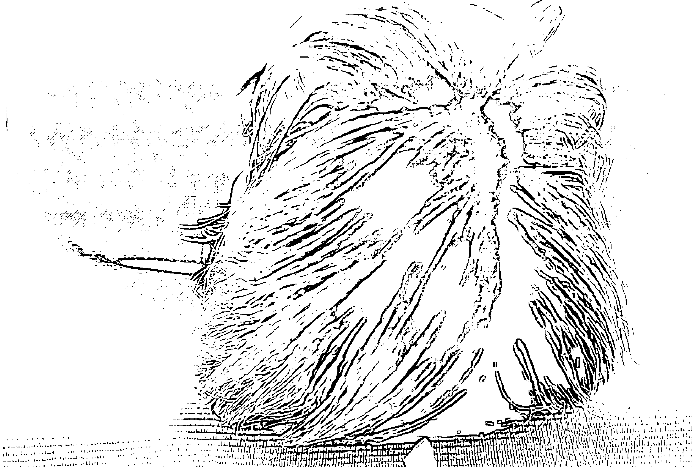

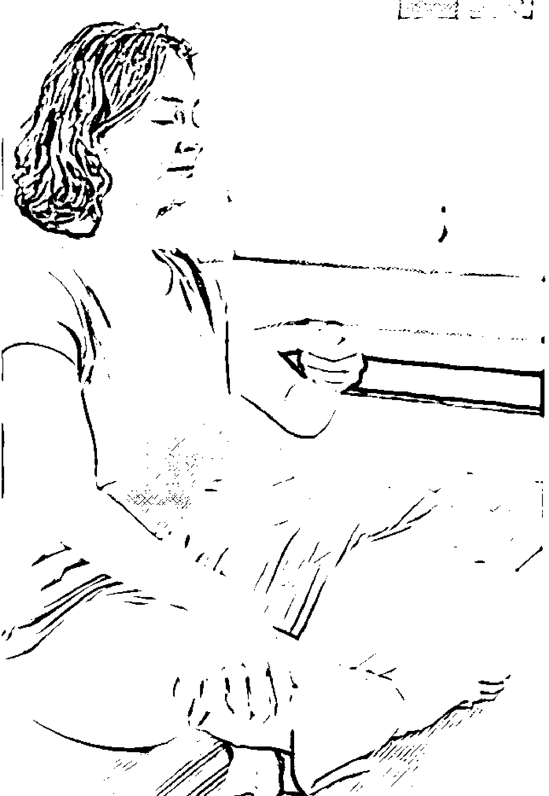

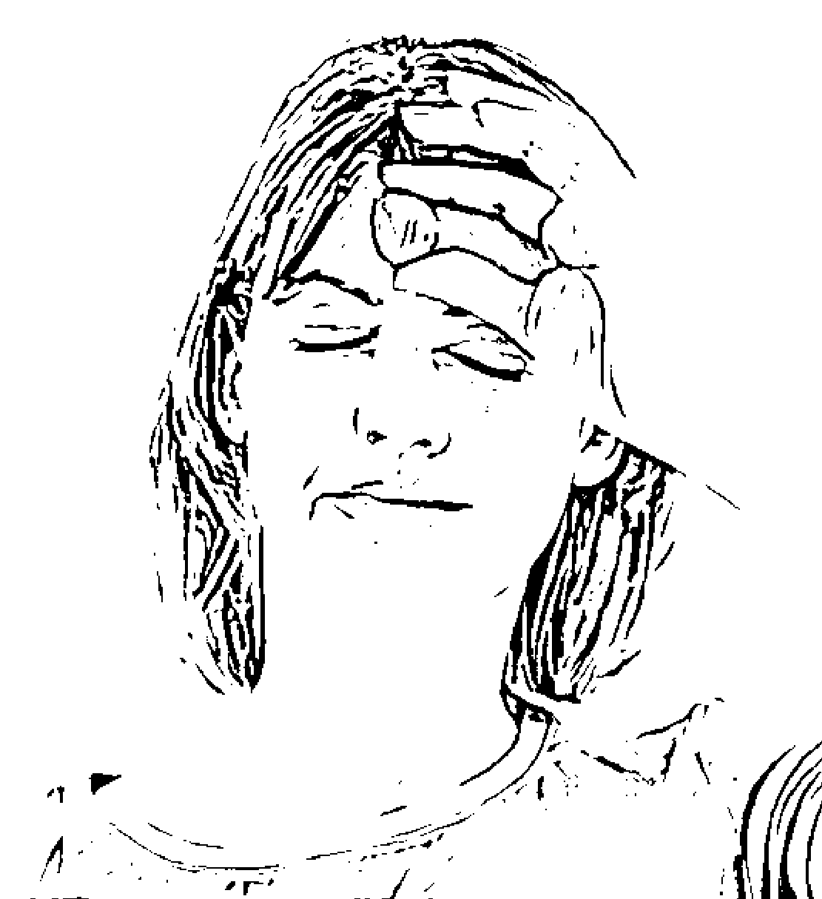

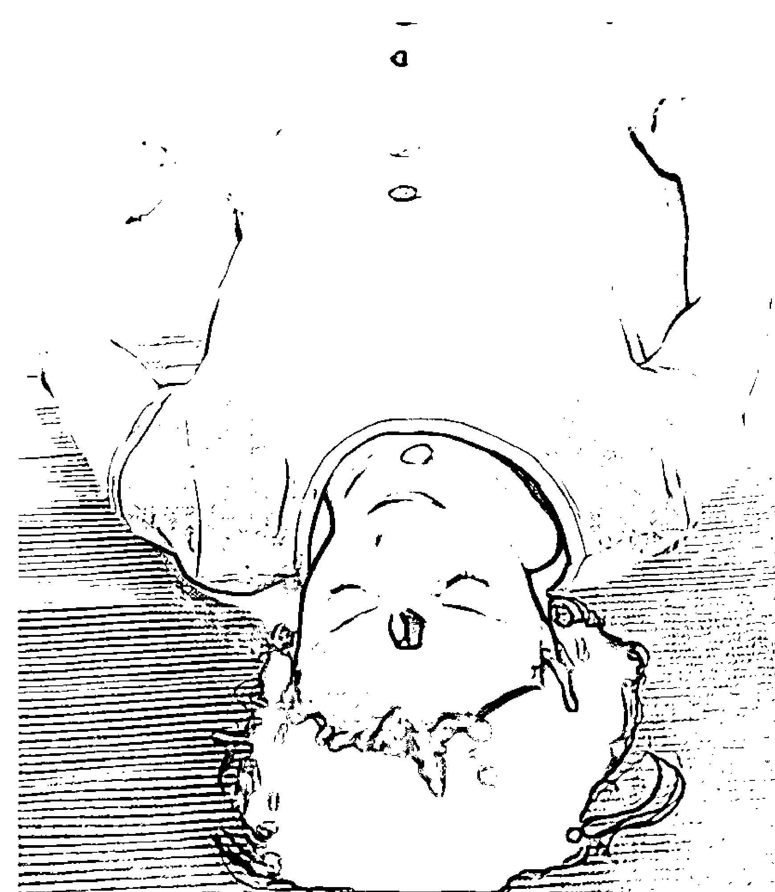

# 第三部

## 水晶提升你的靈性

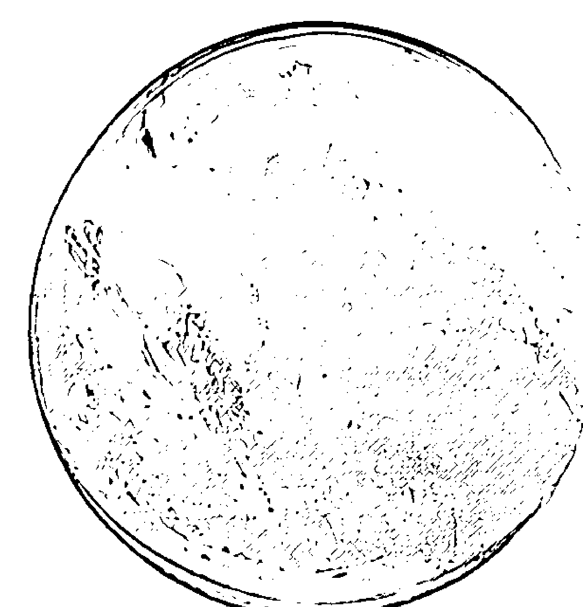

## 水晶與你的靈性

主流正統醫療著重在身體系統，它是一種科學的方法，使許多人感覺自己成為化學藥品的集合體或被視為一具機器。它強調依檢測與症狀的評估去診斷問題，致力於手術與藥物的治療。

這種類型的醫療是近代比較性的發展成果。在現代正統醫療的前身傳統醫療中，普遍使用著天然藥草或自然療法治療病痛，他們知道並了解生命受到許多不同的能量影響，其中有些是大部分人無法看見的「精微能量」。他們明白在治療身體時，同樣需要治療心理與靈魂。

健康是一種免於病痛的狀態，應視為是身體、心理與靈魂（統稱為心靈）之間，生命能量持續和諧流動的現象。隨著我們發展出一套整合的方式，我們將整體性地看待自己，並開始與我們的靈魂有更多的認同與合一感。這意謂著我們不再受到自我與智識的影響，能超越二元性與分離的幻象，進入宇宙生命網絡中的靈魂合一極樂境界。

互補與另類醫療也採行此種方式，有時它被視為一種正統醫療的替代療法，但在理想中，我們願採取一種整合的方式，以整體的方式看待人類的症狀。

水晶治療將目標設定在，使我們回到與靈魂合一的狀態，它所著重的遠超過只是追求身心的健康，它要求我們去傾聽自身靈魂的低語、感覺我們的情緒、發展我們的直覺與滋養我們的靈性。這種整體合一的境界將帶來滿足，使我們隨順生命的流動，與別人和平地連結與運作。它能為我們的生活與世界帶來和諧與美麗，因此具有完整的品質，能強化我們的靈性。

此刻在互補與另類醫療上存在著極度的興趣，由許多治療師或新聞工作者嘗試使另類醫療以類似正統醫療的方式呈現，提供每一種症狀快速的治療。不過情況不會永遠如此單純，因為我們都帶有自己特有的身心問題與能量模式。

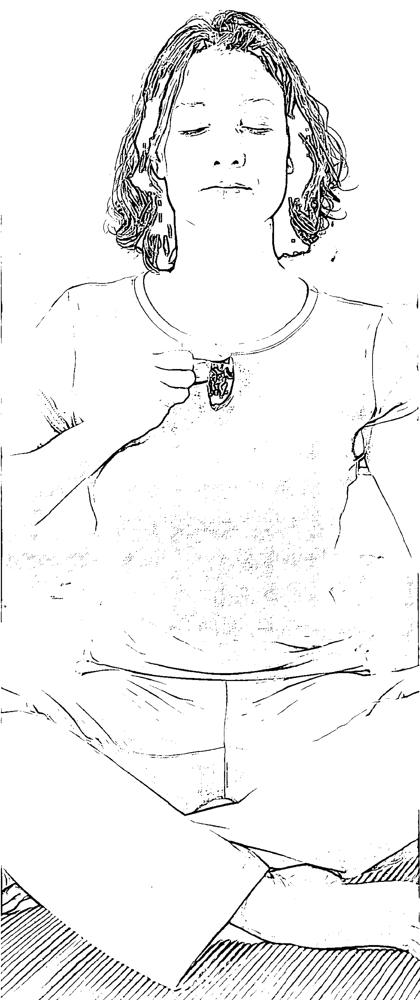

## 病痛感

- ◆ 不舒服或病痛感是一種因身體、情緒、心理或靈性的失衡，而導致與自己許多層面有關連的病症。它是你的靈魂透過身體、思想、情緒與感覺與你溝通的方式。
- ◆ 不舒服或病痛感不應被視為一種負面的經驗，它只是你的靈魂吸引你注意的方式。當我們處於健康狀態，我們傾向視生命為理所當然，而自我滿足與掉入肉體永恆不朽的自我欺騙中。這種幻想妄念是靈魂的停滯與靈性成長死亡的現象。
- ◆ 當不舒服或病痛感產生時，你對生命不再理解，你即有機會進入活出整體性生命的奧秘。每一個病痛及為你的生命帶來改變的危機，都為你的靈性創造出一個神聖的空間，來教導你有關自己的部分。
- ◆ 你的不舒服或病痛感是獨一無二的，疾病是你自己創造出來的。如果你能緊緊把握與靈魂運作的機會，來療癒你的不平衡處，你可融解障礙、使自己不再停滯不前，邁向更靈性與和諧的生活。

## 平衡氣場

所有的氣場皆有不同顯像，它們會隨著我們的思想、所處的環境及我們身體健康的狀態不斷地改變著。疾病、負面情緒、污染、成癮、壓力、不良的飲食及呼吸技巧、他人的負面能量，以及不良的靈性保健方式，皆會造成個人氣場的受損。

當某人反覆持續地持有負面思想或沉溺上癮時，氣場中會形成碎片。這些思想模式與成癮可能形成主導的狀態。它們不僅影響附著的人，也可能控制別人的行為。

氣場的不平衡會造成活力的損失，使能量場變得虛弱。氣場上的黑暗區域是能量阻塞的現象，這些阻塞可能對靈性、心理、情緒或身體的健康，造成衝擊與影響。

## 治療要訣

- ◆ 雖然任何對稱與形成尖端形狀的水晶，能被當作靈擺有效地運用，但如果你是新手，最適合使用五公分的長形白水晶。靈擺最好呈現平均切割與平衡形狀，並由一條銀鍊懸吊著，這種靈擺較容易校準頻率，具有全光譜的療癒能量。

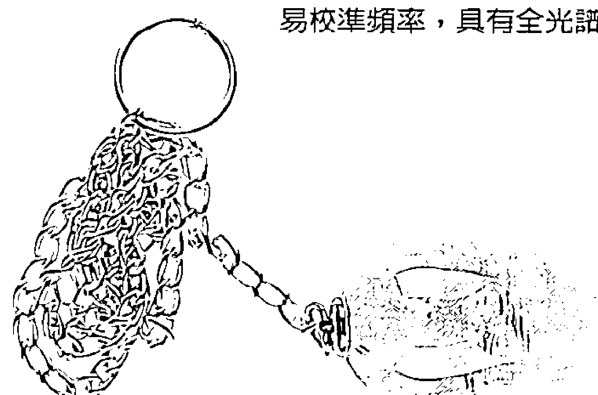

## 氣場層次

- ◆ 氣場是由與七個主要脈輪相關的七個層次組成。自肉眼可見的層次——身體開始，而漸次發展成更精微與更細緻的振動頻率。每一個層次擁有自己的功能，能量覺知與體現。氣場之間的間隔是時而固定，時而變動的。當第二、四與六層移動時，第一、三、五與七層則是固定的。
- ◆ 最靠近身體的層次是以太體，它是身體的完全拷貝版，顯現淡藍或亮灰色，其上有微小的火光閃爍並快速移動著。它是一個身體的模板，保留身體的形成過程。
- ◆ 氣場的第二層與情緒有關，是沒有持續旋轉的彩色漩渦狀。
- ◆ 第三層與心智體有關，是一個固定的黃色層，保留我們的思想過程。
- ◆ 第四層與心輪能量有關，以柔和的粉彩色調出現，當完全發展時會呈現出粉彩色的彩虹狀。
- ◆ 第五、六、七層顯現出亮藍色、金色與銀光藍色，到閃爍的金色光。這些與較高層次及靈性發展有關，對大部分的人而言，要覺察這些層面較不容易。

### 適用水晶

一個白水晶靈擺

### 使用方法

1. 請你的朋友舒服地躺著，使自己可容易的在他們的身體周圍移動。
2. 在你的朋友身體正上方握著一個靈擺，讓靈擺開始以中立方式前後搖擺。
3. 出現靈擺改變中立搖擺方式的地方，即是不平衡之處。讓靈擺除去不平衡的情形，直到它再度回復前後的擺動方式。順時針移動代表注入能量，逆時針移動代表釋放能量。
4. 開始沿著身體中央線探測，自腳底開始，向上至頭頂處完成。之後移身至你朋友的身體側邊，沿著天然的身體輪廓，以靈擺按順時針方向環繞完整的一圈。
5. 再度以順時針方向環繞一圈，但此次是在距離身體四十五公分的外側處進行。

## 氣場探測

有許多技巧可用在氣場上，但水晶靈擺是一種最容易運用的方式。靈擺會找出氣場上不平衡的區域，並去除能量的阻塞。靈擺探測法可用來補充能量、強化、調整、和諧與整合氣場上的每一個層次，它將填補氣場的孔洞及停止能量滲漏，同時給與保護。與朋友或夥伴練習這種技巧，與他們輪流去感覺氣場的問題處並提供治療。

## 脈輪平衡

七個主要脈輪：海底輪、臍輪、太陽神經叢、心輪、喉輪、眉心輪、頂輪——位於身體的中央線上，最開始的五個脈輪深植於脊椎柱中（詳第18-19頁）。這些漏斗狀的彩色光旋轉能量渦流吸收與散布生命能量，這種精微的能量稱為「普拉那」，它們是不同次元之間的通道或連結點。

主要脈輪應永遠被視為一個完全整合與平衡的系統。每一個脈輪表達著不同的意識層次，這些意識層次需要以平衡的方式去發展。當脈輪失去平衡時，經常會造成此人身體、情緒、心智與靈性上的失衡。

## 脈輪的平衡狀態

- 海底輪的五行元素是土（地），顏色是紅色。此脈輪平衡的表現是落實、穩定與可信賴的。
- 臍輪的五行元素是水，顏色是橘色。平衡的表現是充滿活力、創造力與原創性。
- 太陽神經叢的五行元素是火，顏色是黃色。這個脈輪平衡的表現是富邏輯的思想過程、自信與目標的顯化。
- 心輪的五行元素是風，顏色是綠色。這個脈輪平衡的表現是對自己與他人無條件的愛。
- 喉輪的五行元素是以太（空），顏色是藍色。這個脈輪平衡的表現是容易與自己及他人溝通。
- 眉心輪的五行元素是非物質感官覺知（Avyakta），顏色是靛藍色。這個脈輪平衡的表現是直覺、天眼通、天耳通與他心通。
- 頂輪的五行元素是宇宙能量，顏色是紫色。這個脈輪平衡的表現是在宇宙意識上。

## 脈輪平衡療法

推薦一些適合的水晶來讓你練習這種水晶治療技巧，獨自練習平衡脈輪。水晶治療師通常會透過氣場掃瞄或靈擺探測法，來評估你的每一個脈輪的能量品質。治療師會接著為每一個脈輪挑選適合的水晶，去改善任何過度活躍或低落的能量流動。通常會依每個脈輪的代表顏色來挑選水晶——紅、橘、黃、綠、藍、靛藍及紫色。

## 治療要訣

- ◆ 也可將水晶放置於頭頂上方的「靈魂之星」及腳底下的「大地之星」脈輪。為「靈魂之星」選用白水晶，為「大地之星」選用黑色水晶。
- ◆ 也可在任何脈輪上擺放水晶曼達拉。在心輪位置上，以四個粉晶圍繞著綠色東菱玉排列，是一種很好的心輪曼達拉排列。
- ◆ 也可將水晶環繞著身體的氣場排列，形成一個光的網絡排列法。六個水晶排成的「大衛星」是一種很適合使用的排列法，在身體周圍，以連結兩個三角形來形成一個六邊形環繞著身體。選擇相同大小與類型的水晶來進行，例如中型單尖白水晶。尖端可朝向內來建構能量，或向外來釋放能量的阻塞。

### 適用水晶

- 一個滾磨過的石榴石
- 一個滾磨過的紅玉髓
- 一個滾磨過的黃水晶
- 一個滾磨過的綠色東菱玉
- 一個滾磨過的藍紋瑪瑙
- 一個滾磨過的青金石
- 一個滾磨過的紫水晶

### 使用方法

1. 準備與淨化你即將使用的水晶。
2. 舒適的躺在地板上，可使用瑜伽墊或你喜歡的軟墊。
3. 將水晶以下列方式排列：石榴石放在你的海底輪、紅玉髓在臍輪、黃水晶在太陽神經叢、綠色東菱玉在心輪、藍紋瑪瑙在喉輪、青金石在眉心輪、紫水晶在頂輪（詳見第18頁的位置圖示）。
4. 讓你的身體有二十分鐘的時間來整合水晶與身體的能量。準備好在當直覺告知你水晶能量已快速整合完成時，提早移除水晶。

## 脈輪治療

七個主要脈輪與它們的能量管道——經脈（Nadis），處理著人類意識的流動。這些脈輪是精微能量的指揮者，大部分的人都無法看見這種流動。

對我們而言，較容易去了解的是主要脈輪與身體的連結，主要脈輪與內分泌系統的腺體（詳見第20頁），和產生高層次神經活動的神經叢（神經、血管、淋巴的複合網狀組織）的連結所產生的現象。

### 脈輪的對應連繫

- ◆ 海底輪對應腎上腺與尾骨神經叢。功能失常可能導致骨關節炎、肥胖、痔瘡、便秘及小腿、大腿、骨骼與牙齒等身體問題。情緒與靈性的問題可能包括出神，與無法達到內在安寧的狀態。
- ◆ 臍輪對應性腺（女性的卵巢與男性的睪丸）與薦骨神經叢。功能失常可能導致性冷感、陽萎、不孕、膀胱與腎臟問題、子宮功能失常、前列腺問題與下背部疼痛等身體問題。情緒與靈性的問題可能包括恐懼、驚嚇與罪惡感。
- ◆ 太陽神經叢對應胰腺與太陽神經叢。功能失常可能導致消化功能失調、糖尿病與慢性疲勞等身體問題。情緒與靈性的問題可能包括自尊低落、成癮人格與侵略性。
- ◆ 心輪對應胸腺與心臟神經叢。功能失常可能導致肺部疾病、氣喘、心臟疾病、高血壓及手臂、手掌與手指等身體問題。情緒與靈性的問題可能包括恐懼背叛、倚賴與憂鬱症。
- ◆ 喉輪對應甲狀腺、副甲狀腺及咽頭神經叢。功能失常可能導致頸部僵硬、感冒、喉嚨痛、甲狀腺與聽覺問題及耳鳴等身體問題。情緒與靈性的問題可能包括完美主義與無法表達情緒。
- ◆ 眉心輪對應腦下垂體與頸動脈神經叢。功能失常可能導致頭痛、惡夢、眼部問題、神經障礙、青光眼等身體問題。情緒與靈性的問題可能包括學習障礙與幻覺。
- ◆ 頂輪對應松果體與大腦皮質神經叢。功能失常可能導致困惑、沮喪、強迫性思想、對污染敏感、慢性疲勞症候群、癲癇與癡呆等身體問題。情緒與靈性的問題可能包括自尊低落、成癮人格與侵略性。

## 脈輪治療觀想法

脈輪的健康對於你的身體、心理與靈性（心靈）的健康是很重要的。這種水晶治療技巧能幫助你改善過度活躍或低落的精微能量流動。雖看似簡單，在第一次練習時，這技巧可能要花上六十分鐘的時間。時間需求的長短取決於你脈輪的健康程度，後續的療程通常將會縮短。

### 適用水晶

兩個百吉神石，一陰一陽

### 使用方法

1. 準備與淨化你的百吉神石（詳第13頁如何進行的資訊）。
2. 舒適的躺在地板上，可使用瑜珈墊或你喜歡的軟墊。
3. 左手中握住陰性石，右手握住陽性石，眼睛閉上，深呼吸五分鐘，將氧氣帶入腦部。
4. 將注意力轉向每一個主要脈輪（詳第18頁的位置），從海底輪開始，觀想脈輪中能量的流動。當你專注於每一個脈輪時，只要對精微能量的流動保持覺知即可，不要試圖控制能量的流動。
5. 允許百吉神石按脈輪排列順序去啟動活化、打開、淨化、治療（視需要去幫助平靜、補充能量、強化或改造），調整、和諧與整合每一個主要脈輪，在頂輪處結束。
6. 溫和與緩慢地讓自己返回每日所處的現實環境中，再睜開眼睛。

## 經絡平衡

生命能量與「氣」透過能量管道，稱為經絡（詳見第17頁）流動。有十二條主要的經絡，以左右對稱方式貫穿身體，外加兩條自前後向上貫穿軀幹與頭部的任、督二脈。
每一條經絡皆有起始點與終點，顯示能量流動的方向與功能，它們並非以直線的路徑循行，而氣則在靠近皮膚的表面運行流動。經絡是以相對應的陰性或陽性器官，或以它們的功能來命名（詳見以下說明）。疾病或疼痛會發生在當經絡阻塞、過度活躍或功能低落，而混亂氣的流動及破壞身體的和諧時。

### 經絡分布

- ◆ 任脈是主要的陰經經脈，它起始於會陰部，循身體正面正中央線上升至下唇中央。
- ◆ 督脈是主要的陽經經脈，起自會陰部，循背部脊柱正中央線向上，經過後頸部，越過頭頂，止於上唇部的中央。
- ◆ 膽經是下行的陽經經脈，起自眼部外側邊向下，止於足部第四趾端。
- ◆ 肝經是上行的陰經經脈，起自足部大拇趾，止於胸部側邊。
- ◆ 膀胱經是下行的陽經經脈，起自內眼角（上下眼皮交會處），止於足部小趾外側。
- ◆ 腎經是上行的陰經經脈，起自足部小趾，經足心、內踝向上，止於鎖骨與胸骨相會處。
- ◆ 大腸經是上行的陰經經脈，起自鼻孔側邊，止於食指內側端（大腸經是下行的陽經經脈，起自食指內側端，止於鼻孔側邊）。
- ◆ 肺經是上行的陰經經脈，起自喙突（肩胛骨上椿狀的結構），止於手拇指內側。
- ◆ 胃經是下行的陽經經脈，起自眼窩內緣的下端，止於足部第二趾頂端外側。
- ◆ 脾經是上行的陰經經脈，起自足部大拇趾的內側，止於胸部側邊乳頭下方。
- ◆ 小腸經是下行的陽經經脈，起自小指外側端，止於耳朵外緣的臉夾小凹洞處。
- ◆ 三焦經是下行的陽經經脈，起自無名指末端，止於眼部眉毛外端。
- ◆ 心經是下行的陽經經脈，起自腋下，止於小指內側端。
- ◆ 心包經是上行的陰經經脈，起自胸部乳頭的外側邊，止於手的中指指尖。

## 經絡淨化法

一旦你能辨識出哪一條經絡功能失常時，使它們恢復平衡則並非難事。中國人運用針灸技術，日本人使用日式指壓，而水晶治療師將礦石放在經絡的起點與終點，每一種技巧皆可強化、驅散或平靜「氣」的流動。

### 適用水晶

- 一個白水晶靈擺
- 一個天然或滾磨過的黃水晶
- 一個天然或滾磨過的紫水晶
- 一個天然或滾磨過的藍紋瑪瑙

注意：如果你沒有黃水晶，你可使用紅玉髓、紅鋅礦或紅寶石代替。你可以用磁鐵礦取代紫水晶，天青石與藍色方解石適合取代藍紋瑪瑙。

### 使用方法

1. 使用白水晶靈擺置於經絡列表上，來探測與辨識是否有經絡失衡之處。
2. 繼續探測與辨識何處需要去強化、驅散或平靜「氣」的流動。挑選合適的水晶，選擇黃水晶來強化、紫水晶來驅散、藍紋瑪瑙來平靜「氣」的流動。
3. 探測是否需要將水晶放在經絡的起點或終點，以及所放置的時間長短。
4. 將所選的水晶放置於經絡上，停留適當的時間，如有必要時，以外科手術用的膠布固定水晶。

## 五大元素平衡

當希臘哲學家柏拉圖撰寫「蒂邁歐篇」（Timaeus：宇宙論的對話錄）時，他試圖以象徵性的方法闡釋世界是透過幾何學形成的。他研究構成出宇宙的神聖幾何模型，以及與火、土、風、水四大元素的關係。他歸納五種基本的幾何形體，為組成這些元素的微粒子，以不同方式集結成堆，創造出物質的宇宙。

柏拉圖認為四種基本的元素：火、土、風、水，各別與四種基本的正多面體有關——正四面體、立方體、正八面體、正二十面體。他也研究第五元素，稱為以太，與正五邊形形成的十二面體有關。

實際上，這五種幾何形體只在三度空間才有可能成形，皆由相同形狀與大小的平面連結而組成。正四面體有四面（全為三角形），六面體（立方體）有六面（全為正方形）等，諸如此類推演。

## 柏拉圖多面體

- ◆ 六面體或立方體有六個面（皆為正方形），與土元素、海底輪、紅色有關。它透過強化你的本質的實際面來釋放恐懼，帶來和諧、穩定、內在力量、自發性與支持，也幫助你的計畫與希望的成就實現。
- ◆ 正二十面體有二十面（皆為三角形），與水元素、臍輪、橘色有關。它能提高與你潛意識的溝通，消除恐懼與過去的創傷，讓喜悅、歡笑與快樂的感覺得以流動。它能幫助夢的回憶、超心靈力的發展與心電感應。
- ◆ 正四面體有四面（皆為三角形），與火元素、太陽神經叢、黃色有關。它是活力、提振精神、強化與溫暖、帶來淨化與更新生命的熱情，可幫助你建立安全與有效的能量界限，引導情緒能量至正面積極的方向。
- ◆ 正八面體有八面（皆為三角形），與風元素、心輪、綠色有關。它著重在輕快、敏捷性、流通性與移動的自由。在我們可真正成為「輕快如風」之前，需要先釋放能量。練習對自己與他人的寬恕以及無條件的愛，是釋放能量最好的方式。
- ◆ 十二面體有十二面（皆為五邊形），與以太（空）元素、喉輪、藍色有關。它著重在整合較高自我的能量，它是透過靈性的蛻變與啟發而形成的，可釋放內在的空虛感，而達到平衡與深度的治療效果。

## 平衡身體的五大元素法

將治療大師白水晶輪流與每一種柏拉圖多面體搭配使用，能創造一個力量強大的水晶治療技巧，用來平衡元素與脈輪。你可以靜心的練習來支持這個技巧。如果你有一整組的白水晶切割多面體，在靜心中輪流握住每一個幾何多面體，有助於去探索它們的元素治療潛能。

### 適用水晶

六個中型的單尖白水晶

### 使用方法

1. 舒適的躺在地板上，可使用瑜珈墊或你喜歡的軟墊。
2. 沿身體周圍排列幾何形體。首先進行六面體（立方體），繼而輪流排列每一種多面體。
3. 排列六面體（立方體），以四個白水晶在身體周圍以正方形方式擺放。排列正二十面體，以六個白水晶在身體周圍以六芒星方式擺放（兩個連結的三角形）。排列正四面體，以三個白水晶在身體周圍以三角形方式擺放（尖端在頭頂上方）。排列正八面體，以四個白水晶在身體周圍以等邊十字形方式擺放。排列十二面體，以五個白水晶在身體周圍以五芒星方式擺放（尖端在頭頂上方）。
4. 在剛開始練習時，每一種排列進行五分鐘，在感到更有自信時，逐漸增至十五分鐘。
5. 在開始進行每一種形式的療程時，尖端指向你的身體，數分鐘後將尖端朝向外擺放，觀察是否可感應到能量的改變。

## 遠距治療

要了解遠距（隔空）治療，就要了解在宇宙中充滿與瀰漫了精微能量。每個人同時存在於實相的許多層面上，所有能量皆出自單一源頭（可能稱之為「神」）。因源頭位於時間與空間的實相之外，且同時存在於所有層面上，「祂」並不適用正常的科學定律。當我們自純粹的物質世界提升覺知時，我們即能走出僵化的物質模式，並立即影響能量的流動。這就是為何祈禱的力量如此強大，是一種影響宇宙之流流向特定方向的方法。

可為單獨的個人、大型群體、甚至整個國家進行遠距治療。許多人希望能幫助別人，特別在看見悲慘的世間災難情景後，人們為這種無法想像的人類苦難經驗而感到負擔，並試圖提供救援。在傳送全球性的治療能量時，如壓抑你的情緒，只會造成精微能量體的阻塞，可能影響身體建康。相反的，完全專注在因強烈感受的影像而挑起的情緒上。這將能舒緩你緊抓不放的悲傷感覺，並將治療能量傳導至最需要的地方。

將遠距治療運用在動物身上，也會有很好的效果。牠們可能會罹患類型廣泛的疾病，而且和人類一樣承受著環境污染、不良飲食及壓力的影響，因為牠們具有同理心的性情，往往會吸收主人的情緒問題。動物未擁有如同人類般的僵化信念，因此牠們是敞開的，且樂意改變與快速整合療癒能量。

## 治療要訣

- 理想上，在傳送治療能量前，你應先詢問接受者的意願並得到許可。但因這種情形並非經常可行，讓你的直覺與道德良知指引你去確認自己行為的道德性。同樣地，永遠只傳送治療能量，而不附帶對結果的任何執著與期待。
- 在結束治療過程後，為持續遠距治療的效果，可將你的水晶放在接受者的相片或寫下名字的紙片上。使用金字塔或晶柱狀的水晶效果最佳，或以輸入訊息的水晶，在相片周圍排列成三角形的方法來取代。

紫水晶

## 遠距治療法

這不僅是一種力量強大的水晶運用方式，也是一種很好的方式去發展對我們周圍的治療能量流的覺知。你可能會發現，在進行這種療法時，使用傳送對象的照片或他們的貼身物品，或甚至是寫有他們名字的小紙條，可幫助你專注於傳送的進行。這種輔助方法特別有助於傳送治療能量給未曾謀面的人。

### 適用水晶

一個單尖白水晶或紫水晶

### 使用方法

1. 對水晶輸入進行遠距治療的訊息程式（詳第12頁如何進行的資料）。舒適地坐在椅子上，雙腳著地，觀想自腳底向外生根，使你根植於大地。觀想你自己被一個明亮的白色光繭包圍與保護著。
2. 輕鬆與自然的呼吸著，安靜地坐著，集中意志力觀想接受治療能量的對象。
3. 在你的右手中握著水晶，尖端朝向外，觀想一道白色光束自水晶的尖端放射出去。繼續集中意志力，你將感覺到與該對象明顯的連結（可能需數分鐘的時間來連繫）。
4. 使水晶光束與治療的對象之間建立起強烈的連結，一旦連結建立，讓治療的能量開始流動。通常需要二十分鐘的時間。
5. 保持專注於治療對象上，愈能專注，治療的力量就愈強大。注意是否接收到任何有關他們病痛原因的洞見，你也可以將正向的愛的思想傳送給他們。
6. 當你完成傳送能量時，將白光收回水晶中，使自己落實於地面與回歸中心。然後淨化你的水晶。

## 淨化空間

投入心力在家中創造出一個小型的平靜區域——一個神聖空間，所帶來的放鬆與更新感，是非常有價值的。靈魂可在和平與寧靜的氣場中被聽見。如能擁有一個密室，是更為理想的，但即使是一個讓你可避開雜物及擺放勵志或啟發物件的小空間，也能為你的生活帶來平靜。即使是一個小架子、窗枱或桌子，也能成為祭壇（Altar）。

任何可擺放勵志或啟發物件的地方，能為你的靈性提供珍貴的落實之處。這些物件必須是能令人愉悅與提升情緒的，例如水晶、蠟燭、天使彩繪、心愛的人的照片、香、鮮花、薰香精油、宗教聖像或羽毛。請記得擺放任何你想吸引至生活中的象徵物件，例如愛、靈性智慧或豐盛。美麗的水晶是裝飾神聖空間的選擇之一，大型水晶可吸引與保留你的注意力，同時使心智放鬆。

## 治療要訣

- ◆如果你是屬於易因現代環境持續與不自然的要求而耗損能量的人，你則應在規律的時間重複運用這種技巧。
- ◆如果你要淨化別人的房屋，進入該房屋前，在自己周圍先創造一個保護圈，是一種明智的作法。
- ◆如果你進行整棟房屋的淨化工作，之後應在每個房間的中央畫上一個「8」的符號，去關閉、彌封與保護淨化後的空間。

隨著我們日漸忙碌的生活，我們皆需要有省思與沉澱的時間。神聖空間不一定要位於室內或實體的空間中，透過靜心與觀想技巧，我們能在心智的內在層面創造出屬於自己的治療密室。

## 空間能量淨化法

在創造你的神聖空間前，你不僅需要實際打掃你的房屋與丟棄任何凌亂的雜物，也應清除停滯的能量。這種水晶治療技巧能顯著地清理與釋放空間中累積的情緒、心靈與心智的負面能量。在開始進行前，確定你的水晶已適度地被淨化與輸入訊息程式（詳第12-13頁如何進行的資料）。

### 適用水晶

一個大型的白水晶

### 使用方法

1. 打開窗戶讓停滯混濁的能量流出。另外，亦可選擇以觀想紫色火焰燃燒掉該能量，或使用一個大型的紫水晶簇清除混濁的能量。
2. 站在你要淨化的房屋中央，如果打算淨化整棟房屋，自樓上的房間開始，有秩序的依次淨化每個房間與空間，在大門入口處結束。
3. 在你的右手握一個白水晶，並觀想自己被一個明亮的白色保護光籬圍繞著。專注、歸於中心並使自己落實於大地。
4. 作幾個深度的連結式呼吸，並開始將淨化與平衡的明亮白光自頂輪帶入並向下流經身體，直至感覺能量強烈的流動與遍布整個身體。檢視並確認能量是自由與強大的流動著。
5. 自白水晶的尖端傳送出淨化、平衡與和諧的能量，緩慢地充滿了整個房間。你可運用掃除的動作清理整個空間，或將能量導向直覺感到混濁停滯的地區。
6. 你的直覺將告訴你過程何時結束。可能花上數分鐘的時間，或在數秒內即生效，或需要一個小時，視空間的負面與不和諧的程度。
7. 在房間的中央畫上一個「8」的符號，來關閉、彌封與保護淨化後的空間。
8. 檢視並使你再度回到專注、回歸中心、落實與保護的狀態。淨化你的水晶。

## 去除附著的靈體

如果你的氣場受損、有破洞，你可能容易受到靈體的附著（亦稱為負面存在體或寄生能量體）。疾病、負面思想、污染、成癮、壓力、靈體襲擊、情緒混亂、飲食不足、不良的呼吸方式或不潔淨的靈性生活，是造成氣場受損的原因。氣場中時常會出現孔洞、缺口、撕裂處，出現數量超過人們所能理解的範圍，並可能形成能量的漏損而導致衰弱的情形。

## 治療要訣

- ◆ 為提高手部的感受性，在冷水下洗手並徹底擦乾。藉由用力甩手以增加手部的敏感度（這能釋放阻塞的能量）。繼而雙掌以圓形快速地互相摩擦數次，使手掌表面增加氣感。另亦可在雙掌間滾動一個白水晶，作為替代增加氣感的方式。
- ◆ 當你在朋友的氣場的所有層面上探測是否有破裂處時，你將發現一起使用雙手做為探測的工具是很有幫助的。
- ◆ 破裂處通常會穿透擴散至超過一層以上的氣場。如有附著的靈體存在，你可能會發現你有必要去追溯出它們在氣場上的起始連接點。
- ◆ 氣場上的孔洞、缺口、撕裂處，通常有中空或空洞的感覺。
- ◆ 對某人的能量場直覺感應（掃瞄），又稱為稍微能量體調頻校準。你可運用這種技巧去製作能量的圖形表，幫助你為這位被掃瞄的人挑選適合的水晶。

如果氣場的完整性受到損害，你可能會吸引影響你生命活力的負面存在體。附著通常為外來原因造成，例如當一個個體損害另一人時，會造成能量的漏損。靈體的附著也可能使你的言行舉止異常，這種改變可能是細微或戲劇性的，通常涉及新的成癮行為。成癮行為與負面的模式互相運作，而形成占有與控制慾。

## 氣場修復療法

如是一人獨自運作時，你可使用這個技巧去感應與修復氣場上的損害。然而，與朋友或夥伴一起運作是比較理想的，你們可對整個氣場進行修復，可以輪流為對方感覺任何受損或附著的部分，然後以拉長石來治療。拉長石是「光的提供者」，能驅散能量場中的陰暗部分，它擁有生動閃爍的彩虹光，能在不同層面上淨化附著寄生能量。

### 適用水晶

數個滾磨過的拉長石

### 使用方法

1. 請你的朋友面朝上平躺，最好在治療沙發上。在水晶治療過程中，手臂與腳最好不要交疊，因為如此會阻塞能量的流動。
2. 深呼吸並放鬆，觀想自己被一個明亮的白色光繭包圍保護著。平靜你的心智，專注於你的朋友身上。
3. 保持不批判與正向的思想，讓你有幾分鐘的時間取得與對方能量的和諧一致性。這種調頻校準的過程是很重要的，特別在當你第一次與某人練習這種技巧時。在後續的療程中，你可減少調頻校準需要的時間。
4. 你以手掌的脈輪來感應你朋友氣場的能量完整程度與整個架構。你可使用左手或右手，或雙手並用。無論如何選擇，請記得讓你的手掌的脈輪朝向你的朋友。
5. 自腳開始向上運作。學習去信任你的直覺。將拉長石放置於你感覺能量低落、破碎或類似受損之處。停留數分鐘，直到直覺告訴你治療已經完成。再次掃瞄這個區域，查看情況是否有所改善。

## 切斷附著與束縛

負面的附著不僅減損靈性，而且會使身體的生命力量消耗與匱乏，造成心智無法集中，昏睡、無法抵擋的絕望感，也會凍結了我們的創造力與個人的發展。釋放這些附著或束縛稱之為「束縛的切斷」。

進入某個脈輪，繼而蔓延至更多的脈輪。

有同理心特質的人常無法避免的會吸取其他人的情緒，造成身心靈的衰弱。如遇到此種情況，你可以藉由強化自己的氣場來改善（詳第18頁）。

有些附著會掌控我們的情緒，有些則控制著性、身體、心智或靈性層面。能量的榨取者是十分常見的，這些榨取者靠著吸取我們的能量維生——我們都有經驗享受與某人在一起，但之後卻感覺精疲力竭。榨取者通常是透過我們的太陽神經叢附著的，但也可能影響其他任何脈輪。有些附著的鉤可能先行

我們有時會因對於舊有的關係、過去的受苦、創傷或虐待的執著不放，而自己打上情緒的結。這會捆綁住我們的許多能量，我們需要釋放這些能量，才能繼續前進。情緒的包袱使我們步伐緩慢，多年累積的情緒會造成無法解決的情緒壓力與能量系統阻塞，使我們的能量場衰弱。

## 切斷束縛的排列法

這是一個力量強大的技巧，切斷束縛的過程可能會出現非常情緒化的經驗，因此需要時間與耐性，好讓你的身體、心智與心靈有充分的時間可以整合新的能量模式。你也可能發現，與你所信任的親密友人一起運作會很有幫助。

### 適用水晶

六個藍晶石片

注意：在這個技巧中，你需要使用藍色形體的藍晶石。

### 使用方法

1. 舒適的躺在地板上，可使用瑜伽墊或你喜歡的軟墊。
2. 將四個藍晶石圍繞著身體擺放，一個在你頭頂上方，一個在你的腳底下，各一個在你身體的手肘兩側。將第五個放在你的頭部顱骨底下，第六個在你的眉心輪（在雙眼中心的上方位置）。
3. 帶著發現附著處的清晰意圖，開始運用直覺去掃瞄你的能量體。一經發現一處，立即觀想一個小的8字型覆蓋該區域（可能是一個主要脈輪或其他的身體部位）。你將感覺到附著的鉤正在鬆開中，且附著本身已被打散並自你的身體或氣場分離。如果該附著不容易被去除，則在心中默念「釋放」一詞。
4. 一旦附著被去除，觀想白光充滿該區域，去關閉、彌封與保護。
5. 重複這個過程，直到你移除所有的附著或盡可能處理的部分。
6. 觀想明亮的白色光圈包圍著你的身體，來關閉、彌封與保護你的能量場。圓圈代表著身心靈的完整與合一。移除水晶。
7. 讓你的身體有二十分鐘的時間來整合水晶與身體的能量。

## 藍晶石療法

- ◆ 藍晶石生長成扁平片狀，通常具有沿著長度生長的條紋（平行的刮痕或溝槽）狀，藍晶石片會因這些條紋而具有非常集中快速的活動力。這些條紋使藍晶石能在脈輪之間的連結點快速移動能量，可釋放能量的阻塞、束縛、鉤與圈套。
- ◆ 藍晶石能回復你能量的平衡與整合身體的能量。帶著有意識的調頻連結，藍晶石能整合所有的脈輪，並啟動與活化連接點，同時平衡與強化精微能量體。
- ◆ 藍晶石的形而上名稱為「真理之劍」，因身為真理的追尋者，它能提升超心靈能力，直覺與內在的指引。

藍晶石 (Kyanite)

## 內在孩童治療

孩童時代早期的創傷經驗將深層地影響長大後的成年人，但會隱藏於身體、心智與心靈中。內在孩童是一個普遍存在的人格原型，如能連結與加以處理，不僅能釋放成人的病痛與限制，也能實現對未來的希望與創造力。七個主要脈輪中，每一個脈輪的演進過程代表著獨特的成長階段。如有任何一個脈輪的里程碑未能適度達成時，將造成該脈輪維持在未開發的狀態。治療內在孩童能為任何發展落後的脈輪帶來啟發與更新。

### 脈輪的演化

- ◆ 海底輪與受孕、身體的形成、誕生有關，此時你的立即需求是生存、食物、溫暖與庇護。
- ◆ 臍輪自六個月大至兩歲為發展階段，此時你需要的是享受與滿足。
- ◆ 太陽神經叢自十八個月大至三歲為發展階段，它的發展與早期社會生活及語言的學習有關。
- ◆ 心輪自三歲至七歲為演進階段，它透過與外在世界的關係來學習。
- ◆ 喉輪自七歲開始發展，它的演化是自我的表達與實現。
- ◆ 眉心輪自十二歲開始發展，這個脈輪透過能帶來洞見的洞察力與識別能力來學習。它評量別人的行為與信念系統。
- ◆ 頂輪沒有特定發展的年齡階段。在某些人身上，頂輪可能仍然維持沒有活動的狀態，因為它與尋找神的靈性追求有關。

### 內在孩童觀想法

這個技巧是非常流動、具變化性的，你需要有隨順進行的意願。如在你的觀想過程中，你對你的內在孩童有所承諾，你必須去實踐與維持，將這個承諾與任何你發現或感覺到的事物一起寫下來，會有所幫助。靜心體驗未來可能會如夢般消散，除非你將它們化為文字記錄下來。

### 適用水晶

- 一個單尖白水晶
- 一個單尖煙水晶
- 一個天然或滾磨過的菱鋅礦

注意：在這個技巧中，你需要使用粉紅薰衣草形體的菱鋅礦。

### 使用方法

1. 在開始觀想前，淨化所有的水晶（詳第13頁）
2. 舒適的躺在地板上，可使用瑜伽墊或你喜歡的軟墊。
3. 將白水晶尖端朝上擺放於你的頂輪上方，將煙水晶尖端擺放於兩腳之間，尖端朝上。將菱鋅礦擺放於心輪之上（詳第18頁）。
4. 閉上眼睛並使身體從腳開始向上放鬆下來。
5. 回想自己童年時期的生活，運用直覺去與你的內在孩童連結，並邀請他們來到。這個過程可能會花上數分鐘的時間。
6. 觀想或觀看你的內在孩童，評估他的樣貌與感覺。他是你期待的樣子嗎？他是個男孩或是女孩？
7. 詢問你的內在孩童是否有困擾的事情，以及你可幫助他的地方。你可能會被要求去探索新的且有創意的事物，或看見一個過去受傷的經驗。如感覺適當，回到該經驗中並去改變呈現的結果。你可能只是與過去孩童時的你在一起，或給一個安慰的擁抱或話語，或提供建議。
8. 當你的直覺告訴你時間到了，張開你的眼睛並移除水晶。

## 瘴毒

瘴毒（miasms）是精微能量體上的銘印，你可將它們想像成水晶結晶體的模式，嵌植在任何的精微能量體系統上，而造成不舒適或疾病。「瘴毒」這個名詞起始於同類療法（或稱順勢療法）的創立者山姆哈尼曼。瘴毒有四個基本型態：因果業報瘴毒、染患瘴毒、遺傳瘴毒與行星瘴毒。

以太體上，有可能會發展成疾病、不舒服、現在或未來的受苦。這種因素與傾向，通常決定我們今生的行為與態度。

染患瘴毒是今生染患的急性或感染性疾病，或石油製品毒素。在疾病的急性期過後，這些瘴毒的特徵定居於精微能量體上，而使你容易患有其他相關的疾病。

梵文字Karma的意思是「業」，指一個人今生與前世行為的總和。業報法則使一個人全面性地去經驗生命的全貌，是所有東方宗教信仰的中心思想，在西方宗教中也發現類似的原則。例如，基督教教導你要善待別人，如同你想要別人如何善待你一般。

遺傳瘴毒亦可稱為世襲的瘴毒，這些精微能量體的銘印乃自你的祖先流傳下來，它們可能是基因性的，或來自於感染性的疾病，例如結核病或梅毒。行星瘴毒貯存於以太層的行星集體意識中，它們可能滲透進入身體或精微能量體中。

業報的瘴毒是前世行為的遺留物，嵌植在

## 治療要訣

## 淨化瘴毒的水晶

- ◆ 這種水晶排列法可用來進行前世的探索。躺在以尖端向內擺放的單尖紫水晶排陣中，至少二十分鐘。之後以煙水晶、赤鐵礦或黑色電氣石，幫助自己落實於現實中。
- ◆ 紫水晶是一個轉化蛻變的治療師，帶來靈性的成長與領悟，它能淨化所有的精微能量體。在有意識的導引下，紫水晶將粉碎並轉化瘴毒、停滯的能量與成癮狀況，它吸取出疼痛，並在靜心的過程中給予保護。
- ◆ 捷克隕石能啟動、活化想像力，你可隨著你振動頻率的提高，在排列中酌量加入捷克隕石。將捷克隕石放在心輪、喉輪與頂輪上，同時以捷克隕石取代紫水晶排列，更加啟動活化你的光體。一旦你的光體完全固著於身體上，你將能進入你的前世並可清理業報瘴毒。
- ◆ 捷克隕石是一個來自星系的蛻變轉化礦石，一種來到地球超過一千五百萬年的玻隕石，它能帶你進入無盡可能性的未知領域。以形而上學而論，我們具有光體，其中包含著資料檔案的密碼，當我們握著捷克隕石時，這種檔案會被釋放。許多在意識上無法覺知到這種訊息被開啟，只感覺到一股巨大、強力的能量波湧現並遍及全身。

## 淨化瘴毒法

雖然這種排列法適用於所有型態的瘴毒，但這對於業報瘴毒特別有效。請記得在使用前與使用後去淨化水晶（詳第13頁），確保它們具有最高的正向能量。

### 適用水晶

- 十兩個單尖紫水晶
- 一個捷克隕石

### 使用方法

1. 舒適的躺在地板上，可使用瑜伽墊或你喜歡的軟墊。
2. 將紫水晶圍繞著你的身體擺放，一個在你的頭部上方，一個在腳底下，平均的在身體兩側各放五個。
3. 將捷克隕石放在你的第三眼上，位於雙眼中間的上方。
4. 將紫水晶尖端向內擺放並平躺十分鐘，再向外擺放及平躺十分鐘。
5. 結束後在手中握著一個黑色電氣石或煙水晶，使自己落實於現實中並回歸中心。

## 恐懼症

你的潛意識心智是非常重要的，它時時刻刻照料著你，為你的整體健康與生存負責。你對人們及情境的記憶與反應的方式，早已被記憶並貯存於你的潛意識中。去改變你的潛意識程式，你即能改變對人與情境的反應方式。

是腦部未適當處理的焦慮症狀，有很強的情緒反應。釋放這些情緒的鑰匙就在潛意識中，當然也可以淨化觸發恐懼症或創傷後壓力心理障礙症的情緒。當舊有的潛意識被釋放掉之後，你就不會再被觸動而做出情緒反應，才能夠以正確的方式處理記憶。

恐懼症與創傷後壓力心理障礙症（PTSD）

### 煙水晶療法

- 煙水晶是一種極佳的靜心石，能幫助思想清晰與深度的省思。
- 煙水晶能吸取不協調的能量並吸收之。隨身攜帶煙水晶能使你在恐懼的情境中，保持落實與清晰穩定。
- 煙水晶是一種美好的落實礦石，應在所有的能量工作後使用，去落實與集中你的能量，避免治療的危險過渡期的現象出現。

### 淨化恐懼療法

這種技巧使用煙水晶，因為它能將出自恐懼的強烈的情緒反應吸取出來並加以吸收。以靜心來支持煙水晶的水晶治療，靜心能幫助平衡左右腦，使意識與潛意識心智能協同運作得更好。

### 適用水晶

一個單尖煙水晶

### 使用方法

1. 準備與淨化你的煙水晶（詳第13頁）。
2. 舒服地盤腿坐在地板上，將水晶放在你的左邊，雙手置於腿上，右手交疊於左手上，閉上眼睛。
3. 開始先進行五分鐘的深呼吸，使氧氣進入腦部。使呼吸緩慢下來，關注於呼吸的運行上，但不要試圖控制你的呼吸，只要單純地覺知呼吸的進出。

## 治療要訣

4. 以你的右手輕敲意志點三次，意志點位於你的心與喉嚨中間的胸骨上，然後將右手放回腿上並對意志點保持覺察。當意志點被活化啟動時，你可能感覺到振顫或抽動。

- ◆ 在此技巧中，可以使用黑曜岩球來取代煙水晶。黑曜岩球是「真理的戰士」，能將隱藏的不平衡吸引至表面釋放掉，它教導我們去放掉我們的限制與自我約束。

5. 拿起你的煙水晶，握在右手中尖端向下（朝向地面），並溫和地置於你的意志點上。回想你選擇去釋放的恐懼，去感受所有與這個恐懼經驗的回憶，並將全部的回憶帶進你的意識覺知中。允許痛苦自身體中浮現。

6. 不要對接著發生的現象感到太驚訝，你將會突然感覺到附著於恐懼的所有焦慮已自你的意識與潛意識中排除。你的情緒將變得平靜。

7. 繼續將煙水晶放在意志點上。你通常會感受到另一波的情緒洶湧，因為水晶晶體結構正更深入潛意識去吸取痛苦的情緒。這種情緒洶湧的感覺可能會發生數次，因為你的身體釋放了附著於經驗上的記憶與強烈的情緒觸動。在每次感到情緒洶湧時，請意識到你的身體已選擇在更深的層面上釋放。

## 靈魂的失落

有時深度的創傷事件，或是劇烈、遲未痊癒的病症，會使我們的內在感到不舒適，如同我們失去了自己的某部分。當我們感覺沒有希望或生命中沒有光明時，這種情形即是「黑暗的時刻」或「靈魂的暗夜」。

這些自我的失落感，有時可能是因靈魂的迷失失落、靈魂的分裂或靈魂的驚嚇。靈魂層面的復原與痊癒被稱為靈魂復甦。藉由發展靈性的洞察力，我們承認與接受我們的感覺，這使靈魂的光湧入並充滿我們的存有，去召喚我們靈魂的所有層面回到合一的完整中。靈魂復甦的治療師能時空旅行至其他的次元，去重新取回失去的靈魂碎片。

## 靈魂復甦療法

在這種水晶排列法中，將白水晶圍繞著你的身體擺放，去統合能量場與吸引正向的生命能量，故具有支持其他三種礦石療癒力量的特質。這種技巧可在任何感到身心不舒適的時候使用，也可用來幫助靈性的發展與光體的開發。

### 適用水晶

- 六個單尖白水晶
- 一個天然的硅鈹石
- 一個天然或滾磨過的紅碧璽
- 一個滾磨過的紅寶石

### 使用方法

1. 準備與淨化你的水晶（詳第13頁）。
2. 舒服地躺在地板上，可使用瑜伽墊或自己偏好的軟墊鋪放於地板上。
3. 以白水晶圍繞著身體排列，一個在你的頭部上方，一個在你的腳底下，其他各別放在你身體膝蓋與手肘的兩側。允許水晶的能量環繞著你流動。
4. 將硅鈹石放在頭頂上方的頂輪處，紅碧璽放在心輪、紅寶石放在海底輪。
5. 閉上眼睛，開始進行五分鐘的深呼吸，將氧氣帶入你的腦部。繼而使呼吸緩慢下來，並完全將你的注意力轉移至呼吸的進行上，勿試圖去控制你的呼吸，只要去感覺呼吸的進出。
6. 讓你的身體有二十分鐘的時間來整合水晶與身體的能量。準備好在當直覺告知你水晶能量已快速整合完成時，提早移除水晶。

## 靈魂復甦的水晶

- ◆ 硅鈹石是一個具有非常高振動頻率的稀有礦石，它是一個較高脈輪的強力催化劑，特別是針對頂輪與位於頭頂上方的第八至第十四脈輪（非身體脈輪）。運用此礦石，位於頭頂的正上方的「靈魂之星」脈輪會變得特別充滿能量，能使任何的靈魂碎片重新整合。
- ◆ 硅鈹石透過光體協助昇華（身心靈提升與開悟的狀態）的過程。它淨化脈輪中心來幫肋你有意識地去經驗更高的次元，能促進智慧、理解、真理、識別力、寧靜、自制力、專注力、剛毅、耐性與寬恕的發展。
- ◆ 紅碧璽能協助星光體的旅行，及開啟與靈界導師及天使、指導靈的連繫。以透明切割的礦石效果最佳，但不論使用的礦石淨度如何，在所有的水晶治療技巧上，你的良善意圖與奉獻將帶來理想的結果。
- ◆ 紅碧璽能強化心輪，它促進智慧、同理心與慈悲的發展，且能幫助你去欣賞周遭事物的美。
- ◆ 紅寶石能恢復你對生命、真理、勇氣、智慧與毅力的熱情。它散發出愉悅的能量，並停止有害的外來物消耗你的能量。

## 與天使界連結

天使（Angel）是帶有翅膀的訊息使者，其名稱源自於希臘字「安琪羅」（Angelos），意思為訊息使者。天使與天使長是高層精緻的神之光的傳遞管道。你的守護天使是你的個人助手，支持你去經驗所有的轉世，並誠實的記錄你的行為。守護天使將幫助你穿越所有的試煉與磨難，帶來安撫、慰藉與鼓勵。雖然你可能會在個人陷入危機或絕望時，聽見輕柔的聲音鼓勵著你，但你的守護天使絕不會干預你的自由意志。

## 幫助與天使連結的水晶

- ◆天使石是天空藍的水晶，能帶來和平、安寧、平靜、專注的最高層次天使天堂之光。
- ◆天青石使你能自由地遨遊天青石的國度，去尋獲靈感啟發與喜悅。
- ◆賽黃晶攜帶著一個非常高的振動頻率，能激發眉心輪與頂輪，及以太體上的脈輪。這可幫助你連結天使國度的通訊波頻。
- ◆綠龍晶能啟動與最高層次天使之愛的連結，為心輪帶來平衡與穩定，並使心輪與頂輪整合。
- ◆透石膏是與我們的天堂指導靈及天使溝通的礦石，它透過提升直覺與遙視探測的技巧，幫助與其他人的心電感應連結。

## 與守護天使調頻連結

與你的守護天使的連繫永遠是正向的，會帶來和平的感覺與情緒的安定感。這個水晶技巧可使用天使石去將天使的愛與和諧帶入你的生活。在這個靜心中，因可將你的觀念與覺知調整至天使層次，故能提升與天使溝通的能力。

### 適用水晶

一個滾磨過的天使石
注意：如果你沒有天使石，你可使用天青石、賽黃晶、綠龍晶或透石膏。

### 使用方法

1. 舒服地盤腿坐在地板上，將天使石握在左手中，放置於前額中心的位置。
2. 閉上眼睛並觀想隨著你的吸氣與吐氣時，能量沿著脊椎上升與下降。練習這個脊椎能量上升與下降的呼吸法，來淨化你的靈性脊椎與所有脈輪。
3. 想像一個多雲的日子，將雲層視為白色光束降臨並浸潤著你的頭部，讓這個明亮的白光通過頭部進入身體。允許這個天使之光傾瀉而下遍及你的身體，以純粹無條件的愛滋養身體的每一個細胞、每一個部分。
4. 隨著每一口吸氣，吸入上天賜予你的祝福、治療與活力。隨著你接收你的神聖祝福時，感覺這股純淨的能量流經你的身體，與這個能量在一起，沉浸在其中，允許它浸潤你身體的內在與外在。
5. 專注於你的頂輪（詳第18頁）並感覺到你與神聖能量的連結。與這個能量在一起至少五分鐘，讓這種凌駕於一般思想與感官的意識，帶你超越時間與空間，進入更深層的覺知。
6. 現在你可以全然地與你的守護天使連繫，感覺你的守護天使更接近你，出現在你的前方，你從心輪送出你的期望，請求守護天使幫助你的療癒與靈性上的發展。你可能會希望得到指引或是守護天使的名字，平靜地等待回應，必要時請你的意識不要介入。
7. 當你準備好時，使自己回到正常的每日實相中。

## 宇宙意識的開展

水晶蘊藏著意識的濃縮穩定形態，數千萬年來，它們在經歷地球的形成與自然的循環期間，吸收與貯存天地精華的能量，這種貯存的能量皆屬於精微能量。那些從事整體治療工作的人可透過靜心與其他靈性技巧，例如調頻連結或通靈，來接收此種能量。

去進入與接收水晶內部蘊藏的濃縮穩定形態的意識，並使用這種洞見去擴展自己對精微能量的覺知與靈性領域，這是終其一生的追求目標，這種過程通常被稱為宇宙意識的開發。

每一個水晶因為它的形成、顏色、水晶系統、硬度與礦物組成不同，而擁有各自獨特的性質。水晶的特質可經由切割、雕琢、添加物劑、拋光與結合而提升。

水晶或色彩沒有靈性高低之分，每一種水晶能使你進入不同層次的覺知並帶來知識，重要的是如何去使用獲得的知識。你應該運用這些知識，去發展對於宇宙智慧之流、終極的宇宙意識與開悟的認識與了解。

## 開展宇宙意識的水晶

- ◆ 十分透明的水晶，例如發黃晶、硅、硅鈹石、鑽石、白水晶、赫基摩爾鑽、魚眼石與阿賽斯特萊石，將經由提升你的頻率（清除你能量體上的任何混濁或阻塞），來與你的能量場互動。你將能接近與獲得最高能量領域——天使、大天使與靈界導師的知識。
- ◆ 旋藍色的水晶例如堇青石、青金石、藍寶石與藍晶石，能使意識心智平靜與穩定，因此有助於發展超心靈力量。
- ◆ 粉紅色水晶，例如粉晶、銀綠柱石與紫鋰輝石，能幫助你發展同理心與慈悲。
- ◆ 紫色水晶，如紫水晶、紫色螢石、舒俱徠石與紫龍晶，將帶你進入夢幻世界。它們可用來創造你自己的實相（是創造治療密室的理想方式），但過多的紫色可能會使你感覺從世界抽離出來。
- ◆ 綠色水晶，例如祖母綠或綠色東菱石，幫助你發展內在的和諧。

## 與宇宙意識調頻連結

與水晶的調頻連結能幫助你開發你對精微能量的覺受力，每一種水晶皆以特有的方式與你的能量場互動，因此值得花上數天的時間調頻進入每一種水晶的頻率中，進而對該水晶有完全的了解。

有數種調頻連結水晶的方式，對每一種水晶運用不同的方式，選擇在不受打擾的時間與空間內進行。

### 適用水晶

一個選用的水晶
注意：在挑選水晶時，應考量尺寸大小。挑選可舒適地在靜心中握著的尺寸，或容易放置於脈輪上的水晶。

### 使用方法

1. 無論選擇何種水晶，在開始調頻連結前應先淨化水晶。
2. 以最舒服的姿勢坐著或躺著。
3. 溫和地將你挑選的水晶握在你的手掌中。細看它的表面、紋理、顏色與重量，你對水晶的顏色的感覺如何？它是否比你想像中溫暖或冰冷？
4. 感覺水晶內在的創造力與生命力，使自己處於心靈狀態中與它在一起，讓你的覺知與水晶融合為一。
5. 如果你以坐姿靜心，嘗試將水晶放在你頭頂的頂輪處，去重複這個靜心。如果以平躺姿勢來做靜心，則將水晶放在你眉心輪處。
6. 在完成這個調頻連結的過程時，讓自己有足夠的時間落實於現實中。淨化你的水晶。

## 開發你的直覺

開發你的第六感與直覺是容易的。平常你已經使用了其他五種感官——視覺、觸覺、味覺、聽覺與嗅覺，每一種表層感官都會帶來對你身體環境的知識與理解。直覺是對精微能量覺察力的發展，這種覺察力已超越了正常的表層感官能力，而且地超越了物質的時間與空間。

隨著直覺的發展，你能綜合所有的感官、意識與潛意識，而取得一個平衡的世界觀。因此發展直覺可被視為身體、心智與靈魂的整合，三者的結集稱為超心靈。

發展對精微能量的感應力，首先要有和平與平靜的心智，大部分的人因「頭腦喋喋不休」而無法感應到精微能量。規律的靜心練習與減輕壓力技巧，能使你的心智平靜與集中，不僅能幫助發展你對精微能量的感應力，也能增加對自己直覺能力的信心。

## 治療要訣

- 水晶球的尺寸與淨度並不重要，比較重要的是去選擇一個握在手中感覺良好，並能集中與保留你注意力的水晶球。如果你能找到一個包含許多層面或內在之光的水晶球，會使占卜容易進行。
- 水晶球占卜在於集中雙眼，固定凝視，去超越你的正常視覺輸入模式，並形成「超心靈之霧」，而隨之出現清晰、精微的影像。定期進行水晶球占卜的人，在開始看見水晶內部之光時，會習慣性地感覺到肉眼的振動。
- 當水晶球不使用時，以乾淨的布包裹，來保護它不受其他能量的影響。有些占卜者喜愛使用白布，其他人則偏好黑布，最好以在占卜時造成最少的干擾來決定布的顏色。

## 水晶球占卜法

運用一個透明的白水晶球或黑曜石的水晶球占卜法，是一種古老的方式，去超越理性心智而獲得常態下無法取得的知識。它能加強與擴大直覺與對精微能量的感應力。

在靜心練習中使用深藍或靛藍色水晶，能幫助辨識精微能量。不要在疲倦時進行水晶球占卜。

### 適用水晶

- 一個透明白水晶球
- 白色蠟燭

注意：你也許會發現自己偏好使用黑曜石或煙水晶球來進行水晶球占卜，因為對某些人而言這些水晶的效果較佳。

### 使用方法

1. 將水晶球放在手中數分鐘，以你的能量對水晶球充電。點燃一個白色的蠟燭，調暗室內的燈光，讓自己感到舒服並進行數分鐘的深呼吸來平靜心智。
2. 將水晶球放在你的前方，放在它的包覆布上，蠟燭置於其後方。將心智集中在你的問題上，意圖需清晰明確。
3. 使你的心智超越水晶球的物質實體，你應感覺到透過肉眼，與水晶之間有一道精微能量的連結。你也可能察覺到水晶周圍環繞的霧狀體，或感覺到身體的旋轉或漂浮，或身體失去平衡感或頭暈，這些都是正常的反應。
4. 繼續凝視水晶，通常能看見它的內在之光。專注在任何形成或出現的影像上，並去接收任何出現的指引與啟示。
5. 永遠不要過度消耗自己的精力。在療程中，當你感到已取得能力所及的訊息時，即結束占卜過程，然後以布包覆水晶並吹熄蠟燭。
6. 讓自己有充足的時間回到每日的實相中。趁記憶猶新時，將經驗記錄下來，帶入現實中，避免日後忘記。如果你無法立即完全理解該經驗，不要感到在意，你會在接連的療程中取得相關的訊息。

## 自我保護

自古以來，水晶一直被用來保護個人免於受到負面能量的侵擾，負面能量是任何無視於你的自由意志，企圖控制或操縱你能量場的外來影響力。如果你知道某人是非常控制與或具強迫性意念的，你可能會受到他們的影響。在嫉妒、怨恨、生氣、憤怒、憎恨與痛苦的刺激與助長之下，他們對你送出有害的念頭，加上他們病態的期望或詛咒，將會損害你的氣場。

## 具保護作用的水晶

- ◆黃寶石能消除他人施加的法術，並幫肋在危急時隱藏自己。
- ◆紫水晶能中和負面能量。
- ◆黑色電氣石能帶來落實與保護的作用。
- ◆橄欖石能驅走惡靈。
- ◆透鋰長石能使黑魔法無效力。
- ◆琥珀能破除魔（符）咒與法術。
- ◆綠色東菱石具有保護與反照（反射）的作用。
- ◆綠松石保護與對抗邪惡之眼。
- ◆黑曜石驅除惡魔靈體。
- ◆紅色珊瑚防止被惡靈附體，並驅除邪惡之眼的影響力。
- ◆海藍寶石給予保護對抗惡魔的詭計。
- ◆陽起石是防止別人負面能量侵襲的保護罩。
- ◆火瑪瑙帶來靈性上的堅持與毅力。

## 護身袋製作法

將以下十三種天然或滾磨過的水晶混合在一起，可創造出一種能量的綜合效應。

### 適用水晶

- 一個黃寶石
- 一個紫水晶
- 一個黑色電氣石
- 一個橄欖石
- 一個透鋰長石
- 一個琥珀
- 一個綠色東菱石
- 一個綠松石
- 一個黑曜石
- 一個紅色珊瑚
- 一個海藍寶石
- 一個陽起石、火瑪瑙
- 以及小型的布袋

### 使用方法

1. 淨化所有的水晶（詳第13頁如何進行的資訊）。
2. 輪流將每個水晶握於手中，並運用下列的宣示獻文：從今以後，這個水晶只能以愛、光與慈悲之名使用，並永遠為了宇宙所有最高的善。
3. 將所有的水晶放在小布袋中，隨身攜帶或戴在脖子上。在睡覺時將它置於你旁邊的桌上或枕頭下。

## 靈性開發

我們天生就具有天眼通、天耳通與他心通的靈性禮物。天眼通——透視力，是以看見影像、符號或洞見來感應訊息能量的能力。天耳通——超敏銳的聽覺力，以聲音或語言來感應訊息能量的能力。他心通——以感覺或情緒來感應訊息能量的能力。開發這些禮物需要去培養對能量的覺察力。

## 靈性開發的水晶

- 董青石又稱為預言能力礦石，它能啟動與放大靈性能力。
- 藍寶石鼓勵你如同摘星般，去追求更高的靈性成就。
- 青金石是高強度的以太體礦石，能協助直覺力的提升。
- 透石膏是傳遞訊息的礦石，在過去與現在之間傳達與溝通。它協助與他人的心電感應連結。
- 拉長石幫助容易進入異次元的實相與預兆性的夢境中。
- 藍色月光石藉由促進對隱藏的神秘事物的理解，來幫助超心靈能力的發展。

## 靈性開發靜心

每日花一些時間靜心，是一個發展能量感應力的有效方法。靜心能減低壓力及平靜與集中心智，而使你的直覺與靈性禮物得以成長與發展。深藍色與靛藍色礦石能幫助你進入更深狀態的靜心，使你更能接收能量的訊息與影像。

### 適用水晶

一個天然或滾磨過的董青石
注意：如果你沒有董青石，你可使用其他深藍色或靛藍色的礦石。

### 使用方法

1. 將董青石握於眉心輪的位置。
2. 放鬆並打開你對精微能量領域的好奇心，覺察任何流進你意識中的念頭、影像、洞見或感覺。隨著這個過程超越物質實相，進入想像力如夢般的催眠狀態時，嘗試不要過度去分析這些念頭、影像、洞見或感覺。

## 靜心

人們運用靜心技巧作為進入內在平靜與安寧的通道，已有數千萬年之久，而且遍及世界各地。有許多特殊的靜心傳統，已經歷無數世代靈性探索的演化過程，每個傳統都有其特有的理論、典禮、觀想與儀式。儘管各別有著明顯的不同，所有傳統的靜心與祈禱皆引導朝向同樣的目標、共同的主題，將人類帶入與他們靈魂的靈性真實性直接接觸的經驗。

## 治療要訣

- 水晶的智慧是非常精微的，有時會在你理解水晶必須教導你的課題前出現。
- 通訊溝通不只仰賴語言，也可透過感覺、思想與洞見來進行。
- 將你的靜心經驗記錄於日記中。重要的知識與個人的經驗會如夢般消失，除非將它們寫下來。

靜心練習能產生和諧與集中的腦部活動，這能釋放壓力與增進你的身體、情緒與靈性的健康。靜心亦能改變精微能量體的結構狀態，因為它能逐漸地驅散今生至此所產生的能量阻塞。

## 與水晶融合的靜心

### 適用水晶

許多人利用水晶來提升與深入他們的靜心練習，只要握著水晶並專注在它神奇的美麗上，這個天然的獨特物件能立即將你送回宇宙創始的最初。這個靜心技巧能使你與水晶的意識結合，運用它來獲得來自水晶王國的智慧、知識與治療。

自行挑選水晶

### 使用方法

1. 讓自己舒服地坐在椅子上，坐或躺在地板上，使用瑜伽墊或你偏好的軟墊。
2. 如果你選擇一個單尖水晶，將它握在你的左手中，尖端朝向身體。如果你挑選的是滾磨過的礦石或原礦，則簡單地擱置於你的手中。
3. 緩慢地閉上眼睛，開始深呼吸，有意識地放鬆身體的每一個部分，從你的腳開始放鬆，慢慢地沿著身體向上放鬆，直到頭頂。

## 迎接揚昇新世紀

黛安娜·庫柏博士是一位臨床醫學家與治療者，在一次生命轉折時期後，持續接收到揚昇大師及天使的指引，分享靈性法則與亞特蘭提斯古文明等靈性訊息，並透過書籍與工作坊，幫助許多人實現他們最高的靈性渴求與生命目的。

## 新世紀揚昇之光

開啟高次元宇宙奧秘與揚昇之鑰
定價：300元
本書完整呈現高靈庫彌卡傳遞給作者黛安娜進入高次元與揚昇的訊息。本書提供了所有我們需要的工具與訊息，幫助你在此生乘著揚昇的光流，迎向靈性喜悅與自由的生活。

## 靈性法則之光

定價：320元
以天使及靈性教導享譽國際的黛安娜·庫柏，在本書中提點出這個時代中三十六種最重要的靈性法則，分別教導你：靈性運作、顯化夢想、通往更高覺知以及連結更高頻率的法則。

## 啟動天使之光

定價：300元
作者黛安娜藉著許多故事實例，提及人們受到天使奇蹟般的協助而扭轉困境，印證了靈性世界不可思議的巧合。書中附有冥想練習與靈性服務的學習，指導你如何藉由靜心與天使連結。

## 跨越2012

邀請您共同邁向黃金新紀元
定價：360元
黛安娜·庫柏的這本跨時代的重要書籍，協助我們了解古老年代對 2012年的預言及地球變動中的揚昇之道。

## 亞特蘭提斯神諭占卜卡

44張亞特蘭提斯卡＋書
定價：780元
數字44與亞特蘭提斯黃金時代的高頻共振，和這副牌一起工作，你將能汲取那個神聖時代的智慧，淨化和開悟靈性能力，一解生活中的困惑。與亞特蘭提斯連結，不妨以遊戲的心情神遊其中，這是他們交換能量的方式，跟隨指引快樂輕盈地過每一天吧！

## 美麗身心系列 11

## 水晶輕鬆療——與天然晶石合作，身心靈療癒不求人

Heal Yourself with Crystals

作者—海瑟·芮芳 (Hazel Raven)
譯者—鄭婷玟

出版者—生命潛能文化事業有限公司
發行人—許宜銘 行銷經理—陳伯文
主編—郎秀慧 執行編輯—陳維岳
聯絡地址—110台北市信義區和平東路3段509巷7弄3號B1
聯絡電話—02)2378-3399 傳真—02)2378-0011
E-mail—tgblife@ms27.hinet.net 網址—http://www.tgblife.com.tw
郵政劃撥—17073315 戶名—生命潛能文化事業有限公司
郵購單本九折，五本以上八五折，未滿$1,000元郵資60元，購書滿$1,000元以上免郵資

總經銷—吳氏圖書有限公司·電話—02)3234-0036
內文排版—普林特斯資訊有限公司·電話—02)8226-9696
印刷—承峰美術印刷·電話—02)2225-7055

初版一刷—2006年12月 ISBN-13 : 978-986-6323-44-7 定價—360元
二版一刷—2012年1月

First published in 2005 under the title Heal Yourself with Crystals
by Godsfield Press, an imprint of Octopus Publishing Group Ltd.
2-4 Heron Quays, Docklands, London E14 4JP
Copyright © 2005 Octopus Publishing Group Ltd.
Complex Chinese translation copyright © 2012 by Life Potential Publishing Co., Ltd.
ALL RIGHTS RESERVED.

行政院新聞局局版台業字第5435號
版權所有·翻印必究 如有缺頁、破損，請寄回更換

國家圖書館出版品預行編目資料

水晶輕鬆療——與天然晶石合作，身心靈療癒不求人
／海瑟·芮芳 (Hazel Raven) 著；鄭婷玟譯.
--二版.--臺北市：生命潛能文化, 2012.01 面；公分.--(美麗身心系列；11)
譯自：Heal Yourself with Crystals
ISBN 978-986-6323-44-7 (平裝)
1.另類療法 2.水晶 3.能量
418.99 100025898

4 不要試圖去控制你的呼吸，只要覺察呼吸的進出身體，吸氣與吐氣。特別覺察運行之間的微小空隙，在這個空隙中有什麼樣的發生？你去到何處？只要觀照然後放掉它。當你能溫和與毫無緊張的呼吸，你的身體放鬆、頭腦休息時，則進入下一個步驟。

5 溫和地開始去感覺在左手中的水晶精微能量，感覺這股能量沿著左臂向上至肩膀，進入並充滿胸前，再向下至右臂及從右手的手指流出去。感覺它逐漸地散布到整個身體，溫柔與輕易地流動，直到從你的頭頂與腳指尖流出。

6 在此時開始去覺察你身體外圍的空間，水晶的振動頻率圍繞著你，完全將你包覆在水晶能量的雲團中。感覺將這股能量吸入你的身體，直到除了溫和的水晶振動擺盪外，別無其他感覺存在的情形。現在只要更加放鬆與放掉一切，漂浮於水晶能量的雲團中。

7 當你準備好時，讓身體緩慢地回復，去感覺在椅子上與地板上的身體重量。逐漸地感覺到你周圍的環境與你的正常呼吸模式，給自己一些時間，讓頭暈的感覺消失。

## 提升接受性

如果我們忽視自己的任何層面時，我們會變得破碎與不完整。如果我們沒有提供身體養分，疾病將快速地形成。如果我們忽視自己的情緒需求，壓力自然會來到我們的生活中。如果我們忽略靈性，就會迷戀於世俗的物質，而造成靈性的貧窮匱乏。

近年來，人們對於靜心、瑜伽及其他減壓與幫助放鬆活動的興趣，有大幅增加的趨勢。透過這些活動，許多人開始啟發靈性，檢視他們的生活方式與生活的選擇，並學習如何去滋養與接受自己的所有層面。

## 水晶解夢法

透過作夢可進行一種接受自己靈性的簡單方式。有許多水晶被定義為「夢的水晶」，將其中一種放在枕頭下，會幫助你作一些有象徵意義的夢（解夢）。

在夜晚熟睡時，你的靈性層面將隨之接管，你可能會發現當你睡醒時，已將夢的水晶握在手中。

許多人亦發現他們的水晶會於夜間在身體周圍移動位置。你的潛意識心智可能使你的水晶移動至身體最需要的部位，也許是你感覺到疼痛的地方。移動的水晶也可修復你氣場上的受損之處。

### 適用水晶

自行挑選水晶

## 夢的水晶

### 使用方法

- ◆綠色水晶例如祖母綠、捷克隕石、東菱石、翠銅礦、綠碧璽，能幫助平衡身體，並增加靈性的接受與感受性。
- ◆赫基摩爾鑽幫助對自己的意識無法進入及無法理解的問題，找到解決的方法與答案。
- ◆透石膏與月光石能釋放情緒的緊張。
- ◆舒俱徠石、紫水晶、紫龍晶、鋰雲母與其他紫色礦石，能打開進入其他境界的大門，去除阻礙與加速治療的過程。

1. 在臨睡前將水晶放在枕頭底下。當你入睡時，溫和地提醒與暗示自己，在睡醒時將記得所有的夢境。
2. 在睡醒後儘快將你所記得的夢境寫下來。製作夢的日記能幫助你與自己的夢運作，並開啟靈性領悟的通道。

## 調和陰與陽

中國人運用陰與陽的概念來表達身體能量流動的平衡狀態。陰與陽具互補與互相為用的性質，持續不斷地相互運作著，無法自對方分離而獨自存在。陰陽對彼此的親密程度，會影響健康與和諧的狀態。

陰是女性能量、負性、被動、體內的、柔軟的、下行、向內、寒性、晦暗與柔順的。傳統上，身體的左側被描繪成女性（陰性）面，表徵內在旅程、直覺、靈性或超心靈特質、溫柔與接受。

陽是男性、積極、躁動、外部、強勢、上行、向外、熱性、明亮與有力量的。傳統上，身體的右側被描繪成男性（陽性）面，代表力量、勇氣、耐力，與類似侵略與控制的品質。右手是執劍之手，與自我防衛有關，也代表著外在的旅程、金錢與名望。

## 陰陽協調法

在此種水晶治療技巧，將幫助你在男性與女性面、陰性與陽性之間取得平衡與協調。白水晶能透過去除停滯的能量，來促進所有層面的治療成效。水晶尖端向內具有導入並補充能量的效果，尖端朝外具有導出並釋放能量的效果。

### 適用水晶

兩個單尖白水晶

### 使用方法

1. 準備與淨化你的水晶（詳第13頁如何進行的資訊）。
2. 盤腿坐在地板上或舒服地躺下，使用瑜伽墊或你偏好的軟墊。
3. 將白水晶握在左手中，尖端向內。右手握住另一個水晶，尖端向外。
4. 觀想能量自左手的水晶導入體內，你可觀想光向上流至手臂並循環至全身。
5. 當你覺察到光時，看著它沖洗掉任何部位的緊張或疼痛。讓釋放的能量自右手的水晶導出。
6. 讓你的身體有二十分鐘的時間來整合水晶與身體的能量。準備好在當直覺告知你水晶能量已快速整合完成時，提早將水晶放下。
7. 一旦能量整合完成時，給自己充足的時間回到當下。淨化使用後的水晶。

## 與天使夫人同遊天使國度

### 朵琳。芙秋系列

朵琳・芙秋是一位具靈視能力的心理學家，她在國際間舉辦工作坊，探討天使療法、天使溝通與靈性治療。朵琳經常參加電視與廣播節目做天使解讀，並運用靈視能力與人們的守護天使溝通，帶動了與天使及自然界神性存有連結的風潮。

## 召喚天使

邀請天使能量共創幸福奇蹟
定價：280元
本書提供充分的訊息說明天使帶來的祝福，教你如何與天使連結，運用天使能量度過難關，與天使共同合作療癒你的關係、身體、事業與家庭的課題。

## 天使數字書

定價：250元
相信嗎？眼前不經意閃過的數字，都可能是天使給你的訊息。如同天使的羽毛，數字是天使傳遞訊息主要的工具之一，只要你祈請與召喚，天使都樂於協助你。

## 如何聆聽天使訊息

定價：220元
這是一本指導手冊，使你能從書中學習分辨真實的上天訊息和想像或幻覺之間的區別，輕易辨識出你所接收的影像、話語、想法和感覺的神聖指引，因而發現靈性溝通的方式。

## 養育新時代靛藍小孩

具靈性天賦的孩子與眾不同
定價：300元
朵琳・芙秋博士根據其廣泛的研究，以及專訪兒童治療專家、老師、父母與靛藍小孩們，探索這些特殊小孩的心靈，了解其嶄新且不尋常的心理屬性，並且提供除服用藥物之外的解決之道。

## 天使之藥

亞特蘭提斯天使的神奇靈藥
定價：340元
朵琳透過本書，邀請你一起進入亞特蘭提斯的古老天地，拜訪大天使麥可與雅典娜的聖殿，探索巨石陣秘藏的訊息，了解如何開啟個人神性力量。

## 朵琳夫人教你認識大天使

定價：280元
朵琳夫人將帶你全方位認識眾大天使，不同的性格、專職，對應的色彩光暈、星座和水晶。善用書中召喚大天使的專屬祈禱文、觀想、肯定句，讓他們成為你幸福生活的友伴及嚮導。

## 光之冥想系列

### 淨化脈輪引導式冥想

定價：480元
具有靈視力的朵琳・芙秋博士，設計的這套晨昏兩段引導式淨化脈輪冥想，將幫助你透過簡單的步驟、甚至只是聆聽，就能激發出本具的靈性療癒力。

乘著天使的羽翼飛翔，
透過與天使的連結，
開創喜悅豐盛的生活。

## 女神神諭占卜卡

44張女神卡+書+塔羅絲絨袋
定價：780元
藉由與女神互動，你可以療癒且激發自己內在女性的智慧，你的直覺會被喚起，讓你更具靈通力。女神們也會清理與開啟你的心輪，加強你實現與彰顯的能力。

## 守護天使指引卡

44張守護天使指引卡+書
+塔羅絲絨袋
定價：780元
記得每天與你的守護天使連結，接收祂要給你的訊息，協助你在每日的生活與工作中清楚自己的方向，穩定地發揮個人的力量。

## 大天使神諭占卜卡

45張大天使卡+書+塔羅絲絨袋
定價：780元
透過這副牌與掌管不同範疇的十五位大天使連結，你會感受到每位大天使的獨特氛圍，以及祂們對你永恆不變的愛。

（2009年新版）

## 天使療癒卡

44張天使療癒卡+書+塔羅絲絨袋
定價：850元
這副卡可協助你釋放恐懼或其他阻塞的情緒，接收攸關個人天命與其他問題的啟示，以及療癒你的身體與人生。讓天使療癒與防護的光環繞你，清除毒素，使脈輪維持平衡發揮原有的功能。

## 揚昇大師神諭卡

44張揚昇大師卡+書
+塔羅絲絨袋
定價：780元

## 神奇精靈指引卡

44張神奇精靈卡+書
+塔羅絲絨袋
定價：850元

## 聖者天使神諭卡

44張聖者天使神諭卡
+書+塔羅絲絨袋
定價：850元

## 神奇美人魚與
海豚指引卡

44張指引卡+書
+塔羅絲絨袋
定價：850元

## 生命學堂系列

### 記憶的交流。健康的美滿。心靈的提升

### 胖女孩的食戰童年

一個非關減重的真實故事

作者：茱蒂絲·摩爾 定價：250元

作者以大膽而辛辣的口吻，誠實揭露過往的經歷，原意不在賺人熱淚，而是透過如此貨真價實的自白，傳達對父母的想望及愛的渴求。

### 遇見紐約色彩的心理治療督導

作者：陳澄妃 定價：450元

作者帶大家走進她的診療室，分享她自實習乃至治療督導所經歷的許多勁爆故事。她誠實大膽地書寫紐約與台灣治療師督導的雙邊對話，希望為當前台灣的諮商治療界帶來一些新的刺激。

### 死亡晚餐派對

15樁真實醫學探案

作者：強納森·艾德羅 定價：280元

身兼暢銷書得獎作家，艾德羅運用生動流暢的語感，將複雜的醫學知識以說故事的方式鋪陳，讓我們每人都能如身歷其境般，經歷難忘的醫學旅程。

### 記憶的照護者

阿茲海默症的侵略軌跡與照護歷程

作者：安卓亞·吉利斯 定價：420元

本書作者安卓亞不僅吐露照護阿茲海默症病人的心路歷程，更進一步探索人類大腦與意識組成，最後更碰觸到關於本我、靈魂以及「記憶決定了我們是誰」的核心問題。

生命學堂，持續為您獻上真摯的生命故事……

## 就讓水晶為你帶來全方位的身心靈診療方案吧！

當你出現消化不良或頭痛不已的症狀，靛藍色的青金石可協助你鎮靜與放鬆；
當你皮膚過敏、紅疹搔癢難耐怎麼辦？溫柔的粉晶與月光石能活化並滋潤你的身體；
當你發現自己憂鬱恐慌，感到無所適從……別害怕，讓白水晶淨化並平衡你的情緒；
當你想開展更高的意識，卻不知從何開始，祖母綠與紫水晶就是陪伴你靈性成長的盟友。

光彩奪目的水晶是地球賜給我們的寶藏，水晶不僅可作為佩戴用的飾品，
甚至擁有高頻的治療能量，能為我們失調的身心狀態帶來緩解、釋放與平衡的功效。
在本書中，熟悉能量治療的作者海瑟·芮芳，
將引領你進入水晶治療驚奇的玄妙世界，透過圖文並茂的療程解說，
學習為自己開立專屬的水晶處方，從身體、情緒與靈性的層面，
循序漸進體驗水晶精微的療癒力量。

只要你敞開心胸，
接受來自礦物界恆久不變的愛與祝福，
療癒身心靈也可以是輕鬆喜悅的！

## 水晶輕鬆療

生命潛能