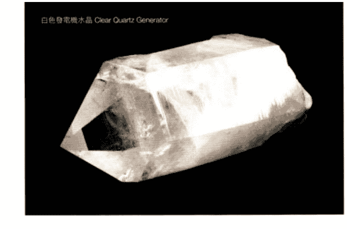

# 水晶高频治疗

## 作者简介

卡崔娜·拉斐尔 Katrina Raphaell

资深水晶治疗师与“高等水晶治疗艺术水晶学院”创办人，有看护、教学、专业按摩和其他自然疗法的专业经验。她首创“水晶治疗阵法”（crystal layouts）的革命性概念，将特定水晶以阵法排放放在人体灵性能量中心的脉轮上，并对“导师水晶”、“资料库水晶”等特殊水晶的功能意义提出突破性的见解。一九八五年起，她已成为水晶治疗领域最为人熟知的代表性大师。

卡崔娜于一九八六年在夏威夷成立“高等水晶治疗艺术水晶学院”，依据水晶治疗的艺术与实务训练了数千名学生，并在义大利、法国、新加坡、日本与香港等地培训水晶治疗授证课程的师资阵容。透过这种方式，让人们能亲身体验矿物界所带来的治疗智慧。著有水晶三部曲：《水晶光能启蒙》（Crystal Enlightenment）、《水晶光能传导》（Crystalline Transmission）及本书，目前定居在夏威夷。

欢迎参访“高等水晶治疗艺术水晶学院”，网址：www.webcrystalacademy.com

## 译者简介

奕兰

台大政治系毕，喜欢研究古文明、星象学、水晶治疗等，译有《印加巫士的智慧洞见》、《启动天使之光》、《启动神秘疗愈能量》、《声音疗法的七大秘密》（均由生命潜能出版）、《埃及宇宙学》等书。

## 中文版作者序

《水晶高频治疗：运用水晶平衡精微能量系统》最早出版于一九八七年的美国。它是第一本探讨用水晶作为有效另类治疗方式的书。如今，将近三十年过去了，这本书中的资讯证明经得起时间的考验。《水晶高频治疗》仍在印行，并且在世界上许多国家，成为使用水晶来治疗，合法、安全且有效的指引。

在出版了我的第一本书《水晶光能启蒙》（水晶三部曲第一部，中文版已发行）后，我意识到，如果人们想要用一种安全的方式将矿石摆放在脉轮上，那么在水晶治疗的过程中，就必须要有一套疗愈的技术来应用。我知道，如果将许多石头摆放在身体上，而没有特定的操作方法的话，那是有可能造成伤害的。这启发了我写作《水晶高频治疗》（水晶三部曲第二部）。和许多自愿的参与者一起，在各种不同的环境下，经过尝试错误的过程，我发现了这本书里写下的特殊疗愈技术。透过“内在的聆听”，持续运用各种绝美的水晶和矿石，水晶排列于是诞生。

在《水晶高频治疗》书中，包括了如何从头到尾、循序渐进地实施安全有效的水晶个案的教学。也包括了呼吸的力量（the power of the breath）、与灵魂本质连结（connecting with the soul essence）、身体综述（the body overview）、照顾内在孩童（taking care of the inner child）、前世治疗（past life therapy）以及保护泡泡（bubble protection）。而最精彩的，莫过于对许多矿石的记述，以及摆放在脉轮上的水晶排列彩色图片。

将这些技术应用于水晶疗程，目的在于支持每个个体获取他或她本身的资源——内在的疗愈能量，在任何需要的时刻与它连结。但不管是平复艰难的情绪、清除旧的头脑模式，或是治疗物质身体，基本的信念是：每个个体内在都有一个灵魂本质的神圣资源。水晶治疗是关于汲取灵性核心、信任它来引导每一次的水晶治疗。协助个人获取深邃的内在力量与指引，是水晶治疗的基础。

同样首次披露的是六种大师水晶。第一次发现大师水晶是在许多年前，我发现某一些石英水晶有着显著的相似。再深入地观察，我开始看到构成尖端的六个面有时候是完全一样的形状。我注意到有些水晶前方有一个大的七边形，正后方有一个三角形。我开始研究数字学与神圣几何学，握着这些水晶来冥想它们的意义。我学了好多，带着观察和研究，一共发现了十二种大师水晶，这本书介绍其中六种，而最后的六种会记录在我的第三本书：《水晶光能传导》（水晶三部曲第三部，中文版即将出版）中。

一九九六年我创设了“高等水晶治疗艺术水晶学院”（Crystal Academy of Advanced Healing Arts）。人们从世界各地来学习水晶治疗。我一个人开始，一个人教所有的课程，最后我发现，如果我训练讲师教授我的工作，那会有更多的人可以学习。今天，世界各地一共有十三位水晶学院的讲师在教授初阶与中阶的水晶疗愈授证课程。我仍然在教进阶课程还有讲师训练课程。我已经为中文世界的学生训练了一位非常好的讲师周承进（Krize）。他以香港为基地，旅行至台湾、上海、北京教授水晶治疗的授证课程。相关的资讯可以透过他的电子邮件（krize@wholeness.com.hk）和网站（www.wholeness.com.hk）获得。

水晶治疗的艺术与科学是古老的，在神圣的秘密学院中保存到可以公诸于世的正确时机。而这个时间就是现在。我非常高兴能将《水晶高频治疗》献给中文的读者，希望你们在阅读这本书时，也能得到一份疗愈的拥抱。

带着爱
卡崔娜·拉斐尔

www.webcrystalacademy.com

## 前言——水晶的神秘疗愈力量

不容置疑的，水晶的力量一直跟随在我们身边。在现今的世界里，水晶因不同的用途而广泛受到运用。内存是电脑的生命中枢，推动我们进入科技时代，它就是很纯的二氧化硅：石英。超音波装置、控制电子仪器中电波频率的震荡器、调整回路里的能量限度的电容器、将能量从一个系统导到另一个系统的传导器、以及储存能量的蓄电器等等，全部依赖石英产生功能。无疑的，水晶与矿石的应用是在逐渐增加的，它们古老与未来性的力量，仅在数千年后的现在，能够用来作为个人的提升和全球的进化。

在一九八〇年之前，关于水晶在神秘学与疗愈层面的讯息，以及在古文明中如何运用水晶的知识，是非常非常的少。现在各种关于水晶的知识，它的力量、潜质和应用方式等等是十分丰富的，能提供给那些直觉上受到水晶吸引，想运用水晶在个人成长与疗愈工作的人。

对那些内在已能感知水晶内涵的人，我建议当你探索这种光的现象世界时，请使用你的直觉，并认同你内在感觉是对的事物。在我的第一本著作《水晶光能启蒙》及第二本《水晶高频治疗》（即本书）里头所记载的，是我在过去十年里，藉由工作和研究水晶时，接收、体验并见证的资讯，然而你会有属于你的体验。每个人对水晶的开启，有赖于当事人愿意静下心来、清空思绪、打开内心，接收那准备好得以聆听的洞见。

水晶和矿石是一种以物质形式的精纯显现，也是各种色光频率的显现，向我们展现出清纯、稳定、美丽、神性法则与灵性完美的实相，能适时的教导我们如何全然启动与开展我们内心光辉中的潜能。水晶是我们获得的一项有力的工具，将宁静的心境与片刻带进我们的脑海，教导如何治疗我们古来转世的伤口，进而使得更高自我的力量，能有意识的与造化万物的无限大灵连结，它是所有富庶、丰盛与天地间喜悦的泉源。

### 加速成长的治疗工具

一九八〇年与一九九〇年代是地球史上重要的转换期，我们全都处于转变的过程里，而水晶与矿石正是在个人与行星启蒙期加速我们的治疗与成长的一部分。我们现在对水晶的运用将会继续扩展到生命中的各个层面里，并受到正统医疗界的认同。即使在现在，水晶被运用在显微手术的雷射上。针灸与经络的概念在一百年前是不被西方接纳的，直到成功地证实了它的效果才改观，水晶治疗的法门如今不断的重新现世。在未来，也如天命所指的，它会被证实是最有效果的一项治疗方法，不仅只是针对身体，同时也消除心与脑失调所造成的身体不适。

当水晶所辐射的光、色彩频率与能量渗入气场之后，清空脑海中的疑惑，恐惧自心中拔除，身体进而就能自在的展现出与灵性协调的状态。“高等水晶治疗艺术水晶学院”致力于水晶治疗的技巧与实务，并欢迎所有真诚希望深入学习矿石排列与相关治疗法的学生。

《水晶高频治疗》一书是提供无经验者与专业人士们适当的讯息，将水晶与矿石的治疗力带入个人生活与实际治疗中，同时提供特定的进阶技巧与疗法，使得读者可以有意识的接触到内在智慧之源，获得大量的光能来疗愈自己，能在生活中真实的表达出较高自我。

我感到着迷并满怀希望的是，许多人潜意识的（或有意识的）已经知道水晶疗愈的潜力与威力。透过个人与水晶矿石的研究与经验为基础，构筑出一套真实的知识，古老的记忆面纱也被揭开。看到光能化为物质的结晶，并运用在生活的各种用途上，包括让手表准时转动到治疗深沉的内心，是很令人感到鼓舞的。

第一册《水晶光能启蒙》书中的资讯广被接受是一个正面指标，显示许多人认同身体所呈现出来的知识，而总和看来，我们正以水晶为媒介向光成长。水晶的力量正逐渐增加中，而未来仍会持续如此，因为我们正跨入真知的黄金时代的门槛。本质上，水晶和矿石是我们的老师和向导，它们真切地反映于展现出的光，是一切造物的共同起源。

对我而言，水晶是进阶的治疗技术中，长梯上的最后一阶。它们所创造出“奇迹”的纯净治疗能量中的最高层级，不过非常重要的是能同时了解到在使用水晶时，虽然它们如此美丽与具有魅力，但终究是一种工具。若是把它们看得比我们自己更有力量的话，就无法看到真正的课题。水晶不是“物”，它是光，而我们也是光！要有效的将水晶发挥其最高用途，是要把培养我们运用自己内心之光与资源的能力，作为终极学习目标。水晶是一种有力量的工具，能协助我们平静、滋长，拥抱与展现出如水晶般清澈的内在之光。

《水晶高频治疗》是水晶三部曲中的第二本书，是呈现给能认同这些资讯的读者，以及坚定前行的水晶治疗师和那些需要疗愈的人，它也呈现给孩童和地球。由于后面章节中的资讯是来自个人的经验，它是敞开的接纳符合更高真理的修订。我的祈请与意识的投射，是希望本书资讯只被用在正面的用途上，透过这些资讯让更多的人走回自己真理与力量的光明中心。谢谢你们！

## 第一章 水晶治疗特定技巧

### ——第一部 进阶水晶治疗

笔者所著水晶三部曲的第一册《水晶光能启蒙》里，论及许多水晶与矿石的疗愈内涵、水晶疗愈的技巧，及各种矿石排列法的基本讯息。将这些资讯提供给实际运用水晶的人们，使我觉得更有责任要分享出特定的技巧，因为水晶与矿石一旦排列在身上，强而有力的能量就开始流动了。许多读者们都已见证过水晶矿石的效果了，当脉轮敞开时，里面堵塞住的能量浮现，当这些能量要释放出来时，你也许不知该如何处理或是如何引导其中必然产生的变化。本书所提供的讯息，即是如何去处理这些淤塞的能量，如何接触源头、从灵性上去了解疾病的根源，以及如何化解、学习其中的功课，然后放下并继续提升。

在此提及的疗愈方法，是我多年来在实际的水晶疗愈中所运用的，许多疗愈法已具有完整的理论与实务操作系统（例如前世疗法、驱邪法等等），在本书里是与水晶治疗的技术与实务操作合并使用。在任何疗法中加入水晶一起运作，都会增加其效果，扩大治疗能量。若对其中的疗愈主题有不熟悉之处，建议你去深入与完整的了解，并融入水晶治疗里。我很荣幸将这些疗愈法介绍给各位，并请求您在使用水晶之前，去连结自己内在之光及水晶矿石的能量。

### 觉知水晶的力量

在开始对他人施行水晶疗愈的技术前，需要有意识的认知与接受施行技术的责任。有些人并没有觉知到水晶与矿石在融入人体电磁场所产生的力量，进而造成了许多伤害。在水晶治疗中，许多微细却显著的变化会发生，当事人需要准备好并有能力去处理。当气场中充满着矿石所辐射的光芒时，会对当事者的每个层面直接产生效应，心智上的觉知提高了，情绪层面变的高度敏感，如果运用了正确的程序，灵性能量可以被整合进身体里，使奇迹般的疗愈发生。如果对其施行的力量没有觉知而且觉知过度与天真，严重的分裂、脆弱的敏感性、未开通的能量，则会带来弊多于利的后果。利用本书后面章节所提到的疗愈法，即能将水晶矿石的力量驾驭在治疗与提升的作用上。

水晶治疗是一门渐进式的技术，具有创造出对心智体、情绪体、肉体与灵性体全面疗愈的潜力。施行水晶疗愈是一种放下并让神的意旨来运作的机会，是内心倾听灵魂讯息的时候，是深入对内在自我的信任的时刻。

水晶治疗是色彩与光能的最极致能量，在人类的精微层面上运作，当这种能量上的互动产生时，可以触及当事人最深的本质，因而能了解为何我们创造出生活的实相。当我们明白为何吸引自己生活的境况，以及生活事件要给我们的灵性课题时，我们即能为自己负起完整的责任，并创造我们所选择、所要过的生活。内心的寂静与个人的力量，是一个人能与自我协调，并明了事件为何如此发生的目的，于是，无须再扮演受害者的角色，成为受控而无奈的命运囚徒。

施予水晶治疗时，需要治疗师心智上持续的专注，并能放下个人的问题，全然的融入他所运作的对象。当被治疗者接受水晶治疗时，其心智体或情绪体层面的障碍会浮现在意识表层上，且以更宽广的观点来看待这些障碍。

水晶治疗能带来更多的光能和色彩到气场中，当矿石受到自然光照射而发散光泽时，能量也扩大了，协助看清浊气中的讯息，以及掌控人生事件的业力模式。在这份洞察之中，被治疗者可能有意识的获得领悟、终结恶性循环、清除业力、学到珍贵的课题，且获得更完整、更高层次的力量。

当气场敞开且清澈时，能活化脉轮的运转，使我们能有意识的触及个人最深沉、最纯净的一面。气场的振动频率一旦提高，不管是心智的、情绪的或潜意识中振动较低的能量都会浮现、释放，使得内心受到净化、疗愈与转化。运用本书所介绍的技巧和水晶矿石的高度光能和疗愈频率，可以正向的改变个人形象，改变不合时宜的信念系统与观念，获致内在的和谐与宁静。个人有了内在的安宁为基础后，能发自内心感到满足与喜乐，进而促进地球的转化，外在的物质世界将反映及展现我们内在的生命状态。

## 第二章 治疗空间准备工作

### ——第一部 进阶水晶治疗

在进行水晶治疗之前，很重要的准备工作是，要清空思绪、安住在自己的内在，并将注意力集中于内心和所有使用的水晶矿石上。在案主到来之前，你可以坐下来，把矿石放在面前，做几个深呼吸。你可能想在左手握着一个紫水晶，增加你的直觉力，或者你想要将你静坐时最喜欢握着的石头，放在眉心轮或心轮上。顺着呼吸之流，每当吐气时，释放你所有个人的问题，在你吸气时，观想吸引更多的光与能量到你的意识和身体中。在你准备要与案主连结，并使用水晶力量的同时，召唤你个人疗愈力量的源头。我在启动水晶疗愈前所做的召唤语如下：

> 我召唤净光兄弟之光，
> 我召唤伟大的中心太阳之光，
> 我召唤我自己的永恒存在之光，
> 我召唤无限巨灵之光。

复诵这段肯定语，至少三次，之后我会觉得清澈而准备好要开始治疗工作（肯定语也可以在你想要祈求力量与保护的任何时刻运用）。

在开始工作前，以这些方式来安住与连结内在，不仅让自己准备好能使用眼前握有的力量，同时也可释放个人思绪，而能有意识的处于眼前当下的境况里。这是一个进入动态静心很好的机会，让你在活动身体的同时，更能够保持清澈、客观与觉知。

### 准备及净化空间

在每场水晶治疗的个案前后，很重要的是清理所使用的水晶矿石，以及净化空间中可能潜伏的残余灵能。有几种方式可以净化空间：最好的是打开门窗，让新鲜空气流通；另一个有效的方法是点香，或是点鼠尾草或香柏做的熏香棒，这是美国印第安土著传统中最为人知的一种净化空间的方法（详见第十四章：净化与重新充电的技巧）。或者可点上蜡烛，至少燃烧十分钟。

同样有效的净化方法是水晶冥想，把白色发电机水晶置于眉心，水晶尖端朝外，投射心念吸引清新的振动能量，并消解因先前的疗愈过程而滞留在空间中的所有负面思想或情感。一个正向的环境能帮助身为治疗师的你保持中立与安住内心，同时也提供案主一个安全清澈的空间，来进行转化。

另一个重要的要素是，要觉知你所运作的这个对象，很可能正在经历改变，清理情绪、释放旧信念和驱散负面能量。身为治疗师，保护自己是很重要的，不要把这些能量带入你的生活里，保护自己的最好方法，是在进行疗愈时握着一个你最喜欢的水晶（白色发电机水晶），并让尖端朝外。

在做治疗前的准备时，你可以做此冥想：吸气时，观想光从你的顶轮进入，吐气时，光从你的心轮放射出来包围着你，形成一个白色的保护场，这也会增加从你心轮放射而出的疗愈能量。

在实行疗愈与运用水晶矿石时，使自己根植于大地是非常重要的，其方法是：观想光（或丰富的色彩）在吸气时沿着脊椎从头顶走向底部，而吐气时，观想能量从大腿流向脚底，再从脚底流向大地。

藉着这些观想，可以使自己在整场疗愈过程中都受到保护。不要观想吸气时将案主的能量吸入，吐气时从头顶排出，这会使自己受到负面能量的伤害程度增加，导致能量耗散或是枯竭。觉知及以正向的方法，才能确保施行者和案主有一个安全、受保护的环境。

进行水晶疗愈需要安静的环境，尽量避免外来的噪音，能使人放松与进入冥想。如果你所在的地方没有足够的安静空间（或是你正外出到别人家里），可能有必要在你进行疗愈的地方建立一个具有保护性的能量场。可以在房间的四个角落放置白色发电机水晶，尖端朝向房间中央，然后站在房间中央，握着一个白色发电机水晶，尖端陆续朝向四个角落上的水晶。当你将你的疗愈能量透过手上的水晶，以逆时针方向旋转传导出去，这样一来，便使得空间的能量获得封存、不受外来能量干扰（也可用雷射棒来建立一个保护场，详见第205页）。

因阳光对矿石的自然反射，所以白天是理想的治疗时间。放一些轻柔的音乐作背景，四周多放些水晶，尽可能增加光能的力量。按摩床或是高度及腰的床是最适合的，案主面朝上方躺着接受治疗，通常会用到两个枕头，一个在头部，一个枕头在膝盖下方，避免下背部承受压力。

将水晶直接放在皮肤上，效果最佳，所以案主最好能上半身赤裸，如果觉得赤裸会不自在，则可穿着自然纤维如棉、毛、丝制的衣服，较能促进矿石能量的传导。如果治疗空间里的温度较低，当案主的上半身暴露在空气中时，可以拿条毯子盖住手脚及腿部。

### 创造信任感

一场水晶治疗通常要花上两个小时，所以让案主感到舒适与放松是很重要的。常常案主会觉得只过了很短的时间，因为在疗愈中非常深入内在。我们平时清醒时所经验到的线性时间频率，会因水晶矿石的光能充满气场后，而产生强烈改变。这种时间弯曲的现象很常见，需要受到调控，治疗师有时会在治疗时收到直觉的指引去调控时间状态。遇到这种情形时，治疗师有责任维持案主的舒适与安稳，当个人在身体上觉得安全，并受到照顾时，会比较容易连结内在深沉的世界。

除了给与身体上的安全感，让治疗对象感到更深的信任也同样重要。水晶治疗会触及极为深刻的亲密层次，有时案主触及从未经验过的意识深度，往往非常私密或令人难堪的想法与记忆会浮现，很重要的是保持不评断的态度，对所有浮现的事都要守密，信任与守密能确保一个正向的情境，是让治疗发生的关键因素。

当你的案主抵达时，先坐下来谈谈，看看有哪些地方需要运作，哪里有阻塞与紧绷，哪部分的身体是失衡或不舒服的，当事人是否有发生什么事。询问对方有什么是需要加强与清理的，这段谈话可以给水晶治疗师初步提示，哪里是要集中治疗的部位，以及要运用何种矿石。

通常一个觉得需要接受水晶治疗的人，内在知道需要做些改变，以便成长与痊愈。水晶治疗可让接受治疗的人去连结原先无法触及的内在，唤醒内在智慧来回答所有问题，并治愈所有伤痕。

### 时间意识暂停

施行或接受水晶治疗是一项静心的行为，此时要能放下一切，专注在当下。透过对当下的觉知，我们能连结内心源泉并取得正确的资讯，来了解眼前正在面对的问题。要解开宇宙伟大的谜题，其解答就在我们内心，藉着萃取出永恒片刻中的精华，我们能获得关于前世业力、当前现况、未来事件的解答。所有时间都存在于瞬间片刻的中性地带，当心思安静下来并向内凝聚时，就有可能以第三眼的全然洞察，来照见与得知某人与我们同为宇宙一份子的真理。

很重要的是，提供水晶治疗的人要能保持相当的觉知与处于当下的状态，不要为了个人问题而分心。专注的与治疗对象在一起，关注他的呼吸和释放的征兆，此时也要十分注意所使用的水晶矿石，依需要放置或是移开。

即使你能使用关于矿石、脉轮、色彩等理性层面的知识，觉知与行动仍是以直觉、当下的明白为基础。透过定静当下的心思、稳定意识，则有可能遵循直觉所带来的细微驱力，来引导矿石的放置或是移除，以及给与指引和给对方个人的回应。

接受水晶治疗的人，有着难得的机会可以碰触到存在的深层本质，当心平静下来进入当下，注意力放在内心时，能够与灵魂融合。当下的觉知是首要关键，能化解潜意识的阴影，打开超意识的大门，并跨越灵性世界的门槛。在这种情形下，有可能以更宽广的观点，从人生成长进化的经验、甚至从最创痛的事件里所获得的理解，来看待疾病或失衡。全然的自我负责和提升个人力量，是促进地球整体提升的第一步，它始终在当下与我们自己无限灵性的光辉有意识的融合。

### 呼吸的力量

呼吸是人获得生命能量的最主要来源，透过呼吸，生命能进入体内。透过气体的交换，每个人与宇宙产生互动。在吸气时，我们接收生命能量，吐气时我们又将之交还出去，我们能长时间不吃东西或几天不喝水而生活，但几分钟不呼吸就无法活下去。这股力量能活化脉轮，使精微能量体与身体获得活力，将疗愈力带进来，透过有意识的导引来运用它。

觉知呼吸是使觉知进入当下的最有效方法之一，呼吸存在于每个连续的当下中。藉着将心智的专注力微调到每个吸气与吐气上，让心智平和中立，直觉即能被清楚的认出来。

当案主面部朝上的躺在治疗床上时，请他闭上眼睛，然后用语言导引案主去觉知每个吸气与吐气。运用意象的观想来将心思向内导引，在用语言导引对方的注意力向内走时，让你的声音尽可能轻柔、有节奏感。你可以运用这样的意象：

吸气，让自己进入内心深处。吐气，同时放下所有的问题、烦恼与担忧。吸气，深深的进入自己的内心。吐气并臣服、放松、放下。

通常要一个人做彻底的呼吸是很困难的，多数人只用上半部的肺来呼吸。只有当全然有意识的呼吸时，我们才能经验到最大的生理刺激，才能彻底的吸气进来。当我们长大后，经历过一些创痛和痛苦的情境，往往我们不会想再次去感觉这些经验，因此潜意识的会透过浅式呼吸来切断生命力。当这些生命事件发生时，我们关闭呼吸，因为呼吸就是意味活着，而生活并非永远都是愉悦、容易消受的。但藉着短而浅的呼吸，我们纳进较少的生命力，对沮丧与痛苦的感受也会较轻微。

此时所会产生的问题是，潜意识的记忆与每个创伤相关的情绪会储存在太阳神经丛，那是呼吸不愿意进入的地方。如此一来，便在以肚脐为中心的下层脉轮和以心为中心的上层脉轮之间，创造出一个重大的阻隔，在太阳神经丛上的紧缩能量，使得天的力量与地上的实相无法完全整合。

如果我们能够在每个情绪冲击中保持集中与安住内在中心，那么就有可能深度与彻底的呼吸，继而能在人生事件里保持轻松心态来学习其中的课题。由于我们常常无法如此做，于是就需要将压抑在太阳神经丛上的感觉消去，释放来自潜意识的旧有记忆，以治疗身体，平衡上下半部的能量中心。

藉由在水晶治疗过程中观察一个人的呼吸，你能注意到他们在哪一处曾停止接受生命力，往往这是开始产生疾病与失衡的部位，也是需要放置水晶矿石的地方。你可以使用白色发电机水晶，来导引有意识的呼吸之流。

### 中轴线聚焦

有一个好方法，可以让我们藉着呼吸聚焦到当下，它称之为中轴线（Center Line；或称中脉）聚焦。开始时，请接受治疗的人闭上眼睛，专注在呼吸上，观想一个直径六寸的金黄色光球在头顶上，让案主将这光从头顶吸进身体来，进入前额，活化第三眼，并且往下穿透每个能量中心，直达脊椎底层。这可使每个脉轮在你以语言引导呼吸的气流通过人体中脉时，受到光的碰触。吐气时，则观想光沿着脊椎向上攀升，从头顶出去，这样观想光在脊椎上下流动，可以使得当事人创造出一条黄金中轴线，这条线能导引来自头顶上的无限之光，进到每个脉轮，将灵性力量整合到心智、心与身体中。

中脉聚焦法对活化神经系统特别有益，透过专注在中枢神经轴线，专注在以太体上的脊椎来统合脉轮，调理任督二脉来活化经络系统。

透过有意识的中脉呼吸，也能够使我们认同内在的中性自我，让头脑和心进入一种抽离的状态。再一次的，运用语言引导你的案主：

深深的吸气到你的中脉，吐气并放下所有的念头，观想光在你的脊椎上移动着。吸气并进入到你自身光的中心里，吐气，并放下所有紧张，所有那些使你在吸气中无法进入更深状态的紧张。

有些人发觉吸气时导引光向上，吐气时则光向下，会比较容易做到，每个人可以最有利于自己的方式运作，所以当案主的能量不是很稳定时（理性过强、过于情绪化或是恍恍惚惚），如果用不同的方式来导引可能会比较理想。你可以请他们吸气并导引能量到脊椎底端，而吐气时，则是从肛门排出，或是沿着腿向下到脚底。透过意念来导引能量的方法，可以针对每个人的需求而定，可能在每次的疗愈里也会有所不同。

当案主放松时，运用横膈膜和下腹部的肌肉，引导呼吸进到中轴线，重点是使呼吸透过太阳神经丛和脐轮，让下三轮的能量与心轮的能量衔接起来，如此能直接将矿石的疗愈力整合到身体里。脐轮是身体的中心，而心轮形成能量体的基础，当把金色的光从顶轮带进中轴线并深深地吸入脐轮时，能量则转换到身体里作为疗愈身体之用。

一旦案主的呼吸达到彻底与深沉的程度时，便可以把矿石置于他的身体上，在整个治疗过程里，引导案主运用中轴线聚焦呼吸法，让案主融入生命力中，有能力为自己导引能量。

当疗愈进展的同时，你的案主也会益发觉知到原先压抑的情绪，或是浮现出视觉画面，很重要的是继续保持彻底而深沉的呼吸。短促而浅表的呼吸是首先会出现的象征，表示当事人即将要碰触到深沉的心理或情绪创伤，而这创伤是导致疾病发生的原因，当你要处理这些失衡的问题时，往往有需要让案主再次聚焦在呼吸上并观想中轴线，以释放或调和浮上表面的创伤片段。

另一个有效的方法是，将你的手放在他的能量紧缩之处，导引他深深地吸气。将手放上去时，也是一个极佳的机会，让疗愈能量能透过碰触进入到他出现问题的部位。这也有助于身体重新与潜意识里失去连结的部分再度连结。

如果有人因胃溃疡前来治疗，而水晶疗程进行中感受到幼年时所经验到的各种恐惧与焦虑（这些情绪一路被带到成年后的生活里），请帮助你的案主吸气，并观想平静的蓝色进入胃部和横膈膜区。在这种情形下，蓝色是愤怒红色溃疡的消解剂，同样的，置放淡蓝色系的矿石在胃部与太阳神经丛区也会有所助益，如绿松石、硅宝石、硅孔雀石、海蓝宝或天河石，或者把你的手放在上面亦可。

用语言导引对方做呼吸，吸气进入中轴线，吐气时将胃部的紧张吐出来，亦可运用白色发电机水晶在不适之处或其上方，透过水晶发射你的治疗能量，使其力量更为紧密与强大。

在整场治疗与私密的运作过程中，呼吸会是调和与增加力量的主要工具。

总结：每个呼吸都要深入而完整，将生命能吸进身体里，特别是那些不舒服的部位。观想呼吸在中轴线中移动，吸气时从顶轮而下，吐气时从脊椎底部上升。随着这样的呼吸，肚脐一带和腹部肌肉会扩张与收缩，而生命力则透过脐轮中心整合到身体里。运用观想来引导呼吸进入痛苦的部位，在每次吸气时重新充电，吐气时释放压力与紧张。看着肺部充满空气，就像替杯子注入水一样。吸气时，首先是注入底部，接着是中间，接着是肺的上半部，而横膈膜下沉，腹部肌肉扩张。吐气时，杯子变成空的，先是上层，接着中间，收缩腹部的肌肉推动呼吸向上出去。这是一种简单合宜的呼吸，可以融合到日常运动中，成为案主持续循环疗愈能量的维护工作。

瑜伽行者和舞者都曾学习过如何运用呼吸来增加个人的活力。每次当你需要集中精神时，闭上眼睛，吸气时感觉呼吸中的力量；吐气时，释放压力情绪或是焦虑。呼吸一直都在，是你随时可运用的工具。

> （编按：本书中提及的硅孔雀石、硅宝石，在《水晶光能启蒙》中用的是另一俗名硅孔雀石、硅宝石。）

### 水晶矿石排列

在《水晶光能启蒙》的第三章里，我建议了六种水晶治疗的排列法。其中任何一项皆可运用，即使你能运用对脉轮、色彩的效力与水晶的力量等知识，但水晶的确实排列方式，总是因人因时而需要依直觉来操作。曾有一段时间，我会在案主到来之前即预想好我想要运用的排列法，但等到真的要排列矿石时，却又引导出有别于我预想的新组合。因此我明白，即使你理性上能做预测，但最清晰的指引却是在每个当下遵循直觉的引导。如果你能打开你的心、放松，倾听内在的声音，你会被引导去使用正确的矿石和它所要放置的位置，也会知道为何要如此做，以及何时可以把它移走。

放置矿石的方式大多是取决于接受治疗的人，以及你导引能量的方式。如果案主是充满恐惧与哀伤，或是缺乏对自己的爱，你可以在心轮的四周，集中放上粉晶、粉红与绿色电气石、绿色砂金石、蔷薇辉石、菱锰矿，以及其他与心轮有关的矿石。如果有人无发展现实实现个人目标的显化力，或是觉得无力与无助时，你可以在脐轮四周使用黄水晶、发晶、金色黄玉、虎眼石以及黄色方解石。

如果案主无法表达出他的感觉，可以用硅宝石、海蓝宝或天河石、蓝纹玛瑙和硅孔雀石。在集中运作某个脉轮时，很重要的是至少要在其他脉轮点上放置一个矿石，以平衡各能量中心，将作用力做全盘系统的整合。例如：将烟水晶放在第一轮、红玉髓在第二轮、黄水晶在肚脐、绿色砂金石在太阳神经丛、粉晶在心轮、天河石在喉轮、紫水晶在第三眼、白水晶在顶轮。

总而言之，矿石排列依据个人、当下的机缘与你自身调和的状况而有所不同。矿石排列的颜色与设计之组合，每次皆有个别独特的呈现，针对当时的状态而有所不同，每次的排列都是一个机会，敏锐而具创意的来运用光与色彩的力量。运用你的内在指引，当你的内在说话时，好好去倾听。

一旦矿石被排列好并与案主的内在光能中心连接时（这大约要五分钟的时间），这段时间里对方会处于相当敏感和脆弱的状态。当有一股更大的能量流穿透案主的气场并随之进入身体时，水晶治疗师必须非常注意并提高觉知。这是为何深度呼吸是很重要的，因为可藉此将最细微的能量整合进入身体里。透过观察喉咙与肚脐的脉搏，可看见心跳、血压渐渐上升，整个代谢系统重新适应新加入的能量。随着案主的意识安住在内在自性的圣殿时，他的感受会变得十分敏锐。有时（当案主无法将矿石的较高能量整合到气场里时）需要将某些或是所有矿石立刻拿起来，等到呼吸变得平缓，脉搏的速度调和时，再继续治疗。

### 保护与指引

在进行水晶治疗的过程中，当矿石的频率与人体的电磁场融合时，高度启动光能的潜力是非常强烈的。此时可以进入内在世界，并能理解高度次元的实相，水晶点亮了道路，使我们能跨越灵性世界的门槛。重要的是，气场被打开，当事人对灵力与以太层面的影响会变得格外脆弱，你只会想要让最高、最正面的力量与存有出现。要确保这点，请握着一个白色发电机水晶的尾端，尖端向外置于眉心，并大声说出如下列宣言：

> 我召唤光与色彩的最高力量到来，透过水晶与矿石来运作。我召唤（案主的名字）、指导上师、灵性导师出现与我们同在，协助这场治疗。最重要的是，我召唤（案主的名字）最真实的本质来到这里，根据此时他/她最需要的，重新更新他/她的心与脑，以获得了解、清澈与疗愈。

在召唤保护与指引时，将这段话念出来，是十分有威力的。当念完这段话，你可以确信只有正面的力量会出现，这也是一段祈请案主的灵魂力量来参与及沟通的祈请文。接下来，开始介绍治疗法。

## 第三章 各种治疗法

### ——第一部 进阶水晶治疗

水晶治疗师在被治疗者身上放置矿石的同时，也利用语言导引他的意识往内心深入，到目前为止案主一直是处于被动的状态。现在是与灵魂产生互动与沟通的时刻，并将其中的智慧与治疗师分享。有时，当案主深深的聚焦在自己内心时，几乎无法言语，可是一旦开始语言上的沟通后，通常很容易继续下去。

治疗中最重要的部分现在要发生了，即是有意识的接触灵魂的示现。这种交流的关键是，当细微的讯息或影像从灵魂层次浮现表意识时，能够被我们认出与明白。通常在日常生活里，我们接收着这些讯息，但常常是被忽略的，或犹豫是否要表达出来，或是我们注意到这些讯息，并采取行动来遵循这股脉动。

在水晶治疗的过程中，一旦放入矿石，气场就透彻了，被治疗者会放松下来，向内连结，会毫不质疑的知道所有浮现出来的讯息或影像。有时，这些影像或画面或象征是模糊的、陌生或是没有意义的。但是当你继续完成整场治疗时，这些讯息会自然呈现出它所代表的意义。水晶治疗师的工作，是协助诠释与定义浮现在被治疗者脑海中的讯息，当下的觉知可以使治疗师连结案主的灵魂层面，并获得直觉的指引。

### 启动灵魂符号

注意力与有觉知的专注，是唤起内在意识并活化直觉的主要关键。在运用一段时间将觉知带往内心之后，我们现在已准备好将来自灵魂层面的智慧整合到表意识。在召唤保护与指引之后，对被治疗者的内心说以下一段话：

> “你的心现在是非常敞开、清澈而能够接收的，我们此时请求你的灵魂给与你内心一个影像、符号、意象或是一种感觉。当你能感受到这影像时，请跟我分享你所感受到的。”

这段话能启动灵魂示现在疗愈过程中，此时不管脑海中是浮现何种影像，皆是我们要去运作的。有时它会是一个很明显的符号或标志，有时则是一种颜色或是模糊的印象。如果你需要对影像的意义获得更清澈的洞察，可以问问当事人对它的感觉，问问对方它的意义是什么、跟什么有关。有一次，我的案主浮现出马桶冲水的影像，我并未觉得有什么值得注意，只是问问案主那是什么意思。他随即知道那是一个征兆，象征他已经准备好去清理废物，或是释放他不再需要的，这使我们知道他即将要进行一场重要的净化与清理。

从这样的连结开始，治疗会渐行深入。如果符号是绿色的，是象征疗愈，你可以导引当事人将绿色疗愈能量吸入到有问题的部位，且在疗程进行时注意其疗愈本质，一旦案主能有意识的与灵魂层面接触，你可以将其注意力导引到特别需要疗愈的部位上，或任何案主想要处理的问题上。

### 意识转换

当意识向内集中，以水晶点亮了内在道路后，便开启了一个领悟的现象世界。这就好像你能从一个扩大的角度来看到你的人生、时空情境、整个宇宙。从这样的观点，你就有可能清楚地看见事件背后的目的，了解为何需要吸引这特定的情境到来。在这个层面上，当你检视所有你存在所经验过的事件的记录时，则有可能接上你自己的阿卡西（akashic）灵魂记录。可以透过启动意识转换，让这状态下呈现的影像，来联系或感受能治愈所有失调的疗愈能量源头。

身为一个水晶治疗师，你的工作即是导引伙伴的注意力去获得内在的洞见。你的声音需要柔软、有韵律感并让人信任，透过语言的力量，你导引、鼓励、沟通并引领方向。在接收者听起来你的声音会是和谐的，你能促使同伴进入更深的觉知状态，那是在没有你的协助下无法达成的。当你连结上你的直觉时，语言的力量能启动的意识层面很像是受催眠下的状态。水晶治疗的某些预备技巧与催眠是很像的，主要的差别在于，被治疗者保持全然的清醒，能全场主控自己。如此一来，从意识转换状态下取得的观点与洞见，能为当事人所目睹与经验。

### 第三眼唤醒者

有几种矿石可放置在第三眼上，以启动意识转换状态下的影像：紫水晶、硅宝石、蓝铜矿和舒俱徕石（在《水晶光能启蒙》一书中皆有提到）。每种矿石都有其独特效力，可以彼此搭配使用，创造出清晰的洞见，让灵魂能用第三眼来看。

#### 紫水晶

紫水晶是第三眼的主要矿石，就像粉晶对于心轮一样，能吸取其中的能量，用以自我治疗和自我启蒙。紫水晶也是静心时主要使用的矿石，它能平抚受到困扰的头脑，进入完全的安宁中。紫水晶的清澈紫色光，是完美的反射，就像更高层世界投射下来的一股宁静，安静我们的头脑，使我们能连结到内在的智慧。

#### 硅宝石

硅宝石（Gem Silica）是紫水晶的近友，它的高贵使得它与紫水晶共享新世纪矿石的称号。它通常与紫水晶合并使用于眉心处，以激发出较高预见的力量，以第三眼的力量看透时间与空间的幻象，进入灵性世界。硅宝石能导引鲜活的蓝绿色光进入脑海中，唤醒内在感官，看见以太世界中的奇迹。硅宝石是纯净的蓝光，代表女性般的直觉，像是一座高山深湖，将注意力带入无限延伸的想象世界。

硅宝石是在运作灵通技巧上重要的矿石，可以促进在通灵、解读讯息或谘商时，精确的将感应转译成语言。因为蓝色是喉轮的天然色，所以这种矿石也可以直接放在喉轮上，促进影像式的概念透过语言的力量显化出来。

硅宝石也能治愈有关第二脉轮的问题，减轻来自女性身份的认同、性的摩擦与生殖力量的失衡。硅宝石是一种多切面的石头，可以在水晶治疗中以不同的方式来放置。它是从硅孔雀石演化而来的，质地上分为许多等级，最清澈的等级可以运用在第三眼上，来确保精确感知与诠释直觉力的经验。

#### 蓝铜矿

在有意识的准备好去面对个人的恐惧时，蓝铜矿（Azurite）是最具有威力的矿石。与蓝铜矿并列“深蓝三宝”的是方钠石与青金石，然而蓝铜矿的不同之处在于是蓝铜矿的结晶化，也因其结晶的特性，它对潜意识具有更深入的穿透力。结晶化能创造出更多光的反射，使得蓝铜矿能化解浮现而上的恐惧，而这些恐惧使得心智一直牵系着过去。当一个人准备好去审视心灵中闭锁或受局限之处时，才能使用蓝铜矿。

在使用蓝铜矿时需要伴随着觉知，不管是治疗师或是案主，对它的力量都要保持觉察，要准备好去处理从潜意识的阴暗面中浮现上来的事物。当纯净的蓝铜矿被放置在后脑枕骨处（头盖骨的底部），根植于远古过去的恐惧会被忆起，或是唤回隐藏在惊恐之下的前世记忆。

处理因果层上的恐惧时，最好是与紫水晶同步运用在眉心轮处，以平静头脑，连结内在自我。若是在太阳神经丛处辅以孔雀石清除情绪，蓝铜矿可以是彻底的心智洗净剂，让思想与情绪获得和谐的更新。与硅宝石一起使用时，蓝铜矿受到硅母（Mother Silica）的大力帮助，能获得清澈的洞见，让灵魂能看透恐惧的模式，并种下新的思想种子。

#### 舒俱徕石

舒俱徕石（Luvulite）在几年前才问世，现在能勇敢的以宝石级的品质来呈现其纯净的王者力量。当舒俱徕石用于第三眼的位置时，能使脑海中浮现清澈的明了，确实的得知为何灵魂吸引某些经验，又究竟想在其中学到什么课题。我们能使用其完美的紫色面，深植于心智面中，以理解灵魂的智慧。

舒俱徕石是紫色光的阳性面，它引导着直觉性的明了进入理智面，作为心智的转化与疗愈。在第三眼处，以蓝铜矿结合硅宝石及舒俱徕石，能看见源自于前世的问题，了解、学习并予以消除。当想了解引起身体不适的根源时，它也是拿来进行疗愈的好矿石。

紫水晶、硅宝石、蓝铜矿、舒俱徕石是第三眼矿石的“四重奏”，可以交替地运用在第三眼的位置上，平静脑海、打开内在洞察力、净化附着在恐惧模式里的思想，使我们明白在各种情境背后的灵魂目的。

这些矿石在启动意识转换状态时是很有力量的，每个在他人身上运用这些矿石的人，都有责任要对所引起的效应保持觉知。当使用这些矿石时，要极为专注案主的反应，并观察他们的脉搏、呼吸的节奏以及精微能量的变化。引导案主的意识进入光的身体中轴线里，并和缓呼吸的流。当产生深度的放松以及向内聚焦时，便能感知到内在自我细微的回应。

引导意识转换状态发生的技巧有很多种，我们会谈到几种。请记住，不管在过程中出现什么状况，在当下，请运用直觉的力量作为你的指引。

### 身体扫描

这个技巧最适于处理身体的某个失衡状态，但不仅限于这种状态。它也可以用来清楚看见身体上可能潜伏的疾病或气场中模式（此时也是治疗师要在视觉想象上或是心智上，确认防护自己的能量场的好时机）。导引你的案主：

> “想象自己身处于离自己身体三尺高的位置上，你能看见自己身体里的器官、血管、动脉和神经。你能看见组织与细胞，也可看见身体四周的能量场、气场的颜色，身体哪里有阴影、哪里光比较暗淡。”

当对方跟你分享他所看到的情形时，做个记录，重新导引注意力到那些器官上或是光度晦暗之处。这里通常是身体失衡的地方或是心智模式创造出阻碍，使得身体上呈现不适的状态。

在水晶疗愈的过程中，很重要的是手边准备纸笔，写下关键语句及灵感。在治愈中合适的时候念给被治疗者听，或是在时候用来创作肯定语。回顾阅读这些特定的字句，能启动对实相的体验，促进对愈有更深的认知。

### 保护光泡

当你重新使案主的意识聚焦在能量晦暗的区域，仔细观看阴暗之处产生的缘由时，让案主感觉被光围绕与保护是很有助益的。不管身体或气场里储藏的是什么样的记忆、思想或感觉，光在气场上的围绕使得身为观察者的案主更为客观。思想与感觉会浮现上来，这是引起目前失衡的缘由，在更仔细的去观察问题时，想象自己被一个无法穿透的白色光泡包围着，使得自己受到保护并更为中立。

如下所述来引导案主：

> “看着自己被一个无法贯穿的白色光泡所包围，让自己能清楚看见产生暗沉的缘由。知道不管你看见或是忆起什么，你都是被保护在这个光的泡泡里，让你与问题隔开来，使你能带着中性的观点来检视。现在让我们来观察与看见。”

让自己被白光围绕着，使自己能以白光的身份而非是痛苦的、生病的、潜意识幽暗的当事人的立场来看这件事。在整个疗愈过程中，提醒案主，在洞察到疾病的深层起因时，他一直受到稳固的保护。这个保护光泡能使得被治疗者在潜意识的创伤回忆浮现时，保持抽离。它同时也有意识的创造出一个与光的连结，而光是个人力量与疗愈能量的源泉。

有位女士前来接受水晶治疗，她的手无来由的十分酸软。将蓝铜矿放在她的第三眼处，贯穿她的潜意识，而蓝铜矿上方放置紫水晶，连接她的直觉。绿色电气石则放在她的肩膀上、手肘及手腕，增加神经传导。矿石被放置每个脉轮中心上，强化心与太阳神经丛。

在水晶治疗的过程中，我们做了身体扫描的练习，她几乎看不见手肘以下的部分，它简直像是灰色厚重阴暗的物质。在以白色光泡包围她之后，她进入了灰色的区域，立即想起在六个礼拜前，她的女儿失踪了几个小时。她很担心很难过，当她找到女儿时，她打了她，严厉的责难她为何不告诉她：她到哪里去了。打孩子的罪恶感深入到手臂里，现在呈现的是无力与疼痛。

我们后来在她的心轮上放上许多粉晶与绿色东菱石，并观想宽恕自己、爱自己与了解自己的能量随着呼吸进入手臂，并在吐气时吐出罪恶感和自责。当我们做了第二次身体扫描的练习时，她可以看见她的手臂、手掌和手指了。当她吸入疗愈能量进入手掌中，并吐出焦虑，我则用白色发电机水晶指向她的手指关节、手腕、手肘、肩膀和脖子。在疗愈结束时，她的手腕变得更柔软、疼痛也减轻了，她个人后续的维护工作，是包括持续使用粉晶、绿色东菱石，专注在爱自己和宽恕自己上。

### 架设潜意识舞台

另一个洞察事件与深入了解问题的方式，是像电影银幕一般的画面，让你的案主想象一个巨大的舞台，在舞台上某段记忆或压抑的感觉将会被重新上演。在舞台上的男女主角会演出曾经真实发生过的剧情，很重要的是被治疗者处于观众的角色来观看，把它当作是一场来自潜意识里的电影与戏剧来审视。不去作其中的男女主角，角色的决定是在于制作人与导演，当事人可以随时喊停，剧情会中止，让当事者随心的流动去重新修复过去。

这技巧最利于去忆起痛苦的童年记忆，使得当事人能清楚的明白当时的感觉与经验，让成人意识更有力量的回到过去的童年情境中，给与疗愈、安抚与慰藉。

当我在洛杉矶的瑞光学院（Rircon College）演讲时，示范了基本能量充电排列（请参阅《水晶光能启蒙》第 62 页），当我在对方的第三眼上放上水晶簇时，当下就唤起一段在五岁时发生的创伤记忆，我们运用了电影银幕的技巧，让他的潜意识在银幕上展开。当时他五岁，跌落在一片玻璃上，前额严重割伤，也伤及眼睛。他紧急的被送进医院急诊室并单独的被留在那里，流着血躺在病床上。他的母亲与护士到了另一个房间，而他又听到医生在另一个房间里讨论他或许有终生失明的可能。结果玻璃被取出，他的视力也恢复了，但创伤与那时被抛弃的感觉，仍停留在他的气场里（在头部割伤所在的位置上）。有趣的是，当我在课堂上将水晶传递下去让大家握着去体验时，他本能的直接将水晶放置在额头上。

接着我请他大声的说出来，告诉那小男孩他需要听到的话，当他成人的意识穿越时间的幻象回到那时候，安慰那小男孩，要他放心，跟这个受创的小孩保证他绝对不孤单，一切都会很好的。在他的脑海里，看着成人的他去治疗童年的他，让他能释放先前早已遗忘却带来被抛弃感与恐惧的创伤。

这电影银幕的技巧亦可用在个人静心的时候，只要当事人能够同时保持观察者的角色与当下的成人意识即可。水晶治疗师负责协助让被治疗者保持导演与制片者的身份，引导成人自我回去拥抱、抚慰与疗愈受伤的小孩。

### 呵护内在小孩

回到过去的好处，是能够看清我们对人生的态度与信念从何而来，有哪些事需要被疗愈。这使我们更具信心，当其他人无法或不愿意滋养我们时，我们仍有能力滋养呵护自己。这是宽恕的基础，并提供机会来完全接受对自己的责任，而不是因我们的痛苦而责怪人生、其他人或上帝。

当内在的孩童受到疗愈并与成人自我的意识整合以后，会改变情绪与心智模式，以进化我们已遗忘的过去。这使得我们能够接纳自己的人生，宣告我们的力量，将注意力转移到我们所选择的人生，而不让自己被受伤的内在小孩在潜意识里操纵着。

我们心中的内在小孩，往往是在人生中某个时刻里，感觉不被爱、未受照顾或是被误解的小女孩或是小男孩，他原本是纯真、信任、相信生命的奇妙。孩子是敏感、兴奋地面对每个当下，散发出只有无拘束的头脑才能拥有的热诚与喜悦。那是我们内心的一部分，需要被认同，也需要被疗愈。回溯过去是值得的。

当我们关注内在小孩时，粉晶与绿色东菱石是用在心轮上最佳的矿石。粉晶具有将能量向心轮里吸收的力量，藉着启动对自己的爱而疗愈自己、改变自我的形象。粉晶能传播这样的讯息：宽恕是获得内在和平的唯一道路，它教导着真实呵护的重要性。只有粉晶能了解，所有外来的影响中唯有慈悲能填满隔阂，藉由使用粉晶矿石启动心的智慧，能使我们找到内在爱的真正源头，建立一个安全而无法撼动的个人基础。粉晶是心轮的主要矿石，在每次的水晶治疗里都会用到。若当事人当时有需要，大量运用粉晶是安全无虞的。

绿色东菱石是石英的一种，是最有效率的治疗师之一，它纯净的绿色光能进入心智、情绪与身体层面，在心轮处使用，会启动对情绪体的疗愈，也包括所有相关的身体不适。绿色东菱石像一个好医生会鼓励你康复起来，不管问题是什么。与粉晶一起使用，则是一对活跃的双人组，专注在深度疗愈我们的心。

运用你的直觉与创造力，自在的在心轮上放置这些矿石，使用粉晶与绿色东菱石的数量，则依照你觉得需要的程度。不必担心过多或经常使用这些矿石，接受太多爱几乎不会引起什么伤害。尽管如此，在每次使用后净化这些矿石是很重要的（净化水晶矿石的方法请参阅《水晶光能启蒙》）。

### 释放情绪

当被治疗者碰触到过去的记忆或是感觉时，往往会出现强烈的情绪释放，所以要在旁边准备好面纸，随时允许释放的出现。表达并释放压抑的情绪是治疗过程中的关键要素，水晶治疗师的角色是促进对方回归中心，重新聚焦在中轴线上，观想呼吸。这让情绪性的能量在有意识的认知了光与中轴线后变得中性，往往在情绪释放的时候，有些自从发生之后就被遗忘的影像与附着其上的感觉会浮现，它们可能会是目前的生命态度与观念的主要要素，当受压抑的感觉被释放后，便能够重新创造影像，给与当事人所需要的事物。

我曾遇到一位女士，她对亲密十分恐惧也深深的感到遭受遗弃。我在她的眉心上放置一小块蓝铜矿以穿透恐惧所闭锁之处，在蓝铜矿上下各放置一个硅宝石，让她对事情能看得更透彻。在心轮处放置宝石级的紫锂辉石，四周放上几块粉晶，将爱自己的力量集中带入对过去的记忆与往事中，孔雀石与菱锰矿放在太阳神经丛上，让情绪的根源浮现，并连结心轮与脐轮。在脐轮上有黄水晶，鼠蹊部上有黑色电气石，让她能够去滋养自己、使身体感到健康完好。

放好矿石后，我启动电影银幕的技巧，她回溯到过去四岁摔断腿的时候，明白是她创造了这个情境，想要从父母那里获得更多的爱和呵护，但是她不仅没得到想要的关心，反而住进了医院，而父母却离开去度假两个礼拜。当护士进来时她流着泪，却被叮嘱不准哭，因为这样会让房间里的其他小孩不高兴。从那个时候开始，她关闭了自己。在水晶治疗过程中，她允许自己哭泣，释放压抑的情绪，这让她有机会释放封存已久的感觉，她深深的哭泣了好一阵子。哭完以后我们再回到那小孩身上，而她以一个大人的身份去拥抱她、呵护她，并对她表达爱。

有时可将一只手放在心轮上，另一只手放在头顶或是脐轮上，能创造出两极，使得情绪能量以回路的形式流动。很重要的是在关键时刻上你让被治疗者与他的内在小孩知道，你总是在那里爱着他们，你爱他们，并传送爱与疗愈能量进入画面，进入那个事件的核心。当你让身为成人的案主，大声对他的内在小孩说话时，你可把这些话写下来，这会变成一种肯定语，请案主能在回去之后复诵，再次强化已经发生的疗愈。

### 太阳神经丛的净化者

藉由在太阳神经丛上放置矿石，可以有助于释放压抑的情绪。孔雀石是最具威力的情绪净化者，会毫不迟疑的贯穿、深入到未化解的情绪里，这些情绪深深的根植太阳神经丛，并锁住通往心轮的道路。孔雀石针对情绪体运作，而蓝铜矿是针对心智；它们同时深入并让我们觉察到隐藏在表面下可能是危险的事物。

孔雀石也能与蓝铜矿（深蓝色）或与硅孔雀石（天蓝、湖水蓝）结合在一起，创造出独具一格的实体。孔雀石-蓝铜矿（Malachite-Azurite）的运用深度，会远大于个别使用时所散发出来的力量，在太阳神经丛上，当把孔雀石-蓝铜矿放置在大颗牛眼般的孔雀石的任一侧时，会启动心智面上的交互作用，以及与情绪压力有关的潜意识记忆。

孔雀石-硅孔雀石（Malachite-Chrysocolla）在太阳神经丛上装点在孔雀石旁，硅孔雀石的祥和能和缓孔雀石彻底的净化力。往往在孔雀石所带来的净化效应过于强烈时，或是当事人尚未准备好潜入太阳神经丛的深处时，孔雀石-硅孔雀石能单独使用在太阳神经丛上，以和缓净化的过程。当孔雀石与硅孔雀石合并使用时可带来蓝色光，给与更多的疗愈品质与能力，能消解单独使用孔雀石时无法化解的情绪能量。

使用孔雀石后，治疗层次跨越出一般平衡能量的水晶治疗排列的层次，成为用来清除灵性成长的障碍的进阶排列，孔雀石是进入进阶治疗排列的主要代表矿石之一。孔雀石意味着“释放情绪”，将情绪牵引出来使之浮现，但是单单使用孔雀石，并未具有结晶化的力量消解情绪能量，因此在四周配上小小的单头与双尖白水晶。在太阳神经丛上的孔雀石四周，放上至少四个尖头朝外的水晶，来避免孔雀石从被治疗者身上吸收过多的情绪能量，同时协助对方消去浮现上来的情绪。

菱锰矿也是一个很有力量的矿石，可以放在孔雀石的上方或下方，以中和与消化情绪上的起伏变动。带着纯真的桃子色，菱锰矿成功地混合了脐轮的橘——黄色与心轮的粉红色，同时建立这两个能量中心的和谐关系。单单在太阳神经丛上使用菱锰矿，就能让较低脉轮与较高脉轮之间连结起来并相互调和，在身体与灵性层面创造出整合的感受。

以上水晶矿石都在《水晶光能启蒙》一书中解说过了，关于它们特定的能量与效应的知识，结合上述治疗技巧，能使情绪获得正面的释放，打开爱的管道，让爱流进心轮。

## 第四章 跨越时间

### ——第一部 进阶水晶治疗

人们往往被时间局限、设定，将时间看成是一个由开始、经过和结束所组成的线性事件。我们在出生之后就面对这种实相观，因此把自己也当作是线性的生命，并以三次元的角度当作是生命的实相。甚至那些知道自己以前曾经轮回过，并在其他时间和地点存在过的人们，仍然习于将他们视作过去世，而把今生视作现在，而未来在远处的前方。

我们现在所过的生活只是我们真实存在的一个层面，我们是潜在的多次元生命体，拥有将意识状态（作为一个物种）提升至第四次元……第四脉轮心轮的能力，并有能力表达出爱的力量。我们生命的本质将永远存在，不会止歇。它将会无数次改变形态，并以众多方式表达它自己。我们将会在这颗星球上跳舞，然后进入群星，进入银河中心的光之中。为此，我们需要改变有关生与死的观念、有关时间的概念、有关我们自身和我们作为其一部分的宇宙观点。第一步就是要疗愈折磨我们内心的伤痛和化解爱的表达的局限。

在水晶治疗的过程中，时间的幻影能够被消融，并能体验到永恒片刻的实相。

当以线性的序列来审视生命时，就有可能认同活在每一个轮回中的自我的本质，并发现所有轮回经验的顶点。于是，我们所有的前世、我们现在所感知的今生，以及在未来发生的来世，都能融合为一种当下的意识觉知状态。当存在的整体与宇宙时间的永恒片刻相统一，终极实相就会被体验到，并合而为一。

在这种觉知状态中，就有可能跨越轮回之间的时间向度，就有可能将过去或未来，将人格、自我和目的的同时性表达统一为合一的存在……成为超灵（oversoul），与现在的永恒呈现和谐一致。当我们学会以这种方式进行时间旅行时，整合每一生经验到的课题，并建立起连接我们平行存在和身份片段的桥梁，而获得一个统一的自我感，这同样是可能的。想象一下，在第三次元自由地创造出和平与喜悦，而不受时空的局限。

或许灵魂在多次轮回之中能与光有意识的产生沟通，但对于某些人来说，即是经过了数世和数千年，却没有从内在资源获得过个人的方向和指引。现在，有了为前世和来生治疗而设计的进阶水晶治疗技术，就有可能再次接受内在灵性国度的祝福，并且加速个人的进展。

附图：唤醒第三眼排列法

附图：讯息传递排列法

附图：心轮疗愈排列法

附图：清理太阳神经丛排列法

附图：脐轮连结排列法

附图：充电和落实的矿石排列法

全身矿石排列法

附图：全身矿石排列法

附图：作者卡崔娜在进行水晶治疗疗程

### 前世与来生疗法

关于前世回忆，似乎总有许多令人激动和耸人听闻之处，而且当一个人拥有前世知识和经验时，总会让人兴奋不已。请记住，这些前世身份的目的，并不是要去建立一个与之相关的自我形象，而是要你学习与前世或来生有关的课题，它们在今生往往会反复出现。理想上是希望在永恒的片刻中…… ……在其中有着所有力量、所有知识，所有的呈现，以及所有和平…… ……让一个人的身份得以修复，这是此疗法更为重要的目的。

当将水晶运用于人体能量场中，把紫水晶、硅宝石、蓝铜矿和舒俱徕石置于第三眼时，至少能暂时将心智中会消耗意识的幻象和狭隘的观念予以清除。在这种状态中，就有可能看穿并超越线性思考狭隘视野所固有的局限。当我们了解了时间和现实，当我们体验到存在于第三眼全相的无限维度，时间和现实就会瓦解。想象从太阳的视角来看我们小小的地球行星，甚至将视野扩展得更大，从宇宙中心的视角目睹银河系。当心智摆脱第三次元现实的束缚，并扩大至无限的灵性中时，这种意识就会被开启。

前世回溯或来世追踪的目的，就是要清楚存在于我们前世或来生的表达中，所有使我们的意识和行动附着于时空幻象的磁性记忆。我们现在只使用了头脑潜能的十分之一左右。我们有能力扩展思想，包括宇宙的完整和广阔。当我们作为片段的存在体生活时，以我们部分的身份受缚于过去或未来，就不可能最大程度的利用心智。前世及来生疗法的潜力，就是要解开我们多次元存在的自我之结，并在它们之间建起一座意识之桥，让灵魂之光得以贯通。

在水晶治疗中，前生及来生的回忆并不会发生，除非现在的生活正受到另一世中需要被清除和学习的特别事物的影响，以便在今生得到知识或完成一个循环。当一个人生来就有遗传疾病或先天疾病时，或者在生命中最初的三到五年内出现剧烈的情境，这就表明今生涉及了另一世的业，在这些情形中，来自某一前生或来世存在的影响，直接参与了今世的生活。

正如成人自我跨越时间之河，回去关心内在小孩一样，前生或来世生活也将由它的一个分身来造访，就是现在的你。在这个独特的机会中，你能对身处于一个不同的时间区域中、一个平行实相中的你，提供向导或天使般的守护。透过水晶能量产生的光的力量的帮助，有可能藉由过去的事件来学习现在的课题，重新创造并真正改变过去的历史。有意识地重写过去的历史，并且出于积极的目的重做一遍，对现在的生活能产生无法估量的积极影响。同样的，怀着开放和接纳的态度对待来自你未来自我的沟通，他或许会向现在的你提供指引和方向。

### 进阶水晶治疗排列法

在水晶治疗矿石排列中，任何唤醒第三眼的排列（参见第 65 页图）都可以用于眉心轮，以开启前生来世的记忆。在这一类中威力最大的矿石是宝石级蓝铜矿结晶块或结晶棒，以及优质的舒俱徕石。当一起运用时，这些矿石所拥有的力量能穿透潜意识心智的深处，在那里，能记录下所有的经验（蓝铜矿），并将它们带入与目前环境相关的具体知识之内（舒俱徕石）。将一块蓝铜矿结晶块置于第三眼，并将一块舒俱徕石置于它的上方，就能获得个人的阿卡西记录。

可以在第三眼使用的另一种强有力的组合是：将硅宝石置于第三眼，将一块透明双尖水晶置于它的上方，一头指向硅宝石，另一头指向顶轮。可以将第二块双尖水晶置于头顶，一头指向顶轮，另一头连结气场。硅宝石会扩展内在洞见，见证同时性的存在，而双尖水晶会建立起必要的连系。

当应用这些排列中的任何一种时，很重要的一点是，也要在脐轮、鼠蹊和双脚上放置矿石，以平衡顶轮的扩展。虎眼石是置于脐轮最好的矿石，用以支撑并将顶轮的金色能量与物质现实进行整合。放置鼠蹊处的暗墨绿色电气石，会将更高频率导入体内并加以吸收，以利于身体的疗愈和安宁。

### 唤醒第三眼排列法

在眉心放置一块蓝铜矿结晶块，来穿透潜意识的封锁。在它正上方放置一块美丽的硅宝石，扩展灵性国度的视野。在硅宝石的任意一侧放置两块紫水晶摇光石，来启动冥想体验。将王者舒俱徕石置于发线上，它掌管对更高心智的知识的传播，透过下方的两块双尖透明水晶，它与硅宝石相连。为了将白光引入顶轮，将一块大型白色发电机水晶置于头顶，水晶尖端触及顶轮点（参见第 65 页图）。

### 讯息传递排列法

在喉轮点上直接放置一块宝石级天青石水晶簇，促进至高真理的表达。在它下方是一块有天然尖端的海蓝宝，两侧各以一块双尖透明水晶辅助。为了巩固效果，在天青石的任意一侧放置蓝纹玛瑙，在上方直接放置绿松石。给绿松石充电的是两侧的硅宝石和上方的一颗蓝色电气石，将能量从第三眼导入（参见第 66 页图）。

### 心轮疗愈排列法

在前胸中心放置心的矿石粉晶，启动自我之爱和慈悲心。在粉晶四周以绿色东菱玉的疗愈能量围绕，将小的粉红电气石棒置于它们之间，让爱更为扩展。五块粉红和绿色电气石覆盖在胸的上部，促进心的表达化作语言进入喉轮。将紫锂辉石置于底部绿色东菱玉的上方，启动心轮，并在任意一侧伴以蔷薇辉石，来巩固能量。将一颗宝石级的菱锰矿置于太阳神经丛，接引心轮爱的能量进入脐轮（参见第 67 页图）。

### 清理太阳神经丛排列法

在太阳神经丛的中心放置一颗巨大的牛眼孔雀石，以穿透被压抑的情绪之中。在它的四周围绕着六颗白色发电机水晶，用来消融被反映和浮现出来的所有情绪。在孔雀石的右上方和左侧放置孔雀石-硅孔雀石，在孔雀石下面，在右下和左下方则放置孔雀石-蓝铜矿结晶块。有了上方的宝石级菱锰矿和下方的孔雀石，通道已被清扫，能量得以在心轮和脐轮之间流动（参见第 68 页图）。

### 脐轮连结排列法

在肚脐上，放置一颗宝石级带有琢面的黄水晶，在它两边各放置一颗有天然双尖的发电机黄水晶，对黄水晶进行充电。有天然尖端的金色黄玉也指向有琢面的黄水晶，四颗小的发晶摇光石放在四个角上，进一步的增进脉轮的电能。两颗白色发电机水晶启动上方的黄玉。在底部的黄玉的任意一侧放置琥珀，并在下面放置虎眼石作为基石，更高频的金色光就会被接引进身体（参见第 69 页图）。

### 充电和落实的矿石排列法

在肚脐下方放置一块真正的红色鸡冠石簇，在它下面直接放置一颗深红色玛瑙摇光石，以刺激第二（性）脉轮的创造性能量。两边是较小的、更多的橘色玛瑙摇光石。较小的双尖水晶使这些矿石的力量增加了。在中间的玛瑙下方，是一块天然石榴石水晶，两边各伴以一颗红碧玉，来接通创造性能量。一颗鸡冠石摇光石将红色矿石汇总起来，并由两边各一颗白色发电机水晶充电。

将红色能量接收进第一脉轮的是三颗有红色斑点的血石（中间的较大，两边的较小）。鹰眼石直接放置在下面，将疗愈能量直接接地进入身体。将宝石级的烟水晶置于鼠蹊上，启动海底轮。将较大的墨绿色电气石棒置于它的上方，下方是有琢面的矿石，引导能量进入身体并加强身体系统（参见第 70 页图）。

### 全身矿石排列法

全身矿石排列是如上所述的单独排列的组合。透明水晶也可以置于手中和脚上，让尖端向内指向身体，使疗愈能量循环流通。天然尖端的烟水晶向内指向脚底，会完成能量的循环。

当进行排列时，如果有意要跨越时间进入其他轮回时，在将意识转换至其他次元时，就有必要在每一个脉轮点放置至少一颗矿石，来集中和平整个脉轮系统。最好在喉轮使用进阶的八个一组矿石排列，以通过声音传导在意识转换状态中看见和经验到的事物。这些矿石可以是：绿玉、天青石和硅宝石。

在最初的矿石排列好之后，可以将一个白色发电机水晶用于人体能量场中，将发电机水晶在每个主要脉轮的矿石上方停留十五秒钟（从海底轮开始），对每一个脉轮进行充电，并平衡精微能量系统。当发电机水晶移至第三眼和顶轮时，保持敏感与直觉，接收引导水晶进一步移动的指示。也许你将会感觉水晶正在指示你以顺时针方向旋转以打开第三眼，或者你可能会觉得触及第三眼的矿石是有益的。没有固定的规则，这取决于环境、个人和当时的情况（参见第 71 页图）。

### 唤起前世的记忆

在水晶治疗过程中，有时会出现的记忆或意象并没有明显意义或关连。当仔细察看全身能量场的阴影区域时，这些印象就可能发生，或者当追溯感情至它们的源头时，常常会发生这种情形。每当它们发生时，要更深入地察看，允许潜意识记忆播放录影带来辨识出它们，并扩大范围。

同样的，在这时要使用光泡保护法，让你自身与光认同，随着每一次呼吸透过中轴线旅行。如果意识保持固定在光上，固定在更高自我上，那么任何情绪的电能都能被中和，业的果报就得以了解和释放。否则，很容易变得过度涉入前世身份，而错失了整体的意义。在这种治疗类型中，水晶治疗师的角色就是要继续指导被治疗者的意识返回到光明之中，从中轴线的角度来观看这一场景。被治疗者的工作就是要愿意放下、释放，并臣服于它们存在源头的光明之中。正是这种意愿、允许，认出个人的课题、释放被压抑的情绪、疗愈身体，以及让灵魂实现自我。

我曾经治疗过一位女士，她感觉她的大腿部位非常沉重，影响了她的自我形象感，以及将有意义的关系吸引进生活中的能力。也感觉与臀部以下的部位非常疏远和不适。于是我将一颗高质量的舒俱徕石置于她的第三眼处，并伴以硅宝石和蓝铜矿，协助她穿透潜意识并获得更高的洞见和理解。也是用硅宝石于喉轮，促进她说出内在视野所目睹的情景。粉晶和粉红电气石，则放在心轮形成一个美丽的爱的曼陀罗，协助她自我疗愈和表达。

我同时在她的脐轮放置一个有天然尖端的黄水晶，指向第二脉轮上呈三角形的三颗高级玛瑙，用以引导她的个人力量和创造性能量进入她的大腿。墨绿色和黑色的电气石，置于双脚的脚背、脚踝、膝盖、臀部和鼠蹊，尖端向下，引导并将能量接入她的下半身。孔雀石则置于太阳神经丛上，用来映照她被压抑的情绪，用在它下方的菱锰矿来连通心轮和脐轮，我们准备进行治疗。

开始察看全身时，她看见在她大腿周围有黑云围绕，尤其是右腿。当她用光泡保护法将自己包围在光中时，我们进入了黑暗区域，她立刻开始看见在一九〇〇年代早期加拿大的浓密森林中，她自己作为一个男子的景象。

她看见他当时正在他的小木屋旁劈柴过冬，当斧头从他手中滑脱时，砍到了他的大腿，那里远离城镇，他无法得到适当的治疗，结果右腿必须截肢，他离开了他的妻子和年幼的孩子，家里没有其他男人。他再也无法工作，随着岁月流逝，他愈来愈觉得自己毫无用处，脾气变得愈来愈暴躁。他感到难以置信的内疚，作为丈夫和父亲，自己却成了一个失败者（这会影响她在今生吸引有意识的关系，进入她生命中的能力）。这时，我用一颗白色发电机水晶，将疗愈能量导入她的脚趾、脚踝、膝盖、大腿和臀部，尤其是右半侧。

在穿越时光中，我的案主由她的意识跨越进他的意识，并指导他尽量利用这个处境，不再沉溺于自怨自艾，而失去做他所能做的事情，全然拥抱进入他生活中的一切。当这个男人的潜意识接收到这些资讯时，她播下了将会以一种积极方式影响他的余生的种子。接着，她重写了她的记忆；不再是这个男人感到毫无价值而死去，而是她看见他从生活的经历中学习，他开始为生命真正的面貌而感激生活。因此他能够超越局限，而变得更加坚强。在水晶治疗之后，我的案主觉得，仿佛她自己正在整合他已学习到的课题。她的腿感觉开放而自由，觉得更脚踏实地。她知道，她已经重写了她的个人历史，同时性的轮回因此而变得更好。

当你正在治疗一个人时，记忆开始展开，要允许正在被体验的经历完整地以口语表达出来，这样有助于你了解这些事件如何纠缠现在的情境，是什么样的总体课题需要学习。因为它并非你的个人经验，你就有可能变得更中立，所以，水晶治疗师常常会具有洞察力，并以更宽广的视野看待暗示。

### 追踪生命主轴

在前世回忆中运用的技巧之一叫做追踪。在这里，我们挑选出一种贯穿一个人一生一直存在的感觉，比如说愤怒、恐惧或悲伤。在今生中会出现许多次基本的情境，它们总是自我重复，并上演情绪的情境剧。在追踪时，引导着个人回到过去，进入涉及这种情感的主要记忆之中。

当你这样做时，用呼吸释放每个记忆的电能，并关心今生中的各个过去的自我——童年自我、青少年自我、幼年自我和婴儿自我。仅仅这个过程本身常常就需要数次水晶治疗，才能清除得够干净，允许有意识的心智跨入某个前世或来生。当你一路回溯到今生最初的记忆时，要做好准备，会有意象或微妙的印象从潜意识深处浮现。引导你的案主透过中轴线呼吸来保持放松，这时你指示到：

> “变得非常安静、开放，接纳你自己在不同时间架构中的其他表达的记忆或感受。毫不怀疑地即刻认可将会进入你头脑中的任何印象，当场景在你面前展开，允许这个记忆打开。”

（在这里，你也可以同时运用电影银幕和光泡保护技巧。）

当认可了对事件的回忆，就要透过呼吸和中轴线聚焦，与灵魂层面保持一种非常有意识的连系，这点非常重要。当意象的力量被释放，与它相关的课题为何就变得明显，认识到为什么有必要吸引所有情境以及整个经验的高峰是什么，这点也非常重要。此时，有可能召唤内在智慧，让心智明白所有平行事件背后的特定目的。有了这样的理解，便能消解业的模式、清理和将能量场封存起来，收获一生的经验，使个人的光与能量之源相连，并从那一刻开始有意识地彰显。

### 时间倒转技巧

开始前世回忆的另一个方法，是让你的案主观想他们面前有一个时钟，当他们看着它时，时钟开始以逆时针方向转动，这时他们生命中的意象就叠加在时钟的画面之上。逐渐将他们引导回昨天、上星期、去年的记忆之中。自始至终，时钟上的指针都在愈转愈快（在数个与追踪程式有关的水晶治疗期，为了找出和清理今生深锁在时间之中的记忆和情感电能，也能运用这种技巧）。

当时钟转回到出生时、出生前、怀孕或前世时，要求灵魂出场，指导心智来到与目前治疗有关的重要时刻点上。极为常见的是，意象会在头脑中立刻涌现，来自前世的景象会进入内在视野。在这里，将现在的有意识的成人自我带回到过去，来安慰、指导和平衡前世中的自我，这点同样是非常重要的。这里就是意识真正发生跨越、时间幻象被穿透的地方。

我治疗过一位女士，当她四岁时，被绑架并且强奸。她无法信赖上帝，因为她没有得到保护，并允许这种可怕的事件发生。她当时也正在从子宫切除手术中恢复，我们已经确定，这个手术是那次经验的创伤所导致的一个后果。

我在她的第三眼放置一颗硅宝石，围绕以八颗小的双尖透明水晶，指向顶轮的一颗大双尖扁平石英石，做成这样的连接是为了能让她的心智进入一种交替变化的时区。放置在喉轮的海蓝宝能让我们说出脑海中的视觉影像，置于第二轮的玛瑙发出创造性的能量之光。六颗绿色电气石被放置于心轮，加强她去对抗青年时期的痛苦记忆，一颗带有天然尖端的黄玉指向脐轮的一颗发晶，以增强她的意志力。孔雀石和菱锰矿净化并打开太阳神经丛，在鼠蹊处的带有琢面的烟水晶和脚上的黑色电气石，帮助将她的水晶治疗经验落实进入实相。

开始时间倒转法，她被带回到她遗传基因中的记忆里，那时她是俄国的一位掌权者，利用自身的性能量来操纵和掌控当时的领导者，为她自私的个人目的服务。有了这个认识，她开始了解为什么她在幼年时被强奸，并会在这种处境中毫无抵抗之力。她原谅了自己在前世中滥用性能量，并滋养她今生中受创的内在小孩。在整合累积的课题之后，她觉得自己能够有意识地将个人的创造性能能量，运用于积极的目的。

时钟的意象也能透过观想指针以顺时针方向转动，用来启动来生追溯。

### 察看灵魂的目的

在某些情形中，运用上述技巧是有益的，在怀孕和出生之间的期间停留，察看当时灵魂所做的决定：关于他要在何时和在哪里出生，拥有适当的文化和环境来学习特定的课程。自出生前的角度，有可能看到选择特定父母的目的，并看到在生命过程中选择了什么样的开展模式，以及课程的目标为何。因为这段时间并没有与某个身体形态相连，所以能够极其容易的与灵魂知识连系上。

这是做出决定的时刻，以及规划生命课程的时刻。触及这个中立的空间，对了解你为什么要对所吸引来的所有情景负责任的原因，有极大益处。进入这个觉知状态会允许你看到自己做了什么选择，它们规定了一生中为了个人的成长和进化而将发生什么事件。于是，令人困惑的情境背后的原因就会变得一目了然，而有了这样的认识，就有可能在以后所做的选择中，积极的开始有意识的行动。

在运用出生前目的的技巧时，有关出生前决定的资讯，是来自于你的案主的内在向导，而不是来自于身为治疗师的你，明白这点非常重要（治疗师的角色是要协助案主接近他们内在资讯的源头）。对于水晶治疗中的被治疗者来说，触及个人源头是非常重要的，因为这能使他们确切知道自己的生命为何会以这种方式展开。有了这些了解，基于他们的个人经验，接受治疗过程的全部责任就会变得容易得多。

### 特殊时空扫描

这是一个进阶的治疗程序，只有当被治疗者进行过意念训练之后才能使用，有能力从任何依附于今生的身份认同中抽离。这种意念的自由漂浮能力，为时常会启动前生或来世回忆的视觉影像提供动力。如果被治疗者已经开发了适当的意念力量，这种情形更有可能会发生。同样的，如此做的目的是要打破正在影响今生的一种心智模式或习惯。

例如，一个人知道他在埃及的某一个前世对今生具有直接的影响，那么他就有可能选择将他的意识校准到那时的频率，并回忆起特殊的背景，观察且从中学习。透过扫描古代或未来记忆的录影带，找到准确的时间序列，触及前世或来生回忆，与另一个意识状态的自己有意识的沟通。这些另一个意识状态的自我也可能研究他们的未来或过去的自我，也就是现在的你。这是一种能永远改变生命质量的经验，因为你得以了解自己是一个更远大的自我的一部分，而你的意识能与这个“超灵”合而为一，并与一切存在之源相连。有些人已经开发了心智，能有意识地抽离出今生的意识，因此能获得如此强化个人力量的经验。

## 第五章 与光融合的治疗

### ——第一部 进阶水晶治疗

### 驱邪——释放负面能量

驱邪，在本书中的定义是指，帮助一个人从自己的负面影响或实体中解放出来的能力。为了达成这个目的，水晶（特别是透明水晶）在强化光的力量方面扮演了一个重要角色。你可能永远都不会遇到一个需要被驱邪的人，但是如果你积极的执行水晶治疗，就会遇到这样的机会。以下资讯是基于我在过去八年的水晶治疗临床经验，如果这样的需要发生时，我鼓励你利用它，如果你选择专注于这个领域，建议你进一步研究此课题。

魔鬼的本质是双重的，我们时常被自己的负面习惯模式所占据，而让它们对我们的意识功能拥有了控制权。这些习惯倾向让它们能够成为我们内部活动的实体，篡夺我们个人的力量，使我们无力按照自己的更高意志去发挥功能。这样的情绪障碍，会时常让我们仿佛被一种外在力量所附身般的行动，而且与我们存在的真正本质相异。

在这种情形中，可能透过发展意志、透过水晶启动光的力量，来克服我们内在的愤怒、嫉妒、恐惧、贪欲、悲伤的魔鬼——它们会让人受缚于持续的痛苦中，并且欠缺自我控制。在水晶治疗中，可以带入足够的光明，让自我不安感所产生的恶魔消失。

另一种经常会遇到的魔鬼，实际上是一个外在的实体，它依附于一个人的能量场上，并且依赖他的生命力为生。这些魔鬼的影响力，能操纵潜意识以某种方式行为表现。当一个人在很大程度上受到个人情绪之魔的折磨时，会导致他的能量场变得虚弱和易受伤害，这种类型的附体通常就会发生。同样在这些情形中，透过水晶治疗将更多的光和能量带入人体能量场，会藉由唤起内在之光、强化个人力量，进而驱除黑暗。

在施行这种类型的进阶水晶治疗时，最重要的是对自己的力量全然掌握，并要求和命令它们，必须与你的个人目的整合，否则它们就必须离开，永远不能回来。有时，魔性存在体选择改变自己，与灵魂的更高特性整合。但大多数时候，当它们无法与光相连，就会选择离开。当它们离开时，以爱和它们终将服务于光的肯定语向它们告别，然后将它们从意识中释放。

不管是哪一种情形，处理负面影响力，使得个人有机会对侵入人类性格的力量与倾向取回控制权。无论这个魔是来自个人的习性态度，还是无法控制的情绪反应或外在实体，驱除的关键是要毫无畏惧，并宣称对它们有掌控的主权。时常在水晶治疗过程中，当正在对付魔鬼时，被附体的个人常常已经放弃了本身对驱魔的控制权。这种潜意识的投降喂养了这些外来的寄生虫，并且会吸食一个人的生命和光的力量，使他们无助地对抗着自己。

水晶治疗是一个非常有效的方法，能驱除折磨着人类性格和完整性的恶魔力量。在这些情形中，水晶治疗师要勇敢无惧，指导被治疗者也要同样的勇敢，这点非常重要。当水晶治疗显示，恶魔般的个人的神经质模式，或已经有外在实体附身在人体能量场时，要保持一种幽默感，指导案主专注于他们的中轴线上，并认同于内在的光之源。宣称绝对的命令，并提供投降和整合的选择，否则就驱除。通常，当治疗师对案主输入能掌握魔鬼的话语时，会强化案主新的自我意象，在他的意念中，就会有关于魔鬼能得以处理的生动画像。

当处理魔鬼的影响时，最有效的水晶是透明水晶。可以将小的水晶簇放在每一个脉轮点上，在每一个脉轮点之间放置双尖水晶，整合能量系统。可以在顶轮、手上和脚底放置单尖发电机水晶，将尖端指向体内，引导更多光的力量进入体内循环。透明水晶带有动态电能和白光辐射，当大量使用时，是一种比任何现存的黑暗更为强大的力量。在做完这样的驱邪之后，适当地净化水晶是很重要的（采用太阳净化法和水洗净化法）。

有一次，我正在治疗一位男士，他无法控制他的暴力脾气，致使他的家庭生活正在崩溃。有几次他无法控制愤怒情绪，结果殴打了妻子和孩子。在一次水晶治疗中，他被包围在透明水晶的光之中，这时我们扫描这种感觉，回到当他还是一个孩子时，他被他的继父殴打，当时他的母亲和继父在一起，而不是他的亲生父亲，可是他深深地爱着生父。在他的脑海中，他看见他的愤怒就像是一个丑陋的、有着红色利牙的魔鬼，正在咬噬他的心。

我鼓励他观想，在吸气时一股疗愈的蓝色能量进入他的心中（对愤怒的红色能产生镇静、缓解），呼气时，则将有如水泡般的红色愤怒释放。蓝色和绿色的矿石也被放置在心轮位置，即绿色东菱玉、硅宝石和蓝纹玛瑙。然后我们穿越时间，他的有意识的成人自我安慰了孩童自我，因为孩子对于他的母亲离开父亲而感到狂怒，也为父亲的离开而生气，对他继父的在场和虐待他而感到愤恨。当他放下将自己视为整个事件的起因的个人责任时，也放下了对自己的愤怒。当我们进行治疗时，丑陋的红色魔鬼的力量消失了，他看见在它之下是他易受伤害的敏感自我，随后他能够以更好的方式整合他的存在和他的生活。

有些时候，在水晶治疗的过程中，我能感觉到来自外在的魔鬼。在一个案例中，当我和案主正在进行治疗，以获得战胜它的力量时，一个魔鬼真的开始攻击我的身体。在此情形下，我抓住我的黑色黑曜岩球（我很少在水晶治疗中使用它），将它握在我的面前，以对抗黑暗力量（参见《水晶光能启蒙》，黑曜岩，第 143 页）。透过肯定我们光的力量将战胜邪恶存在，我们成功地驱除了这个魔鬼，而案主对于掌控自己生活的信心和能力也增强了。

有时，当释放出强有力的负面能量时，有必要在第三眼或心轮处放置黑曜岩，以获得对其邪恶本质及来源更清晰的理解。为了要与超意识建立连系，黑曜岩会率直而不留情面地反映出心智中的黑暗区域。当治疗师和被治疗者都知道它的效能，并对这种将会产生不可避免的变化的进程做好准备时，黑曜岩才可予以使用。即使如此，黑曜岩应该至少以四颗双尖透明水晶围绕，来消融任何出现的可怕未知因素（请参见《水晶光能启蒙》，第 143 页至 151 页）。

在很大程度上，唯有当我们愿意清除不在服务与我们的负面力量时，疗效才会产生。首先，这是认知的问题，要认知到有某些态度、情绪或外来实体必须放下，并且承认改变是必须的；接着，要有勇气审视自己内在的黑暗区域。最后，无所畏惧的有意识的意志权威，将能消融任何阻隔内在之光的阴影。

### 头脑、身体、心及灵魂的关系

肉身是我们所拥有的最为稠密的物质形态。灵魂则极其精微，与灵性之光和能量的无限源头相连。心智体和情绪体存在于肉身和灵魂体之间，当自我的任何方面脱离与灵性之光的连系时，不平衡就会发生。灵魂体、心智体、情绪体和肉身之间的连系非常真实，尽管这份连结无法被我们看见，也常常不被我们承认。在水晶治疗执行中，有可能看见自我不同面向之间的相互关连，以及某个层面如何与其他层面互动并互相影响。心智的模式和态度会触发情绪反应，而情绪则会被记录在身体中的某处。

物质层面是更精微国度的一种展现。我们身体的健康状况是内在的思想和情感的一种反映。地球的健康是我们集体意识的结果。当我们对自己的思想拥有了有意识的控制，并将心智和身体与我们存在源头之光相连时，就会有能力实现最伟大的潜能。灵性将会流经每一个人，并在无数独特而迷人的形态中，展现它创造性的智慧。

身体的疾病是反映心智体、情绪体或肉身与光明脱节的最后征兆之一。身体通常是彰显的最后阶段，反映了与自我的一种不和谐的关系。疾病是生态反馈系统在告诉你：“请用笔记录下来，这里有什么出错了，最好查一下。”藉由适当的洞察力，身体可以很容易被解读。

一位患有狼疮（这是一种免疫系统变得紊乱、并开始攻击红血球的疾病）的女士来找我，追溯她过去与自杀倾向有关的困惑感。一位感觉他没有“一条可以站立的腿”的男士，患有膝盖的慢性病和虚弱的脚踝。一个三岁就需要戴眼镜的孩子，显然在面对生活和适应生活上正遭遇困难。封闭的心之态度，以及“我就是不想听”的想法会造成听力困难。身体的疾病总有心理和情绪的原因，这对于需要进行什么治疗和在哪一个层次上治疗，会是一条主要线索。心智的模式、态度和情感对身体的不平衡负有责任，只有了解、学习和转化了这一点时，才会产生完全的疗效。

将心智调频到能与灵性相连时，就能获得未被预知的洞见和智慧。创造之泉就会从这个源头泉涌而出。藉由适当的调整心智，就能只是单纯的投射想法而创造出实相。和平、健康、喜悦和爱的思想，能产生具有疗愈能量的人体能量场，别人只要待在你身边就能获益。当我们学习治疗自己，并放下低于我们真正潜力的信念或局限，创造力的可能性就会无远弗届。

### 心轮治疗矿石

在水晶治疗排列中，有一些心轮矿石可以使用于胸部，进行无限数量的组合和排列，用爱的力量来治疗。除了粉晶、紫锂辉石和粉红电气石的心轮三位一体组合之外，一些其他矿石也值得认可作为主要的心轮治疗矿石，如蔷薇辉石、绿色东菱玉、绿色电气石和菱锰矿。

粉晶是落实心轮的基石，它是爱自己、宽恕与内在和平的例证。当粉红电气石动态地表达爱时，紫锂辉石会启动爱的力量（这些矿石都在《水晶光能启蒙》中深入解释过）。

蔷薇辉石能将爱的力量接入日常的行动之中，而绿色东菱玉能缓和并治疗任何令你苦恼的问题。绿色电气石能增强情绪身体的力量，为情感的最高表达做好准备，而桃色的菱锰矿会跨越太阳神经丛，将脐轮的力量与心轮相连接，和谐地调和身体和精神的能量。

在水晶治疗排列中，当使用这些矿石的任何一种时，要了解每一种矿石的特殊目的，并以一种将创造出期望的效果的方式来使用矿石。一个为一般目的而设计的进阶心轮排列，可以透过在胸部中央放置一颗大的粉晶来完成，从内在汲取能量，并用于个人的恢复。四颗绿色东菱玉矿石被置于粉晶周围的四个方向上，带入治疗能量。在胸部上方放置至少四颗粉红及/或绿色电气石，指向喉轮，引导爱的力量进入喉轮而能够清晰的表达。太阳神经丛上的菱锰矿和它正上方的紫锂辉石，以及下面的蔷薇辉石，会启动爱的疗愈力量，引导它进入脐轮之内，直接运用于日常活动中。

这些心轮治疗石无论以何种方式或何种组合使用，都会将慈悲的实相带入个人的经验中。在执行水晶治疗中，当这些矿石美好地传递爱的不同表达和课题时，它们会成为你最好的朋友。

### 释放、清扫、放下

我们的疗愈有赖于放下的能力和意愿，释放任何正在制约与大我（the Self）相连结的事物。当旧有的连系、关系、事业和习惯模式消失时，这个过程时常为个人的生活带来许多剧烈改变。当新的自我面对具有相似思想和环境的人们，在其中内在的发展会得到滋养，这个放下的过程可以是一种绷紧许多根心弦的过程。有时人们会制造严重的疾病，作为一种觉醒和启动他们生活中的急剧变化的方式。尽管这种牺牲貌似巨大，但生活变得与自己的更高意识和谐一致，这种回报是生活所能提供的任何其他事物无法超越的，常常显得你仿佛重生了一样，却依然保有同一个身体。

这种灵魂的重生，是每一个人每时每刻都能面对的转化机会。放下所有错误的安全感和与小我相关的事物，将会获得健康和喜悦的丰收。当你陷入恐惧的黑洞时，只有当你有勇气和信心愿意融入另一边的光明之中，这样的结果才能达成。个人对这个过程的付出和承诺是一种催化剂，它能让心灵成长以一种难以置信的加速度在个人的生活中展开。水晶在加强、促进意志力和自我控制的同时，也有助于消融遮蔽内在光明的虚假阴影。

一旦这个过程启动，可能需要花费数月甚至数年时间来完成重生，但每一天都会带来更多的清晰、一点点更多的力量。每一次有意识的呼吸，都让你更靠近自己存在的源头，对水晶的每一瞥都会让你想起光，这种效果是可以累积的。你会成长，当你这样成长时，个人的转化和力量提升是自然而然的结果。你经验到的疗愈正等待你持续的给与肯定，并将之带进你的日常生活事物中。它现在就在那里，疗愈只有一呼一吸之遥。

### 结束疗愈的时间点

在做水晶治疗期间会有自然的流动，通常会进展到一个完美的结束治疗的时间。这通常是在一个主要转变已经发生或已达成共识之后。最好不要尝试在一次治疗中把所有课题“全部完成”，因为接受治疗者会需要时间来消化和吸收这些经验，并透过个人的维护计划来统合这种效果。因此，在治疗师觉得最适当的时间结束治疗，这样做最为有利。根据我的经验，水晶治疗从案主进门开始，至少需要两个小时，直到拟定出一个适当的维护计划，这并不是一个一蹴可几的事。当你水晶治疗做的愈多，你就会对何时是结束每一次治疗的最佳时机更有把握。

在被治疗者重新张开眼睛、回到现实世界之前，让他很深、很全然地呼吸，这点很重要。按照如下所述进行引导：

> “完全而彻底地呼吸，尤其要让呼吸进入治疗发生的主要区域，并将你的光和疗愈能量带入你的体内，感觉光和疗愈能量在你的血液中循环，并经过你的神经系统。引导你的中脉的光进入每一个细胞、每一个组织和器官，并让它进入你的大腿，直到你的脚底。现在，我要你准备好睁开眼睛。当你睁开眼睛时，我会递给你一面镜子，你看见的第一个画面会是你自己和放在你身上的矿石。这会是对治疗的一种肯定和疗愈已经发生，以及你内在之光的美丽实体展现。现在，当你感觉准备好时，请慢慢张开眼睛。”

预备好一面镜子，当你的案主张开眼睛，轻柔地触摸心轮并说道：“我们确认光和疗愈已经发生了。”然后把镜子递给被治疗者，让案主注视其身体上所呈现的美丽的光和色彩。

移开矿石并没有一套固定的规则。通常先拿开围绕主脉轮的矿石，把在治疗中起主要作用的矿石留在最后。举例来说，如果治疗主题围绕在清晰表达一个人的思想和感觉能力时，喉轮上的矿石就要最后拿开。留下海底轮上的矿石和膝盖或脚上的矿石，直到最后，这样做是有益的，这可以继续将疗愈能量接入体内。当你移开矿石时，用一块湿棉布擦拭每一块矿石，并把需要额外净化的矿石放在一边，用阳光和水洗法净化矿石（孔雀石、粉晶等）。其余矿石可以放在水晶簇上，或是用烟熏来净化。

在一次治疗之后，被治疗者通常会感觉稍微有点飘飘然和失去方向感。要确定你的案主在回到外面的世界之前，已经彻底清醒了，这是水晶治疗师的责任。让案主站立且深呼吸，四处走动，去一趟洗手间，喝点茶水，并建议他们尽快吃一顿高蛋白的正餐，然后制定出一个适当的维护计划。

在案主离开之前，焚烧雪松和鼠尾草（参见其他净化和再充电技巧）或是高品质的熏香，也是一种很好的做法，并用净化的香气围绕案主的能量场。在你下一个客户到来之前，这样也会净化空气，让治疗的空间变得再次清新。

## 第六章 疗效维护计划

### ——第一部 进阶水晶治疗

当一次水晶治疗完成时，花点时间和案主一起拟定个人日常维护计划是很重要的，这是治疗过程中最重要的部分之一。在水晶疗愈之旅中，接通了深度而神圣的内在源头，使之成为发生改变的基础。但如果没有积极的与个人日常的练习与实践结合起来，这种经验的活力就会丧失，徒然成为一种记忆而已。正如菲律宾的心灵外科疗愈者，能从体内将身体的疾病移出体外，但如果这种相关的心理和情绪习惯没有改变，疾病通常就会再犯。

这种观念是要帮助每一个人触及自己的内在资源，而不是依赖身为治疗师的你，甚至依赖于水晶。有时必须依靠他人，直到我们强壮得足以自行站立。水晶治疗师的角色是要“在那里”，并协助治疗过程。但当个人要求得到光，并学习如何在日常生活中使用它时，才会真正的提升个人力量。个人对治疗过程负起责任才能实现这样的提升，这需要不断的有意识的努力，和日常有纪律的行动，来配合已发生在潜意识和超意识的精微层面上的变化。

我们在水晶治疗中见证与经验到的实相，要加以巩固时的一个重要因素，依赖排列在第一、第二和第三脉轮上的矿石。当黄水晶、发晶或金色黄玉（参见连结脐轮，第 215 页）被置于肚脐上或它的周围时，身体系统会将顶轮的金色能量渗透进脐轮之内。脐轮上的金色虎眼石是一种巩固和稳定的力量，极有助于消化进到体内的更高频率。在第二脉轮上的玛瑙、石榴石或血石，会刺激创造力并净化身体系统，整合上层脉轮的更高频率，并将这种创造性能量传遍整个脉轮系统。放置于鼠蹊、膝盖、和脚上的墨绿或黑色电气石、烟水晶、黑色镐玛瑙或鹰眼石，会传导第三眼和顶轮的灵性意识进入稠密的物质层次。

### 静心冥想

开始个人练习的最好技巧之一就是冥想。较佳的冥想时间是早晨起来所做的第一件事情，这可以为一整天设定态度。也可以在晚上睡觉之前进行冥想，睡前冥想时，允许头脑释放白天所积聚的紧张，否则它们就会沉入潜意识，造成睡眠不安稳，或在第二天继续感到焦虑。即使每天冥想两次各十五分钟，都会为你带来显著不同的感觉。运用以下简单的中轴线呼吸技巧会引动灵魂的回应，帮助整合水晶治疗的正面效果。吸气时，观想绿色的光进入生病或被阻塞的区域，呼气时，观想将旧有的纠葛思绪或感情排出，疗愈过程持续不断。也能进行个人静心冥想，最重要的是付出时间和拥有安静的空间，来获得觉知的内化，并将意识调频到健康安宁的意象上。

当水晶治疗中的时间跨越完成之后，成人自我返回到孩童自我（或现在的身份与过去或未来的自我连系上），你持续察看、滋养，并将这个转换后的自我整合到成人的实相中，这样的维护疗程是非常重要的。再一次观想这个场景，并频繁回来照顾和滋养这个孩童自我，使治疗变得完整。

为了帮助巩固水晶治疗时所取得的微妙效果，可以做一个简单有效的冥想，来巩固微妙效果进入现实中，可用两颗天然发电机烟水晶来达成。身体挺直的坐在椅子上，脚底着地，透过意念跟随呼吸的流动来让头脑安静下来。双手各握住一颗烟水晶，尖端朝下，不要对准身体。当你吸气时，感觉发光的黑色力量正在被传导进入第一脉轮，呼气时，经由肛门将它从脚底排出。这个意念的焦点会启动海底轮，用光将它填满，并滋养在水晶治疗中被种下的种子。在十一分钟的烟水晶冥想之后，接着将注意力转移至其他形式的维护上，即肯定语、有意识的重新设定等。

### 运用肯定语

大声复诵肯定语在个人维护疗程中非常有效。构想出自己选择所想要成为的意象，并把这些话用现在式“我是”而不是“我会是”说出来。这有助于让改变存在于现在，而不是出现在遥远未来的某处。

使用的肯定语，应该与在水晶治疗时发生的经验和转化有直接关系。例如，某个人正在积极致力于释放对母亲的愤怒和怨恨，这个肯定语就可以是：

> “我已经完成了对自己的爱和滋养，我了解并原谅我的母亲无法满足我的需要。我现在把我的爱送给她，感谢她在我成长过程中对我的帮助，并教我学会宽恕的课题。”

当这句肯定语被真诚地重复使用且进入潜意识之后，它就会包含愈来愈多真实的东西，并创造出必要的思想模式来改变旧有的心理与情绪轨迹，否则，这些旧轨迹会不受控制的在你生活里发挥作用。

### 个人对水晶矿石的运用

不管是什么特别的水晶和矿石，若是在水晶治疗中极其有效，它们就能被运用于个人练习中。如果是治疗“爱自己”的问题，那么就可以运用粉晶，或者如果你想要在生活中彰显力量，那就使用黄水晶等等。被治疗者可以运用这些矿石，不论是佩戴、握在手中、携带，或在私人时间用水晶来冥想。当被治疗者躺下并开始自我治疗时，这些矿石也能放置于身体上相关的脉轮区域。

投射水晶能与想要的结果其有关的意念和意象一起被程式化，放大治疗效果（参见《水晶光能启蒙》，程式化投射水晶。第 117 页）。

当你与水晶以这种方式一起运作时，有可能需要花比其他方式更长的时间才能获得效果，因为水晶一旦被程式化后，就会持续将积极的投射的光照入起因层（the causal plane），更快地彰显实际结果。当程式化水晶以这种方式被使用时，一定要小心，被治疗者一定要准备好接收被投射进水晶内的所有意象，并且只有最积极的思想才被设定到水晶里。

在疗效维护计划中，用来巩固正面效果的最佳矿石之一，就是黑色或墨绿色电气石，往往外型显现为黑色的电气石，实际上是一种很深的墨绿色，它将绿色的疗愈要素落实到第一脉轮的深处。要将水晶疗愈的精微效果整合进日常生活中时，墨绿色电气石是一种可以用来佩戴、携带、冥想或握在手中的完美矿石。暗色电气石将灵性力量接通到大地上，而且它是在转变时期中极其鼓舞人心的朋友，可协助中和神经质的习惯模式，以有意识的行动取而代之。

### 有意识的重新设定

经过持续的练习，就有可能有意识地将旧有的心智磁带删除，并将心智重新设定，以有意识的意念来运作。这个练习需要每天坚持不懈的去运作。一旦我们觉察到某处心智习惯已不再具有生产力，就可以选择属意的心智模式（编注：属意，音 zhu yi<拼音>，意为“归心”、“着意”——来自百度），然后叠加在旧的磁带上。其做法是以一个舒适的姿势安静地坐好，用手握住你最喜爱的水晶，放在第三眼处。观想你正在感觉、看、呼吸并做出新的结果。当你在一整天里有意识地用你选择的新的心理状态、相关的态度和感觉来取代旧的模式时，用现在式说出肯定语，将它带入现实生活之中。

如果你非常害羞、内向，害怕与人相处，那就将心智调频到一颗黄水晶之内，并观想你自己感觉到自信、安然，然后将爱洒向他人。观想和各种人交流、交往，像从加油站的服务员，到极其私密的关系。将这新的意象牢固树立在心智中，并加以肯定，之后，想要在一天的活动当中转换心理模式就容易很多。当设定好了这个程式且注入意念，就很容易在物质世界里显现你所选择的结果，生活也会相应地发生改变。这种有意识重新设定的过程，能将力量重新交还到个人手中，因为它能够使一个人改变习惯并疗愈内心。

当意志被有意识地聚焦和引导时，就有可能触及一个无限的能量源头，并将它导入在各种层面的自我治疗。每一个人都可以接近内在灵魂力量的泉源，并将之运用于清理头脑、治疗心灵，以及平衡身体。

当思想、感情和行动变得和灵魂和谐一致时，个人对自己的认知就不仅仅是一个身体、心智或感觉而已，我们会知道，我们是万事万物中一个更为伟大计划里的一部分，能将健康和安宁引导进入自己的生命，进入这个世界；我们终将认识到，我们就是健康与平安。

## 第七章 传递神性法则

### ——第二部 珍贵大师级水晶介绍

大师水晶（Master Crystals）就是……“大师”，它们以完美的形态存在，显现与光之源的合一。每一颗大师水晶都显示独特的原则，并开启一扇大门，让你体验到一个灵性和物质整合的世界。这些水晶是来自天堂的信使和神圣法则的大师。一些大师水晶不留情地去除自我中心的态度和身份的黑暗，另一些则服务于打开与高我畛域的有意识的沟通。

大师水晶都是导师水晶（参见《水晶光能启蒙》第 113 页）。这些水晶以及如何使用它们的知识在这个时代出现，显示我们已准备好接受现在准备要了解的广大知识。作为一种生命存在体，我们可以将之融合到目前能掌握的思维过程、想法和观念中。我们只运用了脑力的十分之一，而我们能够百分之百地运用脑力。大师水晶传输的频率会启动心智的更高力量，将我们的注意力引导至灵魂层面。愈来愈多的大师水晶正在被定位和接生，来到地球的表面，并受到人们的吸引，它们急切地想要并准备好带来显著的转化。

通灵水晶（Channeling Crystals）、传讯水晶（Transmitter Crystals）和窗子水晶（Window Crystals）的几何构造，是它们最易区分的标志。它们具有极其深刻的象征学、数字学的重要性，并且是神圣秩序的物质显现。这些大师水晶的几何是精确而独特的，这决定了它们的目的和用法。雷射权杖水晶（The Laser Wands）和地球守护者水晶（Earthkeepers），有古文明的古老知识被加持在其中，而骨干水晶（Elestial Crystals）可以清除心智的黑暗，能得到真理的启示并调频至天国。

大师水晶最常用于个人冥想，或是与思想相近的伙伴或团体一起冥想。在你正积极地与这些水晶一起运作的期间，最好不要让别人碰触它们。基于每一块水晶都会沟通的本质和功能，个人与水晶一起运作的清晰的感受能力，对于正在被传输的知识来说是最基本的。因此首先要学会，让不断从潜意识中浮现的所有思绪安静下来，并训练头脑接受大师水晶的教导。藉由训练头脑来感知大师水晶的频率，就可以学会次元间的沟通艺术，跨越人和矿石之间的隔阂。

到目前为止，我只知道有六种大师水晶：通灵水晶、传讯水晶、窗子水晶、骨干水晶、雷射权杖水晶、地球守护者水晶（我相信有十二种），它们全都是透明水晶，其他六种到现在为止我还没有找到。也许它们会在我写第三本书时出现；也许你会发现它们。令人兴奋的是，我们已为如今出现的水晶做好准备，而它们也准备好被我们有意识的调频所启动。要怀着全然的尊敬和纯洁的意图使用这些水晶，它们是我们的向导，是我们的老师、我们的朋友，它们就在这里。你准备好了吗？

## 第八章 通灵水晶

——第二部 珍贵大师级水晶介绍

### 几何学和数字学的重要性

我们可以透过水晶正面中心一个很大的七边形琢面，而背面呈现一个完美的三角形来辨识通灵水晶。沿着三角形，通常有其他更小的水晶从背面突起。

以数字学而言，七是一个形而上学的数位，象征学生、神秘主义者和深奥真理的寻求者。七代表了更高心智的直觉，以及进入内在寻求智慧的人。七是神秘真理的数字，那是在抽离状态允许第三眼洞见出现时领悟到的。通灵水晶如此明显呈现的很大的七边形琢面结构，是通往内在真理得以显现的门径。

水晶背面的三角形，允许这些真理能以口语表达出来。三的数位代表说话的力量，以及创造性的和快乐的表达能力。数位七的有力组合，能将心智带入内在寻找智慧。数位三使智慧透过说出的语言来彰显并分享（在我知道有通灵水晶这回事之前，很多我个人接收到的有关水晶的力量和潜力的资讯，都是我从一块通灵水晶中接收到的）。

七边形琢面代表了人类意识要到达和接通灵魂智慧所必须获得的七项品质。组成七边形的每一条边代表着一种美德，与其他六种美德相互平衡、和谐。这些美德是：爱、智慧、自由、彰显（投射和创造的能力）、喜悦、和平与合一。当将这些美德整合进入一个人的存在时，接通真理的大门会打开，智慧于是奔流而出。

通灵水晶 Channeling Crystal

### 通灵的运用及潜在的误用

如今，“通灵”一词被频繁使用，在不同的圈子里意思各不相同。通灵大师水晶所指通灵的意思是，接通并表达来自灵魂深处的真理和智慧之源。这意味着与自我内在知识的终极之源有意识的连系。

通灵可能被潜在误用。今天，有很多人在通灵，许多来源正在被连结，很多各种不同的资讯正在被获取。关于通灵，存在着极其耸人听闻的报道，那时常是一种自设的陷阱。许多身体之外的灵魂愿意使用身体载具来表达自己。这些脱离肉身的实体，有可能比他们选择透过其说话的那个人更进化，掌握更清晰的知识，但也有可能相反。这些资讯可能是中肯的或正确的，也有可能不是。

当接收通灵或成为一个通灵者时，一定要小心，不要把你的力量移交给另一种力量，除非你确切地知道它的意图是纯粹的，这将会服务于你的至善。我建议，在通灵开始之前，通灵者和接收者一起坐下，召唤保护和指引，使用个人技巧将彼此环绕在光之中，或背诵肯定语（参见第二章：准备工作，第 22 页）。这会确保适当的讯息传播尽可能来自更高源头。

如果一个人打通他与另一个比他不进化的灵魂的心灵管道，那么他的生命能量就会被侵占，常常会觉得非常疲惫，然后失去方向感。如果一个人想要通灵，并将潜意识向一个他设想比他更了解自己的灵体开放，如果这个来源是脱离正轨的，那么他就会被严重误导。如果一个人的心智打开了，接受不正确的劝告且相信它，那么他的直觉力就会被压抑，将他的实相建立于他人的感知之上，而非向内寻找内在的力量与知识。

这并不是说，无肉身灵体的讯息来源完全无法帮助我们。关键在于，如果找对地方，我们就能拥有内在的知识，有可能从自己的无限源头获得资讯，并且将这种智慧运用在生活中。

无疑的，宇宙间存在着许多高层次的灵，需要的时候，我们可以从祂们那里汲取力量，并为了接收知识和光，将我们的意识与祂们相连。灵性向导也存在着，祂们总是在我们周围，在我们的进化过程中提供协助，以及存在我们能召唤的力量，可以给与我们保护和指导。但我们真正的力量和智慧就在自身之内，我们愈是调频到个人源头，个人安全感和提升力量的进展就愈多。

通灵水晶在此是要教导我们如何触及内在智慧。透过它们的神圣几何、相关连的美德和数字学的象征，代表了进入个人内在源头的能力，获得真理、然后透过口语表达将之展现出来的能力。这些通灵水晶已出现在这里，是为了要教会我们，如何获得和引导来自灵魂最纯粹、最深处的光绽放。

幻影烟水晶 Smoky Quartz Phantom

有时在这个过程中，我们会遇到能被认出并可向其学习的其他实体（常常是真的）。区别在于，我们不是把自己的力量给出去，总是用内在的试金石对资讯加以检查后，再予以肯定或否定。当我们以这种方式来确认自己的智慧时，我们就学会了如何汲取个人资源，加以运用来指导自己的生活。

### 运用通灵水晶的艺术

通灵水晶能用于许多目的，它们是个人冥想练习的工具，用以获得内在的清晰，导引智慧之光进入心智和日常事务之中。当有特殊的问题需要特殊的解答时，或者当你想要得到一个特殊领域内的资讯时，就可以使用它们。在找回被储存的资讯方面，通灵水晶是一个很好的伙伴，可以与传讯水晶一起使用。它们能用于团体中或与另一个人一起使用，不管是哪一种情形，想要接收到什么样的资讯意图，应该得到每个相关的人的同意。这种有意识的心智连结，允许团体（或个人）将他们的心智与相同的源头相连，以感知所想要得到的资讯。

在与通灵水晶一起运作之前，把它握在左手中，让意念追随呼吸的流动而使头脑安静下来。冥想七大美德，让它们成为意念的焦点，并且认同它们。观想在喉轮周围有一束纯粹的蓝光，在第三眼处有一束深紫色光线。其他水晶矿石可以用来协助启动这些脉轮……海蓝宝、蓝电气石、蓝天青石、硅宝石用于喉轮，紫水晶、萤石或舒俱徕石用于第三眼。这些矿石可以佩戴、握在手中、用于冥想，或放在相关的脉轮点上，来启动第三眼洞见的直觉力，以及喉轮的表达能力。

在启动这两个脉轮之后，口头召唤你灵魂的光明和智慧前来引导、保护并告知你。

在清理、安定和有意识地程式化心智之后，可以采用下述其中一个途径。第一，握住水晶，专注于内心，将七边形琢面对准第三眼，并长而深的呼吸。第二个方法是做手印，将双手的食指和拇指合拢，将木星智慧（食指）连接到个人的自我身份（拇指），其余手指伸直。将此手印放在通灵水晶的顶点，闭上眼睛，允许意念变得非常安静、开放和善于接收。

一旦通灵水晶开始运作，无论接收到什么印象、符号、图像或感觉，都要加以承认和表达，而不能怀疑或不信任。印象可能一开始模糊不清或很微妙，但一旦头脑自我调整来适应通灵水晶的频率，它就会毫不犹豫地流动。允许讯息流经你，而无须理智判断或思考。为每一次通灵录音，请别人做记录，或事后你立即把它记下来，都是很好的方法。仅管你完全是有意识的，但通灵是处于一种意识转换的状态，常常是陌生的，而且往往不容易回想起来。

当进行调频并予以微调，就有可能感觉到拥有某些知识的其他存在体的临在。如果你感觉到你可以藉由与他们沟通而服务于你，你就能有意识地选择将你的心智与他们相连，并接收资讯传输。当你与他们相连时，如果这时通灵的声音很大，声音的本质就可能改变。如果这种情形发生，我会建议你维持与自身光之源的清晰、强大的链接，并维持你的身份，同时允许另一个存在体的表达。

在允许非肉身存在体协助你的过程中，重要的是不要把至高权威授与另一个来源。相反地，那这个存在体看作你自己（你的超灵）的一部分，并与你所是的相同的光之源相连。允许其他存在体（声音）传递的益处是，这会允许你脱离自己的线性身份，视自己为一个更伟大的整体的一部分。通灵水晶的意图，是藉由使个人能接通存在于每个人之中所有不同的层面，和所有不同的光线，来教导如何增进个人的力量。

有为数不多的通灵水晶，已经被先进的存在体和我们种族的古代长老给设定。这些水晶适应于特殊的人，他们会将它们吸引进生活中，并且知道他们有必要与水晶一起运作。只有有意要从这些水晶接收资讯的人，才能将他们的心智调频到水晶的频率并且启动它们。当他们这样做时，非常特别的资讯会被显现和传导过来。这些特别设定的通灵水晶，有云雾状的内含物、旋转束、幻影或储存记忆（参见《水晶光能启蒙》，第 109 页和 122 页），是独特的通灵水晶，它们通常很大，很惊人。其他更常见的通灵水晶会服务于它们的人类伙伴，用来连系并清晰地引导他们灵魂的智慧，藉以回答任何问题或想法。

## 第九章 传讯水晶

——第二部 珍贵大师级水晶介绍

### 几何学和数字学的象征

传讯水晶也因为它们的琢面的几何学而闻名。它们也展现了七比三的比例（正如通灵水晶一样）。然而，在传讯水晶中，一个完美三角形位于水晶的正中央，三角形的两边是两个对称的七边形琢面。数位七代表了为了要用超意识心智认识真理，而控制身体的感官和欲望的能力。数位七是领悟神性的我，而数位三则透过个人的意识对领悟神性的我，予以个人的表达和彰显。

七比三比七的数字学组合象征性地指出，提升个人力量和显化力（数位三），由直接连接至超意识的两个七所平衡。正是这个将个人意识与超意识相结合的举动，为世界带来了一种取得宇宙知识和智慧的方式，并让它们在日常生活中运作。

中心三角形是连接点，是个人身份与宇宙身份之间的桥梁，代表着合一性。七边形的琢面，体现了得到神的启示的存在体之美德，它们是：爱、智慧、自由、彰显、喜悦、和平与合一。

透过运用传讯水晶，就有可能以有意识的心智与宇宙智慧相连，并接收到与个人环境有关的特定资讯，或获得宇宙真理（取决于意图）。

传讯水晶 Transmitter Crystal

### 改善沟通

适当的运用传讯水晶时，它能将人类思想传递进入宇宙心智，并因此相应地接收和得到回应。传讯水晶所教导的第一课就是改善个人的沟通艺术。当思想或问题被清楚的定义，并投射进一颗传讯水晶时，它会将这些心智的振动向外射入宇宙，以获得准确的回复。如果一个人不清楚、不专注或无法澄清自己的想法，那么宇宙回复过来的也会是零星散乱的，这就是宇宙之道。

如果一个人向宇宙陈述他想要什么时精确而简明，那么宇宙回复的答案也是反映这种清晰。沟通的要素之一，就是能够简明地说出了达成完整，你觉得需要什么。另一个同样重要的是，感觉自己配得上它，当它来的时候，就能够收到它。

通讯水晶

在很大程度上，我们的想法会成为创造个人物质现实的心灵蓝图。我们拥有我们已经传输给宇宙的一切。如果我们没有得到自己所要的，那是因为我们还没有清晰明确地定义和传输我们的意图；也可能是因为我们没能够将我们的正面思想的投射效果，整合进生活之中。当你与传讯水晶一起运作时，就有可能藉由清晰地表达自己，并保证你已准备好且愿意结合从中回返的能量，来学会沟通的艺术。

传讯水晶是一个检查和制衡的体系，如果你没有得到一个清晰的答案，这就意味着，你若不是没有详尽地说明问题或投射，就是你需要变得更开放和更善于接纳来接收答案。传讯水晶能帮助我们澄清自己所要的是什么，在这方面它是伟大的老师，能协助我们开发将意图投射进宇宙中的能力，使我们接收到相应的回应。

### 使用传讯水晶

传讯水晶能以数种不同的方式运作。在任何一种情况中，你都是在有意识地发送思想或问题，以接收到一个直接的回答。最多且最常用的方法，是将个人的心智连系并调频至宇宙的心智（这项技术与使用程式化的投射水晶非常相似，参见《水晶光能启蒙》第 117 页）。另一个方法是，有意识地建立与体外指导灵和大师的沟通。在任何情况下，意图应该被清晰地定义和陈述。

因为具有这种能力，传讯水晶必须从地球层面传送能量进入更高次元，这些水晶能被用作与其他生命形式建立起有意识连系的沟通基础。传讯水晶是学习工具，个人可利用它们来开发直觉力和心灵感应的沟通，也能在两个人之间使用，已发送和接收讯息。一旦资讯被适当的接收者所接收，传输就得以完成，思想形式就从水晶中被排空，这启动了自我保护的作用。

在将你的思想设定到这些水晶之前，花一些时间静坐，深呼吸，将水晶七边所代表的美德有意识的带入焦点中。当你用左手握住传讯水晶时，调频至这些精神属性，然后清晰地定义你头脑中的问题，将水晶的三角形对准你的第三眼处，用意念将问题投射进传讯水晶之内。然后将水晶放在一个圣坛上，或一个特别的地方，把它留在那里二十四小时不受打扰。

在这期间，当传输正在进行时，水晶需要处在一个直立的位置，如果它们没有天然的、可自行站立的平底，那就需要加以支撑，最好用木头支撑，但不要用另一种水晶或矿石来支撑，因为这样会干扰传输。

在这二十四小时之内，传讯水晶可以尽可能多暴露在自然光（阳光、月光等）中，这样会有助于水晶的投射力量。最好在第二天相同的时间，再次静坐，与七个属性相连，然后完全静止你的意念，并变得非常开放、善于接收和满怀意愿。再次将水晶的三角形对准眉心，接收已经传回给你的资讯。设定传输水晶的最理想时间是在日出或日落时，这时光的作用力剧烈变换，以太是最敞开的。

当你正在和传讯水晶一起运作时，最好不要让任何其他人触碰它们，因为他人的频率会干扰你已经置于水晶中的能量。并且在传输之后，水晶应该被净化（参见《水晶光能启蒙》，阳光和水洗法，第49页）。

当这些水晶被有意识地设定，它们具有强大的作用力，能够潜在地将人类的意识与灵体所有的国度相连。在这个次元中，没有二元性，只有光和对光的有意识的表达。在于这个次元的存有，并不知道二元极性的生命是什么样的。与它们建立有意识的连系时，我们在地球上就能持续接收来自灵界世界的光，帮助我们维持与光之源的稳定连系，仅管我们生活在一个一半白天一半黑夜的世界中。它们传送光给我们作为回应，也学习到我们生活在一个光并非持续呈现的现实，以及必须在大我之内寻找光，这需要信仰、信赖和臣服。藉由与传讯水晶一起运作，每一个存在体都获得了更大的经验、知识和进步。这种类型的次元间沟通，也极有助于与宇宙间的意识之光的连系。

### 平衡的极性

传讯水晶和通灵水晶具有极性。传讯水晶是男性，是阳性，是投射者，是主张者。通灵水晶是女性，是阴性，是接收者。但是，这些水晶中的每一种水晶就自身而言具有平衡的两极。传讯水晶投射出思想形式，但也有能力接收、容纳和储存资讯。通灵水晶则指导内在觉知和感知真相，但也能通过声音将它投射出去，以使智慧能被清晰地接收到。这些大师水晶中的每一种水晶在沟通艺术方面都是大师，展现出给与和接收的能力。它们是思想清晰、意识专注以及投射的典范，同时又展现出接受性和感知性。

要找到通灵特性和传讯能力集于一身的水晶是有可能的。这些特殊的水晶展现出完美的几何学，有六个三角形和七边形琢面交互组合形成尖端。这种水晶的比例是七比三比七比三比七比三，通灵水晶背面的三角形标记，也是传讯水晶中心的同一个三角形。它们的发现者珍安•道（JaneAnn Dow）命名为“道水晶”（the Dow Crystals）。这些非常独特和罕见的水晶确实是沟通的大师，和它们一起运作时具有极其强大的力量，它们将通灵和传输的双重特性合而为一。

如果你选择与传讯水晶、通灵水晶或道水晶的其中一种来运作时，要全神贯注，让水晶放出光束，或为你的一块“程式化投射水晶”做设定（参见《水晶光能启蒙》，第 117 页），并开始注意你所遇到的水晶的独特几何结构。也检查一下你的私人搜藏，或许你已有一块这样的水晶，正等着你有意识的对准它调频而被启动。

## 第十章 窗子水晶

——第二部 珍贵大师级水晶介绍

可以藉由水晶中心有一面巨大的钻石形状的窗子，来辨认窗子水晶。这扇窗子成为第七个琢面，钻石的四个点与水晶的其他主要角度相交。换句话说，钻石的顶点与一路直通尖端的直线相连，旁边的点与形成相对琢面的角度相连，并且通向尖端的底部顶点一路向下直达水晶底部（参见 151 页照片）。

窗子水晶与普通钻石琢面的水晶的区别，在于窗子是透明的，而且大得足以看见水晶的内部世界。在窗子水晶中，与构成尖端的琢面相比，钻石琢面大得足以被认作水晶的一个面，形成一个有七个琢面而不是六个琢面的水晶。这赋予窗子水晶石英家族中，不为其他成员所了解的一个存在次元。

更常见的普通钻石琢面水晶，并不都是窗子水晶。钻石琢面水晶上的钻石更小，而且通常是在侧面（不像窗子水晶那样，在正面的中心），同时很不显眼，并不会一眼就能看见。钻石琢面水晶与窗子水晶同属一个家族，但并不属于同一次元或具有相同的力量。如果你不能断定一颗水晶是不是窗子水晶，那么它肯定不是。窗子水晶会很明显，一眼就能看出来。

在窗子水晶中，钻石的四边代表着较高世界和较低世界之间的桥梁，两个三角形形状在同一个顶点相交。这可以协助获得物质实相中更深入的灵性意义这方面的清晰洞见。钻石形状象征着较高世界与较低世界、内在世界和外在世界，精神世界与物质世界之间的平衡与整合。

### 反映真相的大师

窗子水晶就像通往灵魂国度一扇已开的窗户，经由它，一个人可以超越虚幻的身份，看见自我的本质。它们会反映灵魂，在这样做时，时常会映照出阻止灵魂之光表达的恐惧与不安的黑暗阴影。这种映照力让它们成为非常有力的老师，就像上师（Guru）一般，因为它们的映照是如此清晰，就只是反映出你自己的影像。窗子水晶是空无和无自我的，经由它，一个人能细察存有的更深领域。

窗子水晶是一种非常个人化的水晶，使用得愈多，力量就变得愈强。它很容易成为个人冥想的伙伴，因为它会使你想要进入内在，变得安静，并看见你自己。窗子水晶会直接反映出正在有意识和它一起运作的那个人。窗子水晶是如此清澈的能量接收器，所以它会立刻将它接收到的讯息反映到人的意识中。

窗子水晶并不在它内部储存印象或携带记录，它只是反映。如果你在窗子水晶中看见什么你不喜欢的东西，那么你不能责怪前一个注视过它的人。那就是你，或是一些你需要察看的层面。无论你在何处，当你凝视窗子水晶时，你就只会看见你自己，它会将一个人的光反射回去给他自己，正如它会反射潜意识中的阴影。窗子水晶是诚实的，它并不区分哪些部分要反射回来，只是单纯的将在那里的东西反射出来而已。正如有许多类型的玻璃，但只有其中一个类型是镜子，窗子水晶是独特的，而且在它的领域内是专业的。

窗子水晶并不多见。在我和水晶一起工作的这些年里，我只见过为数不多的数枚窗子水晶。然而，如果一个人愿意真诚地、非常清晰地察看自己，就可能会吸引到这样的水晶。为了收纳窗子水晶反映出来的部分，一个人一定要愿意放下，那些会阻碍你承担起生活中真实责任的思想、做法、习惯和行为。否则，一个人的生活中就会出现冲突，因为已经看到灵魂的潜力，但还是不能或没有意愿彰显它。

### 如何使用窗子水晶

### 窗子水晶

有两种主要方法可以使用窗子水晶。第一种方法，静下心来，然后定睛凝视水晶的窗子，穿透进入水晶的内部。这种方法类似于与水晶球一起运作（参见《水晶光能启蒙》，第 120 页），窗子会将身体能量场中的色彩、印象和感情反映至心智中。一个人以这种方式与窗子水晶一起运作愈久，凝视钻石琢面时，心智之眼会愈容易感知到细微的印象。钻石琢面扩展了视野，因为钻石的根本本质就是闪耀和反映。时常当人们凝视钻石窗子时，他们看见扩展出无限数量的钻石，让他们的意识与一种无限感相连系。

另一种是用窗子水晶的方法是，闭上眼睛，将钻石琢面对准眉心。窗子水晶能带来丰富的视觉影像，当你握住窗子水晶，对准你的第三眼时，它们就会向你展现画面。透过这种方式，协助你察看你自己的某一特殊面向，或是一种情形或关系中一个特别层面。在使用窗子水晶反映细节之前，首先要清空你的头脑，然后将意念专注于你选择要在其中找到更大视野的特殊层面。让影像在窗子之中呈现，然后再次清空头脑，注视内在。

是将窗子水晶放在眼前来凝视，还是置于第三眼处，这取决于使用它们的人和个人的情形。如果你选择与这些水晶一起运作，那就两种方法都尝试一下，看哪一种方式更适合你。

除了用于个人冥想之外，窗子水晶还有几种用法。将窗子水晶对准一个人，然后将它转向你的第三眼，这样可以用来解读另一个人的人体能量场。以这种方法运用窗子水晶，也能有助于定义另一个人的灵魂目的。窗子水晶也能帮助你看见轮回之间的情形，在那里，灵魂决定了需要什么样的经验来完成个人的命运。与这种纯粹的灵魂能量相连，使一个人能看到过去，也能看到未来，以发现一个人的真正目的。就像一个人透过一扇窗可以看见窗外的景象，当一个人注视窗子水晶时，就有可能看见事物的内在运作，并认识到事件背后的看不见的真相。当以这种方式和其他人一起与这些水晶进行运作时，很重要的一点是，要先清空你的头脑，专注于你自己，这样，你就能像窗子水晶一样，变成一面清晰的反射镜。

藉由将失踪者的清晰图像投射进窗子水晶之内，然后感知反映回来的图像，这种方法也能有助于寻找失踪者。因此对于一些灵媒，窗子水晶可以是一种很好的工具，能用来帮助警察找到失踪儿童或被偷的物品。

当一个人希望看见肉身之外的世界，并想要有意识地准备进入灵性世界时，这些水晶也是面对死亡经历时非常有力的工具。在这段极其敏感和短暂的时间内与窗子水晶一起运作时，就有可能藉由将心智调频到灵魂层面，并专注于物质层面之外，而减轻身体的紊乱和痛苦。

## 第十一章 骨干水晶

——第二部 珍贵大师级水晶介绍

伊来夏水晶（Elestial Crystals，译注：亦称鳄鱼水晶，以其表面状似鳄鱼皮之故）就是一般人知道的骨干水晶，这些特殊的石英水晶于此时呈现于地球，是为了协助支持地球目前正在发生的集体净化、疗愈与重新觉醒。它们携有极大的力量，尤其是克服人类负担的力量。

### 天使送的礼物

骨干水晶将自己显现为物质层面的实体的同时，仍然与天使领域的振动频率保持连结，它们的源起超越了时间，原是来自天界。当天国的原力进入物理性的时空而物质化之际，骨干水晶蕴含着四大元素（水土风火）出现了。许多骨干水晶因带着火元素而使表面看来像被烧灼过，颜色也如烟熏状。它们是地母孕育的物质层面里最纯净的礼物，穿越以太层而被传输到大气层中，因而也代表了空气（风）。它们通常远离其他石英家族而成长，埋在地底或靠近水边，经常貌似解石英（solution quartz），同时里面含有水泡状结构。

由于携带着物质赋形之前状态的知识，骨干水晶对那些临终者有很大的抚慰作用，它可以协助他们释放离开肉体的恐惧，并与永生的灵魂认同。同时，因为骨干水晶产自大地之母，它能同化地球上四大元素的生命力，以接受地球的滋养与照顾，尤其对那些不是这个星球土生土长的灵魂，可带来一种平衡与幸福的感觉。

### 骨干水晶的特质

骨干水晶与其他水晶的结构不同，其表面有自然形成的端线，通常不会有平滑的断面，这使得光线照射其上时，可以由各个切面反射出难以置信的辐射。和一般石英水晶不同的是，一块骨干水晶可能有好几个尖端，或只是一个尖端，或是根本没有尖端。

骨干水晶最大的特色，便是表面有许多蚀刻线与层层堆叠。骨干水晶将原始生命素材带入骨架的形式，它本身的几何状模式结构，陈述了这个宇宙深奥的原则，就好像宇宙字母的符号写在这些水晶的结构中。当你以寂静、敞开与和谐的心识，用右手握住骨干水晶，以左手食指抚触蚀刻的表面，就可能和知识之源连结，解读人类心智目前还不懂的宇宙语言。

骨干水晶传达的语言是一种至高的知识。这些水晶代表了人类的较高心识，许多骨干水晶甚至看起来像人脑组织。它层层堆叠的蚀刻面与高度饱和的石英材质，能将人类心识吸入其中，允许人类心识发现宇宙心识，甚而最后与宇宙意识认同。

当你看进骨干水晶，晶体内其实有一层又一层的内在次元，你只要注视它一阵子，然后闭上眼睛，就能进入自己内在深处，因为水晶内部的母体会对潜意识做登录，使之成为通往本我深处的门户或通道。

骨干水晶能够稳定脑波频率，中和变动而混乱的思想模式，从而使顶轮启动，松果体开始分泌，导引一种觉察力开展的状况。当心识能稳定在一种中和状态中，天使领域的频率便能浸润渗透下来。

骨干水晶的天性，便是要将人带入内在本我的深处，与我们内在最深奥的真理，也就是存在的源头和根基接触。在这个过程中，许多旧有的认定必须扫除，或至少让它平息。骨干水晶代表了能与高我和谐的心识，而在这和谐的过程中，我们也与宇宙力量之源有所连结。

骨干水晶的力量便在于它能和真实、明确、安然的心识沟通，这种频率或许容易，或许不容易被认同，如果一个人习于认为自己是美丽的身体，并与这个形象强烈认同，骨干水晶可能向他显示，以较大范畴来看，他的肉身形貌其实只是他真正存在的贫瘠阴影。

这种形貌只是本我的阴影的事实，可能令人难以消化，本我比形式更宏伟的观念，也可能很难让人领会，但这个事实会一直留存。

骨干水晶会引领你至事物的核心，到达真理，来到本我基架的最底层。骨干水晶出现在一个人的生活中时，通常也是他内在深层本质即将发生的时候。如果你发现你有了一枚骨干水晶，那么像朋友一样的欢迎它，因为它确实是一个朋友，一个会支持你走向自己原来的天使本质源头的朋友。

### 启蒙净化

当情绪处于紧绷压力的重负下，一个人很难头脑清楚的做出理性行为，也很难表达高我的美德。许多情绪习性在生命早期形成，一直携带到成年后的行为与心态中，而且微妙到让人以为，那只是他对眼前的情况所做的反应。其实，那常常是一个根深蒂固的情绪模式，在不同的情况、向不同的人一再重复的演出。这些情绪的束缚可以在骨干水晶的帮助下解除。骨干水晶的多重刻面、深邃内在与格状纹路，都可用来清除心理的情绪负担，将能量导向顶轮，获得宇宙的启蒙。

运用骨干水晶时要慎重，保持觉察。它的威力强大，在用它做治疗之前，必须对它的效用全面的了解。骨干水晶的骨架元素，会剥除所有与顶轮频率不和谐、不同频的事物，它会中和杂乱的思想与情绪，引领意识与人体最高能量中心连结。在这样做的时候，它的作用会很像黑曜岩、孔雀石和蓝铜矿，将需要清除和处理的带到表面，让人明确的觉察到是什么阻碍了他经验真理。这并不是说骨干水晶本身专为净化排除，但如果确实有些清理工作要做，它会帮你净化到你存在的最深处。

一个常见的状态是，用骨干水晶做密集处理后，会有某些你以为早就已经处理过和释放掉的思想和情绪，由潜意识中浮现出来。另一方面，如果这个人已完全净化并能专注于中心，那么骨干水晶将会打开他的顶轮，开启他与天界形式的接触、沟通与整合。

在开始使用骨干水晶做处理之前，很重要的一件事就是要先问自己：“我愿意看到并了解真相吗？”因为骨干水晶代表了赤裸裸的真相，它会清除所有外层的人格个性和自我的因素。如果恰当的应用，骨干水晶可以彻底改变一个人的生活品质。当你运用了这些水晶，自负自大和自我中心的思想将不再存在。骨干水晶的晶体愈大，反射的光线愈多，它的威力就愈大，有愈多的能量来铲除非真实的事物。如果一个人还未全然准备好要认知真相，那么骨干水晶发射出的能量对他可能是一场灾难。

当你还没有准备好，骨干水晶引发的清理过程可能造成你的创伤，因此要很警惕、觉察的使用它。如果一个人是困惑的或情绪不平衡的，那么骨干水晶会增强并扩大这种感受，若你还未能面对即将引发的不可避免的改变，这个过程的效应将会是严重而剧烈的。要使用骨干水晶治疗的排列，必须得到被治疗者的同意，并了解这个治疗可能引发的潜在危险。被治疗者同意后，才可以将骨干水晶放在他的胸口、第三眼部位或是头顶，来帮他清理心轮，将能量聚集于顶轮。

如果在上述水晶矿石排列中，在心轮处加放绿色电气石，在第三眼处加放蓝色电气石，其效果将更有利。因为当清理发生而启蒙开始时，电气石可以协助你同化这股进入身体的较高势能，并强化神经系统，让这个肉身载具能将增强涌入的灵力吸纳而后展现。

### 平衡脑与心

当手握骨干水晶做冥想，或将它放置在身上，你会先认知到什么要清除掉，然后心智会被引至理性状态。达到理性平衡后，那些令心智陷于感官世界束缚的幻相就会被看穿，导致困惑混淆的薄纱也被揭开。当骨干水晶清理出理性的通路，并将能量集中于头部中央的松果体，便可达到这种心智的专注和凝定状态。就好像所有与你无关的思想与感觉都被带到头顶端明确的焦点中，在经验这种心智与情绪的平和时，才可能看出这些思想和情绪如何惯性的造成一个人生活上的不平衡。当你以这种抽离的观点去观看时，将能获得个人的力量，也能重新设定意识的程式（参见第六章，有意识的重新设定）。

步出情绪之外、客观的看待它时，很明显可以看出，造成困扰的是我们对自己真实感觉的批判，而不是感觉本身有什么问题。感觉只是我们的心对生活的一种反应，情绪会升起，是因为我们在经验到感觉时，却不让我们的真实感觉流动。如果真实的表达感觉，那么我们会感受它、表现它，并在它出现的当下释放它，不论那感觉是愤怒、是喜悦还是悲伤。情绪之所以会产生，是因我们谴责这种感觉，或担心若表现出来人家会怎么想，而去批判、压抑与滞留这种对生命的自然反应之故。当感觉牵动着混乱与骚动，就形成了情绪。

由于骨干水晶源自未被人类情绪影响的领域，它可以是很好的老师，帮助我们了解感觉的真实本质，并稳定我们对感觉的自然表达。因此，对于那些压抑自己真正想法感受的人，或情绪上过于敏感的人，骨干水晶能有很大的助益。

当我们学会在感受的当下去表达它，也在当下释放它的压力，便能保持心的敞开与脑的清明。当理性观点与情绪感受能平衡，心和脑就会成为好朋友，灵魂的天使品质就能同时透过两者表达出来。

### 运用骨干水晶能量

骨干水晶是罕见能应用于多重服务目的的水晶，它的深邃内涵能将你带入内在，像剥洋葱般层层清除障碍你开悟的事物，然后中和心智，带来清晰理性的透视，进而邀你进入自身存在的光明核心而开启顶轮。

骨干水晶的威力强大，根据每个人觉知的情况而有不同的作用。如果你需要清理，它会剥除自我的特性，将你带入清晰的焦点以看到自己人格的缺失。如果你已经净化好了并且专注集中，它就帮你开启顶轮。因此，拥有骨干水晶的人必须负责在使用它做治疗前，完全了解它的威力和潜能。建议在用骨干水晶治疗他人之前，先用在自己身上，在你和它建立连结之后，再依照以下的指导原则协助他人疗愈：

1. 调和自己、骨干水晶与被治疗者三者的频率，感知一下，是否适合用骨干水晶做此治疗。
2. 询问被治疗者，是否愿意对骨干水晶带出来的任何事物，有意识的去看、去处理并负起责任。
3. 询问被治疗者，是否同意你将骨干水晶的力量运用在他身上，如果未得到他的同意，就不要使用。
4. 应用第一部中提供的资讯，清理任何浮现出来的东西。
5. 确实协助被治疗者，拟出恰当的维护疗程，以处理及整合骨干水晶所引发的效应。

当这个人已完全准备好做灵性的净化时，可以运用下列的进阶骨干水晶排列法：在头顶放一块骨干水晶，第三眼放一块，心轮放一块。在心轮的骨干水晶四周放置四个绿色电气石，第三眼的骨干水晶四周放置四个蓝色电气石，太阳神经丛放孔雀石，再于第三眼骨干水晶上方放一个蓝铜矿，最后在两脚脚背各放一大块黑色电气石（关于这些矿石的特殊效果，请看《水晶光能启蒙》）。

让被治疗者做深而长的呼吸，集中注意力在身体中脉上，有意识的浸润在这些矿石的能量中，时间不超过十五分钟。只有在被治疗者完全知道此矿石的威力，并准备好愿意去处理其效应时，才能使用这个排列。直至此人完全学会并整合这次的治疗所引发的课题之后，才能再用第二次。

当心智清明敞开，在第三眼处除了骨干水晶，还可加放硅宝石，以启动强力的洞察经验，这两种动态能量的结合，可以创造出对永恒的刹那瞥见，看穿微不足道的恐惧和问题，让人明见他在万物整体架构中所占的独特部分。

目前已经证明，骨干水晶在治疗癫痫和精神分裂方面很有价值，也是对嗑药导致的衰竭有所助益的水晶之一。迷幻药物里的化学成分，会令我们的松果体和脑下垂体大量分泌，使得脑部产生不寻常的化学反应，以创出另类扩展的觉知状态。但我们的身体通常不足以承担这类荷尔蒙分泌和化学效应，结果造成神经系统虚弱，脑细胞摧毁，松果体及脑下垂体功能减低。

骨干水晶有助于滥用药物所造成的坏死脑部组织重生，也让脑部的较高腺体恢复平衡（我个人正在研究这个领域）。持续使用骨干水晶（以及绿色电气石），可以让因过度刺激而衰耗的脑部区域和神经组织，有再度重生与回春的可能。在此情况下，可以在头骨基部和第三眼处个放一块骨干水晶，再用一支绿色电气石权杖导入头盖骨的穴点。如果在双脚或鼠蹊处穴点再加放黑色电气石，帮助骨干水晶的能量进入身体，效果会更好。

骨干水晶也可以用来让两个人体验灵魂上的连结。两个人面对面盘腿而坐，脊柱挺直，一人左手手掌向上，放一块骨干水晶，另一人左手向下覆盖于骨干水晶上，然后两人闭上眼睛，敞开心识，他们不只会看到过去世或未来世中两人共处的影像，还会体验到两人自远古以来就有的深刻关连。

骨干水晶是地球伟大的老师与服事者，它是心识，是灵魂，是强而有力的光之资源。如果适当的使用，将可开启天界，把天使的特质整合到人类的存在中。

## 第十二章 雷射权杖

——第二部 珍贵大师级水晶介绍

### 雷射权杖再度出生

雷射权杖是外表不起眼却极具动能威力的水晶。自远古的列木里雅文明（Lemuria）时代在疗愈神殿中使用这种水晶之后，就一直被安全的保护在地层中。当列木里雅文明毁灭的前夕，这个种族的长老令这些水晶进入休眠状态，直至我们这个时代的不久之前，才被重新唤醒。

雷射权杖原被藏在地下神殿的神圣密室，现在已被移置，多半移到南美洲的矿脉中。地球内部的守护灵一直保存并守护这些水晶，直到最近才释出地表，让它再度被使用于进阶治疗。这些水晶内含藏着投射雷射光的秘密，我们这支人类种族，一直到现在才准备好有意识的使用这份潜能。若使用不当，这种威力庞大的水晶会造成很大的伤害与负面结果，若正确使用，它就成为极有效的治疗工具和有益的老师。

雷射权杖不只携带了古代根源文明的知识，也含藏着它所来自源头的星系空间的知识。这些水晶与外太空和地球内在深处都有深邃而亲密的关系，当它和地表的人类共事时，可以建立天地两界的桥梁。雷射权杖常呈薄板状出现（参见《水晶光能启蒙》），代表着将不同的次元、两极或不同频率之间，做整合、平衡与连结。当你在冥想时使用它，有可能让你和自己的本我之间跨越鸿沟相通，也可能让你和水晶国度建立更精微的沟通。

### 辨认雷射权杖

雷射权杖外表看来很古朴，不见得有吸引力，有些甚至可称得上不起眼，这是它伪装的一部分。一般人会认为水晶都很美丽，但雷射权杖和一般人对水晶的印象有点差距，你必须以能量的角度来看它，如果你想找个外表完美的水晶，就不会被它所吸引，若你能知道外表不代表一切，并开启了第三眼，你就会看到这些水晶有如净光之塔。

雷射权杖常是又扁又长，末端是小小的平面。就像手指一样，末端平面就像指甲，晶体长而窄，但底部变得较为肥大。这种尖端细小的圆锥形特色，使得能量可以被引导与射出。

雷射权杖的晶体常有特别的蚀刻和标记，是别种水晶所没有的。写在它内部的很像是象形文字，让人忍不住想要去解读这些符码。这些曾被列木里雅神庙用来做治疗的水晶，会将它所经历的人类的限制，以及如何去治疗的知识记录下来，因此，它治疗过的人愈多，威力就愈大，含藏的知识愈多，晶体内也就有更多的标记。藉着静心冥想并与蚀刻的雷射水晶调准频率，你可以接受到列木里雅时代使用的先进疗法的教导。

就如先前所说的，雷射权杖看来很像纹绢水晶（tabby），只是它的棱角不是直线形，它的最大特征就是晶体棱线是破损弯曲的。晶体平面处通常只形成较小的棱角，然后逐渐扩大到底部，因为造成独特的曲线形，却仍然保有不中断的能量频率。这也象征着不完美的外形只是幻相——这是这些水晶要教导的主要启示之一，它的外形看来不完美，但是它的本质、能量与传导发射却是纯粹的。

雷射权杖的棱角中途弯折，直到末端平面才打直，这样可以让能量非常迅速地流经晶体，就像山间溪水急速湍冲过锯齿状缺口，然后当能量被导至小小的尖端，就会像一道雷射光般射出。这种能量运动的双重力能，使得雷射权杖能达到别的水晶不能做到的效果。

在这些水晶被运送到地表之前，它的棱角原是直线的，但是在降低频率以显现于物质层面时，物质世界的密浊振频改变了它，以便让它能与地球的两极磁场做磁力的对齐排列。在过程中，流经水晶的光非常密集强烈，以致晶体棱角的形状有所折曲。也因此，高频光能够藉由它传送，既保有原有品质，又能调适于似乎不完美的物质世界的法则。

### 运用雷射权杖

这种水晶权杖发射出的强烈密集雷射光，可以用来创造环绕人物或地方的保护盾力场。只要用右手拿着雷射权杖水晶，用晶体发射直线进行的能量，就能造成一个无法穿透的力场。要达成这个目的，你只要在人物的四周画个直角的正方形或长方形即可。

换句话说，如果你要在离家时或不开车时，为你的屋子或座车建个保护力场，就只要手握雷射权杖，尖端朝外的引导光束绕行屋子或车子一圈就行了。若你想让任何大人、小孩或被治疗者得到保护光束，只要绕着他走一圈，画出正方或长方形，就能护住他的气场不受负面影响。请注意不要直接用水晶对着人画，因为它会切穿人的气场，正确做法是，画线时水晶尖端向外，远离人身，也就是你要站在那人的气场范围内，背对着他，水晶尖端外指以导引能量到周围环境建构力场。

雷射权杖特别还可用于隐身术。这种水晶导引的能量束，若和人类意识所投射出的光混融，可以造成令人目盲的亮光。经由进阶训练与小心使用，这类水晶能在人身四周造成力场罩，将你的身体气场和外在世界隔离开来。隐身术的要诀是在于移开吸引力，并不是你真的消失了，你只是投射出强光环绕着你，让别人看不见你，造成你消失的幻相。藉着加强力场，直至它与既有光线的频率融合，你便于周围环境合一，别人即不会注意到你，也看不到你了。

### 精微光体的手术工具

在进阶水晶治疗中，雷射权杖可用来施行高度训练的技巧——心灵与情绪上的开心手术。要动这种精微光体的手术，必须在被治疗者完全觉知其过程，也已经检视、处理过雷射权杖即将切除的心态、感觉或执着。除非他已真的准备好，愿意放掉那些旧有的思想模式、概念和紧束的情绪牵扯，并与一个较正面的自我形象认同，否则旧有模式会继续存在。式会再度重现，让他进一步的学习此课题。这类水晶手术治疗，只有被治疗者真的准备好放下尘世的泥沼，与更精细的本我连结时，才能真正有效的完成。通常动完雷射权杖手术，还需要几次后续疗程，以及一个保持效果的精细维护计划。

由水晶发射出的雷射能量束，与菲律宾的灵力治疗者用手指发出的，可以分离肉体的细胞分子以进入病人体内那种能量束是类似的。当治疗师有意识的发出自己的光透过雷射权杖而造成密集的雷射光，它的潜能足以切穿钢条，只不过它现在要切除的是，对这个人的灵魂目的已无建设意义的旧有想法、信念与感觉。

这种水晶治疗最常做的手术部位，是胸部和太阳神经丛区域，亦即情绪的杂草令心窒息之处；或是在第三眼，或颈根（后脑枕骨处），那些储存旧有程式与理性模式的地方。

在用雷射权杖施行精微光体手术前，先将一个孔雀石放在太阳神经丛，蓝铜矿放在第三眼处，它们可促使理性和情绪的模式，以及造成这种模式的记忆浮现，然后依照第一部所周的步骤，由灵魂层面去处理，去了解这些经验的原因与目的，认知它引发的演变、它内含的教训，之后才以雷射权杖从精微光体切除这个模式。

雷射水晶在你手中成为手术刀，使用它是很重大的责任，在使用前和使用中都要接受指导，而且要有预先的训练。雷射权杖就如黑曜岩，在尚未取得被治疗者的允许，以及未让他们了解整个过程与效果之前，不要使用它。

握住水晶手术刀的方式为拇指、中指于两侧拈住，食指置于顶端，无名指、小指可于底侧支持，或只是翘起不碰水晶。食指与发射智慧的木星是连结的，在将内在智慧透过雷射权杖发送时，让水晶引导你的手切除执着的索带，是这些索带将灵魂捆缚在尘世的痛苦中。用水晶做切除时，一样是直角运作，在你工作的当事人身体部位画个正方形或长方形，在你切开能量场并由其中拉出灵光杂质时，很重要的是，要被治疗者做深呼吸，并将意识集中于将疗愈光带进那个区域。他有意愿的参与，将有助于完整的移除旧有频率，也有助于光体手术后的疗愈过程。

做完水晶雷射手术后，可以将粉晶与绿色东菱石放在心轮，并将硅宝石和紫水晶放在头部，这些矿石可以将治疗能量加速引入受处理区域，以免引发创伤和分裂感。在这类手术后，给与额外的治疗能量是很重要的。就好像这个人真的在身上动了一次手术，而绿色东菱石、粉晶、紫水晶、硅宝石，则协助将那些切开的区域缝合回去。在术后复原期间，被治疗者应将这些水晶当做自己维护疗程计划中的必备之物。

雷射权杖也可以用来切除情绪体的嫉妒、不安全、愤怒、悲伤和歉疚、罪恶感的情绪索带，以帮助疗愈人际关系，也可用来破除对人或事物的执着。要这样做时，先辨认这个执着是由哪个脉轮发出的，然后以雷射权杖在那个区域上面画三条直线（每一条在另一条上方），同时要被治疗者深呼吸，集中注意在吐气时释放、舍下。当执着的索带切除后，一个基于爱自己与个人安全感的认同必须重新建立，这是使用这种水晶做治疗的基本责任。对于重建爱与安全感的认同，效果最好的是心轮三石——粉晶、紫锂辉石、粉红电气石及绿色东菱石。

在这类能量手术后，被治疗者要落实、根植大地，然后再去开车或进入外在繁忙的世界。通常在接受水晶雷射治疗之后，当事人会特别敏感或脆弱，最好当天能休假，好让自己经历复原与整合的过程，在这段期间，他需要特别照顾自己，以确保自己的完全疗愈与舒适。

用雷射权杖做治疗时，比其他水晶更需要尊重、调频与指导，而且治疗师要负很重大的责任。当我们向这个特殊的工具学习时，将可能预防许多疾病，只要事先将它们在理性体、情绪体上的对应部分移除，就可以不必显化于肉体了。

## 第十三章 地球守护者
### ——第二部 珍贵大师级水晶介绍

地球守护者是巨大到令人敬畏的水晶体，直到一九八六年才出现于地表。这些庄严的光之样本，是被一些有意识的矿工接生运送到地球表面，其平均高度约五至七呎，重达七千至八千五百磅。这些巨型水晶原先埋在地下三十呎至五十呎处，即使在大热天，仍然触手冰凉。我有幸在这类水晶运至美国时亲眼目睹，也很希望能多花点时间和它们共处。这些只是埋藏至今的地球守护者当中很小的一部分，据传还有更多会出现。

地球守护者就像巨大的红木杉，它的光场会护住你的注意力，它巨大的形体会令你心神动荡。它经历过许多地球岁月的沧海桑田，储存了无数的生命经验，具体而坚实的陈述着生命、成长、演化与完美，让人无法忽视。它的存在令人肃然起敬，而它的目的则是带领我们超越自己。

地球守护者水晶 Earthkeeper

### 守护者水晶的历史传说

关于地球守护者水晶，有一个非常特别的有关希望与感悟的故事。请放轻松，让我来分享这个故事。

很久很久以前，当世界还在婴儿期、宇宙还很年轻时，有一群先进的生命体造访地球，他们的源起来自近银河中心处，因中央大日（great central sun）发散的丰足光源而繁茂。由于接近纯粹能量的源头，有充分的光可以使用，他们以极快的速度演化，为了探索知识与冒险而向其他星系进发。当他们注视还在蒙昧原始状态的地球，看到那蔚蓝的海水、绿意盎然的浓密森林、富饶的大地，便称呼它“泰拉”（Terra），意思是“承受生命者”（the one who bears life）。

他们观察到自然的物理法则统理着“泰拉”，并认知它已可以孕育生命。这些生灵（我们可以称为长老们）便与这个行星上的元素势能一起密切运作，以使这星球能够产生出有意识的生命形式。他们运用这个星球的自然元素二氧化硅，将他们的光能射入其中，创造出巨大的石英水晶，也就是我们所知的地球守护者。以这种地球守护者水晶为先行者，他们设置了地球的电磁力场，以为他们投生于这个物质层次做准备。等到自然元素齐备，地球守护者水晶将这个行星和更高的宇宙势能连结，这些长老们便投生为人类，经验这个感官的世界。许多长老降临来到，并缔造了穆（Mu）、列木里雅和亚特兰提斯等根源文明，他们便是所有神话、传说、宗教中所提及的上古神人，他们立足于时间的边缘，也是宇宙演化的主要建立者。

在当时，行星上另外有尼安德塔人（Neanderthal man）也在演化，那是由“泰拉”的子宫中产生出的一种动物生命形式。一支动物品种和一个高度进化的生命种族同时存在于大地上，为“泰拉”标记了一个新的宇宙周期，而这个周期有潜力将这行星带往它至高的天命定数。

这个进化的文明生灵在每日修持中使用地球守护者水晶，沐浴在它们散发的光频中，这些水晶可以帮助这些生灵维持意识频率和源头家园的较高频率调准，所有来到灵光场域中的人都会充满这种力量。水晶成为威力强大的工具，宇宙势能可以透过它们传送下来，赋予食物、饮水、珠宝、圣袍力量，免得它耗竭或磨损。有些案例中，这些水晶会被用于裁决，十二个人环绕水晶围成一圈，手掌对手掌，如果十二人中有八个人收到同样的答案，那这个答案就会被认为是真实的。

一个神圣计划是要让地球的原始物种进化，于是他们决定，这些长老灵魂中有一些要加入这个灵长类的演化循环，以便最终能提升这些灵长类的意识，直到他们也能和缔造这宇宙的光能调准频率。那些选择留下来，一再投生于这个物质世界的长老，做了很大的牺牲，但他们知道，有一天他们会再度崛起，并且带领着这些兄弟姊妹一起晋升。而在整个过程中，遗忘的纱幕罩下，有关他们是谁以及为何来此的记忆会被隐藏起来，这样他们才能真的融入地球上的居民。

当岁月流逝，他们变得非常习于地球生活，有许多人被五种感官的欲乐所系缚，并开始利用水晶产生出的宇宙力量来满足各人的私欲。他们将力量用于满足自身的贪婪与目的，最后终于导致根源文明的覆灭。

有鉴于滥用力量的危险，当时许多人选择离开“泰拉”，并继续其星际进化撒种的工作。另一些留下来的人，则和地球原有物种交配，以基因混合的方式造成地球原有居民演化上的一个大跃进。于是，新的人类世纪开始了，由于星系和地球原有种族的融合，创造出新的生命品种，开始一个新的演化周期，而这个周期需时无数世代方能完成。我们现在在这最后的门槛上，身为一个改良过的生命种族，有资格宣称自己的源头先祖是来自星际，我们是星际先民的后代。

当大批先民自地球上移出时，地球守护者水晶被深深买入地底，它们的作用就如字面所述，是“守护地球”，并监察进化的过程，记录灵性进入物质的沉沦与复兴的经验。当命运定数彰显时，这些巨大的水晶再度出现在地面，成为启动对神圣计划的记忆最重要的装置，它会揭开遗忘的罩纱，将当初选择留下的人和继续星际旅行者的意识，重新合而为一。当那些携带古代知识者重新启动地球守护者水晶，它们将会具体显现长老的意识，让地球上的新种族和它星系的族人建立意识上的沟通。一旦启动后，地球守护者水晶也能将地球上生命演化的知识传送给长老们，以作为发展其他世界的意识之用。

在许多方面，地球守护者都是象征性的巨型石碑，它们于远古以前来到，并与地球上的动物居民共舞（混种交配），之后沉寂了千万年，等到人类准备好，演化进程达到向外触及星际之时，这些巨碑才再度出现，指引人类的注意力，将心智集中于意识的领域，而只靠人类自身的力量，是无法达到这么高的意识界域的。

地球守护者出现了，它们有如伟大的贤哲不但携带着整个地球历史的知识，也含藏着它的本质所来自的光明星际的生命知识。它们是大规模威力与智能的显化，内中含有的智慧，可以教人如何在时间、空间与物质层面下存活，并由其中收获真理与爱。

### 启动守护者的力量

地球守护者埋藏在地下时，处于未启动状态，外表有一层乳白冻霜，里面则是清澈如冰，就好像岁月的尘土风霜需要被抹除一般。当这些水晶被启动，将可再度把较高宇宙频率传导至地球，让意识可以调频至与宇宙势能连结的状态。

在启动这些水晶时，我们可以学到如何以肉身处于物质世界，同时又不受其束缚的秘密。当地球守护者被全然启动时，它的存在会创造出更大的觉知与扩展的思想状态，因此若在治疗中心、社区或团体集会时使用这种水晶，让许多人同时处在它的能量笼罩下，将是最有益处的。

地球守护者的启动，有赖于与人类思想形式融合。当二十一个心意相通的人聚在水晶旁围成一圈，手牵着手，合为一心的状态时，水晶就能被唤醒，和宇宙沟通的通道将重新打开。这些围在地球守护者水晶旁的人，将他们的振动频率统合，变得如同水晶中的分子一般与宇宙能量同步共振。这种愿意放下个人的自我意识，有意识的融入一个更大的整体，正是启动地球守护者所需的要素，若非如此，我们将无法让集体意识和宇宙的知识、资讯与能量连线。

### 唤醒群体意识

团体一起做冥想练习时，若有地球守护者水晶在侧，将可协助每个个体扩展他的自我感，将共修的其他人也包含在内。当心识统一合为一心，灵性也同步共振时，这个团体所能创造的正面改变的力量，将会放大一千倍。地球守护者能够教导我们如何转换单轨焦点，当我们学会不只看到眼前而看到更大的事物体系，便能认知到多重潜能是可以被创造出来的。当环绕着地球守护者的每个人都以同样的频率振动时，它会教导我们如何成为“看顾守护地球的人”，因而导致这个星球惊人的提升。当个人学会以此方式融入群体，那么整个人类种族的统合融为一体，就只是一步之遥而已。

地球守护者水晶所教导的非个人性（impersonality），并不是对人漠不关心，毋宁更是一种承诺与献身，以致愿意放下个人自我的利益，而把时间、空间、能量都奉献出来，聚焦于合一。

这些水晶唤起正面行动，创造和谐，它们在此是为了让我们和自己所来自的源头合一，教导我们如何同天界与地球保持连系。水晶内保有如何被传送到此的记忆，因而有潜力教导我们时光旅行的技术，它可以教我们，如何在维持肉身存在的同时，也在更高次元的实相遨游，而将对肉身的强力认同释放。

人类种族已经准备好，要再度在这演化之旅中跨出一大步，协助地球实体“泰拉”与银河中心中央大日发散出的宇宙光连结。当这件事发生时，人类意识将全面重新唤醒，到达现今仍无法理解的实相状态。地球守护者是这个唤醒计划当中的一部分，它会启动我们沉睡的潜能，刺激大脑中蛰伏的区域，以拥抱我们的终极命运。“泰拉”已经长大了，它要跨过门槛进入成熟期，变成这浩瀚宇宙的一份子，而它本来就是其中不可或缺的一员。

## 第十四章 次元间的沟通艺术
### ——第三部 矿石彰显光的秘密

以下各章是关于第一本书付梓以来我对矿石的鉴赏，以及其他趣闻轶事、思考和个人见解。

### 更新进化观念

在我们接受社会教育的过程中，已经被洗脑成按照一种进化的谱系来看待生命。在这种心智程式化的分类中，将矿物世界视作生命的最低形式，然后是植物，接着是动物，而在最顶端的则是我们，强大无比的人类！好吧，我想这取决于你如何定义“最高级或最进化”。如果我们改变思考模式，说：“能够与神圣之流极其和谐、一致地生活，并反映出最纯粹的光的生命是最为进化的。”那么，人类常常会从王座上跌落。

对植物王国的研究证明，植物拥有感觉，并且确实会对爱和善良的频率作出回应。海豚就以拥有比人类更为高级的脑结构而着称，而且动物的直觉倾向，时常比人类的理智知识更优越。水晶所反映出的光芒，常使在情绪和心理上紧张的人，带有阴影的能量场相形见绌。

如果我们能将心智对这一事实放开：所有形式的生命都由相同的精神所组成，以及实际上没有一种生命胜过或逊于另一种生命，那么我们对于生命的热爱和感激就会扩展，并可以包容我们与它的一体性。

当我们接受所有生命都是我们自己的一部分时，一个巨大的知识世界就会向我们打开。想象拿着一朵玫瑰坐下，感觉那份纯粹的美丽，或与海豚一起游泳，并分享牠们自亚特兰提斯时代以来一直拥有的知识。想象你将一颗透明水晶的尖端置于你的眉心，并从它那里了解彰显光的秘密。

当我们更新进化的观念，将地球上所有生命都视作一体，并在精神上是平等的时候，在我们的星球上，次元间沟通的艺术就会是有可能的。也只有到了那时，与外星球生命、天上的非肉身存有，以及多次元存在体的真正次元间沟通才能变得可能。我们都拥有相同的生命力，都平等地在王座上占有一席之地。

### 资料库水晶的外表

在与资料库水晶一起紧密运作时（参见《水晶光能启蒙》，第109页），我个人目睹过发生的令人惊异的现象。有时，仿佛记录并没有出现在水晶上，直到那个注定要得到它的人出现，启动三角形记录的标记才会显现。有几次，我目睹了这样的情形。当我拿到一批新进货的水晶时，我非常小心地察看它们，并且寻找有没有幻影水晶、彩虹水晶、特殊几何形状的水晶，以及资料库水晶。在一个特别的人出现的那一刻，水晶中的记录出现时，我就知道这颗水晶注定只会由这个特殊的人使用。当资料库水晶在我面前出现时，最常（见）的做法就是把它们收藏起来，成为我的私人收藏品。但我发现，一些资料库水晶显然在等待它们的工作伙伴出现，才展现真正的身份和目的，这样就能与这个特定的人一起运作。

有一次，我正在一个常设的非形而上学的地方举办讲座，无意遇上诸如资料库水晶“就在此地”这样的资讯。当我正准备将一颗巨大的发电机水晶递给一个人察看时（之前我已经在两个其他工作坊给学员们传递察看，而且我对它很了解），它上面的数十条记录呈现在我的面前。我惊讶之极，打住已说出一半的话，说道：“哦，我的上帝，这是一颗巨大的资料库水晶！”听众一无所知地问道：“什么是资料库水晶？”当我为他们解释资料库水晶的故事时，我在心里对自己说：“这颗水晶显然是为这里的某个人而存在的。”千真万确，这个团体里的一位女士对它爱不释手，并且不容置疑地知道她要与这颗水晶一起运作。在我的实践中，此类经验已经发生过多次。

因此，睁大你的双眼，如果有一天在你最预料不到的时候，三角形在你的眼前呈现，你也不要吃惊，当水晶闪耀着它其中的一个琢面，对你说道：“你猜怎么样，我们有活儿要干了！”

### 去物质化现象

有许多有关水晶会毫无缘由地从人们的视线中消失的说法。无论怎么寻找都无济于事，那是为了要在精微能量体中运作，它们已经从物质层面去物质化了。仿佛这些水晶是为了要协助你清扫、治疗、平衡，或帮助你吸引某种力量进入你的生活，而将它们深植于你的能量场中一样。有时，这些消失的艺术家会以物质形态再次出现，常常就在你记得你曾经放置它们的同一个地方，或者你已经找过几十遍的地方。也有时候，它们不必重新物质化，因为已经深植于个人的能量场中。

如果这样的话，不要伤心，它们已经进入一个更高的频率，它们透过增强你身体周围光的力量的方式，依然在服务你。在去物质化的状态中，水晶真的能协助清理心智体和情绪体，并封闭容易受到负面影响攻击的人体能量场的漏洞。有意识地调频到已经去物质化的水晶，能帮助你开放心智面对存在于平时感官视力范围之外的未彰显的实相。藉由在你的人体能量场中运作的去物质化水晶的光的力量，如果你选择有意识专注于这种现象，就能增进个人学习去物质化的能力。

### 人造水晶及磨光水晶

在今天，有许多人工切割（人工形成）和磨光的水晶在市场上泛滥。我个人从来没有被这种水晶吸引，在有些场合，甚至因为它们而感到不快。思考良久之后，我现在明白了这是什么原因。石英水晶自身就存在于一种天然的完美状态中，因为每一个个体成分都按宇宙的力量被排列，所以它们在一个与宇宙和谐一致的层面上振动。

换句话说，组成原子的电子和质子、构成分子的原子、以及分子晶格构成的矿物块，都在以相同频率振动（不存在随意的排列）。它们天生就与最初的创造性力量相连，并以真正的形式展现宇宙和谐与物质完美的一种光彩照人的表达。这就是你为什么能仅仅握住或佩戴一颗水晶，它就会寻求也将你的振动与它自身统一的本质连系。

除非一个宝石工匠非常熟练，经过训练，并与一块水晶的频率相调校，否则改变它的天然形态的尝试，常常会无法展现天然与宇宙频率相调频的原子和分子粒子的真实反映。我见过无数人工尝试想提高它们价值却反被重大损伤的水晶，以致我想要中和这种效果时都无计可施。

我见过天然单尖发电机水晶藉由在另一端上切割而变成双尖水晶，以及在显然并不存在尖端的水晶上琢出尖端。我甚至见过一块水晶上有五个琢面，而不是六个琢面。有一次，有人试图把一块切割过的水晶当做天然水晶卖给我，在察看时，我看到七个切割出来的琢面形成晶尖。这些水晶的边缘常常变得软而钝，在引导疗愈能量方面要比天然形成的水晶效果差，我也知道在第三世界国家中，很多这样的工作正在进行，在那里，劳动力非常廉价，切割水晶的精致工艺水准非常低。

并不是说，磨光或切割水晶就是不好或不道德的，只是这样做，一个人必须与水晶的本质非常和谐一致。磨光一块水晶的表面是要将它天然的美显现出来，或者修理晶尖上的一个碎片，常常会极大地助益于一块水晶的美丽、目的和价值。我所反对的是，完全改变已经完美的天然形式。

另一方面，这些水晶常常是从大块的无尖端的材料上切割下来的，否则可能出于技术的目的而被变形，以这种方式对它们进行精细加工，能无形中提升它们的振动，并允许它们以更高的能力服务于人类。我也遇过非常有意识的和怀着爱意切割水晶的人士，为了用于治疗，我和一些与切割水晶运作过的人交谈过，他们都取得了有力的效果。

总之，不要全然相信我所说的话，你自己去检查并且做实验，就会明了。把两种水晶都找来，交替的将它们置于你的心轮和第三眼处，看看它们传递给你什么样的资讯。

### 净化和重新充电

几个世纪以来，美洲印第安人一直使用神圣的药草来清洗和净化。在印第安传统中，雪松和鼠尾草是极其有力的精油治疗草药，也能用来净化水晶。藉由点燃这些草药，并让烟雾包围水晶和治疗石，它们就会以一种极令人愉快的方式得到清洁。在每次水晶治疗之前和之后，我已习惯了点燃熏香（雪松和鼠尾草的混合物），不仅是为了清洁水晶，也是为了清除空气中治疗后所留下的可能潜藏在以太中的任何残留物。这种神奇的熏香也能在各种不同的净化练习中加以使用，即在冥想前、在蒸气浴或桑拿浴中，在争论或发生冲突之后用以净化环境，或在搬进一个新地方之前，清除旧的能量。

为水晶矿石重新充电的另一种方法，是将它们置于一个金字塔结构下面。我所有的权杖、手术刀和经常使用的发电机水晶，一直被置于金字塔之内。金字塔的完美几何结构，让它的宇宙能量将它们里面的所有矿石加以净化和充满能量。将受伤的、受辐射的或者过度使用的水晶，置于金字塔内较长一段时间，是少数几种恢复它们适度平衡的方法之一。

### 为个人治疗选择单尖发电机水晶

当你为了做水晶治疗练习，而在市场上寻找一颗单尖发电机水晶时，有几个细节要注意。最重要的是注意它的尖端，如果在晶尖或组成晶尖的琢面上没有破裂、缺口或刻痕最好。在观察晶尖琢面时，如果至少有一个琢面是一个完美三角形会极其有益。这会允许能量以一柱光线，从水晶底部经由三角形琢面的底部，沿着相对的对称边线从晶尖射出。而且，水晶内部愈清晰愈好，内部清晰非常重要，这能使你自己的疗愈能量经由水晶被完全传输。

在你治疗练习中使用的（或用于你个人冥想的）单尖发电机水晶，会变得充满你自己的生命力。当你透过单尖发电机水晶将你的疗愈之光发射出去，当它经过水晶并从晶尖射出时，你的能量正在被净化、磁化和强化。在治疗中所使用的这些个人的水晶朋友和伙伴，你会不想让别人触摸，这样它们与你的连系就不会被打扰。有了这些充满你自己疗愈力量的水晶，当你个人感觉不集中、不平衡或需要疗愈能量时，它们就随手可得。

### 彩虹光的教导

彩虹光有非常美丽的课程可以和我们分享。当阳光由微小的雨水晶体棱镜折射，而把它们转化为横亘天地的彩虹圆弧时，天空中的彩虹就产生了。要产生如此壮丽的景象的必备要素之本质，可以与象征性有关。太阳是时常被生活的沉重乌云所阻挡的光明，但当光明穿越乌云，当精神之光照耀，就会看见最美丽的景象之一，这时黑暗和潮湿中出现一组壮丽的色彩排列，它们都具有完美的秩序。每当彩虹在天际呈现，来到户外深深呼吸是极其有益的，可以吸收五彩缤纷的疗愈光，即使这样会稍被淋湿亦值得！

彩虹教导我们，不要只看到任何事物的某一个面向。它向我们表明，应该如何让看待生活中许多不同的光线；可以同时看到快乐、愤怒、悲哀和美丽。彩虹将它们全部包含其中，平衡而完美；粉红色是喜悦，绿色是疗愈，蓝色光线是和平。

彩虹也时常在水晶中发现。令人惊讶的是，当水晶还在地球子宫中生长时，通常在一次滚落或遭到某种创伤时，彩虹就生长并被包含在内。同样，彩虹教导我们，正是经由剧烈的打击，我们才能学会平衡生活中的许多方面，正如难以阻挡的光明会照亮黑暗时分。

彩虹是希望和灵感的象征，在它被包含在石英（或其他水晶）中，彩虹代表着让生命变得最美好的能力，并在这样做时，通往天堂的光的棱镜阶梯就可以攀登。彩虹是从地球进入以太的一个直接连接，可以经由祈祷、希望、梦想和愿景而穿越。当祈祷或将疗愈能量传送给他人时，与彩虹水晶一起运作会非常有益。

因为彩虹水晶将各种色彩和谐地混合在一起，为我们示范如何拥抱生活中的各种元素，所以彩虹水晶是一种合一的象征。彩虹证明，从一种能量跨越到另一种能量，从一个脉轮跨越到下一个脉轮，确实是可能的。

在个人冥想中，当要有意识地专注于连系能量中心时，彩虹水晶是非常有力的。当一块水晶的里面包含一道彩虹，将它置于两个没有被整合的能量中心之间时，它就会协助将它们和谐地调和在一起。在水晶治疗中，以这种方式，彩虹水晶就能用以统一脉轮系统，或者当一个人正在学习彩虹光线的课程时，就能用于个人冥想、携带或佩戴。藉由有意识地调频至彩虹水晶的频率，它们会传输给人体能量场，以一种豁达的态度来看待事物的能力，并且示范如何在我们所做的每一件事中怀着喜悦和幽默感。

### 水晶的移情作用

有时想象一颗水晶或矿石真的知道你正在想什么或感觉什么，也许会很困难。它们没有神经系统，它们怎么能感觉呢？它们没有头脑，如何能思考呢？它们并不像我们人类一样举止行动，如何能对我们是怎么回事有任何感觉呢？

好吧，这是真的。与我们相比，水晶矿石是一种非常不同的生命形态，它们的实相次元必定不同，但有谁能说，以它们自身宏伟、位置的方式，它们不能够感知我们是怎么回事呢？就我的经验而言，在水晶的世界中，我目睹过许多场合，水晶和矿石不但能够感觉有什么正在进行，而且会以一种爱和支持、甚至有时更是牺牲的方式作出回应。

我的一个好朋友在她每天的冥想中，与一颗粉晶摇光石非常亲密地运作，她有意识地专注于更多爱自己一点。在这个过程中，许多无法解决的内在冲突正在显现。有一天，在冥想中，她一直紧紧握住粉晶，释放出一股旧的情绪电能，冥想结束后，她把粉晶放在神坛上，当她站起来正准备离开房间，这时粉晶爆裂成十几块碎片。当它爆裂时，她感到一种情绪压力的即刻释放，并且知道她已经被疗愈了。她弯下身拾起粉晶碎片，她一直深爱着它，认识到粉晶不仅能感觉到她的痛苦，而且负起了情绪的重负，在释放的过程中，它实际上牺牲了自己。

对于粉晶来说，这个故事并非不寻常，粉晶被称作爱之石，是情绪创伤的疗愈者，也是心轮的基石，教导自爱和宽恕。正是出于这个原因，在治疗实践中使用它时，对粉晶常进行净化是很重要的。它是新时代的矿石之一，能担负人类的悲伤，时常直到它的死亡。当粉晶辛勤的运作于我们的心轮时，它常会变得阴沉和暗淡，失去天然的光彩。这应被视作需要清洗的一个明显信号，并且允许它再度充电，这样它就能继续运作而不会献出生命。

在水晶治疗中，当与水晶一起进行人体能量场运作，并且正在发生重要的转化时，据说单尖发电机水晶会裂开。在特别紧张的日子里佩戴珠宝，珠宝会明显变得暗淡，甚至碎裂，如果被忽视或误用，水晶和矿石会变得失去光泽。另一方面，个人冥想时水晶一旦变得阴暗，将爱和美好的思想发送进它之中，水晶就会变得清澈，当治疗矿石被有意识地运用、被关爱和感激，它们就会变得更有力。这是与水晶矿石一起运作的人的责任……定期清洗它们，归还它们存活所需的元素；主要是水、阳光、关注和爱。

### 自我疗愈水晶

大多数时候，一块水晶会有一个尖端，在特殊情形中，它们会有双头尖端。可以与独特的双尖水晶相媲美的，是在底部天然形成尖端的水晶。这类水晶并没有像双尖水晶那样形成一个六边形的尖端或顶点，但它们是天然形成的，而不是看上去另一端像是被折断一样。水晶通常从一种坚硬的岩石表面生长出来，它起了一个底座的作用，从底座上水晶的一端能够突起。双尖水晶在柔软得多的泥土中形成，没有受到坚硬岩石的限制，因此能从两头生长，并形成两个尖端。在自然形成尖端的水晶中，在它发展的某一时刻，一头已经被从坚硬的岩石基座上折断或者分开，然后继续在底端形成晶尖，尽管它没有空间或环境以形成一个完整的尖顶顶端。这些被称作自我疗愈水晶，尽管它们被从它们的安全底座上分开，但它们仍然继续达成一种完美的天然状态，形成了较小的但却不逊色的由琢面形成的尖端。

如果你察看一颗单尖发电机水晶的底部，并且观察印记，自我疗愈水晶就很容易找到。如果水晶有一个未加工的底部，并且看上去像石头一样，那么它就不是自我疗愈和天然形成尖端的。但是，如果按照惯例，你见到一块有完整边缘的美丽花边图案的水晶，那么你就知道你已经发现了一个自我疗愈的大师。

自我疗愈水晶在进化过程中，已经学会了如何修正和治疗它们自己，并能在教导我们相似的课题方面，给与它们知识并分享其经验。在我们的自我疗愈期间，这些水晶能成为你很好的朋友。或者在水晶治疗实践中，能成为神奇的伙伴和助手。你可以将自我疗愈水晶置于接收水晶治疗者的双手中，或者置于任何区域，以将疗愈自我的艺术传递给身体、内心或潜意识。这些水晶知道如何处理似乎正在崩溃的处境，并且让它们变成最好，并找到完美的秩序和天然的完善。

### 具力量特征的带条纹矿石

有数种结晶构成显现为平行条纹纵贯整个水晶的长度，电气石、紫锂辉石、黄玉和海蓝宝显然都属于这种自然现象。每当这些能量条纹被显现，就表明动态的力量伴随着一种高电能会快速穿过水晶体。条纹就像电线一样，一股高压电流可以经由它被传输到物质层面。

上述水晶的每一个尖端，都设定了能量将会移动的方向。例如，一个带有天然尖端的粉红电气石被置于心轮上方，指向喉轮，它就会透过声音传导爱的表达，并化作口语的力量。将黄玉的尖端指向脐轮，会将顶轮的金色光线引导入肉身，以彰显有意识的意志。

粉红的紫锂辉石是心轮的催化剂，它的力量动态地将不安和压制转化为充满爱的行动。电气石以它多样的颜色治疗和加强身体系统，使精神力量渗透进入神经系统之内。海蓝宝会刺激喉轮增强功能，有助于运用声音的更高向度以表达真理。根据尖端所指的方向，金色黄玉不是将顶轮能量传输进入体内，就是将身体的欲望引导向意识中心。

留意这些和其他会拥有完美平行长条纹的几何图案的水晶，意谓它们能够引导一种动态力量，进入到它们在运作的问题里。这些条纹矿石，胜过任何其他水晶构成，会将高频率能量传输到物质层面，传输入体内，为了精神的转化而启动脉轮并加强身体系统。

### 心智上的三位一体矿石

我想要向你介绍我所喜爱和尊敬的三种矿石，萤石、方解石和黄铁矿，我经常使用它们，与它们一起运作来治疗心智方面以及与心智发展有关的案例。极其有趣的是，这些矿石时常在相邻的矿藏中被开采到，甚至常常并列生长，或者一个在另一个之上。黄铁矿时常在萤石八面体中被发现，或者和萤石簇一起生长。方解石也普遍与它的好朋友萤石被一起发现。它们都有很多相同之处，并且服务于一个相似的功能和目的，能影响和稳定更高心智的频率。

萤石是为了引导心智的直觉力进入现实活动中。当心智正在进行转变、调整和改变时，要运用的矿石就是方解石。黄铁矿能加强心智的能力，并开启人类心智的更高才能。黄铁矿协助更高知识的增长，方解石帮助放下旧的态度和观念，因此更伟大的知识得以发生，而萤石会将这种更高知识落实于物质层面的行动中。

当人们在做研究时，致力于改变旧有的心智模式时，或有意识地开启心灵能力时，这种心智的三位一体会是一种可以协同运作的极佳矿石组合。这些矿石是通灵者、具有心灵能力者和职业顾问的神奇助手。

在进行水晶治疗排列时，能将萤石、黄铁矿或方解石置于第三眼处，以刺激更高脑波频率，或是置于颅骨底部，再度唤醒潜伏的智慧。它们可以用来佩戴、冥想，或用于帮助整合智慧和直觉，以及开发智商。

### 连结脐轮：金色黄玉和发晶

脐轮是我们个人力量在物质层面彰显的地方，它的颜色是橘黄色，它的能量对于我们的幸福和自我实现是至关重要的。如果脐轮受到阻碍或淤塞，会大大限制我们有意识地将意志投射进入日常生活事物里的能力。脐轮形成较低能量三角……包括第一脉轮、第二脉轮和第三脉轮……的顶点并且统治我们物质层面的行动以及个人的身份感。

与脐轮的色彩频率相似的，居于顶轮的是金色光线，它呈现出每个人具有的无限灵性。与脐轮黄色的色彩频率相似，顶轮能透过身体直接影响意志的运行。藉由顶轮直接与脐轮相连，将神圣力量彰显于地球上的可能性就得以成千倍地增加。

有三种主要矿石可以用于脐轮，引导顶轮的金色智慧进入日常行动之中。它们是黄水晶（参见《水晶光能启蒙》，第 135 页）、发晶和金色黄玉。这些矿石中，每一种都拥有力量将消极的习惯模式和倾向，改变为由更具力量的意志所统治的行动。

当自然形成尖端的金色黄玉的顶点指向脐轮时，它会将顶轮的意图引导进入身体的发电站。另一方面，如果你想要超越物质层面，专注于头部的意识能量中心，尖端就要向上指向心轮。当一个人过于自我中心、忙于事业或显现出工作狂倾向时，通常会这样排列。因为具有条纹（参见条纹的力量，第 223 页），金色黄玉会引导高频电流经过水晶体，将力量和增强的能量带进它们被放置的区域内。

发晶是透明的或烟状的，带有小的金色石针贯穿其中。这些金色能量线路会由石英先天的动态存在而变得具有极大电能，在这样做时，金色能量线路会成为通道，顶轮的金色能量经由它们能够下潜至大地的根源。自然形成尖端的发电机发晶，能像金色黄玉一样以同样的方式运用。切割的、磨光的、有琢面的或摇光石发晶，都能用于水晶治疗排列，被置于脐轮上或周围，以启动意志力。它们也能被置于任何需要额外能量的部位，并且搭配经常用于太阳神经丛上的孔雀石，一起协助驱散过度的情绪电能。

当一个人想要获得更广阔的视野和直觉，进入灵魂与无限和存在目的的连系时，也能将金色黄玉、发晶和黄水晶用于顶轮。

## 第十五章 其他治疗石和宝石
——第三部 矿石彰显光的秘密

### 宝石

宝石可以是众多不同矿石中的任何一种，“宝石”是一个共有名称，适用于任何具有宝贵品质、高度透明以及内在构成中没有（或相对较少）缺陷的矿石。最常见的宝石有：钻石、红宝石、蓝宝石和翡翠。然而，任何结晶构造都能形成宝石级质地的样本。

一颗宝石的特征之一就是，它的硬度足以用人工技术和做工来切割、琢面和磨光。在人类技术的帮助下，对于喜爱用财富装饰自己的人们来说，宝石成了一种有价值的财富。与半宝石或矿石相比，宝石具有一种无法比拟的持久的美，在很大程度上，这要归功于珠宝工匠们，他们将粗糙的、未切割的、多半并不吸引人的原矿，转化成光彩夺目的珠宝。

宝石通常很小，以克拉为单位买卖，价格根据宝石的重量和质量而差异巨大。由于宝石的大小和价格，并不都被包含在治疗矿石的收藏之中，但是，它们在水晶治疗中可以具有极大价值。因为宝石反射的光线会从每一个琢面反射回来，所以宝石会将非常清澈的彩色光线反射至人体能量场中。

例如，如果将一颗深靛色蓝宝石置于第三眼，就能够获得与使用一些蓝铜矿结晶块完全相同的明显效果。置于第二能量中心的红宝石能刺激性欲或启动创造力，并将其引导至其他脉轮，效果非其他红色矿石所能及。翡翠灿烂的绿色光辉，会将负面能量传输进入强有力的疗愈力量的光束中，而钻石是唯一被装饰在王冠上，清澈度和闪亮度都胜过透明水晶的矿石。

使用宝石的最好方法之一，是运用宝石精华液（制作方法参见《水晶光能启蒙》，第 38 页）。以这种方法，就有可能充分利用宝石的高频力量，而不必另外投资一笔钱。

宝石级的紫水晶、黄水晶、黄玉、电气石和许多其他矿石，展现出清澈的表达能力、透明、美丽和闪耀的特性，可被归类为宝石。每当你和宝石一起运作时，你是在和一种非常清晰的光的力量和一种高度反射的力量一起运作。因此，宝石一直受到尊敬，在古代，在制作珠宝、王冠和饰品时，它们的力量被有意识地加以运用。除了它们外观的美丽和固有的价值之外，这些宝石级的矿石也拥有非常清澈和强有力的光线，能引导它们的力量来帮助我们提升。

### 蓝色电气石

蓝色电气石（Blue Tourmaline）比地球上任何其他矿石更有力地传输和平的蓝色光线。在电气石家族中（参见《水晶光能启蒙》，第 185 页），当蓝色电气石沿着它长长的平行条纹引导正极能量流时，它携带有一种高电能。如果电气石被快速摩擦，就会产生一种天然的热能，感觉到电气石的电能，一端（尖端）变成了正极，而另一端（底座）变成了负极。这种天然的热能可透过水晶被导入任何需要和平能量之处，家里、办公室、孩子的房间、心脏等等。

电气石家族显现的颜色很多样性，蓝色电气石拥有蓝色光谱，从最浅的极其透明的淡蓝色到深靛蓝。细长的强有力的蓝色电气石权杖，会显现从底座的暗深蓝色，经由天蓝色、到尖端的清澈的冰蓝色的完整色调的光线，这些魔杖非常特别，和平的勇敢力量经由他们被传导到地球上。这些权杖是一种礼物，它们会设法找到那些愿意在生命中处于和平，并有意识地使用权杖力量，将这种宁静状态带入这个世界的人们。在水晶治疗中，蓝色电气石权杖可以在人体能量场中作为发电机，协助消融心智的摩擦或情绪压迫。

蓝色电气石在水晶排列中，可以用于任何需要动态的和平光线的区域。将它们置于第三眼处，效果尤其好，可以减轻无法安静的心智；或是置于心轮，可让愤怒或悲伤的心情平静下来。蓝色是喉轮的颜色，所以蓝色电气石是置于喉轮的完美矿石，有助于清晰的口语表达。它也能用于声音的更高频表达，因此常常被歌手、演讲者和通灵者所使用。由于项链佩戴在脖子周围，距离喉轮很近，所以蓝色电气石很适合做成项链佩戴，经由喉轮持续启动口语表达的力量。对于慢性咽喉痛、甲状腺疾病、口语表达障碍和其他与喉轮有关的疾病，它也是能够同时充电和强化的最佳矿石之一。

### 石榴石

颜色范围从翠绿到橘黄、到最深的深红色，石榴石（Garnet）以多样的色彩展现她的美丽。石榴石通常很小，有美丽的琢面，而且价格并不昂贵，通常在珠宝中见到它们。然而，它们也可以有效地运用于水晶治疗排列中。

石榴石所涵盖的色彩范围可以影响从心轮到第二脉轮的区域。如果由于太阳神经丛的情绪紧张，导致第二（性）脉轮的创造性活力无法流通，那么这个区域就会受到压迫。当这种情形发生时，创造性能量就会被篡夺，一个人会觉得昏昏欲睡，无精打采，或者想自杀。在这些情形中，就可以使用绿色石榴石来连接太阳神经丛上的红色石榴石，引导疗愈能量和生命活力，使通过情绪中心的创造性活力得到适当的吸收和整合。

红色石榴石是最常见的，它显现纯粹的红色能量。在水晶治疗排列中，为了启动恢复活力、创造力、再生和血液净化，将它们用于第二脉轮效果特别好。它们也能用于任何其他脉轮点，刺激这个能量中心的创造性表达。例如，当红色石榴石和紫水晶被置于第三眼处，直觉中的创造力就会被启动。

当用于佩戴或冥想时，石榴石会增加创造的能量并能启动性欲。因此，当为不能在性方面不能自由表达的人所使用时，这些矿石效果非常好。在不孕、不育和性冷感的情形中，石榴石因其价值而知名。藉由持续使用这些矿石，个人可以学习如何将第二脉轮的创造性力量

### 绿色砂金石

绿色砂金石（Green Aventurine）是反射出一种真正的、纯粹的绿色光线的石英。在它里面常常有小小的闪光，为了带来耀眼的光芒和喜悦。当你想要缓和难以平静的心情、中和情绪、并给身体带来平衡感和安宁时，绿色砂金石是用于水晶治疗排列中的最好的矿石之一。

绿色砂金石基本上能用于任何小病，无论是心理、情绪或是身体的。它的纯粹的绿色疗愈本质，能穿透任何问题，并以它的振动慰藉存在的任何部分。作为石英，它拥有非常高的动态电能，使它能够消融不健康的思想、感情和与身体有关的问题。绿色砂金石能置于任何生病或不平衡的身体部位，将绿色疗愈射线反射入人体能量场，也将它的本质直接渗透进身体中。在感到压力和不安时，可以佩戴或携带绿色砂金石，来帮助保持一个人内在的平衡与和谐。如果哪一种矿石可被称作全天候的治疗者，那就是绿色砂金石，它以其缓和、治疗和平衡的动态力量而着称。

在水晶治疗排列中，绿色砂金石用于心轮和太阳神经丛部位效果尤其好，可以协助中和被压抑的情绪。它的目的不像孔雀石一样，反映或让情绪浮现，而更多的是，消融任何感情所造成的心轮或太阳神经丛的压抑。因此，当你正在有意识地致力于清除来自太阳神经丛区域的情绪阻塞时，它是可以与孔雀石一起使用的好矿石。孔雀石会将情绪浮现，而绿色砂金石会缓和情绪。绿色砂金石也是粉晶的真正好朋友，一起工作可以疗愈和连接心轮。

### 绿色方解石和金色方解石

方解石（Calcite）常代表着心智矿石。当一个人正在努力达成心智平衡时，绿色方解石确实是个心智医治者，能用于任何情况中。绿色方解石能促使理性心智的僵硬界限变得柔软，让真正的内在知识能开始活络。对于难以理性地进行课堂讨论的孩子来说，绿色方解石的效果尤其好，对于心智混乱的人也很理想，或是有意识地尝试重新规划过时的态度和思考模式时使用。

时常在自我治疗的过程中，我们需要重新调整想法来包容一个更伟大的实相。绿色方解石能在这时协助我们放下过时的概念，并认同新观念。我们常常会让依恋和安全感附着在已知的状态周围，即使它们并不真实。绿色方解石凭藉它绿色的疗愈力量，能让旧有的离开，让新鲜的进来。似乎它能在那里对旧有模式说：“很好，如果你投降、臣服，你就能变成一个更伟大的整体的一部分。”而且似乎当绿色方解石说话时，心智正在聆听。绿色方解石以一种可以完全被信任、没有攻击性的方式，使用理智的语言说话。

在水晶治疗排列中，当正在有意识地致力于释放旧有的心智模式时，将这种矿石用于第三眼或脖子底部，效果会非常好。想与你要放下的某种思想模式有关的情绪沟通，你要学习臣服于一种更高、更伟大的力量，这时，将它置于心轮附近，效果会很好。当心智变化正在发生时，绿色方解石是一种很适合携带或佩戴的矿石。在转变和重新调整期间，它是治疗者也是朋友。

当心智或情绪模式变得非常坚硬和固定时，身体疾病往往呈现在骨头、韧带、软骨和肌腱。因此绿色方解石是一种适用在关节炎、肌腱炎、风湿症或任何骨骼问题的矿石，也能用于任何涉及骨骼、韧带损伤的运动伤害或意外事故。绿色方解石是脊椎指压治疗师整骨疗法中的好伙伴，能协助他们将疗愈能量直接传到进入骨骼组织。

因为绿色方解石所反射的是清凉的淡绿色光波，所以它也能在任何红色能量过度的失衡情形中使用。运用绿色方解石，可以使发烧降温，灼热被疗愈，与愤怒相关的症状减轻。将一块绿色方解石置于靠近病痛的身体部位，吸气时，专注的观想疗愈能量正在进入这个区域，呼气时，将紧张、痛苦和压力释放出去，奇迹般的疗效就会发生。很重要的是，这个练习要持续十五分钟，一天至少四次，以确保持续的疗效。在每次治疗后清洁矿石，将它置于一个水晶簇上或金字塔结构内重新充电，也很重要（参见《水晶光能启蒙》，水晶矿石的照顾与净化，第 47 页）。

与绿色方解石同属一个家族且值得一提的伙伴是金色方解石。金色方解石同样具备心智传导的特质，在水晶治疗排列中，如果将它置于脐轮，则具有将顶轮的最高心智才能传导至体内并彰显的力量。它也可以用于顶轮，刺激心智力量的更高频率投射进创造性的努力中。当你需要与更高的心智力量相连，在思想上保持觉醒和敏锐，金色方解石会是用于冥想、佩戴或携带的很好的矿石。

### 虎眼石

虎眼石 (Tiger's Eye) 是石英家族最独特和最迷人的矿石之一，颜色范围从浅棕色到深棕色，并带有金黄色的高频光。作为石英家族的一员，虎眼石携带有一种高振动的电能，而深棕色光线将这种能量落实于大地的根基之中。

虎眼石呈现出两种独特的能量。深棕色的背景代表大地的丰盛，它由顶轮的金色光线饰以精致的花边。这种能量组合使虎眼石能用于脐轮，将顶轮的提升意识接入物质现实。在水晶治疗排列中，但虎眼石被置于脐轮时，你会注意到，有一种更高能量流直接流入体内，创造出一种安宁的总体感受。

从虎眼中反映出丝绸般的金色光亮象征着个人的力量、诚实，以及将天堂带到地上的能力。虎眼能协助人们看穿物质层面法则的虚幻局限，并将灵性的奇迹与荣光注入其中。虎眼石能让人在所有物质形式中看到上帝的力量，同时业服务于意志力的培养。

这是一种令我非常尊敬和感激的矿石，我想你也会如此。虎眼石被认为是主要的脉轮矿石之一，可以与黄水晶、金色黄玉相媲美，而落实效果更佳。当感到无法与人相处、不热爱自己的生活，或无法用行动来彰显个人意愿的人和虎眼石一起运作时，这种独特的矿石的效果尤其好。

### 鹰眼石

虎眼石的好朋友就是鹰眼石（Hawk’s Eye；有时也称作猎鹰眼石）。虎眼石显现的是一种金色光芒，而在鹰眼石中则是深黑棕色映衬下的蓝灰到蓝绿色光芒。在阳光下察看这些矿石时会非常迷人，将它们转动，断口和如丝绸般的光彩会变换角度。这种闪烁的特质，使鹰眼石成为珠宝和装饰中被广泛运用的矿石。

鹰眼石是用于海底轮让力量显现的矿石之一。对于个人获得对日常生活的问题或情形的适当认知，这种矿石极有帮助。在水晶治疗排列中，如果将鹰眼石置于第一脉轮（参见《水晶光能启蒙》，第 219 页），佩戴或用来冥想，鹰眼石会将深深的和平及疗愈带入物质实相。当你正在处理显现为身体疾病的负面模式时，它是可运用的最佳矿石之一，因为它直接将和平的疗愈光线带入身体。

代表着鹰的眼睛，这种矿石象征你正在从高处俯视大地和所有实际发生事情的能力。鹰总被联想为神给人派来的信使。这种矿石能强化个人对于在第三次元存在中运用之事物的洞察力，并能促进理解世界是如何运作，使人更有意识地利用物质世界法则，彰显个人目标。鹰眼石拥有增强人类的预见力而闻名，这种预见力让人能以一种更宽广的角度看待生活，要达成此目的，可以将它置于第三眼上。作为最赏心悦目的暗色矿石之一，鹰眼石以一种易於接受的方式给与落实的特性。鹰眼石和虎眼石配对一起运作时，能协助创造一种天堂就在地上的动态经验。

### 赫尔基摩钻

多么明亮的阳光光束！多么璀璨夺目的角度和光芒的典范。赫尔基摩钻（Herkimer Diamonds）从它众多的顶点琢面将光线反射出去，在自然尖端的展现中独占鳌头。赫尔基摩钻是只在纽约州赫尔基摩出产的石英水晶。它们时常看起来像双尖水晶，而其实它们有双尖、甚至三尖、四尖。赫尔基摩钻常常有很小的突起从边上长出来，非常罕见地呈现出一个非尖端的琢面。它们的多尖属性赋予它们动态力量的额外电能。

在水晶治疗排列中，赫尔基摩钻是清除和消融情绪紧张或阻塞区域的最好矿石之一。当置于脉轮之间，它们会清理通道，让洁净的能量在两个脉轮之间流动。这就是为什么赫尔基摩钻和孔雀石，在太阳神经丛区域会产生非常好的功效的原因，孔雀石会让受压抑的情绪浮出表面，而赫尔基摩钻能消融和驱散它。

当你感觉自己需要这种小小的额外能量推进时，赫尔基摩钻会是你随身携带的很好矿石。它们常常被加工成美丽的珠宝，可以让它们所处的任何区域变得令人目不暇接。在睡眠期间将它们置于枕头下，可以启动有意识的灵魂出体经验或让你能精确地回忆梦境，它们因此而闻名且极具价值。赫尔基摩钻确实令人赏心悦目，它们很快乐，也会帮助你保持快乐！

### 蛋白石

蛋白石（Opal）是一种非常神秘和迷人的矿石，显现出像彩虹一样的光芒，从不同的角度观看，会变幻色彩。这种乳白色的反射现象，是蛋白石具有难以捉摸的天性的因素之一。当从不同角度察看时，会显现色彩的不同深浅，因为它从不真正固定它的个性或让你一目了然。蛋白石会令你心旷神怡，它只会因其变幻不定的光芒和色彩效果而得到人们的赞赏。

蛋白石总是包含水分，当用于佩戴或冥想时，会作用于情绪体。这是一种只有情绪平衡的人才能一起成功运作的矿石，否则蛋白石会放大并增强所有占主导地位的情绪。这种独特的矿石会反映人类的情绪体，以一种增强的状态将它映照在你身上。如果一个人很生气或沮丧，蛋白石就会增加红色能量的负面力量。另一方面，如果一个人很消沉，有不安全感，它就会增加这种感觉的深度。但如果一个人是无忧无虑、平衡且内心平安，蛋白石的发光存在的每一个琢面都会闪亮。

蛋白石含有高达百分之三十的水分，所以照料这些矿石时必须很细心敏感，如果它们有裂缝，它们就可能失去水分，这就是为什么它们会发出乳白色的光的原因。如果将蛋白石保存在潮湿的脱脂棉或水晶簇中，这种老化过程就可避免，乳白色的光线就可以增强。它们不应被储存在炎热的地方，因为这会蒸发它们生命力的水源。失去了水分，失去了它的热情，蛋白石就会失去她动态的色彩和生命力。

蛋白石实际上是石英家族的一个远亲，它被分为三大类：乳白色蛋白宝石、火焰蛋白石和普通蛋白石。蛋白宝石通常是白色或乳白色的，其中含有一个色彩排列的矩阵，在深蓝色、墨绿色、暗灰色，以及很少见的黑色蛋白石中也能发现这种珍贵的特性。火焰蛋白石因橘黄色的颜色而得名，通常呈乳状，很稠密，很少呈现乳白光。火焰蛋白石不应被那些有压抑的愤怒或有潜在暴躁脾气的人所佩戴，因为蛋白石会增强这种能量。普通蛋白石大多不透明，没有动态的色彩呈现，颜色范围从清晰的透明到黄褐色。

蛋白石通常不用于水晶治疗排列中，除非一个人想要增强情绪状态。只有了解这种效果，并且了解当情绪变化发生时，蛋白石会强化每种情绪，才能成功地运用它们。蛋白石对我们的紧张非常敏感，会像我们一样情绪化。但是，当我们让情绪体稳定下来时，蛋白石的水分会清楚地反映你内心爱的光芒。当快乐和充沛的情感想要被放大时，就能有意识地佩戴或使用蛋白石。如果你想要成为自己的朋友，蛋白石也会成为你的朋友。

## 第十六章 光与爱的道路
——第三部 矿石彰显光的秘密

### 个人生命观点

每一个人对于生活和生活是什么都有自己独特的观点。个人生命观点源于经验，它又形成我们对生活的信念和观念。在很大程度上，在我们的性格形成期，我们的个人实相也多半由我们所面对的社会、制度、宗教和父母的思考模式所规定和设定。我们设想中的生活和实相可能是对的，并会服务于我们最大的潜能，也有可能相反。因此我们常常陷于一套心智设定的想法、态度和信念，它们实际上抑制了创造性、束缚了扩展性的思考。将水晶的光的力量应用于个人的练习和冥想，就可能消融僵硬的思想形式和模式……它们造成了心智的停滞、情绪的压抑和身体的疾病。

人类历史上曾有过许多时代，那时的平民大众将他们现实的基础建立在不真实之上；作为一个物种，人们曾持有世界是平的共同信念。人们都曾接受地球是宇宙中心，而太阳（以及所有的星星）都围绕着地球旋转的观念。这些观念主宰人类思想长达数世纪之久，直到少数几个勇敢的人证明是错误的，他们敢于独立思考，反对当时一般的思考标准，并以一种更清晰的观念来看待实相。即使拥有证据，可是要大众改变他们的信念体系，以适应有关生命本质的更高真理和更大实相，也是极其困难的。

这种改变心智（以及改变个人的信念体系）的困难在于，我们通常更愿意接受意谓着荣耀个人的身份感的观念。真理往往是非常令人难堪的。要接受地球不是宇宙的中心，而是银河系周边的一颗小行星，或接受个人的自我感会随着自身最后一次呼吸而停止存在的观念，常常会令人很难接受。

今天，大众的思想依然被许多过时的信仰体系所支配，因而遮蔽了真理的光芒。这些观念之一就是，灵魂因原罪而受缚于这个世界。这导致了一种先天的恐惧感和罪恶感，这是专断的宗教极其有力的控制和操纵术。我们接受的另一个观念是，在医疗诊断为无法治疗或末期疾病方面，自我治疗有着许多限制。接受这种不可能自我治疗的观念，会让这种想法变成实相。我们很容易接受局限我们心智的总体看法，这对于削弱我们的力量具有如此巨大的效果，以致于我们在环境中变得很无助，其实它们可以是一种挑战和促进成长的情境。

我们所承继的最具毁灭性的观念之一就是分离感。我们将国家、民族、文化和个人都视作是彼此分离的，认为自己与外星力量是分离的，地球与宇宙的其余部分是分离的。归根究底，是我们从自身中感到的分离孤独感，以及与我们内在的光之源有意识的相连（编注：这句话和原文一字不差，但觉得“有误”，应为：“以及<难以>与我们内在的光之源有意识的相连”）。当我们开始认同作为所有有形和无形创造的公分母的光时，我们就会体验到一体感，它来自于看到同样的光在所有表面上看似单独的形态中反映出来。这能使我们释放分离感，并创造出一个在爱的表达上无边无际的世界，一个在构成一切存在的光中被有意识地统一的世界。

### 人类起源

最普遍为人接受的创世观，通常是上帝在七天之内创造了世界和世上一切的基督教理论。这种观念已大幅地被达尔文的进化论所取代。到了现在，进化论正逐渐被另一种观念所代替：即人类是被数百万年前造访地球的更高级生命形态所繁殖和设定的。这种观念似乎正在各地人们的脑中和心中蔓延，他们不知何故地感觉到，我们在浩瀚的星际中拥有一个更壮观的起源。

人类起源与天上，以及一种神圣的遗传来自于一个高度发展和进化物种的信念，每天都在增长。让我们向这种可能性开放心智……我们天上的祖先源于第六次元，靠近大太阳系中心……银河系的核心。想象很久以前，他们掌握了时空旅行的法则，并将他们的种子远播在围绕于他们周围的星球和世界上；他们来到一颗称作太阳的遥远的小恒星；他们到达了地球。他们可能以天狼星作为中继站，以进入第三次元，而将金星作为进入太阳系的门户。

想象这种可能性……你现在可以有意识地透过你的思想和他们沟通。想象你正在创造一座光与爱之桥，从现在存在于第三次元现实的地球……远离大太阳系中心的光之源……与此刻正在第六次元的生命体相连。观想光之桥将你和他们相连接，将每个人与中心的光之源相连结，创造出一种合意识，遍及所有国度、所有次元、所有存在层面。

实相就是我们所相信的是真实的世界。让我们充满创造性，享受乐趣，运用想象力和创造力，扩展我们的思想观念，来包容难以想象和不可置信的事物。终极真理会更伟大和奇异。

当心智的转换开始发生，我们就可能有意识地觉知星际振动（和生命体），将更高和更精微的频率整合进敏感的身体中，在清醒的物质现实中彰显出来。与大师水晶一起运作，会有助于这种次元间的交流过程，并且打开洞见之门，让我们能更完整地运用人类的潜能。

### 转化的最佳时刻

在意识进化的过程中，我们从经验中学习。现在，只从灵魂和“上帝”的经验中学习的时候已经到来。知识的黄金时代已经由信仰的时代诞生。只有独特的个人经验才会有助于让我们看清，将个人意识束缚于地球层面的无知幻象。

这个星球上的每一个人都得负起责任，致力于在自身内启动这些经验的过程，这样的时刻已经到来。花时间独自静坐，并经验真正地“存在”感，这样的时候已经到来。闭上眼睛往内看，去了解自己真正是谁，你不是你的名字和身份，而是最深、最真、最纯的你的本质，这样的时刻已经到来。

现在，整体能量可能适合我们去触及自己内在的无限源头……在生活中去主张它、认同它、拥抱它、围绕它、展现它。为了准备好如此非比寻常的转化经验，人类已经花费了数千年的时间、数以百计的轮回。这对于每一个人都是可能的。

这需要付出一点努力和勇气，以超越生生世世给过我们安全感的对个人身份的认同。这会需要真诚的态度和有意识的选择，以释放怨恨、悲伤、嫉妒、歉疚、罪恶感和让心灵饱受重担的痛苦。最重要的是，为了要让一切展开，先要有放下一切的意愿。为了要深入你内心和头脑中深藏恐惧的黑洞，并知道你会进入它的另一端的白光之中，你需要信任和正向信念。时间就是现在，就是此刻，这是可能的。

在人类历史进程中，道路从来没有像现在一样宽广，有如此多的人可以扩展他们的意识，包容自己存在的实相。当每一个人都投身并致力于这个进程，能量就会增加，对于后续者们，道路就会变得更容易。这就像是第一百只猴子效应，全世界还没有得到像我们已经拥有的自由和成长的环境的祝福的人们，将会开始有所“明白”。

随着进程的展开，仿佛我们正在从深度无意识的睡眠中醒来，我们会开始以完全不同的方式看待生活。当我们开展自己时，我们会开始看见，我们所尊敬的内在光芒正在他人眼中闪烁。爱将会流动，和平将会成长，而世界将会以更高的频率振动，梦想、愿景、我们心中共享的一切，都将会变成活生生的实相。我们将成为一体，独特的个人，而又全都与共同的源头连结，每个人都以无数种方式、以无限多样化的色彩反映着相同的光。

我们都受到祝福，获得自由选择、决定自己要走哪条路的机会。这种个人的自由是最重要的力量，每个人都可以自由选择要走的路，贡献于世界和平。让我们为自己做决定，学习与自己和平相处，我们将不再给出敌对的思想、情感、交谈或行动；相反的，我们选择和平，选择爱。做出抉择，这是你神圣的权利。这样的抉择会将你与神圣的源头相连，让你与这份力量和目的相连，它将会指导你的生活，并给与你所能想象更多的意义。选择在于你，选择在于我，是我们选择了自己的命运和这个星球的最终历史。我们是这里的创造者。

我们已经被赠与宇宙中最宝贵的礼物：自由选择。选择和平而非冲突，选择爱而非嫉妒，选择宽恕而非怨恨，选择谅解而非怪罪，选择喜悦而非悲伤，选择快乐而非不满。现在就做出选择，且在每一次呼吸中加以确认，然后将选择付诸行动，并接受你神圣的遗产，与内在的光之源相连系，成为真正的自己，并且按照你的愿景来彰显你的世界。

### 臣服于光

在我们遗传基因记忆的某个幽暗角落，隐藏着这个宇宙和世界的知识，在那里，生命摆脱时空幻象的束缚而获得自由。正因为它已经在我们内在被设定，将在完美的时刻再次唤醒我们，所以它现在要我们加以关注。我们拥有比自己所能想象的更伟大的目的。它现在正在寻找我们的认可，要求我们关闭思想模式的回路及无用的情绪，因为它们让我们受缚于较低心智世界的幻象和困惑中。释放、放下、联合，进入将给与你内在和平的真正存在的实相。这样的时刻已经到来，此刻就是醒来面对写在我们基因深处的身份真相的时候。我们都是相同的灵性，而这种灵性正是合一的力量，我们只要臣服于它，就能够转变地球的真正本质。

一旦促使灵性合一成为我们的共同志业，就会有愈来愈多的可能性等待着我们。太阳系只不过是我们的后院，银河系不过是我们的近邻，而物质层面是我们的校园。让我们远行！让我们主张自身的遗产，把美丽的地球建设成与她相称的花园，然后从这个总部向外扩展至比现在所能想到更遥远的宇宙。这始于意愿，而后是努力和决心，最终必将成功。

运用水晶将你的意识与宇宙所展现的和谐相连结，与它们一起运作，并让它们为你工作。允许它们的光的力量清理你的能量场，使你完成你最伟大的潜能和命运，将它们彰显在你的生活中。现在，水晶的力量充沛丰盛，它将臣服于你，将你个人的身份与一个更伟大的整体相融合。

当地球实体寻求将她自己与位于银河系中心的大太阳系中心相连时，有种强有力的光的力量正在向我们的行星移动。当频率在振动中提升，每一个生命体都会受到影响，没有什么会不被触及。外星人和非肉身存有的力量确实存在，他们正在监视和协助，将这种光的力量同化、进入每一个地方的人们内心和头脑中。这种放下不再服务于光的过时信念和陈旧程式的能力，正是与就在你身边的力量相联合的关键。当能量流入增加时，那些不愿放下自我结构——只服务于个人目的——的人们，将会遭遇一段非常艰难的时期。这些人在这期间会需要额外的支援和祈祷。

这是一个负起个人责任的时代，也是有勇气面对自己的恐惧，和杀死内在黑暗恶龙的时代。这是一个在转化过程中相互支援，并在每一份关系中再次点燃爱的精神火焰的时代，从自己做起，为自己而做。这是一个光之彩虹光线能被每个人运用的时代，如果我们在内心最深、最秘密的部分臣服于光，那么每一个琢面、每一个脉轮、生活中的每个层面都能获得平衡。就是允许光进入你，与光认同。光就是你，光就是我，光就是我们，光就是一切。

### 内在的神圣和平

我们的心智常常受限于我们生活的狭隘焦点，以及世界上所发生的能对我们影响甚大的事件。仿佛我们将自身宝贵的创造性能量，都用于对现实的肯定上了，它已经由其他源头将其编程进我们的意识中。在这样窄化的视野中，世界和生活往往显得笼罩于宿命阴影中，它因我们的思想接受它而变得恒常存在，并更加强大。

让我们暂且想象一下，生活并非由战争和彼此对立的民族和国家所组成，相反的，让我们一起描绘一幅不同的图像，并在其中注入我们的创造性能量。我们拥有所有颜料和无数色彩可供使用。我们要创造什么？你将如何选择，个人的、人与人之间的、社会的、群体的、国家的和全球的？

让我们将彼此的思想连结起来，以加强创造性力量。当你读到这里，请与成千上万也会阅读这本书的读者的集体心智相连，并想象和平。纯粹的和平……首先在我们的内在。这意味着任何旧有的怨恨、嫉妒或伤害、歉疚、罪恶感、悲伤、恐惧或痛苦一定会被释放。现在，藉由呼气将它们呼出来，接着吸气，将你个人的和平意象吸入内心中，并再次呼气，让你内在阻碍你全然体验个人和平的一切都释放出来。允许你与内在的神圣和平、力量及光之源相连，先将它给与你自己，感觉它、创造它、成为它。

现在将这种和平感扩展至你最亲近的人的想法中，并放下可能会存在于你们之间的任何摩擦。再次呼气，并放下。吸气，观想你爱的每一个人（和你想要爱的人）被你所感知到的和平包围。扩展这种想法，以包容你所在城镇中的每一个人（如果你住在大城市，那就增加电压）。现在，让和平感包容整个国家、整个世界。继续扩展你的意象，观想地球和月亮、太阳系中的其他行星和太阳也存在于和平之中。握住你最喜爱的水晶，让和平之光将你连结至银河系的中心，与大太阳系中心一起，它散发出光、生命和爱，遍及宇宙。暂且处在这个中心，感觉你是在你地球上的肉身存在之外的真正的你。将你的灵魂与创造你存在的伟大宇宙力量相连系。

现在，从这种角度审视你在地球上的生活。它真的有这么严重吗？做所有这些小事真有这么重要吗？你的个人平衡是取决于存在地球上的持续变化吗？不，在每一刻，你都可以选择和平、选择爱、选择合一，选择与你可获得的光连结。

现在，花一些时间来加入此刻也正专注于光的其他人的头脑和内心。让我们的力量变得更明亮，让我们创造一个强烈的连锁反应，以致于任何与光相比更暗淡的事物都会被包容，更暗淡的能量会被它的能量所消融。将你的光与所有致力于光的扩展和表达的灵魂——具肉身的或不具肉身的、地球的或外星的——相连结。

当你感到沮丧或感觉情绪波动即将吞噬自己时，就请呼唤你内在的光。呼唤它！要它出现，前来帮助你。认同它，引导它，将平衡和秩序带入每一个情境。这是宇宙中最具转化性的力量，它永远不会令你失望。

让我们给与地球她所配得的遗产。让我们运用自身的炼金术力量，将它转变回花园，转变回纯粹的和平与和谐的思想。你准备好了吗？让我们行动吧！我们一定能够成功！

* * *

天空即将破晓，太阳正要从圣道斯山升起，金红色的第一道曙光出现在东方的地平线上。现在到了我结束这一章和本书的时候了，尽管还有更多想要和大家分享，但必须等到第三本书，我感觉到目前为止这些已经足够了，当这些讯息被消化，就会有更多知识出现来让我们吸收。愿本书中的资讯能服务于你个人的、人际的、事业和地球的目的。

拥抱着爱。

## 附录——脉轮矿石对应图表

占星学身心灵三位一体图，是设计来协助个人传导行星与相关星座的正向影响力与能量。如果在某人的占星图上，出现强烈的运行星、四分相相位、三分相相位或相对相位，可佩戴及使用与那些行星、星座相关连的矿石，协助学习那些结合下所提供的课题。

如果在行星之间彼此形成四分相或相对相位，可以相同长度的时间，分别佩戴与每一个行星相关连的矿石，平衡影响力。

当三分相、六分相或合相发生时，可将相关连的矿石一起佩戴，使每一个行星的能量和谐运行。在尝试连系个别行星的效应与影响力时，可佩戴特定的矿石，将该能量引导进入你的生活中。

如果你没有占星学方面的知识，可以佩戴或一起静心的方式，来帮助你与那些矿石相关连的行星能量及影响力，取得更多连结。

### 占星学身心灵三位一体图表

| 脉轮 | 行星影响 | 相关星座 | 色彩 | 矿石三位一体表现 | 功用 |
| :--- | :--- | :--- | :--- | :--- | :--- |
| 第一脉轮 | 冥王星 | 天蝎座 | 黑色 | 黑曜岩 Obsidian | 唤醒沉睡中尚未显化的潜能。 |
| | | | | 烟水晶 Smoky Quartz | 在地球上平衡灵性。 |
| 根基 | 火星 | 牡羊座 | 深红色 | 血石 Bloodstone | 身体承载器的净化，补充能量。 |
| 第二脉轮 | 冥王星 | 天蝎座 | 红色 | 石榴石 Garnet | 创造力能量的利用。 |
| | | | | 红宝石 Ruby | 将创造能量奉献给自我的最高层面。 |
| 创造力 | 火星 | 牡羊座 | 橘色 | 红玉髓 Carnelian | 将能量落实于物质。 |
| 第三脉轮 | 太阳 | 狮子座 | 橘色 | 硫磺钻石 Sulphur | 创造物质的闪耀光芒 |
| 肚脐 | | | 黄色 | 黄水晶 Citrine | 发展自我纪律，在更高的觉知中生活。 |
| | | | | 黄玉 Topaz | 以自信表达创造力量。 |
| 太阳神经丛 | 土星 | 摩羯座 | 黄色 | 孔雀石 Malachite | 情绪的责任与平衡。 |
| | | | 绿色 | 橄榄石 Peridot | 身体的强化与新生。 |
| | | | | 绿色电气石 Green Tourmaline | 强化身体以利用更大的灵性力量。 |
| 第四脉轮 | 较低八度音节 | 巨蟹座 | 过渡色调 | 菱锰矿 Rhodochrocite | 能量的移送----心轮至脐轮。 |
| 心脏 | 月亮 | | 宝石色 | 月光石 Moonstone | 情绪的平衡。 |
| | | | | 蛋白石 Opal | 以意识意向来处理情绪。 |
| | 较高八度音节 | 金牛座 | 绿色 | 粉晶 Rose Quartz | 发展自我之爱。 |
| | 金星 | 天秤座 | 粉红色 | 紫锂辉石 Kunzite | 启动与活化心轮。 |
| | | | | 粉红色电气石 Pink Tourmaline | 经由分享在生活中表达爱。 |
| 第五脉轮 | 较低八度音节 | 处女座 | 蓝色 | 天河石 Amazonite | 完美的个人表达。 |
| | 水星 | 双子座 | | 绿松石 Turquoise | 沟通的清晰度。 |
| | | | | 硅孔雀石 Chrysocolla | 表达个人自身的真理。 |
| 喉咙 | 较高八度音节 | | | 天青石 Celestite | 使个人能校准连系较高心智。 |
| | 天王星 | 水瓶座 | | 海蓝宝 Aquamarine | 表达宇宙的真理。 |
| | | | | 硅宝石 Gem-Silica | 有意识地导向较高领域。 |
| 第六脉轮 | 较低八度音节 | 射手座 | 靛蓝色 | 方钠石 Sodalite | 了解与宇宙的关系中的个人自我本质。 |
| | 木星 | | | 青金石 Lapis Lazuli | 穿透心智的幻象。 |
| | | | | 蓝铜矿 Azurite | 融解有限制的思想概念。 |
| 第三眼 | 较高八度音节 | 双鱼座 | 紫色 | 舒俱徕石 Sugilite | 了解神圣目的。 |
| | | 海王星 | | 萤石 Fluorite | 洞见的利用。 |
| | | | | 紫水晶 Amethyst | 臣服于最高自我的心智。 |
| 第七脉轮 | 较高八度音节 | 金牛座 | 白色 | 透石膏 Selenite | 心智的清晰。 |
| 头顶 | 超越的冥王星 | | | 石英 Quartz | 顶轮的启动活化。 |
| | | | 透明 | 钻石 Diamond | 与个人自我永恒不朽的部分认同一致。 |

### 其他治疗矿石概述

| 矿石 | 英文名 | 色彩 | 功用 |
| :--- | :--- | :--- | :--- |
| 东菱石 | Aventurine | 绿色 | 疗愈心轮的绿色治疗力量例证。 |
| 天河石 | Amazonite | 蓝/绿色 | 个人表达的落实。 |
| 磷灰石 | Apatite | 黄色 | 增加沟通的流动。 |
| 蓝纹玛瑙 | Blue Lace Agate | | 以和平与优美旋律的流动来表达。 |
| 方解石 | Calcite | 黄色 | 记忆，伟大的智性能力。 |
| 天青石 | Celestite | 淡蓝色 | 使个人能连系较高领域。 |
| 绿玉髓 | Chrysoprase | 绿色 | 去显化地球层面的能量。 |
| 翠铜矿 | Dioptase | 绿色 | 心轮的新生与回复活力。 |
| 石榴石 | Garnet | 红色 | 有益于促进血液流动。 |
| 象牙 | Ivory | | 落实身体的自信。 |
| 蛋白石 | Opal | | 以有意识的意向来处理情绪。 |
| 缟玛瑙 | Onyx | 黑色 | 海底轮的能量。 |
| 珍珠 | Pearl | 棕色 | 与大地连结的基础；情绪的平衡与稳定。 |
| 蔷薇辉石 | Rhodonite | 粉红/黑色 | 去实现个人的潜能。 |
| 硫磺钻石 | Sulphur | 黄色 | 创造物质的光芒。 |
| 黄玉 | Topaz | 金色 | 有意识地连结与智慧的显化。 |
| 绿松石 | Turquoise | | 平衡情绪的表达。 |
| 水铅铅矿 | Wulfenite | 橘色 | 身体的能量补充与净化。 |

### 绿柱（宝）石家族 Beryl Family

| 矿石 | 英文名 | 色彩 | 功用 |
| :--- | :--- | :--- | :--- |
| 海蓝宝 | Aquamarine | 蓝色 | 表达宇宙的真理。 |
| 绿宝石变石 | Heliodore | 金色 | 使个人与较高自我的智慧连结。 |
| 粉红绿宝石 | Morganite | 粉红色 | 净化与柔软较高姿态的心。 |

### 宝石家族 Gem Family

| 矿石 | 英文名 | 功用 |
| :--- | :--- | :--- |
| 红宝石 | Ruby | 奉献予神的创造性能量。 |
| 祖母绿 | Emerald | 强而有力的精微能量体治疗。 |
| 蓝宝石 | Sapphire | 开悟的直觉。 |
| 钻石 | Diamond | 个人与永恒无尽大我的认同。 |

### 玉石家族 Jade Family（梦的矿石）

| 矿石 | 英文名 | 色彩 | 功用 |
| :--- | :--- | :--- | :--- |
| 红/金色 | Red/Gold | | 经由梦来接收上师的指导。 |
| 淡紫 | Lavender | | 梦的心灵力理解。 |
| 翡翠 | Jadeite | 浅亮色 | 经由梦释放情绪。 |
| 帝王玉 | Imperial | 深色 | 发生在身体层次的预兆性的梦。 |

### 脉轮矿石色彩对照表

| 脉轮 | 身体部位 | 腺体 | 颜色 | 矿石 | 能量 |
| :--- | :--- | :--- | :--- | :--- | :--- |
| 第一脉轮 | 肛门 | 肾上腺 | 黑色 | 黑色电气石 | 落实灵性力量。 |
| | 直肠 | | 红色 | 黑曜岩 | |
| 穆拉达脉轮 | 结肠 | | | 黑色缟玛瑙 | 获得在物质层面上愉快地工作的能力。 |
| | | | | 烟水晶 | |
| | | | | 血石 | |
| | | | | 雄黄（鸡冠石） | |
| | | | | 蔷薇辉石 | |
| | | | | 石榴石 | |
| 第二脉轮 | 骨盆腔 | 卵巢 | 红色 | 红宝石 | 将创造力量运用于本体存在的所有层面。 |
| | 生殖器官 | 前列腺 | 橘色 | 水铅铅矿 | |
| 史瓦迪斯坦脉轮 | | 睾丸 | | 红玉髓 | |
| | | | | 黄水晶 | 高等灵魂的产生。 |
| | | | | 琥珀 | 引导自身朝向奉献之道。 |
| 第三脉轮 | 腹腔 | 脾脏 | 橘色 | 黄水晶 | 经验的吸收。 |
| | | | 黄色 | 黄玉 | 消化能力。 |
| 玛尼普尔脉轮 | 肚脐 | | | | |
| | 消化器官 | | | 磷辉石 | 正向地使用个人力量。 |
| | | | | 硫磺 | 演化目标。 |
| | | | | 方解石 | |
| 太阳神经丛 | | | 绿色 | 绿色东菱石 | 释放压抑的情绪创伤。 |
| | | | | 橄榄石 | 自我的力量。 |
| | | | | 孔雀石 | |
| | | | | 祖母绿 | |
| | | | | 翠铜矿 | |
| | | | | 绿色电气石 | |
| 第四脉轮 | 胸腔 | 胸腺 | 粉红色 | 菱锰矿 | 以行动表达爱。 |
| | 心 | | | 粉晶 | |
| 阿那哈特 | 肋骨 | | | 紫锂辉石 | |
| 脉轮 | 肺 | | | 粉红绿宝石 | |
| | | | | 粉红电气石 | |
| 第五脉轮 | 喉咙 | 甲状腺 | 蓝色 | 蓝纹玛瑙 | 使有能力以语言表达。 |
| | 声音 | 副甲状腺 | | 天河石 | 经由口语的力量表达真理。 |
| 维苏迪脉轮 | 脖子 | | | 天青石 | |
| | | | | 硅孔雀石 | |
| | | | | 绿松石 | |
| | | | | 硅宝石 | |
| | | | | 海蓝宝 | |
| 第六脉轮 | 第三眼 | 脑下垂体 | 靛蓝色 | 方钠石 | 靛蓝色净化潜意识，去传导直觉。 |
| | 较高的脑部中心 | | 紫色 | 蓝铜矿 | 紫色平衡心智状态。 |
| 阿格亚脉轮 | | | | 青金石 | |
| | | | | 蓝宝石 | |
| | | | | 萤石 | |
| | | | | 舒俱徕石 | 以神圣的完美性看待所有的事物。 |
| | | | | 紫水晶 | 奉献。 |
| 第七脉轮 | 顶轮 | 松果体 | 金色 | 绿宝石变石 | 个人与无尽的大我认同一致 |
| 最高的脑部中心 | | | 白色 | 绿色黄玉 | |
| 萨哈拉脉轮 | | | | 透石膏 | 与神合一。 |
| | | | | 白水晶 | 和平。 |
| | | | | 钻石 | 智慧。 |

### 矿石放置的主要脉轮点

第三眼
前额下方
两眉中间处

顶轮
头部中央

喉轮
脖子底部
锁骨相会之处

心轮
胸部中央
两乳中间

太阳神经丛
在肋骨之下
胸骨正下方

脐轮
肚脐点

性能量中心
耻骨中央

海底轮
鼠蹊点