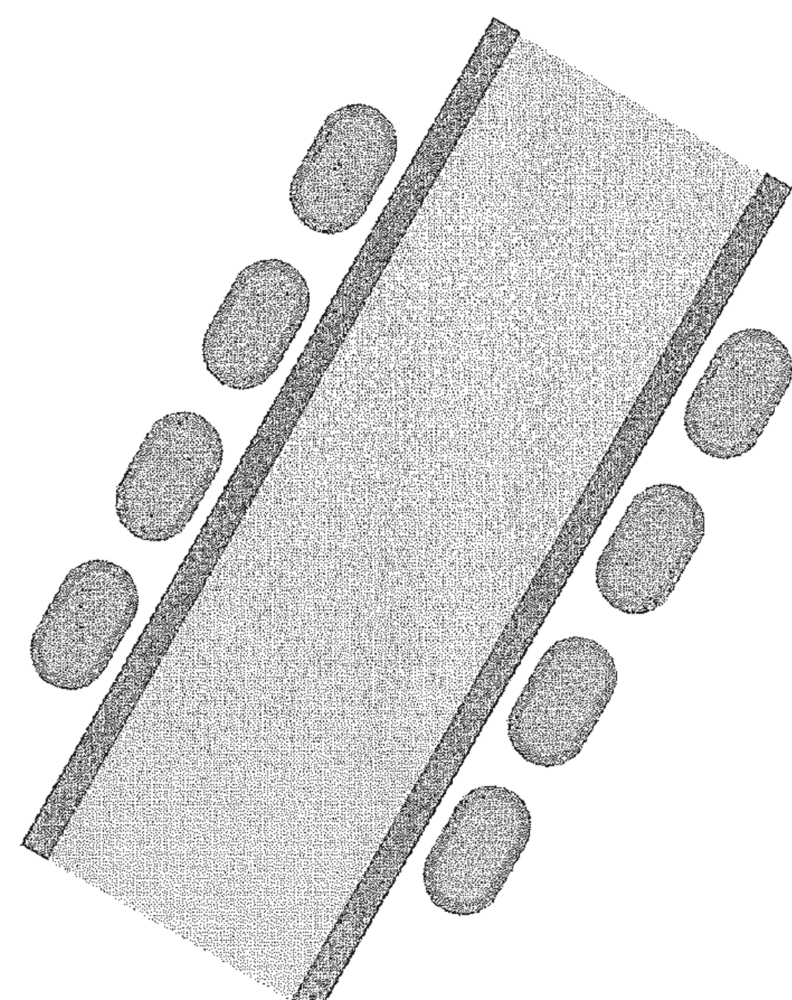
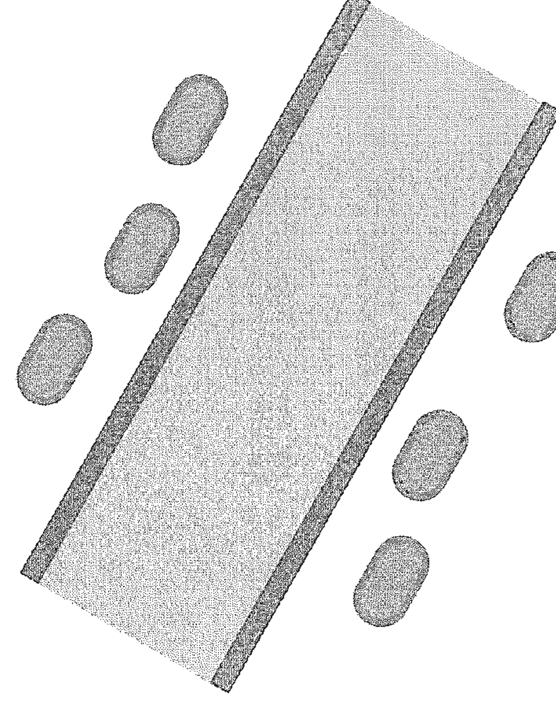
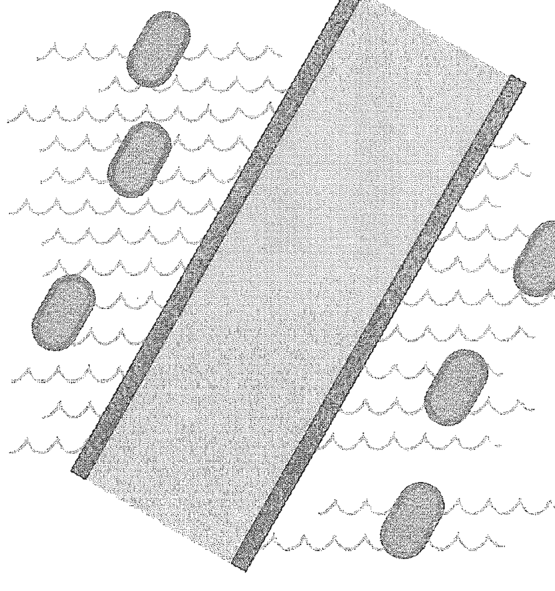

# 水腫自癒

水腫與老化的關係，健康飲食的全新觀點

> 水是陰，氣是陽，氣不足則水起，水排除則氣至。

《氣的樂章》、《氣血的旋律》作者
美國約翰霍普金斯大學生物物理博士

王唯工 著

## St. Royal College
### 天使神秘学院

- ※ 专业占卜预测机构
- ※ 神秘学培训机构
- ※ 水晶能量研究中心
- ※ 神秘学资料库
- ※ 官方微信：strcdts
- ※ 微信公众平台：strc2011
- ※ 读书交流QQ群：
    - 占星塔罗占卜师交流群：814594478（加入密码：PDF）
    - 神秘学其他综合群：659338717（加入密码：PDF）

微信号：strcdts
天使神秘学院

天使神秘学院 院长QQ：715104687

微信公众平台：strc2011

## 制作说明：

本书由《天使神秘学院》出重金从台湾购入的原版书籍扫描制作完成。为达到最好阅读效果，特地把原版书全部切开后，再经由专业扫描设备高精度扫描完成，并经过一张张的PS后期处理最终成书，其间花费大量的人力、物力以及时间，只为能给大家提供经济并优质的神秘学学习资料而努力。

本学院强力谴责某些机构和个人，把本学院花心血制作完成的电子书籍，包装后直接放在自家淘宝网上低价倾销的行为，以谋取不劳而获的经济利益。如果长此以往最终将无人愿意再为大家花心思制作电子书，那以后可能大家再无新书可读。

为让大家以后能够读到更多的好书，也为了本学院的良性发展。本学院恳请大家尽量做到如下几点：

- 一、尽量在本学院的网站购买电子书籍。
- 二、请勿用技术手段把电子书内的水印及加密去掉。
- 三、在收到电子书后小范围传阅即可，千万不要公开传播，更别挂到淘宝网上低价销售。

同时为答谢广大支持者，学院电子书将做如下调整：

- 一、学院会把一些早已收回制作成本的电子书折价销售。
- 二、最新制作的电子书籍会开放打印功能，大家购买后有条件的可自行打印成书。

天使神秘学院
2019年1月

## CARE 02 水的漫舞

作者：王唯工
責任編輯：李惠貞
美術編輯：何萍萍
法律顧問：全理法律事務所董安丹律師
出版者：大塊文化出版股份有限公司
台北市105南京東路四段25號11樓
www.locuspublishing.com
讀者服務專線：0800-006689
TEL：(02)87123898 FAX：(02) 87123897
郵撥帳號：18955675 戶名：大塊文化出版股份有限公司
版權所有 翻印必究
總經銷：大和書報圖書股份有限公司
地址：新北市新莊區五工五路2號
TEL：(02) 8990-2588 (代表號) FAX：(02) 2290-1658
製版：瑞豐事業股份有限公司
二版一刷：2010年2月
二版十刷：2014年9月

定價：新台幣220元
Printed in Taiwan

## 國家圖書館出版品預行編目資料

水的漫舞：水腫與老化的關係，健康飲食的全新觀點／王唯工著.-- 初版.-- 臺北市：大塊文化, 2007.05
面；公分.-- (CARE; 02)

ISBN 978-986-7059-81-9(平裝)

1. 健康法 2. 長生法

411.1 96006446

## 水的漫舞

王唯工 著

## 推薦序 他變苗條了

王唯工教授是我在台大電機系的同事，自從他退休以後忙於自己的事業，有好一陣子沒有見到面。今年二月台大電機系尾牙的餐會上他又出現了，讓我驚訝的是，他變得很苗條，以往圓凸的肚子完全不見了，整個人神情清爽，給人很不真實的感覺，以往的王唯工到哪裡去了？他一把拉住我，迫不及待地告訴我，他又有新的發現，知道了減肥的秘密與體內的環保——也就是二氧化碳減量——有關。他說不僅是他自己，包括他公司的同僚，用他的新理論去減肥，都獲得成功，他正在寫一本新書來介紹這個理論。

李嗣涔

過去二十年來王唯工教授研究氣功、經絡、把脈等傳統中醫的精華，替數千年的中醫開始建立了科學的基礎，並寫在他的上一本書《氣的樂章》中，我認為他的理論有生命力，對他非常欽佩。這次看到了苗條的王教授，想不相信他的減肥理論都很困難。前兩天拿到新書的初稿，迫不及待地把新書讀完，我必須承認這真是一場嶄新的經驗。他用系統的觀點來說明日常生活、飲食、運動、練功，與身體內氧氣、二氧化碳、氯、碳酸根離子及氫離子之間的平衡關係，以及二氧化碳過量所導致的酸水對身體健康的影響，而他認為二氧化碳減量、去除酸水成為健康減肥的最重要關鍵。我看過上百本教人練功或飲食健康的書籍，這還是第一次看到如何喝個碳酸飲料、吃塊肥肉、轉個頭、伸個腿、擺個手便造成體內二氧化碳量的變化，以及對健康的影響。我決定要向王教授討教食譜，親自做實驗來驗證他的理論，也希望有更多的科學家來參與健康的研究，把二十一世紀打造成為健康的世紀。

（本文作者為台灣大學校長）

## 目次

推薦序
004

自序
008

前言
012

## 第一章 人體的運作之舞

我健康嗎？
018

水腫與老化的關係
021

血循環之再探
025

能量醫學的觀點
046

## 第二章 二氧化碳是毒

人體的下水道系統
052

酸水的形成
056

水腫的五個階段
063

排毒就是排除含二氧化碳的酸水
079

## 第三章 減水腫計劃

脂肪是比碳水化合物更好的能量來源
092

飽和油和不飽和油的正確食用方式
096

為什麼要多吃纖維素
103

健康飲食兩大重點
108

## 第四章 保健的要訣（運動篇）

酸水集中處
114

協助身體排除二氧化碳的方法
123

## 第五章 保健的要訣（飲食篇）

早期診斷、並可自我檢測的健康標準
136

飲食的四大原則
140

多吃油，皮膚就不油
150

蛋白質是最不好的熱量來源
156

食物分配的革新理論
161

## 結語 以能量為出發點的食物觀
172

## 自序

對日抗戰時期出生的人，總是「先天不足」、「後天失調」。最近開同學會，不論由大陸遷來的、台灣出生的，都是髮蒼蒼（如果還有髮）、齒牙動搖（如果還有牙）。回想一下兩岸的現代風雲人物，抗戰時出生的人，鳳毛麟角。

戰爭受傷害的，不止是軍人，不止是大人，新生嬰兒也是沈默的受害者。

大學時期一直住在宿舍、吃大鍋飯，身體雖然不好，體重倒也標準。到了美國留學，短短五年多，研究工作不輕鬆，運動卻也沒間斷，但是天天肉排、麵包、甜點、汽水飲料，體重一下子就由六十公斤飆到七十五公斤。回國後飯食習慣未改，一直瘦不下來。於是圓胖的臉、微凸的肚子，就成了商標。

直到我在研究血糖時意外地發現，只要天氣不好、氣壓低、溼度大，所有的人都量到水腫的信號，這與老骨頭颱風下雨會酸痛，似乎不謀而合。

於是決定深入探討這個水腫的成因。思索久了，恍然大悟，這些水是由二氧化碳而來。這個水腫是不健康的第一步，是由二氧化碳水合後的自由基而來，造成身體酸化。進而細胞間隙擴大，酸水聚集，形成細菌病毒的梁山泊，阻礙氣的流動，而令細胞提早老化、器官退化。在《氣的樂章》書中，我們提出不健康的人體內有許多梁山泊，使我們生病，但當時還不知梁山泊是如何成形的。

很高興，在四年後找到了答案。有了新的理解，就要提出新的對策。

首先我改了自己的飲食。六週之後，就減了五公斤多，都是肚子上的肥肉。體重重回七十公斤以下，BMI也回到二十三。血壓降了，眼睛亮了（老花好了），臉上的油光也不見了，如同先前的預估一樣。比較困擾的是，帶有細菌的酸水會從皮膚像青春痘一樣地冒出來，大多在關節處及大肌肉的下方，奇癢無比，很容易抓破。後來發現，最好用糖尿病用的採血針或針灸用的放血針，在稍微紅腫發癢處刺下，將酸水放出來，再消毒一下，就一切OK！

雖然減肥很快速，身體變健康仍是緩慢的，最好一邊飲食調理，一邊做行氣排酸的運動。古人說「返老還童」，我們雖沒有這個能耐，但是只要飯量仍好，路也走得動，要減緩一些慢性病，「還我健康」的確是可以做得到的。希望大家一起努力。

## 前言

東西方醫藥學中最大的分歧是「血」與「氣」。

西方文化重形，以解剖為基礎，以看得見的內臟、骨骼、肌肉及血管等可以清晰分析的標的為主，進而對血液的成分、各個器官之大小、各種組織之結構都一一加以了解。東方以中國為代表，重勢，以氣之運行為基礎，強調推動血循環的動力，是比較不著相的，類似物理學的力或場。

若以更簡單的分類來說，可以說西方比較重物質，而東方比較重精神。

不著相的東西是很難了解，更是難以研究的。克卜勒觀察星體之運行，做了幾十年的記錄，才得到一些規則，而這些星球之運行是著相的，是物質的位置，可以精確地觀察和測量，但是造成這些星球如此規則地運行的是萬有引力，「力」則是不容易觀察的，一直到牛頓從蘋果的落下悟出萬有引力，才發現重力的道理。

身體則是比星球、比蘋果更為複雜的系統，從巨觀的解剖到微觀的細胞及DNA、RNA、蛋白質等各種分子，我們就忙不完了，要進一步了解其間之作用力——如萬有引力一樣的較抽象的分析與觀察，更是遙遠。

近年來另類醫學開始流行，各家各派的理論都言之成理，但是比較具體而又有長久歷史的還是行血之「氣」。

本書提供一個與氣直接相關而又容易了解的指標，希望這個指標可以成為中西醫會師、進而融合的起始點。

氣與水像極了，都與心肺功能有關，而且都在全身各處鼓盪。易經中的陰與陽，水是陰，氣是陽，氣不足則水起，水排除則氣至；相互剋制，又相互糾纏。

《氣的樂章》提到氣的運行，主要討論人體如何輸送養份；本書則要從水的角度——即血的運作——來談人體的健康，探討人體如何排除廢料，如何因排廢料功能不佳而造成水腫。氣與水的道理，陰與陽的關係，至此，我們對於自己的身體，才算是有了較完整的認識。

## 第一章 人體的運作之舞

### 我健康嗎？

「我健康嗎？」這可是許多人的問題，但是答案要怎麼找呢？

你可以到醫院做健康檢查，接受抽血、照X光、超音波、核磁共振，甚至正子掃描等等。西醫定義的健康是由成千上百的標準值建構的，身高有正常範圍，相對的，體重、頭圍、腰圍也有正常範圍，甚至哪根骨頭的長寬高度都有正常的範圍，肝有正常的形狀、肺也有正常的形狀……而這些還是變化比較緩慢的，血液中的成份、電解質、微量元素、各種荷爾蒙……等等，則是變化比較快的。如果上述各種指標林林總總都在正常範圍，這下可算是健康了吧！

但是許多人仍會抱怨，雖然一切數值都在正常範圍，可是我總覺得不舒服。健康的人也會不舒服嗎？你可能是交感神經失調、焦慮症……，於是一些無法理解的新名詞就被強加在我們身上。

生在廿一世紀的我們，除了孩童、青少年以外，很少有人自覺是全然健康的，尤其是年過四十以後，不是這兒酸就是那兒痛，晚上睡不好，白天沒精神。我們的健檢報告與我們親身的感覺怎會差那麼多？中醫的脈診可以看到我們的病灶，甚至病因，但是氣終究是個玄之又玄的能量，有什麼能讓我們更容易了解、甚至自行測量自我評估的指標嗎？

### 水腫與老化的關係

我們常聽說身體不好的人體質偏酸，慢性病人、癌症病人身體的組織多是酸性的。而大家一再強調的排毒，多是排除農藥、重金屬等等環境污染的毒素，這些毒素如果累積，一定會造成中毒。可是一些身體衰弱的病人身體變酸，又與這些毒素有何關連呢？我們也常聽說自由基——也就是鉀、鈉、氯等身上必須的離子之外一些其他的離子，尤其是活性高的離子，是細胞病變的元兇，到底身體中有哪些有害的自由基，最大量的有害自由基又是什麼離子？而毒素、自由基、體質變酸，和我們即將談到的「水腫」，又有什麼關連？

以心臟衰弱的病人為例。所有心臟衰弱的病人，心臟輸出不足，幾乎都會水腫。依據最權威的蓋頓生理學書中的解釋，心臟衰竭病人之水腫是由於下例幾個原因造成：第一，心臟無法正常運作，將血由靜脈送回動脈，導致靜脈血壓、微血管血壓都隨之上升；第二，動脈血壓傾向下降，因而降低了泌尿系統排除水與鹽的能力；第三，流至腎臟的血流減少，導致分泌腎素，腎素促進血液中升壓素之生成，引起腎上腺素分泌 Aldosterone，最後升壓素與 Aldosterone 直接造成腎臟保留更多的水與鹽。

由於這些綜合現象，造成心臟衰竭者之水腫現象。其實不止心臟衰竭的病人，只要輕微局部受傷，就會造成局部水腫。

水腫似乎是組織變弱或局部供血不足的共同現象，那麼不論你身上有什麼毒素或什麼疾病，身體虛弱就容易水腫。心臟衰竭是極端的全身供血不足，引起的是全身性的急性水腫，同理，局部的供血不足，就會引起局部的水腫。這種水腫是共通性的，只要哪裡供血不足，哪裡就會水腫。

在正常的老化——也就是沒有外力打傷、外在毒素中毒、外在誘因、情緒、壓力等導致急性老化的情況下，我們隨著年齡增長、各種機能逐漸退化自然而然的老化，多與這種水腫有著很高的相關性。換句話說，自然老化就像是慢性的心臟衰弱，心血管系統逐漸老化，而分期地走完急性心臟衰竭的過程。

如果我們能多了解一些局部的水腫——也就是局部自然老化——的原因及發展的規則，對我們維持健康、促進健康，都將會有極大的幫助。

### 血循環之再探

讓我們一點一點來分析、來推進。氣血兩虛，這是中醫對自然產生的衰弱最常用的描述。氣是什麼？血又是什麼？虛又是什麼？

水腫會發生，一定是水被滯流在組織之中，無法順利帶走而造成的。身上不斷送水到組織來的是血管，血管把水加上溶解其中的營養品如氧氣、各種荷爾蒙、元素……等引導至身體各部位。這個分佈綿密的血管網以最有效的分配方式，將這些充滿營養成分的血送到每一個細胞。

在《氣的樂章》一書中提到心臟只有一點七瓦，以這麼小的能量，將七、八公升的血送到身體的每個組織，這是多麼艱鉅的工作。我們也提到了人體如何利用共振的原理，讓循環系統成為最有效率的運輸系統。

動脈是一個架在骨頭上的網子，主幹是脊椎骨，所以脊椎骨俗稱龍骨，是所有血管及內臟的支撐。而脊椎本身又由兩旁的肌肉拉緊，才能直挺挺地站著。

血管由心臟出來，一分為二，二分為四，愈分愈多分支，經過三十幾次分支，到了微血管是已有卅億（3×10⁹）的分支。血管網到了微循環已是一個綿密的網子，散佈在身上的每個地方。如果只看血管而把身體其他組織拿掉，血管就像密度大了千百倍的蜘蛛網，以心臟為中心，最後分佈到全身的每個地方，共有卅億的分支。

在身體中展開這張大網，可不是件容易的事，心臟要怎麼掛，又不能把心臟定住，因為心臟要不停的跳動。中間的分支也要有足夠的支撐，才不會塌下來或互相糾纏在一起。更大的困難是卅億個最終極分支要如何固定在身體之中。現代的電路、鍵盤、太陽能電池，最進步的是折疊式的，可以自由自在地捲起來，我們身體中的這個網子也是如此精妙，手、腳、腰、頸，都可以打折，可以運動，而且不影響血液的輸送。愈高等的動物，網子中的圈圈愈發達。

這個網子以心臟為中心逐步地展開，我們先沿著脊椎骨內側器官一個一個接上來看。最先是肺臟，這個風箱負責氧氣的吸入及二氧化碳的呼出，同時由於極柔軟，也可成為心臟的避震器，下面接續是肝臟、膽囊、脾臟、胃、腎、大小腸。

每個內臟的基本組成都是由基因決定的。一九九五年諾貝爾生理及醫學獎三位學者發現，在胚胎發生早期，各種物種的橫切面都被相同基因決定；不論是果蠅、大象、人、老鼠……的頭部、頸部、胸部等等，都是由相同的基因決定的。

這是胚胎發生的橫切面，就像X光斷層掃描一樣，我們身體一片一片的橫切面，是由基因決定的，而身體的立體圖像，則需把一片一片的剖面圖，用正確的定位連接起來。如同我們在地球上要定位，必須要有經度，也要有緯度，身體橫切面便是我們的（橫）緯度。但是如果只有緯度沒有（直）經度，地球還是可以像魔術方塊一樣，可經由一軸之旋轉扭得亂七八糟。

心臟及循環系統在胚胎發育時，是最先成形的。而由於經絡的走向都是縱向，我們因而推測，這些縱向的座標——也就是經線——是由經絡決定的。如此一來，由基因定緯度、經絡定經度，就可以把胚胎、每個器官、每個組織定位得清清楚楚；就像在地球上，有了經緯度，就能找到每一寸位置。

在胚胎發育時，應是基因與供血相互作用而成形的，所有的器官各有其共振頻率，也就容易生長在主動脈上該頻率振幅較大的位置，如此才能接受到足夠的供血，也就是養分。而內臟的成形也受到這個共振特性的規範。結果是人肝、狗肝、牛肝、豬肝，其外型長得大同小異，人腎、狗腎、牛腎、豬腎，外型也長得大同小異。可是肝與腎卻全然不同。不同物種相同的器官，不僅外型相似，其與大動脈相連的位置也相似。這恐怕不容易只靠基因控管。

### 「氣」與「血」

這個非常複雜又井然有序的大網——以基因為經，經絡為緯——終於組成了。運送在這個網子之中的是血，而推動血前進的就是氣。

這個氣行血，做個簡單的比方，就像交流電一樣，電壓推動電流，電壓在循環中為血壓，而電流在循環中為血流。心臟打出強烈的血流，就像發電機產生電流，經過主升動脈後強烈的血流轉換為升高的血壓。只要網子內的壓力存在，這個網子中任何缺口，都立刻有血液噴出去。

血循環系統還有一個按頻率分配血壓能量的功能，這是交流電系統所沒有的。不同頻率的血壓波與不同器官及經絡共振，就可更有效地將壓力波能量送過去。

在氣功師傅的表演場，常常叫你將注意力集中右手食指，專心想個三、五分鐘，再與左手食指相比，居然長了一些。其實這就是血液壓力充滿後的必然現象，男性的勃起是最極端的例子。所有身體的組織只要壓力充滿都會飽滿。所以中醫望診時，常常會看病患臉上有沒有下陷，或有沒有血色，那都是氣到得了的表現。

### 各種氣的感覺

> 「一切唯心造」，這是佛祖的開示，其實這一句也是科學事實。

我們所有的感覺，眼、耳、鼻、舌、身，哪樣不是依靠「心」——也就是神經系統——去造出來的。所以一些所謂氣感——酸、麻、脹、痛等，也只不過是神經系統在缺血或供血不足時所產生的必然反應。

清朝末年義和團分子去見慈禧太后，這些拳匪號稱有隱身術，他們站在慈禧面前，一發功，慈禧就眼前一黑，而看不見他們了。這讓慈禧信心大增，以為是神兵天降，一定可以打贏那些洋鬼子。怎知，洋鬼子用洋槍，老遠就把這些拳匪打死了。其實慈禧也不是笨蛋，哪有這麼好騙，這個所謂的隱身術不能說是假的，當拳匪發功時，會有一個壓力震波向前發送，站在正前面的慈禧眼睛受此一震，血循環受阻，也就眼前一黑視而不見了。

氣要走得順，骨架要撐好，就像送電的電線桿一樣，要拉直並且電線要掛好。所以脊椎骨是大旗竿，骨盆是基座，肩膀是掛線的支架，都是非常重要的。這些是我們可以很容易就注意到、並且應該加強維護的重點。

這個網子架好了之後，最末端的卅億分支如何固定在身上，這另是一個新問題的開始！當我們想到這裡，就不禁同時要問，血液又是如何回收到心臟來的？

## 第一章 人體的運作之舞

養氣：是一種諧波，會改善循環

殺氣：是一種震波，會破壞循環

## 卅億個分支網的運作

這個網子有這麼多分支是有必要的，因為血液要流到每個細胞。網子的末端深深地與每個細胞糾纏在一起，你儂我儂，微血管埋在細胞裡，細胞擁抱著微血管。於是氧氣、養份就可以穿過微血管薄薄一層的細胞，再穿過各個細胞的細胞膜進入細胞，提供補給，同時將廢料、廢氣收集起來。細胞與微血管之間，間隔著幾個A°（埃＝10⁻¹⁰m）的細胞間隙。

網子的盡頭，又是另一個完全相似的網子的開端。靜脈是動脈的影子，或說是動脈鏡中的影像。卅億個分支從這裡逐漸回縮，最後回到心臟的右心室來。靜脈是廢料廢氣的回收之途，與動脈幾乎是完全對稱的（鏡中之像）。這回收的過程，難免有漏網之魚，那就靠淋巴系統來回收了。

人體中，血液大約百分之七十都在靜脈，只有不到百分之三十的血液是在動脈。血的總容量約為體重的十分之一，所以六十公斤的人，約有大約六公升的血，而其中四點五公升在靜脈淋巴，約一。五公升在動脈之中。這個分配看似效率很低，百分之七十以上的血放在沒有用處的靜脈之中，其實這也是節省能量的做法。

這個網子包含兩組網子，如果加上淋巴就是三組網子，唯一的能源，就是心臟的跳動，心臟只有一點七瓦的功率，要把兩個有卅億分支的網子都推動是很難想像的。

動脈的這個網子是利用共振以達最高效益，但到了靜脈端，能量已消耗殆盡，主要依靠防止回流的瓣膜，其推動回流的動力就依靠靜脈附近肌肉皮膚等等之運動或震動來推動血液，由一個瓣膜回流到下一個瓣膜。就像船在運河中，要由低水位的河面流向高水面的河面，只能一小段一小段的調整水位，造成局部的水位差。這個設計之下，船不需要動力，只要移動柵欄（瓣膜）即可。但是卻要有很多的水（血）。如果不存放些血在這裡，靜脈的回流就很容易中斷，心臟如果沒有血液回流進入右心房，那可是死路一條。如要節省血液就必須增加動力，把血液由靜脈壓回來，這樣心臟可能需要十倍的功率。

在節省能量與節省血液的兩難之間，演化選擇了節省能量，由此看來節約能量在演化上是最優先的選擇。

静脉

## 能量醫學的觀點

由能量的立場來看生理學或醫學是一個很有效的途徑，就像我們分析汽車怎麼能開上路，飛機怎麼能在天上飛，這都是需要能量的。飛機、汽車燒的是油，助燃的是氧，廢氣是水及二氧化碳。一輛車子要順利運作，要有送油的管道、送氧的管道，燃燒的引擎產生能量之後，要送去運轉車輪，並清除產生的廢料，好讓以後繼續注入油、加氧、再燃燒，產生源源不絕的能量。

人體當然是複雜多了，但也簡單多了。

這話怎麼說？人是由低等動物演化來的，我們的自由度比起製造運輸工具可少多了。不論是手、腳或翅膀，都是由肉、骨、毛做成的，這些看似不同的東西，卻都是由細胞演化的。但是，演化了那麼久還是沒有鐵生成的手、鈦生成的翅膀，由此看人體是簡單多了。但是人的每個細胞都是有生命的單元，同樣要送油、送氧、燃燒、排除廢料，否則就不能生存。而人體又是數以億計的生命單元體細胞所組成，這些單元體有相同的基因，卻又特化成不同的功能，如此看來又比機器複雜多了。

## 人體的排廢料系統

循環系統是一組特化的組織，將血液送到細胞來，又將廢料回收，帶到肺及腎去排出去。循環系統本身的能量是由心臟產生的，再由心臟經動脈送到身體各細胞，這在《氣的樂章》已有描述，不再贅述。本書的重點不是氧氣、燃料如何送到細胞，而是燃料燃燒之後廢料如何回收。

任何一個可以永續不斷的系統，一定要週而復始，一定不能讓廢料堆積。汽車要排廢氣，都市要有收垃圾、排污水的，否則城市一定停擺。

細胞的廢料處理是如何進行的？就像垃圾回收車、污水下水道一樣，這可不是都市光鮮亮麗的一面，但卻不可或缺。

細胞將紅血球帶來的氧氣用來氧化葡萄糖或脂肪，生成二氧化碳及水，再由紅血球及血液將二氧化碳帶回去，隨肺呼出，同時將紅血球裝滿氧氣，送到細胞來，如此週而復始，生生不息。

如果我們是健康的，當然一切都好，但是，如果我們不是那麼健康呢？

水的漫舞

## 第一章 一氧化碳是毒

## 人體的下水道系統

這一章我們討論的重點是廢料處理，也就是二氧化碳（CO2）的運送。氧氣（O2）會與血紅素上面的鐵原子結合，血紅素由四個蛋白質構成，由於它們的相互合作，所以氧氣與血紅素結合有加乘效果。要嘛，四個氧分子一起上，否則就一起下。這大大提高了氧氣與血紅素的結合能力，也大大提高了紅血球的送氧能力。這些知識在生物學中都教過，但是二氧化碳是如何回收的？知道的人就不多了。

## 血紅素會與一氧化碳結合嗎？

常識似乎是「氧氣放出後，二氧化碳就取代了氧的位置，與血紅素結合」，然後被紅血球循著靜脈帶回心臟來。真的是如此嗎？二氧化碳是三個原子的分子，比氧分子是兩個原子的分子大得太多了，怎能擠進血紅素並與鐵原子結合呢？大家都聽過一氧化碳（CO）中毒，一年之中台灣總有十幾起這類意外。一氧化碳也是一個原子的分子，而碳原子比氧原子小一點點，所以一氧化碳與血紅素中的鐵原子的結合力非常強，甚至比氧氣還強。因此一氧化碳中毒是非常危險的，即使氧氣比一氧化碳多，血紅素還是會滿載一氧化碳而失去攜帶氧氣的能力。如此一來，雖然提供了高濃度氧的空氣供病人呼吸，如果血紅素都被一氧化碳佔滿了，氧氣還是無法上車，經由動脈血管送到各種組織去，組織也就因此窒息而死了。

二氧化碳是身體生產能量時所產生的廢氣，就像汽車要有排氣管一樣，身體也要有排氣管。汽車的廢氣一定在引擎的燃燒室中發生，所以只要在引擎處接個管子，引導廢氣到車子後方，排出去，就大功告成了。可是身體有億萬個細胞，就有億萬個引擎，每個細胞都產生廢氣，這該如何是好？

因此身體的排廢氣系統要設計得比較像下水道系統，各家要有分管，逐漸接到大管，再接到主管，這才處理，放流。人體中負責此項任務的是靜脈系統。靜脈系統將細胞中的廢物收集、回流，送回心肺處理後——可不是放流，而是再生，重新注入氧氣及補給品，又回送到數以億計的細胞去。而一個好的排污水系統，廢料要先經過處理才能送入下水道，以提高效率、減少阻塞。人體也是。

## 第二章 二氧化碳是毒

## 酸水的形成

細胞燃燒後的廢氣二氧化碳，一定要由組織中帶走，這是最高指導原則，否則細胞不能生存。二氧化碳有這麼可怕嗎？二氧化碳是人體中最大量最普遍的廢氣。排毒！排毒！！！排毒！！！！最重要的就是要將這個大量產生的廢氣排出體外。

先反思一下，如果二氧化碳無法由靜脈排出，在組織中會產生什麼後果：

CO2 + H2O → H2CO3
H2CO3 → H+ + HCO3-

根據以上的化學式，細胞中，尤其是細胞間隙中如有CO2的存在，就會生成H+與HCO3-的離子而變酸。

這裡我們必須介紹一下滲透壓。細胞膜是包圍在細胞外圍的一層膜，有了這個膜，細胞就有了內外之分；細胞內的是組成成分穩定的細胞質，外面的空間就各有不同。一般而言，細胞總是把好東西留在細胞內，而把壞的東西排到細胞外。細胞膜就是這個隔絕體、城牆，而城內是細胞。牆外是細胞外，也就是城外，可是人進人出車馬無礙，毫無管理。這個細胞膜對小分子，尤其是最多的水分子（H2O），就像城門開個小口，是自由通透的；但是比較大的分子，多是有用的東西，就不讓它們溜出去了。至於二氧化碳和氧因可溶解於細胞膜，可從城牆中直接穿牆而過。

在液體中，每個分子都在動，撞到細胞膜的機會均等。水是小分子，一撞上細胞膜就通過了，大分子則會彈回來。如果細胞膜兩邊分子總數一樣多，哪一邊大分子多，就多些分子被彈回來，而水分子多的那一邊的水就會滲些分子過到大分子多的那一邊，因此使得大分子多的那一邊因為水分子之增加而分子總密度增加，也就是壓力變大。

CO2與H2O分子都是可以自由通過細胞膜的，可是一旦變成了H+與HCO3-，成了離子有了電性，就不能穿過城牆了，更因為吸引水分子吸附而變成較大分子又帶電性，更不能通過細胞膜的小口了。如此一來，H+與HCO3-在哪邊，哪兒就會吸引更多水分子，而產生積水。

在細胞中有很多蛋白質大分子，加上磷鹽酸濃度為細胞外濃度十幾倍以上，PH值非常穩定。但在細胞外的細胞間隙中，多是纖維、玻尿酸及水泡，碳酸（H2CO3）就成為酸鹼變化的主要角色，一旦H+與HCO3-在細胞間質的水泡中形成，由於突然大量增加了不能通過細胞膜的成分而破壞了原有的壓力平衡，則水分子就會由微血管及細胞內滲到細胞間質來，而讓其中的水泡長大，同時也變成酸性。

這個變酸而又漲水的現象對身體的功能是有害的，人體演化的過程中就一直選擇出抑制這個現象的各種聰明方法。

## 水腫的五個階段

不要H+與HCO3-在細胞間質中產生，就要壓低CO2在組織中的濃度，並儘快地將它帶走，回到肺臟去，經過呼吸送到身體外面。

CO2在微血管中的濃度與細胞間質中的濃度是平衡的，因為CO2可自由穿過細胞膜。在微血管中有大量的紅血球，紅血球中有大量的血紅素，紅血球為了降低微血管之CO2的濃度，擁有一種酵素，能迅速地把CO2與H2O結合成H2CO3。如此一來，紅血球就可收容大量之CO2在紅血球之中，而達到降低微血管中的CO2。但是如果H+與HCO3-的濃度太高，而溶解又變酸（碳酸之PK=6.1），則化學平衡就會把化學反應往「生成CO2與H2O」的方向推，那麼紅血球就不能再收容更多的CO2了。而為增加收容CO2的容量，血紅素就演化出大量吸收H+之功能，將H+由紅血球的內部吸走，抑制紅血球之酸化，也就抑制了CO2的產生。但是血紅素對H+的吸收力終有限度，一旦H+遇到更多的HCO3-還是會生成CO2的。

於是演化又進一步推出一種幫浦，將身體中很多的離子Cl-，由紅血球之外，與紅血球之內的HCO3-交換。大量Cl-因而集中在紅血球之中，而HCO3-留在紅血球的外面，跟隨著紅血球一起運送。在CO2送出身體的過程中，跟隨著紅血球運送的HCO3-，是最主要將CO2帶走的方法。而HCl→H++Cl-的平衡酸度是1，所以紅血球中又可容忍更多H+，而讓紅血球之外的微血管不要酸化，也就可以容忍更多的HCO3-。

上述的各種巧妙方法，都是為了不讓組織酸化進而水腫，我們可以了解到身體是多麼努力來阻止這個事件的發生。當然這是演化了幾億年之後，所選出的最佳機制。

但是，如果血流停滯了，紅血球沒有流動，不能經由靜脈回流，這個裝滿鹽酸的小球已經飽和了，又沒有援兵——新的血紅素——前來，CO2 終於送不走了，組織就會開始酸化漲水，這是第一階段的水腫，這時組織可能酸到PK=6.1左右。

如果新血仍不來，組織下一階段的能量，就只能依靠無氧代謝了，那就是葡萄糖不再燒成CO2與H2O，而只能變成一分子的乳酸。這些反應是在細胞內發生，而乳酸（PK=3.8）將使組織更加酸化到PH=4左右，同時進入第二階段的水腫。

如果新血仍不來，組織的能量無以為繼，細胞膜的電壓就不能維持而變小了。這時神經細胞就會失去穩定度。所謂的交感神經失調、焦慮、易怒、失眠……等等問題都將發生，這是水腫的第二階段。

如果再惡化，細胞膜開始漏液，蛋白質流出，這就是一般所熟悉的水腫了。這是第四階段。如果更惡化，細胞就溶解了，那是第五階段。

我們俗稱的水腫多已到了第四階度，這時皮膚下都是水液，壓下去就彈不回來。

但是站在保健的立場，我們的防線應該設在第一階段。而我和同事們會發現第一階段的水腫，是一個偶然，也是一個意外。當時我們正在研究如何以非侵入方法測量血糖，結果發現在颱風來襲期間，忽然之間，所有人的數據都亂了，經過一個多月的分析，發現只要天氣一好，一切又恢復正常。我們都聽說過，一刮風下雨，老骨頭就酸痛，這是大家都感覺得到的。凡是受過傷、不健康的地方，只要陰天下雨就會酸痛。

因此，我們在仔細分析之後發現，只要新血供應不足，組織就會酸化漲水，也就是第一階段的水腫。這可是潮來潮去，來的快，一旦新血到了，去的也急，是完全可逆的。

天氣是大環境，大環境改變時身體也會跟著調整。像四季變化影響人的循環，在冬天氣冷時為了保暖血液就會向內移動，流注內臟骨骼多些，皮膚腠理少些。到了夏天，天氣熱了就皮膚腠理多些，內臟骨骼少些。這是四季脈的變化，也是按時令進補、作息的根據。

刮風、下雨時氣壓低，濕氣重。換言之，氣壓低是空氣的總量變少了，濕氣重就是空氣中的水蒸氣多了。氣壓低、濕氣重，也就是空氣少了，而其中又混了許多水氣，所以氧氣就更稀少了。大家都知道高山症，到了高山上，因為空氣少了（氣壓低），氧氣密度降低，就會出現各種症狀，甚至腦水腫、肺水腫而死亡，這是急性的氧氣不夠的症狀。

在氧氣不足時，如果身體挺得住，總是呼吸深些，多吸些氧氣進來，紅血球的製造也加速，希望血液中多些紅血球，以增加運送氧氣的能力。運動員的高地訓練就是希望達到這個效果以增加體能。但如果一時反應不及，第一個反應，就是老骨頭酸痛，此時已進入第一階段的水腫。

當我們有了儀器測量，發現只要把手指的血液以外力阻斷約廿秒鐘，就可明確地量到手指中水的含量顯著增加。同理可以推論，太緊的衣褲、太緊的空間、不好的椅子，甚至經濟艙症候群，可能都與這個現象有關。

## 中醫中的水腫與水毒

這個由排除二氧化碳能力不足所產生的生理難題，在中醫的典籍中有記載嗎？

我們找了《內經》，在〈素問卷十六〉，骨空論水熱穴論第六十一中：

> 黃帝問曰：少陰，何以主腎？何以主水？岐伯對曰：腎者至陰也，至陰者盛水也，肺者太陰也，少陰者冬脈也，故其本在腎，其末在肺，皆積水也。帝曰：腎何能聚水而生病？岐伯曰：腎者胃之關也，關門不切故聚水也，而從其類也，地氣上者屬於腎而生水液也。

《內經》已知道腎臟是水腫的主要來源，因為肺主皮毛，而可以表現在皮膚之下。

而實用的例子多在《傷寒論》之中，例如《傷寒論·卷三》：

> 傷寒表不解，心下有水氣，乾嘔發熱而咳或渴或利或噎或小便不利，小腹滿或喘者，小青龍湯主之。

另一個提到由水到病的：

> 少陰病，二三日不已，至四五日，腹痛、小便不利、四肢沉重、自下利者，此為有水氣。（卷六真武湯症）

其他如《傷寒論·卷四》：
……傷寒十餘日，但結胸無大熱者，此為水結在胸脅也，但頭微汗出者，大陷胸湯主之。

《難經·四十九》：
難曰：「有正經自病，有五邪所傷何以別之。」……其中有「久坐濕地強力入水則傷腎」……何謂五邪，有中風、傷暑、有飲食勞倦、有傷寒、有中濕。丁曰腎應寒主水邪散入五臟焉之血液也。

反倒是日本人大塚敬節所著的《皇漢醫藥訣》中找到一些有趣的申述。在第一編病證學第四章水毒：

漢法醫學，有所謂水毒，此狹義之解釋則為喀痰，是非生理的體液之總稱，可為至當。雖然所謂水毒，何因而停滯乎，雖研究發達之西醫尚不能明瞭此理，大抵以排除身體中所發生之老廢物。

「痰之意義」大塚敬節又進一步說明：

古書怪病為痰，此痰即為淡，漢法醫學有所謂水毒之意，此以狹義解釋則為喀痰，就是非生理的體液之總稱，可為至當，又古書稱濕家平生之痰，即為多水毒之人。有皮膚呼吸器，泌尿器及消化管，此種器能，如有略生障礙，而其他之器官，不得十分代償時，其必然之結果，致成水毒之停滯，為理之當然也。

據今之西洋醫報，人體百分之六十到七十為水，其中百分之四點七包含於血液中，百分之五十六點八包含於筋肉中，百分之六點六六包含於皮膚中，而為健康體，則保持此等之調節也。

然則此等之調節，一朝有破壞時，其水分仍留於體內，或與熱結，或與血毒合，或混於食毒，以至停頓於各處，而為水毒之主因，其停滯之部份及病狀有如何之差異，分類如下。

飲亦有水毒之意，在名醫方考，稀者則曰飲，稠者則曰痰，有此二者之區別，然則痰飲云者，為留飲之意，今見胃下垂症，胃擴張等，謂之胃內飲水，水懸飲為留水於胸下而有引痛者，適與今之淫性肋膜炎及肺炎相當。溢

## 第二章 二氧化碳是毒

飲今日所謂水腫，在金匱要略，則為飲水流行，歸於四肢，當汗出而不汗出，身體疼重，謂之溢飲。支飲，為水停心下，氣息喘滿者，適與氣管支炎及喘息等種種相當，而所謂伏飲，則為水毒潛伏，當觀其他之外證，脈狀，（脈多沈緊）腹證等，而可知其病之所在矣。

田家五行，六月有水，謂之賊水，為不當有也。水毒，即為不可有之賊水，停滯之處，成非生理的體液，此病之原因，有三個機轉，第一、因水毒自身有毒素致起自己之中毒症。第二、浸潤於全身之組織，使減弱其機能，且使組織膨化弛緩，容易細菌之浸入及繁殖。第三、若水毒之停滯及於高度，因物理的作用，致於諸種臟器，起壓迫症狀。故在皇漢醫學，排除水毒有諸種之藥劑，就其見證，以用發汗劑，有時用利尿劑或吐劑及瀉下劑，於此各從其皮膚，泌尿器及消化器，各各排泄之。例如因為皮膚排泄障礙，發為水毒停滯，而成頭痛喘鳴者，當以發汗之麻黃湯治之，又如同樣之症，致起下痢者，當用發汗之葛根湯救之。或因停水於胃內，其毒上衝犯腦，致呈神經衰弱症狀者，則當用苓桂木甘湯，除去胃內之水毒，症狀即能全治。各從其證，施以適當之方，水毒既得排除，疾病亦即消退，然當臨床之際，其因本於單純之水毒，而為疾患者，殊不多見，最普通者，為與瘀血結合，或與食毒併合，呈為複雜之症狀，故此種治療，亦非簡單之事也。

這是我能找到的中醫古籍中，對水毒描寫最傳神的。

## 排毒就是排除含二氧化碳的酸水

當細胞間質中有碳酸根（HCO3-）及氫離子（H+），就會因為滲透壓變化而積水，加大了細胞間質之空間，造成運送氧氣到細胞發生困難，因而細胞被迫進行無氧代謝而產生乳酸。因為乳酸可以自由出入細胞膜，細胞間質中之乳酸含量也隨之上升，此時在細胞間質中之乳酸可解離為H+與乳酸根，則滲透壓大大減少，將引來更多的水液進入細胞間質，細胞間質就更進一步的酸化，更進一步水腫。此時，細胞間質可達之PH為4上下。

這是第二階段的酸化，同時誘發更進一步的水腫。此時如果新鮮血液開始供應，組織仍能在幾分鐘之內由靜脈帶走乳酸，帶走二氧化碳，將酸性的細胞質中和為微鹼性，PH便會回到7.4並消弭水腫。

但如果新血仍不來，則體液繼續變酸，水腫也愈來愈擴大，細胞內的能量（ATP）也供應不繼，鉀鈉離子的交換也無法進行，細胞膜電壓將愈變愈高，由負二百mv左右，變成負一百多mv，甚至高於負一百mv。此時細胞的穩定度就嚴重受損，尤其是神經細胞，這個最需要ATP來維持細胞膜電壓的細胞就會不穩定。所謂交感神經失調、焦慮、失眠等等精神上耗弱的症狀，就容易發生在這種生理狀態之下。風吹草動就心神不寧，杯弓蛇影、疑神疑鬼。而且這種症狀會惡性循環，愈是心神不寧，神經就愈多運作，細胞膜電壓就更不能維持而上升，神經細胞的穩定度就更差。

這種細胞間質的水腫到這個階段為止，都很容回復，只要血流順暢帶來氧氣，帶走二氧化碳，新的氧氣提供粒線體生成新的ATP，幾個小時後就能天下太平。酸性的水腫由靜脈血管帶走，細胞膜電壓下降並恢復正常的穩定態，人也就神清氣爽、樂觀進取了。

這個階段的水腫最容易發生在腦子，其他如關節、肌肉深部也是最容易積酸水的病灶。因為二氧化碳是很容易在細胞間游走的，而腦子又是二氧化碳產量最高的地方。皮膚是不會產生這種酸水的，酸水到這裡會直接穿過表皮流到空氣中去了。淺層的腺裡也有汗腺可以幫助排酸，就像腎小球一樣，把酸與水一起用出汗的方式排出在外了。

第一、第二、第三階段的水腫都不容易由外表看見，即使全身都發酸了仍不易在皮膚下看到積水。要到了細胞膜漏了，大分子也由一些細胞中漏到細胞間質中間來，又不能由淋巴帶走，這就是大家耳熟能詳的水腫，此時水腫已進入第四階段了。如果更嚴重，細胞就死了而溶解了。長時間的壓迫常會造成橫紋肌溶解，其實不止橫紋肌，什麼細胞到了要死的時候都會溶解的，因而擴大身體內的化外之地，成為肖小活動的天堂。

這個第一、二、三階段的酸化及水腫，是保健最重要的功課，然而現代醫學仍未能注意和察覺，我們則是在研究身體組織的光譜時，意外地發現了這些水腫的現象。

由於二氧化碳是廢料，也是身體產生最大量的毒素，由此假設，我們來做一些推論。

血紅素是帶走二氧化碳的主要載具，所以貧血的人容易水腫，女性也比較容易水腫，尤其是生理期間，因為女性血紅素平均為12，而男性為14。

排毒是我們不斷要努力的，而主要要排的毒就是含二氧化碳的酸水。

很多胖子，身體腫腫的，號稱喝水也會胖，可能是真的，因為他們在遺傳上可能有些弱點。例如紅血球中催化二氧化碳與水結合的酵素效率不彰，進而將二氧化碳收集凝聚在紅血球中的功能就變差，因而無法與一般人一樣有效地排出二氧化碳。也可能是紅血球細胞膜上的氯離子與碳酸氫根的交換載子（為蛋白質）的效率不如一般人，因而紅血球四周收集凝聚二氧化碳的效率也會變差，便容易變酸水腫。這兩種蛋白質的變異都可能造成遺傳性的水腫肥胖症。

這類水腫係缺氧造成，二氧化碳因而在身體堆積，如不清除則水腫會繼續擴大，造成整塊組織的酸化，進而喪失功能，甚至溶解。水腫更會造成細胞間質空間變大，細胞與細胞、細胞與微血管間之交通都變得困難，不論營養的交換、廢物的排除，都會逐漸困難。

細胞間質是沒有什麼抵抗力的，如果成了一個大空間，很容易成為細菌或病毒盤據的根據地。由此繁殖、擴散，會造成嚴重的疾病。或是長期盤據此地，成為慢性病，不斷散發毒素，於是器官功能退化，組織酸化發炎，細胞衰弱、突變，進而各種老化的現象疾病，甚至癌症、腦中風……各種更可怕的疾病追隨著，酸化水腫就沿著這個軌跡一步一步地在體內發生。

由此看來，人的老化由這個酸化的過程踏出第一步。我們要戰勝衰老就要守住這第一道防線。

## 水的漫舞

## 第二章 減水增产计划

我們可由身體的新陳代謝來了解一下二氧化碳的來源。

所有的營養成份，在身體代謝時，只要是含碳的最終就會變成二氧化碳，如含氫就是變成水。這個氧化的過程與在自然界中的燃燒並沒有兩樣，只是生理上這個過程是緩慢而有秩序的。因為在生理上，我們經由這緩慢而有序的燃燒可以產生最多的ATP，也就是以自由能的形式轉換最少的熱能，這與汽油轉換燃燒駕駛汽車一樣，可能有百分之四十的能量是可以使用之能量，由引擎轉換成汽車的速度動能，而百分之六十的能量就以熱的形式隨著二氧化碳及水等廢氣一起排出去。

生理上，我們生產ATP作為自由能，這個ATP可以自由地轉換來作生理上任何需要能量的工作。所以生成的ATP就像促使汽車往前開的動能一樣是有用的能量，而產生的熱能——二氧化碳及水——就是廢料了，一樣需要排除。其中二氧化碳需要紅血球攜帶，循著靜脈回流到心臟，再由肺臟或腎臟排出體外。

## 脂肪是比碳水化合物更好的能量來源

身體中常用的燃料有兩大類，一種是碳水化合物❶，一種是脂肪❷。

碳水化合物以葡萄糖為代表；葡萄糖是個六碳六氧、十二氫的環狀化合物，一個分子的葡萄糖完全代謝後，可產生三十八個ATP，佔總能量的百分之六十六，而其餘的百分之三十四就是不能使用的熱了。葡萄糖完全氧化後製造三十八個ATP，同時生成六個二氧化碳，所以每個二氧化碳產生可以有效產出之ATP為38÷6=6.3，即每個碳原子燃燒成為二氧化碳，生成約六點三個ATP。

如果是脂肪在身體燃燒，每個碳原子燒成二氧化碳分子可產成約八點四個ATP，佔總能量約百分之八十六，熱能佔百分之十四。

由以上的計算可以知道，食物中的碳水化合物每產生六點三個ATP，即產生一個二氧化碳；由此可確定，如要減少二氧化碳產量，不要減少產生的有用ATP，就該多食用脂肪。因為產生同樣的能量，脂肪產生的二氧化碳是碳水化合物的百分之七十五，也就是百分之二十五（四分之一）的減量。

所以為了減少酸化水腫，脂肪是較好的能量來源。

其實使用脂肪還有一個更大的優點。脂肪熱能只佔總能量的約百分之十四，而碳水化合物代謝時熱能佔百分之三十四，如果再考慮六點三比八點四的ATP產生量，則生成一個ATP，碳水化合物所產生的熱量，可是脂肪的約三倍以上。

這裡我們得到一個十分意外的結果。

夏天如果怕熱，食物中脂肪的比重就要提高。脂肪不妨提高到四分之一以上（正常飲食之脂肪量約為百分之二十），而碳水化合物為四分之一以下，其他為纖維（百分之三十五以上）、蛋白質（百分之十五以下）。如此一來，自然涼爽。而且皮膚也十分乾爽，因為身體內二氧化碳少了，熱量也少了，汗自然跟著減少。

這個多吃油的推論似乎與我們常識中要少吃油的概念不相符，但就能量供應的角度來看，卻是不爭的事實。

## 飽和油和不飽和油的正確食用方式

在飲食的種類中，油一直是人類又愛又恨的食物，經過油料理的食物就非常好吃，但是吃多了又怕引起心血管疾病。

油脂又有三大類：飽和油、不飽和油和轉化油（trans fat，由不飽和轉化為飽和③）。到底要怎麼選、怎麼吃才好？為了回答這個困難的問題，我想把二○○六年八月十日在華爾街日報A9版瑪麗恩尼格博士、馬里蘭州營養學會理事寫給編輯之信內容轉述於下：

雷蒙．索科洛夫對轉化油的辯護（《油》，「油」，「油」編輯頁，七月二十七日）遺漏了很多重點。轉化油用作植物的膨鬆油是比較便宜，也的確延長了經過它處理的食物之存放期。但是許多科學的證據不斷地證明，轉化油脂造成一大堆健康問題，減少人們的壽命，對健康造成重大損害。

轉化油會抑制細胞膜的功能、干擾酵素系統（這個酵素系統是用來消除致癌物質、清除毒素的），並抑制胰島素的變體（造成第二型糖尿病）、降低荷爾蒙的生成（導至不孕症），最悲慘的是轉化油脂在孕婦體內易引起新生兒重量不足，阻止視覺及神經的發展，更會降低母乳中油脂的含量，抑制由孕婦餵食子女的學習能力，特別是在有壓力的情況下。

索科洛夫先生詭辯轉化油與其他油脂一樣讓我們肥胖，但是最近在唯科森林大學的研究卻發現轉化油比其他油類更會令人肥胖，況且當食物以轉化油煎炸後，更多的油存留在原食物之中。以轉化油煎炸的食物，比動物飽和油、羊脂或豬油，都油膩多了。

食品工業為了理直氣壯的使用轉化油，就宣稱如果用天然的飽和油來代替轉化油，會增加膽固醇，而導致心臟病。這個假定是完全錯誤的。在轉化油引進食品工業之前，美國人食用大量的飽和油，牛油、豬油、羊脂、椰子油和棕櫚油，但是心肌梗塞的疾病是很少聽到的。今天，一些食用飽合油最多的歐洲國家（法國、瑞士、荷蘭、冰島、比利時、芬蘭和奧地利），心臟病的比例都是最低的，反而是最少食用飽和油的國家（烏克蘭、馬其頓、克羅埃西亞、摩爾多瓦、亞塞拜然、塔吉克與喬治亞），有最高的心臟病發生率。飽和油中的動物油，提供許多營養成分來保護心臟。最近一些研究發現，飽和油實際上能幫助恢復硬化的血管。

索科洛夫先生認為我們會繼續食用煎炸的食品，也繼續為了食用油、部份氫化的植物油（轉化油）煎炸食品而付出昂貴的代價，這個看法是正確的。而液態的不飽和植物油，不是一個好的替代品，它們在加熱後會產生危險的腐臭，難以下嚥。比較適切的做法應是回頭使用穩定、健康的飽和油，例如棕櫚油、椰子油，牛油、羊油、豬油來處理，並煎炸食物。

由恩尼格博士的文章，我們已看出一些線索。這三種油中轉化油是最不好的。而不飽和油似乎是比較好的，因為膽固醇較低；但是不飽和油不耐高溫，一旦用來煎炸，不僅產生異味，難以下嚥，也可能產生轉化作用，而變成轉化油。所以高溫處理食物，並不合適用不飽和植物油。

在細胞燃燒時，第一優先是碳水化合物，第二優先是飽和油，第三才是不飽和油。我們配合恩尼格博士的卓見，做以下的建議：

### 少吃碳水化合物。

一天之中，飽和與不飽和油都需要食用，但如何分配呢？飽和油用來做高溫的料理，不飽和油用來做涼拌沙拉、沾醬、冷盤等不需要高溫的料理。而這三種食物，碳水化合物、飽和油和不飽和油的總量，不要超過自己需要的總量。

細胞用完了碳水化合物，就會先用飽和油。而我們食用的飽和油加上不飽和油，才足夠一天的燃料用量。所以只要油品中有二、三成以上是不飽和油，那麼每天吃進來的飽和油幾乎都燒光了，不會沈積在身體內。所以真正的要點還是不能吃過多，這個分配法只是給了我們更大的安全空間。

> 註④：燃燒脂肪時，一定要用到代謝碳水化合物的中間物，所以一定要吃碳水化合物，脂肪才能燃燒。有名的阿金氏（Atkins）減肥法，主張完全不吃澱粉，以阻止脂肪的燃燒，結果產生高血酮症，同時身體只好燃燒蛋白質，造成肌肉萎縮、肝腎衰竭。此減肥法後來修正為最多只能嚴格執行約兩週，兩週之後則以少吃碳水化合物為訴求。

### 為什麼要多吃纖維素

生物能量的應用，仍依循物理與化學反應，這是生物化學經過多年的研究以來最重要的結論之一。我們日常用的能源，有煤與石油二大類；煤是由碳水化合物脫水而來，多由植物產生；而石油是由脂肪轉化而來，多由動物產生。活的動物在燃燒產生能量時，先燒碳水化合物，後燒脂肪；而儲存時，先存脂肪。如果碳水化合物太多了，也是轉化成脂肪再儲存的。

而葉類植物的主成份是纖維素，也是碳水化合物；動物儲存的多是脂肪。因為我們不消化纖維素，所以葉類植物就成了最好的食物填充料，可以用來塞飽肚子。

營養過剩可能是現代疾病的主要成因。在人類演化的過程中，大部份時代是吃不飽，就像獅子一樣，打到獵物飽餐一頓之後，接下來可能挨餓三天，所以身體就學會了儲存營養以備不時之需。這個無時無刻都在儲存脂肪的機制，本是生存競爭中的優勢，而今天卻成了最大的殺手。

如果把生物能量與營養儲存兩個機制一起考慮。我們最重要的課題就是不要吃太多。麥當勞、肯德基、漢堡王……不是罪魁禍首，我們的貪吃才是真正的元兇。這些速食店應標示每種食物的總熱量，碳水化合物是幾克、脂肪是幾克。現代人一定要會計算這些食物所含的能量，脂肪一克是九大卡，碳水化合物是四大卡。一天的總攝取量看身材大小，總在二千至三千大卡之間。如果覺得不飽，就多吃腸胃的過客——纖維素——來當填充物。纖維素不論是可溶或不可溶，都對身體都只有好處少有壞處。

在攝取的總熱量（不是吃下的總熱量，每個人腸胃的吸收能力不同，此處所說的是吸收的總熱量）方面，以不超過上限的條件下，四分之一以上的油、四分之一以下的碳水化合物，是比較健康的比例。這與我們日常生活中使用的能源是同樣的觀念；煤是能量比較低的燃料，產生二氧化碳較多，油是能量比較高的燃料，而產生的二氧化碳也較少。所以油與油氣是比較好的能量來源。

纖維素是食物中最好的填充料，脂肪是較好的能量來源。由此可知純化的糖製品是非常不好的食物，因為全是碳水化合物，完全沒有纖維素。果汁比較好些，因為除了糖水還有纖維素與其他維生素、礦物質，但是這些維生素與礦物質可能因為久置空氣之中，已被氧化或充滿二氧化碳了，這還沒考慮製作過程中的污染問題和防腐用的添加料。新鮮水果，尤其是少甜的水果，就是碳水化合物的最佳來源了，纖維素、維生素、礦物質都多。牙齒不好的人，則可以改喝現榨的新鮮果汁。

蔬菜也有相似的效果，而且糖分更少，是最佳的纖維素來源。中國人吃法多是煮過或炒過來吃，雖然破壞了一些活性的分子，但單就纖維素來說，這可是增加食用纖維素分量的最好方法。尤其是以飽和油快炒，將大量菜葉體積縮小，纖維素與油一起吃，又好吃又健康。

### 健康飲食兩大重點

在考慮飲食時，有兩個大原則：一、不要熱量過多，這一定會召來肥胖，進而引起各種現代文明病，糖尿病、腦中風、癌症……等等；二、減少體內二氧化碳的生成，也就是減少毒素的產生。其他只要飲食均衡也就能遠離醫生。依照以上兩個原則，我們仍可享受美食，不論年齡有多老。

最差的食物是含碳酸氣的糖水，大部份市售的汽水、飲料，都是這類產品，小孩子喝多了保證變成圓滾滾、全身酸性水腫、白白胖胖的小胖子，又怕熱又沒有體力。整天躲在冷氣房裡，什麼正事都不想做，也沒有力氣做。次不健康的食物是糖果，這類純糖的製品都是最不划算的碳水化合物，一下子就佔滿了碳水化合物的理想配合量，但卻不能提供任何其他方面的營養素。其實蛋糕、精製西點這些高糖低筋製品也比糖果好不了多少。

印度人、猶太人這兩個古老的文明常吃沒發酵的麵餅，作為他們的主食，這也是有智慧的。我們看到的猶太人、印度人多像愛因斯坦一樣，瘦瘦乾乾的沒有水腫，眼睛炯炯有神，雖然不高大，但精力充沛，而且長壽。這與他們的主食可能有些關係，沒有發酵的麵餅會是主要原因嗎？

發酵過的麵，就營養的立場來說，應是比較多樣性的，細菌發酵後，可以產生更多的維生素等細菌自行製造的許多營養素（放發粉的麵食就沒有這種功效，也沒有這個優點），但是同時也會放出二氧化碳，這些二氧化碳也就是麵包會變鬆變軟的的原因。一旦經過發酵並大量產生二氧化碳，食物中可以吸收二氧化碳的元素，就已被消耗了。這些食物不僅不能為身體減少二氧化碳，反而因為二氧化碳之飽和而增加二氧化碳的負擔。

一個比較持平的看法是，如果營養不足，例如在古老的中國，細菌發酵過的麵食，可以增加營養成份，因為吃的本來就不夠，二氧化碳根本不是問題；但是如果已經營養過剩了，還是學學印度人、猶太人的智慧，多吃沒發酵的麵食，為體內的二氧化碳減量吧！

## 第三章 減水腫計劃

## 水的漫舞

## 第四章 保健的要訣 (運動篇)

## 酸水集中處

老人們常說腳上有濕氣，所以容易香港腳。香港腳是黴菌感染，與濕氣有什麼關係？

這種在細胞間質生成的酸水，也就是濕氣的主要來源，是會流動的。

感冒或是鼻子不好的人，如果側左邊睡，則左邊（下）鼻孔會塞住，而右邊（上）鼻孔會暢通（當然這是比較輕的鼻塞，否則兩側鼻孔皆不通了）；如果轉成右側睡，那麼右側鼻孔不通，變成左側鼻孔暢通了。這就是細胞間質中酸水流動的結果。

身上所有氣血不順暢的位置，一定有酸水堆積，這些堆積的酸水並沒有阻隔，都是細胞外的空間，幾乎是完全相連。在健康的部位這個間隙是很小的，表面張力會將液體或膠體吸住，就像一個細管子中的水不會因為地心引力而流出是一樣的道理；但在不健康的部位，這個空隙變大了，甚至住了外來病源，就會在身體內流動。而腳——尤其是腳趾，剛好是身體的最下端，各地的酸水最後都流到這裡來集合，也就成了酸水的集中地，難怪成為黴菌滋長的溫床。

健康之微血管與週遭之細胞，以及細胞與細胞中間之細胞間隙非常小，只有幾個A°，細胞間隙中有玻尿酸等成分。

因為滲透壓增加造成細胞間隙擴大，而使得微血管與細胞之間的間隙變大，進而使得氧氣與營養成分由微血管擴散到細胞更為困難，而降低細胞的活性。

當酸水在細胞間隙中更為擴大，則此酸水就不再受到毛細管的拘束，而產生自由流動，流到比較低而鬆散的空間去，造成某部分開始積水。

在身體之中，酸水產生最大量的部位是腦子，因為腦子正常時只使用葡萄糖。這也是自然設計的，腦子中有各式各樣的傳導物質，負責各神經細胞間之溝通，及各種精密的計算，一旦混進了許多相似分子進來，就能產生各種假信號，製造錯誤的計算結果，根本擾亂了我們整個大腦的運作。這可是指揮中心，錯亂一定天下大亂。為了避免這種可能性，腦子與血之間有一個嚴格的管制站，所有可疑分子一律不准進入，為了避免不良分子混進來，腦子也就只好用葡萄糖了。葡萄糖比脂肪多產生百分之三十的二氧化碳、三倍的熱量，因而腦子產生的二氧化碳與熱量都是最多的，因為腦子只能用比較沒有效益的葡萄糖。這些二氧化碳如不及時排除，就立刻變成酸水。

頭部——尤其是腦子，是最容易水腫的器官之一，高山症、受傷……腦子就漲水。即使不受傷腦子也容易漲水，這些水的排除還得依靠脖子。

頸部為了左右上下的活動自由度，頸椎是不容易打直的，但肌肉的垂直排列卻提供了很多垂直的細胞間隙，讓頭上的酸水可以順流而下。這裡也長了許多淋巴結加強幫忙收集酸水或異物，以維持我們的健康。但是一旦脖子歪了，其影響就是新血上不來，酸水排不去，可是要出大事的；重則高血壓、腦中風、老人痴呆，輕則交感神經失調、失眠、焦慮、健忘……

好好保養頸部是現代人最重要的日常功課。頭腦長在身體的最上面，一則散熱容易，一則好排廢水往下流。由此看來想以倒立來增加腦子血循環的人，可是緣木求魚了。

在身體中，下一個集水區就是下腹腔，這裡剛好也是膀胱與生殖系統所在的位置，所有腹腔產生的酸水，都會集中在此地，如果沒有阻隔，這些酸水應該順流而下到腳去，甚至由腳趾排出體外。腳會臭、有異味的人有福了，表示你的腳有能力將這些廢物排出去。如果排出不順或排出的能力不足，就容易長細菌成了香港腳。在上肢，手也有相似的功能，酸水會變成手汗排出體外，所以為什麼會有富貴手。在人的下腹腔有一段向前彎曲的脊椎及尾椎，如果屁股不後翹，這段向前彎曲的脊椎就會盛滿了腹腔順流而下的酸水。掌管膀胱直腸、生殖系統以及下肢的神經節及神經，都浸泡在酸水之中，功能一定大減，造成大小便、性功能、下肢障礙，甚至攝護腺肥大、痔瘡……等，不一而足。此外，下體的確比較不乾淨，容易收集酸水長濕氣，濕疹、皮膚病都容易發生。

前述提到翹屁股，其實翹屁股還有一個更大的好處，屁股一翹，命門就容易鬆，因而心臟也會更強。奧運金牌得主紀政女士認為，所有好的田徑選手屁股一定要翹，應該也是經過許多觀察之後得到的結論。

這些酸水不會在皮膚表面，因為二氧化碳可以穿皮而出。也不會留在膕裡——也就是汗腺所在的那一層肉，因為可經由汗排出。酸水最容易留在肌肉深層及關節之中。這裡離體表很遠，所產生的二氧化碳一定要由靜脈帶走。一旦循環不順氣不到，新血不來，舊血送不走，就在肌肉中、關節中產生酸水堆積，尤其是關節中的滑囊及四周韌帶，於是五十肩等等各種肌肉疼痛就會發生。

我們身上的二氧化碳如果排不出去，就堆積在細胞間隙之中，如果堆積更多就會以油的方式把這些酸水包起來，與身體重要器官隔絕，必定妨害功能。如此一來，就像卡奴一樣，本金欠了一大筆，還要生利息，於是利上加利，這種高利貸一定會壓垮我們的身體。

如果實行接下來我們將要介紹的二氧化碳減量計劃，就像我們的日常支出，本來是每月三萬元，這下子減少了三分之一，只要兩萬元就夠了（因為二氧化碳及廢熱的排除都是正常人最基本的日常支出）。這下子每月多出一萬元，可以多還一萬元，而二氧化碳及廢熱減量，還相當於利息也降了大半。這下子，利息降了大半，又多出一萬元可以還錢，這個因為二氧化碳累積而失去的健康，就像卡債一樣可以很快地還清了。

## 協助身體排除一氧化碳的方法

## 增加氧氣的運動

氣與水是一體的兩面，身體中氣生則水止，水生則氣止。氣是送氧的，水是一氧化碳造成的。要健康，就要增加氣、排除水。

有氧舞蹈、氣功，大多是重覆輕鬆而簡單的動作，都是增加氣的，也就是增加氧氣的。為什麼輕鬆而簡單的動作會增加氧氣？就拿香功來做例子，香功很像有氧舞蹈，但算是氣功，而且是內功類的，因為沒有用意志去行氣；只要用意念運氣，就會引動三焦經的氣，而使氣在體表運行，就成了外功。

香功的動作非常簡單，初級功都是手臂的上下左右搖擺，輕鬆簡單也不費力氣。其實重點就在不用力氣，所有有氧的運動，最重要的就是不用大力，沒有快速大動作。只要用力，只要有加速，肌肉就需要強力收縮，就要使用大量ATP；為了補充ATP，細胞必須燃燒更多的碳水化合物、更多的油脂來維持運動。運動會促進血液循環，也能促進心肺功能，這是人人皆知的，但是運動也會消耗ATP，增加氧氣的消耗，增加廢氣二氧化碳以及廢熱的產生。所謂氣功或有氧，就是要在運動時，由於心肺功能和血液循環之增加而產生的益處（氧氣在血中增加）大於其壞處（補充肌肉收縮消耗ATP時所需要的氧氣）。所以氣功之優劣，短期來看，就是身體所增加的氧氣大於身體所消耗的廢氣。長期來看，可能還會增進內臟功能。

就這個觀點來看，香功是很好的有氧氣功，手臂的搖擺帶動胸部及肩部的肌肉，人體的這些肌肉剛好是與肺臟、心臟都有關的，促進這些肌肉的健康，因而也改善了心肺功能。但是不論做什麼有氧氣功，一定要在空氣好、乾淨而氧氣又多的地方做。吸進來好空氣，才能增加身體的氧氣，更能排除肺中濁氣（平時呼吸僅使用肺容量之二分之一左右，用力的深呼吸才能使用八、九成的肺容量，因此肺中常有呆滯空間，不常使用）。而香功以手臂的搖擺來誘導不同位置的肌肉，活化擴張肺臟，能增加肺活量，改善肺臟的呆滯空間，因此不僅運動時增加身體的氧氣，運動後仍能繼續增加身體的氧氣。而雙臂輕鬆的搖擺不必消耗多少ATP。這筆帳算起來，氧氣賺得多，用的少，可是一本二利的高檔有氧氣功。

氣功可以增加身體的含氧量，大家一定已經了然於心。氧氣多的地方，二氧化碳就容易帶走，所以就不易水腫。（對於「氣」進一步的了解請參看《氣的樂章》一書。）

但是已經積水而水腫的部分要怎麼辦呢？那就要做排酸水的運動。

## 排酸水運動——伸展運動

其實所有的有氧氣功，都有排酸水的功能，因為氣生則水止，紅血球能將氧氣帶來，就一定能把二氧化碳帶走，進而消弱水腫。

但是身體中如果有些位置長久缺氧，已集結大量酸水，三朝二日的有氧氣功無法一下子把水腫帶走。評估好的排水運動，與評估有氧運動相似，能消耗最少的ATP而排走最多的酸水，就是最好的運動。

前面曾經說明過，酸水主要在內肌肉深層，或骨節、筋腱之中。這些地方是身體比較內層的部位，也是最重要的支撐結構，一旦這些重要部位酸化水腫，必定降低這些重要結構的功能，產生例如肩膀骨骼移位、骨盤變形、脊椎不正……等問題。如此一來整個骨架都將垮下來，經絡血管掛在這垮下來的骨架上，怎能好好共振、輸送血液呢？要導正這些鬆垮的骨骼，就要強化支撐它們的肌肉，以及連結肌肉與骨骼、骨骼與骨骼的筋腱。

酸水總是聚集在這些組織的中心處，要請酸水出來，就要用力拉長這些組織，而把深藏在其中的酸水擠出來，所以要儘可能伸展，用力伸展再停下來，在最大伸展狀態定位。於是酸水受到擠壓，就慢慢移動，向壓力小的地方——也就是組織的表面——流過去。伸展、定位、再放鬆，就像扭毛巾一樣，讓酸水流出來，新血就進得去，於是氧氣就進來，一些殘餘的酸水也就化為二氧化碳而被紅血球帶走了。這種儘量伸展然後鎖住的動作，只有伸展時消耗ATP，鎖住定位，是不消耗能量的，但卻是排酸最有效的運動。

所有伸展——盡量伸展，然後停止鎖住的動作，都有消水的功效，而針對全身各部位做有系統的排酸去水，就數瑜伽是最完整的了。

其實太極拳也有相同的動作——「大開大展練到精」，要你手腳伸長，盡量地伸長。以及「運動如抽絲」，也是要你手腳充滿掤勁，慢慢地伸長。太極拳是練氣、去水兩者皆顧，應是最完備的運動，只是門檻太高，還包含了技擊的部份，沒有三、五年的苦練，是很難登堂奧的。忙碌的現代人，還是做做香功、練練瑜伽，即輕鬆又實惠。

特別需要提醒的是，這個減水腫計畫會隨著酸水的減少而不再減輕體重，此後，我們在食物的選擇上可以比較放鬆，但是在卡路里總量上更要減少。因為酸水沒有，腸胃的吸收力特強，一定更要吃少些，否則仍會發胖。

## 糾正姿勢的運動

有氧氣功、排水瑜伽，做一分鐘，有一分鐘功效，但是一天之中能做上一、二個小時就已經很不容易了，那麼其他十四、十五個小時醒著的時間呢？如果一個小時打氣排毒，其他十五個小時都因不正確的姿勢阻氣、長酸水，又怎會健康呢？

提供各位三個簡單的糾正姿勢動作：

(1) 如果是背前後駝
可以面對牆壁，腳尖離壁10公分，向下彎膝蓋，並把屁股向後翹，胸部向前靠牆，收下顎。每次定個30秒。再將膝蓋打直，此時維持上身不動，如此姿勢一定正確，背不駝屁股又翹。習慣了以後，只要膝蓋一彎，胸口向前，收下顎，然後膝蓋打直上身不動，不必面壁，也能隨時糾正姿勢的。

(2) 如果是脊椎左右不正，也就是左右S型
可以做左右伸展動作，將一手儘量上伸，伸到不能再伸了，仍強再努力向上，一定要將肩膀拉鬆，並將脊椎向另一邊推擠，多做幾次後，再換手做此動作，不僅導正左右彎，對五十肩也有很大幫助。要訣是一定要努力向上拉，拉到肩胛骨向上鬆開。

(3) 如果是坐骨神經痛、膝蓋痠
可以一腳放在高一公尺左右的桌子上，或任何支撐物之上，另一腳直立，身體先求打直。如打直已無困難，則將上身向掛著的那隻腳壓過去，儘量地壓，並鎖在最低位置，每次十數秒鐘，或更久。換腳再做，如果一公尺已可輕鬆適應，則可提高五到十公分，努力再做。這個動作可以糾正骨盤部位的骨骼，對腰部以下的排酸去水都有幫助。

要氣旺，骨架就要中正，肌肉就要放鬆，這是所有氣功師父都一再叮嚀的。其實心情放鬆是更重要的。腦子是酸水最大生產地，ATP的最大消費地，心情放鬆，腦子就不會亂想，就不會消耗ATP，心中放下，臉上千百條肌肉才能放鬆，於是這個身體中最大的麻煩——腦，就被您擺平了。身心平和，健康快樂！

## 第五章 保健的要訣(飲食篇)

## 早期診斷，並可自我檢測的健康標準

保健，就是要在身體各種可修復、可轉換的狀態中去找到最佳狀態，並經常保持在此狀態。

本書開宗明義即提出：「我健康嗎？」這是每個人一直在問的問題。我們一定要能找到一個很明確、能夠操作的定義，才能為「什麼是健康？」、「什麼是最佳狀態？」作一個清楚的界定。

在這裡我們不用西醫成千上萬的標準值來為健康下定義。那些標準值一方面太多、太雜，另一方面總是要到健康拉警報了，才有較高的診斷力。我們身體的健康狀態，因個人的老化、耗損，是日漸退化的，等到有一天檢查出了癌症，得了腦中風、心臟病，已經太晚。有錢難買「早知道」，「早知道」這個食物不健康、「早知道」這種飲料不能吃……終究已經不可挽回了。

正常的人都該活到一百二十歲，這才是天年。要活得快活、活的自在，聊乘化以歸盡，健康享天年，才是人生的最高境界。

有了水腫這個早期健康退化的指標，我們可以時時規劃自己的生活、飲食、作息。有了回饋的信息就可以不斷地學習如何生活，走在健康之路上，不斷精進。

保健是很個體化的，就像中醫所說各人體質不同。西醫現在也提倡個人化的醫藥，希望由每個人基因的特質來設定個人化的最佳治療。但這裡我們提出一個共同化的指標，它可以成為大家追蹤自己健康狀態的工具，並且不會因為人種、性別、年齡而有所不同。

我們根據這個精神，提出一些淺顯易學、不會有副作用、不會走火入魔、可以無師自通的對人類共同有用的知識。

## 飲食的四大原則

### 1. 飲食不要過量

我們吃什麼不是問題，吃多了才是大問題。幾億年來的演化，我們已能適應短期的飢餓，吃不夠飽不會生病，但是吃撐了一定生病。我們要注意自己飲食的總熱量。

### 如何讓自己的飲食不過量，在這裡提出兩個要點：

(1) 每個單位小些：
日本人在這方面特別聰明，一個盤子，只裝二小片生魚，一個碗只裝二片小黃瓜，加上誇張的裝飾，看來豐富，份量卻很少，吃了七八盤，也沒有幾卡。心中卻覺得已經吃了七八碗了。

(2) 卡路里密度低些：
食物中每單位體積中的卡數低一點。卡路里密度最低的食物是赤菜，尤其是葉類的，其次是少含糖份的水果。這兩種食物是可以儘量多吃的，因為熱量的密度很低。重點是如何讓它好吃。聰明的建議是以飽和油來熱炒青菜，並加入各種開胃佐料，這種素菜好吃，耐餓又有油脂，有多重的好處。而水果也可加些芝麻、堅果粒、橄欖油、沾醬，讓它更豐盛、好吃。同時增加了不飽和油脂，可以耐餓。

所有的食物都儘量配合纖維素，這種只有好處、沒有任何壞處的食物，可以用來降低卡路里的密度。

### 2. 絕對不吃完剩菜

這是家庭主婦、主夫的壞習慣。其實剩一口、剩半盤，都不要吃，丟了合算，否則只有等著去減肥，減一公斤肉要花十萬元。再不然剩菜隔餐再吃也很美味，不急著一餐中全部塞進肚子裡。

### 3. 提高飲食的品味

我們寧可提高飲食的品味，不要增加飲食的份量。人窮吃少點，正好省錢，我就常常以此自娛自嘲。有錢更不要吃多，顯得自己不高貴。什麼美味食品都可以吃，金玉良言是「細嚼慢嚥，淺嘗即止。」

大碗喝酒、大塊吃肉，固然過癮，那總是年少的輕狂，也是少年人才能有的豪氣，因為年輕，有本錢揮霍。有教養的您要多學法國人，尤其是法國女人，吃得少、吃得好、吃得巧、吃得妙。

### 4. 減少二氧化碳（廢氣）的產生

減少二氧化碳，也就是減少不需要的熱量的產生。尤其在亞熱帶的台灣，特別在夏天。

我們的身體為了抗熱，氣溫上升一度所花的能量，約為對抗冷氣溫降低一度的三倍，所以熱死的人很多，冷死的人少多了。而二氧化碳更是全身各處都生產的，只要還活著就要用能量，為了供應能量，就會產生二氧化碳及熱。既然不能避免二氧化碳這個毒素的產生，只能用減量的策略。

以下幾點尤其需要特別注意：

- (1) 不喝含碳酸類的甜飲料。這是雪上加霜。碳酸類的甜飲料是我們所能想到的最糟糕的食物。
- (2) 不吃加了大量精製糖的食品。這是卡路里密度最高的碳水化合物。
- (3) 食物分類中，多吃脂肪，少吃碳水化合物——尤其是精製的碳水化合物，例如蛋糕、西點、麵包等低筋麵粉加發粉類食物，或精製白米。

多吃脂肪是增加體力非常有效的策略。以脂肪與碳水化合物燃燒做比較，脂肪所產生之二氧化碳，減量約百分之三十，一下子身體就乾爽輕鬆，各種小毛病都能在兩週內明顯改善，因為體力可用來救援各種生理需要，而不是排毒——送走二氧化碳及散熱。

在實施這個二氧化碳減量計劃時，第一要控制飲食總熱量。蔬菜以牛油、花生油、豬油等飽和油熱炒為主要充飢的元素，再加上一些佐料，如各種醬、咖哩，小魚干、柴魚、豆豉甚至雞汁等，或其他調味料，會變得非常好吃。但是不需熱炒的食物，如沙拉、涼拌、沾醬等，就要使用如橄欖油、蔬菜油、麻油等不飽和油。用不飽和油炸、煎、烤、熱炒都是最不好的，會產生轉化油（trans fats），這是所有油脂中最危險、含有致命毒素的。多吃堅果也很好，可以作為不飽和油的補充。不甜的水果可以不計熱量，但其他飲料、零食、加到菜中的油、甜湯、甜的水果，都要像主食一樣估算一下。多吃一分油脂，就要減二分米飯或二分麵。

為確保正確地執行二氧化碳減量計劃，要每天量血壓，也要量體重。

（如果本來就膽固醇過高，則少吃含膽固醇的油，並請追蹤膽固醇——尤其是低密度膽固醇——在血中含量。）如果執行確實，在一個月內，心舒壓或心縮壓都會明顯下降，或10mm Hg或20mm Hg，因人而異。體重在半個月內會少半公斤以上，尤其是肚圍大的人。但如果血壓不降反升，第一

## 第五章 保健的要訣（飲食篇）

個要考慮的是飲食攝取總量是否超過了。可能是你的吸收力太好，也可能是你估算食物熱量錯了，還可能是你偷吃了甜食，多喝了汽水。如果都不是，而心縮或心舒血壓又明顯上升20mm Hg，體重也不見減輕，你只好放棄這個計劃，恢復你原來的飲食習慣吧！

## 多吃油，皮膚就不油

根據我們的建議，在順利地改變了飲食之後，不僅皮膚上的汗變少，油也變少了。尤其是油，有點光滑乾燥的感覺，大約三天就會發生。此時不妨擦點保養品，這個時候保養品很容易吸收。因為維持基本的新陳代謝——也就是製造足夠的ATP——以排除產生的廢熱、廢氣（二氧化碳等）所需的體能，可節省百分之二十到三十。此時我們本身的自癒力就更能發揮了，一些慢性病會逐漸變輕，而身上潛藏的一些病灶，因為有了多餘的自癒力就會加速治療，一些細菌的根據地會像大小青春痘似地逐漸被排到身體外面來，一個個冒出來，位置大多在以往不健康或受過傷的所在。尤其是手腳的關節處，會長小水泡，不必害怕，可以消毒過的針刺破，將酸水擠出來。視力會變好，眼睛看的東西都亮了起來，可能是因為眼球水晶體中的酸水變少了。腳汗、手汗、腳上濕氣都明顯減輕。

如果二氧化碳排不出去，細胞間隙就會酸化，進而水腫，此時汗腺會像腎臟一樣，開始協助排酸。皮膚排酸最有效的方法，是直接將H+排出去，但因為電性的平衡，身體總是將Cl-與H+以HCl的形式排出體外，而HCl是強酸，PH可達1，會傷害組織，所以身體就將NH3（這個也是廢料）一起與HCl排出，NH3+HCl→NH4Cl，這就成了酸汗的主要成分。這個分子一旦到了皮膚表面，立刻反方向作用，NH4Cl→NH3+HCl，於是NH3就揮發走了。

體質酸者，其汗也臭。這個像廁所的味道主要由氨（NH3）而來；留在皮膚上的鹽酸（HCl），豈不是仍會燒傷皮膚。於是身體又發展一層保護措施，就是多分泌油，在皮膚上塗上一層油，就不怕酸燒了。鹽酸也會慢慢揮發，這是酸汗的另一種臭味。

這裡又出現了一個有趣的生理現象：愈少吃碳水化合物，多吃油，皮膚就不油。簡化來看，好像是多吃油，皮膚就不油，而且汗也不臭。其實也不是完全不臭，因為汗中總有些營養，如果皮膚上有寄生的細菌，多少還是會臭，只是這種臭比較複雜、變化也多，不只是氨和鹽酸而已。倒是不油是真的。

後頸、緊鄰的後背及臉是身上油比較多的位置，因為腦子是酸水產生最多的地方，而頭上酸水排放主要由後腦勺經過脖子，到後背去。常聽說打哈欠是因為缺氧，但是如果缺氧，深呼吸才是正途。事實上打哈欠應是為了伸展，伸展後腦勺及後脖子的肌肉。這有什麼好處呢？我們用腦過度時，也總想用力抓抓後頸部，這又是為了什麼呢？這與打哈欠有異曲同工之妙，都是為了加速頭上酸水的舒解。中暑或熱壞了，總是在上背部、頸部按摩刮痧，也是同樣的道理。

多吃油，皮膚就少油。不僅在皮膚正確，對頭皮也有相同效應。治療落髮、甚至禿頭的廣告，總是宣傳他們的產品可以控制頭皮的油。我們由這個減水腫的飲食控制計劃可能就可以達到相同的效果。目前我們尚未在禿頭的人身上嘗試，倒是落髮真的少了，髮色似乎也更黑些，頭髮上的油及油餿味也同時不見了。因為頭皮不油了，呼吸空氣、吸收營養都能順暢，而毛囊也能避免酸水的傷害，對頭髮保養會有一定的效果。

多吃油，就可以將皮膚變成乾性，不需昂貴的化妝品，也不需要高貴、密而不宣的補品。當然同時要少吃碳水化合物。

## 蛋白質是最不好的熱量來源

至於蛋白質呢？說了這麼久好像把食物中的蛋白質給忘了，其實是故意放到最後來談的。

蛋白質在吸收時是分解成氨基酸然後才被腸胃吸收，氨基酸是蛋白質的基本元素，有廿多種，有的氨基酸在這個組織多些，有些在那個組織多些。我們在吸收了氨基酸之後，哪裡需要製造蛋白質就送到哪裡去，每種蛋白質就像同花大順一樣，同花的十三張牌都要，可是每樣也只要一張；但吃進來的氨基酸像發牌一樣，很難一有十三張，就做成同花大順，運氣好些二三十張牌中可選十三張來，運氣不好可能要二十張。

身體在運作時，多少要消耗一些蛋白質，目前科學家的估計，每天消耗的蛋白質——也就是這些同花大順，大約需要二十克至三十克。為了順利補充這些消耗的蛋白質，大約需要吃進六十克至七十五克的蛋白質——當然這是成人的狀況，成長中的小孩要吃多些，以長大、長高。

60g-20g=40g，這多出來的四十克是沒有用來做蛋白質的氨基酸，就廢物利用，拿來做燃料。所以蛋白質主要是用來拆解成氨基酸，然後用來補充體內的蛋白質，作為燃料只是廢物利用而已。

一般而言，我們每日用的ATP只有百分之十左右是由蛋白質來的。氨基酸有廿多種，在製造ATP時先將氨基去掉，才能加入碳水化合物的代謝機器，製造ATP。廿多種氨基酸各有些許不同，因而在加入碳水化合物的代謝功能之前，也要做不同的修整，主要是要把氨基拿掉。總括來說，氨基酸每生成一個二氧化碳只能產生五個ATP，這比碳水化合物的六點三個ATP更低，因為把氨基拿掉要用掉ATP。其實燃燒氨基酸，除了二氧化碳之外還會產生氨，這是另一個毒素，需要由血液送到肝臟去與二氧化碳結合變成尿素，再由血送到腎臟過濾出來，由小便排走。這比起燃燒油脂或是碳水化合物，只有二氧化碳是廢氣，由血液送到肺臟就能排出身體，可麻煩多了。

氨基酸不止產生的ATP最少，而產生的廢熱卻最多，大約是油脂的五至六倍，碳水化合物的兩倍，而排除的廢物需要勞動肝、腎，又需要大量水去稀釋，以免濃度過高，傷害組織，因此讓小便量增加。

由此看來燃燒氨基酸來製造ATP是最不智的選擇，它會增加肝腎的負擔，使身體燥熱，小便變多。

其實身體是很聰明的，在燃燒的選擇上，以最容易取得的碳水化合物為第一優先，一旦碳水化合物吃多了，所有ATP都由碳水化合物先燃燒，如果還有多餘，則一部分直接儲存，大部份會轉化為脂肪。所以只要吃多了就會變胖，也是身體不健康的主因。一旦吃多了，隨便是什麼形式的食物，身體大多轉化為脂肪來儲存。

如果希望多燒脂肪，就一定要少吃碳水化合物，尤其是純化過的碳水化合物。

## 食物分配的革新理論

目前流行的健康營養聖典，為了執行排水塑身計劃，必須做些更改。

因為蔬菜、不甜的水果的卡路里密度低，又配合油脂一起食用，容易有飽足感，耐餓，而實際吃入肚中的卡數並不多，以此為主要食物很容易控制食慾，不知不覺就降低了食用卡數之總量。而油脂類可用來當做主要燃料的來源，減少二氧化碳及氨等毒素。尤其在夏天，更可使身心涼快，皮膚清爽。

三不五時喝些小酒也是很好的，但請少喝啤酒等充滿二氧化碳的酒。啤酒肚是大家耳熟能詳的，但我們鮮少聽到紅酒肚、白酒肚、威士忌肚。

其實吃太多鹽也是引發水腫的另一個可能原因。大家都知道要少吃鹽，可是又吃很多藥，西藥多是含鈉或氯的鹽，藥吃多了等於鹽吃多了，這也是不可不留意的。

澱粉及蛋白質是否可同時吃？

當我完成了這個消水腫塑身食典，赫然發現這與西方經常推崇的地中海地區食譜有很高的相似性。這個地區的人少有心血管病，最近也發現這種食譜可以減少或延遲老年癡呆症，甚至緩解癲癇症。而此食譜主要為蔬菜、水果、橄欖油，配合少量的肉及魚。

讓我們先搜尋一下目前已有的理論，在食物的理論中，「減肥」最熱門，接下來是「去酸性體質」、「排毒」、「消除自由基」等等。

食物的理論在一百多年前就有人提出要消化碳水化合物，尤其是澱粉類的長鏈，碳水化合物需要鹼性環境。而分解蛋白質則需要酸性環境。在我們的消化道中口腔是第一站，唾液在此分泌，唾液是鹼性的，主要的功能是分解澱粉，例如米飯、麵、玉米等澱粉成分高的食物，所以細細地咀嚼，對這些食物的消化是很有幫助的。唾液中也有一些分解蛋白質的能力，但與胃液相較就微不足道了。

胃是個狹長而大容量的器官，上面自賁門由食道引進食物，與胃液混合。胃部的平滑肌會按照胃的功能，將食物混合運送慢慢地由幽門將食物送到小腸去，到了小腸才是營養品吸收真正的開始。此時胰臟及肝臟分泌的各種消化酶，以及小腸本身的小腸液，才是功能最高的消化液。所有口腔及胃中沒有充分分解的澱粉或蛋白質，都在此充分分解。而脂肪也由膽汁打散為小顆粒，變成水溶性，以利吸收。這個長度約六公尺的小腸將食物由細小的手指狀突出物沿途吸收。由於小腸的吸收能力很強，很多營養專家常常忽略了每個人在各種營養素的吸收能力上，其實還是有差別的。

在食物的建議上，因為澱粉、醣類的分解適合鹼性環境，而蛋白質的分解則適合酸性環境，所以許多專家都主張不要同時吃澱粉及蛋白質，認為這會延長食物在胃中的停留時間，甚至引起澱粉發酵。這個現象在大量同時食用糖及蛋白質時，可能真的會發生；甜豆漿、甜的起士蛋糕，如果一下子吞下了很多（不在口中多停留一下）常會使胃部冒酸，而產生不適。但在一般情形下，許多食物一起混著吃，尤其多咀嚼一下，就不該是大問題。

## 食物的酸鹼性是重點嗎？

食物的酸鹼性則是另一個討論已久的問題。蔬菜是鹼性，肉類是酸性，這幾乎是人人皆知的常識。但是多吃肉類，血液真的會變酸嗎？這個問題卻一直沒被認真回答過，也沒有實驗直接證明。一些鹼性食物的廣告總是告訴我們，哪些食物是鹼性，其他哪些食物是酸性，但究竟是如何判別呢？我找了很久僅能找到的證據是由這些食物的灰渣（ash）酸鹼性來推論，也就是將各種營養成分抽走之後所剩下的成分。而所謂酸性食物與鹼性食物似乎皆由推論而來，其實這些灰渣大多由大便排出體外了。

倒是酸性身體可能對健康的傷害，的確提出了許多合理的警訊：例如消化不良、胃腸不適、水腫、口氣不佳（口臭）、耳朵感染、經常喉炎、頭髮乾或油、青春痘、狹心症、痔瘡、盜汗、內分泌失調、呼吸不順、各種腫痛、經痛、肛癢、紅眼、眼癢、指甲易碎變薄、皮膚油或乾、失眠、關節疼痛、頭痛、身體發癢、呼吸急促、口腔過敏、注意力不集中、頭昏腦脹、暈眩、下半身肥胖……幾乎所有能想到的輕微病痛全被包括了。

而專家建議的處方，除了他們的食譜及秘而不宣的方法（要付錢才告訴你）之外，比較通俗的大約下述幾個方向：

- (1) 多喝水。這會促進身體的基本功能自行平衡酸鹼度。
- (2) 少喝咖啡、茶，尤其是汽水等酸性飲料。
- (3) 避免有防腐、色素等添加物食物。
- (4) 避免人工甘味的成分。
- (5) 經常多吃堅果或蔬菜，最好想到就吃，當零食吃。
- (6) 呼吸，用力地呼吸。
- (7) 以正確的規則混吃食物。（如上所述，以避免澱粉酸化。）
- (8) 避免心理壓力，學會開解自己的心結。

但是真正身體體質酸化的原因，卻沒有觸及。

如今我們發現二氧化碳才是酸性體質的真正元兇。再回頭看看，這些鹼性專家所提出的警告，似乎不是空穴來風，而所提出的處方也都與減少身體內的二氧化碳，或排除二氧化碳到身體外的想法，不謀而合。

## 結語 以能量為出發點的食物觀

血液是物質，而氣是能量，是來推動血液的。我們身體中之物質與能量又是由何而來？如何產生？這就回到最基本的生命需求。

其實不論身體內的物質或能量，最基本的元素都是食物。食物提供了蛋白質、脂肪、碳水化合物等主要營養成分，還有維生素、礦物質等等較微量的分子。我們的身體將吃進來的食物依照身體內的程序重組而成，身體中各器官都依照需要及一定的程序更新。例如紅血球的壽命大約兩週，而腦細胞的變動就較少，多是細胞間連結的改變。不僅器官，組織更新要營養素，受損也要修補，又要抵抗外力（細菌、病毒入侵為小者，大者如與敵人作戰需要增強肌肉，應付流血受傷的狀況），就不斷要補充新材料。

目前西方營養學家非常重視各種營養素在身體內部之使用、儲存。

近年來，因為食物的精製化，而工具愈來愈發達，汽車、電鋸、電鑽、洗衣機、洗碗機……一切都由汽油或電力帶動，人的活動愈來愈少，故而肥胖成為共同的流行病。尤其是生活水平較高的國家。

例如美國過重者（BMI>25）佔了人口的百分之六十五，而肥胖者（BMI>30）也有百分之三十。甚至新興地區如中國大陸，過重者也達百分之二十五，而肥胖者超過六千萬人。

現代人勞力的活動比以往的世代少得太多了，而食物又變得更純化，白米、白麵、白糖等都含有高濃度的碳水化合物；而蔬菜、水果也有精製的果菜汁、罐頭取代。雞、牛、豬、羊、甚至魚也都是養殖的產品。我們所吃的天然產品愈來愈少，更因加工食品取得容易也就愈吃愈多。肥胖就變成了流行病。

而由肥胖帶來的高血壓、心血管疾病、糖尿病、腎臟病，甚至癌症，就成為現代人死亡主要病因。

其實這些胖子也知道好吃懶作是肥胖的主要原因，但是食色性也，少人能抵抗美食的誘惑。美國一個最近的民調，百分之七十的人寧願胖，也不肯少吃美食，這個數據好像與百分之六十五的美國人過胖不謀而合。

愛吃是人的天性，也是億萬年來演化的結果。在沒有養殖業的遠古時期，要吃到肉是需要以大量的體力——打獵——來取得的；在沒有農業的更原始時期，稻、麥、甘薯都是野生的，要靠體力去採集。自己做衣服、用手洗衣服、生火做飯，要吃到口、穿上身，是要以多少的勞心勞力換來的。

而今，坐在辦公桌或生產線旁，只要動動手，領到了薪水，就可以用錢買到所有這些需要。我們動的比我們的祖先少了，而吃的卻比我們的祖先多多了。

在演化的過程中，絕大部分的時期我們是吃不飽的，所以都養成了耐餓的本領。只要多吃了一定消化掉而且存起來，所有能在生存競爭中活下來的物種都是儲存營養的高手。

我們的味覺也跟著演化出一些選擇的規則。營養成分高的就好吃，例如膽固醇，就在內臟及蛋黃、鮑魚、海瓜子、螃蟹等有外殼的海鮮這些特別美味的食品中；而油脂也是高熱量的食物，炸薯條、炸雞、炸魚、煎馬公、蚵仔煎……哪樣炸的、煎的食物不好吃？

所以減肥已成了最流行的時尚，就個人而言，身材的曼妙，有時比五官的美麗更重要，身材好，五十公尺遠就受人注目，而五官美要到五公尺內才能覺察。何況肥胖又會帶來各種疾病。減肥可是裡子、面子兼顧的好事，也就難怪減肥這行業可能是比酒的市場更大的生物技術。

目前的營養專家，叫人少吃、多動，但是美食的誘惑、飢餓的難耐，又有多少人能抵抗。低脂、低糖的食物就應運而生，這些產品就像淡煙一樣，降低了使用者的罪惡感，結果，吃了三碗八十大卡的低脂食物比吃一碗一百三十大卡的普通食物還多了一百一十大卡，又怎能減肥呢？其實一起肥的還有製造低脂、低糖食物的公司，這個行業目前在美國年銷售額達三百二十一億美金，而且仍在成長之中。

目前流行的油切、流糖，標榜能把美味食品中的油帶走，或阻止糖分吸收。但誰知又有多少效果？真正肥的恐怕又是製造這些產品的公司了。

在血液循環的探討中，我們發現，身體為了節省能量，願意多提供三倍以上的靜脈血液。這給予我們極大的啟示，食物除了提供我們物質來組成各種器官、組織、細胞、分子，也提供我們美味的享受，甚至心靈的安慰，食物更提供了我們每分每秒都在使用的能量。而在身體使用的優先順序上，節省能量似乎有較高的優先權。所以我們是生來就懶做又好吃的，這也是基本的生存之道。

如果我們由能量、而非物質的角度來看食物，這是一個另類的嶄新角度，就可能把二度空間的思考改成三度空間。我們不僅考慮營養是製造身體的基本成分，以及「好吃」是來滿足食慾與心靈的安慰，更要考慮食物如何產生能量，來為我們的身體提供各種運作。這個想法與中醫的思路是一致的，西醫多在「血」上思考，多研究物質，而中醫多思考「氣」這個推動血的能量。所以這個以能量為出發點的食物觀，應是繼「氣」的樂章之後，東方的邏輯可以提供給這個世界的一個——如果不是更重要——至少也是同樣重要的思考方向。