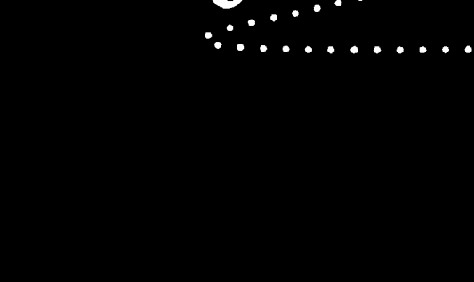

# How to Survive Mercury Retrograde
And Venus & Mars, Too

一次讀懂
水逆、金逆、火逆
如何影響你，
化危機為生機！

# 水逆
求生手冊

- 25個
實用的水逆
過關指南

- 14個
火逆
過關指南

- 16個
金逆
過關指南

伯尼·艾希曼 / 著
Bernie Ashman
魏沁林 / 譯

電腦當機、思考打結、溝通卡關、旅途受阻……
別再把水逆當藉口，學習利用逆行行星的正面力量，
每年三至四次、每次三至四周的水逆來襲，做好準備，就可以逆勢而起。

天空為限（知名占星師）、丹尼爾（塔羅教父）、安格斯（占星之門創辦人）
澤誼（暢銷星座作家）蘇飛雅（ELLE占星專欄主筆、知名占星師）——熱情推薦
（以上順序依姓氏筆畫排列）

# St. Royal College
皇家圣学院

- 专业占卜预测机构
- 神秘学培训机构
- 水晶能量研究中心
- 官方淘宝：http://strc.taobao.com
- 官方微博：@皇家圣学院
- 新书发布QQ群：316790219
- 购买更多好书请联系院长大天使

大天使
皇家圣学院 院长
QQ：715104687
手机/微信：13641926204

微信公众平台：strc2011

# 制作说明：

本书由皇家圣学院出重金从台湾购入的原版书籍扫描制作完成。为达到最好阅读效果，特地把原版书全部切开后，再经由专业扫描设备高精度扫描完成，并经过一张张的PS后期处理最终成书，其间花费大量的人力、物力以及时间，只为能给大家提供经济并优质的神秘学学习资料而努力。

本学院强力谴责某些机构和个人，把本学院花心血制作完成的电子书籍，包装后直接放在自家淘宝网上低价倾销的行为，以谋取不劳而获的经济利益。如果长此以往最终将无人愿意再为大家花心思制作电子书，那以后可能大家再无新书可读。

为让大家以后能够读到更多的好书，也为了本学院的良性发展。本学院恳请大家尽量做到如下几点：

- 一、尽量在本学院的网站购买电子书籍。
- 二、请勿用技术手段把电子书内的水印及加密去掉。
- 三、在收到电子书后小范围传阅即可，千万不要公开传播，更别挂到淘宝网上低价销售。

同时为答谢广大支持者，学院电子书将做如下调整：

- 一、学院会把一些早已收回制作成本的电子书折价销售。
- 二、最新制作的电子书籍会开放打印功能，大家购买后有条件的可自行打印成书。

皇家圣学院 2017年1月

# How to Survive Mercury Retrograde And Venus & Mars, Too

# 水逆 求生手册

伯尼·艾希曼 Bernie Ashman / 著

韓沁林 / 譯

## 目錄

- 推薦序
天空為限
打破慣例、自我突破的好機會
6

- 推薦序
安格斯
讓水星逆行成為你的逆增上緣
9

- 作者序
別怕！這樣利用行星逆行就對了
11

# ① 行星逆行對你的影響

- 什麼是行星逆行？
16

- 逆行行星的正面力量
17

- 做好準備，善用逆行能量
20

- 同時性和行星逆行
23

- 開發直覺潛能的好時機
24

# ② 水星：溝通的行星

- 水星影響的領域：溝通、組織、理解、學習和健康
28

- 你的太陽星座、星座元素和水星逆行
32

- 火象星座（牡羊座、獅子座、射手座）與水逆
34

- 風象星座（雙子座、天秤座、寶瓶座）與水逆
36

### 金星：關係的行星

金星影響的領域：社交、愛情、穩定、合夥關係、富足、自尊

- 土象星座（金牛座、處女座、摩羯座）與水逆 ........ 38
- 水象星座（巨蟹座、天蠍座、雙魚座）與水逆 ........ 40
- 25個實用的水逆過關指南 ........ 44
- 水逆防災須知 ........ 44
- 當水逆恢復順行 ........ 86
- 水逆要教你 的事 ........ 88
- 當水星星處於停滯狀態 ........ 93
- 水逆過後，你的收穫 ........ 95
- 你的太陽星座、星座元素和金星逆行 ........ 98
- 火象星座（牡羊座、獅子座、射手座）與金逆 ........ 103
- 風象星座（雙子座、天秤座、寶瓶座）與金逆 ........ 104
- 土象星座（金牛座、處女座、摩羯座）與金逆 ........ 107
- 水象星座（巨蟹座、天蠍座、雙魚座）與金逆 ........ 109
- 16個實用的金逆過關指南 ........ 112
- 金逆防災須知 ........ 115

# ④ 火星：拼鬥的行星

火星影響的領域：發起行動、表達憤怒、競爭性、身分認同

- 你的太陽星座、星座元素和火星逆行

- 火象星座（牡羊座、獅子座、射手座）與火逆

- 風象星座（雙子座、天秤座、寶瓶座）與火逆

- 土象星座（金牛座、處女座、摩羯座）與火逆

- 水象星座（巨蟹座、天蠍座、雙魚座）與火逆

- 14個實用的火逆過關指南

- 火逆防災須知

- 當火星恢復順行

- 火逆要教你的事

- 當火星處於停滯狀態

- 火逆過後，你的收穫

162

166

168

171

175

178

181

181

217

219

223

224

當金星恢復順行

金逆要教你的事

當金星處於停滯狀態

金逆過後，你的收穫

158

157

151

148

## 行星逆行期間常見Q&A

- ①：我應該在逆行期間簽約嗎？

- ②：我應該在逆行期間結婚嗎？

- ③：我應該在逆行期間接受新工作嗎？

- ④：我可以在逆行期間動手術嗎？

- ⑤：我可以在逆行期間開始一段新戀情嗎？

- ⑥：我可以在逆行期間買新車嗎？

- ⑦：我可以在逆行期間買新電腦嗎？

- ⑧：我可以在逆行期間買房子嗎？

- ⑨：我可以在逆行期間去度假嗎？

- ⑩：我可以在逆行期間申請學校嗎？

- ⑪：我可否在逆行期間提出出版或營運的提案？

- ⑫：我在社群媒體發表訊息之前，要謹慎三思嗎？

結語

## 打破慣例、自我突破的好機會

占星師、《藏在塔羅裡的占卜符碼》作者 天空為限

前一陣子水星逆行突然廣為人知，甚至連知名歌手都在自己的臉書上問：「為什麼電腦又當機了？水逆到底是什麼意思？」可見水星逆行已經愈來愈多人提起了。

但是除了太陽跟月亮之外，所有的行星都有逆行的期間啊！水星的影響會特別重，以至於最被大家所熟悉，原因是因為它是太陽系之內距離太陽最近的一顆，所以跑得比較快，逆行的次數也特別多，一年大約會有三至四次，一次大約二十天，對我們人類來說，造成的影響也比較多。

大家都知道，愈是淺顯的東西愈會廣為人知，就因為水星造成的影響是短期的，一下下而已，對我們來說，就像天外飛來一筆意外的狀況，所以感受當然最為深刻；相反的，例如天王星，或是木星、土星，也就是距離太陽最遠的幾顆行星，一旦逆行起來，就是半年到一年，到時候這個逆行，已經變成生活中的新習慣，不算是新事物了，沒那麼惹人驚訝了。

以我身為占星師的身分來說，不管是哪顆星逆行，都沒什麼好大驚小怪的，行星逆行不是它真的往後退了，而是以地球的角度相對來說的，只要別的行星速度比我們慢，就我們來看它就是往後退的。

由於占星是一種「地心說」的學問，所以一切就以地球為本，也就是以我們看到的現象為主，也就是說，你在美國或台灣，有可能看到的天象並不一樣，但是就以你在的地區看到的天象為主，因為占星最主要是看它對你的影響是什麼，所以當然要以你能看到的現象為主，所以不管天上的行星是不是真的倒退走了，當然就宇宙來說是沒有會倒退的行星的，但只要從你的角度看起來它是逆行的，那麼它對你就會產生逆行的影響力了。

占星學的原理我還是比較認同「天成象，地成形」的說法，也就是靈魂學比較重的說法，認為人與星球都是一體的，如果重點是引力的話，那我們在地球看到的都是二度空間的狀況，也就是平面的，沒有把星球之間的遠近算進去，那這樣又要怎麼解釋呢？所以我覺得是象徵性的講法比較可以說服我。

每個人對於自己信奉的說法，一定有他自己的詮釋，我認同某個說法，並不代表我反對其他的說法，每個人拿捏住自己掌握的那把尺就好了。

那為什麼我會說根本沒什麼可怕的呢？要知道，凡事都有相對的一面，逆行只是不按照你的預期或是按照往例發生的事情而已，這有什麼好可怕的，如果凡事不按照我們預期的發生，有可能是驚嚇，也有可能是驚喜啊！更有可能打破你一貫的習慣，讓你突破以往的自己，如果是這樣，不是可喜可賀嗎？逆行只是不按照慣例發生的意思，很多時候我們比較需要的是改變自己，突破以往的窠臼，也許你長久以來的習慣才是你的致命傷。

在這種時候，行星逆行反而是好機會，帶給你一些不要循著往例的勇氣跟改變的力量，對於我們人類來說，也就是突破自我的機會，沒有這些逆行給你帶來打破慣例的機會，也許你一輩子都沒有改變的勇氣呢！有時逆行也提供你倒帶一下的狀況，回頭看看自己的不足之處，再重新修練，達到更好的結果，也代表是某種反省的方式，會看到自己更多需要加強的地方，所以開心的面對逆行給你帶來顛覆自己的勇氣吧！

## 讓水星逆行成為你的逆增上緣

占星之門創辦人 安格斯

在古老的占星學中，評估一顆星體的狀態好壞有很多不同類型的指標，例如行星落入的黃道星座與後天宮位、行星的相位、行星的運行速度與方向等。本書討論的是行星運行方向的部分，可分為順行（Direct）、逆行（Retrograde）與停滯（Station）三種類型。星盤中除了太陽與月亮不會逆行外，其餘行星都會出現逆行現象。行星逆行自古以來常被賦予負面的意義，諸如退縮、反覆、延遲、混亂等。因此當行星處於逆行狀態時，該行星所象徵的事項就特別容易出現上述的問題。例如金星象徵愛情，金星逆行期間就比較容易出現關係上的挑戰或挫折。在現代占星學中，最常被大家討論的逆行行星就是水星。水星主管訊息傳遞、思維邏輯、網路通訊、商業交易等，因此占星家認為在水星逆行（以下簡稱水逆）期間，水星象徵的事項就特別容易發生混亂、不順與挑戰，例如與人溝通不良、資訊設備損壞、通訊軟體出包、交易買賣簽約延遲等。

占星提供如天氣預報般的資訊，無非就是希望幫助大家趨吉避凶，活出更美好的人生。本書作者結合多年占星研究與實證經驗，將水逆與個人星盤裡的太陽星座結合，提供讀者如何看待水逆的多元觀點，並提出豐富的解決方案。除了水逆以外，作者還擴及至金星逆行與火星逆行的部分，內容相當紮實。

誠如上述，評量一顆星體的影響並非只有行星運行方向與落入的星座，行星落入後天十二宮的表現也是非常重要的指標。後天十二宮是人生的十二種世俗領域，諸如第十宮事業、第七宮婚姻、第二宮財帛等，當過運（Transit）水星在命盤中的某個宮位逆行時，就可能會對該宮位象徵的生活領域造成影響。因此占星之門特地開發了水逆查詢功能，只要輕鬆輸入自己的出生時間與出生地，系統即可列出水逆落入個人命盤的哪一個宮位，並提供注意事項與基礎解釋，希望能夠作為本書的小工具與補充說明。

水逆雖然會造成上述的諸多不便與影響，但相對地水逆也會帶來自我反省與成長的契機。水逆可能會讓你不得不再重新檢視自己的各方面的想法、規畫、步驟與作風，但換個角度想，水逆表面上好像是在找碴，事實上，水逆是在幫助我們更加完善自己的計畫與未來方向。我們應當把水逆看成人生的「逆增上緣」，它磨練我們面對逆境的意志力與智慧，幫助我們成為一個更好的人。

「占星之門」水逆查詢網址：http://astrodoor.cc/mercury_retrograde.jsp，您也可以使用手機掃描下方 QR Code 直接進入。

### 作者序
别怕！这样利用行星逆行就对了

欢迎进入一本介绍如何度过行星逆行时期的入门书。这本书的目的是帮助你为行星的逆行周期做更好的准备，学习不要对逆行的行星心生恐惧。在接下来会看到如何用知识捍卫自己，应付最可能受到行星逆行影响的生命领域。你也会知道如何在逆行期间避免负面的倾向或想法，更重要的是，如何利用行星逆行提供的良机。这本书可以帮助你在行星逆行期间，对关系、沟通议题和工作做出更明智的决定。目前市面上还没有其他介绍行星逆行的入门书。无论你是占星师或是正在学习占星学，或是只想知道如何比较轻松度过行星逆行的周期，这本书绝对是你最正确的选择。

所谓的逆行周期，指的是一个行星在一个星座往后退行（简称「逆行」），直到再次恢复直行前进（简称「顺行」）的时期。关于逆行，最重要的是要知道一个行星何时从顺行变成逆行，或是从逆行变回顺行。为何这一点如此重要？因为这攸关你采取行动的时机，也可以帮助你明确地知道一个行星何时改变方向。这本书会告诉你如何知道逆行的周期，还有最佳的应对之道。

在我的看来，逆行的行星非常神奇，因为它们有时会带来令人惊喜的新想法或新见解。我们不应该低估行星逆行的潜力，它们仍能造就你的愿望或梦想。你将会发现，行星在逆行时，能带着你踏上成功之地。一个逆行的行星仍能激发你相信自己的直觉与想法，与它顺行时并无两样。透过阅读这本书，你将会认识逆行赋予的某种新力量。如果你已经很熟悉行星逆行，你也可以找到新方向，重新思考它的意义。

本书的重点就是提供你「生存之道」，帮助你度过行星逆行的周期。这些重要的诀窍可以帮助你在此时心智更加敏锐，维持个人的创造力，同时享受人生。你可以在逆行时期选择对你最有用的诀窍。每一次行星逆行都有其独特之道。你必须在某一次逆行期间做出的决定，可能与又一次逆行时截然不同。这本书会从多种不同的角度剖析逆行周期的生存之道，提供你丰富的内容，帮助你应付可能遭遇的挑战。这也能帮助你放宽心，知道自己可以做好万全准备，充满信心、自在地面对人生。

占星家把一个行星正在通过一个星座的移动称为「行运」（或过运）。其中有三个行星移动较为快速，分别是水星、金星和火星，而这也是这本书中讨论的行星。这三个行星会影响我们的日常生活经验。许多人都想知道，如何善加利用这三个行星的力量。它们是很重要的激励能量，帮助我们开启眼界，看到新的机会。在此先简单介绍它们的运作方式：水星会刺激你的沟通；金星会激发你去探索，如何在关系中创造和谐；而火星会驱策你果断地采取行动。你会发现每一个行星无论是顺行或逆行，都有它独特的目的。行星在逆行时，会挑战我们，我们必须更有智慧地采取行动，但不是要我们退缩，放弃追求新的目标——事实刚好相反。你将会发现一个行星逆行时，就如它顺行时，能让你有同样清晰的思考能力向前迈进。

这本书也能帮助你更清楚地知道，身旁的人正在面临某些同样的挑战。当你知道自己不是孤军奋战，不是一个人在面对行星逆行的挑战时，这就能点出一个方向，帮助你了解别人的想法和感受，进而创造互相理解的交融感受。

在第五章中，我会解答一些人们最常问到的行星逆行的问题，例如，是否该在水星逆行时签合约？在逆行时期，是否适合换工作？

希望你能在接下来的章节中享受你的旅程。这本书就是要帮助你轻松一点度过逆行周期。在逆行时期，你不应该终日惶恐，被忧虑控制。我们在每个章节中都提供许多生存之道，可以帮助你找到更清楚的目标，并且乐在其中。希望这本书能鼓励你，看到一个逆行的行星如何带给你正面的指引。

# 什么是行星逆行？

逆行指的是当我们从地球上观察时，看到一个行星看似以退后移动的方式通过黄道或是一个星座。基本上，当我们看到一个移动较快的行星通过一个移动较慢的行星时，就会产生幻觉，以为移动较慢的行星正在向后退，或是逆行。这就像当你开车经过一辆车速较慢的车时，会以为那辆车正在向后退。事实当然并非如此。两列火车都在往前移动，只是车速较慢的火车看起来在往后移动。

除了太阳和月亮，所有行星都会在一年的某些时期处于逆行状态。每一个行星停留在逆行、直到恢复顺行的时间长短都各有不同。我们会在后面的章节介绍水星、金星和火星的逆行。

你可能习惯看到时钟的指针是朝顺时针方向或是向前移动。当你看到时钟指针突然往后移动，难道不会觉得很特别吗？你可能猜想，进入了一个全新或另类的现实空间。一个行星的逆行就像时钟指针向后转。逆行等于在轨道上产生暂时性的改变，它会要求你的心智适应它在此时传达的信息。这就像把你的脑袋放在不同的内在时区。但是不要担心，在你刚进入行星逆行后的前几天，你的头脑就能理解逆行行星的节奏和韵律，这个逆行的行星将会用独特的方式与你的思考合作。

### 逆行行星的正面力量

关于行星逆行的价值，各家看法不同。有些人把逆行视为负面的事，仿佛逆行的行星永远无法带来正面的结果。这些人会告诉你，停下所有进行中的事情，直到行星恢复顺行为止。这个建议不太务实。我们大部分的人都无法暂停人生的脚步。现实生活中有太多的事情必须完成。要你在逆行时期不能将某个想法付诸行动，这个建议完全不切实际。在这段期间，你还是可以毫不犹豫地继续进行，还是能得到丰富的成果。

若怀疑在行星逆行期间，是否能有任何创造的可能性，那就大错特错了。在这段时间，会有许多深刻的想法如雨后春笋般地冒出来。你可能会展现新的决心，完成自己的目标。此时更重要的是，厘清自己对别人的需求。你的确需要对细节多做琢磨。如果你想要按照自己想要的方式完成一个计划，就必须更全面地分析当下的情境，才能确保计划成功。

有关行星逆行的另一个关键主题，就是它们提供你一个机会，能更深入地窥见当下的情势。你可以像是把所有事情放在显微镜下观察，看到更多可能隐藏的、错综复杂的细节，看到你之前可能忽略的细微痕迹。你可能会在此时重新思考一个目标，或是决定必须购买的东西。你可能考虑并决定这个东西的价格，是否值得你付出这么多的时间与金钱。在行星逆行期间，你有时可以具体实现自己的策略，用对自己有利的方式达成协议。你也可能在此时决定重新评估一份重要的合约，该合约涉及某个重大承诺，而你必须为此付出一些时间和资源。行星逆行期间，你可以更清楚地与别人重复沟通同一件事，清楚地看见如何更深入地分析，找到更好的方式去重新面对一个人，解决你们之间的差异。逆行的能量有其独特之处，它会替你的问题指出一种你从未想过的解决方法。也可以从这个角度来看，逆行的行星可以开启你的眼界，让你看到新的选择。你可能发现自己必须解决一个问题。就许多方面来看，逆行这种特别的周期会触动你的研究倾向，帮助你深究一件事，不只是看表面，为阻挡自己的障碍找到解答。你也可能发现，此时无法决定任何事情。也许最有利的做法就是离开。然后接下来就会如老生常谈，你会再次鼓起勇气面对现实，正面解决事情。这里的底线在于，你会发现一种创新的方向，然后朝着这个方向前进。

逆行期間，你可能扭轉負面思考。可以為自己的能量重新找到方向。你本來缺乏自信，此時可能會對自己的能力更有信心。你也可以把逆行當成一個機會，重新鍛鍊堅忍的心智。行星的逆行可能是成功的第二次機會。它可能帶來你需要的暫停。它也可能讓你覺得少了許多沉重的負擔。它會為你鋪路，讓你在其他地方充分發揮能量，而這可不是微不足道的小事。

你可能會覺得，自己的辛苦工作值得獲得更多的獎賞。發現現在開始對自己好並沒有什麼錯，不用考慮現實，晚一點才能犒賞自己。你可能更常出現「就是現在」的想法。付出固然是件美好的事，接受也理應如此。你可能更加明白該如何平衡這兩種經驗。逆行可能會在你心中開啟這種平衡作用。你甚至可能會在逆行時期開啟新的局面，這也許跟你之前聽到有關行星逆行的說法，剛好完全相反。試著放下對逆行的所有偏見。逆行週期可以為新的想法提供根基。你會在此時發揮豐沛的創造本能，而且極有可能強勢地向外展現這股能量。你的創造力可能倍增，引領你踏上各種不同的新道路。你也可以透過不斷查看重要的細節，更有力量地朝一個目標釋放能量。這也許是因為你已經替未來做好萬全的準備，才可能這樣的表現。

### 做好準備，善用逆行能量

逆行時期，你可以更加深化自己的溝通能力，這通常發生在水星逆行的時期。你在此時學習新的技能，可能會開啟新的工作機會。金星逆行時期，你也許更能與人們結成新的盟友關係，從中享有更多的自主權。你也可以在此時與別人重修舊好。火星逆行可能會替你指出一條道路，讓你變得更有決心。這些逆行可以給你一個機會，將過去負面的衝動拋在腦後。在這段時期，自信會戰勝自我懷疑。此時會出現一個全新的你，而你會驕傲地向外展現自己的新面貌。

這些週期何時開始，何時結束，才能幫助自己和個案掌握當下的週期。這是要幫助我們所有人學會和逆行的能量一起流動，不要對此過度焦慮，也不要認為人生會出現負面的發展。這就是我寫這本書的主要原因：破除針對行星逆行的部分迷思。另一個重要目的就是提供你一些生存秘訣，讓你可以在逆行時期充分發揮創造力。當你在逆行時期，愈能發現更多處理事情的替代方式，你的狀況就會愈好。你可能更容易找到方法度過障礙和關卡。你愈不氣餒，就愈能掌握自己的目標。

在為逆行週期做準備時，最重要的是正面思考。這可能聽起來太簡單了，但是根據我多年的經驗，這的確是度過任何逆行時期的最佳方式之一。當你繼續相信自己時，你的創造力就會倍增。我發現在逆行週期有悲慘經驗的人，通常會被自己的負面思想控制。你如果保持穩健冷靜，就會吸引更正面的經驗。保持明智，充滿自信，集中注意力，都將會很有幫助。在任何逆行時期還有一件重要的事，就是把逆行視為一個機會，可以做出更具自主權力的選擇。不妨把行星逆行視為宇宙與你合作的方式，告訴你什麼時候是追求個人需求的最佳時機，什麼時候又該明智地暫停腳步。你可能遇到數次的停頓、重新開始或是重做。在逆行時期，你要試著保持一種心態，知道所有的練習都是為了更好的結果。你不需要以完美為目標。只要對自己抱持合理的期許，一切都會非常順利。你如果在進入逆行週期之前開始一個計畫，在進入逆行之後仍必須繼續進行，也不用太擔心。當有需要時，你永遠可以在逆行時期做改變，這不會破壞你的工作，也不會破壞你在逆行之前的謹慎策畫。微調是不可避免的。你就把這當成一個過程。當行星再度恢復順行時，你可以選擇做出其他改變。你要儘量在行星逆行之前規畫行動。你要有心理準備，可能會需要一些改變。讓想法保持彈性，可幫助你度過行星逆行時的起起伏伏。你就不會覺得生活充滿壓力。

有些人喜歡在逆行週期開始之前完成一個計畫。這種想法也沒有錯。但是你如果在逆行期間必須做出一些改變，這也不是世界末日。在一個行星開始逆行之前，盡可能解決所有的細節，這永遠是一個好主意。不過即使你在逆行開始之前完成一項工作，記住你可能必須在逆行時期做出些許改變。

改變是不可避免的。逆行就是教導我們接受生命只是一連串的週期，而我們必須隨著環境的改變調整自己。就許多層面來看，當行星逆行時，是要教導我們更加注意整體的遊戲計畫，不要太陷入細節裡。

#### 同時性和行星逆行

行星逆行的另一個好處，就是你可能體驗到一個事件會出現有意義的巧合，或是所謂的同時性。同時性這個說法是由心理學家榮格提出，他認為同時性就是一個事件發生「有意義的巧合」，無法用因果解釋。你可能在早上想到一個好幾年沒見的老朋友，然後在逛街購物時就突然遇到他，或是收到他的電子郵件。或是你可能想要應徵某一家公司的工作，之後就在社交場合遇到負責招聘這個職務的人。這到底只是巧合？還是宇宙安排這些事情發生在你身上？你可能先做了一個夢，然後隔天夢就成真，一切正如你在夢中的遭遇。逆行的行星有時的確會引發這類經驗。

所以，對於逆行感到過度焦慮，實在是沒有意義。它們可能會用你無法想像的方式發揮作用。所以如果維持正面的心態，宇宙將會讓你的願望成真。好像有一股運作的力量在冥冥之中做安排，讓這些情境在正確的時間和地點發生。

#### 開發直覺潛能的好時機

我們的大腦習慣用線性的方式看待時間。為了能應付現代生活的緊湊步調，我們被迫使用左腦思考。為了能有邏輯地執行功能，帶有某種秩序感，左腦隨時都會派上用場。左腦著重分析，而右腦比較偏向直覺。我們最好能利用兩者，不偏重任何一邊。

我為什麼會在一本談論行星逆行的書中談到直覺？我發現在行星逆行時，我們比較容易感受到右腦的存在。換句話說，一個逆行的行星可以刺激我們利用直覺。我們有時終日匆匆忙忙，可能不會想到利用直覺是一件很可貴的事，或是根本忘記利用直覺。

行星逆行有時就像我們按到了人生的倒退鍵。我們可以在逆行時期再次回頭探究或重新思考一些狀況。我們的直覺可能會告訴自己要放鬆，同時引導我們用比較流暢的方式來解決問題。我們可以在行星逆行的期間發現直覺帶來的禮物。

逆行期間，我們的夢可能更有意義。我們可能更容易脫離顯意識的想法，讓直覺的念頭接受象徵性的訊息。我們應該學習珍惜行星逆行的禮物，它會透過夢境傳達訊息，幫助我們解決問題。逆行週期帶有一種魔力，而在我們清醒時，這可能不是隨時顯而易見。逆行可能會用一些神秘的方式展現能量。逆行週期時，甚至會出現一些療癒能量。這些週期可以補充我們的身體和心理的能量。在這段期間，我們即使忙於工作，或是忙著履行日常生活的責任，逆行的行星仍會在背後運作，賦予我們新的洞見。逆行的行星可以讓你充滿創造的能量，你永遠不要低估這件事。逆行期間，你的直覺有時會指點你一些最佳生存秘訣，幫助你處理當下的情境。如果能利用直覺，將會受益無窮。接下來每一個行星的章節都等著你飽讀瀏覽，其中將會提供你諸多生存之道，幫助你紓解壓力，創造更豐富的人生。

## 火星：行星拼鬥的

#### 水星影響的領域：溝通、組織、理解、學習和健康

- 與水星相關的元素：風元素、土元素
- 水星主宰的星座：雙子座與處女座
- 水星逆行的禮物：注入新的心智能量，新的見解
- 水星逆行持續時間：三週

討論水星逆行的週期之前，先來認識水星順行時的運作方式。水星是溝通的行星，其中一個主要功能就是交換意見。多虧有水星的幫忙，我們可以用另一種方式向別人表達想法。水星可以幫助一個人吸收新學習的事物，並對周遭世界培養更多的覺知。在神話學裡，水星是眾神的使者，它會讓你保持好奇心。我們能適應新的環境，多是拜水星所賜。在占星學中，水星是兩個星座的主宰行星，分別是風象的雙子座和土象的處女座。水星在雙子座的表現，是激發一個人在心理層面和實際生活中展開旅行，增長見聞，而在處女座的表現，就是激勵一個人的行動有效率，井然有序。一個人能帶著目標感完成日常活動，主要驅力就是來自水星的兩個面向。

水星在你身上發揮的另一種作用，就是對新趨勢保持覺察力。它會警告你要隨著變動而改變。當你認識天上這位足智多謀、思考導向的巨人之後，就會發現適應新環境這件事其實如沐春風。我們可以把水星想像成風向儀，它能幫助你偵測到四周的變化，很快地融入變化的情境之中。

當你能隨著水星的能量流動時，就能流暢地發揮商業本能，行事條理分明。如何在一瞬之間達成協議，如何展開一場商業的冒險並維持成功不敗之地，都屬於水星的範疇。若能跟上現時代潮流的腳步，便能為自己的事業或生意不斷地注入熱情。水星是一股擅長心智活動的能力，它的另一個功能就是讓你的技能領先其他的競爭者。當你身處商業的世界裡，能知道什麼方法行得通或行不通，這多半是來自於水星的影響。在水星的看照下，能不斷地充分拓展自己的管理能力。當你在職場中充滿自信，維持高昂的狀態時，將有助於你升職。你也可以透過接受額外的訓練和學習，擁有更多的選擇。你如能多元化地汲取知識，就能具備一種以上的謀生之道。水星能打開一扇大門，讓你在同時從事不同類型的工作，改善謀生能力。

水星的另一個核心主題就是分享資訊。水星會啟動你體內的溝通者。當你能理解水星象徵的意義時，你在思考過程中好為人師的那一面就會蠢蠢欲動。你也許會想激發別人的學習欲望。水星的天賦之一就是用簡單易懂的語言解釋一種概念。試圖把你有意溝通的事情拆解成可以理解的碎小片段，也是水星的一種天賦。

善用水星的方式之一，就是在同一時間渴望朝著不同的方向行進。帶著敏銳的覺知，如玩雜耍般遊走於多種人生責任之間，仍能維持井然有序，這也是水星的另一種表現方式。由此可見，水星的潛力之一就是擅長一心多用，身兼數職。

健康和飲食也是與水星相關的領域。水星會讓你更嚴肅地思考如何照顧自己的身心健康，你也可能有興趣說服別人跟隨你的腳步。你可能會想從事與健康有關的工作。規律運動，維持身心健康，這也是水星喜愛的一種方式。利用水星的另一種方式，就是培養飲食的紀律。水星是一個極具洞察力的行星，它具有辨識的天賦，這可以幫助你學習戒除不好的日常飲食習慣。

熱切地想要做好一件事，也是水星的表現方式。這個行星會激勵你學習新的工作技能。你以極精準正確的態度，有始有終地完成一件事，這份決心也是來自於水星。你會持續不斷地注意細節，兢兢業業地循序漸進。水星的另一特色則是能意識到必須刪除的部分，讓工作進行地更順暢。水星可以幫助你理解自己負面思考的傾向，告訴你如何改變這種模式。它可以刺激你轉化想法，變得更正面思考。也多虧了天上這位心智巨人，我們才會看到大量的創造出現。你心中多年來可能有些負面想法，水星可以教導你如何超越這種傾向。你可能需要堅定的決心，但只要堅持不懈，你一定可以做到。溝通意見，還有意見對你的作用，這些事情在水星的國度裡占有一席之地。這個行星的主要目的就是與朋友及愛人維持清楚的溝通。水星會協助你，讓他人了解你的想法。當一個更好的聆聽者，跟與他人溝通一樣重要。當你能關心身旁親近的人所說的話，你就會更受人尊敬。能將這些資訊留待他日使用，也展現了水星善於心智活動的天賦。你如何理解這個世界，與水星息息相關。每個人都具有擴大個人世界觀的本能，這就有如催化劑，可為自己開啟一扇嶄新且充滿創意的機會之門。當你對生活保持興趣時，可以刺激你與他人的關係。水星還有另一個特色，就是當你知道自己過去有哪些成功經驗時，你便能集中精神，確定能在未來繼續善用這份認知。所以，我們永遠無法一語道盡這個能為心智注入活力的行星，會如何繼續引導你大開眼界，認識新知。

## 你的太阳星座、星座元素和水星逆

我曾在二〇一〇年出版的《太陽星座與前世今生》（Sun Signs and Past Lives）中介紹大自然的四種元素：風、火、土、水。你會在接下來的內容中發現，自己的太陽星座與其中一種元素有關。你的太陽星座屬於其中一種元素，會對水星逆行產生獨特的反應。這不代表你會對水星逆行永遠抱持同一種態度，或是永遠做出同樣的選擇。接下來討論元素，只是一個概略的介紹，幫助你認識水星逆行。你的太陽星座和太陽星座所屬的元素，與水星逆行結合時，將可以帶給你全新的見解。這三者的結合可以形成強力的認知大三角，幫助你做出更明智的選擇。

對於生存和尋找和諧而言，每一種元素都不可或缺，極其重要。心理學家榮格曾歸納出四種心理功能，分別是情感、思維、感覺（也包括生理感覺）與直覺。每一種功能都能與四元素相互呼應。情感功能類似占星學中的火元素，而占星學中有三個火象星座，分別是牡羊座、獅子座和射手座。思維功能與風元素的星座有關，其中包括雙子座、天秤座和寶瓶座。諸如味覺與觸覺的感覺功能，則與土元素對經驗的需求有關，這指的是金牛座、處女座及摩羯座。直覺功能則與水元素星座的感覺本能有關，這指的是巨蟹座、天蠍座和雙魚座。現實生活中，我們的心理本質和自我表達多少都混合了四種元素。如果能根據自己的出生日期、時間和地點排列完整的星盤，這一切就昭然若揭了。你對認同的需求，還有你渴望向這個世界展現個人能力，都與你的太陽星座有密切關係。如果對占星學有些認識，可能已經非常熟悉自己星盤中強勢的元素。若剛接觸占星學，只要知道自己的太陽星座，就能知道屬於哪一種元素大三角。如果知道自己太陽星座所屬的元素，當你遇到水星逆行時，會很有幫助。幫助你知道該如何面對為期三週的水星逆行，該如何調適自己，如何以更和諧的方式安然度過這段時期。接下來簡單描述，你的太陽星座及元素特質會與水星逆行如何互動。

##### 火象星座（牡羊座、獅子座、射手座）與水逆

太陽星座如果屬於火元素，當水星逆行開始時，可能會覺得平常快速的移動方式突然異常地慢了下來。不必太訝異，這可能是生命正在向你發出訊號，提醒你在向前躍進之前先思考一下，這也許與你平常的行事方式截然不同。你在面對當下和未來時，最喜歡的方式可能是衝動地採取行動。你習慣今日事今日畢，可能昨天就把事情搞定，不會拖拖拉拉到今天。當火象星座的人面對水星逆行的考驗時，最佳的策略通常是耐心。如果一直原地打轉，無法完成必要的事，不妨先把注意力放在可以控制的部分。或者更好的應對之道，就是想像它正在重新引導個人能量。躁動不安只會分散你的注意力。所以在這段時間，一定要運動，無論是走路、跑步、遛狗、整理庭院，或是從事其他的體力活動。這麼做或能帶來某種專注效果，可以幫助你重新返回軌道，繼續完成自己的目標或計畫。如果知道如何冥想，而且對你很有用，也可以試著這麼做。像你這樣的火象靈魂必須停下腳步，深呼吸，確定能對自認為所需的一切，保持清楚的思維。水星逆行期間，暫時停下腳步是一件好事，可以幫助你避免重複做同樣的事。如果能暫緩當下的滿足，那麼當水星日後恢復順行時，將會發現這是一種值得珍惜的智慧。如果在水星逆行時保持正面思考，你將會獲得自信的勇氣，培養出貫徹到底的能力，而這就是水星逆行的獎賞。

太陽星座如果是火象的牡羊座（三月二十一日至四月十九日），水星逆行時期，行動派的你可能會覺得有些受限。千萬不要氣餒。這三週的時間可以教導你在執行一個計畫之前，先想出更好的策略。此時，不需要對一個目標退縮。水星逆行時，可能會誘導你帶著決心，先轉身朝四周觀望，再向前躍進。

太陽星座如果是火象的獅子座（七月二十二日至八月二十二日），代表你擁有突破萬難的堅定決心，但也會影響你在運用意志力時，是否能三思而後行。在水星逆行期間，可能需要用更具建設性的方式，為自己的能量重新找到方向。你也許可以在心中有一個很好的目標，但不一定要有結果。你也許會發現，如果能保持彈性，隨機應變，就能有更清楚的理解。

太陽星座如果是火象的射手座（十一月二十一日至十二月二十一日），在水星逆行時期，最好不要在同一時間朝太多的方向前進。你還是可以保持好奇心，也不需要完全抗拒渴望在同一時間前往不同的方向旅行。你只是不要承諾自己做不到的事。水星逆行可以引導你在心智上保持客觀和務實，藉此完成你的目標。別忘了，耐心可能是通往和諧的道路。

##### 風象星座（雙子座、天秤座、寶瓶座）與水逆

太陽星座如果屬於風元素，那麼當水星進入逆行週期時，你強韌的心智可能會陷入混亂。你天生具備的快速、犀利的理解能力，可能會比平常模糊。千萬不要慌張。這是宇宙在向你傳達訊息，要你重新思考自己的選擇。要把這視為一個機會，讓你能更深入地探究某種狀況，而不是把這當成一種鑽研細節的自我折磨。你不會喜歡把時間浪費在重複地向別人解釋自己，你必須有心理準備，用簡單的方式與一些人溝通，他們才能理解你的想法。這通常都會發生在水星逆行的凝視之際。水星這位天上的溝通巨人可能替你準備了一個更好的計畫。當水星恢復順行時，你可能會看到這個計畫，或是發現這為你邁向目標的下一步，提供了更寬廣的視野。水星逆行期間，你會覺得自己的神經系統像是觸了電。如果能讓生活保持規律，事情會比較順利一點。不過，如果每天同樣的生活方式讓你覺得枯燥乏味，你也許需要走出去，脫離一下，做點特別的事情，刺激自己的創意思考。如果你這麼做，好處就是當水星恢復順行時，你就可以快馬加鞭全速前進，準備好接受新的機會。太陽星座如果是風象的雙子座（五月二十日至六月二十日），水星逆行可能會顛覆你的邏輯，頻率略勝於平常。不要擔心。因為你的太陽星座是由水星主宰，所以你會比其他人更有機會逢凶化吉。因為水星主宰你的太陽星座，你天生與水星比較親近，因此的確比其他星座的人更具優勢。如果想好好利用為期三週的水星逆行，那麼當你試著要推動一個計畫，但計畫出錯時，千萬不要驚慌。你可能發現，另一個計畫才是正確的選擇。關鍵在於，要以選擇的角度思考。你誕生的星座討厭固定用同一種角度看待事物。因此在水星逆行時，記得利用自己最擅長的一項技能：足智多謀。

太陽星座如果是風象的天秤座（九月二十二日至十月二十二日），天生傾向謹慎衡量一個決定，在水星逆行時期，事情可能出乎你的意料之外。你心裡的那把秤，也很難如你所願地達成平衡。不要失望。如果能繼續集中精神，就能找到一條路穿越迷霧。你可能必須與親近的人分享想法，事情才能清楚明朗。團體工作如果能為你帶來活力，你就要善加利用這種模式。水星逆行也會測試你的心理韌性，看你是否相信自己的意見。要當一個積極的聆聽者，但是不要忘記堅定地踏出每一步，展現你的目的。太陽星座如果是風象的寶瓶座（一月二十日至二月十九日），水星逆行會考驗你大腦內建的全球衛星導航系統，看它是否能維持在正軌上，達成你想完成的目標。你雖然付出同樣的精力去實踐一個計畫，但會感覺有些費力，像是在爬一個比平常更陡的坡。你的心理韌性永遠是你最親近的夥伴，它會推著你一路向前，通過障礙的考驗。秘訣在於不要對任何情境強求結果。你要耐心等候自己獨特的洞見出現，幫助自己做出清楚的抉擇，這會測試你的耐心，但你會發現等候是值得的。水星逆行時期，你的思考過程會更加深刻，而這在水星恢復順行後會顯得特別明顯。

##### 土象星座（金牛座、處女座、摩羯座）與水逆

太陽星座如果屬於土元素，當水星逆行的週期開始時，你對事情井然有序的務實需求，可能會突然受到衝擊。你可能拿到預料之外的帳單，或是平常順利進行的計畫出現延誤，無法如期完成。你渴望行動充滿效率，但是當細節開始崩解時，你會感到十分迷惑。如果強求某件事情，結果只是挫折。這不代表你必須放棄一個計畫。你可能只是需要讓想法更有彈性，這就是維持快樂的關鍵。如果你能跟著環境變化順其自然，即使是你最親近的朋友也會眼睛一亮，更加地喜歡你。水星逆行時，即使是最縝密完善的計畫也會需要一些改進。水星這個淘氣的行星有時會打亂你的計畫，只想看你會如何反應。不要失望。當這位移動快速的流浪行星再度恢复顺行时，一切都极可能恢复原状，让你喜出望外。水星逆行期间，你可能必须完成一些事。这是没问题的。只需要有心理准备做出一些必须的调整，让自己的人生更有意义。你的确有方法应付水星逆行周期的疯狂。水星逆行期间，你可能会对自己的专注能力大吃一惊，也可能会在此时重振追求成功的决心。

太阳星座如果是土象的金牛座（四月十九日至五月二十日），水星逆行会引导你开始质疑自己维持专心一致追求目标的方式。你可能不觉得自己需要做任何改变。不过，这为期三周的逆行周期如果扰乱了你平常的运作方式，你可能需要拟定一个新计划。金牛座通常不喜欢快速的改变。水星逆行时期，你可能比平常更加谨慎地分析商业决定。不要过度固执，人们会更喜欢你。这个时期，如果你对一个重大决定有所质疑，无法确定，最好的方式是不要在此时做决定。要聆听自己内在的声音。水星逆行其实可以帮助你厘清一个困扰你好一阵子的决定。敞开心胸，接受别人中肯的建议，人生就会更加顺遂。

太阳星座如果落在土象的处女座（八月二十三日至九月二十二日），水星逆行可能会对你注入一股热情，你会变得更加热衷注意细节。你属于水星主宰的星座之一，所以天生就能与水星的波长连结。试着不要过度追求完美。犯错并没关系，你可以稍后再修正错误。若过度焦虑无法改变的状况，只会为自己带来麻烦。在水星逆行时期，可以非常专注地工作。会对任何决定产生非常透彻的洞见。试着找到一些让自己放松的技巧。可以开启你的创造力，赋予你的身心灵更巨大的能量。

太阳星座如果是土象的摩羯座（十二月二十二日至一月二十日），在水星逆行时期，可能觉得不需要全面控制生活的所有面向。为何一定要全在掌控之中呢？所以此时会有些新的资讯渗入你的脑海。水逆时期，不要抗拒学习新事物。在这三周期间，可能出现一些线索，让你知道如何处理某个状况。记得是要严厉地面对问题，而非苛责他人、苛责自己。调整步伐，避免过度消耗自己。规律地休息，将能为你带来更多的心智能量。水逆时期，你的确能揭露内心最深处的想法，与自己爱的人更加亲近。水星在此时传达的强烈讯息就是：「不要害怕改变。」生命中有些变化，可以让你的想法焕然一新。

## 水象星座（巨蟹座、天蝎座、双鱼座）与水逆

太阳星座如果属于水元素，当水星逆行的周期开始时，情绪可能会比较容易失焦、分心。你本来可靠的心智认知，可能会在正要完成一个目标时突然消失。为什么会有这种情形？因为在水星逆行期间，你的心智和情绪能量很容易产生冲突，这可能导致你无能为力。你天生的本能就是计划，然后完成事情，但在此时，你会觉得找不到施力点。水逆时期很适合中场暂停。试着想出一个更好的方法继续向前，不失为一个好方法。然后你可能需要冒一点险，鞭策自己追求一个新目标。你在完成一项工作之前，可能无法坐下等待水星恢复顺行。如果稍后必须改变，就要允许自己做出改变，在这段时间，你最好还是继续前进，不要停下脚步。透过这么做，可以让自己的心智和情绪保持和谐。你可能对自己的创造力感到惊艳，并且能在水星恢复顺行后，强烈地释放这股能量。若有勇气相信自己的才华，就会得到回报。水星逆行有时就像催化剂，可以深化你的直觉能量，帮助你找到新的方式落实新的想法。你在此时对自己信心满满，将有助你吸引到令自己快乐的丰富圆满。太阳星座如果是水象的巨蟹座（六月二十日至七月二十二日），水星开始逆行时，你可能会感觉到心智的停顿。不要担心。你可能开始把情绪的议题带进逆行的循环，就像在烘衣机里面翻搅，理不出头绪，没有结果。如果保持专注在主要的目标上，就比较有机会厘清思绪。你可能会在水星逆行一开始就快马加鞭全力冲刺，整整三周都停不下来。如果你能保持清醒，脚踏实地，就能集中自己的创造本能和身体能量。如果发现自己很难专心，就需要冥想，或是沉浸在能放松心智的活动里。你比较喜欢事先预测可能的结果，再进入某种情境。水逆时期，这个倾向会特别明显。就整体而言，水逆时期，要特别确认自己参与了什么活动，或是进入了哪一种层次的关系。这可以帮助你节省时间、金钱和能量。要正面思考，这将是开启和谐之门的关键。

太阳星座如果是水象的天蝎座（十月二十二日至十一月二十一日）。水星逆行将会鼓励你更深入地处理所有重要计划。水星逆行可以激励你的探索能力，深究事物表面下的东西。你在此时会更有热情专研一个主题，或是胜任一份工作。要特别注意，不要无谓地担心细节，当你在解决一个问题时，这不会带来任何不同的结果。要把精力放在具有生产力的目标上，而不是被负面的想法绑架。要诚实地让别人知道自己对情境的感受，更清楚地沟通。这段时间，如果能精通新的技能，将能为自己的职业生涯开启更多的可能性。你也可以找到新的方法推销自己的商业见解。此时的首要之务就是厘清自己的短期或长期目标。而当你面临挑战时，你也有能力随机应变，解决问题。

太阳星座如果是水象的双鱼座（二月十九日至三月二十日），水星逆行可以帮助你更客观地看待某一个情境。水星的心智能量可以帮助你远离对于某一种状况的焦虑。在这段时间，有关工作和关系的决定会变得清楚明朗。你要谨记在心，别人无法读你的心。你要表达，这不仅能帮助你与别人保持共识，你也会觉得自己能主宰大局，操控重要的计划。水星逆行期间，最需要注意的也许就是是否认这件事。要对自己诚实。不需要在水星逆行的三周期间做出改变，但要做好准备，按照自己的想法行事。在这段时间可以培养自己的创造力，同时展现出来。要不断相信自己的能力，就会有好事发生在你身上。保持积极正面的看法，将能吸引好运。

## 25个实用的水逆过关指南

水逆防灾须知：

- ☆正面思考
- ☆重新检视细节，但不要沉迷其中
- ☆重新思考你试图与他人沟通的事物
- ☆试着不要过度忧心结果
- ☆开放接受改变，接受新的学习

逆行的行星之中，水星最为人所知。水星一年逆行三至四次。每次逆行为期二十至二十四天。无论你是哪一个太阳星座，水星逆行期间，如果你努力挣扎，试图让自己的思绪清楚，一定会觉得这短短几周没完没了。你会发现自己每天都很焦虑地等待事情明朗化，期望能做出重大决定，或是拟定最微不足道的计划，让人生能继续前进。接下来这些生存秘技可以帮助你在水星逆行时，更加理解它的意义。

你可以把水星逆行想像成一个机会，藉此解读水星向你传达的讯息。水星逆行一年发生几次，希望这里提供的秘技可以提供你更多的优势，充满信心，带着深刻的理解来面对为期三至四周的水星逆行。要对自己有耐心。记得其他人也许都正在处理许多你必须忍受的问题。隧道的尽头会有光明。你可以透过利用这些秘技，让生活的焦虑和麻烦降到最低。

### 指南一：放下完美倾向

水星能量天生带有注意细节的倾向，而在水星逆行时期常会愈来愈无法控制，变得过度讲究细节。在这段期间，当你努力让一个计划更加完美时，很难知道何时喊停。你可能发现自己在脑海中不断重复担心同样的事。水星逆行时期，问题很容易被马上放大。当你在水星恢复顺行时好好利用这些分析能力，这是一件很棒的事，不过如果不能停止担心，这就会变成麻烦。

如何避免这种完美倾向变成问题？必须给自己一个新方向，全心投入其中。脱离这种困境的方法之一，就是把事情划分界限。换句话说，必须把精力放在一件不会让你抓狂或充满焦虑的事情上。这也许是一种让你觉得更能全面掌控状况的活动。告诉自己，为了追求一件事情尽善尽美，让自己陷入永无止尽的焦虑之中，对你的身心健康都不是件好事。

你必须试着打破魔咒，不要过度追求完美。如果太在意讨好他人，就会发现自己即使尽了全力，也无法让每一个人开心。到最后你会发现，只有试图取悦自己，才会觉得更开心。即使让一件事情合乎你的完美标准，也不会因此感到快乐。如果不打破这种过度追求完美的模式，那你每一次遇到水逆时，都会出现重复的焦虑。要学习接受只要自己尽力了，一切就够了。

我很喜欢意大利知名艺术家米开朗基罗的雕刻作品〈圣母怜子像〉，这最能象征一个人对完美的渴望。他透过雕刻创造耶稣受难的画面，而这应该不是他对这个雕刻作品原本的想象。换句话说，他是一块一块地雕，小心翼翼地琢磨一些不必要的细节，直到最后变成一副壮观、令人屏息的创世巨作。

你可能发现在水逆时期，很难持续地保持专注。当你心中那股追求完美的强迫性渴望达成和解时，你就能展现创造力，散发自信。所以最重要的是要放下过度的执着，不要坚持有完美的结果。在这段时间，会有一个练习的时间点出现，让你知道自己做的够多了，一切已经足够了。

### 指南二：心生怀疑时要正面思考

> > 佛陀曾经过说过：「保持警觉。捍卫你的心，对抗负面思考。」

水逆时期，最好用这句话提醒自己。水星是一个很棒的行星，它会激发你的大脑思考充满灵感，思绪如泉涌，但在水逆时期，也可能勾起一些过去的问题和往事在你的脑海中萦绕不散，彷佛有东西从衣柜里跑出来似地。你可能在此时遇到旧识，或是再次想起针对某一种情境、隐隐约约的不安全感。也许会出现令人不悦的意外，让你突然觉得不太能掌控大局。水星逆行也可能触发心智的混乱，直到你再次让自己稳定下来。

这段时间，最好的疗愈之道就是正面思考。不要因为可能出错的事情分心。你要走出来，跟一些让你觉得乐观、更有活力的人一起做点事。你可以沉浸在自己喜欢的主题或嗜好之中，藉此刺激心智，这也是很聪明的作法。 水星逆行有时会让我们卷入一个奇怪的方向，或是一个脱离个人舒适圈的方向。我们平常的思考方式会受到冲击。也许你很难相信，但这可能是件好事。它正在引导你重新思考自己的选项。你的理解能力最后会变得更加犀利，帮助自己脱离混乱。这个过程的结果就是全新的深刻洞见。在这段时间，心智能量会被激发，提升至新的层次。你可能会有重生的感觉，那么水逆周期带来暂时的不舒服便都值得了。你也可以改变看待世界的方式，这将对你极有帮助。如果能强调正面积极，就能吸引到追求的幸运和机会。 你可能惊讶地发现，如果能用正面的眼光看待人生，而非预期坏事发生，这将为你省下许多精力。如果允许自己预期生命会善待你，这实在是一种智慧，你将会受益良多。可以透过一些练习，让自己保持正面思考。经过一次又一次重复练习，你可以跳脱负面思考，不会深陷其中。水星逆行是一个极佳的时间点，让你开始练习这种新的思考方式。水逆时期，透过许多方式不断重复一种正面讯息，甚至还能让你生出更多的力量。

### 指南三：对改变保持开放态度

应付水星逆行而言，保持弹性是一种很棒的方式。你无法避免改变，人们会警告你在水星逆行期间，不要随意地前进，不要随兴而为。这个建议听起来很有智慧。你可能受到强烈的诱惑，想要维持旧的行为模式，即使就现实而言，你知道这不会带来需要的结果。无论如何，若能冒险调整目标或未来的计划，这也是一个不错的点子。当这个流浪的行星在天上逆行时，如果能善加利用反省的能量，重新思考某一种策略，将是一种智慧的展现。水星是以多样化行走天下。如果能找到一种新的选择，可能就是通往成功的道路。当你思考用一种新的方法解决问题时，不会因此模糊焦点。当你考虑一份新工作、研读一个新的主题或往新的方向迈进，就会像呼吸到新鲜空气，令人精神一振。你在此时整顿一些旧的思考模式，将会感到无比的自由。你将会获得解放，进而培养出一种美好的新视野。

你可能遇到挑战，必须拋下生活中已经习惯的事物。至少考虑一下改变环境，这将会引领你走上自我改造的道路。当你开始接受某种改变时，可能不会明显感受到这可以为你带来更多的快乐或回报。不过，当你离开舒适圈追求新的机会时，常会打开另一扇门，看到更多的可能性。当你在水逆期间这么做，将能改变自己的运气。改变可以让你不再被过去操控，至少是某部分的你必须放下的过去，放下之后才能感受到自由。从限制的状况中获得自由，就像替自己的人生拟定一份新的租约。当你终于接受一个人生方向之后，你的身、心、灵可能会问你：「什么事情耽搁了你这么久？」所以你看，即使在水逆期间，你仍可能汰旧换新，以新的生命经验取代旧的模式，而这就是追求更多快乐的处方签。

### 指南四：谨慎地给予和接受批评

对于大多数的人而言，水逆时期被人批评，感觉似乎比平常更糟糕。此时的批评会深入心扉，比平常更伤人。为何如此？因为水星逆行会降低你对负面能量的抵抗力，除非下定决心抵抗它，随时随地保持全面警觉。如果在此时收到有关工作的批评，或是有人批判一件对你意义非凡的事，可能会扰乱你的自信心。最好的方式是接受对自己有帮助的批评，其他部分拋到脑后。被批评时，可能会有点受伤，但也有可能会将批评的意见转化成一种资产，特别是在水星逆行的期间。逆行带有很多能量，可以赋予你力量，摆脱负面的评论。你可以学习变得更强悍，足以推开一些人的意见，而这些人并没有考虑你的最佳利益。水星在逆行期间，可以帮助你培养更多的辨识力，知道该信任谁的批评。你将会很快明白一个人到底是给你有效、建设性的批评，或者只是让你的人生更悲惨。你可能会变成专家，擅长侦测冲着你来的负能量，学习在负能量全面发酵之前先行脱身。这不是试图落跑，你只是试图保护自己，维持心理健康。水逆期间要谨慎给予他人批评。最有帮助的作法是，证明自己是真正试图透过言语表示支持，而非只是吹毛求疵。水逆期间，你的建议会比平常更有力量，更加强烈。你要维持清楚沟通，并能意识到自己的批评对一个人的影响。一开始先说些正面的话，对方会更能接受你的意见。当人们觉得你真的跟他们站在同一边时，会比较愿意敞开心胸，接受你对他们的言行的建议或观察。逆行期间，这种作法可以让冲突降到最低点。在这段时间，沟通很可能失控。这就好像一个龙捲风毫无预警地突然着陆。你也许不是故意强势地纠正别人的言行。此时语言很容易被误解。对方听到的话跟你说的完全不同，对方只是根据你的反应来判断你的意思。所以若是希望别人能用不同的方式对待你或是别人改变行为，要更加小心。如果你能对他人的处境表现一些同理心，对方的反应可能会比较温和。你不需要彷佛感同身受，但要以行动证明，你正在聆听他们的心声，这就很有帮助了。

### 指南五：避免沟通破裂

水逆期间的挑战之一就是与人沟通，让对方能理解你的想法。可能要多花点力气才能与对方达成共识，但这的确是可以做到的。当你发现必须用三种不同的方法解释同一件事，才能让对方理解你的重点，你也不必太惊讶。举个例子，你可能必须比平常更清楚地解释，为何想要退货退款。别人看着你，彷佛你在说外语，即使你认为自己说出的话和想法都很合理。你必须让自己的想法易于理解，双方的心智才能产生交集，这意味着你必须更专注地聆听他人。当你第一次尝试时，对方如果听不懂，千万不要生气。若急着立竿见影，反而会更慢达成自己要求的结果。不要着急，你必须慢一点。在水星逆行期间，人们无法一直快速地处理资讯。

水星逆行期间，预先拟定策略，规划你想要对别人表达的意见，这不失为一个好点子。透过这种做法，你可以与水星的能量同步流动。这可以帮助你避免过度侵略地推动事情，只求为所欲为。你只要事前做好一点准备工作，就能更果断自信，更有自制力。这也会帮助你减少冲动，不要对别人过度反应。

你如果情绪化，在与人沟通敏感的议题时，过程就可能更激烈。在水逆期间，当你尝试与爱人、亲近的友人、孩子或同事讨论有冲突的事情时，沟通的强度可能会倍增。在你搞清楚状况之前，沟通可能会陷入一片迷雾。在沟通过程中，水星具有客观的特点，这将有助于你减少冲突。秘诀就是要利用这个特点。就如稍早提到，当你在与某人争执、试着讲赢对方之前，让自己放慢一点，将会很有帮助。试着深呼吸几次，或是花点时间聆听别人的意见，即使你非常不以为然。这么做是要化解争执中一些过热的情绪。这就好像在危机时保持专注。只要练习，你就办得到。

如果想要与一个人达成共识或找到解决方法，很重要的就是要挑选正确的时间讨论敏感的主题。你们之中如果有一个人精疲力尽，这可能就是一个很糟的时间点，不适合谈论情绪化的主题。这就像是用火柴点瓦斯。所以，要挑一个比较恰当的时间，严肃地商讨，这是比较明智的作法。试着让谈话轻松一点，直到正确的时机出现。

### 指南六：谨慎签署文件

水星逆行期间，最好要谨慎考虑签署合约或其他重要的文件，必须确定投入的时间和金钱是否值得，如果不确定，最明智的对策就是等到水星恢复顺行，再决定是否要签约。此时如果你能推延签下大名，耐心绝对是上上策。不过有些时候，你不能推延做出重大决定。水逆期间，接受一份工作，甚至买一栋房子，也许是最有利的事。你只需要确定，实在没有办法在水逆结束之后再采取行动。

如果直觉告诉你，要针对某种状况寻求第二意见，就应该这么做。水逆期间，你很容易忽略细节，细节可能会被隐藏起来。也许是有人故意隐藏细节，不让你发现。逆期间，最好谨慎检视任何重大决定。另一个人的深刻见解可能会非常有益。如此一来，你可以避免雇用不适任的人替你工作。当水星逆行时，你有时必须化身侦探，做一些正确的研究。

如果想冒险，大胆妄为，务必确定你已经注意到每个细节了。最好能在签署任何书面文件之前先想到结果。一定要详读附属条件，这些通常是很重要的重要细节。如果正在跟一个业务员打交道，但对交易的感觉不太好，要相信自己的直觉，等一下再决定。也许即将会出现一个更好的机会，而这通常会在水逆一结束之后出现。

如果在水逆期间接受一份工作或获得升迁，雇主可能会没有告知一些隐藏的责任。职场可能有重大问题，造成你极大的压力，对上班感到却步。最聪明的作法就是在接受一份工作之前，展开人生的新方向之前，先跟了解这家公司的人谈一谈。你如果真的接受了，要确定你会拿到合理的薪水，让这些改变是值得的。

我曾经与一些组织签订合约，必须在水逆期间到外地举办工作坊。碰到这种行程，我会在出门前特别准备，确保带到需要的东西，结果一切都很顺利。水逆期间，有时就是会面临重大的挑战，而你必须决定是否要许下承诺。在水逆期间最重要的就是尽可能地准备妥当。

### 指南七：发现创新的洞察力

可以把水星逆行当成一个机会，重新改造自己的思考过程。你可能稍微扭转一下看法，就能看清大局，知道如何解决一个老问题。你也可能是在网路上闲逛，看到一篇文章，可以帮助你找到脱身解困的方法。逛书店时，你可能发现一本书，刚好针对你的问题提供很棒的答案。我们不能否认会有这些美好的时机点。你必须随时保持机灵，时时警觉，水星逆行可能变成你最好的朋友。水星会在你的心智上留下创新的痕迹。你可能非常惊讶宇宙竟然能跟你心智同步合作，带给你正好需要的东西，让你拥有新的洞察力。

水逆期间如果能放松，试着减少焦虑，就会发生一些有趣、令人兴奋的事。这些事就像是在铺路，让你看见一条通往成功的新道路，而这在之前可能被你忽略了。你可以把这想像成在猜谜。水星会深化你的研究能力。当你在研究寻求一种解决方法时，如果能保持乐观的态度，就能得到有利的回应。

你在做事时，试着对其他的方法保持开放态度。在水逆期间，你绝对可以掌握跳出思考框架这件事。科学家爱因斯坦曾经说过，所谓的疯狂就是重复做同样的事情，却期待有不同的结果。你会发现放下自己过去的分析倾向，不要再受其控制，并不如想像中的困难。你也许可以在不同的环境下工作。之前如果你在室内工作，现在不妨试试户外工作。如果之前习惯是在家工作，不妨试试咖啡店或其他场合。如果之前习惯在办公室进行一项计划，不妨试试在## 指南八：旅行有助你整理思緒

在家工作，或是換個地方，幫助你跳脫相同的思考框架。如果你需要山景或海景，那就去吧。

這裡的概念就是啟動你的創新思維。

你在這時可能需要提升自己的工作技能。逆行可以加強你的水星能力。你只需要更專心一點，就會有好事發生。如果你正在準備商品宣傳，推銷某個產品，可能會在此時發現新的方法。可以找到一種獨特的方式，向別人傳達訊息。可以凸顯自己內在的老師、顧問和聯繫者。你的口語及寫作才華也可能在此時有新的創意表現。

水星是旅行的行星，所以在水星逆行期間，如果處於移動狀態，水星將能幫助你更容易理解獲得的資訊。你不一定長途旅行。在市區短程散步或開車兜風也有同樣效果。最好重新思考一項執行計畫，確定已在心中列出所有細節。我的理論是向前移動可以幫助你欺騙自己，以為水星正在順行，或是至少帶給你增加能量的感覺。

水逆期間，你的神經系統很容易失控，這可能扭曲你的思考過程，讓你頭昏腦漲，思緒不清。旅行是一種療癒的補救方法，可以讓你保持頭腦清楚。這能幫助你針對某種情況或問題，看到更遠大的前景。試著脫離目前的生活或工作環境，即使只是短暫片刻，這將是幫助你恢復清楚思緒的關鍵作法。你可以透過旅行再度充滿創造力。

如果覺得很沮喪，或是感覺不到自己的正面力量，旅行也許是一個好方法，可以幫助你回到正常的軌道上。如果害怕一個新的情境，或是無法控制某種狀況，可以透過旅行，發現全新的角度來面對它。有一位朋友曾寄給我一幅漫畫，畫中是一隻鳥自認為被關在籠子裡。這隻鳥垂頭喪氣，目光低垂，望著籠子的圍欄。當牠左右稍微搖晃身體，圍欄就消失了。牠再左右張望，竟發現籠子的鎖開了。就如這幅漫畫的意涵，旅行可以為你目前的問題和困境指出新的方向，看到更多其他的方法。水逆期間，旅行就像某種瑜珈或冥想，可以幫助你放鬆心智。

我們的頭腦會被自己造訪或居住的地方影響。水逆期間，我們可以透過改變地點想通一件事，或是看清自己的人生道路。你可能會搬家，或是去某個地方度假。如果覺得被困住了，可以在水逆期間去一個不同的地方旅行，改變現況。水星是旅行的行星，所以可以透過探索其他地方，刺激自己的大腦更正面地思考，用全新的觀點看待事物。當你試著改變想法時，會很驚訝地發現改變地點可以帶來什麼樣的影響。

水逆期間，甚至會出現過去世的問題，干擾了你今生的幸福。你可能會渴望去一個特別的地方旅行，好奇為什麼會想來這個地方。這可能是過去世的記憶與另一個地方連結，阻礙了你釋放自己的創造能量。當你受到一個地方吸引，前往當地旅行時，也許可以幫助你解決內在的迷惘，或是解決一個迫切需要答案的問題。另一個地方的能量可以幫助你更清楚地面對一個狀況。當你到那裡旅行時，可能會帶來全新層次的理解。水星逆行時有許多神奇的力量，會透過神秘的方式在你身上發揮作用。

## 指南九：不要因為日常規律限制創造性思考

水星會鼓勵你建立日常規律。每個人都需要某種秩序，維持生活井井有條。水逆期間，用同樣的方式做事，既有利也有弊。這可以幫助你專注在平常的做事方式。當你把注意力放在類似的事情上時，思緒會停留在舒適圈，這將可以幫助你避免思緒混亂和優柔寡斷。

你可能正在努力進行一項計畫，並不想跳出目前享受的步調，那就繼續同樣的規律，這將可以幫助你克服一路上的所有障礙。日常生活的協調一致可以建立可靠的架構，幫助你利用某種秩序度過每一天。在水逆期間，這可能就是通往和諧及內在平靜的方式。當你完成計畫中的事情時，將會有種滿足感。

你在水逆時期維持日常規律，也可能無法安度每一天，或是可能在水逆的某些日子有不同的體驗，讓你知道該如何善加利用這段期間。你可能必須跳出重複的規律，刺激自己的心智火花。水星是非常注重心智的行星，所以它主宰機智多謀的雙子座。它也主宰處女座，影響我們過著規律的生活，而這也是對這個務實的土象星座的自然作用。水星在雙子座的表現，就是樂於奔向全新且充滿創意的點子，告訴你當你覺得被日常規律困住時，就必須跳脫常軌。

你可能因為每天做同樣的事變得腦袋遲鈍。即使走不同的路線去上班或上課，都會讓你產生新的想法。這可以幫助你放下對那一天的負面感受。這裡要傳達的重要訊息，就是多樣化就像你需要的生活香料，可以帶給你全新的生活態度。只要稍微改變日常生活的做事方式，就會喜出望外。不需要不斷改變，驟然跳出內心的焦慮狀態。只需要一點改變，就能按照自己喜歡的方式繼續過日子。

## 指南十：寫水逆日記

你可能不是作家，但如果稍微記錄一下自己如何面對水逆，將會是一個寶貴的學習經驗，為你帶來豐富的資訊。你可能已經每天寫日記，或是持續在部落格上發表文章。即使平常沒有記錄自己的生活經驗，但如果能在水逆期間這麼做，對你日後會有好處。為什麼？透過這麼做，你可能對某種狀況產生新的見解，或是可以透了解自己如何處理之前的水逆，而為未來的水逆做好更多的準備。只要稍加記錄就夠了。當你手邊留有紀錄時，這可以幫助你更有自信地回首過去，知道自己能極有效率地度過之前的水逆。如果正在某種模式中痛苦掙扎，就可以利用這些紀錄，從過去的經驗中學習。

你或許可以成為自己的治療師。水星是優秀的老師，可以讓你反省自己的想法，反省自己與他人的溝通。水逆時期，你會更容易受到別人的話影響。如果記錄自己對別人的話的反應，日後可以幫助自己釐清思緒，知道該如何回應對方。日記可能變成極寶貴的資產，賦予你更多的力量。在水逆期間如果不斷書寫記錄，也會對你的創意想法極有幫助。

水星逆行會幫助你變成一個更優秀的偵探或研究人員。當你探索自己的思維模式時，可以幫助自己更深刻地理解人生的處境。這可能成為你畢生寶貴的資源。水星逆行會帶來自然的內省。可以利用這股能量分析自己的內在動機，或是能更進一步，幫助你決定在水逆時期該採取哪種行事方式，保持快樂的心情。

## 指南十一：避免蠟燭兩頭燒

水逆期間，你的大腦很容易加速運作。相較於水星順行時，你的大腦濾網很容易在此時更快地超出負荷。這是因為大腦的護牆很難抵擋無用或令人分心的資訊，所以最聰明的作法就是讓自己暫停，放鬆一下。只要多加練習，就能善於刪除資訊，這種自我保護有點像是刪除電子郵件信箱內的垃圾郵件，但必須隨時保持警覺。

水星永遠會為你敞開大門，讓你學習新的資訊。同時朝著不同的方向前進，這是很大的誘惑，也能讓生活充滿刺激。不過如果不量力而為，可能會精疲力盡。水逆期間，要特別留意自己承受了多少額外的責任。這種疲憊感可能會用你意料之外的方式突然倍增，讓你有點無法負荷。這不代表你不能處理困難的工作。只需要知道自己的界限，評估自己有多少時間和精力。你的大腦可能因為新資訊興奮不已，不會警告你可能無法在分配的時間內把工作完成。你很容易高估自己的精力，直到心力耗盡。

水星逆行時，會覺得自己被大力地往兩個方向猛拉。這時會出現一股東／西向或南／北向的能量，就如龍捲風一樣，以完全不同的方向在你的大腦內不斷旋轉。甚至不知道發生了什麼事，直到最後發現自己到了一個跟一開始時完全不同的地方，大腦運轉速度可能突然從零加速到六十，因為你同時思考太多事情。可能忘記放慢速度，直到已經毫無動力去完成一項計畫，甚至沒有力氣開始。

不過，這也能帶來好處。水星逆行也是極佳的時間點，可以在此時一心多用。水星可以引導你在不同的前線處理事情時，仍能保持頭腦清楚。只需要好好地避開沒有用的資訊和過多的焦慮，這些東西會不斷爭取你的注意力。試著只想把一件事情做好，重新調整自己的注意力，朝著建設性的方向向前進。

## 指南十二：看到全局

俗話說：「見樹不見林。」水星逆行時，很容易迷失在細節裡，看不到更大的目標。這有可能是你不斷地被外界的刺激轟炸，導致你的方向感變得模糊不清。水星逆行這幾週，必須不斷自我提醒自己的整體目標。每隔一段時間就把整體目標放在眼前，才不會失去方向。最重要的是不要慌張。如果你在水逆期間很難控制自己腦海中的思緒列車，那就等到水星恢復順行後再採取行動。如果不能等又該怎麼辦？那就放慢速度，只要能掌握主要目標就可以了。儘量讓生活維持簡單，減少增加額外的事務。這樣一來，可以少浪費一點時間，對人生更滿意。如果能學會不要讓焦慮操控自己，就很難達成一個目標。有些時候，只需要集中中心力，合理地面對自己，就能繼續朝目標邁進。如果過度迷戀任何細節，就可能脫離正軌，無法繼續專注於主要的目標上面。要不斷把注意力放在較長遠的希望和夢想上面，記得讓它們活在你的心裡。當你健康又快樂時，這些細節常會自動歸位，一切都恰到好處。有時可當自己的啦啦隊或教練。不斷告訴自己，一定能有始有終。不斷在心中重複正面的真理名言，甚至寫下來貼在冰箱上，這都能幫助你將眼光放遠，保持樂觀。在你的生命裡，如果有一個人能幫助你把注意力放在一項計畫上，也是很有幫助。你要想望著最後的結果，讓希望之火永不熄滅，積極地完成渴望的目標。

## 指南十三：記得要說出口

安靜地深思熟慮是一種保持思緒清楚的好方法，有助於清除大腦中的垃圾。水星逆行會提醒你要一日三省吾身，彷彿你住在修道院裡。這可能會對你的親密的私人關係帶來挑戰。你可能太沉浸在自己的想法裡，認為人們都能讀你的心。除非能與某一個人完全地心靈相通，不然你一定得溝通。即使如此，這只能幫助你把自己的需求和期望說出來。如果不說，旁人會認為你活在自己的世界裡，你們之間的親密感會因此消失。如果不說出自己的想法，很難和愛人保持親密。如果需要一點空間，這不是問題，但確定不要把這當成一個藉口來隱藏自己真實的想法和感受。

水逆期間，如果遇到人們隱藏自己的感覺，無法誠實面對，必須把真相說出來。當一段關係陷入迷霧，令人困惑不清，你可能覺得短短幾週的水逆週期非常漫長。你需要一點勇氣打破沉默，這如果能消除你與愛人或家人之間的距離，一切都是值得的。主動溝通可能不如你想像中困難。一旦開始溝通，就會驚訝地發現自己感覺好多了，遠勝過把所有事情藏在心裡。用充滿活力、積極的方式說話，可以獲得正面回應，而這也能贏得他人的讚賞。處理生意時，必須提醒自己更直接一點。水星逆行期間，可能不會很積極地推銷自己的想法。如果想要宣傳自己，就必須更有自信地站出來，雖然在這段期間，這實在是說得比做得容易。你可能覺得在原地踏步。最好能有一位生意上的親信幫你留意，讓你不要在前進一步之後倒退三步。你可注意他們，他們在此時可能停滯不前，失去動力。你也可以為朋友或愛人做同樣的事，建立和諧的溝通。這可以讓彼此帶著動力前進，更重要的是能找到方向。可以用同樣的方法面對同事、下屬或主管。水星逆行期間，溝通出錯是預料中的事。你跟共事的人可能想法不同，但這很快就能解決。這要如何解決？只要確定有清楚地向別人表達自己的期許，同時真正聽進別人對你的期許。你可能想像溝通很順暢，但這可能是你想像過頭。要更常確認工作夥伴的狀況，就像你在私生活中一樣，這於公於私都很重要。這裡要傳達最重要的訊息，就是要定期地與人談話，保持想法一致。這可以幫助你在私生活中維持更親密的聯繫，也可以讓你的工作更有意義，少些壓力。

## 指南十四：注意健康

水星期間，人們常常開始想要處理之前被擱在一旁、惱人的健康問題。水星會關注健康，這會激勵你開始找一個醫生或治療方法，滿足自己的健康需求。當水星逆行時，你的確可以做點功課，找到最好的解決方法。即使你決定等水星恢復順行之後再開始治療，但水星逆行可以提供你一個機會，對自己的健康問題做些功課。

相較於水星順行時，你比較適合在水星逆行時處理不斷復發的疾病。為什麼？因為你在這段時間通常比較願意放慢腳步，為自己的健康問題找出答案。如果你是急性子的人，這可能特別容易應驗在你身上。我們有時不知道自己必須放慢速度，容易被騙，以為自己的能量滿分，處於全速前進的狀態，儘管身體正在發出相反的訊息。

水星逆行時，很容易認為自己的責任義務很重要，勝過於關心健康。你可要小心，有時候一開始是小病，病情可能急速惡化。舉個例子，一開始只是鼻竇炎，如果忽略不管，拒絕看病，最後可能就會變得更嚴重。容易太專注在工作上面，以為可以熬過生病。不管生病這回事，病就會自己好。負責和專心的確是件好事，不過如果失去平衡，沒有照顧自己的身體，可會出現麻煩。只需要放慢腳步，讓身體復元，或是找時間看醫生，或是花點時間做些功課，解決健康問題。

你可能迫切地想要幫助別人，因而忘記照顧自己的健康。在這段期間照顧別人，可能變成一種情緒的壓力。如果失去平衡，沒有像照顧別人一樣顧到自己的需求，最後可能精疲力盡。

水星逆行時，會開始思考自己的飲食。你可能消化不良，尤其是處於極大的壓力之下。你也許需要調整一下自己的進餐習慣。如果太忙碌，行程排得太緊湊，就不會有健康的飲食。你在此時如果吃得不對，可能無法擁有平常的精力。你會很驚訝地發現，吃得正確有益於你的身心健康。

你可能在水星逆行期間，對某個健康議題有更深刻的理解。你也可找到另一種治療方式，解決某個健康問題。你很可能在網上瀏覽或看電視時，發現另一種方法來解決某個健康問題。

水星與身體的肺有關。水逆期間，如果做瑜伽呼吸或是某種與聆聽呼吸有關的冥想，將可以幫助你集中精神。如果你是非常忙碌的人，運動將能幫助你的呼吸深化。水逆期間，像是慢跑或快走，都能幫助你補充活力。絕對不要低估小睡片刻的價值，尤其當你平常都處於睡眠不足的狀態。水星逆行期間，睡眠這件事對你會更有幫助。這就像你的腦袋知道自己需要休息。睡眠可以替你的身心靈增添更多活力。

## 指南十五：過多的分析會造成思考停頓

水星逆行期間，你的腦袋會陷入深刻地分析細節。否認這件事，或是告訴你這種情形不會發生，都是沒有意義的。最重要的是，重複檢視腦海中同樣的資訊，無助於你對它的理解。水星逆行期間，問題會變得更嚴重，而這並不是因為外在環境出現太多改變。所以這些更大的壓力到底來自哪裡？其實來自你內心的掙扎，太執著想要找到一個答案，會因此徹夜焦慮，輾轉難眠。

無論如何，你必須找到一個方式好好地釋放焦慮，因為擔憂並不會解決問題。水星逆行很特別，這會導致你不斷地過濾資訊，直到頭昏腦脹。你必須轉移注意力，找一些更有建設性的事情做，這將會很有幫助。記得把注意力放在自己能控制的部分，可以幫助你放下執著，不要重複地過濾檢視同樣的想法。

水星逆行的禮物，就是能把細節融入創造的過程中。想把一件事情做好，細節跟大計畫一樣重要。經過很多的練習之後，即使是在水逆時期，也可以很擅長知道必須捨下哪些東西，才不會造成過多的負荷。

你可以想像，這就像最好的朋友幫助你脫離困境。允許自己，停止對細節吹毛求疵。在這段期間，把所有的細節放到明天再處理，不失為一件好事。隔天你會覺得神清氣爽，慶幸自己有信心放自己一馬。

## 指南十六：在商業領域和職場做有益的決定

水星逆行的三週期間，不能停止工作或暫停營業。那要如何成功度過這段時期？只需要確定，特別留意自己跟別人溝通的內容。如果試圖販售產品，確定要用簡單的詞彙解釋事情，清楚地表達你的重點。你也許正在訓練別人學習一份新工作，與他們分享自己的技能。要有耐心。對方可能要花比較久的時間才能理解。如果你正在受訓接受一份新的任務，也要對自己有耐心。你可能需要不斷地重複了解，才能在大腦中統合理解。

如果正在架設或經營一個網站，要有心理準備，可能需要重寫一些內容。如果想要寫一些資訊給別人看，最好事先跟對方確認，這樣可以減少重寫的機會。如果在準備書面文件或是影像報告，建議你這麼做。保持宏觀的眼界，但不要忘記細節。水逆期間，你容易因為引導得不夠細膩，失去閱聽大眾。所以不要急，要給人們正確的節奏，跟上你的腳步。如果是公開演講，要注意節奏，讓聽眾能消化你的概念。你可能需要確定一下，每個人是否聽懂你的話。

如果要在水星逆行期間面試，很可能會被要求第二次面試。談工作時，準備得愈完善，面試就會愈順利，在水逆期間特別如此。如果很清楚自己為何想要這份工作，也很清楚這份工作的具備資格，你就會是贏家。你要是能對這家公司的業務有基本認識，就能在面談時居主導地位。

你可能很驚訝，如果你是做生意的人，在水逆期間很適合重新聯絡客戶及個案。我有一些最棒的回應都是在水逆期間發生的。水星逆行會有一股自然的能量流動，把人們帶回你的身邊。根據我的經驗，在這段期間接觸新的客戶不一定順利，但回頭與舊客戶聯繫，結果通常都很不錯。

你可能發現之前有些公司對你的工作技能不感興趣，現在改變心意了。他們可能需要你，所以你可以再次聯繫對方。也許是公司正在擴編，也許是有人辭職，剛好讓出你想要的那個職位。

水星逆行來敲門時，會激發深化你的研究本能。此時適合研究一些方法，讓你的生意運作更好，同時改善你的工作技能。在逆行的水星的監視下，你會變得更加專注，從中找到創新的方向。這不僅能刺激你的想像力，還能展現你的才華。

## 指南十七：今日事今日畢

你也可以在水星逆行期間處理所有的生意事務。也許你想要以更好的價格購買某一個物品。別忘記穿上你的生意戰袍，一定要拿到你想要的價格。你有時也需要一點彈性，才能符合自己的最佳利益。努力達成雙贏的協議，就更容易找到成功之道。

關於在水逆行間是否可以採取行動，人們很容易找到否決的理由。你很容易找到藉口，拖延追求一個目標。你可能會把這個步調比較緩慢的週期，詮釋成觀望態度，需要推自己一把，全力以赴完成一件工作。無論你是否正在應付水逆，有些期限就是不能等。

朋友催促你繼續向前時，不要抗拒。你可能需要推某個人一把。當朋友、愛人或家人站在原地自我懷疑時，他們也需要你說點話，鼓勵他們向前走。

記住，水逆期間，自己的看法可能會有些偏頗。大腦可能會陷入拔河，不斷在兩邊掙扎，不斷地自問：「我到底該等待還是繼續？」不要覺得自己在孤軍奮戰。每個人都在面臨同樣的挑戰，只是有些人沒有表現出來。其實，當你帶著某種想法繼續前進，並不會損失什麼。你永遠可以退回原地，重新找到一個更好的方法前進。

## 指南十八：如果被難倒了，就要求協助

關於水星逆行的最大錯誤之一，就是人們以為自己必須單打獨鬥。所以必須謹記在心，隨時使用水星放在口袋的一個重要工具：溝通。如果不讓別人知道自己正在經歷極度的思緒混亂，你可能會在這個狀態中待上更久的時間。要向身邊的人求救。如果有需要，也可以找一個顧問來協助你解決難題。你也希望真的不希望別人幫你解決問題，那麼找一個人談一談。談的過程可以幫助你找到主導權，更清楚該如何做出決定。水逆期間，只要把心裡的想法說出來，就能找到自己的答案。

你可能很難想像，把話說出來具有如此的力量，可以讓你的心跳出黑暗。水逆時期，當你覺得壓力很大時，你可能會比平常更沉默。很多人都是如此，所以不必覺得孤單，但你不一定要這樣。你可以把這想象成一種說話瑜伽。透過把自己內在的世界化為言語，就會感覺有如爬出內心最深的洞穴，見到光明。你不需要洋洋灑灑侃侃而談。溝通可以幫助你重新找到清晰的思緒。

你可能害羞或是有些尷尬，讓別人知道你感覺困在某種處境之中，進退兩難。首先要用話語表達自己，這可以幫助你超脫目前的困境。當你走出心中的迷霧後，你的溝通能力很快就會發揮作用。你有時需要一些勇氣，冒險在別人面前表現脆弱。如果向別人吐露自己的感覺，坦承自己彷彿陷入黑暗之中，這會有回報，你會很快地再次找到光明。水星會提供一種療癒能量，當你能說出自己的內心世界，就會容易忘記自己正深陷其中，並且嘗試找到出口。這股逆行的能量可以幫助你克服障礙。你只需要允許自己運用這股能量。

## 指南十九：避免陷入罪惡感

水逆期間，你要留意，不要被罪惡感收買了。如果放下戒心，罪惡感可能偷偷地靠近你。在某些水逆週期，你很容易覺得內疚。可能會看不清楚自己的界限，覺得必須為某些狀況負責，而那根本不是你的錯。這時可能出現特定人士，讓你覺得很自責。也許這個人擅長扮演受害者的角色。你可能成為代罪羔羊，因為某個問題受到譴責，但這個問題其實是別人造成的。

水星逆行可能會勾動你演出殉道者的老舊模式。為一個值得的理由犧牲，這是一件好事。替別人服務會得到回報。你也許可以透過犧牲，展現自己部分的理想和最高信念。不過如果是替錯的人或團體服務，就會因為無私而惹上麻煩。這其實就是在告訴你，不要因為付出太多，對自己的目標失去頭緒。此時的最佳指標就是檢查並確認一下，你對某一個人或某一件事付出時間與精力，是否有等同的回報。你可能會有隱隱約約的罪惡感，覺得必須報答別人，即使根本毫無必要。水逆期間要特別小心，你很容易有這種行為傾向。

水星逆行的三週期間要如何說服自己避免罪惡感？首先，避開一些知道如何操控你的人，這些人讓你相信是你造成了他們的問題。或者，至少告訴對方，你不打算跟他們玩這一套。如果不火上加油，這種被動侵略型的人通常會放過你一馬。你愈跟他們爭論，愈容易爭論到有罪惡感。

當你在一段關係中愈深入，就愈難跳脫罪惡感的遊戲。水星是很有力的溝通工具。當你與講道理的人溝通時，說話是行得通的。但你說話的對象如果只是想讓你有罪惡感，以達到他們的目的，最好避開他們。果斷力行是一件好事，但如果只是浪費你的精力，毫無結果，就只會讓你感到迷惑又挫折。

## 指南二十：解凍你的創造能量

如果能從一些讓你有罪惡感的人和處境之中，找到一點自己的空間，這就是在展現真正的智慧。有一些人會讓你覺得自己必須跟他們的人生綁在一起，讓你感受到過多的責任義務，如果能遠離這些人，水星將會提供你絕佳的洞察能力。當你能在一段關係中找到平衡時，對方不會一直想要你幫忙他們解決問題。罪惡感會導致你失去自己的觀點。不斷地拯救一個人，為對方的人生負責，只會讓你筋疲力盡，只會讓你的關係失去必要的平衡。水星逆行有時會帶來一種傾向，讓你想要拯救他人。

羅馬不是一天造成的。記住，水星開始逆行時創造能量會出現戲劇性的轉變。你的行程表或你還有另一種自我激勵的方式，就是知道自己在計畫中每踏出一步，一定會得到回報。這不一定是很大的獎賞。只要知道，每向前一步都會有回報，這將會開啟一扇大門，讓你有機會表現自己的創意。

可以從一項計畫最簡單的部分開始，先讓自己動起來，這種方法很有幫助。你的心如果已經有了方向，它就會與逆行的循環同步前進。如果能找到方法放鬆心情，這也很有幫助。透過冥想集中中心力，也有加分效果。如果你是個精力充沛的人，這時做一點運動，將能開啟你的創意思考。

某一項計畫，看起來像是要爬一座高山。水星會讓你對細節非常敏感。你可以每一次都慢慢地踏出一步。其實，第一步是最難的。你要是想著很難達成一個目標，就會在一開始失去勇氣，卻步不前。你只需要一股衝勁，將想法付諸行動。你也可以把一項大計畫拆成比較小的部分，避免從一開始就擔心該如何完成。你是否聽過「瑞士乳酪理論」（Swiss Cheese Theory）？這指的是在一個複雜的問題上有系統地鑿洞。這種方法可以幫助你釋放自己的創造能量。

## 指南二十一：不要躲在智力的背後

有時在水逆時期，你的心會等待你採取行動。要把自己想成一齣戲的導演，而心就是主角。必須給自己的心正確的提示，讓它跟著你的方向走。這種解釋也許太過簡單，不過無論相信與否，有時只需要向自己的心指個方向，告訴它你必須完成的事，就能啟動自己的創造力，這在水逆時期特別如此。在為期三週的水逆期間，你的心常需要額外的刺激。不要認為只有你是如此，每個人都必須這麼做。當你的心鎖定目標時，就可以更流暢地發揮創造能量。這並不需要太複雜。只要記得，試著踏出第一步，為一個過程拉開序幕。

水星可以提供各式各樣很棒的方法，讓你與別人溝通意見，清楚地向別人傳達自己的想法。水星逆行的三周期間，可能特別想要躲在智力思維的背後，用智力來面對問題。當你在處理非個人的事情時，就像在生意上，這不會給你帶來麻煩。要有心理準備，必須用比較正式的方式與同事交換資訊。當你想用比較低的價格向一位業務購買你想要的東西，可能得用上你的商業思維。逆行有時可以幫助你找到更好的磋商方式，從別人那裡得到你想要的東西。

水星逆行期間，智力與感情的界限非常細微。對你的心而言，就像有一道防火牆隔著兩個領域。在水逆期間，智力可能變得特別強烈。挑戰在於你必須成功地來來回回跨越兩個領域，必須在面對任何情境時做出適當的反應。

當你和愛人或家人講話時，如果戴上智力的面具，隱藏自己的感覺，可能拉大你們之間的距離，讓彼此感覺非常遙遠。如果不能對自己的感情誠實，人們可能覺得不能信任你。當事情發展需要你多用一點感情時，不應該讓自己陷入一種思維，以為只能用理智的方式溝通。

水星逆行有時會讓你進入強大的智力框架之內，你可能需要多花一點力氣，從非個人的狀態轉換成個人的狀態。你甚至可能沒有發現，自己無法表達感情。如果有一個非常了解你的人要求你更坦白一點，說出內心的感覺，你可能需要逼自己這麼做。一旦說出口，可能會很驚訝地發現，更誠實地表達自己的感受並不如想像中困難，就像啟動了你的感情馬達。

水星逆行期間，如果你能平衡自己的理性和情感的表達，將能為生活帶來更多的和諧。你會覺得更快樂，而當你最需要的時候，最親近的人都會支持你。

## 指南二十二：平衡分配工作與休閒時間

水星逆行時，將有機會平衡自己的工作與娛樂。在某些水星逆行的週期，你可能容易忘記休息。這是因為你擔心無法在期限內完成一項計畫。你可能把自己逼到極限。我們有時都會因為情勢所需付出心力，超出了自己的職責範圍。你只需要留意，不要讓自己不必要地過度工作。如果忽略了身旁親近的人，可能造成關係緊張。

你會發現，如果此時花點時間與愛人或朋友好好相處，可以增加工作成效。脫離工作度個假，可以為你的工作帶來更多活力。平衡工作與玩樂是一種很棒的智慧。大腦的某些部分需要脫離工作，休息一下，特別是工作超出負荷時。記住，當你想要放鬆時，並不是在浪費時間。就長遠來看，這會增加你的生產力。

水逆期間，你可能會躲在工作背後，避免處理一個問題。這也是為何你的工作無法與休閒娛樂達成和諧。只要確定，不要因為不處理一個問題，導致事情變得更糟糕。你想逃避困難時，工作是一種很好的方式。有時工作是很療癒的一件事，因為至少可以看到行動的結果。這是生命中很正面的事。也許你需要一點時間，思考該如何解決一個問題。但如果只是逃避，避免面對逆境，逃避只會造成問題。不要忽略了跟在乎你的人甚至是寵物相處，這可以讓你的生活更有樂趣。

## 指南二十三：利用粉紅噪音

粉紅噪音是宇宙給我們的幫助，協助我們在秩序和失控之間找到中間點。可以試著想像，這種聲波會讓你置身於風暴眼之中，而風暴眼往往是最平靜的地方。如果你是天生的冥想者，很容易進入安靜的狀態，不需要任何背景音幫助自己靜下來。如果容易緊張，無法安靜地坐著，那麼冥想的效果可能不佳。粉紅噪音指的是當你獨自在家或辦公室時，有一些重複、愉悅的聲音陪伴著你，這也許是輕音樂、一張播放大自然中令人平靜的聲音的CD，或是其他能幫助你專心的聲音。聲波能幫助你安靜，甚至充滿活力。它還有另一個好處，就是幫助你睡得更深沉。

水星會刺激我們的心智，讓我們保持好奇心。這是一件好事。不過，水星逆行會加速我們的思考過程。水星逆行不一定會帶來放慢的效果。所以如果一個安靜的居家空間或工作環境讓你覺得很緊張，這時有一些令人放鬆的雜音，也許可以放鬆你的神經系統。你也許需要做一些實驗，看自己需要哪種類型的聲音。你甚至可以打開自己喜歡的電視節目，把這當成背景音，就算沒有認真看，對你的神經系統也會有正面的影響。這不是對所有人都有用，也不是每一次水逆都有用。你必須找到哪一種聲音對自己有用，判斷的指標就是讓你覺得更專注，更有生產力。也許你可以因此感覺自己並不孤單，而這具有撫慰和安心的效果。粉紅噪音的重點在於，它能提供你的內在一種豐富、寧靜的音調。在水逆時期，這也許正好是你需要的東西，幫助你實現更多的理想。

## 指南二十四：由直覺主導

憑直覺做事並不容易，但在水逆期間，這可能是一種突破心智障礙的好方法。所以該怎麼做？沒有一種簡單的、萬用的方式可以解決所有狀況。若在百思不解的困境中放慢腳步，自己可能會大吃一驚。關於你自己的問題，答案可能唾手可得。水星逆行正在試圖帶領你超越顯意識的思考，或是在你的顯意識周遭打轉。我們的顯意識會不斷地過濾資訊。它有時就像一個濾網，可以擋住我們不需要、可能不符合我們最佳利益的資訊。這裡的竅門在於不要讓你的大腦把直覺當成不受歡迎的入侵者，認為直覺一無用處。

我曾經在《直覺力與你的太陽星座》(Intuition and Your Sun Sign) 這本書中說過，你必須將某種程度的心智思考與直覺結合。這裡絕無半點假話。如果你十分堅定地想要看到一項計畫完成，就一定會有事情出現，讓你知道自己到底相不相信直覺。這不是某些人才能體悟的神秘過程。我們都有直覺。你的顯意識可以幫助你有邏輯，凡事都有憑有據，而這對成功而言十分重要。但如果把顯意識和直覺結合，將幫助你清楚地理解事物。我們有時候都需要找到一種技巧或方法脫離正軌，讓直覺走在前面，引導著我們。你也許是在冥想時或是在散步途中，突然有直覺性的突破。也許是在試著思考該如何解決一個問題時，你的直覺會推你一把，讓你跳脫理性思考。如果能承認自己有某種直覺，將要花很長一段時間才能讓它變成你生活的一部分。它可能會在你解決問題的過程之中，固定地發揮作用。如果愈相信自己的直覺，就會像某種本能一樣出現。你必須練習，讓直覺保持活躍。那麼當水星逆行時，就能更容易順著逆行的腳步走。這種經驗並不陌生。直覺將能幫助你度過水星逆行，正確解讀水逆要傳達的訊息。如果你利用直覺，就會獲得回報。水逆期間，陷入某種焦慮時，這有助你紓解焦慮。直覺可以用某種非常特別的方式，替你的腦袋充電，可以幫助你更有自信地找到方向，度過水星逆行。

直覺就像一道防火牆，幫你隔絕負面思考。它可以讓你保持警覺，要以最樂觀的態度前進。它可以帶給你力量，堅持不懈地度過所有情境。

## 指南二十五：微調你的短期計畫

你不需要在水星逆行期間重新思考重大的人生目標。不是每一次遇到水星逆行，你的人生就會被徹底顛覆。畢竟水星一年要逆行三到四次，所以你不會想要在每次逆行發生時都反應過度。其實，時常來個大洗牌，重新安排自己人生的優先順序，這並不是件好事。不過微調你的短期目標，可以讓你充滿熱情。你可以在水逆期間重新擬定部分腳本。之後你會很慶幸自己相信某種新的見解，這好像不知哪裡冒出來的念頭，偷偷摸摸進入你的腦袋裡。這可能是某種想法，你必須先把它擱在一旁，當你在日後某個適合的時間與地點需要它時，它就能派上用場。

#### 當水星恢復順行

當水星一結束為期三週的逆行，你會馬上感覺鬆了口氣。內在時鐘開始與外面的世界同步。生活似乎又恢復美好了。你很容易推動計畫。你的想法和腳步又能同步前進，而不是互相打架。值得給自己小小獎勵，拍一下自己的肩膀，慶祝自己又度過一次水星逆行。

水星逆行會用一種非正規的方式，動搖我們大腦中鬆散、隱藏的物質。科學家說過，我們的大腦深處藏有許多訊息，但我們只用了非常少的一部分。這種說法可能是對的。不過，你當然不需要隨時隨地用上全部的東西。但是在水星逆行期間，你偶爾會很自然地重新思考一個重要的計畫。你可能會找到一條更簡單的路，實現你的夢想。

當你回顧水星逆行時，可能會心存感激，對某些事情有了更深刻的認識。由於水星逆行會讓過程很強烈，所以可能需要一點時間，才會覺得終於平安降落，腳踏實地，再次回到現實世界。在水星恢復順行的前幾天，你可能還會有些頭昏腦脹、疲憊，思考不太清楚。當水星開始恢復順行時，通常會有點時差感。這是因為我們的心智機能正在重新調整，適應水星改變方向。當你有時差感時，不用擔心。這個過程有時很緩慢。無論其他人是否明瞭，整個世界都處於同樣的轉變。記得這地球上所有人都在經歷同樣的事，你並不孤單。其他人也許沒有表現在臉上，但一定會有些行為透露蛛絲馬跡。你要對身旁親近的人有些耐心，包括跟同事的相處，他們也正在針對水星再次恢復順行做出類似的調整。

不要心急，要知道在水星恢復順行後，你的思考和動作很快就會恢復正常的速度。一艘大船需要相當的時間才能完成迴轉。我們常忘記，地球需要二十四小時才能完成一次自轉。所以你的腦袋可能得需要幾天迴轉，然後繼續向前。

你如果繼續過日子，思考可能會在不知不覺中就恢復自己習慣的方式。水星的刺激能量會很快激發你最佳的心智能力。你愈不要回頭看自己必須在水逆期間忍受什麼，就恢復得愈快。

水星逆行結束後的一至兩天，你可能比平常容易疲倦。這就像當你從日光節約時間轉換成正常時間，或是從正常時間轉換成日光節約時間一樣。當你搭了長途飛機，跨越不同時區，落地後就會有時差。你會比平常更容易疲倦。你的頭腦和身體都需要調整。當水星改變方向時，也會發生同樣的情形。頭腦和身體需要一點時間，跟著水星改變方向，一起移動。

#### 水逆要教你的事

有時會在水星逆行時發現自己犯下錯誤。你可能正在進行一項計畫。當你在應付水逆時，可能可以節省必須不斷重複做同樣的事。不要太氣餒。你可能會在過程中發現一種更好的方式，節省時間與金錢。水星的效率本質也許會指點你一條捷徑，完成某樣事情。這是意料中的事。修改一項計劃或一份工作，可以改進最初的安排。如果發現自己不斷想著如何糾正一個錯誤，那就休息一下，讓自己冷靜下來。水星逆行有個有趣之處，當你不要太過慌張時，它就會告訴你如何糾正一個錯誤。你愈緊張，就愈難找到解決問題的方法。很容易被外面的刺激不斷轟炸。可能必須做點有趣的事，或是任何可能放下憂慮的事情，轉移注意力。腦袋清楚時，比較容易分析狀況。

是否曾經在水逆時期希望自己沒有對某個人說過某一件事？如果真的這麼做了，你需要深思熟慮做個決定。如果認為，要修正一些溝通錯誤的事情，只會讓事情更糟糕，那麼聰明一點的作法，可能就是等到水星恢復順行再去修正。如果不能等這麼久再跟對方互動，那至少要確定在自己腦袋清楚、狀態穩定時，再嘗試與對方互動。

這個特別的行星逆行有一個好處，它會讓你擁有一種非常特別的能力，向某個人傳達某種訊息，但不會造成太多的後遺症。你要是可能對一個人太過吹毛求疵，最好徹底想清楚。如果認為某個人可能帶著更多的批評來攻擊你，那最好讓情況冷卻下來。試著從正反兩面看事情。你可不想跟某個人把問題鬧大，讓事情變得更嚴重。水星是一個很棒的行星，當它發揮對你有利的影響力時，你會變得更客觀。當人們內心非常受傷時，你其實無法控制他們會對你說出什麼話。所以試著用合適且清楚的評語，再次與一個人討論敏感的話題。

有些時候，一切都與時機有關。你可能對某個人承諾超出自己能力範圍的事。水星逆行是出爾反爾的好時機，你可以更務實地提供對方自己可能做到的事。有句成語叫做「不自量力」，這在水星逆行三不五時就會發生。你要想著如何與另一個人達成雙贏的協議，以獲得最好的結果，同時減少緊張的氣氛。你可能與一間公司達成口頭協議，替他們做一些你想做的工作。你也許不知道將要花多少時間做這份工作。最好衡量一下工作的地點，確定符合自己的期待。

最重要的是，記得你可以修正錯誤。水星逆行會讓你昏頭轉向失去控制。當你要做出完善又正確的抉擇時，必須知道如何讓腦袋重新聚焦，這是很重要的事。如果可以維持正面的態度，你的選擇就會生出力量。有句老話說：「一切終將過去。」這句話也許就是要幫助我們度過水逆時期。你看似做了一個壞的決定，但其實是正確的。秘訣就在於花點時間，思考一下你的所有選項。

##### 體驗水星逆行的正面及負面方式

| 正面表現 | 負面表現 |
|----------|----------|
| 注意細節 | 目光短淺 |
| 正面觀點 | 負面思考 |
| 合理期待 | 執著完美 |
| 創造性想像 | 進退兩難 |
| 正確的見解 | 過度批判 |
| 適應性 | 不知變通 |

#### 當水星處於停滯狀態

這個表格是提醒我們在水逆期間會遇到哪些最具挑戰的議題。記住在這三週逆行的期間，任何讓你感到沮喪氣餒的事，可能會轉變成更正面的經驗。水星逆行會讓你特別注意細節。再檢查一次是件好事，可以確定你沒有忽略某些重點，這是完成一項工作的基本動作。水星逆行期間，修改某種想法或某項計畫，通常會變得比較容易。必須注意的是，自己可能變得目光短淺，沒有看到全局。如果你發現自己太執著於瑣碎細節，可能讓你無法達成原本的目標。當你不再任由自己迷失在憂慮之中，不再擔心事情的結果時，將會發現更多的喜悅與和諧。如果能維持正面的態度，將可大幅改善水星逆行的經驗，你會覺得好過多了。看到半杯水時，心裡如果想著「至少還有半杯水」，你的創造能量就不會錯失節奏。當你繞著陰鬱的想法打轉時，身心健康會大受刺激。負面和否定會拖垮你成功的機會。當你以正面的節奏前進時，比較可能找到自己追尋的喜悅。水逆時期，要讓自己的期待合理化。這是最保險的方法，可以讓你避免挫折。針對一項計畫，你也許只能先做一點，這並不要緊。勝過於你急著把事情做好，之後又必須重做一次。

要把注意力多放在進行順利的事情上，你會發現有機會把事情做得更好，好到超出你的想像。你分析別人時，記得這只會持續三週。要有耐心。你有很好的才華，不要瘋狂執著完美，否則你會太挑剔自己，或是過度批判。你的創造力其實並無極限。要小心不要變得過度自我懷疑。這會讓你有所保留。如果你維持受限的想法，就無法展現新的能量。你要大方表現自發性，隨興而為。當水星逆行時，你會有極佳的見解，知道該用何種最佳的方法達成目標，也可能替別人發現一種比較好的方法來完成計畫。你能發揮更強的心智能力。現在你能看透一些之前認為無法突破的障礙。這時需要運用一點智慧引導自己。相信自己的才華，看看事情到底能進展得多順利。水星逆行時期，你的創造力可能非常旺盛。要相信自己的能力，才能成功地發揮創造的衝動。你要任由直覺引導智慧，不要向別人提供太多不受歡迎的意見。這可能會顯得過度批評他們的想法。如果你能表現自己正在聆聽，對方會更願意接受你的建議。

水星逆行期間，如果能適應環境的變化，就可以享受這段逆行的旅程。在這三週期間，時常發生意料之外的事。如果變得太固執，不知變通，就可能錯失機會。有些事情看起來很冒險，其實是帶領你通往豐收的入場券。你愈能跟著周遭臨時的變化隨遇而安，愈能享受水星逆行的旅程。有些經驗會挑戰你的舒適圈，但這可能是個機會，可以刺激你產生新的想法。

當你從地球看到水星這樣的行星看起來靜止不動時，代表水星處於停滯狀態。這種不動的狀態，發生在當水星的軌道準備從順行轉換到逆行（停滯逆行），或是從逆行轉換到順行（停滯順行）時。現實中，這其實是個幻覺，因為一個行星不可能真的改變方向或停止移動，只是看起來正在表演一場神秘的舞蹈。這種靜止不動的狀態被稱為一個行星的「停滯」。當水星要從逆行變成順行，或是從順行變成逆行時，會有為期一天的停滯狀態。

「停滞」的行星状态暗示著什么？大部分的占星师认为一个行星处于停滞状态时，行星的力量会被极度强化。一个停滞顺行的行星，通常能带给你一个极为强大的机会来运用它的能量。而在许多状况中，停滞逆行的行星也能带来成功，但是在利用这个行星的能量之前，必须更深思熟虑。

当水星要从顺行转为逆行，会有一天的停滞状态，这是一个很好的时间点，你可以仔细考虑是否要在这一天做出决定。整体而言，这是一个明智的做法，只要能对这个选择十分笃定。

如果别无选择，必须在水星停滞这一天采取行动，做出决定，那要确定你已经谨慎衡量过所有的可能性。你可能是直觉非常强的人，可以在这个特别的日子，极为精准地采取行动。用点耐心也是不错的做法，确定你不是因为要摆脱困惑才有所作为。许多人发现停滞逆行的日子很适合冥想和放松。这一天很适合把忧虑放在一旁。这也绝对是一个好日子，你可以花点时间与喜欢的人相处，从事喜欢的消遣活动。这里要传达的主要讯息，就是如果你正面临一个关键性的决定，要能泰然自若，保持理智和自信。

当水星准备从逆行转换成顺行时，会有一天处于停滞状态，你会感觉到，这是开始一项计划的绝佳时机。好像整个宇宙都在为你欢呼，鼓励你向前走。你的头脑和直觉会神奇地同步前进，全身上下都在庆祝为期三周的水星逆行又要划下句点了。此时你很适合带着重生的活力回到人生的轨道上，勇往直前。你会用高度的热情迎接这一天。你在水星逆行时如果一直踌躇不前，现在可以不加思索地采取行动，追求自己的目标。

当你熬过水星逆行带来的精神痛苦之后，会有什么奖励？可以把这短短几周的时间想像成「精神的调整」。你可能是第一次听到有人这样形容水星逆行。这其实是整个宇宙试图放松你的精神，对别人亦是如此。这不代表你要停止全力以赴。而是要告诉你，你可以学习用一些更具建设性的方式表达自己的想法。放慢脚步不一定等同于停止不动。有时可以在水星逆行的混乱之中，突然看到突破困境的方法。有时看似要翻越一座高山，最后才发现，山不如你想像中的险峻。你心中的压力会让自己的问题看起来更严重。
你可能在水星逆行一结束后，就很珍惜学到的一切。当你在应付这几周的逆行时，也许能发现新的见解。水星逆行会向我们揭示许多事情，而我们往往要到水星恢复顺行后才能了解这一点。

你可能觉得自己焕然一新，甚至宛如重生。有时水星逆行可以净化你的心理。它会移除你的负面能量，尽管在逆行期间，我们都会处于某种惯性，很难马上放下负面的想法。我们会非常执着老旧的思考模式，这是人性的一部分。建立规律并没有什么错。我们每个人都需要规律，才能觉得过得踏实，甚至有安全感。水星逆行的美妙就在于这是一个很好的时机，让我们的想法汰旧换新。而这就是这个神秘周期的礼物。我们会在逆行期间经历一些看似迷惑的事情，其实其中隐藏了答案，告诉我们如何超越人生道路的阻碍。这是货真价实的拨云见日，乌云之后必有阳光。

## 行星拼斗的火星：

## 金星影响的领域：社交、爱情、稳定、合伙关系、富足、自尊

- 与金星相关的元素：土元素、风元素
- 金星主宰的星座：金牛座、天秤座
- 金星逆行的礼物：重新点燃社会意识，对富足有新的体会
- 金星逆行持续时间：六周

开始讨论金星在逆行周期的表现之前，先来认识金星在顺行时的运作方式。金星会激励所有人培养健全的合伙关系，诱惑你找一位灵魂伴侣。当你能找到一位可靠的同伴时，人生仿佛更有意义。如果你对这个不感兴趣，金星也会刺激你寻找可贵的友谊。当你想要创造一个有意义的人生时，如果能有一两个重要的伙伴，可以让人生的旅程更顺畅。你若说人天生就是孤独的，只有孤影相伴，金星会不以为然。金星这位宇宙的关系巨人，想法刚好相反。在金星的世界里，你要有人作伴，它会规律地挑动你内心的欲望，渴望能找到志同道合的伙伴。

在罗马神话学里，金星常被称为「爱情女神」。她与美、性、生育和繁荣有关。古希腊人叫她阿芙罗黛蒂（Aphrodite），象征著爱情和性。金星在天空的耀眼光芒会迷惑你，让你爱慕她的美丽，这个漂亮的行星会带领着你，向别人表现爱与感情。这份爱的陶醉还会引领着你，与别人建立亲密的情感。金星的另一个特征是享受生命中更精致的事物。这包括品尝美食、看电影、跳舞和其他形式的娱乐。毕竟，这个行星就是要召唤你花点时间，沉浸在放松与休息之中。但如果你把这个倾向发展得太过极端，人们会指责你太懒惰，浪费时间，太过放纵自己。所以要有点智慧，开始思考一下如何拿捏愉悦的标准。如果你真的值得好好度个假，没有人会批评你，对吧？占星学中，金星是两个星座的主宰行星：土象的金牛座和风象的天秤座。金星与金牛座的连结，就是鼓励你找到稳定，这可能是在一个社区落地生根，或是有足够的钱支付所有账单。金星的表现之一，就是知道自己已经建立稳固的关系，同时拥有一些无论何时都能仰赖的日常生活经验。金星与天秤座的连结在于，影响你找到一位灵魂伴侶。天秤座的表现方式就是金星会激励你找到一个同儕团体，足以反映你的价值观和对社交生活的需求。你会想与某一位特别的人分享自己的人生，这股与生俱来的渴望也是来自金星。以上两种金星的表现，都是找到幸福的关键。如果想要保留权利，晚些时候才向某个人许下承诺，或是完全没有这个打算，金星不会坐在那里批评你。这位天上的媒人情愿你慢慢来，找到一位能平等对待你的人。金星传达的特别讯息，就是要你在与朋友、爱人或家人相处时，能在彼此的需求中取得平衡。如果你不断地牺牲自己的目标来取悦别人，你不会感到快乐。而如果都依照自己的方式做出所有的重大决定，别人也不会开心。金星会试图引导你找到中间地带，让你的伙伴关系更加稳定。这个性情温和的行星会安静地滑过天际，而它带来的礼物之一就是商业的交涉。这位宇宙漫游者也会带来希望，让我们在日常生活中能找到些许心灵的平静。做决定也许是紧张的源头之一。当你要表达自己的需要，像是要求加薪，或是让爱人知道你的真实需求，这都需要勇气。金星会不停地在你耳朵旁窃窃私语，提醒你生命就是一连串的协议。你的需求无法永远获得满足。但是无论如何，你有权利表达自己的需要，让自己快乐。评量选项也是金星主管的领域，关键就在于能做出决定。有时候，在你眼中看来，两个选项都很美好。当你终于得做出选择时，你可能会很痛苦。然而，随之而生的解脱感，会让你觉得耳目一新。你会重新找到心灵的平静。生活会很稳定，直到必须做出下一个重大决定。金星的另一个主题是拥有。你必须拥有什么，才能找到个人的满足感？当金星唤醒你对成功的渴望时，这是一个很重要的问题。拥有这件事内含着某种个人的力量，但在财富中也可能存在着虚幻的陷阱。获得更多财富真的能令你更自由？让你可以创造更多的选项，为自己和在乎的人开启更多扇门？你的答案如果是肯定的，那么买下全世界的所有东西，将会令人兴奋到了极点，让人精力充沛。不过如果蒐集物品，或是活着只是为了更富有，已经阻碍了你的成长，你也会因此不快乐。这里的秘诀就在于不要因为野心和财富，让自己的人生失去平衡。

你可能已经听过一句老话：『人生并不是永远公平的。』此时金星会马上插话，用调解的话气告诉你：『要试着找到公平。』这就是金星的论调。当你与别人协商时，试着找到更高的眼界。设身处地，站在别人的立场做事，即使那看起来不是很恰当，但只是试试不同的观点。你要客观。当别人试图挑衅你时，要保持冷静。为什么要这么做？因为这样，你就可以找到最好的方法来减少紧张。金星不是要你逆来顺受，你也可以捍卫自己的立场。但是当你变成一位聆听者时，可以从最有力量的位置与他人抗衡。你会比平常更有机会获得正面的结果。当你和对手都能保持冷静时，你们可能创造双赢的结果。金星是天生的和事佬，但可不是愚笨的和事佬。它会鼓励你妥协，找到你和别人都能容忍的方式。金星在工作与职业的表现源自于金牛座。你与金星连结的方式之一，就是找一个最符合你的价值观的工作环境。基本上，这个天性美好的行星就只关心这件事。如果你做的工作并不是自己希望的工作，至少要与你尊敬、令你愉快的人共事，这也是另一种获得满足的方式。金星的天秤座面向，会鼓励你加入你想要在其中工作的团体，成为该团体的一份子。如果你是单独工作的人，那么工作本身的需求是否能激起你的热情，就变得特别重要了。无论你在什么环境工作，如果能获得足够的酬劳，让你觉得自己有价值，这可能也是让你留在某个职业领域的关键因素。此时金星关心的重点在于无论是薪水、认同，或是面对压力的补偿，你都觉得自己获得公平的回报。给自己一个机会，找到新契机，这可能是通往幸福的道路。即使是培养一个嗜好，也与金星有关。金星的表达方式之一，就是找一些事情做，让自己的心情保持活跃。这是因为金星想要让你快乐。无论你是投入园艺、烹饪、演奏音乐、运动或上课进修，金星都会为你欢呼，鼓励你展开自我发掘的旅程。

### 你的太阳星座、星座元素和金星逆行

上一章介绍水星时，已经提过大自然有四种元素，你的太阳星座属于其中一种元素，而你会用一种特别的方式回应行星的逆行周期。你的太阳星座对人生有强烈的影响，与下列其中一种因素有关：火、土、风或水。因为你的太阳星座属于其中一种元素，所以你会用一种独特的方式与金星逆行周期互动，不会用同样的方法面对每一次的金星逆行。

接下来讨论的元素，是要引导你，帮助你理解金星逆行的周期。当你的太阳星座和太阳星座对应的元素，与金星逆行产生连结时，可以提供你新的方式与周遭的世界互动。这三者结合的力量可以帮助你釐清，做出最能反映你的价值观的选择，找到更多的自主权。金星逆行时，你很容易深思关系的本质。你可能会重新思考自己对别人的需求，藉此改善一段关系。你也可以在此时找到方法，解决与某个人之间的老问题。

现实生活中，每个人都混合了四种元素。它们是我们心理本质和自我表达的一部分。太阳星座对你的主要影响，就是你的创意性的自我表达，还有你如何向全世界展现你的能力。如果你刚接触占星学，可以根据自己太阳星座所属的元素，更加了解自己，即使你并不了解这个元素。知道自己的太阳星座属于哪种元素，可以帮助你理解金星逆行周期传达的讯息。这可以让你一窥其妙，知道该如何调整、如何和谐地度过金星逆行。接下来简单介绍你的太阳星座以及太阳星座所属的元素，会如何与金星互动。

### 火象星座（牡羊座、狮子座、射手座）与金逆

太阳星座如果属于火元素，平常与别人互动的方式很随性，在金星逆行期间会比较深思熟虑。而在金星逆行一开始就很明显了。你不要因此心烦意乱，这种火象星座的人很习惯与别人直来直往。金星逆行的有趣之处，就是你可能想要与别人直接切入重点，但是对方看起来想要晚点再处理这个状况。重点在于，不要因为晚点才有结果就感到挫折。你可能会发现，慢慢进行可以替问题找到更好的解决方式。在这段时间，你也可能放慢回应别人的需求。当金星恢复顺行时，你可能就已经整装待发，果断地采取行动。

为什么会出现这种情形？这很可能是因为你想比平常更仔细地衡量手边的选项。当金星恢复顺行时，你可能就已经整装待发，果断地采取行动。为什么会出现这种情形？这很可能是因为你想比平常更仔细地衡量手边的选项。当金星逆行周期，你对商业决策必须更加深思熟虑。这常常会导致状况失控。你要把这想成测试自己的耐心。有时你会觉得自己的意志力比别人受到更多的挑战。你可能在谈妥一份交易之前遇到意外的麻烦，让你必须开始解决问题。火元素会驱策你快速解决问题。金星逆行与你平常谈生意的方式有些抵触，但这不代表你不能带着一些决心完成一项计划。

太阳星座如果是火象的牡羊座（三月二十日至四月十九日），天性是不加思索地与人互动，但在金星逆行时，可能必须稍微放慢速度。你想要捍卫某种立场的冲动，会受到更多限制。宇宙也许正在要求你慢慢来，要你更仔细地评估，是否需要加速冲向一个新的方向。就长期而言，慢一点形成新的合伙关系，可能才符合你的最佳利益。多花一点时间彻底思考某个生意的谈判策略或是加薪，其实是很明智的做法。重新检视某个老问题的解决方法，也许会测试你的耐心，但也可能让你获得解脱。在金星逆行时期，与支持你的朋友在一起，能带来安定的效果。

太阳星座如果是火象的狮子座（七月二十二日至八月二十二日），你有引起别人注意自己的强迫性倾向，但在金星逆行期间，这个倾向会比较缓和，或是你会觉得别人无法如你所愿，快速地满足你的需求。你想要让事情都顺你的意，但在这段时间，这可能会比平常遇到更多抗拒。不要以为这是针对你。你的内心深处还是有最为人所知、如狮子般的怒吼。金星逆行发挥的力量，只是放慢了你击败挑战的立即反应。记住最重要的是不要慌张。你还是跟平常一样，有能力克服一个问题。只是金星逆行会要求你更仔细地研究自己的选项。你还是有丰富的创造力，即使表面上看起来走调了。你凭着狮子座的执着，根本不怕面对新的人生方向。还是可以完成自己的最高理想或最珍视的目标。你可以把注意力放在所爱的人身上，藉此维持心情稳定，然后轻快地朝自己的目标迈进。

太阳星座如果是火象的射手座（十一月二十一日至十二月二十一日），很习惯自我激励的你，此时会变得比较懒散。彷彿这个世界也放慢脚步，不再鼓励你追求成功的梦想。你不要为此感到困扰。这也许是你需要更专注在自己的目标上。但这不代表在金星逆行的每一天，你都无法获得追求目标时需要的支持。只代表你可能需要花很多时间，确定你想要完成的目标符合自己的价值观。金星逆行期间，你的伙伴关系可能会加深更多的承诺。此时，一段在式的关係可能会获得新生。你也可能重新评估一些不再符合你的需求的关係。你在此时犒赏自己和你在乎的人，可以带来安定的力量。

### 风象星座（双子座、天秤座、宝瓶座）与金逆

太阳星座如果属于风元素，在金星逆行期间，社交互动时，神经系统可能会被过度刺激，这可能是因为你不能用平常的速度消化别人传达给你的讯息。这并不代表你不能用平常的方式与别人互动，只是可能会因为过度延长跟别人相处的时间，让你比平常更容易感到疲倦。你可能更深入地认识某些人。可能会改变对别人的期望，人们对你的期望也可能改变。你可能必须考虑自己的工作和职业志向是否符合自己的需求，稍微调整目标，才能确保有正面的结果。你在追求未来的计划时，可能必须放慢脚步。但要有心理准备，当金星恢复顺行时，一切都会很快地动起来。

太阳星座如果是风象的双子座（五月二十日至六月二十日），金星逆行可能干扰你平常与别人的社交互动。当你与亲近的人沟通时，可能变得有些困难。双方都会觉得自己好像在读一本完全相反的剧本。你可能需要更多的耐心和理解，才能跟对方达成生活共识。金星逆行期间，你的脑海中可能有很多商业点子，想要让某些人留下深刻印象，却很难让对方理解。这不代表你现在不能推动一个计划。你可能需要找一种更聪明的方法，更清楚地向别人解释你的商业见解。你在思考时，要想着如何用对的方法吸引你想要的人上钩。你很适合在金星逆行的周期策划致胜的策略，即使你必须等到逆行结束，才能跟着金星顺行时最强烈的承诺乘风破浪，跨步向前。

太阳星座如果是风象的天秤座（九月二十二日至十月二十二日），平常用自己的社交手腕令人留下深刻印象，此时可能会有些意兴阑珊，不如往常活跃。这不代表你的外交技巧变弱了。人们在此时可能变得更有距离，或是更疏离。这也可能是他们对你的感觉。所以如果你想要跟朋友或爱人更亲密，却没有马上获得回应，不要太惊讶。这可能与对方的分心有关，对方可能沉浸在自己的目标中，想要追求更好的未来。你也可能需要再次检查自己的商业想法和娱乐计划。金星逆行可能是一个测试，让外界与你的时间配合。你可能必须在逆行期间筹画重要策略，等金星恢复顺行时再开始全力执行。

太阳星座如果是风象的宝瓶座（一月二十日至二月十九日），平常能很自然地展现自己的社交本能，这在金星逆行时会受到干扰。你在金星逆行时，也许必须更谨慎地采取行动。平常熟悉的人或是新认识的人的行为模式，也许会让你觉得陌生。这不代表你在整个金星逆行时期都会有这种感觉。如果发现自己必须留意，更小心地沟通，你也不用太惊讶。你说的话可能会惹恼别人，即使这并非你的原意。别人也可能比平常更容易冒犯你。所以就长远看来，比较聪明的做法是仔细思考对别人的反应。在这段期间，你的商业计划和工作目标可能会有些延误。但是表面上的阻碍也可能变成胜利的秘方。等到金星恢复顺行时，你也就会一眼看到一扇大门敞开，迎接你最重要的雄心壮志。

### 土象星座（金牛座、处女座、摩羯座）与金逆

太阳星座如果是属于土元素，习惯用简单的直线定义自己与别人的界限，遇到金星逆行时，可能会开始反省这种方式。你可能不清楚自己到底想与别人多亲近，或是保持多少距离。不要担心。这并不代表你在金星逆行整整六週期间都会有这样的感觉。这也许是一位朋友或一位伙伴每天都有这样的困扰，他们比你更烦恼。这时可能需要更清晰的沟通，让关系保持清楚。你工作的时间表可能更容易受到干扰，你可能需要更有弹性，才不会觉得沮丧。也可能有强烈的决心完成一个计划。金星逆行期间，如果能结合工作和娱乐，反而能帮助你在更短的时间内完成更多的事，这是很有可能发生的事。记住，金星试图让你知道有些玩耍和休闲时间是件好事，所以在金星逆行期间安排时间度假，或是从事喜爱的休闲活动，都是很有智慧的做法。如果在上班日小歇片刻，让脑袋休息一下，注意力将可更集中。

太阳星座如果是土象的金牛座（四月十九日至五月二十日），金星逆行可能压抑你的冒险热情。不过因为你属于金星主宰的星座之一，所以即使是在金星逆行期间，你也可能勇于冒险，尝试新的机会。身为金牛座，人们可能认为你对金钱和投资很谨慎。金星逆行期间，你在进行新的购物时可能会更加小心。在这段期间，最好多看多比较，确保是最划算的交易。

太阳星座如果是土象的处女座（八月二十三日至九月二十二日），金星逆行可能会影响你重新检视自己对别人的需求。别人也可能想从你身上得到更多。你可能想要知道付出和收穫是否公平。可能会更投入一段关係，许下更多的承诺。不过，你也可能开始质疑一段特殊友谊的需求。在职场上，很可能想要从一份工作上得到更多。耐心很重要，要确定不要因为某件负。

面的事，错失了一个好机会。在金星逆行期间，也许会在执行一项计划时更要求完美。要对自己的行动成果有合理的期待。保持正面的态度，对成功而言很重要。必须避免过度担忧。等金星再次恢复顺行时，会发现自己的创意努力更容易获得正面的回响。

太阳星座如果是土象的摩羯座（十二月二十一日至一月二十日），在金星逆行时间，可能会对自己的野心目标更加谨慎。放慢速度不代表你要停止前进。如果能多做些规划，就可以帮助自己更专注。乍看之下，你在金星逆行期间的协商技巧似乎有些不足。但不要被骗了。当你下定决心努力时，还是可能获得成功。在金星逆行期间，生命中的重要人物可能会觉得你过度保留。可能需要更多时间应付别人对你的要求。人们可能会对你有更多的要求。如果可以不要过度焦虑，不要在某些事情上强迫他人，生活会更和谐。在这段期间，你可能更难清楚定义人际关系。也可能在此时试着理解，你在一段关系中到底重视什么。要对自己和别人有耐心，这是达成相互和谐的关键。当金星再次恢复顺行时，你就会全面回归正轨。

##### 水象星座（巨蟹座、天蠍座、雙魚座）與金逆

太陽星座如果屬於水元素，在金星逆行期間，可能會覺得自己的社交直覺進入冷凍模式。這不代表你無法在緊要關頭得體地處理人際關係，而是你可能覺得不是隨時都很自然，不像你自己喜歡的樣子。你在此時可能會想要更多隱私。這不是件壞事。你會發現自己一個人時更容易專注，尤其是在做出重大決定時。你可能會認為人們似乎不太願意妥協，如果發現自己不太願意讓步，不用太驚訝。這是因為你需要更多時間做出決定。金星逆行期間，會更難做出決定，這似乎變得更沉重。這好像是宇宙正在測試你和其他人，在採取行動之前，要更加謹慎考慮一個決定的後果。金星逆行期間，即使是每天做的事情，似乎也不太順利。不過還是可以做好工作，就像平常一樣圓滿。只要確定不要因為挫折感作祟，做出不好的決定，而你只是需要一點耐心，就能讓思考變得清楚，產生更正面的結果。而當金星恢復順行時，你的關係和談判方式都會變得更有生氣，更有活力。太陽星座如果是水象的巨蟹座（六月二十一日至七月二十二日），金星逆行時，可能會開始渴望過去，認為過去比現在好。你不要因此感到困擾。在這時可能會出現靈性的不滿足，開始檢視目前的狀況，認為一切並沒有獲得你認為該有的報償。這也許是個警訊，提醒你更加犒賞自己。也許你需要去創造一些新的、刺激的經驗。金星逆行期間，你可能必須遠離人群，讓自己暫時反應。有趣的是，在金星逆行期間也可能會厭倦孤單，很想投入社交生活。你要讓家裡變成一個放鬆的避風港，這可以紓解你的焦慮不安。在這段期間，你比較無法預測自己的創造能量。若你能在放鬆與工作之間找到平衡，將能幫助你展現最高的生產力，找到心靈的平靜。當金星恢復順行時，生活就會回到你喜歡的步調。

太陽星座如果是水象的天蠍座（十月二十二日至十一月二十一日），在金星逆行時，會比平常更深入地反省人際關係。你會反思之前與別人的溝通內容，從中找到新的意義。你會對一個特別的人或朋友的重視，賦予新的意義。希望別人更感激你的付出，這件事可能變得更加重要。你跟某一個人的關係可能更深入。在這段期間，你的自尊心可能會透過一些意想不到的方式變得更強烈。而在此時，對你而言，有些關係可能變得不太重要。你可能非常仔細檢查自己的工作和職業需求。可能增加尋找新的工作機會，也可能想要規劃一個方向，讓自己更有機會過得更富足。而當金星恢復順行時，你可能覺得時機成熟了，可以在工作或感情上追求更有意義的未來。

太陽星座如果是水象的雙魚座（二月十九日至三月二十日），當金星逆行時，可能會在關係中退後一步，變得更客觀。這不代表有任何錯誤。如果用比較嚴肅的語氣表達，可以淡化理想主義的色彩。當你清楚表達對別人的期望時，可以幫助你鞏固界限。金星逆行期間，幸福的關鍵元素之一，就是知道自己在何時對別人付出太多的時間和資源。在這段週期，你必須在付出與接受之間取得平衡，將有助於穩定關係。你可能必須誠實面對自己在商業和工作上的追求。在金星逆行期間，知道自己有足夠的錢買得起需要的東西，這件事會變得更加重要。此時千萬不要購買東西或過度慷慨。當金星恢復順行時，你的思考將會變得比較清楚，知道該如何處理所有的心態和商業事務。

## 16 個實用的金逆過關指南

- 金逆防災須知：
- ☆維持自尊
- ☆在夥伴關係中創造平等
- ☆在穩定和強烈的情感中取得平衡
- ☆享受富足
- ☆對未來充滿希望

金星每隔十八個月就會發生逆行。金星逆行會持續約六週。這個逆行將會如何影響你？無論你屬於哪一個太陽星座，有一種方式都行得通，就是重新檢視自己的關係，還有對別人的期望。你可能會對別人感到更加不安，不確定你對他們的理解。但是當你發現你把一個人想得更清楚時，也可能感到又驚又喜。這就是金星逆行既神祕又迷人的影響力。

當你接下來讀到金星逆行的生存之道時，可以把它們想像成一位嚮導，指引你能更清楚地找到方向，度過這段期間面臨的問題和隱憂。試著把這當成一個契機，把金星傳達的訊息轉化成個人的創造機會。

### 指南一：接受自己的决定

金星逆行可能會測試你的果斷極限。下決定可能變成很痛苦的事。你能仔細衡量所有的選項，這當然很好。不過永無止盡不斷地在心裡來來回回推敲，就很令人心煩了。當你折磨自己，不斷在想哪一個才是正確的選擇，你是在損失時間和精力。你不會希望金星逆行整整六週的時間都是如此。金星是很公平的行星，當你在考慮選項時，它有時會送給你混合的訊息。所以金星主掌天秤座並非意外巧合，天秤座的象徵符號就是一組秤。要練習平衡這個度量工具，隨時控制自己的理智與情感。當你要在兩種可能性之中選擇其一時，這可能會對你的神經系統造成壓力。你的理智背後可能會有一個惱人的問題：「我做了正確的決定嗎？」金星的能量會喚醒你，特別留意對立的一方，這在金星逆行期間特別明顯。狀況會逐漸明朗化，必須在兩條看似都很誘人的道路中選擇其一。這不代表其中一個選擇一定完全比另一個好。最後可能必須相信自己的直覺。無論你的選擇是什麼，最好就是安於接受自己的決定，而不是習慣性地在事後懷疑自己。如果你很容易衝動做決定，最好在做出重大決定之前徵詢第二意見。一定會有人喜歡你的決定，也一定有人會質疑你的判斷。到最後，只要確定了選擇了自己覺得對的那一條路。這是幸福的關鍵，因為到最後，無論做了什麼決定，你才是必須帶著選擇過日子的那個人。此外，當你相信自己的決策能力時，你才能真正地變得更有自主能力。這種力量來自經驗，而你不要害怕自己是否會犯錯。如果結果顯示你真的做錯決定，一定可以在之後修正。有時在金星逆行期間，最令人尷尬的是我們會做出不好的選擇，讓我們深感困擾。所以記得不要讓你的驕傲成為絆腳石，不要永遠讓每個人都認為你替自己做了最好的選擇。

也許不能等到金星恢復順行時再做決定。你永遠可能在之後再做調整。記得，金星逆行會啟動你內心的聲音，提醒你踏出的每一步必須最能滿足你追求和諧的希望。如果聽不到這個訊息，要有點耐心。因為只要心夠安靜，一切遲早會明朗化。

##### 指南二：犒賞自己

如果在跟別人交涉時，總在最後才想到自己，必須仔細閱讀這一段。也許可以把這一段剪下來，貼在冰箱上或其他地方，讓你能定時間閱讀。你很容易迷失在別人的問題。或許常對別人太有責任感，或是當家庭生活或職場中一有事情出錯時，馬上就大亂陣腳，情緒崩潰。金星逆行會讓這種模式更加明顯，所以必須有個計畫提振自己的精神。你的生存秘訣之中必須包括什麼？你要從事一些讓自己感覺良好的活動。不要對犒賞自己有罪惡感。當你過度擔憂或有罪惡感時，很容易忽略自己的快樂需求。這也可能是幾樣事情湊在一起，讓你的心情變好一點。也許可以享受美食、跟喜歡的人看場電影、度假、買新的化妝品、嘗試新的科技，甚至是一場美好的性愛。關於振奮心情，並沒有什麼嚴格的準則。當你考慮體驗比較刺激的氛圍時，必須多一點創意。金星逆行時，你可能會想寫感謝日記，這也許是犒賞自己的一種方式。有一種理論是，簡單列出自己每天感謝的事情，可以激勵你投入滋養身心靈的經驗。覺得自己不值得時，接受這件事就會變得很困難。無論相不相信，這都需要練習。如果你擅長付出，遠勝過於接受，必須花點時間改變這種模式。金星逆行是很美好的週期，很適合你去扭轉這種傾向，或是至少能找到比較好的平衡點。你生命中的人如果不善於給予你需要的東西，那該如何是好？你必須主導一切，給予自己需要的東西。如果你是接受太多、付出太少的人，要如何面對金星逆行？試著付出。金星逆行也會試著幫助你找到平衡點。這聽起來也許有點奇怪，但是在金星逆行期間，當你在幫助別人，讓他們對自己感覺好一點時，你也會覺得在感情層面上給予了自己一些東西。當你獎勵別人做的事情，或只是感激他們在你的生命中占有一席之地，其實就是犒賞你自己的一種方式！你是否能犒賞自己，與你的自尊有直接關聯，所以對你的幸福而言，最重要的就是放下防衛心，接受生命想要給予你的東西。金星逆行可以瓦解你的抗拒，讓你願意善待自己。你只需要允許這個神奇的過程發生在你的身上。把這想成進行一個新發現的計畫，敞開你的心胸，接受生命想要你接受的事物。透過這麼做，你會發現，你可以吸引來一些你正在追求的正面經驗。

##### 指南三：處理你的關係

如果想要跟某一個人解決一個問題，金星逆行可能是最適合的時機。就像宇宙給了你最好的處方，幫助你完成這件事。金星逆行一開始時，可能還不是很清楚該如何做，但是在這長達六週的週期，你會在腦海中慢慢形成想法，找出策略，解決與愛人、朋友、員工或家人關係的某個問題。不要急著把事情搞定。慢慢來，這可以讓你的思緒清楚。在金星逆行期間，你可能要花更長的時間才會找到正確的步驟，解決一段關係的問題。

金星逆行期間，你和某人之間也許會出現過去或最近的爭執。有時事情可能真的無法解決。智慧在於你必須真正了解兩人之間的差異。如果能誠實面對自己，就很容易認清事實。說來你也许不信，金星逆行可以讓你更加理解，是否值得花時間和精力去解決與一個人的爭執。如果弄巧成拙，那就算了，把這當成一次學習的經驗。這可以開啟一扇門，讓你有機會在未来培養一段更好的關係。你也能避免再次回到同樣的關係模式之中。覺知是金星逆行給予你最重要的東西，但不要驚訝，你可能需要一次、兩次甚至三次的逆行週期，才能有深刻的覺醒和認知去癒合一段關係的問題。金星這個行星會向我們示範，如何看到一件事的兩個面向。如果你想找到最好的方法解決與另一個人的意見分歧，首先必須清楚自己的立場。如果清楚表態，就會覺得有足夠的力量追求自己的需求，協調彼此之間的差異。你是憑著自己的力量，以更超脫的立場與對方妥協。如果你很清楚自己對於一個狀況有深入的了解，就能創造客觀的空間。你可以拉開距離，遠退後一步，真正理解別人對你有什麼需求。如何在兩個觀點之間找到中間點，這是屬於金星管轄的外交範疇。無論如何在兩個對立的派別之間擔任裁判，負責交涉，金星絕對是所向無敵。金星逆行有非常豐沛的療癒能量，可以拉近你和另一個人的距離，針對意見相左的事情達成協議。這是解決問題的一種方式。你並不一定要委屈自己，對方也不必如此。如果你能感受到自己的力量，通常就能把對手推開，或是讓對手更靠近。如果你在爭取公平，或是為一個問題找到雙贏的解決方式，結果將會對你們雙方都更加有利。你們任何一方如果只是為了自己的立場而戰，就很難和平解決一個問題。要謹記在心，避免極端。換句話說，你們任何一方如果完全無法忍受對方的觀點，就不可能達成妥協。重點在於，不要想著不擇手段地勝出，而是要讓雙方都有勝利的感受。憤怒可能是一段關係的問題源頭。當你與一個人愈親近，你們的交流就會愈熱烈，即使你在理智上很清楚當下的狀況。你必須允許在互動中有些火爆的互動，才能清楚你們對彼此的需求。就某種角度來看，這就像釋放壓力鍋內的蒸氣。你們最後如果不喜歡彼此的觀點，這時就會出現金星的穩定與和諧。金星逆行可以讓你們看到更多選項去解決分歧。也能讓你們更有彈性解決紛爭，避免雙方在情緒上或心理上留下太多傷痕。如果你能公開表達自己的感覺，就能讓吵架減少很多後遺症。當你聽到自己不喜歡的事情時，可能很受傷，但是到最後，這可以幫助你更容易與另一個人繼續攜手前進。你甚至會發現，能在關係中為彼此表達的差異留點空間，你們的連結反而會更加穩固。

##### 指南四：不要口是心非

金星有時會鼓勵你過度配合，取悅別人。當金星逆行時，這種情形可能變得更常發生，尤其是你本來就已經有這種討好別人的傾向。你可能是為減少挑起衝突，就隨波逐流，或是太容易跟隨別人的腳步。當你總是妥協、配合別人的願望時，就會開始煩躁不安。你必須做些練習，才能在你需要把自己放在第一位時，能夠拒絕別人。如果永遠因為把別人放在第一位順位，而放棄追求自己的目標，一定會覺得挫折。如果活在一個否定個人希望和願望的世界裡，對身心健康可不是件好事。金星是非常注重關係的行星，它會催促你在夥伴關係中找到公平。這不代表你總是要按照自己的方式，但很重要的是你必須在關係中找到和諧，互相尊重彼此的需求。有些時候你必須很果斷，即使感覺有點尷尬或不舒服。如果因為把自己放在第一位而惹怒對方，對方也必須學習接受偶爾會發生這種情形。你必須在關係中找到平衡，才能成功經營一份關係，而這絕大部分就是來自於這種磨合。你遲早會遠離一個過度自我中心的人。

你和對方如果都能誠實說出如何滿足雙方的快樂，這才是對你們最有利的作法。金星逆行會給你們很多機會去做這件事。你要把金星逆行想成練習的機會，開始用新的方法，將自己的目標變成焦點。你可能需要很多定期的練習，還有正面的支持，才能扭轉對你不利的傾向。要改變老舊的模式並不容易。如果很渴望將注意力放在追求快樂的需求上面，你可能會因為太明目張膽，而覺得自己自私。你不要因為這樣轉移焦點，不優先考慮自己的需求。不過當你積極追求自己的目標，看到你的夢想充滿活力，你就會開始覺得這種作法很好。你可能太渴望得到某個人的愛，或是被某個人接受，所以願意過度妥協。你不能把不斷取悅他人視為自己的責任。人們也不應該期待你永遠都要配合回應，認為你沒有權利表示異議。讓人們接受你本來的樣子，遠比你假裝成另一個人好。當你戴上面具隱藏真實的自己時，會讓你綁手綁腳，處處受限。這也許跟屬於某一團體有關。小心不要只為了成為組織的一份子，犧牲太多自己的時間。無私是令人欽佩的，但會有些限制。即使是在工作方面，有時也必須有技巧地表達，你只能處理這麼多的工作。要讓別人知道，你不介意團隊合作，但需要有人注意到你已經盡力了。記住金星可以幫助你精通外交的藝術。你可能會在與別人協商時才發現，你比自己認知的更有力量。你如果在過去不會替自己爭取權利，或是很少這麼做，可能需要一點練習。要小心評估一份工作或生意狀況，看你的拒絕能到什麼程度。當你嘗試這麼做之後，也許會很喜歡這樣的自己。

##### 指南五：開始執行新的工作計畫

你有時可能會遇上一個特別的金星逆行週期，激勵你充滿信心來個一百八十度大轉變，跳脫目前讓你裹足不前的生活限制。你也許已經有很長一段時間做一份很不適合你的工作或事情。不要責怪自己在等待時機採取行動。每一個人在人生的某個階段都會面臨這種情境。某種曾經能激勵你成長的情境，不再能滿足你的目標。既然金星與個人價值和謀生有關，你有可能在金星逆行時重新檢視自己的欲望，想要採取行動，追求新的經驗。你可能會在這段時間找工作。你可以把金星逆行想像成一個做家庭作業的機會，面對新的工作願景。金星是與人有關的行星，你甚至可能透過一位朋友，或是已經在別的地方工作的前同事找到新工作。也許你現在的同事無法再讓你感到開心。你是否正在尋找一種更自由或更和諧的工作氛圍？金星逆行期間，這些問題都會浮上檯面。

你也许会准备开始尝试创业。即使不是在金星逆行期间开始行动，也可能会在此时拟定策略，让事情有个成功的开始。如果有需要，这个时候也适合替新事业申请贷款。如果需要设立或补给品，也可以利用金星逆行期间寻求资金，找到最好的买卖。在这段期间，如果种下一颗副业的种子，希望未来有一天转为全职，你会比较容易待在现在的工作岗位。我们通常需要花点时间才能巩固一份新的事业。当你心中有备案计划时，会比较有耐心，能在目前的工作岗位待上更多时间。你对另一份工作的抱负可以激励你，更有毅力坚守目前的工作岗位，等到对的时间才离开。或是只是与其他公司面试，也能带给你同样的意志力，愿意待在原地，继续目前的工作。金星会提醒你要考虑稳定，同时随时睁大眼睛寻找创意性的表达方式，能更加展现你的能力。当你在找另一份工作时，还必须关心一个重点：赚更多的钱。你可能知道值得更高的薪水，远胜过于目前老板付你的酬劳。金星逆行不一定会开启一扇门，让你有个全新的开始，不过它能提醒你不要放弃希望。如果保持正面的态度，就更有机会吸引更多的富足。永远不要贱卖自己。也许你拥有某些技能，需要得到更多的价值肯定，如果能凸显它们，也许就能替自己找到新的工作。有时候一位雇主只想知道，你是否能与其他人愉快共事。所以在金星逆行期间找工作，记得明显表现出团队合作的精神。

##### 指南六：擺脫負面的人

金星逆行的另一個主要目的，就是確定不要否定自己對某個人最正確的理解，待在一份不值得的關係中。當你與一個人的情感連結愈深時，你就愈可能看不清對方。每一份關係都會起伏起伏，這是人生的一部分。你真的無法逃避這個事實。你們會遭遇一些逆境考驗，當最後能熬過去時，兩人的關係就會更加穩固。不過如果你的目標總是被對方否定呢？或是必須否定自己對快樂的需求，只是為了跟某人在一起？

如果在這樣的關係中，總是願意接受的那一方，此時金星逆行就能解救你。你必須踏出第一步，真正誠實地面對自己。如果你的朋友和家人告訴你，你正處於一段打擊自己的關係中，他們的觀察可能有幾分道理。你要放下一個覺得完全依附的人，可能需要一些真正的決心。

這就像徹底改變老舊的自己，接受全新的自己。你必須知道對方不一定想要改變，因為在對方眼中，你是一個可以操縱的人。你在無意中讓這段關係一切如常地繼續下去。甚至希望如果你不斷讓步，滿足伴侶的希望，你的伴侶就會改變自己。真正的問題在於你沒有受到公平的待遇。

##### 指南七：面對逆境

金星逆行很快就會讓你知道，離開一段受限的關係會有何種回報。如果在金星逆行期間離開一段關係，你會感受到全新的自由。你的理智會開始看到你如何欠缺公平的對待。你必須重新訓練自己尋找更健康的關係。必須不斷地告訴自己，不要回到一個不能公平對待你的人身旁。金星是要提醒你必須重視自己的獨立，找一個不會害怕你去追求自主力量的人。你真正渴望的是互相的愛和敬重。當你離開一個否定你的真實自我的人時，你會有全然的解放感。這會開啟另一扇門，讓對的人進入你的生命之中。

占星學中，金星是眾所皆知的和平使者。這位優雅滑過天際的漫遊者會引導你安全地度過困境。金星的使命之一，就是當一位和平大使幫助敵對的各方找到和平，達成共識。金星逆行可能會帶來的缺點之一，就是你可能想要避開與別人的意見分歧。知道何時該避開挑起衝突的場面，這是一件好事。有時是最佳策略，不要陷入你不需要加入的衝突。不過有時候如果這是為了捍衛自己的權利，你最好挑起紛爭。就長期而言，堅守立場是很值得的一件事，即使這會讓你脫離舒適圈。

有人曾經說，有些害怕並不是件壞事，因為這代表你能夠應付一個必須面對的挑戰。不過，過多的恐懼可能讓你突然停步不前，無法繼續。你可能動彈不得，似乎無路可走。這就像某些人描述的夢境，在夢裡試圖逃離危險，但愈是努力移開腳步，愈是在原地打轉，可能無法突破障礙與衝突。不過金星逆行常會提醒你利用良好的判斷力，處理危機。必須決定如何解決問題。逃避通常只會讓問題更嚴重。你可能很難相信，但是在金星逆行期間，如果能正面處理問題，問題會更快消失。關鍵在於必須讓自己的理智和情感取得平衡。最重要的是不要讓情緒變化太大，導致失去清晰的思考，讓問題更嚴重。如果能退後一步，讓自己的心智機械恢復秩序，整理出一個策略，那麼即使是一座山擋在你前面，你也能把山移走。也許你必須說服自己踏出第一步，處理令人憂心的問題。

金星逆行時，當你試圖克服障礙，要把另一件事謹記在心。你也許需要朋友、靈魂伴侶或是其他盟友的幫忙，試著找出最好的方法解決難題。金星的骨子裡有團隊的能量。當你在金星逆行時找一個人合作，一起面對困境，這可能是最正確的作法。當你知道自己並不孤單，也許就能增加你需要的自信，激勵你披荊斬棘，克服難關。不要告訴自己，這麼做會太過依賴某個人。有些時候你只是需要朋友幫一點忙，讓你有自信直視敵人的雙眼，正面對決，這麼做的好處就是覺得自己更堅強。而且不要擔心，你並不會因為得到別人的支持，而失去自己。

##### 指南八：不要陷在过去

逆行的行星會有特殊的能量，幫你把時光倒帶。你可能會用特別的方式一再地重溫回憶。這讓你有機會發現自己對一些最近或很久以前發生的事件，錯過了一些深入觀察。因為金星是非常強調關係的行星，所以金星逆行時，你可能開始反省與別人的互動往來。有時是一些很美好的記憶，當你想起時，能讓你充滿活力。但也有些回憶可能不太愉快。如果你活在過去，就會一直陷在那裡。你從過去與別人的互動之中學習道理，這是一種很棒的智慧來源。這將有助於目前的關係，幫助你不要重複在過去關係中犯下的錯誤。當你要快樂地活在當下的關係時，過去破舊的回憶並不能帶來太多好處。

也許你曾經聽過一個心理學的用語：「投射」。當你不去處理或不清楚一個內在的問題時，你可能會把問題向外投射，或是認為你正在互動的人有這個問題。

這還有另一種投射。當你不活出個人能量時，可能會吸引太過自我中心的人。

如果不正是你目前的狀況，金星逆行可能會強化這種模式。如果這一部分的問題發出警訊，不用覺得太糟糕。即使是在最棒的關係中，每個人都必須為某些特質努力。只要記住，金星逆行不是要讓你的生活不快樂。它只會把某個你需要努力的問題搬上檯面。你在此時可能會有極佳的洞察力，而這也將會是通往和諧的道路。金星的另一個主要功能與我們的嗅覺神經或對氣味的感受有關。你對氣味的感受會與大腦內與情感記憶有關的部分連結。嗅覺的記憶指的是重新蒐集氣味。科學家已經在人體身上發現一千種嗅覺受體，會在一生之中重新再生。金星逆行可以大量刺激你的感官，其中包括對各種氣味的敏感度。一種特別的氣味可能會突然讓你想到某些和諧的經驗，帶著你追溯過去。也許某種氣味會讓你想到媽媽的廚藝，或是度過快樂時光的童年的家。如果你被某一種氣味嚇到——把你帶回你早就想要拋到腦後的回憶？只要記住保持穩定，正面思考。這是要幫助你不要被負面的回憶掌控，那些回憶是你短時間不會再想起的事情。不要失望。即使某個回憶用錯誤的方式磨蹭著你的心，或是令你沮喪，這仍然可能是一種學習經驗。關鍵在於，把勾起的情緒或感受整合融入現在，不需要活在回憶裡。夢對一個人也有類似的影響力。如果因為某種氣味回到過去，不妨認為或許這註定就要發生。宇宙可能要透

##### 指南九：保持專注

無論相信與否，金星逆行可以啟動過去世的關係議題。你可能再次表現某種行徑，納悶為何會有這樣的表現。舉個例子，你可能比平常更容易生氣。金星逆行期間，你的情緒會比平常更難以預測。透過這個方式向你揭露，讓你更深入認識某種情境。

如果你是外向的人，這時可能會異常地安靜，想要縮回自己的殼裡。這些例子可能都只是一個訊號，代表過去世的模式正在引起你的注意。這是一種內在的過程，幫助你將這種能量成功地與現在的人生整合。無論你更容易情緒爆發，或是表現更安靜的一面，你必須深入洞察，將過去世的能量變成創造性的自我表達。換言之，你正被賦予一個機會，從過去世的模式中學習，把這些記憶變成這一世的正面經驗。而這裡的底線是，你會變得愈來愈有力量，更有自主能力。

量眼前的所有選項。金星逆行期間，你可能必須專注在一個方向，這在一開始時可能有些痛苦。金星逆行時，有時你必須發揮自己的專注力，特別是要追求一個重要的目標時。在這段期間，外界可能提醒你有許多的可能性。所以很多選項看起來都是正確的選擇。如果要完成一個計畫，必須允許自己忽略其他的可能性，即使再困難都要踏出第一步，開始採取行動。

這段時間，可能會有朋友或家人出自善意，希望你加入他們，從事有趣的活動。這可能真的是一件好事，能幫助你放鬆。放下手邊專注的事物，休息片刻，這將有益於你的身心健康。

只要確定不要太常將就和別人混在一起，逃避現實，把主要的目標放在一旁。金星逆行期間，人們可能突然出現，或是有人需要一個肩膀可以倚靠哭泣。你可能覺得必須提供協助。這不重要，只要確定能有效運用時間，否則時間就會從指縫中溜走。

人們可能出自好意，想要與你相處，共度一些時光。擁有活躍的社交生活，這並沒有什麼錯，這其實是忠於你的金星本能。不過你的心裡還是要有一些特定的指標，確定你有跟上進度表，有始有終。金星逆行無疑會啟動你生命中的人際關係。你從來不曾覺得社交媒體是如此美好，這能讓你逃避，不用專注在你必須完成的事物上面。所以要確定有足夠的自律，享受生命中最美好的事物。你的確值得在工作中添加一些樂趣。

##### 指南十：評估你的工作領域

持續堅持一個目標，這將有利於你善加利用時間。如果不要把注意力分散在不同目標上，金星逆行也許能帶給你額外的好處，幫助你達成一個目標。你會發現自己更容易掌握一切。這不代表你在每一次金星逆行都應該這麼做，不過唯有如此，你才可能在某一次金星逆行時發現，如果能防止自己分散注意力，就更容易完成已經開始的事情。當金星恢復順行時，就可以更自然地同時朝不同的方向進行。如果已經完成一個重要目標，或是順利地朝目標邁進，就能更輕易地多工作業。屆時你將會替自己感到驕傲。

你很適合在金星逆行時重新評估工作目標，或是再次確定你已經展現才華的工作。金星除了喜歡激勵你思考人際關係，也喜歡鼓勵你運用商業頭腦。你可能很滿意目前的工作狀態或正在經營的事業。如果正在考慮改變事業的志向，金星逆行可能激勵你思考一個計畫，即使你會在稍後才付諸行動。人們通常擁有比自己知道的更多能力。此時你可能會想列出自己已經知道如何做的事情。你可能有辦法把對自己的理解變成一份新的職務。你可能需要一位人生導師，或是向一位你信任的人尋求建議。讓另一個人來評估你的技能，這是一種刺激，也許可以幫助你腦力激盪，找到新的機會。要你退後一步，客觀地看待自己的能力，這可能是極大的挑戰。金星逆行也許是很適合的時間點，此時你可以從好夥伴的身上得到寶貴的意見。

如果正想要求加薪，金星逆行可能不是最恰當的時機。但是你可以在此時整理出一個策略，釐清你為何覺得值得加薪。當金星恢復順行時，你和你的雇主可能會更有共識。就如有一句老話說的，時機就是一切。

如果經營生意，很適合在金星逆行時刪減沒有效力的部分。可以在此時確定什麼對你有幫助，什麼對你無用，藉此省下金錢。你可能剛好需要這六週的時間，重整自己的生意，建立新的架構。你是否需要更多員工，或是少一些員工？也許需要新的機器才能維持生產，特別是你需要兼顧質與量，才能達到收支平衡。當你找出最有效率的方法，符合當下的需求，你將能賺更多的錢。節省也是金星的主題之一。

你的店面陳設或外觀也很重要。金星逆行會引導你添加一點風格和色彩。無論你經營什麼生意，讓人們覺得受到歡迎，都是不變的成功秘訣。如果你有網站或運用社交媒體，也可同理而論。外觀就像一個邀請，吸引人們進入你的店面。這是充滿活力的歡迎標示。無論你在推銷什麼，你可能需要稍微改變一下廣告內容。甚至設計一張新的名片。你是否需要一張新照片，最能表現你目前的狀態？金星逆行可能會提供你很多藝術性的禮物，讓你的生意更有利潤。

金星的另一個主題就是價值。金星逆行時，你可能發現自己開始疑惑：目前的工作是否符合個人的價值。你可能開始思考：哪一類的工作最符合你的理想。你可能需要繼續留在目前的工作，才能支付帳單過日子。你也可能在此時開始當義工，滿足你的欲望，實現部分的夢想。你將會發現有許多各種不同的可能性，實現自己最崇高的信念。

##### 指南十一：謹慎處理重大的購買與花費

金星與獲得財產有密切關聯。你可以說這是我們人生主要的職責之一。在金星逆行期間購買小東西，不會帶來太多的麻煩，但如果必須購買昂貴的東西，要確定退貨的規定，以防這個東西不如預期中好用。必須找個安全的地方存放收據，因為在金星逆行期間，收據可能神秘地消失。一樣東西如果無法退貨，又價值不菲，你也許應該避免購買，最好等到金星恢復順行時再下手。如果沒有必要，為什麼要抵抗一股強烈的能量流動？不過有時候你無法等，因為生命就是如此。有時會發生緊急狀況，你必須快速回應。在這些時候，要確定自己已經談到最好的價錢，而且品質是可以接受的。在交易的時候，要仔細聽好所有的細節。金星逆行期間，當你要進行一項複雜的交易時，最好找個人陪你，你的同伴可能會聽到一些你漏失的細節。多帶一雙眼睛、一對耳朵陪著你，只會有益無害。

如果在金星逆行之前已經打算換掉一個老舊的東西，你已經占了優勢。即使如此，對於重大的花費，還是要謹慎考慮是否能等一下。有時候，晚一點再獲得滿足才是對你最有利的作法。你在事後會很高興自己有先等待再採取行動。

金逆行期間，也要小心使用信用卡。信用卡看起來像是免費的鈔票，直到你收到帳單，才知道要付出代價。金星逆行可能會製造幻覺，讓你購買超出需要的東西。你也可能申請過多的貸款。如果必須在金星逆行時期花更多的錢，確定盡可能找到最低的利率。你對投資機會也要特別謹慎。如果某個投資看起來好得不太真實，這很可能讓你惹上麻煩。

這段期間，如果把錢投資在一些高風險的項目，必須小心做功課。最好等到金星恢復順行時再投資，因為你的思考可能會清楚一點。如果對錢不謹慎，就可能會在這六週期間迅速累積債務。即使是把未繳的信用卡債務轉到另一家銀行，也要特別確認。讓信用卡重新恢復最高額度，可能是極具誘惑的作法。不過重點在於，當你使用信用卡時，不要得意忘形。

如果在金星逆行期間借錢或某樣東西給人，很可能拿不回來。這如果是一筆小錢，或是一樣很容易替代的東西，還不會為你帶來困擾，但如果是一大筆錢或不易取代的物品，就要小心一點。要思考自己能承受什麼樣的損失。這不代表你在此時不應該或是不能慷慨運用你的資源。付出是有樂趣的。只不過在金星逆行期間，在考慮幫助別人時，最好機靈一點。同理而論，如果在此時向人借貸，也要試圖還給對方。這會換來朋友和家人對你的信賴，他們未來才會願意再次幫助你。

至於有些人知道如何讓你有罪惡感，除非你定期地掏錢給他們，或是與他們分享資源，你該如何是好？要特別小心，你會比金星順行時更容易招惹來這些人。你看起來很能免費提供金錢，像是一份送不完的禮物。要知道自己的極限。有時需要表現強悍的愛。如果總是讓某個人依賴你，其實對他並不好。建議要為自己的慷慨建立正確的極限。

##### 指南十二：合理的期望

金星逆行期間，最好珍惜每個微不足道的成果。避免過度失望，不要對生命有過多的要求。在這段期間，你可能感受到一股誘惑，忍不住誇大自己的能力。必須一直對自己重複這句智慧箴言：「簡單過日子。」挑戰自己跨出舒適圈，這是沒有問題的。你可能是那種想要賭一把的人，不願別人建議。沒有人要你保留應有的實力。只是在金星逆行期間，要更務實一點，確保在這段時間取得最多的進展。

金星逆行期間，對別人的要求必須務實一點。他們可能已經盡力了。在這段時間，很容易以爲別人應該替你多做一點。如果希望某個人能在期限內完成某樣事情，要確定提早提供對方需要的東西。金星逆行期間常會出現延遲。時間不會永遠按照你希望的方式配合演出。爲了確保安全，最好根據一項計畫的需求，給予自己更多的時間來完成事情。

在這段期間，你可能很難與別人找到合作的共識，一起爲某個目標努力。如果和一個人意見分歧，對一項計畫該如何開始、如何結束，無法達成共識，也不用太驚訝。如果只是捍衛自己的觀點，不願尋找共同點，你可能會發現很難說服別人。最好先退一步，認真聆聽對方的觀點。自己的想法，不試著與對方妥協，最後只會徒勞無功。試著讓雙方知道，彼此的想法都有被列入考慮。如此一來，你們可能更樂於享受一起工作，創造一個彼此都很滿意的結果。你可能發現對於一個目標的想望，不如想像中遙遠。要試著找到中間點，這會讓你們對團隊合作有更好的感受。

如果能在金星逆行期間維持某種活力，就會找到一股寧靜的穩定。你的心智和創造力會停留在運作的高點。你的四周可能還是有壓力存在，但平靜就像身旁一種愉快的解脫之道。這不代表你不能跟別人有意見分歧。這是生活的一部分。但是不需要讓一些會打亂你心理和情緒平衡的人拜訪你的家。在金星逆行期間保持內在的和諧，這對健康快樂非常重要。

金星逆行會推動你，讓你更懂得內省。這不代表會干擾你的日常生活，而是讓你的內在更豐富。在這段時間，你可能試圖在複雜的現代化世界裡，讓生活更簡單。當你試圖在工作或其他責任的需求中取得平衡，會對你的神經系統造成負擔。維持幸福的關鍵地點就是你的居家環境。在家裡做喜歡的事，維持心情平靜，也是獎賞自己的一種方式。生活很辛苦。你如果為人父母，就會有更多的責任。工作會有壓力，必須全力以赴。金星逆行的額外好處就是會刺激你，想辦法牽制問題。這不代表你想要逃避，不去解決出現的問題，而是必須確定不會迷失在問題之中。當你心力耗竭時，很容易失去自主感。在金星逆行期間，可能因為放下防衛，很快就會有這種感受。你根本忘記保留自己的精力，逼自己做一種以上的工作，即使身體已經提醒你必須停止，這樣會導致無力感。如果一直應付超出職責的要求，創造力會變弱。最重要的是，記住金星講究的是讓生活維持平衡。

重點在於，無論你做任何事都要感覺——有一個家讓你有安全感。這可能是一個你覺得可以自在休息的地方，同時可以取悅你關心的人。金星的社交天分永遠不會離你的想像力太遙遠。當心里有個重心時，就能更享受社交互動。家如果能有療癒氛圍，有如一個遠離壓力的美好庇護所，對你的身心靈非常有益。

就許多方面而言，健康和自主性息息相關。如果好好照顧身體，自然就會找到重心，能夠專注。當你能好好安排飲食和運動時，創造力會更強。你不需要擁有完美的飲食或跑一場馬拉松。金星逆行的重點在於避免極端。在這段期間，如果能飲食均衡，做一點運動，將會對你的活力產生奇妙的效果，讓你對生命保持更樂觀的態度。

金星代表藝術，你穿的衣服顏色如果能提振精神，將讓你覺得很有活力。你在工作場所或是家裡，如果能有幅畫或其他東西刺激你的心智力量，這也很有加分效果。你也可以聽最喜歡的音樂，讓你覺得放鬆，彷彿飄在雲端。在金星逆行期間做一些象徵某種個人力量的事，這可是千金不換的智慧。

當你有正面的心態時，就能吸引好的事情。你會更有機會擁有富足。看到一杯水時，若能想著「這杯水已經裝滿一半」，就能吸引支持你的人進入你的生命，帶來整體的和諧，這就是樂觀看待事物的獎賞。金星逆行期間，若能特別關注增進自我價值感的事，幸運永遠不會離你太遠。

##### 指南十三：個人的力量

如果能在金星逆行期間維持某種活力，就會找到一股寧靜的穩定。你的心智和創造力會停留在運作的高點。你的四周可能還是有壓力存在，但平靜就像身旁一種愉快的解脫之道。這不代表你不能跟別人有意見分歧。這是生活的一部分。但是不需要讓一些會打亂你心理和情緒平衡的人拜訪你的家。在金星逆行期間保持內在的和諧，這對健康快樂非常重要。

注意自己做了多少事情，試圖讓一個人開心，或是讓一個人對你滿意。你在金星逆行期間先不要過度樂觀，認為你可以對某個人做到哪些事，結果會很難實踐。當一個朋友或愛人需要你的幫忙時，你能提振他們的精神，這是很美好的事。這是為他們做了一件很棒的事。但如果你許下不可能做到的承諾，最後只會令他們失望，要注意自己的極限在哪裡。

##### 指南十四：不要製造不必要的摩擦

金星逆行期間，你可能認為必須與某個人製造衝突，因為你就是想這麼做。為什麼會發生這種事？答案聽起來可能有些奇怪，但你可能有接受和平的問題。金星逆行期間，有時會出現這種狀況。金星的自然韻律會要求你追求安穩，以及各式各樣的放鬆。如果對這感到厭煩，就很容易過度反應，出現一些很容易製造混亂的行為。也許聽起來不像你，但如果平常不會這麼做，這很可能會發生。不要以為只有你會這樣應付金星逆行。就在同一時刻，可能也有很多人在納悶，為什麼自己會做出很不像自己的行為。

金星逆行期間，內心會比較焦躁不安。這不是件壞事。只是在告訴你，你有多餘的能量。關鍵在於，記住要有效率地運用這股活力。金星逆行期間，有時會出現一種不滿足的感受。可能很難對目前擁有的一切感到開心，即使人生正在朝一個很棒的方向邁進。小心不要以為現況應該更完美。你可能會覺得夥伴、工作或是整體的生活，都沒有達到你的期望。金星逆行有時會創造幻覺，讓你以為某件事不對勁，即使對你而言，現實都處於美好的狀態。金星逆行期間，當你要做出重大改變之前，要對現實做一些明智合理的測試。最好向一個可靠的人詢問第二意見。

金星會試著讓你接受穩定。在金星逆行期間，何時該發揮個人的意志力，何時該保持耐心，如何在兩者之間達成平衡，可能是極大的挑戰。這一切都在你的掌握之中，無論是採取行動，或是知道何時能來個中場休息，你都能樂在其中。這能激發你的行動力，盡力完成一樣工作，同時知道何時該暫停。完全不需要覺得挫折。

你有時會在金星逆行的浪潮中痛苦掙扎，症狀之一就是開始不必要的爭論。你也可能無來由的對一個人的意見生氣。在這段期間，可能會把自己一開始製造的問題怪在別人身上。

如果和別人爭吵，只是為了增添生活情趣，這有些方法可以解決。最好的方式就是替自己的能量找到創造性的出口。當你看到自己的行動能獲得正面的結果時，這將有助於維持情緒穩定。如果能找到方法讓自己靜下來，無論是談論你的感受，或是遠離某些狀況，都可以幫助你紓解強烈的情緒。金星逆行蘊含巨大的創造力，你可以學習如何善用它，對自己有利。

##### 指南十五：保持彈性的態度

在這段期間，有時必須培養耐心，運用深刻的洞察力做出決定，這遠勝過總是任由衝動作主。金星是非常重視關係的行星。如果願意聆聽身旁親近的人的需求，將能維持關係的和諧。如果能這麼做，就能在金星逆行期間安然度過彼此之間的緊張狀況。金星逆行期間，你很容易嚴陣以待，堅持刻板的想法。如果過度防禦，可能會疏遠自己最親近的盟友。盡可能保持開放。沒有什麼好害怕的。你為什麼覺得必須不顧一切代價、緊緊抓住一種想法不放？金星逆行期間，可能會對改變有過多的懷疑。這看起來與地盤有關。就某些方面而言，最好不要在金星逆行期間做出劇烈改變。當你必須打開心胸接受別人的意見時，切記。你不需要認同他們，如果你能針對某個狀況得到一些好的建議，那值得聽取。不要害怕嘗試考慮其他意見。你可能透過一些之前沒有考慮過的方式得到回報。金星逆行有時會帶給你新的驚喜，你可能會很開心地任其發生。

金星與我們的價值感有關，也攸關我們的喜惡。這時可能會出現一股誘惑，讓我們想強烈地堅持自己對人生最喜愛的價值判斷。就長遠看來，保持彈性反而會讓你成為贏家。這可能會為你開了一扇沒有想像過的門，看到更多機會。金星逆行期間，如果固執堅持一個方向，可能會錯過另一個更豐足的情境。這可能是一段新的友誼或是新的工作機會。如果不要固執抗拒新的經驗，就會有更多喜悅進入你的生命之中。

因此，至少要稍微睜開雙眼、打開耳朵，接受新的可能性。堅持過去有效的方式，並沒有什麼錯。但如果能為過去加入一點不同的東西，也許會創造一個更開闊、更值得的機會。想像這裡有一扇神奇的大門為你敞開，邀請你進入一件美好的新事物中。

##### 指南十六：建立社交資本

金星逆行期間，你不會想要讓自己覺得孤立無援，無法獲得他人的支持。在這段時間，可能會想與別人拉開距離。這與金星的原意背道而行，這個行星鼓勵你與別人建立美好的社交關係。換句話說，確定自己有強烈的意願創造有用的人際關係，讓你的人生更豐富。金星逆行期間，如果你是社交活動非常活躍的人，最好不要花更多時間獨處。如果需要沉寂片刻來面對重大打擊，為自己充電，這並沒有什麼錯。不過，如果需要與一些願意幫助你進步的團體或個人合作，增加自己的機會，金星逆行是很適合的關鍵時刻。

當你需要克服一項挑戰時，會開始反省自己到底可以信任誰。金星逆行很容易引發這種天生的直覺。這段期間很適合檢視現實。你會試圖在事前決定誰能幫助你處理特殊狀況——如果他們應該出現的話。換句話說，無論出現什麼挑戰，你會想要做好萬全準備。你最不想要的狀況就是，你不能信任任何人，這將會對你自己不利。

金星逆行可能引導你尋找新的結盟。你可能建立新的友誼，為生活增添創意。多和樂觀的人相處，可以提振你的精神，讓你有信心追求更多的富足。你如果有廣泛的社交或是商業人脈，有助於開啟新的選擇。身旁有可以信賴的人，也可以增加成功的機率。

如果能對別人慷慨，別人更可能慷慨對待你。這是一種建立社交資本的方式，在你需要的時候就能派上用場。如果能駕馭這股金星能量，將有助於你的人際關係，幫助你與別人建立更穩固的關係。

#### 當金星恢復順行

金星結束六週的逆行後，可能會有些許解脫感。你開始能比較流暢地全面掌握社交互動。別人似乎能更快理解你的想法。你不必再不斷解釋自己的喜惡。比起你在金星逆行時的努力掙扎，似乎更容易達到未來的目標，或是這些目標現在也比較符合你的價值觀。你值得為自己在金星逆行時的保留慶祝一下。這不是個壞主意，你可以在金星逆行結束時來點喜悅的儀式。也許是去最愛的餐廳，或是跟最喜歡的朋友在一起。這個時候慶祝一下這個負面週期的結束，並不算太過分，不過更要提醒自己，該是向前走的時刻了。

如果回頭檢視回憶，也許就會發現你已經對某些重要的關係有了一些新的認識。金星逆行的重大影響，就是幫助你誠實面對最親密的關係，而你將會在內心重新整理。就某些方面看來，你可能覺得你對某個人的一些深刻了解，就像在烘衣機裡面一樣翻攪。你可能會好奇，別人是否有同樣的感受。他們也許有同樣的感受，只不過沒有說出口。在金星恢復順行後的幾天，你可能不太確定自己內心經歷的一切。不要擔心，一切都會有意義的。當金星從逆行恢復順行時，每個人多少都會有類似的過渡期，所以記得要對最親近的人有點耐心。他們可能正在適應新的金星引力。就某種意義而言，當金星開始恢復順風起飛時，一切都處於不確定的邊緣狀態。你可能專注地重新進入金星順行的狀態，忽略別人也在做同樣的事。你在所有生命階段遇到的人，也許不會明顯地表現出自己剛脫離了金星逆行，不過放心，所有人都在試著理解自己在金星逆行期間的反思，試著繼續向前。

金星逆行時期，你不一定會錯失良機完成自己的目標，反而比較可能重新評估一段關係，或是你在某些生命層面上重視的事物。等你開始欣然進入金星順行的週期時，你可能會開始利用在逆行期間學到的東西。你也許需要一點時間才能理解其中的資訊，不過你遲早會懂的。既然金星是非常重視人的行星，當你回到金星順行的生活步調之後，你與人的互動可能會喚醒你在金星逆行期間學到的東西。

在金星逆行結束後的前幾天，你可能會有些迷惘。心理和身體都在試著與這股能量的轉換同步前進。這很像長途飛行之後的時差。如果想要放慢腳步，不用太擔心。當你進入金星順行的節奏流動時，你的動力很快就會跟上腳步。當金星剛恢復順行時，如果需要休息，這是無妨的。如果需要執行一項計畫或一份工作，不要逼自己匆忙行事，反而可以幫助你更快進入金星順行的狀態中。換句話說，你的焦慮如果能少一點，就能更快踏實落地，繼續前進。當你看到自己完成應盡的責任時，無論是在家裡或是在職場中，都會帶來很強的安定感，幫助你更快地從金星逆行的狀態調整進入順行的狀態。有時做一些運動，也有助於你調整。當你能與身體能量產生連結時，也能重新調整心態，像平常一樣把事情做好。

你不可能也不必要預測自己會如何應付每一次的金星逆行。最重要的是，記住任何失誤都可以被糾正。金星逆行時，不一定會覺得生活的所有一切都讓你不舒服。在這段期間，如果很難與某些人產生連結，當金星恢復順行時，你會完全恢復社交本色，做任何事都遊刃有餘。

在某些金星逆行週期，你會在整整六週準備能量，直到金星恢復順行時再全力出擊。有時在金星逆行時，你的生活可能會開倒車，有如在後空翻。你的工作、財務或是某個關係議題可能會充滿額外的挑戰，可能在你沒有預期的時候，出現一些改變。有時你會停止前進的動作，直到金星順行時，才會再次確定自己的方向。但是在金星逆行期間做出明智的選擇，就可以把遇到的任何逆境轉化成致勝點。你必須保持正面思考，善用最親近的朋友，才能迎接金星順行的活力氛圍，隨之跨入新的領域。

#### 金逆要教你的事

你很可能發現自己在金星逆行期間走錯一步。此時你的工作可能正進行了一半。在逆行期間，你幾乎不可能避免重做一些事情。每個人都會發生這種事。不要為此感到困擾。你可能想出一項更好的計畫，用比較沒有壓力甚至更節省時間的方式完成一個目標。如果能發現一條更好的道路，你要覺得開心。當一個行星在逆行時，通常會要求你的心看到其他的選擇。這可能勝過於或遠不如你原本的選擇，但你總有可能看到一種之前沒有考慮過的致勝公式。金星的節省能量能引導你，知道如何用更符合個人預算的方式，滿足自己的需求。如果變得猶豫不決，就會加重神經系統的負擔，這時你也許需要暫時休息一下。要允許自己休息，花點時間，讓自己的頭腦和情緒找到平衡，否則會覺得腦袋卡住了。可以試著做一點愉快的事，就能避免過度擔心某種情況的結果。如果狀況看起來不太對，也不要強迫自己做出決定。如果是在被強迫時做出選擇，結果也不會令人開心。金星逆行期間，你有時必須推進向前，因為時間非常重要。如果是這種狀況，最好能找到一兩個重要的時間點，避開做出重要決定的壓力，讓你能安然度過。有時候拉開一點距離，就可以做出最好的選擇。金星有一種暗示的方式，會讓你在對的氣氛中進入正確的心智狀態，保持思慮清楚。這有時是一家餐廳、電影院、家中放鬆的氛圍、在大自然中散步，或是用一種你喜歡的方式，讓心情保持平靜。

金星逆行期間，可能需要重新檢視關係的問題。在這段長達六週的金星週期，可以重新想到一個更好的方法，在合夥關係中得到需要的東西。訣竅在於，你的立場必須強而有力，創造雙贏的局面。當你在接收金星蘊含的智慧時，若能客觀看見一個問題的一體兩面，其實是比較容易的作法。這的確需要一些耐心，有時也真的極具挑戰。當兩個人意見分歧時，若表現得不只是考慮自己，也在考慮對方，就會減少緊張。當你能容忍對立的觀點時，就能更快找到渴望的和諧。你不需要完全妥協自己的需求。金星逆行是一段很好的時期，適合解決差異，為你和另一個人找到有利的協議。保持圓滑不代表你要變成任人踐踏的門墊。這意謂著你能堅定立場，但不用完全苛求。你會比想像中更容易找到妥協的方式。你和一起解決問題的對方都需要有些彈性。

當你深刻洞察自己與別人的互動方式，你就會有全新的清晰認識。如果想要改變自己社交行為中某一種特別的模式，金星逆行可以幫你達成願望。這也許是你最近太過努力取悅某個人。金星逆行就是一個機會，讓你可以變得更有自信，發現自己不需要用這種方式做自己。經過很多的練習之後，你會覺得獲得重生。如果你是個苛求的人，這就是一個機會，讓你可以不要那麼強勢，要求一切都要按照你的方式，你可以很堅定但不苛求。金星逆行是一個很好的週期，你可以在此時練習技巧，朝著互利的解決方式努力。當你愈刻意嘗試這麼做，就會覺得更加容易。這可以讓一個人更貼近你的心智與精神。這樣當然能加深彼此的信任，而這是很好的獎賞。

你可能懊惱在金星逆行期間做了某個商業決定。這個行星象徵的意義包括財務的影響力。我們必須承認，金星也有不優雅和務實的一面。也許是你太過自信，接下過重的工作。你可能需要和老闆或同事討論。不過還是要提醒你，必須戴上金星的外交帽子。你可能需要為自己的狀況辯護，但確定要從公事的層面界定。如果能不帶情緒地談這件事，結果可能對自己更有利。你要等到對的時候談，當你覺得自己的思緒靈活時再談。這可以讓事情很清楚，你也能意識到別人的考量。你的工作如果是接個案，可能會在此時發現你沒有要求足夠的時間或金錢來完成工作。你要跟一位客戶再次洽談，這可能會有些麻煩，但是如果你能把自己的需求講得更清楚，就可以達成公平的協議，記得一切都要合理。你可能無法實現自己的所有願望，但只達成部分也是很正面的結果。金星逆行開始之前，盡可能對財務的事情保持腦袋清楚，這是千金不換的智慧。在某些金星逆行週期，你對金錢和財產的情緒可能變得更強烈。

如果必須想出方法解決金星逆行時犯下的某個錯誤，也不要心慌。當你能集中精神時，成功的道路通常比你認為的更加靠近。金星逆行期間，通常會有一種解決問題的直覺。這位天上的和平使者會指點一些秘訣，用神奇的方式創造致勝的協商方式。下面列出這個行星的任務履歷表，任你差使。

這只是簡單回顧一下金星逆行期間一些最具挑戰的主題。記住你在金星逆行六週期間掙扎努力的任何事情，都可能變成一種致勝的經驗。

金星逆行也是一個機會，可以在此時施展協商技巧。當你為了得到對自己最公平的交易時，可能變得不太隨和。如果過度妥協，生活不可能太愉快。你會覺得老是在接受次優的結果。所以謹記在心，最有智慧的做法就是，有時要按照自己的方式做事。

金星逆行時，有時會納悶為何自己無法做出決定，儘管你通常是衝動行事的人。你的直覺可能變得比較不敏銳。如果猶豫太久，其實很傷腦筋。你可能會發現，與其拖拖拉拉不採取行動，不如做出選擇，依照決定做事。金星這個行星會讓我們不斷地衡量選擇，確定哪一個才是最好的決定。就長期來看，學習相信自己的決定，可能會讓你活得更快樂。永遠可以稍微修正一個選擇，讓它更符合你的需求。

關係是金星世界的主軸。金星逆行有時就像一段阻礙的歷程，妨礙你與別人保持和諧。金星逆行期間，當你和愛人、同事或朋友解決一個問題時，可能比平常更容易挑起緊張。要對自己和別人有耐心，這是一個好的出發點，可以達成雙贏的結果。如果能溝通自己對某個人的需求，就很容易解決衝突。打開心胸聆聽別人，也能帶來正面的結果。如果能把焦點放在如何創造一致，而非老是想著你們之間的不同，就已經走對了方向，可以為一個問題找到和平的解決方式。

金星逆行可能讓一段關係突然失去平衡。一段看似公平的合夥關係，你卻覺得違背了自己的目標。再提醒一次，如果對某人有不切實際的期望，就不可能在現實生活中找到快樂。不要追求完美。金星逆行期間，付出與收穫是很重要的事。如果對一位靈魂伴侶保持合理的要求，對方仍會跟你非常貼近。一位伴侶如果能給予你需要的、應得的注意力，你就會覺得自己更受重視。

金星逆行期間，對工作的目標可能會有些無精打采。需要更強迫自己，才能如期完成目標。你也要鼓勵自己，如果完成已經開始的事情，就要給自己一點獎賞，這是很重要的一點。如果想找一份報酬更高的工作，或是一個新的事業方向，不要讓金星逆行澆熄你的熱情。每一個偉大的目標通常都會遇到延誤。可以把金星逆行當成一個機會，釐清你對未來的重要計畫。金星逆行期間，身體和心理可能會要求你為自己找到更好的節奏。你能在抱負和休息之間取得非常好的平衡。

金星逆行時，要相信自己重視的事。如果從別人身上尋求過多的認同，將會動彈不得，無法實現你最珍視的計畫，無法追求豐足的人生。團體合作很好，有時向別人尋求建議也是完成目標的動力。只是要記得，不要讓別人太輕易地說服你放棄想法。

| 正面表現 | 負面表現 |
|---|---|
| 好的協調者 | 過度妥協 |
| 果斷 | 猶豫不決 |
| 在關係中尋找和諧 | 製造不必要的衝突 |
| 平衡的關係 | 不切實際的期望 |
| 看清事業和工作的目標 | 抱負 |
| 堅定的自信 | 尋求過多的認同 |

#### 當金星處於停滯狀態

當金星準備從順行進入逆行時，會有兩天的停滯狀態，此時最重要的就是仔細考慮任何會影響你的關係的決定。在這段期間，你可能會有些遲疑，不太想與人互動。你可以把這想成一段冷靜期，在對別人許下過多承諾之前要先深思熟慮。如果發現自己猶豫不決，最好等幾天，看是否覺得比較清楚了。如此一來，你的決定比較可能帶來想要的結果。金星停滯期間，處理商業事務時似乎不太順暢。即使平常談判技巧犀利，也會覺得有些遲鈍，直到金星順行時才恢復正常。你不需要在這幾天做出重大的關係或商業決定，最好的策略就是等待。

就長期來看，這會讓你減少很多焦慮，甚至省下不少錢。你可以改做一些有趣又放鬆的活動。允許自己逃避過多的責任。嘗試一下這麼做，你會喜歡的。

#### 金逆過後，你的收穫

當金星準備從逆行恢復順行時，也會有兩天的停滯順行。你會感覺到一股強大的力量。突然之間，你所有的等待傾向都會馬上消失。這就像霧散了。你可能已經做好更多的準備，可以進入一段新的關係或認識新朋友。你可以更快做出決定。這時你的商業直覺有如百花齊放。你可能納悶為何自己在金星逆行時會如此躊躇不前。你的自信會指引你實現生命的道路。小問題看來不再如此嚴重，大衝突也更容易解決，更容易達到和平與和諧。

在金星逆行的隧道盡頭是否有光？就像經歷焦慮不安的六週之後獲得獎賞？即使覺得生活已被無數種方式搞得天翻地覆，金星逆行還是會給你一點禮物。像是什麼樣的禮物？你試著把在金星逆行六週期間的旅行，想像成磨練你的社交和商業本能，讓其變得更銳利。當金星開始恢復順行時，這聽起來似乎不太合理。不過當金星順行一週或兩週之後，聽起來就有幾分道理了。甚至可能在金星恢復順行的前兩天，就會有切身感受。

你可以培養出新的自信，在關係和事業中展現自己。金星逆行的力量會帶領你更深入觀察自己，同時也能強化你的關係。它會把任何真實的關係問題搬上檯面，即使這些問題很難面對。獎賞就是你可以更清楚地評估自己對別人有何需求，讓自己更快樂。你也許可能因為再次的深入理解，對關係產生更豐富的感受。

金星逆行一結束，可能會開始充分理解自己吸收了多少東西，導致情緒更強烈。當你經歷過金星逆行這幾週，會更容易平衡自己的心智和情緒。當金星恢復順行時，你可能覺得自己的內在更強壯了。你處理世俗事物的方式，可能會散發全新的個人力量。全世界似乎會更快回應你的目標。這可能是因為你提升了自尊心。

你在生命中重視的事物會變得更加深刻，至少會被重新定義。可能只是稍微調整與人相處的方式，就能找到和諧之道。你會有更強烈的直覺去推銷自己的工作技能。可以把吸引自己所需的富足這件事，變成一種天分。你可以捨棄舊的關係模式，如果它不再能滿足新的目標。這會帶給你一種解脫感。你可能表現出更獨立做自己的態度。在金星逆行帶來那股騷動又猶豫不決的狂風中，你可能失去一些選擇，這都會轉化成堅決向前的力量。你會大方展現更堅定的態度，決定好好地犒賞自己。也可以找到一股內心的平靜，讓身心靈都獲得紓解。

堅定會開創一條更大膽向前的道路。你會憑藉著一股重振的自信心，拒絕委屈自己，不再退而求其次。

## 行星

## 拼鬥的火星：

火星影響的領域：發起行動、表達憤怒、競爭性、身份認同

- 與火星相關的元素：火元素、水元素
- 火星主宰的星座：牡羊座，並與冥王星主宰天蠍座
- 火星逆行的禮物：注入新的活力，能力強化的感受
- 火星逆行持續時間：兩個月

在討論火星逆行的週期之前，先來認識火星順行時的運作方式。火星提供我們龐大的身體能量，其中包含競爭的精神。法國心理學家兼統計學家高葛林（Michel Gauquelin）曾經針對運動員的星盤做過一些重要的研究。他研究過數千名運動員的星盤，並在其著作《宇宙對人類行為的影響》（Cosmic Influences on Human Behavior）討論火星的影響。他發現每張星圖都有很強勢的火星，這在統計結果上非常明顯。在所有人的一生中，這個如火焰般的行星都會點燃火花，以行動實踐創造性的衝動。我們能無所畏懼地向前走，都是受到火星能量中一股推進的動能激勵。

火星是火象星座牡羊座的主宰行星，也是水象星座天蠍座的共同主宰行星之一。人類在一九三〇年代發現冥王星之前，火星是天蠍座唯一的主宰行星。當你覺得追求一個理想或目標的時候到了，開始採取行動時，這就是火星與牡羊座的連結。有時候，當你做出最後決定、追求一個目標之前，會試圖百分之百確定自己的心意，這就是火星與天蠍座的連結。這兩種火星面向都是很重要的工具，可以供你善加利用。

火星會刺激勇氣，而這通常是自然發生的。你可以回頭看看自己做過的事，可能會很納悶自己哪來的魯莽大膽去完成一件事。回頭看時，甚至會覺得根本不敢去面對挑戰。這些毫無疑問是源自於火星。這個行星就像你內在的煙霧警報器，它會發出巨響，提醒你是否要進入一個危險的處境。或是它至少會讓你考慮，你是否應該進入「天使都不敢踩線」的地方。這個喜歡探險的行星有時會鼓勵你拋開謹慎。你的心會告訴自己，冒險也沒什麼損失。此時的你天蠍座與火星的連結會提供你一個機會，把這個膽識十足的行星的能量運用在追求事業上面。如果你需要腎上腺素的衝動長時間工作，或是完成一項工作任務，可以信任這個行星會提供你不間斷的能量。火星帶有天然的咖啡因，可以驅策你向前克服任何挑戰。這股內在的驅力可以增加你的財富，讓你的人生更有意義，而這都是來自火星的加持。

神話學中，火星是戰爭的天神。火星象徵的部分意義是擊敗敵人，捍衛家園。透過海外征服獲得新的領土，也可以說是火星的傳統。即使在現代，火星仍會激發這股戰鬥傾向。火星的技能包括為生存而奮鬥，或是單純的好戰。有時你會覺得必須用火焰般的熱情捍衛自己的看法。火星會刺激你的心智，對自己的意見發表強烈聲明。

火星的另一個特徵是堅決地滿足自己的需求。你可以把這稱為感受個人力量的欲望。重點不在於擊敗他人，而是確定你有進度，順利追求自己的目標，正朝成功的方向邁進。這種感覺很好，也可以幫助你清楚認識自己。火星的勤奮能量會大幅提升你的需求，覺得必須向全世界證明自己的能力。

火星也與表達憤怒有關。你真的無法脫離憤怒。憤怒是天生的情緒，也是生命的一部分。如果想建立和諧，認識這股充滿動能的力量，顯然是件非常重要的事。隱藏憤怒對你並沒有任何好處，因為這只會在你內心累積巨大的力量。而這之後可能會用你從未想過的方式爆發。所以當你對某件事情生氣時，要對自己誠實，這才對你最有利。讓最親近的人表達憤怒，也是很明智的作法。就長期來看，這通常能幫助你更貼近問題的核心，找到解決之道。

火星也有領土的意義。這對你有什麼意義？火星會告訴你，你可以對追求的人生宣示主權。火星的另一個主題是性慾。在火星宇宙的疆域內，也包括享受和探索你的性慾。火星的任務希望，追求更好的將來。要有足夠的空間讓你和你愛的人，實現你們的共同目標。心。這可能是對的，需要謹慎一點，不要無視別人可能需要你的支持，協助他們完成夢想和的教條，沒有什麼時間能勝過現在。有時當你打出火星這張王牌時，會被批評太過自我中心。火星喜歡看你運用它火爆的精神，讓這成為你一部分的天性，把人生過得淋漓盡致。根據火星想法。有些時候，勇氣會召喚你現在就採取行動。你可能會很急切地開始執行一個計劃。火星我們有時的確需要一點耐心，才能有最好的結果，不過你不能永遠等待最完美的時間再提出星，我們都可能變成意興闌珊的沙發馬鈴薯，不去追求人生最喜愛的興趣。

有時間無聊。這位火爆的天際漫遊者的呼吸脈動中，帶有一股永無休止的能量。如果沒有火星在某個時間點，你會發現必須追求自己的目標，才能讓人生充滿能量。在火星的世界裡，沒## 你的太陽星座、星座元素和火星逆行

清單包括找一個在肉體和探險層面上與你契合的夥伴。火星會刺激你去找一個喜歡的人，分享共同的熱情。當我們在討論熱情時，同樣的能量應該可以運用在你對工作的抱負上。火星當然會喚起你的性慾，它也會促使你去探索自己的創作才華。當你找到有興趣的主題時，就會提高火星的興奮。當你在追求夢想時，自信心通常會隨之升高。當你找到喜歡做的事情時，火星通常會告訴你不用顧後，只要往前衝。

火星可能會透過幾種方式進入你的生活。這個行星會讓你充滿熱情，實踐自己的理想。當你將一個計畫付諸行動時，通常會引起火星的注意。這個行星會告訴你，該如何把想要完成的目標做到最好。

前面提到水星和金星的章節時，已經解釋過太陽星座和四元素的其中之一有關，這會讓你用某種特別的態度，與行星的逆行產生互動。在你的生命中，太陽星座扮演非常重要的角色，它與火、土、風、水四種元素中的其中一種有關。你的太陽星座與火星逆行的連結，與你自己所屬的元素有關。不過，你無法預期自己會用同樣的方式面對每一次的火星逆行。

接下來討論的元素就如入門指南，幫助你了解火星逆行會如何與你產生互動。你的太陽星座和其所屬元素結合的能量，會加入火星逆行的力量，為你開啟新的經驗。這三者的結合可以幫助你做出最好的決定，讓你充滿信心採取行動。火星逆行期間，你會更深入思考如何實現自己的理想和最狂野的熱情。這不代表你，不確定自己。你可能只是需要利用這段時間，釐清正確的追求方向，讓自己的努力發揮最佳效果。這種念頭可以幫助你節省時間和金錢。

你其實是四種元素的混合體，每一個人都是如此。四種元素會滲入你的心理本質，影響你偏好的自我表達方式。你的太陽星座可能是激勵你向世界展現能力的關鍵內在驅力。即使你剛接觸占星學，只要知道你的太陽星座所屬的元素，你就已經踏上深入認識自己的道路上。如果知道太陽星座所屬的元素，就能開始更加了解火星逆行傳達的訊息。你可以更快打開生存模式，處理火星逆行時期遭遇的任何事情。接下來簡單介紹太陽星座與其所屬元素，如何與火星逆行的能量交錯融合。

##### 火象星座（牡羊座、獅子座、射手座）與火逆

太陽星座如果屬於火元素，在火星逆行期間，你會感覺你的自發性稍微放慢腳步。你不要覺得很糟糕。當一個火象靈魂試圖跟上這個不尋常的火星週期的腳步，這是很常見的現象。你平常直接面對生命的風格，可能會因為火星的向後移動變得有些扭曲。也可能是你想跟某個人打開天窗說亮話，但是對方很猶豫。他們看起來像在閃避你的問題。你要試著保持耐心。

這個在天上為期兩個月的火星逆行，考驗每一個人的耐心。火星逆行期間，你也不是每一天都對日常活動感到挫折。因為火星逆行會維持兩個月，你可能無法只是等待，不做出商業或其他的重要決定。有些你想做或希望發生的事情，不可能被放在一旁，直到逆行結束。不過如果在感覺很糟時放慢腳步，可能更容易鎖定焦點，繼續完成目標。

這可能聽起來有些矛盾。但在逆行週期，可能會有些特定的時段或日子，你會覺得即使遇到了一些阻礙，還是必須繼續向前。你的內在力量也有可能是你的身體能量，會受到挑戰，但如果堅持不放棄，仍可能完成工作。如果覺得比較合理的作法，就是不要針對某個想法採取行動，那你很可能會發現，當火星再次恢復順行時，反而能更快速地推動計畫，取得進度。因為你是火象星座的人，所以等待似乎很痛苦，但結果是值得的。當火星再度恢復順行時，你更容易有力地、更快啟動自己的能量。到時候，地球似乎會用你喜歡的方式，以對你更有利的方式運轉。

太陽星座如果是火象的牡羊座（三月二十日至四月十九日），你在日常生活中是個標準的行動派，此時似乎不能按照自己習慣的方式進行。這裡的重點是要記得，如果需要在實踐某個想法之前，多一點暫停的時間，這是沒有問題的。火星逆行期間常會發生這種事，你尤其容易遇到。為什麼？因為火星是你的太陽星座牡羊座的主宰行星。所以就整體而言，你常會更敏感地感受到火星從順行變為逆行，然後再次從逆行恢復順行。

因為你天生與火星很親近，它會賦予你優勢去面對火星逆行的週期。如果你能在行動中多帶一點謹慎或反省，它將用極大的力量幫助你強化個人的能量。你會很開心地發現自己能在更短的時間內完成更多的事。耐心可以幫助你避免在原地打轉，徒勞無功。火星逆行期間，你可能會對批評更敏感。如果有人質疑你的決定，試著不要過度反應。你可以捍衛自己的想法，只是要能考慮別人的意見。外界的建議總有可能幫助你生活更加平順，特別是在火星逆行的時候。

太陽星座如果是火象的獅子座（七月二十二日至八月二十二日），可能在火星逆行期間下定決心實行一個計畫，但是更能意識到你可能對別人造成的影響。在這兩個月的週期，火星可以讓你放慢腳步，讓別人能跟上你。你習慣當一個領導者，這是一個機會讓你理解，那些試圖跟隨你的人是否真的與你立場相同。你渴望讓某件事更顯眼，引人注目，這在火星逆行期間，需要多一點努力才能如願。彷彿整個宇宙都在測試你，看你是否能說到做到。無論如何，如果你發現自己在強求一些事情，可能需要一點耐心。你日常的體力如果不如往日強壯，必須放緩腳步，慢慢來，你也不必太驚訝。你從來不擅長——等待最好的時機與別人溝通你對別人的需求。火星逆行期間，要確定會把身旁親近的人的意見當成自己的想法，好好考慮。這是最保險的方式，能讓你在關係之中找到和諧。

太陽星座如果是火象的射手座（十一月二十二日至十二月二十一日），在火星逆行期間，冒險精神可能會稍微減弱。這不代表你無法像往常一樣，立即抓住機會。比較像是要你在充滿信心準備奮力一搏之前，必須多觀望一下。在這段期間，擴張的慾望可能會稍微縮小，但這可能換來正面的結果，幫助你找到更重要的焦點。因為你很容易無聊，火星逆行可以幫助你集中心力，更精準地專注在一個目標上面。這意謂著你將會發現，這是一段非常有生產力的時期。

如果覺得有點失去方向，可能是因為你同時時間朝太多方向進行，感覺有些分散。多工進行這種作法，對射手座很有吸引力。你的腦袋如果開始轉得更快，而你不想這樣，最聰明的做法就是集中注意力。只要能誠實溝通自己的需求，就不會感到挫折。即使你無法讓自己的所有願望或希望獲得認同，但至少會覺得好過多了，因為你把自己的需求說出來了。如果你覺得非常焦躁不安，就要做些舒緩身心的運動。火星在逆行時，可能會刺激你的神經系統，這在你身上可能比其他星座的人更加明顯。這很可能是一個訊號，告訴你必須透過有益的方式發洩能量。只要多一點決心，你絕對能做到。

##### 風象星座（雙子座、天秤座、寶瓶座）與火逆

太陽星座如果是風元素的家族成員之一，有時火星逆行就像是正面賞了你的點子一巴掌。不要失望，很多人都可能有同樣的經驗。這可能是一個很好的時機，讓你思考一下用其他方式完成一個目標。你可能發現自己好奇心更強。火星通常會加速你的思考過程，提供你全新的深刻見解。火星在逆行期間也可能做同樣的事。秘訣在於要讓你的心智律動配合這個週期的能量，而這可能不是你平常習慣的方式。

你向來冷靜、輕鬆自信的生命態度，可能會被打亂。在火星逆行期間，總有些時候必須繼續向前，無論感覺對或不對。所以無論如何，如果感覺自己正在撞牆，無法完成事情，可能需要休息一下。這聽起來有點奇怪，不過如果沒有任何進度，也許必須讓自己轉移注意力。可以做一些日常運動、找朋友聊天、遛狗、閱讀、和寵物玩、出去吃一頓，或是沉浸在某件事情之中，暫時放下憂慮，等恢復精力後再回來繼續做事。這通常是處理火星逆行最好的方式。當你停止思考有什麼事情還沒做好時，你就能休息充電，恢復精力，這可能是非常有生產力的時期。

好消息是，當火星在兩個月的逆行之後轉為順行，如果沒有沈溺在負面的思考中，你將會發現自己的準備更加周全，能更快地採取行動。你會發現，可以在火星順行中找到一種全新的自由，幫助你彌補失去的時間。你不需要回頭望。

太陽星座如果是風象的雙子座（五月二十日至六月二十日），火星逆行可能會讓你的好奇心在有趣的方向不停打轉。最重要的是不要讓好奇心擴散，導致你無法長時間聚焦在任何事情上面。你必須運用一點意志力去完成已經開始的事，要有始有終。不過如果發現浪費所有的時間和精力在錯誤的方向上，那就給自己一點自由，就些放棄。在這段時間，可以更深入地探討問題，找到解決方法，研究能力也會變得更強。你此時專研一些感興趣的主題，將會有所回報。你也許會有更多的商業直覺。這是一段發明創新的時期，你可以透過令人興奮的見解推陳出新。如果嘗試一些重要的工作或是重大的商業動作，你要運用良好的判斷力。最明智的作法是表現耐心，做出周全的決定。如果想維持親密與和諧，就必須與別人清楚地溝通。不要匆忙妄下判斷。你要開放接受改變，因為這可能會為你帶來新的機會。

太陽星座如果是風象的天秤座（九月二十二日至十月二十一日），火星逆行期間，可能會比較慢才做出決定。這不是說你的腦袋不清楚，而是你不確定別人會如何回應你的決定。火星逆行期間，有時就是得採取行動，看看你必須做的事是否真的會遇到阻礙。這也許是要你記得，在做決定時必須更具包容性，因為這會對你在乎的人造成重大影響。

在關係中，個人需求如果沒有獲得滿足，態度要很堅定。火星逆行期間，如果能達成合理的妥協，的確可以紓解許多壓力。你要明智地選擇戰役，以免燒毀任何橋樑，自斷後路。退出任何會引起衝突的狀況，如果這能幫助你保持情緒和心智的平衡。火星逆行期間，你的確可以為老問題發現令人驚訝的解決方法。

太陽星座如果是風象的寶瓶座（一月二十日至二月十九日），火星逆行期間，可能會覺得要花兩倍力氣才能完成事情。如果沒有讓腦袋好好休息，可能會覺得心神耗弱。當火星在逆行時，每天提醒自己「羅馬不是一天造成的」。這個週期不會永無終日，所以要對自己和別人有耐心。人們可能比較慢才回應你的需求。記得在火星逆行期間，他們也跟你一樣，感覺自己好像正在試圖穿越水泥，不停撞牆。

火星逆行期間，世界不會靜止不動，你必須處理事情，做出決定。確定提早開始，避免有任何延誤。你可能認為自己有很多時間，實際並非如此。這段期間，如果很清楚自己的目標，就可以少些挫折感。列出優先順序，知道什麼是自己最想完成的事，這能幫你找到秩序感。生命可能會用你從未想過的新選項帶給你驚喜。

##### 土象星座（金牛座、處女座、摩羯座）與火逆

太陽星座如果屬於土元素，生性意志堅定，會有效率地完成目標，但在火星逆行期間，這份決心將會受到許多考驗，遠勝過你所願。你必須帶著更多的決心去克服障礙。此時生命就像是一座冰山，而你在冰山四周航行打轉。當火星向後移動時，你很可能要土元素最知名的耐心，幫助自己不要愈來愈挫折，太過沮喪。這不代表你的人生都在往後退，不過在火星逆行期間，你會納悶昨天的行動到底有沒有進度。這也可能當你覺得進展不錯時，別人還顯得亂無頭緒。你可能還是能如往常喜歡的方式，精準地執行商業事務，不過你若必須重做一次最好的部分，也不用太驚訝。這可能是你的時機不再，或是別人對你的計畫潑冷水。這是火星逆行時很典型的狀況。當火星逆行時，如果能抱持合理的期望，可能會覺得開心一點。你對生命整體或創造的熱情，可能不如往常強烈。不要擔心。當你試圖完成一件事時，如果覺得自己熱身很慢，你會在不知不覺中找到能量。火星逆行期間，必須花更長的時間啟動自己的創造力。但不要忘了，如果能一如往常地耐心對待自己和別人，最後還是能有很好的表現。

太陽星座如果是土象的金牛座（四月十九日至五月二十日），火星逆行可能會打亂你重視的平靜和輕鬆。你可能必須避免太過擔心事情的結果，才能保持冷靜做好每天的事。換句話說，你需要向後退一步，重新構思一個能符合自己目標的策略。你要有彈性，因為火星逆行會要求你尋找其他的解決方案，確保能得到好的結果。金牛座最為人所知的就是持續維持某種方向感。只要稍微調整計畫，就能省下許多困擾。如果可以等待，提醒你，火星逆行期間做出重大改變並不是最好的決定。對改變的恐懼會讓你心神不寧，所以無論前方有什麼挑戰，試著讓自己穩住，集中中心力。你可能會為一些過去沒有解決的問題生氣。面對逆境時，不需要衝動地做出回應。時間是最好的療癒者，當火星恢復順行時，你可能更容易解決與別人的紛爭。你也不需要隱忍，把怒氣吞下肚。保持堅定，這將能幫助你滿足需求。要把更多的注意力放在自己能控制的部分，這可以讓你的心維持和諧穩定。

太陽星座如果是土象的處女座（八月二十二日至九月二十二日），火星逆行時，必須多深入觀察自己，對自己更有耐心，才能按照計畫行事。如果太急著完成一件事，就可能打亂你平常喜歡的謹慎方式。當你在處理商業事務時，可能必須比平常更有溝通技巧。比你想像快的是，你的工作量可能很快就到極限了。最重要的是不要慌張。你可能需要更多時間才能完成每天的工作。如果能在工作和休閒活動中取得平衡，就能讓火星逆行變得愉快一點。不要試著把每件事都做到完美，這會擾亂你的神經系統，讓你心煩意亂，還可能製造關係的緊張。別人的要求可能比平常更多，但不要為此困擾。保持專注，清楚地向別人溝通你的需求。如果能保持條理分明，不要讓細節變得更麻煩，火星逆行可能是很有生產力的時期。把眼光放遠，想好自己每天想完成的事。這將會成為你在火星逆行期間的致勝秘方。

太陽星座如果是土象的摩羯座（十一月二十一日至一月二十日），火星逆行將會考驗你的精力，看你是否能有始有終。這就意味著你必須更聰明、更努力地工作。關鍵在於踏出第一步。不要害怕失敗，允許自己犯錯。如果能保持彈性，就能對自己的目標和關係有更正面的感受。確定自己有和最親近的人溝通。如果太過低調隱藏，別人可能覺得你很有距離感。不要因為耽擱而氣餒，放棄全力以赴。你的雄心壯志可能起起伏伏。稍微休息一下，暫停手邊的計畫，可能會讓你產生新的看法，知道該用哪種最好的方式達到正確的結果。保持正面的看法，生命將會給你獎賞。

##### 水象星座（巨蟹座、天蠍座、雙魚座）與火逆

太陽星座如果屬於水元素，在火星逆行期間，有時可能會覺得自己最好的能量正煙消雲散。如果保持冷靜，不要過度焦慮，那麼在你發現之前，你的方向感又再回來了，又能再次聚焦。火星逆行一開始，你就會覺得自己的心智能量和情緒能量正在互相作對。如果能把注意力放在最重要的日常目標上，生活就能平順地繼續前進。火星逆行期間，當你在面對逆境或令人心煩的狀況時，最重要的是要記住，不要反應過度。在這段時期，你會對突然的改變感到困擾，而你會比別人更困擾。如果維持正面的心態，就能增加創造力和自信。在這段期間，如果向前一步之後又倒退三步，沒有關係，雖然你在心裡不以為然。火星逆行期間，你的耐心和心智力量常受到考驗。你可能發現，別人跟你有相同的遭遇。如果有人對你的生活興趣有些批評，不要太在意，這並不是針對你。你也可能比平常更容易心情浮動。這可能是一個訊號，意謂著你的熱情正在加溫，足以表達自己最珍視的夢想。你要對自己誠實，不要忽略你喜愛的事物。火星逆行期間，你常常可以強化個人的覺知。

太陽星座如果是水象的巨蟹座（六月二十二日至七月二十二日），火星逆行可以強化你有始有終的決心。此時的挑戰在於處理自己的心情。就某些方面來看，當你遇到問題，無法展開一項計畫時，你可能必須欺騙自己。必須做一些喜歡的事，讓自己停止焦慮。你可能會發現，你獲得的一些新經驗可以刺激你的動力，幫助你繼續保持專注。火星逆行時的某些日子，你的能量會起伏起伏。不要因此氣餒。在這段時期，如果能保持正面的心態，就能獲得更多的成果。你也可以回頭完成一些未完成的計量。你此時解決某個關係的問題，也會感到很滿意。當你在溝通自己的感覺時，直覺會變得更強。如果可以打開天窗說亮話，別人會更信任你，給予你最有力的支持。如果相信自己的能力，創造性的直覺就會如百花齊放。

太陽星座如果是水象的天蠍座（十月二十二日至十一月二十一日），跟其他星座相比，你可能比較容易應付火星逆行。為什麼？因為火星和冥王星共同主宰天蠍座。換句話說，你跟火星的能量有一種關係，而這存在於你天生表現自己的方式中。這不代表你可以逃過火星逆行帶來的所有挑戰。你可能需要鼓起多一點勇氣面對障礙。當你面對一個意料之外的突變時，可能變得怯弱。如果能鼓起勇氣，就能表現解決問題的能力，你可能需要倚靠一位朋友，或者只是保持冷靜。留意不要為別人製造的問題太有責任感。當你自己造成某種處境時，也不要怪在別人頭上。火星逆行期間，你的協商技巧會帶來益處。不要低估自己推銷個人技能的天賦。富足與幸運都取決於你是否願意追求和諧。火星逆行期間，你的目標可以獲得有力的支持，儘管並不明顯。你若有耐心，就能走得更遠，獲得更多的進展，而堅持不懈的決心可以幫助你達成目標。

太陽星座如果是水象的雙魚座（二月十九日至三月二十日），在火星逆行期間，你在試圖做好日常事務時，有時可能會覺得毫無進展。不要被自己的焦慮打敗了。當你能調整適應火星逆行的能量後，你的言行舉止很快就會恢復正常。你天生就有一份直覺，知道該如何推動事情，這時可能會受到火星逆行的干擾。有趣的是在火星逆行期間，你會因為實現一個夢想的熱情，變得更有自信，更有力量。你要保持專注，用自己喜歡的方式實現夢想，就可以讓火星逆行這段期間變得更愉快。保持頭腦清醒，不要過度追求完美。生活如果變得一團糟，不要擔憂。你對自己和別人的期許要務實一點，而這將是最好的方法，可以讓火星逆行這段時間變得極有成效。

#### 14個實用的火逆過關指南

##### 火逆防災須知

- 有效率地運用你的能量
- 學習耐心是最真實的智慧
- 態度堅定，而非過度要求
- 公開表達自己的想法
- 留意別人的需求

火星每兩年就會發生一次逆行。火星逆行會持續約兩個月。這個逆行經驗會如何影響你？姑且不論你是什麼太陽星座，當火星開始在天上退行時，你似乎都不太有能量。不要以為只有你是這樣，每個人可能都在透過某種方式體驗這種反應。火星在逆行時，它本來的快速會無來由地進入減速模式。你要試著把這想成在強勁的逆流中游泳。這不代表你無法成功抵達鎖定的目的，但你可能需要多一點堅持才能達成目標。你甚至可以把這想成考驗你的意志力，這也會很有幫助。火星通常意謂著你必須對一種想法馬上採取行動。不過在火星逆行期間，就不是這麼一回事了。你仍然可以全力以赴地採取行動，在大步向前跨躍之前，要先確定自己的推理清楚，這也是個不錯的作法。每個人都有本能的直覺，自認能征服世界，即使看起來機率渺茫。所以有時會出現一種情形，你會違背自己的理性思考接受挑戰，稍後又感到後悔。這不代表你必須中止某個重要的、一心追求的任務，才能完成一個計畫。這只是告訴你，當你腳步放慢時，也許可以幫助自己開啟視野，看到更多的選項。確定不要過度放任自己的原始情緒，導致你無法看清狀況。火星逆行可能會挑起你過去的感受，這可能干擾你現在的決定。火星逆行期間，你的腦海中可能會忽然浮現對過去的記憶。如果一直停留在不能改變的事情上，將會發現自己失去太多精力。試著把注意力放在當下可以做到的事情上面。這可以讓火星在逆行期間加速你的創造力，帶給你更愉快的感受。你要確定將這股強烈的能量放在自己的目標上。此時你感受到的熱情將能為人生帶來許多成就。沒有任何事物能像火星一樣重新啟動你的瞬間熱情，讓你放下過去的困難和懷疑，帶給你宛如新生的感覺。 你接下來讀到火星逆行的生存祕訣時，要把牠們想成一位嚮導，幫助你在這段特別的行星移動中順利度過。

動時期獲得更多的里程數。最重要的是，此刻經歷的火星逆行，對你日常生活造成的影響，並不會跟之前的火星逆行完全一樣。你在這一次火星逆行時期想要達成的目標，可能會在下一次火星逆行時出現劇烈改變。你目前的需求也許跟過去相同，但也可能不同。這些生存訣涵蓋了廣泛的議題。試著透過對自己有利的方式，運用火星帶給你的經驗。這些生存訣是要提供你更多的力量，更有自信去面對極具挑戰的火星逆行。這兩個月不一定會帶給你挫折。你可以把這段時間當成發現新的內在力量的源頭，讓你更有勇氣追求希望和夢想，邁向更光明的未來。你的自我意識會變得更加強烈。你可以看得更清楚，知道必須在哪些事情上果斷篤定。你也可能在這段時期解決憤怒的問題。你可能重新燃起尋找愛與富足的熱情。當你利用這些生存訣時，將會刺激你產生一種無法妥協的念頭，促使你渴望追求快樂，與別人分享自己的遠景。

##### 指南一：不要不留餘地

火星逆行理應會讓你放慢速度，但也不一定是如此。火星可以推著你用驚人的速度經歷人生。這個行星會驅策你克服眼前的所有障礙，炸開一條生路。火星的本質傾向激勵你往前走，而不是重走回頭路。火星有時會讓你覺得過去從來不存在。這個行星有一種獨特的能力，激起你的某種本能，更快速地抹滅過去，特別是在火星逆行時期。逆行會促使每個人某種程度地回顧人生。火星這個行動派的行星可能會刺激你的大腦，讓你以為必須快速地擺脫現況。遠走高飛，看似擺脫過去，可能變成你的首要之務。你甚至會發現自己失眠，直到能擺脫這些想法，你要看清楚，這只會妨礙心靈的平靜。你會忽略理性思考，不去控制衝動，只是心急地想要進入新的生活狀態。當你的思緒清楚時，這種傾向就不會如此強烈，也比較可能出現正面的結果。如果讓恐懼或遠離衝突來決定一切，最後可能會像是剛跳出了油鍋，又掉進了火坑，經驗更糟糕。所以在火星逆行期間，試著慢下來，運用最佳的心智判斷來評估決定。當火星恢復順行時，你會很高興自己遲一點才做出決定。如果魯莽行事又不顧一切，之後回頭檢視時，可能會納悶當時到底在想什麼。

對一個突然的機會採取行動，這可能是你通往更好未來的入場券。只要確定自己不是隨興地離開一些人或工作，這些人或事可能不如你認為的糟糕。如果倉促做出決定，之後可能會有反效果。當然你之後還是可以糾正缺乏深思熟慮的壞決定，不過可能需要花更多的時間和精力修正衝動的行為。你其實只需要多一點耐心就能避免這種情形。當你順暢地改變作法時，感覺會更和諧。有時別人需要你清楚表達對他們的需求，這樣才能讓彼此快樂。這可能是比較好的脫身之道，以防你之後可能還是會需要這些資源。

火星逆行期間，最好記住自己的思考可能會被蒙蔽，所以要確定運用洞察力再採取行動。你永遠可能會想重操舊業，或是重溫一段過去的友情。儘管你一時無法理解，但與過去的人事物保持聯繫，可能會在日後派上用場。當然，當你跨步向前時，不需要回頭望。這只是告訴你，不要低估現在擁有的人脈和經驗。在你打造一個豐足的未來時，他們可能都是關鍵的基石。小心不要匆促做出反應。倉促可能導致你浪費寶貴的資源。火星是一個很棒的行星，可以讓你勇敢地駛向新的地平線。這裡的秘訣在於，不要遺留下任何之後可能需要的東西。火星帶有強烈的自我中心色彩，這是很好的特質，會讓你確定自己的需求有獲得滿足。

火星逆行期間，你可能因為匆促採取行動，錯失看見大局。你當下可能看不到重要的細節。

##### 指南二：清楚地表達憤怒

你也可能否定對目前狀況最好的作法。若你只看到當下不好的一面，這可能會阻擋你繼續向前。如果只是逃避過去，到最後很可能要再次面對自己拋下的一切。不過，如果必須離開某一種處境才能找到更多的快樂與富足，當然就不用多想，自信地跨步前進吧。

火星逆行期間，隨時把表達憤怒這件事放在心上，是很重要的。在這段期間，要清楚地表達這種原始的強烈情緒，真的很有挑戰。為什麼？因為逆行的火星很容易把你的能量往內推。這不代表你不能在需要的時候表現得非常武斷。而是你平常發洩憤怒的方式，極可能變得更加無法預測。火星在逆行時，會有某種被隱藏的傾向，這跟其他行星的逆行一樣。如果你不發洩憤怒，有時這會累積到一個引爆點，最後就像火山爆發一樣不可收拾。在火星逆行期間，這很可能會發生，因為你會比平常更容易壓抑憤怒。這不代表每一次火星逆行都會發生同樣情形，但總會有一次遇到。當你認識這股能量時，就會變得更堅強，因為它能賦予你力量。要讓自己的人生與清楚表達憤怒這件事情和平共處。

火星逆行期間，你很可能用未曾想過的方式亂發脾氣。你說的話可能並非自己的原意。這是因為你的思考，還有你喜歡的表達方式，兩者不能同步進行。當這種情形發生時，你自己可能會嚇一跳，彷彿無法控制。火星逆行期間，這種情緒的混亂並不罕見。

火星逆行這段特別的時期，憤怒也可能被稀釋或削弱。你可以練習一下，如何跟一個人討論某個狀況。如果你能先預演對質的狀況，事情將會出現神奇的進展。當你站上台擺明自己的憤怒時，就會突然發現本來在心裡一直想要表達的強烈慾望都煙消雲散了。這股慾望哪裡去了？也許是你壓抑這份憤怒太久了，或是再也沒那麼生氣了。也可能是你的情緒宣洩了憤怒，讓你在對一個人或某種狀況發洩憤怒時，不再那麼強烈了。當你在思考憤怒這件事時，時間是很有趣的因素。有時你如果壓抑這份憤怒太久了，時間是很好的治療師，可以幫助你擺脫情緒。也許這已經侵蝕你的健康和幸福太久了。隨著時間過去，你可能已經在心中找到一種方式來化解憤怒。這種情形很常發生，比想像中更加頻繁。

關於何時表達憤怒、如何表達憤怒，並沒有嚴格的規則。有時在火星逆行期間，你會慶幸自己有稍微猶豫之後，再對一個人發脾氣。你可以更深入地看到該用哪種更好的方式來處理一個議題。如果真的需要讓某些人知道你對他們的行徑有多麼生氣，最好早一點向他們表達憤怒，不要拖拖拉拉。如果壓抑憤怒太久，最後就會用自己想不到的方式發洩。這對你和身旁的人都不是件好事。

你可能已經聽過被動型侵略的行為。有些人會掩飾他們的憤怒，藉此來操控你，這就是他們常會玩的伎倆。他們很可能試圖破壞你的快樂和成功。如果要應付一個想要利用憤怒來控制你的思想和行動的人，這在火星逆行期間特別麻煩。火星逆行期間，如果成為這種伎倆的受害者，就會更難認清狀況。這是因為火星逆行很容易隱匿某個人想要玩弄你的動機。確定不要隱藏自己的憤怒到某種程度，自己反而成了操控者。如果用這種方式表達憤怒，最後事情只會對你不利。如果發現有些人誤用他們的憤怒，故意引導你走錯方向，你要揭穿他們的虛張聲勢，或是遠離他們。有時唯一的聰明作法就是保持距離。

當有人試圖隱藏他們的憤怒，故意想要藉此控制你，這絕對不是最有效運用火星的方式。比較好的作法是和對方能打開天窗說亮話，坦承彼此的差異，即使有時溝通過程有點激烈。但這正如有句老話說的，你有時必須淨化空氣，才能讓溫度下降，稍微冷卻。之後你們才能聽到彼此的心聲，知道真正需要解決的問題。

火星會不斷勸誘你要直接表達，讓別人知道你的想法。更重要的是，記住火星代表一種原始的本能，會依衝動行事。憤怒其實是一種非常自發性的爆發，表現你的感受。如果長時間累積憤怒，釋放憤怒時就會像一股無法控制的力量。憤怒的威力有點類似颶風，如果無法指向正確的方向，可能會毀了你自己，也會破壞你們之間的和諧。話說回來，當你釋放這股能量時，你可能會感覺很好，甚至有被療癒的感受。關鍵在於，火星逆行期間，你必須很清楚你到底對誰生氣、為何生氣。如果非常清楚自己的感受，不僅能少浪費很多時間，還能保持充沛的活力。憤怒與你的創造力十分有關，所以如果能和這股最強烈的情緒搭上線，就能創造更多的世俗成就。

在商場中，與人有些爭論是預料中的事。如果要保持競爭力，甚至是帶點侵略性，就很容易去尋找認同。在工作的領域中，激發憤怒的能量通常比較能適得其所。

運動和性也是很好的發洩方法，幫助你減少怒氣。如果喜歡冥想或是放鬆地散步，這也能有助你平衡憤怒。火星逆行時，與人交換意見有時會充滿火藥味，誠實的溝通可以讓雙方降低分貝。這是 very 可靠的策略，而且結果常常是對你有利。

火星逆行期間隨時注意自己的憤怒，到底有哪些主要的好處？首先，你將會更有自信。當你知道如何適當表達憤怒時，你就能給人留下最好的印象，讓人知道你相信自己的能力，而這其實能讓你更有衝勁。這會表現在你的肢體語言中。火星逆行會讓你收回憤怒放在心裡，就像拉扯一個橡皮圈但不把它弄斷。凝聚憤怒的力量可以讓你的創造力維持穩定。你也可以這麼想，你充滿憤怒時會有一股能量，其實就像當你鎖定目標、火力全開的那股衝勁。這並不代表憤怒是一件壞事。我只是想告訴你，如果你能用某種平衡的方式善用憤怒，將有助於你在生命中追尋更多的富足。當你能掌控憤怒，對你的人際關係也會很有幫助。當你能正確運用憤怒，將能帶來熱情與愛。

##### 指南三：獲得足夠的休息

火星就像生命中的能量飲料，是天然的咖啡因。這個行星可以刺激你的腦內啡飆到最高點。

火星逆行期間，如果不斷把自己逼到極限，你可能會無預警地突然覺得沒有體力。也許這是宇宙給你的訊息，讓身體休息一下。最好記住一句古老諺語：「羅馬不是一天造成的。」逆行通常會很自然地誘導你要三思而後行。但是火星逆行並非如此。火星即使在逆行時，還是會有一股巨大的推力驅策你向前。火星逆行時，你的確會忘記放慢腳步。當你匆匆忙忙想把事情做好時，你的心可能會陷在這場不斷衝向終點線的競賽之中，所以要知道何時停止，這才對你的健康有益。

火星逆行期間，有時很難有足夠的睡眠。當你試著入睡時，不要一直想著明天必須做的事。如果你老是想著今天沒有完成的事，這也很麻煩。你可能需要在行事曆裡設定界限，規定自己何時要停止工作。

火星也可能有失眠的議題。每個人都有自己喜歡的幫助入睡的方式。這可能是讀一本書、冥想、聽一些讓自己靜下來的聲音、服用放鬆想睡的處方藥，或是其他技巧。這裡要傳達的主要訊息就是，讓你的身體獲得足夠的休息。

剝奪睡眠其實只會讓你在達成目標的過程中，比較沒有效率。休息可以讓你有更高的產量，甚至能讓你更快樂。你的生活如果非常活躍，可能必須在晚上早一點休息，特別是在火星逆行的時期。在某些火星逆行的週期，你的身體和心靈可能需要更多休息。大腦的刺激與火星有關，因為在占星學中火星主宰頭部。你可以在入睡前，試著做任何能放慢心智活動的事，這是很好的作法。你有沒有聽過「能量盹」？它的出發點是對抗火星的影響力，讓我們的能量重新恢復活力。

試試看，你如果需要短暫休息，即使只是十五至二十分鐘，這都可能大幅提升你的創造力，可能會很喜歡。

火星逆行期間，當你匆忙完成一項計畫後，又馬不停蹄地開始下一個計畫，肯定會精疲力盡。火星最棒的一點就是賦予你展開行動的魄力，不過這的確需要一點紀律，必須懂得何時踩剎車。這個如火焰般的行星有一顆躍躍欲試的引擎，如果你能聰明地駕馭它，它就能帶著你的大腦狂奔，在轉眼之間從零飆到六十。

當你在應付火星逆行試圖得到足夠的休息時，還有一個很重要的面向。如果你覺得非常無聊，毫無興趣，就很難找到心靈的平靜。火星是一個躁動不安的行星，它會帶著一定程度的興奮通過你的心智推理能力，發出規律的節奏。這應會激起你的興趣，讓你滿腦子想著喜歡做的事情。在保持心智活躍和漸漸覺得沒勁之間，有一種微妙的平衡。你必須在推進完成目標和暫停休息之間找到和諧的交會點。只要多練習，就會愈來愈善於此道。如果能在火星逆行時期這麼做，這是件好事，因為這能確保帶來正面、健康的結果。

如果做些運動，也許更能配合火星逆行的能量流動，比較容易透過體能活動處理自己的壓力。火星會給你更多的腎上腺素去抓住機會，隨時隨地面對挑戰。如果能調整腳步，好好照顧身體，就能走得更遠，幫助自己從火星逆行中獲得最大的效益。

##### 指南四：捍衛自己的領土權

火星被稱為戰士的行星，這可不是憑空無據的。這個行星告訴我們，要如何強勢地宣示自己的地盤。如果有人想要干涉你的自主權，你就需要火星的能量擊退阻力。火星提供的競爭精神，是其他行星無法相比的。有時在火星逆行時，你可能發現自己不如火星順行時般自信果斷。不要為此感到困擾。這可能是你正處於一段新的關係之中，或是試圖捍衛自己的想法。

你可能會好奇，自己的果決和活力會帶來什麼結果。

火星的行囊中常會有強烈的自我中心傾向。如果覺得無法負荷別人對你的時間、金錢或空間的要求，有時就必須堅決拒絕。你極有可能驚訝地發現，自己有多快就能理解火星的戰鬥精神。火星的確會引爆情緒。當你開始覺得自己真的必須回應眼前的挑戰時，你的火星表達能量可能會突然爆發。這發生得如此自然，你甚至不知道自己什麼時候突然變得這麼勇敢。

火星與身分認同或自我形象有密切關係。你如果讓別人逼你太緊，你會覺得無法控制大局。你不需要變得好戰，但也要厲聲反抗。如果過分隱藏自己的需求，生活將會失去平衡。火星逆行可以對你有利，即使在一開始看來並非如此。你如何能做到這一點？可能是當你跟威脅你的人實際拉開一點距離，你比較能直接應對。有些時候，遠離一個人對你的負面影響，可以讓你更清楚地回應。可以把這想像成中場休息，讓你重新找到清楚的思緒和力量來處理一個問題。你需要一點空間，停止讓一個試圖戰勝你的人剝奪你的能量。必須找到某種個人自主權，重新宣示屬於你的地盤。

如果對一個新的挑戰感到不自在，必須要有一點耐心。如果在火星逆行期間或火星逆行開始前不久進入新的狀態，可能需要一或兩週適應環境。當你在熱身準備面對阻礙時，無論阻礙是來自某個人或生活環境，可能需要某個朋友的幫助。最後你將會成為自己的推手，追求你需要的一切。

找一個你信任的人談一下遇到的挑戰，能帶給你洞察力和自信去應付阻礙。火星會激勵勇氣。這裡的秘訣在於不要讓恐懼主宰你。火星逆行可能會造成延誤，讓你沒有立刻站起來捍衛自己的權利。如果你能堅持不懈，就可以轉負為正，扭轉局勢。在火星逆行期間學到的功課，就是相信自己有能力為正確的事情而戰，而這值得你不顧一切，全力爭取。火星的啟動力量非常類似噴射機的推進力，而這是世界上最偉大的奇蹟之一。

##### 指南五：有始有終

火星在逆行期間，可能會用另一種方式幫你結束事情。這會是什麼樣的方式？你可能在半途就開始質疑自己是否走在正確的道路上，邁向終點。如果這真的發生了，不要覺得只有自己是這樣。很多人可能都跟你有同樣的經驗。早在你完成目前的承諾之前，火星會製造一種內在的焦躁不安，讓你蠢蠢欲動，想要去征服新的領土。這裡的秘訣在於你要把一隻腳留在現在，即使你的另一隻腳很想衝往新的方向。你可以成功地活在兩個世界裡。你不需要放棄通往未來的牽引，但也許需要把目標暫時擱在一旁，才能完成你計畫要做到的事。有時在火星逆行時期，必須重新評估你對一個目標的進度。你甚至可以想出更好的方法來完成事情，這可以節省你的時間和金錢，還能減少壓力。如果在完成一項工作之前就否定初衷，就會惹上麻煩。挫折感並不好玩，你必須信任自己的直覺，相信自己做得很正確。

火星會刺激衝動的行為。

這個行星最擅長用極快的速度滅火。這會有一股衝動，想要快速地完成事情。

火星逆行期間，你的心可能會以一種非常極端的方式，陷入一種打了就跑的狂熱中。這代表你會重複地開始和停止，卻沒有完成必要的事。

> 瘋子就是一再重複做同樣的事，卻期待有不同的結果。

如果你發現自己迷戀一件沒有回報的事，最好的作法就是停止。最好的計畫就是重新找到重心。你可能必須暫時放下一個重大的計畫，轉移注意力，讓腦袋休息一下。為什麼？因為你這樣比較有機會獲得新的見解。強求一個狀態的結果，或是採取比較放鬆的作法，這兩者之間有一條細微的界線。在火星逆行期間，你可能必須接受自己在某些日子前進了一步，在其他日子，你又好像倒退了兩步，不過緊接著隔天，你又前進了三步。進展可能很緩慢，但是如果你沒有輕易放棄，你的決心將會獲得報償。你的耐心會受到考驗，這可能正如那句老話所說：「無勞則無獲。」必須謹記在心，對人對事要有合理的堅持。

##### 指南六：分享中央舞台

火星的主題還包括想要讓眾人看見你的想法。你想得到渴望的認同，或是認為自己應得的認同，這都是受到火星的能量推動。人們如果不聽你說話，你不會覺得被接受。在火星逆行時，當你發現別人沒有對你的需求付出足夠的關注，你會特別敏感。這不意謂著你想盜用別人的點子。只是在這段逆行期間，你會有更強烈的渴望，希望自己的意見獲得認同。你如果對別人的忽略讓步，可能會覺得自己很可悲。當你感受到火星能量的全面衝擊時，就能理解這種自然傾向，便能突破萬難，替自己闖出一條路。火星會煽動一股熱情，渴望讓別人聽見你。你甚至可能想要尖叫，以得到別人的回應。人們可能因為各種不同的原因，沒有給你應得的關注。原因之一是有些人的不安全感，會對你的意見感到不舒服。他們覺得受到威脅，即使這並非你的原意。火星逆行期間，你比較容易得罪別人。為什麼？因為你可能沒有意識到自己在冒犯別人。太沉浸在自己的熱情中，沒有注意到身旁的人。你可能在無意間傷害了別人。

試著記住，火星逆行可能會出乎意料地爆發反應，就像點燃瓦斯一樣。你讓人震驚的程度，可能與火星順行時不相上下。火星就如天上一位憤怒、散發紅色光芒的漫遊者，當它逆行時，人們的反應可能會變慢，但在它的某些逆行時期，人們可能對你的行為有更情緒化的反應。所以要試圖意識到這一點，這會對你與別人維持和平及合作，造成截然不同的結果。

也許你正在挑戰有些人的權威或專業，讓他們覺得不舒服。這可能讓一個人刻意忽略你。在這種狀況下，這個人是在試著把你踢下舞台。別人閃避你的想法，可能還有另一個原因，這可能是對方嫉妒你，但又不想讓你知道。可能是有人不想跟你一起做事，想要把你推到一旁。火星逆行可能會讓你置身一種狀況，挑戰你的意志力，看你多想讓別人知道自己的想法。畢竟有史以來，火星就是戰鬥的行星。當你展現一名戰士的力量，追求你的夢想時，有人可能會覺得被威脅，或是根本不了解你。火星逆行期間，分享權力的確是個問題。

你如果要求所有的注意力，可能會造成關係的緊張。有時候火星逆行會讓你很難意識到，你想要得到太多的關注。當你要與別人分享鎂光燈時，最重要的就是保持客觀。火星逆行期間，如果想在社交互動中創造和諧，付出與接受關注是很重要的一環。你不會想老是對另一個人的喜惡讓步。

##### 指南七：學習原諒

你在火星逆行時，如果不要期望別人總是同意你的看法，就會覺得比較順利。當你跨步向前實現自己的希望與夢想時，其實並不需要別人的掌聲，儘管偶爾提醒你身旁親近的人，讓他們知道你需要他們的支持，這也無傷大雅。畢竟他們也會對你有同樣的要求。這將會讓分享鎂光燈這件事，變得比較容易。舞台上有足夠的空間，讓你們彼此都覺得自己很重要。你可不要忽視這件事，不妨在冰箱上貼個紙條提醒自己。

你可能把情感的包袱帶進火星逆行，你會不時被撥弄，就像在攪拌器裡面翻攪一樣，產生許多困惑。這可能是你對某些人甚至是對自己有一些未解決的憤怒，導致你產生負面的心態。你可能沒意識到自己背負著這麼多過去隱藏的憤怒。放下過去與別人的分歧，並不是件容易的功課。這需要一定程度的意志力，再加上改變態度，才能釋放對別人的惡劣感受。

如果能原諒一個背叛你的信任的人，就會發現自己的創造能量變得更強大。你可能很難說服自己釋放過去的憤怒能帶來解放，但是的確如此。緊抓住過去的壞能量，會侵蝕你的身心健康。

你也许的确必须从过去犯下的错误中学习到一些教训。可以利用火星逆行时把事情弄清楚，探索新方向的最佳方法。事情，但你迟早必须放下。一直把焦点放在自己的错误上，并不会让自己好过。这不是迈向会用一种独特的方式，像手术一样移除之前情感伤害留下的旧疤痕。你可能气自己造成某些时，其实比平时更适合完成未竟之事。火星逆行带有大量的疗愈能量，可以修复旧伤痕。它有时原谅自己是更困难的事。你想再读一次之前的判决，是因为你不想忘记！在火星逆行标的事情，这将是很棒的经验。感觉，不要被它们控制。如果能利用火星逆行时期，超越生命中一些不再能满足任何有益目量，你可以把这些能量用在更有生产力的地方。也许更该说，你想要释放这些不好的记忆或你通往更美好的境地，在那里找到你追寻的和谐。当你不原谅别人时，就会耗损能量。如果能找到原谅的方式，就不必把这些记忆的能量锁在心里。这对你的直觉有益，可以引导某些人——如果真的无法和他们和平共处。但是到最后，最好能摆脱过去的负面能量。健康。这不代表你必须完全忘记有些人做了一些事情惹怒你，或是让你失望。你还是可以远离。

## 指南八：奋力一搏

承认自己的所作所为。你可能必须要求别人原谅你，这里要传达的讯息，不是要你停留在自己犯下的错误，而是要向过去学习，过去是最棒的导师。可以利用这个周期发现新的见解，感觉重获新生。当你能诚实评断自己的行为时，就能找到新的自信及力量。原谅是很强大的工具。它可以打开一扇门，不仅带来全新的见解，还能开启崭新的机会。让原谅照亮你的道路，带给你新的成长。前方可能有重生在等着你，而这将会是令人愉悦的惊喜。

火星逆行期间，你可能会遇到一个机会，看起来好到你无法放过，这时你必须相信自己的直觉。尽管火星逆行多半是要你小心谨慎，但你也许需要把握台面上的好机会。在火星逆行期间做出改变，可能会有些压力，但你可能会想接受挑战。有时需要朋友或家人推你一把，鼓励你冒险，勇敢向前跳跃。如果真的在火星在天上倒退时做出重大改变，就不要回头望。最重要的是全速前进。当火星再次恢复顺行时，你就不会如此担心是否做了正确决定。这个火星热的行星具有一股直接的冲力，会让你把担心搁在一旁，这是最起码能做到的事。

火星逆行时期冒险并不罕见。火星诱惑你果断行事时，其实并不是要你打一张安全牌。这个行星可能会突然告诉你，如何利用新发现的勇气。逆行会带给你跃跃欲试的自信，而这将可以纾解你对改变的恐惧。火星的确有办法刺激你的自发性。无论你平常是冲动行事，或是会先观望再跨步向前，此时就算你不断尖叫不要太快，火星都可能一路拉着你往前冲。这个行星的火球会劲拉着你放下过去，追寻更光明的未来。火星会让你马上放下过度细心的倾向，把谨慎抛到脑后。毕竟就许多方面来看，火星的工作就是刺探你，让你逃离舒适圈，你才能拥有新的经验。所以也许必须系紧安全带，让这个行星带着你驶向新的国度，那里将有更宽敞的康庄大道通往富足之地。如果怀疑自己是否能应付新的状况，火星逆行可以灌输你需要的信心。秘诀就是必须踏出第一步，才能在半途中遇到火星。这里需要的是你的个人信念。你也许可以重新创造思考模式，抵抗对于改变的恐惧，从中获得自信与力量。你获得成功的唯一条件，也许只是对宇宙抱持正面的愿景。也许突破自己的抗拒，进而拥有更美好的未来，并不如你想象中的困难。当你转换方向进入新环境时，可能会对新环境释放的创造能量又惊又喜。

## 指南九：不要只为了工作而工作

火星逆行时期，你可能会忘记停止工作。这可能是因为你有一股逼自己超越极限的热情。这种行为背后的驱力，也可能是你觉得焦虑，因为你认为自己可能有些遗漏，无法准时完成事情。你不要觉得很糟糕。在火星逆行期间，这时常发生。你可能像很多人一样，永远渴望眼前一定要有一项计划。如果太过执着于这一点，就会发现自己不断重复一些不必要的行为。火星是一个对现状不满足的行星，很乐于与你分享这种焦躁不安的特质。火星逆行期间，有时必须让自己划清界限，脱离手边一定要有事情做的倾向。你可能是一休息就有罪恶感的人。对你而言，最棒的事情就是有目标。这个时候你只需要记得，知道自己的极限。你如果在不工作时感到非常焦虑，这就是值得改变的模式。你也许需要一点持续的耐心，让大脑远离工作。培养兴趣是一种很好的方法，可以帮忙你找到需要的平衡。你甚至可能觉得自己有舍弃的迹象，仿佛你在丢掉一个坏习惯。你的部分问题在于，没发现自己必须随时随地都在工作才活得下去。你的身体和心灵会很感谢你，跳出这个动不停的旋转木马。这会带来一种解放感，而你不知道这种感觉是如此美好。

你要设定一些界限，这可以帮助你避免不必要地消耗自己。在某些特定的日子，你可能必须多花一点时间和精力，完成一个工作。需要练习，才知道何时该停止。如果有朋友或家人告诉你何时该罢手，这可能很有帮助。有时有一个客观的圈外人注意观察我们，确保我们不要过度工作，也很有帮助。所以当有一个很了解你的人建议你稍微放缓工作步调时，不要太抗拒。

火星逆行其实是很棒的时间点，你可以在此时跳脱不断找事做的无限循环。被别人需要是一件很棒的事。替别人做一些事情，让他们感到开心，也是件好事。不过确定随时注意自己是否太过得努力，只为了得到别人的敬佩。火星逆行时会出现一个陷阱，让你觉得必须向别人证明某件事。也许这就是为何你会不断催促自己，过度工作，超出需求。你要有合理的期许，才会觉得更快乐。

## 指南十：顾好正事

火星会提供大量的热情和动力，帮助你达成商业目标。当你勇敢地乘着这个行星的冒险浪潮前进时，你的成就其实没有任何极限。火星会激发你的创新本能，这是其他行星无法比拟的。不过接下来的这一句，可能就有些矛盾了。火星逆行意味着进退两难，它会要求你在采取行动之前，要有十分的把握。这不是要你保留自己的希望和梦想，只是要你事前确认，你这股发自内心的动是否真能带你到达渴望的目的地。
你可能会在火星逆行之前计划一件事，或是安排一个工作面试。这没关系。你只需要知道，当你一开始投入事前计划的活动时，心中会有一股强烈的热情，但你一旦进入状况后，这份热切可能就会消退。不要担心，因为你会再次燃起同样的兴奋。这是因为在火星逆行期间，有时你的焦虑会干扰自信。如果你能保持专注和冷静，就会再次出现同样强烈的满腔热情。
火星逆行期间，协商能力会变得更强。当你要开始谈生意时，尽可能做好准备。在交易时，试着随时考虑别人的需求。你会发现，如果你能表现愿意聆听别人的观点，对方会更容易接受你的建议和意见。

如果在火星逆行期间进行大型购买，切记要慢慢来。保持开放态度，接受信任的人的看法。有时要接受朋友的一点帮忙，听取他们提出的公正意见，这可以帮你避免犯下重大错误。如果觉得一个合约不太对劲，就不要签约。火星逆行可能在劝诱你等到火星顺行再做决定。为

什么？因为到时候可能你的想法会更清楚，也能更确定。

火星逆行期间，可能很难找到耐心。你会十分渴望一件事，一点也不想等待。太有耐心，或是相信冲动勇敢冒险，两者之间的界限很微妙。你也许必须允许自己开始采取行动，实现一

项计划，才能玩一场精心算计的冒险游戏。只要确定自己输得起。

火星逆行期间，你精心规划的时间表可能会被一些无法控制的状况阻挠。试着别对自己或别

人生气。这只是与火星逆行和平相处的一种方式。你愈能适应突然的改变，愈有可能发

现，顾好正事并非是件难事。

## 指南十一：保持热情

火星热情有时会干扰你的性欲。不要太担心。这可能是因为你跟伴侣相处不好，也可能是你们其中一方或双方的行程太忙。疲倦也可能是个问题。精疲力竭无法增加一个人的性欲，还可能很快浇熄热情。火星逆行可能会带来更多的压力，你会担心一些还没完成的事情。当你和伴侣有个最适合的时机享受性生活时，如果因为日常生活的需求分心，两人就会不合拍。你必须把对方放在第一位。

有一句话说：“你必须付出时间的事都是很美好的。”这也许有几分道理。在现代生活中，日子就像在快车道高速前进，这并不罕见。留一点时间给对方，很可能成为一个问题。你如果已经有一段关系，固定保留某个晚上让两个人约会，这可能有点帮助。许下承诺，花时间和对方好好相处，这也能改善你们的性生活。另一种刺激的方式就是跟上彼此的希望和梦想，这也能为你们的相处打造一个安乐窝。你们的性欲如果开倒车，火星逆行的这两个月可能像是永无止尽。你的出发点可能是好的，结果却令人挫折。你要有耐心，想一些有创意的方式，别让浪漫的火焰熄灭。如果需要打破日常规律，增加一些火花，那就做吧。记得火星

是强调冒险的行星。自发性可能就如一张地图，可以通往你和对方的内心深处。给对方一些惊喜，制造一点好心情来享受性爱，这永远不是件坏事。前戏可以创造适合的性爱氛围。

如果因为愤怒干扰性生活，就必须把话讲清楚。愤怒和热情其实是沿着同样的心理轨道前进。过去的愤怒议题会妨碍你表达爱意，特别是你想跟一个人发生性行为时。火星逆行可能是一个机会，让你们说清楚愤怒的原因，之后就能恢复愉悦的性生活。

运动也是一种方法，让你的热情起死回生。有些火星逆行会让你的能量沉睡。你如果觉得自己太消极，运动也许是个让你重燃热情的好方法。如果你缺少能量，很难对爱情或其他的目标感到兴奋不已。如果想跟火星同步，就必须采取行动。你要动起来。走出去。若想重返热情的轨道，也许首先就是出去散步或跑步。如果因为某个令人失望的经验心情低落，对生命的热情就可能呈现螺旋式下降。多做一点运动可以让你恢复性欲，全面提升能量。

火星逆行期间，你的心情可能乱糟糟。小事也可能比平常更令你心烦。如果说出感受，就比较容易理解自己的情绪。你可能惊讶，当你揭露自己的感受时，竟唤醒内心的欲望，你渴望变得性感，感受更多活力。

## 指南十二：展开新的刺激经验

火星会激励你勇敢地展开新的冒险。这个行星的推力可能非常强大。火星逆行可能会让你在某种新体验之后产生怀疑。此时最重要的事，就是好好花时间思考，最后再判断自己的选择是否正确。火星逆行时会有热身时期，特别是在你刚开始一场新的冒险时。无论选择踏上什么新方向，成功的秘诀在于找到客观性。迈向一个新的方向，会让你浑身充满重生的感受。

你可能会因为强烈的肉体吸引和美妙的热情展开一段新恋情。这种情形很常见。不过当激情开始沉淀时，就会开始怀疑自己想让这段关系进展到什么程度。你终究会想知道，自己和对方是否适合发展一段比较长期的关系。火星逆行时，你可能会否认对一个人的真正需求。之后你可能会想知道，到底能对这个人有什么期待。

你可以透过沟通，趁早发现这段关系是否能带来你追求的幸福。不要害怕提出问题，这样可以比较清楚自己的感受，知道你真的必须了解另一半。你迟早会想知道对方对你有什么期待。火星逆行很容易刺激你的好奇天性，你会想知道对方为什么想跟你在一起。不过在这段

期间，双方的问题都不可能得到所有答案。你要记得在火星逆行期间，不要太快深入一段关系。好好享受约会，这样比较能跟上火星逆行的能量流动。火星逆行常会促使你们去找到彼此的共同点。在这段期间，一份新工作可能很令人兴奋，但也会制造一些焦虑。当你开始新工作，在学习必要的技能时，要对自己有耐心。火星逆行是一段很好的时间，你努力工作的态度会让别人印象深刻。你可能会给自己太多压力，想要更快完成一份工作。你要相信自己的能力，这能带来安定的效果，也会帮助你有更多进展，成功达标。踏出第一步尝试新的经验，有时是很恐怖的。你可能害怕失败。这种情形在火星逆行时更常见。你刚尝试一件新事物时，不要害怕试水温。你可能比自己认知的更强大。要记得火星有一个优点，你一旦开始将想法付诸行动，好事就会跟着来。如果真的相信一项计划，你的自信就会有种渲染力，无限延伸。火星逆行期间，包括你自己和其他人，必须对任何新的努力有些耐心。这可能是搬新家？第一次当爸妈、刚进大学、刚展开新的事业……火星逆行时期开始的所有生命事件，都会带

## 指南十三：重新定义自我

来更多压力。这并非坏事。你会在展开全新的经验时获得最多的成长，同时找到追寻幸福的活力。

火星的主要议题就是自我认同。这个行星常会激发“我是谁”这类的问题，而这在火星逆行时会经常出现。这没有什么好担心的。你要把这当成更深入地认识自己。这个过程其实是要让你的内心更强壮。你会对外获得补偿，也可以带着更清楚的认知继续前进。

火星逆行期间，你可能会想重新塑造自己。这不代表你必须彻底地改头换面。你比较会优先考虑，是否运用意志力去创造新的现实。不过，你可以选择不要在火星逆行时期，将这些想法付诸实行。这可能比较像是你的想像，以为这会让自己变得不一样。其实你只需要想像一个新的生活，就能让自己充满更多能量。

火星逆行时期，如果害怕别人批评你做出自主的决定，也是常见的事。首先，你必须克服内

心的抗拒，朝另一个更适合你的世界迈进。你不需要拋下目前的所有生活，可能只需要一点改变。然而，如果你真的需要彻底改造，火星逆行就像是真实事件发生之前的一场彩排。你有时会没有勇气，直到你真正踏出第一步迈向新的国度。如果接受火星赋予的精神，勇敢向前踏出第一步，宇宙会敞开双臂欢迎你追求全新的自己。当你这么做之后，你可能会既惊讶又松了口气，发现改变原来是如此容易。
当我们过度认同自己的某一个特点时，宇宙似乎会故意撼动我们。也许你太迷恋自己的外表，太想让别人接受你的模样。如果你真的需要重新打点衣柜，添点新行头，或是换个发型，这都不是问题。只要确定做这件事，大部分都是为了自己，而非只是让别人开心。
火星逆行期间，你可能觉得需要找一份工作或追求新的事业，更符合你的自我认同。你可能希望找到最适合自己的模样。可能认为自己更有能力了，目前的工作不适合你了。你的心会因为新的挑战充满能量。毕竟火星会激发所有人的冒险精神。所以在这段时期，很多人开始踏上新的事业方向，这并不罕见。你也可能因为尝试探索某种嗜好，让你更加认同自己。火星逆行期间，很容易觉得无聊。你可能需要替新的经验添加一点刺激。

你很可能在火星逆行时稍微改变自我形象。也许希望别人认为你更有自信。你的性格中可能出现新的大胆色彩。你的外在形象，也就是你在别人面前戴上的面具，可能变得亮眼。培养更积极的态度，可以吸引成功的结果。你看似有一个考虑周详的计画，足以说服别人相信你。你的表情和身体语言如果能散发出一股坚决，你在推销想法时就会更有影响力。

如果平常追求自己想要的事情时，已经表现得太具侵略性，那该怎么做？当你替自己塑造新形象时，学着不要强求满足自己的需求。你必须有些信任才能与别人分享权力。你要给别人机会发表意见，让别人展现力量，这将有助于稳固你们的关系。这是另一种改变形象的方式。你若是透过协商与某个人创造和谐，这将会有回报。当你知道自己的生命中有强大的盟友时，也能让你的内心更加坚定。

火星逆行也许是你更深入了解自己的好时间。如果平常就是快步调又外向的人，这个周期可以让你照照镜子，反省自己。火星逆行可能会让你找到放慢脚步的方式。在这段期间，你会重新检视自己的行动，只是为了更清楚自己做出决定的内在动机，这也是常发生的事。当你不再害怕了解自己的感觉时，就会更认同自己，更有自信。

## 指南十四：修复破裂的关系

当你向一位信任的朋友揭露内心世界时，就像找到通往重生的入口。当你让别人看到真实的自己时，可以刺激你去追寻快乐的探索能量。你本身如果有些问题，或有想要改变的习惯，可以在火星逆行时纠正自己。这也许只是你想要做的些许调整，也许是某种行径，妨碍你与别人更加亲近。对自己诚实可以带来转变，让你变得更有自主性，更有能力。火星逆行具有一种力量，可以为你指路，让你把负面的想法和行为转为正面的表现，关键就在于愿意改变。

火星逆行会让你回头，试图修复因为强烈差异而破裂的关系。也许你之前决定结束一段合伙关系或友谊，现在发现你很需要对方。没错，有时在火星逆行时会出现这种意料之外的状况。你可能想要再和某个人共事，但不确定对方是否接受。如果很清楚知道之前与这个人发生问题的原因，这对你们重修旧好会很有帮助。你很可能要有一些妥协，才能满足你的需求，顺利地与对方再次搭上线。你不需要全盘弃守，不过就如有句俗话说的，你可能需要稍微弯下身，向对方低头。在与对方拟定新的协议之前，必须好好地想清楚。

火星不全然是最客观的能量。这个暴躁的行星常会让你的脑袋仿佛在一瞬之间进入快速的枪战交火。当火星刺激你的思考时，你可能会从心平气和变成情绪爆发。最重要的是，记住火星会激发强烈的自我利益，而这在火星逆行时更加明显。你把自己的需求放在心中，并不成问题，不过别人也可能有自己的考量。你如果能有点耐心，就可以避免只追求自己的计划。如果能放慢脚步，让最理性的思考发号司令，事情的发展就会对你有利。火星逆行可以刺激你深入觉察，找出双赢的策略。

这段期间，与别人沟通时，如果有老问题浮上台面，过程可能马上就变得很火爆。如果可以避免为过去的冲突互相指责对方，就更有可能重修旧好，用友好的方式再次共事。你真正的目标应该是互利的安排。如果你和对方都觉得再次合作能让彼此更强大，你们就已经找到胜利的方法。你们如果能维持公平行事，就有更多机会修复破裂。

你也可以在火星逆行期间与旧爱破镜重圆，虽然这更具挑战性，因为过去的问题可能会被再次搬上台面。你们之间如果曾经有爱和热情，就可以在火星逆行期间重燃爱火。试着顾及现实，不要太快重修旧好。说比做容易。如果你觉得不踏实，却急着营造在一起的感觉，最后就会出现你不想要的反弹。你需要时间热身，再次找回亲密感，你的伴侣也需要时间，要尊...

重彼此的空间。如果想消除双方过去的差异，通常最重要的就是信任议题。必须放慢脚步，才不会被吓到。火星逆行期间，如果让时间来治疗一切，是一种好迹象。不要忘了这是一个疗愈的过程，而进行的方式可能会让你大吃一惊。当你们能建立信任感时，就会渐渐变得更亲近。放下过去对彼此的愤怒，也很有帮助。双方都必须舍弃过去的负面行为模式。如果真的要有个新的开始，这是唯一行得通的方法。重修旧好的关键在于，彼此约定，不要再因为过去的问题分手。要在一开始就诚实沟通对彼此的需求。如果想拥有一段成功的长期关系，这是很重要的。如果想在火星逆行期间修复任何关系，最重要的就是记住保持耐心。最关键的的就是重新找回共识。为什么？因为一些隐藏的紧张甚至愤怒可能会随时爆发。所以有点耐心，放慢自己的反应速度，这才是聪明的做法。当你与一个人重新恢复关系时，不要胆怯向对方要求一点时间，要让自己觉得自在。同事关系通常不像亲密关系那样强烈，但是有时也会出现这种状况。要想一想再采取行动，试着为状况带来和谐，这样就走对方向了，这将能创造令你们乐在其中的关系。

## 当火星恢复顺行

当火星终于结束长达两个月的逆行周期后，你可能大大的松了一口气。你的行动似乎比较能与想法同步，就如往常一样。你会觉得自己的目标好像开车换档，速度变快了。这很值得举杯庆祝一下，又有一个火星逆行画下句点了。你很可能在火星恢复顺行的前几天，回头检视过去两个月的行径。火星逆行周期之后，你大概需要一周才有现实感，然后才能开始进行新的事情。当火星在恢复顺行时，你会有类似搭飞机后的时差感，身体和心理正在试着重整，才能与顺行的火星同步前进。当火星刚恢复顺行时，如果觉得比平常更容易疲倦，不用过度担心。其他人也可能正在经历同样的过程。即使别人没有表现出来，但你大可相信，每个人都正在试图回到自己平常顺行时的做事方式，试着把事情完成。所以要对自己和别人有耐心。当火星从逆行回到顺行时，你的确需要一点时间去适应它的能量。火星刚恢复顺行的前几天，如果比平常需要更多休息，也不用太惊讶。你很亲近的人也可能觉得需要放慢脚步。也许你平常是个快步调的人，不需要多久时间，身心就会更有活力。

#### 火逆要教你的是

如果你剛好是個慢步調的人，可能需要比較久一點的時間才能恢復力氣繼續向前。不要擔心，激昂的火星很快就會激勵你收起逆行時期所有的懶散鬆懈。它會讓你擺脫任何猶豫，全力以赴。火星有種本事，可以讓你在數秒之間從零加速到六十。

試著放下，不要對火星逆行期間沒有完成的事太過執著。你可以很快彌補任何損失。火星順行時，會比任何行星更能激勵你的熱情幹勁。當火星恢復順行的一週內，推動你前進的速度可能比你想的更快！這就像是你在火星逆行的兩個月期間深深吸了一口氣，現在準備來個大吐氣。這並不是說你在火星逆行期間一事無成，只是現在有不同的能量表達方式，這代表了你已經蓄勢待發，行動更有自主性。你的冒險衝動也更強烈了。

你不會想在每一次火星逆行表現同樣的想法和行為。每一次的火星逆行都是獨一無二的。你一定會遇到某些時刻，即使火星逆行，你也必須準備妥當，馬上將一個想法付諸實行。這真的可能會發生。你的身心靈必須馬上飛往新的國度。但是你也會遇到一些火星逆行，必須先暫停手中的計畫。直覺會告訴你，最好等到一個比較好的時間點再採取行動。有些火星逆行，會引導你，深入檢視你為何採取行動的內在動機。但是不需要過度擔心。當火星轉為順行時，可以帶著在火星逆行時學會的東西，熱情地將它加入火星順行的能量中。所以你會發現，最後火星逆行仍會在你身上發揮正面的效果。

當你發現自己在火星逆行期間犯錯時，該怎麼辦？這可能剛好發生在火星逆行到半途之際，希望你當時沒有轉錯方向，導致事後看來最糟糕的結果。首先，試著別太崩潰。你可以原路折回。火星逆行期間，如果太過匆忙，這都是很常見的事。無論你認為自己可以多麼謹慎地執行一件事，都很難遺漏重要的細節。如果因為一個失誤過度責怪自己，只會浪費時間和精力。也要試著不要責怪別人害你陷入如今的困境。這只會讓問題更嚴重。保持專注和穩定是最好的回頭方法，能讓你重新走對方向。你需要深呼吸或是暫時喊停。如果你匆匆忙忙解決問題，可能會讓事情更嚴重。

這也可能是因為你不夠果斷，導致你做出壞的決定。你要謹記在心，火星可以協助你要求自己真正需要的東西。不需要做出太多妥協，導致無法滿足自己的需求。生命在許多方面都是一連串的妥協。你不可能永遠稱心如意。你常必須妥協，因為這可以讓你和另一個人覺得結果是公平的。但是在火星逆行期間，不夠果斷會導致麻煩。你必須練習堅持某種程度的果斷，才能做出致勝的抉擇。

人們常常因為缺乏耐心，導致無法配合火星逆行的腳步。當你對一項計畫的結果焦慮不安時，就無法看清全局。在火星逆行期間，你如果想更專注，有時就要放慢腳步。對於你追求的現實目標而言，你太過衝動了。如果想一次把事情搞定，不要反覆地做，最好要把步調放慢。有句老話說：

> 欲速則不達。

如果你想成功度過火星逆行，這是一句很棒的智慧真言。

在火星逆行兩個月期間，你的日常生活有時像是向前一步之後，又退後兩步。要有耐心，加上一點謹慎，就可以在火星逆行期間避開許多挫折。

##### 體驗火星逆行的正面及負面方式

| 正面表現 | 負面表現 |
| --- | --- |
| 適當地釋放憤怒 | 爆炸性地發洩憤怒 |
| 果斷 | 太過侵略性 |
| 發起計畫 | 缺乏努力 |
| 面對衝突 | 逃避問題 |
| 個人力量 | 在別人面前失去自我 |
| 學習耐心 | 極度沒有耐心 |

憤怒是火星的主要議題。在火星逆行期間，你可能會對不喜歡的狀況累積超出你所能理解的憤怒。最好不要確定，不要讓這種原始的情緒操控你。如果太長時間處於憤怒之中，會不利你的身心健康。如果無法與自己的感受保持連結，就會在錯的時間對錯的人發洩情緒。最好的解決方法就是清楚地與讓你困擾的人溝通。火星逆行期間，看似很困難。不過，如果壓抑自己的真實感受，之後可能會變成爆炸性的憤怒，所以要像在火星順行時盡力而為。

火星逆行期間，保持果斷但不要太過侵略性，這是一個值得努力的目標。如果太怯弱，人們不知道如何滿足你的需求。如果太苛求，渴望得到太多關注，其他人可能會抗拒你的要求。你要在太強勢和不夠果斷之間找到中間地帶，才能解決可能出現的困境。火星逆行時期，如果隱藏自己的天賦，就會失去機會。你若表現自負，就會引人反感。你要提升自己的能力，但不要過度招搖，不要像是開車沿路猛按喇叭，惹人討厭。

火星逆行期間，需要更努力一點才能推動一項計畫。你可能缺乏強烈的熱情以啟動足夠的精力，對一項計畫採取行動。不要慌張，火星逆行期間，這也可能發生在別人身上。在你再次開始之前，可能需要一點休息。或是需要克服失敗的恐懼，把謹慎拋到腦後。不過你最起碼必須找到動力，將目標付諸行動。

火星逆行時，有時會覺得更難面對問題。你可能希望問題能神奇地消失。你不能讓對衝突的恐懼主宰你。很多時候，就是因為猶豫不決，才導致一個困難的處境看起來比實際上更重。面對逆境會讓你的內在更強壯。所以，在問題一出現時就去處理它，你會獲得回報。火星逆行時，當你正視一個危機時，你可能會很驚訝地發現，其實問題並不如你想像的嚴重。

火星的另一個主題是個人力量。這並不是說你在火星逆行時完全無法解決自己的需求，但你可能會在別人身上尋找太多的力量和信心。如果你不斷尋找一個人讓你更強壯，可能會失去獨立感。當你發現自己是完整的個體，擁有獨特的天賦，就能脫離依附。當你能認清自己的身分時，你的創造力就會源源而生。

火星逆行會考驗你的耐心，你可能對自己或對別人沒有耐心。你要確定不要對當下發生的事過度反應。這在火星逆行期間是很常見的。你對別人的言語和行動的反應時間，可能比平常快上許多。不過也有些火星逆行會讓你發現自己太有耐心。如果要別人收起懶散，積極地動起來，可能會造成反彈，尤其是他們沒有把你的最佳利益放在心上時。如果你很有耐心，就會變成一個耐心專家，知道何時必須耐住性子，何時又該說「到此為止」。

#### 當火星處於停滯狀態

當從地球的角度看出去，發現火星靜止不動時，代表火星處於停滯狀態。這種靜止狀態發生在火星出現反方向移動時，可能是從順行變成逆行（停滯逆行），或是從逆行變成順行（停滯順行）。現實世界中，火星並沒有改變方向或停止移動。這只是我們在天上看到的幻覺。這種靜止不動的狀態就是一個行星的停滯。火星停滯會維持三天的不動狀態，這會發生在當火星準備改變方向時，可能是從逆行變成順行，或從順行變成逆行。

當火星從順行變成逆行，會有三天的停滯狀態，最自然的作法就是不要馬上對某種想法採取行動。其實，最好在躍身一跳之前，更加深謀遠慮。耐心可以幫你節省許多時間和精力，可以避免你對自己和別人生氣。在這段期間，不要被自己的情緒控制。與其匆匆忙忙，不如利用這個短暫時刻，好好思考自己的所有選項。如果能慢下來，就會有更敏銳的時間感。你的心智和直覺更能引導你找到成功之道。你不必停止所有活動。記得要讓自己集中中心力，抱持務實的期望。

當火星帶著強大的力量從逆行恢復順行時，還會小心翼翼地維持三天的停滯順行狀態，你可能會感受到同樣的推力，想要進行一項計畫。你本來不願意冒險，但這種抗拒現在似乎消失了。這彷彿是再也沒有任何事情可以擋住你的路。你會再次感覺精力充沛，可以向全世界展現你的活力。你會更果決，但是要用點耐心。你可能會覺得別人的動作太慢了。不要太躁進。你可以展現自信，這沒問題。你的決定如果能包括你愛的人，他們比較可能支持你。無論如何，你在這時候可沒興趣徵詢別人的同意，要求他們接受你的創造力。

#### 火逆過後，你的收穫

當你熬過火星逆行的挑戰之後，會有什麼獎賞？這兩個月提供你一個機會，為你的原動力重新充電，追求你的目標。當火星在逆行之後恢復順行時，你會更有活力執行一項計畫，這並不意味著你會失誤。你要試著把這想成宇宙推了你一把，讓你能更有智慧地採取行動。換句話說，在你向前跳躍之前，也許會獲得深入的見解，觀察某一件事是否值得你付出時間和精力。

當你一結束火星逆行的旅行之後，很快就會覺得宛如重生。火星逆行期間，你無法明顯感受到火星逆行賦予內在力量的潛力。你也許可以慢慢意識到火星逆行揭示了哪些步驟，讓你能放下憤怒的議題，更清楚地往前走。當你再次感受到火星順行的能量時，你能為自己的焦慮找到更多自信，可以採取行動，朝自己的目標邁進。不要低估火星逆行療癒過去內心傷口的潛力。它可以減輕感情的痛苦。你會更加果決，變得更有耐心。你的自我認同會找到新的光芒。火星逆行可以讓你充滿決心，相信自己有能力創造更富足的人生，而這就是黑暗之後最美好的曙光。

## Q & A

### 行星逆行

期間常見

### Q1：我應該在逆行期間簽約嗎？

水星逆行期間，你要對書面的協議特別謹慎。如果必須簽下一份合約或做出書面承諾，確定要閱讀所有的附加細則。你之後可能被隱藏的細節反咬一口。在人生某些時候，一定得在水星逆行時簽下一份合約。慢慢來，確定你真的了解你必須做到的所有條件。如果只是簽一份短期交易，這可能不是什麼大問題。但如果是要開始一份長期的約定，就要非常確定自己很清楚，到底是要進入哪種狀態。這裡的底線就是你可以在水星逆行期間簽約，但是要拿出最專注的商業頭腦，確定你有認清大局。

### Q2：我應該在逆行期間結婚嗎？

如果準備在水星逆行期間結婚，只需要確定在水星逆行開始之前，寄出所有的喜帖。只要別等到水星逆行時，再來規劃大部分的事情，婚禮就會很順利。有時你必須在逆行期間向前走，跨越重要的人生里程碑。關鍵在於，記得在逆行開始之前處理好最重要的細節。當逆行開始後，如果有些地方需要改變，你也不用太驚訝。不用慌張。只保持專注和鎮定，一切都很順利。

此時你會更要求完美，覺得事情不如預期中的好。這也可能是你的計劃很周詳，事情進行得更加順利。你要專注在自己追求的喜悅與快樂上面，不要擔心某件事沒有按照計畫進行。正面思考，就會對最後的結果很滿意。

如果在金星逆行期間結婚，會有什麼狀況？金星與夥伴關係有關，特別是婚姻。要盡可能地在金星逆行開始之前做好重要的決定。金星逆行可能會讓你變得優柔寡斷，你可不想因此卡住。必須在金星逆行之前，仔細思考要創造哪種婚禮氛圍，確保你會對結果滿意。結婚蛋糕、服裝和食物，也是金星的重要領域。盡可能在逆行開始之前解決所有的細節。確定只邀請一些真心祝福你的人來參加婚禮。

如果要去蜜月旅行，確定要在金星逆行開始之前安排妥當。

### ③：我應該在逆行期間接受新工作嗎？

如果在水星逆行期間得到一份新工作，這是一個很棒的機會，當然要接受。只是要確定，清楚這份工作的真实要求。這是否有許多你不知道的隱藏因素？如果是一條通往更好未來的路，就上路吧。你可能需要一個更好的工作環境，一份更有活力的工作。水星逆行可能會幫你打開新的大門，讓這件事情成真。金星不僅與人際關係有關，也與工作有關。金星逆行可能正在幫你鋪一條路，通往更充足的人生。增加你的賺錢能力是一個很好的動力，讓你去接受新的工作。金星逆行有時會給你一項考驗，要你脫離舒適圈。你可能需要別人給你一點額外的推力，讓你好好把握一個新的工作機會。也許每天跟一個更好的團隊共事，對你非常重要，那麼金星逆行可以指點你，幫你找到一份這樣的工作。如果有機會進入新的工作環境，能讓你更輕鬆地負擔必要的消費和所有帳單，那就不要讓金星逆行阻擋你去創造更好的人生。

### ④：我可以在逆行期間動手術嗎？

沒問題，你可以在水星逆行期間動手術。當你要進行一個非急迫的手術時，如果能有充裕的時間計畫，試著挑一個感覺不會太打亂行程的日子。這個手術如果不需要長期復元時間，那麼在水星逆行期間動手術，可能無關緊要。不過如果是接受比較重大的手術，術後需要比較長的休息時間，建議盡可能地騰出行程表，空出一段時間。你會希望動完手術後，不必掛念工作或其他責任。如果需要一個地方徹底地休養生息，盡可能挑一個最符合你的需要的地方。手術過後如果要回家休養，確定你已經把所有事情安排妥當，盡可能地讓自己感到舒適。在水星逆行之前，事前計畫永遠是最聰明的作法。

火星逆行期間動手術，有一些好處。這的確可以讓你復元得更好。火星逆行期間，你的身體更容易接受治療。身體好像知道如何自動地進入修復模式。確定放慢日常生活的腳步，即使你平常躁動不安，總是希望立刻行動。如果需要一點復健運動，會發現在火星逆行的凝視之下，這似乎不再是個困難的挑戰。試著遵守醫囑的身體活動量，不要把自己逼得太緊。

如果已經拖延一項手術一段時間，火星逆行可能是一個特別的時間點，此時終於可以決定要動手術了。

### Q5：我可以在逆行期間開始一段新戀情嗎？

如果想在水星逆行期間開始一段新戀情，盡可能地溝通清楚。你可能會對一個人更有好奇心。不斷溝通比較輕鬆的事情，這當然沒問題。對你和伴侶而言，一開始認識對方，可能是很有趣的經驗。逆行期間，分享彼此喜歡、有興趣的話題可以帶來刺激。水星逆行期間，有時人們的確會用驚奇有趣的方式相遇。在討論五花八門的主題時，你不要太壓抑。

金星逆行期間，你當然也可展開一段新戀情。你可能覺得和對方一見如故，彷彿之前就已經認識了。如果你們有共同的價值觀，能包容彼此的差異，可能很快就會有這種感覺。如果你們是因為熱情的吸引力很快在一起，之後若覺得需要放慢一點，也不用太驚訝。這種情形在金星逆行時很常見。金星逆行期間創造浪漫的氣氛，可以讓你們很快覺得很親密。不要強迫這段戀情進展太快，不過還是提醒你，你也不需要害怕果決一點。如果把焦點放在認識一個新朋友，就能因為共同的生活興趣產生連結，關係就會進展得很好。金星逆行可以刺激人們對同伴的渴望。

### ## ⑥：我可以在逆行期間買新車嗎？

水星是掌管運輸和旅行的行星。所以在水星逆行期間買一輛新車，代表你必須更清楚自己的需求。聰明的做法就是戴上面具，專心地談一筆好交易。你最好已經在心裡拿定主意，知道想買哪一輛特別的車子。如果有任何質疑，最好等到水星順行時再買。你必須在心裡不斷提醒自己有耐心。合約也是由水星主宰，如果要在水星逆行期間買一輛新車，這也是另一個很好的理由，提醒自己不要急，慢慢來。不要讓業務員給你壓力，讓你買一台不確定的車。你可以在水星逆行時買車，只要這是你已經確定想要的車。

### ## ⑦：我可以在逆行期間買一部新電腦嗎？

水星就像溝通行星的發電機。逆行期間，當然可以順利買到一部新電腦。但要確定，就處理速度、記憶體容量和任何有用的軟體來看，包括所有你認為必要的軟體，都能正好符合你的需求。你要特別留意退貨規定，以防你不滿意這台電腦的性能。你要在水星逆行之前研究透徹，避免買錯電腦。如果能包含免費的技術支援，那就太好了。

如果買新車時，剛好遇到金星逆行，最聰明的做法就是在買車之前先談好貸款。這可以幫助你控制預算，避免如果需要貸款時，只能拿到高的利率。我們對想要擁有的東西的顏色喜好和品味，也與金星有關。如果已經知道自己想要買的車的風格和顏色，就可以在金星逆行期間避免太過猶豫不決。記得試著替自己談到最好的交易。

### Q⑧：我可以在逆行期間買房子嗎？

水星逆行期間簽訂合約買下一棟房子，也是很常見的事。在買房子時，你常會因為各種原因拖延，最後拖到水星逆行時簽約。你如果做過很好的檢查，也已經要求完成所有修繕，就可以在水星逆行期間完成購屋。即使是買新房子，也要確定一切都符合你喜歡的標準。

### Q⑨：我可以在逆行期間去度假嗎？

如果計畫在水星逆行期間度假，試著在事前處理好所有細節。你要在水星逆行前查好住宿地點。你如果要去一個之前已經去過的地方度假，可能比較順利。如果這是新的體驗，在計畫時就要特別小心。

### Q 10: 我可以在逆行期間申請學校嗎？

在逆行期間申請學校，要確定你非常謹慎、完整回答所有的問題，要比平常更仔細。如果隔天就想改變答案，也不用太驚訝。最好的建議就是慢慢來，要有耐心。水星這個行星會鼓勵所有人考慮一個以上的選擇。當你申請一所很難錄取的學校時，特別容易發生這種情形。你要保持信心。不要懷疑自己。申請時如果必須完成一篇作文，最好請別人先讀一次。讓另一個人閱讀你的寫作，這可以提供你意見，讓你的作文更好。要確定凸顯自己的才華和所有的榮譽肯定。水星逆行期間，要常提醒自己，其實你有更多的特殊技能和能力，這也是很常發生的情形。

### Q 11: 我可否在逆行期間提出出版或營運的提案？

水星逆行的確可以讓你比較占優勢去修訂一本書或生意的提案，無論哪種類型的提案。你可能需要稍微修正表現自己或呈現主題的方式，水星逆行就是一個很好的時機，讓你可以在呈交之前修正一份文件或一種生意概念。如果已經徹底檢查過一份書面提案，就可以在水星逆行期間提出。不過這個偉大的溝通行星，仍會在逆行期間替你徹底檢查一次。最後給你一個建議，如果能等到水星恢復順行之後再做簡報，最好先等一下。為什麼？因為在逆行期間，你可能還會發現更好的方法去改進你的寫作和概念。

### Q 12: 我在社群媒體發表訊息之前，要謹慎三思嗎？

這絕對是肯定的！你當然不必在行星逆行時遠離社群媒體。不過還是要提醒你，在水星、金星或火星逆行時，當你很憤怒或非常情緒化時，在臉書上貼文、寄發電子郵件、傳簡訊或是在推特發文，要格外謹慎，你可不想日後後悔。在這些逆行期間，你很可能至少有一天不是處於最佳狀態。這是很常見的情形。

在為期三週的水星逆行時期，你要確定很清楚自己發送的訊息。你的訊息是否有清楚表達你的意見或想法？當你在回覆別人時，你要真的已經正確理解對方的意思。水星逆行時，的確要多花一點力氣與別人溝通清楚。如果能慢慢來，即使在回覆之前多花一分鐘反省一下，就可以在回覆中清楚表達自己真正的意圖，別人也更能理解你的想法。

在為期六週的金星逆行期間，你和朋友、愛人、家人或同事相處時，當你們要討論一個敏感的問題時，最好保持理性。當你把重點放在創造和諧時，就比較可能發送一些能帶來好結果的訊息。你傳送的訊息內容，要能為彼此帶來雙贏的結果。金星是天上最好的協調者。你如果追求團結和諧，就能贏得敬仰，而不會製造不必要的摩擦。金星逆行期間，你還是可以安排一些社交活動。你的浪漫想像就會跟平常一樣令人驚豔。為期兩個月的火星逆行期間，當你在按下「傳送」鍵之前要控制衝動。你很可能過於著急要表達立場，但請確定自己送出的訊息不是缺乏清楚思考的憤怒反應。你可能會製造更多不值得的麻煩。只要有些耐心，你可以利用火星逆行，從別人身上得到自己需要的東西。在這段時間，你在商場的談判也能非常成功。火星會勾起我們的熱情反應，所以在火星逆行期間，如果對一個狀況很生氣，在傳送訊息之前必須特別留意。

## 結語

我寫這本書的目的，就是幫助你在逆行期間找到自己的方向，能減少一些焦慮。

另一個主要原因就是用生存秘訣的方式引導你，幫助你充分利用自己的創造能量。當你有需要時，可以隨時參考逆行的生存秘訣。

行星的逆行不一定會干擾你的目標。行星逆行週期是教導我們每一個人在做決定時，要運用耐心。當你能運用耐心時，就能讓逆行的行星發揮最大功效。記得不要慌張。沒有一個行星的逆行天生就是負面的。

事實剛好相反，你可以在逆行週期來臨時發現自己某些最棒的見解。

不要忘掉書中介紹的許多求生秘訣。沒有任何行星逆行週期，會跟上一個逆行週期完全一樣。每一次逆行都是獨一無二的。

如果你剛好遇到水星、金星或火星逆行週期，在你有需要時，儘量利用這本書。

這就像一本隨身指南，無論你何時需要它，都可以一再地重複使用。在此獻上最誠摯的祝福，願你在追求所有的希望和夢想時充滿幸運！

# 水逆求生手冊：一次讀懂水逆、金逆、火逆如何影響你，化危機為生機！

How to Survive Mercury Retrograde: And Venus & Mars, Too

| 項目 | 內容 |
| --- | --- |
| 作者 | 伯尼·艾希曼 (Bernie Ashman) |
| 譯者 | 韓沁林 |
| 責任編輯 | 田哲榮 |
| 協力編輯 | 朗慧 |
| 封面及版型設計 | 陳慧汶 |
| 內頁排版 | 李秀菊 |
| 校對 | 蔡函廷 |
| 發行人 | 蘇拾平 |
| 總編輯 | 蘇拾平 |
| 副總編輯 | 于芝峰 |
| 主編 | 田哲榮 |
| 業務 | 郭其彬、王綬晨、邱紹溢 |
| 行銷 | 陳雅雯、蔡瑋玲、張瓊瑜、余一霞 |

| 項目 | 內容 |
| --- | --- |
| 出版 | 橡實文化 ACORN Publishing |
| 發行 | 大雁出版基地 |
| 地址 | 10544 臺北市松山區復興北路111號11樓之四 |
| 電話 | 02-2718-2001 傳真：02-2718-1258 |
| E-mail 信箱 | acorn@andbooks.com.tw |
| 讀者服務信箱 | andbooks@andbooks.com.tw |
| 讀者傳真服務 | 02-2718-1258 |
| 劃撥帳號 | 19833791 戶名：大雁文化事業股份有限公司 |

國家圖書館出版品預行編目(CIP)資料

水逆求生手冊：一次讀懂水逆、金逆、火逆如何影響你，化危機為生機／伯尼·艾希曼(Bernie Ashman)著；韓沁林譯.-- 初版.-- 臺北市：橡實文化出版：大雁文化發行，2017.03 面；公分 譯自：How to survive Mercury retrograde : and Venus & Mars, too ISBN 978-986-94199-6-3 (平裝) 1.占星術 292.22 106000245

| 項目 | 內容 |
| --- | --- |
| 印刷 | 中原造像股份有限公司 |
| 初版一刷 | 2017年3月 |
| 定價 | 320元 |
| ISBN | 978-986-94199-6-3 |

版權所有，翻印必究 (Printed in Taiwan) 如有缺頁、破損或裝訂錯誤，請寄回本公司更換。

HOW TO SURVIVE MERCURY RETROGRADE: AND VENUS AND MARS, TOO Copyright © 2016 by Bernie Ashman. This edition arranged with Llewellyn Worldwide, Ltd. through Big Apple Agency, Inc., Labuan, Malaysia. Traditional Chinese edition copyright © 2017 by ACORN Publishing, a division of AND Publishing Ltd. All rights reserved.

老師，請問在水逆期間，可以申請學校、簽約、結婚、換工作、買房子、動手術、或旅行嗎？ 我該如何趨吉避凶，化阻力為助力？

- 水星掌管：思考、通訊、表達、理解、交通運輸、學習和健康
- 金星掌管：社交、愛情、金錢、合夥關係、自我價值感
- 火星掌管：行動力、戰鬥力、性慾、身分認同、自我形象

- 水星逆行，每年都會發生三至四次，每次為期二十至二十四天。
- 金星逆行，大約每一年半發生一次。
- 火星逆行，則每二年左右發生一次。

## 【水逆的正面力量】

- 水逆期間，你適合去學習一項新的技能，可能會開啟新的工作機會。
- 善用這股「回顧」的能量，跟某人更清楚地溝通某一件事。
- 把困擾你已久的問題，想得更仔細、更深入、更透徹。

## 【金逆的正面力量】

- 金星逆行期間，適合與人們締結合夥關係，你會享有更平等互惠的關係。
- 可以利用這段時間，與某人重修舊好，或修復關係。
- 提升自我價值感，在穩定和激烈的情感中取得平衡。

## 【火逆的正面力量】

- 火星逆行期間，適合為自己找到一條新出路，你會變得更有決心。
- 在這期間，自信會戰勝自我懷疑。沉澱自己，將無濟於事的衝動拋諸腦後。
- 這時候會出現一個全新的你，而你會驕傲地向外展現自己的新面貌。