# 龙虎风云

慕言秋水 著

中国九州出版社

# 法术透玄机

慕言秋水

# 前 言

翻开此书，我希望你能够对法术有真正的了解，认识一下我们传统文化中法术认知，无论时代变化如何，都不能忽视前人先贤为我们创造的灿烂文化。

法术，对普通人来说是如此奇妙的存在，似乎遥远不可及。然而事实上，法术一直在我们身边，小到我们的一举一动、大到空气与海洋，到处都充盈着构成矛盾和危险的事物。

这本书只会为你铺平一条通往法术深处的道路，它讲解的是基础，或许不会涉及高深的理论与知识，但脚踏实地才能跳的更高。

所谓法术之功效，是为身体在咒语仪式的诱导下进入某种异常而神奇的状态下，达成某种目的只是对身体暂时的或长期的改造。对人体的潜能进行开发。做用部位也只是自身，或者通过自身与外界进行某种沟通。总之法术没有大家想象中的神奇，它只是利用人体潜能的一种捷径。

慕言秋水老师通过几十年的修行总结了本书中的一些简单易行的法术，目的就是帮助人们化解现实的生活中的矛盾和危险，以求人们平安、幸福的生活。

慕言秋水电话：18746933339 微信：18746033339

# 法术破天机目录

- 一、个人、工厂、商店求财法术……12
- 二、要想发横财怎么办………………15
- 三、生意兴隆符…………………………17
- 四、借风水发财方法……………………19
- 五、家里存不住钱………………………19
- 六、长远求财符…………………………21
- 七、八卦聚财阵法………………………22
- 八、六畜兴旺的法术……………………27
- 九、建土地庙的法术……………………35
- 十、修建破土动工奠基法术…………39
- 十一、搬家法术…………………………50
- 十二、窗户改门法术…………………51
- 十三、关于让孩子学习好的法术………54
- 十四、在学生临考试时可以具体这样做 56
- 十五、平时学习很好，一到考大学时或考试时头就发懵的解决方法………………… 59
- 十六、孩子不听话或不爱学习怎么办… 60
- 十七、孩子不听话的符………………… 62
- 十八、贵人八卦阵，叫贵人帮忙的阵法 63
- 十九、求长寿之法……………………… 64
- 二十、不管城市农村怎样防盗……… 66
- 二十一、制兄弟不合的符……………… 68
- 二十二、大龄男女催婚姻之法……… 69
- 二十三、人过世下葬之后觉得下葬位置不合适需要另找地方……………………………69
- 二十四、让夫妻关系好的法术…………………70
- 二十五、讨债的法术……………………………71
- 二十六、要想招标到手怎么办…………………72
- 二十七、花钱买官……………………………72
- 二十八、求官求富……………………………74
- 二十九、催丁符……………………………76
- 三十、催丁法……………………………77
- 三十一、电线杆在门前挡着对自己的住宅形成煞气怎么解决……………………………78
- 三十二、土地庙的位置来断事…………………79
- 三十三、两家有矛盾……………………………80
- 三十四、怎么破剪刀咒(也叫剪刀煞) …… 83
- 三十五、转胎大法……………………………87
- 三十六、砍伐树木前的法术…………………88
- 三十七、如果结婚用的日子不好……………90
- 三十八、破剪刀煞的法术…………………91
- 三十九、这种建筑方式容易出火灾之破解大法………………………………………92
- 四十、怎样去邪魔……………………………96
- 四十一、假如有人被别人施的法术制的昏迷不醒………………………………………98
- 四十二、被别人用法术制了怎么办………100
- 四十三、修太乙天尊庙也叫贵神庙………102
- 四十四、某人家中有人淹死鬼魂处理办法…………………………………………… 103
- 四十五、人死在外面尸骨找不回来的法术（坟丢了也用此法） ……………………………… 105
- 四十六、百解咒…………………………………… 107
- 四十七、房子附近有蛇型的路也叫锯齿路…………………………………………… 109
- 四十八、象红旗一样排列的房子怎么办 111
- 四十九、破解高压线法术………………… 112
- 五十、破解灵车不走的法术……………… 113
- 五十一、破解人死后嘴吐血的法术…… 116
- 五十二、如果有人死后，死人的脸还在笑，这一定是凶灾…………………………… 118
- 五十三、动物死在院子当中的破解法术 122
- 五十四、别人家的房或大门或别的什么木头类，伸出一截像把剑一样对着自己的家，怎么办…………………………… 122
- 五十五、地理探头山射门出盗贼……… 123
- 五十六、如有的村庄有庙，对着自己的住宅怎么办…………………………… 124
- 五十七、如有的坟冲宅，也就是宅子前或后，或左或右有坟对自己的住宅不利怎么办 124
- 五十八、如有的房脊冲宅，或龙或兽冲宅怎么办………………………………………………… 125
- 五十九、大屋接小屋为火灾之宅或破财，或病灾………………………………………………… 125
- 六十、有大房又有小房，中间有空，这样的住宅也很容易出问题…………………………… 125
- 六十一、东屋比西屋高怎样处理…………… 126
- 六十二、两边有大房中间有小房怎么办 126
- 六十三、有的人家里，母鸡打鸣…………… 126
- 六十四、冲撞女人经血的破解法…………… 129
- 六十五、墓地的坟长了树怎么办…………… 127
- 六十六、盖房子不小心用了些阴宅的物件怎么办………………………………………………… 128
- 六十七、宅子或楼房遇到天堑煞怎么办 128
- 六十八、宅子或楼房对着大烟囱……… 129
- 六十九、家中或楼房中北面有厕所使人生病怎么解决…………………………………… 129
- 七十、住房有“朱雀抬头”的情况怎么办 130
- 七十一、法术大师如何保护自己……… 131
- 七十二、人被死人殃打了怎么化解…… 132
- 七十三、家中有邪气，或邪阴附身或晚上和鬼说话……………………………………… 134
- 七十四、防止车祸发生的法术………… 134
- 七十五、水箭煞冲宅子………………… 135
- 七十六、男人不顾家，败家，乱花钱… 135
- 七十七、楼房有人死去，别人知道卖不出去…………………………………………135
- 七十八、卖车的法术……………………………………136
- 七十九、租店铺的法术………………………………136
- 八十、破解棺材煞……………………………………139
- 八十一、卖房子和楼房的法术…………………139
- 八十二、家人口少，压不住宅子经常破财怎么办…………………………………………139
- 八十三、要想招标到手怎么办………………139
- 八十四、电线杆在门前挡着对自己的住宅形成煞气怎么解决……………………………………140
- 招收简章………………………………………………147

慕言秋水电话：18746933339 微信：18746033339

# 一、个人、工厂、商店求财法术

用品：用五色石块、12根辐条、十二块硬币（壹元的），五谷（大豆、高粱、玉米、谷子、小米、小麦各一斤，共五斤）

具体做法：

在夜间11点钟，各钟物摆在宅神前（也就是灶王爷）上香，摆放供品（鸡、鱼、馒头五个、苹果五个、香蕉五个、桔子五个），供上白酒三杯，求灶王爷保佑发财，门口烧纸，烧香烧纸时心里怎么想就怎么说。一定要在烧纸时往地上敬撒白酒。

然后青色石块埋在东方、红色石块埋在南方、白色石块埋在西方、黑色石块埋在北方、黄色石块埋在中央外加十二块硬币。十二个车辐条还有五斤五色粮。

如果是楼房可用黄色布包上放在对应的四个方向和中央。

在上供时将斩煞除虚耗符贴在灶王爷跟前。如果有条件的可供个灶王爷牌位。每年的腊月二十三必须送走，正月初九请回来，如果不供灶王爷，符可直接贴在灶台旁即可。

灶王爷跟前贴的符：

（此处为符咒图片）

贴在灶王爷跟前

这张符画好后分别贴在五个泥人身上

## 另有一种求财法术

取住宅的生气方的土5斤（以大门为主查生气方），取东方的河水（即长流水也叫青龙水），放上黄酒一瓶用河水和成泥，做成5个泥人，泥人干后贴上5个符（地神助财通律令罡符），埋在院子中心和院子的四正位，用5个龙龟（铜质更吉），龙龟在前，泥人在后4个方位立着埋。其余四个龙头龟头朝着院子中心龙龟、中心的龙头龟朝向主人住的房间。如在屋里龙头龟头朝主人卧室。所用之符在上边。

# 二、要想发横财怎么办

在自己住的地方的周围布横财局，以月来找每个月的横财方位，在选好的方位上放上龙头龟和财神像，用运财符、五鬼发财符。

（此处为符咒图片）

龙头龟需一对，在挖好的坑中把符烧化后放上龙头龟，两个龙头龟头对头放，还可以在挖好的坑中放上12生肖。还可以用自己住宅生气方位的土和泥制成小泥人，用八卦盘一个放进去，把5个泥人放在中间，泥人的形体必须全，用自己的中指血点心脏，叫他听指挥，帮忙把财运来。

## 以月查找横财神方位

子月在坎方、丑月在艮方、寅月在巽方、卯月在离方、辰月在坤方、巳月在乾方、午月在艮方、未月在坎方、申月在巽方、酉月在离方、戌月在坤方、亥月在乾方。

# 三、生意兴隆符

（此处为符咒图片）

黄纸黑字画符，请神时加请五路财神、善财童子、招财童子、进宝童郎等，贴于门口，生意自然兴隆。

# 四、借风水发财方法

例如卖服装的，可用花瓶一个，装满九枝牡丹，花瓶里放穿地龙，叫人抱着花瓶到其它生意好的地方去玩，多玩一会。和别人说话的同时不要让别人知道或看出来。转三圈或九圈，然后抱着花瓶回来，放在自己开的店里或收银台上即可。这样就把别人的风水借来了。等别人店里的顾客多时再去，隔几天走一趟，一段时间后自己店的生意就好了。

# 五、家里存不住钱

## 找金柜

子年 子月 子日 在子方

丑年 丑月 丑日在酉方

寅年 寅月 寅日在午方

卯年 卯月 卯日在卯方

辰年 辰月 辰日在子方

巳年 巳月 巳日在酉方

午年 午月 午日在午方

未年 未月 未日在卯方

申年 申月 申日在子方

酉年 酉月 酉日在酉方

戌年 戌月 戌日在五方

亥年 亥月 亥日在卯方

## 金柜的应用

假如2010寅年在家中午方修一个钱柜（用纸箱做也可以，用泥做也可以，或在院中修一个仓库也可以）。

把做好的金柜埋在左边时间星的金柜星的位置，住楼房的可用黄布包起来放在按时间所找的金柜星的位置即可。

# 六、长远求财符

两道符共八道，用黄纸墨书。

多准备寿金、金元宝、银元宝、香。晚上在十字路口摆上供桌，摆上鸡、鱼、猪头、水果、酒。事先用金色纸糊两条裤子（以前穿的裤子也可以）或金柜，装上金元宝、银元宝同符子在十字路口一起烧掉。时间是晚上十一点。

咒语：

念七遍咒语，烧七道符一道画符，摆供品，上香，敬三杯酒。发财后，每个月2日、16日到十字路口烧纸敬酒。答谢神灵。

# 七、八卦聚财阵法

（此处为八卦阵图）

在院中央挖坑，用黄布3.6尺或一块青石板画上这个八卦图。买来的龙头龟放在中间，头朝向自己办公（或收银台）的地方，十二生肖（铜质最好）四周放在相对应的位置，面朝八卦的中心。八卦图下放一块罗盘。

这是诸葛武侯八卦聚财阵。

开始念表文咒语：

拜请八卦神、元、亨、利、贞显灵。

一请西北天神将，二请坎卦水龙神，三请艮卦山神降，四请震卦木星君，五请巽卦东南兵，六请离卦火龙神，七请坤卦地府君，八请兑卦金星降。

太极两仪阵中央，天兵神将左边立，六丁六甲右边随，天地鬼神听吾令，号令神鬼运财日夜不停，东方阴公来做法，号令地府库曹财库开，今日吾纸钱化阴财，收到吾化纸钱财库，裤裤满，金玉满堂如意来，阴欢阳喜各有利，招呼阳间吾发财。吾奉老君急急如律令。

咒语由老板念，老板念完后在自己的手心里写灵效二字即可。

天财星查法如下：

- 子年 子月 子日 在坎位
- 丑年 丑月 丑日在艮位
- 寅年 寅月 寅日在艮位
- 卯年 卯月 卯日在离位
- 辰年 辰月 辰日在坤位
- 巳年 巳月 巳日在乾位
- 午年 午月 午日在坎与艮位
- 未年 未月 未日在艮位
- 申年 申月 申日在巽位
- 酉年 酉月 酉日在离位
- 戌年 戌月 戌日在坤位
- 亥年 亥月 亥日在乾位

（月上与日上只是二子相连即可，也就是二字必须是相连的）

## 具体做法：

中药：金钱草7两、鸡血藤7两、地龙7两、仙鹤草7两这四味研磨备用。药量可根据沟的远近最大量可增加到3.6斤一味。

假如说这一天查的天才星位置在坎位，那就从天财星的位置上挖一条沟，洒上中药面，引向八卦图。

挖完坑后，老板必须往坑里敬酒，烧3600个以上金元宝，待灰凉后，下一个罗盘，只要是罗盘就可以，在四角摆放四个金蟾，把用石板刻的八卦放上，再围一圈放十二生肖，叫老板埋之。半夜子时起来念咒，在手心上画灵效二字。咒语每次念七遍，还要敬两杯酒。

# 八、六畜兴旺的法术

地支行瘟病 当年大王

子年行瘟周大王，

丑年行瘟赵大王，

寅年行瘟魏大王，

卯年行瘟郑大王，

辰年行瘟楚大王，

巳年行瘟吴大王，

午年行瘟秦大王，

未年行瘟宋大王，

申年行瘟齐大王，

酉年行瘟鲁大王，

戌年行瘟越大王，

亥年行瘟刘大王。

表文一：伏以弟子xxx来到xx地xxx人家，为其养猪场生旺来作法，假如是子年。

今年是子年，天上管猪部，朱星君及子年行瘟周大王及各位尊神，护佑弟子作法成功。

现在养猪的主人来扫猪圈，一扫东方甲乙木，二扫南方丙丁火，三扫西方庚辛金，四扫北方壬癸水，五扫粪屎归一处。

这时，养猪主人手拿雄鸡，用鸡冠血往猪食槽内点三滴血。法师口念：瘟水不喝，瘟食不吃，日长千斤，夜长千万两，恭喜主人家槽槽肥猪六百斤到千斤。

具体做法与步骤：

- ①不要叫别人看见；洗脸、漱口（穿衣等）
- ②把供品刀头酒果摆在养猪场
- ③主人点蜡烛、香、烧纸
- ④香燃烧尽后，主人扫五方
- ⑤主人点鸡血
- ⑥法师念表文，指示怎么做。

用灵符一道，化符在清水盆中，用一道帖在猪圈门上，用柳树枝杨树枝个七根，沾上水往猪圈四周滴。

（此处为符咒图片）

在给养猪场作法术时，在猪圈门口摆上一把刀头，敬上酒、供果、香、纸、活公鸡一只，金元宝黄纸一万：烧前念 请本门的先师、九天玄女娘娘、曾祖师、师爷、当年行瘟大王，凡是养猪场供上九天玄娘像或之灵位，长年供。九天玄女娘娘她是管此事的神。

法术做完时，让当时在场的主人家或其他人抢吃供果，越快越好，目的是让猪长得快不得病。但在场的人不要吵不要喊（代表的是让猪吃食安稳）。

主人扫猪圈时从里面走，不要翻墙过去出来，如不这样以后猪会跳圈。做法时不论单月或双月，只找天医神将日，清早卯时开始做法。

口念：请到千千师、万万神将，念三遍，到猪圈门口点上蜡烛一根，烧上纸、烧香三枝。那一天不管有什么事情都不要发生争吵、打架。

天医神查法：

- 寅月寅日在卯方
- 卯月卯日在亥方
- 辰月辰日在丑方
- 巳月巳日在未方
- 午月午日在己方
- 未月未日在卯方
- 申月申日在亥方
- 酉月酉日在己方
- 戌月戌日在未方
- 亥月亥日在巳方
- 子月子日在卯方
- 丑月丑日在亥方

上半年用天师除灾符 下半年用驱邪大吉符

天师除灾符

驱邪大吉符

以上这些是使六畜兴旺之法术，其他可变通。

# 九、建土地庙的法术

每个屯都有土地庙，方位一般在两个方位，西南方（坤方；也叫地府）一个是在东北方艮方，土地老本性韩，不驻东北就驻西南。

# 十、修建破土动工奠基法术

1、建庙时法师必须念开地脉咒。

开地脉咒：

> 敕召五雷公，
> 风火急相通
> 划开地户裂，
> 阴气上腾空
> 太乙飞光耀，
> 光映火雷冲
> 九天降真气，
> 雷发震巽宫
> 吾令行符咒，
> 摄罡乘九龙
> 绿波天有赦，
> 致雨顷刻中
> 雷公火急起，
> 雷公斩不容
> 邪妖碎沉泥，
> 霹雳伐恶宗
> 稍违太乙令，
> 摄汝上北丰
> 急急女律令

此咒最好打上黄表文，念完后烧了。

2、建庙奠基仪式由村长敬酒，法师念如下咒语：

土地老爷坐庙堂，村民给您建庙房，保佑全村平安，人口安详无病殃无祸殃，日吉时良，破土动工，奠酒三杯，以表衷肠。

第一杯美酒上敬天，天恩浩荡益凡民，大地受恩似海洋，天布圣道普降凡尘。

第二杯美酒下敬地，土地老爷饮酒香，人神欢乐，大布恩光，村中人才兴旺，为民服务把权掌。

第三杯美酒敬天地人，村中男女老幼永安康，土地老爷布恩光，广置田庄纳千祥。

3、土地庙建成后，土地爷要落座。落座时念咒，即土地咒：此间土地神最灵，升天达地，出幽入冥，为吾关奏，不得停留，有功之日，名书上清。

4、土地老爷落座后，要上供，供品为猪头、全鸡、全鱼、水果、香、烧纸。

5、法师组织现场人员跪拜土地神。然后宣布建庙完毕。

一般有土地老，还有土地婆，土地老原来姓蒋，叫蒋子文，据文史记载，追捕盗贼时被杀，后被封为土地老。

当地的德高望重的人死后应做土地老，受人香火供奉，保佑当地平安吉祥。

## 破土动工奠基咒：（房子脚柱烂了，换脚柱也可用如下咒语）

伏以神在虚空，香火在炉中。凡民叩请，众仙神远降来临，大柱真香一心奉请，天地水库，三元三品，三官大帝，上元一品，赐福天官，中元二品，赦罪地官，清虚大帝，普同普请速降来临，此界之内，恐有孤魂，远去它方，不留在此地，凡民弟子，代墨功德，普同普请速降来临，三天门外付秦土地，寒林会上，一切老幼孤魂，再请X X氏宗门，家先神幼上三教释迦佛，李老君孔圣人，中三教，观音者七层、文昌祖师，下三教祖土、汉朝洪州令得道鲁班先师、蔡伦纸匠人，在炉信香、一心奉请三家土府久垒高甄，大皇大帝，后宫紫英夫人，东方青帝土府神君，南方赤帝土府神君，西方白帝土府神君，北方黑帝土府神君，中央皇帝，土府神君。土公土母土子土孙，肖家一宅，孟家一村，奉请高师祖王显，请曾师刘降壁，师爷张国方师傅，阴传阴教师，阳传阳教师，口传心教师，不传不教师，弟子顶敬，阴阳会上，七十三巧匠先师，千千祖师，万万师爷，请神在前，开壶三献上来，一献，二献，三献圆满。

（一献酒要拜三拜，二献酒要拜六拜，三献要拜九拜）（要一壶酒四杯、第二壶酒满八杯、三壶酒满16个杯，上下左右都要满）

一献酒向天空，二献酒洒向大地，三献敬人民，接着可以说，礼不重斟，今有大中国XXX省xx市县xx乡镇xx村xx人修宅建院，天无忌地无忌，年无忌，月无忌，日无忌，时无忌。弟子在此代墨下石百无禁，大吉大利。

用黄布墨汁画符。符可贴室内，或烧化室内，或放在神宅身下。

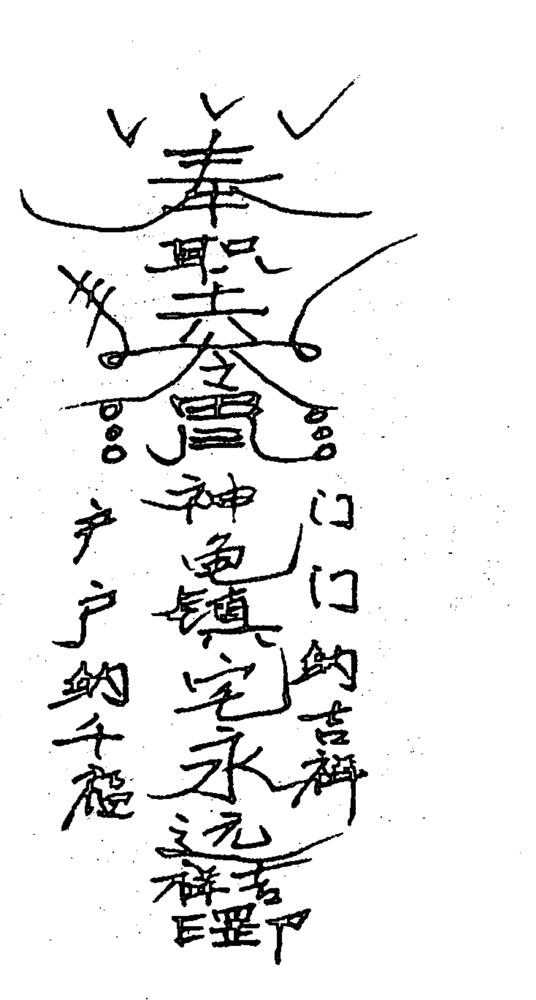

春天到夏天白鱼在上，立秋到立冬黑鱼在上。

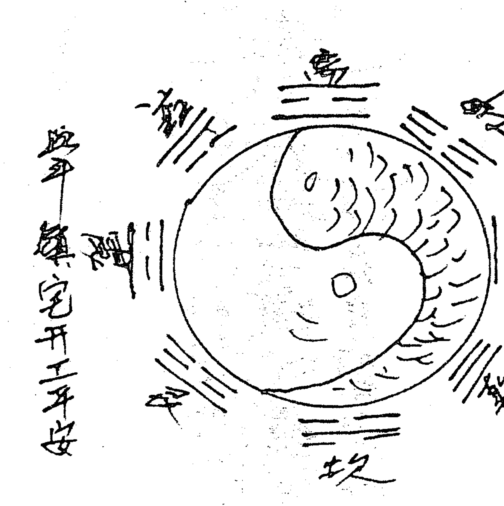

此卦用三尺三寸黄布画上边这阴阳图（长和宽一样）（三尺三寸代表三十三层天）。北斗为北斗七星，它的力量非常大。

## 奠基仪式：

先在院子中心或房屋中心摆上供桌，如图：

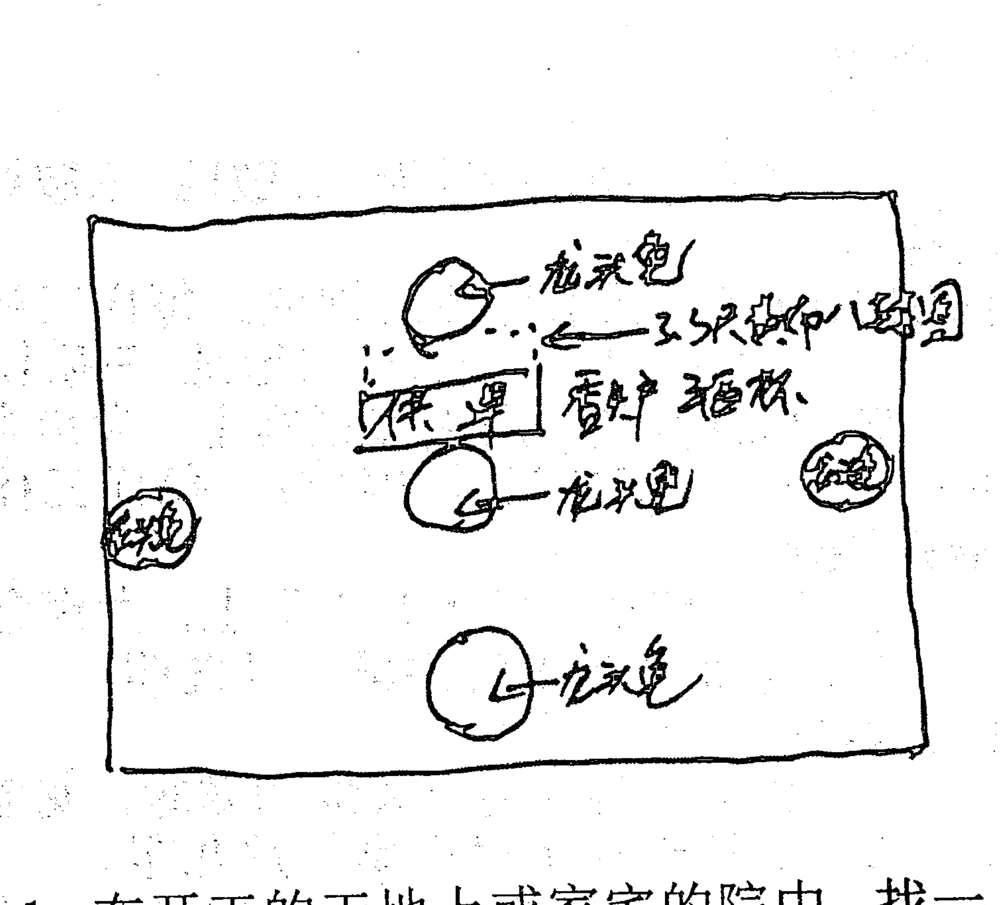

1、在开工的工地上或家宅的院中，找一个太极太中间插上一个杆把八卦图挂起。
2、供桌上摆上猪头、鱼鸡、供水果类，上香、烧纸多买金元宝多者为吉。
3、老板先上香，其次类推，老板娘也要上香敬。
4、老板敬酒，一敬天 二敬地 三敬城隍 四敬土地爷 五敬过往的神灵。每样三杯。
5、再念咒语，用大黄纸写上，大声念咒语完烧化。
6、老板老板娘对供桌三拜九叩。
7、在中央为龙身，大地为龙脉，龙道在西北，往西北敬三杯，往中央敬三杯，为龙身，再往东南献三杯，为龙尾。再拜上方，（面朝西北，再敬三杯酒）八卦符放在基石下。然后老板在供桌前中间位置，先挖第一铣土，挖一米见方的坑，中间用米写上“金玉满堂”四个字，然后下摆八卦盘，中间放龙头龟，龙头龟在中间头向老板的办公室或家，周围摆上十二生肖，十二生肖头朝龙头龟。龙头龟和十二生肖铜质的，在下八卦盘以前先在坑内烧金元宝和纸，然后再写字和下八卦盘，八卦盘底下放四个乾隆大钱。
8、一切弄完之后，老板先撒第一铣土，其他人随后。十二生肖按它在八卦位置上放。

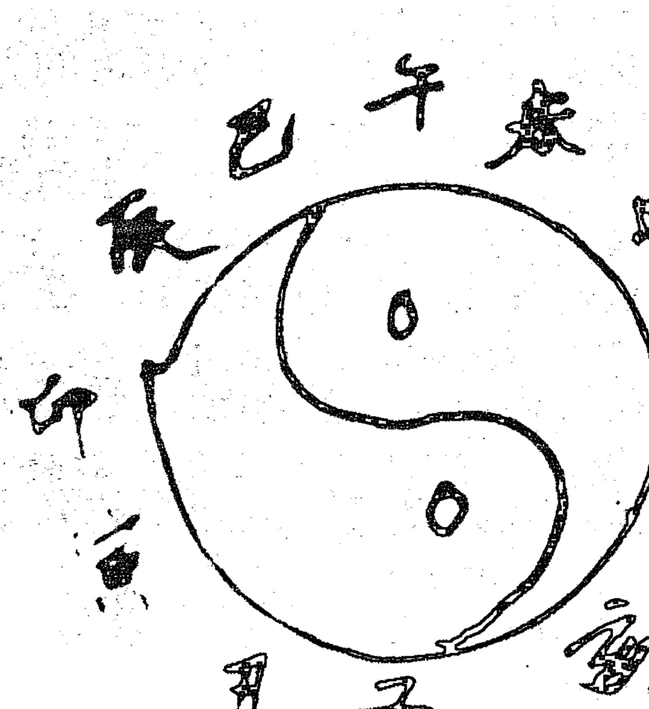

也可用八卦盘，放在挖好的土坑中，按照十二生肖的位置放上买来的十二生肖，在整个院子或整个厂子或整个工地的四个方位中间时做法。

十二生肖可买60个，龙头龟可买5个。

每个地方的敬酒、烧纸、香，都是老板（也就是官最大的一个）先开始做，最后埋土时也是老板先开始。

敬完酒后，烧纸、金元宝，把这一切都做完后，把八卦挂起保平安。以上这些是开工的必须做的事情，如果不这样，出一样事情，那将是不可估量的损失。（凡是饭店、锅灶大、房子小或桌子少小）都是不发财的象征。

# 十一、搬家法术

1、搬家尽量择日，定日子以纳音为水的日子。
2、家中能力最强的人或是男主人，怀抱佛、财神或保家仙，背上背一把斧子。斧子用红布缠上。
3、门内一面放一张一尺见方的红布，红布左侧写财字，右侧写福字，红布底下放嘉庆大钱，有几个门放几个，叫左腿踏钱，右脚踏福。
4、女主人抱锅，锅内放一袋大酱，10根冰棍，几根大葱。
5、孩子跟在父母身后，抱文房四宝，笔墨砚台，字典。
6、全家人将各屋走遍。女主人将锅放在锅台上，然后将装水的器械都灌满水，再烧一锅开水，把“财福”和嘉庆钱拾起来包上，放在装钱的柜子里，然后亲朋好友再进屋。
7、娘家给女主人买一条裤子。
8、出门顺序，主要是第一次，年长者先出。

# 十二、窗户改门法术

不管是城市或农村，窗户改门须作法，都要上香、供果、门窗都要拜祭。敬酒拜天地，主人家先拿锤砸一下，房吉。

表文：

窗户为眼光神，宅眼神，宅眼光神升为门神，户奏表文，叩拜当庄土地、本宅宅神，今有x x家需要将眼光神升为门神，望各位尊神批准，现有酒礼财帛献上上报人本宅主x x x 年 月 日

如果不作法，容易出现凶祸，后果不堪设想，所以很重要。

## 破土文：

天园地方律令九章，吾今奉先师李定渡之令来破厚土，保吉祥。三杯美酒敬土皇，各种美味请品尝，再敬宅神，保护此宅财旺，人口安康。

北斗七星、南斗六星，紫微星来照宝宅，保佑人财两旺，三杯美酒敬门神，门为主来宅为臣，相配有神奇，保佑此宅大发大旺，日日进奇珍。吾奉五帝老君勒令。念完可烧化。

安门表文：

天高地厚良辰，手拿斧头钉财门
这家财源又茂盛，斗大黄金滚进门
吉日吉时安财门，百事顺心又太平
开门不让邪魔进，晚上关门无坏人
天有三奇地有六仪，玉女守门凶煞远避
进喜进财大吉大利，金玉满堂长命富贵
吾奉门神急急如律令

先点三炷香，到门口拜上三拜，念完后可烧化。

# 十三、关于让孩子学习好的法术

首先查文昌星的方位，用每年的年干去查：
甲乙年文魁星在午丁方位
丙年文魁星在辰方位
丁年文魁星在卯戌位
戊己年文魁星在辰酉方
庚年文魁星在巳申方
辛年文魁星在子丑方
壬年文魁星在午方
癸年文魁星在未方

可以在这个位置放文昌塔，或文帝君之位，两边可以放麒麟一对，供香火或早科符带在身上。

文魁星的位置随年转，这样孩子学习会好，能考上大学。麒麟符烧化喝。考试符顺利符：

# 十四、在学生临考试时可以具体这样做

上香烧纸摆供桌，供文帝君之位（查法在十五条），学生亲自到场跪下，叩头，用香火熏完一道符依次顶到头上，依次顶完。用头顶的第一道符烧化放在水里让学生洗全身，用头顶的第二道符烧化放脸盆中洗脸，第三道符等学生出门考试走出门时可在门口烧化。用三道苏子符，此符在37页。

这些事做完后到十字路口（用罗盘找）在申方位给文帝星敬酒、烧香、供水果。

学生进入考场时自己在手心中写上“必中”，左右都要写，用自己的手指写，写完后用自己的大拇指掐住自己的中指指头，走进考场自己的座位。这时父母手掐中指，默念孩子的名字，念“必中”，如考试三天可连续三天这样做。

把36页的黄甲符折成三角形带在学生身上。

# 十五、平时学习很好，一到考大学时或考试时头就发懵的解决方法

首先用黄甲符,此符供奉：

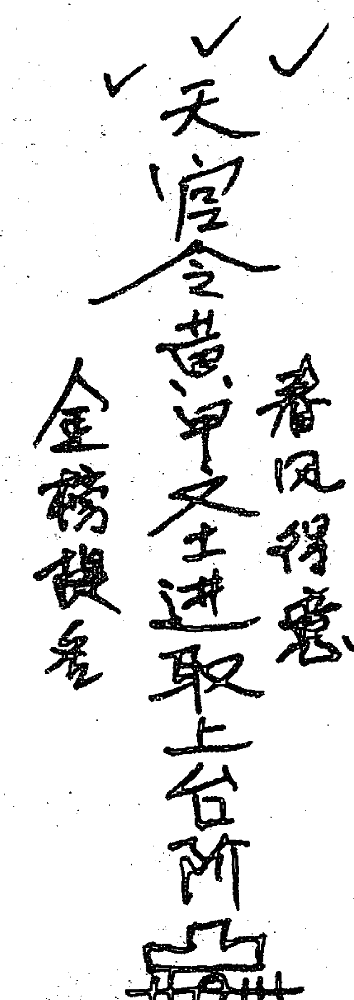

如果知道生辰八字以日干查，以年干查为主也可以。查供文帝君之位的方位。查法如下：

甲年甲日干在戌方
乙年乙日干在申方
丙年丙日干在午方
丁年丁日干在辰方
戊年戊日干在寅方
己年己日干在戌方
庚年庚日干在申方
辛年辛日干在午方
壬年壬日干在辰方
癸年癸日干在寅方

如2010年庚年或庚日干，可以把孔子的像供在申方，随着年干或日干的变化而供文帝君的位置。

苏子符在考试前烧掉。

# 十六、孩子不听话或不爱学习怎么办

具体做法如下：浪子回头符：

此符父亲画也行，母亲画也可以，就是有血缘关系的人画最好，半夜子时画。此符用黄纸朱砂画。

画两道，一道烧化成灰，放到水里让孩子喝下去，如果不喝想办法放在食物中叫他吃下去。

另一道符也烧化成灰，去当地土地庙香炉内拿一把香灰和这道符的灰合在一起，再用土地庙里的十个香根和这些灰一块用黄布包好放在这个孩子的枕头下或床下即可。

# 十七、孩子不听话的符

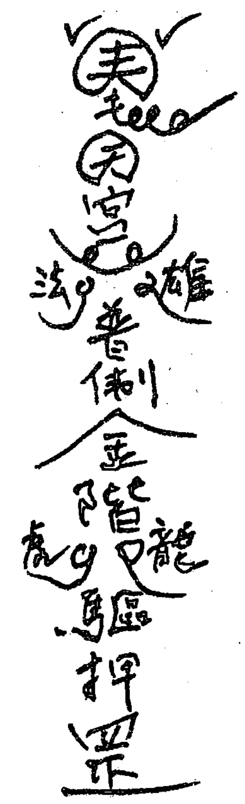

戴身上一道，贴在床下一道，另一道用土地庙香灰和烧化的符子合在一起用黄布包好放在小孩的枕头即可。此符必须父母子时画。

# 十八、贵人八卦阵，叫贵人帮忙的阵法

如果家有条件的话，可在家中三合（以生肖找）位放一个方桌，用黄布盖上，上面放龙头龟，12生肖，想求谁就把这个生肖的座下压上谁的名字，可求他，到门口烧纸。一百天之内可每天都做（尤其搞网络之人）。这叫贵人八卦阵（阴性的物质帮助你，这是一个很灵验的办法）。

如果中间的龙头龟不放，可放五个纸人。用自己的中指的血点五个纸人的心脏（纸人的鼻子眼睛都画上），按方位放上，用五个小碗装大米把五个纸人用牌位插上，这个叫五鬼八卦阵，叫它听指挥，五个纸人面向中间，中间放一个纸人面向自己屋中。到时可烧纸焚香，供果品、酒、鸡、鱼肉。叫哪一个指挥就把那个人的名字写上（用黄纸写）放在中间纸人的下面，喊他的名字叫他帮忙，拿钱来帮忙，他就听。

# 十九、求长寿之法

家族中年龄没有超过60岁以上，总起来是比较年轻就过世了，不是长寿人家。

用八宅罗盘里的父山父向之方法，用龙头龟四个，用在如图所示的方位上。

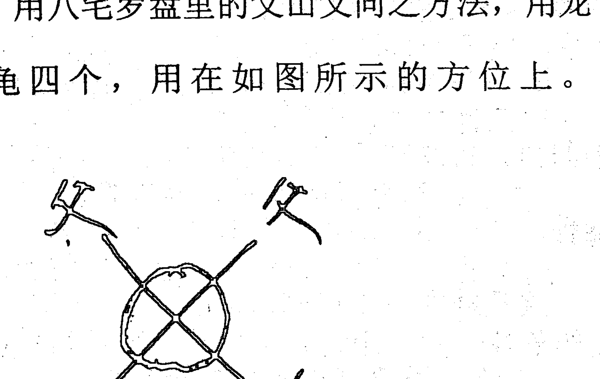

如果让母亲长寿，可在姥爷家的坟上使用此法。中药每个地方用仙鹤草九两即可。

另一法：用八斤猪骨头磨成末，分成四份合上黏土，制成四块砖，每一块砖上刻上一个“庚”字，放在窑里烧成砖。根据坟的向找一个长星位置放上。

每月找寅日，把四块砖放在四正位上（子午卯酉）每块砖下放仙鹤草九两，埋之，可烧香，烧纸叩拜即可，可长寿80-90岁。

这几种方法也可同时用。

# 二十、不管城市农村怎样防盗

用中药：防风、透骨草、琥珀、党参、仙鹤草各一两，用这几味中药，放在自己家中房子里的六煞位上，最好再托人从监狱里找一个死老鼠埋之大吉。

符一道：

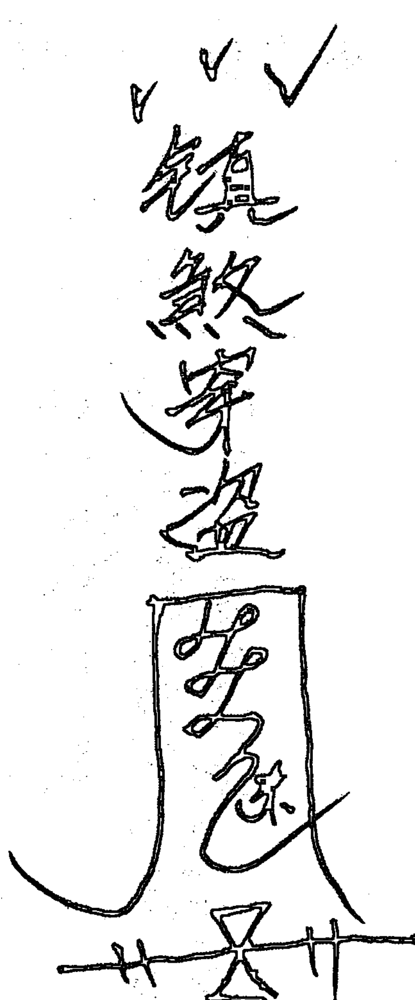

这道符用石板刻上，把药放在底下，底下先放死老鼠，最后盖上石板即可。

# 二十一、制兄弟不合的符

符贴在屋内：

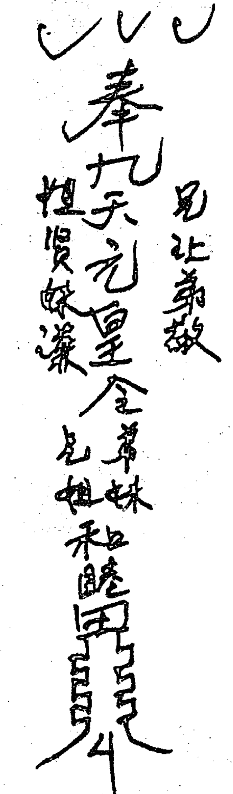

# 二十二、大龄男女催婚姻之法

用八宅法查六煞位（或用本人的桃花位），用瓶装上牡丹花，无论真花假花七天浇一次水。

也可以在六煞方位画一张牡丹画，贴在那里也大吉。

# 二十三、人过世下葬之后觉得下葬位置不合适需要另找地方

可在五七后再另行选地方安葬，这样可用人参、沉香、鸡血藤、硼砂、金钱草、金精、银精各三两（金精即桔花，银精即人参）。

八尺蓝布，八尺红布、八尺黄布。从墓中用蓝布把棺材包起来，抬到新的墓地，放置妥当，再用黄布盖好棺材，新墓穴里放好中药，上面用红布盖好，再放棺材，上面用黄布盖好即可，蓝布可不要或丢掉即可。

# 二十四、让夫妻关系好的法术

如果男方来叫处理。就以男方为主来操作。剪下男人手指甲十个，女人手指甲十个，男人头发十根，女人头发十根，中药灯心草10克和头发指甲放在一起封好放在床底下。

假如男方是属大龙的，那么就去买一条龙，一个鸡都是铜质的最好。在红布上写上男方生辰八字的名字，女方也一样，用写好姓名的红布把龙和鸡裹起来放在床下和中药放在一起这样即可。大龙和鸡取辰与酉相合之意，指甲是十指连心，头发是结发夫妻。

# 二十五、讨债的法术

钱借出去了要不回来怎么办，用讨债符三道，用纸壳把符糊上，写上欠债人的姓名或八字，两道符贴在床腿上，每天晚上用皮带抽打三下，叫着欠债人的名字，骂他，让他赶紧还钱。再用一道符，放在地上，用脚踏碾，叫他心里难受，一边用脚踏碾，一边叫他马上还钱。

# 二十六、要想招标到手怎么办

首先了解此人的生辰八字、姓名，把此人的属相放入八卦阵中，把属于你要叫他帮忙的人的姓名放在此人属相的底下，到十字路口烧五色纸，越多越好。这跟找人帮忙一样使法。

# 二十七、花钱买官

1、首先用罗盘到坟地里把罗盘放在坟头上，放好后找官对官的方位。
2、用“马上封侯”的工艺品一对，一头一个。
3、用学生考学的“黄甲符”在住宅的方位把此符埋在左边的里间里。
4、用桃木板或大理石板刻上用之即可。另外身上带一道“天官黄甲符”（用黄布黑字或黄纸画叠三角形）。

时间：
子年 子月 子日 在丑方
丑年 丑月 丑日在寅方
寅年 寅月 寅日在卯方
卯年 卯月 卯日在辰方
辰年 辰月 辰日在巳方
巳年 巳月 巳日在午方
午年 午月 午日在未方
未年 未月 未日在申方
申年 申月 申日在酉方
酉年 酉月 酉日在戌方
戌年 戌月 戌日在亥方
亥年 亥月 亥日在子方

# 二十八、求官求富

贵人方位口诀：甲戊并牛羊，乙己鼠候多。丙丁猪鸡位，壬癸蛇卯藏。庚辛逢马虎，此时贵人方。

用罗盘放在坟头上，找出贵人的方位，在此方位放上龙头龟和贵人生肖。

例：癸年生人：可在本家的卯位、巳位埋上龙头龟即可。或龟上驮着兔和蛇，日子要选卯日己时。

求官者可以这样做，用八宅罗盘找出做官向官的位置，在这个位置上各埋一个“马上封侯”。

另：龙胆草3两、鸡血藤3两、金钱草3两、官桂3两。把这些中药分成两份，放在挖好的坑中，上面放上“马上封侯”，埋之大吉。

# 二十九、催丁符

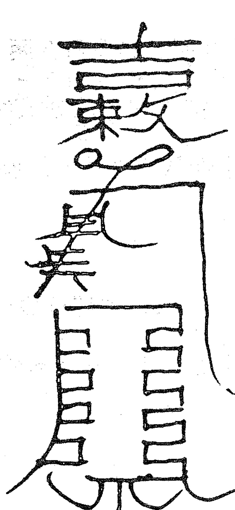

用桃木板把符刻上放在生气方也可。用红布墨汁画上放在妇人住的房间床下褥子底下。床底下放康熙大钱—用红布盖上。这个催丁符很灵验。

在屋内生气方供送子观音，再用大理板刻上九紫生辉四个字用朱砂鸡血与白芨画上，放在床下字朝上。

# 三十、催丁法

如犯白虎关或不怀孕，用如下方法可催生：（在必须是身体健康如没有毛病者）先查宅子的生气方，以大门为查，用别人家能生孩子的妇女的衣服，必须是穿过的一件就行，或用钱买或用别的手段。

本人婆婆的鞋一双，大白纸一张，纸上画上五个人，写上年月日时，把这几样东西准备齐了（衣服、鞋、纸人）烧成灰用脸盆装上埋在住家房子的西北方。如果是楼房没有地方埋，可用黄布包上放在楼的生气位即可。

用催丁符一道埋在家中的生气方。

# 三十一、电线杆在门前挡着对自己的住宅形成煞气怎么解决

（用粗铁丝把电线杆锁起来，用朱砂化画）

符或用砚台化解，即可。电线杆、高压线杆等也叫打人棒还叫赶客棒）

# 三十二、土地庙的位置来断事（罗盘的使用）

三合盘中

坐山 戊乾亥三山,巳 丙 午 丁 未 坤 申 庚 酉

戊乾亥巳上起 福 瘟 进 长 诉官 上 生

丑艮寅亥上起 德 煌 财 病 讼 位 贵 吊 旺

甲卯乙寅上起 辛 戌 乾 亥 酉 子 癸

丑 艮 寅

辰癸巳坤上起 光 法 精 口 养 进 哭

孤 荣 少

丙甲丁丁上起 福 场 神 舌 殖 田 泣

寡 福 亡

未坤申寅上起 甲 卯 乙 辰 巽

庚酉辛庚上起 女 姻 乐 败 旺

# 三十三、两家有矛盾

两家有矛盾，其中一家作法，用三把刀，刀尖朝向和自己不合适的人家，使其家中出现血光之灾。这样的情况叫剪刀咒：其咒语如下：

80 慕言秋水电话：18746933339 微信：18746033339

天灵灵地灵灵，鲁班留飞刀随身带，杀斩坏人不留情，金刀三把，一把斩了蛇头，二把斩了蛇身，三把斩了蛇尾，西天去请唐三藏，南海岸上请观音

急急如律令

用这道符刻在桃木板上，用朱砂加雄黄合在起画描上

用工艺品中的生肖蛇，把可恨之人的名字写在黄纸上，贴在蛇身上，在可恨之人的住房附近，挖坑，买三把刀放在坑的后边，前边放上这个贴了姓名的蛇在埋好，复原，不要叫别人看出，念以上的咒语七天，每天都是

慕言秋水电话：18746933339 微信：18746033339

半夜子时念咒，每次念七遍。快着 100 天后，对方就出大事。符子：

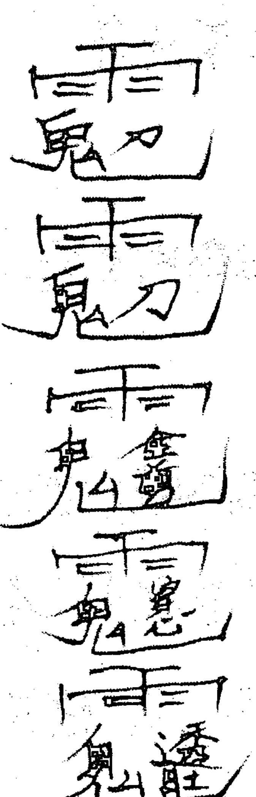

# 三十四、怎么破剪刀咒(也叫剪刀煞)

咒语一：

咒语二：

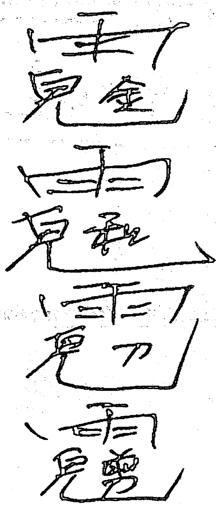

符——

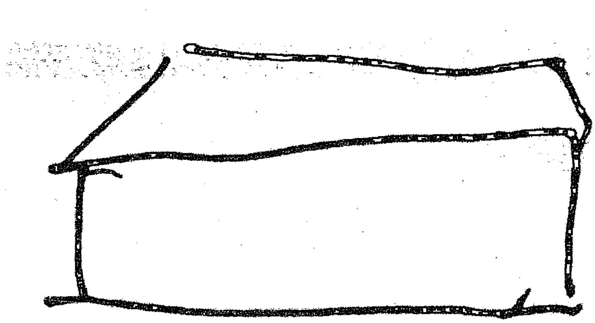

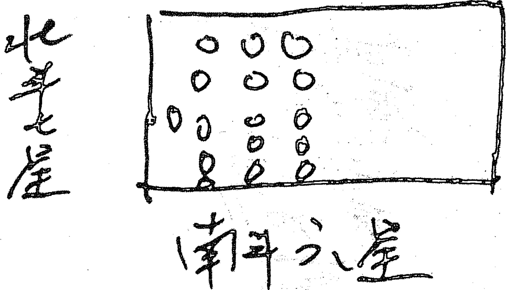

84 慕言秋水电话：18746933339 微信：18746033339

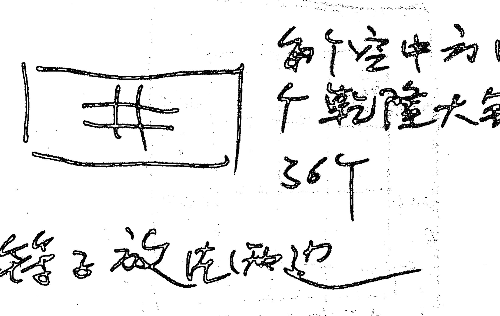

诸葛武侯八卦，三十六天罡护阵

例图：

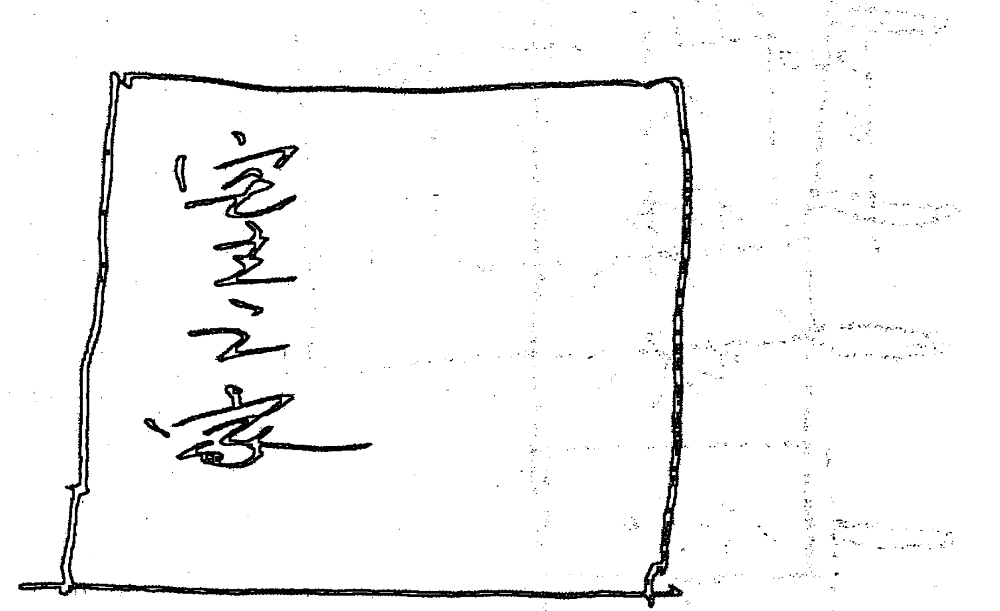

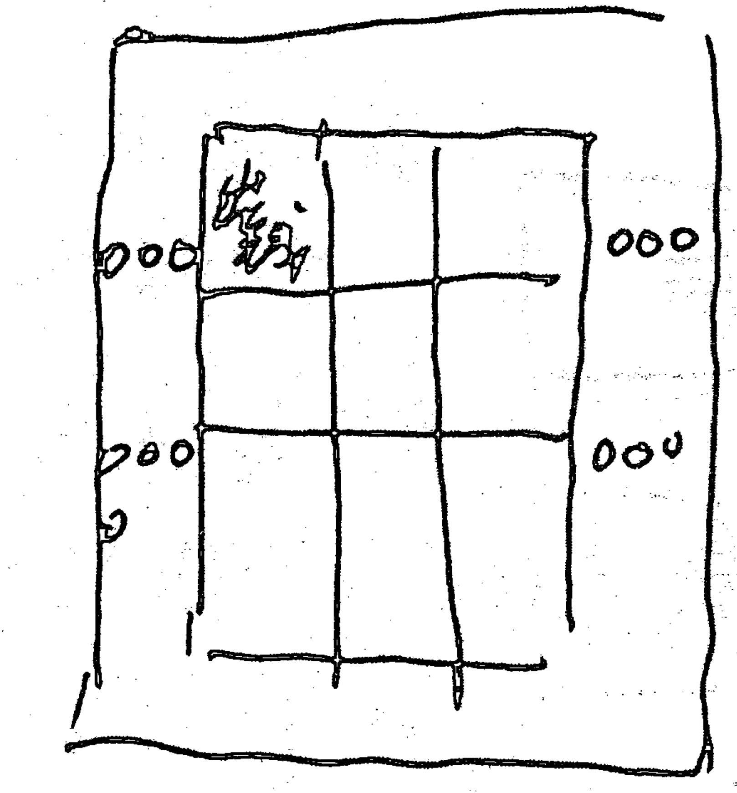

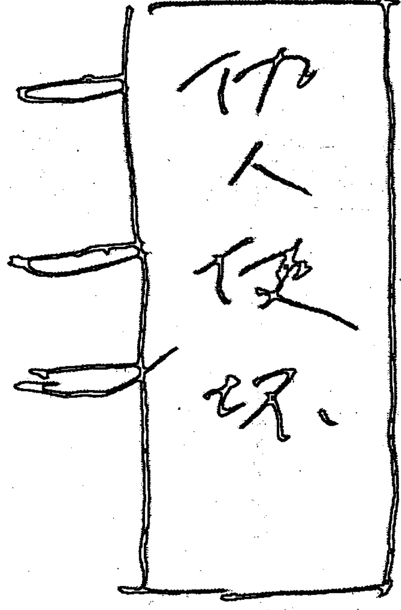

86慕言秋水电话：18746933339 微信：18746033339

中间每个空格放四个大铜钱乾隆等都可以，中间九个空格共放 36 个铜钱，把符子放在两边即可，这叫三十六天罡护阵破剪刀煞。

# 三十五、转胎大法

转胎：怀孕不超过 40 天者

具体做法：白色公鸡一只，中药雄黄 3 钱，把鸡做了放上雄黄炖了吃。

转胎符：

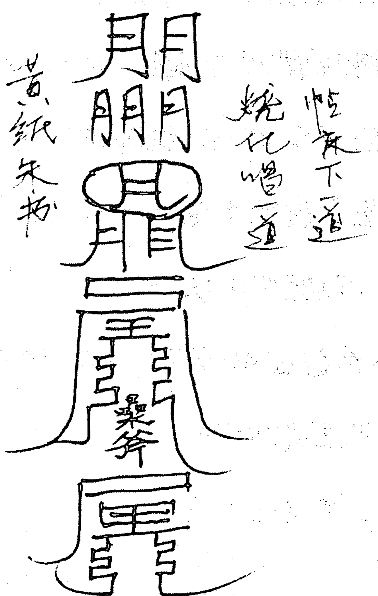

# 三十六、砍伐树木前的法术

多年的老树，有了精灵之气，如果想把此树去掉，必须作法术不然的话就会出现凶

88燕言秋水电话：18746933339 微信：18746033339

灾。

用麝香一克、沉香十克、木香十克、降香十克、乳香十克、檀香十克、藿香十克，这叫七香

把这几样用药泡在一起，用别的东西沾上酒向树，把树的灵气打掉再处理树，把树根挖走，把坑中用地龙3两、鸡血腾3两，把符子烧成灰和药一块埋在坑中即可。举例，辽宁省辽阳市某地一棵大树（千百年了）当年大元朝努尔哈赤拜的干娘，没有用法术处理，谁杀这棵谁出车祸死了，谁叫杀这颗树的领导也常年头痛，痛不欲生，后来经大法

慕言秋水电话：18746933339 微信：18746033339 89

术治好了。

# 三十七、如果结婚用的日子不好

可在结婚的当天用一面镜子放在拜堂的桌子上，红布包斧子一把，一杆秤、一斗盛高粱，将秤插在高粱中，手持刀一把，这是解决结婚用的日子不好的一种办法。

90 慕言秋水电话：18746933339 微信：18746033339

# 三十八、破剪刀煞的法术

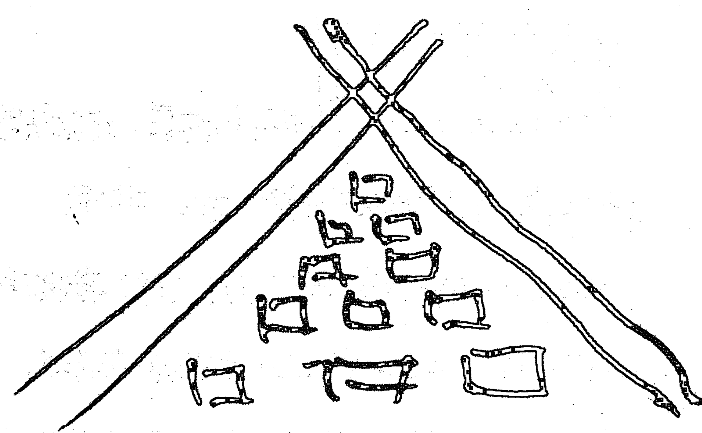

此地名为剪刀煞，路从哪里来就应从哪里出事。

破解的办法:在剪刀的里边部分 用石板刻上一块泰山石敢当，鲁班作用，在剪刀前面挖坑放上一块[图片]，前方放[图片]南斗六星，北边放上北斗七星，和石敢当用在一起，即可。

这里的放铜钱用铜钱摆上。春天用北斗七星头向东北。夏天用北斗七星头向东南，秋天用北斗七星头向西南，冬天用北斗七星头向西北。

# 三十九、这种建筑方式容易出火灾之破解大法

92慕言秋水电话：18746933339 微信：18746033339

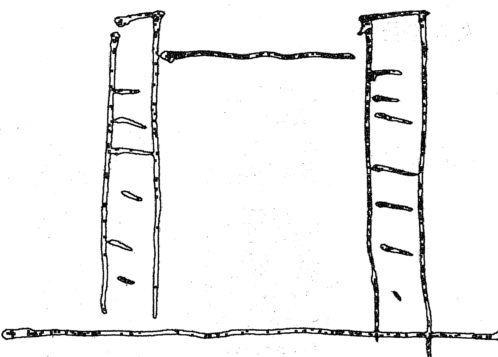

火形煞爆竹煞，灭火咒，念七遍。

吾奉东南西北四海龙王圣意，中央龙子龙孙，速令海水，龙驮起海水淹，屋梁高一尺，水淹一仗，水淹天上。真龙发水，淹住火，水火不容情，谨请南斗六星、北斗七星、吾奉太上老君急急律令，手挽九龙海水中。

慕言秋水电话：18746933339 微信：18746033339 93

## 灭火煞符：

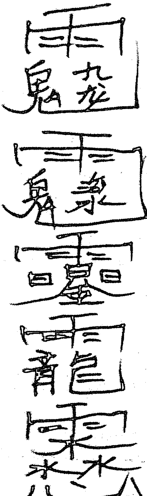

中药：龙胆草，水仙花，各三两

用黄纸墨汁书写，或用石板刻上，把

94 慕言秋水电话：18746933339 微信：18746033339

这种犯火煞的建筑跟前（根据当时当地的实际情况）用符子和中药使上，以避免火灾。

在使这个符时，符子的两边必须是一边一条龙埋合适的地方。

凡是变压器对着谁的家，或饭店门口等，可用此法解决，

也可再用乾隆钱摆北斗七星，和南斗六星，把符子放在中间即可。例如：一个饭店门前对着变压器，原来生意不好，换了好几次人都没有干好，总出事、火灾、破财、没有客人，生意冷淡，自从使用了这个符子和中药，还有北斗七星和南斗六星后，生意很火，

已经好几年了，一直很好。

# 四十、怎样去邪魔

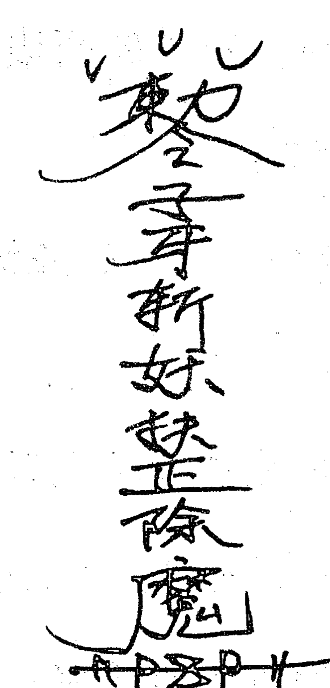

这七种香带在有邪魔附身的人身上，能辟邪，很灵验。女人带此七种香时间长了没有生育能力了。把七香药符子用黄布包上，带

96 慕言秋水电话：18746933339 微信：18746033339

在身上，再把剩下的七香药撒向主人家的院子房间各处，使邪魔无处可藏，赶急逃跑，因为它受不了这七个香味，硬是把邪妖熏跑了。但是必须加上五雷符：为什么叫五雷符，代表金木水火土。五雷符：

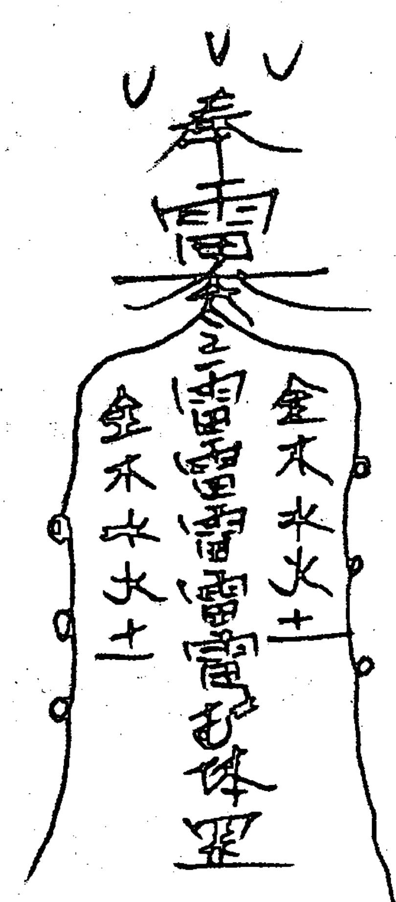

用雷击木刻带在身上可护身，很管用。

例：有一女孩，考上了大学，没有能去上学，原因是中邪魔，时常表现出男女之间性爱的动作，其父母老的到处看也没有治好，其母感到很为难。

其实真正的原因是九世前的一对男女死鬼附在了她身上。用这种五雷符和七香药治好了，后来又上大学了。

# 四十一、假如有人被别人施的法术制的昏迷不醒

躺在床上，可拿三道黄纸往病人身上喷三口酒，拿黄纸在病人身上，正转三圈，反

98慕言秋水电话：18746933339 微信：18746033339

转四圈，转圈时口里念：山里的水里的，天上的、地下的，门里的门外的一切精灵鬼怪，附在黄纸上，随我走随我来，到十字路口把钱分了，拿足路费远去它方，别回来。如回来遭五雷轰击，压在大海底，押在八卦阵，粉身碎骨魂不回。

做完这些后，用三支香在门口边画海水波浪纹。用黄布画八卦阵，

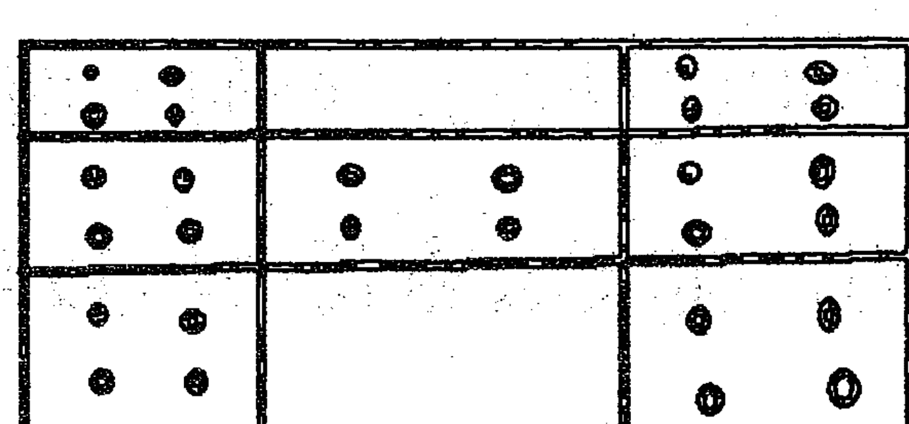

放在正屋中间或卧室里，或地毯下，或铺的褥子底下，可大吉矣。

# 四十二、被别人用法术制了怎么办

可用这个退整人术的符子来保护自己。符：

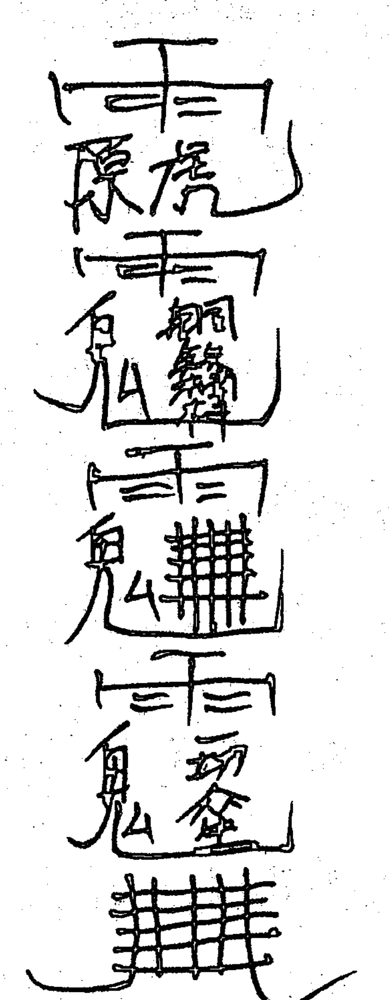

符的右侧写上“号令”两字。家里头门旁贴一道，戴在身上一道，在办公室门口贴一道。

慕言秋水电话：18746933339 微信：18746033339 101

# 四十三、修太乙天尊庙也叫贵神庙

这个庙修好后供上太乙天尊，

修建贵神庙，大的要 360 块砖，小的 240 块，180、102 块。庙修在向己的贵人方，每年每月都要上供烧纸。

修一个太乙天尊庙，也叫贵神庙。这个庙修好后供太乙天尊。用前面的咒语，在太乙天尊跟前念七遍。烧化，在太乙天尊门口烧化。

假如在单位有人要告你，要整你，可用此法，把反对你的人名，八字都搞到手，再用纸剪成小纸人，写上人名，生辰八字，

102 慕言秋水电话：18746933339 微信:18746033339

用法像牌位夹起竖起来，念咒，把这纸人在太乙庙前烧掉，找出其中的几个带头的，用工艺品来代替，写出他姓名年龄生辰八字，糊在工艺品上，用铁锁链锁上，再用小钉钉在太乙庙跟前事先挖好的坑中的那个方位上，即可。埋上后，叩拜太乙尊神，烧纸上香。

贵神庙很重要。（修建时应选人专日）

# 四十四、某人家中有人淹死鬼魂处理办法

在手相中应看大拇指与食指的中间那条纹，如纹中上边部分内有小白点，或有一个

慕言秋水电话：18746933339 微信：18746033339 103

小圈，再有线冲向食指，他们家中一定有人被水淹过或淹死。手掌下端乾宫位置中，如果有这样的符号 Q，那就代表一定有人被水淹死。有十字级的也算。如果淹死人的亡灵还在水中，应给予招魂。

先念表文，再用纸糊七条船，上边摆上金元宝、香、纸和亡人牌位，放中间船上，

再画这样 的符号以表示水中有个岸，岸边有渡口，从渡口可上岸，最后喊其亡人之名上船上岸，在找个地方建坟按下。把这些船纸最后烧掉。如果有条件的话，可在水边某些合适的地方建个小庙，放上亡人牌位即可。

# 四十五、人死在外面尸骨找不回来的法术（坟丢了也用此法）

如果有人死在外，死不见尸活不见人，又想安葬，可用招魂咒：

> 真符重玉光，地府开幽阴，七星尊生煞，三辰敬真魂今无惊残魄今无沉沦，急附灵幡体，炼形归玉英。急急如律令。

符：

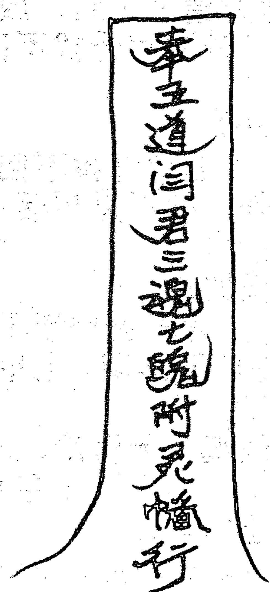

这个符在土地庙跟前烧化。

也可在亡人生前出生的老房子跟前的一条路上来回喊其归幡。用一条桑木条，一把扫帚。其中家主儿子拖着扫帚，扛着灵幡（牌

106 慕言秋水电话：18746933339 微信：18746033339

位）在其路上往里转三圈，往外转四圈，到土地庙烧香念上面咒语三遍，将灵幡往牌位上转七圈，再把牌位和往常的葬法一样下葬即可。用道上的一掀土披到棺材里头，有照片的也可把照片贴在灵位上也可。

# 四十六、百解咒

房子或其主人被人坏了或放镇物了也可用此法

百解咒：

南海岸上一皮草，昼夜青青不见老，王母娘蟠桃会上来解退，百般邪法都解了。一解黄衣端公，二解南海万法，三解百艺法，

慕言秋水电话：18746933339 微信：18746033339 107

四解三师法，五解铁匠法，六解花匠法，七解瓦匠法，八解石匠法，九解木匠法，十解装宅法，天地解、年月解、日时解，奉请狐狸祖师，一切祖师，百般解退，谨请南斗六星，北斗七星，吾奉太上老君急急如律令。

图符：

用柳树枝七根，杨树枝七根，用碗盛水，用上边的 14 根树枝沾水（这道符画三道烧成灰放在碗中之水，往房内或院内各处洒）再画四道符子（在黄布上画）埋在房里四正方用中药：仙鹤草、三钱一同用上。或刻在桃木板上埋在四正方，东南西北各一道，符下

108 慕言秋水电话：18746933339 微信:18746033339

放中药，防人使坏。

# 四十七、房子附近有蛇型的路也叫锯齿路

容易出现喝药的上吊的，意外伤灾。用石板刻上或用桃木板刻上符子，埋在凹形地时念咒一遍。

> 铁弹制锯法咒;老君炉炼铁弹子,烧出三千三百三十铁弹子，铁沙子，弟子下山随带起，碰见生人推锯子，弟子放铁弹子，左拉左跳，右拉右跳。毁坏锯子，保护生灵。谨请南斗六星，北斗七星，吾奉太上老君急急如律令。

符：

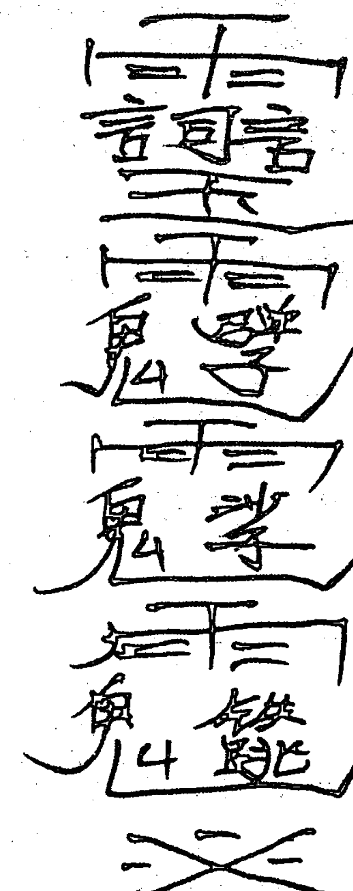

再用太山石敢当，或鲁班作用都可以，然后用铁沙子和铁块、石敢当、鲁班作用埋在一起（有锯齿的地方，有几个豁牙的地方，

110 慕言秋水电话：18746933339 微信:18746033339

都要用，每个地方都要放这些物品）

如果是南北路那就在路南头埋上 6 个大铜钱，路北头埋上 7 个大钱，代表七星北斗，南斗六星，日夜护着，到每个豁口念一遍咒。

# 四十八、象红旗一样排列的房子怎么办

这样的形状有点象红旗，可在相应的地方修

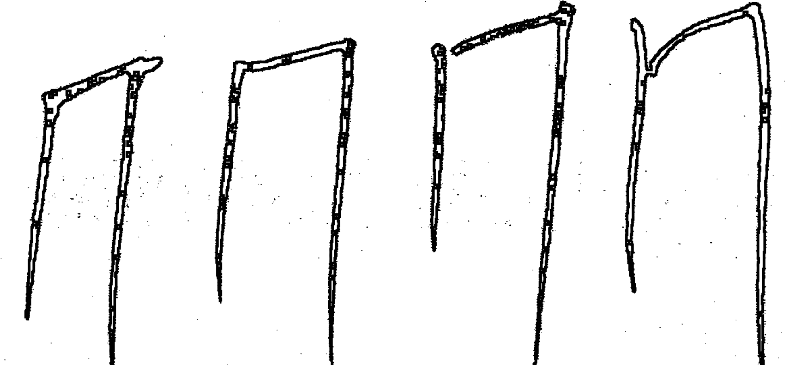

一个鼓形的建筑物即可，这也叫旗鼓相当。

有的楼房修建 这种形状，可在自己住的相应的方位上放一个大神医的像，家中可出大名医。

# 四十九、破解高压线法术

房子附近有高压线象蛇形影响风水，蛇形主怪异。

如果是女人住的地方有这样的情况，可得怪异之病

如果是男人住的地方有这样的情况，可出现多次车祸

化解的办法用中药雄黄 3 两，把药装在葫芦里不封口，再卖一个工艺品的老鹰对着电线放，因为鹰吃蛇就可以化解蛇形煞。

# 五十、破解灵车不走的法术

出灵车不走，坏两三次，这时就不能硬走，应该马上用此法术处理。

解决的办法：灵前供的供品，马上把它杨到道路上，用灵幡或哭丧棒往灵车的前车轮上敲七下，用青石6斤以上，埋在家的东北方，如果是楼房用黄布包上放在东北方的艮方，马上画二道符子：贴在屋里一道、门上贴一道。符：

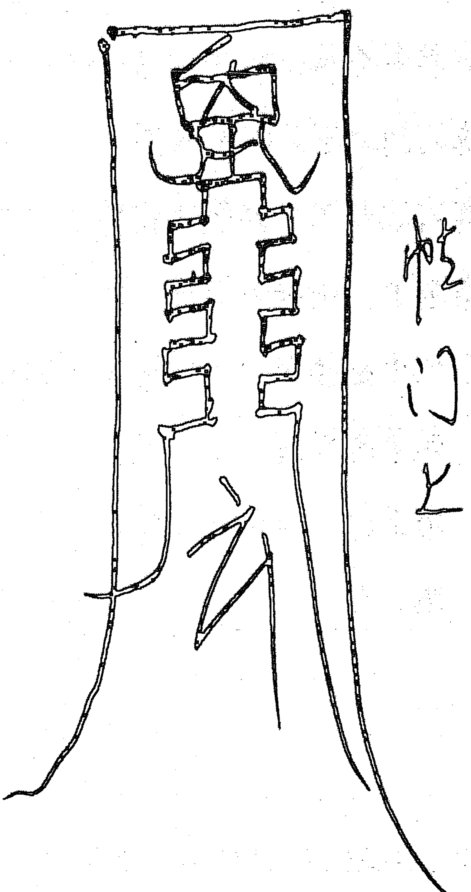

114

## 符：

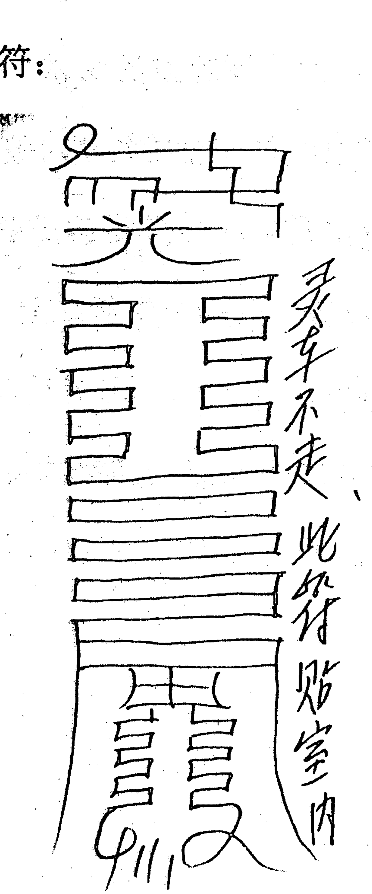

慕言秋水电话：18746933339 微信：18746033339 115

# 五十一、破解人死后嘴吐血的法术

有的人死后，嘴里往外吐血主大凶破财。此人可能有病时许过愿。这样需要念：“净口业真言”，这句咒要念一遍烧一张纸，应一连念十二遍。这句咒语其子女念。出灵后马上还愿，不然百日内破财或伤人之事发生。用两道符

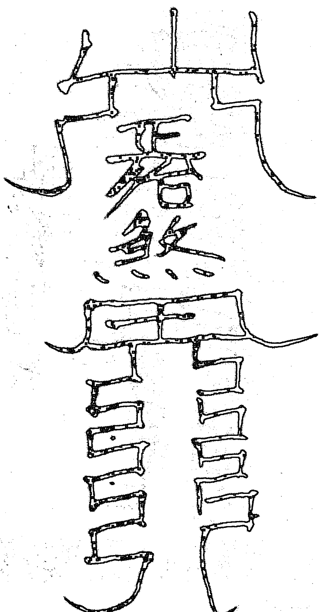

慕言秋水电话：18746933339 微信：18746033339 117

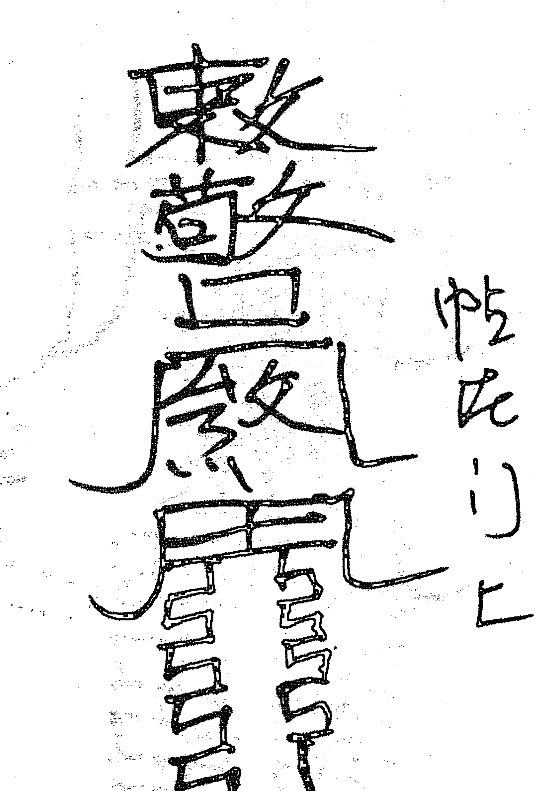

# 五十二、如果有人死后，死人的脸还在笑，这一定是凶灾

法术方法:用七根草芯不管什么草都行。

118 慕言秋水电话：18746933339 微信:18746033339

米七粒、水七杯，子女在灵前祭奠，具体做法，一根草芯和一粒米分别放在七杯水里，烧张纸，再把灰倒在水杯里，连续烧7张，放在7杯水里，在灵前祭奠，能化解这种情况，保佑其家人口平安。

用二道符

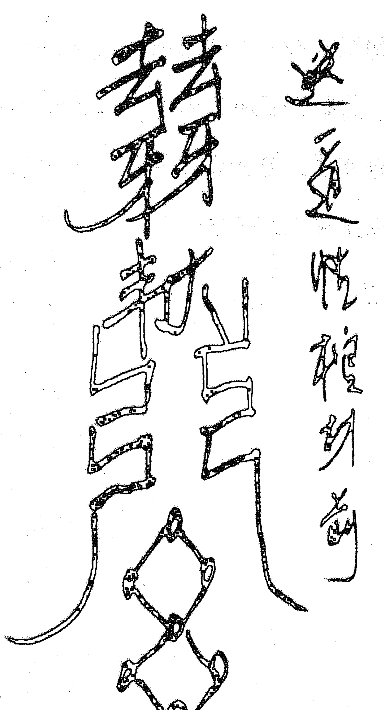

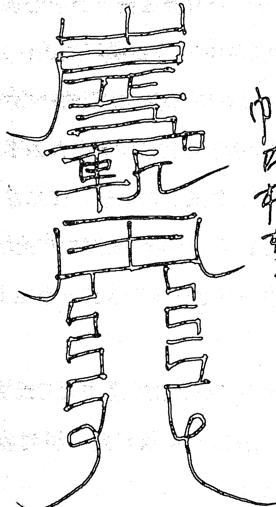

慕言秋水电话：18746933339 微信：18746033339 121

# 五十三、动物死在院子当中的破解法术

如某家中院子里蛤蟆不知道什么原因死在院子中或其他飞鸟类或别的动物突然到院子中死亡，预示着其家中要出大凶事或死人。

用中药：龙骨、辟殃砂、安息香各三两，用很古老的井水弄来倒在院中挖的坑中，等水消下去，再把三味药放在一个瓶中，埋在院中大吉。

# 五十四、别人家的房或大门或别的什么木头类，伸出一截像把剑一样对着自己的家，怎么办

这叫木剑煞，也叫木剑冲宅。用桃木板刻上“鲁班作用”用朱砂描上，再用一根锯条一条，斧头一把，对着对方冲向自己家的位置埋上即可。可保平安大吉。

# 五十五、地理探头山射门出盗贼

一是出小偷，二是被人偷（山头探向自己的方位或大门）

用大一点石头一块，刻上“玉帝”二字，用朱砂画上，在大门前对着探头山的位置埋上即可。如在城里，没有山，但有楼房像山一样冲着自己的住房，也一样叫探头煞或探头山射门。同样用石板刻上“玉帝”二字放在对方冲的位置即可。

慕言秋水电话：18746933339 微信：18746033339 123

（不管是配房还是主房）须改门，不在此方位留门。

如有路冲冲宅子的，不吉利。用120斤的大石头刻上“泰山”二字就可以挡住即可。（对着路的方向埋上即可）

# 五十六、如有的村庄有庙，对着自己的住宅怎么办

用大一点的石板刻上“玉清”二字埋在所对着的方向即可。

# 五十七、如有的坟冲宅，也就是宅子前或后，或左或右有坟对自己的住宅不利，怎么办

用石板刻上“摄气”二字，用朱砂写，对着那个方位埋之即可。

# 五十八、如有的房脊冲宅，或龙或兽冲宅怎么办

用青砖或其它石板刻上“乾元”二字即可。

# 五十九、大屋接小屋为火灾之宅或破财，或病灾

用120斤的大石头刻上“金龙”二字埋上即可。埋在小屋跟。

# 六十、有大房又有小房，中间有空，这样的住宅也很容易出问题

应在石板上刻上“天通”二字，埋在中间位置即可。

# 六十一、东屋比西屋高怎样处理

用青砖刻上“天元”二字放在对着的地方即可。

# 六十二、两边有大房，中间有小房怎么办

用“冲天剑”挡住两边煞气，把自己拔起来，箭头向上。

# 六十三、有的人家里，母鸡打鸣

这种现象要出寡妇要死人。在鸡打鸣的地方，用仙鹤草、鸡血藤、地龙、金精、银精、沉香各三两，备好后用黄布朱砂写“龙凤相戏”写好连同准备的东西一块埋下即可。

# 六十四、冲撞女人经血的破解法

如有人故意将女人的内裤带有经血的沾在别人身上，叫别人倒霉，这样化解：

在手中写上“龙凤和合”四个字，手掐中指走出一百步不回头则吉。

# 六十五、墓地的坟长了树怎么办

用赤石、鸡血藤、白芨、山龙、仙鹤草、各三两。给树敬三杯酒，敬完之后把酒泼到树上，然后或锯掉或砍掉此树，再想办法把树根弄出来。把中药放到树坑里埋好，烧纸，烧香，敬酒即可，最好是黄酒。即可保平安。

# 六十六、盖房子不小心用了些阴宅的物件怎么办

阴宅物件包括砖土、死人的骨头、木材等。如果用了家里会出现口舌是非、官司、病灾、精神病、惊吓等情况。可用青砖或石板刻上“金刚”二字，应刻四个埋在院内四个方向，字朝里。

# 六十七、宅子或楼房遇到天堑煞怎么办

可用假山放此宅凶煞所对处，或上面放铜葫芦制天堑煞。

# 六十八、宅子或楼房对着大烟囱

对着这个方位放一个大砚台，也可放铜鸡。

# 六十九、家中或楼房中北面有厕所使人生病怎么解决

用符、用中药，麻黄、硫磺、雄黄各三两，装在一个小盒中，木盒、纸盒都可以，把符贴在盒上埋在厕所边即可，如果是楼房可用黄布包起放在厕所边即可。

符在下一页：

慕言秋水电话：18746933339 微信：18746033339 129

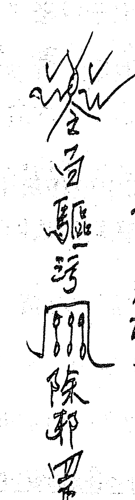

# 七十、住房有“朱雀抬头”的情况怎么办

“朱雀抬头”也叫“绝命登高”就是住宅南方高，比北方主房高大。象这样的情况会出现口舌是非、破财、最重者会死当家之人，出人命官司。

可用青砖或青石板刻上“雷霆”二字，埋在院子中间。

解决的法术：在自己主房顶放上用桃木或石板刻上“延年武曲星君之位”，两边放上两条铜龙。“延年武曲星君”是宅子的宅神，需开光、烧纸叩拜，这样就不会出问题。

# 七十一、法术大师如何保护自己

用硼砂三钱、五雷护身符一道，在桃木板上写乙、丙、丁带在身上，要念五雷咒。

五雷咒：五雷五雷，步步相随，我有十万天兵，十万鬼兵，逢山山开，逢地地裂，孤魂野鬼那个不从，随我者生，逆我者亡，奉太上老君急急如律令，两手大拇指掐中指一会。

# 七十二、人被死人殃打了怎么化解

具体做法：在十字路上烧 50 刀纸钱，在死的人坟前坟后埋一道符，家里贴一道符，念咒语：普贤菩萨，救苦救难，超度亡灵，远离家乡，驱走祸殃，普贤菩萨律令。一连念十二遍。

（叫死人殃打了是指死人的气冲了一下而得病）用些符即可，也可贴在屋里，指第三道。

符：用黄纸朱砂画

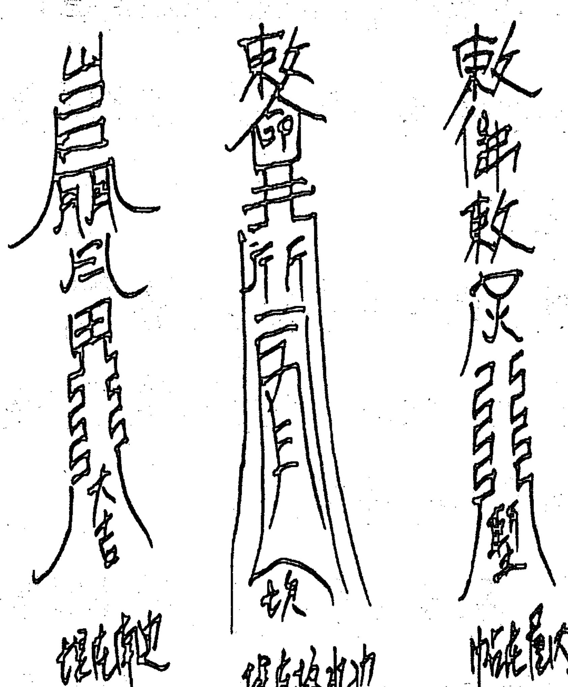

七

慕言秋水电话：18746933339 微信：18746033339 133

# 七十三、家中有邪气，或邪阴附身或晚上和鬼说话

可用一片渔网涂上黑狗血挂在门上即可，或晚上盖在身上也可以。这种方法可去很多怪异之病。

# 七十四、防止车祸发生的法术

用五帝钱、朱砂、大吉叶放在一起包起来放在佛堂里一段时间，念咒语：真龙天子在此，万灵相助，一切凶神恶煞远去它方，吾奉玉帝旨令急急如律令，然后把五帝钱带在身上即可。开车的人把七香药带在身上，在出现情况的时候能免一死。

# 七十五、水箭煞冲宅子

可用“戊己天罡”刻在石板上放在其中有水冲宅子的位置即可。

# 七十六、男人不顾家，败家，乱花钱

可用青砖或青石板刻上“雨东”用朱砂红描上，埋在大门口处即可，如果女人这样可用青砖或大理石板刻上“天遂圣后”埋在大门口即可。

# 七十七、楼房有人死去，别人知道卖不出去

首先把死人的魂送走，多烧金元宝、纸、香叫他到别处去按家，这样房子就好卖了。

慕言秋水电话：18746933339 微信：18746033339 135

也可用催财符烧化，贴房里一道，带在身上一道。

# 七十八、卖车的法术

用地神助财通符两道，车前车后各烧一道，晚间在车头前烧点五色纸，供点米饭（米饭用油炒了）纸烧完了把碗打碎，打碎了就卖的快，打不碎就卖的慢。

# 七十九、租店铺的法术

店铺出租不出去，看其跟前有无煞，有煞先化煞。如有电线杆子用八号线锁住，不叫它发挥作用，就好出租了。

# 八十、破解棺材煞

城市楼房下面的车库，往往由于地形等各种原因，修建成板材形状这叫板材煞，或别人修建的对着自己的住房对自己不利。

解决的办法是卖3斤6两鸡血藤放在那个方位，上面放一只公鸡（铜质的最好）需开光，公鸡头上是要有冠子。这样处理就可以把煞化掉。鸡血藤意义代表飞黄腾达，鸡上又冠又放在板上，这叫官上加官。

# 八十一、卖房子和楼房的法术

用下面两道符，半夜子时贴在门坎子上方，或藏在门坎下边即可卖出。再门口烧两道符。

慕言秋水电话：18746933339 微信:18746033339 137

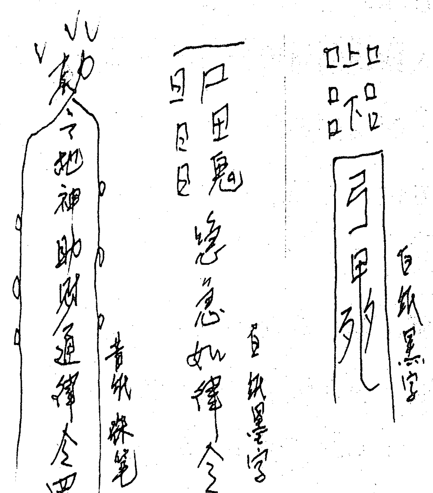

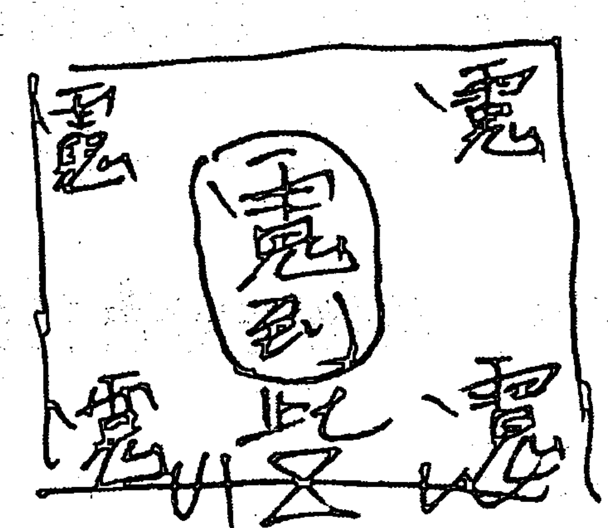

# 八十二、家人口少，压不住宅子经常破财怎么办

可用青砖或大理石板刻上“雷霆”二字，埋在院子中间即可

# 八十三、要想招标到手怎么办

首先了解此人的生辰八字、姓名，把此人的属相放入八卦阵中，把属于你要叫他帮忙的人的姓名放在此人属相的底下，到十字路口烧五色纸，越多越好。这跟找人帮忙一样使法。

慕言秋水电话：18746933339 微信:18746033339 139

# 八十四、电线杆在门前挡着对自己的住宅形成煞气怎么解决

（用粗铁丝把电线杆锁起来，用朱砂化画符或用砚台化解，即可。电线杆、高压线杆等也叫打人棒还叫赶客棒）

有需要符咒请联系慕言秋水老师

电话 微信：18746933339

# 慕言秋水 易学系列丛书简介

《六爻看鬼神二》一书，是专业预测师及广大爱好者所必备的六爻一卦多断参考书籍，是一本较为完整、全面的看、断、破的著作。

本书较为详细、全面地阐述了用六爻测断鬼神以及怎样化解等相关内容。

本书依然以卦例的形式把复杂的卦象层层扒开，结合“星象山法”，从不同的方面，不同的象来实现一挂多断，比较详细的阐述了各种珍贵的秘法。相对来说，到目前为止，本书是利用六爻看鬼神方面最完善的一部书。

慕言秋水电话：18746933339 微信：18746033339 141

预测师看了定会锦上添花，广大读者朋友看了也会获益匪浅。

本书还特别提及到现在新型病症如同性恋、吸毒的卦列，是以往任何书籍没有关联到的重要内容。

若您有缘得到此书的真髓定会如虎添翼，得心应手。能造福于民，更是众人之幸甚也。

《密术秘法》：宇宙是由阳性物质和阴性物质构成的，而阴性物质主导着宇宙的一切变化。“密术秘法”包含了诸多的道家法术。中华文化发展了几千年，这本书作为此行业佼佼者始终站在众多法术的前列，并是实用性，广泛性以及应用性比较全面的一本书，是法术方面上最具实用的一部权威之作。

本书是法术中最玄秘、最深奥，也最灵验的一部匠心之作，它不但能改善命运，使人从贫穷到富贵，从体弱到康宁，若得此真传妙诀，便能登入法术及破解的殿堂。

通过本书，能让您成为法术高手，名扬一方！

《六爻斗秘》此书将为您揭开预测学上的神秘面纱，带您走进真正的《周易》殿堂。

并详细阐述如何根据“星象山法”占婚姻，占求测等多种求占方法。“一卦多断”和“一卦兼断”与“一事多断等”是本书最为精彩的亮点，一改过去六爻预测的通常办法。真正做到一挂通乾坤。

慕言秋水电话：18746933339 微信：18746033339 143

另外本书以六爻分占为主线和实际结合方面做了详尽的讲解，可使您的断卦思路和层次会更清析、更形象、更完善、更具体。

《化解透骨刀》 本书集多派于一体，并搜集了历代各派流传下来的化解秘诀，以及诸多鲜为人知、秘而不宣的民间化解方法，并综合了一些化解高人的师传心得，融汇贯穿、删繁就简、去伪存真，首次公开了送马仙以及二十精到底什么精来作怪和怎样来化解关键性的高级技巧。

本书的特点是：通俗易懂、涵盖广阔、理论和实际相结合，真正做到既学既用。具有化解词典一样的功能，非常方便的能帮助学习者快速掌握化解的方式和方法。实属解读化解方面的一部扛鼎之作。

《八字看鬼神》人得了疾病后，中医看风寒，佛家看因果。不管哪路道业都可以看病，各有各的道。那么八字看鬼神，应该是最具有因果关系的，也就是说依据最充分的。作者将十多年拜访名师而总结出的秘传之绝学融于一体，目的就是让广大读者有一个系统学习和探研。

慕言秋水电话：18746933339 微信：18746033339 145

内容包括：利用八字来推断之鬼神，对外病、癔病、家里有横死之人等做了详细的讲解。对未来和发生各种灾厄化解法、利用外应解灾法、符咒解灾法、细论八字看鬼神之法，以及治病、避难、阴性病体的治疗及化解法，均简便易行，立竿见影，实属民间奇法，灵验如神。

# 慕言秋水 招生简章

慕言秋水老师研习易学近二十年，不仅博通经籍、实践性强，实用值和传承价值都很高，包括八字、六爻、星相山法术、起名、调理阴阳宅风水等，在实际生活中有着立竿见影的效果。

## 培训内容

### 一、六爻

#### 1、初级课程

六爻基础理论：包括怎样装卦、怎样断卦、分类占断（占身命、占求财、占婚姻、占病症、占出行、占行人、占失物、占官讼、占官运、占子女、占阳宅、占阴宅、占避祸防灾）、

#### 2、高级课程

六爻高级应用：以星相山法断卦方法为主。包括：来意、纳音、神煞、鬼卦惊论、一卦多断等断卦高级秘法。

### 二、八字

#### 1、初级课程

八字命理基础理论：怎样排四柱、怎样取用神、神煞吉凶、天干地支类象、十神类象等基础理论。

#### 2、高级班

148 慕言秋水电话：18746933339 微信:18746033339

八字命理的高级应用：教授盲派真传技法，结合星相山法以及各门派的实战技法。

### 三、姓名

- 1、人名：怎样根据八字确定名字所需要的五行，用三才配置、五格剖象法，再配合数理的吉凶来命名。
- 2、企业命名：怎样根据行业结合公司老板生辰八字、三才数理、五行元素来命名。

### 四、法术

利用星相山法大法术、民间秘法、道教方法及符咒等对未来和发生各种灾厄化解法，用此秘法，均简便易行，立竿见影。实属民间奇法，灵验如神！毫不保留，合盘托出，且效果至简至易，至效至奇！只要按照其法对症下药，无不灵验

- 1、婚姻情感：婚姻不顺、拔婚煞、催旺桃花、破解桃花。
- 2、求财：怎样催旺个人以及买卖的财运。
- 3、解灾：牢狱之灾、官司口舌、破小人、惩治恶人
- 4、祛病：祛外病、收惊
- 5、讨债
- 6、升官
- 7、升学
- 8、求寿
- 9、催丁
- 10、搬家
- 11、还愿
- 12、拜太岁
- 13、还债
- 14、六畜兴旺
- 15、化解车祸
- 16、开财门
- 17、道家解灾秘法等等一百多项秘法秘传。

150 慕言秋水电话：18746933339 微信:18746033339

### 五、风水秘法

八宅风水、玄空风水

### 六、一掌经

### 七、小六壬

### 八、道法

## 培训形式

- ①面授 5-7 天，以后若有不明之处，可随时电话咨询。
- ②函授终身。
- ③也可根据实际情况灵活调整培训形式。

慕言秋水电话：18746933339 微信:18746033339 151

## 教学特点

- 1、由浅入深，大道至简，一步到位，命中精髓。
- 2、“授人以渔”注重传授操作技术和方法。
- 3、确保学员在实际应用中，见到灵验效果。
- 4、由本人亲自主教，一经入学，终身保教，免费答疑。让每一位学员都能塑造成为一名合格的易学专家。

以上材料均可出售

## 联系方式

152 慕言秋水电话：18746933339 微信：18746033339

慕言秋水：18746933339

微信号：18746933339

博客：http://i.blog.sina.com.cn/