# 活出你的天赋才华

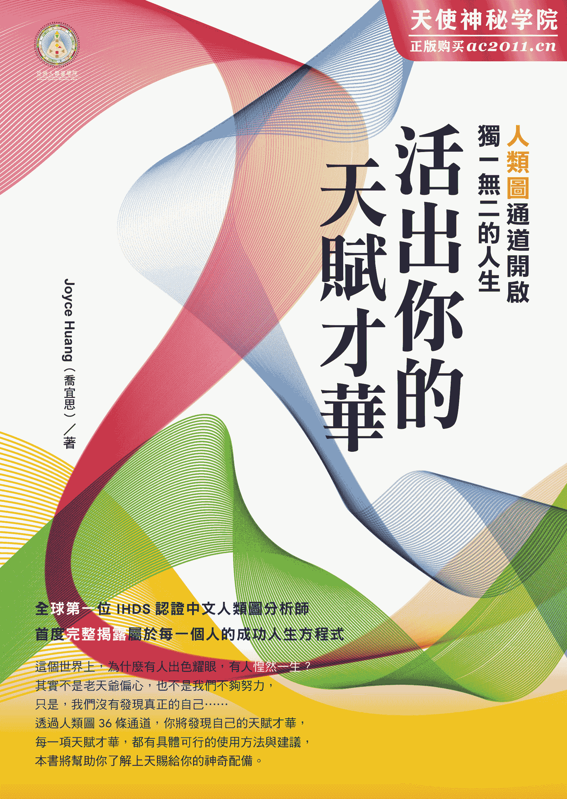

# 新版序活出最精采的自己

Joyce

二〇一四年三月《活出你的天赋才华》出版了。

我记得要送出这本书最后完稿的前一夜，我睡不着，最后一次逐字校稿一路到天亮，完成之后，我把稿子整齐收好，准备送去出版社。然后，我一个人跑下楼在便利商店买了一杯热咖啡，深吸一口气，觉得这个清晨真美，就象是独自在暗夜里走了一段好漫长的路，终于走到曙光乍现，感到喜悦。

当时的我并不知道，接下来我还会写好多本关于人类图系列的书。

当时的我并不知道，接下来会有许许多多不眠的夜，有做不完的研究、课程与演讲等着我。

当时的我并不知道，亚洲人类图学院即将蓬勃发展，从台湾开始到香港到大陆，我们会陆续与国外资深的人类图老师接轨，成为全球人类图社群里传承的重要枢纽。

当时的我并不知道，事实上是根本无法想象，接下来即将会有更多更多志同道合的好朋友，愿意跟我做同样的梦，一起共同推广人类图。期待更多人能透过人类图，开始了解自己，懂得自己，爱自己，人与人之间可以学会相互尊重，彼此珍惜，共同创造出一个不同以往的全新世界，有一天。

距离当时到今日，四年过去了，《活出你的天赋才华》要换新版了。

我个人对这本书很有感情。有人因为这本人类图的入门书，开始对自己产生新的看法；有人从中获得力量；有人从这里开始认识人类图，就此进入人类图的奇妙世界。在懂得自己之后，进而开始了解周围其他人，改变看法之后，生命开始改变，人生也因而蜕变。这本书让我认识了很多新朋友，也交了很多好朋友，在相互交流的过程中，彼此都拥有了一个更宽广的世界，学习看见对方的好，懂得欣赏彼此的才华，重新定义关系对彼此的意义。

认识自己并不是一件容易的事，就像长大，我们在过程中跌跌撞撞，有许多尝试，当然会有所获得，不可避免也经历了好些错误，感到受伤，每个错误看似折腾，却也让我们有机会明白自己是一个什么样的人，这让我们拥有了一个更动人的人生版本。

而这本书是一个好朋友在路旁向你招手，就象是一个满怀热情，渴望介绍人类图让你认识的引言人，这是一个提示或提醒，也可以说是向你确认：

你了解自己吗？

你认出自己的天赋才华了吗？

你看见自己的美好了吗？

想不想重新认识自己一次？

如果还没活出最精采的自己，为什么不呢？

但愿这本书象是一道曙光，照亮你的心，让你看见全新的可能性，不但活出自己，还要活出最精采的自己，发光发亮。

# 序人类图：你的人生使用说明书

Alex 老师

在人类图的观点中，每个人生下来都是独一无二的，而且每个人都有独特的才能与个性，但问题是，你生下来的时候并没有一张使用说明书，能够告诉周遭的人以及让长大后的你知道，你到底是个什么样的人。因为没有人知道，所以你的父母只好照他们想要的样子，或是这个社会所希望的样子来养你、教育你，到了学校，你的老师也用学校所希望的样子来教你。这是我们现在所处的社会的正常情形。

换个场景，你在森林里。假设你是一只狗，你的爸爸是只鸟，你的妈妈是只青蛙。（各位先不要生气，你可能会很不爽的说鸟跟青蛙怎么会生出狗来，但是，王永庆跟郭台铭的父母也不是大富翁呀，那为什么他们可以生出大富翁来，所以我们这里先不要讨论遗传学的部分。）

所以，你出生后，你的爸爸想要教你飞，他认为我的小孩必须赢在起跑线上，所以当你满月后就开始教你飞，教你拚命挥动你的双脚，只要用力挥就可以飞起来。可是你不断的挥动，拚命的练习，却始终飞不起来。你爸爸很生气、很灰心，认为你不够认真，不好好练习，你就是不用心。

妳妈妈则教你学跳，刚开始，你的肌肉没有力气，跳不起来，可是你妈妈很有耐心，不断的鼓励你，陪伴你。随着你愈来愈大，你愈跳愈好，愈跳愈高，你妈妈开心极了，跑去跟你爸爸说，你看我们的小孩比较像我，而且青出于蓝，比我还厉害。

等到你长大一点，望子成龙的父母就把你送到学校去，希望学校能把你教育成全世界最棒的「龙」。但一到学校，老师会说，小朋友们，你们想不想成为全世界最棒的龙呀。全班都大声的说：「想！」老师就说：要成为龙之前。我们要先来学几件事情，你们没有办法一下子就变成龙，所以你们要学会龙的几样特点，等你们学会了这些事，你们就会变成龙了。

第一是要动作要快。第二是力量要大。第三是要能飞。第四是要能潜入水中。

经过了长久的练习，你每次都跑得比鹿慢，力量不如熊，飞行始终不及格，游泳还可以，但潜入水中不能憋气太久。爸妈一直鼓励你，但成绩始终没办法考第一。

等毕业后，你还是没有办法变成龙，那只好去找工作了。你找了一份指挥交通的工作，因为你的尾巴可以一直摇呀摇的指引方向。所以一去面试就被录取了。工作的表现也不错。但工作了几年后，你发现你的心中一直有个声音在告诉你：「我想去卖香水，因为我的鼻子很灵敏，对各种气味都能分辨得很清楚。」可是爸爸从小就跟我说，鼻子灵敏没有什么用，要像龙一样才是最棒的。

听到自己的同学豹子开了一间快递公司，业绩非常好，好像还要股票上市呢？真羡慕。最可怜的是鹿了，选美没选上，现在跟牛还有熊一起在耕田，每天累得要死。想想自己，比上不足，比下有余了，人生呀，要知足。

以后我一定要叫我的儿子好好唸书，拚死拚活也要成为龙，听说成为龙之后就可以住龙宫，里面金银珠宝一大堆。要什么有什么，那样才是理想的人生。

以上这荒谬的故事，请各位不要太计较真实性与逻辑性。故事的重点在于，因为我们不知道自己的本性，所以只好受父母、社会的影响，变成别人想要的模样。这个叫做「制约化」（conditioning），而正是由于被制约太久了。所以我们已经变得跟真正的自己不一样了。原本全部的「真我」，慢慢的变成部分的「真我」加上部分的「非我」了，严重一点的，几乎全都是「非我」，已经没有「真我」了。到这个时候，你就会感到不快乐，生活不自在，这工作不是我想要的，我为什么找不到真正的对象……

所以，学习人类图有两个目的，或者说只有一个目的，就是「去制约化」（De-conditioning），让自己回到完全的「真我」。

但是要达到完全的去制约化，最少需要七年。各位应该听过，人体的细胞七年会全部更新一次，所以去制约化是一条路，一条让自己完全回归真我的路。期间需要学习知识、了解自己、用自己的策略过生活，慢慢的活出自己本来的本性。这可以说是「治本」。

另外就是「治标」了，所谓的治标就是解除你目前的一些烦恼与挣扎，或者是痛苦。而这些的来源就是你的「真我」与「非我」彼此之间的干扰与混乱。

用另外一个比喻来说，人刚出生时是最纯真自在的，一〇〇％的「真我」，但因为环境的制约化，跑出了「非我」。就象是身上放了一个锁。而随着愈来愈多的制约化，身上的锁也愈来愈多，到最后全身挂满了锁。

如果现在你的内心有困惑，对工作不满意，对生命有疑问，或是生活陷入低潮，可能是你现在有几个锁紧紧卡住了你的头脑，让你头痛，让你烦恼。而人类图就可以给你钥匙，去打开（unlock）你的锁，当锁打开了，你的困难、问题也就不见了。

人类图如何开锁（unlock）呢？简单的说，它就是会直接告诉我，我是什么样的一个人，举例来说，当透过人类图，我知道我是一只狗后，我就不再会想要像猫一样去抓老鼠了，我也不会觉得跑得比豹慢是一件丢脸的事，也不会为此自责。我也不会因为我跑得比鸭子快就沾沾自喜，因为狗本来就跑得比鸭子快。

而且，如果我是一只狼狗的话，我就会知道我应该去看守大门，或者去抓坏人。如果我是一只牧羊犬的话，我就会去应征赶羊的工作。如果我是一只哈巴狗，我就会很爽的躺在贵妇的怀里，以当个花瓶怡然自得，而不会为了证明自己的能力去跟狼狗抢看门的工作，然后累得要死。

若想要打开自己的锁，欢迎你进入人类图的世界吧！

# 导言做自己，就是你的成功方程式

Joyce

长久以来，我们寻找着每一种成功的方程式，然后，拚命想复制它。

这心态反映在诸多商业周刊，电子平台，还有各种媒体上，我们阅读各式各样的名人专访与报导，然后内心默默被激励了，认为有为者亦若是，大家试图归纳出每一条可能通往成功的路径，随着文化与社会的既定价值，归纳出表面看似非常合理，其实很难全部都做到的完美结论：要成功，你就得勤奋努力、你得充满好奇心，天马行空发挥创意，才能看见别人没看见的可能性、同时，你还得训练自己有条有理、有恒心有毅力、耐得住性子反覆不断练习，你最好要聪明、懂得何时该谦逊守成，何时又要积极冒险，有霸气有魄力……。所有必胜的条件，随着文明进展不断累积下去，我们宛如强迫症一般，认真看待自己所欠缺的，比照成功人士的诸多特质，拚命想补足自己所欠缺的，用力锻鍊自己所没有的。

我们以为只要不断努力，就能迈向发达之路。我们努力归纳辩证，督促自己追求完美，期待自己面面俱到，没想到，却因此渐渐失去了核心的力量，不知道该如何指认出自己真正的才能，忘记了自己是一个什么样的人，更遑论该如何做回真正的自己。

常常听见有许多人高喊要「做自己」，做自己真的很棒，但是什么是做自己？众说纷纭。做自己的第一步，就是要先懂得自己，认清自己，知道自己的强项与长处究竟在哪里。这需要坦承，接受完美是假象，也认清自己不会完美。若这世界上真有通往成功的方程式，成功人士的祕诀无它，他们只是认清了，终究没有选择，只能当回自己。成为自己的方法，与其紧盯不足的地方，还不如彻彻底底将自己的强项，不断扩张，发挥至极大无穷大。掀开当代名人们的人类图设计，就会发现：贾伯斯（Steve Jobs）是如何彻底发挥了他梦想家与执行力的强项，成就他一生的梦想王国；而 U2 的主唱波诺（Bono）真正的力量，则来自于他内心不断挣扎于人生的意义究竟是什么，并且愿意像疯子一样，从无到有展现他天才般的思维；J．K．罗琳让直觉引领自己，然后放手写出脑中千变万化的影像，于是全世界的麻瓜就此拥有了神奇的哈利波特，充满魔法世界的想象。而理察德．布兰森（Richard Branson）最厉害的地方，则是他擅长判断未来潮流，迅速又精确的决断力，造就维珍集团成为英国最大的民营企业，无人能敌。

知道自己，了解自己，实在是太重要的一件事了。

看清楚适用于别人的，不见得适用于你，也别再出于匮乏，千方百计想拚命修改自己了。模仿无用，你必须聪明地，懂得将自己的强项极大化，才是做自己最不费力的方法。

如何了解自己呢？

假使这世界上有一种工具，能让你清楚看见自己与生俱来，真正擅长的是什么，能够告诉你如何使用自己的长才，告诉你，如何才能为自己做出正确决定，这样活着，会不会很省力？是不是很美好？

人类图，就是一个这样的神奇工具。近三十年前，人类图祖师爷拉．乌卢．胡（Ra Uru Hu）在西班牙，创造了这个神奇的体系。它结合了古老的文明，包含了西洋的占星、中国的易经、犹太教的卡巴拉生命之树、印度的脉轮，以及量子物理学、基因学、天文学等现代的理论，融合成人类图，透过你的出生资料，就可以归纳出你这个人的本质。人类图是一门区分的科学，告诉你属于自己的设计是什么，而什么又是你与生俱来的天赋与使命。最重要的是，人类图更是每个人的人生使用说明书，只要回到你的内在权威与策略，就能指引你，在每个当下做出最适合自己的正确决定。

在人类图的浩瀚体系之中，三十六条通道所代表的，是每个人最纯粹的生命动力。你的生命动力定义了你是一个什么样的人，你所拥有的通道，是你与生俱来的天赋才能。做自己，就是将每一条拥有的通道，适切发挥出来。当一个人充满着存在感，活得最闪闪发亮时，往往就是他将通道的才华，展现得淋漓尽致的时候。知道自己的通道，重新看见自己的天赋，懂得自己，欣赏自己，喜欢自己，然后才能真正做自己，爱自己。

请超越比较的范畴，你所拥有的通道多寡，不等于你的力量强弱。天生拥有许多条通道的人，生命中所面临的挑战，在于如何好好协调内在的动力，才能适切展现自己；而相对通道较少的人，主要的课题就在于如何专注地，将自己的才能彻底发挥出来。我常说，没有什么好比较的，没有谁是比较好的设计，谁又是比较烂的设计。你，就是你。如同欧巴马（Barack Hussein Obama）也只有唯一一条梦想家的通道，却足以改变全世界。你必定拥有了每一条你需要的通道，这就是最好的安排，现在，请好好发挥出来吧。

我和我的另一半 Alex 老师在八年前（二〇〇六年）与人类图相遇，不预期一脚踏入这神奇的世界。开始只是好奇，喜欢研究，成为喜爱人类图的狂热者，期间我不间断地与 IHDS（International Human Design School）连在线课，学习，顺应心之所向，花了数年，我正式成为亚洲第一位正式认证的中文人类图分析师，同时也陆陆续续拿到各个阶段的课程讲师资格。接着 Alex 老师也正式拿到人类图分析师认证，他更延伸触角至职场与工作的领域，正式成为人类图职场（BG5）分析师。

一路走来，我渐渐明了了何谓来自生命底层的召唤。推广人类图是一个大梦，早已在我内心生根萌芽，成为此生的志业。与其说，是这门学问太迷人，还不如说，因为透过人类图，藉由如此逻辑有条理的方式，能够引领每个人，重新认得自己，这过程实在太美好了。当人与人之间，可以真诚碰触彼此灵魂深处，重新去探索，逐步回归每个人的本质，理解了，释怀与放下就变得有可能。那一刻，得以看见原本蕴藏于内，属于每个人的纯粹与美丽，这真的很珍贵，也很有意义。

带着满腔热情不断推广人类图，人类图中文世界的大门，从台湾开始打开，向外快速扩展。我要感谢一直热情支持我们的朋友、学员与读者，没有你们，我们无法走到现在的位置上，没有你们，我们不会勇敢呼应内心愈来愈强烈的使命感，决定承担更大的任务，勇敢蜕变，努力往下一个全新的阶段迈进。从二〇一四年开始，「亚洲人类图学院」正式升格成为 Jovian Archive（人类图祖师爷 Ra Uru Hu 所成立的正式官方体系）在亚洲中文地区的正式分部。从今往后，在台湾、香港与澳门地区，「亚洲人类图学院」将会是唯一在华文地区，拥有人类图相关课程与智慧财产权代理权的正式机构。

这一本书，是「亚洲人类图学院」与「本事文化」第一回合作，也是第一本正确的人类图知识，以中文的形式，在此正式介绍给大家。我们期待以轻松易懂的方式，自人类图通道开始切入，让每个人都有机会找到最适合自己的定位，看见属于自己的美好，珍视自己的独特性，拥抱属于自己的力量，勇敢发光发亮，创造一个真心渴望的人生。

在此，我要特别谢谢我的另一半 Alex 老师，如果没有你的支持与宽容，我不会是今天的我。谢谢你一直以来，成为我无比坚定的后盾，谢谢你的爱，总是支持着我，就算全世界的人都认为我很疯狂，你都不以为意，让我能够尽情做自己真心喜欢的事情。

我也要衷心谢谢本事文化的编辑群，如果没有你们每一位的坚持与远见，不会有这本书的诞生。我尤其要感谢小敏与毓瑜，谢谢你们如此聪明，如此沉着，如此坚定，能成为你们的朋友，你们的盟友，与你们一起工作，一同奋战，对我而言，真是无法以言语叙述的幸运，无比幸福的体验。我相信基于对人类图的热情与爱，我们必定会乐而忘返，一起继续走下去。

其实，爱一直一直一直存在，暖暖的，环绕着。

一路走来，回首当初，过程中的每一步，每次感到灰暗，或者不确定前方是否还有路走，总忍不住想对天空大声呼喊。有时误以为，此行狂奔千万里，终究孤独，但是静下心来，总是能够听见身旁有爱存在，有这么多爱护我的家人与朋友，稳稳回应着。祖师爷曾经说，真正的幸运来自于因缘具足（Serendipity）——对的时间点，到对的位置上，遇到对的人。只是在那之前，你得先做足所有该做的功课与努力，成为自己，才能去体验这过程中的一切，这就是幸运，全然活出自己，发现充满各式各样的可能性，尽情体验每一个体验，这就是生命。

祝福每一个人顺应内心真正的渴望，好好做自己，也愿一切因缘具足，让我们在对的时间点，去到对的地方，遇到对的人，别忘了相互提醒，要走得够远。

只要走得够远，一定可以，成为自己，成为创造本身，成为爱，成为暖阳，成为光。

谢谢大家。

# 如何找出你的天赋才华

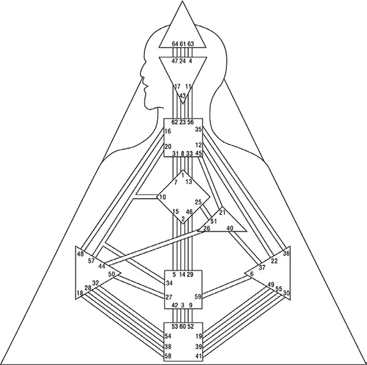

上图即是人类图（Rave Chart），由方块、三角形、数字，以及两个数字连结起来的管道所组成。它们分别是「能量中心」、「闸门」与「通道」。人类图之中，总共有九大能量中心、六十四个闸门、三十六条通道：

### 能量中心

上图中的三角形、正方形、菱形等九个区块，称之为「能量中心」，九大能量中心源自于印度的脉轮，各自对应不同的器官与身体部位，也分别代表不同功能与特性。这九大能量中心分别是：

头脑中心（Head）、逻辑中心（Ajna）、喉咙中心（Throat）、爱与方向中心（G）、意志力中心（Ego）、荐骨中心（Sacral）、情绪中心（Solar Plexus）、直觉中心（Spleen）、根部中心（Root）。

### 闸门

上图中的每一个数字分别代表一个闸门（Gate），来自易经的六十四卦。

### 通道

九个能量中心之间的闸门若相互连结，便形成通道（Channel）。源自于犹太教的卡巴拉生命之树。人类图体系里头总共有三十六条通道，每条通道都代表不同种类的天赋，各有不同的功能。人类图体系里的通道就是你的生命动力与天赋所在。

### 如何找出你的通道：

请上网[`humandesign asia.org/`](https://www.humandesignasia.com/)输入你的出生年、月、日与地点，系统会跑出一张图表，你将看到自己的图会出现，并有由两个数字连结成一条有颜色的实心线，这些实线的多寡因人而异。无论它是短的长的，红色或黑色，都是你具备的通道。对照本书目录，即可得知你具备了哪些天赋才华。

# 36 条通道，36 种天赋才华

人类图中的通道，代表不同的天赋才华，是每个人生命动能所在。

每一项天赋才华，都有具体可行的使用方法与建议，

本书从每条通道，选出代表性名人，他们的一生是天赋的使用范例，

具体帮助你，了解并如何使用老天赐给你的配备！

# 1-8 拥抱自己的独特，带领众人走向未来

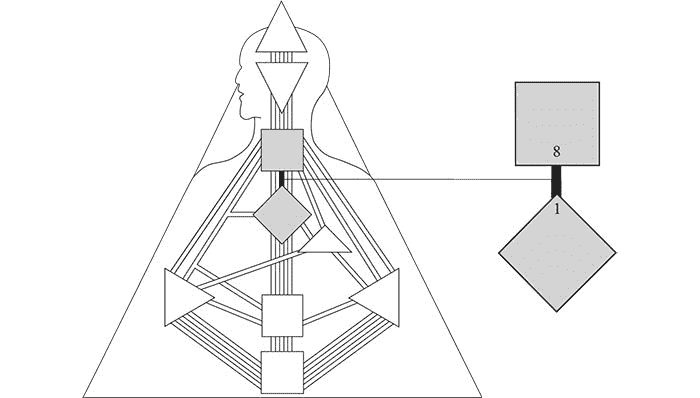

### 定义

充满创意，特立独行，在人群中闪露光芒，你的与众不同就足以赋予别人力量，带来灵感与启发。这条通道能够将内心的信念，形诸于外，化为语言，所以说的话充满真诚，能透过语言引领众人朝未来的方向前进。

拥有 1－8 通道的人，此生存在的目的，在于以创意为世界带来启发，找到一条可行之路，引领众人走向未来。可想而知，既然是「走向未来」的可行之路，就不会是因循传统、安全保守的路。有这条通道的人就是要与众不同，当他们活出自己时，充满磁力，会吸引众人忍不住想听见他接下来要说的话、要做的事。此通道的名人很多，而在这些政治、企业、宗教名人中，邱吉尔（Sir Winston Leonard Spencer Churchill）是非常纯粹活出这条通道设计的领导者。

### 以独特的观点激励众人

邱吉尔活在一个战争的时代，混乱让人们不知所从，他以独特的观点激励众人，最令人印象深刻的是，二次大战期间，法国投降，震撼同盟国，邱吉尔发表了下面这段即使隔了七十几年，依然威力不减的演说：

「我们将战斗到底。我们将在法国作战，我们将在海洋中作战，我们将以愈来愈大的信心和愈来愈强的力量在空中作战，我们将不惜一切代价保卫本土；我们将在海滩作战，我们将在敌人的登陆点作战，我们将在田野和街头作战，我们将在山区作战，我们绝不投降；即使我们这个岛屿或这个岛屿的大部分被征服并陷于饥饿之中——我从来不相信会发生这种情况——我们在海外的帝国臣民，在英国舰队的武装和保护下也会继续战斗，直到新世界在上帝认为适当的时候，拿出它所有一切的力量来拯救和解放这个旧世界。」

这段演说中的「我们将在……作战」如主旋律盘旋而上，一而再、再而三累积出强烈慷慨的信念，听者莫不热血沸腾。而最后以「上帝认为适当的时候」为大战胜负指出方向：上帝（与胜利）站在他们这一边，剩下的只是时间问题。

这段演说在英国存亡之秋，所有人民士气低落时，指出了一条明确的道路，其结果不仅激励了全英国人的心，也鼓舞了其他同盟国的国民。他的信念与意志跃然纸上，让英国坚持到最后一刻，终于获得二次大战胜利。

而邱吉尔被视为演说史上经典之作的演讲词只有短短几个字：「Keep Calm, carry on.（坚持到底，永不放弃。）」这是他在二次大战时最后一场演说。当德国轰炸伦敦，全英国再次陷入忧郁中，他出席剑桥的毕业典礼，上台致词的短短几分钟内，他高举拳头，全程只是不停地重复这几个字。直到他离去很久后，学生才热泪盈眶地回过神来。第二天，全英国报纸都以此为头条，成了英国当时民族精神的口号，也迅速流传成全世界反法西斯的精神标志。

### 展现真诚，让人感动因而愿意追随

如此简短的演讲稿，居然成了演说史上的经典。这就是 1－8 通道启发众人的独特威力，真诚无比。也因为无比真诚，才锐不可挡，多余的修饰语客套都不必要了。他所说的话语宛如一支飞速向前射出的箭，这支箭，正中红心，当一个人心上最柔软最脆弱的所在，被真实触动了，蕴藏于内的力量就会被整个激发出来，从此之后，再也无法回头了。

这就是 1－8 通道的人，活出自己设计时的典范，他们以如此与众不同的方式，表达内在的信念，引领大家在混乱中走出一条明确的道路。而他们是如此真诚，勇于表达其独特性，展现坚持的信念，让人感动因而愿意追随。虽然这条通道的人，并不在乎是否有跟随者，对他们来说，更重要的是说出真心话，即使当下毫无凭证，他们却笃信自己指出的路是正确的，而事实也证明如此。

他们指引方向的凭据，并非来自经验法则或理性推演，而是他那看似混乱、实则充满创意的方式，在转眼瞬间，就此明确指出了未来清晰的方向。但是，请不要质疑他，或要求他详加分析其中的逻辑，因为他很难为此说出个所以然，一如邱吉尔无法说明或分析「上帝会在适当时机拯救世界」这句话。这是信念，信念是一种选择，其中不见得有清楚的推演逻辑或道理。

### 与周遭格格不入的独特性

这条通道的人很独特，他们是「言为心声」的代表，他们说出口的话代表他们的信念、特质和人格。同时他们也擅长多方展现自己的与众不同，发型、穿着、刺青、代步工具……。对他们来说，外在就等于内在的延伸，要能充分展现出自己的独特性，就是最重要的关键。

鹤立鸡群不见得是件容易的事，因为自己的与众不同，难免会被误解成不合群而备受打压。他们的独特对周遭来说是挑战，甚至是挑衅！但是这不也就是这条启发的通道，为我们所带来的贡献吗？他们的存在之所以能带来启发，就是因为天生与众不同。如何放下合理与否的理性分析，全然拥抱，并捍卫自己的独特性，不再否认也不再压抑它，需要生命淬鍊过后的智慧，也需要勇气。但是，如果这个世界缺了这群坚持活出自己的灵魂，如果他们过于担忧，深怕自己过于独特而招致批评，如果恐惧于世人眼光，而压抑自己表达的欲望，久而久之他们容易抑郁。别说独特了，整个人会面目模糊，毫无光采，那会是多么可惜的事情。

#### 给这条通道的人的建议

请做自己喜欢的事情，等待别人邀请。当自己有表达的平台时，不要吝于将自己内在的真理说出来。你将惊讶发现，你说出的话带来多么大的影响与力量，你的独特性必定能为众人指出一条可行的未来方向！这就是你的职责所在，你的天赋，也是你的荣耀。

通道名人：马克思、毛泽东、拿破仑、蒋介石、奇异总裁威尔许、证严法师

# 2-14 以服务之心出发，指引众人方向

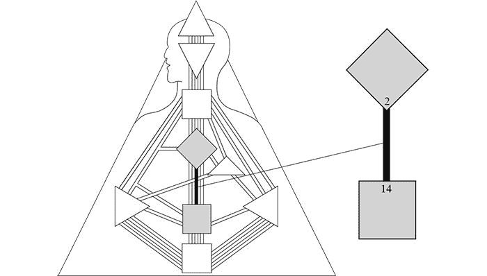

### 定义

这条通道能够直接影响其他人的人生方向。这是一股动能，具有庞大的感染力。拥有这条通道的人具备启发突变发生的关键，若能顺着流走，等待生命给你的回应，信任这一切都自有安排，你必能成为「指路人」，让众人都走上属于他们的人生方向。

### 值得信赖的「出租车司机」

这是一条非常神祕又具有穿透力的通道。人类整体的演变就是一连串进化的过程，进化需要突变。而拥有这条通道的人，他们看得见未来蜕变的方向，握有蜕变的契机，他们明白人类不能只停留在旧有的模式与思维之中，必须自根本产生质变。唯有如此，文明的滚轮才能不断地往前进化，也唯有如此，人类整体才能往前继续迈进。

这是一条指引众人人生方向的通道，有这条通道的人，彷彿内建一套非常厉害的运作体系，若将你的资料和问题丢给他们，他们就能自动运转，然后很快地，找出下一步你该走的方向。我常常比喻有这条脉动通道的人，就象是「出租车司机」一样，而出租车司机的任务就是准确并妥善地，将每位上车的乘客送往他们要去的地方，藉此他完成了自己的任务。而他的天命，他的人生方向与最终的归属，将在他协助每位乘客到达之后，自然而然显现出来。也可以说，有一股更高的力量透过他们，化为明确的指引来协助众人，而当众人纷纷落实了各自的目标时，他们也将透过这神奇的过程，找到自己真正的方向与定位。

### 本着服务他人之心为出发点的德蕾莎修女

听起来非常「我为人人，人人为我」？是的，本着服务他人之心为出发点，付出与贡献走到最后，也获得了自身的完整与满足。德蕾莎修女（Teresa of Calcutta）以她的一生活出这条通道。李家同教授《让高墙倒下吧》这本书中有一篇动人的文章，记述了他前往加尔各答，亲眼看见德蕾莎修女与她创办的收容所和垂死之家的经过。最令人动容的，不仅是德蕾莎修女一生的服务与奉献，还有她引发了更多人思考得更深，更接近内在的渴求。每一年，全世界从不同的角落涌进好多人，包括银行家、富商以及年轻人，因为受到她的感召，愿意每年固定来到这个贫穷的国度，以服务之心出发，服务更多人。

德蕾莎修女十二岁时立志为穷人服务，当她来到加尔各答，从封闭的修道院走向穷困的大众时，并没有马上得到教会支持。但是，她服务穷人与垂死之人的信念，很快地吸引了有志一同的几位修女，与来自世界各地的义工。事实上，德蕾莎修女并不是个能言善道的人，她之所以能吸引那么多人，是因为别人彷彿在她身上看到神的慈爱，而那么多前来加尔各答服务的义工，不管职业、年龄、贫富，当他们返回自己原本的生活时，这一段经历也必然深刻的影响着他们。就像李家同教授说，在此服务短短两天，却使他永生难忘，恨不得一辈子就留在那里服务。

### 为众人利益努力，便具备赚取世间财富的潜能

这就是脉动通道的人，无私奉献时所引发的巨大力量。德蕾莎修女的服务，造福的岂止是加尔各答的穷困者，她也引动了许多眼见她善行的人，内心起了狂烈的震撼。这撼动足以让他们重新思考，生命宛如在那一刻产生质变，让他们选择重新走上自己的道路，解开自己对生命的困惑，明确自己此生究竟所为何来，并放手去创造一段值得活的人生。

这条通道所指的脉动，除了带有宗教性质，也具有赚取世间财富的潜能。有这条通道的人，不见得要从事宗教服务才会赚钱，而是要很清楚，让这条通道顺畅运作的关键点在于：出发点不是为了钱，而是愿意怀抱一颗乐于服务众人的心，为众人的利益而努力。当他们真心希望自己所做的一切，能为大家带来健康的饮食、身心灵提升或智性的成长……等，就能在不同的领域里，默默指引众人正确的方向，因此得到丰盛的反馈。这就象是同样具备此通道的严长寿先生和张小燕小姐，他们的存在与智慧，提供了大众明确的定位，以及未来转型的指引。他们绝非基于个人利益，而是真心愿意服务更多人，自己也从中获得了深深的满足与成就感。正如德瑞莎修女曾经这样说：「我做这些事情并非为你们，而是为了自己。」

### 传递神谕的「神的容器」

拥有这一条通道的人很容易流于两极。一端是自我感觉良好，自以为很厉害，能看清别人的人生方向，给予建议，却因此而容易流于我执，过度自我的状态下，反而看不清实相；另一种则是极端缺乏信心，导致诚惶诚恐，认为自己诸事不足，又如何能提供别人指引呢？事实上，宛如神的黑色幽默，有这条通道的人，可以明确指引别人的方向，却往往搞不清楚自己到底该往何处去，这是他们常常深陷的苦恼。因为他们是传递神谕的人，也就是「神的容器」，只需投降、等待，回应，这是最难也最容易的事情了。他们得放手，也放心，看看这条路将带领他们前往多么不可思议的未来，昂首而去。

有这条通道的人要试着体会「无私」与「破除我执」的真义。在给别人建议时，要记得「方向并不是由你发出，而是透过你发出」，如果对于你所吐露出的方向是否正确，有任何的迟疑，只需静下来好好问问自己：「这个方向有没有为这个世界带来美？带来爱？」如果答案是肯定的，代表着，你正走在对的轨道上。

#### 给这条通道的人的建议

你拥有的是一条神祕、能量又强大的通道，所以要怀抱巨大的信任：信任自己，信任施比受更有福，信任自己的方向握在更高的力量手上，信任这一切都自有其安排。时时提醒自己要谦虚，同时又要有信心，理解众人的方向是透过自己来呈现。你生来是要服务更多人，若能维持这样的中立性，自然而然，生命的流就会带领你，前往该去的地方，体验迎面而来的每一个体验。如果愿意真正放下，信任生命，就能体验到顺流而为，其中的奥祕。

通道名人：德瑞莎修女、张小燕、严长寿

# 3-60 冲破限制，找到全新的秩序

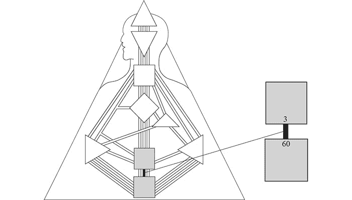

### 定义

这条通道的人有一种特殊能力，可以跳脱以往框架，自既定的桎梏与限制之中，找到全新的秩序。他们的人生恒常处于低潮、求存，接着在某一刻竟然曙光乍现，找出原本从未尝试过的应变之道，然后又开始面对下一个限制，再接再厉，再来一遍。如此周而复始循环着，而不可思议的质变，就在这样看来反反覆覆的周期中，发生了。虽然很难预知蜕变何时会发生，以及到底会不会发生，但是，在找出全新秩序的那一瞬间，是如此神奇，让人惊叹不已。

他们的行事风格或许难以预料，但是不可否认他们的变通力真的很强，不仅为自己的人生带来彻底的变化，也同时能为我们带来不可思议的突变。

### 在混乱与新秩序之间摆荡

我喜欢比喻有这一条通道的人，象是一颗顽固的种子，身处寒冬将尽，春天即将来临的黑夜里，本质蕴藏着一股毛毛躁躁，非常急迫，想立即冲出去的旺盛企图心。黑暗中，虽然还看不到光，但是渴求生存的驱动力是如此强烈顽强，虽然在困难中不断摸索，疑似绝望，却终究能够冲破限制，然后突变成另一种截然不同的形式，象是种子发芽后成花成树，这就是神奇的突变通道。

有这条通道的人特别容易看到限制，但同时内在又有一股硬要从重重限制中，钻出一条路来的强大驱动力。就算环境充满限制，他们为了求生存，会凭借着本能，感受到自己得要蜕变成另一种全新的存在。这也就是为什么他们经常处于莫名的焦躁与不安，也容易陷入一种周期性的低潮与忧郁。从黑暗到光明，从光明再到黑暗。他们会一直看到限制，寻找突破，然后又在现实中碰壁，再突破。生存的焦虑感，始终存于他们的体内，而到底应该如何改变，怎么样才能找到全新的突破方式，就成为他们不折不扣的人生课题。简而言之，这一生，就是在混乱与新秩序之间摆荡的循环，但是每一次循环，每一回穿越，都能让他们脱胎换骨，成为一个全新的人。

突破限制的第一步：放下抗拒。「投降」是过关斩将的关键心法——投降于现况，接受当下的限制。臣服于事情的现况就是如此，抗拒又有何用，不要继续浪费力气在抗拒既定的限制上，才有余力去找出新的可能性。种子不会哀叹上头压着的泥土很重、离地面不知多远、冬天又冷又长，因为事实就是如此。而真相是，限制愈大，能突破重围的能量也愈大，限制并不是你的敌人，而是你最好的盟友，得以锻鍊你，激发你产出全新的创意。没有限制，就不必突破，没有僵局，就不必找出突围的方法，新的秩序永远与旧有的限制相对应，这是宇宙共生的法则之一。

### 佛洛伊德将焦点放在突破重围，带来新秩序

佛洛伊德（Sigmund Freud）是这条通道的代表人物。佛洛伊德本来是个医生，原本研究脑性麻痺与失语症，他在临床中研究病人病因时，在既定的心理学模式中找不到解决之道，因此创立了精神分析学派，提出了「自我」、「本我」、「心理防卫机制」等概念。在他之前，心理学没有「潜意识」的概念，他更石破天惊提出梦是通往潜意识之路，划世代的创新思维，全新看待心理学的秩序，从此诞生。

突变的通道，就是佛洛伊德突破重围的方式，既然既有的学派和理论，已经完全无法解决他临床时所遇到的困难，他于是横空出世，提出一个彻底创新的分析理论。虽说他提出的诸多理论，有许多细节后来被心理学界所摒弃，但是其研究方法，却早已深深影响了后来的心理学、哲学、美学、社会学与文学。这就是突变的通道带来的质变。从他之后，心理学彻底改变了，这世界也改变了，虽然不见得延续他的方式来解析梦与潜意识，但是，我们从此解读心灵的方式，已然进入另一个层次，时序渐进，蜕变是不断地向前滚动的大轮轴，永不再回头。

### 一股在压力锅中随时猛爆的力量

这条通道的人无法仔细过活，无法锱铢必较详加计划。他们无法纸上谈兵，无法空谈，无法以写报告、闭门求车的方式研究与创新。他们自己也说不出为什么就是无法的理由。对待他们最好的方式，就是直截了当地将他们丢到现场，丢上街头，没多久，直截了当又自然而然地，如鱼得水般，他们就能自行碰撞出一条与社会脉动相呼应的道路。这股本能的求生存的力量，无法以逻辑理性规画，无法推理解释，比较象是一股处在压力锅中，因为承受巨大压力到某种程度，突然猛爆出来，纯粹求生的力量。既然如此，你又如何能期待这条通道的人安于现况？或屈服于旧有规则与传统模式？他们无法墨守成规，也不愿意重复自己，这些在他们眼中都是限制，他们追求的不是安全，而是创新，存活之道或许不易，却充满旺盛的生命力。

这是一股强烈原始的求存动力。所以，有此通道的人总是毛躁，静不下来。他们经常给人一种躁动感，听起来很像蜕变期的青少年吧？有这条通道的人具备源源不绝的生命力，想求新求变，终其一生像处于即将长大、脱胎换骨的阶段。试着回想你青春期时的感受，隐隐约约感觉自己即将不一样，同时却焦躁、浮动、不安，怀抱热血梦想却又在不确定之间徘徊。他们容易焦虑，也容易忧郁，因为没人知道脱胎换骨之后，究竟会是怎样的光景。

而突变，象是一股更高的力量降临，透过他们来发生。他们为此所付出的代价就是，不知道突变何时会发生，是否会发生，突变之后会更好还是更糟。这些不确定因素，着实让人躁郁不已。拥有这样的人生，旁人或许觉得太惊心动魄，其实他们自己也觉得很累，但长程来看，当他们终于摸索出解决之道，当他们冲破了限制，带来启发，引发质变，其喜悦与兴奋程度，又是如此炙烈而动人。

#### 给这条通道的人的建议

你体内原始的躁动力，让你焦虑忧郁，却又不知道该如何是好。首先，请与自己的原始本能共存，这是一股很棒的原力，它让你躁动，却也是你求得生存的来源。别因为恐惧而死守安逸，你的抗压性强，环境愈严苛，你才能愈沉着愈冷静。压力是你最佳的动力， 不管是平时或者处于高压状态下，请多运动，运动可以帮助你纾解忧郁与焦躁。

通道名人：佛洛伊德、猫王、拳王阿里、达赖喇嘛、王永庆

# 4-63 透过理性的思维推演，为世界带来启发

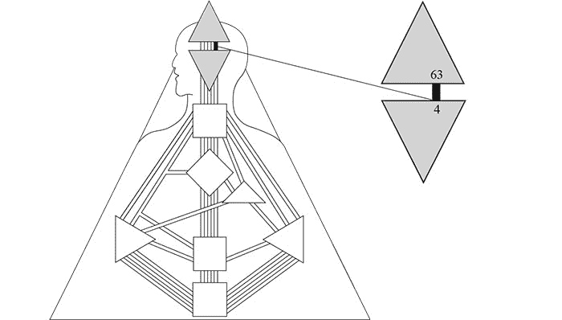

### 定义

这条通道代表科学的、多疑的头脑。脑中会不断冒出各种疑问，持续进行反覆又反覆的逻辑辩证，无法停止运转。藉由理性质疑，来检视一切事物的正当性，最后归纳出足以放诸四海皆准的正确解答。为世人的贡献是，请善用你那持续问答的清晰脑袋，解决与自己无关的问题，为世界带来洞见与启发。

### 问对问题，就能带来清晰

这条通道的人，无时无刻都会在脑袋中自问自答。这就象是一场持续不停进行问与答的实验，为了想了解世间事运作的规则，他们擅长将过程整个摊开来，一一检视，试图找出当中相关联的逻辑，大胆疑问，并小心检验，为的是从中找出解答，才能得到一套可依循的模式，以求造福众人。

爱问问题的人，并不是天生爱找麻烦，他们其实是无法控制自己的脑袋，不管看到任何事情，大脑立即快速飞驰，运作无碍，不由自主不断发出疑问：「为什么会这样？」「现在与之前有何差别？」「是不是会有其他更好的方法？」他们的脑子充满质问，不带情绪，对一切怀抱质疑，理性而平静。其实，问问题的最高境界，并非要我们苦苦执着于解答，若有幸能遇见一位真正懂得问问题，并且有能力问对问题的智者，在他发问的瞬间，那原本纷乱的事务，让人纠结难解看不清的谜团，就此可以清楚被区分了。好问题让我们做出区分，而区分之后，才能看见全新的风景，产生不同的观点，再一次，得以重新做出有意识的选择。

换句话说，一个好的问题本身已经深具启发，即使尚未找到答案，问题本身的存在，也已指出了一条明确可前进的方向。

### 擅长在脑中提出假说，逐一检视以求答案的山谬．贝克特

这条通道的人除了问，也有找出答案的天赋。我们常说，真理愈辩愈明，在问与答之间，人类得以建立一套可行的逻辑模式。这是一连串可以不断衍生的归纳过程，为了得到正确答案，他们问问题，筛选并辩证，直到找到答案为止。而当下这个答案，可能又会衍生下一个全新的问题，在问与答之间，建立起模式。而世俗面的制度，或者精神层面的省思，就能藉由如此往返的过程，重获清明，也让身心得以安顿。

我们可以说，这条通道造就了科学的起源，他们在脑中提出假说，实验组与对照组，一一检视并删除，试图从中得到答案。二十世纪伟大的文学家山谬．贝克特（Samuel Beckett）的代表作《等待果陀》，可说是有这条通道的人最具体的呈现。整齣戏自头至尾，就是两个人在等待「果陀」的过程，没有丝毫剧情，只有对人类命运与生存所提出的大哉问。巧妙的是，结尾是开端的重复，而这两个人在等待的过程中，看似乱无头绪的对话，到底果陀是谁、为什么要等他、他会不会来？而在漫长的等待过程中，戏落幕了，空留问与答，还有疑惑与辩证之间所带来的深思与启发。

### 找到答案，才能抒解焦虑

这条通道的才能，必须运用在与自己无关的事情上，若是思考众人之事，他们的思路无比清晰，以诘问的启始点，进而归纳总结，得出客观的见解。如此有逻辑的演绎方式，尤其适合运用在科学领域上，有许多哲人与文豪，也透过提出问题的方式，来呈现他们对人类问题的观点，启迪众人。

由于他们脑袋中的思绪，完全停不下来，常常莫名感到焦虑与压力。不停发问，而这些问题都必须被回答，虽然答案不一定正确，但这又是思考过程中，必须经历的阶段与过程。唯有等待找到答案的那一刻，他们才能稍微抒解焦虑；但是很快地，他们的脑袋又会提出新的问题，等待被解决。所以，若一不小心开始运用这条通道，来思考与自己相关的问题，就会发现脑袋呈现打结的状态。

这就象是「旁观者清，当局者迷」的道理，再怎么清晰的脑袋，再怎么缜密的思考逻辑，一旦开始牵涉到与自己相关的议题，宛如深陷流沙，昏头昏脑，状似失灵。他们很有可能一开始就问错问题，自然也得不到正确答案。在问与答之间，自行激荡，再度形成全然偏离事实的循环，归纳出莫名其妙的答案，落入固有的困局模式，一直转一直绕，钻牛角尖到最后，只是备感苦涩，白白浪费了这条通道的才华。

#### 给这条通道的人的建议

你容易感受到焦躁，对眼见一切都跑出一堆疑问，并试着想得到答案。请将这份才华用来解决世界与别人的问题，若思考自己的事情，容易陷入鬼打墙的循环里。而且，在解决别人问题前，请等待别人邀请，或向你求助，你再提出质疑与解决方案。

在别人辨识出你才能之前，你若轻率发言，容易因为你提出的一连串问题过于繁杂庞大，而让周遭陷入混乱。

通道名人：山谬．贝克特、宫部美幸、马龙．白兰度、李奥纳多．狄卡皮欧

# 5-15 顺应生命之流，决定世界运行的韵律

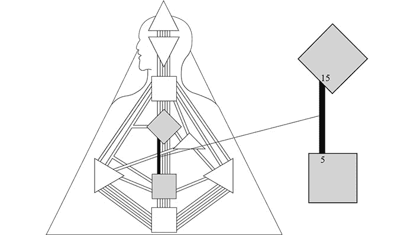

### 定义

有自己独特的韵律，可以顺应环境改变，何时改变或者要如何改变，内在都有其节奏可依循。有这条通道的人，人生可以活得很优雅不费力。若能真正顺应自己内在的韵律，周围的人事物就会巧妙地配合着，不早不晚，依序在该发生的时候来到你面前，你只需要顺着生命的流，回应生命所带来的一切。

当你顺着流走，每件事都会很顺利。若你开始觉得外在混乱，那其实只是反映出你自身内在的混乱。别忘了你自身的韵律强大如洋流，周围的人将随你的进度起落，顺波动摆荡着，不快不慢，不疾不徐，交融同拍，相互流动与回应。

### 一如乐团的灵魂，是团队里主导韵律的王

这条通道的人是主导这世界韵律的节拍器。他们决定了诸多事物运行的韵律，全世界有此通道的人，就像散布世界各地的许多小型节拍器，他们顺应着一个更雄伟巨大的节拍器，也就是所谓的「生命的流」。无形中，起承转合，拍子音律急缓有序，承接了宇宙的韵律。生命中，事情有其应该运作发生的韵律，而这条通道的存在，就是让宇宙的流透过它来展现。当他们顺着自己内在的韵律走，那么他们生命中一切事物都会在恰当的时机点出现，而他们周围的世界也会井然有序。他们就像人生路口的交通指挥，他们依循着更高指导原则，时序渐进自有最好的安排，世间万事万物顺畅运行。

世间的万事与万物，都有其必须历经的完整阶段。宇宙运行的流，与我们头脑设定的时间表，可能截然不同，小我的观点终究过于狭隘，无法真实窥见冥冥中，底层庞大机制所安排运转的定律。花开花落终有时，其实是慢不得，也急不来。就像制作陶器，捏完后需等它成型、干燥、焙烧，这是一个完整的过程，所有该经历的、该发生的，若安然顺应更高层次的韵律，完整去体验与经历全部，才得以圆满。

「韵律」这个概念，看似抽象，不好理解。那是因为这条通道的人不见得是做了什么，或说了什么，而是单纯存在着，在能量的层面上，就得以主导了周围人事物所运作的顺序与节奏。有一回我替一个摇滚乐团里的每位成员做解读，其中有一位成员的设计很有趣，他的整张人类图设计里就只有一条韵律的通道。换句话说，这正是他最主要的生命动力。外表看来，他沉默寡言，不太发言没有意见，也总是很安静。既然如此，他要如何主导乐团运行的节奏呢？一问之下，我忍不住觉得太妙而大笑，因为他正是鼓手，内在的韵律就这样明确地化为鼓声，或快或慢全在指尖，他是乐团的灵魂，是团队里主导韵律的王。

### 回应内在的韵律，活得自在优雅的茱莉亚．柴尔德

对这条通道的人，尊重自己内在的韵律是非常重要的一件事情，不要勉强自己，也不要卡在脑袋或世俗大众所认定的时间表里。要知道人生中你要几岁谈恋爱、几岁应该要结婚、几岁一定得赚到第一桶金、几岁买到房子，真的没有一个放诸四海皆准的标准答案，也并没有一张准确的时间表适用于每个人。是的，生老病死有其韵律，而你的生命也会自有其过程。你的顺序、你的节奏相对应，无法在脑袋理智的层面加减计算，到头来，只能顺心流动，顺流而行。

既然具备韵律的通道，若能时时回归中心点，诚实回应自己内在的韵律，就能活得很优雅，天时、地利与人和，宛如天上繁星各自有其轨道巧妙挪移着，到最后，时机到了，必会自然而然与你站在同一边。反之，若是你轻易让恐惧介入了，被无谓的思虑混淆了，当你开始焦虑地，试图想控制些什么，而完全忘了回归内在的韵律，混乱不可避免，费尽心力即使勉强达到原先设定的目标，之后也会证明是一场错误。

有名的美国籍厨师茱莉亚．柴尔德（Julia Child）就是这条韵律通道的代表人物。她在三十四岁才结婚，以她所处的年代着实相当晚婚。她在结婚前只会吃不会做菜，快四十岁才报名去蓝带厨艺学校学习，从此爱上法国菜。她写书、上节目，很多人五十岁都退休了，她则是到五十岁才开始真正大红特红，变成美国烹饪的偶像，发达成名之路就此大开，她影响了当代美国饮食习惯，她改变了美国主妇一直以来狭隘的做菜习惯，她重新掀起了前所未有的美食风潮。

她不仅在如何过人生这件事上自成韵律，连日常生活，待人处世也有她独到的风格与节拍。她高大，说话口音奇怪，在节目上不怕出糗，就算犯错了也能状似优雅，不慌不忙告诉家庭主妇们，厨房里充满各种可能与意外，谁人没打翻酱料，谁人翻蛋永远不出包。就算有一千一万个步骤流程要依序完成，到最后，你只能回应内在的韵律，找出自己的应对之道。她让我们理解人在厨房，突发状况就是常态，错误才能让人绕个弯转换菜式，发明出另一道菜。

### 顺应生命的流，一切都会在最恰当的时间点发生

直到今天，她的形象还如此深入人心，充满展现这条通道的优雅与迷人。换句话说，如果你有这条韵律的通道，何须为自己内在的韵律感到困窘或罪恶呢？难以顺应社会或别人的节奏又如何？你该听从的是内在的韵律，换句话说，你真的不该勉强自己，否则很容易招致混乱，反倒将一切搞砸了。

接受每个人、每件事情皆有其熟成的时间点。所谓的时候到了，意谓着诸事齐备，宛如众神归位，一切具足，才正是事情该发生的时候。如果你拥有这条通道，请诚实回应自己的内在，每个当下都忠于自己，做出选择。如此一来，就不会急切或慌张地被外来的讯息所打乱，信任一切将在最恰当的时间点发生。或许你无法在理智上理解，又如何？放轻松，你是遨游于时空的旅人，只要回应宇宙之流的韵律，就能顺畅前进。

#### 给这条通道的人的建议

你人生中有很多事情，不是在社会规定的时间点上发生的，而是要等到你内心准备好了，事情才会顺利发生。所以当你顺应自己内在的流，你必然能与宇宙的流相呼应。此时，生命会回应你，所有你需要的事物。同时，你也会影响周围群体的运作，当你顺着流走，不因种种延迟而强求，那么，你人生所有美好的事物必然会一一来到，要有耐性，也要有信心。

通道名人：茱莉亚．柴尔德、莫札特

# 6-59 人见人爱，拥有建立关系的入门票

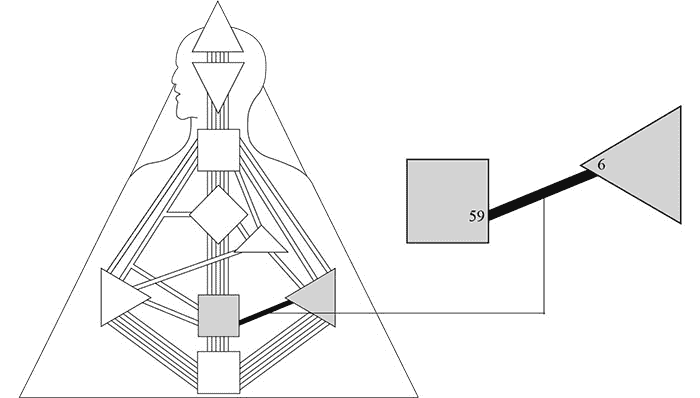

### 定义

这条通道充满生产力，代表人类旺盛的生殖能力，具有强大的能量场，能瞬间感染周遭所有人，在极短时间内让大家卸下心防，与你亲近。你的存在是为了打破人与人的藩篱，促进人与人之间互动，共同创造新的思维或作品，让事情可以从无到有发生。

### 拥有绝佳观众缘的美国甜心茱莉亚．罗伯兹

茱莉亚．罗伯兹（Julia Fiona Roberts）被时人杂志（People）选为世界最美的人第一名，但老实说，茱莉亚罗伯兹并不是那款完美无暇的大美女。严格来说，她嘴巴太大，脸上有雀斑，但是你很难不被她温暖的笑容与亲切的嗓音所融化。大家对她的印象从一九九〇年的《麻雀变凤凰》开始，二十几年过去了，她依然屹立影坛，观众一如过往地喜欢她。她真是永远的美国甜心啊！她不仅有观众缘，在同侪之间也很受欢迎，被演员同侪投票选为「最佳女主角」，几乎是掳获男男女女各种阶级人种的喜爱。她常带着自己的小孩出去逛街，穿着打扮朴实，一点架子都没有。有次曾被路人惊喜认出，茱莉亚还忍不住低声拜托大家：「对！我就是茱莉亚．罗伯兹啦，但拜托你不要告诉别人！」这个大明星就像邻家女孩，所到之处无不给人亲切好相处的感觉。

### 瞬间瓦解他人防备

这也就是亲密的通道为什么又叫「人见人爱」通道的原因。他们的存在极其特别，当他们出现的时候，原本人与人之间，为求自保而矗立的铜墙铁壁，也能在瞬间垮下了，人类图祖师爷曾比喻这条通道的能量场就像一把热刀，当它切进一团奶油时，奶油毫无迟疑地，就在那瞬间融化了。似乎只要一靠近他们，自然而然就会喜欢他们，进而想与之亲近，而这就是亲密通道的威力。

就算是社会的边缘人，不管再怎么高傲、特立独行、冷僻的人，都在不知不觉中，愿意与他们亲近，若要解释这样的状况，只能说他们让人喜爱的，或许并非其个性或特质，而是纯粹一股亲密的能量，可说是一出生就拥有人际关系的「入门票」，无形之中就能讨人喜爱，好人缘总是吃香，机会大门也因此极容易在面前开展，真是不折不扣，天生的幸运儿。

### 赢在起跑点的绝对优势

这条通道的人之所以具备「人见人爱」的能力，是因为他们肩负让事情从无到有的任务。以人类生殖繁衍的需求来说，亲密的通道让别人想与之亲近，如此才能生出小孩（从无到有），人类才能得以存续。若放在工作的范畴里，当别人愿意对你开放，你才有机会整合众人的能力，让事情发生并推进。

取悦周围的人、与人亲近，这些是人类底层极为重要的需求，在两性关系中尤其如此。有这条通道的人，体内总是燃烧着一股原始的、火热的欲望，目的是为了繁衍下一代。他们需要性，然后生出孩子。亲密通道是人类存续的本能欲望，「人见人爱」是上天给予他们的厉害配备，好让他们有更多机会、更多选择，得以繁衍出优良的下一代。

话虽如此，这也不代表有亲密通道的人，就能轻而易举地找到另一半，虽说主动示好的人或许很多，但是他们并非来者不拒，在内心，终究存有一个巨大的疑惑：「这么多人喜欢我，但是，我喜欢的人到底在哪里呢？」而且尽管别人很想亲近他们，他们甚至可能会觉得很烦，烦恼着怎么老是有一堆无谓的人黏上来，而为此感到困扰。所以，有这条通道的人，在人际或两性关系上，往往「有多亲密，就有多不亲密」，他们可能选择让你走进他们的世界里，让你这一刻感觉好亲近，但是也可能在瞬间完全封闭自己，将你隔绝在外围，再也不让你靠近。

### 适合从事生产与创造的行业

「人见人爱，让事情从无到有」的能力，不仅适用在两性关系，也可应用在工作上。他们如果从事营销工作，能迅速整合多方人马，让不同立场的人愿意聚集，事情较能迅速推进；如果从事业务工作，因为他们人见人爱的特质，特别适合卖不需要专业技能与知识的产品，只要客户看顺眼就能成交，极占优势。可是，如果销售的是高科技产品，或者需要专业知识的商品，「第一眼印象」只算是拥有入门票，此时就考验着亲密通道的人平时是否累积专业实力。若本身就是专业人员，就非常适合从事创作，或任何整合团队，让事物从无到有发生的工作。因为这条通道本身，已经具足充沛的生产与创造力，容易在团队中激发许多灵感与火花，将项目顺利完成。

亲密的通道听起来很强、很厉害吧？可是，有些人虽拥有这条通道，却完全不觉得自己「人见人爱」，为什么呢？若你无意识到自己其实具备这样的能力，当别人释出喜欢或友善的讯息时，不仅不愿接受，还反覆质疑别人到底喜欢自己什么？会不会是另有所图？请记住：当你无意识否定自己的能力时，将无法善用自己的力量，这不是白白浪费老天爷给你的天赋吗？所以，为什么不转换自己的心态，不管在恋爱或者工作上，都愿意真心相信：「老天爷赐给我人见人爱的特质，只要我愿意，一定可以整合大家的力量，不管任何人，都一定会喜欢我的！」

#### 给这条通道的人的建议

当你发现自己拥有这条通道，请热烈拥抱它！想想茱莉亚．罗伯兹从出道到现在，屹立了长达二十年的魅力。亲密的通道具有强大的破冰能力，让一切从无到有发生的奇迹。老天赐给你这么厉害的天赋才华，是为了让你在人与人之间建立连结，不管是两性、工作、创作上。请你相信自己创造奇迹的能力，善用它，然后为这世界带来新的可能。

通道名人：茱莉亚．罗伯兹、爱因斯坦、席琳．狄翁、史恩．康纳莱、苏慧伦、伍佰、《西雅图夜未眠》编剧诺拉．艾夫伦（Nora Ephron）

# 7-31 预见未来潮流，发挥影响力的领导者

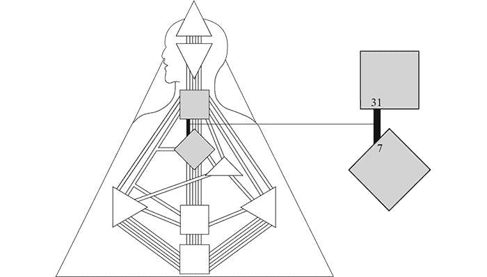

### 定义

真正的领导者。洞悉未来的潮流与走向，以特有的方式沟通呈现，让大众了解。以科学与逻辑的方式，归纳出一个最可能成功的方式，带领社会走向未来。这里所谓的领导人并不侷限于政治人物，可以是各个领域学有专精的大师或佼佼者，能以其发言或者研究，发挥广大的影响力，指引出一条可行之道。

### 指引我们前往未来路径的居礼夫人

这是一条领导力的通道。在这里所说的领导者，指的并非仅限于传统威权型的领导人物，而是能登高一呼，引领众人知晓各种具前瞻性的理念，能标举未来潮流走向，并指出社会大众接下来可以前往的愿景与方向。他们是创始者，我们因而得以看见各种前往未来的路径，而全新的局面就此展开。

居礼夫人具备这条创始者的通道。在科学领域里，她所带来的影响深远，现在我们提到居礼夫人，总会直接联想到与镭相关的研究。事实上，她的成就不仅于此，她分别在物理与化学领域都得过诺贝尔奖。而且最令人惊讶的是，当时她因自己的研究获得诺贝尔奖，却没有为此申请任何专利，她选择全然无私地公诸于世，日后放射化学的相关研究之所以能蓬勃发展，居礼夫人实在功不可没。

居礼夫人并没有从政，她以自己的专业，指引世人一条明确通往未来的康庄大道。她的研究与发现，让放射线有机会被运用在治疗癌症上，造福世人。由于她慷慨无私地分享，让更多科学家得以发挥所长，尽情投身于放射化学的相关研究。居礼夫人曾说：「科学家的天职是继续奋斗，彻底揭开自然界的奥祕，才能好好掌握，在未来造福全人类。」有这条通道的人，脑中所想的一切都是关于未来，思考的范畴总会是：该怎么从旧有的既定模式中，整理归纳出一条可行的道路，他们真诚又充满热忱，渴望领导众人前进。

### 以逻辑有条理的方式吸引更多跟随者

这条创始人通道的领导方式，秉持的是科学与逻辑归纳的方法，如同居礼夫人所说：「持续不间断地努力，将努力的成果化成可依靠的数据和公式，帮助人类前进。」一般大众信任科学，是因为科学有凭有据有逻辑，听起来很能说服人，而这也就是这条通道最吸引人之处。同样的状况，若遇到彻底跳脱框架的创新方式，就算所提出的解决之道最终证明是对的，却由于无法给出合理的解释，众人难以信服，相对而言要普及，就容易变得窒碍难行。

当这条通道的人以逻辑有条理的方式，自过去的经验法则中，归纳出一套可行的运作公式，假设未来基于同样的状态下，必定也会行得通。他们与大众沟通分享，试图说服并吸引更多跟随者，如此一来，才有机会获得众人支持，获得资源来落实并实践其理念。

这是一条相当符合民主社会中，领导者被选出并发挥影响力的通道。就如同在各种竞选的场合，每个竞选人根据不同的逻辑推演，各自表述。大家各自提出政见，相互辩论，阐述各自立场，探讨彼此提出的模式，在未来是否真的行得通。逻辑得以辩证，期待愈辩愈明。如此一来，民众便能深入了解其见解，并自由心证做出明智的选择，选择最好的人选，带领大家走向更好的未来。

### 用真诚与沟通能力打动群众

有这条创始人通道的人，若要实践理念，一定要勇于分享，投入辩证与讨论，如此一来，他们的意见才能更清楚被看见。这里所说的领导才能需要有机会被赏识、被看见，他们需要大量跟随者，否则空有理念，没有机会实践的话，根本毫无意义。而他们是否能吸引众人跟随，有很大的因素取决于个人的语言沟通能力。他们愈能清楚表达自己，将意见背后的脉络、推演的逻辑，清晰辩才无碍的陈述出来，明确传达其逻辑与背后的真理，便愈有机会获得大众支持，得到实践的契机。

他们叙述自己的理念时，真正打动群众的，除了清晰的逻辑，最难得的是自然流露的真诚。有这条通道的人若真正活出本质，通常思考的重点，不会落在自身的利益，而是全体大众的福祉。他们若是以服务之心出发，就能在无形中发挥巨大的影响力。

居礼夫人说过：「人类需要梦想家，梦想家醉心于某种事业，无私去发展，无关乎物质的利益。」她活出了自己所说的话，短短一生，贡献良多，连爱因斯坦都说：「在所有著名人物中，居礼夫人是唯一不被荣誉所腐蚀的人。」她的确是活出了这条创始人通道的精神，成为领导力的最佳典范。

#### 给这条通道的人的建议

请耐心等待，等众人辨识出你的能力和才华，邀请你出来领导。在等待的时候，请加强自己的语言表达与沟通能力。并非要你舌灿莲花，或者练就三吋不烂之舌，而是能清楚地将你内心的逻辑一一陈述表达，不分年龄老幼、各种教育程度的人都能了解。等到被大众邀请出来，诉说理念时，你才能辩才无碍将自己的理念沟通出来，吸引到坚定的追随者，不顾一切追随你，一起去打造更好的世界，让理念得以实践。

通道名人：居礼夫人、杨德昌、英国前首相布莱尔、哈理逊．福特、曾雅妮、史蒂芬．史匹柏、珍．奥斯汀、柏格曼、凤飞飞、波诺

# 9-52 专注的力量，引导众人聚焦的能力

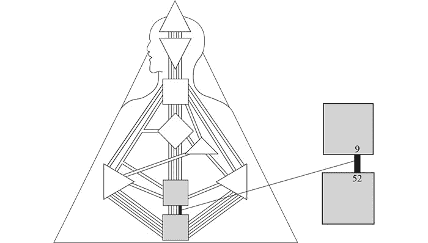

### 定义

这是一股来自生命底层、极为专注的力量，擅长用来集结众人焦点，集思广益，思考问题症结，才有机会改进或创造出更好的运作模式。抗压性强。面对压力反而会异常沉着冷静，当专心一志处理某事时，精神非常集中，能专心审视所有细节，从中理出焦点。当他们决心投入某件事情时，能为所属的群体，指出共同的焦点与方向。

### 专注是为了改善社会事务

这条通道的人能专注处理细节，找出事件的问题所在。当繁多纷杂的外在讯息，全部涌进来时，他们可以不动如山地分辨出哪些讯息是关键、哪些讯息是噪声，并从中爬梳整理。在既有的运作模式中，试图理解，抽丝剥茧找到出错的原因。同时，还能将大众的注意力聚焦在此，才能集众人之力，共同关注并改善问题。

他们反覆检视、观察、注意所有藏在细节里的魔鬼，为的是找到一套放诸四海皆准的模式，或者为了改善这套模式，找到行得通的方式。换句话说，这是一条必须运用在社会议题与大众事务的通道。有这条通道的人一旦关注某个议题，如流浪动物、官商勾结、饮食安全等，就能聚焦并从大量信息中，爬梳出事件的始末、环节、关键点与解决之道，并引起周遭与社会的注意力。以前，这是专属于新闻媒体的特质，如今在网络发达的时代，有这条通道的人，可以有更多渠道与平台发挥自己的特质。

有特别多记者与大众媒体人员都有此通道，一来是此通道的人若活出自己的设计，一定会很关心社会议题，并试着从中理出始末头绪；再者，藉由大众媒体的传播，他们关心的焦点会引起社会注意。他们的特质就是聚焦社会议题，吸引所有人关注，让问题因此获得修正。他们能不动如山地停留在某处，挖出更多细节，审视原本的运作为何出错。他们检视所有事实，逻辑性地罗列线索，最后建立出一套他们认为得以运作的方式。

专注的能量本身是中立的，但是把这股能量投注在什么样的议题上，出于个人的选择。若选择专注在正面的议题上，群众的注意力就会聚焦在正面的议题上。反之，若专注在负面的攻讦上，那么群众也会一齐掉落黑暗的渊薮。加上这条通道的人多半只能集中火力于一件事上，无法分心多用，说好听是专注，一不小心也容易流于偏执，只能看见自己想看的部分，放错焦点，或者焦点放在某件怪异的事情上。于是，周遭人的注意力就这样莫名被导引至奇怪、偏离轨道或者完全不是重点的事情上头。事件永远可以以不同的观点来看，也有不同的切入点能深入探讨。而你，有这条通道的人，究竟把焦点聚集在哪里呢？这是值得好好检视与深思的地方。

### 聚焦能力强大

魔术大师大卫．考柏菲（David Copperfield）有这条奇妙的通道，他最为人所知的是，在全世界无数眼睛的观看下，让自由女神像消失无踪的大型魔术。而这也是将这条通道特质运用与发挥到极致的呈现，在精采的表演背后，魔术师必须反覆而专注地详细检视每一个细节，所有的环节都要仔细确认。哪些可能会出错，哪里可能被识破，是否有可以变得更完善更好的地方，都要花费心力前后思量，绝不能遗漏任何看似微细的环节。如此一来，才能让整体表演进展得顺利又顺畅。同时，当舞台布幕拉起的那瞬间，之后的每一分每一秒，他就要万分专注地吸引住全场的注意力，就算误导也好，当大众的焦点被引导到某一点时，往往就会全然忽略私底下正悄悄运作的人事物。魔术就是一场声东击西的游戏，魔术师对此尤其擅长，众人必须目不转睛锁定他所导引的方向，才能让表演完整又圆满地传达出来。

除了魔术师，媒体的运作说穿了，不也是同样的道理吗？媒体是最大的聚焦器，它引导社会大众聚焦在某个特定的议题上。此时此刻，追风追雨声势浩大，一旦风潮过后，突然同样的议题再也没人在意了。回头再看，社会大众有如大梦初醒，开始觉得自己之前所关心的一切，说穿了还不就是一些奇怪的事情，或是讨论名人八卦，或是跟着流行失心疯地失去判断力，让周围人宛如被洗脑催眠一般，莫名对某事某人狂热不已。

有这条通道的人因为聚焦力量强大，他们对事件的关注，都必然有其影响力，影响范围大小则取决于此人是否活出自己设计的精髓。格局或大或小，小则在公司揪团，导致整群同事不务正事，花了一整个下午在采买，大则扩展至大卫．考柏菲，施展一手巧妙魔术，吸引全世界关注。当然我们绝对不能漏掉同样也具备此条通道的贾伯斯，当贾伯斯生前每每发表苹果新品时，他的一言一行宛如有种磁铁般魔力，让我们每一个人都紧盯着电视。不仅是苹果所推出的新商品备受瞩目，掀起风潮，引发极度热烈的疯狂讨论。他的存在、他的愿景、他的风采也都是众人聚焦所在。他所在意的，让大众为之疯狂，这就是这条专注的通道，发挥到极致的最佳佐证。

### 若专注在自己的事情上，则易钻牛角尖

专注是一股难得的动能，专注的当下，压力与时间彷彿再也不存在了。有这条通道的人天生耐压，就算来自外在环境的压力排山倒海，都能不动如山，进入某一种心神凝聚的状态，冷静而仔细地研究诸多相关细节。无形中，也就引发了更多人进入他们所专注的世界里。

无庸置疑，专注的确威力大，但是请好好善用这股力量。若选择只看自身不足的地方，或深陷负面情绪，只专注找自己麻烦，就会特别钻牛角尖。如此一来，原本专注的特质将转变成完全动不了的卡关状态，反覆不停专注检视自己哪里有问题、哪里出错。但此刻偏偏容易放错重点，专注在奇怪或者错误的地方，不断鬼打墙，不管怎么检查审视，都得不到正确答案。

#### 给这条通道的人的建议

专注的特质具有巨大的影响力，但请用在社会议题或大众事务上。不管是什么讯息，只要你内心对之有所呼应，就可以是你专注的议题。在现今网络发达的年代，你本人就是一个强力放送台，请将你善于聚焦、检视细节，并找出解决之道与方向的能力，用在公共事务上，而不是钻牛角尖检视自己私人之事，才不会浪费你的才华。

通道名人：大卫．考柏菲、贾伯斯、茱莉．安德鲁斯、张国荣

# 10–20 我爱，我说，我存在

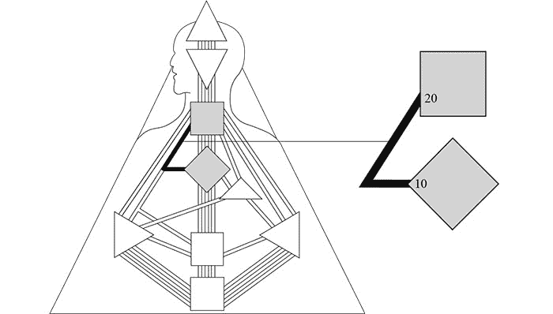

### 定义

你的人生中，最重要的是爱自己与接纳自己，不管要为此付出什么代价。若能时刻保持对内心的清明与觉察，必然能尊重自己、做自己。

这条通道的特质抽象且出世，只要活出设计，就能因此求存，更高的觉知将透过你来呈现。关于人的本质、存在的奥义、该如何自我理解的课题，都能在适当的时机，藉由别人的提问，完美的表达出来，带给别人力量。

### 更高觉知与智慧的发送器

拥有这条通道的人，藉由爱自己、接纳自己、做自己，并在适当时机表达，为世界带来觉醒与力量，因此得以求存。有此通道的人，请回想自己是否经常思考自己是什么样的人，以及人为什么活着等问题。特别是童年时，当其他小朋友忙着玩耍游戏时，这条通道的小朋友在某些时刻，会突然沉浸在与自己年纪不符合的大哉问里，搞得父母与老师一个头两个大。他们思考这些问题，是希望藉着了解自己，好知道如何做自己。他们的「做自己」并非意谓哪些特定的理念或作为，而是认知到自己是怎样的人，如何以自己目前的形体，过完一生。

做自己对他们来说很重要，当他们真诚地接纳自己、爱自己，每个当下都是觉醒的，他们就等于活出禅意与佛陀的本质。

所谓的「灵性」，指的并非是宗教信仰或者上教堂等任何特定的形式，而是意识不被俗世种种外力干扰，不因贪嗔痴让原本无一物的明台惹尘埃。这是这条通道之所以能「求存」的原因，人类活着并非只是满足生理上的需求，人不只有追求物欲物质成长的需求，也有灵性与精神层面成长的渴望。人也想理解自己与他人，想知道如何能更快乐、超脱物欲、更有觉知地活着。所以觉醒是一种能力，这便是这条通道为世界带来的贡献，他们好比发送器，藉着说出口的话传递更高的觉知与智慧，好让这世界得以接收。

当他们说出内心想法时，自己往往也会对说出口的话语非常惊讶。藉着他们的语言表达出的智慧，先前并不存在，是在问题出现时一瞬间冒出来，藉着语言被他们带到世界上来。换句话说，这条通道的人往往是处于两个极端：当他们开口表达时，他们是觉醒的，在他们表达前，他们是沉睡的。但是并非所有这条通道的人都能回答出觉醒的答案，这只有在当他们是处于爱自己的状态下，他们才能宛如「甦醒」般传递真理与觉知的智慧。

### 等待邀请，展现自我觉醒的独特性

这条通道的人必须等待别人辨识出他们的智慧，并邀请他们回答。他们在当下的情境，说出口的话，一方面会让别人发现，他们是如此独特而觉醒的人（象是众人皆睡他独醒）。另一方面，他们此时说出口的话也定义出他们是怎样的人。他们表达出来的话语往往很独特，也很个人。如果不是在被提问、被邀请的状况下说出，容易招致反感或批评。

知名影星、慈善大使奥黛莉．赫本（Audrey Hepburn）有这条通道。姑且不管她的生平和荧幕上的成就，先来看看她说的话呈现出她是怎样的一个人吧：

「我喜欢粉红色，我相信大笑是最好的减肥方式；我喜欢亲吻，而且还要亲很多次；我相信在遇到坏事情时，人总是要坚强；我相信快乐的女孩就是最美丽的女孩；我相信明天会是崭新的一天，而且我也相信奇迹会出现。」

在你眼前是否出现了一个清新、坦率、忠于自己、而且能说出自己需求的女孩呢？赫本还说出了这条通道的关键句：

「我不认为自己是个偶像，也不在乎其他人的看法，我只是做自己。」

### 做自己，才能带来觉知

所以她一生了孩子就退隐，长时间隐居瑞士。她的确不在乎别人对她的看法，宁可为了自己与孩子活着。她知道她想要的是什么样的人生，自己是什么样的人，世俗的名声利益对她来说根本不重要，更遑论对她的看法。这条通道的人如果活出设计，必然对于「做自己」有其独特的看法。赫本再次出现世人眼前时，在影星身分之外，她多了一个更活跃的角色——联合国儿童基金会亲善大使。因为童年贫穷经验之故，赫本很希望能改善贫穷地区儿童的状况，因此经常奔波各地，亲自去当地探访儿童。所以当她说出：「一个女人的美不是只有外表，真正的美丽是灵魂。」我们听了会深深地觉得，别的美女恐惧迟暮，但赫本老了，却还是优雅美丽到令人屏息。她真的像她所说的话一样，她的美，是灵魂散发出来的美，是灵性的升华，超脱物质的美，而这是这条通道希望带给这世界的真理。

赫本不同时期说出的话，定义了她各个阶段的面貌。我们藉由她的表达，有时拥有成为更理想女性的觉知、有时得到力量、有时得到安慰，无须虚假地活着。她的一生和她说的话，让世人看到，做自己可以发挥到什么样的力量，得以求存，并带给世人觉知。

#### 给这条通道的人的建议

这条通道的人要藉由大量的表达，才能将内在的觉知带到世界上来，也才能让别人因你而理解，并得以觉醒。但若没被提问，请不要贸然发言，否则容易被认为异端份子。如果你们爱自己，由衷地接纳自己，时时活在当下，就能在正确的时机，遇到看见你才华与智慧的人，让你内在的真理与更高的觉知得以被听见。

通道名人：奥黛丽．赫本、马克思、阿基师

# 10-34 虽千万人，吾往矣

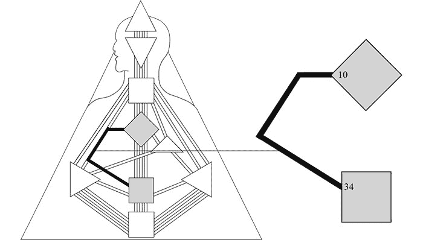

### 定义

源自于对生命的爱，信任自己内在的声音，不管这声音在别人眼中有多么疯狂与不切实际，都遵循自己坚信的信念过生活。「虽千万人，吾往矣」，做自己真心热爱的事情，当你相信自己的人生非如此不可时，真正的力量才得以展现。

这条通道的人若能真正接纳自己，爱自己，臣服于自己真正想前往的方向，必会从内在涌现无穷的力量，来抵挡外界的阻挠，活出独一无二，真正的自己。

### 坚持做自己的女神卡卡

装扮奇特、发言惊世骇俗、才华耀眼……，有很多形容词冠诸流行音乐天后女神卡卡（Lady Gaga）身上，但是，她真正让全球粉丝为之疯狂的理由，应该是她彻彻底底，完完全全地勇于「做自己」吧！她不掩饰身材的不完美，她自豪于自己的独特与古怪，她挺身捍卫同志，长期关注弱势族群；她不讳言求学生涯时遭受同侪们指指点点，认为她是个不折不扣的天生怪胎，甚至对她展开霸凌，至今阴影无法散去……

现在的女神卡卡已经成功地以音乐征服并震撼了全世界。但是，当我们再度回到起始点，回到当年那个史蒂芬妮．杰曼诺塔（Stefani Germanotta），当时的她还没蜕变成女神卡卡大放光亮，她在以严谨著名的天主教学校上学，是个出身富商家族的千金小姐，生在富裕家庭，接受良好教育，她唸书时古典音乐成绩优异，还没毕业就得到纽约大学艺术系入学许可，她知道音乐是自己一辈子的梦，满心渴望有朝一日，能成为当代流行音乐创作者与艺人。但是她也很清楚，自己的长相与身材并不特别突出，既然一开始，无法单纯以音乐吸引众人，那么，何不出奇制胜，干脆恣意妄为，做些全然不同以往的举动呢？

她决定反向操作，「做别人没做过的表演」，她穿着怪异暴露，但老实说，当时连她自己都不知道，这些表演与她对音乐的理念有什么关系，真的能让她迈向成功之路吗？她开始边唱边跳舞，甚至变本加厉开始脱衣、穿着暴露演出……。她选择走了一条前所未有的路，这让她顺利吸引了众人的注意力，没多久就一举打开了流行音乐大门，但同时，她的举动也一度让父女关系面临决裂（哪个爸爸能忍受自己女儿好好千金小姐不当，居然穿着丁字裤唱歌跳舞呢？）

### 坚持自己的信念，以行为走出独特之路

女神卡卡以她亲身的经历，完全说明了这一条探索的通道，可以如何按照自己的信念过生活。就在峰回与路转之间，跳脱了众人既定的信念与框架，神奇地走出了一条截然不同的独特道路。一般人习惯眼见为凭，藉由经验值来判定一切。在她之前，大家连想都没想过，也丝毫无法预知这样竟然也可以走出了一条繁花盛放，成果丰硕的道路。

这多么象是每个划时代的创新出现之前，众人受限于狭隘的认知，而完全无法理解他们所说的话，无法看见他们所看见的远景，无法明白那执拗到底，虽千万人吾往矣的孤独与坚持，里头蕴藏了多么强大的一股力量。那股强韧的生命力，宛如种子萌芽之后，拚命朝着光的方向，吸取任何一丁点的水与养分，不顾一切，猛力生长。而事实上，这条通道让世人理解的方式，也不是靠口才，而是靠自己的行为，一步一脚印，将路完整走出来。那一刻，大家才会恍然大悟，将嘲笑转化为尊敬，奉为典范。

这条通道的人并非叛逆，他们只是无法按照世俗的想法过生活，所以容易给人「讲不听」、「难以管教」的感觉。因为不管别人怎么说，他们就是坚持要以自己的方式来，而他们的方式往往跌破众人眼镜，所以并不意外。在坚持人生道路的过程中，他们容易受到打压，就像一开始女神卡卡的父亲与她断绝父女关系，她不断被所有人拒绝，至于后来唱片大卖时，连她自己都不敢相信。

因为没有放弃，就有机会，因为还没放弃，就不会失败，顶多还没成功罢了。就算孤独也好，忧郁也罢，这不就是蜕变必经的过程吗？没有放弃的女神卡卡如今已经清晰找到自己的定位：「把摇滚乐精神融入流行音乐；把时尚、科技、流行文化都放入表演中，再加以商业化。把这种戏剧化的概念诠释给大家。」

现在，全世界都看见了她，看见她耀眼得闪闪发光。我们不是藉由她说的话，而是藉着她的表演、她开拓演艺事业的方式、她彰显自己的角度。她不仅以歌艺表演展现了她的音乐理念，也广泛传达了她的意见，她的观点以及她独特的看法。人们喜欢她，不只因为她的歌，她的音乐，而是她这个人是如此美丽地活着，坚定又勇敢，坦诚展现自己的全貌，并且完完全全表达出来，成了最好的激励范例，启动了她来自四面八方的众多歌迷，也愿意开始拥抱自身的独特与怪异，释放原本禁锢自己的诸多限制。相信了，就算有稜有角也可以有一席之地。

大千世界会如此精采，就是因为每个人都可以不一样，都可以做自己。这不就是这一条通道所带来的启发吗？

请你发亮。以你的方式、以你的独特，请你爱自己，坚持自己的道路，继续继续一直走到底，以你的生命去演绎你所渴望与坚持的美好，这才是真正爱自己的方法。然后就在无形之中，你也将引发别人内在的力量，激发更多人也开始相信，愿意好好爱自己，接着奋不顾身地朝着想追寻的道路上，飞奔而去。

### 以自己的方式定义自己

这条通道对世界带来神奇的启发，不见得是个人在世俗的成就，而是当他们走到底，经历了所有的过程，一切才得以彰显。这里头蕴含的坚持与力量，就是「虽千万人，吾往矣」的真义。若真实呼应内在的渴求，踏上众人原本都不看好的坎坷之路，内在会时时涌现一股巨大的力量，披荆斩棘，威力强大无比。

这就像女神卡卡经历过霸凌、父亲的不谅解、刚出道时屡屡被拒绝、成名后广大的争议与批评，她依旧能坚定自己的心念。她说：「我不会变成你想要的样子！」而每张专辑的概念彷彿都传递了她真正的心声：「所有一切都由自己定义，因为没有人能定义你是谁。」这就是探索的通道，这是一个很顽固很坚强的设计，活出自己时，内在的力量好强大，足以抵御外界的诸多打压。但相反地，若你具备这条通道，却对以上描述毫无呼应，极有可能你根本没有好好善用或过度压抑它，日积月累，这股强大动力会将反扑，长期不被理解或压抑的结果，容易躁郁，更甚者会涌现自杀的倾向。

#### 给这条通道的人的建议

走上自我追寻的道路时，你可能觉得自己太过自私，但请不需要为此感觉罪恶。别人也许对你的行径不表认同，毋须在意。接受孤独并不可怕，反而能为你带来充沛的创造力。开创人生的道路上，尽管路途崎岖难行，没人知道何处是尽头，但是，如果你知道现在所走的每一步，都呼应自己的心，那么，终会有坐看云起时那一天，这种真实活着的感受，远比世俗的成就和成功来得更珍贵。

通道名人：女神卡卡、阿基师、班．艾佛烈克

# 10-57 让美透过我来展现

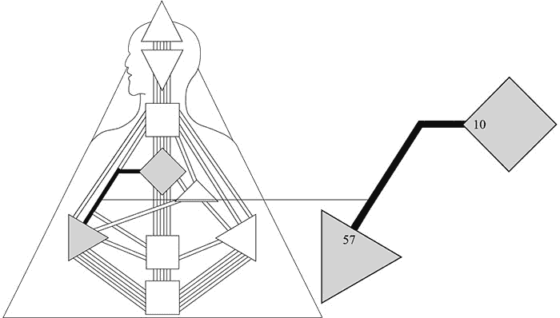

### 定义

这条通道的人只要顺从直觉，源于内在的喜悦，将美带来这个世界，经由创造出美的事物，便能找到求存之道。他们藉着反覆修缮，创造出更好更完美的事物。源自于对自己的爱，他们的举止作为都充满美，充满创意。

### 美是信仰，也是求存之道

这是一条因为美而找到求存之道的通道。为什么美会跟生存有关呢？请想象身处于远古时代的猎人，他在森林中既要躲避种种危险，也要成功猎得猎物，好求得生存。这条通道象征善于安排工具、穿着得宜的猎人：他不会穿着花俏或不合脚的鞋子；配合环境气候与出外的天数，衣物要能御寒，也不能太笨重；他身上弓箭、小刀、打火器等工具，如何安排放置，让他能以最顺畅最有效率的方式取得，好在关键时刻逃避危险，迅速猎得猎物。这条通道直觉力强，天生就能察觉在任何环境中，如何调整行为，符合生存所需。所以他不会有错误的举止，他身上的一切配备都简洁而必要。因为如此，他得以生存。

如今的社会，具备这条通道的人已无需打猎，但这条通道的人在环境中求生存的能力没有丧失。这才华演变为对于人与环境的关系很敏锐，他们天生知道什么场合该穿什么衣服，「像不像，三分样」。当他们出席某些场合，适当的穿着打扮与举止，让他们特别有说服力。这条通道的人成长过程的某些阶段中，可能会不满意自己的长相：皮肤不够白、鼻子太大、不够高……，当他们因为爱自己而接受自己，就能了解怎么装扮最能放大自己优点，隐藏缺点，甚至是让缺点变成优点。而当他们爱自己，发展出自己的独特品味，不在意世人眼光，他们会特别醒目。他们习惯于美，总是很自然沉浸在美的空间里，美对他们来说是一种信仰。

### 将美的事物带到世界上来

这条通道的人充满创意，他们经由反覆修缮，让一切运转顺畅，因此将美的事物带到世界上来。日本传统民宿与旅馆「一泊二食」的设计，相当符合这条通道的人会作的规画，这样的模式让人在旅途中不需要烦恼住宿和早晚餐，白天有充分的体力和时间在外游玩，晚上可以好好休憩。有些功能性很强，而设计极简的生活用品也很符合这条通道会做的设计。

这条通道的人，会重复修改，让物件的设计与空间的动线，臻至完美。为的是让人们处在这样的空间、旅途、环境中，非常舒畅，可以在工作中、生活中都处于最理想的状态。这条通道盛产园艺家、服装与空间设计师。他们对于如何装扮别人的外表与装置空间，特别敏锐。这就是这条通道为世界带来的贡献。

他们容易从事与美有关的事物，不管是完美呈现空间与人的关系，或者是在空间中完美展现自己。现代两位知名舞蹈家玛莎．葛兰姆（Martha Graham）和碧娜．鲍许（Pina Bausch），可说是这条通道将美带来世界的代表人物。葛兰姆从简单的收腹运动，发展出独特的动作风格。而碧娜．鲍许的作品，「重复」是非常重要的结构成分。她的大型多媒体制作网罗了精巧的舞台与仔细选择的音乐。这两位舞蹈家同时也是编舞家。身为舞者，她们经由反覆练习调整，透过自己的身体呈现出美，诠释每一个美的线条与律动。身为编舞家，她们透过作品呈现美的定义，人在空间的移动，音乐、灯光、服装与空间都要兼顾。她们也必须在作品中，让别的舞者可以表达出她们想象中的美。她们藉由创造美，得以生存。

### 「爱自己」才得以生存

「爱自己」是这条通道的人最重要的功课。他们如果爱自己，就能基于直觉的本能，找到最适合自己的方式，将美带来世界上，并因此让别人也能在充满美的环境中生存。但他们如果忽视自己的存在，或者否定自己，总觉得自己不好看、不美，穿着打扮老想将自己藏起来，他们的求存本能也会沉睡。如此一来，当然不可能发挥创意、表现自己，更遑论让自己在环境中做最适当的表现。他们反而可能举止笨拙突兀，如此一来，更不可能帮别人打造或营造美的环境。

#### 给这条通道的人的建议

当你发现自己有这条通道，而你的确爱自己，喜欢与美有关的事物，并协助别人生活在美之中。恭喜，你藉由将美带给别人，让自己求得生存。

但如果你与美的行业无关，可以想想看自己生活中是否有与美有关的兴趣或嗜好？舞蹈、绘画、香氛、园艺……。请在生活中找到你真心喜欢的事情，这是一条非常自我中心的通道，只要你真心做自己喜欢的事情，沉浸在其中，你就能在里面找到喜悦与和谐，并因此创造出美的事物。耐心等待别人邀请，你的才华终有一天会被看见。

通道名人：玛莎．葛兰姆、碧娜．鲍许、班．艾佛烈克、曾雅妮、章子怡

# 11-56 好奇心是王道，说故事威力大

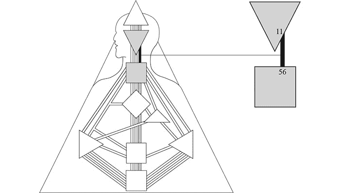

### 定义

你有强烈的好奇心，想体验新事物，你的人生就是一段追寻的过程。过程的体验远比结果更重要，请放下对目标的执着，重点不是走到你预定的目标，而是尽情体会这段精采旅程，满足好奇心也要玩得很开心，就能将自己在沿途看到的、听到的经历，化成精采的故事，藉着说故事的方式，为周围的人带来刺激与启发，从中学习。

### 说故事来传递各种体验

有这条通道的人很擅长说故事，他们好比古时候的吟游诗人或说书人，四处游历，云游四海。旅行是累积人生历练最好的方式，他们沿路在小茶馆、小酒馆说故事，同时搜集更多故事。他们是如此擅长以语言、影像、表演或任何传播故事的方式，传递各式各样的体验，而这体验不见得是他们自己亲身经历，有可能是他们之前所看到、听到的分享，或众人过往的经验。

他们象是活生生的体验型录，以自己的生命承载各式体验，行云流水般说出一个又一个精采的故事。故事本身不仅有趣，也传递了某些特定的讯息。藉由说故事来传播，让没有亲身经历过的其他人，也能明白了解其中的道理，或者感受同样的感受，进而让人与人之间日后得以在更高的意识层次上，达成共识，促进进化的可能。

有此通道的人不见得要自己体验过，才说得出故事。王家卫不会武术，更非一代宗师，但是他藉由拍这部电影，讲述了武术的精神与宗师的形象，引发了大众讨论。我们藉着他的电影体会了一个时代、一种精神、一种人物典范。

### 因好奇心持续探索

有这条通道的华德．迪斯尼（Walt Disney）一生非常有趣。他从小爱做白日梦，充满好奇心，老一边上课一边涂鸦、画漫画。他对于战争有所幻想，一心想入伍，但始终未能目睹真正的战场，后来因为被动画未来发展的潜力吸引，投入大量时间学习。终于，他创作出一个以老鼠为原型的卡通形象，这就是风靡全世界的米老鼠。从米老鼠为起点，华德．迪斯尼为我们说了好多故事。他发展出以米老鼠为主角的系列电影，接着唐老鸭诞生了、三只小猪、白雪公主与七矮人……，一部又一部电影，一个又一个鲜活的卡通人物，亲切又美好地从电影的荧幕里跳出来，与我们同在。迪斯尼说过：「我并非给孩子拍摄电影而已，我拍的电影是献给我们每个人心中的孩子，不管我们是六岁还是六十岁。」这也就解释了我们为什么即使长大成人，依旧对迪斯尼的世界迷恋不已。热爱迪斯尼乐园的群众，早已超越年龄限制。我们为什么爱迪斯尼？因为这个冰冷的世界需要故事，大人小孩都爱听故事，以故事串连，我们似乎开始感受到彼此的心跳，心可以靠得很近，就算相隔千万里，超越时空都能欢聚，在灵魂的层次紧紧相依。

对这条通道的人来说，重点并非最后到达了哪里、成就了什么，而是如华德．迪斯尼所相信的：「我们保持前进，开拓新的领域并做新的事情，因为我们有好奇心。」迪斯尼童话王国起始于一只老鼠，而这只老鼠则起始于一个人探索世界的好奇心。好奇心幻化成一块美丽的魔毯，承载我们说不清也说不尽的奇异幻梦。在无垠的时空中，尽情翱翔，你看见了吗？当太阳升起又落下，挂在夜空里的月亮与繁星，如银铃般掉落了一个个故事，你准备好要聆听了吗？你准备好与我们一起进入这不可思议的小小世界，自感官向外延伸，开始以无止境的好奇心，一起来理解这个世界了吗？

有这条好奇心通道的人，真的很容易被许许多多，大大小小的事情所吸引，他们总是想知道更多，他们总是热心想分享给更多人，他们在有形无形中传播讯息，而他们散播讯息并没有特定的目的，却常常无心插柳柳成荫。只能说这世界以我们意想不到的方式运作着，你永远不知道一个故事会在何时或何处萌生枝芽，为荒芜的人心带来无穷的启发。他们宛如一边吃水果，一边漫游的熊，无意在沿路所丢弃的果核，却因而让果树生长的范围，延伸至远方。

### 传播，才能建立共识

人人都爱听故事，这世界也需要故事。说一个故事的时间，看一部电影的时间，不必说教，更不必辩证，就能让我们对某个特定的议题，产生共鸣。故事不过是教育的另一种形式，除了传递庞大的知识体系给下一代，我们也能藉由故事的传播，期待人类得以在最短的时间内，不管在思考认知或情感体验的层面上，达成共识，而人类进化的历程可以不再重蹈覆辙。

当有这条好奇心通道的人，透过一双好奇而新鲜的眼光看世界，将自己发现到的新鲜事，透过消化、转化与传播，而广为人知，生活就变得异常有趣起来。他们说，我们听，他们说的故事、散播的讯息，意义为何，并非由他们自己界定，而是由听到、看到、感受到的人来诠释。

同样的故事，每个人的感受都会不同，有人可能是看到自己人生的片段，有人开启了视界，有人一头栽进去钻研。但不管如何，这条通道的人只负责成功说出好故事，引发人们共同的关注，引起刺激与启发，让更多人同意，并建立共识，好让大家朝新的方向前进。

#### 给这条通道的人的建议

你有源源不绝的好奇心，想探索这世界。请放下对于目标的执着，就像网络上的讯息分享，无法预期效果与结果。但在说一个好故事的过程中，享受分享这件事，在向外探索的途中，你会有更多新的想法，这些想法都将对我们带来重要的启发和影响。

通道名人：华德．迪斯尼、史景迁、奥利佛．史东、大卫．考柏菲、海伦．杭特、玛丹娜、比尔．盖兹、王家卫

# 12-22 创造流行风潮，席卷全世界

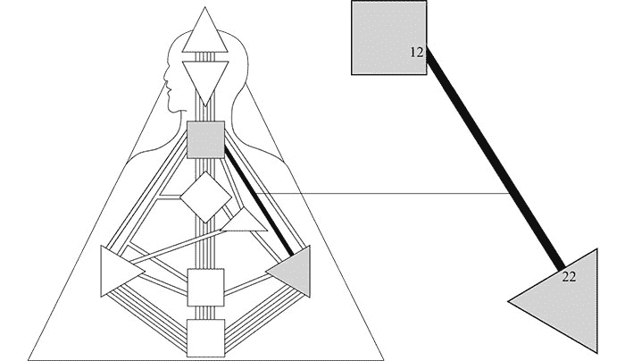

### 定义

你的人生要随着感觉与热情往前走，虽然强烈起伏的情绪可能对你造成困扰，但它却是你动力的来源。你的情绪充满感染力，有时很迷人，但也可能很吓人。不管是哪一种，都会牵动周围人的情绪，为人群带来巨大的影响。

尽管心血来潮的时候，很容易冲动做出决定，请你对自己多些耐性，学会等待，等自己情绪高低起伏的周期走完，才做出决定。不再压抑情绪，而是学会坦然面对，并好好尊重它，与情绪的高低起伏，和平共存。

### 跨越鸿沟，创造流行的奥利佛．史东

有这条通道的人擅长创造流行，他们能让某个事件从小众品味跨过鸿沟，超越性别与年龄，甚至国籍，被所有人接受，然后爆发成为大众流行的风潮。他们能将原本乏人问津的人事物，以最容易被理解与接受的方式介绍给大众，轻轻松松化繁为简，让大家都能朗朗上口。

《龙卷风暴》一书中指出，在品牌、产品或技术广为流传，蔚为风行之前，一开始，往往始于一小群我们称之为技术狂热者的人。他们可能深入并专业，却象是活在外太空般，自成一个小宇宙，无法被主流市场或一般消费者理解。这时候若出现某个契机，象是搭建桥梁般的奇妙转折点，象是：更改原本的说法，找到合适的名人代言，又或者是移除了使用者不易上手的障碍等等，就有机会让更多人了解，跨越鸿沟，走到桥的另一端，造成风起云涌的大流行。

举例来说，电影《艋舺》若是别人来拍，可能不会有这么多流行元素。有此通道的纽承泽让这部片娱乐性高，造成风潮而普及，这条通道非常适合从事流行娱乐业。他们即使探讨严肃的主题，也能处理得让一般大众能接受。导演奥立佛．史东（Oliver Stone），他的作品多为政治与战争题材。《谁杀了肯尼迪》是公认的佳作，但绝非深奥复杂，难以理解的小众电影。他三部知名的反战电影被誉为「越战三部曲」，也是非常好莱坞取向的院线片。有这条通道的人不管要传递什么讯息，都清楚易懂，有话题可炒作，还能留下余味，让人讨论。不管讨论的是男女主角选角、配乐、主题……，总之，有这条通道的人绝对会让他要传递的讯息，在第一时间内迅速让人明白，还能造成话题，广为讨论。

### 充满能量的声音极有磁性

这条通道的人还有一个让人印象深刻的天赋，当他们一开口，其声音语调总能表达出浓烈的情感，具有强大的煽动力，让听众不但感同身受，还能备受感动，为之动容。去年（二〇一三年）奥立佛．史东拜访广岛，向日本民众发表了一场演说，痛陈日本只是美国的附属，接收美国贩卖的军火。他的中心主旨清楚，内容激烈，声音冷静凝练，却极富渲染力。他根本不是政治家，却将自己反战的立场与理由陈述得令人动容，这就是开放的通道的感染力。当他们热烈支持某个论点时，就能以引发情绪的方式，传递他们的想法。让人印象深刻的并非逻辑清楚或者声音好听，而是这所有元素组合起来，引起的难以言喻的感动。

这条通道的人对声音很敏感，而他们的声音也很特别。一开口讲话，就让人忍不住打开耳朵，期待听见那独特又充满磁性的声音，如何形容他们的声音呢？那声音里似乎带着某种能量，盛装着情感的动力。除了内容，还有一种难以言喻的独特频率，声调里莫名就能传递一股向外扩散的渲染力。这也就是为什么有这条通道的人，很容易成为歌手、广播人，或从事与声音相关的行业。

### 起伏强烈的情绪，正是迷人之处

有这条通道的人，内在充满时高时低的情绪周期，情绪在高点与低点时所呈现出来的状态，有极大的差异。情绪处在谷底的时候，整个人可能呈现彻底的孤僻，焦躁不安，完全不想出门，只想封闭在家，与人群疏离。但是，可能只是睡一觉起来，情绪周期却立即从低转高，突然摇身一变成为一个精力旺盛，非常社交，讲话风趣又讨人喜欢的人。别人觉得他们喜怒无常，难以捉摸，其实连他们自己可能都搞不清楚，这来来去去的情绪，究竟有什么道理。

没有道理，却异常迷人。尽管他们情绪起伏强烈，而且难以隐藏，尽管他们容易爱得死去活来，也恨得死去活来，无法低调。尽管他们高兴时是社交动物，在聚会里呼风唤雨，与人为善和乐融融，长袖善舞将每个人都招呼妥贴。但是，当情绪低潮突然来袭，也可能变得脾气暴戾，看谁都不顺眼也不顺心，时而冲动火爆，时而黯然泪下，充满戏剧化的情绪。因为情绪的反差实在太大，他们也常常为此自责，怀疑自己如此难搞，到底是不是个神经病。殊不知，这造就了他们极为强烈的存在感，充满情绪的动力，让他们的存在极为强烈，形成莫名的吸引力，让人着迷。

由于情绪周期的影响实在太强烈了，导致有这条通道的人，在当下往往看不见真实，想法也难免反反覆覆。若能对自己诚实，去体验每个当下的体验，了解到自己在每个当下的感受都无比真实，让情绪的能量流过身体，不管心情好坏，不高兴时劈哩啪啦大骂人，高兴时，又欢欣鼓舞热血沸腾，请都好好观照它。因为你不等于你的情绪，但是你可以学习好好与自己的情绪同在。如此一来，情绪就会与你成为亲密的朋友，转化为一股无与伦比，支持你往前大步迈进的原动力。

这条通道的人若真正活出自己的设计，必定充满强烈的个人风采，不见得是符合普世价值的帅或美，但必定不会平庸，很有自己的风格。他们也多半气质优雅，而这优雅并不只存在于浅薄的表面，更不是端个架子的表相，而是经历了许多是是非非，体验过最激烈的爱与恨、痛苦与快乐、获得与失去……。春风得意也好，过尽千帆也罢，拥抱过种种情绪，到最后，依然愿意怀抱信任，以一颗开放的心，接受并热爱生命。那是透过光阴淬鍊出来，冷静又沉稳的气质，这让他们即使情绪高低依旧，偶有疯狂的行径，却不失其优雅，而这就是专属于这条通道的美好特质，独一无二，如此动人。

#### 给这条通道的人的建议

尊重自己的情绪周期，若不想社交就不要出门，即使你勉强自己出去，最后还是会破坏气氛。诚实地跟自己的情绪在一起，尽管情绪有高有低，让你上一秒与下一秒的决定可能截然不同，关键在于，忧郁烦躁的时候，静静等待，兴奋高亢的时候，也静静等待，等自己完整经历了情绪周期的上下起伏，再做决定。请相信你所经历过的每一个事件，都会成为滋养人生的重要养分，最终都将化为生命的力量，要有信心。

通道名人：奥立佛．史东、纽承泽

# 13-33 记载全世界信息与祕密的人

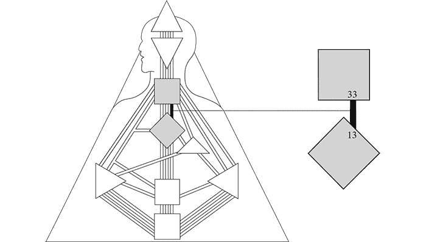

### 定义

你在生命中每个阶段不同的体验，最后都能让你对人生有更深的理解。你感受愈深刻，就愈能轻松看待生命中所发生的一切，见证自己与他人的生命，记录下所有讯息。独处对你来说非常重要，如此你才能好好消化并整理自己所经历的，与听来的事物，沉淀，从中省思，记录并保存下来，才能传递给周围的人，让众人能鉴往知来，不再重蹈覆辙。

### 搜集与归纳，凝聚共识

这条通道的原型人物是圣经故事中的浪子：一个父亲有两个儿子，大儿子尽心尽力地管理父亲的牛羊、田地和财产。小儿子要了部分财产后，出外游荡，到达远方，历经了很多事情，最后将钱财全都挥霍完毕，只好回家。姑且不论这个故事在圣经中代表的意义为何，这浪子回头的故事，相当程度代表了这条通道的特质：他们打破家族传统常规，出外冒险体验，最后回到家，将他的种种经历体验，传递分享给家族中的人。

这条通道的人，如果也有其他行动力强的通道，会自己出外去冒险；若没有，也会吸引到许许多多有丰富体验的人，来跟他诉说他们人生旅途的故事。这条通道的人或亲身经历、或听闻许多故事后，会回到原点。例如上述圣经故事中的家，静下心来，整理汇集，在诸多体验间找到共识，集结出一个可行的作法，好让大家继续往前走。

记录、并倒带回顾，好理解许多人们所经历的一切，意义何在，是这条通道的贡献。人们的体验需要整理归纳，才能凝聚共识，代代相传，如此一来，人类才能进化。就圣经故事中的大儿子和小儿子来说，大儿子是固守家庭原有的价值和作法，他扮演的角色是稳定不变，用旧的模式持续运转。小儿子则是出外经历，让这个家族中的人理解，外面的世界还有哪些作法和模式，他们目前的生活与外界的差距，是否要调整，以及怎么调整。这是这条通道之所以为「足智多谋的通道」。他们是因为见多识广，而汲取出智慧。

### 见证自己与他人的人生，从中提炼出智慧的西蒙．波娃

西蒙．波娃（Simone de Beauvoir）是这条通道的代表人物。世人知道的她是女权主义者与哲学家，她跟沙特之间交往的关系，以现在的用语来说，是「交往中但保有交友空间」。这在一百年前的两性关系来说，非常前卫。除了沙特，她还交了很多男友，包括沙特的朋友与她的学生。但是，波娃有一个面向是大部分的人较不清楚的：她出身富裕家庭，父亲原本希望她是个儿子，且希望将这个儿子教育成理工科人才。因此之故，波娃的父亲从小便一直对她灌输「她有个男人的脑子」的观念。父亲灌输的观念，不仅影响了她与沙特的关系，也影响了她对于婚姻的想法。她身为女性，不但不认为自己输给男人，反而要比男人更有成就。男女关系上，她也毫不认为自己应该侷限于女性认命，终其一生为家庭、丈夫付出的传统角色。

波娃的人生象是对父亲的反叛，她也像圣经故事中的浪子，年纪轻轻便出外经历，情场经验丰富。她最重要的作品《第二性》也为女性地位、个性与特质如何被塑型，提出了总结。这不仅是她个人的反叛与总结，而是在见证了自己的人生，也见证其他女性的人生后，从中提炼出智慧，好让所有女性知道自己所处的位子，该如何了解自己，如此才知道，该如何往下走。她从己身经历出发，却书写了一部被誉为女权运动圣经的女性历史。

### 善于聆听，并需要独处

这条通道的角色，的确很像写历史的人。他们记性惊人，可以记得所有发生的一切。一个人能够经历的很有限，但他们可以透过聆听，吸取大量的信息。这条通道的人很像八卦集散地，他们的能量场会吸引很多人，跟他们说发生在自己身上的事情与祕密。他们善于聆听，并需要独处，好静下心来，整理出这些讯息和资料背后，共同的法则是什么，如此大家才能好好往前走。

发生在他们人生中的任何事情，出现在他们人生中的人，他们所听到、见证到的一切，都不是没有意义的，重点是他们是否能从中理出头绪。

这是一条领导众人往前走的通道。他们因为亲身经历丰富、或者听闻太多，所以明了要找到一条必定可行之路，其实很难。即使找到了也意外难免、失控难免，但不能因此就止步。所以，万一他们走的这一条路不是通往绿洲，而是像圣经故事中遇到强盗，他们也会处之泰然，因为这对他们来说，只是又多了一项经验值。

所以，这条通道的领导方式，不只是逻辑上的道理，而是出自真实经历所总结出的道路，因此有血有肉有真实的感受。有这条通道的人，说话让人感觉真诚，是因为那都是来自亲身体验，或他们自己听来的故事，是他们以自己的人生实际去碰撞与经历，而得来的人生智慧。他们带领的路有可能行不通，提出的方案可能被批评不完美，但是你不会怀疑他们的真诚。

#### 给这条通道的人的建议

你不只是八卦集散地，还拥有可以让许多人向你倾诉祕密的天赋。这是为了让你搜集到够多信息，好整理汇聚成一条可行之路。请你多方探索、多多体验，才能从自己与别人的体验中，汲取到足够的智慧。此外，独处隐居是为了整理资料，请不要耽溺于收集整理，而忘了将自己的智慧跟别人分享。更重要的是，独处，是为了理出一条往前走的路，千万不要止步不前。

通道名人：英国现任首相布莱尔、杨德昌

# 16-48 十年磨一剑

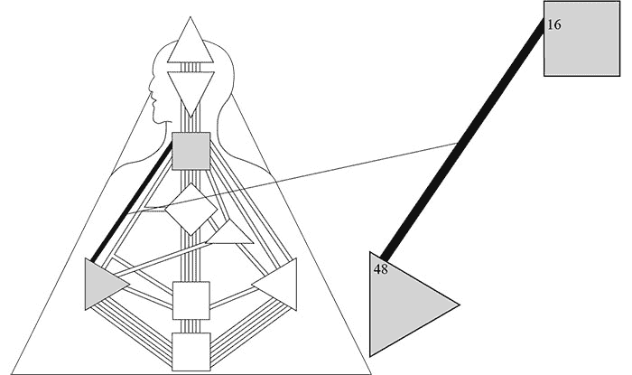

### 定义

经由反覆不停的练习、修正与学习，终于达到令人惊叹的技艺。你渴望在人生中找到可真心承诺、投入一辈子的志业，沉浸其中，反覆练习这领域中全部细节、步骤等技艺。将最平凡无奇的基本功，操练成千上万次后，让技艺升华为艺术，从学徒变成大师。

若找到一个你愿意全心投入的领域，耐心等待，反覆操练，经过岁月、精力、心血的累积，终有一天会在这领域中成为达人。

### 以平凡的毅力创造非凡成绩的梅莉．史翠普

被誉为地表最厉害演员的梅莉．史翠普（Mary Louise Streep），是这条通道的代言人。厉害的演员很多，讨人喜欢的演员更如过江之鲫，但梅莉．史翠普从事演艺事业至今三十七年，她已经无法只是用「厉害」、「喜欢」、「演技好」来形容。她得奖次数多得惊人，是目前奥斯卡与全球奖纪录中得奖最多的演员。可以想象的是，她还会打破纪录，而她挑战的对象不是别人，只有她自己。艺术家都有其成就的颠峰，但显然梅莉．史翠普始终不停攀升。

这就是才华的通道。有这条通道的人，一开始时，或许不是最漂亮、最突出、最聪明，但只要他们下定决心投入，到最后他们会超越漂亮、突出、聪明的标准框架，到达世人认为「凡人」难以企及的程度。但是，这条通道的人就是凡人，他们只是凭着铁杵磨成绣花针的毅力和信念，超越想象，化平凡为神奇，一出手看似普通，却蕴藏数十年反覆淬练才可得的深厚底蕴。

梅莉．史翠普一入行很快就展露头角，三十年前就已经连连获奖。她是一个态度实际，脚踏实地不浮夸的演员。但如果她就停留在三十年前的程度，可能就只是好演员之一。她之所以有今天的成就，在于她不满足自己的演技。她早期很受肯定，演员雪儿也说她是精准的「演戏杀人机器」，不管诠释什么角色，都非常有说服力。但也开始有影评人批评她，说她象是演戏机器，很完美却没有人味。于是她开始拓宽自己的选角范围，演了闹剧、动作片、喜剧，反覆揣摩演技里各种角色、各种表演方式，以及自己的可能性。为了将戏演好，她甚至学会了拉小提琴。

### 练习千万遍以求达到完美

梅莉．史翠普对自我的要求与磨练并不是立即见效的。有好几年，她的演艺事业走下坡，但她持续努力，保持耐心，等待好剧本、好角色，终于让她等到《时时刻刻》这样能发挥细腻演技的作品。最近几年，她在《穿着 Prada 的恶魔》与《美味关系》出神入化的演技，简直就是剧中人物走出来，梅莉．史翠普完全展现了这条通道「十年磨一剑」的特质，他们的成功绝非偶然。

这条通道的人如此执着，他们会反覆练习同样的技术一千遍、一万遍，以求达到最完美最理想的境界。当别人觉得反覆成千上万次，没效益太无聊，试图找出更快速的方式时，这条通道的人就是埋头苦练，直到有一天锋芒再也无法被轻易忽略，破匣而出。

### 从徒弟到大师，技艺升华成艺术

臻至完美的过程很辛苦。一开始，执着于完美，反而落入对形式的执着。吊诡的是，愈是完美无缺就愈不完美。但若是持续下去不放弃，终有一天，他们将领悟什么是超越形式的完美。练习弹奏一首曲子上万次，熟练到每个音符都准确至无懈可击的程度，但是，这就是完美了吗？这世界上有多少人过于偏执于技术与技巧上的完美，却始终少了那么一点点，那所谓欠缺的一点点，却是技术无法攀达的顶峰，那是自然流露出的情感，是灵魂层面感动人心的瞬间，若无法触动情感，就算表演得毫无瑕疵，差之毫厘，相去岂止千里，离完美，仍然遥远。

所谓的徒弟，所谓的大师，差的只在那一瞬间的心念。若能终于放手，技艺依然透过他们呈现，长久的执着已成无物。此时，无须死守音符必须百分百准确，因为音符早已是准确的，透过长年锤鍊的技术，音乐内化成生命震动的频率，与你合一，而情感与技艺也默默交融合一，当技艺升华成艺术，这就是才华通道运作的最高境界。

有这条通道的人极入世，他们才华展现的领域也很实际，通常值得反覆操练的，是能让生活质量变得更好的技艺。比如茶道、拳术、舞蹈、瑜珈、厨艺、演技等。这条通道的奥义，就像武侠小说里面的「无招胜有招」。武侠大师闭关，潜心修练招式，有一天突然领悟出道理。茶道达人同样的动作反覆十年，有一天他无意推开门，那瞬间突然领略到无心的寓意，因此顿悟茶道的精髓。往往最基本最简单的菜式，如蛋炒饭，每个人都会做，但却是辨识一家餐厅好坏的关键，同样的动作、流程、招式，经过操演上万次之后，是艺术，也是底蕴。

投入一辈子的时间与精华，反覆练习，努力累积，剎那间，过往所学的一切贯穿全身，「无招」是从招式中顿悟出来的心法。真正的大师并非胡乱挥舞，乱无章法，而是超越了原先招数的规范，从此随心所欲，运用自如，不逾矩。

在实际层面反覆实验与操练，这条通道本身其实很无趣，为了找到最好最完美的方式来呈现，他们不仅耐烦，还很实在、很稳定、愿意持续下去。若是真心喜欢，他们真的不觉得练习上万次有什么辛苦，反覆操练对他们来说是理所当然，是达成完美的必经过程。而皇天终究不负苦心人，当他们熬过这些必经的辛苦，反反覆覆，有一天，若因缘具足，他们将远远超越自己原本的设定，体验到天人合一的境界。

#### 给这条通道的人的建议

找到一个你愿意真心投入的领域，矢志不移。当你确认这是自己真心喜欢的志业，请累积这志业的领域中所有一切基本功。可以在领域中换工作，做不同类型的磨练，但不要换领域，只要沉得住气，所有的努力终将得到回报。

通道名人：梅莉．史翠普、北野武、厨师波登、导演柏格曼、班．艾佛列克、大卫．鲍伊、张国荣、大卫．考柏菲、建筑师高第

# 17-62 兼顾大方向与细节的管理者

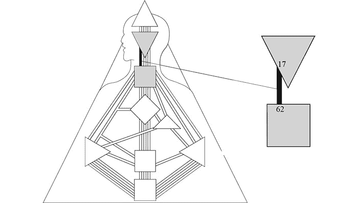

### 定义

天生的管理者，能为未来找出合乎逻辑的运作模式，或是修改既有的运作模式，使之更为顺畅。非常具有逻辑的思想者，能够洞察出组织里的每个部分，是如何交互运作着，侦察出错误点，寻遍所有相关细节与知识后，提出独到的解决方案。懂得如何经营，具备管理的才能。这是许多企业亟需的才华与天赋。

### 兼顾大方向与细节，天生的管理人才

这是一条关于管理组织能力的通道。有这条通道的人擅长看出大方向，并从诸多细节中，整理出可行的程序和公式，以找出解决之道。他们能建立企业中的 SOP，或者紧急应变措施，好让组织在平常有正确的运作模式。若遇到突发状况，他们也会尽可能在事先设想好应变措施，务求一切都能如计划顺利进行。他们总能从逻辑和事实中，自行整理出一套秩序，找出相对的应变之道，同时也让组织中的每个成员各安其位，各尽其用，从中找到管理的真谛。

若只注视着大方向而无法兼顾细节，容易眼高手低。相反地，若只是专注于细节，失去远景，则因小失大，格局有限。有这条通道的人，天生能兼顾两者，是与生俱来的管理人才。他们掌握了大方向，推演出所有执行的相关细节，反过来说，他们也能从诸多细节中搜寻线索，推演出未来向外扩张的可能。他们可说是改变了组织运作方式的人，在清楚的逻辑归纳下，设立了明确运行的规则，整理归纳公司的走向，具体擘划事情该如何进行与推动，这就象是铺上了轨道，火车就能顺应轨道行驶。

设立范畴，确立步骤，他们的语言能力佳，擅长以简洁清晰的风格进行沟通，于是组织里的每位成员，都会很清楚该如何配合，如何运作，依据规则行事，重视团队合作，相互截长补短，创造最大的绩效，使命必达。

他们也希望在组织内，每个人都能各有所归，发挥所长。当然前提会以组织的需求为考量，当组织运作顺畅，每个工作者在岗位上工作愉快，经验可因此传承与累积，组织就能日趋成熟，愈扩展愈大，往下一个更大的方向与愿景迈进。

这条通道的人具备优秀的语言能力，他们能将自己的想法以文字清楚精确的表达出来，在当中看见清楚的逻辑推演，都是根据详实的细节与知识，巨细靡遗所推演出来的结论。也因为如此，他们所认定的方向，以及接下来该如何执行操作的方式，脉络分明，合情合理，多半能被绝大多数的人所认同。

### 贾伯斯让抽象逻辑转化为执行过程

有许多有名的企业管理者、项目领导者、特助、总经理秘书都具备这一条通道。贾伯斯就是个明显的范例，贾伯斯以他的创意风靡世界，可能很多人会以为他的个人风格强烈，不能做为管理人的典范；但是，事实上，身为苹果的联合创始者与皮克斯的创立人，如果光有创意，而无法付诸执行，就没有今天改变全世界的苹果。这条通道的「指出大方向，同时关照细节，以便落实」的特质，就是驱动苹果奇迹的重要动力。

苹果曾经处于破产的边缘，经由贾伯斯的整顿，如今它已成为全球最令人艳羡的科技公司。从起死回生到飞黄腾达，他做出了几个关键性的决定，当他重回苹果，看见内部运作状态复杂混乱，当机立断决定先看大方向，删去无关紧要的项目，大刀阔斧做出整顿，化繁为简。他说，针对不同用户，我们只需要四个产品，这就是一个非常经典范例。

同时，坚持细节，也是苹果最让消费者感到贴心的地方。他说过一句很有名的话：「谁说我没询问消费者的意见？每天早上我不就对着镜子问这个消费者，问我自己，你要什么？」他亲自参与产品研发，坚持字体排版得细腻美好、外壳的颜色与材质得做到什么样的程度，才能让人爱不释手、荧幕的像素，贴心而人性的设计。这世界上有很多人热爱苹果，却无法真实说出原因，就是来自于细节的巨大功劳。

大胆尝试，不断修正，从日积月累中得出经营管理的智慧。公元两千年贾伯斯因应科技泡沫破裂的危机，一方面将苹果计算机设计成可连接其他电子产品，并强化外观设计。接着，他缩短产品流通周期，并在租金昂贵的高级地段开设苹果专卖店，这种种不按牌理出牌、有违计算机产业惯常的作为，反而让产品大获成功。

这条通道的人擅长让抽象的逻辑变成执行过程，推动事情发生。他会找到商业组织里，社会群体中，大家一起运作的模式；他具有杰出的思考方式，既能抓到大方向，又能不漏掉任何细节，但也不会受限于细节里。但组织愈庞大，细节就愈多，就需要花更多时间将组织里环环相扣的事实和状况搞清楚，这样建立于上的大方向才会稳固。

#### 给这条通道的人的建议

你适合在大企业工作，你的天赋才华应用在观察、归纳组织运作，并提出一套更好的模式，有助于公司管理。而在你提出规画前，要掌握所有相关资料与讯息，你提出的意见需要这些大量细节来佐证。

请耐心等待，让别人辨识出你的才华。等待别人邀请后，再说出自己的想法与意见，众人会为你提出的想法，与你所具备的背景知识和细节惊叹。但若你未经邀请就贸然发表意见，你所传达的讯息，听在别人耳里，只会变成诸多繁琐细节，而让大家觉得非常无趣。

通道名人：贾伯斯、茱莉．安德鲁斯、陶大伟、川普、奥修、杜琪峰

# 18-58 严苛的背后，满怀澎湃的人类之爱

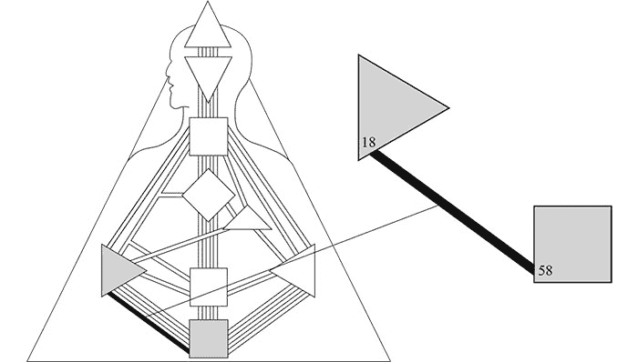

### 定义

这条通道天生善于挑出错误，同时提供评论与判断，找到问题的解决方法。他们是完美主义者，对追求完美有着莫名的执着，这股驱动力必须用来服务人群，改善社会制度，而非用在亲密关系如家人、朋友之间，否则容易因为不断挑剔，而让自己的人际关系陷入困境。永远要记得，完美是一种境界，或许永远无法存在，而批评的艺术就在于对事不对人，其源头必须源于对人类的爱。找出错误之后，这个世界可以因而变得更美好，这才是这条通道存在真正的价值与意义。

### 对错误敏感，批评是为了完美

这条通道的人对于错误与脱轨之事极其敏感，一眼就看出事物扭曲、或系统组织中出错之处，他们可以清晰地提出批评，试图纠正乱象。对他们而言，拨乱反正才是王道，是让这世界重新恢复井井有条的运转方式。他们待人严格，自然也律己甚严，唯一让他们满意的是，这世界完美无缺，毫无差错地运转着。但是，也因为这样的机率几近于零，所以他们总是不满足，非常爱批评，而这条通道的严谨与高标准，不仅让他们自己受苦，也明显与周遭格格不入，别人觉得他们难相处，难以取悦，他们自己也不容易快乐，很难满足。

他们就像人类的免疫系统，系统若稳固，一个人才能从事各式各样的任务和冒险，方能进化。平常看似理所当然，若有一天免疫系统崩毁，生命不复以往，就如同世界崩盘了，再也不能稳定运作。这道理就象是，每一天，我们活着，默默依赖着这世界许多既定的体系，我们看似平凡无奇的生活，其实建构在众多体系必须持续而稳定地运作的前提之下。例如，稳定的交通系统，每一天火车都要是八点准时发车；稳定的供水系统，所以当我们一转开水龙头，一定会有水；可依靠的通讯系统，所以网络可以随时上线，不管什么时间点，人与人之间都能以各种方式相互联系；稳定的金融体系，让老板每个月将薪水转帐至员工的户头里……。因为世界井井有条运作着，系统照一定的模式运转，人们便可安心生活。

### 社会系统的建构者与纠察员——孔子

所以，这条通道的人扮演的就是社会系统的建构者与纠察员，所以他们必定内在有其遵循之准则。因为火车不能爱开不开，邮局不能想休息就关闭，这条通道的人想在这个世界上建立一套很安全、很稳固，可世世代代传承的模式。他们无法不谨慎不严谨，因为既定的体系与模式万一崩毁，事关太多人的生活权益，岂能轻忽，怎能随便。

孔子是这条通道的代表人物，他批评时局，周游列国，游说各国国王君主，希望得到认同，才能推行他的理念，他不是为了做官或营利，而是心怀大志，对于治理国家的方法勾勒出一个理想的形式，期待能造福天下人。他教育学生，传递儒家之道，看到错误必然纠正，不管是对待学生或君王，他制礼作乐，「礼」是「节制」，也是「理」，可说是所有人做事处世都能有所依规的准则。

孔子或许看起来有点无聊，一点也不像他的学生子路那么有趣，他老是摆出老师的样子谆谆教诲，但他所传递的种种关于「仁」、「君子」的道理，一直到现在都还适用。如果没有他这么严格规范出一个理想之人的品格风范，后世的读书人可能都不知道在乱世如何自处，在盛世中如何为国家贡献。从这标准来说，《论语》可说是这条通道的批评与纠正文集，而这套标准，历经不同朝代、不同价值观，流传了两千五百年，到现在依然能适用。读读他说的「大道之行也，天下为公，选贤与能，讲信修睦……使老有所终，壮有所用，幼有所长……」这难道不是现在很多政治人物还在诉求的事情吗？

### 挑剔，是他们爱世界的方式

这条通道的人，只要发现模式稍有出错或行不通，就一定要纠正，如此一来，错误才不会愈来愈严重。他们看得远，所以，当他们规画或建立一套系统时，除了防堵与留意所有可能的错误之外，也会预想五十年、甚至一百年后，可能会出现的问题，并提出解决之道。

网络上曾流传过，中国山东省青岛市的下水道工程，是近百年前由德国人建立的。曾有一次，因为零件毁坏，而当地找不到可以替代的零件，不得不向原公司求助。德国公司告知青岛公务处人员，在此工程零件方圆三公尺内，必定能找到用油纸包裹的零件包。这就是非常典型这条通道的人会想出的预防之道，他们会尽一切可能，试图让失败或错误率降到零，若能以众人福祉为考量，详细建构出一套稳定安全、可世代运行的制度系统，就是这条通道活出自己，对人类独特的贡献。

如果世界是一整个舞台，他们适合成为架设舞台的幕后人员，打光、声控、动线安排……。他们将一切控制安排妥当，好让导演和演员可以尽情施展，感动观众。严谨是他们爱世界的方式，他们或许看来颇无聊，却很可靠；他们给人挑剔又难相处的感觉，是因为立即不留情面地纠正错误，底层却是他们表达关怀的方式，这样的作法也很容易让人误会或引发争议。南方朔和陈文茜都是这条通道的代表人物。看似理性、严谨、难相处的底层，实则为极端感性的大爱：为了全体人类的安全，找到大家可以长久运作的模式。

他们的批评虽然以爱出发，但却常因表达方式严厉，而饱受指控。换句话说，这条通道善于挑错与纠正的能力，若是针对家人朋友猛烈批评，最后就很容易引发抗拒，最后将箭头转为批评自己。所以若没有将这天赋发挥在正确的方向，成为针贬世界的评论家，或者推动理念的权威当局，就很容易摇身变成愤世嫉俗、非常挑剔又自怨自艾的人。

#### 给这条通道的人的建议

请务必将批评的独特才能，用在与大众相关的事务上。若能源于爱，那么你追求完美的特质，一定能在权威体系中找到失序脱轨的错误，你所提出的针贬与建议将会达成功用，造福更多人。但是，若只是不断挑剔、批评家人、朋友与自己，久而久之只会伤害到自己的人际关系，得不偿失。

通道名人：孔子、南方朔、陈文茜、奥修、奥立佛．史东、茱莉．安德鲁斯、高第

# 19-49 有情有义，以牺牲换来圆满

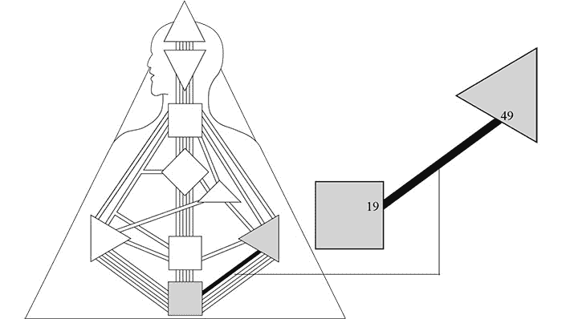

### 定义

生命中持续面对的课题是，如何秉持内心所遵循的原则。满足自身需求的同时，也满足周遭人的需求，同时在实际与公平两个层面取得平衡。这条通道的人在情感上很敏感，在人际相处中会付出许多精力，渴望与别人亲密的接触。但是这接触是友善的拥抱或敌意的冲撞，则根据情绪的高低起伏而有所不同。另外，这条通道也与食物、环境、社群息息相关，与家人、亲友、还有志同道合的朋友们一起相聚吃饭，就逐渐演变成彼此共享资源，维系感情的重要方式，也是让这条通道的人感到心满意足的关键。

### 将台湾人都当自家人付出的林杰梁

这条通道常被我暱称为最有情有义的代表，简直就是一条名符其实的「艋舺」通道。有这条通道的人总是如此重义气，对于自己所关怀的人毫无保留地付出。去年刚刚去世的侠医林杰梁就有这条通道，他最为人称道的是当医生如同侠客，待人接物没有架子也毫无派头，巡房时即使遇到不是自己的病人也会关心问候，非常吻合这条通道的特质。他是侠骨柔肠的仁医，不只他的病人，所有台湾人，在他内心都是自家人，都是他专业上要照顾付出的对象，不分远近亲疏，职业与贵贱。

林杰梁因为长期在媒体上倡导食品安全，针贬政府食品卫生政策，与某些食品业者形成利害冲突，他从头到尾都不改初衷，富贵贫贱不能移，他从不屈服于业者的强势与威胁。他说，自己以专业为本。正应证了君子有所为有所不为，他不仅做到医生视病如亲，还义无反顾地，一肩扛下维护台湾人食品安全的重责大任。长期认真研究，仗义直言，最后也因此而工作量太大，过度疲累，遗憾英年早逝，而成为我们这个世代，深具义气与风骨的典范。

这条通道叫做「整合纵效的通道」，意味着有这条通道的人，在部落中注定要扮演分配与整合资源的角色，他的挑战就是如何在自己与众人的需求之间，做出公平且实际的判定，并做出决定。有这条通道的人，随着年岁成熟，渐渐会走上特定的位置，就如同古代大家族里，分配资源，掌管祖产的长老。又或者是族群部落里，负责主持祭典并公正分配祭礼予族人的祭司。若是在黑帮中，必定是那主持公道，做出仲裁的领头大哥。他也可以在娱乐产业里，扮演那照顾众人，同时得分配资源的监制……。这些角色都是喊水会结冻，说了就算数的老大，既然在其位，就难以避免要面对：资源分配很难真正公平。有分配就会产生纠纷，众人总是会跑来与他吵闹，借以索求更多的资源。

### 牺牲在所难免，重点在于是否有价值

怎么办？既然注定迟早要坐在这个位子上，他们就得面对所有的抱怨与索讨，甚至因此付出代价，牺牲自己的时间、资源、金钱等，以顾全大局。对有这条通道的人而言，学习如何在众多需求间取得平衡，需要智慧，同时，他们也不可避免地，不断在生命中碰触与「牺牲」相关的课题。

一般人对牺牲的看法很悲情，但是就某个程度而言，为求圆满，牺牲却是求取诸多平衡中，不可避免的过程之一。所以，具备这条通道的人，无法逃避，基于家族或更多数人的利益，有时难免得牺牲小我的利益，退让以求更大的圆满。既然无法抗拒，生命中迎面而来这样的课题，那么值得深思的会是：你的牺牲是有价值的吗？

如果牺牲短程的利益，足以获得长期久远的好处，如果适当的退步，得以换取整体的和谐与平等，那么，这是有价值的牺牲。反之，如果只是无谓又无目的性，盲目的让步与牺牲，那么，到最后也不过是白白浪费了资源，更甚者是让既得利益者食髓知味，软土深掘，导致日后不停索讨更多利益，甚至迫害到整体家族的存续。那么，这就是称之为不值得，并且毫无价值的牺牲。

何时要坚持？何时要牺牲？如何整合？是否退让？都需要极大的智慧，也考验着这条通道的人。他们若能在对的时间点做出正确的决定，就能将资源妥善分配，让部落里的每个人都能得到充分的滋养。所谓的滋养，不仅限于物质层面食衣住行的需求，还包括了在精神层面上的教育与成长。若能让部落里的每个人都丰衣足食，有学养有文化，部落自然而然会因此兴盛，进而茁壮。以林杰梁医师为例，他最让人钦佩的是，劳心劳力，看似牺牲自己的时间与精力不断研究，其实他换取的是整体国民的健康。他苦口婆心，不停用各种方式传达毒物和食品安全的观念，让我们除了吃得安全，也愈来愈懂得如何以正确的观念过生活。长远来看，因为他的坚持与贡献，促进整体社会的进化，功不可没。

### 对自己人义气，对外人冷酷

说这条通道的人很敏感，但是，他们的敏感只会用在特定的人与特定的地方上，就像在内心画上一条无形却明确的界线。如果你被他们认定为自己人，他们必定会从头到尾义气相挺，敏感照料族人的需求，无微不至。这是一种极为原始的情感，没有理性，无法辩证，绝对的主观，可以为了保护家族，牺牲自己，在所不惜。反之，若你不属于自家人，不幸身处线的另一边，那么他们根本毫不在乎，也不在意你的死活，若有必要，为了捍卫自己所属的部落，他们还会向你夺取更多资源来滋养自己的家族。这时候，不但没有义气可言，还会残忍以对，他们的义气只用在自己人身上，这也是为什么这条通道也多黑帮份子，或者军阀，如蒋介石。

他们对自己人有多讲义气，对外人就有多冷酷。他们可以是最温暖、最无私的人，却也是最残忍、最没有人性的。因为，不属于他们捍卫守护范围的人，都是外人。这没有道理，无关意义，家族的情感或兄弟间的义气，不是用「道理」可讲，也不可能就事论事。以此类推，他们心系的是整个家族的安全存续，为此他们提供资源分配，也进行约束管制。如果有人不受他们约束，甚至做出颠覆整个家族安危的行为，他们也会站在家族立场，予以驱赶。因为，破坏规则或安全的人已经不是家族一份子了。

#### 给这条通道的人的建议

你天生重义气，所以首先必须练习：进入任何合作或人际关系前，试着将你的需求说清楚，并在相处时，给彼此空间，试着取得平衡。在关系中理解牺牲真正的目的，是为了大我的兴盛和谐，而不只是一昧牺牲。当你能分辨出何者为轻、何者为重，并做出妥善分配时，你所要守护的族人才能得到真正的安全。再者，不要在情绪高亢或低潮的当下，贸然做出重大决定，请多等几天，让自己的心情清晰，此时的决定才会是明智的。

通道名人：林杰梁、蒋介石、周星驰、欧普拉、昆丁．塔伦提诺、贝克汉、拳王阿里、达利

# 20-34 跑得比猎物还快的猎人

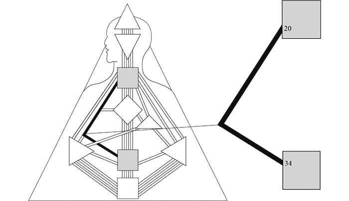

### 定义

这是一股旺盛无比的生命动能，每当内心对来自外界的讯息有所回应，就会迫切地，想要立即在下一秒化为确切的行动。如此即知即行的结果，让这条通道的人根本坐不住，时时刻刻都持续忙碌着。若能从事自己真心喜爱的事情，不断地起而行，在忙碌中获得欣喜并且充满成就感，这就是火力全开的绝佳的状态。

当你正确地回应生命时，热力十足的模样很容易感染周围的人，让别人也同样充满活力。在别人眼中，当你忙碌做着真心喜爱的事情，真是充满无限的魅力，这也就是这条通道被称为魅力通道的原因。反之，若只是一昧地盲目冲冲冲，只会像无头苍蝇般瞎忙，仓皇急促的你，将无丝毫魅力。

### 行动是本能，是活着的证明

这是一条重视效率与快速行动的通道。有这条通道的人不愿意等待，想到什么就会马上付诸行动。以求存的智慧来说，他是擅长跑得比猎物还快的猎人。「如果人生要有成就，就要勇往直前，不畏艰难。」这是篮球之王乔丹（Michael Jordon）说的话，他也的确活出了这条通道的特质与魅力。乔丹打篮球时动如脱兔，爆发力与行动力无人能及。他曾说：「我不相信被动会有收获。」对这条通道的人来说，静止不动就等于坐以待毙，只有行动才能存活。保持行动是他们的本能，时时刻刻都有事情做，确切感觉生命正在急促发生着，才能让他们感到活得很实在。

这条通道的人一旦行动，就会专注于行动本身。最棒的状态就是全然活在每一个当下，顺应身体的需求直接做出回应。有趣的是，对于自己真正感到呼应的事物，他们的身体会不由自主地靠近：喜欢的人、食物、想做的事情……，身体是如此诚实与直接，吸引与否，往往超乎脑袋的理智所能理解的程度，观察肢体的语言与动作，早已不言而明。他们似乎不太擅长聆听，也很容易忽视外界其他讯息，这并不一定代表他们不重视你，而是当他们彻底专注时，其他感官象是会自动关闭一样，这让他能真正全神专注。就如同乔丹所说：「一旦付诸行动，我什么都不想，全心只想着自己要做到的事。」他们会专注于行动本身，务必全力以赴！

### 无暇回顾，无法从过往错误中学习

当然，如此一股即知即行的能量，近乎冲动莽撞，并不代表不出问题，当乔丹第一次宣布退休时，简直震惊篮坛。更令人跌破眼镜的是，他居然宣布要转行打棒球。对很多人来说，他的决定草率鲁莽，对球迷不负责任，殊不知这就是典型即知即行通道会有的行为，想法当下已经化为行动。一来很难「深思熟虑」，二来，他行动时也完全听不见别人的劝告。但是，他们相对在性格中的急躁，也有其有趣之处，由于太急着将想法化为行动，所以当发现行不通了，也不会迟疑，可以马上修正，何必浪费时间深陷懊恼或羞愧之中呢？当乔丹发现棒球行不通时，他很快地又宣布复出，回来打篮球。个性造就命运，也因为这条通道无暇反思回顾，所以能不念旧、不回顾过去，但是也很难从过往的经验和错误中有所学习，所以，乔丹后来又有第二次退休与第二次复出。

他们重视效率，他们贪快，但往往很容易忘记了为什么要快，表面上看起来颇有效率，却也常常漏东漏西，导致最后还得回头补强才行。其实，他们若有耐性回头修补，亡羊补牢，也就算了，比较糟的状况是，往往因为缺乏耐性，常常会觉得修补麻烦，以致半途而废，事情只做一半遇到点麻烦就直接想放弃，然后很快又投身截然不同的领域，时日久了似乎从来没停下来过，但也就是胡乱瞎忙，没累积到应有的成就。他们若能醒悟到这一点，学习有耐性，才有机会将自己旺盛的能量放对地方，有效率地创造出最好的成绩，获得成功。

### 结果固然关键，过程也很重要

即知即行通道的人动作快，除了自己即知即行，也很自然会期待周围的人以同样的节奏，迅速回应。他们不管是谈恋爱、人际关系或工作的层面上，都偏好快刀斩乱麻。原本火热的心，若在第一时间没有得到对方肯定的答覆就冷掉了，等到别人终于回应了，他们的注意力可能早已转移，已经转头忙别的事情。他们不见得能够理解，这世界上大多数人无法当机立断，也很难包容别人需要时间沉淀，所以不由自主容易对别人施压，有时甚至让人觉得很粗鲁。毕竟，人世间绝大多数事物进展的过程，总难免曲折往返，需要反覆检验与来回推演。

虽说即知即行这条通道行动力超强又有效率，但也不得不承认，贪快往往难顾全圆满，事情做完不等于做好，慎思熟虑的确有其必要性。若这条通道的人没有被正确地指引，很容易沦为迅速将工作完成了，但是质量却可能只有六十分。谈恋爱也是如此，他们老是急躁想立即得到回覆，但是谈恋爱的重点，不就是好好体验这过程吗？结果固然关键，但是马上得到答覆又怎样？想想龟兔赛跑，这条通道的人就像那只兔子，故事的结尾，兔子并没有赢得比赛，还因为超前轻忽而偷懒睡觉，错过了所有经过。

如何衡量自己有没有活出设计呢？照理说，这条通道的人有这么旺盛的行动力，意谓着丰沛的能量，理应付出行动后，也应当交换到丰富的物质反馈。有这条通道的人可以想一想，自己的行动力到最后究竟换来多少实质上的报酬呢？忙碌到最后，你是否真正在物质与精神上得到满足呢？乔丹将篮球打好，赢得财富万贯；具备此通道的阿基师厨艺精湛，名利双收行程满档。换句话说，当你拥有这条通道，实质上却没赚到什么钱的时候，首先要思考，自己是否经常半途而废，所以你的能量并没有机会好好聚焦？你是否忙碌做着自己真心喜爱的事情？还是只是胡乱回应，到处瞎忙？既然老天赐与你这条通道，给你即知即行的充沛能量，你有没有好好善用它呢？

#### 给这条通道的人的建议

你直率、冲动，唯有自我激励，回应你真正所爱的事物，才能将这股源源不绝的动力化为实质的成就。照顾好自己，找到属于自己的求生之道，就是此生的首要任务。或许别人会因此而觉得你过于自我，甚至冷漠，你无须为此感到内疚。等待，回应当下，做自己真心喜爱的事情，而非像无头苍蝇一样瞎忙，就算不断行动，在你如火车头般向前快速奔驰时，也可以提醒自己要不定时停下来，锻鍊自己的耐性，看看是否因为贪快而有所遗漏。你可能会发现吊诡且奇妙的是：放慢一点点，反而更快，反而更有效率。

通道名人：乔丹、林书豪、杜月升、邓小平、阿基师、李光耀、杰米．奥立佛、蒋友柏、蒋介石、九把刀

# 20-57 世界上最聪明的人

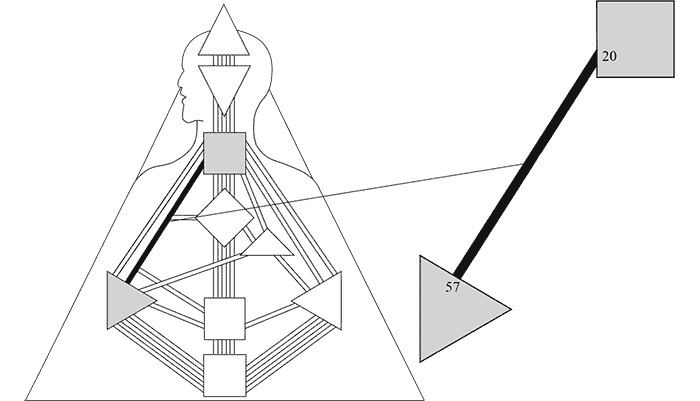

### 定义

拥有灵敏准确的直觉，比一般人更快速而尖锐地看到问题，直指核心。求存能力强，若能相信自己的直觉，就能克服对未知的恐惧、自然地适应各种环境。但是，脑波的智慧需要等待别人邀请后，才能将自己一瞬之间所知的真相说出来，否则将面对别人顽固的反抗，且不会被珍惜。

### 直觉的洞见像电波

拥有脑波通道的人是世界上的菁英族群，名校里有脑波通道的人比例很高，聪明人中更是盛产脑波人。脑波通道的聪明，在于能快速理解事物的本质。之所以叫做脑波，意谓着直觉的洞见像电波一样，当下一瞬间直达终点，因为是靠直觉式的洞见而获得解答，并非逻辑推演。他们并未一一罗列事实、反覆辩证检验才得出结论，所以，往往他们所指出的症结，无法在当下被验证。这也就是为什么，若他们没有被邀请就轻易发言，那么他们所说的话，往往会被旁人认为很白目，鲁莽或只是出于突兀的臆测，不会被当真，也不会被珍惜。

### 一针见血，直指重点的毛泽东

中国共产党创始者之一的毛泽东，是聪明人中的聪明人。先撇开他在历史上的争议，不论他的形象是被神化或妖魔化，不能不抹煞他存在的历史意义，一手创造出属于自己的时代。而他成功的主要原因，在于将马列主义中国化，他的天才就在于能将种种艰涩的理论与含意，聪明地转化成连不识字的农民工人都能懂，甚至是一句句毛语录，他将革命的标语，摇身一变，变成众人皆可朗朗上口的话语。虽然他是能诗善词，还写得一手好毛笔字的典型知识分子，但他跟中共党内其他人的不同之处，就在于他能透过语言，赢得民心并掌控民心，而这就是脑波通道的「聪明」。

「江山如此多娇，引无数英雄竞折腰。」「怅寥廓，问苍茫天地，谁主浮沉？」毛泽东写诗写词，字里行间所流露出来的，不只是才气而已，而是他总是能一针见血地指出，包括他自己在内的历代帝王，其争夺政治权力的野心和本质。这直指核心的理解力不见得讨人喜欢，很多他身边的人都说，他总是以反向思考的角度看事情，迅速且直接，揭去伦理道德的束缚，直接看到人心欲望本质。这样的特质虽然一针见血，却也容易令人不舒服。

「一针见血」，非常贴切脑波人说话的方式，他们擅长穿透层层迷雾，瞬间得到答案。跟有此通道的人沟通时，往往才交代前言，他就了解事件始末，甚至举一反三。向他们说明解释，不需要花很多精力，他很快就能理解重点。

但也因为如此，也算是聪明反为聪明误，有这条通道的人很难盲目掉入恋爱的状态。因为容易看破事物的本质，在恋情刚开始的时候，似乎就能预见之后的情景。以为自己看透了，热情容易消退，也很容易在尚未真正开始时，已经直接跳入莫名的结论，想得太过清楚，反倒平庸无趣。太聪明，早就预见了结果，很容易就此错过，并没有真实涉入，或真正脚踏实地的，实际体验过程中的每一步。而这世界上有许多事情，真正重要的并不是结果，而是过程，但是他们由于过早下了结论，反而错过了纵身一跃的契机。

### 表达能力不好？易因被误解而惹怒周遭人

另外，有脑波通道的人固然聪明，反应快，这特质用在学习与理解上面很棒，但是，在与人相处和沟通上却容易出问题。为什么有脑波通道的人很容易惹恼周遭的人呢？因为他们往往比一般人更快看到真相，往往就在朋友间的闲谈之中，突然下了突兀的结论，让听的人无法理解，更无法接受。他们并不了解，并非每个人在当下都已经准备好，想听见真相。虽然日后往往会证明，当初有脑波这条通道的人，讲的话是对的。他们也惊讶于一切是如此昭然若揭，别人怎么可能会看不出来呢？却不知，那就是属于自己的天赋异秉，擅长在特定的情境里，直觉式的侦查出事件的真相；在最短的时间，从事情的来龙去脉中找出条理，等于走最短的距离，就能直接得到答案。

他们虽然理解快，但表达能力差（除非他们有其他擅长沟通表达的通道）。因为其思考的模式太跳跃，导致语言表达可能无法立刻跟上，以至于他们的沟通方式，听在别人耳中，完全是毫无逻辑，没有铺陈，而直接跳到结论，自认讲得很清楚，别人却听得一头雾水。由于本身推论的过程，非常跳跃，难以陈述其逻辑推论的过程，因为对他们来说，根本没有过程，他们都是一听到开头，就通往最后的解答。换句话说，脑波人所理解的，和他们表达出来的，中间有一大段落差，需要好好填空，才能让更多人得以理解，这宛如电波般的聪明，究竟有多神奇。

脑波不仅容易被误会，自己也懒得解释，有些脑波人还觉得是别人太笨，反应不够快的缘故，以至于，演变到后来，脑波人变得只习惯与同样也具备脑波的人交流，因为彼此反应快，可以迅速理解彼此，话经常只要说一半，就能彼此相对一笑，心领神会。由于这样的聊天沟通模式，实在很愉快，久而久之，会变得很难与脑波以外的人沟通，即使跟别人沟通时，也容易不耐烦！

脑波常以为全世界的人思考模式应该跟他们一样快才对，但是事实上并非如此。脑波虽然聪明，想法很多也很棒，但是还是要谨慎选择说话的时机，同时，也要愿意有耐性，好好详细解释自己的想法，让更多人能够真正了解你。

#### 给这条通道的人的建议

要学习等待别人邀请，才说出自己看到的答案。这对你来说很困难，但请记住，有时候你以为一针见血所看到的真相，对当事者来说，过于赤裸。他们此时此刻还没有做好心理准备。此时，逞一时之快的话语对旁人毫无帮助，徒增伤害。

再者，你常觉得很多事情很简单，也就没有耐心体会别人痛苦的理由，但重点在于，很多事情的意义不在结果，有些人就是得经历完整过程，才能提炼出自己的智慧。脑波人常因为太聪明，所以跳过过程，或者直接拒绝，这样反而无法体验许多人事物底层的东西。或许下一次当脑波人觉得自己「懂了」时，提醒自己，真的只有这样吗？在这个答案底下，是否还有别的色彩斑斓的层次，跳过这些风景的人生，虽然黑白分明，会不会太无聊了呢？

通道名人：毛泽东、珍．奥斯汀、李光耀、J．K．罗琳、温家宝、冯小刚、希特勒

# 21-45 拥抱丰盛物质的人生

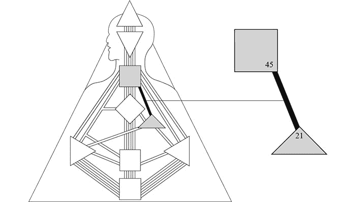

### 定义

充满强烈的自我意识，掌控欲强，运用意志力，在物质层面获得成功，并享受丰盛富足的物质生活。难以被控制，无法被驾驭，这是非常入世的设计，你来到这世界就是要来赚钱的，建议你开创自己的事业，掌握领导与主控权，每件事情亲力亲为。

### 金钱是此生的原点与目标

有这一条金钱通道的人很入世，之所以是金钱通道，并非生来注定有钱，而是会对金钱特别有感觉，他们要不是在物质上丰盛富足，就是特别贫穷匮乏。如果没有活出设计，成为有钱人，往往会比别人更强烈感觉到自己的穷困。「一箪食，一瓢饮，居陋巷」还能甘之如饴，「不改其乐」，说的绝对不会是这条通道的人。平平过一样的俭朴生活，他们就是会觉得自己好穷喔！眼里所看，心里所想都跟金钱相对应。所以，他们必须完全接纳物质生活里的种种体验，不管是匮乏或丰富，一旦他们接受自己的设计，便能涌现强大的意志力，用来赚大钱并享受丰厚物质生活。

一定要有此通道才赚得到钱吗？倒也不见得。有很多成功人士没有这条通道，那是因为他们的出发点不在赚钱，而是专注于自己的志业或兴趣，财富随之而来。但是有此通道的人，金钱必然是他们的原点与目标。他们是为了赚钱而赚钱，且非常喜欢赚钱，只要跟金钱有关的话题或点子，都能让他们精力充沛。

### 主导性强，喜凡事都在掌控之中的川普

有此通道的川普（Donald John Trump）很适合说明金钱通道的特质。川普以房地产、赌场和饭店致富，这些都是跟金钱密切相关的产业，而他后来又因为「谁是接班人」节目声名大噪，并为他的事业带来另一波高潮。川普生活奢华，出手阔绰，全身上下看起来就是有钱人的派头。金钱通道的人喜欢富足的生活，他们就像国王皇后，要过好生活，喜欢好东西，也特别能享受。他们天生有种贵族派头，彷彿生来就是要下达指令，让别人做事，为他们服务。

这的确是条主导性很强的通道。为了在物质生活上成功，所以每件事情都要亲力亲为，确认「一切都在其掌控之下」，以他所预期的进度和方式进行。了解川普的人都说他很了解如何掌握谈判的对手。曾有一次，川普试图说服某公司的 CEO 买下一栋大楼的经营权。那名 CEO 出身于其他州，也没有大手笔购买过房地产的经验。川普这么跟他说：「你完全不懂纽约的房地产，而我是纽约房地产之王，我希望能够主导这件事。」他让对方觉得，没有他的参与就不可能成功，因此合作案顺利成交。他强烈的主导性格与控制欲在谈判与经营上，不但不是缺点，反而赢得对方信任，并确保交易成交。

「谁是接班人」这个节目的概念，就是要选出符合川普企业精神跟特质的接班人。他不仅是这样寻找公司人才，对于投资子女教育也毫不手软。他从子女小时候就培养他们走上商业管理的道路，好接手他的事业。

### 最好自己当老板，赚钱照顾员工或家人

这条通道适合独当一面，其强大的赚钱动能，除了自己享受物质生活的丰盛与富足，也需要照顾家族或下属，承担起让家人或员工过好生活的责任，因此，有金钱通道的人适合自己当老板，获利之后分享给员工与家人，若抱持一颗承担的心，愿意照顾愈多人，就会有愈多的钱财流进来，让大家都能过好生活。

他们必须愿意承担，并且掌控一切，还要有「我说了算」的决心，不能只想到自己，同时得具备照顾自家人的胸襟。若眼光狭窄，只顾自己，就会侷限在贫穷的那一边。若你具备金钱通道，要通往物质生活的丰盛与富足，有几个关键：首先，不要亏待自己，享受好质量的生活，才是王道。有很多人明明具备金钱通道却活得穷困，原因是心中对匮乏的恐惧太过强烈，锱铢必较的结果，只能深陷贫乏的泥沼之中。你要有心，愿意承担，这就象是国王拥有了自己的国土（公司）时，要心怀仁慈，照顾（员工与家人），照顾他们的生活基本需求，同时也要好好教育他们，让每个人的能力提升，不断进步，才有机会为整体创造更多产值，唯有国土里的子民安居乐业，你所经营的王国才能富强与富足。

#### 给这条通道的人的建议

在你们身上，特别能印证金钱有其良性循环与恶性循环。你们若小气，金钱就流不进来，富足自心开始，会吸引更大的富足。反之若源于匮乏，只会深陷贫困的渊薮，恶性循环。如果你发现自己拥有这条通道，恭喜你，你生来就是要过好生活，请好好发挥所长，扩大你的领土，有广阔的胸怀愿意透过你的努力，得以照顾更多人同享富足。你的意志力坚强，一旦你拥抱自己的设计，只要设定目标，全心全意投入，必能完成。

通道名人：汤姆．克鲁斯、梅尔．吉博逊、哈理逊．福特、J．K．罗琳、贝克汉

# 23-43 是天才？是疯子？颠覆架构他说了算

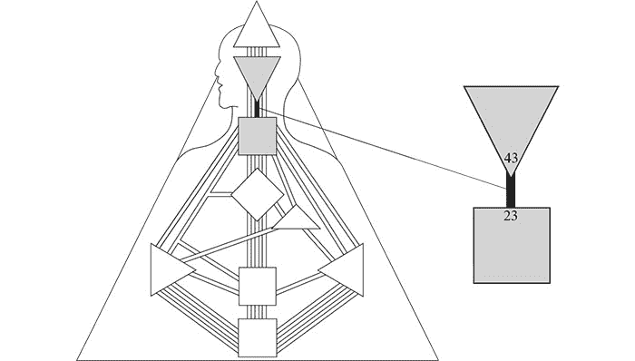

### 定义

挑战既有的架构与模式，习惯从颠覆的角度出发，不愿依循原本的架构来思索事情。总忍不住想重新整顿，思考全新的切入点，建立新的架构。若在正确的时机点提出意见，新的创见将透过你来到世界，扭转世人原先的认知，也将彻底影响众人看待事情的角度，引发突变。

### 天才或疯子，只有一线之隔

有这条通道的人经常口出惊人之语，其言行与举止，常常对周遭人事物带来震撼。所谓的天才与疯子，往往只有一线之隔，显然他们是注定要来改变架构的人，自然会选择以颠覆既定模式来切入，思考与关注的焦点异于常人。偏偏这世界上绝大多数的人，只能根据自己的经验法则或人生体验，来理解周围的人事物。所以，这条通道的人总是显得如此不同，时而被认为是天才，时而被当成疯子来对待，甚至与周遭的人格格不入，其实并不是意外。

大家觉得他们很奇怪，他们也觉得自己很难被世人所理解，看似怪胎的思维，其实底层可能蕴藏了宛如天才般的洞见，很难懂？没关系，看看孙中山先生，他的一生，就是将这条天才到疯子通道发挥得淋漓尽致，经典中的经典。

### 挑战旧有体制、被认为离经叛道的孙中山

生在专制体制下的孙中山，从小就是个令大人不安的小孩。不管是针对政治或者宗教，他经常说出大不敬的话。七岁时，他听了太平军老兵讲太平天国故事，心生向往，就说出：「我不想做皇帝，我要作洪秀全第二。」这个不想当皇帝，想当革命份子的小孩，年纪轻轻已经用迥异于一般人的模式思考，而且不怕表达出来。他后来有更多离经叛道的言行，包括：被哥哥接到国外生活时，劝导檀香山工人不要膜拜偶像，因此再次被哥哥送回家乡，免得犯众怒。回家后，他也没有改变，伙同朋友陆皓东捣毁庙宇神像，被当时村子中的人视为异端。他喜欢批评时局，不怕被砍头，说了很多鼓吹革命的言论，因为太容易「口出狂言」，还被他的对手取了「孙大砲」这个绰号，意思是讥笑他说话如放砲，喜欢吹牛。

孙中山的一生，不停提出创见与新的作法。他对当时的社会和政府结构提出新的架构，不管是劝乡下村民不要膜拜偶像，或在被专制统治了几千年的土地上倡导民主思想，都有创新的意见。他不只是沿袭国外的作法，也加入自己的创见，提出民有民治民享的主张……，尽管大部分言论，听在当时的民众耳里，会觉得他根本是疯了，但是，百年之后，却证明是充满智慧，以人为本，长长远远的政治主张。

无法被理解，并不见得是错误，反倒是走得太超前，需要花更多力气，不厌其烦地与大众解释再解释。若进化是一段长远的过程，那么这条通道的人，就象是走在最前方的冲锋部队，尾后随行了庞大的队伍。队伍里的群众无法看见其所见，无法体会其所体会，无法理解其创新的思维，无法明白唯有真正跳脱既定框架，才有出路。而进化需要整体跃进，每个人都得达成共识才行，因此这也就成为这条通道的独特任务，如何解释创新的洞见，一次又一次，一遍又一遍，直到每个人都理解，就成为他们此生可以不断精进，认真修习的生命课题。

以孙中山来说，终其一生，他四方奔走，到处巡回演讲，每每面对不同族群、阶级、年纪、国籍的人，不断表达并传递自己的理念，寻求募款，寻求支援，一次、两次、三次，他得用各种方式让不同的人了解他的理念。久而久之，他的想法才慢慢被接受，被散布，直到创新的理念终于生根，日渐茁壮，终于推翻了原本盘根错节的满清政权，建立民国。

### 天外飞来一笔，却可开创新局

这条通道的人特别能天外飞来一笔，思考出杀出重围的蓝海策略。他所提出的思维与作法，是否能被看见，被珍惜，取决于是否在对的时机点，与对的人沟通。同样的意见，若在对的时机点说出口，将被视为天才。相反地，若在错的时间点，只会被当成天兵。该如何判断，这个当下是不是正确的时间点呢？关键就在于，有这条通道的人得等到别人开口来问你，再说。因为这代表着此时此地，对方已经准备好接受全新的作法，该你上场了。

既然明白有这条通道的人不是天才就是天兵。他们的惊人发言，或天外飞来一笔的怪异言论，乍听之下总不免让人觉得非常突兀。可能他们的逻辑，跟当前讨论的事情完全无法衔接，以至于当下的发言，听起来如同狂言。请有耐性，试图再做沟通，若能协助他们将内在的逻辑理顺串连起来，转换成大家能理解的表达方式。你将惊讶地发现，他们真的提出了了不起的创见，真是天才。

### 学习整理自己的逻辑，让一般人能理解

有此通道的人虽然老觉得自己不被了解、莫名被打压。但事实上，他们也并未真正深入去理解，别人为什么老是听不懂他们所说的话？长久以来对此所衍生的不耐烦，以及对传统作法的反叛与抗拒，往往让他们更加心灰意冷，懒得多作解释。相对地，也因此隔绝了进一步沟通的意愿，而彻底阻绝了相互了解的可能。在此，我们首先要理解，先知总是寂寞的，也接受你们的逻辑与常人不同。所以，别人一开始听不懂是正常的。既然如此，何不心平气和，再试一次，换个角度与对方沟通。如果孙中山能一辈子不厌其烦，持续不断解释自己想法，革命成功，有为者亦若是，你也可以，不是吗？

#### 给这条通道的人的建议

你存在的目的是为周遭带来创见与质变。但是，为了让你的创见能被珍惜，请不要急于将自己的话讲出来，等待邀请，在正确的时间点发言。你也可以进一步在表达后，请别人复述一遍他们听到的，是否与你的想法相符合。当你在对的时间说出对的话，必能对世界带来根本的改变。

通道名人：孙中山、U2 的主唱波诺（Bono）、达利、毕卡索、爱迪生、索罗斯

# 24-61 探究人生本质，为世界带来洞见

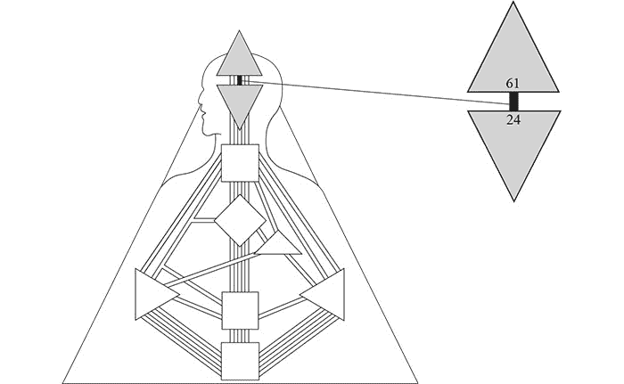

### 定义

你是伟大的思考者，你生来为了启迪世人，引导大家思索关于人生的奥祕。

你的头脑并非用来解决关于自己的问题，而在于启发别人，让众生对生命拥有全新的看法，带来启发，让我们得以看见前所未有的曙光。这样的头脑需要持续不断地，以全新的方式，探索智识上各个崭新的领域，对既有的事物，探究其本质，并创造出全新的看法。

### 带给世界全面性启发的曼德拉

这条通道很容易令人联想起罗丹的雕刻作品「沉思者」，那个陷入永恒长考的人。他的脑中彷彿正在探究生命的意义或人生的本质，一如这条察觉的通道所要带给世人的启发。这是一条伟大思考家的通道，有这条通道的人，他们的脑中无法停止思考。他们的存在，就是要思考哲学、人类为何存在等等之相关议题，身为人，要如何理想而正确地活着，而现存的状态是否是扭曲？或是错误？对于人类生存本质的相关问题，他们特别有呼应。

去年刚去世的人权斗士曼德拉，就是活出这条通道的代表人物。他提出「只有让黑人和白人成为兄弟，南非才能繁荣发展」的政见。终其一生，努力争取南非黑人地位的平等，废除种族隔离。他曾说：「我的理想是建构民主的非洲社会，在这里，人们和谐共处，机会平等，这就是我想生活的社会。」他所说的这段话，真实阐述了这一条察觉的通道，可以为世界带来的贡献：他思考，所以他改变世界。这条通道存在的目的，是为世界带来本质上的突变，思维就如同一颗种子，开始萌芽，日渐茁壮之后，改变整个体系运行的模式，变得有可能。

曼德拉将这条察觉的通道发挥得淋漓尽致，他对于这个世界的贡献，何止仅于跨越种族的藩篱？当他离世的时候，有那么多彼此政见根本天差地别的国家领导人，为了悼念他，齐聚一堂。不管存在或逝去，他让全世界的人在那时、那地，跨越了种族、政治、国家的狭隘界限，开始思索，真正的平等是什么？

若能跨越肤色，是否也可以跨越国家、宗教，乃至人与人之间的藩篱？

他对于人类生存本质的相关思考，还包括公布自己儿子因艾滋病去世，为的是提倡「以同等的态度来看待艾滋病与其他疾病」，他再一次为世人带来震撼，同时也引发人们开始思考：如果心脏病让人同情，为何艾滋病让人鄙夷？在肤色上划分等级，连疾病都要区分，这又是为什么？

曼德拉为这个世界带来全面性的启发。身陷牢狱二十余年，当曼德拉终于得到自由，并获选为南非总统时，他在就职典礼上，宽待并礼遇了当年囚禁他的三名白人狱卒。绝非因为他们当时善待过他，而是曼德拉因为他们，修练了自己的心性。虽然在牢里，心灵却可以穿越怨恨，他因为宽恕而得到了真正的自由。就算在牢狱里失去身体的自由，精神层面却可以全然去思考关于人性，关于何谓理想的生活状况，关于自由与平等、宽恕与爱，并从中得到洞见。

### 思考人类与生存本质的问题

同样具备此通道的马克思，在一百多年前，已经预先看到资本主义可能带来的迫害，他从中思考人的存在本质是否会因此异化。而拥有这条通道的电影导演柏格曼，在其作品中，总在探讨人生存在的本质，他有句名言：「我对上帝的兴趣已经消失，现在我只对人和人的行为有兴趣。」是不是听起来很抽象，却是深具本质性的探讨。这也说明了生来有这条通道的人，就是要来思考与自己无关，而与整个人类整体处境，还有与生存的本质相关的大哉问。

他们偏好长时间思考，而那神奇的洞见可能会在一瞬间出现，也可能终其一生都无法得到解答。无人知晓他们何时才能真正得到解答，但奇妙的是，当解答现身时，通常会以声音的形式，不预期地在脑中响起。许多人对这一闪而过的声音，常会解读成神的旨意或是更高的召唤，但若了解他们的设计，便会知道这就是属于他们灵感出现的形式。同时，这也是一条与音乐、声音、文字息息相关的通道。如果说，每个人跟外界都有相呼应的管道，那么这条通道的灵感多半会以旋律话语或听见声音的方式，一瞬间，在脑海中闪过。这就能解释为什么具备这条通道的人，会偏好以文字和音乐，来做为与外界串连的传达媒介。

### 透过声音获得灵感，以音乐和文字与外界沟通

若将焦点放在与自己无关的事物上，这条通道可以为世界带来本质的突变，巨大的启发，但如果用来思考自己的事情，不但完全无法解决问题，还会陷入固定的循环，以偏执之心理解外界，最后困住了自己。

这条通道的人喜欢听音乐，或习惯处在有音乐或人声的环境里。脑中可能经常性地响着旋律，或闹轰轰地同时有很多声音在对话，这是他们思考问题的过程。常有这条通道的朋友提及，听音乐反而有助于让他们的头脑安静下来，得以思考或创作，听音乐也有助于抒解其头脑的焦虑。听音乐时，灵感特别多。

#### 给这条通道的人的建议

学习与自己无法停止思考的头脑，和平共存。焦虑是正常的，明白灵感将在不预期的瞬间，一闪而过，带来解答。请好好善用这条通道，为众人带来灵感与启发。

通道名人：曼德拉、马克思、莫札特、欧普拉、波诺、柏格曼

# 25-51 冒险是天赋，随时准备要跳进未知的人

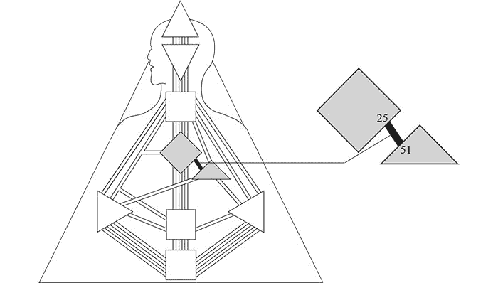

### 定义

有这条通道的人是不折不扣的勇士，总能在关键时刻回应生命，天真地跃入未知。生命的旅程就是一连串跳入未知的体验，你像勇于挑战的战士，具竞争力、好胜，总是挑战自己的极限，对进入全新的领域毫不迟疑，也因而能获得崭新的体验，同时，这过程也引发众人跳脱日常既定的轨道，进而去尝试他们先前从未有过的体验。

### 回应未知，勇于冒险

有一个很妙的比喻可以来说明这条通道的本质，有这条通道的人，在他们还是小朋友的时候，如果玩起积木或堆沙堡的游戏，他们感到最快乐的那一刻，是在终于完成之后，心满意足地将之推倒，对他们来说，因为留恋而想保存到永远，并不是他们所追求的境界。因为在完成的瞬间，代表这游戏已经结束，毫不眷恋地推倒它，代表的是可以重新再开始了，他们已经准备好更跃跃欲试地，接着去玩下一个全新的游戏。

有这条通道的人，本质里有勇于冒险的成分，如果他们选择尝试，就会勇往直前，与生俱来洋溢着一种天真无畏的气质，旁人总觉得他们勇气十足，不断想尝试别人没做过的事情，例如，他们往往是同侪中第一个去高空弹跳，或选择转行，投入全新的产业，而「勇敢」是别人看待他们时的感受，对他们而言，未知就像召唤，他们只是单纯去回应罢了。

这整个大千世界对有这条通道的人来说，就象是一座巨大的花园，花园里面有各式各样的奇花异草，奇妙的蜿蜒曲径，还有无限广阔的山坡与草原。既然如此，为什么不倾其所有，尽情尽兴来探索这未知的一切呢？对他们来说，尝试新事物不需要勇气，纯粹是「这样才算真正活着」的感觉。他们特别容易对热血的召唤相呼应，例如「这件事情现在不做，以后就不会做了」；或者「人不痴狂枉少年」，他们一听见这种热血的言语，就恨不得马上投身去尝试，风风火火去进行一件石破天惊的大探险！

他们喜爱生活中充满大大小小的惊奇，就算日日在不同的城市醒来，或经常搬家，享受新事物和经验带来新的刺激与灵感，都足以让他们兴奋不已。印度的灵性大师奥修就拥有这条通道，明显易见，在人类灵性探索与发展的领域里，他是一枚不折不扣，勇敢又叛逆的灵魂。他的存在与思维，挑战了一切既有的宗教与社会传统，乃至许多价值观，颠覆了世人对于「爱与自由」、「真理与信仰」的认知。他到处演讲，挑战正统的宗教领袖。他曾说，自己的演讲是危险的，只有少数有勇气的人准备好要听。而只要你准备好注意听，「就已经踏上朝向再生的第一步。」有这条通道的人，无法在约定俗成的社会规范里，获得渴求的人生智慧，他们去冒险，在未知中得到新体验，从中对自己与世界有不同以往的认知，而突变与进化就变得有可能。

### 跳脱惯行轨道，引发别人体验新事物的奥修

对他们来说，跳入未知不仅只限自己一人，他们也很擅长将旁人拖离常轨，引发众人去尝试一些平时根本不会涉猎的全新事物。这冒险的体验可能引爆前所未有的危机，也可能无比美妙，让各自的生命更加精采。冒险的行径在于跳脱惯行的轨道，无关好坏，结局不管是危机也罢，转机也好，都将在各个不同的层面带来突破与成长。在身心灵领域的许多导师都具备这条通道，他们特别喜爱设定野外求生等等课程，协助一般人跳脱既定的生活轨道，透过各种锻鍊的过程，带领学员跳入未知，从中获得崭新的体验与成长。

这或许，也是曾经跟随奥修学习的门徒所拥有的感受吧！即使到现在，对奥修静心有兴趣的人，都会被他的静心方式吓一跳。在奥修所创立的体系里有上百种法门，从密宗谭崔到禅宗静坐，静心的方式样样与众不同，在印度的奥修灵修园更是大大出人意料，完全颠覆了传统对于灵修的认知。这样的颠覆不管是好是坏，是惊吓是反感或者是惊喜，都可以引发大家更进一步去反省，深切去思索信仰与生命的本质。

而这也就是有这条通道的人对我们所做出的贡献：如果他真实活出了自己的设计，像个孩子般无所畏惧去尝试各种新的事物，象是高空弹跳，或者去北极看极光，他的行为本身，也会引发周遭的人开始热血沸腾，有股迫切渴望去体验新事物的冲动，而展开属于自己的探险。

### 不回顾，只奋力冲刺以迎向新挑战

在工作上，他们像短跑选手，很适合项目型的工作型态：设定目标，然后达标，任务结束。结束后觉得心满意足，休息，然后再准备好进行下一个明确的项目，宛如一次又一次的探险计划。他们不喜欢单调或重复性高的工作，因为旧的经验已经无法让人成长，他必须不停迎向新挑战。他们尤其喜欢目标明确，具有截止日期的案子，为此奋力冲刺，但要注意的是，当全力以赴做完之后，要记得好好休息与放空，任务与任务之间不能无缝接轨，否则精力和心神容易衰竭。

在情感上，喜欢跳入未知的特质，对维持稳定的感情是不利的。他们不念旧，不喜欢回顾。当他们认定某段感情已结束，那么，对他们来说，这件事情就是走到尽头，他们绝对不是分手后会藕断丝连的人。别人心中珍贵的「曾经」，对他们来说毫无吸引力，他们觉得已经走完了一段感情，该展开新的旅程了。

那么，什么样的情人适合这条通道的人呢？最好对方是一个永远不会让他厌烦，永远都有新鲜事可挖掘，值得去探索，永远不会让他感到无聊或厌烦的人。可想而知，能不断满足他们底层渴望的情人，实在太少，于是他们经常被指责为无情或不可捉摸。其实，如果你深刻理解他们，你会发现他真正迷人之处，就在于不断冒险，为人生带来诸多乐趣和体验。何不给他们一点空间，自由探索，让他们带领你去体验人生吧，那将会对你们的关系带来意想不到的惊喜！

#### 给这条通道的人的建议

尽情的进入未知领域，不要一直停滞不前，甚至怯于出发。请正视自己内心对于冒险与挑战的呼应，在跳入未知时，你可能吓到自己也吓到别人。但也唯有在这种时刻，你才会体验到自己灵魂的独特性以及潜能。就像奥修生前口述的墓志铭：

**从未出生／从未死去／只是在一九三一年十二月十一日至一九九〇年一月十九日间／拜访了这个地球**

对奥修来说，他活着的这段时间，也只是一段跳入未知的旅途。他来地球，为的是引发众人也能有新的体验，对生命有新的体认。

通道名人：奥修、高第、西蒙．波娃

# 26-44 顾客的心理，他们最了解

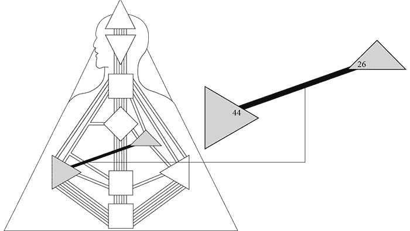

### 定义

基于本能，理解对方的需求，在此前提下，选择将适当的讯息传递出去，并自然而然地让对方了解、接受你销售的任何概念或商品，这是你与生俱来的本能。天生擅长传递讯息、营销产品或是理念，是你独特的天赋。懂得如何精准地将想要表达的内容，传达给特定的对象或族群，来达成目标。

### 努力，是为了找到关键的转折点

这条通道的人具有知人善任的天赋才华，他们擅长挑好东西，能看出人的潜能与事情的潜质，并且懂得如何定位，如何推销，好让别人买单。换言之，这是一条非常擅长传递讯息、营销的通道。营销的本质是传递讯息，知道别人的需求在哪里，用什么样的诉求点来打动对方，有这条通道的人，宛如本能般洞悉对方的心理，具备敏锐的直觉明白以什么样的角度切入最适宜，不管他的口才好不好，都能打动对方的心，以达成原本设定的目标

老实说，这条通道的人并不相信「吃得苦中苦，方为人上人」那套人生哲学，对于「一分耕耘，一分收获」也感到相当无趣。他们认为，像驴子一样拚命，还不如找对方法，聪明地工作才是王道。说真的，若能找到人生中那难得的关键转折点，四两拨千斤般，瞬间翻转人生，那就太棒了。他们内心是多么希望能在某个对的时间点，遇到对的人，从此平步青云，再也不必汲汲营营。他们企盼找到做事的诀窍，以杆杠原理来扭转局面，若是从此心想事成，那该是多么美好的快意人生。

### 懂得展现自我、擅长人际布线的李奥纳多

有这条通道的人既懂得挑好东西，营销出去，他们当然也很懂得如何表现自己、营销自己，他们的意志力惊人，一旦设立目标，认定是自己所要的，就会坚持执行到底，不善罢罢休。 女神卡卡和李奥纳多．狄卡皮欧（Leonardo Dicaprio）都是这条通道的佼佼者。以李奥纳多为例，他刚出道时，拍的多为艺术电影。他擅长忧郁、神经质的角色，年纪轻轻，演技出色，与之演对手戏的莎朗．史东曾说过，李奥纳多是自己所见过的演员中，最有天赋的一个。但是，李奥纳多要一直到演出《铁达尼号》之后，才开始大红大紫，就此跃上国际巨星之列。他的走红看来似乎是幸运之神眷顾，但事实上，他为了转型，早已做了许多布局与安排。十六岁时，他为了有机会结识名导马丁．史柯西斯，次年立即换掉自己的经纪公司，为的就是争取更多机会认识导演。后来，果然顺利争取到他想要的角色。这条通道的人聪明，他们的聪明并不仅限于在专业领域下工夫，他们更擅长布线，如何说服对方看见他们的优势，拔得头筹，抢得致胜的先机。

李奥纳多因为《铁达尼号》中杰克这个角色，获得国际注目后，让他有更多筹码与资源来尝试各种各样角色。一次又一次，他不断证明自己的才华洋溢，不断翻转大众对他的印象。出于敏锐的直觉与强烈的自信心，这条通道的人一旦决心要得到什么，会单刀直入，勇往直前，为求达标，全力以赴。

### 唯有成功，才能满足自己与家族的需求

若能穿过这光鲜亮丽表相，直视底层深处，其实，他们的内在存有巨大的恐惧。恐惧好景不常，恐惧眼前富足终将崩垮，所以，他们更要追寻成功，寻找更棒的机会。他们充满上进心，因为唯有让自己不断进步，才有更大的机会能找出翻转的关键点，如此便能一劳永逸，满足自己，同时也满足家族部落的需求。

这是一条与家族息息相关的通道，他们之所以有如此强烈的动力，认为自己非得成功不可，并不是为了自己，而是为了一群人的利益而奋斗。他们将家人或自己所归属的团队，视为整体。为了族人的利益，为了满足部落的需求，为了让家人过更好的生活，他能灵活机动随市场的需求，巧妙调整其定位。他们善于成交，是因为他们内在强大的动力，让他们使命必达，即使采取过滤讯息、巧言令色、闪避必要信息……，种种引起非议的认知和作法，为了族人的利益，也在所不惜。

这条通道的人希望能以最少的付出，得到最大的收获。在旁人眼中，他很聪明，不浪费自己的时间和精力。这特质在西方社会被视为创业家精神，能聪明地看到商机，精确出击，但是，却不见得能在重视勤勉的东方社会里被接受。在社会文化下，长久被制约的结果，导致有许多这条通道的人，对自己的「聪明」缺少肯定，总觉得自己不够勤劳努力，为此自责不已。

其实，这条通道的人很有创意，他们在连结社群这件事情上，特别有天分，宛如本能般懂得如何传递讯息，操控大众购买某些产品。他们真的很适合营销工作，或者从事电影、广告或业务营销方面的工作，若能有耐性等待知音人的赏识，自然能抓住对的机会，发光发亮，成功可期。

#### 给这条通道的人的建议

为了一项任务或项目，你总会要求自己全力以赴。但是，记得在每一次冲刺与努力之后，留一段空窗期，让自己好好放空休息。

懂得别人的心理并投其所好，以聪明的方式完成工作，并取得最大资源，获得成功，让家族过更好的生活，就是你的天赋，请好好珍惜。

通道名人：李奥纳多．狄卡皮欧、女神卡卡、李嘉诚、奥利佛．史东、米雪儿．菲佛、三岛由纪夫、莫札特、吴宇森

# 27-50 最值得信任的人

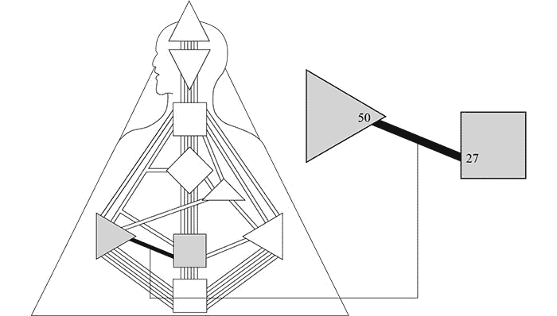

### 定义

家族价值观的守护者，社会体系的维护者。非常重视教育，持续不断向家族里的人发挥影响力，改变他们的价值观与想法。既定的传统价值透过你的存在得以传承，并形成一股稳定人心的力量。这条通道的人，天生散发出令人信赖的能量场，因为你总是以身作则，值得托付与信任。周围的亲朋好友，选择将他们所重视的物件或任务交托给你，忍不住依赖你，但你也因此容易承担过多的责任，以至于无法好好照顾自己。

### 坚持家庭传统价值观的茱莉．安德鲁斯

电影《真善美》中饰演家庭教师的茱莉．安德鲁斯（Julie Andrews）是这条通道的代表人物。不管是剧中角色，或者安德鲁斯本人，都很贴合这条通道的特质。她在电影中饰演的玛丽亚原本是实习修女，修道院希望她去接一份工作：担任七个孩子的家庭教师。这七个孩子的妈妈早逝，爸爸则是军人，官拜上校，他以军事管理的方式教育小孩却没有成效。当温暖有爱的玛丽亚来到这个家，她教孩子们唱歌、游玩、演布偶戏等才艺，慢慢感化并赢得孩子的喜爱。在这部片里，玛丽亚这个角色，完整呈现出这条通道所代表的含意，滋养关怀下一代，同时也要教育他们养成正确的价值观，缺一不可，方为教养的真义。

茱莉．安德鲁斯扮演家庭教师的形象，深植人心，或许就是因为在真实的世界里，她本人也具备了这条保存的通道，那种天生散发出自然而然「值得信赖」的气质，说服了全世界的观众。她就是那慈爱的玛丽亚老师，不做二人想。而安德鲁斯本人，其实也是一位坚持家庭传统价值观的女性，她与丈夫结褵三十余年，至今依旧恩爱，她也非常喜欢照顾小孩，除了自己的孩子，她还收养了好几个孤儿，更以茱莉爱德华为笔名，以作家的身分，出版了数本儿童文学作品。

### 提供滋养、以身作则的家族守护者

正如这条通道的人会负起照顾一家老小的责任，是家族的守护者。他们提供资源，滋养大家，这滋养可能是食物、时间，或者是照顾的心力。他们大多喜欢下厨，以食物喂养众人。这喂养既是物质的，也是价值观的喂养。透过他们的教育与养护的过程，同时传递属于家族内部的价值观，最后形成这个家族里，每个成员遵循的法则。

他们认定某些特定而美好的传统价值观，既然要教化家族里的每个人，自己当然要先以身作则。他们的存在是如此坚持而稳定，值得信赖。既然成为家族中订定准则的人，他们一旦决定了家族里是非对错的标准，所建立的价值观就不会朝令夕改。他们是稳定家族的磐石，是家族价值观的守护者与传递者。

也因为如此，这条通道的人过得比较辛苦。一来，他们是制定规则的人，是非对错对他们特别重要，在判断与制定规则的过程中，相对也给自己设下诸多框架，不停提醒自己什么可以做、什么不可以做；什么是对的、什么是错的。若是遇到与自己相冲突的价值观时，也会特别看不顺眼。二来，他们自己一定会以身作则，遵守自己制订的法规，他们很稳重，很老成，相对也变得守旧，持续地教导与传递固有的美好，守护着自己所爱的人，不动不移。

### 不负所托，值得信赖

有这条通道的人，一出现就很容易博得大家的信赖，也因此他们真的很适合从事与儿童、保险、土地、房仲、银行等相关的行业，这些全都是对人们来说很重要的事物，特别需要安全感，我们将重要的任务托付给有此通道的人，相信他们必会不负所托，值得信赖。

当他们照顾别人，承接别人交付的任务与责任时，要特别注意。先将自己照顾好，让自己先得到滋养，否则承担过多容易劳累。对于需照顾的人事物，也要正确回应，若直觉认为某人某事有问题，请信任自己的直觉，不要将所有事物都揽在身上，否则最后不但无法适当照顾别人，自己也会身心俱疲，先垮下来。

#### 给这条通道的人的建议

你喜欢照顾别人，很懂得如何与孩子相处，在照顾的过程中让孩子得到最好的滋养与教育，自然而然变成家族的守护者，与资源提供者。付出的同时会心甘情愿，非常快乐。照顾别人时，无怨无悔。但若被辜负或背叛，会非常难过而断绝滋养！此时，自己受到的伤害也很剧烈，所以正确的回应照顾的对象和选择受托的任务，是你重要的课题。

通道名人：茱莉．安德鲁斯、李小龙、茱丽．蝶儿

# 28-38 找到意义，化不可能为可能

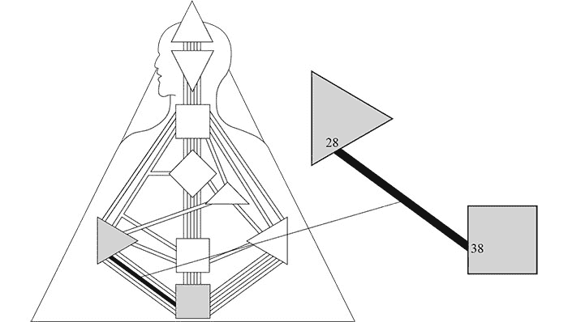

### 定义

你的人生是一条英雄之路。你在生命中最热切渴望的是，来一场奋战，克服途中种种困难，站出自己的立场，坚持着信念，走出一条与世人截然不同，专属于自己的道路。

这条通道的人内心总在质疑与挣扎着，自己这样做是否有意义？所谓的困顿挣扎，真是非常个人的议题，他们因此经常处于忧郁的状态，旁人无法理解为何要因此而受苦。殊不知对他们来说，最大的恐惧，并非困难险阻，而是生命虚度，若所做之事毫无意义，宛如人生缴了白卷，诸事皆空。相反地，一旦让他们找到意义所在，就能将原本困顿挣扎的折磨，转化为不可思议的力量，反转不可能为可能。他们是如此顽强坚持，用力奋战，最后终能创造出奇迹，走出一条蜕变之路。

### 找到意义，全力奋战

这条通道的人活着最重要的事情是，找出对他们有意义的人事物，并且全力为此奋斗。有没有意义？对他们来说非常重要。他们得先找到箇中意义，才能产生行动的动力。若是真正有意义的事，即使达成之路困难重重，宛如天梯，也无法吓阻或打消他们的信念。他们会恨不得快点上路，坚持顽固，为之努力奋战。既不在乎世人眼光，也能与内心恐惧相对抗，即使事情困难也不惧怕，因为活出真正有意义的人生，让自己的生命从此炙烈燃烧，就是他们对生命最大的渴望。

这条通道不为名利，只为价值与信念而战。具备这条通道的李安导演，在得到正式拍片的机会之前，在家失业六年。他并没放弃，虽然他常笑说自己除了拍电影什么也不会，其实有这条通道的人，底层就是有一种一切非如此不可的执着，但凡是自认为有意义，就能不屈不挠坚持下去，愈是逆境愈有韧性，这也反映日后他在电影题材的选择上。若是他认为有意义，这无关乎理智，是一种执迷，不管过程如何困难重重，也不管内在需要经历多少纠结挣扎，都难不倒他。

### 不为名利，只为价值与信念的村上春树

而同样是这条通道的代表人物，日本文学作家村上春树，也是强烈表现出「为意义而战」的典范。他的作品，特别是中后期的创作，大量描写关于平凡的人面对威权、暴力、命运不合理的对待，所呈现出的态度与想法，以及生命有何意义？关于灵魂层次的大哉问，总能吸引住这条通道的人，而意义则是非常个人的追寻。最有名的例子是，村上春树在二〇〇九年获得耶路撒冷文学奖时的演讲词。当时，国际间对于他去领奖有很多批评，认为此举是支持使用武力的国家。而村上说，为了在遥远的以色列的读者，他有必要到那里，以自己的语言表达意见，他真实想传达的讯息是：「在一堵坚硬的高墙和一只撞向它的蛋之间，我会永远站在蛋这一边……。如果小说家为了任何理由，写了站在墙那边的作品，那么这位作家又有什么价值呢？」村上的发言阐释的正是这条通道的人最在意之事：找到自己做与不做的意义，只要足以说服自己，无视威胁，不惜为捍卫自己的理念而战。因为对有条通道的人来说，世俗的肯定向来不是他所关注的焦点，至于写作也绝非为了金钱或名声，价值与信念密不可分，若生命没有意义，就算得到全世界的掌声，活着也没有价值，不会开心。

### 找到归属的意义之前，必须经历困顿挣扎

然而，困顿挣扎的重点在于意义难寻。当他们在找到生命里，那真正值得归属的意义之前，纠结的过程简直像活在暗黑的地窖之中。不知为何而战，为谁而战，那内在看来无穷无尽，虚无的黑暗，如此抑郁，彻底淹没了他们的心，很容易让人觉得眼前一切都毫无意义。他们无法接受只是活着，而不去做有意义的事情。但是，百转千回让他们反覆质疑的是，对我来说，这件事真的有意义吗？真的要去做吗？找出答案前，纠结挣扎充斥着无数质疑，因此饱受痛苦，处于一种日复一日，作茧自缚，冷酷又孤寂的心境里。

这世界上大多数没有这条通道的人，常常很难理解为什么要如此钻牛角尖？为什么要挣扎呢？有意义没意义又如何？这样执着下去，不就只是折磨受苦，平白跟自己过不去吗？或许连有这条通道的人，自己都想不明白，也不懂究竟是怎么一回事。只是意义与否，宛如阻挡在眼前的万丈高墙，唯有找到它，手持足以让自己心悦诚服的答案，象是终于获得神祕的心法，才能像突然开窍似的，施展轻功飞奔，视原本的障碍为无物，得以施展内在蕴藏已久的力量。

假想整体人类是不断进化的一个巨大轮轴，当我们习惯既定俗成的规范，习惯合群从众，却忘记环境不断改变，如何与时俱进？就如同《天地一沙鸥》里的岳纳珊，无法接受飞翔只是为了在码头乞食面包屑，习惯并不代表是真理，总要有个勇敢的灵魂愿意先站出来，挑战既定俗成的规范，渴望找到以往从未存在的可能性，然后，开口问出这个关键的问题：这究竟有什么意义？

### 困顿挣扎虽痛苦，坚持终能踏上英雄之路

他们无法接受「别人都这么活着，所以自己也得如此」的态度，看似反叛的质疑，或许前方还是无止境的灰暗，也有机会将不预期地带来全新的光亮。他们也不愿意妥协于任何借口与理由，这并非反骨，只是需要答案，若是找不到满意的解答，他们就自行踏上追寻的旅途。

在现实人生中，有这条通道的人，人生中或许会有一段很长的时间，并不知道自己究竟要做些什么，一边拚命质疑世人所做的一切意义何在，一边在内在纠结又痛苦，感到失落。村上春树就承认自己年轻时既固执又叛逆，求学时逃课、抽菸、打麻将。他不想学的、没兴趣的东西，再怎样都不学。不喜欢学校的教育方式，英文成绩始终平平。但是，当他喜欢上美国惊悚小说，就象是心中有股难以抑制的热情在呼唤着，让他克服英文的障碍，日后竟然成为专业译者。他的许多作品写的都跟渺小的个人，如何奋力对抗命运中突发的横逆有关。村上藉着写作来探讨，生命如此痛苦，那么，活着的意义何在？不论李安或村上春树，在个人生命或作品中，都强烈且持续地呼喊出这个主题。

有此通道的小孩，容易被大人觉得反骨叛逆，难以管教。他们可能很讨厌上某些课，所以反而要尊重他们，试着理解他们觉得到底什么是有意义的？一旦克服自己内在的纠结，他们就会无视外在的阻碍。当他们一旦找到意义，就会站出立场。他们特别有文字才华，能以文字搧动别人，透过辩论与讲述，反覆厘清对自己而言有意义的事情究竟是什么。这过程足以激励更多人，也踏上追寻的旅程，激励别人。

摸索的过程虽痛苦，坚持终究要找出意义。坚持信念，必定会找到出路，他们内在的力量是如此强大，有一天，绝对能化不可能为可能。

#### 给这条通道的人的建议

意义是属于自己，非常个人的议题。当你被突如其来的忧郁所淹没，请相信你的存在必定具有重大的意义。你可以带着自己的困顿与挣扎，多方尝试探索，毕竟很多事情没试试看，怎么知道是否有意义呢？虽然活着对你来说并不轻松，但是纠结不是目的。请相信自己，继续走下去，你必定可以找到热情之所在，坚持你认为有意义的事，化不可能为可能。

通道名人：村上春树、李安、阿基师、詹姆斯．卡麦隆、波诺、Facebook 创办人扎克伯格、宫部美幸、曾雅妮

# 29-46「我不呷意输的感觉」

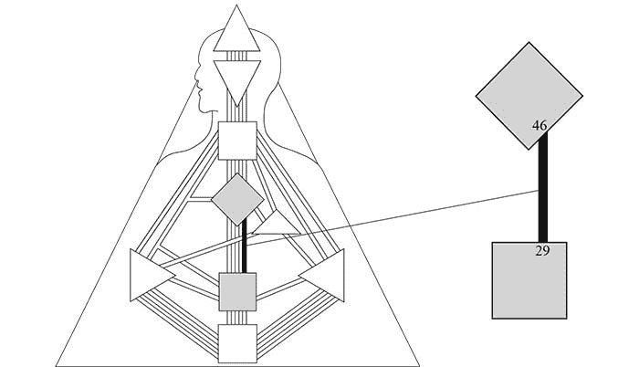

### 定义

这是一条在不断采取行动之中，获得体验的通道，当他们清楚做出承诺，然后彻底并忘我的投入其中，放下对输赢的执着、放下比较的心态，也放下对结果的期待，全力以赴，尽情活在每一个当下，唯有如此才能学会，其实人生并没有所谓的胜负，而是一段持续探索的过程。

累积人生历练的过程中充满承诺或混乱，做出对你而言正确的选择，义无反顾地走到最后，才会真正明白，这段体验要带给你的是什么，你从中学习到的又是什么。

### 竞争是铃木一朗前进的驱动力

去年有个震撼人心的广告疯狂地在网络流传，广告内容是一篇以「我的梦想」为题的作文，写这篇作文的人是现在被誉为日本史上最强的棒球好手铃木一朗：

「我三岁的时候就开始练习了……三百六十五天里，有三百六十天都拚命的练球。……我想这样努力的练习，一定可以成为职棒球员……总之，我最大的梦想，就是成为职棒选手。」

你能想象这是一个国小六年级、年仅十二岁的小学生写的吗？他的语气是那么坚定，而他的确也如自己立下的志愿，从小风雨无阻的练球。如今，这个立下「我要成为职棒选手」志愿的小学生，早已远远超过他当初的志向。

如果知道铃木一朗有这条执着于输赢的通道，就不会奇怪他为何这么拚、这么努力。有此通道的人好胜、好比较，心中常有「我不能输」的想法。铃木一朗小五时参加了全国大赛，看过了所有选手的表现，确定自己是 No.1 后，勉励自己还是不能松懈，跟别的选手比较绝对是他激励自己前进的驱动力。有这条通道的人通常会在心里设定假想敌，每天以超越对方为目标来激励自己。当超越了这个假想敌，他会非常开心自己「赢了」，接着会再设定另一个假想敌，他是在与假想敌比输赢，并超越对方的历程中，完成自己的目标。

广泛来说，有这条通道的人不见得要争第一，但他们无法容忍自己在标准之下。以唸书来说，如果他在放牛班，可能就是班上前十名；在好班，也是班上前十名。在任何领域，从事任何竞赛，他都会要求自己保持在某个标准以上，总之他绝不会落人之后。以跑步来说，若整个田径场上只有他一人，他会跑得有气无力，但一有对手，马上就生龙活虎，因为他不想输。而如果跑步是他的志业，他会在内心设定要超越的敌人，时时在练习或比赛中与之竞争。

### 若过于在意输赢，反而无法投入体验

超越假想敌的好胜心，是这条通道坚持下去的力量，如此才有完整的体验。计较输赢对他们来说是生命底层的燃料，争强好胜真正的目的在于完成体验。但是，很多人只停留在燃料的阶段，不停比来比去，一时落后便丧志，一时超前便得意洋洋；更坏的状况是，若过于在意输赢，可能因为怕输，根本连试都不试，如此不仅没有探索的机会，也没有体验到任何事物，就无法因历练而成熟。

所以，这条通道的人重点在于：「我体验，所以我发现，而人生是所有的体验的综合。」他要从这些不同阶段的输赢体验中领悟到，虽然很多事情他都不想输，但其实人生根本没有真正的输赢，有时认定的输，是奠定下次赢的基础。有时赢了，但也可能是之后输的开始。换句话说，这条通道的人应该学习的课题是：与人比较输赢只是表面，他人生真正的目的是要拥有完整的体验，如此人生才会成熟。

这条看似好胜的通道，同时也是「发现的设计」：如果你有这条通道，你的生命会在体验中成熟，而不是脑袋先想出合理的逻辑才去执行，身体力行，完全投入去体验，对于要投入之事做出「承诺」，并决心去实践，走到底才会惊喜地发现，原来这过程如此神奇，获得的体验是如此不可思议。换句话说，若能带着承诺与决心，从头到尾完整走完，毫不保留地去体验这过程所伴随而来的一切，把「不能输」当成是驱动自己往前走的动力与诱因，而非目的，那么，最终的结果往往比原先预想的更好，成就更多。

### 「不能输」只是燃料，忘掉输赢，全心投入最赢！

铃木一朗活出这条通道的设计在于，他好胜，他不想输，所以他拚命练习。但他不只停留在表层的争强好胜，他十二岁时便坚定地做出承诺要成为职棒选手。他一步一步前进，不仅成为日本职棒选手，还前进美国大联盟，他完成不同阶段的目标后，持续往前探索。他曾经这么说：「就算已经交出漂亮的成绩，我也不能停留在原地。」现在他的目标是：世界大赛的冠军戒指。

这条通道的人一旦作出正确的承诺，接着身体力行走到底，会给人一种毫不囉嗦，干脆投入的爽快。奇妙的是，当他们忘了输赢，单纯只是完完全全投入当下时，通常就会赢！那真是神奇的一刻，原先执着的好胜彷彿消失了，输赢也不复重要，他们只是忘我地探索着，体验着过程，就会创造出绝佳的成果。反之，当他们只执着于输赢，对自己与别人的表现斤斤计较时，则往往会输，这就是这条通道吊诡之处！所以，当铃木说出：「世上有很多事情无法说清楚，我只能说我就是很喜欢棒球这项运动。」这真的不是一条理性逻辑可以说得清楚的通道，只能透过身体去感受与体验，而纯粹而完整地投入之后，所感受到的、所体验到的，绝非只有输赢，而是更高远的忘我境界。

#### 给这条通道的人的建议

你人生的成熟度需要透过锻鍊，而愈来愈成熟。体验你的体验，承诺你真心所爱，完完整整去投入，不要一开始就只执着于输赢，你得走到最后，才会知道这些体验要带给你的礼物是什么。记得：人生不是只有输赢而已，全心投入最赢！

通道名人：铃木一朗、欧普拉、梅格．莱恩、梅尔．吉博逊、亨利．福特

# 30–41 渴望的源头，有梦最美

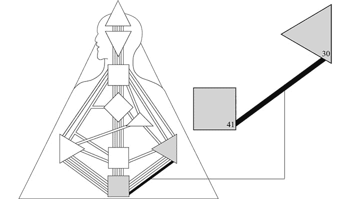

### 定义

你是一个天生伟大的梦想家，此生的智慧来自探索各式各样的感觉与情绪。你一生怀抱远大梦想，虽然不见得每一个都能在有生之年够彻底落实，又如何？重点并不在梦想实现，而在于享受梦想本身。在这段筑梦的过程中，认真实现并乐在其中，不是只有自己单独一人，而是懂得挑动众人的情感，激发大家朝着共同的希望与愿景，共同努力，让这个世界更美好。

### 因梦想而发光，引领大家朝共同梦想前进的欧巴马

这条通道的人是天生的梦想家。「有梦最美，希望相随」说的正是这种人。他们很可爱，一点都不无聊。他们充满活力与想象力，怀抱未来大梦，勾勒出许多美丽的蓝图与愿景，总能在无形中让众人充满希望与幸福感。不可否认的是，当他们热血分享梦想的时候，根本就是一架宇宙无敌的发电机，电力十足。同时可以热烈引发群众感情，让大家因感动而连结，进而心手相连朝着勾勒出的美好远景，奋力前进。

这一条梦想家的通道，是美国前总统欧巴马（Barack Hussein Obama）人类图设计里，唯一的一条通道。在他身上，我们看到这条通道的人如何活出自己，因为梦想而发光，也点燃了群众热切筑梦的渴望。欧巴马是美国建国两百年来，第一位黑人总统，在二〇〇四年让他声名大噪的那场演说中，他以「无畏的希望」为题，诉求美国应该团结合一，不再分裂。就在那短短十七分钟的演说，让他打破种族藩篱，挑动众人情感，一帆风顺自一个没没无名的地方议员，摇身一变，成为全国最有潜力的政治明星。同年，他顺利当选联邦参议员，从他身上，人们看到未来改变的可能，充满希望。

在欧巴马身上，群众看到一种理想生活的可能性：黑人选民眼中，他是黑人；白人眼中，他是受过菁英教育的中产阶级。在这原本分裂的美国社会里，欧巴马的出现，彷彿突破了人与人之间原本的猜疑与距离。他让人开始愿意相信，人与人之间可以超越原本的政治立场，怀抱共同的愿望与梦想。当然，让全世界印象最深刻的，是他当选总统后所发表的演说，以接连不断的「yes, we can（是的，我们可以做到）」来阐述美国人民的创造力、进步，与国力的强大，让现场许多观众忍不住感动流泪。即使现在我们透过影片观看，依然都能感受到这场演说的庞大威力。他阐述了这一条通道其中一个独特天赋，他们能够鼓舞并挑起民众强烈的情感，引发大家朝共同的梦想前进。

### 渴望体验、尝鲜，为世界带来改变的契机

人因梦想而伟大，梦想二字一出，很难不夹带浓厚澎湃的情感。情绪是人类内心最大的动力，也是最不稳定的变因，渴望体验、尝鲜，朝梦想前进，被梦想所驱动的过程很美好，但是情绪来来去去，过与不及容易失控，很难步步严谨。人们总会在这段筑梦的过程中，愈走愈发现，这条通道的人原本所描绘出来的蓝图，过度乐观，也太过理想化，充满不切实际的成分，要落实执行的难度极高，事实上难以实现。

梦想与空想，理想与幻想，实际与不实际之间，没有绝对。不可讳言，这条梦想的通道带来许多梦想，看来天马行空，不切实际。但是梦想就像种子，源自内在最原始的渴望，渴望体验各式各样不同的事情，渴望拥有各种感受，包括精神层面与物质层面。只要是之前没做过的，他们都渴望，都跃跃欲试，这充满生命力的驱动力，正为这个世界带来改变的契机。

改变之后，好不好，没人知道，但是至少与现在相比，会开始不同了。对他们来说，好的体验固然很好，坏的体验也是一种体验，体验就是体验，有新的总比没有来得好。他们不想留恋过去，也不想重复，完成体验一瞬间，内在的渴望已然完成。接下来，又将萌生新的渴望，开始追逐下一个全新的体验。他们要的是新的体验，因为渴望不同以往的感受与体验，他们会愿意尝试许多之前没做过的事情，之后也乐意与大家分享。他们享受在历练中成长的丰富人生，其经历过体验，更让人眼界大开，开启了人类体验的多元性，进而引动文明进化的历程。

### 享受在体验中成长的丰富人生

这条通道的人，若真实活出自己的设计，身上洋溢一种说不出的青春感，彷彿永远在期待下一刻，在转弯处。从他们的眼中所看到的世界，总是如此生意盎然，似乎永远都会冒出新鲜事，总会出现许多有趣的领域，正等着他们去探索，去钻研。他们脑中会跑出许多与众不同的想法，别人觉得他们很有创意，但其实只是他们容易厌烦，渴望创造出超越既定轨道的全新体验。即使内在常常为此感到焦躁与紧张，感觉非得迫不及待去完成什么，殊不知这内在的情绪张力，就是宇宙赐与他们的推动力，让他们不断探索各种体验，并从中学习。

这是在体验上极其丰富的一生，无法安于现况，无法甘于平淡。若长期处于稳定而没有变化的状态，又重复做着同样的事情，会让人发疯。他们期待本身从事的工作或职业要很有趣，很有变化性，如果有幸身为他们的人生伴侣，请保持一颗开放的心，一起与之探索新的体验。好消息是你永远不会无聊，请准备好与他们共度这惊喜连连的一生。

如何善用这条梦想家通道，有一个重要的诀窍：莫贪心，莫贪快，否则多头马车，容易全都落空，得不偿失。你的梦想可以很大，可以很多，但请一次一个，依序渐进，完成一个梦想之后，再进行下一个。如此一来，每一回圆梦之后所累积的成果，都会让你的根基更稳固，同时也是最好的滋养，支持着你，坚定地朝下一个更灿烂的梦想前进。

#### 给这条通道的人的建议

你的梦想很多，但是不用试图努力全部实践。重点在于让自己坦然经历所有的情绪高低起伏，最后那个内在的渴求对你来说，才是最后正确的答案。需要学习耐心与平静，尤其在做决定的时候，不要躁进。

通道名人：欧巴马、贾伯斯、猫王、梅格．莱恩、麦可．乔丹、卡缪、凤飞飞

# 32–54 努力往前，点燃旺盛驱动力

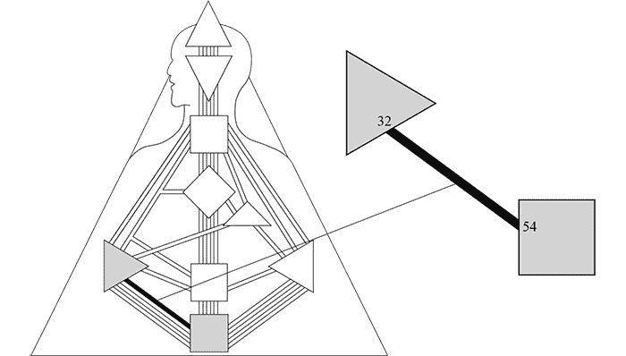

### 定义

底层非常渴望获得世俗的成功与物质生活的富足，为此努力工作。愿意从基层脚踏实地，一步一步往成功前进。这条通道能将内在能量转换成实质的报酬，克服一切限制，创业并永续经营。抗压性强，朝成功迈进的驱动力惊人，可以完成长程的目标。努力工作的同时，也要小心不要变成工作狂。

### 吃苦当吃补，因执着而成功的卓别林

这条通道的人企图心旺盛，有强烈驱动力让他们想成功。他们是会抱持乐观想法，却做最坏打算的那种人。当他们从基层往上爬，或者白手起家时，他们真的会非常努力。他们是「一分耕耘，一分收获」的奉行者，讨厌取巧，绝不偷懒，他们也不相信会有「礼物从天上掉下来」这种不劳而获的好康。他们不见得有什么伟大的理想，或者为意义奋战，但为了成功与过好生活，他们的努力绝对不容置疑。他们会谨慎评估时间与收益，自己的价值与报酬回收，将精力、时间和资源用在对的地方。他们不做没有实质报酬的事情，他们付出努力时，必定想清楚要得到什么回收。

不管他们现在正处于人生哪个阶段，几乎都可以说，他们若不是已经成功，就是正在朝成功的路上迈进。有这条通道的卓别林（Sir Charles Spencer Chaplin），彷彿以他的一生为这条通道现身说法。我们所知的卓别林是现代喜剧泰斗，他的表演方式影响了许多艺人，银幕上的形象更是深入人心：外表褴褛的流浪汉、小胡子与柺杖、不合身的窄衣窄裤。但进一步理解他的人生，不仅让人感慨他是多么辛苦、多么努力，才从小工人爬到世界知名艺人的位子。

卓别林从小生活在穷困中，在他很小的时候，父亲便因酗酒导致酒精中毒去世，母亲受不了贫穷而精神分裂。他从小辍学，当小报僮、小仆、吹玻璃的小工人、游乐场扫地工……。后来开始在马戏团和杂技团担任小角色，慢慢地脱颖而出，成为知名的喜剧演员，还以百万美金合约成为当时世界上报酬最高的电影明星。这就是蜕变的通道，毛毛虫想变成蝴蝶，武媚娘想成为圣神皇帝，就算出身卑微，他们也会持续努力不懈，不放弃自己。

### 脚踏实地，不抄捷径，爱拚才会赢

这条通道的人对于成功非常执着，也相信自己只要努力，就一定可以达成目标。不管出身高低，对成功的渴望与驱动力，让他们自我鞭策，费尽一生的时间，他们终于蜕变成理想中的人：事业有成、物质生活富足，获得世俗认可。卓别林到后来早已不再是褴褛小童，他从贫困的伦敦孤儿一路往上爬，英国的舞台不够他用了，他便转往美国，美国梦没有让他失望，他在好莱坞继续攀升。他最后成为国际巨星，衣锦还乡，还得到英国女王册封为爵士。他早就蜕变成蝴蝶了，但他依然努力，依然认真，将当初下层社会流浪汉的形象，以表演艺术的方式永远流在世人心中。

这条通道的人通常会创业，成为实业家。卓别林不自满于伟大演员的身分，他成名之后，创建了自己的公司，开始自编、自导、自演。终其五十四年的演艺生涯，共拍了八十二部影片。他们若没有创业，也会不停地往上爬，以成为公司高层为目标。他们追求物质上的成功，例如很好的薪水与世人认可的头衔，即使还在基层，他也会是带着大家一起冲的好员工。很多有此通道的高阶主管，都是从助理做起，他们也不觉得这有什么辛苦，因为对他们来说，「爱拚才会赢」，人生就是要努力，才会成功。

### 过度努力，小心变成工作狂！

因为如此，他们对于别人想抄捷径的工作心态，特别不以为然。对他们来说，就是努力努力再努力，如果失败了，他们会认定是自己的努力还不够，而不会思考是否努力错方向，因应之道是加倍努力，更埋头苦干。「吃得苦中苦，方为人上人」，要成功就一定要吃苦，这对他们是天经地义，所以今天若还没成功，那是因为吃得苦还不够！他们不认同想以小聪明一夕致富的态度，若别人偷懒闲散，他们也会很受不了。

这条通道的人除了对成功有强烈的企图心，也希望家人和家族能够过好日子。自己成功了，才能让家人也免于贫穷。所以他会努力赚钱，累积资源。他们也会谨慎评估，凡事做最坏的打算，以防堵失败，他们其实并非小气，只是内心隐藏对失败的恐惧，所以让他们乐观大胆往前开创的同时，也更谨慎更小心评估手上的资源，确保稳健地，朝成功的方向前进。

#### 给这条通道的人的建议

你非常能理解自己与别人的才能与价值所在，也知道如何在彼此的需求与价值间，各取所需，你必定能克服限制，完成自己所设定的目标，但是也要了解：要有耐心等待贵人，等待伯乐来辨识出你的才华，化为助力来协助你成功。在走上这条发达之路的过程中，虽然离成功愈来愈近，但也可能变成极端的工作狂，小心别过劳而让健康恶化，适当的运动对于纾解你的压力和焦虑，非常有帮助。

通道名人：卓别林、哈理逊．福特、伍迪．艾伦

# 34–57 源自人类底层最原始的力量

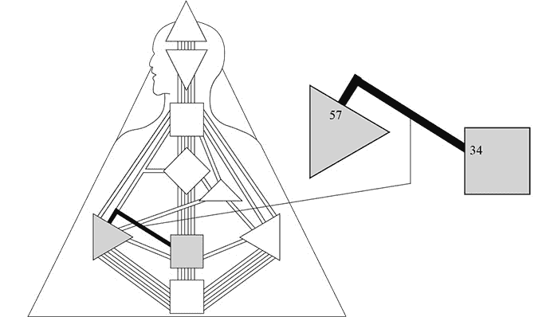

### 定义

这条通道直觉敏锐、反应快，随时皆能充分展现求存本能，身体恒常处于警戒与防守状态，对于当下发生的危险或攻击能立即回应。这是人类求存本能的原始能力，这条通道的人面对危险状况，反应之速，远在情绪反应或者脑袋思考之前。反应的当下，冷静到近乎冷酷。这代表的是，身为一个人所具备，真正的力量。

### 求生存，最原始的力量

这是一条为了活下去，在面对攻击时，会迅速回应反击的通道。好比人体的防卫机制，平时，这套机制看起来彷彿没在运作，事实上，却是二十四小时不休眠的系统，只有在遭受攻击时，会全面启动。在危险发生的当下，迅速回应，火力全开。换言之，有这条通道的人并不好胜，也不会主动攻击别人，他们只在遭受攻击时，回击对手，而且一旦回击，就火力强大。因为这对他来说，关系到的是生存，而非只是竞争或面子问题。也就是说，这条通道的人并非天生好战，回击的目的也并非想赢，他们纯粹就是为了活下去。

活下去，就是这条通道的奥义。若能相信直觉所传达的讯息，必能顺利找出求存之道，这是人类为了生存，建构于底层的坚毅不拔，为了适应环境变迁，求取生存所展现出来的力量。求存，对生物来说，是最重要的事。先求自己能活下来，才能让自己的基因保存下来。虽然现在已经不像远古那样，需要时时保持警戒，聆听四面八方各式各样的讯息，以判断是否有潜藏的危险。但是，这根深柢固如动物性的原始本能，还是如实保存了下来。这也说明了这条通道的人身形敏捷，对声音和周围所发生的一切特别敏感，他们所聆听的并非语言，而是周围的人开口说话时，所隐藏的弦外之音，然后判断当下是否安全，一举一动是否适宜。

他们对周遭任何细微的声音或波动，异常敏感，虽然在脑袋理智的层次，常常无法说出所以然。例如平时可能睡得很死，但是不寻常的瓦斯味或敲门声，总能让他们在第一时间马上醒过来。对于任何不对劲的人事物，也能在第一时间内，如动物本能般迅速察觉。只要在理性没有过度涉入，或者被情绪周期起伏所干扰，那直觉所告诉他们的讯息，往往总是准确无比。他们反应快，直觉强，能在每个当下，明确判断，做出最适当的决定。

### 直觉敏锐、临机应变的欧普拉

脱口秀主持人欧普拉（Oprah Winfrey）藉着她异于常人的敏锐，还有灵活的临机应变能力，闯出一番成就。初入社会，她原本想当新闻主播。很快地，欧普拉却发现自己并不喜欢看着稿子，她并不想有条有理地播报新闻，她总是难掩内在的冲动，想脱稿演出，立即告诉观众所有的消息。因此也不意外，主播的工作只做了八个月，很快就被调至脱口秀节目里成为要角。欧普拉曾说，当她坐下说话的那一刻，她真实觉得自己回到家了。因为在别人眼中，要快速反应的脱口秀，压力极大，对她来说，却像呼吸般自然。那个当下她的直觉就是，这才是对的。事后证明，这也正是她事业版图的开始，她真的来对地方了。

众所皆知，欧普拉身材肥胖、长相普通，又是黑人女性，她在最重视虚华外表的演艺圈，究竟凭什么闯出一片天？除了她的真诚坦白，博得观众缘，她坚持做自己的勇敢，也让人印象深刻。除此之外，当她主持节目的时候，时时流露出的绝妙幽默感，她总能实时又适切地，游刃有余地回应访谈者，同时也与观众自然互动打成一片，临场反应真是一流。最最让人印象深刻的是，她总能非常专注地倾听访谈者说的话，适切回应对方的情绪，甚至有时候还会陪着流泪，却不会失去焦点。她很清楚自己的定位，她既是陪伴者，也是主持人，这是为什么她的节目让人感觉很真，却又很好看的原因。有这条通道的人善于临机应变，实时性的谈话节目，或各类活动主持人的角色，非常适合他们发挥所长。

### 直觉强，反应快让他们化险为夷

这条通道的人因为直觉强，似乎不易遇到危险，或者应该说，他们往往在危险发生之前，就有所察觉，而能先行闪避。若信赖自身敏锐的直觉，他们很自然地能判断出，哪些人有不正确的举止，还有哪些讯息其实已经流露出危险的警讯，而下意识先远离。

当突发状况发生，他们的身体会迅速马上反应。他们在当下，脑子可能来不及思考该有的步骤程序，至于情感和感觉，更是全然关闭，因为任何情绪如恐惧或愤怒，都会延迟行动的速度。在当下，他们只是单纯地回到动物本能，迅速回应所有讯息。看在别人眼里，会觉得他们很冷静，异常冷酷而近乎没有人性。但是，可能就是要等到所有应急措施皆处理完毕，他们才终于可以松懈下来，尽情发泄出压抑的情绪。

他们的力量强大，所采取的行动皆为了捍卫生存。若遭受攻击而没有反击，可能会持续招致欺压，攸关生死存亡。所以先顾好自己，维护自己的独特性，非常重要。但相反地，若误用这股生命的动力来欺压他人，终究会在日后，引发更大的反扑力量。

### 若长期被制约，容易丧失回应力

这条通道之所以称之为人的原型，是因为人性里本来就具备求存的原始需求。每当深陷对未知的恐惧时，所引发的求生本能，其实相当冷酷与自私，这既非为了家族存续，也不是基于社会考量，单纯就是一股「我要活下去」的本能需求。

在每个人逐渐成长，趋近社会化的同时，这条通道所呈现的本能需求，极容易被压抑，社会传统价值观与诸多道德框架，不断限制他们原始利己、求生的本能。长久被制约的下场是，他们将逐渐丧失其回应的能力。悲哀的是，最后面临生死存亡之际，当存活受到威胁，久经綑绑的他们，反而已经无法发挥这条通道的特质。

请勇敢忠于自己，诚实面对自己内在的声音，单纯回应自己的渴望，完整地在每个当下，做出回应。如此一来，才能活出这条通道的能力与力量。

#### 给这条通道的人的建议

相信自己的直觉，顺应本能生活，就会让你健康又长寿。关键是，让身体单纯地回应每一个当下的需求。信任身体的反应，听取身体对于环境变化的回应。当你学会依赖你的直觉，你将拥有身为一个人，最真实的力量。

通道名人：欧普拉、铃木一朗、撒切尔夫人、阿基师、亨利．福特、班．艾佛列克、大卫．鲍伊

# 35–36 危机是转机，生命多精采

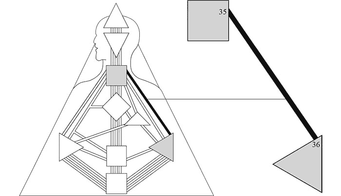

### 定义

人生充满丰富的经历，因为内心持续有冒险的渴望，希望能体验没有体验过的一切。这是一条经由累积各式体验的过程中，累积智慧的通道。最后所得到的人生智慧就是，世事无常，没有什么是永恒不变，每一个你拥有的体验都会聚沙成塔，让人生充满广度与深度。

这条通道的人所说出口的话，带有浓厚的情绪渲染力，开心不开心都表里如一，随着人生经验的累积，能以愈来愈有趣、愈有创意的方式，分享自己精采的体验和故事，以非常吸引人的方式让没有体验过你们经验的人，也能有共通的应变方式。

### 天生容易引发突发状况

有这条通道的人似乎非常容易遇到各种希奇古怪的状况，同样的步骤或行程，别人经历一百遍都不会出错，轮到他们时，就是很妙地，刚好会有突发状况发生，真是令人无言。既然这条通道称为无常，那么撞见各种莫名危机，才能有空间学习变通，找到见招拆招的方法，也因此找到原本意想不到的应变之道。经验累积最棒的智慧，下次当类似的状况再度发生，就不再是让人惊慌失措的危机，根据先前的经验，人类已经懂得如何适切去因应与处理，而这就是无常的通道，对整体世界所作做的独特贡献。

这世界绝大多数的人并不喜欢意外，无常的一切很刺激，也很危险，或许连有这条通道的人自己也无法理解，甚至不喜欢，但他们生来就是会引发新的体验，那些看似危机的事件，也因为将事情整个拉离常轨，原本以为的错误，反而能带来新意。就好像饼干的缘起，是因为船员遇到船难，面粉、奶油、糖全都混在一起，在食物缺乏下，船员也只好将面粉捏成一坨烤来充飢，没想到意外美味，从此饼干（biscuit）就问世了，还以船难发生时的海湾(Biscuit)来命名。臭豆腐也是豆腐商人误打误撞从豆腐生产出来的、威而刚本来是治疗心脏与高血压的药……。你可以说人世无常，整个人为此抗拒惊慌，也可以选择以不同的角度来看，如果没有这些出乎预料之外的发展，如果我们连一丁点错误都不容许发生，这世界何来如今丰富的多样化与各种新鲜的事物？

### 渴望体验，带来新鲜的波登

若是探讨得更深，这条通道的人之所以引发各式各样的体验，是因为在他们的生命底层，有意识或无意识之中，存有一股热烈想去体验更多的渴望。为了满足这样独特的渴望，于是生命中内建了一套无常机制，好让他透过经历生命的各种状态，对人生做出不同于常人的结论。而对新鲜体验的渴求，并非为了达到什么特定的结果。体验本身，就是最好的过程，也是最佳的答案。所以，有这条通道的人也会不自觉地突破常轨，创造极为丰富的人生。例如，从事变化大的行业、老是转行，或者跨界经营，表面看来是扩张事业的版图，其实是单纯源自内在的渴望，想尝试也想拥有更多更新鲜的体验。

有名的美食旅游节目主持人，安东尼．波登（Anthony Michael Bourdain）就是个非常有趣的例子。他不但有这条无常的通道，也同时具备才华的通道（16－48），后者让他在厨艺上因反覆练习，拥有专业并达到深度。而无常的通道则让他看似不安于室地跨界写专栏、写书、主持美食节目。他如鱼得水般全世界跑透透，节目内容绝对不会一成不变，他总是能以截然不同的角度与观点，不落俗套地介绍了各国美食与文化。他吃过各种古怪食物，例如羊睪丸、蚁蛋、眼镜蛇生肉。在品尝的经验中可能得伴随拉肚子、过敏或内心调适等危机；最夸张的一次是，他在黎巴嫩首都贝鲁特录制节目时，因为爆发以黎冲突而在美国海军陆战队的保护下撤离。因此也见证了当地政党支持者的遭遇，与美国侨民等待救援的点滴。

如果波登没有这条通道，他说不定一开始就拒绝去这么危险的国度，或者在事情爆发时，也不会有心情要将这一切记录下来。更别提之后将这些与美食无关的经历，相当不寻常地放入节目之中。无常的通道如此无常，如此刺激，看似危机不断，却也造就了波登的绝佳魅力，他的文字与节目总是这么奇异而深刻，彻底跳脱既定的框架，以崭新的体验吸引世人，让他博得众多粉丝，还得到艾美奖提名，名利双收。你看，当一个人完全将无常的通道发挥到极致，这是多么精采的刺激人生啊。

### 众人最棒的人生导师

若能以成熟且不带偏见的眼光来看待这条通道的人，不可讳言，他们就是「世事无常」活生生的例子。在他们经历各种危机，得到许多不凡体验的同时，也不免为周遭的人带来不同以往的全新体验。不管你喜不喜欢，都不得不承认他们的存在，的确在无形中增广了我们的视野，让你我锻鍊出更大的容量，接纳更多不同以往的可能。而具备这条通道的人，随着年岁渐长，见多识广，成熟的经历让他们几乎在任何突发的状况下，都能保持镇定，临危不乱，而他们从各种经验中所累积的人生智慧，让他们能够成为众人最棒的人生老师。

这条通道的人很有趣，不管生气和快乐都很真诚，毫不掩饰。他们也非常乐于分享，当他们充满能量表达自己时，让人彷彿身历其境。听他们说话，容易融入他们的情绪与体验里，感受到他们体验的无常、多样、丰富。他们的话语有深切的渲染力与煽动性，非常迷人。这从安东尼．波登，以及同样具有无常通道，三十九岁即英年早逝的革命家切．格瓦拉身上，都明显呈现出这样的特质。

#### 给这条通道的人的建议

不要害怕危机，世事无常才能让你累积丰富的经验，有一天，你们会成为通透人世的智者，通晓人生的老师。你所说出的每一句话之所以有力量，是因为你亲身经历过。没有白走的路，经历累积深厚内力，面对痛苦与无助，你的简单一句话，就足以抚慰人心，那是因为你们所说的话语，是以自己的人生为基底，真实付出代价后，所得到的珍贵智慧。一个人的心有多大，有多理解别人的痛苦，并能感同身受，是因为众生正在经历的，你都曾经走过，当你亲身经历了这看似折腾的曲折，勇敢并坚定地穿越了，就能带着深沉的理解与感受，支持更多人。

请你无所期待，单纯且全新投入人生的各种体验。同时，也请你学习有耐性，不要在当下做决定，请等自己的情绪高低起伏周期走完，获得清晰之后，再做决定。

通道名人：波登、切．格瓦拉、川普、史蒂芬．史匹柏

# 37–40 为家族付出，就是爱

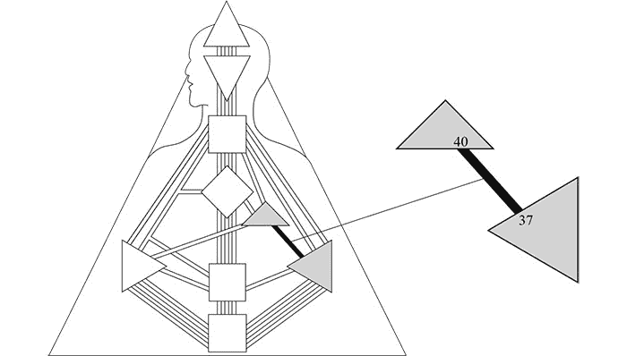

### 定义

这条通道代表的是家族的精神，连结社群的基石。生命中的重要主题与归属感有关，探索自己究竟归属于何处，若能归属于正确的社群，进而付出与贡献，会让你觉得满足与平和。

有这条通道的人要找到对的人，组成对的家族，形成连结，并共同创造社群的和谐。所有的人际关系都要建立在公平的原则上，如果你与所爱之人或共事的对象所达成的协议不公平不清楚，这段关系将对你造成耗损，并且也不会长久。

### 重视人和，对于社群的需求很敏感

这是一条关于经营社群的通道，在这里所指的社群可以是家庭、家族、公司，或任何他认为有归属感的团体。他们一旦有所归——找到对的人，不管是婚姻或者工作，达成共识，形成连结的关系，就会自然而然开始产生动力，为所属的团队而努力。对内，他凝聚大家向心力，细心体贴注意到每一个人的需求，并不计利害得失地付出；对外，他会为了团队的利益而极力争取，转身扮演斤斤计较的主妇或者精明的经营者。总之，有这条通道的人绝不会让自己的家族吃亏。换句话说，你是否为家族的一分子，将成为他最主要的考量，并产生关键性的影响。

有这条通道的人重视人和，对于每位成员的需求很敏感。他们总会细腻地注意到每个人情感的变化，适时给予支持，愿意为对方付出。比如说在工作团队中，若有伙伴遇到挫折，他们总会温暖伸出援手，是很细微、在情感层面的支持。或许这些举动无法直接创造业绩，表面看来也没有实质的功用，却能在无形中让团队凝聚力变强。让团队或家庭里出外厮杀拚搏的成员，一回到家或公司，看到他就自然而然感到安心稳定，他的存在很实在，就是一股温暖连结的力量。

同时，他们也具备做生意的才能。基于让自己的团队获取利益，绝对不会让外人占便宜，会货比三家，充分了解市场行情，试着以最好的价格成交。当他们奋力争取最佳条件时，不但不会害羞，甚至会给人自我感觉超级良好的印象。因为对他们来说，既然是谈生意，没必要有什么情绪纠葛，重要的是彼此间达到共识。而且他们本身物欲并不强，做生意要获利其背后的动机，源于要取得资源，好好照顾他的家人、他的公司、他的家族。所以，当他们开口喊价或争取利益时，看似温和却很坚定。

有这条通道的人，内心底层非常重视「公平」与「尊重」。但是，他们所认定的公平，可能与你所认为的差异颇大。在做生意的时候，对他们来说，所谓的公平就是，有人要买，有人要卖，而讨价还价就是试着理解彼此的需求为何，并在当中取得公平，同时双方建立共识，只要彼此达成协议，就是公平。对内经营团队时，他们内在也有一个清楚衡量的指标，如何凝聚团队成员，协调并引导每个人发挥所长，才能上下齐心，共同创造更多价值，让团队更成功。

### 找到对的人，与之建立连结

奇异公司执行长杰克．威尔许（Jack Welch）就是一个明显的范例。他拥有这条经营社群的通道，在他任职奇异执行长期间，让公司获利成长七倍，市值成长三十五倍。但同时，他最受争议的地方在于大幅度裁员，他上任五年，共砍掉十二万名员工。他赏罚分明，对于公司内的员工积极栽培，将公司转变为学习型组织，投入大量经费将原来企业内的教育中心改造成管理学院。让公司内众多中高阶主管能在其中学习成长，凝聚团队核心干部与菁英，建立公平运作体制，让企业变得更强。

对于有这条通道的人来说，所谓的公平，不只限于实质上的公平，也包括情感上的公平，他们重视婚姻，在情感上也愿意慷慨付出，但是在看似无怨无悔的付出背后，他们内心期待收到所爱的人回报以相对的尊重，当他们真正收到，对方欣赏自己的付出，感激并且深深珍惜着自己，就会感受到爱，并为此心满意足。

对他们来说，人生中最重要的事，就是找到对的人，与之建立连结。所谓对的人，指的是愿意与自己站在一起，同意彼此的关系要建立在相对的权利与义务之上。不管是结婚，或者合伙做生意，这对他们来说极其重要。因为，若与不正确的人建立关系，跟错误的人合作，不管是婚姻或事业，他们会因为过度的付出，无法获得同样的滋养，而最终感到耗竭。相反地，如果拥有懂得尊重他的伴侣，其付出就能得到相对应的反馈。那么这个家庭，或是公司、企业与团队也一定能经营得很好，这就是关系是否建立在公平原则上的差异。

### 乐于付出，但也要学习平衡

他们是典型先成家后立业的人。家庭价值、缔结婚约对他们而言都是重大的决定。一旦有了家庭，有了所爱的人，有了孩子，他们就会产生浓厚的归属感，自内心产生无比强大的动力，渴望成就更多，想要努力赚钱，拚事业，让家人过更好的生活。

虽然拥有这条通道的人，乐于为所爱的人慷慨付出，却很难将自己的需求说出口。这也是这条通道要学习的课题：学习平衡，学习如何尊重自己的需求，而不是一直不断不断地盲目付出，因为你的付出可能根本不是对方想要的。失衡的付出只会在最后让自己落入受害者的困局，得不偿失。请让自己在人际关系上取得平衡。生活各个层面也是如此，饮食平衡、性生活规律、工作适度、固定的休闲生活，照顾别人也要照顾自己。

#### 给这条通道的人的建议

一旦你有所归属，对内你会付出与经营，对外则争取权益，甚至进一步扩张家族领域。娶或嫁对人、进对公司、与对的对象合作，都会对你大有帮助。但得不到尊重的付出，则会让你的生活陷入失衡，你会在恶性循环的付出中耗尽一切，而依然得不到相对应的反馈，要注意。

通道名人：威尔许、杰米．奥力佛、达赖喇嘛、约翰．甘乃迪、邱吉尔、伍迪．艾伦、张艺谋

# 39–55 多愁善感，才能让创造力生生不息

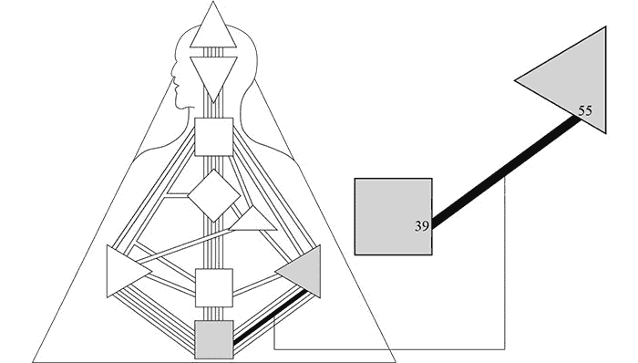

### 定义

有这条通道的人很容易多愁善感、忧郁、情绪化。这些看似无来由的情绪，其实是非常珍贵的资产，底层蕴藏了巨大的创造力。接纳内在会有忧郁与多愁善感的那一面，学习与情绪的高低起伏共存，快乐有时，悲伤有时，每种情绪都有其存在的必要性。忧郁则是一种独特的天赋，若能与每次低潮和平相处，学习转化忧郁为创意的动力，就能为世界带来源源不绝的创作，透过旋律、文字与创作，让世人得以体验你在情感上所经历的幽谷与天堂。

### 天生情感丰沛、多愁善感

有此通道的人天生情感丰沛，每天的情绪高低起伏都不同，上一刻忧郁，可能下一刻突然变得很开朗，转变之间毫无理由可循。别人很容易觉得他们情绪化，搞不懂又难相处，其实他们自己也很痛苦，无法明白为什么内心的情绪起伏会这么强烈。若是终其一生都只是为此而苦，没有理解上天赐予这项天赋才华的深意，那就太可惜了。有句英文的谚语足以解释这条通道的独特之处：If there is no melancholy, there is no melody.（没有忧郁，就没有旋律）。绝大多数的人并不理解，忧郁与创作力紧密相关，让忧郁找到出口的唯一方式，是经由内在的转化与升华，将情绪转化为创作的力量，以各种创作的形式，蜕变成全新的产出。当他们在作品中释放出充沛的情感，就能为我们带来艺术，带来感动，让人与人得以在心灵的层面共振，感受到合一。这就是这条情绪的通道，对人类以及对这个世界的贡献。

### 情绪，正是他们创作的动力

换句话说，这条通道的人的情绪有多幽微、多低落、多高亢、多深刻，他们就有相等量的力量能转化成创作。忧郁，不过就是老天爷赋予他们才华时，额外附赠的副作用，而情绪跌宕起伏才是他们绝妙创作的原动力。伍迪．艾伦（Woody Allen）具备这条情绪的通道，这也就不意外为什么伍迪．艾伦的电影作品，总会环绕着与情感相关的主题，巧妙又细腻地表达出我们内在那些难以说出口，对于爱、情感、与婚姻的恐惧和焦虑。他曾在访谈中说，他年轻的时候受困于爱，到了四十岁依然为此受苦；他的作品主题经常围绕在探讨爱的本质和自我追寻。在他的电影里面，许多角色都认为爱情虚无，却无法不谈恋爱，钻牛角尖不断循环，有时，电影人物「找到了真爱」，却往往只是幻觉的极致表现。爱，真是最折磨人也最动人的东西。有这条通道的人，在爱里深刻感受到孤独与困惑，经由对爱的探索，化为真实的作品，淬鍊出对情感深具智慧的体验，给了为情所苦的人一条抒发的出口。

对有这条通道的人来说，忧郁与多愁善感是必然的，对爱的追求与失落也是必然的。但重点是，你可以走多远？你是滞留在忧郁？还是愿意更进一步？将之转化为创作的动力，为这个世界带来美与爱？

### 终其一生寻觅「懂我」的灵魂伴侣

不可讳言此通道盛产艺术家，但同时艺术家们也相当难搞，因为情绪起伏毕竟无规则可循。与有这条通道的人谈恋爱的经验很特别，很浪漫，也相对而言很辛苦。当他们寻找伴侣时，寻寻觅觅，内心渴求的是感受到一种灵魂的共振。听起来很抽象？这真是超越理智逻辑的范畴，而这也就是这条通道的人所追求的「懂我」。极难以理性来解释与理解，因为不合逻辑，也没有公式，爱与不爱，隐约之间有股看似神祕的机缘与安排，懂不懂，无法强求，更非不断努力就能达成。就像伍迪．艾伦在访谈中或电影里呈现出的爱情轮廓，他自己化身为电影人物，追求真爱，但经常遇到「不懂他」的女性，两人鸡同鸭讲，直到另一个能与他心领神会的女子出现。这正是这条通道一生所追求的灵魂的层次。此通道的人的忧郁，是来自底层的绝望：要找到与他们灵魂共振的人太困难了，但是如果找不到，活着又有什么意思？

这也是为何忧郁会是天赋的理由。很多创作者之所以写得出动人的情歌，是因为他们曾在情绪起伏中体验过诸多失落、渴求、伤心。这些五味杂陈、难以厘清的情感浓缩为旋律，诉诸的不是理性，而是人的情绪。最美的诗歌多来自绝望与忧郁，所以，受苦让这条通道的人有深度。这是为什么有此通道的艺术家在最悲伤痛苦的时候，往往也是创作的尖峰期。

### 受苦带来深度，学习接受自己的情绪

有这条通道的人要学习的是接受自己的情绪，高潮也好，低潮也罢。低潮时，不要藉着吃药让自己回复平静，也不要恐惧于情绪高亢，而试图将自己拉回平淡。若是对情绪的世界太过无知，源于心怀恐惧而不断担心，不停压抑它，最后呈现麻木的状态，没有情绪，没有感受，艺术如何能诞生？如果总是希望天天开心快乐，其实是相当不切实际的想法。唯有接受情绪高低就是天生自然，明白低潮反而会是全新突变的开始。有情绪并非坏事，关键是如何学习投降与接纳，找到与之相处的方法，人总得历经低潮才能转换到高潮，一如四季，春夏秋冬自然流转，没有冬天的休藏与酝酿，怎能生出春天的繁花盛放？

#### 给这条通道的人的建议

情绪是你最好的朋友，也是老天爷给你最棒的礼物。穿越情绪，透过创作抒发自己，将内在经历的一切转化、提炼并升华。建议培养创作的兴趣，如果没有创作的兴趣，可以听歌、唱歌、学习乐器，或者写诗、园艺等都好。经由音乐与创作，能大幅度舒缓你忧郁的情绪，也可以进一步得到出口。别担心自己怀才不遇，当你真心做着自己喜欢的事情，作品终有被看到的一天。

如果你的孩子或周围的人有这条通道，当忧郁来袭，不要拚命试图「解决」他们的烦闷，也不要期待他们会马上开心起来。接受情绪的感受需要过程，询问对方希望如何被支持，留空间让他们独处，或是转化为创作，都会是很好的方式。学习如何跟自己的情绪同在，完整体验悲伤或低潮，化忧郁为创意，就是这条通道的人可以传递并贡献给世界的智慧。

通道名人：伍迪．艾伦、约翰．屈伏塔、贝克汉、居礼夫人

# 42–53 在不同阶段中，蜕变成蝴蝶

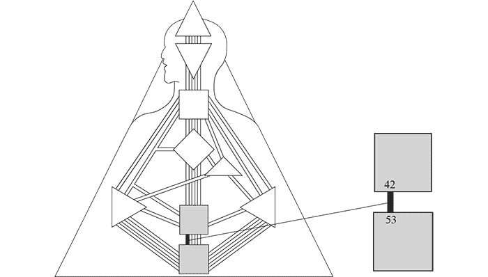

### 定义

你的人生由各种截然不同的阶段所组成，经由完整的历程，你将逐渐成熟并累积智慧。将人生当成旅程，在不同的阶段学习生命传递而来的智慧。重点并非达成特定的目标，而是完整去经历这过程，累积各式各样丰富的体验。让压力成为动力，不管发生什么惊涛骇浪，都能让你从中成长，进而成为一个真正成熟的人。

一旦开始，就会坚持到最后，直到这个阶段结束，学会该学的课题。通常一个生命阶段从头到尾将持续七年，万一半途而废，同样的课题将在下一个循环，迅速以不同的形式再度出现，直到学会为止。请对每个开始谨慎以对，不论是工作或者人际关系，包括婚姻，若一开始就是错误，往往要花很长一段时间，才能重新再开始。

### 一旦开始，就无法轻易结束

这是一条一旦开始，就无法轻易结束的通道。进入一家公司，结婚，跟人合伙做生意，只要关系一建立，这条通道的人就会走到底。他们有时明知错了，却依然无法半途而废。如果是正确的决定，当然没有问题。但如果是错误的选择，他们也会尽量撑着，试图修正或调整路线。不管怎样，就是无法像别人那样，直接抽身。最常见的状况是，一旦结婚，即使发现嫁错人或娶错人，还是想要尽力「经营」，试图挽回，直到状况完全破局为止。或者是，几个朋友投资，后来证明创业模式行不通，大家逐一退出，只有这条通道的人死撑到底。股神巴菲特（Warren Edward Buffett）当初买入波克夏纺织公司，没多久就悔不当初，任何人包括他自己，都承认这是错误的决定。巴菲特尽管承认投资错误，却依然以「波克夏」为公司的名字，甚至以之为主体往外投资，无法当下认赔杀出。

他们像强迫症患者，一开始就无法轻易结束，所以要慎始。在进入任何工作或关系之前，都要先问自己：这是正确的选择吗？是自己真心想从事的事情或想要的关系吗？如果答案是肯定的，即使投入七年，没有得到好的结果，这也是他们人生阶段中必然要经历的，他们一定能从中累积重要的人生智慧。若答案是否定的，那么这错误就会持续七年或更久，才得以结束。

### 在人生各种不同阶段中，体验并成长

体验人生这条路上，各种不同阶段的体验，对这条通道的人来说是非常重要的一件事。因为有这条通道的人，就是在一个阶段接着下一个阶段的诸多经历中，成长、茁壮与成熟。现今社会的主流价值观，总是以目标为导向，人生不同阶段得要完成某些目标才算成功。何时有第一桶金、第一栋房、娶妻嫁人。但对这条通道的人来说，目标不重要，重要的是过程中那跌跌撞撞所累积出来的丰富体验，而每个阶段的学习，都是必经之路的累积，让他们学会该学会的课题，之后他们才能往下个全新的阶段迈进，当然，下一次又会有全新的课题等待他们去学习。

他们的人生会分成很多不同的阶段，每一段约七年。每一段做的事情可能截然不同，好比上一阶段可能是在物流公司，下一阶段又转行从事服饰业。就算前后的领域和工作内容看似大不相同，但很奇妙地，他们就是有办法善用上个阶段所学习到的智慧，好好运用在下个阶段的经营上头。可能是待人处事的眉角，可能是公司管理的心法。若自始自终都待在同样的领域或关系里，但如果用心体验与学习，不同的阶段也会不断地进步，转换成全然不同的心态与方法，简直可以用脱胎换骨来形容。

### 脱胎换骨，是为了朝下一阶段前进

最好的例子是，巴菲特从一九六五年取得波克夏经营权，一直到一九八五年卖出波克夏最后一间纺织厂，整整历经二十一年（三个七年）。别人可能会说他终于结束了这少数让他赔钱的投资，但以人类图的观点来说，原始的波克夏已经不存在，全新的波克夏诞生了。因为从巴菲特以「波克夏」为名，向外购买持有可口可乐、美国运通、喜事糖等企业的股权，最后完全转型为金融控股公司，波克夏脱胎换骨，巴菲特何尝不是？虽然他从事的始终都是投资业，但是他的心境，与投资策略和作风，跟二十一年前彻彻底底、完全不同了。

拥有这条通道的人，若开始了却半途而废，那么，这原本该学会的人生智慧，必定会以不同的形式循环出现，直到他们真正学到会为止。学会了，才能自然而然进入下一阶段。而所谓「结束」与「学会」，并非脑袋思考所得出的结论，而是真正心领神会，于是心态才得以转换，导致最后行为与结果都改变。也只有当自己明白了，才不会继续卡在同一关。学生准备好了，老师才会出现，既定的课题学完了，新的开始才会打开大门，然后又是一个全新的阶段，会有全新的学习。

这条通道的人若好好活出自己的设计，那么人生中自然而然会拥有各种丰富的体验。这些千金难换的体验，可能是从零到有、或者从初阶到进阶、跨界学习，包括犯错，因为犯错也是另一种珍贵的体验，从错误中才能真正扎实地学习与成长。加上有这条通道的人抗压性强，这一个阶段中若经历了四级地震，下一阶段他们就足以应付五级地震。当具有这条通道的人，不断往前走，当他们真正穿越各个阶段，迎向成熟的那一刻，就会真正变成人生阅历非常丰富的人。

经历种种淬练之后，还有什么大风大浪没见过呢？一个真正成熟的人，即使静默，其存在都能让人感受到他的睿智，无需言语，整个人都会散发出见过世面，人情世故通透的气质。

#### 给这条通道的人的建议

在你做任何人生重要决定，或决定进入任何关系或行业之前，请务必谨慎，若不是回应内在真心的渴望，只会是一个错误的开始。反之，若是自己真心喜欢的事情，不管成功失败，过程有快乐或痛苦，都会是珍贵的过程，你必定能从中得到宝贵的学习。

通道名人：巴菲特、梅莉．史翠普、哈理逊．福特

# 47–64 创意来自天马行空的联想力

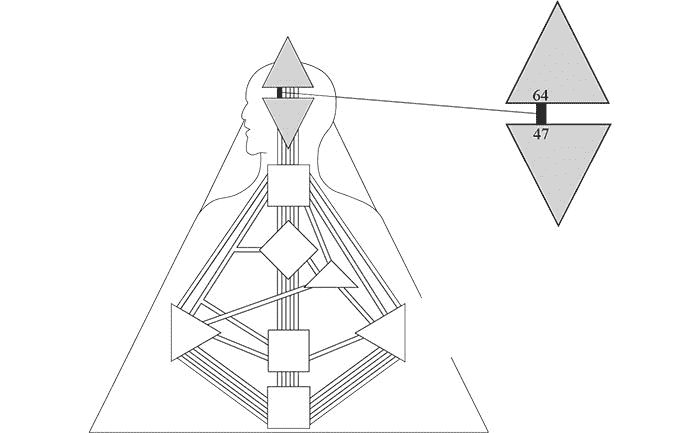

### 定义

若你能接受困惑就是头脑运作的本质，是思考过程中不可或缺的一部分，就能从老旧与固有的模式中，予以重组拼接，从而创造出新意。这条通道非常擅长将过去所发生的一切，以抽象的概念或想法，转化为各种不同的形式来诠释，非常适合从事与创意相关的产业，透过艺术、哲学、历史或文化各层面展现才华。

### 擅长跨界重组，影像灵感凭空而生

这条通道的人不断想着不同的概念，来自四面八方的各种可能性，在他们脑中重组、变化成全新的概念。他们的脑袋里不停地进行着各种概念的体验，打破固有的模式，将全然不相干的物件或概念放在一起，这些风马牛不相及的想法有时是垃圾，有时却碰撞出非常了不起的火花。他们总是洋溢创意，说话风趣，充满自由发散的创意，与一般人的思考模式很不同，他们尤其擅长跨界与重组，将旧有的东西呈现出新意。

「北极熊喝可乐」，很有趣的景象吧？这样的广告没有理性，也毫无逻辑，但是却令人印象深刻。这条通道的人思考模式就像这样，脑中自动跑出影像，灵感凭空冲出，天马行空恣意妄为、奇妙缤纷的角色和情节，以意想不到的方式运作，思考的模式宛如泡泡无止境地向外增生，不停发散到最后，可能语不惊人死不休似地，最后降落在离起点很遥远，乍看风马牛不相及的某个结论上，但这看似疯狂毫无逻辑的联想力，若运用在创意产业，或是艺术发想的领域里，往往是令人赞叹的惊人才华。

### 罗琳脑中奔驰大量画面，跑出理性无法解释的畅销故事

你知道，哈利波特的故事是怎么诞生的吗？这个风靡全世界的魔法故事，其实搭乘着一班误点的火车，就这样如梦似幻，坠入 J．K．罗琳（J.K.Rowling）的脑海中。

罗琳当然有这条抽象的通道，当时她正站在月台上，而这班开往伦敦的火车竟然误点了。慢慢的，在她爱跑画面的脑海浬，浮现出一个瘦弱、戴眼镜、从未想过自己真实身分的黑发男孩。接着，其他角色与情节，在火车误点的四个小时之内，宛如神谕般，飞快现身了。于是，我们这群麻瓜才得以一齐祕密地，与哈利波特一同溜进伦敦王十字车站的「九又四分之三月台」，搭乘魔法学校特快车，往霍格华兹飞奔，从此流连忘返。

如果没有一个充满创意的脑袋，编出了一大串影像，我们就读不到精采的《哈利波特》。这个有趣的奇幻故事，结合了魔法与现实，发生在一个看似架空却又感觉无比真实的世界里。而这正是这一条跑画面通道对世界的贡献，当他们以创作来呈现自己脑袋中的重组，是多么令人惊喜呀。

### 混乱与清明交织，解答有多种版本

他们脑中的思考模式并不稳定，只要改变当中一个元素，重组出来的影像和概念就会全然不同。他们擅长快速并随意地，不断组装许多画面，在迷乱与清晰之中徘徊。他们也经常为此无比苦恼，甚至混乱。脑中乱烘烘，很多影像、幻影、概念混杂在一起，简直让他们快疯掉。

总会有灵机一动的时刻，脑中彷彿射入一道清明的光，让他们贯穿一切，此刻他会说「我懂了」。过往的苦恼，在此时突然变得清晰通透。但是，这瞬间所得到的清明并不稳定，也不确定，可说是在混乱与疑惑中，突然推测出来的结论。而同样的事件，日后当他们对人生产生新的理解，看待事情的角度将产生变动，极有可能在下一刻，又会剪接出一个与之前截然不同的版本。

人生如戏，戏如人生，这条通道的人真的很适合从事影视工作，对编剧尤其擅长，能将一个故事编成各式各样不同的版本。他们天生擅长处理影像，能精确地以画面与影像的方式来呈现，他们偏好影像思考，自己也多以画面来记忆过往。

这条通道的才华若用在理解自己，解决自己的问题，可预期将会是一场灾难。「连连看」的特质用在非理性的创意面，可以带来惊喜，但若以此来理解自己与周围正在发生的事情，则容易跳到不符合逻辑、与事实遥远的结论上头。若他们偏偏又执意地认定自己是对的，可想而知很容易落于偏执。

当他们深陷自己的迷宫，困惑将如拖棚的歹戏。他们的脑袋是一架无法停止运转的录放机，因为惊慌更想反覆确认，反覆不停搬演的结局，只会带来无止境的挫败与自我压抑。若他们固执于那错误的结论之上，那么所观看的片段，都会是筛选并编辑过的影像，每看一次，都将离真实更遥远。

#### 给这条通道的人的建议

你的头脑无法解决你自身的问题，它会对别人带来重大的启发，对自己却会带来巨大的困惑。若经常处在混乱与困惑中，希望得到一丝清明，那么建议你，这条通道的使用祕诀是：请将你的头脑用来服务大众，不要用来联想与自己直接相关的事情。而关于你的困惑，经过时间的沉淀后，答案将在对的时间点显现，请放心。

通道名人：J．K．罗琳、伍迪．艾伦、莫札特、张国荣、张艺谋、茱丽．蝶儿

