# 深入塔罗牌的神秘能量

—— 影響一生的塔羅牌學習書  

TAROT  
THE SECRET POWER OF TAROT  

這是一場探索自我的旅程  
神祕的力量・困惑的釐清・改變的起點  

+   首先，你需要保持一顆開放的心。  
接著，拋開機械式的閱讀法，花時間深入探討，並耐心的學習。  
最後，猶如黑暗中的一道曙光，命運將帶領你體驗它想教會你的事。  

78張精美手工繪製塔羅牌全新上市  

林奕寰  
著  

前言  

① 塔羅牌的運行原理  

在正式學會占卜後，許多人對於塔羅的準度嘖嘖稱奇，但也有許多人提出疑問，塔羅牌運作的原理到底是什麼？有一種很常見的說法是潛意識，人們的內心的想法以及過去的經驗，會反映在抽牌上，會不自覺抽到與現況和內心想法相同的牌。只不過多數的占卜都不會讓問卜者先看到牌的畫面，依照我的習慣也不會讓問卜者親自抽牌，問卜者的潛意識似乎很難發揮在牌上。  

幾個月前我讀了一本有關於宗教的書籍，裡面提到要是人們對於一件沒有生命的物件做了儀式性的動作，就會有靈附著在上頭。這時我想起一副塔羅牌開牌之後，一定要先抽主牌，占卜時也重複著默念、洗牌、切牌、發牌等規律的儀式化流程，而且塔羅牌總是有越用越準的趨勢，讓我不禁懷疑是否真的有靈附在塔羅上。但不管是潛意識亦或是靈都不在本書討論的範圍內，這裡沒有必要深究，這裡要教導各位初學者如何快速、有效的學習塔羅。就像是你到駕訓班學開車，你不需要了解引擎構造以及傳動原理，只要懂得踩油門和控制方向盤，你也能考取駕照。  

② 謂主牌？  

主牌象徵一副塔羅牌的精神、性格，通常在新牌拆封後，會將二十二張大牌獨立抽出，經過洗牌、切牌後抽出一張牌來代表主牌。我的第一副塔羅牌，主牌抽中了教皇，在占卜的時候完全顯露出教皇的個性，很喜歡給予建議、鼓勵，很多人在占卜後都能跳脫現狀找到新方向。而我的第二副塔羅牌主牌是月亮，在占卜時很常揭發當事人想隱瞞的祕密，或是不願意面對的事實，甚至當事人完全不了解的現況。  

或許把祕密赤裸裸的攤在牌面上會令人不舒服，但有些問卜者偏愛我這副塔羅，他們認爲這種表達的方式能幫助他們提早認清現實。我的第三副塔羅主牌是女祭司，她能很理性的分析任何事，尤其是學業以及工作，但對於感情的事總顯得有些害羞，老是用迂迴的方式呈現在牌面，光是要摸透她的表達方式還真是吃足了苦頭。  

不論主牌是那張牌，都不會影響到塔羅牌的準度，只不過面對同一個問題，會有不同的看法以及表達方式。即便是外行人，告訴他占卜流程後，所翻出來的牌也都是準確的，之所以會出現哪些占卜師特別神準，哪些則功力不足，完全是解讀上的問題。所以學習塔羅牌的人發現自己的占卜準確度不被認同時，有可能是對方不願認清、面對現實，也有可能是自己解讀的方向錯誤，需要多花點功夫和牌培養默契。  

〣 卜的結果有可能被改變嗎？  

身為一位占卜師，我不主張命運百分之百掌握在人的手上，人生活在世上總帶有一些宿命。但也不是說人生已經被定型，每個階段不過是按照劇本演出。  

對我來說人生就像一張空白的申論題，考試的方向已經決定，但你可以決定答題方向、內容，你的努力與否也決定了考試的分數。算命是種考前猜題，但它無法代替你做答。就好比戀愛，如果抽中死神牌，早已註定和對方緣分已盡，分手的事實不會被改變，但你可以決定要陷入哀傷、自怨自艾，或是重新振作，找尋更適合的對象，也有些人痛苦分手之後才體認到過去的感情有多愚蠢，反而對於出現死神牌感到慶幸。  

課業方面，或許已經難逃被當的命運，但你可以選擇擺爛，明年再見，也可以選擇放手一搏，雖然還是難逃被當的命運，但也有可能得到補考的機會，這樣就不用再多花一年的光陰。  

就占卜的經驗來說，如果結果是大牌，通常是宿命，很難扭轉。要是結果出現的是小牌，可能有機會透過努力改變現狀。只不過人生本來就要面對許多課題，與其強行改變命運，不如順著命運，從中學習寶貴的經驗，體驗命運要教會你些什麼。而且牌面的吉凶禍福是以世俗的價值觀去衡量，實際上不論哪張牌都沒有絕對的好壞，任何人世間的變局都是有意義的，只是很少有人能夠欣然接受。  

The Secret Power of Tarot  

Chapter 1  

大牌牌組  

零・愚者  
THE FOOL  

▷畫面解析  
一位青年哼著歌，用一根木棍繫著包袱，快步的走向斷崖邊，臉上毫無懼色，似乎要繼續向前邁進。畫面中的青年象徵單純與勇氣，斷崖則暗示危機與險阻，手中用來繫著包袱的木棍其實是根魔法棍，只不過青年還未意識到它無窮的力量。這位青年會大難不死？還是會摔個鼻青臉腫？又或者在山崖下找到自己的一片天呢？  

▷正逆位解析  

大牌牌組  
016  

愛情  
愚者牌在感情當中象徵著稚氣未脫、沒有心機的男孩、女孩。他們擁有追逐愛情的勇氣，但缺乏縝密的心思。在戀愛中的男女若是在占卜中抽中愚者牌，代表雙方只重視交往過程中的歡愉氣氛，不會在意對方年齡、思想、金錢甚至對於未來都沒有明確的想法，而且愚者嚮往自由自在、漂泊不定的生活，在感情上很難安定下來，若是問到有關於婚姻的問題肯定是沒有著落。  

抽到愚者牌的人，也有可能受到周遭親友的鼓舞，而去追求心儀的對象。不過當事人通常缺乏成熟、性感的魅力，也不清楚自己吸引異性的特質，憑著一股傻勁很容易嚇到對方，同時太直接的態度也容易得罪人。要是愚者牌代表的是正在追求的對象，對方可能是個神經大條的人，警覺性低，容易以朋友的身分接近，除非明確的告白，否則他（她）可是很難察覺那些曖昧不明的舉動。  

逆位的愚者，當事人將更加缺乏明辨是非的能力，在感情上易受欺騙、玩弄卻始終看不清楚現實。也有可能一時衝動而愛上不該愛的人，或者是見一個愛一個，完全沒有原則可言。  

事業  
愚者在事業當中並沒有太大的野心，淡泊名利，在職場上可能有些懶散，不喜歡被工作綁住，很難找到穩定工作，但是具有創意，比較適合設計、廣告企劃等工作。同時愚者有旅行的涵義，時下正流行的打工旅行也很符合其精神性。  

若是想創業的人抽到愚者，當事人可能有創業的勇氣，卻缺乏創業的資金和計畫，最好能三思而後行。正在求職的社會新鮮人也會因為看起來太過於我行我素，不容易受到業者青睞。  

逆位的愚者在工作上太過粗心、缺乏學習能力，即便只是簡單的工作也會出錯。在辦公室裡喜歡放空、摸魚、逛網拍而不務正業。逆位愚者缺乏理性思考和精準的判斷力，投資任何的項目都會血本無歸，也有可能被不肖人士詐欺。  

學業  
愚者擁有無限的潛能，可惜很難將專注力放在一件事上。若是問學校的段考或是報告能否通過，有很大的機會能夠低空飛過，因為傻人有傻福，誤打誤撞也能矇混過關。像是升學考試、檢定考、國家考試等難度較高、競爭激烈的考試可能就很難通過。  

逆位的愚者可能無法靈活運用所學的知識，只會賣弄小聰明。變造假學歷、證照也可視爲愚者逆位。也有可能在準備考試、報告上過於驕傲、自以爲是而大意失荊州。  

一．魔術師  
THE MAGICIAN  

▷畫面解析  
一位身穿紅袍的青年高舉右手，對於眼前的四元素金幣（土）、寶劍（風）、聖杯（水）、權杖（火）的掌握充滿自信，頭頂上則有著無限大的符號，象徵融合四元素，創造出生生不息的能量。同時牌中的人物形象也代表中古歐洲的煉金師。  

▷正逆位解析  

魔術師象徵能夠操縱四元素的人，風元素象徵溝通，火元素象徵熱情、性方面，水元素象徵感情，土元素象徵物質。魔術師若是代表另一半，代表對方善於溝通，說話幽默有內涵，同時對於這段感情能投注熱情，性生活也能滿足對方。在金錢上也不虞匱乏，很懂得享受人生，在約會時也會不時給予驚喜，是段麵包與愛情兼具的情感。  

想問能否和心儀的對象修成正果，抽到魔術師代表自己有著與生俱來的魅力，不論對方的需求為何，都能像魔術師一樣變給對方。同時魔術師也象徵在玩樂與享受中誕生的愛情。  

倘若魔術師出現逆位，在感情上很可能遇到玩咖，喜歡吹噓自己的能力，卻又沒有真本事。不肯付出真心，也不肯負責任。若是正在追求心儀的對象，則代表能力不足，缺乏四元素的力量（溝通、熱情、情感、金錢）沒有吸引對方的特質，或是追求的招式被識破，沒有實際的效果。  

事業  
不管是什麼樣的工作，都有能力勝任，充滿熱情與想法，有執行力卻又不盲目莽撞。和同事、上司亦或是客戶都能溝通良好，收入也不錯，對於一切感到遊刃有餘。想要投資抽到魔術師代表資金流動順暢、運用自如。想要開店代表擁有經營的熱情和能力，也能受到顧客的愛戴。  

在職業上魔術師也可能代表藥劑師、化學工程師，因為其辯才無礙的特質，也可成爲作家、演說家、政治家。  

逆位的魔術師，在職場上欠缺才能以及溝通的技巧，也不會理財，可能會成爲窮忙族。投資可能欠缺資金亦或是週轉不靈，也有可能是抱持著投機的心態，沒有長遠的規劃，被不肖份子詐財也是有可能。求職者若是抽到魔術師逆位，代表自己欠缺專業技能，求職不易。從事詐騙工作、兜售黑心商品、藉宗教詐財的神棍也可視爲魔術師逆位。  

學業  
魔術師象徵天資聰穎，不論是任何的科目都能輕鬆學習。考試、報告、論文都能輕鬆過關。而且魔術師並不是書呆子，可能是在運動、社團、戀愛和人際關係都能同時兼顧的資優生。  

逆位的魔術師，可能無法靈活運用所學的知識，只會賣弄小聰明。變造假學歷、證照也可視爲魔術師逆位。也有可能在準備考試、報告上過於驕傲、自以爲是而大意失荊州。  

二・女祭司  
THE HIGH PRIESTESS  

▷畫面解析  
一位女性身穿藍袍端坐在大殿中央，大殿兩旁的黑、白兩柱象徵陰陽調和。畫面中的角色理性、敏感，一副不食人間煙火的姿態面對世人，有著處女、聖女的形象。手中拿著書，似乎藏著神祕的智慧。  

▷正逆位解析  

愛情  
女祭司對於人世間的愛慾沒有太高的興趣，矜持、拘謹，重視理性與智慧，缺乏感性與衝動。與其將心力放在談戀愛，他們會選擇把心力放在學業上。如果女祭司代表正在追求的對象，當事人可能會感到頭痛，因為女祭司在戀愛中會有口是心非的問題，不會直接表達心中的想法，更不用說把愛說出口。同時女祭司也代表內熱外冷的冰山美人，要當她們的對象不見得要幽默、浪漫、多金，但一定要具備與她相符的內涵與智慧。若是想要問有沒有機會擺脫單身，抽到女祭司答案也是否定的，因為女祭司象徵暗戀或單身。  

逆位的女祭司在戀愛與人際關係上都顯得外熱內冷，會用看似熱情實則敷衍的態度來面對另一半或是愛慕者，也有可能是不擅長拒絕他人的情感。在感情上也有可能失去判斷的眼光，有鬼遮眼的情形而愛上不合適的人。女祭司逆位也象徵失去拘謹與矜持。  

事業  
女祭司在工作上細心、冷靜、負責。適合從事文書、寫作或是老師、教授、研究員等工作，也很適合擔任私人祕書。  

女祭司的直覺和第六感也相當優異，也能夠擔任占星、塔羅等命理師。美中不足的是女祭司欠缺與人溝通的技巧，較難和同事、客戶打成一片，不適合擔任業務、客服和門市銷售員。  

對於投資理財，女祭司也沒有任何概念和野心。最好從事獨立的工作。

## 學業

女祭司充滿了智慧，肯靜下來學習，喜歡追求新知。

問考試、報告等相關問題一定都能過關，而且是高分通過。若是問升學，女祭司代表適合走研究路線，可以取得碩士、博士亦或是雙學位。

逆位的女祭司在學習上只想敷衍了事，遇到課業上的問題也不好意思請教師長、同學。或許有學習的潛能，但缺乏正確的方法與態度。

## 三・皇后  
THE EMPRESS

## ▶ 畫面解析

一位身材略顯豐腴的熟女端坐在寶座上，手持象徵地球的手杖。一條河流從畫面後方茂密的森林向前奔流，滋潤了前方豐收的麥田。皇后不僅僅是生活在充滿情感以及物資滋潤的環境當中，她也行有餘力發揮母性本能，提供養分孕育天地間萬事萬物。

## ▶ 正逆位解析

### 愛情

025

Chapter 1

皇后象徵具有成熟韻味的熟女，通常年過三十，結婚且擁有幸福家庭。相較於女祭司，皇后主動熱情、不失端莊，樂於付出。若是男性問愛情，可能會遇到溫柔、體貼且成熟的女性；若是女性問愛情，可能在情感以及物質方面都受到極好的照料。

在一段感情抽中皇后牌，會有一段愉悅且協調的生活（包含子女、物質、愛情甚至性方面都很滿足），也可能象徵女方即將懷孕。皇后在占卜中也代表喜好打扮，外表豐腴、優雅、慵懶、懂得如何享受人生的女性。在占卜中抽中皇后也有嫁入豪門的機會。

皇后逆位，代表當事人貪圖物質享受、拜金。情感上表達太過於濃烈、直接，到處勾搭異性有如花蝴蝶，常給人輕浮的印像。皇后牌若代表另一半，對方可能有公主病，自以為是，喜歡限制對方的行蹤。更嚴重的狀況，對方將會不守婦道、喪失母性本能，容易出軌外遇，也可能拋棄自己的子女。

## 事業

皇后牌的工作能力並不算突出，但很有可能能找到輕鬆且福利佳的工作。抽中皇后牌的當事人具有一定的審美觀，不一定會成爲藝術家，但可從事服裝、飾品、化妝美容等與女性和美有關的產業。在職場上也可能成爲善待員工、部署的主管，因不吝於付出關心，普遍受到大家歡迎信任。再投資上，雖然不會大發利市，但也代表小小的豐收。

逆位的皇后是典型的月光族，貪圖享受，卻又不肯付出勞力、眼高手低，也有負債的可能。在職場上過於任性，無法吃苦。如果身為主管，會用頤指氣使的態度使喚員工。

## 學業

皇后重視休閒與享受，而且有著慵懶的氣質。在課業上可能不是特別的認真，但總是可以拿到還算及格的成績。因為擁有好人緣，在學業上也會無條件受到旁人的幫助（筆記、考古題）。另外抽到皇后牌的當事人在美術的領域可能有不錯的表現。

逆位皇后太過於慵懶、放縱於享樂情慾。在課業上不論是考試或報告都很難順利過關。恆心和毅力都不足，無法專心準備各種考試測驗。也有可能將自己的失敗遷怒、怪罪於周遭的人事物。

## 四・皇帝  
THE EMPEROR

## ▶ 畫面解析

頭戴皇冠，身穿紅袍與盔甲，表情嚴肅，搭配背景嚴峻的山脈，更顯得其至高無上的威嚴。用來裝飾寶座的山羊頭一方面象徵牡羊座，一方面也代表男性的權威、野心。

在希臘神話中的宙斯也與皇帝牌有關。

占卜中也可視其為君主、父親、老闆等掌權者的角色，逆位則有暴君色彩，像是秦始皇。

抽象的意義則是代表道德與禁令。同時就數字來說，四號牌也有穩固之意。

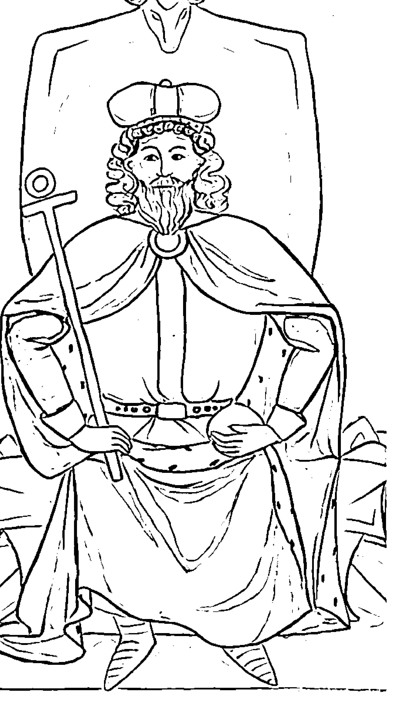

## 大牌牌組

## ▶ 正逆位解析

### 愛情

對於皇帝而言，他很難理解何謂浪漫多情。

如果皇帝代表自己的另一半，他可能缺乏情趣，不懂得享樂，律己甚嚴，有大男人的傾向，占有慾極強，喜歡限制他人的行動，必須對他百依百順。好處是他可能事業有成、有責任感、專一且不受誘惑，在感情當中就有如父親的角色，給人十足的安全感。

如果是單身者問愛情，代表自己個性太過強硬、無趣，面對異性過度緊繃，或是給異性帶來壓迫感。皇帝也可代表男性主動追求的感情。

在占卜之中，塔羅牌的皇后與皇帝一前一後出現，代表著一對夫婦。不論是出現皇后，或者是皇帝都有很高的機率是已婚者的角色，所以當皇帝代表的是心儀的對象時，要小心自己愛上有婦之夫成爲第三者。

逆位的皇帝聽不進他人的建議，無法溝通，佔有慾到達巔峰，很難有協調愉悅的關係。當事人也可能碰到家庭暴力。另外一種可能性是當事人缺乏自信、勇氣，在感情上猶豫不決。

既然皇帝的四號有穩固的意思，而逆位也象徵一段穩固的關係。

## 事業

不論是就業、創業、投資，一切都在掌握與計畫之中，在職場上公私分明。另一方面透過工作取得成就與威望。在工作中皇帝也代表領導者，像是主管、經理、老闆。同時皇帝也代表政治人物。

逆位的皇帝象徵無能暴躁，卻又試圖掌控一切的人。在職場上他會固執己見，認爲所有人都該聽他的，事實上並不特別高明，或是在工作上遇到暴躁、不懂得體恤部下，常常做出錯誤決策的上司。逆位的皇帝也代表即將倒閉的公司，或是即將覆亡的國家。

## 學業

一步一腳印，穩定成長。不論是任何科目，基本功都相當扎實。在課業上表現穩定，不會大起大落，也不容易受到外在環境誘惑、影響。

逆位皇帝在學習上心浮氣躁，基本功不扎實。對於考試、報告缺乏自信。容易受外在環境影響，缺乏自律。

## 大牌牌組

## 深入塔羅牌的神祕能量  
—— 影響一生的塔羅牌學習書

## 五・教皇  
THE HIEROPHANT

## ▶ 畫面解析

身穿紅袍端坐在大殿上，大殿的畫面同樣有兩根柱子，與女祭司的畫面有些相似。

不同的是教皇不像女祭司拒人於千里之外，而是熱心向他人分享智慧與經驗。

正下方的兩把鑰匙代表內在與外在、陰陽調和，同時鑰匙也是開啓神祕智慧的關鍵。

下方兩位禿頭的信眾，是否代表智能已經被教皇啟發了呢？同時教皇在抽象的意義上則象徵道德與良知，逆位則是道德淪喪。實質上教皇也代表課堂、畢業典禮、升遷儀式等場合。

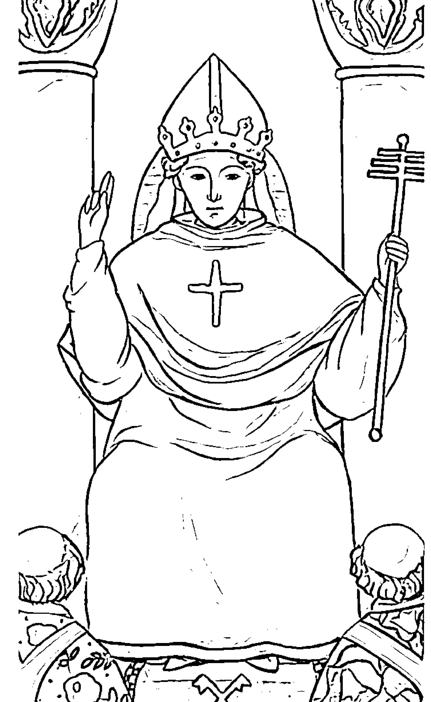

## 深入塔羅牌的神祕能量  
—— 影響一生的塔羅牌學習書

## ▷ 正逆位解析

### 愛情

如果教皇牌代表當事人，你可能戀愛經驗豐富，周遭的朋友都視你為愛情的導師，你也不吝於介紹好的對象給親朋好友認識。像是某某老師的愛情信箱也很符合教皇的角色。若是教皇牌顯示的是環境，很有可有人幫你介紹對象，也有可能是參加相親聯誼等活動，或是在校園、課堂等學習等場合中遇到適合的對象。如果教皇代表的是戀愛中的對象，對方的個性應該是和藹可親、樂善好施，具有智慧和道德感。同是教皇也代表一段正式、受見證的關係，有象徵結婚的意義。

逆位的教皇若是出現在環境中，可能會碰到僞善者。表面上支持，並給予看來善意的指引，事實上從中作梗，見不得人好，或是介紹了不適合的對象。也有可能代表違背道德良知，發生不倫戀，外遇、劈腿也可能會發生。如果教皇逆位是代表的是戀愛中的對象，對方可能是個道貌岸然的僞君子。

## 事業

教皇象徵貴人，在事業上尤為明顯。當世人在職場上可能會遇到提攜後進的前輩，對於升遷很有幫助。也有可能代表長輩介紹。

在投資理財方面也會碰到有經驗者的指引。也有可能自己本身就是他人在事業上的貴人。同時教皇也代表教師、神職人員等。

逆位的教皇有打破傳統、標新立異之意，也代表違背道德規範，當事人可能會大賺黑心錢。教皇逆位，貴人可能無法成功幫助當事人，在投資理財上也有可能會被指引錯方向而損失慘重，對於別人的建議不要貿然採納。

## 學業

教皇在學業上是最好的牌之一，雖然不像魔術師和女祭師在課業上擁有傲人天賦，但在學習的路上不乏良師益友。也有可能當事人在學業上就是扮演著導師的角色。

逆位的教皇拒絕他人的善意，也有可能碰到不到好老師，在求學上受到人際關係的干擾，多半是酒肉朋友。抽到教皇逆位的人也會忌妒他人在學業上的成就。在違背道德的情況下也有作弊的情況發生。

## 六・戀人  
THE LOVERS

## ▶ 畫面解析

戀人牌的背景是伊甸園，畫面中裸身的青年男女是亞當與夏娃，在他們身後展開雙翼的天使象徵祝福與保護。

在還沒偷嘗禁果前，他們享受著純潔、愉悅且無憂無慮的情感生活，彼此之間完全信任無須遮掩。

亞當的身後有棵生命之樹，樹梢燃燒的十二把火除了代表十二星座，也象徵慾望之火。

夏娃後方有一顆結著蘋果的智慧之樹，樹上纏繞著青蛇正誘惑著他們偷嘗禁果。

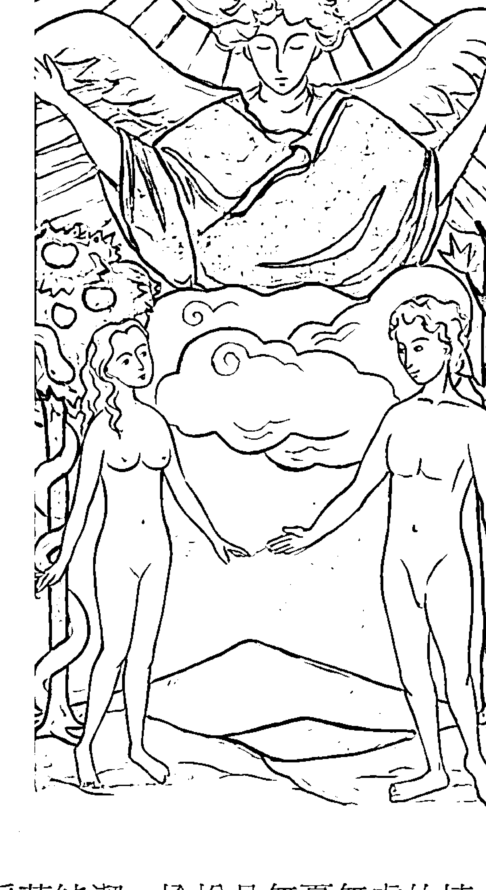

## 大牌牌組

034

## ＞正逆位解析

有著強烈的求勝心與意志力，被鎖定的目標就一定要追到手，越困難的目標越能激起他們想要征服的渴望。

相戀中的情侶抽到戰車，代表他們彼此有共同的目標，共同奮鬥，但是畫面中的戰士同時間操控兩頭野獸，要不就是其中一方控制慾極強，要不然就是其中一方有出軌外遇的現象。戰車也象徵男女之間翻雲覆雨的性愛。

戰車牌若是代表追求的一方，他會有十足的行動力，過程中的困難也能順利克服，未達目標不輕言放棄，通常有很高的成功率。如果戰車牌出現在環境，在感情上可能有強大的競爭者出現。同時戰車也可代表進展快速的愛情，或是在一段旅程中萌生的戀愛。

逆位的戰車，代表欲速則不達，太過明顯、猛烈的追求可能會嚇到對方，給對方帶來壓力。或是只想要獲得勝利、征服的快感，而內心並不愛著對方。

戰車逆位也象徵內心的意志力無法駕馭兩頭巨獸，代表面對感情內心有許多想法，三心兩意，猶豫不決，行動與想法無法集中。

## 事業

精力旺盛，意志力堅強，即使遇到困難也不退縮，善於拓展人際關係。抽到戰車牌對於工作有正面的幫助，而且目標明確，執行力強，也有擺平歧見的能力、進而掌控大局。適合從事業務、行銷等具拓展性的工作。正在找工作的人也能迅速從競爭中脫穎而出。當事人也能在工作中快速獵取金錢。

逆位的戰車代表三心兩意，找工作沒有明確目標，或是在職場上太過魯莽大意，只想敷衍了事。投資理財則欠缺冷靜的大腦。戰車逆位也可視爲思想的巨人，行動的侏儒，有很好的企劃能力與構想，卻欠缺執行的勇氣和能力。

## 學業

在學習上有強大的爆發力，別人花三個月學會的科目，你可能只要花一個月。而且能夠訂立計畫與目標，督促自己前進。體力與意志力也很強，可以長時間挑燈夜戰而樂此不疲。

逆位的戰車，可能不知道自己的專長興趣何在，找不到升學的方向。欠缺意志力，三天曬網兩天捕魚。也可能在大考中意外失足。

## 七・戰車  
THE CHARIOT

## ▶ 畫面解析

英勇的戰士駕著車，前方有兩頭人面獅身的野獸拉著車，一黑一白象徵陰陽調和、力量的均衡。

人獸間並不存在轄繩，代表這位戰士是憑藉著意志力掌控這輛戰車。

戰車前的翅膀下方盾牌中央，有一個紅色符號，符號代表男女性器官的交合。

戰士的後方有一座壯觀的堡壘，而這位戰士負責防禦這座堡壘，並非一位侵略者。戰車實際上也可代表交通工具、旅程，當逆位的戰車出現，也可能暗示著有車禍發生、酒駕，或是旅程受阻、取消。

## 深入塔羅牌的神祕能量  
—— 影響一生的塔羅牌學習書

037

## ＞正逆位解析

有著強烈的求勝心與意志力，被鎖定的目標就一定要追到手，越困難的目標越能激起他們想要征服的渴望。

相戀中的情侶抽到戰車，代表他們彼此有共同的目標，共同奮鬥，但是畫面中的戰士同時間操控兩頭野獸，要不就是其中一方控制慾極強，要不然就是其中一方有出軌外遇的現象。戰車也象徵男女之間翻雲覆雨的性愛。

戰車牌若是代表追求的一方，他會有十足的行動力，過程中的困難也能順利克服，未達目標不輕言放棄，通常有很高的成功率。如果戰車牌出現在環境，在感情上可能有強大的競爭者出現。同時戰車也可代表進展快速的愛情，或是在一段旅程中萌生的戀愛。

逆位的戰車，代表欲速則不達，太過明顯、猛烈的追求可能會嚇到對方，給對方帶來壓力。或是只想要獲得勝利、征服的快感，而內心並不愛著對方。

戰車逆位也象徵內心的意志力無法駕馭兩頭巨獸，代表面對感情內心有許多想法，三心兩意，猶豫不決，行動與想法無法集中。

## 事業

精力旺盛，意志力堅強，即使遇到困難也不退縮，善於拓展人際關係。抽到戰車牌對於工作有正面的幫助，而且目標明確，執行力強，也有擺平歧見的能力、進而掌控大局。適合從事業務、行銷等具拓展性的工作。正在找工作的人也能迅速從競爭中脫穎而出。當事人也能在工作中快速獵取金錢。

逆位的戰車代表三心兩意，找工作沒有明確目標，或是在職場上太過魯莽大意，只想敷衍了事。投資理財則欠缺冷靜的大腦。戰車逆位也可視爲思想的巨人，行動的侏儒，有很好的企劃能力與構想，卻欠缺執行的勇氣和能力。

## 學業

面對複雜難解的問題，能有耐心的尋求解法，有追根究柢求知求真的精神。學習有效率，不死讀書能夠靈活運用所學。說話有說服力，對自己有信心，發表期刊論文都能受到肯定。

對學習缺乏興趣、信心，考試時準備的方向錯誤，死讀書不知變通，遇到困難就放棄退縮。也可能代表為了老師、家長或升學讀書的人，本身不了解學習真正的目的。

## 八・力量  
STRENGTH

## ▶ 畫面解析

一名溫柔纖瘦的女子，制伏了原野上的一頭猛獅，而那頭獅子似乎伸出舌頭向那名女子撒嬌，表現出溫順的一面。

這名柔弱的女子絕對不可能憑藉武力馴服獅子，而是靠著自信與智慧一步步取得猛獅的信任，以柔克剛可以囊括整個牌面的精神。

而女子的頭上有著和魔術師頭頂一樣的無限大符號，代表生生不息無限循環的能量。找對方法、提升效率，事半功倍也是力量牌所呈現的，反之逆位則是事倍功半。

## 大牌牌組

## ＞正逆位解析

### 愛情

不論男女，力量牌象徵外表溫柔纖細，內心剛強堅毅的人物。而且他們有與生俱來的魅力，即使不經過打扮也令異性無法抗拒。力量牌代表一段感情，雙方互動良好，互相吸引，即使有意見也不會針鋒相對，其中一方溫和中帶有威嚴，總是令人信服。力量牌在追求一段感情上，代表追求者取得對方信任，有耐心且方法正確，讓對方不帶有任何壓力與顧忌的投懷送抱。力量牌也可代表浪子因為一段情感而回頭。

逆位的力量，代表出發點錯誤，立意不良善。想要追求一段感情可能不基於愛或喜歡，而是基於對方的美貌、金錢、名聲。正在交往的情侶，可能不知道投其所好，不了解彼此的個性，關於感情的問題無能為力，此時不宜貿然採取積極的行動，應該冷靜下來思考感情中的盲點。力量牌也象徵在感情上缺乏勇氣、自信，無法散發出迷人魅力的人。

## 事業

在工作上不會埋頭苦幹，更不會橫衝直撞，總會冷靜的找到最有效率的方法。在職場上抽中力量牌的人是個談判高手，也是良好的說客。他們不會用強硬的措辭，以及逼迫的手段，反而是以柔性的訴求讓對方信服。在投資理財，或是創業上也能以小博大，不畏懼大資本家，金錢無限循環，利潤越滾越豐厚。

力量逆位，代表缺乏相關知識技能，做事沒有效率事倍功半，或是入錯行。缺乏耐心與毅力，三天兩頭換工作的草莓族。創業投資可能會遇到資金周轉不靈的問題，也沒有耐心與信心等待開花結果，沉不住氣。

## 學業

面對複雜難解的問題，能有耐心的尋求解法，有追根究柢求知求真的精神。學習有效率，不死讀書能夠靈活運用所學。說話有說服力，對自己有信心，發表期刊論文都能受到肯定。

對學習缺乏興趣、信心，考試時準備的方向錯誤，死讀書不知變通，遇到困難就放棄退縮。也可能代表為了老師、家長或升學讀書的人，本身不了解學習真正的目的。

## 九・隱士  
THE HERMIT

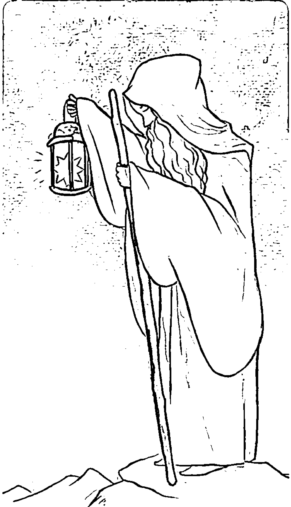

## ► 畫面解析

身穿灰色斗篷的老人站在結滿冰霜的山頂，低頭沉思看似十分孤獨。右手高舉一盞明燈，左手拿著魔杖。天才和先知總是孤獨的，他正走上替人類探索智慧的道路上。他不與任何人接觸，追求自己的性靈成長，小心翼翼、追求完美。正位的隱士有高處不勝寒、曲高和寡的意義，而逆位的隱士有可能重返人群傳遞智慧，也有可能更加孤僻，憤世嫉俗，有反社會傾向。

## ► 正逆位解析

### 愛情

離群索居的隱士，並不善於經營人際關係，不善言詞的他更不可能與他人擦出愛情的火花。身為單身者，旁人很難理解他的想法，因爲他內心的層次高於一般人。若是已經擁有愛情的問卜者，隱士牌象徵一段苟延殘喘的愛情，缺乏熱戀期頻繁的互動，雙方正退開一步思考這段感情有無再堅持下去的必要。隱士牌也代表一個人無法沉浸於愛情之中，因爲有明燈指引，所以很容易看清對方的缺點，也了解戀愛的盲點，完全不會被愛情沖昏頭。

逆位的隱士有可能會會錯意，自以爲有魅力實則不然。或是當事人在愛情中歷盡滄桑，不願意敞開心胸談感情。也有可能內心防衛心過強，明明內心喜歡，卻還是拒絕別人的情感。

## 事業

正在求職的人，抽中隱士牌代表是有高人指點，或是自身的實力備受企業肯定，通常是可以謀職成功；相較於求職者，正在就業的人抽中隱士就很有可能被炒魷魚，因爲隱士不合群，自命清高，對於工作、同事都有許多怨言，也可能是激進的改革派。隱士不愛出風頭，但具有經驗，可擔任政府機關和公司行號的幕僚，身分有如軍師，也有可能是神祕宗教的主持者。同時隱士也有告老還鄉之意。隱士不執著於世俗利益，所以不宜投資理財，但是尋找失物成功機率高。

## 學業

隱士居高臨下，視野寬廣，又有明燈的指引。在思想上總是看得比人遠，比人廣，對一切都抱持謹慎的態度，想當然爾對課業很有幫助，考試或報告都能輕鬆過關。

隱士也有可能成爲學者、專家，只不過他們像是象牙塔裡的人，沒有出世觀念，思想前衛，有時不被時人認同。隱士也代表在學業上有高人、名師指點。

在學習上鑽牛角尖，過分追求完美，不願和人討論分享。隱士逆位也有可能是自身的學問到達巔峰後，從知識的追求者，開始轉向成爲知識的傳遞者。

045

Chapter 1

## 十・命運之輪  
JUSTICE  

## ▶畫面解析  
一個圓形的轉盤漂浮在藍色的天空中，轉盤上寫著TARO字樣。左下方的蛇向下帶著輪子下沉到分崩離析的黑暗世界，右方橘紅色的胡狼則是背負輪盤向上。

上方拿著寶劍的人面獅身獸則是智慧的象徵，在變局當中不受影響。左下方的牛犢象徵金牛座（土元素），右下方獅子是獅子座（火元素），右上方的老鷹是天蠍座（水元素），左上方的人是水瓶座（風元素），四元素是構成世界的要角，擁有翅膀的聖獸也得以在命運的輪轉中不受影響。

命運之輪也是大祕儀中唯一沒有的人物的。有的塔羅牌則是以  

  

大牌牌組  

046  

## ▶ 正逆位解析  
通常命運之輪正位代表好的轉變，可能原先對你沒有好感的女孩子，突然答應你的邀約，一段岌岌可危的愛情與婚姻突然出現轉圜的餘地。

一切都是命運的安排，沒有任何規則可遵循，你可能會和之前想都沒想過的對象交往，也可能在不是刻意安排、意想不到的狀態下遇到另一半，又或是一見鍾情的狀態。

命運之輪也有塞翁失馬焉知非福的意涵，也許和現任男友分手了，才知道原來身邊還有許多更適合的好對象。也有可能是當事人對於戀愛的想法變動快速。

逆位的命運之輪通常帶來的是不好的轉變，一段美好的情感可能有第三者介入，也有可能是熱情迅速消退、另一半無預警驟逝，或是雙方突然因為工作、學業而必須分隔兩地。

也可能象徵當事人錯失了最佳時機（曖昧期拖太長，沒有掌握  

## 事業  
突然的加薪、升遷，轉換跑道（正位多半是好的改變），當然機會是留給準備好的人，也代表自身在工作上是萬事俱全，只欠東風。投資、創業也會蒸蒸日上，抓準最好的時機一飛沖天。也有可能是丟了A工作，發現B工作薪水福利更好，且更適合自己。

逆位的命運之輪可能會碰到無預警的裁員，放無薪假，或是突然被調到不喜歡的部門。投資理財就算準備計畫再周詳齊全，都有可能碰到金融海嘯等不可抗拒因素，因而賠得血本無歸。

## 學業  
你可能擁有萬全準備，只期待考試讓你一展長才。也有可能準備不及，很多都不懂，但是運氣很好，考題都被矇中，總之都是好的結果。也有可能是報考醫學系落榜，後來念了歷史系之後才發現這是自己的最愛。

逆位的命運之輪帶來毀滅性的厄運，即便你在考試上有萬全準備，也有可能因為許多其他因素落榜（睡過頭遲到、答案卡填錯、準備方向與考題有落差等）。

## 十一・正義  
JUSTICE  

## ▶畫面解析  
一位身穿紅袍的人端坐在石凳上，右手高舉寶劍，象徵智慧與決心，左手拿著天平，似乎可以準確的斟酌與衡量，看起來有點像埃及神話裡的阿努比斯（Anubis），拿著天平秤量心臟，來斷定死者的是非善惡。

正義是11號牌，兩個1象徵平衡，同時11（1+1=2），也就是說正義牌有2號牌女祭司的影子在其中，背景也十分相似，所以也可以斷定牌面中戴著皇冠的中性人物其實是女性。

## ▶ 正逆位解析  
正義牌若是代表一段情感，代表是一段經過審慎評估而交往的情感，彼此門當戶對。

正義牌若是代表某個對象，他可能為人剛正不阿，富有正義感，喜歡評論時事，公私分明不偏私，不會被愛情迷惑，碰到任何事都能冷靜分析，做決定時果決而不猶豫。如果正義牌出現在情感的競逐上，可能對方心中早有定見，也可能是場公平的競爭，人人都有希望，要視牌所在的位置和周遭的牌組而定。抽中正義牌也代表能夠在愛情中做出正確的決定。

逆位的正義牌，當事人可能在感情當中受到不公平的對待（未婚懷孕，對方卻不肯負責、逃之夭夭），或是在感情中懷有私心（明明和A交往內心卻愛著B），不能同等的付出。也有可能與自己條件相差很多的人交往。也有可能在兩個對象之間猶豫拉扯，但最後仍做出不利於自己的決定。

## 事業  
正義代表公正與決斷力，當事人可以擔任法官、律師、檢察官等執法人員。在職場上能力也能被正確的評估，得到合理的待遇。

## 學業  
懂得正確規劃自己的時間，下定決心，一分耕耘一分收穫。也代表公平的考試。考試成績與實力成正比。抽中正義牌的當事人也適合攻讀法律相關的學位。

逆位的正義，代表著不公平的考試（有內定錄取者），或是偏心的老師（偏好某些學生，讓他們拿高分）。也有可能是玩樂與唸書的時間比例失衡，遲遲提不起學習的決心。

## 十二·吊人  
THE HANGED MAN  

## ▶畫面解析  
一名男子倒懸在一棵十字形的樹上，頭頂放著光芒。看起來好像受到懲罰，又好像是在鍛鍊某種神功，沒有任何痛苦，是心甘情願的。

有點像是少康、劉秀，為了一雪亡國恥，忍辱負重；又有點像耶穌，苦行取經的玄奘，為了全人類忍受著一般人無法忍受的痛苦，目前看起來是一種革命尚未成功，同志仍須努力的狀態，但不排除未來成功的可能性。

12號的吊人可拆解為（1+2=3），和3號的皇后牌一樣，都有付出而獲得喜悅的特質，只不過皇后是在滋潤、豐收的環境下  

## ＞正逆位解析  
吊人以頭下腳上的姿態面對世人，他看任何事物的角度都和一般人不同。所以抽到吊人牌的當事人看待愛情的角度不同、觀念異於常人，對於擇偶條件也有獨到的眼光。在愛情當中吊人屬於默默付出、委曲求全，不求回報的類型，有點像電視劇男主角李大仁，要是周遭同時出現皇后或是公主等牌組就更有那種感覺。單身者抽中吊人，暫時也沒有修成正果的機會。吊人也可以代表不在意世俗眼光的情感。

逆位的吊人代表苦戀多時的情感終於修成正果，或是對於心儀的對象不再犧牲奉獻，而是有條件的付出，對於感情的看法不再特立獨行，變得與世俗觀點相符。也有可能是從一段痛苦的感情以及婚姻當中解放出來。總之吊人牌不論正逆位，對於愛情的掌握度都不高。

## 事業  
吊人在職場上與情場上一樣，都是屬於默默付出不求回報，犧牲自己照亮別人，很難讓周遭的人看見自己的表現。當事人可能認爲辛苦的工作，不是希望能夠得到金錢或升遷，自我鍛鍊、成長才是最重要的。對任何事都採取逆向思考，堅守自己的原則。投資理財暫時都沒有回報，甚至有破財的可能性。

另外吊人也可象徵苦行僧、清教徒，慈濟、紅十字會等公益團體，武打人士、特技演員等。

逆位的吊人，在職場上可象徵經過努力而得到應有報償。也可能是面對工作一切都不在乎、無所謂，只求舒適、輕鬆。在金錢上不會有大大的收益，但可中止落財的情形。

## 學業  
在學業上可能不求考試、學位，而是根據自己的理想鑽研某方面的學問。也有可能是艱苦的過渡時期，犧牲玩樂、交友，只求能考上理想的學校。吊人也代表在學術上能有獨到的見解。

逆位的吊人在學習上可能抱持著豁出去的心態，不再堅持理想，升學上覺得有學校念就好。考試上不會做無謂的掙扎，而是將有機會的科目把握住。

## 十三・死神  
DEATH  

## ▶畫面解析  
穿著黑色鎧甲，騎著白馬的骷髏騎士橫掃了大地，不論男女老幼，地位卑賤亦或是尊貴都躲不過死神的召喚。

馬蹄下有個小男孩，似乎還不懂死亡的力量，毫無畏懼的盯著骷髏騎士，而教皇跪在死神的面前，希望他能網開一面。

後方的河流代表生生不息的力量，與冉冉升起的太陽相結合，有種死亡後重生的感覺。

死亡並非一切的終點，而是下一個階段的開始。很多人都誤以為死神代表肉體的死亡，其實不盡然，通常代表某個狀態的終止。

## > 正逆位解析  
死神牌象徵一段感情的結束、終止。抽到死神牌的當事人，婚姻和愛情有可能走到盡頭，或是做出很痛苦的決定。也有可能是某一方痛改前非（戒賭、戒酒、戒色），準備認真的談感情，展現出負責任的態度。在戀愛關係上也可代表不留任何餘地的拒絕。因爲死神牌正位也有重生的意涵，也可以解釋成收拾好過去的悲傷，準備迎接一段新戀情。

死神牌逆位象徵當事人不願認清現實，抱殘守缺，獨留哀傷。對於已經逝去的愛情，仍不死心，盼望對方能夠回頭，活在失戀的陰影中無法自拔。雙方感情停滯，缺乏刺激，有如一灘死水。當事人也有可能遇上死纏爛打的追求者，無論用什麼方式拒絕都無法令對方死心。也有可能對於前任情人藕斷絲連，沒有做出了斷的決心，或是守著不適合自己的對象，只因爲害怕改變。

## 事業  
在事業上死神牌視情況會出現兩種截然不同的狀態，一種可能是求職者到處被拒，心灰意冷。或是無預警被裁員、經營的公司倒閉、合作的關係終結等。另一種可能代表當事人痛改前非，收起懶散，積極的工作。或是公司裁掉了害群之馬，訂立新的規則，振衰起敝力圖振作。死神逆位，在工作中無法認清現實，經過失敗的打擊之後就一蹶不振。無法下定決心改變陋習，守著沒有效率的舊方法。也有可能是當事人不願意接受新的挑戰。也可代表一家迂腐、缺乏人才流動性的公司。

## 學業  
死神在課業上象徵重考、重修，好在當事人還有再戰的勇氣，能夠把握再一次的機會。或是轉系、轉校，面對新的挑戰。也有可能碰到嚴苛的老師，整個班級無一倖免，都沒有好成績。

逆位的死神在課業上有可能直接被退學、退學，毫無轉圜的餘地。或是當事人不願意面對學業上的挫敗。

## 十四・節制  
TEMPERANCE  

## ▶畫面解析  
身穿白袍，有著紅色翅膀的天使將左手金杯裡的水倒入右手的金杯。看起來像是在調和某種東西。

天使白袍上的方形圖案是代表地元素，中間橘色三角形是代表火元素，頭頂的圓形圖象是煉金術中代表黃金的符號。

天使的右腳踏在象徵潛意識的水池裡，左腳踏在象徵顯意識的石頭上，代表潛意識與顯意識的結合。

整張牌的主旨是調和，強調中庸之道。節制牌緊接著死神牌出現，也具有死後重生的喜悅。

## ▷ 正逆位解析  
節制牌對於溝通交流很有幫助，單身者問愛情，雖然沒有戀愛的氛圍，但是能和異性有話題聊，而且能深入心靈層面，愛情的進展緩慢但具有美感。一段感情裡出現節制，代表彼此的溝通良好，很像心靈伴侶。若是節制牌代表某個對象，他可能個性溫和，擁有中性特質，情感自然流露，不矯揉造作，很會安慰、療癒他人的心靈。節制牌的出現也可能會譜出異國戀曲。

逆位的節制牌，在兩性的溝通上無法暢行無阻。語言和文化不同的男女接觸時也會出現這種狀況。感情與婚姻缺乏情感滋潤。也可以代表雙方欠缺修養，談分手時姿態不夠優雅。雙方冷戰也是符合節制牌逆位的狀態。

## 事業  
節制牌對於事業相當有幫助，那灘池水並非死水，而是一股源頭活水，象徵開源節流。對於財富能夠妥善運用管理，懂得經營之道。節制牌也可代表跨國的合作、貿易。在職場上應對進退都能合乎禮儀。同時大天使反覆操作著手中的金杯，代表對於職場上的必需技能十分熟練專業，或者在繁忙的工作中獲得成長。

節制牌有療癒的意涵，可代表心裡諮商師，或是醫生、護士、藥劑師等醫療從業人員。飲料調製或是化學藥劑的調配也和節制牌相符。

逆位的節制，無法開源節流。職場上的專業技能不夠專精，和同事、上司、客戶的溝通不順利。無法輕鬆取得財富。為了賺錢而讓自己心靈貧乏，甚至因爲工作太操勞而影響身體健康。

## 學業  
反覆、規律的練習與學習，速度緩慢但能夠持之以恆，能夠融會貫通，問考試和報告都能順利過關。節制牌也象徵學術交流等場合，也有可能是國際性的交流，或是到國外留學。

逆位的節制，在學習上不能融會貫通，不喜歡和人分享學習上的心得。或是爲了學業成績犧牲了健康與人際關係。

## 十五・惡魔  
THE DEVIL  

## ▶畫面解析  
惡魔牌是15號牌，（1+5=6），與6號牌戀人的構圖相似，主角仍然是亞當、夏娃。

只不過後方的天使換成長著羚羊角和蝙蝠翅膀的惡魔，而亞當與夏娃被慾望的枷鎖給綑綁，受到惡魔的操控。而畫面中的亞當夏娃，長出了牛角以及尾巴，代表動物的原始慾望被激發，也代表在伊甸園偷喫禁果後的狀態。

15號也可以代表5號牌教皇的另一個層次，教皇牌對於下方的信徒施予祝福，傳授知識以及道德觀念。

惡魔則是煽動慾望的角色。套在他們身上的枷鎖其實綁得很  

  

## ▶ 正逆位解析  
在感情上代表致命的吸引力與誘惑，對於男女間短期的交往會有很大的幫助，但長期看來缺乏心靈的交流與純潔的愛。如果惡魔牌代表一段情感，雙方的情感將建立在肉慾和物質的享受上，各取所需、互相牽制。（像是富商包養名模，不是基於愛的考量，而大家也彼此握有把柄可以相互牽制）單身者問感情，或許不會碰到認真交往的對象，但有機會發展一夜情、性伴侶。環境出現惡魔，代表當事人身處在充滿情感慾望誘惑的環境，或是有不倫戀、第三者的情況。

惡魔逆位，代表當事人已經看穿一段情感膚淺的假象，想要逃離切割。或是已經清醒，想要逃離不切實際的誘惑，但未必能成功。

## 事業  
在工作上妄想一步登天，為達目的不擇手段。人際往來不單純，有可能從事非法、投機的事業。為人利慾薰心，為了名利可以出賣自尊，被人奴役。或是被人招待、收買（像是收錢、喝酒而替人打假球）。身為政治人物也有可能貪污、圖利特定廠商。當事人也有可能是靠著出賣肉體來賺取金錢。總之惡魔對於金錢有正面的幫助，但除了金錢，毫無理想與職業道德可言。

逆位的惡魔代表當事人的道德良知覺醒，想要金盆洗手，但也有可能涉入太深，一時半刻無法抽身。或是當事人不想再被奴役，甘願放棄金錢，屏除慾望做自己真正想做的事。

## 學業  
在學業上，惡魔渴望能獲得肯定，希望能有傑出的表現，某方面來說是好事。但當事人有可能為了求表現無所不用其極，作弊、抄襲論文等。如果惡魔出現在環境，有可能是誘惑太多，無法專心於課業。

逆位的惡魔，不在為了功名而唸書，開始了解知識、道德的重要性。或是拋開壞朋友、不良的嗜好，專心在學業上。

## 十六・塔  
THE TOWER  

## ▶畫面解析  
天空一道雷不偏不倚擊中高塔的頂端，頓時烈焰沖天，一對男女從塔上往下墜落。一旁灰色的雲降下災難之雨。

王冠代表世俗的權力，雷擊代表上天，人類妄想建築高塔，挑戰上天的權威，因而遭受上天的懲罰、毀滅。

牌面可象徵恐怖攻擊、突如其來的天災、世俗政權的毀滅，或是晴天霹靂的感受、期待幻滅的過程、當頭棒喝的警告，完全不是人所能控制或預料的事情。

## ▷ 正逆位解析  
要建築一座高塔，必須投入大量的時間精力。在愛情當中可以象徵一段苦心經營，長久穩定的情感突然間被摧毀。原因有可能是當事人無法控制的，像是另一半因意外而身亡、家人反對等。同時塔也代表劇烈的爭吵、決裂。或者對於愛情的期望過高，相對的失落的情緒也就更強，一種美好的憧憬在一瞬間幻滅。當事人也有可能從自以為幸福、美好的愛情牢籠中解放出來，情緒上可能一時無法接受，但長遠來說是有利的。塔也象徵毀滅，像有些人會抱持著自己得不到，別人也休想擁有的毀滅心態，往往弄得兩敗俱傷，許多社會新聞都是這樣出現的。

逆位的塔，當事人可能不願意面對現實，守著殘骸不放。通常從一段經營很久的愛情中分道揚鑣的人，容易有上述的狀態。或是一段必須要割捨，卻又難以割捨的情感，因為已經經營太久，投注太多而捨不得放手。也有可能走不出感情的傷痛，將自己困在塔裡。

## 事業  
塔代表位高權重的人在一夕之間遭受  

## 深入塔羅牌的神祕能量  
——影響一生的塔羅牌學習書  

打擊，失去一切。有錢人突然破產、大公司突然倒閉。突然被服務多年的公司裁員、苦心經營的店面突然倒閉、策劃已久的案子被否決。抽到塔牌不宜投資理財，會血本無歸。或是野心過大、不自量力，事業版圖擴張太快，根基不穩、搖搖欲墜，到了無法收拾的地步。也有可能是擁有高學歷，卻礙於大環境無法有好的發展。

逆位的塔，可能不像正位遭受劇烈的打擊。但是沒有破壞就沒有建設，當事人可能失去東山再起的契機。

## 學業  
弄了一個學期的上萬字論文，因爲電腦當機、檔案遺失又必須從頭來過，或是辛苦創造出的學習成果被否定。也有可能和教授、老師意見不合。沒有辦法考取心中理想的學校。好的方面是靈光乍現，從舊的學習與思考模式跳脫出來。

逆位的塔和正位的情況類似，也可能有輟學、退學的情況發生，或許也不是當事人願意，有可能是未婚懷孕、家庭頓失經濟依靠無法繼續升學等情形發生。

## 十七・星星  
THE STAR  

## ▶畫面解析  
一位女子裸著身子，畫面和節制牌有許多相似之處，首先女子的右腳踏入象徵潛意識的水池，左膝則跪在象徵顯意識的土地上，手上拿著兩個陶壺，將一只陶壺的水注入水池，另一只則注入草原。在草原上的水有五道分流，象徵人的五種感官，其中一道流入池子補注潛意識的能量，也可將那方池水視為許願池，大膽的投入自己的渴望，它也會依照你的想法作出回應。女子身後的樹梢，站著一隻像徵智慧的鳥。天上高掛著八角星，讓黑夜不再無助，它象徵遙遠的希望，替旅人指引正確的方向。另外星星也有療癒和和諧的意涵。

## > 正逆位解析  
星星象徵的是遙遠的目標與希望，當事人或許在感情中已經漸漸感受到寧靜與祥和的氛圍，而且未來比當下更值得期待。因為星星緊接著塔而出現，當事人有可能先歷經過情感上的毀滅，如今傷痛已經抹平，重拾自信與希望。在一段感情中，抽到星星牌，代表彼此能營造出溫馨且怡然自得的氣氛，對方就像沙漠中的綠洲，在受到挫折、襲擾時，給予寧靜的滋潤與庇護，並且擁有共同努力的目標。單身者問感情，當事人很清楚自己需要什麼樣的感情，在未來遇見真愛的機會很高。或是代表有人正在身旁默默守護著，只不過當下並未被當事人察覺。

逆位的星星象徵失去信心與希望，在感情中代表當事人缺乏自信，不清楚自己需要什麼。在戀愛中的雙方，可能對於未來感到不安，欠缺計畫及想法。星星逆位也代表當事人對於戀愛有不切實際的想像，反覆歷經幻滅的感覺。

## 事業  
星星牌在工作中代表當事人有遠大的目標與理想，雖然尚未得到成功的果實，但是努力的方向正確、內心篤定，只需要時間  

## 學業  
僅有努力，就足以蔓延成功。 Scotia服可以取得成功，企業關係的紅利與財富也在規劃的過程之中。 PEOPLE出現在牌時，可以預示貿易交易的可能，與業務合作的成果。

(TRUE or Long Number of Life ;حار

## 深入塔羅牌的神祕能量  
——影響一生的塔羅牌學習書  

僅有努力，就足以蔓延成功。 Scotia服可以取得成功，企業關係的紅利與財富也在規劃的過程之中。 PEOPLE出現在牌時，可以預示貿易交易的可能，與業務合作的成果。

(TRUE or Long Number of Life ;حار

## 深入塔羅牌的神秘能量  
—— 影響一生的塔羅牌學習書  

星星也可以代表祥和互助的工作環境。或許在金錢上看不見實質的效益，但看是有人在背後支持鼓勵、指引方向，只要持續下去總有成功的一天。同時星星也代表想像力與創造力，適合從事需要靈感與想像的職業。

逆位的星星，當事人在工作上缺乏自信，缺乏奮鬥的目標以及情感的依靠，前途黯淡。建議當事人轉換跑道，從事發自內心喜歡的事才能有所轉變。

## 學業  
在享受學習帶來的快樂之餘，還能夠訂立目標。身邊不乏良師益友指引方向。抽到星星牌的當事人多半都能夠考上心中理想的學校。

逆位的星星代表在學習上缺乏目標，不知為何而學習，對自己的能力存疑。學習的路上缺乏陪伴而感到孤單。轉換學習的環境或是學習的內容，或許能夠幫助當事人突破困境。

## 十八・月亮  
THE MOON  

## ▶ 畫面解析  
一個月黑風高的夜晚，狼和狗不約而同的對著月亮狂吠，營造出詭譎的氣氛。池水中一尾龍蝦探出頭來，在塔羅裡，水池象徵潛意識，代表不安從心底浮現。遠方有兩座塔，一條小徑從中綿延到盡頭的山脈，小徑通往未知的出口。逆位的月亮代表黎明將至，一切都將豁然開朗。

## ▶ 正逆位解析  

大牌牌組  

## 十九・太陽  
THE SUN  

## ▶ 畫面解析  
一位小男孩，一絲不掛的跨坐在白馬上，孩童的左手持著一面大紅旗，圍牆後方的向日葵因為太陽的照射而開得十分茂盛。男孩以及陽光在世人的印象中都是生機蓬勃的。同時太陽是19號牌，19的平方正好是象徵圓的360度加中心的一點，不像月亮有陰晴圓缺，而且太陽的光線來自於自身源源不絕的能量，不假外力藉助。

## ▶ 正逆位解析  

## 二十・審判  
JUDGEMENT  

## ▶ 畫面解析  
天使加百列居高臨下吹著號角，號角上綁著十字紅旗，象徵業力平衡。  
下方的海洋象徵潛意識，海平面上飄浮著數具灰色的石棺，人們從灰色的石棺中解放出來，石棺代表舊的思維與框架。海洋後方的山脈代表抽象思考的頂峰。  
昨日種種彷彿今日死，當事人內心道德的覺醒，受到洗禮，從舊思維中解放出來，下定決心擺脫某種生活型態，也可代表皈依新宗教、末日審判等。同時加百列是傳達訊息給人們的天使，也可代表一通重要的電話或是信件。

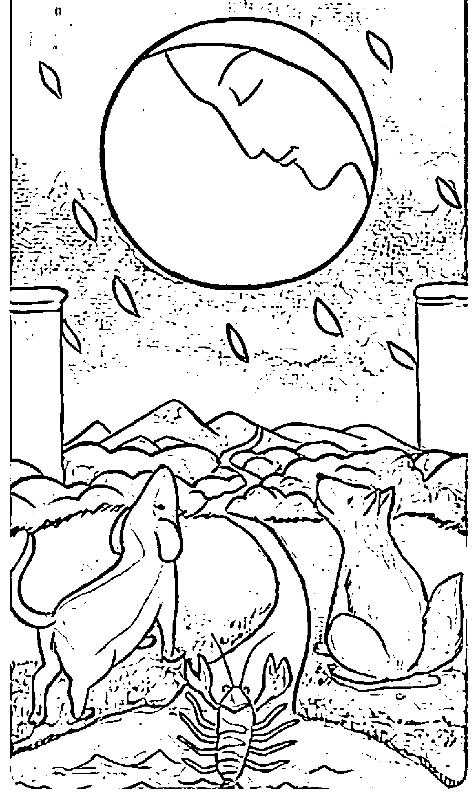

大牌牌組  

## 二十一・世界  
THE WORLD  

## ▶ 畫面解析  
裸體的女舞者在畫面中央，身上纏繞著紫色絲巾，外圍框著象徵勝利的桂冠，纏在桂冠上的紅絲巾呈現出無限大的符號。在四個角落的人類、老鷹、獅子與牛在之前的命運之輪中曾經出現過。從愚者的旅程開始，歷經了二十一張大牌來到終點，成功達成使命。這是一個結構完整、完備、美好的世界。自然、和諧、隨心所欲，悠游在宇宙及人世間的感覺。

## ▶ 正逆位解析  

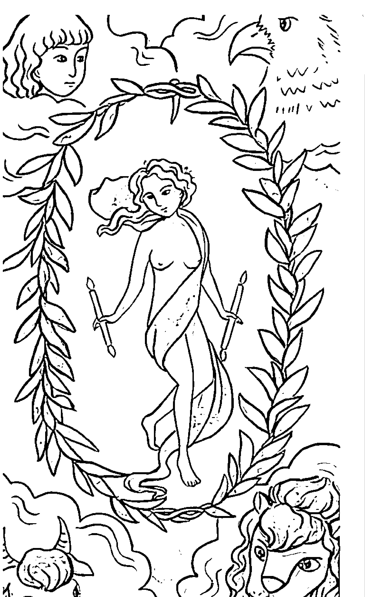

## 愛情  
在愛情上，呈現一個圓滿的狀態，各方面都能獲得滿足。談戀愛的感覺像朋友，無話不談，又像家人般給予支持與照顧，但也擁有情人的熱情與親密感，對任何一切都能包容、理解。  
問結婚，可以順利步入禮堂，受到來自四面八方的祝福。世界牌出現在環境中，代表當事人處於一個活絡、真誠開闊的環境，對於愛情很有幫助。世界有旅行的意義，可以代表一趟愉悅的蜜月旅行，或是在旅行中滋生愛苗。世界牌中的主角其實不具性別意識，所以世界牌也有同性戀的意涵。  

逆位的世界，任何事都欠缺臨門一腳。或許這段感情在旁人的眼裡已經很美滿了，但你對於不完美的地方仍然耿耿於懷。或是美好的愛情已經漸行漸遠，只停留在過去的回憶中。或是當事人被拒於對方的世界之外，無法得其門而入。

## 事業  
任何事都能順利的運作，事業已經上了軌道，無須太過操心，讓它自然運行就能輕鬆獲利。在工作上達到名利雙收的程度，同時又有時間經營家庭和兼顧自己的興趣。世界牌也象徵剛畢業的社會新鮮人，腦中充滿理想與抱負。世界也可以代表移民、環遊世界等洲際旅行。

逆位的世界，任何事都欠缺臨門一腳。不論是創業或就業，做任何事都不順暢，沒辦法遵照自己的自由意志，越是接近成功，越是感到綁手綁腳。或是有成功的機會，但當事人不願意嘗試，寧可原地踏步。或是以爲已經達成目標，卻發現還有些問題陸續浮現。

## 學業  
考試、報告都能達成目標，擁有最好的學習資源。在學習當中找到自己的世界，獲得名利與成就，更不必逼迫自己刻苦的學習，怡然自得享受知識帶來的快樂。世界牌也可代表出國留學。

逆位的世界，在考試上差一點點就能通過門檻，讓人感到扼腕。在團體報告上，意見無法統合，各自為政，或是努力程度不同，卻得到相同的分數，失去公正與平衡。

## The Secret Power of Tarot  

## Chapter 2  

# ACE牌組  

## ACE牌與四元素解析  
在塔羅牌裡，四元素分別指的是火、風、水、土，分別對應權杖、寶劍、聖杯、金幣。其中權杖（火元素）代表的是權力、執行力，以及行動力；寶劍（風元素）代表智慧、理性、某種才華或是語言上的溝通；聖杯（水元素）代表的是情感以及情感上的交流；金幣（土元素）代表實質的東西，也可直接視為金錢、財產。

「ACE」代表成長、契機，或是開端，是代表某個元素正要開始發展，逐漸邁向成熟的時機。ACE牌也代表該元素最強大、最純粹的能量。

### 權杖ACE  
ACE of Wands  

## ▶ 畫面解析  
一隻手從雲裡伸出來，強而有力的握住漂浮在空中的權杖。權杖上頭抽出幾支嫩芽，象徵繁盛的生命力。地面的溪流滋養了綠色的大地，遠方的城堡代表未來成功的可能性，或是計畫中要征服的目標。

整個牌面告訴我們，有什麼想法和念頭，就大膽去做吧！權杖ACE裡頭儲存了太陽的能量，是火元素最強的一張牌。

## ▶ 正逆位解析  

## 愛情  
權杖ACE，代表積極、熱情與快速，在人際與愛情發展順利，但給人強勢、霸道的感覺。權杖ACE可象徵一段火速發展的關係，雖然認識的時間不長，但進展的速度快，有如野火燎原、乾柴烈火，蔓延迅速，一發不可收拾。抽到權杖ACE的當事人，面對愛情總是主動追求，從緊握著權杖的雙手來看，當事人對於戀愛十分有把握，有自信能搶得先機，牢牢掌握住對方。權杖也可視為男性的性器官，代表當事人性慾極強，在談戀愛的同時，另一半最好能滿足他的渴望。

權杖ACE逆位，當事人面對愛情沒有必勝的把握，在情感的競逐上失去先機。也有可能對於戀愛的熱度來得快去得也快，對於另外一半失去興趣。

## 事業  
權杖ACE在事業上可代表一個新的企劃案、新的想法，一種靈光乍現、非做不可的感覺，任何想法計畫都不只是紙上談兵，擁有強大執行力、膽大心細。抽到權杖ACE的當事人對工作充滿熱情，透過工作激發了創意及無限潛能，在職場上有勝過他人的決心與把握，而且有源源不絕的精力。當事人在職場上也有可能是一位掌權者。在投資理財上，權杖ACE可代表一個好開始。

在運動場上，權杖ACE可代表強打者或是關鍵的一擊。

權杖ACE逆位代表當事人錯失一個好機會（失去重要合約、面試機會）。或是產生職業倦怠，忘了入行時的初衷。在工作上欠缺執行力。投資、理財在一開始就遭受打擊，或是太早喊放棄，不懂得堅持。做任何事都很保守，否定心中大膽、積極的想法，不願意勇敢嘗試新事物。

## 學業  
確實掌握學習的方法，替自己擬定計畫且逐一實現，有強大的企圖心。不論是什麼樣的考試或報告，都能順利成功。

權杖ACE逆位代表當事人對於學習欠缺熱情與計畫，遇到困難就想放棄。

### 寶劍ACE  
ACE of Sword  

## ▶ 畫面解析  
畫面的主角一樣是一隻強而有力的手，從雲裡伸出來，緊緊握住寶劍，劍鋒刺穿了王冠。

透過桂冠的加冕，顯示這把寶劍是把王者之劍，以理性、冷靜的思考鏟奸除惡，捍衛公平正義。遠方空曠的背景以及嚴峻的高山，更突顯出肅穆的氛圍。

寶劍擁有強大的破壞力，若是操控者失去理性，則可用來傷人。就像是訓練有素的軍隊可用來保家衛國，但不幸淪落野心家的手裡，則會成為發動侵略的利器，用來滿足少數人的野心。所以該如何運用寶劍的能量完全掌握在操縱者的手裡。同時寶劍ACE也有手術的意思，也可代表剖腹產。

## ▶ 正逆位解析  

## 愛情  
寶劍ACE代表冷靜與理性的溝通，說話有說服力，在一般的人際往來中可佔有優勢，但給人冷靜銳利的觀感，缺乏感性與熱情，不利於愛情的發展。寶劍ACE若是代表一段戀情，雙方可能有過爭執，但彼此保有理性，目前已經成功的解決歧見，或是碰到問題總是由某方強勢主導。寶劍ACE若代表單身者，當事人可能擁有與眾不同的才華來吸引異性，也有可能在異性面前說話太直接，雖然是實話但也默默刺傷對方的心，很難有再進一步的發展。同時寶劍ACE也有慧劍斬情絲的意涵，代表當事人拿出理智與決心斬斷爛桃花。

逆位的寶劍ACE在感情中代表劇烈的爭吵，當事人可能失去理智，口不擇言，造成雙方都造成莫大的傷害，即便時間過了傷口仍難以撫平。寶劍ACE逆位也可代表當事人不願下決心割捨錯誤的情感。

## 事業  
有寶劍ACE的助威，當事人在職場上可以說是無往不利，幾乎沒有人可以與之競爭，而且說話有號召力，在拓展事業版圖上有許多死忠追隨的夥伴。在投資理財上，擁有冷靜清晰的頭腦，做任何決定都快狠準，從來不曾失手。若寶劍ACE代表求職者，當事人擁有過人的才能，在職場有高度競爭力，不管目標是什麼樣的工作都能順利達成。在運動競技上也可代表冠軍。

寶劍ACE逆位，工作上的大小事都會不順。尤其被突顯的是人際關係上的衝突。寶劍ACE逆位也可代表「失言」，許多政府官員因「失言」惹出風波受到媒體、輿論撻伐，甚至丟官。寶劍ACE逆位也可指誤用了自己的才能，或濫用公權力來為非作歹的人，也有可能是為了競爭利益而失去榮譽。

## 學業  
在學業上各項表現都是第一名，集所有榮耀於一身。擁有好口才以及清晰、冷靜的大腦，在演說、辯論上能有不錯的表現。抽到寶劍ACE的當事人同時也是班上的意見領袖。

寶劍ACE逆位，在課業上可能面對極大的挑戰而失敗，也有可能遭到不平等的對待。

### 聖杯ACE  
ACE of Cup  

## ▶ 畫面解析  
一樣有隻手從雲霧中探出，和權杖或是寶劍不同，這回手是輕輕捧著聖杯，因爲象徵情感的聖杯很柔弱，是必須要捧在掌心細心呵護的易碎品。杯子上方有一隻白鴿，銜著一枚物件，那枚物件是耶穌的聖體，但很像是鴿子替人們傳達戀愛的隻字片語。有五道水柱從杯中流出，象徵人類的五種感官。水流入了下方的蓮花池，有二十五滴水飄散在空中。

## ▶ 正逆位解析  

## 愛情  
聖杯ACE是一種渴望戀愛的心情，若是代表一段情感，戀愛的感覺很充實，每次約會都有源源不絕的話題，滿溢的情感滋潤了彼此，同時在戀愛中享受著備受呵護的感覺，對方將自己捧在手掌心，卻恰如其分沒有任何一點的壓迫感。聖杯ACE也可以代表某個感動的瞬間，剎那成永恆（求婚、特定節日的驚喜）。單身者問愛情，很快就會有令當事人一見傾心的對象出現。

逆位的聖杯ACE，杯子將到轉過來，滿溢的水傾洩而出直至乾枯。出現聖杯ACE逆位可視為一段感情的結束。也可代表感情上的挫折、期望落空、欲求不滿，不管怎麼做都無法填飽內心的空虛。聖杯ACE逆位也可代表求愛被拒、遭到背叛，寂寞孤單的感受。也有可能是當事人或者是對方不願意掏出真心，凡事有捨才有得，沒有付出就不能期望獲得同等的對待。聖杯ACE逆位也可代表當事人對於戀愛死心，不抱期待。

## 事業  
聖杯ACE代表工作，工作效率不見得好，但和同事相處融洽，工作愉快。也有可能在工作的環境尋找到愛情。聖杯ACE對於物質層面小有幫助，除了情感之外在物質上也能有不錯的享受，但畫面當中仍有些水從杯子中滿出來，代表在物質上有些供過於求，給人小小奢侈的感覺。

在事件的談判、溝通上，聖杯ACE可代表對方主動釋出的善意，應該欣然接受，化干戈為玉帛。

## 學業  
在學業上不見得有很高的造詣，但樂於學習，和同學相處融洽，有多采多姿的學園生活。

逆位的聖杯ACE代表當事人貪膩於玩樂，將精力放在不切實際的人際關係上，不能專心學習。

## 金幣ACE
ACE of PENTACLES

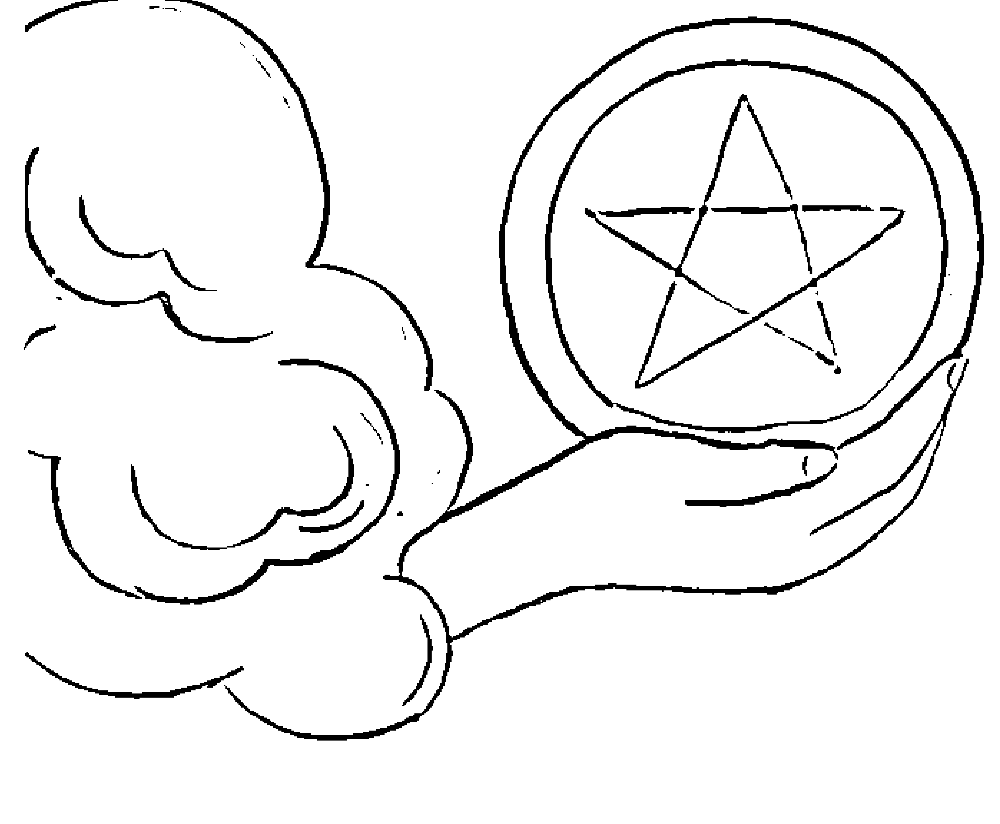

## ▶ 畫面解析

一隻手從漂浮雲中伸出，  
捧著一枚巨大的金幣，上頭刻畫著五角星。下方有一座開滿  
百合花的花園，綠色樹拱門外隱約看得到一座高山。也只有經濟能力許可的人才會擁有這樣一座氣派的大花園。同時金幣ACE也是土元素的菁華。

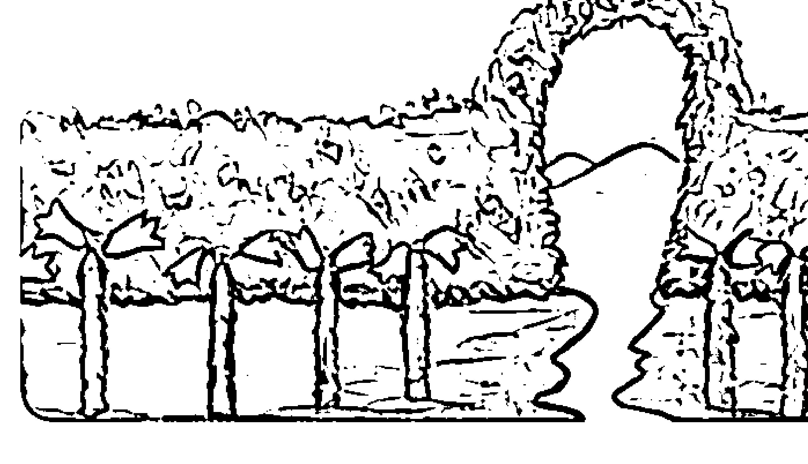

## ▶ 正逆位解析

## 愛情

金幣ACE所象徵的愛情是比較務實的、有安全感。在一段感情當中，雙方每天行程滿檔，逛街購物、看電影、上高檔餐廳，充滿感官及物質的享受，與其尋找一個心靈伴侶，當事人比較像是找到一個陪伴他吃喝玩樂的夥伴，或是找到一個願意提供物質享受的金主。金幣ACE也可象徵一段感情的定情物，像是婚戒、聘金等。單身者可能會沉浸在物質的花花世界當中，或是像許多富少一樣，利用金錢及物質上的享受來誘惑異性。

## 事業

在工作上，擁有務實穩定的人脈，或是代表工作上的應酬邀約。金幣ACE可代表得到一筆巨大的投資、獲得一筆巨大的金錢，像是簽約金、退休金或年終獎金，也可代表加薪、繼承遺產、餽贈等。收入上絕對不成問題。金幣ACE也可代表進入大公司、大財團，獲得優渥的福利和薪水。抽到金幣ACE的當事人也可代表自己的夢想開始付諸實行，朝實際面發展。金幣ACE也可代表一項投資計畫、創業計畫。

## 逆位解析

金幣ACE逆位，代表當事人遭遇到財務的危機。有可能被公司欠薪、減薪。不懂得投資理財，總是把錢花在不該花的地方。對於工作欠缺務實的態度。投資或創業都有虧損的風險，不宜貿然前進。

## 學業

在學業上，當事人可能就讀貴族學校，享有比一般人條件更好的教育資源。能夠踏實擬定讀書計畫，想在考試中過關不成問題。

## 逆位解析

逆位的金幣ACE，當事人可能投注了大量時間金錢卻沒有好的效果（花錢補習、買參考書卻沒有好成績）。

## 宮廷牌組

## # 宮廷人物釋疑

宮廷牌的組成有國王、皇後、騎士、侍者，某些塔羅牌會將侍者牌換成公主，用以平衡宮廷人物的男女比例。

宮廷牌的人物設定採用古代歐洲宮廷的位階，即使沒有接觸過塔羅牌的人一定也對宮廷人物不陌生，因為撲克牌裡的J（JACK）、K（KING）、Q（QUEEN）就分別保留了騎士、國王、皇后的原型。

宮廷人物依照位階、花色共可分為十六種不同典型的人物，再加上逆位，共可衍伸出三十二種截然不同的性格，雖然人的性格絕非只有三十二種，但靠著三十二種不同人類性格的刻畫，已經足以套用在普羅大眾身上，更遑論宮廷牌面對不同問題所產生的變化性。

國王牌一般指的是40歲左右的男性，具有威嚴，是該元素的擁有者。而皇后牌約是40歲左右的女性，有母性特質，是該元素的擁有者以及分享者。騎士牌大約是20歲上下的青年男性，具有競爭性，是該元素的追求者。侍者牌，不具性別意識，像是個小跟班，泛指青春期的小男孩、小女孩，是該元素的嚮往者。如果持有的塔羅牌是使用公主來做主角，那可直接視為小女孩，會有些古靈精怪和嬌蠻的特質。

在占卜上，出現宮廷牌，通常指的是實際存在周遭的人物。不過人物的年齡只有相對的長幼，並沒有限定絕對的年齡，要活用，不能被牌面的設定給限制住。

## # 國 ♦ 王 ♦ 牌

## 權杖國王
KING of WANDS

## ▷畫面解析

一位頭戴王冠的男子端坐在寶座之上，身穿橘紅色的袍子，搭配印有象徵權威圖騰的黃色披風。手裡握著權杖，隨時都可以拿來發號施令。整個牌面充滿紅色的色調，讓人感受到權杖國王如烈燄一般的權威及企圖心。同時他也是火元素的擁有者及管理者。

## ▷正逆位解析

## 愛情

權杖國王在愛情中是一個發號施令的角色，有些許大男人的傾向、自尊心強、愛面子，盡量不要當面牴觸他的意見或給他難堪，私底下或許比較好溝通。

另外權杖國王也是個有責任感，可依靠的男人。但有時候他們看待自己的事業比感情還要認真。宮廷牌出現在感情的牌局當中，不論正逆位都可視為情敵、競爭者，或即將碰到的對象。國王的身旁通常都會有個皇后，所以出現國王牌或是皇后牌也有機率代表對方並非單身。

## 逆位解析

逆位的權杖國王，在感情中是個火爆浪子，易怒，情緒起伏大，可能會把工作上的不順心發洩在另一半身上。逆位的權杖國王也可以指唯我獨尊的大男人、控制慾過強，而且牌中的國王總是偏著頭，也有瞧不起他人、狗眼看人低的感覺。

## 事業

在工作上，權杖國王是個掌權者，做事積極，有野心、重視效率。有可能是你職場上的主管、老闆，也有可能就是代表自己。權杖國王可以是事業上的好伙伴、也可以是強大的競爭者，要視牌局而訂。權杖國王也可以象徵大刀闊斧的改革，或是升遷、加薪等消息。

逆位的權杖國王，可能在工作上操之過急，高壓統治，聽不見別人的意見，可能會成爲嚴格要求部屬，卻沒有能力的主管。凡事只重視成果，卻提不出好的方案。或是在職場上見死不救，眼中只有自己的人。逆位的權杖國王也可代表事件的進行不順，缺乏計畫和掌握。

## 學業

權杖國王對於學習有積極的企圖心，問考試或報告都能有很好的結果。也可以將他視爲對教育有熱情的老師，或是一位積極的教育改革者。

## 逆位解析

逆位的權杖國王，在學習上操之過急，只想趕快見到成效。也可以代表會逼迫學生唸書的老師或家長。

## # 寶劍國王
KING of SWORDS

## ▷畫面解析

一位表情嚴肅，從表情無法看穿他的心思，戴著王冠，右手持著寶劍的男子坐在寶座上。他是一位國王，同時也是一位公正的執法者，寶劍國王也是正義牌具體的世俗形象。

## ▷正逆位解析

## 愛情

在一段感情中，寶劍國王即使面對愛情也要理性，如果在一段情感中，碰到這樣的對象，他會很冷靜的分析戀愛中的利弊得失，對於愛情他有些不食人間煙火，要小心成爲關在象牙塔裡的人。

逆位的寶劍國王可能想法偏激，愛高談闊論說長道短，在學習上應該要放棄成見，虛心求教才會有好結果。

## 事業

寶劍國王在職場上，可以代表和藹可親且能夠體恤下屬的老闆。在工作上絕不唯利是圖，會考慮周遭所有人的感受。寶劍國王也可視為在工作上特別關照自己的上司、前輩。寶劍國王也有點像是慈善家、公益團體的領導者。

逆位的寶劍國王，可代表偏心的主管、老闆，凡事情感取向、對人不對事，對某些人特別好，喜歡包庇徇私。也可代表在事業上優柔寡斷的人，耳根子軟，做的決定容易受到周遭的人影響。

## 學業

寶劍國王在學業上可視爲一位因材施教的老師，對每個學生都付出同等的關愛，也不曾放棄任何人，總是一再的給學生機會，對他而言永遠不會把成績擺在第一位。

## 逆位解析

逆位的寶劍國王，當事人將會碰到偏心的老師，特別喜歡少數學生，對於其他人則採取敷衍的態度。

## # 金幣國王
KING of PENTACLES

## ▶ 畫面解析

一位神情高傲的男子戴著王冠，左手按住一枚金幣，左腳露出鎧甲踩在獸首之上，王座處於花園的正中央，花園後方堅實穩固的堡壘也是國王所擁有。

花園中的植物生長繁盛，許多藤蔓植物看起來好像攀附在國王身上，那可以代表趨炎附勢的小人。

仔細看會發現，寶座上出現四個牛頭，四這個數字有穩固之意，牛頭則對應占星學上的金牛座，代表國王有金牛座的人格特質。

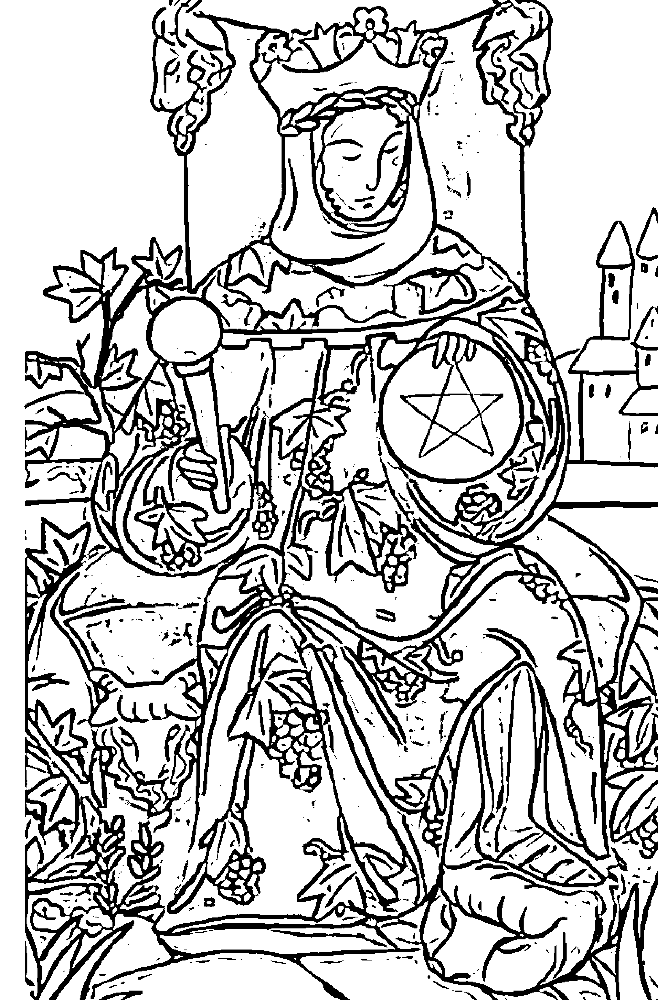

## ▶ 正逆位解析

## 愛情

在愛情中，我們把金幣國王視為企業家或老闆，總之是個富有的人，在愛情當中他會扮演提供物質需求的角色。穩重、務實、顧家是金幣國王的特色，在人際關係以及戀愛中行為也很務實，他們對於情人不吝於付出，不過他們希望自己的付出能有實際的回饋。他們也不會花大錢去搞排場、耍浪漫，跟他們相處有踏實、安全的感覺，但不一定有趣，缺乏驚喜及新鮮感。

## 逆位解析

逆位的金幣國王，不喜歡被佔便宜，而且視財如命，即使面對情人還是不改小氣本色，要讓他從口袋掏出錢來請客根本難如登天，對於感情中的付出總是斤斤計較。金幣國王逆位也有可能失去正位的務實感，他們可能是個對情人小氣，但對於周遭的酒肉朋友卻出手大方的人，碰到這樣的對象真是欲哭無淚。

## 事業

金幣國王在事業上可能是大地主或老闆，也有可能剛繼承大筆遺產。他們做事穩定務實，懂得避開風險，在金錢上不會暴起暴落，是個有恆產的人。在職場上，金幣國王也可視為一個投資者，或是一份穩定的工作，也可以是職場上關照自己的人。抽中金幣國王的當事人，也很適合從事不動產投資。

## 逆位解析

逆位的金幣國王，對於物質欠缺安全感，總覺得自己賺的錢不夠。投資理財太過小心謹慎，反而會吃虧。逆位的金幣國王身邊將會有很多趨炎附勢的小人，希望能從自己的身上獲得利益。逆位的金幣國王也有可能工作並不穩定，經常換工作。

## 學業

金幣國王像是個提供金錢和學習環境的金主，讓當事人能有好的讀書環境，無後顧之憂。也可以說當事人讀起書來穩扎穩打，考試和報告都沒有太大的問題。

## 逆位解析

逆位的金幣國王，可能環境的因素會影響到當事人的學習，必須放其學業，或是半工半讀。

## # 皇 ♦ 后 ♦ 牌

## 權杖皇后
QUEEN of WANDS

## ▶ 畫面解析

一位高雅的女子端坐在寶座上，右手持著象徵權威的權杖，左手拿著象徵活力、熱情的向日葵。寶座下方有一隻黑貓，代表在外放、活潑的性格當中，有有著神祕、獨立、慵懶的一面。整個牌面呈現令人感到溫暖的黃色。在占星學裡，權杖皇后代表獅子座的女孩，所以寶座左右兩側各刻有一頭獅子。

## ▶ 正逆位解析

## 愛情

權杖皇后生性活潑熱情、善解人意，大方展現出自己的性感魅力，同時又是個精明幹練的女強人。在一段感情之中，她沒有心機，很容易和情人的家人朋友打成一片，她喜歡熱鬧的場合，慷慨大方，擅於社交，和這樣的對象交往無形中可以拓展生活圈，只不過在她身旁，會被搶走不少風采。在感情中出現權杖皇后，女生往往是比較強勢、主動的一方，即便如此，當她面對異性時，還是會保留些許神祕感。

## 逆位解析

逆位的權杖皇后，原本活潑大方、熱情精明的特質轉為負面，給人潑辣、三八的印象。在感情中，她可能是個野蠻女友，粗魯、易怒，也可能喜歡到夜店、派對等場合招蜂引蝶、愛慕虛榮。權杖皇后逆位，她在感情中控制慾極強，對情人頤指氣使，很少有人能忍受。

## 事業

在事業上，權杖皇后是個不折不扣的女強人，在工作上的衝勁不輸男人，樂於享受工作上帶來的樂趣與成就感，尤其是交際手腕高明，適合業務上的拓展。權杖皇后也可代表熱心積極的女性主管。如果權杖皇后指的是工作環境，那會是一個熱情洋溢、充滿熱忱與溫暖的工作環境。

## 逆位解析

逆位的權杖皇后，在工作上企圖操控一切，嫉妒與報復心強，見不得人好。對任何事情主觀意識強烈，常常控制不住自己。

## 學業

權杖皇后對學習充滿熱情，又能夠注意到一般人所注意不到的小細節。在學校生活裡，熱衷於公眾事務、社團，是個活躍的人物。

## 逆位解析

逆位的權杖皇后，三八、聒噪，太過活潑，難以專心在課業上，在人際關係上也不見得討喜。

## # 寶劍皇后
QUEEN of SWORDS

## ▷畫面解析

透過牌我們只能看見皇后的側面，與寶劍國王一樣有著嚴肅的表情，右手持著寶劍，代表掌管心智與精神活動的風元素，左手的手勢似乎在示意下方的人起身向前。

外表看似堅強，令人生畏，私底下卻遭受不為人知的情感變動與打擊。

## ▷正逆位解析

## 愛情

寶劍皇后代表獨身、不婚主義、女性主義者，對男人以及婚姻缺乏信任。寶劍皇后也可以代表寡婦，曾經歷經喪偶、喪親之痛，或是感情上遭遇挫折的女人（劈腿或外遇）。寶劍皇后在感情上防衛心強，不願敞開心胸，常常自己斬掉戀愛的機會，抽到寶劍皇后的人，也要思考自己是否常帶給異性冷漠、尖銳、捉摸不定的印象。

逆位的寶劍皇后，面對愛情的想法更加偏激，對於愛情總是口是心非，比正位更加難以捉摸。也有可能是當事人陷在感情的創傷中，不停的抱怨、發牢騷，覺得自己是世界上最不幸的女人。寶劍皇后也可代表性格古怪、孤僻，難以相處的女人。

不論正逆位，寶劍皇后對於愛情都沒有正面幫助，是唯一可直接代表單身的宮廷牌。

## 事業

在事業上，寶劍皇后極度捍衛自己的權益，雖然有才能，但給人一種距離感，不適合與人合作，只適合獨立性高的工作。

寶劍皇后也可以代表冷酷、性格捉摸不定的女主管。寶劍皇后也可能是個知名作家、學者或是女權運動的領導者。如果寶劍皇后代表的是工作環境，那會是一個冷漠、人人袖手旁觀的工作環境。

## 逆位解析

寶劍皇后逆位，思想偏激且有反社會性格，喜歡批評主管和同事，對於工作總有發不完的牢騷。寶劍皇后逆位也可代表性格尖銳、喜歡批評、個性怪異的女主管。

## 學業

寶劍皇后可代表學識豐富的女教師、教授，但是缺乏和學生的互動。寶劍皇后掌管智慧，有自己的想法，問考試或報告都有不錯的成果。

## 逆位解析

逆位的寶劍皇后想法怪異偏激，可能代表教學想法特殊的老師，或是緊張的師生關係。

## # 聖杯皇后
QUEEN of CUP

## ▶畫面解析

一位女子溫柔的凝望手中的杯子，似乎想看穿什麼事情，凝視之餘她也用雙手細心呵護著它，牌中的聖杯比其他牌裡出現的聖杯都還來得精巧。

寶座上刻著有人魚形象的男孩女孩，藉以襯托聖杯皇后的慈母形象。寶座立在一個淺灘之上，沙灘上灑滿色彩炫麗的寶石，象徵情感的潮水看似能輕易的淹沒沙洲。

## ▶正逆位解析

## 愛情

聖杯皇后是個溫柔體貼、情感纖細豐富的女人，不管誰對她有好感，即便很細微她也能夠立刻察覺。在感情中，她是個好情人、好妻子，能夠包容、體諒任何事物，並能輕易看穿對方心思。她不只樂於分享自己的情感，也能夠耐心的傾聽情人的話語，甚至是牢騷。有時男方會覺得自己的情人像母親，在感情中將自己照顧得無微不至。就情境而言，聖杯皇后可代表風花雪月、充滿甜蜜浪漫的愛情。

逆位的聖杯皇后，情感過於氾濫，感情的神經纖細敏感，對方的一舉一動，甚至是開玩笑都有可能傷到她的心，淚水十分豐沛，對於感情也時常會錯意，要和這樣的對象談戀愛需要有更多的耐心來細心呵護。聖杯皇后逆位也有可能對每個異性都不錯，同時和許多人曖昧，引來不必要的麻煩。她們對於愛情也常存有不切實際的浪漫想像。聖杯皇后逆位，她可能很容易信任別人，常對不算熟稔的朋友吐露情感上的祕密。

## 事業

在工作上，聖杯皇后有著細心的特質，並且能主動發覺對方的想法和需求，適合擔任助理、祕書，也適合與客戶溝通。聖杯皇后富有想像力，充滿美感，適合當藝術家，也可以從事美容、

## 學業

美髮、設計或是與服飾、珠宝相关行业，也很适合担任保姆、安亲班老师等工作。圣杯皇后也可代表能体恤下属的女主管。如果圣杯皇后代表的是工作环境，那将会是一个温馨，富有弹性与人性的环境。

逆位的圣杯皇后，工作上的表现易受到情绪的波动。投资理财上，太容易信任别人，所以受骗上当、被人利用的情形容易发生。

圣杯皇后可代表一位温柔的老师，不仅传道授业解惑，对于学生的生活也十分关照。也可以代表当是人对于情感上的经营胜过学业，但对于学业还算细心。

逆位的圣杯皇后，当事人会将钱花在不该花的地方，重视物质享受，缺乏投资理财概念。在工作上只想追求金钱，忘了自已的道德本分。逆位的圣杯皇后可能对于物质缺乏安全感，透过类似炫富的手段才能消除内心的不安。若是问整体的大环境，逆位的圣杯皇后代表一个萧条的景气。

## 金幣皇后
QUEEN of PENTACLES

## ▶ 畫面解析

一位戴着王冠的女子，将一枚金币捧在膝上，像是个艺术品一样端详着它。她所坐的宝座看得出经过精心的雕凿。画面中的女子亲切和善，是高雅的皇室成员，她深知金钱的重要性，但又不会过度崇拜金钱，她走的是低调奢华路线。

## ▶ 正逆位解析

在一段感情中，女性将会是提供经济来源亦或是掌管经济来源的一方，透过她的运筹帷幄，让双方甚至是整个家庭都能过着安逸舒适的生活。金幣皇后也代表一段务实稳定的恋爱。

逆位的金幣皇后，暗示另一半可能是个拜金女，重视物质的享受胜过一切，也代表这段感情无法长久稳定，双方的经济状况也有可能是影响两人情感发展的重要关键。逆位的金幣皇后，也可代表当事人身处於一段物质生活不虞匮乏的感情或婚姻之中，但无法获得情感上的满足，只好透过消费、娱乐来填补空虚的心情，有时嫁进富家大院也不见得能幸福。

金幣皇后在工作上稳扎稳打，务实不躁进，对于投资理财也很在行，又有细心的特质，适合担任理财专员。金幣皇后代表当事人在经过努力之后，必定能有收获，带给当事人稳定踏实的感觉。男性抽到金幣皇后，当事人在事业上的赞助者有可能是女性，也可能是代表女老板或是女主管。金幣皇后若是出现在环境中，代表景气回春，想就业或投资都很适合。

逆位的金幣皇后，当事人会将钱花在不该花的地方，重视物质享受，缺乏投资理财概念。在工作上只想追求金钱，忘了自已的道德本分。逆位的金幣皇后可能对于物质缺乏安全感，透过类似炫富的手段才能消除内心的不安。若是问整体的大环境，逆位的金幣皇后代表一个萧条的景气。

## 學業

金幣皇后对于学习有正面帮助，因为她的性格有踏实守本分的特质，虽然不是顶尖，但考试和报告基本上能过关。金幣皇后也可代表一个稳定，无后顾之忧的读书环境。

逆位的金幣皇后，不能够珍惜现有的读书环境，或者抱持功利主义的心态在念书，很难有持久稳定的热情。

## 騑 ◆ 士 ◆ 牌

## 權杖騎士
KNIGHT of WANDS

## ▶ 畫面解析

一位年轻的男子，右手拿着权杖，左手紧握缰绳，身穿铠甲披着与权杖国王相同图腾的袍子，所以他可是个王子。

红棕色的马在荒凉的沙漠中奔驰，突现出骑士挑战险恶环境的勇气与决心。

通常骑士牌指的是二十岁上下的年轻男子，比国王、皇后年轻，比侍者、公主来得成熟。权杖骑士是权杖的追求者、火元素的掌握者。

## ▶ 正逆位解析

在爱情之中权杖骑士总是来去自如，他不喜欢被感情束缚，崇尚自由，即便是恋爱中也要保有自己的空间。在一段感情中，他并不会耐心的陪伴守候，即便他真的很喜欢你，对他来说有许多比爱情更重要的事必须完成。

权杖骑士的魅力建大一部分是来自于他的才华，以及专注於兴趣嗜好的神情，像是吉他社社长、乐团主唱、会作词、作曲、绘画的男生，可以说是个文艺青年。通常他们谈吐幽默风趣又犀利，虽然有時有点冷酷，但许多女生还是无法抵挡这样的魅力。另外权杖骑士的想法以及行动都变化快速，在感情中他很可能突然做出某种决定，像是出国留学，或因某些原因突然的离开自己的另一半，如果在感情的占卜中权杖骑士代表自己的另一半，请做好他会随时离去的心理准备。

逆位的权杖骑士，原先的热情、冲劲变质为鲁莽、躁动，和这种人谈恋爱，必须要忍受他随时爆发的脾气，甚至有家暴的可能性。逆位的权杖骑士面对异性他总是显得粗鲁、不绅士，表达情感的方式太过直接，令人避之唯恐不及。逆位的骑士，也意味着在感情竞争当中不幸落马。

## 事業

和权杖国王不同的是，权杖骑士是个刚开始起步的年轻小伙。在工作上没有太大的问题。权杖骑士在工作上有自己的理想目标，同时拥有善变的个性，有工作的人抽到权杖骑士，可以代表为了追求理想而换工作。在金钱上，权杖骑士属于理想型，对他们来说梦想比金钱重要，比较难稳定踏实的赚钱。如果权杖骑士代表环境，那会是一个可以筑梦踏实的工作环境。

逆位的权杖骑士，在职场上到处与人不和，总是眼高手低，找不到理想工作。他总是自视甚高，却缺乏务实的态度。他的想法时常改变，常常换工作，却都只是三天打鱼两天晒网。

## 學業

权杖骑士在学业上，当事人可能只对某几科有兴趣，为了研读自己的兴趣而废寝忘餐。当事人也会在读书中找到兴趣，朝着理想的学校、目标迈进。权杖骑士告诉我们要善用自己的才华，不要浪费时间做无意义的事。

逆位的权杖骑士，当事人可能会玩物丧志，像是太热衷於社团等，对于学业没有正面帮助。

## 聖杯騎士
KNIGHT of CUPS

## ▶ 畫面解析

和前面两位骑士相比，圣杯骑士显得温文儒雅，虽然身上仍穿着铠甲，但他的右手拿着圣杯并不具有侵略性，他的目的是要保护所爱的人。骑士的白马缓慢的行走在沙漠之上，但这个沙漠并不危险，有一道涓涓细流从远方的森林向前流动，象征骑士带给人们的情感滋润。圣杯骑士也可以当作是童话故事中的白马王子。

## ▶ 正逆位解析

圣杯骑士总是不疾不徐，亦步亦趋的守候在自己爱人的身旁。在一段感情中，当事人会有一个人人称羡的对象，他总是温和、有礼貌且风度翩翩，有着迷人且深情的样貌。在环境中，圣杯骑士可以代表一个有绅士风度的追求者，或是一段浪漫的感情，也可以是当事人梦寐以求的对象。在情境中，圣杯骑士可以代表一种爱的宣言或是求婚。

逆位的圣杯骑士在感情中，可以代表一个用情不专的花心大少，喜欢花言巧语，并给予虚假的承诺。也可能是一个需要另一半服侍的公子哥。另外一种状况，逆位的圣杯骑士指的是羞怯懦弱的男生，面对自己喜欢的对象却无法顺畅表达自己的情感。要如何定义逆位的牌义除了要视情况和周遭的牌之外，选定自己觉得适合的牌义也是很重要的。

## 事業

问任何事件，骑士牌都有马到成功的意味，圣杯骑士也不例外。体面的外表以及谦和有礼的态度替当事人在工作上加分不少。问工作抽到圣杯骑士，当事人不必操之过急，调整好步伐及心态，一定能有好的结果。圣杯骑士也可以代表一份舒适、轻松没有压力的工作或是工作环境。

逆位的圣杯骑士，在工作上可能是个虚假的人，喜欢编织华丽的梦想和计划取信于人（穿着正式体面，言词华丽，却销售黑心商品的销售员）。或是一个拥有亮丽外表和职称，却没有丰厚收入的工作。逆位的圣杯骑士也有可能对于自己的未来缺乏冒险的勇气，只想躲在舒适圈，很难开展属于自己的成功事业。

## 學業

圣杯骑士在学业上代表缓慢的进步或成长，或是在学习的路上有人守候陪伴，总之不管什么问题都是正面的影响。

逆位的圣杯骑士，在学业上可能有个看似亮丽的学历，实际上却没有高深的学问，像是到国外读野鸡大学混学历，或是直接制造假学历。要不就是看起来很用功，实际上都在玩。不管当事人在学业上有什么成就，多半是虚假的。

## 金幣騎士
KNIGHT of PENTACLES

## ▶ 畫面解析

圣杯骑士所骑的白马虽然速度慢，但还是有向前进的态势，而画面中的黑马完全是静止不动的状态。画面中的男子身穿铠甲，小心翼翼的捧着金币，非常专注的凝视着它，似乎在思考要如何发挥金币的功效。相較於其他骑士牌荒凉单调的背景，金幣骑士似乎处在的一个富饶的环境中。

## ▶ 正逆位解析

金幣骑士做任何事都稳重踏实，面对爱情的态度也是如此，当他们要追求一段感情时，一定是做足了准备，有十足的把握才会前进。在一段感情之中，男方有可能是稳重的富家子弟，也有可能是勤奋有为的青年，为人诚实，不会营造浪漫的桥段，也没有杰出的才华，但与这种人交往比较能有长久稳定的感受。

在感情中出现逆位的金幣骑士，对方可能是个纨绔子弟，重视金钱和物质的享受。逆位的金幣骑士，可能代表眼中只有钱，对于人际关系和恋爱冷漠的男人。逆位的金幣骑士，也可代表在恋爱中付出金钱和时间，却沒有得到好的结果。

## 事業

金幣骑士对领主、国王效忠，对于自己的公司、老板也是抱持着相同的態度，不管交付给他怎样 的工作一定能够顺利达成。金幣骑士，代表当事人有着认真负责且踏实的工作态度，他并不是只为了当下能赚取多少金钱而辛苦的工作，当他在职场上建立良好的口碑、在事业上打下良好的基础时，正是他丰收的时刻，他做任何事都是有远见、计划，不短视近利。如果金幣骑士代表的是环境，那会是一个稳定成长的环境或公司，是一个适合投资的时机。

金幣骑士逆位也可代表一间缺乏向心力的公司，员工缺乏忠诚度，抱着公务员心态替公司工作。

## 學業

金幣骑士是个忠厚老实、勤奋向学的好学生，学习基础稳定，成绩持续进步中，问考试或报告都能够过关。

逆位的金幣骑士在学习上欠缺持之以恒的毅力，态度虎头蛇尾，或是当事人身处在一个学习风气差的环境。

逆位的金幣骑士也代表当事人的成绩正微幅的下滑，及时找出问题还能有挽救的空间。

## 侍♦者♦牌

## 權杖侍者
PAGE of WANDS

## ▶ 畫面解析

一位小男孩或是小女孩，用双手握着权杖，他似乎对手中的权杖感到好奇，对于权杖的功能处于一个观察、摸索的阶段。另外权杖的高度比侍者还要高出许多，他必须抬头仰望权杖，更加深了无法掌握的感觉。侍者拿起剑的样子似乎很吃力，也很不熟练，但他很享受这样的感觉。若代表实际的物件，权杖侍者可代表信件或是手机。若牌中的主角是公主，那可以代表一个古灵精怪，思想奔放，有时爱恶作剧的小女孩。

## ▶ 正逆位解析

不论是侍者或是公主，或许都很好相处、有些正面特质，但不一定成熟可靠，各方面都还需要历练。

## 深入塔羅牌的神秘能量
—— 影响一生的塔罗牌学习书

## 愛情

权杖侍者代表一段爱情，代表当事人对于爱情的掌握度低，还不熟悉爱情的运作，正在摸索双方的相处模式。权杖侍者也可以代表公文，与爱情较贴切的解释则是结婚证书。权杖侍者也可以象征感情中的八卦，或是在旁瞎起哄的人。若是权杖公主，在爱情中可视为对恋爱有好奇心、活泼开朗且没有心机的小女孩，一种很单纯的雀跃、悸动。

逆位的权杖侍者，在异性面前想要酷耍帅，却容易当中出糗、弄巧成拙。在一段感情中，权杖侍者喜欢向另一半炫耀自己的丰功伟业、陈年往事，却不一定是真的，另外他们总是口无遮拦、缺乏口德，做事主观意识强、不够圆融，不论是在人际关系或是恋爱，都没有正面的帮助。

## 事業

在工作上，权杖侍者代表新手，但他有莫名的自信，喜欢在众人面前表现，当然本身也算有些天分，要注意不要太骄傲。权杖侍者也可以代表拜师学艺的学徒、公司的实习生、试用期的人员。权杖侍者也可代表通信业、文书、资讯传递者。

逆位的权杖侍者，喜欢班门弄斧、关公门前耍大刀，稍微懂了一些就自己为是。在职场上是个什么都不懂却又臭屁的菜鸟。逆位的权杖侍者在工作上喜欢说长道短，没有好人缘。逆位的权杖侍者可能会带来不好的消息，例如官司诉讼、事业工作上的纠纷。

## 學業

权杖侍者是个有天分的初学者，即使没有很纯熟却能够大胆的展现所学，对于学习外语有很大的帮助，即便不是学得很流利，也是能大胆开口，这样进步才够快。在学习上，当事人抽到权杖侍者要注意不要自满，谦虚的态度才能看见自己的不足。

逆位的权杖侍者，在学习上总是半瓶水响叮当，稍稍有点成绩就想和别人炫耀，或是无法顺利考取理想的大学。

## 寶劍侍者
PAGE of SWORDS

## ▶ 畫面解析

一位小男孩（女孩），右手握着宝剑，宝剑里头有一条鱼探出头来，他似乎对于那条鱼和宝剑充满好奇心。画面背景是滔滔江水，他身上的服饰有着睡莲的图腾，和圣杯ACE上的图腾相同，所以他的拥有强大的水元素，只是不知道该如何运用。圣杯公主的特质则与侍者大同小异。圣杯侍者也可以视为镜子、化妆品等随身物。

## ▶ 正逆位解析

圣杯侍者代表渴望恋爱，却又对恋爱一知半解的人，当事人通常缺乏恋爱经验，是个情窦初开的少男少女。

圣杯侍者可以代表初戀、純純的愛、初次告白，是个有真心诚意，但表达方式生嫩的追求者。

圣杯侍者也可以代表说话幽默讨喜，但不见得有担当的男生。环境中，圣杯侍者可以代表恋爱中的八卦、情书、礼物，或是传递情书爱意的中介者。圣杯侍者若代表心境，可解读为羞怯、喜悦或是憧憬。另外圣杯侍者也可解读为婚姻中的新生儿。圣杯公主则可视为害羞、温柔、渴望恋爱的小女孩。

逆位的圣杯侍者，当事人是个缺乏恋爱经验，有时常在感情上遭受挫折的人，以致于他到后来丧失了原先的勇气，变得缺乏自信，面对异性总是害羞得说不出话，也可以代表告白被拒。圣杯公主逆位则代表好不容易提起对恋爱的勇气或是刚萌生的爱苗，因为某种原因被抹煞、终止。

## 事業

圣杯侍者童心未泯，还没有冲刺事业或认真工作的决心，所以对于事业的帮助有限。圣杯侍者可以代表与艺文创作，只不过当事人并非大师，而是艺文界的入门者，或是大师的助手，也有可能是艺文展览的工作人员。圣杯侍者在情境上也可视为某种创作灵感。

逆位的圣杯侍者在工作上缺乏信心和勇气，是个会被人呼来唤去的小人物。同时他也无法适应人心险恶的环境，像是误闯森林的小白兔。

## 學業

圣杯侍者对学习任何事物都有一定的兴趣，但是天分和资質尚未被开启，一开始别给自己太大的压力，否则排山倒海而来的挫折感会抹煞学习的兴趣。另外抽到圣杯侍者的当事人也可以尝试艺文类的学习领域。

逆位的圣杯侍者学习上总是遭遇挫折，使得当事人失去对学习的兴趣。先别急著要求自己，应该重拾学习的兴趣比较重要。

## 金幣侍者  
 PAGE of PENTACLES  

## ▶ 畫面解析  

一位小男孩或是女孩，用雙手捧著一枚金幣，他似乎是第一次接觸到這樣珍貴精巧的東西，頻頻用讚嘆的神情仰望這枚金幣，也表現出他對金錢以及物質的渴望。

仔細看會發現他身邊的土地比其他侍者牌還來得富饒，同時金幣侍者是土元素的種子。金幣侍者用來比喻實質物件上，可視為錢包、現金、金融卡或是帳單。金幣公主則可視為一位知足、惜福且容易感動的小女孩。

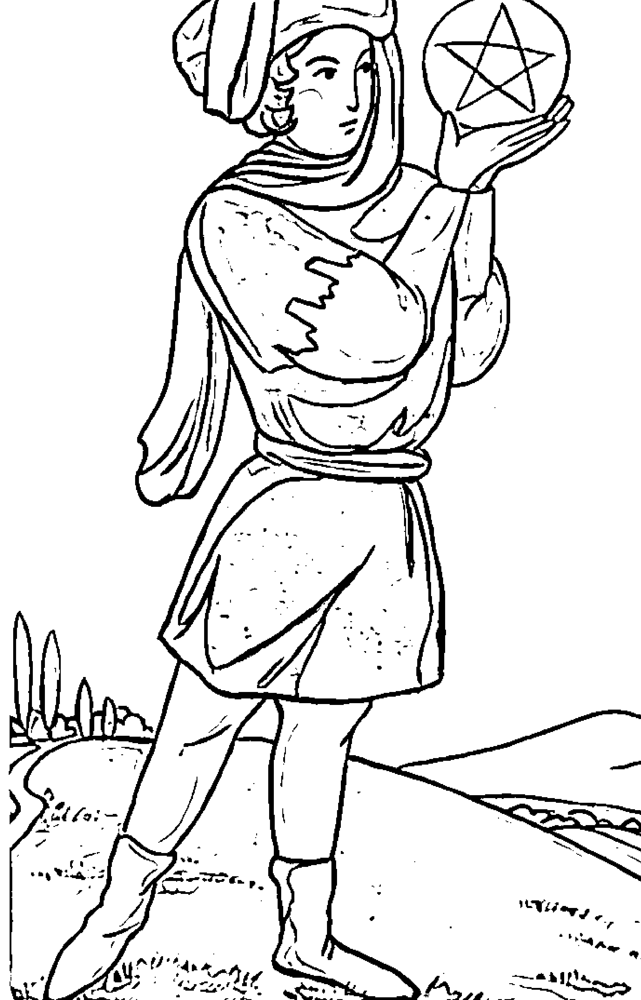  

# 宮廷牌組  

## 149  

## Chapter 4  

## 權杖 ♦ 杖 ♦ 系 ♦ 列  

## 權杖二  

## ▸畫面解析  

一位看起來像是國王或是將軍的人物，站在城牆上俯瞰著自己擁有的領土。

他的右手握著一顆地球，  
左手握著權杖，另一支權杖則豎立在他的右方。

城牆上有白百合及紅玫瑰交叉的圖騰，白百合代表純潔，紅玫瑰代表熱情，而兩種能量正取得平衡。

他看著地球的同時，也一邊遠眺大海的另一端，他似乎對於現在擁有的並不滿足，似乎正在計畫著征服大海的另一端，只不過他還沒有將野心付諸實行。

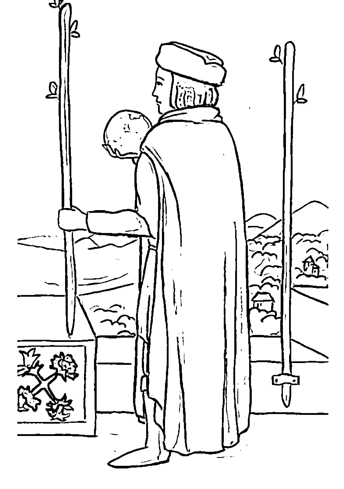  

## 深入塔羅牌的神祕能量  
——影響一生的塔羅牌學習書  

## 152  

## ▶ 正逆位解析  

## 愛情  

權杖二代表兩股力量的整合與扶持，在愛情當中代表夫妻或情侶合作無間，有著共同的計畫、目標。抽到權杖二的當事人在愛情以及人際關係上都能夠主動出擊，而且是有計畫性的，善用自身優勢和手邊資源，通常都能收到不錯的效果。權杖二在感情上也可代表當事人追求到某個對象後仍然不滿足，依舊蠢蠢欲動的要尋找刺激。

逆位的權杖二在愛情中代表兩種力量無法協調、結合，有可能是感情中的雙方自我意識都太強，無法放下自尊，在許多方面意見相左卻又無法和諧的溝通。權杖二逆位也代表當事人在戀愛中總是猶豫不決，考慮得很多，卻始終無法踏出城池一步。逆位的權杖二也可以代表某種計畫的延期、取消，像是結婚計劃、蜜月計劃、相親計劃。

## 事業  

權杖二代表兩股力量能順利結合，發揮一加一超過二的效益，當事人對於人際關係總能主動出擊，並且善用人脈來幫助他拓展事業版圖，不管是人與人的合作或是公司和公司，都能有一致的目標理念，事件的進行都能順利。權杖二也代表良好的領導統駕，即便辦公室內的員工想法以及技能皆不相同，但當事人能夠讓他們各司其職，發揮良好的工作效益。權杖二也代表當事人的意念和行動能夠合一，並能統整自己的優勢、資源，進而在工作上有良好的表現。

逆位的權杖二，可能代表一個有野心，卻沒有計畫與能力的管理階層，往往將帥無能累死三軍，或是當事人太貪心，什麼都想要，反而一事無成。逆位的權杖二也可以代表工作上的溝通協調不順暢，欠缺統一的目標方向，力量無法統合。逆位的權杖二代表當事人想法與行動不一致，在關鍵時刻容易猶豫不決，也無法善用手邊擁有的資源。

## 學業  

權杖二代表積極與企圖心，同時又具有縝密的心思，在學業上能有好的表現。而且當事人也能善用各項資源來幫助自身在學業上的表現。

逆位的權杖二，當事人對於學習可能有很多想法，但都不願意付諸實行，學業總是原地踏步。

## 155  

## ▶ 畫面解析  

四根大柱聳立在畫面前方，柱子頂端掛著象徵勝利的花圈，柱子後方有兩個人高舉花束，好像在招呼客人。畫面左後方有一群人不知道在慶賀什麼，右後方有一座橋，跨越護城河之後是一座堅實穩固的堡壘。在塔羅牌裡，四這個數字有著穩固的意義，權杖四也是火元素最穩定的狀態。權杖四可解讀為溫暖穩固的家園，或是某個慶祝的場合。

## ▶ 正逆位解析  

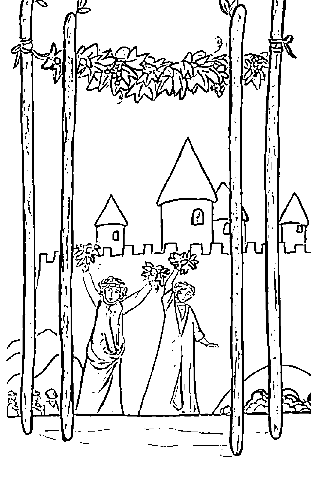  

## 愛情  

權杖四有穩固之意，在一段感情中，可以代表一段長久穩定的愛情，雙方的情感有如親人一般。

和愛情相比，權杖四更適合用來詮釋一段婚姻，那意味著當事人在婚姻當中除了擁有穩固的情感，還有一個提供庇蔭的家庭，基本上愛情、親情以及物質生活都不虞匱乏，而且生活閒適安穩，甚至有人丁興旺的意涵，可能會是一個多代同堂，組織完善的大家庭。另外權杖四上拿著花束的兩人也像是要攜手步入紅毯，有象徵婚禮的意涵。

權杖四逆位，當事人將失去穩固的依託。像是剛結束一段愛情長跑，或是婚姻當中家庭生活不和諧，甚至是離婚導致家庭成員分崩離析。權杖四逆位，也代表當事人無法給另一半穩定感，像是工作及收入不穩，也可能玩心太重，不想被婚姻束縛，這樣的感情難以長久維繕下去。

## 事業  

權杖四在工作上，可以象徵體制完善、基礎穩定的大公司，而且從牌面上來看，裡面的人正向外頭招手，歡迎有興趣的人一起加入這個大家庭，所以也可以代表正在徵才的大公司。如果權杖四指的是個人，那麼當事人將會有一份長久穩定的工作，福利和保障都不錯，而且同事間相處融洽。權杖四若是出現在環境之中，那會是一個穩定、緩慢成長的局勢。

## 學業  

權杖四在學業上代表入學典禮，另外那兩人也有點像畢業生拿著花束，通過花圈拱門準備領取畢業證書，也可以代表畢業典禮。不管是入學亦或是畢業，當事人都能順利、穩定的邁入下一個階段。權杖四也可以代表當事人學習基礎穩定紮實。

權杖四逆位，當事人有可能無法順利畢業，問考試也很難考取理想的學校。

## 158  

## ▶ 畫面解析  

畫面中的五個人，人手一支權杖，彼此正激烈交鋒，畫面當中看不出誰佔上風，也看不出大家的敵我關係，每個人都是獨立的一方，戰情十分膠著。五這個數字在塔羅中代表混亂，權杖五同時是火元素爆裂的狀態，畫面可解讀為衝突、競爭，但一切都是光明正大的。

## ▶ 正逆位解析  

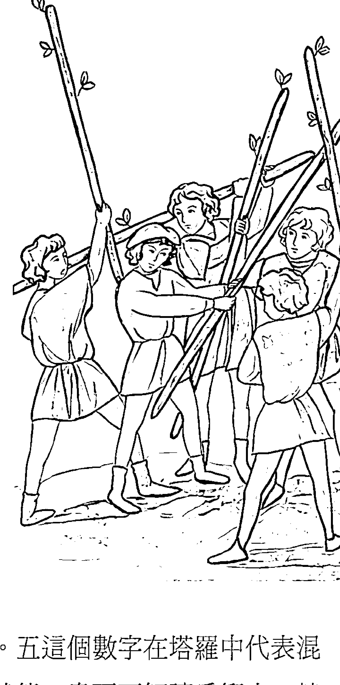  
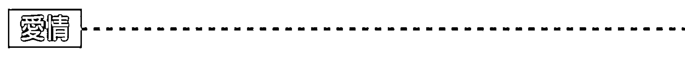  

## 愛情  

權杖五是火爆的競爭場面，在愛情當中可形容為爭風吃醋，有眾多的追求者在覬覦同一個對象，但在畫面中還看不出誰比較佔上風，似乎是人人有機會，各各沒把握。權杖五也可以代表心境上的混亂，例如碰上友情與愛情，或是麵包與愛情的抉擇，都令人無法整理思緒做出決定，是一種心境上的衝突與矛盾。權杖五出現在環境，可以代表人際關係的對立與衝突，關係緊繃甚至暴力相向，這樣的情況也可以套用在感情上，但牽扯的人物應該不只雙方。

逆位的權杖五，火爆與競爭的場面結束，勝利者出爐，在一段感情的競逐當中，已經有人站了上風。在心境中，逆位的權杖五代表當事人在感情當中已經整理好混亂的思緒，已經可以做決定了。

## 事業  

畫面中的五人會這樣火爆的打成一團，中間一定有利益問題存在。可能是多人應徵同一個工作、多家公司競標同一個案子，但是勝利者還沒公佈，是場公平且光明正大的競爭。在環境中出現權杖五，可以代表高度競爭的職場環境，雖然有競爭才能刺激進步，但是凡事有得有失，高度競爭可能會失去人際關係的和諧。權杖五出現在心境中，代表當事人在事業上尚未做出正確決定，很多意見及想法還在腦袋中拉扯。

逆位的權杖五，勝負已分，當事人很可能是出局的一方，競爭過程可能有不公平的狀態，像是辛苦求職卻發生內定的情形。逆位的權杖五也代表當事人整理混亂的思緒，準備在事業或工作上做出決定。

## 學業  

權杖五在學業上可代表一個高度競爭的環境，升學考試或是國家考試都有可能出現這樣的狀態，大家實力接近，在考試沒有放榜前人人都有勝算。缺點是同學之間關係緊繃，在學習上無法互相分享、幫助。

逆位的權杖五，在學業上的競爭已經分出勝負，可能會有一些不公平或是作弊的狀況。

## 162  

## ▶ 正逆位解析  

## 愛情  

權杖六代表勝利與榮耀，可以解讀為當事人在通過競爭與考驗之後抱得美人歸。在一段感情中出現權杖六，代表這是一段受到眾人祝福以及羨慕的愛情。在愛情當中權杖六也可以代表沉浸於眾人目光，習慣於被旁人吹捧簇擁，有些愛慕虛榮的男生或女生。

權杖六逆位，將牌倒過來就會發現主角已經落馬。在一段感情之中，當事人無法即刻意識到危機，認爲一切都很安全，沒想到對方突然提分手。逆位的權杖六也可代表當事人在愛情中自我感覺良好，沉溺於虛榮之中，這種人不管是單身或是正在談戀愛都不會有好結果。權杖六逆位也可以代表追求失敗，情場上落寞失意遭遇挫折。

## 事業  

權杖六代表人緣佳、人脈廣充滿自信且受到擁戴。抽到權杖六的當事人，可能是個受到擁戴的主管與老闆，或是剛剛晉升、順利的完成某個任務，正受到眾人的祝賀。權杖六對於物質層面也相當有利。值得注意的是，權杖六不像國王牌或是皇帝一出場就是成功的人物，他們都是經過奮鬥才能享受現今的榮耀與目光，有種衣錦還鄉的感覺。

逆位的權杖六在事業上失意落寞，只要問任何有關工作的問題都不會有好結果。逆位的權杖六也可以代表當事人沉溺於過去的成功美好，不願意面對事實。逆位的權杖六也告訴我們，做任何事都不要太驕傲自滿，因爲騎兵必敗。

## 學業  

權杖六可以代表順利畢業、順利考上理想的學校，當事人正在享受眾人欣羨的目光。

逆位的權杖六，暗喻當事人不可自滿，才能看到自己的缺點。逆位的權杖六在考試上容易失敗，而且都有點出乎意料。

## 164  

## ▶ 畫面解析  

一名神情堅毅的男子身穿綠衣，手持權杖站在山頂，迎擊下方的挑戰者。該名男子試圖以寡擊眾，好在身處有利的位置，敵人不容易將他擊倒。權杖七有獨當一面、堅守立場和突破重圍的意涵。權杖六下方的權杖對於畫面中的主角是擁護的力量，而權杖七則是攻擊、挑戰在上者，可以印證水能載舟亦能覆舟的道理。

## ▶ 正逆位解析  

## 愛情  

和權杖五一樣，權杖七也是描述衝突場面，權杖五是為了解決實際利益，而權杖七是有危機存在。在一段感情之中，可能有人試圖介入、挑撥，或是家人、朋友反對，好在當事人能堅守相愛的立場，一一擊退難題。單身者抽中權杖七，代表有人想要干擾當事人單身生活，不停試探在感情中交往的意願，或是旁人不斷起哄想撮合當事人的感情，使得當事人必須要一一回絕，堅守立場。權杖七也可代表在感情上對彼此的質疑，但被質疑者都能夠站得住腳，此時應多加信任爲宜。

逆位的權杖七，畫面中的綠衣男子將墜入萬丈深淵，失去優勢的位置。在一段感情中，相愛的兩人無法解決現實的難題，或是遭到旁人挑撥因而分手，也可解讀爲彼此質疑、數落對方的不是。逆位的權杖七，代表單身者在感情的追求上失去先機，孤軍奮戰缺乏旁人協助支援，最終只有失敗的下場。

## 事業  

權杖七有突破重圍、獨當一面的意涵，當事人在工作上能堅守想法及立場，勇敢面對他人的質疑和不看好自己的人，並能挺身捍衛自己的權益。抽到權杖七的當事人在工作上一定正面臨著危機，這時切莫猶豫，相信自己，當機立斷才能扭轉戰局，因爲站在有利的位置，即使敵眾我寡還是有勝算。權杖七也可以代表有許多人正在覬覦當事人的成就地位，當事人應該要有警覺，不要任意樹敵，建立人脈維持好的人際關係，也小心不要有把柄落入他人手中。

逆位的權杖七，身爲主管的，可能會被屬下質疑、挑戰而失去威信。身爲一個政治人物，可能不再受到選民支持，被政敵攻擊而地位不保。逆位的權杖七，代表當事人在事業上失去挑戰困難的勇氣，遇到問題猶豫不決，或是缺少人脈以及資源，單打獨鬥難以成功。

## 學業  

權杖七代表當事人在求學上遇到許多難題，好在當事人有勇氣決心去一一解決，此時不妨求助師長同學，比單打獨鬥有效率。權杖七也可代表影響讀書的邀約、娛樂，還好當事人意志夠強，能夠推辭邀約、抗拒誘惑，只是很辛苦。

逆位的權杖七，當事人在學習上缺乏解決難題的勇氣，容易受到外在環境誘惑、干擾，想要學習的立場不堅定。

## 167  

## ▶ 畫面解析  

八支權杖快速的劃過天際，下方的場景是青蔥的田野伴隨著蜿蜒的溪流。權杖八代表火元素集中的衝刺力，在占卜上也可解讀為空中旅行、新聞、快訊，以正位的權杖八來說都是好消息。在人際關係上，則可解讀為往來頻繁熱絡，但交往不夠深入。

## ▶ 正逆位解析  

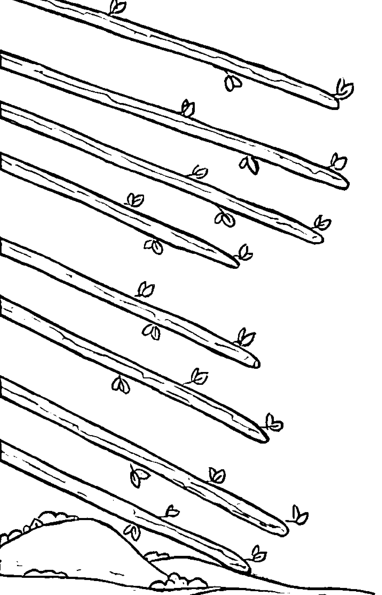  
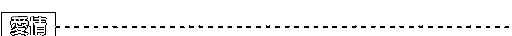  

## 愛情

## 事業

抽到權杖八的當事人在工作上無論是怎樣的目標或計畫都能夠快速的達成，可以輕鬆得到眼前的利益。好處是火力集中，意志堅強，方向目標明確，壞處是做事手法較粗糙，雖然能夠立刻達成目標，但不確定日後會不會有不良影響。權杖八也可以代表突然的工作邀約、訂單或是工作上的靈感以及突然的出差，膠著已久的事情也能豁然開朗。總之權杖八在工作上都給人積極樂觀的印象。

## 深入塔羅牌的神祕能量  
—— 影響一生的塔羅牌學習書

逆位的權杖八，在工作上無法集中精力，缺乏衝刺事業的野心。或是當事人在工作上沒有進展、突破，老是原地踏步沒有升遷的機會，正在洽談的合約計畫也會停擺。逆位的權杖八，也告訴當事人不要急於眼前的利 益，凡事欲速則不達。同時逆位的權杖八也可以代表一個力量分散的工作團隊。

## 學業

權杖八代表當事人集中火力在學業上衝刺，像是考前的衝刺班，通常在考試上都能收到不錯的效果，只不過這樣的效益都是短期的，能否持之以恆的在學業上投注心力比短暫衝刺還來得重要。

權杖八逆位代表當事人在學業上注意力分散，可能有許多外務，也可以說要學習的項目內容過多，無法靠短期衝刺就一一兼顧。逆位的權杖八也可代表當事人的學業表現停滯不前。

## 權杖九

## ▶ 畫面解析

一名男子頭上包著繃帶，他神情緊張，姿態緊繃的用雙手握住手中的權杖，深怕身後的權杖會遭到毀損破壞。頭上的繃帶代表他在過去的戰役、衝突當中受過傷害，一方面他變得更有經驗，一方面他也更加小心謹慎。在畫面中他是一個防守者的角色，因為有敵人正潛伏在周遭。同時權杖九也是火元素最難以操控的狀態，需要謹慎處理。

## ▶ 正逆位解析

小牌牌組

170

## 愛情

權杖九出現時，當事人會感到環境氣氛詭譎，在人際關係上被孤立，甚至有有小人的存在。在一段感情當中，當事人總是小心翼翼的守護著一段感情，深怕有任何人事物出來攪局、破壞，也有可能真的有小人，讓當事人不得不提高警覺，這樣的感情是無法讓人輕鬆自在的。權杖九也可以代表當事人曾經在感情中受過傷害，所以防衛心也比較重，無法輕易敞開心胸去接納新的情感，也有可能是當事人不擅於處理人際關係以及感情問題，面對異性時總會感到緊繃，無法正常表現出自然的一面。

逆位的權杖九，當事人在感情上可能會遭受最信任的人背叛。或是在感情上受到重大打擊，一朝被蛇咬，十年怕草繩，變得比正位時還要畏縮、封閉的狀態。比較好的狀態是原先害怕、在意的人事物瞬間瓦解，雖然得承受失去的痛，但是心情上可以輕鬆許多。

## 事業

權杖九有小心謹慎，戰戰兢兢的意思。當事人在職場上可能有危機意識，必須小心翼翼的才能保住飯碗。在環境中，當事人可能會被同事孤立、擔心會被出賣、害怕自己的權益會被公司剝奪，不是一個舒服的環境。權杖九也有點像是保全、警衛等工作。

逆位的權杖九，在工作或事業上可能會被自己最信任的人背叛，或是當事人小心謹慎過了頭，沒有開拓事業的勇氣。逆位的權杖九，當事人很可能不必再擔心、緊繃，因爲他在事業上已經一無所有，端看當事人能否自己調適心情。

## 學業

權杖九在學業上，當事人應該已經感受到自己的危機，面對考試總是小心謹慎、戰戰兢兢，深怕錯個一題就無法及格。問考試或報告，當事人可能勉強保住一線生機，但整體而言很辛苦。

逆位的權杖九，當事人再擔心學業上的問題也是枉然，因爲考試已經結束，當事人不必再擔心、掙扎，即便有不好的結果也只能接受。

## 權杖十

## ▶ 畫面解析

一名男子低著頭環抱十支權杖，權杖的重量壓得他直不起身，他的目標是畫面遠方的建築物，旁觀者都不禁擔心他能否擔負著沉重的壓力堅持走到終點。權杖十代表火元素在權杖九達到飽和後再晉升的狀態，有薪火相傳並朝著新的方向發展的意義，整體而言任重而道遠。

## ▶ 正逆位解析

> 愛情

畫面中的男子看來肩負了許多責任，權杖十若代表一段愛情，當事人可能無暇沉浸在風花雪月之中，他可能肩負了結婚生子的壓力、養家活口的壓力，甚至是親友的關注與期待，但是身旁沒有人可以分憂解勞，或是他不願意將重擔加諸在所愛的人身上，所以一肩挑起所有的責任，而且這樣的生活模式還有一段日子要走。

權杖十也可以象徵在感情之中，生活中的大小事，或是有爭執的時候，責任總是由某一方默默承擔，難保哪天累積的壓力、情緒會爆發。權杖十也告訴我們與其苦苦的維繫一段感情，不如早點放手。

## 事業

權杖十可以說是現代上班族的最佳寫照，壓力大、工時長，卻得不到合理報償，雖然心中有目標、理想，但總覺得遙遙無期，像是買房、買車或是升遷都不是短時間可以達成的。想要拋下工作不管，卻有現實的生活壓力存在。抽到權杖十的當事人，公司可能是採取責任制、常加班，當事人也要思考自己是否愛把責任攬在身上，偶爾該放手、信任自己的團隊才不會如此辛苦。

## 學業

權杖十代表當事人在學業上自我要求高，目標也訂得很遠，但是休息是為了要走更長遠的路，適時的放鬆也是很重要的，否則真的面臨重要考試容易產生倦怠，甚至影響到身體健康就得不償失。權杖十也可代表當事人在學習的路上承受太多期待與壓力，在身旁的人不應再盲目的施加壓力與期盼，應該多給予鼓勵和實質幫助。

逆位的權杖十代表放棄，可能是學習的目標超過當事人的能力範圍，也有可能是當事人抗壓性不足，總之結果都不理想。

## 寶 ♦ 劍 ♦ 系 ♦ 列

## 寶劍二

## ▷畫面解析

一名女子用白布蒙著雙眼坐在石凳上，交叉在胸前的雙手各持著一把寶劍，而她身後的場景則是洶湧的浪潮以及尖銳的礁石，同時她身後的天空掛著一輪新月。

首先大海代表情感以及危機，但是女子選擇背對它而且還蒙上雙眼，更加深了她想逃避的意圖。

另外她交疊在胸前的雙手，似乎在拒絕旁人的質問，即便問題已經浮現在眼前，她仍然不肯承認現狀。

最後兩支交叉的寶劍也代表兩種想法以及意念正在對峙，呈現二選一的局面。

小牌牌組

176

## ▶ 正逆位解析

## 愛情

寶劍二在一段感情之中，代表問題浮現，當事人卻視而不見，例如感情生變或是外遇，也有可能當事人表面漠視、淡定、死不承認，但是心中已經很冷靜的在思考對策，只是難以衡量取捨利害關係。寶劍二在感情中也可以代表兩人的對峙與爭吵，談話冷靜銳利，有點像冷戰。

寶劍二代表當事人防衛心強，面對愛情也習慣以理性來思考、抉擇，應該多傾聽內心的聲音。寶劍二雖有抉擇的意思，但不是單純指有兩個對象該如何選擇，通常都有一些麻煩的 фактор糾纏當事人，好比是愛情與友情、外遇等牽涉道德與實際情慾的拉扯。寶劍二逆位代表當事人放棄選擇、放棄思考，面對感情的問題一切船到橋頭自然直，或是採取逃避、放棄的態度，總之有種鴕鳥心態。

逆位的寶劍二也常見於情侶爭吵，但此時寶劍就失去平衡的力量，可能是某方太強勢，或是某方明明理虧還不肯承認錯誤，通常爭論過後問題仍舊存在沒有解決。

## 事業

寶劍二的出現，當事人在工作上肯定碰上了難題，但也不希望其他人給予幫助以及建議，也不立刻採取行動，他希望能夠退開來獨自冷靜的思考。

在工作上寶劍二也常出現兩難的情況，例如家人與事業、愛情與事業、道德與利益等問題，通常魚與熊掌不可兼得，才會讓當事人如此難以取捨。寶劍二也代表兩股力量的對峙，所以在物質層面以及事業的拓展總是停滯不前。

逆位的寶劍二，當事人遇到需要抉擇或思考的關卡時，總是選擇放棄，或是逃避眼前的问题，眼不见为净。像是社會上有很多人習慣以債養債，總之不要被催討逼債就能粉飾太平，殊不知債務如雪球般越滾越大。

## 學業

寶劍二在學業上常代表兩難的問題，像是當事人想讀的科系和家長期盼的不同，或者應該去就業還是繼續升學等問題。

這時候當事人應該屏除外界的影響和聲音，仔細思考什麼才是自己真正想要的，不該為了逃避職場而升學，不該只為了物質慾望而選擇就業，做任何決定都要能夠說服自己。

逆位的寶劍二，當事人碰到學習上的關卡就想逃避、放棄，或是無法堅持己見，在學習的路上總是依靠他人安排，無法獲得自己真的想要的。

小牌牌組

180

## 寶劍三

## ▶畫面解析

三把鋒利的劍直接刺穿一顆鮮紅色的愛心，背景則是烏雲密佈，正在下著大雨，光看畫面就知道是一張傷心欲絕的牌。

而史派洛塔羅（Spiral Tarot）裡的寶劍三則是描繪一名紳士手裡拿著一朵玫瑰，神情像是黯然離去的失敗者，他身後的街燈映照出微雨矇矇的場景，更顯露出主角的失魂落寞，有種求愛被拒，真心換絕情的感覺。

寶劍三也可代表心臟病或是與心臟相關的手術。

## ▶ 正逆位解析

## 愛情

寶劍三可代表求愛被拒、一片真心卻換來冷漠無情的對待，泛指一切在感情中碰到的傷害，總之寶劍三出現在感情的占卜中都沒有好結果。寶劍三出現在環境之中，代表當事人正經歷喪偶或喪親之痛。畫面中的寶劍遲遲留在心中無法被抽出，當事人也要負起責任，因爲他決定守著悲哀，不想忘記過去情感上的傷痛，是旁人無法左右的，只有當事人下定決心走出陰影才能擺脫不好的狀態。

逆位的寶劍三，情況比正位來得好，當事人已經決定要告別悲傷，開始療傷止痛的階段，雖然傷口癒合了仍會留下瘡疤，不過已經可以慢慢的去迎接新的情感。

## 事業

寶劍三出現在事業的占卜上，當事人可能對於公司以及工作有著熱誠，並且全心全力的付出，但結果可能不如預期，又要受到周遭同事的冷嘲熱諷或是上司主管無情的批評。寶劍三也代表物質或金錢的損失，甚至是失去珍貴的寶物。抽到逆位的寶劍三，當事人有可能走不出過去失敗的陰影，而且拒絕身旁關心自己的人所提供的幫助。

逆位的寶劍三，代表當事人能夠坦然接受工作上的失敗或財務上的損失，正要開始重建復原，並且樂於接受旁人的關心和幫助，把過去失敗的經驗轉化為成長的動力。

## 學業

寶劍三代表當事人在學習上有熱誠，卻要忍受旁人的恥笑、怒罵、不看好，或是不停的遭遇挫敗，再有決心的人也會因此灰心喪志。寶劍三也可代表當事人費盡心思，且深具信心的作品、報告或是演出，卻被批評的一文不值。

逆位的寶劍三，當事人從挫敗的陰影中復甦，決定敞開心胸接受他人的幫助，是一股再起的力量，對於學業有正面幫助。

## 寶劍四

## ▶ 畫面解析

一名男子躺在病床上，雙手在胸前合十，從上方的彩繪玻璃來看，男子身處教堂之中。這名男子並非死去，他正在休生養息，身旁的寶劍則是他醒來時再戰的利器。寶劍四同時也是風元素靜止、凝聚和停頓的狀態。寶劍四也可以用來代表住院、生病療養。

## ▶ 正逆位解析

## 愛情

寶劍四代表休息，當事人可能正在放一個長假、或是剛離職，原因可能是太疲倦、工作壓力太大，或是生病需要時間恢復，不過並不像要退休的樣子，因爲畫面周遭的寶劍，代表等時機一到，還是會繼續奮鬥。這段時間看似在事業上沒有大的進展，但有助於醞釀新的想法計畫，負面的狀況是當事人只圖安逸輕鬆，不肯全力為工作付出。寶劍四也有充電、進修的意思，當事人可能正在充實新的知識技能。問投資理財出現寶劍四，暫時不會有太大的收益。

寶劍四處於一個休兵狀態，若代表一段感情，雙方缺乏情感上的交流互動，實際上彼此都退開一步，給予對方思考和喘息的空間，希望藉此醞釀新的感情發展契機。寶劍四也可以代表當事人剛結束一段令人疲倦的愛情，正在休養沉澱，暫時不想觸碰和感情有關的問題。對於感情的進展，寶劍四處於停頓的狀態，像是獨居或單身以及感情的空窗期，但也不會造成重大損害，負面的狀態是當事人對於人際關係太過孤僻。

逆位的寶劍四，當事人可能渡過了情感上的療傷止痛期，或是剛結束情感上的空窗期，正準備迎接新的情感，可能對於感情還有點倦怠、不適應，但是會隨著時間慢慢習慣。在一段感情之中，雙方正結束冷淡的時期，開始有互動，但還沒那麼熱絡。

## 事業

逆位的寶劍四，當事人可能剛結束一段長假、剛結束進修、療養正要返回職場，或是從懶散的狀態中覺醒，準備奮起。和剛起床的狀態一樣，必須要活動一段時間精力才會甦醒。

## 學業

寶劍四代表當事人正在閉關進修，不希望旁人打擾，當事人覺得準備妥當後才會展現他的實力。寶劍四也可以代表學校的寒暑假。負面的情況是當事人在學業上怠惰，只想休息。

逆位的寶劍四，可以代表剛開學，或是當事人開始覺醒，準備要在課業上發奮圖強。

## 寶劍五

## ▷畫面解析

和權杖五類似，寶劍五也是一個鬥爭的畫面，差別在於寶劍五的勝負已定，畫面中一位金髮男子嘴角上揚面容奸詐，手持三把劍還不滿足，看樣子正要去撿拾另外兩把劍。那兩把劍是失敗者所遺留的，牌面有帶到他們轉身離去的身影，他們輸得並不甘心，因爲勝利者也贏得不光采，看來其中使出了許多陰險的手段，並非光明正大的決鬥。

## ▷正逆位解析

## 愛情

寶劍五可以代表小人，也可以指沒來由的爭吵或是無端受到傷害。在一段感情當中會碰到小人無所不用其極的挑撥、破壞，或是男女雙方常沒來由的爭吵，吵到最後總是會模糊焦點，即便贏了也沒好處。

問愛情問題出現寶劍五，代表彼此互相攻訐、抹黑，即使獲得勝利也只是表面，參與其中的人都無法獲得好的歸宿。

逆位的寶劍五，當事人要注意自己是不是那位從中作梗，為了在感情上受到青睞而不擇手段的小人。抽到寶劍五逆位的當事人，可能曾在感情上傷害過他人，要小心有人想要伺機報復。

## 事業

問事業出現寶劍五，代表這是一個勾心鬥角，為了成功可以不擇手段的環境，當事人通常都是扮演受挫者的腳色，同時也會覺得心有不甘，進而有報復的心態產生。當事人也可能會碰到以打擊他人為樂，沒有口德的主管或同事。寶劍五也可以代表惡性競爭，不論是人與人或是公司與公司，即便是勝利的一方也都要付出慘痛的代價，所以是否要那麼執著於勝負實在值得省思。另外寶劍五在金錢或物質上也可能會被詐騙掠奪。

逆位的寶劍五，當事人在工作上可能就是陰險狡猾的人物，或許在事業上可以換取一時的成功，但難保不會遭人記恨，最後也落得慘痛的下場。

問學業出現寶劍五，可能碰到有人作弊、關說，進而損害到當事人的權益，像是大考洩題、找槍手，或是申請入學有內定的情況，不幸落敗的人當然很不甘心，而勝利者也沒有榮譽可言。

逆位的寶劍五，代表徇私舞弊的就是當事人，當事人要思考是否要用這樣的手段換取勝利。

## 學業

## 寶劍六

## ▷畫面解析

一對母子坐在一艘船上，後方有船夫替他們划船，船正朝著對岸緩慢前進。他們的行動看起來隱密、低調，船上整齊的插著六把劍，但船隻不會因此浸水下沉，那些寶劍對於畫面中的人物有保護作用。

整個牌面可以象徵企劃安排的過程，事件進行的順利，但是低調不張揚。寶劍六是風元素最和緩的狀態，同時也可以代表水上旅行。最後寶劍六不管是代表什麼事，都不是處於最佳狀態，不過前進方向正確，是一張著眼於未來的希望之牌。

## ▶ 正逆位解析

## 愛情

畫面中的船夫默默的守護母子，幫助他們抵達對岸，在一段感情中，可代表默默守護、不給對方壓力，雖然欠缺激情，但是溝通順暢且默契十足，而且彼此有共同目標，同時寶劍六也可解讀為感情上的過渡時期，只要能夠通過考驗幸福就不遠了。寶劍六若代表面對情感的態度，代表當事人喜歡低調，不想張揚。若寶劍六代表一段戀情的進展，那麼這段戀情進展緩慢但是順利，也可能事先經過安排，像是相親、聯誼。

逆位的寶劍六代表翻船、計畫泡湯。可能是一段戀情還沒成形就先曝光而見光死，或是男女雙方無法通過磨合期、過渡期的考驗。也可以代表結婚計劃、相親計畫泡湯。逆位的寶劍六也可代表當事人在茫茫人海中迷失方向，找不到適合的歸宿。

## 事業

寶劍六在事件的進行上代表企劃安排，只要能按計畫走，遇到任何難題都能迎刃而解。在環境上，代表大家都同在一條船上，同舟共濟，朝著共同的目標邁進。寶劍六也可以代表過渡時期，工作和事業才剛上軌道，做任何事切記低調不張揚，過不久就能抵達目標。最後寶劍六也可代表物件、金錢的經手、傳遞。

逆位的寶劍六，當事人在事業上的計畫可能不小心曝光、泡湯。也可以指當事人在職場上迷失方向，找不到自己適合的方向。

## 學業

寶劍六代表當事人在學業上有人指點，學習有計劃步驟，成績正緩慢進步，正朝著自己理想目標前進。

逆位的寶劍六，代表當事人找不到學習方向，或是在學習上想逃避現實。逆位的寶劍六也可代表某個學習計畫泡湯。

## 寶劍七

## ▶畫面解析

畫面中的男子偷偷潛入敵對陣營，偷走了五把寶劍，這是一個非常時期，他只能鋌而走險、以智取勝，從畫面中還留下兩把寶劍來看，單打獨鬥的力量還是不足。寶劍七有點像草船借箭、空城計等奇謀，是在非常時期才能夠使出。逆位的寶劍七則代表東窗事發，弄巧成拙，甚至有誤觸法網的可能。最後寶劍七代表風元素的激發狀態，就像是亂流。

## ▶正逆位解析

## 愛情

寶劍七可以代表當事人對某段感情有隱藏的企圖，比如暗中介入、暗中竊取成功、或是在感情中展現出狡詐的策略。逆位的寶劍七則代表行動暴露，可能因小人從背後使壞導致計畫破壞，也可能代表當事人圖謀不�を行う，結果不小心把自己給害了。

寶劍七代表風元素的激發狀態，就像是亂流，可能代表感情中出現突如其來的衝突或變故，需要當事人保持冷靜與審慎的態度。如果逆位，代表事情變得不那麼可控，可能導致關係破裂或失去信任。

## 事業

寶劍七在事業中代表當事人可能在暗中進行一些不為人知的動作，比如秘密計劃、背後動作、或是利用機巧伎倆來達成目標。這樣的行為雖然可能一時得逞，但漸漸會有後患，甚至會使得其他人對當事人產生不信任。

逆位的寶劍七，代表事情可能因為不當的行動而曝光，使得原本隱密的計畫變得無從掩蓋，也可能導致責任歸咎於當事人，需要他面臨後果並重新起航。

## 學業

在學業上，寶劍七可能代表當事人想要以不尋常的方法來獲得好成績，比如作弊、竊取他人資料或其他不公平手段。但即便短期內獲得了成功，也會在日後對當事人造成不小的麻煩。逆位的寶劍七則代表這類手段被揭發，或是計畫暴露，使當事人不得不重新評估自己的學習方式與方法。

## 愛情

在一段感情中出現寶劍七，有好有壞，像是瞞著另一半準備生日驚喜，或是善用小心機增添男女情趣。

負面的狀況是，男女雙方不能坦誠相見，彼此爾虞我詐、各懷鬼胎，甚至背地裡搞外遇。

單身男女為了突破現況，喜歡耍些小心機、小手段，或是假借各種名義來接近心儀對象，偶一為之無傷大雅，但是常常使出類似寶劍七的手段，小心造成反效果。

逆位的寶劍七代表東窗事發，外遇、劈腿等偷偷摸摸的行徑都會被揭發，或是想要以朋友身分或是各種名義來偷偷接近心儀異性的手法被識破。逆位的寶劍七也有弄巧成拙的意涵，例如原先想給對方驚喜，不過沒有安排好反而惹得對方不開心。

## 事業

寶劍七看似大膽的行為可是經過深思熟慮。

抽中寶劍七的當事人在工作上總是藝高人膽大，喜歡先發制人，總是單打獨鬥不喜歡合作。當事人也有可能處在一個爾虞我詐、各懷鬼胎的環境，非得要用特殊的手段才能成功。寶劍七也可以解讀為公司暗地裡挖角敵對陣營人才。寶劍七也代表詐欺、偷竊等非法事件，只不過犯行不被察覺。

## 深入塔羅牌的神祕能量
—— 影響一生的塔羅牌學習書

逆位的寶劍七，當事人在工作上的好運氣已經用完，不能再靠耍小手段矇混過關，或是在工作上喜歡耍小聰明反而弄巧成拙。當事人也有可能是個投機份子，不務正業，或是為情勢所逼錘而走險，但是逆位的寶劍七，所有的犯行都會曝光，當事人將難逃法律制裁。

## 學業

寶劍七在學業上可解讀為作弊，而且神不知鬼不覺，當事人可以僥倖的得到好成績、順利畢業，或是考上理想的學校。

逆位的寶劍七，代表作弊被檢舉，當事人不僅無法在學業上有好成績，而且會導致身敗名裂的下場。

## 寶劍八

### ▶ 畫面解析

一名身穿橘衣的女子，雙手遭到反綁眼睛也被一條白布矇住，她的四周有八把寶劍將她團團包圍。

女子身後有座建築在山頂的城堡，城堡上有人在監視女子的一舉一動。雖然女子的身體被綑綁，但是腳並未遭到束縛還是能自由走動，況且包圍她的寶劍露出很大的空隙，但卻不見女子有逃跑或掙扎的意圖，也許是畏懼後方城堡的勢力，也有可能是自己缺乏踏出第一步的勇氣。

寶劍八代表封鎖牽制，也可以解讀為心魔比實際的束縛還更可怕，有些不利於當事人的現況會被擴大、渲染，甚至是想像出的。少數的情況寶劍八可代表牢獄之災。

### ▷正逆位解析

在愛情中，寶劍八出現時，人際關係很糟，四周的人和自己意見相左，有被束縛孤立的感覺。在一段感情中，當事人的觀念可能和另一方相左，也有可能是交往後各項行動都被限制，甚至有些無理的要求，生活被感情或家庭束縛，無法像單身一樣自由自在，或者是交往後無法像之前那樣沒有拘束的相處，反而有點不自然。曾經在占卜中碰過一個女孩，因為家裡管得嚴、外出都有門禁，上了大學後仍然無法自由的談戀愛，最後也出現了寶劍八，後方的城堡代表家長的權威和監控，寶劍代表束縛女孩的老舊價值觀。但是城堡的監視和寶劍的束縛都有缺口，女孩對不合理的管教大可先斬後奏，才有談判溝通的籌碼。

寶劍八逆位，當事人不再逆來順受，勇敢的反抗不合理的對待，成功的擺脫情感的束縛。在感情的占卜中，寶劍八也代表當事人不再畫地自限，勇敢的走出去與人群接觸，對於發展新戀情有正面幫助。

在事業上出現寶劍八，當事人可能會碰到難以突破的瓶頸，手邊缺乏資源、人脈，或是對於自己的能力存疑，限制自己的發展空間。寶劍八也可代表一個集權管理、制度嚴苛的公司。在環境中出現寶劍八，當事人和周遭同事或主管總是意見相左，有種四面楚歌甚至被孤立的感覺。

逆位的寶劍八，當事人不再故步自封，能夠相信自己的能力並突破重圍，困擾已久的事可以順利突破瓶頸。逆位的寶劍八也可以代表當事人脫離一個壓力大、條件嚴苛的公司。

在學業上，寶劍八代表當事人在學習上對自己的能力存疑，總是畫地自限。也可以代表讀書壓力大，學習將自己的行動綑綁住，無法快樂的探索學習以外的世界，多半是被家人或老師逼著讀書的孩子。

逆位的寶劍八，當事人在學習上接受度更高，開始嘗試新的領域或方法。在學習上不用倚賴他人的監督，能夠自發性的學習。

## 寶劍九

### ▶畫面解析

畫面中的女子穿著睡袍，看起來像是從一場噩夢中驚醒，她雙手抱頭，彷彿內心的恐懼沒有因爲清醒而抹去。仔細看會發現，她的床鋪左下角有一幅圖畫，畫面中的男人正在攻擊跌坐在左下角的女人，所以寶劍九除了代表噩夢、陰影、失眠，也可解讀為家暴。

### ▶正逆位解析

出現寶劍九，當事人可能正處於一段不健康的感情之中，擔心受到欺騙或流言中傷，感覺空虛寂寞、欠缺安全感，也有可能會碰上家庭暴力，也可代表在先前的感情受到傷害，即便時過境遷陰影仍然存在。

寶劍九也代表擔心、掛念，可能心愛的人身在遠方，或是處在一個危險的環境，隨時會遭遇不測，所以畫面中的女子才會噩夢連連、提心吊膽。

在愛情中，寶劍九也可代表當事人隱瞞了什麼祕密或煩惱，卻不願意和他人分享討論，選擇自己面對恐懼。

逆位的寶劍九，當事人的恐懼、憂慮獲得舒緩，但是問題多半未獲得解決。在愛情當中，當事人肯勇敢的說出自己的困擾以及塵封已久的秘密，或是逃脫一段不健全的愛情。在感情中可能還有許多擔心掛念的事，不過有人在身旁安慰鼓勵，不必獨自面對低潮。

在事業上，寶劍九出現在工作的占卜之中，可能在職場上受到嚴重批評、打擊和挫折、麻煩事接踵而來，在工作之餘以及午夜夢迴都不停浮現對工作的恐懼。

寶劍九也有點像活在經濟恐慌下的人們，每天擔心股票跌、存款縮水或是公司倒閉、工作不保，甚至連下一餐在哪都不確定了。也有可能當事人做了虧心事，或是出了差錯，整天擔心會被揭穿。

逆位的寶劍九，實際的狀態與正位比起並沒有太大的改善。當事人會把自己在事業上的問題說出來分享，或是暫時的逃避問題，心情上會比較舒坦，不過狀態並未改善，面對失敗也比較能釋懷。

出現寶劍九，當事人在學業上一定深感挫折與壓力，無助徬徨又不知道該和誰商量。寶劍九也可以代表校園霸凌事件。

逆位的寶劍九，問題依舊沒有獲得改善，但是當事人在課業上的煩惱已經被注意到，有人開始伸出援手。逆位的寶劍九，當事人也可能透過運動或聽音樂等轉移注意力的方式替自己紓壓。

## 寶劍十

### ▷畫面解析

天頂被黑色的烏雲壟罩著，只有遠方的山陵透出一絲光亮，畫面中的男子背部朝上，有十把劍整齊的插在他的背上。

從寶劍排列的樣子看來，兇手一定是預謀殺人，而非臨時起意或是大意失手。而且殺死一個人根本不用那麼多把劍，兇手一定和死者有著極大的仇恨。

寶劍十代表風元素最強勁的作用，猶如暴風一樣。在健康方面可以代表背部或脊椎的毛病。

### ▷ 正逆位解析

在感情的占卜中出現寶劍十，當事人的戀情可能會被毀謗、惡搞，甚至是情敵暗地裡用流言中傷。寶劍十擁有強大的破壞力，男女雙方將會有劇烈的爭吵、徹底決裂到了無法挽回的地步。寶劍十也可以解讀為分手後或是由愛生恨的報復手段，而且是有計畫、醞釀很久的，不僅要傷害對方還想置人於死地。

逆位的寶劍十，試圖毀謗和中傷的人依然存在，只是傷害力沒有如此之大，也有可能是當事人平常就光明磊落，讓情敵找不到攻擊的點，但還是會受到不好的影響。

寶劍十也可代表男女之間的激烈爭吵或受到外力的破壞，但是感情還未完全崩潰，還有轉圜餘地。

問事業出現寶劍十，代表當事人可能是旁人的眼中釘、肉中刺，除了要小心被惡意中傷外，也要避免樹敵，檢討自己為何會與人結怨。

寶劍十在事件或財務方面都會遇到挫折、困難，很難有成功的機會。

寶劍十會出現正面的狀況和塔或是死神有異曲同工之妙，都是經過浩劫之後而得到重生的機會。

逆位的寶劍十，當事人在工作或投資事業都受到極大的打擊，但是還沒有完全絕望，還能夠保住一些資產或是保住工作來東山再起，也有可能是僥倖的逃過危機。或是在最絕望的時候透出一絲曙光、有人雪中送炭。

在學業的占卜中，寶劍十不常見，當出現寶劍十可以代表教授或老師對學生毫不留情，報告或考試的題目都很艱深，批評學生也毫不留情，似乎是早就計畫要惡整學生。但是嚴師出高徒，或許經歷慘痛的失敗，學生才會戰戰兢兢的學習。

逆位的寶劍十，老師或教授可能依舊嚴格、出題犀利，沒有人能通過他的考驗，但當事人能夠僥倖過關，或是老師在緊要關頭再給學生重考或補救的機會，讓學生有起死回生的機會。

## 聖・杯・系・列

## 聖杯二

### ▶畫面解析

一對男女頭上都戴著花環，手持著聖杯，模樣像是互相敬酒，他們含情脈脈的看著對方，顯得有些羞澀。男女的頭頂有一頭展開雙翼的獅子，遠方山丘上有一座別墅。整個畫面的結構有點像戀人牌，所以聖杯二也俗稱小戀人。同時聖杯二是水元素最和諧的作用，也是最浪漫的形式。

### ▶正逆位解析

聖杯二和戀人一樣，對於戀愛都有正面的影響。不同的是聖杯二所代表的感情比較像是曖昧或是友達以上戀人未滿的狀態，所以對望的時候還帶著羞澀、拘謹且相敬如賓的感覺，在愛情中也比較沒有肉體的愛慾。聖杯二的正面狀況是一見鍾情、情投意合、默契十足，愛情中有浪漫神祕的氣氛，負面的狀況是男女雙方相處太過見外，不夠輕鬆自然。

聖杯二是一段感情發展的關鍵期，任何一點小失誤都會讓戀情腰斬、破局，所以牌中的男女主角才會如此小心翼翼。

逆位的聖杯二代表分裂、破局、感情轉淡，但曾經是有大好機會可以在一起，也有可能是曖昧期拖延太久遲遲沒有告白，過了在一起的最佳時機。單身者抽中逆位的聖杯二，難以找到身心契合的對象。

## 事業

聖杯二在事業上可代表順利愉快的合作、成功的談判，做任何事總是一拍即合。

同事、上司或客戶間能夠相互尊重，維持著禮尚往來的關係。聖杯二也可以代表密會、密商或是一個契合的工作夥伴。聖杯二在物質和財務上周轉順利，在工作上也能有合理報償。

逆位的聖杯二，事業上的談判有可能破裂，或是失去一個長期合作的事業夥伴。

## 學業

職場上人際關係不和睦，話不投機半句多。正在求職的新鮮人也很難找到條件與興趣相匹配的工作。

聖杯二可以代表良好和諧的師生關係或是同儕情感，彼此相互尊重、卻又不踰越師生、同學間的禮儀。聖杯二也可以代表在學習上的心靈伴侶，興趣和理念一致，在分組報告中出現聖杯二，代表彼此溝通順暢、想法一致。聖杯二也可代表校園中萌生的純愛。

逆位的聖杯二，師生間關係緊繃，互不信任，像是研究生和指導教授理念不同。如果是碰上分組報告，也很難順利完成。

## 聖杯三

### ▷畫面解析

三名女子在花園當中舉杯慶賀，花園結滿豐碩的果實，有南瓜、葡萄、桃子，她們的團體中似乎沒有貴賤尊卑，可以無私的分享喜悅。聖杯三可以代表歡樂、慶典、或是多人間的友誼，同時聖杯三也是水元素最活躍的狀態，像是一股源頭活水，帶給人暢快清澈的感受。

### ▷正逆位解析

## 愛情

聖杯三代表人際關係良好愉快，但出現在感情中就顯得有些矛盾，因爲聖杯三有多人作用的力量存在，感情中將會出現第三者而且當事人還不自知，可能就是身邊的好友所以疏於防備。出現聖杯三也暗示未來的對象可能會出現在朋友圈當中，也有可能是喜宴、派對等交際場合認識的。

逆位的聖杯三代表第三者實際存在，而且已經破壞了一段感情。逆位的聖杯三，也可以解讀為單純的友誼變質，可能是摻雜了愛情的元素，或是當事人在感情中被好友出賣、背叛。逆位的聖杯三也可代表當事人縱情於聲色場所和物質享受，沒有穩定談感情的想法，也不可能遇到好對象，或許是在愛情中受到打擊的發洩方法。

聖杯三的畫面是慶典，搭配結實累累的畫面，像是長久以來的工作付出得到了收穫，正在慶祝、犒賞自己的辛勞，有點像尾牙或是慶功宴，總之物質上不虞匱乏、事件也能順利進行，更重要的是當事人能快樂的享受到的成果。在環境上出現聖杯三，可以解讀為氣氛歡愉且合作無間、沒有長幼尊卑之分的工作環境。在心境上出現聖杯三，代表當事人注重工作環境的氣氛遠大於工作內容或收入。

逆位的聖杯三可以代表過度的應酬享樂、工作團體失和，緊密的合作關係生變。逆位的聖杯三也可代表在事業上被最好的朋友出賣、背叛，或是因爲工作上的事導致與好友失和。逆位的聖杯三也可解讀為當事人只想玩樂，對於工作或事業根本沒有積極進取的心。

## 學業

在學業上，聖杯三可代表慶祝畢業、慶祝大考結束，辛苦到一個階段後適度的放鬆。聖杯三也可以代表同學之間感情相處融洽。

逆位的聖杯三，當事人可能貪溺於玩樂，無心在學業上努力。也可以代表同學間感情破裂。

## 聖杯四

### ►畫面解析

一名男子以盤腿的姿態坐在樹下，看起來像是在沉思，他已經擁有三個杯子，但是他並不感到滿足，他的身旁有一朵雲飄過來，手中拿著一只聖杯，像是在試探他也可以解讀為新的機會，但是男子依然不為所動。

這張牌並沒有特別的好壞，指的是一個安逸停滯的狀態，同時聖杯四是水元素靜止的狀態，猶如一灘死水缺乏流動循環，正面的狀況是能夠三思而後行，負面的狀況是封閉、無趣。

## 深入塔羅牌的神祕能量
—— 影響一生的塔羅牌學習書

### > 正逆位解析

## 愛情

單身者問愛情出現聖杯四，問題可能出在當事人過於沉浸在自己的世界當中，喜歡停留在舒適圈內，對於人際關係消極退縮，同時拒絕旁人的邀約試探，外人很難踏入他的生活圈，而當事人也認爲沒有人可以理解自己的想法。

聖杯四若是代表一段感情，這段感情將是穩定平淡、缺乏刺激猶如一灘死水，或許當事人早就厭倦了這段感情，但也沒有具體作為，或是當事人將感情中所擁有的視爲理所當然。

聖杯四也可代表當事人需要自己的空間，在感情上不喜歡太多的關注或打擾。

逆位的聖杯四，當事人在感情中已無法安於現狀，想要在現有的感情之外尋找新的刺激，甚至是新的對象，有種坐立難安的感覺。單身者想要走出自己的世界，不再拒絕社交的機會。

## 事業

聖杯四出現在事業的占卜中，可以代表一份安逸穩定的工作，但是缺乏挑戰性，工作內容千篇一律，缺乏升遷機會，也可以解讀爲在職場上沒有人了解自己的想法和才能。

## 學業

聖杯四也可以代表當事人缺乏工作的動力，也不願接受新的機會和挑戰，對於任何事都興趣缺缺，甚至拒絕旁人的幫助，或是對於現階段的工作內容不滿足，但是想不出解決問題的方法，同時拒絕改變。聖杯四代表財物上的狀況，雖然屢次錯失良機，狀況停頓沒有進展，但是不虞匱乏。

逆位的聖杯四，當事人將工作上的不滿足化為實際的行動，不再沉浸於安逸的工作，勇於接受新的機會和挑戰。負面的狀況是，逆位的聖杯四會令人坐立難安，不像正位時沉得住氣。

聖杯四可以代表當事人對學習缺乏興趣，安逸怠惰，無論是用什麼方法都無法吸引他的注意，或是錯失了學習的機會。聖杯四也可代表當事人學習時，喜歡獨自一人，不愛被打擾。

逆位的聖杯四對於坐下來唸書這件事總是焦躁不安，太容易被外在環境影響。正面的狀況是勇於嘗試新的學習領域或方法。

## 聖杯五

### ➢ 畫面解析

身穿黑色斗篷的男子，低著頭哀傷的注視著倒地上的聖杯，杯中的水早已流光。在失落之餘，他似乎忽略了身後尚未翻倒的杯子。

畫面旁的河流代表悲傷，他大可拾起剩下兩個完整的杯子，越過橋跨過悲傷，回到對岸那堅固的房子裡，還是會有人給予鼓勵，讓他恢復信心。

聖杯五代表失落憂鬱，是水元素混亂的狀態，此外牌面也告訴我們，與其注視著殘缺、失敗，不如轉身檢視自己所擁有的。

### ＞正逆位解析

在感情裡，一定是曾經抱有期望才會感到失望，也代表當事人只看得到感情的缺憾以及對方的缺點，反而沒有記得美好的回憶，也見不到對方的優點。

聖杯五也可解讀為對感情的抱怨和批評。在感情的占卜中，出現聖杯五，也提醒我們即便在愛情失敗了，自己也並非一無所有，還有很多人在身後支持我們，世界上還有許多美好的東西等我們去探索。

逆位的聖杯五，在愛情之中依然會遇到挫折、失落，問題並沒有解決，但是當事人已經看開，決定只保留美好。

問事業時出現聖杯五，在財務上會有大量的損失，但是並非完全付諸東流，及時踩煞車還有東山再起的機會。

在職場上出現聖杯五，當事人只看得到公司或同事的缺點，卻不能看見他們的好。不論問什麼有關於工作或事業上的問題，出現聖杯五都是令人失望的。

逆位的聖杯五，財務依舊會有損失，但是可以保住一些東西不至於血本無歸。雖然在工作或是事業上依然不順，但當事人不再否定自己，可以坦然面對失敗。出現逆位的聖杯五有走出陰霾的跡象。

在學業上，聖杯五出現在學業的占卜中，結果可能不太樂觀，當事人會處於失敗的悲傷之中無法自拔，也有可能是當事人對自己要求太高。

逆位的聖杯五，令人失落的情形還是會發生，像是落榜，但是當事人已經在收拾自己的情緒，打算繼續努力。

## 聖杯六

### ▷畫面解析

在一座溫馨的莊園內，有六株花朵放在聖杯當中，畫面中的大男孩捧著其中一盆花要送給年紀比他小的小女孩。

聖杯六有溫馨、照護以及懷舊的意涵，可以解讀為舊地重遊、思鄉情緒或美好的童年。

而史派洛塔羅（Spiral Tarot）裡的聖杯六畫面是一對夫婦手牽走手正要走進一棟泛黃的老屋，想要去重溫過去快樂的時光，比偉特牌更加強了懷舊的意涵。

同時聖杯六也是水元素最穩定、均衡的狀態。

## 聖杯六

聖杯六代表人際關係良好，能夠建立長久的情誼，也可以從溫馨的友誼當中建立兩小無猜的愛情，同時聖杯六也可以代表兒時玩伴或青梅竹馬。

在感情的占卜中出現聖杯六，雙方相處的氣氛愉悅溫馨、情感純真，可能某一方年紀較大或較懂事，肩負照顧另一方的責任，也可代表遇見舊情人或舊情復燃。

負面的狀況是，男女雙方過度沉溺於兒女私情，忽略掉其它層面的事。另外聖杯六出現在環境之中，代表有人正在身旁無私的犧牲奉獻和守候。

逆位的聖杯六在感情的問題上，雙方將會產生嫌隙裂痕，某一方將會被拋棄，當事人可能留戀過去的美好，過度美化回憶，遲遲不肯面對現實，在感情上也不易有新的發展。出現逆位的聖杯六，當事人也要注意周遭對自己付出關心的人是否別有企圖。

## 聖杯七

### ▶ 畫面解析

七個聖杯分別擺上了不同的物件，有象徵勝利的桂冠、有象徵權威的城堡、有象徵富貴的珠寶、黃色的蛇以及不知名的生物等。

畫面的下方有一個人正在讚嘆這些物件的美好。但仔細看會發現，那些聖杯的基礎是建立在浮雲上，所有東西不過是憑空想像出來的。同時聖杯七是水元素的漲潮狀態，洋溢著柔和與美麗。

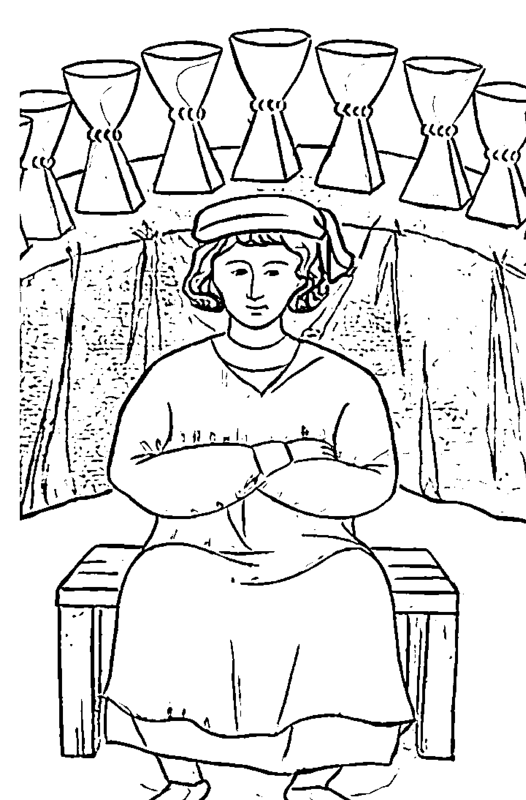

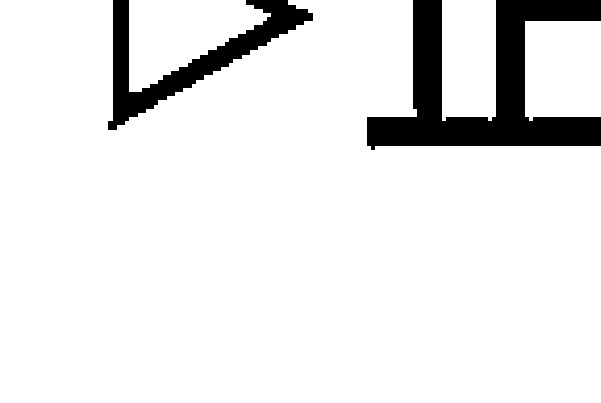

### ▶ 正逆位解析

愛情

小牌牌組

224

## 聖杯八

### ▶ 畫面解析

經過聖杯七的苦苦追尋，聖杯八呈現出身心富足的狀態。畫面中的男子雙手抱胸坐在板凳上，一副得意的樣子，身後的藍色圍幕上則展示了十個聖杯，像是在炫耀他的財富。聖杯八可以代表宴會也可以是獨樂樂的享受，同時聖杯八是水元素的漲潮狀態，洋溢著柔和與美麗。

### ▶ 正逆位解析

在一段感情的占卜中出現聖杯八，人際互動暢快、感情生活充實，令人有美夢成真的感覺，是一種滿足的情緒。聖杯八可以代表三五好友狂歡的聚會，也可以是兩人私密的享受。聖杯八也可以代表當事人對自己充滿自信，無時無刻都散發出魅力，隨時都準備好迎接一段豐富多彩的感情。

逆位的聖杯八，當事人缺乏離去的決心和勇氣，在一段感情當中雙方關係呈現膠著，關係分分合合，不知該如何取捨。逆位的聖杯八也可代表為了愛情而放棄追尋自己的夢想。

在事業的占卜上，聖杯八可以代表放棄已經建立的基礎，另謀出路和發展。當事人可能放棄家庭、放棄穩定的工作、放棄愛情，去追求理想和生命中所缺少的，對於任何事情總是擇善固執、追求完美，也不會眷戀往日的成就榮耀，只不過追索的道路並不好走。聖杯八的負面狀況是，當事人容易半途而廢，做任何事都太理想化，只要稍有不如意就想放棄。

逆位的聖杯八，代表當事人自我感覺良好，喜歡自我膨脹，甚至是擺闊、炫富。在職場上，可能會有大頭症，覺得自己能力最強，大家都應該聽自己的。物質上不像正位那麼富足，喜歡打腫臉充胖子。

在學業的占卜上出現聖杯八，當事人對於自己在學業上的表現自信满满，問什麼問題都會有好結果。聖杯八也可代表畢業、金榜題名之後的慶功。

逆位的聖杯八，當事人總覺得自己很厲害，不肯虛心向學。逆位的聖杯八當事人可能貪圖享樂，無心向學。

小牌牌組

226

## 聖杯九

### ▶ 畫面解析

聖杯九的主旨是描述和樂的家庭，畫面中的夫婦肩並著肩一同欣賞著天上的彩虹，彩虹上則掛著十只聖杯代表未來的願景，一旁年幼的子女則是手拉著手愉悅的跳著舞。原野上有一道細流，河川的後方則是溫暖的家。同時聖杯九是水元素最滿足的狀態，持續的向外蔓延，就像大海一般。

### ▶ 正逆位解析

聖杯九在物質或財富上不算豐收，但能令人滿足。在事件的進行上非常順利，而且能獲得讚揚肯定。聖杯九出現在環境上，代表一個和樂、彼此互動良好，感情有如一家人的職場環境。聖杯九也可代表在事業上得到家人的支持與鼓勵。

逆位的聖杯九，在工作上成效或是報酬可能都不如預期，在工作上總是累積了很多負面情緒，而且沒有提供慰藉的場所或對象。逆位的聖杯九所呈現出的情感是有互動的，且溫馨快樂。在感情的占卜中出現聖杯九，代表雙方的情感經過人生的高低起伏後昇華到下一個境界，感情有如家人，彼此能夠相互扶持。

出現聖杯九也可解讀為結婚，問生產也很有希望，可以期待未來共組一個和樂美滿的家庭，而且親子互動良好。

男女雙方的感情也不愛侷限於兒女私情，他們有共同的目標等著去完成，喜悅的氣氛同時影響到周遭的人。

單身者問愛情，出現聖杯九，暗示未來的對象可能出現在社團、朋友圈等和樂的大團體裡。

逆位的聖杯九，感情上出現低潮落差，幸福的程度和想像中的不同。像是原以為婚後會更幸福，誰知結婚之後生活壓力更大，感情也比先前冷淡。逆位的聖杯九出現在感情的占卜中，不只是感情受挫，連家庭也有可能破裂，甚至有情緒失控的危機。

## 聖杯十

### ▶ 畫面解析

聖杯十的主旨是描述和樂的家庭，畫面中的夫婦肩並著肩一同欣賞著天上的彩虹，彩虹上則掛著十只聖杯代表未來的願景，一旁年幼的子女則是手拉著手愉悅的跳著舞。原野上有一道細流，河川的後方則是溫暖的家。同時聖杯十是水元素最滿足的狀態，持續的向外蔓延，就像大海一般。

### ▶ 正逆位解析

聖杯十在物質或財富上不算豐收，但能令人滿足。在事件的進行上非常順利，而且能獲得讚揚肯定。聖杯十出現在環境上，代表一個和樂、彼此互動良好，感情有如一家人的職場環境。聖杯十也可代表在事業上得到家人的支持與鼓勵。

逆位的聖杯十，在工作上成效或是報酬可能都不如預期，在工作上總是累積了很多負面情緒，而且沒有提供慰藉的場所或對象。逆位的聖杯十所呈現出的情感是有互動的，且溫馨快樂。在感情的占卜中出現聖杯十，代表雙方的情感經過人生的高低起伏後昇華到下一個境界，感情有如家人，彼此能夠相互扶持。

出現聖杯十也可解讀為結婚，問生產也很有希望，可以期待未來共組一個和樂美滿的家庭，而且親子互動良好。

男女雙方的感情也不愛侷限於兒女私情，他們有共同的目標等著去完成，喜悅的氣氛同時影響到周遭的人。

單身者問愛情，出現聖杯十，暗示未來的對象可能出現在社團、朋友圈等和樂的大團體裡。

逆位的聖杯十，感情上出現低潮落差，幸福的程度和想像中的不同。像是原以為婚後會更幸福，誰知結婚之後生活壓力更大，感情也比先前冷淡。逆位的聖杯十出現在感情的占卜中，不只是感情受挫，連家庭也有可能破裂，甚至有情緒失控的危機。

## 金♦幣♦系♦列

### 金幣二

#### ▶ 畫面解析

畫面中的小丑戴著紅色高帽，兩枚金幣在他的巧手操弄下在空中劃出了無限大的符號，象徵著生生不息的能量。小丑拿著金幣的模樣也有點像是在兩枚金幣中做選擇。小丑身後高低起伏的波浪，有兩艘帆船在上頭載浮載沉，代表著人生的高潮迭起。金幣二的意涵是運轉協調，但與土元素安定的本質不相容。

#### ▶ 正逆位解析

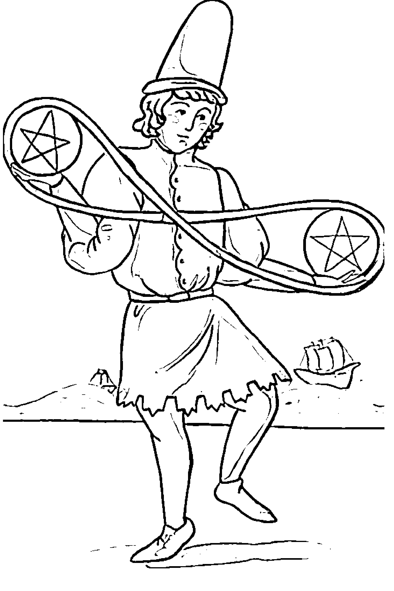

在感情的占卜中出現金幣二，這段感情就宛如電視劇般高潮迭起，需要費心處理溝通才能維持良好的交流互動，基本上都在掌握之中。出現金幣二，當事人有可能同時兼顧愛情與事業或愛情與家庭，人際關係複雜繁忙，甚至是周旋於多個對象之間，從牌面看來當事人還能掌握住局面，只不過在人際與感情上絕非長久之計，除了理性抉擇之外，在感情上需要更深入。

金幣二逆位，在感情上出現顧此失彼的局面，像是為了愛情賠了工作，也可能是全盤皆輸的狀況，當事人可能太貪心，想要周旋於多個對象，卻又遲遲下不了決定，最後什麼也沒得到。逆位的金幣二也可代表男女雙方相處不協調、溝通不順暢，感情膚淺、認識得不夠深，彼此交往像是敷衍了事。

在事業的占卜中出現金幣二，當事人可能有兩條出路可以做抉擇，或是身兼數職十分的忙碌，正面的情況是職場上的人際關係活絡，有助於事業和利益的往來，但是不夠深入。

逆位的金幣二，可解讀為資金週轉不靈、財務吃緊。職場上人際關係封閉、合作破局。逆位的金幣二也可代表工作忙碌繁雜，或是在工作之餘又肩負多項責任與任務，已經超出當事人可以處理的能力範圍。

在學業上出現金幣二，當事人可能處於忙碌的狀態，但明顯力不從心，必須要重新思考自己需要的是什麼，不能太貪心什麼都想學、什麼都想兼顧好。

### 金幣三

#### ▶ 畫面解析

畫面中出現三個人，其中一個人站在長凳上正要雕鑿教堂的牆壁，下方兩個人手拿著設計圖，正在討論和交換意見。教堂的樑柱上刻畫了三枚金幣，代表這項工作已經有了初步的成果。金幣三所代表的是專業技能以及團隊合作，是土元素最精緻、最有質感的狀態。

#### ▶ 正逆位解析

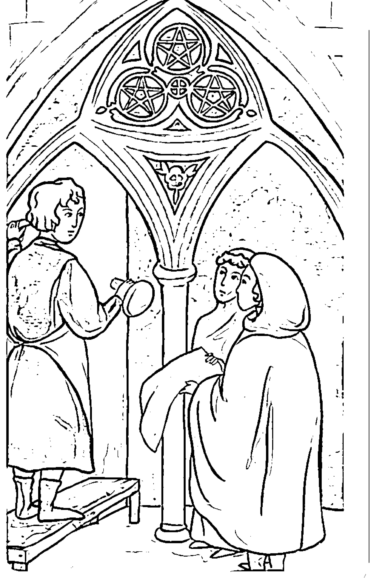

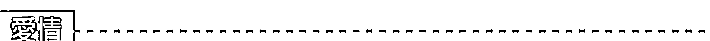

金幣三很少出現在感情的占卜中，如果出現可以解讀為辦公室戀情，或是某個合作團隊中團員日久生情。

金幣三也可解讀為當事人透過某些專業技能所散發出的魅力來吸引異性的目光。負面的情況是當事人太專注於工作或是團體，反而忽略自己的感情。

逆位的金幣三代表合作破局，在男女雙方的相處除了感情上的交流之外，很多事情必須溝通協調的，可能是婚禮、購屋、可能是兒女的養育計畫或是生活上的觀念以及習慣，以上的生活大小事若不能取得共識，不管兩個人的關係有多親密，都很難有長久穩定的關係。逆位的金幣三也可代表因爲兒女私情而破壞了團隊合作。

在事業的占卜中出現金幣三，可以解讀為工作團體中的摩擦意見不同，導致工作進度延宕，或是當事人的能力無法適切的發揮在自己工作。逆位的金幣三也可代表當事人欠缺職場上的專業技能，找不到適合發揮的舞台。最後金幣三逆位也有可能是工作之後得不到應有報償。

在學業上出現金幣三，當事人可能太貪心什麼都想學，好處是對於學習有執著和堅持，學習也能穩紮穩打。負面的狀況是當事人太在意成績，對分數斤斤計較，或是不喜歡分享自己的知識，深怕別人超越他。

逆位的金幣三，當事人無法兼顧所有的學門，建議當事人衡量自己的能力再做選擇而不是囫圇吞棗。逆位的金幣三也可代表當事人學習的方法太過死板，不能活用所學。

### 金幣四

#### ▶ 畫面解析

畫面中出現一位頭戴王冠的國王，身後的堡壘和莊園都是他所擁有，除此之外它還擁有四枚金幣，雙手緊緊抱住一枚，雙腳各踩住一枚，甚至連頭頂上都放了一枚金幣，姿勢緊繃怪異。此人除了貪得無厭、小氣固執之外，對於財富也缺乏安全感。同時金幣四也是土元素最穩固的狀態。

#### ▶ 正逆位解析

在人際關係上，金幣四突顯人情冷暖以及患難見真情的精神。在感情上出現金幣四，可能是一貧如洗的貧賤夫妻，也可以指雙方在各種層面上碰到難關、低潮，偶爾會羨慕其他情侶的處境，但是他們對於彼此仍然不離不棄，堅持相互扶持度過難關。

單身者抽中金幣四，可代表情傷、低潮，好在有親友的鼓勵與陪伴。

逆位的金幣四，在人際的相處上比正位更錙銖必較，性格不討喜、缺乏好人緣。在感情上逆位的金幣四也可解讀為抓得越緊反而越容易失去，擔心得越多反而會顧此失彼，對於愛情的條件太過嚴苛、執著，反而會錯過更多。

出現金幣四，當事人可能家業頗豐，但是對於財富的運作謹慎小心，對於投資理財或資金週轉不見得有利，但是物質財富能夠固守。在職場上金幣四代表做事按部就班，但是缺乏創新與變化。金幣四也可代表當事人對財富缺乏安全感，賺再多錢都覺得不夠，也可能是富有之後反而每天過得提心吊膽，變成守財奴。金幣四也可解讀為小氣的老闆。

逆位的金幣四，財物上可能會有所損失，沒辦法守住，在投資上資金流動不易。對於事業或財物太過貪心，什麼都想要，反而顧此失彼。逆位的金幣四也可代表當事人在工作上太過固執、僵化，不願意嘗試也聽不進勸告。

在學業上出現金幣四，當事人可能太貪心什麼都想學，好處是對於學習有執著和堅持，學習也能穩紮穩打。負面的狀況是當事人太在意成績，對分數斤斤計較，或是不喜歡分享自己的知識，深怕別人超越他。

逆位的金幣四，當事人無法兼顧所有的學門，建議當事人衡量自己的能力再做選擇而不是囫圇吞棗。逆位的金幣四也可代表當事人學習的方法太過死板，不能活用所學。

### 金幣五

#### ▶ 畫面解析

大雪紛飛的夜晚，兩名衣衫襤褸的乞丐在雪地裡艱困的行走，其中一個人甚至瘸了一條腿，拄著兩支拐杖一跛一跛的前進。路途上他們經過了一間教堂，教堂有著絢麗的彩色玻璃，上頭刻著五枚金幣，和兩名乞丐呈現強烈對比。到底是教堂不願伸出援手？還是乞丐寧可相互扶持也不肯接受他人的幫助？金幣五有崩解混亂的意涵，是土元素最不和諧的狀態。

#### ▶ 正逆位解析

在人際關係上，金幣五突顯人情冷暖以及患難見真情的精神。在感情上出現金幣五，可能是一貧如洗的貧賤夫妻，也可以指雙方在各種層面上碰到難關、低潮，偶爾會羨慕其他情侶的處境，但是他們對於彼此仍然不離不棄，堅持相互扶持度過難關。

單身者抽中金幣五，可代表情傷、低潮，好在有親友的鼓勵與陪伴。

逆位的金幣五，在感情上代表熬過最大的考驗，只不過情況仍然不算好。好處是歷經考驗和挫折的夫妻、情侶，未來繼續走下去的勇氣和決心也比其他人強。逆位的金幣五也可代表當事人剛走出感情的低潮。

在事業的占卜上出現金幣五，事件進行不順利，深刻的感受到人情冷暖，甚至明顯感受到薪水或工作內容的差別待遇，有時會感到心裡不平衡，好處是會碰到患難與共的夥伴。

在財物上會有所損失，有散財的情況，很窮困，有可能是當事人很有骨氣謝絕他人的幫助。在投資理財或自行創業上，景氣黑暗不明，只能苦撐。找工作也不好找，可能會到處碰壁，被企業拒於門外。

小牌牌組

240

## 深入塔羅牌的神祕能量  
—— 影響一生的塔羅牌學習書  

逆位的金幣五，景氣的寒冬剛過，但是各方面都還沒有復甦，工作還是很難找、創業投資還是不易，也有可能是接受他人的資助而度過難關。但是經過苦難後反而更珍惜現在的時光和朋友。

## 學業  

金幣五可代表學習上混亂的狀態，可能沒有好的老師或好的學習環境，只能靠自己摸索，也有可能是因爲經濟因素影響學習。問報告或考試都是很大的考驗，可能弄得疲於奔命、心力交瘁，好在有人可以一起研究討論、相互打氣。

逆位的金幣五，當事人在學習上的難關和瓶頸剛突破，雖然眼前還有許多考驗，當事人仍然疲倦，但是比正位多了一份勇氣和信心。

## 金幣六  

### ▶ 畫面解析  

一位身穿紅袍的財主下方跪著兩名乞丐，乞丐掌心朝上而財主也毫不吝嗇的施捨錢幣，在施捨的同時，財主的左手拿著一個天平，代表他不是盲目的給予，每個人該得多少都經過公平的分配。金幣六是土元素均衡和諧的狀態，發展穩固成熟。

### ▶ 正逆位解析  

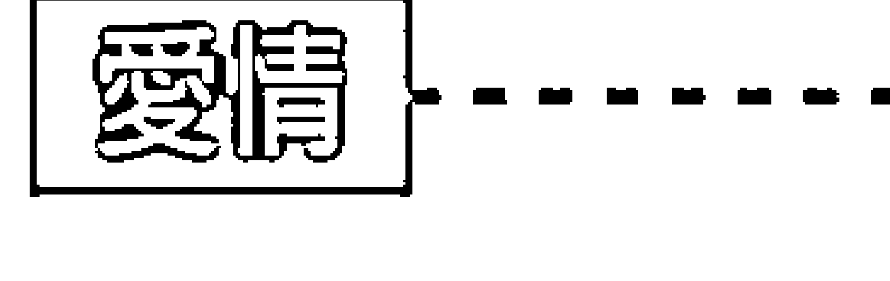  

### 愛情  

小牌牌組  

## 事業  

金幣六在人際關係上慷慨大方，人緣佳。在感情上他懂得主動付出和回應對方的善意，但是他絕不會浪費時間、精力和金錢在不對的人身上。在一段感情占卜中，男女的互動以及付出是互相的，一來一往，沒有主動被動或是付出多寡的問題，而且他們懂得分配時間精力，不會盲目的將所有注意力放在感情上，像是友情、家庭甚至是事業都有餘力去兼顧。

逆位的金幣六，當事人在愛情中總是擺出低姿態，搖尾乞憐的姿態反而得不到任何關愛。逆位的金幣六，當事人總是將時間、精力甚至是金錢投注在錯的人身上，對於真正關心自己、愛自己的人不聞不問，反而是喜歡迎合對自己毫不在意的人。

金幣六是代表獲利的牌，財務進行順利，生意興隆，如果是身為他人的員工，公司在薪水福利制度上公平公正且透明公開，也可以期待額外的分紅。在投資理財上也可代表不把雞蛋放在同一個籃子裡。金幣六也可代表合理的規劃、分配時間，事件的進行上很有效率。同時金幣六也可解讀為企業家或是慈善家。

當逆位的金幣六出現時，當事人很有可能成為下方乞討的乞丐，對於權貴卑躬屈膝，沒有能力只期待有人可以施捨工作或金錢。出現逆位的金幣六，在財務的進行上不順利，可能是將資金投注在風險高的地方，也可能是無法和對手競爭，或是努力工作之後得不到合理報酬。在事件的進行上，無法妥善運用時間、金錢和手邊的資源，多半都以失敗收場。逆位的金幣六也可以代表當事人花太多精力在沒有發展的工作上。

## 學業  

金幣六出現在學業的占卜中，代表當事人在學習上能夠合理的規劃自己的時間，不論是問考試或是報告都能夠得到合理的成績。在學業上當事人也很樂意幫助其他同學。

## 金幣七  

##### 畫面解析  

畫面的主角是一位農夫，他正低著頭看著結實累累的藤蔓，過去投注的心血已有了初步的成果，不過還不到收成的階段，還需要耐心等待。金幣七有投注期盼的意涵，是土元素空泛以及虛浮的狀態。

##### 正逆位解析  

### 愛情  

金幣七屬於一個等待的狀態，在愛情中投注心力、期待有好的結果，對方通常沒有拒絕，也沒有明講，可以期待有好的結果，但是大部分都被當好人。

出現金幣七，當事人太沉浸於自身的事物，缺乏互動以及他人的關注，有自閉的傾向。金幣七也可以解讀為愛情長跑，男女雙方已經開始計畫日後成家立業的細節，並且投注心力和期盼，但還需要耐心的等待才會有結果。

逆位的金幣七，當事人在愛情上可能操之過急，人說強摘的果實不會甜，可能是男女雙方交往時機未成熟就告白，或是年紀太小還不懂戀愛。

逆位的金幣七也可代表當事人對心儀對象投注心力，但最終期盼落空，或是一段苦心經營的情感最終仍是一場空。

## 事業  

金幣七對於財務的進展有正面幫助，前提是必須要先投入資金，而且短期內不會獲利，像是投資型保單，是未來的保障。

在求職的問題中出現金幣七，代表當事人一面充實自己，一面等待好的機會一舉突破現狀。

在事件的進行上，金幣七告訴我們要保持耐心來等待收穫。金幣七也可代表即將退休的人，可以開始檢視過去的成果，並且計畫退休生活以及如何運用退休金。

逆位的金幣七，所有的投資可能都血本無歸、獲利延期或是缺乏工作技能，遲遲無法上手，也有可能是過勞。財務上薪水可能有問題。在事務的進行上出現金幣七會有做白工的感覺。

## 學業  

金幣七代表只要肯耕耘就會有收穫，在學習上代表當事人的努力已經有一定的成果，像是畢業論文已經完成、考試已經結束，就等老師的評比和成績出爐。金幣七也可以代表畢業，正準備出社會驗收學習成果、計畫未來的方向，或是繼續深造。

逆位的金幣七在學業上就沒有好整以暇的感覺，可能是被課業逼得太緊，想叛逆想要離開透口氣。

## 金幣八  

### ▶ 畫面解析  

一名工匠跨坐在長凳上，專心的埋首雕刻著手中的五角星金幣，一旁擺著七枚金幣都是一樣的造型，因爲他是工匠而非藝術家，他不需要創新，他只需要按照步驟完成他的工作就好。金幣八代表審慎勤奮，是土元素集中的狀態，是最具體的形式，對未來有保障。

### ▶ 正逆位解析  

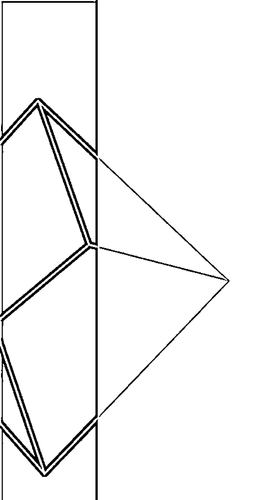  

小牌牌組  

## 事業  

金幣八代表勤奮的工作，在職場上工作能力雖然不算傑出，但是勤勞踏實，雖然不會創新，但凡事按部就班，有逐漸上手的感覺而且能夠樂在其中，身旁的金幣除了代表工作成果，也象徵透過工作累積的經驗。在財富上，金幣八代表緩慢累積進展。問工作，應該很快就能找到，可能是需要付出勞力的工作，或是每天重複相同動作的工作，像是工廠的生產線。投資理財可能不太適合，只會緩慢增長而沒有翻好幾倍的感覺。

逆位的金幣八，當事人可能對現在的工作感到厭倦，有職業倦怠的傾向，認為工作無法帶給他成就感以及更多的財富，或是缺乏工作技能，遲遲無法上手，也有可能是過勞。財務上薪水可能有問題。在事務的進行上出現金幣八會有做白工的感覺。

## 金幣九  

### ▶ 畫面解析  

一名女子獨自在富饒的花園內，她身後的藤蔓結滿葡萄而且擺滿了金幣，有一隻鳥停在女子的左手，但是小鳥的頭被紅布矇住，讓牠失去自由飛翔的能力。地上緩慢前進的蝸牛則是象徵時光的推移。金幣九也可視爲小的皇后牌，一樣可以享受豐收的物質生活，生活愜意且井然有序，但在感情上比較孤單，另外金幣九也是土元素最紮實的狀態，能夠擁有和運作。

### ▶ 正逆位解析  

## 愛情  

金幣九在人際關係上尚可，偶爾有三五好友可以陪伴，但不見得有知心好友。在感情當中，有機會嫁入豪門，可以享受悠閒安逸的生活，但是缺乏陪伴常常感到空虛寂寞，就像牌中的女人獨守豪華莊園，只有小鳥可以做伴，也可以解讀為得到愛情以及富貴的生活，卻失去了自由。

金幣九也可以指寡婦或是單身的富有女子，什麼都不缺就只缺愛情。

逆位的金幣九出現在感情的占卜中，當事人很可能被另一半冷落，或是在感情上被動，喜歡宅在家裡不想出門，過了適婚年齡仍未出嫁的剩女。逆位的金幣九也可視爲一心想嫁入豪門的拜金女。

## 事業  

金幣九代表當事人在財物方面不虞匱乏，能夠充分享受財富帶來的樂趣，也有閒暇時間做自己想做的事，甚至不用外出工作，也有點像是掌控家庭經濟大權的家庭主婦或養尊處優的少奶奶。在事件的進行上能達到目標，當事人多半採取柔性訴求。

問工作，可代表高薪卻輕鬆的工作，問投資理財也能夠獲利。出現金幣九當事人雖然有錢、有閒，但是人際關係疏離，甚至不見得有知心好友。

## 學業  

牌中的主角一副悠閒自在的樣子，在學業上有兩種狀況，一種是當事人在學業上已經有萬全準備，能夠好整以暇，另一種狀態，當事人對於學業毫不在乎，只想過著優閒自在的生活。

逆位的金幣九在學業上就沒有好整以暇的感覺，可能是被課業逼得太緊，想叛逆想要離開透口氣。

## 金幣十  

### ▷ 畫面解析  

一名白髮蒼蒼的老人舒服的坐在座位上，身旁有兩隻狗圍繞著，巨大的拱門上有著城堡圖騰的徽章，顯示出這是一個有聲望的大家庭，拱門外是繁榮的城鎮，有一對年輕男女在門外談笑風生，另外有個小男孩站在旁邊。

和聖杯十一一樣，金幣十也是在描述一個家庭，不同的是聖杯十是著重情感的溫馨小家庭，而金幣十的家庭成員缺少情感上的互動，不過家世顯赫富裕。同時金幣十是土元素最飽和的狀態，會繼續繁衍增值。

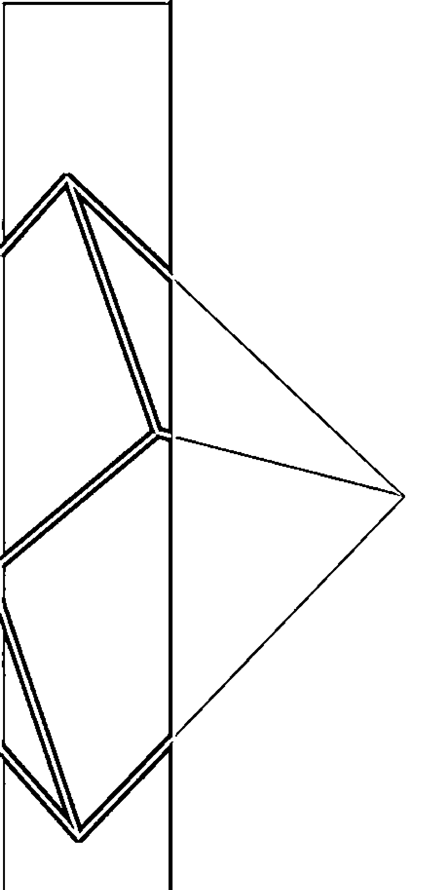  

### ▶ 正逆位解析  

## 愛情  

金幣十在人際關係上緊密而不熱絡，在感情上代表某方能提供穩固安全的生活，但是缺乏感情交流，也不浪漫，可能是政治聯姻，沒有愛情上的考量，只有利益考量。

逆位的金幣十，在感情中可解讀為分手、離婚。一段穩固的愛情崩解，有可能是雙方的情感抽掉利益之後就什麼也不剩了。金幣十本來就代表豪門或大家族，逆位的狀況，家族成員可能會明爭暗鬥，所以嫁入豪門也不是幸福的保證。

## 事業  

金幣十在事業上有正面的作用，可以解讀成龐大的家族企業，事業的成功不只侷限於本人，更能庇蔭子孫。在財務上，可能會繼承龐大的家產，或是接手家族事業。在投資理財上，不論是合夥或是談判都能從中獲利。事務的進展順利，想創業的話也不錯，生意興旺而且能夠永續經營。金幣十出現在環境中，代表一個緊密結合的工作團隊，但是情感交流不深入。

逆位的金幣十，家族企業或大財團將會分崩離析，可能會有違反傳統風俗，敗壞門風的情況發生。合夥投資可能必須要暫緩，創業可能面臨經營不善的窘境。財產繼承不順利，可能會有分配上的問題，導致兄弟鬩牆。逆位的金幣十也可代表一個工作團隊上意見的紛歧，和實際利益的分配有關。

## 學業  

金幣十可代表當事人處在學習資源豐富的環境，可以解讀為歷史悠久的傳統名校。問考試或報告都能順利，學習上也有許多伙伴。

逆位的金幣十，團體的報告或學習出現問題，大家意見不同。逆位的金幣十也可解讀為敗壞校譽的行徑。

# 占卜陣法說明  

塔羅牌占卜解牌時，最重要的是一個平靜的心。

無論是占卜解牌者或是詢問者，都要專注精神在塔羅牌上，若是無法靜下心或是帶著雜亂的想法，對於各方面來說都是不好的；無論牌面的意思好或是壞，也都只能當作是參考，絕對不要受制於塔羅牌上的牌義而不努力乃至於自暴自棄，那麼就失去了解牌的意義了。

陣法或是牌義只能當作當下的參考，真正掌握命運的還是在自己手中；有了好的牌義固然可喜，但是要更加的努力達成目標；出現不好的牌義也不要灰心，只要審視自己的內心和冷靜的對應接下來的挑戰，未來仍然會出現無限的可能性。

雖然有時候人們會覺得『一切都是命運使然』，但是筆者遇過一位研究非常透澈的命理老師和筆者說過：『影響命運的有三種東西：『健康』、『信仰』和『愛』。』

宗教解析也好、命理風水解析也好，塔羅牌反映出來的未來，只是建言、只是預告，沒有一定、更沒有絕對。

切記，命運還是掌握在自己手中。

  

## 占卜的關連性  

占卜時要注意的是，牌與牌之間的互相關連性之外，還有各種牌屬性的影響，特別是大阿爾克納牌在各種牌陣中出現時，所代表的通常是全面性的影響，利用出現的大阿爾克納牌為中心來解牌，通常會受到更詳細的啟示。

逆位牌的出現在各個學派中有不同的解釋，筆者這邊也是比較傾向『能量解釋』：一張牌逆位的呈現是由於能量不足所導致，例如：『魔術師』這張牌有著四大元素的呈現，同時也有暗示著學習的意味，通常是給予占卜者正面的評價；假如逆位呈現時，同樣暗示著占卜者在學習上稍微的欠缺，或許是環境影響、也或者是學習態度所影響，在逆位呈現上就顯得有些差強人意；也因為能量不足被隱蔽的結果，逆位呈現的情況就出現了。

筆者這邊建議：在逆位牌出現時，好好觀察、體會能量不足的原因和現實狀況，才能充分的解釋每次解牌的涵義。

除了各種牌之中的聯結和正逆位的觀察，更重要的是能夠依照解牌占卜師的感性、對於占卜者間的對談內容、內心想法去作充分的理解和傾聽，才能夠完成每一次的解牌任務。

## 深入塔羅牌的神祕能量  
—— 影響一生的塔羅牌學習書  

### 陣法解說  

#### 一、縱列聖三角：三張牌  

###### 1. 牌陣說明  

縱列聖三角是占卜師最基本的陣法，可以說是基本中的基本。根據各個學派有著各種不同的說法和名稱，這邊依照最基礎也最常用由左至右三張牌的縱列聖三角來解釋。

###### 2. 牌陣效用  

縱列聖三角的實用性非常的高，幾乎所有問題都可以從這最基本的牌組從中獲得啟發；由左至右放上三張牌的牌組，可以充分的知道各種狀況。

###### 3. 牌陣用法  

縱列聖三角有兩種基本的解釋。

（1）時間之流  

從左至右分別為『過去』『現在』『未來』。

因為時間流動的關係，因為過去的『行動』出現了現在的『現況』，未來則有可能出現的『結果』。

時間之流牌陣可以用在各種問題占卜上，也可以從中瞭解到因果之間的關係。

（2）現況占卜  

從左至右分別為『現況』『行動』『結果』。

從現況開始分析，之後的行動後所預期的結果；和時間之流不同的方式來解釋，針對現況感到困惑的占卜者所使用會有更好的預期效果。

###### 4. 注意事項  

聖三角有各種各樣的陣法和變化，筆者認為從一開始的縱列聖三角開始學起會比較容易入門，對於占卜初學者來說也是容易解釋的牌陣。

這邊要特別提醒的是：根據筆者解牌多年的狀況來看，許多占卜者容易陷入看到未來牌出現不好的牌義時會感到不安，在這邊提醒各位占卜師，能夠開導或是讓占卜者感到安心是很重要的。

###### 5. 牌陣圖  

1. 過去  
2. 現在  
3. 未來  

《縱列聖三角》時間之流  

1. 現況  
2. 行動  
3. 結果  

《縱列聖三角》現況占卜  

#### 二、瓊哈里窗：四張牌  

###### 1. 牌陣說明  

筆者結合了心理學中的『Johari window』所研究出的牌陣，適合用於心理測驗與心理分析上。

Johari window為美國心理學家Joseph Luft和Harry Ingham兩位於1955年發表的潛意識和公眾間的交流所提出的心理學理論；『Johari window』由四個區塊所組成，分別為左上『開放之窗』、右上『盲點之窗』、左下『隱蔽之窗』、右下『未知之窗』。

中文翻譯有『周哈里窗』或是『瓊哈里窗』等音譯，在健康心理學和交流分析領域中時常會用來舉例和解說。

※ Johari window說明  
開放之窗：open self，開放給公眾並且不隱藏的部分。  
盲點之窗：blind self，自己並不知道而其他人知道的盲點部分。  
隱蔽之窗：hidden self，只有自己知道並且不開放的祕密部分。  
未知之窗：unknown self，自己不知道而公眾也不知道的未知部分。

###### 2. 牌陣效用  

對於占卜者的心理測驗和分析上有很大的幫助，對於茫然無助或是對於自己內心想法有所疑問時推薦使用。

###### 3. 牌陣用法  

由一左上、二右上、三左下、四右下排成『田』字型，並依照順序進行解牌：『開放之窗』、『盲點之窗』、『隱蔽之窗』、『未知之窗』的順序進行占卜者的心理分析。

###### 4. 注意事項  

筆者在進行這項Johari window解牌時，曾經多次因為沒有顧及到對方的心情，而導致占卜者當場哭出來的情況，這讓筆者的指導老師多次嚴厲的指正我的解牌過於直接而被迫停止這個陣法的使用。

這邊會提出這個陣法，是希望各個占卜者可以用在更好的方面，若是可以用在開導對方和讓對方進而獲得心靈上的啟示，那也算是好事一件。

需要注意的地方是，根據筆者以往在進行『未知』這一張牌的解釋案例上，許多占卜者都會出現非常迷惑的表情，之所以如此也是因為這張牌背後的涵義或許並不是當下占卜者可以理解的，強行解釋也有可能出現反效果，因此各位占卜師可以選擇是否要婉轉的解釋這張牌，依照情況不進行解釋也是可行的。

###### 5. 牌陣圖  

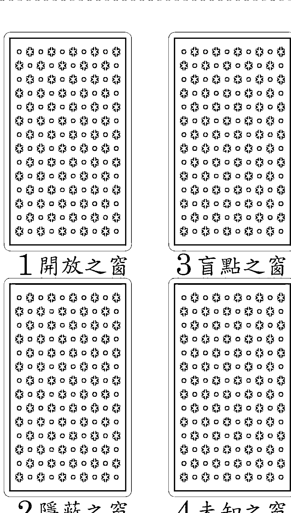  

《瓊哈里窗》  

#### 三、十字聖三角：六張牌  

###### 1. 牌陣說明  

由縱列聖三角的基礎發展出的強化版本組合牌陣，結合時間之流和現況占卜的方式進行更詳細的占卜解牌，從這個牌陣開始可以瞭解到時間和因果循環之間的關連性，更可以經由牌陣達到更加詳細的解牌以及啟示。

###### 2. 牌陣效用  

針對某一事件或是某一個狀況想要更加的深入瞭解時，可以使用十字聖三角來獲得更多的訊息。適合給想要知道現況而又陷入膠著的占卜者對象來進行占卜。

###### 3. 牌陣用法  

與縱列聖三角相同，由左至右放置三張牌後，再從由左至右的牌放上橫列的三張牌，讓縱列聖三角出現三個十字的形狀。

根據六張牌的涵義如下。

（1）遙遠的過去，無法改變的事實，同時也能略知現況的原因。  

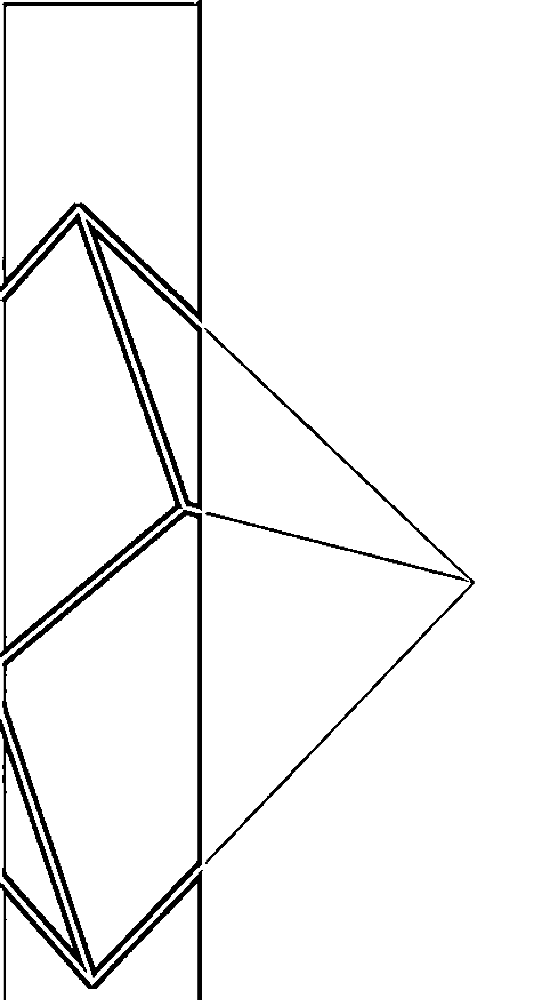  

附錄

## 4. 注意事項

整體宏觀的觀看整體牌組將會獲得更多的訊息，同時因為時間性和現況的交叉比對分析，會更加的體會到塔羅牌的精準度；六張牌都有著關連性和清楚的表達牌陣位置，很適合初學者塔羅牌占卜師在解牌時更能準確地抓到問題的中心點。

工作、計畫或者是需要更加詳細的解牌情況下，很適合推薦這個牌組進行解牌。

## 5. 牌陣圖

## 四、初階戀情牌陣：四張牌

## 1. 牌陣說明

愛情的占卜一直是人們最喜愛的話題之一，透過塔羅牌的精準以及神祕感，有的學派甚至單獨研究愛情塔羅牌自成一格，發展出多樣化又極具魅力的愛情占卜牌陣；這邊筆者提供最為基本的愛情占卜牌陣，對於初學者塔羅牌占卜師而言，這也是基本的人際關係牌陣。

## 2. 牌陣效用

愛情、人際關係一直都是塔羅牌占卜者名列前茅的熱門問題之一，無關年齡和性別，戀情的發展總是來的令人陶醉卻又迷人、無法自拔的；所以將基本的戀愛牌陣學起來後，未來學習更高階或是在面對有戀情煩惱的占卜者時，也可以從容以對。

## 3. 牌陣用法

這邊開始活用縱列聖三角的牌陣，有左邊放置一張牌、右邊放置第二張牌後，兩張牌的中間稍微上方放置第三張牌，第三張牌上方放置第四張牌。

## 4. 注意事項

這牌陣乍看之下九張非常的複雜，但是只要掌握到牌與牌之間的關係就可以從中清楚理解到占卜者和占卜者的對象之間到底是存在於什麼樣的感情關係？是單純的理性喜歡？又或者只是喜歡對方的外表又或者只是喜歡對方的優勢？這些都可以從牌陣中獲得不少的訊息。

在中間交流的牌義解釋上要特別的注意，感情的解讀上通常不太推薦以常理和看到的部分去進行推斷，很容易會讓占卜者受到強烈的影響，發生了反效果反而得不償失；出現牌義好的牌時可以適當的多誇獎對方，牌義不好的牌出現時可以多加詢問是否最近有什麼樣意見分歧的部分？特別位於『心靈』橫列中間的三張牌，要多加留意是否有更多的啟示在內。

## 5. 牌陣圖

詳右頁。

## 五、高階戀情牌陣：九張牌

## 1. 牌陣說明

在愛情上擁有許許多多的客觀條件以及現實環境的影響，並非只是兩人互相喜歡這麼簡單而已；高階戀情牌陣利用塔羅牌解牌判斷兩人之間的『身』『心』『靈』狀態之外，兩人之間的契合程度也可以透過利用高階戀情牌陣來進行解讀，在身心靈之上兩人是否互補或是欠缺，也可以探討彼此間的相處模式是否可以一直的進行下去。

## 2. 牌陣效用

与其说是一般的塔羅牌戀愛占卜，称为彼此間的身心靈是否契合更加來的洽當。

有著明確對象並且確實已經在交往的占卜對象而言，在觀看這副解讀牌義時更可以深入的去好好思考和交往對象的關係和相處，是否可以用各種方法來補強或是更正？

利用這牌陣深刻的自我檢討和反省，同時讓彼此關係更加融洽才是最好的本意。

## 3. 牌陣用法

左邊由上往下個別為占卜者的『理性』『心靈』『環境』，右邊為占卜者對象的『理性』『心靈』『環境』，正中間則是占卜者和占卜者對象間的交流關係，合計共為九張。

以下為『理性』『心靈』『環境』的牌義解釋：

- 上方『理性』的牌義：彼此間的關係或是印象等意識到的部分，能夠理解的部分。
- 中間『心靈』的牌義：靈魂的本質，更確切的說是否喜歡的緣故也在這部分居多，是整組牌陣的核心。
- 下方『環境』的牌義：從自身的肉體到周圍的生活環境影響，偏向五感的層面。

## 4. 注意事項

這牌陣看起來九張非常的複雜，但是只要掌握到牌與牌之間的關係就可以從中清楚理解到占卜者和占卜者的對象之間到底是存在於什麼樣的感情關係？是單純的理性喜歡？又或者只是喜歡對方的外表又或者只是喜歡對方的優勢？這些都可以從牌陣中獲得不少的訊息。

在中間交流的牌義解釋上要特別的注意，感情的解讀上通常不太推薦以常理和看到的部分去進行推斷，很容易會讓占卜者受到強烈的影響，發生了反效果反而得不償失；出現牌義好的牌時可以適當的多誇獎對方，牌義不好的牌出現時可以多加詢問是否最近有什麼樣意見分歧的部分？特別位於『心靈』橫列中間的三張牌，要多加留意是否有更多的啟示在內。

## 5. 牌陣圖

詳右頁。

## 六、大衛之星牌陣：六張牌

## 1. 牌陣說明

大衛之星最早源自於三世紀，是古時候護身符上的圖案；在許多教堂的裝飾以及儀式上都可以見到；現在以色列的代表符號也是以大衛之星六芒星當作其代表。

大衛之星同時也代表著索羅門王的智慧象徵，透過這個大衛之星牌陣，可以更加深入問題的核心點，並有著智慧去解答出問題的癥結點。

## 2. 牌陣效用

無法釐清複雜又具有時間性的問題時，推薦使用這個大衛之星牌陣。

透過大衛之星牌陣可以瞭解到時間的前因後果，並在解牌上有著更容易解決問題和瞭解問題核心點的牌義。

## 3. 牌陣用法

由最下方的第一張牌『過去』、第二張牌左上『現在』、第三張牌右上『未來』；第四張牌正上方『原因』、第五張牌右下『環境』、第六張牌左下『對策』。

前三張牌等同於縱列聖三角時間之流牌陣；後三張牌則像是對應前三張牌，第四張牌可以看出事情的原因，第五張牌出現的則是代表著所有問題的環境，有可能是阻力也可能是助力，第六張牌則會顯示出對策或是結果的啟示。

## 4. 注意事項

劃分成兩組來進行解牌就會簡單許多，並利用交叉比對來看出占卜者對於問題現況的前因後果，並指出問題核心點以及未來出現的可能性。

利用智慧去解決問題，會比毫無目標的橫衝直撞來的有方法。

## 5. 牌陣圖

請詳下一頁。

## 七、下弦月牌陣：六張牌

## 1. 牌陣說明

因為牌陣的牌法像是下弦月的形狀，因此以下弦月牌陣來稱呼，英文是稱呼爲『The Crescent Moon Spread』。

此牌陣為縱列聖三角的強化進階版，以下弦月的象徵來進行解牌。

## 2. 牌陣效用

針對某個問題或是未來感到迷惘時，可以使用這個下弦月牌陣；可以看出遙遠的過去和最近的狀況外，也可以看到更加遙遠的未來。占卜者本身若是很相信占卜的神祕力量時，借助月亮的形狀更有可能獲得比起其他牌陣更多的啟示和訊息也說不定。

## 3. 牌陣用法

由左下開始排出下弦月的形狀，往右上牌完六張下弦月牌陣。

下弦月六張牌陣的牌義如下：

- 遠古的過去
- 近年的事項
- 這一星期至昨日的過去
- 今日的狀況
- 明日至一星期後的未來
- 最近的未來與結果

這副牌組的時間可以由占卜師或是和占卜者商量，將時間點或是詢問事項進行調整。例如以下範例：

- 一年前的過去（無法改變的過去）
- 半年來的過去（或許還可進行補救或是更改的狀況）
- 上個月的近況（可以進行補救或是可以進行的狀況）
- 這個月的近況（現在進行的狀況）
- 下個月的未來（有可能出現的近未來）
- 最終結果、年末

## 4. 注意事項

月亮屬陰，有些占卜者會擔心是否不適合在夜間占卜、反之也有些占卜者問我是否夜間占卜更恰當？

這副牌陣並沒有特別限制晚上占卜好與壞，下弦月牌陣只是一種印象象徵，並不會因為月亮出不出現而有顯著的改變；若是硬要說，下弦月只是代表時間的過去象徵以及神祕學對於星象的崇拜心情，下弦月牌陣因此誕生。

## 5. 牌陣圖

詳右頁。

## 八、多擇一牌陣：四張牌以上

## 1. 牌陣說明

當占卜者有多個選擇方式想要知道各個選擇的利弊時，可以選擇多擇一的牌陣來進行解牌。

## 2. 牌陣效用

依照縱列聖三角的方式來進行解牌，只要原理不變，牌陣就算加到了四張以上也不用擔心；這邊依照最基礎的牌陣來說明。

## 3. 牌陣用法

先在中間放上第一張牌，代表現階段的狀態；接著分成左右兩邊慢慢延伸，代表著不同的選擇有著不同的結果，各別以時間之流的牌陣來說明會最為恰當。

## 4. 注意事項

多擇一牌陣也有不使用第一張牌，而直接以兩組時間之流牌陣代表不同選擇的結果，這邊筆者只解釋有代表現況的牌陣作說明，是否未來占卜師想要三個選擇三個牌陣，甚至多個選擇多個牌陣，都以占卜師自行依照狀況作決定。

只是選擇性越多，牌組越多的情況下，容易造成解牌的負擔，也容易讓占卜者感到困惑，這一點必須要注意。

## 5. 牌陣圖

詳右頁。

## 九、塞爾特十字：十張牌

## 1. 牌陣說明

賽爾特十字又名凱爾特十字，是基督教重要的十字架象徵；相傳五世紀時，由主保聖人聖派屈克向愛爾蘭人傳教時所採用而發揚光大的。

在1850年代歐洲對於凱爾特十字又開始重視，將設計的凱爾特十字用在墓碑或是流行飾品上，而開始了凱爾特十字的風潮；在德國又因為被禁止的新納粹黨所採用，再加上宗教和政治上的敏感性，也曾經被批評爲惡魔死亡的象徵。

無論原始的凱爾特十字如何被議論，在塔羅牌的陣法中，賽爾特十字是廣泛被使用並且和任何宗教以及政治無關，就是個歷史悠久又好用的牌陣。

## 2. 牌陣效用

賽爾特十字牌陣主要用於無法多重選擇的情形下，以單一核心點來進行解牌的牌陣；無論是戀愛或是工作上的問題，都可以仔細觀察其結果牌和其他牌之間的相互關連性來進行占卜。

以下為十張圖的陣法解說：

## 3. 牌陣用法

十張牌的陣法會覺得暈頭轉向嗎？首先將牌陣分成兩邊看：左邊的十字架為前半部，右邊的四張牌則最後在打開解牌會比較恰當。

先在桌上中央放上第一張牌，第二張牌疊放在第一張牌上方後橫放；以第一張牌為基準：直列上方放上第三張牌，最下方放第四張牌，中央右邊放第五張，中央左邊放第六張牌，這裡為十字架的牌陣就出現了。

接著在十字架右方從底到上放上第七、八、九、十的牌。

## 4. 注意事項

賽爾特十字有分成一開始就將十張牌翻開一次綜觀解牌，以及先解左邊十字的部分後再解右邊七八九十的部分。

雖然兩者方法都可行，但是筆者會建議先將十字的部分先看清楚解釋完後，再進行右邊的部分，這樣的好處可以避免占卜者和占卜師因為過多的訊息而感到困惑，也可以在十字部分解牌時多和占卜者溝通，避免因為訊息不足而有錯誤的解牌。

## 5. 牌陣圖

詳右頁。

## 十、十二星座牌陣：十二張牌～十三張牌

## 1. 牌陣說明

結合占星術的基礎所創造出的牌陣，也是歷史悠久的熱門牌陣。雖然說和占星術有關，但是對於初學者占卜師來說那又算是另一門的專業學問，這邊提出陣法位置和效用給讀者參考，記住陣法的基本說明後將可以利用這個十二星座牌陣詳細的看出占卜者的星象關係。

## 2. 牌陣效用

針對個人的性格、環境、狀況的詳細分析，在時間充裕以及安靜的環境下，很適合做這個十二星座牌陣；從各個星座對應的位置來分析占卜者，對應的陣法和位置請務必將基本的訊息先記起來。

## 3. 牌陣用法

以時間『九點的位置』放下第一張牌，接著逆時鐘方向連續擺出十二張牌，第十二張牌的位置會座落於『十點鐘的位置』。

以下為十二星座牌陣說明：

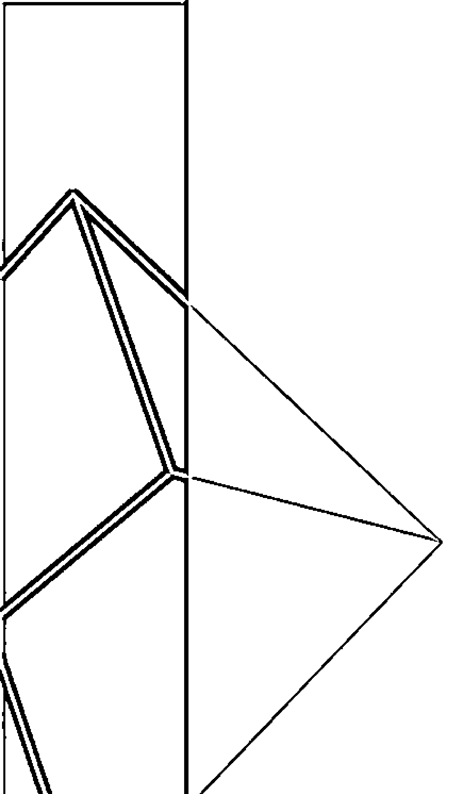

## 4. 注意事項

有的占卜師會在正中間放置第十三張牌，代表十二星座的綜合評價；是否要放置第十三張牌由讀者自行決定，有無放置都不影響牌陣的完整性。

第十二張塔羅牌陣的雙魚宮，因為也有代表災害、障礙的涵義，有部分學派不推薦解釋第十二張牌，認為解釋過多過少都沒有益處；這邊筆者也和其他學派的占卜師持相同意見，是否要解釋第十二張牌應該由占卜師依據解牌時的狀況自行選擇是否要多解釋雙魚宮的牌義，經由現場判斷解釋與否對占卜者是否有幫助會比事先預設立場來的妥當。

## 5. 牌陣圖

詳右頁。

## 十一、綜合年運牌陣：十三張牌

## 1. 牌陣說明

與十二星座占卜的放置位置相同，不一樣的是這次是以一個月一張牌的方式來進行占卜；十二星座陣法偏向個人的分析，綜合年運牌陣則是偏向一整年的運勢占卜，本質上是有所不同的。

## 2. 牌陣效用

對於綜合運勢的占卜非常的有效果，特別像是時間性的例如『一年的運勢』、『明年一整年的運勢』等時間性的目的會很容易理解，推薦給想要瞭解綜合運勢的時候使用這個牌陣；同時也可以在占卜前訂下主題：例如一整年的戀愛運或是工作運等等，都可以自由決定。

但是太過於遙遠的時間不太適合，例如二年、三年以上的占卜多半因為時間的不確定性而變得毫無意義。

不一定要從一月一日開始，從占卜的當下開始算起一年的時間也可以；占卜過去的年運也是可行，也可當作參考。

## 3. 牌陣用法

與十二星座占卜一樣，以時間『九點的位置』放下第一張牌，接著逆時鐘方向連續擺出十二張牌，第十二張牌的位置會座落於『十點鐘的位置』。

正中間放置『象徵』的第十三張牌。

這張牌可以使用靈魂數字來對應，也可以不採用靈魂數字的計算。

靈魂數字的計算方式如下：

出生年+月+日，再將數字相加等於0-22的大阿爾克牌。

例如1982/01/23的生日，將1982+1+23=2006

2+0+0+6=8

對應大阿爾克牌第八張牌『力量』。

和牌義好壞並無特別的影響，就算是牌義不好的牌也有可能因為本身的行為和模式而成為助力。

特別說明，19雖然是1+9=10，但是10還是要用1+0=1來計算，這時就會由19和10以及1來對應，這些牌也都會所影響；若是出現22，除了2+2=4對應大阿爾克四號牌『皇帝』之外，也會對應零號牌『愚者』。

利用靈魂數字牌對應，或是直接抽象徵牌對應，兩個方法都可以，由占卜師自行決定。

## 4. 注意事項

時間週期可以擴大也可以縮小，例如十二年的運勢占卜或是ㄧ天二十四小時的占卜，理論上來說都是可行的；但是實際去審視會發現沒有太大的意義，因為十二年週期時間變化太大，而一整天的變化影響也不明顯，只能說理論上雖然可行，實際意義卻並不是那麼理想。

占卜師若是想要練習，一整天的運勢占卜也算是很好的練習牌陣。

## 5. 牌陣圖

詳右頁。

# 《綜合年運牌陣》

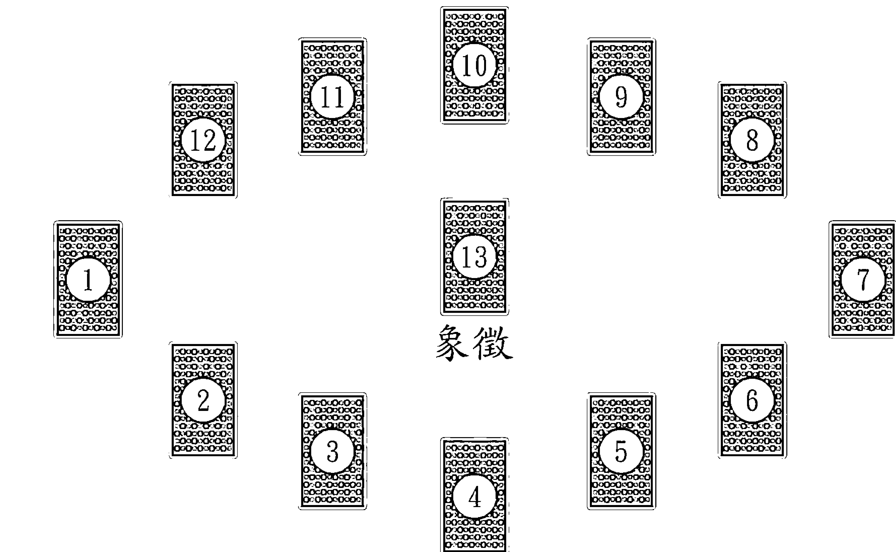

# 象徵

# 深入塔羅牌的神秘能量
—— 影響一生的塔羅牌學習書

295

Appendix

# 十二、生命之樹：十張牌

# 1. 牌陣說明

『耶和華 上帝在東方的伊甸栽了一個園子，把他所造的人安置在那裡。耶和華 上帝使各樣的樹木從地上長起來，既悅人眼目，又好作食物。園子中間還有一顆生命樹，和一顆辨識善惡樹。』《舊約聖經·創世記》第二章第8-9節

生命之樹在聖經中創世紀篇就記載著通往神之國的路徑，卡巴拉學者也將創世的符號用生命之樹來代表。

生命之樹分為十個直點，也就成為了塔羅牌中經典的生命之樹牌陣。

# 2. 牌陣效用

這個生命之樹牌陣可以解讀出一個人的個性構成，同時通過牌陣瞭解占卜者更多內心的訊息。

以下為生命之樹對應的牌陣意義：

第一張牌：Kether，王冠，Crown。理想與目標。

第二張牌：Chochmah，智慧，Wisdom。智慧與自發性。

第三張牌：Binah，理解，Understanding。理解及應變。

第四張牌：Chesed，慈悲，Mercy。善良與援助。

第五張牌：Geburah，力量，Fortitude。力量與領導、障礙與困難。

第六張牌：Tiphareth，平衡，Balance。特質與健康、調和與機會。

第七張牌：Netzach，勝利，Victory。愛與靈感、熱情與慾望。

第八張牌：Hod，威嚴，Splendour。榮耀與技能、評價與成績。

第九張牌：IX Yesod，基礎，the Foundation。靈魂中心、潛在能力。

第十張牌：X Malkuth，王國，the Kingdom。實際生活、最終結果。

生命之樹的第二種用法，是用來占卜第三方的人事物，這和戀愛占卜十分類似，但是可以用生命之樹牌陣占卜出和占卜者有親密關係的戀人，就算被占卜的第三方不在現場也可以獲得一定的訊息。

第一張牌：心理狀態。對方的性格和心情，外在顯示出的氣質。

第二張牌：智慧。對方的想法和行動原則。

第三張牌：寬容。對方的包容力和理解能力，對於人事物的

# 寬容度表現。

+   第四張牌：相性。和占卜者之間的相性層度。
第五張牌：不合。和占卜者之間的不合層度。
第六張牌：平衡。領導能力與協調性、調整能力等影響。
第七張牌：積極性。對方的積極性表現。
第八張牌：消極性。對方的消極性表現。
第九張牌：本質。對方的本能、本質的顯示。
第十張牌：綜合結果。最終顯示出來的評價結果。

# 3. 牌陣用法

依照生命之樹的構成，由上至下的排出順序：在各個學派間略有不同，但是本質的涵義是不改變的。

有的學派很注重取牌的順序，由第一張到第十張都有順序要遵守，有的學派還會在最後解牌完後會再取一張牌當作達卡牌；這邊筆者的建議是可以依照占卜師自行判斷是否要遵守取牌的順序，以及最後的達卡牌當作結論，這些都可以由現場狀況自行決定，無論要不要遵守取牌順序或是抽達卡牌，都不影響生命之樹的牌陣。

# 4. 注意事項

生命之樹的牌陣雖然有趣，但是本身的涵義非常的深遠，建議在占卜時可以反覆推敲以及研究牌義和各個牌的關連性，以及對應的牌陣位置。

在使用生命之樹牌陣占卜現場不在的第三方時，要注意是否會因為關連性不足而有誤差，一般而言若是第三方和占卜者並不親近的情況下，是不建議使用生命之樹去研究解牌的；除了誤差會大之外，通常而言也不會具有什麼意義。

# 5. 牌陣圖

請詳下一頁。

# 《生命之樹》基本陣法

附錄

300

# 《生命之樹》第三方占卜

# 解牌實際範例

# 範例一、愛情的困擾

對象：女性上班族，約二十五歲上下

問題：愛情煩惱，無法確認目前感情是否穩定，感到不安。

陣法：縱列聖三角：時光之流

牌義：寶劍二正位、錢幣十正位、錢幣四逆位

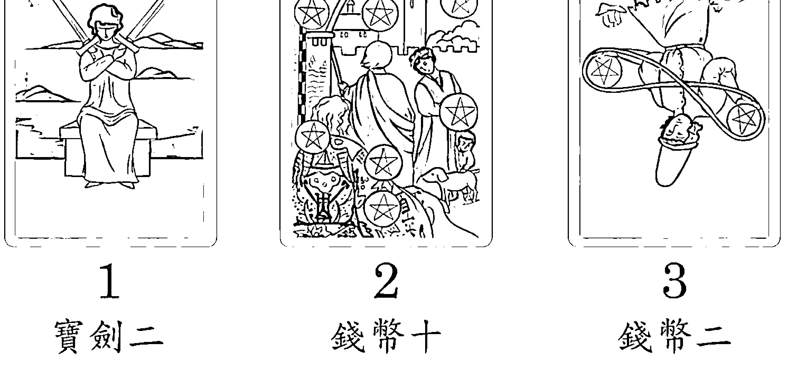

塔羅牌實解範例一

# 陣法第一張牌的判斷：寶劍二正位

針對這張寶劍二，筆者認為是一張理性隱藏自身感情想法的牌。

有可能是因爲彼此之間在過去經歷曾經有一段不好的回憶、又或者是因爲某些其他因素，造成現在現實生活上、不得不將自身的感情或想法隱藏起來，甚至有些許的逃避。

過去的部分經歷或是觀念，讓占卜者的心情大受影響，因此牌陣上出現了這張牌。

# 陣法第二張牌的判斷：錢幣十正位

目前的狀況來說，占卜者雖然在物質生活上沒有太大的煩惱，但是心靈上卻無法和交往對象契合，甚至有時候會覺得交往的環境上都很好，就是感覺對方心不在焉，彼此間沒有信任感，因此出現了很大的不安感覺。

當時筆者勸導對方：彼此在溝通上可以再加強。

# 陣法第三張牌的判斷：錢幣四逆位

再進一步的探討後，發現有可能是在交往的過程中給予對方太大的壓力，有時候雖然只是想要撒嬌或是傳達對方的關懷和想法，卻招來無謂的意見紛歧，典型的溝通方式出了問題，筆者當

# 時針對這張牌，勸導占卜者在心情上可以放輕鬆，切勿給彼此間太大的壓力。

# 綜觀牌義解説

在理性方面，有時溝通上的不良會導致爭執的原因；或許是對於過去的回憶或是觀念有著不同的想法，才會有目前這樣感受到不用心或是貌合神離的感覺；在周遭的環境上不至於造成壓力，目前彼此間需要統合的是對於感情上的想法或是對於未來的安排彼此之間要達成共識。

# 結論

會造成占卜者不安的原因，是在於對方的態度似乎有時候讓占卜者覺得躲躲閃閃或是顧左右而言他、焦躁不耐煩的態度所造成的，所以最後筆者整理出以下的總結。

+   一、過去的觀念和對方的觀念無法統合，溝通是很重要的。
二、因為彼此之間的想法差距，造成了現在不安的原因。
三、希望能夠佔有彼此的想法讓壓力產生，不信任感也因此產生。

或許給彼此一點空間和時間，多多溝通傾聽對方的想法，這樣對於改善彼此的關係會有很大的幫助。

# 範例二、暗戀的困擾

對象：男性上班族，約二十六歲上下

問題：暗戀的煩惱，雖然有喜歡的對象卻無法有所進展

陣法：縱列聖三角：時光之流

牌義：聖杯十正位、錢幣十正位、審判正位

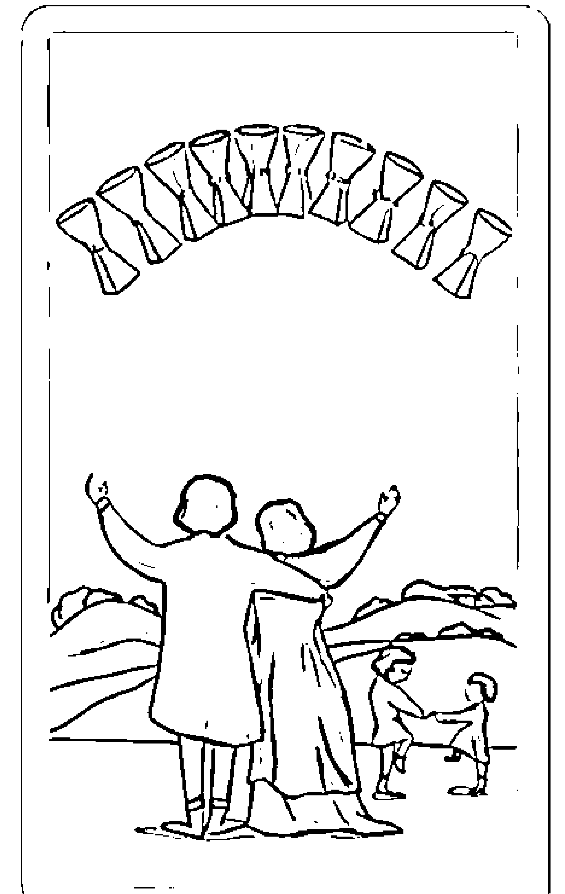

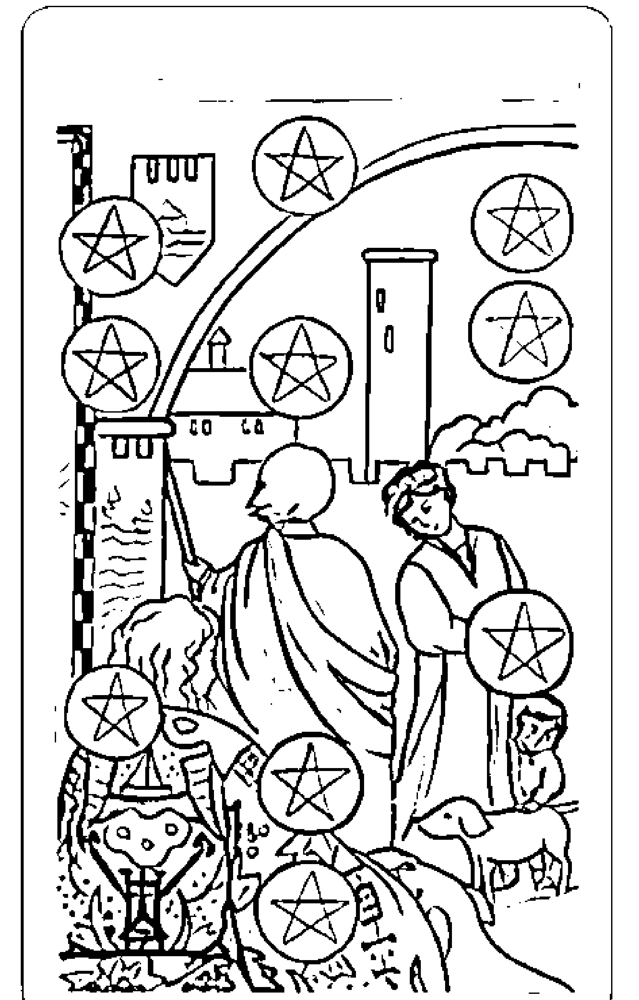

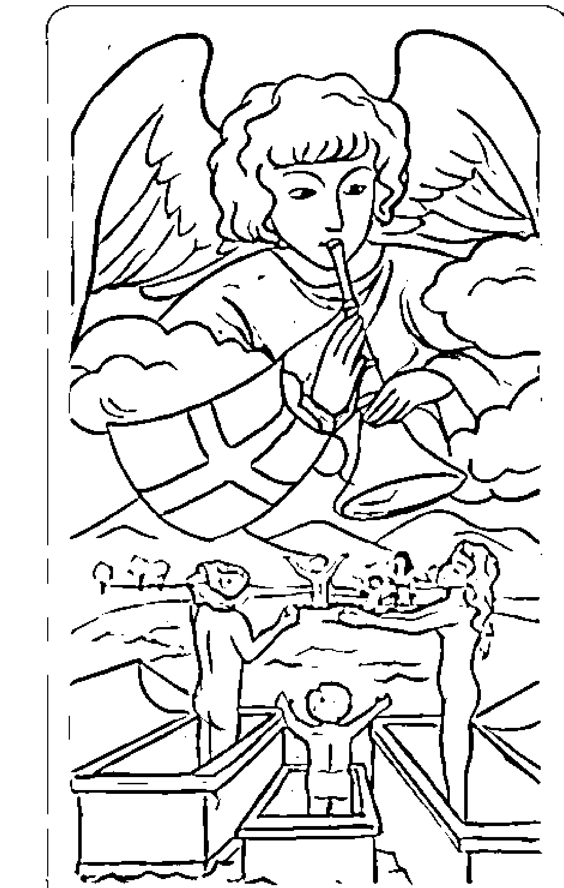

塔羅牌實解範例二

# 陣法第一張牌的判斷：聖杯十正位

聖杯十代表著情感豐富的占卜者，也代表著占卜者的學生時期過得很愉快，充滿著快樂的回憶，因此對於現在暗戀的對象非常投入，帶著滿滿的感情；也意味著渴望幸福的占卜者非常的需要愛情的滋潤，能夠成為聖杯十所代表的圖中的幸福美滿的模樣更是占卜者希望的結果：和喜愛的對象共組家庭，幸福在一起。

# 陣法第二張牌的判斷：錢幣十正位

雖然和上一個範例同樣是錢幣十又同樣位於相同牌陣位置，但是依照各個解牌狀況卻都不一樣的喔！在這一次占卜中，這一張牌是豐富的物質環境的象徵，也代表的是占卜者和對方之間的進展狀況。

在商談中得知，雖然占卜者利用許多禮物想要打動對方的心，但是感情上的經營仍然需要用心，豐富的物質條件只是維持住彼此間的友誼關係，要談到戀情似乎還有點不足。

# 陣法第三張牌的判斷：審判正位

審判為大阿爾克中的結果牌，位於牌陣的未來位置，又成爲了關鍵大阿爾克納牌。

這張牌代表的是新生與結果，在當時的商談中占卜者本身也

# 綜合牌義解說

這個牌陣都呈現出逆位，並非不好，而是在於許多地方仍然有些努力不足的評價，甚至是已經作到了九十分，就差那一點點的分數就能夠轉換命運，總是令人覺得就差臨門一腳。

當時占卜者問的問題並非是即刻的時效性，而是想要在未來的幾年中交到女朋友，因此詢問可能性。

當時筆者很認真地給予以下建議。

首先占卜者必須要先從自己的人際關係、家庭和事業好好的經營，再讓權杖四轉成正位之後就會有許多不錯的收穫，例如不論是財運或是異性，都會有很好的回報也說不定。

在個性上，占卜者一直都很開朗；但是有時候或許因為刻意隱藏自己內心的想法，而讓機會流失，最爲可惜的就是將自己內心的想法一再的放慢，而導致關鍵機會的錯過，這方面在今後不妨好好的練習，將自己的內心好好的表達，或許就會有很好的機會。

在外表有時顯現出嚴肅的模樣，實際上自己的溫柔許多人還是看的到，這就是第三張聖杯國王逆位給占卜者的評語。

「不要看他很嚴肅，事實上他人還蠻溫柔的。」

第三張逆位的國王給占卜者這樣有些詼諧的評價。

# 結論

愛情眼前尋不到，真的來了擋也擋不掉。

# 牌陣範例總結：

解牌時的狀況五花八門，同樣牌陣同樣位置同樣牌絕對不可能會有同樣的解說；每個人的生活背景和思考模式都大不相同，因此在解牌上要懂得靈活、富有同理心，在每一次的解牌中一定會有所幫助的。

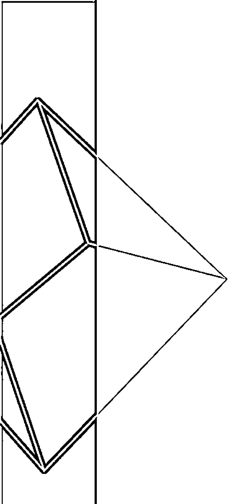

附錄

312

# 選擇堅持——馬雲的人生智慧

我對規則，對規律，對莫名其妙的力量有尊重，有敬畏。我認為，現在的很多年輕人有點浮躁，缺乏信仰。何為信仰？信就是感恩，仰就是敬畏，還有要改變自己。我們總埋怨外界，別人是錯的，卻從來沒有想過自己應該做什麼，該做什麼樣的事情來完善自己。

# 先相信你自己：馬雲的價值理念

其實做戰略最忌諱的是面面俱到，一定要記住重點突破，所有資源都聚集在一點突破，才有可能贏，而面面俱到那就什麼都不可能贏。講話也好，做隊長也好，要明白我的出發點在哪裡，進攻點在哪裡這才是真正的戰略要素。

# 成就大業的冒險精神——馬雲教戰守則

有時候一個錯誤的決定比沒有決定更好。很多年輕人是晚上想千條路，早上起來走原路。創業，關鍵不是因為你有出色的想法、理想、夢想，而是你是不是願意為此付出一切代價，全力以赴地去做它，證明它是對的。不能等環境好了再去做，那時機會已經不是你的了。

# 情場逆轉術
(青色愛情系列 016)

你以為替我貼上「小三」、「惡女」、「花癡」、「貝戈戈」、「老處女」、「敗犬」、「八婆」、「狐狸精」、「公主病」、「花蝴蝶」的標籤，我就會怕了嗎？
為情所苦不可恥，可恥的是永無改變之意。
改變桃花的最強逆轉術，獻給女性的情場祕訣！

# 果然，我還是想要一個男朋友
(青色愛情系列 07)

「果然，我還是想要一個男朋友。一個，自己親手挑、親手追的男朋友！」
「其實，我還是討厭單身。」
「理想的他終於出現了，但我卻怕東怕西……」
這樣的內心對話，熟悉嗎？妳該做的，是爭取自己幸福的機會！
別說女追男隔層紗，女追男其實比男追女更簡單！
妳不但可親手推動自己的戀愛進度，更在柔軟身段中享受主動的樂趣。
別用結果來庸人自擾，在倒追中享受自愛，是新一代女性的課題。

# Ⅰ 青春難為：負傷翱翔的每一天
(青色愛情系列 08)

傷痕不是一天造成的，但我們試圖享受受傷的過程。
破繭而出之前，我們曾經迷戀著安全的陰影。
青春是一場璀璨的花火，錯過一次，剩下的幾次也就僅能倒數。
波光粼粼的人生，比起旁人的賽事，更殘酷的是面對自己。

# 幸福是你的名詞？還是動詞？

人生是一次旅行，而未來就像前方錯綜複雜的道路，沒有人知道，即將踏上怎樣的旅程。

也許遇上虎視眈眈的猛獸，也許遇上荊棘滿布的叢林，不論怎樣，我們都只能勇敢的前進。

心態決定幸福——你不能改變現實，但你能夠改變心態。

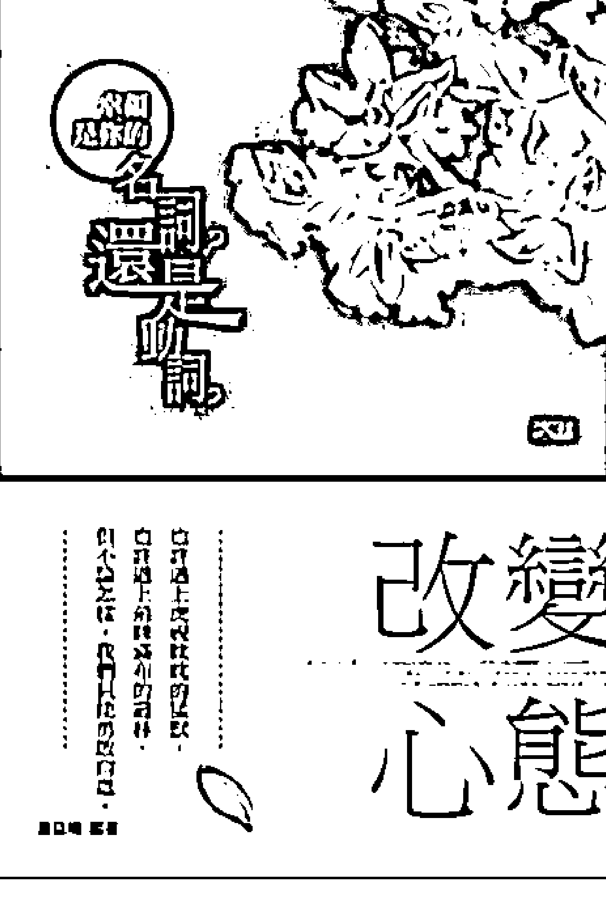

# 那些不能告訴男人的事：

只給女人的幸福答案

那些女生該懂的事，那些不能告訴男生的事。

懂愛，才會幸福。

想像中的愛情是一種理想，生活中的婚姻是一種現實。

對部分男人來說，向女人訴說甜言蜜語，是一種消遣和有趣的事，甜言蜜語是他們討好女人的手段，但是，他們只是說說而已，並不會真正放在心上。如果一個女人因聽了一個男人的甜言蜜语而癡迷，最終很可能會失望或給自己帶來傷害，甚至誤認為：「男人都是騙子」、「沒有良心」。

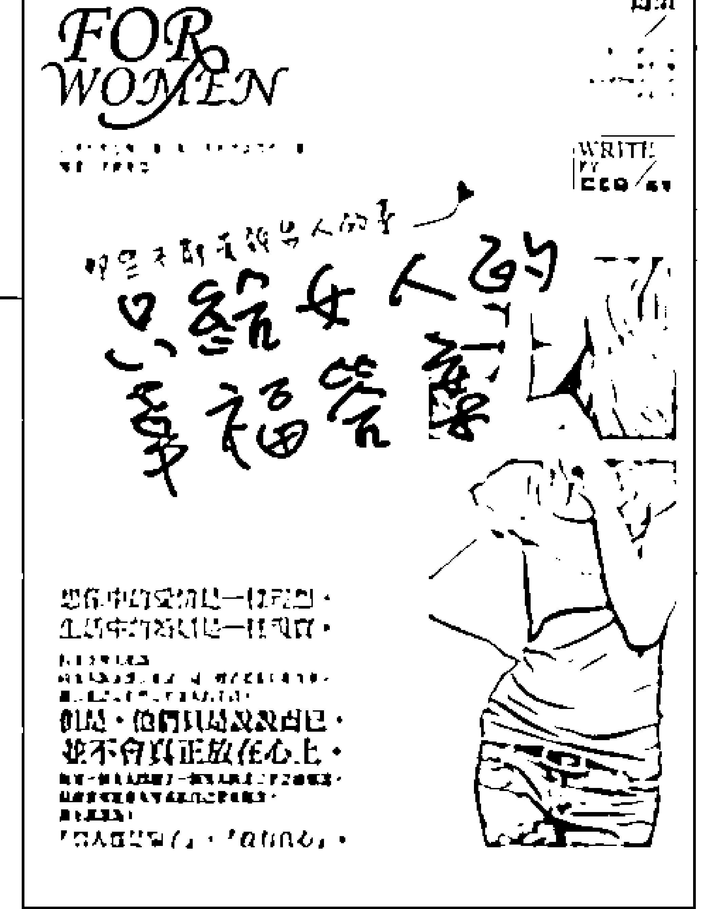

# 貴人不一定是好人

明擺著的道理，你為什麼偏偏想不到？

一些人太過勢利，他們對衣著光鮮的人多看一眼，對普通的人就少瞧幾分；

看自己是聰明過人，別人個個好瞞好騙。

還有一些人太過迂腐，他們總希望找個貴人幫自己，但和貴人面對面時卻又相見不相識。

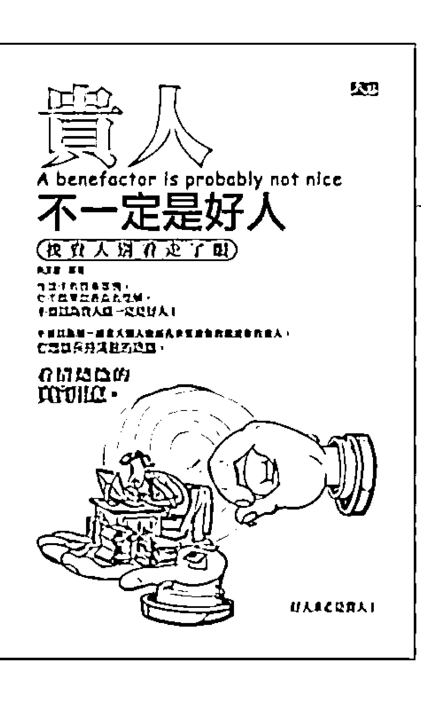

# 永續圖書
線上購物網

www.foreverbooks.com.tw

+   • 加入會員即享活動及會員折扣。
• 每月均有優惠活動，期期不同。
• 新加入會員三天內訂購書籍不限本數金額，
  即贈送精選書籍一本。（依網站標示為主）

專業圖書發行、書局經銷、圖書出版

永續圖書總代理：

五觀藝術出版社、培育文化、棋茵出版社、達觀出版社、
可道書坊、白橡文化、大拓文化、讀品文化、雅典文化、
知音人文化、手藝家出版社、璞珅文化、智學堂文化、語
言鳥文化

活動期內，永續圖書將保留變更或終止該活動之權利及最終決定權。

# 謝謝您購買

即日起，詳細填寫本卡各欄，對折免貼郵票寄回，我們每月將抽出一百名回函讀者寄出精美禮物，並享有生日當月購書優惠！

想知道更多更即時的消息，歡迎加入“永續圖書粉絲團”

您也可以利用以下傳真或是掃描圖檔寄回本公司信箱，謝謝。

傳真電話：（02）8647-3660

信箱：yungjiuh@ms45.hinet.net

+   ○ 姓名：
○ 生日：
○ E-Mail：
○ 地址：
○ 學歷：□高中及以下  □專科或大學  □研究所以上  □其他
○ 職業：□學生  □資訊  □製造  □行銷  □服務  □金融
□傳播  □公教  □軍警  □自由  □家管  □其他
○ 您購買此書的原因：□書名  □作者  □內容  □封面  □其他
○ 您購買此書地點：
○ 建議改進：□內容  □封面  □版面設計  □其他

您的建議：

金額：

剪下後傳真、掃描或寄回至—22103新北市汐止區大同路三段194號9樓之1大拓文化收—

