# 神秘的——

# 靈異世界

導引您做一趟神秘奇幻世界之旅

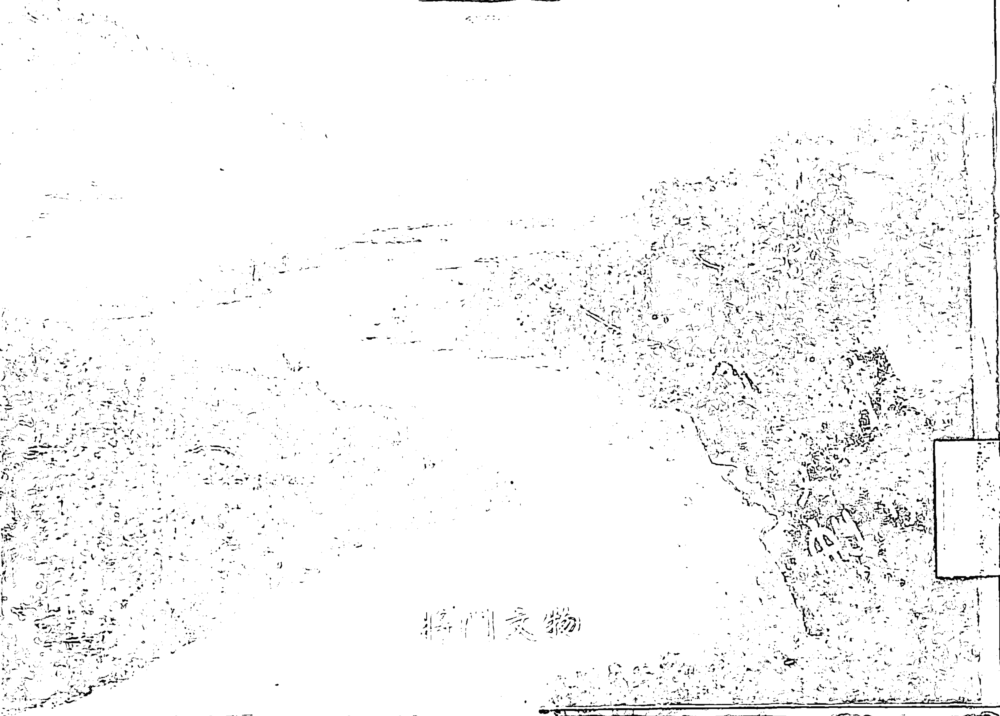

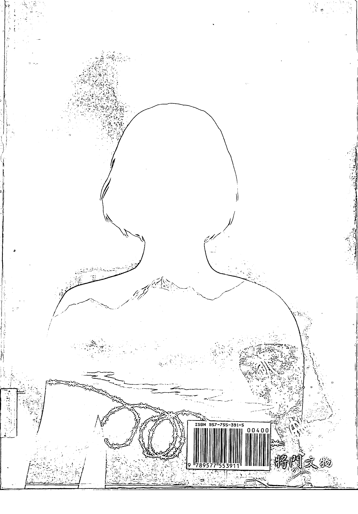

ISBN 957-755-391-5

00400

9 789577 553911

將門文物

# 透過各種科學的實驗與實例，解開死後世界的

靈 異 世 界

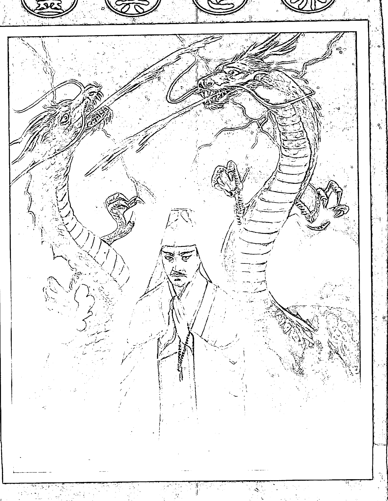

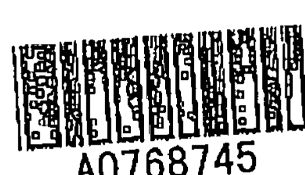

A0768745

※本系列叢書受國內著作權保護※

著 作 者：將門文物出版有限公司編輯部
出 版 者：將門文物出版有限公司
登 記 證：局版台業字第二七九八號
發 行 人：曾 延 埕
發 行 所：台北市士林德行東路331巷50弄19號
電    話：(02)8363608・8341228
F A X：8360601
策    劃：曾 延 埕
主    編：趙玉平、陳淑英、劉盼盼、李麗娜
美工編輯：胡瓊文
出版日期：中華民國七十九年3月第一版發行
劃撥帳號：0-186542-4曾延埕帳戶
印 刷 所：沅立彩色印刷公司
特價400元

※ 歡迎團體訂購另有優待。
本書如有倒裝，缺頁請寄回本社調換。

145.30

# 透過各種科學的實驗與實例，解開死後世界的

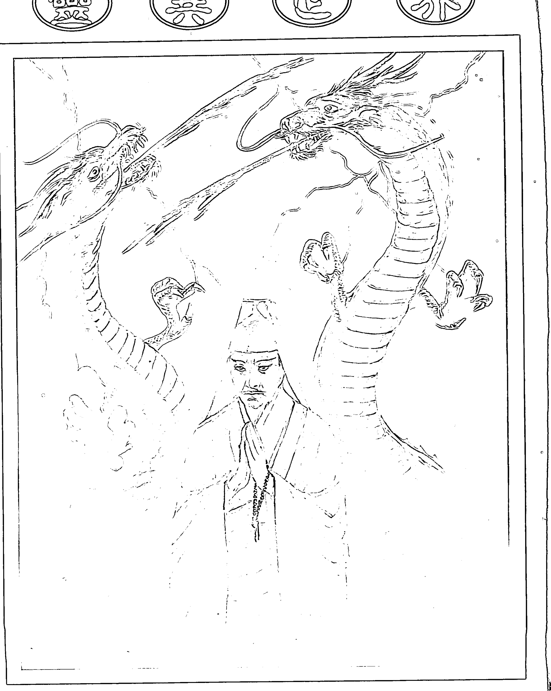

# 目錄

# 投胎轉世篇

- 科學證明了死後世界的存在 / 4
- 何謂轉世 / 6
- 緬甸的少女 / 8
- 史蒂芬生博士的研究 / 10
- 印度的少女 / 12
- 轉世的預告 / 14
- 日本人勝五郎 / 16
- 投胎轉世的真偽 / 18
- 投胎轉世的西藏教宗 / 20
- 如何證明投胎轉世 / 22
- 讀出前世 / 24
- 活用在醫療上 / 26
- 前世療法 / 28
- 繼承前世的才能 / 30
- 解除死亡的恐怖 / 32
- 生存的使命 / 34
- 何謂靈魂出竅 / 36
- 空中浮遊 / 38
- 靈魂出竅的經驗 / 40
- 小小體驗 / 42
- 靈魂的白光 / 44
- 三田光一的「精神旅遊」 / 46
- 波瓦的冥想 / 48
- 喜瑪拉雅山的聖者奇蹟 / 50
- 來自靈界的報告 / 52
- 精靈界(一) / 54
- 死亡並不可怕 / 56
- 何謂近似死亡的經驗 / 58

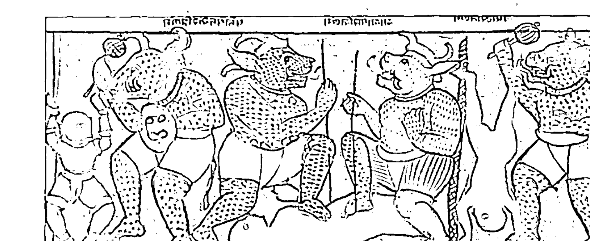

- 飛越鬼門關 / 60
- 凝視死亡 / 62
- 經驗的共通點 / 64
- 近似死亡經驗的十個層次 / 66
- 脫離肉體 / 68
- 與光邂逅 / 70
- 美麗的樂園 / 72
- 「光的天使」的問題 / 74

- 生與死的選擇 / 76
- 近似死亡經驗者的普遍性 / 78
- 愛與寬容的地方 / 80
- 不怕死的人們 / 82
- 生命是永遠的 / 84
- 最幸福的世界 / 86

# 大靈界篇

- 精靈界(二) / 88
- 在精靈界裏的重逢 / 90
- 閻王之鏡 / 92
- 夫婦之緣 / 94
- 在精靈界中與家族分別 / 96
- 飛渡三途河 / 98
- 靈界的中心地區 / 100
- 靈界的故鄉 / 102
- 靈界中的共同作業 / 104
- 魔法般的力量 / 106
- 靈界的畫卷 / 108
- 時間、空間的觀念 / 110
- 天使之舞 / 112
- 神秘失蹤 / 114
- 擊退地獄靈 / 116
- 地獄 / 118
- 什麼樣的人會下地獄 / 120
- 地獄中的生活 / 122
- 離開地獄 / 124
- 光之橋 / 126
- 靈界的形成因素(一) / 128
- 靈界的形成因素(二) / 130
- 靈界的形成因素(三) / 132
- 投胎轉世的準備 / 134
- 往靈界出發 / 136
- 有關靈界的問答篇 / 138

# 「人生箴言」

人生在世曾幾何
何必處處為幾何
求得幾何能幾何
不得幾何又幾何

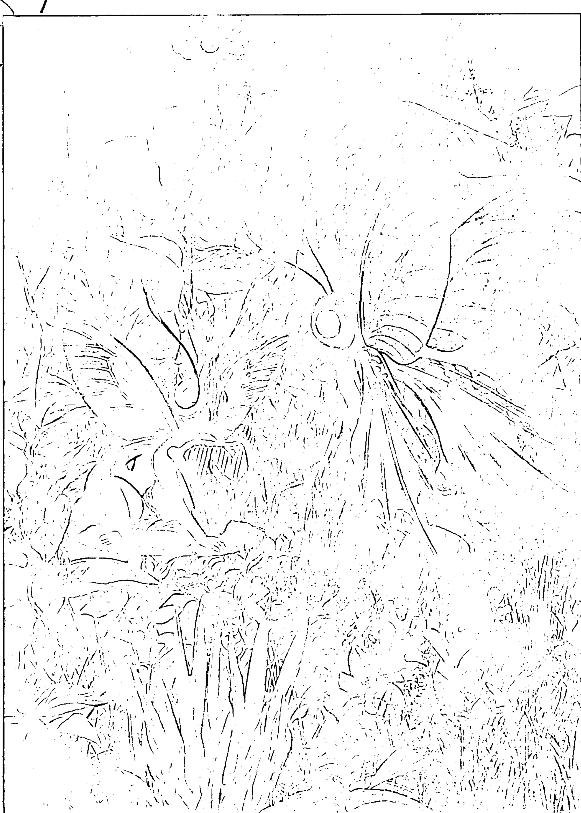

# 科學證明了死後世界的

投胎轉世篇

當今的科學已逐漸證明了靈界的存在，而其中走在最前端的是心靈科學，此心靈科學已逐步提出靈界存在的證明，也就是人死後世界的證據。國人對心靈科學的了解還很粗淺，但歐美人士卻非如此。在此廿世紀末，有關宇宙組合方面的新發展，以及有關意識，也就是心靈方面的研究都已相當進步。在了解大宇宙及心靈的奇妙方面，科學家們已深深的了解到，若不認定靈魂與靈界的存在，是無法解開大宇宙與心靈的奧妙之謎，而心靈科學便成為解開萬物之謎的唯一方法。目前，一項讓曾獲諾貝爾獎的科學家與心靈學家，站在同一立場交換心得的國際會議，已在世界各地陸續展開，科學家們此一行動究竟代表著什麼意義呢？心靈科學的最終目的就是要證明人死後的生存世界。確信「生命是永遠」的人，乍看之下或許會認為是無聊的行為，但是人類是容易受迷惑的，即是在此物質萬能的時代裏，在日常生活中還是有千千萬萬個迷惑人類的種子存在。不過，若能以科學證明靈界的存在，那麼過去受控於唯物主義的論調就將被推翻，而生命是永恆的，也將使每一個人深信不疑。一旦能證明靈界的存在，將可給予人們一顆溫暖的心，也可去除人們最後將面臨死亡的不安感，也就能解決人類一生中最大的煩惱，更能讓人過愉快的一生。因此在本書中，我基於對心靈科學所獲得的新成果，希望將有關靈界存在的證據，提出供你參考。根據神的指示，借以證明你死後的世界確實存在。因此，我從心靈科學的廣泛領域中，分門別類做成三大部份，第一是轉世的研究，此世界存在許多具有轉世證據的人們，我們將這些所得之確實報告例子加以整理介紹。第二是人體脫離肉體的研究，在人類意識裏，一般均承認靈魂的存在，這是證明靈界存在的強力證據。至於第三點則是瀕臨死亡邊緣者的研究，他們在死亡的當兒見到有關死後的世界，這些報告的確具有震撼性。請大家用心來閱讀此三部份的研究，這是針對尚生存在世上的人所進行的，有關靈界的確存在的證據，而這些證據可能就發生在你身上。

# 以科學方法開始研究靈界

十九世紀許多優秀的科學家，開始對心靈現象產生興趣，他們非常關心此「未知力量」。如與達爾文一起研究進化論的亞佛雷達·華倫斯就是其中之一。另外還有發現銫的科學家沙·威廉·克魯克斯，及法國天文學家卡明·富拉瑪利歐，他們都是把全部精力投注於此尚未被闡明的心靈界，也就是開始以科學研究精神來研究心靈界的一批科學家。

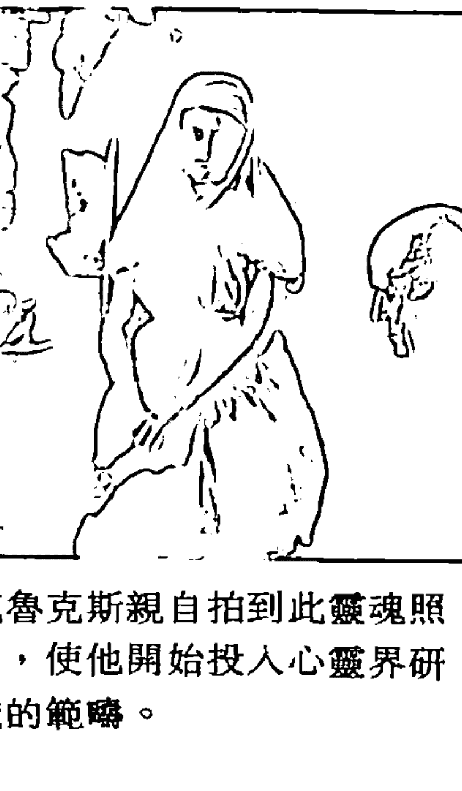

# 研究靈界的專家

亞佛雷達華倫斯（1822—1913）英國的生物學家，與達爾文一起發表有關生物進化的學說，他確信靈界具有一股可推動世界的神秘力量，並把此想法反應在自己的研究上。

# 何謂轉世

死就是轉世投胎

所謂轉世就是死亡者再度生存於世的意思。
轉生存在於所有人類身上，你與我已不知是幾度轉生於世，對人類而言死就是轉世，而所謂的轉世，是將不滅的靈性能源，再以適當的型態出現，也就是再度擁有肉體。長久以來，人類都深信轉生是當然的事，只是隨著文明的進步，反而迷惑了神所賜的睿智之眼。
現代社會中一種毫無緣由的不安，正迷漫整個世界，因此，心靈科學便希望把轉世的真實性，重新呈現在你眼前，只要你用心觀察，就會發現在此世上有許多具有轉世證據的人們。
此具有轉世證據的人們，在心靈科學上稱之為『轉世型的例子』，最近有關此方面的研究已向前邁進一大步，有不少科學家更全心全意的研究這方面的問題。現在請仔細想一想，若轉世型的例子全都存在，那就是證明靈界存在的具體證據，而有生命現象的肉體，也就是證明了生命是永恆的。
不過究竟要根據什麼來認定轉世型的例子是事實的呢？那就是如何來證明，你曾在從前的何年何月何日出生於何地，就是所謂的前世記憶。在過去日子裏的回憶，足以證明你曾生存於某個時代，此所謂前世記憶，便能證明人的轉世。
但現在的我絲毫無前世記憶，說不定連你也沒有，這其中有深奧的道理，容我在後面再敘述，但在這千萬人類中卻存在不少能詳細說出前世種種的人，數十年來，已收集了幾百幾千人具有前世記憶者所說的經驗。
當然，為了認定這些事例是否真實，是有一套很嚴密的證明過程，對於具有前世記憶及所說的一切，心靈家都會經過調查，同時還必須確認其記憶中的一切，不是當前世世界所能得到的，而再將這些所蒐集到的事實，加以比較與檢討，有時還得經過多年的觀察，這就是心靈科學對『轉世型的例子』所做的研究。
許多科學家的研究報告，保證會讓你驚奇不已。

十九世紀哲學家華依・艾巴哈的一句詩：
「我不斷地往下到達虛無之境，但其他的人卻不斷地往上來到這個世界上，可憐的孩子啊！在我之後來到此世界的你啊！就像綻放在花園的花朵一樣，步我之後而來的孩子啊！你們都是由我們而來的『我』」。
華依・艾巴哈以此首美妙的詩來表達投胎轉世的訊息。

*心靈科學
過去，人們一直把由靈魂引發的各種現象，視為一種迷信或是夢幻。但歐美方面，在一八五○年時就開始相信靈魂的存在，而且利用各種科學方法，想加以證實人類是可以和靈魂互通訊息的。

# 研究靈界的專家

沙・威廉・克魯克斯
（1832-1919）
英國著名的物理學家，因參與心靈研究而損及名聲，但他確信心靈現象的真實性，終其一生未曾退卻。

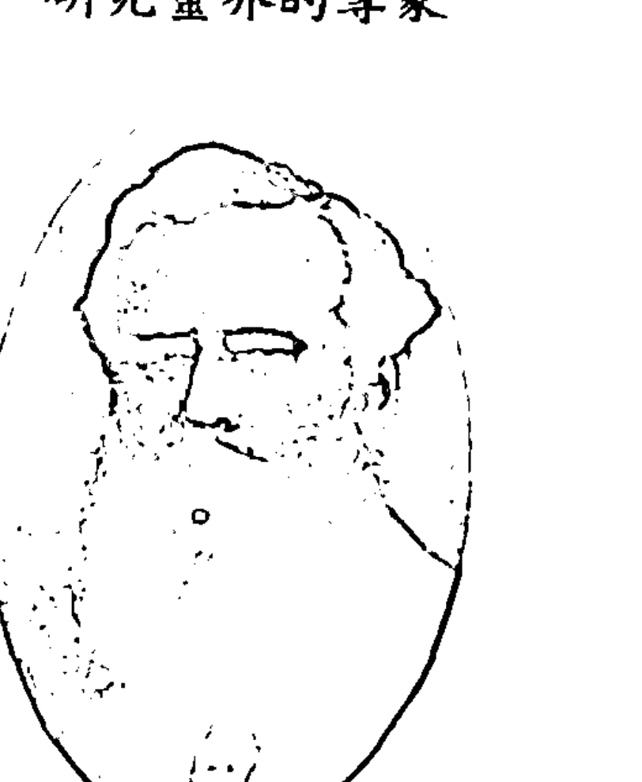

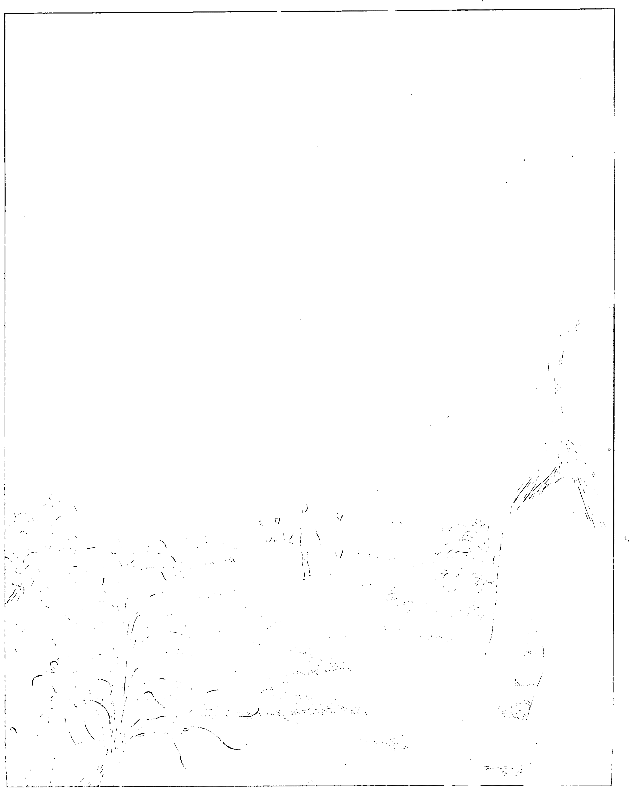

# 緬甸的少女○○○○●●

——她是戰死的日本士兵轉世的

現在來談一談一位緬甸少女的故事，這是讓我感受最深的「轉世型的例子」。

馬丁安·米尤是一九五三年十二月二十六日出生於緬甸中部的塔門村，雖然她很慢才會說話，但是在四歲時，便開始說出自己前世的事，她一再強調，自己前世是在緬甸戰死的日本士兵，所以她頻頻向父母哭道：「我想到日本去。」

一位年僅四歲的異國小女孩，她應該不會知道日本的存在，這位女孩又進一步告訴父母及家人，有關她前世戰死的一些記憶，讓家人們驚奇不已。

小女孩的前世是日本軍隊中的伙夫，有一天當他正在山上用木材煮飯時，突然飛來一架飛機，而此山就在小女孩家附近七十五公尺的地方。飛機駕駛員對著日本兵用機關槍掃射，穿著內褲的日本士兵便拼命地逃向山裏，但子彈卻射中了他的鼠蹊部，使他當場死亡，他是死於非命的。在日本還留下五個小孩的這位日本兵，他的死對他來說是不甘願的，所以他對自己的死就無法瞑目。

研究者對小女孩的敘述之所以如此重視，有以下幾大因素，一是此女孩的前世記憶相當清晰，而女孩每當有飛機飛過她家時，都會發出異常的尖叫聲，如果父親罵她，她就會說：「我是被飛機打死的。」另外，小女孩對緬甸辛辣的食物很討厭，只喜歡甜食，至於衣服方面也不喜歡穿著小女孩的服裝，而只要穿男孩的衣服，並常纏著父親為她買槍類的玩具，並且常與其兄玩軍隊遊戲，對於她這些怪異的行徑，引起研究者的注意。

另一個可說是具有決定性的證據是，小女孩出生時在性器部位有一茶褐色如姆指般大小的傷口，當有人摸到她此傷口時她就會感到疼痛，而此傷口一直到兩三歲時才好。據小女孩自己說，當她前世為日本兵時就是被打中此部位才死。

不過，很遺憾的是，一直無法知道日本兵的名字，如果有人能得知日本人的姓名，對小女孩轉世就有更充份的證據了。

# 會說古埃及話的英國少女

在本世紀初期，英國一位名叫羅安瑪麗的少女突然變得會說一口流利的古埃及話，而此種語言早已失傳了。

瑪麗自稱是西元前一千四百年前的敘利亞人，被抓到埃及成為奴隸，並在埃及神殿中擔任舞伎。但是瑪麗的話並未被相信，只有一位住在她家附近的醫生，把她的話錄了下來，拿給一個埃及學者，結果此學者證實了瑪麗所說的話，的確是古埃及語。

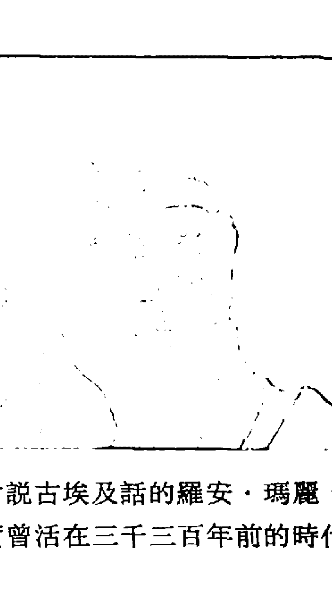

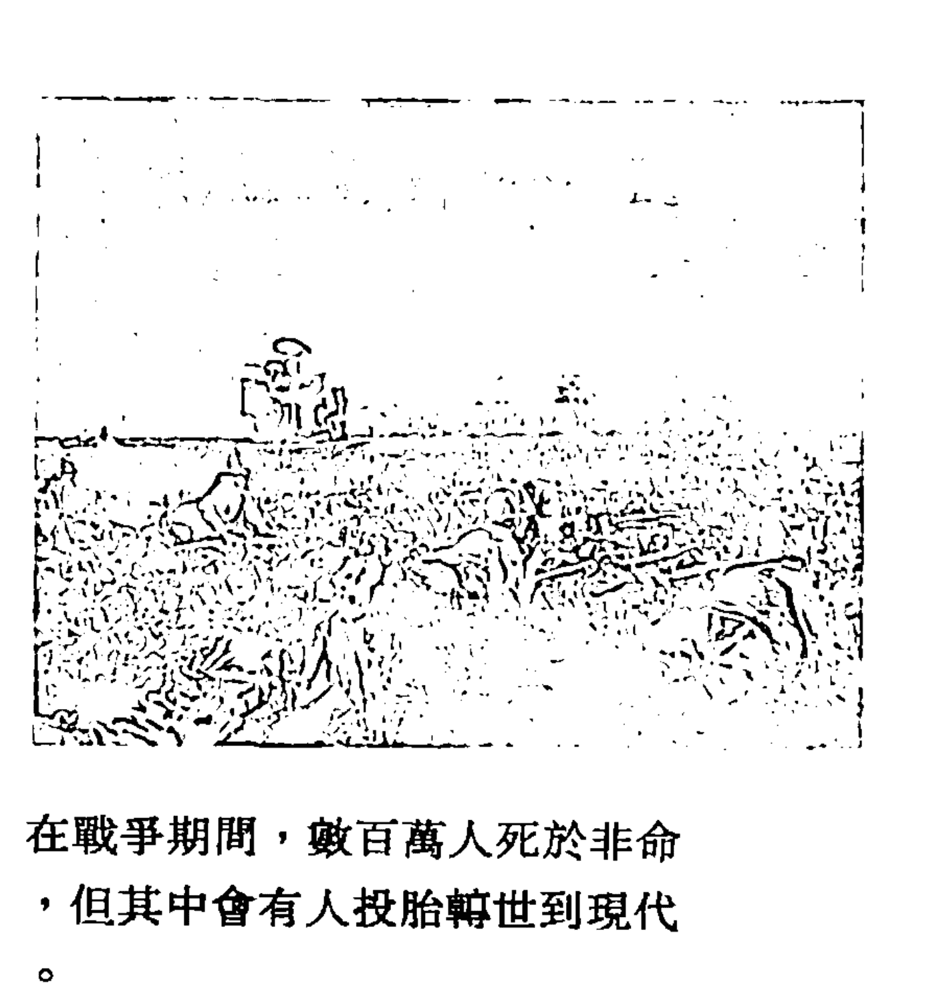

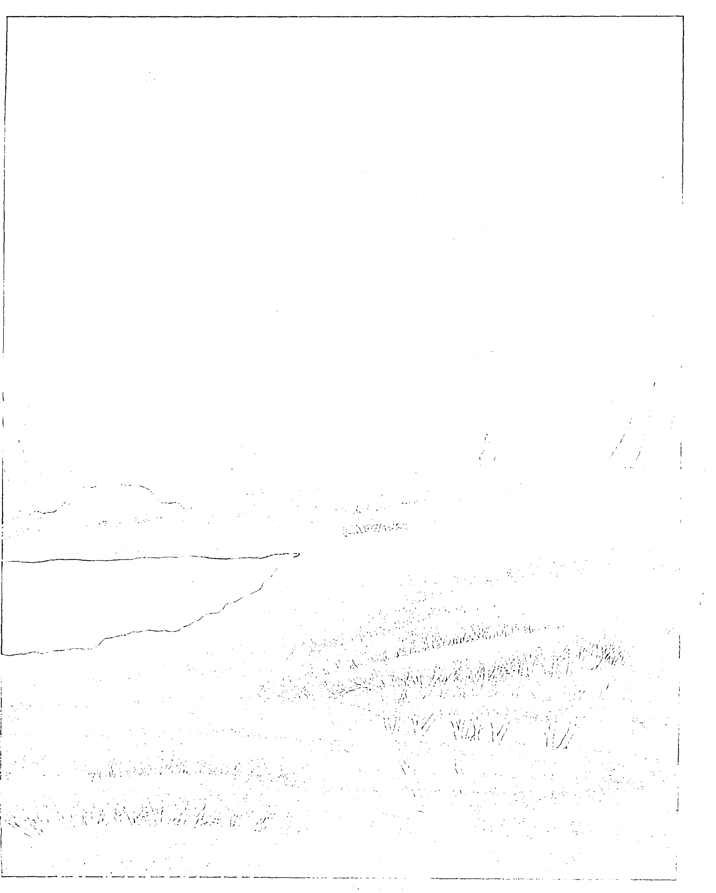

# 史蒂芬生博士的研究

——轟動全世界的書「廿位有前世記憶的小孩」

對於前面單元所敘述的緬甸小女孩故事，在一九七二年之前就會三度前往調查的史蒂芬生博士，他是美國轉世現象的專家，堪稱這方面的世界權威。史蒂芬生博士出生於一九一六年，畢業於醫學院，而後當過路易安納州立大學的精神科助教，一九五七年擔任維吉尼亞大學精神科主任教授。

在維吉尼亞大學的醫學院裏，史蒂芬生博士為了要研究轉世的現象，一定要進行面對面的調查，直接蒐集資料，他並且採用非常客觀的方法，每一次調查都有多位研究者同行，所以他的報告可靠性高，並受舉世公認。

目前在他的研究室裏，蒐集有數十件有關轉世的例子，而博士也將他的研究報告寫成「廿位有前世記憶的小孩」一書。書中主要是敘述具有前世記憶的廿位小孩的經驗，此書出版時曾引起很大的迴響。全美國人都為此書而異樣的興奮，每個人都在討論：「人類真有轉世這回事嗎？」然而史蒂芬生博士的研究究竟清楚分析了什麼呢？

首先，博士皆以小孩為研究對象，這是因為博士認為，如果一個成人主張他有前世記憶，不管其內容如何正確，一般人都會以為是他從過去的經驗中所得知的，較不足採信。不過具有前世記憶的人，大部份都是幼兒。

而幼兒均約在二至四歲時說出他的前世記憶，博士進一步分析說：「具有前世記憶的小孩大約在二至六歲時開始說出前世記憶，而平均能保持六至九年的主要前世，其他的大部份都忘記了。」由此可知，有前世記憶的小孩，到了十歲幾乎已完全喪失前世記憶，若果真如此，那當我們是小孩時說不定也會有前世記憶。

其次有前世記憶的人，大部份前世都死於非命，前面的例子不正是如此嗎？

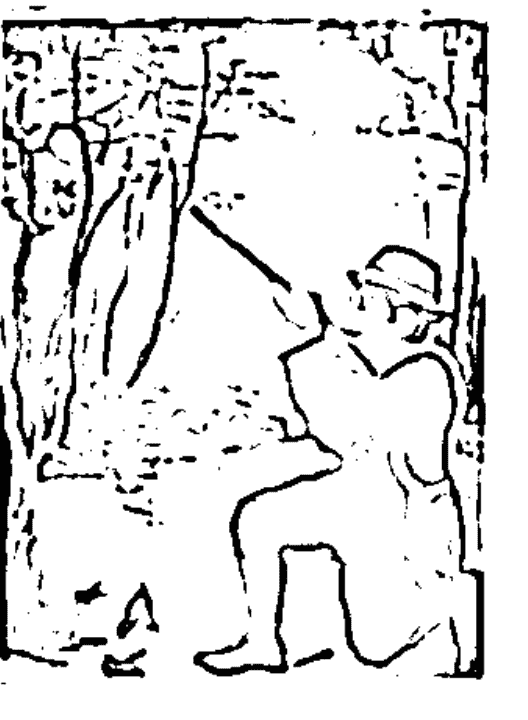

# 超心理學的研究起源

以超能力或心靈現象為研究對象的，就被視為是超心理學。此研究於一八八二年在英國倫敦成立心靈研究協會之後，才算真正開始。在此研究協會中，是由三位諾貝爾獎得主，十位英國皇家學院會員，一位首相及數位大學教授所組成。一八八四年美國也設立了一個組織，稱為美國心靈研究協會。

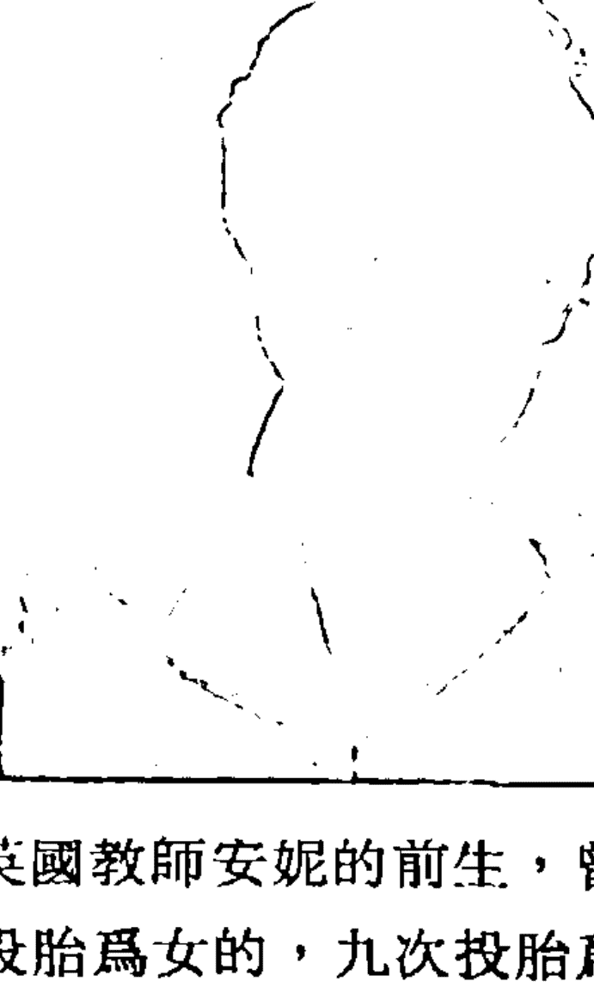

# 研究靈界的專家

史蒂芬生（1918——）這是美國第一位想證明投胎轉世真實性的學者，他至少進行過三次的追蹤調查，對同一證人不斷地持續調查，並公開發表投胎轉世的真實性。

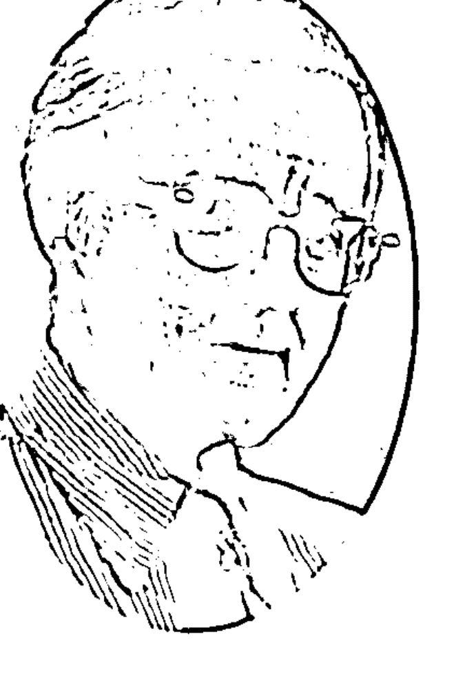

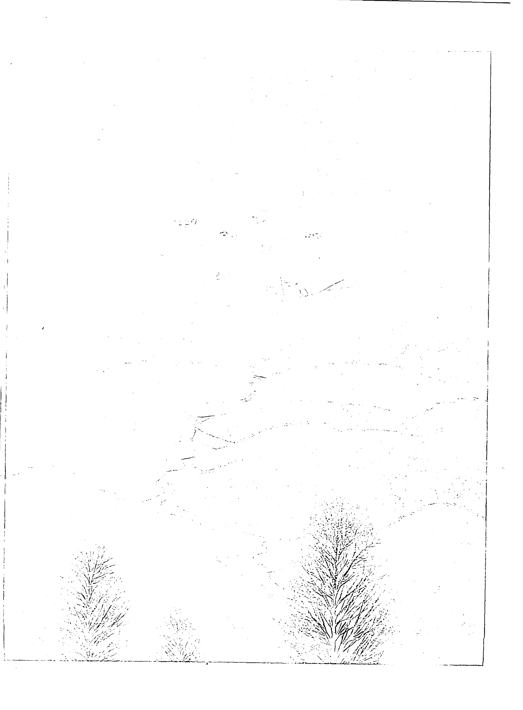

# 印度的少女

在前世的記憶中遭人殺害。

史蒂芬生博士在經過長年的研究之後，曾如下說道：「在這裏我希望提出我的想法，我已能確信將人類死後的生存當成一門科學，並提出有力的證據。」現在我們就要透過靈界，將有關轉世的實例，也就是「生命的永恆」實例加以介紹。

一九六五年六月十六日，史蒂芬生博士與印度國立精神衛生神經科學研究所的帕司里查博士，一同前往印度一位富裕的印度教徒家中，調查其長女普修巴的事件。普修巴從一歲半左右即開始指出她前世所居住的家的方向，並詳細說出她前世的一切。

根據普修巴說，她前世是一名叫曼迪普卡烏的女性，與一位跟腳踏車有關的錫克教徒結婚，並已生下小孩，但後來她卻遭到丈夫的刺殺而死亡。

史蒂芬生博士等人開始調查此事，首先他們查出在小女孩所指的方向，確有一錫克教徒的家中，曾在一九六一年發生兇殺事件，根據附近的人所說，一位修理腳踏車的男人殺死了他的妻子。當博士把小女孩帶到修理腳踏車人的家族前時，小女孩馬上就能一一分辨出誰是誰，並對曾是她丈夫的修理匠表現出不理不睬的態度，但小女孩的表情中並沒有怨恨與復仇的樣子。

史蒂芬生博士說：「我們所調查的結果，能證實普修巴所說的前世事情的真實性，而且她所提的一切都與事實吻合，這個小女孩強烈的表現出想到前世的家中，對她前世與丈夫所生的小孩生活是否幸福，非常的關心。

這兩個家族雖然同住在一個鎮上，但以往並不相識，而且在印度的社會中，印度教與錫克教之間，都是採對立的立場，絕少交往，而博士等人也曾詳細地檢查過曼迪普卡烏的死亡證明書，並把此事件，在美國心理研究學會的會報上發表出來。

普修巴到了七歲之後，就自動不再談到前世的事，而且還逐漸長成一活潑的少女，前世的死於非命，並未對她今生產生影響。

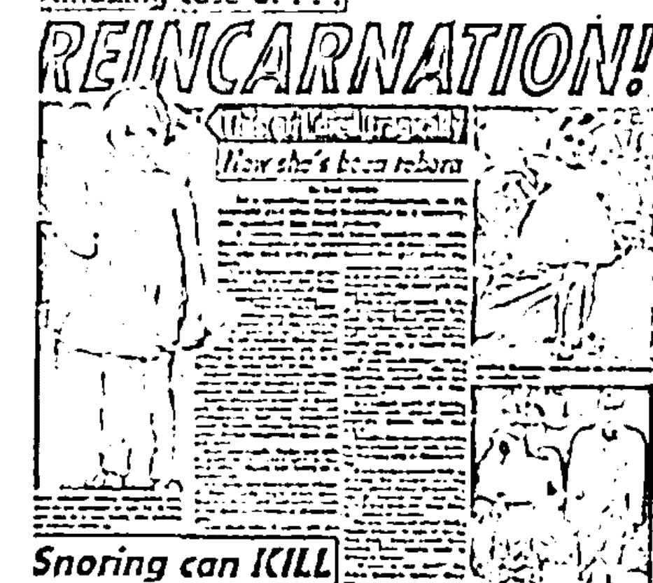

# 一九八四年的投胎轉世事件

依諾卡出生於斯里蘭卡的貧窮農家中，但在四歲時，她突然說出一句令人驚訝的話，她說：「其實我曾經生於另一個城鎮的富家，名叫米拉尼。」她的雙親半信半疑地把她帶往該城鎮去，結果證實依諾卡所說的完全符合米拉尼在世的情形，甚至連習性也經米拉尼親人的證實是完全一樣的，連米拉尼的母親也承認依諾卡就是米拉尼，而像此種投胎轉世的例子還發現很多。

# 研究靈界的專家

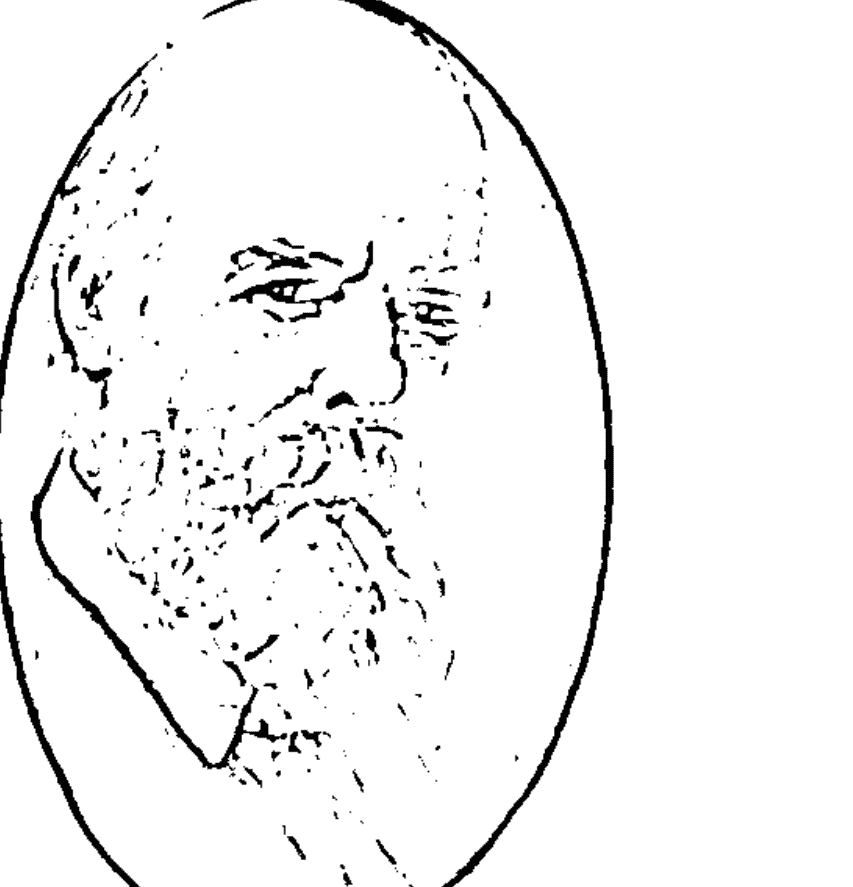

英國物理學家，終其一生堅持主張「死並不代表結束，對某些人而言則是到達更層的層次，且此世界與彼世界是可以互通的。」

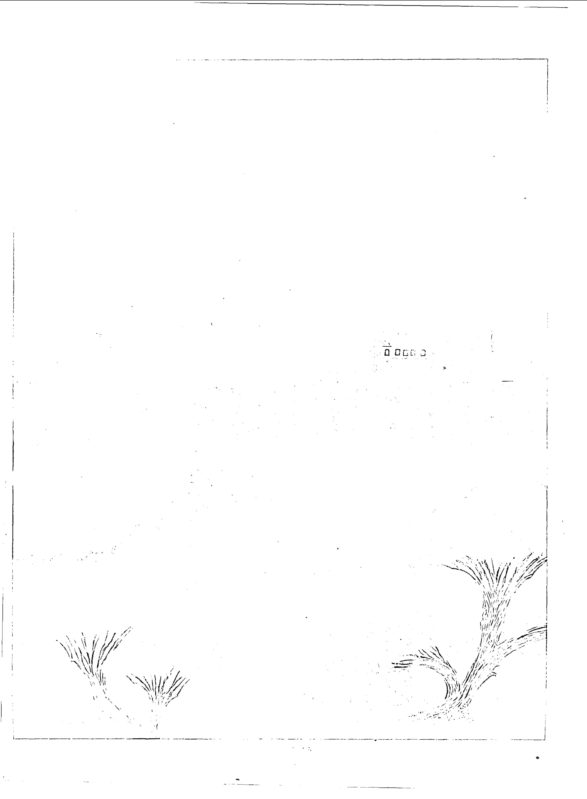

# 轉世的預言

能證實轉世的印第安漁夫

這裏所要談的喬治威廉的事例，更是富有趣味。曾居住在阿拉斯加東南部，生為印第安人的喬治威廉，在生前預告了自己的轉世，其結果與預告完全一樣。喬治威廉是一位捕漁技術很好的漁夫，他一直深信轉世之說，不過當他瀕臨死亡之際，卻反而對此事有些懷疑，但另一方面卻一直渴望轉世是個事實。他在死前曾對他兒子與兒媳婦說：「如果死後能夠轉世，我一定要轉世當你們的小孩。」接著他又說：「那個小孩身上會有與我身上一樣的痣，你們只要看到痣，就知道是我轉世的。」威廉的痣有兩顆，每一顆都是深黑色，直徑約為二公分，一顆在左肩上，一顆在左手的前端約六公分處。一九四九年，當喬治威廉駕漁船出海捕魚時，不幸被大風浪捲走而行蹤不明。不久之後，他的兒媳婦懷孕，在一九五〇年五月五日生下一個男孩，這是他們兒子十位小孩中的第九個。而嬰兒出生時，其身上的確擁有與祖父完全相同位置及形狀的痣，當兒子與兒媳婦看到此情況時，都感到非常驚奇，沒想到父親的預言竟然實現了，於是他們就將小孩取名為喬治威廉二世。不僅如此，當這個小孩逐漸長大以後，他的外表行為特徵，幾乎與喬治威廉前生一模一樣。曾對小孩本人，及其父母、漁夫同伴們進行調查的史蒂芬生博士，根據調查做了下面幾項結論：「當威廉在年輕時，曾因受傷，所以走路時總會拖著一隻腳，走路的方法很特殊，而威廉二世的情況雖然不像威廉那麼嚴重，但走路的方法卻相同。其次威廉二世對於船與捕魚的有關知識非常豐富，與其年齡不成正比，對在那個海灣有較多的魚也很清楚，另外，他曬網的動作更是一流。其次，喬治威廉生前曾給兒子一個手錶，而威廉二世卻能很快地從母親的保險箱中找到那隻手錶，並說：「這是我的手錶。」而且緊握手錶不放。究竟喬治威廉是為何能如他所願般的轉生？有關靈界的種種，還有很多我們無法解開的謎，或許是他認真的想法，打動神的關係吧！

# 人往往受前世記憶的支配

英國的瓊・格蘭特，其前世也是古埃及的法老，她一直主張人往往受前世記憶的支配，如有有些人摸到動物毛皮會害怕，那麼他前世一定是被動物害死的。此現象也可用來解釋人與人之間的認識。據說瓊和丈夫在十八世紀也是一對夫妻，後來兩人又投胎轉世到現在，更是相信前世是幸福的。

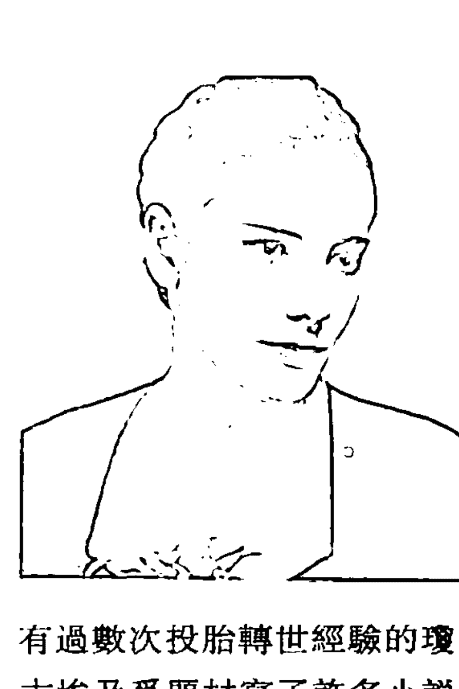

# 研究靈界的專家

亨利・希提威克（1837-1900）是英國心靈研究協會的會長，在就任會長的演講會上他曾說：「一個經過科學證實的真實，現在還讓人議論紛紛，實在是可恥的事。」

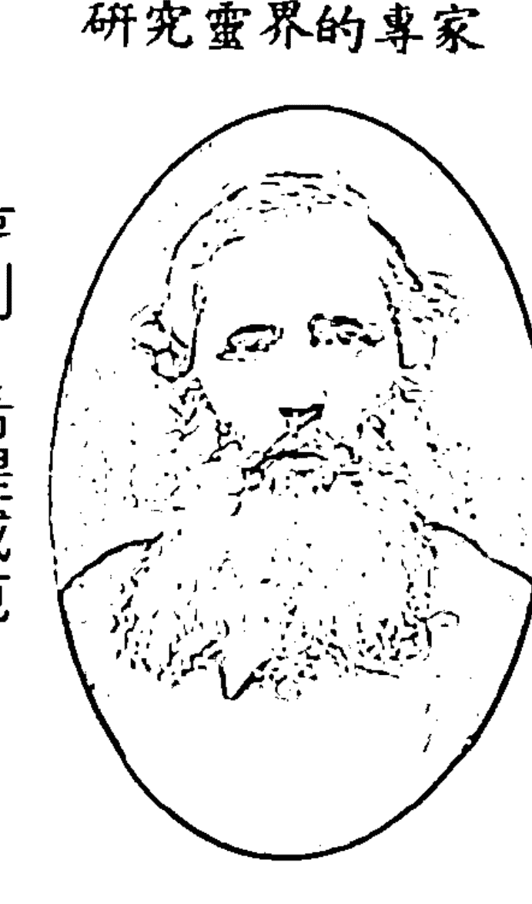

## 日本人勝五郎

——江戶時代的少年，詳細說出他前世的情形

證明轉世真實性的有關例子，在目前全世界各地都有記載，而其中有一個例子就發生在日本。不過現在大多數的日本人，對靈界方面的事都不太了解，那是因為他們未正視死後世界的存在性。

但是，現在所要說的例子，卻是聞名海內外的轉世實例。那是發生在江戶時代末期的文化十二年（西元一八一五年）。當時在武藏國多摩郡，也就是現在的東京都多摩地區，有一個農家小孩名叫勝五郎，而轉世的事情就發生在他身上。

勝五郎在七歲的那年秋天，突然間問他姊姊說：「姊，你在未生到我們家之前，是那一家的小孩啊？」他姊姊聽了就回答他說：「出生前的事情，誰會知道呢？」而勝五郎一聽姊姊這樣說，臉上突然露出驚訝的臉色，並且說：「難道姊姊對生前的事都不記得了吗？可是我怎麼都記得呢？」原來勝五郎在此之前，一直認為知道前生的事是理所當然的。

後來根勝五郎所說，他前世是一位住在附近程窪村，名叫久兵衛農人的小孩，六歲時因長瘡瘍而死亡，三年之後，他便又轉世到現在這個家庭。

聽了勝五郎這些話的祖母，就帶他來到程窪村，勝五郎不但能夠馬上指出前世的家的方向，而且一進家門後就立刻跑到他前世母親的身邊。據那家的母親說，他們的確有個兒子在六歲那年得瘡瘍而死，名叫勝藏，而其父親的名字也正如勝五郎所說的叫久兵衛。勝五郎對前世的記憶可說是完全正確。

在當時官方的記載曾留下以下的記錄：「勝五郎之父源藏曾提出申請，認為有關前面所描述的一切都沒有錯誤，但惟恐讓大家知道後會引起無謂的流言，所以希望大家能保守密秘。」

此事，被一位明治時代住在日本的英國文學家拉佛加提歐，以一篇「勝五郎轉世記」的文章發表出來，而後才廣為人知。

## ※靈媒

可喚來死者的靈魂，並使靈魂附在自己身上，或引發各心靈現象的人，就稱為靈媒。換言之，此種人就是具有可拉進死者與生者距離能力的人。

## 東方宗教也提到了前世

許多東方的宗教自古以來就具有投胎轉世的說法，而且擁有一套回憶前世的方法。假使你前往印度修行時，大師就會告訴你如何得知有關前世的知識，如果是修行佛教的南傳大藏經，則會提到「一生擁有二生，而且可回憶起許多前世的習性」。換言之，就是教人們如何回憶起前世的生活習慣與教養。

日本靈媒可與死者談話，傳達出來自靈界的訊息。

## 投胎轉世的真偽

足以證實投胎轉世的三個關鍵

「勝五郎的轉世記」強而有力的表示出在我們的世界中，確實存在有投胎轉世的實例，只要有機會我也想研究看看，因為我自己也想掌握足以證實靈界存在的證據。

以科學方法研究投胎轉世，其中含有幾個要訣，例如，有一個兒童開始說出他的前世記憶時，就必須檢查他下列四點：第一是初步確認，也就是檢查前世記憶是否有胡扯，或是第三人暗示。第二就是靈媒所談的前世記憶，靈媒通常是陷入昏迷狀態後才開始說話，如此就無法確定究竟是他本人的前世記憶，或是別人的靈魂的前世記憶，所以要將此視為投胎轉世的事，還缺乏嚴密的條件。

第三就是檢查是否屬於潛在意識。例如當事人很可能是在以前從報章雜誌上看過某人物的記載，後來忘了資料來源，而認為是自己的前世記憶。總之，把潛意識誤以為是前世記憶的可能性也相當的高。第四是記錯，也就是把幻想或夢誤以為是前世記憶，此錯覺也應在考慮範圍內。

但近年來反對投胎轉世的人卻提出奇怪的理論，向史蒂芬生博士們挑戰。他們的理論是，此種被證實為投胎轉世的現象，完全是生者的超級超能力所帶來的。

針對此點，博士等人則認為，投胎轉世的實例只要滿足下列三條件，就可打破超級超能力的說法。

第一就是擁有「死者生前的印象記憶」，也就是當事者不斷產生的印象記憶，都是潛存在前世人物的心底，而此記憶不同於年齡、職業等方面的情報，絕無方法以超級超能力獲知。第二是「死者生前所具有的特殊技術及行為特徵」。例如打漁的技巧等，絕不只是稍微了解即能熟練的。第三是「特殊的身體特徵」。也就是死者的身體傷口與投胎轉世的兒童身上的痣一致。這是無需說明的。所以最近一旦出現投胎轉世的例子時，有關人員都會特別重視此三點，以確定真實與否。

超越狀態時，靈魂就會現身

所謂的超越狀態就是指靈媒陷入半昏迷狀態的情況，有如一般人喪失意識的狀況，當靈魂附在靈媒的身上時，靈媒就陷入昏迷狀態。換言之，此時靈媒會失去自己的人格；而轉為靈魂的人格，此外，即使是不具有通靈能力的人，經過催眠後進入超越狀態時，也可使知覺與記憶發生變化，所以經過有關學者的研究之下，今後可能更容易研究出隱藏在其間的神秘力量。

超級超能力的假設
所謂超能力是指，可預知一般人無法用五官感覺出來的事物，而所謂的超級超能力，則是指此透視心靈感應及預知能力更高級的超能力。投胎轉世也就是超級超能力的一種，如：「可知道自己前世的一種能力。」

## 投胎轉世的西藏教宗

投胎轉世的達賴喇嘛

現在來改變另一個話題，我想談一談有關第十四代達賴喇嘛的事。達賴喇嘛不僅是西藏人民宗教與精神的領導者，也是人類精神的導師，是一位受全世界信任與信從的人物。

達賴喇嘛旅遊世界各地，經常會與宗教家、科學家、思想家交談，在談到人類未來新展望時，他都能以科學和古代睿智的角度來應對，而達賴喇嘛的智慧根源，就是源自於投胎轉世的思想，因為包括達賴喇嘛本身在內的所有西藏人都相信，各代的達賴喇嘛都是由前一代投胎轉世而來的。

達賴喇嘛十四世，在自傳「我的祖國西藏」中，曾詳細談到有關自己的投胎轉世。極受到西方人士尊崇的達賴喇嘛十三是於一九三三年去世，於是許多高僧就開始尋找十三世的轉世。此種搜尋是延自古代的傳統，以嚴密的方式進行，也就是利用祈禱與冥想所獲得的神喻做為線索，派出使者前往各地尋找可能的兒童人選，並反覆進行嚴密的測試。當時高僧就發現一個二歲的男孩，此小男孩一看到高僧就立刻向他走近，想坐在高僧的膝蓋上。

高僧當時穿著一件小羊毛皮的外衣，佯裝成普通的百姓，不過他的頸上掛著一串達賴喇嘛所用過的念珠，這個小孩對此串念珠似乎似曾相識，一再地央求高僧把念珠送給他，於是高僧對他說：「如果你能猜中我是誰，我就把念珠送給你。」這小孩回答說：「你是寬拉達阿加。」這是當地的方言，意思是寬拉氏的高僧。

另外，這個小孩更認出了假扮成首領人物的低級僧侶，並且叫出他的名字。原來這些人都是曾服侍過十三世的僕人。第二天一大早，當這一行人要出發時，這個小孩便從床上爬起來，一直央求要與他們同行。

「這個小孩就是我。」達賴喇嘛十四世以平鋪自敘的方式說明這件事。

## 有關前世的研究擴大了人類的知識

達賴喇嘛十四世，參加「另一種真實」的國際會議時曾說：「現在有很多人擁有明確的前世記憶，基於擴展人類知識的觀點而言，進一步研究這些人的現象是極有價值的。」達賴喇嘛十四世的這段話，主要是希望在混亂的世界中，能形成一股綻放光明的知識泉源。

## 如何證明投胎轉世

——達賴喇嘛轉世的證明過程

但是，這個小孩並沒有立刻便被認為就是達賴喇嘛十三世的轉世者。首先有關人員繪製了一張小孩出生時的天宮圖，並調查小孩的手腳與肩膀是否有一定的徵兆，也就是是否有特徵。如果通過此試驗，就必須再等到三歲時，再進行另一項嚴格的試驗。

其中有一個測試是，把一些外型幾乎一樣的東西混合擺在一起，然後由這個小孩選出達賴喇嘛十三世的遺物。此小孩從完全相同的黑色念珠中，取出了達賴喇嘛十三世所用過的念珠，並掛在自己的頭上，接著高僧們又以黃色的念珠進行同樣的試驗，然後再把裝飾的十分華麗的大鼓，與十三世用過的小鼓放在一起，讓小孩子挑選，結果小孩全部通過考驗，甚至與高僧談經典方面的知識時，孩子都能確實的回答。

「對於投胎轉世的兒童而言，能記住前世的言語，是常見的事，有些人不需別人教導就能背下整段經文，我和此高僧談過之後，才讓他們確認我就是那個小孩。」於是一九四○年，這個小男孩就被迎入拉薩的布達拉宮，成為達賴喇嘛十四世。

西藏的投胎轉世者不僅是達賴喇嘛，在西藏各地現在仍存有許多高僧的化身，對西藏人而言，投胎轉世是非常神聖的事。

另外讓我感到震驚的是，西藏尋找達賴喇嘛的方式，竟然與現代的心靈科學家思想所得，證實投胎轉世的方法是相同的，我們或可以說古代的智慧是何等的崇高，而大多數的現代人卻又是如此的愚笨。

總而言之，心靈科學家們一再證實的投胎轉世的實例，也可說是支配大宇宙的神祇遺志，現在我們應該確信投胎轉世的真實性。

西藏的輪迴圖。靈魂在每次轉世時就會變得越單純，最後到自由的境界。

## 細胞的記憶

人類在母體內時，是經由細胞、兩棲類、爬蟲類的進化過程，不斷改變外形，最後尾巴消失而成為人類。換言之，在人類數十億年的進化過程，已被濃縮為在母體內的十個月，而此時的比例正符合進化階段的時間。由一個細胞變為一個人體，此變化是要讓人類有再次體驗以前的所有記憶。

換言之，細胞記住了人體已忘記的過去。

中國的星座圖。中國人自古以來就認為人命與天體運行有極密切的關係，而天宮圖也說出了轉世的命運。

## 讀出前世

心靈科學家艾德佳・凱西的證明法

所有的人都具有前世的記憶，但這些前世記憶有百分之九十都被沈封在潛意識中，證實此說法的是美國心靈科學家艾德佳・凱西。

凱西利用自我催眠術，陷入深沈的無意識狀態中，然後將此無意識與患者的心連結在一起，藉以正確的診斷出症狀並治療患者。也就是說，是把患者的心置於「無意識」的狀態下，使自己站在患者的立場上尋找出真正的病因。

凱西亦可「讀出人的前世」，此無與倫比的通靈能力，可使自己直接進入患者的無意識的深處，找出平常完全被隱藏的前世記憶。凱西這一生中，所進行的這種「讀出前世」的實例，共多達兩千五百多件，而且均被完整地保存下來。

專心研究此記錄的是基納・薩敏納拉博士，其中最初的目的，是希望把凱西所找出來的患者前世記憶，和歷史上的事實結合在一起，以證實其真實性。

例如，凱西的患者前世是在一百多年前，也就是南北戰爭時代的士兵巴尼特・索依。基納便多方調查，想證實南北戰爭時是否真有此人。後來在維吉尼亞州博物館中的一座古資料庫中所保存的破舊書籍上，果真發現有其記錄，由此可證明，凱西所說之患者的前世是真的，而類似此例子還有很多。

儘管這些人都足以證實投胎轉世的真實性，但基納博士認為：「對患者而言，如果得知自己的前世情況，對今世的人生能帶來有利的影響的話，那麼探索前世才有真正的意義。」

暫時不管此論調是否正確，我們可以說，知道自己有前世就等於知道有靈界的存在，也就是確定生命的永遠性，所以當然可改變一個人的生活方式。

凱西也說過：「你不是前往天國（靈界），而是你在天國（靈界）成長，因為人生是連貫的，若不進就是退。」

——假如凱西的這些話沒有錯誤的話，那麼我們當然要選擇進步之道。

研究靈界的專家

艾德佳・凱西
（1877—1945）
美國偉大的心靈治療家，在四十三年之間，他曾經治療過三萬件的案例。凱西治療病患的過程，也獲得醫學界證明其真實性。

治療靈魂才能治療身心疾病
心靈治療家凱西可看出患者的前世，找出真正的病因而加以治療，所以絕無誤診的事例。換言之，凱西不僅是機械性的診治肉體，還非常注意靈魂的問題，他說：「肉體的治療很重要，但如果輕視靈魂而被捲入憎恨、敵意、嫉妒的漩渦中，則無法痊癒。」

> ※靈視
可看穿靈魂的一種超越普通視力的能力。例如千里眼或透視等等。遙視是可看穿物體的歷史，以及與物體有關的事件，凱西就是利用他具有的靈視能力看出患者的前世與未來。

## 活用在醫療上

前世的記憶能使人們自痛苦的深淵解脫

正因為凱西的偉大事蹟，使得這一醫療領域可獲得飛躍式的發展，以醫學上的說法，就是指催眠療法，也就是深入患者的內心深處，找出造成肉體或精神障礙的記憶，然後再除去此障礙的醫療方法。
美國的默里斯·巴斯泰博士，自己開設一家催眠醫療診所，他在為病患治療時發現了一個意想不到的事實。
一九五二年，他為一名主婦病患華吉尼亞泰進行催眠術時，華吉尼亞泰突然以愛爾蘭的口音說話，她說：「我是布萊迪·瑪菲。」默里斯·巴斯泰聽到之後大吃一驚，於是又緊接著向婦人提出問題，自稱是布萊迪·瑪菲的婦女就道出，她出生於一七九八年，父親是愛爾蘭的一名律師，後來她與布來恩·馬卡西結婚，婚後並沒有生下小孩。當她六十六歲時不幸由樓梯上跌下來而死。換句話說，在催眠中，這名主婦談到了她的前世記憶。
這件布萊迪·瑪菲的事件，經媒體報導後，令歐美人士興奮不已，因為這表示一項證實投胎轉世的新方法又被發現了，一位記者威廉巴卡，特地趕往愛爾蘭採訪，寫成一本書名為『布萊迪·瑪菲的真相』，總之，華吉尼亞泰所談的前世記憶，不論如何已被證實是真的。
這項布萊迪·瑪菲的事件，又產生兩大副作用，一個就是使許多美國人士的眼光又再轉向精神領域，據著名的輿論調查機構，在一九八二年的調查結果是，在每四個美國人中，就有一個相信投胎轉世，而另一個副作用是『前世療法』證實比催眠法更深入一層，也就是在催眠狀態下，使患者回到前世記憶，藉以治療精神或肉體方面的疾病。
此前世療法震驚當時世界各國，也使投胎轉世的研究向前邁出一大步，例如有一項報告指出，美國心理學家海倫·方巴克博士，為一千位自願者進行催眠時，所得的結果是：『約有百分之九十的人，可鮮明的回憶出前世記憶。』而再且後來也記載大多數的前世記憶，都是非常細微的，幾乎無法以一般手段獲得。

## 利用逆行催眠使記憶甦醒

一名催眠師對患者催眠說：
「你現在變回五歲，是否可看到四周有什麼東西？」陷入催眠狀態的患者，會把記憶推回過去，並憶起本身早先忘記或不知道的經驗，這就叫做「逆行催眠」。
此方法可有效的喚醒已喪失的記憶，如果將此方法不斷地發展下去，甚至回到前世，記起前世的記憶到底是什麼，這就是前世記憶。

> ※前世療法
得知前世可用來找出肉體或心靈的病因，但現在卻沒有一位可確實看出記憶的人，因此只好讓患者陷入睡眠狀態，使患者的意識回溯到以往，讓患者說出自己的記憶，找出病因及治療方法，此情況稱之為前世療法。

## 前世療法

——前世的人際關係足以影響現代的生活

加拿大的布朗是在二十九歲那年的冬天接受了前世療法，她從小就被支氣管炎所困擾，不管用什麼方法治療都無法痊癒，最好只好找催眠術。催眠術專家比巴利·傑恩運用方法使布朗進入神智昏迷狀態之後，她便想起二次大戰時，被關在集中營裏的事。

投胎轉世前的她，是一個住在歐州某小城鎮的少女，她與同鎮其他人，均一起被關在四周包圍有鐵絲網的集中營中，而在該集中營裏冬天特別的寒冷，因此使她羅患了支氣管炎。

「我雙手扶在鐵絲網上站著，一咳就會咳出血來，我當時一直在想，我不想如此活下去了，但沒有人注意我的一切，最後我終於一直咳到斷氣。」

在催眠法進行當中，陷入催眠狀態的她，似乎已暗示今後將不再受前世影響，事實上，自從一九七二年，接受此催眠法以來，布朗就不再受到支氣管炎的困擾了。

利用逆行催眠所誘引出來的投胎轉世的證據，在大多數催眠法專家的觀念裏均深信不移。

前世的異常性肉體疼痛或精神疼痛，以及死於非命的記憶，都會因用催眠法而從潛意識中湧出，此種人的靈魂對肉體往往會造成很大影響，這點催眠家們也都深信不移。

如摩里斯那薩頓博士，在其著作的『前世療法』一書中，就確信「投胎轉世一定是事實」。埃斯菲弗雷博士在其著作『我的前世在這裏』中也記載著：「我們已逐漸相信患者的前世記憶絕非單純的想像。」埃提斯菲弗雷博士所研究的主題是「在前世各人對各人的人際關係，對現在的婚姻生活及性生活會造成何種影響？」

「潛意識中的前世記憶，對於投胎轉世之後的微妙婚姻生活與性生活，其實還是會有影響的。

靈界與每一個人的靈魂，對於投胎轉世後的日常生活，與前世記憶的關係，目前正展開研究，從已研究得知的結果中，我們已可了解到，靈界與靈魂對投胎轉世者是相當重要的。

> ※心靈治療
只要觸摸到患者即可治癒疾病及身體殘障，這就是心靈治療。有時即使遠離患者，也可進行治療。現代的醫學雖然不承認心靈治療，但包括英國皇家在內的許多人，卻爭先恐後地拜訪英國靈學家艾德華先生。

第一次的經驗為何會令人如此留戀？
「此地我曾來過。」
「以前曾經有過此經驗。」
這些似乎是任何人皆有過的經驗，就像是一種古老的記憶，在一瞬間醒來，但一般人總認為是自己多心，於是一轉身就忘了，但這真的是多心嗎？如果這是我們的前世記憶突然甦醒呢？總之此種令人懷念的感覺，很可能就是前世記憶。

## 繼承前世的才能

在學習中回憶起前世的經驗。

我們人類在繼續前世的不只是記憶而已，現在就來告訴你一件發生在美國洛杉磯的一位名叫雷蒙特的少年故事。
在一九七一年八月，菲利達夫婦在自己家中庭園休息時，突然從屋內傳出很悠美的爵士鋼琴演奏曲，夫妻在驚訝之餘，匆匆地跑進屋內一看，原來是他們未足六歲的兒子雷蒙特正在彈鋼琴，而過去雷蒙特從未彈過鋼琴。
這個小孩看著父母親興奮的叫著：「爸，你看我的手指會自己動，很棒吧！
自從這次以後，雷蒙特一天要彈五小時的鋼琴，而他所彈的曲子，都是一九四五年已死去的鋼琴家華芝瓦拉獨特的爵士曲，瓦拉的音樂才華，在六歲的雷瓦特身上復活了。

「如果一個人展露出他原本完全不具備的才能時，這就表示此人是繼承前世能力的證據，而如果此項技能只有某人才有的話，那就表示是那個人的轉世者。
「對於人死後投胎轉世有研究的迪卡斯說了上述的話，他並確信雷瓦特的例子是「投胎轉世的例子」。

不過，「才能與前世」的關係，從很久以前就有人研究，古希臘哲學家柏拉圖就會說過：「如果有人很容易地就能學會某種技巧，這就表示他於前世就已會該技巧，所以才會這麼容易學會。」其次，十七世紀的迪卡兒，也如此的想過「每個人都有前世記憶，而這些前世記憶，都以素質、直感、才能、洞察力與超能力表現出來，這些全是暗示他在前世已體驗過這些事實。」

柏拉圖與迪卡兒都主張「所謂學習就是回憶」，如果是這樣的話，那麼雷蒙特少年他能彈出如此動聽的曲子，那的確是「突然的回憶」。並且這事實也說明了人類的文明，在人誕生之後就不斷的向前行，同時，對於投胎轉世為何會存在，已給我們一個重要提示。
根據上述種種，我們更應該更有意義的渡過現代人生。

## 家庭主婦寫出了與偉大作曲家相近的曲子

一九七○年倫敦發售一張不一樣的唱片，這張唱片的曲子聽起來會令人想到貝多芬、巴哈、莫札特等著名的音樂家。事實上這張唱片，是由一位不曾學過音樂的家庭主婦——布朗女士所作，這是經由靈魂所發生的訊息而表現在樂譜上的。作曲家貝尼特說：「毫無作曲經驗的人，絕不可能做出和作曲家如此相近的曲子，連我都無法模倣貝多芬的風格作曲。」

布朗女士是接收到已去世的名作曲家訊息而寫下樂譜

此幅畫是描述某人已逝去的好友在靈界的情形。據說這是由這位已逝去的好友指引才畫成的，由畫面中可得知靈界也有愛情。

## 解除死亡的恐怖

——使前世記憶喪失的現代社會

前面所敘述的種種實例，事實上已無法否定投胎轉世的真實性與存在，並且說明了所有的人都具有前世記憶，而且剛出生的嬰兒，其全身更具有靈界記憶與靈力，不過此種能力在出生幾個月到一歲之間，通常就會慢慢喪失。

為何靈界記憶，也就是前世記憶會慢慢消失呢？有關此點對於瀕臨死亡者相當有研究的世界知名的羅斯博士，會做以下頗富情趣的說法：

> 「這是相當奇妙的事，儘管人類的嬰兒都是在完美、自然的情況下誕生，而他們的神情也都顯得很溫和。」其理由是他們的心裏還不具備有瀕臨死亡的恐怖。但這世上的種種邪惡，導致人類造成瀕臨死亡的強烈恐怖感，最後還會慢慢地把嬰兒靈界的記憶抹剝掉。

> 「人類從出生到六歲，靈界的記憶尚存在心底，因此這是最幸福的時候，然而後來此靈界記憶，就會被自然界中的豐富感情抹煞掉，不久知性部份便會開花，接著進入思春期之後，心靈部份才開始發芽，心靈成長發芽後，自己便會慢慢了解想成為何種人，想回到何處去，自己的人生就會跟隨著體內心聲走，此後自己不但要面臨步入死亡的恐怖，同時要接受一切人生的準備，而人本來就是如此存在的。」

事實上，與生俱來的靈界記憶與前世記憶是共存的，對人類而言是最自然的，這是羅斯博士曾說過的一句話，若果真如此，那我們都能過一個豐富的人生。但由於遭到物質主義的污染，現代人類世界已不允許有此事存在，因此，你與我在靈界的記憶以及前世的記憶，也已消失殆盡了。

那麼，我們應該如何是好呢？羅斯博士強調：「只有接受死後生命存在的事實。」並且了解死與生與愛是一體三面的事物才好。

「敞開心胸，若能從沈默中聽到內心的聲音，那表示死亡已不存在，且能看出人生道上的積極目標。」所以請大家敞開心胸吧！

# 研究靈界的專家

尼爾斯·亞可布森
現代瑞典的精神醫療家、及投胎轉世的研究家。終其一生都在努力有關投胎轉世的真實性，1974年出版「不死之身」一書，由書中可看出他的想法。

## 嬰兒具有超乎我們想像的能力

早在母親懷孕第五、六個月起，胎兒的中樞神經記憶體就開始產生機能。美國精神科醫師湯姆，經過長久的研究與實驗發現，胎兒也擁有一種由不明的記憶系統所產生的行為。湯姆指出：「胎兒有相當程度的思考能力，且此能力已經由實驗證實，無庸置疑。」

如果死亡是指解脫物質的束縛，那所留下來的肉體不過是個空殼子而已。

## 生存的使命

——更有意義的生存是靈魂淨化

如果靈魂能淨化，那麼人類又為何一再投胎轉世呢？對人生的目的，兩位偉人曾提出說明。

首先是羅斯的說法，他說：「人生的目的就是為了學習成長，並達到靈性的淨化，而我們活在世上也就是為了要學習知識與接受考驗，學會了神所教的，通過考驗時，那麼死就會從肉體上畢業，意思是我們的靈魂已向前淨化一大步，只有靈性存在，才能享受永遠的生命。」

這也就是指最後歸於大靈界的天界層，而不再來到人世使肉體受折磨，不過現代社會到處充滿著殺人、騙人等防礙靈性淨化的理由，在此混亂的世界裏，我們想要僅以一次的人生，就要學會神所教的課，那是不可能的，所以只有一再投胎轉世慢慢學，才有可能使靈魂淨化，這就是羅斯博士的說法。

另外，就是瑞士的精神醫學博士楊格的說法。楊格闡明了人類都具有龐大的潛意識，而在每個人的潛意識深處裏，都存有人類出生以後的一切記憶，此位大學者如下說到：

> 「對於我現在的生存，可做如此的想法。我過去也曾生活在世上，而在當時曾遇到無法回答的問題，或無法完成的工作，所以必須要再投胎轉世一次，即使我死了，我的所做所為，也將跟隨我而去，而我們每個人都富有創造的使命。」

照如此說法，那我們在人世間，就沒有為任何目的的生存了，就如同泡影一般無依無靠到處飄，在神的大意識前提下，你我都不斷地生存著，而我們之所以不斷生存是為了要藉此讓靈魂淨化，透過靈魂的淨化，讓大靈界更為豐富。

親愛的人們，你務必意識前世的存在，並將當世的使命，好好銘記在心。

※潛在意識等於無意識
所謂潛在意識是指無意識在精神內側不斷進行的心靈動態，每個人都曾有過此經驗，例如一直想不起某人的名字或日期，但後來卻在毫無關係的情況下突然想起來。在人的內心中，無意識可說是最不開放的部份，但卻深深地左右了每個人的行動。

達賴喇嘛十四世的箴言：
「轉世可產生普遍愛。」
達賴喇嘛十四世以此美麗的話來詮釋轉世的意義，他曾說：
「投胎轉世的信仰可產生普遍的愛，包括我在內的所有生物，在無限的生命流程中，都是需要來自雙親及兄弟姊妹、親朋好友的愛。我們的宗教所獎勵的品德，皆由此普遍的愛，也就是寬容、慈悲、親切、愛憐等所引發出來的。」

研究靈界的專家
卡爾·楊格
（1875—1961）
瑞士心理學家，研究過夢與無意識狀態。他認為在人體內部皆隱藏著由祖先傳下來的經驗，而成為每個人所共有的經驗。

## 何謂靈魂出竅

靈魂脫離肉體到遠方旅行

我們的靈魂在睡眠期間或某種無意識狀態下，會脫離肉體到遠地去，或飛往另一個與現存世界不同的世界去，以下就舉出一個例子，提出此報告的是日本優秀的心理學家岸田秀氏（早稻田大學教授）。

「當我還是中學生時，就經常發生這種不可思議的經驗，每當我想睡，蓋上棉被時，就會感覺到我的身體向上飄浮到天花板，在天花板附近飄浮一會兒後，便由開著的窗戶飛出去到外面的天空上，由城市的上空往下看，看了一陣子後再經窗戶飛回來，當然此時我的身體還在棉被下一動也不動，這點我的頭腦還很清楚，這絕不是夢，在途中都是睜開眼的，所以能確定靈魂的存在。」

這就是所謂的靈魂出竅，經驗者當時可感覺到在空中的自我，以及在棉被下的身體兩者之「雙重存在」，並且靈魂還可具有知覺，那不是肉體，確實是肉體以外的另一人的存在。

如此說來，靈魂也是靈與靈界方面的東西，而人類會發生靈魂出竅，足可證明靈與靈界的存在。靈魂出竅的經驗，是我們的靈與肉體獨立進行活動，而本身能體驗出來的唯一心靈現象。此種經驗自然會讓人確信投胎轉世的可能性，所以靈魂出竅是繼投胎轉世之後，第二個可證明靈界存在的證據。

心靈科學上稱此經驗為 O O B 體驗（Out of the Body Experience），而心靈科學家更想以更客觀、科學的方法證實此經驗的存在。因此他們蒐集了許多例子進行實驗，並且一本正經地研究其真實性。

靈魂出竅的經驗是具有相當嚴密的定義，也就是經驗者能確信自己在正常情形下無法到的地方，並且可意識到這不是夢或幻覺。此種 O O B 體驗不是夢或幻覺，因為當醒過來後感覺還會持續，此種非夢的經驗會留下記憶。由這些例子可證明，靈魂出竅是真實的經驗。

## 靈魂出竅究竟是什麼現象？

塔特首先假設在人的內心中，有一種不同於物理性的空間及能量，換言之，人是由心靈與身體兩種物質所構成的，此兩種物質雖有不同的特性但卻息息相關，所以在一般的情形下，無法感受出兩者是各自存在的，但在靈魂出竅時，心與身體卻能各自分離，而分離後卻又互相吸引，所以肉體本身還是擁有實際存在的感覺。

## 空中浮遊

## 英國作家經歷過的靈魂出竅

以下再介紹另一實例，是英國作家福克斯的親身體驗。在大學攻讀電子工學的福克斯，在他所寫的「靈魂出竅」一書中，非常客觀而詳細地介紹了他的經驗。

一九三八年三月一日晚上，福克斯決定進行靈魂出竅的實驗，根據數十年來的經驗，他已經輕易的達成靈魂出竅。這一天他很輕易地便飄浮在空中，一邊增加速度一邊飛行，不久天色由晚上變為白天，他親眼看到了耀眼的日出。

接著他來到美麗城鎮的上空，所以他決定下去看一看，他降落的地方是一個小公園，整個花園開滿了夏天的藍花，在此大清早，他信步走在人煙稀少的街道上，兩旁建築物的風格非常特殊。

「不久，我來到湖畔，湖邊有一座古意盎然的美麗住宅，有一位女子正坐在這幢屋子的窗戶往外看，野雁在湖中游泳，岸邊是一排樹木，湖水淹到湖邊的小路上，我走在此路上，腳掌浸在水中，但卻毫無感覺，這時躺在倫敦家中的我卻在呼喚我，剎那間我就回到床上的身體內了。」

福克斯指出這段「靈魂出竅」的持續時間約為廿分鐘，且在這段經驗當中，他完全可意識到自己的靈魂出竅，而自己的肉體仍躺在床上。

這段敘述與一般「靈魂出竅」的經驗幾乎一致，但重要的是，後來卻證實了他飛天後所造訪的城鎮，是位在歐洲北方的一個小村莊，他的一位友人在聽過他的經驗後，某次因公訪問歐洲各地時，突然發現一類似福克斯所說的城鎮，在驚訝之餘，他畫下了一詳細素描，並帶回當地風景的名信片，事後經福克斯的確認，那的確是他造訪過的小鎮，換言之，福克斯利用「靈魂出竅」前往他未曾去過也未曾聽過的遠方小鎮，而且剎那間又回到倫敦的肉體。

總之，在此經驗中，可說是他的「第二身體」前去那個小鎮，而且那是一個可在小路上漫步，雙腳可浸在湖水中，卻又不會濕的身體，我們稱此身為「靈魂」，經由這些「靈魂出竅」的實例，我們可清楚地看到靈魂的概略情形。

## 印度古聖典中也談到靈魂出竅

古人也有過靈魂出竅的經驗，如印度婆羅門教的經典吠陀經中的其中一節就曾談到：「他的靈魂脫離肉體，他沒有睡，眼睛正注視著睡眠器官，在微光照射下，他返回屬於自己的地方。房間的靈魂啊！飛翔的鳥兒啊！這是一個由生命所守護的窩巢，他們希望能由此窩巢攀上永不死亡的高峯，他想飛往不死的境界。」

## 靈魂出竅的經驗

由第三者證實靈魂的存在

在探究靈魂的真相前，必須知道心靈科學的方法，因為足以成為探討靈魂的資料，都是經由心靈科學上所得知的。
心靈科學的方法之一就是實驗，事實上在這世界上有不少人可隨著自己的意識而脫離自己的肉體。如果能在準備完善的實驗室中證實「靈魂出竅」的話，就足以證實其真實性。

一九六八年，加州大學心理學教授查爾斯·塔特博士以電子工程師羅伯特·門羅為受試者，進行一連串實驗。自一九五八年以來，門羅就曾體驗過數次非常明顯的「靈魂出竅」，同時他也能隨著自己的意志隨時達到「靈魂出竅」。塔特博士將各種裝置裝在門羅的身上進行實驗，儘管實驗非常困難，但在第八次實驗中，門羅總算成功地達到「靈魂出竅」。

這項報告指出門羅的靈魂脫離肉體，經過一黑暗的場所，看到了一對正在走廊上講話的男女，而這個女的就是檢查技師，男的是她的丈夫，而門羅的敘述與事實完全一致，甚至連這名男子的容貌也描述得非常詳盡。門羅又說：「我為了吸引女技師的注意，曾偷偷地捏了她一把，但她並無任何反應。」

但是美國心理研究財團的羅伯特·莫利斯博士的報告卻更為驚人。莫利斯博士以一位名叫史丘圖·哈拉利的學生做為受試者進行實驗，正當證明學生處於「靈魂出竅」的狀態時，莫利斯博士斷言「看見了閃閃發光如幻影一般的物體」，換言之，在這項「靈魂出竅」的實驗中，由第三者看見了當事者的靈魂。

而前面所介紹的福克斯曾說：「靈魂出竅時，我的『第二身體』無法被一般人看到，但有時卻能被人目擊。」他又說：「當我利用靈魂出竅去拜訪某人時，往往能讓對方感到驚訝，因為對方可能真實的摸到我。」但遺憾的是，塔特與莫利斯博士都無法證實此實驗就是「靈魂出竅」，因為他們所用的機器無法以數據檢測出脫離肉體的『第二身體』，不過我們或許可說，機器是無法檢測出屬於靈界的靈魂吧！

研究靈界的專家
羅伯特·門羅
（1916—）美國人，約在四十二歲時，首次經歷了靈魂出竅後，他便以科學方法鑽研靈魂出竅的體驗，並開創出一套獨特的方法，可簡單地改變自己的意識，而體驗靈魂出竅。

小貓—感覺到靈魂的存在，馬上就顯現出一貫的反應
摩里斯博士為了證明靈魂出竅，曾進行過多種實驗。他對具有靈魂出竅經驗的學生做實驗，並利用自己心愛的小貓做為見證者。結果當摩里斯的學生進行靈魂出竅時，他心愛的小貓就會產生某種特定的反應，由此可知，人類無法以肉眼看到的靈魂，小貓卻可以感覺到的。

曾有過靈魂出竅經驗的門羅博士，其所著的「靈魂出竅經驗」一書的封面。

## 小小體驗

任何人平常皆會發生「靈魂出竅」

因此，心理學家就利用第二個方法來證明「靈魂出竅」，最主要是利用眾多事例及統計數據來闡明「靈魂出竅」的真實性。有些讀者到這裏或許覺得未搔到癢處，其實談到「靈魂出竅」時，每個人都應該有經驗過才對。不論是我，或是我的親朋好友，都曾有過「靈魂出竅」的經驗，即使在世上也經常不斷地發生「靈魂出竅」的事例。

一九五三年，社會學者霍尼·哈特曾向一五五位美國大學生做問卷調查，題目是「過去你是否曾站在床邊看過自己的睡相，或在床邊來回飄盪，或完全脫離肉體，並看到自己的肉體。」其中約有三十名以上的人，答案是「有此經驗」。

一九六八年，世界最權威的「靈魂出竅」專家，牛津大學精神物理學研究所所長西里亞·格林博士也提出了類似的研究報告。格林針對牛津大學的三五○位學生進行調查，結果有百分之三十四的學生答案是「有過靈魂出竅的經驗」。此外，格林博士經由BBC（英國廣播協會）及全國新聞媒體，向全英國人民徵求「靈魂出竅」的經驗報告，結果收集到約四○○件可信度很高的例子。根據分析指出，體驗者的比例中女性佔百分之七十以上。她們大多在做家事、或整理花園，或茫然坐著、走著的情況下，發生「靈魂出竅」。

總之，每個人都可能有過靈魂出竅的經驗，難道你敢說你從來沒有過突然飄在半空中的感覺嗎？其實，這就是靈魂脫離肉體，而自由活動的象徵。

對此種人人皆有的體驗，你又做何看法呢？

## 睡眠中幾乎所有的人都會體驗過靈魂出竅

靈魂出竅並非少部份人的特殊現象，門羅博士認為：「在睡眠中幾乎所有的人都能體會到靈魂出竅，只是程度上有所差別，其差別便是來自於事後對靈魂出竅記憶的強弱上。」另外，當我們年紀小時，每一個人也都有過靈魂出竅的經驗，因此靈魂出竅應是一種很普遍的現象。

# 研究靈界的專家

布里亞·格林（1935—）現代美國最具代表性的心靈研究家之一，也是第一位研究心靈出竅體驗及自覺夢（一種自知是夢的夢）的人。

## 靈魂的白光

靈魂散發出光芒

進一步分析靈魂出竅的實例，可發現有幾個值得玩味的共同點，在典型的靈魂出竅例子中，必定含有以下幾個要點。
(1) 體驗者會飄浮在半空中。
(2) 在體驗途中，體驗者可從遠離肉體的地方看肉體。
(3) 佔在肉體的外側時，只要一想到那個地方，就能立刻飛到那裏去。
(4) 體驗者會有一個非物理性的身體。
(5) 這種非物理性的身體不受重力影響，也可穿透物體。

這就是從肉體脫離出的「第二身體」的性質，但對體驗者而言，究竟有何感覺呢？一位體驗者如此說：
「對我而言，那是一完備的肉體，但卻有不同於普通肉體的其他部份，它不是物理性肉體，只可說它是具有能量形態的物體——這位體驗者的感覺是，那不是物理性身體，卻有一種與自己肉體相似的形體，有些體驗者認為，雖然「第二身體」是透明的，但卻是由自己肉體複製而成的。
「或許可說它是我的生命，或是我自己，也可說我的靈魂吧！不管如何來稱呼它，我都可感覺到他是有密度的物體，但並不是物理性的密度，也說不出來，反正就是類似一種波動，並且沒有實體，可感覺到充滿某種電氣。」——換言之，此體驗者是感受到一種電磁場之類的東西。

有些人則把此體驗比為像是一層霧氣、蒸氣、白雲等，更多例子指出當靈魂脫離肉體時，本身大多會散發出光芒，甚至有許多報告也指出，肉體與出竅的靈魂之間有一條光帶連接著。

進行此分析的雷蒙特·木迪博士指出：「不論那一項報告，有關新肉體的特質，大抵上一致的，以我決定把新肉體命名為「靈的肉體」，而就是靈魂的真正姿態吧！」

當通靈者A·達納斯在進行靈魂出竅時，就會唸著：「我的心啊！快到××去吧！」

一百個人中約有二十人具有通靈能力
靈魂出竅是可在有意識的情況下辨別的，此種具先天通靈能力的人，也就是所謂通靈人。且每一百人就有二十位通靈者，但這二十個人中，卻很少有人會注意到自己有此超能力。其次，具有中等靈能力的人是百分之二或三，而且有強度靈能力的人則更少，說不定你就是其中之一！

這是一九三六年拍攝的靈魂照片，此靈魂似乎具有某種「具體」的「外形」。

## 三田光一的「精神旅行」

——日本與倫敦之間的靈魂出竅

木迪博士所說的靈的肉體，就是把現代科學無法分析的實體，被視為是由一種稱為「星體」的高級物體所構成的，假設此說法正確，那麼福克斯、門羅等人就是利用意志力來控制「星體」，且有意識的來進行靈魂出竅。
在日本也存在有這類人物，例如在大政到昭和年間非常活躍的通靈人三田光一就是其中之一。
因為「心靈與神秘世界」一書而聞名的日本福來友吉博士，曾在此書中介紹三田光一進行靈魂出竅時的情形。此實驗是在一九二九年的正午進行，地點在大阪野春大廈的日本地下水協會事務所，在協會會長、理事長等多人的見證下，福來友吉博士對三田光一提出問題。問題是希望三田光一把放在倫敦郊外的英國通靈者霍普的肖像，在大阪顯影出來，而此顯影的鋼板，則被密封在事務所的保險庫中。
霍普是英國心理研究學會所公認的著名通靈者，福來友吉博士在出國進行心理研究期間，曾和他攜手做研究，福來友吉當時希望霍普能送他一張照片留念，後來霍普卻忘了一直未寄出，因此福來友吉博士就希望三田光一在日本利用超能力，使此照片顯影出來，並藉此震驚全世界的通靈者。
三田光一不曾見過霍普，當然也不可能見到連福來友吉博士都未見到的照片，因此他集中精神，嘗試利用靈魂出竅飛往霍普的身邊。
「我來到英國倫敦郊外的克爾頓時，看到了霍普，他單手放在桌上，用一雙充滿權威的眼睛注視著窗外，我把它當時的樣子拍成五張照片，正當我要回來時，又順便看了一下郊外的風景、有水、森林、草原等，天空則被夕陽染紅了，這是一幅很令人沈醉的景色，所以我又拍下了第六張。」
集中精神約一分四十秒之後，三田光一做了以上的報告，這些鋼板立刻被帶回東京沖洗出來，福來友吉博士看後也立刻打電話給三田光一，電話內容是「完全成功」。福來友吉——這實驗的結果非常完美，三田光一稱此靈魂出竅的經驗為「精神旅行」。

## 靈魂脫離肉體來到月亮背側拍下照片的三田光一

三田光一是最有名的靈魂出竅實驗者，這就是他利用靈魂出竅所拍到的「月亮背側」的照片，此照片現在還展示在日本岐阜市公會堂內。這張照片是在數百位觀眾的見證下所拍到的成果，而此照片也比蘇俄的衛星太空船所拍的月亮照片早了二十六年就拍到了。此照片的「念力照片證明書」上還保存當時警政署長以及工商會議主要人員的簽名。

研究靈界的專家 福來友吉
（1871—1952）
日本第一位心靈研究的創始者，也因為發現心靈攝影而聞名於世。他經由心靈攝影而相信靈魂的存在，終其一生都研究心靈學。

## 波瓦的冥想

西藏密教所流傳的靈魂出竅的秘術

三田光一為了要讓靈魂出竅而進行了精神集中，換言之，也就是所謂的冥想，例如在西藏的達賴喇嘛世界裏，為了達到靈魂出竅，所以必須具備「波瓦冥想」，不僅一般喇嘛需要修行，同時也廣傳於西藏民眾。

此種藉波瓦冥想而能靈魂出竅的人不少，在日本也不乏人，曾經不斷發表有關精神世界特殊報告的日本宗教人類學家中澤新一氏，就是其中之一。

在中澤氏所寫的書中曾有如下的描述：
「我進入深山中修行，從第二天開始，我的頭就感覺到嗡嗡叫，並且有疼痛感，最後我不得不停止修行，由此可知想進行波瓦冥想，是要有相當技術才行。」

所謂的波瓦冥想，就是不管死亡何時造訪，你都要一動也不動的，要確實使心靈脫離肉體，轉移到更高狀態一種技巧。

根據「西藏死者的書」中之描述，人類的肉體以眼口鼻為首共有九門，而我們由於受由此九門進入的感覺所牽絆，以進入種種迷惑中，但唯一只有頭頂的門才是能使靈魂出竅的門。但此門一般人都緊閉不開的，若想要使靈魂出竅，就必須先打開這道門才行。

而要打開這道門不能用開刀的方法，此神秘之門唯有藉著精神一致，也就是藉著潛藏在內心深處的心靈能力才能打開。而發揮此心靈能力的方法，便是「波瓦的冥想」。根據中澤氏所言，要修行此技術是很辛苦的，首先必須在自己胸前，將心靈能力現實化，然後在胸前浮起「紅光之水滴」，能達到此境界之後，冥想者便會逐漸呈現靈魂出竅的情況。同時「紅光之水滴」也會變成強大的力量衝向頭頂，而眼球中也能感覺到散發出藍色火花般的光芒，若能達到此境界，就表示已做到靈魂出竅。

## 教導靈魂出竅技術的學校

在西藏有一所「喇嘛學院」，這是一所聚集了許多難民，並教他們冥想方法的學校。目前聽說學校已漸獲外界的認同，而該學校還教導密教文獻中所記載的，瞬間從一地飛到另一地，以及消失的技術。

# 研究靈界的專家

亞瑟·柯南·道爾
（1858—1930）
英國著名的作家，曾著作過「福爾摩斯」系列，也是最偉大的傳教士之一。他擁有三十年以上的心靈學研究經驗，並曾訪問過許多國家，進行心靈思想方面的演講。

## 喜瑪拉雅山的聖者奇蹟

——超越時間與空間的靈魂呼喚肉體

以像波瓦冥想的宗教性修行，或從古時所傳的秘術，而能自由進行靈魂出竅的人，有時能發揮一種神秘且驚人的力量。如美國的採礦專家史柏爾丁格，在穿越喜瑪拉雅山時，告訴他喜瑪拉雅山詳細情形的人，就是印度教大師艾米爾。史柏爾在其著作「喜瑪拉雅山聖者的生活研究」一書中，曾提到有關艾米爾所展現出的種種奇蹟。

那是發生在一九二一年聖誕節那天的事。由印度一個貧民村莊出發向深山行去的史柏爾一行人，花了五天的時間才來到了一百四十公里外的目的地，在他們要投宿之前，原本應該還在他們後面的艾米爾大師，竟然神情從容的站在房子前面。一行人所走的路線，是相當險峻山路，而且是通往深山中唯一的一條路，在中途並無人發現艾米爾大師超越他們，史柏爾一行人看到此狀況時頓時啞口無言，接著才問大師為何會如此？師回答說：

> 「人類原本存在實相中的一種無限，是不受時間與空間所限制的，而若能了解此狀況的話，不管多遠都能在瞬間到達。瞬間前我還在出發的小村中，你們現在所看到的我是我的靈魂，我的肉體還在村裏。」

不過，艾米爾師又說了更令人感到奇怪的話：

> 「我的肉體在黃昏之前，會一直在村中，而後就會被喚到此地，其實這也沒什麼神秘可言，此事連我的兩位弟子也可做到。」

艾米爾大師所說的話都是事實，後來此事已經由留在村中陪伴大師的兩位隊員證實。

> 「我那天下午四時左右，一直與艾大師聊天，但過了四點之後，大師突然說『先走的那些人，現在應該已經到了，我去和他們打個招呼』，然後大師就躺在椅子上休息，不久之後身體就不動了，到了黃昏時，身體漸漸變模糊，最後竟然消失了。」

即使是現在的我們，你無法確定此事真偽，不過根據許多古代流傳下來的文獻，均確信此聖者是存在於世上的。靈魂若能超越這不久將滅的肉體，而以更高層次存在的話，那麼這些我們所無法想像的奇蹟，就無足大驚小怪的了。

## ※實相

這是佛教的用語，是指所有物體真正的姿態，也就是指眼前所看到的真實事物，這是很難用語言表達的。當提到「人類原本在實相中就是無限的，只是不了解時間與空間的限制」時，也就是表示「人類是永遠的」之意。

## 禪宗高僧的腦波與靈魂出竅者相同

近幾年來，應用在睡眠以及意識形態研究上的腦波分析法，對靈魂出竅的研究方面有很大的成果。根據許多實驗的資料證明，在進行靈魂出竅中，腦波要比平常來得高，而此腦波與禪宗高僧進行冥想時的腦波是一樣的。高僧在坐禪時，雖然不認為是靈魂出竅，但對於這種腦波一樣的情形，就讓人覺得很奇妙了。

會飛上天空的尼泊爾亞麼像，並非空想的產物，說不定是依照真實聖者的形象所塑造的。

## 來自靈界的報告

——獲取大靈界情報的巨人

在這世界上最令人驚奇的靈魂出竅經驗者，是十八世紀代表的科學家瑞典柏格。瑞典柏格曾留下十七種不同類型，多達一五○冊的龐大著作，是一個對世界有貢獻的記錄者。瑞典柏格是一個活躍的議員及政治家，但是他留給人們最大的遺產，卻是有關他自行前往靈界旅行的報告「靈界著作」。

瑞典柏格將靈界的情形，詳細地加以描述，在這本著作前面，他曾寫下序言：「我在過去的二十幾年裏，經常把肉體留在世上，而變成靈魂出入靈魂世界，並且在那兒和許多靈魂交往，看到了不少事情。我在這本書所記載的，就是我本身在人類死後的世界與靈界那兒所經驗的一切。」

接著他又說明了分離靈魂與肉體的方法。

據他的說法，首先是躺在床上，但並不是完全的睡著或是睜開眼睛，而是使自己置身在半睡半醒的特殊感覺之中，這也就是引導自己走入精神模糊狀態，這些任何人都可能發生的情況，而在靈魂出竅報告當中，也常見到此情況。

不過，瑞典柏格的情形，是能在那種模糊的狀態下，還能控制自我的靈魂，且能將靈魂引導到清醒的狀態裏，而隨著此種清醒，靈魂就能離開肉體。

「我的靈魂離開肉體之後，會在二十至三十公尺的低空上往下看，此時便能看到我的肉體還躺在床上。可是有次我看到我的肉體時，發現頭部靠在床沿，當時我的靈魂就想到：『如果這樣躺著的話，頸部就會很累，說不定還會窒息，我應該把身體移動一下才是。』當我的靈魂如此想時，我的肉體竟然移動了，頸部也就移動到適當的位置。」這個例子也跟其他有關靈魂出竅的報告十分类似。

不過以下就有點不同了。瑞典柏格的靈魂不久之後就逐漸無意識到自己的靈魂，而能自由的脫離肉體，並以此狀態自由自在地出入靈界各區，與各個靈魂交談，而此時他的肉體看起來卻簡直像完全喪失意識的死亡狀態，這是在靈魂出竅的經驗者中較少看到的情況。

# 研究靈界的專家

瑞典人，他能在精神狀態下進入靈界，且能和靈界的人士自由交談，就像與活人談話一樣。

## 預言自己死亡日期的靈人瑞典柏格

瑞典柏格在死亡的前一年，曾寫信給一位叫威斯提的牧師，信中預言了自己的死亡：「我了解你希望在靈界中與我碰面，我將在一七七二年的三月二十九日離開人世，由於我已決定要成為靈界之靈，所以事先來告訴你。」而根據調查，瑞典柏格的確是在他自己所預言的時間死亡的。

## 精靈界 (一) ○○○○○○

人類死亡之後靈魂首先前往之處

靈魂出竅到靈界旅行的瑞典柏格的經驗，究竟給了我們什麼呢？在他的經驗中，最重要的一項就是有關精靈界的報告。
瑞典柏格曾經說在人類世界死亡之後的人們，首先到達之處就是精靈界。人死後並非馬上變成靈界之人，而是先到精靈界，然後再到靈界，若被允許的話，便成為永生不滅的靈魂。換句話說，所謂的精靈界，便是居於人世與靈界之間。
為什麼瑞典柏格的報告，對我們而言是如此地重要呢？這是因為精靈界是我們邁入靈界準備獲得永生之前所必須去的地方，也就是一個迷惑與試驗的地方。
在精靈界中的許多精靈，還會存在一種錯覺，就是覺得自己還未死，即使引導他的靈魂告訴他已變成精靈了，但由於精靈界與人界相當的類似，所以常使他們產生混亂，瑞典柏格就曾聽過這些靈魂在竊竊私語說：
「我本來以為自己已經死了，可是又好像還活著，這到底是怎麼回事呢？究竟覺得生是幻覺，還是覺得死是幻覺呢？」
在精靈界中，死者會逐漸地將在人世界中所有的感覺慢慢從記憶中捨棄掉，而變成「素」。另外，死者的本性也會漸漸變得模糊不清。
「如果一個人完全捨棄了與社會及人的關係，半夜時，在自己的房間內進行冥想，來觀察真正自我的心，這就是一個人真正的心靈姿態，這也是已接近靈魂的真正姿態。」
瑞典柏格做了上述的說法。但在精靈界發生混亂的死者，便是那些無法在生存時，看出自己心靈真正姿態的人，因此瑞典柏格又寫到：
「我在這要向世上的學者，以及宗教界的傳教人員提出建言，由於一般人在世時都已了解有死之世界存在，因此剛進入精靈界的靈魂便會產生迷惑，甚至也會產生苦悶，這究竟是為什麼呢？這就是因為世上的學者或傳教的牧師，未教人類去了解人的本性與靈魂、及靈界的種種，讓一般人誤以為世上只有物質界的緣故。」

瑞典柏格也是一偉大的科學家
身為通靈者而聞名的瑞典柏格，本身還是一位著名的科學家，特別是在礦物學、天文學、工學等方面有很深的造詣，另外在物理學、動物學、解剖學、經濟學等方面也有不少成績；其次，他還提出有關飛行機械、潛水艇、空氣唧筒、高射炮等方面的報告及設計圖，在當時震驚全世界。瑞典柏格雖然從小時候就顯出具有心靈能力，但他一直到五十歲以後才開始過靈人的生活。

> ※素
這是死者離開人間界要進入靈界，在經過精靈界中，捨棄了人間界的一切時就稱為素。進入素後，死者確認自己是精靈，往後就能明辨善惡，人的靈魂也就以此素的姿勢接受審判。

## 死亡並不可怕。

靈魂出竅經驗者的證言

有關靈魂出竅，現在心靈科學家還正在追求一些主題，其中之一便是確立自發意識性讓靈魂出竅的方法。
在歐美地區，有不少人曾體驗過幾次靈魂出竅的感覺，而專家們便從這些人的經驗中，研究出使人靈魂出竅的方法，這是由於具有靈魂出竅經驗的人，以及對靈與靈界有相當認知的人們，彼此互相研究之後，所累積下來的成果。
原本靈魂出竅與靈界就具有很密切的關係，所以歐美所做的研究方向十分正確，可惜類似的研究，目前在國內並沒有人去做，如果再不迎頭趕上的話，我們就將成為世界的落後者。

歐美人士為何對靈魂出竅的研究如此的熱心呢？那是因為靈魂出竅的經驗，夾雜著無限的可能性，例如荷蘭的尤特雷西特大學的超心理研究室中的帕瑪博士曾說過：

> 「靈魂出竅可讓人展現潛在的超能力，不管是修行而成，或經過訓練之後所產生的，或是偶發的靈魂出竅，皆能達到上述形。根據我的理論，超能力現象之所以會伴隨著靈魂出竅而發生，是由於靈魂出竅是在宛如人睡著時的意識狀態下才發生的關係，當人處在此狀態下，便容易發生超能力現象，此現象在過去已有很多實例。」

帕瑪博士另外還有一種想法，就是希望將靈魂出竅的經驗，利用在發展超能力上面。
其次，靈魂出竅的經驗，也將成為科學上解開靈魂之謎的一條線索。我們前面所提過的強調唯物論的蘇聯科學家，就不僅認為靈魂出竅是真實的，更將靈魂視為是「活的等離子體」，並拼命向此方向研究。他們的目的何在？你是否能想像出來呢？

不過在眾多研究中，最正統的想法便是查爾斯·塔特博士。他曾說過：

> 「曾經有過靈魂出竅的人們，幾乎都對死亡不再感到怨懼，如果你要問為什麼？那是因為他們已了解到自己的意識尚能存在於肉體之外的關係。若所有的世人都能相信此點，那該有多好呢！」

※超常現象
這是指透視、心靈感應、預知、念力等能力，目前已知道利用科學是無法說明此現象。而超常現象也就是所謂的超能力心靈現象。
人類的頭腦大約只被運用了百分之十，剩下的百分之九十都是在睡眠當中，目前各國都積極地從靈魂出竅與超常現象的關係中，來研究靈魂出竅。

在廣大的世界裏，人原本能在自由當中永生
如果我們對死不再恐懼的話，那麼威脅此世界的恐懼將會消失，例如最讓人感到死亡恐懼的戰爭將不再發生，在能接受死亡的同時，人類也就能獲得本質上的自由，任何人隨時都可到任何地方去，世界也不只限於地球，而且指更廣大的新世界，人們也將永遠的存在。

## 何謂近似死亡的經驗

死而復活的年輕人報告

首先，我們來介紹住在日本東京，一位公司職員A・T先生，在毫無防備的狀況下，所說出來的報告。

當時廿六歲的A・T先生，由於發生車禍受重傷，導致骨盆折斷，膀胱破裂，被送到外科醫院急救，而當時負責救治的醫生斷言，A・T先生已無救活的希望了，最後便把他放置在太平間裏。不過後來趕到的A・T先生的母親，又無理的要求院長為他兒子進行救治，而A・T先生的奇妙經驗，便由此展開。

「我一開始是感到周圍吵吵鬧鬧的，後來我就看見了自己躺在床上的情形。我看到身旁有許多人在為我進行急救，這的確有一些奇妙，但是已脫離肉體的另一個我，的確是看到躺在床上的我。」

A・T先生看到了站在病床旁邊不停發抖的母親及在一旁悲傷的父親，另外還看到了正為他做急救的醫護人員，同時他聽到醫生說：

「『如果還有其他的親人，最好都叫他們來醫院』『瞳孔已經渙散，大概沒有救了』『醫生斷定我已經死亡，當時我大聲疾呼：『開玩笑，我還活著呢！』醫生怎麼可以亂講！』『可是不管A・T先生如何大聲喊叫，周圍的人還是完全聽不到他的聲音。」

「當時我正在灰色的雲裏，而這些雲似乎有些蠢蠢欲動，在灰雲的中央，有一個黑色的洞，感覺上好像無底洞一般，而我則正慢慢地被吸入這個黑洞中。」

「我告訴自己絕不能掉入黑洞中，所以就拼命的掙扎，但我卻徒勞無功，最後還是被吸進去了。當時的感覺是身體好像被凍僵一般。」

這就是近似死亡的經驗，在心靈科學上稱之為死而復活，這些經驗都是由有過暫時性死亡的人所說的。像這種曾經一度死亡，而後又復活的實例，在世界各地皆曾發生過，而A・T先生的經驗非常客觀詳細，有極高的價值，所以我們才最先提出來，以下我們要繼續介紹有關近似死亡經驗的其他真相。

## 現代醫學中尚無法決定「死」

主司人類生命的不只是心臟與肺，腦也是其中之一。一般「腦死」都是產生在心臟死亡之後，但在醫學發達的今天，「心臟死亡」有時也會發生在「腦死」之後。腦死是指腦機能已消失的狀態，但心臟卻仍繼續的跳動。維持腦死而不讓人去世的技術，目前在心臟外科已不是困難的事，所以究竟腦死算不算是真正的死亡，現代醫學界尚無法決定。

# 研究靈界的專家

卡明・富拉瑪利歐
（1842-1925）
是法國的天文學家，他曾說：
「靈魂是從肉體內獨立出來的，它擁有科學無法測知的機能，這種機能，就像重力一樣，無法以肉眼看到。」

## 飛越鬼門關

——曾經死亡的我看到了「那個世界」

我們繼續介紹A・T先生的另一部份報告。A・T先生被吸入黑洞之後，他穿越了一個漫長的隧道，突然感到一陣快樂，此時他已飛越了死亡的關卡。

「當時附近變得十分光亮，而此光正慢慢的加強，這道光很強，顯然會刺傷我的眼睛，所以我不自覺的閉上眼睛，可是當我打開眼睛時，已經到了另一個地方。我定睛一看，那兒有高山、有河流，還開著黃色與紅色的美麗花朵，我感覺到已來到一個美麗明亮的世界。我在那兒高興地跳來跳去，可是突然間我又想到了發生車禍的事。」

「之後我就一會兒有記憶，一會兒沒記憶的反覆著。在此時，我注意到堤防上站著一個人，仔細一看，原來是小時候最疼我的祖父，他穿著以前的衣服，面對著我向我打招呼，我不自覺地就叫出『爺爺！』A・T先生看到祖父，他想要渡河過去，但他的腳卻凍得寸步難移。

「雖然如此我還是一直想跨過去，此時祖父就說：『小混球，你來不了的！』這個時候四周突然大放光明，而這些光全部照著我，就在我感到驚訝時，瞬間我又突然恢復意識，睜眼一看，親朋好友都站在旁邊，那已是車禍後的第四天了。

「看著自己腫脹的身體，A・T先生首度注意到自己身受重傷。

「而後病情就慢慢地穩定下來，我向曾經急救過我的護士們道謝，護士都說：『當時你的瞳孔已完全散開了，照理說應該已經死了，怎麼知道我們救你呢？』

可是，我當時確實看到她們站在旁邊，為我盡心盡力呀！」

A・T先生清楚地聽到醫生宣布他已死亡的消息，但卻又奇蹟似地撿回一條命，上面所說的就是A・T先生在近似死亡的情況下，所看見的一切。

## 近似死亡的經驗不是夢而是事實

我們經常會作一些不知道是夢還是事實的夢，但無論如何當我們清醒後，一定會大聲說：「原來是一場夢啊！」不過那些曾有近似死亡的經驗者中，有百分之九十四點七的人說到：「我的經驗不是夢，而是不折不扣的事實。」有這麼多人可證明死亡經驗是事實的話，那麼由此也可確定靈界的存在。

# 研究靈界的專家

美國人，立志做一種可與靈界通訊的裝置，這也是他一生的主要目標。

## 凝視死亡

經驗者說：「死亡並不可怕。」

在A．T先生的例子中，首先讓我們感覺到，剛開始時與靈魂出竅的經驗十
分類似，不過，當我們讀到後半段時，就能了解到他的經驗，與靈魂出竅不太一
樣。A．T先生的經驗比較有深度，而且當我們集結了更多的死亡經驗之後，也
發現了其實這些經驗均有許多共通處，其中還包括許多可做為資料的重要資訊。
近似死亡的經驗給予我們一個觀念，那就是有關死後的一切，與靈界的一切
都是真實的，因此，似乎可做為心靈科學的另一種領域來進行研究。
事實上，在醫學的領域中，近似死亡的經驗，已引起專家們的注意。而首先
從事此方面研究的是，美國精神醫學專家尤布拉羅斯博士。他之所以著手進行此
研究，是因為他經常在醫院的病床上，看到許多瀕死臨亡的嚴重病患之故。
這些罹患重病的人，往往對死亡感到恐懼，而減輕瀕死臨亡病患的負擔，是
醫生的義務。由於羅斯博士有這些觀念，所以他便進行死亡的研究。
博士首先介紹了一些從瀕死邊緣復活的人。現代醫學的技術與機器已十
分進步，一些十幾二十年前必定會死亡的疾病，現在已能免除死亡了。一位專門
的醫生曾說過：「利用現在的新復活術，除了一些確實受重傷者之外，對於其他
所有的突然死亡患者，幾乎有百分之五十以上均能使他們復活。」而這些人當中
，就會不少會死而復活的經驗。
在研究過程中，羅斯博士也有過一個驚人的經驗。博士說：
「我雖然是在研究死亡，但我另一方面也獲益不少。一些曾經死亡而後復活
的患者告訴我，死一點也不可怕，我從這些人當中，學會了生與死都要順其自然
。」
羅斯博士在十年中，與一千位有近似死亡經驗的人談過之後，做了上述的表
示，而這一發表引起了世界的震撼，因為此研究證實了死後世界的存在。從此以
後，許多醫生也開始研究死而復活的經驗，並陸續發表報告。現在的醫學與心靈
科學已一致提倡人的生命是永遠的說法，而靈與靈界是存在的，所以不必怕死。

## ※臨床死亡

死亡是指心臟與呼吸都已停止一段時間，血壓逐漸下降，體溫降低、瞳孔放大而言，當然此時已經完全無意識了，而根據這些情況來判斷死亡就稱為臨床死亡。一般而言，人類肉體活動上的必要機能一停止活動之後，就無法再恢復意識了。

## 最先研究發展有關死亡經驗的亞伯特・海姆

第一位對近似死亡經驗，能以整體性的見解發表報告的人是瑞士的亞伯特・海姆。他在進行阿爾卑斯山調查期間，不幸墜落山崖，但在他瀕臨死亡的情況下，體驗到了奇妙的經驗，之後他便開始蒐集與自己類似的例子，並在一八九二年發表結果。根據此結果，經驗者中有百分之九十五雖不是瀕臨死亡的狀態，但主觀上這些人所經歷過的內容皆同。

# 研究靈界的專家

威廉・巴雷特
（1845—1929）
經過了五十年的研究，他主張「靈的世界確實是存在的，死後仍是活著的，而且死者可以和我們的世界通訊聯絡。」

## 經驗的共通點

這些人都來到相同的地方

「把曾經有過近似死亡經驗的人加以統計，可做成一個圖形，均有許多共通之處。」採取上述說法，在有關近似死亡經驗的研究上，具有驚人表現的是凱內斯林格博士。

林格博士在美國科內迪卡特大學的援助下，花了三年的時間，做了此研究。當他藉由精密的統計方法，進行研究之後，得到不少驚人的結果。而後他就作了上述的說明。在他的說明中認為，許多有近似死亡經驗的人，他們在臨床上的死亡經驗有許多共同點。

心靈科學在這方面也有所注意，我們將「新心靈科學事典」中所記載的加以歸納可得以下的結果。

- 脫離已經死亡的自我肉體，而從天花板上方看到親人的悲傷情形。
- 天使或是已到達其他世界的親友會前來迎接。
- 走在湖泊或河川附近的花園，此河或湖泊也就是我們民間所稱的「奈河橋」，是死者前往陰間所必經之道。
- 白色的光芒會引導死者前進。
- 在此前後，死者會體驗到從未體驗過的安定感與舒適感，且充滿愛情。
- 當你因為死竟然是如此的美而感到驚訝時，死者的心靈會變得不想再回到人世間。
- 死者的心態會變為，如果再回到人世間，一定要過著比別人更正確、更高級的生活。

對於近似死亡經驗的上述共通點，並非只有林格博士注意到。美國維吉尼亞醫學院出身的精神科醫學博士木迪，及華盛頓大學的內科博士羅林格，對此亦有研究。除此之外，現在國際上已成立了「國際近似死亡體驗協會」的組織，對此方面進行研究。

然而，有關近似死亡經驗的研究，由於研究的方向不同，結果也有點相異，因此這項研究大體上可分為十幾種層次。不過，近似死亡經驗的有關報告，還是有許多共同點，而這些共同點並不因經驗者的種族、年齡、性別等因素的不同而有改變。

這究竟意味著什麼呢？這是不論因宗教信仰不同，或是對死後的觀念不同的人，他們在經歷近似死亡經驗之後，所說出來的情境，與去過的地方都是一樣的，這就表示所有人類死後都必須造訪靈界。以下我將繼續帶您來看看近似死亡經驗者的驚人之旅。

人死後要進入靈界時，在佛教的說法中是要經過三途河，而在西方的說法中也有類似的橋。

## 近似死亡經驗果真沒有宗教上的差異嗎？

所有的宗教都各有一個死後世界的形象，那麼深信某種宗教的人，其近似死亡經驗，真的不會因信仰不同而不一樣嗎？格林博士在這方面曾提出一項報告：「死而復活所經歷的狀況與順序，並不會因宗教信仰不同而有不同，各種宗教的近似死亡經驗者均強調，他們是經過一段黑暗的道路，再碰到一道極亮的光，然後再碰到已死亡的親人。」

在寺廟禱告的女性。不管是佛教、回教、基督教皆有相同的近似死亡經驗。

## 近似死亡經驗的一斑

從「宣告死亡」開始

有關近似死亡經驗者的報告，我們手邊有不少資料，這些資料的確讓人感到驚訝，本來我想全部介紹給讀者，但現在先挑出近似死亡經驗的各部份來加以說明，以便讓讀者可更清楚地了解到死亡的情形。如此一來，你也能更進一步了解到有過此經驗的人的心情。個人以為只有如此，才是讓你從死亡經驗中，對死亡有更深一層認識的最好方法。

①《能聽到死亡的宣布》前面已介紹過的A．T先生，他聽到醫生向他家人宣告「已經不行了！」的話。聽到自己被宣告死亡的經驗者為數很多。一位因心臟病突發而倒地的女性如下說到：「我聽到先生說：『是心臟病突發，這次不行了』的聲音，聽了先生的話，我心中也想到，這次真的已經完了。」還有一個因騎機車發生車禍而被認為死亡的年輕男士說：「一位來到現場的女性問道：『此人死了嗎？』結果就有人回答：『嗯！死了！』另外，在急診室裏，也有不少近似死亡經驗者曾聽到醫護人員在談論自己死亡的事，而在當時這些近似死亡的經驗者，他們的想法如何？

②《體會安心與滿足感》「我感覺到心中很平穩，好像沒什麼可擔心的……」這是一種真正安寧的感覺，我現在已無需再擔心什麼了。」這是一個因盲腸破裂，而被宣告死亡的女性報告。

在林格的調查中，近似死亡經驗者中有百分之六十都曾體驗過「根本無法說出的一種安穩感。」如一位因生產時發生大量出血，而瀕臨死亡的女性說：「醫生們雖然忙著救人，但我當時認為在他們把血止住之前，我的確已經死亡，我看到我的母親，我的丈夫及剛出生嬰兒的臉，他們都活生生的，對我的死都感到很悲痛，但我一點也不傷心，對我而言，生與死已無任何分別，我也沒感覺到任何不幸，不知道他們為何那麼傷心？」的確！在瀕臨死亡時，人就不會感到不幸了，羅斯博士感到讓人感到吃驚的，就是上述的報告。

## 日本正式的超常現象研究機構是福來心理學研究所

日本的福來心理學研究所，是為了紀念心靈研究家福來友吉博士，而於一九六○年所設的研究所。此研究所是以研究透視、念力等為主要目的，特別是對念力的研究上不遺餘力。研究所中保存有三田光一利用念力所拍攝的照片原版。

## 脫離肉體

所有的物體全都會散發出光芒

③《脫離肉體》也就是靈魂出竅。林格博士所收集的例子中，約有百分之三十七的報告有此經驗，而A．T先生的情形可說是最典型的例子。不過，經過靈魂出竅的近似死亡經驗者，他們皆說是從天花板上方等較高的地方往下看到自己的肉體，一位十七歲時曾溺水而瀕臨死亡的少女說：
「我在水中時沈時浮著，很快地就脫離了我的肉體與鄰近的朋友，感覺上就好像一個人在虛空中，接著我的眼睛往溺水處一看，在距離二、三公尺的地方，我的肉體仍在那沈浮著，我由斜上方往下看到自己的肉體，我覺得在那個肉體之外，我好像還具有一個完整的身體，而心中有一種無法形容的舒暢感，自己就好像變得跟羽毛一樣的輕盈。」
但靈魂出竅對每一個經驗者而言，並非全是快樂的，其中也有一些經驗者說到：「我感覺好像被什麼東西緊緊的拖著，心中覺得很恐怖。」
其次，近似死亡經驗者，在進入前面階段時，當然都會經過靈魂出竅，但也有人不記得這件事。有關這點，研究者認為，這可能是他們對於靈魂出竅有抗拒感的關係，也就是說，他們一心一意地告訴自己還不想死。

隨著靈魂出竅，還有人曾有過以下的經驗：
「我從空中往下看，看到手術台上的自己，及醫護人員，而在我心中殘留的最特殊感覺則是手術室中的顏色，因為手術室的任何一樣東西，好像都散發著十分耀眼的光芒。」一位因生產而曾經瀕臨死亡的女孩說：「我仔細一想，所有的東西的確都散發出白光。」
根據我們所知，人死後不久就會有守護靈，或是一些未知的靈來迎接，而這些白光可能就是這些靈魂所變化而成的。

④《飛翔過黑暗的隧道》A、T先生的例子就是一個典型的例子，而飛翔的速度，根據經驗者說與光的速度一樣快，能在很短的時間內就飛過很長的距離。
以下我們將逐步介紹近似死亡經驗者，他們真正令人驚訝的經驗。

## 人在死的瞬間體重會減輕

有關靈魂方面的研究，在科學上已不斷有新發現。曾有人進行過測量靈魂體重的實驗，這是利用一九六六年，西德的心靈學者花費巨資所開發出來的靈魂測量機，對近百位的死者所進行的實驗，所得的結果是，靈魂的重量約為三十五公克，這是把生前的體重與剛死時的體重相比較後所得的結果。現在靈方面的問題，已逐漸獲得物理界的承認。

R. Kondo

## 與光邂逅

具有宇宙睿智之靈界的存在

⑤《邂逅光的生命體》一位因在卡車下方修理卡車，不幸被壓死而後又復活的三十三歲男性做了以下的報告：

> 「我看到隧道的出口，那兒有光線，不過那道光不是普通的光，那是一種相當華麗，純白色的，看起來相當順眼的光芒，接著在瞬間就會通過隧道，展現在眼前的，就是一片豪華明亮的白光與藍白光，此光比可讓人瞎眼的光還要強，可是我的眼睛卻沒有受傷，因為這些光既亮又美麗，讓我的眼睛一點也不覺得痛。」

接著，奇怪的事就開始了！

> 「瞬間，我好像聽了光在說話，不過那又好像不是聲音，真正說起來大概就是所謂的心電感應吧！而當我飛得越快，感覺就越清楚。」

> 「『請放鬆心情，所有的東西都是美的，這裏沒有什麼可擔心的。』這是我最初我聽到的話，而後我心中感到無比的舒暢，並有一種從未有過的清純感受，從心中湧出了無限的溫暖……。」

這是林格在報告中所舉出的實例，有關光的生命體，其他研究者也提出了相同的報告，如木迪博士就曾如下的說到：

> 「在我研究的事例中，最令人難以相信，同時也對經驗者有最大的影響的要素，就是他們見過一道明光，此超自然的光芒，會以許多異常的形態出現，這道光是具有生命的，而且沒有一個經驗者懷疑光的生命是真是假。

此光不僅具備人格的生命，而且具有相當明確的個性，它對近似死亡經驗者所散發出的愛與溫情，是無法用言語形容的，近似死亡經驗者被光的生命完全包圍住，他們感覺是受到保護，並難以抗拒光的磁力，同時他們也完全接受光的生命體的存在。」

由此可知，具備人的智慧及宇宙睿智的靈界的確存在，我認為這光應該就是靈界。

研究靈界的專家

在靈界中進行溝通不需運用語言

人活著時表面意識佔百分之十，而潛意識佔百分之九十。但隨著死亡，肉體喪失之後，表面意識變成百分之百，所以靈界中只要互相見面，便能完全了解對方的想法，這就是靈界的語言，在靈界中是不需要說話與發音的。

光的天使大概也就是利用這種方法與靈魂溝通吧！

> ※靈光是指生命的能源
在人以及動物的周遭都有一道光線包圍著我們，此光會隨著我們的身體狀況與感情變動而改變，因此具有靈能力的人，就能藉由此光的情況來判斷人的情況。據說在宗教的畫上所描繪的光就是此靈光。

## 美麗的樂園

與心愛的人再度相會

⑥《光的世界Ⅱ》進入從未見過的美麗世界》在與光的生命體相會時，近似死亡經驗者皆會暫時地顯得茫然，不過瞬間之後，自己就會了解到是身處「別的世界裏」，那是一個充滿金光的奇妙世界。

「閃著光芒的巨大的河流在流動著，而當光線來到我的眼前之後，河中的水流就會變為聲音，這種聲音與一般的音樂或演奏都不相同，它是一種具有一定韻律的聲音，似乎整條河流都在進行大合唱，我完全沈醉在河流的聲音當中，這是一個令人一點都不想再回到人世的樂園。」這是一位五十歲，曾有近似死亡經驗的男性所提出的報告。

「我站在原野上，遠方有一個湖泊，原野上長滿了金色的草，這些草也會散發出光芒，周遭洋溢著柔和的安靜感，我的確感到非常幸福。後來我對救活我的醫生說：『為何要讓我再活過來呢？』因為當時的世界，所散發出的金色的美麗的光芒，實在是叫人迷戀，而不想離開啊！」這是一個二十六歲美國女性所說的話。

在這個階段的近似死亡經驗者，幾乎都是身處既美麗又充滿自然的樂中，而這個樂園簡直就是用光所創造出來的都市。一位因遭電擊而曾停止過九分鐘呼吸的三十歲男性就說，那個世界是用光創造出來的。

「我進入了那個光所創造之都市中的大教堂裏，那教堂是一幢豪華的建築物，所用的材料都是透明柔軟的玻璃，而這些材料都會不斷地散發出金銀色的光芒，整個都市都充滿著光輝。」

我認為此項報告非常具有意義，我之所以如此認為，那是因為在偉大的瑞典柏格所著的「靈界著述」一書中，就會提到靈界層的世界是一個光的都市。

⑦《與親人見面》在那美麗的世界中，近似死亡經驗的人，都會與已死去的親人見面，A．T先生就是與疼愛他的祖父見面，而有人就與已死去的雙親、兄弟、丈夫、妻子、或是比其先死的兒子見面。羅斯博士如下說到：「在你死的時候，比你早死的親友就會為你製造一條生死之橋，而最重的是，你不能單獨一個人通過死亡。」

## 靈界共分為七層

靈界分為七層，即神層界、天上界、天界層、靈界層、精靈界、浮幽界與地獄界。普通所稱的靈界是指天上界、天界層與靈界層三部份，在此三層再加上神層界就稱為善靈界。天界層與靈界層的上空，是釋迦與基督所居住的世界，別名是天使委員層。

地獄界是一個特殊的靈界，與其他界的情況均不相同。

耶穌十二位使徒之一的雅各，曾見到天使正在通往天堂樓梯上，上上下下。

# 研究靈界的專家

夫雷德利克·馬亞茲（1843—1901）他是英國初期具代表性的心靈研究者，被評為「精神科學領域中的最優秀人才」，他擁有超高的見識，也是一名詩人，他常強調「死後生存」的論點。

## 「光的天使」的問題。

對於死亡的心理準備與一生的業績

⑧《光的天使》某種存在的對話 近似死亡經驗者在個人死亡之後都會進入各種重要的階級，而這些階級幾乎是每一位死者都必須經過的。死者均會與某種巨大的存在會面，然後被要求對自己的生死做一選擇。近似死亡經驗者皆稱此為「光的天使」，但此光的天使是否與光的生命相同，就不得而知了。而少部份的經驗者認為，光的天使是具有強烈個性的。

此光的天使會直接賦予近似死亡經驗者思考的能力，給經驗者十分強烈的印象。若把其思考的問題變換成語言就是：

「你對死亡已覺悟了嗎？」
「你對死亡有無心理準備？」
「在你這一生中是否做了那些滿足的事！」

換句話說，這些問題就是「對死亡的心理準備」，與「一生中的業績」，當然光的天使藉由瞬間的溝通，就能完全了解近似死亡經驗者心中的一切。

「那個會發光的東西問我：『對死是否已覺悟了』，現在回想起來，從它問話的聲音中，我認為他已看出我對死尚未覺悟。光的天使並不只是在考驗我而已，因為從那光芒中所散發出來的愛，是無法加以說明的。」

「『你愛我嗎？』這個想法傳到我心裏，雖然問話的形式不是很清楚，但是我能體會出光的天使一定是有『如果愛我的話，就回到人世中去完成該完成的事』的意思，而在這段期間內，我一直是被很深的、很強的愛緊緊圍著。」

光的天使的問話，是一種試驗的問話，是一種試驗的話，那它究竟是以什麼為基準？又是為了什麼要問呢？研究者對此至今仍找不出答案，請各位再想想吧！

正如許多經驗者所言，他們所到的地方是一個樂園，他們若能生活在那兒，就能享受永遠的生命，對於會到那兒的近似死亡經驗者而言，要他們再回到人世間來，是一件痛苦的事。如果真如此，那我們對於「我為何要活在此世上」等問題就要多加深思了。

## 近似死亡經驗的十個步驟

## 生與死的選擇

所有的人都必須要履行的人生課題

⑨《一生的回顧》 根據有過近似死亡經驗者的報告，不論是在繼續前往靈界，或是回到人世間，都是任憑個人意願。而在那兒，近似死亡經驗者都有一個相同的經歷，就是他們可在瞬間把自己的一生或一生中最在意的事，很快地在眼前回顧一次。
「當我感到光的天使問話時，鮮明的螢幕就會出現，而畫面上都是過去的事，相當清楚地呈現在眼前。那種感覺就宛如自己站在螢幕外面看一般，而且畫面是立體彩色的，那個光的天使層在某一段做某一種解釋，當我想不起一生中做過那些事時，光的天使也會給我提示，然後再出現於我的眼前。」
人在死的瞬間會想起一生的一切，這就是靈界的偉大意志，讓人們對自己的一生做自我的評價。

⑩《決定意志》 回顧過一生之後，死亡者就必須選擇是再回到人世間，或超越此精靈界再繼續旅行了。在這個時候，許多有近似死亡經驗者，會因為他們先死的親人叫他們回到人世而回來，也有的是因捨不得人世間的種種而回來，也有的是因還有願望未完成而回來，其中還有不少人是感覺到自己被送回來的，以下我們就來看一些近似死亡經驗者的報告：
「我當時心裡想不知我的小孩怎麼了？因為我不想把小孩給他母親，所以我必須要回來。」
「我還想要回到大學唸書，如果再有一年的時間，我現在所研究的課題就會有答案，所以我現在還不想死，必須回來。」
「那兒的使者對我說：『回去吧！繼續努力吧！』，可是我到底要努力什麼呢？那兒的使者也未告訴我，但我知道它的意思是要我回來。」
就這樣，這些曾經一度死亡的人又回到人世間來，他們沿著當初來到精靈界的路，又回到了人世，當他們回到自己的肉體時，周圍的人都認為是一項奇蹟。

## 近似死亡經驗者的普遍性

——以統計科學而提出的例證

看到這裏，相信讀者們已經明白，這些近似死亡經驗者的報告，與我曾寫過的「大靈界」一書中，所提到的情形酷往。「大靈界」是由心靈科學先驅者的成果，及「西藏的死者」一書所留下的睿智之事，再加上我花費三十年來研究所得的個人經驗，所歸納而成的。而這次能藉醫學界對近似死亡經驗者的研究而得到證明，讓我自己感到驚訝，而醫學界甚至證明了靈與靈界的存在，更讓我興奮。當然靈與靈界是一種超越時間與空間的存在，近似死亡經驗者在短短的數日或數小時所體驗到的，可說是一種永遠，當然也有相反的情形，因為這些曾經死過的人，又確實的回到人世間來。

近似死亡經驗者的一切，在前面已詳細地介紹過了，但是還有一些經驗者會飛越過某個階段，因為有些經驗者是在中途醒過來的，所以每個人的經驗畢竟會因人與地的不同而有所不同。

雖然如此，我們把近似死亡經驗者所經歷過的事分成十個階段，還是有它深長的意義。為什麼呢？因為這十個階段是經由嚴密的統計科學方法來做整理分析，所得的結果若有什麼疑問，必定會事先提出來讓所有的研究者加以討論。

例如近似死亡經驗者所感覺到的，會不會是夢或幻想呢？這個問題就會被提出來討論過。不過屬於精神醫學領域之一的精神分析學，對夢與幻想都有龐大的研究資料，若將這些資料與近似死亡經驗者的經歷相比較，就會發現兩者有很大的差異，由此可證，近似死亡經驗者的經驗並不是夢或幻想。

其次，還必須注意到有近似死亡經驗者的宗教信仰。所有的宗教是否都具備有各種不同的死後世界形象？是否信仰越深的人就越容易有近似死亡的經驗呢？林格博士也曾針對這些問題加以研究，結果是，不管是對天國或死後再生說法相信的人，或是完全的無神論者，他們與近似死亡經驗者的說法，本質上並無相關，由此可知，近似死亡經驗者的經驗是超越表面上的意義，而是一種普遍性的。

## 近似死亡經驗者的發生率，與其程度上的關係

有過近似死亡經驗的人，其中以疾病因素佔的比率最多，為百分之五十六，而有百分之三十六點五的人曾經驗到很深的層次。而在疾病的因素中，因車禍而有近似死亡經驗者佔百分之四十二，這裏面有百分之六的人到很深的層次。其次想要自殺而有近似死亡經驗的人佔百分之三十三，到達很深層次的佔百分之六。

## 愛與寬容的地方

死而復生的人們及他們往後的人生

現在我們必須再討論曾經有過近似死亡經驗的人，最令人感到驚奇的一面，也就是曾經短時間去世而又復活的人，其往後的生活方式幾乎是完全的改變了。他們對人生的處理方法改變，他們的觀念也變了，他們過的是一種比以前更豐富的人生。

> 「此經驗使我自己及對我的人生態度完全的改觀，我感謝擁有如此美好的人生。」這是一位因病魔纏身而考慮過自殺，最後被救活的女性所說的話。

> 「我希望在有限的日子裏，不論每一分每一秒都要過得有意義。」這是一位因孤單而在半夜徘徊路上，而發生車禍的女性所說的。

體驗過死亡的人，首先對人生評價都會有所改變，而且似乎每一個人都希望對有限的人生做充份的運用。

其次是他們的人生目的也改變了，例如他們對物質的執著比以前要更淡泊了。

> 「過去我一直認為社會地位與經濟能力是最重要的，甚至犧牲生命來爭取它們也在所不惜，現在我已了解，這些東西對我而言都不再重要了，只有你對別人付出的愛才是永遠難忘的。」說此話的人是一位企業家。

在有過近似死亡經驗的人當中，也有人留下遺言，希望在死後把眼角膜、皮膚、內臟等有用的東西全部捐給醫療機構，其次還有些人認為自己要變得更強些，於是對知識方面產生更強的好奇心，另外也有人對世上的所有生物都產生情感，也有人變得更多愁善感，還有人變得更堅強或樂於助人……等等。

這些有過近似死亡經驗的人，他們的改變的確驚人，林格博士認為：「有過近似死亡經驗的人，他們的精神皆會覺醒。」的確，幾乎每一個有經驗者都對人生的價值觀起了變化。

從此我們必須承認，這象徵著一位控制大靈界的偉大物體的存在，而此存在之所以要說明時，不只是上述的例子，而是對萬物的愛與寬容，希望你也有對萬物付出愛與寬容的偉大胸襟。

## 埃及的死者之書，記載著運送死者的決定

六千年前的古埃及人留下了最古老的死者之書，內容記載著運送死者往另一世界的一百九十章規則。古埃及人也相信人與靈魂是永遠不滅的，他們認為人死後會被送往歐利西斯神所控制的「死後的世界」裏，而繼續其永遠的生命，因此死者的遺族為了要將死者送往該世界，必須遵守複雜的規定，而此書便是用來教導遺族這些複雜的規則。

渡過通往地府之河流的靈魂，進入審判之屋，被放在正義的秤上，藉由心臟做最後的審判。

## 不怕死的人們

——去過靈界的人告訴我

對這些有死亡經驗的人，另一項大變化是什麼？不可諱言的，那就是確信死後的生命，體驗靈界的存在。由於見過一切都是那麼溫暖的世界，所以他們都希望能在有生之年做一些有意義的事，以便將來能順利地進入靈界。

根據林格博士的調查統計，體驗過死亡的人當中，有高達百分之八十的人對死亡都不再恐懼。

「我對這輩子所將要面臨的是什麼？都已無疑問。」一位因心臟麻痺而曾死而復活的少女，在見過光的天使之後所說的話。

「我現在的人生與你往後所見的相比的話，等於是無。我現在對死不再害怕，因為我對死已沒有害怕的理由，人之所以對死會害怕，是因為他們不知道死亡是什麼情況。」這是一個死而復生的四十歲男子所說的話。

精神醫生史塔雷提恩則說，人在脫掉恐懼死亡的外套之後，必能對死處之泰然，同時也能發揮驚人的潛力，例如腦會動得很快，有人也會展現潛藏的潛力，另外有人也會對美更有鑑賞力，還有人會發揮心靈能力。

在有過死亡經驗者的報告裏，還有如下的情形：

「有過此經驗以後，人就會變得精神奕奕，自從我死而復活以後，許多人都對我說：『當我感到焦慮不安時，你卻顯得相當沈著。』現在的我比以前更容易與人溝通，也比以前更容易了解對方的心意。」這是一個生意人所說的話，他甚至可以了解到到底需要什麼幫助，一位中年女性就具有此種預知能力，在林格博士的研究實例中，就會記載著，有人能預知未來發生什麼事。

人之所以會怕死，就是因為時處迷途當中，你也應該將恐懼死亡的外套盡早脫去，如此你的人生也將變得是永遠的。

## 引導人類由死後再轉生的「西藏死者之書」

西藏賢人所倡導的教義，由於有史以來就被封閉在西藏內，未曾流傳於外，所以一直未被人知曉，直到一九二七年才被外界得知，而一舉成名。此「西藏死者之書」敘述著由臨終到死亡，再到誕生、轉世的死後四十九天內的變化。在此書內如下寫著：「不學死亡的人，就無法學習到任何生存的事。」

## 生命是永遠的

學習死亡也就是學習生存

轉世、靈魂出竅、以及近似死亡的經驗，這種種心靈科學以及科學領域中所存在的研究成果，我們已逐一介紹過了，相信這些驚人的內容，也會對你產生很深的影響，所以對死後世界的存在，你也不必再懷疑了。
不過在此我希望大家能再確認一下自己的立場，那就是我們應確信生命是永遠的，這也就是指離開肉體的靈魂是存在的，而靈魂聚集在一起生活的靈界，同樣也是存在的。
不過死亡者並非全部可進入靈界，對自己的死尚不知情，或不能到靈界的浮幽靈，都將變成惡靈，有人死不瞑目，有人一直留戀人間不去，當然也有人會落入地獄。
究竟要如何才能順利地進入靈界呢？第一是要能正確地體會死亡。
自古以來人類在討論死後的世界時，最重要的問題就在於每個人都要面臨死亡嗎？如果不能正確地接受死亡，他的靈也會陷入悲慘的情況裏。因此以「埃及的死者之書」與「西藏的死者之書」為首，有許多民族都已產生了引導前往死亡的書，許多人都會盡其全力來探求靈界中的智慧。
不過受到物質主義毒害的現代社會，完全是把死當作是一種恐怖的事情，人們已經把靈與靈界的存在完全拋諸腦後，若變成這樣，那就必須再重新編一本「死者的書」才是當今人類的當務之急。
讀到這邊，相信你已經明白，學習死亡也就是在學習生存，了解靈界可讓你往後的人生更充實快樂，所以無論如何請你相信靈界的存在。

### ※浮幽靈

也就是俗稱的遊魂，飄浮在此世界的空間裏，一直對人世無法忘懷，死後它雖然曾進入精靈界，但由於生前對人世過度執著及眷念太深，所以再度飄浮於人世中，此靈魂便稱為浮幽靈。

### 在靈界不睜開眼睛者只有進入地獄

有關地獄，瑞典柏格曾說到：「在人世中處心積慮想求名、求利、求色的慾求者，因他無法吸收到太陽的光芒及善的能量，因此不管在精靈界中待多久，都仍然無法感到幸福，也無法感受到靈的理性光輝，相反地，會對地獄界感到親近，最後只有落入憎恨及醜惡的世界中。

# 研究靈界的專家

查理·馬修
（1850—1935）
曾獲諾貝爾獎的法國生物學家，他主張「如果靈魂與生命合成一體的話，死就不能算是死，而應說是踏出前往新生命的門。」

## 最幸福的世界

——告訴你大靈界的真正姿態

所謂的靈界是怎樣的世界呢？本書並未深入的探討，不過在本頁以下的單元（88頁以下）裏，我將盡可能地對靈界情形詳加敘述，想要了解有關靈界情形者，請務必仔細閱讀之。

有過近似死亡經驗的人，在有湖有河的光芒樂園中，對光的天使做生與死的選擇之後，回到人世。不過選擇死亡的人，則將前來迎接的靈，一起渡過河與湖，走到更前面去，那已就是由精靈界進入靈界了。

進入靈界的死者，將與迎接的人一起站在高大的山嶺上，死者與靈人在個體上是分開的，但是靈人會發出溫暖流入死者的身上，所以死者不會感到不安與孤獨，反而會因感動與感激而流淚，而死者此時也會有被救的感覺。

眼前所見的靈界域，的確是浩瀚無邊的，宛如是閃爍無限光芒的大海一般，而在這無限中，不知有幾億個與人間一樣的村落，其中一個村落就是死者要去的村落，死者在靈人的招待下，會毫不猶豫地進入該村落。

在該村落中，死者將會受到居住在那兒的人們歡迎，而全村的人大部份都與死者長得一模一樣，不論是個性或嗜好都與死者相同。村內的人十分親密，其親密度甚至連人世間的父子情也比不上，這些人將在村落中永遠快樂的生活下去，不必擔心衣食，可專心的做自己喜歡做的事。

其次在此靈界的更高一層，有所謂的天界層，這是在人世的時候，能意識到愛，履行愛，推廣愛並去除邪惡，能正直開朗生活的人，都能無條件地來到天界層，或是在靈界修行後取得資格者也可以來到天界，這是一個最幸福的世界，希望你死後也能到那裏去。

因此，我們在這人世裏，必須要更認真的來過你剩下的人生，這樣或許可以在大限來臨時，你就能順利地進入最幸福的天界層。

只有柔和溫暖的心，才能引導我們到美麗的死亡世界

我們存在此人世的肉體只是一個軀殼，而經過死亡的階段，才能前往自由的世界，也就是超乎想像的美麗世界。那時，你手中還有什麼呢？不論是金錢或地位都已不存在了，有的只是樸實柔和溫暖的心，此點請千萬不要忘記。惟有擁有此溫暖的心，才能邁向希望與歡喜。

與我們居住的銀河系中，最為接近的是仙女座星雲，為了要了解此宇宙的奇妙，必須要承認靈與靈界的存在。

## 精靈界（二）

人死後其靈魂最先到達的地方就是精靈界。精靈界與人間界的情況極為相似，唯一不同的是其建築物極為龐大，以人間界的眼光來看的話，大約有日本東京市那麼大。但是在進入精靈界之後，其井然有序的建築物並不會讓死者迷路，只是一些還未意識到自己已死亡的死者，無法想像這就是精靈界，而會以為自己是身在地球的某一地方。人死後之所以要到精靈界的理由，就是為了要調整自己，使自己變成「素」。

所謂變成「素」，就是指死者把其本性完全顯露出來，毫無隱藏之意。當人們活在人間時，由於有許多的規則存在，無法將本性完全顯露出來，但在精靈界中，卻不必對任何人有所顧慮，不管做什麼都是無罪的，所以死者可盡情依自己的個性與想法發揮，因此善就是善，惡就是惡，每個人都會很清楚地露出原貌，於是就很容易地找到自己的同類，一起到屬於自己的階層。

精靈界每天都會有幾萬個甚至幾千萬個的死者來到此地，其地方之廣大是難以想像且無法以言語形容的。這個可聽到小鳥叫聲的大盆地，約位於地球上空五百公里處，它與地球同時旋轉，也同時控制了地球上的一切，就如同人類的靈魂離開肉體般，靈界與地球也是有類似的關係，靈界不斷對地球放出靈的原子，與地球融合，使地球與靈界各階層的關係越來越密切。

為什麼會有精靈界的存在，至目前為止仍未找到決定性的答案，但這個屬於中間地帶的精靈界，其存在的事實是不容否認的。每個死者的靈魂，不論是要到天堂或地獄，都必須先來到精靈界然後再由此地出發，這如同潛水夫無須浮出水面，就能在水中調整壓力一般，死者就是要在精靈界調撥自己成為「素」，換句話說，死者就是在精靈界中檢討，看自己最適合到那一階層居住。

### 選擇死者的會議

——天國與地獄

每年諸神們都會聚集在宇宙中的某個角落裏，召開一次大會議。那就是選擇死者的會議。

首先，提出全世界的死亡候補者名單，然後再依次從中選取「該死者」的名單。名單中登記有案的人，誰都免不了一死。

接著是依次決定每個「該死者」的死亡時間、場所與死因。

例如：「4號○○××、4月4日上午4時4分、△△醫院的病房、胃癌」

志願自殺者，原則上是不被承認的，但是若經過諸神的許可，就可以達成死亡的願望，假使不被允許就會自殺未遂。

## 在精靈界裏的重逢

一般人在瀕臨死亡時，最希望的就是盼望能再次見到比自己先死去的親人，但如果真的見到了，又會覺得很嚇人，不過嚇人歸嚇人，瀕臨死亡的人心中仍是充滿期待與興奮的。就像是有些人並不相信有死後世界的存在，但在臨死時又希望它的存在，所以臨死之人應是十分期待與已死親友再見面的。

此點各位大可放心，當各位死亡以後來到了精靈界，必定會與親友見面的，而且重見時的情況與在人世間的情況完全相同。這時你必會注意到，並使你好奇的是，為什麼這些已死的親友與其死時的樣子不大一樣？究竟有什麼不一樣呢？例如，如果是一個三歲就死的小孩，你死後看到的就是已長大成人的他，不過你卻能一眼就認出那是自己的小孩，這是一種很奇妙的靈感識別。

又如你的雙親在八十歲才去世，但你在精靈界裏看到他們時，卻覺得他們年輕了許多，會讓你看了驚訝不已，但同樣的，當你看到他們時，也是立刻能辨認出他們就是你死去的父母，說不定除此之外還有令出更驚奇不已的事，例如原來雙目失明的哥哥，患小兒麻痺的妹妹，斷了腳的弟弟，他們在靈界中都能以完整的姿態，神采奕奕地來迎接你。

你在人間界或許會因周圍的好朋友一直離你而去，或是因年齡的增長而漸漸感到寂寞，但是當你死後來到精靈界卻會因周圍出現了這麼多年輕、健康、快樂的人，而有目不暇給的感覺，而此時你在人間世中的許多悲哀與遺憾，也會漸漸的忘掉，使你快樂無比。

但是，此種快樂與欣喜，卻會根據緣與愛的強弱，來決定是否將持續下去。為什麼呢？這是因為各個靈界階層都不同，不久之後每個死者的靈魂都必須回到屬於自己的階層去，因為這是靈界中嚴格的規定。

### 死神的迎接

——天國與地獄

死神會到「該死者」的住處去迎接他們。這與職業棒球的新人選拔制度不同，被指名的「該死者」既沒有交涉權也沒有拒絕權。

「我想再活一個月」
「我討厭死亡！」
像這樣的要求是絕對不被允許的，面對死神的迎接，你除了接受外別無它法。

據說西洋死神的裝扮是穿著黑斗篷、蓋著黑頭巾，手上拿著一支長柄的鐮刀；日本的死神，則是一身白色的裝扮，看起來宛如亡魂一般。二者的外形雖不同，任務卻一樣，人一旦被死神纏住，就絕對逃脫不了。

## 閻王之鏡

這是每一位死者所必須經過的關卡，俗稱閻王之鏡。在此地，死者的腦中會瞬間出現自己從生到死的詳細行為，其中有些是死者早已忘記的，有些則是根本未曾注意過的事，甚至一些對別人產生強烈影響，或引起別人快樂及憤怒的事，也都會一一重現。

把死者一生重現的目的，並非是要表揚他或處罰他，而是藉此來決定要將此靈魂分到那一個階層去。一個人在人間界的行為於瞬間完全展現，有時是喜、有時是悲、有時是憤怒、有時是抱頭感到羞愧，這些情形的確有趣，甚或是可憐，所以有些靈魂會因受不了而中途逃出，而引起一陣騷動，而此也是靈界中的一大儀式。

這裏順便一提有關閻王的事，閻王之名是來自自我國古代，他可說是一個判定人好壞的判官，而這位身為判官的閻王，是十名閻王中的第五位，當然事實上閻王是無法見其形或其影的。英國牛津大學的W E．艾邦斯博士對此種表現過去一切的銀幕（閻王之鏡）有如下的說法：

> 「在此死者會看到一些象徵性的影像，而此影像是他們在人世間的所做所為。這裏以客觀的角度來看人一生所想做的事，可說是一種因果循環的反射，所產生的一種幻覺。在生前下意識中未視覺化的各種念頭，皆能強而有力的在螢幕上呈現出來，這種投射在螢幕上的形象，會一五一十的把一個人從出生到死的一切全部呈現，所出現的影像連死者也未曾注意過的。」

像這樣，在人間界中可借富有或地位來掩飾的惡劣品性，都會隨著死亡、富貴及地位的消失，而完全顯現無可隱藏，其靈魂也將完全露出出生前的缺點，怎樣掩飾皆無效，而此刻同一類的靈魂就會漸漸聚集，前往他們所喜歡及所屬於的地方去，而本性惡劣的靈魂所去之處，離地獄也不遠了。

### 未成佛靈

能夠自覺死亡的靈魂就會開始踏上黃泉路，但是有些靈魂卻無法知道自己已經死亡。事實上，有些死者的靈魂會以為自己還活著。

例如，在交通事故中猝死的人或因其他事故而死的人，或是被殺死的人。在這種意外的死亡中，靈魂常常容易搞錯，以為自己還活著。

像這種靈魂就無法成佛，它們仍然戀著世間的一切，而徘徊在通往另一個世界的入口處。幽靈現象或靈魂附身的現象，便是這些成不了佛的靈魂所搞出來的名堂。

### 天國與地獄

## 夫婦之緣

在靈界中最具戲劇性的是夫婦的相會。除了人以外的其他動物，皆是為了留下後代才結合的，但人類不同，人類是神用一根紅線將兩個人結為夫妻的，而結婚有好有壞，它是一種未知數。

所謂夫婦，其對象都是由靈界中的偉大存在，也就是所謂的神來決定的，神有時會選擇兩個性格完全不同的人結合，其目的或許就是為了要調整兩人的本性。也就是說要性格完全不同的兩個人，在人間界裏長期住在同一屋簷下，以此來當做靈魂的最佳修練場所及方法。

如此的一對夫妻，回到靈界之後，大部份都不希望再見到對方，這是因為長期積壓在內心的憎恨、妒嫉、恐懼等情緒，在死後已無法再忍耐，因此不想再在一起。至於在人間界彼此互相吸引的情侶，就像電流一般的思想貫穿彼此的靈魂，這也是在靈界所決定的過程之一，但卻不是為了要修練靈魂。

但並非每一對夫婦都是怨偶，如果兩人所表現出來的開朗、率直及溫暖，不但能使生活快樂，也能感化周遭人的話，那這對夫妻活在人間界中就是為了要當神的助手。這樣的夫妻若有一方先離開人世的話，先去世者必會在靈界等待另一半的前來，而這兩人將能在一起通過精靈界，到更高層的靈界。

例如，如果兩個人並不屬於同一個靈界層時，在較高階層者會利用自己較強的波動，來彌補對方較緩和的波動，而且會牽著對方的手，衝破往高層的光的洪水到達目的地。在到達時女性的靈魂會完全潛入男性的身體中，使兩人變成一心同體，而在此靈界層中，兩人就會被當作一個靈來對待，並受到比各別的靈魂更好的待遇。

甚至，有時也會依據實際的情形需要，而將一個靈魂分開成獨立的靈魂來生活，這樣的一組的確讓人羨慕，也是神所盼望的，但願我們在人世間都能成為這樣的伴侶。要達到此境界，我們必須不斷提昇自己的品格，因為這樣的一組夫婦絕非只是外表的和諧而已，而是要有發自內心的愛才行。

### 肉體的消滅

——天國與地獄

靈魂與肉體連接的線一旦斷了，肌肉就失去力量，肉體也開始鬆弛。一小時後，臉與手腳變為冰冷，兩小時後全身就完全僵硬，十小時後開始僵硬了。

二十四小時後，全身再度開始鬆弛並出現紅紫色的屍斑。死後第三天，腐敗氣體會使屍體腫脹，使腦與內臟腐爛。一週後腐爛遍及全身，四周也充滿屍臭味。

百日之後，只剩下一堆白骨與毛髮，這些東西最後也會失去原形而溶入泥土中，至此，肉體就完全消滅了。

## 在精靈界中與家族分別

有些家人在人世間會因無妄之災而導致一家人同時死亡，一起進入精靈界。此一家人在精靈界中層住在同一地方，彼此相見之後，也會知道是自己的家人，此情形實在是羨慕那些一個人孤獨來到精靈界的靈魂。但是這幸運的家族也會隨著時間的過去而產生變化。

在人間界中因有緣而結成家族的人，其原始出生的地方並不相同，而回到靈界也就是回到原來出生之處，更恰當的說法是，在人間界修學到一個段落，便能在靈界更上一層樓，這就算是大功告成，不白走這一遭。

因此，家族的每一個人都必須回到自己出生處的階層，於是就會各自分別而去，而且有些家族的人就從此不再碰面了。這種情形從人間的常理上來看是很悲哀的，但這是靈界的規定必須遵守。

不過這也是有例外的。如果在人間界時此家族人的感情異常的好，死後就可以利用彼此之間的靈波互相擁抱在一起，一同通過靈界到某一階層去，類似這種情形，也是經常有的。

人原本就是由屬於靈界的靈魂，與屬於自然界的肉體所構成的，人心的本性是指在心的最裏層，也就是真正的感情與興趣，而我們所稱的由內心來影響一個人，便是以靈魂針對靈魂的方式，至於肉體所謂的眼耳鼻口的表面感覺，全都是物質界的產物，當人死後進入精靈界時，就只剩下靈魂了。

但死者在剛進入精靈界時，尚殘留有在人間的肉體感覺，及肉體的記憶，不過這些殘留的感覺和記憶，都是會漸漸變淡的，相反的，靈魂的感覺會越來越強。

因此，人在出生前所居住過的靈魂記憶，便會很快的甦醒。

而我們在人間所學的道德、禮儀及對他人的顧慮等等，在靈界會因不需要而漸漸地被捨棄掉，於是靈魂便逐漸回歸到原來靈的姿態。在靈界中過著永生的靈人，從不需要偽裝自己，必須要完全回復到原來的個性，並且會與相合者聚集在一起過生活，此時在自然界的感覺及記憶就會完全消失了。

## 復活

——天國與地獄

靈魂與肉體連接的線若未完全斷掉，就有復活的可能。很多差點死去的過來人，被認為是死後復活。據說他們能聽到醫生說：「臨終了！」還能清楚地看見自己的屍體與正在哀悼的父母兄弟們。這些證言都可以說是死後復活的佐證。

最驚人的例子是：在葬禮進行當中，在棺材內復活；也有人被埋葬後再度甦生。

這些復活的人，大概是在選擇死者的會議中被誤指的吧？

## 飛渡三途河

靈界是在水的對岸，平常佛家所說的「彼岸」，指的就是靈界。這個靈界對全人類而言都是相通的，而不論靈界或精靈界都是屬於大靈界的一部份，但精靈界只是為了要達到目的而作為準備的地區而已。在這廣大看似大海一般的水邊，死者必須把從人間帶來的餘恨與妒忌等所謂人間的感情捨棄，如此才能渡過此河。

我們當然會認為離開人間時，一定會把人類的感情丟棄，但事實上許多死者卻無法辦到，他們為了想把此邪念帶過河，常常會導致渡河失敗。在此河中，沒有人間所謂的渡船，死者必須親自飛越水面才行，若飛越時不將人類不感情捨棄的話，那麼這些邪念就會變成很重的錘，使死者背負得很重以致無法飛越過去。即使死者持續嘗試了十年二十年想飛越過去，但只要死者不忘卻邪念，最後仍無法達到。因此許多無法飛越的靈魂最後只好死了心，選擇了一條較易走的路，而這條路便是通往地獄的路。

因此當你還在人間時，要對自我的行為多加檢討反省，培養出開朗、率直、溫暖的心，我認為這一點是相當重要的。

事實上死者對自己是否能順利飛越水面是缺乏自信的，但是，當死者正要飛過水面時，就會覺得有某種力量幫助他，而另一方面也會覺得有某種力量一直要把他拉入水中，這種力量把他拉入水中後，並不會讓他沈入水裏，而他在水面中就如同在陸地上一樣，可一步一步地前走，接著死者就突然感覺到已經飛越起來了，而且速度相當地快，隨著高度的增加，死者會發現水面上有各種動物，但卻無法看到彼岸。

而當死者開始有此意識後，附近就會變得通紅，前面的天空及水面剎那間也會變紅；而三途河以及其上空會充滿著一種不可言喻的美麗紅光，此時死者也就能見到靈界的中心地區。死者會以箭一般的速度在空中飛翔，而對於前方被染紅一點也不覺得奇妙，眼睛只是被下面的各種動物所吸引著，死者此時就像是完全處在一茫然的狀態中。

## 黃泉路之行

——天國與地獄

黃泉路之行決定了來世的去處。這個世界介於今世與來世之間，佛教稱之為「中有世界」，也稱為「精靈界」。

整個行程共有四十九天，以七天為一個段落。每隔七天都必須在法庭審查死者生前的所作所為，以便決定來世的去處。

來世的去處一共分為六個，(一)天上界，(二)人間界，(三)阿修羅界，(四)畜生界，(五)餓鬼界，(六)地獄界。在行程的最後一天（第四十九天），法庭就會綜合七次的審查結果來決定死者的好人或壞人就不必接受審查，前者直接昇到天上界，後者則直接下地獄界去。

## 靈界的中心地區

彼岸也就是指靈界的中心地區，無論是天或地都會變成一片鮮紅，而且沒有一個會動的東西，死者身體緊縮著，屏氣凝神，那種寧靜就好像在距離一萬公尺地方掉下來一根針，也會聽得到一般。死者在此時會被這一片寧靜震懾住而無法動彈，此地看起來就像是一個死亡的世界一般，但事實不然。

當死者恢復意識後，在約幾公里外的遠方，可能是雲或山的地方，會微微地出現一道柔和的光線，奇妙的是，此光線不會高過死者的胸部，而且不管死者面向何方，此道光芒一定面對著他。這道光芒會慢慢的加強，而隨著光線加強，死者的悸動也會漸漸升高，最後就會變成欣喜，及從未有過的安心感。此時死者便會開始忘我般的叫著：「神啊！」就在這時，就有一種好像在回答死者呼喊的聲音，從遠方呼喊著死者的名字。

在死者的眼前，此時突然好像有什麼東西降落在那兒，雙方彼此凝視著，一動也不動，不久，死者好像領悟到什麼似的，然後彼此就手牽手愉快地向前走去，死者先前的不安與寂寞，在此時已完全消除。他會挺起胸膛邁向明朗的太陽，就像看到母親的幼兒一般高興。靈界的太陽是相當奇妙的，雖然科學家從各種角度研究它，但至今對靈界的太陽仍有許多不明白之處。

約在二年多前，一位超能力者瑞典柏格就曾說過這樣的話：

> 「靈界的太陽對整個靈界而言，就像自然界的太陽一樣給予人們光和熱，它不僅是靈界永遠的生命線，同時也對靈界的各個角落散發出一種名為靈流的波。靈流可分為兩種，一種稱為內流，一種稱為外流，內流可直接流入每個靈人的體內，外流則是由太陽散放出來後，由靈界層的上方，向下流動，一直到末端的地獄層，雖然到地獄層只剩一點點的光線，但它終究還是到達了。但令人奇怪的是，即使在靈界已居住很長時間的長老，對靈界太陽也沒有什麼了解，難道這靈界的太陽，才是真正的宇宙的創造者、宇宙的法則與大秩序嗎？」

## 邁向死亡之山

——天國與地獄

終於踏上黃泉路了，眼前聳立著險峻的山嶺，它們高度難測，蜿蜒八百里（約三千二百公里），細長蜿蜒的山道通向遙遠的彼方。

週遭是一片黑暗，只有天空中的星光輝耀。這些靈魂以星光為路標，必須在六天內越過這座山，但是他們不用擔心會迷路，因為路只有一條。

原則上，靈魂是孤獨一個越過這座山的，但是男女二者殉情時，則有例外。在黑暗中，一個人孤獨地拖著沈重的腳步走在細長的山道上，六天後，越過這座山，它們就算完全與今世斷絕了。

## 靈界的故鄉

這既不是天國也不是地獄，它是位於大靈界的真正中心地區，可說是一般死者的故鄉。此地除了廣大無邊之外，其寬闊的視野更是無法言諭的。在左邊的遠處，有綿延不斷的高大山峯，白色的雲霞在山峯的中央散射出耀眼的光芒，並擴展到無限遙遠的彼岸。而在右側則有呈茶紅色的沙漠狀岩山，到處點綴著綠色和緩的山谷、河流及沼澤，並散佈著井然有序的村莊，村內則有著成千上萬的樹木。

死者捨棄了肉體，靈魂經過長久的旅程，所要到達的地方，就是這些村莊中的一個。看吧！死者一看到屬於自己的村莊，就會毫不猶豫的直接走進去，而在村中的靈人也會很歡喜地來迎接死者。這村中的所有靈人與死者長得都很相似，不僅是臉型、身材，甚至連興趣、嗜好也都幾乎是一樣的，看起來就像是由同一個人分身的一般。因此，如果有死者誤入別的村莊，就會馬上被丟出來，而村內人的親密程度也非人世間任何感情可比擬的，同時也是我們無法想像得到的。

靈界中的村莊每一個都採圓形配置，靈力較強的人住在中間，靈力弱的人則被安排在外圍，這是為了要使靈流更容易流通而做的安排。不過靈人家的建造方式則每個村莊皆不同，例如A村是石頭打造的，B村則是木材建造的，整個靈界看起來就好像是一個建築博覽會似的，而這個現象與我們在人間依照自己意願建造自己的家，道理是相同的。

但在這幾萬個村莊中，每一家卻有一個共同點，那就是既無廚房也無廁所。這是當然的事，因為在靈界中是不需吃喝睡的。如果有人問，在靈界不吃不喝不睡，那不是很無聊嗎？其實一點也不會，正因為靈人可不愁吃、不愁穿，所以每個靈人都可以把興趣當作職業，而其工作的種類比人間多了數百倍。

## 第一法庭

——天國與地獄

越過這座山，就到了行程的第七天，在這天必須接受第一次的審判。裁判官是秦廣王，這一關只審查文件，文件上的死後去處欄是空白的，關於死者生前所做的善事與惡事，則有詳細的記載。例如：

「△蘇模……
民國五十四年四月四日午後二時十五分，在××醫院誤人致死，觸犯殺生之罪。父親是……
民國五十五年七月十日從深夜至隔天清晨，在××地方參加亂交舞會，觸犯淫亂罪。對方的名字是……
民國五十九年一月十三日午後三時三十分，在○○百貨公司的女裝販賣部行竊，觸犯竊盜罪……」

## 靈界中的共同作業

靈界村中的每個靈人都一直很高興地工作著，但他們究竟是為了什麼去創造東西並不得而知。村內的所有靈人會集結所有想像力，建造如繪畫般的高樓大廈，而建造高樓大廈只是其中一個例子而已。更令人不可思議的是，幾年或幾百年後，人間會出現一些很早就在靈界建造的事物，換言之，像紐約的摩天大樓，及其他的大樓，只不過是靈界的影子而已。事實上，人間的所有東西都是由靈界投射而成的。

在物理學的原則上，曾經認為所有的物都是實際存在的。但今天則不同了，所謂的物並不存在，因為包括人在內，世上的所有東西都只是靈界的影子，對這一方面若有人想更進一步了解的話，可翻一翻最近的物理學書來看一看，以往的理論有些已被推翻了。

靈界的物質是由靈人的思維所建造出來的，不管何事，只要村中有靈人提案，立刻會獲得其他靈人的附和，而這些興趣、個性幾乎完全一樣的靈人便會集結起來進行工作，而在瞬間便會出現他們想要的東西，當然有時候也會失敗，那所有的靈人就會再用心的修正，使它逐漸成為一個藝術品。

在四百年前，有一名為諾斯特拉達姆斯的人，就預言了以後會出現汽車，而在當時他只不過是利用靈視看到靈界中正在製造汽車。

有關靈界村的工作，也就是靈界中的職業，托馬斯博士曾說：

> 「靈界中的職業分為很多種，由於靈人工作並不是為了吃，所以他們可依自己的興趣，去做曲、繪畫、製造亭園等，但所有的工作沒有一樣是破壞性的，全都有建設性，而且在靈界中的工作並不只限於和人間一樣的工作，因為任何一個人在人間的工作與其靈魂在靈界的生活毫無關係，靈人們都會選擇適合自己靈魂的工作。」

## 三途河 (1)

——天國與地獄

三途河橫貫黃泉路，一旦渡過這條河，就再也回不來了，河上雖然有橋，但是並不是每個人都能用它，只有那些生前行善事的人才可以用。

其他的人必須游泳渡過這條河，但是隨著前世為惡的程度又分為兩個路線。一個是山水灘——這是比較容易渡過的淺灘。另一個是江深淵——是一個充滿濁流漩渦的深淵。

也就是說，渡過三途河有三個途徑，這也是這條河川名稱的由來。

## 魔法般的力量

不管任何人在離開人世，到另一個世界去時，在不知不覺中本身就會具備一種特殊的力量，這種好像魔力般的力量，常會令我們驚訝不已。但此力量卻是靈界生活中不可或缺的。

例如當我們想飛時，就會好像坐在魔毯上可飛行到任何地方，而這股讓我們飛行的力量完全是藉由將意念集中而產生的，也就是以心的使用方法，就可達到你所希望的。所以在靈界中，如果你想要建一個家，就在自己心中將自己所喜歡的形式、房間、家俱等都描繪出來，並且將意念強力加以集中，如此你想要的家就會馬上正確地呈現在你眼前。

當死者剛來到靈界時，由於不了解心的使用方法，所以常會被靈界中的一些美麗事物所嚇到，但在不知不覺中，死者就會漸漸具有這些力量，這是我們在人間無法想像得到的。

而要具有此力量唯一較困難的就是要有自信，也就是相不相信在死者心中所描繪的物體，能真正存在的自信才行。而在人間時對別人若缺乏愛心，這種人來到靈界中所能建造的，也只是無愛無光的污穢場所。

相反的，小孩子由於相信快樂的童話世界，所以他們死後便能建造一個如童話般的快樂世界，但他們卻有一件無法做得到的事，那就是無論如何都無法製造出爸爸媽媽。靈魂是無法製造出任何人的。不過，小孩們不久之後將會發現，即使沒有父母，他們也能在靈界快樂生活，也能自由地在空中飛翔。開始時雖然無法飛得很高，但漸漸地也能隨心所欲了。小孩們飛翔時所乘坐的東西，製造的方法就與建造房子一樣，必須利用念力，小孩乘坐在上面，乍看之下好像是彩虹一般，可以用汽車的速度飛行，也可以用光的速度飛行，只是小孩沒有如大人一般飛到遠方的勇氣，不過這也是小孩可愛的地方。

## 三途河 (2)

——天國與地獄

渡過三途河以後，就會看到一棵樹，這便是「衣領樹」。樹下有兩個老人——奪衣婆（又叫懸衣媼）與懸衣翁。

「你已經不需要衣服了」

說著，奪衣婆就把死者的衣服剝下來，然後拿給懸衣翁，掛在衣領樹枝上。

這一關是為了調查死者生前的惡業而設的，根據樹枝來判斷罪孽的輕重。犯的罪愈多或犯的罪愈大，樹枝的輪紋具合就愈大。

這些資料就被送到第二法庭當做審判的依據。

## 靈界的畫卷

剛到靈界的新死者由於對靈界的一切均不熟悉，所以一到靈界，前輩靈人就會很熱心地教導他們。

在教導時天空會突然發生巨響，而他們所站立的地面也會裂成兩半，接著此裂縫就會在瞬間擴展成無限黑暗的深淵，看到這種情形，新的靈人都會驚訝的無可言喻，不過讓他們驚訝的還不只於此。因為接著從裂縫中就會出現一卷如畫卷般的東西，而此畫卷會很自然地慢慢展開，可是前輩靈人對此現象似乎不足為奇而繼續說話。在畫卷上所記載的都是前輩靈人一生的紀錄與過去靈界生活的紀錄，以及有關新靈人祖先們的事。

人的感覺比靈人要遲鈍很多，因此即使聽見了靈人們的交談也完全不明白究竟在說什麼，但靈人與靈人之間，彼此卻能很輕易地明白對方的意志、感情與知性，這些都是由於靈人的語言中有一種微妙的能力，使人們無法了解的。靈人的這種微妙的能力，能使他們聽到一萬公尺以外的聲音，至於有此微妙能力的原因，就在於靈人無人類混雜的想法、遲鈍的判斷力，他們的心是純淨的，因此不管是多細微的事皆能表達出來也能充份了解。

同樣的，靈界中的文字也非人間的任何學者所能了解的。從外表上看，其數字與文字都是複雜交錯的，一行的文章，就具備有一本書那麼多的含意。其次即使死者在生前是文盲，當他來到靈界後，只要經過稍微的指導就能閱讀。這些情況都令新靈人驚訝不已。

在書寫靈界文字時，靈人只要在紙上自由隨意的寫，他們心中所想的一切，即使是很細微的感情，也都能隨著字體的變化充分表現在文字中，這是由於靈人有人類無法想像的微妙複雜感之故。但從此點我們也可以說人類比靈界差太遠了，以靈界的眼光來看，人世間幾乎可說是未開發之地。

## 賽河原

——天國與地獄

賽河原是靠三途河這邊的一個河邊平原。在那裏，有很多小孩默然地堆石頭造塔。贏弱的小手好不容易把塔造成了，可是手持鐵棒的鬼一到，就毫不留情地把塔破壞掉，小孩們又得邊哭邊開始堆石頭了。

在這裏看不見大人的影子，堆積石頭的人，全都是幼小的孩子們。他們之所以受這種刑罰，是因為他們在學習佛教教義之前就踏上黃泉路了，更因為他們犯了比父母早死的重罪。

背負這些重罪的孩子們無法成佛，也不能渡過三途河，只能永無止境地在那邊堆石頭。

## 時間、空間的觀念

現在有成千上萬的靈人，成群結隊的一波一波向某個方向前進，假如靈人與人一樣有肉體的話，那麼這麼多人同時走動，一定會引起很大的聲響。靈人們一直持續不斷地往前行，在他們的目標那邊，有許許大大小小的山並列著，他們一直往那兒走，當走在前頭帶領的靈人走到山腰時，突然發現奇妙的事，帶領的靈人們突然消失了，而接著陸續抵達山腰的人也同樣消失得無影無蹤。

這些成群結隊的靈人們，他們是為了要改變居住的場所，而一起行動要搬到靈界其他地區，但走到山腰時，山沒有移動，而他們卻如被山吸入一般，一個一個消失掉了，這到底是怎樣的情形呢？

其實我們必須以另一個角度來看靈界的空間，才不會覺得奇怪。如有位靈人坐在無限廣大的河邊，凝視著永遠的太谷的水面，而河的對岸由於太遙遠了，看起來十分模糊。此時這個靈人突然想到：在河的對岸究竟是什麼情形呢？當靈人一有此想法後，就能越看越遠，最後終於可看到對岸。他所看到的是一座城廓，而在城牆前站著一位靈人，雖然不知對方表情如何，但當此靈人一興起此念頭時，突然他便已飛越過了水面，來到另一個靈人的面前了。這就是靈界時間與空間特殊之處。

靈界的靈人們雖然住在廣大的世界裡，但卻不具備空間的觀念，他們可隨心所欲地在瞬間從某處移動到某處，當他們想起了對岸，對岸就會出現，而靈人本身也可飛越無限的距離，而且只要他們希望，就能穿越過堅硬的石頭或任何物體。如果要說靈界中有所謂的距離的話，那就只有視靈人對物體的熱忱程度而定了。

## 第二法庭

——天國與地獄

黃泉路之行的第十四天，死者必須接受第二次的審判。裁判官是釋迦牟尼的化身——初江王。死者必須裸身接受審問。

這時，衣領樹枝上的輪紋具合報告已被送到初江王的手邊了。

「據說你的衣服掛在衣領樹上，把樹枝都折斷了，看來，你的前生犯了不少罪行」

「不！我沒有。」

「別說謊了，你造的罪孽，我全都清楚得很，殺生、淫亂……」

經過這種嚴格的審查後，仍然無法下結論，必須再轉到下一個法庭去。

The request was rejected because it was considered high risk

## 靈界的形成因素（二）

隨著地球上物質原子越來越精妙，靈原子也會越來越發達，而這種純度越高的靈，當然會越上升，並在上空形成一個閃耀著光芒的巨大場所。

所謂的天國就是由這種光所形成的，人們在這種光的照耀下眼睛根本張不開，而這種閃耀著光芒的大靈界，其形成的過程又是如何呢？

地球在形成初期，只是一個堅固的岩石，許多地下的氣體不斷地往上噴出而凝結成水，接著水蒸氣發展成大氣，大氣中進而產生電，接著再由電產生磁氣，最後再由上述的各種要素融合變化產生幽體要素，擴展成宇宙空間。而奪目耀眼的大靈界，則是藉由宇宙間最具親合力的一點，所散出的放射物而形成的。

死後的大靈界絕不是由心裏的妄想所形成的，而是由像地球一般的實體世界所構成的，而其美麗與莊嚴並非地球所能比擬的，因為靈界可說是地球最完美的姿態。有趣的是，住在那兒的靈人與我們人類一樣，也是有一個主客觀世界，因此當我們變成靈魂前往靈界時，也不會因為體驗到一些新的事物而感到驚奇，而越不能體會會自己已死的人，就越認為靈界還是自然界。其中唯一感覺不同的是，死後的身體比生前輕多了，而且一切行動皆可憑意志來決定。

其次，在人間的記憶，多少還會存在一些，而活著時的人際關係與愛情也仍存在，智慧與道德也不會因死亡而改變，此種潔身自愛、有理智、有愛心的人是適合居住在天界層的。

## 第七法庭——天國與地獄

死後第四十九天，也就是七七之日，黃泉路之行也到了最後一天。這一天輪到藥師如來的化身——泰山王來做最後的審判。假如第一審到第六審的審判結果，還需要重新審查的話，就會做最後審判。同時，死者來世的去處也會在這個時候決定。

「你你生前做了很多壞事，雖然也有輕的罪行，但是殺生、淫亂、說謊這種罪無法饒恕。殺生之罪是民國五十四年四月四日……」

這種人大概免不了要下地獄，但是最後審判後，當然也有人能夠快樂地升到「天上界」去。

## 靈界的形成因素（三）

現在假設這裏有一個裝沙的杯子，將水倒入杯中水會滲入沙中，與沙融合在一起，然後再灌入氫氣與氧氣，此時在杯中就可能會通電。同樣的，宇宙最高能量的靈魂，也會透入肉體內，此肉體會侵入肉體中，換言之，也就是心靈與物質結合在一起。而怎麼樣的靈魂會脫離肉體飛到天國呢？只有在生時有一顆率直的心、過著開朗、溫暖生活的人，其靈魂才能飛到天國去，具有此靈魂的肉體，在靈魂飛天前，會有以下的現象出現。

首先是內臟器官的機能會漸漸的減退，身體明顯的衰弱，進而罹患疾病而衰老。這種現象絕非一般的老化現象。雖漸從外表上看的確是老化，但事實上，各器官卻正是在儲備死後生活的最高養份，並將此養份送到肉體裏。不久，衰老的肉體便會無法再吃任何東西了，而肉體各部位完全停止其機能，就像是油盡燈枯一般，生命之火已漸漸熄滅，接著整個肉體就完全寂靜下來。而所謂的死，對活得溫暖的人而言，只不過是靈魂脫離束縛邁向自由的瞬間而已。

死亡的過程，也就是靈魂離開肉體的現象，換言之也就是一些構成身體感覺的要素，便開始慢慢地被吸入肉體中，只有頭部會散發出光芒，接著這光芒與身體各部位的陰暗，對比越來越強烈。

接著又發生叫人驚奇的現象，在頭頂的光芒忽然開始出現另一個與頭部一樣的形態，這就是一直關在肉體內的靈體的頭部，緊接著全身各部位都以相同的方法逐漸出現，不久整個靈體就飄到屍體的上方了。然後周圍便充滿靈的氣氛，而無聲無息的降落到地板，而由天國前來迎接靈的天使，此時便開始露出笑臉。但很遺憾的是，這些情形世人是見不到的。

## 通往來世的六關——天國與地獄

在第七法庭接受最後審判後，長達四十九天的黃泉路行程總算結束了。告別「中有世界」後，就向來世出發。如前所述，來世共分六處：(一)天上界，(二)人間界，(三)阿修羅界，(四)畜生界，(五)餓鬼界，(六)地獄界。

走出第七法庭就會看到六個牌坊，這是六個人口的門，將可通往來世的六個世界。死者必須依照判決到自己所屬的牌坊去，以便通往來世，沒有人能拒絕進入牌坊中，更不能進入被指定以外的牌坊。

## 投胎轉世的準備

首先要記住的是，人世間是一個修業的地方。靈魂在靈界是很難修業的，因為靈魂在靈界只要一想到什麼，該物就會出現，簡單的說就是靈魂想要的一切都會完全實現，所以很難修業。

而所謂的修業第一要件就是要忍耐，捨棄肉體變為靈魂來到靈界的死者們，他們在人世間都是一個守護靈在保護著他們。

所謂守護靈可分為三種，分別為守護靈、背後靈、指導靈，這是死者肉體的祖先。守護靈會冷靜地來評斷死者一生的行為。若客觀地來說，每一位死者最好都是前往天國而不要去地獄，因為一旦離開人世回到靈界的死者，大都不想再回到人間，那是由於靈界比人間的情況要好多了。但是被守護靈守護了一生的死者，其在人間的行為，若有明顯缺陷時，在他死後即使回到了靈界，但最後還是會被判定離開靈界，再度來到人間修業，而判定靈魂是否再回到人間的任務，是由守護靈的上司來做，上司同意的話，即使死者不願意，也無法反抗。

從死亡到再次下降人間的間隔平均為一百二十年到一百三十年，但若死者的缺陷明顯的話，間隔會隨之縮短。

我們人類的意識，通常是百分之十在表面，百分之九十是潛意識，但靈人們卻是百分之百的在表面意識，毫無潛在意識，這就是為何在靈界中不需要用語言來溝通的原因。而此表面意識若轉成潛意識時，便是靈人要誕生到人間的準備，這就與被打上麻醉針而呈昏迷狀態的人是一樣的情形。接著這些靈人就會等待著某物帶他們到人間，所謂的某物，就是由人間升上來的一種特殊的「氣」，這種氣就是人間裏男女相愛的「氣」。

## 往靈界出發

死者在精靈界中成為「素」時，表示精靈界的任務已經完成。在靈界中是無時間與空間的觀念的，所以如果以人類的尺度來計算的話，在精靈界完成「素」所需的時間約是人間的三十年。完成「素」後，死者不論從何處看，其內部都是呈圓形的，相當放心安穩的狀態，並呆呆地站在大盆地的正中心。

就在這個時候，在遙遠的地方有一宛如與天相連的巨大山脈，正以一種驚濤駭浪的可怕之勢向前逼進，在這做夢也想不到的突發事件下，死者會發出尖叫的聲音而且想要逃命。眼看著幾萬公尺高的山脈如天崩般一直逼近，此時死者連換氣都來不及，已嚇得僵硬地站在那兒，想叫都叫不出聲音。在這無助的時刻，死者會因過度恐懼而忘了祈禱，忍不住伏倒在地。

不久聲音靜止了，周圍開始出現了鳥叫聲，死者好不容易恢復了意識，卻不知如何故忽然被面前早早裂開的山縫吸了進去，然後死者的靈魂就好像被靈界的心部用線吊著一般飄向靈界，這就是前往靈界的過程。此過程東西萬都是大同小異的，而為什麼會山搖地動？為什麼山為一分為二？為什麼全人類對前往靈界的經過所繪的畫都是一樣的呢？此點至今仍沒人明白。

靈魂以上述的情形飛向靈界，已經算是很幸運的了，如果是前往地獄時的情形，則完全不一樣。那些靈魂會結成一團，他們會毫無期待地到處亂飄、徘徊，他們敏銳的嗅覺將會聞到死亡的臭味，甚至常人無法忍受的惡臭，也深深地吸引著他們。對這些靈魂來說光是會讓他們感到痛苦，所以他們儘可能的朝無光的黑暗方向走去。這團走在地獄的靈魂並非是有秩序的組織，而是相當零亂的，他們彼此之間並不相關心，只是本能地朝向其目標前進，而那兒就是充滿黑暗與惡臭的地獄。

## 釋迦如來

## 有關靈界的問答篇

### 每個人死後都能到靈界嗎？

人在反覆的生與死中，一直都在磨練靈魂。捨棄肉體而成靈魂的死者，在靈界都需要接受他的守護神的審判，守護者會對死者的一生做冷靜的判斷，死者在人世間的行為，如果有明顯的缺陷時，守護神會與靈界的層峯交談，為了使此人再度修行，均會讓他回到人世再受磨練。當然，在重返人世之前，必須在靈界接受指導。因此在反覆的生與死中，人們不斷地磨練靈魂，不久便能獲得在靈界永生的資格。

### 靈界雖然可信，但死卻仍然恐怖……

這表示你對靈界只了解一半，雖然口口聲聲說著靈界的存在，但心中卻還未完全相信靈界的存在。而在日常生活中，你可能對事物很執著，對他人還存有憎惡的念頭。只有全心全意相信靈界存在的人，對死才不會覺得恐怖，不過這對死的恐懼，與恐懼肉體受傷害兩者是不同的。若在人世間持續修行，肉體仍是相當重要的，所以在你前往靈界之前，有義務好好保護你的身體。

### 為何在進入靈界前，必須先進了精靈界呢？

精靈界是死者自我調整的地方，這就像潛水夫潛水時，經常要在水中調整壓力一般。死者為了讓自己成為「素」，所以必須在精靈界做短暫的調整。所謂「素」是指死者將本性毫無隱藏的表現出來，而根據「素」的情況，來做為將死者送往地獄或天上界的一個憑據。

### 靈界裏也有文化嗎？

靈界中也有文化。例如靈界村中的人們會集體快樂地互相幫助，來建築更高的大樓，為了建造大樓，全村的人會集合想像力，並合力把大樓完成。而更奇妙的是，在幾年或幾百年以後，人間也會出現在靈界人們所想像的東西。例如紐約的摩天大樓，現代都市的高樓大廈，只不過都是靈界中的影子而已。實際上，人間的所有東西都是由靈界投射而來的，人間的文化可說是由靈界文化所創造出來的。

### 在靈界中也有村長與長老嗎？

從精靈界進入靈界的死者會直接來到某村莊，雖然靈界裡有無數個村莊，但死者會毫不遲疑的來到屬於自己的村莊。在村內的人不論個性、興趣、嗜好皆與死者相同，靈界中也有所謂的學校，當死者回歸到屬於自我的村莊後，首先要去的就是學校。在學校中首先要學的就是有關信仰的事。所謂信仰，就是指對神的態度、自覺與尊敬。不管你在人間信奉的是何種宗教，來到靈界你都必須懂得神的存在，神的尊嚴及其真理。這也就是說，你必須了解所謂的神，是宇宙的法則，是宇宙的大秩序。而此神的真理與人間各宗教的真理交會於一點時，便會散發出燦爛的光芒。然後每一位靈人還必須學習神的分靈。當靈魂產生自覺之後，靈魂本身就會對自己在人間的各種生活與觀念加以反省，若不反省就無法向上，而靈界存在的目的就是要讓你向上，即使只有一步也好。

觀世音菩薩

## 靈界中衣食住的情形如何？

從精靈界來到靈界後的短暫時間內，靈也是需要吃飯的，但實際上此所指的吃飯其實都只是幻想，因為精靈是不需要食物與水的，而靈界中本來也就無所謂吃、喝、睡等事。

居住情況因靈界的層次而有不同，其中最為普遍的靈屋，是以長者的家為中心，裡面並無任何像俱，而靈人之家則呈現出圓輪狀建築，裡面並無廚房或臥室，就好像只有一間簡單客廳的家一般。

至於穿的方面，各階層也有不同，在靈界穿的是很薄、的略帶白色與藍色的素服，長度到達足踝，而此衣是靈人由自己意志力所製成的，並穿在自己身上。

衣服的顏色會隨著靈人越接近天上界，而由純白色漸變為透明，相反的，如果越接近地獄，衣服就會越變越髒破且有惡臭，由此可知衣服足以反應靈人之心。

### 在靈界中也有談戀愛與結婚嗎？

在人間感情非常好的夫妻，死後靈魂也會結合在一起，成為永遠的夫妻。當他們在靈界首次會面時，會獲得所有靈人的祝福並進行婚禮。

在靈界的夫妻，女性會進入男性裡面，因此，兩個靈人會合成一個靈人。

在靈界中年齡不會增加，也不會生小孩，生活也不苦，因此，兩個彼此相愛的人，與其分別生活，不如兩人變為一體要更為方便。

男的靈魂會將勇氣及智慧與女性的親和性、協調性相結合，此結合為一體的兩靈人與其說是夫妻，不如說是同一個人。在人間相當恩愛的夫妻，在靈界不管到何處都是一起去的，因此，兩人合起來便可視為高靈，他們的愛完全無缺點，也就是所謂的「是永遠的」。

### 靈界中的生活平淡無奇不會無聊嗎？

靈界的生活是相當忙碌的，由於他們無須擔心衣、食、住等方面的問題，所以他們以興趣做為工作，而工作的種類多達人間的數百倍。

有人做曲、有人做亭園，也有人畫畫，在靈界是無任何屬於破壞性的的工作。而在人間所做的工作，到靈界之後很少有持續進行的，這是由於在人間的工作，與靈魂的生活不會有關連之故，靈人們都是自己選擇適合自己的工作。

### 永遠活著不會覺得厭煩嗎？

我們為何在人間要不斷地修行呢？會有人說人間是苦海，在人間存有許多痛苦的事，也有人對生存毫無興趣，而人們仍要承受其苦，積極過完一生的原因，是由於他們知道，不久將要回到靈界。

在靈界中無死亡的痛苦，一切都是無拘無束的，永遠享受快樂，為了來到此靈界，希望現在還活在人間的人們也能重視你的生命。

### 轉世與性別有何關係？

四次轉世中會有兩次是男的、兩次是女的，生為男或女的機率各佔一半。

不過，一般人的腦海中所留下的有關前世的記憶，在轉世後的幾年內就會完全消失，因此不管是女轉世為男，或男轉世成女，對前世的性別完全沒有一點記憶。

當然有時也有例外的情形發生。如前所舉的轉世變化型的實例，有人仍會在轉世之後知道自己的性

延命十句觀音經
觀世音南無佛與
佛有因與佛有緣
佛法僧緣常樂我
淨朝念觀世音暮
念觀世音念念從
心起念念不離心

### 在靈界中家族也能一起生活嗎？

別與前世不同，其中也有人希望能轉世為現在的性別。

在靈界中的家族也就是指村莊中的所有人，在某一方面大家行動都是一致的，因而形成一大家族。人間中的家族，有時會因受無妄之災而頓時全家都死了，便一起進入精靈界，剛開始全家人會在一起生活，但不久之後便會發生變化。

在人間因有緣而結為家族的人，在精靈界恢復原來身份之後，由於其出處皆不同，回到靈界之後，一般而言都會回到原來的出生地。因此，每一位家族的成員，都會各別回到自己出生來源的界層裏，有些家族甚至會永遠不再見面。

此情形若由人間的常識來看是很悲哀的，但這卻是靈界中的一種規則。不過這也是有例外的，例如在人間時相處的很非融洽的家族，彼此的靈都會互相吸引，不管到何處去，彼此的靈彼此相連，就好像仍生活在一起一般。

### 靈魂是從一個人受胎開始，就存在人身上嗎？

在美國的法醫學上，有一派認為生命的誕生是從受胎開始，而在心靈學上也有人贊成此種說法。再度轉世來到人間的靈魂，對於自己要出生在某地，要如何選擇轉世的人，都會做一敏銳的判斷，當他們發現目標後，會直接下降到人間來。

就在這瞬間，對於再出生到人間的靈魂而言，可說是命運的轉捩點。而此轉捩點就在精子與卵子結合的一剎那。