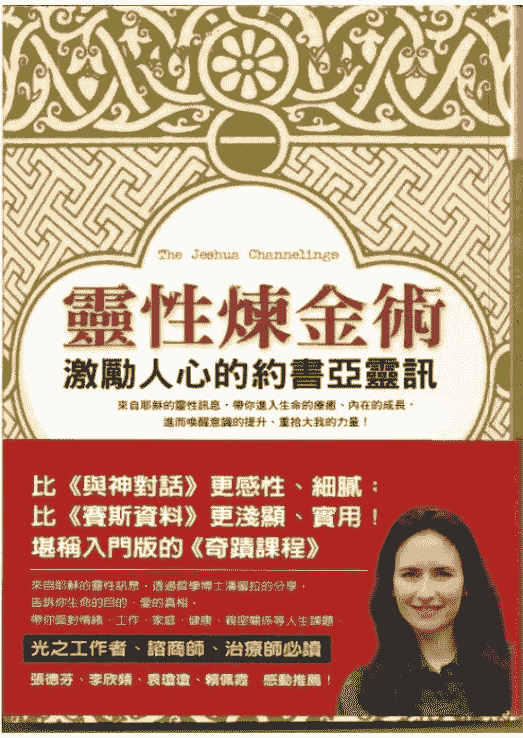

# 灵性炼金术：激励人心的约书亚灵讯

The Jeshua Channelings

作者：帕梅拉·克里柏 Pamela Kribbe

译者：郭宇、林荆、李平

英文网页 http://www.jeshua.net/

中文网页：http://www.jeshua.net/zh/

中文翻译博客：http://blog.sina.com.cn/jeshua

（中文网页出现空白页时，选浏览器设置“查看” — “编码” — “自动选择”）

## 目录

- 目录
- 作者及译者简介
- 推荐序 最温柔、最感性也最具知性的教导
- 作者序 请你敢于受伤——写在约书亚灵讯之前
- 前言 我是约书亚
- 第一部 疗愈系列
    - 让内在的太阳发光——自身意识的力量
    - 寻找迷路的小孩——宇宙初生之痛
    - 治疗其实很简单——治疗者路上的几个陷阱
    - 慈悲和洞察力的能量——放开原生家庭
    - 做自己的主人——男性和女性能量
    - 如何处理自己的情绪？——情绪的重要性
    - 男性和女性能量的共舞——性与灵性
    - 从心所欲的轻松与丰盛——工作、金钱与创造力
    - 倾听身体想告诉你什么——疾病与健康
    - 你就是自己的救主——光之门的守护者
    - 体验喜乐与丰盛——新时代的关系
    - 更纯粹、更高的能量——新时代的小孩
- 第二部 光之工作者系列
    - 未来由你决定——新地球
    - 让人充满力量的时代——地球周期
    - 依内在的知晓来行动——光之工作者的特征
    - 意识的阶段性转变——光之工作者的历程
    - 人是唯一的灵性炼金师——光之工作者的真正任务
    - 找到通往大我的入口——意识转化的第一阶段
    - 不带评判，全然接纳自己——意识转化的第二阶段
    - 找到内在的平静，全然临在——意识转化的第三阶段
    - 向圣灵敞开——意识转化的第四阶段
    - 你是自由的——时间、多重次元性和你的光我
- 附录 约书亚是谁？
- 说明

## 作者及译者简介

**帕梅拉·克里柏　Pamela Kribbe**

一九六八年出生于荷兰。小时候喜欢读《圣经》和耶稣生平故事，十二岁时祖母去世，开始对死后世界和超自然现象产生兴趣。十九岁进入莱登大学研读哲学，变成怀疑论者，崇尚理性思考，觉得所有跟宗教有关的东西都是迷信。

二十六岁到三十二岁之间，经历离婚及几次感情创伤，虽然还是完成了博士论文，取得学位，但之后就离开纯智性的学术研究领域。三十二岁时遇到一位灵性导师和心灵解读者，开始了深刻的内在蜕变。三十三岁认识担任回溯疗法治疗师的杰瑞特，随即陷入爱河并结婚。接着在三十四岁那年的某天晚上，她感受到约书亚的存在，之后并在亲友的鼓励下，开始传达约书亚的讯息。现在她跟丈夫合作解读约书亚灵讯，并开设课程，担任灵性咨询师。

◎郭宇（阿光） 77 年生于湖南，99 年毕业于中国科技大学近代物理系，06 年在美国中佛罗里达大学获得物理学博士。03 年他在一次内在的低谷中开始苏醒，06 毕业之后他卸下了给自己的种种包袱，回国静修，开始了真实地去认识自己，找寻内在的爱、宁静与喜悦的探索之旅。没有任何宗教背景的他在 07 年感觉到一种与耶稣的连接，08 年他在这一种内心感动的牵引下找到了“约书亚的传导”的网站并开始了这份资料的翻译。

**\*阿光的博客\***

◎林荆（凭什么阻止我）一直在外寻找答案未果。当然，答案一直在心中。2003 年移民加拿大温哥华，接触了水晶之后对灵性的追求一发不可收拾。业余时间里翻译了多篇灵性文篇。正努力成为一名中间人和治疗师。

**\*凭什么阻止我的博客\***

◎李平（butiamnot）1979 年出生于辽宁省葫芦岛市。2005 年毕业于大连理工大学，化学工艺专业硕士。现居上海，自由职业者。喜欢阅读，喜欢思考。读书期间曾有过一次抑郁经历，这段经历促使我对心理学方面的东西发生兴趣，后来接触到新时代资料，感觉特别投缘，感觉就是我内心深处一直等待、一直寻找的那种知识。

*李平的博客*

## 推荐序 最温柔、最感性也最具知性的教导

张德芬

二〇〇九年底，在我的灵魂暗夜之中，偶尔看到了网上的一个通灵讯息：约书亚的灵讯。我好奇地找到了网站，贪婪地读遍每一篇文章。感觉好像是与老友重逢—约书亚，他自称为耶稣，但是这个耶稣，却和《圣经》上的耶稣、其它通灵教材的耶稣感觉不同；透过他，我有了找到家的感受！

首先，他解答了我所有关于灵性上一些大方向的困惑，例如：我们究竟是谁？我们从哪里来？来这里的目的是什么？对于这些大哉问，约书亚的灵讯是最让我心领神会、最为信服且没有任何疑问的版本。他强调，作为灵性存有的我们，对于成为人类非常地好奇且珍惜，因为人类的体验中，有一种对我们来说无比宝贵的真实性。这些话虽然以前也曾听过，但是约书亚的表达方式和能量，却让我感受到莫大的安慰和鼓励。

我们原来都是安住在自己的天家中，而地球对我们来说，是个刺激好玩的地方。在天家里，我们可以随意用意念创造自己想要的事物，而且是随想随有，没有挑战性；但在这个物质世界中，一个想法要成为现实，必须付出巨大的努力。我们得面对物质世界的顽固和缓慢，还要处理自己内在的矛盾，所以，我们心想事成的能力在这里受到极大的挑战，而这才是乐趣所在！约书亚指出，很多在灵性道途上的人（甚至是此刻正在看这本书的人）都是光之工作者（lightworker），我们跟地球的缘分很深。而这一世，我们来到地球有一个特别的任务，就是要把光（你也可以称之为基督意识）带到这个世界上来。但是要达成这个任务，不是靠你去传扬福音、帮助他人等外在行径，而是需要你自己成为一个「荷光者」，先疗愈自己，让自己变成一个完美洁净的管道，如此一来，基督意识自然而然就会透过你来到这个地球。

疗愈自己最好的方法，不是透过外在的成就和作为，而是要疗愈自己生命里的严重创伤，尤其是情绪上的创伤。而疗愈创伤是要透过接纳自己的阴影，来接受自己所是的样子——观察、理解、疗愈。

约书亚最让我印象深刻的就是他的务实和不唱高调，毕竟他做过人，知道身为人的烦恼和痛苦，所以，他的教导非常实际且好用。

首先，他并不反对小我。他认为小我是我们在这个地球上成就一些事情必备的，我们要接纳小我、转化小我，让它为我们所用，而不是作小我的奴隶。另外，他对于亲密关系、工作、金钱，还有疾病与健康，甚至性与灵性，都有自己独到而精采的见解，非常具有启发性，读者们一定要好好玩味。

而当他谈到情绪时，更是精辟无比。他说，感受（feeling）是我们的老师，情绪（emotion）则是我们的孩子。情绪在我们身体中有着清晰的显化（表现），是一种对「无法理解的事物」的能量爆发，所以它不应该被批判或压抑。我们可以把自己的情绪看成需要关注、尊重和指引的孩子。

而所谓的灵性炼金术，就是邀请情绪完全到来，在我们身体的各个部分去体验它，但同时又站在很中立的角度观察。这样的意识状态就是疗愈——以理解拥抱自己的情绪。这真的是非常精确的教导，而在阅读的过程中，我都觉得自己已经被约书亚的能量疗愈了不少。

然而，约书亚的灵讯对我最大的帮助，还是在扮演灵性治疗者的角色上。很多灵性老师都认为，疗愈他人是帮助别人最好的方法，为此，他们付出许多自己的能量、筋疲力竭，甚至自己的问题都没有解决，就急着去帮助别人。约书亚语重心长地说：「自我疗愈——为自己内在的伤口负责，并用意识之光拥抱它们——是成为一个导师和治疗者的真正关键。」

同时他也说，真正的治疗和教导，与技巧及知识无关。真正重要的是：我们透过自己内在的成长和意识的清明，而获得一种「解决问题的频率」，为你的学生或是来接受帮助的人创造一个安全的空间；在这个空间里，他们能感受到你的能量，因而自己找到解决问题的方法。这对我来说真是莫大的启发，也何尝不是所有灵性工作者都应该奉为圭臬的真理！

最后，我用全书最震动我心的一句话和大家分享：「你的使命就是要找到冲出幻相的路，把解决问题，以及爱和清明的能量带给世界，让其它人也可以得到。」让我们共勉之！感谢方智出版社和内地的磨铁出版社愿意接纳我的建议，出版这本好书，让它在很短的时间内就和大家见面。也感谢几位翻译人员阿光、林荆、李平为这本书所贡献的心力。当然，更要把这本书带到地球上来的通灵者帕梅拉和杰瑞特夫妇，与他们两位及阿光通信的过程中，我深深感觉到约书亚会选择他们传递这些宝贵讯息的原因——他们真的是非常好、非常纯净的人。藉由这本书，我相信我们会唤回更多光之工作者，回归传导光的行列，让地球和人类都有更美好的明天！

## 作者序 请你敢于受伤——写在约书亚灵讯之前

帕梅拉·克里柏

我的觉醒，是在一次因爱而心碎之后才开始的。

二十六岁时，我还在学术界，正在写我的现代哲学博士论文，当时我对生命的态度非常理性，还嫁给了一位科学家。原本我对灵性和神秘学的东西一直很有兴趣，却自我压抑了很久。然后，我碰到了一位哲学家，他跟我在灵性和形而上学方面有很多精采的讨论。我深深地爱上这个男人，认为他就是我一生的爱。但是当我离婚后，他却决定回到他女朋友身边。

我被这次经历彻底击垮，对学院派哲学的兴趣也完全消失。我还是完成了论文，但之后就彻底跟纯智性的学术领域断绝连系，开始大量研读灵性和神秘学文献。后来，我遇到一位灵性导师和心灵解读者，开始了一次很深刻的内在蜕变。她帮助我觉察旧有的情绪伤痛，这些伤痛来自我的幼年，以及我逐渐回忆起的许多前世。在她的帮助之下，我重新经历这些痛苦的情绪，并超越了它们。有生以来，我第一次感觉到解放与自由，仿佛死后重生，成了一个全新的人，但同时我又觉得终于可以做自己了。

走过这个净化与解放的时期不久，我偶然发现杰瑞特关于灵性和转世的网站，我们开始有了交流（后来他成了我的丈夫）。杰瑞特一直对神秘学深感兴趣，所以对我们来说，一起担任灵性治疗师是非常自然的事。我们开始了自己的灵性工作坊，而我也可以做我一心想做的事：成为能量解读者和导师，以一种有意义且实用的方式探索生命的哲学问题。

一九九五年，我在哈佛大学待了一学期，为我的论文进行一些研究。在学校附近的一家小书店里，我发现了「赛斯书」，并且马上被这枚「禁果」（以学术界的标准来说，它是被禁止的）迷住了。我觉得这些数据在哲学层面上是非常深刻的，而且又充满爱且激励人心。这些书深深地影响了我，我觉得宇宙——或是我的灵魂——就是用这种方式来唤醒我，并告诉我生命的新方向。

二〇〇二年的一个晚上，我跟我先生杰瑞特正在进行一个疗程，我注意到附近有个之前从没感觉过的存有。那时我已经很习惯跟指导灵对话，经常在周围感觉到他们，它们会给我充满爱的建议和愉悦的感受。这些是个人的指导灵，但是当我感觉到约书亚的存在时，是很不一样的。它是一股神圣且带着深刻觉知的能量，非常踏实而专注，跟我以往遇到的都不一样。一开始，他让我有点惊慌，我问这股能量：「你是谁？」然后就看见「约瑟之子约书亚」(Jeshua ben Joseph) 这个名字在我的内在之眼前面清楚地拼写出来。

我的脑子里马上开始产生怀疑和排斥，但在那之前的一瞬间，我的灵魂已经认出了约书亚是个非常熟悉的存在。我的头脑认为他不可能出现在我的客厅、我的身边，但是我的心则向我保证，约书亚离我们这么近，其实很正常。

约书亚不是一个离我们很远、高高在上的权威。他本来就是我们的朋友，是一个可以信任、可以向他敞开的人，因为他从不会评断你。当我越来越熟悉约书亚之后，虽然他非常直接、坦率，但他从不会批判我。他会要求我对自己诚实，要求我面对恐惧，而不是以一些自我辩解的理论或借口来掩饰。

所以在某种程度上，约书亚很严格，但这也让我了解到爱是什么。爱不一定要感觉良好，或让人感受到慰藉。他常常要求你走出你的舒适区，变得勇敢又脆弱，敢于受伤。

对我来说，公开表示我是约书亚的通灵管道，让我的内在产生许多恐惧与不安，这是我一直很难克服的。这个世界在我看来相当可怕，所以我的本能（或生存机制）一直以来都是要退缩，但约书亚教我在这个世界感受到平安，教我在与人连结时保持归于中心和自我觉察，而不是觉得恐惧和破碎。我还在学习如何做到，但我想我有些进步了。透过约书亚的灵讯，我跟全球各地的灵魂家人们连结。

## 前言 我是约书亚

我是那个曾到过人世、被你们称为耶稣的人。

我不是教会传统中的耶稣，也不是你们宗教作品里面的耶稣。

我是「约瑟之子约书亚」，曾是个有血有肉的人类。我的确比你们先一步触及基督意识，但那是由超乎你们目前所能想象的某种力量所支持的。我的到来是一个宇宙事件，而我让自己在这个事件中为你们所用。

这并不容易。我曾试图将神无限的爱传递给人们，但没有成功，还引起许多误解。我来得太早了，但总是得有人来。我的到来就像把石头丢进一个大鱼池里，鱼都吓跑了，石头则是深深地沉入水底，但很久之后依然余波荡漾。你可能会说我希望传达的那种意识在暗中发挥作用，池塘的表面不断掀起波澜，善意但错误的诠释相互激荡，并以我之名彼此讨伐。那些被我的能量触动、被基督能量激发的人，无法真正让这股能量与自己的身心实相成为一体。

基督意识需要花很长的时间才能在地球上扎根，但现在是时候了。我已经回来透过许多人说话，说给每一个想要听、每一个从心灵的寂静处逐渐了解我的人听。我不说教，也不评断，我最真诚的希望就是让你们知道，那广大、无穷尽的爱，你们随时都可以得到。我属于一个更高的意识、更大的存有，但我—约书亚—是那个存有（或意识场）化作人身的部分。我不太喜欢耶稣这个名字，因为我所代表的事物已被扭曲，而这个名字已经和那扭曲的版本紧密相连了。「耶稣」为教会传统和权威人士所有，好几个世纪以来，为了符合教会元老的利益，耶稣已经严重地被刻板化，以至于偏离了我所代表的事物。

如果你能丢开成见，让我从传统中解脱出来，我会感到非常欣慰。

我是约书亚，是有血有肉的人类。

我是你们的朋友和兄弟。

我熟悉人类的种种。

我是导师和朋友。别怕我，就像拥抱亲人那样地拥抱我吧。我们是一家人。

上了。来自世界各地的人写信给我，告诉我他们是如何被约书亚的讯息所感动。现在我在地球上觉得更自在了，而且最重要的是，尽管有恐惧，我还是因为实现了我的灵魂此刻真正渴望在地球上做的事，而感受到深刻的满足。

约书亚以一种非常直接而清楚的方式阐明他的讯息。他不会迂回，而且寻求与我们的心对话，而不是理智，这有些违背我自己的天性。我接受过学院派的哲学训练，而且习惯写一些「正常人」觉得读不下去的文章，因为那些文章既复杂又抽象；约书亚很显然不是那样。

但从另一方面来说，哲学训练帮助我发展出能够将复杂的概念分解成简单文字的能力。我想，我个人所受的哲学教育也是约书亚讯息得以如此被表达出来的原因之一；对一个通灵者而言，这点是相当有利的。

有时候我会觉得，人总是期望灵性导师和「上师」（不要太在意这个词）可以非常庄严而正式地表达自己，那样才符合我们心目中有智慧、受人尊敬的导师形象。然而，约书亚想要靠近我们的心，而不是制造距离。

约书亚在「光之工作者」系列中强调我们不是来这里拯救世界的。我们来此主要是为了疗愈自己，为了面对自己的黑暗面，为了理解并以爱与慈悲处理自己的情绪伤痛。如此一来，我们就能「被光照射」——进入以心为基础的意识（心灵意识）。我们对他人散发出一股平静而充满爱的能量，但这不是我们「做」的事（好像一份工作似的），而是当我们就是自己原本的样子时，它自然会发生。因此，根据我所接收到的约书亚讯息，那种认为光之工作者要「努力工作以疗愈世界」的观念，是个错误的寄托。光之工作是跟你、而不是跟这个世界有关；它是一种存在的状态，而不是一种要去做到的状态。领悟到这点帮助我放下「拯救他人」的强烈冲动，我认为这种冲动是光之工作者根深蒂固的习性。

约书亚希望我们知道，我们跟他同样靠近神，他和我们一样是人；另外，他的死不是为了带走我们的罪，单纯是因为那时的当权人士反对他，就像他们在整个历史上反对自由思考者和心灵导师一样。我们的罪无须由他人带走，因为一开始就没有罪，有的只是无知和恐惧，而这些是人类经验的一部分。我们来这里是要优雅地超越无知和恐惧，并享受回家的旅程。约书亚允许我们完全成为人，这与教会的许多教导大相径庭。

对我而言，约书亚这个名字不仅代表一个历史人物——耶稣，更是代表宇宙的基督能量，而我们都是其中的一部分。当我为约书亚传达讯息时，我深深地感觉到被带入一个爱与慈悲的能量场中；在那种意识状态下，我接收到约书亚的讯息。

# 第一部 疗愈系列

## 让内在的太阳发光——自身意识的力量

亲爱的朋友，今天我来到这里对你们所有人讲话。我如此地熟悉你们！你不知道我有多么了解你们。我经常跟你们在一起，因为我的心跟你们是相连的。我看见了你的痛苦；我见证了你的欢乐、你的忧愁、你的遭遇。我多想让你们知道你们内在的力量——你们自己意识的力量、生命的力量、灵魂的力量。

一如既往地，你们仍在寻觅。一次又一次地，你们在自己之外寻求解决之道。可是当你们把这些办法带进内心时，它们却开始消融了。要知道，你们才是自己存在的中心，是自己宇宙的太阳。意识的方向和选择的频率会决定你如何感觉、如何思考、如何行动。你从内心深处决定了这一切的方向，如同太阳散发光芒一样。如果你相信，自己的某些方面不该被太阳照亮，这个太阳在某些地方不该发光，或有某些东西不配得到它的光，那么你遇到的所有人和事都会证实你的这种信念。

同样地，你的阳光也要照到自己需要帮助的地方，才能接受别人的帮助或建议。决定把那个面向置于阳光下，并打开心门的，永远是你自己，没人能强迫你这么做。这就是为什么如果你不允许自己接受帮助，别人是帮不了你的（这一点对尘世的帮助和来自我们这边的帮助都适用）。你们内心总是认定：你们缺乏找到自己的道路、再次感受天命的力量。这些观念跟过往的生活有关，你们曾有很长一段时间迷失了自己。我这里所谈的过往，指的是在地球上的多次生命轮回，在此期间，你们经历过相当多的黑暗。历史并非毫无意义。在那段历史中，你们遭遇了极大的恐惧，恐惧遮住了你们内在的太阳。但是，此刻的你们正在逐渐苏醒。你们有一些部分已经再度处于光中，然而有很多面向仍在黑暗里，仍被你们的恐惧和不安遮蔽。

这种内在的黑暗可以比作迷路的小孩。你们灵魂的某部分就是个迷路的小孩，它迷失于过去的痛苦中，但过去并非是一成不变的。从某种意义上说，时间是个幻相，在时间里并没有不可挽回的失落。门不是紧闭的，你们内在那个曾经心碎的迷路小孩可以被找到，也可以被治愈。你是它的父母，是最终要去珍视它、给它温暖，并将它重新带进生活的人。

我说的生活指的是真正的生活。你们已经忘记了如何去生活，你们擅长的是生存，然而相比之下，真正的生活是多么地闪亮，多么地欢欣鼓舞。

内在小孩最善于生活，但恰好是它迷路了。它迷失于过去的阴影中，迷失于以往种种的精神创伤里。在地球上的轮回期间，从灵魂的层面来看，你们一直都在成长，如同孩子步入成年一般。从这个角度来说，你们像孩子一样来到地球，有了许多自己的经历，也有了许多不能完全理解的体验。现在你们正走入成长史上某个阶段性的终点，走入某个发展周期的终点，应该超越那些没被理解的经验，成为父母，成为你们内在小孩的父母了。这就是我提到的你们意识的力量：超越受伤的内在小孩的力量。

内在小孩是「未被理解的经历」的受害者。我想告诉你们，心灵最深处的伤痛就如同一个被遗弃的孩子的情绪状态。这个孩子失去了家庭的安全和爱，却不知为何如此，不知有何意义。你们的内在有个小孩，它感觉自己被遗弃，惊恐不安却无法理解其中的原因。这种痛苦要追溯到很久之前，那时，你们与神圣的整体分离，独自开始了自己的灵魂之旅。

某一刻你们将会明白，这趟旅程是你们自己的选择，是一个非常神圣的创造行为。独自上路时，你们感受到深切的痛苦，而这痛苦本身也是一个伟大的创造行为，因为借着把自己从整体分开，从父亲——母亲——神的身边分开，才能让自己发现更多，体会更多。在旅程的现阶段，你们仍有许多内在的痛苦，很难明白那漫长的回家之旅的终极含义。但我想说，你们都是美妙而勇敢的光之灵，对造物主有着极大的信任，否则就不会开始这趟旅程了。我想让你们回忆起自己内在的勇气、创造力和光，所以，再次感受你们心中的光芒吧，恢复跟它的连结。要知道，你们有能力让内在小孩重获生机，让它唱歌、玩耍。把内在的黑暗看作迷路小孩的呼唤，它请求你珍惜和爱护自己，成为「你真正所是的」父母。

灵魂之旅刚开始的时候，一个迷了路、被丢弃的小孩就被委托给了你们，它一直独自在黑暗中。这个小孩就是一个人的情绪部分，而处理这个是你们的挑战，它代表了你们最重要、最原始的一面，也就是生命的活力。在旅程的终点，在这一轮回周期终结之时，你们会握住内在小孩的手，看看它如何向你闪耀欢乐、愉悦，和受到鼓舞的意识。它将重新感觉到平安，展露出自己真正的宝藏——「强烈地去感受，去至情至性地生活」的能力。要想实现这些，内在小孩需要一个大人牵着它的手，充满信任地珍惜它、鼓励它。守护内在小孩，就是你们的使命。这个小孩曾经引起痛苦，携带着你们的情感创伤，但他也许下了最伟大的诺言：要成为你们最深刻的爱、喜悦和创造的源头。

找回并整合你们失落部分的时机已经成熟了，你们应该要成为你们所是的中心太阳了。透过重拾自己意识的力量，你们不是单单回到旅程开始之前的状态，也共同创造了一个新的实相，或新的意识层次。认出自己的神性就如同回家，它会唤醒你们曾经熟悉的极乐记忆—合一与和谐的记忆。但是，身处物质实相中，纯粹透过意识而产生那种合一感，对你们来说还是头一次。你们将在地球上彰显神的存在，你们正在重返自己的神圣本质，却既不丧失独立性，也没有失掉肉体形式。这就是新时代的奇迹：既是个体也是整体；既是独特而个体化的意识，又同时与整体合一、与整体相系。

## 寻找迷路的小孩——宇宙初生之痛

亲爱的朋友，很高兴见到你们。我了解你们，你们对我来说是如此亲近。我的旅程就是你们的旅程，我明白你们内心的忧伤和痛苦。所以，我愿意在此分享一些我对灵魂之旅的洞见。

我想带你们回到这次旅程的起点，一直回到最初，那时你们在一个陌生的实相中成为灵魂。我想带你们穿越时间、空间，穿越物质实相，回到旅程伊始——那不同寻常的时刻。这件事距离现在已经非常遥远了，但伴随其中的情绪——离家之痛——仍然留在你们每个人的心里。这种宇宙初生之痛就隐藏在你们每天的感觉和行为背后。

很多人一直处于焦虑和不安之中，一直固执地寻找某些东西。因为跟自己在一起不自在，所以你们内在有一种紧张感，对自己的本体和本质感到不舒服。

基于这种紧张感，你们倾向于寻求外在的认可，包括被人承认、物质财产，或任何能使你们感觉被爱、被照顾的东西。你们一直靠外在的事物来让自己安心，一直需要某些东西来舒缓紧张感，来告诉自己：「我很好。」看看你有多么渴求这些东西吧，你就会知道自己有多紧张，内心有多痛苦。

我想谈谈这种痛苦的原因，以及随之而来的对外在认可的迷恋。痛苦的真实原因就像是洋葱核心，被多层鳞片包裹着。外面的那些鳞片源于生活中某些令你感觉受伤、焦虑、不自在的事件，靠近中心的鳞片则源于累世所遭遇的情感创伤。然而，我上面所说的也只是一些触发点罢了，如果你拨开所有洋葱鳞片来到核心，你会发现那最初的疼痛——始于旅程初始的离家之痛。

想象自己是一个爱之海的一部分，在此你觉得很安心，完全没有担忧和焦虑；想象自己被这种无处不在的爱所环绕，根本不知道外面还有什么。这就是家的能量，你就来自于这种能量。为了理解这种古老状态的感觉，回忆一下，当你缓缓地滑入睡梦中，头脑放松下来，意识处于接受状态的时候。当你还是一个子宫里的胚胎时，你也知道这种状态。那时，意识处于温柔而快乐的睡眠中，没有内外之分，没有你我之别。在那胚胎般轻柔美好的意识状态中，有着无穷无尽的合一感与安全感。

在那遥远的时候，身为灵魂的你在巨大的宇宙子宫中感觉到安全和无拘无束。然而在某一时刻，变化发生了。你经历了一次撕裂般的分离，犹如分娩时的子宫收缩，在意识之海上形成波纹，将你从沉睡中唤醒。那即是你独立灵魂的生命之初，是你第一次与包容着自己的整体分离，以个人的身分来体验自己。就在那一刻，初步的「我」的感觉开始了。

从宇宙子宫中被撕扯、被分开的这种体验令你迷惑不解，失去了方向感。这件事发生时，你并非处于觉知的状态，而只是在体验罢了。你开始盲目地寻找可以抓得到的东西，盲目地寻找某个重返平安的办法。你觉得失落、觉得被遗弃了。这是个黑暗时刻。

然而，从源头分离、离开家时，同时也是无边无际的创造力开始的时刻，是伟大的体验之旅的开端。想象一个黑暗的空间—陌生、巨大、无可名状—就横在你面前，你像一株幼苗般进入了这个空间。这里有无限的可能，有各式各样未知的体验，有黑暗，也有新鲜的事物。

宇宙之旅一开始，你们需要处理各种情绪，就像我谈到的迷路小孩的那些情绪：新生儿不得不去适应陌生的现实，而现实又与原来半睡半醒的状态完全不同。这个哭闹着、迷惑着的小孩，在旅程之初就有了深刻的内在伤痛。

旅途之中，你经历了很多事情，有过各种形式，进入过各种不同的身体，最后来到这里，来到地球上。地球是一个创造之地，有着丰富的可能性，但尽管这些可能性都对你开放，你的体验可以丰富而深刻，你却一直觉得无家可归。你的内心深处有一种匮乏感，仿佛丢掉了什么东西，你不知道那到底是什么，只觉得有了它就会好过一些。其实你丢掉的就是那本源的爱和情感的平安，你曾在宇宙子宫中领略过那种滋味。无条件的归属感和安全感对一个人的幸福、自我表达和自我价值非常重要，从离家那天起，你就一直在寻找。很久很久以来，你都在试图疗愈自己的宇宙初生之痛。

现在我想问问，你能否分辨出离家之时，自己内心深处产生的最初的痛呢？你能发现心中那与整体分离的感觉吗？整体或合一的状态不能用头脑来解释，但你心里还记得自己是它的一部分。

把注意力转到初生之痛，了解它在你体内唤起的深切感受，了解你此刻的孤独和思乡之情，你就开始了疗愈的过程。你可以在最深的层面上疗愈自己，可以到达疼痛的核心。每个阅读这些文字的人，都在发展一个新的意识层次。你们正在努力为自己建造内在的平安和无条件的爱，正在靠自己重现宇宙子宫的感觉，这都是为了自己。这是你们的使命，你们灵魂的目标。一旦认识到家就在你之内，认识到自己内在也携带着神圣平安与一体的片段，你们就可以对自己的本质感到真正的平静与放松，不再需要外在的认可。新时代的到来有赖于那些认出自己的痛苦核心，并敢于面对的人。成长到这个阶段，你们不仅要看到目前生命中（也可能是过去累世中）的疼痛和创伤，也要超越这些，并处理初生之痛。一旦认出并记起这种疼痛，你们就可以处理它了。你可以把手递给那仍在哭着寻求帮助的宇宙新生小孩，它透过你的负面情绪，比如恐惧、愤怒和失望来召唤你。想要知道自己的初生之痛处理得如何，可以去检视生命中的各种关系。通常，人会透过亲密关系来缓解深刻的孤独和恐惧感，努力用别人的能量填补自己的空虚。他人的认可、关注和喜爱抚平了伤痛，某种意义上，他们把自己的受伤小孩交给了伴侣。这是个非常危险的游戏，迟早会有一方对另一方形成感情依赖，之前的爱情和心心相印就会变成微妙或明显的权力游戏。一旦你为了爱和安全感而依赖他人，就是在索取他或她的能量，而这常常导致冲突。最终，你们会变得比原来更加孤独。

你们经常认为孤独与缺少朋友或伴侣有关，也总觉得解决之道就是建立一段新的友谊或爱情。在这种观点中，你们假定痛苦的原因和解决办法都在自己之外。要是以这样的心态开始一段关系，最终很可能会要求别人为你内在的伤痛负责，而把自己看成受害者。需要他人填补内在的空虚，等于从一开始就剥夺了自己的权力。

亲密关系领域可以使你非常了解自己所承载的初生之痛。看看你多常需要另外一个人存在你的生命中吧。其实这是内心释放的信号，告诉你要转向内在，找到那个迷路的小孩。解决孤独的办法在于转向内心，在于温柔地拥抱内在小孩——它为你承受着情绪负担。当你为内在小孩负起责任，当你跟它连结，并像慈爱的父母那样引导它时，你们的关系就解放了，现在你能用自由而独立的方式跟其它人交往了。

## 治疗其实很简单——治疗者路上的几个陷阱

亲爱的朋友，带着喜悦和快乐，欢迎你们聚在这里，听我—你们的老朋友——说话。我是约书亚，曾在地球上以耶稣的身分生活过。我曾是人类的一员，知道身为一个拥有肉体的人所要经历的一切，所以我来到这里，要帮助你们理解自己到底是谁。所有今天会读到这一篇文字的人，都是光之工作者。你们是光之天使，却忘了自己是谁。在地球之旅的很多世里，你们都历经了种种的考验。我知道你们所经历的一切。你们此刻来到了自己灵魂历史上的某一点，正在完成生命的大循环。在这个点上，你们跟自己真正所是的「大我」之间的连系越来越紧密—「大我」就是超越时间与空间的那个「我」。你们正逐渐允许自己那更大的、非物质的「我」进入尘世生命、进入日常生活之中。

要和你们的大我或者说高我保持稳定持久的连结，仍然很难，因为你们已经遗忘了自己就是这伟大的光之源。不过你们都已经开始了内在的旅程，旅程中感受到一种渴望，甚至是召唤，想要去帮助别人完成内在成长和自我觉醒。对光之工作者来说，想与他人分享自己的洞见和经验，是非常自然的，你们都是天生的老师和治疗者。当你开始成为老师或治疗者去引导别人时，很可能会踩到一些陷阱。你之所以会掉入这些陷阱，是因为人们对于何谓「以灵性引导」有些误解，而这些误解则是来自对治疗的本质和你在其中的治疗者角色的错误想法。我想谈谈这些陷阱。

### 什么是治疗?

什么是治疗的本质？不管是心理、情绪，还是身体层面，在一个人「变好」的过程中，到底发生了什么？事实上，在此过程中，这个人重新与自己内在的光、与自己的大我连接了。这种连结在自我的所有层面都产生了治疗效果——无论是情绪、身体，还是心智层面。

每个人在治疗者或老师那里真正寻找的都是一个能量空间，这能量空间可以使他们与自己内在的光——内在完全知道和理解这一切的那个部分——重新相连。而治疗者或老师之所以能够提供这样一个能量空间，是因为他们已经在内在完成这样的连结。治疗者拥有可以解决来访者问题的频率，所以，成为治疗者或导师就意味着携带那可以解决问题的能量频率，并把它献给别人。就是这样，如此而已。

基本上，这个过程无须透过语言和动作就可以发生。作为导师或治疗者，你的能量本身才是真正有治疗作用的。你那发光的能量可以开启一种治愈的可能，别人因此「回忆」起他们内在一直都知道的智慧，连结他们的内在之光，连结他们的直觉。就是这回忆和连结让疗愈发生。因此，所有的疗愈事实上都是自我治愈。

所以治疗和教导，与在书本上和课程上能够学来的专业技巧和知识没有关系。治疗能力不可能透过外在得到。真正有关的，是你透过自己的内在成长获得的「解决问题的频率」，这频率就呈现在你的能量场中。一般来说，即使是导师或治疗师，你们也都还处在自己的个人成长过程中，不过你们能量场的一些部分已经足够清澈和纯净，可以为他人带来治疗的效果。

你必须了解，这样的治疗效果不是可以争取来的，只有你的来访者才能决定他自己是否想要吸收你提供的频率，他才是做选择的人。产生治疗效果的并不是你从别人那里学到的技巧和知识，而是你内在所走过的路程，尤其是那些你已经在很深的情绪层面上走过的问题，你能够提供帮助。在这些领域，你的光如灯塔般照亮了受阻的人们，温柔地召唤他们从那些窒碍中走出。

在那些你已经治疗过的自己的深刻伤痛的领域，你是真正的大师，是一个智慧来自于内在知识和真实体验的人。所以，自我疗愈是成为导师和治疗者的真正关键。这样，你创造出一个「解决问题的能量」，别人就有可能透过你而打开一扇自我疗愈的门。

当你在治疗来访者或帮助周遭的人时，一般都会去「解读」他们的能量。在听他们说话时，你会直觉地调整到他们的频率，给他们建议，或用能量治疗的方法来疗愈他们。但事实上，他们也同样在解读你。就像你在调整到他们的频率，他们也有意识或潜意识地吸收你的能量。他们直觉地去感受你的一言一行是否和你整个人一致，是否符合你散发出来的能量振动。他们撇开你的言语和行动，去感受你的真实本质。

治疗的真正突破就发生在来访者阅读你能量的时候，当他们在你的能量场中感觉到自由和安全，当他们觉得自己被一种意识场——可以给他们能量去信任自己内在知识的意识场——所包围时，你所说、所做的一切都可以产生治疗效果。而当你说的和做的与你的真实本质一致时，你的话语和行动就变成了光和爱的携带体，会把你的来访者带入他们内在核心的光与爱之中。

当人真诚地向你求助时，这个人就向你的能量场敞开了，这样一来，他们就可能被你最纯净与清澈的部分所触及。这个部分不是从你所读的书和所学的技巧而来，是来自你内在已转化的意识。我想强调这一点，因为光之工作者（那些生来就强烈想要帮助别人的人）经常会不断搜寻新书、新方法、新能力，以成为更好的导师和治愈者，但是，真正的治疗就像我说的那样简单。

我在地球上生活的时候，透过自己的眼睛传递能量。一些能量透过我的眼睛传递出去，对它敞开的人就能够立即得到治疗。这并非魔法或我个人独特的技能，我与自己内在的真实本源相连，自然而然就会散发出神圣的光和爱。那是我从神那里继承而来的礼物——就像你也从神那里继承这种禀赋一样——而我对别人的影响由此开始。你们也是这样，与我并无不同。你们也走过了同样的内在旅程，走过了同样的考验和悲苦，到达我在地球上时所抵达的同样的点。你们都正在变成有意识的、基督化的存有。

基督能量是你们的灵性天命，你们正逐渐把这种能量带入每天的生活中。你内在的基督自有其教导和治愈的能量，然而，你们还是经常把自己当作学徒和弟子，当作一个坐在导师脚下去听、问和寻求的学生。不过我现在要告诉你的是，当弟子的时代已经过去，现在是收回你们大师之能的时候了。现在你们需要信任自己内在的基督，并将这种能量展现于日常生活中。要与内在的基督合一，并以那股能量去教导与治疗，首先要放掉一些东西。这些东西是成为治疗者及导师路上的陷阱，我会在这里指出这些陷阱出现的三个领域。

### 一、头脑的陷阱

第一个陷阱在头脑或心智之中。你们都非常擅长分析和归类，也许方便有效，但是总的来说，你思维的那一部分是属于二元世界，诸如好或坏、光明或黑暗、健康或生病、阳性或阴性、朋友或敌人等。喜欢分别、喜欢贴标签，而不是看到现象底下蕴含的统一性；喜欢用普遍性和理智的方法来对待个别事件。头脑从没考虑过还有另一种可能性，一种更直接进入真相的方法：直觉，或说「透过感觉」。

基督能量是在二元性之外，但是头脑无法理解。头脑喜欢把存在分成可以辨别的各个部分，把各个部分分门别类，这样才能透过理性来了解。头脑喜欢设计出可以套用在现实和直接经验上的理论，当然，这有时候很有效、很有帮助，尤其是在一些实际的事情上，但是当我们面对真正的治疗和教导时，它却不再如此有效。真正的治疗和教导是从心而发的。

当你透过理论架构面对来访者时，会试图把他们个别的症状放入普遍的类别里，透过理论寻找问题及解决方法。这是你在接受心理咨询师、社工或其它职业咨询师的培训时所学到的。我并不是说这些都是错误的，但我想请你们这样做：当你们在工作中或生活中面对别人时，试着把所有的思想和逻辑、所有你对于「他人身上到底发生了什么」的先入之见都放掉，而只是单纯地用心来听。从内在寂静的深处调整频率，去感受对方的能量。请试着只透过你的心和直觉去感受对方到底处于怎样的情境，去感受他们的内在世界。

一般来说，在「对方应该如何去做，才能解决他们的问题」这一点上，你们总是想得太多，老是要分析他们的问题，绞尽脑汁想出答案。虽然大部分都准确，但真正的关键在于：你们的各种想法与对方此刻的能量并不一定一致，可能会与他们此刻的内在感受完全脱节。只有在能量和谐一致时，你提供的帮助才会有效。他们需要的是完全不同的方式，是你的理性头脑无法了解的。

我请求你从内在那个寂静、直觉之处去看、去感受，超越二元，让自己充满内在基督的慈悲。我请求你在提供教导和治疗时，让自己的每个引导都发自对方当下给你的感觉。这种时候，解决办法往往是非常简单的。你真正需要的是智能，而不是知识；你被要求给予的，不是判断，而是慈悲与深刻的理解。你并不是为人提供解决办法，或者提供权威的脸孔，你提供的是一张充满爱的面容。

举例来说，想要帮助孩子的父母，由于自己的经历，所以对一些行为的后果设想得比孩子周到。也因为如此，父母常常想警告孩子，希望让孩子免于受伤，会建议孩子去做自己认为正确的事。从头脑的角度来说，这可能是提供帮助非常好的方式，有时这样做也很合理。

但是，如果父母真正从内在的寂静与直觉出发，将会发现孩子需要的是完全不同的东西。孩子需要的是信任和安慰。「相信我，让我做自己。让我去犯错，让我在跌撞中前行，但对我保持信心。」当你出于信任而与孩子连结，等于鼓励他们信赖自己的直觉，这样可以帮助他们做出让他们感觉很好，你也觉得可以接受和理解的决定。但如果你非要以「我知道得比你多」的方式来管教孩子，孩子会觉得不受信任，而更加抗拒。

当你向孩子提供帮助时，他们会不停地「解读」你。孩子天生就能非常敏锐地觉察到话语背后的情绪，可以感受到你隐藏的恐惧或批判，然后他们会对这个情绪而不是你的话做出反应，于是就显得叛逆、不可理喻。父母则是表现得过于理性，也就是说，没有感觉到自己隐藏的情绪，没有以开放而坦诚的态度跟孩子连结。要做到这一点，父母必须放掉自己先前的各种观点，向孩子的情感世界真正敞开，透过真心去倾听孩子在意和关心的事物，建立一座沟通之桥。

### 二、心的陷阱

在走向导师和治疗者的路上，你会遇到的第二个陷阱出现在心的部分。心是各种能量的汇集处，心轮在天与地、在较高和较低的能量中心之间搭建了一座桥梁。心「搜集」不同来源的能量，并且知道它们内在的统一性。心灵可以让你超越二元性，怀着爱和慈悲向人敞开双臂。

心灵是感受能力之所在——和别人的能量协调一致，体会「成为他们」的感觉。它是同理心（empathy）的中心。所以非常明显地，在任何形式的灵性教导和治疗中，心都扮演了重要角色。你们之中许多人都是天生具有同理心的人——生来就很容易感受到别人的情绪和能量。

不过有个重要的陷阱和这个能力有关。你对他人的能量如此敏感，使得你想要分清楚哪些是你的、哪些是他人的情绪会非常困难。有时候你吸收了很多对方的能量，因此而丧失了自我。你知道他们的感受，所以可能会很想帮助对方，以至于双方能量混合在一起，然后你会开始承受不属于自己的负担。

当这样的情况发生时，就会不平衡——你给得太多了。当你因别人的痛苦而动摇，开始使用过多力气去帮助他们时，就逾越了自己的界线。你给出的过多能量会为你造成麻烦，这些多余的能量投向别人，却没有发挥作用。来访者也许无法整合或接收到这股能量，他们也许被这能量吓到，或者根本没有注意到它。最后你会觉得疲惫、恼怒和挫败。你可以透过身体和情绪的信号来判定自己是否给得太多了。当你在跟来访者见面之后，或者在尝试帮助某人之后，感到有点空虚、沮丧或沉重，就表示你给得太多了。

从一个平衡的中心点出发，提供教导和治疗时，你会感觉到自由、活力，并充满灵感。而当会面结束时，你也可以很容易就收回自己的能量。你可以放开对方，没有任何的牵绊存留在彼此的能量场之间。

如果彼此之间的能量连结继续存在，是因为你非常想要帮助人，让他们变得幸福快乐，那么，这种连结对你们的能量是具有破坏性的。当你把注意力都放在来访者身上时，你会强烈吸收他们的能量，并且想要给出自己来减轻他们的负担，而这将在你们之间造成双向的情绪依赖。你的来访者会开始依靠你，而你的感受也会因为他或她而起伏。这样的能量纠缠对你的来访者没有帮助，也会耗空你自己。

为什么当你开始帮助别人时，这样的情绪会如此容易产生呢？为什么光之工作者如此难以避开这个陷阱呢？这种强烈想去治疗和帮助、想让世界变得更好的需要，到底来自哪里呢？你们都有一种想要把教导和治疗带给这个世界的内在使命感，不过「给得太多」的倾向来自于自己没有意识到的伤口，这个伤口——或者说痛苦——使得你们在给予时有些过于热心。

你们心中都有一种痛苦和哀伤的感觉，让你们想要努力创造出一种新的存在状态，一个更符合所有生命自然神性的意识层次。你们都在想家，希望在地球上创造出更充满爱与平安的实相。此生来到这里，你们不是为了探索自我的种种，那已经让你们感到厌倦和疲惫。你们这次来此，是为了回应灵魂里那古老的吟唱，为了帮助地球恢复平安、喜悦、尊重和爱的连结。

你们的情绪体伤痕累累，因为在许多世的生命中，你们努力把自己的灵魂之光带到世上，却遭遇很多抵抗和排斥，所以这次来到这里时，你们带着谨慎的态度。然而你们内在的激情之花却没有凋谢，你们又来到这里了！不过这一次，由于内在所携带的痛苦，你们就像柔弱而敏感的花，需要坚实的基础才能成长、开花。而你们所需要的基础，就是一种稳固扎根于地球、归于自己中心的感觉。

我所说的扎根，是指让你的根基扎入地球，意识到人世间的实相如何运作，了解活在肉体之中，有哪些东西需要面对。有时候你们太沉浸于灵性，以至于忘记照顾自己和身体。你们太过理想化、太不现实，常常希望超越地球实相，但只有透过地球、透过和地球上的各种元素轻松自在相处的感觉，灵性能量才能在此开花结果。

而我说的归于中心，是指你们必须真实面对自己的感受，面对「什么适合自己」的感觉。身为人类，你们都拥有与他人不同的自我或个性。这个自我有它存在的价值和功能，可以让你们把独特的灵性能量带入物质实相中。你们不想为了「造福更多人」而放弃个性，你们不是来到这里消灭自我，而是更让灵魂之光透过你们的自我展现。

你们需要自我来向外展现能量。因为灵魂所携带的伤痛，因为古老过去的种种疲惫，因为想要赶紧到达新地球的应许之地，你们的根可能会扎得不够稳固，因而失去中心。你们会在事情还没有准备好时，就急于推动，希望有所改变，或者会试图以别人还无法适应的速度去唤醒他们。你们变得「过于热情地想付出」，这种过度的热情可能会藉由善心或强烈关怀的方式表现出来，不过在这行为背后，却是缺乏耐心和躁动。你们可能会有一段时间觉得欢欣鼓舞，热情而投入，但在某一刻，你们会感到失望、筋疲力尽而愤怒，因为你们把自己的能量资源耗尽了。

心的陷阱——给得太多的陷阱——来自你们无法接受现实本来的样子。你们内在有一种不安与焦躁，让你们很难放手。所以，跟那些你们试图帮助的人，或是有你们牵涉在其中的事件保持正确的情感距离，就变得很难。

你们都是导师和治疗者，来到地球上的确带着使命。不过矛盾的是，要真正完成它，必须要放开那种极度想要改变事情的需求。因为那种急切之中带着伤痛，一种无法在此刻的地球上感受到自在的伤痛。真正的灵性改变始于接受，要真正成为导师和治疗者，必须拥抱自己的伤痛，并治愈它。你需要与自己内心深处的恐惧和愤怒的情绪握手言和，如此你将会发现，急切的付出，开始被宁静的平和与接纳取代。这时候，你们所散发出的光才真正具有疗愈的特质。

在他人承受痛苦与考验的时候放手，彻底给他们时间和空间去走过自己的历程，这个选择可能会为你们带来内在的痛苦，因为它把你们带回孤独与无助之中。这个世界如此不完美，与你们所梦想的纯净与美丽的世界天差地别，让你们很受伤。不逃避这伤痛，让它完全进入意识，张开你们的天使之翼拥抱它，是你们的挑战。

一旦认出自己想要助人，或是争取美好目标的渴望，并意识到背后所隐藏的伤痛，也就是无法接受现实本来面貌的那个部分，你们就能够开始放手了。意识到自己的强烈意愿和急切是来自内在的痛苦和忧伤，就能够停止给得太多，而回归内在，并找到与自己和平相处之道。你们就真正可以开始为自己付出了。

而这才是你们真正开始成为光之工作者的时候——扎根于地球，归于中心，并且完全接受自己和他人。身为光之工作者，唯一可行之事就是向他人敞开自己的能量。你们透过散发自己能量场中那「解决问题的能量」，来教导和治疗。通常你们会吸引到的人，他们的问题你们刚好都经历过。在这些问题上，你们体验得非常彻底，所获得的纯净领悟，也已经成为你存在的一部分。这些就是你开悟的部分。它们是神圣而不可侵犯的，也不会遗失，因为它们不是奠基于所学来可能会遗忘的知识上。你能提供给别人的，不是工具或理论，而是经过生命、历练和勇于面对内在伤口所转化成的自己。

从这个角度来说，你必须做的「光之工作」会毫不费力地自动到来，那是一件你觉得非常自然的事。想要寻找人生使命——你们生来就注定要做的事——只须去觉察什么是自己真正的渴望，做那些让自己充满热情的事，如此一来，你们就把自己的能量带入这个世界，然后别人就会被感染和鼓舞。真的，没有什么其他的事要做了，这就是你们来此要从事的光之工作。

了解施与受的平衡之道的光之工作者，将拥有更多的宁静和喜悦，所以，他们的能量场就会更频繁地散发出「解决问题的频率」。

### 三、意志的陷阱

接下来，我想谈谈另一个成为治疗者或导师路上的陷阱。我们谈过头脑和心的陷阱，最后要谈的是意志的陷阱。

意志位在太阳神经丛，也就是胃附近的能量中心，这个能量中心为我们的行动力掌舵。当意志与直觉相连时，生命总会流动得很顺利；当太阳神经丛（也就是小我的中心）由心来引导时，通常会做自己爱做的事，大多数时候会感觉到喜悦而充满灵感。于是，意志（或者说小我）就成了内在基督的延展。

然而，通常当你想帮助或引导他人时，就与这样的流动脱离了。有一部分的你做得太多，即使直觉告诉你要放手也没用。你渴望看到明显有效的结果，这跟帮助人一点关系都没有，反而跟你想要得到认同的需求有关。这种不安全感将你带离自然的疗愈之流，因为这流动往往比你期望的更慢、更无法预料。

当你很努力投入，却没有真正被人接受或欣赏时，就表示你做得过多了。而且，当你与事物的自然之流分开时，通常会被外界的看法扰动而分心。你会开始依从别人的意见和期待，害怕成为他们眼中的失败者。而重获力量的关键，就在于不要做任何事，内在要非常安静，因为只有与心重新连结，才能从一个安静与中立的空间审视情境，然后恐惧和不安就会消失，这样才能集中精力在来访者身上。

你不必为他们做很多，只要与他们同在，将那股「解决问题的能量」以简单直接的方式提供给他们。你必须信任自己临在的力量，与他人在一起时，要勇于进入那个宁静的空间。当你信任自己时，你将知道在那个瞬间该说什么、该做什么。请记住，在给予指导时，给得越少，效果越好。

## 放手即是爱

上面提到如何超越这些陷阱的方法中，都包含了放手——放掉「想太多」、放掉「在情绪上太感同身受」，还有放掉过度使用意志。如果你能够把这一切都放掉，而臣服于内在最有智慧与慈悲的那个部分，你会在从事导师或治疗者的工作时获得深刻的喜悦和满足。身为光之工作者，你将深刻体验到自我实现和自由的感觉，感受到与整体、与一切万有之下的合一有了连结。感觉自己是这灵性结构的一部分，并在其中扮演自己天生的角色，这会让你觉得自己真正完成了使命。

### 静心练习

这个练习可以帮助你们更直接、更感性地接触到以上所提到的事物。

以一个舒服的姿势坐着或躺着，注意力集中在肩膀和脖子的肌肉上，放松那里所感受到的任何紧绷或压力。然后用同样的方式放松腹部、手臂和腿，再将你的意识放到脚上，去感觉与地球的连结，感受地球是如何承载着你，提供你所需的安全感。轻松地用腹部做几次呼吸。现在让你的想象力带你回到过去某个非常低潮和不快乐的时刻，进入最先浮现在你脑海里的那个情境。回想那时候，你的内在有什么感觉。然后进入「解决问题的能量」，问你自己：「我当时是如何从中解脱的？什么对我最有帮助？」那帮助你的能量可能来自你自己，也可能来自他人，这并不重要，你只要回想那将你从最低点带出来的能量。现在，放掉过去，去想一个和你亲近的人，而你现在有点担心他。那个人可以是你的伴侣、孩子、同事或朋友。让对方出现在你的想象中，真切地感觉他们在那里。然后问他：

「我该如何帮助你？我能为你做的最有价值的事是什么？」用心倾听对方在表露什么，在告诉你什么。去感受那个答案，单纯地允许答案来到你面前。接着放掉这个想象，让意识再次回到脚上，然后回到呼吸，最后回到当下。

这个练习是为了帮助你们意识到，在面临情绪上的危机或痛苦时，真正有用的是什么，这也许会跟你原先认为有帮助的事完全不同。

## 慈悲和洞察力的能量——放开原生家庭

亲爱的朋友，非常高兴能再次和你们相会。你们都是勇敢的战士，以肉体形式出现在此刻的地球上，代表你们有巨大的勇气，去面对内在与外在的黑暗，也准备好将你们的光—意识之光—投射到黑暗中。从灵性的角度来说，你们都是以慈悲和洞察力为武器的战士。人无法单单透过爱与慈悲来超越恐惧和现实中的幻相，这些偏阴性的特质需要阳性的清明和洞察力来补足。慈悲能让你在任何二元性的情境中看到核心的光，例如从负面性格的人身上看到他灵魂里的光；而洞察力则有助于分辨其中交织着的恐惧与争权夺利的能量，并使你远离这些能量，将它们从自己的能量场中释放掉。

要想知道自己是谁，就必须放掉你们所不是的，而洞察力可以帮助你释放。洞察力是「剑的能量」，帮助你设立界限，找到自己的路，我称之为男性化的能量，也是理解和宽恕这些女性特质的补充。

现在，我想谈谈你与父母、原生家庭的关系。当你踏上灵性成长之路，这个问题迟早都会引起你的注意。

即使不把它当作过失或罪恶，你也可能把自己肉体的出生视为跌入了黑暗中。出生的过程的确是从灵魂的某个部分跃入深处，但那是你们自觉的选择。你们灵魂的核心选择了自己目前这一世的生活，并感受到了完成任务所需的信念和毅力。可以说，你们纵身一跃的那一刻就陷入了「无知」，也就是暂时的无意识状态。一旦进入地球的物质实相中，你们的意识就被某些幻相蒙蔽和催眠了。这些幻相就是多数地球人根深蒂固的习惯，是困在你周围的网。

刚刚进入地球生活时，你对「另一边」的记忆仍然很清晰，但你无法用言语表达，无法传达它代表的真理：在另一边时，不管你在哪里，无条件的爱和平安都围绕着你。家的能量对你来说还是很熟悉，犹如水对鱼一样。但接下来，你踏入了父母的物质世界和心理实相中，向他们伸出手，想维持住家的感觉。不过你似乎被隔开了，就像有一张网困住了你。这就是出生所带来的身体和精神上的双重创伤。

父母的存在方式，以及他们对生活的基本观点、对待自己的方式、对你所寄托的希望，不停地在编织着困住你的网。你出生时，地球上的集体意识还处于小我意识的掌控中，甚至现在也一样。时代在变动，但有个初始阶段，在此阶段，事物真正的、根本的改变发生之前，需要一些时间来获得动力。目前你们正是处于这样的初始阶段，而你们所做的内在工作是非常重要的。当你们来到地球后，就进入了一个由小我意识所主导的实相中，并透过父母的能量而熟悉它。

当你进入以父母为代表的小我意识的实相之后，需要应对周围的许多幻相，我把这些幻相归为三大类：

### 一、丧失控制权

长大成人后，这种幻相会使你忘记自己才是生命中一切事件的创造者。多数人并未意识到生命中发生的事情都是他们自己创造出来的，反而自觉是那个塑造自己生命的「更高力量」的受害者。这种情况就是丧失了控制权。

### 二、丧失一体性

随着坠入父母所表现出来的人类集体意识中，你们也丧失了与万物合一的感觉。对「与万物合一」的根本了解被你们慢慢地从意识中过滤掉了。你们被鼓励去建构小我，而根据小我意识，我们在本质上是彼此分离的生命，要为自身的存在而抗争，为生存、食物和认同而抗争。我们似乎被局限在肉体里，被拘禁在自己的心理实相中，不能与别人真实而开放地交往。伴随其中的，就是分离的假像和可悲的孤独。

### 三、缺乏爱

爱意味着你内心深处那无条件的喜悦与平安，如同与生俱来的权利一样。当你进入地球后，爱的能量不再那么明显，你开始混淆了爱和不是爱的各种能量，例如名声、财富或情感上的依赖。这些被混淆的观念影响你的人际关系，使你不断从外界寻找某些东西，来重新获得无条件的爱的感觉。但实际上，爱却一直蕴藏在你的内心深处。

这些幻相，或者说缺乏，对你的影响是取决于父母和家庭环境的特定能量。一般来说，父母的意识实际上是小我与心灵的混合物，融合了恐惧与光。他们在某些方面可能被上面提到的幻相所羁绊，但在其它方面，也可能已经超越了幻相，例如，他们或许透过体验痛苦和内在的成长，而打开了自己的心。每个父母或家庭都有他们受困于小我意识幻相的特定方式。

最初进入这种组成原生家庭的特定能量形态时，你的意识是开放的，几乎还没有个人界限。婴儿时期的你彻底接受了父母的能量，如同重要的印记，深刻影响着以后的人生经验。然而你那时不懂得筛选能量，只能在大约青春期的时候，才开始模糊地意识到你是你自己，才具备必要的意识，来筛选那些能量，了解什么对你来说是好的、自然的，什么不是。

一开始，你紧紧依附在父母的模式中，在长大并获得更多自我意识之后，当你寻找自己的身分感时，会开始质疑父母对事物的观点。这种心理上的成长过程很像从小我意识转变为心灵意识。地球生命的自然阶段、生物与心理周期，以及季节的变换，都与灵性的自然成长阶段相互关连。而从小我意识转变到心灵意识，通常也需要超越那些控制你原生家庭的能量——那是限制的、充满恐惧的能量。

在某种程度上，每一次当你在地球上转世，开始新的一生时，你出生成为一个单独的灵魂时所体验到的宇宙初生之痛会一再重复。你刚出生的时候，父母是属于地球的能量，他们已经适应了这个次元和这里的法则。通常这些限制性的法则对孩子来说根本不明显，因此对孩子而言，父母就代表着小我意识，代表那三种幻相的能量。小孩子透过原生家庭遭遇到这些能量，而这些能量在父母身上如何体现，将会影响孩子的一生。

尤其在前三个月中，孩子贪婪地汲取周围的能量。由于孩子缺少理性的思考和防御，父母的能量便畅通无阻地融入他的意识中。另一方面，孩子的记忆仍然残留一点天堂的印象，仍然还有一些没被幻相污染的意识，知道爱、控制权和一体性是自然的存在状态。这种意识与他周围的小我能量发生了冲突，会让孩子极其痛苦，想要转身「回家」，还可能在一开始就引起孩子对生命的严重抗拒。实际上，这是宇宙初生之痛的又一次重复。小孩子怎样处理这些能量冲突呢？一般的情况是，他会切断自己的一部分能量，隐藏部分意识，倾向于顺从，让自己去适应父母的能量，因为他们一开始必须完全依赖父母。孩子的身体非常柔弱，强烈地渴望父母的照顾和关爱。实际上，对一体性、爱和控制权的记忆是孩子送给父母的礼物，然而因为被幻相的能量所蒙蔽，父母通常收不到这个礼物，因此他们无法真正接受这个孩子。

当然，父母也曾经是孩子，也经历过同样的过程，他们并非有意把恐惧和幻相强加给孩子。然而身为成年人，他们在无意中吸收了许多小我意识的能量。

孩子出生的那一刻，父母通常会体验到短暂的觉醒。看着这个天真无邪的小家伙从子宫里出来，把自己交付给世界，如此敞开又如此柔弱，几乎每个人都会很激动。这个神圣时刻在父母的意识中打开了「家」的大门，他们无意中到达了内在的神圣核心——在那里，他们明白无条件的爱和一体性。有那么一段时间，他们进入某个神圣的地方，感觉自己超越了那些幻相。但通常这只是一种短暂的喜悦状态，因为之后生活就会安顿下来，恢复原来的模样。他们的思考和感觉会落入从前习惯的模式中，心灵之门再次被关闭了。大一些的孩子又会如何？多数孩子选择完全适应父母的观念，与那些自己早期还可以觉察到的灵魂能量断了连系。在生命的第一个阶段（直到青春期），他们如此投入世界，投入父母的爱和关注之中，而忘记了自己是谁。

这会怎样影响孩子呢？小孩子对爱和安全的渴求无穷无尽，当他无意间瞥见父母的能量中那恐惧和堵塞的部分时，他被搞糊涂了。他体验到痛苦和被遗弃的感觉，但会隐藏起这些情绪，因为在如此脆弱和敞开的状态中，想要透澈地了解这些情绪颇为不易。所以，孩子会带上眼罩，对「爱」产生错误的认识。为了在情感上有保障，他允许自己被父母的错误观念蒙蔽，因为如果不能得到无条件的爱，那么有条件的爱总比没有爱好一些吧？小孩子竭力争取自己所需要的爱和安全——那里有着家的记忆——因而会错把一些不是爱的能量当成爱，例如把父母对他取得好成绩的赞扬当成爱，又或是把父母对他的情感需求当成爱。

每当孩子取得某项令父母骄傲的成绩而受到赞扬时，他们会觉得自己被喜爱、被重视，心里充满了快乐。但是，如果父母的赞扬不是出于对孩子的真正了解，不是基于孩子的渴望，而是因为社会对孩子的期望，那么称赞反而是一种毒药，孩子会被鼓励去按照外在的标准行事。然而，「爱」意味着应该和孩子自己内在的标准——也就是他今生想实现的成就——连结，当注意力集中于外在成就时，孩子会误以为那就等于爱，所以如果没有去做那些正确的、符合外在标准的事情，他们就会觉得内疚。而成年以后，他们可能会变得不知道自己的界线何时被跨越，或哪些时候努力过头了。他们只是发现自己每时每刻都迫切地想要成功，不明白自己为什么会像上瘾一样地努力工作。

另一种被扭曲的爱的能量，会出现在孩子混淆了爱和情感依赖的时候。许多孩子在被父母需要时觉得被爱，但实际上，他们是在填补父母心灵上的空洞——也就是父母没有照顾好他们自己的空洞。当孩子踏入这个洞之后，便成为替代品，填补了这个缺口。他试图提供父母内在失去的爱和支持，希望以这种方式取悦父母，以获得梦寐以求的爱。这种服务当然不是爱，而是一种危险的能量纠缠，不仅会导致父母与孩子的关系在日后出现诸多问题，也会给孩子成年后的亲密关系带来困难。

很多父母在童年时都缺乏无条件的爱，无法被父母真正地接纳，痛苦和被遗弃的感觉深深地根植于生命中。所以当他们有了小孩，对待孩子的方式就有双重特点：一方面确实有真诚的爱，但另一方面也在下意识地补偿缺乏感。透过跟孩子的关系，父母试图治疗自己情绪上的伤口，无意中把孩子当成了自己父母的替代品，孩子必须给予他们在童年时期极度缺乏的爱。

这时，「爱你」和「需要你」的讯息在孩子身上完全交织在一起，孩子的能量不再是自己的，因为他的能量被父母的需求吸收了，而孩子却认为这种吸收很舒服！这会带来错误的安全感，当孩子成年以后能量被人耗尽、被人拥有时，他却觉得自己被这个人深深地爱着。竭力付出的同时，他会有一种被爱、被重视的感觉，把情感依赖，甚至是嫉妒和占有解释为爱，然而这些能量和爱却恰恰相反。这种可悲的失去自我，就是源于把爱和需要混为一谈了。

我说过，当你以孩子身分来到这个地球，就沉浸于遗忘之海中，那是一张起初似乎要紧紧困住你的幻觉之网。然而从灵魂层面来说，你是有意识地允许自己被带离该走的路。当你降生到地球上，内心深处坚信自己会找到解决问题的办法和出路，而你的使命就是要找到冲出幻相的路，把解决问题，以及爱和清明的能量带给世界，让其它人也可以得到。

你生命中的某些时刻会出现一些机会和可能性，以帮助你完成使命。长大之后，你会遇到某些人或情境对你发出邀请或挑战，让你发现自己是谁。你会被生命温和地催促，或者——如果你很顽固的话——被粗暴地推着去解决这个问题。你必须放下来自童年教养和父母对爱的错误认识，而这会导致认同危机，与前面提到的「从小我转向心灵」的初始阶段很类似。好像没有什么东西是确定的，好像你相信的一切都要重新被检视。的确，你的灵魂会想方设法带你回家，它会不停地敲门，直到你打开门解放自己为止。

发生在生活中的事件都是让你成长和重返真我的机会，但彻底地认清这一点，并且重获刚出生时的能量，而不被缺乏控制权、爱和一体性的幻相所污染，则需要勇气和决心。有时你可能会发现自己与灵魂的能量相悖，因为它带你偏离了你认为正常而适当的路——当你习惯了社会和原生家庭的观念时，你的灵魂简直是个任性的向导。

把自己从小我意识中解放出来，既需要男性的自我意识与洞察力的能量，也需要女性的爱与理解的能量。针对和父母的关系而言，洞察力意味着让自己远离他们传给你的恐惧和限制性的能量。记住我在开头提到的「剑的能量」的重要性；为了在灵性上放开原生家庭，你必须区别他们的能量和你自己的能量，挣脱掉束缚和限制你的绳索。

这不是要你对父母表达愤怒和挫折感，或是告诉他们哪些地方他们对你的了解是错的。有时，让他们知道你对事情的立场或对他们的感觉，可能是件好事，但多数情况下，他们不会理解你想告诉他们的东西，对于你跟他们在生命的观点上不同的地方，可能不会产生共鸣。放开与父母能量的连结，意味着要先放开自己头脑和情绪中的能量，这就需要向内看，找出自己是如何按照父母设置的幻相、按照父母的好恶而生活的——而他们的好恶是奠基于恐惧和批判。

一旦了解这一点，让自己放手之后，你会很容易原谅父母，并真正离开原生家庭。只有切断内在绳索，为自己的生命负责，你才能真正对父母释怀。你会很明白地拒绝他们的恐惧和幻相（洞察力之剑），但同时你也知道，父母并不等于他们的恐惧和幻相，他们也是神的孩子，也在努力完成自己的灵魂使命。一旦认清这一点，你就会明白他们的无辜，并且可以原谅他们。

从某种意义上说，你是父母的受害者，因为他们在你的童年时期表现出小我意识。你暂时在一定程度上依靠他们的幻相生活，在某种意义上，你别无选择，只能做他们的孩子。然而，克服受害者的感觉正是你生命中能够拥有的最伟大成就之一。当你辨认出那源自童年时代的深刻印记，并有意识地决定哪些对你有益，哪些最好丢开时，你就成了自由人。这就是控制权。于是，当父母的期盼和渴望与你自己的不一样时，你不会再下意识地去适应那些期盼，但同时也不会再反抗。你可以把他们给你的错误观念单纯地当成不属于你的，如此而已。不必认为父母在这些方面拖累了你，你可以带着洞察力去爱。我们可以说，你是经由父母而被引入小我意识之中，然而透过在爱与宽恕中放开父母，透过认识到自己才是生命的主人，你也经由父母而超越了小我意识。

## 光之工作者和他们的父母

在这里，我要特别谈谈光之工作者的灵魂跟他们的原生家庭的关系。光之工作者通常额外携带着某项与父母或原生家庭有关的任务，来到地球后，带着特定的目的觉醒，要把自己从小我意识中解放出来，并在地球上播下基督意识的种子。光之工作者比其它人更愿意教导和疗愈别人，帮助人们发展出以心灵为基础的意识。

为此，很多光之工作者的灵魂降生到深陷于小我意识实相的父母或家庭中。因为他们的使命就是要冲破堵塞而僵硬的能量模式，所以便如同磁铁一般被吸引到有问题的环境中，那里的能量阻滞而沉闷，就像一条死巷。光之工作者携带着特定意识，让他很特别，不符合家庭的期待和理想。这样的小孩透过散发或表达出真相，来挑战这个家庭对生命的基本认知。他几乎是本能地去做一切可以让能量再次流通的事。

虽然光之工作者的灵魂别无所求，只想服务于父母和家庭，但他们却有可能把他看作是多余的人，甚至是害群之马。如果光之工作者小孩内在的美丽和纯洁没有被发现，他通常会短暂地迷失于孤独，甚至忧郁的情绪中。

当他们开始转世时，光之工作者深信自己可以找到出路，可以战胜原生家庭的限制性能量。然而，在降生到地球且长大以后，他们也跟其它孩子一样面临困境和迷惑。在某种意义上，他们对这种困惑的体验更深入、更强烈，因为他们是有着灵性意识的灵魂，通常会比父母的灵魂更老、更有智慧，十分清楚自己所处环境中的能量有些不对劲。在内在层面上，他们因为不能理解父母的观念和行为，而迎头撞上父母的能量，这让他们那温柔敏感的内心极为痛苦。为了寻找情绪上的出路，他们不得不面对这样的情况：既爱父母，又与他们不同。这引起了一连串的心理问题，从孤独、缺乏安全感和恐惧，到消沉、忧郁和自毁。

因此，通往地球和黑暗处的旅程不是没有风险，那里有着阻塞和带有敌意的能量。这是个危险的使命，所以我称你们为勇敢的战士！你们就像先驱，到陌生而未知的领域中探险，那里没有路标和指示。你展开旅程的环境并不友好，和家的感觉大不相同，你必须仅以感受和直觉为指引，为自己创造家的能量。身为光之工作者，你是一个先驱，愿意突破沉闷的思考模式，愿意释放阻塞的能量。你几乎总是最先在你所处的环境中这样做的人，直到后来才遇到意气相投的灵魂伙伴。你独立战斗，这代表你是个真正的战士；你必须依靠自己找到出路，如此一来，你就会吸引志趣相投的人来到生命中，他们反映了你的觉醒状态。

为了发现自己的光而经历的孤军奋战，对你是最沉重的负担。在灵魂层面上，你有意识地选择了这样的路，但对一个有血有肉的孩子来说，那过程是痛苦的，且深深伤害了你。我劝你去感受并辨识出这种内在的痛苦，因为只有与它连结，你才能把它转化并释放掉。一旦找到了那个稚嫩的肩膀上背负着疏离十字架的内在受伤小孩，你就抵达了重担的核心，而解决办法也就不远了，你只需要用全然的、深刻的觉知去拥抱那个孩子的痛苦。透过觉知，慈悲和尊敬的能量可以被传送到内在小孩那里。只要跟自己在一起，只要真正去爱和珍视自己独特的部分，你就能举起十字架。这就是带孩子回家，并完成自己身为先驱的使命。

## 消除家庭业力

对原生家庭而言，光之工作者的任务是成为真正的自己。如此一来，他们就完成了自己的使命。改变原生家庭并非他们的任务，改变自己以外的任何事物都不是你的工作，你来到这儿不是为了让世界更美好，而是为了让自己觉醒。是的，当你觉醒时，世界会变得更好，因为你的光照耀着它，也给其它人带来了喜悦和启发。但是别把注意力放在这个世界，无论是家庭或其它人际关系。

真正的工作是丢开所有奠基于小我的恐惧和幻相的碎片——那是你在孩童时代吸收的。要了解那些能量印记在一定程度上塑造了你的个性，并且释放掉不属于你的能量，那是一个具有挑战性的激烈过程，就像剥开洋葱的每一层，也像重生。

用「重生」来强调这个内在过程的难度，不是想让你们泄气，而是希望你们更加尊敬自己。你们是我所知道最勇敢的战士，是先驱，点燃自己的光来取代黑暗和敌意，并为地球的新意识铺路。

点燃别人心中的光不是你们的工作，要不要这样做是他们自己的事情，你们可以提供一簇火花，设立榜样，但是绝对没必要为别人的觉醒负责。对于你的原生家庭来说，这一点很重要，需要特别强调。你们经常认为自己必须把父母从他们的恐惧和幻相中拯救出来——年纪小的时候是本能地这样觉得，长大之后则是有意识地这样想。此外，你们还经常认为自己在这个任务上失败了，觉得没有用自己看得到的方式真正地去帮助父母。

这种想法来自两个错误认知：「帮助」究竟意味着什么？对于父母，你的任务是什么？实际情况是这样的：出生以后，你强烈地吸收了父母的能量，仿佛那就是你自己的。你很难轻易分辨自己和父母的能量之间的界线，因为你也吸收了他们的恐惧和幻相，同时密切接触到他们的情绪负担，这些负担可能在父母双方家庭传了好几代到他们身上。这里面可能有力的因素，也就是同样的课题必须一再地重复，直到魔咒被打破为止。你们可以称之为家庭业力，那可能是跟两性能量失衡有关的课题，也可能是源自旧有的奴役传统的能量，或是与某些疾病有关的课题等等。当堵塞其中的能量被释放时，业力就消除了，不会再传给下一代。至少要有一个家庭成员把自己从童年时期吸收到的——甚至是基因里固有的——情绪负担中解脱出来，冲破连结纽带，家庭业力才有可能被消除。

冲破魔咒的那个家庭成员首先是透过自我帮助而做到这件事。你们要把注意力放在自己内在的成长和扩展，这会影响到家庭的能量，也为家庭成员找到出路带来可能性。已经从情绪困境中解脱出来的光之工作者，为其它家庭成员提供了能量路径。而他之所以能做到这一点，是透过他的内在工作及由此散发出来的光芒，而不是透过努力甚至推动来促使其它人改变和进步。他让原生家庭知道有改变的可能，他的能量为他们映照出这种可能性。那就是他所要做的一切。

至于家庭成员要不要走上这条路，完全取决于他们自己。你永远不必对「别人是否决定改变」负责，那不是你的灵魂使命。你可以让自己摆脱家庭加诸在你肩上的业力负担，你可能会因此被家人嘲笑和拒绝，但你的使命已经彻底完成了。你已经冲破业力加给整个家族的催眠般的掌控，如果你有孩子，这些情绪负担就不会再传到孩子身上。这就是你的灵魂使命。

假设你住在一个贫瘠又干旱的山谷里，所有人都说，你不必走出山谷，因为任何地方都和这里一样，似乎只有你才记得还有比这儿更繁茂和肥沃的土地。深思熟虑之后，你决定碰碰运气，爬出那个山谷。这样的攀爬耗费你相当多的精力，不但道路异常崎岖，而且也没有可以遵循的路标或指示。你在攀爬的同时，身后留下了一条小径。在某一刻，你爬出山谷，眼前的风景令你快乐无比，也有一种认同感。你知道那里有一些东西比自己的出生地更像家，于是你热切地向下望着山谷，并寻找自己的家人，希望他们加入你，共同为这宏大的风景感叹，你想分享自己的胜利。然而你发现自己的身后没有人，而当你远远地注意到一些家人时，他们根本对你的旅程毫无兴趣。

这就是光之工作者的灵魂时常碰到的事情。请你们不要对家人在这方面的失落感到痛心，因为藉由走出山谷、开辟道路和留下足迹，你已经为他们提供了大量的服务。你留下的小径，总有一天会被某个想要爬出山谷的人所使用。这条小径是个能量空间，可以被其它人利用。

当你出生在这样的家庭，走出这条小径就是你的目的。让家人成长，或是把他们扛在肩上走出山谷，都不是你的目的，也不是你的任务。每当你试图把父母或家人拖上陡坡，都是在妨碍自己成长，你会幻灭和失望。这不是灵性成长和炼金之路，那些你所爱的人可能选择在山谷中再待上一百年或更久，这是他们自己的事。但有一天，他们会发现一条向上走的小路，心想：「嗯，有意思，我试着往上爬爬看，因为这里已经无法让我快乐了。」于是他们出发了，开始他们自己的内在成长旅程，开始踏入光之中。他们会发现小径沿路的标记可供他们参考，这不是很美妙、很弥足珍贵吗？他们必须经历自己的挣扎，但他们有灯塔照亮旅程。尽管那是荒芜未知的领域，但身为先驱的你已经扫清了道路，而其它人会怀着感激和尊敬，使用你所铺就的道路。

为了真正的自由，为了获得作为独立的灵性存有所应具备的控制力，你必须放开你的原生家庭。你必须放开他们——不只是作为他们的孩子，也包括作为他们的父母。我来解释一下这种双重束缚的情况。你的内在小孩必须丢开父母会提供无条件的爱和安全的希望，现在轮到你自己来提供了，而且你必须帮助这孩子释放被父母带离该走的路的愤怒、悲伤和失望，这是作为孩子的部分。然而，你也需要放掉想成为「父母的父母」的那部分——光之工作者长大后，这是他们灵魂的典型特征。他们开始觉得自己是父母的父母，因为他们天生就有想要教导和疗愈的渴望，具备成熟的灵性意识，经常可以清晰地看到父母的恐惧和幻相，于是他们想要治愈父母。但这会让你经常与父母起争执，因为你想要帮助他们的渴望，与希望自己的真实本质受到认同的潜意识需求，常常纠结在一起。换句话说，当你试图帮助父母时，那受伤的孩子就会透过你来讲活，而想用自己受伤的部分去帮助别人，会导致后患无穷。你最终可能会更受伤，而父母也可能会更加困惑不安。

放开你的父母，意味着放下改变他们的渴望。你必须明白，你的任务不是为他们领路，而是走自己的路，就是这样。当你真正放开父母，放掉那双重束缚时，你就会发现一个更自由、更开放的新空间在你们之间打开了。当责备和负疚的能量离开时，如果父母还活着，你们的关系会变得比较不紧张。另一方面，你可能并不想太常造访他们，因为你们缺乏共同兴趣。无论哪一种情况，你都会在这份关系中感受到更多自由，你会走自己的路，而不需要他们认同，如果他们不赞同，也不会让你生气或烦恼。

现在你可能会在生命中接触到属于你灵性家族的人。你的灵性家族跟生物性、基因或遗传都没有关系，而是由同类灵魂组成的。通常你是在过去的转世中透过友情、爱或共同使命的连系，而结识他们。你们因为内在的相似性而同属一个家族，所以和他们相处很容易。你体验到一种回家的感觉，你身上那些让你在其它人之中感到格格不入和孤独的部分，现在变成了你们彼此连系，和相互赏识的基础。在地球生活中，与灵性家族的连系是真正快乐的泉源，而让它进入你生命的关键，就是找出离开山谷的路，并认出自己内在的光。在一个不会反射你的光的环境中，如果能够发现自己的光，你就变得独立、自由了。卸下过去的业力负担，卸下限制了你的恐惧和幻相，你将会吸引基于爱与尊敬，并反映你已觉醒的神性的人际关系来到生命中。

## 做自己的主人——男性和女性能量

亲爱的朋友，很高兴与你们再次相聚。你们总是很容易把我——或像我一样的存有——尊为主人，但我们并不这样认为。我们看到，在这个充满变化、充满挑战的时刻，你正走着自己的路；我们看到，你正在发展自主权；我们看到，你正变成那些你自己有时还会去仰望的主人。这说明了什么？你们都要做自己的主人！别再追随历史上、书籍里或别人告诉你的任何人。做自己的主人—就是这样。

今天我想谈一个久远的话题：男性与女性能量。这些古老的能量正在很多事物里面运作着。

它们是一体的两面，因此并非真的是对立或二元的。它们是同一样东西，是同一种能量的两个面向。

男性能量聚焦于外部世界，是神或圣灵进行外在创造的能量，它把圣灵物质化，并使之成形，因此以强烈的创造力著称。对男性能量而言，高度聚焦，并以目标为导向是很自然的，它就是用这种方式创造出个体。男性能量使你与整体分离，独立出来成为一个特定的个体。

女性能量则是家的能量，是本源、是流动的光、是纯粹生命的能量。它未曾显化，是事物的内在面向。女性能量如同大海般包容，不会分化，不会个体化。

现在想象一下，女性能量觉察到自己内在的某种骚动，那是一种轻微的不安，一种走到自己边界之外去体验的渴望。她渴望某种新东西，渴望冒险！然后男性能量回应了它的渴求，想要帮助显化出形态。男性能量界定并塑造女性能量，二者合作的总能量可以开拓出全新的方向。一个新实相会被创造出来，在其中所有事物都被以不断变化的形式探索和体验。

男性与女性能量连袂起舞，使你们的创造形成丰富多变的景观。这是何等壮丽的场景，两种能量彼此荣耀着，庆祝它们的合作与连结。这才是事物该有的样子。两种能量彼此拥有，是一体的两面，共同庆祝这快乐的显化——创造本来就应该是快乐的。最终认识到你的本来面貌时，唯一重要的真相是：「我是」。这个神秘的咒语恰好融合了这两种能量。「我」是男性能量，「是」是女性能量。「我」是收缩、是区别，它有焦点、有方向，它区分了个体——我，不是别的，就是我。那么「是」呢？「是」如大海般全然包容，它反映了家的海洋，反映了女性能量，反映了永不枯竭的源头——那源头是没有限制、没有区别的。流动性和连结性是女性能量的核心，而在「我是」之中，这两种能量聚在一起，快乐地连结起来。

### 男性与女性能量相互依存

在人类历史中，甚至早在人类存在之前，两种能量之间就产生了冲突，但现在我并不想谈及这种冲突的起源。男性和女性能量在你们的历史中日渐疏远，最后看起来竟然是对立的能量。太极图很适当地说明了真实的情况。阳中通常有阴性的内核，阴中也有着阳性的内核——犹如黑色中有个白点，白色中也有黑点一样。但是在历史的进程中，这种神秘的阴阳同体性已经被遗忘了，两种能量犹如黑与白一般彼此对立，人们再也认不出潜在的一体性。

此刻，你们正处于这种冲突的最后阶段。长久以来一直都是男性能量占上风，扮演压制的角色，残害并破坏女性能量。但情况并非总是如此，女性能量也曾有过那么几次处于优势地位，错误地操控和统治了男性能量。但是那样的时代结束了，在某一刻，冲突转了向，加害者和受害者的角色对调，现在是男性能量长期执掌并滥用权力，致使女性能量逐渐衰弱，再也无法了解自身存在的完整性。每当男性能量和女性能量发生冲突，二者都不可避免会崩解。当女性能量越来越成为受害者、越来越自我否定时，男性能量就会迷失于残酷的暴力与侵略之中，你们可以从过往的多次战争中了解到这点。

男性与女性能量是相互依存的。一旦它们之间发生战争，后果会很悲惨。但是时代正在改变，十九、二十世纪以来，女性重新获得自己的力量，摆脱受害者的角色。这种复苏来自女性能量的内在，它终于冲出自我否定的局限，此刻正面向自己，并大声地宣布：「这种行为到此为止了。」

顺道一提，这是受害者和加害者之间经常发生的事情。当受害者不再接受伤害时，改变就发生了。加害者会继续保持自己的角色一段时间，因为他没有停止的理由；而一旦受害者拒绝接受伤害，而且最终收回自己的权力时，情况就发生了变化。在所有压抑的情境——譬如家庭或社会中的女性（或是一个人内在的女性能量）——当她决定不再忍受，真正的改变就会发生。也只有这时才会出现真正的转变，在此之前，任何外在的措施都无济于事。

女性能量已然兴旺起来，运势也正在提升。实际上，男性能量的转变是此刻最紧急的事情！该重新阐释男性能量了。我可以把这个章节称为「男性能量的重生」，因为我想强调：只有跟成熟且平衡的男性能量重新联合，女性能量才能再度兴旺。

女性能量在上个世纪（甚至更早之前）就已经获得权力和力量，以一种更加平衡的新方式开始兴旺。尽管你们的社会仍然存在性别不平等的因素，但女性能量的兴起却是无法阻挡的。然而，如果没有男性能量的合作，女性能量也无法发挥全部的作用，这一点在集体层次和个体上都适用。没有男性能量的支持与连结，女性能量无法实现最终的突破，这并非因为女性能量内在固有的软弱，而是基于两性能量的本质：它们本来就是相互连结的，只有彼此合作才能发挥各自最大的潜能。这就是为什么男性能量必须改造自己，并冒险投入新的时代。

## 如何看待恐怖攻击

如果从集体层次去看这两种能量，那么现在女性能量还处于等待的状态。它在等待。而男性集体能量中，目前存在着新旧之争，出现了一种尊敬女性的新能量，这种新的男性能量想和女性能量一同进入新时代。但同时，旧有的男性能量仍然很活跃，试图阻止这股新能量。这一点在你们全世界各地的恐怖攻击中表现得很明显。以冷酷攻击者的旧角色出现的男性能量，表现出危险的一面。发动这种可怕攻击的人有着极为灰暗的情绪：侵略性、愤怒，同时也感到彻底的无力和无助。他们将这种无助感付诸最冷酷、最具破坏性的武力。这样的男性能量正在垂死挣扎，它感受到集体层次上发生的重大变化，感受到人类正处于新时代的门坎上。

如今你们面临的一个问题是：当两性能量朝着更和谐的方向成长时，应该如何处理这种冷酷无情的能量？对于这种试图在崩解前制造更多破坏的旧男性能量，我们能做些什么？让我告诉你们：它一定会崩解。旧的男性能量已经在争战中失败，但它不会轻易投降，会以攻击和冷酷的统治来抵抗到最后一刻。

关键在于内在的集体态度如何对待这些攻击者。你们允许愤怒和无力感进入自己的能量场，并以此响应暴力行为吗？那就等于向攻击者的能量敞开大门。一旦被愤怒和怨恨击倒，他们就达到目的了。你们会被吸进他们的能量振动之中，也想要杀戮——杀掉那些残害无辜者的凶手。这种想法很容易理解，但看清楚这里面到底发生了什么非常重要。每当心里浮现一个强烈的情绪，安静地停顿一下是非常明智的。回到寂静处，体会一下自己那愤怒的部分，并问问自己：到底发生了什么事？在这个问题上，你们的智慧和洞察力——看透事物与感受真相的能力——非常重要。这个世界不会被恐怖主义力量接管，旧的男性能量必将灭亡。

关于恐怖主义——它彰显了旧的男性能量——我最重要的讯息是：要保持觉察！不要被无力感误导，例如产生受害者的感觉。要知道，如果你不允许它进入你的能量场，那么没有人会碰到这种攻击性的能量；如果你不以愤怒和憎恨来响应它，就不会把它拖向自己。你会被自己的光保护着，你是安全的。

## 能量中心的七个脉轮

现在，我想把焦点转到更为世俗的个体层次，也就是你们内在处理这两种能量的层次。

因为在个体层次上也会出现两性能量的对抗，而一切集体行为都反映出个体层次上的运作过程。为了说明两性能量平衡在个体层次上的重要性，我要来谈谈你们每个人的能量中心，也叫作脉轮。你们知道，脉轮总共有七个，沿着脊椎从尾骨到头顶。我会简单说明一下每个脉轮，目的是要告诉你们：这些脉轮中占主导地位的，不是男性能量，就是女性能量。

一、海底轮：连系着地球的能量中心。这一脉轮的能量触及地球，好让你们的灵魂能量在这浓密的物质实相层次中可以显化为实体形式。因为这个脉轮能量是伸展且显化的，我们可以称其为偏男性的脉轮。脉轮并不会完全呈现出男性或女性特征，但男性能量在这里占主导地位。

二、脐轮：情绪中心，可以让人体验到情感的波动，也就是所有情绪上的高低起伏。它也是个接受中心，所以我称它为女性中心。在这里，女性能量占主导地位。

三、太阳神经丛：行动和创造力的中心，能量会在这里显化为物质实相。你们可以把它比作太阳，那倾泄而下的光线和黄色阳光的力量（第三脉轮的本色是黄色）。你们的思考、想法和渴望在这里被转化为外在的实相。这是行动和外在表达的脉轮，也是小我之所在——这里的「小我」指的是俗世性格，没有负面涵义。它是以男性能量为主。

四、心轮：和脐轮一样是个接受中心，具有连结不同能量流的特殊功能。它是连结较低的三个脉轮（地球实相）与较高的三个脉轮（宇宙实相）的中心，也是连系思想（头脑）和情绪（肚脐）的桥梁。你们可以透过心轮来连结其它人，同时超越自己。心轮跨越了小我的边界，使你感觉到自己与外部世界，甚至与一切万有是一体的。心轮是通往家的门户，是个连结中心，所以由女性能量占主导地位。

五、喉轮：喉轮是男性的。透过这个中心，内在的刺激、思想和情绪藉由说、哭、笑、歌唱和喊叫，而有了物质形态。在这里，内在生命透过声音和语言的交流，得以表达出来。这个中心让你们透过一些物质信号—言语、声音和概念——而将自己的内在生命表达出来让别人知道。它是显化的中心，可以让你把能量集中到物质层次，同时也是创造力的中心。

六、第三眼：位于头部中心，也是一种女性能量。它负责接收超感官知觉，也就是直觉，可以超越五种感官知觉的界线，是灵视和超感应等能力之所在。你们可以透过这个中心感受到他人的能量——情绪、痛苦和喜悦——就像感觉自己的能量一样。具备这种同理心能力，你们就超越了小我的界线，与外界产生连结。

七、顶轮：在头顶上。这个脉轮既不是男性，也不是女性的——或者可以说既是男性也是女性。在这个脉轮中，你们超越了男或女的二元性。顶轮很有意思地混合了这两种能量，而当它达到平衡时，意识会处于往内接收状态，也处于往外伸展状态。意识可以「向上」到达其它次元，寻求灵性上的意义或支持，或者是到达自我的更深层；同时，它也可以在寂静的状态下进行接收，了解到答案会在适当的时机出现。这是一种既高度聚焦又高度接收的能量，在这样的意识状态下，你已经非常接近那隐藏着两种能量的整体——圣灵或神的能量。

### 对疗愈之路非常重要的脉轮

对疗愈之路非常重要的脉轮我粗略地介绍了人类整个能量体中男性和女性能量流的运动，现在我想特别谈一下最低的三个脉轮。这三个脉轮与地球的连结最多，与地球生命的关系最大。最低的三个脉轮对你们内在的疗愈之路非常重要，因为这个区域包含了你们最深的创痛和感情的伤疤。你们常常觉得自己是对灵性开放的地球生命，但我们不这样认为。你们应该是对地球开放的灵性生命。地球是个明亮的终点，是一颗隐藏的钻石，尚未显露出它真正的美。地球就是应许之地！

天堂是你们的出生地，但你们再也不会回到那个你记得是「家」或「天堂」的意识状态，不会回到纯粹灵性存有的状态了。创造的冒险之旅要带你们到新的目的地，你们一直向着全新的意识状态扩展和前进。而地球是你们这次旅程很重要的部分。

然而，在你们显化在地球上，并试图表达自己的过程中，遭受了很多痛苦，几乎每个人最低的三个脉轮中都有着因为经历过拒绝、暴力和遗弃，而引起的严重情绪创伤。这些创伤可能是过去累世的经历，也可能是今生的遭遇。几乎所有较高脉轮中的能量堵塞，都跟底部三个脉轮的情绪伤痛有关。

首先我想谈谈海底轮。你们与地球的连结已经成了情绪负担，对光之工作者来说更是如此。因为累世以来遭遇了重大抵抗，所以当你们真正想让自己扎根时，内心会有许多恐惧，也有所保留。「让自己扎根」表示要全然存在于你们的人世肉体，在物质实相中表达最深切的渴望。而你们之所以抗拒彻底扎根，主要的原因是：你们曾因自己的与众不同被排斥过。

在第二脉轮（情绪中心）里，那些被威胁或遗弃（实质上或情绪上），以及自我表达严重受限的经历，也都深深影响了你们。

最下面两个脉轮的创伤负担，让太阳神经丛（第三脉轮）也受到严重影响。太阳神经丛和生命力、创造能量及力量有关。你们对力量的真正意义了解不多，我所指的力量并不具侵略性和破坏力。在太阳神经丛这里你们经常看到，某人要不是以侵略且具控制性的方式表现自己，不然就是表现得过于谦虚、自制。这两种表现方式都是由潜在的无助感所造成的，而且都起源于受伤的第一和第二脉轮。第三脉轮就是要找到平衡处理力量与控制的方式，这关系到小我的平衡。

小我没有问题！小我有个恰当的功能：它把你们的焦点转到意识，让你们以独立个体的身分创造和显化。是的，你们是那更大的整体的一部分，不过你们也是和其它人分离而不同的「我」。小我是你们灵性部分（超越了「我」的那个部分）的必要补充。在你们所生存的能量实相中，小我的能量是完全值得尊重，也是合理的。而真正的力量就存在于小我和灵性充满喜悦的结合之中。

底部的三个脉轮是自我疗愈和内在成长最重要的区域，你们现在最大的灵性挑战就是照顾好体内这个受伤的区域。透过静心来超越物质实相，或是连结到难以捉摸的宇宙层次，不是此刻的主要目标，而是应该把自己最温柔的理解、最友善的支持给予内在的受伤小孩，恢复它的美丽和嬉闹之心。这就是你们的灵性之旅，里头蕴藏着最大的宝藏。珍惜并尊重自己人性的那一面—孩子气的部分——就是通往神性慈悲与开悟之路。

我想请你们特别注意这件事：在底部能量区域，三个脉轮中有两个与男性能量有关。这表示，你们体内的男性能量需要更多的疗愈。因此我现在要告诉你们：去疗愈内在的男性能量吧！女性能量正以许多方式复苏，而且也正在重新获得完美展现自己所需的力量，直觉、敏感和同理心这些女性特质越来越受到推崇，无论在个体或集体层次都一样。但是一个平衡的男性能量该是什么样子，就不是那么清楚了。在「男人应该如何如何」的错误观念，以及「男性代表野心勃勃的权力」的刻板印象中，男性能量迷失了。认出并表现男性能量的本质是很重要的。女性能量需要平衡的男性能量，以便真正履行自己的角色，它正在等待——无论是在集体或个体层次。女性能量正摆脱受害者的角色，重新获得自尊。现在它想要联合男性能量，强而有力且充满喜悦地显化自己。那么，平衡的男性能量的力量到底是什么样子？这一点对于男人和女人之中的男性能量都同样适用。

在第一脉轮中，有个经过疗愈、平衡的男性能量会导向自我意识。男性能量不必再战斗了，它会透过自我意识临在。「临在」（即全然地和你灵魂的全部在一起）是第一脉轮的重要特质，「有自我意识地临在」意思是自我觉察，保持归于中心的状态，并未迷失于他人的意见、期盼或需求之中，要在「与他人连结」和「做真实的自己」之间保持平衡。海底轮中平衡的男性能量会让你在跟其它人或外界互动时，也能保持归于中心和自我觉察的状态。

发展出这种自我意识非常重要，因为它会保护并引导女性能量。女性能量天生倾向连结其它人（或其它生物），以及关怀和照顾别人。而男性能量会设立界线，并帮助在付出和接受之间找到平衡点。由于女性能量是流动的、连结的，最低脉轮处的男性能量就发挥了固定和支撑的作用。这是回到自己内在家园的关键，也是放开与其它能量连系的关键。

太阳神经丛（或第三脉轮）以不同的方式充当同样的角色。如前面所说的，这个脉轮是小我的能量中心。「小我」这个概念还是让人觉得很困惑。你们常常认为人类之中，付出和超越自我的能量是「比较高尚的」，光之工作者的灵魂更是经常这样想，但事实并非如此。在你们的世界中，两性能量共同发挥作用，并形成创造的构成要素。其中一方倾向连结和追求整体，另一方则制造分离和个体，而后者跟前者一样可行、一样有价值。

与男性能量和谐相处，拥抱你的个体性、独特性，拥抱你的「我」，是非常重要的。生命中有一种本质上的「单独感」，与孤独无关，而只是因为你是一个「我」，是个独特的个体。接纳这种单独感并不会妨碍你跟其它人有深入的连结，只有真正接纳你的个体性，你才能成为充满力量、独立而有创造力的个人，也才能把你的能量与任何人事物分享，因为你不再担心会因此失去自我，或是放弃自己的个体性。

太阳神经丛的男性能量可以帮助你们变得真正有创造性、真正有力量，这就是你们内在的女性能量等候多时的。你们有一种发自内心的激情，渴望能在物质层次表现自己，以一种十足世俗的方式出现，为地球带来爱与和谐的福音。女性能量是新时代的载体，但需要平衡的男性能量，以真正地表现自己，并扎根于物质实相。这就是为何第一、第三脉轮的能量迫切地需要被疗愈。

## 两性能量的重生与合作

一个健康的小我，也就是被疗愈的太阳神经丛，它的能量是自信。第一脉轮的能量是自我意识，第三脉轮则是自信。自信并不是在膨胀的小我中所看到的自大，而是单纯地信任自己：我觉得我做得到！它是意识到自己最深的激情与创造力，然后据此采取行动。让你们的能量流出去，信任自己的才华和天赋，信任你们的本质，向世界展示自己吧！对于光之工作者来说，你们携带了那么多内在知识和智能，现在更是展示自己、不再隐藏的时候了。这是你们的天命，你们会在这里找到最大的满足。

与内在的男性能量握手言和吧。要为自己奋斗，接受丰盛，照顾好自己，别再犹豫了。你们可以「自我本位」——这个词在这里是纯粹而中性的。你是个小我，是个个体，不能、也不必一直都在宽恕和理解。一味地容忍并不叫作「有灵性」，有时显然你必须拒绝，甚至掉头走开，不能因妥协而放弃自己的本质。就这样做吧，不要愧疚，也不要害怕，去感受那自我意识和自信的男性能量如何赋予你力量，让纤弱的女性能量之花绽放、发光。

这一切都跟两性能量之间的合作有关。它们已经一起向下沉沦、痛苦地纠缠了很长一段时间，所以也将会共同提升，因为失去了一方，另一方就无法平衡。

现在，女性能量已经准备好从羞辱和压抑的废墟中扬升了，因此急切需要男性能量重生。这样的重生最终会以集体的规模大量出现，但它首先会显化在你们每个个体，包括男人和女人的身上。你们的内在都携带着这两种古老的能量，而让它们平等又喜悦地合作，是你们与生俱来的权利。

## 如何处理自己的情绪？——情绪的重要性

亲爱的朋友，再次以这种方式与你们交流，我很开心，这样做对我来说意义也很大。我很珍惜这些会面，因为用这种方式，我可以更贴近你们。

然而我也一直活在你们心中，我一直等待着你们对我的能量敞开并受到影响的时刻。我的能量，也就是正在这个时代重生的基督能量，并不只是我个人的能量。那不单纯是一个曾经在地球上生活过的人的能量，而是一种集体能量场，你们以一种无法理解的深入程度参与其中。

你们都曾许下誓言，愿意将这能量带入地球实相之中，让它在地球上扎根。许多次转世、许多个世纪，你们为了这个使命努力。你们都处于「让内在的基督种子诞生」的过程中，而我在帮助你们。我曾经是个先行者，然而收割基督种子却是一件需要集体努力的事。即使我此刻来到这里，也是因为这里所呈现的能量场才有可能，而这能量场是你们编织出来的。我们一起努力，是一体的，所以你们都能和我连结。我并不只向某个人敞开，而是为你们所有人服务。

今天我想谈一个在每日生活中频繁且深刻地影响你们的主题——如何处理自己的情绪。上一章谈到了在能量场和脉轮中流动的男性和女性能量。我认为把治愈最低的三个脉轮当作让你们自己变得完整的一部分，是很重要的，因为你们当中有些渴望获得灵性的人，倾向于把自己拉回到较高的脉轮中——无论在思想和感觉上都是。

心轮、第三眼和顶轮对你们很有吸引力，因为这些能量中心将你们连接到较高的领域，而那领域对你们来说是很自然的。但是内在真正的突破现在必须在一个较低的层次，也就是在更接近地球、较低的脉轮中发生。在你们走向自由和圆满的成长过程中，情绪是个至关重要的领域。你们都是灵性存有，都来自一个对地球实相的密度和粗糙度完全陌生的实相层次。要适应这件事一直很难。在多次## 情绪就像是遮住太阳的云

任何一个走在内在成长之路上的人都知道情绪的重要：不应该压抑，而是要面对它们，继而客观地理解，最终放掉。但这整件事到底是如何运作的，却不是很清楚。

首先，我要将情绪和感觉区分开来。从能量的意义上来说，情绪本质上是要表达「无法理解」(expressions of misunderstanding)，而感觉则是一种更高的了解 (higher understanding)。

感觉是你们的老师，情绪则是孩子。情绪是清楚显化在肉体上的能量，是一种对「无法真正理解的事」的反应。想象一下被一阵突如其来的愤怒击倒的情况，例如某人出乎意料地伤害了你的感受，你觉得自己生气了。这时，你可以明显察觉到在身体的某些部位，能量变得紧绷，这种跟随在能量冲击之后的紧绷，表示有些事情你无法理解。一股能量冲向了你，你觉得那是不公平的，而这种「不公平」，或是「无法理解」的感觉，就透过情绪释放出来了。情绪就是在表达「不理解」，是一种能量的爆发和释放。

当这种情况发生时，你们面临以下几种选择：我要如何处理这个情绪？我要顺着情绪任性而为吗？或者我只是让这个情绪存在，然后依据别的事物行动？

在回答这个问题之前，我想先解释一下感觉的本质。

情绪基本上是一种「不理解」的爆发，你可以在身体里清楚感受到。而感觉从本质上来说是另一种东西，会透过不同的方式被感受到。感觉比情绪安静得多，它们是灵魂的低语，透过温柔的推动来到你身边——这推动是一份内在的知晓，或是一个之后看来非常明智的直觉行动。

情绪总是十分强烈和戏剧化，例如突如其来的焦虑、恐惧、愤怒，或是深切的悲伤。情绪会完全抓住你们，将你们从灵性的中心点拉开。在非常情绪化的时刻，你们会被一种能量从中心、从内在的清明中拖出来。从这个角度来看，情绪就像遮住太阳的云。我这样说并不是反对情绪。情绪不应该被压抑，它们是一种让人更密切地了解自己的方式，从这个角度来说是很有价值的。但我希望在这里说明情绪能量的本质：它是「不理解」的爆发。基本上，情绪会让你们失去自己的中心。

另一方面，感觉则让你们更深入自己、进入自己的中心。感觉和你们所谓的直觉紧紧相连，表达了更高的理解，一种超越情绪和头脑之上的理解。

感觉始于身体之外的非物质领域，这就是它们为何不能清楚定位于身体某个部位的原因。想象一下，当你们感受到某种气氛或心情，或是对某个情境有预感时，内在有一种知晓，它好像来自外面，但并不是你们对外在事物的反应。它来自「空无」，就这么出现了。在这样的瞬间，你们可能会感觉到自己的心轮中有什么东西打开了。

这种内在知晓到来的时刻，你们可能经历过很多次了。比方说，即使没有跟某人真正交谈过，你可能也知道他的事。你可能感觉到你们之间的某种东西，后来这种东西在你们的关系之中发挥了重要作用。这很难用言语表达（「就是一种感觉嘛」），当然也很难用头脑理解（通常头脑会开始怀疑你们在编故事，或者说你们疯了）。

我现在要提到在本质上更属于「感觉」，而不是「情绪」的能量—喜悦。喜悦可以是一种超越情绪的现象，有时候，你们无来由地觉得内在有一种喜悦在鼓舞着。你们感受到内在的神性，感受到与万物亲密连结，这样的感觉可能在你们最意想不到的时刻发生，就好像有一种更伟大的东西碰触到你，或者你触及一个更伟大的实相。感觉并非招之即来，似乎是突然出现；而情绪几乎总有个清楚而直接的原因：外在世界有个刺激，碰到了你的痛处。

感觉来自你们的高我或大我所在的次元，你们的内在必须安静下来，才能在心里听到那些低语，而情绪则会扰乱内在的安宁与平静。所以在情绪上平静下来，以及治愈并放掉压抑的情绪，是至关重要的。只有从感觉——它让你和灵魂连结——出发，才能做出平衡的决定。

保持安宁而平和的状态，就可以用自己的整个本体去感受什么对你们来说是正确的。而基于情绪来做决定，则会偏离中心。所以你们必须先放掉情绪，与自己清明的内在核心建立起连系。

### 如何处理自己或孩子的情绪？

我已经说过了，感觉是你们的老师，情绪则是孩子。「情绪化」和「像小孩一样」的相似度很高。你们的内在小孩就是情绪的源头，而且你们处理情绪的方式，与你们对待自己真正的孩子的方式也极其相似。

孩子处理自己情绪的方式非常诚实而自然，不会隐藏和压抑，直到大人鼓励他们这样做。

不过，孩子虽然很自然地表达情绪，但并不表示他们可以用平衡的方式体验情绪。大家都知道孩子会被情绪（例如愤怒、恐惧或悲伤）控制，无法停止。在这样的情况下，他们会淹没在自己的情绪之中，失去平衡，也就是失去中心。孩子会产生这种无边际的情绪，原因之一是他们刚刚从某个没有任何界线的世界离开。在天国或星光界中，没有物质世界里的肉体约束和限制，而孩子的情绪通常是不理解这个物质实相所出现的反应。所以在孩子的成长过程中，「情绪处理」方面需要帮助与支持。这是在地球上进行「平衡转世」的一部分过程。

那么该如何处理自己或孩子的情绪呢？

情绪不应该被评断和压抑，它们是身为人的的重要部分，所以必须被尊重、被接受。你们可以把自己的情绪看成需要关注、尊重和指引的孩子。情绪最好被看成一股向你祈求疗愈的能量。所以，不被情绪完全席卷是非常重要的，你们应该采取中立的态度来观察它。保持意识很重要，可以这样说：你们不该压抑情绪，但也不应被情绪淹没，因为被情绪淹没，完全认同时，内在小孩就变成将你们引入歧途的暴君。对于某个情绪，你们所能做的最重要的事，就是允许它进入，去感觉它的各个面向，却不能失去意识。例如愤怒，你们可以邀请它全然地存在，在身体几个部位体验它，但同时又站在中立的角度观察。这样的意识就是疗愈，此刻，你们以理解拥抱自己的情绪（情绪基本上就是一种不理解）。这就是灵性的炼金术。

我用一个例子解释一下。你的孩子膝盖撞到桌子，觉得很痛、很懊恼，边尖叫边踢桌子，因为他对桌子很生气，认为是桌子造成他的痛苦。

此时的情绪引导就是父母首先要帮助孩子定义他的经验：「你现在很生气，是吗？你现在很痛苦，是吗？」定义是很关键的，这样一来，你们就将问题的根源从桌子转到孩子自己身上。「不是桌子，而是你觉得痛，是你自己在生气。是的，我了解你这种情绪。」

父母用理解和爱拥抱了孩子的情绪，而当孩子感受到理解与认可，他的愤怒就逐渐消失了。身体上的疼痛也许还在，但是对疼痛的抗拒，也就是愤怒，这时就被消除了。孩子在你们眼中读到了慈悲和理解，这可以放松并抚慰他的情绪，而那张桌子，也就是引发情绪的原因，就不再重要了。

在以理解和慈悲拥抱某个情绪时，你们将孩子的注意力从外在转向内在，教会了孩子为情绪负责。你们让他知道，他对外在刺激（也就是触发情绪的事物）的反应并不是固定的，而是有所选择：「你可以选择不理解或理解，也可以选择反抗或接受，总之你是可以选择的。」

这对你们自己的情绪（你们的内在小孩）也同样适用。允许情绪进来，为它们下定义，然后努力理解它们，意味着尊重并珍惜自己的内在小孩。从外在转向内在——也就是为情绪负责——有助于创造一个不想再伤害别人，也不再觉得自己是受害者的内在小孩。那些很强烈的情绪，不管是愤怒、悲伤或恐惧，总是带有无力的成分，也就是觉得「自己是外在境遇的受害者」。当你们不再把注意力放在外在环境，而是放在自己的反应和痛苦上时，就不会再把外在世界当成情绪的起因。你们不再关注是什么事物引发了这个情绪，而是完全转向内在，对自己说：「好的，这不过是我的反应，我了解这是因何而起，了解我为什么会有这种感觉，而我会支持我自己。」

向内面对情绪，会带来自由。这的确需要某种自律。放掉「外在实相是邪恶之源」的念头，并且完全为自己负责，代表你们承认是自己选择以某种方式来反应的。你们停止争辩谁对谁错、谁应该为什么事受到责难，就只是放掉了整个不在你们控制之内的事件链。「我完全意识到是我自己选择要这样做的。」这就是负责，就是勇气！

这里所需的自律是指你们放弃变正确，放弃成为无助的受害者。你们放下觉得愤怒、被误解，以及其它所有「受害者状态」的表达方式——这些表达方式有时会让你们感觉良好（事实上，你们常常很珍惜那些最困扰你们的情绪）。负责是个谦卑的举动，意味着即使在最脆弱的时刻，也要诚实面对自己。

这就是你们被要求的自律。同时，这样转向内在也需要最高程度的慈悲。你们准备好要当成自己的创造物去诚实面对的情绪，也需要温柔的理解。「这一次你选择了愤怒，不是吗？」慈悲会告诉你：「没关系，我能理解，并且原谅你。也许当你更清楚地感受到我的爱和支持，下一次就不会做出这样的反应了。」

这就是意识在自我疗愈中的真正角色，也是灵性炼金术的真正意义。意识不会对抗或排斥任何事，而是以觉察包围黑暗，以理解围绕不理解的能量，因而将普通金属转化为黄金。从本质上来说，意识和爱是一样的——变得有意识意味着允许事物存在，并以爱和慈悲围绕它。

你们常常认为光靠意识无法解决情绪问题。你们会说：「我知道我有被压抑的情绪。我知道它的起因，也能觉察到它，但是它没有离开。」

在这样的情况下，你们内在对这个情绪有种很微妙的抗拒。因为害怕被情绪淹没，你们与它保持一定的距离，但如果你们有意识地选择允许某种情绪到来，就不可能被它控制。只要跟这个情绪还保持一定距离，就依然与之为敌；跟这个情绪对抗，它也会以好几种方式扰乱你。最终，你们无法将它排拒在外。它会在你们的身体上显化为疼痛或紧绷，或者出现沮丧的感觉。经常觉得消沉和厌倦，就是你们在压抑某些情绪的清楚信号。你们必须让这些情绪完全进入意识中。如果不知道到底有哪些情绪，可以从感受身体上的紧绷开始，这是一扇通往情绪的门，全被储存在身体里。比方说，如果在胃部感受到疼痛和张力，就可以将意识带到那里，问问到底是怎么回事，让身体的细胞跟你们交谈。或者想象那里有个小孩，然后让那个孩子告诉你在他之中最显著的是哪种情绪。

连结情绪有几种方法。了解到被困在情绪中的能量想要流动是很重要的，这能量希望被释放，所以透过肉体的不适，或者紧张或沮丧的感觉来告诉你它的存在。对你来说，就是要真正敞开自己，准备感受情绪。

### 理解自己的情绪

情绪是你们地球实相的一部分，但不应该困扰你们。情绪就像遮住太阳的乌云，所以觉察到你们的情绪并有意识地处理，是很重要的。从一个清澈、平衡的情绪体出发，更容易透过直觉，接触灵魂和内在核心。

在你们的社会中，有很多关于情绪的困惑。这一点，从「如何抚养小孩」所引发的大量争论和困惑可见一斑。孩子的情绪显然比大人自然得多，这就会造成困难。如果某些道德界线被跨越了怎么办？如果情况失去控制，成了一片混乱怎么办？要训练孩子，还是让他们自由表达情绪？他们的情绪需要被控制吗？

在孩子的成长过程中，重要的是必须学会理解自己的情绪，理解它们从何而来，并为情绪负责。透过你们的帮助，孩子可以学会把情绪视为「不理解的爆发」。这样的了解能够阻止他们沉溺在情绪当中、失去控制。理解带来自由，同时也在不压抑情绪的情况下，将你们带回自己的中心。父母如果以这种方式处理自己的情绪，就是孩子活生生的榜样。

在应对孩子的过程中遭遇的所有问题，对你们自己也适用。你们如何处理自己的情绪？你们对待自己很严厉吗？当你们觉得生气或忧伤时，会不会藉由对自己说「算了，好好控制自己的情绪，继续前进吧」，来训练自己？你们会压抑情绪吗？你们觉得训练自己是有益且必要的吗？谁教你们这样做的？是父亲或母亲吗？

又或者，你们会走向另一极端？你们会沉浸在自己的情绪中，不愿放下吗？这种情况也常常发生。你们可能长久以来都觉得自己是外在境遇的受害者，例如成长过程、伴侣或工作环境。某一刻，那些影响你们的负面事物让你们产生愤怒的情绪，而与这种内在愤怒连结可能带来自由。愤怒可以让你们摆脱这些负面事件的影响，走自己的路。然而，你们也可能因此太沉浸于愤怒之中，再也不愿放开。如此一来，这个愤怒不但没有成为一扇门，反而变成生活方式。于是某种形式的受害者状态就形成了，而这跟疗愈完全无关，它阻止你们真正进入自己的力量中。

为情绪负责，而不是把情绪当成绝对的真理，是非常重要的。当你们把情绪当真理，而不是当作「不理解的爆发」，就会根据情绪行动，而这会让你们做出偏离中心的决定。这样的状况也会发生在那些「被给予过多情绪自由」的孩子身上。他们变得狂野、无法控制，成了小暴君，这是不对的。情绪混乱对孩子和父母而言，都一样不舒服。

简单来说，你们对待自己的情绪，要么太过严厉，要么太宽大（对待自己的孩子也一样）。我希望多谈一点过于宽大的情形，因为现在这个情况争议很大。从六〇年代开始，人们就有共识，认为压抑情绪不是件好事，因为那样做会扼杀一个人的自然和创造性，也就是在扼杀自己的灵魂。社会会制造出有纪律而服从的小孩，他们更注重规则，而不是内心的低语——这是个悲剧，无论对社会或个人而言。

但是另一个极端——那种认为情绪是正当的，以至于让它接管并控制你们生活的方式——又如何？

你们可以好好观察自己内在是否有这样的情绪——让你们珍惜到将之视为真理，而不是看到它们的本质：因不理解而引起的爆发。这些就是让你们认同的情绪。矛盾的是，这些往往也是带给你们痛苦的情绪，例如无力感（「我没办法」）、控制欲（「我会处理」）、愤怒（「都是他们的错」），或悲伤（「生活很悲惨」）。这些都是痛苦的情绪，然而在另一个层次上，它们又有某种特殊的东西，让你们紧抓不放。

以无力感，或者说「受害者的感觉」为例。这种情绪模式有其好处，它可能带来安全感，让你们从某些义务或责任中解脱。「我没办法，不是吗？」这是个黑暗的角落，不过似乎很安全。而与这个情绪长久认同或沉浸其中所带来的危险是，你们会与真正的自由、与内在的神性核心失去了连系。

在人生旅途中，有些事情可能会激起你们内在的愤怒或憎恨，这是有正当理由的。可能是青春期发生的事，也可能是稍后的人生，甚至可能发生在前几世。而有意识地与这些情绪建立连系，觉察到内在这些愤怒、悲伤或其它的强烈能量，是非常重要的。但在某一刻，你们必须为自己的情绪负责，因为这些情绪构成了你们对外在事件的反应。

归于中心，处于清明和灵性平衡的状态，意思就是为自己内在的所有情绪负责。如此就能在内在情绪——例如愤怒——出现时，认出它，并告诉自己：「这是我对某些事件的反应。我完全了解这种反应，也打算释放它。」

生命终究不是要「变成对的」，而是要变得自由和完整。释放掉已经成为生活方式的陈旧情绪反应机制，才是真正的解脱。

我们可以说，关键就在于如何在压抑情绪和沉浸于情绪之间找到一条微妙的中庸之道。在这两种极端中，你们被喂养的见解和理想并不符合灵性炼金术的本质。灵性成长的本质是不压抑任何事物，但同时为它负起完全的责任。我感觉到这个，选择了这样的反应，如此我就能治愈它。要主张自己的主权，这就是我真正想说的。

也许这其实并不是中庸之道，而是一条不同的路。一切都跟灵性主权有关。当你们接受内在所有的一切，就超越了它们，成了主人。主权既强硬又温和，它完全允许，但又需要强大的纪律：勇气和诚实的纪律。

主张自己的主权，成为那些常常在背后折磨你的情绪碎片的主人。与它们建立连系，负起责任。不要让自己被无意识的情绪伤痛所驱动，它们总让你们走偏，阻止你们走向内在的自由。你们的意识才是治疗者，没有任何人可以为你们恢复支配情绪的力量，也没有任何外在工具或途径可以带走这些情绪。只有带着力量、决心和慈悲觉察到它们，才能将这些情绪释放到光之中。

在情绪层次变得完整和自由，是灵性成长最重要的一个面向。我想用这句话作结：「不要让事情变得比它本来所是的更难。」灵性之路是条简单的路，只跟「爱自己」和「内在的清明」有关。它不要求任何特定的知识、仪式、规则或方法，你们灵性成长所需的一切，都在你们之内。

在一个安静的时刻，进入自己感受的那一面，让它告诉你们，你们内在有些什么需要被厘清、被清理。信任直觉，在这上面下工夫；信任自己，因为你们是自己生命的主人，是你们走向爱与自由的独特之路的主人。

## 男性和女性能量的共舞——性与灵性

亲爱的朋友，再次与你们相会，我感到十分喜悦。当我看着你们，我看到的并非你们在镜中所看见的肉体模样，我所感觉、所看到的是你们内在思想、感觉与情绪的变动。我是来支持你们继续走在自己的路途上。

今天我要谈的主题，自有人类以来一直带来巨大的冲击，那就是「性」，以及男女对于性的体验。

这不是个简单的题目。性已经负载了许多判断、恐惧与情绪，它的任何一个面向似乎都不再自然、不再明晰。或许我们可以说，性无邪的那一面，也就是自由探索的纯真小孩那一面，已经遗失了。当必须在性方面表达自己时，你们变得恐惧与紧张。

我想在这一章讨论这个沉重的负担，不过想先从灵性的角度来谈一谈何谓「性」。性是男性和女性能量的共舞。最初，性并不只是肉体行为，而是你和伴侣在各个层面都共同参与的舞蹈。

以下分别说明在这能量之舞中发挥作用的四个层面。

### 性体验的四个层面

首先，性有物质层面，也就是肉体层面。身体是无邪的，它里面自然而然就存在着性的渴求和欲望。身体会寻求满足它的欲望，而决定性欲如何被运用及表现的，是人，或者说是人的灵魂意识。我再说一次，身体是无邪的，它知道欲望，而且这没什么不对，这可以是乐趣、嬉戏和享受的来源。但身体无法自行选择如何表达它的性能量，你们人类才是掌控者，身体需要你们的指挥。

如果想用最充满爱的方式体验性，指挥权就在你们的心。当你们让心来掌控性能量时，它将得到最充满喜悦的表达。另外一种选择是让思想（判断）或情绪来控制性之流，然后你们会发现，这将在你们的能量之中造成几种堵塞，我下面就会谈到。

性之舞的第二个层面是情绪层面。性的结合是一种深度投入情绪的行为，如果忽略了这个层面，就无法完全投入这个行为之中，也就远离了性的真义。

上一章里，我们深入探讨了情绪这个议题，提到某些强烈的情绪，如恐惧、愤怒和悲伤，会让人失去中心。当这几种强烈情绪中的某一种在一段关系中运作，而双方又没有意识到并加以处理时，就会在两人亲密相处的时候冒出来。这些强烈的情绪可能会在双方肉体亲密接触时，引起反抗或封闭这样的心理反应，或是让身体无法感受到欲望和兴奋。每当出现这些心理或身体上的堵塞时，就要在它们出现的层面——情绪层面——处理。如果想把肉体层面的症状去除，却无视于潜在的情绪动力，对你们自己和身体来说都是非常不尊重的。当身体开始反抗亲密接触时，就是在给你们一个清楚而明确的讯息：有情绪堵塞存在。那可能来自你们和伴侣之间的某个问题，或是你们从以前就一直带着的某个情绪伤痛。不管是什么，都需要你们温和而慈爱地面对、处理，这样性能量才能自由地流动。

情绪层面之后，是心的层面，也就是感觉所在。上一章我们指出了情绪与感觉的区别——感觉属于直觉和内在知晓的领域，透过充满智慧和慈悲的安静低语传达给你们；而情绪在本质上比较戏剧化，我们称之为「因不理解而起的反应」，因为这就是它们的本质：不了解自己身上到底发生了什么而引起的爆发。

当性伴侣双方都敞开心扉时，彼此之间就会有信任、爱和安全感。当「心」存在于性的相会中，你们在肉体相亲时会透过直觉，来留意彼此之间正在发生些什么。你们不会隐藏自己的情绪，会坦白地说出来。旧的伤痛也许会浮现，然后被如实接纳。你们会以自己本来的样子被接受，而这样的接受就是世间最伟大的疗愈力量。把自己心的能量与性的能量连结起来时，伟大的疗愈就会在那些急需治疗的部位发生。

然而，心也可能会微妙地阻碍你们以充满愉悦与爱的方式体验性。心可能因为一些原因，而将自己阻绝于性的喜悦之外。首先，心可能有一种超越地球实相的渴望；第二，心或许会因为宗教教义，而无法敞开来接受真正的性。我现在就来谈一谈这两种情况。

心可能会有一种强烈想要超脱浓密物质实相层次的倾向。那是某种思乡之情，其中可能有一种想要走向合一的渴望，但又不是指性的结合——事实上，这里头可能有一种对物质界（还有性）的微妙排斥。你们当中有许多人都知道这种想要超越物质实相的渴望，都记得转世到地球之前，在非物质界所体验到的爱与和谐的能量。你们的心哭求着那种自在和轻盈的振动，在静心时，你们试图汲取那样的能量。你们的较高脉轮——也就是心轮、喉轮、第三眼和顶轮——常常就是这样被启动的。这些脉轮打开了，而对你们的物质自我至关重要的那三个较低的脉轮（太阳神经丛、脐轮和海底轮），则或多或少被遗弃了。吸毒时也会出现上述状况，只不过是以一种更不自然的方式。当你们吸食那些扩张意识的东西时，较高脉轮就被以人为方式扯开，然后你们会短暂体验到一种极乐和狂喜，让人忘记这稠密而沉重的地球实相。

虽然你们想要超脱的渴望是可以理解的，但与地球实相握手言和非常重要，否则，你们就会在自己的能量场中制造出人为的上下分裂。你们会更倾向于处在能量场的上半部，然后开始或微妙、或明显地抗拒身体、情绪和性的现实。这就会造成能量场的不平衡。当你们用这样的方式想家时，请试着去感觉自己此刻来到地球的原因和目的。你们来到这里并不是为了超脱地球，而是为了把「家」带到地球上。这是一趟神圣的旅程。

而让心羞于面对性的第二个原因是宗教教义，通常来自前世。在过去的几世中，你们可能宣誓禁欲，或是被教导应该对身体的愉悦和性感到羞愧和罪恶。这些能量或许还残留在你们心里，而让你们对肉体的亲密接触产生负面批判或轻微的抗拒。但这些批判和情绪都不是基于真相。我要再说一次，身体本身是无邪的，欲望、渴求，以及所有那些让你们渴望在性方面结合的肉体过程，都是非常自然、健康的。发生在性领域的不平衡，几乎都因非物质层次而起，我已经谈过其中两个原因了。

第四个，也是最后一个，就是头脑的层面。在这个层面上，可能有道德或灵性方面的信念让你们无法享受性。这些信念，在本质上大多是宗教性的。从灵性层次来说，你们可能会觉得肉体像某种监狱。「更高领域」（那是你们说的，不是我）的非物质实相被如此美化，以至于物质实相被轻视了。这种情况尤其经常发生在光之工作者身上，他们会对性所能提供的愉悦和乐趣产生抗拒。这有一部分来自宗教和道德信念，还有一部分是因为对生命的这个面向全然缺乏经验。大多数光之工作者的灵魂在很多世里面都是担任神父、修女或类似的角色，脱离社会大众，没有伴侣或家庭。他们把注意力放在灵性上，以至于完全忽略了「性」这个领域。

在灵性和宗教人群中，对身体的自然表达常常缺乏尊重。这真是让人遗憾，因为从我们这边的观点来看，这种进入物质实相的表达方式，对灵魂来说是最神圣的旅程。在如此远离家园的物质和形体实相中，播下和收割你们的神性种子，是一件神圣的工作，是最高层次的神圣创造行为。

也许你们曾在某人临死前陪伴在床边，或者曾经见证一个孩子的诞生。在那样的时刻，灵魂进入或离开与物质的共舞。这两种时刻都被神圣的气氛所包围，你们可以感受到一种围绕在四周的深刻寂静，那里面充满了荣耀，宣布着一个灵魂到来或离去。我们在这一边对你们在那些时刻的所作所为充满最深的敬意。与物质的共舞是神圣的，然而你们却常常如此厌恶它！

性的真实意义是一场在物质之中，同时又超越物质之上的舞蹈。在平衡的性的自我表达中，你们超越了物质实相，但却没有忽略或压抑它，也没有摒弃较低的三个脉轮，只透过较高脉轮来寻求狂喜。圆满的性整合了生命的各个层面；性如同一座桥，连接了物质与灵性。

当两个人以充满爱的方式进行肉体的亲密接触时，身体上的所有细胞都会振动得更快一点，开始慢慢起舞。于是，一扇门打开了，通往一个拥有更高振动和更轻盈感觉的能量实相。在你们的一切—身体、灵魂和头脑—都投入性的结合之后，会同时感受到平静与喜悦，有一种寂静的狂喜。你们的身体细胞尝过了爱的能量，那一刻，你们让爱的实相离自己更近了。你们成了神圣的爱之能量的通道，这能量如此渴望流过你们，对你们性的本质给予最大的尊重。

如果在性的结合中，这四个层面的能量都可以流动、交融，就是一次神圣的创造。在这样的神圣创造中得到孩子是很自然的，当男性与女性之舞以如此充满喜悦的方式演出时，从中而生的只有美好与甜蜜。如果一个孩子如此被孕育，顺着爱与光的滑梯降生人间，将是一个灵魂在地球上所能得到最充满爱的欢迎。

由于性的能量如此珍贵，因此请以尊敬的态度处理你们的性。当出现问题、恐惧或紧张时，不要因此就批判或放弃性，因为它是你们很自然的一部分，而且是神圣的。

### 两性之间的战争

现在我想带大家进入性的历史，然后再说明这个时代的女人和男人在性方面自我表达时所遭遇的问题。

性的领域中发生过很多事。性的核心携带着非常巨大的光之潜能，不过也因此可能被严重误用。这里我要说的是一段男女之间权力斗争的古老历史，开始于外星帝国开始干预地球生命之时。在那之前，地球就像个天堂，一个美与纯真无所不在的伊甸园。

在这段历史的最后阶段，男人很显然扮演了作恶与压迫的角色。不过情况并非一直如此，在历史上的某些时期，女人在公私两种领域都更有权力，也曾以残酷的手法压迫男性能量。要知道，女性并非天生就是被压迫或顺从的，当然也不是最慈爱。你们对女人的刻板印象是温柔但软弱，而男人就是刚强却不敏感，事实上，只有刚刚提到这段历史的最后时期才是如此。

在有文字记载的历史之前，曾经一度是母系社会。那个时候，女人也曾以破坏性的方式使用自己的能量，不尊重每个人内在的生命力与创造力。女人的权力曾经凌驾男人，她们透过天生具备的情绪和直觉力量操控男人，也用过她们的超自然力。比方说，男人曾经在献祭仪式被折磨并杀害。

我想强调的是，你们的官方历史对男女关系的描绘是片面的。有历史记载以来，男人对女人的压迫固然非常明显，但他们一直以来对女人所表现的怨恨与憎恶，并非凭空而来。除了文化传统与习惯的影响之外，在男性的集体灵魂中，也有一些源自古老时期的深刻情绪创伤。

我不会详细描述那个时期，但想请你们去感受一下自己是否可能有过这样的经历。我对女性的提问是：「能否想象自己曾对男性施加权力，曾经成功控制他们的能量？」对于男性，我的问题则是：「能否想象上面提到的这个情况在社会上曾经很普遍，那时你们是「较软弱」的性别？」透过在自己之内问这个问题，或许你们会收到某些图像或想象。让直觉引导你们，并观察浮现的情绪，结果也许令人讶异。

在男性的集体层次上，灵魂的怨恨与愤怒就因那段古老历史而起，藉由在政治和宗教领域（尤其是透过教会）压迫女性能量而出现。「性是有罪的」（或顶多是「必要之恶」）这样的观念是受到怨恨与憎恶影响的男性思维，而这种怨恨与憎恶源自另一个时期对男性的压迫。在那段时期，男性不过被当作生殖工具，而男人感受的那一面，以及父亲与孩子之间的情绪纽带，并未被尊重。孩子往往由母亲抚养，与父亲完全分开，而父亲的想法和需求几乎不受关注。重要的价值基准透过母亲继续传下去，而「男人是次等性别」就是其一。那个时候，男人只是劳力，而不是平等的伴侣。

挫败的男性能量不仅以教会为堡垒，在科学领域中，它们也表现出对女性能量的敌意。虽然科学和宗教在许多方面都是天生的敌人，但它们在抵制直觉的、流动的女性能量方面却是盟友。教会的教条固然僵硬而令人窒息，但科学也以另一种方式限制女性能量。虽然现代科学背后的动力是有启发性且创新的（为了推翻虚假的权威），后来却卡在狭窄的纯理性思维中，不允许女性能量参与。科学的思考方式是分析的、逻辑的，但它对想象力和观察的超感官（直觉）源头却不够敞开。许多科学家对于「超自然」和其它任何无法透过理性推理来解释的事物都很反感，这有一部分是起源于痛苦与羞辱的灵魂记忆，而这样的痛苦与羞辱可以回溯到超自然力量被女人滥用来操纵男人的时代。

之所以提到这段古老的历史是想让你们明白，在「两性战争」中，没有加害者与受害者，没有好人与坏人，因为这两种角色你们都曾经扮演过。男性与女性能量长久以来都处于对立状态，但最初它们是互补的。此时，男人和女人被邀请要再次携手，重新发现最初的男女之舞所具有的愉悦与荣耀。基本上，女性能量是引导和激励的，男性能量则是服务和保护的。任何创造背后的激励泉源都是女性能量，而男性能量则负责将之显化为形体和行动。这两种能量都透过每个人运作，无论男性或女性。你是男是女无关紧要，内在这两种能量的平衡和关系如何才是真正重要的。

### 女性的性阻碍

对女性而言，过去这些世纪以来的性压抑和暴力，在第一和第二脉轮（海底轮和脐轮）的区域造成最深的打击和伤害。过去几千年，在几乎所有社会领域中，女人都被限制在服从的角色里，这种情况在全球许多地方依旧如此。而从「性」方面来说，这样的不平等大规模地表现为强奸、攻击和羞辱。因此许多女人——事实上是女性的集体灵魂——受到极大的伤害，有很深的情绪创伤必须透过时间、爱和最大的关怀来疗愈。

一般来说，女人所感受到的性结合的驱动力，是一种心的渴望或灵性的感觉。但是当她们发生肉体的亲密接触时可能会发现，由于第一和第二脉轮的能量堵塞，她们无法自由地表达性能量。在这两个能量中心，存在着一些关于「性是如何被强加给她们、如何羞辱她们」的灵魂记忆。这些经历如此痛苦，让女人将能量和意识从腹部抽离。现在当这个部位被性能量接近时，肌肉就会本能地绷紧，或者情绪体会自动发出抗拒的信号。身体细胞对这些创伤是有意识的，所以不会轻易同意共舞的邀请。它们会想要关起门来，建立一道屏障来保护你们免受更多侵犯，这种反应完全可以理解，而且应该以最恭敬的方式来处理。以任何一种力量来解除抗拒，都会在某种程度上再次侵害这两个已经受伤的能量中心。

如果身为女人的妳拥有这些情绪，那么完全觉察到它们是非常重要的。其中或许会有愤怒，以及对肉体相亲的抗拒或恐惧，而这些情绪存在的时间往往比妳这一段亲密关系更久远，甚至比这一世还久。这些较低脉轮中可能有非常古老的创伤，这些创伤造成了深刻的情绪疤痕。

针对这一点，我想建议认出这个伤痛的女性去了解那些她们自己是加害者而不是受害者的前世。或者，如果妳发现进入前世有困难，就和内在那个「加害者或握有权力的女性的能量」建立连系。听起来可能很怪，但这样做的原因如下：如果妳曾经是性暴力的受害者，妳的能量场会出现许多愤怒。这样的愤怒可能来自前面好几世，会阻碍妳，将妳囚禁在无力和受害的感觉中。而要释放愤怒，就必须了解原因和目的，必须看到更大的层面。当妳可以想象自己也是一个「掌握权力时会无情且残忍地对待男人」的女人，并在自己之内感觉到这也是妳的一部分时，愤怒就得以消解。然后，一种更完全的理解就此升起—妳的内在了解到自己是一个更大的业力故事的一部分，而妳在其中是加害者也是受害者。如果不去看自己的另一面——「黑暗面」——几乎不可能释放痛苦、无力和受害的情绪。

不一定要回溯前世才能看到自己内在的黑暗部分，在日常生活中观察自己也可以意识到。当妳感受到那种能量（也就是想要利用权力或伤害别人的意图）时，就能感觉到自己不只当过外在境遇无助的受害者。在加害者与受害者之间有一种业力关系，这两个角色都反映出妳的面向。

一旦知道并接受自己的黑暗部分，就能以不一样的方式看待自己的内在伤口，然后开始原谅。当理解出现时，愤怒得以消融，就能碰触到下层的情绪：哀伤、悲痛，以及在许多层面（包括身体本身）出现的痛苦。

对女人来说，认识并处理自己内在加害者的那一面，是非常重要的。当内在对于性出现怨恨与憎恶时，要了解到，妳们所感受的怨恨与憎恶越多，就会越认同受害者的角色，越剥夺自己的自由。试着在自己之内感觉有一场业力游戏正在性的竞技场上演，而妳在其中扮演过两种角色：好人与坏人。从此，妳就能宽恕自己，也宽恕别人。事出必有因，暴力和压迫的行为看似毫无意义，但背后总有故事。每当有性暴力涉入，都会在人类的四个层面留下深刻印记。

### 男性的性阻碍

对男性的性体验来说，阻碍主要发生在心和头脑的层面。在这两个层面上，可能有对臣服的恐惧，害怕情绪上的深度亲密。大多数情况下，这种恐惧可以回溯到很早很早的时候，比你能够记起的更久远，与女人统治男人的时代有关。这就使得最初应该是无邪自然的性吸引力游戏，变得充满威胁性。男人学到对伴侣敞开心胸、坦率地表露情绪是危险的。

男人内在有一种根深蒂固的恐惧，害怕自己会臣服于感觉的那一面，不过这种恐惧不一定会表现在肉体层面。他们可能会把肉体的性行为与感觉分开，所以男人可能肉体在那里，但感觉却不在场（或是有一部分缺席）。他的情绪被封闭起来了，害怕因为敞开而再次被拒绝、被伤害。这是因为被抛弃和情绪上受到伤害的古老灵魂记忆所致。

### 耐心与爱

一般来说，男人和女人的能量堵塞有些不同，所以当你们在一起时，坦率地沟通彼此的感受是非常重要的。如果真正信任伴侣，就能毫无羞愧地研究自己的性能量在亲密接触时究竟是哪里堵住了。

要做到这一点，只须透过觉察：当你们之间有兴奋与亲密感在流动时，你有多愿意让自己去感受并表达出来？你觉得自己的身体、情绪或感觉有任何部分堵住了吗？当你们在一起时，你是否感受到心中有温暖的光？你是否觉得自己在灵性上向对方敞开？你是否已经准备好与对方的整体相会？

虽然听起来很怪，但你们其实害怕真正的亲密。你们十分渴望一段圆满的关系，音乐排行榜上的歌曲，讲的几乎都是在情感和性方面让人满足的理想关系。然而，真正的亲密却让你们害怕。当别人靠很近时，你们被要求脱下面具，然后一切没有意识到的压抑统统浮了上来。当它们浮现时，试着别去评断自己；相反地，你们要把这个当作机会，去探究内在的压抑和堵塞。

几乎所有人都有这样的堵塞，妨碍他们去完全地体验性。所以，请你们带着充满爱的意识去看待内在的性能量之流——无论是单身或身处一段亲密关系之中——然后以关怀和尊重处理那些阻塞之处。强迫是最糟糕的方式，耐心与爱才是最重要的。

要保持你们对真实而完整的性体验的向往！欲望是很健康的，所以不要良莠不分，统统丢掉。通往完全和愉悦的性体验的路也许漫长而曲折，不过在路上，你们对于自己和他人的爱与慈悲会不断增长，这对人类世界来说是无比珍贵的。你们正在疗愈一段男女之间纠缠对抗的古老历史。男性与女性能量希望再次携手，共同演出一场喜悦与创造力之舞。你个人对这件事的任何贡献，都对男性和女性的集体灵魂有正面影响。你对自己的爱，让别人可以汲取耐心与爱的能量。

## 从心所欲的轻松与丰盛——工作、金钱与创造力

亲爱的朋友，今天我带着喜悦与热情与你们相会。我对你们如此熟悉，仿佛我们昨天才见过一样——我所在的这个地方，时间不是那么重要。虽然你们所显化的肉体样貌跟我曾经认识的你们不同，但我很清楚地认出你们来了。

我是约书亚，曾在地球上以耶稣的身分生活过，是跟你们一样的人类。对我来说，身为「人」一点都不陌生。就是因为有过这样的经历，所以我现在要来支持你们进入新时代。新时代就要来了，一种转化正在发生，而你们所有人都可以感受到与它的强烈连结。我想告诉你们一些关于我的事。在地球上，我是个血肉之躯，与基督能量建立了通道。基督能量透过我流向外界，那是我当时对地球最大的贡献。但基督能量不是只属于我，而是属于所有人。你们每个人都在播下一颗种子，将基督能量的一部分带入地球，这是你最大的成就。

这个从旧转化到新时代的过程撼动了许多事物，将它们连根拔起。例如工作与金钱就被「根除」许多，因为这是旧能量特别活跃的领域，可以被归类为权力与小我的能量。旧能量在这个领域极度活跃，你们会因此觉得在金钱和工作的问题上很难找到平衡的态度。在工作、公司或同事之中，你们会遇到交际问题。很多次，你们自问：「我该如何应付没有相似之处却每天围绕着我的能量？」在新旧遭遇之际，你们希望知道如何处理这种摩擦。

我想从身体能量中心的角度来说明一下这个问题。每个人的能量场都包含七个脉轮，或者说能量中心。意志处于太阳神经丛，也就是第三脉轮，而权力与野心就坐落在这个个人意志中心。在旧能量时代，人们过度依靠这个中心而活，于是非常在意输赢，把自己的利益放在最前面，即使牺牲别人也在所不惜。这样的态度通常源自恐惧和失落感。我并不是要评断这些能量，只是想指出，它们通常活跃在太阳神经丛，也就是第三脉轮中。再往上一个脉轮就是心轮。心轮将你们与自己的更高本源连结在一起。那更高本源是你们曾经待过的能量领域，你们从那里带来与权力及小我的能量形成鲜明对比的理想。

目前的意识转化，正由太阳神经丛转向心轮。这并不表示太阳神经丛应该完全被抛弃或推到一边。你们不应该摆脱小我，这次的转化比较像是将方向盘转向另一个生命层次，并且在此过程中，将自己的生命建立在心的能量上。你们所有人都在某方面完成这个目标，也许是在个人生活中，或者是在工作和创造力领域。每个人都对能量向心移转有一种亲切感，你们都能感觉到，这样的生活方式更充满喜悦、更平静。

至于如何处理内在及身边的小我能量，基本准则就是由心出发，去连结太阳神经丛（也就是意志和小我）的能量，并以慈爱且温柔的方式引导。工作、创造力和金钱领域的丰盛，有赖于心轮与太阳神经丛的连结（或者更普遍的说法是较高脉轮与较低脉轮之间的连结）。

那么要如何知道你们的行动是由心出发，或是出于恐惧和小我呢？我想提出心之能量的两个重要特征，这两个特征或许可以帮助你们在日常生活中认出它来。第一个特征是「没有挣扎，只有轻松与简单」，我称之为「轻松的流动」。

### 轻松的流动

你们都习惯辛苦争取自己想要的事物，尤其是在工作领域，总有许多竞争和权力对抗。你们常常要以自己所不是的样子行事，以获得认同和赞赏。这与你们心之所欲完全相反，心渴望的是一种更自然的临在。心的能量天生就不会施加压力，非常温柔，它透过直觉对你们说话，轻柔地催促或建议你们，从来不会告诉你们任何在情绪上充满恐惧或压力的事。

在日常生活中，你们可以很清楚地注意到，事情是否顺利，并找到让它们自然进展的方式，或者你们是不是重复在自己试着完成的事情上遇到阻碍。如果是后者，那就表示你们没有、或者并未完全与心之能量调整到一致。心之能量的秘密就在于不是透过强迫，而是藉由轻松与柔和展现奇迹。

敢于相信直觉，是与心的能量流（也就是我所谓的「轻松的流动」）调整到一致最重要的方法。在工作和创造力的领域依直觉行动——即使这样做违反工作环境的文化——将为你们创造出想象不到的可能性与机会。这会让你们离自己的神性自我更近，在心的层面上为你们注入力量，也会为你们吸引到那些实现自己心之所欲的人事物。

当你们在工作上遭遇问题，当你们觉得在工作环境中的位置不适合时，花一些时间独处。找个寂静的时刻，放掉自己从社会环境中吸收到的所有思想和观念，也放掉所有伴随而来的恐惧和忧虑。试着从心中一个很深的寂静之处来看那些思想和情绪，以它们本来的样子来看待——它们只是遮住太阳的乌云，而不是你。

进入你心中阳光的核心，问你的自我此刻该怎么做；与你古老而充满智慧的心，也就是最高创造力的源头连接，请求直觉告诉你此刻如何做是正确的。不要基于外在意见、基于社会规范而行动——尤其是在工作领域。在这个领域的社会或集体意识是奠基于恐惧：恐惧丢掉工作、恐惧社交失败、恐惧贫穷。这些恐惧都可能遮住你的直觉，但内在的声音会告诉你当下该怎么做。关键在于，你必须敢于倾听这个声音，那么你就会看见它带给你真正的答案。

当你尝试进入内在核心时，自我怀疑可能会挡住你的路，让你认为心中所感受到的直觉和意向是不实际的、错误的，然后将之摒弃。自我怀疑可能会阻止你相信在面前展开的灵性之路——我这里所说的灵性之路，是指可以带你接触到自己最高创造力源头的体验之路，那创造能量希望透过你流出来。这些能量已然存在，但唯有透过倾听和信任自己的感觉，才能认出并将它们显化到外在世界。灵魂透过感觉跟你说话，没有任何外在的保证或担保，信任是最重要的。允许感觉带着你走，并依照直觉行动，就是在敞开来接受心的引领，真正地从小我意识转化为心灵意识。

以太阳神经丛为主导的时代已经濒临结束，你的灵魂此次转世的目的是要脱离这种存在方式，因此你感受到一股想要透过自己的心来表达创造力的强烈冲动。我请求你在这个阶段信任自己，继续在这条路上前行，因为你已经将极度珍贵的新能量带入这个世界了。这种能量常常在你没有察觉的情况下造成改变，你所做的比自己了解的更多。透过相信心的流动，勇于跟随轻松之流，你促进了新时代诞生。所以，不要怀疑，继续走上你的路吧。

心的能量远比充满竞争性且严厉的能量安静、柔和得多。正因如此，在被小我能量包围的情况下要安住于心，非常需要勇气与力量。不过让我告诉你，依随心之流最终会带你走向非常真实且实用的创造可能性，并在物质层面为你带来丰盛。所以，跟随这股流动，是充满信任与勇气的行动。

我说过要提出心之能量的两个重要特征，先从「轻松的流动」开始，接下来

### 丰盛的流动

生命中真正的丰盛源自心的能量。丰盛跟生活中的各个领域都有关，从肉体、物质层面，到情绪、社会和灵性层面，而你本该在各个层面上享受并滋养自己。在这里我想特别聊一聊物质丰盛的问题，因为它对光之工作者灵魂来说尤其重要。

光之工作者和灵性理想主义人士通常会谴责金钱。他们认为金钱有罪，是较低层次的能量。而他们之所以谴责金钱，是因为他们把金钱跟牺牲别人所取得的权力和财富联想在一起，金钱几乎成了权力的同义词。这种联想是你们许多人的物质丰盛之流受到阻碍的主要原因之一。

另外，对灵性充满热情的光之工作者也把金钱视为生命中没有价值的琐碎事物，需要被超越。许多这样的信念可以回溯到朴素和禁欲的前世。在这些前世中，他们大多离群索居，一心求得灵性解脱。这些前世的能量依旧在他们的能量场中共振着，导致某种「严厉」，让他们变得狭隘。

然而，金钱是无罪的，它是一种能量的流动，实际上代表的是纯粹的可能性。金钱提供了机会，金钱代表可能性，这没什么不对，接受金钱也不表示你牺牲了别人的利益。利用金钱，你可以为他人创造美丽与美好的事物；透过喜悦地接受金钱，你为自己和他人扩展了丰盛之流。创造的螺旋也一直在产生接受之流，所以接受和付出才能到达平衡。这就是心的行事方法，所以不要害怕接受金钱。

看到你真诚地和世界分享自己出色的天赋与才能，却依然对于向世界要求并接受自己所要、所需的有所保留，真是令人难过。许多陈旧的评断阻止你真正支持自己，去享受接受的那一部分，但是宇宙的秘密在于平衡，它知道你在各个层面都需要支持，才能在这一生表现出自己的最高潜能。这件事一点都不罪恶。当你真正从心出发去创造，也会吸引一股接受之流，而唯有允许它进入，你才能让向外的创造之流保持生气与活力。

你可能没有意识到自己在阻碍生命中的金钱之流，或者没有察觉到自己对金钱的反感。花一点时间检视内在最深处对金钱所抱持的想法和情绪，如此就能轻易看出它们如何阻碍你生命中的丰盛之流。请记住，你是来享受地球生活的！因此，享受那些让感官愉悦或激励心灵的美丽事物，是再自然不过的。这是你的家，你还要在这里待好一阵子，所以请允许自己去创造你想要的物质环境。单单去爱地球和物质实相，你就会创造出一股丰盛的流动。地球会听你的，因为她想提供你需要的一切事物；你并不只是以灵性存有的身分生活和进化，你也是个人，也需要单纯地享受生活。

因此请仔细思考自己内在最深处对物质丰盛所抱持的态度，并感受丰盛之流其实是提供你机会，去帮助建造新地球，并且在这最稠密的实相层次完成自己的梦想。现在不是远离人群、在山顶独自静心的时候，而是要参与，让自己的能量流入这个世界，并坦率地接受所有回馈。不要害怕接受丰盈，因为尊敬自己的投入，并为自己的努力接受充足的回报，才能成为具有健全灵性的人类。

我想谈一下「充足」这个词。先前我说过，心之能量的第一个特征是轻松的流动。当事情毫不费力就成功，而且你需要的一切都自动出现在你的路途上时，就表示你正在跟随自己心的流动。第二个特征我称之为「充足之流」，充足的意思是「为了成为完整的人间天使所需的一切，我现在都可以得到」。活在充足之流中，意味着你对自己所拥有的感到满足与感恩。你觉得自己被环境滋养，无论是在物质、情绪、头脑，还是灵性层面。这就是丰盛，这就是充足。

体验到「充足之流」，表示你可以享受自己此刻所拥有的。大家都知道，体验丰盛是一种主观的心智状态，取决于情境，物质上的丰富度并不一定和你体验到的愉悦程度有关。体验丰盛跟金钱的富足并不相关，而是看你能否在周遭的一切之中体验到富足。你必须自己发掘可以满足你、让你圆满的那种物质丰盛。对有些人来说，这可能意味着独居在与世隔绝的小木屋里，尽情享受大自然；对另一些人而言，则可能代表一栋城里的豪宅，让他们得以享受城市的喧嚣。不管是我们，还是神或圣灵，对此都没有任何评断。

你必须找出「充足」对你个人的意义，关键就在于找到那种让你觉得快乐、让你觉得自己活出了生命的极致的流动。那就是充足之流，你不是透过所拥有的物质财富数量，而是藉由日常生活中感受到的喜悦和满足感而认出它来。充足是一种感觉，不是一件物品。有两种方式会让你和这股流动不再和谐一致——要得太多，或要得太少。如果要得太多（比充足还多），你会渴望拥有那些自己其实并不需要或无法真正享受的物质财富，而太多所有物让生活变复杂，其实是会带走一些喜悦的，因为喜悦在美好而简单的生活中才得以焕发。当你想要的太多，常常是因为希望给未来一份保障，你可能仅仅为了金钱带来的安全感，而对有钱的感觉上瘾，但这不是体验当下的富足，而是在物质富足当中体验匮乏。想要真正活在充足之流中，你必须放下恐惧，敢于尽情享受自己拥有的一切，然后这样的享受会吸引更多「同类」来到你的生活中，维持充足之流。不过，如果你开始想着自己需要更多物质保障，就会进入恐惧中，你需要的反而是更多的信任、更少的恐惧。

如果满足于「太少」（比充足还少），你也是被困在恐惧之中，不过这里的恐惧是害怕真正向世界敞开，表达自己，并从中获得回报。你害怕将生命活到极致，可能是认为自己不值得、做不到，或者觉得成为自己并因此完全获得认同，是有罪的。你需要的是去感受自己天生的美和纯真，应该要表达自己，并因为你本来的样子而被爱。当你与世界分享自己灵魂的天赋时，这个世界会变得更加美丽、闪亮，然后它也会让你获得充足，作为回报。宇宙是以丰盛为动力而运作，你可以成为这流动的一部分，只要你敞开来，接受自己真实的本质——纯粹而无条件的爱。

充足是本体的自然状态，你们都是来体验充足的，充足之流对所有人敞开。满足于太少毫无意义。「透过禁欲和自愿接受贫穷，可以在灵性上提升自己」的说法是不正确的，如果这样做，你很可能会产生苦涩的感觉或敌意。所以，请不要试图为自己缺乏丰盛寻找某种灵性借口。你们来这里，是要将生命活到极致，让自己的创造性能量流入这个世界，并接受喜悦、满足和物质丰盛作为回报的。

### 创造充足之流

当你觉得自己与充足之流失去连系时，去看一看自己此刻的生活景况，并将这件事解释为给你的能量讯息：「这就是我当下创造出来的实相。」不要因此批判自己或其它人，就只是注意。

然后去感受你目前所处环境的能量——不管是你的房子、社交生活或工作——将它与你内心真正的渴望作比较。花一些时间去好好感受什么是你想要的，不要以模糊的不满足或不安分感搪塞，而是要清楚地定义什么是你真正想要的。

这样做的时候，你会意识到因为没有它而产生的「匮乏」。注意因之而起的痛苦，但不要逗留在这匮乏和不满足的感觉中。这样做的目的不是要让你有不好的感觉，而是要让你专注在自己的渴望，并且深刻了解到这是你的灵魂希望你拥有的。要相信这些渴望指向你的灵魂此生计划要走的路，而宇宙会支持你实现心之所欲。

专注、安静且开放地觉察你这些衷心的渴望，就足以让改变发生。了解自己的本质才是日常生活中引发改变最大的磁铁，所以在物质层面推动改变是没有必要，甚至是没用的。关键是要深刻但不带情绪地感受你想拥有的，然后将它交给你的心。只要放手和信任。你生命中的事物会开始发生变化。或许你会先开始更仔细地检视你在思考、感受及对人的反应方面一些根深蒂固的习惯，然后那些与你真正的目标不再一致的人际关系或工作就会打散和疏远。你可以确信自己会进入一股流动之中，它会带你前往你的目标，过程虽缓慢，但一定会发生。把注意力放在生活中发生的事情上，因为人们对你说的或做的常常包含一些隐藏的讯息，可以让你知道此刻离目标有多远。

所有可以让你实现衷心渴望的物质层面需求，都会突然出现在你的生命中，毫不费力。它们将以轻松、优雅的方式进入你的生活，看起来或许像奇迹般不可思议，感觉起来却又完全可以接受。你会发现，让它们到来的，不是你的攫取、努力、推动和强迫，而是因为你安静地觉察自己最真的需求，诚实地面对渴望，并且有勇气去信任，然后放手。以如此的专注与臣服来荣耀你心的渴望，将为你带来「充足」的实相。

## 倾听身体想告诉你什么—疾病与健康

亲爱的朋友，我真诚地欢迎你们，给你们我全部的爱。我如此深爱着你们每个人，给予你们的，不只在本质上是一种普遍的爱，也与你们有个人接触，因为当我在地球上那段时间，我认识了你们其中许多人。

我是约书亚，曾经以耶稣的身分生活在地球上，来到人间是为了证明那来自我们内在本源的爱是所有人都可以获取的。现在轮到你们接下这把火炬了，你们都是在今日开花结果的种子，这就是基督重生的真正涵义。「基督重生」并不是说我这个在此地生活过的人一定会再回来，而是说，基督能量的普遍力量正从你们的内在诞生。我非常高兴可以在此过程中用这样的方式与你们同在，给你们支持。

这次对话开始时，帕梅拉和杰瑞特问我想讲什么主题，我告诉他们：「讲什么都没关系，我只是想跟他们在一起。」我只是希望用自己的能量和你们接触，让你们想起自身的伟大。在把能量向你们延伸时，我唯一的目的是让你们感受到自己内在清明的火焰，也就是关于你的真相的火焰。那是基督能量的本质。早期我曾是这个火焰的携带者，但现在轮到你们来擎起火炬了。认出自己内在的本质很重要，你带着这把火炬，然后必须了解：现在该将它展示给这个世界了，因为世界正翘首以待。现在是转化的时期，是重大改变的时期，会展现出许多面，有黑暗，也有光明。有些人已经准备好了，他们有更宽广的视野，可以用平和宁静的心态观看所有黑暗与光明的展现，并且不带评判地处在爱之中。

今天我要聊一聊疾病与健康，不过请记住：我主要是想让你感受到我就在这儿，感受到你就是我，我就是你。我们是一体的，都携带着一种特殊的光的能量，而且为了将这股能量固定在地球上，我们已经一同工作了很长时间，一起度过了许多世。那是你的工作，是你的使命。

现在该抛开尊崇我的想法了。我是你的兄长、你的朋友，而不是你必须跟随的主人。我要用爱与真相的能量围绕着你，那是我所能做的。现在轮到你为自己站起来，让你的光之火炬散发光芒了。

### 疾病到底是什么？

疾病与健康是每个人迟早都会遇到的问题，我先想谈谈疾病到底是什么。所有疾病都起源于灵性层次，我会藉由区分你的不同「身体」来解释这件事——除了人人都能看见的肉体（物质身体）之外，你还拥有情绪体、心智体和灵性体。

疾病大部分从情绪体开始。情绪体的某些堵塞表现在物质层次的肉体上，这些堵塞常常是由来自心智体的信念造成的，最后表现为疾病——我这里说的是那些根深蒂固的信念或思考习惯，这些信念通常是跟对于你自己，什么是对的、什么是错的有关。

评判可能会在你的情绪能量系统中造成堵塞，这一点都不夸张。在这些阻塞处，情绪能量无法自由流动，结果你的能量场中就出现某种显而易见的黑色能量。这种黑色能量或许会就此留在你的身体里，但并非必然，因为这个过程会花费好一段时间，所以在它显化为疾病之前，你还有足够的机会可以平衡情绪。

一般来说，当你的能量没有在流动时，情绪会让你知道；一旦你注意到这个讯息并尊重它，那些堵塞就会被释放。比方说，每次当你不得不做某件事情时，都会觉得很烦、很气；如果更仔细地观察那些情绪，它们就会告诉你：你正在强迫自己去做那些无法真正确认你是谁、你想成为谁的事情。然而，假如你全面忽略自己的愤怒，强迫自己去做让你感觉不好的事，那么这股情绪就会「转入地下」。它会从你的意识离开，到肉体上表达自己。压抑的情绪是一股希望引起你关注的能量，一旦透过肉体表达，就会显现为疾病。

大体而言，身体上的不适或疾病会指向一个你大多没有察觉的内在情绪。身体上的症状让你可以在另一个层次看见这个情绪，实际上是在帮助你接触阻塞处。从这方面来说，身体上的症状或疼痛都是灵魂的语言，灵魂渴望自己的每个部分都能充分沟通。当能量自由流动，而且它本身的每一面都持续更新时，灵魂是快乐的；堵塞则会让能量无法自由流动，灵魂因此变得沮丧。

所以，疾病是个指针，指出你有哪些地方需要疗愈。虽然疾病在某方面似乎是负面的——你被各种症状和疼痛所扰——但我们应该将它解读为讯息或指示牌，如此一来，就比较容易与疾病合作，而不是抗拒它了。

灵魂有许多方式可以跟你沟通，它最喜欢透过直觉对你说话——直觉指的是安静的感觉基调（feeling tone）。注：伴随着每个思想或行动的心智状态（例如愉悦或厌恶）、预感、内心的低语。如果这种方式无法奏效，情绪就会发出警告。它们会大声说话，清清楚楚地告诉你：你必须检视自己的内心，找出是什么激起了情绪反应。每当你在情绪上受到强烈影响，都要找出原因，以及这件事对你的意义。只要你静下来仔细倾听，灵魂将告诉你答案；假如你抵抗，或者否认自己的情绪，那么灵魂就会透过身体对你说话。身体是有智慧的，会高度回应你所摄取的物质（如食物和水），以及你的情绪、感觉和思想。身体本该是我们与灵魂之间的沟通工具，而不是仅供居住的载具。它有个聪明的功能，可以帮助灵魂在物质中表达并了解自己。

当灵魂透过身体，以疾病的形式表达自己时，如何才能了解它的语言？疾病显现时，你可能并不知道它在向你传递什么讯息——事实上，你一贯地否认这个疾病所代表的情绪，已经很长一段时间了，所以当然无法清楚地看出疾病要告诉你些什么。了解疾病的灵性意义是一个过程，是一段探索的内在旅程，让你藉此逐渐恢复与灵魂的沟通。

为了踏上这段旅程，你必须先接受自己的疾病。面对疾病，最初的反应常常不是否认，就是抗拒。由于疾病让你惊恐万分，所以你希望它消失得越快越好。你害怕身体机会故障、衰退、出现缺陷，最终迈向死亡；一旦身体变虚弱或生病，恐慌就紧紧抓住了你，这会妨碍你从更宽广的视野去看待疾病。你可以在另一种光之中思考疾病，把它看成一个改变的前兆，看成一份恢复某样珍贵事物的邀请，而那个东西你已经遗失很久了。

为了理解疾病的「指示牌功能」，并跟它合作，接受身体出现的症状与痛苦是非常重要的。接受身体的状况，并愿意倾听灵魂透过它所说的话，实际上就已经解决了一半的问题。真正的问题不在疾病本身，而在于它所代表的那个潜在的堵塞。疾病可以说一把抓住了你，逼你去看那个藏在下方的阻塞处；而当你转向疾病，用心与灵魂接受它，就已经消除了部分堵塞，甚至连疾病到底要告诉你什么都还不知道。仅仅因为你愿意带着耐心和决心踏上这段内在旅程，就已经恢复了一部分的沟通。

然而，接受和拥抱疾病对你来说并不容易。你可能会发现自己对它产生排斥、愤怒或绝望的情绪，因此无法倾听疾病在告诉你什么。你经常得到一些特定的线索，例如身体无力表示你必须放下某些责任，花更多时间安静地独处，减少活动，多关注自己的需求。虽然你或许还不知道如何从灵性层次解读自己的身体状况，但病痛强加在你身上的变化往往就是个很大的提示。透过在某些方面限制你，疾病照亮了原本隐晦的事物。你能耐心、温和地对待自己吗？你可以真正照顾好自己身体和情绪上的需求吗？疾病总是会带出这些问题，而面对并接受这些问题所引发的情绪，是疗愈过程的一部分。

要真正开始疗愈，你必须接受疾病的全部：痛苦、不适、焦虑、不安和愤怒。你必须直视着它，采取友好的态度，对它伸出双手。疾病是来寻求你的疗愈，而不是必须尽快摆脱的东西，它在此刻进入你的生命绝非偶然。

如果你忽略身体的语言，一直抗拒疾病，就很难明白疾病的灵性本质和意义。疾病周围有太多愤怒和恐惧，唯有面对疾病，面对痛苦和不适，面对恐惧和厌恶的感觉，你才能获得真正的内在自由。所以，拥抱这一切吧，然后心平气和地问：「你们想告诉我什么？」在你们的社会中，与自己的身体保持亲密并不是那么理所当然，把身体当作一个值得爱与尊敬的人一样跟它说话，会被认为不自然。你们被灌输了许多理想化的形象——身体看起来应该如何，身材匀称和健康意味着什么，哪些东西该吃、该喝，哪些又不该。对于健康长寿的生活模式，你们有各式各样的规则和标准。

然而这些理想化的形象与灵魂之路没有任何关系，灵魂之路是非常个人的。因此，要找出你在肉体上所遭受的疾病、不适或痛苦的真相，必须以非常私人的方式与自己调整到一致，把这些普遍的标准和规则全部抛到脑后，它们通常是假的、是人为的。你必须放开一切的外在标准，往内在深处寻求自己的真相。

对你而言，这是个巨大的挑战，因为在生病的情况下，你被恐惧和惊慌紧紧抓住，所以会匆忙地去求助外部权威，寻求他的建议和安慰。他可能是个医生，也可能是另类疗法的专家，基本上没什么差别。重点是，你们很容易出于恐惧而放弃自己的责任，然后把部分责任交给别人。

当然，聆听专家的建议并没有错，通常也很合理，但你一定要把专家告诉你的事情带进内在，用自己的心去衡量，体会这个建议能否跟你起共鸣。你才是自己生命的创造者，是你身体的主人，只有你才知道什么对身体最好。从根本上来说，你是你自己身体的创造者。

既然疾病代表了在某种程度上超出你意识范畴的情绪堵塞，因此要了解疾病或症状意味着什么并不容易。有时候，透过某种特定疾病找出灵魂试图告诉你什么，似乎非常困难。这时，你必须走进内在，彻底地审视自己，一步一步觉察显现为疾病的那种能量，以及它想告诉你些什么。

恢复与身体之间的亲密是需要练习的，它不是很显而易见，所以别太轻易放弃。在处理持续的不适时，试着再一次去检视。放松一会儿，然后带着中性的意识前往身体出现病状的地方，请求病痛以一个活的生命体的形式出现，好让你能跟它交谈。你可以请求它显现为动物、孩子或人的模样，或是任何形态的指引者。运用你的想象力吧！想象力是珍贵的工具，可以发掘你灵魂最深的骚动。

如果你这样做，而且注意到身体以图像或感觉来回答时，你会体验到喜悦，会因为那份失而复得的亲密而感到快乐。身体对你说话了，它恢复了沟通者的角色！这是一项突破，一旦领悟到你可以由内在了解自己的身体，而且只有你才办得到时，你会对自己更有信心。这份自信会使你更容易感受到疾病想告诉你的事，让你在收到内在自我提供的答案时，不会因为它们不符合外在世界的普遍观念而一把推开。与自己的身体保持亲密，在任何情况下都是非常珍贵的，但在身体出现病痛时尤其重要。

让身体说话的途径是爱。如果你试图透过不断地对自己重复疗愈肯定句或观想来消除疾病，就不是在促进与身体的沟通，而仍然是某种形式的挣扎或抗拒。关键在于了解身体生病部位的意义，只有理解，事情才会转变，情绪堵塞才能被移除。这就是疗愈过程的运作机制：不是以某种方式来与疾病抗争，而是要接受它，把它当作一个想告诉你正确方向的朋友。由于疾病会为你带来恐惧和苦恼，所以要了解这一点并不容易。然而，接受与理解疾病才是通往真正疗愈唯一的路。疾病想要带你回家。

### 慢性病与末期疾病

疾病的目的是为了让你对自己有更好、更深的理解。一旦你了解自己，并进行内在的疗愈，身体最后通常都会复原。然而情况并非总是如此。有时，即使你似乎已经一路下探到潜在情绪堵塞的根源，疾病依然没有消失。这就是慢性病会出现的状况。

如果碰到的是慢性病，身体的问题会持续复发，尤其是在你多多少少与内在自我失去连系的脆弱时期，复发的症状有时还更严重。这可能会让人十分丧气，因此，以更宽广的视野来看待疾病，是非常重要的。

罹患慢性病的人承担了艰巨的任务。在灵魂层次上，他们愿意面对疾病所引发的恐惧，愿意面对「人应该如何生活」的理想形象——接受这样的挑战显示他们很有勇气。

灵魂常常选择慢性病，以高度集中的方式完成某个特定课题。这个疾病每次都会把你抛回到特定的情绪中——它似乎伴随着某种情绪模式——而处理这些一再出现的情绪，是非常沉重的任务，但对灵魂来说很有收获。

这样的生活通常很有深度，也有着不为人知的内在富足。因此，持续不断地努力争取或祈求健康状况得以改善，没有什么帮助。事实上，疾病通常以螺旋运动的方式发展，帮助你们在内在层次上以圆周运动向上成长——尽管每次发病显然都出现同样症状。在灵性层次上，你并没有跌回原点，反而能够更深层地处理过去（甚至前世）被你忽略的情绪。这一点也适用于遗传或先天的身体缺陷。碰到这方面的问题，你们有时会提到「业力」，但我对于这个概念的态度很谨慎，因为你们倾向把业力跟罪与罚联想在一起，但事实并非如此。灵魂真诚地渴望能够全然了解自己、渴望获得自由，而出于这种热切的希望，它有时会接受病痛、疾病作为礼物，以加速自己的成长。病或身体缺陷，来帮助它达到目的。这当然不是还债，而是有个深刻目的——为了获得自由。有时候，达到这个目的的最佳途径，就是在自己的身体里经历极度难熬的状况。对此我们只能致上最大的敬意，尤其在你们的社会中，对于如何发挥自己的功能、成为有用的人，如何变得漂亮又成功的超人理想形象备受推崇，这些理想概念让想要带着喜悦体验残障生活，并认为这样的生命充满意义，变得更加困难。

最后，我想谈谈那些无法治愈的末期疾病。有时候，某个人的病显然不可能治好了，身体已经被疾病压垮，「人世的躯壳」无法存留下去。这时，发现它自己仍在肉体之内的灵魂会怎么做呢？只要你一直抗拒疾病，就无法接触到灵魂，也无法接触让你知道告别的时刻到了的内在知晓。有时候，你有预感自己必须离开了，但这样的想法让你恐惧、让你忧伤，于是你继续战斗——你渴望尝试另一种疗法，或是等待新的药物出现。

这是可以理解的，我当然不想谴责这种态度，但你是在用一种可怕的方式伤害自己。如果放下，并允许死亡靠得更近，你就会注意到，死亡不是敌人，而是朋友，它会将你从挣扎之中解放出来。

如果听从死亡的指引，那么在死亡实际发生之前，你会经历几个阶段。在这些阶段中，你必须逐步放掉所有的世俗事物——放掉所爱的人，放掉尘世环境，放掉用来观察周遭事物的感觉能力。这是个美丽而自然的过程。

用不顾一切紧抓住生命这样的战斗态度掩盖死亡的过程，是很可惜的。通常到了那个时候，身体已经变得非常脆弱，以至于生命不再值得活下去。就让它去吧。死亡是解放者，等着为你服务；它不是敌人，而是会带给你新的生命。

当你和一个得了不治之症的人在一起，而且感觉到那个人知道自己不久于世时，请试着温柔、谨慎地跟他谈论死亡，这对将死之人是个慰藉。你所能做的最贴心、最可贵的事，就是坐在他身旁，握住他的手。陪伴一个将死之人，不需要知道或去做其它任何事。

在你们的社会里，临终关怀非常重要。总有一天，你们每个人都会因为家人或朋友的生命走到尽头，而面对这个问题。你只要陪在这个临终之人身旁，并且去感受即将到来的旅程，感受那伟大的时刻——在那一刻，灵魂离开身体，回到另一个国度，回到了家。

别把疾病当成最终会击败你、将你带向死亡的敌人。那不是一场战斗，死亡通常是来把你从更多痛苦与不幸之中解放出来的。你当然不是失败者，你只是会以另一种方式继续自己的旅程。有时候，你想在这一生经历或克服某些特定课题，却没有实现，这可能会让你感到痛苦，而且不只是你，留下来的那些人也会有同样的感受。然而，我请求你平静地放下，因为有一个更深的智慧在引导你，而且它将带着你和你所爱的人在一个更好的新环境中相聚。总有一天你们会重新聚首，庆祝生命。

对于疾病，我最大的请求就是：真正地接受它吧。以爱和觉察围绕疾病，让它引导你更深入地了解自己；把自己交给疾病，让自己跟自己有更深刻的沟通。把自己交出去并不表示对疾病抱持着消极或悲痛的态度，而是要以积极的方式与它合作，把疾病当朋友。我用爱拥抱你们每个人，邀请你们去感受我的存在，也就是基督能量的存在。也请你们去感受每个生病和健康的人都可以得到的爱。你的身边有那么多的爱，只要你放下评断，就可以感觉得到。你有着太多评断：评断你值得什么，不值得什么；评断什么做得对，什么做得不对；评断所有你仍然必须去做、去完成的事。放手吧，此时此地，爱为你们每个人而存在。

## 你就是自己的救世主——光之门的守护者

亲爱的朋友，今天我带着喜悦来到这里，衷心地欢迎你们每一个人。我们的相聚会带来改变。这不仅是一场你听我说话的演讲，而且在这里，我和你的存在融合在一起，创造出有助于把光固定在地球上的能量空间。

你是光的守门人，是在地球上打开大门迎接更多新时代之光的人。旧世界正逐渐逝去，权力和小我意识的旧结构已经失去力量，一步一步沉入海底。一个新社会，一种奠基于爱、奠基于心灵价值的新存在状态正在升起。

你们都是这次转化非常重要的一部分。有时候，你不够了解自己与这个转化过程的关系有多密切，而你的贡献也常常跟你想的不一样。在这个从旧转变到新的过程里，是你自己、你的能量体在改变。你除了是你居住的肉体之外，还是能量的聚集体，这些能量有一部分可以察觉到，有一部分无法察觉。你们都是活的能量之源，各自放射出某种振动，一个会影响周遭环境的能量场，而且你常常没有意识到。正是这种放射物或能量场决定了你身边发生的一切，决定了你吸引到生命中的所有事物。你也可以称之为「一种存在状态」，就是这种状态让地球得以产生变化，因为如果许多团体或个人改变了他们的能量场，让能量场变得更精微，将会吸引另一种能量实相来到地球。这就是现在正在发生的全球性转变，而这样的转变始于个人。

当然，地球周围有许多领域，例如星光界和灵界，都愿意帮助你实现这个转化、这个开悟。但你是守门人，是在地球上打开大门迎接光的人，如果门没有打开，光就无法在地球扎根。因此，要相信自己，要知道并从内在感觉到，自己正在做的，就是你来地球要做的事，这是非常重要的。

你们所有人都在内在层次努力，好在自己的生命之中实现灵性转化。这正是你来到这里的目的：在一个并不总是遵从，有时甚至会抗拒你最纯净意图的世界里，于内在提升自己的振动。你是光之工作者，是新时代的开路先锋，新时代会从你心灵的爱与和谐之中诞生。透过这样的内在工作，你会吸引一个比它过去多年来更美丽、更充满爱心的物质实相。

重点不在于你日常生活做些什么，或者你从事什么行业。无论你是木匠或治疗师，家庭主妇或教授，都没有差别。真正重要的是你的「存在状态」，也就是你散发的能量，你所是的那股能量。转化的根源，不是你所做的，而是你所是的。

现在我想请你感受一下这个房间里的能量，感受我们在一起的集体能量。我只有透过你才能存在这里，只有当你在心里接受我时，我的能量才能流进你之内，然后经由你，流到地球上。每当你向我打开心扉，我就进来，并让我的光闪耀。你是那个打开大门的人，我要为此谢谢你，你正在做的，就是你来到这里要做的事。地球正在改变，从旧时代的废墟之中，新世界正冉冉升起。

我想谈谈我们内在对这个新时代的感受。我不想考虑太多外部征状，而是要着重内在迹象。你的情绪体之中正在发生重大转变，对恐惧、愤怒和侵犯，以及所有轻易将你拉离中心的强烈情绪都非常敏感。你们都努力透过一个内在化的过程，让情绪体变得精微：为你感受到的情绪负责，仔细检视这些情绪，并追踪它们的源头。在这个内在化的过程中，你不再向外寻找问题的原因，而是往自己的内在探寻。因此，你会为自己的能量负责，那算是向前迈出了一大步。一旦你为存在自己之内的一切承担责任，就能觉察到堵塞的情绪，进而转化它们。这就是此刻你正在努力的事。

在新时代里，情绪体会平静下来，你将用比以往更直觉的方式过日子，周遭环境也将依从这个直觉的生活方式，而你的心会变得平和、宁静。你感觉得到自己有多渴望这种状况吗？我感受到，也知道你盼望着某种意识状态，在那种状态中，你和其它人之间的能量可以自由流动，你可以坦率地表达你的爱，可以依靠世界的平安，可以依靠身边的人。你渴望着那种意识状态，在那之中，你知道一切都很好，你可以就只是本来的你。

这是你渴望的自由和安全的感觉，而且我要再次告诉你，你完全可以利用这股能量，但你必须打开大门，好让这神性能量进入你的灵魂。我和其它许多在另一边的存有就在你身旁帮助你、支持你，此时此地，请你感受我的能量，感受到我的能量可为你们每个人所用，你真的在为一个新诞生而努力。感受你内心的寂静，感受那个允许你释放旧能量，并让路给新能量的内在空间。你渴望的自由就在不远处。

在新事物到达之前，总会经历一个困难的阶段：旧事物的死亡挣扎。黎明之前是最黑暗的时刻，所有的旧恐惧，所有你在此生及之前的许多世（那时地球充满黑暗）所累积的悲痛与愤怒，都会浮现。而这一切之所以浮出来，是为了被整合。因此，别让自己被表面骗了，所有这些负面能量进入你的意识，是个好迹象，一个进步的迹象，这表示你已经够强壮，足以通过试验。

你们都在努力完成一个生命周期，这个生命周期一直由光明与黑暗，以及自我意识与权力、恐惧、无知的幻相之间的内在挣扎所主导。请你们所有人往自己的灵魂深处探索，重新发现那里的光，那神性之光的火焰。现在，我想指出释放旧事物时可能会遇到的三个陷阱。它们都与情绪体有关，而且也跟你是个光之工作者有密切关系。

### 一、灵性愤怒

第一个障碍是愤怒。这里所说的愤怒，是出于对和谐与正义的渴望，你可能会称之为灵性愤怒。我将解释它的由来。

当你们展开地球上的生命周期时，所有人都带着一个灵感（inspiration），这个灵感与基督能量紧密相连。我的到来——也就是约书亚（或耶稣）的到来——对你们而言是指路明灯，是灵感的源头；在我之内，你们认出自己内在也拥有的能量。从前，你们已经决定要把这股能量固定在地球上，但在尝试这样做的生命周期中，你们遇到许多阻力，这对情绪体造成了伤害。情绪体不是别的，而是你的内在小孩。内在小孩是你充满活力且自由的那一部分，会出于情绪而自然地行动和反应。你在屡次转世中力图完成将基督能量的种子播在地球上的内在使命，而这个孩子在其中受了很多苦。

有一部分的你永远被宇宙法则启发，而且从高我或灵魂的层次来看，你了解并感受到你身上所发生的一切的意义；你可以从光和知晓的观点来看待事物。但是你还有另一部分，那是你的世俗人格，也就是内在小孩或小我——这是你人性的部分，不管你怎么称呼它。这个层次的你对于发生在你身上的事可能充满恐惧、缺乏了解，即使你的灵魂知道「这一切都没问题」，是为了一个更高的目的。

你在地球上屡次的转世中，经常受到启发，要以新观念或新态度的形式播下光的种子，但你常常被外界误解。你被拒绝、忽视，甚至被毁灭，而从这些不受他人欢迎的经验里，产生了许多情绪创伤，你的内在小孩无法理解为什么它应受责难。你的灵魂的确了解，但你的世俗自我——你的情绪体——不得不去处理源于迫害、暴力和非难的深刻创伤经验。你们所有人的内在都带着这些创伤，它们成了灵魂上的伤疤。

你来到地球上是为了把光带进这个实相，这一切始于一段相当复杂的过去经历。我要提到的是，当你决定展开地球上的生命周期时，牵涉到某种个人业力。你曾经深陷于黑暗中，过着获得权力并控制地球灵魂的生活，而你在地球上的任务就是要弥补这些前世，为人类带回爱与正义。

当这个灵感，这个光之火炬，在你内心炽烈燃烧的同时，你内在小孩那一部分却缺乏了解。因此，「灵性愤怒」这回事就出现了。你的内在小孩无法理解你自己曾经对黑暗做出「贡献」，形成了业力，于是它将恶投射到自身之外。你内在的孩子出于情绪动机，想要为良善与正义而战，不太能容忍地球实相的抗拒和缓慢，觉得很不耐烦。于是就从这个内在小孩的部分开始，灵性愤怒诞生了。

灵性愤怒意味着，世上的恶、无辜人民所受的苦、地球被破坏，以及动植物世界被毁灭，都会强烈影响你。这一切——政治和社会上的不平等、许多孩子死得很没必要、战争、暴力——都使你愤怒。这些问题深深影响着你，激起你内心的愤怒，你因此充满无力感。这是光之工作者的特点。他们让自己被这样的愤怒冲昏头，在这方面超出自己的极限，在改变世界、让世界变得更好的渴望中迷失了自己。这也许是一种在政治或社会层面引发改变的热情，或者是在个人层面上帮助他人的渴望（可能是以助人为业，或是在私人生活中帮助别人）。

帮助他人和引发改变的渴望，往往包含某种形式的灵性愤怒，尽管可能不明显——毕竟你似乎单纯为了别人或这个社会好。但是当你觉得想要强迫他人——无论有多微妙——改变行为或情绪时，你的内在肯定有愤怒。你常常没有注意到时机尚未成熟。

每次当你感觉到有一股强烈的愤慨或巨大的热情，想要改变事物，或者当你对事物的现况觉得无能为力和愤怒时，你就进入了灵性愤怒的陷阱。你马上就要求得太多，不顾现实，因为你被愤怒的情绪所支配。请你意识到这一点，并放开它，因为这种充满愤怒的灵感会带你远离中心。它不会给你真正的灵感，也就是你情绪体中有助于在地球上体现你的光的平和与宁静。

透过完全归于自身本体的中心、处于一种纯粹且平静的心境里，你达到真正在地球上体现你的光的状态。在此状态中，你可以感受到你在这个世界上，却不属于它。「属于这个世界」是指你把价值观附加到所有你用感官观察到的事物上：暴力、战争、疾病、破坏。如果你只用物质感官去看这些事物，很容易就会生气。因此，请你往后退一步，并向内感受，看看在那些使你心烦的事物里，是什么样的灵性动力在运作。

受苦有个秘密涵义。每个灵魂、每个地球上的生命都是来这里展现自己、表达自己，并同时学习何谓人、何谓灵性。每一个灵魂都按照自己的发展之路前进，你必须尊重这一点，往后退一步，并将注意力完全集中在自己身上、在自己的光上面。你因此散发出来的能量、真理和振动，会吸引人或动物或植物进入你的能量场，并体验一股疗愈的振动。你就是为了疗愈而来的，没有必要斗争，没有必要努力争取。

你真正的灵性工作不在于「做」，而在于「是」某种状态。当你的灵性能量平衡时，你发送给其它人的疗愈能量就会流动得很轻易、很轻松，在肉体或心智上都不须费力。它感觉起来很轻盈、很平顺，一点都不会让你筋疲力尽。人事物会自然而然地出现在你的路上，向你寻求治疗。

每当你将自己紧锁在愤慨和不满之中，即使那跟你无法忍受看见的不公或痛苦有关，我都请你退后，并进入自己的中心。进入寂静，接纳事物的本然，接受一切事物都会完成它自己的周期，有自己的发展，包括你最亲爱的人。然后也请你让它们自由吧，为它们待在那里就足够了，不要更多，也不要再少。

### 二、灵性抑郁

我要提出的第二个陷阱是抑郁或忧郁。我刚刚大致描述了你们光之工作者遭受抵制、迫害和暴力的历史，这让你的灵魂变得伤痕累累。它可能深深伤害了你，使你失去再次把光照向这个世界的勇气；你可能经常感到沮丧，生命对你似乎毫无意义；你可能觉得自己在这个世界上不受欢迎，你的能量让你和这个世界格格不入；你觉得自己跟别人不一样。

抑郁或忧郁的感觉是因为缺乏自信引起的。一方面，你或许很清楚地知道你内在携带着灵性之光，你是个敏感、富有同情心且明智的人；但另一方面，你的内在有个受伤的小孩，想从外面的世界获得认可与赞赏。有一部分的你渴望外部的关注和平安，但你得到的似乎从来都不够多，或者你找不到自己真正追求的那种认可，因为你与众不同。你的环境常常没认出真正的你，因此无法承认并滋养你。

你那受伤的内在小孩永远无法被外在事物治愈，只能透过你，透过你自己的力量和智慧来疗愈。唯有处理自己的痛苦和悲伤，并在别人不相信你时，依然对自己抱持信心，你才能真正获得自信。一旦打开了这个力量之源，你会吸引支持你和你最深的愿望的物质和社会环境。

每个深受灵性忧郁或抑郁之苦的人都感受到一股强烈的渴望，想要超脱地球实相，回到和谐与光的国度，那里弥漫着安详与平安。我祈求你们所有人的灵魂再次信任并坚持你内在的光，此时此地，那提供了爱与安全感的光可为你所用，它就在你心中燃烧着，只要你把注意力再次集中在这个光之上。在另一边的我们也热切地想减轻你的负担，但只要你不相信自己的光，并且自己点燃它，就没人可以帮助你。

不让自己陷入沮丧或抑郁的感觉是非常重要的。这是个危险的陷阱，你可能会完全迷失在其中，因为你与真正的你断了连系——真正的你是天使，也就是存在你之内的光之创造物。在抑郁或想家的时刻，静下来单纯地呼吸可能会有帮助。去觉察全身的呼吸活动，然后在每次吸气和吐气时，你可以大声地说出来，或是在心里轻轻地告诉自己：「我就是我，我就如我所是的那般美好。」

我用我的光围绕着你，一旦你稍微打开通往更多自信，通往真正完全源自你内在自我的自尊感的大门，光就会在你之内闪耀——我们自己大我的光、基督能量的光，以及从环绕地球的国度支持你、爱着你的所有帮助者、指导灵和天使的光。

转化的时刻到了。在现在这个困难的时候，请你继续昂首前进，并聚焦在新时代的地平在线。和谐与爱的实相正在等着你；这是你承继而来的，你们当中有许多人甚至在这一生就会体验到。关键就是要对自己有信心，要相信自己会得到所需的一切。不要害怕黑暗，因为你内在的光更加强大，你的光永远不会被打败。光的实相正带着爱与耐心在等待，等着你伸出手，打开大门。

### 三、对自身力量的恐惧

最后，我想谈谈另一个在你的情绪体之中引起许多骚动的障碍。我在这里说的仍然是阻止你获得内在平静与清明的能量，或许是愤怒、抑郁，但也可能是恐惧，而这就是第三个障碍。

恐惧主要跟不信任自己的灵感、感觉与直觉有关。如果怀疑自己的感觉，你会担心很多，于是引起一连串的情绪，让你离中心越来越远。当你充满恐惧时，直觉会被挡住，理智和情绪占了上风，接着创造出惊惶失措的混乱局面。理智和情绪必须以直觉——也就是心——作为基础，唯有如此，它们才能以一种有益的方式为你服务。

如果你忽视心灵，理智会超时工作，而情绪将不会有片刻平静。然后，恐惧可能会抓住你，并显化在各种情境里。你可能会怀疑自己的能力是否足以执行那些平常做得到的事，也可能会开始质疑那些不言而喻的事物，而且觉得每件事都有问题。你的内在有一种焦躁，让你无法安静平和地跟自己相处。

这里的关键在于把自己从所有担忧之中解放出来，回到你的心、你的感觉。在所有那些焦躁不安的思想和困惑的情绪之下，你真正的感觉是什么？透过平静的腹式呼吸，你可以回到自己的根本，然后你可能会觉得内在轻松了，感受到某个超越思想和情绪的寂静点。接着，你可能会体验到你的那些思想和情绪其实就像包围着你的一朵云，你可以把注意力放在上面，也可以不要。那么，你将重新找回自由的感觉，找回选择特定思想或情绪的能力。

如果你相信自己的思想或情绪是真实的，就会完全被它们吸纳，然后一直跟着这些思想和情绪走。但是你也可以后退一步说：「停，我把这些思想和情绪原原本本地留在这里，我要往回走，更深入自己，去感觉到底发生了什么事，为何我会有这些想法和情绪。」一旦往后退那么一步，你就会重新发现自己的力量。你的自信将再次自由地流动，乌云散去，恢复了平静与清明。这一步必须经常重复，因为直觉的天性——也就是依心而活——对你来说还不是那么显而易见。因此，你感受到许多恐惧。

你正在释放旧有的那些必然的事物。你不再无条件地信赖父母说的和老师教的事，或是上司指定的规则，不再盲目地信任智力或科学研究的结果。你也明白了自己的情绪多么不稳定，不可以用来衡量真相。而因为你释放了一切必然的事——那是力量的迹象——所以恐惧会出现，你可能觉得自己在波涛汹涌的海洋中四处漂流。然而，正是这种情况真正强迫你往内走，从内心深处，从自己独有的根本处去感受：「我是谁？我在这个世界的位置是什么？我不会让外在世界操纵我，我只跟随自己内在的罗盘。」你将会透过这个罗盘，进入新地球。

每当你接触这个内在中心，并向后退一步，你都会在灵魂之中找到面貌一新的清明。从那里，你可以注视自己的情绪，而不被它们吸纳；你可以看着自己的愤怒，然后把爱传送给它；你可以观察自己的抑郁，并伸出手帮助自己；你可以看着自己的恐惧，然后送出解脱的能量。

你就是自己的救世主。

你的救主除了你之外，没有别人。有数以千计的救世主愿意向你伸出手，但唯独你可以打开心灵的大门，并接受光。基本上，新时代来临就是这么一回事：你打开自己的心。你才是实际生活在地球上的人，我们只是帮手；你才是采取行动的人，我们只能为此向你表达最深的敬意。我们一直都向你敞开，让你分享我们的爱与光。你是勇敢的，你是无惧的，你是新时代的战士，请你相信自己、相信你的使命。每当你被沉重的情绪或阴郁的思想淹没时，就休息一下，然后连结你的内在自我，也就是内在的寂静中心，那是新时代的锚。锚早已抛下，平静已经存在你心中，你现在唯一要做的，是一次又一次地回到内在自我，不断把自己固定在平静与清明的焦点上。

不要卡在戏剧事件和混乱之中，情绪骚动对真相没有帮助。但请务必信任你心中那宁静平和且清晰的声音，意识到你并不孤单。你在这条路上所走的每一步，都有我们陪在身旁。我爱你，也请你接受我在你们之中的爱的能量。我热切地希望在这个历史性的时刻为你服务，在你走向光的路上支持你——这条路有时走来很费力。

请接受我的爱。

## 体验喜乐与丰盛——新时代的关系

亲爱的朋友，今天我带着无比的喜悦与快乐和你们在一起。我的能量在你们之间流动，所以就如同你们感受到的，这不是一场传统意义上的演讲。除了讯息之外，我正在传送某种能量，而你们是这过程的一部分，就如同我和帕梅拉、杰瑞特这两位传达灵讯的人一样。当我们聚在这里时，就在这个房间、这个通往地球的开口创造了一个能量场或能量漩涡，所以这个地方是神圣的。只要人们——也就是穿着肉体外衣的天使——为了把自己的光播在地球上而聚在一起，无论在哪里，那个地方都会变得神圣。

我想简单谈一谈最近变得十分流行的通灵现象。你们都知道「气」的概念，这个概念在瑜伽和东方哲学里常常提到。「气」就是你每次呼吸时所吸入的灵性能量，也就是说，每一次的呼吸，你不但吸入氧气，还吸入了生命能量——一种超出物质层次，让你得以活着的宇宙能量。现在我想说的是：就像大家都在吸入氧气的同时吸入「气」，每个人也都以自己的方式持续地通灵。通灵并非少数人才有的特殊天赋，而是世界上最自然的事。你知道，没有宇宙能量，你就活不下去；没有摄入宇宙能量，你就无法存在、活着和成长。就像你无法只靠氧气活下去一样，如果没有连结宇宙能量（那是你的本源），你连最基本的功能都无法发挥。

在上一章，我称你为光之门的守护者，是在地球上打开门迎进更多光的人。不过你也是造桥的人，是宇宙与地球之间的媒介，将宇宙能量传入地球。你实际上已经在做、也需要去做这件事，如此你才会觉得喜悦、有目标且健康。每当你使用自己的直觉，每当你深入内在去感受某件事对你有何意义、你想要如何改变它时，你就是在通灵。在这样的时刻，你就在自己与高我之间建立了一条通道，并与非地球的宇宙领域的智慧连结，那些智慧可以支持你实现来此的目的。你们每个人都以某种方式通灵，好跟自己那时空之外的更大存有重新连结。

今天，我们彼此分享能量，并结合在一起，成为宇宙能量的通道，这股宇宙能量正在这个新时代寻找通往地球的路。新时代不再只是个未来的愿景，它已经显化在无数人的日常生活中。如果你看报纸或电视新闻，可能会觉得时机尚未成熟，但是这场由新时代带来的觉醒是始于个人层次，而不是政府、机构和组织。有一股新的能量之流显现在你每日的生活中；你的心灵之流邀请你、召唤你根据它的轻盈和智慧生活、行动。这就是新时代诞生的方式——藉由寻常人注意倾听自己内心的低语。从灵性的角度来看，任何真正的改变或转化的基础都在个人层次，而你心中已然觉醒的能量，会慢慢渗入那些依然抱持着旧有小我意识模式的机构和组织之中。旧的权力堡垒终将瓦解，不过让它们解体的并非暴力，而是心的柔软能量。如果由心灵来领路，旧事物会崩解，但不是因为权力和暴力的压迫，而是爱的压力所致。

在这个新时代里，亲密关系经历巨大转变。你内在最深的情绪——从巨大的喜悦到深刻的痛苦——都源自亲密关系。在亲密关系中，你可能会开始意识到基本上远比这段关系还要古老的内在痛苦，它甚至比人类的存在还要久远。

在这个时代，你被请求——常常是被刺激——要在亲密关系领域实现深入的自我疗愈。因为新的能量正在显现，所以亲密关系中的破坏性因素得以转化，成为你和伴侣之间正向且平等的能量流。然而，疗愈和个人转化也可能代表要放弃那些让你无法适当表达自己的亲密关系，而这常常意味着：即使你深爱对方，可能也必须说再见，因为你内在的道路将你带往别处。无论是要重新开始，或是离开一段关系，你们每个人都必须面对个人关系中最深层的问题。心的召唤——以心为基础的能量，这是新时代的特征——已经进入日常生活，你们再也无法忽略它。

要解释为何亲密关系伤你如此之深，并且让你的生活天翻地覆，我就要来谈谈你灵魂之中所携带的一个古老伤痛。这个伤痛非常久远，比你这一生，甚至比你在地球上的所有前世都还要古老。我要带你回到出生为一个灵魂的初始之痛。

### 出生为灵魂的初始之痛

「很久很久以前」，一切都是完整、未分开的。你能想象吗？让你的想象力自由驰骋一会儿，想象一下：你不在肉体之内，你是纯粹的意识，是一个舒适地包围着你的巨大能量场的一部分。你觉得自己属于这个整体，被无条件地珍惜着；感受一下这个能量场像一张舒适无比的毛毯包围着你，也像一股丰沛的爱的能量，让你自由地探索与发展，不必自我怀疑，或无法确定自己是否有做自己的权利。没有焦虑，没有恐惧，这种舒适与安全的感觉就是你出生为一个单独的灵魂之前的状况。这是个宇宙子宫，即使它如此远离你此刻的状态，你的心依旧深深渴望这种圆满与整体的感觉，也就是你在那爱与仁慈的毛毯中所体验到的绝对安全感。你记得的这种合一感，就是神；在这张爱的毛毯中，你曾是神的一部分。

在这个神性意识或爱之毯中，某一刻，决定了要创造一个新的情况。用人类语言很难描述，不过你或许可以想象一下：在神这个整体意识中，有一种对不同事物的渴望，某种除了整体之外的事物——我们可以说，那就是对体验的渴望。当你与纯粹存在的整体完全融合时，你无法体验，只是存在。尽管这种存在状态中有至乐和全然的平安，但是神的一部分、这宇宙意识的一部分还是想要探索和进化。然后这个部分就「从自己里面分离出来了」。

你就是这个部分的神。某一刻，你的意识同意了离开整体、成为「我」的实验——这个「我」本身就是个实体，一个明确的单独意识。那是非常巨大的一步，在你本体的最深处，你觉得这是一件很好的事，觉得热切地想要创造和更新，是正面且有价值的渴望。然而，当你真正和合一的场域分开的那一刻，痛苦产生了；在你记忆里、在你生命中第一次，出现了深刻的伤痛，你被扯离一个对自己来说很显然是爱与安全的领域，这就是我所说的出生之痛。即使在这第一次经历的强烈忧伤里，你内在最深处的某样东西还是告诉你一切都没问题，这是你自己的选择。不过这痛苦如此深刻，以至于在你本体的外层，你变得困惑、迷惘。于是，与自己内在深处的智慧——在这个内在层次，你是神，你知道一切都没问题——保持连系变得很难。

在那时产生的痛苦部分，我称之为「内在小孩」。你的灵魂、你独特的个体在自己之内携带了两个极端：一边是纯粹的神性智慧，另一边则是个受到创伤的宇宙小孩。这个神与小孩、智慧与体验的结合体开始踏上漫长的旅程，你于是展开了独立灵魂之路，开始去探索并经历成为一个「我」、成为一个明确个体的体验。神将一部分的「神我」(Godself) 转化为灵魂，而灵魂必须透过体验来找回它的神性本源。灵魂需要活着、体验、发现、自我毁坏，然后重新创造，来感觉「灵魂」——也就是神——到底是什么。原本显而易见的合一与完整破灭了，必须透过体验重新找回来。这件事本身就是创造的一大壮举，「我意识」(I-consciousness) 的诞生就是一个奇迹！它之前从未存在过。

你经常试图超越「我」(I-ness) 的边界，以再次体验到合一与深刻的整体性。你或许会说那就是你灵魂探索的目标，但仔细想想：站在神的观点来看，构成奇迹的，是那个「我」，那个分离！合一的状态是正常情况，「一直以来都是如此」，而在身为独立灵魂的奇迹之中，有着无尽的美丽、喜悦和创造力。你之所以无法有这样的体验，是因为你还在跟自己灵魂的出生之痛苦苦挣扎，你内在深处还回荡着最初的痛苦与背叛的呐喊——那是被扯离母亲/父亲，从无所不在的爱与平安的毛毯之中被撕裂出来的记忆。

### 从自我意识中体验喜乐与丰盛

在走过时间和体验的旅程中，你经历了许多事。你曾经尝试过各种不同的形态，有好几次转世，你都不是以人类的外形出现，不过现在都不那么重要了。在这个背景之中，对我来说重要的是，在整个漫长历史里，你被两种不同的动机引导：一方面是探索、创造和重建的热情，另一方面则是乡愁，一种被抛离天堂的感觉与无法抵挡的孤寂。透过你内在冒险和革新的部分——也就是把你推出宇宙子宫的能量——你已经体验并创造了许多事物。不过因为带着出生之痛与思乡之情，你也必须处理许多创伤与幻灭。因此，你的创造并不总是仁慈的，在穿越时空的旅程中，你曾做过一些你后来觉得很后悔的事。那些事你可能觉得是「坏事」，但从我们的角度来看，那些行为只不过是决心投入体验、闯进未知世界的结果。你看，当你决定成为一个个体、决定脱离那显而易见的合一时，你无法单单只是体验光而已。你必须重新发现所有事物，所以也会体验到黑暗。你会体验一切万有，体验到极致。

进化到这个时间点，你开始了解到一切的升起或跌落，都在于你能否真正接受你的「我」，也就是真正拥抱自己的神性，并从那样的自我意识中，体验喜悦与丰盛。在你从宇宙中出生、忧伤与痛苦包围着你的那一刻，你开始觉得自己渺小、觉得自己不重要。从那时起，你就开始寻找某样事物来拯救自己——一种在你之外的权力或力量、神、领导者、伴侣、小孩等等。在你目前经历的觉醒过程中，你了解到你所渴求的基本平安无法在自己之外的任何事物中找到，无论那是父母、爱人或神。不管这份渴求与乡愁如何在一段特定关系中被强烈地触发，你都无法在那里找到你想要的基本平安，即使在跟神的关系中也没有办法。

因为你所相信的神，那个在传统中一直流传下来、依旧强烈地影响你的神，是在你之外。那个神会为你规画，会安排你该走的路，但那样的神是不存在的。你就是神，你就是神那充满创造性、决定走自己的路并以全然不同的方式体验事物的部分。你有自信可以治愈自己初始的出生之痛。你可以说，那探索与重建的扩张性能量是男性的，而合一、连结的能量——家的能量——则是女性能量，这两种能量都属于你的本质。身为灵魂，你既不是男性，也不是女性；基本上，你既是男性也是女性。你带着这两样组成因素展开旅程，现在，该让它们和谐地携手合作，也就是要真正体验你内在的整体性了。在否认自己的伟大如此之久后，你终于开始了解到：除了成为那个你一直渴求的神之外，你别无选择。这就是通往开悟的终极突破：了解到你就是自己一直渴求的神。外在没有任何事物可以带你走进你自己的力量、你自己整体性的中心。你就是，而且一直都是「那一个」！你一直在等待你自己。

点燃内在这把自我意识的火，会带来如此大的喜悦、如此深刻的回家的感觉，让你从新的角度看待你的人际关系。例如，你不再那么在意别人对你说的话，如果某人批评你或不信任你，你不会自动把它变成个人恩怨，比较不会受到影响，或急着做出反应。你会轻易地让事情过去，自我防卫需求（无论是对自己，或是对另一个人）逐渐减少了。当你很容易在情绪上被另一个人对你的看法影响时，这表示你的内在有一份自我蔑视，让你把别人的负面意见当一回事，而你不会透过和对方起冲突来解决这份自我蔑视，而是会往内走，去接触自己内在的情绪创伤，这些创伤比这被拒绝的一刻要古老得多。

事实上，所有被拒绝的痛苦、所有亲密关系中的伤痛，都能回溯到最初那未被疗愈的出生之痛。这样的结论听起来好像扯太远，因为亲密关系当中会出现各式各样复杂的情况，而且似乎都是由近因引起的。表面上看来，你痛苦的来源好像是因为你的伴侣做了或没做什么，仿佛你的伤痛是外在的某事所导致的，因此你认为要解决自己的问题，关键在别人的行为上。不过让我告诉你：基本上，你正努力治愈在你之内的一个古老痛楚。如果没有意识到这一点，那么你会很容易纠缠在极端痛苦的亲密关系中。

尤其在男女关系（感情关系）中，你通常会试图在彼此之间打造一种整体性与安全感，类似你模模糊糊记得的那种原始的合一状态。在潜意识中，你试图重新创造出被无条件的爱和接纳的毛毯包裹起来的舒适感，你内在有个小孩在哭求那无条件的接纳。然而，如果你内在这个孩子去拥抱伴侣的内在小孩，通常只会造成令人窒息的控制状态，让双方都无法真实地表达自己。

然后，你在情绪上变得依赖，需要对方的爱或认可来得到幸福感，而依赖总是会产生权力和控制的问题，因为需要某人，等于想要控制他或她的行为。这就是破坏性关系的开始。在一段关系之中，被潜意识里对于绝对整体性的渴望带着走，而放弃自己的个体性，无论对你自己或伴侣来说，都深具破坏力。

两人之间的真爱会展现出两个可以各自完全独立运作的能量场，每个能量场本身就是一个整体，并以那个整体为基础，连结另一个能量场。而在相互依赖的关系中，你会发现双方笨拙地努力想要达到「有机整体性」（organic wholeness），而不是希望能在没有对方的情况下运作。这就会造成能量的纠缠，在气场中，我们可以观察到依赖关系里的双方透过能量索彼此喂食，相互提供令人上瘾的依赖和控制的能量。这种能量纠缠表示你没有为自己负责，没有去面对只有你可以疗愈的古老灵魂伤痛。只要去处理这最深层的痛苦，并负起责任，你会了解到，你根本不需要别人来让自己变得完整，然后，你将从亲密关系中破坏性的那一面解脱而出。

### 业力关系

在这种背景之下，我想谈一谈业力关系——我所指的是双方在前世已认识，并经历过和彼此有关的强烈情绪那种关系。业力关系的特征是：双方都带着一些未解决的情绪，例如内疚、恐惧、依赖、嫉妒、愤怒之类的。而因为这种尚未解决的情绪负荷，他们会在另一世被彼此吸引，这样的再次相遇是为了提供解决问题的机会——透过在短时间内重新创造相同问题。当他们初次相遇时，业力「演员」会感受到一股强烈的欲望，让他们不得不靠近彼此，一段时间之后，他们就开始重复旧的情绪角色模式。舞台已经准备好，要让他们重新面对旧问题，也许这次能以一种更加开悟的方式来处理。再次相遇的灵性目的，就是要让双方做出与前一世不同的选择。

我在这里举个例子。假设某个女人前世有个占有欲强又跋扈的丈夫，她忍受了一段时间，然后在某一刻，她觉得受够了，于是结束了这段关系。后来她的丈夫自杀了。这个女人觉得很后悔，认为自己有罪。她是不是该再给他一次机会？终其一生，她都带着这种罪恶感。

在另一世，他们再次相遇，彼此之间有一种奇特的吸引力。一开始，这个男人非常有魅力，而且完全被她吸引，十分爱慕她。他们进入一段关系，但从此以后，他变得越来越嫉妒，占有欲越来越强，也开始怀疑她有奸情，于是这个女人发现自己陷入内在挣扎。他冤枉她，让她觉得愤怒和苦恼，但另一方面，她又感受到一种奇怪的义务，想要原谅他，再给他一次机会。「他受伤了，」她心想，「他会有这种被遗弃的恐惧，自己也无法控制。或许我能帮助他克服这份恐惧。」于是她为自己原谅这个男人找到正当理由，但其实她是让自己的界线被侵犯了。这段关系已经为她的自尊带来负面影响。

对这个女人来说，最让人觉得解脱的选择就是结束这段关系，走自己的路，不要有任何内疚。丈夫的痛苦和恐惧不是她的责任，他的痛苦和她的罪恶感已经造成一段破坏性的关系。由于前世所致，他们的关系已充满情绪负累，再次相遇的意义在于让这个女人学会不带罪恶感地放手，而这个男人则要学着在情绪上独立，所以真正的解决方案是结束这段关系。要解决这个女人业力的方法，是彻底放掉自己的罪恶感，她在前世所犯的错，不是抛弃丈夫，而是她觉得该为丈夫的自杀负起责任。而他的妻子在这一世离开他，可以让这个丈夫再次正视自己的痛苦与恐惧，给他一次新的机会去面对这些情绪，而不是逃避。

如果你一见到某人，就觉得他有一种说不上来的熟悉感，你或许就可以认出这是一场业力相遇。通常两人会互相吸引，空气中有某种东西在催促着，让你们不得不在一起，并且去探索对方。如果有机会，这个强烈的吸引力可能会发展成一段感情关系或强烈的迷恋。你感受到的情绪如此沛然莫之能御，以至于你觉得遇到了自己的双生灵魂。然而，事情并不如表面上所看到的，在这样的关系中，早晚会浮现问题。通常这一对伴侣会卷入主要由权力、控制和依赖所构成的心理冲突中，透过这种方式，他们潜意识地重复一场前世的悲剧。在前世里，他们可能是情侣、父母与子女、上司与下属，或是其它类型的关系，但他们总是会透过对感情不忠、滥用权力，或是相较之下过于强烈的情感，而触动彼此内在深处的痛。他们之间会有深刻的冲突，带来深切的情绪创伤。这就是为什么他们在新的转世再次相遇时，彼此之间吸引和排斥的力量会如此猛烈。

对于所有陷入这种能量纠缠的灵魂，我要发出灵性上的邀请：放开彼此，让双方都成为「完整的个体」，自由且独立。这里所提到的业力关系，几乎都不是长期、稳定且充满爱的关系；它们是破坏性，而不是疗愈性的。这样的相遇，基本目的通常是为了成功地放开彼此，这件事在前一世或过去几世都没法完成，不过现在有另一次机会，让你们在爱中释放彼此。

如果你发现自己处于一段充满强烈情绪的关系中，被激起许多痛苦与悲伤，却又无法挣脱，请你了解，你并没有义务要跟对方在一起。另外你也要知道，强烈情绪通常跟深刻的痛楚有关，而不是彼此的爱。爱的能量基本上是安静且平和、轻松又鼓舞人心，而不是沉重、让人筋疲力竭且悲惨的。如果一段关系有后面这些特质，那么就该放手，而不是「再努力一次」。

有时你们会说服自己：「我们必须在一起，因为我们『共有业力』，所以必须一起解决问题。」你们拿业力的性质当作延长关系的理由，然而两人都极度痛苦。事实上，你们扭曲了业力的概念。你们并不是要一起解决业力，因为业力是个人的事。像我们之前提到的那些关系之中的业力，在紧要关头常常需要你彻底放手，离开那样的关系，以体验到你自己就是完整的。我再说一次，解决业力是你自己的事，另一个人可能会触碰或引发你内在的某种东西，在你们之间创造许多戏剧事件，但是处理自己内在的伤痛仍然是你个人的任务和挑战，跟对方无关。你只对自己有责任。

了解这件事情很重要，因为它是亲密关系中的一大陷阱。你无须为你的伴侣负责，而他或她对你也没有责任。解决你问题的办法，不在于对方如何做。有时候，你与伴侣的内在小孩——也就是情绪上受到伤害的那个部分——深深连结，以至于你觉得自己就是要去「拯救」它的那个人；或者，你的伴侣也会试图对你做相同的事。但这是行不通的，因为你会增强对方无力和受害的情绪；反之，如果你划清界线，为自己站起来，最终会比较有帮助。你的目的就是要完全靠自己去感受到完整与圆满，那是一段美满关系最重要的条件。

### 疗愈性的关系

有疗愈性的关系，也有破坏性的关系。疗愈性关系的一个特征就是双方会尊重彼此原本的样子，而不会想要改变对方。当对方在身边时，他们很愉快；但如果对方不在，他们也不会觉得不安、绝望和孤独。在这种关系中，你把理解、支持和鼓励给你所爱的人，却不会试图解决对方的问题。这样的关系充满自由与平静，当然偶尔也会有误解，不过那些因之而起的情绪非常短暂，双方都随时准备要原谅。由于他们不会把对方的情绪或错误当成针对个人，而太过在意，所以彼此的心会产生连结。因为情绪并未触动更深层的痛苦，他们不会把它看得太重。双方在情绪上都是独立的，他们的力量和幸福并不是来自伴侣的认可或存在，伴侣不是来填补他们生命的空白，而是要加入一些新鲜且充满活力的事物。

在一段疗愈性的关系中，双方也可能在前一世或过去几世中就认识了。不过在这种情况下，几乎不会有像前面提过的那种情绪业力负担。两个灵魂在前世就以一种本质上是鼓励与支持的方式认识彼此，作为朋友、伴侣或父母子女，他们认定对方是自己的灵魂伴侣，而这就创造出持续好几世的稳定连结。

我再举另一个例子。有个年轻人成长在中世纪的贫穷家庭，他天性和善感，与周遭环境格格不入。他家都是些勤奋工作且粗野的人，看不起他那种爱做白日梦、不切实际的个性。长大之后，他进入一家修道院，但他在那里也不快乐，因为修道院的生活被严格控管，那里的人之间也没什么温暖或友谊。然而，有个人不太一样。他是一位高阶修士，却没有权威气息，而且真正关心这位年轻人。偶尔，他会问问年轻人过得怎么样，并指派一些园艺之类的愉快差事给他。每当他

### 双生灵魂

在这里，我要聊一聊双生灵魂的概念，或许这对你们所有人来说都很熟悉。双生灵魂这个概念对你们有很强烈的吸引力，不过也可能变得非常危险，因为它或许会被以某种方式解读，以至于增强了你们每个人内在的出生之痛和情绪依赖，而不是解决它。当你把双生灵魂的概念想象成「有个人完全适合我，并让我完整」，就会发生上述状况。然后你会以为自己深深思念的合一与平安，会在某个与你完美相配的人身上找到。

根据这种对双生灵魂不成熟的看法，这两个灵魂被认为是合在一起才会完整的两半，而这两半通常分别是男性和女性。所以这样的看法不仅暗示你本身并不完整，而且你本质上是男性或女性。你或许可以看出，站在灵性的观点，对双生灵魂的这种看法并不健康或具有疗愈性，因为它让你依赖外在事物，也否定了神性本源——那个本源暗示着你是一切（是男性也是女性），还有你本身就是完整且圆满的。它创造出各种幻相，让你远离家园——我所说的「家」，意指你的本质，也就是你的「我」所具备的神性。没有任何灵魂应该成为别人的另一半。

双生灵魂的确存在，而且就如同字面上的意义：它们是双胞胎。双生灵魂拥有相同的「感觉基调」或振动，或者你也可以说，它们出生的时间一样，就像生物学意义上的双胞胎。这个特定的出生时间、这个时空中独一无二的时刻，造就了这两个诞生灵魂内在独特的感觉基调。它们不会互相依赖，而且既非男性也非女性，但它们一定会彼此欣赏、频率一致，就像志趣相投的人一样。

为什么双生灵魂会被创造出来？他们为什么存在？你常常认为某样事物之所以存在，是为了其中的学习过程，但是对双生灵魂来说却非如此。它们的存在不是为了学习，而只是为了愉悦与创造力。双生灵魂在二元世界没有作用，而当你超越了二元性，当你重新与内在那完整未分、能够化为任何形式或样貌的神合一时，将会遇到自己的双生灵魂。双生灵魂会在回家的旅程中重逢。

让我们回到旅程的最初。在离开合一的状态、成为个体的那一刻，你进入了二元世界，突然之间，出现了黑暗与光明、大与小、生病与健康等等。现实被一分为二，你于是失去了自己真正是谁的参考架构。最初，你把自己当作「整体的一部分」，现在则是一个从整体中被扯离的单独部分。但是在你没有意识到的情况下，有一个与你相等、跟你几乎一模一样的个体陪伴着你。你们俩在那张合一的毛毯中曾经占据着「同一个地方」，彼此靠得很近，以至于你不知道你们是两个，直到你出生。连结你们的，是某种超越二元性，比二元的历史还久远的事物。这无法恰当地用文字描述，因为它挑战了你们一般对身分的定义——通常你们会认为自己不是一，就是二，不可能同时是两者。

现在你们俩都展开了一场走过许多经历的漫长旅程，体验过二元性的极端，逐渐发现自己的本质不在二元之中，而是在二元之外，在它之下的某样东西里。

一旦你深刻意识到这种潜在的合一，你的回归之旅就开始了。慢慢地，你越来越不执着于那些外在事物，例如权力、名声、金钱或威望；你越来越了解到，关键不在于你体验了什么，而在于你如何体验。你透过你的意识状态创造了自身的快乐或不幸，你正在发掘自己意识的力量。一旦你经历过二元性的所有高与低之后，将会遇到你的双生灵魂。当双生灵魂出现，你处于它的能量之中时，你会认出自己内在一个非常深刻的部分——你那超越二元性的本质——因此，你将开始更加了解自己、意识到自己的本来面目。你的双生灵魂是你的参考架构，带你超越你累世以来对自己的限制性信念。当你在双生灵魂中看到自己的映射，你就释放了自己；它是来提醒你的，跟情绪依赖无关。与双生灵魂相遇，会让你们彼此变得更强大，成为更有自我意识的独立个体，在地球上表达你们的创造力与爱。它会加速你回家的旅程，因为它帮助你跨越到更高层次的合一，又完整保留并表达你的「我」，也就是你独特的个体性。

最终，我们都是合一的，被我们内在都有的一种能量支持着，但同时我们之内又有着个体性。双生灵魂在某种程度上连结了个体性与合一，它就像个通往合一的踏脚石。假如你在意识和物质（肉体）层次与自己的双生灵魂结合，将会创造出某种新事物：由你们俩的联合行动所产生的第三种能量。比起只有你们两个，那种能量有助于更大规模地加强合一意识。因为已经在回家的路上了，所以两个灵魂会觉得受到启发，用符合它们独特天赋与技能的方式，将爱与合一的能量固定在地球上。如此一来，双生灵魂的爱就在「个体性」(being one)与「合一」(being One)之间建立了一个踏脚石。双生灵魂之间有着深刻的内在连结，但那并不会改变它们本身是完整个体的事实。它们的结合带来爱与喜悦，它们的相遇加强了创造力与自我实现；它们彼此支持，却不会落入情绪依赖或上瘾的陷阱。双生灵魂之间的爱不是为了让彼此完整，而是为了创造某种新事物：不是两者合而为一，而是两者合而为三。

### 疗愈宇宙出生之痛

你将会在某一刻遇见你的双生灵魂，知道这一点就够了，请不要老是期待着它的出现，而让自己无法安于此时此地。这一刻真正重要的是，充分了解到你深切渴望的爱与平安就在自己之内。关键是你要知道这份完全的自我接纳永远无法从别人那里得到，即使是你的双生灵魂。

那种想在对方身上获得完全的合一与平安的诱惑，不仅出现在感情关系，在亲子关系当中也有。想想看，那些偷偷希望自己的孩子实现所有他无法成就的梦想的父亲或母亲，或是长大后依然抓住自己的父母，把他们当作绝对的避风港的孩子。

觉察到潜藏在你的关系中的动力与目的，并在你的意识之光中疗愈它们，是非常重要的。你的宇宙乡愁无法被一段关系，或是在一段关系之中疗愈，能做到这一点的只有你自己——透过彻底了解你的本质，了解你的光、你的美、你的神性。这就是你旅行的目的。

你也不会回到你来的那种合一状态。你从中出生的「爱之毯」是你的胚胎期，而现在你正成为成熟的神。你将从自己的心创造出一个充满绝对平安与爱的场域，并且无条件地与他人分享。那就是神的本质：无条件的爱，不带任何意图与算计地散发、创造与珍惜。现在我想请你安静一会儿，去真正感觉你的「我」，你本身独特的存在。如果你正被人群包围，那就花点时间去强烈地感受你的「我」。你绝对是神的这一部分，那不是可以被夺走的东西，而是一个无可否认的「是」的存在。

现在去感受一下，你的「我」存在这个无可否认的事实，如何成为你喜悦和力量的源头。接受你自身存在的奇迹，并拥它入怀。是的，我是我，我是分离且独特的，我本身就存在；我可以深入地和别人连结，但永远保持着一个「我」。你或许会认为这个事实背后是孤独与凄凉，但请你超越这些想法，去感受你内在的力量和活力。如果你真正接受你的个体性，就会体验到自信和信任；在那样的基础上，你会创造出充满爱的关系，而孤独与凄凉就会消弭于无形。

当孤独与凄凉的感觉淹没你时，就把内在小孩抱在膝上，去关注它的伤痛，它正渴求着在胚胎期曾经体验过的全然的平安，想在你的伴侣、你的孩子、你的父亲或母亲，或是你的治疗师脸上看到那份安全感。接着让内在小孩看你的脸，对这个孩子来说，你有一张天使的脸。你本来就该以你所能想到最纯粹的方式去疗愈这个孩子，我或任何「大师」都无法为你完成这件事，我们只能告诉你方向，你才是自己的救世主。

最后，我想请你花一点时间来感觉我们是结合在一起的，感受我们之间的连结——即使你不在现场，而只是在阅读这本书也一样。不要把注意力放在「我」，而是专注在我们之间自由且轻松的结合。去感受那股能量，感受让我们连系在一起的事物——那是一种对完整状态的渴求。现在想象一下，我们被最强大的能量围绕，那是你觉醒自我的能量、你内在天使的能量。让我们吸入这股能量，并花一些时间深切感受它的力量。

谢谢你的临在。

## 更纯粹、更高的能量—新时代的小孩

亲爱的朋友，我衷心地欢迎你们。我的能量在你们之间流动，你们可以认出那是家的能量，那个你正要回去的家和你来的源头。我的能量不只是两千年前活在地球上的某个人的能量，我还代表了一种你们都参与其中的本源能量，在那里，你们的高我是合一的，是一股集体能量。

在这个合一的层次上，有一个超灵，你可以称之为基督能量，它像伞一样遮盖着我们所有人，包括我——约书亚。我们就是从这股能量之中为地球上的你带来讯息，并且在你暂时迷失自我、找不到路的时候，为你举起镜子。我们希望让你看到的，是你的高我、你的灵魂家族、你的超灵的能量。我们让你想起你的源头，你最深的灵感就从这个源头而来。

将你们结合在一起的灵感跟把光带到地球上、跟新时代的到来有关。你此时此地转生在地球上，与你生活的这个过渡时期密切相关。今天我想谈谈地球上新一代小孩的到来，这些孩子表现出一些不同于你过去所习惯的特质。这是怎么发生的？这种现象从何而来？为此，我要带你回到从前，让你知道你如何成为这些孩子带来的新一波能量的先驱。

### 新一波能量

地球上很多时期的能量都是沉重又稠密，一切事物都被规则所限，因此想象力和直觉力就没有太多空间（它们可以带来充满爱与玩兴的能量）。这种沉重的能量占据了地球好久好久，而我是个先驱，打破了这种窒息能量的桎梏，把光带进权力和压迫盛行的黑暗现实。在那样的时代，想象力——也就是表达自己的自由、心的能量——是被压制的。

在这段历史的演进中，第二次世界大战成为转折点。战争之后，一个新世纪和新时代精神诞生了，那就是你熟悉的六○年代革命。它也代表一种灵性革命，心灵能量在当时重生，而且尽管六○年代的能量在某种程度上是自由浮动且天真的，它依然形成一个突破点，预示着一股充满活力的新能量到来。

出生在第二次世界大战时期及之后的所有人，都是新时代的先锋。而就在你们建立的灵性基础上，新一代小孩此刻出现了，他们认出你的心灵之歌，并带它往更深层迈进。现在我想谈一谈这些小孩。

这些孩子带着比以往更纯粹、更高的能量而来。我所谓的「更高」，指的是他们抵达地球时，能保留更多未受损伤的灵魂能量。换句话说，由于你和其它人在第二次世界大战之后的数十年所做的开创性工作，你们的物质实相和灵性国度之间的帷幕已经变得更薄了。

在那些日子里，许多事物被揭开；传统威权被质疑，新的思想浮现，并影响了全世界人类的集体意识。乍看之下，这造成了困惑与混乱，但是在那些喜欢规则和架构、倚靠坚定的权威来指点真相的人眼里，心灵能量总是会导致困惑与混乱。那些日子已经过去，你们都渴望去感受并找到自己内在那真理和清明的能量。这种内在工作为地球的新时代铺路，你们所有人都是一只脚在旧时代，另一只脚则踏进新时代里。过渡到新时代是一个长期渐进的变革，现在正出生的孩子比你们都要更位于新时代之内，然而，他们和你们之间存在重要的连结与认同。

为了解释清楚，让我多说一些跟正在进入地球的许多群孩子有关的事。出现在这里、特别被这个讯息吸引的所有人，都是光之工作者灵魂——我在第二部会谈到光之工作者灵魂的特征，以及它们贯穿过去通灵年代的历史。你是古老的灵魂，带来累世的智慧与经验。很多时候，你觉得自己「与众不同」，不太能融入社会环境，特别是在秩序、纪律和对情感的抑制是王道的时期，你会深深受苦，感受中心也会受到伤害。但是，现在你可以清楚地看到你特有的敏感，反映在正降生到地球上的光之工作者小孩眼中。

这就是我要区分出来的第一群「新时代小孩」。他们基本上是跟你一样的光之工作者灵魂，只不过是从地球上不同的大门或帷幕进入。他们背负的旧时代能量比较少，不像你那样，而你必须应付旧有的教育方式，应付那些善意却常常令人窒息的养育小孩的方法，它们往往会压抑孩子原有的好奇心、想象力和自尊。这一切在过去几十年已经改变了，现在有了更多自由，更多感觉的空间，对情绪的重要性有更多理解，对每个人独特的天性也更加尊重。

因此，现在正在进来的光之工作者灵魂，在不同的能量中，被用不一样的方式对待，这让他们得以带着更多灵魂能量和宇宙之光穿过帷幕。他们的敏感性因此清晰可见，而这也可能造成不平衡，不过我会在后面进一步说明。

我要区分出来的第二群「新时代小孩」是地球灵魂，在历史上不属于我们之前提过的光之工作者灵魂家族（两者的差别请见第二部），他们的发展与地球生命的演变紧密交织。这一群孩子目前正经历放下小我意识、迈向心灵意识的早期阶段。近期进来的地球灵魂表现出较大的敏感性，这一方面是由于他们自己的内在发展，另一方面则是因为帷幕正在变薄，情绪上的自我表达有了更多空间。他们也是现在正透过孩子进来的新一波能量的一部分。

接下来是第三群「新时代小孩」，你们的灵性相关文献目前把他们称为水晶小孩。这些孩子算是地球上的「新人」，在这里没有经历过很多世，尽管他们在其它的存在次元或层面有丰富经验（他们在那里是转世为其它形态，而不是人）。你也可以称他们为星星小孩。他们的能量往往是轻柔的，而且他们也极为敏感。另外，这些孩子可能会出现一些身体症状，例如食物过敏或皮肤问题，这跟难以适应地球能量、难以适应物质实相的稠密和粗陋有关。这些地球的「新人」携带着非常精微的以太能量，且需要充足的保护和安全感，才能完全立足在地球上。

现在我们已经列举了三群孩子，他们都是新时代小孩。因此我们可以说，所有目前转世的孩子，根据他们各自的天性，都是新时代的一部分。

正在阅读此文的人，对光之工作者灵魂特别熟悉，因为你就是其中之一。你们所有人都深受启发，要把光带到地球上，但同时，你内在又携带着排斥和孤独的旧伤痛。因为如此，你无法轻易地感受到与地球之间有一种充满爱与平安的连结。但就是在这个时间点，帮助新小孩把能量扎根在地球上，并过着圆满人生，是非常重要的。如果想要指导并支持这些孩子，为他们提供所需的情绪安全感，先决条件是你自己必须体验到与地球实相之间充满爱的连结。

### 如何处理新时代小孩遇到的问题？

现在我要谈谈这些孩子可能会遇到的问题，以及你该如何处理——无论你是他们的父母、老师或治疗师。你们当中有一些人觉得受到召唤，要跟他们一起工作，这是很恰当的，因为你特别善于认出他们潜在的动机与灵感。你认出了他们内在那些在你童年或长大之后被压抑和扼杀的面向，这就是为什么和这些孩子的相遇，会在深层的情绪上影响你，因为你在他们身上看见你自己、你的爱、你的创造力，也看见了你的痛苦。事实上，这些孩子可能也同样体验到在地球上不受欢迎的痛苦，即使时代变了，他们也未必会找到符合其振动和意识层次的显化形式。这有几个原因。

首先，他们的能量或振动尚未与地球能量和人类集体意识的能量一致，他们走在时代之前。从你的自身经验来看，这种新旧之间缺乏理解的情况对你来说很熟悉。你们这较老的一代内在的知晓和真诚智慧一直无法充分融入社会现实，它与某些根深蒂固的传统价值和观念背道而驰，并遭遇怀疑和不信任。孩子们也必须处理这份阻力，因为它尚未消失。此外（这是第二个原因），地球上的物质实相因其密度而具有缓慢性，梦想与渴望不会迅速或轻易显化。要真正实现你最深的灵感，你必须能够在情绪、身体、心智与灵性等所有层次上让自己和地球相连。唯有如此，你的能量才可以找到肥沃的土壤，你灵魂的种子才能发芽并茁壮。

对新时代小孩来说，能够让自己扎根非常重要，这意味着他们将知道如何把自己那广大、热情、具启发性的宇宙能量与地球实相连结。重点是，他们要培养耐心，好将自己的灵魂能量传送到这个星球的能量实相中。同样至关重要的是，对于人类和社会中那些落于其后的部分，他们要有耐心，那些部分尚未掌握他们所提供的智慧，甚至把他们的行为解读成固执与叛逆。

旧与新正在此处发生碰撞，而这可能产生问题。新小孩的能量常常会被拥有旧心态的人误解，那些人认为纪律、秩序和服从是孩子的能力和人格充分发展的先决条件。此时此地，你们是实际站在旧与新之间的人，能够建立一座桥梁。你因为必须将许多真实的灵性能量控制并保留在自己之内而受苦，你知道自我表达受到阻碍是什么感觉。因此，你相当了解新小孩，知道他们必须摆脱基于权威与压抑情感所建立的规则。

这些孩子需要自我探索与个体性的空间，同时他们也必须了解爱的纪律的价值，这与专制纪律成对比。他们要学会如何在不压抑自己的情况下，传送并操纵他们的能量，这正是你自己在内在道路上处理的问题。对你们所有人来说，可以透过自己的身体传送你们的宇宙能量——也就是内在的光之火花——到地球实相，是十分重要的。这特别意味着，你必须去处理那些阻碍你真正临在于此时此地、阻碍你在物质实相中表达自己的情绪。

对光之工作者灵魂来说，最大的问题之一（可以说是「情结」），就是他们堵塞的能量场上面的部分（肩膀和头部）有许多灵性能量，这些能量找不到路往下走，因此无法适当地与地球相连；也就是说，你把能量保留在自己之内，而且觉得无法满意地表达自己。这可能出现在你的私人关系或工作环境里，在这些情境中，你或许会感觉到比自己所能的更不满足、更没有创造力。这一切都跟没有完全扎根有关。能量之所以下不去、无法充分显现，是因为腹部区域有情绪创伤，阻碍或打断了能量流动。因此，将你的注意力和意识集中在这些需要疗愈情绪的部分，是非常重要的。

你必须获得一个完全表达、扎根的灵性，而不要再将能量封锁在你能量场上面的部分。如果被封锁在上半部，这股能量就可能造成天真且不平衡的灵性，这种形式的灵性或许会不时地带给你狂喜的感觉和极大的热情，但它缺乏真正连结到地球的「实体」，以便在外部自我显化为一份满意的工作、一段充满爱的稳定关系，或是物质上的富足。灵性能量必须与情绪体相连，并从那里连结到物质实相。阻碍情绪流动的是旧伤痛，例如恐惧、愤怒之类的情绪，以及自卑、失望、觉得生命苦涩的感觉。这些都是你遇到的情绪障碍，而我要告诉你的是：处理这些基本的情绪问题，就是找到支持新小孩的方法的关键。你的情绪疗愈会提供你充满爱却有纪律的方式，以帮助这些孩子扎根。因为透过不断地处理这些问题，你会为他们打开一条能量小径。

情绪疗愈意味着什么呢？尽管前面已经彻底讨论过了（尤其是「如何处理自己的情绪」那一章），我还是想再谈一谈。你们都知道那些情绪被压抑，且多多少少被视为禁忌的时代，特别是你们当中年纪较大的人，就是在这种标准世代里长大的。接着在六〇年代，产生了一阵反扑，情绪被释放，有时甚至到了狂喜的另一端。情绪凌驾理性之上，理性不得不被暂时搁置，以自由地探索并超越传统的界线。有一段时间这样做颇具成效，但是自由探索被压抑的情绪能量，其实也有一些陷阱。一个人不会因为让情绪为所欲为，并且让它们控制你，就可以转化并疗愈情绪。

灵性自由的本质是：承认所有的情绪，允许它们存在，同时又保持全然的意识，也就是用自己的天使意识拥抱它们。你内在未解决的情绪能量，就像个困惑、悲伤或害怕的小孩，来你这里寻求安慰—我所谓的「你」，指的是你内在的天使，你的高我。而你的高我，即「天使自我」(angelic self)，就以这种方式下降到你的情绪体中进行治疗工作（这就是你的任务）。当你这样做时，你的光会往下流，通过较低的能量中心（脉轮），穿过你的手臂和腿，进入这个世界。这就是让你的天使或灵魂能量扎根的涵义。

这个过程需要自律。我会提到「律」（纪律）这个词，表示这不会自动发生。自我疗愈的过程需要稳定且诚实地专注于自己的内在生命，并且愿意面对所有的内在情绪。你要承认这些情绪是你的，为它们承担责任，不要认为自己受害于过去、他人或社会。你不是受害者，你是天使，吸收了这些情绪，而且有能力转化它们。那就是你来到地球的原因：将你的恐惧、愤怒和悲伤，转化为爱、宽恕与了解。如此一来，你将为自己创造一个喜悦、圆满的生命，与地球实相和平相处。这样的话，你就为那些正要到来或已经抵达的新小孩开拓了一条能量小径。多亏有你打先锋，他们带着更高的能量来到这里，但并不保证这股能量可以找到坚实的土壤来扎根。

为了准备扎根，我们所有人，也就是整个社会，将不得不敞开来接受这些孩子崭新而不同的面向。我们必须欢迎他们，允许他们自由表达自己的能量，同时也要教这些孩子培养专注力与耐心，好将他们的能量传送到地球实相。他们必须用世俗的物质形式表现自己的灵魂能量、宇宙灵感，因此要让他们觉得可以用语言，以及在沟通和组织之中表达自己——无论是在情绪、心智、创造力和灵性方面，都要能够表达。重要的是，要让他们觉得自己是被邀请来把能量带进这个实相，即使这意味着他们必须经历内在或外在的阻力和困难。

只有当我们帮忙在新小孩和地球之间建立一个充满爱的连结时，他们带来的讯息——清澈的水晶能量——才能在肥沃的土地上着陆。在这方面，你们自己正经历一场根本的转变过程，而情绪体是其中的关键。你们所有人都处于这样的过程中：为自己最深层的情绪负责，并逐步在你自己天使意识的光之中将它们释放。你的「天使自我」怜悯着你在尘世间可能会经历的深层恐惧和忧郁，它属于基督能量的核心，下降到似乎被黑暗包围的最低点，要让所有人都知道光的存在——在爱与平安的宇宙国度里，传播光不算什么壮举。基督能量真正的力量是，它刺穿最黑暗的牢房，为充满绝望的地方带来爱。地球是个美好又丰饶的星球，却如此远离合一和爱，基督能量在此备好了苗床，打开全新的愿景。你们所有人都是这颗种子发出的芽，是新时代的先驱。即使你们的路似乎艰辛而费力，但你们都完成了许多工作，而且透过自己的内在转变，你们已经帮忙打开大门，迎进了现在正放射到地球上的新一波光的能量。

就算是现在，这件事也不会轻松；就算是现在，也有大量的黑暗浮现——权力的滥用、恐惧、旧能量。因此，请你对自己的任务保持信心——你的任务是要把你那已经萌芽的基督能量之光带给内在的黑暗。新时代的小孩会感谢你，他们需要你，但同时也会给你一些回报。他们心中携带着快乐，那是一种愉悦的清新，以及对家的生动记忆；他们像含苞待放的花那样闪耀着喜悦与爱，充满希望。这股能量可以打开你的心，并在你之内搅动起玩乐和无忧无虑的感觉。所有觉得自己又老又累的人，那些经历了许多的人，向地球的「新人」伸出你的双手吧！他们需要你的支持和经验，而回过头来，他们会为你的生命带来爱与欢乐。这是一个关系到你们所有人的过程，无论你是不是直接面对孩子。它跟所有人都有关。

最后，我想用片刻的沉默作结，要请你和地球连结。地球本身就是个智慧体，是一个具备灵魂的存有，正期待着新小孩的到来。看着你时，她对自己笑了，因为当你从前来这里时，也是这么美丽的孩子。你是先驱和中间人。感受一下地球对你的感激吧，你跟这个庞大的过程如此紧密结合。然后去感受新小孩的到来，他们充满期待和灵感。他们也是来帮助你的，他们的活力和智慧将使你振奋，并且提醒你：新时代正在开始，最长的一哩路其实是回家的最后一哩，爱与和平的花朵将真正绽放。

# 第二部 光之工作者系列

## 未来由你决定——新地球

这个时代，地球上正在发生转变，新的意识如黎明初启，迟早都会显现为物质形式。转变会如何到来，以怎样的形态来呈现，并没有被设定好。未来永远是未定之数，已知的只有当下时刻。从当下的源泉之中，无数可能的路伸向四方，织成一张无限可能之网，撒向未来。

过去的经验可以作为预测未来可能性的基础，但选择权永远在你身上；是否要让过去决定你的未来，完全操之在你！预测总是基于可能性，而可能性与过去有关。身为人，你有力量从过去中解脱，开辟一条新的道路。你被赋予自由意志，拥有改变并重新创造自己的力量。这份力量之中蕴藏了你的神性，这是从空无中创造的力量（无中生有），而这份神性的力量属于你的本质。

说到这是个转变的时代，千万不要忘记你是自己实相的主宰者，没有所谓命定的计划或宇宙力量，可以支配你个人的灵魂之路，或是你创造自身实相的力量。事情不是那样运作的，地球上的每个灵魂都会以符合自己内在习性的方式来经历这个转变。实相有许多种，你所选择的实相将响应你的内在需求和渴望。

让这个时代（大概是从一九五〇到二〇七〇年）变得特殊的原因是，有两个不同的意识周期即将结束：一个是个人周期，另一个是地球周期。这两个周期同时完成，加强了彼此的力量。

对一部分人来说，他们个人的地球生命周期已经快结束了，这些灵魂大部分是光之工作者，我们之后会更详细地探讨这一群光之工作者灵魂。在这里，我们要解释个人周期的特质：经历这个周期的意义是什么，在地球上经历这些复杂的轮回又有什么目的。

### 个人的业力轮回

你在地球上经历的几世生命是灵魂大循环的一部分，为的是让你可以完整地体验二元性。在这个周期中，你已经体验过男与女、健康与生病、富有与贫穷、「好」与「坏」。有些前世，你深入物质世界，成为农夫、工人或工匠；而在有些灵性导向的前世里，你的内在强烈地意识到自己的灵性本源，所以被宗教性的职业所吸引；还有一些前世，你在权力、政治等等的世俗领域中探索；此外，你或许会在某些前世致力于以艺术形式表现自己。

在所有这些转世生命里，灵魂常常会专精于某样事物，这从那些拥有某方面天赋的人身上就可以清楚地看出来。他们似乎拥有某样潜能（甚至小时候就有），等着在适当时机被唤醒，之后就很轻易地发展。

光之工作者灵魂经常被宗教生活吸引，在很多世都当过和尚、尼姑、修士、萨满巫师、女巫、灵媒等。他们想要成为物质世界与灵性国度的媒介，因此发展出这方面的专长。如果你时常觉得受到召唤，感觉到有股进入灵性领域的强烈冲动，即使它不符合你的日常生活，你很可能也是光之工作者家族的一员。

在地球上生活，让你有机会充分体验何谓「身为人」。现在你可能会问：「当人有什么特别的？我为什么想要体验？」

人类经验既多元又强烈，当你在过人的生活时，会暂时陷入一个势不可挡的肉体感官、思想和感觉的领域。而因为这个领域固有的二元性，所以你的体验会有极大的对比和强度，这比你在所谓的星光界经历的强烈得多（星光界就是你死亡之后，以及两世之间所待的地方）。你或许很难想象，但我们这里的许多存有都想要跟你换位置，想成为人、获得人类经验。人类经验对他们来说具有一种无比宝贵的真实性，虽然这里的存有可以运用想象力创造出数不尽的实相，但对他们来说，这样的满足感还不如在地球上创造出一个「真实的」实相。

地球上的创造过程通常是一场挣扎，你在让梦想成真时，会遭遇许多阻力。然而在星光界，以心智力量来创造则容易得多，某样事物从思想到显化是没有时间差的；此外，你也可以创造出所有你想要或想象得到的实相，没有任何限制，当你想象一个美丽的花园时，它已经在那儿等着你了。

在地球上，要产生一个想法，让它在物质世界实现，必须付出极大的努力，需要强烈的意念、长久的坚持、清明的心智，以及一颗信任的心。在地球上，你必须面对物质世界的缓慢与顽强，必须处理自己内在的矛盾冲动，例如怀疑、绝望、缺乏知晓，以及丧失信念等。创造过程可能因为其中任何一个因素而受到阻碍，甚至失败，然而这些潜在的问题正是地球生命经验之所以如此珍贵的原因——就连失败也是。在这个过程中，你所遭遇的挑战是你最好的老师，它们让地球经验有了深度，比星光界那种毫不费力的创造过程更深、更广。这样的不费力会导致「无意义」，尚未体验过地球生命的星光界存有都知道、也了解这一点。

你常常因为物质实相不从你愿而气馁，甚至绝望。有多少次，现实没有响应你的心愿和希望；有多少次，你的创造意图似乎在痛苦与幻灭中结束。然而在某一刻，你终将找到那把通往平静与快乐的钥匙，你会在自己心中找到它；当你找到时，降临在你身上的喜悦将是星光界的任何创造物都无法比拟的。那将是你的主宰、你的神性诞生之时。在你的神性苏醒时，你所体验的狂喜会带给你疗愈自己的力量，这神性之爱将帮助你从自己在地球上累世所遭受的深刻创伤中恢复过来。

之后，你将有能力帮助治愈那些经历过同样的考验和悲痛的人，你会认出他们的痛苦，从他们的眼中看出来。你将能够引领他们走上通往神性的旅程。

### 经历二元性的目的

请不要低估自己的地球生命的意义。你属于神（一切万有）最具创造性、最高等和最勇敢的那一部分，是投入未知的探索者和新事物的创造者。你在二元世界探索，是为了一个远远超乎你想象的目的。你的旅程最深层的意义不太容易解释，但我们可以说，你已经创造出新的意识类型，一种从前不曾存在过的意识。

这种意识最早是由耶稣在地球上行走时显现出来的，我称之为基督意识，是经由灵性炼金所得。物质的炼金术是将铅转化为黄金的艺术，而灵性炼金术则是将黑暗能量转化为「第三种能量」，也就是在基督能量中显现的灵性黄金。

请注意，我们并没有说要将黑暗转化为光明，或是将恶转化为善。黑暗与光明、恶与善天生对立，它们是托对方的福才能存在。

真正的灵性炼金是引入「第三种能量」，也就是一种透过爱与理解的能量来包容两极的意识。你这趟旅行的真实目的不是要让光明战胜黑暗，而是要超越这些对立面，创造出一种新意识，这样的意识能够在光明与黑暗都存在时，保持合一。

我们用一个比喻来解释这个相当难以理解的观点。想象一下你是在寻找珍珠的深海潜水者，一次又一次地潜入大海，去寻找那颗每个人都在谈论、却没人真正见过的珍珠。有传言说，即使是神——潜水者的首领——也从没接触过那颗珍珠。

潜入大海十分危险，因为你可能会迷失，或者潜得太深而无法及时喘一口气。尽管如此，你依旧坚持，一次次地潜入海中，因为你已下定决心并受到鼓舞。你是不是疯了？不是，你是新领域的探索者。

其中的奥秘是：在寻找珍珠的过程中，你就在创造它。珍珠是基督意识的灵性黄金，珍珠就是你，是经历过二元性而被转化的你。

我们在这里面临真正的矛盾：探索新事物时，你也在创造它，你已经成了神所创造的珍珠。

神无法透过其它方式做到这一点，因为你想找的东西尚未存在，必须由你来创造。那么神为何对创造新事物如此感兴趣？让我们尽可能简单地说明。

一开始，神是全然美好的，良善无所不在。事实上，因为没有其它的，所以一切事物有点静止不动。神的创造缺乏生命力，缺乏成长和扩展的可能性，也可以说就是停滞不动了。

而为了创造改变、创造移动和扩张的可能，神必须在创作中引入与「无所不在的美好」不同的元素。这对神来说很难，因为你怎么能创造出自己所不是的东西？「好」如何创造「坏」？没有办法啊。因此，可以这么说，上帝只好耍了个小把戏，就是「无知」。无知就是那个与「好」相对的元素，它创造出「在美好之外」「与神分离」的幻相。「不知道自己是谁」于是成了在你的宇宙中引发改变、成长和扩张的动力。无知孕育了恐惧，恐惧滋生出控制的需要，控制的需要又繁衍出权力斗争，如此一来，你们就有了让「恶」成长茁壮的所有条件。舞台架设完毕，好与坏的战争准备上演。

神需要对立面的动力，来让他的创造「从停滞不动中活跃起来」。当你看到无知与恐惧带来的苦难时，会很难理解这一点，不过神认为这些能量有很大的价值，因为它们提供祂一个超越自己的方法。

你属于神最具创造性、最高等和最勇敢的那一部分，而神要求你戴上无知的面纱。为了尽可能彻底体验对立面的动力，你暂时被浸在遗忘里，忘记了自己的本质。你同意投入无知之中，但这个事实也同样被遗忘的面纱覆盖住了。所以，你现在经常诅咒神，骂祂让你处于充满困苦与无知的境地，这点我们了解。不过在本质上，你就是神，神就是你。尽管有那些困难和悲伤，你内在深处对于生活在二元世界、对于体验并创造新事物，还是有惊奇和兴奋的感觉。这就是神最初的激动，是神一开始透过你展开祂的旅程的原因。当你踏上旅程时，只能藉由对「美好」（家）的模糊记忆，来面对「恶」（恐惧、无知）。你开始跟恐惧和无知作战，同时渴望着家。然而，你将不会以过去的状态回家，因为创造已经因你的旅程而改变了。

你的旅程将会结束在你超越好与坏、光明与黑暗之时。那时你已创造出拥抱并超越二元对立的第三种能量（基督能量），也已经扩展了神的创造，成为神的新创造物。当基督意识完全降临地球时，神将超越他／她自己。

在具备「人类经验」之前，基督意识并不存在。所谓的基督意识是：一个人经历了二元世界的层层体验，适应它，然后出现在「另一边」，他的意识就是基督意识。他将是新地球的居民，已经放开了二元性，看见并拥抱自己的神性，与神性自我合一。不过，他的神性自我不会跟从前一样，而是比以前那个它从中而生的意识更深刻、更丰富。或者可以这么说：神藉由经历二元世界，而丰富了自己。

我们所说的一切都会被时间与分离的幻相简化和扭曲，这个真相也不例外。这些幻相曾经发挥过珍贵的作用，不过现在该是超越幻相的时候了。请试着去感受我们所说的话语、真相和隐喻背后的能量，从某种意义上来说，这股能量是你自己的，它是你未来的基督自我所拥有的能量——你的基督自我正透过我，约书亚，在说话。我们在等待你的加入。

### 如何超越二元性——业力轮回的完结

当二元性的游戏不再支配你时，你的地球生命周期就结束了。二元性游戏的基本要素就是，你认同于两极游戏场上的某一个身分——你认同自己是贫穷或富有、知名或卑微、男人或女人、英雄或坏蛋。其实你扮演哪个角色根本不重要，只要你觉得自己跟舞台上的演员合一，二元性就依然紧紧地控制住你。

当然，这并没有错。从某种意义上来说，事情就该如此，你本来就是要遗忘自己的真我。为了体验二元性的所有面向，你必须将自己的意识变窄，以进入地球生命戏码中的某一个特定角色。

而你演得很好，十分认同自己的角色，完全忘了起初要经历这个生命周期的目的。你将自己遗忘得如此彻底，以至于把二元性的游戏和戏码当成了唯一存在的实相。到最后，你变得非常孤独且充满恐惧，这不令人意外，因为就像前面提过的，二元性的游戏正是基于无知和恐惧。

为了让你了解二元性如何在日常生活中运作，我们在这里列出一些二元性游戏的典型特征。

### 二元性游戏的特征

- 你的情绪状态基本上是不稳定的：你的情绪无法定住，始终起起伏伏——不是生气，就是宽恕；不是心胸狭窄，就是慷慨大方；不是沮丧，就是热情；不是快乐，就是悲伤。你的情绪持续在两种极端之间摆荡，而你对这种状况的控制力似乎很有限。
- 你被外在世界牵着鼻子走：别人如何评断你，对你来说非常重要，你的自尊完全取决于外在世界（社会或那些你爱的人）反射给你的自我形象。你试图按照他人的对错标准过日子，真的真的非常努力。
- 你对于好与坏有强烈的看法：评断他人让你得到一种安全感。当你将行为、思想或人分成对与错时，生活显得井然有序。

这些特征的共同点就是，在你的一切行为或感受当中，你并没有真正在那儿，你的意识处于本体的外层，被恐惧导向的思考与行为模式驱动着。比方说，如果你总是习惯呈现友好、讨喜的一面，就是在表现出一种不是源自你内在本体的行为模式。事实上，你在压抑来自内在的讯号，试着不辜负别人的期待，为的是不要失去他们的爱、赞美或关怀。你是出于恐惧而反应，你在限制自己的表达。然而，你没有被表达出来的那个部分，会去过它自己的隐秘生活，在你的本体之中创造出不满和疲倦，于是你的内在会有一些别人，甚至是你自己都无法察觉的愤怒与不快。

要从这种自我否定的状态中走出来，必须与自己内在受压抑并隐藏起来的部分建立连系。要这样做并不困难，不需要特定技巧或知识。不要觉得「走入内在」很难，必须有人教你或替你做才行。你可以自己来，而且会找到属于你的方式。动机和意图远比技巧和方法重要，如果你真的想要认识自己，下定决心深入内在，去改变那些阻挡你走向快乐与圆满人生的恐惧思想和情绪，就会透过手边的任何一种方法做到。话虽如此，我们还是想提供一种简单的静心法，它可以帮助你连结自己的情绪。

### 情绪静心练习

花一些时间放松肩膀和颈部的肌肉，坐正，双脚平放在地板上，并深深吸一口气。

想象你正走在一条乡间小路上，头上是一片无垠的蓝天。你倾听大自然的声音，感觉风穿过发梢，你是自由而快乐的。顺着路往前看，你突然发现一些孩子朝你跑过来，离你越来越近。你的心对这样的情景有什么反应？

然后，那些孩子来到你面前。他们一共有多少人？看起来如何？全是男孩、女孩，或者男女都有？

你向孩子们问好，告诉他们你很开心见到他们。接着你特别去接触那个正看着你的眼睛的孩子，他或她有个讯息要给你，就写在孩子的眼睛里。你能读懂那个讯息吗？它想告诉你什么？它正为你带来你此刻需要的能量。请为这个内在小孩带来的能量取个名字，而且不要评断，只要单纯地去感谢他或她，然后释放这个影像。

再次感受脚下坚实的土地，并深呼吸一会儿。你刚刚跟自己的隐藏部分建立连系了。只要你想，随时可以再回到这个场景之中，或许也可以跟其它孩子说说话。

藉由走入内在，与自己那隐藏的、受压抑的部分建立连系，你会变得更加临在。你的意识正超越那些你长久以来已经习以为常、被恐惧驱动的思考与行为模式，为它自己负责，并且去照顾内在的悲伤、愤怒和伤痛，就像父母照顾孩子一样。我们会在「人是唯一的灵性炼金师」那个章节更详细地描述这个过程。

### 放开二元性所表现出的特征

- 你倾听自己灵魂的语言，它透过你的感觉对你说话。
- 你依灵魂的语言而行，创造灵魂希望你做的改变。
- 你珍惜独处的时光，因为只有在寂静之中，你才能听到自己灵魂的低语。
- 你质疑那些阻挡你自由表达真实灵感和渴望的思考模式、权威或行为规范。

### 放开二元性的转折点

当你的意识能够掌握所有二元性的经历，同时保持归于中心的状态，并完全地临在时，你的地球生命周期就接近尾声了。只要你还认同于二元性的某一面（例如认同相对于黑暗的光明、相对于贫穷的富有等），你的意识就依然在摆荡。业力只不过是你意识摆动的自然调节器，当你的意识在跷跷板静止的中心找到固定点时，你就放掉了自己与业力轮回之间的结。

这个中心就是业力轮回的结束点。在这个中心里，最主要的感觉基调就是平静、慈悲和宁静的喜悦。希腊哲学家预告过这种状态，他们称之为「ataraxia」（宁静、平和）。评断和恐惧是最会带你远离中心的能量。当你越来越放开这两种能量，内在就会变得越宁静、越开放，于是你真正进入了另一个世界，另一个意识层面。

这会显化在你的外在世界——通常是显化为改变，并向生命中那些不再反映真正的你的面向说再见的时刻。你的人际关系和工作的领域可能会发生剧烈变化，而且整个生活方式往往会完全颠倒。从我们的角度来看，这是很自然的，因为外在世界的变化总是尾随内在的改变。你的意识创造了你所处的物质实相，一直以来都是如此。

放开二元性的控制需要时间，将黑暗（无意识）层层揭开，是一个渐进的过程。然而，一旦走上这条通往内在自我的路，你就慢慢远离二元性的游戏了。当你体验过「宁静」的真正意义，转折就发生了；当你感受过「单纯地与自己同在」那寂静却无所不在的喜悦之后，就会明白，那正是你一直以来寻寻觅觅的东西。你会一次又一次地进入内在，去体验那种宁静。

你并不会回避世俗的享受，但会在自己之内找到一个神性的锚，然后从那极乐的状态去体验世界、体验它全部的美。极乐一开始就从未存在有形事物之中，而是在你体验它们的方式里。如果心中有着宁静与喜悦，那么，你遇到的人事物都会带来宁静与喜悦。在这个时代，有一群灵魂正准备跨出业力轮回，我们将在接下来的几章更深入地聊聊这群灵魂。然而，不只是一群人类灵魂正接近个人转化周期的终点，你所生活的地球也正经历一场深刻而彻底的转变，一个地球周期正要结束。这个时代之所以如此特别，就是因为这两个周期重迭了。接着我们要

## 让人充满力量的时代—地球周期

### 地球是你的房子

万物都在周期里进化，包括行星和人。独立灵魂的个体或群体在某一刻离开业力轮回，并非异常，但这个时代特别的是，地球本身正在完成一个主要的业力轮回。地球参与了一场内在转化，这场转化在她的行星生命中引起一种新意识。无论个体灵魂此刻处于它们周期的哪一点，地球的转化过程都会影响到它们。

地球是你的住所。把它比作你居住的房子，想象它正在重建，而这会对你的日常生活造成极大的影响。你是会把它当成一个可喜的、受欢迎的变化，或是当作一件干扰、烦心的事来体验，取决你的心智状态。如果你是在规画并期待无论如何都要重建房子，那你就与改变同步，并且可以顺随这股流动，地球的转化过程会支持并加强你个人的转化。如果你根本不想重建房子，就会因周围的混乱而感到沮丧，地球的内在变化会让你失去平衡。

对于欢迎地球内在变化的人而言，这些会是极度让人充满力量的时刻，你将被目前在宇宙之中溢流的光波所提升。

现在，地球在人类业力重担的影响下几乎要崩裂，源自这个业力重担的负面性和暴力，形成某种能量垃圾，使地球几乎无法处理、抵销或整合。

花一些时间把你的意识聚焦在地球核心。放松并集中精神……你能感受到那里有东西吗？你感觉得到地球正在分崩离析、感觉得到她之上有那么多暴力吗？

地球觉得无能为力，同时又感受到抗拒，她已经准备要为她的存在建立新基础。无论是内在或外在层次上，地球都将释放对抗、竞争和人生戏码的能量，而刚开始出现在她之内的新基础是心的能量，也就是平衡与连结的能量——充满生气的基督能量。

地球参与了一个学习经历，她的意识本身不断进化和转变，而她的旅程始于对自身存在的某种无知或无意识——这些都跟人类一样。

地球曾经是个「黑暗行星」，吸收或吞没了她周围的能量。她吸收所碰见的能量或存在体，并将它们完全消化；她剥夺了对方的独特性，在某种意义上形同把它们毁了。这种状况源自扩张欲望。地球不知怎么地感受到内在有缺乏或不足，并将这样的缺乏解读成必须征服和吸收其它能量。由于地球对那些能量没有任何回馈，所以她和它们之间没有真正的互动——整个过程像死了一样。

而在某一刻，地球意识到这个过程并未让她满足。用这种方式来满足自己，她仍感受到缺乏，不足的感觉也没有减轻。让能量死亡，并未满足她的扩张欲望。

此刻在地球意识之内，产生了对活力与生命的渴求。并不是说地球完全意识到这一点，她只知道自己想要别的东西、新的东西，想要与其它能量互动，但不会因此让那些能量降低成地球能量。地球意识之内开创了一个空间，以体验不同于她自己的某样事物。从能量上来说，这意味着地球上生命的开始。

### 你有思考与感受的力量

这是宇宙法则：所有深切感受到的渴望，终将被实现。渴望基本上是思想与感觉的混合物，是创造性能量。这对行星和人类一样适用。在地球这个行星之内，出现了某种渴望，向往着体验人生，向往着维护并珍惜生命，而不是破坏。

于是事情发生了。

当生命来到地球时，地球自己开始开花茁壮，进入一个新的经验领域，让她充满惊喜和满足的感觉。这样一个简单的渴望，这样一个模模糊糊感受到的需求，居然会带来如此盛大、新颖的发展，让她很惊讶。

于是，地球上展开了一场生命形式的盛大实验。许多生命形式被吸引到地球来显化自己，并用当时的能量做实验。地球成为新事物的繁殖地，可以自由探索新道路、新的可能性。那时所有生物都拥有自由意志，现在依然如此。

随着生命被创造出来，地球及其上的所有生物开始追求内在发展的某种方式。这条体验之路的中心主旨是：施与受之间的平衡。

在意识的内在层次，地球已经努力了好久好久，想找出施与受之间的正确平衡。作为行星，地球给予也取走生命。在「黑暗时期」，地球吸收并消灭能量，那时的重点在「受」。现在她已经走到了另一个极端：付出到自己所能给予的极限。

地球长期以来容忍人类的暴行和剥削，因为这在某种意义上符合业力。地球必须探索权力和压迫的另一面，她之前的加害行为引发了成为受害者的相反体验，就像回力镖一样。这无关惩罚，而是业力的运作方式。要真正理解、直视并面对权力问题，你必须去体验它的两面。任何你想对抗或主张权力的事物，你都会以受害者或加害者的身分再次遇上，直到你认清你们其实是一体的，都是那合一神性能量的一部分。

那么，现今地球所遭受的无情剥削，在业力上来说是适当的，因为它提供了机会，让地球充分了解施与受之间的平衡。

然而，「不尊重与剥削在业力上是适当的」这样的状况快要到达极限，地球已经了解平衡，而且正在完成她意识的业力轮回。她现在已经到达爱与觉醒的层次，再容忍人类虐待的时间也不多了。这个意识层次将使她吸引气味相投的和谐与尊重的能量到来，并驱除带有破坏意图的能量。

施与受达到新的平衡的时刻已经到来。在新地球上，地球和所有生命——人类、植物和动物——将和平又融洽地相处，所有生命之间的和谐和真诚连结，将是极大喜悦与创造力的源头。

从旧地球到新地球的转变过程，没有固定的时间和性质，主要还是取决于人类的选择，也就是你们每个独立个体当下所做的选择。

许多预言都提到这个转变的时间，而做这样的预言总是没什么把握，原因是：你那看得见的物质实相是内在集体意识的显化，而意识是自由且富有创造性的，这点我们一开始就说过了。无论何时，你都可以透过用不同的方式和角度去思考和感觉，而改变你的未来。你拥有支配思想与感受的力量，任何时候，你都可以对限制性、破坏性的想法或感觉说「不」。这对你个人很重要，对更大的人群来说也是。

当一大群人选择自由与爱，而不是自我厌恶与破坏时，这就会在物质实相中显化出来，地球也会对此做出反应。她对人们内在发生的事很敏感，所以会响应你内在的变动。因此我们想指出，没有人——连我们这边也没有——能够准确预测新地球将以何种方式诞生。不过很明显的是，那些现在正在完成其业力轮回的灵魂团体，在能量上是与新地球紧密相连的。而因为地球和个人的周期同步，那些时常觉得自己深刻连结着在新地球上体现的理想的人，将有大好的机会成长与释放。

在接下来的章节里，我会特别谈一谈这个灵魂团体，他们常常被叫作光之工作者，我在此也会用这个称呼。光之工作者转生在这个转变的时代并非巧合，他们深深连结着地球历史。我将说明大多数光之工作者具备的心理特征，谈谈他们的来历、星系根源，以及来到地球的使命，并详细讨论那些可以让自己从业力轮回中解放的内在成长阶段。

## 依内在的知晓来行动——光之工作者的特征

光之工作者就是内在带着强烈渴望，想在地球上散播光——知识、自由和自爱——的灵魂。他们觉得这是自己的使命，而且通常会对灵性和治疗类的工作感兴趣。

由于内在深刻感受到赋有使命，光之工作者通常觉得自己与别人不同。他们一路上经历各种不同的障碍，生命透过这种方式激发他们去寻找自己独一无二的路。光之工作者几乎总是单独的个体，并未融入固定的社会结构中。

### 何谓「光之工作者」？

「光之工作者」一词容易引起误解，这样的说法似乎特别将一群人凸显出来，暗示着这些人比其它人（那些「没有为光工作的人」）优越，这样想就违背了光之工作的本质和目的。

首先，声称某人比较优越，通常是未开悟的行为，会阻碍你发展出自由而充满爱的意识。第二，光之工作者并不比任何人「更好」或「更高尚」，他们只不过是跟那些不属于这个群体的人来历不同罢了。因为其特殊的历史，光之工作者拥有某些心理特征，让他们被区别开来。第三，任何灵魂在发展的某个阶段都会成为光之工作者，所以「光之工作者」这个标签并不是某部分灵魂的专利。

尽管可能造成误解，我们还是使用「光之工作者」，因为这个词会引发联想，唤醒内在记忆，帮助你想起自己是谁。还有一个原因是，当代的灵性相关文献中已经频繁使用了这个词。

光之工作者携带了快速觉醒的内在种子，如果他们选择这条路，将会比绝大多数人更快达到灵性觉醒。再强调一次，这并不是因为光之工作者的灵魂「比较好」或「比较高尚」，而是因为他们比此刻转生在地球上的绝大多数灵魂要老——这里所说的老，指的是经验，而不是年纪。

光之工作者转生到地球上，并开始他们的使命之前，就已经到达某个开悟阶段。他们有意识地选择被这个「生命的业力之轮」围住，体验其中各种形式的迷惑和幻相。

他们这样做是为了充分理解「地球经验」，好让自己能够完成使命。唯有亲身经历过无知和幻相的各个阶段，最终才能掌握方法，以帮助别人到达真正快乐和开悟的状态。

为什么光之工作者要冒险让自己长久迷失在地球生活的沉重与困惑之中，发自内心地去从事这份帮助人类的使命呢？我们后面会深入讨论这个问题，现在，我们只能说这跟星系业力有关。人类在地球上诞生的前夕，光之工作者们就已经在场，参与了人类的创造，他们是人类的共同创造者。在创造的过程中，光之工作者做出了一些让他们事后深感遗憾的选择和行为。现在，为了弥补当初的决定，他们回到地球来了。

在进入这段历史之前，我们先来列出光之工作者的特征，就是这些特征将他们区分出来。这些心理特点并不专属于光之工作者，也不是所有的光之工作者都认为自己拥有这些特征，之所以列出来，只是想勾画出光之工作者的心理特性。关于这些特征，外在行为远不如内在的动机或意图重要；你内在所感受到的，比你显现在外的重要得多。

### 光之工作者的心理特征

童年起，他们就感受到自己的不同，常常觉得自己跟别人有隔阂，觉得孤独、被误解。他们往往会变成个人主义者，不得不在生命中寻找自己独一无二的路。

光之工作者天生就反权威，十分抗拒那些完全基于权力或阶级制度所产生的决定或价值观，所以在传统的工作或组织架构中觉得很不自在。即使他们看起来胆小又害羞，反权威的特质一样存在，这跟他们的地球任务的本质有关。

光之工作者会被吸引去做治疗者或导师，以帮助别人。他们可能是心理学家、治疗师、导师、护士等等。即使他们的职业不是直接去帮助人，也有为人类更大的福祉而贡献的意图。

他们对生活的愿景带有灵性色彩，认为万事万物彼此相连。他们内在有意识或无意识地携带着光的记忆——不属于地球的记忆。他们偶尔会怀念光之领域，觉得自己在地球上像个陌生人。

他们十分尊重生命，通常表现在对动物的喜爱、对环境的关注上。人类行为对动植物王国的某些部分所造成的破坏，带给他们深沉的失落和悲伤。

他们仁慈、敏感、有同理心，面对攻击性行为可能难以招架，而且通常无法为自己出头。他们可能会有些爱幻想、天真或高度理想化，不够脚踏实地。由于他们很容易吸收周围人的负面感觉和情绪，所以不时地需要独处，这样他们才能分清楚哪些是自己的感觉，哪些又是别人的。他们需要独处的时间，来接触自己和大地之母。

他们在地球生活的许多世都跟灵性或宗教有关，曾经大量出现在旧有的宗教体系中，当时的身份是和尚、尼姑、隐士、灵媒、女巫、萨满巫师、修士、修女等等。他们是可见与不可见的世界之间的桥梁，连结了地球上的日常生活与死后生命的神秘领域——神与善恶灵魂的国度。为了履行这个角色，他们总是被排斥、被迫害。你们当中有许多人曾经因为自己的天赋而被判火刑，这种迫害在你的灵魂记忆中留下深刻的创伤。现在，这种创伤也许会表现为「不敢完全扎根于此」，也就是对「全然地临在」有一种恐惧，因为你记得你曾经因为你的本来面目而被残忍地攻击。

### 迷失—光之工作者的陷阱

和其它人一样，光之工作者可能会被卷入无知与幻相中。虽然他们和别人的起点不同，但冲破恐惧与幻相而达到开悟的能力，却可能被许多因素阻挡（这里所说的开悟，是指了解到自己本质上是光，任何时刻都有能力选择光）。

光之工作者开悟的障碍之一是沉重的业力负担，这可能会让他们长期偏离自己的路。如同我们前面提过的，这个业力负担跟他们在人类诞生之初所做的决定有关，那些决定基本上对生命很不尊重（我们后面会谈到）。现世的光之工作者都希望弥补他们过去所犯的一些错，从而修复并珍惜那些因自己的错误而被破坏的事物。

当光之工作者经历过业力负担，也就是放掉对权力的需求时，就会了解到自己本质上是光之存有，进而帮助其它人找到真我。他们必须自己先经历这个过程，通常这在内在层次上需要非常大的决心和坚持。因为社会灌输的价值观和看法违背他们自然的本能，许多光之工作者会迷失，陷入自我怀疑、自我否定，甚至是抑郁和绝望的境地，这是因为他们无法融入现有的秩序之中，所以认为自己肯定出了什么大问题。

此时光之工作者要做的是，停止从外在——从父母、朋友和社会——寻求认同。在某一刻，正阅读这段文字的你将不得不进行重大的一跃，以到达真正的开悟，意思就是你会真正相信自己，真正尊重并按照自己的天性和内在知晓而行动。

我们请求你这样做，而且保证会陪着你走每一步——在不久的将来，你也会像这样陪在其它人身旁。

## 意识的阶段性转变—光之工作者的历程

光之工作者的灵魂，远在地球和人类形成以前就诞生了。

灵魂在波之中出生。在某种意义上，灵魂是永恒的，无始也无终；但从另一层意义上来说，它们是出生在某个时间点——就是在这一刻，它们的意识接触到个体自我感。在这之前，它们早已经是个「可能性」了，但那时还没有「我」和「他者」的意识。

当某种界线被用来区分能量群时，就产生了「我」的意识。我们必须用一些比喻来解释。想象一下海洋，把它想成一个巨大的流动能量场，能量流不断地交融又分开。想象某种意识弥漫在整个海洋，如果你想，可以称之为海洋灵魂。过了一段时间，海洋中有某些地方出现意识集合，那里的意识更集中，不像周围的意识那么分散。整个海洋都在分化，形成各种透明形态，这些是意识的集中点，独立于周遭环境而移动。它们体验到自己不同于海洋（灵魂），这就是初步自我感或自我意识的诞生。

为什么意识的集中点会出现在海洋的某些部分，而不是其它地方？这很难解释，但你能体会到这个过程是自然发生的吗？当你把种子撒在大地，你发现那些萌芽的小小植物会按照自己的时间和节奏生长——有些不会长得像其它的那么大，或那么容易成长；有些根本就不长。分化的状况遍及整个土地或能量场，为什么？因为海洋（海洋灵魂）的能量会直觉地为它的多流意识或多层意识寻找可能的最佳表现。

当个别的意识点在海洋之内形成时，有种力量会从外部对海洋造成影响，或至少看起来是这样。那是神性灵感的力量，可被视为你的创造者的男性面。由于海洋代表了女性的、接纳的那一面，男性面则可以想象成注入海洋的光束，加强了分化和分离的过程，形成个别的意识团块。

海洋与光束共同塑造了一个实体或存在体，可称之为大天使。这是同时具备男性面和女性面的原型能量，而且是一个会向你显化或表达自己的天使能量。

当灵魂诞生为个别的意识单元之后，就会慢慢离开海洋般的合一状态，那样的状态长久以来都是它的家。灵魂越来越意识到自己是分离的、独立的。

于是，灵魂第一次产生失落或匮乏的感觉。当灵魂踏上作为个别实体的探索之路时，会带着对整体性的渴望，冀望属于某种大于自身的事物。灵魂的内在深处会保留对某种意识状态的记忆，在那个状态中，万物合一，没有「我」与「他者」之别。灵魂认为「家」应该就是这样：一种令人狂喜的合一状态，一个具有全然的平安和流动性的地方。

带着这个记忆，灵魂展开了走遍实相、走遍无数经验和内在探索领域的旅行。新生的灵魂受好奇心驱使，非常需要「体验」，这是海洋般的合一状态里缺少的元素，而灵魂现在能够按照自己的意愿自由地探索任何事物，自由地以一切方法寻找整体性。

宇宙之内有无数的实相可供探索，地球只是其中之一，而且从宇宙观点来说，地球形成的时间相当晚。实相或次元总是源自内在的需求或欲望，就像所有受造物一样，它们都是内在愿景和思考的显化。地球就是从一股内在渴望中创造而出，渴望着集合来自彼此冲突的不同实相的元素，想成为大量影响力的熔炉。这点后面会进一步说明，现在你只须知道：地球在宇宙舞台上是一个相当晚出现的成员，而许多灵魂在其它实相（行星、次元、星系等）已经探索和发展了很多世，甚至老早在地球诞生之前就存在了。

光之工作者是早在转生到地球之前，就在其它实相经历过许多许多世的灵魂，这就是它们与「地球灵魂」的区别。地球灵魂则是个别意识在发展初期，以肉体形式转生到地球上的灵魂。有人或许会说，地球灵魂是在自己灵魂的婴儿阶段展开它们的地球生命周期，那时，光之工作者的灵魂早就是「成人」了，已经有过许多经历，它们与地球灵魂的关系，就好比父母与孩子。

### 地球的生命与意识

地球生命形式的演化与地球灵魂的内在发展紧密交缠。尽管没有一个灵魂被束缚在特定行星上，但地球灵魂可以说是你们这个行星的原住民，这是因为它们的成长和扩张大致与地球上的生命形式一致。

当个别的意识单元诞生时，在结构和可能性上有点类似单一的肉体细胞。正如单细胞的构造相当简单，新生意识的内在运动是透明的，尚未出现太多分化的情况，未来是无限可能的世界——在肉体和灵性上都是。从一个新生的意识单元，发展成一种自我反射且能够观察环境并做出反应的意识，这个过程大致上可比作一个单细胞组织发展成一个用多种方式与环境互动的复杂生物体。

我们把灵魂意识的发展与生命的生物学演变作比较，这不只是种譬喻。事实上，发生在地球上的生命演变，是基于地球灵魂对探索和体验的灵性需求；这份探索的需求或渴望，产生了地球上丰富多样的生命形式。我们说过，创造永远是意识内在运动的结果。尽管目前科学所接受的演化论，在某种程度上正确阐述了地球上生命形式的发展，但它完全忽略了内在欲望，也就是这个深沉创造过程背后的「隐藏」动机。地球生命形式的增殖，是由灵魂层次的内在运动造成的；一如既往，灵性走在前方，并创造了物质。

一开始，地球灵魂转生成单细胞有机体——这个物质形式最适合它们尚未发展完全的自我感。而经验累积了一段时间，并在它们的意识之内整合后，地球灵魂需要更复杂的物质表现手段，更复杂的生命形式因而出现。意识创造出物质形式，以响应地球灵魂的需求与渴望——那些灵魂的集体意识是地球最初的居民。

新物种形成，以及地球灵魂转世成这些物种，代表了生命与意识的伟大实验。

尽管演化是由意识，而不是由事故或意外驱动，但它并非按照某一条早就决定好的路线来发展，因为意识本身是自由且不可预测的。

地球灵魂试了各式各样的动物生命形式。它们居住在动物王国的几种身体里，但并不是全都经历同一条发展路线。灵魂的发展之路比你设想的更奇特、更有冒险性，在你之上或之外并没有任何法则，你就是自己的法则。因此，如果你希望从猴子的角度体验生命，你可能会在某一刻发现自己活在猴子的身体里——从出生开始，或只是短期居留。灵魂——尤其是年轻灵魂——渴望着体验与表达，而这种想要探索的迫切需求，对于在地球上蓬勃发展出多样的生命形式有重大意义。

在这个伟大的生命实验里，人类生命形式的出现，标示着地球上灵魂意识发展的一个重要阶段的开始。在详细解释之前，我们要先大致上讨论一下内在灵魂发展的阶段。

### 意识演变的三阶段

灵魂意识诞生后的发展，大致经历了三个内在阶段，这些阶段独立于意识选择居住或经历的特定实相（行星、次元、星系）：

- 一、纯真阶段（天堂）
- 二、小我阶段（「有罪」）
- 三、「第二纯真」阶段（开悟）

有人可能会把这些阶段比喻成婴儿、成熟和老年阶段。

当灵魂诞生为个别的意识单元之后，就离开了海洋般的合一状态（它们记得那是极乐且全然平安的状态），并以全新的方式去探索实相。它们慢慢意识到自己，也觉察到自己与其它旅伴的不同。在此阶段，它们非常善于接受且敏感，就像年幼的孩子张大眼睛观察世界，表现出好奇与天真。

你可以把这个阶段视为「像天堂一样」，因为新生灵魂对于合一与平安的体验记忆犹新。它们仍然很接近家，还没质疑「成为自己之所是」的权利。

随着旅程继续，当灵魂投身于不同类型的经验时，家的记忆渐渐消失。一开始，所有事物都是新的，在婴儿阶段，一切都被毫不挑剔地全盘吸收。而当年轻的灵魂开始体验到它是自己世界的焦点时，新的阶段就展开了。它开始真正了解到有所谓的「我」和「他者」，并根据这样的领悟行动，想实验看看自己如何影响环境。基于自己的意识而行动是个全新概念，之前只是或多或少地被动接受。现在，灵魂之内有一股逐渐增长的感觉，想要在它所经历的事物上施加影响力。

这就是小我阶段的开始。

「小我」原本代表的是以意志影响外在世界的能力。请注意，小我的原始功能只是让灵魂能够充分体验单独实体的自己，这是灵魂进化自然且正面的发展。小我本质上不是「坏」的，但往往会膨胀或好斗。当新生灵魂发现自己影响环境的能力时，就爱上了小我。这个正逐渐成熟的灵魂的内在深处依然有着痛苦的记忆，它记得家，记得失落的天堂，而小我似乎握有这份痛苦、这份思乡之情的解决之道。它看起来好像让灵魂主动控制实相，用权力的幻相使年轻灵魂中了毒。

如果有所谓失去恩典或从天堂堕落，这就是了：年轻的灵魂意识越来越着迷于小我和权力。然而，意识诞生为个别灵魂的根本目的，就是要去探索、去体验万事万物——无论是天堂或地狱、无罪或「有罪」。因此，从天堂堕落并不是「转错了弯」，这件事没有罪，除非你相信它有；没有人指责你，除了你自己。

当年轻灵魂成熟时，会转变成「以我为中心」的方式去观察和体验。权力的幻相强化了灵魂之间的分离，而不是连结，于是灵魂的内在出现了孤独和疏离感。

尽管没有真正意识到这一点，灵魂却成了为权力而战的斗士，权力似乎成了唯一能让心智安心的方法—只有一会儿。

对于灵魂意识发展的第三阶段—开悟阶段、「第二纯真」阶段或老年阶段——我们有很多话要说，特别是从第二阶段过渡到第三阶段，这将在稍后详谈。现在，我们要回到地球灵魂的故事，说明小我阶段的觉醒如何与人类出现在地球上一致。

### 地球灵魂进入小我阶段，人类出现在地球上

地球灵魂探索植物与动物生命的阶段，与内在层次的纯真或天堂阶段是相吻合的。在天使界和圣灵界的灵性存有的指引和保护下，生命在地球上蓬勃发展（圣灵在以太层运作，亦即比天使更接近物质世界）。植物和动物的以太体全盘接受天使界和圣灵界母性能量的照顾和滋养，不想「挣脱」或离开去寻找自己的做事方式，所有生命之间仍然存在着一种美妙的合一与和谐感。

然而，人猿的出现在意识的发展中是一个蜕变点。从本质上来说，透过直立行走和头脑的发展，存在于人猿里的意识更能掌控环境。转生为类人猿的意识开始体验何谓对周遭环境有更多控制，开始发掘自己的力量，发掘它自身影响环境的能力，也开始探索自由意志。

这样的发展并非巧合，它是在响应地球灵魂感受到的内在需要，一股在比以往更深的层次上探索个体性的需求。地球灵魂日益增长的自我意识，为我们所知道的「人类」的出现搭建好了舞台。

当地球灵魂准备进入小我阶段时，人类的出现使它们得以体验到带着自由意志的生命形式，也让转生的意识更加意识到相对于「他者」的「我」。因此，这个阶段被设定成可能在「我的利益」和「你的利益」、「我的欲望」和「你的欲望」之间产生冲突。个体从合一——「施与受」的自然秩序——挣脱，以找出其它可选择的路。这标示着地球上「天堂的结束」，但请不要把这件事想成悲剧，它是个自然过程，就像一年四季一样。这是事态的自然变化，最终可以让你在这个时代平衡你本体之中的神性和个体性。

当地球灵魂意识进入小我阶段，开始去探索「作为人」的体验时，天使和圣灵的影响力慢慢退居幕后，因为这些力量的本质就是要尊重它们碰上的所有能量的自由意志，从来不会不请自来地施加影响力。因此，小我意识得以自由支配，地球灵魂得以熟悉权力的一切特权和弊端，而这也影响了植物和动物王国。可以说，新兴的战士能量在一定程度上被这些非人类领域吸收，从而在其内部产生混乱，至今这种混乱依然存在。

当地球灵魂渴望新的体验时，会导致它们也接受新的外部影响。我们想提醒大家特别注意外星系影响力，它们对这些正在变成熟却依然年轻的地球灵魂有极大的影响。而所谓的光之工作者灵魂，也正是在我们历史上的这个时间点登上舞台。

### 星系对人类和地球的影响

我们所说的星系或外星的影响力，指的是与某些星系、恒星或行星有关的集体能量的影响。宇宙中有许多存在的层次或次元，一个行星或恒星可能存在于不同次元，从有形到比较不属于人世的次元都有。一般来说，影响地球灵魂的星系群体，存在于比地球较不「稠密」或较不「有形」的实相里。

星系领域存在着比地球灵魂还早出生的成熟灵魂，它们处于小我阶段的黄金时期。当地球迎来各种生命形式，最终出现人类时，外星领域带着极大的兴趣在观察这个发展。生命形式的多样与丰富引起它们的注意，它们感觉到地球上正在发生一件特别的事。

不同星系群体之间已经彼此争斗了好长一段时间，就某种意义来说，这是自然现象，因为涉入其中的灵魂的意识需要透过战斗，以找出有关「以我为中心」和权力的一切。他们正在探索小我的运作机制，而且随着「进步」，它们变得非常善于操纵意识。藉由有些微妙、有些不那么微妙的超自然手段，它们成了让其它灵魂或灵魂群体服从其统治的专家。

星系群体对地球的兴趣主要以小我为中心，觉得有机会用新而有力的方式影响地球。你可以说，星系之间的争斗在那个时间点陷入僵局。当你们一次又一次地彼此搏斗，一段时间之后会达到某种平衡，可以说就完成了权力区域的划分。你们如此熟悉对方，以至于知道哪里有空间可以采取行动，哪里没有。局面因此相持不下，星系仇敌们就寄望地球上的新机会，它们认为地球或许能够提供新舞台，以恢复战斗、克服僵局。

星系群体对地球施加影响力的方法，是操纵地球灵魂的意识。当地球灵魂进入小我阶段时，特别容易受到它们影响。在此之前，地球灵魂对任何以权力为目的的外部力量都免疫，因为它们本身没有行使权力的欲望；当你内在没有侵略行为和权力的能量可以依附的东西时，你就不受它们影响。因此，星系能量无法利用地球灵魂意识，直到这些灵魂自己决定要探索权力的能量。

转变到小我阶段，让地球灵魂变得脆弱，因为除了探索小我意识的意图之外，它们大部分仍是纯真的。因此，星系力量透过意识操纵或心智控制的方式，不费吹灰之力就把能量施加到地球灵魂的意识上。它们的技术非常复杂，大多是超自然手段，而不是像那种透过潜意识催眠的洗脑。它们在超自然和星光层运作，却影响到人类的肉体层次。星系力量影响了人类头脑的发展，限制人类可以体验的范围；基本上，它们激发了与恐惧相关的思考和情绪模式。由年轻灵魂内在本有的思乡之苦所引发的恐惧，早已存在于地球灵魂的意识中，星系力量就以这股现有的恐惧为起点，极力扩大地球灵魂的心智和情绪中恐惧和屈从的能量，这使得它们得以控制人类意识。

接着，星系战士试图透过人类，与先前的星系敌人作战。人类的权力对抗，就是旧星系仇敌之间的斗争——它们把人类当作稻草人。

地球灵魂对于个体性与自主权脆弱的感觉，就在这激烈的干预、在争夺人类心灵的战争之中夭折了。然而，星系干预者无法真正夺走地球灵魂的自由，无论外星影响力有多大，每个独立灵魂意识之内的神性本质依然坚不可摧。尽管灵魂那自由与神性的本质可能会被遮住很久，但它不会被破坏，这是因为权力终究不是真实的。权力总是藉由恐惧和无知的幻相达到目的，它只能掩盖、遮蔽事物，无法真正创造或摧毁任何东西。

此外，这个对地球灵魂的攻击不仅为地球带来黑暗，也无意间在星系战士的意识中引发了深层变化，让它们转向意识的下一阶段：开悟或「第二纯真」。

### 光之工作者灵魂的星系根源

在转生到地球之前，光之工作者灵魂已经在好几个星系住过很长的时间。从意识发展三阶段的观点来看，它们在那里度过了大部分的成熟期，探究小我意识，以及与之相关的所有权力问题。那是光之工作者灵魂探索黑暗、极度滥用权力的阶段。

在此星系阶段，光之工作者是人类发展时的共同创造者。正如其它星系力量一样，光之工作者打算利用人类作为稻草人，以赢得宇宙其它部分的统治权。很难解释星系力量在争斗中使用了何种技术，因为那些技术是你们世界中的任何事物都不能比的，至少在完善程度上你们就远远不及。本质上，星系战争的技术是以一种非物质的能量科学为基础。它们了解心灵的力量，知道意识创造了物质实相，而它们的形而上学也比当前科学家所抱持的唯物主义观点更合乎需求。由于你们现有的科学认为意识是物质过程的结果，而不是成因，因此无法了解心智的创造和因果力量。

在克罗马农人时代（编按：克罗马农人为旧石器时代晚期的智人），光之工作者灵魂在基因层次上介入了人类的自然发展，那样的基因干预是一个由上而下的操纵过程，它们用特定的思想形式烙印在人类的头脑／意识上，影响到有机体的肉体、细胞层次。这些心智印记的影响是，人的脑中被安装了机器般的无意识元素，夺走人类一部分的天生力量与自我意识。有一个人工植入物使人类更适合作为外星人战略目标的工具。

透过用这种方式干涉地球生命的发展，光之工作者灵魂违反了事物的自然进程。它们并未尊重地球灵魂的完整性（这些灵魂存在于正在演化的人类物种里），某种程度上，它们剥夺了地球灵魂刚刚获得的自由意志。

在某种意义上，谁都无法剥夺任何灵魂的自由意志，但实际上，由于外星人在各个层次的优势，地球灵魂严重失去了自我决断力。光之工作者把人类当成工具——基本上就是当成物品——以协助它们实现目标。在那个阶段，光之工作者尚未准备好尊重生命本身的珍贵，也还没认出在「他人」（它们的敌人或奴隶）之内，有个活生生的灵魂，就像自己一样。

现在，评断这样的状况没有任何意义，因为这是意识中一个重大且深远发展的一部分。在最深的层次上，不存在罪恶，只有自由选择；没有受害者，没有加害者，最终，只有体验。

你这个曾经使用黑暗压迫手段的光之工作者灵魂，后来非常严厉地批判自己的所作所为。即使现在，你的内在还是有很深的罪恶感，让你有几分感觉到，无论做什么，你都不够好。这样的感觉由误解而起。

请务必了解，你并非单纯地是或不是「光之工作者」，而是当你走过体验之旅——体验光明与黑暗，成为光明与黑暗——才能变成「光之工作者」。如果必须替你取个名字，我们会称你为基督化的灵魂，而不是光之工作者。

你有没有过这样的经验：你犯下的严重错误，最后却以正面且意想不到的方式改变了事物？星系对地球和人类的干预也会产生类似的结果。在以自身能量替地球灵魂烙印的过程中，星系力量实际上在地球创造了一个影响力的大熔炉。你或许可以说，不同星系灵魂内在的战斗要素，被植入人类这个物种之内，从而迫使人类必须设法融合这些要素，或是让它们和平共处。虽然这让地球灵魂的旅程更趋复杂，但它最终会创造出积极突破的最佳机会，一个打破星系冲突僵局的方法。

请记住，万事万物都彼此连结。在天使的层次上，地球灵魂和星系灵魂过去及现在都被相同的意图驱动。在最深层的核心，每个灵魂都在一个天使之中；在天使层次上，星系战士和地球灵魂都同意参与上述的宇宙戏码。

星系的干预不仅「帮助」地球变成它想成为的大熔炉，也标示着星系战士内在一种新意识的开始。在没有预见到的方面，星系干预代表星系战士小我阶段——也就是成熟阶段——结束，然后某种新事物开始。

### 光之工作者小我阶段的结束

在地球加入之前，星系之间的战争已陷入僵局。当争斗在地球重新开始时，实际上是把战场转移到地球。随着这样的移转，星系意识开始出现变化，星系战争时期就结束了。

尽管仍然与人类和地球有积极互动，星系灵魂慢慢退居观察者的角色。它们开始觉察到自己的本体之中有一种疲倦，内在很空虚。虽然争斗和战争一直持续，但并不像从前那样吸引它们了。星系灵魂开始提出哲学问题，如：我的生命意义何在；为什么我一直在战斗；权力真的让我快乐吗？透过提出这些问题，它们的「战争倦怠」越来越强烈。

星系战士逐渐到达小我阶段的终点，不知不觉把小我和权力斗争的能量转移到地球——一个积极对这股能量敞开的地方。那时，人类灵魂才刚刚开始探索意识的小我阶段。星系战士的意识里出现了一些空间：疑问的空间，反思的空间。它们进入转化期，这分成下列四个步骤：

- 一、对小我意识提供的事物不满足，渴望「别的东西」：终结的开始。
- 二、觉察到自己与小我意识之间的连系，承认并释放伴随着小我意识的情绪和思想：终结的中间阶段。
- 三、让内在旧有的小我能量消失，破茧而出，成为新的自我：终结的结束。
- 四、一种心灵意识被爱与自由激发，在你之内觉醒；帮助他人完成转化。

这四个步骤标示着从小我意识到心灵意识的转变。请记住，地球、人类和星系领域都会经历这个时期，只不过没有同步。

地球目前正处于第三步骤，许多光之工作者也正经历步骤三，与地球的内在进展一致。有些人仍在步骤二挣扎，有些人则已经到达第四步骤，正在品尝衷心的喜悦和感动。然而，大部分人根本不想要释放小我意识，尚未进入转变期的第一个步骤。你不必批判或为此悲痛，试着把这样的情况看作一种自然过程，就像植物的生长一样，你不会因为一朵花只含苞不盛开就批评它。试着用这样的观点来看。你们的世界会替「小我意识的破坏性影响」加上道德批判，那是因为对灵性的动态缺乏深刻理解所致。再者，批判只会削弱你的力量，因为你看新闻或读报纸时所感受到的愤怒和挫折，无法转化成建设性的事物，只会让你筋疲力竭，并降低你的振动层次。试着抽离，用信任的态度看待事物；试着直觉地去感受集体意识中的暗流——那些你几乎不会在媒体上读到或听到的事物。尝试改变仍陷在小我意识实相里的灵魂，是毫无意义的。他们不想要你的「帮助」，因为他们尚未敞开来接受你这个光之工作者希望与他们分享的心灵能量。即使在你看来，他们似乎需要帮助，但只要他们不想，他们就不需要。就是这么简单。

光之工作者非常喜欢付出、乐于助人，但往往缺乏识别力，而导致能量的浪费，也可能引发自我怀疑和失望。请在这个地方使用你的辨别能力，因为助人的渴望有可能变成悲惨的陷阱，而妨碍光之工作者确实完成转变的第三步骤（「助人」的概念在第一部的「治疗其实很简单」那一章已有详细的讨论）。

我们即将完成光之工作者小我阶段终结的说明。前面提过，现代人类成形时（那时你还在其它星系帝国之中），你干涉了人类。而当你开始逐渐扮演观察者的角色时，对争斗感到厌倦。

你长期追求的权力造成一种支配地位，消灭了你所统治的事物独一无二的特质，所以没有新东西可以进入你的实相，你消灭了所有「他者」；一段时间之后，这样的做法让你的实相变得停滞不前、老套乏味。当你开始觉察到权力斗争的空虚时，你的意识就对新的可能性开放了，一股对「别的东西」的渴望油然而生。

你已完成了转向心灵意识的第一步。长久以来为所欲为的小我能量平静下来，提供一个空间给「别的东西」。在你心中，一种新能量苏醒了，像娇嫩的小花；一个微妙而安静的声音开始跟你谈到「家」—那个你曾经知道、却在路途上失去连系的地方。你感受到内在的思乡之情。

就像地球灵魂一样，你体验过海洋般的合一状态，那是每个灵魂的诞生处。你逐渐从这个海洋进化成个别的意识单元。作为「小灵魂」，你极度热中探索，内在却又带着痛苦的回忆——你还记得那个不得不舍弃的天堂。

后来当你进入意识的小我阶段时，这份痛苦依然在你之内。你试图去做的，基本上就是用权力填补内心的空虚，你企图透过战争与征服的游戏，来让自己圆满。

权力是合一最大的对立能量。藉由运用权力，你让自己和「他者」分离；透过争取权力，你让自己离家——合一意识——更远。权力会带你更远离家园，而不是更接近，这个事实被隐瞒了很久，因为权力与幻相牢牢地交缠在一起。权力可以轻易地对一个天真且缺乏经验的灵魂藏起它的真面目，创造出丰盛、圆满、认可，甚至是爱的幻相。小我阶段是对权力领域的无限制探索：赢、输、争斗、支配、操纵、成为加害者和受害者。

在内在层次上，灵魂在此阶段变得四分五裂。小我阶段需要对灵魂的完整性发动攻击——我们所说的完整性，指的是指灵魂自然的合一与完整。随着小我意识登场，灵魂进入了精神分裂状态，失去了纯真。灵魂一方面战斗与征服，另一方面，它了解到伤害或摧毁其它生命是不对的。当然，根据某些客观的法律或评断，这样不一定有错，但灵魂下意识地知道，它正在做一些违反自己神性本质的事。灵魂的神性本质本来是要创造并赋予生命，当它为了个人权力欲望而运作时，内在深处就会产生罪恶感。再说一次，没有外在的裁决宣称灵魂有罪，是灵魂自己了解到它正在失去纯真与纯净；当灵魂往外追求权力的同时，内在却有一种日益增长的无价值感在蚕食着他。

小我意识是灵魂之旅一个自然的阶段；事实上，它涉及到充分探索灵魂生命的一个面向：意志。意志，建构了内在与外在世界之间的桥梁；意志，是你集中灵魂能量于物质世界的那个部分；意志，可以透过对权力的渴望或对合一的渴望而激发。这取决于你内在意识的状态，当灵魂到达小我阶段的尾声时，意志会逐渐变成心的延伸。小我或个人意志并未消灭，而是依循心的智能和灵感而流。这一刻，小我愉快地接受心灵作为它的灵性指导者，于是灵魂自然的整体性就复原了。

当你——光之工作者灵魂——到达「从小我意识转变到心灵意识」的第二步骤时，你真诚地希望弥补自己在地球上曾做错的事。你了解自己曾恶劣地对待地球上的人，还妨碍地球灵魂的自由表达与发展；你了解到你曾因为依循自己的需求，试图操纵和控制生命，而亵渎了生命本身。你想将人类从恐惧和限制的束缚中解放出来，因为恐惧和限制已经为人类的生命带来许多黑暗，而你认为透过转世为人，可以完成上述大部分工作。于是你投生到人类的肉体之中（它的基因构造有部分是你创造的），为的是从内在转化你的创作品。那些带着这个使命来到地球的灵魂，都想要把光传播到自己所操纵的创造物之中。因此，他们被称为光之工作者。基于一种新产生的责任感，以及真心诚意想承受这份业力负担的欲望，你决定这样做，决定陷入一整系列的地球人生里，这样你才能完全放下过去。

## 人是唯一的灵性炼金师——光之工作者的真正任务

当你投生到地球时，才刚开始从小我意识转变到心灵意识。我们已经大致描述了这个转变是由四步骤组成，当你觉察到你渴求「别的东西」——不同于你过往人生的权力斗争的东西——你就迈开了第一步。

有很长一段时间，斗争让你的生命有目的、意义，对权力的迷恋使你利用人类，把他们当作稻草人，替你打所有星系帝国都参与其中的星系战争。但是，当交战的能量被转移到地球，把人类当成争战的场所时，你慢慢变成了观察者，退出直接的战斗。你观察着地球上发生的事，看到人类发展出跟很久以前的你一样的存在状态。你已经成了老练的战士，具备精细的超自然操纵和作战手段。而随着你的基因植入物就定位，人类会变得一样。

这些基因植入物在人类之中造成高度的心智发展，这有利于思考和推理，但天生的直觉和感受力则或多或少被压抑了。

我们提过，星系的影响力在发展中的人类内在引发高度的恐惧，事实上，这个恐惧的元素和过分强调思考有关。在平衡的情况下，你天生的直觉技巧，以及感觉事物对错或适不适当的能力，会克服恐惧，或是从全面的角度来观察它。

### 信任生命之流

解决恐惧的方法是：绝对不要想太多。也就是少一些思考，信任生命之流；回到恩典的状态中，这是你与生俱有的权利；放手，而不要掌控。

当光之工作者灵魂内在的小我统治阶段结束时，就会敞开来接受一个新的存在方式。你直觉地寻求心灵能量——事实上，你在找的是一种超越单纯权力游戏的创造力。你感觉到权力斗争具有破坏性，无法创造任何新事物，因为它会扼杀并吸收任何「他者」。

当你试图控制和主宰生命时——无论是在内在或外在——事实上都是在让实相变得停滞不前、老套乏味。归根究柢，权力其实非常无聊。

意识到这一点，你会了解自己真实的渴望不是权力，而是真正拥有创造力；而要真正拥有创造力，就要与自己的神性连结。

因为你是神性的存有，无论你做或没做什么，都在创造某种实相。创造力是你本有的天性，在小我阶段，你探索过否认自身本质的可能性，某种程度上，这其实是一种创造性的行为——只不过是扭曲的那一种。然而，要真正拥有创造力，就要基于生命去创造，而不是基于死亡。

当你有了这样的领悟，「家」的记忆就苏醒了。你模模糊糊地记得一种纯粹与极乐的合一状态，这个记忆再次进入你的意识，而你知道这可能就是你快乐的关键。但你不知该怎么做，所以觉得无助、无知。你明白小我对此没有解答，但是你还没有真正进入心灵意识的领域。

同时，你的内在有一股自责与罪恶感在日益增长，悔恨着自己过去对地球人类的所作所为。

意识有很好的机会可以用许多不同的方式自由表达自己，特别是在地球上。地球应该是不同能量的统一者，是让相异甚至对立的能量都能在此和谐共存的大熔炉；地球的能量游乐场是创造来容纳各种不同能量的。

无论是在物质层次或星光层，生活在地球跟生活在宇宙其它地方的不同，在于地球上存在的能量的丰富多样性。再者，这个多样性不仅呈现为大量的生命形式或物种，实际上，它也呈现在一个存在体——人类——之中。人类能够容纳的能量范围，比任何其它存在体都还要广。你的内在有凶手和圣人的能量，小孩、成人和老人的能量，男性和女性的能量，积极和消极的能量，理智和情感的能量，以及水风火土的能量等。这对你们人类而言，似乎是微不足道或很自然的事，但对宇宙其它的存在体来说，却是非常了不起的。作为人类本来就是一项壮举了——即使没有做什么特别的事。

但人类最独特的才能，是结合那些以前似乎不兼容的能量。人类不只是被设计成要容纳这所有不同的能量，还要成为一个中介者，在不同能量之间搭建桥梁。

圣灵、神或一切万有之所以想到人类这个概念，是因为宇宙已经停在一种静止状态。当意识在合一之外探索生命时，往往会在宇宙的不同层次和地方尝试不同的生命形式。而在灵魂体验过特定生命形式的所有可能之后，就会离开——也就是不再转世到那里——并进入其它可以满足其特定需求的生命形式中。生活在某一特定生命形式里，就没有转化能量的必要；当你想改变时，就转换身体。这并非因为灵魂懒惰或肤浅，大多数躯体——密度范围从物质界到星光层——都只能提供有限的经历，因而限制了在躯体内成长或转化的机会。身体无法容纳这么多不同的能量。比方说，如果你投生成一个水的存在体，生活在一个水行星上，你就能以各种方式体验水的性质：成为液体、不固定、流动、移动的「感觉」确实太妙了。但是当你想体验「固定」和「不动」时，就必须离开那个躯体，在山的内部生活一段时间。另外，当你作为追逐权力的星系存在体时，你无法在那个躯体之内真正改变你的意识。

特定躯体内可以体验的事物很有限或很专门，这样的结果是，被创造出来的生命形式世界塞住了；它无法成长或扩张，被困在某种停滞状态里。

人类独特的力量，就是可以包容许多不同的能量，并把它们带入一个具创造性——而非静止——的平衡状态中。事实上，这个力量等同于把黑暗转化成光明的能力，亦即灵性炼金术的力量。将原本对立的能量带入一种动态和谐状态的是基督能量，它在面对二元性时仍维持合一。也就是这种能量转化了黑暗——透过接受它，并因此让恐惧转化为喜悦。基督能量是藉由接纳而融合的「第三种能量」，它炼金的力量在其全然包容、全然接受与无所畏惧的特质之中。

你们人类是唯一拥有这种灵性炼金能力的存在体，植物、动物、天使和「黑暗统治者」都没有。

所有灵魂都能体验成为光、成为黑暗、成为宇宙中各种不同的存在体是什么感觉，但是当它们逗留在你目前的生命形式里时，无法体验将黑暗转化为光的感受。他们无法想象，在你前进时，为你自己创造一个不同的物质和灵性实相，以便在内在层次上改变，会是什么样子。

投生到人类以外的生命形式的灵魂也会「创造自己的实相」，也有自由意志，但他们比较没有机会在逗留于同一个躯体、同一个（人类）形式时，横跨高度相异、甚至对立的意识状态。作为人类，你是桥梁的搭建者，或者说是灵性炼金师，这就是地球与人类独一无二之处。

### 疗愈自己是首要任务

现在让我们回到光之工作者灵魂的故事上。对人类的干预让他们觉得非常痛苦和懊悔，他们了解到，地球上正在建立一个全新的游戏，一个充满承诺的游戏，而他们却为了自己的利益尽全力制止。这让他们感到痛苦。在某种程度上，光之工作者灵魂也了解到，这种自私的行为已经对他们自己走向光和真正喜悦的灵性之旅造成阻碍。

而当你从小我的沉迷中醒来时，你看到地球是个如此美丽的地方，一个充满生命的绿色星球，这唤起了你内在深处的记忆：你曾经见证地球生命的萌芽，那时地球还没有失去纯真。在你陷入战士意识以前的遥远年代，你是地球天堂的一部分，是养育和照顾生命的天使存有；你是伊甸园里的天使。虽然后来你成为星系战士，表现出黑暗的一面，但在远古时代，你也曾为了地球表现自己光明和纯净的面向——当时你为这个行星做好迎接地球灵魂的准备。你为这个绿色星球的繁盛出了一份力，而且在某种程度上，当你走出意识的「战士」阶段时，你明白了这一点。你知道你摧毁了自己曾经培育和协助创造的事物。

当你了解承诺、了解到地球之美时，你感受到内在有股冲动，想要下去修复那些损伤，于是投生到人体之中，希望带来光，并且在基本上由「小我本位价值」主导的环境中，创造以心为基础的价值观。「带来光」这个动机经常在你内心造成混淆与误解，所以我们想在此详述一番。

当光之工作者转生到地球上，实际上就展开了一个内在转化过程：完成从小我意识到心灵意识的转变。你踏上了完全释放小我意识的路，而地球生活提供了机会，让你处理内在残留的小我能量。那些你希望坦白面对的能量，会聚集在你过去曾经操纵、现在则居住其中的存在体之内：在人类里面，在你自己里面。

你来地球最深层的动机，是与自己内在的黑暗达成协议，而你同意成为人类，来跟这个黑暗相遇。尽管你常常以为自己是来帮助他人或帮助地球之母的，但是你来此最根本的原因，是为了疗愈自己。这是你真正的光之工作，其它的都是次要。

在最深处，你的灵魂希望为它散播的黑暗负起责任。然而，为你的黑暗面负责，基本上是个独自一人的冒险，没有牵涉到其它你必须帮助或治愈的人，只跟你自己有关。你会在过程中帮助他人，但这只是附带效用。你知道的，了解事情的正确顺序在这个地方很重要，因为你有太勤于帮助别人的倾向。这种助人的热忱常常会变成陷阱，因为你的能量会与其它人纠缠在一起，之后往往觉得筋疲力尽和失望。请记住：付出比接受还多并不崇高，也不是由心出发的行为，而只是个错误。错的地方在于，你认为自己应该对他人的境遇或心智状态负起部分责任。这不是真的。每个人都要对他自己的幸福或不幸负责，而这的确是个祝福，因为他为所有人提供了创造的力量，进而改变自己的实相。

你来这里不是为了「修好」其它人或地球之母，而是为了疗愈自己内在的深层创伤。请照顾好这个任务，其它事情就会毫不费力地就定位。

当你来到地球并投生到人体时，会倾向跟你希望克服的能量对抗，这个阶段的你处于自相矛盾的情况中。一方面，你知道自己想要权力以外的「其它东西」，而且你因为以前做错的事而恨自己。你内在有个你痛恨之处，但是你还没有从那里解脱，还没从小我的支配中解脱。当你来到地球时，容易因黑暗而心烦、恼怒，你的反应是去对抗它。这其中的矛盾在于，你想透过对抗来跟以小我为本位的能量搏斗，但「对抗」却正是你希望放掉的能量。

你到现在都还没觉察到心灵意识的真正涵义。当你从心去观察时，善恶之争并不存在，因为心的实相超越这两者。心并不反对黑暗，心灵意识的基础就是全然地接纳，接受一切万有，这种意识释放了「对抗会解决任何问题」的观念。

### 渴望更充满爱与意义的世界

虽然你渴望以和平、非对抗的方式处理现实，却没有实际活出这个理想的经验。你其实处于「中间地带」，一个在你进入新的意识领域之前的无人之地。

因此，你开始犯下各种「错误」，重新陷入自己想放掉的存在方式。只要任何人或任何群体表现出类似小我的行为，或是接受小我的价值观，你就会很想改变他们，但他们会以攻击的方式响应你，甚至常常连你要传达些什么都不了解。光之工作者被当作女巫、异教徒或政治煽动者，已经受迫害好几百年。他们似乎受理想驱动，但世界却还没准备好接受那样的理想；他们似乎与众不同、格格不入，经常遇到许多阻力。

会发生这样的状况是因为，在星系领域扮演加害者很长一段时间之后，现在你切换角色，成了受害者。你的「灵性愤怒」引起来自周遭环境的愤怒反应，于是你成为受害者，体验了屈辱、沉痛和权力丧失。累世反复被拒绝和驱逐的创伤，在你的灵魂留下深刻的伤痕，最后你会觉得失去能力、不受欢迎。你们当中有许多人在这一世都感到疲惫、想家，向往一个更充满爱与意义的世界。

对你来说很重要的是，你必须了解到受害者只不过是你扮演的角色。它是事实的可能诠释之一，只不过是狭隘且扭曲的那种。你既不是受害者，也不是加害者；你是灵魂意识，为自己创造了暂时扮演的角色。

你并没有受害于一个物质至上且自私的世界。

事实上，你累世所遭遇的攻击、不合作能量，只是反映了你与小我意识的连结，反映了你对它的依赖。如果透过对抗去解决问题，对抗能量会返回。回到你身上的是你自己的能量，这就是业力的唯一涵义。

与「恶」抗争的倾向，是基于这样的信念：恶在你之外，且必须从实相里驱除。而在所有的轮回转世期间，对光之工作者的灵性请求一直都是：要承认并接受自己的黑暗面，了解其作用和目的。

而最深切的请求是：原谅自己，并找回你的纯真。你是纯真、无罪的，而且一直都是。你能真正了解这一点吗？如果可以，你不会再想改变世界或对抗不公；你会想要玩、想要开心，而且享受生命的每一刻，成为你之所是，并与他人分享。

当光之工作者放掉「为任何事或任何人而战」的观念后，将不再因为与众不同，而遭到「外在世界」——通常是社会或其它人——的反对。你不会想改变什么，因此就不会遇到阻力；你将知道自己是受欢迎的，你对这个实相的贡献很有价值，也会明白你被别人所珍视。

当你完全释放小我意识，就会知道自己将免于迫害或外在威胁。你会超越受害者和加害者的角色；你的旅程会兜了一圈回到原处。你将释放业力负担，并且完全自由地去创造任何你想要的事物。

你处在新意识诞生的边缘，这种意识已经完全释放控制或拥有任何事物的需求，里头没有恐惧。那就是基督意识。

当我——约书亚——生活在地球上时，我想告诉你们的是，灵性并不是关于光明与黑暗之间的战争，而是要找到一种超越善恶的意识层次，找到一个你可以理解和接受所有事物的地方。「神的国就在你们心里」，你所需的一切都在你之内。当你真正了解到你的本来面目是以物质形式表现的神性存有时，平安、喜悦与宁静都是你的。

唯有当你领悟到，你来这里是要转化和疗愈自己时，事物才会真正开始为你改变，也会为你周围的人改变——这算是附带效用。这个世界就是这样，而你能为它做的最崇高的事，就只是「爱它之所是」——爱每一个正走过这个实相的存在体，并看见它的美。

你们许多人都被我的能量——约书亚或耶稣的能量——感动，因为我是你的亲人。我只不过是一个卸下业力束缚、高度自我了解的光之工作者，你之所以被我的能量触动，是因为你知道这是你正走向的能量。基督能量，是你的未来自我的能量。

## 找到通往大我的入口——意识转化的第一阶段

在前面的章节，我们已经谈过光之工作者从小我意识转变到心灵意识的历史背景，本章将完整探讨这个转化的心理特征。先前我们已经将这个过程分为四个步骤或阶段，为了清楚说明，这里再总结一下：

- 一、对小我意识提供的事物不满足，渴望「别的东西」：终结的开始。
- 二、觉察到自己与小我意识之间的连系，承认并释放伴随着小我意识的情绪和思想：终结的中间阶段。
- 三、让内在旧有的小我能量消失，破茧而出，成为新的自我：终结的结束。
- 四、一种心灵意识被爱与自由激发，在你之内觉醒；帮助他人完成转化。

### 第一阶段：小我不再让人满足

从小我意识转变到心灵意识，始于一种内在空虚的感受。从前吸引你全副注意力的事物，或是让你完全投入的情况，如今留给你的只有空虚或乏味。不知怎么地，事物好像失去了以往的意义和目的。

在体验到这种空虚感之前，意识一直被恐惧紧紧抓住，需要持续地肯定自己。它不断寻求外界的确认，因为它不愿面对潜藏的那种被排斥和孤独的恐惧。这种深沉的恐惧和对外在认可的需求可能被长期隐藏，但它们却是你许多行为背后的真正动机。你的整个生命可能都奠基于此，你却完全没有意识到。或许你觉察到内在有隐隐约约的不安或紧张，但往往必须发生一件大事，例如亲密关系破裂、爱人去世或失去工作，才会让你真正去检视那个紧张或不安是什么。

当小我是你生命的中心时，你的意识和情感生活处于约束的状态。你在恐惧之中畏缩不前，因此常常采取守势。当你在小我阶段时，总是觉得匮乏，总是需索更多。你的思想、感觉和行动的基础是个黑洞，一个永远也填不满的空虚。这是个恐惧的洞，一个隐匿在阴影中的地方，因为你不让自己的意识去面对它。你隐约知道阴影里有个空洞，但你不想去那里。

这个阶段，你与神或一切万有的关系有个特征：分离感。在内心深处，你觉得孤独、觉得被抛弃，仿佛自己是一块破裂、毫无意义、没有目的的碎片。而当你掩饰对此的恐惧时，只能间接地体验它，感觉到它是个阴影。

人都害怕以全然的觉知面对内在的空虚，他们害怕去正视并探究内心的黑暗。但如果不去面对，它依然存在，然后你就必须制定「因应策略」来让生活可以忍受、过得下去。小我的策略一直是在周围解决问题，而不是问题的核心，它把你的意识转向外在，去寻求解决问题的办法，试图用外在能量减轻你内在的痛苦。小我特别喜欢的能量是认可、赞美、权力、关注等等。透过这种方式，小我似乎为灵魂对合一、平安和爱的深切渴望创造出一个解答。

这样的渴望本身完全是有根据且真实的，是神在呼唤你，是你自己的本质在大声地呼唤你。你就是神！神是合一、平安和爱的能量。每个人都渴望无条件的爱，渴望你称之为神的那股能量的拥抱。本质上，这份渴望是期待全然觉知到你的神性自我，并与之合一。你自己的神性就是通往无条件的爱的入口，而你只能在穿越它周围的恐惧和黑暗之后，才找得到它——要做到这一点，你必须转向内在，而不是外在。你把自己的意识当成光，用来驱逐阴影。意识就是光，因此，它不必与黑暗对抗，它只要存在，就足以驱散黑暗。透过把意识转向内在，奇迹真的会降临在你身上。

然而，小我却完全反其道而行。它需要爱与平安，但是它响应这个需求的方法，却不是去面对内在的黑暗和恐惧。为了实现这一点，它耍了个「把戏」：把对爱的需求，转变成对他人的认可和赏识的需求；把对合一与和谐的需求，转变成需要比别人更优秀、更好。一旦你认为因成就而被他人赞赏，就代表被爱，你就不再需要往内在去寻求爱，只要更努力工作就行了！透过这种方式，小我努力地压住恐惧之锅的盖子。

你最初对爱和极乐合一的渴望，已经被扭曲成对认同的渴望。你不断寻求那些只能让你暂时安心的外在确认，所以你的意识基本上是集中在外部世界；你依赖他人的评价，而且对别人怎么看你觉得非常紧张，因为这对你很重要，你的自尊就由它决定。但事实上，你的自我价值感越降越低，因为你把自己的力量交给外在力量，它是根据你的外在表现来评断你，而不是根据你真正的本质。

与此同时，那根深蒂固的孤独感和被抛弃的感觉却没有缓解。实际上，因为你拒绝面对，它变得更糟了，而你不想去看的那些东西就变成你的「阴暗面」，恐惧、愤怒和负面性在那里徘徊并影响你，它们因为你拒绝进入内在而被强化。小我对怀疑、直觉和感觉的抑制非常顽固，不会轻易放掉控制权。你在这个世界看到的「恶」，一直是执着于个人权力——拒绝放弃控制，拒绝接受内在的恐惧和黑暗——的结果。

### 走向开悟

走向开悟的第一步是臣服于「本然」。开悟的意思是：你允许你本体的所有面向进入意识之光。开悟并不意味着充分觉察到内在的一切，而是你愿意有意识地面对每个面向。开悟等于爱，而爱指的是你接受你所是的自己。

内在的黑暗——也就是灵魂深处那种你们每个人都害怕的被遗弃感——是暂时的。小我阶段只是意识发展和演变的其中一步，在这个阶段，人会朝向个别化的神性意识跃进一步。个体意识的诞生——也就是你诞生为一个「单独灵魂」——伴随着被遗弃、被从母亲/父亲那里分离出来的体验，跟物质世界中的出生创伤很类似。在子宫里，婴儿体验到与母亲合一，那是一种海洋般的感觉；而出生之后，它本身就成了一个完整的个体。

由于这个出生创伤——现在说的是灵魂的诞生——灵魂会携带着一种被撕裂的感觉，因为它不得不跟以前视为理所当然的一切分开。

新生的灵魂渴望回到合一的半意识状态，那是它来的地方，灵魂认为那里是它的家。然而这是不可能的，所以灵魂会感受到巨大的恐惧，以及孤寂和疑惑的感觉。这种内在的痛苦和迷惑会逐渐形成小我夺取权力的温床。灵魂必须处理恐惧和痛苦，而小我承诺会提供解决方案。小我向灵魂意识提出了权力和控制的愿景，觉得无力和迷失的灵魂于是屈服，让小我掌控全局。

小我是灵魂中朝向外在物质世界的那一部分。本质上，小我是灵魂用来在时空中将自己显化为物质存有的工具。它为意识提供「焦点」，让意识特定且具体地出现在「此时此地」，而不是如海洋般广阔无垠的「所有地方」。小我把内在的推动力转化为具体的物质形式，正是你的这个部分，连接了灵性的你（非物质）和物质的你。

由于灵魂是一种非物质的灵性存有，所以把它固定在时空里是很不自然的。灵魂基本上独立于任何物质形式之外，当你梦到自己到处飞时，就是接触到自己这个独立而自由的部分。反之，小我则是约束和集中的，它让你可以在物质实相里运作。因此，小我扮演了非常珍贵的角色，而这个角色与「好」「坏」无关。当它在平衡的情况下运作时，对以肉体形式居住在地球上的灵魂来说，小我是一个中性且不可或缺的工具。

然而，当小我开始控制灵魂意识，而不是作为工具时，灵魂就失去了平衡。当小我支配灵魂时（这是小我意识的正字标记），它不只会把内在推动力转化成物质形式，还会控制并选择性地压抑那些推动力，然后，小我就向你呈现一个扭曲的实相。不平衡的小我总是在追求权力和控制，并以这样的观点来将所有事实诠释为正面或负面。

在日常生活中找出自己从权力和控制出发的行事动机，是很有启发性的。试着留意一下，你有多常要求人事物服从你的意愿，即使为了崇高的理由？你有多常因为事情没有按照你的方式进行而恼怒？重要的是你必须了解：控制的需求底下，总是藏着对失去控制权的恐惧。所以请问问你自己：「放开控制、放开对可预测性的需要，有什么风险？我最深的恐惧是什么？」

为了让事情在「控制之中」，你现在付出的代价是，对生命的态度变得紧绷而拘束。当你敢依循内在灵感而活，而且只做为你带来喜悦的事情时，就会在你的生命中建立一个自然而真实的秩序。你会感到轻松、快乐，没有必要把生命之流放进模子里。这就是没有恐惧的生活：带着全然的信任而活，相信生命将带给你的一切。你做得到吗？

对年轻灵魂来说，小我意识的陷阱几乎不可避免。小我提供了一个出路，可以解决恐惧和被抛弃的问题；它把你的注意力从「内在有些什么」，转移到「你可以从外在世界得到什么」。这不是真正的解决之道，但似乎确实可以让人暂时松一口气。对你的周遭环境施加权力和控制，或许能给你暂时的满足或「快感」，有一种短暂的被爱、被赞赏和被尊重的感觉。这会舒缓你的痛苦一阵子，不过是短暂的，然后你必须再次竭尽全力让自己脱颖而出，变得更好、更棒，或是对别人更有帮助。

请注意，在小我的旗帜之下，你可能同时是甜美和卑鄙的、付出和接受的、统治和屈从的。许多看似无私的付出，其实是无意识地在要求接收者的关注、爱和认可。当你总是关心别人、为他人付出时，只不过是在逃避自己。因此，要了解小我统治意味着什么，不一定非得想到希特勒或海珊之类的暴君。让事情简单一点，在日常生活中观察自己。从对控制权的需求，就能认出小我统治的存在。举个例子：你希望某些人按照一定的方式行事，因此就表现出某些行为模式，例如百依百顺又亲切，而且很努力地从不伤害别人的感情。这种行为背后存在着对控制的需求。「因为我要你爱我，所以我不会跟你作对。」这种思考方式是基于恐惧—害怕独立自主，害怕被拒绝、被抛弃。表面上的亲切与美好，其实是一种自我否定。这是小我在运作。

只要小我在支配你的灵魂，你就需要以他人的能量喂养自己，好让自己感觉良好；你似乎必须被别人、被你之外的权威人士接纳。然而，你周围的世界既非不变，也不稳定，你无法永久依附那些你现在所倚靠的对象，无论是配偶、老板或父母。这就是为何你必须一直「工作」，总是警觉地注意着向你而来的「那份认可」；这解释了每个困在小我阶段的人那永远处于紧张和不安的心理状态。

小我无法提供你真正的爱与自尊，它解决「被抛弃的创伤」的方法，其实是个无底洞。年轻的灵魂意识真正的使命是：成为自己遗失了的父母。

请注意，地球生命的结构——指的是从无助的婴儿长成独立的成人的过程——常常在请求你那样做。生命真正的快乐的关键往往在于：成为自己的父亲和母亲，给自己以前和现在都没有从别人那里得到的爱与理解。从更大的形而上层次来说，这意味着：了解到你是神，而不是祂的一只迷途的羔羊。这样的领悟将带你回家，带你到达你的本质的核心——爱与神性力量。

当灵魂了解到它正一次又一次地重复相同的行为和思考轮回时，小我阶段的终结就指日可待了。当灵魂对于一直苦苦追求那永远得不到的宝藏觉得越来越疲倦而厌烦时，小我就失去了统治地位。接着，灵魂开始怀疑它参与的游戏所给的承诺是假的，里头根本没有任何东西可以赢。而当灵魂对于总是要努力掌控游戏觉得越来越厌倦时，就会稍微放开控制。

随着较少能量被用于控制思想和行为，一个能量空间就打开了，允许新颖且不一样的经验进入。当你最初进入这个阶段时，或许只会觉得内心非常疲惫和空虚，以前认为重要的事物，现在似乎完全没有意义。恐惧也会浮现，没有明显或直接的原因——可能是对死亡的模糊恐惧，或是害怕失去所爱的人。另外，你可能对自己的工作和婚姻状况产生愤怒。以往似乎不证自明的事物，如今都无法肯定；那些小我意识一直在阻止的事，最后还是发生了。

锅盖渐渐打开，各种控制不住的情绪和恐惧弹了出来，进入意识，在你生命里播下疑问和困惑的种子。在此之前，你主要是靠自动驾驶在运作，内在的许多思考和感觉模式会自动产生，你也毫无疑问地让它们经过，这给了你的意识整体性和稳定性。然而，当你的意识成长和扩张时，你的人格一分为二，一部分的你想坚持旧方式，另一部分的你则质疑这些方法，并让你面对不舒服的感觉，例如愤怒、恐惧和怀疑。

因此，在小我阶段结束时所发生的意识扩张，常常被当作扫兴的事——一个不受欢迎、搞砸游戏的入侵者。这种新意识扰乱了以往被视为理所当然的一切，而且唤醒你内在那些不知该如何处理的情绪。当你开始怀疑以小我为基础的思考和行为模式时，你全新的一面进入了你的意识，这是你热爱真理而不是权力的那个部分。

依循小我的命令而活是很压抑的。你服侍的是一个有点可怕的独裁者，其目标是权力与控制——不只针对你的环境，还特别针对你。你的感觉和直觉的自然流动，都被这独裁者制止。小我不喜欢这么多自发性，它抑制你自由表达感觉，因为感觉和情绪是无法控制且不可预测的，这对小我来说很危险。小我是利用掩饰运作的。

如果你的小我命令你：「要甜美、要体贴，好赢得人们的赞同。」你就会有系统地压抑内在不满和愤怒的感觉；若你开始怀疑这个命令的可行性，这些被压抑的情绪立刻再次出现。感觉不会因抑制而被消除，压抑得越久，它们越是会继续存在，而且变得越强烈。

空虚和疑惑是小我阶段结束的特征，一旦灵魂有了这样的感受，就可能遭遇并面对以前被隐藏在黑暗中的所有感觉和情绪。这些被压抑的情绪和感觉是通往你的大我的入口，透过探索自己真实的感觉，而不是应该有的感觉，你恢复了自发性和完整性，这部分的你也被称作你的「内在小孩」。与自己的真实感觉和情绪取得连系，让你走上解脱之路，然后，你就开始转向心灵意识了。

## 不带评判，全然接纳自己——意识转化的第二阶段

之前我们把从小我意识转化到心灵意识的过程分为四个步骤（详见前一章的开头处），在这里，我们将讨论步骤二。

### 你必须疗愈内在受伤的部分

当你不再认同时，首先会进入一种混乱状态，困惑于自己的本来面目，这种混乱在本质上可能非常深刻且具有哲学性。你开始质疑生命的意义，质疑好与坏，质疑你真正的感觉和想法，以及别人说你应该有的感觉和想法。对你而言，这些问题突然变得非常真实，而且直接关系到你的生命抉择。你看着自己，心想：「这是我吗？这是我想要的吗？」此刻很难做出选择，因为所有事物都不再不证自明了。

事实上，你现在正向后退一步，进入内在深处。你开始觉察到自己更深层的部分，那个部分比较没有受到你的教养和社会的制约。你瞥见了自己的本来面目：你的独特性、你的个体性。你记得有一部分的你没有依赖周遭的任何人事物——父母、工作、人际关系，甚至是你的身体。这就是你模模糊糊地感知到你的神性的时候——神性就是你完全没有被约束且永恒的那个部分。

其实，你们都是多重次元的存有，有能力、也的确同时在好几个不同的实相里显化自己。你没有被限制在一个线性的时间框架内，目前的人格只是你这个多重次元实体的一个面向。一旦你了解到，现在呈现为物质世界的人类只不过是你的一个面向，你就会超越它，并接触到你所是的大我。

但在到达那个境界之前，你必须疗愈内在受伤的部分。

遵照小我的命令和要求而活，已经在你的内在造成心理创伤。放开小我意识一开始会引起混乱、疑惑和迷惘，而在这第一步之后，你便进入一个新阶段——观察、理解和疗愈内在伤口的阶段。我们现在就要来谈一谈。

在小我的控制下，你的行为和思想长久以来一直是基于恐惧。某种意义上，你曾经冷酷地追求权力、认可和控制的欲望，因此掩盖了自己的本性。你的行为一直依循外在标准，而不是听从自己真实的需求。另外，你也无法真正爱别人，因为爱与控制或主宰的需求完全相反。这整个意识状态对你灵魂的整体性造成重击，于是，灵魂在小我的统治之下受苦。

当你从小我的掌控之中解脱时，这个内在痛苦对你来说越来越显而易见，它暴露在你面前，赤裸裸的，没有掩饰。然而，你却还不知道如何处理这样的痛苦，因为你仍然处于混乱、迷惘的状态。你多半会经历一个评判内在伤口的阶段，因为那些创伤似乎把你引向负面的行为模式：上瘾症、抑郁、无法控制的情绪波动、沟通问题、难以有亲密关系。灵魂才刚刚开始转向光，而你对自己的这种评断会为它带来更多痛苦。灵魂正在放下对权力和控制的需求，正变得越来越敏感……然后就陷入了自我评判之中。

许多人正在这个小我与心灵之间的无人地带徘徊，他们在寻找一个更充满爱的实相，却依然处于小我的控制范围内。其实，你身上那些你所谓的「负面特性」，并不是内在创伤造成的，你对创伤的评判才导致了负面性。如果用接纳的态度看待自己，你不会看到一个上瘾、忧郁或失败的人，而只会看到那需要用最温柔、最宽容的方式去照顾的内在创伤。

从小我转变到心灵的第二阶段里，最重要的一步是：你愿意去了解自己内在的痛苦，也就是接受它，了解它从何而来，然后允许它存在。

如果你可以察觉小我意识所有表现形式中固有的恐惧的核心，就进入了心灵意识的实相。无论某人的行为有多么应受谴责，如果你认出这些行为之下的痛苦、孤独和自我保护的需要，就接触到了表现这些负面行为的灵魂；一旦你察觉到处于恐惧之中的灵魂，你就能够宽恕。而这最先在你身上发挥作用。

接受你身上让你真正厌恶的事物，一些实在让你气恼、你认为早就该摆脱的东西，可能是不安、懒惰、急躁或上瘾症——也就是你认为不应该存在的一切。现在，试着去理解这些特点或脾性背后的真正动机。是什么迫使你一次又一次地有这样的感觉或做这些事？你在这个动机之内可以觉察到恐惧的因素吗？

你是否注意到，一旦了解恐惧的存在，你内心就会长大成熟，就会涌现类似这样的感觉：「天哪，我不知道你如此害怕！我会帮你的。」如今你的态度之中有了宽容，有了爱与宽恕。

只要你依然认为由恐惧出发的行为，例如挑衅、上瘾症、卑屈奉承、虚荣等等等是「坏的」「有罪的」或「愚蠢的」，你就是在评判。但评判这样的行为本身就是基于恐惧。你有没有注意到，当你下评断时，内心会变得苛刻。我们为什么需要评判事物？把事物局限在对与错的强烈欲望到底是什么？评断的需求底下有什么样的恐惧？那是害怕面对内在黑暗的恐惧；本质上，也就是害怕活着的恐惧。

在放开小我意识的过程中，你会想要建立一种对事物的全新观点。对于这种观点的最佳描述或许是「中立」——只注意那是什么，不在意它「应该是」怎样。如此一来，小我行为的因果就会被观察，其内在恐惧的核心会被认出来，于是，小我对你来说真的变透明了。而透明的东西，只要你想要，就可以放开它。

每个人都知道恐惧，都知道困于恐惧之中的黑暗与孤寂。当恐惧在小孩子脸上坦率地表现出来时，大多数人的反应是立即伸出双手。但是，当恐惧透过暴力和残忍的面具间接表现出来时，似乎不可原谅。行为越具破坏性、越是残酷，越难察觉其背后的恐惧和寂寞。

不过，你有能力做到。

从你自身恐惧和孤寂经验的深处，你可以触碰到杀人犯、强奸犯和罪犯灵魂中深刻的恐惧。

你有可能了解他们的行为。而假如你基于自己对黑暗的亲身经验去理解，就可以释放它。你可以让它就是它，不必对它下评断。如果你真正了解恐惧就只是种力量，也知道你透过自己的生活经验而完全了解了这种力量，那么你就可以不再评判。恐惧不好也不坏，它只是个角色，有它必须演出的特定任务。

以人类概念很难表达的方式来说，恐惧既是祝福，也是一种折磨。无论如何，不是别人为你选择让恐惧出现在你实相中的；可以说，你就是允许恐惧在你的实相扮演基本角色的神。你这样做不是要折磨自己，而是为了创造，为了创造一个比仅仅奠基于爱的世界有更多内容、更「丰富」的实相。我知道这听起来不可思议，但或许你可以直觉地领会我在这里想说的。

恐惧是让创造得以发生的部分。凡恐惧之所在，爱就不存在；凡是爱不存在的地方，爱就可以透过出乎意料的新方式被找到。所有种类的情绪都可以被探索，甚至因为爱的「不存在」而被创造出来。爱的不存在可以经由许多种方式被感觉到，而爱的存在只能在恐惧的背景之下感受，否则，爱会遍及一切，你就不会这么注意到它。

因此，透过制造恐惧，透过把自己猛然抛到那包围着你的爱之海外面，你第一次让自己体验到爱。

你明白吗？

你并未创造爱，但你创造了爱的体验。你需要相反的事物——爱以外的某种东西——来做到这一点，而你利用了恐惧。帷幕另一边的我们可以清楚看出恐惧在你的实相里扮演的灵性角色，所以我们一再恳求你不要评断。请不要评判恐惧和它所带来的黑暗，无论是你本身的，或是其它存在体的。你们全都从爱中被创造出来，也都将返回到爱。

当你进入从小我转化到心灵的第二阶段时，会被迫面对你的内在伤痛、你的恐惧，请你带着理解与接纳去看它。

觉察到内在创伤和恐惧之后，起先你可能会经历一段自我评判，这时你或许会出现破坏性行为，看起来好像走了回头路，而不是往前。那一刻，你身在危险区，也就是小我与心灵之间的无人地带。你知道你想甩掉旧的，却又还不能真正拥抱新的，于是你被困在自我怀疑和自我评判之中。而当你停止评断自己——至少一阵子——的时候，转折点就出现了。

只有当你准备好用关注与开放的态度看待自己时，才会进入心灵意识的实相。在那之前，你只不过是将自己与一种人为标准或理想做比较，而大多数时候，你都达不到那个标准。你为此责备自己，然后试着再次强迫自己进入那个你在脑子里为自己建立的模式。

我告诉你，这种完美主义是个杀人武器。它与爱恰恰相反，因为爱其实是不做比较的，更重要的是，爱从不想强迫你进入任何状态，或是用任何方式改变你。

爱不关心「应该如何」，「应该」这种东西不存在于心灵意识。从心的观点来看，道德类别只不过是诠释或「划分」实相的方式，它们是你头脑里的思想，而你知道的，不同脑子里的思想可能非常不一样。制定标准和为「好」下定义的需要，是人类冲突和战争的前兆。与其说是思想引发侵略和冲突，不如说是对控制和固守的潜在需求所造成的。

政治、个人或灵性的理想，以及健康、美丽和神智健全的标准，都为你提供了「事情应该是怎么样」和「你应该如何表现」的标准。它们全都试图定义什么是「好」，并使之固定。

但爱对于界定什么是「好」不感兴趣，它关注的不是想法，而是实相。爱总是转向真实。心对一切如是感兴趣，对你的每个真实表现感兴趣，无论是破坏性或建设性的。它只是留意、只是在那里，用它的存在包围着你——如果你允许的话。

如果你向爱的实相——心灵实相——敞开，就放下了评判。你接受此时此刻的你；你了解到你之所以是你，是出于多种原因，而你现在正要研究、探索这些原因。

当这一刻来临时，对灵魂是个伟大的恩赐，因为你现在能够疗愈自己了。你会不时重新陷入自我评判，但你现在有意识地记得爱是什么感觉。而一旦拥有那样的记忆，你会重新回去找到爱，因为你已经再次品尝到「家」的甜蜜香气了。

### 你的第二层皮肤

在小我转变到心灵的第二阶段，你跟自己有了更密切的连系，进一步检视来自过去的包袱。你再次重温痛苦的记忆——此生的记忆，也或许是前世的记忆。你所携带的累世（包括今生）的心理包袱，构成你目前的身分。你可以把这件行李看作一个装满衣服的手提箱，你过去演过很多角色，呈现许多身分，就像不同的外衣。你如此深信某些角色，以至于把它们当作你身分的一部分。「这就是我」——你会这样认同这些角色或「衣服」。然而，当你真正去探究这些角色跟你的关系时，你会发现你不是它们。你不是你所呈现的心理角色或身分，不是你的衣服。你是出于灵魂想要「体验」的需求，而利用了这些角色。

灵魂在所有经验里得到喜悦，因为它们是灵魂所投身的学习过程的一部分。这样看来，所有的经验都是有益且珍贵的。

当你更仔细地检视自己的角色或身分时，你很快就会注意到你的过去有着痛苦、甚至创伤的经验，它们依然「黏住」你。你似乎无法放开那些经验，它们已经变成「第二层皮肤」——是皮肤，而不只是衣服了。

那些是你过去之中很难熬的因素，而那些片段现在依然阻碍你真正去生活并享受人生。你如此认同这些部分，以至于认为自己就是它们。因此，你觉得自己是受害者，并且从中得出对生命的负面结论。但这些结论不能这样应用在人生，它们只适用于你灵魂意识里的创伤部分。

此刻需要疗愈的就是这些部分。你透过再次进入过去而治疗它们，但带着一个比以往更充满爱与智慧的意识。在从小我转化为心灵的第二阶段，你用你现在的意识围绕过去的片段，从而疗愈它们。透过现在从一个以心灵为中心的焦点出发，去重新经历过去的创伤部分，你就能放下那些伤痛。

当你经历巨大的损失、痛苦或不幸，而你又无法理解它为何发生时，创伤就出现了。你在许多世都经历过创伤；事实上，小我阶段的灵魂意识从一开始就受到伤害——它记得自己失去了合一或家，却不明白为何会这样。

当你藉由想象回到原来的创伤事件，并以心灵意识包围它时，就是在改变你对事件的原始反应。你把恐惧和怀疑的反应，变成「仅仅注意到发生了什么」。在回溯中，你只是留意发生了什么，而这种行为本身就为理解创造了空间，让你得以在灵性上了解这个事件中实际发生的事。当这个空间出现时，你再次成为你的实相的主人。你现在可以接受整件事，因为你从心里了解到，每件事之所以发生，都有其意义和目的。你可以衷心地感受到，发生的每件事之中都存在着自由选择的成分，于是你渐渐接受你对事件所负有的责任；而当你接纳自己的责任时，就可以自由地前进了。

唯有当你像演员看待自己的角色那样，去面对自己过去的身分时，才能自由地前往任何你想去的地方。接着，你可以自由地进入心灵意识。你不再执着于过去的任何面向：受害者或侵略者、男性或女性、黑人或白人、贫穷或富贵等。而当你可以和那些二元性的面向嬉戏，并且只在二元性为你带来喜悦和创造力时才使用它们，你就领会了地球生命的意义。你将体验到巨大的快乐，以及某种回家的感觉，这是因为你正在接触自己不同角色和身分之下的意识。你再次接触到自己的神性意识，也就是领悟到所有事物都是一体的；简言之，你接触了爱的实相。

我们要提供你两个静心练习，来结束这一章。它们可以帮助你与合一之流连系，那是你所有经验底下暗涌的神性意识之流。

#### 静心练习一

- 你认为你的哪些心理特征在自己的生命中造成最多问题？举出两种这样的特征。
- 把注意力放在那些特征的反面。所以，如果你选择了「急躁」或「不安」，现在就专注于跟它们对应的特质：耐心与自信。花一些时间感受这些特征的能量。
- 进入内在去寻找你之内的这些能量，从你的生命中举出三个你曾经展现这些正面特质的例子。
- 既然你接触到了这些正面特质，就让它们的能量流过你，并感受它们如何让你平衡。

#### 静心练习二

- 放轻松，让你的想象力回到你觉得非常快乐的某个时刻。抓住进入你脑袋里的第一件事，再次感受那份快乐。
- 现在，前往一个你觉得极度不快乐的时刻，感受你当时感觉的本质。
- 捕捉这两个经验的共同点，感受这两个时刻有什么是相同的。

这两个静心练习都是为了让你觉察到潜在意识，也就是你所有经验里始终存在的「我是」。这始终存在的意识之船——你经验的载体——就是神性的你，它是你进入一个超越二元性的实相——心灵实相——的入口。

## 找到内在的平静，全然临在——意识转化的第三阶段

现在我们要来谈谈从小我意识转变到心灵意识的第三阶段，也就是让内在旧有的小我能量消失，破茧而出，成为新的自我。但在此之前，我们想指出，转变不会沿着一条笔直和线性的道路发生，有时你或许会回到已经抛在脑后的某个阶段，但这样的倒退，之后会带你向前迈出一大步。所以，绕道而行可能是快捷方式。此外，每个灵魂的灵性之路都是独特且个人的，因此我们提供给你的这包含了四个不同阶段的架构，应该被想象成只是要强调这过程中的某些转折点的一个方法。架构和类别仅仅是工具，让你可以看见一个无法被头脑——你的心智部分——捕捉到的实相。

### 爱等于「让它自由」

当你如我们在前一章所说的，接受了自己内在的伤痛，并疗愈意识的创伤部分之后，你的能量转移了。你正放开旧的自己，为一个全然不同的存在和体验方式创造空间。在这一章里，我们要解释当你释放小我意识时，能量上会发生什么事——当你从「小我统治」移到「心灵意识」时，在能量上，心轮会优先于意志或第三脉轮。

脉轮是沿着脊柱分布的能量旋转轮。这些能量中心都与特定的生命主题有关，例如「灵性」（顶轮）、「沟通」（喉轮）或「情绪」（脐轮）。脉轮在某种程度上是物质实相的一部分，因为它们连结到你身体的特定位置。肉眼看不见脉轮，因此你可以说它们游走于灵与物质之间，连结了两者。脉轮为灵（你的灵魂意识）建造了入口，让它可以取得物质形式，并创造出你生命中发生的事。

位于胸部中央的心轮正是爱与合一能量之所在。心携带着可以变成一体、可以变得和谐的能量，当你把注意力集中到这个中心一阵子，可能会感受到温暖或某种东西打开了。如果你没有什么感觉就算了，或许找个其它时间再尝试。

心轮下方的脉轮被称为「太阳神经丛」，在腹部附近，是意志之所在。这是将你的能量集中进入物质实相的中心，因此，也是连结创造力、生命力、野心和个人力量问题的脉轮。

小我与意志彼此密切相关，意志让你能够专注于外在或内在的某些事物。你对现实的看法、对你自己和他人的看法，都强烈地被你所想要的、被你的欲望影响，而你的欲望往往跟恐惧混在一起。你经常因为你觉得需要而想要某样东西，这下面有一种匮乏或贫穷的感觉。由于你的许多欲望中存在着恐惧，太阳神经丛往往会被小我的能量驱动。小我特别透过太阳神经丛来表达自己。

藉由意志的能力，小我真正对实相施加压力，于是实相不得不被挤压进入小我要你相信的事物之中。小我基于一套关于实相如何运作的假设而发挥作用，而那些假设全都以恐惧为基础。既然小我看待实相的方式偏向自己的需求和恐惧，它会向你呈现高度选择过的实相画面。此外，它还会评判它注意到的一切，没有仅仅留意事物的余地，一切都必须分门别类、被贴上对或错的标签。

当你发自内心地生活，就不会有用来诠释或评价事实的一套坚定的看法。你不再对任何事物抱持强烈信念，变得比较像个观察者。你不急于对任何问题下道德判断，因为你觉得自己可能尚未了解这个状况的一切。判断总是有某些决定了它们的事物，但心灵对定义不感兴趣，它总是尝试超越看起来明确和被界定的一切。心是开放的、探索的，并且随时准备重新检查、准备原谅。

当你利用以小我为中心的意志力量时，你可以感觉到你的太阳神经丛脉轮有东西在拉扯。以这种方式使用意志，是一项你可以有意识地觉察到的能量事件——如果你想要的话。每当你感受到这种拉扯，同时伴随着希望事物照你的方式进行的强烈渴望，你就是在尝试让实相符合你的意愿；你正试图将你的信念强加在实相之上。

当你发自内心而行动，就会顺从事物本身呈现的流动，不去推动或强迫。

如果你非常努力想实现某件事，却一次又一次地失败时，请问问自己，你是从哪个脉轮、哪个能量中心出发来做这件事的。此外，你也可以调整到与心一致，询问为何这件事无法成功，或者你为什么必须投入这么多精力。

你经常试图实现某些目标，却没有真正进入内在，用你的心去检查这个目标在你通往智能与创造力的内在道路上，对你是否真的有用。另外，即使你的目标确实代表你内心最深的渴望，你或许对事情发生的时间表有不切实际的期望。你用的可能不是心灵的时间表，而是个人意志的时间表。

万物都有一种自然节奏，而这并不一定是你满意的步调。要实现你的目标，需要转移能量，而能量移转所花的时间，往往比你预期或希望的更多。事实上，能量转移不是别的，而是你的改变。

当你达成自己的目标时，你将不再是你，而是会成为现在的自己的扩充版本，充满更多智慧、更多爱和更多内在力量。实现你的目标所需的时间，就是改变意识，让你渴望的实相进入你实际的实相所花的时间。因此，如果你想让事情加速，那么就把注意力集中在自己身上，而不要放那么多在现实上面。

通常为了敞开来接受，你甚至需要放下你的目标。这听起来有点自相矛盾，但事实上，我们只是在说你必须全然接纳你目前的实相，之后才能前进到新的。假如不接受目前的实相，又紧紧抓住你的目标，你就前进不了。

没有什么会离开你的实相，除非你爱它。爱等于「让它自由」。

除非真正拥抱目前的实相，并承认它是你的造物而接受它，否则这个实相无法离开你，因为你在否定自己的一部分。你正在对部分的你说「不」，那个部分为你创造了这个实相；你想从自己身上切掉这个不想要的部分，然后往前走。

但是，你无法出于自我憎恨，而创造一个更充满爱的实相；你无法藉由推开不想要的部分，而用意志力促使自己进入新的实相。意志力在这里对你没用。

你需要的是接触你的心，理解与接纳的能量是更加圆满的新实相真正的构成要素。

当你由心出发，与现实互动时，你会任其自然；你不会试图改变现实，只会仔细留意它的本然。

当心成为你本体的管家时，意志中心（太阳神经丛）会附和它。小我——意志的能力——不会被消灭，因为它天生就是要发挥把能量从意识层次转化到物质实相层次的作用。当这个转化或显化由心来指引时，意志的能量会毫不费力地创造和流动，无须推动或强迫。这正是同步性出现的时候——同步性就是大为增进目标实现的惊人事件巧合。当事物以这种方式共同运作时，对你来说似乎不可思议；但事实上，当你由心出发去创造时，就是会发生这种事。「不费力」正是发自内心去创造所具备的特征。

### 由心出发，创造你的实相

真正的创造力不是以决心和强烈意志力为基础，而是基于开放的心。敞开来接纳未知的新事物，对于成为真正的创造者极为重要。

所以，真正创造力的关键就是什么都不做的能力——「什么都不做」指的是克制着不做、不修复、不聚焦。这个能力可以把你的意识放在一个全然接纳却警觉的模式。

只有藉由「不知」、藉由保持开放，你才能创造空间，让新事物进入你的实相。

这违反了很多新时代作品里面「创造自己的实相」的说法。你的确一直在创造你的实相，你的意识是具有创造力的——无论你有没有觉察到。但是，当你想要有意识地创造自己的实相时（就像许多书籍和疗法教的那样），你必须了解到，最强大的创造形式不是基于意志（主动的），而是基于自我觉知（接受的）。

物质世界里的所有改变——例如在工作领域、人际关系或周遭环境——都反映了内在层次的变化。

只有当内在转化过程完成时，物质实相才能透过改变你生命中的情境，来反映你内在的变化。当你试图出于意志而创造时——例如藉由一直专注在目标或观想目标——便会忽略变化的真正先决条件：内在转化。你用这种人为方式创造，注定会失望；你并未发自灵魂深处去创造。

灵魂在寂静的时刻跟你说话，当你「不再知晓」时，才能真正听到它的声音。当你放弃了、认输了，往往是灵魂的话语说得最清楚的时候。在你放弃和绝望时，你向新事物敞开；你释放所有期望，真正接纳了「本然」。

绝望是因为你对生命中应该发生的事所抱持的强烈信念而造成的。当现实没有满足这些信念时，你就会觉得失望，有时甚至会绝望。

然而，如果你放弃强烈的期望，并敢于对新事物开放，就不一定要到达绝望的地步才能再次接触你的灵魂。你可以变得沉静，对灵魂告诉你的一切保持接纳与开放，而不必先失望。

只要你「确切地知道自己想要什么」，往往就限制了你在能量上可利用的可能性。你所寻找的这个新实相，无论是工作、人际关系或健康，都包含了许多你不知道的元素。你常常认为你所渴望的，是某些你投射到未来的已知事物（好工作、挚爱的伴侣），但事实并非如此。创造新实相时，你真正做的是：走出自己的心理边界之外。而你此刻无法得知那些边界之外有些什么。

你可以非常清楚地感受到那里有某样非常值得拥有的事物，但你不必藉由集中注意力或观想去限定它，而是可以单纯地带着开放和好奇的感觉来期待它。

真的，要为自己创造最理想的实相，自我接纳比集中思想或意志重要得多。你无法创造你所不是的事物，你可以念诵咒语一千次，并在心里创造一大堆正面意象，但只要它们没有反映你的真实感受（例如愤怒、沮丧、不安），这些咒语和意象就什么也创造不了，只能引起混乱和疑惑（「我这么努力，却什么也没发生」）。

自我接纳是一种爱的形式，而爱是吸引你生命的正面变化最大的磁铁。如果你爱自己的本来面目，并且接受它，就会引来那些反映你的自爱的人和情境。就是这么简单。

请感受自己的能量，感受你所有的感觉。在你一切的挣扎和悲伤之中，感受此刻的你是何等美丽与真诚。虽然带着所有的「不完美」和「缺陷」，但你是美丽的。那是唯一重要的领悟。

拥抱真正的你，对自己宽容，或许带着幽默感看待你的「许多缺点」。你知道的，完美不是一个选项，而是幻相。

由心出发去创造你的实相，就是要在此时此地认出自己的光。透过认出光、觉察到光，你正在播下一颗即将在物质层次生长并成形的种子。

当神把你造成单独的灵魂时，并没有施加意志。祂只是如祂所是，而在某一刻，祂感觉到「那里」有某样东西值得探索。祂不知道那究竟是什么，但确实让祂觉得有点像坠入爱河。祂立刻设想自己值得去经历这个诱人的新实相。祂也有些爱上了自己！

因此你形成了单独的灵魂，而神开始透过你体验生命。这一切是怎么来的——也就是创造过程的细节——神真的不太费心，祂只是爱自己，并且敞开来接受变化。那些就是你要创造自己的完美实相真正所需的唯一要素：自爱，以及大胆投入新事物的意愿。

### 放开控制，努力「不做」

发自内心的创造，比出于自我的创造更为强大，而且更不费力。你不必为细节烦心，只须对一切开放——无论是内在还是外在的。

因为这份开放，你可能不时会感受到一种拉扯，也许是觉得被特定事物吸引。这个拉扯实际上是你心灵的低语，是你的直觉；当你出于直觉而行动时，你是被拉，而不是被推。你会直到在内在层次觉得适当时，才展开行动。

因为你非常习于推动，也就是用意志力创造事物，所以从小我到心灵的能量转移对你来说非常具有挑战性。这个转移极度需要「慢下来」，而且要真正接触你的直觉之流，你必须有意识地努力「不做」，努力顺其自然。这违背了许多你被教导的事和一直以来的做法。你很习惯根据你的思想和意志行事，让思维决定你的目标，并用意志力实现。这恰好跟以心灵为中心的创造相反。

当你发自内心地生活，你会听从自己的心而行动。你不会去思考，而是带着警觉和开放的意识倾听心灵的话语。心透过你的感觉发言，而不是你的思想；当你觉得平静、放松、踏实的时候，心的声音最能够被听见。

你的心此刻会为你指出一条路，可以通往最充满爱与喜悦的实相。它的私语和建议并非基于理性思维，你可以透过它的轻快和喜悦的语调，而认出心的声音。轻快是因为心灵从不强迫，它的建议没有附加条件。你的「心灵自我」并不执着于你的决定，无论你做什么，它都爱你。

发自内心地生活并不表示变得被动或懒洋洋。顺随事物的自然，不贴上对或错的标签、不逼迫事物一定要往某个方向走，需要许多力量。这是「全然临在」的力量——全然临在就是面对一切，然后只是看着。你也许会觉得空虚、沮丧或紧张，但不会试图赶走这些事物，而只是用意识包围着它们。

你并不了解意识真正的力量。意识由光组成，当你将某样事物放在你的意识之中，它会因此改变。如果不以思考和你对于「做」的瘾头去约束你的意识，它会是一种疗愈力量。

你的生命充满心智和意志的独裁，它们将思想和行动放在首位。

请注意，心智和意志都与通则一起运作。有逻辑思考的通用规则，那些是逻辑学的法则；有让想法落实的通用策略，那些是「项目管理」的规则。

但这些都是普遍原则。通用的指南和规则总是有个机械式成分，它们适用于所有或大部分情况，除此之外没什么用处。

而直觉的运作方式则非常不一样。直觉总是在某个特定时刻适用于某人，是高度个人主义的，因此不受理性分析或普遍规则的支配。

所以，根据直觉生活和行动，需要高度的信任，因为这时你的选择纯粹基于你的感觉，而不是别人订立的规则。

要发自内心地生活，你不仅要放掉过度使用心智和意志力的习惯，还必须真正信任自己。你需要花时间学习倾听自己的心、信任其讯息，并采取相应的行动。然而，你越是这样做越会明白，唯有让忧虑和怀疑臣服于心的智慧，你才会找到内在的平静。

当你沿着这条道路前行，并进入从小我转化到心灵的第三阶段时，会第一次找到内在平静。你将了解到，让你不安和焦虑的，正是藉由思想和意志力去控制现实的强烈欲望。当你放开控制，你就允许生命的魔法展开。你要做的就是倾听，留意你生命里发生的事、你对其他人的感觉，以及你的梦想和渴望。当你对自己内在发生的事保持警觉时，实相会为你提供采取适当行动所需的一切信息。

例如，你可能意识到你的心渴望一段充满爱、真正与对方交流的关系，如果你只是留意并接受这份渴望，而不试图采取行动，你会惊讶于宇宙如何对此做出回应。不下任何结论，只是在你的意识之光里保持这份渴望，你的请求将被听见并回应。

这花费的时间或许比你预期的长，因为在特定渴望实现之前，必须进行能量转移。但你是主人，是你能量实相的创造者，如果你基于恐惧而创造，实相会据此回应；假若你的创造是出于信任和臣服，你将会收到你所渴望的一切，甚至更多。

## 向圣灵敞开—意识转化的第四阶段

现在我们要谈谈从小我转化到心灵的第四阶段，也就是最后一个阶段：向圣灵敞开。

当你进入第四阶段，你已经在你之内找到平和与宁静的地方。你经常接触内心的寂静，知道那是属于永恒的。跟这个没有限制、无所不包的本体相比，你经历的一切都是相对的。

你内在这个平和与寂静的地方，也被称为圣灵。在你们秘传的传统思想中，区分了圣灵、灵魂和身体。

### 不要害怕死亡

身体是灵魂在有限时间内的物质居所。

灵魂是体验的心理之锚，这个锚是非物质的，携带了累世的经历。灵魂会随着时间发展，慢慢成长为一个多面的美丽宝石，每一面都反映了不同类型的经验，和以这个经验为基础的知识。

圣灵则不会随着时间而改变或成长。

圣灵在时空之外。你之内的圣灵是你不朽、永恒的那个部分，与创造了你的神是一体的；它是神性意识，而这个神性意识是你在时空之中表达自己的基础。你从一个纯意识的领域而生，内在携带着那意识的一部分，遍及你显化的所有物质形式。

灵魂带有二元性的特征，被它在二元世界的经历影响和转化。圣灵则在二元性之外，是万物发展和演变的背景；它是核心，你也可以称之为本体或本源。

寂静——外部的，但特别是内在的寂静——是体验这个永恒存在能量的最佳入口，这个能量就是最深核心处的你。在寂静中，你可以接触最神奇、最显而易见的事物：圣灵，神，本源，本体。

灵魂带着多次转世的记忆，比你的地球人格知道和了解的多得多。灵魂连结了知识的超感官源头，例如你前世的性格、星光层的指导灵和熟人，但虽然有这份连结，灵魂还是可能处于对自己的真实本质感到困惑、无知的状态。灵魂可能被某些经历伤害，因此会在黑暗之处停留一段时间；但它不断在进化，而且越来越理解地球生命固有的二元性。

圣灵在此发展过程中是个不动的点。灵魂可能处于黑暗或开悟的状态，圣灵却不会。圣灵是纯粹的本体、纯粹的意识。它在黑暗中，也在光明里；它是所有二元性中潜在的合一。当你抵达从小我转化到心灵的第四阶段时，就和圣灵连接上了；你连结了自己的神性。

连结你内在的神，就像是被带出二元性之外，同时保持全然的临在和踏实。在这个状态中，你的意识充满深刻却宁静的狂喜：一个平静和喜悦的混合体。

你领悟到，你不依赖于任何外在事物。你是自由的，你真正在这个世界之中，却不属于它。与你内在的圣灵连结不是一次性事件。这是个缓慢而渐进的过程，在其中你连结、分离、重新连结……渐渐地，你意识的焦点从二元性移向合一。它重整自己，发现自己最终是被寂静吸引，而不是思想和情绪——我们所说的寂静，指的是完全归于中心，并全然地临在，处于一种不加评断的意识状态中。

要到达那种境地，没有固定的方法或手段。连结圣灵的关键，不是遵循某些教规（如静心、禁食等），而是真正地理解——了解带你回家的不是思想或情绪，而是寂静。

这份理解随着你越来越觉察到自己思想和情绪的机制，而慢慢增长。你放开旧习惯，对心灵意识的新实相敞开，然后你内在的小我意识就会枯萎，并慢慢死亡。

死亡不是你去做，而是你允许发生的事，你臣服于死亡的过程。死亡是改变、转化的另一个说法，一直都是如此。死亡一直是放掉旧的，并敞开来接受新的，在这个过程中，没有任何一刻你是「不在」的，亦即在你们的定义中，你是死的。你们定义中的死亡只是一种幻相，而让你害怕死亡的，只不过是你对改变的恐惧。

终其一生，你不仅害怕身体死亡，也害怕情绪和心智的死亡。但如果没有死亡，事物将变得固定而僵硬，你会成为旧形式的俘虏：一副疲惫不堪的身体、过时的思维模式、限制性的情绪反应。这令人窒息，对吧？死亡是解放者，是新鲜水流所形成的瀑布，冲开生锈的旧大门，驱使你进入新的经验领域。

不要害怕死亡。没有死亡，只有改变。

从小我意识移向以心灵为中心的生活，在很多方面都是一种死亡经验。你越是与圣灵一致、与你内在的神一致，就越能释放那些以往你会担心或投入大量精力的事。你越来越深刻地了解到，真的没有任何事要「做」，除了要「存在」。当你认同于自己的存在本体，而不是那些经过你的短暂的思想和情绪时，你的生活马上就受到影响。圣灵不是抽象事物，它是一个你能真正带到你生命中的实相。

与这最纯净的源头接触，最终会改变你生命里的一切。神或本源或圣灵，本质上是具有创造力的，不过是以你几乎无法理解的方式进行。

圣灵是寂静、永恒又有创造力的。神性的实相无法真正被心智理解，只能被感觉到。如果你允许它进入你的生命，并且认出它是你心灵的低语，一切事物就会慢慢开始就定位。当你调整到与圣灵的实相——也就是你所有经验背后那寂静的意识——一致时，你就会停止推动或将你的意志强加在现实之上。你允许事物回到它们自然的存在状态，你成为你自然且真实的自我。这一切都以一种和谐而有意义的方式发生。你体验到事物按照自然的节奏、自然的流动聚集在一起，而你要做的，就是与这个神性节奏保持一致，并释放那些让你想要干预的恐惧和误解。

### 从圣灵层次帮助他人

当你从小我意识转变到心灵意识时，你或多或少还与内在神圣的存在之流保持连系。在这种存在状态里，没有帮助他人的需求或欲望，但它会自然来到你身上；你把它吸引过来，但不是透过意志。在能量层次上，你现在正发出某些振动，你能量场里存在的某样事物把人们吸引过来——那不是某个你「做」的东西，而是你「是」的东西。你的能量之中有一种可以利用的振动，能帮助人们连系他们的神性自我。

你可以成为他们的镜子，从中他们能看到难题或棘手的状况真的被释放，并转化为解决办法的能量。他们可以感受到解决办法的能量，它始终建立在与你本体中的神性自我的连系上。

你能教人们一些东西，而教导是透过你「做自己」而发生的。你不是藉由传授知识或利用某些方法来教导和疗愈，唯有透过允许你就只是你、透过表达出你觉得最喜悦的自己，你的存在才会变得真正有帮助。藉由与他人分享自己，你提供了一个疗愈的空间，而他们可以选择要不要进去，那都由他们决定。

身为一个疗愈者或治疗师，你真正要做的只是与内在的神性之流、与寂静的意识（圣灵）保持连系。真的就是这份连结触动了人们，并提升他们进入更高、更自由的意识状态中——假如他们如此选择。而如果人们真的这样选择，事情会按照他们自己的节奏和流动发生。

以这种方式支持他人，有一个非常中立的感觉基调。它代表一种超然的层次——你释放你个人想要改变或「治疗」他人的欲望。在某个阶段，所有光之工作者都会表现出这样的欲望，但它并不是源自对人们寻找自身真相的内在之旅的真正理解。大多数人必须一直下探到某些问题的底层，才能确实准备好释放它们；这样做的时候，他们真正「拥有」解决问题的办法，而这让他们深感满意。或许你在自己的生活和苦苦搏斗的问题之中认出这个状况，那么请觉察到这一点，并且不要努力阻止人们「触底」。如果他们决定下探到底部，无论你做什么或说什么，他们都会去到底。

最好不要在情绪上和你所帮助的人有所牵扯，因为情绪的纠缠会引发个人意志去治愈或转化他人。这样的个人渴望不但无法帮到人，还可能成为他们疗愈过程里的障碍。每当你要别人改变时，你就不在爱与宽容的空间里。人们感觉得到这一点。你或许认为你在观察和解读他们，但他们也是你敏锐的解读者！

从小我转变到心灵的第四阶段，是关于超越灵魂层次，提升到圣灵层次。当然，我们这样说并不表示灵魂在任何方面「不如」圣灵。重点在于：你比你的灵魂更大、包含更多。灵魂是经验的载体，藉由与你内在的圣灵——你的神性自我——一致，你累世所经历的一切都会就定位；透过不与它们任何一个认同，你就超越了这些经验。而这对灵魂具有疗愈效果。

## 你是自由的——时间、多重次元性和你的光我

在前面的光之工作者系列章节里，我们已经大约按时间顺序讲述了光之工作者灵魂的历史和内在发展。这或许会给你一个印象，让你认为你在时间里的发展是从 A 点到 B 点、从黑暗到光明、从无知到智慧。

就某些方面来说，是这样没错。

但在这最后一章，我们希望把你的注意力转到一个不同的观点，一个看待你自己的不同方式。这个观点把你提升到时间之外、到这个特定历史之外，并让你了解你的永恒存在——换句话说，就是你的多重次元性。

有一部分的你完全独立于时间与空间。这个部分可以随时自由进入任何它想进入的次元或经验领域，无论何时都能自由选择黑暗或光明。

从你的世俗观点来看，你是以线性的方式从 A 点走到 B 点。例如，你经历了我们讨论过的内在发展的四个阶段，一步接一步。

然而，从永恒的、多重次元的角度来看，真正的你并不随着时间发展，而是在「体验」发展。真实的你不需要发展，它按照自己的自由选择，允许此一经验进入，而这个选择的动机来自于深刻认知到体验二元性的莫大价值。

从你永恒的灵性自我的观点来看，任何时候你都可以自由地体验从 A 到 B 到 Z、甚至再往后的这条在线的任何一点。你随时可以为自己启动任何意识实相，因为你被困于内在发展的某一阶段这样的想法，最终只是幻相。

我们之所以想把你的注意力转到这个观点，是因为它或许能帮助你突破内在障碍，穿透幻相的帷幕，直接接触到你的光我 (LightSelf)：你真正所是的天使能量。

### 时间

要领会这个看待你自己的真实观点，我们必须稍微说明一下「时间」这个概念。

在合一的最高层次里，没有时间，这是圣灵、神、纯粹存在本体的层次。在这个层次，没有发展，没有「成为」，只有「是」。

而在合一的最低层次——此处体验到的分离是最强烈的——采用了一个空洞的线性时间概念。我所说的「空洞」，指的是一种科学上的抽象时间概念，完全缺乏主观与被感知的内容。这个概念中的时间是在你之外的客观结构；时间就像个外部框架般，覆盖了你的经验。

比方说，你找工作时送出去的「履历表」，往往就包含了这样一张列出各种事实的客观时间表——这一年我做了这个、那一年我从那个学校毕业等等。你强调事物外在可见的一面，而内在的那一面——动机、意义和主观——被省略了。

在合一和分离之间的能量层次上，时间是一个随你的经验而「波动」的现实，是个经验上的概念：一种划分经验的方式。在这些层次里，存在着时间，但它并非独立于你的经验，或是在你经验之外的事物。

例如，在你睡眠时和死亡之后走过的星光层里，并不存在「时钟时间」。时钟时间是让时间摆脱主观性——也就是摆脱你和你的经验——的最大企图，是个华丽的幻相。在星光层，时间是你的经验节奏——有时你会休息，现在则和某人见面，接着为自己学习等等。某个阶段何时结束、另一个阶段何时开始，并非由时钟时间这个外部事物决定，而是取决于你内在的感觉之流，也就是你觉得自然而然的事物。

这种自然的时间感或节奏感，也可能是地球生活的一部分。你们每个人都很熟悉「时间的主观性」——不同的情况下对时间的感受可能不一样。当你玩得很开心时，会说「时光飞逝」；而当你等着看牙医或是在超市排队时，会觉得「度日如年」。

此刻，你内在的怀疑论者可能会说：「如果觉得情况是负面的，会感受到时间过得很慢；反之，在正面的情境之中，时间似乎走得比较快。」但时间本身一直是相同的，按照一成不变的方式滴答而过，无论我们有什么样的体验。

这是时间的「客观框架」概念，也被称作时间的线性概念，源自一种对于时间的理性主义、科学的态度。

不过，请想象一下没有时钟，没有白天黑夜，也没有太阳、月亮和潮汐等用来测量时间的自然作用力。然后，你只能依靠自己对时间的主观感觉。

你对时间的客观测量工具——时钟——并不是真的以某种外在事物为基础；它是希望分门别类的人类心智的产物。人类心智从地球的自然现象里取出事物的某些规律，但「时间本身」——不受人的因素支配——是不存在的。它是一种幻相，是某种深信「分离」的意识的产物。

时间本质上是主观的，它是一种划分经验的方式，让你可以理解经验。例如，你说某人是个「老灵魂」，那么你说他「老」，真的是指他的年龄数字吗？或者你所谓的「老」，指的是他表现出来的某些特质，如智慧、平静和沉着，而不是特定数量的时间？「老灵魂」一词里涉及的「时间」，其实是指「经验」。

时间这个字的充分意义，是内在层次上的「生成动态」。这可能是这个范围内一个有用的观念，因为它有助于阐明事物的自然节奏或流动。但是当时间被认为是某种超脱于你之上的客观事物时，这个概念往往会局限了你，让你错乱。你并不受限于某个特定的时间线，你不是一个线性的存在体。在你目前所经历的时间框架之外，你还有许多存在层次。我们现在希望把你的注意力转到你的这个面向：你的多重次元性。

### 多重次元性

根据时间的线性概念，你不可能同时出现在一个以上的地方。「你」这个线性观念，在此指的是以某种方式与你的身体 / 头脑连结的你的身体、脑袋和意识（科学还无法解释身体和意识究竟是如何连结在一起的，但它的确认为——大体而言——没有身体，意识无法存在）。

根据「完全」的、主观的时间观念，你会出现在你意识所在的地方；你在时空中的位置由你的意识焦点决定，而不是你身体所在。

比方说，你在车站等火车，火车还要一段时间才会到，所以你坐在那里盯着看了一会儿，没有注意到自己进入了一种轻微的变异意识状态（注：altered state of consciousness，指不同于平常意识状态的各种意识状态）。你现在正想着昨天与你交谈的某个人，轻易地想起你们的对话，鲜明地记得它如何影响了你。你重温那段对话的某些面，把它从过去拉到你的当下时刻——你在这里实际上做的是回到过去，再次探访那一刻的能量。你当下的能量与过去的能量彼此影响，可能会改变你在那一刻的经验，从而改变过去。

我们所谓的「改变过去」，指的并不是你改变了任何物理事实，而是你用一种不同的解释或观点来覆盖它们。然而，藉由改变你对过去特定事件所感知到的内容，你在某种意义上为自己改变了那个事件。

仔细想想这个例子。你跟某人交谈，结果你的一句话触怒了他——尽管你没有批评的意思。对方开始骂你，然后掉头就走。现在轮到你生气了，同时觉得被误解、愤怒和震惊。回到家之后，你有好几个小时都觉得很混乱，但接着就放下它，而且睡了个好觉。第二天早上，你在火车站等火车，突然之间，你回想起这段意外出了差错的对话。现在，你从不同的角度去看，突然领悟到为什么你的话会让对方这么火大。你想起了他的一些往事，在你们那段对话之前，你本来已经忘记那些事了。你现在可以用完全不同的观点看待他的情绪反应，尤其是，你不会认为他的反应跟你有关。对他造成伤害的并不是你，你只不过触动了他内在的旧伤。这个观点在你内心启动了不同的情绪反应，你有了松一口气、深刻理解，以及宽恕的感觉—「噢，是这样啊，现在我了解了……这个可怜的家伙。」那一刻，你正在重新创造过去，正在用不同的解释覆盖它，取代你最初的反应。请注意，这并不是说最初的反应没有发生，而是说那愤怒、震惊和误解的能量，已经被转化成理解和宽恕。藉由过去和现在的互动，发生了一次「灵性炼金」。

真的，物理事实没那么重要。实际塑造你的生命和实相的，是你对某个情境所感知到的内容，也就是你对它的能量反应。因此我们自然能说，藉由穿越时间，回到仍须解决的过去能量，你可以改变过去。

当你坐在火车站进行时间旅行时，你还有某个意识层仍然和身体在一起。你或许会「下意识地」感觉到自己的手越来越冷，或是听到你身后的一些年轻人正在大声说话。意识能够分割自己。它可以同时在不同的地方，也就是说，意识可以同一时间存在于不同的能量实相里。

这就是多重次元性的涵义。你的意识不受时空限制，虽然你在地球上的一世当中有个基本协议，亦即你意识的某个部分始终连结着你的物质身体，但你的意识不会因此就被局限在一个特定的时间点。你不受过去或未来限制，因为它们不是固定的。过去与未来是经验的流动场，它们是可变的，而你可以从「当下」跟它们互动。

就连你认为自己被囚禁在物质身体里时，你的意识还是多重次元的。「她被困在过去。」你知道这个说法吗？某人无法放下过去，她的意识充满过去的经验，充满遗憾、悔恨或悲痛等情绪。这个人「不在这里」，照字面上来说，她是在过去。就像上面的例子提到的，她从当下时刻跟过去互动，却不是以解放、炼金术的方式。她的身体出现在此时此地，她却被困在过去。虽然时钟滴答滴答地测量着几个星期过去了、几个月过去了，但时间对她来说是静止的，因为她在经验上没有移动。

她并未随着生命和经验的自然过程流动，这是多重次元性的一个例子。就算你把自己局限在如此狭小的意识焦点里，你依然是多重次元的。我的意思是，你不是「变成」多重次元，你「就是」多重次元的。它是你的本性，是你自然的存在状态。

而真正的问题是：你如何以解放和转化的方式做一个多重次元的存有？你如何运用你的多重次元性，让你可以自由地穿过次元，而不会与自己的圣灵失去连系？从智慧和觉知之处来做一个多重次元的存有，这就是你的灵性天命。你的天命是要成为完全有意识的多重次元创造者。

成为有意识的多重次元状态，意思是你释放掉线性时间的幻相，释放了你只是你的身体这样的概念。

成为有意识的多重次元状态，就是让自己与内在的圣灵（神）一致——圣灵可以自由进入它所选择的任何经验领域，也就是次元。

成为有意识的多重次元状态，是新地球实相的必要部分。

你苦苦挣扎于多重次元概念的原因是，你用物理的方式想象「同时出现在两个不同的地方」这样的状况。你的物质身体是没办法同时出现在两个实体地点，然而，次元不是实体地点，或者说，不是「物质团块」。次元是意识的领域，是遵循某些能量法则的意识界。

你的意识能够在同一时间参与不同的次元，这发生在「当下」。有过去的实相、未来的实相、星光层的实相、前世的实相、你内在天使的实相，甚至更多，它们此时此刻就在你之内交叉、相遇。你现在就是多重次元的，但你是处于有意识的多重次元状态吗？你允许各个次元进出你吗？你有没有接纳它们带来的能量，并认出这些就是你的能量？

你一直在与其它次元互动（你是那些次元的一部分），但如果你是以接纳的方式，有意识地去互动，你实际上是在转化那些次元实相。透过拥抱来自那些次元的阻塞或压抑的能量，把它们带到你的意识之光里，你解放并整合了你的自我的各个部分，进而改变了你的现在。

许多意识领域在你之内相遇，而你本质上是主人，可以选择体验它们任何一个。你能自由地经历任一个意识领域，快或慢、近或远。只要你与自己内在的圣灵一致，就会保持着「我是自由的」这样的觉知。

但是，当你被困在限制的想法里，认为「这是不可能的」「那是不准的」「这会出差错」等等，你就陷入了分离的幻相。你被困在线性时间的幻相里，觉得自己就是肉体、觉得自己与神分离。就这样，灵魂暂时被「绑」在某些经验领域，忘了它真正的源头、它的神性、它的自由。

这样被困住或「绑住」，也叫作业力。

而解开或松开的过程，往往顺着你们所谓的「内在成长」的若干步骤或阶段进行。从人类的线性观点来看，你正在「释放业力」，并按照我们在「光之工作者系列」提过的四个内在发展阶段慢慢转化自己。然而，站在圣灵的角度，你只是回到你神性意识的自然状态。从这样的观点来看，释放业力只不过是记起你自己的神性。

### 你的光我

许多次元、许多意识领域，都聚集在你之内。你是真正的主人，是整个次元领域的创造者。你是有许多光线的星体，是有许多显化形式的灵魂意识，可以自由启动你选择的任何实相。

如果放弃线性时间或年表的概念，你就允许自己相信过去或未来并不会影响你。然后，你可以感觉到自己位于次元的振动场中心，这些次元全都发源自一个神性的、永恒的源头：你。

想象自己就在所有这些实相、这些可能性的中心，接着为自己选择携带最多光的那一个。你选择了振动场中最明亮、最美好的光线。现在，花一点时间进入光里，并感受一下「身为」那个光线是什么感觉。

这就是你的「光我」，这就是你最像神的那个部分。

传统上，最接近神的存有被称为大天使，而那就是此刻在这个次元的你。

你真的是大天使。

大天使是非常接近圣灵或神的存有，但它们并非完全与神合一，距离绝对意识有一步之遥——绝对意识指的是没有分化、生成和个体性的纯粹本体。

大天使有一种个体性与独特性。大天使可以说具有某些特征，但你不能说神或圣灵也有。神是一切及空无，因此，大天使已经进入「分离的领域」，也就是「我」相对于「他者」的范围。它们是二元性的一部分，不过是很微小的部分。

大天使是神的一个面向，它把自己显化为一个特定的存有、一个特定的形式。希腊哲学家柏拉图把这个称为「理式」（注：Idea。柏拉图所谓的理式，是真实世界的根本原则，原有「范形」之意），用我们的话来说，就是一个基本或「原型」的能量实相，这个实相超越了物质世界。所以就那个意义而言，大天使是柏拉图所谓的理式。有爱的大天使（理式）、真理的大天使、善的大天使等等，每一个都体现了神某个特定面向的能量。大天使比较像是带有个人味道的能量，而不是人。

为什么圣灵或神要用这种方式让自己具体化？

祂这么做是出于创造力的喜悦。

神将祂永无休止的创造喜悦表达为大天使能量。

大天使不在神之外——没有任何事物是在神之外的。神在万物之中；神存在于所有被创造出来的能量里，是「圣灵的一面」。让所有这些能量成为一体的，正是这一面。

而让存在体彼此区分开来，让它变得不同和独特的，则是「灵魂的一面」。这一面涵盖了存在体的个体性。

所有被创造出来、具备个体性的存在体，其实是圣灵和灵魂的集合，亦即意识（圣灵）和经验（灵魂）的集合。

创造是圣灵与灵魂的舞蹈。

大天使可说是神最早的孩子——不是线性意义上的「最早」，而是非常接近神的意思。它们的神性之内带着深刻的觉知——「圣灵的一面」，人类把大天使想象成明亮而纯粹的光。

大天使个个不同，而每个大天使都放射出像太阳光线那样的能量。藉由把这些光线散得越来越远，大天使接触了未知的空间、接触了陌生的经验领域。大天使的能量延伸出去，而在这个自发的创造行动中，它偶然发现了不同于自己的事物，那些不是光、而是黑暗的事物——「黑暗」在这里只意味着离合一圣灵更远，更涉入个体性的领域之中。神或圣灵既不是黑暗，也不是光明的。神就只是「是」，而大天使是光的存有。透过创造光，神也创造了黑暗，这单纯是因为大天使在二元性的次元里，在合一之外。它们感知到个体性。创造光我（天使）时，会跟着创造出黑暗自我（Dark Self），也就是没有光的那部分自我。这种对立之中存在着美，因为它构成了创造的动态。

神——纯粹本体和纯粹意识——渴望体验，而这种体验是要透过被创造出来的宇宙、透过祂临在于这个宇宙的光明和黑暗面而得到的。

进入二元性领域之后，大天使会经历些什么，神不知道。而这就是祂所渴望的：不去知道一切，只去体验新事物。

踏出合一之外，大天使进入了一个空无的空间，一个潜力的空间、无限可能性的空间。大天使发现，它们可以创造许多形式，并住在里面。而你以一个意识存有居住在其中的每一个形式，都拥有某种角度或观点，能让「未成形的意识」以特定方式去体验事物。大天使冒险出去体验的整个过程，可以描绘成一道由明亮的光形成的巨大瀑布。大天使的能量从神 / 本源那里放射而出，就像闪闪发光的水形成的洪流，向四面八方流去。在这巨大的水流之中，小水流把自己从中分开，划分得更小，直到变成小小滴的流动之光。这些小小滴的光可以比喻成个别的意识单元，每一个都有自己的一套经历。

圣灵与灵魂的舞蹈，现在正式开始！个别的意识单元——我们称之为灵魂——继续它们的旅程，内在深处带着圣灵或本源的能量，以及它们从之而来的大天使能量。但是当灵魂走得更深、更远，它们会体验到，自己有可能忘记源头、忘记自己的神性，并迷失在黑暗与幻相之中。而要体验这种「黑暗与光明」的对立，最好的方式是成为人类，生活在地球上。

当我们描述大天使从本源散发出来，最终成为人类的过程时，好像在讲一个线性的、依时间顺序排列的故事。但事情并非如此。源自神的能量发散或能量瀑布就发生在当下，这个故事告诉你此刻你能取用的身份，而不是让你知道你在某个遥远的过去是谁。就在当下，你内在有一层纯粹的大天使能量，一层纯粹的光，还有好几层混乱和恐惧。但无论何时，你都可以选择成为光我——你所是的天使。这不是某种你要「发展」出来的东西，只是你本质的一部分。

重要的是，你要了解到你无须仰望灵性大师、指导灵或天使。你之上没有任何权威，你自己就在那些「最早的孩子」之中，坐在神的宝座旁。你自己就是神与天使。

要接触你的光我，最简单的方法是连结纯粹意识层，也就是你内在的纯粹圣灵。你透过在内在和外在层次保持寂静做到这一点，那时你体验到的寂静，其实一直存在你之内，你只要觉察到它就可以了。

当你与寂静——你内在的永恒次元——连结时，可以感受到圣灵想要去体验的渴望；而你的光我，就从这个渴望之中诞生。

灵魂在圣灵与经验、神性与人性的交互作用之中体验到最大的喜悦。这就是宇宙的秘密。当你纯粹是圣灵时，你的实相是静态的，没有什么会改变。只有跟你／圣灵之外的某种事物产生关系时，经验和活动才会出现。当你感知到自己以外的东西，就被引诱去探索、去感觉、去发现；但是要体验自己以外的事物，你必须离开绝对的合一、离开神／圣灵。而当你这么做时，就成了一个单独的灵魂。

你是个独一无二的灵魂，一只脚踏在绝对的领域，一只脚踩在相对（即二元性）的国度。在探索相对性（二元性）时，你可能会离家太远，以至于跟内在的圣灵元素失去连系，然后你的灵魂便迷失在恐惧与分离的幻相之中。

最大的喜悦可能是：你参与了经验的领域，同时与圣灵、与家保持连系。圣灵和灵魂之间平衡的交互作用，是最大创造力和爱的来源。

从这个观点来看，你们都在路上，要找到绝对合一与作为单独灵魂之间的正确平衡。你们当中的那些光之工作者，目前正在努力要更加觉察到他们与圣灵的合一。他们——也就是你，我亲爱的读者——在二元性里游历了很久、很远，已经准备要回家了，但不是回到一个纯粹合一的静态家园，而是一个动态的、创造性的实相，这个实相属于神性的、多重次元的人类，他们的经历将会充满喜悦与光。

所有阅读此文的读者都有一股对家的强烈渴望，以及真正想知道「我是谁」的深刻决心。请保持并信任你的渴望与决心，因为它们将会带你回家。

## 附录 约书亚是谁？

我，约书亚，所提供的基督能量源自一个集体能量，它超出了二元世界的范畴。这意味着，它认出好与坏、光明与黑暗、施与受都是同一种能量的不同面向。出于基督意识的实相而活，意味着与所有事物之间没有争斗，全然地接纳现实——不对抗也不抗拒，就是基督能量的主要特征。既然基督（或基督能量）认识到，一切思想、感觉和行为的极端都是同一种神性能量的显化，那么在「他」（基督能量）体验实相的方式里面，自然就不会有二元性或评断了。

举例来说，每当你的内在基督看见人们之间发生武力冲突，他的心就会为挨打那一方的命运哭泣，但他不下评断；每打一次，他就会感觉到痛苦与羞辱，内心充满怜悯，但他不做评判；他观察加害者，那个有武器、有力量、引发痛苦的人，感受到对方内在的仇恨与悲痛，他觉得很悲伤，但不做评判。基督的心以深刻的慈悲围绕整个场景，但不下评断，因为他知道所有的面向都是自己经历过的体验，他扮演过每个角色——有加害者，也有受害者；有主人，也有奴隶。他逐渐认识到自己不是那些角色，而是存在于两个对立的角色之下。

基督能量体验过所有的二元性能量，有时认同于黑暗，有时又与光明一致，但历经一切之后，某样东西依然保持相同。当他了解到他所有经验底下的「相同性」时，他的意识会获得一种新的合一——它被基督化了。而这个被基督化的能量，就是我要来提供给你们的能量。

### 约书亚、耶稣和基督

要解释我是谁相当困难，不过我试着透过区分约书亚、耶稣和基督这三个身份来说明。我——现在讲话的这个人——是约书亚。我是人类，曾经带着基督能量转生到地球上，这种能量也可以被称为基督。

耶稣（用我的话来说）是那个神一般的人的名字，他是基督能量注入约书亚的身心实相的结果。

这股基督能量从光的领域倾注到约书亚身上——这个光的领域位于你们的未来（从你们的观点来看）。耶稣是行使神迹、提出预言的人；他是来自光之领域的使者，转世为我。事实上，他是未来的我；从我——约书亚——作为地球人的角度来说，耶稣是未来的我，已经与基督能量合为一体了。因为他内在的基督非常清晰，可以被周围的人明显感觉到，因此被视为神圣的人。

我，约书亚，是个有血有肉的人。「耶稣的建构」那独特、某种程度上是人为的一面是：我从未来接收到他的／我的基督自我。我并非以我的过去或我过去的经验为基础而被「基督化」，也不是以自然的方式获得开悟，而是透过所谓的「外力干预」，透过来自未来的基督能量的灌注才得以实现。在开始这一世之前，我就同意扮演这个角色，同意为了进行服务，而披上耶稣的身分。而我会想扮演这个角色，也是因为我极度渴望了解自己的潜力。

耶稣——来自光之领域的未来的我——与基督能量是一体的。然而他并不代表地球上基督能量的全部，因为这个能量比他广大、包含更多，他是其中的一部分或一个细胞。基督——或说基督能量（它比较像个能量场，而不是一个人类实体）——是一股集体能量，具有很多元素或「细胞」，以有机体的方式运作。每个细胞都对整体有特殊贡献，并体验到自己是独立个体，同时也是整体的一部分。你可以把基督能量的这几个元素叫作天使或大天使。天使的正字标记是：既感受到个体性，也高度无私——这让它们觉得与集体能量合一，并在服务他人时感受到喜悦。天使（或大天使）的概念在第二部的最后一章有详细说明。

### 耶稣在地球上的使命

耶稣是来自未来的一股能量，来到地球是为了启蒙人类、带来知晓。他来自另一个世界，或甚至另一个次元，并带着这个实相的高阶能量。当耶稣转生在地球上时，他的大我意识是保存完好的。而由于他存在于我——约书亚——之内，我可以轻易了解物质法则的弹性，并「行使奇迹」。

耶稣 / 约书亚人格之所以来到地球，是为了创造通往一个不同意识状态的开口或途径。我想为每个人类树立取用这些可能性的榜样。

耶稣来自的光之领域认为，为了参与地球实验的灵魂，地球正往一个结束在巨大的黑暗与自我疏离的方向走去，于是决定强力促使地球改变，清楚地让人类知道他们可利用的选择。透过传送耶稣的能量人格，我们希望能为人类竖立一面镜子，让他们想起自己的神性本源，以及内在沉睡中的可能性——平静、自由与掌控自我的可能。

每个人都是自己实相的主人。你一直在创造自己的实相，可以放开悲惨或不满意的实相，允许光进入，并转化你的创造物。你是你自己的主人，却常常把自己的力量交给外在的权威——那些声称了解真相，并为你着想的人。这种情形会发生在政治、医学、教育等领域。另外，你们的娱乐业充满跟快乐、成功和美丽有关的错误形象，这对任何人都没有好处，除了建构这些形象的人之外。你有没有想过，单单为了创造形象，要花掉多少钱？媒体、报纸、电影、广播、电视和网络上一直在传播错误的形象，这些形象是从哪里来的？它们为什么会出现？是谁设计的？

形象是一种施加权力的手段，可以让人屈从，并与自己的真实需求分离，而无须实际使用武力或暴力。形象能让人自动交出自己的力量与自我价值，它们说你不会被以暴力强迫，用这样的方式哄骗你，于是你将会接受这些形象描述的价值观，把它们当成是你自己的，然后据此行动。这就是我们所谓「无形的心智控制」，这种控制在「自由的」西方社会非常普遍。

光的作用主要是把清明、觉知和透明，带到思想与感觉的无形架构中——这些架构塑造了你的生命。光和心智控制相反，当光进入实相，会打破绝对权力和权威的束缚，并摧毁以它们为基础的阶级制度，把权力的滥用带到光之中，让人们从拿走他们自决能力的错觉和幻相之中解脱出来。

在耶稣生活的时代，他对统治阶层是个威胁。透过他的话和他所散发出来的特质，世人看见权力结构的真实面貌。这对当时的统治集团来说，是无法容忍，也不能接受的。耶稣所承担的光之工作者任务是沉重的，对我，约书亚——一个同意终身带着这股强烈而明亮的能量的人类——来说，尤其如此。我几乎被耶稣临在的力量所遮蔽，也就是被未来的我的临在所遮蔽！尽管我因此充满了伟大的洞见、爱与灵感，但是要带着或「保持」他的能量，在身体上是相当大的挑战。我无法真正让他的能量和我的身体成为一体——我体内的细胞还没准备好。所以在物质层次上，我的身体因为带着这些强烈的光之能量，而筋疲力竭。

除了肉体方面，携带基督能量还有心理负担。眼看着基督能量的本质经常被误解，甚至被我最亲密的朋友或「门徒」误解，让我非常难受。身为人类，我有时会变得绝望，怀疑我这段旅程的价值。我觉得这个世界尚未准备好接受基督能量、觉得基督能量的本质没有被认出来。耶稣真的是那个时代的先驱。

### 耶稣来到地球的结果

耶稣来到地球，播下了基督能量的种子。人们被我的言行触动，下意识地在灵魂层次上认出基督能量。他们灵魂深处的记忆被唤醒，某样东西被接触到，然后启动了。

在表面，也就是在物质世界中可见、可感的层次上，我的到来引起许多骚动。藉由二元性法则的优点，光的强力灌注造成来自黑暗的强力反应，这只是个逻辑问题。光勇敢面对，想打破权力结构，释放被束缚的能量；黑暗则是一种想要压抑和控制的能量，所以这两种能量的利益互相冲突。一方获得力量，另一方就会反击，以保护自己并重获平衡。因此，我的到来也开启了许多争斗和暴力——那是为了对抗我所散布的光而出现的反应。

我的追随者——早期基督徒——所遭受的迫害，就是这种暴力对抗反应的例子。但是基督徒本身——教会的创立者——也并未在热切地传播我的教诲的过程中回避暴力。想想十字军和宗教法庭吧，基督徒和非基督徒以基督之名，做了许多野蛮的黑暗行为。

决定派遣我作使者来到地球的光之大师们，很清楚这股剧烈而前所未有的耶稣能量会激起强烈的黑暗反应。耶稣如彗星般穿透了地球实相，这有点像光之领域——深切关心地球及其居民的能量——所采取的紧急手段，最后一次尝试要扭转地球前进的方向，以中止不断重复循环的无知与毁灭。

结果是忧喜参半的。一方面，耶稣的光激起了许多黑暗（透过对抗反应）；另一方面，基督意识的种子被植入许多人心中。我来此的一个重要原因，就是要唤醒地球上光之工作者的灵魂，他们对我的能量最敏感、最容易接受，尽管其中许多人也曾迷失在地球的稠密与黑暗之中。

光之工作者其实是光的使者，与耶稣有着相同的任务，两者的区别在于：光之工作者在转生到肉体时，与广大神性自我的连结比我还少。他们比较会受到业力负担和地球幻相的支配，较容易被过去束缚。而随着耶稣的转世，某件特别的事情发生了。耶稣并未携带任何来自过去的业力负担，因此更容易与他的神性保持连系。他以有些不自然的方式来到这里，是一个来自未来的存在，能够同时出现在现在与未来。

那时共同决定把耶稣能量注入地球实相的光之存有，它们的意识并非完美且全知的。每个有意识的存有都一直处在发展与了解自我的过程中，而人类却有种固执的信念：一切事物都被某个神圣计划注定好了。这种信念背后有一位支配万物、全知全能的神，这个观念是错误的。其实不是某种外在力量预先规画好一切，而是你自己的内在抉择产生了各种可能的结果。我来到地球是光的集体能量所做的决定（耶稣是那能量的一部分），这个选择蕴含着风险和无法预知的结果。

我所谓的光的集体能量，是与人类及地球深刻连结的天使领域，因为它协助创造了人类和地球。实际上，你们就是它们的一部分，从未与它们分离，但此刻我所说的是，从多重次元性来说，你们从未与天使领域分离——「从多重次元性来说」指的是在你们的线性时间框架之外的意识层次上。在另一个次元或时间框架里，你们就是组成光之领域的天使，而耶稣正是从这个光之领域降生到地球上（关于多重次元性和你们的天使本质，在第二部的最后一章有深入解释）。你们——光之工作者——与「耶稣事件」（基督能量注入地球）之间的连结，比你们所想的还要深。在某种程度上，这是一份集体的努力，你们都对此有所贡献；而我，约书亚，是这份努力可见的肉身代表。

我要告诉你们，基督能量像种子一样，存在于所有人类的内在。如果你们把我当成权威来仰望，就误解了我的讯息。

我希望你们相信自己，发现自己内心的真相，不要相信任何外在的权威。

讽刺的是，正式的基督宗教把我置于你们的实相之外，当成权威人物来崇拜和遵从，这与我的目的恰恰相反。我想让你们知道，你们自己就可以成为活着的基督。

现在我请求你们认出内在的基督，并且把我的人性还给我。

我是约书亚，是有血有肉的人类，而且真的是你们每个人的朋友和兄长。

## 说明：

- ☆ 书籍出版有部分内容未收录，详见：http://blog.sina.com.cn/jeshua
- ☆ 后续“约书亚的灵讯”翻译见：光之紫博客：http://blog.sina.com.cn/s/articlelist_1570675323_6_1.html
- ☆ 整理阅读博客：http://onenesslove.blog.sohu.com/

（此书根据网络上两个文档整理）

《约书亚的灵讯》系列文档整理下载：

http://note.sdo.com/u/1187654031#/n/6OyCf-jvP4v9nM01w000H3